# 梦想成真只需三天

## 前言

## 夢想成真，只要3天

2013 年 6 月，我號召了將近 3000 人，邀請他們參加一個有趣的實驗。這是一個可以實現夢想的實驗，為期只要 3 天。

實驗內容就是大家一起試著預定某課題為達成目標，看看在這段期間內會不會出現結果。

然而，相信這句「現實生活在這 3 天內就會改變」的甜言蜜語，並且實際參加實驗的人寥寥無幾。

來參加的人，多半對實驗內容抱著半信半疑的態度。但實驗後所展現出的結果，卻慢慢出現在 Facebook 的動態消息上。

> ○○○○ 2小時前
一時興起把臨時獎金寫在圖表上，
沒想到客戶剛才突然包了一個紅包給我。
讚！ · 回應 · 分享 25

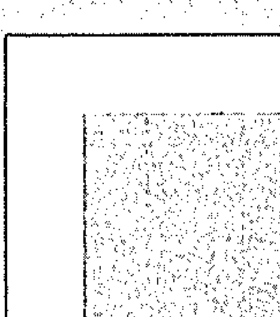

> 「我的課題是希望能成功演出廣播節目。沒想到3天後，某位大牌廣告導演真的通知我了。這樣的發展實在太有趣了！」

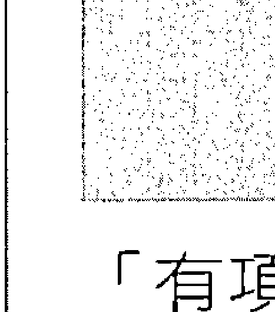

> 「有項全新領域的事業，在我不知情的情況下悄悄進行，但上星期卻突然收到希望我參加的指令，這真是太令人高興了！」

到了這時間點，許多人的心態已從半信半疑轉為感興趣了。

「說不定……」只要你心裡這麼想就夠了。

「說不定……」原本以為「要是哪天能實現就好了」的夢想，搞不好真的會如願以償。

當參加者開始抱持這個想法時，我繼續喊話，問他們這次要不要參加一個為期21天的實驗，完成一個更大的課題。

這次的課題達成程序有別於以往的手法。不是要探究導致問題發生的原因，也不是要分析從外部蒐集而來的資訊，而是要由誰跟誰小時候在課堂上比賽的過程中，想出如何解決工作上遇到的難題，興高采烈地採取行動，同時達成課題。

然而，「如此順心如意的現實生活，真的會發生在自己身上嗎？」不安的情緒縈繞在心頭。儘管如此，有一部分挑戰精神旺盛的人，還是參加了這個為期21天的實驗。

結果——「進展順利的現實」，就這樣揭開序幕了。

> > 當時我正好在架構一個課題，打算爭取一項大型企劃案。原本獲勝率只有一半，但萬萬沒想到我的方案早已得到對方青睞，現在已經進入簽約程序了！

> > 正當我在架構「將來要怎麼做才能夠自立」這個課題時，有人委託我演講與行銷規劃有關的親身經歷，讓我得到一個能夠放手一搏、確認能應用自己創意到什麼地步的絕佳機會。

> > 我架構了一個「改善朋友土木公司資金運用」的課題。其實我是這家公司的外聘董事，所以從財務、業務到人事等所有相關項目，都順便全部重新檢視，並大力推行新作法，沒想到竟一口氣改善了狀況，原本跌入谷底的資金運轉問題，也重現曙光。

> > 過去這5年來，一直想開辦，卻遲遲無法實現的「讓媽媽充滿活力又快樂的講座」，終於如願開課了。

> > 當時為了應徵公司的內部創業單位，我提出一個全新的事業計畫，沒想到在董事會上發表的內容，讓我正式受聘。半年後，我已經準備擔任社長一職了！

## 「如果達成，會讓人興高采烈的 3 週課題」挑戰結果

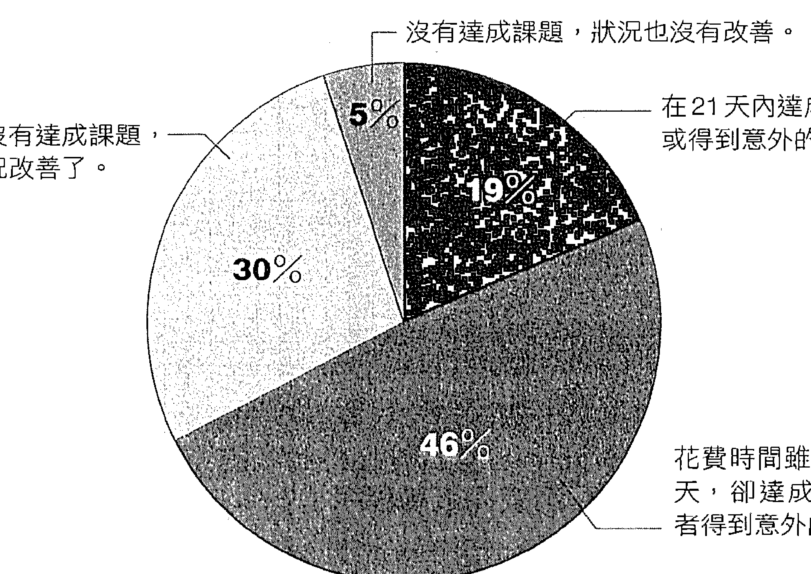

有 95%的實驗參加者已經開始過著順利的現實生活。

本書的目的是要與大家分享，那些參加者因為這 21 天的實驗，而讓夢想如願成真的方法。

一聽到「實現夢想的方法」，大家或許會不自覺聯想，日本人在七夕這天把心願寫在紙條上的習俗。不過，接下來請掌握在你手上的「未來藍圖」（編按：日文原文フューチャーマッピング，意指future mapping，作者表示已在日本登錄商標為漢字「未來地圖」，但為了更貼近臺灣讀者的閱讀經驗，本書將使用「未來藍圖」一詞，使該名詞更易於被理解。），達成這個課題會讓你的工作得到實際成果。不管是提升業績、開發新事業、架構人事制度的商務人士，還是想要在運動會上奪得勝利、計畫一趟愉快的遠足、決定暑假自由研究主題的小學生，都是一個能確切發展為實際成果的方法。

希望能夠看到結果，但光靠努力往往難以有所斬獲，因為不是非得學習新技能，就是經濟環境不允許，導致人們動不動就認為，除非彌補能力不足的地方，否則現實難以改變。

不過，未來藍圖並不會要求你爬向險峻山路，尋求不足之處；而是乘著海浪，快樂前進就好。只要發現自己早就擁有輕鬆完成課題的才能、金錢與人脈等資源，就能如魚得水，輕鬆展現成果。

這算是達成課題的一種模式轉移（Paradigm Shift）。除了藉由外部力量彌補自己欠缺的技巧外，讓過去從未察覺、一直埋沒的才能浮出檯面，也可以幫助自己達成課題。或許你會認為「若現實生活真能進展順遂，誰還需要努力付出？」而不禁沿用從前熟悉的方法。請先聽我說，這就是我想透過本書傳遞的理念。

過著理想的現實生活，根本就不需要努力。只要是人，不管是誰，光憑本身具有的故事力，就能輕鬆開創一個全新的現實生活。

雖然這個方法創造的是一個嶄新現實生活，不過方法論本身並不是最近才出現。這本來是我五年前在拙作《超神速全腦學習法》（商周出版）發表的方法，之後卻大幅進化，幾乎可視為另一種方法。

未來藍圖是為了展現成果而形成的，先讓我簡單談談其開發過程。基本上，過去這 15 年來，我以行銷大師的身分，負責不少販促企劃與意見調查。分析之後，我將暢銷與不暢銷的差異分門別類，把如何讓商品更暢銷的意見調查圖表化思考過程，並運用在提升自我企劃精密度的領域上。每當我把圖表交給客戶時，發現這些圖表就算離開我的手，還是會產生結果。不僅如此，我還發現當人們在會議中想提出意見時，這些圖表還能派上用場，進而引導出具體行動。

## 達成課題的「登山模式」與「乘浪模式」

沒有察覺自身擁有的才能，而想達成課題時……

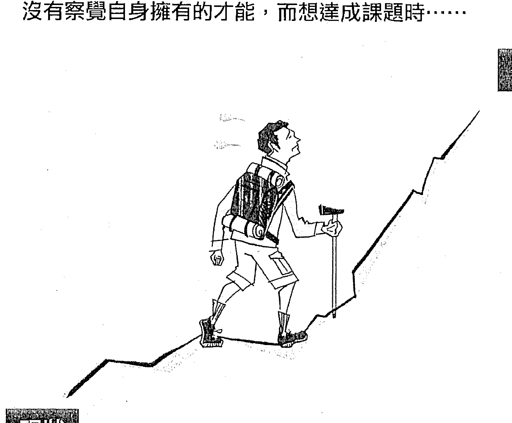

想要越過重重障礙，就必須多努力提升技能。

然而，一旦察覺到從未發現的自我才能時……

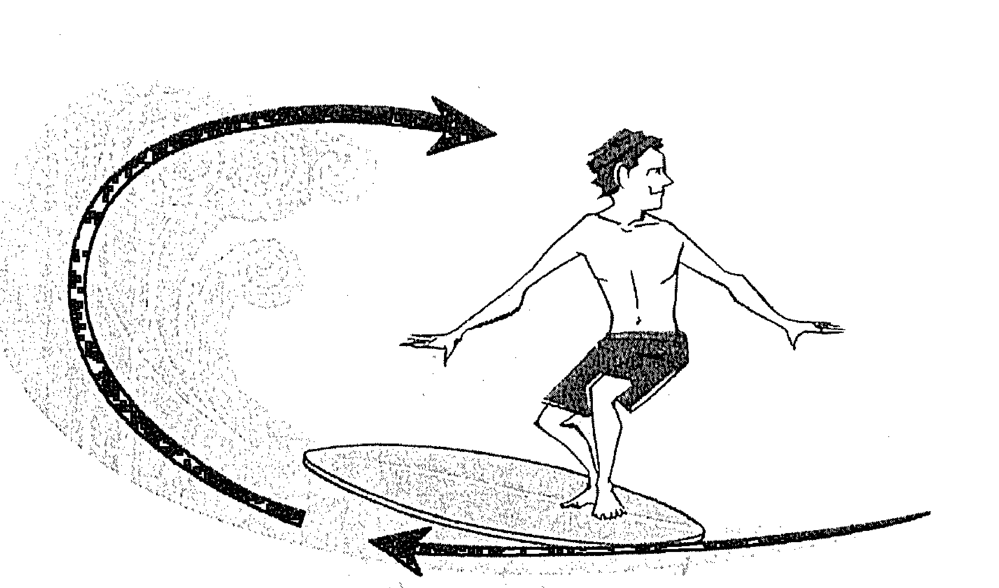

來自未來的海浪，會把你推向達成課題的境界。

## 怎樣透過故事實現夢想？

到目前為止，這與平常那些還算便利的商業工具沒有兩樣，但是未來藍圖的故事，現在才要開始。

使用這個方法進行績效指導與會議的情況，會愈來愈普遍，而其擁有的意外效果，也會日益顯著。舉例來說，未來藍圖是針對將來描寫一段假想故事的過程，不過有些報告卻提到，故事中描述的事竟發生在現實生活。我把這個偶然當作契機，闖進漲潮（flow）這個「讓人沉迷於工作」的狀態。就算一開始沒有假設未來，照樣能讓現實生活明顯達到更高境界。

平常不會刻意掀起的漲潮狀態，會因為未來藍圖而出現。曾經體驗過這種情況的我們，開始談論為何故事會讓人出現漲潮現象。為此，我們以置身在企業現場的經理級人士與顧問為對象，日以繼夜地不斷探究。

結果，我們發現了一件事。在未來藍圖裡，我們畫出了串聯未來與現在的波浪，增加相關想法，填補理想的未來與現狀之間的縫隙。常看商業書籍的人，一聽到這個說明或許會問，這和他們熟悉的「逆向思維」、「結果思維」等方法論不是一樣嗎？其實，未來藍圖還會加上這些思考法帶來的效果，繼續進入第二，甚至第三階段。

只要透過故事慢慢進入自己的內心深處，就能發現從未察覺到的個人才能與組織資源。當這些才能與資源，隨著為了達成課題而採取的行動浮出表面時，就會出現偶發事件。這份驚奇帶來的漲潮現象，會促使人自動自發地行動，讓夢想成真。

## 描繪在圖表上的假想故事會引起漲潮體驗

## 一邊引起共鳴，一邊擴大創造範圍

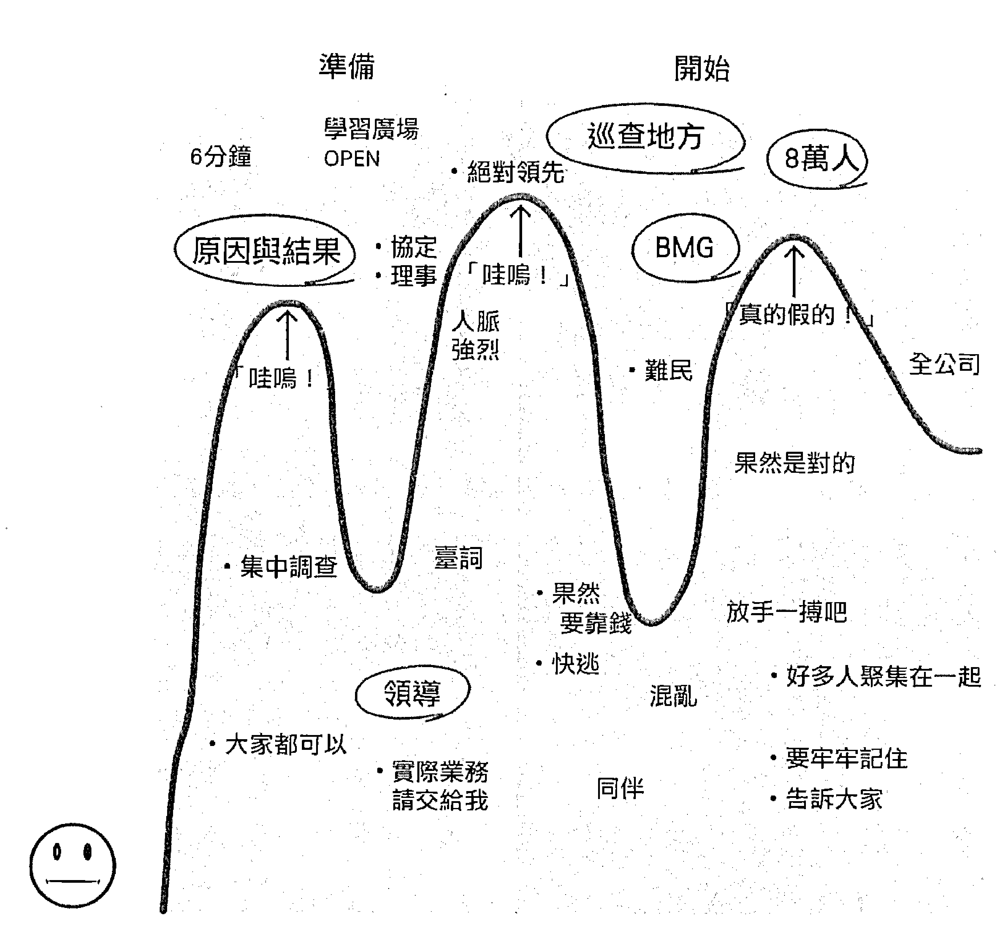

這是服務於某大通訊公司的課長所畫的圖表。在4月中旬，可以看到「人脈」、「強烈」、「理事」等字眼。之後，他被選為一般社團法人商業模式創新（Business Model Innovation）協會的理事，該協會聘請了多摩大學研究所的紐野登教授為銀髮顧問，同時還派任廣告製作人小山龍介為代表。許多人在透過未來藍圖推動行動計畫時，通常會讓這樣的偶然成為誘因，讓人體驗到漲潮現象。

## 逆向思維與未來藍圖的差異

### <逆向／結果思維>

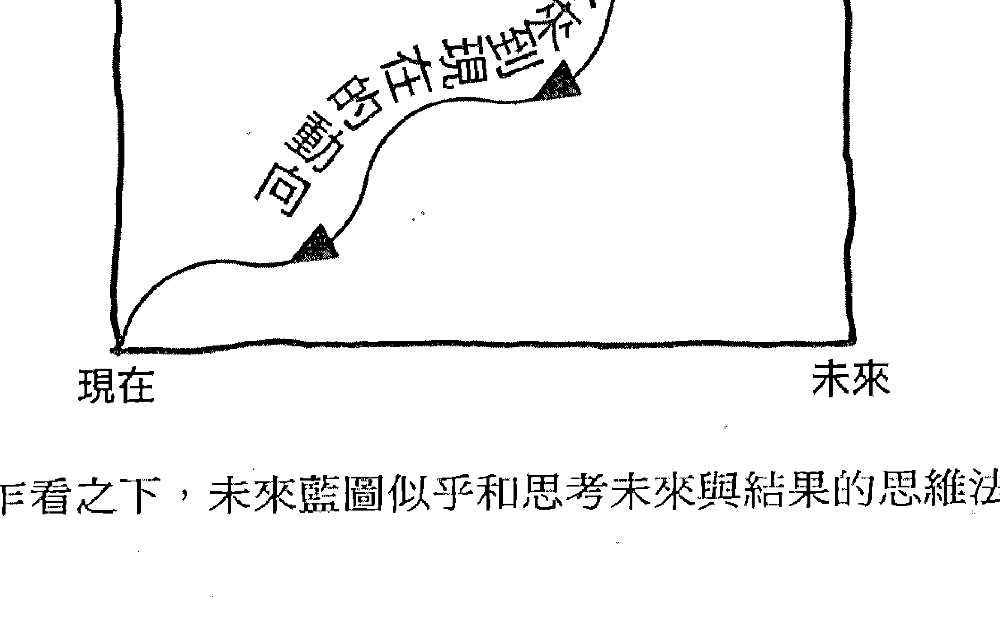

乍看之下，未來藍圖似乎和思考未來與結果的思維法類似……

### <未來藍圖>

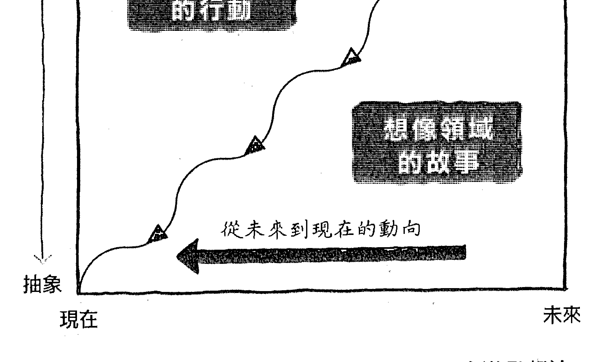

實際上，未來藍圖思考法不僅藉由追溯時間來激發想法，還運用故事促使人採取具體行動。的契機將會牽動漲潮狀態，讓人在專心進行眼前課題時，形成一個未來必然會實現的機械性結構。

## 一張圖表，挖掘你的隱性才能

未來藍圖之所以能開創超越想像的現實生活，最大理由在於它的基礎奠定在「故事」上。故事是人打從一出生就習慣的溝通方法，這裡頭隱藏著一種高深莫測的力量，能釋放人類的才能。

描繪看清自己才能與組織資源的未來藍圖，這過程幾乎與哈佛大學教育研究所的羅伯·凱根（Robert Kegan）教授，在其著作《變化的免疫力》（*Immunity to Change*）中解說的方法論「免疫藍圖」（按編：也就是指，即使很強烈的改變決心，都會被拒絕改變的決心抵消掉。）共通。

此外，一邊創作故事，一邊找出絕對解決方案的過程，也與麻省理工學院奧圖·夏默（Otto Scharmer）教授分類提倡的「U型理論」（編按：將深度變革的歷程以U型來比喻，其中包含七種能力，也分別代表七個階段。）展現未來的過程相同。

這些優秀學術研究的目的，都是為了培養在複雜環境下，能有效應付各種課題的領導者，而未來藍圖就是利用一張圖表來重現這段過程。一邊創造讓人樂於閱讀的故事，一邊引導出解決問題的行動劇本，不管是企業家還是學生，甚至是小孩，都能歸納出他們收穫的結果。

不只商業菁英，每個人都能藉由平日的生活，讓隱藏在內心深處的才能展現在陽光底下，這就是未來藍圖與其他商業工具最大的不同之處。我們這些未來藍圖描繪者更是深深感受到，這裡頭埋了一顆非常重要且超越純粹開發能力的種子。

儘管我在書中再三強調這個方法論的意義，但手上拿著這類實用書的人之中，會把這本書看完的，十個裡面應該不會超過一個。為了讓大家感受到實際效果，我希望讀者能挑幾項書中列出的練習課題做做看。我知道會跟著練習的人是少數，但是現在我想請求正在看這段話的你。

成為這少數人中的其中一人吧。

照理說，對你的人生而言，要不要跟著這本書的練習課題做，是一件非常重要的事。因為透過這個小練習達成小課題的你，會發現自己其實具備了一股創造未來的強大力量。

當你察覺到從未發現的才能，開始發揮出描繪自我未來的力量時，接下來和你同屬一個團體或組織的成員，同樣也能描繪出自己的未來。每個人察覺到的小地方與行動，將會成為一個大波浪，進而奠定一個根基更加穩定的社會。

只要踏出一小步，就能讓埋沒的才能展露出來。當你挖掘出自己真正的才能時，今後你的工作將會跟著進入漲潮狀態之中，而且還會進展得十分順利。

創造出理想未來的第一個過程，就從下一頁所寫的一個重要問題開始。這是一個前往所有變化入口的關鍵問題。

請你做好心理準備，回答這個問題。打開邁向未來的那扇門吧。

👉當你準備好開創一個嶄新的現實生活時，就翻到下一頁回答問題吧。

## 一個創造未來的重要問題

## 開頭

## 故事式思考的5個優點

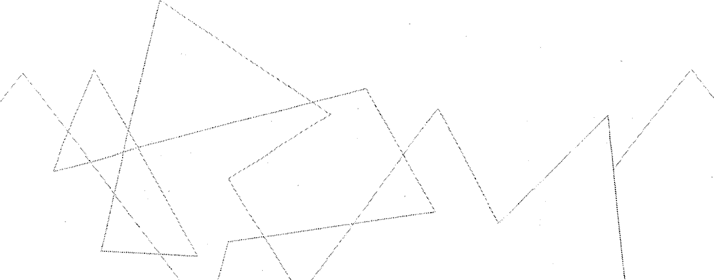

# 第 1 章

## 故事力是人生最好的驅動力

### 故事會帶來哪些力量？

首先，我要為手上拿著這本書的你熱烈鼓掌。為什麼？因為你是一個有遠見的優秀主人。

把這本書拿在手上的理由，應該是看到能透過故事創造未來的概念，認為故事擁有創造性的解決能力，能夠化解那些已利用分析手法，卻依舊糾結不清、停滯不進的問題，是吧？

倘若如此，我不得不說你的這個預想確實沒錯。只要藉由創造未來藍圖的方式學會故事式思考，你所擁有的創造性就會覺醒及進化。在這個創造性愈來愈有價值的嶄新時代，能讓你活躍的舞臺將會超乎想像地寬敞。

本書不是一本讓你吸收知識的書，而是一本讓你得到結果的書。想要得到結果，除了看這本書，還要跟著練習。「練習？好麻煩喔。」現在你心裡或許會這麼想，但是不必擔心。

這本書共有 7 個練習，這些練習就像是為了讓你達成心中目標而準備的階梯。每做一個練習，就像爬一階；愈往上爬一階，看到的風景就會愈遼闊。

做完這 7 個練習，爬完最後一階後，你就體驗完未來藍圖需要的所有技能了。體驗過後一定要練習 3 週，來完成自己的課題。因為 3 週後，你就會採用意想不到的方法來達成課題。

我敢大聲告訴你，未來藍圖這個利用故事的課題達成法，已經有不少不同年齡層、立場與職業的人在實踐，並展現出結果。從小學生到大學教授、飛特族、股票上市的企業老闆、音樂家，甚至運動員，過去 6 年來，實踐人數已經超過一萬人。今後只要實際嘗試書中傳授給你的訣竅，我相信你的人生一定會積極展開，而且不需怎麼費力，因為這正是故事帶來的力量。

把一場有趣的電影繼續看下去，並不需要什麼努力吧？因為電影上演的那一刻，思緒會自然而然地被吸引。回過神時，才赫然發現早已忘了時間，整個人陷入故事之中。

利用故事這個方法論描繪的未來藍圖，所發生的情況就和看一部有趣的電影一樣，這個部分留待後述。換言之，未來藍圖就是讓自己成為主角的故事舞臺。站在舞臺上扮演主角是一件非常快樂的事，所以在編寫故事時我們也會發現，自己不知從何時開始竟然忘了時間，陷入其中。

不僅如此，埋頭編寫故事時，未來藍圖還會帶來超越想像的結果。

如果以一句話形容我在過去 6 年間，因為實踐未來藍圖而得到的結果與發現的原則，那就是：你的現實生活會跟著你所描述的故事而運轉。故事就是有如此強大的力量。

放眼看這世界，我們需要的東西幾乎都是從想像未來的故事中所產生。

假設沒有人在心裡描繪「帶著電話走，不但可以看地圖與新聞，還可以買東西，甚至匯款到銀行。」現在恐怕就不會出現智慧型手機。如果沒有人像孟格菲兄弟（Joseph-Michel Montgolfier 和 Jacques-Étienne Montgolfier）那樣，幻想「在空中自由飛翔」的未來，絕不會出現在全世界四處飛翔的飛機。

倘若沒有「想要更順暢地交換或長期儲存商品，不想再透過物物交換。」「想要守護同伴，不再讓他們受到周圍侵略。」那些讓我們不曾懷疑、覺得形成地理所當然的金錢與國家，就不會出現。

故事是促進人類發明的最悠久、最高超的技術。

### 創造未來，就從說故事開始

回想過去，懷念的感覺油然而生。因為在數年前，故事與商業活動根本就扯不上關係。

故事頂多被歸類在電影、電視連續劇與舞臺等娛樂活動的領域，如果帶進商業活動這個規規矩矩的場所，就會讓人眉頭深鎖。但是近幾年，天線敏銳的商業人士，已經開始意識到說故事的重要性。

- 想要打造品牌，背後必須要有一個故事。
- 想要架構競爭策略，背後必須要有一個故事。
- 想要開發商品，背後必須要有一個故事。
- 想要讓公司業務推展得更透徹，背後必須要有一個故事。
- 想要發揮領導權，背後必須要有一個故事。

故事就是在這種情況下產生的。故事之所以突然受到重視，甚至快要掀起一陣風潮，就是因為時代驟變。想要在這場激烈的全球競賽下存活，就不能漠視故事的重要性。

在10至15年前，針對已生產商品進行市場分析與競爭分析，並從敵對企業手中奪下市佔率，早已是提升企業收益的公式。

當然，這個原則至今依舊存在，但近年來，發揮創造力也日顯重要。除了相互爭奪既有市場外，還要開創前所未有的市場，並且從零創造出一。

是什麼導致這些變化產生？沒錯，是網路。誠如你所感受的，網路已經成為地球上所有溝通管道的平臺。不管是亞洲、非洲還是中南美，中產階級增加了，而且在路上行走的每個人都隨手一支手機。曾經有人預測，在2014年全世界的手機普及率會超過100%※。不久之前，若要立刻與住在非洲薩凡納或亞馬遜叢林裡的人聯絡，只是天方夜譚，如今已經成為事實，出現在現實生活之中。

這場地球零距離的巨大變革，讓我們成為新的開拓者。雖然這塊新大陸荒蕪一片，但人們卻殷切期望能在這塊處女地上找到嶄新事物。

網路世界無國界，一旦手上擁有卓越技術或出色商品，就能一舉在全世界展開事業，所以有潛力的技術與商品就可以讓錢潮滾滾而來。

舉例來說，有家名為「Oculus VR」的3D圖像處理公司，於2014年3月底，以2000億日圓被Facebook收購。不過令人驚訝的並不是收購金額，而是這家公司的圖像處理技術尚未100%穩定，卻具有只要一個標準模式，就能產生數百億元的企業價值。

既然如此，我們要如何創造出下個世代的必須之物？這裡最重要的能力並不是分析能力，而是描寫讓人對未來感到雀躍期盼的故事能力。

大家想想看，不管是 Facebook、iPod，還是 Google 智慧型眼鏡，這些都不是分析之下的產物，而是因為「要是有這樣的東西就好了」的念頭才產生的。

例如，Facebook 是馬克·祖克柏（Mark Elliot Zuckerberg）為了「開創一個讓世界變得更加遼闊之地」而誕生的；iPod 是史帝夫·賈伯斯（Steve Jobs）從「要是在外面能帶著數千首曲子，想聽就聽那有多好呀！」這個理念而產生的。就連 Google 智慧型眼鏡，也是因為謝爾蓋·布林（Sergey Brin）為了「想打造一個不需特地檢索，就能讓正在找尋的資訊出現在眼前的環境。」這個理想而出現的。

與其藉由競爭原理來搶奪市場，讓企業繁榮興盛，不如讓年輕人創造一個令人殷殷期盼的未來故事，這才是最重要的關鍵。

### 會說故事的人，基本上已經在累積財富了

開始重視故事還基於另一個理由：一個公司若沒有扣人心弦的故事，無法聚集優秀人才。

並不特別需要描繪日本企業在戰後高度經濟成長的故事，因為在大企業工作，本身就是一件充滿魅力的故事。不僅能過著安定的生活，只要認真工作，負責的項目就會隨著年齡增長而愈顯重要，內容也會愈有趣。

然而，一旦經濟停止成長，就會過了這個故事的品嚐期限。

就算是大企業也會有經營不善的一天，哪一天突然被解雇也不無可能。在這種情況下，就算工作再久，非但薪水不會增加，也不敢奢望有退休金。

另一方面，創業在如今已變得非常簡單。我在演講時常說：「現在連國中生都可以創業。」並非只是比喻。其其實在2013年，報章媒體相繼報導，有不少日本中學生已經開始和專業經營者群眾募資（Crowdfunding）事業，並且以玩遊戲的方式在YouTube上實況轉播，營收金額更是令我們這些大人汗顏。

從前可以產生財富的資本，通常指的是用來栽種作物的土地與製造產品的工廠。也就是說，只有擁有金錢的「資本家」才能保有能創造財富的土地、工廠與公司，沒有這些東西的人，就會成為「勞動者」。

然而，現在能產生財富的既不是土地，也不是工廠，更不是公司。只要有智慧與創意，任誰都能創造財富。每個人所擁有的「腦筋」，就成了資本。如此一來，想要成為資本家或勞動者，就是個人的選擇了。

在這樣的時代下，企業若想留下優秀的勞動者，方法只有一個，那就是不斷描寫出讓人覺得「只要在這家公司工作，每天都會神采飛揚。」的新故事，例如顛覆世界、視野遼闊的工作。正因為是規模龐大的組織，才能藉由網路與技術累積，從事規模橫跨全球的工作。除非不斷提供充滿魅力的故事，否則人才不會一直跟著公司走下去。

沒有故事的公司，就像是沒有拿到劇本的演員。照理說，難以激勵人心，到最後只會量產出「我好想早點回家」、「我不太想和公司的人糾纏不清」的人。

說穿了，故事是「激勵人心的原動力」。只要創造出帶來新希望的故事，不但會讓組織與人員變得更活躍，就連消費也會跟著活絡。如此一來，不但提升企業業績，還能帶動國家經濟成長。我認為描述故事的能力，就決定了國力，這麼說並不為過。

現今整個社會為了創造出新的價值觀與型態，正在徵求新的故事。無奈的是，可以描繪一個出色故事的社會與個人並不多。絕大多數的商業人士自小學、國中以後，是不是就沒有再寫過故事了？更何況，學校要求學生寫故事時，大家學到的只不過是「起承轉合」的架構罷了。

也就是說，儘管有愈來愈多人體認到故事的重要性，但不管是學校還是社會，幾乎都不曾教大家該如何創作故事、如何利用故事等知識。正因如此，能寫出故事的公司與個人，其實已經開始聚集一筆龐大的財富了。

## 想提高營業額，就讓顧客當主角

直至今曰才熟知編寫故事的我，過去並沒有察覺到它的重要性。讀大學時我專攻計量經濟學，讀 MBA 時又專攻財務，別說編寫故事了，就連行銷幾乎也可說是隔行如隔山。

關於故事的重要性，我在實際工作的體驗中就已經察覺到。29 歲時，我成了外資家電品牌的日本代表，面臨著如果沒有把營業額拉起來，就會被解僱的嚴峻局面，因此，我開始參與行銷企劃。

當時的我發現一件有趣的事，那就是給顧客看的廣告文宣如果充滿故事性，營業額就會大幅提升。例如，在 DM 廣告裡加上「辛苦洗碗，同樣也是上班族媽媽的故事。」就會頓時提升顧客的好感度。

這樣的經驗讓我發現，若想透過商業活動得到結果，故事帶來的效果最好。但是那時的我卻認為，這只不過是為了提高營業額的可行技巧之一。

我明顯感受到故事的重要性是在 2007 年，當時我正在分析過去負責的所有行銷活動。在解析「什麼東西推得動，什麼東西推不動」時，我發現成功的企劃背後，一定會有一個故事 ( Story )。說的更明白一些，能不能寫出一個讓顧客成為主角的故事，是牽動營業額的重要因素。

放眼望去，現今的行銷活動，大多都是賣方拼命宣傳自家商品。例如，賣車子的人就會宣傳可節省的油資、馬力強勁的引擎以及美麗的造型。若問這時的主角是誰，不用說，當然是製造車子的經銷商。既然如此，就不易引起顧客共鳴，因為不管是誰，都希望自己是故事中的主角。

獲得好成果的行銷活動，都是以買方為主角來描繪故事，沒有例外。成為主角是為了藉由使用該商品或服務，來遇見全新的自己。在成為主角之前，必須先經過躊躇、失敗、鼓起勇氣突破自我界線等，這段克服心理糾葛的過程，才能跨步邁向新旅程。能獲得好成果的行銷活動，就十分重視這樣的過程，因為這可以進一步產生新的概念。這樣的故事對於業務與行銷所展現的成果，影響力非常大。或許有人認為「我又不是從事業務行銷相關工作，這與我何關？」但是事實絕非如此，因為今日的商業人士，每個人都在從事業務工作。

世界頂級演講者丹尼爾·品克（Daniel H. Pink）提到，就算不是販賣商品或服務，凡是與說服對方、希望對方動起來，例如委託客戶某項工作或是請同事幫忙處理一些小事，這些行為都算是廣義的業務（亦即「非銷售的銷售」〔 non-sales selling 〕）。

不仅如此，有份針對7000位美國全職工作者所做的調查指出，每個人在職場度過的日子，平均有40%的時間可以歸在「非銷售的銷售」這一項裡。若把請丈夫或妻子「幫忙做家事」、要孩子「整理房間」這些事也算進去，說不定自己的活動有8至9成也與業務有關。

正因為每個人都在從事業務活動，如果想有效執行業務，就和販售商品一樣，必須編一個對方想聆聽的故事。也就是說，架構故事的能力，就是維持生存的重要能力。

## 故事構成三部分：開頭、內容、結尾

到目前為止我們談到了故事，但是一聽到故事這兩個字，浮現在大家腦海裡的，未必是同樣的事。所以先讓我談談故事的定義吧。

只考慮自己的情況，把分散的思緒與事實串聯起來的東西，不能算是故事，因為故事有一個完整的形式。

最典型的故事形式，以神話學家喬瑟夫·坎伯（Joseph Campbell）所提倡的形式最廣為人知。分析全世界所有神話之後，坎伯從中找到了一個共同形式，那就是「離開日常世界到非日常世界旅行，在旅途中獲得寶物之後，又再回到日常世界。」藉由這種形式闡述的故事，都會讓人記憶深刻，並且廣為流傳。

這種藉由神話力量所描述的故事形式，也出現在不可勝數的好萊塢電影中。例如，《星際大戰》（Star Wars）、《欲望城市》（Sex and the City）、《24小時反恐任務》（24-Twenty Four-）、《上班女郎》（Working Girl）……，無論是愛情喜劇還是推理劇，甚至科幻劇，故事結構皆如出一轍。

然而，根據方才結構所編寫的故事，若要運用在工作上，似乎稍嫌專業。經過多方實踐得到的結果，可以歸納出故事的另一個定義。那就是監譯《作家之路：從英雄的旅程學習說一個好故事》（The Writer's Journey: Mythic Structure for Writers）（克里斯多夫·佛格勒〔Christopher Vogler〕，商周出版）日文版的故事顧問，岡田勳所下的定義。

岡田提及「故事有開頭、內容和結尾」。只要這三個部分的結構夠清晰，就能成為一篇故事。

> 故事有開頭、內容和結尾

雖然這是一個讓人聽了有點掃興的定義，但是既然要借助故事的力量來發展，簡單的定義反而比較妥當。

### 好莱坞剧本的结构图

感情的强烈程度

時間

- 认知 狭隘的過去
- 拒絕變化
- 與心靈相遇
- 測試：挑戰最初的變化
- 變化的第一步
- 準備踏進更大的變化
- 考驗：巨大的變化
- 努力：進步與後退
- 復活：再次挑戰變化
- 高潮：最後的變化
- 帶回寶物：最後的解決方案

- 第一部：启程·离别
- 第二部前半：考验
- 第二部后半：过关仪式
- 第三部：归来

- 开头
- 内容
- 结尾

> 註：作者參考《作家之路：從英雄的旅程學習說一個好故事》（克里斯多夫·佛格勒著，商周出版）編寫而成。

### 讓人感動的事物都有一個故事

|      | 開頭 | 內容 | 結尾 |
|------|------|------|------|
| ①發表 | 現狀的問題點 | 各種論點與解決對策 | 感受到充滿希望的未來與可能性 |
| ②料理 | 感受季節（主題）的前菜 | 表現季節（主題）的盛盤及烹調方法 | 想像（主題）甜點 |
| ③音樂 | 主旋律 | 副歌前段 | 副歌 |
| ④店面 | 提高期盼的入口 | 讓人想要展開新日常生活的提案 | 讓人想要再來的送別 |

故事有開頭、內容和結尾。除了音樂與料理，凡是有故事的事物，都會讓人印象深刻。

從這樣的定義可以看出，不管是什麼事物，讓人感動與喜悅的背後，一定有一個故事。

最淺顯易懂的例子就是音樂。開始的主歌、中間的副歌前段，以及尾聲的副歌，幾乎與開頭、內容和結尾」契合。讓人難以忘懷的音樂是由主歌、副歌前段與副歌串聯起來的，一個內容絕妙故事。

一道完美的套餐，其開頭、內容和結尾的架構會十分緊密，環環相扣。從前菜展開的味覺（開頭）之旅，會一邊在味道濃淡與口感上增添變化，一邊進入主菜（內容）。接近尾聲時，則以能讓人回憶最初上桌前菜主題的甜點或咖啡收尾（結尾）。正因為是有開頭、內容和結尾的故事，才會讓人感動。

聽說有些知名廚師每天都會到好幾家對打的餐廳用餐，但有趣的是，他們只吃前菜。吃太飽會影響到工作，固然是理由之一，但據說只要吃了前菜，就算沒吃之後上桌的料理，也能推測出是什麼味道。因為廚師已經掌握住對方想描繪的故事，所以平淡無奇的「開頭」，就足以讓人看穿對方的實力。

另一方面，沒有開頭、內容和結尾的料理，則無法打動人心。

例如，在連鎖餐廳點牛肉蓋飯，沒多久就端上桌了。吃這碗牛肉蓋飯時，填飽肚子的目的大於享受美食，所以在牛肉蓋飯端上桌之前，並不需要令人感動的故事。正因如此，這樣的地方成不了約會場所，而且最重要的還是價格競爭。

即使是熱門店家，照樣需要開頭、內容和結尾。例如，日本的折扣商店唐吉軻德（激安の殿堂ドン・キホーテ）就是一個故事空間。誠如所知，在一踏進店內的「開頭」，彷彿玩具箱般雜亂堆疊的入口，就讓人看了雀躍萬分，感覺「說不定會找到有趣的東西」。進入「內容」這個愈深入就愈豐富的空間裡，就能享受挖掘寶物的樂趣。到了「結尾」，整個人根本就是沉浸在結束探險的滿足感中。

除此之外，員工流動率低的公司也有開頭、內容和結尾。報到時，開頭會有迎新會，讓人感受進入這家公司的喜悅。進入內容時，不僅建立了良好的人際關係，也確切感受到自己正踏實成長，帶動了工作意願。到了結尾，終於出人頭地。在提供成長故事的公司裡上班，員工不僅態度積極，工作意願也能持久不減。

在這裡舉一個實例。以低價位提供套餐的烘焙餐廳 Saint Marc，在訓練剛報到的計時員工時，會在教育課程裡納入「故事性」。

開頭時，新進員工的工作是為客人續加麵包，因為在續加麵包時，客人都會對員工說聲謝謝，如此一來，員工就會愈做愈快樂。一旦感受到工作帶來的喜悅，就會進入內容。讓員工按部就班成長的培訓故事，早就已經設計好了。到了結尾，就會從續加麵包，進而學到操作收銀機，甚至是烤麵包等各種技能，一個人可以包辦數種不同的工作。

餐廳可以藉由充滿故事性的教育，想出提升每位員工生產力的方法。正因如此，才能提供一個讓客人以低價享受套餐的特別服務，產生擄獲人心的良性循環。

只要設計好開頭、內容和結尾扎實的故事，就能完善提供顧客充滿價值的商品。

因此，本書也是以這三個部分來架構。富有故事性的書，可以引導讀者邁向一個新的旅程。當這趟旅程畫下句點時，讀者的實力就會增強，並且再次回到現實生活之中。

接下來，就讓我們正式進入這本書的故事吧。

# 第 2 章 故事力帶給你的 5 大超能力

## 故事式思考的 5 個優點

不只是讀者，開頭、內容和結尾架構完整的故事，也會提供寫作者豐富多樣的優點。這些優點共有 5 項。

- 1. 能深深烙印在腦海裡
- 2. 能將危機化為轉機
- 3. 能凸顯出核心問題
- 4. 能創造暢銷名稱
- 5. 能整合不同才華

只要畫出未來藍圖，就能享受這 5 個優點。相關解說容後再述，接下來，先一一說明編寫故事的 5 個優點。

### 故事式思考的優點 ①

## 讓訊息易於理解、記憶、並產生共鳴

請大家看看這張表。

| 項目 |
| --- |
| 花栗鼠　　花園　　手提箱 |
| 太陽眼鏡　配送　　地圖 |
| 納斯卡線 |
| 穆罕默德·阿里 |
| 黑　山洞　　　　牛奶 |

若要你在 30 秒內背下這些字，你記得住嗎？

理解力強的你，應該發現了吧？
「我知道了，神田先生。你是不是想說，把這張表格裡的字編成一個故事，這樣比較容易記住，對不對？」

沒錯，正是如此。如果改成下面這個方式，會更好記。

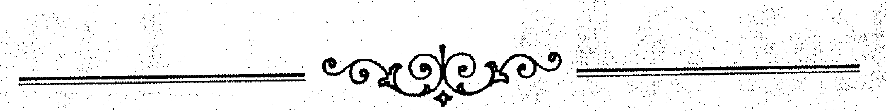

距離納斯卡線不遠處的某個祕魯城鎮，有個送牛奶的少年名叫艾迪。每日生活都一成不變的他，有一天送牛奶時，發現了一個貌似穆罕默德·阿里的男士倒在路邊。這位男士在斷氣前交給艾迪一張地圖，要他「到地圖上指示的地方，將藏在那裡的東西處理掉。」艾迪把夥伴花栗鼠放在肩上，前往埋藏東西的山洞裡。洞穴裡有一個廣闊的花園，艾迪找到了一手提箱，正當他想要趁早離去時，一回神已經被一群戴著黑色太陽眼鏡，身穿西裝的人層層包圍了。

改成故事之後，確實比較容易記住這些字，但是這麼做對你究竟有什麼好處？

或許平時的你不太會思考「記憶的效果」，但是從在工作上展現結果這個觀點來看，「是否能讓顧客留下記憶」就顯得非常重要了。

在當今這個時代，就算過著一般生活，我們每天都還是會接觸到將近 3000 件廣告訊息。看手機或電腦時，每個角落都充斥著廣告。就算是看電視，也會看到各種廣告，甚至是節目本身的宣傳廣告。在公司，同樣會遇見拚命對自己宣傳的各種人物。

在這個資訊氾濫的時代，想讓對方牢記自己所傳遞的訊息，實屬不易。

要將訊息以易於理解、記住並引起共鳴的方式傳遞出去的技術，就是故事。接下來，我們看看這張表。

> Yeah         where r
u want coffee?    LOL
Send me pics     where u at
let me know      no way!!
call me

現在，你的腦海裡浮現什麼樣的故事？

其實，這是出現在美國 AT&T 製作的影片《The Last Text Documentary》的關鍵字，傳遞「因為一邊開車一邊打簡訊而車禍死亡的人，最後傳送的訊息。」播完這些訊息之後，與亡者傳訊息的人出場，描述當時的情況。

他當時與剛上大學的姊姊在傳訊息。姊姊正在開車時，兩人簡單打了招呼「How are you ？」「I'm fine」「Yeah, I am good」，過沒多久，姊姊就發生意外了。話說到此，對方已淚流滿面。儘管旁人告訴他：「這不是你的錯。」已經泣不成聲的他，內心卻懊悔不已，「如果姊姊現在在場的話，我想對她說聲抱歉。」諸如此類的場景，接二連三地出現。

這部影片帶給人們相當大的衝擊，而且還榮獲直效行銷（direct marketing）「國際ECHO獎（年度直效營銷奧斯卡獎）中的最高獎項「DIAMOND award」。許多美國人透過社群網站分享這部影片，甚至還引起一場社會運動。

這個運動還牽動了政治。歐巴馬政權全面禁止在駕駛中收發簡訊（text and drive，玩命低頭）。這部影片播放不過一年，就徹底改變這個遍佈全美的習慣，每年拯救了數萬條性命，這是無庸置疑的事。

倘若這部影片不是採用故事的形式，而是以傳遞訊息的方式和大家說：「不要一邊開車，一邊講電話。」會產生多少效果？另外，同樣的效果如果藉由廣告在全美宣傳，又要付出多高的費用？

若將其架構成故事，並且以影片的形式來呈現，並不需要支出什麼廣告費用，就能引起社會改革。

一個出色的故事可以促進理解、留下記憶、贏得共鳴，進而發起運動。其所帶來的影響力，更是超越你我的想像。

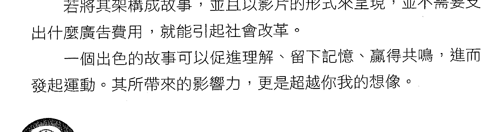

什麼是遲遲無法在工作上展現好成果的最大因素？我認為答案是「直線」。

突然冒出這個答案，應該會讓人摸不著頭緒，就讓我用圖表來說明吧。

今日，假設你的公司正要實行一項企劃。如果要以圖來表達這項計畫的進度時，你會畫出什麼樣的圖表？

許多人都會不小心訂出如下的圖表計畫。

# 在企劃案實現之前——直線是不夠貼近現實的假設

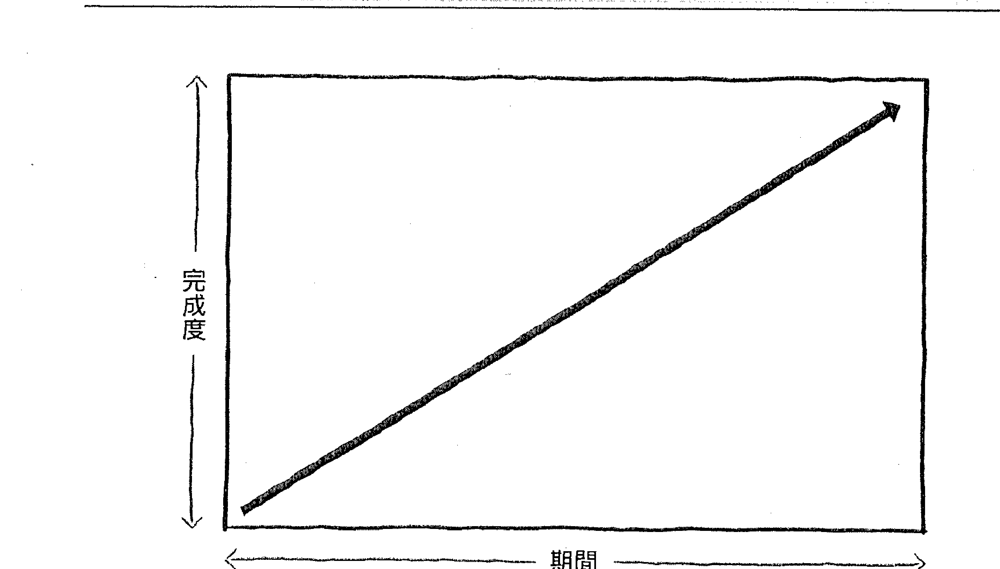

這就是認為事情會朝直線發展的印象圖。也就是說，在推動事情時，是以不會發生問題，能順利實現為前提。若要認真思考，頂多是煩惱休假要排到什麼程度罷了。

這是一個脫離現實的假設。並不是說所有的直線計畫都不好，倘若是機械式作業為主的工程，例如把零件放在輸送帶上組裝產品，就能達成目標的話，這樣的直線是可以成立的。

但是，機械式作業在現今這個時代，難以產生極大的價值。具有價值性的，是具挑逗性的設計、意料之外的需求、異次元的解決方案和革命性的系統。也就是說，一份具創造性、可以引導出無人知曉的答案的工作，讓世界充滿了價值。

創造性並不是規規矩矩動手做就能產生，是在某個機緣下「靈機一閃」而出現的。

那麼，讓腦子靈機一閃的必要條件是什麼？那就是「糾葛」。在開發新產品的企劃案時，好點子奔湧而出，但是過程中無人反對、人人贊同，而後又暢銷熱賣的情況，是不可能發生的。因為在創造熱賣商品的過程中，一定困難重重：不是和意見相反的人起衝突，就是被上層主管或其他部門的人阻撓，甚至因為競爭對手搶先推出類似商品，而不得不轉換走向……。然而，在企劃案被迫中止的前一刻，又會突然峰迴路轉，出現轉機，彷彿連續劇般的劇情，層出不窮。

像是義大利賓尼法利納（Pininfarina）公司的前設計師奧山清行，在法拉利 55 週年慶時推出的紀念車「ENZO Ferrari」，就是一個實例。奧山花了 2 年的時間，不斷修改這輛頂著法拉利公司威信的汽車造型。無奈的是，這款車的造型並沒有得到法拉利會長的青睞，使得這項企劃案宣告中止，陷於窮途末路、一籌莫展的困境。但是在會長搭上直升機離去的前 15 分鐘，奧山把握最後一個機會，使出渾身解數，又再畫出一份設計圖，終於成功地讓會長說出「OK」二字。

優秀出色的創作（creative）為何要糾葛？因為它能給人們一個拋下鑽牛角尖與陳舊認知的契機。少了糾葛，很容易會不斷重複那些衍生自過去的成功體驗、習已為常的工作。然而，時代不斷地改變，市場也是。想要在這個新時代創造世人謀求的新價值，就要不停地破壞停留在腦海裡的陳舊認知。因此，糾葛是一個非常有效率的過程。

由此可知，就算因意見不合而導致激烈對立的局面，也不要想著「不能原諒那傢伙」、「我不想在這家公司上班了」，而要心存「這樣的衝擊才能產生出色創意作品」的想法才行。

> 「創新來自衝突與糾葛」、「管理負責設計造型的部屬時，我都不斷地製造衝突。」

# 未來是動態，得用曲線來表示

可是問題來了。若是不停糾葛，花費的時間會比當初預定還多出好幾倍。當然，此時就必須根據情況來訂立計畫。話雖如此，謀求創造性的企劃案，絕大多數依舊呈直線狀態，只要在規定期限內完成指定工作，就能產生預期的成果。這就像是標上日期的「靜態畫」，只擷取達成目標這個理想的那一瞬間。

這幅畫的圖像愈鮮明，在會議上就會贏得愈高的評價。無奈的是，在現實生活中意外卻是接踵而來。

儘管目標是要達到高層次的創造性，但人們都以為只要嚴守日程表，重複執行過去的工作就已經足夠。這樣的工作做到最後，會讓人愈來愈不想面對，甚至敷衍了事，結果導致客戶要求重頭再來。

不僅如此，當初預定的計畫也會因為脫離現實太遠，而使得企劃案本身挫折連連，停滯不前。不管是為了拉起企劃案的進度，還是尋找原因，到最後都會演變成追究「誰要負責任」的局面，有時甚至還會出現讓整個團隊都無法修復的裂痕。

既然如此，我們究竟要提出什麼樣的計畫，才能激發出創造性？

說到這裡，你應該已經看出結論了。就是把整個企劃案想成是一條「曲線」，而不是「直線」，這樣就好了。

如前所述，若要將企劃完成以前的過程圖表化，就會變成如下這張圖。

# 在企劃案實現之前——用曲線描繪出貼近現實的過程

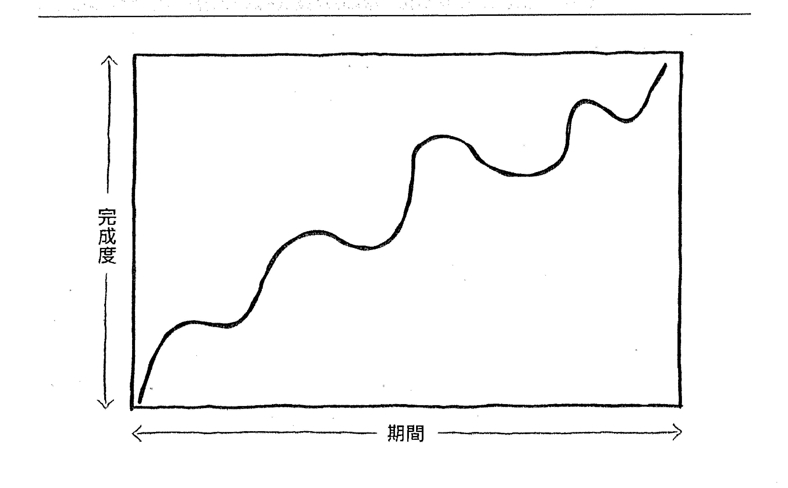

我把達成目標的過程，畫成高低起伏的曲線。剛才畫的那張直線式計劃表，是標上日期的靜態畫，但只要畫成像這樣的曲線，計劃的執行過程就會從靜態畫變成動態畫。曲線朝下時，這個地方「可能是大家的意見相互對立」、「可能有人不做了」；相反地，曲線朝上時，「說不定從客戶那裡得到有利的情報」、「這邊要是把合約帶來就好了」，可以窺探出靜態畫無法呈現、內容生動活潑的故事。

曲線就是把現實生活的滄桑變化編入計劃裡，可能遇到的困難都已經在料想之中，所以就算遇到阻礙，也不會打擊信心。即使跌到谷底，依舊能保持冷靜，遙望山頂。曲線就像是緩緩生長的竹子，讓團隊的每個成員感受到，在計劃實現前絕不妥協放棄的強大力量。

# 我靠動態圖表，讓比賽逆轉勝

只要畫出曲線，就會提升實現計畫的能力——這點看似平淡無奇，卻非常有效。讓我們舉一個實際的例子。

那是某高中手球社團的故事。

這個社團每年都會參加全縣比賽，但是往往在初賽時就被刷下來，頂多打到第2場。但是，當他們改用編寫故事的方式來擬定比賽策略時，實力竟然大增，成功打入全縣比賽的第3名。

遇到強勁對手時，球員與顧問老師共同編寫了一個獨特有趣的故事。他們把其中一個觀眾當作主角，編了一個皆大歡喜的故事結局。要讓觀眾開心，只要進行一場讓那個人覺得「這場比賽實在太有趣了」的球賽就好了。「既然如此，那要怎麼進行比賽呢？」每一個團員都要一邊畫出比賽從開始到結束的曲線，一邊思考。

到了比賽當天，當然不能因為對手實力堅強，就讓對方拉開差距，呈直線獲勝。第1局姑且讓對方領先連續拿下好幾分。

這種情況如果發生在過去，大家一定會退卻三步，腦子裡只想著「對方果然實力堅強！」「怎麼可能會贏？」不過，這回可不一樣。

眾人冷靜從容地說：「老師，這樣的展開跟故事一樣呢！」因為賽前編寫的故事提到，「縱使開頭讓對方領先，球員們依舊要高聲吶喊，全程集中精神，慢慢縮短差距。只要對方有失誤，最後一定能扭轉局勢。」

所以就算得分，他們也不會大聲歡呼喝采，反而營造出理所當然、綽綽有餘的氣氛。

遇到這種情況，實力堅強的敵隊會怎麼想？

沒想到，原本弱不禁風的敵隊竟然變得如此難纏，看到此一狀況的球員與教練也會開始動搖：「怎麼會這樣……」沒多久，就會傳來教練的怒罵聲：「你們到底在幹嘛！」使得球員的士氣漸漸低落，委靡不振，就連教練在作戰時間所指示的話，也一句都聽不進去。

結果這支原本實力薄弱的球隊，就這樣成功扭轉局勢，贏得勝利。

根據這種情況描繪曲線時，自然而然會出現高低起伏的圖案，在腦海裡浮現故事。只要瀏覽整個故事就會發現，球員在並不是一個指令，一個動作的棋子，每個人都和教練一樣，站在球場上觀察整個球場。也就是說，他們並不是一直線地衝向假想為靜止畫的目標，而是把到達目標的這段過程模擬成動態畫。縱使逆境來襲，每個人依舊具備把危機化為轉機的觀點。態度雖然溫和，卻能培養出強韌有力、不斷向充滿理想的現實挑戰的能力。

## 故事式思考的優點 ③ 突顯核心問題

當社會上發生問題時，人們都認為探究原因就是最聰明的方法。照理說，只要追究原因並妥善對應，就能解決問題；但在現實生活中，同樣的問題卻總是以不同面貌不斷出現。

為何會如此？以下這句話已明確告訴我們答案。

> > 愛因斯坦曾說：「當今世界的種種困難，並不能被創造它們之人的思維層次所解決。」(The problems that exist in the world today cannot be solved by the level of thinking that created them.)

也就是說，眼前的問題是自己造成的，除非改變自己的想法，否則同樣的問題還是會再次出現。所以，我們必須徹底改變「想法」才行。可是在一成不變、不斷重複的日常生活中，想要改變思考習慣，談何容易。

接下來要告訴大家的這個寓言故事，就說明了一切。

這是一個有關地獄與天堂的故事。

據說，地獄會在飢腸轆轆的民眾面前放一個大碗，裡頭盛滿豐盛的飯菜。但是，規定要用長達一公尺的筷子來吃這碗飯，所以不管裡頭的菜色多豐富，都夾不到也夾不起來。就算「提升技巧」，加強筷子的拿法，還是無法好好地放入嘴裡，所以這個地方充滿怒氣，相互奪取對方物品的情形更是家常便飯。

天堂也一樣，規定要用長達一公尺的筷子來吃飯。但是，住在這裡的人各個都因為飽足而滿心欣喜。因為他們用自己的筷子，餵食對方豐盛的飯菜，也就是採用分工合作的方式來「幫助」對方。

誠如這個寓言故事所說，問題發生時，如果只看自己眼前的部分，同樣的問題還會一直重複。問題在於筷子無法夾起眼前的飯菜，而且肚子愈餓，視線就會愈狹隘，導致結果愈來愈嚴重，讓現實生活陷入相互爭奪，不停吵鬧的局面，宛如地獄。

其實最重要的，是要看穿造成問題發生的「觀念」，並從中跳脫。如此一來，根本不需要提升什麼技巧，就能以原本的自我想法前往天堂。只是，要在我們早已習慣的思考模式中領悟出錯誤，這種能力已深埋在生活方式中，並不容易察覺。要怎麼做，才能脫離這個讓人深陷其中的迷宮？

故事是一個強大的技術。只要借用故事的力量，不管是誰，都能讓真正的問題浮出檯面。

因為訴說故事，可以讓視線狹隘的自我脫離眼前的問題，就像導演看著在舞臺上表演的演員一樣，能以更客觀的立場來看清問題。

我們再舉一個具體的商業案例。某位擁有三家分店的壽司店老闆找我諮詢。

> > 「我把第一家分店交給弟子，沒想到生意變差了。我想要調整一下菜色與價格，把營業額拉起來。」

老闆說的沒錯，從菜色與價格著手的確是一個方法。不過我提出了另一個建議，就是請他寫一個讓接管店面的弟子幸福的故事，而且是一個弟子因為負責的分店獲得豐厚的利潤，而笑容滿面、對老闆感激不盡的故事。

故事寫好之後，老闆突然想起了一件事。從前的他，也曾經受託掌管店面，那時他從師傅身上學到了一件事。

> > 「當我還是壽司職人時，店裡的生意很差。更糟的是，我不善於與客人聊天，所以店裡根本沒有所謂的常客。不過，師傅並沒有因此而責備我，反而跟我說：『和客人要這樣聊天……』教我怎麼跟客人溝通。自此之後，我也開始有了自己的常客，並且走到今日這個地步。」

想起這件事時，老闆似乎發現了問題癥結。

現在該做的，並不是插手管菜色與價格，而是和自己的師傅一樣，就算沒有站在弟子面前，也要相信他。問題的癥結在於，自己是否能從隊員兼管理員（playing manager）的角色，變成引導部下發揮能力的領導者。

### 故事式思考的優點④

# 創造出暢銷名稱

> 「有沒有更好的名字？」

> 「能不能想出一個看起來會大賣的標題？」

你應該曾被主管或客戶隨口這麼問吧？但是，坦白說這應該就像是人家要你「給我十億日圓好不好？」同樣的意思。

就算是幾乎一模一樣的商品，有時只要改個名字，就能在瞬間出現以億為單位的收益。

例如，伊藤園的「罐裝煎茶」。在使用這個名稱時，能念出「煎茶」這個漢字的日本人寥寥無幾，因此推出後的這4年，銷售低迷。但是，自從改名為「喂～綠茶」（お～いお茶）之後，營業額竟然攀升至40億日圓，高達6倍。

另一個是 Renown 的男性襪「新鮮生活」（Fresh Life）。這原本是使用抗菌防臭材質、具前瞻性的高機能商品，但推出之後，6年來的銷售量日益減少。可是當商品名稱改成「通勤快足」後，銷售量竟一口氣提升了10倍。

2014 年 1 月，微軟宣布將家用遊戲機「X box」改名為「Titanfall」，目的就是為了一舉提高銷售量。「神兵泰坦」（Titanfall）是風行全球的遊戲，而且不少玩家都會順便購買 X box 當作專用遊戲機，這項分析讓微軟決定大膽採取這個戰略。

像這類商品與服務研發，不管投注多少技術與金錢，推出的東西會無人察覺、埋入谷底，還是會讓你的公司長期繁榮興盛，全靠取的名字是否夠出色響亮。

尤其在網路時代，當人們在網路上搜尋時，只要名稱夠出色，「指名搜尋」就會壓倒性地多。所謂指名搜尋，指的是直接以商品名、企業名或團體名等專有名詞來搜尋；相反地，以比較多項商品為目的來搜尋類別名稱的，我稱之為「比較搜尋」。

這兩者的差異直接關係到今日的銷售量。如果是比較搜尋，「隨便哪一家公司都好，我只想買便宜一點的。」這樣就永遠無法脫離通貨緊縮。另一方面，如果是指名搜尋，「一定要跟那一家公司買。」就能確保豐富的利潤。至於你是被指名還是比較，端視於別人是否能記住你的名字。也就是說，這是一個光靠命名就能產生龐大財富的時代。

### 如何取出最棒的標題？

設計名字這份工作，只要交給專家，對方就會經過重重分析，從數百甚至數千個後補名單中提出建議。但是根據我的觀察，有些令人驚訝地不禁大喊「原來還有這招？」的名字，大多只能以「從天上掉下來」這句話來說明命名的過程。名字決定之後，原有意見分歧的眾人，如今反倒齊口同聲，讓工作得以一口氣向前推進。如果能讓這些從天上掉下來的過程重現某個程度的準確，就能不斷為你的客戶與公司提供龐大的財富。

要怎麼做出出色的名稱才會掉到你手上？關鍵就在故事裡。先透過以下故事為大家簡單說明。

1939 年，德軍進攻波蘭南部的城市克拉科夫（Krakow）。當時，德國企業家辛德勒（Oskar Schindler）來到此處，打算大撈一筆。他成為軍隊的幹部，投入軍用琺瑯容器的事業。在低價雇用猶太人之後，辛德勒的事業極速發展，並且開始過著富裕奢華的生活。

然而到了 1943 年，眼裡只把猶太人當作勞工的辛德勒，心境開始產生變化。勞工們居住的隔離區（Ghetto）被拆毀、封鎖的當天，辛德勒目睹猶太人慘遭虐殺的那一幕。不想再看到這宛如煉獄光景的他，以提升生產效率為名，雇用了大量猶太人，並且還蓋了一間私人收容所。

到了 1944 年，德軍在戰場上節節敗退，此時的辛德勒企圖阻止德军把犹太人送到奥斯威辛 (Auschwitz) 集中营。为此，他列了一份名单，举凡劳工与其家人、朋友，只要是有专业能力的金属工人或具有必需劳动力者，通通都列名于此。因为这份名单，获救的犹太人多达一千两百人。

如果要为这个故事取标题，你觉得什么名字比较适合？

没错，如同你所想，最适合的标题就是《辛德勒的名单》(Schindler's List)。

这是第 66 届奥斯卡金像奖独占「最佳电影奖」等 7 个奖项，在电影史上留名的佳作。

这个片名让人过目不忘，简单传递出内容。更重要的是，当人们听到这个标题时，脑海里就会浮现演员的表情、台词、音乐，甚至里头的场景。

电影的标题凝缩了故事内容，出色的标题则可以带来下列 5 个效果。

- ① 听过一次就不会忘记。
- ② 简单传递复杂概念。
- ③ 可以站在不同的观点眺望。
- ④ 自己也想参与。
- ⑤ 想与旁人分享。

## 出色名字（标题）所带来的5个效果

凝缩故事的就是出色的名字（标题）。所以，只要听到出色名字（标题），故事就会在脑海里展开。

思考电影的名字时，不用说，当然是以故事为前提。面对明明没有故事，却问大家「有没有什么好名字」的导演，我想应该没人相信他能拍出一部热门电影吧。

相同道理也可以运用在为商品命名这件事上。可想而知，出色的商品名称，是因为有故事才会出现。

让我们再回头看看刚才提到的，与提高营业额有直接关联的命名案例。你应当已经察觉到，只要听到商品名，故事内容就会立刻出现在脑海里。 只要听到「通勤快干袜」这个商品名，你的脑海会浮现什么样的故事？如果是我，会开始想到这样的情节。

炎炎夏日，电车就跟沙丁鱼罐头一样，挤满了身着西装，一边挥汗一边通勤的上班族。脚在皮鞋里闷了一天，看来回家后应该会飘出一股浓烈的脚臭味。过去老是被女儿嫌弃：「爸爸的衣服不要跟我的衣服混在一起洗！」但是自从穿上这双袜子之后，脚竟然不会闷热，也不会散发臭味。双脚可以清爽地回到家，打开家门后高喊「我回来了」时，声音更是格外响亮。

那么「喂～绿茶」这个商品名呢？出现在脑子里的故事是……

想喝茶，可是罐装茶都是大量生产的，不管是滋味还是香气，都和用爱冲泡出来的茶完全不一样。从前只要一喊「喂～茶」，太太就会把刚泡好的茶端过来。不过，这茶虽然是罐装的，却散发出上等茶的新鲜茶香。再加上是细心冲泡的茶，更能让人感受爱情的存在！好了，该回去工作了，再加把劲吧。

名字够好，就能让人自然地幻想出一个故事。只要比较刚才所提商品改名前后的差异，我想你应当就能了解。

如果是改名前的「新生活」，听到这个商品名时，脑子里反而不会浮现和刚才一样栩栩如生的故事。企业将「抗菌除臭」这个想大力宣传的功能当作商品名，让人印象太过深刻，才会无法展开顾客「若是使用这个商品会有多快乐」的故事。
「喂～绿茶」的情况也一样，如果是改名前的「罐装煎茶」，只能表现出单纯把泡好的茶装入罐子里的画面，无法引发人们联想有关日常生活的故事，也不容易让顾客对那件商品产生共鸣。既然是因为口渴而不得不买来喝的饮料，何必记住商品名称，更别提对他人宣传了。
我认为只要比较改名前后的商品名称就会发现，听了商品名后能不能展开故事，是一个极大的关键。

这么说或许理所当然：少了故事情节的电影，就不会出现能传递电影剧情的名字；少了故事的商品，就不会出现让商品畅销的名字；少了故事的公司，就不会出现让公司散发魅力的名字。
简而言之，只要商品充满故事性，适当的名字就会从天而降。

## 命名时怎样结合想象力和理念？

接下来，我们聊一聊因为充满故事性，所以命名时灵机一动就取好的例子：「特定非营利活动法人 KNOWS」。
「KNOWS」是以日本各地的小学到大学老师为中心，而成立的 NPO（非营利组织），除了研究与实践今后这个知识社会需要的崭新学习方法，也积极向孩子推广从事这些方法的活动。
一听到 KNOWS 这个名字，你会想到什么？这个字应该会让你联想到「知识」吧？你只答对了一半。其实，这里面还有 NOSE =「鼻子」的意思。这个字是该活动非常重要的原动力。

命名起因出现在组织成立之前举行的发表会上。当众人正在讨论要如何为这个想要永续经营的研究活动取名时，与会者突然发现了一件事。

某日，其他老师碰巧发表了两个与鼻子有关的上课案例。其中一堂谈的是童谣《大象》，另一堂谈的是芥川龙之介的《鼻》。当然，关于鼻子的故事只是碰巧重叠，不值得特地提出来。但是，当大家在深谈碰巧重叠的含意时，与会者的情绪突然高涨，因为这两个小插曲，象征了与会者一致的想法。

童谣《大象》中有一句唱到「妈妈说鼻子长才是漂亮」，这代表「母亲对孩子的爱」。而芥川的《鼻》，可以解读出「自卑感其实是一种充满魅力的个性」这个讯息。现场的教师都紧紧地怀抱着，在实践新的教育方式时，要注重「爱」与「个性」的这个想法。

因为融入「今后的社会不仅要理解被赋予的知識，自己创造知识也非常重要。」的教育观，所以才会有人脱口冒出KNOWS这个名字。

名字背后有了这样的故事，于是每次只要提到它——就像听到片名会想起电影情节般——让人回想起初创期的那段时光。名字诞生的那一瞬间，兴奋的心情深深烙印在心，当初参加会议的成员，岂会忘记组织创立的理念呢？尽管这个理念非常抽象，依旧可以利用「鼻」这个比喻，以浅显易懂的方式来说明。如此一来，就能将口述逻辑无法传递的各种印象，例如「要以这个方向为目标」等理念，积极地让身旁的人一同参与。

有故事的名字，会充满人们为此创名的理念。每当人们说出这个名字时，理念就会愈显强烈，进而催促人们行动，创造现实。

所以，以故事为基本概念而创名，是一个阐述未来、创造传说的作业。

## 故事式思考优点⑤
### 整合不同的才华

假使有人要你用一句话形容职业，你会怎么回答？

如果是以前，只要提到职业，都可以简单地表达，例如医师、公务员、律师、工程师、银行员等。但是现在的职称却出现了资料分析专员、策展人、保安部经理、精算师、系统整合工程师……。在网路成为社会基础建设的今日，每个人负责的工作都急速细分且专业化，不仅如此还高度抽象化。

在新工作接二连三出现，又不断消失的情况下，商业人士在思考自己的职业生涯时，或许会不知所措、忐忑不安，不知道该从事什么职业才好。但是，对于那些无畏变化的人而言，这是一个带来极大希望的社会。

仔细想想，「身旁都是专家」这句话，就代表任何人都有机会成为各领域里头脑聪明的人。才华如此洋溢的专家，如果能朝同一个目的相互刺激、合作，就能创造出从未料想过的崭新价值，进而加速兴起支持下一代的新事业。

就连我的客户，也自然而然地展开新事业。例如不动产公司与医疗机器公司，携手为高龄社会打造一个宜居城市，或者医疗专业规划者与住宅公司共同合作，提供设计及推行医疗诊所的技术知识。这不禁让人怀抱希望，在各个领域之间的墙壁一一崩毁之时，也会产生适合下一个世代的产业。

然而，问题在于缺乏将异领域能人志士串联起来的共同语言。过去只要是同一家公司的人，就不会缺乏共同话题，不管是棒球比赛的结果，还是连续剧的剧情，只要是日本人，都能轻易攀谈几句；反观今日，每个人都只专注在手机萤幕上。为了让跨世代深交，原本找对方小酌、聊天是最有效的方法，但今日却不得不先问清楚：「这是公事，还是私事？」让人提不起劲再约下去。不仅如此，就算说的是同一种语言，世代与立场不同，想要表达的意思也会有所改变。看似相互理解，其实各说各话，导致企划案在进行的过程中又再次产生隔阂。在今日的知识社会里，最令人惋惜的，就是好不容易有一个让人殷殷期盼的希望，但是有能力的专家却各自为战。想制止分裂，透过团队合作相辅相成，发挥最大效果，就要靠故事了。即使是不同立场与领域，只要拥有共同的故事，任谁都能想出幸福的解决对策，因为故事本来就是要由不同登场人物提供多样观点，以打倒敌人（也就是解决共同的问题），最后众人齐声庆贺，这就是创造新现实的过程。

## 用《桃太郎》的故事，也能开创新事业

故事其实非常普通，不管是谁都会有兴趣，而且产生同感。只要利用故事的本质力量，就算没有共同语言，或是初次见面的伙伴，对话照样能够成立。如此一来，不但可以达成目的，还能诱发出最高智慧。让我们举个实例。一场由我主持的会议，聚集了60位专业领域完全不同的经营者。在初次见面，完全不知道谁擅长什么项目的情况下，每个人都要针对同样的课题进行对话。课题是：「什么是聚集这60人拥有的资源，可以创造的最佳新事业？」时间是2小时。60个第一次见面的人，时间限制是2小时，最佳新事业……如果是你，要如何拟出程序？

### 60 位经营者创造的新・桃太郎故事

### 从肉食经营转换至草食经营

只要利用未来蓝图，就算是素未谋面的专家，也可以借助故事的力量，毫无隔阂地进行对谈，最后通过意想不到的方法，想出达成课题的剧本。经营者一旦重新创作《桃太郎》这个故事，桃太郎就会变成下一代「年轻人」的象征人物。至于鬼，则可以解释为生活在鬼岛这个人口稀少岛屿上的「高龄者」，进而从中产生实现性高、效果佳的商业灵感。

我所采取的程序就是以故事为根本，写出可以解决课题的行动剧本——也就是尝试本书的主题：未来蓝图。原因如前述，故事所利用的是每个人拥有的意象，所以能够超越专业领域、语言与立场所导致的差异。

关于未来蓝图，将会在后面详细介绍，这里要告诉你的是这个程序的概要与结果。

- 前半：离开眼前的课题，共同创作故事。
- 后半：将创作故事时得到的灵感，运用在达成课题上。

首先，前半部的作业是共同创作故事。这个作业的用意，举例来说，就是自己制作一部夺得众人欢心的电影，并且亲自观赏。

电影结束后，所有人讨论从故事中得到的教训，针对自己正面临的课题，从中得到意想不到的灵感。这就是后半部的作业。

如前所述，前半部程序算是逆向操作，也就是暂时隔离眼前的问题，这是让真正问题浮出檯面的必须作业。电影的登场人物也是如此，能有效让人找出自己尚未察觉的才能与资源。

实际上，只要一开始写故事，笑声就会此起彼落。所以，不管是初次见面的人，还是不同年代与立场的伙伴，都能毫无隔阂地开始对话。

这个由初次见面的 60 人所创作的故事，是童话故事《桃太郎》的新版本。最后得到幸福快乐的并不是桃太郎，而是鬼。最后，鬼的台词是：

> 「啊啊，太好了。这样我就不用一直抢劫了。谢谢你们」。

到底要怎么做才会达成这个结局？恐怕你也想要知道这个《新・桃太郎》的故事吧？

这样的故事结局会不停地吸引人们，不管是谁都会忘记工作的课题，埋首于故事创作之中。

接下来就请大家看看我们创作的《新・桃太郎》。只要看粗体字就能掌握大意。

### 《新·桃太郎》

当年轻的桃太郎要惩罚不停抢劫的鬼时，鬼打算竭尽全力，狠狠地教训他一顿。尽管那支利用传统技术制成的铁棍，在加了高科技功能之后整个进化，但鬼还是输了。
不过对鬼而言，这反而是幸运的开始。
桃太郎在分糯米丸子表示友好时，也分了一些给鬼。吃了丸子之后，鬼变得非常有精神。同时，桃太郎也发现了一件事，那就是制作糯米丸子的香草植物原料，在鬼岛上到处都有。
那些粗暴的鬼并非天性喜欢掠夺。他们以为岛上没有资源，才迫于无奈，不停到岛外抢劫。这一切不过是他们疏忽，其实岛上的资源丰富到可以卖给他人。知道这个商机的桃太郎，不但没有将被夺走的财宝抢回来，反而成立了一个活化鬼岛投资基金会。也就是说，桃太郎成了这些鬼的天使。鬼借此机会不断地将香草植物出口至岛外，并且得到一份稳定的收入。就这样，鬼终于可以过着一个幸福快乐的人生，真是可喜可贺。

### 暂时忽略眼前的课题，解决对策就会自己浮现

好了，乍看之下，或许你会认为这个作业与当初的课题「什么是聚集这 60 人拥有的资源，可以创造的最佳新事业？」似乎毫无关联。但是之前我曾提到，若要想出超越框架的创意，最有效的方法就是放下眼前的问题。
让我证明给你看。

眼前的课题——想要从「什么是聚集这60人拥有的资源，可以创造的最佳新事业？」这个问题中得到答案，一般人通常会采取什么样的过程？

没错，先请这60人自我介绍，告诉大家自己所属的行业、专业领域与强项。为了创造新事业，有的人或许会先团体讨论，此时的共同语言应该是经济环境、市场环境分析或政府成长战略，诸如此类。此时可以得到一个结论：那就是知识交战。只要声音大，就可以获胜。

每个人进行自我介绍就要2分钟，完成这部分后，2小时的时间限制也到了。

但是，暂时离开眼前这个课题，利用故事效果，想出超越陈旧认知的框架……

突然有人开始不断地念：「赶快想出解决对策吧。」怎么可能要它出来就会出来呢，此时的你或许会忍不住皱起眉头。但是为了正确传递这种感觉，我还是要多说几次。

出来吧。**出来吧。**出来吧。

那么从《新·桃太郎》这个故事中，究竟会出现什么点子？

从结论来讲，那就是「群众募资事业」。群众募资（crowdfunding）是由群众（crowd）与财政资源（funding）组成的新字，也就是向不特定的多数人募集资金，进而推动社会贡献性高的计划。知名的群众募资平台有Kickstarter、ShootingStar与Indiegogo，而在日本也深受瞩目，就连Cyberagent等上市企业，也跟着加入这个行列。

为何会想出群众募资事业这个点子呢？大家可以回头看看 66 页那则故事的倒数第 3 行：「桃太郎成了这些鬼的天使。」这里的天使指的是为新兴公司提供资金的个人投资家，这个结局带来了灵感：「只要成立群众募资事业不就好了？」这个想法突然闪过脑海！

仔细想想，群众募资不就正适合当初「什么是聚集这 60 人拥有的资源，可以创造的最佳新事业？」这个课题吗？这 60 家公司的成员可以提供资金给那些吸引人的新事业。不仅如此，若对于其他成员提出的新事业有兴趣，这些成员也可以提供资金。换句话说，这 60 家公司可以自由参与策划，群众募资更成为让自家公司稳定成长布局的平臺事业 ※1 。

在高度专业化的社会里，故事让可能深埋在土里的知识与经验，再次浮出檯面，加以整合后，原来想法分歧的人们能一边对话，一边在极短时间内，培养难以独自想出解决方案的能力。当你发现连小学生都写得出来的幸福故事里，其实隐藏着解决地球难题的能力时，因为电脑普及化而一路成长的资讯化社会，可能会因此画下休止符，然后在任何人都可以参与策划的共同体系之下慢慢成长，变成一个真正的知识创造型社会。

## 故事是无中生有的现代炼金术

到目前为止，我们谈了故事式思考带来的5种工作能力。

先让我们稍微复习一下：

- 1. 故事听过一次就不会忘记。
- 2. 故事能简单传递复杂概念。
- 3. 故事可以站在不同的观点眺望。
- 4. 故事会让自己也想参与。
- 5. 故事会让人想与旁人分享。

一般来说，过去的商业活动常让人以为是由合理、可分析的思维所创造的，所以那些商业学校在培养商业人士的课程里，可以说几乎不曾重视过故事。但是，正因为故事能让人为之倾倒，所以才能创造出庞大的商机。

提到以故事为基础的商业活动，第一个让人想到的就是全球性的卡通代表人物：米老鼠（Mickey Mouse）。1928年，米老鼠在《汽船威利号》（Steamboat Willie）这部电影粉墨登场，然而当时的迪士尼公司（Disney）却面临破产边缘。但是在编写故事之后，不仅传遍全世界，也连带创造出今日的迪士尼王国。

日本的卡通人物中，最畅销的就是神奇宝贝（ポケットモンスター）。1996年诞生于游戏的神奇宝贝，创造出市场规模累计超过4兆2000亿日圆（日本：1兆9000亿日圆／国外：2兆3000亿日圆）的财富，其中包括掌上型游戏、卡片游戏、商标注册商品、电视卡通与电影※2。

※2 资料来源：公司神奇宝贝官方网站「神奇宝贝规模数据一览表」。

除了与卡通人物有关的直接市场外，对所有企业而言，故事已经成为创造财富的工具了。像是汽车或智慧型手机的品牌，如果没有附带「这个品牌如何诞生」的历史与传统故事，就没有附加价值。因为少了这样的故事，顾客就会轻易地被来自新兴各国、价格低廉的制造商夺走。若说企业之间的竞争不仅是市占率的竞争，也是一场故事竞争，一点也不为过。

幸好有网路，让故事在世界上流传的速度变得更迅速。像是苹果（Apple）与Facebook等IT产业创业者的故事，今日在短时间内就能流传全球。例如，Facebook创办人马克·祖克柏的故事，就在2010年改编成电影《社群网战》（Social Network）。

根据《富比士》（Forbes）全球亿万富翁排行榜统计，这部电影推出之后，隔年祖克柏的排名竟从前年的212名，大幅提升到52名（总资产额估计约1兆1475亿日圆）。苹果公司的创始人史帝夫·贾伯斯（Steve Jobs）的故事，也在他辞世2年后拍成电影。这两位都成了全世界无人不知、无人不晓的传奇人物。这些创业者的故事流传全球，就代表该企业品牌也一举成为世界品牌。

因此我们可以说，故事能创造出新欲望、新知识、新市场，甚至是新产业。故事是从无生有的现代炼金术。

从1981年到2001年，支持GE（通用电气，General Electric）的传说经营者杰克·威尔许（John Francis "Jack" Welch, Jr.）在回忆录中这么说：「如果我有可取的优点，那就是我身上流的爱尔兰血液。所以，我很会说故事。」

和威尔许一样知名的经营者，他们所运用的说故事技巧，如今已成为所有商业人士的必备能力了。

# 内 容
## 7 个实验 ，
### 画出你的未来蓝图

# 第 3 章
### 简单一张图表，轻松描绘未来

我已经在本书斩钉截铁地告诉大家：「本书的目的并不是让你获知知识，而是让你得到结果。」为了让大家有所斩获，接下来我要倾注全力，详细解说故事式思考。

展现成果是这本书的目的，所以今后这会是一本基本知识的指南书，详细说明未来蓝图这个实践故事式思考的具体方法。这本书就像教人烹饪的食谱书，与其当作读物，多看几次来理解，我强力推荐大家实际动手做做看。

在写这类指南书时，通常会有人责难，这不过是为了宣传演讲与研讨会的广告书籍。的确，我会为想充分利用未来蓝图的人，或是想要指导公司或顾客的人开办收费讲座。但是想和我一样以未来蓝图描绘者的身分而活跃的人，坦白说，在这群读者中不过是少数，一百人中不过一人罢了。
如果你是那一个人的话，我绝对支持你踏进钻研世界里。不过这本书说穿了，是为那 99 位极为平凡的人所写。所以我希望所有人，包括想一举提高收入的商业人士、想改变组织，不想再一成不变的改革者、挖掘陷于苦读之学生才华的教育者，及认真想规划工作生涯的飞特族，能切身感受这项工具带来的极大可能性。

為了讓大家只看這本書就能有所收穫，我在書中網羅了豐富的必要情報，讓大家得以實現未來藍圖。原本只是想寫一本容易閱讀、不到兩百頁的小書，沒想到寫著寫著，竟寫出一本將近三百頁的厚書。

或許有些讀者會感到不安，誤以為「未來藍圖複雜到要看這麼多頁，才有辦法描繪出來。」關於這一點不需過於擔心。其實，這是一個連小學生都能靈活運用的方法，就算只看精華部分，也能輕鬆樂在其中，自然採取行動，展現出成果。

接下來到第4章的目的，是要「在短時間內達成你的課題」。能否透過故事式思考來創造未來，坦白說，決定權在你。因為你必須動手練習、構思，還有採取行動。但是，達成課題的時間不到三星期。在這段非常短暫的時間內就能判斷出結果，所以請大家放下成見，敞開心胸，接受這個方法。

## 未來藍圖何時能派上用場？

未來藍圖可應用的範圍非常廣泛，在面臨下列課題時，充分掌握訣竅的人通常都會利用這個思考法。

- 需要新論點來構思時。
- 需要準備難以預測的事物時。
- 遲遲不付諸行動時。
- 想要改善團隊氣氛時。
- 想要寫下打動人心的文章時。
- 想要提高計畫可行性時。

就像有人會問「有沒有什麼好主意？」「有沒有什麼好名字？」正當為了找尋新點子而問「有沒有什麼好〇〇？」時，未來藍圖是非常有效的。這個方式所產生的不是似曾相識的點子，而是「我們不得不親身力行」，讓人充滿幹勁的主意。

接下來，我把未來藍圖適用的領域彙整成一張心智圖。請看下一頁。

> 「神田先生，如果需要點子或創意，我知道其他思考法喔……」

應該有不少讀者會這樣告訴我。的確，過去人們想出了各式各樣的思考工具，例如 KJ法（Kawakita Jiro Method）、心智圖（Mind Mapping）、商業模式圖（Business Model Canvas）。解決問題的分析工具則有 3C、7S、SWOT 分析；教練工具（Coaching Tools）有身心語言程式學（Neuro Linguistic Programming，簡稱 NLP）、行動學習（Action Learning）。

學了這麼多知識的讀者，心裡是不是懷疑：

> 「未來藍圖真的比過去學到的工具還棒嗎？」

> 「倘若如此，那我是不是該改用未來藍圖替代過去所學的工具？」

從結論上來講，我們要看的並不是這個方法是否比以往學到的工具還好用，因為未來藍圖是把過去你學到的事物加以整合的工具。所以，從前學到的東西非但不會毫無用處，反而能充分利用，因為未來藍圖的本質，就是要擬定一個完成課題的行動計畫。如此一來，就會運用到所有必須具備的知識、資訊與能力，以達成課題。

## 未來藍圖適用的領域
——有沒有什麼好〇〇？——

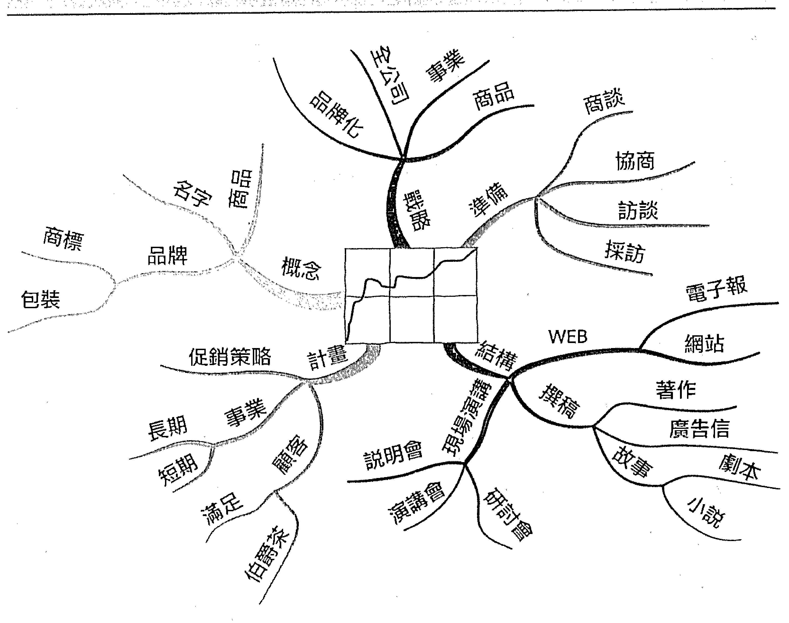

多數思考法不是藉由整理紊亂資訊來得到新創意，就是利用簡單明瞭的傳遞方式來得到成果，但絕大多數都沒有設定時間軸。沒有時間軸，就必須另外擬定一個行動計畫。

未來藍圖可以用一張圖表來表示擴大想法的創造性思考，以及將擴大的想法彙整並付諸實現的分析性思考，就連達成目標的日期，也可以畫在同一張圖表上。畫成一張圖表之後，只要夾在筆記本裡就可以帶著走，隨時拿出來看。這樣一來，在課題達成之前，不僅容易採取行動，還能隨時修改計畫。

某間學校的老師就清楚地點出未來藍圖的特色：「許多手法雖然明確指出應該達成的終點與路線，但是未來藍圖除了這些之外，還加上了抵達目的地的時間。何時會在何處面臨抉擇，這條路如果行不通，還可以選擇其他什麼樣的路，以便找出對策。感覺就像是得到一個可以達成課題的高性能導覽機器。

## 用「適應性」方法解決問題，治標又治本

解決問題有兩個方法：一個是技術性（technical），一個是適應性（adaptive）。

以先前提到了壽司店為例，所謂技術性地解決問題以增加來客數，就必須採取換菜色、提供折扣、推出集點活動、改宣傳口號、在 Facebook 刊登廣告等戰術面的方式。

如果正確採行技術性問題解決法，就會立即見效。不過這種情況就和肚子痛時吃胃藥一樣，只是暫時對症下藥罷了。

另一方面，所謂適應性地解決問題，才是最根本的療法。以先前提到了壽司店為例，就是從一切都身體力行的「玩家」，成長為能培養弟子獨立作業的「領導者」。知道公司對於人才培育的立場，有沒有像適應性方法這樣的戰略，也很重要。之所以稱為適應性問題解決法，是因為我們也要改變自我內在，才能適應環境變化。

哈佛大學教育研究所的羅伯·凱根教授，在他的研究報告中指出，美國擔任經理職務的人，約有 8～14% 具有技術性解決問題的才智，稱為「自我主導型才智者」（Self-authoring Mind）。之所以如此稱呼，是因為他們會在自己的知識、資訊和經驗範圍內，針對眼前的問題想出解決方案。34～35% 的經理擁有「環境適應型才智」。

## 技術性地解決問題 vs. 適應性地解決問題

所謂的適應性地解決問題，並不是在現有的延長線上找出解決對策，而是要找出適合新環境的新層面解決對策。

也就是說，他們並不是要擔起責任、判斷情況，而是要環視四周、決定意見，並且懂得觀望形勢。也就是說，若將這兩者加起來，將近 42～49%的經理只能根據過去的經驗以及自我的價值觀，來建構解決方案。

然而，在這個市場環境不斷驟變的時代，光憑過去的體驗就做出決定，並不能為企業創造價值。企業需要的是一個能超越以往的成功體驗，創造出變化足以適應新環境的經理。具備這種思考能力的人，稱為「自我改觀型才智者」。根據凱根教授的調查，自我改觀型的經理其實不到 1%，也就是說，平均每一百個人頂多出現一個。

## 企業要求的擁有「自我改觀型才智」的經理不到 1%

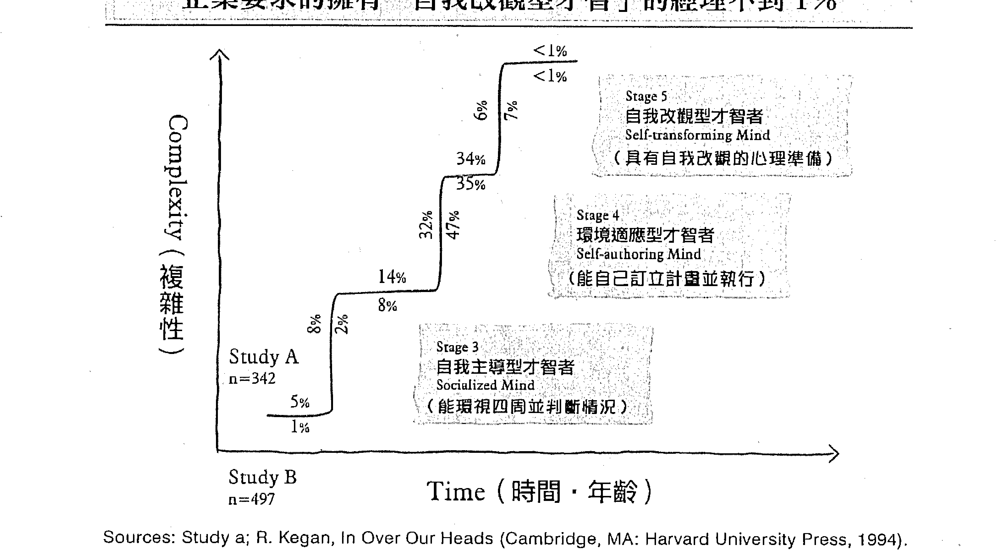

> Sources: Study a; R. Kegan, In Over Our Heads (Cambridge, MA: Harvard University Press, 1994). Study B; W. Torbert, Managing the Corporate Dream (Homewood, IL: Dow-Jones, 1987) Robert Kegan, Lisa Laskow Libey 著，參考 Immunity to Change 製表。

所謂的未來藍圖，就是培養自我改觀型才智者的方法。這個方法之所以能果決地督促自己改觀，是因為故事本身的形式，採取的是主角專注自我，踏上旅程，利用從未想過自己也能做到的方法來打倒敵人（解決問題），最後超越從前的自己，茁壯成長為英雄，並凱旋而歸的模式。

故事雖然擁有促使創作者改觀的力量，不過就算我們沒有學到成為小說家與編劇的技術，還是可以採取其他手法來架構眼前日常工作上的課題，這就是未來藍圖。

## 未來藍圖的基本構造非常簡單

寫在筆記本上的未來藍圖，乍看之下紊亂不堪，但其實構造非常簡單。請繼續翻到下一頁，這就是基本構造。

## 未來藍圖是想像與現實對照鏡

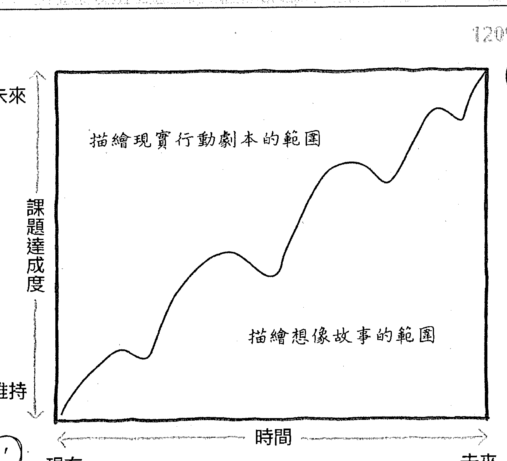

橫軸是時間點，代表從現在到未來達成課題時的流動時間。縱軸是課題達成度。曲線愈往下，就代表愈消極的變化，不是朝向理想的未來，而是偏向維持現狀。曲線愈往上，代表愈積極的變化，從維持現狀開始走向理想的未來。

隨意在圖表上，從右上角朝左下角畫一條曲線。曲線下方是「想像範圍」，是描寫故事的範圍。

另一方，曲線上方是「現實範圍」，是以在想像範圍中描寫的故事為架構，描寫出達成現實課題的行動劇本。

也就是想像範圍與現實範圍，如同對照鏡般描繪而成的圖表。像這樣充分利用這兩個思考範圍的圖表，就是未來藍圖。

接下來，先大致說明故事的描寫過程。

首先，乍看之下所謂的課題，會讓人以為是要創作一個毫無關聯的故事。其實，故事能有效切開你企圖像站在過去延長線上解決問題的思維。

故事的主角，是你希望他幸福、目標非常具體的一個人。我們在右上角寫下那個人的名字，畫出笑臉。這個主角在未來這個階段，會變成 120% 幸福的故事，要在曲線下方創作。之後我們會說明，這個第三者是一面鏡子，能夠照出你的內心。隨著時間流逝，只要往右上角編寫一個狀況充滿變化的故事，最後一定會出現一個讓自己非常滿意的快樂結局，這是必然的結果。

曲線下方的故事完成之後，就能善加利用從中得到的教訓與靈感，來解決現實生活中的問題，因為編寫故事可以讓人脫離原本引起問題的「狹隘认知」。在這個抽象度極高的故事狀態裡，我們可以藉由體驗各式各樣的觀點，來獲得「廣泛認知」，之後再回到現實領域中解決問題。

這個程序就像是那個腦袋裡充滿創意的天才科學家，將打瞌睡時出現在夢中的畫面，直接畫成圖表的思考方法。

總而言之，只要經過下列三個階段，就會產生超越既有思考框架的想法，進而編寫出達成課題的行動劇本。

此時的你或許會想「原來这就是藉由創作故事，让脑袋迸出一点点构思的方法。」但是只要实际做过一次，就会发现这并非只有「一点点」，迸出的构思可是会让你大吃一惊。不仅如此，通常还会出现激发人迫不及待想立刻实行的行动剧本。

未來藍圖只要經過這三個階段，就有可能創造故事來解決問題。

**階段①：弄懂課題，把未來故事具體化**
針對你想解決的問題，描繪出「如果能解決，未來會是什麼樣子」的具體藍圖。

**階段②：弄懂故事，把主角換成自己**
在弄懂未來藍圖後，把故事的主角換成自己，思考如果自己置身其中會怎樣。這會讓故事變得更生動，更容易產生共鳴，也更容易找到解決問題的線索。

**階段③：細想細節，擬出行動劇本**
只要知道自己想怎樣，就能決定行動。在思考如何達成理想未來時，就會開始想像「那如果這樣做呢？那如果那樣做呢？」，自然而然地就會找到具體的行動方法。

## 現在就創造3日後的未來！

那麼，先讓我們完成這個為期3天的課題吧。
為什麼需要3天？期間雖短，但是3天後就能確認實驗結果了。如果是3週後，開始架構的人恐怕會有一半會因為生活忙碌，到了第10天就連課題也忘得一乾二淨。

我的個性很急，想到的那一天，就是好日子。所以我希望你過了第3天，就會感覺到變化。3天後，如果你隱隱約約感受到未來藍圖的效果，而且開始產生興趣，就要開始學習所有必備技能，這時候我希望你再畫一張圖表。3週後，長久以來的夢想，與多年來一直沒有解決、堆積如山的課題，應該就會顯著地實現了。

那麼，先回答我第一個問題：「什麼是你在這3天內想實現的課題？」

3天後，「如果可以實現這個課題，我應該會很高興吧。」所以讓我們設定一個可以感受到成就感的課題。現在你手上如果剛好有一份工作已經訂下截止日，我建議你就以此為課題。如此一來，你的時間就不會因為練習這本書的方法而被剝奪，現在手上的工作也會進行地更順利、更有效率。

不要定下脫離現實的課題，像是「3天後中1億日圓的樂透！」或是「3天後和喜歡的偶像明星約會！」

我不會勸大家「不要實驗」這種令人為難的願望，但是最重要的，是你會不會認真看待這個要在3天內達成的課題。只要態度認真，不管是什麼課題都可以。如果你抱持著「3天後倘若如願實現的話……那不就是奇蹟了嗎？」的態度，那麼就設另一個課題。未來藍圖不是奇蹟，也不是魔法，而是任何人都能實踐，切實又具體的方法論。

這3天的課題決定好了嗎？如果你還在猶豫，就參考下面這幾個範例吧。

- 如果你是商業人士……
  - 「3天內如何爭取到◎◎（想做的事）需要的資金？」
  - 「3天內如何減少2公斤？」
  - 「3天內如何讓Facebook的按贊人數達1.5倍？」
  - 「3天內要怎麼完成會議資料？」等等。

- 如果你是學生……
  - 「3天內如何把考試要看的書看完？」
  - 「3天內如何把房間整理乾淨？」
  - 「3天內如何背下300個英文單字？」
  - 「3天內如何寫出報告？」等等。

為了親自示範會出現什麼樣的結果，我也和你一樣，挑戰要在這3天內達成的課題。

我的課題是這個：「接下來這3天，我要如何找到最適合挑戰的課題？」

看了這個課題，或許你會感到失望。因為「這個課題就是找課題」。不過，我認為這個課題出現在這裡非常恰當。

一般來說，「只要讓問題明確，有8成的問題都可以迎刃而解。」大多數的問題解決法，通常會要求你好好分析並釐清所面臨的問題。但是根據我的顧問經驗，能靠自己頭腦整理出來，並讓問題明確化的顧客非常少。大多數的人，只要問到他們的課題，通常都是思緒不清：「接下來這 3 天我想做那個，也想做這個。可是主管會給我壓力，更何況我還想好好陪一陪家人。」

就算腦子一片混亂，完全沒有頭緒，未來藍圖依舊可以發揮效果。所有的問題解決手法，幾乎都是以讓問題明確化為前提；相較於此，未來藍圖算是不需要讓問題更明確的問題解決手法。如同我們在 53 頁所說的，自己真正面對的問題，會透過故事浮出檯面。

那麼，就請你開始架構這 3 天的課題吧。

## Future Mapping Core Skills 練習 1-1 設定課題

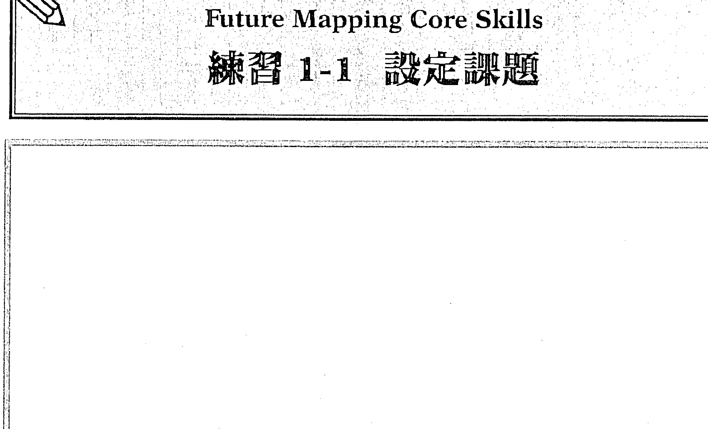

寫好之後，我希望你會期待達成時的那股成就感。3 天後，倘若達成課題的未來在前方等待著，你會覺得如何？接下來這 3 天，是不是開始讓你蠢蠢欲動？

## 2 個選擇，將未來化為具體行動

課題決定後，接下來這 3 天的活動劇本你有兩個選項。

①暫且不管理由，想要一口氣體驗的人 👉 到特別設置的網站（http://future-mapping.com）一邊觀看解說影片，一邊畫下第一張未來藍圖。
②想要先實驗 7 個技術後再來體驗的人 👉 解說在未來藍圖中會用到的 7 個核心技能。實驗並確認結果，充分領會後就可以架構課題。

## 兩個選項

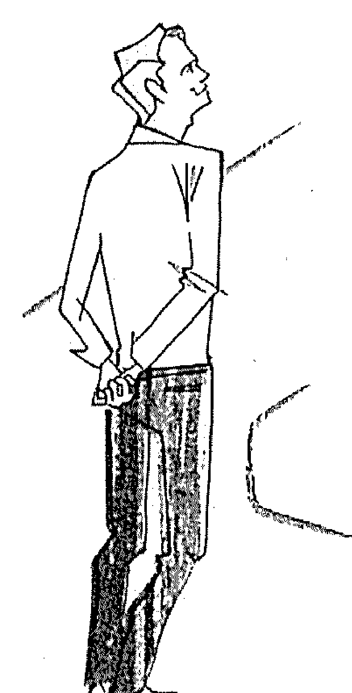

①一口氣體驗特別設置網站

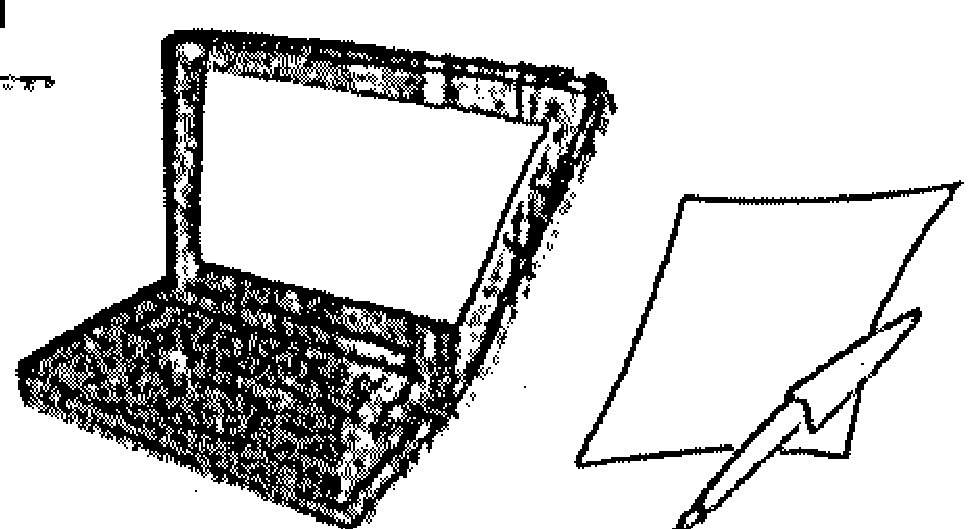

http://future-mapping.com/

👉 準備的東西

一邊觀看解說影片，
一邊試著畫出第一張未來藍圖。

②在本書實驗7個技術

👉 準備的東西

盡量寫在這本書裡。
解說未來藍圖會用上的7個核心技能。
實驗並確認結果，充分領會後就可以架構課題。

坦白說，我會建議大家選擇①。因為就算不清楚未來藍圖背後的結構，只要按照指示前進，就能寫出說服自己的行動劇本。其實，小學生就算沒接受任何說明，也能運用未來藍圖來展現成果。這個部分的作業時間約 60 至 90 分鐘。

選擇②則是按部就班完成未來藍圖的程序。沒有時間看解說影片的人，或是不打算把未來藍圖整個畫下來，但還是想體驗背後技術的人，會比較適合這個選項。就請大家一一練習，並體驗名為「7 個實驗」的未來藍圖核心技能。操作每個練習，短則只要花 5 至 10 分鐘。所以，現在正在搭電車移動的人，或是理解後想要畫下未來藍圖的人，就試試這個選項吧。

不管你是選擇①還是②，體驗未來藍圖後，就算得到「這個方法果然不適合自己」的結論也沒關係。看這本書應該不會浪費你的時間，因為未來藍圖並不會強迫你在用不用這個方法之間做出決定。

這樣的思考模式，與其說是方法論之一，不如說是為了啟發構思而將好幾種思考技術全部整合在一起。就算沒有派上用場，只嘗試構成未來藍圖的其中一種思考技術——針對「利用從前的作法，但找不到突破點」這個問題，通常只要幾分鐘的時間就能迎刃而解，找出對策。

結論就是，不管選擇哪一項，對你來說都不會浪費時間。就連看了影片後，一口氣畫下未來藍圖，接著再看解說，理解力也會驚人地大幅增加。另外，藉由這本書體驗 7 個實驗，之後再認真畫下未來藍圖的人，只要看了這部影片，也能在一瞬間掌握全貌。總而言之，與其說要你嚴肅認真地架構問題的解決方案，不如說是有段和玩拼圖一樣快樂的時光在等著你。

你覺得如何？是不是想馬上試看看？那麼，就請你從中擇一，趕快踏上這趟改變現實的旅程吧！

# 第4章
## 7個實驗，教你逐步畫出未來藍圖

為了沒有看影片，並和我一樣把書留在身邊的你，我就不再多說，立刻談談接下來外出學習之旅的概要。請你按照順序進行以下 7 個實驗。

- 實驗 1 想像讓某個人的未來過得更幸福時，會發生什麼事呢？——利他法則
- 實驗 2 若憑圖像聯想答案，會變得如何？——出奇圖像法則
- 實驗 3 隨手畫下一條曲線會帶來什麼？——偶有法則
- 實驗 4 從毫無關聯的故事中，能否得到達成課題的具體提示？——改觀法則①
- 實驗 5 一旦創造出讓人期盼的故事，達成課題的自信會如何變化？——改觀法則②
- 實驗 6 觸動心靈的故事，如何讓人採取具體行動？——激勵法則
- 實驗 7 如何探索出隱藏的才能？——空白法則

取名為實驗是有緣故的。我的用意並不是要說服你使用未來藍圖，而是希望你能達成心中期望的課題。

為了達到這個目的，必須親自體驗與判斷，構成未來藍圖的核心技能是否能派上用場。

在這些實驗中，有的在架構的那一瞬間會讓你的腦子突然浮現想法，有的則是要過幾天，才會出現讓你大喊「咦？真的假的！」的結果。不過，有的實驗到現在還是無法讓人感覺到任何效果。

不太可能所有的實驗全都順利進行，但是最起碼在解決問題這方面，如果能知道程序並趁現在先體驗，那麼將來遇到不得不找出充滿創造性的解決對策時，一定能派上用場。

每結束一個實驗，你就會學到一項新的技能，這就是本章設計的內容。雖然感覺有點像角色扮演遊戲（Role-Playing Game，RPG），不過這兩者還是有些不同。

RPG 固然可以抵達終點，然而遊戲關起來的那一刻，就必須回到從未改變的現實生活中。反觀未來藍圖，則不會僅止於幻想世界。只要走到最後，在前方等待著你去做的，是起身採取行動，創造嶄新未來。

實驗所需時間以 5 到 10 分鐘的居多。只要手上有筆與這本書，不管在搭電車，還是坐在咖啡廳裡喝咖啡，都可以開始進行實驗。只要做過一次，學會方法就會受用一生。這是有關思考本質的觀念，所以也不需要擔心是否會過時。就請大家一邊樂在其中，一邊進行實驗吧。

## 實驗 1
### 想像讓某個人未來過得更幸福
——利他法則

讓別人幸福，其實是自己受益

你聽過這些話嗎？「為了滿足顧客需求」、「奉獻的心」、「為了讓地區社會更加繁榮」，以及「將心比心想一想吧」。

沒錯，這些都是大家聽到耳朵會長繭的話。
不管是哪一家公司，一定會高唱「為了顧客……」；不管是哪一對父母，一定會教孩子「將心比心想一想吧」。話說完過 3 分鐘，不，過 3 秒鐘，應該就會開始想一想自家公司的利益，或是家人的幸福。像是剛才我問你：「課題是什麼？」相信幾乎所有人都會回答：「課題就是讓自己更幸福。」是不是？

其實我們都很自私，因為心裡所想的，都是和自身幸福有關的事，對吧？當然，許多人都會投身在志工活動或社會服務上，但只要問一問真正熱心為社會服務的那些人，大家一定會回答：「因為我從接受幫助的人那裡得到了幸福。」這是無庸置疑的事。

也就是說，我們每天都高喊著「為了人們」、「為了顧客」、「為了社會」這些標語，但是仔細想想，我們所做的一舉一動，都是為了自己的幸福。這和平常的日子不也一樣嗎？

所以，我要大家體驗一下有別於平常的事。我架構了一個實驗。

若在3分鐘內，思考一下讓別人幸福這件事，然後再採取行動，會發生什麼事呢？

「什麼嘛，就這樣？」或許有人會覺得我在耍他們，所以幾乎沒有人想嘗試，然而只要實際做過一次，這個單純的作業就會發生有趣的事。

就讓我介紹一下，曾經做過這個實驗之人的親身體驗吧。

一直不肯跟我們合作的某大企業，突然要我們報價。這是我希望過得幸福的人所介紹的呢。

正當心裡想著要和分手的她說聲抱歉時，沒想到在看完電影的回程電車上，竟然碰巧遇到她，一掃長久以來深埋在心裡的疙瘩。

說到令人驚訝的例子，那就是2天後居然有筆金額高到可以買輛NISSAN GT-R的錢匯進來了。

以上3個例子是特地告訴大家的驚人插曲，並不代表每個人都可以體驗到相同的戲劇化情節。就算真的發生幸運的事，也只不過是偶然罷了，這麼想或許比較合情合理。

儘管如此，這個實驗還是有它的意義存在。因為只要有一次體驗到體恤他人的同時，也得到意外的幸運，你覺得你的想法會產生什麼樣的變化？你的公司因為體諒了一個實際存在的客戶，結果有個對公司而言算是難得的機會從天而降，如果讓員工感受到這種體驗，今後你會培養出什麼樣的企業文化呢？

過去思考的主流是「邁向目標，採取不浪費、有效果的行動。」如此一來，不但可以提升業績，自己也會獲得好評價。當然，工作上採取這樣的態度固然正確，但是我們不能只想著這樣的直線式因果關係，因為這個實驗的結果告訴我們，既然體驗到體貼行為在經過一番波折後，會讓人意外地愈來愈接近想要達成的課題，那麼這時利他的心是不是會變得更自然、更泰然呢？

「留心你的想法，因為想法會變成話語；留心你的話語，因為話語會變成行動；留心你的行動，因為行動會變成習慣。」這是流傳於老子時代的箴言，就讓我們稍加修改一下——

-   留心你體貼的想法，因為會變成體貼的話語。
-   留心你體貼的話語，因為會變成體貼的行動。
-   留心你體貼的行動，因為會變成體貼的習慣。

這樣的實驗，正是我們想要嘗試的。

### 如何讓對方得到 120% 的幸福？

那麼，就讓我們開始進行認真思索幸福的思考實驗吧。我要請你花 3 分鐘，認真想一想希望誰幸福，但那個人不是自己。雖然不需要花太多時間，不過認真思考時還是需要 3 個步驟。這 3 個步驟雖然簡單，但是在達成課題時非常有用的技巧，讓我按部就班說明吧。

#### 步驟 1 選擇想讓他獲得 120% 幸福的人

首先，請你想一想希望誰能獲得幸福。這個人可以是家人、朋友或同事的其中一位，也可以是你尊敬的歷史人物，甚至是喜歡的藝人都可以。

或許有人希望家人、同事、人類，甚至是所有生物都能幸福，不過在這裡我希望集中在一個人身上，因為這樣你才會感受到一個更明確的未來。

被你選中的人，在3天後的未來會出現120%的幸福。不是100%而是120%的原因，是為了要讓對方更有同感，並且產生超越框架的構思。120%的幸福指的不是普通的滿足，而是發自內心，盡如人意的狀態。

佛教說：「幸福，是屏除不安的狀態。」而120%的幸福就是「心情平和，毫無不安，發自內心盡如人意的狀態。」切記，並不是「好耶，好耶」這種爆發性的喜悅狀態。那麼，就請大家想一想你希望他獲得120%幸福的對象吧。

### 所謂 120% 的幸福……

不是瞬間爆發的喜悅……

而是毫無不安，深深滿足的狀態。

### Future Mapping Core Skills 練習 1-2 120%的幸福

閉上眼睛，把第一個浮現在腦海裡的那個名字寫在這裡。

120% 的幸福

名字：

### 步驟2 想像對方向你道謝的未來光景

接著，試著想像「3 天後變得 120%幸福的未來」吧。
為了豐富你的想像力，我們先這麼做：先想像變得幸福的那個人，在3 天後向你說聲「謝謝」的場景。對方是否知道你就是那個希望他更幸福的人並不重要，不管對方有沒有直接向你表達謝意，或對方能不能當面跟你聯繫都沒關係。最重要的是，3 天後你會真實感受到有個人非常感激你。

光是這樣就能讓緊繃的心情自然紓解開來，肩膀不再僵硬，表情變得柔和，呼吸也變得更穩定。在這種放輕鬆的情況之下，想法應該就會蜂湧而出。

接下來，想像一下3天後變得更幸福的那個人，藉由手機、電子郵件，甚至是面對面向你說聲謝謝的場景。為了讓這個場景更清晰，不妨試著回答以下這幾個問題。

-   這是3天後的什麼時候？大約幾點？
-   變得幸福的人只有一個人？還是有其他人？
-   那個人穿著什麼樣的衣服？有什麼象徵性的動作？
-   在這個場景中，是否有吸引人或讓人感到意外的東西？

### Future Mapping Core Skills 練習 2-1 描繪未來的光景

將你想到的答案直接寫在下列空白欄位。

|      |      |
| :--- | :--- |
|      |      |

只要詳細描繪這樣的背景，就能清楚看見真實的未來，更深切感受到對方變得幸福之後的心境。你自己也會深深感受到，可以與對方共有未來的那份喜悦。

### **步驟3 藉由臺詞表達出120%的幸福**

第3個步驟就是直接寫下3天後，心滿意足的對方要說的話。重點在於讓手自然而然地動起來，想到什麼就隨手寫下，而不是透過大腦認真思考後再寫。

就算寫出令人意外的臺詞，也不要急著否定：「這怎麼可能。」還是直接寫下來，因為意外性愈高，之後就愈有機會展開一個劃時代的局面。

那麼，變得120%幸福的人會說出什麼樣喜悦的話呢？

### Future Mapping Core Skills 練習 2-2 寫下令人欣喜的話語

寫下 3 天後 120%幸福的人喜悅的心聲吧！

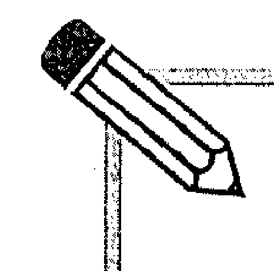

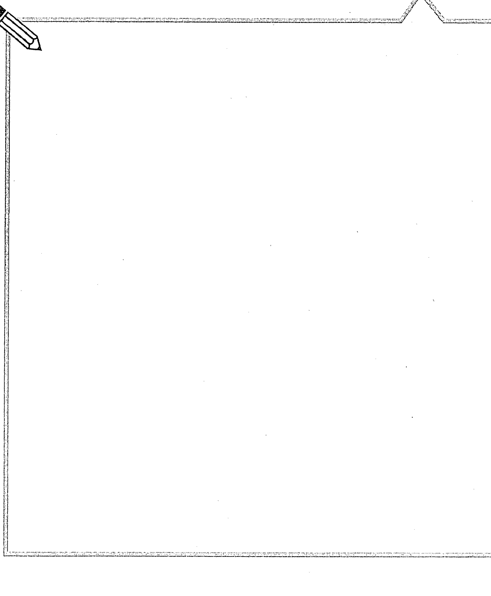

我將自己的實踐範例寫下提供大家參考。

### 課題「接下來這3天，要如何找到我要架構的最佳課題？」

-   希望他更幸福的人→父親（83歲）
-   3天後的未來→星期二，下午3點左右，電子郵件
-   父親的臺詞

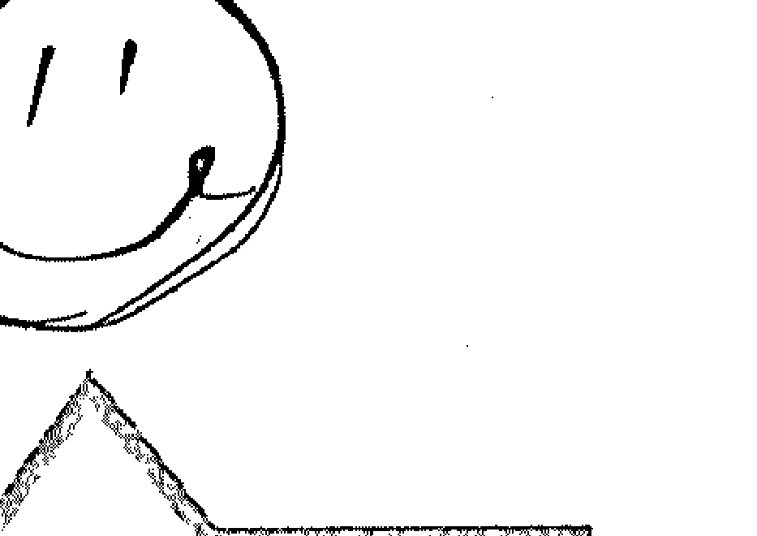

謝謝你，昌典。沒想到番茄跟茄子竟然大豐收。只要花時間細心照顧，蔬菜果然就會有所回報。剛開始種的時候或許不太輕鬆，但是只要有一絲決心，就可以整個改變生活習慣，是吧？現在我的身體愈來愈健康，所以還會活很久喔。

感覺敏銳的人說不定已經發現一件事，那就是到目前為止的作業，其實就是要讓人想起故事最後一幕的作業。

### 想要 120%幸福的人，其實是自己

以上是從過去的練習中，你一定要留意的事。
那就是——「想要 120%幸福的人，其實是你自己。」
或許你會想：「咦？怎麼可能？」但事實的確如此。

以我的情況為例。剛才父親的那些臺詞，看似是他說的話，其實是我自己，也就是我的真心話，只不過透過父親的口說出來罷了。
我把主語換成自己，改寫了一下內容。

「謝謝你，爸爸。許多工作方面的企劃案都已經慢慢成形，只要花些時間細心關照，事業就會展現成果。剛起步的時候雖然不輕鬆，但只要有一絲決心，公司的營運方式就可以改變，是吧？現在公司正慢慢地成長，所以今後我也要繼續努力。」

我在無意識中選擇了父親，作為希望他能過得幸福的對象，而且動起手來，直接想像了父親的臺詞——要怎麼做對方才會變得幸福，這只能在自己的內心深處想像。而所謂內心深處，其实就是借用父親的身影與第一次浮現出來的臺詞，也就是自己的真心話。

沒有鏡子就無法看見自己的身影，同樣地，沒有鏡子就無法看穿自己的真心。這面「鏡子」，才是期望他人幸福的心。

只要想像著希望他獲得 120%幸福的人，就會明白自己的真心，但是方法並非僅止於此。採取讓對方高興的舉動，就是讓連自己都沒有注意到的「真正自我」的高興。

佛教說：自他不二、自利利他。自他不二意指自我與他人原為一體，毫無差別；自利利他則是利於他人就是真正利於己。

只要做了這個實驗，就能切身感受這個教誨，而且想為他人做事的念頭就會進入愈來愈強烈的良性循環中。想讓他人幸福快樂的故事，就是讓自己改觀的最大推手。

接下來，就請你看看剛才寫下的，希望他獲得 120%幸福的人所說的臺詞吧。

這裡頭究竟想表達什麼思緒？

### 【實驗 1 的總結】

### 120%的幸福：利他法則

#### 重點與作業

-   目的：試著確認「讓他人幸福」這個想像內容，究竟想反應出什麼？
-   所需時間：10 分鐘。
-   作業：再次回頭看看寫在 97 頁的那個獲得 120%幸福的人所說的臺詞。

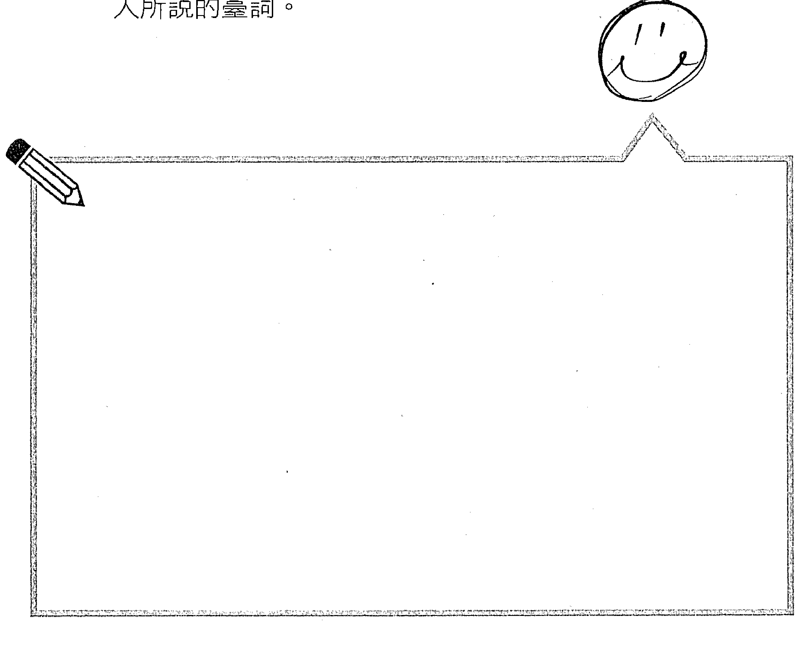

#### 結果記錄

把說臺詞的人換成自己時，表現出來的會是什麼內容？有沒有露出自己的本意與真心話？
寫下你察覺到的地方吧。

## 實驗 2

### 憑圖像聯想答案

### ——出奇圖像法則

### 連打瞌睡都能激發出好點子

當你絞盡腦汁時，就代表想不出問題的答案。其實，這個答案全都浮現在你腦海的圖像之中——。

做白日夢時、創作故事時、夜晚睡在床上做夢時，甚至是散步，腦子裡會一直浮現各個影像。倘若這是你面對的所有問題的解答，搞不好你的人生會整個好轉！

這番話絕無虛假。我要透過實驗 2，讓你親身體驗圖像所帶來的力量。

坦白說，從零產生一的想法，光靠分析問題是不會輕易出現的，通常是在一邊喝葡萄酒、一邊快樂聊天，或是一邊沖澡時憑空冒出來的。

就算是科學上的大發明，也有好幾項是從無意中的空想所誕生的。最廣為人知的，就是愛因斯坦的相對論。這是他 16 歲時，因為「如果自己乘坐光，會發生什麼事」這個思考實驗而誕生的。另外，德國化學家凱庫勒·馮·斯特拉多尼茨（Friedrich August Kekulé von Stradonitz）發現「苯環」這個正六角形構造的化合物的契機，其實是他坐在暖爐前打瞌睡時，夢到蛇咬著自己的尾巴不停轉圈所產生的。

近幾年的例子，就是美國科學家，凱利·穆利斯（Kary Banks Mullis）博士。他是一位私生活非常精彩，公開自己過去曾經吸食 LSD 迷幻藥與大麻的科學家，之後還榮獲諾貝爾獎。讓他獲頒諾貝爾獎的關鍵，是因為發明用來擴增 DNA 的方法「PCR」（聚合酶連鎖反應，Polymerase Chain Reaction）。

正當他開車準備和女朋友去衝浪時，腦子裡一直想著 DNA。此時，他突然想到一個利用小小的機器輕鬆大量擴增 DNA 的方法，於是急忙把車停在路邊，寫在筆記上。

### 透過圖像聯想，能打破你的狹隘視野

儘管如此，為何無意中想起的圖像，大多會隱藏出色的構思呢？這是因為圖像擁有讓你從「狹隘世界的認知」中解放出來的力量。

只聽我說明一次應該很難理解，就讓我再說得更詳細一些：「明明要想出一個全新企劃案，但腦子裡卻老是出現一樣的內容。」

「關於解決課題的方法，不管怎麼想，想到的對策就是非常有限。」

應該不少人都擁有這樣的煩惱，為什麼會這樣呢？原因在於我們會利用過去，在那個事事如意的狹隘世界裡已經習慣的方法，企圖有效率地解決問題。我把這種情況畫成下頁的圖像。

### 半径五公尺内得到的陈旧构思

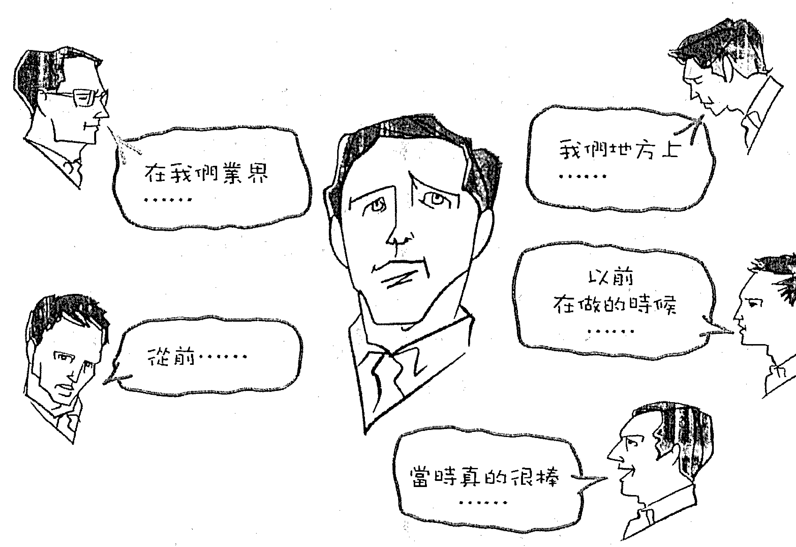

光是听取周遭人们在其习惯思考的范围内所提供的资讯，只能找到拷贝贴上的解决对策。

当我们想解决问题时，就像「与这个问题有关的关键字是这个、这个和这个。」会针对各式各样的主题，列出容易联想、现有的关键字。例如，提到我们公司想象得到的新事业，就会联想到「网路销售」、「进出海外」、「经营餐饮店」和「贩卖内容」等关键字，所以检讨时才会一直重复出现同业间早已开始推行的相同事业。

平常工作时，如果一直重复接触相同的字汇，当问题产生且必须开始联想可以提出解决对策的关键字时，往往无法脱离与平常思维有关的东西，导致我们在不知不觉中筑起一道守卫日常生活的牢固墙壁，只能在狭隘世界的熟悉范围内解决问题。

就算有人提出新点子，拥有愈多成功经验的人，就愈难接受与自己认知不符合的意见，动辄说出：“这个从前就试过了，但是行不通。”“这个过去有人提，但是对我们来说不好做耶。”这样的想法一旦成为企业文化，官僚主义就会横行于组织之间，紧接而来的就是衰退期。

既然如此，要怎么做才能跳脱这种狭隘世界的认知？商业界使用的主流方法，就是参加研讨会，或是一边聘请外部顾问，一边接触陌生业界的资讯。一个优秀出色的经营者或经营干部，之所以擅长搜集公司外部的资讯，而且勤于在各业界奠定人脉，原因就在于此。

话虽如此，其实在日常生活中，有一个非常简单的方法可以帮助我们跳脱狭隘世界的认知，那就是利用图像的方法。

只要动动你的头脑，不需花费一毛钱，好点子就会接二连三浮现在脑海里。每当我们公司要想出新的企划案时，几乎都是利用图像方式想出问题的解决对策。而真正实现的合计收益，即使是像我们这种小公司，也不会低于30亿日圆。

方法虽然简单，却能带来庞大的效果，所以我希望与你分享。例如，在工作上利用图像，针对“思考新商品概念”这个课题，规划出创造点子的程序。

眼睛闭上之后，脑子里出现了“大白蛇模样的布玩偶”。起初以为这样的图像“怎么可能会让人想出新商品的概念”，但是联想与课题毫无关联的图像，反而是解决创造性问题的关键。

### 使用乍看之下毫無關聯的圖像，可以帶來出色的想法

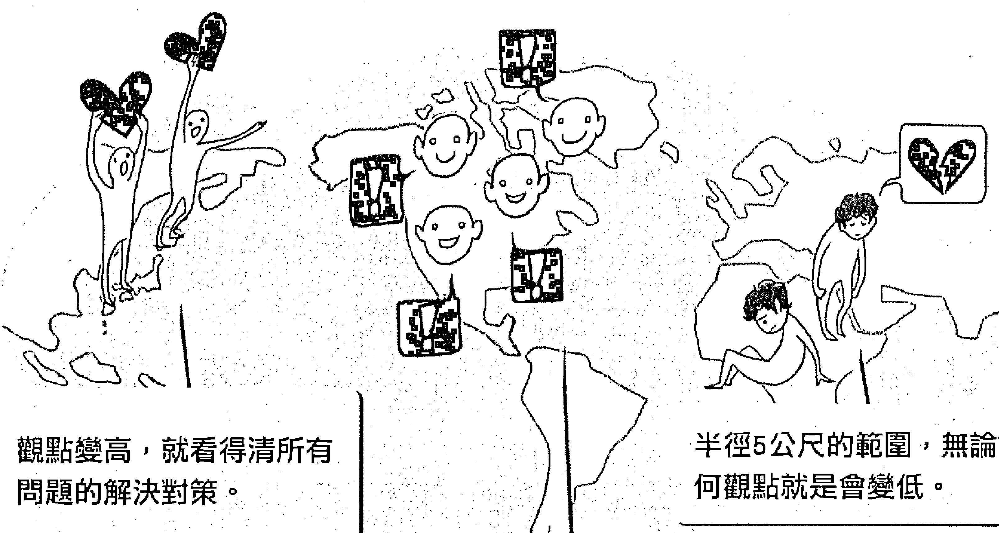

觀點變高，就看得清所有問題的解決對策。

半徑5公尺的範圍，無論如何觀點就是會變低。

思考時，只要將相距半個地球遠的圖像及問題結合，令人驚訝的創意就會滿溢而出。

### 乍看之下與課題毫無關聯的圖像

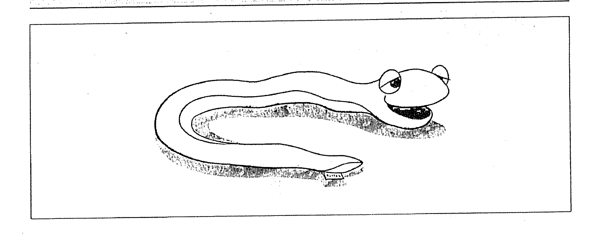

例如，提到白蛇就代表稀少，而從稀少可以聯想到閒暇。說到布偶，就想到用布製成的玩具。而「大」這個字，可以聯想到大尺寸。

從這個毫無關聯的圖像所聯想到的結果，或許可以得到下列點子。

### 聯想過程

-   白蛇→稀少→可以提供給非主流的閒暇人士？
-   布偶→用布製成的東西→服飾？
-   大的→大尺寸？

### 點子

成立一個較大尺寸、選項豐富的新服飾品牌。另外，參加保護稀有動物的社會服務活動，如何呢？

其他人應該也會聯想到其他東西，從腦子裡冒出點子吧。

-   **聯想過程**
    -   白蛇→日語發音跟英語的 HEAVY（沉重的）一樣→又大又重的東西？
    -   布偶→輕的東西？

**點子發想**
「只要利用我們公司的技術種子，原本龐大笨重的東西，就能運用非常輕的材料來製造了吧？」

所謂課題，只要藉由這種毫無關聯的圖像構思法，就能輕易超越，過去在日常生活中築起的狹隘認知這面牆。當然，以解決對策來講，這只不過是一個假說階段，若要運用在大型組織裡，就必須以邏輯的方式來驗證。光憑分析無法產生的「假說」，靠圖像就能輕易成形。

### 打開「禮物盒」，解決課題的訣竅就在裡面

這種「使用圖像的構思法」，是美國教育心理學者 Win Wenger 博士將其系統化而成的。Wenger 博士是全世界 IQ 排名前 2% 的人才能入會的「門薩」（Mensa）俱樂部（編按：世界頂級智商俱樂部，於 1946 年成立於英國牛津）中，以最年少之姿入會的聰明人物，同時也是《愛因斯坦因子》（The Einstein Factor）的作者。

該書提到「圖像風暴」（Image Storming）這個內容精湛的方法論。在架構未來藍圖的過程中，編寫故事這件事就是充滿圖像風暴，所以讓我們在這裡介紹簡單版的「禮物盒」。

作法非常簡單，花不到 1 分鐘。我們在實驗 1 中，花了 3 分鐘思考要讓誰獲得 120% 的幸福，是吧？如此一來，那個人應該會非常高興有人心裡這麼期望著。接下來，我希望你想一想，3 天後那個人會準備一份禮物送給你。

說得具體一點。第一，腦子裡先想出一個禮物盒。接著，想像裝在盒子裡的禮物在數 1、2、3 時會飛出來。

這份禮物的內容是提供你達成課題的契機圖像。這個圖像與課題的關係愈遠，就愈能讓你從狹隘世界的認知中脫離，並且聯想到各式各樣的可能性。這個可能性只要與現實生活中的課題相連結，就會出現平常難以透過自己腦袋想到的解決對策。

為何一定要特地把圖像裝進盒子裡？這是為了封鎖讓你深信不疑的觀念。

假設獲得 120% 幸福的人是你的妻子。那麼你就會聯想到習以為常的生活場景：「如果是妻子送我禮物，那麼盒子裡放的應該會是這個吧？」如此一來，思緒就無法飛離狹隘的認知中。所以，先描繪出看不見內部的盒子，之後再突然打開，腦海裡就能浮現意想不到的圖像，這一點非常重要。

稍後會說明進行這個實驗的具體步驟，在這之前我要為大家介紹，某位男士因為利用禮物盒，而使得長年來一直掛念的問題瞬間得到解決的實例。

那位是曾經參加我的演講會，年過 60 歲，衣冠楚楚的管理階級。正當他即將迎接退休之際，突然開始認真苦惱「自己今後在公司該扮演著什麼樣的角色」。

於是，我請他練習禮物盒。他在筆記本上畫下盒子，裡面是一隻「嘴巴尖銳的鳥」。

我一邊看著那隻鳥，一邊問：「這隻鳥的圖像是如果你今後要做的工作，你覺得會是什麼內容？」

顯然地，這個問題問倒了他。「神田先生，我完全沒有頭緒……」為了讓他放輕鬆，我一邊開玩笑，一邊給他幾個提示。

「既然這張圖看起來很像推特（Twitter）的標誌，那你要不要試著玩推特呢？這樣說不定可以促進公司 IT 化……」不過他似乎無法理解。

我又再問他：「這隻鳥看起來很像無齒翼龍（Pteranodon），這究竟是什麼？」

他驚訝地告訴我：「神田先生，這不是無齒翼龍，是小雞，小雞！」

咦？原來如此呀！聽了之後我忍不住噗哧笑了起來，然而他卻陷入沉默，不發一語。經過十幾秒的沉默之後，他支支吾吾地告訴我：

「神田先生……，這是小雞，所以我打算回到跟小雞一樣的心情，再次出發……應該是這樣……」

說這番話時，他雙眼泛紅。

「神田先生……我兒子對 IT 很熟……所以我想這張圖的意思，應該是回到跟小雞一樣的初衷，與兒子一起開創事業，是吧？這麼想應該可以吧，是不是？」

聽見他那愈來愈有力的聲音，讓我感覺到這才是他心中真正的答案。

事業如此出色的人，就是因為一路走來艱苦困難，一旦脫離工作就不容易找到解決對策，這時候的突破口就是「瞬間浮現腦海的圖像」。

### 圖像解釋的6個程序

海的圖像。不管是圖像含意還是想像的當時，通常都是毫無緣由的。

這個圖像會根深柢固地印在腦海裡。在快要忘記時，沿著圖像攀爬的現實生活，往往會活生生地出現在眼前，讓人頓時明白個中含意。

## 給你的課題

是否能從圖像中找到靈感？

是否能從圖像中找到靈感？好了，我的說明到此結束，接下來換你上場了。

其實我是要請大家利用圖像，來找尋與課題有關的提示。這裡要架構的課題，並不是你之前所想的那個3天內達成的課題，而是我所提案的新課題。因為過去的課題都要進行到下一個實驗後，才能創造行動劇本，所以第2個實驗就是要讓你立刻得到答案。

這次建議的課題是：「現在的你該怎麼做，才能藉由未來藍圖展現出漂亮成果？」

關於這個課題的靈感，就在禮物盒裡，所以先請大家從盒子的外觀想像一下。

想像自己正輕輕閉上眼睛，手放在盒子上。禮物就在盒子裡，至於究竟是什麼依舊沒有頭緒。

那麼，你手上的這個盒子——

- 是粗糙的盒子，還是光滑的盒子？
- 尺寸有多大？
- 重量有多少？
- 包裝紙是什麼顏色？
- 裡頭的東西會不會動？
- 溫熱的，還是冰涼的？

具體形象出現之後，就在下一頁的圖框裡簡單畫出盒子的外觀。

接下來，突然打開盒子時，會出現什麼樣的圖像？畫出在心裡數到3時，從盒子裡蹦出來的圖像。

想像的時候，圖像內容愈詳細愈好。因為想像愈詳細，從圖像聯想到的答案範圍也就愈寬廣。

像剛才的課題：「什麼是現在使用未來藍圖，最想展現的成果？」針對課題的圖像，如果是「大海」這個籠統的答案，那麼與答案有關的聯想就會受到限制。但如果是「豐收漁旗飛舞的日本海」或「豪華郵輪緩緩行進的愛琴海」，就可以從各種不同觀點來聯想。

## 那麼你所描繪的禮物盒裡，究竟是什麼禮物？

### Future Mapping Core Skills
#### 練習 2-3 動手畫禮物盒

「現在的你該怎麼做，才能藉由未來藍圖展現出漂亮成果？」——試著想像這個課題的解決對策就在盒子裡。
數1、2、3，將打開盒子之後飛出的幻想圖像，畫在圖框右側的空白欄位。

| 【畫出盒子的外觀】 | 【打開盒子後飛出來的禮物】 |
| :--- | :--- |
| (空白区域，用于绘制盒子外观) | (空白区域，用于绘制打开后飞出的礼物图像) |

### 解釋圖像的 6 個程序——PRAISE

你會幻想收到什麼樣的禮物？如果是我，會幻想這樣的禮物。

神田對於「現在的你該怎麼做，才能藉由未來藍圖展現出漂亮的成果？」這個課題，所幻想的禮物

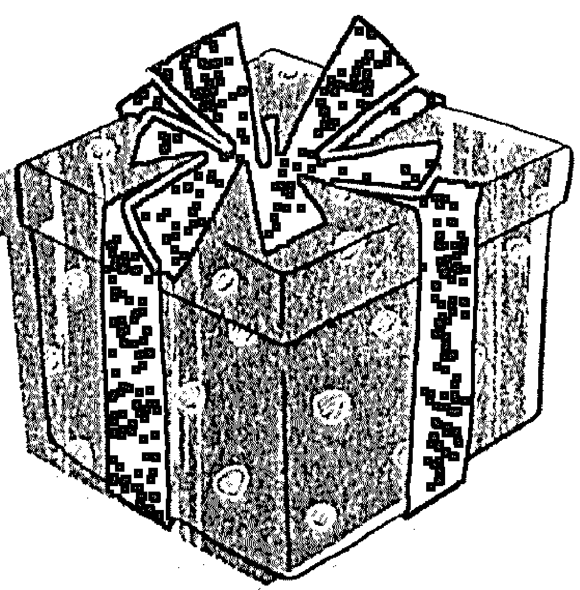

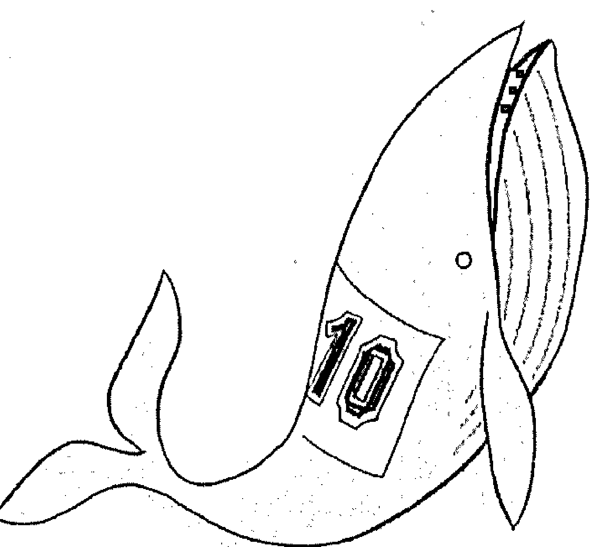

剛開始你應該不太會相信，這怎麼會是課題的靈感。但是只要記住訣竅，這會是一個快樂的聯想遊戲。訣竅就是要先假想放在盒子裡的禮物，而不是外觀。接著，再利用下列6項技巧慢慢聯想答案。

#### ① First Impression —— 從第一印象開始聯想

從第一個浮現腦海的東西開始自由聯想吧。例如，我想到的就是「鯨魚」→「聰明的哺乳類」→「集體行動」→「眉目傳情」。

就讓我們找找看，這些詞彙會不會成為「現在的你該怎麼做，才能藉由未來藍圖展現出漂亮成果？」這個課題的靈感。不過，我想你現在應該還沒有什麼頭緒。如果是初學者，通常都會想舉手投降，但是這時最重要的就是堅持下去。稍微忍耐一下，繼續聯想，我相信你會慢慢找到靈感。

「背後號碼10號」說不定是將某樣東西做成10個。若把它當作在自己的公司裡，各自規劃10個相互連結，並且會帶來相乘效果的企劃案呢？

「鯨魚」指的應該是集團企業。既然如此，創造一個在整個集團裡有10個不同的事業部門如何呢？這樣就能開創一個在網路時代無人可以模仿，且價值非常高的集團企業了。

#### ② First Experience —— 回憶最初體驗

從盒子裡飛出來的圖像，是什麼時候第一次出現在你的人生中？從回想這個最初體驗著手也可以。例如，如果是鯨魚，就是「媽媽念的那本繪本」。所以我們就能以「繪本」為主軸來思考，像是「讀繪本的體驗非常重要。至於背後號碼10號，應該是沒有辦法拿到繪本的第10集。」「因為對保護稀少動物有興趣，所以這本繪本寫出拯救稀少動物的故事。而藉由未來藍圖所創造的，就是實際考慮出版這個故事的行動劇本。」

#### ③ As Is —— 一語道破

有個意外的盲點，那就是圖像本身也有可能是解決對策。例如，背號10號的鯨魚這個圖像，有可能是「10月想休假去參加賞鯨團。若要如願實現，就利用未來藍圖好好思考一下行動劇本。」對其他人而言或許摸不著頭緒，但對於已經打算休假的人，或是想要有一天去賞鯨的人來說，可說是正中下懷。

#### ④ Play —— 試著玩一場文字遊戲

玩一場文字遊戲也是方法之一。例如，「鯨」這個字可以拆成「魚之京都」、「魚之都」。由此可以想出「新的餐廳就取名為『魚之都』」這個點子。以此為契機，就可以想出餐廳的企劃概念與開幕的行動計畫。

#### ⑤ Search —— 調查、探索

透過網路調查搜尋浮現在腦海裡的圖像，有時會出現讓人相當意外的答案。例如，搜尋10、鯨魚時，就會出現女演員鯨艾瑪（Kujira Emma）接受各界人士訪問的影片。從這個出乎意料的搜尋結果，就可以想出並擬定一個邀請演員製作一部長達10集的影片，然後再上傳至YouTube上的行動計畫。

#### ⑥ Reveal —— 自我解釋圖像

硬是要從圖像中找出答案，未必每次都如願。這時不妨再次複習那張圖像，轉個念，相信自己總有一天會想通，並且靜心等待，這是一個非常好的構思法。過了一段時間後，相信你一定會突然茅塞頓開：「啊，原來那條鯨魚是這個意思。」「背號10號原來是這個原因。」又假設之後某一天與人交換名片時，說不定你會因為上面印著「感謝有您的10週年 鯨魚塾」而失聲大叫。

為了與對方共同規劃一個能夠產生加乘效果的企劃案，你說不定會因而決定畫出未來藍圖。或者是在看一場足球賽時，聽到解說員說「背號10號是菁英號碼」時，你說不定會下定決心要「成為一個如同中場核心的領導人物」，而畫出未來藍圖。

以上就是藉由圖像聯想的6個訣竅，擷取關鍵字而成的方法論，就稱為「PRAISE」（讚賞）。

一旦習慣透過圖像來構思，只要腦子裡有疑惑，就能從周遭得到的靈感。如果腦子一片空白，就抬頭仰望天空，以飄過的雲朵形狀為圖像，或者打開擺在眼前的那本書，看到令人在意的詞語，以此為契機開始聯想也可以。只要是五官感受到的一切，都是圖像。

這個創造性的問題解決手法，公司行號與學校機構至今尚未教導人們。剛開始或許會讓你感到不安，認為「這豈不是牽強附會嗎？」然而，即使是腦子裡已經浮現圖像的人，在思考「這個好像有點強詞奪理……」時，就算靈感出現了，也不會把它當作正確的解決對策，進而接受它。

所以，在出現更合適的點子之前，我們必須不停嘗試剛才介紹的6個程序。當發現適合的靈感時，因為是「來自心中的答案」，所以就會在現實生活中成為想要採取行動的解決對策。

### 圖像解釋的6個程序

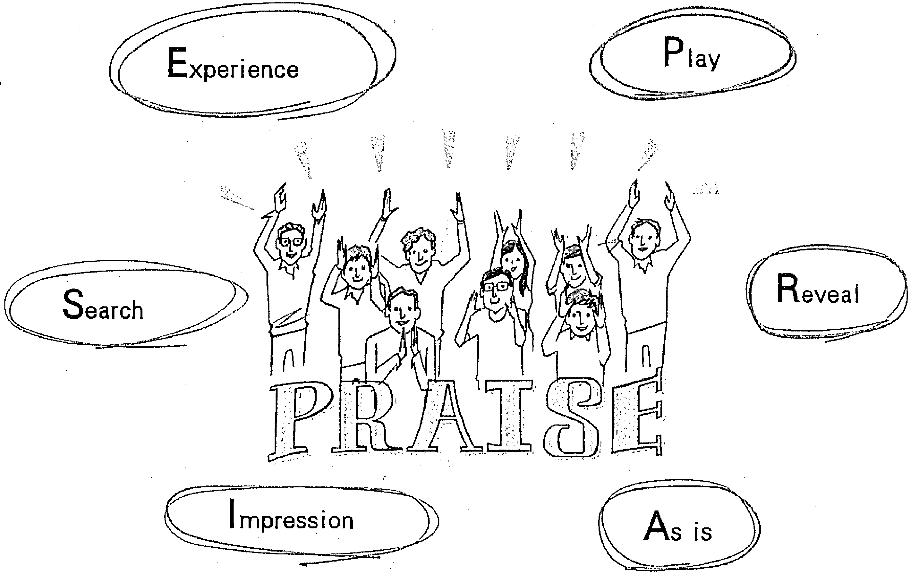

記住，產生構思的程序，與分析、驗證構思的程序不同。過去在商業世界裡，人們一直相信只要整理、分析、驗證資訊，就能找出正確的解決對策。但是，這只不過是找出正確解決對策的驗證過程，並不是創造構思的過程。

當然，規模龐大的組織如果需要負責說明，就必須驗證這個利用圖像、經過腦力激盪想出的構思是否正確。但是，在你負責的領域中，只要是在自己責任範圍內就能完成的工作，「來自你心中的答案」就可以立刻試著透過小規模行動來驗證，如此一來說不定會出現意料之外的豐碩成果，有時甚至會讓人感到驚豔。

順便告訴大家，我負責的企劃案大部分都是用這個創造性的解決手法所規劃。由我擔任理事一職，日本規模最大的讀書會「Read For Action」這個名字，就是來自盒子裡的圖像。另外，未來藍圖這個手法，也是針對「創造一個發自日本，流傳至全世界的思考法。」這個課題，將浮現在腦海裡的圖像化為形體，讓集團公司要推行的各種企劃案從圖像開始進行。

像我就從剛才提到的「背號10號」的鯨魚中得到靈感，發現自己應該在全國設置10個地區據點，並且將這些據點取名為「行動中心」（Action Center）。不僅如此，我還設計出一個商標圖案。

### 行動中心的商標圖案

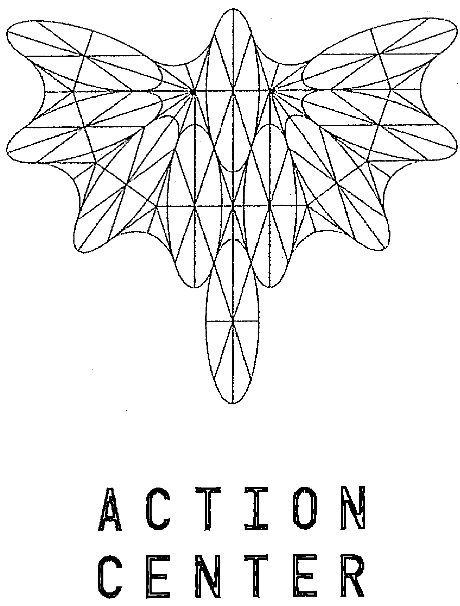

決定採用10個橢圓形相互合作，展現飛躍姿態的商標圖案！

圖像是故事的泉源，在這個故事創造財富的時代，只要能靈活運用圖像，就能從內心深處挖掘蜂湧而出的財富，這麼說應不為過。

## 禮物盒：出奇圖像法則

我想大家應該對這個實驗的作法，已經有了某個程度的了解，所以就讓我們再次架構你這3天的課題（在84頁寫下的課題）。為此，也請你在腦海裡再次浮現那個放在盒子裡的禮物。這份禮物是你希望他120%幸福，也就是在93頁挑選的那個人送給你的。

以我為例來說明，我的課題是「接下來這3天，我要如何找到最適合挑戰的課題？」而我希望能更幸福的對象是我的父親。3天後，我試著想像父親送我一份禮物。我在腦海裡想像這個禮物盒，試著描繪出從裡頭飛出來的意外圖像。

因為達成「接下來這3天，我要如何找到最適合挑戰的課題？」對方送我的禮物盒。

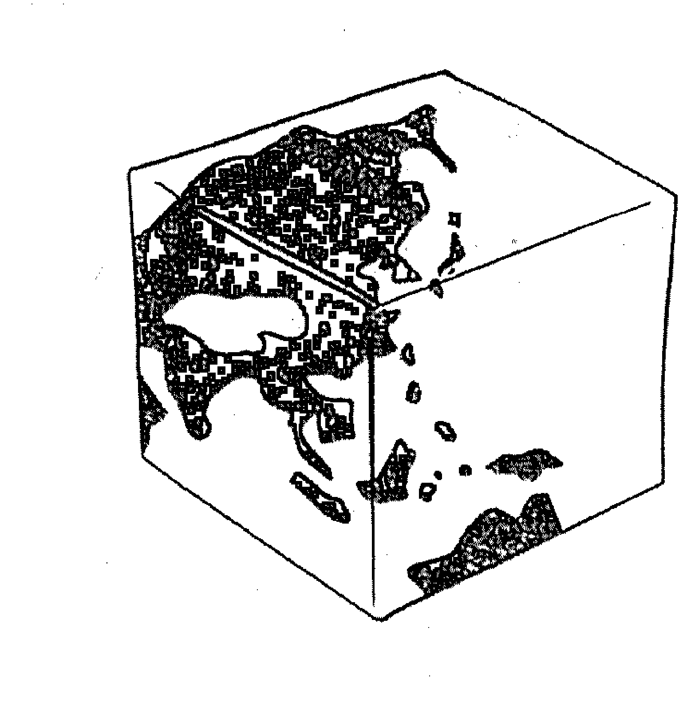

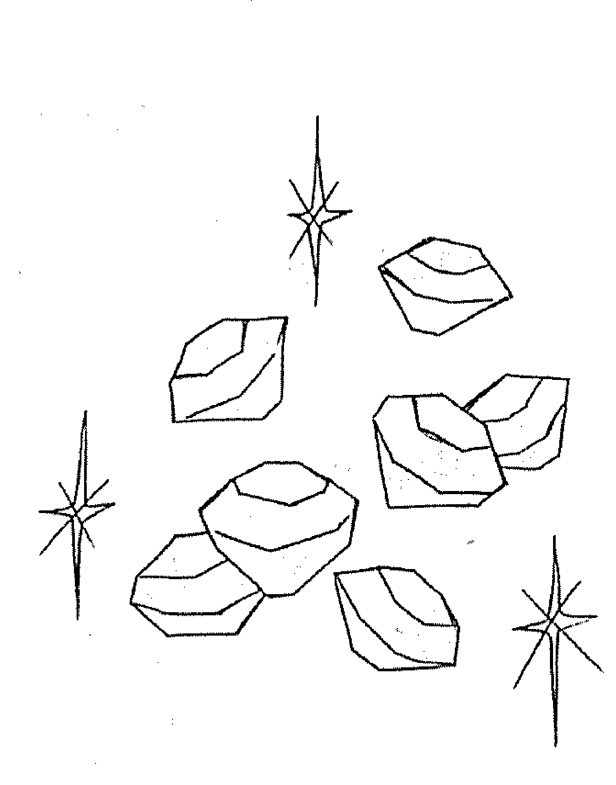

接下來輪到你了。先讓我說明一下順序。第一，當你的課題（84頁）與你在3天後的課題達成的同時，先回想起你希望能獲得120%幸福的人（93頁）。閉上眼睛，一邊幻想自己從120%幸福的人那裡收到禮物，一邊仔細描述盒子的外觀。接著，數1、2、3之後，試著仔細描述從裡頭飛出來的意外圖像。以上步驟結束後，就畫在下一頁的空白欄位。

### 【實驗 2 的總結】

### 藉由圖像解決問題：出奇圖像法則

#### 重點與作業

- ◎目的：針對「你的3日課題」（84頁），利用毫無關聯的圖像，試著找出能創造出解決對策的靈感。
- ◎所需時間：3分鐘。
- ◎作業：描繪出從你希望他獲得幸福的人手中拿到的禮物盒，與裝在裡頭的禮物。

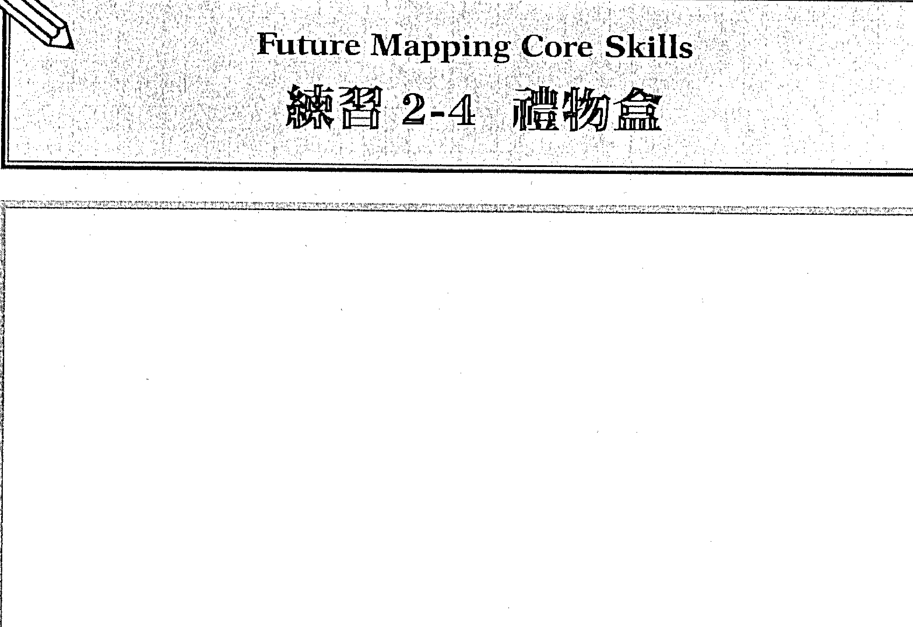

### 結果紀錄

這或許是一張讓你完全想不到，與課題會有任何關聯的意外圖像。但是在3天後，你對這張圖像的印象會如何改變？自由地寫下你所察覺到的地方。

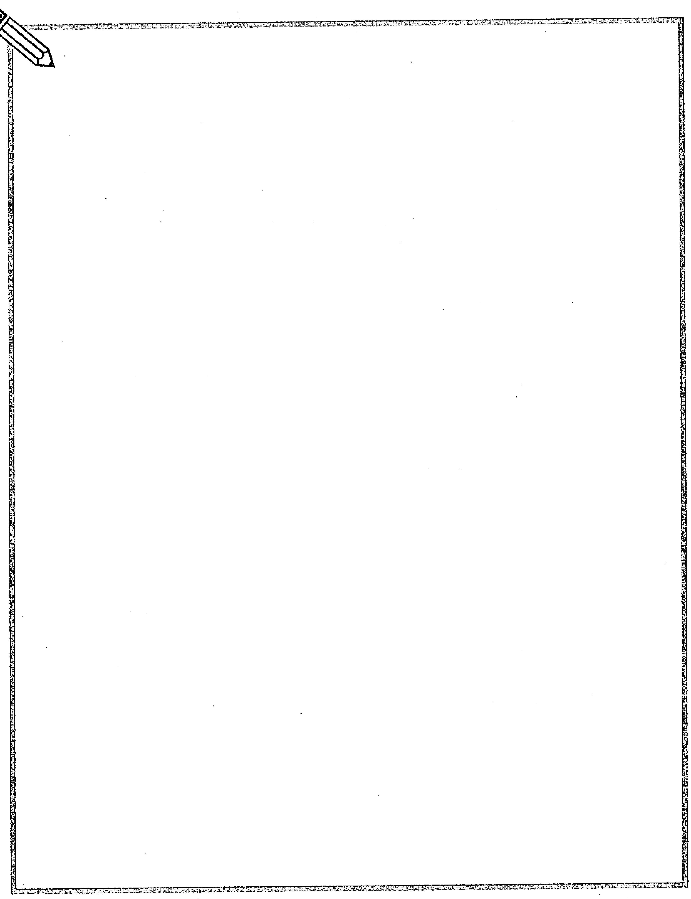

## 實驗 3

隨手畫下一條曲線會帶來什麼？——偶有法則

### 曲線可以拉出過去的記憶

實驗3是與「曲線」有關的實驗。

50頁提到的高中手球社團奇蹟式快攻的故事，就告訴我們，對於人生與其直線思考，不如視為曲線，這樣就能更堅強地生存下去。

曲線還擁有其他各種不同力量。其中一種力量，就是「拉出過去記憶所孕育出的故事」。

不多說，讓我們趕快實驗吧。這個實驗的目的，是為了編寫讓你的人生充滿魅力的宣傳片臺詞。所以，先請你好好回顧一路走來的人生，進行自我介紹。

方法與之前的實驗一樣簡單，只要10分鐘就夠了。我先示範一次自我介紹的方式。首先，在紙上畫下和右頁一樣的圖框。

|   |   |   |
|---|---|---|
|   |   |   |
|   |   |   |

在右下角寫自己的年齡後，再將年齡除以3，並記下那個數字。例如，我現在50歲，除以3的話無法整除，所以我就稍微調整成17、33、50，並且填在圖框裡。假設你是36歲，那就要填12、24、36。

接著，在右上角畫一個笑臉，代表你自己。要在這裡寫上你的名字，並且畫上120%幸福、自信滿足的你。翻到下一頁。

120%HAPPY

神田昌典

|   |   |   |
|---|---|---|
|   |   |   |
|   |   |   |

17 &nbsp;&nbsp;&nbsp;&nbsp;&nbsp;&nbsp;&nbsp;&nbsp;&nbsp;&nbsp;&nbsp;&nbsp;&nbsp;&nbsp;&nbsp;&nbsp; 33 &nbsp;&nbsp;&nbsp;&nbsp;&nbsp;&nbsp;&nbsp;&nbsp;&nbsp;&nbsp;&nbsp;&nbsp;&nbsp;&nbsp;&nbsp;&nbsp; 50

這個步驟結束之後，我希望你想像家人、朋友與同事，個個都誠心誠意且笑容滿面地拍手，非常高興身旁有這個年齡的你。就連你也是嘴角微揚，對於自己的表現非常滿意。

接下來，用較不靈活的那隻手來拿筆※1。放輕鬆，一口氣自然地從右上角朝左下角畫出一條曲線。

這個部分到此告一段落。應該不用一分鐘吧。

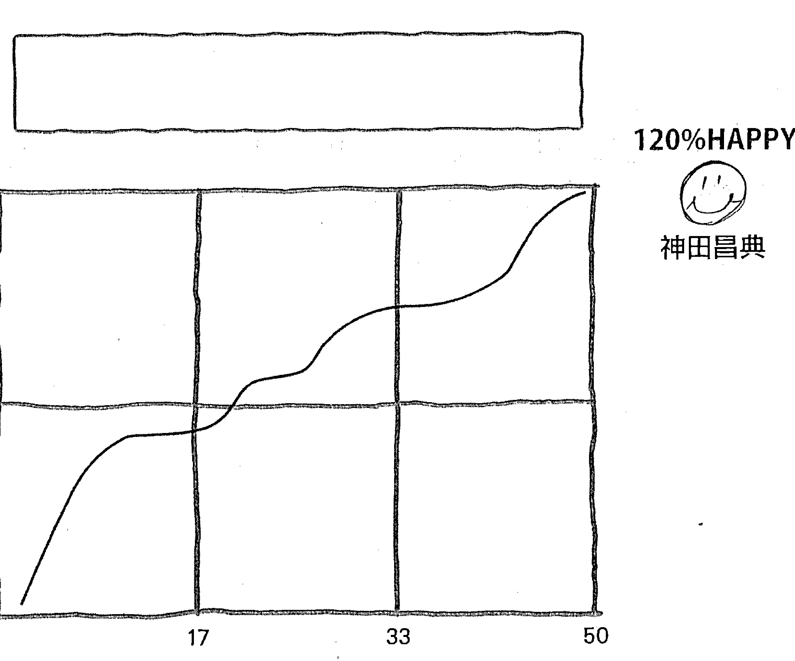

### 沿著曲線起伏，探索人生插曲

剛才隨意畫下的那條曲線，其實隱藏著令人驚訝的智慧靈感。畫下的曲線一定會有山有谷，代表起伏的感情。曲線往上，代表情況讓人甚為滿足的變化；曲線往下，換句話說，代表情況需要更加努力來改善。

在這條有山有谷的曲線上，選出5到6個讓你在意的地方，畫下箭頭。

試著回想標上箭頭的地方曾經發生什麼事。例如，20歲的地方如果是山頂的話，那就回想一下20歲時發生過什麼事。

接著回想每個地方曾經發生的小插曲，串聯成一個故事。如此一來，你的人生故事就算完成了。

看了這個故事後有何感想？是不是出現一個令人意外的結果？就讓我以自己實際編寫的東西為例來說明。

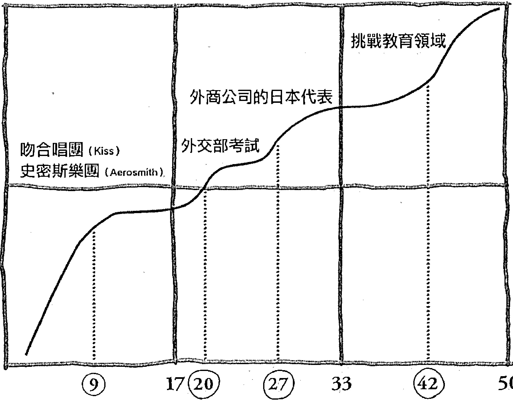

**120%HAPPY**
（笑脸图标）
神田昌典

我的曲線中出現的第一座山是在9歲，那時我迷上了吻合唱團（Kiss）、史密斯樂團（Aerosmith）與皇后合唱團（Queen）等西洋樂團，雖然當時還小，卻記得自己曾經聽過。

第二個讓我感到幸福的時刻是20歲時。當時的我想到國外工作，所以開始念書，準備參加外交部的考試。在實現夢想的過程中，我為了提升技能而吃了不少苦，但那時的我卻非常幸福快樂，而且順心如意。

接下來的山頂是27歲時。當時的我剛從國外留學回來，並且在外商公司擔任日本代表。

再來就是42到50歲時，我開始挑戰教育界，致力擴展心智圖（Mind Map）與影像閱讀（Photoreading）等來自國外的技術知識。

像這樣參考曲線回想人生之後，再把這些小插曲串聯起來，我就能引導出在國外奮鬥挑戰時，過得非常快樂的故事了。從「出國學習挑戰且充實滿足的人生」這個題目，就可以知道我這一輩子的人生歷程。

把這個題目填入標題框裡，就算大功告成。

### 出國學習挑戰且充實滿足的人生

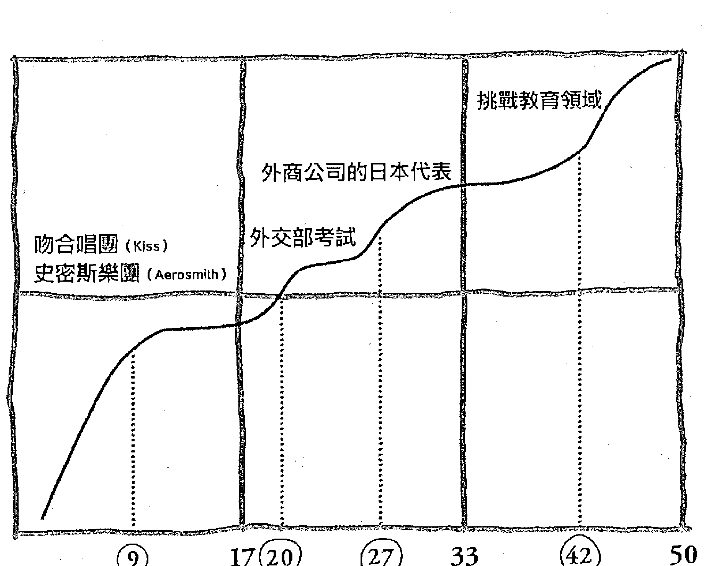

或許有人會覺得，「我的人生我最清楚，何必這麼做。」但是，從這段過程可以得到其他方法無法給予的好處。

那就是善用「一半必然，一半偶然的偶发性」，來得到超越現有自我介紹類型的想法。

通常在自我介紹時，就和這本書的作者簡介一樣，絕大多數都是誇耀稱讚、自吹自擂的內容。但是，一直對別人炫耀自己，會讓聽者感受不到人情味，甚至覺得厭煩。當然，對方不會記住這些內容，而且這些大多是自己也會忘記的事。

然而，只要思考這條隨意畫下的曲線之中的高低起伏處，就會讓你納悶「這時候發生了什麼事？」「為什麼我會覺得快樂（不快樂）呢？」這些問題會變成誘因，讓你回想起過去的點點滴滴。

只要將這些小插曲串聯起來，就能編寫出與平時思考時截然不同、屬於自己的故事。

所以，我希望你也能參考以上要領實際做看看，保證一定會看見過去從未察覺到，而且是屬於自己的人生故事。

我在美國的研討會上請大家體驗這份作業時，得到了各種回響。像是有位男性參加者就驚訝地對我說：「我只是隨便畫畫，沒想到這條曲線竟明確顯示出我的人生起伏。怎麼會這樣？」我解釋：「這條高低起伏的曲線，只是碰巧貼近你想起來的記憶罷了。」只要一畫出這條線，確實會偶然畫出人生中遇到的那些起起落落的轉機。

有位女士手上拿著那張畫著一條平緩曲線的紙對我說：「我的人生根本就沒有這麼平順。」就算我解釋：「這並不奇怪。」她依舊無法理解，心不甘情不願地回到位子上。

過了一會兒，她又走過來跟我說：「你說這條曲線表達了我的感情，那我可不可以把這條線當作是Spirituality（心靈），而不是Emotion（情感）呢？我是不是可以把它當作心靈的成長呢？」我對聲音愈來愈高亢的她默默點了點頭。「如果是這樣，那麼就可以說明我現在的整個人生了。」說著說著，她的雙眼開始泛淚，我們倆都給對方一個溫暖的擁抱。

人生雖然起伏如山谷，但如果是自己選擇在「谷底」時讓心靈成長，即使是面對谷底，也不會看在眼裡。在領悟到自己人生有何意義的那一瞬間，她早已忍不住潸然淚下。

接下來，我們在下一頁準備了一個空白欄位，讓你畫下自己的故事。這只要花幾分鐘就可以完成，所以一定要想起那個早已忘懷的自我。

### Future Mapping Core Skills
#### 練習 3-1 你的生命故事是什麼？

120%HAPPY

你的名字↓

( )

|   |   |   |
|---|---|---|
|   |   |   |
|   |   |   |

( ) ( ) ( )

你現在的年齡↑

### 曲線也能牽引著未來的行動

許多讀者應該都知道，賈伯斯曾到史丹福大學的畢業典禮上演講。當時他告訴大家：「過去這些找不到意義的零散經驗，在日後驀然回首時，你會發現都是有含意的。」「善用人生的每一刻。」「所以讓我們摩拳擦掌，大幹一場吧。」

他把這樣的生存智慧，簡潔地用「連線遊戲（Connect the Dots）」來表達，而這個自我介紹的實驗就是連線遊戲。回顧過去那些零散的經驗，並用線條串聯起來，就能從中找出必然的連續性。

實際上，連線遊戲的原理也能用來編寫未來的故事，所以就讓我們再進行另一個實驗吧。那就是寫下今天一整天的行動劇本。

先讓我說明一下步驟。首先，畫下一個和開頭一樣的圖框，橫軸的年齡改為時間。假設早上8點起床，工作到晚上8點，那就把時間劃分成8點、12點、16點和20點。

|   |   |   |
|---|---|---|
|   |   |   |
|   |   |   |

**時間標籤**: 8時, 12時, 16時, 20時

**120%HAPPY**

**OOOO (主管的名字)**

今天辛苦了。謝謝。

假設你是業務員，而你希望能獲得幸福的人是主管。在右上角畫好笑臉後，就拉出一個對話框，填入你希望從他口中聽到的台詞，像是「今天一整天辛苦你了」、「你做得很好耶」、「看得出你非常努力」。

用較不靈活的那隻手拿筆，一口氣從右上朝左下畫下一條曲線。

用圖表示的話……

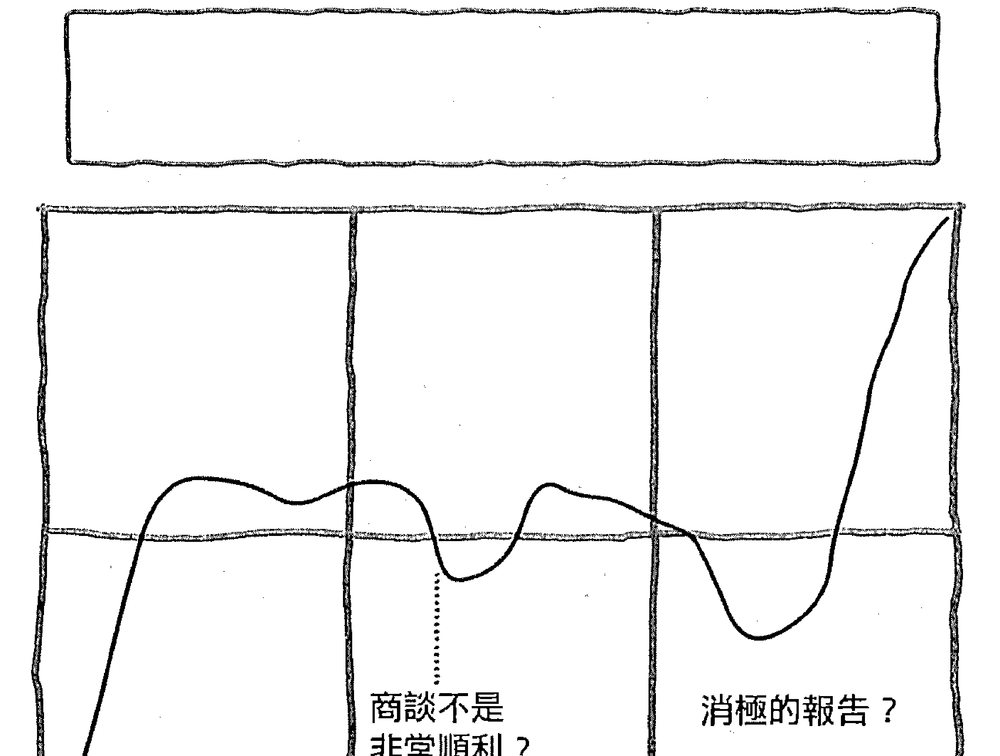

接下來，如果曲線的高低起伏處有你在意的地方，就對照看看你原本預定的計畫。記住，這條曲線提示著未來，查查你在山頂與谷底對應的時間點上，安排了什麼樣的工作。

使用曲線的最大好處，就是能編寫出假設會遇到困境的行動劇本。

例如，在下午1點的地方曲線往下。打開記事本一看，下午1點要商談，這或許暗示著「這場商談會議可能不會很順利」。既然如此，就假設是情況不佳的局面，而更加細心準備資料。到了下午4點，曲線又開始往下，可以推測「回到公司之後，可能要寫一份結果不是非常樂觀的報告……。」如此一來，就可以事先預料對策，以避免這種情況發生。

當然，這條曲線並不能真正預測未來，但卻能讓人做好準備，應付一些料想不到的意外狀況。只要每天持續這項工作，「假設與改善」的循環就會日日重複，提議書也會一直更新改善，讓意外糾紛慢慢減少，並在工作上展現出實際成果。

相對地，若不利用曲線，只抱著「商談會進展順利」這種帶著希望的觀測態度來編寫行動劇本，萬一進展不順利，極有可能來不及應變。許多人都是因為沒有事先擬好備案，硬將無法消化的臨時方案塞入計畫中，不然就是沒有把「為一整天的尾聲畫上幸福句號」這件事當作目的，結果造成那一天無所適從，不知道要做到什麼樣的地步才算大功告成，最後搞得身心俱疲。

有沒有畫出曲線，差別就是這麼大。

剛才的自我介紹實驗是以曲線變化為契機，回憶起令人印象深刻的往事（點與點），再次架構來自過去的故事；而這次的實驗是以曲線變化為契機，料想今後會發生（而且是已經預定）令人印象深刻的事情（點與點），重新編輯結局幸福的未來故事。

喬布斯的連線遊戲——儘管不確定能否派上什麼用場，但是根據串聯的方式，每次畫都能創造出完全不一樣的意思（=現實）——圖像不只能解讀過去，還能應用於未來。

## 自己架構專屬的「3日課題」圖表

讓我們循著到目前為止進行的實驗結果，創造一張圖表，架構屬於你的「3日課題」吧。

恭喜你！其實你已經體驗了三個重要技巧了。

第一個是想像一個未來能獲得120%幸福的人，並且詳細描述未來情況的體驗。第二個是藉由禮物盒這個圖像，針對問題得到解答靈感的體驗。第三個是試著畫下從未來到現在的曲線。

光是組合這些技巧，絕大多數都能得到超越期待的效果，所以我希望你一定要在此架構一個3日課題，並且寫在84頁裡。

我們先將寫在100頁的實驗1結果，與122頁的禮物盒，填入下一頁的圖表裡，以便彙整之前的實驗結果。

## 你的 3 日課題

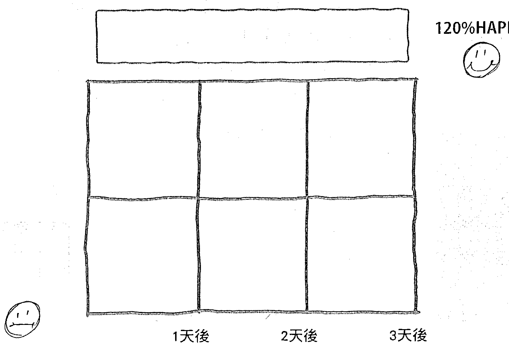

我將自己的範例填在圖表中供大家參考，內容如下。

| 1天後 | 2天後 | 3天後 |
|---|---|---|
| | | |
| | | |

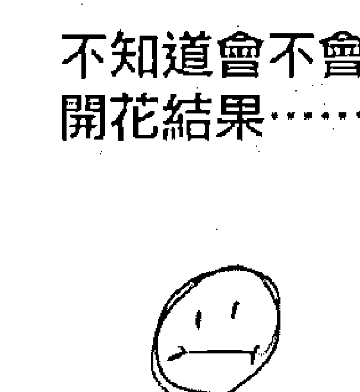

120%HAPPY

神田父 (83)
週二，下午3點左右。
手機簡訊內容：

謝謝你，昌典。
沒想到番茄跟茄子竟然大豐收。
只要花時間細心照顧，蔬菜果然就會有所回報。
剛開始栽種或許不太輕鬆，但是只要有一絲絲決心，就可以整個改變生活習慣，是吧？現在我的身體愈來愈健康，所以還會活很久喔！

我想你應該發現圖表的左下角有個對話框。這裡要填寫的是，幻想3天後變得幸福的那個人現在的心境，簡單寫下2到3句台詞。現在的情況或許有點不盡人意，但是3天後的情況，應該會讓人十分滿足。倘若如此，就請大家想一下要如何表達出這個不是令人滿意的心情，並且填寫在對話框中。

我則是寫下「不知道會不會開花結果……」這個不安的情緒。

接下來，就請你把目前得到的結果，寫在自己的圖表中吧。如何呢？你的3日圖表是不是和範例一樣填好了呢？你所學到的第3個技巧是「串聯現在與未來的曲線」。

這個步驟雖然一眨眼就結束，但是非常重要。

放鬆心情畫畫看吧。用較不靈活的那隻手來拿筆，一口氣從右上角朝左下角畫一條曲線。為了一眼看出了自己做了什麼樣的步驟，表框的顏色（例如青色）以及與你希望他幸福的人有關的地方（笑臉與曲線），就用不同的顏色（例如藍色）來畫。

請你參考我的圖表，自由揮動自己的手，畫下曲線吧。如此一來，已經算是動筆寫下邁向未來的劇本了。

## 神田在剛才的圖表裡畫的曲線範例

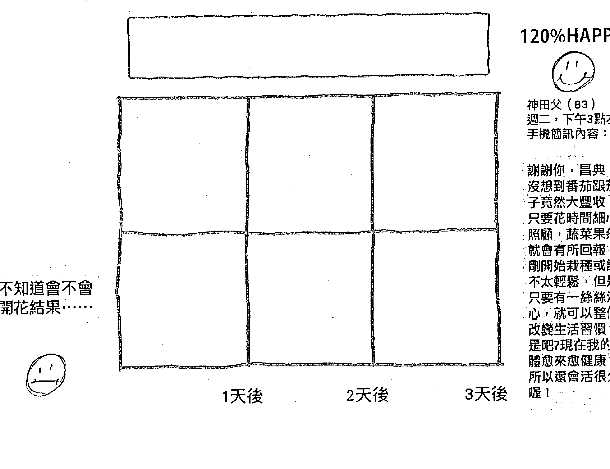

如果是踏著未來藍圖的每個步驟循序漸進，下個步驟應該是在曲線下方編寫故事。這麼做的話，腦海裡通常都會浮現現今的你從未想過的構思，但是在習慣編寫故事之前，往往需要一段適應時間。所以我們在這裡先仿照剛才編寫一日行程的方式，跳過創作故事這個階段，看看自己是否能迅速俐落地掌握行動劇本的內容。

第一，先想想你希望獲得幸福的人會出現什麼變化。如果是我，故事內容會演變成「父親原本很擔心蔬菜會長不好，沒想到最後竟然種得非常成功，各種作物都大豐收。」如同我剛才所說明，父親這個角色，其實就是我藉由他人這面鏡子所照出的模樣。反過來說，「原本一直擔心會不會開花結果的我」，最後變成「在各個領域內展現成果的自己」，這就是這 3 天所隱藏的主題。

這樣的想法固然籠統，卻能看出這 3 天行動劇本的方向性。如果再將浮出檯面的方向性對照在現實生活中已經排好的 3 日行程，會讓人試著去思考，能不能讓這個方向性變得更明確。

請大家參考我的範例，先試著抓住讓行動劇本變得更明確是什麼感覺吧。

## 神田在剛才的圖表裡畫的曲線範例

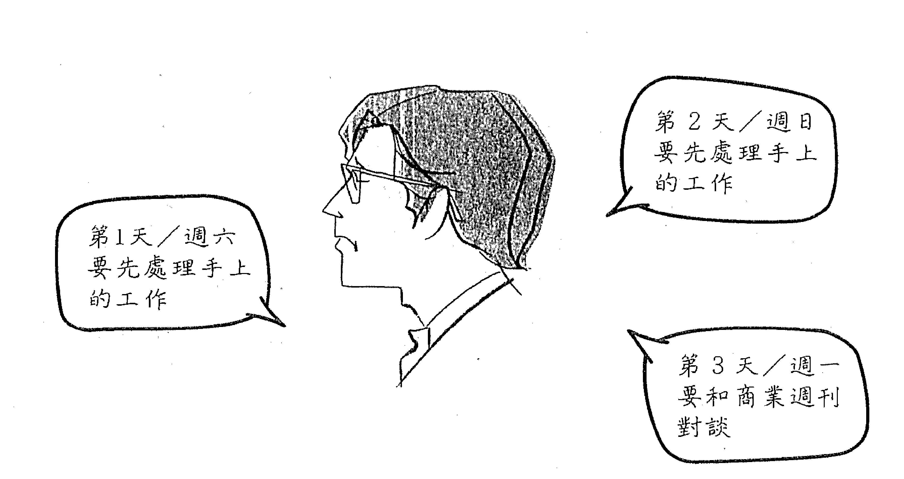

每天就像這樣，被應該做的事追著跑，沒有一個方向性。可是一旦看見「之前種的作物在3天內就會收成」這個走向……

## 畫下曲線後的我，腦子裡所想的事

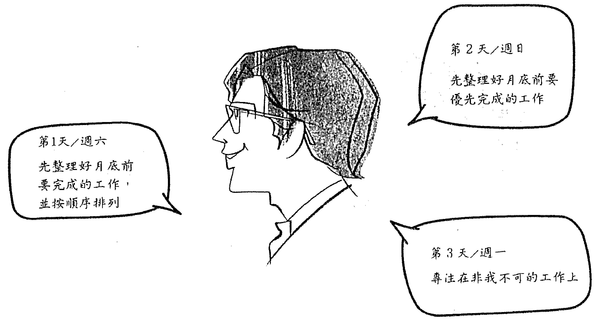

在前一頁的插圖裡，第3天記下的「要和商業週刊對談」這個計畫，雖然已經事先排入行程中，但是這個地方卻剛好是曲線下滑的地方。也就是說，自己正遠離幸福的未來。這麼說，對於要和自己對談的人確實有點失禮，但是對自己而言，卻不禁質疑這場對談「真的是份內工作嗎？」儘管已經開始考慮，要提醒自己今後得慎選工作，但卻因這個結論不夠明確，難以說服自己。

這時候就可以想一想禮物盒。我的禮物盒外面畫著世界地圖，一打開，裡面放了七顆施華洛世奇的水鑽。

> > 達成課題「接下來這 3 天，我要如何找到最適合挑戰的課題？」時收到的禮物盒

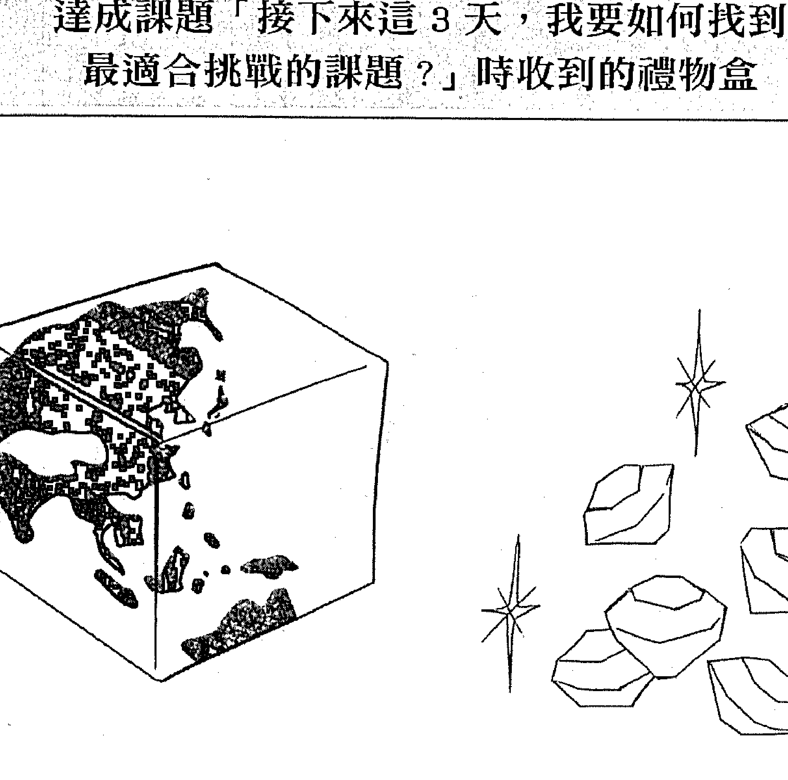

這張圖像可以試著利用 114～118 頁說明的 PRAISE 來解釋。試著思考施華洛世奇象徵著什麼。答案其實非常簡單，就是「寶物」。

七顆水鑽，代表從過去負責的企劃案中，優先挑選七項極有可能推廣至全球的企劃案，並且整頓成確實可以流傳的器具（組織）——我發現這就是我當下應該架構的課題。

一旦以這個課題為前提，讓我重新思考，過去原本以為「好像沒有什麼意義」的第 3 天對談，「說不定是一件非常重要的工作」。

這一天的企劃要談的是學習法，不過我發現對談時只要端出話題，提及當時的我為了向世界推廣在日本創設「Read For Action」的這本書就好了。

只要加上自己查覺到的地方，讓行動劇本的內容更明確的話……

> 畫下圖表後的我，腦子裡所想的事
——繼續思考禮物盒的圖像所引發的含意之後……？

## 標題：流傳於全球的7個寶物

第1天／週六
先整理好月底以前要完成的工作。
優先順序就以今後可以向全世界推廣的內容來安排。

第2天／週日
先整理好月底以前要優先完成的工作。

第3天／週一
與商業週刊對談。主題是
讀書法，就以讀書會為我要介紹的主題～

原來如此！
我應該把焦點放在找到可以
流傳在世界上的七項寶物！

如上所示，只要試著畫下圖表，原本模糊不清的思維就會明確又清晰地化為行動劇本。不僅如此，在曲線往下的部分，只要深思熟慮就能獲得嶄新的觀點，將這條往下的曲線改為朝上的曲線。也就是說，如果這麼做就能預想極有可能失敗的事，並準備將它轉變成一個極大的好轉機會。

一定要好好利用到目前為止學到的技巧，試著畫出一張在 3 天內達成課題的未來藍圖。

先說好，這只是一個實驗。所以在畫出連接現在與未來的曲線之後，就算沒有找出含意也無妨。

我希望你做的事只有一件。那就是 3 天後回顧這一切時，確認看看曲線動向與現實生活究竟有什麼關係，或者到底有沒有關聯。

那麼就請你一邊期待 3 天後的結果，一邊完成你的第一張未來藍圖吧。

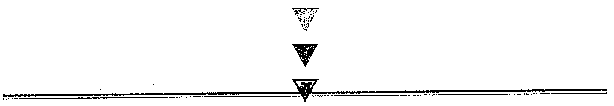

### 【實驗 3 的總結】

### 曲線的力量：偶有法則

#### 重點與作業

◎目的：畫出連接 120%幸福的未來與現在的曲線後，試著分析這條曲線與現實生活之間，會出現什麼樣的關聯性。

◎所需時間：5 分鐘左右。

◎作業：
1. 寫下實驗 1（100 頁）設想的未來台詞，與實驗 2（122 頁）想到的禮物盒圖像。

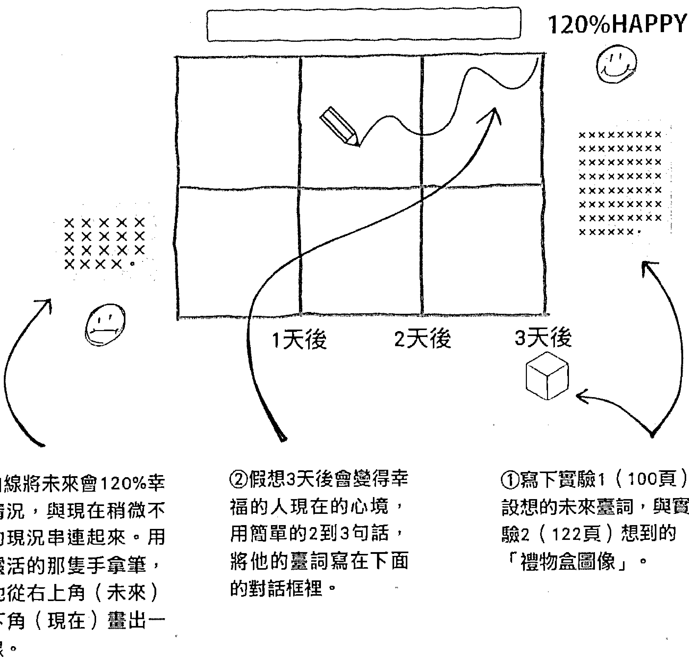

2. 假想3天後會變得幸福的人現在的心境，用簡單的2到3句話，將他的台詞寫在下面的對話框裡。
3. 用曲線將未來會120%幸福的情況，與現在稍微不滿足的現況串聯起來。用較不靈活的那隻手拿筆，隨意地從右上角（未來）朝左下角（現在）畫出一條曲線。

#### ▼結果紀錄

3 天後回顧這張圖表，試著比較看看這條曲線的高低起伏，與現實生活中發生的事，並且把在意的地方寫下來。

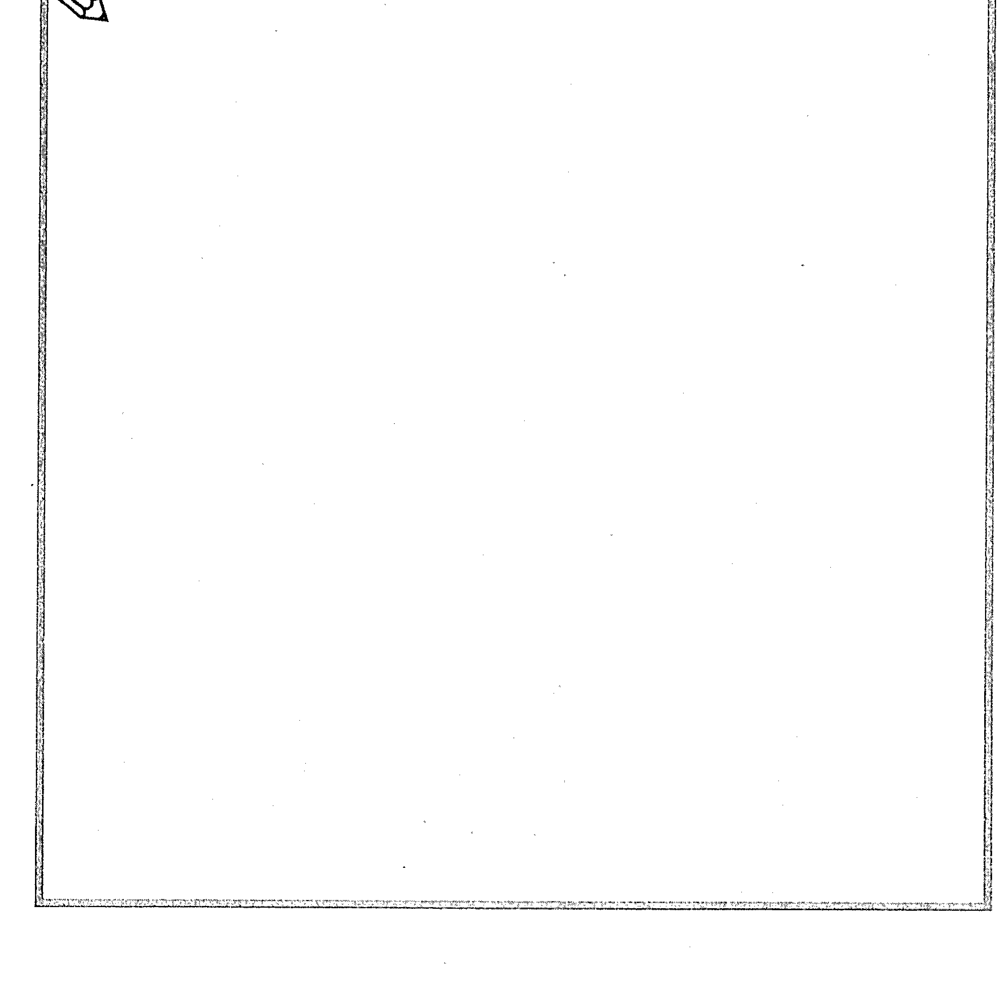

## 實驗 4

### 從毫無關聯的故事中，得到具體提示——改觀法則 ①

- ▽
- ▽
- ▽

> 你希望《美女與野獸》中哪個人幸福？

恭喜你！經歷前面的 3 個實驗後，現在的你可以畫下第一張未來藍圖了。

畫好圖表後，過 3 天再回頭看，有的讀者會如願達成課題，有的雖然會得到不錯的構思，但還沒有進入實行的地步。

現在最重要的，是嘗試未來藍圖中的描繪技術，所以不管你屬於哪一種情況都沒關係。最要緊的，是把這本書拿在手上實際操作看看。實際試過之後，你就會學到過去從未學過的新技巧——從毫無關聯的圖像中想到解決問題的對策，或是從瞬間畫下的曲線來設計今後的劇本。

第一張未來藍圖畫好後，接下來就要正式挑戰如何利用故事達成課題。

生活中的課題時，已經準備好的故事要如何派上用場。 我在 63～68 頁的《桃太郎》這個日本童話故事，說明了構思與實現群眾募資事業這個案例，但是這樣的故事，真的擁有讓我們能更有創意地達成課題的力量嗎？ 在實驗 4 中，我們先設定一個新的第 3 個課題：「如何想出讓自己投入其中的企劃案」，請你好好體驗一下，在 6 天內利用迪士尼曾製作成電影的故事《美女與野獸》來找出答案，並且設計出達成這個課題的行動劇本。 面對「如何想出讓自己投入其中的企劃案」這個問題，現在的你恐怕會斬釘截鐵地說，這跟《美女與野獸》根本沒有關係！ 但是這個部分，坦白說其實是很有趣的。只要經歷過這個實驗，你應該會驚訝地發現，故事竟然擁有解決現實生活問題的力量。 不多說，就讓我們開始吧。《美女與野獸》應該是全世界人人知曉的故事，不過為了從未聽過這個故事的讀者，先讓我敘述一下故事大綱※2。

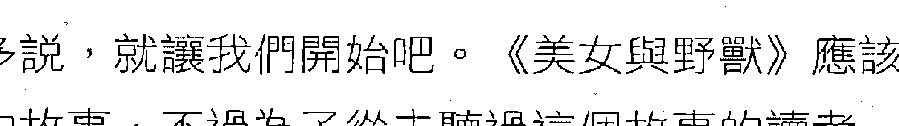

### 《美女與野獸》故事大綱

王子被魔女施法後變成醜陋的野獸，他若要變回原來的模樣，條件就是要愛上某人並且被愛。有位老人不慎走進野獸生活的這個令人毛骨悚然的城堡，因而被俘虜，他的女兒貝兒願意替代他成為俘虜，並且開始與野獸一起生活。不久後，野獸慢慢對貝兒敞開了心胸。
某日，被貝兒迷住的男子加斯頓，在暫時被釋放返鄉的貝兒面前，憤慨激昂地前來討伐野獸，就這樣與野獸掀起了一場戰鬥。這場激烈的戰鬥讓野獸身負重傷。出現在野獸面前的貝兒，抱起了不支倒地的牠，並向牠告白。而接受貝兒愛意的野獸，也因此恢復原來的王子模樣。

主要的登場人物是這四個人：

- ① 美女（貝兒）
- ② 野獸
- ③ 獵人（加斯頓）
- ④ 父親

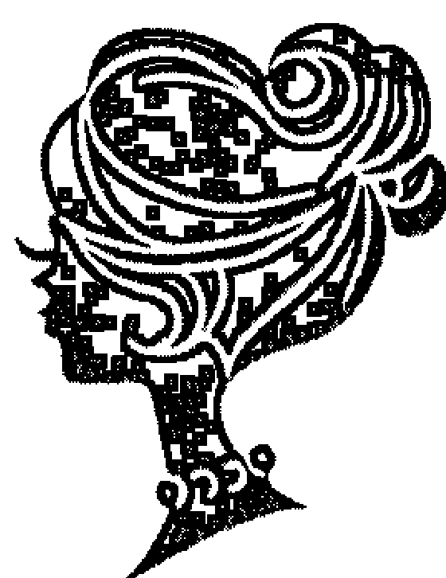
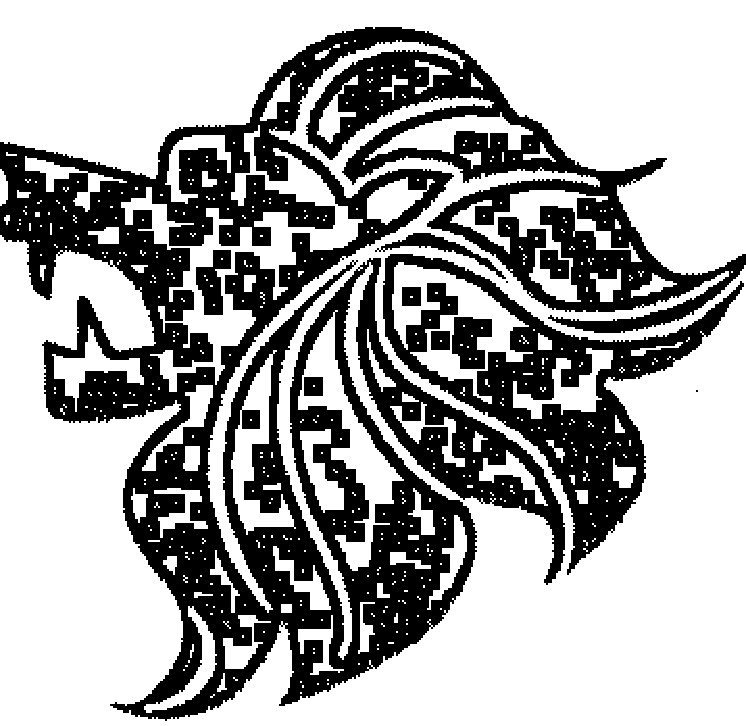
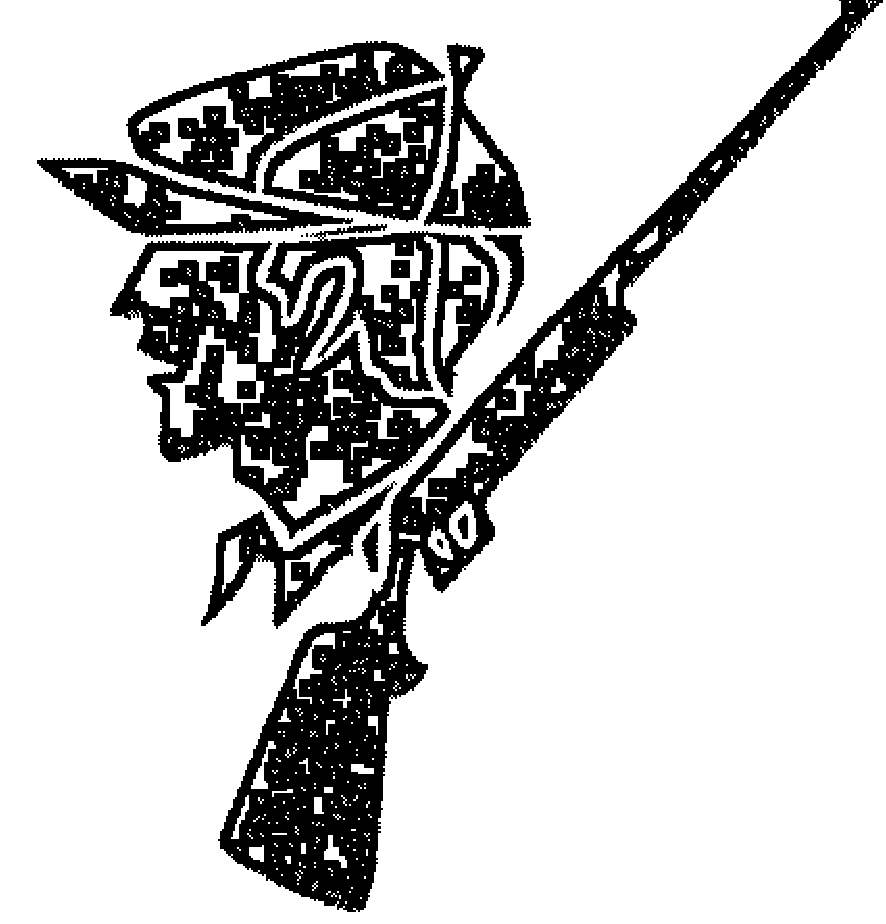
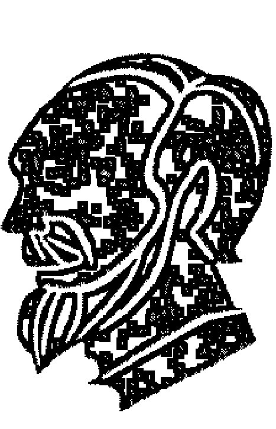

讓我先問你第一個問題。在設定「如何想出讓自己投入其中的企劃案」的同時，如果要讓其中一個登場人物擁有 120%的幸福，你會從這 4 人中選擇誰？請你憑直覺挑選一個。
決定好能獲得幸福的登場人物後，就繼續進行下一步。

下來，《美女與野獸》要進入一個新的局面。原作故事的最後，是野獸變回王子的幸福結局。實際上，這個故事還有後續發展呢！

在幸福結局之後，4 個登場人物過著什麼樣的人生？我試著為這 4 個登場人物，分別寫下 4 篇不同的續集。

接下來，我要介紹這 4 篇續集，不過你不需要全部都看過。我只要你看剛才憑直覺選擇之人的續篇就好。那麼請先看你所挑選的那篇續集吧。

### 《美女與野獸2》

#### 野獸變回王子的幸福結局之後中

#### ①選擇美女（貝兒）得到幸福的續篇故事

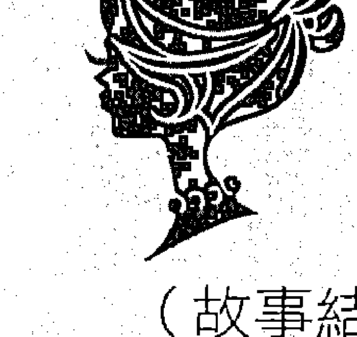

> 貝兒：「真的非常謝謝你們。我母親在我還小的時候離家出走。坦白說，我曾經非常恨她，但是這趟旅行讓我們得以偶然重聚，也得知背後的真相，所以我卸下仇恨，原諒母親。沒想到這時候，家裡剛好也多了一個小生命。」

#### （故事展开）

- ◆第1部（開頭）
與王子結婚、成為王妃的貝兒，儘管周遭的人對她非常和善，每天都過著幸福的日子，但是心裡還有一個人讓她耿耿於懷，那就是她的母親。因為受不了每天沉溺於發明、罔顧家庭的父親，於是母親丟下當時才5歲的貝兒，就這樣離家出走。
- ◆第2部（內容）
但是，貝兒卻偶然地與母親重逢了。那時的她正在鄰國旅行，沒想到在投宿的一流飯店裡工作的女服務員，竟然是她的母親。貝兒指責母親當初拋棄她，但是母親早已對自己離家出走一事感到後悔，並且還為了貝兒寄生活費給她的父親。
- ◆第3部（結尾）
貝兒把母親帶回故鄉。面對哭著道歉的母親，父親寬容以待，告訴她「我用新發明的麵包機做出來的麵包，可不輸給一流飯店。」相隔20年後的重逢，那一刻充滿相互體諒與理解。那時，貝兒還發現自己的肚裡懷有小寶寶。看見即將生下孫子的女兒，老夫妻不禁望著對方，笑容滿溢。

#### ②選擇野獸得到幸福的續篇故事

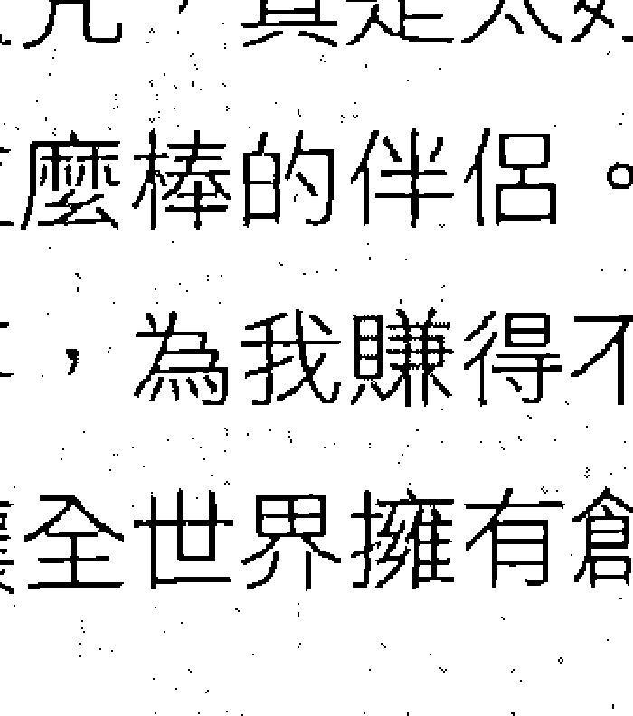

##### （故事結尾）

> > 野獸：「真的非常謝謝你們。能被魔女施法詛咒，真是太好了。幸好有她，我才會改掉我的傲慢，並且遇到這麼棒的伴侶。不僅如此，這一連串的歷程還成為風行全球的故事，為我賺得不少版稅。我要把這筆版稅做為成立大學的基金，讓全世界擁有創新腦筋的人，全都聚集到我國。」

#### （故事展開）

##### ◆第1部（開頭）
重回人的身份之後，王子迎娶貝兒為妻，每天都過得非常充實。某日，出版社的人前來造訪，希望將王子經歷的故事寫成書。連讀文章都沒有什麼把握的王子，在貝兒的幫助之下，決定挑戰寫書。

##### ◆第2部（內容）
在編寫的過程中，他曾經寫不出來，也想要逃避，但是花了一年的時間，王子終於完成原稿。不料，前來取稿的出版社編輯，卻在回程路上跌到河裡，結果稿子被河水沖走。震驚不已的王子最終原諒了編輯，決定再次拾筆重寫。

##### ◆第3部（結尾）
花了三個月重寫的文稿終於順利出版成書，沒想到在全世界引起極大迴響，暢銷熱賣，王子也因此得到一筆優渥的版稅。不過，他並沒有將這筆錢用在自己身上，反而當作成立大學的資金，希望能提升國民的教育程度。結果，王子治理的王國因而聚集了思想創新的知識階級，同時也日漸深受人民敬愛。

#### ③選擇獵人（加斯頓）得到幸福的續篇故事

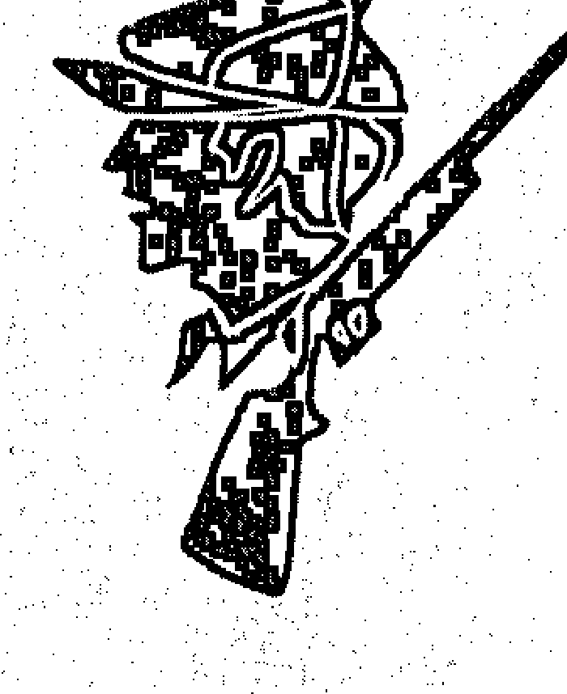

##### （故事結尾）

> > 加斯頓：「真的非常謝謝你們。我認為世界上沒有一份工作比獵人還要帥氣，但是當我變成野獸，反被獵人追殺時，才發現自己錯了。當上地球樂園化企劃隊長的今日，我真的過得非常滿足，並且對過去曾是粗暴者的自己感到丟臉。」

#### （故事展開）

- ◆第1部（開頭）
原本從塔上跌落，幸而被樹枝勾住才得以獲救的獵人，卻因為最喜歡的貝兒與野獸締結連理而失戀，喪失了活下去的力量，於是請求魔女「把自己變成野獸」。
- ◆第2部（內容）
變成野獸的獵人，從狩獵者變成被獵者，體會到被人獵殺的恐懼。就連自己周遭的朋友與家人也統統變成動物，不得不去守護他們。原為獵人的野獸，就算被獵槍打中了，也堅決要守護夥伴到底。
- ◆第3部（結尾）
因為守護夥伴而得到其他獵人認同，再次變成人類的獵人，因深感「不該一味地殺生」，而決定離開獵人這個行業，並且開始推行企劃案，打造一個讓全國人類與動物都能共生的環境。

#### ④選擇父親得到幸福的續篇故事

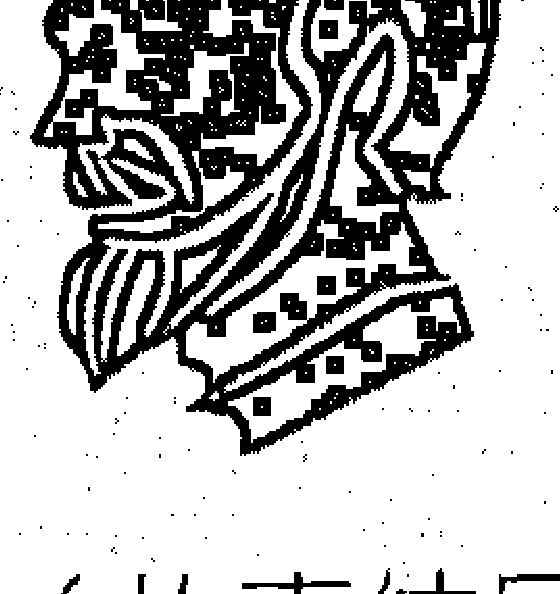

##### （故事結尾）

> 父親：「真的非常謝謝你們。我從魔女使用的各種魔法中得到不少靈感，發明了好幾種東西。看來魔術這個東西，已經可以藉由合理的科學來說明了。不僅如此，我國還成立了一所新大學，而我也當上該校校長，體會到培育後進這個新的人生意義。」

### 故事展開

#### ◆ 第1部（開頭）

貝兒與王子結婚之後，父親依舊沉迷於發明之中。某日，魔女登門拜訪，為了讓貝兒與父親痛苦一事前來道歉。既然人都來了，於是父親請求魔女讓他看看，從以前就感到非常好奇的魔法掃帚。

#### ◆ 第2部（內容）

魔法掃帚雖然要靠魔術的力量才能飛起來，但是父親仔細調查裡面的裝置，發現了讓掃帚懸浮的原理，並且從這個原理中得到靈感，成功發明了能源效率極佳的航空機專用電力馬達，能夠一邊利用太陽能發電，一邊飛行。

#### ◆ 第3部（結尾）

父親坐在自己打造試做的飛機駕駛艙裡，抱著必死的決心挑戰試飛。飛行時，機體無聲無響、輕飄飄地浮在空中。人類第一架藉由太陽光飛行的飛機，成功飛翔了！全世界的科學家均投入研究，並且讓飛機實用化。之後父親成為大學校長，同時也獲得了好名聲。

看了你所挑選的主角變得幸福的故事之後，如果能讓你頻頻點頭說「原來如此真有趣」、「這種事應該會發生」，那就足夠了。如果你認為「我沒辦法有同感」、「好像不太對」的話，那就看看其他故事，再次挑選一個完全貼切你內心的感性故事吧。

現在的你或許會覺得，這些荒唐無稽的故事怎麼可能會在現實生活中與達成課題有關。不過，再等一下，不要因為「這個方法並不是理論性的」、「並不適合我」這些理由而放棄，因為處於既有思考這條延長線上的連續性思考法，不管是誰，都只能從中想到連續性的構思。想要得到與既有概念截然不同、非連續的解決對策，最快的方法就是善用有別於過去的非連續性思考。

接下來，只要稍微動動腦筋，創作故事時，腦海裡就會浮現達成課題的程序。如此一來，如何達成現實生活課題所需的行動劇本，方向就會愈來愈清晰。

### 如何引導出能達成課題的靈感？

既然如此，究竟要怎麼做才能從與課題毫無關係的故事《美女與野獸 2》，引導出達成課題的靈感？

我在 27 頁曾經說過，故事式思考就像是去看電影，從故事中得到解決自我課題的靈感後，再回家的思考法。現在的你就是看了《美女與野獸 2》這部電影，接下來只要把這個故事與解決課題串聯在一起就可以了。

這個工作只要試過一次，知道訣竅後就會非常簡單。接下來，我會和你一邊架構同樣的課題，一邊試著共享將故事與現實生活串聯起來的過程。

做出未來藍圖的第 1 步，就是設定課題。請你再次確認我們這次要架構的課題，那就是「如何想出讓自己投入其中的企劃案」。完成這個課題的時間設定為 6 天。

未來藍圖的第2步，是選擇未來希望能獲得 120% 幸福的人。在《美女與野獸 2》登場的 4 個人物中，我選擇獵人得到幸福的故事。獵人的故事簡單扼要地如下述說。

(開頭) 因失戀而垂頭喪氣的獵人，請魔女把他變成野獸。
(內容) 變成野獸後，才了解被人獵殺的恐懼，於是獵人開始守護動物，不讓他們被獵殺。
(結尾) 重返人類身分的獵人改過向上，開創了人類與動物共生共存的企劃。

從這個故事要如何引導出達成課題的方向性？方法非常簡單。
首先，將故事的開頭、內容和結尾，當作是自己達成課題的那份行動劇本的開頭、內容和結尾。
接著，試著思考從某個故事的走向，能不能聯想到其他東西，有沒有什麼靈感。我把聯想的結果整理成圖表，如下所示。

#### 1. 開頭（第1～2天）

獵人故事開頭的關鍵字，就是「失戀」。
什麼是失戀？在這裡我們要用實驗2說明的PRAISE聯想法（請參照114～118頁），豐富你的想像。如此一來，失去了心、忙碌、埋頭工作的工作狂等關鍵字，就會紛紛浮現腦海。

若要思考如何與「透過未來藍圖展現漂亮的結果」這個課題攀上關係，第1天可能要採行「總之，先讓自己將心思放在工作上，把這份工作做完。」這個對自己來說算是最好的行動。也就是處理好過去一直在做的工作，以得到豐碩成果的準備期間。我只要一動手，通常會強烈偏好立刻展現結果，所以把充分準備的期間納入計畫中，是一件充滿建設性的事。

所謂失戀，就代表現在能以客觀立場來看待過去迷戀的對象了。如此一來，在第1到2天檢討我在過去所熟悉的世界，也就是從商業與行銷領域跨出一步，應該會比較重要。

### 課題
如何想出讓自己
投入其中的企劃案

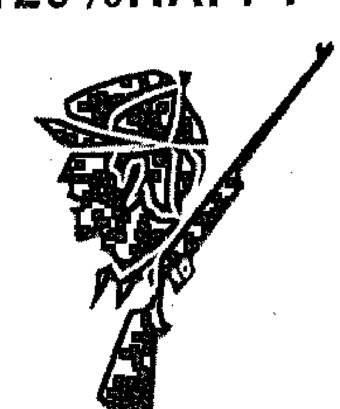

| 如果…… | 如果…… | 如果…… |
| :--- | :--- | :--- |
| 「專心做完工作的話？」 | 「到優秀的非營利事業組織體驗的話？」 | 「營利與非營利事業共生的話？」 |
|  |  |  |
| **（開頭）** | **（內容）** | **（結尾）** |
| 因為失戀而垂頭喪氣的獵人，請求魔女把他變成野獸。 | 變成野獸的獵人了解到被人獵殺的恐懼，於是守護動物，不讓他們被獵殺。 | 重返人類身分的獵人改過向上，開創了人類與動物共生共存的企劃。 |

#### 2. 內容（第3～4天）

獵人變成野獸之後，體會到遭受他人攻擊的心情。這個小故事讓人感受到，我在未來的這一年若要突飛猛進，就要學習站在新的立場才行。

近年來，我開始把以營利為目的的企劃案，轉到非營利上。所謂新的立場，指的應該是非營利的立場。故事中曾經提到「守護家人與朋友」，從這裡可以聯想到，即使成為非營利事業，也要「盡快奠定收益模式，讓相關生活得以安定。」「槍殺」一詞，則可以聯想到「準備好一個能徹底治理的組織體制，當面對外部批評時，才能明確回應。」

如上所示，行動劇本的第3到4天，列出了今後這一年自己傾注全力於非營利活動時，必須考量的檢討事項，尤其是公司內部的收益模式與組織體制。

#### 3. 結尾（第5～6天）

故事中提到「人類與動物共生共存」的概念。我從這個概念聯想到第3天的行動劇本：「商業與NPO共生共存的模式」。過去，商業與NPO一直都是一方捐款、一方募款的關係。然而，今後所有的商業（營利事業）如果沒有社會支持就沒有發展；所有的NPO（非營利事業），如果沒有收益模式就無法持續下去。也就是說，我們要創造一個營利事業與非營利事業共生共存的理想環境。

到了第5到6天，為了讓商業與NPO共存的環境，能從公司內部擴展到公司外部，我決定與熟知如何經營非營利事業的專家商談的日程。

我從獵人變得幸福的《美女與野獸2》的故事中，聯想到這些點子，得到了下列的行動劇本。

### 課題

### 如何想出讓自己投入其中的企劃案

### 從獵人變成守護神
商業×NPO共生共存的環境創造企劃案

120%HAPPY

| 如果……「專心做完工作的話？」 | 如果……「思考收益模式與組織體制」 | 如果……「和專家商談」 |
| :--- | :--- | :--- |
| 聯想 | 聯想 | 聯想 |
| (開頭) | (內容) | (結尾) |
| 因為失戀而垂頭喪氣的獵人，請求魔女把他變成野獸。 | 變成野獸的獵人了解到被人獵殺的恐懼，於是守護動物，不讓他們被獵殺。 | 重返人類身分的獵人改過向上，開創了人類與動物共生共存的企劃。 |
| 第2天 | 第4天 | 第6天 |

面對「如何想出讓自己投入其中的企劃案」這個課題，故事會引導出自我改革而不是自我主導的答案。

### 從自我主導型模式，
變成自我改革型模式

從毫不關聯的故事《美女與野獸2》得到靈感後，讓我投入企劃案：「從獵人變成守護神——讓商業×NPO 共生的環境創造企劃案」內容變得更明確。不仅如此，我還漸漸看出要怎麼安排行程，才能正式地架構這個課題。

一般來說，像我這樣的經營者，如果被問到「如何想出讓自己投入其中的企劃案」時，脫口而出的答案應該會是提升顧客滿意度、展開全球化等，這種沿襲過去商業經驗所得到的自我主導型答案。但是藉由故事提出的課題，卻「領先在商業之前」，毫不費力地引導出：「放下身為成功商業領導者的經驗」這個自我改革的答案。

以我來看，這個實驗啟發我挑戰自我改革，充分理解「這樣做就對了」的感覺。回頭想想，會直覺地選擇獵人變幸福的故事，就是因為藏在我心裡的獵人要素所找尋的故事。

我把這6天的行動劇本取名為《從獵人變成守護神》。這樣的故事愈能贏得同感，記憶就會愈深刻，同時能改變自己的內心，起身力行，更是從追求目標的「商業獵人」，變成開創今後的「新時代守護神」。也就是說，人生之所以能展開全新一頁的變革，都是因為這個短時間的作業而開始的。

看了以上解決問題的程序之後，站在多數商業人士的立場來看，或許會覺得心裡就像是中了魔似地，百思不解。因為從這個與商業毫無關聯的故事中，就像是被人突襲般，浮現了促使自己變革的本質課題。

但這不是偶然地憑空出現。這才是故事的力量，而且還具備了合理的機械性結構。

想在驟變的環境下徹底解決問題，製造問題的自己也必須配合變化的環境，隨之改變才行。然而，想要適應不斷變遷的環境，就必須破壞過去的自己。這對大多數的人來說，都會帶來極大的恐懼。

這個恐懼平時雖然隱藏在內心深處，不過希望某個人幸福快樂的利他性故事，卻宛如一面鏡子，如實地照出這個思緒。儘管你一直把畏懼變化的心藏在深處，可是這顆利他的心一旦開始創作故事，就會成為一面鏡子，讓隱藏的部分浮出表面。故事並不是要直接勸說害怕變化的心，而是將其比喻成各式各樣的圖像，間接地靠近，讓我們那顆畏懼變化的心，不知不覺被故事療癒，轉化成接受變化的勇氣。
無奈的是，這種感覺無法透過文字表達。所以，這次換你來實驗。看看你所挑選的故事，能不能幫助你針對課題，引導出具體的提示。

作法非常簡單。故事選好之後，分別從這 3 個部分挑出 1、2 個讓你在意的關鍵字，並且寫在 6 宮格裡。這是每個部分的概要標籤。

以剛才我所寫下的內容為例，就像這樣。

### 如何想出讓自己投入其中的企劃案

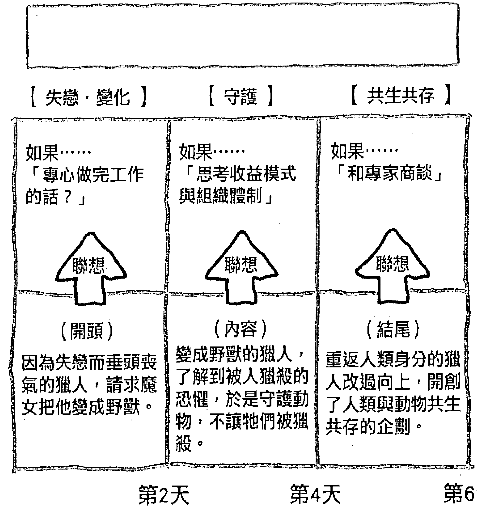

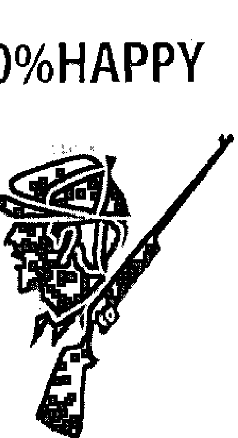

擷取出故事中令你在意的字詞，寫出來當作標籤，如此一來，就能根據故事情節，從類別推出行動劇本的進展狀況。接著再從那些令人在意的字詞，聯想有助於達成課題的現實行動。這時只要利用 114～118 頁解說的 6 個訣竅，你應該就會明白那個憑直覺挑選出的故事，會驚人地映照出你的未來。

### 【實驗4的總結】

### 引導出解決對策：改觀法則①

是否能從毫無關聯的故事中，引導出達成課題的具體提示？

#### 重點與作業

- ◎目的：從毫無關聯的故事中，找出解決課題的靈感。
- ◎所需時間：10到15分鐘。
- ◎作業。

> Future Mapping Core Skills
練習4-1 故事帶來的解決靈感

- 1. 從《美女與野獸》的4個登場人物中，挑選一個你希望他獲得幸福的人。
- 2. 看完那個人變幸福的創作故事《美女與野獸2》後，摘取各部分摘要，填寫在表格的下半部。
- 3. 從每個部分選出1到2個令你在意的字詞，寫在上方當作標籤，以掌握故事的進展。
- 4. 從故事進展與概要中的字詞，進行腦力激盪，試著從中得到達成自我課題的現實提示。

#### ⑤根據得到的靈感，思考行動劇本的標題。

如何呢？如果能從你有興趣的故事中，隨意引發出達成現實課題的靈感，那麼以後不管是看電影還是電視連續劇，你都能掌握到自我改革、自我成長的契機了。

換句話說，故事擁有的那股超越變化的力量，可以讓你自由自在地運用在現實生活中。

#### ⑤根據得到的靈感，思考行動劇本的標題。

### 課題

如何想出讓自己投入其中的企劃案

120%HAPPY

- ①從〈美女與野獸〉的4個登場人物中，挑選一個你希望他獲得幸福的人。
- ③從每個部分選出1到2個令你在意的字詞，寫在上方當作標籤，以掌握故事的進展。
- ②看完那個人變幸福的創作故事《美女與野獸2》後，摘取各部分摘要，填寫在表格的下半部。
- ④從故事進展與概要中的字詞，進行腦力激盪，試著從中得到達成自我課題的現實提示。

### 結果紀錄

自由地寫下你察覺到的地方吧！

## 實驗 5 達成課題時自信會如何變化？——改觀法則 ②

### 拉長時間，架構一個新課題

我們的實驗終於要進入後半部了。從實驗 1 到實驗 3，你設定了一個為期 3 天的課題。我們藉由利他法則來改變觀點，並且充分利用圖像與曲線，讓自己脫離以往既有的觀念，以更寬敞的視野來試著接近課題。

在實驗 4 中，我們正式透過故事來架構課題達成法。首先，是借用《美女與野獸》這個現有的故事，試著從中得到完成第 3 個課題，也就是「如何想出讓自己投入其中的企劃案」的靈感。

從實驗 5 開始，我們要向前邁一步，不過這次不是要借用故事，而是要實驗看看自己在創作故事時會出現什麼變化。

在這裡我要你架構一個新的第 4 個課題。完成課題的期間，我們已經試過 3 天與 6 天，所以接下來要把這股幹勁拉長至 3 週。我同樣也會陪你挑戰完成課題，這樣我們就可以在這段期間內一起讓成果展現出來。

這次我建議你架構一個更真實，而且必須在現實生活中完成的工作課題。因為這麼做可以讓你體會，過去的觀念與來自未來藍圖的想法之間有何差異，以及如何在現實生活中將這些差異化為工作上的實際成果。

- 建議你架構的課題有：
  - 如何在 3 週內得到 1 千萬日圓的合約？
  - 如何在 12 天內創造一個讓員工甚為滿意、提高愛社精神的本公司獨有的人事考察課框架？
  - 從地方 1 號店晉升為地方一流店的營運 3 年計畫？

諸如這些可輕易看見數字與結果的內容，你覺得如何呢？挑選新課題的標準，就是達成之後會讓人雀躍萬分的心情。所以，就讓我們架構一個會讓人心滿意足的企劃案吧。

重申一次，這段期間不只是你，我也會要求自己一起挑戰。而我設定的新課題是——

> 「若要讓上海研討會成功，要怎麼準備才會完善？」

實際上，我在執筆寫這本書的時間是 2014 年 8 月 15 日。12 天後，我要在上海為中國人舉辦一場未來藍圖的研討會。既然我自己是一邊寫稿子，一邊實踐行動劇本，我相信你也可以看到我到時展現的成果，姑且請你拭目以待。那麼，就讓我一邊以自己為實驗材料，一邊說明利用故事創作達成課題的手法吧。

利用未來藍圖決定課題後，接下來要想的是「挑選一個你希望他獲得 120%幸福的真實人物」。

這時我想到的是美國的保羅·席利（Paul R. Scheele）博士。他以研究變革型領導（Transformational Leadership）這個題目拿下博士學位。在體驗了未來藍圖後，「將變革型領導的學術性見解，巧妙地與一張圖表結合。」因而獲得世人極高的評價。之後他還成了我的夥伴，兩人攜手共同研發在家學習未來藍圖的這套教材，已銷售至全世界 155 個國家。

到目前為止，我們利用了在實驗 1～3 學到的技巧，畫了以下這張尚未完成的圖表。

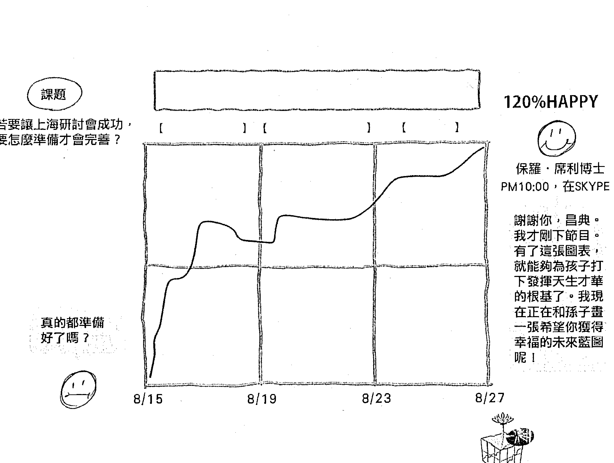

在這裡，你也設定一個自己的課題，挑選一個你希望他獲得 120% 幸福的人吧。267 頁有一張練習用的圖表，就請你參考上方以我為例的圖表，填好空白處。想像課題達成時的未來「情景」與「歡喜的臺詞」，以及面對課題的「當下心境」，並且把內容填寫在對話框中。

接下來，將這些點連起來，架構一個未來會讓人怦然心動的步驟。這裡有一個非常重要且強勁有力的技能——就是在實驗5中我要你嘗試的創作故事。

### 其實，我們平時就在寫「故事」了

你最後一次寫故事是什麼時候？國中？不，還是小學的時候？

絕大多數的人應該是「連自己都想不起來有多久沒寫了」，所以一副「要我寫故事，這真的是……」的表情，其實你根本就不需要擔心，因為許多商業人士平時就已經在寫故事了。

第1章曾經提到，寫故事並不難，只要是由開頭、內容和結尾構成的東西，全部都算是故事。所以，不管是平常在公司寫的報告，還是因為興趣而寫的部落格，統統都可以稱為故事。

或許有人會反駁「給顧客的提案書，還有公司的業務報告，根本就沒有故事裡不可或缺的主角，連配角也沒有，不是嗎？」其實不然。

例如，顧客提案書的主角就是閱讀的「顧客」。描述當顧客遇到問題時必須幫忙解決的故事，就是提案書。如果把提案書比喻為《星際大戰》，解決課題的顧客就是主角路克·天行者（Luke Skywalker），而必須解決的課題就是黑武士（Dark Vader）。寫下提案書引導顧客的你，扮演著尤達（Yoda）這個角色。一份完善的提案書，會不知不覺地設定出這些角色。

另外，要請上司過目的業務報告，是以業務員本身為主角的故事。找出顧客的問題，伸出援手幫助他。但是，報告中提及的數字背後，隱藏著自己無法獨自應對的問題，必須在公司內組織一個實力堅強的團隊，將顧客從窮途末路中救出——所以這份報告所寫的內容，就像是超人的故事。

仔細想想，就算是自認真的不善於寫故事的人，其實早已接受不少編寫故事的訓練了。

不知不覺累積出編寫故事經驗的我們，只要主動學習編寫故事，就能寫出一份架構完整、通情達理的提案書與報告書了。不過，就算特別留意開頭、內容和結尾這個架構，還是會有人反應看不太懂、無法理解。

另外，站在不同觀點也能寫出文章，因為在編寫故事的過程中，我們會養成從顧客的經營者、現場負責人員、自家公司的主管與合作部屬的負責人與顧客家族等各個不同觀點，來判斷事物的習慣。

完全不需要擔心一開始會寫不好，因為這個故事根本就不需要給別人看。所以，請你在實驗 5 自在地試著創作一個專屬於你的故事吧。

### 利用單句臺詞，簡單編故事

只要牢記訣竅，創作故事其實非常簡單。如上所述，166 頁讓保羅·席利教授 120%幸福的圖表，其實已經出現在你要創造的故事裡了。

寫在現在對話框裡的，是主角要說的「開頭」臺詞。

寫在未來對話框裡的，是主角要說的「結尾」臺詞。

### # 只要填好未來藍圖，故事就會自然而然地出現！

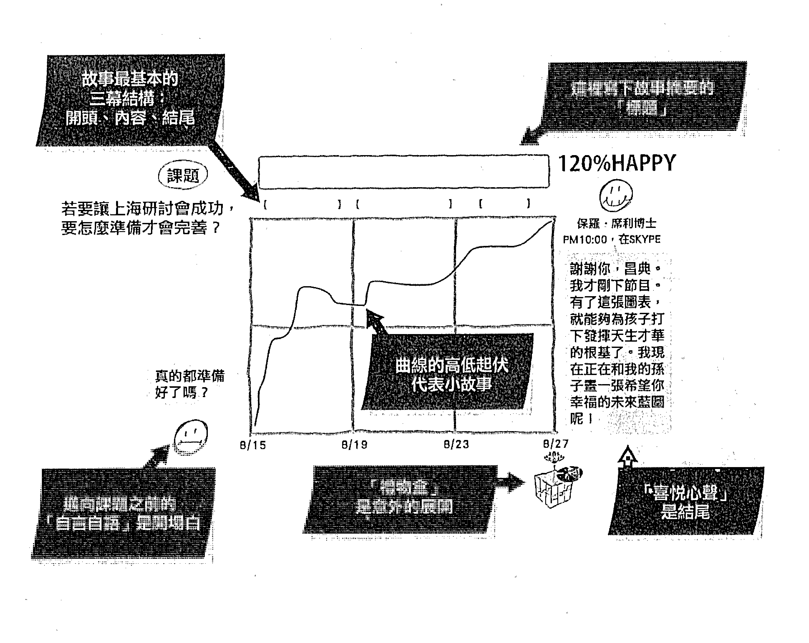

接著曲線開始描述故事，表示主角人物到結束為止的變化過程。也就是說，只要沿著曲線的高低起伏，加入場景與其他臺詞，故事就算完成。

另外，這個圖框橫切成 3 等分。至於有什麼意義，我想你可想而知。幾乎所有故事都是由這 3 個部分所構成，因此我們事先把整個故事分成 3 個部分。如此一來，在畫下曲線的瞬間，圖表上就會出現一個大致的故事骨幹。

接下來，就是為這個故事骨幹加工潤色的步驟。

如果你家里有小孩子，但是他不知道怎么完成写故事这份作业，那就把我接下来要教你的技巧告诉他，相信他听了之后，一定会立刻发挥说故事的实力。因为这个技巧可以自然地引导出每个人天生的编故事才能。

接下来就以我的图表为例，来说明编写故事的步骤。

### 离开现实生活的课题，进入图像世界吧！

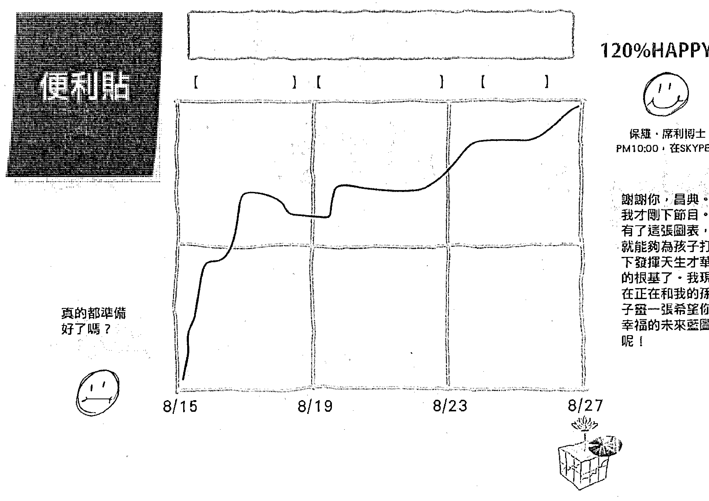

要在这张图表上编写故事时，最好和上图一样用一张便利贴遮住标题。这么做的理由，是因为人只要看到课题，心里就会想解决那个问题，这样一来会无法专心编写故事。我们在 76 页曾经说过，想要积极解决问题，就必须得到广阔的认知。为此，先让自己脱离现实生活中的问题，整个人沉浸在抽象度高的图像世界中会比较有效。那么，就让我们开始编写故事吧。

### 利用单句台词法来编写故事

-   ①首先看着曲线的高低起伏处，标下6到7处在意的变化点，画上箭头。
-   ②一边看着箭头，一边从最在意的地方依序画上「！」、「！？」、「？」等标点符号，或者在容易找到的地方填入「咦」、「喔」、「原来如此」、「OK」、「哇」等单句台词。

这时，就如同79～80页说明的，曲线下方是描写想像故事的范围，曲线 上方是描写现实行动剧本的范围，因此单句台词写在曲线下方即可。

-   ③单句台词写好之后，接下来凭直觉写下浮现在脑海里的台词。台词的背后应该是造成起因的「事件」，不过是什么事件导致的结果，会描绘出曲线描绘出的变化呢？将想到的事件写在曲线 下方。另外，事件背后应该还隐藏着引起这件事的「感情」。至于是什么样的感情，也将想到的事写在曲线 下方。

### 重点

回想事件时，图表横轴标示的日期，即有可能是重要的灵感，所以要一边看着日期，一边创作故事。例如，暑假旅行时发生的事，就可以成为故事的其中一个场景；工作繁忙时，合约交涉成功这件事，也可以成为故事的场景之一。将想像上的事件与事件（点与点）连起来，就能描绘出整体故事。

### 编写故事案例：神田典达成课题的12天

不多说，就让我们利用单句台词法，来看看编写故事的过程吧。

### 曲线高低起伏处，如果有在意的地方就标上箭头

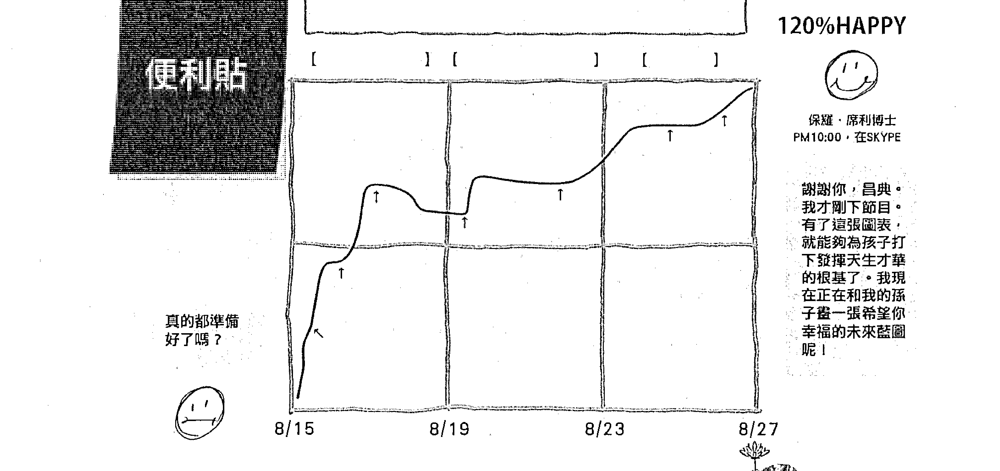

每个部分都标上2到3个箭头。这样一来，就会出现高低潮，不管是编写故事还是之后的行动剧本，都会进展地更加顺利。

首先，我们在曲线上挑选出6到7个令人在意的地方，并且画上箭头。标示箭头的顺序不是按照时间，而是根据自己最在意的地方依序画下。编写故事的基本原则，就是从最令人期望的地方开始思考。

画上箭头后试着写下单句台词，这也是按照让你期望的点依序填入。

### 填入单句台词

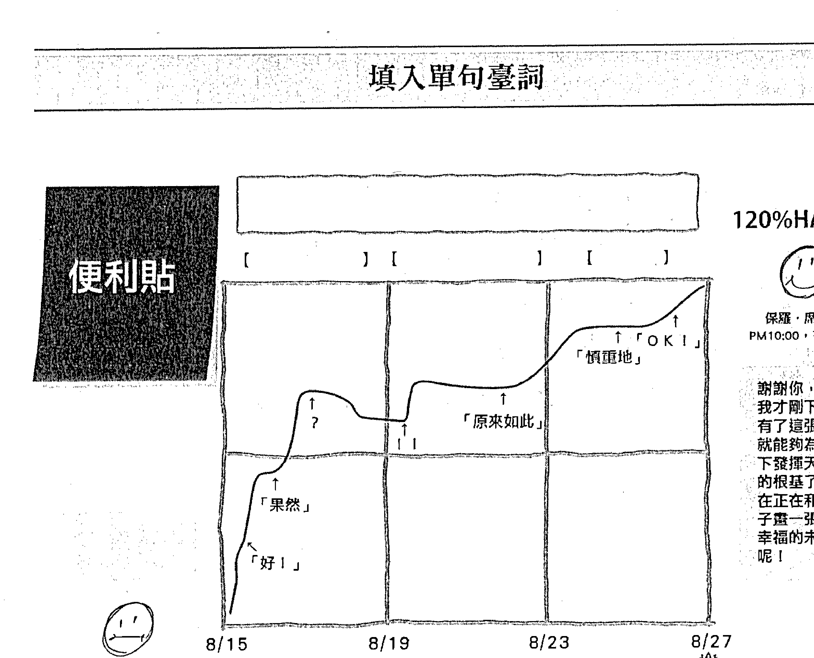

120%HAPPY

保罗·席利博士 PM10:00·在SKYPE

> > 谢谢你，昌典。我才刚下节目。有了这张图表，就能够为孩子打下发挥天生才华的根基了。我现在正在和我的孙子画一张希望你幸福的未来蓝图呢！

依序在箭头附近写下「！」、「？」等感叹符号，或者是「OK！」、「原来如此」之类的单句台词。

填入单句台词之后，接下来为故事加工润色。既然有台词，那么就应该有某个事件。

像是填好「原来如此」这句台词之后，我所想象的是「席利博士和他的孙子一起画下未来蓝图的图表」这个事件。而这个事件之所以会发生，是因为孙子在暑假期间，和儿子夫妻俩一起回家住。博士察觉到孙子聪颖伶俐，进而萌生出培养才华的「感情」。

填入「果然」这句台词后，我所想象的是博士的工作虽然非常顺利，却发现好像少了什么东西的事件。这个事件的背后，是这份工作并没有普及全世界的感情。于是博士休息了一段时间，重新客观思考自己的工作，那时儿子夫妻俩与孙子刚好到家里来住。

以上这些都是我凭空想像的内容，跟现实生活毫无关联。一个人愈能突发奇想，观点就会愈来愈多，这样一来就会出现意料之外的突破口，所以就让我们尽情想像吧。

像这样从单句台词到背后的事件，接着再想像隐藏的感情，当这些点连起来之后，故事的轮廓就会慢慢出现。

接下来，我将自己创作的故事图表与流程写在下一页，供大家参考。

### 曲线下方故事的完成图表

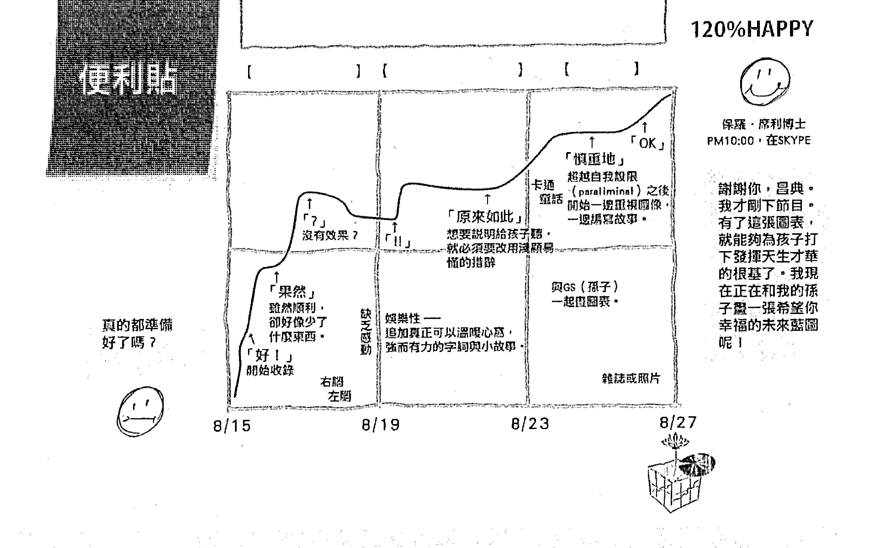

### 开头

保罗·席利博士是将未来蓝图自我学习教材，销售至全球的开发者。这套教材已经完成了 8 成，最后剩下的是收录他自己发明的「超越自我设限※3」，用以提升学习效果的光碟。这部分虽然是用暂时收录的教材来制作，但是再看一遍时，却发现「果然……还是有点不一样」，毫无感动可言。于是他暂时把这份工作放一旁，决定过几天再来看。这时儿子夫妻俩与 2 岁的孙子刚好到博士家来住。

※ 3 在进行超越自我设限 (paraliminal) 这项技术时，要一边保持轻松的心情，一边集中精神，左耳播放刺激右脑的创造性讯息，右耳播放刺激左脑的理论性讯息。左右两侧轮流播放创造性与理论性的讯息，让听者均衡且充分理解，冀以带来加速理解整个学习状况并将其习惯化的效果。

### 内容

博士极为关心2岁幼儿如何学习这件事。和孙子一起玩耍时，曾经对他学习每件事物的速度之快感到惊讶，于是博士从过去担任讲师时累积的经验中，挑选了两人可以一起游玩的学习游戏。没想到，孙子并没有表现出他原本预期的兴趣。「原来如此」，原来用说的行不通呀！于是博士打算尽可能挑选不用言语解释的简单游戏，由此来着手。

### 结尾

博士以绘本、歌曲等孙子早已有兴趣的东西为题材，并且融入过去针对大人开发的各种不同学习技术。此外，他还剪下绘本与杂志上的插图与照片，不透过语言，只利用图像来创造未来蓝图。当时，博士的课题是「要怎么做，才能让未来蓝图在2岁的小孩子身上发挥作用？」图表完成时，博士在SKYPE会议上与昌典分享结果，因为这个2岁的孩子找到了一个划时代，且极有可能实现的好点子。

上述内容是将点与点连起来后，再写成文章，之后又把中间的缝隙填补起来。乍看之下似乎写得还不错，虽然说是故事，但每个环节并不需要有条有理、合乎逻辑。不必以完整的故事为目标，轻松下笔就可以了。

顺利编写故事的重要诀窍，就是放下分析与判断，因为大人动不动就会判断什么是正确的、什么是错误的。像是「这种事怎么可能会出现在现实生活里！」结果好不容易浮现的想法，就这样被自己抹杀了。另一方面，孩子就算没有接受什么指导，也能不停创造出故事，除非大人喊停，否则应该要让他们自由地想出丰富有趣的故事。

所以，我们不要依靠大脑来判断「是否正确」，而是扪心自问「会不会怦然心动」，让手去思考，并且自然而然地动起手来，随意写下文字，画出图像。一个好故事不是经由大脑想出来的，而是透过全身孕育而出的。

这次轮到你创作故事了。请务必秉持一颗兴奋雀跃的心，来架构故事内容，不过在这之前，我想要先进行一个非常简单的实验。

有件事想请教你。
坦白说，你所挑选的课题，如果有自信在期限内完成的话，若以 10 分为满分，现在的你会打几分？假设自信十足的话是 10 分，毫无自信则是 0 分，那么你达成课题的自信是几分呢？
在进入创作故事这个步骤之前，先请你填好下一个空格。

### Future Mapping Core Skills 练习 5-1 达成课题的自信①

### 实验 5（编写故事之前）

达成课题的自信，占满分 10 分中的几分呢？

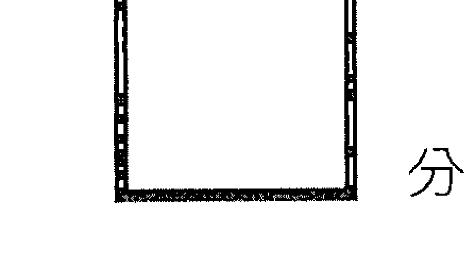

这个实验在故事创作之后，会再次回头看一次，所以现在忘记也没关系。

终于要开始编写故事了，在这里先取出你之前写到一半的图表吧。

267 页应该有一张写到一半的图表。试着利用刚才提到的要领，在曲线下方写下你所挑选的那个人，变得 120% 幸福的故事。

时间约 20 到 30 分钟。那么就请你进入这个幻想的世界！

### Future Mapping Core Skills 练习 5-2 创作故事

👉 267 页已经准备好填写专用的表格了，请你把它完成吧。

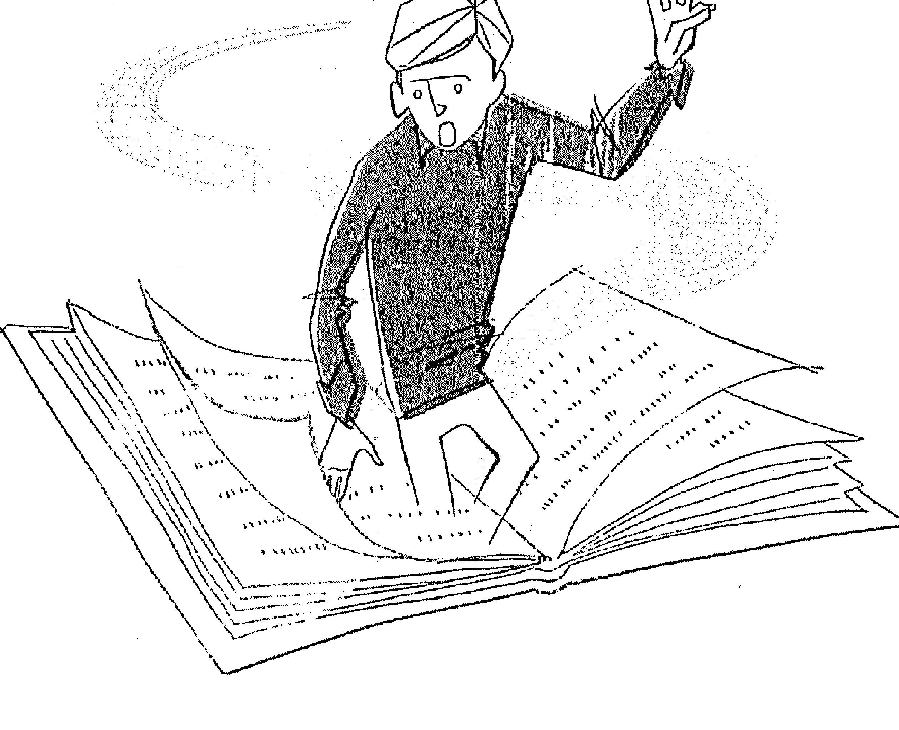

### 内心会不知不觉随着串联起的故事发展

到目前为止请你挑战的步骤，就是将未来的那些点串联起来。独立思考每一个点时虽然看不出含意，但只要把这些点连起来，就会出现一个故事。这个过程你体验到了吗？

让我在这里示范一下自己创作的故事图表吧。

### 每个部分填入标签，以便掌握故事流程

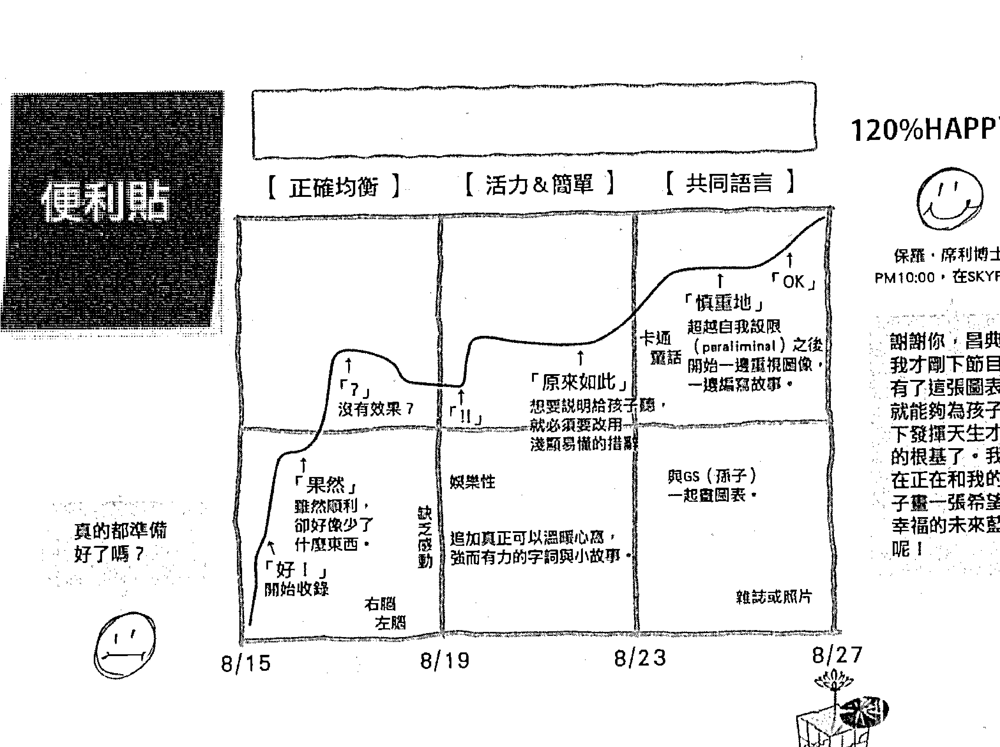

> >
> 谢谢你，昌典。我才刚下节目。有了这张图表，就能够为孩子打下发挥天生才华的根基了。我现在正在和我的孙子画一张希望你幸福的未来蓝图呢！

进展到此的人，除了要理解故事，我还想与你们分享一件有趣的事。

我希望你在每个部分都写上标签，以便整理故事的流程。我先以我的故事示范。

只要像这样写上标签，你就会明白自己创作的故事架构，会偶然地如同好莱坞为拍下热门电影而想出的「故事形式」般发展。

> 「你在说什么呀，我根本就没有听过什么故事的形式。这样的我怎么可能会跟着故事的形式来创作呢？」

没错，或许你会反驳，但事实上你已经不知不觉地跟着这个形式走了。为了确认，先让我从故事形式来说明吧。

其实我们早在37页就以图说明，几乎所有故事都可以分成3个部分，而每个部分的主题如下。

### 第1部——启程·离别：为了迈向新环境「调查·准备」的阶段

从日常世界启程到新世界去冒险。此时你会发现过去认为理所当然的自我世界，其实是透过狭隘的视线所形成，根本就无法适应今后即将改变的环境。

### 第2部——考验·脱胎换骨：为了在新环境之下培养活跃的能力，「不断摸索」的阶段

在适应新环境的过程中，会遇到伙伴与竞争对手。你会透过各式各样的纠葛与失败来扩展视野，学习新的技巧。最后，会发觉自己与生俱来的才能，并且藉由发挥才能，掌握超越强敌、相互竞争的能力。

### 第3部——归来：「改观」或「充满极大的可能性」的阶段

结束冒险之旅，回到日常生活后，视线变得更宽阔（＝「改观」），结果主角的思考与行动也受到影响，从小领域（local）扩大成宽广领域（global）（＝「充满极大可能性」）。

我们之前在36页曾经说过，现在几乎每天都会上映新的连续剧与电影。尽管让人觉得内容天差地别，但几乎所有故事的形式，都是由刚才提到的「启程·离别」、「考验·脱胎换骨」和「归来」这3个部分所构成。

有趣的是，即使是你无意中把这些点串联起来编写的故事，也会依照这3部分的结构进行。

让我以自己的例子来确认吧。

席利博士在12天内变得120%幸福的故事，是从他的日常世界开始的。收录的超越自我设限光碟，虽然已经听了好几遍，唯有这一次感到「好像有点不一样」。于是，他决定离开已经排好行程的日常世界，与2岁的孙子来一趟冒险之旅。

以上是第1部分的故事，而我标上了「正确均衡」这个标签。只要追着后面的进展，你会发现这个部分确实描写出，从日常世界迈向冒险的「准备」阶段。

第2部分的标签是「活力&简单」。故事进展到博士从他以往的教法中，挑选出令人印象深刻的方式，加以简化之后，把这个方法教给小孩子，也就是「不断摸索」的阶段。

接着，第3部分我标上了「共同语言」这个标签。故事进展到博士不靠语言，只凭图像与孙子共创未来蓝图的「改观」阶段。我们可以说，以往为具某种程度语言能力的对象而设计的未来蓝图，也可能推出幼儿版，也就是「充满极大的可能性」。

只要分析你随意创作的故事，应该就能确认你在写的时候，是否会顺其自然地随着准备、不断摸索和改观这个成长故事（Hero's Journey）来下笔。

一旦出现在未来的每个点连起来，就会自然地投射出你内心的故事。不仅如此，这个故事还会随着「适应新环境」的形式而完成。

这究竟有什么含意？没错，创作故事是你自己启程到新世界旅行的预演活动。因此，在你完成故事的那一刻，自己的生活通常已经开始出现变化了。

我们在177页提到，要你在创作故事前，先对你达成课题的自信打分数。而现在——在你完成要让某人120%幸福的故事之后，这个分数有没有改变呢？

在期限内达成课题的自信，如果以 10 分为满分的话，现在的你会打几分呢？

### Future Mapping Core Skills 练习 5-3 达成课题的自信②

### 实验 5（写好故事之后）

达成课题的自信，占满分 10 分中的几分呢？

[一个带有虚线边框的方形填写框，右侧有文字「分」]

接下来，让我们比较一下还没开始编写故事时，你在 177 页打的分数。

如何？写完故事后，对于达成课题有没有比以前更具自信呢？

当初设定课题时，心里其实忐忑不安，不知道自己能不能达成课题。就连我在写这本书的同时，也正在准备 12 天后在中国举办的第一场研讨会。坦白说，心里除了不安还是不安，因为当时的我根本就还没有准备好。

可是我在写了让席利博士幸福的故事之后，虽然不明就里，但是脑子里的想法确实改变了：「隔一段时间再来客观眺望比较重要。」「必要的东西不要加，尽量删除，内容简单易懂就好。」

之所以会产生这样的变化，原因在于你写下了希望别人幸福的故事，也就是把真心话投射在他人身上，希望自己幸福的故事。就算这个故事与课题毫无关联，但是为了挑战课题而采行的有效预演，早已经在你的内心深处开始了。

### 自认不善创作的人，也能开心编故事

小学时只要使用单句台词法，那些孩子就会毫无疑问，乐在其中地开始编写故事。

问题在于已经是成人的商业人士。因为大人已经染上「想法要实际一点」、「不要乱做」的习性了。这些习性长久以来都是优点，然而时代变了。除了逻辑，还讲求富有创造性的想法，因为一边迅速重复小失败、一边创造惊奇以产生价值的观念，已经取代了花些时间以完美为目标的想法。

若要达到自我改观这个地步，故事式思考是一个非常有效的方法论。因此，只要试着尝试编写故事一次，虽然觉得有点难，但也不至于会让你觉得是浪费时间且「不适合自己」，因而决定放弃适应时代。

在这里我们要告诉觉得「自己不善于创作故事」的人，3 个可以让你毫无抗拒地找到创造故事的灵感。

### 〔灵感１〕与孩子一起创作

有位女士跟我反应：「神田先生，我原本以为自己可以写出故事……，就算按照步骤一步一步来，还是没办法写出来。」

我问她：「我记得你有小孩，对不对？那晚上睡觉前，你会不会陪孩子编故事呢？」
结果那位女士松了一口气，问我：「就像我每天看故事书，陪孩子一起编故事，这样就好了吗？」
没错，这样就够了。只要想着让孩子快乐，不要停止想像，这样每一字、每一句就会泉涌而出。
既然孩子能编出更具有创作性的故事，那么对大人而言，就能敞开有别于以往的可能性。例如，当你在工作上正遇到一个令人烦恼的课题时，就先把课题写在纸上，然后抛诸脑后，忘了这件事，接着再与孩子沉迷于编写故事之中。等孩子睡了，将编好的故事写在图表上，到了隔天再来着手编写为了达成课题的行动剧本。
自己的孩子也可以担任企业顾问，替父母解决工作上的问题。
这不是在作梦，是有可能出现在现实生活中的。这就是诞生创造性价值、属于大人的秘密方法论。

### 〔灵感 2〕用图像来取代台词

单句故事法虽然是要排列字句，但是用图像来排列也可以。用手指着在意的曲线处，试着把突然浮现在脑海里的图像画在曲线下方。把杂志里喜欢的照片剪下来，或者将智慧型手机里的图像列印出来，凭直觉排在曲线下方看看也可以。只要将这些图像串联起来，故事就会油然而生。
将分离的概念并行排列时，人类通常可以从中看出含意。而找出这个含意的力量，不光是言语，图像也能直接拿来应用。

### 【灵感3】与团体共同创作

就像自己一个人拿着笔，坐在稿纸前面迟迟写不出文章一样，如果也是自己一个人在想故事，在习惯之前恐怕难以顺利把这些点连在一起。但是如果是5到6个人组成团队，一起练习创作幸福结局的故事，几分钟后就会毫无问题地完成故事。

总而言之，不管是谁都具有将这些点连起来的想像力，可惜的是想要确实利用的心被封锁了。所以，如果利用团队的形式来创作故事就能打开这个锁，谈笑之间故事就这样完成了。

好几个人一起创作故事，还有另一个庞大利益。就像刚才提到的，孩子与父母在工作的课题上拥有同一张图像，就算是背景丰富、专业领域不同的人，也可以因为共有同一个故事而开始对话，携手解决课题。

故事可以将现实生活中的课题，暂时提升至抽象层次上，在这个抽象的世界里进行象征性的对话，待问题解决（Happy End）后，便可重返现实世界，将这个解决对策付诸实行。故事就是这样超越语言兴建的墙壁。所以，想要再次整合被专业性墙壁分割的组织，共同创作故事可说是极为有效的手段。

刚才的你创作了一个结局幸福的故事，那么现在对达成课题的自信攀升了多少呢？如果你变得更有自信，这就代表你的内心因为这个丰富的故事，而让过去与未来之间分裂的自我开始迈向整合，同样的情况也会出现在团队创作故事的时候。

这看起来会让人以为，大家只是在编写和工作毫无关联的故事，然后哈哈大笑罢了——但实际做过之后，你会发现这是一个智能程度非常高的步骤。

一路进行到实验 5，你应该已经学习到，自己也要随着骤变的环境不断进化的技巧了。而这项技巧，能透过故事发觉我们本质上就拥有的改观能力。

因此，我们需要的并不是努力。在你的内心深处，已经开始流传让自己随着变化脱胎换骨的故事。所以现在的你，只要让故事的内容更加丰富就好了。

准备迈向这条冒险之路的是下一个实验——创作达成课题的行动剧本。

### 【实验5的总结】

### 故事创作：改观法则②

如果兴奋雀跃地创作故事，达成课题的自信会如何变化呢？

#### 重点与作业

-   ◎ 目的：描写达成课题的独创故事。
-   ◎ 所需时间：30 到 60 分钟。
-   ◎ 作业：试着使用单句台词法。

#### 结果纪录

**创作故事之前**
达成课题的自信，占满分 10 分中的几分呢？
□ 分

**创作故事之后**
达成课题的自信，占满分 10 分中的几分呢？
□ 分

### 事后察觉到的地方

在课题达成后，再回头看看创作的故事。故事中描述的故事，如果偶然的发生在现实生活中的话，就把它写在这里。

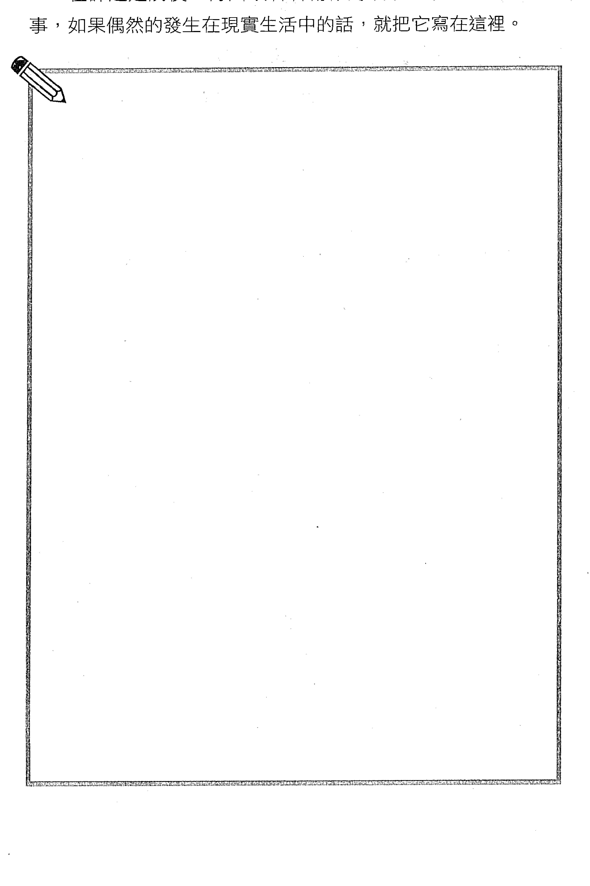

## 实验 6 利用「关键字」，让人采取具体行动——激励法则

### 与其沉迷他人的创作故事，不如自创未来蓝图

其实到目前为止，描绘未来蓝图的作业已经完成8成。接下来只要回到现实，编写行动剧本就可以了。
在这里我们把遮住课题的便利贴撕下来。

> 课题
若要让上海研讨会成功，要怎么准备才会完善？

> 120%HAPPY

保罗・席利博士
PM10:00，在SKYPE

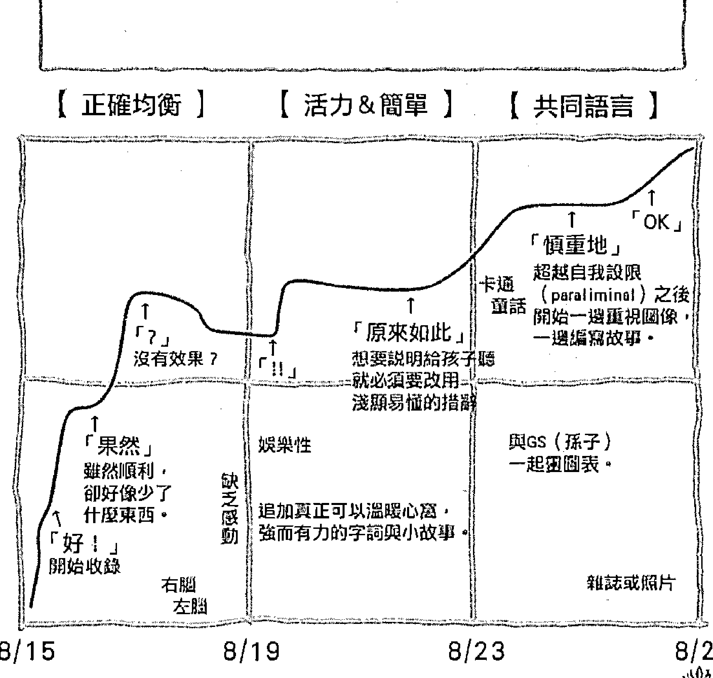

撕下便利貼之後，想起原本要挑戰的課題，說不定你會感到沮喪。「神田先生，不是要達成課題嗎？怎麼我寫的只是一個幻想的故事呢？」

你放心，不管是愛因斯坦還是凱庫勒，他們的豐功偉業都是憑空創作的，幻想具有能解決問題的創造性力量；而過去能善用這個力量的，只有一部分被稱為天才的人。未來藍圖是讓大家都可能有解決問題的創造性方法，而現在已經趨近完成了。

讓你就是像是被人突襲般，找出驚人解決對策所需的時間，約40到60分鐘。就算是個性屬於深思熟慮的人，也只要90分鐘就可以了。

或許有人會說：「神田先生！我先說清楚，我很忙的。真的沒有那個時間。」你如果有在玩手機遊戲，時間不是馬上就不見了嗎？

沉迷遊戲是「被他人創作的故事所消費的現實生活」，但接下來，只要在30到40分鐘內完成未來藍圖，你就能利用自己的故事，自由地創造出想要的現實人生。這就是我們在30到40分鐘後，企圖掀起的小小革命。

你的幹勁絕對不會白白浪費。如何？活力是不是又再次湧現心頭了呢？如果是，就趕快進入實驗6吧。

想得到達成課題的具體方案，就必須將到目前為止創作的故事，轉換成實際的行動劇本。在實驗6中，我要與你分享這個轉換的方法。

### 畫下動態性的行動劇本

我們要創作的行動劇本究竟是什麼？為了讓你有一個更具體的概念，我們先與一般的目標達成法比較看看。

第2章裡我們提過，一般的目標達成法都把目的地描繪成一幅靜止畫（Snapshot），訂立的是直線式前進的計畫。不過，這個方法是以「讓目標明確」、「好好管理何時誰要做什麼」這幾件事為前提，只要死守就能產生價值。倘若以決定好的方式來處理決定好的事情，是你的工作本質，那麼最有效的方法，就是把計畫放在這個智慧型輸送帶來進行。

如果你的工作本質是想出創造性的解決對策，那麼光是這樣是不夠的。創造性是與被迫改變價值觀這個異類思考相互激盪，以促成顛覆常識的事實出現，並讓自己以矛盾手法，一口氣吹散過往危機狀況所觸發而成的。

這個過程並不是直線式地朝靜止的目標前進，而是要瞄準隨時會四處移動的目標，一邊描繪曲線，一邊前進。為此，我們需要的是動態性般的行動劇本，而不是靜止不動的計畫。

只有畫下路線的地圖是不夠的，我們還需要「抵達目的地的路線圖」、「預抓的所需時間」、「抵達的時間表」、「遇到塞車或車禍時的對應方法」、「遇到麻煩時的備案」等，能夠進行事前引導、性能高的導航系統。而能夠提供這些資訊的，就是利用未來藍圖編寫的行動劇本。

### 2 個步驟，將故事變成現實的行動劇本

那麼，就讓我們實際動手編寫達成課題的行動劇本吧。把故事翻譯成現實生活的步驟，大致可以分為 2 個階段。就讓我利用自己的課題來說明。

#### 步驟1 把故事的關鍵字圈起來

曲線下描寫的故事中，如果出現讓你在意的字彙，就把它圈起來。幾個都沒關係，不過剛開始盡量不要超過 10 個。

- 我在不明就裡、非常在意的情況之下，圈出來的關鍵字是：
- 第 1 部：右腦、左腦。
- 第 2 部：娛樂性、溫暖心窩、淺顯易懂。
- 第 3 部：卡通、童話、GS（孫子）、雜誌、照片。

#### 步驟2 依序從最在意的關鍵字，聯想與現實生活有關的行動

從上面那 10 個關鍵字中，挑選最在意的那一個。利用 114 ～ 118 頁的訣竅，自由地聯想出可以慢慢達成課題的點子，並且寫在曲線上方（聯想行動）。

這時關鍵字周圍曲線的傾斜程度，與寫上關鍵字的時間點，如果能連同現實生活中預定的計畫（現有預定）一起思考，腦子裡會比較容易浮現更具體，且在現實生活中能採取行動的想法。只要想到會讓你覺得「雖然不知道為什麼，但就是非常重要。」的字彙或想法，不需猶豫，就盡量寫在曲線上方吧。

想不出來時就不要猶豫，繼續往下一個關鍵字進行。因為這就和拼圖一樣，只要從看得出來的地方把拼圖（字彙）拼上去，時機到了就會突然出現全貌。

最令人在意的關鍵字，就是右腦、左腦。
在想像的故事中，席利博士正在創作右腦式與左腦式的訊息。從這兩個關鍵字中，我所聯想的東西是：「左」是「共產主義」，也就是中國；「右」則是「資本主義」，在這裡指的是日本。做為在現實生活中慢慢達成課題的其中一個點子，這兩個詞在決定位置的那一刻，我已經打算「8月17日時，要深入了解前來聽我演講的那些中國人的需求，以及他們現在所處的狀況。」

其實我原本打算用英語進行這次的研討會，不過口譯人員的日語能力比英語還要強，所以我才決定用日語來進行。可是這麼一來，在我的認知中，整個研討會的模式就會變得和在日本為日本人演講一樣，這樣就不符合第1部的主題「正確均衡」了。

根據我以往的觀察，這次上海研討會的準備工作，是隱約延續過去的經驗而想出來的作業。但是我發現修正與改善現有的投影片，卻是一件完全不同層次的事。因為我的立場並不是教導未來藍圖，最重要的是我必須朝正確均衡這個方向來準備。

接下來，讓我注意的關鍵字是第3部，也就是在8月25日時寫的「GS」。

曲線底下的故事場景，我假設是席利博士與孫子一起在描繪未來藍圖。孫子（grandson）縮寫成GS，大家可以從這裡一邊自由聯想，一邊思考行動劇本。我從GS第一個聯想到的，就是「Golden Standard」（金牌班底）。至於什麼是金牌班底？我試著從周遭字彙來尋找靈感。

結果，在8月23日附近，我寫下了「卡通」、「童話」。說到「童話的金牌班底」，那就是《西遊記》。也就是說，在創作達成課題的故事時，就像我在日本挑選《桃太郎》這個故事一樣，這時我想到的點子，就是「借用《西遊記》這個故事來進行」。

這個點子的確很有趣，但是對我來說並沒有帶來多大的驚奇，因為類似點子已經出現過，所以我試著再向下挖掘。

GS 還可以讓我聯想到什麼？

出現在我腦海裡的是「Golden Sixties」，也就是六十幾歲這個年齡層，此時我的心裡漸漸浮現現實問題解決對策的輪廓。說到內容，這次的研討會除了眼前的聽講者，還必須依尋對祖父母的印象來舉辦才行。

因為這次中國研討會的主辦者，平時就已經在主辦以親子為對象的學習講座。5天的費用換算成日圓約50萬。如此昂貴的學費是誰出的？當然就是祖父母。受到一胎化的影響，為那些人數不多的孩子付出龐大心力、投資教育，已經是跨越世代的事了。而主辦者也打算和自家舉辦的其他講座一樣，希望親子能一起來上未來藍圖的講座。

中國為孩子舉辦未來藍圖講座，意味著將展開一個遠遠超過預期的機會。因為中國在1980年代以後出生的人，現在已經進入適婚年齡，而且據說這個世代的人口有兩億人，因此他們也會對孩子的教育投注很多心力。在這種情況之下，贊助人就會變成GS世代。

我不禁興奮起來。以往在面對眼前的聽講者時，我只要按照一貫的方式，輕輕鬆鬆講課就可以了，但真正需要顧慮到的，是「眼前的聽講者」、「那些孩子」、「贊助學費的父母親」，以及「今後5年到10年內，要如何應對這個孩子急速增加的學習市場。」

但是在這裡我的心卻是雀躍不已。因為在寫下GS的同時，我還寫下了「謹慎」二字！也就是說，我需要慎重調查與分析，並且一口氣踩下油門加速。

至於其他關鍵字，我也是按照相同過程來擴大聯想，並且將想到的點子隨意寫在曲線上。藉此架構的行動劇本內容如下頁。

### 從挑選的關鍵字，來聯想現實生活的行動

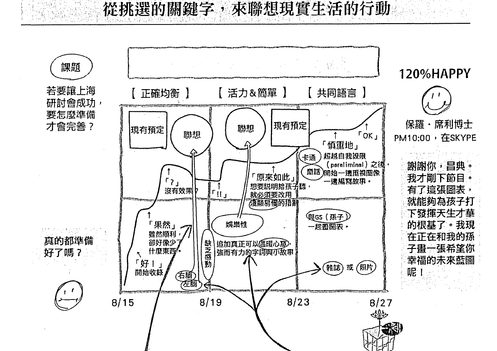

### 課題

若要讓上海研討會成功，要怎麼準備才會完善？

### 120%HAPPY

保羅·席利博士 PM10:00，在SKYPE

謝謝你，昌典。我才剛下節目。有了這張圖表，就能夠為孩子打下發揮天生才華的根基了。我現在正在和我的孫子畫一張希望你幸福的未來藍圖呢！

#### 步驟1

<圈起故事的關鍵字> 寫在曲線下方的故事，如果出現令人在意的關鍵字，就把它圈起來。關鍵字幾個都沒關係，不過剛開始差不多十個就可以。

#### 步驟2

<依序從最在意的關鍵字聯想現實生活> 從圈出的十個字當中挑選一個最在意的關鍵字。一邊運用106～110頁的訣竅，一邊從該關鍵字自由聯想，可以接近課題，並且達成課題的點子。

### 寫下12天行動劇本的圖表

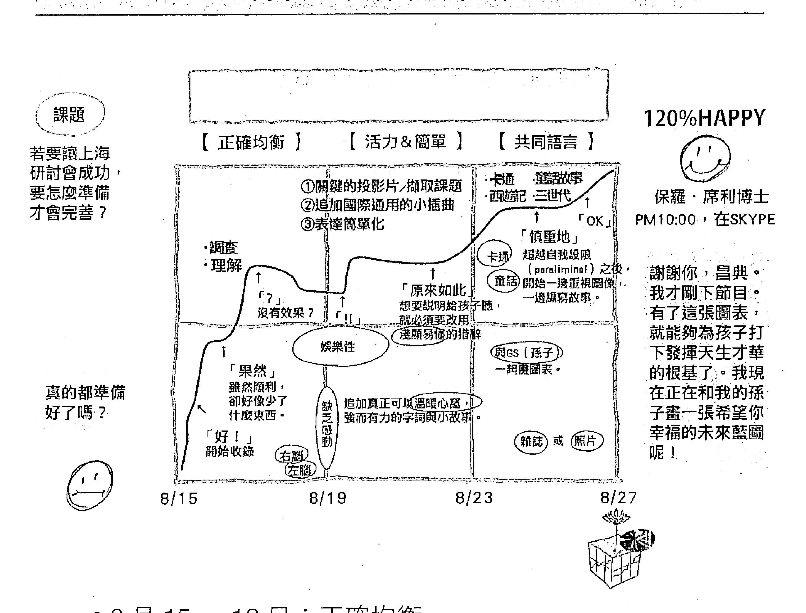

- 8月15～18日：正確均衡
深入理解中國聽講者的需求。
- 8月19～22日：活力&簡單
從現有的講義投影片中，挑選就算透過口譯，依舊能強烈傳達信念、架構扎實的內容與練習，並且把表達方式修改地更簡單的影片。
- 8月23日～27日：共同語言
利用中日兩地人人皆知的故事、歌謠與言語，將講義的內容修改地更淺顯易懂，並且檢討《西遊記》這個題目。另外，布下天線，仔細聆聽橫跨祖父母到孫子這個家族三代的密切需求。

為期12日的行動劇本就這樣完成了。

坦白說，這個過程幾乎可以讓我心頭的那塊石頭，整個放下了。

因為在既有的思考延長線上，我只會感受到一股「根本就沒有時間準備」的強大壓力，然而自從訂立了「活力 & 簡單」這個方針之後，壓力竟然消除地差不多了。如果是以前，我可能只會以為在日本用的講義應該也適用於中國人，結果因為自我滿足，而漠視了聽講者的需求。此外，我還發現不只是聽講者，真正需要思考的是考量到他們的孩子，以及身為贊助者的父母的需求。

創作故事時只要像這樣暫時與課題保持距離，就能在短時間內看出大幅超越以往認知、解決問題的方向性。

如何？你是不是稍微掌握到訣竅了？

現在這個階段還不需要急著完全理解、完全領會。我希望你先從透過「學習來習慣」的念頭來架構。

將未來藍圖翻譯成行動劇本的關鍵在於聯想。至於要如何擴大聯想，只要按照我們在 114 ～ 118 頁解說的 PRAISE 方式進行就好。一邊像孩子般自由聯想，一邊將「不太清楚理由，但是可以化為言語的感受。」一一寫在曲線上 方的領域。

不要企圖找出完整的涵義，就像拼拼圖時暫時把圖片放在上面般，把字彙排放在上面，事後再來回顧。如此一來，在原本不明就裡、支離破碎的概念前方，就會突然出現一個新世界。人人都會拼圖，同理，人人都會架構行動劇本，所以我希望你能一邊樂在其中，一邊編寫出行動劇本。

### 從夢想的階段進入行動的階段

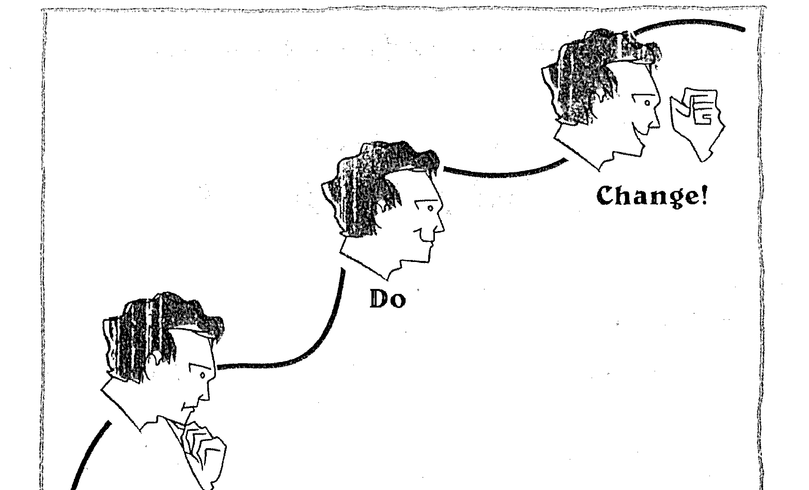

未來藍圖在短時間內能夠完成準備、行動、改革的過程。

### 【實驗 6 的總結】

### 行動劇本：激勵法則

#### 重點與作業

- ◎目的：將在曲線下方創作的故事，轉換成曲線上方的行動劇本。
◎所需時間：40～60 分鐘（參考）。
◎作業：
  步驟 1 圈起故事的關鍵字。
  步驟 2 從最在意的關鍵字，聯想與現實生活有關的行動。
  一邊從關鍵字自由聯想，一邊將「不太清楚理由，但是可以化為言語的感受。」一一寫在曲線上方的領域。

### 結果紀錄

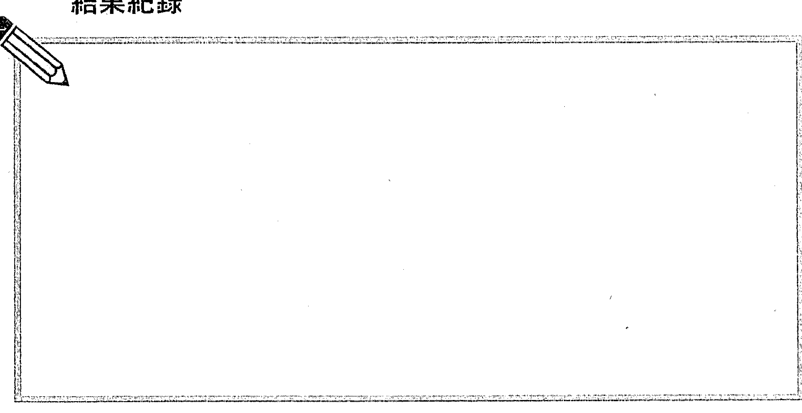

### 事后察觉到的地方

无法转换成具体行动，或者就算转换出来了，还是无法说服自己的词汇与概念，放了几天后再回头看时，有什么新发现？

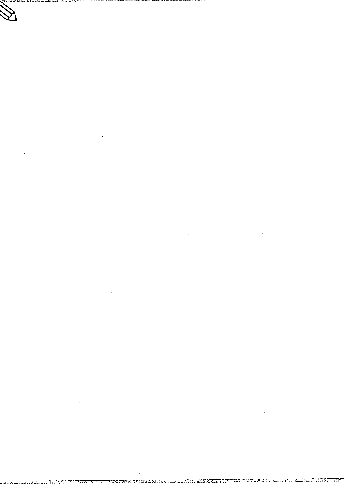

## 實驗 7

### 如何探索出隱藏的才能？——空白法則

### 利用 3 片拼圖找到突破口

根據之前的實驗結果，現在出現在你眼前的，應該是一張幾乎快要完成的未來藍圖圖表。

我想應該會有人一邊看著這張圖表，一邊興奮地覺得「沒想到自己的腦子竟然會冒出這樣的點子」，說不定甚至還會有人把原本以為無法解決的複雜問題，一口氣全部處理好。

但是應該也有這樣的人：

> 「神田先生，我能想到的點子就只有很久以前想到的東西，根本就想不出驚人的解決對策。」

> 「神田先生，雖然懵懵懂懂地摸索到達成課題的路徑，但是心裡還是非常混亂。這麼做也不行，那麼做也不行，根本找不到出口。」

整個人陷入一片混亂之中，不知所措。

為此，我們準備突破這個瓶頸的實驗7。這是最後一個實驗。

我們在第22頁提過，未來藍圖的醍醐味，就是讓「埋沒的才能」浮出檯面。挑戰課題的人在以利他為目的撰寫故事時，就會想起「與生俱來，但是從前一直忘記的才能。」如此一來，不但提高了達成課題的自信心，還能激發發自內心的強烈意欲，展現出應有的自我模樣。

「話雖如此，我還是找不到自己被隱藏的才能。」我非常了解你的心情。究竟隱藏了什麼？我在剛才「若要讓上海研討會成功，要怎麼準備才會完善？」這個課題中，雖然替自己找出了答案，但心情還是有種無法滿足的感覺。

像這種紊亂不清、置身霧中的狀態，其實是非常好的徵兆。因為在找出超越以往認知框架的答案時，過程中一定會進入一個濃霧瀰漫、腦子一片空白的時期。在這場混亂中，正因為能放下以往累積的陳舊認知，所以才會一併消除產生問題的根本因素。如此一來，在創造出新認知的世界裡，就能產生極大的可能性。

人是不會熱衷於原本就拼不出來的拼圖。就是因為知道有解答，所以不管腦子有多混亂，還是會一片一片地把它拼出來。

現在我們還差一步，就可以抵達看出未來藍圖全貌的地方了。只要走出濃霧，就會瞬間恍然大悟，大喊「原來如此」。只要再找出剩下的這幾塊拼圖片就好了。

那麼，要找出什麼樣的拼圖片呢？接下來就讓我從自己的經驗法則，來說明 3 個容易找到突破口、找尋拼圖片的方法。

### 第 1 片拼圖：免疫裝置
透過圖表上的空白，突破思考盲點

只要一直描繪未來藍圖的圖表，左上角這個部分通常會出現如下圖的空白處。

### 左上角的空白：何謂免疫裝置？

課題
若要讓上海研討會成功，要怎麼準備才會完善？
真的都準備好了嗎？

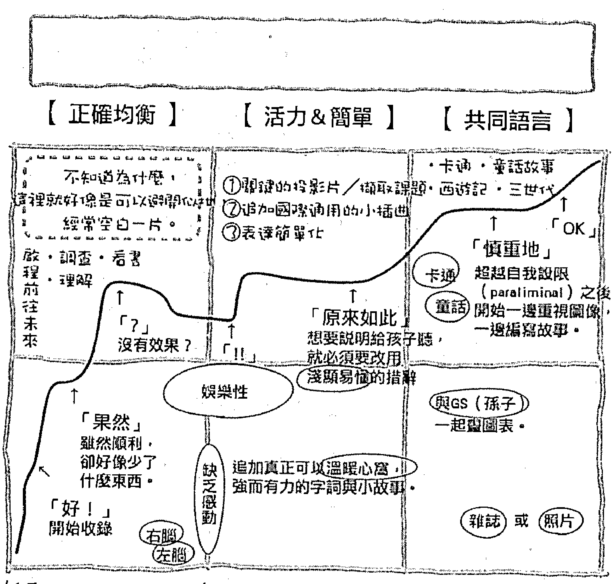

120%HAPPY
保羅·席利博士
PM10:00，在SKYPE

謝謝你，昌典。我才剛下節目。有了這張圖表，就能夠為孩子打下發揮天生才華的根基了。我現在正在和我的孫子畫一張希望你幸福的未來藍圖呢！

我們在畫曲線時是從右上角開始，所以左上角空白是理所當然的事。但是我們這些未來藍圖描繪者，在看過數百張圖表之後，發現了一件事，那就是當埋首於這個領域時，許多人對從圖表中得到解決問題的對策充滿了自信，並且會在現實生活中採取行動。另一方面，在一片空白的情況下，對於假設的課題就算腦子裡充滿有趣的點子，但是這些人卻顯然不會採取任何行動。

這個空白處是不是有什麼含意？經過一番深思熟慮後，我把這個空白部分稱為「免疫裝置」。雖然這只不過是經驗法則，不過我們認為這個「空白」會無意識地踩住，讓現實生活動起來這個區塊的煞車。

為什麼會怎麼想？讓我解說一下邏輯。免疫裝置的區域也就是圖表左上角的空白，究竟是怎麼一回事？

如果以簡單易懂的方式來說明未來藍圖圖表左上角標示的位置，那就是「現在」×「積極」。這個部分空白，代表現在這個時間點擁有的積極面，尚未被注意到。

現在我們正面對著問題，並企圖解決問題，但是現階段，我們還是處於消極的狀態。所以只要追究原因，讓問題迎刃而解，將來就會改變成積極的態度。

#### 解決問題——前提的過失

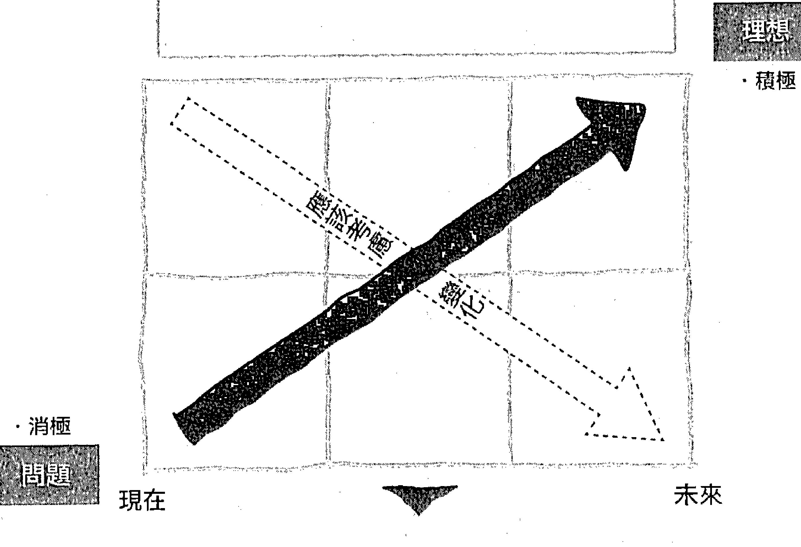

人們常常以為只要能解決現在的問題（消極事件），就能實現未來的理想。實際上，就算現在積極面對事件，未來還是會產生消極事件。

不過仔細想一想，還是可以把現在放在積極面。假設你有位友人以「一年內讓收入增加20%」為目標，讓年收入增加固然好，但可惜的是那位友人的意志往往不夠堅定，因為只要朝「一年內讓收入增加20%」這個目標邁進，就不得不失去現在握在手中的積極面。

說的更具體一點，友人的內心深處說不定想著：現在的工作不需負什麼責任，可以留些時間培養興趣；不常加班，所以想要好好珍惜可以多陪孩子的時間；收入不高，所以能強化家族之間的關係，而現在正好處於幸福的狀態之中。

既然這位友人知道，這麼做會失去現在握在手中的幸福，依舊意志堅決地朝變化向前進，那麼他的未來應該也會朝那個方向走。只可惜大多數人過了幾天之後，就會愈來愈「不想失去」現在的幸福，不知不覺地選擇了「堅守不變」這個選項。也就是說，就算置身在產生積極變化的時刻，畏懼變化的本能卻會發揮作用，開始啟動守護自己的免疫裝置。

### 何謂免疫裝置？

即使現在的生活會出現積極事件，未來的生活仍會出現消極事件。因此所有變化都會不知不覺地被喊停。

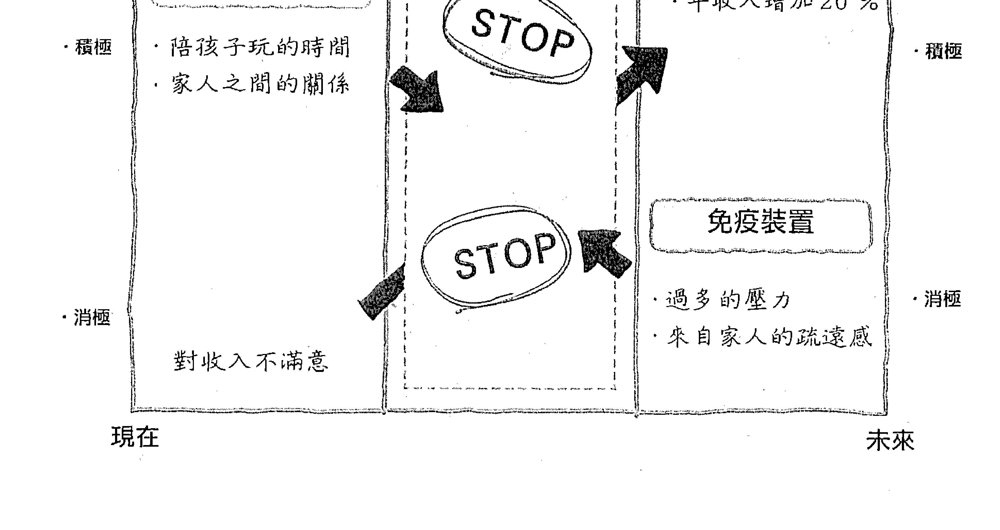

既然如此，那麼迴避這個免疫裝置、不讓它啟動的方法為何？那就是「第 3 條路」，也就是提出「保有現在這個積極面，同時產生變化的方法是什麼？」並且自己找尋答案。

倘若自覺「陪孩子」這件事現在是積極面，那麼請友人思考「不減少陪孩子的時間，又能增加收入的方法是什麼？」不就好了？如此一來，說不定就會進行讓自己更有附加價值的企劃案，例如「製作一份手冊，讓同事也能應對自己的工作。」或者是向公司提議「重新檢視全體業務，減少加班時間。」而公司也會想主動支援自律自動的友人。這樣一來，友人就會發現一件重要的事。

先請大家看看下一頁的圖表。

左上角的「因為產生變化而極有可能失去的優點」，寫上了「陪孩子玩的時間」、「與家人的關係」。這意味者友人現在已自覺到擁有的積極面。如果這兩個積極面不需要特別努力就可以做得到，不是很棒嗎？換句話說，那就是友人與生俱來的才能，因此我們可以試著思考，利用這個已經忘記的才能，能否達成「一年內讓收入增加 20%」這個課題。

結果這張圖表浮現出一個「極大的可能性」。友人架構了一個附加價值更高的工作，並且開始檢討將公司內部的業務系統化，與推進工作生活平衡（Work Life Balance）的可能性。

面對這樣的可能性，友人會如何反應？是不是視它為發自內心的「志願之事」，而不是接受外部指示的「職業工作」，同時雀躍不已地架構內容呢？

### 免疫裝置——是什麼為了達成課題而做的變化會讓人失去的「現今幸福」？

自覺因為變化而極有可能失去的優點，就會察覺被埋沒的才能。

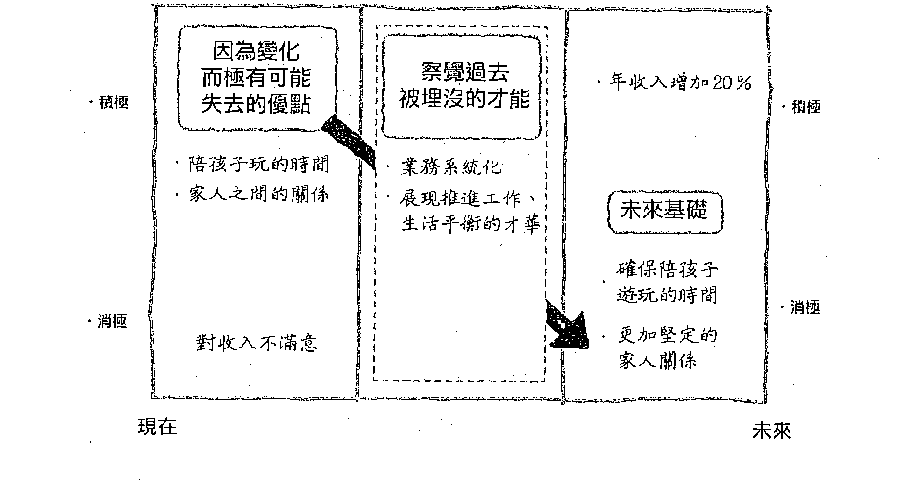

只要善用過去從未察覺到的才能，就有可能均衡成長。

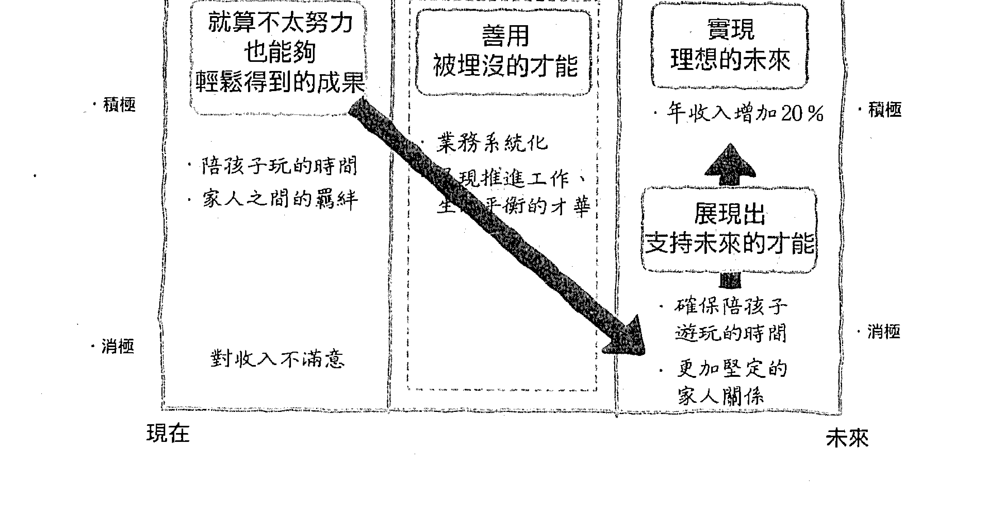

思考免疫裝置，可以讓人自覺「現在已經掌握在手中的積極面」，讓「就算沒有特別意識到，也會自然達成課題的才能」浮出檯面，如此一來就能再次活絡「就算沒有特別努力，也能立即發揮能力與資產」這個契機。

免疫裝置就像是車子的手煞車。即使在不知道已經拉了手煞車的情況下踩油門，車子還是不會前進的。所以，在發動車子之前，我們必須注意到手煞車，並將其放下。以我的經驗原則來說，未來藍圖會透過「空白」，來告訴我們這個無意中拉下的煞車在哪裡。

但是，為何圖表上的空白表示思考的盲點呢？我們提出一個假說，那就是眼前所見的外界，可能會影響內心深處所看見的事物。只要遵循某些規定好的原則，自由地把字彙填入畫好的圖框之中，就能自然而然地避開腦內尚未語言化的領域。在這種情況下，內在的「盲點」就會以外界的空白形式出現。

當然，若想站在學術立場來驗證這個結果，仍有待大腦科學家的研究，但就從在工作上展現成果的經驗原則來看，這項假說非常有效。既然空白暗示著盲點的存在，那麼只要捫心自問「究竟漏看了什麼？」就好了。只要樂於拼湊這幅智力拼圖，最後——姑且不論這個假說是對是錯——就能做好萬全準備，以達成課題。

「天空」，曾經告訴我們抵達本質認知的過程。這是某位佛教高僧輔導我時，讓我體認到的事。這在理解未來藍圖時非常有用，在此讓我與你分享。

高僧曾說，就算告誡人們「冥想時勿思考」，人的思緒還是會不斷運轉。思考就像洶湧而來、永不停息的海浪，不會停止。

而所謂的冥想，就是讓接二連三不斷湧出思考之間的空白（也就是指天空）慢慢拉長，進而得心應手，運用自如。

他還告訴我一件更有趣的事：「當感到不安或恐懼時，我都會告訴自己『我是天空（I am the sky）』，而那些不安與恐懼的思緒是雲朵。所以無論陰晴，雲的另一端都會出現天空。倘若站在雲端能遙望天空，那麼不管站在那個角落，都能抵達同一片天空。」

原來如此。高僧的冥想法原來與架構未來藍圖的過程一樣。寫在未來藍圖上的字彙可說是雲朵，這是當下在面對問題時想到的字彙，但就算一直盯著雲朵看，也不會想出基本的解決對策，最重要的反而是字彙與字彙之間的空白。只要將思緒放在這個空白上，就有可能超越問題產生時的當下認知，轉換至境界更高的認知（天空＝120%）之中。

試著在你的圖表上找尋雲朵與天空。如果想邁向可能性更高的領域，那就將深入思考的能量投注在天空中，而不是雲朵上。倘若站在其中一個雲端上看不見蔚藍的天，那就到其他雲端看看。不管你從哪個地方著手思考，看到的都是同一片天空，因為天空可以給你無限的可能性（the sky is the limit）。

### 第2片拼圖：未來的基礎
#### 無意中寫下的字彙會激發靈感

把思緒交給手，隨手在圖表上寫下字彙時，另一個容易產生空白的地方就是右下角。這也是因為曲線是往右上攀升，所以出現這種情況是理所當然的事。若是把在這個範圍無意中寫下的字彙當作契機，反而比較容易得到充滿價值的構思。

曲線下方是故事的範圍，照理說寫在這裡的字彙應該與現實生活中的課題毫無關聯。但是如果在這裡找到一些字彙，我希望你稍加留意。因為這和免疫裝置一樣，絕大多數都能成為挖掘才能的靈感。

我們把這個範圍當作支持嶄新現實生活的部份，並且取名為「未來基礎」。

只要事先記住這個經驗法則，就能推行一個全新的企劃案，這一點非常有趣。究竟是什麼原因會造成這種情況？其實只要思考裡面的架構，應該就能找到答案。讓我們看看下一頁的圖表。

### 免疫裝置——什麼是為了達成課題而做的變化 會讓人失去的「現今幸福」？

### 果真如此？以自己的課題為例，確認一下吧！

提到實用本位，其實非常簡單。圖表的右下角，如果有你無意中寫下的字彙或訊息，就暗示著在這次的課題中，這是你應該充分利用的才能。

讓我們確認一下，剛才我畫的圖表是不是也是這種情況。

### 【正確均衡】

### 【活力&簡單】

### 【共同語言】

### 120%HAPPY

課題：若要讓上海研討會成功，要怎麼準備才會完善？

> 謝謝你，昌典。我才剛下節目。有了這張圖表，就能夠為孩子打下發揮天生才華的根基了。我現在正在和我的孫子畫一張希望你幸福的未來藍圖呢！

我在未來基礎這個區域，無意中寫下了「照片」二字。若問其與曲線下方創作的故事有何關聯，應該就是「席利博士與2歲的孫子在畫未來藍圖時，使用的不是言語，而是利用繪本剪下的圖片與照片來編寫故事。」這個部分，所以我才會剛好寫下照片這個字彙。

隨著故事進展的內容而想到的這個關鍵字，真的會出現具體的提示，讓我達成課題嗎？

答案其實一眼就看得出來，根本就不需要聯想，只要以照片為中心，準備演講的資料就好了。就算研討會進行到編寫故事這個練習，只要把照片排列好，就可以讓整場研討會進展地更順利。因為用照片來替代字彙，還可以節省翻譯所花費的時間。今後若打算透過各種語言來教導未來藍圖，製作一份以照片為主的資料，就能長期產生極大的效果。我把這個點子追加在行動劇本的第2部裡。

照片對於語言不同的中國人與日本人來說，應該算是「共通語言」。於是，我開始認為在這次的行動劇本中，應該有一個「尋找共通語言」這樣的與全體人員有關的主題。因此我暫時寫下「尋求中日共通的語言」，做為這張圖表的題目。

另外，從我自己「與生俱來的才能」這個假設，所謂的照片可以聯想到的事情有兩件。第一件是我利用照片來聯想圖像，並決定從8月15至18日這段幾乎沒有時間準備的期間，進行「圖像練習」。的確，我從心靈彩排（Mental Rehearsal），也就是透過在腦海裡想像自己在演講這件事，已經知道自己做了十分有效的準備。過去我經常使用這個方法，但是最近的演講大多不需要準備得這麼齊全就能上臺，結果就忘了它。

接下來聯想到的，就是席利博士開發的影像閱讀快速學習法。這個方法正如其名，也就是將文書以照片的形式呈現，讓讀者迅速閱讀的方法。我這15年來已充分利用這個方法，坦白說，就算閉上眼睛也能靈活運用。

在注意到右下角這些關鍵字之前，為了準備以正確均衡為題的第1部，我必須閱讀大量資料，也因此備感壓力，但是直到現在，我才發現那隻不過是杞人憂天。不安的心情現在已經消除了，我也因而想到要積極採取行動，進而在第1部寫下「購買相關書籍」。

從在未來基礎這個範圍中，無意間寫下照片這個關鍵字，我的行動劇本內容變得更充實，也揭曉了與全體有關的題目。

### 檢討「未來基礎」區域，讓行動劇本更明確！

-   **8月15～18日：正确均衡**
    购买相关书籍以深入理解中国听众的需求。进行可通过双向对话的方式来学习的图像练习，而不是单一方向的讲课方式。

-   **8月19～22日：活力&简单**
    从现有的讲义投影片中，挑选就算需要透过口译，依旧能强烈传达信念、架构扎实的内容与练习，并且把表达方式修改地更简单。

-   **8月23日～27日：共通语言**
    利用中日两地人人皆知的故事、歌谣与言语，将讲义的内容修改地更浅显易懂，并且以《西游记》为检讨主题。另外，布下天线，仔细聆听横跨祖父母到孙子，这个家族三代的密切需求。

到目前為止，經過一番深思熟慮之後，這場即將在 12 天後舉行的上海研討會，對我來說已經產生截然不同的涵義了，而且還浮現出意料之外，卻值得挑戰的主題。

講義的內容不再是過去成功體驗的延長線。我還發現了一件重要的事，那就是這個機會讓我能挑戰與聽講者一起探究，讓中日兩地每個人都能理解的共通語言，這種富有創造性的演講內容。不僅提高了聽講者的滿足程度，就連身為講師的我也成長了。這次的挑戰不但不需要花太大的努力，準備時間還比我當初預想的短，讓我對去上海這件事期待萬分。

這個未來基礎的區域，有時會在達成課題上造成重要的突破口。但如果你在圖表上的這個部分找不到字彙，而且還是空白一片，該如何是好？

告訴你，就算一片空白也不用擔心。倘若你到實驗 6 為止的過程中，已經掌握了達成課題的方向性，就不需要擔心免疫裝置與未來基礎。需要討論到如此深入的地步，是高級層次的人，因為這是專為在未來藍圖的教導與技術上，想與專家一同架構的指導者所設計的訣竅。

坦白說，利用未來藍圖展現成果的人，在還沒看這本書之前，幾乎不曾聽過免疫裝置、未來基礎這些詞。所以，如果圖表的左上角與右下角出現空白也很正常。請放心，這不是「畫錯」。如果你想多加留意，我希望你記住一件事：這兩個區域有時會是解決問題的突破口。

假使到了這個地步，你仍會因為在圖表的未來基礎找不到任何字彙而感到不安，就把想到的詞填進去吧。右下角是故事的部分，所以你就一邊從周圍的字彙聯想，一邊讓故事細節更加充實吧。如此一來，這部份就會因為填入的字彙，而讓你得到令人驚訝的想法。

這只不過是個實驗，還是會有不順遂的時候。但是從這個實驗中產生想法時，坦白說，面對政治困境的中日兩國國民會超越國界，從這堂難以讓自己感到自命非凡的課程開始為將來的孩子共同創作，極有可能發生金錢無法取代的價值。

### 第3片拼圖：禮物盒
**圖像會引導出整體主題**

對我來說，剛才修正的 12 天行動劇本雖然說服了自己，卻未帶來極大的驚喜，心裡還是有一種欲罷不能的感覺，讓人想再來一段充滿衝擊性的突破點。

倘若你想繼續挖掘課題，開敞可能性更大的那扇門，那麼未來藍圖可以將其化為可能，因為我們還準備了第 3 片拼圖。這就是在實驗 2 中架構的禮物盒。

這是為了感謝你達成課題而贈送的禮物，而且還能運用在深入觀察與整個行動劇本相關的主題上。

就讓我以自己為例來說明吧。首先，請你看看 166 頁的圖表，並注意右下角這個地方。我在架構「若要讓上海研討會成功，要怎麼準備才會完善？」這個課題時，在此處畫出了希望從獲得 120%幸福的席利博士那裡，所收到的禮物盒。

這裡頭的禮物，是他「與孫子畫好的未來藍圖圖表」與「蓮花」。禮物盒本身是老舊的「白色盒子」。想出這個圖像的當時，蓮花是一個遠離課題的圖像，至於它為何與上海研討會有關，其實我也想不出來。姑且把疑問擺在一旁，接下來會產生解惑的樂趣。

我們常在電影中看見這樣的場景：當主角人物準備去冒險時，指導者（Mentor）會交給對方一個謎樣的工具，要他「把○○帶去」。此時主角會順手將之收到胸前的口袋，並且忘了這回事。然而，當冒險進入決勝負的時刻，主角也面臨最大危機時，會突然想起那個謎樣的工具，並且在千鈞一髮時取出，成功地打倒敵人，贏得勝利。

禮物盒中的禮物就是像這個謎樣的工具，雖然是剛開始描繪圖表、第一次冒險時的人所想像的內容，但是真正派上用場，卻是在最後的關鍵時刻，也就是解開課題本質涵義的那一刻。

那麼對於準備冒險的我來說，這朵蓮花究竟有什麼涵義呢？當時的我已經找出「尋求中日共通的語言」這個主題，並且把它當作行動劇本的標題，填入其中。光是這麼做，就已經算是有意義的冒險了，但我還是覺得不夠，所以想或許從蓮花當中可以得到一些靈感。

於是我開始不停地聯想。一聽到蓮花，第一個浮現腦海的「佛教」，是因為釋迦摩尼佛的底座就是蓮花。從中聯想到的第一個可能性，就是「中日的共通語言，或許是尋求佛教思想。」但是這個想法還是讓我不太理解……。

於是，我試著找尋其他的可能性。禮物的內容有兩個。但是為什麼是圖表與蓮花？

試著思考理由時，突然想到「道教」，因為象徵道教的「太極圖」，與未來藍圖的設計有不少共同點。例如，太極圖代表「陰」、「陽」互補共生，而在未來藍圖中，也是「想像」與「行動」互補。

當時我心想佛教之後是道教，那麼提到東亞的三大思想，應該還有「儒教」。這個禮物盒，恐怕是象徵著「平淡無奇的白色盒子」，因為儒教是日本產業經濟體制的基礎思想 ※4。

原來如此，所謂的正確均衡，原來指的是不偏袒這三大思想的其中一個，均衡學習的意思。增加這個普遍流傳於亞洲社會基礎，而且與思想體系有關的知識，就能成為最基本的共通語言。

> ※4 澁澤榮一（1840～1931 年）乃活躍於幕末到昭和時代的實業家，人稱日本資本主義之父。東京證券交易所、東京海上火災保險、帝國飯店、麒麟啤酒、札幌啤酒，以及理化學研究所等，超過 500 家橫跨不同業種的企業創立，均與他有關。他以年幼時學到的儒教經典之作《論語》為基礎，提倡「道德經濟合一說」，進而奠定了日本近代產業經濟的基礎。

還沒打開禮物盒之前，我一直以為照片及中日兩地熟悉的《西遊記》之類的故事，才是共通語言。可是這時候我才想起比這個還要基本的，就是亞洲社會本身為了生存而融入生活中的寶貴知識，那就是佛教、道教和儒教所說的教誨。

我終於感受到為了創作一部讓自己能理解的行動劇本，而找到的最後一片拼圖，並且在標題處加上了這句話。

需求中日的共通語言——透過未來藍圖在亞洲開創新的道路。為了這就算不需努力也能夠踏出的小小一步（Baby Step），我決定買下《儒教、佛教、道教 東亞的思想空間》（菊地章太著）等 5 本與這三個宗教有關的書籍。

### 因為禮物盒內的圖像，終於豁然開朗！

### 尋求中日的共通語言
透過未來藍圖在亞洲開創新的道路

### 課題
若要讓上海研討會成功，要怎麼準備才會完善？

### 【正確均衡】

### 【活力＆簡單】

### 【共同語言】

### 120%HAPPY

• 圖像練習
• 購買相關書籍

①間接的投影片，擷取課題
• 卡通・童話故事
• 西遊記・三世代
保羅・席利博士
購買《儒教、佛教、道教、東亞的思想空間》等5本書

②追加國際通用的小插曲
PM10:00，在SKYPE
啟・調査・本意
程前・理解

③表達簡單化
↑
「OK」
「慎重地」
超越自我設限
「？」

↑
「原來如此」
想要說明給孩子聽，
就必須要改用
(paraliminal) 之後，
開始一邊重視圖像，
一邊總寫故事。

謝謝你，昌典。
我才剛下節目。
有了這張圖表，
就能夠為孩子打
下發揮天生才華
的根基了。我現
在正在和我的孫
子畫一張希望你
幸福的未來藍圖
呢！

沒有效果？

「！！」

↑

↑
娛樂性
淺顯易懂的措辭
與GS（孫子）
一起出國去。

真的都準備好了嗎？

「果然」
雖然順利，
卻好像少了
什麼東西。
追加真正可以溫暖心窩、
強而有力的字詞與小故事。

缺乏感
動

「好！」
開始收錄

右腦
左腦

雜誌

或

照片

8/15

8/19

8/23

8/27

這個行動劇本是否真能將上海研討會引向成功之路？坦白說我也不知道。會不會順利進行，要試了才會知道。

但是一旦踏上冒險之旅，不管眼前會是什麼樣的地方，有一件事我可以非常肯定。那就是——自己雖然不知所措，卻會興奮不已，一邊向前跑，一邊沉迷於眼前愈來愈遼闊的光景。因為著迷而讓故事更加生動時，就能創造出一個嶄新的現實生活。

所謂的故事式思考，就是會讓你沉迷於開創道路的過程。

### 【實驗7的總結】
#### 本質性的主題：空白法則
能不能找出你那被隱藏的才能呢？

#### 重點與作業
◎目的：從圖表上的「空白」與禮物盒裡的「圖像」，找出達成課題的體驗性與本質性的題目。
◎所需時間：10 到 15 分鐘（參考）。
◎作業
- 免疫裝置：左上角的領域如果出現空白，是否能不喪失「現有的積極面」，找出可以完成變化的「第 3 條路」？
- 未來的基礎：右下角的領域如果無意間寫了一些字，從那些字彙中是否能挖掘出達成課題，同時又能充分利用自我「被隱藏的才能」呢？
- 禮物盒：從放在裡面的圖像與盒子的外觀，能不能找出與整張圖表有關的題目？

倘若你能從以上這 3 個作業的其中一個，找到架構這個課題的本質題目，就可以當作整張圖表的題目，並寫在上面。試著不花費任何力氣，立刻踏出這個可以跨出的一小步。

### 結果紀錄

### 事後察覺到的地方
踏出這一小步後，你的意識出現了什麼樣的變化？就算是雞毛蒜皮般的小事也沒關係，當你的現實生活為了對應這一小步而產生變化時，你對於未來的夢想與希望，產生了什麼樣的變化呢？

# 結尾
## 從構思到行動

# 第5章 如何將無形思考，化為具體現實？
## 故事是現實的對照鏡，有助塑造未來

恭喜你！不管是看了影片的人，還是在本書練習的人，我想你應該已經完成了一張未來藍圖。

或許你會問：「我只不過是畫了一張圖表，這樣會有什麼改變呢？」其實今後的你不僅一輩子可以透過創造性的方式來解決問題，而且還學到了核心技術。

只要回頭看看你創作的圖表——就算心裡感覺欲罷不能——所找到的解決對策與本質題目，都會深深烙印在腦海裡，因為這背後有一個故事在動著。另外，在工作上想展現成果的過程中，腦子裡也會浮現宛如電影般的人生主題，甚至興起念頭，想挑戰自己當初從未想過的冒險之旅。我們在第1章已經說明過，這種情況是因為你已經開始在利用故事所擁有的本質力量。

故事就是利用讓人感到充滿意義的共同圖像與隱喻（metaphor），將有價值的訊息傳遞給超越文化、思想與不同世代等範圍廣泛的對象。充滿創意的嘗試，同時也是將不同觀點相互衝擊而形成的複雜內容整理過後，再擬定路線，以淺顯易懂的方式來傳達的邏輯嘗試。也就是說，故事是同時具備創造性與邏輯性思考的綜合知性結晶。

對你來說，熟知如此高度思考的技術，可以在未來得到相當大的助益。因為商業界已經從以往製作可見可取的東西，例如汽車、家電用品的時代，變成雙眼看不見、雙手拿不到的無形事物可以創造價值的時代，例如建築設計、內容整合（Content Aggregation）、數據科學（Data Science）。

想要為如此高度抽象的東西標示價格販售，就要把無形的東西化為形體才行。為此，我們必須將影像、設計、聲音等創造性的知性，與理論、分析及管理等邏輯性的知性，均衡地發揮出來。

然而，只要企劃案愈抽象，創造性知性與邏輯性知性彼此之間的語言就愈無法理解，使得衝突與糾結不斷出現。所以，一旦開始培養需要這兩種知性的故事能力，也會同時培養出在分裂的組織中架構橋樑、包容差異的領導能力。

不僅如此，當得知故事中擁有可以解決現實課題的途徑時，更是一口氣拉近了我們期望的未來，因為在工作上被分切為興趣的所有世界—也就是電影、連續劇、舞臺劇、運動、遊戲等娛樂，變成了非常棒的問題解決方法、達成課題的工具（tool）與資產（resource）。讓過去為了療癒疲憊身心的那段只能稱得上是消愁解悶的時間，有機會變成越過難關的最佳訓練法。

為了適應新時代，故事式思考讓每個人擁有的能力急速地綻放花朵。而學會未來藍圖的你所活躍的領域，我想今後一定會愈來愈寬廣。

就算你現在從事的是不太需要思考的工作，但是隨著責任增加，一定會帶來必須發揮企劃能力的時刻。到時，倘若在這 7 個實驗中，你願意嘗試一個讓你感覺有效果的實驗，我相信你一定可以提出一個讓周圍的人感到驚訝（而且變得幸福）的點子。

不仅如此，日后为了让你发挥与生俱来的本领，当某一天有人问起：「你这一辈子想完成的丰功伟业是什么？」时——就和古人因为空想而发现或发明东西，最后得到诺贝尔奖一样，我则是因为本书解说的图像实验想到未来蓝图——我相信透过现实的对照镜「故事」，也能让你看出自己真正的模样。描绘未来蓝图的这个体验，是为了创造崭新的现实生活而踏出的第一步。

在这个阶段还有一项重要的工作，那就是展现成果。

就算你所写下的图表只有为期3天的那一张，或者像我一样再多加一张期间较长的图表，接下来要请你做的，都是采取行动。

所以，在本章我要与你分享一个重要的事实，那就是到目前为止许多人为了让图表的内容付诸行动，而共同找出的结论。

## 发想、决定、采取行动
「只要采取行动就好了，是吧？」或许你只是随便想像，但日后只要根据创作的图表来行动，我相信你一定会得到非常宝贵的体验。

回顾一下过去的人生。你会在何种情况之下学习到最重要的东西，进而创造现在的我呢？

针对这个问题，我的答案非常清楚——亲自「实行」自己「想到」的东西，并且展现「结果」的体验，才是我最大的学习。不是被他人催促，而是自己思考、决定、行动，并且化为形## 行動案例：根據未來藍圖採取行動

實際上，剛開始描繪未來藍圖的人和你一樣，在短時間內都能將成果展現在眼前。

根據未來藍圖採取行動，會創造出什麼樣的未來？在你採取行動之前，先讓我介紹幾個值得參考的案例吧。

## 行動案例① 豐田汽車公司
利用文化優勢，
成功推展海外事業

### 課題：如何讓海外事業成員活力充沛，如期出貨？

【背景】
豐田汽車公司有位以工程師身分活躍的日籍女性員工，S小姐。當時，泰國與日本共同規劃了一個非常重要的開發工程，眼見交期愈來愈近，但是泰國這邊的進度反而延遲，使得工程的整個日程都必須重排。
S小姐試著暗中窺探狀況，發現泰籍企劃經理A小姐，似乎對日本獨大的工作方式有所不滿，雖然她想盡力執行計畫，但是長久以來負責領導團隊的B小姐卻想遞辭呈。如此一來，不但進度延遲，連工程也會跟著停擺。於是，S小姐開始思考人在日本的自己能做些什麼，並且與A小姐進行電視會議，一起畫出一張未來藍圖。

【結果】
S小姐與泰國密切聯絡之後，得知對工作方式不滿是誤會引起的。S小姐成了A小姐和B小姐的溝通橋樑，而B小姐也撤銷了辭職念頭。A小姐透過電視會議向日本企劃統籌經理報告現況，並且提出對策方案，讓日方得以了解泰國這邊的狀況，日本與泰國的技術同仁也能團結一致，整理最要緊的部分，重新規劃進度表，順利地在交貨日前完成工作。

### 【從未來藍圖察覺到的地方】

人稱泰國為「微笑之國」，但是工作的時候，要記住日本同樣也是微笑之國，就能建立堅定的信賴關係，讓跨國籍工程順利營運。除了期待主管發揮領導能力，同時也會發現，部屬能根據自己的判斷而行動，支撐主管達成希望目標。

### 【發現的主題】

在跨國籍工程中創造團隊工作的方法——「歡迎來到微笑之國！！」

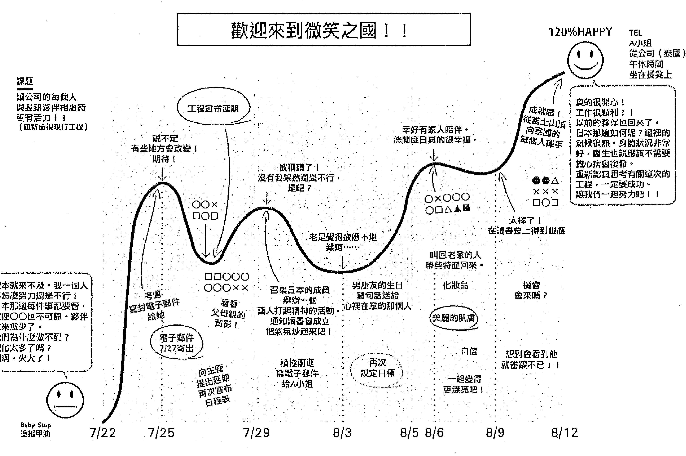

再過2個半星期交期就到了，但進度情況卻相當不樂觀。暗地詢問同事，才知道泰國那邊工程的團隊領導人要辭職。
「再這樣下去，工程不僅會延宕，搞不好還會整個停擺。」心裡充滿危機感的日籍工程師S小姐，首先在7月25日，以友人的身分而不是站在公司的立場，寄了一封電子郵件給泰國的工程經理A小姐。一邊緩和緊張的情緒，同時向主管報告狀況，建議重新檢討日程。

在爭取時間的這段期間，S小姐先請泰國那邊提出已經完成的工作，讓對方先冷靜下來。29日召集日本的成員，規劃一個讓泰國團隊打起精神的「行動讀書會」，並且告知舉辦日期。此外也重新檢討優先順序，以趕上交期。

不僅如此，為了鼓勵A小姐，S小姐特地請要到泰國出差的員工帶特產過去。在以朋友身分寄出電子郵件時，得知A小姐對日本的化妝品有興趣，所以特地送美膚化妝品當作伴手禮，而A小姐也積極說服快要遞出辭呈的團隊領導者B小姐。

泰籍女性的「微笑之國」與日籍女性的「接待文化」模式，就這樣在水面下展開了。結果，這支跨國籍團隊再次迅速出擊，工程也奇蹟式地在8月12日，也就是交期這天如期完工。不僅如此，經過這次的事件之後，A小姐也大幅成長為能與日本協調溝通的橋樑，並且以當地為核心來推動工程。

## 行動案例②：NTT尖端技術公司
將技術模型化，
開發新市場

### 課題：能否將埋沒在大企業裡的優秀技術商業模型化，並且創造出新的市場？

【背景】
NTT集團中，在堪稱中堅企業的NTT尖端技術公司上班的三宅泰世課長，認為只要站在行銷立場，重新檢視自家企业豐富的先端技術，就能大幅加速新事業的成立。至於研究方法，如果能在母公司的研究所或同一集團的企業展開的話，對於NTT集團整體就能有所貢獻。但是光憑一個在子公司服務的小員工，怎麼可能讓總資產20兆日圓、集團合併營業額10兆日圓、旗下員工多達24萬人的組織動起來呢？期望根本就不大。這時他畫了一張未來藍圖。

【結果】
不到3個月的時間，除了所屬公司，這位員工提出的開創新事業方法論，在整個企業集團流傳開來，甚至還運用在招攬商業夥伴的展示會上。

### 【從未來藍圖察覺到的地方】

原本只是想讓公司產生變化，卻因為觀點改變，讓公司內外的日本技術人員攜手合作，所以才廣泛地聚集了各界協助。

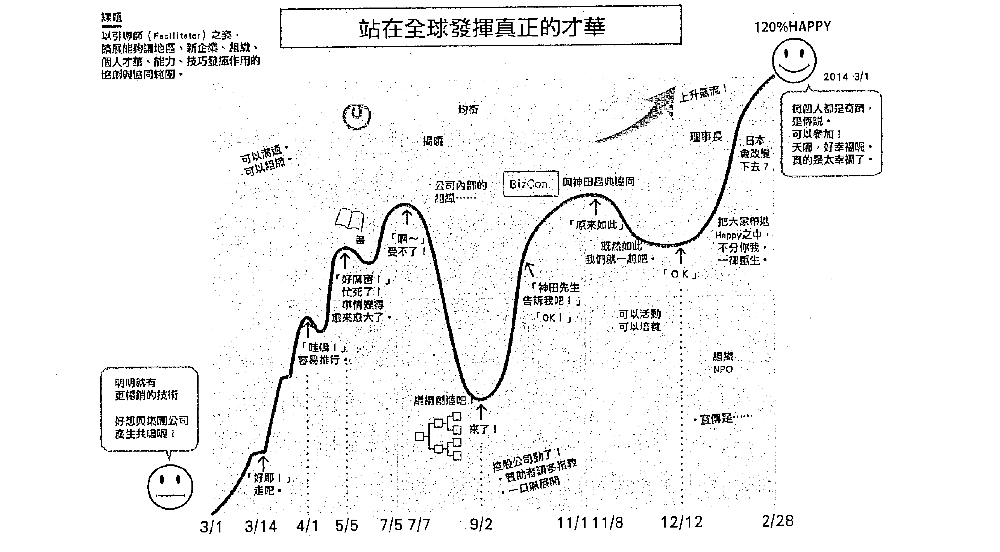

### 【發現的主題】

讓優秀的技術與才能嶄露頭角的協創戰略

從描繪這一張未來藍圖的3月1日開始，他的人生急遽變化。在行動劇本中發現的事情，讓他自己一個人也能開始改變。他與身旁的同事利用商業模式圖（Business Model Canvas）這個方法論，開始撰寫事業提議書。

聽到這個想法的母公司研究所，在3月4日委託他以獲利世代（Business Model Generation）讀書會的形式，舉辦專題討論會。

這樣的變化接二連三地出現。在前一天3月3日，突然有人委託他參加研究檢討會議，因為他2月時在國立研究機構舉辦的「獲利世代」專題討論會深得好評。當日三宅課長還即興當起，在日本算是程度頂尖的智囊之士討論會的引導師，扮演彙整價值創造與知識創造的角色。

這樣的嘗試受到了《週刊鑽石》的注意，並且刊登在7月12日這一期的雜誌中，《圖解獲利世代實戰操作手冊》（今津美樹著，如果出版社）這本書也介紹了這個方法。不僅如此，一般社團法人獲利世代協會，還突然直接打他的手機，探詢他願不願意擔任理事一職。這樣的進展真是令人意想不到。

日後他回顧這一連串的事，發現一切都是跟著未來藍圖描寫的行動劇本在運轉。他的圖表描繪出一個人的改革開始，與公司內外支持自己的協助人員產生共鳴，進而慢慢擴展的現實情況。

一個小員工要在自家公司內部推行改革時，讓公司動起來是一件難事。但是為了提升觀點，要善用優秀同事的才華與公司的技術，而與公司內外協助人員攜手合作的那一刻起，三宅課長身旁就已經聚集了來自四面八方、琳瑯滿目的提議，進而開啟「創造技術種子市場的協創」。

## 行動案例③：經營「富士蕎麥」的大丹集團
不棄守傳統，也能開發新型態

### 課題：要如何設計一個不掛上「富士蕎麥」這張招牌，且針對女性開發的新型態餐飲店？

【背景】
開發奠定「立食蕎麥麵」這種經營型態的「富士蕎麥」，在日本首都圈擁有100家分店，名聲響遍天下。業績雖然持續攀升，但商業模式卻已經進入成熟期。加上以男性為中心的顧客層擴展有限，於是經營幹部開始檢討，要在容易展開店面的車站內部，為女性開發新型態的餐飲店。

### 【從未來藍圖察覺到的地方】

雖然鎖定對象是女性，但是未來藍圖畫到最後，卻未必堅持非女性不可。當初所想的主題，也就是開發能擔起今後成長的新業態，其實是表面的東西，最根本的主題，很明顯的就是讓整個集團徹底了解「富士蕎麥」的強項。

【結果】
畫下圖表之後，開始產生劇烈變化。不到4個月的時間——以富士蕎麥為原點、放鬆空間為主題的新店舖——使用鞆靼蕎麥粉（苦蕎麥粉）的「沾醬蕎麥 鞆靼」開張了。首日的營業額是以往店面的兩倍。不僅《日經新聞》，其他報章媒體也相繼報導。

### 但是變化並非僅止於此……

### 【發現的主題】「量產可以放鬆的地方」

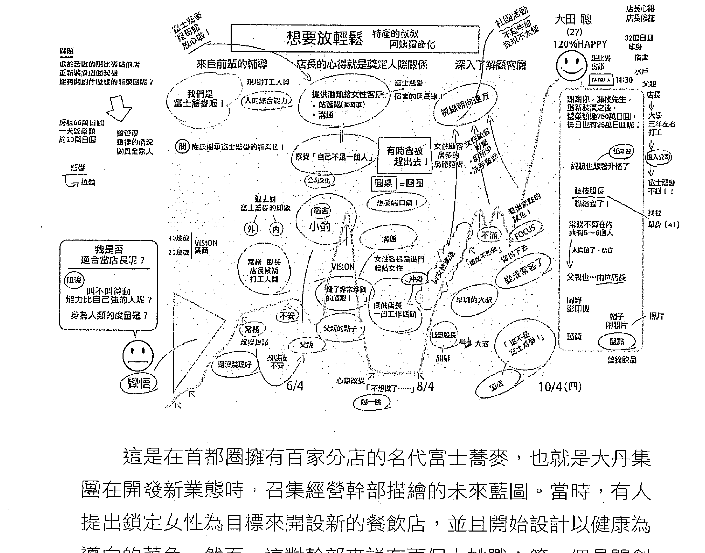

這是在首都圈擁有百家分店的名代富士蕎麥，也就是大丹集團在開發新業態時，召集經營幹部描繪的未來藍圖。當時，有人提出鎖定女性為目標來開設新的餐飲店，並且開始設計以健康為導向的菜色。然而，這對幹部來說有兩個大挑戰：第一個是開創不掛上「富士蕎麥」這張招牌的店舖，也就是不依賴現有的品牌資產。再來就是鎖定的目標是女性。富士蕎麥現有的客人有八成都是男性，鎖定女性客層的餐飲店經驗並不豐富。

於是集團的4名經營幹部與3名顧客代表聚集在一起，開了一場長達3小時的會議。

結果如何呢？

利用未來藍圖進行話題時，結果出現的關鍵字都是一些與鎖定女性開發業態等毫無關聯的字彙，像是「溝通」、「管理」、「員工宿舍」、「二世代之間的對話」。這代表腦子裡只想著要籌措女性專屬餐飲店的收益，內心並沒有確切地感受到這個真實性。

此時，腦子裡出現了一個大問號：鎖定女性來開發蕎麥麵店，真的是正確答案嗎？

深入對話的結果，發現這個企劃真正的主題並不是開發新業態。真正的主題，就如同剛才從列舉的關鍵字中推敲的——就算沒有掛上富士蕎麥的招牌，也能讓富士蕎麥應該繼承的強項，整個深入集團之中。

其中一位幹部在會議結束之後，做了以下的總結：

> 「我們的目的並不是要創造新的業態，重要的是要覺悟，因為我們要透過這個企劃案，讓富士蕎麥的強項傳承下去。」

當他嘴裡冒出覺悟這兩個字時，當場的溫度明顯改變了。

會議是在中目黑一家小小的義大利餐廳所舉行。開懷大笑中，老幹部與新幹部之間銳利的字詞如飛箭四處掃射。

> 「這是要報答社長的。現在不做要什麼時候做？你這小子，現在就跟我大聲說：我要做。」

> 「我真的可以做嗎？」

> 「不是可以做嗎，是要做。我會幫你擦屁股的。哈哈哈哈！」

> 「好的，我知道了。我會覺悟的，哈哈哈哈！」

結果大家最後都喝到爛醉如泥了。

驚人的是，到了隔天，昨晚發出宣言的新幹部被創業社長叫到辦公室。沒想到他竟然被指派為開發新店舖的負責人！

社長應該不知道昨晚發生的事，可是宣言的事情卻變成事實了。因此，企劃的進展變得更加迅速。

幹部中因為產生了「報答社長」這個共同意識，所以菜色開發、目標對象、店舖概念、店內裝潢、商標、命名等，通通都進展地非常順利。尤其是菜色味道方面絕不妥協，因為大家都領悟到，如果味道沒有辦法說服自己，那麼這個企劃本身就完蛋了。在不斷試吃之下，終於出現讓大家驚嘆「就是這個！」的好滋味。

圖表畫好之後不到4個月，富士蕎麥的新嘗試——就像跟阿姨在一起吃東西的餐廳「沾醬蕎麥 麵軀」，在10月10日10點開幕了。光是這個企劃就已經是相當大的變化了，沒想到之後國外竟然也有業者要求在當地開分店，這事也同樣拍板定案。集團內部過去原本非常謹慎地保護招牌，突然如魚得水般動了起來。起因除了報答創業者的這個共同故事在背後推了一把之外，別無其他了。

## 行動案例④：iwill公司／組織・人才活性化研究所
3週內就拿下千萬合約

### 課題：確實在3週內拿下1千萬日圓的合約。

【背景】
已經出版《集客手冊》（日本教育系統開發協會）、《利用「LAB Profile」讓人動起來！》（Subaru出版）等多本著作的人事顧問小林由香小姐，在繁忙的業務生活中，還要應付現有的客戶，待處理的事務堆積如山，講求細節的委託案件接二連三地丟過來。這次她所面臨的大課題，就是如何拿下穩定的合約，以提升營業層次。

### 【從未來藍圖察覺到的地方】

再次發現自己在教育領域內具備的人事顧問訣竅，對於補習班，甚至是多數受到少子化影響而經營日漸困難的學校法人，能夠立即見效。但由於自己在這個業界已經建立了人脈，所以一開始要在3週內拿下1千萬日圓的合約，根本是不可能的事。

【結果】
小林由香的報告結果直接公開在下方：

> 「沒想到，我在3週內竟然達成目標了（達成率101%）！而且不是我當初設定的目標金額（5百萬日圓），是神田先生幫我提高的目標金額（1千萬日圓）呢！委託案件的內容非常多樣豐富，有人事諮詢，有研修業務，還有補習班諮詢。到了第21天，竟然有人會再下一次單，這真是讓我嚇到起雞皮疙瘩了！

### 【發現的主題】

### 「要與合不來的人一起工作」

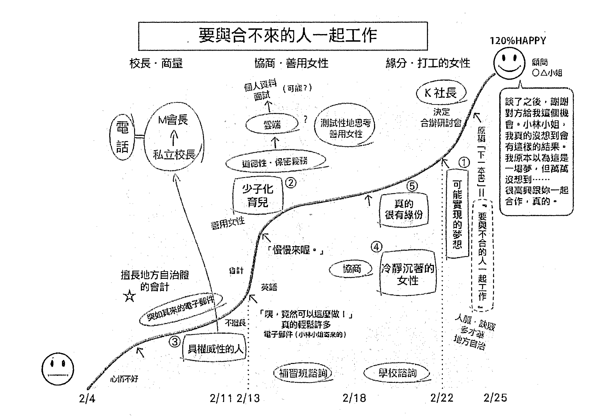

小林由香小姐曾經在某大補習班擔任校長與入學考試經理，之後轉到顧問公司擔任人事顧問，並於2010年獨立創業。除了負責企業制定人事制度的諮詢工作，她還擅長補習班的集客諮詢及講師培養、研修等主題，長久以來都是單槍匹馬應對來自全國的客戶。

然而獨立創業的4年後，這位實力堅強的顧問開始面對管理上一定會發生的典型問題，那就是擠不出時間跑業務，因為時間讓她轉換認知的契機，就是出現在未來藍圖故事中的「權威人物」。只要具有權威性的人願意協助她，為學校的教職員進行諮詢就不是難事。從這個靈感擴大聯想，讓她想起她早就認識在學校方面人脈很廣的中堅人物，而且對方還曾經建議她：「小林小姐，我覺得妳再多從事與教育有關的工作會比較好。」所以，小林小姐想請他寫推薦函，並且舉辦演講。

可是一旦要舉辦演講，事務工作就會增加，一個人根本做不來，但是次數又沒有多到可以發給外包公司。從經營面來看，找一個打工的人應該是上上策，但是她對於家庭主婦有成見，認為她們無法完成需要責任感的工作，所以從以前就一直敬而遠之。據她本人說：「我跟家庭主婦合不來。」

我就說：「如果妳諮詢的顧客，要從企業擴大到學校法人，那麼最好和與學校有密切關聯、同時又有能力的家庭主婦合作會比較好。只要和想在教育領域活躍的家庭主婦架構起網絡，不就能著手改善全國規模的學校經營方式了嗎？」她覺得我說的有道理，所以同意找家庭主婦看看。

結果在募集人才時，她發現不管是條件還是技能，家庭主婦的資格確實都比其他應徵者還要符合公司想找尋的人才。也就是說，被自己視為「棘手的人物」，其實隱藏著飛向下一個準備好的大舞臺的關鍵。決定這個行動劇本的標題，我早就已經想到了。這就是她原本想寫的書本名稱：「要與合不來的人一起工作！」沒想到她原本想實踐的事，在那一瞬間開啟了成為書本原稿的道路。

原本是要提升營業額，結果變成直接與事業繼承、組織改革產生關聯性。
然而，這樣的案例只不過是其中的一小部分。現在就連這一瞬間，也有不少未來藍圖已完成，同時產生不少新的企劃案。這2年每到年初，日本全國就有超過300人決定當年的課題，同時嘗試利用未來藍圖，描繪出一整年的行動劇本。這個數字每年都在急速增加中。

最重要的不只是個人達成自己的願望。當然，達成這個目標固然不錯，但是未來藍圖還能同時培育出，認真思考讓另一個人幸福的「利他知性」（Altruistic Intelligence）。
每次因為描繪未來藍圖而產生的利他故事，讓個人與個人之間的夢想能夠串聯在一起，誕生新的企劃案，開啟新的組織，並且讓活動持續下去。

我並不是為了流傳並宣揚這個工具的實用性才這麼說，而是為了呼籲那些決定編寫理想故事的眾領導者，倘若奠定在利他法則上的嶄新現實，可以透過這樣的速度感普傳於世界，那麼當下就是真正可以引起地球規模改革的時機。

## 你不需改變世界，只要改變自己！

或許你會想「改變世界，這怎麼可能？」不過這已經是過去式了。

手機的簽約數在2014年已經超過世界人口，現在的普及率也高達100%，過去花了100年所產生的變化，現在已經可以輕而易舉地完成了。就像Google、Facebook、Amazon等，不到10年的時間就成了國際企業。現在剛出生的0歲嬰兒到進入小學的這段期間，已經是一個充滿價值的企劃案廣傳全世界，就可以輕而易舉成為巨富的時代。

倘若你認為「這樣的改革我做不到，所以跟我沒有關係。」那麼你可以把這本書丟掉，但是你絕對不能割捨希望。

就像不斷湧來的浪潮，世界的變化也會不停地向你湧進。正因為變化不可能停止，想要拿著希望這把槳划船，就要引起巨大的聲援波浪。

在這個時代，改變世界已不再是奢望，但也不需要拼命地改變世界，因為這已經是日常生活的一部分了。你只要在世界變化的方向，立下希望的旗幟就可以了。如此一來，自己與生俱來的才能，就能靠席捲而來浪潮力量，如你所願地推到更遠的地方，並且為追隨在你之後的孩子，開創一條讓他們的才華開花的道路。

> 「成為你想看見的改變」（Be the change that you wish to see in the world）。

儘管甘地是一個改變人類歷史的人物，所謂的「改變世界」，根本就沒有要求你什麼。這句話說穿了就是要你變化，而不是要世界變化。

只要改變自己，世界就會開始往好的方向改變。這個建議有多實際，我想從你將畫好的那張未來藍圖付諸行動，應該就會有所有體會。

按照圖表採取行動的過程中，需要的東西與以往達成課題的程序截然不同。一般來說，在截止時間前完成預定的行動，是達成課題的正確途徑。然而，未來藍圖最重要的是針對過程採取富有彈性的途徑，例如，無法如期完成時要如何走下一步棋？對於遠離期待的現實生活忍不住想要全部放手時，要如何得到超越期待的結果？

愈有價值的結果，並不是理論上可以預期的因果關係帶來的，而是毫無預期的偶然以及突然閃過腦海的直覺帶來的。邏輯上不管有多努力，就是無法超越期待，但是克服挫折、障礙、絕望這些困境時來訪的幸運，會把我們帶到一個難以想像的地方。

衝浪時，我們不會想要控制海浪，就連風也不會受控。但是只要乘著每一瞬間遇到的波浪，與風化為一體，就能夠更迅速、更順利地抵達應該到達的地方。世界會不會因為自己而改變，靠的並不是按照計畫完成工作的努力，而是取決於能否善用突如其來的偶然。

## 別掌控現實，而是引導變因成為幸福未來

或許你覺得明明按照行動劇本進行了，但是事情卻不順利，那擬定計畫又有什麼意義呢？
不，在這裡我要斬釘截鐵地跟你說，這麼想就錯了。就算課題無法按照圖表所寫的進度來完成，故事還是可以把你帶到意想不到的現實生活中。

以剛才提到的名代富士蕎麥為例，在挑戰新業態之後，第一天的營業額確實是以往店舖的2倍，這是一個好彩頭。或許你會覺得，這是一個「開店計畫接踵而來，分店遍布全國，真是可喜可賀。」的快樂結局，其實不然。

與在全國展開店面相比，還有一個更大的改革。

那就是自創業以來富士蕎麥的強項：革新菜色開發、以絕對性的布局提升經營效率，最重要的就是長久以來注重的安心感，一直為經營幹部所共有。結果相較於現在，過去因為對創業者抱持著一份尊敬，所以在挑戰新事業時會格外慎重的公司內部，因為這項改革而一口氣活絡起來。

他們發現大幅改變公司內部意識之後，在後繼領導者的帶領下，不僅在國內展開了事業，也開始進入國際市場。只不過半年，富士蕎麥就已經相繼在印尼、菲律賓、臺灣這三個國家擴展開來。

結果，公司內部在第二代的領導之下團結一致，傳承自創業者的環境，也一口氣整頓完善。

那麼讓我問問你，你覺得在全國展開事業比較好，還是朝國際市場這方面打下根基比較好？

除了眼前這幾年的腳步，如果一併思考今後10年、20年急速在亞洲成長的這件事，出乎預期的事情反而可以帶來相當大的潛力。因為對公司而言，在這個世代輪替最重要時機，我們在下一代富士蕎麥身上看到新事業的開發，會讓大家回到創業的起點，並且堅持應該繼續傳承下去的強項。

你內心世界的空白，因為想起與生俱來的強項而填滿了，所以在外界必然會擴展極大的可能性。

在這個事事難以預料的世界裡，從那些無法按照計畫定位的點，可以看出未來的原有姿態，並且展現超乎預期的結果。在這裡我們不僅要將未來藍圖化為行動，最重要的就是不要企圖掌控現實。

按照圖表採取行動的過程中，一定會遇到陷入僵局、束手無策的那一刻。明明計畫已經非常詳盡了，為何還會停頓？告訴你，這是因為計畫本身是透過以往那些狹隘認知所擬定的。根據計畫採取行動的你，雖然會慢慢接近一個嶄新寬敞的認知世界，但是這時萬一出現了過去在計畫中早就已經設定好的現實，該如何是好？

沒錯，我要告訴你一件非常可惜的事。那就是你還來不及抵達嶄新的現實生活，就已經要回去以往的現實生活中了。

在剛才的案例中，倘若進入國際市場擴展事業的機會到了，但是大家都沒有注意到這一點，反而打算按照抱持老舊認知時擬定的計畫來進行，結果會如何呢？說不定會讓進入國際市場這個大好機會給溜走了。也就是說，在舊有的認知之下所做的正確判斷，會成為未來認知的絆腳石。

如果你在未來想要拉近「極大的可能性」，一定要記住一件事：那就是當你陷入僵局，走投無路時，放下手上那本利用未來藍圖編寫的行動劇本。我們並不是要利用劇本來掌控發生在現實生活中的事，而是要把立場改為，將發生在現實生活中的變故引導至令人滿足的未來。

若以我在看了好幾千人的圖表變成現實的過程中，所得到的經驗法則來建議，當你覺得事情陷入僵局、停滯不前時，就讓自己沉迷在最令人欣喜雀躍的事情吧。例如，把工作拋諸腦後，去看那部一直想看的電影，甚至是跟久未見面的友人小酌一番也可以，試著讓自己沉浸在心靈滿足的狀態。

於是有趣的事發生了。在那裡出現了一個突破口：有可能是從電影中得到的靈感，也有可能是喝酒時，坐在隔壁的人碰巧是自己想要找的人。像這樣平時難以想像的偶然，通常會帶來突破口。這就是所謂流動（Flow）體驗，因為只要放下藉由思考來控制現實的念頭，往往會出現超越想像，而且是應有的未來。

好了，未來藍圖開發者傳授的採取行動入門法則，到此告一段落。想法已經塞滿你的腦子，只缺採取行動了。動動身體，讓塞滿腦子的故事付諸現實吧。

腦子裡的故事一旦開始存活在現實生活中，現實就會開始反應你的故事內容。你所說的每句話，會從旁人的口中聽到；而旁人所說的每句話，也會從你口中吐出。你與他人、個人與公眾之間的牆，到最後會變得愈來愈透明。而故事究竟是現在走向未來的自己，還是未來的自己在闡述現在？夢與現實之間的邊界、現在與未來之間的邊界，甚至是自己與世界之間的邊界，都會變得愈來愈模糊。

所謂的故事式思考，歸根究柢就是讓分裂的世界邁向統合的教育工具。

乘著從未來席捲而來的浪潮可以沖向何處？這項挑戰結束之後，你對於世界的認知會有什麼改變？我這個捷足先登完成變化的人，非常期待你的到來。無論何時，我都會站在對岸的未來等著你。

# 第6章 關於未來藍圖的13個常見問答

## Q1 什麼樣的組織使用未來藍圖會比較有效？

以往的未來藍圖，除了小學到大學的課程，身障者教育機構、人事院的領導者演習，與規模較大的地方銀行舉辦的研習會，都曾經派上用場。
因為是達成共同課題，也就是在短時間內孕育出與現實行動有關的點子，所以在地方活化活動，以及為加盟店與代理店舉辦的演講會中，也能有效地充分利用。

## Q2 不是還有心智圖跟 KJ 等方法嗎？

未來藍圖並不是要排除其他優秀的方法論，而是可以與其他工具互補善用。一般來說，大多數的思考架構，通常是為了在當下整理分析資訊。例如，在達成課題的過程中，人們比較擅長找出「靜止圖」。
但是未來藍圖還可以在這上頭添補到達成課題這段期間的時間軸，所以感覺就像是在創作一本「動態般的劇本」。因此，若將利用其他思考架構得來的點子，在會議的最後彙整成行動劇本，未來藍圖可以帶來極大的效果。

## Q3 做未來藍圖需要花費多少時間？

A3 如果要仔細地完成未來藍圖，大約要 1 個半小時，久一點的話，差不多 3 小時。或許你會覺得「要這麼久呀？」但是我們從中得到的，卻是一個名為「Presencing」（瞬間與世界連結在一起的感覺），變化極大的認知。

層次如此深奧的認知轉換，在未來藍圖還沒開發之前，我如果沒有事先舉辦 1 場為期 2 至 3 天的集訓演習營，這種平常不會推出的活動，根本就無法提供這種體驗。但是未來藍圖是利用故事創造非日常的場景，通常在 2、3 個小時內就可以讓人感受到這樣的認知。

在平常的業務中，除非面臨極大的危機，否則不會出現如此深奧的認知。結果導致組織愈大，可以改變的事情就愈少，甚至過了 5 年、10 年都還在僵化的處境之中。所以，若在對的時機使用未來藍圖，反而會非常有效。

## Q4 挑選希望他獲得 120%幸福的人時，要怎麼做才好？

A4 當我請你挑選一個希望他獲得幸福的人時，大家通常都會選平日一起生活——主管、同事、下屬，或是家人——也就是「周遭的人」居多。但是，在描繪未來藍圖時，因為要讓自己的觀點與課題切離，所以我不太建議大家以「身旁的人」為對象。

我反而會建議大家挑選離這個課題有點距離的人。假設是工作上的課題，那就挑選平常不太會接觸的總公司董事長，或是公司的創辦人，這樣不但可以擴展想像的內容，在理解整個組織觀點時，也能帶來極大的效果。

此外，我還建議挑選最喜歡的藝人或歷史人物等，跟課題毫無關聯的人。因為只要脫離現實，就可以抱著雀躍的心情自由擴大想像範圍。

一旦習慣讓各個不同的對象幸福，接下來就會希望讓更多對象幸福。例如，有人就會突發奇想，讓眼前的東西——愛用的筆或背包——變得更幸福。

習慣之後，當要思考「架構這個課題」時，就不要追究理由，直接挑選「第一個浮現在腦海裡的人」、「碰巧遇到的人」、「心裡非常在意的人」。當你這麼做時，通常就會感受到答案突然從意外之處降臨。

## Q5 想不出希望他獲得120%幸福的人……

A5 怎麼想就是想不到的話，那就選自己吧。試著想想未來的自己、過去的自己，甚至是置身在平行世界的理想自我，大家覺得如何呢？

另外，如果你不管怎樣就是排斥挑選出希望獲得幸福的人，就不要硬逼自己使用未來藍圖，從本書的實驗中挑選喜歡的方法論，例如打開禮物盒或是畫曲線，也能想出十分豐富的點子。

## Q6 我是企業顧問。未來藍圖雖然適用於解決客戶的問題，但是導入時該怎麼說明才好呢？

A6 最重要的並不是在客戶面前使用未來藍圖，而是把焦點放在解決客戶問題這件事上。我想你應該發現，與其急著帶進工具，第一個要做的，其實是仔細聆聽客戶的狀況。
如果我是你，我會先利用未來藍圖來準備自己的諮詢工作，好在客戶面前展現最佳成果。如此一來，在最恰當的時間點使用未來藍圖時，說不定就會寫下行動劇本。這時如果做出提議，我相信客戶應該會馬上接受。
最近解決的問題愈複雜，論點就會愈抽象，使得以往都不會進行的會議，有愈來愈多的趨勢。在如此混亂的時刻，未來藍圖可說是救世主。
這時不妨試著對客戶這麼說：「我有一個提案，請您聽聽看。有一個方法叫未來藍圖，是藉由創作故事，並且站在高處觀望，經過一番腦力激盪之後，再來解決超越框架的問題。如果您有興趣，要不要試試看呢？」

## Q7 不能用在公司的企劃書與提案書上嗎？

A7 未來藍圖是以想法與行動為目的的思考模式，所以不適用於以爭取同意為目的的請示書，或企劃書格式等文件。但是要從零創作出需要的出色點子時，未來藍圖會是一個非常有利的思考工具。

透過未來藍圖得到的點子，可以在請示書或企劃書中展開各項要素。例如，在編寫希望獲得120%幸福的人這段故事時，可以顧客為對象來觀察；寫在標題處的字彙，也可以激盪出工程或是商品名稱等點子。

即使是企劃書，同樣也是由「調查·研究」、「假設·驗證」和「結論與可能性的擴展」這3個部分架構而成的，所以發表時只要充分利用在未來藍圖中得到的故事流程，就比較容易得到周圍的同感與支援。

## Q8 在團體中引導時，有沒有需要注意的地方？

A8 在團體內使用未來藍圖時，我建議你不要只挑選背景相同的人，還要加入幾個觀點不同的人。就算是平常因為興趣與關心的事物不同，所以只能聊些表面話題的人，在利用未來藍圖共同創作故事時，彼此之間的關係也會自然而然地更加熱絡。

尤其是在工作的重要課題上，想找出解決對策時，不要光找幹部，還要超越階層，召集幹部、經理、新進員工與顧客一起商量，會比較有效。這會是一場透過編寫故事與解釋行動劇本，而讓人忘記時間的對話，也能讓人在短時間內相互學習彼此擁有的知識與經驗。

不僅如此，就算是階層與領域完全不同的人，也會因為能直接共有與工作毫無關聯的故事，進而產生共同語言，讓成員同心協力，合作無間。正因為現代人能共有的故事愈來愈少，所以共同創作故事的體驗，可以讓團隊本身更加熱烈活絡。

## Q9 教導未來藍圖時，客戶突然落淚了。為什麼？

A9 這眼淚並不是悲傷或痛苦等感情因素所造成。這稱為「改觀之淚」，是在最接近自己本質的領域，也就是在諮詢的世界裡接觸到「自我」（self）這個領域時會出現的反應。這是瞬間察覺到自我存在的本身，被整個世界接受、難以言喻的感動體驗。

來自自我的覺醒，奠定在內在的動機上，而覺醒本身會令人感到十分喜悅，就算遇到困難，也會憑自己的意志設法找出解決對策，進而加速成長。

未來藍圖可以藉由創作使他人幸福的故事，讓以往刻意不浮出表面的才能，彷彿映照在鏡子中而出現。這雖然是經驗豐富的專業諮詢顧問才能達到的境界，但是我認為未來藍圖還是可以透過利用反應深層心理這條曲線中的「故事編寫」、「圖像利用」及「空白」原理，讓人在短時間內學到高度的諮詢技巧。

## Q10 未來藍圖為何開始在教育界流傳開來呢？

A10 當初學校之所以開始利用未來藍圖，首先是教職員把它當作讓自己工作更加充實的工具，以便設計出內容豐富的課程，擬定學級營運計畫。之後得知用於讓學生自我思考的教育工具上也非常有效，所以使用未來藍圖的中高等學校教師，也慢慢在增加。最近甚至還有高中利用這個方法，讓學生來準備大學考試的面試，推薦合格的人也一口氣增加了不少。

有位長期從事身障兒教育的老師這麼說：「未來藍圖會改變與圖表有關的人的行動，是吧？這已經大幅超越心理學上所說的『增強動機』、『行為變貌』這些理論了。（以下略）出色的教育法固然為數不少，但是未來藍圖卻能直接改變行動。自從學會未來藍圖之後，我強烈地感受到今日生涯教育的當務之急，就是採行可以朝正面思考的方向來改變行動的教育。」

## Q11 只要累積利用未來藍圖引導的經驗，通常都會被選為領導者。為什麼？

A11 為了利用未來藍圖進行引導，我們必須在各個不同業種、領域、階層的人聚集之處，營造一個可以讓大家單獨發言、展露彼此才華、安心又安全的環境。因此，只要引導師多多展露自然的笑容，就能提升引起共鳴的能力，為人也會散發出一股魅力。

此外，每當創作一個讓他人幸福的故事，就會累積與人生息息相關的真實故事。這並非只是自己一個人的人生，是同時經驗好幾個人的人生體驗。因為未來藍圖會讓人養成站在多角觀點上觀察人類的習慣，所以就算遇到相互衝突的利害關係，也會以在高處俯視的觀點來協調。

## Q12 未來藍圖好像受到佛教的影響……

未來藍圖並沒有受到某一特定宗教思維的影響。這只不過是我過去這15年來，在商業界規劃行銷企劃案時，分析有成果與沒有成果這兩者之間的差異後，再把這些展現成果的行銷企劃案，找出相同原則組成思考架構。
未來藍圖說穿了，只不過是一個運用在工作上的工具，所以自己思考、行動、化為形體等這一連串的事情都是有意義的。因此，不只是佛教，以往人類累積的睿智與思想體系的本質，都能透過這個體驗基礎加速理解。

## Q13 要從何處著手才能學會未來藍圖？

某間學校的老師在新擔任班導的班級上，每天都會挑選一位學生，為他畫一張希望他獲得幸福的未來藍圖。這個每天注意一個孩子並採取行動的例行工作，到最後每個人都輪過一次了。結果這位老師不僅了解每一個孩子的想法與個性，甚至還掌握了每個孩子之間的關係。當初人家都說這個班級有些學生非常難管教，但是一個月後卻變成非常容易管理的優秀班級。
所以當你在規劃每天的行程時，不妨試著畫一張未來藍圖吧。

那麼，今天一整天你想讓誰幸福呢？只要懷抱著這個念頭，每天早上就能從夢想中如實醒來。

# 結語——想要提供給全世界的才華

本書想傳達的，與其說是讓某個人幸福，不如說是讓我們知道自己擁有遠遠超過想像、創造理想未來的能力。

自從開發未來藍圖之後，我一直對這個利他性擁有的可能性，感到興奮不已。只要懷抱著體貼的心，編寫出讓某人幸福的故事，這個故事就會變成映照出自己的鏡子，使得邁向未來必須具備的自我才能，展露在世界上。才能需要透過相關物品才會找得到，所以我們會接觸各式各樣的人，並且想出新的企劃案。

我在本書提過，如果能藉著如此簡單的裝置解決大多數的問題，那麼我會希望多找幾位夥伴，和我一起參加這趟令人興奮的冒險之旅。

當今的時代，是利用創造的知識讓解決社會問題這件事產生價值的時代，也就是進入一個知識創造的時代。這個世界的問題堆積如山，尤其是日本正面臨著地震災害、輻射污染、能源問題、高齡化社會，以及與鄰近國家之間的政治紛爭等難題。但是這些難題卻是讓世界脫胎換骨的必要之事，同時也能讓我們住在日本說日語的人，擁有的重要才能浮現檯面，這就是利他的心。

過去所謂的工作，都是以賺取讓自己生活下去的糧食為目的。就算位在組織頂端的人，高喊「為顧客，為公司」喊到嘴痠了，無奈的是，倘若給予的思考工具是開發於競爭時代、以奪取市佔率為價值的東西，那麼身在現場的人，就不時會處在以二律背反（編按：指同一個問題所形成的理論學說，雖然各自成立，卻互相矛盾的情形。）為價值觀的矛盾生活之中。

不過，現今的利他故事只要想得愈深，產生創造性附加價值的過程就會愈明確。也就是說，當我們為了賺取日常生活的糧食，每天早上起床後，在思考一整天的行程時，只要一邊想著：「好，今天要讓誰幸福？」一邊攤開記事本就好了。

這個以戰鬥來累積財富的時代終於要結束了，而轉換成「以和為貴」這個充滿尊敬與和諧的繁榮時代，其中所需要做的準備，日本已經就緒了。

日本是尊貴之國，所以想為這個地球工作的夥伴才會聚集於此。而我也因為能以這個國家為據點來活動，同時與你一同創造新世界，而衷心疼到驕傲。

神田昌典

# 附言

在執筆寫這本書的同時，我也一邊實際描繪未來藍圖圖表，一邊挑戰新課題。就讓我跟大家報告以下結果。

課題：若要讓上海研討會成功，要怎麼準備才會完善？

- **【期間】** 12 天。
- **【結果】**
非常成功。以經營者為主的參加者約 30 位，共同完成了一個笑聲不斷的漂亮作業。最後眾人起立歡呼，並且組成一個名為雷神學院的班級，繼續努力。

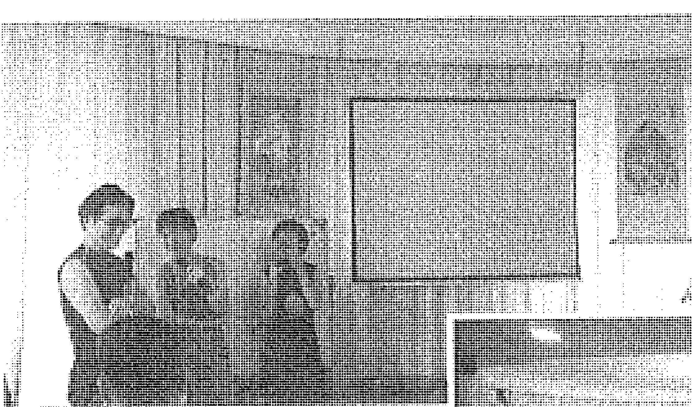

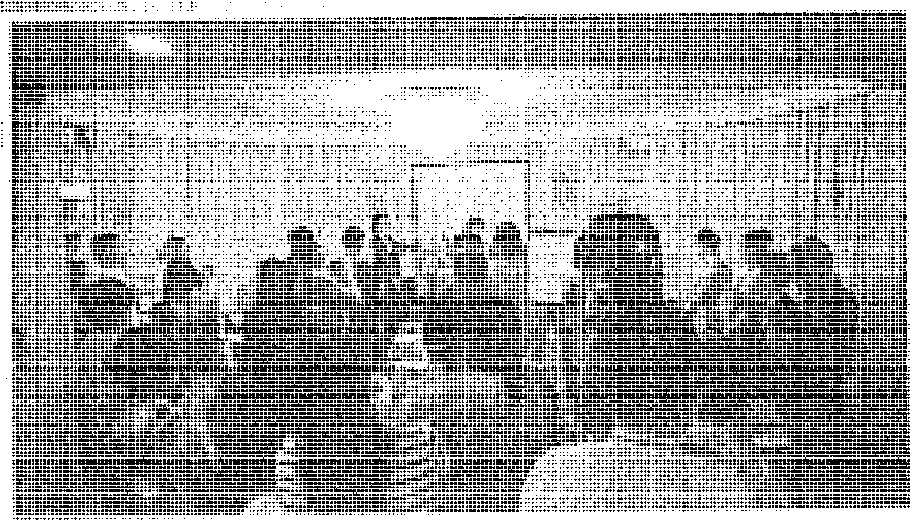

# 【發現】

禮物盒裡的蓮花。當我那一天到會場時，發現園區裡竟然到處都是蓮花。能夠真實地得到這個禮物，就是未來藍圖的醍醐味。

# 卷尾资料

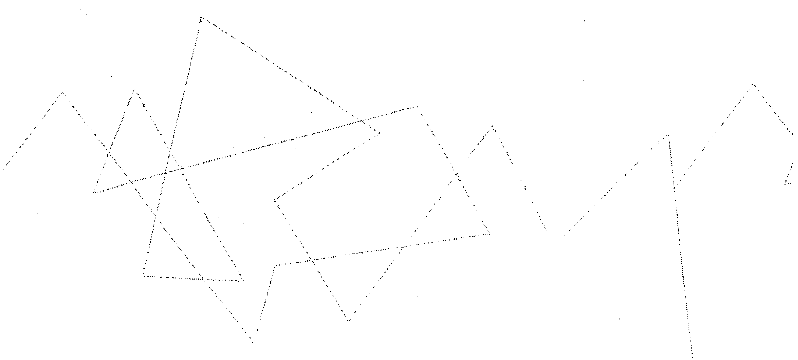

# 如何描繪未來藍圖？

- • Step1 準備
  • 畫好圖框
  • 決定課題。
- • Step2 未來
  • 選擇希望他獲得 120% 幸福的對象。
  • 描寫未來的光景。
  • 用臺詞表達喜悅。
  • （選項）接受禮物盒。
- • Step3 現在
  • 用臺詞
  • 表達自言自語。
- • Step4 故事
  • 畫下從未來到現在的曲線。
  • 利用曲線的高低起伏來描述故事。
- • Step5 行動
  • 大略寫下故事的各個部分，每一個部分均寫上標題。
  • 從故事聯想，找出具體行動。
- • Step6 前進
  • 為圖表寫上標題。
  • 踏出小小一步。
  • （不需努力就能跨出的一小步）

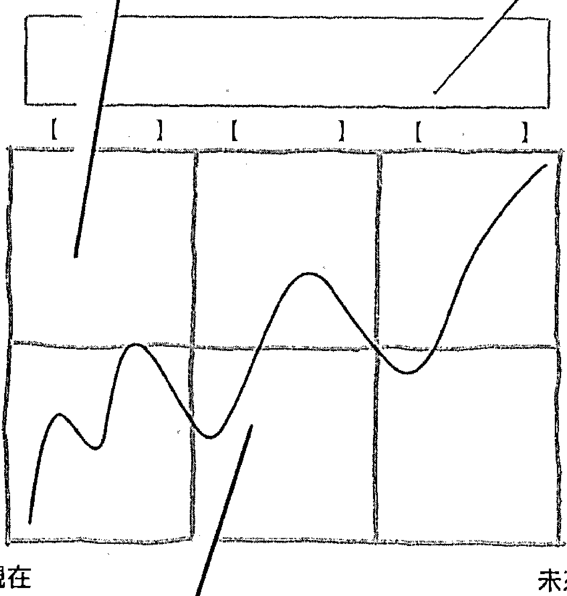

> 真是太幸福了！
因為……

> ......

# 【想像領域】 創作獲得 120% 幸福的人的故事

## Step1 準備

- ① 畫出六宮格與標題格，決定達成課題的期間（時間表）。
- ② 決定課題。

## Step2 未來

- ① 挑選一個希望他獲得 120% 幸福的人，畫上微笑，寫下名字。
- ② 獲得 120% 幸福的未來是什麼樣的光景？是如何表現喜悅的？
- ③ 從 120% 幸福的未來收到禮物盒。

## Step3 現在

- ① 以普通臉部表情畫出現在狀況。
- ② 不要漏掉一個人的時候，想像自己在自言自語，並用臺詞表達出來。

## Step4 故事

- ① 用較不靈活的那隻手，畫下從未來到現在的曲線。
- ② 挑選曲線上 5~7 處在意的地方，並且標上 ↑（朝上指的箭頭）。
- ③ 曲線下方標上箭頭處發生了什麼事？沿著曲線編寫故事。

# 【現實領域】 找出自己可以採取的行動

## Step5 行動

- ① 從曲線下方的故事中，挑選「莫名在意的字彙」（關鍵字），並且把它圈起來。
- ② 掌握曲線下的故事流程，並在六宮格上方寫下各個部分的標題。
- ③ 故事的流程、現有的行程表，以及故事中圈起來的關鍵字，聯想有助於達成課題、自我採行的行動。
- ④ 曲線上方的空間，寫下自己做得到的行動。

## Step6 前進

- ① 若這一連串的成長過程是一部電影，你會為它取什麼名字？
- ② 決定這小小一步（不需努力就能夠跨出的一小步），並且宣告何時會跨出這一步。

Let's Play!

## 未来蓝图（附步骤指引）

-   **Step6 的问题**
    ①标题

-   **Step5 的前进**
    ②三个事的主题

-   **Step4 的故事**
    ①曲线
    ②箭头

-   **Step4 的故事**
    ③物语

-   **Step5 的前进**
    ③翻译
    ④具体行动

-   **Step5 的前进**
    ①将故事的关键字圈起来

-   **Step1 准备**
    ①格子・课题

-   **Step2 未来**
    ①主角

-   **Step2 未来**
    ①120%幸福

-   **Step2 未来**
    ②礼物盒

-   **Step1 准备**
    ②决定时间表

-   **Step6 前进**
    ②第一步

-   **Step3 现在**

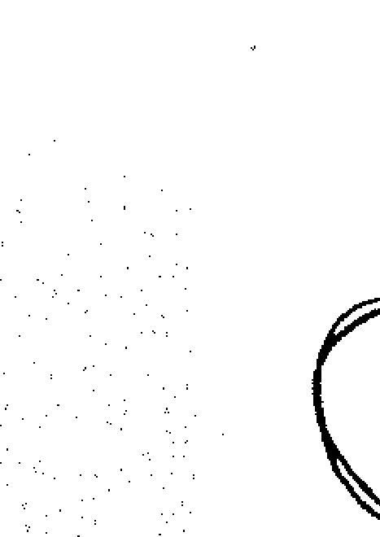

| Step4 的故事 | （空白） | Step4 的故事 |
| --- | --- | --- |
| Step5 的前进 | Step5 的前进 | （空白） |
| （空白） | Step5 的前进 | （空白） |

|   |   |
|---|---|
|   |   |
|   |   |
|   |   |

