# 秘密没教你的宝地图

許願沒成功就是缺了寶地圖

> ありがとう ありがとうします

日本馴錢師、500萬本暢銷書作家 本田健
日本第一個人投資家 竹田和平
推薦寶地圖 成功法！

經歷負債、裁員，從谷底走出來的我，實現了夢想！ 20年&22萬人的親身體驗！

人生，不會只有這樣！ 《秘密》無法成功，就是缺少這一味！ 年薪提高、變成有錢人、自己創業、成為公司老闆…… 寶地圖助您實現夢想！

本書作者望月俊孝每年都會立定目標，製作新的寶地圖。此為2012年所製作的寶地圖。

作者雙手握著借來的400萬日圓。他在寶地圖裡放入這張照片，具體顯現自己的目標，結果激發了潛能及運氣，從一個失業者，後來不但還清債務，年收入爆增為數千萬日圓，並買了房子。

親子寶地圖研習會。孩子們與家長一起設立目標，製作課業學習的寶地圖。

望月俊孝舉辦寶地圖研習會的情景。

### 前言

「寶地圖」是兼具三大要素的劃時代夢想實現法

我有 3 個問題想請教各位，請回答「YES」或「NO」。

你是否擁有令你興奮雀躍的夢想？
你相信您的夢想會實現嗎？
你懂得如何享受夢想實現過程的樂趣嗎？

如果答案全部都是「YES」，那你應該用不到這本書。不過，如果你的答案有「NO」，或你沒有自信可以回答「YES」，我相信本書對你將有很大的幫助；你的人生極有可能因為接觸到本書而產生重大的變化。

為什麼我會這麼說呢？因為本書所要介紹的「寶地圖」，是具備以下三要素的「夢想實現法」，這三個要素分別是：

+   ① 任何人都能輕鬆做到。 ② 樂於持續下去。 ③ 效果大。

製作「寶地圖」所需的時間只需短短的1、2個小時，做好「寶地圖」後，也只要開開心心地偶爾欣賞就夠了。 光是這麼做，就能讓你每天的生活變得很精采，不僅時時刻刻充滿熱情、幹勁，對周遭的人事物更是心懷感激，還經常出現靈感與行動力，在不知不覺中讓夢想都實現了。 相信一定有不少人心裡會想：「我又不是笨蛋，世界上哪有這麼好的事！」 關於這一點我非常能夠理解。 不過，就我所知，甚至包括我自己在內等許多製作過「寶地圖」的人，都已經順利實現「潛藏在心中的偉大夢想」了。

像是：

+   - 由頸椎骨折造成的瀕死狀態中，奇蹟式地復原，重新回到生活中！
- 戰勝自己的發展障礙症狀，不僅活躍於社會，後來甚至還出書！
- 邂逅理想條件的男性，完全合乎自己事先訂下的 26 個擇偶條件，並順利結為連理！
- 親子合計成功減肥 43 kg！
- 成為自己所嚮往老師的弟子，並成功開創終生的事業。
- 喪失自信的業務員，如願以償獨立創業，成為年營業額高達 7 億日圓的公司董事長！

這些不過是其中一小部分的例子。事實上，「寶地圖」的效果，已經讓許多人實現了「超過百分之 90 的夢想」。

### 為何一般「成功法則」，無法讓人持之以恆呢？

話雖如此，其實從古到今，許多成功者或一流人士，每一個人都跟大家分享過不少的「成功法則」與「成功秘訣」。例如：

+   - 要擁有熱情的夢想、積極思考、堅定地採取行動。
- 訂立計劃，設定達成日期，掌握進度，持續進行調整。
- 想像自己成功的模樣，編成故事，每天唸出來激勵自己。

這些方法確實有效，不過，還是有它的問題存在。雖然大家都知道，只要能用心去實踐，效果一定很棒，但難就難在「不容易持續下去」。那麼，究竟是哪一個環節出問題了呢？

+   ① 一開始就放棄夢想的實現，缺乏自信。
- ② 夢想不明確，無法清楚想像。
- ③ 幹勁或熱情難以長久持續。
- ④ 無法化為具體行動。
- ⑤ 每天過於忙碌，以至於忘了目標，偶爾才會想起來。
- ⑥ 往往會退縮，覺得自己的能力或自我形象，離夢想有一大段距離。
- ⑦ 在努力過程中經常出現困難，卻不斷重複成效不彰的方法。
- ⑧ 過於忙碌，導致沒時間去實現夢想，無法養成習慣。
- ⑨ 感受不到成果，無法信任或耐心等待成果的出現。
- ⑩ 雖然思考很積極，但卻無法擺脫沒錢、沒知識又沒人脈的困境。

我還沒有深究，就已經列出這麼多的問題。不過，各位不用擔心，只要有本書的「寶地圖」，這些問題保證會自然迎刃而解，你一點也不需要強迫自己去做什麼。「寶地圖」的作法很簡單，是每個人都做得到，能夠持續下去，且絕對有效的夢想實現工具。所以日本暢銷作家本田健大師，以及日本第一個人投資家竹田和平先生等各個領域的佼佼者，都給予寶地圖極高的評價。歷經20年的時間，我在自我啟發與成功法則的研究上花費了數億日圓，最後終於大徹大悟。

### 潛意識的強力工具

「寶地圖」是在為數眾多的實現願望技巧中，最簡單、也最能激發人類潛意識的強力工具。

「寶地圖」具有下列幾項效果：

+   ● 目標變明確，能對潛意識發揮作用。
● 就算覺得好像沒有在努力，還是會自然而然湧現出靈感。
● 懂得配合夢想去思考或行動，不再做白工。
● 找到自己打從心裡想要實現的夢想。
● 感覺夢想或目標就在身邊，變得容易吸引想要的事物。

接觸「寶地圖」後，這20年以來，我幫助超過22萬人實現了夢想，找到了畢生的志業。

在這段期間內，我本身仍不斷向其他導師學習；我綜合融入許多人的親身經歷，再加上各種最新的 know-how，今天才能出版這本「寶地圖」的最終決定版。

由於長期的經濟不景氣，看不見未來，現在最重要的是，大家一定要對未來懷抱希望，清楚勾勒夢想，並相互協助扶持。

接下來，我將跟各位詳細介紹「寶地圖」，請大家絕對要好好活用這個能幫你實現夢想的魔法工具——「寶地圖」！

> 望月俊孝

### 立刻就做得到！製作自己的「寶地圖」！

如圖表所示，製作「寶地圖」的方法有5種。
請大家依照自己的目的，或製作的難易程度，開始動手製作「寶地圖」吧！

## 簡易版・寶地圖 ▶▶▶ 63頁

好像有點夢想的人，第一步請先將目標寫到白紙或手帳上，之後再貼上符合夢想內容的圖片，這樣可以讓夢想變明確。

## 1秒寶地圖 ▶▶▶ 69頁

總是忙碌的人，將想要實現夢想的圖片，貼到常看見的手機螢幕或電腦桌面，夢想自然而然就會輸入腦中。

## 基本版・寶地圖 ▶▶▶ 102頁

確實懷抱夢想的人，可買一個軟木塞板製作寶地圖的基本版，加速夢想的實現。

## 日日寶地圖 ▶▶▶ 194頁

準備考試、每天都要看書的人，為了準備學校或公職證照考試而背書的人，可試著製作「日日寶地圖」，讓自己每天都能將目標化為成長數字。

## 寶地圖影片 ▶▶▶ 235頁

想以音樂影像感受夢想樂趣的人，用音樂與影像來表現自己的夢想，是個能與親友分享自己夢想的有趣方法。

### 簡易版·寶地圖

只要有紙、筆與圖片，立刻就能製作「寶地圖」

「寶地圖」應該是要用A1尺寸的軟木塞板來製作，不過一開始只要用影印紙或月曆背面等，就可以製作了。你不必一定要找一張完美的照片，只要找到能讓你「聯想到夢想的圖片」就可以了。如果沒有任何圖片，僅僅用文字寫上夢想與時間比什麼都沒有要好。要做的事情很簡單，但效果卻會像變魔術喔！

### 1秒寶地圖

※※※※※※※※※※※※※※※※※※※※※※※※※※※※

### 啟動活力與幸福的「1秒寶地圖」

成功者往往會將許多能讓自己感受幸福或恢復活力的物品，擺在身邊四周，以便時時刻刻都維持在最佳狀態。

在客廳、臥室、廁所、辦公室等處，統統放上「能讓你具體聯想到夢想或目標的物品」，也算是一種「寶地圖」。

或許看見的時間可能只有短短「1秒鐘」，但一天可能會看上許多次，不知不覺夢想便會輸入潛意識，讓你變成「成功腦」。

### 基本版・寶地圖

※※※※※※※※※※※※※※※※※※※※※※※※※※

### 夢想化為圖片，變成人生的衝勁

先設定好夢想，再投入時間與精力，就能得到你想要的人生。因此，重要的是，要經常留意自己的夢想。「寶地圖」的製作方式是在一大塊軟木塞板（A1 大小／60 X 90 cm）中間貼上自己笑容洋溢的照片，接著以此為中心，在周圍貼上關於「夢想」、「目標」、「幸福」等圖片。只要看著「寶地圖」，你自然而然產生熱情、幹勁以及挑戰夢想的行動力。

### 寶地圖影片

> 用「音樂」與「話語」做成動畫，實現夢想或幸福

請用手機或電腦做做看動畫版的「寶地圖」。

「寶地圖影片」是實現夢想的最強工具。

藉由在「寶地圖」中加上「動畫與音樂」，讓夢想如真實一般，滲透進人的意識與潛意識中，最後產生驚人的爆發力與行動力。

與「寶地圖」一起搭配使用，效果將更棒。

### 目錄

+   - 前言 .................. 3

+   - 立刻就做得到！製作自己的「寶地圖」 .................. 10

+   - 「寶地圖」的版本 .................. 12

+   - 簡易版・寶地圖／1秒寶地圖／基本版・寶地圖／寶地圖影片

# 第1章 「寶地圖」的8大效果 .................. 25

+   1. 效果1：將夢想或目標轉換成「照片」或「話語」，讓印象更明確 .................. 34
+   2. 效果2：吸引可幫助你實現目標或夢想的「資訊」 .................. 36
+   3. 效果3：懂得「取捨與選擇」實現夢想所需的資訊，不再做白工 .................. 37
+   4. 效果4：自然而然浮現「靈感」 .................. 38
+   5. 效果5：知道自己「真正想要實現的夢想」，找到人生的「中心軸」 .................. 40
+   6. 效果6：「自我形象」獲得提升，發揮極限能力 .................. 41
+   7. 效果7：「心」改變了，「態度」或「行動」也會跟著改變，養成努力的習慣 .................. 43

## 第2章

+   效果8 「人脈」豐沛，出現幫助自己的貴人……44
+   「夢想實現」專欄1 你是夢想製造者？抑或是夢想破壞者？……46

### 製作「寶地圖」的8個步驟……49

+   準備用來製作「寶地圖」的「底板」……50
+   決定自己「寶地圖」的「標題」、貼上「表情很棒的照片」……51
+   貼上能讓你聯想到夢想或目標的「圖片」……53
+   寫上夢想實現的「日期」與「條件」，讓它成為一個計畫……54
+   思考你的夢想實現，會對社會或未來產生什麼「影響」……56
+   傾聽「內心的聲音」，看看你所描繪出的美夢是否能真正帶來幸福……58
+   每天都要重複多看幾次，以確認夢想的內容，並將之烙印到「潛意識」中……59
+   展開「具體行動」，朝夢想實現邁出第一步……61
+   劍及履及，現在就立刻動手製作「簡易版・寶地圖」吧！……63

## 「夢想實現」專欄2
+   從「小小的夢想」開始做起……67

# 第3章 每天用看的就可以「1秒寶地圖」 「1秒的習慣」加速夢想的實現

+   1. 客廳／餐廳 ………………………… 70
+   2. 書房／臥室 ………………………… 74
+   3. 廁所／浴室／化妝間 ……………… 80
+   4. 汽車 ………………………………… 84
+   5. 包包裡／記事本中 ………………… 86
+   6. 手機／個人電腦 …………………… 88
+   7. 辦公室 ……………………………… 92

## 「夢想實現」專欄3 養成實現夢想的「習慣力」

# 第4章 實現夢想的「寶地圖」實踐篇

● 找出「想要實現夢想」的主題，加速夢想的實現

> 「夢想」成功篇

+   ○ 遠景寶地圖 109
+   ○ 變身寶地圖 115
+   ○ 旅行寶地圖 121
+   ○ 找工作寶地圖 127
+   ○ 生意興隆寶地圖 133
+   ● 幸福寶地圖 142
+   ● 幸運寶地圖 148
+   ● 嗜好寶地圖 154
+   ● 戀愛寶地圖 160
+   ● 減肥寶地圖 169
+   ◎ 習慣養成寶地圖 173
+   ◎ 同好寶地圖 180
+   ◎ 感謝狀寶地圖 186
+   ◎ 還有許許多多等著大家去實踐的寶地圖 190
+   ◎ 心愛寵物寶地圖 188
+   ◎ 社會貢獻寶地圖 182
+   ◎ 災難重建寶地圖 184
+   ◎ 戒菸、戒酒寶地圖 175
+   ◎ 健康寶地圖 171
+   ◎ 家庭美滿寶地圖 162
+   ◎ 紀念日寶地圖 164
+   ◎ 激勵寶地圖 150
+   ◎ 感謝寶地圖 144
+   ◎ 好心情寶地圖 146
+   ◎ 加油寶地圖 152
+   ◎ 提升財運寶地圖 135
+   ◎ 自我成長寶地圖 129
+   ◎ 勇奪冠軍寶地圖 123
+   ◎ 獨一無二寶地圖 117
+   ◎ 使命寶地圖 111
+   ◎ 自我提升寶地圖 137
+   ◎ 終生事業寶地圖 131
+   ◎ 金榜題名寶地圖 125
+   ◎ 我家寶地圖 119
+   ◎ 導師寶地圖 113

# 第5章 透過『寶地圖』實現夢想的人，他們的幸福物語

### 『夢想實現』專欄
珍惜今天的『日日寶地圖』

學習寶地圖／笑容寶地圖／啟動幹勁寶地圖／人脈寶地圖／英雄寶地圖／提升人格寶地圖／抗老寶地圖／慢跑寶地圖／美肌寶地圖／世界和平寶地圖／集體留言寶地圖／靈感寶地圖／宣傳活動寶地圖／風水寶地圖／冥想寶地圖／價值觀寶地圖

+   1. 失去生存希望的我，拜『寶地圖』之賜而得到拯救！／腰塚勇人先生的例子
+   2. 就算罹患發展障礙症，依然能在社會上發光發熱！／安須直子小姐的例子
+   3. 「寶地圖」讓我遇見理想伴侶！／石橋和泉小姐的例子
+   4. 書籍如願出版，紀念講座也超成功／是久昌信先生的例子
+   5. 觀看「寶地圖」讓我信心大增，在世界草裙舞大賽中得到優勝！／神村佳宏先生的例子
+   6. 能為孩童們帶來希望與夢想的絕佳工具／鲛島秀己先生的例子
+   7. 為將國產棒球手套推廣給世人，以「寶地圖」進行人才啟蒙與宣傳活動／梅
+   8. 由驚腳業務員，變身年營業額7億日圓的大公司老闆／內田達雄先生的例子

### 第6章、「動畫」與「音樂」的「實現地圖影片」

## 加入「動畫」與「音樂」的「實現地圖影片」

+   以「夢想影片」與「幸福影片」創造精彩且充滿感恩之心的人生
+   現在立刻開始動手製作「簡易版·實現地圖影片」
+   訴諸「視覺」、「聽覺」、「身體感覺」創造故事
+   將腦中的「負面資訊」改寫成「正面資訊」
+   選擇能讓你聯想到「夢想」與「幸福」的照片及話語

史帝夫·賈伯斯不斷拿來問自己的「終極問題」 235

## 第7章、「實現地圖」的8個Q&A

生活缺乏目標者，「彈珠台遊戲般的人生」

+   Q1 寫在「寶地圖」上的事物，究竟有多少比例能夠實現呢？ ............
+   Q2 好希望變得更幸運、更有自信。製作「寶地圖」真能讓我實現夢想嗎？ ............
+   Q3 「寶地圖」中是否一定要加上夢想實現的期限？ ............
+   Q4 即使「寶地圖」上寫的是自己的夢想，每天看難道不會厭煩嗎？ ............
+   Q5 真的很不好意思。讓家人看到我做的「寶地圖」。到底該怎麼辦才好呢？ ............
+   Q6 找不到能讓我聯想到夢想的照片，應該怎麼辦才好呢？ ............
+   Q7 是不是只要製作「寶地圖」夢想就會實現？就算沒有特殊才能也沒關係嗎？ ............
+   Q8 我的夢想已經實現，但現在卻不覺得滿足，究竟是怎麼一回事呢？ ............

## 「夢想實現」專欄7
所有的一切，都是從個人小小的想像開始的

# 結語

## 關於【著作權】

「寶地圖」、「寶地圖影片」都會用到照片或音樂，而這些被用到的照片或音樂，都可能會產生下述著作權問題。

### 【有關圖檔部分】

照片僅供自己欣賞，或讓家人、親朋好友等關係親密的人看，無論使用任何照片，基本上都沒有著作權的問題；不過，一旦要：

+   ① 將照片放到網頁、部落格或影像分享網站；
+   ② 公開展示；
+   ③ 有償或無償讓渡給其他人；
+   ④ 以公司身分或以營利為目的製作時；

則僅能使用自己拍攝的照片，或遵守使用同意條件，使用其他市售的影像素材等「著作權 FREE」的圖檔。

### 【有關音樂部分】

音樂僅供自己欣賞，或讓家人、親朋好友等人聽，無論使用任何音樂，基本上都無著作權的問題；不過，一旦要：

+   ① 將音樂放到網頁、部落格或影像分享網站；
+   ② 公開播放；
+   ③ 有償或無償讓渡給其他人；
+   ④ 以公司身分或以營利為目的製作時；

則僅能遵守使用同意條件，使用其他市售的音樂素材等「著作權 FREE」的圖檔。

在製作「寶地圖」、「寶地圖影片」時，您必須自行判斷是否侵害他人的「著作權」，並自負其責；

讀者因依據本書內容製作「寶地圖」與「寶地圖影片」，而侵害他人的「著作權」時，作者與出版社概不負責，請注意。

「著作權」相關規定
日本著作權情報中心 www.cric.or.jp
台灣著作權保護協會 www.tacp.org.tw# 第1章 中国近代8次大规模

# 夢想和願望愈明確，就愈成真

## 成功者的腦袋裡都有一張「寶地圖」

> 「夢想和願望愈明確，就會成真。」

成功者的腦袋裡都存在著「明確的夢想」，或是實現夢想所需要的「導航工具」（也就是本書的「寶地圖」）。

這些人因為具有「夢想和願望好像全都已經實現」的感覺，所以往往能歡欣雀躍地展開行動。就算行動的過程中，發生一些不順遂或小插曲，導致必須繞點遠路才能實現夢想，他們也不會就此放棄，而能持續挑戰夢想，最後順利達成夢想。

不過，一般人卻不懂得如何憑空想像根本還沒真正發生的事物。我們究竟該怎麼做，才能像成功者一樣鮮明地想像未來，讓自己心想事成、美夢成真呢？

我提倡的方法是，「將令你印象深刻與雀躍歡喜的夢想做成具體物件，將它放在眼睛經常看得到的地方，並重複去觀賞它」。這麼做，會發生在成功者腦袋裡的事情，就會同樣地發生在你身上，讓你的腦袋自然而然變成幸福腦和成功腦。

成功完成世界首次人類駕駛飛行的萊特兄弟、「印度獨立之父」聖雄甘地，將人類送上月球的約翰甘迺迪，非洲裔美國民權運動領袖馬丁路德金恩牧師，將源源不絕的愛獻給窮人的德瑞莎修女……等等。

大多數人都以為，這些「偉大成功者」與「一般人」間，必定存在極大的能力差距，但事實上「差異其實微乎其微」，就是……
「是否擁有想要消除，卻怎麼也抹滅不了的夢想？」
「夢想或目標，是否像動畫般鮮明地存在於腦中？」
而成功者自然而然在做，也是世界上最簡單的方法，便是「實地圖」。

# 將夢想或願望 輸入潛意識中

## 實現夢想少不了「潛意識」的幫助

「寶地圖」，就是將你的夢想，以海報的方式來呈現。

具體來說，就是將能讓你聯想到「夢想已經實現」或「理想中的自己」的照片或話語，貼到軟木塞板或白紙上，使原本遙遠的「夢想」或「幸福」，變成眼睛看得到的具體事物。

重複看見「寶地圖」，你真正需要的事物，就會被輸入「潛意識」中。

以往稍縱即逝的機會或靈感將大量湧入，讓你的夢想自然而然被實現。

## 「實地圖」會對「潛意識」發揮作用

人的意識，可分成「意識」（即「呈現在表面的意識」）與「潛意識」（即「無自覺的意識或無意識」），「意識」就像是「浮在海上的冰山」一般。

- 浮出海面的部份＝意識
- 隱藏在海面下的部份＝潛意識

未出現在表面的「潛意識」，明顯比「意識」大出許多，因此，想要實現夢想，就絕對少不了「潛意識」的幫忙。我們若能將夢想或願望植入潛意識中，潛意識就會發揮強大的力量，幫助你實現夢想。

> 「寶地圖」完成後，可以：

- 放在客廳或自己的房間
- 設定成手機的待機畫面
- 設定成電腦桌面
- 縮小列印並放進皮夾中
- 貼到記事本上

同時請「每天看上好幾回」。如此一來，夢想的樣貌就會一天比一天清晰。

人每天都會產生各種各樣的想法，這些想法很容易被遺忘。不過，透過這個「強而有力的聯想方式」，卻能幫你用「潛意識」來實現夢想。

## 陷入谷底的人生，短短三年就出现大逆转

我正式接触『宝地图』，大概是20年前的事。当时的我，不仅债台高筑，被公司无预警地裁员，连身体健康都亮起红灯，可说是整个人处在绝望之中。就在这个时候，我看到沙克蒂·高文在《正面思考》(POSITIVE THINKING)一书中，大约花了5个页面介绍『TREASURE MAP』(即『宝地图』)等梦想实现的方法。当时的我心想：『就是这个！』于是立即着手制作并加以应用，没想到它不仅让我做起事来更有冲劲，行动力提升，也为我带来数不清的好运。才短短3年的时间，我写在『宝地图』上的梦想，就全都实现了。我还清了债务，全身的异位性皮肤炎都好了，盖了间附有研讨会教室的家，在全国举办讲座，著作还被出版……。但我并没有因此就志得意满。之后，每年我都会更新宝地图，藉以实现更多的梦想。只要能清楚地勾勒梦想，并朝夢想勇敢地跨出第一步，任何人的夢想都可能實現。這是我從自己的親身經驗，及許許多多實踐「寶地圖」的人們身上所得到的感想。

實踐「寶地圖」，它就會一點一滴改變你的心態與行為，最後讓你整個人生產生戲劇性的變化。

那麼，為何將「寶地圖」放在看得見之處，夢想就能獲得實現呢？接下來，我將為各位說明「寶地圖」所帶來的8大效果。

# 效果 1

## 將夢想或目標轉換成「照片」或「語言」，讓印象更明確

圖畫或照片對大腦的影響力，超過言語一〇〇倍

其實，光是寫出或說出夢想或目標，本身就會讓你更容易實現夢想。不過，如果我們能進一步，運用照片或圖畫，讓夢想變具體，同時不斷反覆觀賞，效果將更為驚人。

有一句話說：「百聞不如一見」，所以，圖畫或照片對人的影響力，相較於單純的文字或言語，高出一〇〇倍以上。想要單憑言語來表達眼前所見的情景，大家或許會覺得很困難，但只要拍張照片寄出去，簡簡單單就能說明一切，勝過千言萬語。

對於未來的想像愈明確，「想要實現夢想」的熱情就會愈強，而且也比較能持之以恆。將帶有情感的想像輸入腦海，就能活化占人類意識超過百分之90的潛意識，讓它幫助我們實現夢想。

# 效果2

### 吸取可書是幫助你實現目標或夢想的「寶訊」

即使不注意，也能捕捉到重要資訊

透過每天觀賞「寶地圖」，讓夢想或目標深植潛意識，在不知不覺中，對有助於實現夢想或目標的資訊，將變得更敏感。如此一來，你將會發現，你不僅會在不經意的情況下，知道「你想知道的事」，連過去覺得艱澀或無法理解的事，突然之間都豁然開朗了。我們的腦中只要有夢想或目標，就會開始思考「該怎麼做才能實現夢想」，而且還會持續去尋找答案。不管你身在何處，人正在做什麼，永遠都會被這些想法掌握。

最後，你將會變成不管在行動、思考或情感上，都不會錯過夢想的「夢想實現型體質」。

# 效果3

## 懂得「取捨與選擇」實現夢想所需的資訊，不再做白工

生活有效率地朝夢想前進

夢想若能深植到潛意識中，會讓想法變得更明確，面對各式各樣的資訊時，我們便會自動依據「它對夢想的實現是否有幫助？」「這個資訊跟自己的人生是否背道而馳？」去判斷資訊是否對我們有益。如此一來，你就會越來越懂得取捨與選擇資訊，自然可避免展開多餘的行動。只要我們不做白工、不走冤枉路，就能減少多餘的開銷或活動，生活將更有效率，自然更容易實現夢想，讓自己的人生集中在夢想的追求上。

# 效果 4

聽我這麼一說，或許有人會想：「那不就變成眼中只有自己而沒有別人的人嗎？」

其實大家不用擔心，因為「實地圖」將讓你有更多的機會深入探究自己的人生，自然也會更懂得與周圍的人事物和諧相處。

## 自然而然浮現出「靈感」

### 不知不覺變成「靈感體質」

人一旦懂得取捨、選擇與累積對自己有益的資訊，「有助於夢想實現的」靈感自然就會不斷湧現。

雖然有人說：「只要將意念完全集中在夢想上，靈感就會不斷湧現。」
不過，我卻認為倘若大家能持續觀賞「寶地圖」，讓自己對夢想的想法更具體，你就會自然而然去思考「到底該怎麼做才能實現夢想」，靈感當然會源源不絕地產生。

就算還沒真正產生什麼靈感，不過只要先透過製作「寶地圖」，認真去思考自己的夢想，不知不覺中你一定會得到一些啟示，更知道如何如何去實現夢想。也就是說，即使不刻意去想，「寶地圖」還是會讓你變成「靈感體質」。

# 效果5

## 知道「真正想要實現的夢想」

### 找到人生的「中心軸」

一邊欣賞「寶地圖」時，一邊想著自己的夢想或目標，最後會留在你心裡的，便是你真正想要實現的事物。你知道的將不再只是表層的願望，而會弄清楚什麼才是「自己真正想要實現的目標」。

### 找到自己真正重視的價值觀

提出某個夢想後，持之以恆去追求並完成它固然很重要。

# 效果6

不過，偶爾也要停下腳步去思考：「實現這個夢想後，真的會讓我變得比較幸福嗎？「只要大家能持續這樣做，你就會看清什麼才是自己真的想要得到的事物或重視的價值觀，人生的中心軸將更為明確。只要我們的人生能有這支中心軸存在，走起來就不會迷惘。就算偶有不順，也能立即站起來重新出發，朝正確的方向邁進。

「自我形象」獲得提升，發揮極限能力

## 讓自己成為「能夠與偉大夢想互相匹配的人」

即使是剛開始讓你覺得「對自己來說，好像有點太偉大」的夢想，不過只要每天持續觀賞「寶地圖」，就會讓你在不知不覺中，認為自己擁有這樣的夢想是再自然也不過的事。這是因為「寶地圖」能提高自我形象的緣故。

所謂自我形象，是指適合自己、配自己剛剛好的形象。自我形象低的人，就算遇到大好良機，也會與它擦身而過。想要實現夢想，首先就是要提升自我形象，讓自己覺得非常適合實現該夢想。

看著「寶地圖」，明確想像目標已經實現的樣子，那個畫面便會潛入你的心中，讓你覺得夢想就在不遠處，自我形象也會跟著提高。只要能提升自我形象，就能將能力發揮到極限。

# 效果7

## 「心」改變了，「態度」或「行動」也會跟著改變，養成努力的習慣

讓努力變得不再辛苦

想要實現夢想，最有效的方法就是，改變一直以來自己的想法、態度、行動等。乍看之下大家或許會覺得看起來很難，但使用「寶地圖」後，卻變得人意料地簡單。

因為人一旦因觀賞「寶地圖」而變得振奮起來，想要實現夢想的慾望就會變得很高漲，所以，即使努力去追求夢想，也感覺不到辛苦或痛苦。同時還會改變想法或行動，自然而然養成努力的好習慣，原本苦不堪言的读书或训练，也变得一点都不辛苦。

养成努力的习惯，一步步朝梦想前进，实现每个阶段的小目标，这么做能够让人感受到无比的成就感。

累积这些小小的成就感，有一天你会猛然发现，梦想居然已经实现了。

# 效果8

### 「人脉」丰沛，出现帮助自己的贵人

### 朝著梦想努力，就能吸引贵人

夢想的畫面越明確，人生的價值觀越清楚，你就會知道現在該做什麼事情，應該跟什麼人見面，又需要怎樣的協助：：：等。

如此一來，本身擁有夢想，或對你的夢想有興趣的人們，自然會聚集到你身邊。

也許有人覺得你很有魅力，想要幫助你或支持你，不過，如果他不知道你的夢想或目標是什麼，想幫也無從幫起。

另外，夢想明確，也會讓人變得比較有眼光，能夠辨別出他人的才能或優點，自然比較容易支持他人或幫助他人實現夢想。

而接受你幫助或支持的人，下次也一定會回過頭來幫助或支持你。

# 你是夢想製造者？抑或是夢想破壞者？

你是夢想製造者？抑或是夢想破壞者？
所謂夢想製造者，是指相信「夢想絕對會實現」且能持續支持別人的人。相對地，所謂夢想破壞者，則是指喜歡潑人冷水，奚落別人「這種夢想怎麼可能實現」的人。
有時候，我們可能出於關心朋友或家人，而跟對方說：「風險太大，這種夢想還是趁早放棄比較好」、「那麼艱難的挑戰絕對會失敗，還是走安全點的路比較保險」縱然沒有惡意，結果卻跟夢想破壞者同樣產生負面的影響。
二〇〇九年十二月時，我們針對幾位剛滿20歲的成年人進行調查，其中有一個問題是「你認為日本的未來會光明一片，還是黯淡無光呢？」

針對這個題目，回答「黯淡無光」的人佔17.8%、覺得「應該會有點黯淡」的佔61.4%，換句話說，合計約有79.2%的年輕人，認為「日本的未來是黯淡無光的」。
我因「寶地圖」而東山再起，不過，這絕對不是單憑我一個人的力量就能做到，而是因為我做了「寶地圖」，讓我的夢想變明確，使得願意幫助我實現夢想的人，都自然而然向我聚集。他們相信我的夢想一定會實現，所以願意不斷支持我。沒錯，我的成功均來自這些夢想製造者。
我覺得現在的時代中，充斥著無數的夢想破壞者。但那些少得可憐的夢想製造者，依然非常努力地推動著，希望世界能擁有更為美好的明天。我會這麼拼命推廣「寶地圖」，有一部份的原因，也是希望夢想製造者能越來越多。
大家要不要一起努力，創造一個大家互相加油打氣，互相支持追求夢想的社會呢？

# 第2章 编辑工作簿和工作表的8个必会操作

## STEP 1

### 準備用來製作「實地圖」的「底板」

建議使用照片易於撕貼更換的「軟木塞板」

第一步，請大家先準備好製作「實地圖」用的底板。建議使用文具店販賣的軟木塞板。

軟木塞板的優點是方便撕貼或更換照片。雖然用白紙也可以，但由於材質是紙，經過重複撕貼或更換，可能沒用幾次就會髒汙或破損。

相對地，用軟木塞板來製作實地圖則完全沒有這些問題，不僅照片撕貼更換方便，即使長時間使用，外觀也不至於變得破爛。質地輕盈、便於搬運，還可自由決定掛在牆上或置於桌上。一片軟木塞板的價格也並不昂貴。

最理想的尺寸，約為A1大小（60×90cm）。這樣的尺寸，一來可讓你貼不少照片，再者看起來也會比較醒目。不過，由於每個人的房間大小不同，房間小一點的人，製作尺寸小一點的寶地圖也無妨。一開始製作時，為了先約略抓一下尺寸，用白紙來製作也可以，沒有一定非怎樣不可。最重要的是，請快點開始展開「寶地圖生活」。

## STEP 2

### 決定自己「寶地圖」的「標題」、貼上「表情很棒的照片」

用笑容洋溢的照片，打造夢想已經實現的自我形象

將自己的名字或暱稱，填入標題寫著「○○○的寶地圖」的空格中，並將標題貼在軟木塞板的醒目處。除了製作標題外，也可以附上能充分表現自己的標語。之後，再於中央最明顯的地方，貼上自己的照片。請儘量使用自己看起來很幸福、笑得燦爛無比的照片。另外，能讓人看清楚臉部表情的照片，會比全身照來得好。貼這張照片的目的，是希望你在看到時，便能聯想到自己的夢想，或夢想已經實現，「享受著幸福圓滿人生」的模樣。如果手邊沒有喜歡的照片，也可以考慮去找專業攝影師拍攝「寶地圖」專用的照片。照片想貼幾張都沒關係，心血來潮偶爾換個照片也無妨，甚至是跟家人或朋友等一起合拍的照片，也都能用來製作寶地圖。

## STEP 3

### 貼上能讓你聯想到夢想或目標的「圖片」

怎麼剪、怎麼貼都隨意，開心就好

接下來要進入「寶地圖」最主要的製作步驟。請在以臉部為特寫的照片周圍，貼上自己的夢想、目標，或任何能讓你感覺到幸福的圖片。圖片內容要儘量具體，最好找那種讓你看了就會聯想到「自己想要變成怎樣的人」、「想要住進去的家」或「想要去的地方」等。這些圖片大家可以自行翻閱雜誌、商品型錄或由網路下載。圖片的剪裁方法沒有限制，想要剪成鋸齒狀或心型都可以。大家可以自發揮創意，在圖片上寫些文字，或用彩色筆等將外圍圈起來，都是不錯的作法。不過，要提醒大家的是，雖然圖片貼在哪裡都行，但我還是會建議大家，儘量把最想要實現的夢想，貼在最醒目的地方。
有些夢想或目標，因涉及性格、才能或人際關係等抽象事物，有時很難找到可以具體用來表現它的繪畫或圖片。此時，建議大家可以找其他具有象徵意義的東西來代替，例如，用幸運草表示幸運等。請大家多花點心思，開心地去找找看吧！

## STEP 4

### 馬上夢想實現的「日期」與「條件」

### 讓它成為一個計畫

將日期輸入潛意識，使夢想變成現實

接下來，請為「寶地圖」中的夢想或目標寫上「日期」，決定自己將於「何時」實現該夢想或目標。

例如，假設你的目標是到法國巴黎去旅行，那麼，就請你在象徵巴黎的圖片中，附上「二〇××年○月前去巴黎」等具體日期。如果能同時將實現目標所需的「條件」都寫清楚，將更完美。

決定實現夢想的日期後，潛意識便會發揮更強的效果，自然而然依照寶地圖上的期限去實現目標或夢想。日期是很靈活的，中途想要變更都沒關係，所以最好不要直接將日期寫在寶地圖上，建議先寫在便條紙上，再貼上去。

另外，針對夢想的實現，也要寫上一些「感謝語」。如此一來，你就會因預先感受夢想實現時的喜悅，而變得興奮雀躍，心中不斷湧現想讓美夢成真的欲望。

## STEP 5

### 思考你的夢想實現，會對社會或未來產生什麼「影響」

想清楚，夢想的內容是不是自己真正想要的

製作完「寶地圖」後，接著便要思考，這個夢想或目標，對於自己、周遭的人事物或當今的社會將有什麼貢獻，又會產生怎樣的影響。

如此一來，你便會清楚知道，你的夢想只是單純表面上想要，抑或是你活著真正的目的。

人，只要能讓人喜悅，自己就會跟著開心，進而產生更多的動力。因此，如果你的夢想，能讓許許多多的人都感到幸福與喜悅，促使你去實現夢想的力量，就會更為強勁。

另外，如果一個夢想對許多人都有貢獻，就會吸引許多人來幫助，夢想實現的速度自然會比較快；而且，一個能讓許多人都開心愉悅的夢想，不僅容易得到大家的祝福，也比較能與人分享夢想實現時的喜悅。

## STEP 6

### 傾聽「內心的聲音」，看看你所描繪出的美夢是不是能真正帶來幸福

要定期確認夢想是否正確
思考完自己在「寶地圖」中所寫下的夢想，對社會或未來有什麼影響後，接下來，請試著想想，未來這個夢想是否真正能為你帶來利益、喜悦或幸福。
在這個世界上有些人，為了達成特定目標或得到一定的社會地位，而把身體搞壞或引發家庭問題。如果你也必須付出這麼大的代價，才能實現某個……梦想，这个梦想，还能称得上是一个正确的梦想吗？

模拟完梦想实现时的状态后，请试着重新想象一下，到时候自己会是怎样，并仔细倾听自己心里的声音。

请记得要定期确认，梦想是否真能为自己或周遭的人带来幸福，以及这个梦想跟自己的价值观是否一致。

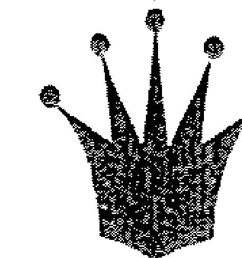

STEP 7

每天都要重复看几次，

以确认梦想的内容，

并将之烙印到“潜意识”中

要时时留意自己的梦想或目标

将制作完成的“宝地图”，放置在家中的醒目处，通过不断地观赏，持续将它输入潜意识。看的次数越频繁，印象会越深刻，效果自然会更好。

另外，设定成手机的待机画面，或传送至电脑当桌面，让自己随时都看得到，也是不错的做法。

时无刻都想到自己的梦想或目标。

如此一来，就会让实现梦想所需的信息，接二连三地涌入。

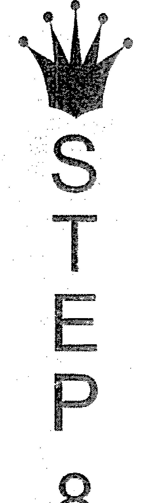

STEP 8

展开“具体行动”，朝着梦想迈出第一步

累积每一个小小的行动，梦想就会实现

让我们朝着梦想，展开第一个具体行动吧！

思考我们能做些什么来实现梦想，并具体写出今天能做什么，这个礼拜能做什么，以及这个月能做什么等。

接着，再将这些想法写到便利贴上，然后贴到“宝地图”上。大家除了可以将具体的计划写在记事本上，也可以在行事历旁贴上“宝地图”的影印本，也是个提升效果的好方法。

“就算是再微不足道的小事，只要能展开具体的行动，你的内心就会自然而然以自己为荣，让你更有动力去做所有的事，做起来也会比以往开心。
制作“宝地图”会启动感觉，让人想要展开具体的行动。请大家带着兴奋雀跃的心情，勇敢地踏出第一步吧！累积这些小行动，总有一天梦想就会实现。”

创作及履历，现在就立刻

动手制作“简易版・宝地图”吧！

只要有纸笔及你的照片，就能制作“宝地图”

虽然我们建议各位，使用软木塞板来制作“宝地图”，但这并不代表没有软木塞板便无法制作“宝地图”。

重要的是，不管想到什么，“现在立刻”“从做得到的事开始”“展开行动。一旦你心里有“‘宝地图’看起来好像不错耶”的感觉，就要重视它而别故意去忽视它，尽早让自己拿起手边现有的东西，动手开始制作。

没有软木塞板，用白纸或月历背面的空白处来制作也没关系。没有自己笑得灿烂无比的照片，随便拿张手边现成的照片也无妨。只要有一张能让你联想到梦想的照片就够了。如果连张照片都没有，单以文字写下梦想与期限，也未尝不可。不论手边资源再匮乏，只要自己的梦想或目标够明确，不到10分钟就能完成一张宝地图。像这样，先好好地做一张“简易版．宝地图”，朝你的梦想大步迈进吧！如果觉得太过简略，之后再慢慢升级成正式版的“宝地图”就好了。如果连纸笔或照片都没有，哪怕只是在手边的笔记本或便条纸上写上梦想都没关系。做了之后你会发现，做的事情虽然很简单，但效果却会如奇迹般惊人。

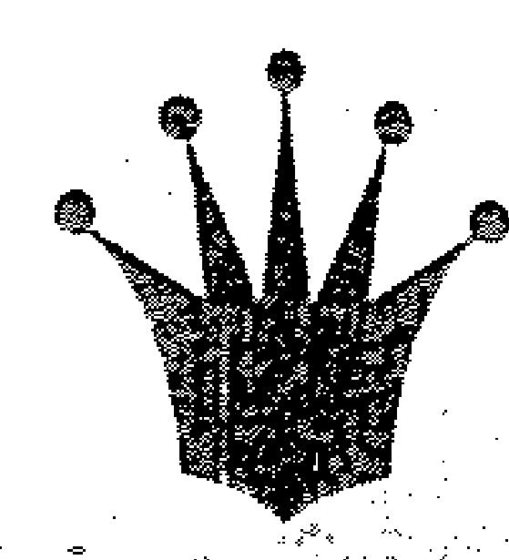

人都有“安于现状”的本能反应，改变它就能改变人生

制作“宝地图”并不需要花费太多的心力，也不需要你大张旗鼓。“宝地图”最大的特征就是制作方式简单，但效果却大得惊人。

人都有“安于现状”的本能。人的本能极度排斥脱离过去令人觉得舒服自在的一切。因此，刚开始尝试新事物时，人总是会找许多的借口，如“好麻烦喔”或“这么做真能实现梦想吗”等，来妨碍自己进行改变。到目前为止，你的生活可能一直都是这样，从来没有改变过。想要实现梦想，有时是需要改变的。能活用潜意识，轻轻松松让你产生改变的，便是“宝地图”。要不要试着从现在开始展开你的“宝地图生活”呢？

现在就立刻开始制作“简易版・宝地图”吧！

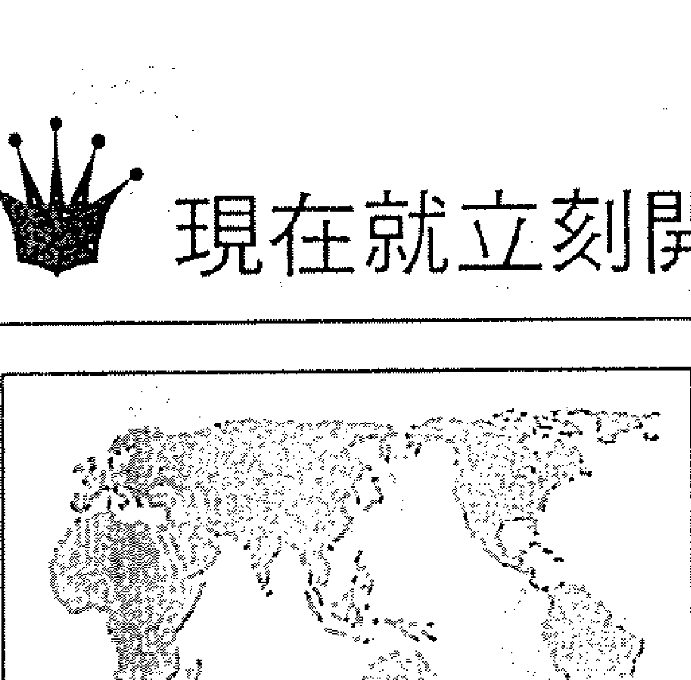

成为世界级的商务人士

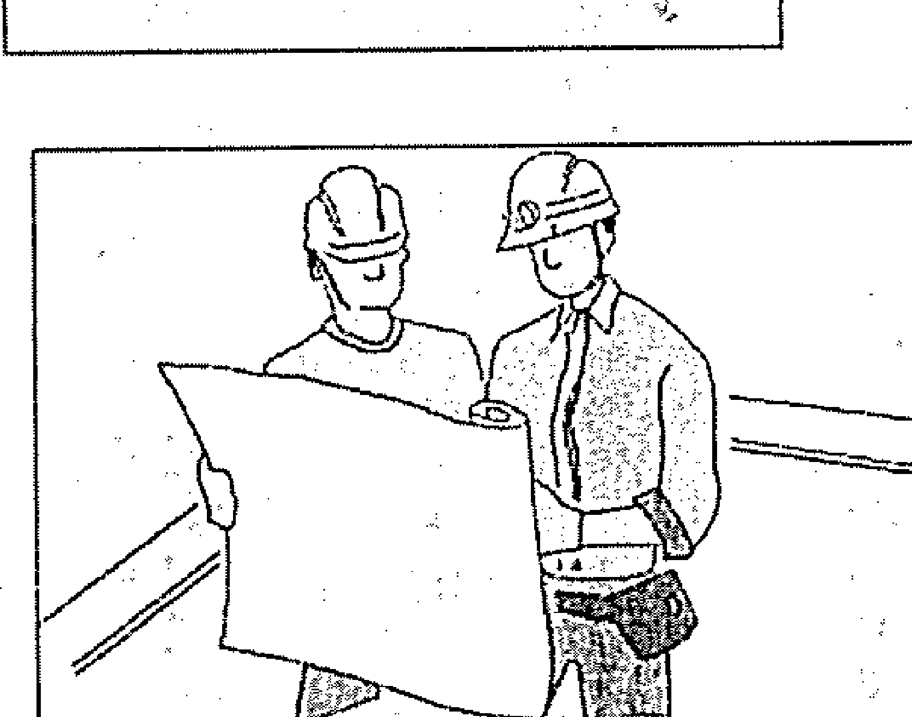

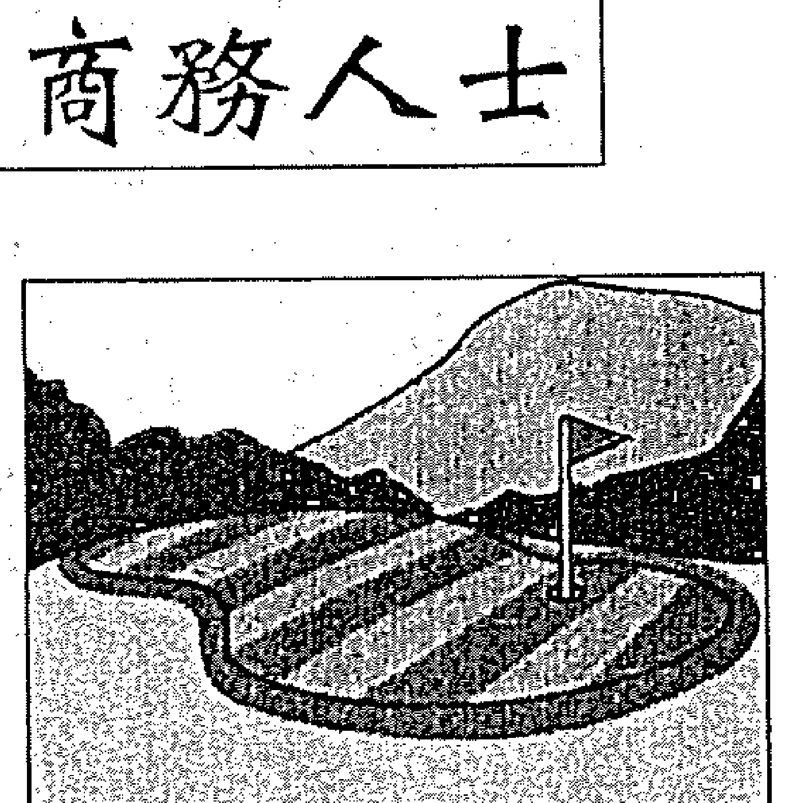

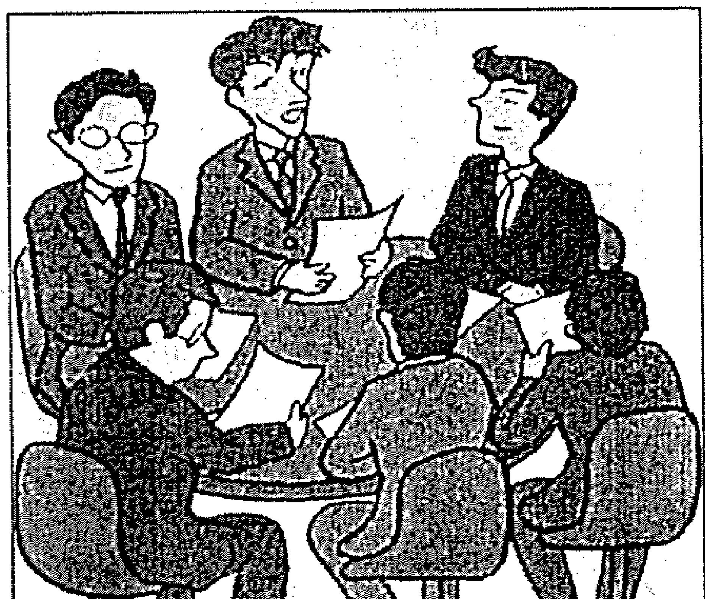

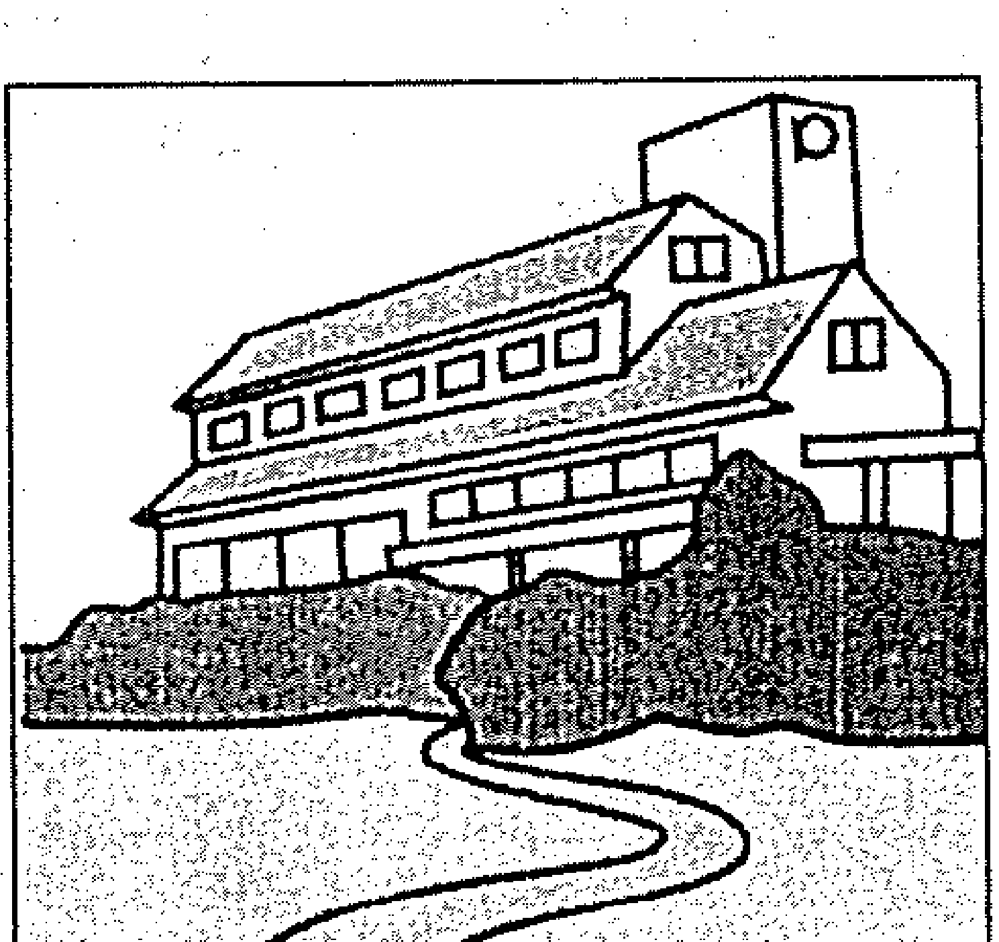

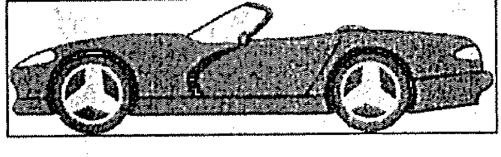

> 今天要比昨天更加成长！

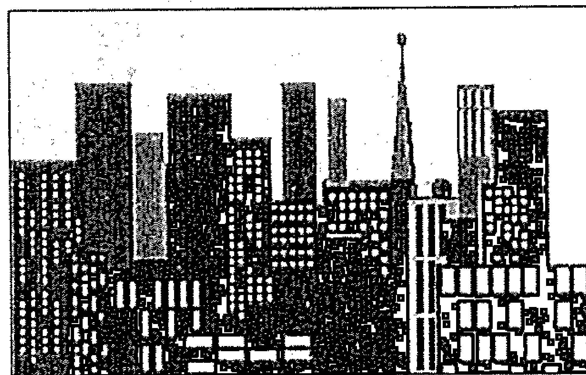

“梦想实现”专栏

2

从“小小的梦想”开始做起

我们有时候会听人说：“我那渺小的心愿，根本称不上是梦想”或“我的梦想真的非常微不足道”等等。

这种心情我懂，因为过去的我也一直是这么想的。不过，现在我想法却不同了，我都会告诉自己：

“就从微小的心愿或微不足道的梦想开始做吧！为这个梦想加入丰富的想象力，让它真正进入我的生命！”

成功得到幸福的人，在奋斗的过程中，往往有段时间会遭周围的人质疑：“怎么会花那么多时间或精力在那种事情上？还做得那么投入呢？”

不过，对成功的人来说，他们看到的不止表面，所以即使在一般人眼里再微不足道的梦想，或无聊至极的事情，他们也会深入去思考梦想本身的意义或发展性，并发挥自己的想象力。

这些人因为懂得运用丰富的想象力，找出隐藏于事情背后的无形魅力，所以几年后这个充满魅力的梦想才会慢慢成真。
他们相信到那个时候，大家就会逐渐了解自己，同时他们也学着将过去觉得微不足道的事物，都一一转换成梦想。

正因如此，所以他们才有办法比一般人投入更多的努力，产生灵感，克服种种难关，得到许多理解或支持他想法的人帮助，最后顺利实现梦想。

希望各位也能为自己的未来编织一个美丽的故事，以激发自己内在无限的潜能。

第3章 每天用到的都可以 1秒看地图上

“1秒的习惯”

加速梦想的实现

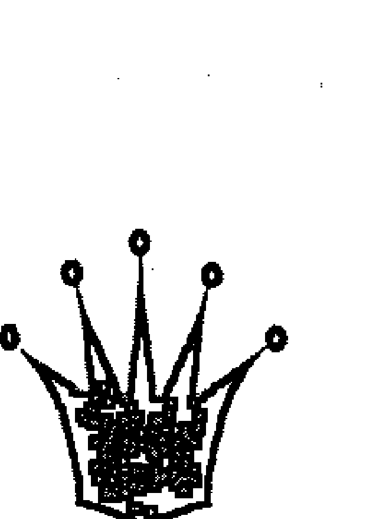

身边现有的东西，通通都能成为“宝地图”

到成功得到幸福的人家中作客，或到成功人士的办公室拜访时，我注意到一件事。

那就是，他们往往会将一些能让自己感觉幸福、恢复活力或充满回忆的东西放在周围，让自己永远保持在最佳状态，准备好迎接下一个挑战。

只要让自己置身于经常看得到梦想的环境中，就不会错失任何实现梦想的机会，成为“梦想实现体质”。

举例来说，

+   • 摆上跟自己想买的车相同款式的“迷你模型车”
• 想要成为棒球选手的孩子，贴上铃木一朗选手的“海报”
• 喜欢出国旅行的人，贴上“世界地图”
• 将让自己产生某个梦想的“书”陈列在书架上
• 在客厅中摆上全家出游的“照片”
• 在工作的记事本中，写下“想要达成的目标”
• 在推特或脸书中，写下“自己的梦想”
• 将过去获颁的“奖状或奖杯”拿出来装饰

这些会让人联想到梦想或幸福感觉的物品，通通都算是“宝地图”的一种。而且，只要观赏个1秒钟，就会立即为你启动感受梦想或幸福的开关。

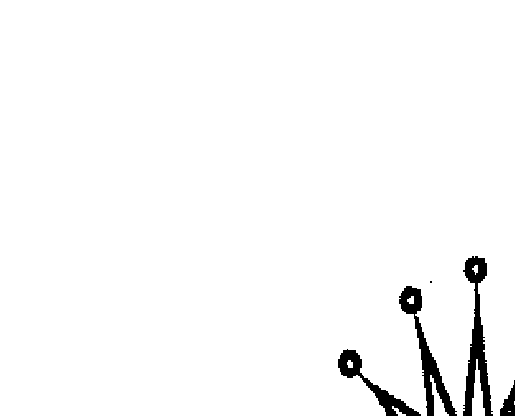

养成“1秒的习惯”，让自己变身实现梦想的体质！

将全家出游的照片贴在“客厅”，摆上写着家人们各种留言的白板，在月历上记录今年的目标，或以表扬状、感谢状来布置客厅……等，“整个客厅”瞬间就会变成一张“宝地图”。

视线停留在这些东西上的时间，或许只有短短的1秒钟，但一次又一次，不断重复这1秒钟，你就会越来越相信，自己渴望得到的“梦想”或“幸福”，总有一天会成真。

不管你人是在客厅、卧室、厕所或办公室，哪怕塞在电车中也没关系，只要重复这“1秒的习惯”，就会让你离自己想要的梦想与幸福更近。

> > 知名自我启发大师皮尔博士（Dr. Norman Vincent Peale）就曾提倡将目标写到纸上，再分别黏贴于6个不同地方的做法。因为他认为：“一次又一次重复观看自己写下的目标，将更容易达成目标。”

“1秒宝地图”也一样。
希望大家都能准备好让你看了会“兴奋雀跃的物品”、“感受到幸福的物品”或“让你自然产生信心的物品”等，让自己不管待在家里或出门在外，随时随地都能看见这些东西。
映入眼帘的机会越多，就越容易改变潜意识，让梦想在更短的时间内实现。
下一页我将为各位介绍与“1秒宝地图”有关的物品。
大家要不要也和我一样，用“创造梦想或幸福所不可或缺的物品”来布置自己周遭的环境呢？

客厅／餐厅

客厅与餐厅，是我们每个人居家生活的重心。一天当中，待在这里的时间最长，因此，只要将“宝地图”放置在此，观赏梦想或目标的次数，就会相对增加许多。

“宝地图”并非一定要用软木塞板来制作，将能让你联想到自己或家人梦想的物品，大量拿来布置客厅，也能让整个空间瞬间变成“宝地图”。若一家人都能“共享梦想”，也能提升全家的整体运势。

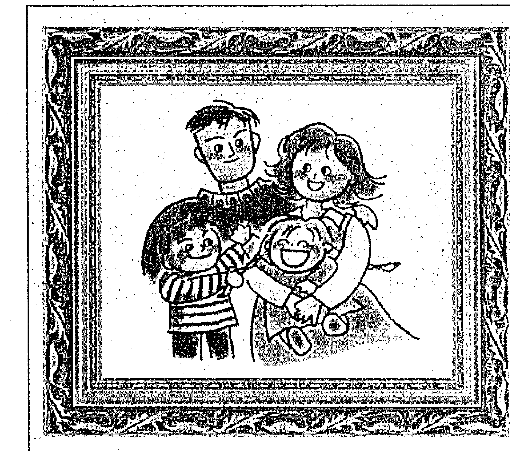

家人的照片

用笑容洋溢的照片加深家人间的感情 以全家出游时的照片等充满回忆的影像来布置客厅。照片最好挑选每个人都入镜，且“笑容洋溢的照片”。这么做，绝对能加深家人间的感情，让彼此间都感受到幸福。

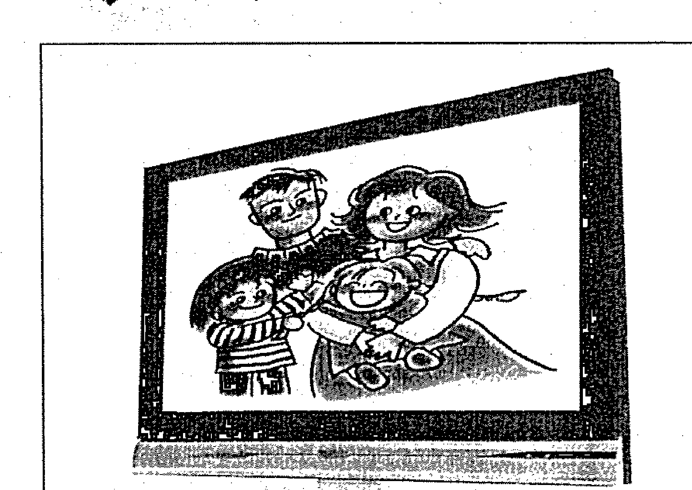

数字相框

也能当成“宝地图影片”来播放 将数字相机拍好的照片存进数字相框中，就能像幻灯秀般欣赏照片。如果还能配上音乐或动态放映，甚至能当成“宝地图影片”来欣赏。

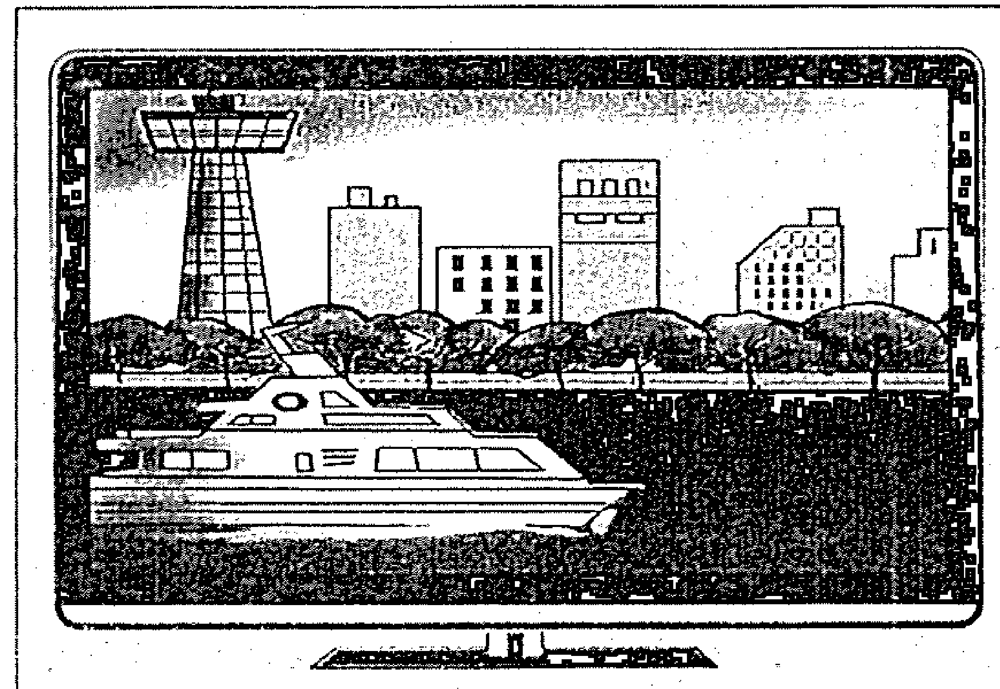

背景影片

播放能让心灵得到休憩的影像 将收录迷人景色的“风景DVD”或“自己喜欢的电影”等，看了会觉得很舒服的影片，当成室内装潢的一部分来播放。如此一来，你就能轻而易举得到自己想要的感觉。

喜欢的花

摆放在眼睛看得到的地方 在家里摆点花，房间内的空气就会变得比较柔和。另外，花的香味也有稳定心情的效果。

白板

全家人的“宝地图”

将白板作为“全家人共同的宝地图”，每个人都可以自由在上面留言。

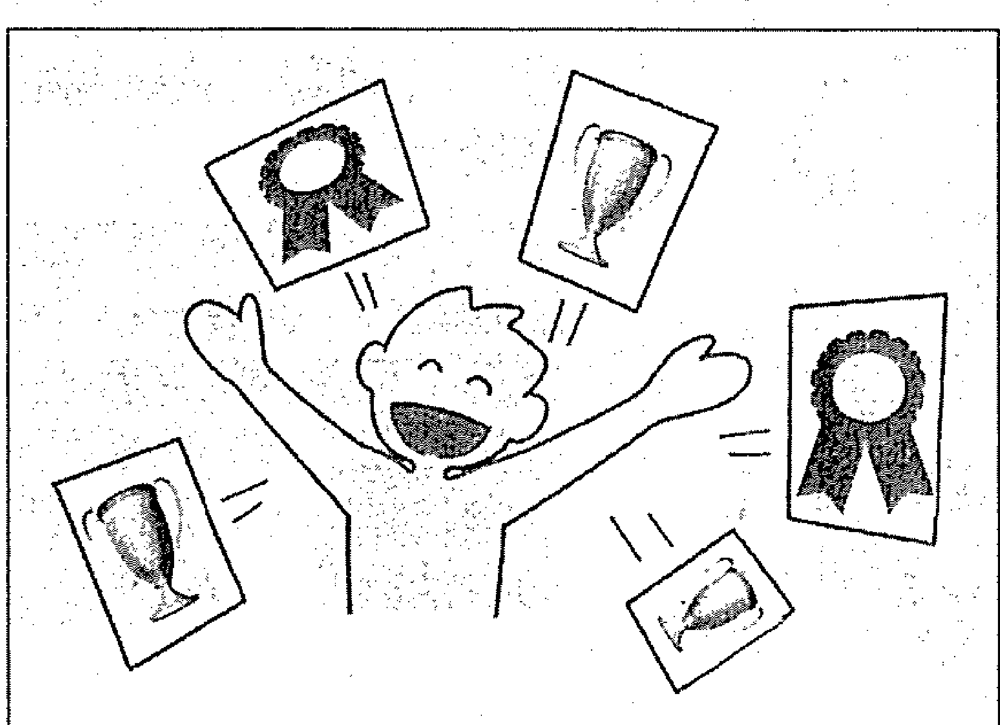

奖杯或奖状

唤起成功的经验

奖杯与奖状等，都是能瞬间让人回想起“成功经验”的工具。看过之后，将重新唤起“过去努力时的回忆”或“引以为傲的心情”等，自然而然激发斗志，让你能勇敢地迎接下一个挑战。

月历

在预定达成目标的日期上做记号

让月历变成一整年份的“宝地图”，在月历写上自己的目标，并在预定达成日上做记号。

喜欢的音乐

感受“梦想已经实现”的心情！

音乐具有影响情绪的效果，对于斗志的提升也很有帮助。

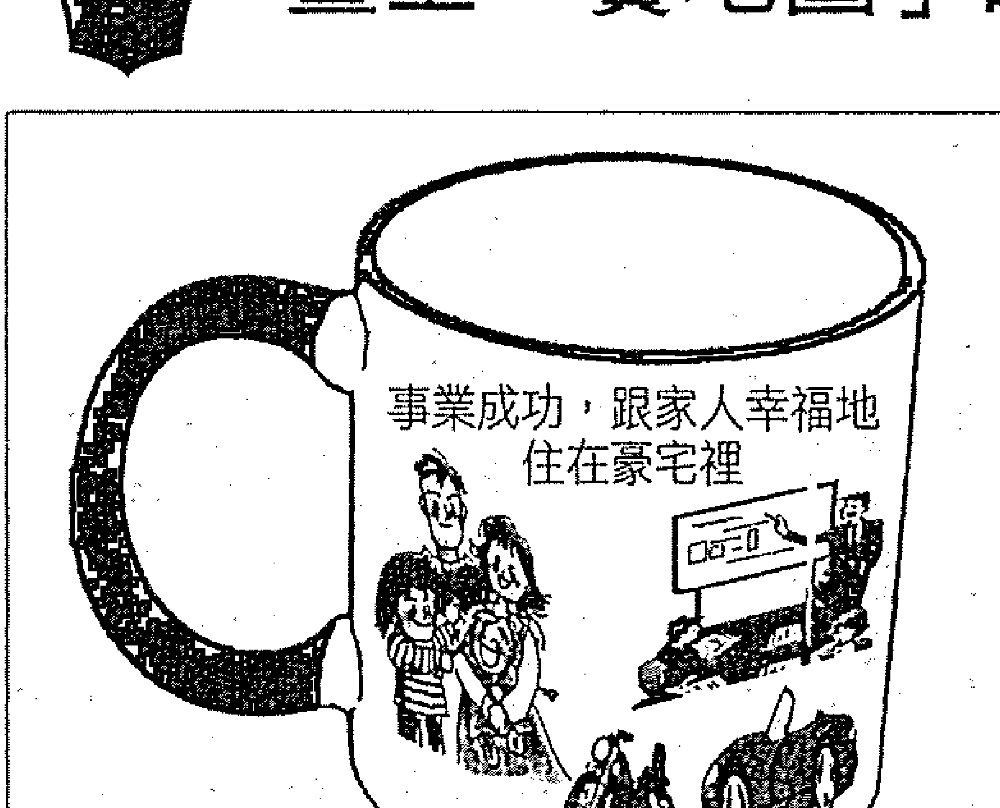

画上“宝地图”的杯子

让“宝地图”进入你的咖啡时光

市面有售一些杯子可自己决定花样。还有一种“随行杯”可在透明夹层放入“宝地图”，如此便可一边啜饮咖啡，一边以轻松的心情观赏“宝地图”。

印上照片的马克杯

印上梦想的照片

只要印上能让你联想到梦想的照片或“宝地图”，它就会瞬间变成帮你实现梦想的马克杯。

标准身材的照片

期待减肥的效果！

在冰箱或厨房的磁砖，贴上“标准身材”的照片，可以提升减肥的成效。

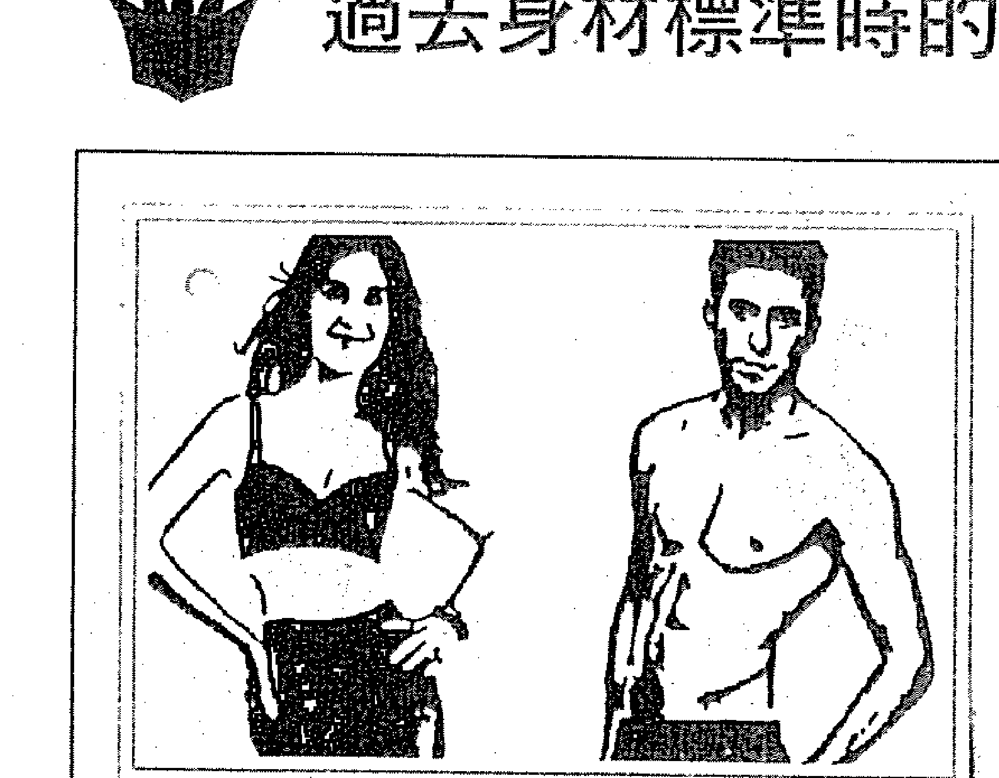

过去身材标准时的照片

想象自己减肥后的模样
请试着贴上自己过去身材玲珑有致时的照片，通过重新回想“自己也曾有过这么纤细的身材”，你将更容易联想自己减肥成功后的模样。

小腹往内缩的照片

想象纤瘦的自己
拍张自己小腹往内缩的照片，可以让你联想到减肥后的自己。

体重曲线图

体重变化的状况一目了然
“看得到”体重的变化，你就会实际感受到减肥的效果。

书房／卧室

如果说客厅是一家团圆的空间，那么，书房便是独享“私人时光”的园地。只要将兴趣收藏、“想要得到的物品”或能让你联想到“自己未来想变成怎样的照片”等放在书房里，当你置身于这个空间时，心情就会变得兴奋雀跃。

将“宝地图”贴在卧房的效果也不错。人在睡觉前，身心灵的状态都会比较放松，“梦想”也更容易被植入潜意识中。

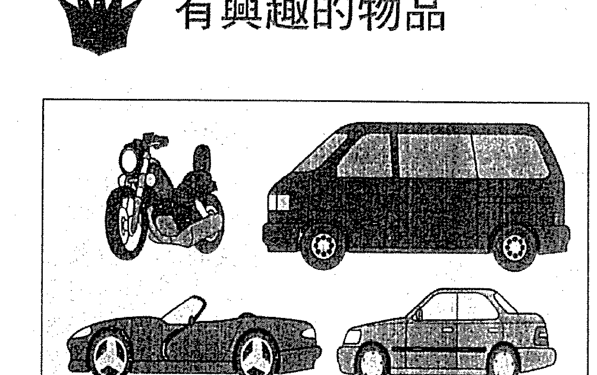

有兴趣的物品

陈列与梦想有关的物品

陈列出自己喜欢的物品，打造专属于自己的“兴趣空间”。另外，摆上“自己想要汽车的模型”等能让你联想到梦想的物品，应该也是很有趣的一件事。

书架

将“喜欢的书”摆在醒目之处

将“你喜欢的书”或“忍不住一读再读的书”放在醒目之处。

物品陈列盒

令人心情愉快的个人收藏

将自己的重要收藏放到陈列盒中展示，光是欣赏自己的收藏就会让你心情愉快。

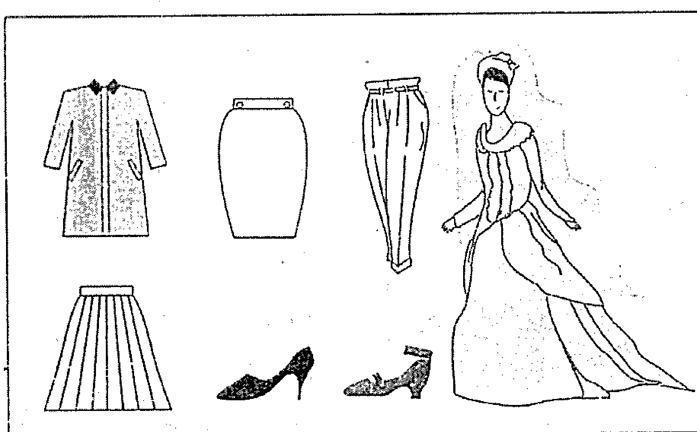

小尺寸的洋装

试着想像自己穿上的模样
开始进行减肥前，可先去买件“瘦下来后想穿的衣服”（小尺寸）。将它放在“眼睛看得到的地方”，一边想像“自己穿上它的模样”，一边努力减肥。

印着照片的扇子

印上自己喜欢的照片
印上孩子、宠物或家人等的照片，正反面分别印不同的照片也很有趣。

印着照片的T-SHIRT

自己穿上“宝地图”
印上自己喜欢照片（家人等的照片）的T-SHIRT，也是“宝地图”的一种。

寝室的天花板

植入潜意识中

将愿望或梦想等植入潜意识中的最棒时机，就是当你觉得非常放松时。事先将“宝地图”贴在天花板，躺下来就看得见，你的愿望就会自然而然被植入潜意识中。

预定出版的书

亿万长者マダムの秘伝レッスン お金持ちと結婚するための75日間プログラム

日本贵妇教你75天嫁入豪门

日米温受数妇的专家 芦泽多美◎著

在这多纷的都市下，你有梦想的目标吗？《日本贵妇亲授嫁入豪门的五堂课》之后，在75日内利用成功变身晋身的秘密！

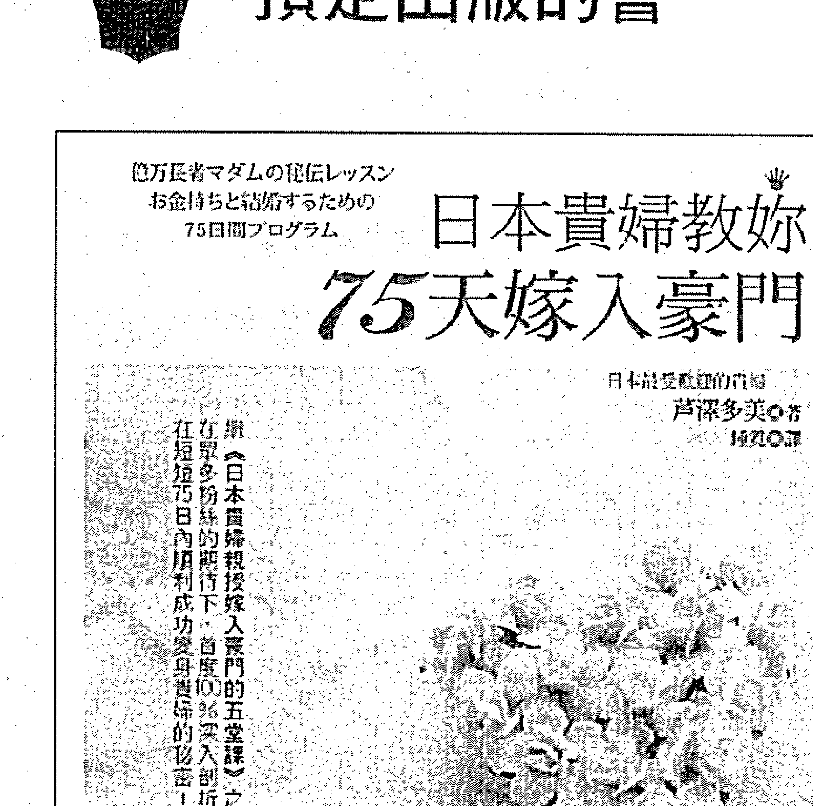

为了实现与他甜蜜蜜的美满富裕婚，你应该要先做好准备！

嫁入豪门的秘诀

+   - 立即抓住自信吧！
- 培育户口交往在高家中吧！
- 不要觉得知势，要知性地博开男士的心！
- 在思考前要先行动，可以拓宽人生的宽度！
- 只要带着相信的心情去行动，就有美妙的进展守着你！
- 开放心情，将世界上所有细小、负面的东西全扫进垃圾桶！

立刻翻开这本书，看看芦泽多美传授给你更多嫁入豪门的小心机！

以自己是该书作者的决心来制作“想尝试出版书籍”的人，可试着动手设计一下“将来自己想要出版书籍”的封面，就算内容不写也没关系。

厕所／浴室／化妆间

厕所或浴室是我们每天一定会用到的地方，只要在这里摆上“宝地图”，自然而然就会映入眼帘，让梦想的蓝图更明确。

每天一而再、再而三地观赏“宝地图”，你的自我形象就会提升，觉得梦想或目标都不再遥不可及，而是随手可得的事物。特别是对“减肥”有兴趣的人，若能将能让你联想到“自己理想身材”的照片或标语，摆在化妆间，效果将会更好。

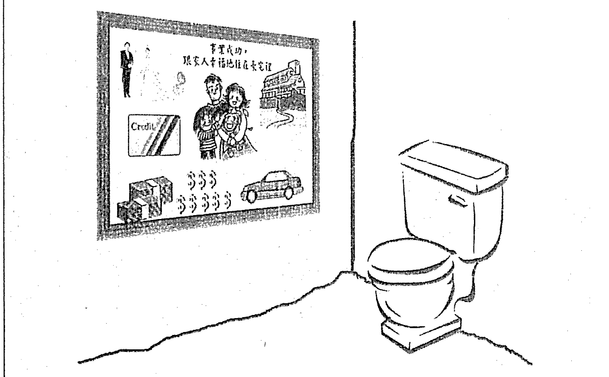

厕所墙壁

将照片贴到厕所墙壁
在厕所的墙壁贴上“宝地图”，或将自己喜欢的照片，先贴到板子上，再贴到墙壁。

护贝

泡澡时也要欣赏“宝地图”
将“宝地图”缩小影印，再经过护贝处理，就能一边泡澡一边欣赏。

化妆间的镜子

最适合用来帮助减肥
只要贴上能让你联想到“理想身材”的照片，减肥就会很有效果。

体重计

清楚标出目标体重
贴上写着目标体重与达成期限数字的“宝地图”，对于减肥效果的提升也很有帮助。

4

汽车

经常以汽车代步的人，可将汽车内部的空间，改变成“梦想实现的空间”。将照片贴在仪表板上或制作独一无二的钥匙圈。（不过开车要专心，千万别一边开车一边乱瞄喔！）

希望买车的人，可以去汽车展示间站在想买的汽车前，以自己“已经成为该车车主”的姿态拍张照片，绝对会提高你想要得到它的斗志。

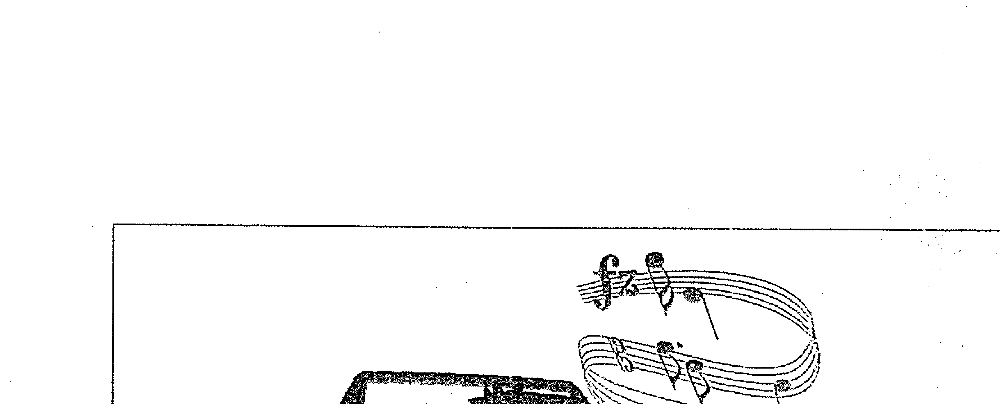

车内音乐

开车中也能放松
音乐具有疗愈心灵与消除压力的效果。快去找出自己喜欢的音乐吧！

有声书

有效吸收资讯
一边开车，耳朵还能同时听取新资讯，让汽车瞬间成为提高干劲的学习场所。

GPS 屏幕

让汽车导航也变成“1秒宝地图”
在屏幕贴上“家人照片”或“自己喜欢的照片”，也可以通过汽车导航来欣赏“宝地图影片”。

钥匙圈

将照片嵌入钥匙圈中
嵌入自己喜欢的照片或选择喜欢款式的钥匙圈，让它也变成“宝地图”。

5

包包里／记事本中

“宝地图”重要的是，必须每天一而再、再而三地重复观赏。

只要每天随身的皮夹或记事本中有张“宝地图”，观看“宝地图”的机会就会增加，梦想实现的效果自然会比较好。就算只有短短的时间，也能快速将“自己的梦想”植入潜意识中。

将缩小版的“宝地图”带在身上，想看的时候就立刻拿出来看一下，梦想将更容易实现。

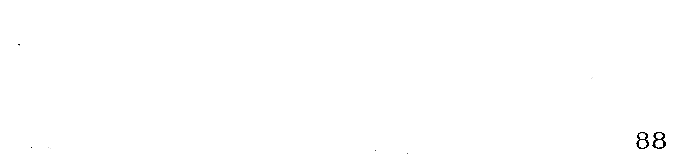# 👑 票卡夾

通勤途中也能欣賞「寶地圖」
在票卡夾中塞入「寶地圖」的照片或寫著「活力百倍」的小卡，便能愉悅度過通勤時光。

# 👑 皮夾

將照片或便條紙跟紙鈔擺在一起
將「寶地圖」的照片或寫著「感謝話語」的小卡放進皮夾中，可提升財運。

# 👑 儲值卡／圖書證

當成禮物與他人分享自己的夢想
請試著在禮物卡中放進照片或插畫，再將這張獨一無二的禮物卡，送給親朋好友當禮物，就能跟他們分享自己的夢想。

# 👑 書籤

每次讀書，都讓你離夢想更近了點！
若能將自己想要達成的「目標」或「能讓自己回復活力朝氣話語」寫下做成書籤，每次看書時，就會不斷收到自己傳遞給自己的訊息。書籤經過護貝將更耐久！

# 👑 書套

寫下自己喜歡的標語
在書套中寫上能讓自己聯想到「夢想已經實現」的標語，或購買市面上所販售，附有收納夾層的透明書套，再將照片插進去。

# 獨一無二的自製名片

先將自己未來的頭銜印到名片上
例如，如果你現在正在準備司法考試，便可試著在名片中填上「律師」的頭銜。想像將來「夢想」實現1年、3年或5年後的自己，並試著做張獨一無二的名片。

# 喜歡的書

隨身帶著自己最喜歡的書
隨身帶本與自己想要實現的夢想有關，或能改變自己人生的書，一有時間就拿出來翻一翻。

# 自製貼紙

自己試著動手做夢想貼紙
運用市售的印表機，就能簡單製作貼紙或標語。請試著動手製作能讓你聯想到自己夢想的貼紙。

# 教科書

在封面的內側貼上「寶地圖」
正在埋首準備大學測驗或資格考試的人，可在書籍封面的內頁貼上「寶地圖」的照片，如：「擺著加油必勝姿勢的照片」等，效果將會很棒。

# 墊板

將「寶地圖」貼到墊板上
先用數位相機拍下「寶地圖」的相片，再貼到墊板上，或把經過護貝的「寶地圖」直接作為墊板來使用。這麼做，讀書的意願與奮戰的決心，一定能長久持續下去。

## 手帳的行事曆

明白標示出夢想的期限
在手帳的行事曆中，寫下夢想實現的預定日期。明白標示出夢想的期限，就能倒數計時，同時興奮地度過每一天。

## 標語

寫下正面語句
請寫下能讓自己聯想到夢想已經實現的標語，選擇正面或具有療癒效果的標語，應該都很不錯。

## 縮小版的「實地圖」

貼上用數位相機所拍下的「實地圖」
將用數位相機拍下，或經過縮小影印的「實地圖」，貼到記事本上。這種做法只有自己本人看得到「實地圖」，非常適合不想讓別人看到自己「實地圖」的人。

## 喜歡的照片

將記事本當成人生的指南針
記事本是人生的指南針、航海圖，也是幫助大家實現夢想的工具。只要在筆記本中，貼上你想要得到的物品，或能讓你聯想到夢想的照片，便能加快夢想的實現。

# 手機／個人電腦

手機、智慧型手機或個人電腦等，一次可以將許多的畫面或影片帶著走，是非常方便的工具。

只要將自己的夢想或幸福，以影片（動畫）的方式來呈現，夢想就會滲透進潛意識，被潛意識認定為真實發生過的事物。

另外，除了可以向自己發出加油打氣的訊息，也能將「寶地圖」與臉書、推特或部落格等功能連結。

# 待機畫面

每次使用手機，「寶地圖」就會映入眼簾
只要運用手機的照相功能拍下「寶地圖」，之後再將該相片設定成手機的待機畫面，如此一來，隨時隨地都欣賞得到「寶地圖」。

# 動態攝影功能

將喜歡的照片拍成動畫
運用動態攝影功能，挑幾張自己喜歡的照片做成動畫，便可完成簡易版的「寶地圖影片」。

# 手機吊飾

製作附有照片的手機吊飾
使用能放照片的相框吊飾，就能自己動手製作出獨一無二的手機吊飾。

# 給自己的電郵

傳送電郵給自己
用智慧型手機或個人電腦傳送電郵時，可以「設定日期」。只要使用這個功能，就能讓「現在的自己」傳送訊息給「未來的自己」。

# 來電答鈴

將自己喜歡的音樂設定成來電答鈴
一有人打電話過來，手機鈴聲就會啟動心靈的開關，讓自己迅速進入預設好的情緒中。

# 推特

留下自己喜歡的留言
將自己喜歡的留言，設定並儲存到「我的最愛」中。

# MP3

移動同時亦可接收訊息
聽聽能讓你活力再現的音樂吧！另外，收錄自我宣言或你對未來的期許，每次聽到這些聲音，潛意識就會改變，人生將會變得不同。

# 臉書

在自我簡介中寫下自己未來的樣貌
在臉書的自我介紹欄中，寫下「自己未來的樣貌」或是過去最好的戰績或成果。如此一來，臉書中眾多的親朋好友，將成為幫助你實現夢想的最佳後盾。

# 部落格

將成功經驗撰寫成年表
請試著將撰寫著許多未來「成功經驗」的「未來年表」，上傳到部落格中。每次進行部落格更新時，就能確認自己夢想的進度與進展。

# 相簿

製作不同主題的相簿
臉書或其他影像管理軟體，都有整理照片並將其製作成相簿的功能。請分別依據「讓人活力再現的相簿」、「感受幸福的相簿」或「展現成果的相簿」等主題，來整理照片。

# 桌面照片

將「實地圖」的影像，存進個人電腦中
將自己喜歡的照片或「實地圖」的影像輸入個人電腦中，然後設定成電腦桌面（壁紙）。每次使用個人電腦時，你的夢想就會被植入潛意識中。

# 上網發表

在網路上公開自己的「實地圖」
在網路上公開自己的「實地圖」，將能得到許多許多人幫助或獲得許多的靈感，加速夢想的實現。
另外，上傳「實地圖影片」（動畫）效果也不錯。

# 辦公室

上班族待在辦公室的時間很長，因此我建議在不違反公司規則的前提下，在桌上擺些能讓你聯想到夢想的照片或小東西等。

想要得到的結果（工作的成果等）夠明確，自然而然就會產生對工作的抱負與鬥志。

## 桌墊

將照片或「寶地圖」夾在桌墊下
將照片或「寶地圖」夾在透明桌墊下。不過，放在辦公室桌墊下，同事或上司都可能看到，所以建議盡可能選擇跟工作目標有關的照片，而非私人生活照。

## 寫上目標的便條紙

在辦公桌的四周寫上工作目標
在便條紙上寫下「目標」、「期限」、「條件」等，並張貼在辦公桌四周等容易看到的地方。目標達成後，只要將已經達成的相關資料統一收好即可。

## 顧客的照片

顧客的笑容，將成為工作的原動力
將過去到目前為止，最滿意你服務顧客的照片貼到桌上。「想要再次看到這樣的笑容」，這種心情絕對會提高你工作的動力。

# 團隊的目標

提出口號
請將團隊目標、標語或目標達成後可能得到的「回饋」等，通通都貼出來。隊友彼此間自然而然便會產生團結意識，「同心協力朝目標去努力」。

# 象徵最佳業績的照片

找回最棒的自己
你最棒的工作表現是出現在什麼時候？如果曾經接受公司表揚，請試著將當時的照片貼出來看看，保證絕對能喚醒你的成就感，鼓勵自己再次營造「最佳狀態」。

# 企劃書

將企劃書放進資料夾中
將自己所提出的企畫書中，曾經獲得最高評價或真正被採用的，放進資料夾中。當你某天突然失去信心時，就把資料夾中的企劃案拿出來看看，相信你的鬥志絕對會變高。

# 養成實現夢想的「習慣力」

人只要有夢想或目標，就會自然而然展開行動。不過，如果行動後卻遲遲不見成果，便很難持續堅持做下去，無法養成習慣。

因此，這裡我們將跟各位分享幾個訣竅，讓大家輕輕鬆鬆就能養成好習慣。

請在腦中想著你想要養成的習慣，並以下列 13 個項目將之具體化。

-   1. 由「簡單就能做到的事情」開始做起。
2. 做不到，「降低標準」直到做得到為止。
3. 「一點一滴」逐步增加每天、每周、每月的行動量。
4. 有遠大的志願固然是件好事，但每天、每周、每月的行動量，切忌好高騖遠。
5. 將每天的行動「數據化」，並予以記錄。
6. 過度注意達成率，反而容易讓人有挫折感，建議同時要記錄努力的「累積過程」。
7. 「想像最理想的狀況」如：「採取行動後，曾出現怎樣令人滿意的進展？」
8. 「同時也要想像相反的狀況」如：「若不採取行動，結果會變成怎樣？」
9. 只要稍微有進步，或出現一丁點的小成果，就要懂得自我「肯定、鼓勵、喜悅」。
10. 若能持續3天，接下來就是7天，最後以21天為目標。「只要持續21天，意識就會改變」。
11. 不能照計畫實行也千萬別氣餒。因為就算是只有三分鐘熱度的人，只要重複10次以上，就能養成習慣。
12. 只要不輕易放棄，人生就有敗部復活的機會，永遠都有東山再起的可能。
13. 有了自信後，就跟親近的人表達自己想要改變的決心，因為承諾會讓人產生更強的行動力。

習慣是人的第一天性。如果受到習慣的限制，人生也會同時受到限制。

# 第4章 置信区间和假设检验
Chapter 4 Confidence Intervals and Hypothesis Testing

# 找出「想要實現夢想」的主題，加速夢想的實現

# 5大類的實踐篇，分別介紹「寶地圖」的應用

在「基本版・寶地圖」中，我們要大家將能讓你聯想到「夢想」或「目標」的照片或圖片，貼到軟木塞板上。也就是，將感覺跟你理想中很類似的人事物、想要去的地方、想住的房子、渴望得到的車，或希望從事的工作等「各式各樣的美夢」予以視覺化。

不過，想要加快「夢想實現」的速度，還有一個方法。那就是，在製作「寶地圖」時，將「想要實現的夢想」集中在某一個主題上。

舉例來說……

-   - 為了擁有理想體型，而製作「減肥寶地圖」。
- 為了尋覓理想伴侶，而製作「戀愛寶地圖」。
- 為了找到理想住處，而製作「我家寶地圖」。

將夢想集中在某個主題上，可讓「有待實現夢想的印象」變得具體清晰，將時間或精力集中在某一點，夢想成真的效果，自然更為強大。

因此，我們將把「寶地圖」區分成5大類（「夢想・成功」、「感覺」、「人際關係」、「生活習慣」、「訊息」），並依據不同種類的特性，告訴大家如何製作各種「寶地圖」。

# 能快速提升自我形象的「寶地圖製作訣竅」

在分別介紹各類不同主題的「寶地圖」前，請容我先說明一下製作「寶地圖」時，到底有哪些「製作上的訣竅」。如：該貼怎樣的照片，或該寫下哪些訊息等，夢想才能快點實現。

> 魔法問題（終極問題與實踐）

「寶地圖」製作前或製作時，請認真地思考這個項目中所提出的幾個問題，了解自己的答案是什麼。如此一來，你就能清楚分辨出，什麼是從心裡想要實現的目標，什麼又只是事不關己的願望。讓目標或目的明朗化，是「獲得結果」的不二法門。接下來為各位準備的幾個問題，乍看之下簡單，但各位若能認真思考，它極有可能是改變你人生的終極問題。

-   - 自我宣言（智者語錄）
  所謂「自我宣言」，是指「用來肯定自我的宣言」。將「自己的夢想全都實現」、「感謝自己被幸福的人圍繞」、「肯定過去的自己」及「賦予自己勇氣」等語句，通通寫進「寶地圖」中，便能提升自我形象。另外，偉人們所留下的金玉良言，也會帶給我們極大的力量。

-   - 向夢想前進的視覺影像
  為了實現夢想，我們將跟各位舉例介紹，該貼上什麼「照片或圖畫」，才能讓「寶地圖」發揮更大效果。

# 「夢想・成功」篇

# 為人生勾勒夢想地圖

有地圖的人生與沒有地圖的人生，二者存在著極大的差異。

只要有地圖，知道既定的目的地，就算途中遭遇一些挫折或一時不小心走偏了，終究還是能回歸正軌。而夢想，正是人生的指標。

沒有夢想的人生不能說它不好，不過「得過且過」與船到橋頭自然直的心態，卻極有可能讓你寶貴的一生，在渾渾噩噩中度過。

所謂的夢想，是指能讓你興奮的目標，也是未來的藍圖。能讓你的夢想變明確，並讓你具體聯想到夢想的，便是「寶地圖」。

每天欣賞「寶地圖」，能讓你的目標逐漸成真。只要你堅信自己現在正在做的事，有助於未來發展，你就會持續抱存希望。一個人只要擁有夢想，

就算遭遇再多的磨難，也會自然產生想努力克服困境的力量。

# 用「寶地圖」讓大腦變成「成功腦」

成功者對於自己的未來，都有明確的夢想或遠景。因為目標明確，自然能確實而有效率地，一步步接近並實現自己的夢想。其中，能讓每個人都輕輕鬆鬆，學會這種成功者用腦方式的，便是「寶地圖」。

例如「地理」很強的人，多半從小就習慣親近地圖。在開心玩著世界地圖或地球儀時，不知不覺就記下國家的名稱與地理位置。出外旅行，攤開地圖想找尋某個地點時，點綴色彩繽紛照片或插圖的地圖，看起來一定比寫滿密密麻麻黑白文字的地圖來得有趣，內容肯定也比較容易被記住吧！

「寶地圖」光看就讓人覺得很有趣，而且只要稍微瞄一下，就能讓夢想或目標自然進入潛意識中，不費吹灰之力，就能打造成功腦。

# 僅僅是貼上「不知為何特別關心的事物」這種照片也好

我相信，一定有不少人到現在都還是「找不到夢想或目標」，我反而更希望這些人能試著做「寶地圖」。

一開始，即使夢想或目標不是很明確也沒關係，因為就算再不明確的人，相信絕對也會有一些「自己不知為何而特別關心的事物」吧！總之，先試著找到跟這些事物有關的照片，並貼到軟木塞板上。

每天觀看這些照片，同時問自己：

> 「自己真正想要的東西是什麼？」

> 「跟誰在一起時會感覺幸福，是怎樣的感覺？」

> 「做什麼事會讓自己感到興奮呢？」

之後，再篩選照片，將看了會讓你覺得興奮雀躍的留下，並將感覺上比較沒有魅力的，從軟木塞板上拿掉，空出的位置，則貼上其他讓你更覺得興奮或期待的事物，如此反覆持續進行。這樣一來，你的夢想慢慢地就會變得越來越明確。

「想要實現夢想與得到成功的人」請製作

# 遠景寶地圖

開始描繪自己的「寶地圖」時，一定會東想西想，思考該做成怎樣的一張圖。這個過程讓人光是想就會覺得很振奮，因而激發出許多靈感，也會自然而然地吸引相關的資訊、人物或書籍，而這些全部都是夢想實現的徵兆。

所謂「成功」，並不是指順利達成寶地圖中所有的一切，而是指能夠充滿活力地朝著目標展開行動，因此當你開始描繪「遠景寶地圖」時，你就已經走在通往成功的路上了。

## **魔法問題 (終極問題與實踐)**

-   - 你擁有無限的可能性。所以，你的潛能究竟是什麼呢？
- 你從現在努力進行的事物 (夢想、目標、工作) 中，所能得到的最大利益是什麼呢？
- 如果老天爺告訴你「我可以幫你達成一個願望」，你希望得到什麼呢？

## **自我宣言 (智者語錄)**

-   - 人類因夢想而偉大。
- 勇敢做一個有夢的人。
- 夢想，只留給一心想贏得的人！
- 夢想所以會實現，是因為你從來不想放棄。

> > 你所有的夢想皆可以實現，如果你有勇氣追求他們。」——華特·迪士尼

## **向夢想前進的視覺影像**

-   - 家人笑得無比燦爛的照片
- 笑容洋溢的朋友們
- 理想的典型
- 結婚典禮的照片
- 伴侶（情侶）的照片

「想要實現夢想與得到成功的人」請製作

# 使命寶地圖

如果「遠景」象徵一個人在人生中想達到的境界（目標），那麼「使命」便代表一個人想要前進的方向。

一旦擁有能得到眾人強烈共鳴的使命，就很容易打動周圍的人，因為自己由內到外散發出的使命感，將會打動對方的心，連帶激發出對方的使命感，所以即使彼此的目標不同，但只要雙方的方向一致，這份使命感就會帶領著大家創造出一番豐功偉業。

## 魔法問題
（終極問題與實踐）

- 如果老天爺告訴你「我將給你20年自由的時間與30億元的金錢，請你做些對眾人有益或能讓大家覺得開心幸福的事」你會怎麼做呢？
- 當你生命結束時，你希望自己曾經有過怎樣的人生？你希望別人用哪些話來悼念你？你希望你的墓誌銘上寫的是什麼？又不希望看到什麼呢？

## 自我宣言
（智者語錄）

- 盡人事聽天命。
- 精誠所至，金石為開。
- 不要為別人而活。
- 上帝絕不會只賦予你使命，而不給你時間去完成。
- 「成就一番偉業的唯一途徑，就是熱愛自己的事業。」——賈伯斯

## 向夢想前進的視覺影像

- 地球
- 指南針
- 道路標誌
- 筆直延伸的道路

「想要一步步接近崇拜对象的人」请制作

# 導師寶地圖

一想到「如果是导师，不知会怎么做？」便会产生无限的力量！涌现出无穷的勇气！

导师，是指理想的典范与崇拜的对象。一想到面对这样的情况，如果是导师，会描绘出怎样的「宝地图」？会做什么事情？这时，你的脑中便会浮现出各种灵感，同时获得向前迈进的勇气。

导师的选择，是在你自己专长领域中，具有惊人表现的典范。导师并不局限只能有一人，你可以依据不同的领域，选择多位导师。

## 魔法問題
（終極問題與實踐）

- 你心中的理想典範是誰？為何跟這個人學習，會讓你如此專心與投入？為何他特別能激發你的熱情？什麼讓你覺得有趣？是不是有什麼特別的原因呢？
- 如果你承繼自己尊敬或崇拜先人的資格或能力，成為他們那樣的人，你打算做哪些事？你會真的開始去做嗎？這個世界又會變成怎樣呢？

## 自我宣言
（智者語錄）

- 師者，所以傳道、受業、解惑也。
- 常保飢渴求知，常存虛懷若愚。
- 時間是偉大的導師。
- 只有「熱愛」才是最好的老師。
> 「天才是百分之一的靈感，加上百分九十九的汗水。」——愛迪生

## 向夢想前進的視覺影像

- 偉人的照片
- 與導師的合照
- 專家的銅像
- 業界頂尖人士
- 描述崇拜對象的相關書籍

「想要改變自己、渴望得到改變的人」請製作

# 變身寶地圖

## 掌握未來先機的自己
永遠都活力滿分、耀眼動人

人，都有想要改變的欲望。一方面了解維持安定生活的重要性，但有時也會想要稍微改變一下周遭的環境。除了生活與環境外，我相信很多人也希望自己本身能有所改變。

在寶地圖中貼上「不否定現在的自己、感激自己現有的一切，卻又能讓你聯想到『或許，這裡稍微調整一下會比較好』」的照片。如果對自我的印象能改變，人就會真的跟著改變，然後，別人看你的眼光也會不一樣。

## 魔法問題
（終極問題與實踐）

- 你的人生是否曾遭逢巨變？原因何在？如果你能活用該經驗，1年後（3、5、10年後）你會變成怎樣呢？
- 挑戰自己想做的事，你必須犧牲掉什麼？心裡明明有想做的事卻裹足不前，又會讓你失去什麼？哪個損失比較大？選擇哪一個會讓你覺得比較遺憾呢？

## 自我宣言
（智者語錄）

- 我一定會改變！
- 人之所以能，是相信自己能。
- 莫找藉口失敗，只找理由成功。
- 大多數人想要改造這個世界，但卻罕有人想改造自己。
- 不要等待機會，而要創造機會。

## 向夢想前進的視覺影像

- 穿西裝擺出加油手勢的男性
- 往右上攀升的曲線圖（業績節節高升）
- 進行簡報當時的照片
- 理想體格的照片
- 獲頒表揚狀時的場景

「想要找出個人特色的人」請製作

# 獨一無二寶地圖
> 不是要跟誰競爭，只是要肯定並發揮自我特色

不斷努力讓自己成為第一，是非常棒的一件事。對於各個領域中的第一名或世界第一名，我都心懷尊敬。不過，光是成為第一，並不表示一個人就是成功的。唯有找出自己獨特的特色或強項，同時加以培養發揮，才能創造出「獨一無二」的成功人生。

## 魔法問題
（終極問題與實踐）

- 成功的秘訣就在於，「將任何人都做得到的事，以任何人都做不到的嚴格程度來做」。那麼，你覺得你可以從哪件事開始做起呢？有辦法能一直堅持下去嗎？
- 假設有個在100年後，仍能繼續影響未來人類的DVD、CD或部落格存在，你認為它的主題（領域、標題）會是什麼？內容又是什麼呢？

## 自我宣言
（智者語錄）

- 天生我才必有用。
- 沒有天生的信心，只有不斷培養的信心。
- 真正的掌聲必須來自自己，如果不能自我肯定，掌聲再多也沒有用。
- 成功來自徹底的自我管理和毅力。
- 「先相信你自己，然後別人才會相信你。」 ——屠格涅夫

## 向夢想前進的視覺影像

- 愛因斯坦
- 萊特兄弟 & 飛機
- 孫正義
- 棒球選手鈴木一朗
- 畢卡索的繪畫
- 曠野中綻放的花朵

「想要有個理想家園的人」請製作

# 我家寶地圖
組織理想住宅、房間、家具等照片 你就能看清什麼是真正想要的居家環境

在「寶地圖」中貼上你夢想中的家類似的照片，不只是外觀類似，客廳、廚房、家具等細節越明確，效果將會越好。

當你反覆思考自己想要的家究竟長什麼樣子時，你就會逐漸「意識到」自己對家有什麼期待或需求。你將了解自己心裡真正要的是什麼，或許你會發現自己要的可能不是「家」這個建築物，而是放鬆待在裡面時的安心感，或一家團圓的感覺。

## 魔法問題（終極問題與實踐）

- 你希望擁有怎樣的家？你希望從中得到怎樣的感覺？其中，有沒有什麼不可或缺的要素呢？
- 如果要你待在家裡一整天，怎樣的生活型態是你最想要的？請試著想像早上起床後，一整天是怎麼度過的？
- 假設你只剩下１年的壽命（或３個月、３天），你想為家人做些什麼呢？請立刻去做。

## 自我宣言（智者語錄）

- 家庭和睦福神至。
- 洋溢幸福與安逸的每一天
- 永遠記住這點：世上最不平凡的美是家裡的美。
- 勤勞的家庭，飢餓過其門而不入。
- 金錢可以買「房屋」；但不能買「家庭」。
- 「家庭和睦是人生最快樂的事。」——歌德

## 向夢想前進的視覺影像

- 玄關的照片
- 客廳、書房、廚房
- 寫著自己名字的門牌
- 興建中的家
- 想要遷居區域的街景與車站
- 當地的活動

「想要透過旅行來豐富人生的人」請製作

# 旅行寶地圖

用「我想要去某地！」的決心，存錢→出發→享受→成就感！相信每個人都有想要出去旅行的想法，不過如果你只是想著「找個時間看要不要去哪裡玩玩」，這個夢想將很難實現，因為你從未真心想要付諸行動。能將單純的願望轉化成行動的，便是「寶地圖」。請先找出旅行目的地的照片，再貼成一個「寶地圖」。只要你能清楚想像自己在某個地方玩得很開心的模樣，自然而然就會將相關的資訊或機會都吸引過來，甚至還有人因「寶地圖」而籌措到旅費。

### ## 魔法問題
（終極問題與實踐）

- 一生中，有哪些地方一定要去？又有哪些東西是你要一定要看看的呢？
- 你希望造訪的那個崇拜對象的發跡地在哪裡？建築物又在何處？
- 放3天假你想去哪裡？10天假想去哪裡？1個月呢？半年或1年呢？想跟誰去呢？想去那裡做什麼呢？

### ## 自我宣言
（智者語錄）

- 人生就是一場旅行。
- 一生的回憶（無價！）
- 天行健，君子以自強不息。
- 日日行，不怕千萬里；常常做，不怕千萬事。
- 會當凌絕頂，一覽眾山小。
- 如果你沒有旅行過，就不知道世界有多大。

### ## 向夢想前進的視覺影像

- 山（高原）
- 極光
- 飛機
- 世界地圖
- 日本地圖
- 留學的畫面（國外大學的校園）

「立志成為第一的人」請製作

# 勇奪冠軍寶地圖
將優勝旗幟、獎盃、獎狀或金牌等象徵勝利的「具體事物」烙印到腦中

網球是溫布頓，足球是世界盃，棒球則是職棒。立志得到冠軍的人，請將優勝畫面的照片或報紙報導剪下，再貼上獎盃、優勝旗幟或想要打破的世界紀錄等。

運動界特別重視烙印訓練。獲得勝利的關鍵就在於，選手的腦中是否已刻下自己獲得優勝的畫面。

## 魔法問題（終極問題與實踐）

- 請試著想像自己過去的努力，通通開花結果的模樣。你的感覺是如何呢？你最想先跟誰報告？這個結果會帶給大家多大的快樂？接受採訪時，你要怎麼回答呢？
- 你覺得要獲得真正的勝利，必須具備怎樣的資質呢？
- 勝利（優勝）前可能會遇到什麼事？

## 自我宣言（智者語錄）

- 成功是99%失敗的結果。
- 革命尚未成功，同志仍需努力。
- 失敗緣於忽視細處，成功始於重視小事。
- 成功之難如升天，覆墜之易如燎毛。
> 「成功＝艱苦的勞動＋正確的方法＋少說空話。」 ——愛因斯坦

## 向夢想前進的視覺影像

- 與隊友的合照（能讓你聯想到團隊的物品）
- 職棒棒球場的外觀
- 在加油席加油的球迷（家人）
- 優勝隊伍確定時的畫面
- 校歌齊唱
- 報紙登載的消息
- 國旗飄揚的畫面

「想要金榜題名的人」請製作

# 金榜題名寶地圖
在校門口拍下勝利手勢與自己被眾人高高舉起的照片！預先感受「錄取時＆錄取後」的情景

想要順利通過入學考試或資格考試的人，建議可在「寶地圖」中，貼上能讓你聯想到「你考上學校後的校園生活會是怎樣？取得證照後，能做什麼樣的工作？」等畫面，或使你通過考試後的狀況變明確的照片，效果將更為驚人。

另外，在「寶地圖」中，貼上在夢想學校門口比勝利手勢、身體被眾人高舉、體驗校園生活的照片，或證照影本等，也都是不錯的做法。只要你能明確想像自己成為該校學生的模樣、感受得到通過考試後的喜悅，或往後校園生活的樂趣與喜悅，學習意願自然會提高。

## 👑 魔法問題
（終極問題與實踐）

- 你想考上哪所學校？為何你會希望被這所學校錄取呢？
- 想考上，有什麼是你現在就能做的呢？你有自信能持續做下去嗎？
- 考上後你想做什麼呢？考上後想要體驗什麼有趣的事？

## 👑 自我宣言
（智者語錄）

- 多采多姿的校園生活正等著我。
- 一日讀書一日功，一日不讀十日空。
- 不入虎穴，焉得虎子。
- 要怎麼收穫就怎麼栽。
- 擁有夢想只是一種智力，實現夢想才是一種能力。
- 「你若要喜愛你自己的價值，你就得給世界創造價值。」——歌德

## 👑 向夢想前進的視覺影像

- 擺出勝利手勢的照片
- 身體被眾人高高舉起的照片
- 在報考學校校園或校門口所拍的照片
- 錄取通知
- 開學典禮的照片
- 做滿筆記的參考書
- 五育均優的成績單

「想要進入理想公司上班的人」請製作

# 找工作寶地圖
能讓你了解自己的訴求重點、是幫助你表達自我的宣傳工具

找工作時最重要的是，必須與面試官侃侃而談：「我想要做怎樣的工作，以及我將對貴公司有什麼貢獻」。

就算自己目前的想法還不是很明確，不過只要多看看嚮往的公司照片，或想要從事的職業的照片，你的思緒就會越來越清晰，逐漸明瞭自己到底想做怎樣的工作，目標也會更加明確。「寶地圖」是指引大家未來的「指南針」，它讓你在面試時能夠充滿自信地說出自己的想法。

## 魔法問題
（終極問題與實踐）

- 你除了想從工作中得到金錢外，還想要得到什麼呢？如果一份工作除了可以讓你拿到金錢外，其他什麼收穫都沒有，你會不會因此就不想做了呢？
- 如果有件事能結合你的工作與夢想，那會是什麼呢？你會因此建構出自己的未來嗎？

## 自我宣言
（智者語錄）

- 自信就是成功的第一秘訣。
- 信心可以移山。
- 我們對自己抱有的信心，將使別人對我們萌生信心的綠芽！
- 放棄信念，無異死亡。
> 「自信是走向成功之路的第一步；缺乏自信是失敗的主要原因。」——莎士比亞

## 向夢想前進的視覺影像

- 與同梯新鮮人的合照（集體合照）
- 員工證件
- 代表公司的物品
- 讓你崇拜的前輩
- 業界頂尖人士的書籍或照片
- 做簡報時的照片

「想要得到心靈成長的人」請製作

# 自我成長寶地圖
原諒別人也原諒自己，提升心靈層次，讓精神更富足

「自我成長寶地圖」不是為了金錢等物質，也不是為了被錄取或得到他人的認同或肯定，而是為了讓內心能自然湧現愛、幸福、喜悅、富足與感謝，使自己朝著心目中理想的方向邁進而製作的。

請貼上照片，讓你一看就可以讓恐懼轉化成愛，讓負面思緒變成正面能量，例如偉人照片或勉勵話語等。此外，象徵或代表性的物品（如：宗教物品或心靈啟發相關書籍，大師照片……等）也不錯。

### ## 魔法問題
（終極問題與實踐）

- 你會相信自己周遭所發生的一切，通通都是上天給你的禮物嗎？你能接受這樣的安排嗎？你有什麼感覺呢？
- 什麼人影響你人格的形成與未來？電影、小說對你難道都沒影響嗎？有哪些影響呢？

### ## 自我宣言
（智者語錄）

- 人生從外打破是壓力，從內打破是成長。
- 心靈開朗的人，面孔也是開朗的。
- 極少數人有理智，多數人有眼睛。
- 一個擁有真正美的心靈總是有所作為的，並且是一個實實在在的人。
- 「世界上最寬闊的東西是海洋，比海洋更寬闊的是天空，比天空更寬闊的是人的心靈。」 ——雨果

### ## 向夢想前進的視覺影像

- 宗教圖像
- 地球
- 海、海豚
- 鴿子
- 愛與關懷

「想要開開心心工作的人」請製作

# 終生事業寶地圖
什麼是你真正想做的事，想像自己未來的樣子，並將範圍漸漸縮小

所謂「終生事業」，就是讓你廢寢忘食、興奮不已，充滿使命感想去完成的工作。已經擁有終生事業的人，建議製作「寶地圖」，讓事業變得更有趣。

對於還沒找到自己終生事業的人，則可透過「寶地圖」來尋找。只要將會讓你感到興奮期待的照片貼上，相信你很快就會得到啟示。

「寶地圖」可以做了再改，改了再做都沒關係。只要每天看個幾眼，你的終生事業就會越來越明確。

## 魔法問題（終極問題與實踐）

- 如果有人告訴你「我給你20年自由的時間，去做你最喜歡做的事」，請問你會想要做什麼呢？
- 想將夢想或喜歡的事物變成工作，你覺得下列哪一個最有可能？寫作／說話／製作／販賣／推廣／教導／組合／研發／提供服務

## 自我宣言（智者語錄）

- 立志是事業的大門，工作是登門入室的旅程。
- 事業是生命的鹽，沒有它，生命將淡而無味。
- 推動你的事業，不要讓你的事業推動你。
- 具有不尋常的膽識，才可建立不尋常的事業。
> 「友情與事業代表著人生兩大樂趣，而要想擁有這兩大樂趣，一是要開朗，一是要勤勞。」——羅蘭

## 向夢想前進的視覺影像

- 乾杯的畫面
- 拼命工作的畫面
- 顧客的笑臉
- 家人笑臉的照片
- 開心工作的照片

「想要提升業績或銷售金額的人」請製作

# 生意興隆寶地圖
無論是什麼行業，最重要的是，顧客的笑臉

大家都知道，做生意最重要的事，就是要滿足顧客的需求。生意興隆的店，都是能讓顧客開開心心掏錢買東西的店。製作「寶地圖」時，記得腦中要不斷浮現，顧客幸福地笑著的模樣。

如果希望店內經常座無虛席，請在地圖中貼上顧客大排長龍的照片。想要提升業績的人，則可試著貼張自己跟同樣表現亮眼的夥伴，站在業績一飛沖天的曲線圖前所拍的照片，效果一定會很棒。

## 魔法問題（終極問題與實踐）

- 在你的業界中最頂尖的人物是誰？最頂尖的公司又是哪一家呢？是哪一點讓他（它）脫穎而出呢？若你想要改善，有哪些是你從今天就能開始做的呢？
- 衷心期待接受你的服務或購買你的商品的顧客，是怎樣的顧客呢？現在人在哪裡呢？你該怎麼做才能找回或找到這些顧客呢？

## 自我宣言（智者語錄）

- 業績金額等於自己的貢獻度
- 管理即決策。
- 辛勤工作的報酬就是幸福。
- 不屈不撓的精神，是人生成功的法寶。
- 人生的最大快樂，是自己的勞動得到了成果。

> 「最有希望的成功者，並不是才幹出眾的人，而是那些善於利用每一時機去發掘開拓的人。」
——蘇格拉底

## 向夢想前進的視覺影像

- 顧客笑臉的照片
- 雜誌或報紙介紹
- 電視介紹
- 表揚狀
- 帳簿
- 零錢堆積如山的照片
- 銀行存款簿中好多個零

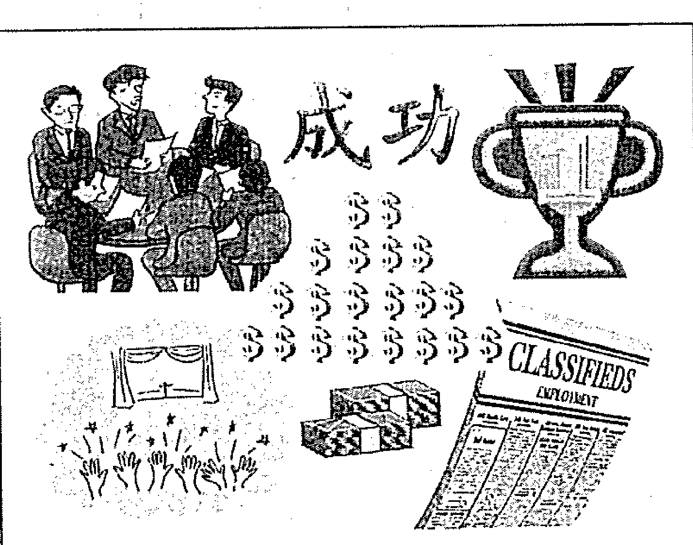

「想要成為幸福有錢人的人」請製作

# 提升財運寶地圖

設定具體的目標金額，
想像目標達成時的喜悅！

我手上有一張當初我用來貼在「寶地圖」上的照片，照片中的我，左右兩手分別握著400萬日圓（請參閱彩色頁）。這個錢不是我的，是我跟別人借來拍照的，但這張照片卻讓我具體勾勒出偉大的目標，連帶地潛能及運氣都被激發出來。除了讓我還清債務，年收入還攀升為數千萬日圓，並買了自己的房子。

這個寶地圖除了能讓人自然想像自己變有錢，還可以提升財運。

## 👑 魔法問題（終極問題與實踐）

❶到目前為止，你的錢都用在下列哪個項目上呢？

- ①投資（金額×1.2 以上的價值）
- ②消費（金額×0.8～1.2 不到的價值）
- ③浪費（金額×0.8 不到的價值）

將浪費當成投資，該怎麼辦才好呢？

❷先決定將錢使用在哪個項目上，再決定該項目需要用到多少錢。現在，你已經決定好要將錢用在什麼項目了嗎？

## 👑 自我宣言（智者語錄）

- ❖勞動是財富之父，土地是財富之母。
- ❖我們的事業，需要的是手，而不是嘴。
- ❖愚蠢的人幸福是錢和官，聰明的人幸福是勞動和貢獻。
- ❖資產○○億、年收入○○萬、年營業額○○億

> ❖「對於富有才華和熱愛勞動的人來說，不存在任何障礙。」 ——貝多芬

## 👑 向夢想前進的視覺影像

- ●豪宅
- ●高級車
- ●銀行存款簿
- ●堆積如山的鈔票
- ●黑卡／白金卡
- ●豪華錢包

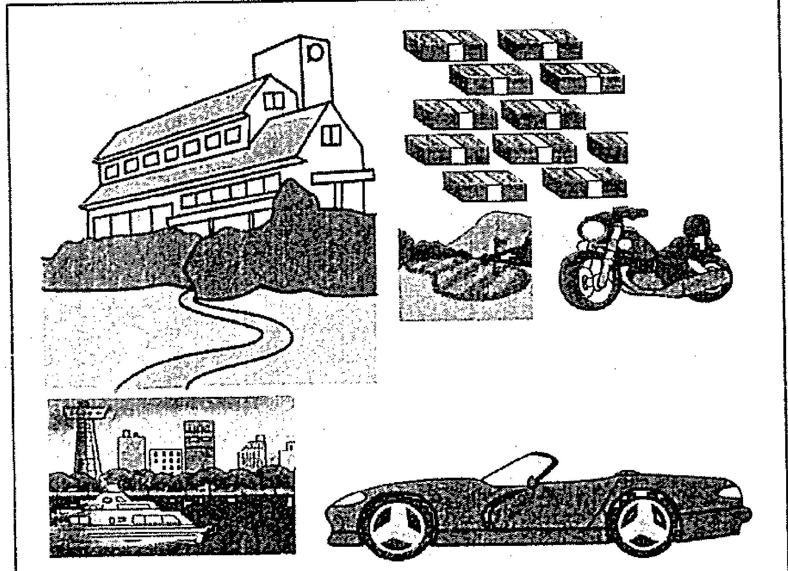

> 「想在工作或興趣上提升技能的人」請製作

# 自我提升寶地圖

在畢業證書或認證上寫下自己的姓名，以「寶地圖」來設定，自己已經通過的樣子

我們經常會遇到許多需要技術或能力再精進的事物，如：工作、營業能力等實務認證的取得，運動或樂器能力的精進，家庭主婦也需加強做飯與打掃等家事的技能，孩子則有吊單槓、樂器、游泳等。

能有效提高技能的助力，便是「寶地圖」。將自己製作的結業證書或認證書，填上名字再貼到「寶地圖」上，或用其他能讓你聯想到自己的技術已經進步了的照片，這可以讓你原來不明確的能力變明確。相信看了寶地圖，你一定會更期待自己未來的表現。

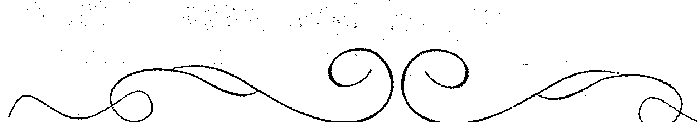

## 魔法問題（終極問題與實踐）

- 你變成怎樣的人，夢想才會實現？你認為跟你擁有相同夢想的人，之所以能夠實現夢想，是因為他們具備哪些特質呢？
- 假設未來 3 年你都必須聽從別人的指示或命令來做事，只有其中 3 樣可以照著自己的意思來做，如果你有權選擇哪 3 樣，你會選什麼呢？又會怎麼做呢？

## 自我宣言（智者語錄）

- 你有一個偉大的目標的時候，就會把勞動當作享受。
- 要變成和過去截然不同的自己。
- 計畫自我的成長。
- 每天都離目標近一點。

> > 「千里之行，始於足下。視千日之練習為鍛，視萬日之練習為鍊。」
> ——宮本武藏

## 向夢想前進的視覺影像

- 表揚台
- 獲頒獎狀的場景
- 在銅像前拍照
- 三角大鋼琴

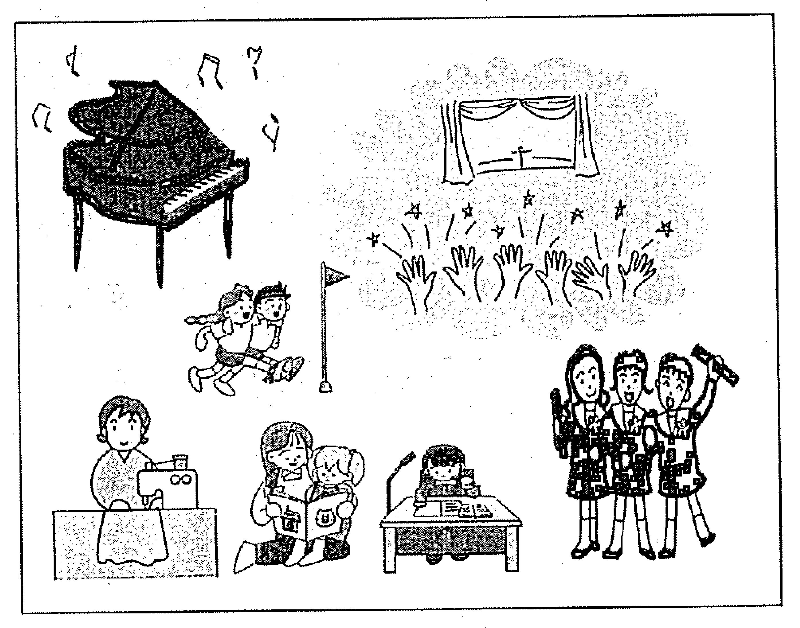

# 「感覺」篇

## 有了感覺，就能快速展開行動

能吸引夢想的是興奮的「感覺」。
如果結婚是你的夢想，請想像步入禮堂的自己，是否有開心又興奮的感覺呢？如果有的話，你就會為了實現這個夢想而積極展開具體的行動，還會將你希望的結果吸引過來。

我們經常聽人說「思想現實化」，但事實上，「思想的現實化」多半須經過「感覺的變化」與「行動的變化」。

就算你告訴自己：「我正在減肥，所以不能吃甜食」，但雙手還是不聽使喚，想拿甜食來吃。
之所以會這樣，是因為「想要減肥的想法」，無法確實結合「不能吃甜食」的感覺。

食的行動。

## 用「寶地圖」改變你的感覺

要能夠使你的思考與行動結合起來，便要有「感覺」。
在減肥的過程中，會忍不住想吃甜食，這跟你的意志力薄弱有關。不過，此時與其鍛鍊意志力，倒不如改變感覺，效果還比較快。
只要運用「寶地圖」，完全不用勉強自己，就能輕輕鬆鬆改變自己的感覺。
運用影像或話語，就能讓目標變得明確，並且能清楚地聯想到目標達成時的情景，心情自然會跟著高興起來。
於是，你便能愉悅地朝向目標而努力，而且還完全不用勉強自己，而能一直堅持下去。
只要你能想像自己減肥成功時，身材變得窈窕動人的模樣，並感覺興奮開心，你就會想辦法抗拒甜食的誘惑。

## 「寶地圖」是轉換感覺的開關

不知怎地，就是提不起勁……相信大家都有類似的經驗。

這個時候，如果碰巧在電視上看到某位運動選手比賽獲得勝利的英姿，心情就會不由自主地受到鼓舞，心想「我也要好好加油」因而振奮起來。

你之所以會變得幹勁十足，是因為電視中運動選手努力的姿態，點燃了你的熱情，啟動了你的動力。

一個人努力的樣子，具備如此大的力量。只要大家多看看自己或別人努力的樣子，就可以跟著提高做事的幹勁。

如果想要提升自己的幹勁時，可試著製作「激勵寶地圖」，並將它放在常常會看到的地方。只要每天有意識地看個3次，每天就有3次的機會來啟動動力開關，做起事來才會更有幹勁。請記住，我們每個人都有能力調節自己的感覺的開關。

「想要實際感受“自己是幸福”的人」請製作

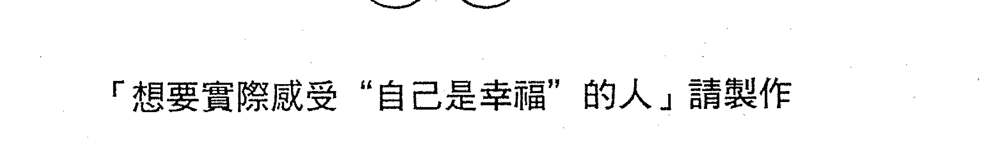

> 「幸福會招來更多的幸福」

記得多回想過去的幸福時光喔！

大多數的人都認為「自己不太幸福」。事實上，這是因為人對於周遭的事物不懂得心懷感謝的緣故。人只會看到不足的地方，所以才會常常覺得不滿或忿忿不平。你可試著動手製作「寶地圖」，喚醒過去曾讓你感覺幸福的事物。

建議大家條列並寫下「在你人生中最發光發熱的 BEST 10」，並貼上相關照片。因為幸福會招來更多的幸福，所以千萬要記得，每天都要不斷讓自己有幸福的感覺喔！

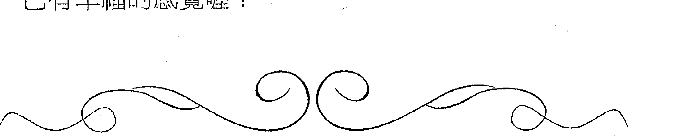

## 魔法問題（終極問題與實踐）

- ● 現在的你是幸福的嗎？
- ● 現在的你失去什麼，會讓你覺得很困擾或悲傷呢？請試著舉出5個，對於自己現在依然擁有這些人事、物心懷感激，並向對方表達感謝之意。
- ● 一想到就讓你覺得很幸福的事是什麼？是成功？富足？或是愛？每天，你是離幸福越來越近，還是越來越遙遠呢？

## 自我宣言（智者語錄）

- ● 勇敢，事情必成；勤勞，幸福必到。
- ● 幸福就在你自己身上
- ● 我是幸福的，因為我愛，因為我有愛。
- ● 信仰，是人們所必須的。什麼也不信的人不會有幸福。
- ● 幸福越與人共享，它的價值越增加。
- ● 「想幸福的事，就會讓人變幸福。」
——墨菲（Murphy）

## 向夢想前進的視覺影像

- ● 眾人的笑臉
- ● 萬歲
- ● 開心互擁的模樣
- ● 花朵
- ● 滿天星斗
- ● 極光

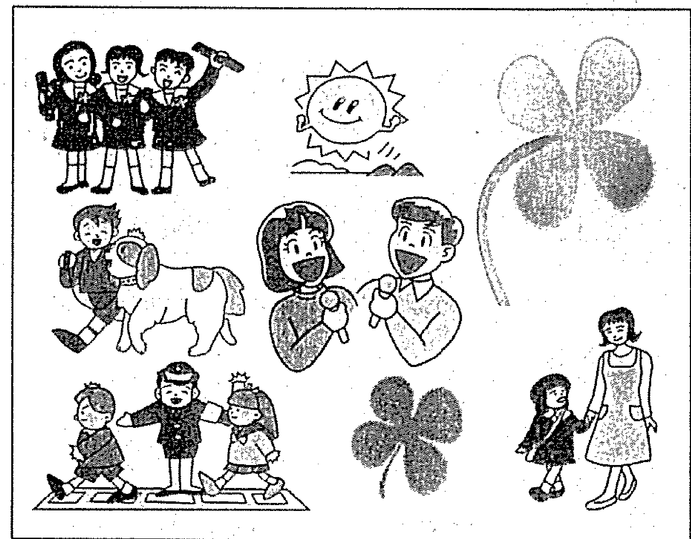

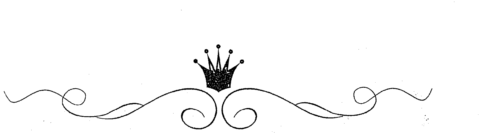

「想讓自己充滿感謝之意」請製作

# 感謝寶地圖

因為心中充滿感謝
人才會感受到幸福

有明確的目標去努力，是很棒的一件事，不過，有太多人因為把焦點放在未來的成功上，卻不小心否定了現在的自己。

擁有幸福人生的訣竅，在於要打從心底感謝自己現在擁有的一切。話雖如此，人常常會因把重心錯置在自己沒有的東西上，而忘了要對已經擁有的事物知足感恩。請在「感謝寶地圖」上貼祖先、家人的照片，或「感謝父母給我健全的四肢」等讓你產生感恩之心的照片或話語。

每次觀賞寶地圖，它都會讓你再次回歸知足感恩的狀態。

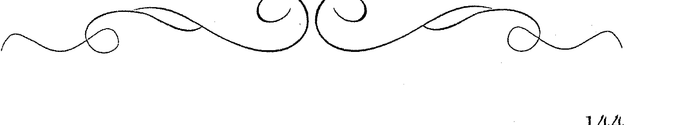

## 魔法問題（終極問題與實踐）

- 人不是因幸福而感謝，而是因感謝才得到幸福。你對什麼事心懷感謝呢？
- 請試著寫出人生中「該感謝的事物 BEST 10」。
- 您由衷想感謝的人是誰？你是否已經向對方表示過謝意呢？請試著做看看。

## 自我宣言（智者語錄）

- 小人記仇，君子感恩。
- 世上沒有什麼是理所當然的。
- 感謝是引你走向幸福國度的護照。
- 「感謝」有多少，幸福就有多少。

> 「沒有比過度感謝更美麗的事了。」——拉·布呂耶爾（Jean de La Bruyere）

## 向夢想前進的視覺影像

- 抱著嬰兒的母親
- 合掌
- 花束
- 禮敬
- 大自然的照片
- 太陽的照片

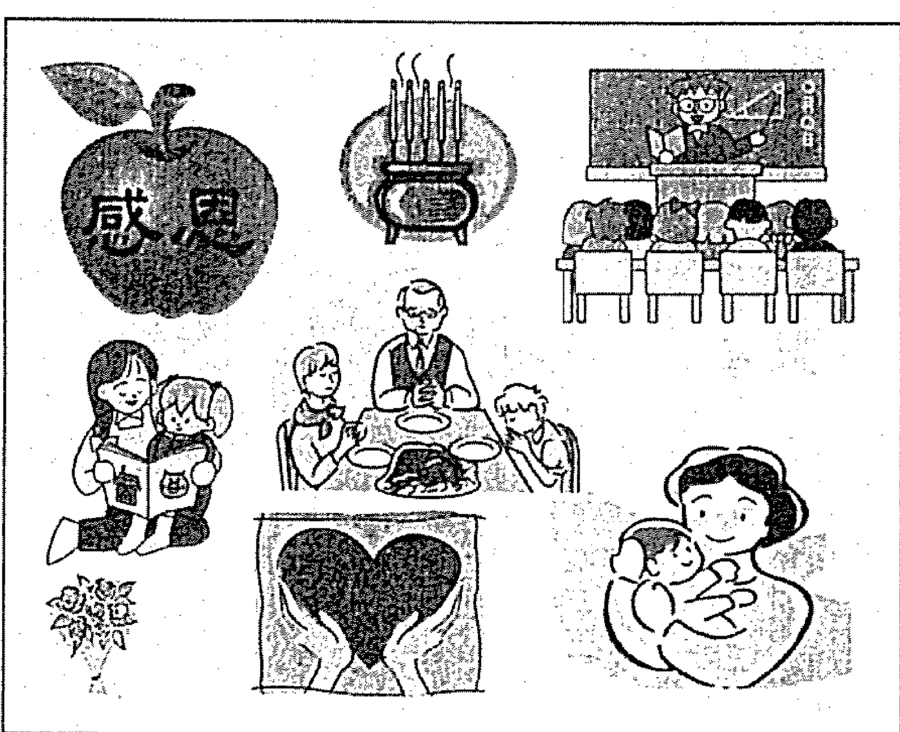

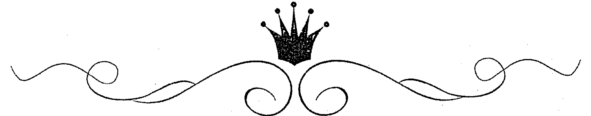

「想要永遠開心生活的人」請製作

# 好心情寶地圖

## 延長心情愉悅的時間，讓人生過得更開心有趣！

有個「訣竅」能讓人瞬間擁有好心情。約會時不小心吵架，只要跟女友說聲：「要不要去吃蛋糕呢？」兩個人立即就可以變得有說有笑。

在「寶地圖」中，請貼上能讓人瞬間將注意力轉移到開心事物的照片或話語，如：喜歡的藝人或家人的照片等。尤其是小孩可愛逗趣的照片，效果更是驚人。

如果一個人的心情每天都很好，周圍的人也會跟著受影響。這裡不是說你心情的好與壞，全都取決於他人，而是說你的心情，應該由自己來掌握。

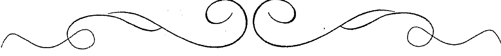

## 魔法問題（終極問題與實踐）

- 到底該怎麼做才能讓活力或幸福的程度提升2倍、3倍，甚至是10倍？
- 跟誰在一起會讓你活力百倍？他有什麼過人之處嗎？仔細想想，你是不是也擁有一樣的能力呢？
- 當你很有朝氣時，你的表情是怎樣的呢？可以請你稍微想像一下，那個時候你的肢體語言及用詞遣字是怎樣的？

## 自我宣言（智者語錄）

- 如果你充滿活力，誰會因此受惠呢？
- 活力是會傳染的，把它傳出去吧！
- 你的笑臉就是活力的最佳證明。
- 只要有活力，什麼都做得到。

> 「想要擁有歡樂的人生，第一步就必須學會歡樂過活。」 ——斯賓諾莎（Benedictus de Spinoza）

## 向夢想前進的視覺影像

- 眾人的笑臉
- 擊掌相互鼓勵
- 笑咪咪的孩童
- 太陽
- 跳躍

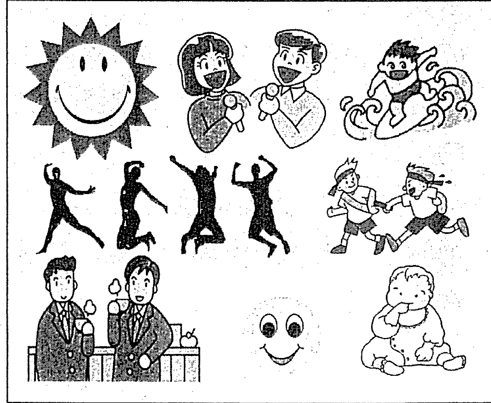

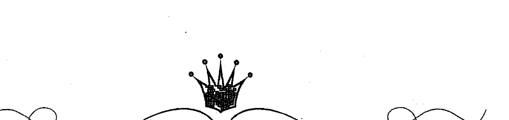

「想要變成幸運體質的人」請製作

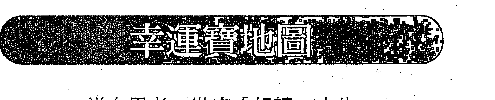

# 逆向思考，徹底「扭轉」人生

以前松下幸之助先生，在面試前來公司應徵的求職者時，都會問大家：「你覺得自己是個幸運的人嗎？」據說，只有回答「是」的人，才會被錄取。

大多數人往往會覺得自己「不是很幸運」，常常告訴別人自己有多不幸，甚至習此為常。不過，事實上我們每個人都是非常幸運的，生命中奇蹟般的幸運總是一而再、再而三地發生。相較之下，在一些窮苦的國家，能夠吃頓飯，就已經是非常幸運的事情了。

請貼上能讓你聯想到自己有多幸運的「幸運寶地圖」。經常對周遭的一切心懷感恩的人，好運就會真的降臨。

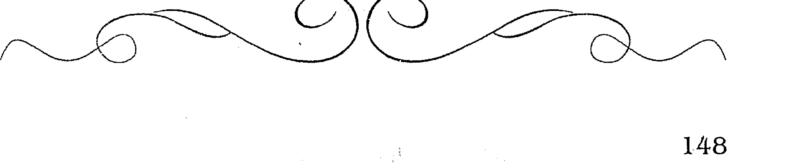

## 魔法問題（終極問題與實踐）

- 一個人被生下的機率，只有「70 兆分之 1」，試想，你能來到這個世上，運氣有多好？
- 假設「施=受」的論點成立，你將如何為自己創造「施」的機會呢？你想將 ①擁有什麼價值的事物、②送給什麼人、③在什麼時候、④用什麼方法（盡可能以對方容易接受的方式）給予對方呢？

## 自我宣言（智者語錄）

- 一針縫得及時勝過九針。
- 持續說「我好幸運喔」，好運就會真的降臨。
- 對每天的「幸運」心懷感謝。
- 最大的幸福是把自己的精神力量奉獻給他人。
- 把幸福讓給別人，等於得到了雙倍的幸福。
- 「我完全無法想像自己竟會這麼幸運。」 ——齊藤一人

## 向夢想前進的視覺影像

- 笑得合不攏嘴
- 賭場
- 累積好多小費
- 四葉的幸運草
- 彩券
- 覺得自己幸運莫名的瞬間

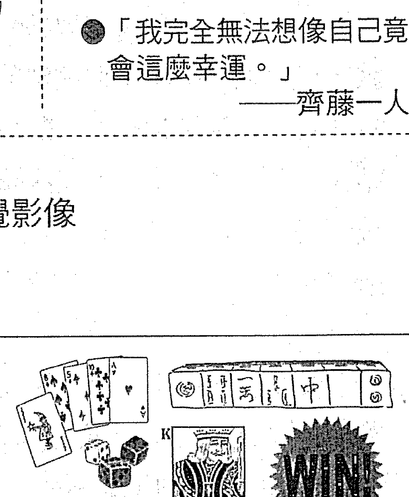

「想要提升幹勁的人」請製作

# 激勵寶地圖

收集能激發鬥志的照片提振心情

每個人身上都有個啟動鬥志的開關。請大家試著動手做做看能啟動這個開關的「寶地圖」。

如果能激發你幹勁的是高級洋房或進口名車，就請在「寶地圖」中貼上這些照片吧；如果你是為了家人而努力，則可貼上家人照片，同時附上孩子們親手所寫的書信；容易被偉人話語打動的人，則貼上金玉良言，效果也會很不錯。

建議大家可以在自己鬥志很高昂時，製作這張「激勵寶地圖」。只要觀賞這張「寶地圖」，就能讓你回想起製作時的情景。

## 魔法問題（終極問題與實踐）

1. 人生中最重要的事，便是「以最重要的心態，來處理最重要的事」。對你而言，最重要的事是什麼呢？你會最優先處理它嗎？
2. 熱情是驅動人生的燃料。要接近能點燃你熱情之火的事物，遠離會澆熄你熱情的一切。
3. 此時此刻，就是你展開行動的最佳時機。想要實現夢想的你，現在應該要做什麼才好呢？

## 自我宣言（智者語錄）

1. 水往下流，人爭上游。
2. 既然要做，就要全力以赴。
3. 沒有目標的生活，猶如沒有舵的船。
4. 畫工須畫人中龍，為人須為人中雄。
5. 「就算失去一切，你依然擁有未來。」 ——Christian Nestell Bovee

## 向夢想前進的視覺影像

1. 充滿氣勢的手勢
2. 與隊友肩並肩的畫面
3. 「洛基」(電影)
4. 團隊合作
5. 金玉良言

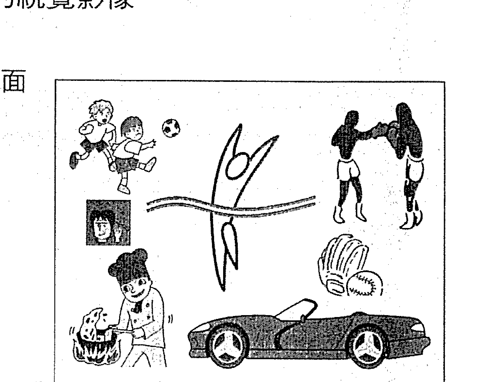

「想要鼓勵自己與他人的人」請製作

# 慎選資訊，多看有趣的事物
心情就會變得正面而積極

人生有起有落。在情緒低落時，如果看的都是會讓人消沉的新聞，不知不覺就會覺得「這世界上都是烏煙瘴氣的事」導致心情越來越差。相反地，這種時候若能多接觸一些能讓你開心的事物，就會變得正面積極，覺得「人生，也不全然是不好的事啊」。

當你覺得自己心情很棒的時候，可以藉著製作「加油寶地圖」來鼓勵身陷低潮的親朋好友。相信在你自己情緒低落時，看了這個寶地圖，也會因此受到鼓舞。

## 魔法問題（終極問題與實踐）

- 如果你擁有協助天才發揮才華的能力，你會想要幫助誰？又要協助對方做什麼事呢？
- 假設老天爺總是關照你，接下來你想怎麼改變自己，才能獲得更多的援助呢？再者，你覺得你怎麼做，會讓老天爺比較願意幫助你呢？
- 你喜歡的激勵話語是什麼呢？

## 自我宣言（智者語錄）

- 若要功夫深，鐵杵磨成針。
- 我的支持與鼓勵，讓世界都改變了。
- 激勵話語是能量的來源。
- 加油、加油、○○(姓名)。
- 「天將降大任於是人也，必先苦其心志，勞其筋骨，餓其體膚，空乏其身，行拂亂其所為。」
——孟子

## 向夢想前進的視覺影像

- 幫忙加油打氣的人
- 加油旗幟
- 銅管樂團
- 小號
- 握手的畫面
- 聚會場所眾人鼓掌的畫面

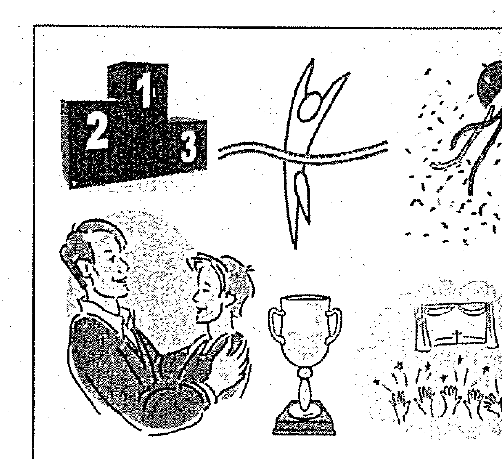

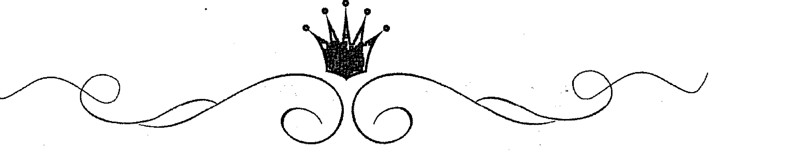

「想要感受心靈綠洲的人」請製作

# 嗜好寶地圖

就算再忙，也能輕易放鬆身心，使工作進行得更順利

只要是自己喜歡的事情或熱衷的事物，哪怕只是稍微想到，都會讓人立即變得幸福，產生愉悅的心情。

假設你的興趣是釣魚，當你因工作繁忙而無法出外釣魚時，只要看一下之前去釣魚時所拍的照片，或稍微想像一下接下來要去哪裡釣魚等，每天就能產生心靈綠洲般的愉悅感。心情上懂得放鬆，工作自然就會得心應手。

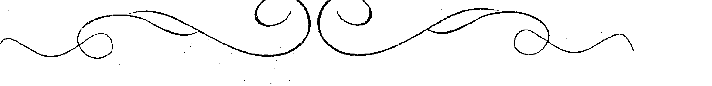

## 魔法問題（終極問題與實踐）

- 如果你擁有無限的時間，你想花多少時間在你有興趣的事？完成這件事情後，你的感覺會是如何呢？你會想要一輩子一直做下去嗎？
- 如何讓你的興趣產生利益呢？
- 你的興趣將為人生增添怎樣的光彩？是溫暖的色彩，還是黯淡的色調呢？

## 自我宣言（智者語錄）

- 工作是我最大興趣，勤勞是我創業的源頭。
- 成功的科學家往往是興趣廣泛的人。
- 要朝氣蓬勃地致力於任何事業，首先必須熱愛生活。
- 沒有引發任何行動的思想都不是思想，而是夢想。
- 「沒有靈魂的人無法擁有興趣。」 ——沃維納格（Vauvenargues）

## 向夢想前進的視覺影像

- 學習技藝的照片
- 優勝獎盃、獎狀
- 與好友談笑嬉鬧的畫面
- 旅行的照片（高山、海洋）
- 開車
- 展示自己嗜好或收藏的房間

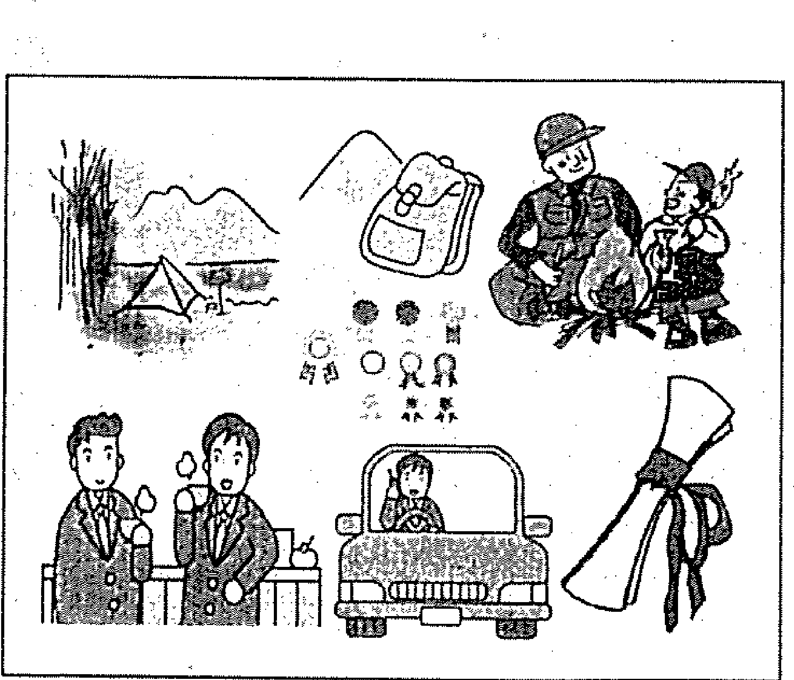## 人际关系篇

### 人际关系决定人生的品质

> 释迦的弟子阿难问道：“觅得良友，是否就等于得到绝大部分的圣道呢？”释迦听了回答他说：“觅得良友的人，不是得到‘绝大部分’的圣道，而是‘全部’的圣道。”

由此可知人际关系多么重要，几乎可以决定人的一生。当然，朋友不是结交越多越好。我们常在派对或一些商务宴会上，看见许多拼命与别人互换名片的人。如果这个难得的缘分，没有持续到未来，到头来，你所遇见的人，与擦肩而过的陌生人没有两样。以前的人讲过一句话：“缘分天注定”，可知缘分是强求不来的。我个人比较推荐的做法是，“多珍惜现在身边的人”。

### “宝地图”是让家庭圆满的幸运符

重视自己身边亲朋好友、工作伙伴等的人，比较容易得到别人的信赖与喜爱，会让别人发自内心想介绍自己周围的亲朋好友给你认识。也就是说，只要一个人本身的魅力足够，就算不刻意去结交朋友，在众人的帮助与介绍下，交友圈就会自然而然拓开来。

只要拥有安定的家庭或人际关系，有一个随时展开双臂欢迎你回去的地方，你就能随心所欲飞得更远。孩子们也是如此。拥有冒险犯难精神的孩子，多半来自于安定的家庭。男女关系更是一样。只要两人相互信赖且关系稳定，就能在外共同打拼，梦想的实现也会比较顺遂。

‘宝地图’中，能放进去的事物很多，不仅能放进你希望得到的东西，也请千万别忘了有助力于‘建构幸福家庭’的相关物件。例如，在‘宝地图’

### 改变自己，人际关系就会变得更好！

中，贴上全家幸福开怀的脸部特写照片，对于圆满家庭的建立非常有效，成为祈求家庭圆满的护身符。

> “我们无法改变过去与他人。”

有句话说：虽然不是真的完全没有方法可以做到这一点，不过与其费心去改变过去或他人，倒不如改变自己或未来。

不过，改变自己后，“来往者的素质”也会发生改变。因为当你朝好的方向改变时，会吸引类似的人。

寻找理想伴侣也是同样的道理。想要认识并与理想的伴侣交往，必须先具体地想像怎样的人比较适合自己，同时这也会让自己思考，怎样才能配得上自己理想中的伴侣。

只要将上述条件或答案列举出来，随时带在身边，在不知不觉中就会吸引各式各样的良缘，让你顺利觅得人生中的理想伴侣。

### 改变自己，同时吸引理想伴侣的方法

想要找到理想伴侣的人”请制作

想要觅得理想伴侣的人，首先要做的是去思考什么是你最适合的理想伴侣，同时试着将条件列举出来。我想可能有些人会无边无际地列出许多条件，不过，这么做，想要找到完全合乎条件的人，可能会比登天还难。因此，我建议大家只要列出明确的3个一定要符合的条件。

希望你也同时写出“怎样的自己才能配得上理想的对象”，你自然就会多花心思去自我改善，也会比较容易吸引理想的对象。

### 魔法问题（终极问题与实践）

- 你的理想伴侣是哪一种人？性格为何？外表怎样呢？有没有一个条件是你绝对不能妥协的呢？
- 自己需要做些什么，才能配得上理想中的伴侣呢？你又该从什么开始做起呢？
- 对你而言，什么是恋爱？什么是伴侣？

### 自我宣言（智者语录）

- 志同道合是爱情的基础。
- 只要两人携手同心，没有克服不了的难关。
- 爱情的欢乐虽然是甜美无比，但只有在光荣与美德存在的地方才能生存。
- 让我来守护你。

> “想要真正去爱人，就必须要懂得宽恕。”——德蕾莎修女 (Mother Teresa)

### 向梦想前进的视觉影像

- 老夫妻或两人伫立在夕阳西沉海边的身影
- 餐厅、游乐园、摩天轮、海岸、车子、烟火（约会的要素）
- 教堂
- 结婚典礼
- 新郎新娘立誓的画面
- 花束（捧花）
- 心型记号

“想要加深家人凝聚力的人”请制作

## # 家庭美满宝地图

### ## 夫妻感情变好，全家幸福美满

不需要每个人都各别制作一张“宝地图”，全家共同制作一张也可以。全家人都在同一张“宝地图”上写下自己的梦想，家中成员自然就会知道“每个人的梦想”。我们常听说一些夫妻，因为知道对方的梦想，感情因而变好。全家若能一起祈求梦想实现，相信凝聚力也会变得比较强。

另外，“宝地图”还能帮助孩子更鲜明地描绘出未来的梦想。请大家届时一定要成为孩子的梦想制造者，而非破坏者喔！

## # 魔法问题（终极问题与实践）

- 如果有一天你的家人突然不见了，你会有什么感觉？要记得感谢你重要的家人，此时此刻依然在你身边，哪怕只是简单一句，都要把这份感谢传达给对方。
- 当你结婚时或小孩出生时，你曾许下什么誓言呢？要记得偶尔提醒自己。
- 有没有什么是你想对重要的人说，却一直无法说出口呢？

## # 自我宣言（智者语录）

- 为了让自己经常想到“孩子是宝”，我要……
- 每个人的家对他自己都像是城堡和要塞。
- 所有幸福的家庭都十分相似；而每个不幸的家庭各有各自的不幸。
- 别忘记孩子出生时带给我们的喜悦。
- “孩子是神送给我们的礼物。”《旧约圣经》

## # 向梦想前进的视觉影像

- 亲子笑容洋溢的照片
- 婴儿玩偶、娃娃
- 母子手册
- 墙壁上记录身高成长的记号
- 幼稚园的入园与毕业
- 孩子未来想做什么的图片

“想要使平常日子也开心的人”请制作

## 纪念日宝地图

每天都是“令人心动”的日子，孩子们一定会很开心

只要有“纪念日”，就算再平凡的日子，都会立刻变得很有趣。将“跟男友的第一次约会纪念日”、“孩子第一次走路纪念日”等，能让人回想起对自己或家人极具代表性日子的影像或照片，贴到“宝地图”上，三不五时去观赏它，你的心情就会变得很愉悦。

父母亲若能帮自己的孩子做张“纪念日宝地图”，孩子就会实际感受到“父母对自己的爱”，同时了解自己在父母心中的重要性，自然能顺利长大成人，迎接幸福的人生。

### 魔法问题（终极问题与实践）

- 如果“每天都是纪念日”或“每天都是庆祝日”，那今天会是怎样的纪念日呢？
- 列出你的“纪念日排行榜”，同时询问你所重视的人，他们“最重要的三个纪念日”是什么？
- 是否曾有人帮你做过什么庆祝让你觉得很开心？当时有谁在场？发生了什么事呢？

### 自我宣言（智者语录）

- 将一生的回忆化为具体形式。
- 请记得纪念日！
- 我们为孩子的美丽和幸福感到极大的欢乐，这欢乐使我们的心灵博大到躯壳难以容纳的程度。
- “想要成为幸福的人，要先学习如何让别人开心。” ——英国诗人，马修·布里欧尔（Matthew Prior）

### 向梦想前进的视觉影像

- 全家的合照
- 派对的画面
- 结婚典礼会场
- 运动会、园游会
- 开学典礼、毕业典礼

## “生活习惯”篇

### 习惯造就人生

> 想要实现梦想，最重要的就是“展开行动”与“持之以恒”。持续相同的行动，就会变成“习惯”。

有句话说：“懂得掌控习惯的人，便能掌控自己的人生。”可见习惯多么重要，足以左右人的一生。

“习惯”可分成无意间不知不觉养成的习惯，以及刻意培养的习惯。上了大学后，因不小心养成赖床的习惯而迟到，便属于前者；试过所有方法，终于成功戒除吸烟恶习，则属于后者。另外，孩子们也常会因为父母刻意的管教，而养成或戒除某个习惯。

人多半是好逸恶劳的，所以往往不费吹灰之力就能养坏习惯。

### 要养成习惯，就必须持之以恒

一个诀窍就是“改写痛苦与快乐”。
以戒烟为例，想要成功戒烟，就必须让自己痛苦地感受到，烟持续抽下去，将失去多少的金钱与健康；同时也必须让自己快乐地感受到，成功戒烟时，空气闻起来有多清新，食物吃起来又是何等美味。一旦这两种感觉进入潜意识，你便能轻松戒烟成功。其中，能发挥强大改写潜意识威力的，便是“宝地图”。

请试着将你想要持续做下去并养成习惯的事，制作成“宝地图”。
若你想要养成整理房间的习惯，就请将想要养成习惯的原因写下来，并将整理乾净的房间照片贴到“宝地图”上，附上鼓励自己整理房间的标语。
接着，你要将这张“宝地图”多影印几份，分别贴到桌上或寝室等经常看到的地方。

### 习惯能让人变美丽！

过去我还在担任汽车业务员时，每每在路上停红绿灯时，就会觉得很烦躁。为了让自己养成“等红灯时，就记得要深呼吸的习惯”，于是我就将“深呼吸”三个字写在一张小便条纸上，贴到仪表板上。没想到，不知不觉中我居然真的养成了“深呼吸”的习惯，不再那么容易焦躁不耐烦。

另外，我也养成了寻找演讲题材的习惯。养成习惯后，大脑就会自动搜寻与掌握新资讯，在我需要资讯时迅速提供参考。

“想要变瘦”、“想要变美丽”等梦想能否实现，端视你是否养成习惯。真的想变瘦的人，可在冰箱门上贴上“减肥宝地图”，让自己养成不摄取多余食物的习惯。想要拥有美丽肌肤的人，则可制作“美肌宝地图”，让自己养成不熬夜，并认真做好肌肤保养的习惯。现在的习惯，将会造就未来的你。

“想要拥有理想体型的人”请制作

### 减肥宝地图

### “宝地图”甚至能让你得到渴望的模特身材

制作“宝地图”能够帮你达成“成功减重，拥有美丽身形”的目标。第一步，先设定“瘦多少公斤，变成理想身材”等具体目标，再将拥有自己想要身材的模特或女明星的照片，贴到“宝地图”上，制作一张“减肥宝地图”。

如果想要瘦局部而非全身，则建议贴上身体局部的照片，会比较有效。请将“宝地图”影印数份，分别贴在浴室、厨房、冰箱或体重机上等经常看得到的地方。

### 魔法问题（终极问题与实践）

- 要怎么做才能开心减重呢？
- 回复理想体型后，心情会有什么样的变化呢？人生又会产生怎样的改变呢？
- 如果你的一生都将维持现在这种身材，你会是什么感觉呢？
- 你想穿怎样的衣服呢？

### 自我宣言（智者语录）

- 我一定能变成想要的样子。
- 瘦下来后，连心情都轻盈起来。
- 跟松垮垮的衣服说 BYE BYE。
- 过着没有赘肉的人生。
- “美，闪耀着真理的光辉。” ——柏拉图

### 向梦想前进的视觉影像

- 美味的水果（柑橘类、桃子等）
- 做 SPA
- 健走
- 慢跑
- 游泳

“想要拥有健康人生的人”请制作

### 健康宝地图

用从前的健康模样来勉励自己，就能让你快速摆脱病痛、恢复健康

如果你想要每天都过得很健康，请在“宝地图”中描绘出，想要达成健康的目标，究竟该有什么具体的行为。

正在生病、想要恢复健康的人，建议您在“宝地图”中贴上自己过去健康时的照片，可以产生激励自己快点好起来的效果。

另外，列出“痊愈后，要跟家人去夏威夷旅行”、“想去参加○○○的演唱会”等令人开心的目标，也不失为有效的方法。贴上“要多吃蔬菜水果”、“对任何事物心存感恩”等，让自己知道“该做些什么”才能顺利达成目标，也是不错的做法。

### ## 魔法问题（终极问题与实践）

- 如果有人能保证让你一辈子“健康”又“年轻”，你觉得价值多少？
- 失去健康或青春会连带失去什么？感觉会怎样？怎样做才能避免失去健康？
- 假设你罹患不治之症，你愿意花多少钱来换回健康？付出多少代价？

### ## 自我宣言（智者语录）

- 健康是幸福的必要条件。
- 失去后才知道健康的重要性。
- 疾病源自于气，活力也源自于气。
- 笑容是健康的指标。
- “没有比身体健康更宝贵的财富。”

> ——《旧约圣经》

### ## 向梦想前进的视觉影像

- 慢跑、健走的模样
- 登山（爬山）
- 在公园玩耍的孩子们
- 自己活力充沛的照片
- 自己笑得灿烂无比的照片
- 瑜珈、伸展运动

“想要养成好习惯的人”请制作

### 习惯养成宝地图

养成好习惯，获得自己想要的人生

“掌握习惯的人，就掌握了人生”可见习惯的养成有多重要，习惯可以造就一个人的人生。

请你在勾勒自己的远景时，请好好思考，想要达成这个目标，你最需要的是什么习惯。将想要养成的习惯做成列表、标语或图表，让它变成一张“宝地图”，再贴到常常看得见的地方，便会自然养成习惯。

例如，想要养成面带笑容习惯的人，只要在经常使用的镜子旁，贴上一张笑容洋溢的图画，效果就会很明显。

### 魔法问题（终极问题与实践）

- 有什么习惯能快速提升你的人生品质？
- 想要拥有你渴望的人生，有什么是你必须毅然决然说 NO（或 YES）的呢？
- 有什么习惯是你现在开始做，3 年后会让你觉得“真是太棒了”呢？

### 自我宣言（智者语录）

- 掌握习惯的人，就掌握了人生。
- 习惯是一种顽强而巨大的力量，可以主宰人生。
- 习惯成自然。
- 善恶之习，朝夕渐染，易以移人。

> “习惯总是乘人不备，向你袭来。”——富兰克林

### 向梦想前进的视觉影像

- 睡得又香又甜的照片
- 打开存钱筒的画面
- 阳光穿过树木的照片
- 记事本
- 写日记的画面
- 和外国人对话的画面

“想要戒酒或戒烟的人”请制作

### 戒烟·戒酒宝地图

总是无法顺利戒除的烟与酒
用“宝地图”彻底说拜拜吧！

想要戒烟或戒酒的人，建议使用能让你联想到持续喝酒或抽烟，将为你带来多大苦果的照片或绘画，制作成“宝地图”。

在这个“宝地图”中，请标明戒烟或戒酒成功时的画面与优点。例如，写上一天少抽一包烟，能多存多少钱，一年不喝酒，身体的状况会变多好等都很不错。另外，贴上海岸或山林原野等能让人放松心情的风景照，也有助于消除戒烟过程中的焦躁不安。

### ## 魔法问题（终极问题与实践）

- 到目前为止，你因抽烟花了多少钱？如果你将这笔钱用在真正想做的事情上，会是什么样子呢？你的人生会如何呢？
- 对你而言，健康的價值有多高？
- 成功戒烟或戒酒时，你能得到什么？

### ## 自我宣言（智者语录）

- 健康才是人们最大的财富。
- 健康如金钱，失去时才真正知其价值。
- 清新的空气比烟味宜人。

> >“人若赚得全世界，却赔上自己的生命，有什么益处呢？”
>——《马太福音》

### ## 向梦想前进的视觉影像

- 游泳
- 登山
- 看得到阳光穿透树木的森林
- 戒烟
- 家人幸福的照片

## “构想”篇

### “宝地图”是装满梦想的艺术品

“宝地图”是用来实现自我、完成梦想的工具。

一而再、再而三地时常看，“宝地图”会一点一滴逐渐改写我们的潜意识，让我们轻松又不费力地朝目标展开行动。

等到有一天，你会惊觉自己的梦想居然在不知不觉中实现了。这是“宝地图”永远不变的基本优点。

不过，“宝地图”还有另一个作用，这是我最近才发觉的。

那就是，“宝地图”其实是个颇具鉴赏价值的“艺术作品”。

我都会定期举行研讨会，教导大家如何实际制作“宝地图”。研讨会时，我除了欣赏参加者在制作时所流露出的生动表情，同时也满心期待大家所做出的“宝地图”。我经常从许多超乎预期的作品中，获得全新的感动。

### 召唤感动的动画——“宝地图影片”

我一直有个梦想，就是希望有一天能成立一家“宝地图博物馆”，将我珍藏的众多“宝地图”，当成了艺术品来展示。

电视广告往往可以在短短不到1分钟时间内改变人的心情。即使是烟酒不沾的我，看到夏天的啤酒广告，就会忍不住想要买一杯来喝。报纸与杂志的广告效果虽然也不错，但相比之下，电视广告打动人心的威力更强大。

将“宝地图”加入动画与音乐等元素制作而成的影片，便是“宝地图影片”。简单来说，就是将你贴在软木塞板上的各种文字和图片，搭配自己喜欢的音乐，然后播放出来。

影片是在设定好的时间中，配上影像与话语，所以故事性更强。
“宝地图影片”跟“宝地图”一样，都是为个人量身订做的梦想实现工具，不过却比简单贴在软木塞板上的“宝地图”，更容易振奋人心。

每次在研讨会中参加者发表作品时，总会掀起一阵感动的旋风！这样的將美好訊息傳遞給世界

實地圖影片已經不再只是個工具，而是能供大家一同欣賞的藝術品。

曾任國中體育老師的腰塚勇人先生，因滑雪意外導致頸椎骨折，被醫生告知可能一輩子都得癱瘓。在他努力復健下，居然恢復到可以走路的狀態。後來，他將這個故事透過「實地圖影片」發表在網路上，感動了無數的人，不僅因此出書，還成為當紅電視節目的主要嘉賓。

另外，同為教師的鮫島秀己先生，在日本發生大地震後，立即在第一時間上傳為災民加油打氣的影片，高達90萬人次的點閱數，感動了眾人的心。

現在媒體上雖然充斥著各種黑暗的新聞或負面的資訊，不過，其實全世界依然有許多善良的人，世界也充滿美好的事物。大家若能將眼光放在光明的一面，世界就會變得更美好。親愛的你，想不想對這個世界傳遞美好的訊息呢？

「想要與好友們一起實現夢想的人」請製作

同好寶地圖

有明確的目標
就能集中心力在焦點上，不會走偏！

希望能跟自己的同好們一起實現夢想的人，可試著共同製作一份「寶地圖」。如此一來，大家不但會有共同目標，到達終點前也不容易偏離正軌。
決定好目標之後，大家便知道自己該做些什麼，才能順利達成，也比較容易展開討論。而且，透過不斷的討論溝通，彼此的感情也會變得更好。
請務必要好好活用「寶地圖」喔！

魔法問題（終極問題與實踐）

- 如果一個來日不多的至親告訴你：「請連我的份，精彩而隨心所欲地活下去吧！」你會以怎樣的心態來度過今天呢？
- 你是否曾跟親友相互約定過什麼？你想與你往後認識的人訂下什麼誓約？又想培育出怎樣的友情呢？

自我宣言（智者語錄）

- 團結就是力量。
- 三個臭皮匠勝過一個諸葛亮。
- 三人同心，其利斷金。
- 遠親不如近鄰。

> 「惟有具備強烈合作精神的人，才能生存，創造文明。」——泰戈爾

向夢想前進的視覺影像

- 身體被眾人高高舉起的畫面
- 與伙伴們進行討論
- 上台致詞（眾人鼓掌歡迎）
- 列隊飛過天際的鳥群

「想為社會做些什麼的人」請製作

感受心靈喜悅，同時也能對世人有所奉獻

人的慾望中，最崇高的莫過於「希望能對社會與世人有所貢獻」。大家不必勉強自己去做社會服務或捐獻，真心想感受貢獻喜悅的人，可試著動手製作讓你意願倍增的「寶地圖」。

請盡量將德瑞莎修女等可敬之人的照片，或捐獻鉅額所得的新聞報導等能打動人心的事物，放在你經常看得到的地方，你就能學會更樂於奉獻與付出。擁有奉獻之心的人，就算不刻意追求眼前的利益，總有一天還是在不知不覺中成功的。

魔法問題（終極問題與實踐）

- 如果老天爺告訴你：「我要給你一個願望，不管你說什麼我都會滿足你。」你會希望這個世界變成怎樣呢？
- 為求世界和平，有什麼是你現在就立刻做得到的呢？每天都能持續做下去的又是什麼呢？

自我宣言（智者語錄）

- 人類共通的夢想。
- 第一步，先從周遭的和平做起。
- 世界和平，才能孕育富足人生。
- 「為締造和平的人，正義的果實乃是在和平中種植的。」——《新約聖經》

向夢想前進的視覺影像

- 神職人員
- 森林中的動物
- 笑容洋溢的照片
- 奧運
- 募款箱

183 第4章 實現夢想的「寶地圖」實踐篇

「相信人類堅強韌性的人」請製作

災難重建寶地圖

透過「寶地圖」來分享希望
應許孩子們一個光明的未來

日本的東北大地震，對日本造成許多毀滅性的傷害，世界各國紛紛表示哀悼之意。即便是現在，一想到那些罹難者與罹難者家屬的遭遇，我的心中依然會隱隱作痛。

話雖如此，人們現在該做的是力圖振作，而不是繼續自怨自艾。我們這些倖存者的責任是，必須同心協力，努力重建這個國家，因此，我跟一群志同道合的朋友，製作了一個「重建日本的寶地圖」，並以「寶地圖影片」的形式公布在網路上供大家欣賞，有許多人都因此感動不已。我衷心期望「寶地圖」不僅是為了日本，也能為地球上災難後的重建略盡綿薄之力。

魔法問題（終極問題與實踐）

- 上次發生災難時，你在做什麼呢？
- 為了幫助受災者，你到目前為止做了什麼？以後又打算做些什麼呢？
- 如果你是總統（或意見領袖），你會舉辦什麼救災活動？你又會如何呼籲大家呢？

自我宣言（智者語錄）

- 一個有堅強心志的人，財富可以被人掠奪，勇氣卻永不會被人剝奪。
- 為了下一代，不管發生什麼都要堅強面對。
- 人類的堅強韌性，讓我們能克服重重阻礙邁步向前。

> 「在你重新獲得力量前，我會一直唱下去。」——辛蒂露波 (Cyndi Lauper)

向夢想前進的視覺影像

- 象徵全世界的愛
- 在避難所嬉戲的孩童們
- 佇立在災區的老人
- 行動中的救災人員
- 被海嘯侵襲依然屹立不搖的樹木
- 災後重建的照片

「想要表達謝意的人」請製作

感謝狀實地圖

以稍微誇張的方式，表達自己對他人的感謝

一般來說，只有在遇到救助人命或高額捐款等比較特別的事情時，才會獲頒感謝狀。不過，這麼棒的表達方式，只用在少數特殊的人身上，其實非常可惜。事實上，我們也可以藉用這個方法，將自己心中的感謝化為具體形式，傳遞給周遭的人。禮多人不怪，以稍微誇張的方式，來表達自己對他人的謝意，最恰當也不過。

製作時，可到文具店買制式的感謝狀，或自己製作也可以。請將感謝之情，與能表達該心情的照片貼到感謝狀上，送給自己珍視的人當禮物。

魔法問題（終極問題與實踐）

- 你想感謝的人是誰？有多少人跟你有一樣的想法呢？（有誰想要跟你一起表達感謝呢？）
- 你是否能確實表達「感謝」呢？表達感謝時，你會告訴對方什麼呢？
- 如果你還來不及表達謝意，雙方就面臨別離，你是否會覺得很懊悔呢？

自我宣言（智者語錄）

- 這份心意，代替我說出「謝謝」這句話。
- 以具體的形式，留下感謝的心情。
- 有個讓你想要表達謝意的人存在，是很幸福的。

> 「心存感謝但不表達，如同包裹禮物卻不送出去。」——美國作家威廉·亞瑟·沃德

向夢想前進的視覺影像

- 禮物
- 笑容洋溢的紀念照
- 綁著蝴蝶結的禮盒
- 花束
- 獲頒感謝狀畫面

「想要跟自己最愛的寵物生活的人」請製作

心愛寵物寶地圖

有心愛的寵物陪在身旁，心靈就獲得療癒，人生也更有樂趣

有人將印有小貓或小狗照片的名片，當成拓展業務的工具，而獲得成功。因為可愛寵物的照片，會使人的心靈就獲得療癒。

對飼主來說，寵物跟家人沒兩樣。請試著用「寶地圖」重新對寵物表達感謝，感謝因為有牠們相伴，自己的心靈才能放鬆。另外，看著寵物小時候的照片等，也會讓人覺得感慨萬千。

未來打算飼養寵物的人，也可試著在「寶地圖」中貼上自己想要寵物的照片，這麼一來，一定會吸引到最適合你的寵物喔！

魔法問題（終極問題與實踐）

- 寵物會比你早一步離開人世。由寵物的一生中，你學會了什麼事呢？
- 寵物療癒了你的心靈。你從寵物身上學到什麼呢？

自我宣言（智者語錄）

- 就算遭遇再討厭的事，看到牠煩惱立刻拋開。
- 能跟自己喜歡的寵物在一起，真幸福。
- 寵物是我們的家人。
- 帶給我們全家好心情。

> 「狗將自己擁有的一切全給了我們，我們是牠們生活的重心，也是愛、信仰與價值觀的全部。」——羅傑·卡拉斯 (Roger A. Caras)

向夢想前進的視覺影像

- 獸醫
- 小貓或小狗
- 寵物店
- 寵物寫真集的封面
- 寵物周邊商品的照片

還有許許多多等著大家去實踐的寶地圖

「感覺」篇

笑容寶地圖

只要把家人、朋友、孩子們等「開心笑著的照片」貼到「寶地圖」上，再將「寶地圖」擺在家裡的顯目處，持續地欣賞它，就會讓人覺得很開心，全家一團和樂，幸福洋溢。

「夢想・成功」篇

學習寶地圖

寫下成績進步（進步幾分、進步到排行前幾名等），或解完一整本的參考書等具體的目標，並將想要背誦的內容全貼成「寶地圖」再重複觀賞，自然而然就會記住。

「人際關係」篇

人脈寶地圖

將熟識對象的照片貼起來，思考你受到他什麼影響，自己對對方又有什麼貢獻等。重新了解這個緣分有多珍貴，你會感謝所有曾經認識過的人。

「感覺」篇

啟動幹勁寶地圖

手上握有啟動開關，能讓你瞬間產生衝勁或幹勁的人，正是你自己。請試著回想過去出現鬥志時的情景、當時的照片等，並製作成「寶地圖」。

「人際關係」篇

提升人格寶地圖

如果「你想成為像德蕾莎修女般的偉大人物」，請貼上她的照片，同時寫出她哪一點吸引你，呈現在「寶地圖」上。

「人際關係」篇

英雄寶地圖

將你內心崇拜的人或對你而言就像是英雄般人物的圖片，貼到「寶地圖」上，然後每天仿效對方的言行舉止來做事。慢慢地，你一定會和你的偶像越來越相像。

「生活習慣」篇

慢跑寶地圖

這是為了讓自己能開始「跑步」所製作的「寶地圖」。請列出讓你不由得想要跑步的森林或海邊的照片，或你在慢跑中想聽到的音樂等等。訂立具體目標，如：幾周後要跑完多少公里等，將更有效果。

「生活習慣」篇

抗老寶地圖

「寶地圖」也有抗老回春的效果。將自己過去年輕而有活力的樣子，印在腦海裡，並愉快地開始做肌膚保養。就算只是簡單的夢想，在心態上也會自然而然變得年輕起來。

還有許許多多等著大家去實踐的寶地圖

「訊息」篇

世界和平寶地圖

世界和平是人類最大的願望之一。以讓能聯想到和平時美好的「寶地圖」，製作成「寶地圖影片」等，不但對你有作用，或許還能因此感動別人。

「生活習慣」篇

美肌寶地圖

這是專為「想要擁有美麗肌膚的人」所製作的寶地圖。請貼上你所羨慕的模特兒或女明星，她們如嬰兒般細緻光滑肌膚的照片，並列出有益肌膚的食材或料理等。

「訊息」篇

靈感寶地圖

請試著將你最喜歡的藝術家所創作之作品或暢銷商品的照片等貼到「寶地圖」上。每當你欣賞「靈感寶地圖」時，就會不斷激發你的創造力。

「訊息」篇

集體留言寶地圖

大家可以將某個人作為目標，共同製作一張「寶地圖」送給他。相信對方一旦看到你們留給他的加油打氣訊息，或開心地與好友們一起拍的照片，絕對會產生更多的勇氣。

「訊息」篇

風水寶地圖

請試著將風水的智慧與「寶地圖」的優點做結合。例如，想要發財的人，可將具有提升財運效果的黃色物品，如黃金堆積如山的照片貼到「寶地圖」上，輕輕鬆鬆提升運氣。

「訊息」篇

宣傳活動寶地圖

想讓顧客開開心心購買你的商品，你在把商品交到顧客手上時，就必須讓他 知道，購買這個商品能獲得怎樣的喜悅。就用「寶地圖」讓對方感受那份喜悅吧！

「訊息」篇

價值觀寶地圖

用「寶地圖」分辨清楚自己的價值觀與人生觀等左右一個人行為舉止的基準。它將成為你迷惘時的指南針，讓你知道身為一個人，應該要怎麼活、又該怎麼做。

「訊息」篇

冥想寶地圖

請將能引導人進入冥想狀態的照片或話語貼到「寶地圖」上，並將它放置在房間中的神聖區域，同時養成習慣，每天在「寶地圖」前靜靜地清理心情。

珍惜今天的「日日寶地圖」

> 努力達成每個小目標，日積月累，偉大的夢想就會實現

「寶地圖」，能幫助大家實現人生長期而偉大的夢想。不過，在偉大夢想實現前，想先實現短期內就能達成的小目標，也建議你試試「寶地圖」。

努力達成每個小目標，日積月累，偉大的夢想就會實現，所以，平日不斷達成各式各樣的小成果，就顯得極為重要。

因此，我將在這裡為各位介紹，以確實達成每個小目標為目的，所製作的「日日寶地圖」。

請以A4（30×21cm）左右大小的「白板」來製作「日日寶地圖」。

照片也不錯。
一步，先在白板的中間貼上自己笑得無比燦爛的照片。若有擺著勝利手勢的
有關的照片。建議貼上一看就會讓你鬥志高昂，或快速瞄一眼便能讓你輕而易
舉聯想到未來種種的照片。接著，再於目標中寫上一些文字，如：「考取〇
〇大學」或「成為日本第一的外科醫師」等，將具體的目標深植到潛意識
中。

然後，再用白板專用的馬克筆，在白板上方其他空白處，以文章的形式
寫下當天要完成的目標，想像自己達成該目標時的樣子，藉以激勵自己充實
度過一天。內容方面，以「解完三個數學題目」、「將某本書讀完一半」等
一天之內就能完成的事情為目標即可。每天都要更改當天的目標。
只要達成目標，就可以在一天即將結束時，稍微獎勵自己一下。只要目
標實現，哪怕是再微不足道的事情，都要記得獎勵自己，因為你已經不再是
過去的你，而是全新的一個人了。

持續走下去，並超越「死點」

「日日寶地圖」的第一天，對每個人來說，都是極大的突破。一個人是否能做大事，跟他是否能踏出第一步有關。

馬拉松有個專門用語叫做「DEAD POINT」（死點）。只要忍耐住，繼續跑下去，過了一段時間，痛苦就會自然消失。

這種情形不僅會發生在跑馬拉松，很多事情也一樣。萬事起頭難，相信不少人一定都有這樣的經驗，剛開始做某件事情時覺得很痛苦，不過做一陣子後就會逐漸抓到訣竅，就找到其中的樂趣，而能鼓勵並陪伴大家跑過死點的，便是「日日寶地圖」。

「日日寶地圖」就像是幫你調整步調的教練，引導你到達夢想的終點。

「成功女神」只對展開行動的人微笑

有一種撲克牌遊戲叫做「配對」。遊戲方式是，將往下蓋的牌面往上翻，每次分別翻兩張，翻出數字相同牌的人，就可贏得這些牌。順道一題，這個遊戲名稱的由來，有一說是源自英語的「melancholy」（憂鬱、哀愁），確實如此，遊戲一開始時，桌上的牌很多，老是翻不到相同數字的牌，確實會讓人感到非常沮喪受挫，神經少了好幾條。不過，隨著時間過去，等到遊戲進行到中場時，桌上的牌越來越少，大家就越來越記得自己要的牌在哪裡。在不斷地翻牌之後，慢慢地就會得到你要的牌。然後，到了遊戲尾聲時，大家幾乎都知道什麼牌在什麼地方，所以很順利地就能一張一張找出相互配對的數字。我認為「配對」這個遊戲的特性，跟一個人生道理不謀而合，那就是「不展開行動，就得不到結果」。

很多人因為害怕失敗，而不敢採取行動。不過，萬事起頭難，很少有事情是一開始便很順遂的。人總要面對一次又一次的失敗，才能一點一滴慢慢地掌握到訣竅。

進一步來說，即使失敗了又怎樣，只要我們不把它當成「失敗」不就好了，我們甚至可以將它解釋成老天給我們改善的機會，不是嗎？發生在我們身邊的事情，並不代表什麼，要怎麼解釋，全看你自己。

人生的路途上，難免會遇到做什麼都不是，不順遂的時候，這種時候千萬不要輕言放棄，記得要持續嘗試與努力，最後你一定會以重力加速度獲得成功的。

> 「成功女神」只對展開行動的人微笑。

第15章 美國人在地球上 真實的虛構人物，他們的生活和冒險

失去生存希望的我，拜「寶地圖」之賜而得到拯救！

腰塚勇人先生的例子

**前**
意外事故讓身體動彈不得，我想我死定了！

**後**
告訴大家要尊重生命，以及活著是件多棒的事。

「寶地圖」給了我生存的慾望與對未來的希望

二〇二一年三月一日，我跟妻子休假去滑雪。當時我擔任體育老師，對於自己的滑雪技術相當有自信，不過因為速度過快，越過雪地上一個隆起彎道後，我撞到了地面……。

診斷結果為頸椎骨折。意思是說，我頸部的骨頭斷了。所幸手術非常成功，我幸運撿回一命，不過頸部以下卻完全麻痺，手腳幾乎無法動彈。醫生宣告，未來的我，可能只能靠輪椅來行動，甚至終身癱瘓。

當時我心想：

> 「這樣不如不要活……」。

「把我從絕望的深淵救出的，是我的妻子。」

> 「不管發生什麼我都會在你身邊」妻子如此說道。我的淚水傾瀉而下，

父母親、職場上的夥伴、學生等人的笑臉，一個接著一個在我腦中浮現。
「我不孤單，有那麼多人陪著我，我一定要好好地活下來！」
心中原本只剩絕望的我，逐漸對未來燃起希望。在我持之以恆拼命復健下，我的身體慢慢能動了。事故發生4個月後，我出院，還如願回到原來的工作崗位。

6年後。我在望月俊孝先生的研討會中，接觸到「寶地圖」，因而了解原來從前我在醫院所做過的正是「寶地圖」，讓我感到十分震驚。
當時，我拜託妻子幫我蒐集學校教室與學生們的照片，並請她幫我擺到病床旁。

每天看著這些照片，我都會告訴自己「我絕對要好好起來給大家看」，
「學生們都還在教室等著我，我一定要回學校上課」，並因此燃起無限的勇氣。我常常想像自己重新站在講台上的模樣，想到自己都覺得是真的了。
連我們家那個曾經想要放棄我的寶貝兒子，也因此受惠。我將東京鐵塔或迪士尼遊樂園等的照片貼在我們家的「寶地圖」上，每當目標達成，我們就會在照片中貼上紅色的蝴蝶結。負責這項重要任務的，便是我5歲的大兒子。

我認為每個人都能成為太陽般的人，所以不管我們身處於任何情況下，都要懂得愛與珍惜現在，盡全力做好每件事，如此一來，我們就能照亮自己，也照亮別人。

我將自己這個想法，放進一部名為「生命之課」的「寶地圖影片」中。在網友瘋狂轉載下，迅速引爆話題，透過 YOUTUBE 與雜誌等媒體，短短不到1年的時間，點閱人數就突破30萬人次。現在影片不僅有日文版，還被翻譯成其他5國語言。

2010年5月我甚至還出版了《生命之課》（DIAMOND出版社）一書。事實上，這也是我在「寶地圖」中寫下的夢想。甚至，在日本全國的TSUTAYA（影片出租店）中，都租得到我辦講座的DVD，還被北野武先生邀去上富士電視台的人氣節目《奇蹟體驗！UNBELIEVABLE》暢談自己的人生境遇等，令人無法置信的奇蹟，一個接一個發生。

我的身體已經恢復到可以站起來走路的狀況，不過手腳發麻與右半身不聽使喚等毛病，還是會跟著我一輩子。即便如此，現在的我，依然認為這個傷是老天爺送給我的禮物。這麼說並不是在故作堅強，而是知道為人師表、又同時是人父的我，可透過這個機會告訴大家，生命的重要性、可貴之處，以及活著本身是件多麼美好的事。2010年4月我離開教育界，出來自己創業。我告訴自己，接下來要以傳授「生命之課」，作為畢生職志。在老天爺將這個身體還給我時，我便決定好自己要對祂說：

> 對於重獲新生的這個身體，我會用我自己的方式，比以前更幸福地善用它。感激不盡！

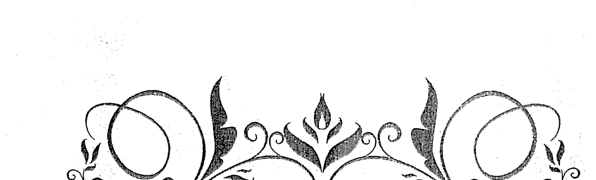

# 2 就算罹患發展障礙症，依然能在社會上發光發熱！

## 安須直子小姐的例子

- 前：工作遇到瓶頸，人際關係也不順遂！
- 後：出版書籍，工作與朋友大增。

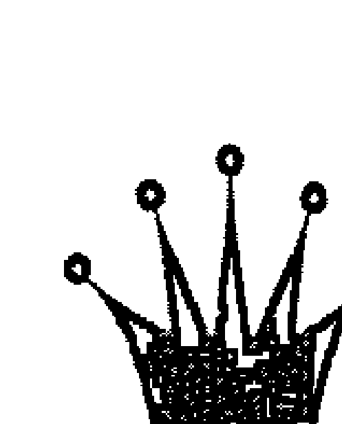

## 閱讀「寶地圖」一書短短幾個小時，思考就變得積極

我真正接觸「寶地圖」，是在2010年的年底。

我突然看見之前在偶然機會下拿到，卻一直被我擱在家中書架上的一本「寶地圖」小冊子。

「改天搭飛機的時候，可以用來打發時間。」

我心裡這麼想著，便將它放進包包中，並在飛機上重複翻閱了好幾遍。

我因自小罹患發展障礙症，所以一直被「不知如何整理」、「人際關係不順遂」等問題，所深深困擾著。不僅如此，當時的我，工作也剛好遇到瓶頸。

不清楚自己該做什麼好，也沒有具體的夢想。每天只知道窮忙，壓力大到喘不過氣，甚至覺得，「這份工作應該做不久了。」

不過，這本小冊子，卻用繪本般有趣的敘事方法，教大家如何勾勒偉大

裡面介紹了許多美夢成真的人，他們看起來是如此地幸福，還同時幫其他尚未獲得幸福的人祈福。看著這些人，讓我不禁興起強烈的慾望，希望「自己也能成為這個幸福圈中的一份子」。

於是，不可思議的事情發生了。
在我反覆閱讀這本小冊子的幾個小時內，原本我那顆極度消極的心，突然產生了劇烈的變化，變得無比積極。

2011年的我，不僅在海外迎接嶄新的一年，回國後還以開朗的心投入工作崗位，新的一年才開始，就讓我見證了無數的奇蹟。

本來不斷被人「打槍」的出版企劃書，突然受到出版社的青睞，不到一個月就決定出版我的著作。而且整件事的進展非常地迅速，出版社甚至要求我4月新書就要上架，所以我便立刻開始動手寫作。
事情如火如荼地進展中，3月11日卻突然發生了日本東北大地震。
我居住的橫濱地區雖然沒出現太大的災情，不過工作與私生活都受到不小 的影響。令人無法置信的是，我的生活就像是發生了一場「大地震」般，工作與人際關係都同時發生許多大問題，不習慣寫作的我被搞得昏頭轉向，真可用心力交瘁來形容。

就在這時，一位擔任寶地圖領航員的朋友，在臉書上不斷地鼓勵我。還透過欣賞祈禱日本能從大地震中重建復興的「寶地圖影片」，讓我重新調整自己的心態，也順利完成了書籍的創作。

書寫完後，這位朋友邀我去參加「寶地圖」研討會，還跟我保證「參加後絕對會有好事發生」。

令人吃驚的是，在我開始動手製作自己的「寶地圖」後，沒想到我的夢想就像我在「寶地圖」中所寫的內容般，一個接一個被實現。

雖然該書不過是我的處女作，不過新書才剛上架，就被平擺在書店最顯眼的地方，上架不到一個月，還追加印刷了好幾版，許多媒體也紛紛邀請我去上節目或辦演講。最後，甚至還幸運地跟自己崇拜的作家及知名的企業人士等人一起工作。

我很喜歡旅行，所以也將它放進「寶地圖」中，因為這個緣故，我獲得一個必須走遍全日本的工作。「寶地圖」讓我心裡渴望達成的事情，一個接一個被實現。

這個工作可能無法再繼續做下去了。

我才一有這樣的絕望感，生活便奇蹟式地得到改善。

最重要的是，透過「寶地圖」，我在全日本結交到好多新朋友，跟大家相互分享每天的喜悅。

我由衷地感謝，自己幸運地打進了「幸福圈」。

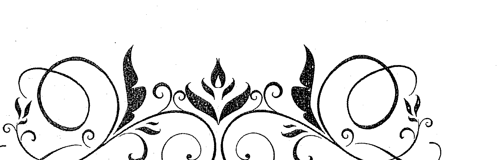

# 3 「寶地圖」讓我遇見理想伴侶！

## 石橋和泉小姐的例子

> **前**: 年過 30 歲還一個人獨居。交不到男朋友，放棄結婚的打算。
> **後**: 找到理想伴侶，並走入禮堂，每天過著幸福的日子。

## 為了一個人獨自活到老，原本決定開始存錢

我用「寶地圖」，得到我想要的理想男性。過了30歲以後，我便放棄結婚的打算，決定從今以後要一個人獨自活下去，於是，我告訴自己「一定要存錢」。話雖如此，存錢對於一個人獨居的我來說，卻是一件艱難的任務，不知怎地，我就是存不了錢。因此，2007年5月起，我便開始參加經濟或投資方面的研討會，讓自己「在金錢上能獨立」，慢慢地，生活上也開始多了點額外的收入。 在這個經濟研討會的介紹下，我接觸到了「寶地圖」。有偏財運女神之稱的我，在學生時代就經常中各式各樣，大小不同的獎，所以得知「寶地圖」後，真的讓我超級興奮。因為我知道，它不僅能讓我得到想要的東西，甚至還可以幫我順利達成夢想。所以，哪怕我曾一度想要放棄結婚，但遇見「寶地圖」後，我內心深處的願望再度被喚醒，我知道自己還是希望能夠結婚的……

於是，該年的7月，我決定去參加寶地圖研討會。
想要找到適合自己的伴侶，首先就必須明白自己要的是怎樣的伴侶，我
在寶地圖上，試著寫下以前想都沒想過，「自己的理想伴侶所應具備的條件」。
先把己本身的狀況擺一邊（笑），我林林總總地列出了「溫和敦厚的人」、「值得信賴的人」、「會說英語的人」、「擁有很棒笑容的人」、「擁有每個人都認同特殊技能的人」……等26個條件。
製作「寶地圖」時，重要的是期限，所以我在訂理想伴侶的條件時，也訂下了結婚的期限。雖然當時沒有交往的對象，我還是決定「2年後結婚」，於是我也在寶地圖中寫上，跟理想伴侶「在2009年10月前結婚！恭喜恭喜！」等字。還在旁邊貼上我從結婚雜誌中所剪下，新娘幸福拋擲捧花的照片。
每當我心裡一有未來「或許要孤獨終老一生」的不安時，只要稍微觀賞一下「寶地圖」，心情就會變得雀躍興奮，還會鼓勵自己：「說不定我心中理想伴侶真的會出現……。」

我一直以為這個素未謀面的白馬王子，應該離我很遙遠，沒想到卻出乎意料的近。製作完「寶地圖」後，一位我在經濟研討會上認識的朋友，突然跟我說：「我知道有個男生非常適合妳」，還給了我他的名字。這個男生就是我現在的老公——石橋先生。其實，在製作「寶地圖」前兩個月的5月時，我就在同一個經濟研討會上認識他。正當我想著「聽你這麼一說，他還真的全符合我訂下的理想伴侶條件：……」時，石橋先生也跑來問我：「妳是不是還沒有交往的對象呢？」我便回答他說：「是的，現正招募中！」之後，我們便開始交往，1年後步入禮堂。令人吃驚的是，我老公完全符合我當初訂下的26個理想伴侶條件。其中更可怕的一個條件，是他必須是「擁有任何人都認同特殊技能的人」。而我老公剛好曾獲選過「日本劍玉※註社會人士組冠軍」，可說是名符其實的劍玉達人。我們在2009年1月登記結婚，並如願在「寶地圖」上所示的10月前舉辦完結婚典禮。據說，老公也在自己的「寶地圖」中，寫下許多對未來理想伴侶的條件，而我剛好也全符合那些條件。因此，我們即使在婚後，依然非常地恩愛，還經常出去約會。

事實上，婚後我們平常還是會一起出去吃午餐，也經常到國外旅遊，我們總是出雙入對，維持彼此理想中的生活。每次跟老公在一起時，我都覺得好滿足，感覺兩顆心真的連在一起，能遇到跟自己這麼合的人，真的太幸福了。

> 「寶地圖」的效果實在很驚人！「寶地圖」，謝謝你！
> ※譯者註：「劍玉」，又稱「劍球」或「日月球」，是日本傳統民間童玩。劍為十字木頭的部份，玉為球體，玩法是以劍刺拋出的球。

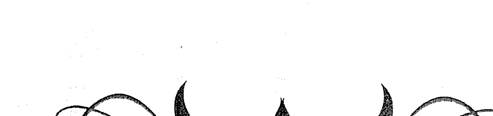

# 4 書籍如願出版，紀念講座也超成功

## 是久昌信先生的例子

| 前 | 後 |
| :--- | :--- |
| 經商失敗。 40 歲時嚐到人生陷入谷底的滋味。 | 認識自己崇拜的心靈教練，還完成出版書籍的夢想。 |

## 雖曾有過夢想，但從來不曾想過「認真去實現」

接觸「寶地圖」前，我的人生充滿一連串的挫折。30歲時，我放棄舊有夢想，投入全新事業，不過這個事業後來在40歲時宣告失敗，讓我嚐到人生跌入谷底的滋味。為了讓自己站起來，擺脫眼前種種困境，我參加了無數的研討會，努力學習成功的要訣。此時，我在其中某個研討會上，認識了望月俊孝先生。這大約是5年前的事。

我在那個研討會上，學會了「寶地圖」的製作方法，於是便在第一時間開始動手製作寶地圖。老實說，一開始時，我也是半信半疑，抱持著遊戲的心態在製作。

不過，製作過程中，我卻注意到一件重要的事。那便是「自己的夢想」。我突然鬆了一口氣。我發現，原來過去的我，雖然一直認為「自己有個夢想」，但我卻未曾「真想要實現過它」。過去我

在研討會等各種活動中，思考自己的夢想和目標，以為自己已經努力去達成，不過，「我的夢想並沒有因此變明確，所以自然不能一無反顧展開行動」。

我明白，這就是夢想老是無法實現的原因。

一邊想著這些事，一邊隨意地將自己夢想的照片貼到「寶地圖」上。完成的瞬間，我清清楚楚地看到自己的夢想就被貼在眼前的軟木塞板上，而且這個貼的動作，還會讓人更加興奮雀躍，感覺好像夢想全都已經實現了般的喜悅。

我的心又重新活了過來，對夢想的熱情也重新被點燃，隔天我便將自己製作好的「寶地圖」拿給大家看，並開始跟大家談論我的夢想。

之後，我貼在寶地圖上的夢想，如：參加馬拉松大賽或取得大型水上摩托車證照等，通通都實現了，讓我不不得不佩服「寶地圖」的威力。

後來，它甚至幫我實現了「與世界第一教練之稱的安東尼·羅賓斯（Anthony Robbins）見上一面」的大夢想。過去的我，從不認為這些願望真

有可能被實現，充其量不過是在腦中做做白日夢罷了。

為什麼我會這麼說呢？因為一旦想到時間、金錢、當時的工作狀況等現實層面的問題，我就會不由自主地覺得『現在想要實現這些夢想，或許有點困難』。

不過，接觸『寶地圖』後，我不再專注於意識的分析，而懂得運用『寶地圖』來激發自己的潛意識，讓自己的行動變得更積極。

所有被實現的夢想中，讓我最為開心的便是『書的出版』。我雖然將書的出版當成一個夢想，貼到軟木塞板上，但當時的我，壓根兒不知道未來會發生什麼事。儘管如此，這個夢想還是成真了。夢想實現時，真的讓我感動不已，覺得實在太戲劇化了。

我在安東尼・羅賓斯於國外所舉行的研討會中，再次見到望月俊孝先生時，便有了一個共同的目標，那就是『讓日本重獲朝氣』。而且，在我回國並將相關資訊發表在部落格上後，我撰寫的《熱情：》一書，終於與世人見面。當我在東京舉行該出的出版紀念講座時，讓我更進一步地感受到『寶地

## 圖」的奇蹟

5年前我在軟木塞板的左上角，貼上我站在舞台上為上百人演講的合成照。4年後，也就是2010年時所舉辦的出版紀念講座，整個場面幾乎跟當初的合成照一模一樣。看著別人幫我在會場中所拍的照片，我驚訝到起雞皮疙瘩，心中驚呼，這不就是所謂的「願望實現化」嗎？

有了這個經驗後，我告訴自己，未來也要一步步地讓每個夢想都實現。

而且，我希望有越來越多的人，能透過「寶地圖」而得到興奮雀躍的人生，讓大家都過得更精采。我特別想告訴跟我同一世代的人，請大家「重新審視自己的夢想」。希望大人們都能成為幫助孩童實現夢想的夢想製造者，讓孩童們都能夢想有個光明的未來。

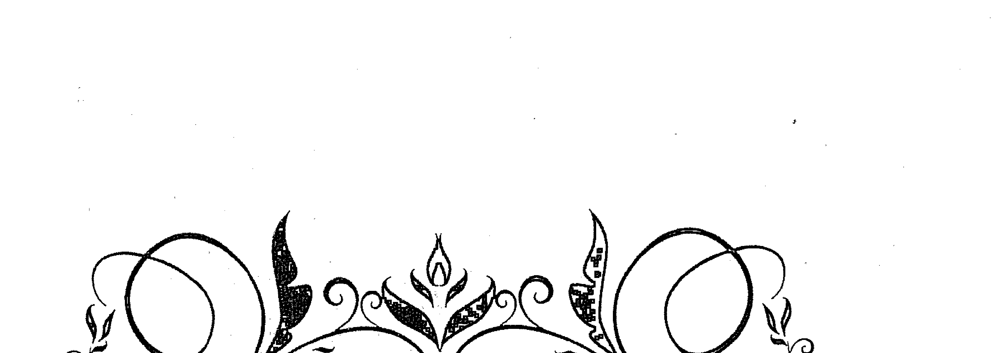

# 5 觀看「寶地圖」讓我信心大增，在世界草裙舞大賽中得到優勝！

## 神村佳宏先生的例子

> 之前第一次出場時鍛羽而歸，讓我嚐到悔恨的滋味。
> 「寶地圖」的照片與「優勝！」讓我信心大增。

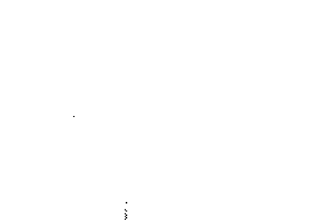

## 在寶地圖的幫助下，出場比賽前就確信自己會得到優勝

2010年夏威夷舉辦世界草裙舞大賽，我所屬的「Halau Hula o La`「ヘラウフラフラカヲカヲ」沖繩草裙舞教室也組隊參加了這個比賽。

事實上，這並不是我們舞蹈教室第一次參賽，早在前年我們就曾經出賽過，只不過當時什麼獎也沒拿到，就鎩羽而歸。

想要提升草裙舞的技巧，除了加強練習別無他法。所以，我們從比賽前3個月起，幾乎每天都持續進行魔鬼式的訓練。除了這些肉體上的練習外，我們在精神面上也做了加強。

那便是「寶地圖」。

我將自己由雜誌上剪下，優勝隊伍進行舞蹈表演時的照片，貼到「寶地圖」上，並在裡面寫上「夏威夷世界大賽優勝！」等字。之後，還將該寶地圖貼到醒目之處，每天持續去看它。不知從哪來的自信，我一直覺得「這次的世界大賽我們一定會得到優勝」，而且這個感覺還一直持續到比賽當天。成果發表的時候到了，「優勝隊伍是：來自沖繩浦添的Halau Hula o La'ulea!」我們這一隊，在古典舞蹈與現代舞蹈兩項均獲得優勝。得獎的瞬間，我高興到腦袋一片空白，內心深處不斷響起「中了中了中了……」等字眼。事實上，早在出發到夏威夷前，我就持續有一種不可思議的感覺，沒來由地充滿自信。而這個看不見又摸不著的感覺，居然真的成真了，難怪我會如此震驚。我認為這就是「寶地圖」送給我的「一份大禮」。

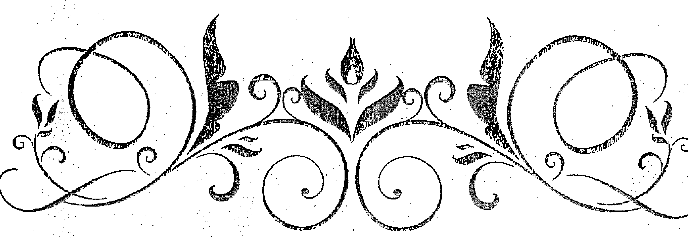

# 6 能為孩童們帶來希望與夢想的絕佳工具

## 鮫島秀已先生的例子

| 前 | 後 |
| :--- | :--- |
| 製作實地圖，讓夢想變得更廣闊，與朋友相處也更融洽。 | 獻給災區孩童們，傳送夢想與希望的「實地圖影片」。 |

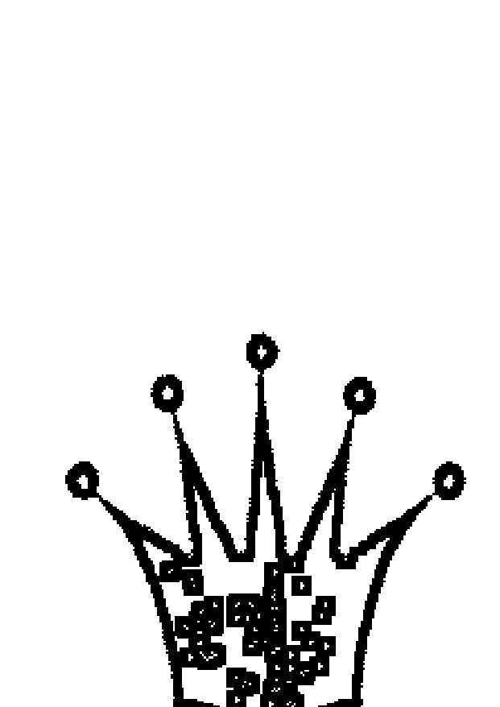

## 教導孩童們製作寶地圖的樂趣與效果

我負責的大阪府和泉市綠之丘小學的5年級，自2010年起便開始推廣「11歲的Hello Work」，在綜合學習中，投入職業教育。於是，我決定讓大家製作「寶地圖」，作為這1年來學習成果的總整理。我請大家從「自己將來的夢」、「到目前為止最珍貴的回憶」、「想要去的地方」等主題中，挑出一個主題，製作獨一無二專屬於自己的「寶地圖」，並於該學年結束前教學參觀日上發表。

這些5年級的同學們全都懷抱希望與夢想，為參觀日畫下完美的句點。對孩童們來說，「寶地圖」是能擴展夢想與想法，促進朋友間的交流，深受大家喜愛的工具。

之後，發生了日本東北大地震。

身為小學老師的我，為了向孩童們傳遞希望，於是製作了一部名為「你們並不孤單」的「寶地圖影片」

這部影片一上傳到YouTube就獲得廣大的迴響，1個月內點閱率高達78萬一八七九人次，大多數的人看了都深深地被打動，一傳十十傳百之下，才造就了這樣的高人氣。

對我而言，「寶地圖」與「寶地圖影片」不只能用來實現自己的夢想，它也是為孩童們帶來希望與夢想的絕佳工具，所以今後不管是在學校的教育上，或我個人的生活上，都絕對少不了它。我真的非常感謝「寶地圖」。

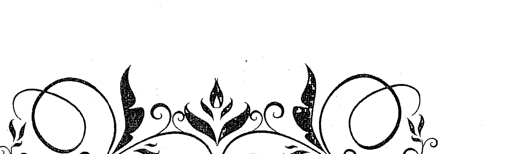

# 7 為將國產棒球手套推廣給世人，以「寶地圖」進行人才啟蒙與宣傳活動

## 梅原伸宏先生的例子

> 想要推廣國產棒球手套。
> 不過究竟該怎麼做才好呢？
> 只要用「寶地圖」來描繪夢想，你就會發現光是這個動作與過程就能讓夢想實現。

## 依照書內敘述來製作「寶地圖」，提高了願望實現的效果

2003年，我訂下幾個足以改變自己整個人生的大目標。

- ①讓大家知道國產棒球手套產業瀕臨消滅，藉以招募協力廠商或資金。
- ②保護棒球手套的師傅與材料供應商。
- ③國產棒球手套製造技術的啟蒙，並希望能培育後繼者。

為了達成這些目標，我想了不少方法，如：將實情登載到報紙上、上電視節目或寫書呼籲等，不過卻不是很清楚究竟該怎麼做比較好。

就在這個時候，我接觸到望月先生所寫的《圖解 真的有！世上最簡單就能實現夢想的寶地圖》（図解 本当にあった！世界一簡単に夢を実現する宝地図）。只要一有時間，我就會帶著這本書跑到咖啡廳去閱讀，同時將想到的戰略寫到紙上，讓自己衝勁十足的回到公司，還會將照片貼到軟木塞板上。這麼做的結果，2006年5月起，專門報導棒球的雜誌決定連載我的文章。2007年8月，我甚至還決定開始撰寫日本第一本棒球手套有關

的書籍《棒球手套聖經》（グローブ・バイブル）（棒球雜誌出版社）。 2010年為了表達感謝，同時報告我的心得，於是我參加了望月先生 的研討會。沒想到效果更棒，不僅跟女兒一起完成的棒球手套繪本，第二本 棒球手套的書都確定出版，甚至還跟望月先生共同出版了一本合著。 東北大地震發生後，我們透過 G-LOVE 這個以「讓世界上每位孩童都 能擁有快樂回憶」為目的的活動，向全國教師呼籲，希望大家能踴躍捐獻棒 球相關的二手物品，最後我們募集到棒球手套一五〇〇個、中古的球棒一〇 〇支、棒球三〇〇打，交給災區的孩童們。 希望未來能提供更多有用的資訊，來造福更多的人。

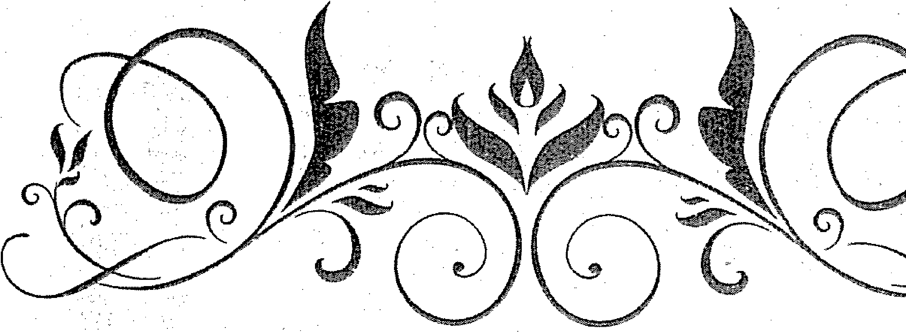

# 8 由鶩腳業務員，變身年營業額 7 億日圓的大公司老闆

## 內田達雄先生的例子

| 前 | 後 |
| :--- | :--- |
| 沒有存款，就算努力推銷，還是每天吃閉門羹。 | 快速成為頂尖業務員，創業也很成功。 |

## 渴望已久的進口車以及全家出國旅行等夢想，一個接著一個實現了！

幾年前一直從事餐飲業的我，某天突然心念一轉，決定投入銷售保險的世界。雖然我沒日沒夜、連假日都努力外出推銷，卻還是持續吃閉門羹，業績絲毫不見起色。眼看著存款所剩無幾，連孩子們的學費健保都快繳不出來了。某天，我在逛二手書店時，突然看見一本書，讓我的人生產生180度轉變。那便是《圖解 真的有！世上最簡單就能實現夢想的寶地圖》（圖解 本当にあった！世界に簡単に夢を実現する宝地図）。

光是將這本書拿在手中隨意翻閱，就讓我變得情緒高昂。我當下決定購買這本書。回家後我反覆地閱讀，整本書被我翻到快解體了，後來我還實際用電腦做了一張「寶地圖」。我將做好的「寶地圖」列印出來夾在記事本中，每天都拿出來看。

這麼做的結果，我的臉上慢慢地恢復了笑容，客人不知不覺也增加了許多。

多，不消幾個月的時間，我就變成公司最頂尖的業務員了。渴望已久的進口車、全家出國旅行、專人量身訂做的西裝……等，之前我貼在「寶地圖」上的夢想，一個接著一個被實現。過了1年後，我就像脫胎換骨般，整個人充滿自信，全國的分公司紛紛邀請我去演講，網路雜誌、研討會、寫作等通通少不了我，驀然回首，我儼然已經是個成功者。之後，我又做了一張「寶地圖」。這張寶地圖，完成我一直以來想要獨立創業的夢想。我創立的這家公司快速成長，才創業3年，年營業額就突破7億日圓。現在身邊圍繞我的是最親愛的家人及最棒的朋友，我每天的生活都充滿愛與感謝。這一切全要歸功於「寶地圖」，正因為有它，我的人生才會產生這麼大的改變。今後，我還要繼續運用寶地圖來實現自己的夢想。

## 史帝夫·賈伯斯 不斷拿來問自己的「終極問題」

史帝夫·賈伯斯是蘋果電腦的創辦人，同時也是推出iPhone、iPad等暢銷商品的創意大師。

30年來，他每天一早起來一定會問自己一個問題，那就是——

「如果今天就是我人生中的最後一天，今天預定做的事，會是我真心想做的事嗎？」

如果持續好幾天，他的答案都是「NO」，他便會開始思考「是不是有必要做些改變」，並化為具體行動。

據說，當他面臨攸關人生或公司命運的重大抉擇時，都會先問自己這個問題，然後再下決定。就因如此，他才能對這個世界發揮如此巨大的影響力。

賈伯斯在到某間大學演講時，認識了一位女性。因接下來有其他的行程安排，所以他與這位女性互留聯絡方式後，便從會場離去。不過，出了校門後，他突然自問了起來。

> 「如果今天就是自己的最後一天……」

於是，他再度折返回會場，與這位女性談話。這位女性，後來成為賈伯斯的妻子。

如果今天是你人生中的最後一天，你會做什麼呢？

## 第6章 加入『爱地雅』的『编制工』的旅程片斷

# 動畫「寶地圖」與「音樂」

# 讓「寶地圖」效果倍增

# 讓「寶地圖」進化的「強力夢想實現工具」

自從「寶地圖」公開後，我便跟全國的「寶地圖領航員」（指公開指導大家製作實現夢想「寶地圖」的研討會講師）不斷地研究，「希望能發展並改良出效果更強、使用起來更簡便的寶地圖」。其中一項，就是我們從二○○七年夏天起，便將「寶地圖」做成「影片（幻燈片）」來加以活用。以實現夢想並獲得幸福的「成功工具」。透過在「寶地圖」中，加上「動畫、「寶地圖影片」，是將「照片」、「音樂」、「話語」等做成動畫，藉

與音樂『的動作，能讓夢想中的『真實事物』，滲透進入意識與潛意識中。每天持續觀賞『寶地圖影片』，就能讓你清楚勾勒出自己的夢想與理想中的幸福，讓一切『恍若正在發生般地真實』。

## 工具

『寶地圖影片』是由『寶地圖』進化而來，堪稱『史上最強的實現夢想工具』。

『寶地圖影片』除了具有不會褪色的優點外，透過『寶地圖』與『寶地圖影片』的併用，還能達到下列幾項效果：

## 效果1

如果你有『想要實現的夢想』，它就會不斷地提升你對該夢想的衝勁，幫助你快速提高自我認知（透過並用『寶地圖』與『寶地圖影片』，效果將更為強大）。

## 【效果2】

如果你「希望變得有自信」，它就能讓你肯定過去的自己，對自己充滿自信，並確信自己能夠擁有更美好的未來。

## 【效果3】

如果你渴望與家人、同事或伴侶「建構深厚的牽絆」，它會幫你將自己內心深處的愛與平常的感謝之情，確實地傳達給對方。

## 【效果4】

如果你想將它活用到事業上，它還能幫你「創造出更多支持你的人與狂熱的粉絲」。

## 【效果5】

如果你在某人結婚典禮、慶生會或○○紀念日等活動時，給他們來份驚喜，獻上這樣的影片當禮物，對方不曉得會有多開心。因為就算再高級的禮

物，也比不上它所帶給人的感動，絕對會成為對方畢生難忘的禮物。

只要大家能製作「寶地圖影片」，並養成反覆觀賞該影片的習慣，它就能有效提升你的幹勁，激發你的行動力，為你開啟無限的可能。

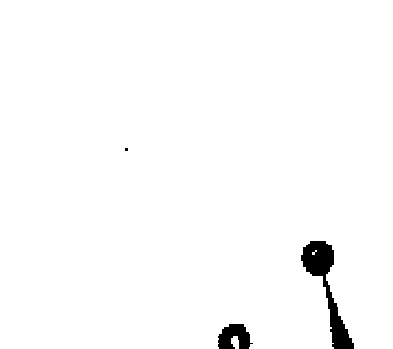

# 以「夢想影片」與「幸福影片」

# 創造精彩且充滿感動的人生

# 能將遠景植入潛意識的「夢想影片」

「寶地圖影片」，可以是製作者為了「實現夢想」，而將夢想的畫面予以影像化的「夢想影片」；也可以是製作者為了表達自己對「人生的感謝」或「讓自己感受到幸福」，集結「喚起歡樂氣氛的影像」或「自己珍視人事物的影像」所做成的「幸福影片」。當然，若有人想將「夢想」與「幸福」同時融入「寶地圖影片」中，也未曾不可。「夢想影片」會自然而然進入人的潛意識深層，幫你了解自己「究竟懷

方面又幫助你持之以恆去實踐夢想的工具。
另外，夢想影片也能幫你將「自己的夢」有效傳遞給周圍的人，讓「支持你實現夢想的人」自然而然都向你聚集過來。

## 「夢想影片的優點」

- 能將自己對未來的遠景植入潛意識。
- 能讓你朝夢想「開心而持續地展開行動」。
- 讓「支持你實現夢想的人」通通朝你聚集過來。
- 能為你創造「讓你跟某人關係變好」的機會。
- 能拿來做宣傳所負責商品的「活動用營業工具」。

# 提升感恩之心的「幸福影片」

社會上「令人心痛的事件」不勝枚舉，就算現在還沒發生，也不代表未來就不會遇到。我認為問題的根源在於「人與人之間缺乏愛與信賴」。

因此，找回那份失去已久的愛與信賴，強化家人間的聯繫，與多花時間去經營友誼，在當今社會就顯得格外重要。

如果大家都能將自己的家人、朋友或戀人等照片，製作成「幸福影片」，你就會知道此時此刻的你有多幸福，又被多少的人深愛著，讓你實實在在感受到幸福的滋味。

還有，我們除了可以「為自己」製作「寶地圖影片」外，也可以「為自己重視的人」製作。將做好的影片，於對方「生日」、「結婚典禮」或「結婚紀念日」時，當成賀禮送給他們，對方絕對會很開心，增加對方人生中幸福的感受。

## 【幸福影片的優點】

- 能讓人重新獲得「愛」與「信賴」。
- 能培養友情。
- 能讓你對周遭的人事物心存感謝，並懂得將感謝的心情傳遞給對方。

能讓你跟自己珍視的人分享「幸福」或「感動」。

這件事已經有很多人做過，做過的人也都表示「所有的人在收到禮物時，臉上所流露出的那份喜悅與感動，絕對不是收到任何其他昂貴禮物所能比擬的」。

還有，如果你將影片存進「具有動態攝影功能的手機」或「MP3中，就能輕鬆輕鬆將「影片帶著走」，不管人是在「廁所」、「床上」、「洗澡中」或「前往上班上學的電車上」，隨時隨地、無時無刻，都能將「寶地圖影片」播放出來欣賞。

就算身處擁擠不堪的電車中，你依然能夠在幾乎不打擾到周圍乘客的情況下，創造出對你而言無可取代的「幸福空間」或「培養鬥志的空間」。

# 現在立刻開始製作「簡易版・寶地圖影片」

只要用手機的「動態攝影功能」，拍下事先排列好的照片即可

那麼，廢話不多說，現在就立刻動手做看看「簡易版・寶地圖影片」

為了讓「手邊沒有電腦」或「突然要用電腦製作影片會手忙腳亂」的人，也能製作「寶地圖影片」，本章將先跟各位介紹如何運用「手機的動態攝影功能」，製作「簡易版的寶地圖影片」。

## 【步驟1】蒐集照片

準備「自己笑得燦爛無比的照片」（或跟自己重視的人一起拍的照片），以及「你想要得到的東西」或「你想變成怎樣的人」等能讓你聯想到夢想實現畫面的照片（5～10張左右）。

順道一提，已經製作過「寶地圖」的人，也要準備這些照片。

「寶地圖」中，有關「期限」或「條件」等難以用照片表現的項目，請以「文字」來補充。

製作「寶地圖影片」時，若想要讓「期限」或「條件」變得更明確，則可將「寫在便條上的話」貼到照片上，之後再將它攝影下來即可。

## 【步驟2】將照片依序排列

將照片依照「攝影的順序」排列。

首先是「自己的笑臉」，接著再將「想要得到的東西」，依想要得到的「時間先後順序」或「對物品的渴望程度」來排列。

## 【步驟3】以音樂做襯底，並同時攝影

播放「自己喜歡的音樂」或「能振奮心情的音樂」，並將音量稍微開大一點。

接著，開啟手機的動態攝影功能，依序對著排列在桌上的照片攝影（每張照片分別停留約3～5秒）。攝影時只要將手機慢慢靠近照片，就會像是將「伸縮鏡頭拉近」般，看起來會更像是動畫影片。

## 【步驟4】每天早晚各看一次

完成「簡易版・寶地圖影片」後，至少「每天早晚要各看一遍」。

早上看影片的效果特別好，只要花個1～2分鐘，就能瞬間讓你提高做事的衝勁，為美好的一天揭開序幕。許多人甚至跟我們反映，因為已經養成欣賞「寶地圖影片」的習慣，所以即使不刻意提醒自己，也會「不由自主想重複播放來看」。

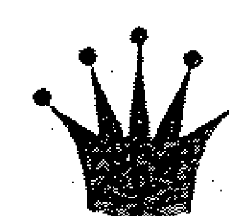

## 「簡易版・寶地圖影片」的製作方法與使用方法

| 步驟 | 具體操作 |
| :--- | :--- |
| 步驟 1 | 蒐集照片 |
| | - 自己笑得燦爛無比的照片 |
| | - 與夢想有關的照片（5～10張） |
| 步驟 2 | 依照攝影順序排列照片 |
| | - 自己的笑臉→想要得到的東西（或最想得到的東西） |
| 步驟 3 | 播放自己喜歡的音樂，攝影 |
| 步驟 4 | 早晚各看 1 次 |

# 訴諸「視覺」、「聽覺」、「身體感覺」創造故事

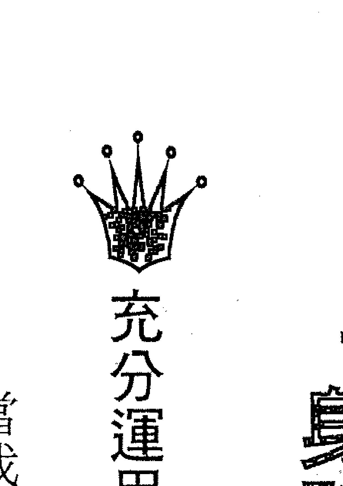

# 充分運用「VAK」效果的「寶地圖影片」

當我們想將想法傳遞給其他人時，最理想的是「能同時訴諸「①視覺（VISUAL）」、「②聽覺（AUDITORY）」、「身體的感覺（KINESTHETIC）」（③觸覺、④嗅覺、⑤味覺）」等五感的表達方式。 我們一般將這種「訴諸五感的表達方式」，分別取各英文文字的第一個字母，稱為「VAK模式」。 「NLP」（神經語言程式學）這門心理學，認為人可區分成「V：視覺優位的人」、「A：聽覺優位的人」與「K：身體感覺優位的人」等三種。

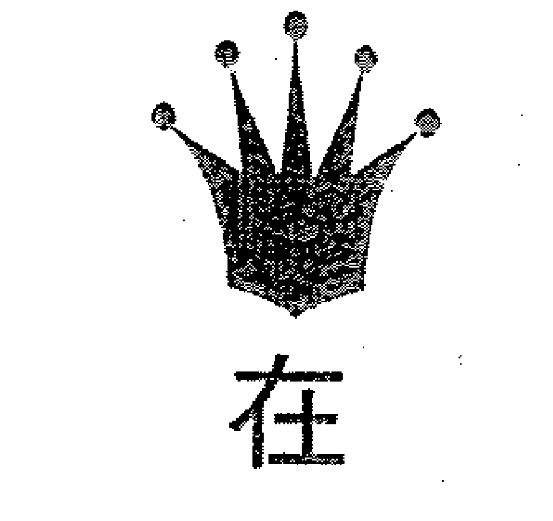

每個人都有自己較為「擅長的感覺」，因此，若有一個工具能同時打動這「三種感覺」，不管擅長哪一種感覺的人使用，都會「覺得很有真實感」。

## 在「蒙太奇理論」的作用下，創造出完整的故事

我個人建議，「寶地圖影片」只要短短的2分鐘左右就好了。因為影片的長短不是重點，能夠一而再再而三地反覆觀賞，才比較重要。「寶地圖影片」的片長雖短，卻能確實保留故事的完整性。為何我會這麼說呢？因為「寶地圖影片」中，隱含了電影界經常會用到的「蒙太奇理論」（Montage）。

## 所謂「蒙太奇理論」，是指「結合多個畫面或分割鏡頭，來呈現一個連續意義」的理論。

這個理論深奧之處，在於透過多個畫面的排列組合，就能將「無法單憑

畫面完整表達的內容，以故事的方式傳遞給對方。

例如，假設這裡有張「年約30歲男性開心笑著的照片」。如果我們將這張照片，以下列順序排列：

- 「包裝精美禮物的照片」
- 「映著孩子們笑臉的照片」
- 「年約30歲男性開心笑著的照片」

大多數人看了，一定會自然而然在腦中串聯出一個故事，認為這是張「幸福洋溢的父親的照片」，看著看著，心情也會不自覺地跟著愉悅起來。另一方面，若我們將這張照片，搭配其他照片排列：

- 「救護車的照片」

像這樣，「光是將幾張照片擺在一起」，我們的頭腦就會自動去找出「中間的關聯性」，並自然而然串聯出一個故事。

由「你最近或過去笑得很幸福的照片」開始，中間放入「曾經實現過且與現在的夢想有關聯的照片」或「未來即將實現美夢或目標的照片」，最後再以「你看起來最幸福的一張照片」做總結，相信你看了之後，腦中一定會浮現出一個「夢想實現時的幸福故事」。

我們一定會認為這是張「年紀輕輕就過世男性的照片」，因而跟著悲傷了起來。

- 「身穿喪服者的照片」
←
- 「年約30歲男性開心笑著的照片」
←
> 「寶地圖影片」中也活用了「蒙太奇理論」。

# 將腦中的「負面資訊」改寫成「正面資訊」

# 曾經進入腦中的資訊，都會被記憶在「潛意識」中

我們平常都會被「大量的資訊與影像」所影響。而且，絕大多數進入我們腦中的資訊，都會在毫無意識下被記憶到「潛意識」中。我們受到這些資訊或影像所影響，同時左右人生與判斷。

每次看到身邊一些「電視廣告」，就會像是在催促消費般，「要我們不斷去注意某些商品與服務」；而觀看新聞報導，又盡是些事故、不景氣或戰爭等訊息，搞得人心惶惶，讓我們無形中增加了許多不安與恐懼的情緒，而且這些情緒還會原原本本被記憶下來。

在時間與精力都有限的情況下，明確知道「自己要將時間精力，投注在

什麼事情上」、「自己的目標是什麼」或「你想朝哪一個方向前進」就顯得很重要，你也必須懂得「篩選資訊」。一般而言，報紙或電視等媒體上所揭載的資訊，有八成以上都是事件、事故或對政治的不信任等「負面資訊」。因此，面對這「80％負面資訊」的侵襲，我們必須用能同時打動「視覺」、「聽覺」、「身體感覺」的「寶地圖影片」來對抗，同時在自己的腦中灌入「理想中快樂的未來」。負面的事物一直被放在腦子裡不管，久而久之便會被植入潛意識中。不過，在觀賞「寶地圖影片」時，人就會立即切換腦中的想法，將注意力集中在夢想或目標上。然後，夢想的實現便會被嵌入潛意識。能夠實現夢想的人，總會一而再、再而三地改寫自己的潛意識。

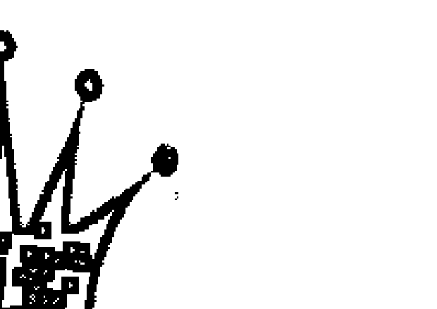

# 選擇能讓你聯想到「夢想」與「幸福」的照片及語言

# 保持「心情愉快」地製作寶地圖影片

在這一節中，我們將重點式地介紹，如何運用電腦來製作「寶地圖影片」。
「寶地圖影片」，在製作方法上並沒有太多的規定或限制，你想挑選什麼照片、音樂、軟體，或要怎麼編輯，甚至是拿它來做什麼都沒關係，只要你覺得這麼做比較「開心愉快」就行了，作法基本上是很自由的。
如果你製作「寶地圖影片」的目的是為了「得到幸福」，製作影片時，只要把握一個原則，就是每當你看到這個影片，它都能讓你聯想到原先的目

的就行了。如果你的目標是「想要成為心想事成的人」，影片也只要能讓你想到這件事就好。

不過，就像「寶地圖」的基本方法，貼上「笑得燦爛無比的照片」及附有「條件」、「期限」等，效果會比較好，「寶地圖影片」也有一些「製作上的小訣竅」，可幫助你「加速實現夢想」。

一開始製作「寶地圖影片」時，建議先從「基本型」做起。

## 【基本型】

## ①挑選「照片」

只要先挑選「10張」照片即可。其中1張是「自己笑臉洋溢的照片」，其他則是從下列的主題中選出：

- 工作
- 想得到的東西
- 想去的地方
- 崇拜的人

## ② 話語搭配

製作「寶地圖影片」時，將「話語與照片」以「1：2 的比例」來配置與播放，比例看起來最棒。

- 「人際關係、好友」
- 「家人」
- 「健康、美容」
- 「金錢」
- 「興趣」

挑出 9 張能讓你聯想到「自己的夢想」、「對家人、朋友、戀人等的感謝」或讓你回想起「過去的幸福時光」的照片。

強烈建議大家，一定要將「能讓你回想起到目前為止最幸福時刻的照片」放進去（上述主題僅供參考，蒐集來的照片不一定要涵蓋所有的主題，就算蒐集到的照片，只合乎部分主題也無妨）。

基本上，就是先將「照片說明」放在前面，之後再秀出「表達內容的照片」。穿插在照片之間的話語，則是挑選——

- 「夢想接二連三被實現」
- 「2013年5月成為讓大家齊聚一堂的咖啡店老闆」
- 「2015年入住海濱別墅」
- 「受到好友圍繞的精采人生」

「自己的夢想全都實現了」、「感謝自己周圍圍繞著幸福的人」、「肯定自己的過去」及「為自己加油打氣」等話語。就算夢想尚未實現，也請把它視為「已經完成」，而以「所有的夢想與幸福已經全都完成了」的「現在完成式」方式來呈現。

### 話語

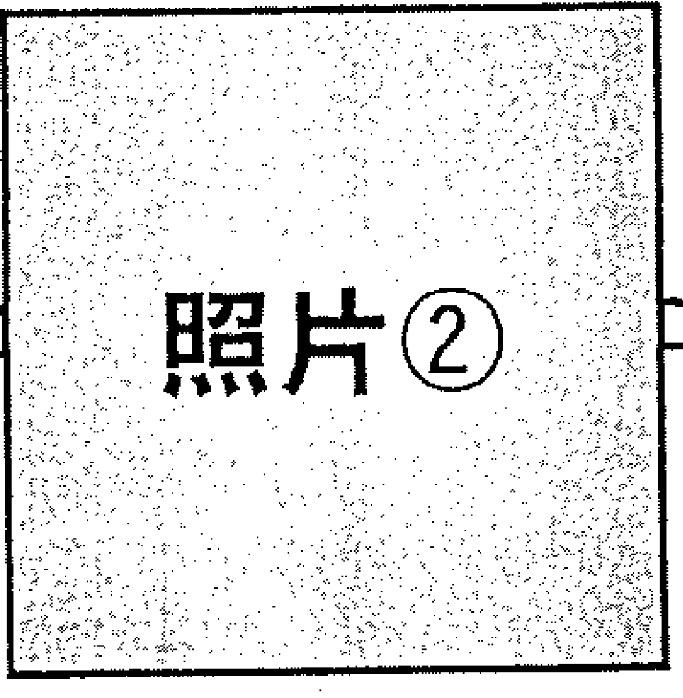

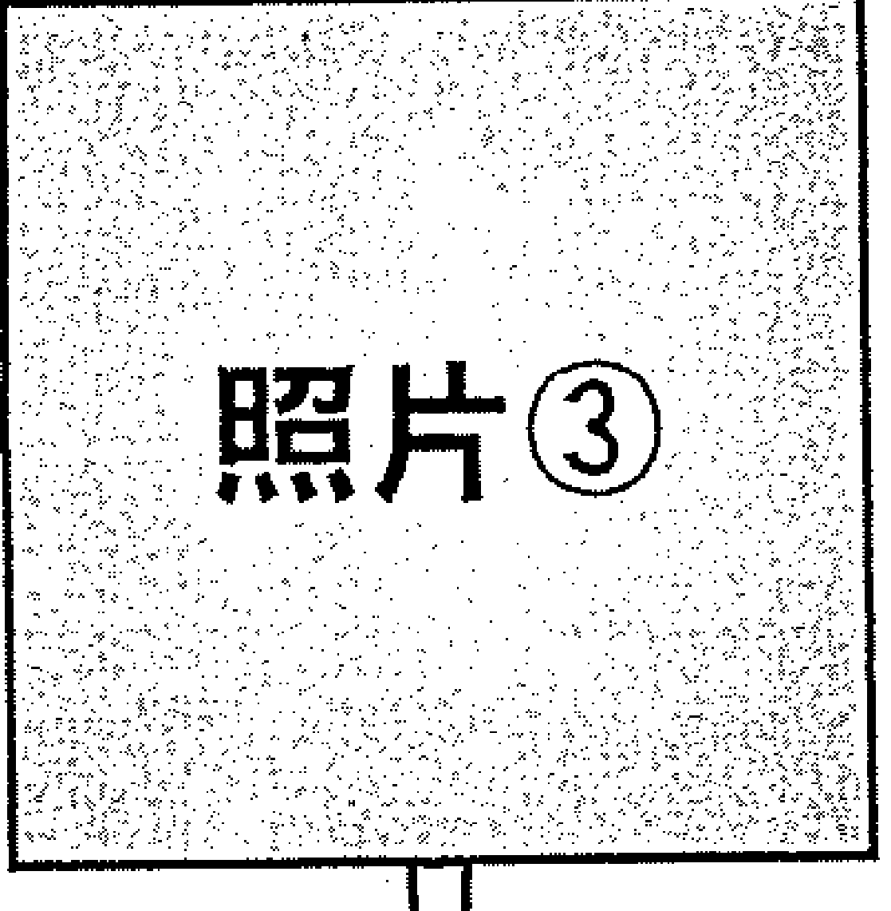

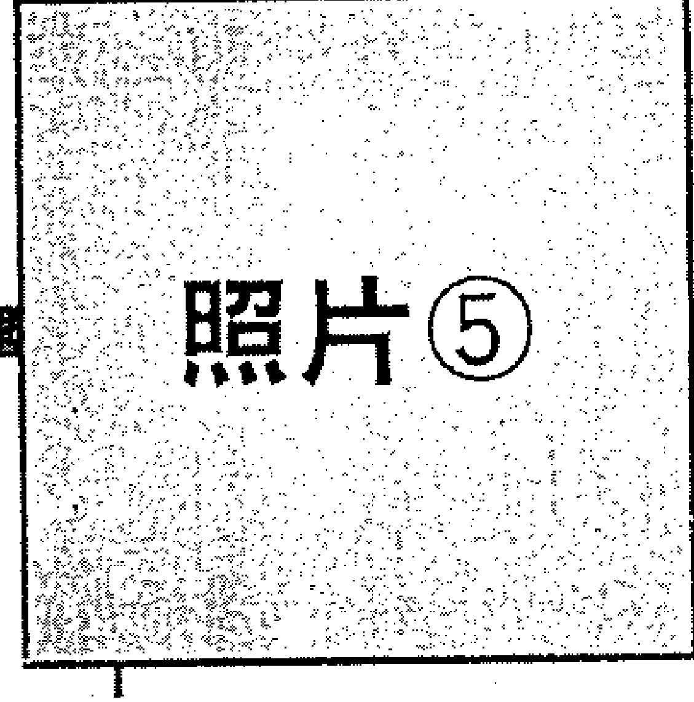

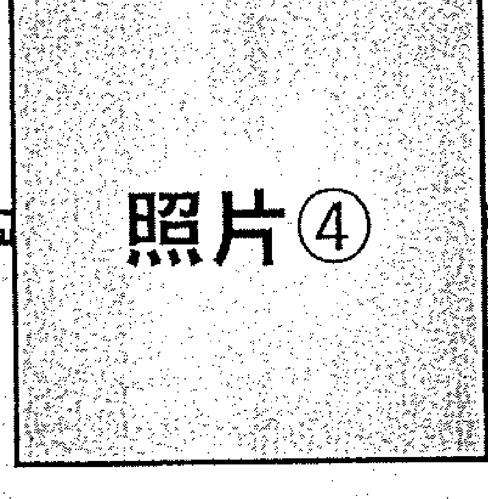

### 話語

「照片」比「話語」為
2 : 1

## 「寶地圖影片」的基本型

話語

笑得無比
燦爛的照片

照片①

- 「夢想已經實現」的話語
- 「感謝」的話語

- 由 9 個主題中挑出 9 張照片

照片⑦

照片⑥

話語

話語

照片⑧

照片⑨

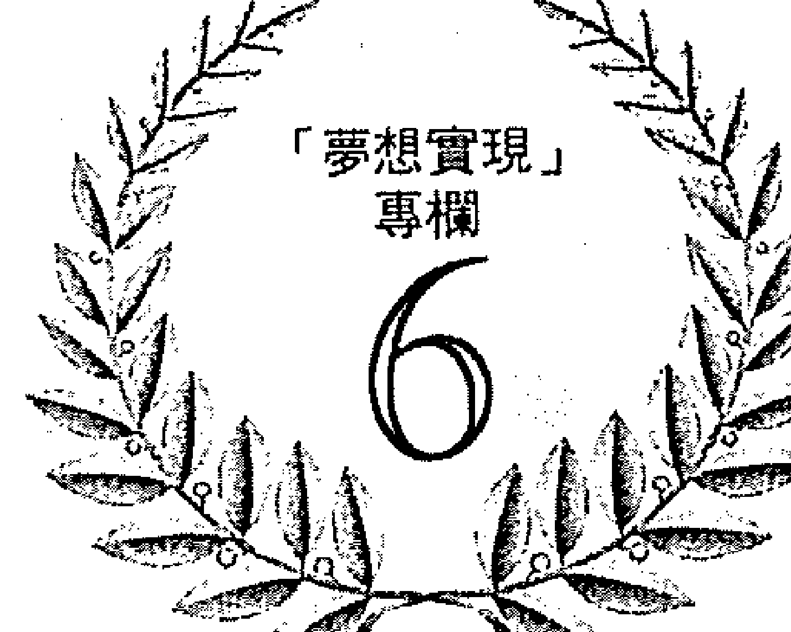

# 「生活缺乏目標者，『彈珠台遊戲般的人生』」

你是否玩過彈珠台遊戲呢？這是一個將彈珠瞄準目標後彈出，比賽誰的得分比較多的遊戲。

彈出的彈珠在遊戲機中彈來彈去，忙得不可開交，碰到障礙物後還會到處亂跑，最後還掉入洞中。
仔細想想，這不正是人生缺乏目的或想法的寫照嗎？

人一旦缺乏目的或想法，便會被各式各樣的誘惑所擺弄，一不小心就忘記什麼才是真正重要的事。

打開電視，就算沒有有趣的節目，依然無邊無際的轉下去；眼前有美味的食物，哪怕肚子一點也不餓，也會不由自主地拿來吃；看到櫥窗中所展示的美麗衣如此一來，時間與金錢都被消耗殆盡，回過神來，才發現自己已經沒有多餘的精力與體力，去做自己真正想做的事或真正重要的事了。

相反地，人一旦有特定的夢想或目標，行動就會變得有意義，讓自己離目標或夢想越來越近。

人活著只要有明確的目標或想法，就能輕而易舉從許許多多的情報中，挑出自己真正需要的資訊。同時，和自己志同道合的朋友也會增加。如此一來，便會一步步加快夢想或目標的實現。

你的周圍事實上存在著無數的機會。想要掌握機會，第一步就是要學著辨認自己想要的是什麼，什麼又是自己最重視的價值觀。

# 第2章 需求分析與設計

## Q1

寫在「寶地圖」上的事物，究竟有多少比例能夠實現呢？

> 只要掌握訣竅，實現九成都不是夢想

當然，這跟你到底有多認真想實現夢想有關，不過就我個人來說，大概是八成左右。以我個人的經驗來說，如果再加上一些比預期再稍微遲延實現的夢想，實現機率「幾乎是一〇〇％」。能有這樣的成果絕對不是我比較特別，從長遠的眼光來看，任何人都能實現約八成左右的夢想。想要提高夢想實現的比例到九成，則需要用點小技巧。那便是，找出自己的變化，哪怕是再小的變化都無妨，找到之後再狠狠地讚美自己，並犒賞自己。

我在詢問一些透過「寶地圖」獲得成果的人後，發現絕大多數的人，都經常讚美自己的成功。即便是再小的事，都會讓人很有成就感，維持做事的熱情與幹勁。所以只要你懂得讚美自己，你就會越來越有自信，夢想實現的機率自然也會提高。

## Q2

希望變得更幸運、更有自信。

製作「寶地圖」真能讓我實現夢想嗎？

## A

# 製作「召喚自信與運氣的寶地圖」吧！

我相信一定有些人，就算做了寶地圖，還是沒有自信會實現夢想，或認為自己不可能那麼走運。對於這樣的人，我建議製作「召喚自信與運氣的寶地圖」吧！

第一步，請先寫出下列三項。

- 過去成功的事蹟、業績提升的事例
- 過去開心的事、讓你感到幸福的事
- 很走運的事、讓你引以為傲的事

只要想到任何與上述三項有關的事情，就通通記下來，並寫進「寶地圖」中，如果還能附上相關照片那更好。

寫下的事情，不一定非得要多大的成功或幸福，就算是微不足道的小事也無妨。因為即使再小的喜悅，只要你能經常去看「寶地圖」，自然會產生自信，好運也會降臨到你身上。

## Q3

「寶地圖」中是否一定要加上夢想實現的期限？

# 附上期限，才容易實現夢想

沒有交件日期的工作，永遠都做不完；相反地，時間緊迫的急件，則絕對能夠完成。

訂下期限，便會啟動「真正要展開行動的開關」，讓夢想更容易實現，所以請儘量寫上期限。我知道有人不寫期限，是會因為擔心期限到了，夢想卻尚未實現，壓力會很大。不過我要說的是，就算期限到了，夢想卻尚未實現，大家也不用太過悲觀。

到時候，你只要回過頭來問自己「我真的想要實現這個夢想嗎？」再重新修正期限，迎接下一次的挑戰就好了。

不過，如果你的願望是「我希望保持現有的一切」或「為了……這一生我都要拚了」等不需要訂立期限的狀況或事情，就不用特別去訂期限。

## Q4

即使「寶地圖」上寫的是自己的夢想，每天看難道不會厭煩嗎？

# 隨時更新「寶地圖」的同時，也要多傾聽自己內心的聲音

如果你的「寶地圖」已經讓你覺得了無新意或產生停滯感時，請記得更新「寶地圖」。稍微改變一下照片的擺放位置、修正一下裡面的文字，或追加新的照片或話語等，都會賦予「寶地圖」新生命，讓它重新甦醒過來。更新「寶地圖」能改變你的心情，讓你有新的動力，朝夢想展開行動。當你朝著夢想展開行動，一步步接近自己的目標時，無論看多少次「寶地圖」，照理說都不應該會讓你生厭。因為你的狀況時時在改變，就算「寶地圖」一直不變，看了應該還是會讓人振奮。如果一張「寶地圖」讓你覺得...

看得很厭倦，有可能是你採取的行動不適切，或你現在實現的夢想，跟你的價值觀不搭的緣故。

因此厭倦的感覺，或許是提醒你最好再次確認自己的夢想或目標的徵兆。此時，建議重新傾聽「內心的聲音」。

## Q5

真的很不好意思。讓家人看到我做的「寶地圖」。到底該怎麼辦才好呢？

## A

# 做成「迷你寶地圖」，再自己偷偷欣賞

有人表示「夢想或目標是很私密的事，就算是家人也不想讓他們知道，所以我根本不可能將寶地圖放在客廳等大家都看得到的地方。

當然，讓許多人知道自己的夢想或目標，或許比較容易得到大家的幫助，但我相信還是有不少的人，寧可將它當成一個秘密。此時，你便不須要強迫自己，非讓大家都看到你的寶地圖不可。

想要獨自擁抱夢想的人，可製作縮小版的「寶地圖」，將它塞進手帳或皮夾中，有空的時候再拿出來看。因為尺寸比較小的緣故，所以寫得下的夢想有限，建議多做幾張不同的「迷你寶地圖」。

放的地方不限，將它塞進桌墊下或小相簿中也都沒關係。另外，我也非常建議大家將它設定成手機的待機畫面。每天重複多看幾次「寶地圖」，絕對會讓你充滿行動力。

## Q6

找不到能讓我聯想到夢想的照片，應該怎麼辦才好呢？

## A

# 請試著將它畫出來，或用話語來表示

如果真的找不到一張最具代表性的照片，也可試著多準備幾張照片，從中剪下你需要的部分來重組，再製作出最接近你夢想雛形的東西。如果是繪畫能力不錯的人，不妨動手將自己夢想實現的樣子畫出來。不會畫畫或手不巧的人，則建議寫下能讓自己聯想到夢想已經實現的話語。

寫話語時，有一點要提醒大家注意的是，請儘量避免使用負面的表現方式。例如，不要寫「希望能還清債務」或「但願疾病能被治好」等，而要以「財源廣進」或「活得健康又有朝氣」等正面的用語來表示。

## Q7

是不是只要製作「寶地圖」夢想就會實現？就算沒有特殊才能也沒關係嗎？

# 堅信「自己會成功」的人，夢想就會實現

我並沒有說只要製作「寶地圖」，「就算什麼都不做，夢想也會實現。不過，只要製作「寶地圖」，就能讓你將以往無端被浪費掉的時間、精力與金錢，通通有效運用在夢想的實現上。因此，你「實現夢想的威力」才會增加好幾倍。

然而，是不是沒有特殊才能，就無法實現夢想呢？

絕對不是這樣的。美夢成真的人，並非人人都有特殊的才能。絕大多數的成功者，是因為堅信「自己絕對會成功」並化為具體行動，才得以實現夢想的。
另外，也有不少人是因為製作「寶地圖」，發揮了全新的才能而實現夢想，甚至發光發熱的。或許未來你也會成為其中一分子喔。

## Q8

我的夢想已經實現，但現在卻不覺得滿足，究竟是怎麼一回事呢？

# 請描繪能帶給別人幸福的夢想

我也曾聽過，夢想雖然已經實現，但本人卻覺得很不滿足的例子。

這種時候，請試著問自己。「你實現這個夢想，將能為誰帶來幸福呢？」如果你的夢想實現，除了你本人之外，沒有其他人會覺得開心，就算哪天你的夢想真的實現了，你可能還是無法打從心裡感到滿足。人，唯有在覺得自己對別人有所幫助時，才會得到真正的喜悅。實現個人的夢想絕對不是什麼壞事，只不過，如果你實現之後依然覺得不滿足，下次或許可以試著設定能為他人帶來幸福的夢想或目標。當你實現夢想時，如果有許多人因你而變得幸福，相信你自己本身也會打從心底感到那份幸福圓滿，不是嗎？進一步來說，幸福本來就是不假外求，而在你自己心中。懂得感受此刻的幸福，正是得到幸福最快速的方法。

# 「夢想實現」專欄

所有的一切，都是從個人小小的想像開始的

個人小小的想像，蘊藏著偉大的創造力。

人類所製作出的東西，一開始全來自某人的想像。你手邊現在使用的東西，一開始可能不過是某人腦中偶然浮現的想法。

一開始的時候，可能很多人會跟他說：「別再幻想了」或「這怎麼可能做得到」，要他趁早放棄。

不過，就是因為有——

> 「如果有這種東西，應該很不錯喔！」

> 「如果有這種東西，應該會很方便喔！」

> 「如果能完成這件事，應該會很有趣吧！」

「如果能變成這樣，應該會很幸福吧！」「如果能做到這件事，大家應該會很開心吧！」

這些想法，才會創造出人類的文明與文化。

不開始動手去做，你怎麼知道做不做得到。就算靠自己一個人的力量做不到，也不代表你在獲得某人的啟發，或意想不到的協助後，還是一樣做不到啊！

即使當事人自己這輩子做不到，也難保不會有人因為受到這個想法感動，而將它付諸行動並予以實現啊！

如果沒有某人先開始做，其他人可能都只能從零開始。如果沒有開始與傳承，智慧與文明就不會存續到下個世代。

現實的一切固然重要，請大家也別忘了去挑戰不可知的未來。

# 結語

## 一鼓作氣，勇敢踏出第一步吧！

非常感謝您將本書看到最後一頁。

不過，接下來怎麼做才是重點。因為，縱然我們擁有再多的知識，如果不拿出來用，一點意義也沒有。

請大家不要遲疑，開始動手製作「寶地圖」吧！至少，先將你渴望得到的東西或夢想的照片，貼到醒目的地方。

再次重申，你只要投資短短1、2個小時的時間去製作「寶地圖」，你的人生就會產生劇烈的改變。就像20年前的我一樣，只要把握住一些小小的機會，夢想就能得到實現。如果你因為怕麻煩，或隨著時間消逝而逐漸失去動力，那真的非常可惜。

製作「寶地圖」，再搭配心靈導師的指引，或好友們的支持，你一定能持續朝夢想展開行動。我在參加讀書會等活動中所結識的好友們，不知給了我多大的幫助。為了幫助大家實現夢想，我們提供「望月俊孝的夢想實現激勵信」（免費）以及各式各樣免費的贈禮。另外，還為本書的讀者準備了許多獨享好康禮，請大家務必要好好地活用。跟著我們一起去實現夢想吧！

最後要說的是，本書能夠完成，全賴許多幕後人士的全力協助與支持，對此，我由衷致上最深的謝意。
