# 秘密的秘密：实践幸福的吸引力法则

> ——实践幸福的吸引力法则

二十大实战秘技 七大法则 九大奇招 助你全面提升

宇宙最强势的神秘力量 改变世界 改变你

> > 如何才能让梦想成真？这是个很吸引人的话题。我的好朋友秋恺在这方面颇有心得，他在台湾以推广吸引力法则为志业，并在两岸三地开课。秋恺一直是一个非常努力认真的人，他的专业态度和真诚分享的精神值得大家学习。 ——张德芬

> > 赖秋恺经历过人生的低潮，却勇敢地向正确的方向走去。很多年轻人太想一步登天。诚如这本书所谈的，吸引力法则不是教你光说不做、用想来赚进大笔财富，而是抱着诚恳的心态，踏实做事、认真地行动。不管你的梦想是什么，你追求的幸福是什么，这本书、这个人一定会给你一些启示！ ——张天立（博客来网络书店创始人）

> > 作者以亲身经历与心得，告诉大家怎么用吸引力法则、怎么让梦想成真，打造自己想要的幸福。我忍不住要说：“相信的人有福了！”信仰会改变行为，行为会带来力量。只要坚定地去信、去实践，幸福不再那么遥远，人人都可以美梦成真。 ——赵政岷（中国时报旅行社总经理）

# 推荐序

## 你有梦想吗？

我的第一个问题——“你有梦想吗？”

百分之九十九的人可能会对我的问题嗤之以鼻——我怎么会没有梦想？学生的梦想是门门功课第一名，员工的梦想是工作清闲薪水高，老板的梦想是人人都买我的产品，全职主妇的梦想是丈夫每天回家吃饭……确实，这个问题有点愚蠢。

我的第二个问题——“你的梦想是你想要的吗？”

你是否为别人而活，追求的并非自己的梦想。身居要职是你想要的吗？娶妻生子是你的梦想吗？腰缠万贯是你的目标吗？你也许想追求自己的梦想，当一名篮球运动员。但是，你的父母想要你读金融或法律，找到一份高薪稳定的工作，既能养活自己，又能替他们养老。于是，你认为父母的期许就是自己的梦想。因此，你的梦想可能打着别人赋予的烙印。

如果你对上一个问题是肯定的回答，我首先要恭喜你：不是每个人都知道自己想要什么，也并非所有人都能随心地追求自己的梦想。

我的最后一个问题——“你的梦想实现了吗？”

所有人都会给出肯定的回答吗？我想至少半数的人会吞吞吐吐：“还没有……”然后理直气壮或垂头丧气地归罪于各种外界理由：没有伯乐、运气不佳、时间太少……不管怎样，你的梦想停留在未完成的状态，总不是一件让人感到舒服的事情。

如何才能让梦想成真？这是个很吸引人的话题。我的好朋友秋恺在这方面颇有心得，他在台湾以推广吸引力法则为志业，并在两岸三地开课。秋恺一直是一个非常努力认真的人，他的专业态度和真诚分享的精神值得大家学习。他在吸引力法则这个领域也相当学有专精，这也是我邀请他担任“内在空间”吸引力法则主题讨论区特约主持嘉宾的原因。

这次，他的书《《秘密》的秘密——实践幸福的吸引力法则》由世界图书出版公司北京公司出版，我也特别为他、也为正在看这本书的你感到高兴。他的书中没有夸夸其谈的大道理，字里行间处处闪现着朴实无华的睿智见解，是一本能让你心想事成的入门书，诚挚推荐！

张德芬

# 自序

## 从《秘密》中发现生命的秘密

这本书的出现，是宇宙的恩典。

以前的我渴望成功，我认为成功就是赚很多的钱，但是上班领固定薪水缓不济急，无法快速让我达到有钱有闲的境界，所以我曾经尝试许多赚钱的方法，包括经营组织营销、投资餐厅、投资贸易公司等，也花大量的时间与金钱看书、上成长课程以及听演讲，但是仍然无法获得我想要的成功。

当我在2007年8月9日读了《秘密》之后，书中第42页的一段话非常吸引我：

> > 你可以拥有生命中任何想要的事物——没有限制。但是有个条件：你得感觉良好才行！想想，这不正是你一直想要的吗？这个法则实在太完美了。

没错！这就是我想要的，而且看起来的确很完美！这些年来我试了这么多方法，没有一个比它更简单、更吸引人。于是我决定再度发挥我钻牛角尖的精神，开始深入学习吸引力法则。

没想到这一头栽进去，彻彻底底地改变了我的人生！

《秘密》是我这辈子第一本研究与彻底执行的书，我用生活中所有发生的一切事情与思想去执行、体验、验证并研究“吸引力法则”。

我也曾经历“心想事不成”的过渡时期；原本的价值观也曾经动摇过；也曾被惯性的思维习惯拉扯过，但我仍然选择“相信”。相信了，自然就会看到结果。根据“吸引力法则”，我的相信就会创造我想要的“实相”。

当我知道越多相关的信息，才发现我知道的其实好少。

对我而言，《秘密》是引导我朝灵性成长之路迈进的入门书。

《秘密》让我在原本最重视的外在需求上获得满足，等我因为运用吸引力法则真的得到了停车位、理想的伴侣、财富、健康之后，进一步引领我了解《秘密》的缘起与背后的原理。

这时我才发现我真正要追求的，不是外在物质世界的快乐，而是内心的和平喜悦，真正理解爱是一切源头的意境，更体悟出人生的意义与价值。

我也对成功有了全新的诠释，不再一心向钱看，能够帮助别人建立过得幸福的信念，让他们的人生更美好，这才是我要的成功！

所以我决定写这本书，将我运用吸引力法则的心法以及实际操作的技巧跟大家分享，希望能够协助更多朋友真正地快乐过生活，让生命充满爱与喜乐。

神力就在你手中，只要你愿意，你绝对可以创造幸福人生！

祝福你！

秋恺

# 前言

## 拥有美好的事物，是你天生的权利！

请想象一下，假如现在你的手上捧着可以心想事成的神灯，你会向神灯巨人许什么愿望？

可惜很多人连第一关都过不了。

他们遗忘，甚至不愿意相信自己有心想事成的能力。他们会觉得：“不可能！天底下哪有这么好的事？”所以很少花时间思考自己真正要的是什么，“不要什么”倒是非常明确。

我要告诉各位，真的就是有这么好的事！别忘了，你的“思想”创造你的“实相”。

所以《秘密》DVD一开始，Bob Proctor开门见山地问：“What do you really want？”假如你连自己真正想要什么都不知道，你要宇宙如何帮你呢？

就像你拦辆出租车，师傅问你上哪儿去，结果你回答：“我想去天安门，但鸟巢好像也不错，还是去八达岭长城好呢？”你肯定会被师傅请下车。

挑一个你觉得精神好、心情愉快、不会被打扰的时间，拉张舒服的椅子，倒杯你最爱喝的饮料，静下心来，花点时间想想：“什么是我真正想要的？”

在此要提醒你一件事：有可能你以为自己想要的东西，其实根本不是你真正想要的，而是你认为你应该、必须要有，或是别人（家长或社会的价值批判）告诉你应该要有的东西，例如：

- 当公司里的高级主管：这是你要的，还是你父母要的？
- 户头里要存到五千万：这是你要的，还是你认为这样才算成功？
- 三十岁前要结婚生子：这是你要的，还是你受不了亲友的“关心”？

懂我的意思了吗？别忘了，人生是你的，你想要什么都可以，甭管别人怎么想，自己开心就好！

还要提醒你一件事：不要自己骗自己，我相信你懂我的意思。

> 拥有美好的事物，
是你天生的权利！

- 不要当不了主管，就说自己淡泊名利；
- 不要存不到大钱，就说自己清心寡欲；
- 不要娶不到美娇娘，就说自己一个人也不错；
- 有梦最美，敢想就有；
- 不要怀疑，拥有美好的事物，是你天生的权利！

# 第一篇

## 神奇的见证故事

> > 自我认知是20世纪在了解人类潜能方面最重要的突破。
>
> ——人类学家玛格丽特·米德 (Margaret Mead)

## 故事一

### 吸引亲爱的灵魂伴侣：Sally

改变我整个生命的重大事件是：遇见了 Sally。

很多朋友只知道我们是在“秘密读书会”上认识的，殊不知这一切都是宇宙巧妙的安排。

我在 2007年 8月 9日买到《秘密》一书，在 8月 19日前看完四遍，并开始整理执行重点。我的个性有点鸡婆，整理好之后，便开始在网络搜寻“秘密”二字，看看谁发表过“秘密”的相关文章，我就跟对方分享整理的信息。

8月20日找到了 Sally的博客，上面发表了看完《秘密》的心得，于是我给她留言。

巧的是，我也是她博客第一个留言的人，内容如下：

Dear秘密的同好：

我已经将《秘密》整本书的精华整理了一下，供您参考。

预祝各位都能创造属于自己的幸福人生！

超级精选请参考以下网址：

http://tw.myblog.yahoo.com/jw12J4UiZCfERD7aDq5X8EWng--/article?mid=1023

p.s. ：若有打扰，敬请见谅。

而Sally的回复如下：

谢谢你的分享，我刚想说自己写得不够详细、不够完善，晚上打算好好重新整理一番呢！没想到你早已做好了，太感激了～～

我订购了《秘密》的DVD，等收到看完之后再与你分享！

日子一天天过去，这件事我也渐渐淡忘了。就在十八天后的9月20日，Sally突然在我的博客里留言，内容如下：

真不好意思，忘了告诉你，今天有一个“秘密”活动，下午是放映会，晚上是读书会，我想你若有兴趣，现在也来得及参加晚上的活动，可以与活动人联络，电话如下：

- 浦城街13巷24号（捷运新店线，台电大楼3号出口，往师大路走）
- 店名：Free's Café
- 联络人：Relax 0935-700-xxx
- 时间：6:00 ～ 9:00 pm

费用好像是400元，还是450元，有点忘了，是现场缴费。

晚上六点的活动，到了下午四点半才告诉我，而且我已经约了朋友，正准备谢绝她的邀请时手机突然响起，你猜发生了什么事？没错，原本约好的朋友突然取消行程。当下我闪过一个念头：“我一定要过去！”虽然我会晚到，也要提早走，但不知道为什么，我就是觉得一定要过去！

到了现场，时间有点耽搁了，所以就先给主办人打电话，但怎么拨都拨不进去，只好作罢。各位，知道为什么吗？因为同一时间，我和Sally狂call主办人。

虽然没有见过Sally，也没有听过她的声音，但进入会场之后，不知道为什么，一眼望去，在十几个人中，我就知道谁是Sally，那种感觉说不上来，朋友都损我说眼中只有美女，哈哈！

隔天晚上十一点零六分，我正想写些东西给 Sally，同时我猜她应该会在我的博客里留言，十一点零九分上网一看，果然看到 Sally 已在十一点零三分时留言了，内容如下：

> 希望你昨天玩得开心～

我回复道：

> 吸引力真是神奇到不行……

我 22:06 想要写一些东西给你，但我想你应该会在博客里留言，22:09 上来一看果然就看到了！

很感谢你的分享，让我学到很多。唯一美中不足的是我必须提早走。

虽然昨天有很多女生，但我直觉就知道你是 Sally，我也不知道为什么。

请问我走之后你们还学了些什么？能不能请你吃顿饭，耽误你一点点时间，请你跟我分享好吗？谢谢！

我们在9月15日第一次约出来碰面，一起去吃美味的蛋糕、逛美术馆。刚好她打算结束上一段感情，之后一切就自然发生了。

想想这一切，不禁觉得宇宙的安排实在太巧妙了！茫茫网海中，我找到了 Sally 的博客；十八天后她临时邀请我去参加读书会，刚好朋友取消行程；在我对她有感觉时，她正想结束上一段感情。

跟 Sally 认识是奇妙的缘分，我很珍惜，也很感激。尤其是当我彷徨于人生方向时，是她点醒我正确且该走的路。

谢谢你，亲爱的。

## 故事二

### 尾牙抽中头奖

那天晚上Sally公司吃尾牙（即“年会”），吃东西不是重点，大家的目的都是为了中大奖，头等奖是现金三万八千元台币的大红包，学吸引力法则这么久了，一定要想办法帮Sally把头等奖吸过来。

当天下午我们就观想中奖时的欢乐画面，并且很认真地讨论这笔钱要如何运用，讲得好像奖金已经入袋似的。

晚上到晶华酒店吃尾牙时，我的停车位号码刚好就是一六八号，好幸运的号码，真是一个好兆头。

抽奖的方式是：舞台上飘着六十九个气球，气球里有标示奖项的纸条。他们公司的福利很好，人人有奖，最差的六等奖也有红包一万二千元，奖项如下：

| 奖项   | 金额         | 人数 |
|--------|--------------|------|
| 头等奖 | 三万八千元 | 一位 |
| 二等奖 | 三万元     | 一位 |
| 三等奖 | 二万五千元 | 二位 |
| 四等奖 | 一万八千元 | 五位 |
| 五等奖 | 一万五千元 | 二十位 |
| 六等奖 | 一万二千元 | 四十位 |

头等奖、二等奖、三等奖三个奖项的纸条标示的是“再来一次”，而非直接标示该奖项。每位员工报到时，都会领一个号码球，尾牙开始时，主持人会请拿一到十号的员工开始，十个人依照号码顺序上台，自己挑一个气球。

Sally拿到的是55号，这也是我的幸运号码之一，这一连串的好征兆，让我忍不住跟Sally说：“放心，头等奖一定是你的！”

等到Sally上台时，我们这桌的人帮她做了一件很重要的事：喊口号！我们的口号是：“头等奖一定是你的（台语发音）。”这等于是在向宇宙下订单，而且用台语讲这句话时，尾音要上扬，这样气势才够强。连这个小细节都注意到了，够专业吧？果然不出所料，Sally抽到了“再来一次”。

最后，主持人邀请四位抽到“再来一次”的员工再次上台。

## 10——实践幸福的吸引力法则

台，此时台上飘着四个金色的气球。我们这桌的人再帮她喊了一次口号，这次的内容是：“唱歌！唱歌！唱歌！”

为什么呢？因为Sally答应同事们，只要抽中头等奖，就请大家唱歌。我们的言行举止都像已经达成愿望一样，这点很重要，切记！

重点来了，台上有四个气球，怎么决定顺序呢？就是玩“支援前线”的游戏。看谁先完成，谁就可以先选球。Sally的运气果然很好，抽到了最简单的题目：收集十枚五十元的铜板（有人抽到的是“收集80年代的十元硬币十枚”），所以她最早完成。

气球各自选定后，大家一起把气球弄破。紧张，紧张，刺激，刺激！结果公布：Sally果然抽到头等奖！我们这桌欢声雷动，我是因为应验了吸引力法则而感到兴奋，Sally的同事则是因为可以唱歌感到开心！而且很有意思的是，台上四位由左到右的顺序，刚好就是头等奖、二等奖、三等奖的顺序，真是太巧了，似乎一切都已经有所安排。

Sally在台上发表得奖感言时，就说都是因为看了《秘密》这本书，运用书中提到的技巧让自己得到头等奖，为我日后去她们公司举办分享会时留了伏笔。她们公司还有很多人不知道“秘密”呢！

> 让自己一直处在「已然拥有」的美好感觉里。

Sally前三年尾牙都是得到末等奖，第一年更惨，在几乎人人有抽到奖的情况下，全公司只有两个人没得奖，她就是其中一个。而抽奖运这么悲惨的Sally为什么今天能一举抽得头等奖呢？

因为她跟宇宙下订单，而且全然相信宇宙，也相信自己一定会得到，并且让自己一直处于“已然拥有”的美好感觉里。

我能再一次亲身应验“吸引力法则”的强大威力，真的好开心，也祝福各位可以心想事成，美梦成真！

### 故事三
### 吸引停车位：瞬间强效法

Sally在1月11日转寄一封信给我，内容是新竹国宾饭店的草莓宴下午茶，看得令人垂涎三尺，听说生意非常好，所以我们决定赶快订位，没想到订到最早的日期是2月9日，天呀，生意会不会太好了？

Sally请我今天追加人数，因为她想带舅妈、大姐和侄女一起过去。结果打电话追加，对方说我们订的是两位，所以只安排两人桌，而且当天已经客满，无法追加。

由于草莓宴活动是到三月底，于是我们决定三月底前找个周末再去一次。原本我还很天真地问舅妈和大姐啥时候有空，Sally主张先抢到位子内敲定时间比较快，结果再打电话去订位子，没想到三月底前的所有座位早在十天前就已被预订一空了。

## 14——实践幸福的吸引力法则

我心想这样不行，难道就这么放弃了吗？于是我请服务小姐帮忙，让我追加2月9日的人数。原本她说当天已客满，无法追加，但我不管她说什么，此时心念马上一转，立即观想Sally兴奋地通知舅妈和大姐位子追加成功以及我们五个人开心地吃着草莓的愉快画面，结果那位小姐突然说：“那我就帮你追加成五位吧！” Oh My God，太神奇了！

从这个例子可以发现：原本看似没有希望，而且也实际试过仍不成功，但在关键时刻立即拉高自己的频率和观想，让自己很愉快，看似临时抱佛脚的方法也是有效的，谢谢订位小姐，谢谢宇宙！

有天下午，我也遇到类似的状况。

我跟朋友约四点半谈事情，虽然现场有停车位，但我想找免费的停车位，找了一阵子却找不到，眼看已经迟到了，一定要立即找到才行。马上拉高自己的频率，我用了一个方法，很简单，各位下次可以试试看，那就是：大笑！笑到浑然忘我的境界！反正你在车里笑声再大都没有关系，如果旁边有人，刚好可以趁此机会分享吸引力法则。

因为人在大笑的时候没有办法思考任何事情，自然也不会焦虑、烦躁、负面思考，所以频率能被瞬间拉高。果然在

### 关键时刻拉高自己的频率。

我大笑之后不到五秒（真的就是这么快，我发誓），左前方有一辆出租车正准备开走，我就顺利地停到免费车位上了，谢谢司机大哥，谢谢宇宙！

### 故事四
### 吸引停车位：随顺灵感法

2007年8月23日，我从台北东区回来，快到公司的前二十分钟就开始观想停车位了。我想的是昨天停的那个离公司最近的位置，而且我想到的画面是一辆黑色的车子会开走。

抱着期待的心情，到了路口右转，各位猜猜发生了什么事？没错！果然有一辆黑色的车子停在我想停的停车位上，但没有要开走的意思。

“没关系，只要等一下，它就会开走了！”我这么告诉自己，因为《秘密》一书上的戴维·希尔莫老师也有百分之五的时候要等一两分钟，才有人把车子开走，让他停进去。

可是我等了五分钟，并没有人把车开走。这是难免的，此时不免会有怀疑的想法出现。还好我及时转念，告诉自己：“一定是在想的过程有问题才会如此，吸引力法则一定是存在的！”

就在此时，脑海里突然闪过一个信息：“隔壁的巷子有个停车位在等我！”

《秘密》一书的第66页曾提到：“相信自己的直觉！那是宇宙在启发你！”于是，我二话不说马上踩下油门冲过去。果然整条巷子都停满车子，刚好只剩一个停车位。

所以我得出两个结论：

- 一、绝对不要怀疑吸引力法则，记住，宇宙会顺从你的想法。
- 二、要相信自己的直觉，不要固执。

### 故事五
半个小时就吸来炸鸡排！

2008年1月29日傍晚，我到邮局寄东西，回家的路上一股炸鸡排的香味扑鼻而来，原本也想买一块，但是晚餐的时间已近，怕吃了鸡排，晚餐就吃不多，会坏了老妈煮饭的兴致，只好含着眼泪、带着微笑，默默地跟炸鸡排 Say Goodbye。（注：我已经改吃素食很久了。）

这件事就没再放在心上。可是，神奇的事发生了，半小时之后，我老妈进了家门，就大声吆喝：“儿子！下来吃鸡排！”

各位看官或许觉得：“不过区区一块鸡排，有必要大书特书吗？”各位有所不知，我在林口住了十几年，老妈买鸡排回家的次数没有超过三次呀！

惊喜之余，我三步并做两步，快速冲向老妈，领取她的恩典！我不解地问她：“怎么会突然买鸡排呢？”

她回道：“因为你爸今天去石牌参加他奶妈的先生的告别式，今晚只有我们两人在家，所以就吃鸡排加面条吧！”

感谢宇宙的帮忙，将一切事情安排得如此巧妙，让我顺利吃到炸鸡排，当然也要谢谢老妈！

在此也顺便跟各位分享：有时候像这种没有特别要求的东西，只是一闪而过的念头，反而实现得特别快。

因为当我们闪过念头时，其实就已经跟宇宙下订单了。

你有求，宇宙必应，可是像“吃炸鸡排”这么小的愿望，对我们而言是“有得吃最好，没有也没关系”的东西，我们也不会花精力去想炸鸡排到底怎么来、谁会买来等问题。

虽然只是很微小的愿望，但因为中途没再继续想，反而不会产生任何为宇宙带来阻碍的念头，这也就是为什么一闪而过的念头，反而实现得特别快的原因。

### 故事六
### 吸引特定的车牌号码

有天下午我开车去找朋友，途中想起朋友运用吸引力法则吸引特定的车牌号码，于是我也想试试看。

我心想吸引车牌这种小事对宇宙而言实在是太简单了，所以我就挑难一点的号码：5678。

我只能说宇宙像小孩一样，实在是太可爱了。

为什么呢？虽然当天没有看到5678的车牌，但是就在念头发射的短短两分钟之内，我看到了两组车牌：5688、5578。

我仿佛听到宇宙在对我说：“现在你附近没有5678的车牌！但为了证明我是万能的宇宙，所以先show两个类似的号码！”

> “现在你附近没有5678的车牌！但为了证明我是万能的宇宙，所以先show两个类似的号码！”

## 22——实践幸福的吸引力法则

万能的宇宙，你怎么这么可爱呀？我绝对信任你，也感谢你！你已经赐给我太多太多了！

我在此也要趁此机会跟各位分享：“为什么吸引小东西会时而成功，时而失败？”这就是因为“得失心”。

像车牌或鸡排这种无关紧要的事，越不去想，实现的几率反而越高、越快。

但是，若你是为了证明吸引力法则，甚至跟别人打赌去吸引某些东西，你自然会专注在此事上，只要你有患得患失的想法出现，反而不易成功了。

### 故事七
### 吸引准时：请救护车开路

这个神奇的见证故事是发生在我了解吸引力法则之前。其实，以前我常有类似的体验，只是不晓得原来这就是吸引力法则罢了。

话说某天下午三点，我必须赶到天母的餐厅开会，当我离开位于林口的公司时，已经是快两点二十分了，于是马上火速前往，心想万一迟到就不好了。

下午，交通很顺畅，我心想应该来得及。没想到下了交流道后，在台北的环河北路竟然遇到大塞车，时速不到十公里，真是急死人了，这样下去肯定迟到！当时不懂吸引力法则，只是闪过一个念头：“老天爷呀，拜托，我一定要准时到才行！”

各位猜猜宇宙怎么帮我呢？虽然不像摩西开红海那么神奇，但也差不多了！

## 24——实践幸福的吸引力法则

隔不到两分钟，我听到救护车的警笛声从后方往前逼近，当下闪过一个念头：“跟上去！”于是我看准时机，变换车道紧跟那辆救护车，就这样一路跟着它在马路狂奔外加闯红灯，我甚至想好假如我被警察拦下来，我就说我是家属。更不可思议的是，救护车的行进路线就是一路往天母的方向，所以托救护车的福，我在两点五十五分抵达目的地，而且我的车就停在餐厅旁边仅存的停车位，宇宙连车位都帮我安排好了！

当时这个亲身体验让我觉得非常神奇。现在回想起来，我认为最主要是因为“非要准时不可”的频率非常非常强烈，再加上没有任何东想西想的滞阻念头，所以宇宙很快就响应我了。

五年前，我也有过类似的经验。当时我骑着机车，也是要赶去开会，从台北市八德路四段的京华城到民权东路与林森北路交叉口，各位猜猜我只花了多少时间就走完全程？答案是：六分钟！（注：正常时间约十九至二十分钟。）

当时我曾经学过一句话：“当你真心渴望完成一件事时，全宇宙的力量都会集合起来帮你完成。”我在出发之前先想过这句话，结果你猜宇宙怎么帮我？

我从出发到抵达，一路都是绿灯！

只有亲身体验，才能感受这种不可思议的感觉。下回快要迟到时，记得请宇宙替你开路哦！

不过我还是建议你早点出门比较好！

### 故事八
### 不费吹灰之力，达成企业内训的目标

我曾经立下宏愿，我要借由推广吸引力法则，让从事组织营销或保险业的伙伴们如虎添翼，提早积累财富与获得时间的自由。而宇宙的巧妙安排总是出乎我的意料，令我惊喜万分！

当初有位朋友参加了我的个人咨询，她觉得很受用，对她的生活产生了一百八十度的影响，所以她想把我的课程介绍给她的上线及其他伙伴，但她本身不是事业的经营者，只是产品受用者。

她很积极地向上线大力推荐我的课程，刚好她的上线也很认同吸引力法则，所以就敲定了上课时间，刚好是清明节当天。整个活动都是她一手策划的，我没有花任何工夫，只是观想“自己站在台上卖力地讲课，学员们受益良多”的场景，并让自己融入那种美好的感觉。

不可思议的是，原本我以为讲师费是由全体组织营销伙伴或上线支付的，但是她却跟上线建议将所有的门票收入捐给桃园的流浪动物之家，她再自掏腰包付我讲师费，上线乐见其成，伙伴们也觉得格外有意义，可以既学习又行善。这么戏剧化的安排，我想也只有宇宙才做得到吧！

这个组织营销团队令人激赏，上线领导人的理念非常正面积极，而且很有亲和力；伙伴们活力十足，热爱学习。即使在清明节，也号召了近百人上课，让我十分感动。我对她们觉得很有收获感到很高兴，她们还打算进一步邀请我举办两天一夜的课程。

感谢她们的支持与肯定，也祝福她们借此拓展自己的志业，让生命发光发热！

### 故事九
### 最美的神迹——植物人醒了！

跟我分享这个神迹的人，是不会用计算机、也无法配合课程时间、后来找我做个人咨询的一位朋友。自从咨询之后，她的生活现在如有神助，令她非常欣喜，所以她逢人就介绍我和吸引力法则。

她同事的母亲在今年农历年时出了一场严重的车祸，被撞成了植物人，一直躺在林口的长庚医院，全家顿时陷入愁云惨雾之中。

于是她告诉同事：

> “你们全家可以一起运用吸引力法则，让妈妈的状况好起来。”

刚开始她同事并不相信，但是看她这么热情地分享，而且她的生活也的确产生了正面的变化，反正没有什么好损失的，就姑且试之。

于是她同事就开始每天观想母亲坐起来的样子，并全然投入那种喜悦的感觉之中。她观想的天数并不多，或许是孝感动天，或许是单纯地相信，不久之后，看护打电话给她，说她母亲坐起来了！

她心头一惊，难道奇迹真的发生了吗？火速赶到医院，才知道原来是医生说她母亲的状况或许可以试着让她坐着，所以请看护扶她坐起来，并不是她母亲自己坐起来的。

就在她了解真相、陷入失望的同时，突然发现在床上躺了好几个月、身体没有动过、眼睛从没睁开过的母亲，身体竟然在缓慢移动，而眼睛就在此时睁开了！

她简直不敢相信，神迹真的发生了！当下复杂的感觉让她泪流满面，我相信其中是包含惊喜与感恩的。

医生也认为这是很好的征兆，更让他们充满信心，所以她现在开始观想：母亲开口跟她说话。她们甚至打赌妈妈到时候说的第一句话会是什么呢！

听到这里我十分感动，因为我那位朋友到处分享的傻劲儿让事情有这么美的发展。而他们如此相信宇宙，宇宙也展现了他的神迹，扭转了一家人的命运！

感谢她的分享，让大家更有信心，也祝福这位妈妈早日康复。

## 第二篇
## 深入探讨
## “吸引力法则”

> 当你开始思考你的价值，并决定融入你的生命时，正是你脱胎换骨的时刻。你将吸引不同的人、不同的机会，进入你的生命。
——全球知名企业家暨演说家
博恩·崔西（Brian Tracy）

## 光读过还不够，还要深入研究

日前看到朋友转寄美国营销大师丹·肯尼迪(Dan Kennedy)所写的文章，觉得很有感触。

> 文中第一个段落是：“很多人都读过《思考致富圣经》，但是极少人认真看待这本书。我读《思考致富圣经》至少一百次以上，拿破仑·希尔的其他作品也至少都读了二十五次以上。所以，对我而言，我不是‘阅读’这些书，我是‘研究’这些书。大部分人从来没有认真‘研究’过任何东西。”

这段文字真是让我汗颜，我也有《思考致富圣经》以及拿破仑·希尔系列的书，但都只看过一次。而且很久以前，前辈曾经提醒我：“要用‘研究’的精神充实你的专业知识。”

家里的书应该超过三百本。书房、床上、地上、楼梯间、厕所，到处都是书，但是我“买书”的兴致远大于“看书”，“买书”的速度远快于“看书”的速度，所以没看过的书永远超过二十本。还曾经为了提高看书的效率去学速读，并且买了一本厚达431页、名叫《如何阅读一本书》的书，甚至为了深入研究吸引力法则，一口气买了二十本书！

难怪在过去数年中，虽然自己也阅读过不少有关成功的书，却无法达到理想的成功，就是因为我只是“阅读”而已，并没有“研究”成功这件事。

这也让我想到为什么这么多人看了《秘密》，了解了吸引力法则，生活却没有多大的改变。

《秘密》是我第一本研究的书，深入了解才知道这真是不得了的智慧。看起来很简单，但它内在传达的意涵远远超过想象！

而且不只要研究，还要“每天练习”才行！因为从“知道”到“得到”，还要经历“悟到”和“做到”的过程。否则知道归知道，还是无法通过吸引力法则改善生活。

### 心想事成的人性大考验

《秘密》一书教我们：“要全然地相信！相信是指你的所行、所言、所思，都犹如你已经收到你所要求的事物。”既然如此，为什么还是会有心想事不成的时候？答案就是“不够相信”。

拿停车位为例，以我现在运用吸引力法则的“功力”来说，应该每次出门都有停车位才对，但也曾经出现绕了二十几分钟仍找不到停车位的情况。我停下来观照自己，发现是我的“所思”出了问题。表面上相信，但内心其实是怀疑的，所以宇宙就忠实地回应我真正散发的频率，让我找不到停车位。

问题就出在这里！

心里会想明明还没有得到的东西，却要你全然地相信，

> 全然地相信！

自己的所行、所言、所思，都要犹如你已经收到你所要求的事物的状态，却连一点点怀疑都不能有！要达到这样的境界，是需要时间练习的。

我们可以运用吸引力法则搞定心烦的问题，只要让自己的所行、所言、所思都犹如已经解决问题的状态，但事实上明明就还没有解决，心情烦躁、情绪低落是难免的。

所以运用吸引力法则是人性的大考验，道理简单，但知易行难，关键在于是否领悟、是否练习。

### 心想事不成的十大罪状

通常会心想事不成，都难逃“十大罪状”：

- 1. 以为知道了，其实并不知道（关于吸引力法则的运用技巧）；
- 2. 虽然知道了，但是没有悟到（知道和领悟是两回事）；
- 3. 虽然悟到了，但是没有执行（光说不练是没有用的）；
- 4. 虽然执行了，但是没有练习（唯有练习再练习，才能运用自如）；
- 5. 虽然练习了，但是没有耐心（有时候梦想实现需要一点时间）；
- 6. 虽然有耐心，但是没有信心（对宇宙没信心，也不相信自己值得拥有）；
- 七、虽然有信心，但是没有决心（对于目标，你有多想要、多渴望）；
- 八、虽然有决心，但是没有开心（别忘了，Feel Good是终极秘技）；
- 九、虽然有开心，但是没有感恩（爱与感恩是频率指数的最高级）；
- 十、虽然有感恩，但是没有明确（搞了半天，若不知道自己到底要什么，也是白搭）。

我曾在2006年请教过梁凯恩老师一个问题，他跟我分享“人生四到”的观念，在他的大作《我受够了》里面也提到过，我个人十分认同，在此提出与各位分享：“人生四到——知道、悟到、做到、得到。”

当时我问他：“我已经知道很多成功的道理，但知易行难，我渴望成功，请问要如何突破这个困境？”结果他回答我：“不，你会有这样的问题，是因为‘知道得还不够多’。”

我觉得他的回答很妙，他接着讲：“假如你的知道到了一个程度，就会领悟这些道理对你有多重要，你就会想去做，做了就有机会得到你想要的成功。”

吸引力法则的运用也是同样的道理，现在已经有很多人## 增强信心的十大方法

强化信心的方式就是多接近或创造让你有信心的人、事物与环境，并远离让你没有信心的人、事物与环境。

我在此分享增强信心的十大方法，说明如下：

- 1. 从自己认为很小的东西开始试验吸引力法则，让自己拥有更多成功经验。
- 2. 多倾听并收集别人神奇的见证故事。
- 3. 认识志同道合的“秘密战友”，一同分享与讨论。
- 4. 常浏览有关吸引力法则的网站。
- 5. 实际操作的过程中，遇到不顺利时，请将它视为珍贵的礼物，因为当你解决了问题，就会让你更上一层楼。
- 六、多阅读与观看与吸引力法则相关的书籍与影片，并深入研究。
- 七、参加相关的课程，让自己具备更多知识与能量。
- 八、尽量不要看充满负面信息的新闻、报纸。
- 九、尽量不要参与负面或批判的八卦。
- 十、当情绪受影响时，请运用最适合自己的方法，释放负面情绪，接着马上去做会让你开心的事。

另外要注意的是，假如你跟宇宙下的订单，连自己都无法相信，那么这个愿望肯定无法实现，此时可以将句子改用“愈来愈……”或“正朝向……迈进”的方式来陈述，例如，假设年薪百万是你的目标，那么你可以这么说“离年薪百万的目标愈来愈近”或“我正朝向年薪百万的目标迈进”。

假如这样改，你仍会有不相信的感觉，没有关系，我再跟你分享一个好方法。日本人岛淳一根据莫菲博士言论中最重要的一百则集结成的《心想事成》一书就提到：“你就直接讲你的目标即可，也就是‘年薪百万’，只要讲这四个字，不要加前后文，这样你就没有不相信的理由，因为它就只是代表一种状态而已。

只要持续不断，日子一久，同样会对潜意识造成潜移默化的影响。

### 静心的方法与技巧

在此提供来自亚伯拉罕所指导的静心法，非常简单清楚，而且实用。

- ◎ 每天利用十至十五分钟，在不受打扰、舒适的地方，安静地坐下来。（树下、车上、浴室、花园皆可。）
- ◎ 尽量减少身体感官的刺激。（光线太亮就把窗帘放下，把眼睛闭上，选择静谧的地方。）
- ◎ 觉知空气吸入肺部，也要意识到气息的吐出，心就专注在深长的“息出”、“息入”上。（也就是所谓的“数息”。）
- ◎ 把空气吸进来，以感觉舒适为标准，让空气充满肺腔，然后再多吸一点空气进来，让肺部完全扩张。
- ◎ 深长而缓慢地吐出气息。
- ◎ 当下除了对呼吸的觉察之外，什么都不要想。（别管早餐、梳头发、别人在做什么；也不要去想昨天发生的事，更别为明天的事情担忧。）
- ◎ 什么事都不要管，只要专注在“息出”、“息入”上。

这就是一种“接收”（Allowing）的状态，只要几分钟，就能停止心中纷乱的杂念。

这个状态就是在对“本源能量”（Source Energy）——你的“内在存有”（Inner Being）、上帝（或不论你怎么称呼他）——说：“我现在处于接收的状态，我愿让纯然的本源能量流遍我的全身。”

每天十五分钟的努力将改变你的生命，因为你让自己本有的能量流动，当下你就会觉得好多了，结束时你会感到自己充满能量。

由于你已经提出请求，这十五分钟的静心，就能形成不再受阻力影响的接收频率，让你的愿望实现。

朋友们最常遇到的状况就是：在静心的过程中，常常会想到其他负面的事情，而且无法控制。

其实无论是冥想或观想，思绪都会随时从四面八方扑向你，负面的想法若出现，就让它出现吧。因为叫你不要想负面，你第一个蹦出来的想法肯定是负面的。

不相信？不然你现在闭上眼睛，什么都行，就是不要想大象。

刚才第一个想到的是什么？如果我没猜错，应该就是大象吧？所以想象你的思绪是一座瀑布，你没有办法，也没有必要监控所有的思绪。我们尊重它的出现，但不用在意它，一会儿它就会流走不见了。

> 只要『静心』与『用心』，人人都能跟宇宙建立特有的互动方式。

## 有效创造“已然拥有”的方法

《秘密》一书的第57页教我们写出自己内心真正想要的是什么，第101页教我们制作属于自己的“愿景板”，把它放在每天都看得到的地方，去感受“现在就拥有它”的感觉，并对它表示感激。用意都在于让我们产生愉悦的感觉，将我们的振动频率提升到最高的档次。在此分享一个独门秘招，让你可以引发更多能量，更快让美梦成真！

方法就是：写下当你拥有、完成或实现愿景板上梦想的感恩心情。

为什么这个方法会有效呢？原因如下：

一、因为感恩是情绪等级的最高级，会让你跟宇宙产生最大的共鸣。

二、在写感恩心情时，你会想到更多的细节，那种已然拥有的感觉，会比观想更真实、更细腻。

三、当你想到这么令人振奋的事，会让你更有动力、更有冲劲。

四、先看过感恩心情的文字再观想，效果会更好。

在写的时候，有一些小提示：

- 一、专注于你要的，并相信它已经是你的，你的所行、所言、所思，都必须像已经拥有它一样。
- 二、不是记流水账，而是通过写的过程去观想你真正想要的东西，去感受已然拥有的喜悦，去感恩宇宙及相关人、事、物赐给你这一切的恩典。

这只是众多方法中的一种，用什么方法都无妨，只要注意一个重点：让自己拥有兴奋、喜悦、感激、爱的感觉。有些人没做“愿景板”，是因为不需要看到图片就可以让自己很High。每个人适合的方法不同，希望我提供的方法对各位的“心想事成”有所帮助。

# 第三篇

# 吸引力法则之实战秘技

> > 从一个人真正把自己投入的那一刻开始，
> 上帝的旨意也会跟着动作。
> 
> ——探险家 W. H. 莫瑞 (W. H. Murry)

# 第一技

# 《秘密》的DVD有两个版本？

《秘密》一书问世之后，引起了全世界的回响与热烈讨论，许多人对《秘密》充满好奇，曾经有读者在博客里留言问我：

> 《秘密》的影片是否有两个版本？

是的，《秘密》影片的确有两个版本，现在坊间流传的是第二个版本，也就是书的内容，在原始第一版本中，“亚伯拉罕信息”的灵媒传递者埃丝特·希克斯（Esther Hicks）女士几乎以主持人的身份在每个章节结尾做出摘要和正面结语，其内容摘自《有求必应》与《吸引力法则》这两本书，后来《秘密》影片在美国引起轰动，但是据闻埃丝特·希克斯女士不太同意原制作单位过度商业包装及金钱煽动导向的营销手法，因而要求退出该片，后来第二版拿掉所有埃丝特·希克斯女士出现的片段，改由莉萨·妮可丝（Lisa Nichols）女士替补。

从 1985 年起，杰瑞（Jerry）和埃丝特·希克斯开始与一个自称亚伯拉罕的非肉身老师团体（A Group of Nonphysical Teachers）进行对话。他们如同其他 New Age 通灵信息，为人类带来了充满喜悦与和平的信息。

我个人认为第一版所散发的能量的确比第二版强，不过读者倒不必非看第一版不可，因为内容几乎一模一样，重点在于融会贯通与执行，而且《秘密》只是学习吸引力法则的入门书，《秘密》的背后还有许多秘密呢！

## 第二技

## 用吸引力法则做坏事也有效吗？

曾经有读者认为，《秘密》一书似乎认为上帝不存在，以下的博客留言就提出了这样的疑问：

> > 吸引力法则如果被拿来做坏事，难道也同样有效？
> 因为坏人做坏事并不会感觉不安，而是一种很开心的感觉，果真如此，吸引力法则是否也有不完美的地方？

其实不然，吸引力法则并不否定上帝（神、高我或其他名称）的存在。诚如詹姆斯·阿瑟·雷（James Arthur Ray）在《秘密》一书里说的：“传统中对它有许多不同的称呼，你可以选择最适合你的。”而且，《秘密》所取的创造过程也源自《新约圣经》，甚至还引用佛陀的话。至于吸引力法则完不完美，就要看我们如何运用与定义了。

我最常举的例子是：就像使用菜刀，它可以是方便处理食材的好工具，也可以是杀人夺命的凶器。即使一般人正常使用菜刀，也有不小心被切到的时候，那么菜刀究竟是好还是不好呢？我会说：“假如将吸引力法则运用在吸引你要的东西上，你会觉得它很可爱；假如用在吸引你不要的东西上，你会觉得它很可怕。”

任何人在看《秘密》之前，其实就一直不自知地运用吸引力法则，因为不了解它，所以不会用，吸引的大部分是自己不要的东西。现在既然懂了，岂有不好好运用的道理？知道它吸引不要之物的效果也很强大，当然就尽量避免了。

## 第三技

## 如何分辨宇宙响应的信息？

在应用吸引力法则的过程中，经常会产生一个疑问，如同以下这则博客里的留言：

> > 什么样的信息才是宇宙响应给人的信息，才是最适合的方式或答案？如何分辨宇宙的信息，才不会被另一层意识所欺骗而做出错误的决定？
> 
> 人的大脑经常会跟自己吵架，有时搞不清楚谁是天使谁是恶魔，发现时已经来不及了。在意识层面里，到底谁是天使谁是恶魔？如何分辨它？面临选择时，要用什么样的心态做决定？

我个人判断的方法很简单，还是“感觉”二字。我给这位网友的回复如下：

且不论这是宇宙响应你的信息，还是你自己表意识想到的，如果你觉得这个主意挺不错的，会让你有开心、兴奋、迫不及待想做的冲动，就去尝试；反之，就暂且按兵不动。我常跟学员说：“你想做什么都可以，只要把握两个原则——一是不会死，二是不会被警察抓。”

想要正确察觉宇宙响应的信息，就必须在“静心”上多花工夫，“数息”或“冥想”都是很好的方法。唯有心静，才能觉察到宇宙给你的信息，否则宇宙的信息会被杂乱的思绪所掩盖。

所有事件的发生，都是宇宙所允许的，所以基本上人是无法做错什么事的。

宇宙响应我们的信息，并不会以特定的形态出现。以我个人为例，最常出现的时间是在洗澡时，其次是打坐发功时，不然就是在厕所“解放”时，我都是在放松的情况之下特别容易收到信息。

只要“静心”与“用心”，人人都能跟宇宙建立特有的互动方式。

## 第四技

## 《秘密》里的“临在”（presence）是什么意思？

《秘密》一书第 183 页曾经提到“临在”（presence）一词，引起许多的疑问，究竟何谓临在呢？

人唯有看见自己的本来面目，才能全然地爱自己，才能了解生命的本质以及作为人的意义与价值。

本来面目无须他求，本自具足。但问题是，人看不见自己的本自具足之处。由于被这俗世的大小杂事所遮掩，被反客为主的感觉所蒙蔽。大部分人都忘了自己才是生命的主人，理当万物随我心造，却常常迷失自我，落入情绪的漩涡里。

若能看见，你就能活在另一个次元之中。目前我们所见到、摸到、感受到的自己，只属于第三次元的部分。真正的你，远比你想象的大太多了，“本自具足”之处，就是你当下的“临在”。

“临在”即《秘密》一书中说的“一体全善”（One and All Good）的境界，是人人本来的真实面目。宇宙万物本是一体，我们是灵魂，是能量，只是暂时寄居在肉身的躯壳里以便行事。可是，即使如此，宇宙万物仍是一体的，在相同的空间交叠着，等到肉身幻灭，你我自在的能量就和宇宙交融一体。

这是一种生命的体会，无法用知识层面来回答。用头脑层次想象，只会把自己带到死胡同。

“临在”是一种我们日用而不自知的事实状态，只因妄想执著，而看不到它的圆满。

唯其心静，方能见道。心静的好方法之一就是静坐。将自己的振动频率提升到极致，就能感受到自己和宇宙本是一体。

这才是《秘密》一书真正的秘密之处。

> 唯其心静，方能见道。

## 第五技

## 吸引力法则的运用关键是什么？

曾经有位母亲在我的博客里留言，说她每天早上起床都希望自己能有很积极的想法、保持信心，但这并不容易，她认为可能是自己的想法太多太杂。她很好奇为什么大家畅谈自身经验总是轻松自在，难道最大的关键在于放手吗？果真如此，她想她的孩子想要的一切，孩子说他想学网球、学爵士鼓，只要是她想要的，做母亲的都想满足她，她不断祈求宇宙给她心想事成的能力。

> > 有人说：“因为上帝无法照顾每一个人，所以他创造了——母亲。”因为有这样的角色，世上许多孩子得到最好的照顾。

在此也要再次强调运用吸引力法则的几个关键点：

- 一、百分之百的信任。
- 二、已然拥有的美好感觉。
- 三、放手。

> 就像《秘密》书中的莉萨·妮可丝说的：“怎么实现是宇宙的事，你只要负责‘下订单’和‘接收’就好了。”宇宙永远知道梦想与你之间最近、最快、最和谐的道路。所以放手不是不管了，而是相信宇宙，让它接手的意思。

其实小孩的创造力比大人更强，因为他们的思想更单纯，比大人更容易全然地相信，只要看看他们在圣诞夜满心期待、带着微笑入眠就知道了。可是要跟小孩讲吸引力法则又太深了，所以大人要用引导的方式让他们跟宇宙下订单，会更快地产生效果。

诀窍就是当做一切已成真，让小孩产生“已然拥有”的兴奋度。就拿这位母亲的小孩要学爵士鼓为例，妈妈可以开心地跟小朋友讨论以下问题：

- 一、上哪一家音乐教室？
- 二、学习的时段是什么时候？
- 三、学会之后可以表演给谁听？（莫忘适时地赞美）

因此也要再次提醒这位母亲：千万不能只是小朋友很兴奋，若做妈妈的口头高兴但内心怀疑，那效果也会大打折扣呢！

## 第六技

## 如何让自己对吸引力法则深信不疑？

每个吸引力法则的初学者几乎都会遇到以下这则留言里的问题：

> > 在最困难的时候，要相信自己有机会，相信宇宙会照自己想要的给予，真的很难做到，如何让自己完全深信不疑呢？

我一开始接触吸引力法则的时候，也曾遇到所谓的阵痛期，明明就是这么好用、有效的法则，却因为它太简单，简单到令人无法全然相信。即使已经在我身上应验无数次，我偶尔还是会怀疑一下，这就是所谓的阵痛期。

依据我的亲身体验，让自己完全相信不疑的最好方法就是 Just Do It，若你没有充分感受吸引力法则的威力，要全然相信它的确很困难。

当然，这也要看你选择“结果相信”还是“相信结果”，有些人一定要先看到结果，才愿意相信；有些人一开始选择相信，先做再说，最后得到想要的结果。

我之所以会像传教士一样全心投入吸引力法则的推广，正是因为我得到它太多的恩赐，包括我的爱情、亲情、事业、财富、价值观、生活、精神等，都由于吸引力法则发生了一百八十度的大转变。

因为思想改变，生命自然就变了。我现在的思考模式是——起点：思想（梦想、目标）→“已然拥有”的美好感觉→采取行动（灵机一动）→行动带来现实世界的“成果”。

吸引力法则不是用来了解，而是用来改变生活、创造理想人生的。

人都有低潮、困顿之时，我接触《秘密》一书之初的状况也不好，过着矛盾、焦虑、无奈的生活。当时我告诉自己：“再差也不会比现在差到哪里去，既然有这么简单又不用付出什么代价的方法，何不试一试？就算没效，至少赚到好心情。”于是我认真研究吸引力法则并执行它，生命也因此发生变化。

我经历过整个创造的过程，也亲身证明这是最简单、最有效、最开心、最迅速的解决方法。

## 第七技

## 如何分享《秘密》中的秘密？

有位网友在看过《秘密》一书之后，立刻试着实践书中所教的方式，结果短短一个月，他发现日子变得舒服，和同学、朋友的关系开始有了微妙的变化，他感觉很好。因此希望能将自己的经历分享给同学，于是他试着把书推荐给同学看，但有些人翻两页就开始批判，接着就不看了，因此上网问我该怎么做，才能将吸引力法则分享给更多人。

我很欣赏这位网友“好东西要跟好朋友分享”的善心，然而改变别人最快、最有效的方法就是改变自己。如果你因为看完《秘密》之后，某些负面悲观的想法开始变得正面积极，经常保持愉快的心情，并且变得更有行动力，因为心想就会事成，人生有了大幅的转变，那么不用主动跟人分享，对方就会看到你的蜕变，因为他想要跟你一样拥有美好人生。

就会主动跑来问你，所以首先要让自己活出那个样子。

> 诚如《秘密》一书中的玛莉·戴蒙 (Marie Diamond) 说的：“你会活在不一样的现实中，过着不同的生活。人们看着你，问：‘你到底做了什么和我们不一样的事？’唯一不同的就是——你在生活中运用这个秘密。”

当然，在学习过程中，你就可以开始和亲朋好友分享，只要记得一件事：把焦点放在自己身上。正因为基于分享的善念在做这件事，所以不管遇到任何响应，都不要被影响。因为遇到一拍即合的对象，那是福气；遇到嗤之以鼻的回应，那叫正常！只要做自己想做的事，也尽了当朋友的道义，那就足够了，选择权在对方手上，我们只要给予祝福就好。

我在这方面有很深刻的体悟。在分享的初期，我接收到各式各样的响应，甚至故意让我出糗的大有人在，但是我知道分享吸引力法则这件事是对的，所以坚持下去，之后索性把工作也辞了，以推广吸引力法则为人生志业。

一路走来，感谢朋友的支持，让我有了小小的成绩，也吸引到许多同频同质的好战友，所以，Just follow your heart，跟着自己的心走，一定能“柳暗花明又一村”！

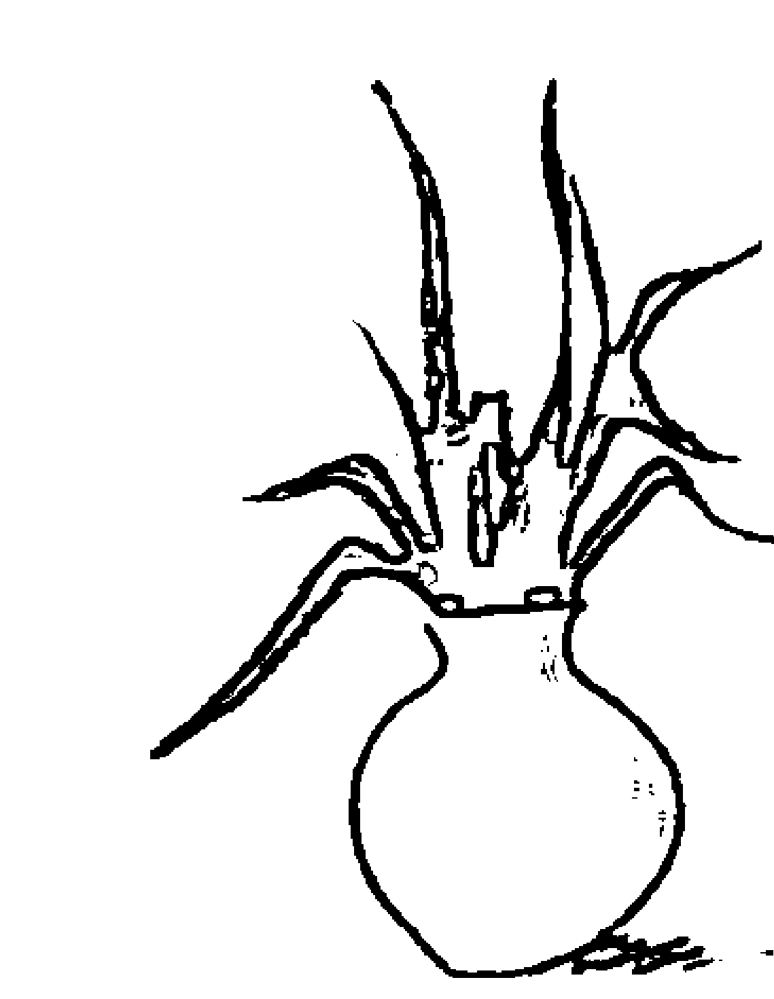

### 第八技

聚焦过度，心想事不成

中国人有句俗话说“乐极生悲”，生活中似乎经常会发生这样的事，更有一种“期望愈大，失望愈大”的现象，这一切仿佛都与吸引力法则相左，我就曾经在博客里看到这则留言：

《秘密》一书强调要保持好心情、高频率，好事就会被吸过来，但为什么有时候心情很好，却会遇到不好的事？难道这就是所谓的“乐极生悲”？

此外，每次很期待某件事，一想到就感到心情非常好，但结果总是跟想象中的不一样，令人大失所望，所以才会有句话说：“期望愈大，失望愈大。”以上两个例子经常发生，都与书上说的不符，请问这是为什么？

从字义上解释，“乐极生悲”是指高兴过头而招致悲伤的事。乐极生悲通常是因为“得意忘形”忘记自己的本分所致的。举例来说，有位老人家中了威力彩，独得八亿台币，乐不可支，结果心脏病发，那是因为他忘了自己的身体状况，所以乐极生悲。

开车时，老婆打电话来说中了威力彩，独得八亿，乐不可支，结果顾着讲电话，没注意到红绿灯，就出了车祸，因为他忘了自己还在开车，忘了专注，所以乐极生悲。

用吸引力法则来解释的话，那些乐极生悲的灾难，是因为长期以来的负面振波所造成的。他们的人生中可能有不为人知的恐惧、压力、焦虑，甚至常常让自己处于受害者的角色，而这些负面的情绪终将显现出来，于是造成了乐极生悲的状况。

我认为，吸引力法则真正教我的是：对所有的人、事、物都抱持着正面、感恩的看法。

“期望愈大，失望愈大”，期望愈大，得失心就愈重，得失心愈重，就愈聚焦；愈是如此，就愈容易聚焦在你不要的那一面。

举例来说，某人没钱，所以买乐透，让自己一券在手，希望无穷。他会想象有钱之后的美好生活，心情也非常好，但问题是，他常常聚焦的是有钱之后的美好生活，还是现在没钱的悲惨遭遇呢？假如是后者，你觉得他有可能中奖吗？当然不会！他只会吸来更多的不幸而已。

有时候人会心想事不成，不是因为聚焦不足，而是聚焦过度。

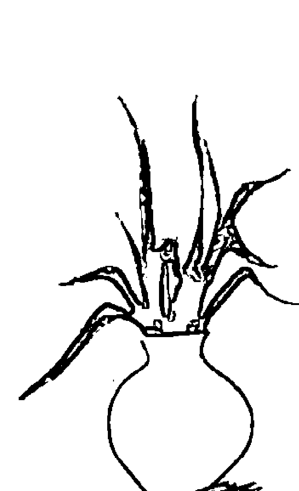

## 第九技

### 时常观想心想事成时的画面究竟好不好？

曾经有网友问我，时常观想愿望达成时的画面究竟对不对？因为他只要一想到就开心，因此不自觉就会想，他也担心这会不会是“匮乏”的表现：

观想力不是要时常练习才能精进吗？要达到“临在”就是各方面都要完全融入情境内，要如何说服潜意识相信那是真的呢？

要表意识相信很容易，但潜意识是否相信就很难判断，因为内在有哪些负面想法和模式，并不是自己能明确察觉出来的。

如果是因为想到就开心，就会不自觉地去想，当然很棒，因为那使你开心，所以才会一想再想。但如果是心存怀疑，只为了加强自己的信心，才反复观想，当然就行不通，因为那是基于“匮乏”。

“观想”的能力是与生俱来的，你一定听说过：“真羡慕某人怎样怎样……”这其实也算是某种程度的观想。如果经常练习，可以提升观想的能力，可能使画面更清晰，所需的时间也较短等。

不过我要强调一点，重点不在观想本身，而在想完或说完之后抱持的信念是什么：你相不相信自己做得到？你相不相信自己值得拥有？你相不相信宇宙一定会帮你？

要先拥有正确的信念，才能谈到之后的情绪。无论是观想、愿景板、情绪转移物，都有一个很重要的作用，那就是帮助你拥有美好的感觉。

每个人对潜意识的定义都不同，人们常用潜意识来代表自己未知且无法控制的一面，但极可能是因为自己的观察力不够，或者只专注于自己想看的部分，对其他东西视而不见，而将那些东西也归到潜意识去，所以这个部分先要厘清。

基本上我们是无法说服潜意识的，别忘了，外在所有的一切都是由内在显化而来的。而潜意识是我们在从小所处的环境中耳濡目染以及经历某些特定事件而形成的。

如果想调整潜意识，就必须先觉察哪些是你要修改的，透过数息、静坐或冥想让心静下来之后，可以帮助我们觉察，这都需要时间，以及持续不断的练习。

当然，也可以选择用某些特定方式，以达到快速调整的目的，例如催眠、听潜意识CD、上心灵课程、使用深层心理学的设定等，都是不错的方法。

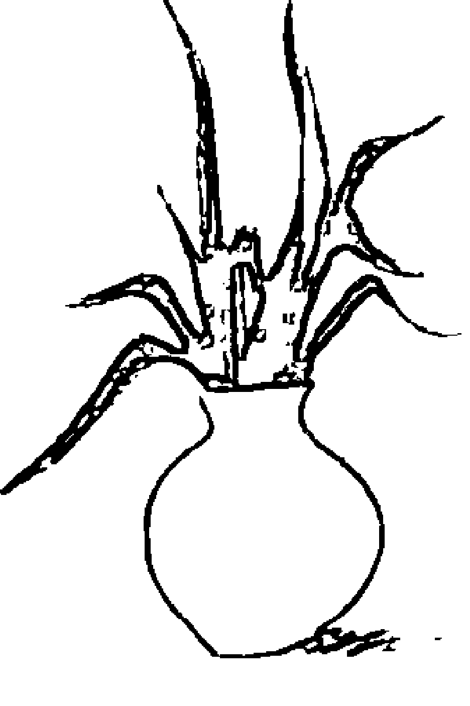

## 第十招

### 吸引力法则和佛家的因果论相抵触吗？

信仰佛教之人在初学吸引力法则时经常会有关于因果的疑问，如同以下这则留言：

如果吸引力法则皆能如人所愿，那么和佛家讲的因果、业力等是否有相互矛盾之处？以佛家的观念来说，每个人都带着累世的业力投胎为人，所以有善报也有恶报，但我们不知轮回了多少次、做过多少坏事、业力不知有多重，这些恶报靠吸引力法则就能化解吗？那修行之人又何必修得那么辛苦呢？

其实吸引力法则与因果业力并不抵触，所以我当时的回复如下：

我个人对因果业力最简单的解释是——

- 因果：种瓜得瓜，种豆得豆。
- 业力：善有善报，恶有恶报，不是不报，时机未到。
- 吸引力法则：当你跟宇宙有所求，宇宙必应。
- 业力法则：所有因“你”而产生的行为结果，终将回到始作俑者的“你”身上。

宇宙不是只有吸引力法则，还有业力法则等共105条法则，参考信息如下：

宇宙法则105条中文网页：
http://www.aaistars.org/CosmicLaw.htm

宇宙法则105条英文网页：
http://astrologicalstargazing.com/UniversalLaws.html

宇宙让所有法则在不可思议的平衡与完美制衡下运行

相信大家都听过“破命格”、“人定胜天”、“趋吉避凶”以及改造命运的经典之作——《了凡四训》。我认为“命中注定”这句话是不成立的。只要多行善、多布施，心存正念，一定可以改变命运。

讲了这么多，跟吸引力法则又有什么关系呢？神通抵不过业力，业力抵不过愿力，发愿就是宣告，也就是跟宇宙下订单。

“慈悲喜乐”是断绝宇宙负面能量（业力）的最好办法。吸引力法则的终极心法就是 “Feel Good”，因此，运用吸引力法则得当的人会采取更正面积极的角度去面对生命中发生的一切。当生命的挫折来临时，也会欣然接受，因为始作俑者正是自己；当生命遭逢剧变时，也就能坦然面对，因为时机已到。

还有另外一点：吸引力法则会让每一个人做什么都是对的，你的思想创造你的实相。你相信什么，就会创造什么；你创造什么，就会看见什么；你看见什么，就会回头印证自己原先的想法是对的。

假如你的信念是：累世以来我们不知轮回了多少次、做过多少坏事、业力有多重、恶的果报岂是靠吸引力法则就能够化解的，那修行之人又何必修得那么辛苦？那么宇宙就会如你所愿，让你在生活中体验这一切。

如果你想避免这样的因果循环，就必须改变你的想法，让自己的所思所想都朝善良积极的一面发展，最终你便能吸引到同类的人、事、物，过着不同以往的生活。

> > 「慈悲喜乐」是断绝宇宙负面能量的最好办法。

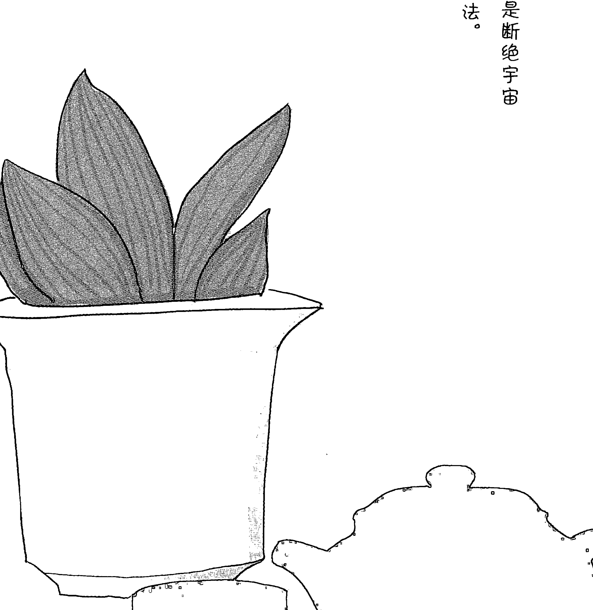

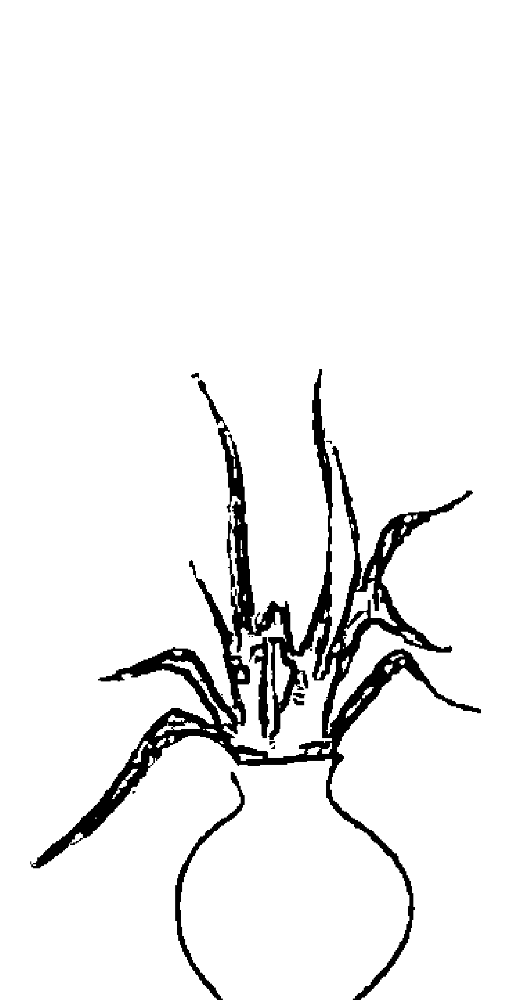

## 第十一技

### 如何运用吸引力法则“观想”？

吸引力法则的初学者常会提出有关“冥想”的问题，以下的博客留言即是一例：

> > “冥想”是指想象自己想要及拥有的事物吗？当人们想象自己想要的东西时，也常会想到其他负面事物，这时候又该怎么办呢？

一般我们会将“想象自己想要及拥有的事物”这个过程称为“观想”，如今我都称之为“静坐发功”，若要称之为“冥想”也行。

无论是冥想或观想，思绪都会随时从四面八方扑向你。负面的想法若出现，就让它出现吧。因为叫你不要想负面的事物，你脑中第一个蹦出来的想法一定是负面的。

如果你不相信，那么请你现在闭上眼睛，想什么都行，就是不要想大象！请问你刚才第一个想到的是什么？如果我没猜错，应该就是大象吧。

想象你的思绪是一座瀑布，你没有办法、也没有必要监控所有的思绪。尊重它的出现，但不用在意它，一会儿它就会流走不见了。

本书第 41 页已经提供来自亚伯拉罕所指导的静心法，非常简单、清楚、实用。

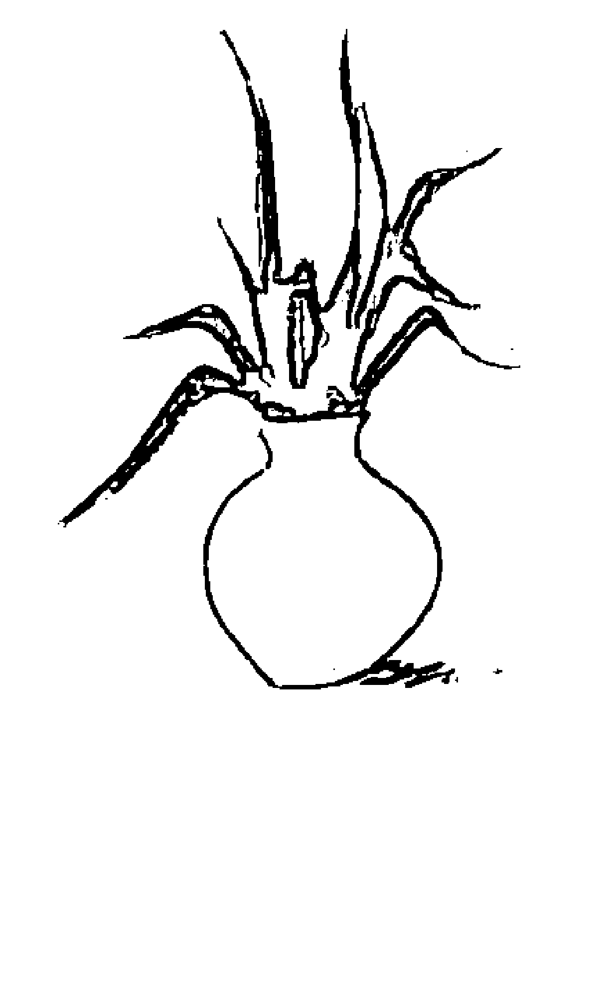

## 第十二技

### 如何运用吸引力法则“转念”？

人在困顿时要说服自己相信未来会愈来愈好，真的很不容易，如何在最艰苦的时候“转念”，是很多初学者亟待跨越的门槛。我曾经在博客里收到这样一则留言：

> > 我现在的处境真是快让我自杀了，搬出来住已经有一阵子，不过最近的遭遇真是够夸张：公司倒闭领不到钱，唯一的交通工具机车买了不到一年就被偷，现在还在缴贷款，找不到可以维持生计的工作，只能做工读生，房租一个月没有缴了，身上剩下几百块，想跟朋友借钱，但是他们也没钱。
>
> 我也买了《秘密》这本书，但不知道为什么，好像没有什么效果，吸引力法则有所谓的时间性吗？每次的愿望都要想很久，常常没有响应、不会实现，是不是要注意什么呢？那算是一种超能力吗？可以做到马上实现吗？抑或只是激励自己的一种学说？

我不禁要恭喜这位留言的网友能有这样的遭遇。怎么说呢？因为他受够了这些状况，所以买了《秘密》这本书，上网寻求援助，这一切都是为了让他学会掌握吸引力法则的最好安排。

你觉得他的状况很糟吗？那是因为你还没有遇过更惨的人。有机会到医院的加护病房看一看，你会觉得他仍是幸福的人。因此，当时我给的回复如下：

我要送给你的第一个见面礼是转念。所有发生的事件，立场都是超然、中立的。若有任何意义，都是自己所下的批注。如果你愿意，你也可以告诉自己：“嗯，这是老天爷为锻炼我的意志力所出的题目，我不会被打倒！”

之前我也曾分享过：无论发生什么事，都不要下任何的评估、判断与批评，因为你不知道发生的原因，也不知道宇宙要它发生的目的。你机车失窃的真正原因也许是：“如果继续骑车会出车祸，所以宇宙把机车收走了。”

你会觉得吸引力法则没效是必然的，因为你已经失焦了。容许我提醒各位：吸引力法则无时无刻不在运作，若不赶快转换念头，它就会继续吸来那些让人抓狂的事。

吸引力法则并没有所谓的时间性。当你下订单时，宇宙就将东西准备好了。你还没有收到的原因是：你并不处于适合接收的状态。愿望实现的速度取决于：你所散发的振动频率与宇宙的一致性。简单来说，你只要愈开心、愈乐观、愈感恩、愈付出、愈感觉良好、心中愈充满爱，所求之事就会来得愈快。

吸引力法则不是超能力，而是宇宙的法则之一。任何人都享有，也都无法背离它，就像地心引力一样，不管好人还是坏人，只要从高处掉下来，一定会摔到地上，这样的法则再真实不过了！

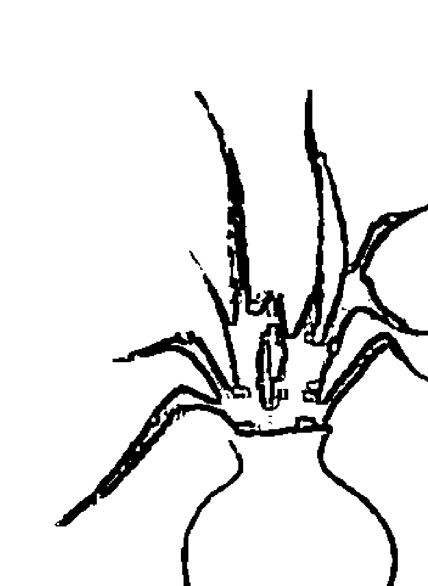

## 第十三技

### 跟宇宙下订单的次数愈多愈好吗？

跟宇宙下订单并不难，你可以想要什么，就订什么，困难之处在于下了订单后，你的心态如何？身体力行了什么？所思所想又是什么？关于这一点，以下这则博客留言可供参考：

我真心希望某个愿望实现，所以一天都会想象两次愿望实现时快乐的模样。

几乎每次都会在心中重复默念“我知道会”这种句子，还会伴随着兴奋、快乐的感觉，有时会试着想象愿望成真的画面，或别人告诉我愿望成真时的画面，或想象我告诉别人愿望成真时的画面，并且伴随着兴奋的感觉。

换句话说，我几乎随时随地都专注在这些愿望上，例如我一边走路一边带着兴奋感，一边重复念着“我知道会”，不知道这是不是一种得失心？当我们开始患得患失时，是什么感觉？该如何处理？

还有，我不会跟朋友明说我真心希望愿望成真，但会故意跟他们说：“那就祝福我如何如何吧！”因为我想当他们也这样祝福我，我的愿望会更快成真，不知道这样做对不对？

关于这位网友的问题，我的回复如下：

我可以感受到你对愿望成真的渴望，不过一天想象两次我认为太多了，在此举例说明，各位或许会更清楚。

假设你很喜欢电视购物台卖的一条项链，于是打电话订购，你真心希望它快点送达，所以一天打了两次电话去购物台订货，你认为会发生什么事？恐怕你得变成长颈鹿，才载得下所有的项链吧！

跟宇宙下订单，只要下一次就好了。让自己沉浸在那种幸福快乐的感觉里，相信宇宙一定会为你做出最好的安排，并根据宇宙给你的信号去行动，就会得到你要的结果。

“我知道会”这句话本身是OK的，得失心是否太重，取决于默念时的心境，当时心里有什么感觉？是不是百分之百相信自己所说的？如果是基于满心的喜悦，知道愿望就快实现，因而一直默念，那是很好的；如果是有所怀疑，为了加强信心才一直念，那就行不通了，因为那是基于匮乏才这么做的。

至于患得患失，怕得不到、也怕得到后会失去的感觉若有似无，搞得人心神不宁，想要避免这种负面情绪，我认为还是要从源头着手，也就是“信念”。

请为自己输入以下的信念：“我知道我已将能做的一切都做到最好，其他事情就交给宇宙，我相信宇宙是爱我的，一切都会是最好的安排。”

当你拥有这样的信念，并且采取必要的行动之后，你就会知道该是“放手”的时候了。放手，不是撒手不管，而是信任宇宙，让宇宙接手，顺着生命之流，相信宇宙会把你要的东西带到你面前。

对朋友说“祝福我如何如何吧！”是很好的。假如朋友真心祝福你，这个集体意识的力量是很强大的，这也是为什么有时我会在博客发表请大家一起帮忙祈福的文章，就是希望通过众人的祝福，助需要帮助的朋友一臂之力。

> > 顺着生命之流，一切都会是最好的安排。

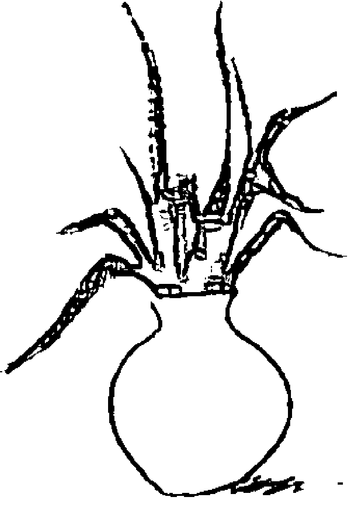

## 第十四技

### 吸引力法则也能用来交朋友吗？

交朋友的秘诀是“先要喜欢、爱自己”，只要先爱自己，整个世界都会爱上你，这就是吸引力法则。你是否希望别人对待你的方式如同你对待自己？想要获得爱，就让自己填满爱，直到你成为爱的磁铁。

但是，这与吸引力法则有什么关系呢？各位不妨看看以下这则留言：

> 我是个大学生，平常上课的日子很不快乐，因为朋友很少，看完《秘密》后，我知道一定要保持好心情，才会有好运气，因此我每天上课前都让自己保持好心情，但是到了学校后，依旧和大家格格不入，一直有种被忽略的感觉，于是好心情又慢慢down下来，所以我又赶快想快乐和感恩的事，再次提升我的心情，但周遭的情况依旧，甚至更糟。

为什么一直保持好心情，好运却没被我吸引过来？我一直观想可以融入大家、可以拥有很多朋友，甚至想着交到朋友后的情形，并维持好心情，但愿望却没有实现，甚至一点迹象都没有，这是为什么？

我从以下几个方面回答这个问题：

#### 理论篇

要对自己有信心。当你没自信时，只要记住一个真相：“无论如何，你永远是独一无二的！这世上不会有第二个你。”

建立自信的方法如下：

- 一、只要你够了解自己，就会知道该将自己放在哪个舞台上，让自己发光发热，得到众人的肯定后，就可借由大家的肯定建立信心。
- 二、可以先从小事做起，慢慢借由小成功累积小自信，不断告诉自己：“我做每件事都会愈来愈好，我是最优秀的！”
- 三、自信就是“对自己有信心，相信自己一定做得到”，将来当你遇到任何事，不管你会不会、有没有做过，都要相信自己一定做得到，更会因为有信心，而把事情处理得很好，表现得落落大方、成熟稳重。

所以源头就是了解自己。

#### 实务篇

当我们希望将美好的同学关系吸引到生命里时，千万要注意自己的行动是否与愿望相悖，要确认行动正确反映了自己的期待，没有违背自己的要求，并且要思考自己真正想要的关系，以及该采取的行动是什么。

要有好的人际关系，就必须把焦点放在对他人的欣赏上，而非抱怨。你很清楚知道自己不要什么，却对自己要什么不太确定，因为你并没有将焦点放在自己想要的关系，而是放在不要的关系之上。如果不是真的按照自己想要的方式发散频率，宇宙就无法响应。

#### 进阶篇

相信自己，相信宇宙，只要由内改变自己，自然会影响外在世界，造成实质改变。

每个人都想要优质的人际关系，但如果能抱着“有也好、无亦可”的心态，无论如何都能愉快度日，胜算反而大为提高，这就是吸引力法则的终极秘密——随顺法则。

实现愿望的速度取决于“你有多想要，你有多相信”。你有求，宇宙必应，接下来就是放手由它，相信生命之流的指引。

凡事都有两面：有憧憬想象的喜悦，也有等待实现的焦躁。你愈在乎，就愈常想，愈常想，就愈容易聚焦到你不要的那一面。就像参加大学联考一样，每个人都会教考生抱持平常心，方能发挥水平；若愈在意，得失心愈重，就忍不住会想到万一辜负父母、师长的期望怎么办。一旦这样想，就会开始聚焦在自己不要的那一面，反而考不好了。

## 第十五技

### 一人想一样，宇宙听谁的？

当你跟宇宙下的订单和另一个人的不一样时，宇宙要听谁的呢？关于这个问题，我倒是在博客里看到一则相关的留言：

> 接触这本书已是第六天了，我相信整本书的内容，但是无法给别人合理的解释，让他们相信这个秘密。

请问这是因为心理作用的关系，导致我们会发胖，吸引更多的不愉快、纠纷吗？我小时候并不特别注重外表，一样往横的长，一样有不顺心的事情。

另外，每天观想能跟他重修旧好，去感觉一切的真实感，若同时他也在观想，但想的是不同的事。假设我观想我们搬到巴黎定居，他同时观想自己独居纽约，请问这该怎么办？

在回答这个问题之前，我要先说明一下，每个人学习的途径不同，我的方法只是千百万种之一，世上还有其他无数的选择，没有好坏高低之分，只有适不适合而已。以下是我当时的回复：

首先回答第一个问题，我认为童年时期一样是有自主想法的。小朋友看似没有想法，其实他们的意识强得很，尤其是求生意识，即使一岁以下的婴幼儿也一样，这是生物本能。

三岁小孩可能比三十岁的大人更具有创造力，因为他们的思想还没被“污染”的很严重，不会有太多的“负面信息”与“不可能”，只是纯然的要求，所以他们跟宇宙的联结比大人更强。若要问得激烈一点也行：“为什么常看到婴儿被虐待致死的新闻？难道也是那些婴儿吸引来的吗？”

我只能说这个问题无法单用吸引力法则来解释，宇宙也不是只有一条吸引力法则。我们可能要更深入思考一个问题：“为什么他们会出生在这样的家庭？它背后的原因是什么？”

从灵魂学的角度来看，生命是不灭的，它是永远的能量与存在。举例来说，就像在穿衣服，今天我想体验绅士，所以穿西装；明天我想体验轻松，所以穿T恤；后天我想体验时尚，所以穿亚曼尼。

时间过了，体验完了，衣服就换了。对应于人类，衣服就是我们的肉体。“我”是“我”，“我”不是“衣服”。即使“衣服”换了，“我”仍然存在。

而这些遭遇是他们在投身地球之前就已设定好的“行程”之一，这是他们“要求”的体验。所以，对于发生的事不要做任何的判断与批评。

至于第二个问题，我的回答是：如果设定的目标是人，会有“自主意识”的问题。每个人有自己的想法，你的“他”也有他的想法。我们无法替任何人思考和感觉，我们的职责就是自己，我们能做的就是爱自己，让自己感觉美好。当这份美好的频率散发出来，就有机会感化对方。

由于我比较早接触吸引力法则，相较之下，吸引力法则的运用就会比较熟练。而多数人都是让自己处于“自动导航”、“默许创造”的状态，所以就算遇到自主意识的情况，宇宙仍会安排一连串的“巧合”让人愿望成真。以你的状况来说，宇宙就会让你的男友有某些体验，让他改变想法，进而将自己从纽约移到巴黎，你根本不用介入，事情就能搞定。

假如你们两人观想的方式都正确，而且内心也很笃定，那后续的安排只有宇宙知道。我能确定的是：一切都是宇宙对人最好的安排，只要相信宇宙，要有耐心，并且感谢生命中所发生的一切人、事、物，最终一定能得其所哉！

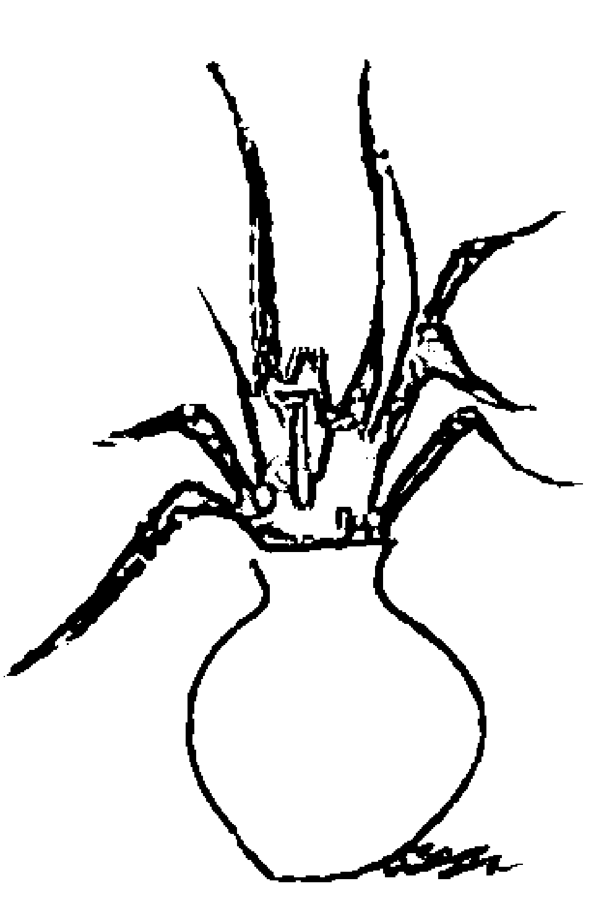

## 第十六技

## 修成正果前，要避免与思想负面的人互动吗？

人与人的相处，情绪、频率与能量都会互相影响。如果你认为自己很容易被影响，建议你初期尽量避免与思想负面的人互动。我的博客里就曾有这样一则留言：

> 如果身边有观念十分负面，却又无法劝服的家人，长期生活在一起是否会拉低我的频率？是否应该远离，先提升自己的能量，有能力后再想办法帮助他们？
其次，如何增强自己的能量？第三，如何对一切事物都心存感恩？第四，“完全信任宇宙”的心态是照一般模式过日子，还是必须有什么期待或兴奋的心理模式？

我不了解这位网友的家庭背景，每个人的情况都不同，因此当时我提供了一些观念供参考，至于是否要“远离”家人，要请每个人自行斟酌。

以我为例，我的家人比较保守，以前对我全职推广吸引力法则很担心，我知道他们是爱我的，但他们的关心就会让我变得很无力，该怎么办？不能因为无法承受他们的爱就离家出走吧，所以我选择先不要跟他们讨论我的志业等相关话题，等我做出成绩之后，再跟他们分享。平常我们还是一样会聊天，但若聊到志业的事，我就会转移话题或顾左右而言他。

在这个过程当中，我得到一个非常珍贵的礼物：“观点变了，全世界就变了。”我们无法改变或阻止这个世界发生任何事，也无法控制别人怎么做，但是我们绝对可以控制对这些事情的观点。

我之前听到家人的关心会觉得没力，其实是他们触碰了我身上的某个“按钮”，它自动引发了情绪的连锁反应。自我观照之后，我才发现原来对我而言那是一种不被肯定与认同的感觉。

只要找到源头就好办了，我把旧的信念移除，重新设定成“这就是父母对我表达爱的方式”，之后再听到类似的话，也不会有任何负面情绪，反而会充满感激，感谢他们对我的关心。

因为我对这些话的观点变了，心态也变了，我们之间的关系当然也变了，变得更和谐、更温馨，所以不用等到自己的能量提升之后再回头帮助他们，只要改变对他们的观点，就可以改变这一切。

再分享一个强效法：赞美与感恩。你的家人或许负面，但并非一无是处，所以请你想想他们的优点，发自内心地接受它、赞美它，并感谢家人为你所做的一切。你会发现，你和家人的关系会有戏剧化的转变。

至于如何增强能量，和如何让自己开心是一样的道理，这个时候就要好好想想：做什么事会让自己很开心呢？

我在课堂上有一个叫做“写下你的感恩清单”的练习，可以渐渐培养对一切事物心存感恩的能力。请拿出两张纸，写下101件会让你感觉良好的事，例如：

- 一、出国旅游

- 二、看电影

- 三、和心爱的人在一起

通常写不到一半就写不下去了，但再仔细想想，从感恩的角度出发，你会发现很多平常认为理所当然的事，也都值得感谢，例如：

- 1. 我有健全的四肢
- 2. 我有眼睛可以看
- 3. 我有耳朵可以听

基本上，我们每天早上能醒过来，就值得感谢。只要活着，就是宇宙给我们最大的恩典。

要完全信任宇宙，换句话说，就是不要怀疑宇宙，也就是不要患得患失，所以，重点还是在自己的感觉上，只要没有患得患失的感觉就好，照一般的模式过日子，有什么期待或兴奋的心理都没有关系，只要自己感觉良好即可。

很多朋友都有一种迷思：以为必须一直观想、一直要求，梦想才会快点实现。但事实上不要去想它，反而比较容易实现，因为不会产生任何阻碍的念头。既然知道宇宙有求必应，还有什么好担心的呢？

偶尔想到自己的梦想，心里会很期待或兴奋，那也很好；但若因为过度在意而不断地想，就是反效果了，因此，千万要保持内心的喜悦与平静，心想事成的速度就会愈来愈快了！

赞美与感恩：
爱是一切的源头。

### 第十七技 跟宇宙下订单得定兑现日期吗？

当我们跪在寺庙里向神明祈愿时，首先会报上自己的姓名、地址、出生时辰，然后说出心愿，订下愿望实现的日期，以便日后还愿，如果将神明改成宇宙时，祈愿的流程是否也一样呢？

曾经有位网友在我的博客里留下这样一个问题：

> > 祈求愿望是不是不该设定时间？我六月就要出国了，希望能在出国前，弥补之前投资上的损失并且获利，存到我需要的金额再出国。可是我只剩最后三个月可以努力，我一直受时间影响，想着万一三个月后没达成怎么办？

我们是不是不要想着时间？因为《秘密》里说：“吸引一粒纽扣跟一座城堡，对宇宙来说是一样的，重点在我们的观想、信任、一念之差。”问题是，该怎样想呢？

还有，要许一个别人听起来都认为不可能、想都别想的愿望，又该如何坚定自己的信心，告诉自己会达成呢？尤其情况又是一直往负面发展的时候。

关于许愿是不是不该设时间的问题有两派说法，读者可以自行考量，觉得哪种说法比较合适，就采用哪一种。

说法一是不该设时间，因为设定时间反而会给宇宙局限。宇宙一定会用最安全、最舒服、最快速的方式实现你的愿望，但要请你百分之百相信宇宙，相信一切都会是宇宙对你最好的安排。

说法二是当然要设时间，因为有紧迫性，就有可能产生奇迹。适当地给自己、也给宇宙一些压力，可以更快地让我们的梦想成真。

如果你问我是哪一派，我的答案是看情况。要设时间可以，但请确认一件事：你百分之百相信这个时间内可以达成。举例来说，有人想从下个月起月入百万，但内心有一个疑问：“可能吗？”那就请你调整一个自己可以相信的时间，不然肯定永远不会实现。

这位网友的状况是六月出国势在必行，所以时间上就无法讨价还价，他希望弥补出国前投资损失并且获利，那么他就必须大胆地要求，并确认自己百分之百相信这个时间内可以达成。

我建议他可以跟宇宙这么要求：“我要在六月出国前，弥补之前投资损失并且获利X元以上，若能比这个时间更早，或赚到更多钱更好！”接下来就安心地放手，让宇宙接手。

至于如何安心地放手？最好的方法就是建立自信心。举例来说，每次我找不到停车位时，我都会告诉自己：“这里虽然难停车，但还不是有这么多人把车停在这里。他们能，我也一定能。而且我还可以请宇宙帮忙呢！我懂吸引力法则，我比其他找车位的人更具优势！”

各位发现了吗？让话中充满肯定，就能拉高你的频率，就会加快梦想成真的速度。

至于这位网友的第二个问题，我有切身经验，我推广吸引力法则就是这种情况。当时全世界只有两个人支持我——我的女朋友Sally和好友明宪。愈亲密的人愈不支持我，没错！就是我的父母。

他们肯定是关心我、爱我的。但是，看我没有固定收入，他们会担心，这都是很正常的。

“坚定自己的信心”是让别人放心最好的方法，我个人的经验是做出成绩，让成绩证明你的选择是对的。

以我的例子而言，当初只是有心想推广，也不知道如何开始，后来开始和我认识的如珠姐学习办分享会，接着我自己办分享会、设计“心想事成大富翁”游戏、开设活学活用研讨会等，当初跟自己约定的事一一实现之后，我也就开始有信心了。累积小成功，自然就会得到大成功。

请你想想，设定这个愿望的初衷是什么？它会带给你多大的幸福与满足？有多少人会因为你而改变命运？

想想上述的问题，就会带给你信心，因为你很清楚自己为何而战，把自己当做生命的战士，活着就是为了要达成信念，任何人都不能阻止，你知道自己一定办得到。

若能找到志同道合的伙伴支持就更好了，在你需要支持的时候，他们会给你许多力量，只要持续贯彻这样的信念，相信人人都能找到情义相助的伙伴。

## 第十八技

## 可以用在高考上吗？

吸引力法则适用于任何人、任何事，不管是上班族、创业者，甚至是莘莘学子，都能通过吸引力法则得到自己想要的事物，轻松就能心想事成。我的博客里曾有一则考生的留言：

> 我是一个正在准备考试的考生。二月初就要考试了，我念了一个多月的书，有时候会焦虑到失眠睡不着，担心自己考不上。

正当我焦虑慌乱的时候，我的朋友介绍我看《秘密》这本书，我花了两天时间把它看完。书中的内容简单易懂，看完后我的焦虑消除了，而且变得豁然开朗、更有信心，但又感觉自己只有三分钟热度，到底该如何

#### 正确使用吸引力法则呢？

我认为只要在心里一直想着“我要得到它、我要得到它、我会考上、我会考上”就行，但我是个信念薄弱、很没自信的人，我认为这样的做法可以增强信念、让自己更有信心。我有没有用错方法？有时心里还是会有一点点怀疑，当这些怀疑来临时，我知道不可以，所以又会立刻压抑这些怀疑，但心里还是会有一点潜在的负面想法，真的好难控制，到底该如何使用终极秘技“放手”呢？

你说：“一旦表示‘一定要到手不可’，就把东西推开了。因为你锁定在需求上，没有专注当下。”到底该如何正确使用吸引力法则？书上的方法我都看得懂，但究竟该如何放宽心胸、坦然去做呢？

关于这个问题，当时我引用了《失落的致富经典》一书中的摘要回答对方，吸引力法则的成效关键如下：

- 1. 愿景的清晰程度
- 2. 决心的稳固程度
- 3. 信念的坚定程度
- 4. 感谢的深刻程度

在此稍加说明一下——

- 一、愿景的清晰程度：对于你要的目标，你有多明确？你愈清楚要求，宇宙就愈清楚响应，反之亦然。

- 二、决心的稳固程度：对于目标，你有多想要？有些人会心想事不成，是因为潜意识里他根本不想要，但表意识上他“以为”自己想要，然而宇宙响应的是内心真正的感觉，而不是他的想法。

- 三、信念的坚定程度：对于“所有一切的发生，都是宇宙对你最好的安排”这件事，你有多相信？对于自己一定可以心想事成、自己值得、也应该过想要的生活，你有多相信？假如你内心怀疑，别忘了，你的愿望就是宇宙的命令。

- 四、感谢的深刻程度：对于宇宙以及与你人生所有相关的人、事、物，你有多感谢？感谢是所有情绪等级的最高级，当你开始感谢这一切，你的频率就会改变，就会吸引更多让你开心的事。

当然，别忘了“秘密”的终极秘技：Feel Good。

此外，这位网友有个想法也必须调整一下，应该将“我要得到它，我会考上”改成“我已经得到它、我已经考上”，并让自己沉浸在“已然拥有”的美好感觉里，事实上当你说出你要什么，反而是在强调你缺乏什么，而宇宙一旦响应你，就变成反效果了。

内心有怀疑的想法在所难免，请不要刻意压抑它，因为这也是一种聚焦，愈压抑，宇宙就愈会响应你这种感觉，这也就是为什么心里总会有一点潜在的负面想法，而无法控制的原因。

或许你会问：“负面想法出现时怎么办？”负面的想法若出现，就让它出现吧。想象你的思绪是一座瀑布，你没有办法、也没有必要监控所有的思绪。我们尊重它的出现，但不用在意它，一会儿它就会流走不见了。宇宙回应的是我们主要的、经常性的频率，只要别一天到晚负面思考，就不会有太大的影响。

所谓“放手”并不是撒手不管，而是调和能量与情绪，全然相信宇宙，让自己处于接收的状态。你要放手，宇宙才能接手，只要注意一件事——不要自我推翻。举例来说，想要金榜题名，但竞争者众；想要高分录取，但题目很难。然而，对于全能的宇宙而言，考试只是小事一件，放轻松点，只要把自己全然交给宇宙，全力以赴并让自己保持心情愉快，一定会被录取的！

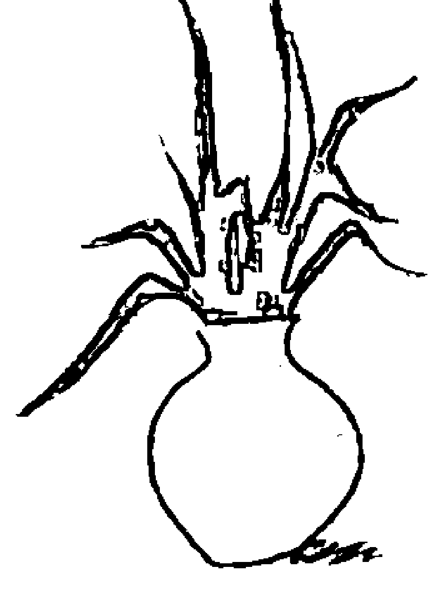

## 第十九技

## 如何向宇宙下订单？

生而为人，对生命感到迷惑在所难免，很多朋友也常有“不知道自己要什么”的困惑。曾经有位读者在博客写下这么一则留言：

> 我一直在思考自己要什么？我拥有什么特质？但总想不出来。今天学校做了类似性向测验的东西，我测出来的结果是每项特质都沾上一点边，没有特别不同的地方，所以也找不出适合的职业，心情因此很低落，难道我找不出跟别人不同的地方吗？

我觉得只要每天过得快乐就好了，但想到未来又觉得很茫然，不知道自己适合什么职业。我本来对未来抱持乐观的心态，但是想不出自己该扮演哪种角色就很痛苦。

任何事都可以交给宇宙办理，只要相信它会给我最好的一切就行了吗？但又觉得这样好像有点不切实际，感觉怪怪的，到底该用什么样的心态向宇宙下订单呢？

其实“不知道自己要什么”这个问题不只困扰这位读者，很多朋友也有类似的困扰。我曾经听过一种说法：“先列出五十项你不要的，你就会知道你要什么了。”这也是方法之一，只是土法炼钢，慢了些。

于是，我给这位网友如下的回复：

不知道自己要什么，通常有两个原因：想要但不敢要以及不知道可以要。认为自己不够好、不值得、不配拥有等，总之就是没有信心。因此，首要之事就是觉察并面对这个会阻碍你幸福的信念。

接着教你如何为自己设定新的信念：步骤一，告诉自己“我值得、也应该拥有想要的一切”；步骤二，让自己产生“已然拥有”的美好感觉。

至于不知道自己的特质，通常也有两个原因：一是自己不认为是，二是尚未被发掘。

我有一个朋友明明很漂亮，脸蛋、身材都没话说。然而，不管别人怎么赞美，她就是觉得自己不够好，很没有自信。

我连问她三次：“你对自己很没有自信吗？”她都肯定地说对，我倒认为她对自己的“没有自信”这件事很有自信。

你了解我要表达的意思吗？请你绝对要相信，你一定天赋异禀，一定有很擅长、做了会很开心也会赚钱、并且对大众有所贡献的志业（请注意，是志业，不是事业，更不是打工上班），如果你还没找到，那你得花点时间好好想想，你的一生会因为勇敢做出选择而璀璨闪亮。

再强调一次，你一定要相信这件事，因为你的“思想”创造你的“实相”，你若不相信，就无法跟宇宙携手创造美丽人生了。

找一个让你觉得最舒服、最能静下心来的地方，问问自己：“假如不考虑金钱，做什么事会感到开心？”在思索这个问题时，不要给自己设限。

会这么问是有道理的。在国外曾经做过实验，将受测者分成两组，A组是先努力赚钱再去做自己感兴趣的事；B组是直接做自己感兴趣的事并赚钱，结果B组成为有钱人的人数是A组的一百倍。

你暂时不知道自己的特质没关系，直接思考自己做什么事会开心，接着再进一步探索，你会从中发现自己的特质。

以我为例，我现在全职推广吸引力法则。我做得很开心，因为我喜欢做华丽的简报，搭配短片、影片、练习及游戏，并和学员们深入探讨。虽然搜集数据与设计桥段会花掉我很多时间，但我乐此不疲。我发现自己的特质之一就是只要相关的信息到我手里，我可以近乎反射性地想到：这个信息可以当做哪个课程的补充教材、用什么方式呈现、如何互动与教学。

你或许会问：“只要相信它会给我最好的一切就行了吗？”我认为这是很了不起的境界，如果能做到我以上的建议，就可以跟宇宙下订单了，在此分享张德芬老师的许愿文范例供你参考：

> > 宇宙呀！我要有一份很擅长、做了会很开心、会赚钱也能对大众有所贡献的志业，我目前想到的是（      ），若你有更好的安排，那更棒！请为我移除阻碍这件事情的思想信念与行为模式，并以你认为对我最好的方式实现它，感谢你！

对宇宙做出宣告，并相信宇宙为你所做的一切都是最好的安排，那么你就更上层楼了。当然，这只是开始，有很多细节等实际操作之后，自然就能融会贯通。

> 『思想』创造『实相』，只要你决定快乐，你就能快乐。

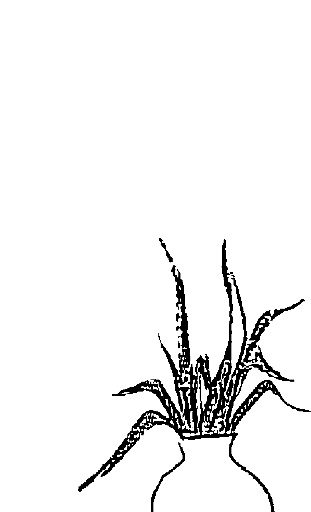

## 第二十技

## 风水命理是一生的指标吗？

初识吸引力法则的人，经常会产生许多疑问，尤其是相信风水命理的人，在读过《秘密》之后，都不禁会问：人的一生真的需要为了自己的八字命格而奔波吗？无形的命理风水真的是影响我们一生的重要指标吗？

面对这个问题，我首先要引用《最大的银行——探索生命的黑箱》①——书中，关于袁了凡改变命运的故事。

在中国古代典籍中，改造命运的经典著作首推《了凡四训》。这本书不但流传于中国各地，也对日本政经界有着深远的影响。日本著名的汉学家、阳明学大师安冈正笃对《了凡四训》推崇备至，建议日本天皇及历任首相将其奉为治国宝典。此书对明治时期的青少年产生巨大的影响，迄今仍深深教化着日本政经界的领导人士。

明朝的袁了凡年轻时，原本依母亲之意决定学医，后来遇到一位精通命理的孔先生，孔先生告诉他：

> >“年轻人，你有做官的命，明年可以中秀才，为什么不好好用功读书呢？”

袁了凡把这件事告诉母亲，并请孔先生试着推算一些事情，结果不论大小事，孔先生都算得非常准确，于是他便听孔先生的话开始读书。

孔先生为袁了凡推算：

> >“县考童生可得第十四名，府考得第七十一名，提学考试得第九名。”

到了来年，果然三次考试都考取了，录取的名次也和孔先生的预言一模一样，于是袁了凡请孔先生替他占卜终身吉凶祸福，孔先生推算之后，告诉他哪一年的考试会考第几名，哪一年会被选到四川省当知县，任职三年半便辞职回乡。五十三岁那年八月十四日丑时寿终正寝，一生没有儿子。袁了凡听了之后一一记下，并牢牢记在心里。

从此以后，袁了凡考取的名次都不出孔先生所料。孔先生甚至算到袁了凡命里要领用九十一石五斗的廪生米之后，才能升为贡生。岂知袁了凡领到七十一石时，上司为他呈文补贡生了。因为补了贡生，也就吃不到廪米，从此他开始怀疑孔先生推算得有些不灵了，没想到补贡生的申请文还是被上司驳回了。

过了几年，另外一位老师看到他的试卷写得这么好，竟没被选上，觉得十分可惜，才正式批准他补贡生。经过了这番波折，他又多吃了几石的廪米，计算起来，连同先前所吃的七十一石，恰好是九十一石五斗。

从此以后，袁了凡就更相信一个人的功名浮沉都是命中注定的；一个人运气的好与坏、来得快或慢，也都有一定的时候，因此一切都看淡，不再想去追求什么。

后来，袁了凡遇到了一位得道高僧云谷禅师，云谷禅师告诉他：“命其实并非是固定不变的，全看你自己怎么做。所谓‘命由已做，相由心生；祸福无门，唯人自召’。如果你做了善事，命就会好；可是如果做了恶事，命就不好了。佛经上说过：‘求富贵得富贵，求男女得男女，求长寿得长寿’，意思是说，一个人只要肯做善事，本来命里不富贵的，也可以得到富贵；本来命里没有儿女的，也可以得到儿女；本来命里是短命的，也可以得到长寿。说谎是释迦牟尼佛所定的大戒，诸佛菩萨又怎会乱说假话欺骗世人呢？”

云谷禅师又说：“《易经》专讲趋吉避凶的道理。如果吉凶祸福都是注定好不能改的，为什么还能趋吉避凶呢？《易经》## 第四篇

## 吸引力法则之
吸金大法

> > “如果你不是全心全意、真心真意想创造财富，那么你很可能创不出多大的财富。”
> ——畅销书《有钱人和你想的不一样》
> 作者哈维·艾克（T. Harv Eker）

## 第一法

### 如何用吸引力法则投资赚钱？

每个人多多少少都会做点理财投资，更多人将自己大部分的资产投入股市，每天守着数字过日子，如果你也身处其中，那么不妨看看以下这位网友的留言：

> > 我做了些金融投资，因为急于弥补损失（大部分是家人的钱）而变得容易胃痛、生病。请问我该怎么做才能让自己不管赚钱、赔钱都开心过日子？

> > 其实我发现，心情在宁静平和时，操作也好得多，就像《创造金钱》一书里说的，要有一种宁静祥和的心情，磁力、能量就会好很多，但是我现在似乎很难找到平和宁静的心情。请问我该怎么找呢？

这位网友把喜怒哀乐放在投资之上，而不是在自己身上，这是本末倒置的做法。外在世界（有形）的一切，都是由内在世界（无形）所产生出来的。所以只要先追求内在的喜悦与平静，与它同频同质的东西就会被吸引过来，而不只是投资获利而已。于是我给了他以下的回复：

> > 你已经发现到心情宁静平和时，投资操作也好得多，如果你愿意相信，并将其当做信念，覆盖原本的信念，就可以不管赚钱或赔钱，都能开心过日子。

> > 唯有先解除旧有的信念，重新输入对你有帮助的信念，进而改变你的思想，想想你真正要什么，产生“已然拥有”的愉悦感之后，再根据宇宙给你的信号去行动，必然就会得到你要的结果。

> > 你很难找到平和宁静的心情，是因为先前的负面思想为你吸引太多心烦的事。所以你应该立即刻调整自己的感觉与想法，重新创造一个良性的循环，问题就能迎刃而解了。

### 第二法
如何用吸引力法则收回货款？

做生意有来有往，订货付款本是天经地义，偏偏总是有人心存侥幸想赖账，让卖方伤透脑筋，以下这则博客的留言就是一例：

> 我是个网拍卖家，半年前与一家货运公司合作，使用“货到付款”的邮寄方式寄件，合作约两个月时，心想货运公司应该付我货款了，于是开始催款，可是对方一直拖，之后我也没再继续请他们寄件。

接下来的日子就是一直催款，至今已经半年了，我读了吸引力法则之后开始观想：“他们已付款，我的邮局账户已有他们汇入的款项了。”可是一直没有成效，他们都说一定会付款。请问我应该怎么想？我有想错吗？

看完这位网友的留言，我提供了如下的建议：

先解决你实际的问题，哪一家货运公司这么夸张？半年太久了，赶快寄存证信函过去吧。

若说是货到付款的方式，我个人是跟邮局合作，只要申请一个划拨账号，邮差收到货款的隔天就汇入了。你再用邮局的网络 ATM 转到邮局的划拨账号，不用扣手续费，若寄货量大的话，可跟宅急便合作，他们会上门收件。

至于观想的内容很简单，其实你已经讲出大部分内容了，开始想“他们已经付款了，我的邮局账户已经有他们汇入的款项了”。所以你的问题不是观想的内容，而是“感觉”。表面上你做了观想，但是内心的焦虑、怀疑，甚至生气等滞阻念头让你不开心，所以观想的成效自然不佳。

请让自己开心并维持，让自己的言行情绪与观想的内容一致。不要一边观想货运公司已经还钱了，一边跟朋友抱怨货运公司怎么那么讨厌等。相信如此多管齐下，你很快就会收到汇款了。

### 第三法
如何用吸引力法则卖掉房子？

吸引力法则可以应用在任何事物上，而且无往不利，买卖房子也包括其中，我的博客中就有这么一则留言：

> 我想卖房子，也找过中介，但中介告诉我，我的价钱很难卖，因为贷款压力很重，想在过年前卖掉，请问要如何利用吸引力法则卖掉房子？

关于这个问题，我的建议如下：

可以的话，请拿《秘密》这本书给你的中介业务员看，不然就换一个业务员。我是认真的，因为卖房子有三方关系人——卖方、中介、买方。卖方相信自己可以搞定，但中介的想法若是负面和消极的，就会削减卖方的力量。

我运用《引爆吸引力》①一书中的方法，分享如何运用吸引力法则卖掉房子，方法如下：

- 一、你希望在过年前卖掉房子。请记住，只要你愿意，就能要什么有什么，你能吸引到的事物，一定与你的心态有关，你心里必须认为自己真的会卖掉房子，不能存有一丝怀疑。唯有在情感的支撑下，想法才有力量。情感可以让思考活络，只是一味渴望却不坚定，既无信心又缺乏感觉，能够实现的机会就很有限了。

- 二、卖掉房子的目的是什么。知道自己要什么，不要成为欲望的俘虏，唯有如此才会自由、才能坚强。虽然这位网友表示贷款压力很重，但我仍要请他静下心来，再深入一点思考，找出自己真正的目的，重点是一定要对自己诚实。

- 三、心存感激。在情绪等级中，爱与感激是最高级的。心存感激，会让自己更快地心想事成。让自己心存感激，时时提醒自己以下这句话，或将它印出贴在看得到的地方——谢谢你，宇宙！谢谢你赐予我所有的恩典，也谢谢你即将赐予我的一切！

- 四、想象未来。

不管你想吸引的是什么，都必须用心感觉它的存在。你可能会在心里想象，但这样还不够，必须觉得事情仿佛已经成真，否则将错过吸引力法则中一个非常关键的步骤。所以详细一点、开心一点，当你用心想象、用心体会、用心书写，事情就会成真，请确定自己在想象时满腔热血、情绪沸腾。

- 五、放手由它。

只要做到以上几点，其他的事情就放手交给宇宙处理。奇妙的是，当你愈不在意（愈信任宇宙），梦想就会愈快实现！

### 第四法
如何用吸引力法则还掉负债？

这年头无债一身轻的人不多，许多人都为债务所扰，想要摆脱负债的生活其实也不难，一旦学会吸引力法则，解决负债指日可待，以下这则博客里的留言或可供各位读者参考：

我现在帮忙家里做事分担债务，这并非我想要的生活，但我却没有办法阻止它的发生。在帮忙家里的工作上我感觉美好，很有成就感。但是，回到家里后，我觉得一点也不好，感觉自我正在迷失。
你常常说要爱自己、做自己感觉美好的事，但是家庭的负担是每个人都会有的，我怎能放弃家庭而去做自己呢？我的矛盾点是：如果对家庭付出却感觉不到美好，就不是爱自己吗？但如果不付出那么多，伦理上看来又不是那么恰当，请你教教我该怎么调适、怎么调高频率呢？

看完这则留言，我几乎可以肯定这位网友是个有责任感的人，愿意帮忙家里做事并分担债务；更是一个有爱心的人，不会只顾自己而抛弃家庭。于是，我给了他以下的回复：

> 或许你觉得这一切无可奈何、非做不可，但你有没有发现，当我发自内心地嘉许你，你的情绪是不是比较好？即使只有那么一点点。假如答案是肯定的，那我要问你：“你有没有常常肯定自己？让自己的心情处于比较好的状态？” 我将焦点摆在你的情绪上，这也呼应了你提出的问题：“怎么调高频率？”基本上，让自己的心情变好，跟调高频率是同一件事。

所以你只要做一件事：一步一步，帮自己寻找下一个感觉更好的状态，即使现实的处境还没改变。我们就以你实际遇到的状况来做说明，你家现在有债务，要你帮忙分担，你对这件事的看法如何？你说这感觉一点也不好，感觉自我正在迷失。这就是《情绪的惊人力量》书中提到的：“感觉不好，就是逆着生命之流，逆流而上是绝对得不到你想要的任何东西。”

你的现况是：

- 一、在帮忙家里做事分担债务，但并不是你想要的生活。

- 二、在帮忙家里工作时感觉美好，很有成就感，但回到家里后，觉得一点也不好，自我正在迷失。

- 三、想好好爱自己，做自己开心的事，但是不能放弃家庭做自己。

- 四、真想选择不要再付出那么多，但就伦理上来看又不是那么恰当。

你发现了吗？全部都是逆流。

但你可以试着这么想：

- 一、我现在虽然帮家里分担债务，但这只是暂时的，我不会一辈子都帮忙还债。

- 二、虽然帮忙还债，但是在帮忙家里的工作上感觉美好，很有成就感。

- 三、还好有能力帮忙分担家里的债务，这样家人的压力就不会那么大，而且还债的时间可以缩短。

- 四、虽然有债务，但是全家人有共同的目标，感情反而变得更好。

现在心情是不是舒坦多了？你可以再接着想，为自己寻找下一个感觉更好的状况，并心怀感激。虽然现实状况没有发生翻天覆地的变化，但你的心境已经完全转成正向思考，这将有助于你改善现状，缩短负债时间，让你可以早日解脱，创造你真正想要的生活。

### 第五法
如何用吸引力法则中大乐透？

前阵子有位中乐透头奖九亿元台币的得主，在中奖之后表示是读了《秘密》一书后，利用书中的吸引力法则，向宇宙下了订单，不久后就真的中奖了！

相信很多朋友对这个主题都很感兴趣，白花花的银子谁不喜欢呢？根据吸引力法则，只要有求，宇宙必应，但是为什么这么多人想中大乐透却梦想成空呢？

首先要知道的是：那些想运用吸引力法则中大乐透的朋友们，信心指数到底有多高呢？他们百分之百相信宇宙一定会让他们中奖吗？他们从来没有一丝丝怀疑的念头吗？相信很多人的想法是这样的：“呵，没中也没关系啦，就当是做公益。”、“几率这么低有可能吗？大家都想中，轮得到我吗？”

所以不是宇宙不帮你，而是你在扯自己后腿。你一方面下订单，一方面又产生阻抗的念头来削弱能量，自然无法心想事成了。

假如你可以做到全然相信宇宙会帮你，全然相信自己一定值得拥有，并且信任宇宙会帮你做最好的安排，不给宇宙任何的限制，并观想已经是亿万富翁的那种美好感觉，甚至开始规划自己拥有上亿身价之后的生活，那么中奖的几率就会高得多。

以上都只是理论，但是我们还有更深入的问题需要探索：为什么你需要这么多钱？大部分人都爱钱，但是极少数人可以回答为什么他们爱钱。我相信很多朋友可以在第一时间就回答他们为什么爱钱。例如，可以无债一身轻、可以环游世界、可以住豪宅、可以开跑车、不用再上班、每天睡到自然醒、可以买任何喜欢的东西而不用存老半天钱、可以布施行善等。

但这些也只是表面的答案，我们愿意花钱做这些事情，一定是为了满足某种欲望或情绪，甚至是价值认同，这才是我们想要钱的真正目的。

比方说，有钱之后可以偿还债务，这可能是为了获得人格上的肯定，不再被贴上卡奴的标签。有钱之后不用再上班，这可能是为了追求自由，有更多时间可以做自己想做的事；或者是不用再看老板脸色，可以真真正正地做自己。

我很喜欢《创造金钱》①一书中欧林（Orin）对富裕的定义：“所谓富裕就是拥有足够的财富去完成你的人生志业。”直接追求有钱后你想拥有的行为、生活质量和心境，不必等赚了钱再做。

欧林指的是拥有“足够”的财富，而不是“很多”的财富；支持你完成人生志业，而不是“事业”或“工作”，更不是打工。请你一定要相信，你可以做让你感兴趣、甚至热血沸腾的事并且赚到钱。不用委屈自己一星期要花五天、每天八小时甚至半天的“生命”去换钱，然后剩下的时间才去做自己想做的事。

你认为可以做让自己感兴趣、甚至热血沸腾的事情来赚到钱，那就可以；你认为上班才可以赚到钱，那你就真的只能靠上班赚钱。请别忘了，你现在的实相来自你的思想，而你的思想，来自你的信念。内在的心境与情绪，会创造你的实相，愈是这样想，就愈能让自己有钱。

不过，有钱固然会快乐，但我们真正要追求的是来自内在的喜悦。

> ① 《创造金钱》，作者珊娜雅·罗曼（Sanaya Roman）、杜安·帕克（Duane Packer）。

## 第六法

### 如何在赔钱时，还深信自己很快就会富有？

吸引力法则最大的考验就在于身处困顿时，仍深信自己很快就能享有美好的未来，这需要不断地练习，以下这则留言就是一例：

从小到大我第一次觉得这么缺钱。因为计划要出国念书游学，我从去年六月开始就借了一笔钱投资，但股灾不断，去年七月股灾、十一月股灾，到今年年初股市仍然震荡不安，我的本金亏了五成以上。朋友介绍我看《秘密》这本书，书上说，要专注在富足上，不要想着亏损的事，但说实话，一个人在赔钱赔到怕时，还要想着自己是富有的，真的好难！

最近压力更是加剧，因为我拿最后一点余额去买台指期，赌趋势，但没遵守自己设下的纪律，现在可能要面对另一波的亏损。

看了《秘密》这本书后，我真的到网站上打印空白支票，也尽量让自己想着富足，但面对这些亏损的数字，我真的忍不住怀疑害怕，宇宙会给我吗？

每次看到这样的留言，我就不禁要恭喜留言者，因为他已经收到宇宙送给他的第一份大礼物。我的脑袋没有坏掉，也不是故意挖苦对方。因为这位网友可以借此机会了解自己是何等富裕。接着我会请教他以下问题：

- 一、你有没有负债超过六千万元台币？
- 二、你有没有失明或失聪等重大障碍？
- 三、你有没有断手或断脚等肢体障碍？
- 四、你有没有三餐不继或衣不蔽体？
- 五、你有没有身处战乱不安的环境？

我有一位非常敬重的朋友，因为她父亲帮人作保，一夕之间让她从上亿身价的富家公主变成负债超过六千万的流亡丫头，当年她只有十七岁。

全家为了躲债，七个人住七个地方、睡破庙、啃白馒头，上学还要请教官保护才不会被黑道掳走。她的第一个念头是“自杀算了”，但想到自己是长女，上有父母，下有妹妹，如果她倒了，这个家肯定完了，重点是她还这么年轻。

所以她咬紧牙，一天兼四份差，她做过的工作超乎我们的想象：卖甘蔗、烧酒螺、挂招牌、专柜小姐等。但要何年何月才还得完负债？她一心只想赶快脱离这种悲惨的生活。后来因缘际会遇到她现在的老板，开始教她如何做生意、如何做贸易。因为她的努力与贵人相助，让她在不到七年的时间，不但还清所有债务，还自己买地盖别墅，更在上海担任分公司负责人，现年三十四岁。

她的人生故事给了我非常大的鼓励，看看她的处境，再想想自己拥有的，就觉得自己的问题简直是小儿科。她说她这辈子到目前为止最要感谢的就是她家曾经破产，不然以她的个性，最后肯定只是一事无成的大小姐，或嫁入豪门当一头只会生囝仔的母猪。

接着我告诉这位网友：

无论你身处什么样的境况之中，请先重拾信心，你的状况不是世界末日，真的没有那么严重。而且你很幸福，接触到吸引力法则，只要你相信宇宙，它会帮你搞定的！

现在回头看看你写的问题，你把所有的焦点都放在害怕、不安、匮乏之中。你会这样想在所难免，但你若想要改变现状，一定要尽快转换焦点，不然依据创造法则，你持续聚焦在这些东西身上，就会一直吸引来这些东西。

你每天早上一定要看《秘密》的书或DVD，对增加自己的信心会很有帮助。只要保持心情愉快，心怀感恩，按照步骤一步一步来，有问题时赶快反应，保证你的问题很快就能解决。

### 第七法
如何用吸引力法则找到工作？

近年来全球经济不景气，使失业率节节高升，许多人陷入了失业的低潮，找工作时连连受挫，这个时候更需要吸引力法则来帮你，以下这则留言或可供读者参考：

> 我已经失业很长一段时间了，加上年龄已经超过职场需求，所以很难找到工作，我一直希望运用吸引力法则找到适合的工作，却都未能实现，我很想相信吸引力法则，但是好像是自我安慰、自己哄自己的感觉。

> 另一个问题是，我想请教既快乐又 nice 的你，我一直试着让自己用冥想或假想来原谅伤害我的父母，但我对他们仍然充满怨恨，我知道恨与不快乐是导致我无法心想事成的症结，但我就是无法原谅他们，就是一直充满怨恨，没人可安慰我，我该怎么办？

我经常强调，我们所有的选择，其实都是在追求快乐与美好的感觉。但你一定要知道：快乐的感觉来自内心，而非外在。而且先要有内心快乐的感觉，才有办法创造你要的外在世界（实相）。但大多数人都弄颠倒了，以为一定要很有钱、有很好的工作、买到喜欢的东西才会快乐。

其实，只要你决定快乐，你就能快乐。

当然，你也要很爱自己。这则留言充满了担心、害怕、不安，甚至怨恨，从现在起，你的每一个决定、每一个想法，都要先问问自己开不开心。假如不开心，就别做、别想了。例如，想失业开不开心？假如不开心，那就别想了。这不是逃避问题，而是宇宙会响应你的一切想法，才不管你要不要，这样会造成恶性循环，所以你只能想你要的以及会让你开心的事。

这位网友有很多不要的，很好。这样可以帮他厘清什么才是他想要的。于是我给了他如下的回复：

操作吸引力法则时，感觉有点像在“哄”自己，其实本来就是。这样的想法是在运用吸引力法则时必经的过程。就像罗洛·朗梅尔（Loral Langemeier）说的：

> > 所以你必须明白，会有一段像网球赛一样的拉锯时期。

让自己处于美梦成真的感觉里，这本来就是自我催眠，是一种幻想。但重点是，若能百分之百相信吸引力法则，在做这些动作时，让自己有拥有美好的感觉，并持续不断地练习，宇宙就会依照你的感觉与思想，创造出你要的一切。

若你在做这些动作时，只是理智上相信，却不能“有所感觉”，只是做做样子，甚至心存怀疑，当然就不切实际，还不如不做。

我一开始接触吸引力法则的时候，也遇到所谓的阵痛期。明明就是这么好用有效的法则，却因为它太简单，简单到令人无法全然相信。即使已经在我身上应验无数次，我还是偶尔会怀疑一下，所以后来我有了一个领悟：运用吸引力法则是人性的大考验，只要渡过这个关卡，就更上层楼了！

我也曾“失业”一段时间，因为我想全心投入分享吸引力法则，所以就把工作辞了，用我的生命去验证吸引力法则。假如一切都可以吸引过来，那我肯定不会为钱所困，结果发展出了自己的人生志业，每天都过着充满爱、喜悦、丰盛与奇迹般的生活。

什么是你真正想要的？

关于父母的问题，我引用《与神对话》①书中的观点。其实一切事情的发生都有其道理。没有不好或不对的事，那是我们对事件的批注。你不知道神让事情发生的原因与目的，所以不要给予任何的批判，若把时间拉长来看，你会知道这是一份礼物。

我知道这样的道理乍听起来很难接受，但事实真的如此，如果你真的想放下过去，就从现在开始，让自己感到心情愉快。

我的回复好像没有回答你的问题，没错！我的确是刻意回避问题的核心，因为唯有如此，你才有机会开始正面思考，而不会陷在充满恨的负面情绪里。

只要持续聚焦在会为你带来正面情绪的人、事、物与想法上，先前的负面情绪自然就会慢慢消散。过去已经发生的事并没有任何改变，但是你的心境会变，最终会体会到调整振动频率和真正想要的愿景合一时的感动！

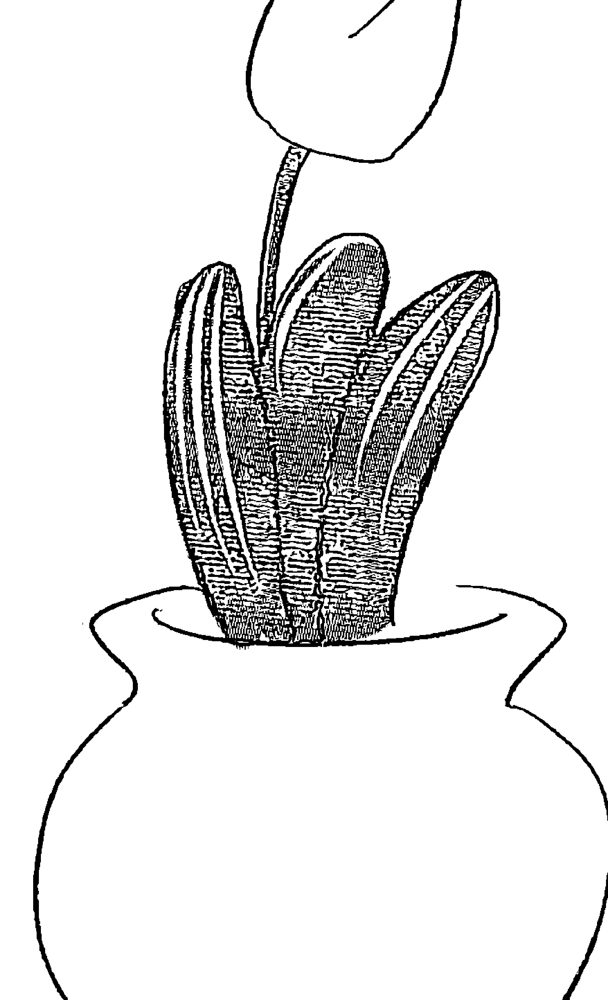

## 第五篇

## 吸引力法则之

## 求爱奇招

> “爱，像炭一样，烧起来时会想办法让它冷却，不然的话，让它任意下去，将会把一颗心烧焦。”
——莎士比亚（W. William Shakespeare）

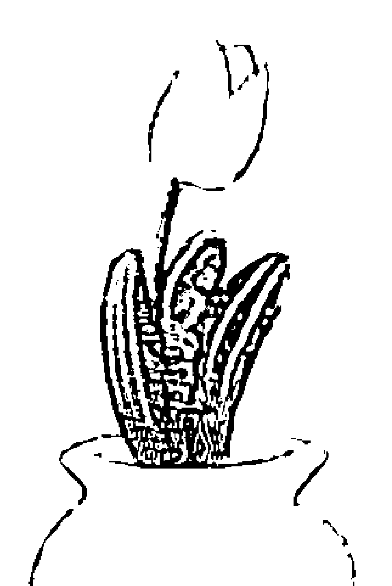

### 第一招 祝福劈腿男友，就能获得幸福？

近年来劈腿好像成了一种流行，而对男女朋友的用情不专，究竟该选择继续交往还是潇洒分手？我的博客就有这么一则留言：

> > 我的男朋友劈腿了，我不知道是否应该继续这段感情，还是结束？目前是倾向于结束，请给我一些建议，好吗？

当时我给了这位网友如下的建议：

> > 无论你想做什么决定，只要你觉得开心就去做。就像我的座右铭：“人生以快乐为目的。人生就像一场游戏，开心就好！” 我支持你选择结束，你值得、也应该享受爱情的甜蜜与幸福。带着感恩的心，谢谢这段感情曾经带给你的美好回忆，把自己调整好，你终将会召唤你真正的灵魂伴侣来到你身边。

至于你的男朋友，大家好聚好散。请你给他真诚的祝福，祝他快乐、幸福。你可能会问：“你没说错吧？那个男人劈腿、对我不忠，你还要我祝福他？”是的，我要请你真诚地祝福他。原因有二——

- 一、原谅别人，就是解放自己。不要再拿别人的错误来惩罚自己。
- 二、根据吸引力法则，祝他幸福，你也会得到幸福。如果你生气、难过，甚至怨恨，只会给这些负面情绪灌注能量，而且还会吸引更多让你生气、难过，甚至怨恨的人、事、物，那不是太冤枉了吗？

假如你觉得祝福他好难，你做不到，甚至不愿意，这样会让你产生很复杂的感觉，没关系，慢慢来，这需要一点时间，我跟你分享如何处理：当负面情绪出现时，不要逃避、不要抗拒，也不要视而不见。用心观察你的感觉，允许它的存在，全然地感受它，跟它在一起；并且感受它让你身体不舒服的感觉，最后宽恕它、释放它，试着跟自己对话，这样会慢慢消除这股复杂的情绪。

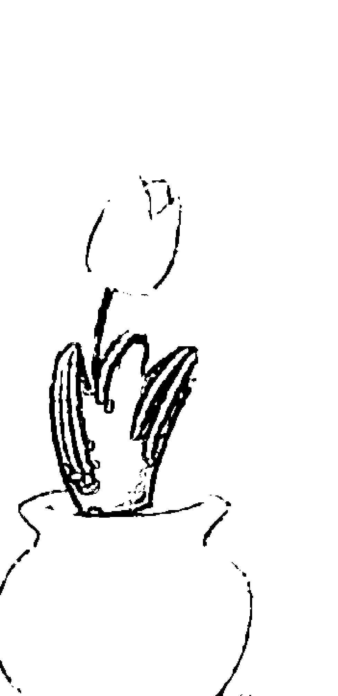

### 第二招 如何分辨宇宙爱的信息？

曾经有人质疑:“我百分之百相信宇宙，所以就算我整天躺在家里，愿望也应该会成真，反正宇宙会帮我搞定。”当然也有这种可能，而且我也肯定他对宇宙的信任，但他忽略一点：宇宙可能会给他一些信息与灵感，他必须去做才行。

关于这一点，以下这则博客留言就是一例：

> 其实我很想约我前女友出去玩，在我读到《秘密》之前，我约过她，她都表示不要，可能还是很怕我吧。可是读过《秘密》之后，我的想法和感觉都变得很正面，书里说到要放手，如果我又去约她，这样会起冲突吗？抑或不管做什么事情，宇宙都会愿意支持我、帮助我呢？

这位网友所谓“起冲突”究竟是指跟前女友起冲突，还是跟书里指导的内容起冲突？看起来应该是后者。于是，对于两者我都提供了我的看法，当时的回复如下：

> > “放手”并不是指“放手不管”，而是“放心地让宇宙接手”，百分之百相信宇宙会帮你搞定这一切，但你仍要全力以赴做你想做、能做、该做的事。
>
> 你想做的，是约前女友出去；你能做的，就是约她出去；你该做的，是在邀约之前先调整好自己的频率，观想她答应你时的兴奋心情，一起出游的美好感觉等，所以你还是要 Do Something（做些事情）。
>
> 有个笑话可以贴切地说明 Do Something 的必要性：有位虔诚的神父对天主绝对忠诚，他相信自己一生对天主完全信任，如果遇到危险，天主一定会出面救他。
>
> 有一天，村庄严重淹水，村民纷纷走避，只有神父还死守着教堂，他相信天主一定会救他，因为他十分虔诚。
>
> 水淹到神父的腰部时，消防员开着橡皮艇来救他，神父却说：“你先救别人，我没关系，天主一定会来救我的！”于是，消防员开着橡皮艇走了。
>
> 慢慢地，水淹到了神父的喉咙，眼看着神父就要灭顶了，此时有架直升机飞过来，机上的救难员对神父大喊：“赶快上来，不然会没命的！”神父说：“你先去救别人，我没关系，天主一定会出现来救我的！”
>
> 于是，直升机又飞走了。最后——神父挂了！不过，神父心有不甘，心想天主为何在他最危急时没有出现。于是，当他遇见上帝时便问道：“我最敬爱的主啊，我对你如此虔诚，为何你不出手救我？”
>
> 上帝拿出 Notebook 查询了一下便回答：“有啊！我不是派了一艘橡皮艇和一架直升机去救你吗？”
>
> 神父要上帝救他，但也得他愿意爬上橡皮艇或直升机才行呀！所以有时不能固执己见或死脑筋，这对运用吸引力法则是没有帮助的。

在此只有一个小小的提醒：在梦想达成之前，不要让心里的小声音影响了你，也就是所谓“阻碍的念头”。比方说：

- 我们会一起出去玩，“但是”她已经拒绝我很多次；
- 我们会一起出去玩，“但是”不知道她会不会答应。

你的言行举止和想法都要跟你的梦想一致，否则就是没有全然相信宇宙。

另外，假如你的态度是诚恳的、心无杂念的、热情的、喜悦的、乐于分享的，就算她暂时没有答应你，也不会跟你起冲突。

基本上，只要你有求，宇宙必应。在你念头一起的时候，宇宙就已经把东西准备好等你接收了。所以你必须调和自己的频率，让自己处于爱、欢乐、正面、分享、感恩之中，这就是处于接收的最佳状态！

在梦想达成之前，不要让心里的小声音影响了你。

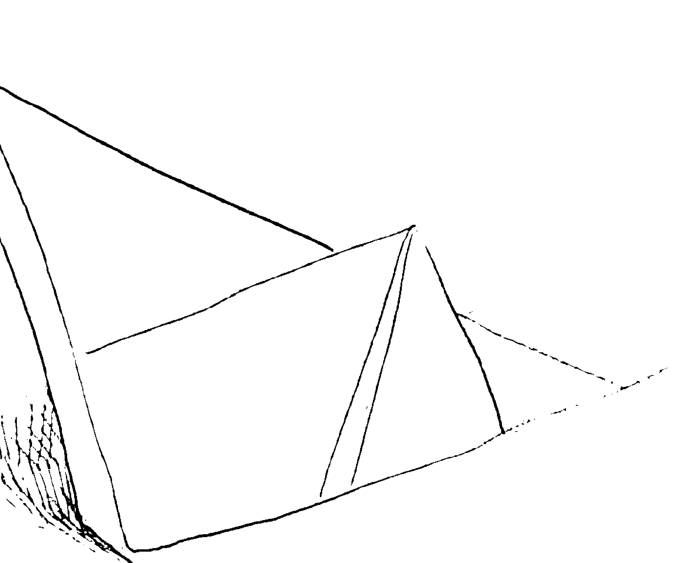

### 第三招 如何用吸引力法则恢复新婚时的甜蜜？

婚姻是人生十分重要的历程，想要在婚姻路上走得平顺，学会吸引力法则将会大有帮助，以下这则博客留言或可供读者参考：

> > 我与老公结婚半年，十分相爱，但也十分不适应婚姻生活。一月初，我们决定暂时分居一段时间，避免感情继续被磨损。虽然知道他很爱我，但我仍然心如刀割，始终患得患失，一天到晚胡思乱想，一星期内瘦了两公斤。
>
> 一个星期前，我在书店发现《秘密》这本书，于是开始练习吸引力法则。我现在有个小小心愿：我想要老公来接我回家，恢复我们刚结婚时的快乐生活。
>
> 我每天很认真地观想，也开始练习把心思转移到工作上。我试着相信我们的爱情，相信他，相信我自己，相信宇宙会给我想要的。请大家帮帮我，我需要大家的支持。请为我祈祷，让我这个跟老公一起回家的小心愿可以快快实现！
>
> 其实我老公就是我用吸引力法则吸过来的，但当时我并不知道自己用的就是吸引力法则。他出现的时候，我相当震惊：这个人怎么跟我梦想中的男人一模一样？后来我们会出问题，也是吸引力法则，只不过是反面的，我一直胡思乱想，一直怀疑他哪一天会突然不爱我了。还好，现在正面思考又回来了。
>
> 宇宙，请处理我的订单，感谢你，感谢大家！

这位网友寻求大家的支持，希望有更多朋友为她祈祷，这是很好的做法，集合众人的力量，会以等比级数的方式倍增。当时我给了她如下的建议：

很多人心想事不成，原因是下订单的方式错了，你说：“我想要老公接我回家，恢复我们刚结婚时的快乐生活。”你知道哪儿出了问题吗？前面三个字“我想要”，我直接引用《与神对话Ⅰ》①的内容回复你，会比较清楚。

“我”这个字是发动创造引擎的钥匙。“我是”这话是极其有力的。它们是对宇宙的声明、命令。无论跟在“我”字后面的是什么，往往会显现在物质世界里。所以“我”+“想要（want）成功”产生出你缺乏（wanting）成功。“我”+“想要钱”必然产生出你缺乏（wanting）钱。它无法产生其他东西，因为思想、语言是创造性的。行为也是，如果你的行为说你想要成功和金钱，那么，你的思想、言语和行为是一致的，而你一定会有这些“缺乏”的经验。

所以你懂了吗？以后请别再说“想要”，而要以我“有”或我“是”来取代。如果改成我“有”或我“是”，但听起来连自己都无法相信的话，那就改成你能接受的思想，例如“我渐渐”或“我正朝目标迈进”等。

还有你提到的祈祷，我同样引用《与神对话Ⅰ》第21页的内容回复你：

> 正确的祈祷永远不是恳求的祷告，而是感恩的祷告。

① 想更深入了解许多吸引力法则的运用模式，“与神对话”系列的书值得一读，我大力推荐。

当你为了现实生活里必须经验的事而预先感谢神时，实际上等于承认它就在那儿了。所以，感谢是对神最强而有力的声明；一个在你未要求之前，就确定神已应允的声明。所以，绝不要祈求，而要“感激”①。只要做这个小小的修正，梦想实现之日就不远了。

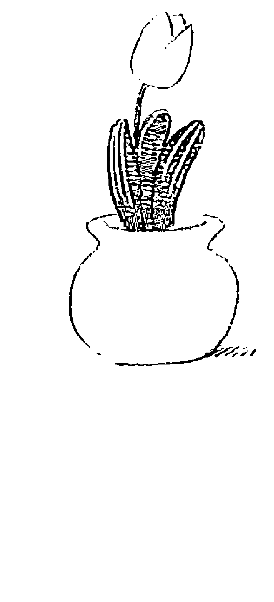

### 第四招 如何用吸引力法则挽回女友的心？

爱情一直是人生中不可或缺的重要课题，许多人深陷其中，为爱所苦、为情所困，因而衍生出许多不同的问题，就像以下这则博客里的留言，男主角不知所措的心情，相信许多人都曾经有过：

> 我跟女友分开已经两个月了。我们在一起三年。在这三年中，我的坏脾气跟固执的个性，还有自我主观的强硬、孩子气、任性，真的让她很辛苦。终于在去年十二月初，她提出了分手，我很努力地挽回，甚至完全改变了自己，没发过一次脾气，到现在为止也成了完全不动怒的人，但她跟别的女孩子不一样，一旦下定决心，就是吊车都吊不起来般地坚决！

在我看了《秘密》之后，我坚定地告诉自己：“去吧！去找你要的吧！既然你真的要她，就不要再犹豫了！”所以我很努力地用这些想法跟意念渐渐改变了状况，让她对我态度好转了。我却开始因为自己某些想法偏差，而扰乱了意志。当她跟谁很好、当她不知道跟谁出去、当她怎样怎样了，我就开始乱想，想着她会不会被抢走、我可能会没希望等。

当这些想法出现时，我发现她对我的态度又坚决了，明明知道不能想这些，可是我却想了；明明知道会打乱一切，我还是没办法逃脱那些想法。请问我该怎么做、怎么想，才能让自己不被其他外在因素影响？才能让我挽回她？我不知道该怎么做，我只知道自己非她不可，拜托你教教我，如何改变想法、如何面对那些外在因素，有没有最正确、最好的方法，可以更加坚定我的决心与意志？例如什么时候该冥想什么，什么状况要怎么想之类的。请给我意见，让我有更多信心去面对。

感情的事跟世界上所有的事一样，都取决于我们的情绪频率，而情绪频率取决于我们的感觉。因此，我给了他以下建议：

虽然每个人都有他的自主想法，但你的想法与感觉仍然有机会改变这一切。因为你很在乎她，所以会把大量心思与注意力投注在她身上，这是人之常情，没有什么不对，叫你不要想也不可能。不过，目前看来，你的想法似乎从不安、恐惧中出发，这不是好现象，所以你要学会扭转这些想法。

方法非常简单，我把这个练习称为“半杯水练习”，也就是大家熟悉的“正面思考”。你所有的思考可以在一瞬间改成正面的，举例说明：只剩半杯水→还有半杯水；地上有狗屎，好臭→还好看到，没有踩到；不知道她跟谁出去，会不会被抢走→还不是别人的女朋友，我还有机会。

另外，一个辅助的强效方法是感恩。感谢所有发生的一切，感谢你的前女友、感谢她提出分手、感谢她让你有学习成长的机会。其实从灵性的角度出发，这是你的灵魂选择要有这样的体验，所以你会有这样学习的功课。

正面思想和感恩练习并不容易做到的事，但还好不是做不到，只要多练习。不管你要什么，跟宇宙下订单的流程都是一样的：

- 一、找出你不想要的事物。
- 二、从你不想要的事物里，找出你真正想要的事物。
- 三、去体会“已然拥有”的美好感觉。
- 四、注意聆听宇宙给你的信号，并让自己保持轻松愉快，信任宇宙会将结果呈现在你面前。

以你的状况，建议你可以想以前在一起时的美好时光，让自己感受那种真实又幸福的感觉。

冥想很重要，不管目前处于什么情绪等级，不管任何时间，随时都可以做。最佳时段是每天早上九点到十二点，以及满月之夜的凌晨零点到三点。

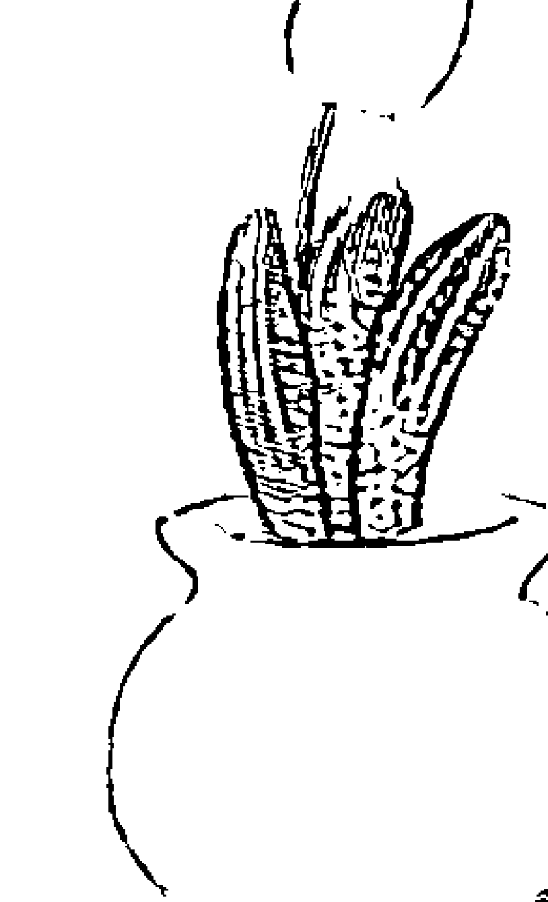

### 第五招 具体实践了吸引力法则，女友却逃婚了？

有些事情是我们不愿发生的，但不代表它不是我们吸引来的。发生在我们身上的一切，都是我们吸引来的。我们的思想是有频率的，我们不知道它“显化”的时机。若是过去长久的惯性思考所累积的能量达到一定程度，就会创造出实相。以下的博客留言足以说明：

我有个朋友跟他女朋友在一起两年后，终于要结婚了。朋友开心得不得了，筹备了几个月，喜帖也发出去了，一切都准备好了。在那几个月期间，他忙完后都会找我们一班朋友喝酒聊天，他很开心、很兴奋，根据吸引力法则，他的频道是正面的、强烈的，应该会吸引同类的事物。可是，他女朋友就在结婚前几天逃婚了，还拿走他一笔钱，请帮我解释以上案例，好吗？

我朋友可说是完全做到了吸引力法则所要求的条件，他“请求”（ask）他女朋友结婚，他“相信”（believe）他女朋友会答应嫁给他。他也已经去“接收”（receive）了，他也常“观想”两人结婚的幸福场景。总而言之，身为他好朋友的我，真的能感受他当时的“频率”有多强，连身边的朋友看到他那么开心都会跟着高兴起来。他的确感觉良好、兴奋、感恩、观想，可是为什么还会这样啊？

我很想相信《秘密》里的东西，可是朋友发生了这些事，怎样也无法说服自己。如果一切都如《秘密》里面所说的，那么就不会有那么多人被骗了，被骗的那个人，一定也是达到吸引力法则的条件：“请求”、“相信”、“接受”。

他们请求了，他们也相信，因此他们感觉良好，所以才会“被骗”，被爱情骗子所骗。而骗人者因为正在骗人，也会担心谎话被看穿。吸引力法则说“相信”、“开心”是正面的信号，“怀疑”、“担心”是负面信号，也就是说，骗人者发出负面频率，被骗者发出正面频率，那为什么“心想事成”的是骗人者呢？

很多问题如果只看到表象，就无法用吸引力法则来解释，当时我给这位网友的回复如下：

你看到的是你朋友“一部分”的想法，可是我们无法得知他惯性的想法以及更深层的想法（可能连他都不清楚，也就是所谓的潜意识）。他对婚姻的看法如何？有没有可能是“贫贱夫妻百事哀”？他生长在什么样的家庭？有没有可能家庭不幸福、不美满？有没有可能他从小耳濡目染大人们或媒体对婚姻的恐惧、不信任、背叛，而不知不觉受到影响？

你可能会说：“可是他最近几个月都在想他要的、美好的部分呀！”就像他一直在还钱（每次还一百元），却仍一直欠钱（欠人家一百亿），自己认为最近很正面，但跟之前累积的负面能量相比，可能根本微不足道。

因为深层的想法作祟，才会让两个看起来不同频率的人碰在一起，其实骨子里的频率是相同的。事件的发生，正负双方是一体的两面，所以它们其实属于同一个频率。就像手心和手背都是手，只是看的角度不同。

例如打人与被打，小偷与被偷的人，也是同样的道理。吸引力法则并没有说不能拿来为非作歹，只是做坏事的人会受到所处环境的道德规范的谴责与法律的制裁。然而，事情的好坏由谁定义呢？搞不好你所谓的爱情骗子会说“我是在教那些小女生了解爱情的残酷”，甚至根本不认为自己是爱情骗子。

所以我们无法对发生的事做任何判断与批评，因为我们不知道发生的原因以及目的。

你说你很想相信《秘密》里的东西，可是朋友发生这些事，怎样也无法说服自己。我必须很诚恳地告诉你：不管你有没有说服自己、相信不相信、喜欢不喜欢，吸引力法则永远都在起作用，就是将跟你的振动频率相符的人、事、物，带到你面前。

因此，如果你想要心想事成，创造经常处于爱、喜悦、感恩、奇迹的幸福人生，我建议你花最短的时间，让自己成为这个领域的专家，就可以运用你的能力，去帮助那些需要帮助的朋友！

### 第六招 如何用吸引力法则赢得真爱？

“活在当下、爱、感恩与祝福”，这几个字看来简单，实行起来可是一门学问。一旦学会了，一辈子受用无穷。如果你想学会这门学问，那么以下留言或许可以让你获得启发：

我和男朋友很相爱，可是后来发现他是个有妇之夫，还有两个小孩。我发现他的身份时，他已经单方面对他老婆提出离婚，但因为法院判定感情没有破裂，所以离不成。

他老婆不愿意协议离婚。她曾告诉我，她很恨她老公，他那样伤害她，她也不会让他好过，如果就这样离婚，实在太便宜他了。她说要么就给她几百万，要么就要她老公永远没有小孩的探视权，我男朋友没那么多钱，让他永远不见小孩也不可能。

认识他三年了，为了离婚的事，我们吵过很多次，从去年开始，我不再主动和他联络，也没有再见他，但他仍每天打电话发短信给我。虽然我不理他，但心里其实非常爱他，一直希望他能离婚。

半年前我接触到吸引力法则，就开始运用，常常观想我和男朋友相处快乐的画面，很幸福的感觉，我男朋友也好像真的被我吸引，不停打电话给我，但因为他没离婚，我对他很冷淡。其实想一下，是不是我观想得不对，因为现在我和男朋友的感情没问题，问题是他没有离婚，所以就算我和男朋友感情再好也是枉然。

我应该要怎样观想？观想他们离婚吗？但又觉得要他们离婚好像很不道德，而且那是他们两个人的事，还有两个小孩的将来，宇宙不一定会帮我，请问我应该怎样运用吸引力法则？

她老婆常在我面前抱怨说我男朋友很少回家，回家也只看小孩，和她分床睡。其实他老婆也想离婚，但因为她咽不下这口气，而且自己没有工作，也没有经济能力，怕面对离婚后的生活，所以一直不肯协议离婚。

我心里常常挣扎，如果真的离婚，他老婆和小孩就很惨，但他们不离婚，我就会很惨。到底我要抱怎样的## 心态，宇宙才会帮助我？

读完这则留言，我最想了解的是：假如这两个人如此相爱，为什么男主角没离婚，就换来女主角对他的冷淡？于是我如下回复：

> 如果你们这么相爱，为什么他没离婚，你就要对他冷淡呢？我不是替他说话，或许他没离婚违反了你的心意，但光是你这个举动，就会让你们三人陷入胶着状态。你对他冷淡→你不开心→他不开心→他老婆不开心→不愿离婚→你不开心→对他冷淡，看懂了吗？

> 假如这个男人值得你爱，你也愿意爱，就请你接受他的一切，别让自己搞分裂，心里明明爱他，却不找他，还对他冷淡，这又何苦？让心里想的、嘴巴说的、实际做的合一吧！帮自己一个忙：多爱自己一点吧！把握你们在一起的时光，不管你想什么、做什么，都要以自己会开心为前提。

Feel Good是心想事成的终极秘技。假如没有办法让自己心情好，那么一切都是空谈。静下心来，花点时间想想：为什么你希望他离婚？他离婚之后，你的感觉是什么？是可以得到完整的他，还是代表他对你的真心，还是你们可以共组家庭？找到答案之后，又是什么感觉？再继续往下挖，找出那最源头的渴望，然后直接追求拥有渴望后的行为、生活质量和心境，不必等他离婚后。这才是重点，不是吗？别被表面的俗事所蒙蔽了。

学会爱与祝福，爱是一切的源头，让自己的一切思想、语言与行为都充满爱。离婚是好是坏、道不道德，跟安乐死一样，没有标准答案，只要是从爱的角度出发，就错不了。

让我们整理一下你现在能做的：

- 一、每天起床时静坐十五分钟，详细说明请参考本书第41页“静心的方法与技巧”一文。
- 二、不管你想什么、做什么，都要以自己会开心为前提。
- 三、找出你要他离婚的真正原始渴望，并直接追求拥有渴望后想拥有的行为、生活质量和心境。
- 四、观想你跟男朋友“已经”在一起的美好感觉。
- 五、练习让自己从“感恩”的角度看待任何事。
- 六、让自己的一切思想、语言与行为都充满爱。
- 七、每天都发自内心，诚挚地祝福你男朋友、他的妻子、他的小孩可以幸福快乐。

试着努力去做，我保证你们三人的生命都会发生不可思议的变化。宇宙是爱你的，它一定会顺应你灵魂的原始渴望（不见得是你的欲望，但肯定是宇宙对你最好的安排）。祝福你！

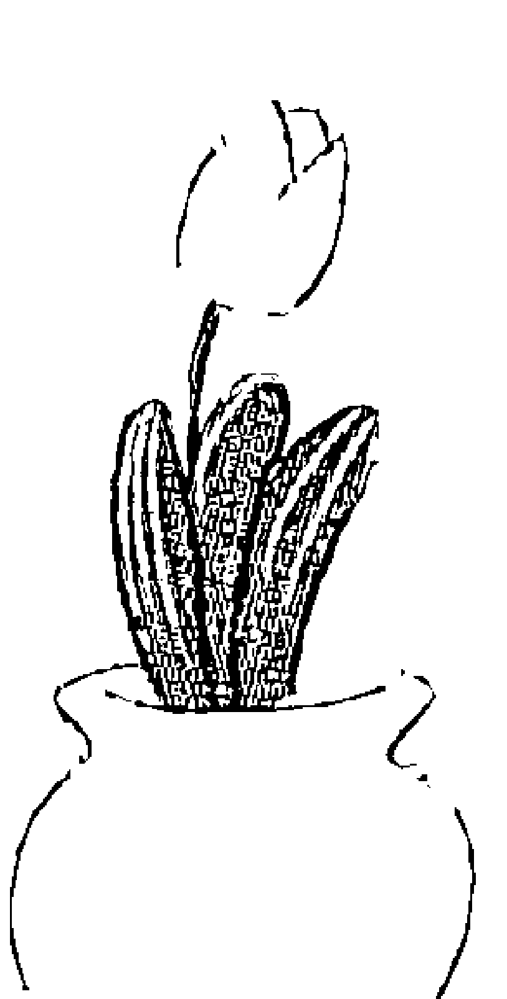

## 第七招
## 唯有先爱自己，才能为人所爱

人常常为执念所苦，尤其是恋爱中的男女，我的博客里就有这么一则令人心疼的留言：

> 我和交往三年的男友因为第三者的出现而分手了，但我真的很爱我的男友，虽然他一再跟我强调“我们永远不可能”、“我们没机会”、“就算没有她，我们也会分手”，但是我还是很想跟他复合，于是我每天想着“他一定会回心转意重新爱上我，我们会复合”，天天观想着我们复合以后的样子。

我试着观想“跟他出去、假装跟他约好要出去，忙着梳洗、换好衣服准备出门”，也的确两次都成功地和他出去了。我也试着观想我们一起过夜的种种景象，也真的成功地和他过夜了，但就在前几天成功地一起过夜之后，他突然对我非常冷淡，不接电话，也不回电给我，不然就是接起来电话很凶地骂我，然后很烦地挂电话。

但我真的天天想着一定会和他复合、一定会重新开始，为什么最后他却选择对我冷淡？甚至开始和我保持距离？我到底该怎么做才好？我真的很爱很爱他，不能没有他，我确定这辈子要的就是他，我觉得自己比那个女孩更爱他！

我到底该怎么做才好？我失了头绪，完全不晓得该怎么做才好，谁可以给我答案？为什么用了秘密法则下订单，天天观想复合后的样子，情况却反而更糟？还是其中我做错了吗？

本来和他关系好转，我渐渐能控制负面情绪，但这几天这样下来，总觉得自己快要失控了！请不要劝我说他不是对的人，因为我只想要他，只想嫁给他、跟他共度一生。

从这位网友的文字陈述中，我觉得她被一股非常强大且混乱的思想所缠绕，她已经整个失控了，很多人想给她答案，但是她只接收自己想要的答案，只要是不合意的答案，就会充耳不闻。

唯有先爱自己，才能为人所爱！

她最需要的不是大家的建议，而是需要发泄、需要时间，这是她重要的人生课题，唯有学会爱自己，她才能摆脱这样的轮回，否则类似的事件一定会一再发生。于是，我给了她以下回复：

> 从你的字里行间，我感受不到你爱自己，你又怎能期待别人爱你？你是否用“希望别人对待你的方式”对待自己吗？如果我跟你说：“就是因为你太爱你男朋友，所以他才不爱你！”你能接受吗？

> 因为你非常在意，所以你的注意力会一直聚焦在这个事件上。但每个事件都有两面，有你要的一面，以及你不要的一面。你现在聚焦在你不要的那一面，而且思绪很混乱，就更无法运用吸引力法则吸引你要的东西。

> 所以现在先别管这些，我建议你先停止焦虑，让自己冷静下来。你唯一该做的就是让自己开心。唯有如此，你才能脱离这种恶性循环，也才有创造自己幸福的机会。忠言逆耳，请慢慢消化个中道理。祝福你！

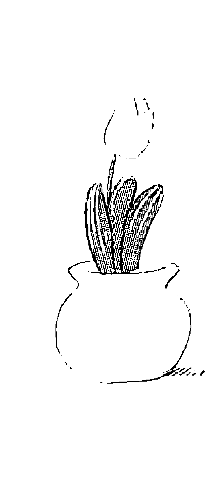

### 第八招
## 如何借吸引力法则处理负面的情绪？

当人们遇到自己不喜欢的事，却还要告诉自己这是我吸引来的，的确很难令人接受。就像乔·瓦伊塔尔（Joe Vitale）博士说的：

> > 这是最难了解的概念之一，然而一旦接受了它，你的生命就改变了。

以下这则博客留言就是一例：

> 一起多年的男友一直有个暧昧的对象，从我们在一起开始就没间断过，直到最近我才知道此事。如果说身边的事物都是自己吸引来的，那么他的出轨也是我的负面能量引起的吗？这一点我很难接受。

> 事情发生之后，我们花了很多时间想要解决。但是除了互相拉扯，并没有解决任何事。要再相信他，对我来说太难，我决定放弃这段关系。我知道我要好好爱自己，才能走向更好的未来。每晚睡前我都会告诉自己，我是个好人，我值得被珍惜。

> 可是负面情绪的力量有时候会大到无法转换的地步，所以我时而愤怒、时而平静，有时候以上皆是。请问我该如何练习情绪的转移？

当时我给了她如下的回复：

- 一、 你曾经聚焦在自己不想要的事上（担心他出轨、觉得自己不够好等），所以它成为你体验的一部分。或许你非常重视这段感情，但就是因为太重视，反而更容易聚焦在你不要的另一面上。
- 二、 你有其他的负面情绪，它的振动频率跟他出轨的频率是相符的，所以你把它吸引过来。你的人生经历或许有不为人所知的恐惧、压力或焦虑，而这些负面情绪终将会浮现出来，创造并吸引你不喜欢的实相。
- 我支持你决定放弃的选择，也肯定你的想法。任何人都值得、也应该过好的生活，享受爱与被爱的甜蜜与幸福。

其实人生就是一连串的选择，就连心情也是一样。

我们无法选择“已经发生”的事，但是我们可以选择面对的心情与态度。假如你用“加法”来看待这期间的收获，你就会发现你学到了很多、进步很多。你知道自己是好人，你值得被珍惜、你不会再浪费时间在不对的人身上、你学到了如何爱自己，这是多么值得开心的事呀！

情绪的转移，就是做让自己会开心的事。所以，怎样会让你开心呢？

或许刚开始你可以吃点甜食，做些让自己开心的事，让自己转换心情。但如果都做不到，那就让自己心情不好一阵子也没有关系，就像有白天就会有黑夜，我们的情绪也会有高低起伏。

负面情绪其实是我们的身体对人、事、物或思想的一种反应，所以我会告诉它：谢谢你让我察觉到这些，我知道了，所以你可以走了。

### 第九招
如何用吸引力法则
找到合适的伴侣？

在吸引伴侣时，除了说明对象的特征与个性之外，更重要的是你想和对方创造什么样的感觉及体验？就像很多女生喜欢又高又帅的男生，但是他可能很花心，你只会体验到被背叛的心痛。找出自己所要对象的真正原因，可能到最后你要的是被保护、被珍惜的感觉吧！

在我的博客里，就有这么一则为情所困的网友的留言：

> > 我喜欢一个男生，但他身边总少不了女孩子对他好，他说他没有女朋友，但有次在玩他手机时，却发现他也会主动约其他女孩看电影，我用了张德芬老师说的祈祷文祈祷：“宇宙啊！我想要XX跟我的互动愈来愈多、主动关心我、陪着我，感谢你，为我移除阻碍这件事的信念及模式，并以你认为最好的方式成全我。”但我又想：如果XX不是宇宙认为对我最好的，但我很喜欢他，宇宙又不给我，那我不是要去承受失落的痛苦吗？这不是很矛盾吗？

针对这位网友的问题，我给了她以下的回答：

> 从你的文字里，我感受到你对自己似乎不太有信心。因为我看到的是其他女孩子对他好，但不代表你就没有竞争优势，他主动约其他女孩看电影，不代表他就有女朋友，结果如何都还不知道，你怎么能先假设宇宙不给你呢？

> 看来这些都不是你要的，同意吗？既然如此，就不需要再想这些问题了，这样只会在这些你不要的事情上灌注能量而已。

> 很棒的是，你已经用张老师的祈祷文跟宇宙下订单。假如我是你，我会把祈祷文改成以下版本，你参考看看：“宇宙啊！我想要拥有一段美好的亲密关系，我们的互动很好，关心对方，彼此真心相爱，我要这种充满爱的幸福与满足！我希望对象是XX，但假如你知道还有更好的人选，就请你帮我安排，感谢你，为我移除阻碍这件事的信念及模式，并以你认为最好的方式成全我。”

> 你要指定对象也行，但是我不建议这么做，因为我们不会比宇宙更清楚谁是最适合的人选。让别人爱你最好的方法，就是你也很爱你自己。剩下的就是让自己维持正面的情绪与频率，放心地让宇宙完成你的梦想，所以你要对自己、对宇宙有信心哦！

> 你说假如宇宙认为那个男生不适合你，所以不给你，你岂不是要承受失落的痛苦吗？你愿不愿意试着换个“观点”去看待这件事？你可以这么认为：“宇宙啊，我相信会让我遇到XX，是为了我的学习与成长。就是因为爱我，所以才不给我XX。我愿意完全相信你，你一定会为我做最好的安排。”

> 你的想法源于你的信念，所以建议你试着换个观点，就会发现整件事将全盘改观，你的情绪也会得到平静，也更能察觉到宇宙给你的信息，你再去采取有效的行动，时候到了，你要的结果自然就会呈现在你生命当中。

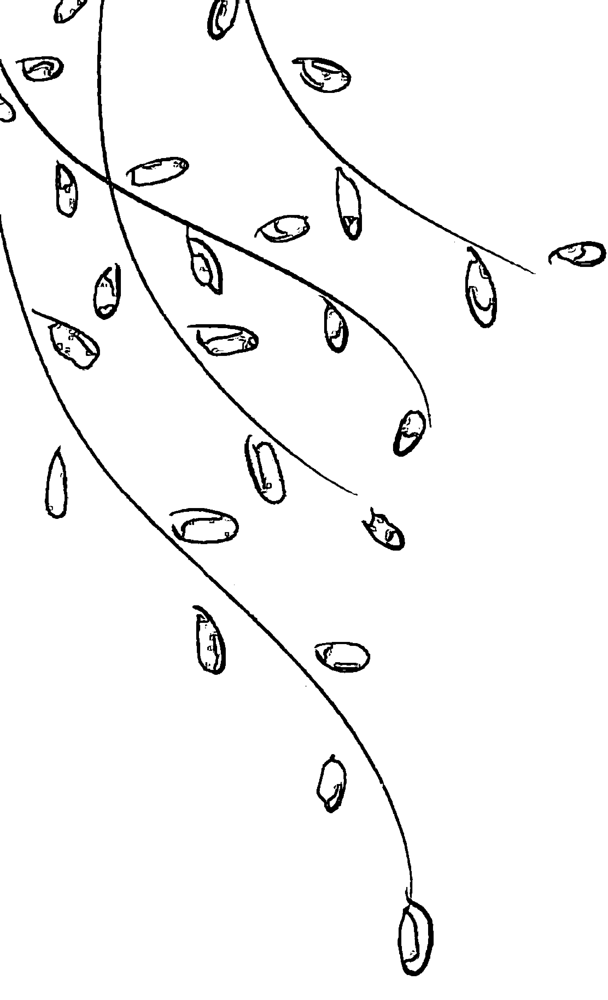

## 后记一
## 无尽的感谢

在编撰本书的内容时，再次看到先前回复网友的问与答，真是感慨万千。只是“大约”看过秘密，会有什么效果呢？

不知道有多少朋友，明明很幸运地接触到《秘密》，却在还尚未明白书中道理的情况下做了不正确的操作，当然，吸引不到理想的结果，从而对吸引力法则产生怀疑，甚至误解，从此之后，吸引力法则在这些朋友的生命里就“船过水无痕”，痛失转变生命的契机。

还有一种类型的朋友，刚接触《秘密》时充满感动与斗志，也的确尝到一些甜头，但也仅止于此，没有做更深入的探讨。就像陶渊明一样，他喜欢读书，但不拘泥于字眼，只要领会意思就可以了。他在《五柳先生传》中说自己是：“好读书，不求甚解，每有会意，便欣然忘食。”陶渊明写的诗就像他的为人，平淡自然，如同天成。所以虽然他自称“不求甚解”，不过“求甚解”的人中却很少有人如陶渊明那样写得出好诗。假如我们还不到陶渊明的境界，还是求甚解就好！

我在讲课时，都会问学员一个问题：“《秘密》的书和DVD看过几遍？”看十遍以下的占了百分之九十九。像吸引力法则这么庞大的系统，我不认为只看一遍就能了解。我举例说明，让大家更能了解我想表达的意境。

书中提到，运用秘密强效的方法，就是“感恩”与“观想”。看来这是“心想事成”很重要的关键，但是请问各位：何谓“感恩”与“观想”？既然这么重要，你有每天“感恩”与“观想”吗？每天要花多少的时间“感恩”与“观想”呢？要如何“感恩”与“观想”才会有效果？“感恩”与“观想”有没有什么步骤或流程？“感恩”与“观想”时，有什么特别要注意的吗？“感恩”与“观想”时，有没有什么辅助的工具？要“感恩”与“观想”多长一段时间，才会有成果？有没有什么方法，可以缩短时间而且一样达到效果？

在书中，“感恩”与“观想”只是两个名词。即使你记下来了，变为你的知识，但这样还是不够，你必须用“研究”的精神，也就是“求甚解”，将整本书的内容融会贯通，并实际在生活中操作，根据得到的结果，反复修正，直到熟练为止。

之后你就会发现，只看一本书是不够的。因为随便一个名词，都有专门的书或课程在做更深入的介绍。经过漫长的学习之旅，最后才发现，其实吸引力法则根本不需要实践。看到这里，你的第一个念头可能是：这是在“装肖维”（闽南话，装疯卖傻的意思）吗？

容我解释一下，就像《情绪的惊人力量》①书中提到的：“你不需要实践地心引力，地球上所有的一切物质，时时刻刻都在受地心引力的影响。你不需要地心引力专家教你如何防止自己往上掉，这是不可能的事，这根本不会是问题，你没有选择，你永远只会往下掉！”我会说吸引力法则不需要实践，是因为不管你知不知道、相信不相信、喜欢不喜欢，它永远都在作用，就是将跟你振动频率相符的人、事、物，带到你面前。

我们可以不需要地心引力专家，但是假如你想要通过活学活用吸引力法则，创造经常处于爱、喜悦、感恩、奇迹之中的幸福人生，那你肯定需要吸引力法则专家，甚至让自己成为专家！

亲爱的朋友们，不论你是通过看书、上课、上网找数据、与朋友探讨等任何渠道学习，我都诚挚建议你花点时间、金钱，投资在学习吸引力法则上面，绝对是明智的选择。请容我再强调一次，通过活学活用吸引力法则，你可以心想事成，创造经常处于爱、喜悦、感恩、奇迹之中的幸福人生！

我现在每天都在做我爱做的事，在我全心投入架构现在的创业加盟团队之前，假如没有去上课或教课，我的每日行程是这样的：

- ◦ 每天睡到自然醒（我没有很颓废，八九点就起床了）；
- ◦ 放松心情，感恩宇宙之后，静坐发功一下；
- ◦ 带着爱犬一起去跑步；
- ◦ 回来洗澡后，看一小时的书；
- ◦ 整理新书的内容；
- ◦ 吃午餐，休息；
- ◦ 上网回复朋友在博客里的留言；
- ◦ 天马行空，设计上课教材；
- ◦ 吃晚餐，和家人聊天，享受天伦之乐；
- ◦ 练吉他；
- ◦ 看书，看累了就睡，不会超过凌晨一点。

对了，我平均一周休五日。会分享这些，不是炫耀，而是想“利诱”大家，希望各位可以多花点时间学习吸引力法则。当然，选择权在于你，无论你的决定是什么，都没有关系，高兴就好。

也感谢正在看书的你，你的肯定与支持，是我继续向前的动力。

我要向在我人生最穷困潦倒的时候“强迫”我看《秘密》的杜瑶莉和三姐，以及所有出现在我生命中曾经鼓励、影响、启发、支持、肯定我的每一个人，献上我最诚挚的感谢。

感谢很多朋友及学员的支持与信任，愿意将自己的问题告诉我，才会有这本书的诞生。

- 我也要向所有“吸引力法则”系列书籍的作者致意，包括：
- 《秘密》的作者朗达·拜恩及译者谢明宪
- 《吸引力法则：心想事成的黄金三步骤》的作者麦克·J·罗西尔
- 《与神对话》的作者尼尔·唐纳德·沃尔什
- 《创造金钱》的作者珊娜雅·罗曼与杜安·帕克
- 《把好运吸过来》的作者琳·葛雷朋
- 《引爆吸引力》的作者乔·瓦伊塔尔
- 《失落的致富经典》的作者华勒思·华特斯
- 《有钱人想的和你不一样》的作者哈维·艾克
- 《有求必应》、《情绪的惊人力量》的作者爱思特·希克斯与杰瑞·希克斯
- 《吸引定律的秘密》的作者紫雨老师
- 《遇见未知的自己》、《遇见心想事成的自己》、《活出全新的自己》的作者张德芬

感谢这些大师分享他们的智慧，让我在研究“吸引力法则”时拥有充沛的资源。

更要感谢“光中心”的介伟哥与如珠姐，对我开设“吸引力法则”相关课程提供许多宝贵的建议；还有一直支持我、鼓励我的Secretteller。

本书能够有流畅的行文与脱俗的设计，世界图书出版公司北京公司的编辑们功不可没，感谢他们为这本书注入新的生命力。

谨以此书，献给我亲爱的父母、弟弟与弟媳，感谢他们一路以来，对我的包容、体谅、爱与支持。

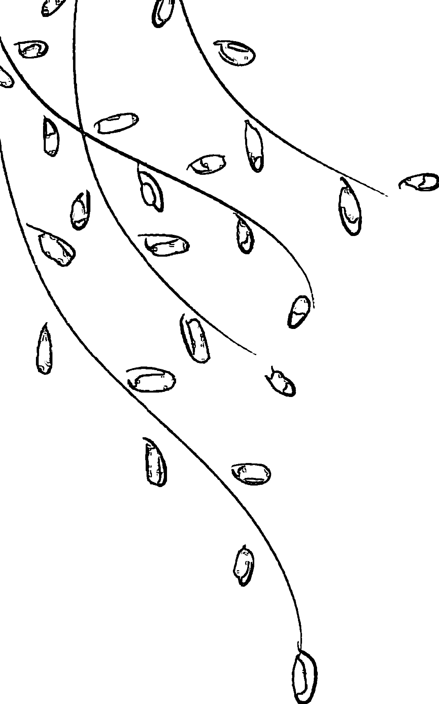

## 后记二
## 全植物性饮食VS“吸引力法则”

先前美国牛事件吵得沸沸扬扬，在此我想分享我对全植物性饮食与“吸引力法则”之关系的看法。

万事万物皆由能量组成，包括人类的食物在内。我是个美食主义者，吃尽天下美食肯定是我的订单之一。然而，当我更加了解能量的状态后，已经很少吃肉了，而以有机、全植物性饮食为主。

想象一下，当一只动物被送进屠宰场，准备被人类宰杀的时候，它的腿不停地颤抖，它知道生命已到尽头，那种哀戚、恐慌的情绪，你认为它的能量状态如何？假如能量不灭定律是真的，那么这些振频极低的能量会残存在肉里，进而跑到人类的肚子里。

当人们吃进这些低能量的东西，自然而然会降低原本的振动频率。假如混沌、低落的能量状态是你的主要频率基调，你又如何创造美好的实相呢？

或许有人看到这边会有不一样的想法，《零极限》一书的作者蓝博士和亚伯拉罕信息①在《情绪的惊人力量》一书中都曾提到：“吃什么不重要，怎么想比较重要；危险的不是食物，而是你对食物的看法。”

如果你认为吃肉与身体健康以及振动频率没有关系，只要感觉好就OK，我也尊重。但是，能不能先请你单纯以爱护动物及珍惜地球的角度，让自己从少吃一点肉开始？

假如你知道商人为了满足人们的口欲以及商业利益，虐杀毫无自卫能力的动物，无视它们的痛苦，你还忍心吃它们吗？假如你看过动物们被宰杀的血腥画面，你不会为它们感到难过吗？

我觉得现今大多数人对待地球与生灵的态度，已经到了匪夷所思（其实我真正想写的是令人发指）的地步。

① 亚伯拉罕信息：美国最先倡导“吸引力法则”的通灵信息。1985年，杰瑞和埃丝特·希克斯（Jerry and Esther Hicks）开始与一个自称亚伯拉罕的非肉身老师团体对话。他们为人类带来了充满喜悦与和平的信息。近二十年来，两人以此为志业，推广形式包括书、录音带、有声书、录像带、工作坊，其中最广为人知的就是“吸引力法则”。

我不了解人类的文明到底是建立在什么样的基础之上？只是为了吃，我们竟然能将如此残酷的行为，加之于温驯而毫无抵抗力的动物身上，还自诩为文明创造者，到底应该感到光荣，还是感到羞耻？

剧作家乔治·萧伯纳茹素终生，有一回因足踝扭伤躺在床上，医生指示要他吃肉，他的回答是：“我宁可死去，也不愿让我的肚子成为动物的坟墓。动物是我的朋友，不是我的食物！”

你愿意相信吗？光是改变饮食习惯（由肉食慢慢改为全植物性），为地球及动物祈福，对植物表达感恩，生命情境就会有所转变。我希望通过这本书让更多朋友知道，其实“饮食”是可以以“爱”为出发点的。

黄庭禅的创办人张庆祥讲师对于如何吃得健康又快乐有很完整的分享。全文从科学、医学、健康、环保、爱护动物各种角度切入，做了相当深入的剖析，是一篇发人深省的

① 黄庭禅：“黄庭”是人身的感应中枢，它是人身之中气机感应最为敏锐多变的一个位置。当人的六根与外缘接触的时候，黄庭中都会升起一些微微的气机起伏与变化。例如我们眼睛看到亮光，心情也必为之开朗，这个开朗的感觉，就是在黄庭的气机起伏中所上演的。而黄庭禅是利用现代化的影音、动静态的活动体验，让深涩的禅学化为现代人切身的体验、解脱当下的烦恼障碍、直通历代圣贤修性了命的性理心法。

好文章。这篇文章有一万多字，由于篇幅有限，欢迎到“秘密部落”观看张讲师的大作或下载演讲录音。（网址：http://blog.sina.com.cn/chiukai）

祝福你，祝福那些动物，也祝福我们的地球。

## 后记三

## 心动，振动，行动

就在本书付梓之际，一位我很敬重的朋友问我一个问题：“如何将‘吸引力法则’运用在需要大量行动的工作上，尤其是组织营销或保险业？”

这实在是个大问题，若要完整回复，都可以写成一本书了，所以我想简单地从“内在心法”和“外在功夫”两个层面来探讨，首先分享内在心法。

大部分从事组织营销、保险或业务相关的朋友若遇到业绩不佳时，总会借由更多行动来达成目标。但是你知道吗？以“吸引力法则”来说，内在的振动没有先调整好，外在的行动再多，也只会事倍功半，甚至白忙一场，做得愈多，挫折感愈重，肯定无法填满内在振动频率的落差。

什么叫做“内在振动频率的落差”呢？假设你是从事保险业的朋友，现在没有钱，卡费缴不出来，充满了不安全感，情绪等级为21级1，于是你通过“多拜访客户”这个行动希望成交保单、增加业绩，让自己有钱可以缴卡费，让自己的心情变得很欢喜，使情绪等级晋升到3。

从情绪等级21到情绪等级3，这就是振动频率的落差。然而，再多的行动都无法填补这个落差，因为宇宙响应的不是你的行动，而是你的振动。

“感觉”就是振动频率的指针，在充满不安、焦虑的情况下行动，只会得到更多的不安与焦虑，怎么可能创造出你要的结果？相反，假如你调到适合自己的频率，并运用释放无用能量的技巧，让自己处于正面的振动状态之下再去行动，就会事半功倍、如鱼得水。

1 《情绪的惊人力量》一书中提到，情绪可以分为22种等级。第1级：喜悦／洞然明白（知识）／感到有力量（加持）／自由／爱／感恩（欣赏一切）；第2级：觉得有热情；第3级：热诚／有所渴望／幸福感；第4级：正面的期待／具有信念；第5级：乐观；第6级：充满希望；第7级：觉得满足了；第8级：无聊；第9级：悲观；第10级：挫折／易怒／没耐性；第11级：觉得招架不住；第12级：失望；第13级：怀疑；第14级：忧虑；第15级：责怨；第16级：气馁；第17级：愤怒；第18级：想报复；第19级：恨／狂怒；第20级：嫉妒；第21级：不安全感／罪恶感／无价值感；第22级：恐惧／哀伤／沮丧（忧郁）／绝望／无力感。情绪等级的第8级“无聊”是分水岭，第8级以上为正向的能量，第8级以下则为负向的能量。

根据亚伯拉罕的信息，只要维持十七秒纯然的念头，就相当于两千个小时的行动量。也就是说，假如你一天工作八小时，周休两日，只要你能维持十七秒纯然的念头，相当于你一整年的工作量！

亲爱的朋友，你要选择十七秒，还是一年？

乍听之下，你会觉得这个论点非常夸张，而且无法证明。虽然无法证明它，但是，你可以亲身去验证它。我刚听到这个论点时，没有不相信，只是觉得这个比例也差太多了吧！但是当我亲身实验之后，才感受到它的惊人之处。

当你调和好内在的振动再去行动，就会体验到什么叫做“犹如神助”，做什么事都不费吹灰之力就能轻易达成！

从事业务相关工作的人，特别是组织营销，通常会对前辈的成功经验非常向往，于是自己也参与运作，期望能一展身手，赚进大把钞票，并且帮别人压缩成功的时间，三五年后就可以功成名就、光耀门楣，过着有钱有闲的惬意生活。

然而几年的时间悄悄过去了，依然没钱没闲，甚至负债累累、失落不已。为什么会这样呢？他们也很认真打拼呀！

其实，不是公司不行、不是产品不对，也不是制度不佳，更不是组织营销的问题，而是：你心动了吗？

我曾经跟一位兼职做组织营销的朋友聊天，她的近况不是很好，虽然把大量的时间、精神甚至金钱投注在事业上，经济却一直没有获得大幅改善，但她相信只要坚持到底，终将像公司的高层领导一样，享有时间与财富的自由。

对她而言，她认为只要“坚持到底”，就能换到“时间与财富的自由”的“成功”。然而，“坚持到底就会成功”这句话只对了一半，如果没有掌握到最关键的因素，坚持到死都不会成功，而那个关键因素就是“方向”！

举例来说，我现在人在台北，对我而言到达高雄就是成功。我可以依照自己的状况与需要，选择可以帮助我到达高雄的方法，搭飞机、坐高铁、自己开车等，即使没钱，走路也有到达的一天，只要我坚持到底。

但假如我不是南下，而是往基隆的方向前进，那会得到什么结果？或许你会反驳我：“地球是圆的，只要坚持到底，还是有到高雄的一天。”但你要为此付出多大代价？要花多少时间、精神、金钱？如果方向不对，这么漫长的旅程，什么东西能支撑你坚持到底？

虽然在这个过程中，我们会学到一些宝贵的经验，但是我们也会付出许多代价，更惨的是：成功的机会微乎其微。所以，方法虽然重要，但是方向更重要！

以我朋友而言，时间与财富的自由是她要的成功，做组织营销，是她用的方法，那么，她的方向应该是什么呢？不只是她的方向，也是所有人做事的方向，那就是：喜悦。

亚伯拉罕的信息接收者希克斯就曾说过：“你不可能经由一个没有喜悦的旅程，而达到一个喜悦的终点。”

你已经知道方向比方法更重要，所以当你选择的方法不能让你有心动的感觉，或是你无法心甘情愿地接受这个方法带给你的挑战，而你也曾经努力过一段时间，却依然看不到想要的成果，那么，就暂时停下脚步，是倾听内在真正的声音及审视方法的时候了，也就是我所谓的“内在心法”。

“加入组织营销”是没有背景财力的小老百姓在M型社会要出头的最佳选择之一，就连全球畅销书《富爸爸，穷爸爸》的作者罗勃特·T·清崎（Robert T. Kiyosaki）以及美国因房地产开发成就而闻名全球的唐纳·川普（Donald J. Trump）都这么认为！

在他们合著的《川普清崎让你赚大钱》一书中提到：“如果想学做生意，却没有富爸爸教，就请加入一家组织营销公司，成为经销商，几年就好，因为他们比任何人都希望你搞懂生意是什么。”又提到：“如果你的小生意还算赚钱，接下来就要会复制自己的长处。能力的杠杆能让你举重若轻、倍数扩张。发明麦当劳的人赚小钱，复制麦当劳的人发大财。

很多人愿意在社会大众对组织营销的接受度还不高的情况下，选择投入这个事业，就是希望能够得到非凡的财富与时间自由，我对这群朋友感到由衷的敬佩。

假如你有意投入组织营销的事业，我诚挚地建议你以世界知名的营销策略大师艾尔·赖兹（Al Ries）强调的成功五大关键，跟宇宙下订单，吸引到最适合你发展的公司。或者，你现在已经全心投入组织营销，你就该尽快找出公司的成功关键，这将是你吸引人才的强效资源。以下是艾尔·赖兹所谓的成功五大关键：

- 一、独特卖点的好产品：只要是正派经营的公司，产品都不会差到哪儿去。但是产品好不稀奇，重点是该产品跟同构型商品相较之下，有没有与众不同的独特卖点？
- 二、完善的营销计划：有独特卖点的产品若不会卖也是枉然。你或公司有什么绝妙的营销计划，可以为你及团队创造更高的业绩？
- 三、好的教练：好的教练很多，但要注意教练的等级，因为教练的等级决定选手的表现。教你成为全校冠军跟世界冠军的教练，你认为哪位教练更能激发你的潜能、帮助你发挥实力？
- 四、好的伙伴：单打独斗是很辛苦的，有志同道合的好伙伴并肩作战、相互扶持，一起往目标迈进，是很幸福的事。你的团队里有哪些好伙伴？而你自己是不是别人的好伙伴？
- 五、好的配偶：这个我和公司都无法提供，不过你或许可以在优秀的伙伴当中，吸引到你的灵魂伴侣。

当你怦然心动，调整振动，马上行动，定能实现所有美梦，祝福你！