# 秘密背后的秘密

•启发《秘密》的两本传世经典•

香港、台湾心理自助畅销书

美国亚马逊网络书店五星好评畅销书

畅销近百年，翻译成多国文字、全球再版100多次！

戴尔·卡耐基、拿破仑·希尔、比尔·盖茨、朗达·拜恩等深受影响的书

一本书读完两部传世经典，最新完整版，超值拥有！

## 前言

有的人，似乎不费吹灰之力就获得了成功、权力、财富、荣誉；有的人却需要付出极大的努力才能获得；还有的人，总是无法实现他们的抱负和理想，一次又一次地失败。为什么会这样？为什么有的人能轻而易举地实现自己的抱负，而有的人即使付出千百倍的艰辛却依旧失败？这肯定不是由于身体的原因，否则，体魄最强壮的人应该是最成功的人。因此，人与人之间的差异必定是思想上的差异，而思想必定是创造性的力量。所以说，思想在人生旅途上能够支配环境、克服困难。

当我们深入理解思想的创造力时，我们就会发现他们的惊人的效能。但是如果没有恰到好处的应用、勤奋和专注，创造力就不能达到这种效果。读者会发现，法则像支配物质世界一样也在支配着精神世界。要想使创造力达到理想效果，就必须了解并遵循这些法则。读者还会发现，能量来自内在世界。如果你是软弱的，那是因为你仅仅依靠了外在世界的帮助；如果你奋然投身到自己的思想中，就可以振奋起精神并以一种积极的态度创造出奇迹。

毋庸置疑，如果你不能够完全理解并利用这一伟大的科研成果，那么你很快就会落伍，因为你拒绝认知并接受这种能够造福于人类的法则。

上卷基于绝对的科学真理，它将挖掘出个体生命的潜能，利用它大大提高个人效率，使人能量增加、奋发进取、处事得当。读者若能彻底领悟这些精神法则，必将有能力把梦想变为现实。

本卷为我们阐述了如何正确运用精神中的积极因素，并且指导读者如何识别并抓住机遇。这些积极因素会坚定意志、增强推理能力，教授我们如何开发和正确使用想象力、欲望、情感和直觉。它们还赋予了人类主动进取、抉择的智慧以及享受生活的至高乐趣。

万能金钥能够开发并加深人们对生命的感悟，从而使人们能够支配自身并常保健康。它也能增强人的记忆力，提高人的洞察力——这种洞察力极其罕见，是每位成功的商人所必备的素质，因为它，人在任何情境下都可将机遇和困难看得清清楚楚，从而抓住大好机遇。

本卷旨在开发你的精神能量，这意味着它可以让其他人本能地认为你就是一个有力量、有个性的人——让他人乐于受你支配；意味着你对身边的人和事具有强大的吸引力；意味着你就是有些人说的“幸运儿”，一切皆能“心想事成”；意味着你能够感悟自然的基本法则，达到天人合一的境界；意味着你与无限和谐一致；意味着你了解了吸引力法则，了解了成长的自然法则，以及在社交圈和商业圈中的心理学法则。

精神能量是极具创造力的，它使你有能力为自己创造，而不是从别人身上索取。大自然向来反对此举。大自然让原先只有一片草叶的地方生长出一对叶子，精神力量之于人类，也是如此。

下卷致力于简单实用，而非玩弄学识——它是一本使用手册，而不是一篇学术论文。本卷是专门为那些急需钱财，急于致富，想先致富后研究这致富学问的人写的。本卷的写作也是为了方便那些只想要结果而不愿追究原因的人，或那些想以科学结论为行动依据而又不愿参与科学结论论证过程的人。

希望本书的读者能对本书提出的论断报以完全的信任，就像他们对马可尼和爱迪生发现的电子运动规律丝毫不疑那样。将本书的论断置于自己的信念中，以一种毫无惧念、毫无迟疑的心态去实践这些论断，你就可以证明它们的真理性。每一个这样做的人，无论男女，都必定致富。

在撰写本书时，为了让所有人都能读懂它，作者舍弃了所有的雕饰成分，尽量使它简洁明了，通俗易懂。书中的行动计划并不是我个人的杜撰，而是以哲学为依据的。它已经得到了全面的检验和实践的最终考验，一切都证明它是真实可行的！

阅读本书，能够开发人的洞察力，增强人的独立性。它有助于提高能力，改进性情；它能摧毁猜疑、消沉、恐惧、忧郁，打破局限，消解匮乏；它可以唤醒你的沉睡的才能，赋予你胆量与活力，令你奋发进取；它还将唤醒你对艺术、文学、科学之美的感受能力。

它改变了成千上万人的生活——它以明确的原则，取代了那些飘忽不定、云遮雾罩的方法，而每一种有效的体系都应基于这些原则。真心希望每一位阅读过此书的人，都能快速登上成功的殿堂。

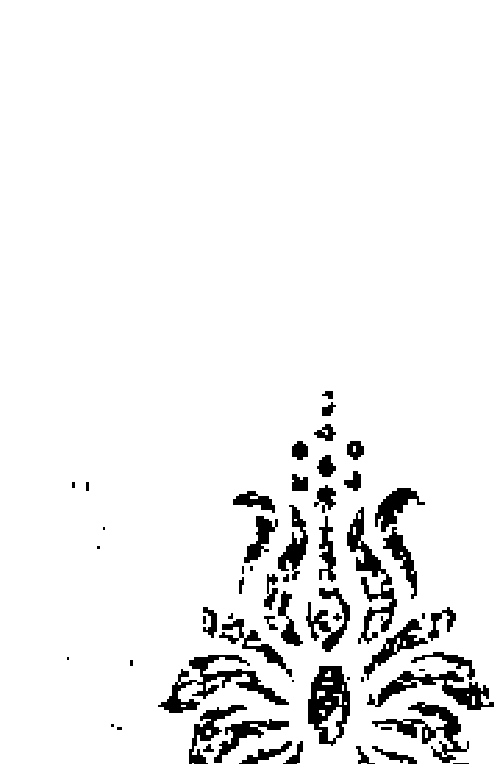

## The Secret Behind the Secret

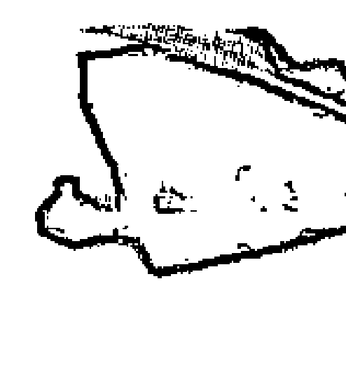

## 目录

- 第一课 发现你内在的力量 / 2
- 第二课 成功要靠自己 / 11
- 第三课 态度决定一切 / 19
- 第四课 成为理想中的自己 / 27
- 第五课 自己创造出想要的一切 / 35
- 第六课 专注你的目标 / 43
- 第七课 创造理想的精神画面 / 51
- 第八课 建设性的思想造就美好的结果 / 60
- 第九课 不断改进自己 / 68
- 第十课 有因必有果 / 77
- 第十一课 看透事物的本质 / 84
- 第十二课 集中能量，勇敢去做 / 92
- 第十三课 精神成就梦想 / 99
- 第十四课 向负面思想说“不” / 106
- 第十五课 积聚你的智慧 / 113
- 第十六课 让你的理想与宇宙精神和谐统一 / 120
- 第十七课 放飞渴望、点亮希望 / 127
- 第十八课 互惠的吸引力法则 / 134
- 第十九课 知而无畏 / 140
- 第二十课  思想创造未来 / 147
- 第二十一课  大设想主导大成功 / 154
- 第二十二课  健康状况源于过去的思想 / 160
- 第二十三课  舍与得之道 / 166
- 第二十四课  心灵世界助你成功 / 173
- 温故知新    关键问题问与答 / 180

## 下卷  共同的致富法则

- 第一章  财富面前，人人平等 / 188
- 第二章  致富是一门学问 / 191
- 第三章  机会无处不在 / 195
- 第四章  致富学问中的首要法则 / 198
- 第五章  优化生命 / 204
- 第六章  如何才能获得财富 / 209
- 第七章  心怀感恩 / 214
- 第八章  以某种特定的方式思考 / 218
- 第九章  如何运用意志力 / 222
- 第十章  充分使用你的意志力 / 226
- 第十一章  以某种特定的方式行事 / 230
- 第十二章  提高做事的效率 / 235
- 第十三章  从事适合自己的行业 / 239
- 第十四章  积极进取的印象 / 243
- 第十五章  积极进取的个性 / 247
- 第十六章  一些忠告及结语 / 251
- 第十七章  致富学问的精髓 / 255

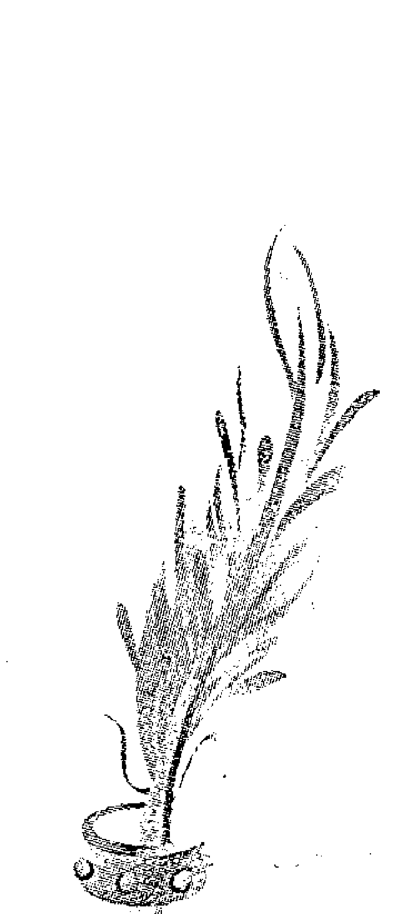

## PART 21

## 上卷

# 万能金钥

心想事成的24堂课

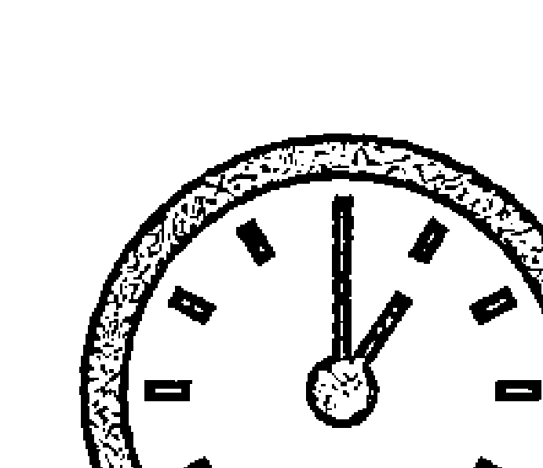

### 第一课 发现你内在的力量

很荣幸在此开讲“万能金钥：心想事成的24堂课”。你希望为你的生命补充更多的能量吗？那就开发你的能量意识。你希望变得更健康吗？那就开发你的健康意识。你希望获得更多的幸福吗？那就开发你的幸福意识。让自己一直生活在那些意识中，直到你能完全掌控它们为止。那时，它们将与你合而为一，没有什么可以将它们从你身上夺走。对于那些掌握了内心力量的人，世界上的一切都将听命于他，为他所用。

你无需去追求这种力量，你早已拥有了它。你需要做的就是去了解它，去运用它，去掌控它，去把它注入到自己的生命中。这样，你就能够勇往直前，并使整个世界为你所用。

随着时光的累积，当你的脚步更加坚定、你的动力与日俱增、你的激情如火焰般炽热、你梦想的蓝图渐次清晰、你更深入地了解了内心的力量时，你将会认识到，世界绝非一堆没有生气的木石，而是活生生的存在！世界是人类跳动的心房，是生命，是美。

显而易见，要想运用上面的那些力量，你必须先认识它们。而那些真正认识它们的人，将被新的光芒照亮，充满新的力量，从而每一天都会获得更大的力量与更多的自信。他们将看到他们的希望与梦想变为现实，生命的意义也将比以往更深刻、丰富、清晰。

好了，开始吧，第一课……

- ① 在现实生活的各个层面上，“多者愈多”是个真理；反过来，“损者愈损”也同样真实可信。
- ② 心智具有创造力。外在条件、客观环境以及一切生活际遇，都是由我们习惯性或支配性的思维创造出来的。
- ③ 我们的所思所想，必然决定着我们的心态。因此，获得一切力量、成就与财富的关键就在于我们的思维方式。
- ④ 这是真的，因为在做某事之前，我们必须确信自己有能力做成它。我们只能“做”到我们所“确信”的程度。而我们“确信”什么，则取决于我们“想”什么。
- ⑤ 我们无法运用自己不具备的力量。要想拥有那些力量，唯一的途径就是意识到那些力量的存在，并懂得：一切力量皆源于内心。
- ⑥ 内在世界的确存在——这是一个思想、感觉和力量的世界；一个光明、鲜活而美丽的世界。尽管它无影无形，但却强大有力。
- ⑦ 内在世界是由精神掌控的。当我们发现了这个世界的奥秘，我们就可以找到所有问题的答案，所有结果的动因。既然内在世界受我们的掌控，那么，一切力量和财富的规律也就尽在我们的掌控之中了。

外在世界是内在世界的映射。呈现于外在世界的一切事物都可以从内在世界中找到。在内在世界中，可以找到无尽的智慧、无尽的能量、无尽的供给，它们足以满足一切需求，并等着你去开启、释放、发扬。如果我们认识到了内在世界的潜能，这些潜能就会外化到外在世界中。

内在世界的和谐，将会通过和谐的境况、惬意的环境以及万物的最佳状态反映在外在世界中。内在世界的和谐乃是健康的基础，也是一切伟大、力量、功绩、成就和胜利的必要条件。

内在世界的和谐意味着一种能力，这种能力使我们能够控制自己的思想，由自己来决定一切经历对我们产生的影响。

内在世界的和谐，会带来乐观和满足。而内在世界的满足，也将带来外在世界的富足。

外在世界能反映出内在世界的情形和状态。

如果我们在内在世界中找到了智慧，就会有能力激发潜伏在内在世界中的非凡潜能，并将有能力将这种内在的可能性变为外在的现实。

一旦我们认识到了内在世界的智慧，我们就会在精神上拥有这种智慧，并通过这笔精神财富，去拥有实际的力量和智慧，为我们自身最充分和谐的发展打下坚固的基础。

- ⑯ 内在世界是一个真实的世界。在这个世界中，凡是追求进步的人，无论男女，都会产生勇气、希望、热情、自信、信任与信念。借助这些，他们不仅可以获得非凡的才智去描绘梦想，还可以获得实际的能力把梦想变成现实。
- ⑰ 生命不是一个从无到有式的逐步增加的过程，而是一个逐渐展开的过程。凡是在外在世界所获得的东西，都是我们在内在世界已经拥有的东西。
- ⑱ 一切财富，都是建立在意识的基础上的。所得，皆是意识累积的结果。所失，皆是意识耗散的结果。
- ⑲ 心智的功效与和谐密切相关。不和谐意味着混乱，因此，凡欲获得力量的人，必须与自然规律和谐相处。
- ⑳ 我们凭借客观存在的心智与外在世界连结起来。大脑是心智的器官，脊椎神经系统把我们身体的各个部分连成了一个整体。这一神经系统，对每一个视觉、感觉、嗅觉、听觉、味觉刺激都能做出反应。
- ㉑ 当我们的心智能够正确地思考并理解真理时，当富有建设性的思想通过大脑和脊椎神经系统传达到身体的各个部分时，这种感觉刺激将是和谐愉悦的。

但结果是：正是通过心智，我们将勇气、活力以及一切建设性的能量注入了我们的身体；同样，也正是这种客观存在的心智给我们的生活带来了许多悲伤、疾患、匮乏、局限以及各种混杂、不和谐的因素。因此，通过错误的思维方式，客观存在的心智会将各种破坏性的力量施加到我们身上。

潜意识是连接我们与内在世界的纽带。腹腔神经系统是产生潜意识的器官，交感神经系统控制着各种主观感受，如快乐、恐惧、爱恋、感情、热望、想像等各种潜意识现象。正是通过这种潜意识，我们才得以和宇宙精神相连接，和宇宙中无限的建设性力量建立起联系。

生命的伟大奥秘，就在于了解这两大系统，并使它们协调发展。有了这一认知，我们就能够使客观心智和主观心智自觉协作，从而使有限和无限协调统一。由此，我们的未来将全然掌握在我们自己的手中，而无须受变化无常的外部力量的摆布。

我们一直认为，只有一种法则或意念遍及整个宇宙，占满所有的空间，无论在什么地方，其本质都是一样的。它是无所不能、无所不知、无所不在的。所有的思想和意念都从它衍生而来。

宇宙中有且只有一种意念能够思考，当它思考的时候，想法就转变成了客观事物。这种意念无所不在，因此也存在于每个人的心中，每个人都是这无所不能、无所不知、无所不在的意念的表现形式。

正因为宇宙中有且只有一种意念能够思考，所以必然引出如下结论：你的认知必须同宇宙意念相一致，换句话说，就是万念归一。这个结论是不容回避的。

集聚在你大脑细胞中的意念，与集聚在他人大脑细胞中的意念并无不同。每个人都只不过是世界或宇宙精神的具体化。

宇宙精神是静态的或潜在的能量，它只有通过个体才能得以昭示显现，而个人也只有通过宇宙精神才能彰显自身。二者是合而为一的。

个人的思考能力，就是他作用于宇宙并彰显宇宙的能力。人的意识只存在于人的思考能力中。我们可以相信，心智本身是一种静态能量的微妙形式，所谓的“思考”就是由此能量而生的，思考是心智的动态阶段。心智是静止的能量，思考是活动的能量——心智和思考是同一事物的不同阶段。思考正是推动心智由静变动的强大力量。

宇宙精神包含了万物的所有属性，它无所不能、无所不知、无所不在。因此，这些属性在每个人身上也时刻存在着。所以，当一个人思考时，通过思维的本性的作用，思维就会在客观世界或与其相一致的环境中显现出来。

因此，任何想法皆为因，任何境遇皆为果。鉴于此，控制自己的思想使其只产生令人满意的外部环境显然是至关重要的。

一切力量皆来自于内在世界，而且绝对在你的掌控之下。它来自于准确的认知，来自于对准确原则的主动践履。

毋庸置疑，如果你能对这一法则透彻地理解，并对自己的思维加以掌控，你就能将其运用于任何境况中。换言之，你就能有意识地与无所不能的法则展开合作，而这一法则乃是万物之基。

宇宙精神是客观存在的每一粒原子的生命法则，每一粒原子都持续不懈地努力彰显出更多的生机。每一粒原子都是有智慧的，它们会最大限度地发挥自己存在的价值。

大多数人都只生活在外部世界中，很少有人能发现内在世界。然而，恰恰是内在世界造就了外在的一切。因此可以看出，内在世界是富有创造力的，你在外在世界中能找到的一切，都是你的内在世界创造出来的。

当你理解了外部世界与内在世界的这种关系后，你将看到属于你自己的力量。内在世界是因，外在世界是果，想要改变结果，必须从根源做起。

你立刻可以看到，这是一种全新的、与众不同的理念。大多数人都是试图通过对结果的运作来改变结果，他们没有意识到这只不过是对不幸的形式作了一下改变而已。要想彻底去掉不和谐，我们必须去掉它的“因”，而这个“因”，只能在内在世界中找到。

- ㊀ 一切生长都源于内在世界。这在自然界表现得尤为明显。每一株植物、每一个动物乃至每一个人都是这一伟大法则的活生生的见证。而整个时代的错误就在于从外在世界中寻找力量或能量。
- ㊁ 内在世界是宇宙中一切供给的源泉，外在世界是喷涌而出的川流。我们接受和容纳的能力，取决于我们对这一宇宙源泉的认知程度。每一个个体都是这种无限能量的出口，而每个人对于其他人而言也都是如此。
- ㊂ 认知是一个心理过程，而心理行为正是个体与宇宙精神交互作用的体现。宇宙精神是一种无处不在的智慧，它充斥于天地万物间，能激发一切生命，这种精神的作用和反作用也就是因果关系法则，但这一法则并非建立在个体之上，而是建立在宇宙精神之中。它不是客观感受，而是主观进程，它的结果也将体现在一切境遇和经历的无穷变化之中。
- ㊃ 为了释放生命，必须先有意念，因为万事因意念而立。一切事物都是这一基本物质的某种体现，万物由此而被创造出来，并不断被再创造。
- ㊄ 我们生活在一片深不可测、可形可塑的由精神实体构成的海洋

## 秘密背后的秘密 | The Secret Behind the Secret

这种精神实体永远是生机勃发的。它极度敏感，能根据不同的精神需求而成形，并通过思想浇铸的模型或构造的母体来显现。

请记住：法则的价值只存在于对它的应用中。对这一法则的彻底领悟，将能使富足取代贫困，令智慧取代无知，变混乱为和谐，化暴政为自由。毫无疑问，从物质和社会的角度看，没有什么比这更美好了。

现在，让我们把它付诸实践吧：选一间可以独处、不受打扰的房间，坐直，保持身体放松，但不要懒洋洋地靠着。任你的思绪流淌到它愿意为之驻足的完美的地方，持续一刻钟或半小时，连续做三四天或一个礼拜，直到你获得对身体的完全控制为止。

有些人会发现这是极大的挑战，而有些人则轻而易举地就做到了。但在准备取得进步之前，一定要实现对自己身体的完全控制。下周你将收到下一步行动的指令，在此期间，你必须完全掌握本章的内容。

### 第二课 成功要靠自己

潜意识是思想的奠基石。如果我们的希望、目标、思想……让潜意识领会到自己的想法，它是我们的理想、抱负和想象的源泉。这种力量是人人都具备的，但却并非人人都能够运用。

我们所遇到的困难，主要由混乱的观念以及对自身真正兴趣的忽视所致。当务之急是发现自然规律，并调整自己去适应它。因此，清晰的思路和敏锐的洞察力具有不可估量的价值。一切过程，甚至包括思维过程，都必须建立在坚实的基础上。

你的感觉越敏锐，判断越迅速，品味越高雅，道德感越缜密，才智越精深，志向越高远，在现实生活中所产生的满足感也就越纯粹、越强烈。所以，研究人类有史以来最优秀的思想，一定是一种至高的享受。

在全新的诠释下，精神的力量、效用与可能性，比最辉煌的成就还要伟大，比任何物质进步的梦想都要神奇。

思想就是能量。积极的思想便是积极的能量；集中的思想便是集中的能量。集中于某一明确目标的思想将化作力量。这种力量一直为那些既不相信贫穷是美德，也不相信自我否定是美的人所掌握着。他们将对贫穷或自我否定的赞美视为懦夫的空谈。

接收并彰显这种力量的能力的大小，取决于人们对无限能量的认识程度。这种能量一直存在于我们身上，不断创造和更新着我们的身体和心灵，并时刻准备着以合适的方式从我们身上彰显出来。个体在外在世界中所彰显出来的力量，与他对这一真理的认识程度成正比。

本章将阐述认识这种力量的方法。

心智的运转是两种平行的行为模式共同作用的结果：一种是显意识，一种是潜意识。

> 戴维森教授说：“那些想要用自己有限的显意识去诠释整个精神行为的人，无异于想要用一支蜡烛照亮整个宇宙。”

潜意识的运行是准确有序的，且绝无出错的可能。我们的心智是一件经过精心设计的杰作，它为我们准备好了最重要的认知基础，而我们却对它的运作方式一无所知。

潜意识就像一位素不相识的慈善家，默默地为我们劳作，满足我们的需求，用成熟的浆果喂养我们。对思想过程的最终分析表明，潜意识是那些最重要的精神现象的舞台。

正是通过潜意识，莎士比亚毫不费力地感知到了隐藏在一个平凡学生心底的伟大真理，菲迪亚斯创作了大理石和青铜雕塑，拉斐尔画出了圣母像，贝多芬写成了交响乐。

我们做事时从容不迫、尽善尽美的程度，完全取决于我们不再依靠自己的显意识。弹钢琴、溜冰、打字、老练的商场交际行为等完美的技巧，统统源自于潜意识。一边在钢琴上弹奏华丽的乐章，一边引导一场风趣的谈话——这种奇迹充分体现了潜意识的神奇功效。

## 第二课 成功要靠自己 | The Master Key System

我们都清楚地认识到自己对潜意识是多么地依赖。我们内心的思想越伟大、高贵、卓越，我们就越确定这些思想的源头就潜藏在我们的心底。我们发现，造物主赋予我们在艺术、音乐等方面的技巧、本能和美感，其源头也全部在我们的潜意识之中。

潜意识的价值是巨大的：它激励我们，警示我们，从记忆的储藏室中为我们提取姓名、场景和事件；它引导我们的思想、品味，帮助我们完成复杂的任务。这些事情是任何显意识都没有能力做到的。

我们可以任意徜徉，随意振臂欢呼；我们可以随心所欲地用眼睛去看，用耳朵去听。然而，我们却不能让自己的心脏停止跳动，让自己的血液停止循环，也无法限制躯体的生长，或是阻挠神经和肌肉组织的形成、骨骼的发育，以及其他种种生理机能。

有这么两种行为：一种是听从当前意愿发号的指令，另一种则是宏伟庄严、有条不紊、毫不动摇、始终如一地采取行动。相比之下，我们肯定会对后者肃然起敬，并设法去解释其中的奥秘。我们很快就会认识到，这些正是我们肉体生命的过程，我们无法回避这样的结论，即这些至关重要的功能从它被创造以来就不受我们外在意愿的管制，不被各样的纷扰波动所影响，它自始至终被置于我们永恒可靠的内在力量的管理之下。

在这两种力量中，外在的可变能量被称作“显意识”，或是“客观意识”（针对外在客体的意识），内在的能量被称作“潜意识”，或是“主观意识”。后者能在精神层面发挥作用，并保障肉体生命功能的有序运行。

## 秘密背后的秘密 | The Secret Behind the Secret

我们很有必要清晰地认识各种机能在精神层面上的运行方式，以及各自运行的基本准则。其中，显意识是通过五种感官应对自身以外的各种客体及其印象的。

显意识具有识察鉴别的功能，同时负有选择的责任。它有推理的能力——包括归纳、推论、分析、演绎等等，对这种能力可以进行很深层次的开发。它是意志以及由意志释放出的所有能量的发源地。

显意识不仅能够对其他的精神活动施加影响，也能够引导潜意识的活动。从这一方面讲，显意识是潜意识的统治者和监护人，它对潜意识负责。正是这一高级功能，使它可以彻底扭转你的生活境况。

由于我们不曾为潜意识设防，就使它不免会受到错误信息的侵袭，恐惧、焦虑、贫乏、疾患、冲突等各种阴云就会笼罩在我们上空。对于这些，训练有素的显意识就可以警觉地将它们拒之门外。因此，显意识可被视为守护潜意识这块重要领地的“守门人”。

> 一位作家曾这样描述过这两种心智：“显意识是推理的意志。潜意识是本能的欲望，也是过去的推理意志累积的结果。”

潜意识从外界提供的前提中演绎出正确的推理。前提正确，潜意识便能得出准确无误的结论；反之，如果前提或暗示是错的，整个结构便会坍塌。潜意识不参与证明的过程，要杜绝错误信息，就要仰赖它的“守门人”——显意识。

潜意识把接收到的所有的暗示都看成是正确的，然后在此基础上进行运作，开始它浩大的工程。显意识提供的暗示，既可能是正确的，也可能是错误的。如果是后者，整个生命就要为之付出代价，这种代价有可能是毁灭性的。

显意识有责任时刻警惕。当“守门人”擅自“离岗”，或者判断失误时，潜意识领域将成为无人之境，各种暗示都会乘虚而入。在惊慌失措时，或极度愤怒时，或不负责任的怂恿下，或其他任何激情澎湃的时候，情况都会非常危险。此时，潜意识处于麻痹状态，向外界的一切敞开着大门，恐惧、憎恨、自私、贪婪、妄自菲薄等等来自外部环境或周围人的负面力量就会趁虚而入。结果通常是极不好的，会给人带来长时间的悲伤压抑。因此，保卫潜意识领域不受错误印象的侵害是至关重要的。

潜意识是通过直觉来感知的，因此，其过程稍纵即逝。它不等待显意识的缓慢推理，事实上，它根本用不上这些推理。

潜意识从不打盹，也不休息，如同你我的心脏或血液一样。人们发现，只要向潜意识简单陈述那些需要完成的具体事项，就会拥有实现那些事项所需的力量。这就是把我们与伟大的自然力量联系起来的能量之源，最值得我们潜心研究的深层原则，也在其中。

## 秘密背后的秘密 | The Secret Behind the Secret

这一法则的运作十分有趣，那些将它付诸实践的人总是发现：当他们约见某人，并预想出见面时的尴尬局面时，他们之间很可能会发生一些事情，将整个事件都改变了，气氛一下变得很和谐融洽了。他们还发现，当遭遇商业上的困境时，只要稍加推迟就可以找出合适的解决方案。总之，一切都会被料理妥当的。事实上，那些学会信任潜意识的人，都能找到可以由自己自由支配的无穷资源。

潜意识是我们内心准则和志向抱负的发祥地，也是我们的审美趣味和利他思想的源泉。如果内在准则被破坏了，美感和利他的本能就会被颠覆。

潜意识不会做出反对性的辩驳，因此，如果它接受了错误的暗示，克服这些暗示的最好的办法，就是不断重复相反的暗示，迫使潜意识接受它，并最终形成新的、健康的思维习惯，因为潜意识正是习惯的发祥地。我们反反复复地做某件事，就会使之成为机械性的活动，它将不再需要靠判断力行动，而是已有了潜意识固有的模式。如果是健康、正确的习惯，那对我们就是有利的。如果是错误、有害的习惯，治疗的良法便是重新认识潜意识的无限能量，并反复向它输入这种正确的暗示。具有创造性的潜意识，与我们内在的力量源泉相结合，就能创造出我们暗示给它的那种自由的天地。

小结：从物质的层面讲，潜意识功能的正常发挥有赖于一些条件，比如生命的维系、健康的恢复、对后代的照料等。这些条件涵盖了提高生命和改善整体环境的内在本能。

## 第二课 成功要靠自己 | The Master Key System

从精神的层面讲，潜意识具有记忆仓库的功能。它是港湾，庇护着伟大奇妙的思想旅客，让他们的劳作不受时间和空间的限制；它是生命中主动性和建设性力量的源泉，它是习惯的发祥地。

从心灵的层面讲，潜意识是理想、抱负和想象的源泉，是认识我们伟大本源的渠道。对这一伟大本源的认知程度，决定了我们对内在力量的源泉的理解程度。

有些人可能会这样问：“潜意识是如何改变环境的？”答案是这样的：由于潜意识是宇宙精神的一部分，而部分和整体一定有共通之处，差别只是在量上。我们知道，整体的宇宙精神是具有创造性的，而思想是心智唯一的活动形式，因此，思想也必定具有创造性。

但我们将会发现，简单思维和有意识的、系统的、建设性的引导思维之间有着巨大的差异。当我们运用那富有建设性的思维思考时，我们就和宇宙精神和谐统一了，就与“无限”步调一致了，就可以运用那最强大的现有力量——宇宙精神的创造力了。这与其他事物一样，是受自然法则支配的，这个法则可以叫做“吸引力法则”，即：精神是具有创造力的，它会自动与其客体联系起来，并在客体中得以彰显。

上周我给你们布置了一个课后练习，目的是让你们获得对身体的完全控制。如果你已经实现了这个目标，你就可以准备进行下一环节了。这次你要练习控制你的思想。如果可能的话，最好是在同一间居室、同一把椅子、同一个位置上进行。有时候总在一间居室里可能不是很方便，如果是这样的话，那就看情形而定，只要能最好地利用可以利用的条件就可以。现在，像前一次那样进入完美的寂静状态，你要约束一切思想，这将有助于你控制一切担忧、恐惧和焦虑的念头，使你学会仅仅保留那些你希望抱有的想法。持续训练，直到你完全掌握为止。

刚开始做这个练习时，你可能每次都坚持不了多长时间。但这个练习是很有价值的，因为它能切实有效地证明到底有多少意念中的不速之客随时准备闯入你的精神世界。

在下周的新课中，你会接触到一个更有意思的训练，但在此之前，掌握本课的训练是必不可少的。

### 第三课 态度决定一切

> 在人生的大海中，我们都是漂泊者，只有当我们敢于坚持自己的权利的时候，世界才会变得精彩。

你已经知道人是能作用于宇宙的，这种作用和反作用的结果就是因与果的关系。所以，思想就是因，而你在生活中所遭遇的一切经历都是果。

既然如此，就不要再抱怨过去或现在的一些境遇了，因为一切都取决于你自己，取决于你有没有能力把环境塑造成你希望的样子。

努力开发你的精神能源吧，让它得以在现实中显现，并使它完全处于你的掌控之中，由此一切真实持久的能力都将产生。

坚持这一尝试，直到你看到这样的事实：只要你了解了你的潜能，并坚定不移地朝着自己的目标前进，你生命中的任何努力都不会失败，因为精神力量随时随地都准备向坚定的意愿伸出援助之手，帮助你把想法和渴望变为明确的行动、事件和有利条件。

生命之初，一切功能及行动都受显意识的控制，是显意识的结果，但习惯渐成自然，那些起支配作用的念头渐渐浸入了潜意识的领域，不过仍和以前一样充满智慧。我们需要把它们变成自发的意识，或者说潜意识，这样就可以把我们的显意识解放出来，从而有机会去关注新的事情。在新一轮的认识过程中，这些新的行动又渐渐变成了自然的习惯，继而成为潜意识，这样，我们的心智就可以再度从这一繁琐的细节中解放出来，再度投入到其他的行动中。

当你实现了这些，你就找到了力量的源泉，它将使你能够得心应手地应对生活中的各种境遇。

显意识和潜意识之间的互动需要神经系统也做出相应的反应。特罗沃德法官给出了进行这种交互作用的良方。他说：

> “大脑——脊椎系统是产生显意识的器官，交感神经系统是产生潜意识的器官。大脑——脊椎系统是我们接受感觉意识的渠道，并控制着全身的动作。大脑——脊椎系统的中枢在人的脑部。”

交感神经系统也有一个中枢，它是一个神经节丛，在胃的后部，名叫太阳神经丛，是精神行为的渠道，而正是这种精神行为，在潜意识中起着支撑身体的生命机能的作用。

上述两种系统之间的连接，是通过“迷走神经”建立起来的，迷走神经从脑部延伸出来，作为大脑——脊椎系统的一部分，一直延伸到胸腔，其分支分布于心脏和肺部中，最终穿过横膈膜，脱去表层组织，与交感神经交结在一起，这就构成了两个系统的联结，使人成为一个物质上的“单一实体”。

我们知道，每一种想法都是通过大脑接收的，大脑是显意识的器官，它听命于我们的推理能力。当客观想法被认为是正确的，就会被传递给太阳神经丛，或主观意识，成为我们生命的一部分，然后再作为事实传递给外界。当到达主观意识后，这些想法就对推理论辩产生了免疫力，不再受其影响。所以，潜意识不能进行推理，它只能执行，只会把客观想法的结论全盘接受。

太阳神经丛被比作身体的太阳，因为它是分发能量的中枢机构，负责把全身不断产生的能量传递出去。这种能量是非常真实的能量，这颗太阳也是非常真实的太阳。它所传出的能量被真实的神经运送到身体的各个部位，并散播到环绕在身体周围的大气中。

如果这种辐射足够强大，这个人身上就会有很强的吸引力，人们也就会说他充满人格魅力。这样的人能够向周围散发良好的能量，他的出现本身就会给那些与他接触过的人带来安慰，平息他们不安的情绪。

当太阳神经丛表现活跃，辐射出生命力的时候，全身各部分的能量就都处于激发状态，这种处于激发状态的能量会传递给与他接触过的每一个人，并使他们产生愉悦的感觉，表现出生命的健康与活力。

如果这种辐射受到了干扰，人们的感觉就不是美好而是憎恶，通往身体各部位的能量也会中止。这就会使人类染上各种疾病，包括肉体上的、精神上的和环境中的。

人在肉体上的困扰，是因为身体无法把充足的能量传递出去，以激发身体的各个部位。精神上的困扰是由于显意识依赖于潜意识提供思维能量，而环境上的困扰则是因为潜意识和宇宙精神的联系被阻断了。

## 秘密背后的秘密 | The Secret Behind the Secret

因为，太阳神经丛是部分和整体的交汇点，在这里，有限转化为无限，寂灭转化为创造，宇宙转化为个体，无形转化为可见。太阳神经丛是生命显现的交点，生命的数量是无限的，个体可以被这个太阳的中心孕育出来。

这个能量中心是无所不能的，因为它是全部生命和全部智慧的汇合点，因此它能完成一切被要求完成的任务，这就是显意识的能量。潜意识能够并且必将执行显意识交付给它的一切计划和任务。

显意识是思想，是这个太阳中枢的操控者。整个机体的生命和能量，都是从这个太阳中心涌流而出的。而我们所持有的想法，其质量决定着由这个太阳辐射出来的思维的质量。我们的显意识所持有的想法，其品格决定着由这个太阳辐射出的思维的品格，其特性决定着由这个太阳辐射出的思维的特性，从而决定着将导致最终结果的人生际遇的特性。

所以，很显然，我们所要做的一切，就是让我们内心的光亮照耀八方。我们能够辐射出的能量越多，我们就会以越快的速度把令人不快的境遇改造成令人愉快和受益的源泉。接下来的问题是，如何使内心的发光体闪耀出光芒，如何产生这种能量？

事实证明，不抵抗的思想会使太阳神经丛不断扩张，抵抗的思想会使这颗太阳黯然失色；愉悦的念头能扩展太阳神经丛，烦躁的念头会削减它的光芒。想想勇气、才能、信心、希望，这些都会产生相应的状态。而太阳神经丛最主要的敌人就是恐惧——我们必须彻底摧毁这个敌人，才能让太阳的光芒辉耀万方。

## 第三课 态度决定一切 | The Master Key System

- 1. 正是这个客观存在的恶魔，让人恐惧过去、恐惧现在、恐惧将来；让人恐惧自己、恐惧朋友、恐惧仇敌；恐惧每一件事和每一个人。当恐惧被彻底清除时，阴霾就会消散，你的太阳将会闪光，你也将找到力量、活力和生命的源头。
- 2. 当你发现自己真的拥有了无限的力量时，当你通过实践证明了自己足以凭借思想的力量战胜一切不利因素时，你就没什么可恐惧的了。到那时，恐惧将全然消退，你将享有你与生俱来的权利。
- 3. 正是我们头脑中对待生活的态度，决定着我们的生活境遇。如果我们一无所望，我们就将一无所有；如果我们冀望颇多，我们将得到更多。只有当我们不敢坚持自己的权利的时候，世界才会变得苛刻。只有对那些不能为自己的思想征求容身之地的人，世界对他的责难才会冷酷无情。正是由于畏惧这种责难，才使得许多思想被深埋在黑暗之中，不见天日。
- 4. 但那些知道自己拥有太阳神经丛的人，将无惧这种责难或其他任何别的东西。他们太忙于向外界辐射自己的勇气、信心和力量了；他们的心里只有成功，因此勇于粉碎挡在成功前面的一切障碍，并跨越恐惧摆放在他们前进道路上的填满怀疑和犹豫的鸿沟。

一旦认识到自己有能力自觉地向外界辐射健康、力量与和谐，我## 秘密背后的秘密 | The Secret Behind the Secret

我们也就认识到：没有什么可畏惧的，因为无限的力量与我们同在。

20 只有通过把这一知识应用于实践，才能获得这样的认识。我们是通过“做”来学习的，运动员也是通过实践才变得强壮有力的。

21 由于以下的论述至关重要，我将用不同的方式来表达，以便你领悟它的真实含义。如果你有宗教信仰，我要告诉你，你可以让你的太阳发光；如果你对物理科学情有独钟，我要说，你可以唤醒你的太阳神经丛；如果你更偏爱严格的科学阐释，我要告诉你，你可以让你的潜意识发挥功效。

22 我已经告诉过你潜意识的能量如何了，你现在应该对运用它的方法产生兴趣了吧。相信你已经认识到潜意识充满了智慧和创造力，它们能对显意识和意愿做出有力的回应。那么，让自己的潜意识发挥出理想的功效，最简单的方法又是什么呢？那就是：在心里关注你所向往的目标。当你真的集中精力于自己的目标时，你就已经开始运用潜意识了。

23 这不是唯一的方法，但却是一个最简单有效、最直截了当的方法，因而也是能够获得最佳效果的方法。这种方法所产生的效果是如此显著，以至于许多人认为：奇迹就是这样创造出来的。

24 每一位伟大的发明家、金融家、企业家和政治家都是凭借这种方法，才得以把那些微妙而不可见的渴望、信心和信念的力量转化为客观世界中实际、有形、具体的事实的。

### 第三课 态度决定一切 | The Master Key System

潜意识是宇宙精神的一部分，而宇宙精神则是整个宇宙的具有创造力的法则。作为宇宙精神的一部分，潜意识和宇宙精神是相合、统一的。这意味着创造性能量是绝对无限的，它不受任何先例的约束，因而也意味着在应用这富有建设性的法则时没有什么先例可循。

我们知道，潜意识会对显意识的意愿做出回应，这就意味着具有无穷创造力的宇宙精神处在人类显意识的掌控之中。

在接下来的课程中，我们会把这一准则付诸实践。此时我们最好记住，不必忙着概括潜意识是如何实现你想要的结果的。无限的能力无需有限的能力告知它如何去做。你只需简简单单地说出你所想要的，而不是你想如何去实现它。

你是宇宙的渠道，混沌一片的宇宙在你身上得以分化，这种分化是通过占有来实现的。你只需为你想要的结果加上“因”的动力，就可以扬鞭驱驰它了。这一结果，宇宙只能通过个体来实现，而个体也只能通过宇宙来实现——二者是密不可分的统一体。

在本周的练习中，我要让你更进一步。我希望你不仅能够完全地沉静下来，尽最大努力勒紧你思想的缰绳，而且要全身放松，让肌肉处于正常的状态。这就可以将一切压力从精神中驱逐出去，消除那些导致肉体劳顿的紧张状态。

身体放松是一个意志自主的练习，这个练习将对你大有裨益，因为它能使血液在身体中畅通无阻地流淌。

- 紧张会导致精神活动的反常和动荡不安。它会使人产生忧虑、牵挂、恐惧和焦急。因此放松是绝对有必要的，它可以使精神得到最大的自由。
- 尽可能完全彻底地做这一练习，从精神上放松你的每一块肌肉和每一根神经，直到你感到宁静从容，自身与世界相和谐为止。
- 此后，太阳神经丛就要开始发挥作用了，其结果将会让你惊奇不已。

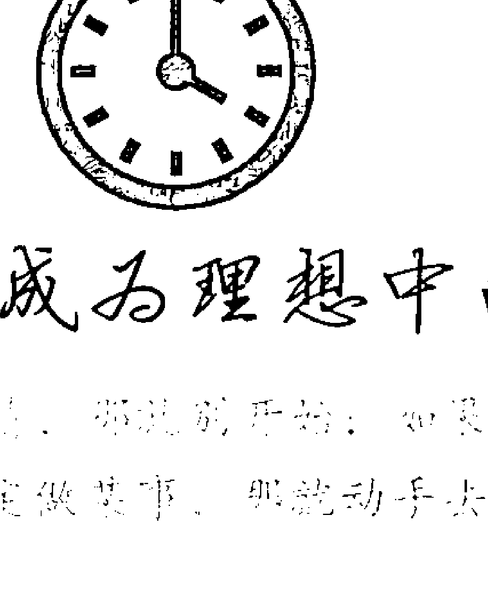

### 第四课 成为理想中的自己

当你决定要做一件事时，那就开始；如果你半途而废，那还不如从来就不开始；如果你决定做某事，那就动手去做，不要受任何人、任何事的干扰。

现在我要向你们传达新一轮的信息，我将会告诉你们为何你们的想法、做法和感受就能代表你们本身。

思想就是能量，能量就是思想，但由于为世界所熟知的一切宗教、科学和哲学都只是这一能量的表现而不是能量本身，能量作为“因”就被忽视或误解了，世界仅仅囿于“果”的一隅。

因此，有了宗教上的神与鬼，有了科学上的正与负，有了哲学上的善与恶。

《世界上最神奇的24堂课》则反其道而行之，它只关注“因”的一面。我所收到的学生的来信让我感到非常欣慰，这些信件表明，学生们正在关注那些能够使他们把握健康、和谐、富有以及其他对他们的幸福和快乐而言必不可少的事物。

生命就是表达，和谐而富有建设性地表达自己是我们的分内之事。悲伤、痛苦、不幸、疾病和穷困，没有存在的意义，我们应该坚决将它们从我们的生活中剔除出去。

然而，要想消除这些因素，我们需要突破种种限制。一个净化并强化了思想的人无需再担心细菌的侵扰，一个懂得了财富法则的人瞬时就能看到供给的源泉。所以，厄运、幸运、在劫难逃之运，都将尽在掌握之中，如同船长驾驶的船舰、火车司机开动火车一般容易。

你的“自我”并不是血肉之躯，身体只是“自我”用来执行任务的工具；“自我”也不可能是心智，因为心智又是“自我”用来思考、推理、谋划的工具。

“自我”一定是某种能够控制并引导身体和心智的事物；某种能够决定身体和心智的事物；某种能够决定身体和心智如何去做的事物。当你认识了“自我”这个真实的物质时，你就将享受到前所未有的充满力量的感觉。

你的人格是由数不清的个人特征、怪癖、习惯和性格特点组成的，这些特征都是你以前思维方式的产物，它们和你的“自我”并没有关系。

当你说“我认为”的时候，“自我”告诉心智应当怎样认为；当你说“我去”的时候，“自我”告诉身体应当向何方行动。这个“自我”的真实本质是精神，这种本质才是真正的力量之源，当人们认识到其真实本质时，这种力量就会降临到他们身上。

“自我”被赋予的最伟大、最神奇的力量，就是思想的力量，然而极少有人知道什么是具有建设性的、或者说正确的思考，所以人们就得

到了不同的结果。大多数人让他们的思想停留在自私的层面上，这正是幼稚心智不可避免的结果。当人们的心智变得成熟时，就会懂得：失败的萌芽潜藏在每一个自私的想法中。

聪明人都很明白，无论做什么事都必须让每一个与这件事有关（不管以什么方式）的人能够从中受益，任何一种企图利用他人的缺点、无知或需求来为自己牟利的举动，都将最终为自己招致祸患。

这是因为个体是宇宙的一部分，同一整体中的两个部分之间不能相互敌对，换句话说，每一个部分的幸福都建立在对整体利益的认知基础上。

那些明白这一原理的人，在生活中就拥有了巨大的优势。他们不会让自己精疲力竭，他们能够敏捷地消除一切犹豫不决的想法。他们能够轻而易举并最大限度地把注意力集中到任何一个主题上。他们不会在无益的事物上浪费时间或金钱。

如果你做不到这些，说明你还没有付出足够的努力。是时候了，努力吧！一份耕耘，一份收获。为了增强你的意志、认识你的力量，你可以借用一句强有力的口号：“我要成为理想中的自己。”

每次重复这句话，你都应该清楚地知道这句话中的“我”是谁，并试着去理解“自我”属性的真正内涵。如果你能做到，如果你的目标和意图具有建设性，并与宇宙的创造原理和谐统一的话，你将无坚不摧。

如果你使用这句口号，那就经常不断地使用它，不管白天黑夜，只要你想起它，就重复一遍，持续这样做下去，直到它成为你生命的一部分，成为一种习惯。

如果做不到这样，就不要开始，因为现代心理学告诉我们，如果我们开始做某事却不把它完成的话，或者做了某项决定却并不坚守的话，我们就会形成失败的习惯。如果你不打算做一件事情，那就别开始；如果你开始了，即便天塌下来也要把它做成。如果你决定做某事，那就动手去做，不要受任何人、任何事的干扰。你身上的“自我”已做出决定，事情已经敲定了，骰子已经掷出去了，没有了讨价还价的余地。

如果你采纳了这种意见，那就从最小的事情做起，从那些你能够掌控、能够不断努力的事情做起，但在任何情况下都不要容许你的“自我”被推翻，你将发现你最终能够战胜自己。要知道，许多人都曾悲哀地发现，他们战胜了一个国家，但却最终败给了自己。

当你学会了战胜自己，你将发现你的“内在世界”征服了外在世界，你将攻无不克、战无不胜。人和事都会对你的每一个愿望做出回应，而你自己则无需作出任何明显的努力。

这一情形的出现，并不是天方夜谭，只要你记住：“内在世界”是由“自我”掌管的，而这个“自我”正是那个“无限之我”的一部分，这个“无限之我”即为宇宙精神或宇宙能量，人们通常把它叫做“上帝”。

### 第四课 成为理想中的自己 | The Master Key System

提出这些陈述或理论并不是为了证明或建立某种观点，因为它本身就是一种被最优秀的宗教思想和科学理念接纳了的事实。

> 赫伯特·斯彭德说：“发生在我们身边的所有奇迹中，最令人确信的是：我们一直身处无限而永恒的能量中，它是万物的始祖，万物由它而出。”

> 在班戈神学研究院毕业典礼的致辞中莱曼·艾博特提到：“我们所要思考的上帝，是那个居住在人们心里的上帝，而不是那个从外部操控人类的上帝。”

科学在探索的道路上才前进了一小步，就止步不前了。科学发现了亘古常在的永恒能量，然而宗教却发现了潜藏在这能量背后的力量，并把它定位在人的心中。但这绝不是什么新的发现，《圣经》中早已有明确表述，而且语言平易简朴、令人信服：“岂不知你们是神的殿，神的灵就住在你们身体里吗？” “内在世界”的神奇创造力的奥秘就在于此。

这就是力量的奥秘之所在，也是控制力的奥秘之所在。战胜一切并不意味着目中无物，克己忘我也不能和成功画上等号。无所取，何以予？如果我们自己软弱无力，何以帮助他人。无限意味着永远不会破产，而我们作为无限能量的代言人，自然也不应以破产的面貌出现。如果我们希望给予他人帮助，我们自己首先必须拥有能量，而且多多益善。然而，欲有所取，必有所予，我们必须对他人有所帮助。

我们施予的越多，我们所得的就越多。我们应当使自己成为宇宙精神的传递者。宇宙处于不断寻求释放的永恒状态中，处于帮助他人的永恒状态中，所以它总是在寻求能够让自己以最好的方式释放的渠道，这样才能够做最多有益的事，能够给予人类最大的帮助。

只有当你专注于自己的计划或人生目标时，宇宙精神才能通过你而有所作为。你应该让你所有的感觉都平静下来，关注你内心的渴望，把精力集中到自己的内在世界中，与伟大的自然力合而为一。俗话说“静水流深”。找出万有能量所赋予你的精神通道，你将会有无穷的机遇。

使自己期望的事件、场景、条件在头脑中生成画面，这将有助于它们的实现。要知道万物的精华皆在于它的精神，精神是真实的存在，因为它就是生命的全部。当精神离去的时候，生命也就消逝了，而且一去不返。

这些精神活动是属于内在世界的，属于“因”的世界；而一切环境和境况都是内在世界产物，是“果”。正因如此，你就是真正的创造者。这是极其重要的工作，你的理想越高贵、崇高、伟大，你的工作也就越重要。

过度劳动、过度玩耍以及任何过度的锻炼，不管何种性质，都会产生精神倦怠，使其萎靡不振，最终导致你无法完美地完成更重要的事情。因此，我们必须适时地追求一下心灵的宁静。力量是通过休息得以恢复的，在“宁静”中我们才能平心静气，当我们平心静气时，我们才能思考，而思考正是取得一切成就的秘密之所在。

思考是一种运动，与光波或电波遵循一样的共振原理。它遵循爱的规律，激情赋予它振动的活力；它遵循成长的规律，思想才得以成形并被表达出来。它是“自我”的产物，同时也是神圣的、精神的、创造性本质的产物。

由此可知，为了释放能量、财富或实现其他具有创造性的意图，必须先唤醒心中的情感，情感可以让想法成形。那么，这一目的如何才能实现呢？这一点非常关键。我们怎样才能拥有可以带来成功的信念、勇气和情感呢？

答案是：通过锻炼。精神力量的获得同身体力量的获得一样，是通过锻炼实现的。我们思考一件事情，可能在头一次非常困难，当我们第二次思考时候，就会变得容易得多了。当我们反反复复一遍又一遍地思考的时候，就成了一种精神习惯。我们持续思考同一件事情，到最后这种思考就变成了自发性的行为，我们会情不自禁地思考这件事情，直到我们对它认识得清清楚楚，一点疑问都没有。这一点我们都有深切体会。

上周我对你说要学习放松，学习身体的放松，本周我要让你学习精神的放松。如果你上周做了我布置的练习，每天15到20分钟，毫无疑问，你一定能做到身体上的放松了。那些无法让自己的身体迅速放松下来的人，就不能算是自己的主人。因为他尚未获得自由，仍在受着外在条件的奴役。但现在，我只能假定你已经熟练掌握了上周的练习，可以进行下一步了，也就是精神放松。

这一周我们还要重复以前的步骤，除去一切的紧张，让自己完全彻底地放松，然后驱除掉精神中的一切不利情绪，比如憎恨、愤怒、焦虑、嫉妒、艳羡、悲痛、烦忧、失望等等诸如此类。

你可能会说你无法做到那样，但事实上你能做到。你只要在精神上下定决心，并自觉主动地将这个决心坚持下去，你就能做到。

不可否认的是，有些人确实做不到，其原因就在于他们完全受感情的控制而不是受智慧的引导。只有那些受自己智慧的引导的人才能获得成功。第一次尝试的时候你可能没能成功，但是可以确信的是，你会越做越好，这件事如此，其他事情也一样。不仅如此，对那些消极不利的情绪，你也一定要谨慎看管，并争取彻底清除。因为这些情绪是萌生你心中那些可言和不可言的不和谐状态的种子。

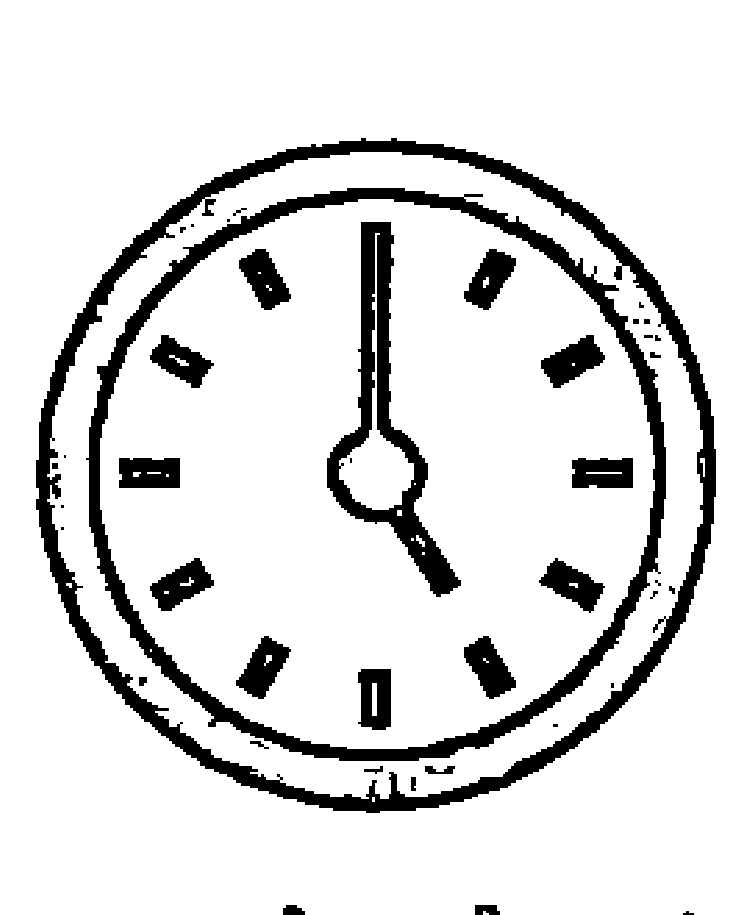

### 第五课 自己创造出想要的一切

每当你开始用你的力量去试炼，训练得越勤奋，也就会越强壮。一个希望财源不断的金融家，绝不会吝啬自己的钱财，因为只有使用这些钱财，才能给他带来更多的回报。

现在开始学习第五课。仔细学习这一课后，你会发现，任何力量、物体或事实都是心智行动的结果。

行动中的心智就是思考，而思考是具有创造性的。现代人正以一种全新的思考方式思考着，完全抛弃了以前的那些方式。因此，这是一个充满创造力的时代，世界正将最丰厚的奖品奖给那些思考者。物质是无力、消极而无生命的，精神则是强大有力、充满能量的。精神塑造并掌控着物质，任何一件成形的物质都不过是预先存在的思想的表达。

然而，思想的运作并非是变幻莫测的，它也遵循着自然法则。它能启动自然力量，释放自然能量。它体现在你的所作所为中，并能传达给你的朋友和一切与你相识的人，最终弥漫到你的整个生存环境中。你能够创造思想，而思想又具有创造性，因此，你可以为自己创造出你想要的一切。

- 在我们的精神生活中，至少有百分之九十的人属于潜意识，因此对于那些不能充分利用这种精神力量的人来说，生命会受到巨大的限制。

只要我们知道如何引导潜意识，它就能够而且必将为我们解决各种问题。潜意识的程序始终处在工作状态，唯一的问题是，我们应该单纯地、被动地接受这种程序呢，还是应该有意识地引导它的运作？我们应该预见命运的未来，避免将至的危险，还是顺其自然，放任自流？

我们知道，精神渗透到肉体的各个角落，很容易被引导或受影响，而引导或影响的指令可能来自于客体，也可能发自于在心智中占主导地位的态度观念。

渗透到身体中的精神，在很大程度上是遗传的结果。同时，这种遗传又是过去那些年代的环境对时刻做出反应和不断提升的生命力进行持续作用的结果。理解了这样的事实，当我们发现自身一些令人不快的性格特点显现时，我们就可以让我们的权威力量发挥效力了。

我们可以有意识地将那些我们与生俱来的令人满意的性格特点表现出来，同时，也可以拒绝和压制那些令人不快的性格特点的显露。

至此，渗透在我们体内的精神意念就不仅仅是遗传趋势的结果了，而是家庭、事业、社会环境的共同结果。在这些情境中有成千上万的观念、意见、思想影响着我们，有数不清的事件给我们留下了印记。其中，有很多是来自于他人，来自于他人的意见、建议或陈述；也有很多来自于我们自身的思考，但当这一切被接受的时候，几乎没有经过任何检查或慎重地考虑。

### 第五课 自己创造出想要的一切 | The Master Key System

14 这一观点看起来很有道理，我们的意识接纳了它，并将它传达给了由交感神经系统控制的潜意识，我们的潜意识又将它融进了我们的身体。这就是所谓的“刻骨铭心”。

15 一直以来我们就是这么创造或再生我们自身的。今天的我们是昨天思考的结果，而我们今天的思考也必将铸就明天的我们。这就是引力法则在我们身上的显现，它带给我们的，不是我们喜欢的、我们想要的、抑或别人所有的，它只是把我们“自身”拥有的东西交还给我们而已。我们的“自身”，是我们思想的产物，不管是有意的还是无意的。然而很不幸，我们中的大多数人都还只是在无意之中创造自身。

16 当我们想要为自己建造房屋时，是何等得小心谨慎、缜密筹划啊！我们会关注每一个细节，我们精挑细选为的是买到好的建材。然而，当我们为自己建造精神家园时，却又何等的漫不经心啊。要知道，精神家园的重要性远远超过物质家园，因为，我们用来建造精神家园的材料的好坏，直接决定了我们生命的质量。

17 什么是材料的品质呢？它是我们从以往的经历中积聚并储存在潜意识中的一切印象。如果这些印象是恐惧、烦恼、忧愁、焦虑，如果它们是负面的、消极的、怀疑的，那么，我们今日用来建造精神家园的材料，其质地也同样是负面的。这种精神家园不但没有任何价值，反而会使我们的生活腐烂发霉，带给我们更多的痛苦不安。我们只好不停地对其修修补补，至少让它看上去不那么破败。

然而，如果我们存储的是勇敢的思想，如果我们一直乐观开朗、积极向上，并能够迅速消灭那刚刚露头的负面想法，拒绝与它发生任何关联，拒绝以任何方式与它同流合污、沆瀣一气……那么，结果会如何呢？我们的精神材料就是上上品，我们就能够用它们创建一座坚固而华美的精神家园，使我们对未来毫无惧念、焦虑，也就没有什么漏洞需要我们去劳神费力地修补。

这些都是心理学上的事实，没有推论或猜测的成分，也没有什么奥秘可言。事实上，这些道理很简单，我们每个人都能理解。我们所要做的就是清扫我们的精神家园，日日更新，保持房屋整洁。要想获得任何形式的进步，精神、道德和肉体上的清洁都必不可少。

一旦我们完成了精神家园的清洁工作，我们就可以用那剩余的材料打造那些我们渴望实现的理想，或精神愿景了。

有一处良田美地等待我们去认领。宽阔的田园、茂盛的庄稼、奔腾的流水和上好的木材，一望无垠。有一座高堂雅阁等待我们去接收，内有珍贵的古画、丰富的藏书、华贵的幔帐，极尽奢华舒适。财产继承人所要做的一切，就是大胆提出自己的继承权，占有并使用这些财产。他必须有效使用它们而不可使其荒废，这是他得到这些财产继承权的唯一条件，若使之荒废，则视之为自动放弃继承权。

在心灵和精神的领域中，在实际能量的领域中，你的确拥有这样一处房产。你是继承人，你可以主张自己的继承权，占有并使用这份丰厚的遗产。

## 第五课 自己创造出想要的一切 | The Master Key System

的资产。对环境的掌控力就是它给你的权利，健康、和谐、财富，是你收支平衡表中的净资产。它赐予你安详与和谐。你所要付出的只不过是学习和收获这巨额财富的努力。你无需准备牺牲，你失去的只有你的局限、软弱和被奴役的状态，而它为你带来的则是荣誉的锦袍，并把权杖放在了你的手中。

- 1. 要想获得这笔不动产，有三个过程是必须经历的：你必须真诚地渴望它；你必须提出对它的所有权；你必须主动占有它。

- 2. 你得承认，这些条件并不苛刻。

- 3. 你们一定对遗传学非常熟悉。达尔文、赫胥黎、海克尔及其他生物学家，搜集了如山的证据去证明在进化演变过程中遗传法则占据着主导地位。正是进化中的遗传，使人类得以直立行走，赋予人类以运动的能力、消化的器官、血液循环、神经系统、肌肉力量、骨骼结构等等许多身体的能力。还有一些事实更让人吃惊，这就是精神能力的遗传。这一切加起来就叫做人类遗传。

- 4. 有一种遗传是生物学家们还未曾涉及到的，这种遗传比他们研究过的所有内容都要深奥，使得他们根本无法跟上它的步伐。他们在绝望中举起双臂，认为自己无法解释亲眼所见的一切，因为这种神奇的遗传总是摇摆不定、不可捉摸。

- 5. 决定原始创造的乃是善的力量。它从上帝那里跳下来，直接进入每一个被创造出来的生命中。它创造出了生命，这是那些生物学家从未做到也永远做不到的。在所有神圣不可企及的力量中，它一枝独秀。没有任何人类遗传可以达到它的高度，更没有任何人类遗传可以与它并驾齐驱。

这种无限的生命在你的体内流淌，而这种无限的生命就是你。它的大门正是形成你的意识的感官。得到力量的秘密就在于敞开这扇大门。这难道不值得你为此花费一点工夫吗？

有这样一个很重要的事实：内在世界是一切生命和一切能量的源泉。环境、人与事可能会告诉你眼前的机遇和需求，然而能够对这一切需求做出响应的洞察力、力量与能力，却只能在内在世界中找到。

要谨防一切的赝品。你们要将自己意识的根基建立在来自于无穷资源的力量之上，也就是宇宙精神之上，依照它的形象和样式来建造你的精神家园。

那些获得这份遗产的人必将会获得新生。他们将拥有以前想都不敢想的力量，不再怯懦、软弱、犹豫、恐惧。他们与无所不能的力量紧密连在了一起，心底的一些崭新的东西被激发了，蓦然间发现自己原来就拥有那么巨大的潜能，而自己以前一点都不知道。

这种力量是由内而生的，但我们只有先付出这种力量，才能真正获得它。使用它是我们占有这份资产的唯一条件。我们每个人都是传递全能的宇宙力量的渠道。除非我们愿意付出，否则管道就会被淤塞，我们也无法获得新的能量。这一真理存在于生活的每一个层面中、每一次努力的领域中、生命的每一阶段中。我们付出的越多，得到的就越多。一个想让身体更健壮的运动员会花费更多的力气去锻炼，他练得越勤奋，也就会越健壮。一个希望财富得到不断累积的金融家，绝不会吝啬自己的钱财，因为只有使用这些钱财，钱财才能给他带来更多的回报。

商人不卖出他的商品，就得不到利润；公司不提供高效的服务，就会失去主顾；律师不提供有效的辩护，就会缺少客户。所以说，这个道理普遍适用于各个行业。你自身已经拥有了能量，但如果不加以使用，就如同没有一样。这道理存在于所有你为之奋斗的领域、任何生命的经历中，也存在于精神能量的领域中——要知道人类一切的力量都是来源于精神能量。如果精神没了，你还能剩下什么呢？你只会一无所有。

如果说精神是存在的全部，那么对这一事实的认可，就必须依赖于展现所有力量的能力，无论是身体的、精神的、还是心灵的。

一切财富都是心灵力量累积的结果，是金钱意识的结果。这就是那根神奇的魔杖，它会为你安排切实可行的计划，你在执行计划的过程中得到的快乐不亚于梦想实现和事业成功带给你的满足感。

现在，进入你的房间，还是坐在你以前坐的位置上，并保持和以前一样的姿势，让精神自己选择一处有着愉快联想的地方。在心灵上描绘一幅完美的精神图景——建筑、大地、树林、朋友、交往等等一切圆满的事物。刚开始，你会发现你想到了太阳底下的一切事物，但就是无法让自己专注于那些自己渴望的事物。不过不要灰心，坚持就是胜利，这种坚持需要你持之以恒地进行练习，不可间断。

## 秘密背后的秘密 | The Secret Behind the Secret

很荣幸开讲第六课。这一课将向你们介绍自你们降生人世以来拥有的最奇妙的一种机制。一种能够让你为自己创造健康、勇气、成功、财富以及一切你想要达到的境况的机制。

“需要”让你谋求，“谋求”创造行动，“行动”则产生结果。这一演变过程的结果就是创造出与今天完全不同的明天。个人的发展也如同宇宙的进化一样，是一个循序渐进的过程，并伴随着不断增长的能力和容量。

我们都知道，如果我们侵犯了他人的权利，我们就会有道德上的污点，在人生的各个岔路口都会遇到各种磕磕绊绊。这一道理给我们的启发是，成功永远与最崇高的道德品质相伴，也就是所谓的“最好的礼物给最伟大的人”。

心中永恒的梦想、坚定的渴望及和谐的关系会帮助你实现你的目标，而成功最大的障碍，则是错误的、固执的想法。

要与永恒的真理同在，我们就必须保持内在的平衡与和谐。想要获得智慧，接收者必须同传递者步调一致。

思想是心智的产物，心智是具有创造力的。但这并不意味着宇宙会为适应我们而改变它的运作方式，而是意味着我们能够同宇宙保持和谐良好的关系。当我们做到这一点时，我们才有资格索求那些我们应得之物，出现在我们前方的也将是平坦大道。

宇宙精神是如此的奇妙，以至于让人很难理解它的功能、可能性和无限创造的结果。

我们知道，心灵不仅仅是精神智慧，也是物质存在。那么，精神形态是如何分化的呢？我们又如何才能获取我们渴求的结果呢？

如果你向电力学家请教什么是电的功效，他会告诉你：“电是一种运动的形式，它的功效取决于它的运动方式。”由于运动方式的不同，电的功效也就不一样，因此我们创造了光、热、电力、音乐等等足以证明我们可以驱使电这种巨大能量的种种奇迹。

思想能够产生什么结果呢？答案是：思想是精神的运动，就如风是空气的运动一样，思想的结果完全取决于思维机制。

这就是一切精神能量的奥秘之所在。它完全取决于我们的思维机制。

什么是思维机制呢？你应该知道一些电学奇人，如爱迪生、贝尔、马可尼等等，正是他们打破了时间、空间、地点的限制，使这些限制成了一堆象征性的词语。而你是否想过，那些创造了整个宇宙和无所不在的潜在力量的发明家，可比爱迪生高明得多。

无论我们使用哪种园艺器械，我们都习惯性地查看这种器械的机械原理，以便操作；如果我们要开动汽车，我们首先要明白汽车的操作流程。然而，我们中的绝大多数人却忽视了有史以来人类最伟大的生命机制——人的大脑。

让我们先检验一下这种机制的神奇效果吧，这将有助于我们更好地理解为什么同一种原因会造成不同的结果。

首先，有一个宏大的精神世界，我们生活、运动、存在于其中。精神世界是无所不知、无所不能、无所不在的，它随时都能对我们的渴求做出回应，而且这种回应与我们的信念和目的成正比。我们的目的应该与我们的存在法则相和谐，也就是说，这种信念应该是建设性的、创造性的，这种信念应该强大到足以产生一股能实现我们目标的力量。“你的信念如何，你的力量也必将如何。”这句话经得起科学的验证。

外在世界产生的效力，是个人与宇宙之间作用与反作用的结果，这个过程我们称之为思考，而且只有通过大脑这个过程才能得以完成。想想这其中的奇妙之处吧！你喜爱音乐、文学或鲜花吗？你的心灵能否与那些古代的、近现代的天才发生共鸣？请记住：在你欣赏任何美之前，你的大脑中就已经有了一个能够对它做出相应反应的大体框架。

在自然界的宝库中，没有哪一种美德或原则是大脑不能表现的。大脑是一个胚胎结构的世界，随时准备着为各种需要发展成形。如果你相信这是一个科学真理，是自然界中最奇妙的法则之一，你就一定能够领悟那种创造各种成就的机制。

神经系统就好比一个电路图，这个电路图由提供能量的电池组和传输电流的绝缘导线组成。神经纤维就像绝缘导线，所有的冲动和渴望就如同电流，通过这个渠道在这一体系中穿行。

脊髓是巨能发电机，也是感官渠道，大脑发布和接收的信息都是通过它来传递的。还有跳动的脉搏和血管里流淌的所需的血液，都在不断地更新着我们的能量和气力。最后，是我们美丽、细腻的肌肤，整个身体机制都被这美丽的躯壳覆盖着：我们的身体有一个多么完美的架构啊！

这就是“永生之神的神殿”，而个体的“我”完全可以掌控得了这神殿，只要他能领悟在自己掌控之下的这种机制。

每一个想法都可以赋予脑细胞以推动力，刚开始，脑细胞中的相应物质会拒绝对这种想法做出回应，但如果这一想法足够精确、足够集中，它最终会屈服，并且非常完美地将这种想法表达出来。

心灵的这种影响力能够作用于身体的任何部位，可以消除一切不受欢迎的结果。

如果你的心灵能够很好地领悟这掌控精神世界的法则，那么它将为你的商业行为带来难以估量的价值。它能提高你的洞察力，使你能够更好地理解问题，更加完美地做出选择。

那些关注自己的内在世界而不是外在世界的人，会充分利用这强大的力量，而这又将最终决定他的人生旅程，使他的生命与世间最美好、最坚固、最令人向往的一切发生共振。

注意力或全神贯注可能是人类心灵文化发展过程中最为关键的因素。如果你以适当的方式集中你的注意力，你就会得到令你难以置信的结果，尤其是对那些曾经无视注意力的人来说。培养自己集中注意力的能力是每一个成功人士必修的课程，也是一个人能获得的最高的个人成就。

如果把注意力比作放大镜，这就容易理解得多了。放大镜可以聚焦太阳的光线，但如果把它晃来晃去，光柱就会被不断地移动，这时的放大镜就失去了能量。但如果让它静止不动，光线就会集中于一点，过不了多久就会有奇妙的事情发生了。

思想的能量也是如此。如果你思维闲散、漫无目的，你的思想的能量就无法集中，你也就不会取得什么成就。但通过全神贯注、把注意力集中到一个目标上，随着时间的推移，你将得到你想要的一切。

有人可能会说，这是为一个非常复杂的情景开的一个非常简单的处方。不错，尝试一下吧，你们这群不知全神贯注为何物的人！选择一件事物，把注意力集中于它。你肯定做不到，你会不下数十次地走神，然后再回到起初的目标上。每一次全神贯注所产生的效力都会半途夭折，十分钟过去了，什么收获也没有。因为你根本做不到把思想集中在一个目标上。

然而，通过集中注意力，你一定会战胜前进和攀爬过程中遇到的一切困难。而获得这奇妙的能力的惟一途径就是实践——熟能生巧，培养这种技能如此，做其他事情也一样。

为了培养全神贯注的能力，你可以取一张照片，然后再回到以前的那个房间，用同样的姿势坐在同一个位置上。仔细观察这张照片，至少十分钟，注意照片中人的眼神表情，面部特征，衣着装扮，发型样式等。也就是说，注意照片上的每一个细节。然后，盖住这张照片，闭上眼睛，试着用心灵观看这张照片，如果你能够把每一个细节看得非常清楚，并在脑海中出现了这张照片的非常清晰的图景，那么就值得恭喜。如果不能，那就重复这个过程，直到成功为止。

这一步骤的目的仅仅是准备土壤，下一周我们将学习如何播种。

通过这样的练习，你一定能学会控制你的心灵情绪、你的态度和你的意识。

大金融家们都在学习如何从繁杂的事务中抽身而出，以便有更多的时间进行思考和计划，并调整出成功的心态。

成功的商业人士不断证明着这样一个真理：多接触那些成功商人的思考方式，将会收到可观的回报。

一个好的想法可能价值连城，而这种想法只会出现在那些善于接纳的心灵中，那些随时随地为之做好准备的心灵中，那些拥有一个良好心态的心灵中。

人们已经开始学习与宇宙精神保持和谐，他们也知道了大千世界是一个不可分割的统一体。他们在学习思维的基本方法和原理，而这些正改变着环境，结出多倍的硕果。

他们发现，环境、境遇会随精神的进步和心灵的成长而发生变化。他们知道，知识引导着成长，激情引导着行动，洞察力引导着机遇。一切都是精神在前，然后转换成无限的机遇和成功的可能性。

由于个人是宇宙分化的渠道，因此进步的可能性必然是无穷无尽的。

思想是汲取精神能量的过程，一定要牢牢记住这一点，直至它成为我们日常意识的一部分。本系统所阐述的方法，就是通过坚持不懈地实践一些基本原理，从而达到以上的效果，而这正是开启宇宙真理宝库的钥匙。

人生的苦难无非有两种：肉体的病痛与精神的焦虑。这些往往都是由一些违背自然法则的行为导致的。这种违背，毫无疑问是由目前的知识局限性所致。然而，过往年代中积聚的阴云即将散去，随之消逝的还有由于信息不完备而致的种种悲苦境遇。

## # 第七课 创造理想的精神画面

从古至今人们都相信存在一种不可见的力量，万物都是借助并通过这种力量被创造出来的，并且在不断地循环再生。我们把这种力量人格化后，称之为上帝，也可将它视为一种深入万物的“精髓”或“精神”，但无论是哪一种情况，结果都是一样的。

就个人而论，客观的、物质的和可见的有形实体都是可以为人的感官感知的。身体、大脑和神经系统都是个人的感知器官，属于意识的范畴。而主观世界属于不可见的精神层面，是潜意识的范畴。

人的形体是有意识的，因为它是有形的实体。而非实体，尽管与一切实体有着相同的属性，但却不能意识到自身的存在，因此被称为“潜意识”。人的形体、或者说显意识，拥有意志力和选择能力，因此可以在解决问题的种种方法中进行鉴别甄选。而非实体，或者说精神，是一切力量的起源或源泉的一部分，必然无法进行这样的选择，但它可以让“无限”的资源自由支配自我。它能够、并且的确是通过人类心智无法想象的方法来实现的。

因此，你有权做出选择——依靠人类谬误百出、有限可怜的意志，还是利用潜意识来开发无限的潜能？接下来的一课就是对这种神奇力量的科学阐述，只要你有一颗理解、赞赏并认同的心，这种神奇的力量就会在你的掌控之中。

本课将简略阐述一种自觉地利用这种无所不能的能量的方法。

视觉化就是创造精神图景的过程，这种精神图景是一种范式或模型，你的未来将会从这一范式或模型中脱颖而出。

设法让精神图景变得清晰美好，无需畏手畏脚的，大胆设想好了，尽可能构思出一幅宏大的图景。请记住，除了你自己以外，没有人能为你设置权限。成本或材料也不会对你形成限制。你从无限中汲取能量，在想像中构建它。要想让它在其他地方实现，就必须先让它在你的精神图景中成形。

让这幅图景清晰透亮、轮廓鲜明，让它在你的心中落地生根，你必将能逐步地、不断地拉近你与它之间的距离，你也就能成为“理想中的自己”。

这又是一个非常著名的心理学事实，但是很不幸，仅仅知道这样一个事实对你的心灵丝毫没有帮助，甚至会对你描画你的心灵图景造成不利影响，更不必说实现它了。工作是必不可少的——劳作，艰辛的精神劳作，而我们中很少有人愿意付出这样的努力。

第一步是“理想化”。这也是最重要的一步，因为无论你建造什么，你总是在计划的基础上建造的。理想必须坚定，必须持久。当建筑师计划建造一座30层的高楼时，他预先在心中描绘的图景就已经包含了每一个线条和细节。当工程师计划挖一条深渠时，他首先要确定成千上万个不同部分所需要的力。

他们每走一步都能看到最终的结果。这和你在脑海中描绘出你想要的事物的图景是一样的。你就是在播种，但在播撒任何种子以前，你一定要知道自己想收获的是什么。这就是理想化的过程。如果你不能确定自己想要什么，那么，回到你的座位上，日夜思考，直到你脑海中的图景清晰明了为止。图景的描绘不是一蹴而就的。首先是一个非常模糊的总体规划，但已经成形，基本轮廓已经出现了，继而是细节，然后你的能力会一步步地提高，直到你能够详细地阐述出你的计划，最终在客观的物质世界中实现它。你将会知道未来为你准备了什么。

下一个步骤是“视觉化”的过程。你应该看到一个越来越完备的画面，你能够看到细节，当细节在你面前出现，随之而来的就应是实现它的方法和步骤。一环扣一环。思想引发行动，行动产生方法，方法带来朋友，而朋友，会改变你的境遇。到最后，第三步——也就是“物质化”——将会大功告成。

我们都知道，宇宙在成为实体之前，就已经在理念中成形了。如果我们愿意沿着这条由伟大的宇宙建筑师开辟的道路前行，我们就会发现，我们思想的成形与宇宙物质的成形颇有相似之处。而且作用于每个人身上的思维都是一样的。它们在种类和性质上毫无差别，唯一的不同就在于程度的差异而已。

建筑师视觉化他的建筑，他将在现实中看到他脑海中的建筑的样子。他的思想是一个可塑的模具，整个建筑就是从这个模具中诞生的，不管是高楼大厦还是低矮平房，是美轮美奂还是平淡朴素，他的想像都会先落实到纸面上，然后利用必需的物质材料，构建出一座完美的建筑。

发明家也是以同样的方式将自己的理念视觉化的。比如，史上最伟大的发明家之一尼古拉泰斯拉，他拥有神奇的天赋，创造了许多令人啧啧称奇的神话。他在实际创造之前，就已经在脑海中将它们具体化了，然后再费尽心机地去完善它们。他在《电学实验者》中写道：

> “用这种方式，我可以迅速提高并完善一种想法，而不需要碰任何物件。当我前行到这种地步——设想出所有的我所能想到的改进方式，让它们看不出任何的纰漏——的时候，我才将头脑中的图景具体化，使它们成形。我设计制作出的产品最终都会与我所设想的一模一样，20年来无一例外。”

你可以有意识地沿着这一方向前进。你将培养出一种信念，这种信念是“所望之事的实底，未见之事的确据。”你将培养出一种自信，这是一种带来毅力和能力的自信；你将培养出全神贯注的力量，它使你能够排除一切杂念，把思想集中在与目标相联系的事物上。

有这样一条规则：思想最终会在事物中表现出来，只有那些知道如何成为一个非凡的思想家的人，才能使自己的想法取代大师的想法，从而## 第七课 创造理想的精神画面 | The Master Key System

而使自己的思想获得权威性。

只有不断地在头脑中重复这个图景，它才能变得清晰无误。每一次重复都会使图像更加清晰明确，而图像清晰明确的程度与它展示在外在世界中的完美程度成正比。你必须在你的心灵、也就是在内在世界中牢牢地抓住它，直到它在外在世界中成形。即便是在精神世界中，构造出有价值的事物也需要用到合适的材料。当你有了材料以后才能建造你想要的东西，但一定确保材料的品质，因为你不可能用再生绒纺织出上好的呢料。

这种材料将由数百万默默劳作的精神建筑工人运送过来，使之铸成你脑海中的精神图景。

想想看，你拥有数以亿计的精神建筑工，他们做好了准备，时刻待命。他们的名字叫脑细胞。除此之外，还有至少是同等数量的预备力量，他们也在随时待命，哪怕是出于最微不足道的需要。你的思考能力无边无际，这意味着你的实践能力也无边无际，足以让你创造出你渴想拥有的一切。

除了大脑中的这些精神建筑工人外，你身体的其他部分也有数以亿万计的精神建筑工，他们每一位都有足够的智慧去领悟并实践所接收到的信息或建议。这些细胞不停地创造并重塑着身体，同时，他们还能够进行一种精神活动，将进一步完善自身所需要的物质聚拢到自己身边。

### 秘密背后的秘密 | The Secret Behind the Secret

各种形态的生命都在遵循着同样的法则并以同样的方式为自己的成长聚拢所需的物质。橡树、玫瑰、百合，它们的完美表达都需要一定的物质材料，而它们仅仅用默默无语的祈求，就获得了引力法则的支持。因此，如果你想要最完善的发展自我，这也是你获得所需材料的最可靠的途径。

设想一幅精神图景，让它清晰、完美、明确。牢牢地抓住它，方法和手段会随之而来。供应紧接着需求。你将受到指引，在正确的时间，以正确的方式，做正确的事情。真诚的愿望将带来自信的预期，而这些又会因坚定的渴求而进一步增强。这三者必将带来辉煌的成就，因为内心的愿望是感觉，自信的预期是想法，而坚定的渴求是意志，正如我们所知道的那样，感觉为想法赋予活力，而意志使之坚定不移，直至“生长法则”使愿景成为现实。

我们的心中拥有如此巨大的力量、如此超自然的能力，而我们自己却从未发现，这难道不令人惊叹吗？总有人教导我们从“外在世界”中寻求力量和能力，这是多么的荒谬啊？他们教我们从内心以外的各个角落寻找力量，而这种内心的力量一旦从我们的生命中彰显出来，他们又会告诉我们，这是超自然的力量。

有很多人已经意识到了这种神奇力量，并非常努力地用它去获取健康、力量及其他外部条件，但似乎没有人获得成功。他们看上去没有能力让这一法则很好地运行。这种情况几乎都是因为他们在和“外部”打交道，他们希望得到金钱、权力、健康、富足，却不知道这些都是“果”，

然而只有当我们找到“因”的时候，“果”才会水到渠成。

那些不把目光专注于外在世界的人，他们只想寻求真理，只想寻求智慧，并将发现智慧已经为他们打开了所有力量的源泉，在他们的想法和目标中展现出来，最终为他们创造出他们所渴想的外在境遇。这一真理只展现在高贵的目标和勇敢的行动中。

别去想外部环境，只需描绘你心中的蓝图，只要在世界美丽丰饶了，外在世界自然会表达、彰显你内在世界的美景。你将认识到你创造理想的力量，而这些理想也最终会投射到客观世界的结果中。

比如，一个债务缠身的人会不停地想着他的债务，在这些债务上投注了自己所有的精力，由此造成的结果是：他不仅把债务与自己拴得更紧了，而且实际上也招致了更多的债务。他也是在应用引力法则，应用的结果很明显也在所难免——即“损者益损”。

那么，正确的原则是什么呢？答案是：关注你想要的东西，而不是你不想要的东西。去想富足的境况，将富裕法则的方法和计划付诸实践。把富裕法则所能创造的景况视觉化，这将使你实现富裕。

如果说引力法则会为那些常常抱有匮乏、恐惧想法的人带来穷困潦倒、匮乏短缺等境况的话，那么，它也必将为那些胸怀勇气和力量的人带来富裕丰饶的境况。

### 秘密背后的秘密 | The Secret Behind the Secret

然而这对很多人来说都是个难题。我们太过于焦虑了，我们表现出来的也是焦虑、恐惧、悲愁；我们想要做一些事情；我们想要帮助他人；我们像是一个孩子种下了一颗种子，每隔15分钟就跑去看一看，松松土，看看它是不是在长大。毫无疑问，在这种情况下，种子永远别想发芽生长，而这正是许多人在自己的精神世界中所做的事情。

从种子被种下的那一刻，就请不要再去打扰它了。这并不意味着我们只想坐享其成，绝对不是的，相反，我们要比以前做得更多更好。新的大门将为我们敞开，新的渠道将不断出现。为此我们需要做的只是保持一颗开放的心灵，为即将到来的机遇做好准备。

思想的力量是获取知识的最强有力地手段，不管我们将注意力集中于什么难题，它都会被迎刃而解。没有什么是超出人类的理解力的，但要想利用思想的力量，让它听命于你，劳动是必不可少的。

记住：思想是火焰，推动财富车轮的蒸汽就是由它创造出来，你的人生际遇也会因它而不同。

问你自己几个问题，并虔诚地等候内心的回答：你能否时常感觉到“自我”与你同在？你是愿意坚守这个“自我”，还是像大多数人那样随波逐流？记住，大多数永远是被引导的对象，而不是引导者。当蒸汽机、动力织布机及每一项先进技术和改良措施被提出来的时候，激烈反对并试图螳臂当车的，正是这个大多数。

### 第七课 创造理想的精神画面 | The Master Key System

你本周的练习项目是在脑海中视觉化你的一位朋友，使他在你脑海中的形象清晰逼真，就像你最近一次见到的那样。你可以从当时的环境开始回忆，那屋子，家具，你们的谈话内容，然后是他的面庞，就这样一步步地回忆。最后就某个有共同感兴趣的话题和他进行交谈，观看他的表情变化，他的微笑等表情。这些你能做到吗？事实上，你绝对可以。然后激起他的兴趣，告诉他一个比较刺激的历险经历，看他的眼神中闪烁着的兴奋的光芒。你能做到这些么？如果可以，说明你的想象力很棒，你已经取得了不起的进步。

### 第八课 建设性的思想造就美好的结果

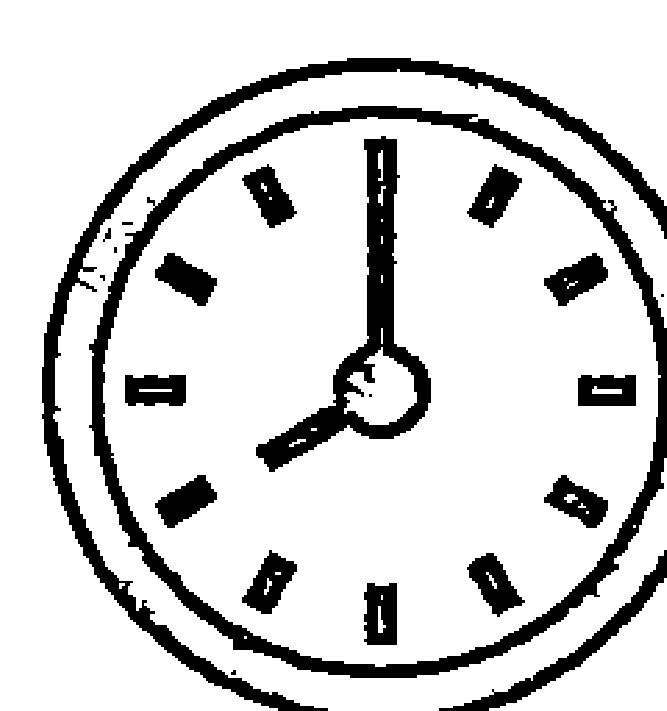

学习了本课你会发现：你有自由选择思考内容的权利，但思考的结果却由一个既定的法则控制着！这是不是很神奇？当知道了我们的生活并不是反复无常、飘忽不定时，我们难道不应该感到欣喜吗？我们的生活是由某种法则支配的。这种稳定的状态就是我们的机遇，因为只要遵从这个法则我们就可以准确无误地获得我们想要的东西。

正是由于这个法则的存在，宇宙才呈现出了一片和谐的景观，否则，将是一片混沌。

这就是善恶之源的奥秘，过去的、未来的一切幸与不幸，皆在于此。

让我来对这一点做一下说明。思想导致行动，如果思想是和谐的、具有创造性的，那么结果一定是美好的；如果思想是破坏性的、嘈杂不堪的，结果一定是不幸的。

因此，只有一个规律、一个原则、一个总因、一个“力量之源”，而幸与不幸只不过是用来描述行为结果的词语而已，或者说，用来检验我们对这一规律是遵从了还是违逆了。

从爱默生和卡莱尔的生活经历中我们可以见证一下这一点的重要性。爱默生热爱一切好东西，他的一生就是一首宁静而和谐的交响曲；而卡莱尔憎恨一切坏东西，他的一生便是一部永远嘈杂不宁的纪录片。

这两位伟人有着同样的理想，但一个采用了富有建设性的思想，因此得以与自然法则和谐一致，而另一位却接纳了破坏性的思想，因此给自己带来了无尽的烦躁。

很显然，我们不应憎恨任何事物，即便是“坏”事，因为恨是极具破坏性的，而且我们很快就会发现，持有破坏性的思想就好比播下“风”的种子，收获的将是“飓风”。

思想包含了一个至关重要的原则，因为这个原则是宇宙的创造原则，就其本性而言，它总会与其他类似的思想结合到一起。

因为生长是生命的目标之一，所以一切存在的原则都必须为生命的成长付出相应的努力。因此，思想一旦成形，生长法则就会让它彰显出来。

你有自由选择思考内容的权利，但思考的结果却由一个既定的法则控制着。一切持之以恒的想法都会在个人的性格、健康和外在环境中显现出相应的结果。因此，以一种建设性的思维习惯取代那些破坏性的思维习惯，对我们的成功而言是极其重要的。

我们都知道，要做到这一点并不容易。精神习惯很难掌控，但这并不意味着我们对此束手无策。我们的策略就是，从现在开始，让那些建设性的思想取代那些破坏性的思想。形成分析任何一种想法的习惯，看看这些想法是不是必要，其客观结果是否有益（不光是对自己，也包括对身边所有受到影响的人），如果答案是肯定的，那么，保留它，珍视它。这种想法是有价值的，是与“无限”步调一致的。它能够生长、发展，结出丰硕的果实。另外，你最好记住乔治·马修·亚当斯所说的话：“学会关上你的大门，不要让那些破坏你美好未来的东西溜进你的心灵、你的工作、你的世界。”

如果你的想法是批判性的或破坏性的，无论在什么条件下你都只会招致混乱与不安。所以，每个人都有必要培养一种有助于创造建设性思维的心态。

- 你将发现想象力在这一方面的巨大作用。培养想象力的目的在于引发自己的理想，因为你的未来就是从理想中浮现出来的。

- 如果你的未来是一件衣服，想象力的作用在于积聚原材料，而你的心灵则负责把材料编织成衣服。

- 想象力是一道光，为我们照亮了一个崭新的思想和经验的世界。

- 想象力是一个强有力的工具，所有探险家、发明家都是借助于这一工具，打通了从先例到经验的隧道。“先例”说：“这不可能做成。”“经验”说：“它已经做成了。”

- 想象力是一种可塑的能力，它把感知到的事物塑造成新的形态和理念。

想象力是思想的建设性形态，一切建设性的行为，都有想象力做先导。

没有建筑师的建筑图纸，建筑工人建不出任何建筑，而建筑师的蓝图则来自于想像。

小业主如果不在他的头脑中规划自己的事业，他就无法创建一个拥有上百个小公司、数千名员工、上百万资金的大集团公司。物质世界中的事物就如同陶工手中的泥，并没有最终定型。真正的事物是由伟大的思想创造出来的，而这一工作的完成又必须借助想象力。为了培养想象力，一些练习是必不可少的。精神的臂力，与身体的肌肉一样都需要锻炼，需要营养，否则就无法生长。

不要混淆想象力和幻想，或把它与很多人爱做的白日梦等同起来。白日梦是一种精神的浪费，它将导致精神上的疾患。

建设性的想象力意味着精神劳动，有人甚至认为这是最艰辛的劳动，但是，正因如此，它的回报也才是最丰厚的。宇宙中最美好的事物只会被赐予那些有能力思考，善于想像，并致力于将自己梦想变为现实的人。

当你完全意识到这样一个事实——心灵是唯一的创造原则，精神无所不能、无所不知、无处不在，你可以有意识地运用思想的能量，与这样的全能者保持和谐一致时，你就能在正确的道路上向前迈进一大步。

### 秘密背后的秘密 | The Secret Behind the Secret

下一步，就是要把自己放置在一个能够接收这种能量的位置上。因为这种能量是无处不在的，它也一定存在于你的心中。我们知道，一切能量都是由内而生的，但这种能量需要培养、提高、发展。为了做到这些，我们必须有一颗乐于接纳的心，就像锻炼身体一样，这种接纳性也是需要训练的。

引力法则必将准确无误地将那些与你的习惯、性格以及占主导地位的精神状态相匹配的生活条件、境遇、经历等回馈于你。这种精神状态不是指你在教堂中的那一小会儿沉思，也不是指你读一本好书时的状态，而是在你心中占主导地位的那种精神状态。

如果你一天中有10个小时是沉浸在软弱、憎恨等负面想法中的，那你就不要指望通过那区区10分钟强大、积极、创造性的想法，为自己带来美好、强大、和谐的境况。

真正的力量来自于内心。人们可能用到的所有力量都是来自于内心，它们会一直静静地待在那里，直到你第一次意识到它们的存在并使它们可视化，提出对它们的所有权，并把它们注入到你的意识中，直到与它们合二为一。

人们都说渴望长寿，很多人也在朝着长寿的方向努力，但他们中的大部分人认为多多锻炼，科学呼吸，用健康的方式食用健康的食品，每天喝许多一定温度的白开水，不喝饮料，就可以延长寿命。事实上，这些方法的成果微不足道。然而，当人们认清了这一事实，并敢于肯定自己同一切“生命”的合一时，他们就会发现自己变得耳聪目明，腿轻脚快，浑身洋溢着青春的活力。他们就会发现自己找到了一切能量的源泉。

### 第八课 建设性的思想造就美好的结果 | The Master Key System

一切错误都是由无知导致的，而知识的获得和能力的增长决定着成长和进步。知识的获取和证实就能创造力量，这种力量是精神性的，它存在于一切生命的心中。它是宇宙的灵魂。

知识是人类思考的结果。因此，思想是人类意识进化的种子。一旦人类停止提升他们的思想和理想，他们的能力就会开始瓦解。他们的面容也将随之改变，作为这些变化的记载。

成功人士把实现理想作为自己的奋斗目标。为了理想的实现，他们在努力做好当前的事的同时，也想好了下一步要采取的行动。思想是他们建造理想的材料，而想象力就是他们的精神工作室。心灵是他们用来把握周边环境和人物的永不停息的动力，他们用这样的心灵去筑造成功的阶梯，而想象力则是所有伟大事物诞生的母体。

如果你一直忠实于自己的理想，当环境适于实现你的计划时，你将听到发自心底的召唤，而最终的结果将与你对理想的忠实度成严格的正比。坚定不移的理想，为成功准备并吸引着必要的条件。

因此，你可以将精神与力量的大网覆盖到你生活的方方面面，你也将因此过上宁静的生活，免受一切灾难的侵袭。你将会拥有一种积极向上的能力，将富足与和谐吸引到你的身边。

### 秘密背后的秘密 | The Secret Behind the Secret

这是渗透进一切意识中的因素，也是导致所有动荡不安局面的主要原因。

在上一课中，你学会了创造精神图景，以及如何使这幅图景由不可见到可见。这一周我要让你们拿一件物品，探寻它的本源，看看它到底包含了什么。这将有助于培养你的想象力、洞察力、感知力与敏锐度。肤浅的观察是无法达到预期的目的的，你必须透过事物的表面，用剖析的态度细致观察。

只有少数人明白，他们所见的一切都只不过是结果，导致这些结果的原因他们也略知一二。

仍然像先前那样坐好，想像一艘战舰：这个巨大的怪物飘浮在水面上，下面是死一般寂静的大海，其中看不到任何生命。你要知道战舰的大部分是隐藏在水里的，你无法看到它的全貌。这艘船有20层摩天大厦那么高那么重。数百人正整装待发，准备去完成他们的任务。整艘船的每一部分都由能干的、训练有素、技巧娴熟的士兵驾驭着，他们通过成功地驾驭这艘巨船来证明自己的胜任度。尽管很多人没有意识到巨船的存在，但它的眼目却观测着周边几英里内的每一件事物，任何东西都无法逃出它的视野。你要知道尽管它看起来默默无语、顺从听命、无咎无知，却能发射数千磅的炮弹，重创几英里外的敌军。这些你不费力就能联想到。然而，这艘战舰是如何来到这里的，最初又是如何诞生的？如果你是个细心的观察者，所有这一切你都会想知道答案。

## 第八课 建设性的思想造就美好的结果 | The Master Key System

首先从铸造厂的钢板看起。看，有上千人参与它的生产过程。再退后一步，看看从矿山提取的铁矿石，它们被运上货车或汽车，然后熔化，锻造。进一步追溯，你可以看见这艘战舰的设计者和工程师，你的思想已经回到了最初阶段，这时的战舰还处在意念阶段，无形无物、无法触摸。它仅仅存在于工程师的脑海中，而建造这艘巨轮的指令发自何处呢？也许是发自国防部长那儿。但更有可能的是，自战争开端以来战舰就被设想了出来，国会通过了拨款提案。也许有反对票，也有支持或否定这个提案的演讲。这些国会议员代表哪些人呢？他们代表你和我，所以，我们会发现，在分析的最后一层，我们自身的思想总是要对这个问题或其他很多问题负责，而这些正是我们常常忽视的。进一步的思索会让我们明白一个最重要的事实，那就是：如果没有人发现能够使这个钢筋铁骨的庞然大物浮在水面上而不至沉没的规律，这艘战舰就永远不会诞生。

这条规律是：“任何物质的比重，都是其单位体积重量与同等体积的水的重量之比。”这条规律的发现，彻底改变了航海、商业与战争的形式，使战舰、航空母舰、巡航舰的出现有了可能。

你会发现这些练习的价值是无限的。当我们的思想能够看穿事物的表象，一切就都与先前截然不同了，琐碎卑微的变得意义深远，了然无趣的变得趣味无穷，一些我们曾经认为毫无用处的事情将成为生命中至关重要的存在。

### 秘密背后的秘密|The Secret Behind the Secret

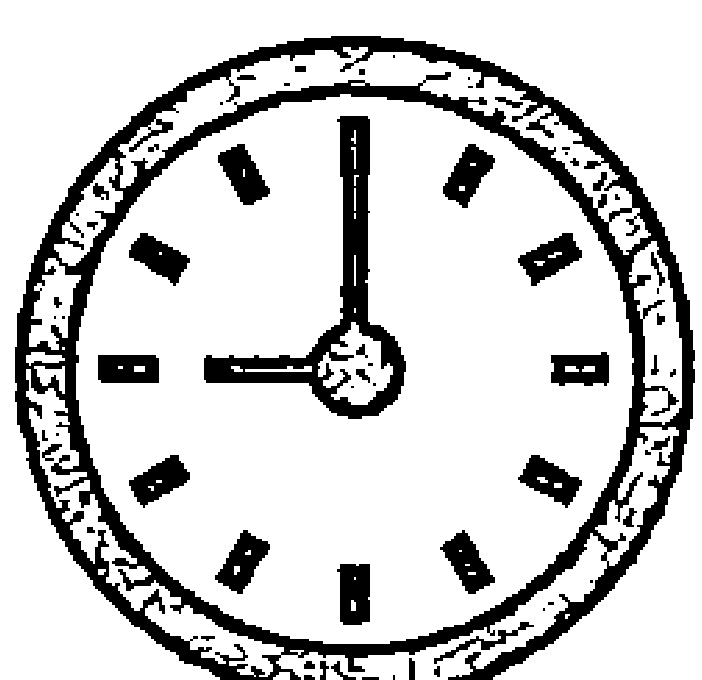

### 第九课 不断改进自己

用勇气、能力、自强、自信的念头，取代那些无助、畏怯、匮乏、有限的想法 积极的想法必将摧毁消极的念头，就如白昼驱散黑暗一样 所有的成功，都是通过把意念恒久地集中于看得见的目标而实现的

在这一节，你将学会如何利用工具为你建立各种你想要的条件。如果你渴望那些条件，你就必须改变自己。也许你的怪念头、愿望、幻想和野心每走一步都会受挫，但你内心深处的想法最终都会像种子长成植物那样找到它的表达方式。

如果我们想改变条件，我们应该如何做呢？答案其实很简单，那就是通过成长法则来实现。因和果绝对而且始终存在于思想的隐蔽处，就像存在于物质世界一样。

因此我们的内心要始终保有拥有那些条件的渴望，并且坚信它是已经存在了的事实。这种暗示将体现出强大的坚信力的价值。经过不断地重复暗示，它将成为我们身体的一部分。事实上，在这个过程中，我们是在逐渐地改变我们自己，使我们成为理想中的样子。

性格并不是一种偶然，而是不断努力的结果。如果你胆小、犹豫，敏感，又或者你被恐惧的想法困扰，或过度焦虑于未来可能出现的危险，那么请记住这条真理：两个事物不可能同时出现在同一个地点。

在精神世界里，这一真理也是同样适用的。所以此时你的解决办法就是用勇气、力量、自恃和自信的想法取代恐惧、不足和限制的想法。

最简单自然的方法就是为你面临的特殊情况找到适合的坚信力。

积极的想法将摧毁消极的想法，就像光明将最终战胜黑暗那样，而且这样的结果必将被应验。

行为是思想的花朵，条件是行动的结果，所以如何掌握和使用这门工具，将决定你是成功还是失败，获得欢乐还是痛苦。

- “外在世界”中或许只有三样事物值得追寻，而每一件都可以在“内在世界”中找到。找到它们的秘诀非常简单，就是找到一种合适的“机制”，与全能的宇宙力量相联系，要知道，每个人都和这全能的力量相通。

- 所有人共同渴望的三件事——也是人类个体最高层次的表达、最全面的完善——是爱、健康与财富。每个人都承认健康是绝对重要的，如果肉体痛苦，又岂能高兴得起来呢？并不是每个人都会这么爽快地承认，财富是必不可少的，但所有人都必定会承认，充足的供应至少是必要的，而一个人认为是充足的供应，对于另一个人来说可能是绝对的、不堪忍受的匮乏。但是大自然的供应宝库，就不仅仅是充足了，而是极其丰富、阔绰、豪奢，我们应该认识到，一切的匮乏或局限，都只不过是人为的分配方法所造成的局限而已。

几乎每个人都承认，爱是第三件重要的事情，或许有人会说，“爱”对于人类幸福来说是头等重要的大事。无论如何，那些拥有这三者——健康、财富与爱——的人，他们的“幸福之杯”已完全满溢，再也加# 秘密背后的秘密 | The Secret Behind the Secret

我们发现，宇宙物质等同于“全部健康”、“全部财富”和“全部的爱”，而我们能够用来和这无限相联系的机制就是我们的思维方式。因此，正确的思维，将带领你进入“伟人的圣殿”。

我们应该想些什么呢？如果我们知道这个问题的答案，我们就能够找到与“我们渴想的一切事物”相联系的机制了。这种机制，当我把它告诉你们的时候，看上去似乎非常简单，但你要继续往下读。你会发现，它实际上就是“万能钥匙”，如果你高兴的话，也可以叫它“阿拉丁神灯”。你会发现，它就是一切善行（它意味着福祉）的基础、必要条件和绝对法则。

只要有正确、合理的思维，我们就一定能够发现“真理”。真理是所有事业和社会交往中的潜在法则。真理是每一次正确举动的先决条件。认识真理，自信而且肯定，就可以获得真正的满足，这是一切其他事物都无法比拟的。在这个充斥着怀疑、冲突和危险的世界中，它是唯一一块坚实的地面。

认识真理，就是与“无限”和“全能”的力量和谐相处。因此，认识真理就是使自己与战无不胜的力量相连，它可以席卷各种各样的嘈杂与混乱、怀疑与谬误，因为“真理是强有力的，可以战胜一切。”

哪怕是最缺少智慧的人，都可以对一件基于真理之上的行为的结果进行预测。反之，即便是最睿智的人，哪怕他学识渊博、明察秋毫，如果他的希望是建立在错误的前提之上的话，他也会绝望地迷失方向，对接下来的结果无法形成概念。

- 所有不能与真理保持和谐的行为，无论是出自有心还是无意，将导致混乱不安，最终招致的损失，取决于这次行为的程度和特性。
- 那么我们到底应该如何认识真理，以维持与“无限”相联系的机制呢？
- 如果我们能认识到：真理是宇宙精神的至关重要的原则并且无所不在，那么我们就不会在这一点上犯错了。举个例子来说，如果你需要健康，你只需要认识到这样的事实：你内在的“自我”是具有精神属性的，而所有的精神都是合一的：部分在哪里，整体也在哪里。这将带给你健康的身体状况，因为体内的每一个细胞都将彰显你所认识的真理。如果你看到的是疾病，它们彰显的也是疾病；如果你看到的是完善，它们彰显的也是完善。大胆宣称“我完整、完美、强大、有力、热爱、和谐而幸福”，将给你带来和谐的境遇。这是因为，这样的宣称是与真理严格一致的，当真理彰显出来，一切的谬误和混乱都将消失。

你知道“自我”是属于精神的，那么它必然总是绝对完美的，因此，“我完整、完美、强大、有力、热爱、和谐而幸福”的宣称，绝对是科学的陈述。

# 秘密背后的秘密 | The Secret Behind the Secret

思想是精神的活动，而精神是创造性的，因此，把这一点谨记在心，现实的景况就会与你的思想保持和谐一致。

如果你需要“财富”，那么只要你认识到，你内在的“自我”与宇宙精神合一，而宇宙精神就是全部的财富，它无所不在，这种认识将帮助你实现并运行引力法则，使你与那些能够让你走向成功的能量发生共振，并给你带来与你宣称的目标绝对一致的能力与财富。

视觉化是你需要实施的机制。视觉化和观看是两个完全不同的过程。观看是肉身的、物质的，因此是与客观世界、也就是“外在世界”相联系的，而视觉化是想象力的产物，因此也是主观世界、即“内在世界”的产物。因此，它拥有生命力，它能够成长起来。被视觉化的事物一定会在外部形态上显明。这个机制是完美的。它是由那位“做什么都好”的建筑大师所创造的。但是很不幸，有时候它的操作者并不熟练、效率低下，但通过练习，下定决心，就一定能克服这个弱点。

如果你需要爱，那么请认识到得到爱的惟一方式是施予爱，你施予的越多，得到的也就越多，而你能够施予的惟一方式，是让你自己充满爱，直到你成为爱的磁石。其中的方法将在另一课中阐述。

那些把最伟大的精神真理与生命中的细微之处相联系的人，已经找到了解决所有问题的秘密。一个人越是接近伟大的理念、伟大的事业、伟大的自然物、伟大的人，他就越会受到鼓舞，思想就越发深邃。据说，每一个接近林肯的人，都会产生一种高山仰止的感觉，尤其是当人意识到他肩负着永恒真理的重任之时，这种感觉就来得越发强烈。

# 第九课 不断改进自己 | The Master Key System

有时候，听取某些践履这些原则以进行检验的人、某些在自己的生活中验证了这些原则的人的建议，是一种激励。弗里德里克·安德鲁斯在一封信里提出了下面的洞见：

在我大约13岁的时候，T.W.马瑟医生（他后来去世了），他对我母亲说：“不，没有机会了，安德鲁斯太太。我也是这样失去我的小儿子的，我为他付出了全部可能的力量。我特别研究过这种疾病，我知道他确实没有好起来的希望了。”

我的母亲对他说：“医生，如果他是您自己的孩子，你会怎么做？”医生回答说：“我会一直战斗、战斗，只要孩子一息尚存，我就要战斗下去。”

这是一场持久消耗战的开端，不断地来回往复，所有的医生们都认为没有治愈的希望，然而他们还是尽最大可能地鼓励、安慰我们。

但最终胜利是属于我们的，我从一个弱小、萎缩、畸形、跛脚、只能用手和膝盖在地上爬行的孩子，长成了一个强壮、挺拔、健康的人。

现在，我知道你们一定很想知道其中的原理，我将尽可能简单明确地告诉你们。

# 秘密背后的秘密 | The Secret Behind the Secret

我为自己树立了一个信念，其中充满了我最需要的能力，一遍一遍地对自己说：“我完整、完美、强大、有力、热爱、和谐而幸福。”我抱持着这个看法，翻来覆去、从不改变，我夜间醒来，发现自己口中喃喃自语：“我完整、完美、强大、有力、热爱、和谐而幸福。”这是我每日早上醒来所说的第一句话，也是每天夜里睡前所说的最后一句话。

我不仅把这句话告诉自己，也告诉在我看来每一位需要这句话的人。我想要强调这一点，如果你自己需要什么，也敢于在别人面前肯定地宣布它，它将使你们同时受益。我们种的是什么，收的也是什么。如果我们付出了爱与健康的想法，它也一定会照这些回报我们；但如果我们付出的是恐惧、忧愁、嫉妒、愤怒、憎恨等等的想法，那么在我们生活之中也一定会看到恶果。

据说，人每隔7年就会全部更新一次，而当今又有一些科学家指出，事实上我们每隔11个月整个人体都会重塑一次。所以，我们只有11个月的年龄。如果我们年复一年地把缺陷植入我们的身体，那可就怪不得别人了，只能从我们自己身上找原因。

人是自身思想的总和。那么，问题是，我们如何摒弃一切糟糕的念头，抱持好的想法呢？刚开始可能我们不能阻止坏念头的侵入，但我们可以不去理会它。惟一拒绝它的方式，就是忘却——这意味着，找一些东西替代它。那句准备好了的宣言，现在就可以派上用场了。

当愤怒、嫉妒、恐惧、焦虑等想法偷偷摸摸地潜入时，开始运用你的宣言吧。只有光明可以战胜黑暗——只有温暖可以战胜寒冷——只有善能够战胜恶。拿我自己来说，消极悲观的想法没有任何帮助。肯定一切光明美好的事物，邪恶一定会自行引退。

- 如果你需要什么，你最好能够运用这句宣言，这实在是一句极其完美的话。运用它，照着它去做。把它带入你静默的灵魂深处，直到它沉浸到你的潜意识中，这样你就可以随时随刻运用它了——不管是汽车上、办公室里，还是在家中。这就是精神方法的优势所在，它们就近在咫尺。精神是无处不在、唾手可得的。唯一需要做的，就是认识它的无所不能，并心甘情愿地领受它的善意。
- 如果我们精神中的主要倾向是力量、勇气、宽厚和同情，我们就会发现周边的环境自然为我们摈弃了我们思想不符的景况，成为我们心灵状态的映射。相反，如果我们心灵的倾向是软弱、嫉妒、破坏、毁灭，那么环境也一定会照此折射出来。
- 思想是因，境遇是果。这就是善恶起源的说法之一。思想是创造性的，它将自动与客体相关联。这是一个宇宙哲学法则（宇宙法则），这就是引力法则，也是因果法则。对这个法则的认知和运用，将决定着一切的开端和结局。这就是世世代代的人们在祈祷中获得的力量的法则。
- 这一周我们要视觉化的是一株植物。取一朵鲜花，一朵你最喜欢的鲜花，让它由不可见到可见，种下那颗小小的种子，给它浇水、悉心照料它，把它放在能够让阳光直射到的地方，看那个种子抽出嫩芽。现在，它是一个生命了，是一个活着的、开始获取生存物质的生命。看它的根，正在向泥土中延伸；看它的芽，正在向上下伸展；不要忘了那些生命的细胞，它们不断地分解、再分解，不久就增长到上百万个，而每一个细胞都充满智慧，知道自己想要得到什么，并知道如何获取它们。看，它发绿长叶，向上向前生长，看它的枝丫是怎样的完美匀称，看它的叶子如何长成，看它如何抽出小小的茎杆，上面擎着含苞未放的花骨朵儿。正当你观看的时候，花蕾舒展了，绽放了，你喜爱的花儿出现在你眼前。现在，有意识地集中注意力，你将闻到一股清香；是微风吹拂过花儿——你视觉化的创造物——带来的芳香。

当你能够让你的视野变得清晰明朗，你就能够进入到一件事物的灵魂深处。它对于你来说异常真实。你将要学会的是心神的集中，而不管你的意念是集中在健康、理想上，还是一朵鲜花、一个棘手的商业方案、或是人生的其他种种问题上，其中的过程总是一样的。

所有的成功，都是通过把意念恒久地集中于看得见的目标而实现的。

### 第十课 有因必有果

凡夫俗子不能明辨因果，往往被自己的感受和情绪控制。他们只知道改变自己的行为。如果他们经商失败，他们会埋怨运气不好。如果他们讨厌音乐，他们会说音乐是一种消费不起的奢侈品。如果他们是可怜的办公室小职员，他们会说如果他们从事某种室外工作的话会干得更漂亮。如果他们缺乏朋友，他们会说没有人懂得欣赏他这颗敏感的心。

如果你能完全领会第十课的内涵，你就会懂得任何事情的发生都不是平白无故的，而是有一个明确的原因。你将学会根据严谨的科学制定你的计划。通过把握事件的原因你就可以掌控所有的局面。当你如愿以偿地赢得了胜利时，你就会懂得你为什么会胜利。

凡夫俗子不能明辨因果，往往被自己的感受和情绪控制。他们只知道改变自己的行为。如果他们经商失败，他们会埋怨运气不好。如果他们讨厌音乐，他们会说音乐是一种消费不起的奢侈品。如果他们是可怜的办公室小职员，他们会说如果他们从事某种室外工作的话会干得更漂亮。如果他们缺乏朋友，他们会说没有人懂得欣赏他这颗敏感的心。

他们从来都不会全面地考虑问题。一言以蔽之，他们不懂每个结果都是由某个特定的原因造成的，反而找出许多借口和理由来安慰自己。他们能想到的只有消极地自卫。相反，一个明白“凡有果，必有因”道理的人，就会全面客观地思考问题。他不仅知其然亦知其所以然，并能充分恰当地做好自己应该做的事。他收获到的将是整个世界的真情无私的回馈，无论是友情、爱情，还是荣誉、赞许。

# 秘密背后的秘密 | The Secret Behind the Secret

宇宙的自然法则之一就是富裕充足。这条法则证据确凿，在各个方面都是如此。大自然无时无处不是慷慨、大方、豪奢的。在一切造物上都毫不吝惜。大自然的丰盈充裕在万物中彰显出来。千万百万的树林和花儿，动物、植物和浩大的繁殖体系，创造与再生永恒地进行着。这一切，无处不证实着大自然为人类准备了丰富豪奢的供应。很明显，对于每个人，堂皇优裕的大门都敞开着。同样明显的是，许多人却走不进这个堂皇的大门。他们还不能认识一切财富的普遍存在性，也不知道精神是使我们与渴想的事物相联系的活动原理。

一切财富都是力量的产物。财产只有当它能赋予力量时才具有价值。事件的发生只有当它对力量发挥作用时才显得重要。一切事物都在不同程度上代表了不同形态的力量。

因果论的知识在电力法则、化学亲和力法则和地心引力法则中表现出来，这种知识使人类得以勇敢无畏地制定、执行他们的计划。这些法则叫做自然法则。因为物质世界是按照这些法则运行的。但并不是一切的能量都是物质能量。精神能量同样存在，心理和心灵上的能量同样存在。

在某种层面上，精神的力量胜于物质的力量。因为它在一个更高的层面上存在着。它使得人们有足够的力量去探索大自然存在的规律，从而使得自然界的一切听命于人，更好地为人服务，从而让很多人从繁重的劳作中解脱，提高了劳动效率。精神力量不但指引人们发现地面上的规律，现在也将探索领域延伸到了太空，从而战胜了地心引力的规律，这一切都是精神力量在起着至关重要的作用。正如亨利·德拉蒙德说得那样：

> “正如我们所知道的，物质世界分为有机物和无机物。矿物世界是无机物的世界，它和动植物世界完全隔绝，往来的通道被打上了封印。这些障碍无法跨越。物质无法改变，环境无法改造，没有化学、也没有电，没有任何形式的能量，也没有任何种类的变革可以为矿物世界的一个小小原子打上生命的烙印。”
>
> “只有，当一些生命的形式屈身来到这一片死寂的世界时，这些没有生机的原子才被赋予了生命的属性。如果不与生命发生联系，矿物的世界就永远只能停留在无机的层面。”赫胥黎说过，生源论（即生命只能来自生命）的信条放诸四海而皆准，丁铎尔也不得不宣布：“我承认，没有一丝一缕的确凿证据，可以证明我们今天所能见到的生命是与更早的生命毫不相关的。”

物理规律可以解释无机物的世界，生物学可以诠释有机体的进化，但是一涉及生命和非生命之间联系，科学只能缄默不语。自然世界和精神世界中同样有一个类似的通道，这个通道在自然界的一端被贴上了封条。大门紧锁着，没有人能够开启它，没有有机体的改变，没有精神能量，没有心灵的力量，没有任何种类的进步，能够使人类进入精神世界的领域。

# 秘密背后的秘密 | The Secret Behind the Secret

然而，如同植物深入到矿物世界当中，用生命的神秘触摸那个未曾到达的世界。宇宙精神也是以一种新奇的方式降临人间，它赋予人类新奇、陌生、美好、甚至是奇妙的力量。当这种力量发挥作用时，那些在工商业或是艺术领域中打拼的男人或女人，就很容易取得业绩和成就。

思想让无限与有限之间保持联系，让个体与宇宙之间保持联系。我们知道在有机物和无机物之间有一个无法跨越的鸿沟，只有当生命进驻时，物质的宝库才能开启。也就是说当种子深入到矿物世界中，生根发芽时，其他的物质同样因为种子的到来充满生机，数不清的矿物质开始为种子准备合适的生长环境，在整个过程中，生长规律在起着极其重要的作用，直至“百合花”长成。

当一颗思想的种子渗透到宇宙精神不可见的诞育万物的财富宝库中，生根发芽，生长规律就开始生效，我们知道，一切环境和境遇都是我们思想的客观形式。

思想是动态能量的重要活动形式，它能够与客体相连续，并且能使生命能量从不可见的状态中走出来，这样才能让这种能量发挥重要作用，去创造客观世界的物体。事实上，客观世界的一切都是通过这种能量创造的，这样你才能进入“至高者的圣殿”、“统治万物”。

这一点毋庸置疑。如果宇宙的灵魂就是所谓的宇宙精神，那么整个宇宙就是宇宙精神为自己创造的环境。我们每一个人就是个体化的宇宙精神，正在用相同的形式创造着我们赖以生存的环境。

# 第十课 有因必有果 | The Master Key System

- 这种创造性的力量能否发挥作用，取决于对潜在精神力量或心灵力量的认知，千万不要把它与进化混为一谈。创造力是一个从无到有的过程，而所谓的进化则是将自然界已然存在的种种层层展开。
- 在运用此法则来经历种种奇妙的旅程时，一定要明白：我们自己并不能做什么。一定要有这样的态度，我们的力量对于已有的力量来说，实在微不足道。使一切发生的、我们遵从的规律，都是孕育万物的精神在起着作用。
- 人类可以创造智慧，从而使“无限”的力量凭借这种智慧达到某个特定的结果或目的，这种想法是错误的，也完全没有必要，我们可以信赖宇宙精神，它可以寻找到实现一切的捷径。我们需要做的是：创造我们的理想，而这理想必须是完美无缺的。
- 电力法则是这样的：人类可以掌控并运用这种看不见的力量，让它通过种种方式为我们提供舒适和贴心的服务，比如：邮递员再也不用骑着自行车到处跑，你只需动动鼠标就可以完成全球联络；傍晚，电灯亮起，它可以照亮整个世界……不过，如同其他的自然规律一样，如果不遵循电力法则，同时碰触到了未曾绝缘的电源线，结果可能十分不幸，甚至可能搭上性命。同样的道理适用于精神世界的法则，如果不能很好遵循它的法则，也同样会有不好的结果发生。
- 有人把因果关系法则解释成极性原理，如同两极之间必须由电路连通。如果我们做不到与精神世界的法则保持和谐一致，这个线路就无法接通，也不能顺利工作。如果我们不了解这个法则是什么，怎么能与这个法则保持一致呢？我们如何认识这个法则呢？只有通过学习，通过观察。

# 秘密背后的秘密 | The Secret Behind the Secret

这个法则在自然界畅行无阻。大自然的一切，在生长过程中不断彰显自己，在不断证明这个规则的存在。凡是有生长的地方，就一定有生命；凡是有生命的地方，就一定存在着和谐。自然界的一切生物都在为自己谋求适合的环境和供应，以便在这个过程中展现完美的自己。

如果你的思想与自然的创造性准则保持和谐，那么就会与“无限精神”步调一致了，这就如同发电机的电路两极。但是，另一方面，你的有些想法与上述能量并不和谐，结果会怎么样呢？依然像发电机的电路两极，如果中途将电路切断，结果只有一个：发电机停止运转。

每个个体身上也一样，如果你的想法与“无限”不一致，就不能形成宇宙和个人的两极，就没有“电流”了。种种想法在你脑海里挥之不去，它粘附着你，滋扰着你，使你忧愁烦恼顿生，最终这一切会带给你疾病甚至是死亡。医生借助各种先进器械来诊断病症，他们把各种各样的病痛冠以稀奇古怪的名字，而这些病症千篇一律，无一不是思想谬误的结果。

建设性的思想必定是创造性的，而创造性的思想必定是和谐的，这些会消除那些破坏性的或竞争性的思想。

智慧、勇气、力量，和一切和谐的景况都是力量的结果，而我们知道一切力量都是由内而生。不过，软弱也不是因为力量的缺乏，主要表现为空虚混沌，无本无根，治疗的良方不过是开发力量而已，开发力量的方式与开发其他能力的方式一样，都要通过大量的练习。

# 第十课 有因必有果 | The Master Key System

这里所谓的练习就是应用你的知识。知识不会应用自己，你学到后必须应用它。同样的，财富也不会从天而降，天上从来不会掉馅饼。你需要主动认知引力法则，先要有一个具体、切实的目标、有超强的执行目标的意志力，让目标变成现实。一切将通过大自然的传递法则使你渴望的一切得到实现。如果你从商，它通过正常的渠道增加你的财富，也为你打开新的、不寻常的渠道。

当你看到这里，不妨找一面空白的墙壁或者任何便利的地方，坐下来。在你的意念里画一条6英寸的长线，试着看清这条线，如同它画在墙上或者纸上一样；接着，再画出两条垂直的线，与之前的那条线的两端相连，接着再画一条6英寸的水平线，让四条线组成一个正方形。在正方形正中间画一个圆点，试着将它拉近十厘米；再在正方形的底面上做一个圆锥吧，你可以将他们变成黑色的、白色的、蓝色的……

如果这一切很顺利的话，这说明你已经很了不起了，你可以在任何事物上集中心神了。如果一个目标或者一个物件在你的心里清楚地成形，它的降临不过是早晚的事儿。心中所渴盼的事总在现实之前，而且决定着现实。

### 第十一课 看透事物的本质

> > 你，一定要记住：我们有能力达到的目标，都是一切场合、一切条件下的能力。仔细体会这句话：“凡你们祷告祈求的，无论是什么，只要信是得着的，就必得着。”

人的生命是由实际存在的、永恒改变的法则所控制的，而且这个法则一直不停地运转着，人类所有的行为都有其固定的规律。正是由于这个原因，那些控制着庞大产业的负责人能够绝对精确地测定每10万人中能够对给定的调整条件做出响应者的准确百分比。

不过，一定要记得：凡事都是因果循环。不管是哪一个“果”，都会有相应的“因”。而原本的“果”，反过来又成了“因”，从而导致其他的“果”，而这些“果”又成了另外的“因”。所以，你在运用引力法则的时候一定要记住，现在的你正在开启一长串的因果关系链，它可能会产生好的结果，但也会出现数不清的其他可能性。

生活中随处可以听见这样的话：“这样的结果真的太糟糕了，我从来没想是这样的结果。”每一个人都不想让事情朝着自己期望的反方向走去。事实上，心中的想法会为我们带来某种友谊或者交往，而这样又会影响到一些境遇和环境，不好的结果又成为我们抱怨现实的缘由。

归纳推理是一种客观思维的过程，它要求我们把很多独立的例证进行相互比较，然后从中找出引发它们的共同原因。

归纳法是通过对事实的比较得出结论。正是运用这种研究方法，人类才得以发现了大自然中的许多规律，也正是这些发现，造就了人类历史上划时代的进步。

归纳法是迷信与智慧之间的分界线，它以规律、理性与确定性替代并消除了人类生活中变幻莫测的成分。

归纳法就是我们在前面的课程中曾提到过的那位“门卫”。

当我们所熟知的世界发生着翻天覆地的变革；地球上有高山也有平原，看起来较为平坦的平原却是被一个球体撑起，而且这个球体还要围绕太阳转；当惰性气体，通过某种技术或者物质使其不再“懒惰”；从浩瀚的星空到平坦的大地，每一个角落都有生命的存在。我们不禁要问：是什么力量让自然界复杂的一切，运行得如此有秩序？

同性两极和同性磁力互相排斥，同样的道理适用于星球、人与人、力与力，两者之间必须保持一定的距离，异性相吸，酸碱中和，供需互补。这样的道理同样适用于人，具备不同才能的人可以相互吸引、相互配合。

眼睛搜寻并且十分感兴趣的颜色，往往是几种颜色互补的。同样，人的需求、渴望、向往通常都影响和决定着人的行为。

如果我们能够认识到这些，那真是莫大的幸运。居维叶通过灭绝动物的一颗牙齿获得某种启示。这颗牙齿为了更好地运用自己的功能，就需要动物的整个身体和它的需要互相匹配，也正是这颗牙齿对身体的决定性作用，让居维叶能够通过它而重新构建这个动物的骨骼。

当天王星的运动轨道出现偏离。勒维耶推测是因为存在一颗未知行星的引力作用，使天王星的轨道运动受到干扰，也就是天文学上所谓的“摄动”影响。勒维耶想要在太阳系的某个确定的位置中找到这颗行星，海王星就在预定的时间和地点出现了。

动物的本能需求和居维叶的理性需求是吻合的，大自然的需求和勒维耶的智慧是类似的，于是，我们可以得出这样的结论：哪里有“存在”的想法，哪里就有“存在”的事实。定义明确、符合规律的需求，为大自然复杂、秩序井然的运行提供了理由。

我们正确记录下大自然展示的一切，借助飞速发展的科学，我们感知的触角延伸到了整个自然界。我们手中握有可以撬动地球的杠杆，我们同外在的世界有着紧密、深切和多变的联系，就像我们每一个人的幸福、自由、快乐和政府存在相联系一样，我们的目的、愿望也和整个宏大的宇宙结构相吻合。

## 第十一课 看透事物的本质 | The Master Key System

个人利益被国家武器和自己的武器保护着。个人需求的供给，某种程度上取决于这些需求能否被普遍、有规则地感觉到。作为公民，他们本能去寻求与更高力量结盟，从而避免自己受到低级介质的干扰。同时，向物理、化学介质之间相互吸引或排斥的基本阻力法则提起诉求，大自然就可以将人与外部世界之间的相互作用所需的劳动力合理分配，以期实现创造者的意图。

如果柏拉图在他所生活的时代，能够通过摄影师的帮助观看到太阳是如何运转的，当然，他也可以通过归纳法想象100幅这样的场景。或许他会记起自己的智慧之言，在他脑海里一定也会有这样一幅场景：一切人工的、机械的劳动和重复性的劳动都指派给大自然去完成。人类只需通过精神的力量让这一切去完美运作。当然，最终一切供应都会由需求创造出来。

不管这个理想看来有多么遥远，这种归纳法都可以证明人类可以大踏步地前进。理想在现实生活中用种种恩惠环绕着人们，这些恩惠是对过往忠诚的酬报，对未来勤恳耕耘的激励。

归纳法也有助于我们集中并增强我们的能力，获得那些尚待撷取的成果；有助于我们通过运用精神最纯粹的形式，找到解决个人和宇宙一切问题的答案。

在此，我们向你传递一个核心理念：为了实现你所寻求的东西，就要相信这些东西已经实现。这样的理念是柏拉图留给我们的宝贵遗产。

## 秘密背后的秘密 | The Secret Behind the Secret

柏拉图早已逝世，让后人没想到的是他的理念竟然成为了现实。

我们一定要相信：我们的渴望一定会获得实现，接下来的就必然是看到它的实现。关于运用创造性能量的最简单、最为明确的方法就是把我们所渴望的事物作为一个已然存在的事实，让其在主观精神上留下印记。

这样，我们就可以在绝对的层面上进行思考，从而排除一些相对的条件或者限制。就如同我们把一粒种子种在土壤中，不去打扰它，它就会生根发芽，最终结出果实。

我们知道：归纳推理是一种客观思维的过程。我们把很多独立的事件进行比较分析例证进行相互比较，然后从中找出相似的规律。一些文明程度较高的国家，公民习惯通过实例分析、辨别，从而找出一些相似的规律。而一些国家对于事件总是抱着只知其然不知其所以然，不能很好地分析事件产生的原因，也不能很好预测事件的必然走向，只是简单为事件冠上神话色彩，这样往往探求不到使结果能够实现的规律。

有那么一类人，你能明显感觉到这种思维运作的过程：他们毫不费力就能得到别人需要辛苦跋涉才能得到的一切；他们不需要遭受良心的谴责，因为他们一直正直地走在通往未来的路上；行为举止也恰当得体；学习任何知识都能轻而易举；无论做什么，也能立即窥见其奥秘，轻松完成。总之，就是这样一类人，他们自身保持着和谐，从不需要反思自己的作为，也不需要经受困难或者辛劳的考验。

这种思想的结果，的确是恩赐，但是却很少有人意识、领悟并看重这个恩赐。人的心智只有在合适的条件下才能拥有这种神奇的力量，它可以被利用并引导来帮助解决人类的一切问题，认识这种力量，明白这样的事实，有着极其重要的意义。

所有真理，无论是科学术语还是普通语言阐述的，它们的本质都一样。完美的真理都需要不同的陈述来证明，任何单一的人类公式都不能完整表述真理的每一面。

不断的变化、不一样的重点、崭新的言语、别样的表达、新颖的观点……这些并不是像某些人认为的那样，背离了真理。恰恰相反，它们表明的是新的关系在真理与人类需求之间正逐步形成，而且这种关系会被大家逐渐理解并接受。

一位大师说过：“凡你们祈求的，无论是什么，只要相信能得到，就必定能得到。”保罗也曾说过：“信念是所望之事的根本，是未见之事的证据”，现代科学也有这样的表述——“吸引力法则就是思想同客体相联系的规律。”从上述我们可以看出，真理在不同的时代会用一种全新的方式告诉那个时代的每个人。我们再分析一下这些论述，就会发现它们都包含同一真理，只不过表达方式有所不同。

我们正步入新时代。时机已经到来，人们已经发现了控制权的奥秘，就应该抓住机遇，铺设好前行的路，这些比人们有史以来的任何梦想都要神奇。现在人们都已经扫除前行路上的障碍，虽然可能会破坏传统的糟粕，但却将精华的保存了下来。

## 秘密背后的秘密 | The Secret Behind the Secret

一种新的信念已经诞生，而且有新的表达形式伴随其出现，这种信念正是通过对能量意识的深层领会，才能让它淋漓尽致地体现在在各个层面的精神活动中。

有一种精神，一直以来都在矿物质中休眠着、植物中潜伏着、动物体内运行着，但在人类心理上达到了巅峰状态，它就是宇宙精神。万能的宇宙精神帮助我们跨越理论和实践的鸿沟，飞渡行动与目标的天堑，确证了我们能够驾驭生来就被赋予的统治权柄的能力。

到目前为止，过去历史中最伟大的发现，刚开始并没被大众接受，而是慢慢地才受到大众的欢迎，这就是思想的力量。它的重要性在各个研究领域中已经突显出来了。

人们或许会问，思想的创造力的组成部分都有哪些？从根本上说，它是由创造性的理念构成的。这些理念可以通过发明、观察、应用、鉴别、发现、解析、控制、管理、综合、运用物质和力量，来使自身变得客观。它能够做到这些，因为它是智能的创造力。

你知道吗？每当我们潜入思想的深渊时，思想最崇高的活力就会迸发出来；每当思想突破了自我的藩篱，经过了一个又一个的真理时，就抵达了永恒之光的所在。在那个地方，就会把一切现有的、曾经的、将至的，融为庄严和谐的一体。

## 第十一课 看透事物的本质 | The Master Key System

智能创造性的启示即诞生于这个自我沉思的过程中，这种启示高于一切元素、力量或自然法则，因为它能够按照自己的终极目的领悟、改造、管理、应用这一切，因此也终将占有这一切。

智慧拥有巨大的能量。它诞生于理性的破晓，是理性的详细体现，引导人走向智慧之大成——谦卑。而理想仅能帮我们了解事物本质的知识和原理。

许多人已经取得了在他人看来不可能的成功，也有许多人实现了自己追求的梦想，还有许多人改变了包括他们自身的一切。我们总是对他们所拥有的这种无坚不摧的力量啧啧称奇。然而，现在知道怎么获得这种无坚不摧的力量了。我们所要做的，就是领会并合理利用某种明确无误的基本法则。

本周的作业是，体察这句话语，“凡你们祈求的，无论是什么，只要相信能得到，就必定能得到。” ，注意，这其中没有任何的限制，“无论是什么”，说得很明确，这意味着惟一限制我们的是思考以及适应一切场合、一切情况的能力。要记住信念不是虚无缥缈的，而是真实存在的，“是所望之事的根本，是未见之事的证据。”

死亡不过是一个不可避免的自然过程，所有物质形式都要经受这样一个严酷的考验。死亡终结，新生开始。

### 第十二课 集中能量，勇敢去做

要想做到集中能量，我们必须做到：第一，了解自己的力量；第二，拥有挑战的勇气；第三，拥有去做的信心。请记住，只要科学地运用了思想的创造性力量，就可以完美实现任何目标。

- 1. 了解自己的力量
- 2. 拥有挑战的勇气
- 3. 拥有去做的信心

现在我们开始学习第十二课。这一课中我们会看到这样的说法：“第一，了解自己的力量；第二，拥有挑战的勇气；第三，拥有去做的信心。”

> > 第一，了解自己的力量；第二，拥有挑战的勇气；第三，拥有去做的信心。

仔细思考以上三句话，你会在其中发现很多意义并且由此引发的很多想法会助你更深刻地领会到关于这些想法的深刻意义。

思想有着广泛的用途，但它不会应用自己，作为人类个体，我们必须把思想应用于实践中，也就是说，设定目标并运用思想的力量实现它。

漫无目的的努力只会浪费大量的时间、想法和精力。如果设定了特定目标并为之努力的话，就有可能会创造出奇迹。如果你曾经观察过照相机的镜头，你就会知道如果镜头没对准的话，图像就会模糊不清，而当你调整好焦距后，图像就会变得清晰明朗起来。这说明了集中精神所具有的力量。因此，如果我们集中所有精神能量，定位在某一特定的想法上并排除一切杂念的干扰的话，就会实现目标。如果你不能把精力集中在你所期待的目标上，其结果只能是得到一个精神图景中的朦胧的理想轮廓。

科学地把握思想的创造性力量，就能完美实现生活中的任何目标。

## 第十二课 集中能量，勇敢去做 | *The Master Key System*

“我思故我在”。每个人都有无限的思考力。什么样的思考产生什么样的创造，因此人们的创造力也是无限的。

尽管我们知道思想为其客体而生，而且知道思想拥有巨大的力量，它最终会拉近我们与客体之间的距离。但是，我们还是难以摆脱那些恐惧、焦虑、气馁等消极的情绪，这样的情绪同样具有巨大的力量，让我们与渴望的东西越来越远，这样总会在行进的过程中走一步，退两步。

让我们避免后退的唯一方法就是不断前进。有3个绝对必要的步骤需要去做：第一，了解自己的力量；第二，拥有挑战的勇气；第三，拥有去做的信心。”

以此为基础，你就可以为自己构建理想的事业、家庭、朋友及环境，而且不会被材料或成本所限。我们知道，思想是无所不能的，“第一实体”中的“无限银行”可以为其提供源源不断的资源。因此，无限的资源，尽可为你所用。

不过，你的理想必须明确、清晰，一天一个理想是不可取的。天天都树立理想只会造成既耗费了精力又一无所成的后果。

然而在现实中不幸的是，很多人都经历了这样的后果，而原因是不言自明的。这就好比说，一个雕塑家拿一块大理石和一把凿子在雕塑时，每过15分钟就变一次主意，想想结果会怎样呢？同样的道理，假设你现在手中有一件天地万物间可塑性最强、也最伟大的、唯一真实的材料需要塑造，但是你的主意总是变来变去，又怎么可能得到好结果呢？

## 秘密背后的秘密 | The Secret Behind the Secret

经常受这种优柔寡断、消极负面的思想支配，往往只能导致物质财富的损失。直到这时，你才会发现钱与财不足凭恃。恰恰相反，实践思想创造力是世界上唯一可以指靠的。

每个人都拥有一种唯一且真实的力量，它就是协调自己与永恒原则一致。了解了这一点，才会掌握实践的方法。“无限”的存在是不可改变的，但自然法则是容易理解的。你应该清楚地认识到自己拥有这种能力：让自己的思考力适应宇宙思想。你的这种能力的高低决定着你取得的成就的大小。

思想的力量中有许多赝品，只能让人迷醉一时，但会带来不良的后果，百害而无一益。

毫无疑问，一切负面的想法如焦虑、恐惧等，产生的后果也是各从其类。所以，我们不要抱持这些想法，否则只会收获恶果。

还有一些人，他们相信神异现象，竭尽全力地苦寻在降神会上获得的所谓的证据、显灵等。心灵的大门为毒害作用很深的神异精神而打开，并且沉迷于其中不能自拔。可怜的他们并不知道这是一种让他们变得消极、被动、驯服的力量，这种力量会让其沉迷于其中而不能自拔，最终只会导致耗精伤神的恶果。

## 第十二课 集中能量，勇敢去做 | *The Master Key System*

心电感应或意念传递受到很多人的欢迎。实际上，这种形式只会给接受心电感应的人带来负面的精神影响。

很多时候，催眠术对受催眠者和施术者都很危险。只要是了解精神法则的人，都不会愚蠢到试图控制他人的意志。因为如果这样做的话，施术者将逐渐地（但却必然地）转移他自己的力量。

所有这些曲解，只能被暂时满足，甚至有一定的迷惑性。但是，真正领悟了内在力量世界后，就会发现更大的、无限的魅力孕育在其中。这种力量，运用的次数越多，它的成长也越快。而且，它是永恒的，不会消逝的。除此以外，它的功能强大，不仅有补救的功能，弥补以往的错误或错误思想导致的结果，也能起到预防的作用，保护我们免受各种各样的危险的侵害。最后，精神力量还是现实存在的创造性力量，借助这种力量，我们可以创造新的环境和际遇。

精神力量是有规律的，即思想与客体紧密相关，精神世界中思考出来的东西，都会一一实现于物质世界中。因此，我们可以得知，每一种思想都有“真”，通过生长规律的作用把“善”注入到外部世界显现出来，只有“善”才能助其实现永恒。

引力法则：赋予思想动态力量，促使思想与客体建立联系，支配一切负面的人类经验的法则。“爱”是引力法则的另一个名字。引力法则具有永恒性，在整个世界中，无论是哲学、宗教还是科学，都不能没有这个爱的法则。爱这种情感赋予思想以活力，而一切从爱中孕育出来的思想都将无比强大。

## 秘密背后的秘密 | The Secret Behind the Secret

我们发现，无论在什么情况下，只要理解了思想的力量，这一真理就会更加壮大。宇宙精神不仅仅是智慧，也是物质。为什么会这么说呢？因为这种物质其实是一种吸引力。电子通过引力法则聚集成原子，原子通过引力法则聚集成分子，分子通过引力法则聚集成物质的客观形式。所以，我们发现，爱是一切现象背后的创造性力量，既创造了一个个原子，又创造了整个宇宙，以及想象力能够赋予形态和观念的万事万物。

正是因为这个神奇的引力法则的运行，使世世代代的人类相信，一定存在着某种人格化的东西，能够回应人们的祈求和心愿，操控着大小事件，以满足人们的需求。

所有自然法则都是不可抗拒的，比如重力法则、电力法则或其他法则，它们像数学一样精确。引力法则也不例外，它的不可抗拒的力量是由思想和爱的结合得以实现的。这一法则从来没有发生过变化，只是还没有完善分发力量的渠道。例如，桥的倒塌不能归咎于重力法则，电灯不亮不能归咎于电力法则。同样的道理，如果一个人本身缺乏经验或一无所知，那么引力法则不能在其身上发挥完美的作用，但我们不应该因此而质疑引力法则的正确性。我们应该反思自己还有什么不足的地方，就像一道数学难题不可能在很短时间内就被正确解答出来。

把引力法则付诸实践的最有效方法就是许下一个良好的愿望。这是因为事物都是先在精神或心灵世界中有一个向往的概念或形象，然后才能在外在世界中显现出来。只要支配了思想力量中这个简便的过程，就能在未来生活中获得我们想要的事物。

一直以来，人都有一种特点：必须首先创造出工具才能获得思考的能力。人的大脑中没有脑细胞来接受一种新理念，所以人的思想肯定也就不接受这种理念。由此我们得知为什么人们会很难接受一种新理念。人们的大脑中的细胞都不接受新理念的信号，因此任何才会产生疑惑的心理。

因此，如果你还没有了解引力法则的全能力量，不了解如何通过科学方法运行它，或者，你还不知道这种资源正在无限可能性的大门等着你去收取。那么，现在赶紧发掘出自己需要的那种新理念的脑细胞，去亲身体会这种无限力量，只要你与自然法则保持一致，这种力量就会属于你。而要做到这一点，你必须专心致志。

意图支配注意力。力量来自静止。通过专心致志地集中在意念上，就能发挥出来我们一直渴求的深邃的思想、睿智的谈吐和一切强大的潜力。

在“静止”中，潜意识中万能的力量联系上了你，进而发展出其他所有力量。

那些渴望智慧、力量或者成功的人，都会在内在世界中找到这些。内在世界功能强大，无论是什么样的奥秘都能在这里被揭开。不动脑子的人可能会认为，“静止非常简单而且容易实现。但要牢记，只有在绝对的## 秘密背后的秘密 | The Secret Behind the Secret

在静止的状态下，才能够触摸到力量本身，才能领悟到永恒不变的法则。坚持不懈地练习一年后，你就会为自己打开通往完美的大门。

这一课，仍然进入那间屋子，坐在那张椅子上，保持和先前同样的姿势。一定要放松，始终让心灵和身体都保持自然的状态。一定不要有压力，神经和肌肉都保持放松的状态，让自己感觉舒适。完成这些以后，这时你要意识到自己与全能的力量一致了，你已经联系上了这种力量。然后，仔细领悟这个事件——宇宙中的个体是宇宙整体的组成部分与表达方式。个体与整体程度上有所差异，但在种类和性质上是相同的。所有人的潜力是不相上下的，宇宙能力会帮助所有人实现目标。

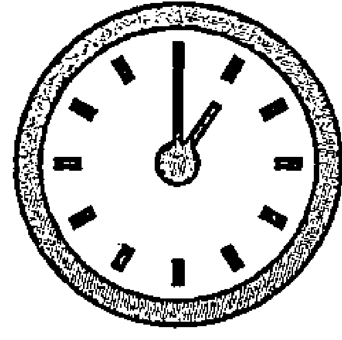

## 第十三课　精神成就梦想

> 你要知道，成功之门并非紧闭，而是虚掩。只要你想，并且有坚持下去的决心，发挥敢想敢干的精神，通过坚持不懈的努力，别人所能够做的一切美好的事物，你也能够得到。

物理科学和精神科学是科学的重要组成部分。如今，我们已经深刻感受到了物理科学中由发明创造带给我们的这个神奇的世界。而精神科学也在养精蓄锐后渐渐行进，谁会预测到世界以后会发什么变化呢？

一直以来，精神科学只是被那些目不识丁、盲从迷信、神神叨叨的人当成一种足球游戏玩耍，但如今，人们逐渐意识到精神科学的巨大作用，不再只是把它当成一种游戏。

思想就是一种精神科学。而幻想和想像总是先于行动和事件出现，梦想家的日子到了。赫伯特·考夫曼曾说过这样的一段话：“梦想家是伟大的建筑师，潜藏梦想于灵魂中，透过怀疑的薄纱，洞察到未来的墙垣。装甲的车轮、钢筋的印迹、紧旋的螺丝，都能成为梦想家制造神奇挂毯的织梭。他们还是伟大的帝国创始人，奋战经历远比皇冠、宝座珍贵。非梦想家是居住在梦想家发现的土地上的，而在此土地上的墙垣上描绘着梦想家的影子。梦想家都是被精心挑选出来的，他们被赋予传播‘信念’的权利。墙垣终将崩塌，帝国终将垮台，坚硬的壁垒终将被大海的潮涨潮落撕裂，腐朽的王国接连不断地从时光的树干上飘落。然而，梦想家所创造的

## 秘密背后的秘密|The Secret Behind the Secret

> “一切不会毁灭，而将永存。”

-   梦想家、发明家、作家、金融家是如何实现梦想的？他们梦想成真的因果法则是什么？因果法则是如何把精神图景变成现实的？这些问题都会在本课中找到答案。
-   众所周知，地球内部的热能运动造成了地球表面现在的样子，而罕见的火山爆发是地球内部热能运动的显现。当今科学的发展趋势就如同地球表面一样，是那些罕见、不寻常的事件的集中体现。
-   同理，闪电告诉我们存在着一种能够令无机世界频繁改变的微妙能量。例如，早已消亡的古老语言曾风行于某个或某些国家；发现于西伯利亚的一颗巨齿、地底下的一块化石，它们身上不仅承载着岁月变迁的记忆，还展示了山陵河谷的起源。
-   这种方法是基于推理和经验而建立的，因此，迷信、常规与先例与其毫无瓜葛。这种方法像指南针一样，概括出了那些稀奇古怪、与众不同的事件，从而指引着对科学进一步的探索。

几百年前，培根勋爵提出了以上的研究方法。在历史的长河中，文明国家的物质及知识的繁荣昌盛都得益于此种方法。这种方法的功效很大。首先，与最锋利的讽喻相比，它更能有效地摈除人们头脑中狭隘的偏见等不好的理念；其次，它是通过令人惊异的实验而不是狠狠的批判言语而使人们的关注点从天国转到地面的。也就是说，用事实说话，让事实胜于雄辩。

## 第十三课 精神成就梦想|The Master Key System

巧的是，培根的这种方法竟与著名的古希腊哲学家们的思想一致。但培根的方法与时代特点相结合，他的思想能更好地应用于实践中。上至天文，下至地理。无论是无限的空间，还是微小的卵细胞，都展现出一个新奇而又美妙的知识体系。亚里士多德的逻辑学不可能推演出脉搏跳动的规律，经院哲学的辩证思维也解释不出物质集合被分解成分子。

这种方法使人的寿命得以延长，痛楚得以减轻，疾病得以攻克，地里的产出更多，海员航行更安全。还有，我们的先人从未见过的大桥横跨着大江大河，白昼一样的光明照亮着夜晚的黑暗，大大拓宽了人们的视野，成倍提高了人们肌腱的能力，人与人之间的通讯往来更加便利。在天上，人们可以自由遨游；在水底，人们可以安全地游行。

以上就是归纳法的本质和范围。越是卓越的人类科学成就，越是需要深刻领会各种个例。普遍规律的正确归纳需要我们用尽一切手段和资源来仔细认真地好好观察各种各样的个体事例。

为了探知电动机械上为何在各种各样的情况下都会有火花出现，我们应该勇敢地向富兰克林学习，借着风筝的形式，向天空的乌云询问闪电的性质。为了证明伽利略的自由落体，我们应该敢向牛顿学习，向天上的月亮询问系之于地球的引力。

简言之，基于我们拥护的真理的价值和对稳定的普世进步的期望，我们禁止暴虐的偏见忽视或诋毁那些不受欢迎的事实。科学的上层建筑应该扎根在宽阔稳固的基础之上，常见和不常见的现象都要关注。

## 秘密背后的秘密 | The Secret Behind the Secret

观察得越多，收集的资料也就越多。不同资料中的事例对自然规律的解释有着不同的价值。例如，人类的品格、才能被视为自然进化中最宝贵的东西。同样，这些资料中的事例也被自然哲学精心筛选过，而往往只有那些在生活中罕见的事件才能最终保留下来。

如果我们发觉某些人拥有异常的能力，那么我们有什么想法呢？首先，我们会说，怎么会这样？说这话的人只能表明他的无知，因为任何一个真正的探索家都相信这个世上总有一些奇特的、难以解释的现象发生。那些熟知思想的创造力的人，也相信这些现象迟早能够被解释的。

其次，有些人可能会说，这些是超自然现象干预的结果，但是科学的自然法则告诉我们，超自然现象是不存在的。万象皆有因，因源于固理。固理，即固定的法则或原理，它的有意识的或无意识的运行绝对是既精准又贯穿始终的。

再次，我们可能会说，我们进入到了“禁地”中，那里有一些东西是不能让人知道的。在每一次人类进步中我们都会听到这种类似的反对意见。历史上，那些提出新理念的人，比如哥伦布、达尔文、伽利略、富尔顿、爱默生，都曾承受过这样的冷嘲热讽或是残酷迫害。所以这种反对是不正确的。相反，我们应该仔细审慎任何一件引起我们注意的事件，只有这样我们才能更容易发现其中蕴藏的基本规律。

我们会发现，思想的创造力具有超强的解释功能，所有物质的、精神的、心灵的经历都能够用其解释。

## 第十三课 精神成就梦想 | The Master Key System

-   我们还会发现，思想会带来与主导性的精神状态相一致的情况。比如，一个人越是恐惧（恐惧是一种思想）疾病，疾病往往越是降临到他身上，这就是心理思想导致结果的典例。
-   很多人都想得到大量的物质财富。如果把意念集中在必要的情境中并付出很多努力，往往就能够心想事成。可是，让人奇怪的是，当我们最终获得我们一直渴盼的东西时，却与想象中的感受不一样。这就说明拥有只能获得暂时的满足感，有时候，人们享受的只是一种努力实现梦想的过程。
-   那么，怎么才能保证这一过程一定会实现呢？通过什么样的思想方式才能实现我们真正的梦想呢？实际上，我们全人类所向往追求的梦想很简单，那就是幸福与和谐。把握住这个世界赐予我们的一切，能让我们感受到真正的幸福；能够使其他人幸福快乐，我们也会感觉到真正的幸福。
-   但是，幸福快乐是有前提的。在健康、力量、知己好友、机遇皆无的情况下，连吃穿都不能解决，又何谈快乐？只有在拥有这些的前提下，才能够既满足普通的日常需要又拥有奢华的舒适惬意——幸福快乐会永远与我们相伴相随。
-   传统保守的观念是让你像一只“虫”，只满足于自己已有的那一份，不管它是什么。而当代的理念是：要了解你被赋予了天地万物间最好的一切，了解你就是创造者，未来必为你所创造。你有资格去获取世间任

## 秘密背后的秘密 | The Secret Behind the Secret

何的美好事物。

现在，即使我们知道这些在理论上都是正确的，并且这些理论也是一切宗教或哲学体系的精华，然而我们如何才能把这些理论应用于实践中并看到立竿见影的效果呢？

首先，将知识应用于实践当中。理论与实践脱节的话，不会获得丰厚的回报。运动员的例子就能很好地说明这一点。一个运动员要想取得优异的成绩，只学习书本的体育相关知识是不够的，他必须把书本上的知识应用于实际的训练，在实际训练中体会书本上的知识并付出大量的体力，才会有可能获得成就。记住，没有付出，就没有收获。付出在收获的前面，因为付出是精神中的“因”，而收获是“果”。因此，我们应该用勇气、激情、健康等积极有益的“因”引导出良好的结果。

我们知道，思想是一种精神活动，它具有创造性的特点。但也不要忘记，缺少有意识的、系统化的、建设性的引导的话，思想也可能有任何创造。这也正是空想和建设性思想的不同之处。空想的后果只能是蹉跎了光阴，浪费了精力，而建设性思想会引导人走向永久的成功。

我们生命中的种种经历都是受引力法则支配的。快乐与不快乐的意念根本无法共存。因此，当两者相遇时，为了更好地适应新需求，需要改变自身不快乐的意念。

宇宙物质是万能的，它无所不在、无所不能、无所不知。精神图景的创造过程中，意念就被投入到宇宙物质中。但是，意念怎么可能能够支配万能的物质世界去实现我们的需求呢？失败的结果由此而生。我们不能只接受宇宙物质的无所不在，而排斥它的无所不知和无所不能的事实。否则，这种排斥只能证明自己的无知并产生不良后果。

深入认识宇宙精神的无限能量和无限智慧可以帮助我们凭借它的力量实现我们的愿望。认识带来现实，所以，你们这一课的作业是，运用此原理认识到自己是整体之一，在本质和属性上两者完全相同，若有差异，也只是程度不同。

一旦这种伟大的思想深入到你的意识中，你开始关注你心中的那个自我，那个能够思考的灵魂是整体中不可或缺的组成部分。这种伟大的思想开始渗入到你的意识中，当你真正地开始认识到你（不是你的身体，而是你的自我），你心中的“我”，那个能够思考的灵魂，是这个伟大整体的不可分割的组成部分，你将开始体会到：一切美妙、伟大、神奇的际遇都将为你服务。

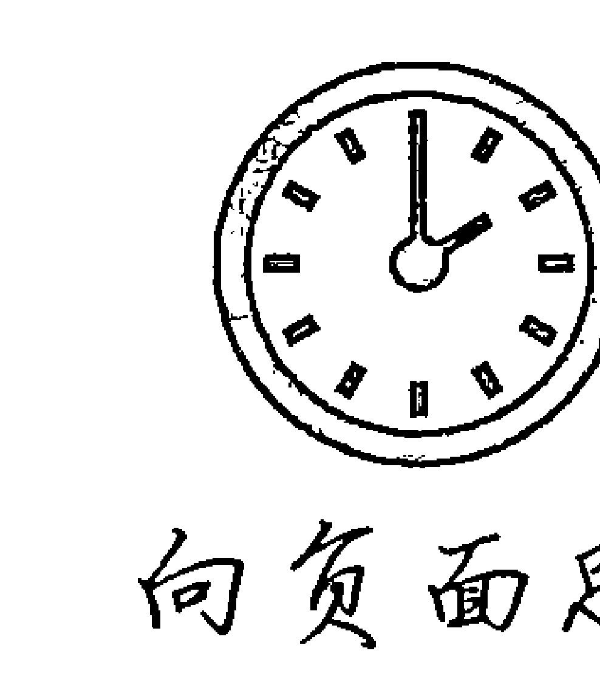

### 第十四课 向负面思想说“不”

（此段文字较模糊，疑似为章节引言或摘要，难以完全精确识别）影响成就的个性品质：思想控制的不完善。我们常常因为对负面环境的关注而阻碍了发展，但我们可以选择远离负面环境和思想。我们拥有创造力，可以摆脱困境和矛盾，鼓励并强调一步发扬积极向上的进取精神，用快乐、清晰、鼓舞的思想激励我们自己并会发现，我们已踏上胜利的旅途。

通过前面的学习，我们了解了思想是一种精神活动并被赋予了创造力。但这并不是说只有一些特定的思想才具有创造力，全部积极的和消极的思想都具有此特性。在“拒绝、否定”等消极的心理过程中，这个法则会造成负面影响。

行为与精神的联结需要两个必经阶段：潜意识和意识。潜意识和意识的关系好比是风向标和天气的关系。所以，如果你否认那些令你不满意的情境，那么你也就否认了思想在这些情境中的创造力。而且你让思想的创造力在这些情境中消失得无影无踪。

谨记：规律支配着客体。所以说，即使对负面环境不满，也不能马上获得好的转机。这就好比说，一棵绿植被连根拔掉后，虽然青翠的颜色没有马上消失，但在很短的时间内，它就会枯萎凋亡。同理而言，让思想撤离负面环境也一样，它是一个逐渐但必然的结果。但很多人意识不到这一点，他们往往极度关注那些令他们不满的负面环境，这种对负面环境的过度集中恰恰滋养并加速了负面环境的成长壮大。

## 第十四课 向负面思想说“不” | The Master Key System

宇宙物质是一切力量、智慧和才智的源泉。它的能量是无限的，既是一切运动、光、热、色彩的源头，也是一切成因，更在一切结果之上。

要了解这种智慧，首先应该熟悉精神的本质，进而熟悉宇宙的实质，并使自己的所有属性都和它保持一致。

即便是学识最渊博的自然科学大师都未曾发现并体会过这种智慧。事实上，几乎所有唯物主义的学校都从未发现过。更不可能体会过其中的智慧之光。因此，智慧和能量、物质一样都是处处存在的这个基本原则，他们也不会知道。

可是，如果真是这样的话，那为什么找不到相关证据呢？遵循了这一基本原则，可为什么得到的结果还不理想呢？不，我们得到的结果正是理想中的样子。对基本原则的领悟程度及运用程度越高，获得的结果就越理想。在发现电的规律及被应用到实际以前，我们也不可能利用电的规律取得一些成果。

这一原则可以让我们与外面的环境建立一种新型的关系，可以为我们打开机遇的窗口。这种关系及窗口都是我们凭借很多法则，在一种全新的心灵状态中实现的。

精神具有能动性，这一法则的基础既完美又合理。万物皆以精神

## 秘密背后的秘密 | The Secret Behind the Secret

为其本质。精神是一种创造性能量，诞生于茫茫宇宙中。一切能量和物质始于宇宙。一个个体组成了宇宙。各种现象的产生都是宇宙中各不相同的组合的结果，而现象恰恰皆有个体体现。

从科学的角度讲，物质能分解成分子，分子能分解成原子，原子能分解成电子。通过在含有熔化的硬金属接线端的高真空玻璃管中对电子的观测，有力地证明了电子是无处不在的，存在于万物之中，充满了我们以为是真空的区域。这，就是宇宙物质，诞育万物的物质。

电子围绕能力的核心构成原子，原子按一定的数学比例组合形成分子，分子相互联合形成化合物，化合物构成宇宙都需要一定的指令支配其运动。否则，它们永远没有任何变化。

迄今为止，氢原子是世界上已知的最小原子，重量是电子的1700倍。一个水银原子的重量与电子相比，是它的30万倍。电子是纯负电荷，与光、热、电、思想（每秒189 380英里）的速度潜力相同，所以由它们开始，一步步形成的物质也会具有同样的潜力。

电子，像细胞一样，在人体内发挥着作用。它们所拥有的精神和智慧足以让他们完美运行于人体内部。我们知道，细胞构成了身体的各个部分。在身体中，有的细胞建立器官组织，有的则构造身体所需的各种分泌物等。这就好比说，有的像搬运工，有的像外科医生，也有的像防御工。

尽管这些细胞的功能各不相同，但它们都有一个共同的目的——代表有生命的智慧的机体，履行自己的职责。每个细胞都被赋予了足以让它保存能量、延续寿命的智慧，而要获得这些充足的养分还必须对养分进行有选择的取舍。

每一个细胞都会经历产生、繁殖、死亡和被分解的过程。而细胞之所以能够生生不息地维持着生命与健康正是因为它的新陈代谢功能。

我们知道，精神存在于身体内的每个原子里。精神本身是负极的，但是，人类可以控制这种精神并通过运用思考的力量可以将其变成正极。这就是超验疗法的科学解释。通过这种解释，任何人都能理解这种奇妙现象的产生所依据的真理。

因为身体内的每个细胞都有这种负极精神，因此它还被称为潜意识精神，显意识是无从知晓这种精神的，但潜意识会回应显意识。

前面已经讲过，万物皆源于精神，外在表现是内心思想的产物。也就是说，万物是不能源自自身，它们只是暂时的终将消亡的幻象。所以，作为思想的产物，是可以被思想擦除的。

人类不但一直在自然科学领域不断地探索实验，而且也一直寻求精神领域的突破，每一次的新发现都会促进人类的进步。每一个人的思想都会反映在他的外貌、身体、性格、机遇方面，集中体现了他终生所保持的思想。

## 秘密背后的秘密 | The Secret Behind the Secret

“因”与“果”是相辅相成的。因果关系始于创造原理。很多事实都能证明这个早已被大众所熟知的真理。

一直以来，我们被传授着这样一种观点：客观世界是由一种肉眼看不到、无可名状的能量支配着。而且，我们被告知，这种能量被人格化以后，就是上帝。但是现在，我们知道了，这种力量其实是无限的宇宙精神，它才是万物之源。

宇宙精神是无限且全能的，拥有无尽的资源。无处不在的宇宙精神告诉了我们这样一个道理：我们自身一定是宇宙精神的体现。

充分领悟潜意识这种负极精神后，我们可以做出潜意识和宇宙仅仅在程度上有所差异的结论。虽然程度有所差异，但种类和性质完全相同。这种差异程度究竟是多少呢？打个比方，就好比是一滴水和海洋的差异。

理解这一点很重要。只有充分理解了这一点，才能让你与万能的宇宙精神建立起联系。宇宙精神和显意识之间是通过潜意识连接起来的。显意识、潜意识与思想三者的关系中，显而易见的是，思想先被显意识有意识地引导而后被潜意识运送到行为中。

当我们能够以科学地方式领悟了这个原理后，就能够清楚地明白为什么人类能够通过祈祷就获得期望的结果。实际上，那种结果并不是上帝带来的，而是自然法则赐予的。因此，这种结果的产生与神秘的或宗教的成分无关联。

尽管很多人已经通过事实知晓了错误的思维必将给我们带来失败的恶果。然而不幸的是，仍有太多人不想尝试正确的思维训练。

思想与际遇是相辅相成的。思想是真实的，际遇是其外在的、物质的表现。外在的、物质的际遇会随着思想的改变而变化。因此，际遇会与它们的创造者——思想始终保持一致。

值得注意的是，负面的思想一旦形成就会存在很长时间，正确思维不能够在短短15分钟、20分钟内就把他们根除掉。所以，我们不要浪费二三十年的时间建立负面的思想，思想应该是明确、清晰、坚实的。

进行这样的训练会给你的人生带来巨大的变化，不仅从物质上带给你幸福感，还会从整体上给你带来健康的体魄及美好的际遇。在进行这样的训练时，要从意识上就主动去做，仔细全面的思索这个问题，你的决定不要受任何问题的干扰。

和谐的内在世界才有可能产生外在的和谐的外在际遇，因为外在世界是对内在世界的具体体现。

你这周的作业是：仔细领会“和谐”。在领会的过程中，关键是要专心致志，态度诚恳，摒除头脑中除“和谐”以外的其它东西。知识与实践相结合使用。不能只是单一机械地学习这些教程，而是应该在实践中

## 秘密背后的秘密|The Secret Behind the Secret

体现它们的真正价值。

> “学会关上你的大门，拒绝那些对你毫无益处却又千方百计想要进入你的心灵、工作、世界的东西。”——乔治·马修·亚当斯

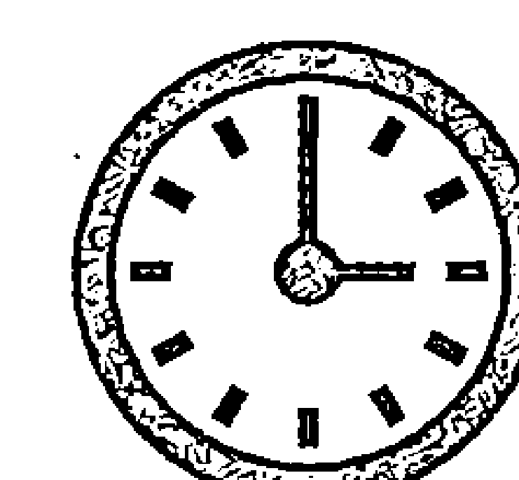

### 第十五课 积聚你的智慧

有一种巨大的力量，它无处不在，它能够帮助我们克服困难，它能发现障碍并消灭于无形中……（因图片模糊，部分内容难以识别）

首先，把一盆生长着的且带有很多无翼蚜虫的玫瑰放在一间房间里的一个关闭的窗户前面。然后，使玫瑰枯萎，这时，这些小生灵发现他们赖以生存的玫瑰已经枯死了，他们再也不能从玫瑰上获取它们需要的食物和养料了，就长出了翅膀，离开玫瑰，飞向窗口，沿着玻璃向上爬，找个缝隙逃出去。

实验证明，万能的力量无所不在。即便生命最小，也会在紧急时刻利用这种力量逃脱险境。

此课会展现给我们更多的生命法则并详细介绍了运行这些法则对我们有极其重要的意义。生命进程中的一切经历都培养了独特的自己。付出的努力与获得的能量成正比。遵循自然法则并合理利用它们，我们就会得到丰厚的回报。

生活中的种种法则都因我们的利益而产生出来，这些法则永久存在，任何人都无法逃脱它们的作用。

# 秘密背后的秘密 | The Secret Behind the Secret

一切伟大而永恒的力量，都在默默地创造价值。我们能做到的，就是和它们保持一致，这样就能享有平静幸福的生命。

困难、混乱、障碍的产生，都是由于我们缺少怜悯他人之心或不愿面对自己的内心所需。

但是，我们每个人都是一个完美的思想实体，而先予后取是完美的必备要求。我们每个人都在不停地生长着，经历着这个新陈代谢的过程。通过生长过程，我们变得越来越完美。在生命的成长历程中，要求我们竭尽全力去吸引那些与我们完美一致的东西。在细细领会自然法则并对其加以利用后，我们才能获取最大程度的幸福。

只是紧紧盯着我们已经拥有的话，就不会得到我们所缺少的。只有当我们认识到我们的目标是那些我们必须但还没拥有的时候，我们才能够下意识地控制外部环境，从每一次的经历中汲取进一步的养料。这种能力决定着我们和谐幸福的实现程度。

要想快速生长，需要增强获取养分的能力，而这种能力是在阅历中逐渐获取并增强的。能力增强以后，我们能更快更好地识别出那些对我们生长有利的东西，并加以利用、吸收。

在生命的进程中，所遇到的一切境遇和经历对我们都是大有裨益的。每当我们能够汲取其中的智慧并从中积聚进一步生长的养料时，困难和障碍就会不请自到。

# 第十五课 积聚你的智慧 | The Master Key System

付出和收获永远都成正比，这是真理。战胜困难时付出了多少，就会获得多少的永恒力量。

爱是情感的产物。因此，要想获得充满生命活力的思想，就需要让其经过爱的孕育。

爱赋予思想以生命力并让其成长壮大。引力法则为思想的成长壮大带来所需的原料，所以，引力法则就是爱的法则。

语言，也就是话语，决定着一个人的言谈。而思想的最初形态就是语言，并由其表现出来。话语承载思想，就像水载舟一般。思想的表达是通过话语实现的。

思想必然会转化行为。所有的行为都是思想在可能的情况下的思想的自身表达。因此，正确的思想才会导致满意的情境。

这时，我们得到一个结论：必须首先想到物质财富，才会真正实现物质财富。谨慎的话语才能成就伟大的思想。当建设性的、和谐的话语变成现实之时，就是我们获得大益之刻。

我们的心灵总会时不时地像相机一样拍下捕捉到的画面。而语言的运用过程也与相机拍摄的过程类似。不慎的错误话语也会被记录下来。

要想使你的人生有意义，就必须不断地明确思想、提高品位。也就是，要用清晰的思想消灭掉那些低级的、错误的想法。只有这样，我们的人生价值才会越来越清晰容易体现出来。概念渐渐地被摈弃，这时，我们生命的彰显也就会越来越轻松，越来越容易。

我思想必须通过言语表达出来。要想运用更高层面的真理，我们必须仔细地选择得体的语言，按照更高层面真理的标准把它表达出来。

人与动物之间的重要区别，就在于人可以运用言语来表达思想。通过阅读历史记录上的书面语言，我们仿佛可以看到历史上曾经发生的那些事件，也懂得了为什么我们的今天是这个样子的。

通过文字，人类可以与历史上最伟大的作家和思想家交流。宇宙思想成形于人类心灵之中并寻求表达的综合记录正是今天留存的文字。

从前面的学习中，我们已经了解到，宇宙思想拥有自己的形式，人类思想也一样在探索自己的表现形式。每一句话都是语言通过思想的形式表达出来。要想获得成功的通行证，我们必须精炼我们的语言，因为只有语言被精炼后才能堆砌出所向往的理想之殿。

语言就是思想，思想是一种力量，因此也是一种无影无形、战无不胜的力量。思想是什么形式的，与其相对应的客观存在也就是什么样的。

言语包罗一切，它的作用是双重的。既可能成为人类永久的精神支柱，也可能不堪一击，遗臭万年。言语是传播者，无论是过去的历史，还是未来的希望，我们都可以用言语呈现出来。

思想因动人的言语而美丽。有生命的思想是有规律可循的，下面就让我们认识一下这些规律。

数学定理是存在的，但错误却没有法则可循。真话是有原则的，谎言却可天马行空。健康是循规蹈矩的，而疾病却不守规矩。光线有光线的定律，黑暗却无理可循。

为什么说这些观点是正确的呢？因为正确运用数学定理，就会得到准确的运算结果：健康之地无疾病藏身之处；真理会让我们免受谬误的蒙骗；光与黑暗不可并存。

请记住以上这些真理。但还有一个事实往往被人们忽略掉——遵循真理的思想是有生命力的，而谬误的思想是没有生命力的，有生命力的思想必然会挤走无生命力的思想。

知道这个事实，会助你消灭掉一切困惑、匮乏等不好的境遇。

有一种说法是这样的：“有足够智慧去领悟的”人能够在最短时间意识到——他会拥有一把来自思想创造力的无敌武器，从此以后掌控自己的命运。

# 秘密背后的秘密 | The Secret Behind the Secret

在自然界中，有一个能量守恒定律——“一个地方增加的能量与另一个地方减少的能量是一样的。” 这让我们懂得，舍与得是相辅相成的。在着手准备做一件事的同时，也要考虑到这件事的结果并对其负责。潜意识受到我们的支配，做了什么，就收获什么。比如，自己铺好了床铺，就能在其中享受睡眠。我们造好了理想的模子，潜意识就会帮我们把模子变成现实。

所以，我们要经常训练自己的洞察力，找出有益于自己思想的东西，从而促进我们的成长壮大。

洞察力是一种心灵的能力，它是专属于人类的望远镜。在它的帮助下，我们能够用长远的眼光考虑问题。在各种各样的情况下，既能看清困难，也能抓住机遇。对于困难，它能发现并消灭阻碍于向困难转化的萌芽时期。在实现理想的道路上，它能正确引导我们的方向，避免一无所获的后果。

要想获得伟大的成就，洞察力是必不可少的。而借助洞察力的帮助，一切精神高地都能被我们成功攀登。

怎么开发洞察力呢？方法很简单。因为洞察力产于内在世界，所以在“静止”的状态中仅通过集中意念就能轻易获取到。

你这周的作业是：集中关注“洞察力”。坐在原位，脑中专心致志地思索这个事实：对思维的艺术来说，仅认识到了思想的创造力是远远不够的。让你的思想以此为起点：知识本身并不会运用自己。不是知识，而是积习、流俗和先例决定了我们的行为。知识应该与实践相结合，其正确方法是：下定决心并有意识地努力。思考这个事实：大脑存留的只是用到的知识，不用的知识终将从大脑中逃掉，信息只有在应用原理时才会体现它的价值。一直保持这个思想的方向不变，慢慢地你的洞察力就能让你具有遇到问题时，根据此原理找到解决方案的能力了。

> 所思维诚，至诚之心，可以济世；
> 所言维信，如彼良种，秋实累累；
> 所行维真，高洁贞贵，照澈众生。
> ——霍雷肖·博纳

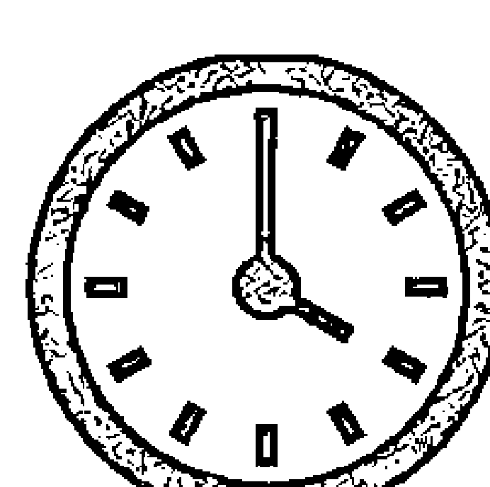

### 第十六课 让你的理想与宇宙精神和谐统一

地球运动是有周期性规律可循的。有生命的物质也是有周期性的，从诞生、成熟到死亡，都是必经阶段，不可逆转地周期循环着。周期是由“七律”支配的。“七律”都管理着什么呢?很多事物：每周的七天、月相、声、光、热、磁、原子结构等物质的和谐；个体、国家的生死，商业世界的各项活动。

生命由成长体现，成长必须要求改变。每一个七年的循环都是一个崭新的成长阶段。你知道吗？人生是由很多个“七年”组成的。第一个七年是幼年期，第二个七年是青春期，第三个七年是成熟期，第五个七年是建设期，财富、房子和家庭都是在这个期间获得的。第六个七年是从35岁到42岁，是行动期。然后进入重组、调整阶段。50岁以后步入下一个七七循环。

了解这个周期循环规律后，你就不再会知难而退，而是能够从学到的原理中认识到有一个最高法则支配着一切法则。只要正确理解运用精神法则，就能化干戈为玉帛。

# 第十六课 让你的理想与宇宙精神和谐统一 — The Master Key System

关于财富的定义很多，最常用的是：一切具有交换价值、有用的、令人幸福的物品。我们要这样认识财富：财富是劳动的产物。资产是果而非因，是仆人而非主人，是手段而非目的。

财富具有支配属性，也就是它的交换价值，是财富的真正价值体现。这是因为交换价值体现出财富是一种媒介，帮助我们获取有真正价值的东西以实现理想。实用性不是财富的真正价值。

我们应该这样看待财富：财富永远不是终点，而是到达终点的途径。实现比积聚财富更为高远的理想才是一个人真正意义上的成功。

如果你渴求成功，那么请先为自己树立一个让自己为之奋斗的理想。有了目标以后，才会为到达那个目标寻找实现理想的途径和方法，但一定不能把方法错当成目的，途径错当成终点。

成功的例子有很多。普仁提斯·马福尔德曾经说过：“能够取得成功的人往往都具有最高精神领悟，这正是他们巨大财富的来源。”但不幸的是，很多人都不认识这种能量，因此他们也得不到这种能量的帮助，实现成功的目标。

卡耐基一家刚到美国时非常贫困，他的母亲不得不出去给人打工赚钱养家；哈里曼的父亲只是一个年薪200美元的穷职员；利普敦勋爵是从25美分起家的。卡耐基、哈里曼和利普顿他们都没有财富或权势可依靠，但他们依然获得了成功。

# 秘密背后的秘密 | The Secret Behind the Secret

创造力是依靠心灵的能量的三个步骤来完全实现的。这三个步骤是：理想化、视觉化、具体化。每个大企业的首脑全都是依靠这种能量获得成功。石油大亨、亿万富翁亨利·M·弗莱格勒曾在《人人》杂志上道出了他自己成功的秘诀就是通过运用精神能量的——理想化、视觉化、具体化实现的。

弗莱格勒说道他曾向自己描述过事物整体的图景。闭上眼睛，就能非常清晰地看到火车在铁轨上飞驰，汽笛鸣鸣地响着。

从以上内容中我们可以看出“因果循环”的法则。我们已经知道，思想先于行动并决定着行动。有足够智慧的人能认识到以下这一点：事皆有因。经历即结果。因果循环和谐有序。

每个成功的商人都一个理想主义者，不断地给自己设立越来越高的目标并为之拼搏努力。每一个人的生活，都是点点滴滴的思想在我们心中的结晶体。

思想像橡皮泥一样具有可塑性，我们可以用它构筑生命成长概念的图景。思想只有被使用，才具有存在价值。无论你渴求什么事件，必要条件都是要正确认识和恰当运用这个事件。

来得太早的财富，往往具有迷惑性，拥有以后，不一定能带来好运。尤其是我们不配得到或不是我们努力所得的财富，都不会永久属于我们。

# 第十六课 让你的理想与宇宙精神和谐统一 | The Master Key System

引力法则决定了我们的外在世界与内在世界是对应的。也就是说，外在世界里的任何际遇都能在内在世界中找到与其对应的情况。怎么才能选择出合适的事物并让它们进入我们的内在世界呢？

首先，在外在世界中的种种际遇、思考、负面结果产生了各种各样的经历，这些经历经过仔细的分析验证后，无论是通过主观还是通过客观意识，进入我们的心灵中，都会在我们的心灵中烙印，形成精神图景，而精神图景正是创造性能量的生产模式。其次，精神图景也可以被我们自主地创造出来，不需要顾及外在世界中的种种情况等。

通过运用这种力量，自己的命运、身体和心灵都将被我们紧紧掌握在自己手中，并创造出我们渴求的阅历。这是因为，如果有意识地想要实现一个际遇，那么这个际遇终将会出现。

因此，显而易见，思想终归是生命的原动力。所以，思想抓住了，环境、际遇也就抓住了，就能够创造条件、掌握命运。

怎么才能抓住并控制思想呢？它的实现过程又是怎样的呢？我们知道，思维就是创造思想，但是思想的形态、性质和生命力却决定了它的结果。

思想的精神图景却由这种思想的形态决定，而精神图景取决于心灵烙印的深度、观念的决定性优势、视觉化的清晰度。思想的性质取决于它的组成部分，也就是心灵的成份。成份是勇气、胆识、力量、意志的话，导致的思想也与其和谐一致。最后，思想的生命力取决于思想孕育时刻的感受。建设性的思想具有创造性，充满活力与生机，为自己汲取自己成长所需的一切营养，促进自己的成长壮大。

破坏性的思想本身就含有使自己分化瓦解的毒菌，它会带给我们疾病、患难及其他一切的不和谐，最终走向消亡。

这种破坏性的思想我们被我们称之为“恶”东西。我们应该以一种正确的态度来看待这个“恶”东西。它既不好也不坏，只是一种存在。把它从形态能力的方面划分，可以分为表现“善”和“恶”的能力。

因此，同“善”一样，“恶”也不是实体，它们都是描述我们行为结果的词语，而我们的思想又决定了我们的行为。

建设性的、和谐的思想展现出“善”；破坏性的、不和谐的思想展现出“恶”。

一个崭新环境的出现是需要一个特定过程的。这个特定过程就是：心中始终抱持一个理想，那个心中一直幻想的情景慢慢就会清晰起来。天时、地利、人和，这些相对的东西都不要去想。到了合适的时间和地点时，合适的人和事自会出现。

接下来，你马上就能深刻意识到：思想决定心态，精神状态决定能力和心力。能力越高的人，越能得到自然带来的成就和收获，越更好地支配周围的环境。

综上所述，自然法则的运行既完美又和谐。何以为据呢？想想自己曾经努力做过的尝试吧。行动向着一个高尚的方向或一个自私自利的方向努力时，分别会得到什么样的结果呢？这些证据足以解释自然法则的运行了。

要想实现自己的梦想，首先需要在心里描绘出梦想的画面，有意识地视觉化你的梦想；然后，你就可以借助科学的力量，一步步地推动梦想。

在实际生活中，我们能真真切切地看到客观世界，却往往看不到精神世界中已经存在的视觉化图景。这个图景很重要，我们若一直坚持它不改变，它就能预示出客观世界中将要出现的事物。什么原因呢？视觉化的图景是一种想象，形成心中的烙印，烙印会形成理想，而理想会形成计划——我们的未来就是伟大的建筑师用这些计划建筑的。

思想和感觉相互依存、不可分割。心理学上讲到：感觉的官能是唯一的官能，其他官能都是感觉的变体。知道这点以后，我们就能理解感觉作为一切能量源泉的缘由和情感轻易战胜理智的缘由。

视觉化还必须由意志进行引导。我们想获得的都是心灵中视化的，坚决不能让想象力放任自流，否则它会令我们陷进天马行空的思想和与实际脱节的结论中。不经过仔细筛选，我们的心灵就会轻易充斥乱七八糟的意见，引起精神错乱的严重后果。

对任何理念，我们都要进行透彻的分析；对一切非科学准确的东西，都要一概摒弃。能够做到这些的话，你就能充满自信地做好每一件事，而且不会在一些无所谓的事情上浪费任何精力，最终奋斗至成功。这就是商人说的“远见卓识”，类似于洞察力，是一切事业获取成功的奥秘之一。

你这周的作业是：仔细领悟这个问题：和谐和幸福是一种精神状态，与物质的多少无关。凡事要用心去创造，心态决定结果。物质上的富有取决于良好心态。要想拥有这种良好的心态，必须要认知精神本质及我们与宇宙精神的合一。领悟这些以后，我们就可以得到我们想要的一切，这是一种科学的、正确的思维方式。这种精神状态一旦降临到我们身上时，愿望的实现就如同已经存在着的事实一样，会容易很多。当我们做到这些时，就会惊喜地发现“真理”让我们免受一切匮乏和局限的困扰——自由了。

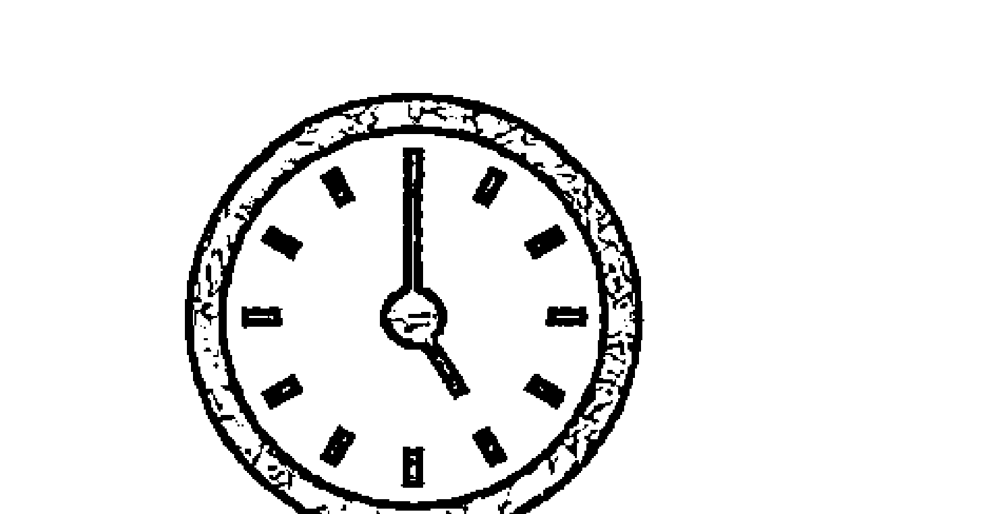

### 第十七课 放飞渴望、点亮希望

知识是无限的。对很多人来说，求知的渴望是如此难以摆脱以至于他们不由自主地跟随着内心的渴望不断前行，去寻找自己所需的知识和智慧。这种渴望持续的时间越长，最终的收获就越是准确无误，可以和任何力量相媲美。

一次，一个黑人小孩、一个印度小孩和一个以色列小孩聚在一起互相讨论自己信奉的神灵。

黑人小孩说是一个黑皮肤、卷头发的上帝；印度小孩说是显赫部落的神武酋长；以色列小孩说是摩西的神或约书亚的神。

这说明了什么呢？所谓“蛮族”的人们都有一个自己雕刻出来的“偶像”去崇拜。他们信仰的“偶像”是他们的精神支柱，一个视觉化的外在形象，用来寄托自己的灵魂。

而我们，表面上信奉着“上帝”，但事实上，已经为自己雕刻了“权力”、“财富”、“时尚”等偶像。我们拜倒在它们面前，全心全意地信奉着它们，渴望它们在我们的生命中一一实现。

学完本课以后，你就会分清“因”与“果”，就会了解到表象不过是本质的外在表现，你将重点关注“因”而不是“果”。因为透彻了解“因”后才能获得想要的结果。

# 秘密背后的秘密 | The Secret Behind the Secret

人类可以“支配万物”的支配权是建立在精神基础上的。我们知道，思想是一种活动，它掌管着其属下的一切行为模式。这是因为，最高级的行为模式在本质和属性上都处于较高地位，自然而然地决定着与它联系的万事万物。

现有力量中最纯粹也最强大的振动是精神力量的振动。凡是能够意识到精神力量的特性的人，在他眼里，所有物质力量都不值一提。

我们靠耳、眉、眼、鼻、口去感知整个宇宙，从五官中的经验中形成了人、神观念。然而，这些观念都不能称之为“真正的观念”。要想获得真正的观念，必须依靠精神洞察力才能得到。具体地说，在精神振动的加速下，向唯一的不变的方向全心全力且持之以恒地集中精神意念，就能得到精神洞察力。

持之以恒的意念能够保证思想持续连贯的运行，需要在一个持久、有序、稳固、坚韧的体系下才能完成。

前面已经讲过，伟大的发现都是持久观察的结果。数学科学和精神科学的学习都是通过长年累月的集中信念来获知原理或揭示奥秘的。

有一种说法是：集中意念只需努力去做什么，但这种说法是错误的。一个好的演员每当在扮演角色时都能忘记自己本身，与扮演的角色融为一体，用逼真的表演来打动观众。这个例子很好地证明了意念的集中。

# 第十七课 放飞渴望、点亮希望 | The Master Key System

意念集中需要完全沉浸在你的思想中，沉迷于所关注的主题，忘却其他无关事物。对意念的如此集中会触发你的感知及洞察力，从而助你看清你所关注的客体的本质，揭示其中的奥秘。

我们之所以能知晓世界的奥秘，皆因一切知识都是这样集中意念的结果。集中意念会让你的心灵成为一块磁石，用求知的渴望这个不可抗拒的磁力，去深深吸引住知识和智慧，用它们武装起自己。

人的渴望，绝大部分是潜意识。潜意识的渴望不仅激发了心灵的能力，自动解决了难题。而且，配合意念集中的力量，激发了意识的理念，引导它实现我们的理想。而有意识的渴望在客观世界中就不能做到这点。

自然界中的一切意识模式，不管是物质的、精神的还是身体的，都必须在我们的掌控之中。因此，精神原则是控制因素：使你摆脱有限的成就，把思想模式转化为性格和意识。

经常听到有人说“我要什么”而很少说“我是什么”。其实这两者是相辅相成的。集中意念的关键是要把想法应用于实践。而我们在拥有“分外之物”前，必须要先拥有可以容纳这些“分外之物”的领地。目标的实现，需要的是极大的自信而不是一时的激情。

理想和现实有时相差太远。心灵想要展翅高飞，可能还没飞很高，就栽倒在地面上。同理，有时候精神把理想设定得过高，却往往没能## 秘密背后的秘密 | The Secret Behind the Secret

力成功实现。但是，请不要悲观，继续尝试下去，终究能看到理想实现的曙光。

在精神成就的过程中也会遇到障碍——软弱。这是唯一的障碍，它的出现是由于肉体的局限或精神的不确定状态。不要灰心，坚持下去，最终你能体会到游刃有余的轻松感觉。

天文学家之所以能发现天体的奥秘，是因为把注意力集中在星体之中；地质学家之所以研究出来各种各样的地质现象，是因为把注意力集中在地下底层的构造上。同理而言，我们之所以有了今日庞大而复杂的社会结构，是因为把注意力集中在生活问题上。一切事物皆是如此。

渴望，加上集中意念，能够实现一切精神成就，有助于我们了解自然界的一切秘密。渴望是行为模式中最为强大的。越是热切持久的渴望，越能得到明白无误的发现。

无论在实现伟大思想的过程中，还是在经历与这些伟大思想相吻合的伟大情感的过程中，心灵都处于这样一种状态：欣赏更优事物的价值。

疑惑、软弱、无力、自卑的镣铐能被集中的意念打开，让你从中体会到征服的快乐。某段时间内的高度集中意念，结合实现与或获取的长久渴望，可能会比常年累月的被动、常规的努力更有效。

1.  在商业世界中，非常重视意念的集中。究其原因，是因为坚持不懈的精神努力，有助于开发人们的独创性和进取精神，而这两者恰恰是商业世界中需要的。渴望是一种先决性的力量，一切商业关系不过都是理想的客观化。在商业课程中，意念的集中受到极其重视，鼓励性格中果敢的一面。在商业活动中，精神因素处于主导地位，开发出实践中的洞察力以及迅速做出结论的能力。商业行为能够培训一种坚定的、重要的美德。心灵稳固、定向地成长于商业活动中，精神活动的效率不断提高。
2.  发电机虽然威力无比，但它本身什么也不是。每一个人就好像是一台发电机，而心灵就是发电机的引擎，只有心灵才能使身体运转，产生有效集中的能量，这种能量是前人无法想象的。
3.  思想是通过振动的方式触摸并攫取到建筑、构造所需的物质材料的，没有任何神秘感，需要摄取它所关注的客体，使它获得生命与存在的本质。
4.  身体维持生命需要摄入食物，精神的持续存在也需要摄入它所关注的客体。集中意念不过就是意识的聚焦与关注对象融为一体的程度而已。当你把意念集中在一些重要的事情上时，一种直觉的力量就产生出来并引导你通往成功之路。
5.  直觉通常是在“静止”中获得的，不需要凭借经验或记忆就能获得答案。在静默、独处中，人生中的很多问题都能得以解决。甚至有时候，它的意外出现，直接击中我们寻求了许久的真理，令人惊喜不已。

## 秘密背后的秘密 | The Secret Behind the Secret

- 直觉也许会让人感觉是来自更高层次的力量。但是，你知道吗？直觉是可以被培养、开发出来的。首先，你要认识并欣赏它。每当直觉降临到你家做客时，你一定要给它皇室般的招待。因为你的招待越热情，它就越是乐意频繁见到你。相反，如果你对它的到来装作没看见，它的拜访也就会越来越少。
- 你要记住，潜意识是无所不能的。潜意识一旦被赋予了行动的力量，就会变得无所不能。
- 每当我们获得一次胜利、跨越一个障碍时，都会越来越充满自信。你的精神状态决定了你的勇气。充满成功自信的精神状态以及决不妥协的信念会帮你从肉眼看不到的领域中获取无声的需求。
- 只要始终忠贞不渝地坚持自己心中的理想，终有一天它会在客观世界中实现。但有时候我们不知道自己到底想要什么。名声、富贵、地位可能是你正在追求的，而不是与它们相关的荣誉、财富、支配权。一旦你追上了它们，才会发现，这些不过是浮云而已。
- 无论是财富还是地位，若轻易就能得到，必定不能持久。有辛劳，才会有收获。有舍才能有得，那些只想不劳而获的人最终会领悟到：因果循环，付出与回报是成正比的。
- 也许有时候我们追求的是力量的符号，而不是力量本身。一个整日忙忙碌碌、拥有很多金钱的人有一天会发现，口袋里的黄金再沉也是多余。这是因为，人们竞相追逐的金钱只是一些纯粹的力量符号，并不是真正的力量之源。如果认识到了真正的力量之源，就会不屑于这些力量符号了。

## 第十七课 放飞渴望、点亮希望 | The Master Key System

对于内在世界来说，思想能够把握所有事物的基本准则，领略万物的核心和精神；对外在世界来说，思想会引起其发生变革。

把握住了万事万物的本质，我们就可以轻松领悟它们并让其为我们服务。为什么呢？因为事物的精神是事物本身和核心，也就是它的真实存在。外部状态是内在精神的外在体现。

你本周的练习是，准确依照本课所说的方法，集中意念，完全放松身心，专心致志地思索关注的目标，抛开一切杂念，直到你的意念与它融为一体。

永远把意念集中在你的目标上，把未实现的目标当成既成事实。比如，希望消除恐惧，就把意念集中于勇气；希望消除匮乏，就把意念集中于富足；希望消除疾病，就把意念集中于健康。意念好比是一颗生殖细胞，是引发“因”的生命法则。有了这些“因”，通过它们的引导，才能建立必要的联系，在物质世界中成功实现自己的目标。

> “能够拥有思想的人，思想就是他的财富。”
> ——爱默生

## 第十八课 互惠的吸引力法则 | The Master Key System

每个人都不是独立存在的，都处于千丝万缕的社会关系中。一个人是作为社会人而存在的，他与整体、其他人和社会都有着联系。这种联系构成了他的环境和关系圈。比如，一个男人可能拥有多种身份和角色——父亲、儿子、丈夫、兄弟，在每一个角色中他都有不同的任务和责任。同样，女人也是如此。

因此，个体不能脱离整体而独立存在，它是宇宙精神的分化。个体和整体的关联方式就是宇宙的个体化或人格化。这种关联方式就是引力法则引导的环境。为了生存我们必须获取生存资料，这也是由引力法则决定的。还有，个体与宇宙分开，也是这一法则导致的。接下来我们将详细讲述这一重要原理。

一直以来，人们的思想观念都是在不停地变化着。我们现在正处于这样一个变化当中，正经历着异教衰亡以后的世界上最重大的思想变革。

无论是地位最高的人群还是地位最低的劳动人民，无论什么肤色、种族的人们，他们的观念都是在发生着巨变。在人类历史上，这场革命的发生是史无前例的。

一个新的文明诞生了。长期以来，人类一直受到传统的羁绊。如今，正在逐步从中解脱出来。新文明的眼界、信念与服务正在悄悄地取代那些陋俗、教条与残暴等不适应时代发展要求的东西。

如今，不断涌现的科学发现不仅揭示出丰富的资源，一些原来被认为是不可能的事情也被探索出来了，甚至为我们展现了很多曾经未知的力量。对于某些理论，科学家们越来越难于百分之百地确定它们是绝对的正确或荒谬的。

一种来自我们内心的新力量和新意识正在不可思议地唤醒熟睡的世界。思想解放了，在人们无比吃惊地看到真理的盛装出现。

> 弗莱明爵士认为：“能量，从其本质而言，当转化成‘精神’或‘意志’的直接运转时，我们才能理解。”

无论在物质中还是在心灵中，都存在着这种精神，它是无处不在的宇宙能量，无时不刻在维持着一切和使生命能量充满着一切。

没有这种全能的智慧，所有生命都不可能生存。人与植物、动物之间最大的区别就是智慧上的差异。智慧使得动物比植物高级，人比动物高级。

高级。

调试对一架钢琴很重要，一颗伟大的心灵也是如此。伟大的心灵经常会进行调试，以便更好地认知宇宙精神的现存秩序。这是因为，要想让宇宙精神为我们服务，必须首先遵从宇宙精神。

宇宙精神无处不在并时刻准备着行动；宇宙精神能够对一切需求做出回应，因为宇宙精神本身也在遵从着一种规律，这就是自然法则。自然法则在宇宙中发挥着巨大的作用。认识并了解自然法则后，我们就能够跨越时空的距离，翱翔于天空之中，甚至可以让钢铁漂浮于水面上。人类智慧的程度是和对自然法则的认知程度成正比的，智慧越高，能力就会越高越强。对那些还未达到自我认知程度的个体，人类是能够控制的。这是因为，人类能够意识到人类自我是宇宙智慧的个体形式。

思想具有能动性、创造力。创造力的来源不是人类个体，而是宇宙。这是因为，一切能量与物质的源泉都是宇宙。而人类个体作为宇宙能量分流的渠道，是不可能成为创造力的来源的。

本原物质的运动频率原本各不相同，但是通过振动原理的作用，创造出一种振动频率与原物质一致的新物质。种种现象的产生就遵从这种原理。宇宙把一个个不同的个体进行了重新组合，就产生了各种各样的现象。

思想起着一种纽带的作用，个体与宇宙、有限与无限、有形与无形都能被它联结在一起。思想还具有魔力的作用，人类进行思想、活动、获取等，这些无疑都是魔力作用的结果。

只要借助合适的工具，人类总会有新的发现。凭借高倍数的望远镜，几百万英里以外的世界都可以用肉眼探索到；领悟得当，就能联系上一切力量的源泉——宇宙精神。

然而，理解、领悟是远远不够的。认识的过程就好像是用一个没有录像带的录像机录像的过程。领悟什么也不是，除了是一个信念之外。那什么样的信念才有用呢？只有经实践检验证明过的信念才是唯一对人有价值的。因为此时的信念已被赋予了生命力，成为信仰和真理。千百万的人已经通过适当的方式检验过了真理在实践中的应用。

人类一直在不断探索着整个宇宙。随着科学的不断进步，科学家们也不断研制出倍数更高、更清晰的望远镜，借助这些先进的望远镜，人类也更加了解天体，收获也更丰富。

在精神世界中，人类也同样在孜孜不倦地探求着。人类在寻求宇宙精神与无限可能的联系方法上，收获颇丰。

由于引力法则的作用，万物相互联系在一起，宇宙精神也彰显于客观世界中，原子与原子之间彼此吸引。这个原理具有普遍意义，所有结果的产生都是由于此原理创造了唯一途径。

生命由于生长而持续存在，而生长力是通过宇宙原理得以表达得美丽壮观。生产需要获得必需品和建立在互惠的条件上。物以类聚，只有同类的事物才会相互吸引。同样，精神振动只会回应那些与他们一致的振动。

因为，富足的想法只会回应那些与其相似的意念。内在富足会吸引着外在财富奔向你。每个人的财富多少取决于这个人的生产能力。付出才会有收获。全身心付出得越多，收获的果实也就会越多。

思想是一种能量，能够借助引力法则运行，客观世界中的丰裕富足就是它的最终体现。无论是华尔街的金融大亨，还是各行各业的领导、大作家、大发明家等，他们无一不是用自己的思想为人类的发展进步做出一份贡献。

宇宙精神是一种静态精神或物质，能够保持平衡状态。而我们的思想是精神的动态阶段，并且使与宇宙精神在形式上进行了分化。

对于力量，我们首先应该认识它，然后再运用它。认识后才能被运用。精神力量的运用是由意念的集中决定的。获取知识力量的能力取决于意念集中的程度。

要重视专注的力量。兴趣与注意力集中的关系就如同作用与反作用一样。兴趣越高，注意力越集中；注意力越集中，兴趣越大。在实践中，我们怎么培养自己集中注意力的能力呢：首先，我们要集中注意力，逐渐激发起兴趣，激发的兴趣又会引起更多的注意……如此不断的良性循环。

这一周，请专注自己的创造力；探索自己的洞察力和感知能力；寻找心中信仰的逻辑基础。仔细思索：第一，身体的存活需要呼吸空气。人的精神的存活也需要吸收一种能量。第二，自然界中的万物必须通过先播种才能长成。精神世界也是播种后才会结出果实。“种瓜得瓜，种豆得豆”。因此，对因果循环法则的领悟——人类意识的最高境界决定了你的一切境遇。

> > “我心中的思想一直都在不知疲倦地前进着，每一种想法都很快地转化成能量，使意图能够凭借这种能量的力量快速实现。” ——爱默生

## 第十九课 知而无畏 | The Master Key System

恐惧是一种消极情绪。无论是动物还是人类，都存在着这种情绪。恐惧是一种思想形式，影响力很大。它深深地影响着整个身体的各个部分：破坏肌肉系统、阻碍骨骼生长、麻痹神经中枢、破坏血液循环等。

尽管恐惧的消极作用很多，但它并不是不可以战胜的。战胜的方法就是运用力量。很多人不知道这种力量是什么。我们借助电的例子来解释一下。普通人觉得电是高深莫测的。但是他们知道遵循电的法则的话，电就能为我们好好服务。比如，照亮房间、发动机器等。力量也是如此。尽管描述不出它的真实形态，但是并不影响我们运用它。只要遵循力量的法则，我们就能把这种生命的源源不断的能量吸收进体内，让精神、道德和心灵发挥出最大的功效。

为了使这种生命潜能不断得到提升，本章中阐述了一种极简便的方法。学会此方法后，把它应用到实践当中，你就能很快找到只有天才才会拥有的力量。

从古至今，人们探索真理的脚步从未停止过。但与以往盲目探险不同的是，现在的探险既系统又合乎逻辑。经验在形成之前，我们都能在意识中得到指引。

2.  探索真理实质上就是探索终极动因。回顾过去，人类的每一次经历都会导致一个结果。如果经历的原因确定了，就能够据此有意识地加以控制。如此以来，我们就能掌控一切境遇。
3.  这样说来，人生绝对不可能是一场命运的球赛。我们要做命运的宠儿而不是玩偶，就像船长掌舵船舰、火车司机驾驶火车一样，紧紧地握住自己的人生方向盘。
4.  追根究底，世间万物都是一个共同的成分，彼此之间不是相互孤立或相互对立；它们之间既密不可分又可在一定的条件下相互转化。
5.  北极与南极、内与外……这些对立面在物质世界中有很多，它们被赋予了不同的名字，有的肉眼能看得到，有的却看不到。但无论能不能看得到，它们都只不过是这些对立面的一种表达方式。
6.  尽管我们给一件事物的两个方面赋予了不同的名称，但它的正反两面是有关联的。这两面不能独立存在，都是事物整体的两个部分。
7.  精神世界的法则别无异样。关于“知识”和“无知”，我们知道，“无知”指的就是“缺少知识”，是表达“知识”匮乏的一个词，没有遵循任何法则。

道德世界中的规律也是一样。比如，“善”与“恶”。“善”有实际意义，可以被触摸感知；而“恶”虽然是真实的存在，但它是“善”的反面，无法可依，无生命的活力。这是因为同光明驱走黑暗、真理打败谬误一样，“善”总是摧毁“恶”，有“善”就容不下“恶”的存身。因此，在道德世界中有一个法则，而且是唯一的法则——善的法则。

精神世界也是如此。“物质”和“精神”听起来好像是独立的两个实体，但事实上它们是独立存在的。因此，显而易见，精神世界也只存在唯一的法则——精神的法则。

精神和物质是有重大区别的。精神是永恒真实存在的；而物质在时间的长河中总是在不停地变化更迭着。也许你今天看到的物质文明一个世纪以前的人们做梦都不会想象得到。同样，一个世纪以后，人们也会发现今天的一切已经成为历史，不复存在了。

这一变化法则同样存在于动物世界中。无数的动物度完短短几年最多几十年的生命历程或就离开了这个世界。植物世界更是如此，它们的生命长度更短，很多草本植物的寿命只有一年的时间。那么，在无机世界中，我们能找到真实永久的存在吗？答案是否定的。沧海桑田的变换让我们无奈；曾经的平湖变成了现在的高山，曾经波涛汹涌的大海变成了平整的陆地。站在约塞米蒂国家公园的大峡谷前，看到曾经被冰川吞吐之后留下的斑斑履迹，我们无限感慨……

万事万物无时不刻地都处于变化更新当中。我们知道，变化源自宇宙精神的演变，对精神而言，物质只是它借助的一种形式。物质本身没有法则，精神法则才是唯一的原理。

综上所述，精神法则是物质、精神、道德和心灵世界中唯一且不可替代的法则。

我们知道，精神是处于静止状态的，但是人类能够运用思考能力把它作用于宇宙精神并使宇宙精神转化为动态心智。精神的运动状态形成了我们所谓的动态心智。

这个转化过程的成功实现需要充足的动力燃料，而燃料的物质形式就是食物。一个人要想思考，必须先要吃东西。由此可以得知，精神的行为，例如思维过程，不借助一定的物质手段的话，就不可能转化为幸福和快乐的源泉。

所以，电力转化成动能，需要先借助一些能量创造出电能；植物要想茁壮成长，先要从阳光中获得能量；人要思考，也需要宇宙精神提供能量——事物。

你已经清楚地了解到，思想一直都在永不停息地形成于客观世界中，不断地寻找表达的出口。或许你还没意识到这一点，但不要无视这个事实——强大的、积极的、颇有建设性的思想会令你的健康状态、事业状态、生活状态都处于一个较高水平；而那些弱小的、消极的、破坏性的思想只会给你带来紧张、不安、恐惧等类似的情绪，让你的生活陷入困顿、外部环境产生不和谐。

一切财富都是力量产生出来的。财富要想变得有价值，必须被赋予力量；事件要想变得有意义，必须能影响到力量。总而言之，万事万物，都是一定形态和程度的力量的表达。

因果循环法则无一例外地体现在蒸汽、电力、重力、化学力等原理中。运用这些原理，人们能够勇敢地制定并执行一个又一个的计划。自然法则统治整个自然界。精神能量，也称心理能量，与自然物质的能量同时存在于自然界中。

我们从小到大读过的小学、中学及大学，实质上都是精神能量的发电站，开发了我们的心灵潜力。除此之外，一无所值。

我们知道，人类已经发掘出来很多原材料，并把它们转化成了让人生活舒适的能量。工厂里的笨重而庞大的机器能够运转就是因为有发电厂提供给它们这些能量。精神发电厂也是一样，它也需要找一些原材料并对其开发培育，最终把它们转化成远远超出自然力的能量，这种力量比自然力更加神奇、伟大。

是什么原材料才是精神发电厂所需要的呢？究竟什么材料才能最终转化为比自然力还要神奇伟大的能量呢？答案其实很简单。这种原材料，它的静态形式是精神，动态形式是思想。

这种力量异常强大。由于它存在于一个更高的层面上，所以人类借助它的力量就能开发和利用自然界的法则，战胜重力原则，取代人类的辛苦劳作。

思想充满着生命的活力，正在发展之中。看看思想在上半个世纪创造的奇迹，我们就毋庸置疑它也会在下个世纪创造同样辉煌甚至超过现有的成就。

万物之源，无比广大。科学认为，光的传播速度是每秒186,000英里。这是一种什么概念呢？宇宙中的某些星球上的光线经过长达2000多年的时间才能到达地球。光的传播形式是光波，光线只能靠连续的以太（能媒）到达地球。因此，我们说万物之源——以太（能媒）是普遍存在的。（注：现代科学认为，光的传播是不需要媒介的，所以，作为光媒的“以太”是不存在的。但从另一角度来看，也许未来的新的发现又会重新认识过去，发现一种隐藏的能量或物质来支持“以太”理论。）

但是，怎么体现在形式上呢？举一个电学的知识来说明一下。电池有正极和负极，如果把这两极连接起来电流就会通过，产生电能。同理而言，所有两极都是这样的。因此，改变事物的两极，就能改变客观环境的表现形式。这就是因果循环法则。

你本周的作业是，集中意念。我们每天都要进食以便提供给身体所需的营养。在精神方面，我们同样需要为它提供源源不断的食粮。每天抽出短短几分钟的时间来做这样的练习：全神贯注地沉浸在你的思想所能……## 秘密背后的秘密 | The Secret Behind the Secret

触及的客体中，不要受外界的影响。坚持下去，你一定会有所收获。

我们要意识到：所有事物的表象都不是真实的，要透过现象看到本质。地球不是方的而是圆的，不是静止的而是运动的；太阳不是围着地球转，而是地球绕着太阳转；星星的光芒不是微弱的而是强烈的；物质不是静止不动的而是永恒变化的。

目前人类所知的宇宙原理还很有限，但要坚信我们会找到越来越多宇宙精神的运行原理，在这些原理的帮助下，所有的思想和行为模式都会因此变得更好。期待那一天的到来！

> “静默的思想，终究是人类生活中最强大的手段。”
> 
> ——钱宁

### 第二十课 思想创造未来

学会了思考，也就找到了自己的方向。所有的收获，不光是“劳心”或是“劳力”的结果。但是，想与做是成反比的，想的少了，获得的收获也就会少。在这个世界上，你只能靠自己，所谓的神灵都不是真实存在的。

很久以来，人们一直在探讨着一个问题：恶源于何处？神学家们一直给我们灌输这样的思想：神就是爱，保佑着整个宇宙。如此说来，为什么还会有恶的容身之地呢？为什么还会有地狱呢？因此，这种说法是不正确的。

实际上，创造力才是神。人是创造力的产物，是内部精神在外部世界的具体体现。而精神的唯一属性，就是思考。所以，万事万物都是思考过程的产物。无论是外在的、虚幻的、显在的形态还是发明创造、建设性活动都是思想创造力的产物。

善，是思想的创造力对人类做出的有益贡献。
恶，是思想的创造力对人类做出的有害结果。
由此，我们得知善与恶是从何而来的。
思想决定行为，行为决定境遇。
第二十课详细阐述了这个话题，一起来学习一下。

## 秘密背后的秘密 | The Secret Behind the Secret

精神永恒存在且固定不变。你因精神而存在。没有了精神，你只是一个空壳。当你能够意识到精神及它的各种可能形式时，精神就会变得更加充满活力。

你知道吗？和这个世界上的很多成功人一样，你也拥有财富，只是你还不知道这些财富是什么，在哪里，更不要说去运用它。财富只有被运用才能体现出它的价值。因此，如果你还未发现你的精神财富，这种精神财富得不到利用，你也就不能从它那里得到它的宝贵价值。所以，要想获得精神力量的帮助，先要实现识别它、运用它的条件。

认识与了解是一切伟大事物被创造出来的基础。意识和思想是创造力产生的必不可少的左臂右膀。它们同心协作，不断地把不可见的内在世界转变为客观世界中的境遇。

很多人都在探索生存的价值。实际上，生存的价值就是思考，通过思考获得巨大的力量。在人的一生中，无时无刻不在进行思考。如果我们始终对思考一无所知，那么还有什么我们可以控制的力量去改变生活呢？

如果你真的对思考一无所知的话，那么你就只能受制于“劳心者”。这是因为，“劳心者”能够认识并了解思考，从而控制这种力量，获得自己想要的生活。他们比你能深刻了解：所有的收获，不是“劳心”就是“劳力”的结果。但是，想与做是成反比的，想的少了，获得的收获也就会少。

## 第二十课 思想创造未来 | The Master Key System

如果我们意识到了力量，一定还要从一个更高的层次上去深刻领会精神原理、能量等，坚定地遵循此法则而不要试图改变它。这样才能更好地让我们与宇宙精神之间建立起密不可分的关系，否则这个法则就会失去它的效力。

你要记住：力量法则的永恒不变的性质能带给你好运。人类个体和宇宙精神是相辅相成的。人类个体是宇宙精神的分化渠道和动态属性，宇宙精神需要依靠人类个体去发挥它改变万事万物的功能。

当你能够感觉到通过思考的过程你能和宇宙精神融为一体，那么此刻的你就获得了这种力量，带给你改变的能量了。能量像熊熊烈火一样激发了你的创造力，点燃了你的激情与梦想，并让你充满自信地制定出目标并为了目标的实现而勇往直前。

但是，不要忘了“静止”这个内心环境。要想实现所有的伟大梦想，必然要经过“静止”这个环节。除此以外，还要发挥想象力的作用。

彻底领悟了这种力量的本质，也就实现了展现这种能力的关键重要条件。反复运用想象力思考整个过程，最终你会被赋予智慧的光芒，而且这种光芒是无限的，到那时你就可以随心所欲地控制这种力量了。

内在世界，或许对我们来说是陌生又遥远的，但它却是一切存在的本质。试着去找寻、揣摩它，最终你会惊喜地发现万事万物的内在与外在，更会了解通过控制这种力量，就可以把内心的梦想变成现实。

## 秘密背后的秘密 | The Secret Behind the Secret

这一法则有时也会给我们带来失败。这是因为，当混乱、匮乏、局限是我们的思考对象时，我们只能获得恶果。同样，思考贫困、疾病、不幸，思想的信使就送给我们这些劫难。有因才会有果，这些不好的后果都是不好的思考造成的。因此，我们不要否认这一法则的准确性及恒定性，即使它有可能带给我们恶果。

由此得知，这种思想的力量能带来积极和消极的两方面结果。运用正确而得当，就能收获任何灵感和天才的能量，满怀自信地去实践我们以往不敢去尝试的想法；反之，运用不当，就会造成难以预计的损失。

灵感是创造性思维带给我们的。灵感通常是和墨守常规相悖的。它总是非同寻常、另类的。这是因为只有非同寻常的想法才会产生非同寻常的结果。当你意识到一切力量都是源于内在世界时，灵感自然而然地就来敲你的门了。

灵感是一门艺术。具体说来，它是人类个体融入宇宙精神并相应调整的艺术；它是能正确运用法则支配一切能量的艺术；它能将不完美转化为完美，无形变为有形，将个体精神成为宇宙精神的分化渠道；它是全能的、无所不在的。

请记住：这种力量是无限的、无处不在的，无论是无限微小还是无限广大，都有它的身影。知道这点后，这种力量的精华就能为我们所用。除此以外，由于这种力量的本质是精神的，因而不可再分，它的恒定性使我们可以随时随地获得它的帮助。

## 第二十课 思想创造未来 | The Master Key System

理性必须要结合着情感来运用这种力量。理性与情感是密不可分、缺一不可的。先有理性的理解，再有情感的接受，这样我们才能深刻领悟并运用这种力量。只是单一地理性理解或情感接受都不会让这种力量产生任何效果。

灵感源于内在世界，“静止”是它的先决条件。当你准备获取灵感时，按以下步骤操作：放松肌肉，静止感官，开始休眠。当你能够体会到平衡和力量时，就开始准备接受灵感及智慧的馈赠吧。

别把这种获得灵感的方法当成巫术，二者一点共性也没有。作为接受者，灵感这种艺术能为生活带来难以置信的变化。人生中的一件大事，就是要把握住认识并运用灵感力量的机遇来为我们造福。有了灵感就有了力量，有了力量就有了服务，认知这一灵感法则将会使我们的能力超凡。

需求与供应密不可分。想要拥有更多的供应，先要增长需求。而有意识地增加需求，更多的供应自然而然就会跟随而来。生命、活力与能量的供应因此也会变得更加丰富。

这个道理很容易理解。但还有另外一个生命的奥秘是不为大众熟悉的。如果你透彻地领悟它的话，那么你此后的生命就会像哥伦布发现新大陆一样具有重大意义。

你是否听人说过，有这样的一个“它”，我们生活、存在并运动于“它”中，“它”有两个名字——神和爱。每当我们呼吸时，吸入到体内的就是“它”，就是神，就是爱。这就是“以太”。以太是整个宇宙的能量，也是太阳神经丛的生命，无所不在且必不可少。

每一次的呼吸，不仅吸入了空气，还吸入了“以太”，为我们的身体注入了生命，从而借助以太的帮助，联系上了全部的生命、智慧与物质。

一旦我们能够意识到个体与宇宙的和谐统一，并努力与其和谐一致，我们就能真正呼吸到“生命的气息”，借助以太能量，把匮乏、疾病、局限中从自己的生命中摆脱掉。

“生命的气息”是一种超自然的存在。认知并有意识地与它保持一致，就能在我们的体内生长壮大，从而更好地支配创造性的能量。

思想具有创造力。不同的环境会造就不同的思想。因此，我们的行为是和我们的存在本质完全匹配的。而我们的存在取决于我们的思想。每一次的思考，都是在运用因果循环法则。自始至终地与宇宙精神保持一致的思想会带给我们美好的结果，而违背宇宙精神的消极破坏性的思想只会带来恶果。这就是“种瓜得瓜，种豆得豆”。

不要试图通过“自由意志”来改变这个法则，期望“种瓜得豆”。这是因为，创造力法则是普遍存在、永恒不变的。想让宇宙精神听从个体的“自由意志”的想法即使可以实现，也必定只是暂时的，最终还会失败。因其本身与宇宙精神是背道而驰的。

如果你依旧义无反顾地迫使宇宙精神屈服于你的个人意志，这种做法如同拿鸡蛋碰石头。要想获得永恒的幸福，我们不能妄图通过主观的个人意志去支配它，而应该努力与它保持和谐一致。

你本周的作业是，在“静止”的状态下，专注地思考下面这句话：“我们存活并运行于以太的里面”。这是一句真理。因为以太是无所不在的，所以它在你的里面；因为以太是万物之源，所以你在它的里面。你和它拥有同一核心与本源，唯一的不同之处就是程度的差别，但这特性上与整体是完全一致的。深刻领悟到这些以后，你就不难发现善恶之源，就能够集中意念解决遇到的所有难题。

### 第二十一课 大设想主导大成功

成功往往青睐于那些敢于提出大设想的人。这些人拥有大智慧，总是从大处着眼，进行大思考、因而也能取得大成功。

很荣幸讲述第二十一课。学完本课以后，你会知道：大设想、大智慧、大思考——是取得成功的关键钥匙。

在本课中，我们会向你揭示所有在意识中曾出现的想法，无论是昙花一现的还是持续存在的，都会印在我们的潜意识中，产生的印记会被长期存储在我们的大脑中并渐渐形成自己固定的模式。而创造力量就是通过这种模式为我们解决一切难题的。

宇宙中的万事万物都是遵循法则有序运转。有因必有果。在条件相同的情况下，同因产生同果。法则是永恒的、绝对的、正确的。不是所有的祈祷都能获得恩允。如果祈祷得到了答复，那么这种祈祷就是遵循了法则的。

然而，很多人都不知道科学的祈祷方式。他们对数学定律、电力法则、化学原理等这些真理耳熟能详，但很可惜，还没意识到明确的、科学的、严谨的精神法则同样在永恒地对我们的外在世界产生着巨大作用。

宇宙精神是无所不在，而且不需任何条件存在着的。当我们能意识到我们和宇宙精神和谐统一时，宇宙精神就能给我们带来巨大的能量，那些外在的条件和局限都将不再是阻力，再也不能阻挡我们实现内心的想法。我们获得了真正的自由。

内在力量都会体现在客观世界里。当我们意识到这种内在力量的强大作用时，就能从其获得能量和鼓励，利用它为我们更好地服务。

宇宙精神是万物之源。因为他的整体不可再分的特点，个体只能是展现它的能量的一个分化渠道。我们的思考力量就是宇宙精神的一个分支，这种力量的创造力在客观世界中发挥着巨大无比的威力。

宇宙精神是无限的、无所不能的。个体精神是宇宙精神的一小部分，当个体精神与宇宙精神建立起联系时，就好像普通电线连接了带电线路，接受到这无所不能的能量，对于解决你生命中出现的各种各样的难题绰绰有余。

想要应对各种各样的困境，就需要精神行为的指引。而精神行为是由认知力量决定的。所以，个体和精神的统一程度越高，支配外在世界的力量就会越强大。

在精神领域中，总会有一些小而无益的理念起着破坏作用。因此，我们坚持的理念应该逐步变得强大，消灭这些小理念，从而为顺利进入更加开阔的思想领域扫清障碍。逐步强大的理念会让你更好地实现你的价值和理想。

## 秘密背后的秘密 | The Secret Behind the Secret

这种大理念的意识就是成功的奥秘。所有大智大勇的人都把这种大理念发挥到了极致，无论外界环境是强是弱，都能轻松应对。

前面已经提到，精神的创造力造就了我们的境遇，内心的想法彰显于我们的外在世界中。只有正确的思想才能被称为一门科学。

这门科学告诉我们，在大脑中留下的任何思维印记，由于精神的倾向性，都会影响到性格、能力和意图的产生特性。而我们外在世界的一切境遇都是这三者共同作用的结果。

由于引力法则的作用，我们在外在世界的经历能够和内在想法保持一致。而这些起支配作用的内在思想只会把与其特性相似的外部境遇吸引过来，这是因为引力法则的一个特点就是‘同性相吸’。

因此，要想改变我们的外部环境，就必须改变支配外部环境的内心想法。内心想法变了，外部环境也就自然而然地变了。

改变内心想法不是轻易就能做到的，除非付出极大的努力才有可能实现。我们可以采用视觉化的艺术作用来帮助自己。我们知道，有时候大脑中摄入的图像不是我们所想要的，这时我们就可以借助视觉化的艺术作用把那些不受欢迎的图像变成乐意接受的图像。做到这步时，引力法则就在你身上发挥作用了。你大脑中的新图像会把外部环境中与它相似的事物吸引过来。

## 第二十一课 大设想主导大成功 | The Master Key System

1.  理想的实现需要理性和情感的结合。要实现心中理想的精神图像，还要加入决心、能力、才华、力量、勇气等精神能量，并自始至终保证它们存在于你内心的最深处。这些精神能量会为你的精神图像添姿添彩，激发图像变为现实的生机。
2.  无论你的目标是什么，都应该追求理想中的最高极限。不要害怕前面的重重困难，因此时的你不再会孤援无助，你的身上已经被赋予了强大的精神能量，有了它的帮助，你一定会实现目标的至高极限。
3.  这种精神能量作用的效果与你自身的习惯有着密切联系。反复地、坚持不懈地去做一件事，就会发现这件事越来越简单；同样，如果下定决心不再做一件事，只要不断避免去做，最终能从中解脱出来。也许把想法付诸实践的过程会有一些不顺，当只要坚信这个无所不胜的法则，必将会度过重重难关，取得胜利。
4.  放心大胆地运用这条法则吧，它会助你一臂之力。谨记：没有什么是不可能的。即使先天欠缺很多也是被内心想法重新塑造的，只要把精神图景想像成自己想要的样子。
5.  思想分为两类：破坏性的、消极的思想和建设性的、积极的思想。前者受理想控制，代表者有文学家、科学家及实干家；后者则是受表象控制，代表者有神学家、不思进取者。
6.  文学家、科学家及实干家会将一切创造性思想应用于客观世界中，为客观世界的进步做出贡献。而那些神学家、不思进取者等消极人士总是把思想停留在过去，不关注内在世界的能量。

追根究底，人也是分为这两类：积极的人和消极的人。一个人，不进则退。我们处于一个竞争激烈、日新月异的时代，世俗生活给人带来的沉闷、压力感不断积聚，而一种渴望改变、祈盼美好的愿望无不在冲击着每个人的心灵。

那些墨守成规、抱持旧理念的卫道士们全然无视即将到来的新时代，依旧侃侃而谈现有时代的美好。但是新旧交替是不可逆转的趋势，当他们意识到宇宙精神无所不能的力量后，就会看到新体制解决了所有的社会问题，而他们所坚持的旧体制慢慢消亡。

但是，对宇宙精神的认知是一个循序渐进的过程。在这个进程中，那些少数的特权者会不时地进行抗议，鼓吹“神权当道”的谬论，迷惑人心。而人的创造精神是决不会允许那些死守旧秩序的卫道士为所欲为的。

宇宙精神是绝对的、刚正不阿的。它对任何人或物都一视同仁，没有丝毫的偏爱。一时的突发奇想或愤怒、嫉妒对它都不能产生丝毫的影响。糖衣炮弹的攻击对它也无丁点作用。

你本周的作业是，仔细思索真理的巨大作用。真理能使你获得自由。在通往成功的道路上，如果有宇宙精神的相助，那么任何困难都不会阻碍你实现内心的想法。外部环境是内在想法的彰显。当我们身处“静止”之中，就能够唤醒真理中的至高境界。宇宙精神这种力量本身是绝对的、科学的、恒定的，在“静止”中集中意念，就能探索到内心中的伟大的潜在力量。

### 第二十二课 健康状况源于过去的思想

我们的心理状态、思想观念和行为都源于潜意识。思想积极、健康，身体自然健康、充满活力。要想保持健康，就应该让自己的主导思想是健康的、积极的、充满活力的。

在第二十二课中我们将会学到：思想可以在我们的潜意识中扎根并发芽、生长，但结出的果实有时候会令人失望。

消极的思想种子只会结出消极的果实。比如，各种炎症、半身不遂、神经病症都是由于恐惧、忧虑、嫉妒等消极思想所致。

生命系统同时具有两种基本功能：一是吸收、利用养分，制造细胞；二是分解、转化并排泄废弃物与毒素。

第二种功能导致了一切疾病，无一例外。人体内的破坏系统会将体内的垃圾聚集起来，渗透到组织细胞中，而导致身体不适，这种不适有可能是局部的，也有可能是整体的。

因此，要想使身体免受疾病的困扰、折磨，最好的办法就是消除掉意念中的恐惧、忧虑、嫉妒等消极思想。当摧毁着我们的机体，让我们的身心饱受摧残的这些破坏性思想都消失时，我们自然能够延续身体的健康和生命的长度。

不要迷信任何所谓能延年益寿的“营养品”、“保健品”，它们的作用是次要的。那么生命的和谐健康取决于什么呢？这个东西应该怎样被利用呢？本课会为你一一解答。

知识的价值是无限的，知识可以改变命运，知识可以帮助我们实现自己的理想。当我们意识到正确运用知识能改善自己的性格特点、境遇及健康状况时，就能更透彻地领悟到性格特点、境遇及健康状况不过是以前思想的结果。

当你的健康变得糟糕时，首先要检查一下你的思想是不是出现了问题。前面已经学过，一切思想的种子都会在心灵中留下印记，这个印记种子在我们的潜意识中生根、发芽、成长并形成一种倾向。根据引力法则的“同性相吸”，不良的倾向就会产生不良的后果。因此，消极的思想就会产生疾患、病痛。也就是，恶因造成恶果。

但是怎么才能改善糟糕的健康状况呢？这就需要用到精神的视觉化力量了。首先在大脑中描绘出一幅身强体壮的图像，然后把它印入心灵中保持不变，直到潜意识接受了这幅新图像。采用这个办法后，许多病患者都在短期内缓解并消除了长期的病痛折磨。

世间万物都是一种不同频率的永恒的振动，精神也是一样。组成万物或精神的每一个细胞都会受到振动的影响而在内部发生化学变化。当振动的频率改变时，事物的本质、性质、形态也会相应地发生改变。因为思想也是一种振动形式，所以也会改变以改善身体状况。

不要以为这种力量是一种新奇事物。事实上，我们总是在有意或## 秘密背后的秘密 | The Secret Behind the Secret

无意地利用着它。不良结果的发生皆是由于无意识地使用了这种力量。通过训练以后，我们便会知晓如何让身体产生愉快的振动，避免不愉快的振动。每当问题发生时，我们就会运用智慧的振动解决它们。

因此，我们要学习总结经验和教训。积极、高尚、勇敢、善良的思想引发积极的、建设性的振动，而消极、卑劣、胆怯、恶毒的思想则会引发消极的、破坏性的振动。这两种振动，在客观世界中，前者能带来健康、安定等和谐因素，而后者会导致疾病、混乱等不和谐因素。

至此，我们可以确信，精神自身有一种能够支配身体各个部分的潜力。比如，听到滑稽的事情，你会哈哈大笑，并且身体的肌肉都会振动，这证明了思想可以支配肌肉的工作；听到悲惨的故事，你会泪水涟涟，这证明了思想可以支配腺体的工作；听到气愤的事情，你会气血冲冠，这证明了思想可以支配血液的工作。但不必担心，这些作用都只是暂时的，肌肉、腺体、血液还会恢复成原样。

而潜意识支配身体则是用另一种方式。当你受伤时，数不清的细胞参与救助，伤口很快就能愈合；当你骨折了，外科医生会把骨头复位，但让骨头长合得坚固的是我们自己；感染病毒后，潜意识会立刻构筑一道防线，隔离感染区域，用白血球击败那些感染区域。

这种细胞的潜意识的作用过程如果没有我们的干涉，它们一定会完成地完成自己的任务。因为它们的智慧是无往不胜的，但是由于我们会产生一些害怕、疑惑、忧虑等消极的想法，接到这些想法指令后，智能的细胞就会变得迟钝、疲乏，像泄了气的皮球一样无计可施。

## 第二十二课 健康状况源于过去的思想 | The Master Key System

① 我们在共振法则的帮助下即可实现永久健康。共振法则是通过内在的精神作用产生效果的。内在世界是外在世界的具体体现。理解此法则后，当我们的外在世界出现问题时，就立刻会从内在世界找寻解决方案。

② 内在世界中都有对外在世界问题的相应答案。因改变了，果也必然会随之改变。

③ 我们身体内的细胞都很智慧，无须我们的指引，它们自会尽职尽责地解决身体出现的每一个问题，它们还会利用本身自有的创造力按照头脑中的精神图像建造出你要的解答。

④ 所以，当你的头脑中存储的是完美的图像时，那么细胞的智能的创造力也会给你一个完美的、健康的身心。

⑤ 我们已经了解，人体的各个部分都是一种振动形式，内在精神是一种振动形式，强大、完美、高级的振动形式能够指引、改变、支配那些弱小、匮乏、低级的振动形式，身体的振动形式取决于大脑细胞的性质，积极或消极的脑细胞的产生根源。

⑥ 至此，我们就知晓了通过精神力量的作用，可以实现与万能的自然法则协同一致，并借助它，引领身心一直保持健康状态。

## 秘密背后的秘密 | The Secret Behind the Secret

现在，已经有越来越多的人认可“精神支配身体”这一观点。很多医生甚至加入到这一研究领域。在此研究领域发表过许多著作的阿尔伯特·T·肖菲尔德博士曾经说过“目前医学界还未重视精神疗法。心理学也未研究这种精神能量对人类的积极意义，更别说研究精神支配身体这方面了。”

毋庸置疑，大部分医生都擅长治疗功能性的神经疾病，但治疗方法都是来源于经验和直觉，很难从书本中学习到。

医疗手段应该有所改变了。精神疗法应在所有医学校大力推广。在实践治疗中应用精神疗法，可以大大避免误诊、误疗或因此造成的一些医疗事故。

由于精神治疗就是一种自我暗示，因此，很多病人都可以运用此种方法进行自我救治。比如，先平静自己的思绪，然后想象那些快乐、勇敢、希望的景象，久而久之，自己的疾病就会得到改善。然而，很多病人都还没发现这种力量的疗效。但是我们可以确信，总有一天这种方法也会被很多病人采用。

你本周的作业是，仔细品味丁尼生的美丽诗句：“如果你们向他索要，他必给予你们。心灵与心理会碰撞在一起，亲密无比地共同前行。” 慢慢你就会懂得“向他索要”就是指让自己的内在精神联系到万能的宇宙精神。

## 第二十二课 健康状况源于过去的思想 | The Master Key System

很多人一直以来都被灌输这样的思想：疾病、痛苦等一切不幸都是老天的安排。那么，那些医治好我们病痛的医生们岂不是都违反了天意？因此，万能的宇宙精神才是各种疾病和苦难的克星。

那些神学家们一直在鼓吹上帝创造了罪恶的人，然后对这些人进行无休止的惩罚。这些荒唐无知的说法只会引起人们的恐惧而不断忏悔以求宽恕。

现在，我们知道，精神创造了万物。灵感产生了行为。认知影响了境遇。掌握现有知识和不断探索新事物使人类不断成长进步，接近完美。精神最终会转化为无尽的现实。

### 第二十三课 舍与得之道

> 积极的思想是动力之源，能够带来活力与力量；自私自利则包含着毁灭的萌芽。我们能够从这些思想中获得成长——你付出的越多，得到的就越多。

很高兴在这里传递给你们第二十三课的信息，你们在本课中将会学到：金钱将在我们生活各个方面起作用；成功的法则在于为人民服务；我们得到和付出的会成正比。能够对他人付出这件事情本身就是莫大的荣幸。

我们已经知道，思想是一种颇具建设性的创造性行为。我们所付出的而且是最有价值的东西就是我们的思想。

创造性思想需要全神贯注，而全神贯注的能力正是超人的武器。全神贯注有助于意念的集中，集中意念又有助于发展精神力量，精神力量正是一切现有力量中最为强大的力量。

这是涵盖一切科学的科学，这是一切艺术之上的艺术。它与人类生活息息相关，精通这门科学，掌握这门艺术，就能有机会获得不断的进步。它不可能在几天、几周或者几个月就能运用自如，这是一门需要毕生修炼的功课。要记得这句话：学如逆水行舟，不进则退。

毫无疑问，抱持积极的、建设性的、无私的想法必然让你受益匪浅。“有往必有来”是宇宙的主旋律。大自然总在寻求着平衡，遵循这一法则，你一定能够按着这条路充分调整自己，从而大大受益。

## 第二十三课 舍与得之道 | The Master Key System

金钱意识是一种精神态度，是通往财富的大门。这是一种接受性很强的精神态度。愿望是吸引力，能够加快财富的积累；恐惧是绊脚石，它阻碍甚或是会让财富“转身”，使它离我们越来越远。

恐惧恰恰就是财富的最大的绊脚石。一般人害怕的是贫穷意识，我们越是害怕什么，偏偏就会来什么，我们害怕的东西恰恰就是我们得到的东西。金钱渗透到我们生活的每个角落，它会听命于最伟大的心灵和最优秀的思想。

广交朋友，才能广开财路。我们可以通过为朋友办一些力所能及、有用的事来扩展自己的朋友圈。朋友圈大了，信息自然就会源源不断，你可以从中仔细筛选，也许有一天致富之门会为你敞开。这里要说的就是成功的第一法则，那就是服务他人，服务他人又建立在在诚实正直的基础上。反之，一个狡诈、心机颇重的人，他可能不能很好地了解这一法则运行的原理，其实早已经注定他会遭遇巨大挫折。

生命的力量是挥发性的，我们的意念和理想构成了生命力量。如何让这种力量不断增强呢？就是拥有一颗开放的心灵，不断接受新的事物，不断学习，不断去发现新的机遇，也许追求的过程会有失败或者意想不到的情况发生，那么就享受这种追求过程的乐趣吧！

你要考虑为他人谋取福利，继而再考虑让自己成为财富的磁石。如果你具备足够的洞察力，能够感知并利用机遇和各种有利条件，认识到价值所在，你就能够让自己处于有利的位置上。其实，你的巨大成功还是缘自于你对于他人的帮助，造福于一人也就造福于众人。

慷慨大度的做法充满着思想与活力，而自私自利则存在被毁灭的危险，最终一切自私的想法都会土崩瓦解。伟大的金融家不过是充当了财富临时通道的角色，大笔财富从他们那里进进出出。如果一直积累巨额财富，而不能使其流通，阻塞了出口，这样就会很危险。在此，我们必须认识到“有舍才有得”的道理，在明白这个道理后，才能获得巨大的成就。

我们应该认识到：全能的力量是一切能量供应的源泉。我们要做的是调整自己的意识，使它与这无限的供应保持一致。这种全能的力量会为我们带来需要的一切。施与的越多，得到的越多，所谓的施与就是服务于人。比如银行家拿出自己的钱、商人拿出自己的货物、工人贡献自己的技能、作家贡献自己的思想……所有人都能够拿出自己的所有给予他人。而他们拿出的越多，得到的就越多。而一旦得到了更多，就有能力施予更多，就会形成一个良性循环。

世界上的很多富豪、金融家得到很多，这是因为他们付出的多。他们会自己思考，从而确定最适宜于自己的路。周围的人会给他提供某种启示。当他们在周围人的身上得到启示，成为成功人士后，他们会通过某种方式为周围人谋取利益，当千千万万的周围人获得了财富，金融家或者富豪也就成功了。从某种角度来说，他们的成功并没有使周围人损失什么，而是为周围人创造了财富，因此，才成为富豪。

## 第二十三课 舍与得之道 | The Master Key System

大多数凡夫俗子不愿意对某件事进行深入思考。他们习惯听从别人的看法，有时候，公众舆论导向错误就是这样导致的，而且一部分人的温良柔顺使得他们情愿放弃自己的想法，而让别人替代自己，这就是为什么一些国家少数人篡夺了权位，从而统治、压迫甚至是欺压其他大部分人。

专注又被称作意念集中，它是由意识控制的。因为这个原因，我们只能在自己真正渴望的事情上集中意念，而不要去关注其他。如果你总是习惯关注悲伤、亏损、混乱等情形。对这些负面因素的关注必然会导致更多的损失、痛苦和不安的状况。因为思想是具有创造性的，如果我们想要获得成功、有所成就，或是让其他让我们满意的境况发生，我们就会很自然地关注这些事情的结果，更多的成就和顺心的境遇就会发生。

对于这一原理的领会如何能够运用到商业活动中呢？我的一个助手作了非常好的讲解：

> “不管精神是什么，或者不是什么，我们总要把它看作意识的精华，心灵的实质和思想的实实在在的根基。一切想法都是意识活动或者说是精神、思想活动的综合，因此只有在精神当中，才能找到‘终极现实’，‘真东西’，或‘理念’。”

认识到这些，你是否觉得，对于精神及其表现法则的真正领悟，是一个“务实”的人所能寻求的最“实实在在”的事情呢？你不觉得，如果一个“务实”的人认识到这个道理，就会“使出浑身解数”，去领悟、追求精神存在及其法则吗？这些人绝不是傻瓜。他们只需要掌握这些基本原理，就能够踏上通往一切成就的必经之路。

在这里我说一个真实的实例给大家听：我的一个朋友是一个彻头彻尾的唯物主义者，他生活中有成功也有失败。最近的一次交谈中，他显得失魂落魄，因为他一届不惑之年，和多年前的他相比，头脑中的新主意已经不会来得那么敏捷了。

> 他对我说：“我知道商业中‘要紧’的是得有想法。可现在，好像没什么高招了。不过，如果你说的这种‘唯精神论’管用的话，那么每个人都可以和无限精神‘接轨’。而在这无限的精神之中，一定有各种各样的奇思妙想，对一个像我这样既有勇气，又见多识广的人来说，肯定会把这些想法在商界中付诸实践，然后大获全胜。我必须要好好研究一下。”

这次谈话已经过去了几年。一次，我和另外一个朋友闲聊，我问：“咱们的那个老朋友XXX怎么样了？他没有东山再起吗？”这个朋友非常惊讶地看着我，“不会吧，”他说道，“你没听说他大发了一笔吗？他现在可是XX公司的要人。”（这个企业最近一年半确实发展得红红火火，加上恰到好处的广告宣传，这个企业现在已经闻名遐迩）。朋友接着说：“他就是那个出了‘金点子’的人。他这次净赚了近50万，最近马上就要突破百万大关了。这一切仅用了一年半的时间。”我一直没有再与这个朋友联系，但我知道那个公司确实发展得如火如荼。这件事情就是这样，而且丝毫没有夸张的成分。

## 第二十三课 舍与得之道 | The Master Key System

现在，你怎么想？这一切表明此人确实做到了与无限精神“接轨”，并领悟了它的存在，并驱使它为自己效劳，“把它用在了自己的商业运作中。”

听完这个事情后，你作何感想呢？实际上，你只要能够意识到“无限存在的力量”，即精神就足够了。这个事例表明，正因为做到了自身与无限精神的融合才能使其依从自己，为自己服务。如果把这个方法应用到商业世界中，自然而然地会取得巨大成绩。

有必要告诉大家的是，我们从未指导过此人。他是自己一人从“无限的能量”中获得所需，然后运用思想的创造力打造了一个心目中向往的模式，并且不断改进、细化原有模式，使这个轮廓一步步地接近完美。这种创造性思想，不仅体现在他的身上，而且在其他很多优秀人物身上也有同样得到彰显。

有人会怀疑这种“无限力量”能带给外在世界的巨大益处。你要记住这点：在运用这种力量时，一定要慎之再慎，否则，即使最微小的失误都会导致它的失效，也就不能帮我们获得所需。

精神是世界上唯一而绝对的实物，物质不过是被精神塑造及支配的材料。

本周，专注这个问题：人，是靠精神而不是肉体而永久存在的。

## 秘密背后的秘密 | The Secret Behind the Secret

因此，人要想把想法变成现实，必须通过精神法则的指引才能实现。金钱只能在环境方面影响我们的生活。当我们的生活困顿时，我们就能体会到金钱是能为我们服务的。而当人的精神与无限力量融为一体时，它就可以给我们带来源源不断的供应。如果你能够这样看待金钱和精神，那么你就会尝到它们产生的美好结果。

> “我们发现，在设立一个目标后，如果深入思虑这个目标，就能够促进这个目标尽早成熟至成形。此法屡试不爽。”
——弗朗西斯·拉里默·华纳

### 第二十四课 心灵世界助你成功

> 如果你想让内心的想法产生良好的结果，唯一要做的就是改变你自己、告诉自己梦想必会实现。而梦想的实现需要你正确认知并运用伟大的宇宙精神及你的强大的内在能量

在最后，很荣幸你进入最后一课的学习。

如果你在坚持不断地做前面的练习，那么你应该早已发觉到周边的生活因心中的思想影响而产生了可喜的变化。曾有一位学习过本书的读者跟我说过：“思想的威力的确是无比的，能够发现并运用它的人是幸运的。”

确实如此，思想的力量这一法则的作用是巨大的，既能把你从匮乏、局限的水深火热中解救出来，又为你扫清成功道路上遇到的沮丧、恐惧等障碍。而且，它一视同仁，不偏不倚地对人展现着它的魔力。

或许你是一位科学爱好者，那么这种法则的科学性及数学般的精确性会让你更加热爱科学；或许你热衷于哲学，那么这种法则的精神理论会让你如获至宝，欣喜不已。

我相信，千百年来那些炼金术士们一直苦苦求索的奥秘就是这个真理，因为这个真理能够点石成金，把你的内在想法变成客观的事实。

当科学家首次提出太阳是太阳系的中心，地球要围着太阳转，人们听到这里都有惊慌失措、惊讶不已的感觉。当时的许多学者和科学权威都非常唾弃这个观点，在他们看来，每天太阳从东方升起，然后驶过天空，从西方落下，沉入大海。然而，事实证明了一切，正确的观点让很多人心服口服。

我们把铃铛定义为“发出响声的物体”，我们知道铃铛之所以能发出响声是因为它能够使空气振动。当振动达到每秒16次以上，我们就能够听到声音。每秒38 000次以内的振动都可以被人感觉到。当振动超过这个频率，一切复归于静寂。

我们把太阳称为“发光的物体”。但我们知道太阳是以每秒400万亿以上的振动频率传递着能量，这种能量就被称为“光波”。我们称为“光”的东西不过是能量的一种形式，当振动的频率增加，光的色彩也发生变化，色彩的变化是由振动的频率增加或减少引起的。我们说，熟透的西红柿是红的，青草是绿的，天空是蓝的，事实上，这不过是光波的振动让我们体会到的感受。当振动的频率降至每秒400亿以下，光就不再是光，而是热了。由此可证，我们的感官是靠不住的，它丝毫不能说明事物的真实信息，否则就不会得出太阳绕着地球旋转、地球是方的、星星不是天空中的恒星，而是一个光点等非常荒谬的理论了。

去了解关于你自身和你生存于其中的整个世界的真理。只有和谐的思想才能带来和谐的生命——想到健康，你才能健康；想到富有，你才能富有。想要拥有这一切，你不能依赖感官给你的证据。

当你知道一切的疾病、痛苦、匮乏、局限都是错误思考的结果，你就会充分理解“真理能使你得以自由”这句话了。你要明白一切不过是怀疑之山、恐惧之岭、忧惧之峰，你应该让一切从你面前挪开，不但是被挪开，而且应把种种气馁和挫折都扔到海里去。

你真正需要做的，就是确知这些事实。如果你做到了，你就能够正确地思考了。真理有一个重要的准则，它会自己彰显出来。

通过精神疗法给他人治病的人都明白这个道理，而且他们会把这个道理在生活中付诸实践，因为他们知道健康、财富是无处不在的，充斥天地间万物。有些人允许疾病、匮乏在自己身上发生，那是他们完全没有领会天地间这一重要的法则。

一切情形都是思想的产物，因此也都在精神范畴之内。疾患和匮乏也不过是精神状态，在这种状态下的人不能感知真理的存在。只要他们挪开谬误的大山，这些负面的情形也就会随之改变。

消除思想谬误的方法，就是沉浸到“寂静”之中去寻求真理。凡是真理都是通用的，你可以为自己寻求真理，也可以为他人寻求真理。如果你已经在心理为自己的未来构建了美好的精神图景，你也就找到了实现它的捷径。如果还没有，也不要着急，确立一个切实可行的目标，通过内心的论辩说服自己，让自己确信目标的正确，然后朝着目标努力，以此实现自己的理想。

## 秘密背后的秘密 | The Secret Behind the Secret

请记住，这是最难掌握但也是最神奇的一句话：记住，不管困难有多少，不管坎坷是什么，不管涉及什么人，这一切的一切都不重要。对你来说，你前进的唯一障碍就是自己，你唯一需要对付的也是自己。你要告诉自己：我想要实现的目标一定会实现。

这是一句符合玄学体系的科学陈述，要知道一切永恒的结果都是通过这种途径得以实现的。

构建精神图景、自我内心的论辩以及自我暗示都是集中所思所想的不同形式，通过这些途径你就可以实现真理、实现梦想。

如果你想要帮助某人，想要帮助那些在患难中的人战胜局限、匮乏和谬误，你需要做的是用正确的方法去帮助他们战胜心中的软弱、匮乏、局限、危险、困难等想法，让你的精神与想要帮助的那个人汇合。赶走那些消极的意识。如果你能做到的话，你所希望实现的结果就能实现，你所想要帮助的那个人就会得以自由。

思想的创造性有时会让你关注一些不和谐的境遇。但是，你要知道一切不和谐的境遇都只不过是表面现象，只有精神是唯一的完美的本质。

一切思想都是一种振动形式，而其中最佳的振动形式就是正确的思想。正确思想的振动频率永远大于错误思想的振动频率。因此，谬误永远都会被真理打败。

真理是绝对的，只会存在于同样绝对的内在世界中，而外在世界是相对的，所以不可能有真理容身其中。所以，要想获求真理，只能在内心世界中搜索。

不断训练认识真理的智慧，就能获得美好的境遇。经过训练后的能力越强，你的人生进步就会越大。

每个人在刚一出生时，“自我”是精神的，也就是完美无瑕的。灵感是被“自我”激发的产物，而不是脑细胞的工作。“自我”实质上是精神的我，这种精神是与宇宙精神和谐一致的，一切灵感皆源于这种精神，对后世产生深远的影响。

真理是意识的产物，不会因逻辑训练、实验或观察产生出来。在我们的行为、社会进步、社会变革中，都留有它的印记。因为真理彰显于人的行为中，所以我们对真理的认知程度的高低，决定了我们对客观世界的影响的大小。真理也会彰显于人的性格上，他信仰什么，什么就是真理。他信仰什么样的真理，他也就具有什么样的性格。如果一个人总是抱怨命运不好，那么他就是否定了他所信仰的真理。

正是潜意识把那些和自己性格一致的精神和物质吸引过来，造就了我们现在的境遇。而每当我们生活中出现困难时，这些困难早已植根于我们的潜意识中了。所以，每当我们陷入困境时，首先要从精神角度考虑原因。

## 秘密背后的秘密 | The Secret Behind the Secret

正确地认识真理，能够让我们从一切困境中解脱出来，获得梦想的“自由”。

科学已经证实，外在世界的境遇是内在世界的具体体现。因此，首先要让内心世界拥有完美的理想，才会在外在世界中获得真实实现。

只看到外在环境中的匮乏、限制等消极因素，你的生命中出现这些境况的几率会大大增加。然而，如果专注于训练精神的完美、和谐的“自我”，那么你的生命中就会出现有益于身心健康的外在环境。

思想是一种创造性的力量，它的最完整、至高境界就是真理。因此，正确的思想带来正确的创造，真理必然战胜谬误。

宇宙精神是一切精神的聚集。精神即智慧，精神就是心智。精神和心智是同义词。

精神是永恒存在的、无处不在的，而不是依存于个体存在的。也就是说，精神的身影遍布宇宙各处。

一直以来，人们都是用上帝解释万事万物，认为上帝无所不能。实际上，我们的身上没有它的存在，而自身的精神力量才是全部的真实存在。

精神只有一种活动，就是思考。而精神的本质是创造，所以思想也是具有创造性的，不断的思考也增强了我们的创造力。

当你真正领悟到了这些法则后，就拥有了大智慧、大意志、大勇气，如同拥有了一把“万能钥匙”，可以打开美妙人生的宝库。

这一周，试着去体会：我们生存在一个无限神奇的真实世界中，包括我们每一个人都是一个个神奇的生命体。这个世界上无处不在、无所不在、无所不能的真理，正在慢慢地被越来越多的人认识并使用，帮助人们看到未曾看到的，听到未曾听到的，想到未曾想到的。我们可以借助内在世界的力量冲破重重阻扰，实现我们的梦想。没有什么是不可能的！

## 温故知新 关键问题问与答

1. 外在世界与内在世界之间是怎样的关系？
外在世界是内在世界的反应。

2. 所有财富是建立在什么基础之上？
所有财富是建立在意识之上。

3. 个人是如何与外在世界发生联系的？
个人通过客观心智与外在世界发生联系，而大脑正是思想的器官。

4. 个人是如何与宇宙精神联系起来的？
个人通过潜意识与宇宙精神发生联系，腹腔神经系统则是该意识的器官。

5. 什么是宇宙精神？
宇宙精神是每一个客观存在的原子的生命准则。

6. 个人是如何按照宇宙精神行事的？
个人思考的能力正是它按照宇宙精神行事并将之呈现出来的能力。

7. “领悟”的价值是什么？
它让我们明白知识的价值在于应用，如果不发挥主观能动性去运用知识，它是不会自己运用自己的。如果你认为知识会运用自己，此想法大错特错。

8. 引力法则给我们带来什么呢？
我们的“自身”。

9. 什么是“自身”呢？
“自身”是天性的我，是我们一切所思所想的结果——无论是在意识中，还是在潜意识中。

10. 集中精力的能力何在？
这是人类所能具备的一个非常伟大的成就，也是每个成功的人——无论男女都具备的非常显著的特点。

11. 为什么这一点如此重要？
它将使我们掌控自己的思想。因为思想是“因”，境遇是果。如果我们能够掌控住“因”，那么，我们也就能让“果”朝着预定的方向走。

12. 如何能做到这一点呢？
这需要切实地进行体系中的训练。

13. 什么是视觉化？
视觉化就是形成精神图景的过程。

14. 这种思维方式会产生什么样的结果？
如果你在心里描述一份图画或图景，你就能实实在在将自己渴盼的一切向自己拉近，最终我们也会成为自己想要成为的样子。

15. 什么是理想化？
理想化是计划视觉化或是设想的过程，它最终会在客观事物世界中实现。

16. 为什么理想化或视觉化中的清晰度或准确度非常重要？
因为“视觉”创造出“感觉”， “感觉”创造出“存在”。首先在精神上的，继而是情绪上的，最后是实现的无限可能性。

17. 如何实现这种清晰度呢？
每一次重复会使这幅图景比前一幅更清晰、更准确。

18. 如何获取建设精神图景的原材料呢？
这一切都是由成百上千的“精神工人”完成的，这些“精神工人”就是你的脑细胞。

19. 如何获取使你的理想在客观物质世界中实现的种种必要条件？
这一切是通过引力法则实现的。一切境遇和经历的发生都遵循这条自然法则。

20. 把这条法则付诸实践有哪三个步骤？
真诚的渴望、自信的预期、执着的追求。

21. 为什么许多人失败了？
引力法则在他们身上发挥不了作用。他们往往把焦点都放在了疾患、损失和灾难上，他们恐惧什么，什么最终就会降临到自己的身上。

22. 何以取舍？
专注于你渴望生活中实现的理想。

23. 想象力是什么？
想象力是建设性思想的一种。是我们用以洞察思想和经历的新领域的照明灯。是所有发明家或探索者开路冲锋的强有力的武器。

24. 想象力和白日梦有什么区别？
白日梦是精神涣散的表现，而想象力是建设性思维的一种，它必须伴随着建设性的行动。

25. 错误是什么？
错误是无知的结果。

26. 知识是什么？
知识是人进行思考的能力。

27. 是什么预定了结果？
是理想。心中坚定不移的理想能够带来实现理想的必要条件。

28. 真理的属性是什么？
它是精神的而不是物质的。

29. 解决各种问题的秘诀是什么？
是运用精神真理。

30. 精神方法的优势何在？
它们总是唾手可得。

31. 知道“因与果”的道理有什么好处？
它使人能够大胆、无畏地制定并执行计划。

32. 有限和无限之间的联系是什么？
两者是通过思想联系起来的。

33. 为什么是这样呢？
因为宇宙只有通过个体的人来彰显自己。

34. 因果关系的建立在什么基础之上？
建立在正负二极关系的基础上。如同一段闭合的电路，宇宙是生命蓄电池的正极，个人是负极，思想则形成回路。

35. 为什么许多人在生活之中无法保证境遇的和谐？
他们不懂得因果法则，在他们的生命中没有正负二极，电路没有闭合。活跃的思想能够带来巨大的力量。思想之触角有多深，产生的力量就有多大。

36. 解决一切个人问题的千篇一律的公式是什么？
我们要相信我们所渴求的已经实现，接下来的就是看到它的实现。

37. 这种信念的结果是什么？
我们的想法就像在土地上播种，如果让种子安静地生长，它一定会生根、发芽、开花和结果。

38. 如何完美地实现生活的目标？
通过准确地理解思想的精神实质。

39. 绝对必要的三个步骤是什么？
- 第一，要了解你的力量
- 第二，要有挑战的勇气
- 第三，要去做的信心

40. 一切事物的起因何在？
是精神在起作用。

41. 思想改观的结果是什么？
境遇的改变。

42. 精神力量取决于什么？
取决于运用。运用决定了它的存在。

43. 集中意念的正确方法是什么？
是明确你思想关注的对象，然后摒除一切与此无关的事物。

44. 这样集中意念的结果是什么？
这样做可以触发看不见的力量，因而带来与你的思想相吻合的境遇的改变。

45. 这种集中意念的实际价值何在？
思想转化为品格，而品格是一块可以创造个体环境的磁石。

46. 生长法则取决于什么条件？
取决于互惠行为。个体无论何时都称得上是完整的。我们付出的是什么，收获的也是什么。

47. 我们付出的是什么呢？
是思想。

48. 我们获取的又是什么？
还是思想。思想遵循守恒定律，我们所思所想变化万千，因此思想的表现形式不尽相同。

49. 我们所遭遇的各种境况取决于什么？
取决于我们意念。因为，我们是什么，决定着我们去做什么；我们想什么，又决定着我们到底是什么。

50. 思考意味着什么？
意味着清晰、坚定、冷静、审慎、恒定的思想，带有可以看得见的明确目标。

51. 这样做的结果是什么？
不管你做什么，其实起作用的是宇宙精神，它实实在在在你的生命里起着重要作用。你真实渴求的东西，只要朝目标努力，终究会实现。这就是意志的作用。一切都是事实，而不是虚构。

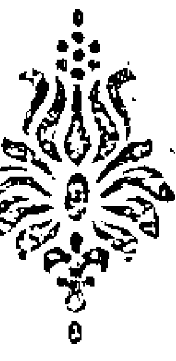

## The Science of Getting Rich

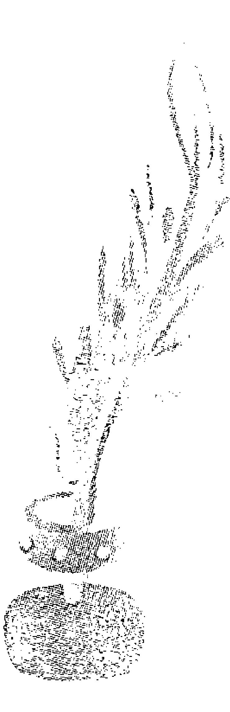

## 下卷

失落的致富法则

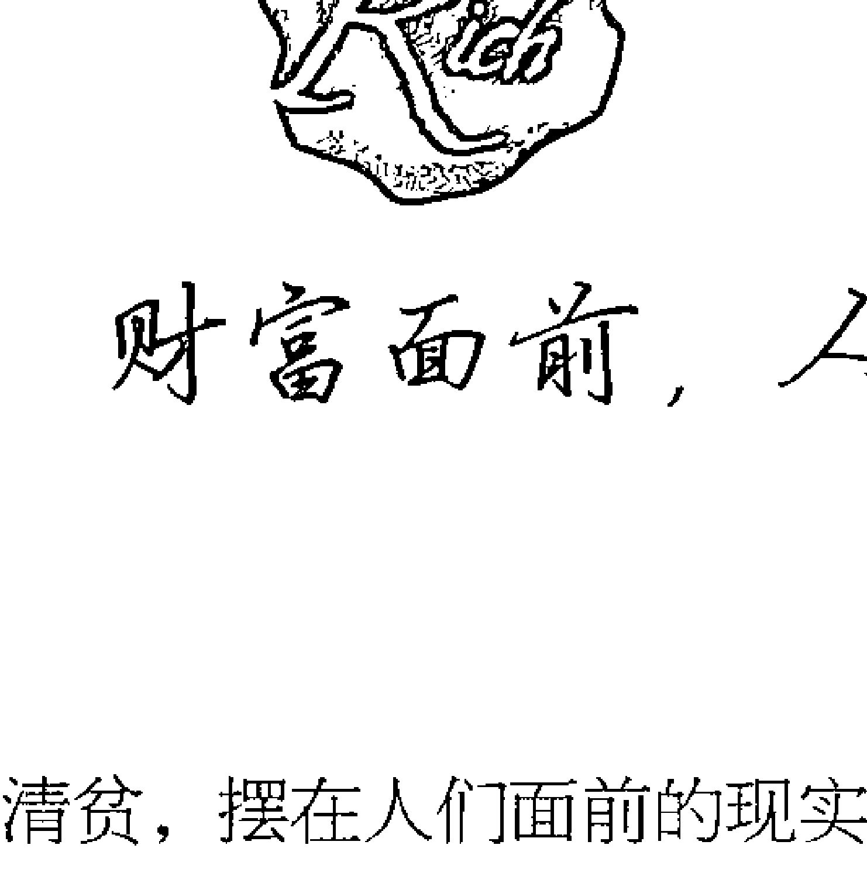

### 第一章 财富面前，人人平等

无论人们如何赞美清贫，摆在人们面前的现实始终是：没有钱你不可能过上真正富足而成功的生活。拥有足够的金钱，人们才可能攀上其才智和情商的最高峰，因为情商的开启与才智的发展需要借助很多外部条件，而这些外部条件的获得是需要金钱做后盾的。

人们要想提高自己的才智、情商和身体，就必须借助外部事物，而社会的组织规则永远都是有偿获取，决不提供免费的午餐，所以说致富的学问是一切文明进步的根基。

所有生命存在的目标都是发展自我，每一个活着的生物都有一项不可剥夺的权利——使自己的潜能得到充分挖掘。

所谓人类的生存权，就是作为一个人，他有权获得自由并可自由地利用一切其所需的事物去充分发展自己的心理、灵魂和身体。换句话说，所谓生存权也就是指人人都有变得富有的权利。

在这本卷部分中，我不会以形象化的方式来论述财富，因为真正的富有决不等同于对那么一点点已得利益的满足。如果一个人有能力获得更多，他就没有理由满足于那点已得的财富。自然界存在的意义就是使生命得到提高和完美展现，每个人都应该拥有一切所需的条件，去过上那种有钱有势又优雅高贵的生活。如此看来，仅满足于那点已得利益是多么的有罪，是对先天条件的荒废。

一个人在他的能力范围之内拥有了他所想要的一切的时候，才算是富有。然而，没有一个人可以在没有巨额财富的情况下拥有他想要的一切。现代生活变得如此先进，如此纷繁复杂，即使是普通人想过上最基本的生活，都需要大量的金钱来开路。每个人都有充分挖掘自己潜能的渴望，而这种努力地去实现先天可能性的欲望，是人的一种天性，所以我们都情不自禁地想成为我们应该成为的那种人。在生活中不断获得成功就是在朝着自己梦想的方向前进。然而，你只有借助一些外在事物才能实现你的梦想，可这些事物的获得是需要金钱的，你只有拥有了足够多的金钱，才能买到所有实现你的梦想所必需的东西并自由地支配它们。因此，致富的学问也就成了所有学问中最重要的一门。

渴望富裕是无罪的，对财富的渴望实际上是一种对更富裕，更充实，更丰富的生活的渴望，而这种渴望是值得称赞的。相反，如果一个人不渴望过上一种更富足的生活则是不正常的，所以，一个不渴望拥有足够多的金钱去购买所有他想要的东西的人，也可被视为一个非正常人。

人活着有三个动机：为身体的舒适，为才智的施展，为灵魂的安宁。而且三者同等重要，没有谁比谁更好更神圣之说，缺少了任何一个动机，生活都不可能过得圆满幸福。所以那些标榜只为灵魂活着而否认才智与肉体，或者只为才智活着而否认灵魂与肉体的观点都是错误的，不明智的。

我们都知道，单纯地为肉体的享乐活着，而忽视才智与灵魂的发展会导致怎样的恶果。真正的生活应该是身、心、灵三者协调地发展，完美地展现。因为没有一个健康健全的身体，人是不可能生活得幸福和完满的，同样，缺少了才智与灵魂，其生活也无异于行尸走肉，枯燥无味。如果一个人仍有未被展现的可能性或未被挖掘出的潜能，就表明他的渴望没有得到完全满足。因为人的渴望实际上就是既定可能性的实现和各种机能的自我展现。

如果一个人得不到美味的食物，舒适的衣服，温暖的住处以及过度劳累后的休息，他在身体方面就不可能生活得充实。休息和娱乐是一个人物质生活不可缺少的一部分。

如果一个人没有书和看书的时间，没有机会去旅行和观察大千世界，或者没有精神上的伴侣，他在精神方面也不可能生活得充实。为了使精神生活充实富足，人们应该有精神上的娱乐，应该有能力对生活在其身边的艺术与一切美好的事物进行利用与鉴赏。

为了在灵魂上生活得充实，人们必须拥有爱心，而贫穷是不可能使爱心得到充分展现的。

人生最大的快乐就是给予我们所爱的人幸福，而爱的最自然和最自发的表现形式是奉献。一个没有什么可以奉献的人，作为配偶他是不尽职的，作为父亲他是不尽责的，作为公民他是不合格的，甚至作为人他也是不配的。而正是通过对物质条件的利用，人们满足了身体对舒适的要求，才智的充分发展，灵魂的完美展现。因此，财富对于每个人来说都是极其重要的。

渴望富有是你完全正确的选择，如果你是一个正常人，你就会情不自禁地这么做。给予致富的学问以最大的关注也是你完全正确的选择，因为它是所有学问中最崇高，最实用的。如果你忽视了这门学问，你就是对自己，对造物主，对整个人类的不负责任，因为充分地发展自我才是对造物主和全人类作出的最大贡献。

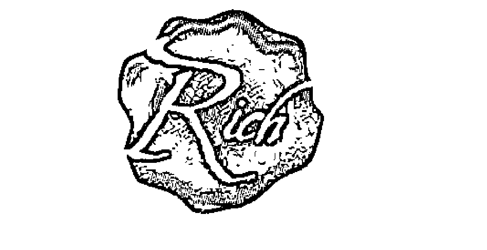

## 第二章  致富是一门学问

致富是一门学问，而且是一门如同数学一样精密的学问。在致富的过程中有一些特定的法则，这些特定的法则一旦被一部分人了解并遵守，那么他们必定会变得非常富有。

金钱和财富并不是通过做黄粱美梦得到的，而是按一定法则做事的结果。那些按这些特定法则做事的人，无论他们是有意如此还是碰巧如此，都会变得非常富有。而那些不按这些法则做事的人，无论他们工作多么努力，个人能力有多强，他们都只能无奈地生活在困顿之中。有什么样的因就必有什么样的果，这就是自然法则。所以，那些按致富法则做事的人就必然会变得富有。

上述声明的真实性将由以下事实验证：

致富与环境无关。如果有关的话，那些生活在特定区域的人的经济状况都应该是一样的，也就是说，一个城市里生活的都应该是富人，而另外城市里生活的都应该是穷人，或者说一个国家的百姓都富得流油，而其临国的百姓都一贫如洗。

但事实却是，无论在哪，同样的环境下总是贫富共存，即使是从事相同职业的人也如此。有这么两个人，他们生活在同一个地方，从事相同的职业，不久之后，一个变得很富有而另一个却仍然很清贫，这就说明环境不是影响致富的主要因素。不可否认，相比而言，有些环境对人们获取成功是更有利的。但是，两个生活在同一地区，从事相同职业的人，一个变得非常富有，而另一个却一败涂地，这个事实表明：富有是按特定方式行事的结果，与环境没有必然关系。

更进一步讲，并不是只有拥有天赋的人才有能力按致富的方式行事，因为有很多才智出众的人一辈子穷困潦倒，而一些资质一般的人却照样过得很富足。

通过对一些已经致富的人的研究，我们发现，他们各方面的才能都很一般，没有多么出众的才智和能力。这个结果表明：他们不是靠非凡的才智与能力致富的，而是在做事时恰巧采用了某种特定的方式。

富有不是省吃俭用的结果，很多非常节俭的人，可能一辈子都生活在拮据中，而很多挥金如土的人却往往越来越富有。

致富也并非仅仅是做别人无法做的事情。对两个从事同一行业的人来说，虽然做着完全一样的事情，也可能一个成功致富而另一个却日益贫困乃至最终破产。

从以上事件中，我们可以总结出这样的结论：财富就是以某种特定方式行事的结果。

如果说财富就是以某种特定方式行事的结果，有什么因就必结什么果，那么，以合适的方式行事的人，就必然会变得非常富有。如此推论，整件事情就可以归入精密科学的领域了。

问题讨论到这儿你可能会有疑问，“那种特定的方式是不是很难，只有少部分人才能掌握？”事实上，根本不是这么回事（即使先天能力被考虑在内）。天才可以致富，傻子也可以致富；聪明伶俐的人可以致富，愚蠢笨拙的人也可以致富；身强体健的人可以致富，体弱多病的人也可以致富。

当然，对致富而言，一定程度的理解力和思考能力是必不可少的，但当这些能力被作为先天条件考虑进去的时候，那么任何识字并能理解本书文字意思的人就都可以变得很富有。

可以确信无疑的是，如果一个人从事了他所喜爱的工作，而且这个工作又非常适合他，那他一定会做得很好。同时，如果他在这方面的才能得到了充分的开发，那他将是这个行业中做得最好的，是所有这类人才中的出类拔萃者。

此外，你只有在适合你的地方才能将你的事业做得最好：冰激凌店开在比较热的地方肯定比开在格陵兰岛效益好；在美国的西北部投资鲑鱼业将比在佛罗里达州投资要好得多，因为佛罗里达州没有鲑鱼。

但是，除了那些一般性的限制外，致富与你所从事的行业是无关的，而与你行事的方式密切相关。如果在你周围与你从事相同行业的人都富有起来了，而你却没有，那么原因很简单：你没有采取和他们一样的行事方式。

没有人会因缺乏资本而无法致富。的确，如果你有了资本，财富的增长就会变得更容易也更迅速。而一些资本原本就很丰厚的人他们本来就很有富有了，所以根本不需要考虑如何才能变得富有。不管你现在多么的一文不名，一贫如洗，只要你开始按某一特定的方式做事，你就在开始变得富有，开始拥有资本。获取资本是致富过程中不可缺少的一部分，也是按某种方式行事的结果之一。

你可能是一个非常贫穷的人，并且负债累累，你也许没有朋友，没有影响力，也没有资源，但是如果你开始按这种特定的方式行事，你就会慢慢变得富有，因为有什么因就会结什么果。如果你没有资本，你将会得到。

## 秘密背后的秘密 | The Secret Behind the Secret

资本；如果你正误入歧途，你将会步入正轨；如果你所在的地点不对，你将会出现在正确的地点。

你现在就可以以你当前的事业和目前的位置来尝试这个致富法则，它只会为你带来成功！你必须顺应这个掌控整个宇宙的法则。

### 第三章 机会无处不在

任何人都不会因为财富被某些人占据了，就不得不一辈子饱受穷困。也许你通向这个行业的特定航线被关闭了，但总会有其他的渠道向你敞开。

在不同的时期，根据全局的需要和社会发展所达到的特定阶段，机会的潮流就会涌向不同的方向。社会给那些顺应潮流的人提供了大量的机会，而对那些逆流而上的人则关闭了大门。

所以说，无论作为个人还是作为一个阶级，工人们都没有被剥夺掉获取机会的权利。他们并没有被他们的老板剥削，也没有被权势们压榨。作为一个阶级，他们正处在他们应该在的位置上，因为他们不会按那种特定的方式行事。

当他们开始以某种特定的方式行事时，工人阶级就有可能翻身成为统治阶级。致富法则适用于每个人，当然也包括他们在内。这些是他们必须知道的，而且如果他们不做出改变，他们将不得不永远维持他们的现状。然而，有的工人就不会因为整个阶级都忽视了这一法则而放弃自我发展，他会紧随这机会的潮流，追逐属于自己的财富。这本书将教会他们如何把握机会，实现自己的致富梦。

不会有人因财富供应短缺而贫困，因为世界上的财富绝对超出人们的需求。单是美国拥有的建材就足以为世界上的每个家庭建一座华盛顿会议厅式的豪宅；在精耕细作下，美国产出的羊毛、棉、麻、丝绸就足以让世界上的每个人都穿得比所罗门还要雍容华贵，加上充足的食物供应，就足以支撑住所有人的奢华生活。

那些我们可见的供应就几乎是取之不尽的了，更何况还有我们看不见的供应，它们更是无穷无尽的。

地球上所有的可见事物都源自于同一种原始物质，从这个原始物质出发，才创造出了所有的事物。新的形态在不断产生，旧的形态也在不断瓦解，但所有的形态都是由同一物质变化而来的。

无形物质或原始物质的供给是无穷无尽的，虽然整个宇宙都是由它构成的，但它并没有被完全用尽。整个宇宙中都充满了无形的原始物质——创造万物的原材料，它足以创造出比现在要多一万倍的有形体。尽管如此，我们仍不可能将宇宙提供的这种原材料用尽。

因此，没有人会因自然界能源的匮乏而贫困，或因资源有限不够分配而受束缚。

大自然就是一个取之不尽，用之不竭的财富宝库，它对我们的供给永远不会出现短缺。原始物质是一种富有生命力的物质，它拥有创造性的能量，并在不断地创造着新的形态。当一种建造材料的供应枯竭时，更多的建造材料会被创造出来。当土地被耗竭时，我们的食物和衣服材料便没有了来源，然而，这并不值得忧虑，因为土地会自动更新或者更多的土地会被创造出来。当所有的黄金和白银都被从地底下挖出来时，如果人类社会的发展还处在这个需要黄金和白银的时代，那么更多的黄金和白银将会被从无形状态中创造出来。无形的物质会时刻回应人类的需求，它不会让世界缺少美好的东西。

## 第三章 机会无处不在 | The Science of Getting Rich

人类是一个整体，作为一个整体，人类这个物种一直都是很富有的。如果其中的某些个体遭遇贫穷，那也是因为他们不懂得按照某种使人致富的特定方式行事。

无形物质拥有智慧，能够思考。它生机勃勃，并一直致力于创造更多的生命。

追求种族的繁荣是生命体的天性和内在动力。拓展智慧，扩大意识的范围，追求更完满的表达方式，这些都是人类的天性。宇宙中的有形物质都是由无形物质创造出来的，目的就在于更充分地表现自己。

宇宙是一个富有生命力的存在体，它一直朝着创造更多物种和更充分发挥功用的方向发展。

自然界因生物的进化而形成，而且它存在的目的也是为了物种的丰富。正因为如此，凡是生命所需要的东西都会有着充足的供应。除非上天否定自己的作为，废弃自己创造出来的杰作，否则就不会存在供应短缺的情况。

你的贫困绝对不是由缺少财富供给造成的。我将进一步陈述这样一个事实：只要人们以合适的方式行动和思考，无形的资源将呼之即来。

### 第四章 致富学问中的首要法则

意念是唯一可以将无形物质转换成有形财富的力量。世间万物都是源自于一种有智慧的物质，一种形态在这种物质的思维中产生，它便创造出这种形态的物质。

原始物质的行为是受它的思想控制的，你在自然界中见到的每一种形态和每一个过程，都是原始物质的想法的可视化表达。当这种无形物质想象出一种形态时，它就创造出一种形态的物质；当它想象出一种动作时，它就创造出一种动作。所有的事物都是这样产生的。我们生活在一个意念的世界里，而且它只是意念的宇宙中的一部分。当宇宙运转的意念传达给无形物质时，这充满智慧的物质就根据这种意念运转，最终形成了行星体系，并一直维持着这种状态。这智慧的物质就这样承载着它意念的形态，并按照它的意念运行着。

当无形物质有了创造出一个由太阳和地球组成的循环系统这个想法时，它就创造出那些物质形态，并使它们按照自己的意念运转。当无形物质想象到一棵生长缓慢的栎树形象时，它就创造出一棵栎树，虽然完成这项工作可能需要花上几百年的时间。在创造过程中，无形物质似乎会建立一套规则，让栎树慢慢地自然成形。换句话说，无形物质并不是一想到栎树就马上创造出一棵栎树，而是逐渐驱动某种力量，由这种力量创造出栎树。

树，并规定其成长的轨迹。

无形物质中蕴含着每一种物质形态的意念。通常情况下，无形物质根据意念中的形象进行创造，同时也规定了这种物质形体的行动方式和生长轨迹。

如果无形物质产生了一个关于房屋的意念，它不会根据房屋的形状，立即创造出一栋房屋，而是利用世界上已经存在的物质，去建造房屋。如果世界上不存在这种物质，它就会直接创造出房屋，而不是等到有机世界和无机世界缓慢形成后。

没有关于物质形态的意念传达给原始物质，就不会有物质形态被创造出来。

每个人都是一个思想中心，都能创造出意念。一个人在创造各种形体之前，这些形体必先出现在他的意念中。他不可能凭空创造出一种形体，除非这种形体早已在他的意念中。

到目前为止，人类的努力仍完全受限于他们双手的能力，他们只能通过人力去改变或修改已经存在的物质，而从未通过将意念传递给无形物质，以此来创造新的物质形态。

当人们在意念中有了一个形象，他们会从自然界中获取原料，将意念中存在的形象创造出来。到目前为止，人们很少或者说从未尝试过与无形物质——造物主合作，更没想过自己可以“做造物主做的事情”。人们总是通过人力去重塑或修改已经存在的物质形态，从未注意过这样的问题：他们是否可以通过将意念传达给无形物质，从而直接从无形物质中创造出新的物质形态。

我们要证明每个人都可以，并告诉你们如何才能做到。我们要做的第一件事，就是定下三个基本命题：

## 秘密背后的秘密 | *The Secret Behind the Secret*

首先，我们断言宇宙中一定存在着一种原始的无形物质，或者说宇宙中一定存在着这么一种物质，它是万物之母。所有看似不同的事物其实都只是同一元素的不同呈现形式而已。无论有机体还是无机体都是来源于同一种物质，只不过表现出了不同的形态而已。

其次，这种物质是一种有智慧的物质——一种意念产生，它就会创造出这种意念的形态。

第三，每个人都是一个思想中心，有能力创造意念。如果一个人能够使自己的意念与原始的有智慧的物质进行交流，他就能将他想象的事物创造出。总之：

世界上存在着这么一种有智慧的物质，它是万物之母。当它处在原始状态时，能够渗透、弥漫和充斥于整个宇宙。

该物质的任何一个意念，都可以根据意念中的形象创造出物质实体。

人们可以在意念中描绘事物，并将自己的意念传达给无形物质，就能够把他们想象中的物质创造出来。

有人可能会问我，我是否可以证明以上论断。我的回答是：可以，而且根本不需要深入分析，单凭逻辑上的推论和实际经验就够了。

通过对物质形体与意念现象的推论，我发现一种原始的有智慧的物质，通过对这种有智慧的物质的分析推论，我断定人们绝对有能力将自己想象的事情变为现实。

通过实验，我发现我的推论是成立的，以下是我最有力的证据：

如果有人读了这本书，并通过按照书中告诉他的方式行事而致富，那么这个证据就可以支持我的论点。如果每个按照书中所说的做的人都致富了，那就证明我的论点是正确的，除非有人那么做了但没有成功，才可以对我的论点提出质疑。所以这个理论将一直成立，直到有人在这个致富的过程中失败了。但只要每个人都完全按照书中所要求的做，就一定会富裕起来，这个过程是不会失败的。

我说过，想致富就必须以一种特定的方式行事。为了做到这一点，人们就必须先学会以特定的方式思考问题。因为人们的行事方式是他们思考方式的直接显现。

要做到按照自己想要的方式行事，你必须先培养这样一种能力，那就是按自己想要的思考方式思考问题，这是迈向致富之路的第一步。

所谓按照自己想要的思考方式思考问题，就是要做到忽视事物的表象而努力洞悉事物的真相。

每个人都与生俱来地拥有洞悉事物真相的能力，但要真正做到洞悉事物的真相并不是件容易的事，因为人们往往会受到事物表象的迷惑。想做到洞悉事物的真相而不受表象的干扰，你就必须集中更多的心力。

没有什么劳动比长时间的思考更能使人望而却步。思考可以说是世界上最艰难的事情，尤其是当事物的真相与事物的表象相悖时。在可视化的世界中，当我们观察事物时，它的每个表象都会在我们脑海中产生一个相应的印记。消除这种印记的唯一途径就是时刻持有洞悉真相的意念。

关注贫穷的表象就会在你的脑海中产生贫穷的印记，除非你紧守这样的真理：世界上没有贫穷，只有富足。

当我们被疾病的表象困扰时，就想象健康；当我们深陷贫困的表象中需要能量时，就想象富足。无论谁掌握了这种想象的能力，都可以成为思想的主人，也就可以征服命运，拥有他想要的一切。

只有坚持隐藏在所有表象背后的真理，才能获得这种能量。这个真理就是：世界上存在这么一种智慧的物质，它是万物之母，所有事物都是由它创造出来的。

## 秘密背后的秘密 | *The Secret Behind the Secret*

下一步，我们必须坚持这样一个真理：这个物质所持有的每一个信念都会变成一个对应物质形体。人也可以通过把意念传达给这个物质，从而创造出相应的物质实体，把意念转化为现实事物。

当我们意识到这些时，我们就不会再怀疑和恐惧，因为我们知道我们可以创造出我们想创造出的一切，我们能够得到我们想要的一切，我们可以成为我们想成为的那种人。作为迈向富裕的第一步，你必须相信我在本章中陈述过的那三个基本命题。为了强调，我在这里将再次重复它们：

首先，我们断言宇宙中一定存在着一种原始的无形物质，或者说宇宙中一定存在着这么一种物质，它是万物之母。所有看似不同的事物其实都只是同一元素的不同呈现形式而已。无论有机体还是无机体都是来源于同一种物质，只不过表现出了不同的形态。

其次，这种物质是一种有智慧的物质——一种意念产生，它就会创造出这种意念的形态。

第三，每个人都是一个思想中心，有能力创造意念。如果一个人能够使自己的意念与原始的有智慧的物质进行交流，他就能将他想象的事物创造出来。

你必须抛弃关于宇宙的其他概念，只坚信我陈述的那些。你必须将它们时刻铭记于心，直到它们在你的大脑中安家落户，并成为你的习惯性思维。一遍一遍地重复那些命题，使每一个单词都烙刻进你的记忆，并不断地沉思默想，直到你完全相信它们为止。如果有一个质疑出现，你就要及时把它丢开。不要听信那些与我陈述的那三个命题相悖的论断，不要去听那些宣扬与那三个命题相违的演讲和布道，不要看那些传达不同观点的书和杂志。如果在你的理解与信念中掺杂了其他的东西，那么你以前的那些努力就都白费了。

## 第四章 致富学问中的首要法则 | The Science of Getting Rich

不要问那些命题为什么是正确的，也不要去推测它们是如何得到验证的，只要坚信它们就可以了。致富的学问就是以完全接受它们为前提的。

### 第五章 优化生命

你必须摆脱旧观念的最后残余：你的贫困是上天注定的，或上天创造了你就是为了让你受穷受难。

有智慧的无形物质就是一切，它存在于一切事物中，当然也存在于你身上，它就是一个有意识的生命体。作为一个有意识的生命体，它必然如同每种有智慧的生物那样都有一种天性，那就是不断地优化自己的生命。每种有生命的物质都必须持续不断地拓展自己的生命，因为生存就是一个优生劣汰的过程，每个生命体都应该不断地优化自己。

一粒种子落入泥土之后便开始生长，在自我生长的同时还生产出数百粒种子。每一种生物都是通过自我生长来繁衍他们自己的。繁衍种族是每一个生命体永恒的目标，如果它们想继续存在就必须这么做。

人类的智慧同样也有这种继续生长不断优化的需求。我们的每一个想法的产生，都会诱使我们产生另一个想法，我们的意识也在不断地扩展。一个真相的发现总会引导我们去发现另一个真相，知识就不断地得到积累。我们培养出的每一项才能又都会激发我们去培养另一项才能的渴望。我们受生命的欲望的驱使，不断地寻求着表达，这种欲望驱使着我们去了解更多，做更多，成为更丰富的人。

为了了解更多，做更多，成为更丰富的人，我们必须拥有更多。因为为了做到这一切，我们必须有可用的东西去利用。为了生活得更充实，我们也必须致富。

人们对财富的渴望只是为了追求生命的充实。每一个渴望都是潜在的可能性为转变为行动而做出的努力。引起渴望的力量总在寻求显现。从本质上来说，引起你对金钱产生渴望的力量和引起植物对生长产生渴望的力量是一样的，这都是生命在寻求更圆满的呈现。

有生命的原始物质必然也遵循着这个所有生命都在遵循的内在法则。它也有活得更充实的渴望，这也就解释了它为什么会有创造事物的需求。这种无形物质渴望通过你来使自己活得更加充实，因此，它希望你拥有一切你能用到的东西。

你应该变得富裕，因为这正是上天的愿望。它希望你变得富有，因为如果你拥有很多可用的事物，它就可以通过你更完美地展现自己。如果你可以不受限制的使用你拥有的一切，它就可以在你身上体验到更完满的生命。

- 宇宙渴望你拥有你想要的一切。
- 大自然对你的计划心怀善意。
- 万物都是为了成就你而存在。
- 坚定你的信念，相信这就是事实。

不过，有一个极其重要的前提：你必须使你的目标与万物的目标相一致。

你必须追求真正的生活，而不是仅限于追逐快乐和感官的享受。生活应该是各种机能的展现，一个人只有完满地表现出了他的生理、心理和灵魂的所有机能，他才算是真正的生活过。

你千万不要单纯为了过上奢侈的生活和满足肉体的欲望而渴望致富，因为那不是真正的生活。但是每一种生理机能都是生活的一部分，如果一个人完全拒接来自身体的每一个正常和健康的冲动，那他也不可能享受到完满的生活。

你也不能只耽于享受精神上的欢愉、获取知识、实现雄心壮志、超越他人和获取荣誉，而追逐财富。它们虽然都是生活的合理组成部分，但如果一个人只能为精神的欢愉而活着，那他也只是享受了生活的一小部分，而面对充实丰富的生活，他是不可能感到满足的。

你同样不能只为帮助别人、无私奉献、致力于慈善事业而努力致富，因为灵魂的愉悦也只不过是生活的一部分，它并不比其他部分更美好、更高尚。

你致富的目的应该包括很多方面，为了愉快地享受各种美食，为了拥有美好的事物、发现新事物、丰富你的思想、发展你的才智，为了有能力行善和发现真理。

时刻牢记：极端的利他主义并不比极端的利己主义更好更高尚，两者都是错误的。

不要认为上天创造你的目的就是让你为他人服务，更不要认为这样做就可以得到上天更多的眷顾。上天从来不会这样要求任何人。它希望你不仅为了他人，也要为了自己去完美地展现自我，因为没有什么比完美地展现自我更能帮助他人。

你只有通过致富才能完美地展现自我，所以你将所有的意念都用在致富上是正确的，是值得赞赏的。

但是请记住，无形物质的渴望是拥有完满的生命，它的行动目标是使所有生命都完满。它不会只为哪一小部分人付出，因为每个生物在生存和财富面前都是平等的。

## 第五章 优化生命 | The Science of Getting Rich

有智慧的无形物体会为你创造财富，但它不会剥夺他人的财富来恩赐于你。你必须消除竞争的念头，因为你是去创造，而不是与别人争夺那些已经创造出来的东西。

- 你不需要掠夺别人的任何东西。
- 你不需要与别人斤斤计较。
- 你不需要去欺诈或占别人便宜。
- 你不需要去克扣工人的工资。
- 你不需要去艳羡或贪图别人的财富。别人有的东西你一样会拥有，所以根本没必要去剥夺别人的东西。

你是要成为一个创造者，而不是成为别人的竞争对手。你在争取你想要的东西时，也应该努力使你影响到的人获得更多。

我知道，有些人是通过与上述阐述相反的方式获得了巨额资产，在这里我将对此做一下解释。那些富翁，有的纯粹依靠自己非凡的能力在竞争中取胜，有的则在无意识中与无形物质建立了联系，通过工业革命参与提升人类劳动价值的行动。像洛克菲勒、卡内基、摩根等人，都在无意识中成了无形物质的最佳代理人，通过使生产系统化和组织化的方式参与了产业革命。他们工作的最终结果是，大大提升优化了所有的生命。但是他们的时代也将结束了。虽然他们使生产更加有组织化，但新一代的代理人很快就会取代他们，进行下一次革命，也就是实行机械化分工。

这些富豪就像史前的爬行动物，他们在进化中扮演着重要的角色。但是，成就他们的力量，最终也会将他们毁灭。另外，还有一个大家都知道的事实，他们其实从未富裕过。因为据记载，大多数这个阶层的人他们的私生活都是非常凄惨的。

通过竞争获取的财富是不可能长久的，也不可能使人得到满足，而且很可能一夜之间化为乌有。如果你想以某种科学的方式致富，你就必须完全抛弃那种竞争的想法。一刻也不要让贫乏的念头在你脑海中闪现。当你认为所有的财富都正被别人控制和占有着，你必须介入其中并通过某些法则才能改变这种状况时，你就陷入了竞争的泥潭，你进行创造的能力也将即刻消失。

更糟糕的是，你将很可能束缚住你已经开始的创造活动。

要知道，地球上的千山万壑中都蕴藏着不计其数的金子，只是还没被开采出来而已。而且，即使山中没有金子，无形物质也会为满足你的需求而创造出更多的金子。

要知道，即使需要成千上百的人明天就去寻找金矿，你需要的钱也会如期而至。

不要去看那些有形的供给，时刻盯住那些存在于无形物质中的无尽的财富。要知道，当你愿意接受并使用它们的时候，它们就会马上来到。没有人可以通过垄断有形财富的形式，阻碍你得到属于你的东西。

因此，永远都不要去想如果我不赶快盖房子，最佳地段就会被抢光的；永远都不用担心整个地球会被大财团掌控了；永远都不用害怕有人会抢走你想要的东西。因为这些根本不可能发生。你并不是在寻找任何已经被其他人占有了的东西，而是在使自己想要的东西从无形物质中产生，并得到无限供应。谨记以下论点：

世界上存在着这么一种有智慧的物质，它是万物之母。当它处在原始状态时，能够渗透、弥漫和充斥于整个宇宙。

该物质的任何一个意念，都可以根据意念中的形象创造出物质实体。

人们可以在意念中描绘事物，并将自己的意念传达给无形物质，就能够把他们想象中的物质创造出来。

### 第六章 如何才能获得财富

我所说的“你不必斤斤计较”，并不是让你什么都不计较，或者不与你的同伴进行任何交易。我的意思是，你不应该对他们不公平。你不应该不劳而获，但可以通过多付出少索取的方式致富。

在进行交易时，你不可能给每位顾客的商品价格都低于你的商品成本，但你可以给他们更多的使用价值。这本书所用的纸和墨也许根本不值你所付的价钱，但是，如果它给你的建议使你赚了数千美元时，你就不会再恨卖给你的那个人了。你只付出了很少的金钱，他们却给了你极大的使用价值。

我们可以做一个这样的假设，假设我有一幅名画，在发达国家，它价值连城。但当我把它带到巴芬湾，并凭着“销售天分”诱使当地的一个土著人以价值500美元的皮草换下了它，那我就欺骗了他，因为那幅画对他来说毫无价值——既没有使用价值，也不可能提高他的生活质量。

但是如果他用那些皮草换取的不是一幅名画，而是一把价值五十美元的猎枪，那他就是做了一笔很划算的买卖。因为猎枪对他来说很实用，他可以以此获得更多的皮草和食物，这将有益于他生活的各个方面，他也可能因此而致富。

当你的商业活动从竞争层面上升到创造层面时，你应该非常严格地审视你的交易活动。如果顾客付出金钱却没有得到更多的或等值的商品使用价值，也没能提升自己的生活，那么你就应该悬崖勒马，立即停止这种交易。在生意场上，你不应该欺诈任何人，因为欺诈别人就是在为自己挖掘坟墓。如果你正在进行一场带欺诈性的交易，那么立刻停止，给自己一个全身而退的机会。

如果你提供给每位顾客的商品，其使用价值都高于其商品价值，那么你就是在通过交易提升整个世界的生命质量。

如果你雇佣工人为你工作，那你必定从他们身上获取了高于他们工资的货币价值。这种行为在所难免，但你可以在你的商业组织中设置一些奖励性的制度，给那些愿意进步的员工以前进了动力。

这本书的创作目的就是为你服务，你也可以像它一样，使你的事业为你的员工服务，为他们提供致富的阶梯。当然，如果他们不珍惜这样的机会，那就不是你的错了。

最后需要强调的是，虽然你可以从弥漫于你身边的无形物质中创造出财富，但这并不代表你就可以使它们平白无故地从大气中显出形来，直接出现在你面前。

例如，如果你想要一台缝纫机，你就不能整天只待在自己的屋子里，想着将有关缝纫机的意念传达给智慧的无形物质，然后就等着不劳而获。正确的做法是，如果你想要一台缝纫机，首先你应该在头脑中形成一种积极的景象：缝纫机正在被无形物质创造着或正在传送给你 的途中。形成这样的意念后，就应该坚信你的缝纫机马上就到了。除了确信缝纫机会到来之外，不要有任何其他的想法或说辞，就当它已经是你的了。

至高无上的智慧会通过作用于你的意识，将你的想要的东西带到你身边。比如，你生活在缅因州，也许就会有从事缝纫机贸易的商人从得克萨斯州或日本将缝纫机带来，通过交易，你最终会得到你想要的东西。

果真如此，对于你和那个商人来说都是有利的，你得到了想要的缝纫机，商人得到了利润。

时刻谨记：有智慧的物质存在于一切物质中，并可与一切物质进行交流，也可以影响一切物质。有智慧的无形物质对更完满的生命和更合理的生活方式的渴望，促使它早已将缝纫机创造出来，而且无论什么时候，只要人们以特定的方式表现出渴望和坚定的信念，无形物质就会为人们创造出成千上万的缝纫机。

你不仅可以得到缝纫机，而且只要是用 来改善你和他人生活的东西，无论你需要什么，都会得到满足。

你不必怀疑自己是不是对无形物质要求的太多了，正如耶稣所说 “造物主乐意将整个天国都送给你们”，无形物质也愿意为你创造一切。

原始的无形物质渴望体验到你可能经历的各种生活，所以它希望你拥有所有你能用到的或你可能用到的事物，去过上最丰富多彩的生活。

如果你在意识里承认这样一个事实：你对财富的渴望正是至高无上的力量追求更完美展现的愿望之一，你的信念将变得不可战胜。

有一次，我看到一个小男孩坐在钢琴前，很卖力地尝试着弹出优美的旋律。我见他为自己弹奏不出真正优美的音乐而沮丧懊恼，就故意去问他为何烦恼，他说：“我能感觉到优美的旋律在我身体里回荡，但我的手却不能将它们弹奏出来。” 在他身体里回荡的旋律就是无形物质的强烈愿望，代表了生活中的各种可能性，它们就如同音乐希望通过小男孩得到展现一样，在人们身上寻找着呈现的机会。

造物主，也就是无形物质，尝试着通过人类去体验和享受生活，他说：“我想让人们的双手去创建宏伟的建筑，去弹奏和谐的音律，去描绘壮丽的图景。我想让人们的双腿去走我想走的路，双眼去看我想看的美景，舌头去传达绝对真理和演唱绝美的歌曲。

这一切都是可以通过人得到完美呈现的。造物主会使会弹钢琴的人拥有钢琴和其他必需的设备，会为他们提供培养途径，使他们的才能得到最充分地挖掘拓展；会使懂得欣赏美的人，身边充满美的事物；会使有鉴别真相能力的人，有足够的机会去游历和观赏；会使懂得欣赏服饰的人，拥有华丽的衣服；会使懂得品味美食的人，拥有奢华的食物供给。

造物主希望你拥有那些东西，因为那些东西也是它喜爱和欣赏的，是它的创造。它想奏乐和歌唱，它想欣赏美和宣扬真理，它想锦衣玉食。使徒保罗说：“造物主存在于你的心中，驱使你产生想法和采取行动。”

你对财富的无限渴望，就如同小男孩弹钢琴一样，都是造物主在通过你进行自我呈现。所以你无需怀疑自己对造物主的要求是不是太多了。

你的任务就是：专注并向造物主呈现那些渴望。

然而，这对大多数人来说都是一个难点。他们仍坚守着一些旧观点，认为甘于贫穷和勇于牺牲才是上帝对他们的期望。他们将安贫乐道视为人生计划的一部分，是陶冶性情的一种需要。他们还认为上帝的工作就是创造他们，除此之外就什么也做不了了。同时他们觉得资源供给很贫乏，所以大多数人一生下来就注定一辈子遭受贫困。这些观点在他们心底是如此得根深蒂固，以至于使他们羞于向上帝索取财富。所以他们都尝试着不去贪图太多，只求过得安逸。

我有一个真实的案例，我要求我的一个学生将自己渴望的东西清晰地反映在自己的脑海中，以便传达给无形物质。他穷困潦倒，长期住在出租屋里，每天的工资只够当天的花费，他根本无法相信他拥有所有的财富这样的事实。因此，经过再三地斟酌，他决定适当地提出一点要求：一张新地毯和一个天冷时用来御寒的火炉。按照本书要求的方式做事后，他很快就得到了那些东西。

这件事使他清醒过来，觉得自己以前要求的太少了。

他环视了一周自己的房间，计划着想要改善的东西。他想再安一扇窗子，再隔出一个房间等，直到完全符合自己理想中的样子，然后又接着考虑家具的问题。

脑海中形成了关于未来的全部图景，他便开始以某种特定的方式生活，并不断地朝着自己期望的方向移动。他现在拥有了那个房子，正根据自己脑海中的图景装饰自己的房间。不仅如此，怀着巨大的信念，他正迈向更大的目标。

凭自己的信念，他得到了自己想要的东西，你也可以如此，我们大家都可以做到。

### 第七章 心怀感恩

上一章阐述的内容主要是告诉读者这样一个事实：致富的第一步就是将自己的渴求传达给无形物质。

事实就是如此，而且你会发现，如果你想这么做，你就必须学会以一种和谐的方式将自己与智慧的无形物质联系起来。

为了让你知道这种和谐的关系是多么的重要，在这里我将占用一些空间给你做出明确指引，如果你完全按照我的指引去做，你的思想一定可以和至高无上的力量完美地合二为一。

整个心理调试的过程可以被概括为一个词：心怀感恩。

首先，你必须相信宇宙间存在一种智慧的无形物质，而且所有事物都是由它而生。第二，你要相信这个物质会给你想要的一切。第三，你必须以一种感恩的心态将自己与无形物质联系起来。

尽管有些人通过其他的方式也使自己的生活井然有序，但由于缺少感恩之心，便不得不饱受贫困之苦。在收到造物主的礼物后，很多人便割断了与造物主之间的绳索，没有表现出一丝感恩之情。

有这样一句大家都耳熟能详的谚语：近水楼台先得月。离财富越近，我们得到的财富就可能越多；心怀感恩的灵魂远比毫无感恩之心的灵魂离上帝近。当好运来到我们身边时，我们怀的感恩之情越多，就会有越多的好运来到我们身边，而且速度也会越快。原因很简单，感恩的心拉近了我们与财富的距离，使我们更接近财富的源泉。

心怀感恩可以使你与伟大的造物主建立更加和谐密切的联系，如果对你来说这是一种新的理念，那么请仔细感悟它，你会发现它是多么的正确。过去发生在你身上的好事，都是因为你行事的方式顺应了某种法则。感恩之心会指引你按照这种法则行事，使你与创造性思维和谐相处，并防止你陷入竞争思维的漩涡。

心怀感恩可以使你洞悉万物，摆脱错误思维的羁绊，避免错误思维对你的希望造成致命性的打击。

世界上确实存在着关于感恩的法则，而且如果你想得到你希望的结果，你就完全有必要遵循这个法则。感恩法则是一个自然法则，就如同作用力与反作用力大小相等，方向相反一样。

当你发自内心地对伟大的造物主报以感激之情时，你的心灵会延伸扩大，并释放出巨大的能量，这种能量会波及你感谢的对象，而其反作用力也会立刻作用到你身上。

“你亲近神，神便会亲近你。”这是一个心理学上的真理。如果你的感恩是强烈而持续的，来自无形物质的反馈也将是强烈而持续的，你想要的东西必然也将不断地向你靠近。要知道耶稣也总是持有这种感恩的心态的，他几乎总是说：“感谢天父聆听我。”缺乏感恩的心，你就无法驱使巨大的能量，因为正是感恩之心将你与巨大的能量联系了起来。

但感恩之心的价值并不仅仅是使你将来得到更多的福佑。没有感恩之心，你就不可能远离对事物的抱怨心理。

当你任由自己的情绪对事物持不满心理时，你就会失去自己的方向。当你将注意力集中于平凡、普通、贫穷、肮脏、卑劣时，你的心灵上也会留下那些东西。然后你就会将它们传达给无形物质，无形物质就会又将平凡、普通、贫穷、肮脏、卑劣回馈于你。

允许低劣与你的灵魂共处一个屋檐下，你就会变得低劣，低劣的事情也会自动向你涌来。相反，将你的注意力集中到美好上，美好的事情就会环绕着你，你也会变得更高尚。存在于我们内心的创造性的力量，会使我们变成我们所关注的对象。我们都是有思想的物质，有思想的物质都会效仿自己思考的意象。

充满感恩的心灵总是充满着美好的意象，因此也会变得高尚。

信念也是源于心怀感恩。充满感恩的心灵总是期待美好的事物，期待也就会变成信念。感恩之心的反作用力能够创造出信念，每一次发自肺腑的感恩都会增加信念的力量。没有感恩之心的人不可能拥有坚定的信念，而没有坚定信念的人是不可能以富有创造力的方式致富的，这一点我们将在随后的章节中进行讨论。

对每一个来到我们身边的美好事物都报以感恩之心，是我们应该养成并坚持的习惯，也是一种非常必要的行为，因为所有事物都为你的提升贡献了力量，你应该将它们纳入你感激对象的范围。

不要再将时间浪费在思考或讨论那些权要人士的缺点和错误行为了，毕竟他们组织领导的世界给你带来了很多机遇，也正是由于他们的存在才使你真正得到了属于你的一切。也不要再因政客的腐败而愤愤不平了，因为如果没有政府的存在，我们将陷入无政府的混乱状态，那样你的机会就会更少。

造物主已经花了很长的时间和极大的耐心，培养我们经营工业、组建政府的能力，而且它的工作也在继续着。毋庸置疑地是，当世界上不需要财阀、产业大亨与政治家时，造物主会让他们自动消失的，但是到目前为止，他们的存在还是非常必要的。要知道，他们都在帮你管理着你的致富之路，所以，对他们表示感谢也是你份内的事。如果你能做到这样，你就与你所有的好运建立了和谐的关系，你的好运自然也就会向你奔去。

### 第八章 以某种特定的方式思考

返回到第六章，重新阅读那个关于一个男人在心中描绘自己理想的居所的故事，你将对通向成功的第一步有更清晰地认识。你必须将你想要的事物清晰明确地描绘在你的脑海中，因为只有在脑海中形成了清晰的意念后，你才能将意念传达给无形物质。

你必须先有意念才能传达意念，很多人没能将自己的意念传达给无形物质，就是因为他们对自己想做的事、想要的东西、想成为的人只有那么一点点朦胧模糊的概念，甚至连他们自己都不知道他们想干什么。

仅仅对财富有类似于过上好日子这样一般的渴望是远远不够的，因为每个人都可以有这样的渴望。

仅仅有去旅游观光、丰富阅历、过得充实之类的渴望也是远远不够的，因为每个人都可以有这样的渴望。如果你给你的朋友发电报，你不可能只发各个字母的顺序，让他们自己去组织语句，也不可能在字典里随便找几个字就给他们发过去，你肯定会给他们发一些完整而有明确意义的语句。

当你向无形物质传达意念时，一定要完整明确。你必须非常确定自己到底想要什么，那些只向无形物质传达未成形的愿望和模糊不清的渴望的人，是永远不可能致富的，也不可能将创造性的力量带入行动中。

就像我前面描述的那个重新审视自己房间的男人那样，你也应该重新审视一下自己的渴望。想象自己到底想要什么，并在脑海中勾勒出清晰具体的景象。而且，你必须把这清晰具体的景象时刻铭记于心，就像船员心中始终有港口的景象一样。这种景象一刻也不能被遗忘，就如同舵手分秒不能离开指南针一样。

你不需要刻意训练自己聚精会神的能力，也不必腾出时间进行祷告或肯定声明，更不必进入什么“冥想”境地，或者倾听任何宣扬超自然能力的讲座。虽然做那些事情不无裨益，但你只要做到明确自己的目标并充满足够的渴望就够了，做到这些，那清晰具体的意念就会时刻存在于你的脑中了。

在闲暇时间里，尽可能多地思考你脑海中的图景，但你绝对没必要去刻意练习集中精力于你想要做的事情上，因为只有那些你并不真正关心的事物，才需要你刻意集中精力，而那些你真正关心的事物，你会一刻不停地关注它们的。

除非你真的想致富，你的渴望才能强大到足够带着你的意念通向目的地，就像磁极能带着指南针的指针走一样，否则按本书的指导行事就没有意义了。

只有那些对财富充满渴望，并足以战胜他们的懒惰和闲散的人，才适用本书提供的方法，也才能使这些方法发挥作用。

你越使你脑海中的图景清晰明确，你就越能投身其中，发现所有令人愉悦的细节，你的渴望也就会因此而变得更加强烈。你的渴望越强烈，你就越容易将自己的意念融入你想要的图景中。

清晰地看到自己意念中的图景对你的致富来说很重要，但还有远比这更重要的事。如果你只想看到意念中的图景，那你充其量也就是个空想家，只会有少许甚至一点也没有能量去实现自己的渴望。

在清晰的图景背后，一定要有明确的目标，也就是去实现它，将它转化为具体的形象。

在这明确的目标背后，必须有坚定的信念，坚信你想要的东西早已属于你了，而且就在你“手边”，你只要去接管它就好了。

保持生活在你精神上的新房间里，直到将它化为物质实体。在精神境界中，你可以充分享受你渴望的事物带给你的快乐。

> 耶稣说：“当你祷告时，无论你祈求什么，只要你坚信会得到，你就可以得到。”

你要将你想要的事物视为你生活的一部分，想象着它早已在你身边，被你拥有为你所用。专注于你心中的图景，直到它变得清晰具体为止，然后以拥有者的态度对待图景中的任何事物。在脑海中占有它们，并完全相信它们已经属于你了。保持这种精神上的拥有，对它的真实性不要有丝毫的怀疑。

另外，要时刻谨记上一章中阐述的问题——心怀感恩：当一切渴望得到满足后，要报以最大限度的感恩。一个人刚刚在想象中得到他渴望的东西，就对造物主报以真诚的感激，才是真正拥有坚定的信念，他也必定能够致富，能创造出自己想要的一切。

不必为自己想得到的东西反复祈祷，因为造物主不需要你每天都提醒他你想要什么。

你的任务应该是清晰全面地想出那些能够优化提升你的生命的东西，并把那些渴望组织成系统的整体，然后将这些渴望传达给无形物质，它有能力也愿意将你的渴望变成现实。

你无须重复那些语句，你只要坚信你能够得到你想要的事物，并对这种信念持之以恒就够了。

造物主不是依据你诉说渴望时的信念给予你回应，而是依据你为渴望的事物付出行动时的信念。

你不能特地安排一个安息日，向上帝祈求你想要的东西，而除了这天之外就将他抛诸脑后。你不能每天只在固定的时间躲进你的衣橱，向上帝传达你的渴望，而一天中的其他时间都无视他的存在。如果你真这么做了，你将永远无法打动上帝的心，你的渴望也不可能得到满足。

口头上的祈祷自然有它的作用，尤其对你自己而言，它可以使你脑海中的图景更清晰，使你的信念更坚定，但并不是你口头上的祈祷将你想要的东西带到你身边的。为了致富，你不需要一个“祷告吉时”，你只需“不停祷告”。我所指的祷告，是要坚定地紧守你的愿望，并下定决心将自己想要的事物创造出来。这才是你应该进行的祷告。

> “坚信你会得到你想要的东西。”

一旦你在脑海中形成了清晰的图景，所有你能做的就是等待接收你的礼物。当你在脑海中形成了渴望的图景的那一刻，你就应该在口头上向造物主表示感谢。同时，也就是从那一刻起，你就应该在心理上做好接收你要求的东西的准备。

住在新房子里，穿舒适的衣服，开自己的汽车，继续自己的旅行，充满信心地计划下一次更伟大的旅行。对所有你向造物主要求的事物，你都应该抱以实际拥有者的心态去想象和陈述它们。想象着你有那样的环境和经济条件去拥有它们，并一直使自己生活在精神上的那种环境和条件中，直到你要求的那些事物都形成物质实体为止。

切记，不要让自己成为一个空想家或一个好高骛远的人。你要坚定你可以美梦成真的信念，以及实现一切目标的决心。要知道，正是信念和决心使科学家与幻想家在运用想象力方面划清了界限。

在了解了以上事实之后，接下来你应该学习意志力的正确用法。

### 第九章 如何运用意志力

为了致富，你不应该将你的意志力强加于你自身之外的任何事物上。

不管怎么说，你都没有权利这么做。为了使别人按自己的方式行事，就将自己的意志力强压于别人身上，这是非常错误的做法。

对别人施行精神上的压迫与施行肉体上的压迫是一样，都是极其错误的。如果你凭借武力迫使人们为你做事，你就是在奴役他们，而对人们施加精神上的压迫，实际上与武力压迫性质完全相同，唯一不同点就在于运用的方法上。如果说以武力从别人那里夺走东西叫抢劫，那么以精神压迫从别人那里获取东西也应该同样叫抢劫。它们在原则上没有任何区别。

你没有权利将自己的意志强压于别人身上，即使是为别人好也不可以，因为你并不知道做什么才是真正地为他们好。致富的学问并不需要你将压力或暴力以任何形式施加于任何人，而且是完全没有必要那么做。事实上，任何将自己的意念强加于别人的企图，都是在毁灭自己的目标。

你不必为了使事情朝你期望的方向发展，就将自己的意念施加到它身上。这么做你就是在压迫造物主，而最终的结果只能是被愚弄，一事无成。

你不必强求造物主赐予你美好的事物，这无异于想通过自己的意念迫使太阳升起。

## 第九章 如何运用意志力 | The Science of Getting Rich

你不必用意志去征服那些不友好的神，或让那些顽固的反叛力量听命于你。无形物质对你是十分友善的，它比你更急于让你得到你想要的事物。

为了致富，你只需将你的意志运用到你自己身上。

当你知道自己应该想什么和做什么时，你必须运用自己的意念使自己正确地思考和做事。那才是在合理地运用自己的意念去得到自己想要的东西——用它来保持正确的方向。

让你的意志做你的向导，确保自己以某种特定的方式思考和行事。

不要试图将你的意志、意图、或想法散发出来，并“作用于”其他事物或其他人身上。让你的想法待在你的心里，因为没有哪个地方比那儿更有利于发挥它的作用。

运用你的思维在脑海中勾勒出你渴望得到的东西的形象，并通过信念和决心紧守这幅图景。同时发挥你意志的作用，确保自己的思维以正确的方式工作。

你的信念和决心越稳定持久，你致富的速度就越快。因为你只向无形物质传递正面的想法，而不会以负面想法来削弱或抵消它的力量。

你用信念和决心坚守的图景被无形物质携带着，穿过无垠的宇宙，弥漫到很远很远的地方。

当你的渴望传达出去后，所有的事物就都开始为实现你的渴望而行动起来了。所有有生命的东西和无生命的东西以及那些还未被创造出来的东西，都为实现你的渴望而参与进来了。所有的力量都朝着同一个方向，所有的事物都在为实现你的渴望而奔波。四面八方的人的思维也被影响到了，他们都在毫无意识地为实现你的渴望而做着一些必不可少的事情。

你可以通过将负面思想传递给无形物质，以此来检验以上的说法。就像信念和决心会将你渴望的东西带到你身边一样，怀疑或不信任会使你渴望的东西远离你，很多人遭遇失败都是因为不明白这个道理。每当你感到怀疑、恐惧和焦虑时，你的灵魂就被不信任占据着，无形物质也就会使你想要的东西远离你。唯有信任无形物质的人，才会得到他们想要的东西。

## 秘密背后的秘密 | The Secret Behind the Secret

既然信任如此重要，你就有必要将它牢牢地控制在你的意志中。因为你的信任会被你的所见所闻所思左右，所以你必须谨慎地控制着你的注意力。

此时，意志就可以发挥作用了，因为你的注意力放在哪些事物上，完全是由你的意志决定的。

如果你想成为有钱人，你就不应该关注贫穷。

如果你面向期望的方向却进行相反的思考，你是不可能得到你期望的东西的。

不要讨论贫穷，也不要研究贫穷，更不要将它与你自己联系在一起。你不必担忧贫穷会造成什么样的严重后果，因为那些事与你无关。

你所应该关心的是消除贫穷之道。这么说并不是让你变得铁石心肠，毫无同情心，拒绝聆听一切需求的呼声，而是让你从过去中走出来，不要再企图通过任何传统守旧的方法来消除贫穷。请将贫穷抛于脑后，将一切有关贫穷的想法都抛于脑后，只关注美好的。

致富，是你帮助穷人的最好方式。

如果你的脑海中充满了贫穷以及与此有关的图景，你就不可能再想象出那些能让你致富的景象。不要阅读那些描述贫民不幸，悲惨童工之类的书籍或报纸，不要阅读任何会给你留下贫困和悲痛印象的资料。

仅仅了解那些悲惨的事情，是不足以帮助那些穷人的。到处散播那些悲惨的信息，对消除贫穷一点作用都没有。

消除贫穷的方法不是将有关贫穷的景象填充进自己的大脑，而是让人们只想象富足、丰盈，以及可能性的图景。

你拒绝苦难的图景占用了你的大脑，并不代表你对穷人不管不顾。

贫穷是可以被消除的，但不是靠越来越多的富人去关注贫穷，要想从根本上解决贫穷，还要让越来越多的穷人充满致富的信念。

穷人真正需要的不是施舍，而是鼓舞。施舍只是发给他们一块面包，让他们继续生活在不幸中，或者让他们暂时忘却不幸，得到一两个小时的愉悦，但鼓舞却能使他们走出苦难。如果你真的想帮助穷人，你就应该用自己的致富为他们树立榜样，向他们证明任何人都可以致富，他们当然也可以。

让越来越多的人去实践本书传授的方法，是唯一可以让贫穷从这个世界上消失的方法。

人们必须被教着以创造致富，而不是靠竞争。

那些靠竞争致富的人为了将别人挡在财富的外面，都推倒了自己向上攀登的梯子。但是凭借创造致富的人，不仅为成千上万的后来者开辟了道路，还鼓励他们致富。

当你拒绝去可怜贫穷，见到贫穷，阅读有关贫穷的资料或听别人讨论贫穷时，这并不代表你是铁石心肠或毫无同情心。用你的意志力使你自己远离贫穷的议题，同时使自己的脑海中充满那些关于你渴望的和你正在创造的事物的意象，并时刻怀有信念和决心。

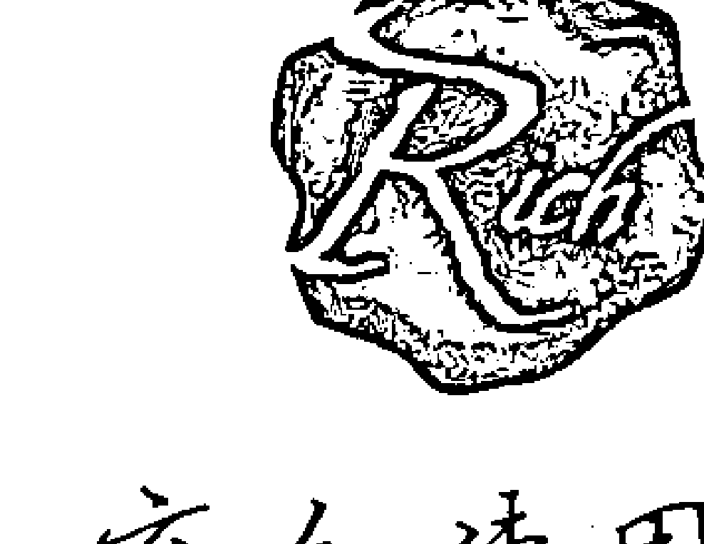

### 第十章 充分使用你的意志力

如果你一直将注意力放在贫穷上，你的脑海中就不可能形成清晰真切的关于财富的图景，无论那些贫穷是客观存在的还是你想象出来的。

即使你曾经遭受过经济上的困扰，你也不要将它挂在嘴边，而是最好将它忘掉。也不要提起你父母的贫穷或你早年的艰苦生活，因为无论谈论它们中的哪件事，你都是在将自己归入穷人的行列，并不利于你去获取你想要的事物。明智的做法，是将贫穷以及与贫穷有关的事物都统统抛于脑后。

你已经接受了一个被宇宙证实了的真理，并将所有希望都寄托于它了，再去关注那些与此相悖的理论，又有什么好处呢？

不要读那些宣扬世界末日论的书，不要读那些揭发别人丑事的作品和那些悲观哲学家的书，他们只会告诉你世界是被魔鬼掌控的。世界不是被魔鬼掌控的，它在上帝的庇佑之下。

没错，人生在世，不如意的时候很多，但刨根问底地探究那些不如意的事情又有什么意义呢？不停地回味那些不如意的事，只会使那些事更长久地困扰我们，何不让它们随时间地飘逝而消失呢？

不管某些国家、地区或地方的条件多么恶劣，将注意力放在它们身上，你就是在浪费自己的时间和葬送自己宝贵的机遇。

你应该将自己的兴趣吸引到如何致富上。

想象一下，世界的富裕安康正取代着贫瘠悲惨，而你加速这种革命性的进程的唯一方法就是让自己变得富有，通过创造的方法，而不是竞争。

你应将全部注意力都放在财富上，而不是盯着贫穷不放。当你提及那些穷人时，要相信他们可以变得富裕，他们应该被祝贺而不是被怜悯。只有这样，他们才能得到鼓舞，去努力寻求摆脱贫穷的出路。

尽管我要你们将所有的时间和心思都放在财富上，但这并不是在怂恿你们为了财富而不择手段和吝啬成癖。

变得真正富有才是你一生中最崇高的目标，因为它涵盖了生活的各个方面。

在竞争的层面上，致富是一种弱肉强食的可怕斗争。但如果我们用创造的理念来致富，那将是完全不同的图景。在伟大与崇高的事业上，一切皆有可能。在致富的道路上，充分利用各种事物，就能使所有的可能性得以实现。你将发现没有什么目标比致富更伟大和崇高了。你必须时刻注意你脑海中致富的图景，及时排除所有可能使你的致富图景昏暗的因素。

很多人之所以会一直生活在困顿中，就是因为忽视了这样一个事实：他们的财富一直在等着他们。教导他们的最好方法，就是通过你自己的实践向他们展示致富之路。

还有一部分人是因懒惰而贫穷。尽管这部分人相信存在着一条走出贫穷的路，但他们却懒得花必要的精力去寻找并穿过它。对于这些人来说，你能为他们做的最大贡献，就是通过向他们展示合法财富带给你的快乐，唤起他们对财富的渴望。

剩下那部分人之所以会贫困，并不是因为他们懒惰或忽视财富的存在，他们贫困是因为他们虽然知道很多致富的学问，但却深陷各种致富学说的迷宫，无法做出正确的选择。他们尝试着将各种致富学说混合起来，以期扬长避短、趋利避害，然而最后的结果只能是一事无成。对于这种人，你能为他们做的，就是通过自己的致富实践向他们展示正确的致富之路。正所谓事实胜于雄辩，对他们来说，你的成功实践比任何学说都有说服力。

你能为这世界做的最大贡献，就是最大限度地发展你自己。

没有什么比致富更能为上帝和人类服务了，当然，致富的方法必须是创造，而不是竞争。

另外，本部分提出了许多致富学问的详细法则，如果它们都是正确的，那么你就没有必要去读其他的有关致富的书了。这种说法听起来很自私狭隘，但不妨这样考虑一下：数学中的科学计算方法无外乎加、减、乘、除，除此之外别无他法。两点之间只有一条线是最短的。以此类推，只有一种思考方式是科学的，也就是能够引导你以最短最简单的途径到达目的地的方式。到目前为止，还没有谁提出比这本书更简明扼要的致富学说，因为它已经是去除糟粕后留下的精髓了。

随身携带这本书，养成每天阅读的习惯，使它所讲的内容渗透到你大脑的深处，并剔除其他一切学说和理论。否则，你会产生怀疑，模糊和动摇你的信念，最终一事无成。在你成功致富之后，你就可以随心所欲地学习其他理论体系了。

同时，阅读世界新闻时，只挑那些最乐观的读，这样才能与你脑海中的积极图景相协调。不要涉猎神智学、唯心论或类似的研究。也许人死后灵魂仍然活着，并生活在我们周围，但不要理它们，专注于你自己的事业才是明智的选择。

无论死人的灵魂在哪，它们都有自己要做的工作，我们没有权利干涉它们。我们没有能力帮助它们，它们有没有能力帮助我们也是值得怀疑的，或者说，即使它们能帮助我们，我们又有什么权利要求它们帮忙呢？也不要去理会什么前世、后世的，将注意力集中在解决你今世的问题上：致富。如果你硬要将自己与那些幽灵混在一起，你的精神必将错乱，你的人生之船也必将搁浅。

以下是前面论述过的几个基本事实：

世界上存在着这么一种有智慧的物质，它是万物之母。当它处在原始状态时，能够渗透、弥漫和充斥于整个宇宙。

该物质的任何一个意念，都可以根据意念中的形象创造出物质实体。

人们可以在意念中描绘事物，并将自己的意念传达给无形物质，就能够把他们想象中的物质创造出来。

为了做到这一点，人们必须将竞争思维转化为创造思维。他们必须在脑海中描绘出渴望得到的事物的清晰图景，使这图景渗透进他们的意念中，并始终怀有必得的决心和坚定不移的信念。同时，将所有可能动摇你的决心、模糊你的图景或质疑你的信念的想法统统赶出去。

除此之外，他们还必须按照某种特定的方式行事。

## 秘密背后的秘密 | The Secret Behind the Secret

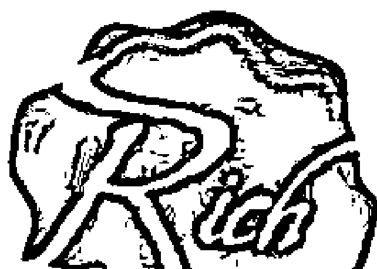

### 第十一章 以某种特定的方式行事

信念就是创造力，或推动创造力运作的原动力。以某种特定的方式思考你就可以获得财富，但你不能只依赖于意念，而忽视了行动。许多出色的思想家都因撞到了这块致命的岩石——信念与行动的脱节，而断送了成功。

人类的发展还没有进入发达阶段，即使存在这样一个发达阶段，也就是说在没有自然进化和人工操作的情况下，人们可以直接从无形物质中创造出想要的东西，人们也不能只依赖于意念，必须让行动作为他们意念的补充。

借助信念，你可以吸引山中的金子，但金子并不能自行开采，自行提炼，自行铸成金币，自行寻找通往你口袋的路，然后滚滚向你涌去。

在至高无上的能量的驱使下，人们都各司其职，井然有序的为你服务着：有些人将会被指引着为你开采金子，有些人的商业交易就是为了将金子送到你身边。你必须为此做好准备，等金子来到你身边时可以及时地抓住它。你的信念使所有物质，无论是有生命的还是无生命的，都行动起来，将你想要的东西带到你身边，而你个人应该做的就是及时地抓住它，当它出现在你身边时。你既不是在接受别人的施舍，也不是在偷窃，但你应该给你的每位顾客以超值的使用价值。

所谓科学地运用意念，包括以下几个方面：在脑海中描绘出你想要的事物的清晰意象，坚定得到想要的事物的决心，并运用感恩的信念确信你一定可以得到你想要的事物。

千万不要试图以任何歪门邪道的方式驱使你的意念，也不要期待有什么灵异之物出来帮你实现你的梦想。那都是徒劳而已，而且还会削弱你合理思维的能力。

我们在前面章节中已经全面论述了意念的作用：你的信念和决心会将你脑海中的图景传递给无形物质，无形物质收到你的图景后，就会驱使所有的创造力在它们的轨道上运作，而运作的方向都是指向你的。

关注或监视整个创造流程并不是你的职责，所有你能做的就是：时刻拥有你的图景，坚定你的决心，坚守信念和心怀感恩。

但你必须以某种特定的方式行事，当事物到来时，你才能辨别出它是不是你想要的事物，也才能遇见你脑海中的事物并将它放到适合它的地方。

你能够在生活中见证这个真理。当事物来到你身边时，它们往往是在别人的手中，你需要与他们进行等价交换才可得到它们。而且，你只有满足对方的渴求，才能得到自己想要的东西。

你的钱袋是不可能变成福尔图纳塔的钱包的，也就是说你不可能毫不费力的得到你的财富。

这是致富学问的要点所在——意念和行动必须适时地结合在一起。有许多人有意识或无意识地凭自己对事物的渴望，来驱动创造力，但结果却是仍旧贫穷，这是因为当他们想要的事物到来时，他们没有做好接收的准备。

你的意念将你想要的事物带到你身边，而你的行动使你能够收到它们。

无论你采取怎样的行动，很确切的是，你必须现在就采取行动。你不可能行动在过去，所以将你脑海中有关过去的图景清理干净吧；你也不可能行动在未来，因为未来还不存在。在未来的场景出现之前，你也不能预测你将在未来的场景中如何地行动。

不要以自己不在合适的行业或环境为借口，就推迟自己的行动。也不要一门心思地考虑如何应对未来的突发事件，要对自己的能力有信心，当事情发生时，你绝对可以应对自如。

如果你行动在现在却想着未来，你的注意力就是分散的，你行动的效率就不可能高。

要把你全部的心思都放在你正在做的事情上。

不要将自己的创造力完全托付于无形物质，然后守株待兔。如果你那么做了，你将一无所获。现在就行动起来，时不我待，没有比现在更好的时机了。当事物到来时，如果你希望自己是准备充分的，那你现在就该行动起来了。

无论你的行动是什么，都必须符合你现在的事业或职业，都必须与你身边的人或事有关。

你不可能行动于你不在场的地方，你不可能行动于过去，你也不可能行动于未来，你只能行动于此时此地。

不要在乎昨天做得好还是不好，做好今天的最重要。

不要急于今天做明天的事，等事情到来时，你会有充足的时间做的。

不要企图借用灵异手段，去完成你不可能完成的事或对付你对付不了的人。

在你采取行动之前，不要期待环境的改变。用你的行动改变你周围的环境。

你可以以这样的心态去努力改变你现在的境况：采取行动，你便可以进入更好的环境。

你可以怀着信念和决心憧憬美好的未来，但一定要全心全力地行动在当下。

不要将时间浪费在做白日梦或建空中楼阁上，守住一个你渴望的图景，然后马上行动。

不要想方设法去做那些新奇怪异的事情，作为你通向致富的第一步。虽然你以前的行动可能没获取成功，但当你以特定的方式行事后，你就可能因此而致富。

如果你正从事某项工作，但感觉这项工作并不适合你，那也不要等到找到合适的工作后再采取行动。

不要因站错了舞台而一蹶不振或哀声连连，没有谁会因错选了一次就不可重新来过，也没有谁会因一时选错了行业就必须将错误进行到底，每个人都有重新选择的机会，你一样可以因改变而成功。

你可以在脑海中描绘你得到理想事业时的情境，并怀有必得的决心，以及坚定自己能够得到或即将达到的信念，但一定要在现在的岗位上努力。使你现在的工作成为你获得更好的工作的资本，让你现在的处境成为你获得更好处境的渠道。如果你怀着决心和信念去憧憬你未来的事业，至高无上的能量就会驱使它向你移动。如果你以某种特定的方式采取行动，你的行动将会把你带向你理想的事业。

如果你是一个普通员工，想要通过更换工作得到你想要的东西，你就不能只将你的意念散发到宇宙中，然后守株待兔地等着你的新工作自动送上门，否则你将注定竹篮打水一场空。

## 秘密背后的的秘密 | The Secret Behind the Secret

对理想的事业充满憧憬，并怀着决心和信念在当前的工作中努力，你一定可以实现你的理想。

你的憧憬和信念能够唤醒创造性的力量，将你想要的东西带到你身边；你的行动将驱动你所在环境中的能量，将你带到你想去的地方。在本章的结尾，我们将在我们的大纲中加入另一个声明：

世界上存在着这么一种有智慧的物质，它是万物之母。当它处在原始状态时，能够渗透、弥漫和充斥于整个宇宙。

该物质的任何一个意念，都可以根据意念中的形象创造出物质实体。

人们可以在意念中描绘事物，并将自己的意念传达给无形物质，就能够把他们想象中的物质创造出来。

为了做到这一点，人们必须将竞争思维转化为创造思维。他们必须在脑海中描绘出渴望得到的事物的清晰图景，使这图景渗透进他们的意念中，并始终怀有必得的决心和坚定不移的信念。同时，将所有可能动摇你的决心、模糊你的图景或质疑你的信念的想法统统赶出去。

当事物来临时，为了及时抓住我们想要的，我们必须从现在就开始，在当前的环境中，对我们周围的人和事采取行动。

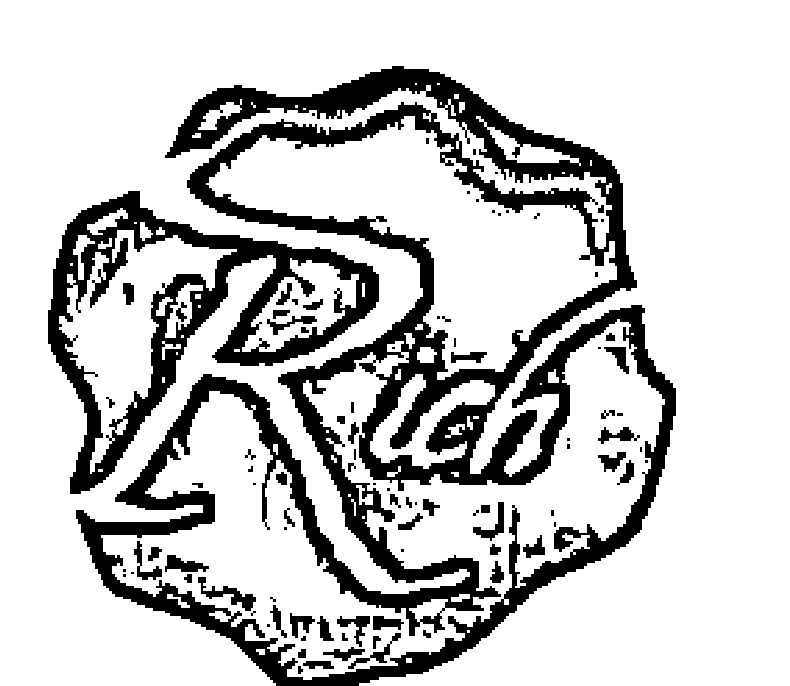

### 第十二章 提高做事的效率

无论你身在何方，你都必须以前几章中描述过的意念为向导，着手改变你能改变的事情，而且要改变所有你能改变的事情。

你只有超越现状才能获得提升，但没有人可以在不努力改变现状的情况下超越现状。

正是因为有那些不安于现状的人存在，世界才得以发展。

如果没有人能够适应自己的现状，那么世界必将倒退。那些不能适应现状的人是整个社会、国家、团体和企业的严重负担，其他人必须花很大的代价才能带着他们一同进步。整个社会也因他们的存在而步履维艰，进步缓慢。他们属于史前时代，如果想继续存在就必须马上变异。如果每个人都落后于他生存的环境，社会是不可能得到发展的。社会的发展是人类肉体进化和精神进化的必然结果。

在动物的世界中，进化源于对生命的超越。当一个物种拥有了其目前机能无法展现的潜能时，就会产生新的更高级的器官，一个新的物种也就产生了。

没有不适应所处环境的物种的存在，就可能有新物种的产生。这项法则同样适用于你：你能致富是因为你将这个法则运用到了你所从事的事情上。

## 秘密背后的秘密 | The Secret Behind the Secret

时间本身没有成败之分，如果今天你得到了想要的事物，那么今天就是成功的一天，否则就是失败的一天。如果每天都是失败的一天，你就不可能致富。同样，如果每天都是成功的一天，你就不可能遭遇贫穷。

今天该做的事如果你没做，就这件事而言，你就是失败的，而且后果可能超出你的想象。

你不可能预知行动的结果，即使是最微小的行动。你也无法知道那无形力量为实现你的愿望到底做了什么。很多时候，这力量是否起作用，要看你是否采取了某些简单的行动，而这往往就是你打开机会之门的最关键因素。你不可能知道上天为你做了什么安排，也不可能将世间所有事物的联系都弄得清清楚楚，所以忽视任何一件小事，都可能大大延误你得到你想要的事物的时间。

今天的事情，今天完成。

当然，你每天能完成的事情是有限的。

你不应该让自己过度疲劳，也不应该盲目蛮干，企图以最短的时间做最多的事情。

你不必今天急着做明天的事，或把一周的工作拼命一天做完。事实上，关键不是你做了多少事，而是你做每一件事时的效率。

行动本身没有成败之分。行动只有高效与低效之分。

每一个低效的行动都是失败，而如果你一辈子的行动都很低效，那么你这辈子就是一个失败。而且事情做得越多，对你越不利。

与之相反，每一个高效行动本身都是一个成功，如果你生命中的每一个行动都是高效的，那么你的一生就是成功的。

失败的原因，就是做了太多低效的事，而高效的事做得太少。

你会发现这样一个不言自明的真理：如果你没有做任何低效率的事，## 第十二章 提高做事的效率 | The Science of Getting Rich

而做了足够多的高效率的事，那么你一定会变得富有。从现在开始，如果你能使自己的每一个行动都非常高效，你会发现致富将是必然的结果，而且它们之间就像数学计算一样精密准确。

事情的关键就在于，你能否确保自己的每一个行动都是高效的。事实上，你当然可以。你可以使每个行动都圆满成功，因为所有的能量都在与你一起行动，而它们是不可能失败的。

所有的能量都是为你服务的，你只要将它们注入你的行动，你的行动就可以变得高效。

行动有强势与弱势之分，当你生命中的每个行动都是强势时，你就是在以某种可以致富的方式做事。

每个行动都可以变得强势和高效，只要你在做事时，脑海中时刻描绘着理想的图景，并将你信念与决心的力量都注入你的行动中。

事情的关键就在于此，而将个人的行动与精神的力量分离开的人是注定要失败的。做事时的三心二意最终导致了行动的失败。但是，如果将能量都注入进你采取的每一个行动，无论这个行动多么得平凡，它都将成为一次成功的行动。成功的道路都是相同的，当你朝你的目标前进时，你的目标也会朝你走来，这样，成功的速度将会加倍。

要知道成功的行动是可以累积的，到达一定量后就会引起质的改变。追求完美是所有生物的渴望，当一个人开始朝着更完美的方向移动时，许多美好的事物就会自动朝他走来，他的渴望的影响力就会加倍。

当天的事当天完成，并以高效的方式做每一件事。

需要声明的是，我所说的必须怀着梦想采取行动，并不是要求你在行动时也要注意梦想中的每个细节。你应该在业余时间发挥你的想象力，去努力丰富你的图景，并不断地思考补充直至它们完全烙印在了你的记忆里。如果你想加速结果的出现，你就应该投入你全部的业余时间来做上述练习。

通过夜以继日地思考补充，你将会描绘出理想的图景，包括其中最微不足道的细节，然后把它们铭记于心，并完全传递给无形物质。在你工作时，只要想象一下理想的图景，就足以激发你所有的决心和信念，从而使你的潜能得到最大的发挥。

在业余时间不停地想着你理想中的图景，直到使它成为你意识中的一部分，随时随处都可以见到它。通过你的意念，你可以激发出你最大的潜力，每时每刻都保持充沛的精力。

让我们来重新回顾一下我们的致富要点，并根据我们的进度，对我们的结尾做一下修改：

世界上存在着这么一种有智慧的物质，它是万物之母。当它处在原始状态时，能够渗透、弥漫和充斥于整个宇宙。

该物质的任何一个意念，都可以根据意念中的形象创造出物质实体。

人们可以在意念中描绘事物，并将自己的意念传达给无形物质，就能够把他们想象中的物质创造出来。

为了做到这一点，人们必须将竞争思维转化为创造思维。他们必须在脑海中描绘出渴望得到的事物的清晰图景，并怀着信念和决心，以快捷高效的方式，完成他每天应完成的工作。

### 秘密背后的秘密 | The Secret Behind the Secret

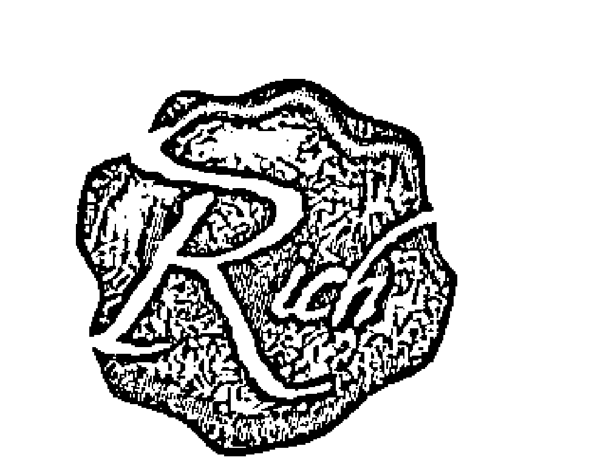

### 第十三章 从事适合自己的行业

无论你从事什么行业，成功都有一个必备的要素，那就是擅长你所从事的行业。

没有过硬的音乐技能就不可能成为优秀的音乐教师，没有良好的机械技能就不可能在任何机械行业中获得成功，没有过人的智慧和经商能力就不可能在商业竞争中取胜。没有出色的职业技能就不可能致富，但有了出色的职业技能也不一定就能致富。有些音乐家非常具有音乐天赋，但却潦倒不堪；有些铁匠、木匠也非常具有机械才能，但最终也没能致富；有些商人非常善于处理人际关系，但他们的事业却还是难逃失败。

各种职业技能都只是工具，要想致富，出色的职业技能固然必不可少，但正确地使用它们也一样重要。有的人靠一把锋利的锯子，一支曲尺和一个好的刨子，就能制作出精致美观的家具。而有的人用同样的工具去做同一件家具时，他做出的家具却只能作为废品扔掉。原因就在于后者不知道运用这些工具的技巧。

你大脑中存储的各种技能就是你的工具，有了它们你就可以从事那些足以让你致富的事业了。所以一旦你进入了你非常擅长的行业，致富就变得容易多了。

通常情况下，你哪方面的技能最强，你就最有可能在哪方面获得成功。而那个你最擅长的技能往往又是你与生俱来的。当然，这种说法本身也有其局限性。人们不必因自己的天赋而限制自己从事的行业。

人们可以通过任何行业致富，因为即使你没有某一行业必需的那种天赋，你也可以通过不懈地努力培养出来。这就意味着你应该根据需要不断地制造自己的工具，而不是受制于你的天赋。对每个人来说，从事自己天生就擅长的行业当然更容易获得成功，但是从事其他行业你一样也可以获得成功，因为每种才能在你的脑海里都有最原始的萌芽，你只要努力培养它们，它们就可以成为你的特长。

如果你从事自己最擅长的行业，你当然最容易致富，但如果你从事自己最喜欢的行业，你的致富将伴有最大的满足感。

能够做自己喜欢做的事，才算真正的生活。如果我们一直被迫做那些我们不喜欢做的事，而始终不能做我们喜欢做的事，那么我们永远不可能享受到活着的满足感。然而，每个人都有权利做他喜欢做的事。如果你对某件事怀有强烈的渴望，这就证明你有能力完成它。

渴望是能力的一种表现形式。

有演奏音乐的渴望，就是你的演奏能力在寻求表现和提高；有发明机械设备的渴望，就是你的机械才能在寻找表现和提高。

对于那些你没有能力做的事情，无论你这方面的才能得没得到发展，你都不会产生完成它们的渴望。而如果你有强烈的渴望去做一件事情，这就证明你有足够强的潜在能力去完成它，此时，你需要做的就是发展这种能力并以正确的方式运用它。

在其他条件都一样的情况下，选择自己最擅长的行业无疑是最明智的，但如果你对某一行业怀有强烈的渴望，你就应该义无反顾地选择那个行业，并作为自己一生的奋斗目标。

你可以做你喜欢做的事，从事能给你带来最大欢乐的行业或业余活动是你与生俱来的权利。没有人强求你做不喜欢做的事，除非只有通过它们你才可以做你喜欢做的事，否则你就没必要做它们。

如果以前的一个失误将你推向了你不喜欢的行业或环境，你或许不得不被迫做你不喜欢做的事，但你也要以一种愉快的心情去做它，因为它可能会将你带到你喜欢的领域。

如果你觉得自己入错了行，那也不要急着换工作或环境，要知道，最好的跳槽方式是使自己得到升迁。经过慎重地思考后，如果你仍觉得改变给你带来了绝好的机遇，那就不要畏惧那些突如其来的巨变。但当你还在犹豫不决时，不采取重大而突然的行动才是明智之举。

在创造的层面上，不存在迫在眉睫或迫不及待的事情，也不缺少机遇。

当摆脱了竞争思维后，你会发现你根本不需要行色匆匆。没有人会跟你争夺你想得到的东西，无形物质对所有人的供给都是充足的。如果你的晋升空间被别人占用了，那么稍后无形物质会为你打开一个更好的，这只是时间的问题，而我们有很多的时间。当你心怀疑虑时，你不妨稍等一会，重新审视自己的梦想，并作出更慎密的思考，同时增加自己的信念和决心。但不管怎么样，即使是在心生疑虑或犹豫不决时，也要心怀感恩。

花一两天的时间，好好想想自己的理想，确定自己到底想要什么，并真诚地感谢你将实现它们。这将拉近你与至高无上的力量的距离，使你在行动中不会犯错。

无形物质是无所不知的，只要你心存深深的感激，你就可以通过信念和决心与它合而为一，从而使自己的生命得到提升。

导致犯错的原因很多，或者是因为急功近利，或者是因为在恐惧与怀疑中盲目采取了行动，亦或者因为缺乏正确的动机，正确的动机能够使生命趋于完美，而于万物无害。

### 秘密背后的秘密 | The Secret Behind the Secret

当你以某种特定的方式行事时，你的机遇就会增多，你就更需要保持信念和决心，并通过虔诚的感恩之心将自己与那至高无上的力量联系在一起。

每天都以完美的方式做所有你能做的事，但要摒弃心急、担忧和恐惧。同时，要注重做事的效率，争取以自己最快的速度完成自己应该完成的事，但千万不可急功近利。

切记，一旦你急功近利，你就会由一个积极的创造者退化为一个消极的竞争者，你也将再次掉进那原来的怪圈。

无论什么时候发现自己在急功近利，你都应该及时地对自己喊停。将你的注意力固定在你的理想上，并以一颗感恩的心感谢你正在实现它。常怀感恩之心，会坚固你的信念和坚定你的决心。

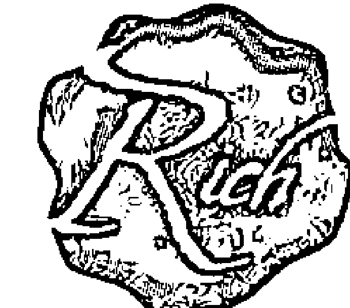

### 第十四章 积极进取的印象

无论你是否想改行，你当前的行动都必须符合你当前的工作。
通过创造性地利用你现在从事的行业，你就可能进入你喜欢的行业，前提是你必须每天都以某种特定的方式行事。

只要你的行业需要与人打交道，无论通过书信还是面对面，你所有努力的关键就在于将你积极进取的印象传达给对方。

积极进取是所有人都渴望的状态，它是存在于人们身体中的智慧无形体在寻求更完满的表达。

渴望进取或提升是所有生物的天性，也是宇宙最基本的动力。人类所有的活动都是基于对进取或提升的渴望。人们努力寻求更多的食物和衣服，更舒适的居所，更多奢侈品，更多美丽，更多知识，更多欢乐——这些都是在提升生命本身。

所有生物为了不断进化都会有提升生命的需求，而且一旦提升停止，死亡和崩溃就会马上出现。

人类天生就明白这个道理，因此总是寻求更多。这个永久提升的法则是耶稣在智慧寓言中提出的：凡有的还要加给他，使他有余；没有的，连他所有的都夺过来。

渴望增加财富并不是什么罪恶或令人不齿的事，它只是渴望更丰富生活中的一个部分，是值得赞赏的行为。
因为这是源自生命最深处的本性，而那些能够为人们提供更多生活意义的人，总是能够吸引人们的注意力。

如果依本部分前几章中指出的法则行事，你的生命将得到不断地提升，同时也会使与你接触的人得到鼓舞。

你就是一个富有创造性的中心，进取和提升会从你这里辐射到各个地方。

请确信这一点，并将这个事实传达给那些你接触过的人，无论男女老少。无论多么微小的交易，即使仅仅是卖给小孩子一个棒棒糖，你也要将这种提升的信念蕴藏其中，并确保这种信念能给顾客留下深刻的印象。

如果你在做每件事时都传达出了积极进取的印象，那么所有人都会收到这样的印象：你是一个积极进取、奋发向上的人。与此同时，你的积极进取也会感染那些与你接触过的人。即使是在社交场合遇到的那些人——没有任何生意往来，你也不打算向他推销你的产品的人——你都应该向他们传达出积极进取的信念。

传达这种印象的方式很多，你可以通过自身坚守这不可动摇的积极进取的信念来传达，也可以通过让这种信念渗透到你的每个行动中来感染那些与你接触过的人。

无论做什么事，你都应该有一个坚定的信念：你是一个积极进取的人，而且你会将这种积极进取的态度传达给每一个人。

要让自己感觉到自己正慢慢变得富有，并以自己的富有来使更多人摆脱贫困，使万物受益。

不要吹嘘和炫耀自己的成功，也不要对它做不必要的谈论。真正的信念是不需要吹嘘炫耀的。

一个喜欢自我炫耀的人，在他内心深处往往隐藏着疑虑和恐惧。只怀有信念，并让它在每次交易中得以体现。让你的每一个行动，每一句话，每一个表情，都作为你正在致富或已经致富的隐形证明。你无须用语言来向别人描述这种奇妙的感受，他们会从你身上嗅到积极进取不断提升的味道，而再次被你吸引。

你必须向你接触过的人传达这么一个讯息：只要与你并肩同行，他们就会使自己得到进取和提升。让他们看到你给他们的使用价值绝对超过你从他们身上获得的货币价值。

心怀真诚而自豪地将这一切付诸行动，并让每个人都看在眼里，告诉他们你永远都不缺少客源。人们会去能够带给他们积极进取和不断提升的精神状态的地方，而至高无上的无形物质希望每一个人都得到提升，它也了解每一个人，它会引导那些不认识你的人来到你身边。你的生意将因此快速发展，你将会出乎意料地得到令你惊奇的利润。你的事业将会一天天地壮大，你的机遇将会增多，而且如果你愿意，你将会进入一个令你更满意的行业。

但在做这些事情的同时，你不应该忘记你的理想，也不应该削弱你实现理想的信念和决心。

请让我对你的动机提出一个小小的忠告：对你企图控制别人的卑劣欲望时刻保持警惕！

对未定型或未发展成熟的心智而言，没有什么比操控他人更能获得快乐。为满足一己的私欲而渴望征服他人，早已成为对世界的诅咒。历朝历代的君主为了扩展自己的领土，在他们发动的战争中，人们的鲜血早已浸染了每一寸土地——不是为了人类有更完美的生命，而是为了扩展自己的权力。

### 秘密背后的秘密 | The Secret Behind the Secret

在当今的商业社会中，类似的动机依然存在：一部分人率领着他们的金钱大军，为满足自己的控制欲，以同样残忍的方式残酷地践踏着他人的生命和灵魂。商业上的霸主和政治上的君主一样，都受着权力欲望的驱使。

要时刻警惕追逐权力的企图——成为统治者，成为权贵阶层，炫耀自己的极度奢华等等。这种试图统治别人的心态实际上就是竞争思维，而竞争思维是完全不同于创造思维的。如果你是为了主宰自己所处的环境和自己的命运，那你根本不需要去统治你的同胞。事实上，当你为了更高的权力而陷入这勾心斗角的世界中时，你就已经被你的命运征服了，你的致富也就只能靠碰运气或投机取巧了。

小心你的竞争思维！在这个时代，没有谁对创造性行动的诠释比前托利多市长詹斯先生诠释得更好了，他的“黄金法则”这样表述：我想得到的一切，我也会让其他人得到。

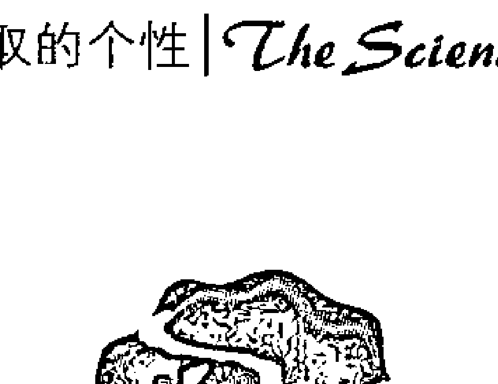

### 第十五章 积极进取的个性

我在前一章中讲到的内容，适用于一切行业和个人，无论你是专业人士还是上班族，或者是从事销售行业的人及其他商业形式的人。

无论你是一名医生、老师还是神职人员，只要你可以提升他人的生命，你就对他们有巨大的吸引力，你也将因此而致富。如果一个医生始终怀有成为伟大和成功的医学家的梦想，他就会坚定自己的信念和决心，全力以赴地朝着自己的梦想前进。就如同我在前几章中提到的那样，他会因接近生命的本源而获得非凡的成就，而那些病人自然会慕名来访的。

没有什么行业比医生更有机会去实践本部分阐述的内容，而这与医疗人员出于哪所学校没有关系，因为所有医疗人员的治疗初衷都是一样的。一个拥有进取心的医疗人员，如果能坚守自己的理想，并遵循信念、决心和心怀感激的法则，他就会想尽一切办法排除万难，不惜一切代价地拯救所有患者。

在宗教领域，人们也热切地盼望牧师能够传授给他们致富的学问。如果有人同时精通致富的学问，获得健康的学问，成就事业的学问，追求真爱的学问，并愿意将这些学问公之于众，那他将永远不会缺少信徒。因为全世界都在渴望这样的福音，只要能提升他们的生命，人们就会欣然接受，并愿意给予传授他们这些知识的人以最大的支持。

我们现在需要做的就是为这些提升生命的学问寻找证据。我们不仅需要一个能够告诉我们如何获得美好事物的导师，也希望他能够通过自身的成功向我们证明。如果一个人本身就拥有财富、健康、成功和爱，那他的话才更具有说服力。这样的人一旦出现，就会拥有大批忠诚的信徒。

这个道理同样适用于教师。如果他能用提升生命的信念和决心激励学生，他就永远不会失职。而且，只要他们有这样的信念和决心，他们就可以传达给学生，并且是情不自禁地要去传达。

适用于医生、神职人员和教师的真理，一样适用于律师、牙医、房地产经纪人和保险代理人——所有人。

正如我前面描述的那样，精神与行动的结合是准确无误的，它们永远不会失败。无论是谁，只要能一如既往地按照本书指导的方式去做，就一定能够致富。因为提升生命的法则和万有引力定律一样得精密准确。致富也是一门精密的科学。

上班族会发现这些法则一样适用于他们。不要因为工作上没有晋升的机会，生活成本高而收入低等原因，就悲观地认为自己与财富无缘。在脑海中描绘出清晰的愿景，并怀着坚定的信念和决心采取行动吧，致富的机会对每个人来说都是均等的。

以完美的通向成功的方式做好每一件事，以高效能的方式完成你每天可以完成的事。将成功的动力与致富的决心灌注到你做的每一件事情中。

但这么做的动机不要仅仅是为了巴结你的上司，也不要妄想你的上司或主管会发现这些，并因此提拔你。他们不大可能会这么做。

一个尽忠职守、老实本分和愿意全力以赴工作的员工，对他的老板而言是最有雇佣价值的。对这种员工，老板往往不乐意提拔他们，因为他们在现在的岗位上是最能发挥价值的。

要想获得提升，除了胜任自己的工作，你还有很多其他事情要做。

一个注定会被晋升的人必须具备以下素质：有超出他现在的工作需要的能力，有确切的奋斗目标，有足够的自信，有实现理想的决心。

不要为了讨好你的上司才努力工作，你不是一个奴隶，不需要主人的垂怜。要为提升自我而努力工作，并时刻怀有提升自我的信念和决心。让每个与你接触过的人——不管上司、下属、同事还是朋友，都能感受到你奋发向上和积极进取的魅力。人们将会因此被你深深地吸引住，即使在你现在的岗位上得不到提升，你也会很快发现另一个工作机会。

世界上存在着一种力量，它会为每一个按规则行事的积极进取的人提供晋升的机遇，而且从未失败过。如果你能按特定的方式行事，上帝都会情不自禁地帮你。为了帮他自己，他也会这么做的。

没有任何环境或行业会使你沉落，如果你不能在钢铁行业致富，你的财富也许就在十英亩的农场里。而且，当你开始以某种特定的方式行事时，你就是在远离你的钢铁行业，而进入你的农场或其他你想进入的行业。

如果钢铁公司的所有员工都能按某种特定的方式行事，那么钢铁行业很快就会陷入低迷状态。他们将不得不给他们的员工以更多提升的机会，否则整个钢铁行业就有可能倒闭。没有人必须到工厂做工，工厂只是为那些自认为没有致富希望的人开设的，因为这些人不是不知道致富的学问，就是太懒惰而不愿意去实践这门学问。

一旦按这种法则思考问题和采取行动，你的信念和决心将会引导你迅速发现能改变你的现状的所有机遇。而且这种机遇会很快地到来，因为至高无上的无形物质存在于一切物质中，并愿意为你工作，将那些机遇带到你身边。

### 秘密背后的秘密 | The Secret Behind the Secret

不要期待每个机遇都如你想象的那样。当有比你现状更好的机遇出现时，就要主动抓住它，因为它是通往更好更大的机遇的第一步。

对那些追求上进的人来说，这个世界上不存在缺少机遇的情况。

宇宙的规律就是，只要一个人按照某种特定的方式思考和行事，整个世界都会为他让路，他注定能致富。所以，辛勤劳作的工薪阶层们，认真阅读本书并信心十足地按照它的指引做吧，它一定可以引导你走向富裕。

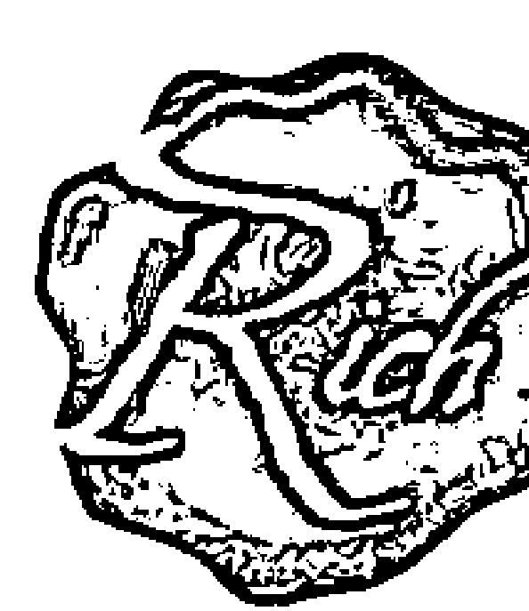

### 第十六章 一些忠告及结语

许多人否认致富是一门高深的学问，他们认为财富的供应是有限的，并坚持更换社会体系和政府机构，认为只有这样才能使大多数人获得应有的权利。

但事实并非如此。

现在的政府确实使大批的百姓身处穷困潦倒中，但造成这种局面的根本原因不在于政府的执政，而在于那些人不知道按某种特定的方式思考问题和采取行动。

如果那些群众能够按照本书给出的建议行事，就没有哪个政府或工业体系能剥削压榨得了他们，而且，所有的体系也会被修改，以适应人们的行动方式。

如果人们有积极进取的精神，变得富有的信念，实现致富的决心和持之以恒的努力，就没有什么可以使他们陷于贫困。

无论在任何时间或任何政府的统治下，总有一部分人能够坚持以某种特定的方式行事，并最终圆了自己的致富梦。当这部分人的队伍发展壮大到一定程度的时候，他们就能够将社会体系改造以有利于整个社会，致富之路的大门也会向更多人打开。

越多人在竞争的层面上致富，形势对其他人就越不利。与之相反，越多人在创造的层面上致富，就越有利于其他人的发展。

只有绝大部分的人按照本书指出的科学的方式行事并致富了，才能将人民大众从贫困中拯救出来。因为只有使一部分人先富起来，才能向其他人传授致富的方法，并激起他们对真正的生活的向往，坚固他们致富的信念，坚定他们成功的决心。

无论如何，现在到了该清醒的时候了，要知道没有哪个政府体系或资本主义工业体系能够阻止你致富。当你的思维上升到创造层面时，你就超越了现实的物质基础和上层建筑，成为了另一个国度里的公民。

但要谨记，你的思维必须时刻保持在创造的层面，片刻也不要陷入供给缺失的假象，也不能让自己的行动涉足竞争层面。

一旦发现自己掉进了旧思维的陷阱，就要立刻将自己拯救出来。因为当你与竞争思维共事的时候，你就失去了与至高无上的创造性思维合作的机会。

不要费尽心机地为未来的突发事件做准备，这会干扰到你现在的行动。如何以完美的方式完成你现在的事情才是你应该关心的，至于那些未来的事情，当它们发生时，你会有足够的时间和能力解决它们的。

不要时刻想着如何避开事业上的绊脚石，除非你清晰地认识到它将阻碍你现在的发展，这时候再避开它也不迟。

无论远方出现的障碍多么巨大，只要你按某种特定的方式行事，你会发现当你接近它时，它就会自动消失，或者出现一条可以让你绕过它的路。

严格沿着科学路线致富的人，所有的逆境都会为他让路。遵循这些法则行事的人，就一定可以致富，就如同一乘以二等于二而不是四那样，是注定了的结果。

不要因那可能的灾难，障碍，恐慌，或不利而心急如焚，即使它们突然出现在你面前，你也会有足够的时间去处理它们，而且，你会发现解决方法总会伴着问题一起出现。

谨慎你的言行，不要以沮丧的口吻说自己、自己的事业或其他任何事。

决不言败，也不要以任何象征失败的口气说话。

不要说时机不好或前景堪忧之类的话，那些话只适用于在竞争层面的人，决不适用于你。因为你可以创造出你想要的东西，你生活在恐惧之上。

当别人处在困顿时期，事业一蹶不振时，你将发现你最大的商机。

训练自己的思维和眼光，将世界上一切美好的东西都看作是不断变化，不断成长的生命体，而将一切邪恶视为顽固老化的东西。始终坚持以积极进取奋发向上的方式说话，否则你就是在否认自己的信念。否认自己的信念，你就会失去它。

决不允许自己有失望的感觉。你也许会期待着在某时得到某样东西，但如果到了时间你没得到，这看似就是你的失败，可如果你仍能坚持自己的信念，你就会发现那失败仅仅是个表象，你会以其他方式得到的。

如果你继续以某种特定的方式行事，即使你没能得到你想要的东西，你也会得到一个与它一样好的，甚至更好的东西。实际上，你会发现失败的表象背后往往隐藏着巨大的成功。

本书的一个忠实信徒，曾在心里计划一个企业合并案。这个合并案是他当时极其想完成的工作，为此他辛勤筹划了好几个星期。当关键时刻来临时，方案却以一种始料不及的形式破产了。一切就像冥冥之中有什么东西与他作对一样，但他并没有因此而绝望。与之相反，他以一颗非常虔诚的心感谢上帝驳回了他未成熟的方案。数星期之后，一个绝好的机会就出现在了他面前。如果他将第一个方案坚持做完的话，他是不可能得到这个绝好的机会的。他真切地知道，是一个比他知道的更多的至高无上的无形物质破坏了他的第一个方案，为的是让他不错过这个更美好的机遇。

如果你能做到以下事情：怀有信念和决心，心怀感激，当天的事情当天完成，以完美的方式做每件事，你的每个失败的表象都会为你带来更好的机遇。

你的失败是因为你要求的不够多，不要灰心，继续追求你的梦想，一个更大更好的机遇将出现在你面前。记住这一点。

你不会因为缺乏实现梦想所必须的才能而失败。如果你继续按我指引的方向前行，你会培养出工作中所需要的所有才能。

虽然培养才能的学问不属于本书讲解的范围，但可以肯定的是它的过程和致富的过程一样有迹可循和简单易行。

不要在没到达目的地之前就犹豫不决，害怕自己到达目的地后会因缺少某种技能而失败。一切担心和恐惧都是不必要的，继续前进，当你到达目的地时，你所需的所有能力都会自动产生。同样的技能来源曾帮助过未受过教育的林肯孤身一人完成了美国的伟业，这个来源也在向你开放着。你可以将你的全部意念传递给智慧的无形物质，让它来帮你承担压在你肩上的重担，然后信心满满地继续前行。

学习本卷，使它成为你的终生伴侣，直到你掌握了其中提到的所有内容。当你越来越牢固地建立起这种信念时，你就会越来越自觉地放弃很多娱乐活动，并远离那些宣扬的观点与本书相悖的讲座和布道。不要阅读那些悲观的或与本书有冲突的书籍，更不要就此与别人发生争论。

将你的大部分时间用在构思你的愿景，培养你的感恩情怀和阅读本书上。本书涵盖了所有你应该知道的致富的学问，所有的重点也将在下一章中列出。

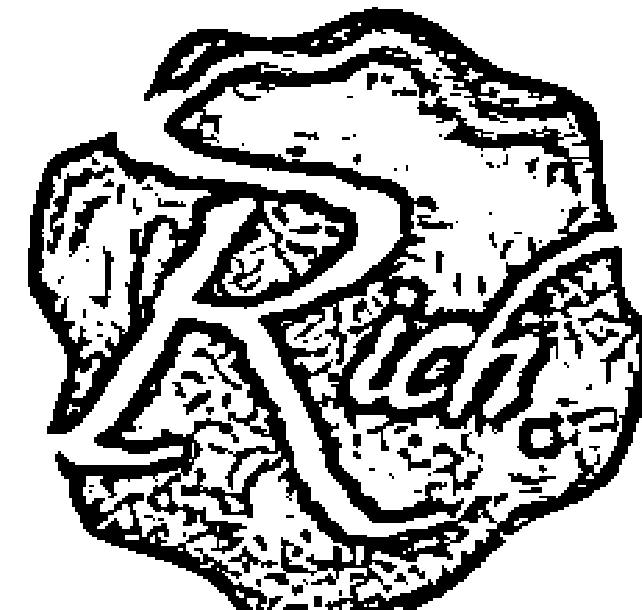

## 第十七章  致富学问的精髓

世界上存在着这么一种有智慧的物质，它是万物之母。当它处在原始状态时，能够渗透、弥漫和充斥于整个宇宙。

该物质的任何一个意念，都可以根据意念中的形象创造出物质实体。

人们可以在意念中描绘事物，并将自己的意念传达给无形物质，就能够把他们想象中的物质创造出来。

为了做到这一点，人们必须将竞争思维转化为创造思维。否则他们就不可能与智慧的无形物质和谐共存，因为智慧的无形物质只支持创造不参与竞争。

人们通过真诚地感激智慧的无形物质赋予他们的一切，就可以与它建立起完全和谐双赢的关系。正是因为感恩之心将人类的思维与智慧的无形物质联系在了一起，人们才可以将自己的意念传达给无形物质。人们只有以一颗深沉而持续的感恩之心将自己与无形物质联系在一起，才能使自己生活在创造的层面上。

人们必须将自己想要的事物，想做的事，想达到的成就，都清晰明确地描绘在脑海中，并时刻谨记，同时对至高无上的无形物质报以感激之情，感谢它满足你的所有渴望。一个人如果想致富，就必须花费大量的休息时间去描绘自己的愿景，并以最热烈的感激之情感谢它们即将变为现实。不要向你经常思考的重大愿景中掺杂太多的压力，坚定不移的信念和虔诚的感恩之心就足以把你的意念传达给无形物质并启动创造程序。

创造性的力量是通过已建立起来的渠道发挥作用的，这些渠道既包括自然界的生长规律，也包括工业和社会秩序。所有遵循上述给出的建议并怀有坚定不移的信念的人，他们的愿景必将会变为现实，他们想要的事物也都会通过已建立起来的商业和贸易渠道来到他们面前。

为了抓住属于自己的东西，人们必须以更高效的方式采取行动，并时刻牢记自己的致富目标，通过实现自己的愿景来实现自己的致富目标。他们还必须当天完成当天该做的事，并以完美的方式做每一件事。他们必须在收到顾客的货币价值的同时给出更多的使用价值，只有这样，每次交易才能使自己和他人的生活更加圆满。他们必须时刻怀有积极进取的心态，只有这样，积极进取的形象才会传达给每一个与他们接触过的人。

所有实践上述指示的人，无论男女，都必将致富。而且他们获得的财富的多少与下列条件成严格的正比：他们愿景的清晰程度，他们决心的坚定程度，他们信念的稳固程度，他们感激的深刻程度。

## 让吸引力法则完美运作，把美好的事物都吸引过来！

## The Master Key System
万能金钥：心想事成的24堂课

- 世界首富比尔·盖茨最初进入哈佛大学后，阅读本书并深受影响，决定休学以追寻梦想。
- 世界上最伟大的成功大师拿破仑·希尔，他把个人的所有成就，都归功于本书的内容。
- 美国硅谷的富翁们，几乎都曾研读过本书。

## The Science of Getting Rich
失落的致富法则

- 一部只要照着做就能发挥奇效的致富手册
- 一本蕴藏永恒智慧失落百年的旷世巨著
- 朗达·拜恩写就全球超级畅销书《秘密》的思想启发之作