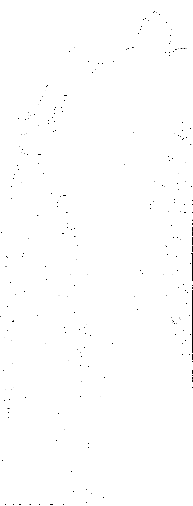
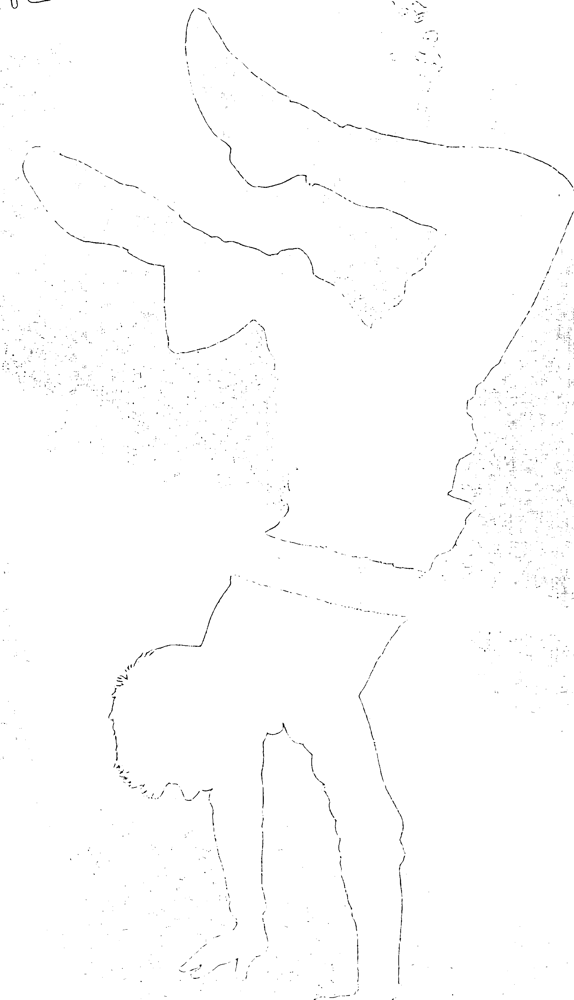

# 秘密青少年版
## 这个大秘密到底是什么？
## 它又能为你做些什么？

如果你曾有梦想，有不为人知的抱负，有热切渴望的目标，却不知如何实现——这本《秘密青少年版》正是为你而写。《秘密》让全世界数千万人知道如何实现梦想，改变生命，而你也做得到。

这个秘密带给你力量，让你成为任何你想成为的，去做任何你想做的，或是拥有任何你想拥有的。不管是财富，成功，美好的人际关系，更健康的身体和自尊……任何你所渴望的，都完全能够实现。

只要你发现这个秘密。


> “我说不出这股力量是什么，我只知道它存在。”
> > 亚历山大·格拉汉姆·贝尔 - 发明家

## 感谢

这部分有点无聊，作者要讲一些献殷勤和感谢的话，甚至有点自我陶醉……

哈啰？

你还在吧？

无论如何，既然这么多人对本书的贡献完全值得我发自内心真诚地感谢，所以不管有没有人要看，我还是要表达我的谢意。

首先，我要感谢罗斯·麦克奈尔（Ross McNair），我这个计划初期的共同策划人、有创意的顾问和可以依靠的人。此外，特别是在金钱、健康、关系和世界这些章节，你提供了许多想法、点子、洞见和修辞方面的意见。你是个很棒的导师、很棒的朋友，谢谢你。

感谢转化国际有限公司（Shift International）的柯林·李（Colin Lee）一开始对我的鼓励和循循善诱。《秘密》这本书里特别强调要求、相信和接收的重要，而柯林正是“要求”这本书的人。他真的认为有必要写一本给青少年的《秘密》，所以我要感谢他的热情鼓励。

感谢吉姆·史戴尼斯（Jim Stynes）大方地付出时间和智慧。跟柯林一样，吉姆的“圆梦基金会”（the Reach Foundation）提供最具启发性的计划，帮助青少年了解自己的潜力，实现他们的梦想。没有任何领导者、梦想家（以及绅士）能像吉姆那样鼓舞人心。

感谢珍妮·柴尔德（Jan Child）从计划到出版一路支持。除了宝贵的建议和出色的创意贡献之外，她还真的不顾一切支持我到底，这一点我会永远记住并珍惜的。

感谢书中许多当事人分享自己的故事。本书永远记录下你们的勇气、真诚，以及愿意分享、把你们学到的一切告诉其他人的心，让我向你们致以最谦卑的谢意，包括：蕾秋、薛伊、两位“迈克”、伊莉莎白、恬茵、亚谢、卡西、杰森、夏依、山姆、佩内洛普、吉光、KC和诺斯伍德大学的珍妮斯。

感谢丹尼尔·克尔（Daniel Kerr），他实在应该去当私家侦探。你收集、追踪本书所有故事的能耐简直太神奇了。

感谢丝凯·拜恩（Skye Byrne）每天活出这个秘密，感谢你的专业知识和建议，还要感谢你细心地让本书脱胎换骨，以达到我们的要求。

感谢我那杰出的创意设计团队——柯麦隆·波伊尔（Cameron Boyle）和尼克·乔治（Nic George）。你们设计了大胆奔放的封面和细致、有见地的内页，让这本书达到全然不同的水平。你们太棒了！

感谢高瑟多媒体（Gozer Studio）的团队——薛莫斯·霍尔（Shamus Hoare）、詹姆士·阿姆斯特朗（James Armstrong）和路克·唐纳文（Luke Donovan）——以前所未有的速度完成了出色的排版和图片设计。喔，我可以加上 Carn the Roos吗？他们是全世界最棒的足球队！（看吧，我已经警告过你，这篇感谢词会有点自我陶醉！）

非常非常感谢西蒙·舒斯特出版公司（Simon & Schuster）的团队：达琳·德里罗（Darlene DeLillo）、丹·波塔许（Dan Potash）、凯瑟琳·德文多夫（Katherine Devendorf）、卡罗琳·雷狄（Carolyn Reidy）、朱迪思·柯尔（Judith Curr），尤其是贝瑟妮·巴克（Bethany Buck）。他们精益求精、大刀阔斧又心思细腻的书籍编辑风格，完美无缺地让作者有最佳表现。

感谢我的好朋友葛莲达·贝尔（Glenda Bell）一年前从海外赶过来，并且毫不夸张地，让我能勉强糊口度日。要不是你的大力支持和付出，我恐怕没机会完成这本书。

感谢洁西·欧菲尔德（Jessie Oldfield）、提姆·帕特森（Tim Patterson）和达米安·克尔伯伊（Damian Corboy），他们的注解、建议、出人意料的双关语和让人抓狂的对话，分别成为我的手刹车和油门，让我能保持真诚。为这件事欢呼吧！实在非常感谢。

感谢住在洛杉矶的澳大利亚籍青少年戴克伦·凯尔-萨克斯（Declan Keir-Saks），他的编辑注解让我确保自己在正轨上，没有偏离太远。谢谢你。

感谢芝加哥的伙伴包伯·雷隆（Bob Rainone）和唐·齐克（Don Zyck）。事实上，他们不只是伙伴，更像是我们自己的“秘密双霸”（Secret Blues Brothers），仿佛上天指派给他们的唯一任务，就是要把我们狂放的想法传布到全世界。

感谢迈克·加德纳（Mike Gardiner）和他那些照料《秘密》的朋友……我很高兴地说，你们可以承担事实！感谢你们保持这个梦想。

感谢《秘密》团队成员：安德烈·凯尔（Andrea Keir）、乔许·哥尔德（Josh Gold）、雷夫·基尔帕翠克（Raph Kilpatrick）、海莉·拜恩（Hayley Byrne）、劳拉·简森（Laura Jensen）和彩·李（Chye Lee）；芝加哥的工作人员：丹妮耶尔·利克凡（Danielle Likvan）、希贝儿·雷隆（Sibel Rainone）、安蒂·罗德（Andi Roeder）、萝莉·莎拉波夫（Lori Sharapov）、苏珊·奋（Susan Seah）、凯尔·柯赫（Kyle Koch）和明蒂·韩金森（Mindy Hankinson）；还有负责网站的战士们：马克·欧康纳（Mark O'Connor）、约翰·赫伦（John Herren）和吉米·帕玛（Jimmy Palmer）……谢谢你们持续的支持、建议与鼓励。

感谢我的家人梅根和佩姬，非常谢谢你们相信我，甚至在我穿着紫色天鹅绒西装时，还说我很酷。也感谢我的青少年朋友亚谢给我灵感和特殊理由写下这本书，我将它献给你，谢谢你的评语和意见。尤其感谢你没说我很蹩脚、很无趣——至少不是每天啦。我最希望的是，通过这本书，你能开始相信自己的梦想。

当然，还要谢谢我的老板兼良师益友朗达·拜恩（Rhonda Byrne）……感谢、感谢再感谢你信任我、相信我，并邀请我走上这奇妙的旅程。你无限的慷慨和勇气持续启发我、照亮我的路。如果一开始没有《秘密》，就不会有后来的《秘密青少年版》，这是当然的。我特别要感谢你分享这个秘密——不只和我，而是和全世界的人分享。你曾经给我一本书，它改变了我的生命，现在我以这本书作为回报。虽然这不是华莱士·沃特尔斯（Wallace Wattles），但它带着我的全心全意。

最后，感谢所有阅读这些含糊不清的文字，居然还没睡着的读者……我敢说，你去看电影时一定也是坚持看完片尾的工作人员名单才走。干得好……这样说有点怪，但这毕竟由你决定。钱是你花的，所以尽量享受吧！如果你是青少年或大约那个年纪，那么请你继续读下去，打开你的心灵和心智，迎向全新的思考、感受和存在方式，然后开始行动，并看着你所有的梦想成真。如果我敢这么做，那你也要这样喔。

这本书是为你而写的。

带着爱与祝福
保罗·哈林顿

人家一直在说的“秘密”到底是什么？它说的是，让你可以成为你选择的一切、实现你选择的一切，或是拥有你选择的一切。听起来不错吧？或许有点好过头了？

事实上，这秘密有助于将富裕带给贫穷的人，将丰盛带给饥饿的人，将和平带给遭受战火蹂躏的人，将健康带给承受病苦的人。它也能够帮助你梦想成真——实现你的梦想。或许你会认为自己并不值得拥有，但你确实值得，只要能梦想着它，你就拥有让它发生的力量。真的。

嗯，这种说法似乎平淡无奇，然而活出梦想最困难的部分是：明确地知道你的梦想是什么。

还记得童年，你什么都不受限制的时候吗？大人会问“你长大后要做什么”，你会说“航天员”、“医生”、“芭蕾舞者”或“足球运动员”。你能成为你想要的一切。

随着你越来越大，你有了种种的压力、期望、要求及限制。你被自己为什么无法活出梦想的借口所轰炸，人们开始跟你说，你不够聪明、不够强壮、不够漂亮、不够好。不知怎么地，你的理想仿佛被成人的世界夺走了。

那么……如果有个秘密能让你活出自己的梦想，那会如何？如果可以让你回到生命中那段不限制自己能成为什么的时光，那会怎样？如果你发现自己拥有让一切梦想成真的力量——能去任何地方、实现任何事、成为你选择的一切——那又会如何？

你会想听吗？

那么……你想知道秘密吗？

## 秘密揭晓
### 这个大秘密是什么

好吧，你被蒙在鼓里太久，该是知道真相——也就是说，真正的事实——的时候了。这真相是，你所听说的这个大秘密，真的能发挥力量，让你成为你所能成为的一切，实现所有你想要实现的。

只要知道这个秘密，健康、财富、成功、人际关系、幸福、自由和爱的奇迹，对你而言都是唾手可得。

这秘密到底是什么？

根据科学的说法，有某些法则在管理宇宙。有所谓的重力法则——高处的东西一定会掉下来；也有爱因斯坦的相对论——宇宙的一切都是由能量构成；还有“弦论”——宇宙的一切都在振动，万事万物各有其频率。

然而，全宇宙最强而有力的法则是——吸引力法则。

这个秘密就是吸引力法则。

你生命中发生的一切，都是吸引来的。你吸引了发生在你身上的所有事物，每一件小事，无论多好多坏，都跟你有关。

你用思想的力量做到这些。无论你想些什么，都会发生。

### 宇宙力量的根源

你看，你的思想就像这宇宙力量的根源，一股自然的力量—— 你想什么，就带来什么；你依据当下心中所想的，创造出你的生命。听起来或许像《星球大战》里面的心灵控制术，但这确实是真的。全世界的主要宗教都同意这一点，包括印度教、犹太教、基督教、佛教；而过去的五千多年里，众多文明和文化也通过这伟大的宇宙法则，汲取思想的力量。

历史课上到这里就够了。现在，你只要知道一件事：吸引力法则说的就是同类相吸。归根结底就是这句话，它是宇宙法则的核心与精神。

> 如同那句老话说的：“同一毛色的鸟儿会聚集在一起。”换句话说，一群鸟就像一群朋友，由于他们有共同之处，所以会被拉在一块儿。他们紧紧地聚在一起，因为他们很相像，而且喜欢同样的事物——同类相吸。这就是吸引力法则在起作用。

不过，他们当然不一定看起来完全相像或一模一样，你的朋友可不会全都是克隆人。你们看起来不会很像，但想法一定很类似，你们也是因为这样而彼此喜欢。同类相吸——这就是吸引力法则。

而根据吸引力法则，拥有力量并吸引一切的，是你的思想。

想。举例来说，你有过想着某首歌曲的经验吧？那么，在你觉察到之前，你一整天都在想着这首歌，直到它完全深植在你脑海里。最后无论你走到哪里，都会听见这首歌在播放，因为你满脑子都是它。你吸引了这首歌——在购物中心、在学校、在电视上——无论在哪里，你的思想都在吸引这首歌。

### 思想变成现实

吸引力法则的意思，就是“思想变成现实”。

很不可思议，对吧？这就好像是说，你现在的生活，全都是思想造成的。

> “既然不管怎样你都得思想，不如就想个大的。”
> > 唐纳·川普 - 房地产大亨

成功的人似乎自然而然地就知道这件事，而那些辛劳的人则完全不明白这就是他们引来挫败的原因。总之，是你自己创造了眼前的现实；不论是好运或厄运，这一切都是你思想的结果。

好吧，让我们进一步来谈。万事万物都归因于吸引力法则；所有发生在你生命中的事件，都是你思想带来的结果。不论你了解与否，你永远都在思考；看电视、上网、玩电子游戏或望着学校的钟表，你的思想永远没有停止。而创造出你未来生活的，正是这些思想。你现在的生活，是你过去思想的完全反映，就好像偿还很久以前的债；而你现在所想的一切，必定都会被吸引到你身边，成为你未来的生活。

> > “我们现在的一切，都是过去思想的结果……我们想什么，就变成什么。”
> >
> > 佛陀 - 灵性导师

### 好的、坏的和丑的

每当事情发生——不论好或坏、快乐或悲伤——都是因为吸引力法则，是你把它吸引过来的。例如，你在路边捡到五块钱，这是你吸引来的；久未联络的某个人把你加入Facebook的朋友名单，这是你吸引来的；或者，你恰巧碰上一些很棒的衣服正在拍卖，尺寸刚好，而且是架上的最后几件，这些都是你吸引来的。

相反，那些不好的事——例如，没做好功课却临时出现小考，或是要见心仪的对象时却冒出痘痘——这也是你吸引来的。

那么，现在你会想：“我怎么会去创造一个痘痘呢？我是怎么吸引它的？”

好，事情是这样的……记住，爱因斯坦找出了答案：宇宙中的万事万物，都由能量构成。因此所有你看见、触摸、品尝或抓到的一切，都是由同样的东西构成的——能量。在超越分子、原子、电子等的超微观层次上，万事万物都只是能量。你知道吗？包括你也是。

而另一件让人头昏的事情是：你的思想也是能量。

你瞧，医生会使用脑电波和脑部扫描之类的仪器，来测量你脑部活动所释放出的能量。结果是，你的脑子会随着每个思想释放出能量。由此可知，你的思想真的是能量。

> “心智的能量即是生命的本质。”
> > 亚里士多德 - 哲学家

当你传送出的思想能量或振动，与你所想的事物完全一致时，你就会创造出某种强大的磁性吸引力——同类相吸。这件事很让人惊讶：你所想的一切都会被吸引过来。

### 完全的掌控

另一种解释是，把自己想成一个终极宇宙遥控器。一般来说，遥控器可以调整到电视、DVD播放器、MP3播放机、电视游乐器和环绕音响的频率。只要按一下，红外线讯号就能切换频道、增大音量、播放音乐、开始玩游戏或播放影片；只要发出不同讯号，遥控器就能做到任何你想做的事。

然而，你甚至可以更有力量，因为你能掌控自己所有的体验。就像遥控器一样，你只要发出不同的讯号就行了。

举例来说，你跟朋友吵架，没人跟你说话，你的思想充满了痛苦、愤怒和孤单，这就是你的体验。而为了切换频道、改变你的体验，你得发出新的讯号。你必须有满足、快乐及友善的思想，然后，朋友就会来到你身边。

这就是改变每一件事的方法，包括改变你所有的生命经验，以及改变周遭的世界。它真的就像切换频道一样，只不过你并非使用红外线，而是运用思想的力量。

### 你想什么，就带来什么

事实上，你吸引进你生命中的事物，正是你最常想到的，而你也会成为你最常想的一切。所以，去想那些你最想要的事物就变得极为重要！

> “人不过是自身思想的产物。他想什么，就变成什么。”
> 圣雄甘地 – 精神领袖

但问题是，如果你跟多数人一样，耗费太多时间在想着生活中有哪些不好，或想着你不想要的事物……你知道吗？这么一来，不好的事就会发生——跟父母争吵，或写好的短消息传不出去。然后，你又会抱怨这些事。要不要猜猜看接下来会发生什么？更多糟糕的事会接踵而来。

## 行动准则

不论你想什么，它都会发生。这是法则。因此，如果努力去想生命中的美好——你喜欢的东西、你希望发生的事——那么你就会吸引它。事情就是这样。你知道人们常会说：“有事发生了。”但你得确定发生的是好事才行。

有些人即使知道这个秘密，还是会犯下典型的错误，老想着他们不想要的东西。例如：

- 我不想被拒绝。
- 我不要坏成绩。
- 我不要体重增加。

但是你看看，上面提到的每个状况中，他们都在想着自己不想要的东西。如果这么做，你就会紧张、焦虑，然后发出紧张焦虑的振动频率。接着，就会把不想要的东西吸引过来。这好像在说：

- 我想要在大家面前被甩，而且丢光脸。
- 我想要全校都看到我的成绩是D。
- 我想要撑破我最喜欢的牛仔裤。

你不可能一边这样想，却又期待它不要发生。你必须做出改变，来反映并投射你真正想要的。例如：

- 我非常受欢迎，而且有很多很棒的朋友。
- 我的成绩一向都是一流的。
- 我穿每一件衣服都很好看。

这就是你会吸引来的状况，你将会变成这个模样。

### 没有“如果”和“但是”

吸引力法则永远会把你所想的带来给你，但不能有“如果”、“但是”和“不想要”的条件限制。

嗯，这听起来仿佛宇宙会“选择性聆听”，这就好像你老爸叫你的兄弟姐妹去倒垃圾时，他们会说根本没听见。

然而事实上，它比较像把焦点放在“关键词”上。就像搜寻引擎——Google、Yahoo、iTunes，诸如此类。

举例来说，你在网络上搜寻音乐，但你不是朋克、情感核或流行音乐迷，所以你输入了“不要《打倒男孩》、《我的另类罗曼史》或凯蒂·佩芮”之类的字眼。

你会发现，搜寻引擎完全忽略了“不要”这个词，只集中在“关键词”上。它会给你上百个这些艺人或团体的乐迷网站——正是你不想要的那些。你只得到关键词，没有其他的了。

吸引力法则也是如此。你总是把关键词，也就是你思想的关键主题吸引过来。你思考着你不希望发生的某件事，想个不停，但它还是发生了。为什么会这样？因为你专注在你不想要的事物上，那是你思考的主题，于是宇宙就为你促成了那件事。要得到生命中真正想要的东西，惟一的方法就是精准地把焦点放在你真正想要的事物上。

## 英雄榜

### 夏恩·古尔德

一位叫夏恩·古尔德（Shane Gould）的15岁女孩，在奥运会上打破了从100～1500千米等各项距离的游泳比赛世界纪录，是个不可多得的奇才。

到了奥运会的最后决赛，古尔德遇见她的主要对手，她们拿她的姓和“黄金”的英文发音（gold）相近来做文章，穿着一件T恤，上面印着“会发亮的不一定是黄金”。你想想看，真正的世界级金牌竞争者，却沉迷于心理上的嘲弄！结果她们这些话产生了什么效用？古尔德成为第一位在单届奥运会中赢得三面个人金牌的女性游泳选手，而且全都破了世界纪录。

我们从夏恩·古尔德的故事中学到的是——至少从她对手的观点来看——你不能把焦点放在不想要的事物上（从她们的角度来说，就是古尔德赢得金牌这件事），否则你就会得到这个结果。所以不要拼命帮别人赢得金牌……帮帮自己吧。

## 我所谓的生活

有时候，我们让生活把自己击垮。事情不如意时，我们就变得畏缩，然后从此每况愈下。负面的想法会吸引负面情境，而越是负面的想法，吸引来的状况就越糟糕。在你察觉之前，你会发现自己既痛苦又愤怒，笼罩在愁云惨雾中。

你是否曾注意到，想法很负面又爱生气、一天到晚抱怨东抱怨西、无病呻吟的人，总是会得到悲惨的结局？他们拥有不好的振动，周遭也经常围绕着其他负面思考又愤怒的人。那都是他们吸引来的，是他们的生活。

> “负面思考的人会让你的能量很快枯竭，也会夺走你的梦想。”
> “魔术师”约翰逊 - 篮球明星

然后，有人则是冷静又友善，永远看着光明面。他们过着幸福快乐的生活，而且周遭通常都是其他冷静又快乐的人。这都是思想的作用——你的生活真的只是你的振动和你所抱持的想法的反映。

那么你想要什么样的生活？你的主要思想是什么？你的振动又是什么？

## 完美无瑕的法则

我们都在用自身的每个想法吸引事物，吸引力法则会准确无误地予以回应。如果你没有得到自己想要的，看起来这法则似乎失效了，但事实上，法则并没有失效，它已经响应你了。如果你没有得到你想要的，那一定是因为你把思想的焦点放在你“没有得到”你所要的。你注意到它“不存在”，于是建立了另一个吸引力，把“没有得到自己所要的”这样的状况吸引过来。

这就好比说，你是某个球队的一员（篮球、足球、曲棍球之类的），第一场比赛来了，当出赛名单贴在公布栏上时，你发现先发阵容中并没有你，于是你对教练非常生气，开始产生某种想法。每个星期，你都会去查看出赛名单，而每个星期，如你所料，名单上都没有你的名字。为什么会这样？因为你在对你“没有得到”你想要的东西这件事做出反应，你在对无法出赛的失望做出反应。你发出强大的振动：“我不在球队里。”于是宇宙就通过你的教练和队友来响应你，让你保持“不在球队里”的状态。这样一直下去的话，你最后会完全被剔除在球队之外。你当然不想这样，所以相反地，不管你是先发出赛或坐在板凳上，你都必须这么想：“我在球队里。”因为无论面临什么情况、什么事，你都必须把焦点放在你真正想要的事物上，而不要专注在那些你不想要的。

### 我们都是磁铁

再来聊一些科学。我们生活在电磁宇宙中，万物都会吸引，意思就是：你、我、每个人及宇宙中的万事万物，都具有“磁性”。讲得更清楚一点，我们就像磁铁一样，会吸引和自己最类似的东西。生命中的一切，都是我们的“磁性”吸引来的。

而由于思想也是能量，有它自身的振动频率及磁性，这就意味着你的思想会吸引事物、会成为现实。因此，你的心会塑造你周遭的世界。我们的思想就像磁铁一样，把事物吸引到自己的生命中。

别担心听不懂这些专业术语，这就像你不必知道如何启动核子分裂反应器，就可以打开电灯。你只需要有一点点信心，相信这个法则能起作用，就可以运用它来成为你选择的一切、实现你选择的一切，或是拥有你选择的一切。

### 真实故事

#### 霍利的秘密

小学三年级时我就告诉过母亲，我要去圣母大学就读。记得13岁的时候，我去参加有关如何进入那所大学的说明会——我就是这么想要。圣母大学不会因为学科评鉴考试成绩很高就让你入学，它的要求还有很多。我知道它所有的要求，并让这个成为我的优势。

跟我谈话的每个人——不论新朋友或旧朋友——我都会告诉他们，我会进入圣母大学读书。他们的响应几乎一模一样：“哇，那所学校不是很难进去吗？那你一定要很聪明吧？”他们会用“你真的需要一些运气”的口气来祝我好运，但我从不让这些话动摇我。

每一场美式足球比赛开始前，圣母大学都会播放一则广告：有个女孩从信箱拿出“那封信”。我每次看到都会哭（因为我可以感受到——而且感觉非常强烈——那一天到来时，我的感觉会是如何）。

申请入学时，是我这一生最紧张的时刻，但我继续告诉大家，我会入学就读。有几次，脑袋里会钻进一个想法：“我一直跟别人说我会顺利入学，万一没录取怎么办？”但每次我都会停下来说：“不，我不会让自己有这种想法。”然后我会继续去想象并感受回到家、看见桌上放着“那封信”时的感觉。

2008年3月28日那天，我接到继父打来的电话，告诉我必须“马上”回家。回到家，我看见那个信封，感受到之前心里已感受过的感觉——只是现在更强烈了。

那封信上写着：“欢迎回家。”

我这辈子从没那么想要过一个东西。我从来不曾如此强烈地知道一件事，我知道圣母大学是属于我的地方，是我的家（我想，整个宇宙也都知道吧）。

蕾秋，18岁
美国，印第安纳州

## 活在当下——把握今天

有许多人是活在明天，而不是今天，仿佛要等到取得驾照、完成学业或搬离父母家，你的生命才开始似的，一天到晚都是“等到如此如此”、“等到这般这般”。但活在今天不是这样子的。

这个秘密很重要的一个观念是，你的所有力量都集中在今天、此时、当下这一刻——就是现在。你现在最常想到，或是投入最多注意力的，将会变成你未来的生活，就好像在偿还不久之前的债一样。也就是说，你不可能今天既生气又沮丧，却指望明天会更好。所以专注在今天，现在就获得乐趣、感到满足吧，因为这是让你明天的梦想成真的惟一方法。

> “我们是创造生命乐章的人，我们是做梦的人。”
阿瑟·欧修尼西
引自电影《欢乐糖果屋》

或许你会想：“等等，我还没准备好活出我的梦想，甚至还没弄清楚我的梦想呢。”
那么，我们现在就来实现它。

## 秘密101

你想做什么？你想成为谁？

不知道？放轻松点，这些是相当深奥的问题，但是答案或许就在眼前，你只要去觉察哪些事物能让你真正感觉兴奋，真的。你想做的事、想变成的人，很可能都与这些马上令你振奋起来的事物有关。所以……

拿出一个笔记本，列出所有你感兴趣的事物，也就是那些让你兴奋屏息，真正让你感到温暖、着迷的东西。

不要有压力，只要写下任何你喜欢做，或是真的很期待的事即可。那也许跟学校有关，或是一些跟朋友一起做的事情；也或者，那是你一个人去做，或是一直很想做的事。不管想到什么，都写下来。

去吧，现在就做。

......

你没做，对吧？我敢说，你一定在想：“嗯，我再找时间做吧。”现在就是时候了。现在就是属于你的时刻，就是让你好好把握、发光发热的大好机会。

> “许多人不敢说出他们想要的，这正是他们得不到的原因。”
> —— 麦当娜·西科尼 - 歌手、演员

事实上，大多数人都只是随波逐流，紧紧跟着群众。嗯，这由你决定，看是要当个追随者，人家给你什么就拿什么；还是要站出来，获取属于你的东西。选择权在你身上。

你喜欢那个？不错啊，很好。写下所有让你兴奋、让你感觉很棒的事物，将它们列出来。现在就做吧，你不会有什么损失。

为了让你的创意灵感流动，我随口提一些建议，例如：

- 表演
- 舞蹈
- 动物
- 环境
- 艺术
- 流行
- 博客
- 游戏
- 商业
- 健康
- 汽车
- 历史
- 计算机
- 摩托车
- 电影
- 音乐
- 政治
- 科学
- 歌唱
- 新闻
- 滑板运动
- 运动
- 冲浪
- 科技
- 义工
- 写作

如果你的热情不在这里面，别担心，只要忠于自己，列出你的清单。你可以想象自己正在做每一件让你感兴趣的事，这样比较容易。要用所有的感官来想象——那个场景、声音、味道及感觉——去感受那种陶醉和兴奋。哪一件事让你在想象时感觉最好？

现在，从清单中挑出三件你最最喜欢的。要坚决、果断。

挑好了吗？

那去做吧！因为这三件事就是你生命的目的、热情和动力。

这就是生命。这就是你的秘密力量，这个秘密揭晓了！



## 秘密变简单

### 由繁化简



现在你已经听过吸引力法则的事了。对你们某些人来说，跟这些法则有关的话题可能会让你们心想：“嗯，并不是所有的法则都适合我。”

但吸引力法则适用于一切人、事、物，你无法打破这个法则，也躲不过。无论你属于什么宗教、人种、民族、年龄、性别或经济状况，当你利用这个法则时，就能做任何想做的事、成为任何你想成为的人。

因为吸引力法则是宇宙通行的法则，就像重力法则一样，不管你是谁、打哪儿来，它都平等地适用于所有人。这意味着，纵使你是富翁或名人，也躲不开吸引力法则的影响。

想想托尼·霍克（Tony Hawk），虽然他是滑板运动天王，还是会摔成骨折，因为重力是一视同仁的。以这件事来说，它当然不是特别针对赚大钱的滑板明星或其他任何人。重力是宇宙通行的法则，平等地适用在每个人身上，而吸引力法则也是如此。

## 这不公平

大家想到的另一件事是，那么在新闻上看到的那些悲惨事件呢？吸引力法则有在里头发挥作用吗？

嗯，让人难过的真相是，悲剧中的受害者并没有自找苦吃（他们完全不该遇上这种事），甚至可能不知道自己会吸引事件发生。然而，这当中还是有吸引力在作用，因为无论你知不知道吸引力法则，它都会运作，这世界上大部分人的生活都是处于自动驾驶状态。

你可以这样想：用MP3播放器——iPod、手机之类的——听音乐时，你可以选择最爱歌曲清单，或是一首一首地挑选想听的音乐。这就好比当你想要的时候，就把你确切想要的吸引过来一样。而另一方面，你也可以采用随机播放的模式，然后这个播放器就会以随机的方式播放给你听，无论你喜不喜欢那首歌。给你什么就是什么，你没有选择的余地。

你在晚间新闻里看到的那些不幸的故事和悲剧就像这样。不知道这个秘密的人，是以“放弃选择权”的方式来吸引。他们切换到“随机播放”模式，甚至无意中吸引来自己不想要的事物。他们已经习惯相信一切都是命运的安排，无论是随机播放你并不想听的歌曲，或是你家门口的龙卷风。

那么，该如何避免这些悲剧？解决的方法很简单：不要以“随机播放”的方式过日子。要为自己思考，吸引你想要的东西；要创造充满希望、乐观的思想，并让这些想法起飞，你就能掌握自己的未来。

你现在有了抉择。你要相信一切都只是运气的问题，坏事随时都可能发生吗？你要相信你会“在错的时机待在错的地方”吗？你要相信你对形势毫无掌控力吗？

还是说，你要相信并且知道，你的生命经验就掌握在你手上，只有好的事物会进入你的生命，因为你就是这样想的。你是有选择的，不论你选择去想什么，都将会成为你的生命经验。

你的生命掌握在你手中。不论你现在身在何处、不论你生命中发生过什么事，你都可以开始有意识地选择你的思想，进而改变你的生命。

> 朗达·拜恩
《秘密The Secret》

> “好运就是当机会来临时，你已经准备好。”
> 丹泽尔·华盛顿 - 演员

## 我都在想些什么

人们开始理解这个秘密后，会担心另一件事：他们害怕必须一直把焦点放在自己的思想上。好的想法……坏的想法……想要……不想要……真是噩梦一场！

要知道，你一天至少有六万个念头。有那么多想法在脑袋里活蹦乱跳，看来要控制它们可能非常不容易。你能做的，就是把焦点放在你的“感觉”上。

你看，当你感觉美好的时候，只会有好的思想，而这些好的思想又会吸引更多好的想法，甚至更多好的感觉。这会开始吸引所有美好的事物来到你身边，此时，你就会知道自己一整天都会很顺利、好运连连，过得很完美。

但是当你感觉紧张或沮丧时，这就是在告诉你，你的思想正跨进黑暗的那一边，而且通常会导致你陷入一连串不好的想法和感觉中。事情会越变越糟，成了恶性循环、很糟糕的一天。

就像一大早就不对劲一样——洗澡没热水，或是冲麦片的牛奶酸掉了——所有事情就此变得不顺，倒霉的事一件接着一件。

或许你并不明白，这一切都是从一个负面思想开始的——它会吸引更多负面的想法和感觉，直到某件不好的事情发生，接着又会引来不好的反应，以及更多不好的想法和感觉。突然间，你的整个振动就被锁在这一连串吸引倒霉事的连锁反应里，你会陷入衰运连连的状况中动弹不得。

因此，如果近来你有上述状况，就必须明白，它并不是由周遭发生的倒霉事所引起，那只不过是“结果”，你的感觉和思想才是真正引发这些事的原因。一旦知道这一点，你就能仅仅通过改变想法和感觉，扭转倒霉的一天。

你要保持敏锐的知觉，并问问自己：“我现在是什么感觉？振动又是如何？”如果你感觉非常兴奋，就会吸引让人惊喜的事；但如果你觉得生气、怨恨、沮丧或恐惧，每个念头都很阴暗无望……那么，你吸引来的事物也会是如此。

## 英雄榜

### 丹尼尔·琼斯

垃圾摇滚乐团“银椅”（Silverchair）的三位团员爆红时才只有十来岁，在赢得全球喝彩的背后，他们的少年得志是有代价的。音乐这一行的压力、巡回演出、录制唱片、做宣传、对时间的要求及对成功的期许，让主唱兼词曲创作者丹尼尔·琼斯（Daniel Johns）感受到很大的压力。更惨的是，怀恨在心的暴徒在路上认出琼斯，并攻击他。从此，他变得孤僻、为焦虑所苦，并且渐渐出现饮食失调的现象。

很自然地，琼斯开始对音乐充满怨恨，但他仍违背自己的意愿继续表演。事实上，他表演出来的年轻人的不安并不只是表演，他是真的深陷其中。就在此时，他决定了：他真的再也不想要这种感觉。而且更重要的是，他不想在这种感觉的状态下创作音乐。于是他做出让人完全意想不到的事——他将银椅合唱团刚完成的新专辑《西洋镜》母带拿出来，全部消磁。每一首歌都消除掉！他向团员解释说，创作时感觉良好是非常重要的，否则的话，你会创作出什么样的作品？你会吸引什么样的事物？

丹尼尔·琼斯转变了自己的思想、情绪和周遭整个振动频率，并且和银椅合唱团的团员们重新录制了整张专辑。这张《西洋镜》成为他们音乐生涯中最杰出的唱片，这都得感谢丹尼尔·琼斯决定改变自己的思想。更重要的是，他改变了自己的感受。

你的思想产生吸引力。你的思想就是力量、能量和磁铁，是一切事物发生最主要的原因。然而，是你的“感觉”在告诉你，目前你的思想是在吸引美好的生活，还是在阻碍你。

如果你的感觉告诉你，你的思想正在吸引不好的事物时，那么显然就是该改变思想的时候了，马上就改。不好的感觉和沉重的振动就像预警系统，像个在你头上叫嚣的巨大警报器。

## 转变一下

因此，当沉重的振动告诉你，你目前的思想正在阻碍美好的生活，并吸引不好的事物，你就知道该转变一下了。但是该怎么做呢？答案很简单：不计代价。要想办法改变你的感受，打破恶性循环，做点不一样的事。

也许你可以去溜溜冰、骑骑脚踏车或慢跑——任何运动都行。或者只是呼吸新鲜空气，去感受阳光、吹过头发的风，或是落在皮肤上的雨。聆听声音，汲取色彩；闭上双眼，单纯地感觉自己“活着”。

或者，你可以听听音乐，这是转换心情另一种很棒的选择。不过当然啰，你得注意一下所选的曲目，看它们是否符合你想要的振动频率。例如，你因为某件事正觉得焦虑或沮丧——也许是刚被甩了，或是新的心仪对象不理你——那么，你该怎么办？回家去播放几首忧郁的失恋之歌吗？还是播放一些很硬、很重的音乐？千万不要！这就好比你觉得自己胖，还大吃甜甜圈一样。真的，那样做不会有什么帮助的。

你反而应该“逆来顺受”，做相反的事，选择一些让你感觉美好的音乐。大声地播放明星歌手或吉他巨星的音乐吧！要用尽一切方法，因为如果想转换心情，让感觉变好，并拥有更美好的思想，你就不能在自怜中打滚。

试试看吧。播放一些音乐，最好是令人振奋、让你感觉很棒的音乐。还有唱歌，真的，去唱卡拉OK之类的，就像那些听着iPod、唱歌五音不全，却想象自己是个偶像歌手的人一样。他们根本不在乎，光是唱歌就让他们很开心了，因为他们的振动完全与所唱的歌一致。

跳舞也是一样，这就是为什么许多舞曲非常适合跳舞的原因。你跟着节奏，整个身体与那重击心脏、撼动胸口、让人顿足起舞、感觉棒极了的能量，和谐地融为同一个节拍……感觉十分强烈。这一切必定能改变心情、提升你的振动频率，让你觉得活力十足。

## 活着，就要有活力

这秘密的背后，还有另一个秘密。很简单，这个秘密就是：感觉有活力，感觉棒极了，感觉欣喜若狂！这是让你吸引梦想中的生活最快速的方法。专注地向宇宙发出喜悦与快乐的感觉，当你向宇宙发出喜悦与快乐的感觉时，它们会反射回来，成为你未来的生命体验。

现在，这一切听起来好像说的比做的容易。就好比，现在你非常害怕，却指望可以像翻书一样，马上就变得“快乐起来”。我的意思并不是说你可以随手从架子上挑选感受，或者点选笑脸表情符号。

如果真实生活中，任何时候都能有张下拉菜单，然后通过鼠标点选你想要的快乐笑脸、挑选感受，不是很棒吗？嗯，虽然有人能这样做，但大部分人还是做不到。不过别担心，还有其他方法能让你随时想快乐就快乐，那就是像婴儿学步一样，一步一步让感受渐渐提升。

## 让感觉一步步往上走

比方说，你现在绝望又消沉（例如被男朋友或女朋友甩了），处于非常严重的忧郁状态——也就是处于最低点，最低的振动频率。你不必试着让自己马上快乐起来，因为那频率太高了；相反地，你需要稍微调整自己的感觉，调到比目前最低落的状态高一点点的地方就可以了。与其把自己关在“绝望”的牢笼里（然后又得担心会吸引其他倒霉事），不如就把感觉一点一点地往上调高到“挫折”和“恼怒”——“他（她）算什么东西啊，竟然跟我分手？”

接下来你要瞄准的目标是“无聊”这个感觉。要达到这一点，你可以利用冷漠的想法，例如：“随便啦……反正这个前任男友（女友）配不上我。”

然后是“轻微的满足感”，想一些会让你感觉好一点的事情——“天涯何处无芳草”。

以同样的方式继续让感觉往上提升，直到你感受到“希望”，接着是“热情”“快乐”“激情”“喜悦”，最后是“爱”。

在爱的状态里，你的振动真的会呱呱叫，那是最高的频率。处在爱中，你会吸引许多事物来激发你。不论那是对某人的爱，或是对某个地方、某些经历或喜欢做的事情的喜爱，那种爱的感觉是绝望与消沉的完美解药。只要按照这种循序渐进的方式来让自己感觉美好，你就会发现，要达到爱的状态或其他任何你想要的一切，终究都不是难事。

### 真实故事

#### 萧德的秘密

最后一学年——十二年级——的开始，我非常沮丧。在先前十一学年的日子里，我一直都没有自信，没有真正的朋友，没有一点乐趣；就算有，也是非常稀少。在学业上，我总是落后人家；生活方式很不健康，一周有三天在外鬼混不回家，与家人也处得不好。我知道自己的生命正走向歧途，我只想要改变，但不知道该怎么做，也没有计划。我非常非常希望有所改变。

我开始用功读书，不再和那些带给我坏影响的人在外头鬼混。我试着改变自己的生活方式，但就是没什么效果。后来我了解到，自己无法有所进展（虽然我很想要），是因为我仍然以错误的方式在思考，而我必须改变那样的思考方式。

于是我强迫自己要有“好的感觉”。从那之后，我的生活发生了翻天覆地的变化。事情的发生就像变魔术一样！我所得到的，甚至比我要求的还多！

一开始是学业。我强迫自己相信我真的知道、我是聪明的，然后我的成绩就开始越来越好，直到我获得全校九个班级中最好的成绩。我并没有特别用功啊！其他学生需要努力一个多星期，我只要读一两天就够了。

接下来，我强迫自己感觉被爱，我要求有真正的朋友。结果不知怎么回事，就在我还很确定自己无法与人相处的时候，我突然在学校里发现了很棒的朋友及性情相投的人。大家都爱我，甚至包括以前很讨厌我的那些人。有一次，一位大家都知道她很讨厌我的女孩在学校弄丢了汽车钥匙，最后被我找到了。她和那群朋友向我道谢：“现在全校都在说你这个人有多棒呢。”我好高兴，因为以前在学校，大家都非常讨厌我。对我来说，这是很大的转变。

我的生命中所有可能出问题的事物，现在全部变得很好，因为我强迫自己感觉美好，强迫自己感觉被爱，强迫自己感觉被需要，最后，我真的得到了。

我的忠告是：相信，相信，相信！那么，你就会获得最好的回报！

薛伊，18岁
以色列，谢莫纳城

## 由你决定

决定权在你手上，你可以现在就选择感觉美好，也可以拖延到某天、某星期、某个月，或者更久。事实上，只要你高兴，想停留在悲惨的状态多久都可以。不过这里有个小秘密：悲惨并不适合你，那不是你的风格，你不会接受它的。

所以，你会选择哪一个？要现在就感觉美好吗？

因为这是最基本的：感觉美好是你与生俱来的权利，而且最重要的是要现在就感觉美好。现在就感觉美好会改变你所有的未来。

这个秘密就是感觉美好。

感觉美好就是最伟大的秘密！

## 秘密101

许多人非常喜欢“魔兽世界”或“侠盗猎车手”之类的游戏，这当中的历险和生死关头的刺激，可以让人完全沉浸在虚拟世界里。然而最棒的是，当状况不太妙时，你还可以按下暂停键。

如果现实生活也能如此的话，一定很棒吧？特别是当事情不顺利、紧张焦虑或感觉不好的时候。

嗯，事实上，你可以像玩游戏一样，按下暂停键，让你的生活暂停，以便把注意力放在转换自己的感觉上。

为了转换感觉，偷偷地藏一两个秘密移转物是很酷的事。那是某种能立刻让你感到快乐的心情转换器，某种在任何时候，只要你一回想，就能使你感觉美好并恢复能量，以准备好重回生命游戏的事物。

这个移转物也许是一个很棒的回忆、一段欢乐时光的重现，或者是与好友在一起的美好时光、一段很棒的假期、一首经典歌曲，甚至是最近喜欢上的人的照片。你最美好、最珍贵的回忆是什么呢？也许是上述事物的综合，像是一张由回忆拼贴而成的大照片。

所以，想想你的拼贴照片吧。把那些每次你一想起，脸上就会浮现笑容的事物写下来，列一张清单。无论何时，只要觉得紧张、沮丧、生气或不快乐，就看看那张清单，回想你的拼贴照片，去感受美好。这就是打开美好生活的钥匙。这个秘密的力量……唾手可得。

## 如何运用心理

### 菜鸟指南

对某些人来说，成为“创造者”这样的想法，听起来可能相当严肃，那好像是特别留给达芬奇、莎士比亚或简·奥斯汀的头衔。然而事实上，你就是创造者；通过吸引力法则，你创造了自己的生命。

许多有创造力的艺术家及文学大师跟你一样，在文明之初就已经将这个秘密运用到绘画、戏剧、诗词和散文之中，这并非巧合。

想想小时候听过的那些童话故事、寓言、神话和传说，吸引力法则一直都在里头。你看看，故事里的英雄有个梦想，一个打从心底想要达成的愿望；当他梦想得够久、期盼得够认真，且证明自己够资格，一股神奇的力量就让梦想成真了。

### 从前从前……

在一些典型的童话故事里，许愿星、魔豆或神仙教母指的就是吸引力法则；而在电影中，吸引力法则是“原力”或“至尊魔戒”，或是那位从神灯里出现，允诺实现阿拉丁每个愿望的精灵。

你看，精灵、原力、至尊魔戒和这个秘密……都是同一回事。同样地，你也有自己的精灵、原力、神仙教母、魔豆或许愿星，只不过它被称为“吸引力法则”罢了。然而跟这些童话故事不同的是，吸引力法则是真的，是一股为你服务的宇宙力量。它不会去评判你、测试你，或者要你证明自己值不值得；它只是倾听你的每个想法、心愿和渴望，让你梦想成真。

## 英雄榜

### 华特·迪士尼

如果要在好莱坞，甚至全世界的历史上找出最伟大的梦想家，华特·迪士尼（Walt Disney）会是个相当好的例子。他创造了“米老鼠”——更别提迪士尼主题乐园“神奇王国”和那许多经典童话电影——而且过着做白日梦、拒绝与现实妥协的生活。大家都知道，他不顾自己面对的逆境——破产、创意被盗用，或是被那些所谓的好莱坞及华尔街专家的批评与嘲讽——依然坚持愿景到底，最后证明那些专家全错了。

他与哥哥罗伊凑足资金，成立了一家工作室和一个卡通绘制高手的团队，当时他才21岁。接着他成功创造了“幸运兔奥斯华”系列，但他的发行人买通整个制作团队，更糟糕的是，还以欺骗的手段让他失去了“奥斯华”。但他并没有因此被击垮，而是继续做更大的梦、继续相信奇迹，让神奇的力量发生。就在此时，他创造了一只会说话的老鼠。

而接下来的故事，如同大家所说的，已经缔造了历史。这历史多么辉煌啊……迪士尼是第一位在卡通里使用同步录音技术、第一位推出彩色卡通、第一位制作动画影片，以及第一位创建主题乐园的人。迪士尼无疑是最伟大的梦想家之一，他的梦想全都实现了。

> “只要梦想得到，就做得到。要记住，这一切都是从一个梦想与一只老鼠开始的。”
华特·迪士尼 - 电影制作人、企业家

如果你和迪士尼一样有很大的梦想，或者只有小小的抱负，你都会很乐意知道这个已有两千年历史、帮助你接通自己内在精灵的创造过程。但是它不会像迪士尼卡通里的精灵一样，只给你三个愿望。事实上，你选择有多少愿望，就可以有多少个。

## 创造的过程

你或许听过“有求必应”这句话，那么，无论你是基督徒、印度教徒、犹太教徒，或拥有其他完全不同的信仰，所学都是一样的：你所渴望、找寻、要求的一切，都可以通过这个创造过程的简单三步骤来达成。

## 要求、相信、接收

要求想要的东西，就像在网络书店下订单，但是你内心必须清楚地知道你想要什么。为了理清什么是你想要的，列一张清单吧。拿出笔记本，写下你想成为、想实现或想拥有的一切，不管是完全的健康、良好的人际关系、很棒的工作、旅行，或是希望世界得太平、人间充满善意都可以。写下所有你一直翘首期待的事物，要非常清楚你到底想要什么。因为一颗不清不楚的心，会弄出一张不清不楚的订单；而一张不清不楚的订单，会让网络书店意外地寄给你“提姆巴兰”（Timbaland）的专辑，而不是新生代流行乐之王“贾斯汀·提姆布莱克”（Timberlake）。

下订单后，相信它正向你而来是很重要的，因为那股相信的能量可以和你的渴望相辅相成，使其“同类相吸”。

要怎么让自己相信呢？很简单，只要“假装”你已经拥有自己想要的东西就行了。人们说，“相信”不过是“不断重复的想法”，所以，就假装你的渴望已经达成了。例如：

- 我车库里有一辆非常酷的车。
- 星期六晚上我与心仪对象有约。
- 我寄了一首自己写的歌给一流的唱片制作人，而且他很喜欢。

你越是这么做，就会越相信自己真的已经得到了。这就是吸引你想要的事物的关键。

这个创造过程的最后一个步骤是接收。所以轻松一点，让自己乐在其中，去感受那美妙的感觉，感受你终于得到你翘首期待的事物时的感觉。

一旦有了雀跃的感觉，你会与自己的渴望同步。在那样的状态中，你就准备好要有所行动——即采取受到灵感启发的步骤，以接收愿望。接电话、开门、签收包裹，想办法确保你所要的事物。换句话说，你要在生命中创造出某些条件和空间，以便愿望来到门口时，你能以完美的状态接收它。

说得更简单一些，你是通过思想来要求和相信，然后通过行动来接收。

许多人仍然搞不清楚行动在这个创造过程中所扮演的角色。他们想：“我当然得做点什么来让我想要的事情发生呀。”但是该做些什么，你可能毫无头绪。于是，你就像一只无头苍蝇般到处碰壁，没有方向，没有主意。这件事太难了，你很快就会觉得毫无进展。其实，你需要的只是静下心来，准备好接受灵感启发。

> “我想象我的画，然后画出我的想象。”
文森特·梵高 - 艺术家

当机会出现在眼前，而你有某种冲动想要做些什么，那么你就是在采取有效的、直觉的、受启发的行动。

有些人很难分辨“受启发的行动”与“单纯去做”之间有何不同。两者的差别在于，当你只是单纯去做，你会觉得疲倦，好像很辛苦又筋疲力尽，好像在湍流中逆流而上，完完全全是一种挣扎。

另一方面，受启发的行动则仿佛微风，一点都不像是在工作。它是直觉的、本能的，仿佛骑在一波完美的浪头上，一路抵达岸边。这就是受到启发的感觉，毫不费力，十分容易——感觉就像魔法一样。

所以，相信你的直觉吧。每当你感觉有灵感、直觉，或是受到启发时，就跟随它吧，因为那是宇宙在启发你——那是宇宙在推着你去接收你要求的事物。

好了，这就是创造的过程——要求、相信、接收。看起来似乎够简单了，然而对某些人来说，最困难的部分在于相信自己能让这一切发生。因此，就从小事情开始练习吧，先试试某件你完全相信自己可以吸引来的事物，例如收音机里播放的一首歌，或是最好的朋友打来的一通电话。试试看，当你相信它已经在路上了，它就会到来。

即使从小事情开始也是很棒的；事实上，宇宙并不在乎事情的大小。无论你想要什么——大或小、昂贵或很难得到——只要你真诚地、确实地、坚定地相信它会到来，宇宙就会准时把你想要的事物送过来，毫无例外。

### 真实故事

爷爷还在世的时候——事实上对我来说，他就像我爸爸——常常告诉我，我可以成为或达成生命中任何想要的事物。但直到16岁，我才明白这个道理。那时我总是不停地跟他说：“老爹，我觉得自己没办法入选橄榄球校队。老爹，我很怕这学期的成绩没办法过关。”我不停地跟他说我没办法、我没办法、我没办法……直到有一天，他跟我说：“‘不可能’只是大人随便丢出来的一句简单的话，因为他们发现，跟探索改变现状的可能性比起来，活在被动的状态中比较轻松！”他告诉我这些话时，我愣住了，而且非常惊讶，不知道该说什么好。我想说些话，却找不到可以表达的，只能给他一个拥抱，并说道：“谢谢你，老爹。”

后来整个晚上，我躺在床上想着爷爷说的话。隔天早晨，我带着笑容与对生命的全新看法醒来。我自由了——没有怀疑，没有疑问；只有“是”“是”“是”，“我可以”“我可以”“我可以”！

从此，一切变得轻而易举——我入选了橄榄球、曲棍球、田径和网球校队，受到所有老师和朋友的喜爱与信任。我在班上的成绩表现突出，喜上加喜的是我还被指派担任班长。颁奖时，我已经连续两年获选为年度最佳运动员，而且今年还要蝉联。看过《秘密》后，我更下定决心要让自己做到最好，而且还要更好！

迈克，17岁
南非，德班市

> “有信心地踏出第一步。你不须看到整座楼梯，只要踏出第一步就好。”
马丁·路德·金博士 — 精神领袖、民权运动者

## 秘密101

好，现在你已经冷静下来，并准备让自己有所启发，等待灵感或直觉到来。与此同时，你也想知道该如何运用这个秘密来处理眼前的生活。现在就是散发光彩，预先规划生活，并让宇宙力量为你开路的时候了！无论你是在上学或工作、在外走动，或是待在家里，想一想你即将面对的事——必须迎头赶上的比赛、学业、朋友，甚至是大型考试。想想看眼前有什么事，然后去运用创造过程的三步骤。

举例来说，你的预定计划中有某件事让你觉得很紧张，它是个大好机会，但又让人害怕，例如参加学校话剧的试镜。如果你把创造过程运用在这件事情上，就有点像这样——

#### 要求

当你刚得知公开试镜的消息，并认定自己可能有兴趣时——或甚至更早，当你第一次下决心想尝试演戏的时候——你就在要求了。所以这就表示，你不必为了试镜的事感到紧张，因为它是为你而发生，是你要求它出现的。这能让你往下一步骤迈进。

#### 相信

设想自己站在舞台上，想象那是什么感觉。穿上戏服会有多酷啊！想象你在背台词、排练，想象自己在座无虚席的观众面前演出。这对你来说当然轻而易举，仿佛你天生就是来演戏的。那么这出戏的其他演员呢？当然啰，他们也是很有才华、很友善、乐于助人，而且很酷。想象表演结束时，大家都站起来为你鼓掌的景象。这应该是你碰到的最愉快的事吧？

#### 接收

你必须感觉非常美好，其余的就交给吸引力法则去处理。而要感觉美好的最佳方法是，想象当你知道自己拿下了那个角色，成为演员阵容的一员时，会有什么感觉。那时你会怎么做？大喊大叫庆祝试镜成功吗？那么现在就大叫吧。或者跟下一个出现在你面前的人击掌？那就击掌吧。又或者，你会冲到街上在路边见人就抱？如果你想那么做，有何不可？

#### 行动

在这个步骤里，你需要采取的行动是受到启发的那种，而不要只是因为你觉得可能有帮助就去“做事情”；换句话说，不必在获选之前就去剃头或把头发染成闪亮的粉红色，以便迎合那个角色。不过你可以确认你的电话处于开机状态并充好电，这样导演或戏剧老师才能联络到你，让你知道自己被选中了。你还可以检查一下自己的日程安排，确定你一整季都有时间排练并正式上场演出。这就是创造某些条件和空间，来让你演戏的梦想成真的方法。

因此，无论你安排、计划些什么，都可以完全按照自己想看见、想体验的方式来描绘你的一天。只要去要求、相信，然后采取受到启发的行动来接收你完美的一天就可以了。

这就是演员兼制作人德鲁·巴里摩尔（Drew Barrymore）每天早上做的事——她在心里计划自己一天当中的每个细节，无论是穿着睡衣纳凉，或是啃着电影《他其实没那么喜欢你》的剧本台词。她相信这是开始每一天最好的——其实也是惟一的——方式。

> “想要真正地活着，就得像吸尽精华般，在人世间善用每一天，以获得最多。”
德鲁·巴里摩尔 - 演员

## 修正结局

每天结束时也有事情可以做。回想一整天当中，有哪些事没有如你所希望的方式发生，仔细地想想自己当时的振动频率或思想如何影响了这样的结果。

例如，也许你问父母星期六晚上你可不可以晚点回家，但内心却早已预料他们会不同意，于是你准备好要发生一番争执了。而那正是你得到的结果——尖叫、甩门、被禁闭、被罚劳动服务。

现在好好想一想，这样的时刻如何影响你，让你变得气愤、悲观和沮丧。但在担心之前先想想，你是可以跳过记忆中的剧本，而在心中重新安排剧情的——修正、想象、即兴幻想、虚构剧情，但要把结果改成你比较喜欢的版本。给自己一个“好莱坞式的结局”吧——从此过着幸福快乐的日子。

拿刚刚那个星期六晚上想晚点回家的例子来说，你可以想象自己用冷静、具说服力的方式乐观地与父母讨论，答应他们你会常打电话回来报平安，也会跟有责任感的朋友在一起，那些朋友父母也都认识而且信得过。想象父母很讲道理地响应你，而你也接受他们规定的返家时间，大家都很开心。

这样想是不是感觉好多了？现在，每当想起这个情境，你就会想到新的、改良过的快乐结局，而不是原本的争执。这个“导演剪辑版”的结局，让你拥有更好的心情、更快乐的想法，当然，也会在未来吸引更棒的事物。

当你觉得有点失望、一整天都过得很糟糕或碰上困难时，可以随时把这修正结局的技巧拿出来用。晚上睡觉前，回想白天发生的事，想象它转换成自己喜欢的结果，提升你的振动频率，然后心满意足地入睡。这就是运用秘密的方法！

### 真实故事

#### 迈克的秘密

进入这所“磁石高中”的第一年，我读得很痛苦、很挣扎。第二个评分期的成绩，我得到一个F和一个D，其他科目也很惨，我很害怕会因为这种烂成绩而被退学。就在这时候，我看到《秘密》的DVD，它改变了我的命运。我拿着那惨不忍睹的成绩单，依样画葫芦地在计算机上用Excel制作了一张，上头的成绩全是A，还给自己非常好的评语。

第三个评分期，我名列优等生名单——成绩比我在国中时更好！这是一定的啦！现在是二年级的第二个评分期，上一次的评分期我得到六个A和两个B，品行也获得诸多赞美。每个老师都很亲切、体贴，我再也不必在学业上挣扎了。这辈子，我从来没有感觉这么棒过，真的太感谢了！

迈克，15岁
美国，新泽西州## 强效的方法
## 秘密力量的演出

对某些人来说，要实现梦想中的生活，可能得耗上一辈子，然而这是不必要的。如果你正是这样想，就会去找方法让事情快点达成。以下就是几个可以在人生旅途中帮助你的工具。

## 感恩

好的，你什么都想要，但你最近一次说“谢谢”是什么时候呢？这里所指的，并不是你对果汁店店员说的那种漫不经心的“谢谢”，而是一种真实、诚心诚意、有感而发的“谢谢”。你或许想不起来，对不对？这就是问题，因为这意味着你没有感恩的心，真的没有。你对父母、老师、同学、同事，甚至最要好的朋友都没有心怀感谢。

说“请”和“谢谢”一点都不酷，对吧？仿佛感恩是很费劲的事。我们会抱怨自己没有什么什么，再继续下去，则不会对拥有的事物感恩。我们把一切视为理所当然。

把一切视为理所当然有点糟糕。当你对已经拥有的东西不知感恩，就不可能让更多事物进入你的生命里。为什么？因为当你没有感恩之心时，所发出的思想和感觉都是负面的振动。无论是嫉妒、怨恨、挫折、愤怒……诸如此类，这些感觉都无法带给你所要的事物。这些感觉、想法和态度只会让你更沮丧、更悲惨，所以当然会吸引更多让你感觉沮丧和悲惨的情境到来。

### 感恩的裤子

就像电影《牛仔裤的夏天》的剧情一样，四个好朋友都将注意力放在自己所没有的事物上：没有父亲、没有母亲、没有浪漫的爱情、没有自尊。其中一位愤世嫉俗、情绪型的女孩蒂比，就完全失去了希望和抱负，因此她理所当然会吸引真正让人消沉的事物——一个罹患绝症、只想让自己生命有意义的小孩。在活着的最后一刻，这个小孩让蒂比和她的朋友领悟到，她们其实拥有许多值得感谢的事物——她们拥有彼此。那是个很棒的开始。

### 真实故事

我真的没办法解释。我一直想了解《秘密》里面朗达·拜恩和其他导师所说的“对你所拥有及想要的一切感恩”的意思，我不确定自己做得到。我极力试着想了解这句话的意思，并实现我的梦想。我不明白为什么除非对已经拥有及将要接收的事物心怀感恩，否则你接收不到任何东西。

我对感恩的理解是从早上被闹钟吵醒开始的。非得这么早起床让我有点沮丧，但我立刻把心情转换成开心的状态，然后起床。我走在庭院里，开始感受那迎面吹拂的风，感受那脚底下的青草。我开始说“谢谢”。

我的内在涌现一股情感，一种完整、圆满的感觉。我开始真诚地感谢周遭的一切：感谢我的家人、我的所有物、我的宠物、我的衣服；感谢宇宙把我想要约会的男孩带回我的生命中（在失去联系半年后，我们终于说话了，这在我心目中是个奇迹）。感谢一切。我不必停止手上正在做的事，去为了我所拥有及想要的事物而向宇宙表达感谢……不必这么做。相反，我只是去感受从自己身上散发出来的那份感谢、快乐和爱。那感觉就像魔法一样，仿佛感激到几乎不可能的地步，我都快哭了。为了我想要的事物（好像它已经是我的了）、我拥有的事物，以及我周遭的一切。我感谢宇宙。

以前我很容易发脾气，但自从发现《秘密》之后，我现在对一切都更加感恩了；能惹恼我的事变得非常少，纵使有，我也会把自己拉回来，想起惟有处在爱、快乐和感恩的频率，才能让我接收到我想要的。

我只希望其他人也能受到启发，真诚地对他们所拥有及将要接收的事物表达感谢。因为我现在终于明白，当你对周遭的一切心怀感恩，你就会感受到平静与爱，而处在平静与爱之中，你想要的事物就会被带来给你。

伊莉莎白，19岁
美国，加州

### 感恩带来好东西

如果你想要快乐并吸引梦想中的生活，就必须感恩。我是说真的，心怀感恩会转移你整个能量，将你的思想转成正向。要记得，惟有正面思想才能吸引美好的事物来到你的生命中。

举例来说，你想要一辆新车，这时，不可嫌弃你现在的交通工具，即使那只是一辆十段变速的脚踏车或一个滑板。要感谢它带给你的一切：自由、独立行动的能力，也许还有许多回忆。处在那种感恩的状态、那种正面的振动之中，你将毫不费力地吸引到顶级轿车。

如果想要的是衣服，也是用同样的方法——对你现在穿的衣服表达感谢，纵使它早已过时。要感谢你所得到的，要对拥有的一切心怀感恩，无论它多旧、多破烂。而当你对所拥有的衣服抱着感激的态度，无疑你将会从最意想不到的地方吸引来新的名牌服饰。

如果你还是觉得说“谢谢”不够酷，就得面对一个事实：不知感恩将会让你的梦想逐渐被摧毁。只有等到你全然地对自己所拥有及希望拥有的一切心怀感恩，才能真正调整自己的振动，让频率与你的梦想一致，进而产生完美的吸引力。

## 秘密101

为了让梦想有所进展，你可以这么做：列一张感恩清单。写下至少七件你每天都会感谢的事物，要当做是在列你自己的“最渴望物品”清单。写的东西都为你所拥有，而且能让你看着它们说：“哇，这也太棒了吧！”

可以从下面这几样东西开始：

- 衣服
- 音乐
- 电影
- 电玩
- 书
- 手机 / MP3
- 食物

无论想到什么都写下来，不一定要是物品，也可以是人：

- 朋友 | 最喜欢的老师
- 家人 | 女朋友/男朋友
- 父母 | 永远的好朋友
- 良师益友 | 新认识的人

或者是你喜欢做的事：

- 购物 | 跟死党狂欢
- 旅游 |
- 参加派对 |

那么身体健康呢？这当然是值得感恩的事。

无论是什么，只要让你觉得值得感谢，就写下来。要记住，这是你的“最渴望物品”清单。所以不要把注意力放在“没有”什么什么。天没有下雨，你没有生病或你没有感到寂寞，这些并不需要感谢，你该感谢的是很棒的天气、全然的健康，以及你所有的挚友，因为这些才是真正值得称赞的。

## 心愿清单

你也可以把它变成你的志向或目的，也就是说，你可以运用对未来的感恩来吸引你想要的事物，就像一张心愿清单。假设你一直渴望有个新滑板，就可以这么说：“我非常感恩现在我有了完美的新滑板。”注意要用现在时，而不要用未来时的语气说，否则你想要的事物就会一直停留在未来。例如不要这样说：“我很感谢新的衣服／摩托车／演唱会门票很快就会到来。”因为这样只会把衣服、摩托车或演唱会门票设定在一直“很快就会到来”的循环中，而你知道那有多让人沮丧。

去感受心愿清单中的感恩之情，仿佛你已经接收到那些心愿一样。即使你现在尚未拥有，而且不知如何得到，也不要把注意力放在这件事情上，只要对“现在已经拥有它们”表达你的感谢就好。

所以，在七件感恩的事物之外，再写下七个未来的志向。

每天都要这样感恩，或许挪出一段时间来做——早上第一件事或深夜的时候。在写下这些事物的同时，要说出“谢谢你”，并感受那内心深处的感觉，感受那股情绪，不要压抑。

而且，不要只是在纸上感恩——记得要与他人分享，因为这正是另一个伟大的秘密：当你心怀感恩、对人表达出真诚的谢意时，他们会不由自主地想为你做更多。这又是吸引力法则的作用，通过这些人，带来更多你想要的东西。这都是你花时间说“谢谢你”的结果。

## 观想

运用这个秘密来创造你的生活，很像是在创造你自己生命的影片。你变成导演，你写电影剧本；但最重要的是，你是主角。这是你的电影，因此无论你做些什么，都不要变成背景道具。不要成为自己生命里的临时演员。

你可以指派任何想要的角色给自己：超级英雄男主角、浪漫女主角、冒险者，或时尚达人。

剧本是你写的，场景全部由你设定。

从剧情、演员阵容、场地、艺术指导到拍摄，当然还包括很重要的服装设计，每一个部分最重要的第一步就是观想。换句话说，就是完全按照你想要的样子去想象。

想象你的生命以超清画面播放。无论你想要的是什么，用影像的方式想象；观想自己正在做想做的事——用影像的方式想象。

如同在电影里头一样，影像会激起一些很棒的感觉，接着在你内在产生某种振动，造成最强大的吸引力。你完全是通过思想来传送影像画面，宇宙会接收到它，并将它发送回来给你，完美清晰地呈现在五十寸液晶屏幕上，只不过这家庭剧院般的体验，其实就是以3D形式发生在你周遭的现实生活。而为了让体验更加真实，过程中你得加入其他感官，包括听觉、嗅觉、触觉和味觉，创造出多重感官的体验，让你的观想比真实还真实。

## 眼见为凭

观想之所以会有这么神奇的效果，是因为你的心智本来就是以图像的方式运作，而你对自己所抱持的影像画面非常重要。这就是为什么大家把这个叫做“自我形象”，因为你对自己所抱持的形象和画面，是一股非常重要的创造力。当你在心中刻意制造影像时，你就发送出十分强大的能量，这股能量集中在“真正成为、变成及拥有那种体验”，仿佛现在正发生。这个影像画面越生动、你想象的越有说服力，看起来就会越真实。当你发出这种振动时，吸引力法则无法分辨其中的差异——你蒙混了宇宙，就像电影让人信以为真一样！

## 灯光，镜头……开拍

想想你最近刚看的动作片，也许里头有疯狂追逐的场面或让你背脊发凉的结局，我敢说当时你的心脏一定跳得很快——或许甚至有点害怕、兴奋或激动。你会觉得仿佛那一切都是真实的，仿佛你真正经历了那些场面。而你在观想时，也会发生同样的情形：你要求某种体验，你相信那是真实的，然后你向宇宙发出那个思想，进而产生吸引力，让你在生命中接收这个体验。

世上有许多伟大的教练和运动心理学家都喜欢应用这个技巧，他们鼓励运动员在事前观想真正的赛跑、比赛或竞技，生动地想象每一次挥击、每一个步伐、每一次跳跃及每一条肌肉的运用。这其中的概念是，你的身体一定会跟随你在心中所看见的。到了真正比赛那天，身心已经被训练成行动一致，变得像是第二天性……这样也差不多确定会有极致的表现了。

## 英雄榜

### 娜塔莉·库克与凯莉·波特哈斯特

为了帮助自己观想赢得奥运金牌，澳大利亚的女子沙滩排球搭档娜塔莉·库克（Natalie Cook）与凯莉·波特哈斯特（Kerri Pottharst）采取了非常实际的方法：让自己周遭全都是金色的事物。她们穿戴金色的衣服和金色的太阳眼镜，买金色的手机和金色的牙刷，尤其喜爱包着金色锡箔纸、做成奖牌形状的巧克力。她们还在家里到处贴满澳大利亚国歌的歌词，一有机会就练习唱——因为颁发奥运金牌时，会演奏金牌选手国家的国歌。

娜塔莉与凯莉一路打进总决赛。虽然她们遇上更强劲的对手，但是对金牌的梦想让她们获胜。当奖牌挂在脖子上时，她们大声唱出自己的国歌，如同她们一直想象的那样。

对娜塔莉与凯莉来说，观想最终结果最好且最有效的方法，就是让自己真实地被包围在代表胜利的闪闪金光之中。现在，无论你选择的是想象最后的结果，还是想象过程中的每一步，观想都是帮助你赢得金牌的非常棒的方法。

当然，或许你并不是奥运会的超级明星（你甚至可能不是运动型的人），但你仍然可以尽可能生动地观想你的梦想和渴望。你必须被自己的观想感动，你必须看见它、强烈地感受到它，你必须对自己的观想产生感情才行。

> > “你能想象的一切，都是真的。”
> ——巴勃罗·毕加索 - 艺术家

### 想象自己

假设你看上一套新服饰，那就去观想那套衣服——它看起来如何？花点时间想一下……

我敢说，你一定是想象那套新衣服挂在店里的衣架上、穿在橱窗的模特儿身上，或者可能只是时装杂志上的图片。但请告诉我，你觉得兴奋吗？你有很激动吗？你有投入感情吗？大概是没有，因为坦白说，衣架和模特儿很难让人有那种感觉。

你必须让自己进入那个体验——将自己放进画面中。你必须想象自己是活跃的、动态的，只是想象那不动的、静止的图片没有用，你永远无法专注静态图片太久。为了抓住你的注意力，你需要动作，你需要全动态影像——一部在你心智之眼播放的影片。所以，要用动态的方式观想你自己真的在试穿那套新衣服，想象自己穿上那衣服有多好看，注意到衣服的颜色跟你的眼睛有多搭，你穿着它走起路来有多好看，还有那衣服的质地和布料感觉如何，你能用配件将它装饰得多么出色。当然啰，你穿起来一定很合身。

那么，你要穿着这套新衣服去哪里？参加派对？约会？还是去俱乐部？想象一下。想象有人护送你走进一个华丽的地方，当你被迎接到贵宾区时，所有人的目光都投注在你和那套新衣服上。你看到许多没见过、令人兴奋的人，你跟其中最受欢迎的男士或女孩跳了一整夜的舞，度过生命中最美好的时光。天快亮时，你在回家的路上对自己说：“这会不会是有生以来最完美的一夜和最棒的一套衣服呢？”

## 秘密101

现在你应该可以知道，在实现梦想的过程中，影像的力量有多强大。而在创造这所谓“你的生命影片”的过程中，你可以从现实生活的织梦者——好莱坞电影——汲取一些灵感。

在筹备大成本电影时，导演经常会在开拍之前与艺术指导合作，精心制作详细的图示和故事板来说明他们的想法。

你也可以做很类似的事，汇整制作一个“愿景板”，把代表你所有梦想及抱负的图片都拼凑起来。愿景板能帮助你专注在自己的渴望上，同时创造出正面的振动。愿景板的作用是持续不断地提醒你、唤起你对梦想的意象，并将你的思想和感觉拉在一起，成为一股强大的力量，以吸引你最想要的愿望。

要制作愿景板，你只要找一把剪刀，然后在你喜欢的杂志等处寻找可以唤起你梦想的图片。

以下是一些愿景板图片的建议：

- 你渴望就读的大学
- 能赚很多钱的好工作
- 最棒的乐团演唱会前排区的门票
- 见到你最喜欢的名人
- 新的男朋友或女朋友
- 火辣的身材
- 刚从《决战时装伸展台》出炉的最新款服饰
- 全新的车子（或复古车）
- 最新的电玩
- 环游世界

有了这些小心剪下来的精选图片，你还需要一块布告板和一些大头针，或是一些能够把图片粘牢的东西。然后依照你自己富有创意的印象，在那块板子上安排图片的位置——没有对或错，这是让你发挥创意的机会，是给你看，而不是给别人看的，所以不必太在意。要让自己有灵感、具备创意和艺术性，运用你的想象力，以及其他任何你拿得出来的技巧。

### 真实故事

恬茵的秘密

我想制作几个愿景板，但是我觉得从杂志上裁剪图片很难，因为不容易找到我真正想要的，那些图片怎么看都怪怪的，总是会缺少一些东西。所以我思考着这件事，想到一个更棒的办法。

我上网去找所有跟我想在生活中实现的事物有关的图片，并用Photoshop编辑、修改，把那些图片改造成我真正想要的样子。我总共制作了18个愿景板！不仅如此，我还用数码相机拍我自己“成为”、“实现”和“拥有”图片里的事物的样子，然后将照片里的我剪下来，贴到愿景板上。最后呈现的结果看起来太棒了，正是我真正想要实现的样子！

不只是这样，其中一个愿景板是我在攀岩。这是我一直梦寐以求，却没有机会去做的事。就在完成那个愿景板的隔天，男友打电话问我要不要跟他和他的好友一起去攀岩，因为他只去过一次，现在想再试试！他还根本不知道我做了那个愿景板！结果我们去攀岩了，实在太刺激了！这周末我还要再去一次。

祝大家都能快乐地实现梦想！

恬茵，19岁
美国，加州

现在，如果你和恬茵一样会使用Photoshop，可以考虑将整个愿景板以图片的方式制作。好好利用Google的图片搜寻功能和数码相机，而且别忘了把自己放进图片里。然后你可以把愿景板当成计算机屏幕桌面，或者如果你有在Facebook注册的话，可以把它上传到相簿里。另外，也可以把一些图片做成幻灯片，当做屏幕保护程序，这样也很酷。

无论采取哪种方式，你都可以在白天或夜晚的任何时候，看见你梦想和抱负的快照。这会帮助你观想自己想要的、更美好的生活，并汲取这个秘密的所有力量。

## 金钱的秘密

## 过优质生活

想象你是大导演彼得·杰克逊，正在拍一部像《魔戒》一样的史诗巨片。就在电影制作到一半，你正打算拍最主要的交战场面时，制作人打电话跟你说没有预算了。现在万名半兽人战士泡汤了，你只有四名穿着破旧戏服、拿着塑料剑的临时演员。本来打算拍出史诗般的战役，现在只留下史诗般的惨败。无论是拍好莱坞的大片，或者只是过你的生活，钱都是很重要的。

或许你会想：“等等……我为什么要在乎钱的事？等到我老了再来担心吧！”

嗯，说得很有道理。但你知道吗，如果你真的这么想，那么当你老的时候，手头上很可能还是不会有什么钱。忽然间，别说是万名半兽人和好莱坞大片了，你的钱甚至连买一张打折的电影票都不够。

所以何不运用这个秘密，让金钱现在就进来，为你往后的生活预做准备？听起来不错吧？当然不错。因为当你知道这个秘密，就可以吸引所有你需要的金钱，让你足以成为、实现或拥有你想要的一切，只要那是你想要的。

> > “金钱不是惟一的解决办法，但它的确重要。”
> 贝拉克·奥巴马 - 美国总统

## 钱是怎么回事

好的，那么……钱是怎么一回事？它对你的意义究竟是什么？

你看，20美元的钞票，看起来也不过是一张小小的长方形彩色纸，没什么好让人兴奋的。但是这张彩色纸带有价值，因为它是一种交换工具：你用它来交换物品和服务——你需要的东西和喜欢的事物。如果有足够的这些彩色纸张，你就能在自己想要的时候做任何生命中想做的事。这就是自由的真谛——可以在自己想要的时候做任何事；按照自己的想法过生活。

> > “在早上起床到晚上入睡之间，都能做自己想做的事，这就是成功。”
> 鲍勃·迪伦 - 歌手、词曲创作者

稍微想象一下，你可以用那样的自由在生命中做到的一切：

- 阔气地环游世界。
- 与好友们在某个避暑胜地度假，例如夏威夷的茂宜岛。
- 在最棒的冲浪地点玩一整个夏天。
- 向知名大师学习音乐、艺术、舞蹈或戏剧。
- 担任音乐制作人，与提姆巴兰之类的人一起录制CD。
- 制作一部由《暮光之城》的男女主角罗伯特·帕汀森 (Robert Pattinson) 和克里斯汀·斯图尔特 (Kristen Stewart) 主演的电影。
- 在街上善意地施舍金钱。
- 帮助穷困或下层社会的人。
- 资助发展中国家的某个小区。
- 贡献自己的资源支持环保。

无论你的热情是什么，你都能做到、拥有、成为和实现更多伟大的事——为你自己，也为这个世界。多亏了那些彩色纸，让这一切变得可能。

就像你知道的，吸引力法则意味着你心中所抱持的想法——无论正面或负面——会将正面或负面的事物吸引到你的生命中。而为了吸引很棒的事物——包括金钱——你得先确认你对金钱是选择抱持着正面的想法和感觉。

## 万恶之源吗

问题是，许多人有一种观念，认为金钱必须对世上所有的坏事负责。他们让自己相信钱是万恶的根源，会腐化人心。

抱持这种想法的人就会开始对金钱反感，仿佛华尔街那些穿西装打领带的人都是靠剥削穷人致富一样。他们不屑财富，将它视为肮脏的钱财。没办法，大银幕上的坏蛋总是有钱人——卡通《辛普森一家》里的伯恩斯先生 (Monty Burns)、《101忠狗》的库伊拉 (Cruella de Vil)，或是电影《泰坦尼克号》中凯特·温斯莱特 (Kate Winslet) 的未婚夫。

但事实并非如此。

看看微软的比尔·盖茨和创立维京集团的李察·布兰森 (Richard Branson)。这些人的付出和他们拥有的财富成正比，他们已经拿出数十亿美元去帮助穷人、改善识字率和教育状况。但他们之所以能这样做是有原因的。事实上，虽然这两位古怪的亿万富翁超级慷慨，但如果他们没有钱，显然也做不了这些事。就好比说，如果你自己也成了穷人，那要怎么帮助别人？相反，如果你有了钱，就可以为你自己和这个世界做一些真正很棒的事。而只有当你对金钱抱持正面想法时，才能吸引金钱。

拿出王牌

所以，既然你已经知道不必像唐纳·川普那样用开除人的手段获得金钱，现在你可以把注意力转移至希望吸引到自己生命中的所有美好事物上——所有让你感觉良好的事物，所有金钱可以带给你的事物——因为真正吸引了许多金钱的人就是这么想的。无论是在意识或潜意识里，他们都想着丰盛和富裕，不让自己有任何匮乏、限制或不足的念头。有钱人掌控了世上85%的财富，但这些人只占世界人口的10%而已。猜猜看为什么？因为他们知道这个秘密。

好，现在你知道这个秘密了，就看你怎么运用它。你可以坐在那儿抱怨一切的不公平、仇视金钱，然后永远吸引不了自己的财富。或者，你可以起身加入这个世界，创造属于你的丰盈，并成为自己生命影片中票房最高的超级巨星。

英雄榜

## 一位穷演员的梦想

一位失业的穷演员开车到山上，那里可以俯瞰“众星之城”——好莱坞。当他凝视着那些电影制片厂时，回想起青少年时期的艰苦生活，当时他白天在高中读书，晚上则在一家工厂担任警卫。后来他们一家人被迫搬出来，住在一辆福斯的露营车里。他重新把注意力集中在眼前这一刻，然后做了一件真正有诱惑力的事：他开给自己一张一千万美元的支票！上面写着“演员演出费”，兑现日期是五年后。接下来，他不论走到哪里都带着那张支票，以提醒自己这是他的目标。然后，他开始去做自己最喜欢的事——演戏！

五年后，到了支票兑现那一天，这位年轻演员主演的每一部电影，片酬都远超过一千万美元。那张支票上的名字是谁呢？金凯瑞。

金凯瑞在又穷又失业的情况下，还想着自己会赚一千万美元，简直是痴人说梦！但他并未因此放弃，他决定自己想要什么，然后相信自己一定会得到。你也可以这样做。

告诉我你要什么，你到底真正想要什么

想一想从财务上来说，你生命中想要些什么，然后观想你已经拥有那笔钱，捕捉观想带给你的感受——任何喜悦、感恩和快乐的感觉——将它们散发到宇宙中。这是将你想要的财富、快乐及其他任何事物带进生命里最快的方法。这样做的时候，请记住，你不必知道这笔钱如何到来——你只要坚定相信它会来就好了。

现在就走出去，做更多让你感觉美好的事！因为这个秘密背后还有另一个秘密……那就是：金钱或许无法买到快乐，但快乐似乎多多少少可以带来金钱。你看，如果你专注在做更多让你开心的事，那么金钱就更有可能被你吸引过来。所以，让你的日子充满快乐和热情吧！然后无论做什么事，都要活出这股热情。

> “热情就是能量。去感受在专注于让你兴奋的事物时所发出的那一股力量。”
温妮弗·欧普拉 -- 谈话节目主持人、制作人、出版人

钱真的长在树上

如果你发觉你对自己的财务状况不满意，别担心，只要尽你所能就好。金钱进来的方式有很多，尤其是当你已经准备好要站起身来，抱持感恩的态度时。一旦这样做，你就很可能会吸引他人的注意；也就是说，你会吸引适当的人和情境，来帮助你得到自己所渴望的机会、资源和金钱。

证件、技能、经历，以及iPod touch上满满的通讯簿……这些或许你现在还没有；但是热情、专注和迷人的魅力，在任何情况下都无价，而这是你能掌握的。

如果你只会跟每个人抱怨说这世界有多不公平，那样做怎么把你带到你想达到的境地？没办法。没有人喜欢一天到晚发牢骚的人，所以除非你现实生活中有一位神仙教母，否则是不可能离开这悲惨处境的。

另一方面，也有许多故事都提到年轻的无名小卒凭着自己对成功的热情、活力和雄心壮志，而被某些富有的贵人提拔。所以不管你现在是在煎汉堡、洗碗盘，或是在便利商店扫条形码，你都必须尽力成为最好的煎汉堡师傅、洗碗工或便利商店店员，因为你永远不知道苹果计算机的创办人史蒂夫·乔布斯（Steve Jobs）何时会走进你的大门。当然，他也可能很快给你创造下一个机会，就让你梦想的工作成真。

史蒂文·斯皮尔伯格

听说，电影大师史蒂芬·斯皮尔伯格年轻时不等待机会上门，而是自己去敲门。虽然是个刚从电影学校毕业的小伙子，他并不满足于只是幻想在好莱坞的制片厂工作会是什么样子——他亲自跑去看。在参观过环球影城之后，他渴望体验更多。

他发现，所有环球影城的主管看起来都有点像：穿着正式西装，提着公文包。所以，他也弄来一个新的公文包、一件夹克和领带，然后就这样从前门走进去，经过时还跟警卫挥挥手。后来他发现一间空着的办公室，就把它当成自己的窝。由于可以随手利用所有的摄影棚和电影场景，斯皮尔伯格就坐在导演的帆布椅上，在最佳的环境中观察、学习。他观想自己就在现场指挥，拍摄由全世界最大牌的明星们主演的大成本电影。

就这么蒙混几个星期后，斯皮尔伯格被一名出纳员逮着了，但制片厂的人并没有当场把他轰出去。就像许多听过这故事的好莱坞人士一样，斯皮尔伯格的大胆让环球制片厂的主管们印象深刻，于是他们提供他一份支付薪水的工作和一间更大的办公室。过没多久，斯皮尔伯格就成了环球制片厂最年轻的导演，这多亏他的热忱、热情和极度“狡猾”的计策。

> > “我靠梦想为生。”
>
> 史蒂芬·斯皮尔伯格 - 电影制作人

上路的车票

没错，或许从那之后，电影制片厂的保安会更严谨一些，不过反正制作电影也许并不是你的兴趣。然而用比喻来说，你还是必须走出自己的象牙塔，让你的名字曝光。要有热情，要有热忱，找出你最想投入、最喜欢做的事，并且知道你可以拥有这一切：很棒的工作、所有需要的金钱、很酷的住处……你能想到的一切。

事实上，这个地球提供了你及每个人充足的机会、金钱、资源和丰盛。你要知道，你想要的一切都可能实现，所以要选择好的感觉，要想着丰盛，因为谈到吸引所需的金钱，好让你过着梦想中的生活、做你爱做的事，以及爱你所做的事，你的心就是最大的资产。

秘密101

学学金凯瑞，也开给自己一张一千万美元的支票吧。先到下列网址下载空白支票：

```
`www.thesecret.tv/secretcheck.pdf`
```

将它打印出来，然后填上自己的名字，以及你相信近期内自己能轻松收到的一笔金额，接着把日期写上。

现在把这张支票放在你可以常常看见它的地方——可能是镜子上、皮包或手提袋里。不要去盘算如何才能得到那笔钱，那不是你的事，你只要去相信、感觉美好，并且和“我可以成为、实现或拥有自己所选择的一切”这样的想法同步就行了。这样一来，宇宙将为你筹划，并带来能实现你所有愿望的人、事和情境。

如果你想要的话，也可以为自己的千万元目标快速充电——只要运用先前讲解过的技巧……

感恩

对那必定会流向你的丰盛与成功抱持感谢之心。试着对未来感恩，但请记得用现在时：“对于自己的富裕和幸运，我非常快乐、非常感恩。”在感受那份感谢之情时，不要停下来想到底要多久，或者要如何才能得到那笔钱。

观想

如你所知，钱本身只不过是几张彩色纸罢了，所以光是观想这些彩色纸就要产生兴奋的感觉，是相当困难的。你可以做的是，想象自己正在享受那笔财富带给你的生活和自由。想象一下，如果你有数不尽的钱会买些什么，然后让周遭充满自己喜欢东西的图片，去感觉当你拥有这些东西，并将它们分享给你所爱的人时那种兴奋感。因为有钱最酷的地方就是：给予，并分享爱。

一旦你能持续不断地拥有那种感觉——那种拥有并给予他人，而不是什么都没有的感觉——你就和金钱处在相同的振动频率上，然后你的生命就永远不会再出现金钱上的匮乏了。

谈到金钱，还有最后一点：先前我们提到比尔·盖茨和李察·布兰森，特别是他们的慷慨和捐出的数十亿美元——有时候人们把这种做法称为“什一”（tithe）。“什一”的意思是“十分之一”——根据传统，你应该将收入的十分之一捐出来作为慈善用途。嗯，这或许会让你很挣扎，尤其如果你现在手头并不宽裕。但是你看看喔……

犹太教的卡巴拉神秘传统中，有一派思想与吸引力法则完全一致：无论你给出什么，都会变成十倍回到你身上。很酷的副作用，是吧？你给出什么，就会成倍地收回来。

> > “在帮助遭遇困难的人时，你希望他们也能记得帮助其他人，这样的善行将如野火燎原般散开来。”
>
> 乌比·戈德堡 - 喜剧演员

真实故事

## 幸运钞的秘密

我在网络上看到“幸运钞”的点子，决定试试看。做法就是拿一张五元的澳币纸钞（或是你能找到的最低面额纸钞），用油性签字笔在钞票上写着“祝你好运”或其他正面的话语，然后将它贴在别人可以明显看见的地方。贴在哪儿都行，惟一的规则是，你不能待在那里看谁发现了这张幸运钞。这是一种随机的善行，有点像人家说的因果报应——善有善报。

总之，我和两位朋友带着幸运钞来到市区，把那些钞票贴在各种不同的地方，例如：

- 火车车厢的天花板
- 火车站的柱子
- 7-Eleven卖的报纸里
- 报纸经销商的生日贺卡中
- 杂货店卖的奶嘴盒里
- 公共厕所的门上
- 电话亭里
- 餐巾纸抽取盒里

虽然金额不多，但我能想象，在意想不到的地方发现幸运钞，可以让人快乐一整天，甚至让糟透的一天完全改观。从我的角度来说，我期盼好运能够来到自己身上，但光是藏这些幸运钞的过程，就已经带给我很大的乐趣。

亚谢，15岁
澳大利亚，维多利亚省

关系的秘密

## 认识与交往

无论承认与否，大多数人都希望得到自己身边每一个人的爱与尊重。这都是出于族群意识——一种融入、归属、被欣赏、被爱的感觉。

然而对许多人来说，现实不免让人气馁，生命并不总是如我们所愿。

你是否曾经觉得被误解，觉得孤单？

你是否曾经对自己说：“为什么没有人了解我？”

有时候，你父母是不是好像不了解你所面对的问题？

这样的情况是否已经到了你认为就算你现在离开，也没有人会注意到？

很不幸，许多人都有这种感觉。也许你现在就是，或者你以前也曾经这样想。

但现在既然你已经知道了这个秘密，就可以完全扭转形势，运用吸引力法则来吸引更让人振奋的新人际关系。另外，你也可以修补、重建现有的关系——甚至是那些已经告吹或逝去的关系。

事实上，无论你的人际关系是顺利或失败，全都出于一个主要原因：你脑袋里所抱持的想法。

你都在想些什么

你是否注意过，当有人无意中惹火你，你很容易就会陷入责怪谁对谁错的争执中。你会指出对方做错了什么——他是怎么把事情搞砸的。但其实，你应该把矛头指向自己。当然啦，他或许是做了一些很差劲的事，但你扪心自问，你做了什么，才吸引了这样的场面和行为？

你想了些什么？

因为那正是其他人所响应的；那是你吸引来的事物。

和所有人的关系都是如此——父母、老师、你所谓的朋友，或是任何让你日子难过的人。他们全都在响应你的振动，将你吸引的事物送回来给你。

所以你要知道，如果生活中有某段人际关系搞砸了，那么你的思维方式中必定也有什么地方不对劲。

举例来说，假设你在寻求爱和尊重，但你却有自尊心低落的问题，如此一来，你就会投射出一种振动，说着：“我不值得人家的爱和尊重。”猜猜看，你会吸引些什么？

## 将自己视为垃圾，就会引来苍蝇

当我们感觉不被尊重、不被爱，感觉悲惨的时候，通常就是拿到了前往“寂寞大道”的单程车票。我的意思是，有谁喜欢待在悲惨的人身边呢？你觉得应该没有，对吧？错啦！其他悲惨的人会靠过来，因为悲惨也喜欢有伴。

要记住，吸引力法则一直在运作，因此如果我们为自己感到难过，就会吸引其他也在为他们自己感到难过的扫兴鬼。爱发牢骚的人最喜欢找其他人来开“受害者派对”。

你必须尽快脱离这种情境，因为抱怨永远无法造成任何改变。事实上，你只会得到更多让你抱怨的事！

所以第一步是改变你的心情——停止这出戏，不要再到处散布自己的不幸。至于受害者派对的伙伴们，他们无法帮助你，而你也帮不了他们——嗯，除非你是合格的情绪治疗师。

医生，治好你自己吧

说到治疗，你是惟一可以治愈自己的自尊问题的人。把注意力转移到内在美好的感觉上，自然就会吸引正面的人、正面的关系进入你的生命中，而你也会走上吸引你所渴望的爱与尊重的道路。

英雄榜

## 莱塞尔·琼斯

莱塞尔·琼斯（Leisel Jones）在2000年赢得悉尼奥运会银牌而跃上国际舞台，被冠上青少年游泳新偶像的称号时，还是个早熟的15岁少女。让莱塞尔在4年后回到雅典比赛时承受无比的压力。在那次雅典奥运中，她奋力争到铜牌，却难掩失望。很遗憾，媒体和大众注意到这件事，批评她不够成熟又不知感恩。

然而没有人知道，莱塞尔被自己的失败折磨得快疯了。她觉得自己让所有人失望了，特别是为她几乎放弃一切、一个人扶养她长大的妈妈。随着梦想破灭，她的情绪也崩溃了。

莱塞尔在众人的注目下长大，没有时间交朋友或约会，而且如同许多青少年一样，自尊心也很容易被削弱。结果她封闭了自己，考虑放弃游泳，就像她说的：“整个前途变得相当黑暗。”但最后，莱塞尔知道必须有所付出。她了解到，在让别人爱她之前，她必须先学会爱自己。

于是，莱塞尔·琼斯从深切的沮丧与绝望之中复出。虽然其中的过程十分艰辛，但是在一年内，她就将自己的生命完全逆转。而且既然她已经学会爱自己，其他人也开始喜爱她。最后，她终于有了第一位稳定交往的男友，厂商也来赞助，甚至一般民众也都原谅了她。

接着是她的泳技变得更快、更有力，自信又坚定。在实现她一生的梦想——2008年北京奥运会金牌——的过程中，莱塞尔·琼斯打破了多项世界纪录。她是从内在生出爱的思想，将这一切吸引过来的。

如果你仔细思考，会发现这非常有道理——要发现爱并获得尊重，你必须先成为爱，成为尊重，你必须在别人对你有爱或尊重的感觉之前先从自己内在感受到它。

好了，现在你知道感觉美好是获得爱、尊重和美好关系的关键，但你也许会想：“是啦，说的比做的容易。”

其实，一切只是从一个爱自己、尊重自己的正面思想开始，它可以是像下面这样简单的想法：

- 我有很棒的幽默感
- 我很伶俐、体贴
- 我对世界有种独特的看法
- 我为人机智、风趣
- 我是很好的聆听者
- 我是个忠实、正直的朋友

深入挖掘自己，找出一个你能与之共鸣并真的感觉如此的想法。把注意力放在那个想法上，然后在早上醒来后、晚上睡觉前，以及这中间的许多时候，对自己说那句话。这么做的时候，吸引力法则会开始让你想到更多自己很酷的地方，因为你会吸引更多你正在想的事物，你会吸引更多“同类”的想法和更强烈的感受，然后不知不觉间，你的自信就会到达可以教导成功艺人何谓自信心的程度了！

寻找，就寻见

自信，只不过是充满对你自己的爱和美好的感觉罢了。

你要证据？那就来瞧瞧……

你或许已经发现，在你参加的每个派对、聚会或社交场合里面，最有自信的人只要一进门，就会被在场的男男女女围绕。为什么会这样？因为他投射出一股酷劲，他从内心深处感觉良好。他很开心，而且最重要的是，跟他在一起也很开心，所以他吸引了许多人——这是一种磁力。

但这个人为何如此有自信？毫无疑问，他一定是先从一个对自己的美好想法开始扩展的，而环绕在他周围的那些男男女女，都是被他的信心、魅力及自重吸引来的。你看到没？他们爱他，是因为他爱自己。

这是最大的秘密之一。大多数人认为，快乐又酷的感觉来自于别人的喜爱、尊重，于是他们向外寻求爱和尊重，来让自己觉得快乐、觉得很酷。但事实刚好相反，你要先让自己快乐，然后爱和尊重才会被吸引过来。找出自己内在正面的部分，用欣赏的态度把注意力放在那些事情上，散发出那样的振动。然后回过头来，感受那份爱。

几年前，由于母亲的问题，我不得不搬去跟父亲同住。虽然父亲这边的生活环境很健康，但是过去这些年来，我一直在跟自己的饮食习惯搏斗。

大约1年前，我读了《秘密》这本书，但内容有点吸收不了，因为我继续和自己的饮食习惯搏斗。几个月前，父亲带我去看一位治疗师，试图帮我解决那几乎是持续性的忧伤及自尊心很容易被削弱的问题。这样做多少有些帮助，不过直到我再次读了《秘密》之后，我才真正开始爱自己。

我了解到，我现在的样子就已经很漂亮、很完美了。我想让康复中的母亲看到学会这个秘密之后所发生的奇迹，想让她知道这个秘密可以帮助她，然而她似乎不太领情。但是有一天，我知道她也会看见自己有多美。虽然有时候不太容易，但我还是尽最大的努力，每天保持正面的心态，而且会继续在生活中运用这个秘密。

在真正能够爱别人之前，你必须先学会爱自己。

卡西，16岁
美国，密歇根州

> > “珍爱自己，是一生爱恋的开始。”
> 奥斯卡·王尔德 - 剧作家、诗人、作家

当你爱自己时，会自然地引发你对周遭人的爱；同样，当你爱其他人时，也会吸引他们对你的爱。你对自己的爱，真的会引来他人对你的爱，因为他们有了爱你的理由。

另一方面，如果你决意要投射出一副自我厌恶的形象，大家看到的就会是那个样子。而且说真的，自我厌恶实在不怎么可爱——尤其如果粗眼线和黑毛衣不适合你的话。

因此，你反而要专注于自己真实面貌中的正面部分。把自己放在一个重要的位置，换上微笑的表情，让你独特的天分、你的温暖和你的幽默感照亮这个世界。

还有一件事要提醒你：你那些还不太习惯“新的你”的受害者派对老友们，可能要过一阵子才会了解；有些人则可能永远无法了解，他们甚至会因为你不再悲惨、不再厌恶自己、不再发牢骚而抓狂。

不过你知道吗，那没关系。人是会变的，有时候人就这么分开了。如果发生了这种事，也不必感伤，你只要知道有些时候朋友就是会离开，好挪出空间让其他人进入你的生命，而这些新朋友，当然会跟新的、快乐的你完全和谐、一致。

另外，吸引力法则当然不只在你跟朋友和家人的关系上发挥作用，它也能在爱情生活上为你加把劲。怎么做？你已经猜到了——就是通过思想的力量。

一见钟情

你是否曾喜欢上一个人，却不敢有所行动？或许你是怕万一被别人发现你的感情，不知道会（或不会）发生什么事；也或许，你是担心自己不够好，或是害怕自己看起来有点蠢。

我敢说你一定有过这种经验，对吧？每个人都有，就好像你变成了托比·马奎尔在电影《蜘蛛侠》里所扮演的角色——非常害怕开口约他心仪的对象克丝汀·邓斯特会有什么后果（而且完全不知道她对他其实也很有好感）。

但是为什么呢？为何人会这么害怕冒险一试？常见的理由是，他们觉得自己不值得人爱，或是害怕被拒绝。也对，有谁喜欢被拒绝？没有人。但如果你满脑子想的都是别人对你说“No”，那么结果就是“谢谢，再联络”了！

不自信是约会的杀手

另一方面，假设你已经鼓起勇气，克服被拒绝的恐惧，然后当你接近心仪对象时，可能还是会紧张、流汗、发抖又结巴——面对现实吧，你看起来太不自信了。众所周知，不自信是“约会的杀手”。你的心仪对象或许说不出哪里不对劲，但他们的直觉会大声喊着：“不管怎样都要避开这个怪胎。”

因此你要做的是：不要想着被拒绝，而是要想着爱情、想着抉择、想着改变方向；还有最重要的，要想着完美。

改变你的想法，了解自己值得这位心仪对象注意的地方。然后观想自己和他（或她）出去，度过一段很美好的时光，欢笑着享受彼此的陪伴。先观想你希望的结果，然后就放手一搏！

会发生的事，就是会发生。最好的状况是那种好莱坞式的结局——你陷入热恋，从此过着幸福快乐的日子。如果不是如此，也别紧张。假如在这样的心态下，事情还是没有如你所愿地发生，这表示宇宙在后头准备了更好的东西给你呢。无疑，其他很棒的机会将向你敞开，因为你已经提升了自己的思想。你不再把自己埋葬在被拒绝的灰暗念头中，你满脑子只想着爱情、抉择、新的方向和完美。因此无论结果如何，好事一定会发生。

他就是没那么喜欢你

最后那部分感觉好像有点让人难以接受，尤其是当你有恐怖的“真命天子（天女）情结”时（也就是说，你特别迷恋某个人）。如果你的状况正是如此，或许你会觉得困惑：为什么无法运用这个秘密来赢得你内心渴望的人？你甚至可能会认为吸引力法则对你没用，或者这个法则有某些缺陷。毕竟，这秘密说你想什么就会带来什么，不是吗？好，你必须记住的是，你只能掌控自己的思想和感觉，无法控制他人的。说真的，这不是《星球大战》……这个秘密可不是心灵控制术，你无法让任何人违背他们的意志做任何事——例如，让他们爱上你。

这就像迪斯尼动画片《阿拉丁》里面的神灯精灵所解释的三个愿望的规则一样。还记得吗，他说你无法强迫某人爱上你。嗯，写这故事的人真的很懂吸引力法则，因为在生命中也是如此：你无法强迫别人违背他们的自由意志而爱上你。

仔细想一想：你真正渴望的是什么？你的愿望是什么？是爱和浪漫吗？你想找到完美的伴侣吗？或者你是想和某个特定的人交往，即使对方并没有那么喜欢你？

你认为那会有什么后果？保证只有怨恨、混乱的分手过程和心痛而已。那不是你要的。你想要的是爱情和浪漫，但也希望幸福、快乐。你要的是完美伴侣。

所以，试着暂时忘掉某个特定对象。事实上，不要想到你认识或者不认识的人，甚至连人都不要去想。相反，你要专注在某种感觉上，某种由你理想的、终极的约会散发出来的振动。想象那是什么样的体验——你的感官、你的心跳、你的感觉。

天晓得，搞不好你最后就是跟那位心仪对象在一起。或者，某位你已经认识的人跟你是绝配，只是你之前从没这样想过。又或者，有一位更棒的人即将走入你的生命也说不定。

要信任宇宙会为你带来一切。散发出正确的振动，允许理想的情人到来，无论来的是谁。

## 秘密101

编剧在写爱情故事时，最大的挑战就是创造出兼容的角色——完美的配对。因此他们耗费大量时间，通过描述他们是谁、来自何处、喜欢什么事物等来塑造这些角色。你也可以用同样的方式，来为自己的爱情故事选角。

#### 要求

拿出笔记本，花几分钟描述和你完美配对的那个人。让脑海中浮现这个未来“灵魂伴侣”的形象，然后开始写。要写得多详细随你高兴——不论是几行字或几页，都由你决定。但是别忘了，重点是要避免描述你真实生活中某个心仪对象的特质，这不是你现在该做的事。相反，你要把注意力放在你心仪的“类型”上，描述他们是什么样子、喜欢什么。

如果你想要，也可以形容一下身体方面的细节：发色、眼睛、皮肤、身高、体重、三围等。这都由你决定，但是别只专注于身体特征，个性也很重要。另外，共同的兴趣也是必要的。要记住，你是在为你的完美配对选角。

以下是一些你可能会考虑的细节：

- 幽默感
- 嗜好
- 智力
- 喜欢当哪一类义工
- 是否热爱体育活动
- 音乐品味
- 时尚敏感度
- 喜欢的电影

完成了吗？太好了！

既然你已经描写了人物特质，现在该是从情感层面来感受它的振动的时候了……例如，你遇见了新的灵魂伴侣，而且彼此情投意合，那会是什么感觉？闭上眼睛，全然地感受与这位梦幻对象／灵魂伴侣连结时的兴奋感。在心中感受它，感受那种温暖的慰藉。

#### 相信

要让吸引力开始运作，你可以写下想象中你与这个人一起做的事：跳舞、看电影，在海滩散步，一天往返传送简讯50回……所有你想得到的事。别忘了要包含许多细节，例如彼此如何相处、这个人怎么对待你，以及他（或她）给你什么样的感觉。

在写这些场景时，你就观想这些事情正在发生，想象那画面、声音、味道——事实上，就是要想象所有的感官感受。如果你能让它成为一个多重的感官经验，从许多层面来感受它，并真正在心中植入这个思想信念，你就已经在促使它成真了。

#### 接收

或许你会想，花这么多时间描述一段根本还不存在的关系，这样有点奇怪。嗯，也许是有点怪，不过很有效喔！写出你理想伴侣的样子，有助于让你感受当你真正处在那段完美关系时会有的感觉。当你真的可以在心中想象这些事，就会开始投射出完全不一样的振动频率。如此保持下去，就一定会将超乎你想象的爱情吸引过来。而且不是一般的爱情。既然你尽善尽美地选角，就会吸引天作之合的伴侣。

### 为你的生命选角

这种“选角”的技巧不仅对爱情有效，也可以运用到其他人际关系上——家人、朋友、老师、同学，甚至是在学校或工作中让你很悲惨的人。惟一不同的是，你并不是真的重新选角，不必将你生命中的人替换掉，你只是重写你选择和他们相处的方式。

对你的人际关系来说，这一点很重要。无论是谁做了什么惹到你，你永远可以选择自己要如何反应。你可以选择发火或无动于衷，而如果你选择的是生气，那么问问自己：“接下来呢？” 你是要继续骂下去，还是做个了结？你是要选择把注意力放在痛苦上，还是要欣赏、感激这个人带给你的正面事物？这都由你决定。

结果很简单：所有的人际关系都跟认同有关。

## 让我讨厌喜欢你的七件事

所以下次父母让你不好受，或是朋友忽然翻脸时，给他们一些空间，并试着认同他们——试着从他们的观点理解整个状况。接着拿出纸、笔，写下任何你想得出来、关于这个人的正面想法。这跟“恶行记录簿”刚好相反——你写的都是好的念头。

当然啦，要对把你的生命搞得很悲惨的人怀抱好的想法，的确说起来比做容易，那就先从小地方开始吧。试着写出让你欣赏这个人的七件事（这或许需要创意，不过你可以做到），这样连续几天，而且做的时候要真正感受到欣赏与感激，那么这份关系的转变就会在你眼前发生。

### 真实故事

### 杰森的秘密

我度过了非常难熬又忙碌的一年。大家都在谈论我的事，有个人不厌其烦地要让我过得悲惨，仿佛那是他的毕生任务！

后来我发现了《秘密》，先是读书，后来又看了影片。我开始跟朋友、家人和老师分享它。

我主要只是希望在学校可以过得开心，而根据《秘密》的说法，我只要观想，就能拥有。

于是我开始观想自己在学校受人欢迎，跟朋友相处得很好，没碰上找麻烦的人。

很神奇的是，现在每个人都对我很好，连那个跟我作对的人也转变了！事情是这样的……

他和一群死党坐在那里，而我必须从他们中间穿过去。我本来做了最坏的打算，然后我想起观想的画面，结果平安无事地走了过去。回程又要经过那些人时，我的死对头把我叫过去。我走向他，心里只希望他别做出什么太过分的事。结果，他竟然开始把我当做兄弟一样地聊天！他的那些死党也开始赞赏我的一些表现。这真是太神奇了！

我运用这个秘密为自己吸引了这件事和其他事物，你现在就可以开始改变一切。

今天就把你的生命变成你想要的模样吧！

> 杰森，15岁
> 南非，约翰内斯堡

到头来，事情就是这么简单。想要拥有成功的人际关系，关键只是在于保持真实，对自己真诚，并且感觉美好。就这样。当你这样做的时候，就会不由自主地投射出具有吸引力的正面振动，然后你会开始感觉到，整个宇宙好像在为你做所有的事，你正在吸引很酷的人到你身边来。

而且，就连你最大的“友敌”（frenemy）很可能也会跟随这股振动，他们甚至还没搞清楚是怎么回事，就发现自己已经站在你这边了。不相信吗？试试看吧，你可能会很惊讶地发现，转变怎么会发生得如此迅速。

所以，把看见别人最好的一面当做目标吧，最好的事物终究也会回到你身上。通过改变思想，你就拥有改变一切人际关系的力量，你将准备好与人认识、交往，并拥有更棒的人生。这就是人际关系的秘密。

## 健康的秘密

你好吗，医生？

你有没有注意到，我们不断地被跟健康和身体有关的宣传活动轰炸？这样才好看，那样不好看；这样运动，那样运动；这个可以吃，那个不能吃……难怪会有那么多人有问题！

不过……这就是重点。所有这些“压力”只不过是一种狡猾的营销策略，是设计来要我们遵从的。事实上，你是一个还在发展中的“作品”，没有人有权利蔑视、批评或评断你。

说真的，你能想象创造电玩游戏“模拟市民”的威尔·莱特（Will Wright），他会只因为测试团队里某个人对他还在发展中的最新游戏提出负面评论就抓狂吗？他何必担心那些干扰自己振动频率的事呢？他可是超级成功，而且，新游戏甚至还没完成，一切言之过早。

如同威尔·莱特，你正在创造自己的人生巨作。不过当然，这可不是“模拟市民”，不是游戏，这是你。而且，就像莱特一样，你不必把注意力放在负面评论，不必去看那些暗示你活像“丑女贝蒂”的时尚杂志，而是只阅读让你感受到美好的文字，只做那些让你觉得美好、觉得“就是那样”、觉得自己很棒的事。

你必须自我感觉良好，因为如果把自己想成丑女贝蒂，就会形成很强大的振动，而吸引更多觉得自己身体很难看的想法。如果你觉得自己不够有魅力，而且一直批评自己、寻找缺点，你将永远无法改变。事实上，这样只会吸引更多你所抱怨的事情——太胖、太瘦、太苍白、太这个、太那个。冷静一点，放轻松吧。

## 爱这个与你共处的身体

给自己一点爱和尊重，欣赏身上每一寸肌肤的优点，开始说一些正面的肯定句。针对身材，你可以试试下面这些句子：

- “我觉得自己很完美。”
- “我有一个最适合自己的体型。”
- “我身体匀称又健康。”
- “我的身材很好。”
- “我很强壮。”
- “我喜欢我身体现在的样子。”

或者你也可以自己想一些肯定句，让你对自己的相貌感觉美好。

去看看《发胶明星梦》这部挑战主流大众对于美的迷恋的经典片，请留意电影中的崔西如何不让自己的身材干扰她成为电视歌舞秀明星的梦想。她只是持续地跳舞，让自己的天赋发光、发亮。而当她克服了逆境——更不用说她那纤瘦漂亮的对手安柏——我们终于明白，美不在于完美的身材，而在于内在的想法与感受。

> “你无法阻止我快乐，因为我喜欢自己现在的样子。”
> 艾德娜，电影《发胶明星梦》

同样的道理对男孩子也适用。如果你照着镜子，希望自己像电影《三百壮士》里的斯巴达战士一样，拥有线条分明的腹肌、结实的胸肌及突出的二头肌，那么当你知道这些战士的身材都是计算机修过的，可能会觉得比较安慰。是啊，我们不都很想要有一部自己的数字影像处理器吗？

重点是，拥有六块腹肌并不会让你快乐，纵使你认为松弛的肌肉或瘦巴巴的身材是你不快乐的原因。快乐只会来自你的内心，它是内在的事。吸引快乐和吸引人与事物的道理是一样的——你是通过自己内在的状态来吸引，你的磁力由内而来。

你想想看，如果你将一个磁铁涂上丑陋的颜色，它并不会因此失去原有的性质，还是一样具有吸引力。因为磁性并不是来自表层的涂料，而是由磁性核心而来。你也是一样。有没有古铜色肌肤、好气色或亮丽柔顺的秀发根本没有关系，是你内在的东西吸引他人来到你身边。你必须从内在感到快乐，才能激发自己的磁性核心。

所以请放轻松，让你的身体休息一下，并且决定现在就快乐起来。很快你就会发现，自己内在的魅力远比任何大胸肌或美妙身材更具吸引力。除此之外，如果你内在没有个性、魅力或快乐，也不会有人对你穿泳装的样子感兴趣的。

## “面子”问题

然而，这不是说你无法运用心智的力量或吸引力法则来改变你的外表——如果你真想要的话。举例来说，假如你想运用这个秘密来创造美丽的肌肤，你真的相信思想的力量可以改变气色吗？当然可以。事实上，搞不好你某种程度上已经这么做了，只是做法刚好相反。

例如，在学校的正式活动、舞会或其他大场合之前几天，你脸上突然冒出了青春痘；或者甚至不是从你开始，而是你好朋友的鼻尖上冒出一颗痘痘，被你发现了，你还借此嘲笑了那位朋友。接着忽然间，好像青春痘大流行一样，你的额头正中央也长了一颗——这就是吸引力法则为你召唤来的。

于是你开始烦恼，结果呢？你的皮肤越来越糟糕。然后你就紧张了，但情况还是继续恶化。这时或许你已经开始怀疑，就是因为自己一直把心思放在这些青春痘上，才会让它们冒个不停。吸引力法则又来了。如果你能让自己的“面子”变糟——用这个秘密吸引了一颗大痘痘——那么同样利用这股心智力量来让自己的皮肤变好，也是很有道理的。但是，要怎么做呢？

你必须打破这个恶性循环，不要把心思一直放在你不想要的事情上，不要一天到晚想着青春痘。只要把脸洗干净、局部涂抹患处，然后就不要再去管你的皮肤了，忘掉它吧。想象你的皮肤干净无瑕，观想它，相信它——遮瑕膏或许有用，因为它能帮助你相信。要对你干净的肌肤表达感谢之心，不要再给糟糕的皮肤任何力量或思想。如果你可以放下，并且真正地相信，就会立刻吸引来完美、干净的肌肤。

### 真实故事

### 嘉彬的秘密

我喜欢我妹妹，而且知道这个秘密对她有好处，但我很犹豫要不要告诉她，因为我知道她会有所怀疑。不过，我还是开始告诉她这些事，结果，她当然问我脑袋是不是坏掉啦，哈哈。但是跟她说得越多，我觉得她的心态越开放，变得愿意听我说了。

我妹妹现在的皮肤真的很糟糕（以前也是），青春痘的问题已经困扰了她好几年。有一天她在我家，我终于明白她为什么有皮肤和自尊心的问题，因为她会看着镜子说：“噢，真讨厌，我的皮肤糟透了。看看我的眼袋，我今天的气色看起来好恐怖，今天感觉好糟。”我告诉她：“别这样说！这样只会让事情恶化。你正在把这一切吸引回来，所以它们永远不会离开。”当然，她只是给我“是喔，管它的……”之类的回应。但不管怎样，我还是给了她《秘密》的有声书（这真的很适合她，因为除了《Us Weekly》这本八卦杂志之外，她从来没有好好地坐下来读过其他东西）。

她变得很兴奋，思考方式及态度也开始转变。一星期后她来我家，脸上的青春痘几乎全消失了。我对她说：“我的天啊，你的皮肤看起来真好！”她答道：“谢谢，我一直在运用这个秘密治疗皮肤呢。”

> 夏侬
> 美国，加州

## 秘密101

你或许跟数百万人一样，已经加入了网络讨论区和社交网站——例如Facebook、Twitter和MySpace——以及Yahoo、Skype和Windows Live之类的实时通讯或影音聊天工具。无论哪一种，你知道这些服务都允许某种程度的个人化，让你或多或少拥有这个空间。

例如，你可以选择一个头像来代表网络上的你。大多数人会挑选图库里的通用图案，但你也可以量身订做，来创造理想版本的你。由于这个头像是网络上数十亿人所看见的你，这也意味着你打开了某些强大的振动，来帮助你观想、创造完美的你。

好，所以如果目前你网络上的头像平庸又无趣，那么是该“电子变身”的时候了。首先，找一张自己最喜欢的个人照片——数码的，或是把相片扫描成电子文件都可以——然后把它美化一下。在搜寻引擎上输入“头像制作”，你就会发现有一堆网站可以将你的脸蛋变成亚马逊女神、超级英雄、美女皇后或忍者战士，风格涵盖了喷枪制造的梦幻风情、漫画、卡通、辛普森家庭及其他许多效果。而且毋庸置疑，你会拥有魔鬼身材，甚至可以将你放入自己选择的背景里。

把这个头像放在你的MySpace、Yahoo或Facebook网页，接着用一种自信的态度上网，以符合你这个新的自我形象。还要确认你的自我介绍、个人兴趣及最新状态都没有提到消沉的心情或不好的态度，并注意避免在线的挑衅和口水之争。要让网络上的你是正面的，因为你的在线身份正是你努力创造“新的自己”的第一线，而且最终会产生全新的你。

### 悄悄地变健康

运用吸引力法则来让身体及外貌变好或变坏是很有可能的，因此理所当然地，你也可以把它运用到健康问题上，权威医学人士也开始理解到这一点。

想想看，你的每个想法，以及与之相关的情绪，都在你的身体里释放出化学物质。正面思想等于正面的化学物质，它就像让你兴奋的神奇之物；而负面思想等于负面的化学物质，它比较像是来摧毁兴奋感的。你知道有些人会担心生病吧？那是因为当你脑子里不断地出现负面想法，这种压力就会在你身体里产生负面的化学物质；而这些负面化学物质真的就影响了你的免疫系统，结果你不可避免地把疾病及身体上的不适吸引过来。

你看，病痛来自压力，而这压力是由一个负面思想开始的。它可能只是很简单的想法，例如：“流感季节到了……希望我不会被传染。”接着，如果这个想法没有被制止，就会发展出另一个念头，例如：“我觉得有点怪怪的……最好不要是感冒了。”然后又是另一个想法：“如果感冒了，我怎么临时抱佛脚应付考试？”接着是：“如果没有临时抱佛脚，我怎么通过考试？”最后是：“如果考试不及格，我怎么进大学念书？”

所以啰，一个想法会衍生出另一个，然后越来越多思想会被吸引过来，直到压力从身体汹涌而出，显现为身体的病痛。病痛其实是“果”，负面想法及恐惧才是“因”，而这一切都是从一个小小的念头开始的。不过，你当然可以借由选择把注意力放在健康无恙这样的想法上，为自己带来好处。如此一来，你就会吸引到全然的健康。

## 不要认同病菌

人在生病时会做的另一件事情是：跟任何愿意听的人谈论自己的病痛。他们之所以如此，是因为一直想着生病这件事，而说出来只是把思想化为言语罢了。但事情是这样的：如果你觉得身体不舒服，别谈论它，除非你想得到更多的不舒服。承认吧，你最初的想法对于一开始吸引病痛应该负起大部分的责任。好的，这是你的错，但到此为止，放下它，然后尽可能常在心里重复地说：“我觉得棒透了，我感觉一点问题也没有。”而且要当真地说，要真的有这样的感觉。

如果你的身体状况不太好，而有人问你感觉如何时，就什么都不要说。永远永远别说“我生病了”。这样会很像用疾病来定义你是谁，仿佛是用疾病来自我介绍：“嗨，很高兴认识你，我是链球菌性喉炎！”

那不是你，只是你的某一部分暂时的感觉而已。真的，想想当你大声说“我生病了”会吸引些什么——只会引来更多疾病。

## 别管过敏了

过敏的情形也是一样。许多人把过敏当做新一季的流行服装一样穿上，每个春天都有全新的面貌。当收音机里的气象播报员说今天空气中飘浮的花粉量很高时，这个新面貌就开始出现了——朦胧肿大的红眼睛、喷嚏，以及流着各种恶心鼻涕的红鼻子。这一点都不高档时尚，不是吗？

所以，别管过敏和身体的不适，说的话也只关乎你想要的。如果有人问：“你好吗？”你要像这样回答：“我好得很！我非常出色！老兄，我正过着梦想中的生活呢！”因为这就是你想要的。

## 不予理会

还有另外一件事：如果跟抱怨身体不舒服的朋友在一起，你也会招来疾病。你在听他们说的时候，就把所有的心思和注意力都给了他们的病痛；而当你所有的心思都在某件事物上时，你就在要求它。结果怎么着？你会把他们的疾病吸引到自己身上。这样一来，你当然不是在帮朋友——你只是在为他们的疾病增加能量。

如果你真的想帮助那个人，就把话题转向美好、健康、积极的生活态度和幸福的事物上——如果你做得到的话。假如做不到，就别待在那里，而且离开的时候，用你强而有力的思想、感觉和整个振动，去观想朋友很健康，然后就放下它。

> “不哀叹过去、不担忧未来，并且有智慧地活在当下，这就是身心健康的秘密。”
> 佛陀 - 灵性导师

## 医生懂最多

在目前的医疗条件下，如果不好好听医生的建议，那你可能是疯了——尤其当你吸引了某些古怪的疾病上身时。然而，有时常常会出现某些让医疗专业人员也难以理解的案例，证实心智对物质确实有强大的影响力。

## 英雄榜

法兰克·卡普拉

回到好莱坞过去的黄金时期，知名导演法兰克·卡普拉（Frank Capra）刚赢得他的第一座奥斯卡金像奖，却因为接下来该怎么做、该如何应对媒体对他天花乱坠的宣传和群众对他的期待等问题，而感到无比的压力。他真的很想一走了之，但他跟哥伦比亚电影公司还有两部电影合约。不过他真的能履行约定吗？卡普拉计划着，如果他生病了，电影公司就不会指望他去工作。于是他就这么做了——假装生病、欺骗医生，然后跷着脚待在家里。当然，电影公司和医生可没放弃他，为他做了各式各样的身体检查，而且出现惊人的结果：体温急剧升高，肺部出现不祥黑点。对于诊断结果——可能是结核病、肺炎或尚未发现的疾病——刚开始卡普拉还觉得很有趣，但是当他开始真正感觉到这个疾病的影响时，有趣渐渐变成了忧虑。在他发现自己卧病在床，几乎到了鬼门关时，这些生病的念头好像真的让他病得非常严重。

有一天，一名矮小的男子来拜访病榻上的卡普拉……是一位他从没见过的人。那名男子要卡普拉听一听希特勒在收音机里那充满仇恨的言论，然后严正地训诫卡普拉，说他没有利用自己的声音，对上亿名深受他启发的电影观众说话，这种懦夫的行为冒犯了上帝；或者像那名男子说的，卡普拉拒绝发挥自己天生的才能。尤其当时弥漫着世界大战带来的不幸、痛苦与相关言论，全世界正需要他那带着希望与美好的独特风格。卡普拉因羞愧而有了行动，他从床上起身，并决心要恢复健康。

卡普拉回到工作岗位不到一年，就赢得第二座奥斯卡金像奖，而且在两年后赢得第三座，是好莱坞史上最火热、连续三部片赢得金像奖的电影导演。自从生病之后，他没有虚度过任何一天。

这里的重点是，心智的力量有可能让你长期生病，但也有可能让你战胜疾病，这两者法兰克·卡普拉都做到了。

如果你处于这样的情况或真的生病了，首先必须明智地去看医生，接受自己在这件事情中扮演的角色，同时让医疗人员做他们的事。你要了解，你那股影响，甚至是治愈病情的力量，就存在于当下思想的改变，而任何人——无论他们吸引来的长期病痛是什么状况——都可以选择改变他们的想法……就是现在。

奇迹真的存在。你不相信？那么看看这些吧：

- 自行车好手兰斯·阿姆斯特朗（Lance Armstrong）被诊断出罹患睾丸癌，癌细胞已经扩散到肺部和脑部。医生说他能活下来都算幸运，更别说是骑自行车了。但阿姆斯特朗不仅想活下来，还决心要成功。他选择采用激烈的治疗手段和密集的训练，短暂几个月后就回去参加比赛，结果连续七年赢得环法自行车赛冠军。
- 澳式足球运动员杰森·麦卡尼（Jason McCartney）是2002年巴里岛炸弹攻击案的受害者，他受炸弹碎片所伤，身体还有50%的三度灼伤。麦卡尼昏迷了一星期，某个晚上，医生担心他活不过当晚，还为他举行了临终圣礼。结果麦卡尼康复了，两个月后还实现了与未婚妻完婚的梦想，然后在接下来的球季成功地回到球场上。
- 曾获得奥斯卡及艾美奖的女演员哈莉·贝瑞（Halle Berry）某次在拍戏现场昏倒，结果被诊断出糖尿病。不久后，医生说她这辈子都得依赖胰岛素了。但是通过严格地管控饮食和改变生活方式，贝瑞的状况已获得控制。

当然，这些名人都有最好的医疗资源来帮助他们控制病情，然而另一项重要资源则在他们的脑袋里。

你也一样。无论状况如何，你都必须能想象自己完全健康。不管你的身体可能出现什么疾病，不管诊断的结果是什么，你都能帮助它改变——你可以通过始终如一的正面思想，运用心智的力量来吸引更良好的健康。

运用这些持续不断的想法时，你必须把注意力全然放在健康上，不可以想着对抗疾病、克服困境或对付病情，因为你聚焦在什么事物上，吸引力法则就会把它带给你：越多对抗，就会有越多疾病，然后情况就会更糟。

# 治病的是医生，让人健康的是自然

但要再次强调，这并不是说你就可以不尊重医生的意见或拒绝药物治疗，因为心智和药物结合，会是最棒的治疗方法——双管齐下。尤其当你承受巨大的病痛，药物有助于处理你极度的疼痛，以及其他并发症、症状和副作用。无论是采取药物、理疗或手术等，都能帮助你去除疾病造成的不适，这样你就可以专心将思想与能量集中在全然的健康上，这让你的身体得以执行它本来就具备的功能——自行治愈。

而且说真的，治疗疾病和治疗青春痘一样容易，方法都一样，惟一的差别只是心里所想的事。因此，如果你已经引来使你苦恼的严重健康问题，在心中先将它缩小到青春痘那样的规模，放下所有负面思想，然后专注于全面的健康上。

我相信，而且知道，没有什么病是治不好的。所谓的“绝症”都曾经被治好过。在我心中及我所创造的世界，“无法治疗”是不存在的……这是个每天都在发生奇迹的世界，这是个充满了全面的丰盛、一切美好事物当下就俱足的世界，就在你的内心。听起来就像是天堂，不是吗？它就是天堂。

> 朗达·拜恩
《秘密The Secret》

# 生命的礼物

生命真的是一件应该珍惜的神奇礼物。如果你了解并学会对目前的自己、身体和生活产生正面的想法，那么你的生命将会充满良好的健康、幸福及丰盛。如同我们的老朋友佛陀曾经说过的：“健康是最大的礼物。”因此要珍惜“健康”以及“生命”这份礼物。

### 真实故事

## 山姆的秘密

事情是从我的木工课开始的。那时是夏初，课程也快结束了，我正在用圆盘砂光机研磨、抛光自己制作的桌子。后来，我在磨的那块木头碎掉，从我手中飞了出去，我左手食指和部分的拇指碰到砂光机，指头因此被磨掉了。我的食指还在，但是被磨损到见骨。到了医院，他们告诉我这无法缝合，而且必须经过治疗才能“恢复正常”。

几星期后，我的食指几乎没什么感觉，医生说我的指头可能永久失去感觉能力。我问他这会不会影响我弹吉他，他觉得有点好笑地说：“首先，你能活下来已经很幸运了——你流掉半公升的血呢。然而，你是永远无法再弹吉他了——甚至无法灵活地移动你的手指。”我的心都碎了，因为我非常热爱吉他与歌唱。但是我不相信他……从那时候起，我不断想象自己再度弹起吉他。我一试再试，有一段时间都没什么帮助。

但我并未就此打住。直到拆下绷带之前，我都会把手浸在热水里，好让我能移动手指。但是伤痂会和绷带粘在一块儿，所以必须慢慢把痂撕下来。我每天都这么做，一天三次。

拆掉绷带后，我动动指头，然后闭上眼睛想象，感觉所有手指可以再次毫无痛苦地移动。

每天我都是这样做，持续两个月。之后，我移动指头的幅度更大，可以毫无痛苦地完全感觉到它。然后我开始拿起吉他，每天练习，并观想自己毫无困难地弹奏。又过了两个月，我再度弹起吉他，被磨掉的肉也长了回来。

现在过了将近一年，即使带着伤疤，我也可以弹得很棒。

我手指的感觉完全恢复了，医生说：“你的指头居然可以再度感觉到东西，让我觉得非常惊讶。”能够再次恢复感觉、再次弹吉他，让我非常感恩。音乐是我的生命，多亏了《秘密》，让我的生命依然还能拥有音乐。

山姆，15岁
美国，威斯康星州

## 秘密101

无论你目前的健康状况如何，无论你是生病或只是身体欠安，都要想一想所有你的身体可以做到，以及你乐在其中的事，然后再想想所有你想要做得更好的事——可能是更健康、身材更好、跑得更快或身体更健壮；或者只是想要有更多精力可以去跑、去玩、去比赛、去跳舞、去唱歌，或是在外面待一整个晚上。

想象自己正在做那件事：跑步、玩耍、跳舞或整晚唱歌；想象自己就在里头——那场景、那声音、那味道；用你的四肢、你的每条肌肉纤维、你的每寸肌肤和神经末梢来感觉——感受那种兴奋；让自己成为你心中的那个人，让经验变得具体；观想自己强壮、充满力量，以及完美。在这样的心智状态下，你就可以把所有的工具拿出来了……

## 感恩

首先，你可能想要感谢那些力量、好身材、精力和全面的身体健康，感谢它们让你做你想做的事、成为你想成为的一切。对于活出梦想表达感恩之心。

## 观想

运用你的Photoshop技巧——或者只需要剪刀或胶水——把自己的脸剪下来，然后贴到NBA球星“小皇帝”詹姆斯（LeBron James）、蕾哈娜（Rihanna）、休·杰克曼（Hugh Jackman）或网坛玉女莎拉波娃（Maria Sharapova）的身体上，或者任何你觉得是你理想体型范本的人。

## 要求、相信、接收

要求健康、好身材、精力和力量，相信这个梦想是你与生俱来的权利。只有你以前那种受限的想法和信念才会否认全然的健康是属于你的。要接收这个梦想，只要放轻松，让健康之流自然流动。不要一直着魔般地测量自己的体重、身材、血压、胆固醇、心跳速率或跑得有多快，或是做其他任何可以量化你的成功或失败的事。你只要向全然的健康与活力开放自己，相信自己很健康，而且要生活得好像这是一件确切的事。

有位智者曾说：“失去健康，你什么都没有！”那么，现在你知道健康完全掌握在你的手中、你的思想和心智上。这意味着，你拥有支配一切——你的身体、健康和生命——的力量，因为你拥有健康的秘密。

# 世界的秘密

# 永远的地球

多数人想到周遭的世界时，并不会对所有很棒的事物感到激动或兴奋，反而会将能量导向“坏”事——贫穷、战争、饥饿和污染。他们看着这些不好的事越来越糟，然后还火上浇油——没错，就像字面说的那样。他们会详细研究某个悲剧，然后让自己逐渐崩溃。在沮丧与焦虑的状态下，他们将悲痛当做某种圣战，仿佛阻止这样可怕的事情发生，是他们个人的责任。你或许会想：“咦，难道不是吗？”

好，事情是这样的：你无法一肩扛下全世界所有的悲剧，你不能把它们放在自己身上。没错，我们都在其中扮演了一个角色，这个世界会变成这样，我们都有份儿。但最根本的原因是，紧张、焦虑，以及把注意力放在所有的坏事上——尤其当它会让你感觉不好时——绝对无法帮助这个世界。因为如此一来，通过吸引力法则，你实际上只是在为问题火上浇油；你给它注意力，它就会增长！

举例来说，你可能会担心地球环境，于是你把注意力放在所有被砍的树木上，你担心这些树会全部消失，以及这样的状况对生态系统造成的影响。然而你对这些被砍的树木所投注的心思和注意力，会导致更多树木及整座森林都遭到砍伐。这就好像你的思想变成了十八九米高的伐木超人，用电锯在整座亚马逊森林里到处砍树！

> “你所抗拒的，会持续存在。”
— 卡尔·荣格 - 精神病学家

所以你不能为了这世上的坏事而紧张、担忧，因为坦白说，这样没什么帮助。你必须避免将注意力放在不好的事物上，而且对于加入任何抗议活动——无论是抗议全球变暖、贫穷、饥饿、恐怖主义、战争或诸如此类——一定要三思，因为这样做只会吸引更多那样的事物。

真的，请好好想一想。

## 战争与和平

让我们以“反战”为例。没错，大家都同意战争是一件彻底扫兴的事，绝对是最糟糕的，对此每个人都没有异议。但是当你反战的时候，很可能会以抗议者常会产生的强度与振动来拒绝、抵抗及仇视战争。这就是为什么抗议者常常会变得很暴力，连圣雄甘地和马丁·路德·金博士的消极抗争最后都演变成极端的暴力，因为抵抗暴力会产生极为强大的吸引力，招来更多暴力。把这么强烈的注意力放在暴力上不会有所帮助，反而会吸引更多暴力——因为你想些什么，就会带来什么。

但还有其他方法。面对暴力，你可以创造另一种不会吸引更多暴力的替代方案——你所需要的，只是从群众之中走出来的勇气。要了解，力量不在于人数的多寡或武力，而在于一个人运用了宇宙最强大的法则所产生的力量。当你相信这件事，就会发现自己拥有比想象中更多的影响力，可以改变这个世界。

> “我们创造的这个世界，是我们思想的产物；如果不改变我们的想法，这个世界就不会有所改变。”
— 阿尔伯特·爱因斯坦 - 物理学家

吸引力法则的基本要义是：要把焦点放在你想要，而不是你不想要的事物上。要做到这一点，你必须抵抗冲动，不要和成千上万个愤怒又不满的人一起去抗议、游行。因为你很清楚，他们只会把不要的事物吸引过来。

## 我们支持哪一方

相反，你可以选择运用这个秘密，带头吸引你真正想要的一切。将你所有的思想、力量和能量都集中在你渴望的事物上，无论是和平、善意、自由或全人类的福祉，你都可以实现，而不会有任何抗争行动常常会出现的那种抵抗、攻击或暴力。

电影《发胶明星梦》中有一段是崔西对于电视上的种族隔离行为很窝火，便加入抗议活动，结果酿成袭警事件，让她成了逃犯。突然间，对她原本的目标来说，她带来的伤害比好处还多。最后，在电视现场节目终场的歌舞秀中，她让黑人与白人团结在一起跳舞，解决了种族之间的所有紧张关系，也让自己将功折罪——典型的好莱坞式快乐结局。你注意到了吗？歌舞欢庆带来成功，而暴力抗争带来失败。

> “你希望世界变成怎样，自己就必须先成为那个样子。”
— 圣雄甘地 - 精神领袖

回到现实生活中，如果你想看见这个世界有所改变，就必须想象这世界已经是你想要的样子。想象地球上覆盖着惊人的原始森林、让人屏息的海岸线和翻腾的碧蓝海洋；或是观想全世界的人正在开派对，庆祝全球人类一整年——或整整十年——彼此之间都充满了平静、和谐、善意、合作和友谊；又或者是观想男女老幼从今以后都生活在安全、温暖、舒适的家，拥有充足的食物及所需的一切金钱。那样多酷啊！想象一下你这样的人快乐、满足又平静，而且过着成功、富裕的生活；想象你在一切事物、在生活的每个方面、在全世界都看到完美。

## 力量启动

通过你的振动及最良善的意念所产生的力量，你将吸引更多同类的思想，以及跟你有同样想法的人。很快，你的想法和感受就能帮助塑造每个人的思考方式，而吸引力法则最终会将这个和平、快乐、富足且自然的完美世界带到现实中来。

至于你听到的那些发生在全球各地的不幸——例如战争、地震、饥荒或更悲惨的事件——你能做的是花时间传送你的爱，以及幸福、和平与丰足的想法给那些受影响的人；而不是让自己陷入沮丧和恐惧，这样反而会给问题火上浇油。

你不只用思想创造你的生命，你的思想也为创造这个世界增添了强大的力量。如果你认为自己无关紧要、对这个世界没有影响力，那么请再想一想吧。其实你的心，正在塑造你周遭的世界。

> 朗达·拜恩
《秘密The Secret》

嗯，这听起来很吓人，仿佛自己责任重大。但是要记住，坏事还是可能发生——那些我们抗拒、不希望发生的事件。如果我们将所有能量都聚集在这些事情上，就会增强它们，让它们变糟。不过我们的确有能力改变、逆转不好的事，只要将能量聚焦在相反的那一面，也就是集中在好的一面，以及我们想要的事情上。这样一来，我们就改变了世界。很酷吧？

### 真实故事

## 佩内洛普的秘密

自从19岁那年知道吸引力法则之后，我就将它运用在生活上。活出这个宇宙法则让我见识到许多事，也让我体验颇多。我曾亲眼目睹塔斯马尼亚省和维多利亚省的古老原生林遭到毁灭性的砍伐，变得对“反对滥伐”运动不再抱有幻想，它只会带来更多同样的事件。因为我们都把注意力放在这些不想要的事情上，才会有更多这种事发生。

最近我加入某个环保运动，但这次运用了吸引力法则。我做出一份企划案，结果让整个小区的人态度都转变了。

“拯救玛莉河协调组织”一直都在进行活动，想阻止政府在昆士兰阳光海岸内陆的玛莉河上建造水坝，并且在当地到处贴满了“不要水坝”的海报和标语。

# 世界的秘密

就因为了解吸引力法则如何运作，我知道那样的口号只会让玛莉谷的人吸引更多水坝出现，必须要有某种新的、正面的讯息才行。于是我们同心协力，想出鼓舞人心的新口号：“天长地久玛莉河”——一个完全传达出我们诉求的大胆宣言！

结果在布利斯班市议会举办的听证会上，连一个“不要水坝”的标语都看不到——全部都是“天长地久玛莉河”，而所有主要的新闻频道和报纸都报道了这则新闻！现在，阳光海岸一带的居民都接受了这个想法，还制作出两款新贴纸——“天长地久玛莉河”及“我爱玛莉河”。现在到处可见车子上贴着这两句话！

这份企划案让小区中的正面态度激增，让人感受到全新的希望，而且许多人都表示新口号真的很棒，现在他们很高兴可以支持这项活动。这使得人们的态度有了很大的不同，大家觉得更正面、更受鼓舞，而不是对整个情况丧失信心。

我的目的是想让这个观念推行到全世界的环境和小区计划上。面对全球暖化、污染，以及珍贵的森林被砍伐，我们需要全球性的意识转化，如此一来大家才会了解，我们可以同时享有美好的生活质量及自然环境。而全球性的意识转化需要全世界的人都把焦点放在他们真正想为自己的家庭、小区及子孙后代创造的事物上。

> 佩内洛普
澳大利亚，昆士兰

## 没有消息，就是好消息

如果你碰巧看到报纸或晚间新闻，可能会觉得自己所住的世界是个非常不友善又可怕的地方。你看，每天晚上，当那些活像真人版芭比娃娃和肯尼的新闻主播在报道最新的自然灾害、冲突事件和目无法纪的暴力犯罪时，有几百万人就粘在椅子上看电视。这也太可怕了吧？这比恐怖大师史蒂芬·金想象得到的事物还骇人。

其实，那些报道坏消息的新闻并没有反映出真正的事实。想想看，这个世界一天当中发生了六件坏事和一百万件好事，会成为新闻的是哪一个？当然是那六件坏事嘛。然后他们试图让你觉得世界就是那个样子——这就是新闻。人们因而变得恐惧，所以就吸引了更多真实的可怕事件进入他们的生活，这又制造了新闻……恶性循环不断。

那么，媒体为什么要这样做？为何他们都从不好的角度来诠释新闻？那是因为吓人的东西才能卖钱。去问问史蒂芬·金，那就是一种娱乐，是表演生意，电视新闻部门只是响应他们认为观众想要什么而已。谁又能责怪他们？每次发生坏事，CNN的收视率就直线攀升，所以全世界所有的新闻制作单位当然就会以集中报道更多不好的消息来响应，而我们这些观众则持续收看。这不是新闻部门的错，而是吸引力法则发挥了作用——一切都是我们吸引来的。

## 进来看电视，打开，转台

如果对坏消息不感兴趣，你可以做些什么？转台。就这么简单。你没有必要看，也没有任何法律规定你非看不可。如果它让你觉得不舒服，就把电视关掉。你并不会因为拒绝增加不好的振动，而变成一个搞不清楚发生了什么事的白痴。

这种时候就找其他事情做吧。然后你会发现，电视新闻开始播报一些新鲜事来重新引起你的兴趣，甚至可能会报道一些好消息。那样会产生好的振动，而好的振动又创造出更多好事，整个世界因此以指数方式变得越来越酷。

要记住，你选择把焦点放在什么事物上，就会让它变成现实。所以如果你选择聚焦在一个更和平、更喜悦、更友善的宇宙，那么一切就会变得更美好。

永远别忘了，要根据让你感觉对的事物，自己做决定。也就是说，如果有人试图用战争、贫穷或其他重大议题来让你内疚，并让你觉得不舒服，千万别被他们拖下水。

## 当心天花乱坠的宣传

尤其是那些发起某些运动的名人。你是否注意过，那些有钱、有名的人都有自己的怪毛病，他们出现在电视上，我们就得听他们的？没错，或许他们提出的议题是很重要，但请你停下来想一想：这些名人把能量和情感投注在这个问题上，他们自己很可能也变成问题的一部分，但这并不表示你也应该插一脚。

这里的重点在于，嘴巴要说什么都可以——尤其是名人的嘴——所以不要因为某个名人叫你做什么，就一头栽进去。你必须自己做决定，所以要好好想一下。在你有机会处理这个问题之后，如果你强烈觉得想做，那也行，就去做吧。但是别抗争，不要为问题火上浇油；要保持距离，让自己成为解决方案的一部分。

说句公道话，有些名人已经理解到这一点，而且他们无私的举动和博爱精神，值得我们尊敬。换句话说，他们因为自己所做的事——而非所说的话——而成为传奇，尤其当他们的行动是聚焦在礼赞生命美好的事物上。例如，你可能会对以下几个人肃然起敬：

- 新生代流行乐之王贾斯汀，他的基金会推广青少年音乐教育。
- 玛莉亚·凯莉，她的夏令营活动旨在鼓励并扩展都市## 青少年的生涯选择

“老虎”伍兹，他的学习中心希望通过教育和自我充实来帮助孩童。

脱口秀天后欧普拉，她为南非的贫困女童创建一所学校，培养她们成为自己国家未来的主人翁。

这些都是真正的英雄，他们善用自己的资源，为这个世界吸引了更多富足、幸福和快乐。

## 快点，数量有限

庆祝丰足是非常重要的，因为许多人担心所谓的“世界资源有限”，害怕没有足够的东西分配给大家。很多年来，我们一直听说石油快用光了，或是我们想要及需要的食物、水和其他物资不足等。每个人都相信了那样的观点，世界上有一半的战争就是因此引起的。它让人变得贪婪又恐惧，囤积物品，不愿与他人分享，有时甚至从邻居那里偷过来。

这样的恐惧也让人们想到万一全世界都使用这个秘密，我们会陷入灾难般的危险。他们认为，假如每个人都能成为他们想要的、实现他们想做的，或者拥有他们喜欢的一切，这个地球大概就毁了。

这里有几件事必须思考一下。

### 不是每个人都爱奢华品

首先，所有人都是独一无二的。每个人都有不同的梦想、兴趣和热情，有些人可能喜欢展现财富和消费能力，例如开着全改装的豪华轿车到处玩、用24K金打扮自己，或是穿着下一季的流行服装。

但其他人的兴趣比较平易近人，例如背着背包到世界各地旅行、欣赏大自然，或是美食、音乐、泡在海边。

所以真的没有必要担心，只要全世界的人保持独特与多元，有着不同的梦想、渴望及志向，那么永远不会有匮乏或限制。只要你知道我们每个人都能成为、实现或拥有一切，只要你知道借由吸引力，我们创造了所有自己想要的，那么你就能帮助终结所有嫉妒、贪婪、囤积、觊觎，以及对资源耗尽的恐惧。因为如果你已经得到自己所需的一切并真的再也无所求，就不会再想着隔壁邻居家的东西。

> “改变世界的那群人，就是那些疯狂到认为自己可以改变世界的人。”
> —— 史蒂夫·乔布斯 – 苹果计算机共同创办人

关于“供给与限制”，另一件很棒的事情是：人类绝顶聪明。真的，每当世界遇上挑战，就会有聪明又勤奋的人运用尖端科技和巧思来处理，有人发展出新的农业技术，有人发明干净的可再生能源。因为只要需求与渴望够大，我们就能吸引解决之道及方法。

这完全是秘密的缘故。当我们与想要的事物相配时，只需要求和相信就行了。宇宙会通过某个天才来发挥作用，然后你看看，我们全都接收到了——多亏吸引力法则。

你想要的所有事物真的都潜藏在那儿了，供给源源不绝。记住，宇宙中的一切都是能量，而能量无法被创造或破坏，只会变成其他形式的能量。因此，能量永远不会耗尽，它只是等着转化成你渴望的事物。

即使全世界的人都和他们的渴望一致，即使大家要的是一模一样的东西，宇宙也会想办法转化能量、提供资源，让每个人都接收到自己的渴望。

你就在这个壮丽的地球上，被赋予这个神奇的力量，来创造你自己的生命！你所能为自己创造的事物，是没有限制的，因为你的思考能力是无限的……宇宙借由吸引力法则，提供一切给所有的人。你有能力去选择你要体验什么，你想要让自己和所有人都能获得满足吗？那么就选择它，并且去认知到“一切都充盈丰足”“供给永远无限”“有许多的精彩美好”。我们每个人都有能力通过思想和感觉，向“无限又无形的供应者”汲取，并让它在经验里显现。所以，为你自己选择吧，因为能做选择的，只有你自己。

> 朗达·拜恩
> 《秘密The Secret》

### 真实故事

### 萤光的秘密

人类这个因“一心”而具备无限可能性的美丽创造物，是通过无数的分子可能性及宇宙的转化而精心创造出来的——直到现在，我才明白这一点。最值得注意的是，宇宙最重要法则——是它让我们在一起——的重复性。如同磁铁会吸引、重力会稳住行星、一个吻会让你跟爱人更加亲近一样，宇宙也让我们在它温暖的臂弯里接受洗礼。

有时候，我会看着周遭的许多事物而流下幸福的眼泪；有时候，我会祭祀大地，感谢大地之母让我们拥有这么美妙的礼物。居住在她的子宫里时，我一直都在想，当我们在这个世界长大成熟之后，接下来会收到什么样美丽的事物？

吉光，13岁
美国，弗吉尼亚州

宇宙太神奇了，这一点毋庸置疑；而你的思想与振动，在宇宙的创造中扮演主要角色。

想象一下：宇宙就像一堵巨大的水泥墙，所有最棒的涂鸦艺术家聚集在一起，要共同完成大规模的地球壁画。每位艺术家都依照自己的思想之流，各自画出签名涂鸦、模板涂鸦和巨幅涂鸦，但每个人都对地球的愿景、地球的创造有所贡献。那么，刚刚拿到一罐喷漆的你，想画些什么呢？平凡无奇的涂鸦，或是放弃？还是你想搞破坏，蓄意毁损其他艺术家创造的愿景？或者，你要站出来创造自己的杰作，创造你那鼓舞人心的地球愿景？

这一切都由你决定。

好，现在要玩真的了——忘掉喷漆，忘掉涂鸦壁画。你的思想和感觉是会增添地球的壮丽，或是会蓄意破坏、毁损地球，就跟你对水泥壁画的影响一样。如果你的思想和感觉既大胆又具有想象力，你就会带来壮丽；但如果你对自己的所思所觉抱持着不在乎和嘲讽的态度，就会妨碍到整个地球的壁画，覆盖掉前人的创造力。

你或许认为在这广阔又巨大的星球上，你既渺小又毫无力量。但你并非软弱无力，事实上，你具有所有的力量！就跟艺术家一样，你是用思想和感觉在你的生命中、在地球上创造完美。只要去感受美好，你就会创造美好。去感受爱、去感恩，并且相信地球上的一切事物都可以——事实上，它们真的是——如你想象般完美。

> “想一想身边仍然存留的一切美丽事物，然后要快乐。”
> 安妮·弗兰克 - 作家

## 秘密101

仔细想想周遭让人惊叹的美。现在想一下这世界上你最喜欢的地方——所有让你觉得很酷的场所、最棒的地点，或者只是你喜欢去闲逛的地方。

大家可能会告诉你，你喜欢的地方撑不了多久，迟早有人会将它破坏殆尽，毕竟那是进步所需。但那些规则不适用在你身上，因为你拥有力量，可以吸引你渴望的一切。

因此，如果参观这些很酷的地方（甚至是住在那里）是你梦想的一部分，那么你应该去拍摄或下载这地方的照片，然后贴在墙壁或镜子上。如果你具备计算机或手工的绘画技巧，还可以把自己放进照片里，这样更好。

完成后，把照片打印出来，贴在你常常看得到的地方。或许可以把它做成屏幕保护程序，不然如果你有Facebook的个人网页，也可以上传这张照片。然后要尽可能常常看着它。

深深地吸气，在心中感受对这神奇地方的感激与欣赏之情，感受自己真的在那里时会有的感官享受——那味道、景象、声音和感觉。你知道，你希望它存在多久，它就会存在多久。

你要相信并了解到，你最喜欢的地方——事实上，包括你看到的这整个广阔又美丽的世界——在你有生之年都会存在，因为力量就掌握在你手中。这就是世界的秘密。

## 你的秘密

### 从零到英雄

无论你是否喜欢科学，大概都有兴趣知道，这个秘密完全符合量子物理学的最新发现。所以如果你喜欢这些东西，或者至少你对这样的概念抱持开放态度，那么你就可以运用这些科学发现来让自己获益。看看这个……

宇宙中的万事万物都是由能量组成的。动物、矿物、植物……甚至是一杯水，都由同样的东西构成：能量，只是不同的振动速率，造成了它们之间的差异。即使是两个几乎一模一样的东西，彼此之间还是会在振动上有微妙区别。

想想杯子里的水。低速振动时，水变成冰块；高速振动时，水就变成蒸气。因此只要改变振动，就可以轻易地把水变成冰块或蒸气——根本不必做什么，只要改变振动就行了。即使是水蒸气，它的振动速率快到你甚至看不见它，但它依然存在，“水”还是在那里。所以如果有人跟你说水会短缺、会用光，你应该知道事情不是这样。

因为从本质上来说，水是能量。水不会消失或蒸发不见，或是在淋浴时就用光了；它只是让振动慢下来或加速，变成其他东西而已。你看，水——或者说能量——从次原子、微观及无限小的层次上来说，是永远无法被创造或消灭的。它一直都存在，也将永远存在。

现在请继续看下去，因为这很酷……

你也是如此。就跟水一样，你一直存在，而且将来也会永远存在。你真正的本质、你的灵魂、你纯粹的能量、那些组成你的次原子能量粒子，已经存在数十亿年了，而且会一直存在。这多酷啊！你其实已经几十亿岁了，却还以为自己的爷爷是老骨头！

### 直到永远

真的，科学家及量子物理学家都能证实，能量永远无法被创造或消灭，只会改变形式而已。而因为你是由能量组成的，所以你永远不会被消灭，你是永恒、无尽的，而且还有超越肉体的其他生命。然而，这并不是说你就该像在影集《灵感应》里饰演灵媒的珍妮弗·乐芙·休伊（Jennifer Love Hewitt）一样，开始跟死人说话，而只是在表明你的能量会永远持续下去。不仅如此，你的能量还只是组成万事万物的巨大能量场的一部分而已。

这意味着，你跟你最好的朋友，甚至你最大的敌人，都是同一个能量场的一部分；你们彼此联结。奇怪的是，不仅你的物质存在——你的身体——是这“能量海”的一部分，连你的思想、感觉、想象和整个振动也是。这些全都是能量，它让你与这个能量场联结，并且和地球上的其他人交织在一起。就好像有一个“全体通用的心智”（或者说是“宇宙的一心”），而我们都是其中的一部分。我们是一体的。

有人把这称为“集体潜意识”，这个词是由著名的精神病学家、分析心理学之父荣格首先提出。也有人把它叫做“一体的爱”，如同巴布·马利（Bob Marley）那首歌唱的那样。

或者，你也可以把它想成电影《黑客帝国》里的“母体”（Matrix）——只是你不用担心必须指望基努·里维斯把你从人类电池槽里解救出来。说真的，它就像一个友善的“母体”，连结了地球上的人类、动物、植物和矿物，而你只要把焦点放在那个人、动物、植物或矿物上，就能与所有事物联结。我们都是一体的，很酷吧？

不过那又怎样？这代表什么？嗯，对于刚了解这个概念的人来说，这意味着你永远不会是孤单一个人，你一直都与所有事物连结，因为我们是一体的。

但另一方面，这也意味着，如果你玩弄别人、开人家玩笑，这个玩笑终究会回过头来伤害你。因为借由“全体通用的心智”（或者说“母体”），你与所有人联结在一起，所以对其他人发出不好的振动，也会射向自己。

### 自己最大的敌人

“竞争”也一样。当你与其他人竞争时，常常就是在痛击自己；纵使当时看起来好像你赢了，但是你永远无法以这种方式获胜。

当然啦，运动是很有趣的——而且如果你这方面的天赋够的话，甚至还可以赚大钱呢。但有一点很重要：你的生命不能被“竞争”控制住。抱着竞争心态的人往往会发现，自己在事业、人际关系、爱情及生活等各方面都在和人比赛。而由于吸引力法则的缘故，当你争着想当“一哥”时，就会引来猛烈的竞争——最后你终究会成为输家。就像在运动场上一样——无论是校园里的一对一斗牛，或是NBA篮球赛——这样的状况在日常生活中也是不可避免的。如果你追寻得够努力、够久，那么只有一件事是确定的：你会找到打败你的人。就连迈克尔·乔丹偶尔也会被打败呢。

> “就是去玩球。开心地玩，享受比赛。”
> 迈克尔·乔丹 - 篮球明星

你看，生命并不是一场目的在抵达终点的竞赛，仿佛大家都拼命往前冲刺，争着进坟墓——不是这样的。生命是一趟生活的旅程，而且要从过程中得到乐趣。所以放轻松，好好享受这趟生命之旅吧。丢掉你的竞争心，改用创意过生活；专注在你的梦想和愿景上，别东张西望地到处看别人在做什么。无论你做些什么，都尽你所能成为最棒的。

这就是真正的胜利——不是去击垮不如你的对手，而是要尽你所能。把自己和某人摆在一起比较，证明对方比你弱，这不是胜利；同样，当有人在某方面表现得比你好时，也没有必要抓狂。要以自己的全力以赴为傲，并享受探索自己能力限度的过程。

## 英雄榜

### 史蒂芬·布莱德贝利

参加2002年冬季奥运会时，竞速滑冰选手史蒂芬·布莱德贝利的职业生涯已经接近尾声了。驰骋溜冰场12年，布莱德贝利一直都与最顶尖的选手比赛、奋战，他身上那些伤疤就是证明：脊椎骨断了两节、颈腰椎牵引治疗；另外，他的大腿还曾被冰刀刺穿，流了80%的血在冰上，缝了111针。身为这个领域的资深选手，这次布莱德贝利只希望自己能做到最好——即使可能成为最后一名。但是多亏其他选手在预赛和准决赛资格被取消，以及发生冲撞，他很幸运地进入1000米短道竞速滑冰的总决赛。

布莱德贝利和4位比他更壮、更快、更年轻的选手并排在一起，他们各个都准备好要不计任何代价争取胜利。于是布莱德贝利决定不与他们竞争，而是在落后的位置抱着希望——他们或许会因为竞争激烈而彼此冲撞。谁知道，搞不好他还能因此捡到个铜牌……

整场比赛他都试着跟紧一点，但他们的速度实在太快了。然而没人料得到，最后一个弯道居然出现大厮杀场面。那4个肾上腺素升到极限的人撞成一团，倒在冰上，撞得鲜血淋漓、鼻青脸肿，然后惟一没倒下、落在最后的布莱德贝利就从他们身旁溜过去，赢得最不可能的金牌。

有人说，史蒂芬·布莱德贝利是奥运史上最幸运的金牌得主。事实上，12年来他像疯子一样与人竞争，但这种竞争心态让他无法发挥所有潜力。这是他第一次只想尽力做到最好，而也正是因为这一点，使他成为真正的冠军。你看，这并不只是跟赢得金牌有关。

> “你从来不是在和对手比赛，你只是在和你自己、和你的最高标准竞争。当你达到自己的极限，那就是真正的喜悦。”
> 阿瑟·阿什 – 网球冠军

每当你发觉自己为某事竞争时，就要想起我们彼此是连结的，我们都与“全体通用的心智”有所联系，我们都是“母体”的一部分，我们是一体的。因此当你竞争时，你其实是在和自己竞争。

而且要记住，从能量的层次来说，“母体”连结了地球上所有的人类、动物、植物和矿物，所以也包括思想、感觉、想象及一切事物。回到最初，万物都储藏在“母体”这个巨大的数据库里，而我们都借由自己的每个思想，为“母体”扩充数据。爱因斯坦说，时间是幻象，“过去”“现在”和“未来”都是宇宙数据库的一部分。

这意味着，争第一完全没有意义，因为所有的思想、梦想和可能性，早就已经存在了。而它们之所以早已存在，是因为万事万物都被储存在“全体通用的心智”——或者说“母体”——之中，只等着你去“汲取”。

这真的很棒，因为历史上所有的创造物——每个好点子、每样日常生活中的杰出发明，例如iPhone、Wii，甚至是雷朋飞行眼镜或锐跑的魔鬼毡运动鞋等经典设计——都是源自“全体通用的心智”，无论当初创造这些东西的人自己知不知道。

而你也可以接上它。就像基努·里维斯和他的同伴必要时会从“母体”下载驾驶直升机的知识，你也可以接收灵感、动机和方法，来成为你选择的、实现你想做到的，或是拥有你想要的一切——只要运用你的想象力，并且要求、相信、接收。

> “不论你认为自己做得到还是做不到，你都是对的。”
> 亨利·福特 - 福特汽车公司创办人

你认为自己做得到吗？你认为自己可以接上“母体”，并实现你选择的一切吗？是的，你可以！你做不到的惟一原因是：你说你做不到，而且让自己相信你做不到。事实上，知道了这件事，你就可以实现并去做任何你想要的事。

以前你可能低估了自己有多优秀，不过现在你已经了解自己是这个“全体通用的心智”——或者说集体潜意识、母体——的一部分，而且你可以从中汲取想要的一切。这真是太神奇了！

### 如果有人发明了……不是很棒吗

“母体”很可能现在就给了你线索，让你知道自己有哪些潜在才能。例如，你是否想过：“如果有人发明了_____（自行填空），不是很棒吗？”那么，谁说你就不可以是那位发明_____（自行填空）的人呢？

最棒的是，当你问“……不是很棒吗”的时候，你就在吸引各式各样的思想、理论、创意和技术上的解决方案，这些都是历史上各个时代有过同样想法的人所共有的。你的思想引来他们的点子，也太酷了吧？这就好像你根本不必成为天才之类的，某天脑袋里突然灵光乍现：你只要打开眼睛和

### 谁想成为有钱到无法想象的富翁

看看发明YouTube的人。一开始，只是三个年轻人想分享在派对上拍摄的影片，但是文件太大，无法通过电子邮件寄送。于是他们自问：“为什么没有人弄个网站，让大家把影像上传并分享呢？”于是他们合资完成这件事，YouTube并在一年半内成了价值16.5亿美元的公司。

同样地，当初Facebook幕后那位19岁的哈佛大学生只是在纳闷，为什么没有人在网络上建立校园通讯簿。于是通过几位朋友的帮助，他站出来创立这个校园社交网站，接着突然间，Facebook就在全世界流行起来。如同YouTube那些人，他现在也是靠网络赚钱的超级大富翁了。

有趣的是，在这两个例子中，他们都不是第一个想到这些点子——分享影像文件或建立社交网站——的人。他们只是看看缺了些什么、这个世界需要什么，然后从“母体”汲取灵感。接着他们运用最好的理论、方法和程序，找出最佳解决方案。所以这跟竞争或成为第一无关，而是要从“全体通用的心智”吸引灵感，然后天才般的解决方案就会滚滚而来。

### 怀疑的阴影

但还是有许多人对于自己的创造潜能及接通“母体”的能力有所怀疑。他们贬低自己，确信这只对别人有用，不是他们。这些人会说这样的话：

- ‘或许你做得到，但我不行。’
- ‘我不够聪明。’
- ‘我对那一类的事没兴趣。’
- ‘你不了解我面对的问题。’
- ‘我有难处——但你没有。’

好吧，老实说，人人都有难处，每个人都有必须处理的问题。如果你觉得自己的生活糟透了，先看看别人好了：

- 哈莉·贝瑞还在演艺界辛苦奋斗时，曾经无家可归，并住在纽约市的收容所。
- “火柴盒二十”乐团的罗伯·托马斯，曾经有三年无家可归，住在海边，睡在公园的长椅上。
- 乔丝·史东有读写障碍，16岁就休学了。
- 流行歌手克里斯蒂娜（Christina Aguilera）和她母亲都曾遭受她父亲的肉体虐待。
- 欧普拉9岁时就遭受亲戚的猥亵及虐待，并且离家出走，14岁时还怀了孕。

无论事情看起来有多糟，总是还有比你更惨的人。而且很可能，这个人虽然面临比你现在更不利的条件，但他（或她）却在自己的生命中大大地成功。

> 无论过去有多苦，人永远可以从当下重新开始。
> 佛陀 – 灵性导师

要知道，没有人把你绑死在过去。就像这些大师所证实的，你并不仅仅是自己的过去。当然，过去是你的一部分，而且它或许甚至有助于定义你这个人并激励你。但是要让过去成为束缚或跳板，完全由你决定。做出抉择吧，你可以选择扮演受害者，并一直停留在这样的状态中；或者你可以改变剧本，在胸前贴上“S”，变身成英雄。

在电影《超人高校》里，每个未来的青少年超级英雄在上学的第一天，就依照校方对他们潜力的评估，而被分成“英雄”或“跟班”。现实生活就像那样——总是有人想把你分级、归类，并且跟你说你能做什么、不能做什么。在《超人高校》里，世界的命运处于紧要关头，结果要靠“跟班”超越他们的潜能，凭借本身的实力成为英雄。你也一样，别让任何人限制你，或是分配给你跟班、受害者或落难少女的角色。

### 扮演受害者，就会一直是个受害者

难道你不想当英雄吗？你当然想。所以要做出选择，不要扮演受害者，也别继续当个受害者。不要被你过去的境遇或遇到的事件绑架。

第一步就是要放下过去，不要心怀怨恨。为何要将珍贵的能量和脑内空间，浪费在过去一些你甚至不在乎的人身上？记住，你的思想是有力量的，所以别把它浪费在不再重要的人身上。宽恕，然后遗忘，开始去感受美好，并专注在你真正喜欢的事物上。

### 真实故事

### 100的秘密

一个阳光普照又安静的下午，某个宁静偏僻的镇上，大家结束早上忙碌的农事后都待在家里。突然间，一名女子光着脚冲到街上大喊：“失火了！失火了！我的房子着火啦！失火了！失火了！”这名女子就是我母亲！

镇上的人很快地聚集起来。有些人跑来用接力的方式传递水桶，或是用花园里的水管帮忙灭火。我们这些孩子都逃走了，从街道另一端远远地看着这恐怖的一幕。我们被吓得目瞪口呆，我的心脏跳得仿佛要从胸口迸出来。我知道这场火灾是谁引起的……

最后，消防队赶来扑灭了这场火。大家都很庆幸这场火灾没有延烧到其他房子，但我们家那栋木造房屋全毁了，什么都没留下。

对许多人来说，灾难到此为止；但我心底知道，这只是一个八岁乡下男孩生命新章节的开始。我在家里某个房间玩蜡烛时，不小心引起火灾。发现窗帘着火时，我跑去告诉母亲，不过为时已晚，火势很快就蔓延到整个房间。

“失火了！失火了！”那个尖叫声至今还萦绕在我的脑海里。这场火灾制造了一位“超级巨星”，只不过这是负面的说法。学校同学责怪我，我的亲戚们也是，他们觉得我是个坏小孩，有些人甚至拒绝我去他们家。当然，最严厉的责难来自我父亲。我还记得父亲当时是怎么骂我的，母亲也不理我，亲戚们则是对我很不好。我在家里的处境从三千宠爱在一身，变成人人喊打。

我不是故意放火的，我不是纵火犯！如果放火有罪，这七年来，我不是已经为自己做错的事付出代价了吗？

虽然我真的很想从“谷底”走出来，重见光明，但早些年的经历还是为我的生命带来许多挫折和不幸的后果。大家都说：“只要相信自己，什么事都有可能。”但我的情况是，我总是怀疑自己，而我的没自信更是让我觉得自己永远不会走运。换句话说，我就是不相信好事有可能发生在我身上。

最终，是《秘密》打开了我的心结。这些年来，愤怒和无法宽恕这些人的想法一直萦绕在我心头，但我的愤怒有伤到他们吗？没有。《秘密》说得没错——如果你对别人有了愤怒、仇恨之类的负面想法，它们只会回过头来伤害你，而不是别人。而且如果你不放下过去，等于在为生命带来更多障碍。

根据《秘密》的说法，你应该宽恕。所以我要原谅父亲，原谅任何有意或无意伤害了我的人。我开始去想这些人好的一面，而结论是：没有父母，我就无法来到这个世界，也不会有机会认识身边那些很棒的人。父亲过世后，是母亲夜以继日地工作，赚取每一分钱来养大她的六个孩子。我爱你，妈妈！

当然，《秘密》对我生命的影响非常大。通过这本书，我了解到思想的力量有多强大，也了解到如何借由思想的转变来改变事物。《秘密》指引我找到重要的钥匙，打开我心中真正的秘密，让成功流进我的生命。

KC
美国，佛罗里达州

## 秘密101

有时候，如果想放下过去，开始感受美好，你必须先进行个人改造，才能改变事物。但我们说的不是电视上那些大改造节目，不是化妆、新发型、更苗条的身材，甚至是新衣服；我们指的是改造你的振动及内在感受。而所有改造的原则都一样：旧的出局，新的上场。

首先，你必须抛弃所有自我挫败的观念，也就是那些以“我没办法”、“我不”或“我永远不”开头的句子。例如：“我没办法做那件事”、“我不够强壮到可以胜任那件事”或者“我永远不会有钱到买得起那样东西”。你必须丢弃这些想法，改从它们的反面来思考。

这时，“肯定句”就派上用场了。肯定句就像任务宣言，要对着自己一说再说，直到内化成为习惯。它们是以现在时陈述的肯定宣言，要说得好像已经成真一样。

> > “我是最棒的。在我还不知道之前，我就这么说了。”
> 穆罕默德·阿里 - 拳击冠军

这其中有个重要诀窍。开头的两个字——“我是”——是你 会用到的最强而有力的字眼，因为紧接其后的就是你创造的事物。所以如果想摧毁你那些自我挫败的想法、反击一切不好的事物，你就应该决定自己真正想要什么，然后在它的前面加上“我是”这两个字。以下是一些你可能用得上的例句：

- 我是独特又有价值的人。
- 我是内在、外在都美的人。
- 我是有许多好点子的人。
- 我是极具创意的人。
- 我是心想事成的人。
- 我是健康、强壮、完美的人，如同我现在的样子。
- 我是有自信，而且说话和做事永远很得体的人。

每天列完现在和未来感恩的事物之后，你可以试着写下七个肯定句。无论你是每天重复同样的内容，或是想到新的句子，每次都要确定自己真正感受到这些肯定句，确认它们激发了你，并且和你的振动产生共鸣。然后大声念出这些句子，最好是对着镜子念。让它们成为你个人对自我的挑战、你的行为规范及每日生活准则。

肯定句的部分完成后，就该为它们快速充电了。你知道的，肯定句虽然很酷，但如果真要为它们加把劲，就试着同时进行观想。想象自己是独一无二、杰出、美丽或强壮的，感受真正实现梦想时会有什么感觉——要知行合一地活出并成为你肯定句所描述的内容，然后你就真正走上创造完美的你的道路了。

### 多么完美啊

嗯，你想听点特别的？

那这个怎么样？耶稣、佛陀——事实上，每个宗教开悟的创始人都会同意：你已经是完美的。你是神圣的。

你是天才。你能与“母体”连结。你可以创造自己所选择的一切。

你是一切的力量；你是一切智慧、一切智能。你是完美的，你是庄严华丽的；你就是创造者，在这个星球创造你这个作品。

> 朗达·拜恩
《秘密The Secret》

这是真的，你具有最强大的创造能力。事实上，你当下就在创造艺术，你正在创造一个气势磅礴的故事，你正在创造生命——属于你的秘密生命。

## 生命的秘密

欢迎来到美好人生


如果你希望活出梦想中的生活、希望让每天像是一场探险、希望从今以后随时都有爱与快乐，那么你应该先想想：此时此刻，你为何会出现在这个地球上？要去了解你生命的计划和目的是什么。

也许你以前就想过这些“大问题”了，或许还没有。但有一件事情是确定的：如果你一直等着某位大师来帮你解答，那么你就会搁置下来，好长一段时间悬而未决。

问题是，你已经不在原来的地方了。还有，你知道吗，这里没有《绿野仙踪》里面那条通往梦想的黄砖路，当然更不会有躲在帘幕后面告诉你线索的女巫，所以你必须自己想出答案。

但是你知道的，这个难倒人类数千年的大谜团，其实真的很简单。生命的秘密就是：

## 你是来快乐过活的

就这样！一点都不复杂。你最大的义务就是要快乐尽兴。

> > “生命本来就是有趣、喜悦和满足的。”
> 吉姆·汉森 – 芝麻街布偶创作人

> > “快乐是生命的意义和目的，
> 是人类存在的总体目标和最终结果。”
> 亚里士多德 – 哲学家

现在，还需要什么才能说服你？西方哲学的奠基人，以及为《芝麻街》里的大青蛙配音的大师都同意：生命的整个重点就在于玩得开心、寻求幸福，然后要快乐。这是你生命惟一的目的。

人们常常把生命的目的与自己的工作、家族事业、预先被规划好的生涯道路、所受的教育或他人的期望混淆在一起，所以变得不快乐——无疑地，“不快乐”完全与你的生命目的背道而驰。

那么，如果亚里士多德与吉姆·汉森的话是真的，生命的目的果真只是要玩得开心，要快乐，那么你就有责任去开心，去快乐，并向这个世界发出热情的光芒。你生命的旅程和方向，你每天早上起床的理由，这一切都应该由你决定，由你选择。所以，何不选择可以让你感觉美好、让你振奋、让你快乐的事呢？

当你感受到美好、体验到快乐时，就会吸引更多幸福的体验和感受。而通过这些你吸引来的体验，你最喜欢做哪些事就会变得十分清楚。

很快，你会找到让你兴奋期待的事物——那让你怦然心动、呼吸急促、心都要飞起来的事。找到那件事，你就会拥有充满目标与热情的生活。

> “生命只要有热情与热忱，你就能拥有美妙的人生。” 史蒂夫·艾尔文 - 鳄鱼先生

前面我们提过，要请你列出你最喜爱的事——所有你热衷的事物——然后只挑出三个，让它们成为你生命的目标、热情和动力，你还记得吗？

现在既然知道你可以成为所有你想要的、实现所有你想做的或拥有你希望拥有的一切，那么就回头去读那个章节，再试试同样的方法。

......

有问任何改变吗？你有更清楚地知道自己这一生想做什么吗？有更清楚地知道自己的热情何在吗？

神奇的是，当你找到自己的热情，并承诺要为这热情献身时，其他一切事物就会自然到位，属于你的那条路会在你眼前亮起来。吸引力法则会把一堆很酷的人、事、境遇和机缘带进你的生命中，这都是因为你调整好，并发出那样的振动。

你也会发现，热情是你的振动与快乐的关键。举例来说，如果你发现自己沮丧、生气或不快乐，你肯定不是在做让你充满热情的事——事实上，沮丧可能表示你远离了热情。因此，你的目标是清除这些障碍，让自己回到正轨，与热情同步。然后，快乐就会随之而来。

> > “热情让世界旋转。”
> Ice-T – 嘻哈歌手、演员

如果其他人给你压力，要你遵循某一条生命道路（即使那不是你的兴趣），例如申请某个学校、学习某个特定科目、进入某种行业、加入某俱乐部或社团，或是开始某项运动、学习某种乐器、尝试新的生活方式，那么认识自己的热情所在也能帮上你的忙。

### 青少年的选择

虽然是出于好意，但许多时候，他人试图强加在你身上的这些选择，或许并不能让你觉得特别兴奋、特别热衷。这就是线索，它透露了某些事。当然，我们要倾听别人的想法和意见，但最终还是要你自己做决定，选择可以振奋你的事物。

因为，事情是这样的——人若不能乐在其中，就无法表现出色。去问问奥斯卡得主瑞茜·威瑟斯彭（Reese Witherspoon），她的父母都是医疗专业人士，所以大家都认为她会往医学领域发展。但她的热情在表演，所以在镜头前才会表现得那么出色，而这也是她几乎确定不会成为一名好医生的原因——不是因为她不够聪明，而是跟热情有关。在奥斯卡金像奖的得奖感言中，瑞茜总结了她的人生观：“你们知道的，我只是想让自己变得重要、过美好的生活，并且去做对别人有意义的工作。”

看起来这是人人都想追求的目标。

### “一”的力量

拿起这本书开始这趟旅程时，你可能还不知道自己生命中真正想做些什么……也许是因为当时你不再抱持什么梦想，不再相信希望、梦和奇迹，不再相信你自己。

但现在既然你已经知道了这个秘密，以前认为不可能或只有别人才做得到的事，现在你都能实现了。你有力量和能力去成为你想要的、实现你想做的或拥有你选择的一切，这都由你决定。

你要如何运用这股力量，完全是你说了算，决定权在你手上。无论要不要用，都由你决定；用或不用，都行。不论你选择什么，对你来说都是恰当的。

> “当你了解到万物是多么完美，就会仰天大笑。”
佛陀 - 灵性导师

这一刻——此时此地——是有史以来最棒的，你将会在人类投注心力的各个领域——包括运动、健康、娱乐、艺术、技术及科学——看到不可能变成可能。只要放弃所有受限的思想，放下怀疑，你就会完全体验到人类——当然还有你自己——无限的潜能。

这秘密就在你的内心。越去使用你内在的力量，你就会引出更多的力量。你将会到达一个无须再练习的境界，因为你会成为那个力量、圆满、智慧、智能；你就是爱、就是喜悦……

地球为你而转动，海洋为你潮涨潮退，鸟儿为你歌唱，太阳为你朝升暮落，星星也是为了你而出现。你所看到的一切美丽事物、所体验到的一切美妙经验，都是为了你而存在的。看看周遭的一切，没有你，它们没有一个能存在。不论过去你认为自己是谁，现在，你知道真正的自己的真相了。你是宇宙的主宰，你是王国的继承者，你是生命的圆满。现在，你知道这秘密了。

> 朗达·拜恩
《秘密The Secret》

所以，既然你知道了这个秘密，也开始活出这秘密，你就应该体会到自己是多么重要，多么特别。要相信你就是未来，并且会领头带路；也要知道在多年后，人们回想时会说：“这是理解一切，并获得新领悟的一代。这是找到答案的一代。”

因为你勇于梦想，所以这个世界会变得更美好。更棒的是，你已经开始为你自己活出这些梦想了。

这个秘密的力量就继续存在你之内。

## 给读者的小提醒

本书内容包含了作者的观点及概念，其目的在于对书中所论及的议题提供有帮助及资讯性的资料，而非给予诊断、处方，或是治疗任何身体上的不适及其他严重的个人问题，也不能保证任何特定结果。本书作者及出版公司不涉及治疗、健康或书中其他各种个人专业服务。在采取本书中任何建议或做出结论前，读者务必先咨询相关专业人士。作者与出版公司对于任何从本书直接或间接衍生的责任、损失或风险概不负责。