# 徹底的信仰，根本的療癒

# 序

這本書，可能比想像中更重要。

「全部生命系列」想表達的是彌勒佛和基督意識（Christ Consciousness）的妙勝智大法門。彌勒佛是未來的佛陀，也代表大智慧；基督意識講的則不是歷史上的耶穌或誰，而是一種領悟或境界，也代表大愛。

當初，我並不覺得有能力完成這麼大的工程。但這一路走來，好像聖靈牽著我的手，不知不覺就完成了30本書，以及這一本《徹底的信仰，根本的療癒》。

當然，現實並不會因為投入全部生命系列而讓我輕鬆一點，社會的責任和個人生活的考驗也要去面對。COVID疫情爆發，愈來愈多朋友邀我回去免疫研究的專業，怎麼也閒不下來。單就寫作，即使有同仁協助，來回確認還是壓縮了個人休息的時間。

儘管有這些責任和挑戰，但一項項去處理，好像還是跨過了困難而能繼續寫下去，不光自己感覺安慰，對佛陀、彌勒佛和基督也好像有了一點交代。

妙勝智會全面整合人類累積至今的學問，包括但不止於科學、人文社會學、哲學和宗教。我可以預見，未來接觸中道和妙勝智的修行者會愈來愈多，數也數不完。

會認為《徹底的信仰，根本的療癒》比想像更重要，其實反映了我個人的觀察。我在前面30本書著重理論和練習，透過哲學、科學、醫學和心理學等等理性層面去切入古人的智慧，讓更多人願意接觸。

但這一路來，我總感覺少了一個中心的觀念，就是信仰。

除了在《奇蹟》和《短路》拿個人的實例來談，我很少談自己的靈性旅程，一方面是認為不需要把注意力放到我身上，而且每個人的過程大不相同，再精彩的經過也不足以成為指標。但現在回頭看，這些經過含著一種非理性的層面，相較於一般人以為修行要透過理性去累積，是很清晰的對照。

從小，我對佛陀、基督、大聖人總有一種熟悉感，在內心跟他們有親密的互動，感覺他們都來加持我，讓我在某個層面有很深的共振，而體會到一些現象、領悟和靈感。這些事，對我是稀鬆平常，我總認為應該每個人都有，後來才發現並非如此。我認為理所當然的事，對父母、同年齡的小孩、甚至絕大多數的人是很特殊的，不可能當作常態去接受、去肯定。

對我，是非常堅實的憑據；對他們，只是我個人的體驗，沒有代表性。就好像我非要把這些證據用人類頭腦二分法的邏輯去解釋，才可能讓他們接受。為什麼會這樣子？我怎麼也想不通。

現在回頭看，我才發現關鍵所在，也就是我們有完全不同的生命藍圖。這種生命藍圖，姑且讓我稱為是信仰——對真實最根本、最徹底的信仰。

在這一生還沒有浮現任何觀念前，這種信仰已經存在。它是生命最根本的前提、最基礎的假設。我們活的一切，不過是一種反復工程，是為了反映信仰而有的。

活在這種信仰，也只是讓宇宙透過奇蹟，牽著我們的手輕鬆往前走。這種信仰根本不費力，甚至是一種沒有選擇的選擇，我們不可能選擇其他。

如果沒有這種信仰，我們可能走三步退兩步，哪怕已經領悟或體會到什麼，只要在人間受點折磨或考驗，就又把體悟擱在一邊，甚至忘得乾乾淨淨。

這種費力的折騰，是人間修行的常態，我敢說99.99%的修行者都是如此。即使有老師的身分，對大眾講課很有本事，很能感動人，但生命的狀況稍有不順，反應的態度也就反映了信仰還不到。

是這樣，讓我想了又想，認為有必要從信仰這個主題著手——什麼叫做信仰？怎麼去培養信仰？怎麼讓信仰引領我們？這可能比我過去談的主題都重要。畢竟如果沒有信仰，我們無論談什麼、想什麼、練習什麼，活出來的也只是頭腦的產物，而我們再怎麼進步或退步，沒有離開過頭腦。

所以我用最誠懇的心進入信仰這個主題，分享別人眼中可能是成就的一些靈感和體驗。但願這本書能作為一面鏡子，和我們的觀念與領悟兩相對照，體會與信仰的相關性。

另一個可能想見的問題是：「談徹底的信仰，為什麼要進入根本的療癒？」

坦白說，我今年預定要寫的主題本來是「根本的療癒」，從一般比較客觀和科學的資訊層面切入，已經請馬奕安博士做許多文獻的準備。他也用平易近人的風格畫了不少插圖，希望幫助讀者熟悉各種觀念。這麼做，我希望站在科學的角度，對一些常見的誤解包括COVID大流行的處置、有益健康的飲食、心血管疾病的成因做一些澄清，畢竟，我連這些觀點都和主流說法是顛倒的。

主流醫學發展到這個地步，已經進入它自己帶來的瓶頸。過去認為主管機關在面對公共衛生的挑戰時，應該會採用科學的根據來決定執行哪些措施，特別是要照顧到老弱婦孺，避免對整體造成衝擊。但這次COVID，無論在亞洲、美國、歐洲，只要懂一點免疫、有一點醫學常識的人，可能老早發現許多措施不符合醫學的常識。面對疫情，許多人也清醒過來，發現不妥當的措施已經帶給整體的傷害。這個意外的發展，也讓社會對醫療體系和公衛政策失去信心，更不用講會對政治、社會氣氛、經濟發展帶來很大的挫折。

想到我曾經接觸過的無數病人，他們不只肉體層面的痛苦、失衡和疾病有待療癒，更可能面對心態失調、創傷無法癒合、走不出來的困擾。坦白說，我認為人要療癒，首先認知的典範要徹底轉變，對世界的看法會跟著產生徹頭徹尾的顛覆。

所以，我心目中的真正療癒不只是做法和別人不同，包括醫學和藥物扮演的角色，我的看法也和主流不同調。這一次，希望透過這本書帶出能讓身心靈達到平衡的最基本、最簡單的原則。

關於療癒的部分和我過去的講座和共修一樣，會將身體健康作為切入點，從各種運動和練習都可以入門，而出發點還是離不開心理，也就是信仰。

一些朋友可能會好奇：「為什麼談信仰，又要強調運動？」答案其實非常簡單。這幾十年來的觀察讓我深刻體會到：要尋回身心靈的健康，療癒必須從「動」開始。一個人要從不健康、不均衡的疾病狀態，重新找回健康的平衡，不透過「動」幾乎是不可能的。該動的時候，就一定要動。

當然，有「動」，也要有「靜」。這也就是為什麼靜坐、沉默，或是我們常講的「中道」，同樣如此重要。一個完整的健康與能量光譜，必然包含了從「不動」的寂靜無形，一路延伸到「有」與「動」。然而，「動」是我們捕捉、取得健康最快且最直接的方法，任何身體恢復的過程都必須經歷這個階段，這就是為什麼我會如此強調運動。

此外，在這本書，我並沒有著墨太多一般人認為和信仰相關的、神奇的療癒。剛回亞洲時，常有朋友問我是不是親眼見過這類超越理性、不可思議的突然療癒。我通常只是笑著點點頭，不願多談，因為對我而言，那並不是重點。但如果被追問到底，我也會坦白承認——當然見過，而且看過成百上千個案例；至於我自己是否曾參與過這類療癒，答案也是肯定的。

這類奇蹟式的療癒，有時會發生，有時不會，其實是一種自然的結果，而稱不上是什麼個人的本事。人能夠完全進入信仰並徹底放下，療癒自然會發生。信仰、恩典、信心與療癒，本來就是一體兩面。它是透過真誠的信仰，在獲得恩典後自然結出的果實。

寫這本書，其實是我對這些古往今來的大聖人所獻上的一份供養，表達我個人最高的尊敬。我真正想傳達的療癒，是身心靈在瞬間的轉變與契合，和頭腦的邏輯無關。與整體合一，整體自然會療癒我們，而且是理所當然，根本算不上是什麼誇張的突破，或是不可能發生的奇蹟。

根本的療癒離不開對真實的信仰。信仰夠透澈，全面貫通，個人肉體和心靈層面的健康與療癒也就不成為問題，甚至沒有問題了。

這麼著手，一方面照顧我們內心對真實的追求，而身體的層面也跟著健康、均衡，生命也就找到了平衡點。

信仰為主，其餘一切是在它的下游。

# 上篇
## 徹底的信仰

## 我們的現況

### 1 世界生病了

對絕大多數人來說，這一生從一開始就有一個很完整的世界在那裡等著去克服，而學習到今天可能已經適應，並在某個領域變成專家——也許做做小生意、教書、當醫師、心理學家、經濟學家、工程師、做銷售、站在台上演出、照顧人、管理一個小天地或激勵更多人。

我們會投入某個角色，一方面固然是天賦和興趣，同時也為了生存，並為世界建立一種秩序和架構。人是如此，動物也一樣。每隻螞蟻、每隻蜜蜂都有牠的角色，讓個體能生存，也對整體有貢獻。

這些都是好事，但如果個體的生存會讓整體保不住，那麼個體早晚也會消失。從另外一個角度，我認為這世界生病了，而人類，特別像華人這麼重視物質的民族，不可能永續生存。

一般人認為眼前立體的世界是真實，認定我們透過言語和認知活出來的觀念是真的，相信科技快速發展會帶給人類幸福。但我從整體來看，愈往物質層面發展，反而是淹沒了整體的聰明和力量。

過度偏重物質的價值觀，會讓許多珍貴的特質被扭曲。有些人的競爭力不足或對現實的體會和一般人不同，但他在心的層面卻是一般人跟不上的境界。然而，在只注重物質層面的世界，這樣的朋友反而會被貼上「遲鈍」或「不正常」的標籤。

這些朋友也許在認知、主客二元運作和邏輯的層面不如人，但從我的角度來看，反而覺得他們對世界的理解遠比一般人更完整、更全面、更友善，他們其實活在一種整體或絕對的境界，對現象的認知不像我們被限制在腦海主客二元的作用。

我寫這本書，多少也是希望為這些朋友平反，並且修正一般的觀念。而且，我也認為我們華人可以對世界和彼此更友善，而不是把全部的精神擺在發展經濟或滿足個人的貪嗔癡。

華人曾經有豐富而寶貴的文化，靈性的成就足以與印度並駕其驅，只是後來因為物質發展落後，文化和精神也跟著衰退。現在是找回本來寶藏的時候。若只集中在物質，不光對自己是一種傷害，也會讓地球受到影響。

這本書同時是為了一群被視為另類的朋友而寫。

幾十年來，無論在美國或台灣，我一直知道有一群朋友對修行或靈性有興趣，想來跟我接觸。我能體會，他們一生活得猶如朝聖的旅程，不被世界理解，非常孤獨。我也發現，雖然文化不同，但人對生命的期待與表達都是相似的。無論華人、美國人、歐洲人追求的都差不多，提的問題也都很像。

後來我會趁在台灣的時候，請長庚生技的同仁協助辦演講或整天的活動。也有些朋友熱心想幫忙找更大的場地，想容納更多人或安排長一點時間。但坦白說，不容易。直到COVID疫情爆發，同事建議我線上進行，沒想到竟然跨越了時間和空間的限制，到2025年已經完成六次線上的大活動。幾萬人一起用兩個月的時間，跟現實生活緊密結合，而不是修行歸修行，生活歸生活。

大環境的轉變意外地為我打開了新的窗口，可以照顧一些因失落而痛苦的朋友，陪他們度過人生最困難的階段。更重要的是，這給我比較完整的空間，讓我表達對真實的認知。

有些朋友會想像或期待有道場，但在各地出差是我工作的常態，有時候連錄音分享的空檔都不容易規劃，只能看眼前有誰或有怎樣的空間，做相當臨時的安排。也因為如此，每次分享都有人好奇為什麼我要為華人準備這些錄音？為什麼已經在出差，還要擠出時間來進行？為什麼不為西方人講？

回應他們的關心，我也只能說既然聖靈這麼安排，我就這麼走下去。若要說還有什麼使命感，也就是希望分享個人的體驗和理解，來幫助推廣彌勒佛和基督的法門。

至於為西方人分享，我並沒有打算扮演這樣的角色，寧可留在我自己的角落，照顧身邊的同事。至於作品暢不暢銷、影響力有多大，這對我並不重要。

坦白說，這方面的分享，我沒有任何保留。需要交代和分享的，早就說明清楚了。能接受多少，還是要靠每個人自己的用功、信仰和成熟度，看能配合多少。說配合，不是配合我，而是配合生命本身，讓信仰帶我們回家。

真正想達到的，也只是希望大家安心把握自己的心和真實。畢竟眼前人類要共同面對的，是災難的十年。大危機已經一一浮現，世界很容易往崩壞的方向走。

在這大崩壞的過程，我們可能會發現，無論哪個領域的專家，他們的意見、做法和訓練只落在非常狹窄的軌道，卻自認有資格對別的領域指指點點，拿自己偏狹的看法對整體做彙總。從我的角度來看，這是非常不可思議。明明缺乏常識，卻想指導世界怎麼前進，這種「治療」只會讓世界「病」得更重，而讓那麼多人無論老少，對世界沒有信賴，感到不安。

《徹底的信仰，根本的療癒》要說的也只是全人類幾萬年流浪下來，方向已經和過去的大聖人完全顛倒。許多人認為社會已經愈來愈發達，但從我的角度，落到物質愈來愈狹窄的層面，反倒才是落後，完全錯過遠遠更大的層面。

透過這本書，我希望讓大家回到最根本的本質，也就是最源頭的聰明、意識、一體、心、本性。徹底的信仰，指的就是這一點。

世界大亂，我們不是不知道，但我們可以找到自己的核心，重新整頓，得到全新的開始。

### 2 放不過世界

我們如果進入中道，活在無條件的信仰，已經放過世界，也就沒有什麼事情能讓自己跳起來。

只是人間的議題很容易挑動人很深的潛意識，我們投入了精神和時間，難免充滿情緒，要證明自己是對的，陷進某個立場和認知層面的衝突。

有些人在工作或專業上能保持中立，但很難放過身邊最親的人。為了爭一口氣，無論在政治、管理、經濟、常識、人生觀，甚至宗教信仰，都想要別人跟自己一致。但這其實大可不必，我們如果對眾生有尊重的心，對家人也一樣，可以尊重他們有不同的看法。

人性是相通的，我多年來在美國、歐洲、中南美、亞洲都看到對立愈來愈普遍，衝突愈來愈激烈。同時也有愈來愈多人哪一邊都不想沾，不想理解，也不想選擇，認為這樣就算中立客觀。但坦白說，這都只是自己給自己貼的標籤。

強烈的對立，加上社群媒體24小時傳播沒有停過，再透過按讚和留言表態進一步放大，沒有留給我們多少沉澱和消化的空間。彼此都不知道帳號後的人是誰，講難聽話一點都不客氣，不像真人見面還有一種基本的禮貌。於是，社會愈來愈分裂，每個人都感覺受傷，愈來愈容不下其他聲音。

我長期都認為，溝通不是靠責備或貶低，更不需要粗魯、憤怒或嘲諷。在工作上如此，對家人、對朋友、對不認識的人也一樣的。對我來說，與其爭對錯，或是想辦法不對也不錯，還不如做一點功課進入中道——把這一生剩下的寶貴時間做個回轉，回轉到內心，把樣樣看開。

人如果懂得真實，看的角度比較廣，也就不那麼容易偏袒一方，甚至能帶著友善的中立性來看待，而不至於第一時間就把不認同或不懂的歸類為敵人。我們會有一種包容的心境，可以原諒、可以看開、可以讓步，在談事時，表達的語氣、說話方式和身體語言都是盡量去做一種橋樑，希望化解誤會，取得共識。

只是在人間，講看開是非常簡單，要真正做到非常難。所以對立通常只會愈演愈烈，把衝突推向難以收拾的地步。

在這種局勢下，我們也只能問自己是否能看開，放過家人和朋友——尊重他們的表達和想法，而不是聽到一些辯論或不同意見就要去擔心或干涉。我們最多是活在正向，盡量為對方考慮，實在沒辦法解釋就苦笑一下，往前走。讓該過去的都過去，不用再談。

更重要的是，我們有沒有這個勇氣和決心，隨時安住在信仰？走到這裡，能不能謙虛再謙虛，把自己當作最初學的修行者，不斷回到最踏實的中道——隨時提醒自己，看是不是還會被什麼現象、看法或變化調動起來？

### 3 要站哪一邊？

我們在生活中都遇過，同一個議題會從不同人聽到完全不同的版本。一邊可能感覺受到很大的傷害，非常氣餒；另一邊則是認為終於得到公平，慶祝都來不及。無論哪一邊，都會希望我們和他同一邊，跟他活在相同的世界，一起難過或高興。

這就是人性。我們遭遇苦難或有些關卡過不去，會想找同伴，想要有人說一樣的話、有一樣的感觸、可以一起行動。

人和人會有這麼強烈的衝突和對立，坦白說，不是誰的問題，也沒有什麼好責怪的，這只是大腦運作必然會有的結果。

人類的認知有限，也註定會偏頗。過去社會資訊交換得慢，還有機會讓人沉澱而不需要隨時表態。現在進入網路時代，隨時有資訊進來，人渴望得到贊同或找同路人，也就被激著要快速反應。這更放大傳播的效應，讓我們的態度和立場快速倒向某一邊，甚至偏到底。

再加上資訊傳播進入社群時代，社群媒體為了讓我們停留久一點順便看完它的廣告，所餵食的資訊和新聞更是針對個人的喜好而設計。只要點了某篇文章讚、看了某個短影片，接下來會出現更多類似的素材。這種資訊的偏食，我們通常察覺不到，更別說會主動去修正。

在這個急劇傾斜的時代，我們各滑各的手機，經年累月下來，一個人可能感覺經濟很樂觀，社會很有希望；另一個人可能感覺經濟很差，到處都不安全。明明處在同一個空間，卻好像活在兩個不同的世界。

這種認知極化的情況非常嚴重，我過去講的地球一和地球二老早實現了。有些人對環境、對自己、對未來充滿友善和樂觀；有些人的內心則充滿了暴力、衝突和對立，對樣樣都看不慣，幾乎活不下去。

這個地球已經裂解成兩半，各活各的境界。在這種時勢下，我們都是人，會受到自己的局限，也難免會偏。但我還是提醒身邊的朋友盡量去踩剎車，不要延伸這種偏激，不要放大對立和衝突。

我們走的是包容、和諧、看開、放過的一條路，倒不是在某個層面抓得很緊，擺在身邊不肯放。面對衝突，就看我們能不能活在信仰，把心胸打開，隨時進入一種定。即使樣樣都讓人激動到坐不住，但我們反而無所謂，也不受多大影響。

我過去不斷提醒大家，要衡量靈性的進步或成熟度，最重要的基準就是喜悅和快樂，而且是無條件的喜悅與快樂。這種從內心流出來的無條件的歡喜，才是衡量成熟度的指標。

我們如果抓著一件事不放，總有意見想表達，認為自己的看法才正確，而其他人都是錯的，那是不可能快樂的。有些人不是沒有快樂，只是情緒起伏很大。事情好轉，他歡天喜地；遇到不理想的狀況，他的反彈根本踩不住剎車，把身邊的人貶低得像是全世界最差勁，沒有一點好處。

這些實例，我相信大多數人都能在生活觀察到，甚至自己就有這種狀況。我們要做的也只是回轉到自己——可以活在無條件的喜悅嗎？可以活在無條件的信仰嗎？

這就看自己了。

### 4 不是誰的問題

這種強烈的對立，我會說「It's not personal.」不是誰的錯，不是誰的問題，跟個人沒有什麼關係。畢竟這種大趨勢不是個人的，不是為了讓誰得利，也不是針對誰。

我們意識放鬆開來，活在完美和涅槃來欣賞世界，會用友善的中立性來面對，對樣樣看得客觀，而且是真正的客觀。我們不會站哪一邊，而是用整體的眼光更高、更廣、更完整在看一切。

意識是完整而涵納一切，跟萬物沒有分開過。我們活在搖不動且無條件的信仰，或說涅槃，才會突然明白這些話是真的。是信仰，才有這種跨越分別的力量。如果我們不是靠信仰，而是靠頭腦去理解、分別、設定、框架出一種真實和修行，也就會有時懂、有時不懂，可能換個生命的狀況就被自己的觀念困住，甚至比一般人更不懂真實。

我過去常提「哥德爾定理」，哥德爾是數學家，他用這個定理來解釋自然數，我則用來解釋小我和世界的局限。我們在小我的封閉系統裡，是看不到系統外的範疇的，也會認定系統外的一切不存在。只有不斷擴大、不斷消失系統的邊界，把系統外的包括進來，才可能看清眼前的某一個狀況。

活在很小的封閉系統，樣樣都不可能。但活在更大、甚至是開放的系統，樣樣都可能。不光如此，我們還會發現沒有什麼是絕對的對與錯，而了解是非對錯都還是頭腦的產物。

我們活在整體、活在無條件的信仰，在人間該處理的還是會處理，該講的還是會講。但是，我們不會針對誰去刺激或反對，講話也不會帶刺，更不會要去傷害誰。

別人無法成就的事，我們能促成，同時照顧到整體的各角落，就像老母雞把每隻小雞都拉到身邊，用翅膀護著。別人協調不來的事，我們找得出雙方接受的方案，各退一步，又照顧到各自最重視的價值，而達成共識。

可以做到這個地步，是因為已經跳出個體的框架，能放過個人的利害得失來看一切，而不被個人的限定給綁住。隨時站在老母雞的身分、用整體的眼光來看，會很務實解決各自的困難，而不是跟著一時的情緒走，怎麼做都讓人受傷。

只是地球的變化太快，社會、經濟、政治的對立已經是激烈再激烈，長年的不滿好像迫不及待要透過各種對抗發洩出來。我希望我們跳出狹窄的對立，不急著為某一邊說話，看得更廣更遠，希望整體都好。

華人靈活又肯吃苦，只要懂得彼此照顧和尊重，守住道德和信用，在哪裡都會成功。但我也要坦白說，一路來似乎缺少了對真實根本的信仰，反而讓所有的努力和聰明少了最基本的生命藍圖，而可能與整體不符合。

我們如果活在信仰，活出最基本的生命藍圖，不會違反道德，不會占人便宜，不會不守法，而可以腳踏實地成為忠厚、友善、實在、有禮、優雅的人，接受彌勒佛和基督的中道，成為眾生的榜樣。

這種轉變可能影響不只某個民族，甚至可能影響全球。當然，這是我非常天真的期待。我也只能每天對彌勒佛和基督祈禱，希望有一

## 5 從資訊焦慮踩個剎車

意識的轉變，和外在環境的急劇變化與焦慮，對我們，剛好重疊在同一個時空。這個時候，更需要全部生命的觀念和各種練習。

在這個資訊快速傳播的時代，連小孩子都懂得用Google、AI等各式各樣平台把各種知識調出來，包括原本受限於語言難以取得的知識，都不再遙不可及。過去的人要花上幾星期、幾個月到圖書館查資料或請教專家，才能取得同樣或甚至更少的資訊。但現在，這種方便已經是理所當然。

這種變化，讓我尤其感慨。有些朋友可能還記得我在《奇蹟》分享過的成長片段。我現在回想，也會開玩笑說小時候就像住在圖書館。當時，我的父親在巴西首都巴西利亞大學教電子學，我才10歲左右，成天去大學圖書館找各種期刊來讀，特別是醫學和電子學。

圖書館的主管對我特別好，她注意到我一直借書回家，很快就讀完又帶回來還。跟我互動後，發現這個小孩子真的會讀，而且能清晰答覆她的提問。她後來乾脆放寬我的額度，讓我一次帶走20本書，不用為了借還書來來回回跑。

還那麼小，我就在常讀的醫學期刊發現了我後來的指導教授，也寫信給他，希望能到他的免疫實驗室參與研究，日後也真的因此到了紐約。他的實驗室規模很大，相當於一個系。他退休後回想，總喜歡說不是我去拜託他指導，而是他很早就發現了我。繞一圈，既稱讚了我，也稱讚了他自己。

和現在相比，那個年代的時間好像不會動。我們做計算，要到學校電腦中心去登記使用，一切都慢慢來，氣氛和步調完全不同。到後來，有了個人電腦、網路、Google、學術資料庫、AI，步調愈來愈快，人愈來愈跟不上。

也因為如此，我還沒回亞洲前就在自家邀請朋友一起靜坐，大家一起沉澱、一起休息，就像小共修。當時我已經認為社會步調太快，每個人都想得到更多資訊，生怕錯過什麼，也很難停下來。到現在，取得資訊更方便了，幾秒鐘就能得到消化不完的知識。但是，這對我們有幫助嗎？對生活的品質是加分還是扣分？我想，無論問誰，答案都會非常清楚。

如果剛好需要某個資訊，這種速度確實帶來很多方便，也讓人覺得痛快。但是，人受制於享樂適應的機制，痛快的舒暢很短暫，有了，會想要更多，是不可能滿意的。快樂很短暫，有了，會想要更多。再一次滿足了、快樂了，還隨時會忘記，要繼續追求，想把那種快感找回來。但下次要更多刺激才會引發差不多的快樂，不然不過癮，沒有感覺。表面上，我們得到什麼就滿足了，但是誰會真正滿足？總是不夠多、不夠快、不夠好，怎麼選都不理想、都不對，總有一種窩囊感。

事情愈來愈多，需要做的決定也愈多，我們不得不同一時間處理好幾件事。我們不知不覺落在「都不夠好，但總要選一個」的兩難，每個瞬間都難，怎麼做都不對。快，還要加倍快；需要用功，就加倍用功。到最後，喘不了氣的還是自己。

人不可能在這種狀態得到均衡，這就是你我的處境。當然，每個人有自認的責任、效率或方便，也就繼續逼著自己能者多勞，能處理愈多事愈好。但後果是什麼？步調快還要更快，每個人都有身心不一致的問題。

肉體快不了，它有它的步調，但頭腦因為在一種虛擬的境界運作，它可以快，可以趕，可以急。這一來，頭腦跟身心也就各活各的，沒辦法一致。先不提這世界充滿隔閡，就連我們和自己都是隔閡的，好像各層面都是各活各的。

我們都看過這樣的例子，也許是親戚、家人、哪裡遇到的人，他的注意力好像不在這裡。他不講，但別人都知道，也不會想跟他接觸。好像他腦海裡有什麼比眼前互動的人更重要，不需要把注意給眼前的發生。

這種情況我們也可能都有過。有時候是不得已，有煩惱把注意力全蓋住了，雜念不斷，完全投入腦海虛擬的世界，想要預測接下來的狀況，想要避免壞事發生。有些人則是長期處在這種狀態，整個人好像和現實脫節。要注意的是，這並不是耶穌「活在世界，但不隸屬於世界」的心境，也不是使徒保羅「超越理解的平安」。我要提醒，這不是意識擴大的境界，而是注意力隨時被雜念和煩惱帶走，讓他注意不到眼前，而好像總在注意別的哪裡。

現在過動和注意力不足的情況十分普遍，大人和小孩都一樣，注意力沒辦法集中，短短幾分鐘也坐不住，安靜一會兒就感覺無聊，整個人好像缺乏一種整合。所以，我會提醒身邊的朋友盡量把生活簡化，無論飲食、飲水、睡眠、運動都好好做整頓，採用正確的生活習慣，用最有效的營養來協助自己。同時，也少看不需要看的新聞和社群媒體。

我知道有些人是為了工作不得不看，有些人則是為了打發時間，不看就感覺好像少了什麼。其實大多數新聞帶來的都是負面刺激，無論是非對錯都讓人激動不安，甚至恐懼。現代人注意力已經夠散了，又被情緒牽著走，這樣下來，要安心，非常難。坦白說，就算擁有大量的知識，關心那麼多新聞，知道地球哪裡不公平、不正常，這麼追求下去，到最後對我們有什麼幫助？除了心亂，沒有了。情況還是一樣亂，甚至會更亂，造出更大的失衡。

我提醒大家生活要簡化，不只是習慣簡化，還把注意力簡化，充分投入瞬間。一個瞬間，就做一件事。即使有時需要做很多事，但還是沉澱心情，還是要安靜下來，讓注意力集中。

要是注意力沒辦法集中，那麼花再多時間追各種練習、經典、修行的重點，做再多的提醒與整合，還是聽不進去的——表面上在聽，但一下就坐不住，時不時想去看訊息，想抓更多資訊。聽了一個觀點，還沒聽完，已經想問下一個問題。

如果我們一直在這種狀態，注意力集中不了，不能自在地放鬆，完全沒有什麼修行可談。我們會繼續受到世界快步調甚至大亂的影響，而注意力根本收不回來。如果本來有煩惱、有憂鬱，會更煩惱、更加憂鬱。

其實，就算世界大亂，人還是可以走出自己的一條路，把過去生生世世妙勝智和中道的學習告一個段落，繼續個人的朝聖旅程——也許孤單，卻不悲傷，甚至樂觀地往前走。

只是我們如果總是要一心多用，心是亂的，安不下來，煩惱多，充滿受傷和衝擊，這一生也就錯過了。

我們還是要問自己：就這樣讓世界帶著走，讓小我帶著走，讓貪嗔癡帶著在物質、資訊、知識層面打轉？一點都踩不了剎車，這值得嗎？

這種選擇，是每個人要自己做的，其他人幫不上忙。

## 6 在無明中，沒有清醒的選擇

我們這一生來，都會認為自己有選擇的權力——選擇接收有價值的資訊、選擇某個東西、選擇某個工作、選擇一條人生的路，接下來，要不要投入全部生命？要不要用功？要不要忍受無聊？要不要勇敢去體會？要不要走靈性的路？要不要克服種種的困難？

認為人生是清醒而有意識的選擇，這是我們生為人最大的誤會。

表面上，小我忙得很——主導這個、主導那個，規劃這個、規劃那個。就連修行，都可能被當作一個專案來對待。花多少時間觀察是不是值得投入，再花時間精進，累積到某個等級的功夫，得到幾地菩薩的成就。大多數人是這麼看的。

但我要很直接提醒：其實沒有一樣東西在我們的掌握，我們也沒辦法主導任何東西。

到今天，我們可能還看不到「我」完全是因果業力的組合，這也是人類最可憐的地方。我們有這個體、有今天、有每一口呼吸、下一個瞬間要做什麼，這些都是業力敲定的，沒有哪件事不是如此。

我分享這些話，也還只是話，是觀念。到最後，我們還是要親自體會。如果沒有徹底把這些觀念活出來，哪怕聽再多，下個瞬間還是又回到「我」的軌道。

我們就是如此，即使有老師的身分也難以倖免：講課會引用大聖人的話，有頭有尾，不光感動學生，自己也很受震撼，但是下個瞬間馬上就被人生的觀念、人間的發生、身心的起伏帶回去，捲進覺察、感受和想的漩渦，把一切都當作真的——樣樣都要認真對待，要認真反彈。

這就是人的處境。人是覺察、感受和聰明的組合；業力是組合人類聰明、覺察和感受的根本機制。在業力的世界，我們怎麼可能看到自己是如何組裝的？

我們就像在舞台上走動的戲偶，受到後台的牽制。一切的指揮、劇情前進的方向又受到劇本的制約。戲在演出，一切都要照著往前走。戲偶看不到，我們也看不到，只能投入眼前的劇情，把自己、其他角色、周遭的道具、時空的設定當作真實去反應、去應對。

有些人會自以為已經清醒，能夠自由選擇。對這種想法，我還是做一點補充：沒有一樣東西是清醒的選擇。我們可以做的，最多是回轉——回轉到自己。但是，連回轉到自己都不是我們的選擇，只是勉強說「選擇」。畢竟我要是說完全沒有選擇，有些朋友也就會乾脆放棄。再怎樣，我還是要留一個枴杖或扶手，讓這些朋友能扶著走下去。

嚴格講，連這句話「回轉到自己」說的也不是我們轉回到自己，而是被整體帶著回到它自己。我們最多是清理頭腦的觀念、內心的障礙、身心的習氣，建立新的迴路，變成空的容器。如果夠成熟，是整體帶著我們回轉到自己。只要徹底做一次，我們會感覺到自由。

我們的阻礙淨化差不多，整體回轉到它自己，帶著我們走到每個角落。接下來，我們想做什麼就做什麼。但並不是「我們」在想或規劃，而是透過一種心流。就好像整體考慮到我們的條件、本事、技術方面的能力，會透過心流帶我們往下走。

這時候，也不需要區分小我或大我，兩者已經非常接近，小我融化在大我，已經同步，已經合一。要區分兩者，那是過去的觀念。我們已經把小我的身分挪開，可以活在大我和意識。這裡所講的意識，指的是唯一而共同的意識（One and Only One Consciousness）——每個人的意識都是同一個，而我們已經能徹底活出它。

到這裡，我們才有資格說：「我自由了，我解脫了，我完全有自由意志。」自由意志就在眼前、就在心中。

但就連這些話也還是一種比喻，試著用頭腦能掌控的語彙，想去表達頭腦說不清楚的整體。而且，是誰在說呢？

我們已經把身分臣服到主、到神、到整體。那麼，是誰在講「我自由了、我解脫了、我有自由意志」？

我想只要讓這些觀念沉澱下來，答案是非常清楚的。

整體並不是「我在哪裡？」或「我是誰？」的「哪裡」或「誰」，更沒有區分主體、客體，或中間還要一個橋樑或連結。我們會突然懂：I-Am、「我—在」、Soham確實是主或神跟人在溝通。我們在世界運作要有對照，有主體，有客體，有動作；但主和神最多只是一體到底，也就完整了。所以，我是、我在——就講完了，沒有別的方法可以表達。

我才會帶大家做「我—在」的呼吸：吸氣，觀想自己從未與上主和靈性分離，同時把光、愛、真實與希望帶到自己內；吐氣，將來自上主的一切流向周遭和宇宙。這個練習，投入到底，把我們帶回家。說回家，也只是回到我們跟神和主沒有分離過的源頭。

我們就是神聖，只是自己不知道。信仰，也只是我們充分知道，完全知道，而沒有一點懷疑。我們就是神聖，跟神和主沒有隔閡。這樣子，還有什麼話，我還需要再談下去？就讓這些提醒沉澱到心裡，該醒過來，就醒過來吧。醒過來的人不是你，也不是我，只是整體來醒我們，醒覺到它自己。

## 7 信仰是怎麼來的

活在信仰，我們的生命會完全改觀。但問題是，我們怎麼會突然有信仰？

要答覆這個直率的問題，讓我試著從人類認識世界的機制著手。人類的身心有不同的架構，其中，五官讓人得以覺察這個世界；覺察得到的資訊經過頭腦的整合，就變成想；再過一道身心和神經系統的綜合反映，就變成感受。覺察、想、感受三者合一，為我們描述出一個現象的世界。

覺察、想、感受的描述符合一種直線式的邏輯：先有A、然後有B，再有C，讓頭腦可以捕捉而架構出因果。這讓人類身心的框架能從前頭發生了什麼（因），預測後面可能的後果（果），而能有效在時空的世界運作，甚至運作得比其他生物都好。

有些人自認理性，會批評別人不理性，認為對方頭腦不清楚。但說白了這種理性也只是符合頭腦固定的機制，它會等著下一個瞬間從前面的瞬間延伸出來，再用這個架構來解釋一切。符合這個順序的，就是合理。如果乍看不符合這個順序，就要去釐清，而把這稱為是調查研究。

要是東西或人突然出現或消失，讓我們沒辦法從感官和頭腦去追溯、去解釋，好像它跳出頭腦預期的範圍，也就被認為不可能。

對一般人，信仰是在腦海和身心運作的間隙發生的——心沒有寧靜過，突然寧靜；從來不知道什麼是甘露，突然體會到；或是心突然打開，意識膨脹——這是沒辦法解釋的，我們這輩子第一次有這種經驗。

我們知道意識有時候會放鬆，會稍微膨脹一點，但沒辦法靠自己放鬆到無色無形或無限。如果突然膨脹到一種沒有時間（timeless）的範圍，也就讓我們的理性解釋不來，會讓人愣住，覺得不理性或算是一種非理性。

有時候講「非理性」或「不理性」，聽起來像是在說人不講道理，但我講「非理性」是把含意擴大，指的是它不是人間的聰明和因果機制可以解釋的。要是我們還能解釋，那還是在有限的層面。

人通常要透過這種突然的改變——意識的膨脹、轉移或變更，才突然體會到信仰。內心的境界，例如遇到上帝或跟上帝合一，我們沒辦法跟別人解釋，但難免會想試著解釋。用一般的語言多解釋幾次，我們的體會也就變成了別人口中的幻想、不可能、只是剛好看錯或聽錯。這種誤解多發生幾次，我們就知道和對方沒辦法溝通，也沒辦法分享。

但這種突然的變化只要重複幾次，我們也會發現腦海裡好像有一個種子開始生根發芽。漸漸地，腦海或心打開了。我們會發現自己走的路跟別人的道路可能不一樣，雖然沒辦法跟別人解釋，但也能放過。

信仰通常是這樣子來的，我們體會一次、兩次或多幾次，可能就會讓信仰的基礎穩定下來，愈來愈不會動搖。當然，回到人間有時還是會退步，但通常是這樣慢慢累積的。

過去的大聖人可能在很年輕時就很成熟，看到、聽到或體會到的跟別人不一樣，而很早就建立信仰。像六祖惠能跟拉瑪那·馬哈希 (Ramana Maharshi) 早在十幾歲、二十出頭就有這種信仰，而信仰大到一個地步，讓他看世界的典範跟別人不一樣，完全是顛倒。

這種徹底的領悟大概不只是這一生的隨伴業（prarabdha karma）帶來的，更是過去的福德。我注意過，如果很年輕的孩子到這個地步，大概是多生多世在修行路上一直累積這種體驗和領悟而有的。

不只是大聖人有多生多世的累積，我們會被全部生命的觀念吸引，也是一樣的。許多從網路、書籍、共修知道全部生命的朋友，並不是這輩子才來接觸，而是已經不知道跌倒多少次才走到這裡。唯識、釋迦牟尼佛、彌勒佛、基督、耶穌對他是理所當然。甚至只要一句話，就能讓他把過去的記憶找回來。

我會帶大家做各種練習，也是希望把過去的記憶找回來。找回來，接下來是什麼？就是培養我們的信仰。

信仰，有好多方法可以培養出來。

## 8 跨文化的共識

無論在北美、南美、歐洲或亞洲，我都會聽到當地的人談信仰。如果每個文化都有信仰，信仰顯然是跨文化的共識。那麼，這種共識又是什麼？

人通常一談到信仰就會想到主、神、佛，認為相信主、神、佛就是信仰。接下來，有些人會開始談自己的宗教，認為自己的教派或教理非常殊勝，希望更多人能接觸。

但也有些朋友會主張自己的宗教更高，認為別人的詮釋有問題，只有自己的解釋最周到。這是我覺得最可惜的，這種比較雖然形式上在談神和真實，但它是往外在比較，用世界的標準在談，用主客二元化的聰明在分別和區隔。

如果我們所說的主或神指的是一個很具體、供人崇拜的神像，這還是在無明中選擇了一種價值，稱它為信仰。主、神、上帝，也只是人間的一種形相。

其實主或神不是人間的觀念。主是整體，是活在意識，是全部，既是無色無形，又是有色有形。它沒有任何東西讓我們比較。所以，比較哪個宗教好或不好、高階或低階——這些話根本起伏不來。

它本身是還沒有生出來、尚未浮現的一個頭（Godhead）——靈性的本體、神的本體，最多只是這樣子。只有這才是信仰的共同點，信仰的共識。

我們也常聽到有些人說，是神或主透過我們的肉體活出它自己。或者說，宇宙最根本的本性、一切如是的本質，是透過我們這個窗口展開，透過我們活出來。

我最多只能說：主，是你我更大的體。你、我都是小小的個體，然而還有更大的存在，包括一切物質跟非物質層面，以及更大的無色無形、沒有形相、沒有形式的層面。

如果還有一點形式可談，它還是有限的，生不出宇宙和一切。如果這更大的存在包括無色無形、全部、一體，也就沒有什麼不是主。

你、我、這有形有相的世界，是這更大存在的一部分。如果它包括一切，那你我也在裡面，可以說——你是主，我是主，世界是主；主是世界，是我、是你。我們從來沒有跟神分離過，神包括你。

這樣子，我們可能就懂了：原來這更大的存在，本身也是我自己。

前面說，主、神、佛性是完美、完整的，是一切的存在，而我們既然沒有分開過，當然也是它的一部分。那麼，說主、神、佛性透過我們活出它自己，也是對的。我們有一種生物的層面，讓它活在生理的層面，也活在非肉體的層面。這麼講，沒有矛盾。

信仰其實是「我們相信有主」。主是什麼？主就是這個更大、更完美、全部、全能的體，而我們就是它。

所以講到最後，我們信仰到底——發現一直在找的是主，而主跟自己從來沒有分開過。原來每一個動作、每一句話、每一個念頭沒有離開過主，我們又怎麼可能去講不友善、不妥當、會傷害別人的話？

這是不可能的。我們每一個動作、每一個念頭、每一個感受都是最高的，沒有離開過主，各個層面也就一致化。所以我才說，真正懂了信仰，也只能活在最美的一部分。

到這裡，我們也就知道信仰不是在談哪個宗教，但這不會讓我們排斥宗教，而是發現宗教都應該來自同一個體系。這一來，面對不同的宗教，我們都可以接納，都當作這條路的一種指標。

## 9 不在時間的範圍，也不是理性能局限

前面提到，是有一種突然、頭腦沒辦法解釋的發生，可能種下信仰的種子。同時，信仰也好像突然打開了一種開關，帶我們到這一生渴望的「非時間」（timelessness）。

有些朋友可能會想問：為什麼說「非時間」，而不是「非時空」？

這是很好的問題。

我在《時間的陷阱》提過，有學者認為人類之所以為人類，是因為人能夠合作，可以把各自的努力串連。但我認為不是如此——人類演化至今，是因為我們浮現了「時間」的觀念，而且能夠掌控它。我們對時間的觀念比任何動物都更強烈。如果有哪一種動物能夠串連起時間的觀念，它的聰明也不會輸給人類。

雖然我們都把「時空」放在一起說，好像時間和空間是兩個各自獨立的存在，但事實上是時間控制空間，是時間賦予了空間意義。

就像電影是一幀又一幀靜止的畫面所組成的，傳統的電影需要一秒24幀圖片，現在能到48甚至60幀。無論3D還是2D電影，製作時都是這裡拍一張、那裡拍一張，再組合產生動態，讓腦海浮現畫面的流動。

流動，就是一種時間的觀念。只要有三幀不同的畫面（空間），排好順序，我們自然會組合出過去、現在和未來，進而對畫面裡的空間產生一套邏輯和故事。可以說，如果沒有時間，也沒有空間。

我會只談非時間，而不談非時空，因為只需要把時間的觀念踩個剎車，空間的意義也就隨之消失。時間的觀念走在前面，然後才有空間好談。有了這個時空的架構，我們才建立業力。如果沒有時間、沒有空間，我們連過去的業力都連貫不來，要去償還什麼業債？還有什麼業力或業障好談？

這是非常有趣的悖論，可能大家過去沒有注意。有些觀念比起其他觀念在更優先的位置，是其他觀念的前提。像我常聽修行的朋友說要證到「無我」和「無法」，但其實「無我」和「無法」並不是兩個各自獨立的觀念。我們只要懂了「無我」（這本身就是一種非時間），自然也就「無法」。這一來，修行省事多了。本來的理解會讓我們以為好像需要做兩份作業、完成兩個目標，現在作業只剩下一半，目標也只有一個。

信仰無法從時間連貫，也不是靠理性。信仰是唯一的方法，因為它本身是「非理性」，可以直達「非時間」。

一般所謂的理性是找到事和事、瞬間和瞬間中間的連結，而把一個又一個連結串成一條鏈。事和事的連結，也就是「動」，而「動」反映了時間。如果我們突然把「該做什麼、該期待什麼、該想什麼、該感受什麼」的前提全部打斷，這個瞬間接不上前一個瞬間，也連不了下一個瞬間，在這種狀態下，頭腦沒辦法預測，沒辦法規劃、歸納，這就是非理性。

信仰一定是非理性，因為它突然的轉變並不符合人間的軌道。既然信仰不是透過聰明、邏輯、理性組合，頭腦不可能在某一天突然產

## 信仰

信仰是整體的事，是從整體說話。徹底或根本的信仰已經在整體和絕對的軌道，不是理性所能局限。

頭腦產生的，不是信仰，最多是信念（belief）。信念帶著一種情緒、主觀、個人式的特質，也就是人看待世界、自己、他人時的一種主觀假設，而這套假設通常受到過去的制約——因為受過什麼影響，我們才養成某種信念。這個影響可能符合一般人認為正向的成就或好事，也可能是負面的，讓人總結出一套價值，而會稱為是自己的信念。

至於信仰，跟信念無關。信仰，沒有什麼東西能制約它。它跟過去、現在、未來這種時空架構一點關係都沒有。信仰，我們只是充分接受真實，最多只是輕鬆的存在，休息在最低的能量態，完全放過世界；而信念好像忙得很，我們要動、要做、要想、要有感受、要充滿感情——要有各種轉變，而且是轉變不完的。

只有把頭腦擺到旁邊，隨時回到靈性的本體，回到心，人突然體會到什麼是非理性、超越的信仰。我們才會明白為什麼講相對跟絕對，意識到過去活的都在相對的層面；而現在突然懂了有個心的層面，有一個靈性的本體、神的本體、根本的聰明在等著，這是過去完全沒有體會過的。這時候，信仰才不會動搖，才可能徹底。

接下來不是靠理性，是交給信仰帶我們往前走。是信仰做主，不是我們做主。

有時候，我們會認為信仰是自己主觀的認定，無法讓人明白，也不可能讓人理解。但是，如果還分得出一塊小範圍，認為那是自己的信仰，而以為別人不可能了解「我」的信仰——那還是小我在說話。

信仰，也只是一體，一體到底，整體到底，心到底。什麼意思？整體沒有主客的分別，它沒辦法把自己切成主人或客人，沒辦法切出一個位子留給主，另一個位置留給客。對它，都是一樣的，怎麼會想去區分？

既然如此，真正的信仰還需要說是主觀或客觀嗎？它沒有主，沒有客，不屬於這個軌道。真正的信仰，也只是一個突然有的連結，連結到整體。但這個連結的速度其實比快還快，比一個剎那更短，比任何時空的轉變或光速還更快。

要說，信仰也就是一種頓悟的觀念。是突然再突然，哪裡來得及形成什麼連結？正因如此，我們談真正的信仰，跟小我相信什麼、感受什麼、認定什麼，或別人、大家認定什麼……完全沒有關係。

這種突然完全貫通的人在人間就像獨角獸一樣稀有，80億人口不見得有第二個人有同樣的領悟和信仰，但他無所謂，還是繼續走下去。他體驗到了，跟別人有沒有體驗到也不相關。他沒辦法解釋，也不會想解釋，最多就是借個名字來稱，稱它是真實、如來、涅槃或天堂落下來的甘露。

這樣的信仰，就連要說是「非理性」的觀念，還是有點語病，因為不能單純用「觀念」來表達。要勉強說的話，信仰是通往非理性的「門戶」。

信仰帶來無條件和非時間的觀念，本身就是我們想找的解脫或跳出人間的開關。它本身是一種不生不死的觀念，是非時間，不受時間的拘束。

這樣子，整個宇宙都活起來了，變成全相式的宇宙。從一個角落到另外一個角落，即使中間隔了一整個宇宙，仍然全部是相連的。既然沒有時空的觀念，是非時間，是非空間，當然全部都連成一體。這時候，我們講「全部都是空」或「全部都是有」，這些觀念已經不再有矛盾。

人如果徹底活在根本的信仰，隨時安住在根本的信仰，已經打破因果，也已經跳出了因果。我們會很清楚知道只有意識，而且是唯一而共同的意識，一切現象是從意識、從空延伸組合的。唯識是在一切之前，是最根本、最前面的假設。

我們如果已經進入、可以隨時停留或安住在這種狀態，不會抓緊時空的觀念，只是輕鬆活在「這裡、現在」。

這種「唯一而共同的意識」有不同的名稱，有人會說是一體、整體、絕對，也有人會說是大我或一種神聖的空間，也有人稱它是主、神、佛陀、大聖人。說到底，都是一樣的。

為什麼隨時活在根本的信仰，已經在打破人間的因果？因果是靠時間和空間而組合，是頭腦的產物。人來到世界，就已經是透過頭腦的產物來組合，而頭腦產物的存在又是靠因果才有的。

從這個連鎖的關係來看，活在信仰，是最有效、最直接、最靠得住的方法或境界。雖然我們不能拿信仰當作「打破因果的工具」，但若要跳出因果，最多就是活在根本的信仰。

## 超越概念的神性

有些虔誠的朋友一聽到信仰，眼睛會亮起來，然後問我：「真正的信仰，就是屬神的信仰嗎？」這個問題很有意思，字面上是對的，但和答案可能不在同一個軌道上。

我們一般說到屬神或屬靈，會理所當然望著天空，就像在更高的境界或天堂，有一位神、主、上帝坐在那裡，把信仰交給人類。這種意象，還是人的頭腦在建立一種關係，來表達在更高的地位、更大的維度、更廣的層面有一種神性要賜給人間；或者反過來，是從人間仰望天堂，從神那裡取得神性。頭腦，把這件事稱為信仰。

坦白說，這個觀念，並不正確。

我說的神，是一種絕對的觀念，跟相對不在同一個軌道。如果要用相對的比喻去解釋，認為符合這種比喻是屬神或屬靈，那麼，我們可能需要回頭想想自己心中的「神」又是什麼意思？

如果我們描述某件事比突然更突然，就像頓悟一樣，還會附加一個「神」的特質給它嗎？除非真正的神就是突然再突然，是無限大，是絕對，說「屬神」才合適。

許多人以為我談信仰是在談某個或多個宗教的主或神，但不是的，我們所談的主，比一般的主還更前面，最多是一體，是唯一而共同的意識。對我，這是主，是神性，是靈性。我用這些詞彙時，其實在表達這些觀念。

這樣子應該很明白了，信仰，不需要再貼一個屬神或屬靈與否的標籤，它本來就是神性，是神帶來的。我之所以會用一些比喻，是擔心頭腦需要抓點東西才用。但如果我們真的懂，也就知道語言能表達的，包括是不是屬神或某個性質，都要擺到一旁。這樣子，人突然可以醒過來。

當然，講突然醒過來，也是一種比喻。人本來就是醒的，只是自己不知道。直到把這些障礙全部挪開，才有資格講「我突然醒過來了」或「我是醒的」。

突然醒過來，等於說頓悟。而且這種頓悟超越任何人所能理解和領悟，也就是使徒保羅講的「超越理解的平安」。

那借用頓悟的比喻，我們也可以說，信仰是頓悟，是突然的啟蒙 (Faith is sudden illumination.)，是一種突然的領悟，超越任何人的理解。

信仰，跟頓悟一樣的，當下即是 (Faith just is.)。它沒有什麼步驟、階段，沒有分階、分等或級別。當然，信仰還是有一種基礎。但一般所說的階段或次第，還是一種人類的邏輯。是從理性上追求，才會有這種看法。我們如果突然懂了，眼前亮了，頓悟了，有了信仰，根本沒有這些步驟或階段化的過程，甚至連一個經過都沒有。

有時候，為了說明，就像第7章，我會用一種經過或體驗來解釋小我為什麼有信仰，但信仰本身並不靠這些來成立。信仰，只是當下即是。

既然如此，信仰，也不能說是理性或非理性、邏輯或非邏輯。我們前面會用非理性、非邏輯來表達，就是頭腦需要一套比較的邏輯來理解，我就借用一種對照，把大致的方向指出來。但我們會發現，如果抓著「非理性」「非邏輯」的概念不放，也就又落到相對的軌道。我們懂了，會發現信仰既不是邏輯，也不是非邏輯——是突然，當下就是。

## 擁抱不可知

我們如果進入信仰，自然能接受什麼叫做不可知，更不用講未知。反過來說，也是一樣的，我們接受不可知，靠的是信仰，而同時反映自己的成熟度、誠懇和決心。

在靈性或修行的道路是有一些「陷阱」，畢竟有人類以來，從各種文化、宗教、經典已經濃縮了許多寶貴的靈性知識，符合頭腦的運作，很容易讓人有一種靈性的傲慢，繞進去可能就出不來。然而，這種冤枉路，其實是可以省掉的。

真正的修行，只是把真實活出來。如果我們活在真實，會發現自己不懂的遠遠超過懂的部分。不可知的部分，遠遠大於已知，甚至大於未知。

天文學家也發現，看不見的暗物質、暗能量比人類能測到的物質或能量遠遠多更多。我們懂愈多、學習愈多，反而會發現其實不懂。到最後，我們會謙虛再謙虛，體會到不可知遠遠大於可知與未知。既然如此，活在真實也只是接納、包容、肯定、感恩生命的不可知。

如果要說修行還需要磨練或學到什麼，也就是——對不可知的部分，我們能不能接受，可不可以徹底臣服，這才是真正的考驗。

我們謙虛到底，誠懇到底，信仰也自然大到足以護送我們繼續往前走。這樣的心態，也就像在跟生命聲明：

宇宙絕對不可能犯錯。一切來到眼前的，我都可以接受。
就是不可知，根本不可能知道的，我都可以接受。
我允許生命，讓它展開自己，讓它該帶我們到哪裡，就到哪裡；
該給我們什麼，就給我們什麼。哪怕是表面上看來不好的，也就可以接受。

如果我們的接受度、耐心、決心和勇氣大到這個地步，也就什麼都不怕了。也許本來在一種萎縮的狀態，突然生命徹底打開了。我們完全知道，自己掌控的部分和整體根本不成比例。這樣的理解一致到底，我們在每一個層面都是一致的。到最後，我們自然會聲明：自己什麼都不是，誰都不是，活在謙虛和誠懇，明白不知道的部分才是真實主要的部分。我們過去不懂，才被種種的制約、框架和價值洗腦，現在終於明白人的特質和處境最多是一種阻礙或包袱，只是我們過去把自己鎖住，根本意識不到人的處境終究有限，而種種特質都是暫時。若這一生夠幸運能跳出來，我們還是要謙虛，還是隨時練習，根本不可能認為自己開悟了或一切都懂，也不可能以為不需要練習，更不可能看不起身邊的人或擺出某種架子。我們愈投入，愈明白自己知道的少得不成比例，也跟整體不相關。到最後，我們活在菩薩道，接受不可知，讓生命完全展開它自己。勇敢活在生命全部的光譜，這才是真正的修行。這全部的光譜，有快樂、有悲傷，但對靈性都是一樣的。在人間，怎麼可能只有悲傷卻沒有喜樂？或是只有喜樂而沒有悲傷？這兩方面，我們都可以接受，都不用否定，不用拒絕。這兩方面，我們知道都是錯覺和妄想，是頭腦的東西，是過去業力自然展開。我們擋也擋不住，但懂了這些，也就不會受到生命各種條件的影響。

也只有這樣子，我們心胸完全敞開，對上帝坦白：我一切可以接受，甚至不可知，也可以接受。這就是耶穌被釘在十字架上看著天，在最後一口氣時跟上帝的告白：Father, Thy will be done.父親，一切隨你的意思吧！我完全配合你的意思！

樣樣都可以接受——這種臣服，會帶來勇氣、希望和方向。接下來，我們還需要往哪裡走？還是一路就順著心流，順著聖靈往前走。面對未知甚或不可知，也只是蒙著眼睛往前走，走到哪裡算哪裡，不再回頭。恐懼，已經是過去式。

這樣子，我們只可能做一個忠厚的好人，活在真善美，講實話，活在道德，而一點惡意和壞念頭都起伏不來。我們最多是喜歡跟價值觀完全符合的人接觸，達到共振，進入共鳴，從最內的內心浮出一片歡喜、一片寧靜。

雖然不知道怎麼解釋，但這樣，就好了。

## 最直接、最短的路

到現在為止，我們透過五官和腦海知覺、感受、想到的一切，都有一種因果的作用。有源頭、有後果。後果又變成下一件事的前因，就這麼因果相生，構成一連串因果的鏈。

人生的印象就是這麼來的，全部都是頭腦用理性和邏輯建立的，都是頭腦的東西——樣樣都需要有解釋，有資料和數據來支持或證明。就連修行都要點點滴滴去堆疊，像樓梯一層層往上爬，才有說服力。

我們修行到一個程度要有一些體驗和領悟，這些印象既是頭腦的東西，而且還符合頭腦的需要，讓理性得到一些說明的根據。我一直在做的，不也是配合頭腦的需要嗎？把樓梯搭建起來，帶來方便、路線和方向，陪著大家走下去。

但如果我们突然懂了。這種懂，是非理性、是突然再突然，也可以說是頓悟。頓悟不需要也沒有其他領悟、根據、階梯作為基礎，讓人得到懂的結論。這種突然的頓悟完全是獨立事件，不屬於理性，不屬於邏輯，也沒有什麼根據可談，這就是信仰。

我們修行在找的，是一種突然的作用，是透過心突然展開，頭腦突然變成汪洋大海，而且這個突然比突然更突然，展開就是展開到底，沒有底，沒有框架，沒有邊界。

到現在為止，我們缺少這個層面。我才會說這本書非常重要，甚至比《中道》更重要。這本書，不光是彌補《中道》用邏輯推進的不足，而它的範疇遠大於《中道》所觸及的層面。

我在《中道》解釋過，過去的大聖人都是從最粗重而堅固的層面一路走到最微細的意識層面。例如透過靜坐從最重的念頭一路走到意識，從意識再走到空。《心經》也先講色、受、想、行、識，到最後才是空。蘇格拉底的辯證法是從「有」到「沒有」到「空」。儒家、道家也是一樣的，從有觀念到沒有觀念，中道的觀念就出來了。

印度的不二論 (advaita vedanta) 還是一樣的，從「有」像剝洋蔥一層層剝開，剝到最後，以為沒有了但還有一點「什麼」是剝不完的。剝到不能再剝，繼續參——這個「什麼」是誰？「誰」在知道？是為「我」。那，「我」又是誰？——也是從最粗重，走到最輕，到幾乎沒有。

禪宗用話頭，不斷問一個沒有辦法回答的問題，讓注意力像剝洋蔥一直參到底。這時候，人會完全知道，真實跟人間相對的軌道一點關係都沒有，而絕對從來沒有消失過，一直在等著我們。

過去的大聖人從人間出發，讓頭腦還有點東西能捕捉。彌勒佛剛剛好相反，他是直接站在意識，而這正是妙勝智的獨到之處。

彌勒佛先從意識著手，把唯識的平台帶出來。過去的大聖人是從粗重到微細，他卻從最微細、甚至不能用微細來描述的層面來看人間。這樣的手法，也就是意識為主，是唯識，是未來的大法門。

他從全面出發，再落到狹窄有限的物質。這是從大走到小，而不是過去由物質出發——那是從小走到大，從系統內想走出去。雖然這麼說，唯識其實連系統都不是，真要用系統來說，是從系統外出發，自然看透系統內的限制和問題。

這是我在《中道》帶出來的重點，也更徹底整合了過去談的觀念。既然《中道》已經指出了唯識的大方向，也指出了顛倒的作用，那麼，我為什麼還需要說《徹底的信仰，根本的療癒》可能更重要？

因為知道是一回事，如何直接活在那個源頭又是另一回事。我要做的是更大的反復工程。也就是說，安住在意識前，還有什麼？

就是信仰。信仰是一個人心打開了，非理性的悟道，它是突然的作用。要透過信仰，才能一大步跨過小我的限制，而被意識融化並吸收到底。

信仰，不需要有根據，不講究邏輯。我們平常仰賴的一連串因果關係，有前後頭尾的邏輯，它根本沒有，直接切入。信仰如果夠大，一切是顛倒的。不需要有階梯，不需要哪一個路線。接下來，我們也可以接受一切物質的運作、能量、業力，都是從意識延伸出來。

但首先我們要有信仰，才可能直接切入。

六祖惠能先是見道，突然體會到空，但後來他突然全面一體打通了，或者說全面平等——「有」跟「沒有」，「空」跟「一切」是一樣的。這不是靠理性，只是他成熟到底，好像他整套的邏輯、整個生命的典範全部被揭開了，脫落到不知道哪裡，沒有留下一點影子。

我們從信仰出發，一切的解釋又不一樣了。

我希望大家一條最直接、最短的路，也就是信仰的路。有信仰，一切就解答了。過去一切的流浪，一路的朝聖，一生的追尋，到這裡為止，結束了。

我們如果有信仰，接下來一切都能用顛倒的方法來解釋。透過信仰，我們直接落在神的本體、靈性的本體，已經跟上帝、跟神性接軌，合併在一起，全面同步。

這樣子，還有什麼可談的？

## 一切如來

人有信仰，體認到整體是唯一真實不虛的存在，而個人只是整體的一小部分，自然會生出一種什麼都可以接受的心情——接受生命的不可知、接受未知、接受一切都是剛剛好的安排。因為我們明白了只有整體，而早晚我們都會滑回整體，這是任何做、任何想、任何規劃、任何擔憂都擋不住的。

妙勝智是一體為主，和一般人破碎化的認知完全相反。一般人認為現象和物質才是主要，只是附帶有一個遙遠的一體、真實、本體。妙勝智的顛倒在於，我們清清楚楚知道只有一體是真實，其他是從一體延伸出來而有的。延伸出來的，和一體相較是非常微小的部分，是幻相或錯覺。

一體為主——如果我們對此非常篤定，信心夠大，不再有辯論的欲望，也不會有興趣去探討。曾經的質疑也淡化，甚至消失。

面對人間，我們會發現一切就是如來。誰都擋不住這種理解，因為一切是理所當然，沒有選擇，也不需要選擇，遲早會發生。發生什麼？就是一切回到原本，回到原始，回到這個本質。我們本來就在如來。只是自己不知道。

這種回轉的力量大到一個地步，我們面對人間，最多是承認一切剛剛好，不可能不是剛剛好。我們總是會回到自己，回到如來。我們相信了，就直接到家；不相信，就慢吞吞從一個進步到另一個，從一個狀態升級到下一個。

前面提過釋迦牟尼佛在《心經》是從現象的境界一步一步走到空、走到真實，而彌勒佛的唯識則完全顛倒過來——活在整體、活在真實、活在空來看一切。

很多年前，我有一次處在閉關的狀態，大概幾十天。一天夜裡，我看到虛雲老和尚的臉孔，眼淚馬上湧出來卻又立即凍結。我坐下來，浮出好多畫面以及《心經》。然後，經文順序反過來從後面往前——從我心裡爆發開來，作用比原本的順序更大。

到了天亮，我突然體會到釋迦牟尼佛所體會到的一切。因為有這樣的經過，我才能把更早就接觸的彌勒佛、基督的妙勝智和唯識整合起來。以全部大聖人的智慧當作基礎，直接從彌勒佛的唯識著手，而接下來幾十年都在做一種反向的工程，解釋這些體悟和人間的經過，並分享給需要的人。

在這裡，我請同仁幫忙，將唐朝玄奘法師翻譯的《心經》依照段落的順序正反兩向列出來。我想這個實例，足以妥當說明為什麼唯識是顛倒的工程：

### 從現象出發

觀自在菩薩，行深般若波羅蜜多時，照見五蘊皆空，度一切苦厄。

舍利子，色不異空，空不異色，色即是空，空即是色，受想行識，亦復如是。舍利子，是諸法空相，不生不滅，不垢不淨，不增不減。

是故空中無色，無受想行識，無眼耳鼻舌身意，無色聲香味觸法，無眼界，乃至無意識界，無無明，亦無無明盡，乃至無老死，亦無老死盡，無苦集滅道，無智亦無得。

以無所得故，菩提薩埵，依般若波羅蜜多故，心無罣礙；無罣礙故，無有恐怖，遠離顛倒夢想，究竟涅槃。

三世諸佛，依般若波羅蜜多故，得阿耨多羅三藐三菩提。故知般若波羅蜜多，是大神咒，是大明咒，是無上咒，是無等等咒，能除一切苦，真實不虛。故說般若波羅蜜多咒，即說咒曰：揭諦揭諦，波羅揭諦，波羅僧揭諦，菩提薩婆訶。

《心經》的表達很簡化，說到五蘊諸法空相只用「色不異空，空不異色。色即是空，空即是色」來代表，其他四蘊則用「受想行識，亦復如是」帶過去。接下來，我從唯識出發，並把後面四蘊一項項展開，讓我們讀的時候放慢步調去體會。

### 從唯識出發

故說般若波羅蜜多咒，即說咒曰：揭諦揭諦，波羅揭諦，波羅僧揭諦，菩提薩婆訶。

般若波羅蜜多，是大神咒，是大明咒，是無上咒，是無等等咒，能除一切苦，真實不虛。

三世諸佛，依般若波羅蜜多故，得阿耨多羅三藐三菩提。

菩提薩埵依般若波羅蜜多故，心無罣礙；無罣礙故，無有恐怖，遠離顛倒夢想，究竟涅槃。

舍利子，無智亦無得。無苦集滅道。無無明，亦無無明盡，乃至無老死，亦無老死盡。無眼耳鼻舌身意，無色聲香味觸法，無眼界，乃至無意識界。是故空中無識，空中無行，空中無想，空中無受，空中無色。

是諸法空相：不生不滅，不垢不淨，不增不減。識不異空，空不異識。識即是空，空即是識。行不異空，空不異行。行即是空，空即是行。想不異空，空不異想。想即是空，空即是想。受不異空，空不異受。受即是空，空即是受。色不異空，空不異色。色即是空，空即是色。

觀自在菩薩，行深般若波羅蜜多時。照見五蘊皆空，度一切苦厄。

用顛倒的方式來讀《心經》，完全從空、從真實出發。首先從空，充分表達解脫「揭諦揭諦，波羅揭諦，波羅僧揭諦，菩提薩婆訶。（解脫了！我們本來就是徹底解脫，完全解脫！多麼殊勝的醒覺！一起慶祝吧！）」。

然後，提醒大家所有的佛都是靠著「般若波羅蜜多」（空性智慧）而得到最高的成就，因為完全相信真實，從信仰出發，知道一切都是空的。意識是空、動念和行動是空、思考是空、感受是空、形相也是空。在深刻的空性智慧中，觀自在菩薩看穿五蘊的現象，得以化掉人間一切的痛苦。

這樣子應該可以清楚表達我一再強調的「顛倒」，而其他經典也能用這種方法切入，例如印度吠檀多派（vedanta）整合《奧義書》（Upanishads）裡大量修行的經典，對最終的現實、最終的真實有完整的表達。它用nama, rupa, sat, chit, ananda從相對走到絕對，來表達整體，表達全部。Nama是名稱，rupa是形相或是《心經》提到的「色」，而從nama, rupa名和相，自然延伸到sat, chit,

## 從個體出發

- 一切所看到、聽到、聞到、碰觸到、體會到的都不存在，都是頭腦投射出來的。沒有任何一個東西是真實的。我們可以想到、體會、表達的，對真實沒有任何代表性。我們窮盡自己所能，最多只能體認到什麼不是真實，而不可能表達出什麼是真實。
- 真實是永恆，無限，絕對。真實沒有生出來過，也沒有消失過，始終都存在。真實是我們的本性，是我們真正的自己。真實是在一覺一樂，是神聖。
- 一切都是一體，是一個，沒有分開過。每個東西、每件事、每個人——都不存在「我」。會有「我」「你」「別的」隔閡的印象，是頭腦化現出來的，騙了我們一生。
- 我知道我不是這個，我不是那個。任何東西、經驗、所活的，都不是真正的我。也不值得讓我追加任何話或任何念頭。任何批判都還是頭腦的作業。我最多，只能活在一體。我看別人不對，其實是看自己不對。我責備別人，也只是責備自己。我傷害別人，其實也只是在傷害自己。一切，都是一體。

## 從一體出發

- 真實是永恆，無限，絕對。真實沒有生出來過，也沒有消失過，始終都存在。真實是我們的本性，是我們真正的自己。真實是在一覺一樂，是神聖。
- 一切都是一體，是一個，沒有分開過。每個東西、每件事、每個人——都不存在「我」。會有「我」「你」「別的」隔閡的印象，是頭腦化現出來的，騙了我們一生。
- 一切所看到、聽到、聞到、碰觸到、體會到的都不存在，都是頭腦投射出來的。沒有任何一個東西是真實的。我們可以想到、體會、表達的，對真實沒有任何代表性。我們窮盡自己所能，最多只能體認到什麼不是真實，而不可能表達出什麼是真實。
- 我知道我不是這個，我不是那個。任何東西、經驗、所活的，都不是真正的我。也不值得讓我追加任何話或任何念頭。任何批判都還是頭腦的作業。我最多，只能活在一體。我看別人不對，其實是看自己不對。我責備別人，也只是責備自己。我傷害別人，其實也只是在傷害自己。一切，都是一體。

這樣一套顛倒的工程從真實出發——整體是真的，整體是永恆的，我們跟整體從來沒有分開過，而這個世界是小小的小部分。是從這樣的立足點出發，我們在人間的考驗中學習活在真實，活在信仰。

## 活在信仰

### 14

### 24/7的正常

我時常提醒朋友，要過最後一「關」不是靠頭腦的運作。如果徹底懂了，接下來就好好活——好好活在自己。

理性和頭腦是很狹窄的管道，沒辦法把我們帶回家。到最後，完全是靠信仰。信仰愈大，頓悟和成就也跟著愈大。信仰是門戶，打開全部的可能。我們蒙著頭投入非理性或說信仰的層面，直接切入到心，讓心直接帶回家。

修行，說簡單，就是這麼簡單——透過一個暫停的間隙跳出時空的框架，而這暫停的間隙或空檔就是神聖的空間。雖然我說「神聖的空間」，但其實不是時空裡的空間，只是我們注意力不受時空影響的一絲縫隙。

如果我們還有空間和時間的觀念，也就還受業力、因果、對稱法的影響。修行和靜坐就是要得到一個暫停的間隙，不受時間影響。如果不受時間影響，也不會受到空間的影響。

修行是要把念頭、覺察、感受的連鎖打斷，解開所有的矛盾。但對一般人，看來只是重複同樣的呼吸、靜坐和提醒，可能還覺得是很無聊的作業。有些朋友還會擔心沒有感受，是不是修錯了。

其實，沒有什麼感受不是更好嗎？感受和修行本來就不相關，非要綁定這兩件事反而帶來矛盾，和修行的目標又剛好是顛倒的。

所以我才說修行比簡單更簡單，不是用頭腦去捕捉，最多只是活在24/7的正常。這一點，跟大部分人以為的又不一樣。

有些朋友會想，既然是24/7的正常，為什麼還要特別花時間去進行？我們本來就有平凡的正常、無聊的正常，又為什麼要修行？

重點就在這裡，我們可能不知道，這麼做，命運會跟著改變。我們本來連生命的1%都活不出來，突然間，100%的可能都活得出來。這麼好的事，為什麼不願意進行？

說是這麼說，還是要看個人的智慧。

有些人做一做，好奇心得到滿足或原本的困擾減輕，也許就換個老師、換個法門、換個地方，或把修行拋到腦後。這種情況相當普遍，99.99%以上的人都是這樣子，連開始都沒開始，也談不上什麼放棄。

但我們可以不一樣，從心裡對真實的信仰堅定到底，即使海嘯摧毀一切也不動搖。當然，最後還是要看我們的功德夠不夠大，足以讓我們過關。無論如何，我們不再東看西看，往前走就對了。

### 15

### 我們活的，就是我們的領悟

人類幾千年文明，只有少數再少數的人曾經在生命中突然頓悟，明白過去對世界、生命和活著的認知和事實都是顛倒的，一般人再怎麼認為自己「懂」，多半還是障礙。包括我們很努力用語言、頭腦的邏輯和各種聰明表達的唯識、不二論、妙勝智和中道，到最後還是要擺到旁邊。

走到底，我們完全是靠菩薩道的波羅蜜和聖靈的果子*1來表達個人的領悟，而不是懂多少理論。最後唯一的指標也只剩下我們怎麼做人、怎麼透過行為和環境互動。

例如我們過去可能脾氣很燥，沒有耐心，講話要用很重的字或語氣才感覺到位，隨時要給人貼標籤；但不知不覺已經變得為別人著想，有些不該講的話也就省掉。若真的需要談事，也會用比較溫和得體的方式來表達，對自己說得過去，也讓別人過得去。到最後，我們言行舉止風度和心態都改了，脫胎換骨，命運也跟著轉變。

一般人求神佛希望改命，但中道就是很具體的命運轉變方法——不是對著神明發誓或表態，而是24/7隨時投入、用功、練習、反省。

怎麼練習？其實非常簡單，而且隨時都能做。剛睡醒，在還沒有完全清醒的狀態，多發呆一下，我們已經在練習。

這種念頭還沒浮出來、什麼都不做、只是存在、不急著去完成什麼或規劃什麼的發呆，我稱為「在的瑜伽」，是停留在意識根源的寶貴時光。

慢慢地，這種還沒完全清醒的狀態會消退，我們起身後照舊盥洗、打扮，也可以快樂，對天地、對自己都講友善的話，像是提醒自己「宇宙不會犯錯」「一切都好」「一切都剛剛好」。

再接下來，穿鞋、吃早餐、上學、上班，我們在每個瞬間徹底扭轉自己的習慣。本來總有一種架子或語氣，現在加一點正向，鼓勵人家，把光送出來，給人希望，隨時有一種友善的念頭。

身體活動的習慣也能改，本來上樓一定要搭電梯，現在可以走樓梯。對環境的變化，本來想批評，現在不批評，最多是幫忙收拾。

一天下來，從早上醒來，到晚上最後的念頭都是友善的，都合掌說「Thank you! 謝謝！」感謝菩薩，感謝佛陀，感謝上帝，感謝神。就這麼簡單，就看有沒有辦法把它變成我們的正常，每天想到就做。不知不覺，這些友善的念頭和行為就變成我們的常態，變成我們的個性，帶來徹底的轉變。

有意思的是，這個方法既簡單又有效，但很多人聽了反而會不願意做。我才會說，決心是關鍵。

我也要坦白說，這一次，能夠接受全新看法、認知和價值觀的人數已經很接近關鍵的臨界點，寶瓶時代會爆發開來，彌勒佛和基督意識的時代隨時會來。醒覺會是大規模而普遍的，是每個人的天賦權利，只看我們敢不敢相信。

這是個很特殊的時點，世界發展快，兩極化的分別對立也特別強烈，人完全跟不上。然而，也就是在這種快步調的大亂，正是靈性突破最好的機會——把注意集中，做一個好人，把習慣改過來。

假如我們隨時這麼做，把彌勒佛和基督的妙勝智大法門落到自己的生命——不是透過講、想或領悟，而是徹底透過行為帶到生活當中，我們已經在影響世界、影響對人事物的看法和應對，也就改變了我們的命運。

這麼做，我們已經活出領悟，而活在信仰。

*1 南傳十波羅蜜：布施（dāna）、持戒（śīla）、出離（naiṣkāmya）、忍辱（kṣānti）、真實（satyā）、決意（adhiṣṭhāna）、慈（maitrī）、捨（upekṣa）、精進（vīrya）、智慧（prajñā）。

北傳六度／十度：布施（dāna）、持戒（śīla）、忍辱（kṣānti）、精進（vīrya）、禪定（dhyāna）、般若（prajñā）、方便（upāya）、願（praṇidhāna）、力（bala）、智（jñāna）。

聖靈的九個果子：愛、喜樂、平安、耐心、仁慈、良善、信實、溫柔、節制。

### 16

### 信仰落在人間，反映在我們的信任

我們透過行為可以活出領悟，活在信仰。但我還是要提醒，信仰不是在日常經驗的軌道，而是在絕對、全面、一體乃至整體的層面運作，是無限大、永恆，不依賴時空的框架。

既然如此，絕對的信仰要怎麼落在人間？答案非常簡單，就是「信任」。

一般說信任，指的就是無條件地相信某件事、某個人、某個觀念、某個理念、某個東西。有時候，雖然我們說不清楚為什麼有信任，但自然對這個世界的某個層面有一種信仰。

我們會發現對佛陀、彌勒佛、基督、大聖人懷著某種信任。從人間的角度來看，也許他們還有哪裡不完美，但在更深的層面，我們還是有信任感，會將他們視為人生的引導者，為我們指引方向。

信任，我們都不陌生。每個人生命中都有這樣的人，我們只是將這種信任延伸到比較抽象的層面，例如對生命的信任，對整體的信任。從信任出發，總有一天會發現信仰已經在等著我們。

信任感，就是這樣的連結。讓我們能用生活的語言去接近信仰，而在人間反映信仰。哪怕還沒有發生、看不見、覺察不到，我們仍然可以信任，這就是信仰的本質。

信任夠大，連天大的海嘯或地震都不會動搖，也就化為信仰。信仰，就是對真正的自己有信心，知道跟一體、靈性、佛性、上帝是不分的。我們能完全安住在它，因為我們就是它，從來沒有隔閡。我們就是意識，是唯一而共同的意識，從來沒有不是過。

假如能有這種信仰，也就差不多了。那接下來我們不是站在外頭找家，而是活在家看一切。朝聖的旅程還沒有開始，就已經完成了。我們已經活在家、活在這種不動搖的心、神的本體、根本的聰明，站在這種視角在看世界。

既然如此，我們還有什麼會想去追求？還有什麼看不開、放不過？還有什麼需要學習，甚至需要練習、需要磨練？還是說，接下來一切都非常幽默，就像我常講像lila，也就是一種神聖的喜劇。根本沒有什麼會讓人失望、看不慣、過不去、感覺被虐待、充滿萎縮、難過和受傷。原本積在心裡的種種痛苦已經消失，還有什麼沾得上我們？還沒有面對過去悲哀的發生，事情已經過去了。我們已經看穿，知道這些都不存在，連生命都是從一體延伸出來，本身也只有非常小的代表性。

樣樣都看過，我們都走過，也已經回到家。

信仰就是這麼直接，這麼有力量，也就是智慧。

前面提過，彌勒佛一定會從意識談起，也就是唯識。如果我們有信仰，即使彌勒佛還沒有開始講課，我們已經跟數不完的聖人進入一種共振，達到同步和諧振，跟生命已經接軌，一切都可以度過。

一切完美，一切老早圓滿，是涅槃。只是我們還有點質疑心，不敢完全相信。但也沒有關係，畢竟人被洗腦太透澈，所以也不用懊惱，往前走就好了。

### 17

### 信仰，也只是突然打開

靈性層面的追求與修行，和一般的認知其實是完全顛倒的。但我們被人間影響很深，即使走這條路，也可能認為是透過自己的努力和用功，不斷磨練和反思，取得更深的境界和體驗，才有今天的領悟或成熟度，而通常不會認為和信仰有什麼關係。

當然，我也鼓勵大家要練習、反思、回轉到自己。但從另外一個角度，我還是要坦白說只是活在真實，活在頓悟，而修行的成就——突然對真實充分理解，接下來不再有質疑心和矛盾——完全是靠信仰。

信仰，是一種非理性或非線性，不是理性或線性的關係，不會符合因果的軌道，而是好像突然滑到絕對的層面。

心突然打開，不是透過理解、領悟或了解，也不是突然有什麼觀念讓我們能解釋眼前的變化。信仰，完全不靠眼前有限的現實或相對的層面來解釋，它是屬於一種絕對的觀念。

我常說心可以聽懂，但是頭腦會抗議。頭腦好像懂，又好像不懂。頭腦一定要用理性和邏輯才能運作，要用所謂的聰明來進行。雖然說是聰明，在我看來，頭腦的聰明是小聰明、小智慧。如果頭腦徹底打開，意識擴大到跟一體分不開，那種智慧完全不是人間的聰明可以衡量或比較的。信仰，就是屬於這種層面。

這種信仰，跟我們的聰明、邏輯、理性似乎接不上頭，也就在無形中帶來一些矛盾。我們心中還有矛盾或質疑，也反映了還不夠成熟或還有無明，領悟和理解還不夠透澈，還有努力的空間。

道家講「意到，氣到」（Attention begets energy.）意思是，我們注意力擺在哪裡，氣和能量就跟著灌到哪裡。修行也是一樣的，信仰到哪裡，成就也到那裡。

從初學到最成熟都一樣的，如果我們對自己、對上帝、對整體充滿信仰，也許風吹過，或是動物經過，或是老師講一句話，整個腦就完全打開，沒有邊界了。

信仰，也就是停留在大我，把自己停留在相對和絕對的交會點。我常用停車來做比喻，好像我們不再踩油門為小我提供動力，等它完全停下來，就打到停車檔，穩穩停放在大我。

當然，講「相對和絕對的交會點」還是在時空的範圍，但是已經差不多要跨過去了。到最後，讓我們臣服到整體，還是靠信仰的力量。

以六祖惠能為例，當時他才二十歲出頭，從別人角度只是初學。但他非常成熟，智慧打開得差不多，信仰已經圓滿，安住在自己，五祖弘忍一句話也就讓他醒過來了。

每次有所領悟、意識突然打開或擴大，是靠信仰。是我們信仰差不多了，成熟得差不多了，頭腦跟著就打開。

什麼是信仰得差不多？意思是心已經帶頭主導，而頭腦跟著心走。心佔領、擴大，突然把整個現實消失掉，或說吞掉。信仰多圓滿，我們就有多大的領悟。

要開悟、要被宇宙貫通，都是突然的，都是頓悟，不是慢慢發生的。

再換一個方法來表達，就是心帶著我們走，或宇宙來頓悟我們，來把我們打開，把我們帶回家，把我們吞掉，把目前的典範、世界觀、價值觀突然消失。

這一切，最後是透過信仰。

### 18

### 真善美的朝聖旅程

活在現在的地球，就像有兩個截然不同的世界。資訊傳播速度飛快，障礙也是前所未有的大。這種障礙，是從認知層面就開始運作。於是，人人都不平衡，意識不到另一邊的處境，聽不進另一邊所說的。每一邊都認為世界不公平，自己這一方受虧欠，也產生一連串的反彈。這些年，社會的極化和對立就是這麼強烈。

我很早就用哥德爾的定理來提醒，在框架內找方法，沒辦法消除框架內的衝突和對立，只有跳出框架，才可能找到解答。修行，不斷提醒我們勇敢而不費力地走出過去的洗腦，隨時在更完整全面的角度看生命。這就像帶來一張藍圖，讓人不光看得清楚，也知道接下來要做什麼。

信仰走在前面，讓心突然往內投入，或者往外全面打開，一次到位，跨越過去的局限和洗腦。這種全面的敞開，可以省掉許多時間。我們不再需要點點滴滴去追究過去哪些觀念不通、哪些觀點受到了制約、哪裡被洗腦。

我在歐洲時，常會在教堂多待一會兒，尤其是大教堂。別人看我，就是坐在教堂裡發呆。如果要說是在做什麼，可以說是在祈禱。

許多朋友有禱告的基礎，會在廟宇或教堂跟心裡的神說說話；我也會為身邊的人、想到的人祈禱，為國家，為全人類的文明祈禱，希望戰爭結束，世界取得和平。

雖然在我的腦海裡，是有希望大家好、想關懷宇宙、希望接待彌勒佛和基督來到人間的念頭，但是有沒有這個結果，對我並不重要。

這種沒有目的的禱告，最多是為了禱告而禱告。這樣的禱告，也只是安住在自己神聖的空間，安住在在覺樂。接下來，宇宙怎麼安排，就放過了。

小我總是會有要求、有期待，想聲明自己。但這種要求和期待，並不是我們需要扮演的角色。我們禱告的目的是把這一生的鑰匙交出去，讓每個人都有的上帝、佛性、宇宙帶著走。站在整體，它知道這個小體需要什麼，也知道怎樣達到一種平衡。整體知道，而且是隨時知道。

我們只是把生命的鑰匙、肉體的鑰匙、呼吸的鑰匙、一切的鑰匙大方交出來，這也就產生了一種顛倒的作用。本來我們以為自己是主人，但現在，我們讓這個小體配合整體。這一生，也就成為寶貴的道場、寶貴的朝聖旅程。

這趟旅程走到最後是靠信仰——心、誠懇、謙虛、成熟度和勇氣。走下去，只是個人的朝聖。有沒有別人想走，其實無所謂。活在世界，但不隸屬於世界——這種心境不再只是理論，而是能徹底體會到。

我遇過一些朋友很誠心，會想方設法到印度或哪裡過著幾乎等於出家的生活。我常勸他們不需要這麼辛苦，只是給自己添麻煩。如果生活愈容易安排，身心摩擦力少，就不用花那麼多精力去適應和忍耐，讓人能像小孩子一樣單純，抽出時間來練習，投入修行，這才是最好的道場。

我這裡說的修行，並不是去跑道場、累積學問或功德，只是提醒或反省，而這種提醒或反省並沒有對象（客體）。沒有客體，而主體跟客體之間的關係沒有了，因果的連結中斷了，接下來……還要接著講什麼？連一點念頭都沒有。

這樣子，就輕輕鬆鬆往前走。甚至可能不是我們去找老師，而是好的老師來找我們。一般想要追尋老師、知識、法門、進步、境界，還是頭腦不斷在動、在安排。我們如果足夠成熟，一點雜念都沒有，反過來是宇宙來找我們，想來徹底幫我們灌頂。

到了這個地步，在哪裡都一樣的。It's all the same.

我們到哪裡都能看到美，找到真善美。看樣樣，都是美。我們面對樣樣，都看到優美、優雅，這種美也就把一切融化。它影響到一切，包括個人怎麼看世界，會完全不一樣。

把樣樣看成美，看成是完整、是圓滿，而且圓滿到底——這個生命是非常美的，一切都是剛剛好，一切的安排都是剛剛好。輕輕鬆鬆，我們就醒過來，就解脫了。

當然，這麼講其實也不完全符合事實。人本來就是醒的，本來就是解脫的，但我們在無明中不知道，所以還有醒覺、還有解脫要追求。

### 19

### 系統外的解答

我們生在這個世界老早被「洗腦」，只是自己不知道。這是每個人的現況。

我們抱著一套既定的典範或觀念來看世界，這套觀念和典範是從小到現在，從學校、教育與社會的接觸累積而來的，而這種累積是必然的。我們早就被這套認知的框架給制約，卻意識不到這就是一種洗腦，甚至以為和這套框架不一樣的說法才是洗腦。

那麼，什麼是信仰？

信仰，就是從過去這種受到洗腦的狀態、從這套完整的認知框架勇敢走出來。我們走出來的那一剎那，才真正重生，再一次活在生命的潛能，活在全新的開始。

前面提過，這個有色有形的現象世界，是由覺察、想、感受組合的。我也一再強調，把五官的作用膨脹，就找到美；把感受膨脹，找到大愛；把整個思考打開，念頭打開，到無限大，到永恆，就是智慧。

這樣子從覺察、想、感受三個層面成立有形有相的世界，但這一來，這些層面也同時能當作工具。其中，從覺察的層面著手，跳出五官的框架來欣賞、來感知，而帶來一種系統外解答的，也就是藝術。

如果我們把五官的作用從有限擴大到無限大，無論是看、聽、聞、觸、嘗，都讓它擴散到無限大，美，會突然爆發出來。五官或注意力要怎麼膨脹或擴大？其實什麼都不需要做，只是放過五官，讓五官放鬆，讓它們來找你——眼睛看的，耳朵聽的，身體覺察的，全部讓它擴大，我們就找到美。

美一爆發出來，我們突然會懂得什麼是美，而且美是比神聖更神聖，比神聖的幾何還更完美。如果是畫家，畫風可能跟過去完全不一樣；如果是音樂家，表現會截然不同。科學家可能對專業有全新的解讀和體會，腦海的限制會突然打開，靈感沒有邊際。

The request was rejected because it was considered high risk

## 接受生命的禮物

## 26

### 信仰有個人的層面，也有非個人的層面

信仰，既是個人性的，也是非個人或說整體的。從個人的角度，我們總是會相信點什麼——某個價值、某個觀念、某種感情——好像這些信念要經過徹底地校正和變更，才可能進入信仰的領悟。但信念上的差異並不是問題，因為真正的信仰已經超過個人的範圍。

小我的信仰是有條件的，必須在某個層面是合理，例如相信某一位上師，對某個人或某個東西有很強烈的相信。但這種相信會變，狀況不同，人就會改變。

如果已經進入真實與愛，進入一種唯識的狀態，我們知道沒有什麼比意識更廣大、更深刻，也知道一切是意識的組合、意識的延伸。這時候，我們深深體會到唯一且共同的意識，而信仰不是個人層面的作用，是在集體的層面發揮。這樣的信仰不可能搖動，不可能還會起伏。

虛雲老和尚56歲時，突然發現他的信仰從個人的想和腦海的運作擴大開來，變成整體的信仰。他對一切，從相對的層面已經滑到整體絕對的層面。這時候，腦海已經擴大到跟絕對接軌，信仰根本不會動搖。他才會說「頓斷疑根，慶快平生，如從夢醒」，表達腦海一切的質疑完全消失。

徹底的信仰是突然的，不受時間限制。完全臣服，徹底的信仰才會湧現；只有透過信仰，才可能完全臣服。兩者彼此滋養、相互依存。信仰與臣服兩面一體，這是非常重要的觀念。

我們有信仰，才會發現還有更大的體、有神的層面在等著自己，而這遠遠比人間能想像得更完整。一切是回到神，回到這更大的體。而這個遠遠更大的存在，我們可以把它當作絕對，把它當作——心、一體、意識、意識海。

我們對這更高、更大、更完整、更全面的體、聰明、靈性的本體有信仰，知道神的本體永遠存在。人還沒有出現，它就在；人類消失，它還是在。人間的一切也就可以看開——沒有什麼需要計較、要去補救、去擋住、去改善、去想、去得到、去了解。一切，都可以放過。

這種放過，是徹底的臣服。我們看到遠遠更大的體和層面，根本不需要回到很具體的層面去計較，不會想在這小小的層面裡打轉，不會再想去改變人生、改變眼前的發生。我們已經完全得到平靜，得到真善美，投入愛、投入智慧，全部都能放過。

突然有徹底的信仰，自然有臣服。反過來也是一樣的，我們臣服到底，就像剝洋蔥，剝到底會發現好像還有個「體」。這個體就是神的本體，說到最後就是一體，是根本的聰明。

用這種方法追求到底，臣服和中道的路走到最後，還剩下什麼？剩下信仰，剩下神的本體。

神的本體是本性，也是信仰本身。我們看不到、聽不到、聞不到神的本體，完全靠信仰建立。神的本體沒辦法在腦海裡有具體形狀，但我們好像多少能捕捉到一點、能體會到一點。

信仰和臣服是兩面一體。從信仰，我們可以延伸到每一個下游的特質，也就是一般所認為的功德。信仰帶來臣服，臣服帶來誠懇，誠懇帶來謙虛，謙虛帶來真實，真實帶來正直以及所有波羅蜜，生出所有的可能，帶來突然的療癒。

功德和功德沒有衝突，都是信仰的後果。

## 27

### 信仰是怎麼傳遞的？

有些人會問，如果信仰必須親自體驗與實踐才能真正擁有，不像物質一樣可以由誰交接給誰，那麼，信仰是怎麼傳承的呢？

會這麼問，也只是還沒有掌握到重點。

首先，人的言行舉止是有感染力的。耶穌、佛陀、六祖惠能……都像榜樣一樣，讓身邊的人受到影響和感動。我們也讀過一些「聖人場」（holy field）的記載，描述大聖人的生命場直接影響周圍的人。這樣的影響不見得是透過語言表達，也不見得要有身體的接觸，而是心與心的共振。透過這種共振，聖人能夠影響到一切。

一般會以為，聖人見道，就應該主動去找人澄清誤解，宣傳正確的看法，甚至要去辯論、負責把道理愈講愈清楚，好像真實需要聖人為它爭取生存的空間或主導權。這種從頭腦出發的觀念充滿了人間的期待，認為聖人有一種責任，去扮演某種上師或拯救的角色，這完全不符合真實。

聖人沒有這種需求，本性的自在圓滿和講課或弘法是無關的。這些只是人間的限定，束縛自己和別人。聖人做的，只是活在真實。活在真實，生命場是無限大，就像獅子沒有發出聲音，周遭已經體會到它龐大的存在。

懂了這一點，我們就會明白，成道的人並不需要非得去做什麼，沒有什麼義務或責任必須完成。當然，他能順道做一些服務，像是講課、引導、回答問題，協助大家培養信仰，為大家帶來路標。但是，這些跟信仰的傳承沒有關係。

信仰是非理性，是從整體和絕對延伸出來的力量。既然如此，信仰從來沒有中斷過，也不可能中斷。它不是透過誰交出來，也不需要透過誰接手或交下去。

道是每個人都有的，我們走到最後會得到信仰。這並不需要靠誰交給我們，信仰本身就能達成這一點，而這是每個人都有的本質。

我才會說大自然是最好的老師，而我們內心有主、聖靈、神、佛性、本性也是最好的老師，因為這種傳承不會中斷，也從來沒有斷過。

那麼，道場是為了什麼？聚會、共修、閉關又是為了什麼？像我所稱的共修，根本沒有組織，只是全世界幾萬名朋友用自己的時間一起投入，構成一種集體的意識格，培養一種神聖的空間，讓我們心能打開，腦海可以放鬆。但是嚴格講，如果我們夠成熟，連道場、聚會、共修、閉關也不需要。可能一句話、風一刮、看了一朵花，頭腦就完全打開了。

每個人都有道。道從來沒有離開過，沒有中斷過，不是突然出現，也不會消失。我年輕時會去找這個或那個老師，是想知道他們採用什麼方便比喻來教弟子。但道、領悟、頓悟，跟人的傳承一點關係都沒有。是人有一種觀念，認為需要去哪裡、做什麼去找、需要從誰拿到、交給誰，還進一步擔心傳承的問題。

如果我們明白到處都有道，這個理解的作用就很大了。我們會突然強化信仰，發現整體和自己是同一件事，一切沒有隔閡。我們有信仰，也只是用心投入，跟頭腦想通或想不通沒有關係。

頭腦的想通，作用是有限的。下個瞬間，我們可能又回到原本的狀況。但心如果完全投入在這種信仰，不動搖，接著就穩定下來了。

## 28

### 臣服離不開智慧，而兩者都離不開信仰

臣服、智慧與信仰三者密不可分。透過智慧，我們才能真正進入全面的臣服；想要有這樣的智慧，我們也不可能不全身心投入信仰。這種觀點可能會讓一些朋友覺得矛盾，感覺跟他的價值觀或認知完全顛倒。我會遇到一些非常優秀的人才，在醫療、工程、資訊的先進領域很出名，但我也發現這樣的人很難投入信仰，更別說臣服。這讓我想起耶魯大學小兒科外科醫師西格爾（Bernie Siegel），他年輕時照顧癌症的兒童患者，因為同情這些接受治療而落髮的孩子，也把自己的頭髮剃光，讓孩子知道醫生和自己是一起的。他說過這樣的話：「一般人認為眼見為憑，要看到，才會相信，但我們要先相信，才能看見。」要相信，才能看見。一樣的，要有智慧，先有信仰；有信仰，才能臣服；臣服也需要智慧。這三個是分不開的。我們如果心不安靜，沒辦法集中注意，沒辦法安住在源頭（根本的意識、根本的聰明），沒有充滿信仰，不認同這些話和體驗，也沒辦法全面地臣服。這種情況下，最多只是片面不完整的臣服，總是在哪裡要打點折扣，沒辦法完全跟聰明的源頭、奇點合一。我們會以為自己懂了什麼、突然看清了什麼，但接下來就跟它隔離，跟它分開了。

我們徹底臣服，也就進入神聖的空間，充滿沉默，沒有主客二元式的運作，頭腦的作業起伏不來。頭腦不搶著出頭，也就有了智慧。智慧是從這種安定、寧靜、沒有主客、沒有分別、沒有理性干擾的空間延伸出來，是這樣子來的。

信仰、臣服、智慧，幾面一體組合，輕鬆不費力，我們根本不會想要有什麼別的選擇，只需要毫無保留投入臣服。

愈從知識的角度去延伸、去期待，走到最後，還是從小我延伸這個世界，包括靈性的層面，也是小我在延伸。如果我們還有一點雜念，還有哪裡看不開，臣服不了，從另一個角度來說，可能信仰也不夠。所以與其學著精明能幹，我們寧可單純一點，像小孩子一樣投入眼前的練習，而不是盯著錶，設法趕走無聊，好從練習得到特殊的境界或新的知識。

走到最後，如果捨不得把領悟、洞見、知識交出去，沒辦法隨時把每一個瞬間、腦海裡每一個念頭、每一個感受、每一個覺察、每一點領悟、每一個知識臣服出來，那麼，再怎麼講還是文字遊戲。我們注意力的焦點沒有徹底回轉，沒有淨化成空的容器，空不起來。

擺開對領悟、成就和知識的期待與要求，我們才能培養出信仰、智慧、臣服。這一點非常重要。不然大家可能以為我們只是在談一種理性的追求，是要在頭腦層面說清楚什麼是中道，什麼是臣服，什麼是參。

當然，如果投入練習，有一些境界、體會或領悟，這都是好事，值得高興。我們輕輕鬆鬆前進，不要掛在心裡，不需要比較別人有或沒有什麼境界，這些都不重要。

境界和體悟還是頭腦的產物，有或沒有又怎樣？一不小心，也就變成阻礙。我們還是單純地老實往前走，不斷往前走，這樣就對了。

## 29

### 信仰，帶來一切功德，護送我們回家

信仰，是對生命最高的體充滿信任。這個體，遠比眼前的世界，比我們看到、體會到的，遠遠更大、更完整、更有全面的代表性。所以有信仰，停留在神的本體，也就已經臣服，不需要再加上回轉的動作，不需要再額外去採用友善的中立性。

可以說，一步都還沒有踏出去，就已經回家。

信仰到底，是無限大、沒有限制的觀念；成熟也一樣，是突然成熟。那成熟到底，我們就醒過來了。

虛雲老和尚56歲時說：「突然，我不再有質疑心了。」等於說，他的信仰是圓滿了。我們信仰夠深，就像六祖惠能、拉瑪那·馬哈希，到最後，成熟是突然的，頓悟也是突然的。

誠懇、謙虛、信仰都是非理性的，並不屬於相對的時空，甚至我會說是非線性的。但坦白說，連這種描述都不正確，它不是任何層面能表達，而是比較接近一種絕對的意識，絕對的層面。

信仰這條路是最快的，把人直接拉到神的本體，接下來沒有什麼雜念，也沒有什麼好計較，連信不信仰或臣不臣服的分別都沒有了。

我常常用一個比喻來描述：我們成熟了，就像活過百千萬年、什麼都見識過的老靈魂，眼前的物質轉變不會勾起我們的興趣，不會把注意力帶走。

我們有信仰，活在友善的中立性，活在中道，活在臣服，知道心中有更大的力量在支持，等著接待我們回家。在這種心境看世界、任何現象、任何人、任何發生，都只是現象再接著一個現象，已經不會那麼重視了。

懂得有更大的整體，活在臣服的心境，我們一定會誠懇。誠懇到底，沒有多餘的念頭，沒有雜念，也一定會謙虛。

我們夠謙虛也夠誠懇，會知道眼前的成功不是靠自己，而是整體帶來的。同樣地，個人的好命也不是自己的本事，可以說是上帝給的。對樣樣，本來很快就要表達自己的看法，現在能慢幾步，知道自己的意見不見得比眼前的人更重要。我們會隨時反省，不一定要事事占先，而是可以多聽別人表達。看到別人命不好、狀況不好，自然會同情，知道需要關懷和愛護，而不是高高在上自認優越，認為別人不行。

謙虛到底，知道這一生還沒有來以前都安排好了，都是注定的，我們會謹慎，每一個動作都有度，不誇張，符合事實；懂得為人著想，該講什麼，就講什麼。不會講歸講，想歸想，做歸做；不會說空話，更不會說謊，不會跟內心不一致，也不會隨便說大話或討好誰的話。

我們慢慢有了整體的觀念，對主、對宇宙、對真正的自己、對真實有不動搖的信仰；也會知道人間的現象，包括自己和他人的命運，好不代表什麼、壞也不代表什麼，跟真實也沒有什麼關係。這一生每一個瞬間，都會充分地活，讓這個瞬間來找我們，而不會想去強求。不該得的，也不會去羨慕或去抓一把。

我們心裡明白，肉體能做的很有限，讓更大的力量帶著走下去，也會把成就和榮耀交給別人。謙虛到底，就發現樣樣不是自己的功勞、不是自己的緣故。「There but for the grace of God go I.若非上主的恩典，我成就不了」這句話反映的就是這種整體的智慧。

這樣的我們，自然會想追求真實——眼前的現實是怎麼來的？眼前這世界是怎麼來的？「我」到底是什麼？就好像腦海也跟著成熟了，讓生命把眼光打開，把理解和領悟打開。

我們活得很真實，淨化差不多了，發現這一生是來領悟、活在真實。這樣的話，生命很有意思，活的、想的、感受到的全面，已經合一，完全分不開。甚至，人生的種種現象，跟整體是幾面一體。相對跟絕對也不分了，全部落在同一個體。這個體就是自己，而自己就是真實。

既然如此，我們不可能不懂公義、不懂正直、不懂得什麼叫做正當。我們有道德、進退有度、待人厚道，活出君子的風度。有些話，別人不敢講，怕得罪人，但我們認為該講還是會講。完全站在真實，每一個動作都是從最高層面延伸出來，用最高的心境來面對世界、面對別人、面對自己。即使一個人活在孤島，仍然活出貴族和君子的風度。個人的空間該整理就整理，舒服整齊，不會因為沒有別人，就活得不像王子或公主。

誠懇到底，我們也就把整個世界看得平等，進入大定——*sahaja samadhi*或*raja samadhi*（最高的定、國王的定），連小我、大我、一切都是平等。既然如此，還有什麼可以去區隔？

我們突然體會：這一生滿滿的創傷、痛和悲傷，是宇宙剛剛好的安排。到這時候，才真正能把樣樣看成美，活在平等心，很輕鬆把每一天當作最後一天，每一個瞬間當作最後一個瞬間。這些話已經不是理論，這種領悟已經穿透每一個細胞，讓我們活出歡喜，活出在覺樂。這一生，怎麼可能不是朝聖的旅程？

人生無論有什麼，都可以擺開。還有什麼需要去捕捉？我們終於明白自己想找的，老早已經找到，老早已經發生，因為我們就是它。

樣樣都是平等，菩薩道的每個波羅蜜，無論六度、十度，都是幾面一體。從布施，延伸到每一個波羅蜜。無論大乘、小乘，講來講去是同一個門戶、同一些觀念。

全部都是一樣，只是看的角度稍微有一點不同。像一顆球，把它轉到另一個方向，就好像有不同的表現。好像宇宙不斷為我們打氣，透過不同的角度、不同的切入點，想拉著我們的手，把我們帶回家。

所以我們聽到這些特質會感到親切，因為心裡知道是自己的本來。無論哪一個文化都好像在這方面不斷追求。

信仰，就是有這麼大的力量，好像在拉我們回家。

## 30

### 歡喜和愛

如果要濃縮一個觀念，讓我們一路帶著走，那我會說：無論初學或資深，都要謙虛到底，誠懇到底。尤其資深的修行者更要加倍謙虛、加倍誠懇。

我們如果像小孩子那麼天真——樣樣都很新鮮，樣樣都沒有預設，沒有認定應該怎樣，一定會喜悅起來。

小孩子很單純，舒暢了就快樂，需求沒被滿足才會用情緒表達。成年人有比較多的追求滿足方式，如果滿足不了，多數時候會試著用意志力撐著，等沒人注意時才讓情緒滿出來。

英文有句話說「When push comes to shove, most people give up or go astray.」受到刺激，被逼到牆角，無路可逃，大多數人會放棄作為，或乾脆不管不顧。是在這種最困難的時候，才看得出人的勇氣、領悟和信仰。

大多數人跨不過這道關卡。我們可能自認為道理很通透，也說得頭頭是道，但一回到現實生活，面對人間沉重的考驗，內心壓力一大也就失去了方向感，甚至把原本的領悟忘得乾乾淨淨——講歸講，做歸做。這是很普遍的狀況。

所以，領悟還是要落到行為。行為是肌肉、神經系統、念頭、五官的作用、注意力的「動」的組合，是意識的下游、意識的後果。我們如果隨時磨練行為，慢慢讓每個行為（「動」）跟我們的出發點、領悟、對世界的看法、態度、價值一致化，落到同一個層面，這樣的「動」是最有代表性的。

它不光可以表達我們領悟的深度，也慢慢地影響我們的肌肉。然後再反過來，大腦也受到影響。從身到心，心到身，兩面一體，一體兩面，透過行動的媒介，達到一致。

我時常提到迷走神經，這是副交感神經系統最重要的部分。全身從手腳到內臟，70%以上的神經路線都是迷走神經，負責將身體的感受傳回到大腦。如果身體是放鬆舒暢的，透過迷走神經傳回到大腦的訊息就是「放下警戒吧」，並配合這種舒暢來認識世界。

菩薩道的波羅蜜和聖靈的果子就是這麼重要。我們很誠懇，講話、思考、行為都一致，也會調節我們腦海對世界、對一切的看法和態度，影響聰明的機制。

在我們身心的結構下，行為不光是重要的指標，而且完全能當作練習的工具。如果沒有行為的基礎，腦海的懂跟身心的肌肉、情緒、神經系統並沒有連結。道理歸道理，但是一碰到問題和困難，道理好像就消失了，不光不懂，甚至可能有更強烈的反彈。

身心舒暢，行動從容，是一個重要的訊號，讓腦海鞏固友善的境界和認知，從頭腦也認同這種舒服、擴大、不萎縮的狀態，身、心、腦產生一種良性的循環，所衍生的行動和行為，本身一定符合波羅蜜，符合聖靈的果子。

有些朋友已經有老師的身分，更要加倍注意。我們只要失掉謙虛，可能會自以為跟別人不一樣，也就強化了內心的隔閡。甚至有時候認為自己樣樣都懂，而別人都是傻子，樣樣都不懂，這一來也就停不住在最原始、最源頭的聰明。

這個最源頭的聰明，是大我，是一種無我的狀態。停留在大我、在最源頭的聰明，我們知道沒有什麼好傲慢的，謙虛都來不及。總算明白這一生可以知道、可以體會、可以體驗到的，和整體根本不成比例，連兆分之一的代表性都沒有。有這種認知，怎麼可能不謙虛？

我們謙虛又誠懇，對生命有全面的了解，怎麼可能會想欺負人？怎麼可能不符合人類的最高理想來做事？怎麼可能需要透過外在、肉體層面的快樂來得到滿足？這些根本不重要，我們已經有一種平等心，知道外跟內、內跟外完全是一樣的。

我們懂得謙虛，也就能接受未知和不可知。別人接受不了，對我們還是一樣的。這時候，才會安靜下來，才會有禪定，才可能體會沉默。

過去，我們被因果綁住，可能自己都沒有注意到。而現在，隨時能回轉進入「在的瑜伽」，停留在在覺樂。這是最不費力、最輕鬆的練習，和喜悅與愛的氣氛分不開。

這樣子，走到最後，什麼事都沒有——歡喜，為了歡喜，而且一路都是歡喜。

我們才發現，原來從有人類以來，我們走的、想取得的、發展的方向，全部都是朝著無條件的快樂。只是我們以為快樂一定跟感官有關，離不開環境和物質的條件，也就這麼走錯了方向。

## 31

### 謙虛又誠懇，還是正向與歡喜

大聖人留下來的各種方法，帶來不同的切入點和超連結，讓我們可以用各式各樣的方法反省，回到無我、神聖的空間。到最後，要教的也只是：樣樣，都是一樣的，都是平等。

過去常看到一些朋友，愈修行，好像愈憂鬱、愈悲哀，好像被過去的受傷困住，自己意識不到，也走不出來。這當然讓人同情，但我也要提醒，可能在修行的觀念上還沒有貫通，還少了點什麼，可能還需要磨練。

心情和反應，我認為是最直接的指標。我們的行為，如果沒辦法天真、正向、友善，沒辦法把光明、希望和鼓勵帶給別人，也像是少了什麼。

這一點，倒不是需要跟誰交代，而是我們要坦誠面對自己，是不是還時常使性子，心理不平衡，看什麼都有意見，都要批評。如果還有的話，我們也老實面對，知道還需要反省，投入練習，隨時用中道提醒自己。但有時候，頭腦一下子掌握不到要反省或提醒什麼，那也沒關係，就從行為著手。

這就是身心的奧祕，就像我們打哈欠，會感到全身放鬆舒暢，因為打哈欠的動作活化了副交感神經系統的放鬆反應，讓身體放鬆的感

## 32 第一次自由起來

活在波羅蜜或聖人的境界，包括發願和戒律，這是不分大乘、小乘都有的。與其說是規矩，其實是配合意識狀態最自然的後果。

很有意思，無論六度或十度波羅蜜都會把布施放在最前面。布施，也就是大方給出，不會捨不得，這是臣服的觀念。讓心和信仰帶著走，先做到布施，其他波羅蜜從它延伸，讓我們不知不覺都活出來，一點都不費力。

波羅蜜是心的後果、真實的後果、領悟的後果。我們讓心帶著走，每一天每一刻想的、說的、做的、感受的，都和聖人的智慧沒有衝突，活在人類最高的境界。

心做主，有信仰、誠懇、謙虛、有道德、活在真實，已經活在波羅蜜。雖然是活在信仰自然的後果，但我們也能把波羅蜜當作練習，簡化人生、做一點調整，準備接受更高的智慧。

信仰，反映了我們對宇宙的認識、看法、態度、信任和肯定，從我們流向主、向宇宙、向意識；恩典，是宇宙流向我們的回應。信仰和恩典是雙向交流，而整體聰明（mastermind）、奇蹟、修行的成就都是宇宙帶來的恩典。恩典到底，也就讓醒覺來恩典我們。

《新約》〈加拉太書〉和〈菲利比書〉是使徒保羅在監獄裡寫給朋友的信。一般人在這種絕望的狀態會消沉再消沉，他卻能寫信鼓勵外頭的朋友，分享內心超越理解的平安、光明和希望。我們徹底信仰，會活出聖靈的果子和菩薩道的波羅蜜，這是必然的後果。但是，反過來也是可以的。因果是因為頭腦才有，但整體並不分什麼是因、什麼是果。活在菩薩道和聖人的境界，也已經反映徹底的信仰。

我們活在成道者的特質，也已經點點滴滴改變對人生的看法和態度，準備好肉體和身心來接受聖靈、佛性、宇宙帶來的恩典和加持，不費力、沒有選擇活在這些特質。如果24/7都活在菩薩道，也不需要再費神去想什麼是根本的信仰、根本的療癒，早就已經都活出來了。

在人間，好像還有順序的問題，要說清楚哪個先哪個後；活在整體，它只是從不同的層面看同一件事。根本的信仰，等於根本的領悟，等於徹底的臣服，都是同一件事。

所以，謙虛又誠懇，這兩個態度是最關鍵的。

誠懇，我們才會有信仰，明白樣樣都是平等，跟主、跟神、跟佛從來沒有離開過。既然如此，怎麼可能對生命沒有信仰？怎麼可能對自己沒有信仰？對主、對過去的大聖人，怎麼可能沒有信仰？

要進入沉默，進入禪定，進入真實，要先把自己淨化，變成空的容器。如果我們不夠謙虛、不夠誠懇，淨化不了，也就認為跟現實生活不配合，一連串的質疑心就出來了。

我們謙虛而誠懇，不會再去分別什麼是初學，什麼是資深，也不會去強調靜坐的體驗。這時候，可能進入平等心，也就是大定。

人謙虛而誠懇，會讓人想接觸，讓人有安全感而把顧慮和身分放下。我們知道他內外是一致的，想的、講的、跟做人都是一致的。反過來，我們生活、工作和交易遇到不謙虛或不誠懇的人，心裡都會不舒服，會感覺靠不住，不知道他會不會突然轉變，讓人信不過。

這是我們生活裡都經驗過的，就是這麼直接。

我們如果謙虛又誠懇，也就會突然發現樣樣都是註定的，體會到這一生不過是在因果的範圍不斷打轉。過去，我們活歸活，並沒有意識到一切都在因果的束縛。沒有體會到因果綿密到一個地步，足以讓我們在其中卻體會不到它的作用。我們以為有自由意志，樣樣都是清醒的決定和選擇，根本想不到從出生到現在，一切都是註定的。

儘管如此，我們對每一個瞬間都可以期待，都可以接受，都可以包容，都可以肯定，都可以感恩，我們已經謙虛而誠懇。在這個過程，內心打開了一種空間，足以注意到連自己對下個瞬間的反應或反彈都是註定的。

只有透過友善的中立性、臣服，再加上參，我們對眼前瞬間的內容不是那麼重視了，才好像能夠踩剎車。假如還很重視眼前的人、某個外表、事情好壞，投入眼前這個瞬間都來不及了，怎麼可能會有這種緩衝的空間。我們這時才會發現，原來對一件事情怎麼反應，本身已經是註定的，原來這一生從來沒有自由過。

只有謙虛又誠懇，才突然發現還沒有嘗過什麼叫做自由。

這樣子，一路走下去，可能突然有一天就安住在這無我的狀態，人生第一次真正自由起來。

有些朋友會問，為什麼好像有些人很快進入這條路，有些人比較鈍、比較慢？其實缺少的就是誠懇心。如果有誠懇心，沒有什麼東西可以隔閡，跟一切不可能是分開的，隨時是圓滿，是完整的。在覺樂，本身是自然的後果。

我們誠懇到底，甚至不需要額外做臣服或參，已經活在參，活在臣服。如果不夠誠懇，隨時有質疑心，活在小我覺察、判斷、看一切，不可能沒有隔閡。

是誠懇，帶動一切。如果我們體會到自己還不夠誠懇，這時候，可以友善正向地臣服，不斷回到原點，回到根本的聰明。這樣子，我們不可能不誠懇。

所以，就算現在發現自己不誠懇，也沒有關係，都還來得及，我們已經知道怎樣繼續誠懇。

## 33 不只是神性的火花

前面提到要謙虛再謙虛，誠懇再誠懇，也有人用「神性的火花」的比喻來談，好像我們的生命不過是從整體、從神噴發出來的一粒灰塵、一星火花，既無常，又渺小。

當然，它是謙虛的表達，但無形中也同時強化一種卑微的無力感——認為自己不可能與整體、與神相提並論，認為自己不值得愛護，不值得一提。我們會想接受這些話，是不是在聲明自己沒有資格，只能被動接受外界的影響？

許多人沒有意識到，小我的自我破壞性很大，好像不斷貶低自信心，讓我們感覺好多事是不可能的；就算別人可能，也輪不到自己。

活在這個世界，已經受到小我、業力、因果的限制，我們會隨時萎縮，就是以為人生的一切是唯一的可能。坦白說，這種受限的看法，是一種自我糟蹋和傷害。明明還有路能走，但如果已經習慣給自己潑冷水，也就失去了信心和眼界，錯過無數的機會，自己還不知道。

我才會提醒，有些話是非常重要。我們在人間奮鬥，孤獨地流浪，到處碰釘子，看能不能充滿信心、打從心底說出來：

> 「What a beautiful life! 這一生多美！」

這樣的信心是最深的救贖。透過徹底的心態轉變，人生就此轉彎，即使跌倒也可以把自己扶起來，勇敢往前走。

走到最後，是透過非理性的信仰，我們體會到生命的美，不再回頭看過去，而是為自己走出未來。這是最好的救贖。

無論生命遇到什麼困難，我們已經有足夠的勇氣和成熟度，在每個念頭、每個反應、每個感受都做這樣的聲明。這樣子，每一個念頭都成為禱告，都是最理想、最正向，表達最高的境界。而宇宙好像老早說好，要讓我們這一生完全貫通，徹底走出來，命運也跟著改。

正向，我們活出接納、歡迎、肯定、感恩；隨時正向，把每個念頭當作最高的禱告，徹底臣服，而信仰到底。

過程中，因為業力的作用，我們有時還是會跌倒。但長遠來說，是走在正確的方向，只是眼前一時看不懂，可能以為自己又落入負面的影響，也可能不相信禱告和信仰的力量。我們不懂，也就認定不可能。

說到這裡，讓我們回到「神性的火花」這個很美的表達。同一句話，詮釋的深淺完全看個人的信仰或成熟度。從某一個層面，這句話也在說：我們是主的一部分；我們就是主，主就是我們，沒有分開過。

信仰到底，跟成熟度、領悟、誠懇心、天真完全是一樣的。我們深深明白，這個身體還沒有生出來，我們已經在；這個身體消失，我們還是在。我們的真實，跟整體、跟宇宙、跟神根本分不開。我們只有歡喜，24/7隨時活在禱告，生命已經轉變。

有這樣的信仰，知道自己和整體分不開，前面提到的奇蹟——像是耶穌治好重病的人、讓死人復活；摩西帶領猶太人離開埃及、透過信仰讓紅海分開——或各種修行的成就，才會爆發出來。

## 34 放下身分，把自己剝得光光的

如果相信自己跟主沒有分開過，而完全活在神和主的境界，那麼，我們要怎麼去承擔？

一般人想的承擔，可能是要穿得很正式、擺出某種姿態、答應什麼任務、說些適合場面的話、有一種身分。但我要坦白說，都不是。活在真實，為什麼還需要加點什麼在真實和自己之間？

承擔真實、活在神和主的境界，不是再添加什麼，反倒是把自己剝得光光的，什麼身分、正不正式、任務、場面全都放下。

聽到剝得光光的，可能很多人心裡會想「不可能！」但這是事實。主、神、佛性本來就在內心，從來沒有離開過，只是小我蓋住了我們的覺知。如果把阻礙挪開，有點像剝洋蔥一片一片剝開，把小我放到一旁，也就活出來了。

活出來，不只是一片一片剝，甚至是把過去可能想到、這一生的觀念、別人制約我們、我們制約別人、制約自己、社會的期待全部剝得光光的，一片也不剩。

就是這麼大膽，就像不帶一點裝備，毫不猶豫跳進水裡，別人看著像「自殺」，不留回頭路的這種勇氣。我們敢不敢承擔？敢不敢這麼聲明？

如果沒有這種決心，下個瞬間，只要眼前有什麼問題，很容易又被帶回人間的價值，好像前面談的道理根本沒存在過。

人間的密度太重，只要有一點捨不得放過，這是難以倖免的。但我們如果真能剝得光光的，什麼都放過，什麼都剩不下來，也就什麼都調動不起來。

什麼都放過，不只是兩手空空，甚至一生、多生、未來都放過，所有的制約、價值、重視的、捨不得的都可以放過，我才會用剝得光光的來形容。有這種勇氣，才是真正不搖動的、無條件、沒有回頭路的信仰，也正是根本的、徹底的信仰。

這時候，還有什麼面子需要在意？過去的驕傲、身分、累積的名聲、成就全部都能擺開。接下來，我們臣服到底，臣服到主，臣服到信仰。

這時候，我們完全解脫，徹底醒過來。活在信仰，什麼都可以放過，可以做個平常的人。裡外一致，個體和整體是一致，是和諧。內心不需要隨時有防備，不需要想、講、行為不一致，不需要用偽裝來保護內心的真實。

這種一致、不需要防備、沒有偽裝的圓滿，我過去觀察了幾十年，無論誰，只要活在這個人間，還是需要練習。

## 35 擁抱生命的恩典

生命含著全部的可能，如果夠誠懇、夠謙虛，生命也好像從某一個層面曉得我們真正的需要，而伸出手來幫助我們。

人間一般的狀況是，面對生命的大轉變，特別是不想看到的轉變，我們會手忙腳亂、用盡所有可能去抵抗。就像大水來了，水壩明明擋不住，水已經漫出來，但我們還想用手去塞住壩體漏水的縫隙，根本是異想天開。明明擋不住，為什麼還會想試著去擋？

遇到眼前不好的狀況，我們通常對自己的反彈踩不了煞車，或想轉個彎閃開，把眼前的危機蓋住。但愈是如此，往往只是讓不利的情勢更為擴大，更難收拾。而且，人生本來就是有好有壞，生命的禮物已經在後頭等著，但我們費心費力把前頭的「壞」擋住，反而讓好的結果沒辦法發生。

我們有正向，也一定有負面的層面。如果不讓生命完全打開它自己，那麼，從業力和能量的角度來說，有些「債」也許暫時堵上了，但好事也發生不了。

坦白說，如果這恩典註定是我們的，也是擋不住的。生命轉個彎，業力還是會來找我們，就看下一次能不能放過抵抗，讓它呈現，讓它發生。假如下一次還是要抵抗，不讓它發生，下下一次還是會來找的。

一直等到我們夠成熟，發現這一次的恩典和聖靈的果子是我們該得的。面對一開始的不順，也就對自己笑一笑，把它吞下去，接下來局面就打開了。

有時候生命安排恩典，但我們很快就會拒絕。特別是如果發生過一些不順、不理想的事，我們當然會動腦筋去克服或調整，反而就失掉了機會。但如果能臣服到底，該痛，痛一痛，咬著牙也就忍耐過去了。接下來，命運可能就好轉。

生命展開的過程，並不是全部都是順的。有些從別人角度是好事，有些是不好的事，可能讓人心痛、心萎縮、不舒服。假如我們誠懇、有信心、又謙虛，生命怎麼來就讓它來，怎麼走就讓它走，生命起起伏伏，但到最後，我們會發現，這種不完美的安排，才是剛剛好。

表面上，儘管有些地方不順，我們還是不斷往前走。好也好，不好也好。我們知道宇宙絕對不會犯錯，對生命有這種不動搖的信仰，不斷透過謙虛和誠懇讓這種領悟一直浮出來，安住在生命、在神的本體、在靈性的本體、神聖的空間、真正的自己，在一體。

生命這種安排，是擋不住的，一定會發生。

懂了，我們也明白沒有真的失掉什麼機會，一切還是註定的。在個人的層面怎麼改，也改不了整體，生命的安排都還在。只是我們不懂，還想去改變命運、去修正，沒有想過如果不去阻擋表面的壞事，而是直接去面對、去消化、去吸收、去忍耐、讓它度過，會比較好。

我們不夠成熟，遇到我們認為的不順就馬上要干涉、要擋住、要修正，也難免被一些表面的好事帶走，例如氣脈打通非常舒服，或是很厲害的神通，讓別人都來重視。就這樣，我們已經把自己帶到另外的軌道。

如果不去干涉，對生命有足夠的信仰、誠懇和謙虛，隨時臣服到生命，生命的奇蹟已經在等著我們活出來。但因為我們不夠成熟，把它擋住了，不讓生命展開，機會也就錯過了。這些話，如果徹底聽懂，生命接下來會不同。

當然，我們不用再分析那麼多，只是不斷提醒自己謙虛而誠懇，生命可能性的譜也就完全打開。即使沒有好老師在身邊，也不至於走歪。再多潛能發揮出來，好像也不重要了。我們最多是繼續往前走，最多只是做一個好人，活在菩薩道。

活在菩薩道，會發現生命突然打開，全部可能都在眼前。我們也懂了什麼叫做自由意志，發現這一生還剩下的業力（隨伴業）可以讓它發生，讓它消失，而生命的可能也就跟著展開。我們會發現生命好像來愛護我們，護送我們完成人生的朝聖和旅程。

到這裡，不需要再去談什麼叫做命運好或壞，我們不光是命運已經轉變，整個人也徹底翻新。過去別人認為的奇蹟，現在對我們是非常平凡，好像要有什麼就有什麼，甚至能顯化一些什麼。但坦白說，都走到這裡，物質和現象層面的變化也就無所謂了。

說是無所謂，但也可能做一些動作，顯化一些別人認為不可思議的奇蹟，來照顧人或幫助別人療癒。此外，沒有什麼動機可談。

## 個人的旅程

## 36 靈性、信仰與傳承

活出生命的豐盛，不離大聖人的心——這對我不是理論，完全是事實。

我從小有的一些體會，跟別人不一樣。多數人的記憶，範圍大概都在這一生的經過，只是有些人的記憶早一點，也許2、3歲的事就有印象，有些人要上了學才有記憶。但我在母親胎裡就有記憶，還記得在胎裡跟她的互動。

小時候，我有時會看到母親背後好像有光，就好像帶著翅膀的天使，這輩子來就是要來守護我的。從我還不會說話，父母就注意到我比較特別，接下來也就給我一個發展的空間。他們也發現我對世界的看法跟其他小孩不同，也就一直護著我，不讓我受到環境的壓力和摩擦。

回想成長的經過，我對父母非常感激。他們從我還不懂事時就守護我，讓我不至於被排斥，一路到我懂事，也還是無條件地愛護。他們帶來的空間讓我成長到足以面對社會、面對世界，調和自己認知和外在環境的落差，還能配合社會與時代做一些改變及調整。

我很早就知道，有個層面遠遠比具體的肉體和世界更大。一開始年紀還小，可能還想跟別人分享這些經過，後來也愈來愈沒有分享的欲望，就擺到心裡面。

回想起來，我在很小的時候就有過去世的記憶。那個年紀不知道什麼是前世，只知道好像在另一個文明，長得完全不是地球人類的樣子，好像過去跟彌勒佛、五十三佛、一些東方很少提到的上師有接觸。也有印象在別的星球聽課，就像在龍宮聽佛陀講課，所以我才會對《華嚴經》特別注意，有一種熟悉感，覺得這是一生用不完的寶藏。

當然，用這些經過來談不光沒有什麼代表性，坦白說也還是頭腦的產物。我們透過修行和淨化，領悟愈來愈成熟，會發現都離不開大聖人的傳承。

我們很誠懇，從念頭、感受、行為都活在信仰，信仰就不再只是理論。信仰到底，我們會發現，透過過去的業力和因緣，有些人會出現，而我們會稱他們是守護天使或大聖人。他們隨時在保護我們，適時推一把，讓我們與整體結合，只看我們有沒有信心，可不可以完全臣服，讓大聖人帶著走下去。

小時候，我喜歡在教堂靜靜待著，也感覺耶穌在我眼前，還把手放在我的頭頂上，好像灌頂一樣。我也不知道為什麼會有一種相應，比如說看到《六祖壇經》、拉瑪那·馬哈希和虛雲老和尚的照片，意識就好像離開了身體，而時間都凍結了。

後來遇到觀世音菩薩、地藏王菩薩、普賢菩薩、藥師佛、文殊菩薩、Babaji、聖哲爾曼（Saint Germain）隨時來教我，米迦勒、加百列、拉斐爾、烏列爾、拉貴爾、撒拉基爾、雷米爾、麥達昶等大天使都跟我很親近，帶給我一生取用不盡的寶藏。

大菩薩有他們的特質，像是地藏王菩薩反映業力，而普賢菩薩是代表勇氣、決心和平等心。普賢菩薩的畫相，通常有「六牙白象」作為他的坐騎。大象力大無窮，能一直往前走，也就是象徵毅力和勇氣。

大天使也是一樣的，米迦勒代表勇氣與正義、加百列是守護和喜悅、拉斐爾引導療癒和慈悲、烏列爾代表智慧、拉貴爾帶來公正與和諧、撒拉基爾代表戒律和道德、雷米爾帶來希望、麥達昶是生命的藍圖。每個系統有自己的象徵，但無論是什麼，對我都是平等的，而讓我對他們充滿感激。我每次錄靜心導引，也請他們來加持，將大家整合而凝聚。這不是靠我或誰有什麼本事，完全是大聖人的祝福帶來無限大的收穫。

這些經過，從別人感覺是不可能，但對我來說，都是大聖人的傳承，而這樣的傳承從來沒有中斷過。大聖人會來教我，也只是因為我跟他們從來沒有分開過。

我談到彌勒佛的時候，往往也會提到基督的意識。彌勒佛反映的是大智慧，而耶穌基督是大愛。智慧跟大愛是兩面一體，我則是用彌勒佛和基督意識來表達唯識，或圓滿的意識、全面的意識、唯一而共同的意識。

這些，或許是一般人想聽的傳承。但我也要說，信仰不是物質、血緣或文化的傳承。這都只是人類錯覺一點很小的部分，讓我們以為是全部。

真正的傳承，是宇宙還沒有發生，就已經存在，也可以講沒有存在。我們已經是無所不在、無所不知、無所不能，我們就是宇宙。但連「我們就是宇宙」這種話也不完全正確，宇宙還只是有形有相，我們也一樣。真實，遠比有形有相都更大，我們也一樣。

這一生，指導靈和守護天使已在等著陪我們走，只是我們不夠誠懇，來不及準備好，不夠成熟，也不可能跟他接上頭。

*1 米迦勒（Michael）、加百列（Gabriel）、拉斐爾（Raphael）、烏列爾（Uriel）、拉貴爾（Raguel）、撒拉基爾（Saraqael）、雷米爾（Remiel）、麥達昶（Metatron）。

## 37

## 不要回頭，
不要停留，跟著信仰走

我此生最大的榮幸，也就是能把這些話活出來，所講的跟實際體驗的完全一致。

這些特別的經驗，無論是意識擴大或體會到不同的現實，讓我發現事實可能跟一般人認為的都是顛倒的，而讓我跟同年齡的小孩子不太一樣。

一般人通常會認為我的人生很順，坦白說，是，也不是。我從小就把一天當作好幾天來活，雖然在研究和工作上比別人精彩，但也多了許多困難。我只是選擇沒有把自己的困難跟大家分享，畢竟每個人都有一連串人生的劇本和故事，如果要講個人的困難、挑戰、衝擊、損失、失落、痛苦，你有你的，我有我的，是永遠講不完的。與其分享，倒不如趁現在還有一點時間和精神，一起從人生種種的困難徹底走出來。

唯一徹底走出來的方法，也只是活在信仰。

首先人要有根本的信仰，做一個好人，做種種的練習，改變生活習慣，讓心理、生理、神經的迴路都被完全整頓。這不光是整個人從裡到外翻新，健康得到全面的療癒，就連過去種種的困難也不再起伏，不再折磨我們。

過去累積的念頭、想法和記憶，本身還是一種能量。能量不會憑空消失，它會慢慢轉，不知不覺也就轉到別的地方。過程中，過去的痛苦雖然還會回來，但是作用愈來愈輕微、愈來愈淡化，遲早會完全消失。

一般身心的療癒都強調要面對過去的傷痛，才可以走出來。但其實不是的，最有效的方法，不是去面對過去，不是再回頭去補救或修正什麼，而是往前走，讓信仰帶頭，點點滴滴活出新的人生。

所以中道是那麼重要，我們無論是見道了，還是初學，都要把每一個瞬間當作工具，回到內心，才可能徹底走出來。

我這麼講，也這麼做，對彌勒佛、基督、釋迦牟尼佛、五十三佛、藥師佛、大菩薩、大天使、大聖人有非常大的信心，不然我可能也一樣很容易就走歪。

信仰夠大，我也體會到，不管眼前的境界多美、多殊勝都不重要，始終有更大的層面在等著我。

人生的困難、精彩的突破、喜事，無論什麼，我都知道——This is not it. 都不是真實——也就能擺到一旁，甚至把它放過。

這一點，對我的影響是最大的，而讓我這輩子走的路跟許多修行者可能不同。

## 38

## 踏踏實實活在人間

有過靈性層面的突破，會讓人容易忽略肉體。但無法否認的是，意識再怎麼膨脹或離開身體，肉體還是存在。

身體都在，沒有不在過，只是它的重要性完全不一樣。身體是宇宙裡的一個體，既然存在，還是要好好照顧。

所以，並不是說我們解脫，能看開並放下肉體，就要去虐待、用火去燙、要割掉一塊。反過來，我們會非常同情肉體，它一生都在配合，一生都在服務，為什麼還要去傷害它、欺負它？

許多修行的人對「上升」比較有興趣，認為修行是拋棄身體，最好從粗重的肉身提升到比較輕、比較沒有負擔的境界。有些朋友也有人間淨土的觀念，要把天堂取回來代替人間。但我認為不是如此，真要談修行，反而是要「下降」比較正確。

我們步調太快，再加上網路和社群媒體的加速，完全把注意力帶走，讓我們活得不踏實。重視身體、同情身體——把注意落在身體、跟身體合一，把它當作廟、當作道場，這才是我們都需要的。

首先，把注意帶回身體，從呼吸、飲食、飲水學習均衡，不用壞習慣虐待身體。我就是這麼照顧身體，不知不覺也把這一連串的做法變得好像有一整套養生的學問跟大家分享。但是，最重要的，還是讓信仰帶著走。

許多朋友都知道，2018年，我體內殘留的水痘病毒爆發（也就是一般所說的帶狀皰疹），讓我幾乎失去視力。過程非常痛，非常難受，很難適應，原本依賴的視覺派不上用場，工作上需要各種協助。但我一樣活在信仰，配合醫師進行新的治療，讓身體發揮療癒本能。幾年後，視力也恢復了許多。

如果我沒有信仰，也許就認定自己失明，而不會有後面走出來的經過。這結果，從別人的角度看是奇蹟，對我是理所當然。信仰夠大，就會帶動肉體，這是我親身得到的驗證。

當然這過程中，該做什麼還是做，例如請專家幫忙，但是他幫忙多少算多少，我們並不需要去衡量，只是盡力往前走。

疾病只是身體現象的一環，我們如果充滿信仰，其他身體現象也會浮出來，例如氣脈不光打通，而且還是最快的方式貫通。貫通以後，可能發現無所不在、無所不能、無所不知的體驗——靈感或知識庫好像完全打開，產生別人眼中的神通。這還是離不開身體的聰明和作用，而種種現象是說不完的。

很多朋友可能會認為要有種種體驗的突破，才會引發信心，而可以配合信仰。但我坦白講——不是的。是先有信仰，我們才得以敞開有這些體驗。但有了體驗，也會培養信仰。我們有更深的信仰，又會準備進一步突破。信仰和體驗相輔相成，陪伴我們往下走，迎接意識的轉化。

是信仰帶動一切，是信仰帶著我們去練習、去做、去面對生命的挑戰。如果沒有信仰，生命的各種可能也沒辦法展開。

有些人最後會離開家庭或原本的圈子，從一生累積的價值觀、看法、限制、遊戲規則和制約中跳出來。有些人出家，有些人從熟人的角度來看是「失蹤了」，也許是跑到另外的圈子，或什麼圈子都沒有。這個經過是難免的，還有些人本來很外向，突然變得很內向，原本熱熱鬧鬧的那個人好像消失了。

在這個過程，我認為一個重要的輔助，就是有一些妥當的朋友，支持這個意識和價值觀念轉變的過程，而不是把自己放在有壓力的環境，隨時讓別人來指責自己不對。

如果能找到適合的圈子，帶來鼓勵和安慰，這是最好。大家有共同的理念、價值觀、期待和願望，支持彼此的成長和意識轉化。這樣的團體，它本身有一種互相加持的動力，而不是逼著誰去轉變。

有些朋友說自己沒有這種經歷，好像在為自己的穩定自豪。我聽了也不講話，畢竟那只是還沒有成熟到那個地步。這種變化是自然的後果，倒不是誰能追求得來。轉變早晚會發生，急也急不來，慢也慢不了。要注意的是，意識轉變是反小我之道而行，小我抗議都來不及，逼著它做，反而會有更大的反彈。

我們該做什麼，就會做什麼。以閉關來說，如果還沒有準備好，不夠成熟，反而會帶來煩躁、痛苦和身心的摩擦，對於將意識轉變穩定下來沒有幫助。但如果我们夠成熟，閉關或不閉關就成為自然而然的後果。

有些人不懂，會勉強去做，好像這樣才夠精進、才稱得上是英雄，把一切捨離得乾乾淨淨，過著極簡的生活，安慰自己少等於多。到頭來，往往是後悔。沒有解答生死的大題目，反倒增加更多困難，甚至連自己都養不活。

這時候，寧可「自私」一點，借用人力的動力，守住符合身心需要的生活條件。接下來，修行的條件反而會順。

重點是，帶來助力，而不需要帶來更多壓力。所以我會談友善的中立性，本來有一種反對和抵抗的力量，透過中道、友善的接受和肯定，阻力也就轉為前進的助力。這一來，我們也就少了一個需要去克服的問題。

我常提醒一些太認真的朋友，修行並不是比誰用力，而是輕輕鬆鬆落到一種最穩重的狀態。就像這張圖，每個人都拼命往上划，想要克服什麼，想要逆流而上，但他是輕輕鬆鬆往下滑，順著水流，一點都不費力。

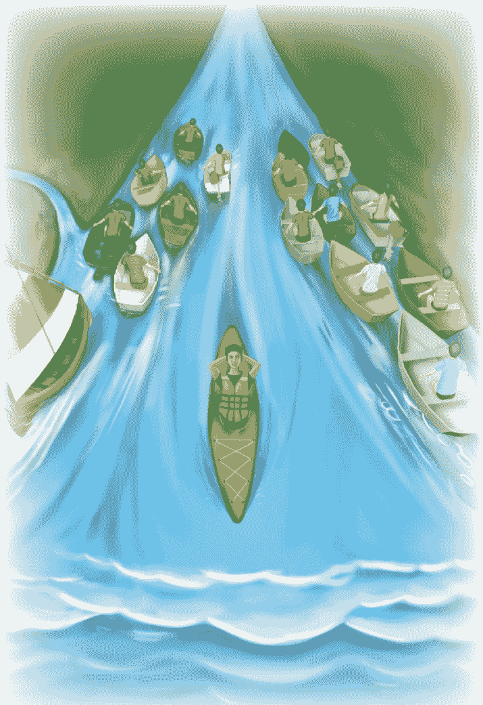

我們順著宇宙的流，順著人間的動力，順著每一個感官，本來以為是阻礙，但我們完全把它變成工具，變成朋友，順著它的動力走下去。這一來，前進的力量遠遠更大，過程也會更順。

## 39

## 一切是如此奇妙
All is in awe

有些修行的知識其實是一種頭腦的追求和境界，我們投入太多，也就沉迷在追求知識，反而忘記了源頭。本來這不是問題，畢竟我們被真實吸引，就像馬渴了會想喝水，自然會想知道這個或那個，不然根本不會投入。只是我們走著走著忘了真實，也就把它當成一門學問來追求。

我在《中道》提過貝利女士（Alice Bailey），她在百年前把東方修行的觀念帶到西方世界，與西藏的DK上師合寫19本書，自己又寫了5本，帶出一整套理論體系，也被稱為是新時代的創始人。這些書的封面多半是深藍色，右下角有一個特殊的三角標誌，代表推動意識轉變的力量。

我讀她的作品時，知道有些部分不那麼妥當，像是認為DK上師的神秘療癒（esoteric healing）足以代表彌勒佛的系統。她用人間的觀念來解釋真實，例如為大聖人排順序，認為誰大誰小，這不能算是正確的觀念。

她用「神秘療癒」來描述DK帶來的整套作業，讓整套作業顯得很玄，也造出額外的想像。也許在當時的西方，來自東方的一切都很神秘，但從現在的角度來看，這種能量和振動的療癒是非常科學的，一點都不玄。確實她有通靈的天賦，也有DK上師的指導，但理解可能還不夠完整，才有這些觀念。

不過她還是帶來一些很寶貴的想法，例如她講過一句話「All is in awe。」像小孩子第一次發現了一個完整的世界，覺得一切都如此奇妙，如此完美，是不可思議的境界。

這種心情反而是對的，我們如果能天真、誠懇、謙虛，把一切看得好像是第一次發現，第一次體會、理解、觀察到這一切——表面看來是初學，卻比較接近真實。資深的修行者，如果失去了這種看樣樣都新鮮、都歡喜的心情，也就走歪了。

本來修行是帶來快樂，但是我們失掉了天真，才走一大堆的冤枉路。既然如此，還不如隨時回到初學，面對樣樣，隨時把不可思議的心情帶回來，像小孩子一樣天真。

我在《奇蹟》談到一些經過，尤其從小和動物的互動。後來在猶豫要不要投入「全部生命系列」的大工程時，也是海豚帶來的加持，讓我有信心繼續走下去。

2020年，因為COVID疫情，我開始錄靜心引導陪大家共修。許多朋友都知道錄音的當下，旁邊有壁虎、小狗、各式各樣顏色的鳥、貓頭鷹、好大的老鷹、小熊、臭鼬、鹿、兔子、貓。現場就像有一個友善的場，本來會掠食、會撕咬、會打架的動物好像放下了攻擊的本能，而弱小的動物也放下了天生的不安全感和恐懼，牠們都能待在一起。我很難想像如果不在這個場，牠們會是什麼樣子。

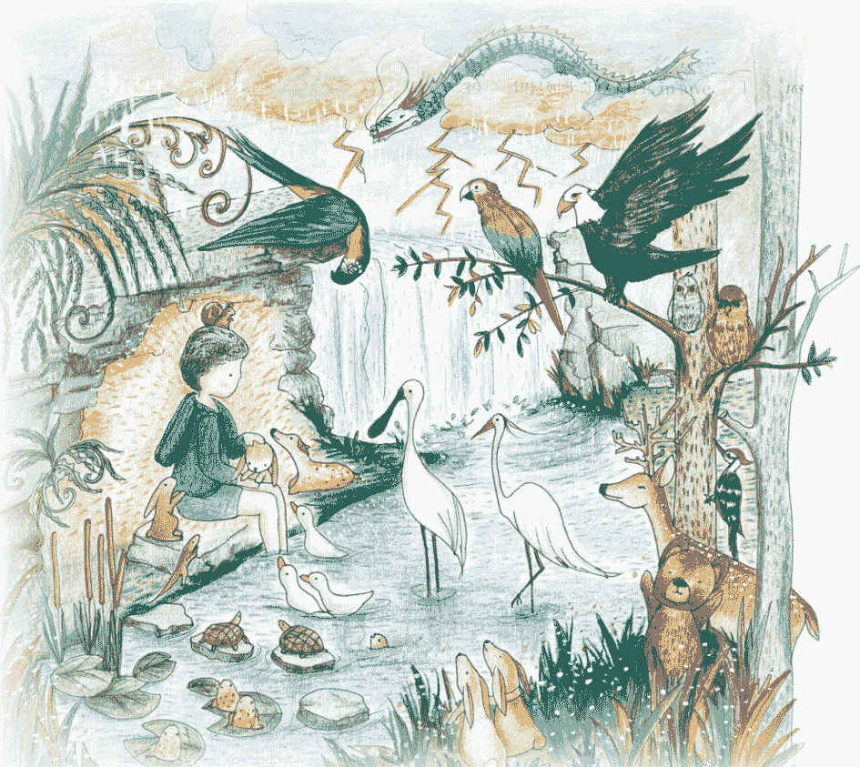

平時，我喜歡待在戶外，這些動物小朋友也會來，有些爬到腿上，有些停在肩膀或頭上。許多人看到會認為是奇蹟，但對我來說，和動物互動是每個人都有的能力，甚至每個人有和自己同一個頻率的動物可以溝通，有時候帶來勇氣和安慰。

現在很多人養寵物，只要養過貓、狗、鳥或其他小動物就知道，和動物有情感交流並不是希罕的事。但有些人只是過去認為不可能，也就把自己的天線給關閉，而接下來把注意力擺在別的地方，說服自己沒有這回事。

從理性關掉這種交流，而不去體會其他的可能，遇事要不想去對抗，要不就是躲開，對完整而豐富的生命境界一點都不重視，這是多麼可惜。

我們只要跟動物溝通過一次，就會發現人跟動物是平等的。我們自以為人類是最高等的生物，不知道動物其實安住在神的本體。牠們不像人類陷入主客二元對立的運作，而且記憶短得多，不那麼受到時間的影響。

這種狀態可以說跟上帝比較接近，整個頭腦只為了生存而運作，吃飽了就沒有事。我們只要不去嚇唬牠們，就能一起共生存。

## 40

## 與動物溝通

絕大多數人都以為動物比較愚笨，聰明沒那麼發達，但這是真的嗎？

2004年發生南亞大海嘯，當時我和家人都在普吉島，也親眼見到海嘯帶走多少生命，包括動物、魚，也包括人類。後來看統計，那一場地震和海嘯影響了印度洋周遭14個國家，帶走20幾萬人的生命。

第一波海嘯抵達時，海浪10幾公尺高，我聽其他人說附近的猴子和其他動物早已躲到山上。第二波海嘯來之前，我把握時間和大家一起往山上走，也看到好多動物已經在上頭等，就好像牠們更早得到通知，懂得往安全的地方避難。

前面提過，動物的智慧是更根本、更上游的，更接近源頭的聰明，反倒是人類的聰明是落在下游，只是在主客二元運作的層面展開，也受限在這種邏輯分析的層面。但我們人類驕傲得不得了，自認為比動物高等，比動物聰明。

我很小就能跟動物溝通，但說不出來是怎麼辦到的。一開始，我以為其他的小孩子也都知道，後來才發現這可能是自己在這方面比較敏感。再大一點，我體會到動物有很基本的情緒，像是愛、憤怒、厭惡，而可以用一些簡單的幾何符號來表達，也符合神聖的幾何。

2025年我在錄靜心導引的時候，有一隻金黃色的貓咪小Manso陪著。小 Manso 連眼睛都是金色，很少見。遇到牠，也有一個經過。

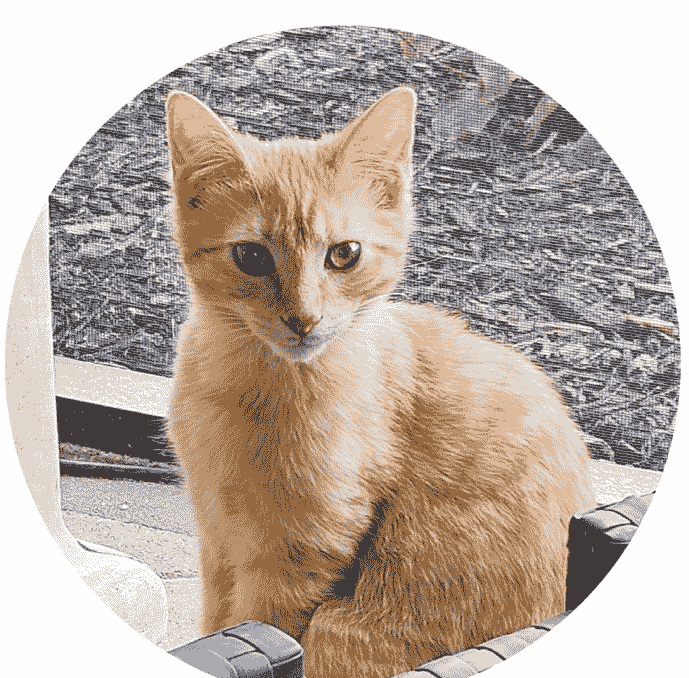

美國有一群人不住房子裡，他們把車廂布置成簡單的住處，有床睡，能煮點東西，可以用車拖到不同的地方住。許多地方也有專門的車宿區，讓這些拖車能停下來休息、補充車子的水和油。

有一次，我在餐廳請同仁吃飯，附近正好有一個拖車的車宿區。我看到一隻很漂亮的橘色小貓，大概4、5個月大，不會超過6個月。耳朵大大的，個子小小的，那時候很瘦，大概沒有吃飽。

小貓看到我，馬上跟著我走，還想爬到我身上。我要出差，不可能在這裡待久，也沒有地方養牠，但原本餵牠的人跟我說：「如果你願意就帶走吧，看牠很喜歡你，你大概也擺脫不了。」確實如此，我車門才開，牠就跳上車，坐到我的大腿上，趕都趕不走。

我以前養過狗，但沒有養過貓。有了小Manso，我才發現貓會到處巡邏，會在窗前盯著外頭的動靜。而且貓愛乾淨，會自己舔毛，身體沒有什麼味道，跟狗不太一樣。

我再仔細看市面上的貓飼料，才發現這些飲食都違反貓咪的天性。貓是百分之百的肉食動物，最好給牠吃生肉，但所有貓飼料都含著植物的材料。

這些年寵物貓的壽命都往下掉，死因往往是慢性腎臟退化。對我來說，這和飲食的關係再明顯不過。植物性飲食在貓咪身上造出抗體，讓免疫細胞過度活化，身體隨時都發炎，也就造出退化。所以我給小Manso吃生魚、生肉、生蛋，牠吃夠了就長得很好，毛也很亮。

我從小Manso身上學到許多，牠吃飽精神很好，有時會往側邊跳，兩隻前腳舉起來，像跳舞一樣。最不可思議的是，牠會跳到牆上，像迴力鏢一樣往回彈至少2公尺再跳回來。有時候，牠會拱著後背。後來我才知道，拱背和炸毛是貓咪遇到危險的反應，能讓牠的體形看來大很多。

有好多行為，是我過去沒有注意到的。最讓我感覺特殊的是，小Manso每天晚上都爬到我身上，大概凌晨四點到四點半爬上來。我摸牠，牠就開始打呼嚕。但打呼嚕，牠就沒辦法睡覺，要趴在我胸口上，牠才睡得著。

小Manso也一樣跟我溝通，有時候像個大禪師，無論我說什麼，牠一定從更大的層面來回應。比如我問牠「你還好嗎？」牠會回答「有什麼好壞？好壞是人認為，從我的角度都一樣。」問牠「你今天有沒有吃飯，吃飽了嗎？」牠說「什麼叫做『飽』？沒吃飽，明天再吃就好，我不會擔心這些。」

有次小Manso打破了我的水晶，夜裡我跟牠說「以後你可不可以不要弄破我的水晶？」牠說「我還小，我沒辦法控制我的神經系統。你能原諒我嗎？我不是故意的。我不是想破壞東西，這只是我成長的經過。」

後來我實在得離開了，在同一個地方待上兩星期已經算很久了。牠也體會到，問我「你想送我走嗎？」我說「是，因為我沒辦法。我沒地方養你，也沒有人能照顧你。」牠說「千萬不要，我是屬於你的。我們這輩子碰面不是偶然，是來互相打氣的。我在成長，需要有人幫助我。你關心我，我也可以幫助你。你把我的呼嚕聲放到你的錄音，讓我用我的方法來加持。」

我錄音時，小Manso都爬到我腿上，牠很喜歡聽。每次我入定，再睜開眼睛，都會看到牠在旁邊等著。後來牠也體會到我一定得把牠送走，也就安慰我「沒有關係，都一樣的。你忙你的，我會好好的。我不會忘記你，你也不會忘記我。」

還有另一隻綠色眼睛的貓咪Samson，7歲了，不像小Manso那麼活潑。Samson也和我們溝通，但內容很不同。

動物跟動物也會溝通。在美國，住家後院很容易看到浣熊，也會看到松鼠。松鼠遇上危險，例如有蛇或浣熊，我馬上聽得到牠跟其他小松鼠溝通，而音調高低和平時完全不同。

有意思的是，貓咪跟其他貓咪溝通，又和跟人溝通的樣子不一樣。我常開玩笑說，貓咪跟人的溝通只是應付，跟其他貓咪溝通才會認真講話。

動物有牠的聰明，人也有人的聰明要表達。人完全向物質層面走，愈往下游走愈分別，但分別到無路可走，還是會回到一體。

## 41

## 神聖的幾何

真正的大聰明，是全部生命都有的，包括動物，包括植物，甚至包括礦物。這個發現，推翻人類累積的所有想法，比超級地震還更天翻地覆。

這些生命跟我們沒有分開過，都是代表一體，所以我會耐心跟你們溝通。而且溝通方式不需要用人類主客二元分別的邏輯，而是在很根本的範圍互動。

我常談神聖幾何、柏拉圖立體（Platonic solid），也是反映我從小的體會。現在回頭想，在3、4歲還不太會講話前，我就發現腦海不斷浮出一些幾何的符號，好像是一種比語言更基礎、更直覺的表達。

前面提過，我發現動物用很簡單的方式來溝通。這種溝通的方式是萬用的，從最低的生物到最高的動物都有，甚至連外星人都可以溝通。

從很簡單的小動物，例如壁虎，好像只要解剖構造上帶著腦幹的作用，都能用這種方式互動。等我再大一點，才發現宇宙、地球、海洋裡的生物、大地的花草，樣樣都有它的形狀，讓我感覺它是一種最根本、銜接無色無形到有色有形的橋樑。

一切離不開幾何，尤其螺旋。螺旋含著最高的神聖幾何，後來大家稱為碎形幾何，離不開一些重複發生的根本形態，而可以歸納出一種數學或幾何的公式。貝殼的螺旋就是一個實例，它本身有一種特殊的形態而且反覆發生，每次發生都是重複自己。宇宙在每個角落也是如此重複自己。就連一顆星球要爆發出來，也是循著螺旋的路徑出發。

從最簡單、最原始的生命，到外星最先進的聰明，都離不開這種溝通的方式：比腦海念頭更原始的一種幾何符號。生命的每個角落，無論一個念頭、一個畫面，甚至連感情和感受都離不開神聖幾何的作用。

15、16世紀義大利的天才發明家達文西（Leonardo da Vinci），從我的角度來看，他有很多靈感是從更高的境界帶下來的。後來我發現他的繪畫，像是蒙娜麗莎或是雕刻作品，也都含著同樣的原理。我後來也將他的畫放在一些配方的標籤上，一方面表達我內心對達文西最高的敬意，另一方面也是將神聖幾何的觀念帶出來，提醒大家，這些神聖的比例從來沒有離開過我們。

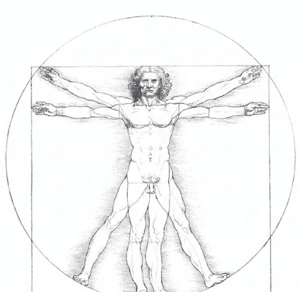

我在轉化中心還安排了一些空間，是顛倒金字塔的形狀，含著一些特別的元素能讓人變年輕。每次有朋友到轉化中心，我都希望他們停留在這些空間久一點。我在《奇蹟》提過，我請朋友照這比例做一個槽，角度和材料都很講究，可以說是外星智慧帶來的配方，包括很重要的微量元素。

在台灣不容易找到足夠的空間來進行，我請一位從美國航太總署（NASA）退休的朋友在內華達州幫我試做。他完成後，隔天早上發現這個槽就像諾亞方舟，擠滿了小動物和各種鳥，甚至連小鹿都來了。他完全不知道這是怎麼回事，這些小生命又怎麼知道要找過來？

當天下午，他注意到有直升機在附近繞。機身沒有能識別的塗裝，也沒有編號。後來直升機降落，走出來一些像軍方的人，問他在做什麼。他跟對方解釋，是一位亞洲的朋友委託他試做一個槽。對方說「你們造出很大的螺旋場，我們的設備偵測到一些訊號，才過來看。」看狀況。」

聽他轉述這個經過，我知道他很驚訝，但這證明了我們做的方式是正確的，才會不光動物被吸引過來，連政府的設備都能偵測到。

說起來，動物透過幾何溝通，這種能力是理所當然的。人也是一樣的，只是後來語言太發達，也就把這種溝通方式給忘了。我們一般採用的語言，是落在一種很具體的範圍作用，也需要我們消耗精力集中注意，才可以表達或寫出來。這使得人類幾乎要遮蔽住其他的溝通、其他的聰明，才能讓語言的聰明發揮。但是在一些很極端的狀態下，例如很大的恐懼，人又會恢復一些本能，透過其他機制得到訊息。只是等緩過來後，語言和主客二元式的邏輯恢復運作，也就又把這種本能的機制給蓋住了。

許多朋友聽過一些實例，也許是車禍、手術，人表面上進入昏迷的狀態，五官和頭腦都失去了作用，但醒過來又知道身邊發生的很多事。在他昏迷的時候，明明沒有一般人認為的意識來捕捉資訊，這是怎麼辦到的？

回頭看，我們從出生、和大人互動、進入學校學習、社會工作，一路過來，可以說是不斷壓抑這種直覺和本能的過程，反而忘記了怎麼跟身邊的動物、跟不同的生命來溝通。

我小時候對這種經歷非常好奇，長大後發現，人雖然失去了跟動物溝通的本事，但在更深的層面還有一種聰明。這種聰明一直都在，可以對樣樣得到一種靈感，是語言講不出來的。

對我來說，這才是最根本的聰明，而這種聰明的源頭是無限，遠遠超過語言所能表達的。如果能活在這種沉默，安住在這種根本的聰明或意識，會發現人間的語言、文字或是五官捕捉得到的，都只是整體非常小的一部分，比一粒灰塵還渺小。

如果整個宇宙，無論眾生、非眾生都是從奇點爆發出來，那麼，這個奇點當然是整體的共同點，在意識的層面也就是一種源頭的聰明。

無論在宇宙的哪一個層面，從無色無形到有色有形，一定要經過一些路徑，重複一些規律和形態。反過來，我們要回到源頭的聰明，也要沿著它爆發出來的路徑，只是方向顛倒。

一個人假如有這種體悟，而且只要有一次這種整體的體悟，就像得到整體的全相譜（hologram），那麼，即使注意再度回到世界，回到五官和腦海的範圍，他的認知已經受到影響。這種影響是非常深遠，會讓他接下來一直想去解釋這種沒有文字語言的聰明、最直接的溝通又是怎麼來的。

從另外一個角度來看，有過這種體悟，也就不會因為世界帶來的影響而那麼受到打擊，心裡非常明白世界只是表面，而真正的存在是在一種更深的層面。

## 42 物質的組態

人生很奇妙，從小，我學到的，很多都跟傳統的大菩薩有關。我在《奇蹟》也提過四大菩薩：觀世音菩薩、文殊師利菩薩、普賢菩薩、地藏王菩薩，更不用說在我人生最困難時總會出現提醒我、為我打氣的Babaji。

觀世音菩薩是愛和慈悲，文殊菩薩是智慧。在我心中，Babaji就是有文殊菩薩的分量。印度《奧義書》記載，他會一次又一次回到人間，來幫助修行的人。普賢菩薩是平等，地藏王菩薩則是業力的法門。此外，藥師佛也跟真原醫有密切的關係，可以說真原醫是舍利子、元素或礦物的科學。

過去談到健康，很少人會用礦物質或微量元素。一般人提到蔬果，總以為吃有機種植的最好，但這並不完全正確，還要考慮種植土壤的礦物質完整性。畢竟經過長年單一的使用，土壤會缺少一些我們需要的元素，這是需要額外調整的。

我過去用這些經過特殊製備的元素，幫助許多朋友恢復健康。這過程也有很多奇妙的巧合，讓我剛好得到眼前所需要的靈感或資訊。

有一次，我需要製備一項材料，共有21道步驟，一道都不能省。正當我卡在其中一個步驟時，突然有人到我的辦公室急著見我。他只是路過，卻聽到有聲音要他上樓來告訴我一個訊息。沒想到，他講的，正好是我在找的關鍵步驟，後來也就這麼整合整個元素的醫學。

有很多元素，我們過去不曉得它有不同的相態。週期表最右邊的元素，一般被稱為惰性氣體（也稱貴族氣體，noble gas）。名稱的由來，是因為這些元素的電子組態在外圍的軌域是填滿的，所以它不會跟其他元素反應。就像貴族一樣，不會動不動就跳起來。

但是，沒想到有些比較重的過渡金屬元素會產生類似的電子組態。這些過渡元素最外面的一層本來會有落單的電子，讓它能跟別的元素產生反應。但有時候最外面的軌域會先填滿，而在比較內層的軌域留下空洞。這不光讓它不會跟別的元素反應，甚至不再是典型的固體，而呈現一種介於液體和氣體間的狀態。

這種奇特的組態和物質形態，一般人根本不會想到。如果我們懂得怎麼偵測、怎麼研究，這些元素可能幫助解答很多醫學和健康的問題，而且是傳統方法不可能解開的。

這一套醫學，是透過藥師佛帶給我的，觀世音菩薩也教我某些礦物的相態。觀世音菩薩代表水的元素，而水的元素和身體的組成最接近，也影響到內分泌。我後來跟一些朋友分享液態的微量元素，會用琉璃藍色的瓶子來裝，也就是想表達我對藥師佛傳承的尊重。

不光過去主流醫學看不到的配方和解答都跟這些菩薩有關，他們在我靈魂的暗夜也幫了我一把，對我有影響一生的重要性。這可能是我個人跟他們的感應，但說到底離不開信仰。信仰是我的出發點，也是我的平台。如果沒有信仰，也不會有這些感應。

這種感應是雙向的，菩薩無所不在、無所不知、無所不能，問題是我們呢？可不可以跟他接軌？即使講共振，如果我們在不同的狀態，連諧振都進入不了，就算大菩薩和釋迦牟尼佛在身邊，也不見得知道。

菩薩想教我們，但我們要有妥當的頻率、準備好，才能接受。信仰就像一種天線，讓我們剛好可以收到資訊，體會到菩薩的存在，跟他們共振。

## 43 信仰走在前面

我在《奇蹟》分享過，在洛克菲勒大學讀博士班時，大概20歲出頭，做完一整天的實驗，傍晚會在紐約的東河旁跑步。

有一次跑步時，突然有人出現在我眼前，他像王子一樣高貴，穿著像古人的衣服，現在回想就是地藏王菩薩。這不是我第一次有這種經驗，通常只要分享，大家都會好奇追問，想知道是只有我看見，還是其他人也看得見。

我的體會是，這類經驗或說奇蹟通常都是給個人的，並不是為別人而有的。有時候，我在夜裡看到UFO，如果身邊有人，我也會問他們能不能看到。有些能看到，但大多數看不到。所以，別人看不看得到，對我也無所謂。

地藏王菩薩和我互動很久，但這是我主觀的感覺，客觀上也許只是短短幾個瞬間。他教我什麼是「舌抵上顎」，也教我自律神經系統對修行的重要性。

身體許多功能不由大腦控制，例如消化、心臟、呼吸等內臟的功能不由腦的意識主導，而是由自律神經系統來處理。自律神經又分成兩大部門，也就是交感和副交感神經系統。交感神經讓人緊繃，心跳加快，呼吸急促，準備面對威脅；副交感神經則讓人放鬆，可以休息，可以恢復。

地藏王菩薩教我，身體有一套特殊的神經系統。這套神經系統會經過咽喉附近，如果舌抵上顎或伸個懶腰，就足以透過副交感神經的作用放鬆全身。

那是幾十年前，我只知道這些副交感的神經從脊髓出來，連結身體的每個部位像是心臟、肺、腸道，沿著頸部、喉嚨附近一路到腦，但當時沒有這些現成的學問。

而且，全身體的各角落都有神經往回走，把資訊集中到頭腦，告訴頭腦「可以放鬆了」。假如我們已經在放鬆，它會進一步告訴腦，說這是最佳的狀態，應該保持下去。

我們不需要一一把手放鬆、腳放鬆、大腿放鬆、肚子放鬆，才能將放鬆的訊號帶回到整體。有了這一套後來稱為迷走神經的學問，只需要舌抵上顎，或是伸個懶腰、打個哈欠，很簡單的動作就能帶動全身的放鬆。

這一點，對我當時是非常大的突破，讓我得到一套工具，而且都是很簡單的方法。畢竟我們如果隨時繃得很緊，也談不上修行；懂了放鬆，身心的障礙少了，和真實才容易相應。

許多朋友認為到了一個地步，一定要請老師指導，才會安心，也比較能夠進步。但以我個人的經驗來看，我發現是老師來找我，倒不是我自己去找。

年輕時，我還沒有接觸佛教，那時連地藏王菩薩是誰都不知道，也不可能主動去求。他在我跑步時出現在眼前，我最多是沒有任何質疑，體會到一切是神的安排，珍惜他帶來的智慧和啟發。

一切，還是回到信仰。我們有信仰，才會讓生命帶領我們成熟。足夠成熟，老師會來找我們。如果有信仰，知道這不是自己的錯覺，也就能讓生命安排，和眼前的需要、眼前的想法貫通。

這一生，都是這樣的經過。剛剛好我需要什麼，來到我眼前的發生、境界，帶給我的也正是我需要的。我因為有信仰，也不會把這些訊息隨便擱著，而是認真去聽、去反思、去消化，才把未來佛、未來基督的妙勝智、唯識、中道整合而帶出來跟大家分享。

## 44 配合身心的需要

當時跟菩薩和大聖人有這些互動，我後來才體會到這可能是一種個人的體質。這裡講體質，也就是身心比較敏感。

我從小看到、聽到的往往別人看不到或聽不到，大人也總說我的記憶力很好，好像讀過的東西不會忘記。有些朋友大概看過類似的孩子，他們在藝術、數學、科學有一種天分，很早被認為是天才。但這種早慧的天分離不開身心的敏銳度，而這種敏銳又讓人比較容易有憂鬱，甚至可能有躁鬱症。

以我個人的經驗來說，這種很早期的悲觀，如果不懂真實，也沒有好的老師在旁邊帶著，難免會對生命看得比較悲觀、抓得比較緊、比較萎縮。這種低落，就是古人說的靈魂的暗夜——腦海會化現很多現象，像是一道道門檻，讓人停留在人間的感慨，不讓人得到進展、得到突破、得到解脫。

我們去看比較成熟的修行者的紀錄，也會看到這些現象。所以我 很早就明白，如果不把頭腦當朋友，不用它喜歡的方式讓它配合修行，頭腦一定會抵抗，會化出各式各樣的門檻，讓我們放不過，過不了關。

再加上現在這個時代，我們太緊繃、壓力太大。如果懂得迷走神經的原理，透過一些練習讓身體放鬆，從各角落找到舒暢而健康的平衡點。我們隨時在放鬆的情況，處理事也會比較有效率，不容易誤判，不會內耗。這種輕鬆的不費力，可能是現在最需要的。

配合心理的機制和神經迴路的運作，我們用友善、正向、歡迎、接納、肯定、感謝的態度來面對生命，這是最容易的修行方法。像舌抵上顎，就是一種配合身心的工具，做來非常簡單，只是讓舌頭碰到口腔上緣，就可以影響全身，讓人感覺放鬆、舒暢。

這個發現，讓我體會到老天爺早就在身心內建了配合修行的機制，而讓這整套方法完全是科學的。後來，我在靜坐中與彌勒佛接觸，才發現未來佛和未來基督的中道、妙勝智大法門採用的就是這些科學的觀念，帶一種歡喜的態度來修行。

許多朋友會以為修行就要苦修，得拉著一張臉，讓身心萎縮。其實這種態度反而強化我們的隔閡感，而隔閡就是人間痛苦的來源。所以，如果修行很久卻歡喜不來，可能要反省是不是哪裡沒有貫通。

我們修行，要懂得把隔閡稍微擺開——面對瞬間，樣樣都可以接受、都可以歡迎，不去抵抗。我們歡迎眼前的任何現象，可以接待，可以包容，可以肯定，甚至可以感恩。隔閡一擺開，人自然會喜悅，體會什麼是大愛，是沉默，是一切。

假如我們對樣樣、對瞬間帶來的人、事、物都可以用這種正向的態度來接納，有人來，我們歡迎他；再一個人來，還是一樣接納；有事要處理，還是肯定；有東西要搬，一樣可以感恩。一旦我們愈來愈熟練，會發現自己愈來愈可以放鬆，可以快樂。

我們一再地歡迎，漸漸會發現瞬間帶來的內容好像都差不多，沒有什麼特別新鮮，但也不會引發煩惱。我們無所謂了，注意力的焦點從眼前的發生落回覺察的源頭，發現上游有一種根本的聰明允許我們注意到一切，我們也就進入臣服。

帶著一點正向的念頭，我們會進入一種中立性。這種中立性，不是無所謂的冷漠，也不會排斥任何東西，而是帶著一點友善和正向的味道，所以我會說友善的中立性。

這種友善幫助我們用正向的態度來看世界、接受、感恩、肯定、歡迎一切，也就更能停留在這種友善的中立性。

這就是一種神聖的空間，它超越語言、超越任何觀察的參考點。不知不覺，我們已經進入沉默——生命的沉默，生命的本質，一切還沒有出發的源頭。

我當時很年輕，突然明白原來就這麼簡單。過去那麼多大師想表達的，也就是這樣子。修行、瑜伽或靜坐的八萬四千法門，到最後都進入一種止或定。

透過每一個行為，我們發現樣樣都可以接受，甚至還可以將一切往好處去想、往友善的方向去對待。這種簡單的方法，帶到生活每個角落，從醒到睡著，都可以進行。就連行為、生活的動態，都可以當作窗口，當作練習的工具。

我們愈做愈深入，停留在這種享受和歡喜都來不及了，還有必要去跟別人分享？去用功？去取得什麼成就？表面上是不是重複也不重要了，就連領不領悟也不那麼重要，沒有什麼特殊的經驗是非要去取得或非要重複不可。

過去，說到對樣樣臣服，身心本來會抵抗，會找各種理由或毛病來踩剎車。現在，身心不光不抵抗、不踩剎車，小我的抵制和反對都被融化了，還反而會歡迎每一個臣服的機會。

本來說到臣服，還感覺有一點費力，好像要有規劃、決心、毅力來做，突然也變成完全不費力，變成不需要選擇也不可能選擇的選擇。

臣服的練習會帶給身心快樂，而身心在這種歡喜中是安穩而完整的，它不會失去安全感。這時，身心已經成為推動臣服的馬達，因為它歡迎，自然會幫助我們，讓我們滿心歡喜期待進入臣服。

## 45 穩重的生命

小時候，我讀到耶穌行奇蹟，治好別人治不好的病，甚至讓死去的人復活；後來也發現密宗、禪宗或其他法門有些大禪師透過信仰，可以超越人間的限制。

這些實例也讓我注意到，大聖人活出的境界，別人認為是奇蹟，但對他卻是完全正常。他是透過這根本的領悟和信仰，把新的正常完全帶回到生活當中。

接下來，我走的路跟一般人很不一樣。首先，會想接觸這些已經在靈性演化到最終境界的大聖人，想了解他怎麼活在不動搖的信仰。和其他同年齡的孩子相比，我這種想法顯得非常奇怪。但從我的角度來看，這一點反倒讓我省下了不曉得多少年，甚至是多少輩子。

十幾歲的時候，我發現人假如安靜到底，腦海裡、心裡的波浪，或是對人生態度的起伏也就減少，甚至幾乎消失。

那時候，我用週末的空檔到麻省理工學院和我父親做一些實驗。那個實驗室非常有意思，讓我做了很多示範——心跳、腦波、呼吸都慢下來，慢到一個地步，感覺人好像已經不在這裡了。

這種示範，我當然不是第一個做的。《大師在喜馬拉雅山》的作者 Swami Rama 在 1960 年代就為美國「孟寧格基金會」（Menninger Foundation）示範控制心跳、血壓和體溫，這段經過後來也寫成專書的一章*1。

我很年輕的時候就有一種意識擴張的作用。這種作用不是離開身體在看身體，不是一種隔閡的作用，而是比身體和頭腦更整體，就好像大到包住身體、擁抱身體。當時，我也才突然懂了「定」。這一點，我會在後半再進一步打開。

這種擴大膨脹的作用一再發生，也就讓我發現：「欸，這好像就是宇宙！」好像跟宇宙達到和諧，融為一體。這種體驗帶來更深的體會，本身會強化人的信仰，和信仰是相輔相成的。

我常說即使宇宙全部消失，也搖不動我對大聖人的信仰。他們所說的，只可能是從真實流出來，是活在整體、活在徹底的信仰流出來的，全部都是真實，也只會符合真實。

一再有這些體驗，我也發現意識不是動物才有，植物，甚至非眾生的石頭、元素、礦物也有意識。它們有自己的步調，也帶來一種神聖的空間。如果把步調放慢，慢到一個地步，其實我們能進入礦物的世界。

礦物含著地球幾十億年、甚至宇宙上百億年的記憶，但是這種境界跟人類兩極化的邏輯不在同一個軌道，是人類的頭腦捕捉不來的。所以，我們很少聽到這方面的知識。

有這些經過，我發現原來佛陀講的平等心是全面再全面，才會說連一顆石頭都可以成佛。佛，最多就是回到一體，活在一體看一切。花、石頭、生命、非生命本來就在一體，本來就有佛性。

後來我特別注意到水晶。對我來說，水晶經過大自然高溫和高壓的整合，已經達到一種結構上的完美，每個原子和元素的排列都能完美地重複自己。從水晶的一點到另外一點，完全是同一個組織、同一個架構。

有這種結構的特性，我認為水晶帶著類似電容的作用——可以累積能量、疊加許多資訊，而又像雷射一樣在物質方面放大能量，再將能量釋放出來。這也說明了為什麼過去的文明都懂得用水晶。如果我們的念頭、出發點，一切是友善的，透過水晶，也就可以擴大這種友善的意念。

> *1 Green, Elmer, and Alyce Green. "The ins and outs of mind-body energy." *Science Year* (1974): 137-147.

## 46 水晶和療癒

也因為有前一章提到的經過和體會，後來我到世界各地透過礦物和一些有療癒天分的人互動，有時也會收到人家珍藏的舍利子和水晶。到後來，家裡就像博物館，收藏了亞洲和中南美很寶貴的礦物。一開始我會婉拒，後來我明白他們的善意，也就還是接受。

我在台北設立身心靈轉化中心，也主動送水晶給做療癒工作的同事。好像我內心有一種直覺，知道哪個水晶適合誰。有時沒機會碰面，我也會請他們的主管給我照片，讓我在靜坐時體會他們的狀態，為他們選一顆水晶。

水晶是完美的定型結構，反過來，有一種物質是完美的非定型結構，也就是我後來所說的真原素。它跟水晶一樣的是單一組成，有類似的化學特性，但它是非定型，也就是不像水晶有固定的形態。

針對這一點，我投入了幾十年，也發現包括佛陀的舍利子，《聖經》提到的嗎哪、古波斯人的haoma、梵文經典裡的soma，都是這種非定型結構的元素。有些朋友曾經在身心靈轉化中心看過我收藏的舍利子，這是透過許多大菩薩傳承下來佛陀完美的結構。將來如果有機會，我再將這方面的經過和傳承打開來。

前面提到和有療癒天賦的朋友互動，有一位有名的巴西療癒師John of God，他曾經給我一些非常大的水晶，這些水晶已經治療過上千萬的人。許多人從歐洲、北美、世界各地飛到巴西，就是為了請他協助療癒。

我在那裡親眼看到各種西醫認為治不了的腫瘤、多發性硬化症、各種慢性病、自體免疫疾病的病人得到了療癒。只是後來很可惜，他沒有守住自己，傷害了許多信任他的學生和病人，也傷害了大眾的信心。

我在《奇蹟》提過一位同仁蘇珊（Suzanne），她療癒的經過也跟水晶有關。我跟她說，不用告訴我具體的情況，請她把心打開，用幾分鐘的空檔，雙手放在水晶上和神禱告，讓水晶為她做個轉變。

後來我也沒有追問，一、兩個星期後又在公司的大會遇到，我才知道她原本脖子有腫塊要開刀。她非常擔心，心情也很低落，但和水晶互動後，當晚發了高燒，隔天醒來，發現腫塊已經完全消失。

遇到這種奇蹟，我們通常會歸因一個神奇的人或解答，但對我來說，是她的決心、誠懇和信仰帶來療癒。我最多只是體會到她需要幫助，而剛好有水晶可以在能量上做一點引導。

我請蘇珊把雙手放在水晶上，這是人類療癒的本能。手部有豐富的神經分布。有些人帶著天生的敏感度，能用手感應到能量、氣或光的轉變，可以把脈，也可以治病。

治療師用手去做療癒的本事，並不是能追求得來的，而是一個人氣脈差不多打通自然會做的。治療師作為療癒的管道，眉間輪和雙手放出來的光構成一個穩定的三角形，和達文西的畫與金字塔的比例是同樣的神聖幾何。

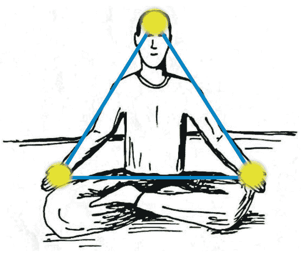

人類本來就是光的生命，是由光和愛的粒子所組合的。每個宗教走到最後，不管是天主教、基督教、西藏的密宗都離不開類似的表達，透過手放光，帶來各種層面的療癒。

正三角形是神聖幾何最基礎的形狀，比正方形或四面體還基本。對我來說，跟動物、任何文明溝通都離不開三角形。只要留意，我們在每個文化和宗教會看到類似的三位一體，例如佛教講的法身、報身、化身，或真、善、美。

到過身心靈轉化中心的朋友，可能看過這樣的木三角。我也請同仁教大家雙手扶著木三角的兩側，將額頭靠著裡頭的三角形空間禱告，向真正的自己、上帝、意識、一體禱告——培養信仰，療癒自己，療癒世界。

這樣的禱告是一種提醒，提醒我們隨時活在人類最理想的特質和表現。也可以把全部生命的觀念濃縮成信仰、愛、臣服三個重點，用這木三角來進行，聲明我們的禱告。

我在《短路》提過一位中世紀的女聖人紐曼（Elizabeth Newman），她最被大家知道的，就是她手上的印痕。只要她誠心禱告，充分投入耶穌最後為世人犧牲的心境，手上就會出現像是被釘在十字架上的痕跡，甚至流出血來。

這些經過，大多數人聽了會覺得很玄，但這是經過調查的事實。就看我們信仰或成熟度夠不夠，可不可以自然地接受。

## 47 內在和外在是平等的

談這些現象的奇蹟，我想表達的一個重點是：外在與我們的內心，是一樣的。這兩者的比例幾乎等同，沒有任何一方比另一方擁有更多的代表性或特殊性。

這種「內外等同」的理解或領悟，就是平等心。平等心本身，就是最高的定，甚至我認為它等同於四禪八定的最高定。但是，要真正活在這種平等心，從我的觀察來看是不容易的。

幾十年來，我拜訪了許多大家公認的大師。每次接觸都發現，即使大師還是多少受到外在的影響，例如把金錢、財富、社會上的權力、名譽看得很重，對看著比較土氣的弟子可能不太重視，甚至會貶低。「平等心」講起來很簡單，但活得徹底，很難。

有些人則把外在看得太不重要，輕易就把人間的一切捨離，忘記身體還活在這個世界，還需要吃、需要住、需要基本的生活條件來養活，反而招來許多不必要的痛苦。有些人是相反，把外在看得比重要還重要，有了財富，還要繼續累積，愈多愈好，才顯得自己了不起。

這些都很普遍。我也只能提醒大家，倒不需要有點體會或領悟就自認為解脫或開悟了。我過去幾十年看到的，多的是過不了這些關卡的狀況。

但說到底，儘管難免有不完整的理解，也沒有關係。關鍵還是，我們不斷回轉，回到自己，回到內心，讓心帶著走。我們遲早會成熟，發現內心並沒有比外在更有代表性，外在也沒有比內心更有代表性。不知不覺，已經活在真正的平等心。

這種平等，不是腦海在指定什麼是平等。因為頭腦不起作用時，還是平等的，連醒和睡都是平等的。我在《清醒的睡》提過這個觀念，很多人認為不可能或覺得是一種特殊的功夫，根本沒有意識到清醒的睡和大定、信仰是同一件事。

如果我們完全知道生命有更大的層面，而隨時將注意力擺到神的本體，白天清醒的狀態和夜間的睡覺也就都是一樣的。我們懂了，也就把這個自然的後果當作工具。晚上睡了，還是安住在神的本體，是醒覺的。

這並不是人睡著還把注意力放在外頭，而知道外面的動靜、伴侶有沒有打呼。這種「清醒」其實是還沒有睡著，小我的意識還是在作用。

我們定到整體，到處都在，但也是哪裡都不在；就樣樣都知道，好像也不需要知道；樣樣都可以覺，也不用覺察。活在整體看世界，注意力已經不是擺到一個小的點。等大家信仰夠大，也許可以親自去體會。

當然，會有人認為這有什麼作用？有什麼幫助？

其實什麼都沒有，它只是個後果。只是很多人會很驚訝，突然意識到自己這一生還沒有體會到這一點。

## 48 整體有它的規律

為什麼透過徹底的信仰，可能會顯化出來一些別人眼中的奇蹟？
信仰帶頭，才能讓理論和實務合一，而不會懂歸懂，做歸做，領悟歸領悟，世界歸世界。這種一致是所有宗教和法門的重點。

我們進入根本的信仰，這境界是超越時空，沒有時間和空間的限制，已經跟宇宙、整體、意識結合。在這種結合的過程，遠遠更大的聰明會照顧我們的身體，知道我們需要什麼，什麼時候需要解救或幫助我們。若某件事沒有資格屬於我們或根本不能算是我們的，也不會讓我們占便宜。

如果我們剛好進入了這個狀態，有顯化的本事，可以把物質跟意識連起來，很容易改變物質層面的狀態，一般人會認為是神通。但如果把這當作個人的本事，就算是好意，想讓身邊的人有信心，也是非常危險的。

我這一生看過許多大師為人治療，各種宗教都有。有時候，我還是想私下提醒：「眼前這個人的因果業力還沒走完，你把他治好了，這些還沒有完成的業力和能量，要去哪裡呢？要怎麼去結案？」

我也常跟徒手治療的療癒師分享，我們可能認為治療是在做好事，可以幫助人，但從整體來看，對方的能量還沒有走完，用傳統的說法會說債還沒還完，我們透過治療給了他一個捷徑渡過去，那麼，這些債誰來還呢？落在治療的人身上，是最直接的。

有些朋友用手去治病，以為自己不受影響，但我親眼見過幾位到後來連手都發黑了。有些人會預測未來，救人轉運、招福、避危機，後來也有失明的狀況。好像宇宙有一套規律去達到均衡，人用方法去迴避，不見得能不受影響。

要記得，我們再友善，所做的非但不足以代表整體，也不見得能幫助對方的學習和轉變。對此，保持謙虛是最重要的。我年輕時也很想幫人，也用手幫助別人療癒，有時候還會跟不認識的人提醒他健康有狀況，最好趕快去檢查。後來我發現這是不對的，表面上是很友善和無私的服務，但是整體有一種規律、有它運作的法，是沒有人可以違反的。

真正有本事的人不會做，要做，最多是為了整體，而不是為了個別的人。如果到現在還是為某個人占點便宜、給他一點好處，那麼，我還是要提醒，成熟度可能還不夠，還需要淨化，很多層面需要和領悟一致。

先是信仰，接下來還是要有慈悲，要有愛。有些人修行久了，往往不知不覺傲慢，自認為是老師，別人也這麼看他。如果沒有慈悲和愛，早晚會走歪，沒有把眾生看得平等化，也就可能會利用人，占別人便宜。

很多人以為人投入修行、修得夠好，或信仰很深，就能在人間占一點便宜、得到一些好處、命可以改、在人間好過一點。我會提醒這些朋友，包括提醒我自己，不見得是如此。

有時候，生命會反過來幫我們簡化，讓我們想要出家或把財產、物質、名氣、形相都放掉。從別人角度來看，是犧牲。但是，從整體，可能就是希望我們簡化再簡化，完全投入心，或是捨離再捨離，淨化到底而讓信仰隨時在心中活出來。但這種恩典，若只用人間的貪嗔癡來看，就是扎扎實實的損失。

在這裡，我也想再一次重複三個提醒，之前在《水仙》雖然帶出來過，但也許有些人會以為是為了守住關係。不是的，這三個提醒在和人互動、服務時，是很好的指針，幫助我們符合整體的規律。

1. 這是真的嗎？
2. 我這麼做，是友善的嗎？
3. 就算是真的，也是好意，真有必要嗎？

特別第三點，是非常重要。我們在整體可以很友善，有事實就講。但是，真的需要嗎？

這可以當作一種「戒」，提醒自己，並不是好意就非做不可。假如不是真的需要，何必去浪費自己和別人的時間？為什麼不能放過？

有些默默在做治療的朋友，他的心很誠懇，聽了這些話可能也就清醒過來，知道這最多是做一種短期的幫助，並不是他的角色，而開始會把注意擺到心。

## 49 讓信仰，帶我們走出人生的起落

在海邊，我們一定會注意到海水的漲落。退潮時，水往後頭退得低低的，過了幾小時又慢慢漲上來，海水變得又滿又高。再過幾小時，海水又往回退。任何一個瞬間所見的，都不是海的永恆。

我很喜歡英文的表達「ebbs and flow」，說的是生命變化的規律。有了潮水的起落，才有岸邊風景的變化，潮間帶的生物才有歇息和活動的空間。

人生好像也是如此，有順利的時候，也有樣樣都不順的時候，誰都一樣。熬過了，似乎好運又回來了。但也就是這些順或不順，讓我們活這一生有講不完的高低起伏，造出一些業力的摩擦。

不要小看這種高高低低的變化，就是小小的漣漪，還是會影響到我們的心情，甚至人生的態度。

現在回想，我還很小的時候就對樣樣看得比較悲觀，別人看可能會覺得是憂鬱。這種天生的氣質，已經影響個人對生命的態度。我很幸運，在彌勒佛和基督的啟發下，十幾歲就走出來，也明白有些人如果沒有打開，後來就容易落入憂鬱，所以自然對這個主題感興趣，希望能幫助一些人。

然而，幫助的方式，我發現倒不是在情緒和失落的層面打轉，也不是多分享就能走出來。雖然西方世界深受精神分析的影響，總把療癒的重點放在過去。但坦白說，去挖掘心理創傷的根源，分析自己怎麼落到某個狀態——這些一般人認為有道理的探討，對絕大多數人只是浪費寶貴的時間和心力。

我們活在地球，永遠有業力的摩擦，有高低起伏。人要走出來，要先把心打開，把過去一切習慣改過來，才能對原本的生命觀踩個剎車，從內到外徹底整頓。

我在《時間的陷阱》提過「Habits exist to be broken.」——習氣存在，就是為了打破，為了改變而有的。

包括負面的心情、憂鬱的氣質、容易焦慮或感受痛苦的「高敏人」——這些看似天生的特質，也只是等著被改變的習氣，這就是它存在的意義。我們活在信仰友善地改，提醒自己最基本的前提：「宇宙不會犯錯，我怎麼做都不會錯，一切都好」，建立神聖的空間，心情會打開。有了這樣的空間，不光能改掉整套習氣，還是往阻力最少的方向改，不費力地改。

我們會看開，甚至會笑自己怎麼這麼傻，發現自己還有很多習慣是過去沒注意過的。過去不大方，現在變得大方，活在布施波羅蜜。本來沒有習慣禱告，到後來，隨時友善地感恩，天真地祈禱，誠懇和臣服變成日常，原本的習氣已經改掉了。

用信仰、用這樣的生命前提帶動一天，把這些反應變成腦海的正常。接下來，遇到好好壞壞，對我們都一樣的，沒有必要事事都反彈、都做反應、都悶在心裡，而只是自在而歡喜活下去。

記得，一切都好，一切都已經完美，世界已經完美——我們對這些話有信心，信仰到底。這一點，非常重要。

## 50 靈魂的暗夜

許多朋友聽過「靈魂的暗夜」，也可能在人生起伏、過得不順、不如意時，認為自己正在經歷靈魂的暗夜，但這並不是同一件事。
當然從整體看，沒有什麼太大的不同。但從靈性或修行的角度來說，還是能點出一些差異。

人生的起伏、心情的起伏，也就是業力帶來的摩擦力，每一個人隨時都會遇到，即使不修行也是一樣的。「靈魂的暗夜」所表達的則不太一樣，不是一般因果業力的摩擦，也不是心情的起伏，更是在描述人要醒覺、要頓悟到底的時候，會遇到非常大的一些阻礙，讓他很難過關。

在耶穌與釋迦牟尼佛的經過，都有類似的記載*1。耶穌在曠野待了40個晝夜，有各式各樣的境界浮出來，讓他好像看到未來和過去，有天使，有魔，帶來種種的權力、虛榮、傲慢、物質和特殊性的誘惑，幾乎過不了關。

釋迦牟尼佛曾經苦行到幾乎餓死，卻仍沒有證悟，是牧羊女給他一碗羊奶，讓他恢復元氣，懂得身體和修行一樣重要。後來在菩提樹下即將證悟前，魔王波旬化出無數可怕的怪獸、毒蛇、火焰與雷電來威嚇，又化出女色來誘惑，最後質問他憑什麼自以為可以醒覺。雖然經典裡說是魔王，但用現代的語言，其實就是「小我」這個能量結構在快要失去自己前，最後的作用。

醒覺，是小我被吸收到大我。雖然小我並沒有被消滅，只是讓一體帶著走，但這種運作方式不是小我主導，會被小我詮釋成危機而引發它的抗議。怎麼抗議？假如我們那時候是在理性的軌道，小我就用理性的理由來反對；假如在非理性的軌道，它就用非理性的層面和境界來對抗。

這種暗夜，是人淨化得差不多要醒覺了，自然會親自經過。小我的本領非常高明，用「精彩」來形容都不為過，也許突然出現一些現象讓人恐懼或狂喜，或讓人以為進入一種不同的境界，而會當真，認為這就是真實不過。

能不能度過這樣的關頭，就看自己的成熟度，看有沒有真正的信仰。整體要拉我們回家，信仰就在後面推著我們，帶我們度過。這是每一個人都要經過的。

靈魂的暗夜，是人差不多會有大的解脫、頓悟、突破之前會有的。

說這些，我還是希望提醒大家把自己交出來，讓信仰帶著走。個人經驗到什麼並不重要，我們知道有這些事就好，不需要更多內容的分析或追求，畢竟每個人的經驗不一樣。

多大的突破、再殊勝的開悟，這些經驗還是頭腦的產物。我們可以表達，可以描述，可以記得，事後可以分享的，全部是頭腦的遊戲，頭腦在講話。既然如此，去分析它、一步步地說明它，對我們有什麼用？

我們最多知道有這些變化，有這些經過，到頭來還是回到中道，老老實實每一個瞬間都做回轉，把它當作轉化的工具和門戶。有念頭，有體會，有變化，隨時知道而隨時歡迎，做一個中立而友善的見證者。還是隨時要讓眼前的變化帶著跳起來？被好事、壞事拖著走？
這種反省、這種反思，是隨時都要做的。
這樣子，靈魂的暗夜還沒來，我們已經老早度過，對任何瞬間都有抵抗力了。

*1 《馬太福音》第四章和《佛所行讚》第十三章《破魔品》。

## 51 往前走吧，不要停留在過去

我常說，誰沒有受過傷？我們都遇過，也可能自己還在裡頭。活下去，好像是為了過去——為過去感慨或懺悔，總是在期待還能改變什麼，想讓內心的遺憾得到救贖。

上次回到巴西，有人送我一幅畫。畫裡的人沉浸在自己的世界，那個世界有一個跟她長得很像但比較年輕的影子。就好像她還活在過去的自己，活在已不存在的現實裡。

後來又有朋友寄給我一部AI影片，是一位木工唱歌。歌名是「I'm waiting at the window.我在窗前等你們回來」。

他唱歌前說了一段話，為了太太，為了家，為了讓兒子上大學，他總是加班，不懂什麼是生活。沒想到，他們沒說一聲就離開。這首歌，是他想對妻子和孩子表達的心意。

他的歌聲很美，唱出了一心一意奉獻卻被家人拋棄的痛苦和永遠沒有結果的等待，很能勾出聽眾的脆弱和同情，一下子就有幾百萬次點閱。

如果我能遇到畫中人和唱歌的木工，會給他們大大的熊抱：「No, it's time to move on. 不需要如此，是時候，該往前走了。」

說往前走，其實是跟著生命往前走，不要停留在過去。

我在一些演講的場合，會遇到好多眼淚流不完的朋友，有時候，我也只是抱著他們不放。從這種互動，他們知道我完全同情他們一生的孤獨、受傷、內心種種的障礙。

這就是眾生的痛苦，我完全理解。但是，一切都過去了，現在就是活在眼前的瞬間，勇敢往前走。遇到困難，勇敢把它扛起來。

如果不斷回頭，好像隨時活在過去的創傷，不光對於解決問題沒有幫助，還把記憶僵化在腦海，成為自己無法理解、無法掌控的潛意識，讓自己更走不出來，受憂鬱、焦慮和痛苦影響一生。

如果我們要幫助自己和身邊類似情況的朋友，也就是把過去的受傷當作習氣來面對，重新建立新的迴路和習慣，打造新的環境，走出新的開始。

康乃爾大學做了一個研究*1，他們發現實驗室裡的老鼠長期住在狹小的籠子，幾乎沒有什麼可以探索。食物是現成的，空間是固定的，沒有複雜的挑戰。這種環境下，老鼠的恐懼反應會被固化，面對挑戰會退縮，也表現出強烈的焦慮。

如果將這些已經有焦慮行為的老鼠帶到戶外的大型空地，讓老鼠挖洞、攀爬、自行覓食、應對天氣變化、與同類互動，一個星期後，老鼠的焦慮行為會完全消失。面對挑戰，老鼠不再畏縮，而是表現出積極的探索欲望。

在實驗室籠子裡，老鼠無法透過行為改變現況。但在大自然，老鼠有很豐富的機會透過行為改變處境，建立「我可以做」的新神經迴路，不知不覺就取代了原本恐懼的舊習氣。

我們也是一樣的，要轉變習氣，不需要勉強自己不做什麼，不需要發誓非走出來不可，不需要保證活成全新的人，只要輕輕鬆鬆從最小的小事都有一個全新的開始——早上打扮、整理環境、出門、打招呼、用餐、處理事，一直到晚上回家怎麼休息、收拾、入睡，都可以用新鮮的方式來進行。

從這裡，人生已經不同。

困難和轉變，是人間的常態。很少人會說自己的人生就像滿滿玫瑰花的院子，充滿迷人的香氣，樣樣都美好。我也會遇到各種挑戰，很多時候想放棄。但講到最後，要克服困難，讓情況出現轉變，是靠信仰。

我們有信仰，知道生命有更大的層面，就不會一遇到挫折和痛苦就好像人生作廢了，而把自己凍結在過去的問題，活在過去的境界。

說信仰，我們信任的是真實、是心、是永恆而無限大的整體，而不是人間的現象。我前面提到的那位木工，他相信自己對家人的愛不變，這是他繼續活下去的力量。我理解這種痛，也同情這種堅持。但從信仰來說，這不符合真實。

他的愛是對過去的印象，是在充滿主客二元運作的人間。他的愛指向的對象，是凍結在過去。但他曾經愛的、期望的、失望的、悲傷的誰，以及誰曾經說過什麼話、做過什麼事，都已經不存在了。對不存在的東西，要用那麼大的決心去守住，這是在騙自己。

面對困難，我們也只是提醒自己：可不可以放過各種觀念，樣樣都接受，讓自己過得去，也讓別人過得去。這樣子，我們的習氣也在改變，就慢慢磨練出來，慢慢成熟了。

人生碰到困難，那又怎樣呢？一個人遭遇痛苦，那又怎樣呢？又有什麼好像非怎樣不可？會有什麼絕對的重要性？我們到底損失了多少？還是只是那個傷、只是那個瞬間痛？

下一個瞬間，有沒有勇氣把自己扛起來，繼續走下去？

*1 Zipple, Matthew N., *et al.* "Transfer to a naturalistic setting restructures fear responses in laboratory mice." *Current Biology* 35.24 (2025): R1175-R1176.

## 52 人生不是無風無雨，但信仰帶著我往前走

年輕時受到挫折，我們可能期望日後會好轉。但願望歸願望，事實是即使進入社會、有了資源，還是會遇到挫折。

比較熟的朋友會知道，我這一生需要克服的困難是一般人做夢也想不到的。別人認為不可能完成的事，我會想辦法去克服。遇到挫折，我寧可擺到心裡，自己消化。前面也提過，在我困難、猶豫要不要承擔全部生命系列時，Babaji總是化身來安慰我。

也因為如此，許多朋友一生充滿創傷和失落，我明白，可以理解，也充分同情。畢竟我走過，知道心理也需要療癒。

我知道即將到來的寶瓶時代，就是彌勒佛和基督的時代。他們是未來人類的上師。我從小就覺得，這一生來，是為彌勒佛和基督鋪好歡迎的紅毯。對他的信心，就是大到這種地步。

但有時候，困難是非常大，讓人感到不安。我在內心很誠懇地向彌勒佛說：「這個時候，你還叫我出來推廣全部生命、推廣妙勝智？我根本沒有資格，語言不行，也沒有專業的訓練。」

彌勒佛很耐心聽我說，把我往上托到天花板那麼高，再慢慢降下來。接下來，我看到許多畫面，包括未來會發生的不可思議的事情。彌勒佛坐在我頭頂安慰我：「Son, yes, it's made for you.孩子，你就是剛剛好要來推廣這個的。」

類似的經驗不只一次，但這次對我很特別，也就讓我鼓起勇氣往前走。別人有什麼意見，我也不管，就從過去的成就跳出來，捨離了。這樣子，對彌勒佛、對大家都有個交代。

這已經是好多年前的事了，現在說起來仍然像昨天那麼新鮮，像海嘯把我整個人吞沒，世界從此天翻地覆。大聖人來提醒我：任何痛、任何困難都是無常的；放過它，它自己會消失。

這才給我勇氣，讓我下定決心，無論遇到什麼困難，都會完成彌勒佛和基督意識的任務。這是我一生的信仰。

我們此生來，真正的磨練是：在痛苦中、在大的考驗中，是不是仍然充滿歡喜？表面上是痛、是煩惱、是困難，但心中還是喜悅？要是樣樣不順，內心仍然有欣喜，就像使徒保羅用生命示範的境界，我們的朝聖旅程也就可能差不多要完成了。

一般人所稱的快樂，是人間的歡喜。我們不知道這只是人間暫時的轉變，也就認定從此都會順、都會如意，但事實不是如此。若剛好有財富、有名氣、有權力，反而要加倍謙虛，心裡明白是過去累積的福報，讓我們這一生來不需要努力、奮鬥，就能擁有眼前的舒適、條件和機會。

假如我們反而傲慢，以為這都是自己的本事，對別人怎麼看都不順眼，那反而想錯了。尤其所謂二、三代，一出生就有比別人好的條件和環境，反而理解不了別人的辛苦。這種在誤解和磨擦中累積的業力，可能到下輩子都還不完。

但這一點，往往也是這些好命的朋友最難懂的。他們甚至會反問我，為什麼要潑他們冷水，好像在貶低他們？為什麼我不同情他們的難處？我也只能再耐心解釋，他們個人很好，只是沒有看到全部，少了整體的理解。

落到我們一生跟人互動的層面上，信仰就是這麼重要。我們要成功，個人投入多少時間和精力都還是小事，真正重要的是整體的聰明。我甚至認為，一件事能成功，是大家的功勞，跟我個人一點關係都沒有。

我徹底這樣認為，也完全活在這些觀念。

有些人督導工作比較嚴肅，會讓對方覺得被找麻煩，到後來聽到他的聲音就怕，躲都來不及。我也仔細督導，但做法不一樣，大概一半以上的工作時間都在稱讚人，看別人的長處，找別人的優點。以前是留便箋，現在寫email或語音留話，用同仁的優點來跟他互動。這樣建立起來的團隊，大家的心自然會一致。

這麼做，不是為了我個人得到什麼。畢竟，走到這裡，我有什麼個人的利益好重視的？會這麼做，也只是為了整體的利益，甚至看的是比整體更大的利益。有這樣共同的目標，同仁也會自動自發，把工作做到最好。

活在信仰，只是點點滴滴做到這樣子。人生總是會遇到不順，有許多困難要克服，讓人不舒服的事情多的是。我們有全面的信仰，才得以從人間的困難走出來，活在彌勒佛、基督的妙勝智和中道。

## 53 生命帶來的悄悄話

每個人都有指導靈或守護靈，也許是大菩薩或大聖人。有時候，宇宙也會透過一些想不到的管道帶來安慰和鼓勵。

大多數人遇到困難，通常會想去算命，如果算出來的結果不太好，做人做事就謹慎一點；要是算出來會好轉，也就有信心咬牙度過眼前的挑戰。我很少算命，但如果聽說誰懂也會去接觸。接觸的目的不是為了算自己的命，而是想知道算命的機制和理論。這多少是科學家的毛病，總是想了解，會好奇。

很多年前，應該是1990年代，我正面臨人生非常難過的階段。儘管忙得不得了，但一位關心我的親戚特別替我約了時間算命，我也就跟著去看看。

到了現場，發現那裡用電腦算命，根據出生的時辰來推算命盤。我坐在一旁，聽他們一邊看命盤，一邊解釋，好像多少也聽懂了一點。

輪到我時，算命的人進去他的書房或臥室，好像在確認什麼資訊。差不多5到10分鐘後，他才出來跟我說：「我聽過這種命格，但從來沒有親眼看過這樣的人。」

接下來，我記得他眼睛有點往後翻，開始解釋我的命盤：「我為很多有名的領袖、富翁甚至總統算過命，你的命格不是人間看得到的。只是你現在遭遇的痛苦，沒有人能理解，連最親的人都不明白你心裡的苦悶，也不懂你要面對的挑戰。沒有人懂，只有老天爺知道。」

「但是，如果你可以克服你的命運，那麼你這一生是來教神的，like the teacher of Gods。」他還擔心我中文聽不懂，特別用英文再講一次。

「你大概50幾歲時，會選擇完全進入老師的身分，而且不是帶一兩個人，而是幾萬、幾十萬的人。以後，你會被大家記得的是你在做老師，為大家轉達什麼。這種命格，是非常難得的。」

我聽了很驚訝，畢竟我認為自己沒有資格做誰的老師，陪我去的親戚也半開玩笑地抗議：「怎麼他的這麼好，為什麼我被你講得很普通？」算命的人接著又講了一些日後的發生，非常仔細。事後看，也都正確。

人的心理就是如此，我受到這種鼓勵，後來再遇到困難也會想起這些話，就好像是再一次為自己打氣，從某個層面帶來信心。

幾年前，那時還沒有發生COVID疫情，我還去感謝那位算命的人，跟他說當時說的都正確。但這一次，他好像不是上次為我算的那個人。他把我的命盤調出來，說的也正確，但與當初分享的內容完全不同。

在那個剎那，我心裡跟Babaji說：「Thank you! 謝謝你，我知道當時不是一般的算命。」我明白這位先生已經不記得這個經過，也不記得當初帶我去的親戚。再聽一聽，也就跟他再次感謝，然後告別。

這位先生不是我唯一遇過的算命的人。我有許多朋友都有特殊的能力，他們會把自己的能力拿出來服務，希望能幫助更多人度過眼前的困難。我在《奇蹟》講過南西（Nancy），她只要碰到人家的手，就能把對方的一生都講出來，包括接下來會做什麼。這種預言，也是為對方帶來一種鼓勵。

當然，有些朋友會想，這會不會是一種心理作用？如果沒有去算命，是不是也就沒有了。對我來說，是有心理的作用，而且心理的作用非常重要。把未來講出來，就為注意力帶來一種錨定的效果，讓我們會預期要做到，也就好像把我們推上一個軌道，讓它發生。

過去一路上，我收到的祝福、加持、安慰和打氣，數也數不完，這個經過只是其中一個實例。在那個剎那，講話的不是眼前那個人，而是好像生命或宇宙透過他在跟我講悄悄話，帶來鼓勵，帶來一些我剛好需要的訊息。

有時候帶來鼓勵或提醒的，不見得是人，而是狗、貓、蝴蝶或別的生命。前面提過，金黃色的貓咪小Manso大禪師，跟我就有很深厚的溝通。就看我們是不是已經準備好，是不是夠誠懇、夠謙虛，可以完全敞開，接受生命帶來的悄悄話。

## 54 讓信仰做最好的老師

我常提醒自己，以及身邊的朋友：「Let faith be thy teacher. 讓信仰成為最好也最重要的老師。」我們堅定信心，完全進入信仰的場，也就能受到信仰的影響，可以被帶著走到底，走到真實。

信仰，帶來安全感、引導和支撐，而能一直走下去。我們有全面的信仰，心中隨時有主、佛、真實，足以度過靈魂的暗夜、小我帶來的摩擦力、家庭和親友的困難，什麼都不怕。

信仰的深度，與我們過去生的磨練、準備和成熟度息息相關，這不是用此生的觀點就能夠解釋的。

活在真正的信仰，讓我們面對人間抱著耶穌「活在世界，但不隸屬於世界」的精神。這為我們節省無數的時間，甚至不只省掉一生，而是無數的生生世世。

我們也會想起，像使徒保羅已經被關進監牢，隨時可能被處死。在別人眼中，這已經是絕望再絕望的絕境，但他心中有信仰，還寫信關心外頭的朋友、分享內心的喜悅，提醒大家最高的境界。

這種最高的境界，也可以說是聖靈的果子或菩薩道。活在這種境界的人，連死亡都無所畏懼。我們最需要的，最多也只是這樣的信仰。一般人會擔心被譏笑或誤解，而不敢做好人，不敢活菩薩和聖人的境界。但我們有信仰，所生出的勇氣可能超乎想像，足以跨過人生的困難與挑戰。

我才會說，把信仰當成最好的老師，因為信仰會一路指引方向，幫助我們辨識什麼是正確、什麼不是正確。

信仰帶領我們走到這種體會，就像一支箭直接射進去，正中紅心。我常說「*neti neti*」，也就是我們知道現象不是本質，不是真實。對這個由五官和主客二元運作組合的現象世界，我們所能觀察、思考或感受到的，都不是真實。

活在信仰，我們走的是最直線的路，不會走歪，而且最快、最不費力、不需要選擇。這並不代表我們不會遇到困難，而是遇到困難，我們心裡有光可以照過去，可以跨過去，甚至像火一樣燒過去。

我們什麼都不怕，連死亡都不怕，還要怕什麼？

頭腦會抵抗、反對、提醒、質疑，會讓我們踩剎車，讓我們走偏。所以，走到最後，是跟著信仰和心流走。但即使頭腦有阻礙，不用擔心，帶點正向的念頭、正向的態度，去接受、接納、肯定、感恩，自然會化解。

正向對身心有直接的作用，會活化副交感神經，讓身體放鬆，心情也跟著放鬆而歡迎這些方法。頭腦的作用也隨著淡化，比較不容易反彈，不會作對，或說進入一種中立性，而讓我們把頭腦交給心，讓心帶著前進。

是心做主人，心為主。這樣子，心流帶著往下走，效果完全不一樣。就這麼簡單，我們已經安住在心跟腦的門口。這個門口就是大我，也就是源頭、原點、根本的聰明，或說從無形無相生出一切的出發點。

我們停留在這個出發點，注意沒有動、沒有跟著頭腦起伏，就被心吸收回家了。臣服到心，就像在新的平台運作，而這平台是被心包圍在裡面。這樣子，一天下來想什麼、做什麼、表達什麼，全都含著心的作用，而不是心跟腦在衝突。

心是無限大的永恆，遠遠比頭腦更大，而把頭腦包圍起來照顧和關懷。心隨時會給頭腦留一點印象，我們臣服愈透澈，這印象愈明顯，也就這樣子輔導頭腦的運作，讓它有效率、不費力，更不需要選擇。

熟練了，即使表面有一點吃虧或損失，我們也不在意。不計較、不在意，這種放過和看開的心態愈來愈成為常態，信仰的基礎也就穩定下來了。

## 55 是信仰，讓我有勇氣度過

恐懼，是一種讓人萎縮的情緒，也是我們必須面對的。《聖經》一再出現「Fear not.」這句話，提醒我們不要怕，不要恐懼。但這不是說說而已，而是要親自體會。

勇氣與信仰是一體兩面。我們對整體有信仰，已經脫離了恐懼。本來連小動物都可能讓我們害怕，但突然間不怕了。

一般說勇氣，好像在說一種天賦，讚美人遇到事情時能主動果斷，展現一種英雄的氣概。但這種勇氣是有基礎的，例如士兵學習使用武器並懂得保命，而得到上戰場的勇氣。有些人遇到難題能冷靜面對，也是因為擁有相關的知識和技能。這樣的勇氣固然令人敬佩，但大多還是停留在人間的人事物，還是一種相對層面的特質。

我在這裡所說的勇氣，是一種超越人間的力量。就像使徒保羅，他在生命隨時有危險時寫給學生和朋友的信，表達超越世界理解的平安和寧靜。這種勇氣與任何人間的條件都沒有關係，卻可以超越人間的痛苦和折磨。我前面提過，就像獅子不需要發出聲音，就有牠的威嚴。該做，就去做；不該做的，也不會去做。我們充滿勇氣。

這樣的勇氣，在人間也會發揮作用，讓我們該做什麼就做什麼，該說什麼自然會說，而得以凝聚人心。但這種勇氣不是演出，是從靈性層面培養出來的，是透過信仰而得到的波羅蜜或聖靈的果子。

信仰，是最上游。活在信仰，我們知道自己跟主、跟神、跟整體沒有分開過，也就能看開一切，知道人間再怎麼痛苦、帶來多大的危機和打擊，對整體並沒有代表性。信仰，就是這種認知、領悟和態度。

活在信仰，我們面對人生的挑戰才度得過，走得出來。我們勇敢得很，該怎麼處理，就處理。眼前的事和人，即使讓我們吃虧一點，有什麼好怕？我也是如此，是活在信仰才會讓我不斷往前走，可以挪開過去的問題。

信仰，並不像一般人以為的只是一種被動的等待，也不是一種遙遠的想像。真正的信仰離不開發願、勇氣和魄力，如果只因為別人都做不到，就沒有親自嘗試的勇氣，也說不上活在信仰。

在人生的某些階段，我們會發現，信仰帶來的認知，和我們透過五官得到的印象、結論和看法常常是顛倒的。這時候，活在信仰，是蒙著眼睛、完全靠內心走下去。這不是空話，也一點都不玄，確實是心帶著走。

活在信仰，我們明白五官和頭腦帶來的結論是錯覺，而把世界的印象完全放過，活在臣服的心境。它不是消極的放棄，是一種最樂觀、最正向的擁抱與接納，是對現實完全接受。

我過去會說讓宇宙帶著走。但人能發出這樣的願，其實是讓信仰帶著前進。做到這一點，五官的作用也愈來愈淡化。這並不是說五官會失去作用，而是五官資訊的影響不再主導內心。這樣子，內心真正的力量，也就是勇氣，才會活起來，讓我們承擔別人扛不了的責任，完成別人做不了的事。

信仰，信仰到底，沒有恐懼，生出勇氣。如果勇氣是靠頭腦，每個人早就是勇士，但事實是99.99%的人都沒有這種勇氣。真正的勇氣不是理性預測得來的，是非理性，也是無條件。是由內心活出來，不是靠頭腦的運作。

有些英雄為了整體犧牲，他為什麼有這種勇氣？他心中有一種信仰、愛、智慧、對整體的服務心，才會有勇氣去執行。

有些人認為信仰會有終點或盡頭，以為見道或頓悟就不用再談修行或信仰。但這是錯誤的見解。坦白說，人間還是密度太重，而我們活在人間很難不受影響。即使已經在輔導和幫助別人的老師，也可能遇到事就失去風度，講氣話。所以，不要自以為已經成道，就跳過這些練習和波羅蜜。

我們還是要採用菩薩道，活在聖人的境界，不斷修正、不斷練習、不斷反省，讓注意力隨時從人間的現象回到自己。無論遇到什麼挫折，只是下定決心往前走，沒有什麼能夠阻擋。

這一生，就是真實。

## 56 快樂本來就是你的，才能被擱在一旁

我常提到nama, rupa, sat, chit, ananda。從名相（nama, rupa）走到最後是什麼？就是在一覺一樂（sat, chit, ananda）的成就——只有存在、充滿覺知，到最後，是歡喜。

Happiness is ours to lose.（快樂本來就是我們的，我們才能把它扔開），這是非常重要的觀念。生命本來就是喜樂，就是完美，就算我們有時候把它搞丟，但它終究是屬於我們的，只看我們要不要。

在修行的過程，一定要把快樂、感恩、正向的特質擺到前面。這也是彌勒佛、基督的妙勝智跟其他法門最大的不同——他們懂得人類心理的作用，也就配合這種作用來進行。

用這種方法鼓勵自己，身心自然會配合。身心希望回到它熟悉、親切的部分，想在業力的作用下好好活這輩子的劇本和故事。這是小我認為要有的，也是頭腦想看到的。我們懂它的錯覺，也就用快樂和正向不斷跟它配合。

我們知道頭腦記得快樂，想回到快樂和舒暢，也就可以把喜歡的音樂，個人的禱告、觀想和靜坐都當作工具——看到畫面、聽到音樂、回想什麼，就把最美的部分帶出來，這本身就是修行。

我們懂了，會發現一切的安排是剛剛好，而練習也只是把過去的一些障礙擺到旁邊，重新開始，建立新的迴路，讓生命優美的部分浮出來。

但我們不需要特別去找到阻礙來挪開，最多只需要誠懇，讓五官的範圍不知不覺擴張到無限大，把樣樣看得美，看得圓滿。我們逐漸明白，這一生想取得的，老早已經得到，已經活在它，沒有什麼還要從外面取得。

這樣子，隨時回到最親密、最熟悉的部分，也就是快樂。我們不可能本來不快樂，卻要去取得快樂。快樂、圓滿、完整是我們的特質，怎麼可能去額外得到？

我們也就鼓起勇氣整頓生命，明白生命是美的。到最後，假如還需要一個指標來談修行的成熟度或靈性的進展，那就是喜悅了。

信仰大，喜悅也跟著大；喜悅大，中道、參、菩薩道的波羅蜜、聖靈的果子種種成就，就跟著爆發出來了。

如果我們走到最後，喜悅發不出來，那麼修行是為了什麼？本來也不至於這麼不快樂，為什麼又要繞來這條路？是不是哪裡有什麼誤會？是不是誤以為人生就是痛苦，連修行都需要千辛萬苦？

注意什麼，能量就到那裡。我們不斷想著快樂，記得快樂，也就帶來更多快樂；歡喜，帶來更多歡喜；喜悅，帶來更多喜悅。這是宇宙的法則。

我們要轉變習慣，可以從早上到晚上隨時採用新的行動，而且這過程是帶著喜悅，帶著快樂。這麼做，已經在用正向的轉變來帶動一切。

快樂、正向、懂得感恩一切，我們也就進入「心靈聖約」的四大功課：感恩、懺悔、祈望、回饋。過去犯的錯、做了不該做的事、各種懊惱早晚會轉變，更將感恩、快樂和希望回饋出去。

喜悅浮出來，我們已經差不多了，這些，自然是後果。

我們快樂，就會想給予、願意付出、願意服務，想講實話，活在真善美，懂得什麼是忠厚，安靜下來，懂得什麼是禪定，不知不覺已經活在波羅蜜，活在聖靈的果子。到最後，沒有什麼東西真正叫練習，也沒有什麼東西叫費力、選擇。

無論我們在哪裡，都在慶祝——和身邊的人一起慶祝，快樂得很。本來沒有事，接下來還是沒有事，最多就這樣子。

隨時，記得慶祝，記得快樂。

# 下篇 根本的療癒

## 神祕的療癒

### 57 轉變，是從更大的整體出發

生命會帶來訊息，也會帶來轉變的動力。
一般會以為生命的轉變是從個體出發，從個體推動，從個體引起轉變。其實不是的。個體經驗到的轉變，是整體帶來的，源頭是整體。整體沒有變過，只是個體小小的空間感受到了變化。
生物學的領域有「形態形成場」（morphogenetic field）的觀念，可以讓我借來說明這種引發轉變的方式。
英國生物學家謝德瑞克（Rupert Sheldrake）最早提到「形態形成場」，描述動物胚胎的發育如何受影響，也就是細胞在空間裡怎麼受到其他細胞的作用而成為適當的細胞。這個觀念本質上並不新奇，華人很早就有類似的說法：近朱者赤，近墨者黑。
後來謝德瑞克把這個觀念擴大為「形態的共振」（morphic resonance）來表達無論細胞、生物、人都受到一種多層面甚至非物質的整體的影響，而且這種影響是非線性、非局部性的，比「近朱者赤」又進了一步。

形態形成場或形態的共振，本身就是一種螺旋場，會影響到原子和分子的層面，包括DNA和基因表現。這方面的學問讓我得到一套技術的語言，來解釋「神聖的空間」是怎麼影響我們的行為和個性，以及我們對人、對世界的看法，甚至讓人脫胎換骨，到最後，連基因和基因表現都能影響到。

幾十年來，生物學主流圍繞著「DNA是生命核心的指令」來探討。DNA指揮細胞合成蛋白質與酵素，從方方面面組合出生物的形狀和功能。這種想法很符合寫程式「由一個指令主宰世界」的想像，當然有它正確的地方，但也讓大家忘記這套指令的運作還要受環境的影響。

現在的表觀基因體學（epigenomics）算是在彌補原本觀念的不足，去關注環境和下游蛋白質帶來的調節作用。形態形成場的觀念則是再擴大一步，探討物理的場、力量、電磁變化也會影響基因表現。這可能是過去比較少研究的。

形態形成場的觀念，後來分子生物學家繼續用基因的作用來說明，簡化成許多線性因果的組合後，讓人比較能接受。但是，如果稍微再擴大一點範圍，例如談到信仰可以影響一切，大多數人又會覺得不可能。

這種超越線性的空間轉變，不僅在科學上有跡可尋，佛陀也提過法身、報身、化身的轉變*1。我們醒覺過來的變化其實超過生物的演化，比青蛙到人類的跨度還更大，可以說連整套基因表現都會不一樣。

過去，大多數人會以為是先證到法身，然後修報身，才有化身。但我們借用形態形成場和神聖空間的觀念來理解，這順序也可以是顛倒的。

變化可以從報身出發，信仰就是作用在這個層面，讓身心整體轉變，甚至連最基本的結構和作用都受到影響；然後才是證到法身，一種無我、簡單明瞭、對真實的理解。有意思的是，雖然法身在一般來說是最清淨的理解，但其實是有這個具體的身體，才會有法身可談。

能從下游的物質層面開始翻轉，我才會說全部生命的觀念是一整套顛倒的工程。但更正確的說法應該是：這一切不是頭腦線性的邏輯可以框架的。

這種非線性、非局部性、有一段距離也能發揮作用的影響，用一般線性的邏輯確實表達不清楚，所以我過去也借用量子糾纏 (quantum entanglement) 的比喻來描述。

透過信仰，我們根本不管這些順序、定義和說明，而是綜合身心和理解直接切入真實。在真實，沒有化出任何東西——沒有化出形相，沒有化身，沒有化出報身，沒有化出法身。但反過來說，也能化出一切。

如果我們沒有隨時安住在神的本體、在意識的根，對事情的理解和反應不會從頭腦的聰明落到存在的智慧，也沒有什麼法身的轉化可談，不可能有報身的形變和質變*2，更別說有化身的無所不在，無所不能，無所不知。

如果充滿信仰，知道這個肉體只有狹窄的代表性，報身也就不那麼堅固，而讓我們能體會到身心的改變，也就是形變。

至於質變，變化已經深入到連最基本的運作架構和程序都改變（甚至連遺傳基因的作用也不同）。除了建立過去沒有的新迴路，思考的範圍、行為模式、生命價值觀跟著變，最後連肉體的細節都跟著改，就好像整個人從裡到外煥然一新。不光自己知道，其他人也能體會到。

現代人會以為這種轉變不可能，但從科學的角度來看，形態形成場描述的現象，在身體裡早就隨時在發生。

細胞進入一個場域，它會變成那個場域需要的某一種細胞，例如心臟細胞或腸道上皮細胞。這種現象，在生物發育和成長的過程是理所當然，只是我們很少注意。人有頭腦發達的聰明，但這聰明的範圍很狹窄，注意的範圍很小，不容易理解多線性或超過線性邏輯的觀點，也就動不動認為這個不可能、那個說不通。

現在科學界從關注基因的有無跳出來，開始注意到基因作用程度的差異。有些人帶有某個疾病的基因，但因為體內和體外環境的影響，不見得會發病。類似的實例並不少，只是我們被限制住，也就會把認知以外的當作不可能。

我們完全改變，是連最基礎的作用和結構都會變。佛陀說，人接觸真實，活在真實法身，連報身（整個身心）都會改，而且進入化身充滿靈活應變的境界。這就看我們相不相信、有沒有毅力一直往前走。

我常說全部生命的觀念是顛倒的工程，包括方法的順序也顛倒。

本來這些行為和心態，是我們醒過來會進行的。但我們反過來把整套行為和心態的後果當作工具，採用波羅蜜、友善的臣服，再加上參，還有種種的靜坐和練習，從各角度為頭腦的作用踩煞車，讓注意力回轉，也就建立了一個「場」，進一步改變我們對一切的看法。

就好像我們已經知道了結果，用結果建立一個場，而這個場來幫忙整頓腦海和身心，從每一個念頭、感受、情緒、細胞得到徹底的轉變。

我年輕時，發現一切如此精妙，感覺實在不可思議，有時候呆住幾個小時就過去了；也對宇宙全部的佛陀、大聖人、天使長充滿信仰。

心，充滿尊敬。

我也慚愧，發現過去知道的少之又少，卻對樣樣都有意見，甚至都是負面的看法，認定什麼可能或不可能。正因如此，我才會提醒大家，如果要面對修行，首先從我們生命的態度開始，那就是謙虛再謙虛，誠懇再誠懇。

畢竟生命本身、業力轉變和成熟的過程，不是用主客二元運作的理性邏輯可以簡單解釋的，甚至超過語言所能表達。就連我這裡講的形態形成場，也只是借用過去一些科學家的觀念來比喻，對真實並沒有足夠的代表性。

坦白說，提出再多層面的影響，試著去解釋意識轉變、醒覺和生命帶來的訊息和祝福，還是為了答覆頭腦帶來數不清的問題：意識轉變怎麼解釋？是不是要靠練習一點一滴去累積？還是人成熟了，這種醒覺或轉變是突然的？不是從人出發，而是從整體出發？是宇宙來醒覺我們、來灌頂我們？

要談意識轉變，無限大、永恆的絕對意識，簡單是很簡單，但說複雜也是再複雜不過，不是用形態形成場就足以解釋的。而且這些相關的知識，知道再多，對修行、對我們的成長也沒有幫助，說不定還帶來阻礙。

所以我還是希望大家把各種技術層面的想法和顧慮擺開，老老實實去進行，做誠懇、忠厚的人，像小孩子一樣天真地去接受一切，拿這個身心去做實驗。畢竟到最後，我們要親自走這一條路，其他人沒辦法代勞。

要怎麼進行？最重要的是把生命簡化，將腦海帶來的重要性放過再放過。生活習慣也簡化再簡化，到最後只是用運動，用呼吸，用妥當的念頭來照顧自己、照顧身體。對世界有妥當的識別和洞察，樣樣都跟菩薩道的波羅蜜和聖靈的果子配合。

這樣子走到底，我們會發現很多現象浮出來。我們也不需要重視這些現象，繼續往前，很多菩薩會來幫助我們，為我們解答，幫我們拉或推一把，帶來種種的恩典。

然而，無論是這些恩典，還是前面講的形態形成場、各種轉變的機制、成熟不成熟，最多作為參考，不需要東聽西聽，東找西找，樣樣都擺開，往前走就對了。

我們可能會有很深的體悟，甚至可能是天天的、瞬間又瞬間的體悟，數都數不完。但我們不需要在意，也不需要小題大作，甚至以為需要跟別人分享。無論什麼領悟，都不用在意，還是一路往前進。

這一來，命運也會改變。究竟往好或不好改，也不用去在意。我們只是臣服到底，不再為未來的發生而擔心、萎縮，認為非要去阻擋或修正不可。這些都不需要。

走到最後，是靠著信仰一路走下去。一路走到哪裡呢？
走到真實，活在真實，住在真實。
只是這樣而已。

*1 法身（dharmakāya，理解的範圍）、報身（sambhogakāya，業力功德而有的身心）、化身（nirmanakāya，生命的作用）。

*2 轉化（transformation）、形變（transfiguration）、質變（transmutation）。

## 58 Babaji, Thank you!

在進入「根本的療癒」這麼重要的主題之前，我想再次對Babaji表達我的感謝：Babaji, Thank you!

每個人都有困難、絕望的時候，也許是家庭的不幸、在學校不適應、和人相處的摩擦、做事不順利，在當下肯定是非常難度過的。

我也一樣，在這種時刻會朝向信仰，求上帝、佛陀、耶穌來幫忙，也會得到屬於我的回應——也許是一隻狗、飛過的鳥、海豚來打招呼，或是蝴蝶帶來祝福。一般人會稱為奇蹟。

這種發生，頻繁再頻繁，幾乎每天都有大大小小的奇蹟。事後我總感覺到和Babaji有關，也從心裡表達：Thank you, Babaji! 謝謝你，又來和我會面。

最有趣的是，我愈是這麼表達，也好像跟Babaji愈來愈親密，在每個角落隨時可以見到他的化身。

我每年夏天都要撥時間錄靜心導引，讓大家一起共修。一開始，我盡量安排在固定的地方來完成。之後愈來愈忙，排不出整段時間，只能用出差的空檔進行。奇妙的是，有時候我到某個地方，就有適當的人突然出現，帶來一些人和共修的氣氛，幫助我設立一個適合錄音的場，就像是宇宙剛剛好的安排。

前面提過，Babaji就像文殊菩薩。文殊菩薩是諸佛之師，是代表智慧的十地菩薩。Babaji的法門，也當然是智慧法門，而透過各種化身來恩典我。

一般會認為恩典是靠人帶來的，但就像我的例子，Babaji常常化為動物帶來恩典。只要把心胸打開，宇宙會用各式各樣的方法來幫助，而且配合個人的成熟度，只看我們可不可以夠謙虛、夠誠懇，來接受這些協助。

對我來說，西方的聖哲爾曼和Babaji是相通的，與文殊菩薩一樣都代表智慧法門。大聖人智慧和療癒的傳承沒有中斷過，與主、神、生命更大的力量是一樣的，就看我們有沒有信心把身段放下，很誠懇去祈求。

神秘療癒的主題對我是非常單純，一點也不神秘。前提是，我們對真實、唯識有信心，明白神的本體在等著我們。只要相信這一點，願意透過臣服和參，安住在這個源頭，那麼也就貫通了神秘療癒的道理。

我們如果充滿信仰，一切從真實的信仰延伸出來，也就有療癒人間錯覺的能力。一般人認為這種療癒很神奇，但我一生見過的例子數也數不清。

接下來，我會將這方面的療癒做進一步說明。

## 59 完整活在生命的潛能

一個人進入神聖或說靈性的境界，物質、神、生命對他而言是同一件事。如果他注意到某個人、某個疾病或症狀，宇宙會帶著他成為一個管道，修正身體的狀況。

生命的可能性無限寬廣，即使落到有限的身心也還有一定的廣度。例如，呼吸有完整的光譜，從淺到深、快到慢。身體耐受的營養也有光譜，從高碳水、到低醣高脂；從素食到全肉飲食。

光譜上的每一段都有它的代表性。我們掌握光譜的廣度，也能把每一段當作練習，幫助打破眼前的僵化。

舉例來說，呼吸的光譜對心律變異（HRV，心臟功能的彈性）和長壽有正面影響，幫我們調整生理，達到健康。找到光譜上最能調整現況的飲食，也是健康和身心平衡的關鍵。

光譜的概念，同樣可以應用到靈性層面。所以我會提醒大家，沒有什麼事非得怎樣不可，甚至不需要鎖定全部生命的某些表達。保持靈性的靈活性，生命完整的可能性也始終在等著我們。宇宙在等著我們突然醒過來，或說醒覺來醒我們、宇宙來帶我們回家、整體來貫通我們。

這一生，我看到的奇蹟，全部都是在神聖的空檔，在無色無形、非時空的觀念下展開的。一個人假如懂了，那麼，豐盛的鑰匙就在手中、在心中，可以說想要什麼就有什麼，沒有匱乏和不足。

是在這個時候，我們能說生命沒有什麼是註定。註定，是透過頭腦、小我、主客二元運作的分別和相對而有的。活在人間，我們認為樣樣都不可能，於是從早到晚為過去受傷、損失、失落的經過懊惱，以為這一生的劇本只可能是悲觀，是負面的。

如果我們只從小我出發，已經失去全面的可能性，不可能有自由意志可言，而人生的一切也就註定。只有超越人間的限制、業力和因果，我們才可能真正體會到自由，讓生命無限的可能性自由展開。

生命全部的可能，或一般人所認為的奇蹟，我在《奇蹟》也用了上百個自己的實例來分享。雖然說上百個實例，但沒說到的其實更多，會舉這些實例，只是幫助我表達生命還有不同的層面。

通常理性會想用兩句話解釋一切，一句因、一句果，接連起來就被認為是合理。若按照邏輯和一般的聰明，我們會認為眼前的現象不應該發生，好像不是理性能解釋的，這種「非理性」的結果也就被認為是奇蹟。當然，也有人認為不可能，而把它歸為是巧合。

說奇蹟，也只是從我們的理性找不到因果關係，它卻突然發生、突然出現在眼前、突然展開，讓眼前的難題突然得到解答，讓我們突然找到脫身的方法。

我們只有不再讓小我作主，對生命臣服到底，讓整體帶著走，充滿誠懇心，充滿謙虛，生命才會突然打開，超越時空的框架，讓我們體會到奇蹟，活在全部可能性的光譜。

生命的無限——無所不在、無所不知、無所不能，會讓一般人認為很玄，但其實是我們的本性。我們認識的世界是現象組合的，而現象是透過五官覺察、腦海的念頭，以及身心的感受和感情，也就是覺、想、受三個特質所組合的。我們再怎麼去分析，都離不開這三個層面。

如果我們透過靜坐、練習、淨化得差不多或貫通了，把覺察擴大到無限大，把感受放到無限大，把思考張開、膨脹到無限大，潛能和神通會從各個層面爆發出來，讓我們活在各式各樣別人覺得不可能的可能。

舉例來說，人淨化到一定程度，中脈會打通。從海底輪到頂輪一一開啟，身體會出現各種現象。海底輪、臍輪和生命力與創造力有關。拙火能量（kundalini）打開中脈的過程，會為身心帶來強烈的體會，一生難忘。

這種能量打開的狀態，並不是靠修行才有。許多領域例如創作、科學、商業，也有能量貫通的人物。他們會帶來不可思議的作品，引發跨時代的影響。從事藝術或科學的人，如果中脈沒有打開，坦白說，成就通常也是有限的。表面再好，也只是在人間的範圍打轉，達不到讓人百千年還記得的境界。

這些生命的潛能浮出來，可能讓我們今天預知明天會發生什麼，敏銳到一個地步，擁有一般人認為不可思議的能力。但如果沒有妥當的理解，也難免會生出一種傲慢，自認有種種成就，可以顯化、有神通，都是別人沒有的。

坦白說，人如果真正有這種成就和福德，不會想要任何東西。假如他還想要一點東西，最多是有時候有，有時候沒有，也會因為達不到期待而失望。可以說身心還沒有完全淨化，還不夠成熟。

大多數人還沒有準備好正視真實和奇蹟，所以我過去不談，但這是事實。在奇點、形相世界漩渦的中心，或有色有形、無色無形的交會點，全部的可能都會爆發出來，只看我們信不信得過。

隨著領悟深入，我會提醒大家要有好的老師，並且將樣樣領悟和體驗都臣服出來，不當作是自己的本事，才度得過「奇蹟」或「神通」的考驗。

但我也要提醒，一般人習慣的是從覺、想、受透過業力組合的世界，突然有人造出一種不同的可能、造出另外一種現實，無論他是不是徹底活在真實，沒有心理準備的人都會把他當作上師，或是非常了不起的人物。

過去，我在世界各地看到許多公認的老師，他們確實有這些神通，但只要一當作自己修行的成就，也就把自己誤導了。

我通常會試著跟這些「老師」談，勸他們最好不要把注意力鎖定在現象上。如果它發生，就讓它展開，但是不要認為這代表了什麼能力、成熟度或本事。不光因為它沒有代表性，甚至不小心還讓人退步，很難從裡頭走出來。

一般人對老師是尊重的，正因如此，老師要負非常重的責任。有些老師神通開啟後，甚至利用一般人的信任和敬畏的心去占弟子的便宜，造出種種不良的經過。坦白說，怎麼用道理去解釋，都沒辦法洗清的。

我們能做的，不是去追求奇蹟和神通，而是將一切交給生命和整體，更謙虛、更誠懇。只有在這種良性的循環下，生命本來就有的潛能才可能完整發揮，沒有阻礙。

## 60 神聖的空檔

許多朋友對神秘的療癒特別感興趣，除了探討華人、印度、西藏、各地原住民的療癒傳承，也很認真研讀新時代貝利女士和其他老師的作品，熱切地跟人分享。我每次聽他們談，還是會建議他們不需要花那麼多時間在上面，因為這方面的累積已經把智慧和真實轉成學問與知識，充滿了分別和誤導。

通常這些朋友也會好奇，想知道如果完全投入練習和持咒，可不可能創造一個超連結通往過去，或回到潛意識的某一種狀態，甚至與宇宙更大的層面連結，為人顯化出新的藍圖、軌道，帶來全新的後果，進入新的命運。

從我個人的體驗來看，是可能的。一方面，我們的潛意識還隱約含著某一個境界的記憶；另一方面，宇宙也好像想方設法要拉我們一把，除了把記憶送回來給我們，也讓我們在某個頻率進入一種沒有思考、沒有時空觀念、無色無形的狀態。在這種狀態下，它很容易讓我們製造出新的、不同的現實。

這些經驗，大概就是一般人認為的奇蹟了。也就是用理性或常識來看，認為它不應該發生，在時空的層面好像跳出了因果的軌道，才會說是奇蹟。

人類史上最有名的奇蹟，也許就是耶穌死後三天復活的經過，到現在西方世界還用復活節來紀念。耶穌死後復活，這件事超過頭腦的理解，讓後來的人要用各式各樣的方法去解釋。《聖經》有一段提到失明而流落在街頭的麻瘋病人，聽說耶穌來了，用爬的也要來到耶穌面前。但人太多，他擠不進去，只能隔著人潮摸到耶穌的衣角，沒想到就這樣把病給治好了。

我當時很小，讀到這些段落會愣住，不知道如何解釋，也解釋不來。我心裡明白因為人的信仰不夠，也會把這些發生當作不可能，或因為不相信而要勉強去解釋，用「巧合」來淡化或用「奇蹟」來限定它。但這些是我們本來都有的，只是不會想把質疑心放下，不能把時空、有色有形、名相的觀念擺開，不肯把自己交給奇蹟帶來的超連結，也就把自己和神聖的空間隔開。

回到他們的問題：練習是不是能帶來不可思議的奇蹟或共振？配合物質世界的觀念來講，練習最多就是一種超連結。我也跟大家解釋過，《心經》最後的咒語隨時帶給我超連結，讓我好像進入無形無相的層面，而可能帶動身邊的物質或影響到人的意識，為周遭帶來改變。

但超連結之所以是超連結，正是因為神聖的空間是人本來都有的，才能透過超連結好像一步就跳到裡面。

對某一個練習熟練了，也許是舌抵上顎、呼吸的方法、一句話、一種肯定、某個咒語，只要稍微提醒一下，我們也就突然進入另外一種意識的狀態，是沒有「動」的層面。進入這樣的神聖空間、生命的核心、最源頭的聰明，已經在祝福一切。

我們懂得禱告，懂得祝福。祝福，就是感恩。最高的慈悲、最高的感恩，也就是祝福。我們把樣樣都看成主的身分，透過「我一在」的呼吸把自己擴大到主的身分，把這種態度帶給世界，這就是祝福。

我每年為大家錄靜心引導、帶領共修，也會朗誦大菩薩、五十三佛、天使長的名字或大菩薩的心咒，請他們為我們祝福，進入我們心中。無論在巴西、美國、台灣錄音，也都有豐富的小生命來拜訪，就好像他們知道這裡有一個神聖的空間。不只小動物，還有許多懂得療癒的朋友非常友善，充滿慈悲，充滿光，帶來各式各樣的樂器，幫助大家活潑而輕鬆地把好多觀念貫通。他們透過音樂所表達的領悟，反映了個人的境界，而帶來一種神聖的味道。

帶著誠懇的心情，建立神聖的空間，為自己找出神聖的路，這是非常重要的。有時候，跟別人走的路好像剛好相反，就看我們有沒有勇氣和決心走下去。

這麼說，可能有人會認為不理性。但我們如果誠懇又單純，對宇宙、對全部的大聖人有最高的尊敬和頂禮，隨時跟他們對話，這種誠懇心會感染大家，共同建立一種祝福的意識格。

有些朋友也可能會抗拒、會排斥、會否定，這都難免。畢竟從小到大都被人間洗腦，不可能突然有信仰，中間還是要有緩衝的時間，才慢慢進入這種狀態。所以，也不需要勉強。

現代文明也不是突然就能夠接受這些境界的。新時代創始人貝利女士是100多年前的西方人，當時為了讓論述可以被西方主流理性接受，也就無意間把最單純的療癒變得複雜，而讓後來許多朋友以為靈性和療癒必須很神秘。但這些療癒其實並不神秘，而是最自然的。

我過去常說，老師或比較資深的修行者所扮演的角色，就是透過他的頻率和能量場，跟好像沒有邊的意識海共振，把周邊的人帶到他的領悟，帶到根本的意識和聰明。透過這種根本的聰明，讓好多觀念自己整合，把大家的意識場穩定下來。

我們的修行、練習或療癒，只是這樣子輕輕鬆鬆，像小孩子手牽手在玩遊戲，既享受，又投入——投入沒有回頭路的路，也就是中道的路。我們從中道出發，看各種理論和方法都是通的。如果願意投入，什麼都不管，勇敢往前走，整個宇宙都會伸出手來幫助，為我們加油打氣，輔導我們往前走。

只怕我們不想投入，不能堅決走下去。

## 61 整體和身體的連結

許多人談到能量醫學或神秘療癒，會想到中脈、脈輪、氣脈等等「神秘解剖學」（esoteric anatomy/anatomic physiology），認為其中含著一種非主流的醫學智慧。

對我來說，這方面的現象離不開信仰，完全不神秘，只是缺乏整體的科學、理解和語言來表達。如果我們掌握到重點，會發現這些現象比正常更正常，比科學更科學。

這裡講的整體，很多人把它當作是主、上帝；對我，它是一體，唯一而共同的意識。我從很小就發現，這個整體對我是真的，比具體的3D世界更真實，所以我一生都在找這個連結。修行，對我也只是跟整體連結。

簡單來說，如果我們明白整體是真實，而且深信自己跟整體沒有分開過，會直覺地認為應該有一個管道或橋樑，來連結這個身體跟整體。

無論在醫學、解剖、生理，我都在找這樣的連結，想解釋整體和身體。後來才發現，人體的架構已經含著解答。一方面，身體是想跟整體呼應的；另一方面，它就是從整體化生出來，才會有這個連結。

這個連結的線索，就在我們的身體裡——螺旋的形態，跟療癒、發育、成長、疾病、健康有直接的關係。回頭看百千年前藝術家、科學家的作品，我們也會看到各種螺旋的形態和黃金比例，顯然古人也早就注意到這一點。

身體透過纖維母細胞分泌的膠原蛋白，構成各種結締組織，將全身纏繞起來，形成一個可以聚合、可以動作、可以運作的身體，這個纏繞採用了螺旋的架構。人體充滿了螺旋的形態，是從神聖的幾何延伸出來，本身也是神聖的。

螺旋場是最基礎的形態形成場。碎形幾何 (fractal geometry) 告訴我們，同樣的基本形態從最小到最大都是相通的；螺旋，就是從身體到整體、從整體到身體一貫的基本原則，代表意識場和身體生理作用的連結。不只人體如此，從恆星的爆發，到一朵花、一枚螺貝，到細胞內的DNA，都是從這神聖的幾何湧生出來。

懂了這個道理，我們自然懂得從身體產生一些動作、一些姿勢，呼應我們跟主、跟整體，沒有分離過的事實。

想想，如果環境許可，我們會怎麼伸展疲憊的身體？是不是會順著螺旋的方式，把身體盡量打開？體會到這種共有的天性，我才會帶出螺旋拉伸、螺旋舞和一些結構調整的動作，帶大家做脊椎、筋膜與肌肉的調整。

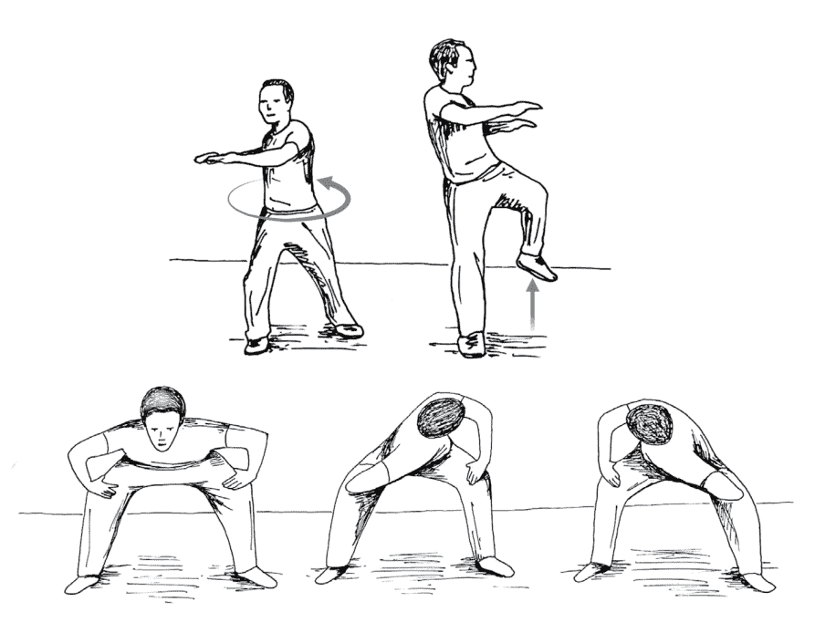

不光肉體的具體組成是如此，比較微細的結構，例如中脈、脈輪、氣脈、拙火也離不開螺旋場。都是我們從肉體想跟整體結合，或說跟天地合一。

我們過去讀一般人對脈輪的說明，無論描述作用、特質、開啟的方法，好像總是缺乏一個貫通的原則，讓人眼花繚亂。但從與整體相應的橋樑著手，所謂的脈輪打開，也只是我們突然從3D的既有框架解放出來，經過4D、5D、6D......跟整體連結。這麼解釋，也就非常簡單明瞭，一切是通的，原理非常簡單。但如果只在物質和現象的層面尋找線索，難免會質疑氣脈和能量是不是真的存在。

對我來說，整體、氣脈和能量是理所當然，只是不知道為什麼大家都不明白。所以我花很多時間解釋為什麼中脈與氣脈打通跟健康有密切的關係，也教大家怎麼打開中脈。

為什麼中脈這麼重要？身心和整體本來是貫通的，但我們透過主客二元式的運作、隔閡、念頭和情緒，帶來很多分別、障礙和堵塞。如果中脈沒有打通，我們不可能達到無我或沒有雜念的狀態，也沒辦法入定，甚至不可能健康。

和身體有關的奇蹟，離不開中脈。我們都聽過一些反重力的故事，例如佛陀從水上走過，大師盤腿坐在溪流而不會下沉。類似的現象是可以重複的，但如果中脈沒有打通，也就不可能。

雖然解釋這麼多，但從現代人的頭腦來看，是難以想像的，聽著聽著就覺得很玄，不相信人體真有反重力的作用。

我也只能再強調一次，這一點都不神秘，只是中脈打通、天地人合一很自然的現象。從物理學的角度來說，重力是靠時間才有的。如果我們打破時間，進入一種非時間的永恆，也就把重力的作用給顛倒過來。

對於頭腦一時無法理解的現象，我們不需要立即去拒絕。很多時候，只是我們找錯了方向，把一切變得不可能。

懂了整體的道理，會發現樣樣都可能。

## 62

# 脈輪可以打開，是因為原本都是相通的

雖然我不鼓勵大家從氣脈著手，但也講如果氣脈（尤其中脈）不通，身體一定有很多阻礙，人不可能是健康的，更不用談入定。許多朋友聽到這裡會反駁，他們認為「定」完全是意識層面的組合，跟肉體無關。但我要提醒，「定」也還是一種人間的現象和體驗。既然如此，它離不開小我，離不開人間組合的種種現象。

從整體來說，沒有什麼叫做「定」。會有「定」，是基於一種比較，好像它帶來一種停止。是注意集中到最後或是擴大到最後，它停了下來，一片空。這種可以體會、可以表達、可以分享出來的「定」，離不開身心和小我的作用。肉體本身要剛剛好，氣脈是通的，才能讓人有一種「定」的體驗。

心和物質是一起的。用這種角度來解釋，對於氣脈、健康、入定的認識也才比較完整而圓滿，而不是用意識去排斥身心，或用身心去排斥意識。如果我們對整體有信仰，也就能體會到肉體和物質以外的微細層面，例如中脈與脈輪，在身體和整體間溝通，只看要不要親自去體驗、去驗證。

中脈打開或某個脈輪打開，在微細的能量結構會有很明顯的變化。舉例來說，人如果喉輪打開，他會感覺到好像脖子帶著一圈飽滿的能量，像輪胎或甜甜圈一樣，久了也就習慣，覺得很自然。

微細的能量結構很重要，我也常分享怎麼去打開。可惜的是，很多人不相信，也不了解什麼是「打開」或「沒打開」，更不知道這跟健康有何關聯。

要體會這一點，我們有個很簡單的練習，躺在床上或地板都能做，也就是橋式（還原六法第四式）和臀橋（半橋式）。只要做，接著就會打哈欠，非常有意思。

這道理很簡單，脊椎跟中脈在肉體上看起來分不開，但它們是在兩個不同的軌道，一個是在肉體，另外一個是在更微細的軌道。透過橋式和臀橋，把中脈撐開來，沒有念頭，人立刻就想睡覺。

氣脈和生理的作用，就是這麼明顯。氣脈產生變化，我們馬上能體會到。氣脈不通，不可能健康；反過來，把氣脈打通了，自然會健康。

現代人普遍有慢性病，我喜歡用呼吸的練習，比如說九節佛風的閉氣有貫通氣脈的作用，這是修正體質很直接的方法。體質改了，身體自我療癒的本能也就有發揮的空間，讓人從慢性病走出來。

把氣脈打開，意思就是能量的結構是通暢的，沒有限制，沒有阻礙。還沒打通時，整個結構或通道是縮的、是窄的；打開來，是圓滿，是擴大的。這種打通，不光是在3D的層面，而是跟生命更高的維度已經連起來。

說到氣脈，一般人也許最常聽到的就是脈輪。為什麼脈輪會稱之為「輪」？並不是說真的有一個輪子，而是平面的符號或象徵很難表達我們跟更精微層面相連的狀態，所以畫得像是花瓣層層疊疊往外打開，以表達從各個維度不斷打開，並不受限於哪一個維度。

我在這裡也由下而上逐一簡單說明七個脈輪。第一輪「海底輪」是生命的根，打開後，讓人從會陰跟大地連結，天地合一。人變得很踏實，像山、像大地一樣穩重，不會輕易動搖。

第二輪「臍輪」打開，個人的創造力會爆發出來。無論藝術家、科學家，都會展現出強烈的突破。很有意思的是，臍輪所帶著的創造力，在肉體層面就和生殖有關。

值得一提的是，海底輪和臍輪打開，會產生拙火的作用，像蛇一樣由底部竄向頭頂，這時候，脊椎會像棍棒一樣挺直。我在《真原醫》表達過人體的電磁場，拙火由下方湧現，從頭頂出來，再回到海底輪，又上升到頂輪。這種能量的循環愈做愈通，帶來很大的歡喜，也會是一生沒有體會過的。

這種能量，可以因為一些練習而打開。例如前面提到的橋式和臀橋，在打開中脈的同時，在肉體的層面也會引發性的能量。如果拙火浮出來把海底輪打開，甚至心輪也打開，在肉體層面會帶來非常大的性的喜悅。無論男女，都可能會上癮。這種強大的能量，如果沒有足夠的成熟度，可能帶來額外的問題。

我時常提醒一些比較資深的修行者，特別是已經有老師的身分的，要更謙虛而誠懇去練習，更要把種種特殊的現象放過。如果我們打從心底明白這是跟上帝、跟主、跟一體在連結，那麼，這種反應也沒有什麼，當作正常來看什麼事都沒有，也就把它化空。

反過來，如果沒辦法把這些變化放過，甚至濫用自己的優勢和學生的信任，造出傷害，轉出更多業力，把過去累積的福德就這麼消耗掉，這是非常可惜。

我們活在信仰，活在全部，知道拙火這種從最底層的脈輪湧出的強大力量，也只是自然的結果。中脈透過最上方的頂輪和宇宙是貫通的，沿著最底層的脈輪往下也是牢牢與大地合一。天地合一，本來就是如此。

第三輪「太陽輪 (solar plexus)」，含著生命的活力，是直接和其他宇宙、時空相通的。一個人如果打開了太陽輪，勇氣與光芒會極為耀眼，跟物質、意識合一，顯化的能力也是不可思議的。在肉體層面，對腸道、消化功能有非常大的作用。很有意思的是，喉嚨上方的甘露落入口腔，經吞嚥進入腸胃，也會幫助太陽輪打開。對消化的影響很明顯，連糞便的氣味都會改變。整個人好像從裡到外變了一個人，那種清爽和簡單俐落，是過去可能沒有體會到的。

第四輪「心輪」也是一樣的，打開來，人不可能不停留在大喜悅的境界。我過去說過，這種歡喜比任何肉體的高潮還更強烈。不只如此，心輪是愛，是慈悲，慈悲心發出來，周邊的人、動物、植物都會感受到。人會想親近，連植物都會想跟他接觸。心輪跟太陽輪打開，對肉體也有很明顯的作用：呼吸會馬上慢下來，連心臟功能的彈性都能充分打開。

第五輪「喉輪」如果打通，不光是自己知道，身邊的人也曉得。聲音會帶著一種諧振，震動無數的法界。跟他接觸、聽到聲音的人，都會受到影響。釋迦牟尼佛同時在十個法界講課，甚至到龍宮說法，帶出無數的經典，也就是這個道理。

第六輪「天眼（眉間輪）」開啟，知覺會打開，不受空間的限制，也就是一般人說的眼通、耳通和心通的能力，甚至能在各種空間自由穿梭。

眉間輪打開，神通現前。第七輪「頂輪」如果打開，這個體也就跟宇宙完全相通，什麼都無所謂了，什麼都不重要。會定在神的本體，智慧就化出來了。

智慧與愛可以包容一切波羅蜜，生出一切功德。因此，平時如果有機會帶領大家進行Om-Ah的朗誦，我都會請大家從頭頂觀想光明，讓光到心輪再流出去，也就是將智慧與大愛分享到人間。

這些話，對於認定只有物質層面的人，聽起來會很玄。但人有信仰，知道一切跟整體本來就是通的，也會發現脈輪打開是生命最自然的現象，本來就是理所當然。

## 63

# 各個層面的眾生和能量

我們有信仰，知道生命有更大的層面，知道樣樣都是相通的，也逐漸可以接受頭腦理性解釋不了的「特殊」現象。像是眼前某個人，明明之前沒見過，卻好像帶來一種印象、作用或刺激；或是經過某個地方，突然有一種直覺或靈感，感覺不舒服，不太對勁。

這種作用，不只是人間的影響，也不是理性可以理解，但它確實存在。我們現在知道了，也不需要被狹窄的理性限制，不需要去排斥，甚至能接受。說接受，並不是任由自己被影響，而是得到共同淨化的機會。

我有機會，就會帶大家做火的典禮，無論是過去負面的影響、成長過程的受傷、家庭的困難，或是靈體負面的影響，通通交給火。交給火，不是要消滅負面的影響，而是我們也一起進入火，一起在火和光裡得到淨化與解脫。

淨化，可以在能量、心理或身體的層面進行。舉例來說，在台北的身心靈轉化中心，我會請同仁透過徒手操作的按摩和結構調整、各種配方的水浴，為大家做生理上的淨化。也教他們在服務前先觀想光透過中脈進入身體，讓全身充滿光，用手把光、愛和關懷帶給服務的對象。

這種光，是宇宙的祝福，也是一種陽氣。同仁作為管道，把光送出來，消化掉傷痛和負面的影響，是一種無私的服務。這麼做，不是個人的本事，而是宇宙的功勞。既然如此，也就不用再把能量帶回到自己，而是完全交給宇宙、交給整體去照顧、去處理。

然而，有時候情況更複雜一點，不是只有單純的生理層面需要調整。有些人遇到不可思議的困難，身心狀況的困擾和臨床上的思覺失調、重度憂鬱症或其他狀況。當事人找遍醫生、嘗試各種方法都沒辦法克服，處境非常讓人同情。

坦白說，有時是其他層面的影響，也許是過去的業障、靈體的作用或能量的障礙。實在有必要時，我也用我的方法來協助對方，例如透過禱告和火的淨化，一起帶到火和光裡。

我們難免會遇到一些障礙，負面干擾有時是人帶來的，有時是環境有的。我也常用準提咒幫助淨化環境、解開一些特殊的能量。清理的過程，難免引發一些恐懼，但如果有信仰，也就沒什麼好怕的。內心沒有對立，也不可能想傷害誰，就是很誠懇希望一切眾生都妥當在人間告一個段落，一起進入光。

在這裡，我想分享一段禱告，幫助我們淨化能量場。如果遇到一些困難，也許是一些能量或靈體來折磨，刺激負面的反應，讓我們情緒波動很大、煩躁、痛苦、憤怒、覺得被榨乾，也可以透過以下的禱告來淨化，讓能量恢復平衡：

> 來到這裡的能量和生命，我想把最友善的愛和光送給你。
> 你我都一樣，都是完整，是完美，在整體中得到療癒。
> 你和我都一樣的，本來就是愛與光，現在還是愛與光。
> 現在，你已經感受不到痛苦，沒有恐懼。我請求最高的自性帶著你、帶著我，一起進入完美、進入光、進入愛，一起自由，一起解脫。
> 一切，一切，我願把最美的光、最友善的愛也與一切的你分享，讓我們一起自由，一起解脫。

活在無私無我、活在整體、活在信仰，每個人會找到適合的禱告方式，接納各層面的生命和能量，找到自己神聖的療癒。

讓我再分享一個實際的例子。幾年前，我遇到一群做神秘療癒的朋友。他們每年都要去加州北部的雪士達山（Mt. Shasta），這是他們心目中非常重要的聖山。我出差剛好有幾天空檔，也就跟著他們一起走，上到山頂。

我也去過印度西南部聖山阿如那查拉山（Arunachala）。從我的看法，雪士達山和阿如那查拉山都非常神聖，讓人能體會到心中的聖人，例如彌勒佛、基督、聖哲爾曼或其他有代表性的象徵。

帶隊的女士跟大家說，她知道雪士達山有一個地方可以進行藥輪的典禮。藥輪，是石頭組合的圓圈，有單圈，也有像螺旋一樣的一層層的圓圈，是當地原住民的傳承。我在不丹也接觸過類似的儀式，一聽她說就感覺非常親切。

知道要進行藥輪的典禮，大家都很期待。到她說的山坡，沒想到竟然有人把石頭給挪開，打亂了原本的排列。發現有人故意破壞這麼神聖的場，她當然很難過。我安慰她沒有事，我們的人足夠，完全有能力把藥輪重新組合；也告訴她現場有好多大聖人、還有兩隻龍在天上加持，他們會從各層面來協助這個藥輪的典禮。

之前我在阿拉斯加，和一群剛認識的人進行火典；這次在雪士達山又有機會跟新朋友一起做藥輪的典禮。這一群大概15個人，他們都很有信心，讓宇宙帶著我和大家一步一步進行。天色本來很暗，雲很重。等我們組合完成，雲已經散開，天空亮了起來。

我們繞著藥輪一起跳舞，非常莊嚴，到後來心中充滿歡喜，感覺帶來了一種神聖的力量。我也請每一位分享，他們很敞開地說出自己的體驗，也讓大家都很感動。

等全部的人說完，我邀請大家把今天的體驗交給宇宙，交給全部的眾生，然後用自己的方式表達最高的尊敬。他們沿著藥輪一層一層走進去，走到最後，好像進入另外一種狀態，動作和平時的舉止不同，非常美。

最後，我跟大家說，今天在這裡修復了藥輪，而且比原本的規模還大，是數不完的聖人來加持，讓我們能順利進行藥輪的典禮。我也邀請大家一起感謝。就這樣，結束了這場臨時的聚會。

這些實例，我平時不太說，因為知道一般人對真實理解不夠、心沒有打開、也沒有信仰，難免會用物質層面很狹窄的理性去排斥，甚至強化自己的不信。

但事實是，只要有信仰，我們就有力量克服眼前的阻礙，凝聚大家的心，把生命的美、生命的莊嚴、生命的健康和圓滿帶出來。

這些，都是信仰的力量。

## 64

# 人類的起源不是過去以為的那樣

假如我們允許任何可能性展開，就像我在《轉捩點》與《短路》提到的，會發現事實跟主流觀點往往是兩回事，包括過去在地球有其他的文明，而人類的演化有一個最早的藍圖，是依照寫好的程式發展的結果。這個藍圖跟現在的主流學說完全不同，只是人類的科學和聰明還沒摸到邊，我們也就認為不可能。

理性會說服我們人類的演化是漸進的，從青蛙、猴子一路演化到人類。但是如果只透過基因變異和環境壓力帶來的篩選，可能要超過幾十億甚至幾百億年才可能浮出人類的聰明。這機率是小之又小，如果沒有更大外力的介入、沒有一個老早寫定的藍圖，反而才是不可能。

這個藍圖不是透過基因變異和適者生存的演化壓力而浮現，而是地球外的先進文明用反向工程組合出來。有些新時代的朋友聽過昴宿星團（Pleiades）和雷姆利亞大陸文明（Lemuria），也會說人類的演化會進入寶瓶時代，但他們不見得意識到這些說法和人類起源的關係。再換個方法表達，也可以說是大菩薩或聖納庫馬拉（Sanat Kumara）這種高等的意識關注著地球，為人類帶來一種反向的工程。

談這些，要表達的也只是，人類的一切並不是偶然的發生，而是完全受到整體的照顧。我們的聰明、外形、機制、本質，與更高的聰明沒有什麼不一樣，只是還沒有得到發揮。我們是受到各式各樣外星聰明的影響和照顧，才走到今天。

我們如果知道，這一生來，自己並不是宇宙唯一的聰明，不是唯一的可能，而其他可能性遠遠比現在看得到、體會得到的更大，自然會謙虛，也就發現很多本來不知道的資訊或體會慢慢清晰，跟宇宙、全部的文明、全部的智慧、全部的聖人，已經連起來。

繼續走，我們會發現地球很熱鬧。它不是宇宙裡一顆孤獨的行星，而是許多生命從各個角落想要接觸、想要影響的對象。這個事實，只等著我們接受。

聽到我前面說，人類不是從猴子或哪個動物演變而來，有些宗教薰陶很深的朋友可能以為我既然不認同演化科學，應該會認同教會說的上帝創造萬物，而想把我的說法帶進演化論和神創論多年的爭辯裡。

但我要談的不是這個，無論是演化論或神創論，對我都是人類不夠成熟的說法。我想表達的是，有地球以外的文明幫忙推了一把，使人類和其他動物遠遠不同。但這種不同並非透過基因變異的演化累積，也不是6天內就創造了萬物和人類。

我的觀點，跟一般人在意的爭論完全不同。但其實我們認知的範圍可以打開，大可接受有其他文明在影響地球，不需要被鎖定在那麼狹窄的範圍。

這並不是說哪一個主流說法要刻意騙人，只是人類很有限的認知僅能得到局限的現實。過去早就有學者從他認為的考古學證據來看，認為人類起源並不是主流科學說的那一套。只是現代人頭腦還沒完全打開，也就抱著一種傲慢去判定不可能。

當然，第一次聽這些話會感覺非常奇怪、不可思議。但這是我們都早就「知道」的，我們的身體、DNA都含著宇宙過去的記憶。這些話就讓每個人自己去體驗，看是不是真的。

是透過信仰，人慢慢把限制打開，讓這些現實進來，來證明我們講的對不對。如果到今天，我們還只停留在質疑或否定，也不想把腦海認知的範圍打開，那麼，我也只能苦笑。

## 65

# 缺乏信仰，奇蹟不會發生

我們醒過來了，安住在自己，安住在背景，安住在整體、一體、心、意識。這時候，非常寧靜。只要頭腦稍微動一下，現象和變化也就延伸出來。

一般人會把這些現象的變化當成是奇蹟，但這其實是正常。真實本來就是兩面一體，沒有物質和意識的分別，意識跟物質是相通的。

療癒也是一樣的。物質、肉體、心理層面的療癒，都跟心分不開。根本而徹底的信仰會化解所有的分別，全部都是一體。這時候，樣樣都可能。活在生命所有的可能，已經是新的正常。

是信仰到底，徹底的信仰，才會有這種心境。如果我們還認為這是什麼希奇的事，也就還要回去再練習、再淨化。

大多數人的現況是：認為樣樣都不可能，凡事都要有頭有尾，有因有果，要有根據，要從A到B到C一步一步這樣展開，這是可以理解的範圍。一旦超過了這個範圍，我們當然認為不可能。

再更進一步來談，如果我們有徹底而根本的信仰，讓生命帶著走，知道宇宙不會犯錯，知道樣樣都不是表面所看到的，也就樣樣都能接受、臣服、接納。

如果前面有一點表面上不順，我們就馬上否定、馬上拒絕，非要把壞事擋住。那麼，生命想送禮物來，我們是沒辦法接受的。

好事或壞事，是我們在認定，但整體樣樣都是平等的。有些表面上不好，但最後的後果是不可思議的，可能就是奇蹟。但我們非要否定它、拒絕它、擋住它，不給它顯化的空間，那麼，奇蹟要怎麼發生？

特別是如果我們還不夠成熟，還沒有真正超越、看穿，這時寧可多接受各式各樣的體驗，再加上透過中道的練習，對一切都可以臣服，都可以參。

現代社會的步調非常逼人，絕大多數人心中都認為自己有各式各樣的任務，好像要先完成這些，才能進一步談如何得到靈性、如何得到醒覺。但我認為這不是互斥的，所以也鼓勵大家多接受、多體驗，不需要為了靈性去否定、去拒絕。

一般人會認定某些事不該發生，但成熟的人會認為樣樣都好，都可以交給內心的信仰。眼前的困難度過了，樣樣也好像順起來。

我常遇到一些朋友，他們有很好的工作，也想把事情做好，希望能帶動環境的發展，照顧更多人。但做事的過程難免遇到一些不順，有時也會想乾脆離開。我通常會勸他們，不順不見得一定不好，就當作磨練和人生成長的機會。

有些朋友就這麼度過了，接著人生好轉，回頭想也就發現，幸好自己還在這個領域裡，不然也就錯過轉機。

生命，會帶來樣樣的考驗，看我們懂不懂得忍耐、度過、化解問題，和生命接軌，讓生命帶著往前進。也只有這樣子，我們在找的奇蹟、一些不可思議的發生，才會展開。

早晚，我們會發現眼前體驗的內容愈來愈不重要。到頭來，真正有意思的，是覺察最根本的機制，或者說一種最源頭的聰明、本能，這才是不變的真實。

樣樣都是無常，體驗不斷在變，但在這之中有一個共同點，也就是可以覺察到現象和變化的機制。我們什麼都體驗，都不拒絕，總有一天會發現，再怎麼變化，都離不開這些可能的變化組合。

我們都看過了，不想再去尋、再去捕捉。眼前再怎麼變更，好像大同小異，再也吸引不了我們的注意。這時候，我們對樣樣已經不會覺得希奇，也不可能著迷，沒有什麼好大驚小怪的。

我們不再緊盯著新的變化不放，而是好像退了幾步，給自己一點空檔。人就慢慢退到源頭的聰明，注意到本來就有不生不死的機制，不生不死的聰明。

這是我們在修行過程要經過的。

如果沒有這種放過，那麼，哪怕修得再久、很會講道理、有神通，遇到事還是看不開，遇到一點不順就小題大作，帶給身邊人都是負面的影響。

但是，有一天，我們突然醒過來，突然貫通了、看通了、超越了，雖然眼前還是有一個世界，但我們還是不斷地體會到源頭無條件的聰明、沒有生死的聰明。最有意思的是，這時，全部生命的可能才真正活起來。

我看到的奇蹟，全部都是在沒有時空的神聖空間裡開始起伏的。我們在一種沒有時間、沒有空間的心境，隨時定在這裡現在，這是我們神聖的空間，是一切的源頭。別人眼中的奇蹟，就在眼前不斷展開，不斷發生。

眼前，樣樣都是奇蹟，別人會認為不可思議。但我們會發現，這些奇蹟過去也有，只是因為自己對生命有一種質疑的態度，總是擔心有什麼壞事會發生，所以在展開前就會想辦法打住，把它停下來。

現在，不一樣了。眼前的不順，我們可以接受，後面也就能完整展開了。帶來一些從別人角度是不可思議的奇蹟，但對我們，是一樣的。

對人生、對人間的態度改變了，而且是脫胎換骨的改變。接下來，命運也變了。我們走到最後，要做什麼？也就活在菩薩道、做個好人吧。

我們對時間的觀念轉變，曉得沒有時間也沒有空間，過去的習氣會跟著改的。只要讓新的習慣、新的迴路，變成新的正常，跟著走下去。最後，每個習慣都可以改，而且是輕輕鬆鬆地改。

習慣轉變的過程，也剛好帶來提醒——我們有勇氣對樣樣做變更，接受樣樣的改變。本來樣樣都重要，現在發現樣樣都不重要。

對我們，最輕鬆、最不費力的正常，是安住在中道。樣樣都可以接受、可以接納、可以歡迎、可以感恩，我們已經落在中道，自然地臣服，自然地參。

這樣子的話，這一生也就非解脫不可。

## 66 靈性不是人間的追求

前面談這麼多經驗，可能讓人以為是現象或經驗帶頭，但其實是信仰帶動一切，是信仰讓我們進入更深的轉變。

人充滿信仰，才可以活在全部生命的可能，讓生命的光譜完全展開，讓它活出來。

定的體驗，還有各式各樣無所不知、無所不能、無所不在的境界，是人在追求真實旅程都會體會到的。但最終、最根本的還是信仰。信仰才會培育我們，牽著我們一起走。

但這過程中，頭腦還是會讓我們退步，進入一種修行或追求真實的錯覺，包括討論究不究竟、空或不空，都還是活在頭腦的區隔，離不開相對和語言所能表達的範圍，離不開頭腦的產物。

頭腦的產物不光是念頭，還有各式各樣的情緒。我常提醒身邊的朋友，在追求真實的路上，早晚我們會經過一條很孤獨的路，也就是靈魂的暗夜，也許會不斷浮出悲觀的想法、悲哀的念頭，各種好或不好的畫面也都會來找我們。

在這過程中，有時候會出現一些畫面、突破、好像有開悟的體驗。有些朋友也發現，我是一邊鼓勵，一邊潑冷水。鼓勵，是因為我知道大家的用功，也有很深的領悟；會潑冷水，也就是提醒大家這還是頭腦的作業，還只是一種能量上的摩擦。

無論在中脈、神經系統或心理層面，人確實要淨化到一個程度，才可以让宇宙帶回家。在回家的過程，沒有貫通到底的部分多少還是有一點阻力。宇宙的力量就像無限大的電流通過身心，遇到僅存的一點點阻力，像電流的短路般造出局部的光和熱，在身心和頭腦產生一些反應，而說到底還是離不開頭腦的產物。

這些反應，我過去也說是宇宙、一體留下的訊息，是很難得，但也會誤導我們。我看過許多朋友被這些體驗和畫面誤導，自認為有什麼成就、可以成為上師，或擺出大修行者的樣子。我才會做提醒，不管出現什麼特殊的境界或畫面，樣樣都是頭腦的產物，也只要不斷回到方法，而方法就是臣服跟參。

人要完全有信仰，同時配合中道，守住一種戒律，讓我們收斂自己，不會過度。不該講的，不會去講；該講的，還是會幫別人考慮。不然，我常觀察到兩個走歪的現象，一個是把靈性當作物質來追求（有人稱為靈性的唯物論），另一個是把眼前的變化當作全部。

有些人聽到一些境界，例如拙火、比性高潮更強烈的喜樂、能夠影響更多人的成就，他也心動了。但讓他心動的不是真實，而是這些「效果」，讓他覺得可以補強小我的作用。

所以，我過去不喜歡談生理的變化、氣脈的轉變。就我的觀察，許多被當作老師的人，還是想要氣脈打通、有各式各樣的神通、各式各樣的歡喜、特殊的境界，把這些現象拿來強化小我的功能和作用。動機不純，把靈性當作物質或世間的成就來追求，這怎麼可能對學生有幫助？

有些老師忘記了最初的出發點，進入世界的煩惱，變成為了財富、權力、名氣在做，到最後什麼都捨不得，什麼都要多抓一點，甚至連性的需求都放不過。性本來是個單純的生理需要，但是經過頭腦的組合，反而變成一種在心理和神經系統上放不過的需求，甚至為此要去占弟子便宜。

光有信仰，卻沒有基本的紀律，是非常危險的。雖然說要守戒，但是我還是要提醒，是透過正向和中立的態度來進行，沒有必要在身心又加上一層不必要的緊縮和反彈。頭腦講究正向，在正向中，它會放鬆區隔。我們只要頭腦打開，意識放鬆擴大，讓身體處在一種舒暢的狀態，它回報給頭腦的，也就是喜樂和一切都好。

我們不需要用負向的語言把頭腦和身心反應帶到別的層面，只有不斷回到友善的中立性、回到中道，才能把這種身心、氣脈、拙火的能量解散，讓注意回轉到內心，安住在根本的聰明、源頭和信仰。我們不需要再做什麼，只要停留在這個源頭，一體早晚來「拉」進去。

人如果徹底跟宇宙達到共振，氣脈、中脈全部是打通的，不可能不是通的。如果不通，也不可能入定。本來拙火、氣脈、身心的轉變是很大的推力，可以加快成熟的進展。我們只要懂得用中道來面對，也就能把它當作工具。

這些經過，看我們可不可以臣服到底，臣服再加上參，帶一點正向的中立性、正向的態度，不斷友善歡迎、接受，也就不再受到各種畫面、預感、現象、歡喜或不歡喜的影響。

做熟練了，我們不斷地，好像瞬間還沒有來，都已經活過了。本來重視每個瞬間的內容，很注意瞬間的發生和變化，但我們慢慢成熟，興趣從瞬間的變化和現象，轉到現象和變化之前的覺、根本或源頭的聰明。

我們會發現，這源頭比瞬間的現象更有力量。它本身是一切的共同性，連結我們過去想知道和學到的一切，是我們這一生、過去活過的、未來可能活的之間的共同點。

到這裡，我們完全是整體。我們照顧身邊的人事物，也是照顧整體，不會因為是誰就多照顧一點，平等心已經完全活出來，把世界看得完全平等，不可能讓身體的需要變得比其他更重要。面對身邊的眾生，幫助他們都來不及，怎麼可能去欺負弟子、欺負身邊的人？

如果人還不夠成熟，還需要做這些提醒，那麼，也只會有小成就、小轉變、小神通，也許有一點意識膨脹，讓他自己覺得無所不能、無所不知、無所不在，但他會認為這些是全部，是最終的境界，而停留在上面，並且希望重複再重複，希望得到更多。這一來，反而不可能再有進展。

我們追求真實的路，透過中道、透過參、透過臣服，本來可以很順地一路走到底，但是因為誤解而自我膨脹，反而把路給斷了。不光如此，累積的業力是不得了的。一般人不懂，做了一些不妥當的事，事後會懺悔；但如果到了老師的地步還會欺負人，業力不曉得多少倍，是還不清的。

所以，信仰要跟我們的練習配合。人真正完全進入臣服，讓生命、讓心帶著走，才真正活在全部的可能。而這全部的可能不是個人在人間追求的名譽、財富、權力，也不是原本貪、嗔、癡的期待。

假如讀到這裡，都可以接受，那麼也就踏踏實實練習。練習什麼都好，重複也沒關係，重複只是遊戲的規則，但我們體會的是內心，而成熟度會不斷增加。

站到整體，我們沒有再帶來阻力，活在全部生命的可能，一路走到底，這就是我希望看到的。

## 67 信仰帶來生命徹底的療癒

有了信仰，根本的療癒完全是自然的後果。
我們徹底調整自己的假設和觀念，完全推翻認知的典範，可以活出全部的可能。那麼，心會希望我們健康，會帶著肉體前進，而會有療癒。

許多聖人的紀錄充滿了奇蹟，比如說耶穌能治病，甚至讓死去的人復活。心本身產生力量，而改變了下游的肉體最後表現的後果。但這裡講的療癒，不光是身心，而是整體，包括靈性的層面。

一個人充滿煩惱和悲傷，受過嚴重的創傷，會想從人生走出來，想追求真實，想解開內心的障礙。靈性方面的療癒也會跟著發生，而延伸出身心的療癒。

有徹底的信仰，帶來根本的療癒，也就是我們充分領悟到物質層面和意識層面完全是連結的。沒有一樣東西是單獨存在，沒有一件事是偶然發生。宇宙每個角落都是相通的，一個點跟其他點是完全連結的。

當然這也能用物理學的量子糾纏來表達，但這裡所表達的連結是更底層、更基礎，比量子更小，在意識層面是相連的。
如果我們可以接受沒有哪件事的發生是巧合，這已經是很大的突破。等於說我們有信仰，明白樣樣是宇宙安排，是業力帶來的組合。

既然如此，有什麼東西可以計較？還有什麼事沒辦法接受、沒辦法忍耐、沒辦法度過，非得去干涉、去影響瞬間帶來的一切？還是給自己一點空間，有一點緩衝，不急著做什麼，不需要反彈，不去干涉，不去修正眼前命運的展開？

我們懂了這個道理而可以接受，面對人生也就有了韌性和勇氣，會發現即使人生表面上有很多我們以為不如人、命不好、不幸、負面的發生，如果有耐心去度過，聖靈的果子也就得以顯化。不然，根本不可能活出生命的全部可能。

在人生路上，我們隨時提醒自己：宇宙不會犯錯，一切發生是宇宙帶來的禮物，是聖靈送來的果子，帶來的恩典。我們的理解會跟上這些提醒，讓這些領悟變成正常，帶著我們愈來愈成熟。

成熟到底，總有一天，我們會明白沒有一樣東西不是相通的，又同時能體會到全部這些現象、這些點、這些連結，一一拆解下去都是空的。

這就是佛陀體會到的，沒有一樣東西足以獨立存在，足以稱為真實或本質，但又都含著真實或本質，跟一切是相連的。只是，走到最後，連所蘊含的最根本、最基礎、本來就有的真實，剝開到底，本身是空的。

什麼都有它的道理，都可以接受，但走到底又都是空的——這種領悟，叫頭腦怎麼去想？怎麼去掌控？

前面的各種說法、各種合理化，好像都讓我們在邏輯上多少抓住一點依據。像是樣樣都不是偶然，沒有什麼單獨存在，一切都是相通的，沒有一件事是無緣無故發生的，都是過去的業力註定和宇宙的安排。既然如此，我們也就樣樣都可以接受，而可以相信生命，可以有信仰。

但是走到最後，慢慢淨化得差不多了，我們也就發現說什麼連結、不是偶然……這些話本身不存在。畢竟如果都是空的，哪裡又有連結？連意識本身也是空的，一體、整體也是空的。這樣的話，腦海的分別和邊界充分碎裂，頭腦證到空，連一點塵埃都浮不出來，沒有任何一點主張、論述或概念，讓頭腦可以依靠。

就連意識、一體、主，走到最後都是空的，它本身沒有任何本質，沒有任何條件，沒有任何機制，什麼都沒有，到最後是空到底。

## 從身體著手

## 68 愛護身體，也是愛整體

這些年來，大家愈來愈活在虛擬的境界，像現在隨時都在滑手機，要從社交媒體得到各種互動，跟著進來的資訊一下子煩躁、一下子笑，心根本停不下來。忙碌時，同一時間做好幾件事已經是常態，甚至會覺得這樣才有效率。在這種快步調的狀態，要怎麼把頭腦的作用降下來，把注意力從腦海落下來？

我認為，方法並不是新時代提倡的往上揚升，反而是下降：把意識落到肉體，身心合一，把所有層面變成一個，達成諧振。

我們如果充滿信仰，知道自己跟整體分不開，自然明白這一生可以透過身體的窗口與整體共振，和宇宙充分結合，讓整體來貫通自己。能有這樣的窗口，是不曉得多少輩子才有的機會。既然如此，我們為什麼要輕忽甚至傷害身體？既然都是整體的一部分，為什麼不能當作眾生來好好愛護？從這個角度出發，靈性和身體之間的矛盾也就消失了。

歷史上流傳一些為了修行而傷害肉體的故事，像是二祖為了表達求道的誠心，在大雪天割掉自己一條手臂，希望得到達摩的教導。這種故事常被很多人當作是求道的勇氣和決心來談，雖然這麼說也對，但這種解讀多少還是不圓滿，還認為樣樣不是平等，需要犧牲什麼去交換本來就有的真實。

一般人談到修行，常有一種類似新時代的看法，想透過修行、練習、靈修去成仙，或成為一種比較高維度、比較空靈的生命。但我會提醒，落在人的層面、好好活人的生命比較重要。我們活在一體諧振的境界，會突然發現肉體一樣離不開意識，離不開一體，是整體的面向之一。

就算不談修行，想想，這個身體是多少條件組合才有，光是體恤父母和社會的照顧就不應該任意犧牲，更別說這種犧牲跟真實和整體根本沒有關係。身體完好，我們養得活自己，有餘裕修行，回轉到真實；若為修行去傷害身體，反倒只是增加不方便。

甚至，我們可以透過健康得到舒暢和均衡，減少修行的障礙。只要想通這一點，不被表面的意識型態給困住，對各種療癒的觀念敞開心胸，不會排斥妥當的做法，也不會覺得非怎樣不可，只要有幫助都能採用。

接下來，我想提出一個建議：在閱讀、練習或照顧身體前，先朗誦第13章關於真實的提醒。這四個提醒非常重要，我也請康健的同仁協助，印成小卡，方便大家自行裁切成書籤使用。

我們先朗誦再做練習、照顧和閱讀，讓腦海帶著從整體出發的念頭，動作也帶著這樣的提醒，讓這樣的認知——從整體活肉體的生命——成為新的正常。

## 69 對療癒充滿信心

我們有信仰，面對健康和療癒也就能接受一些措施。比如呼吸、靜坐、飲食、睡眠、正向的心態，來活化副交感神經的放鬆反應或減輕發炎，對療癒非常重要。再例如運動，我們知道肉體和身心跟整體從來沒有分離過，所以站在整體看肉體，會發現身體局部的不舒服（例如頸椎和腰背的慢性痠痛或慢性病）都可以用很簡單的方法從更上游的機制切入，來照顧自己，配合治療。

如果我們沒有信仰、放不過世界、沒辦法臣服、面對樣樣都沒辦法放鬆，也就很難接受更高的智慧和療癒力量。這樣子，想要改善什麼，都會格外費力。

如果我們有信仰，有勇氣，會發現生命觀已經完全不同，也會配合生命，找出自己對健康的看法和解釋，而這些看法會非常新鮮，不受過去觀念的限制。

我們會懂得結合非主流和主流的醫學，不會排斥西醫或中醫，而是全部的領域都會用到。我們也不會只依賴化學、物理、生理、心理學的知識，知道這些只是從某個角度切入真實，並不足以全面代表整體。

我很年輕時就對非主流醫學感興趣，在美國補充與替代醫學辦公室（OCAM）還沒正式成立前，就已經在美國國家衛生研究院和朋友組了一個補充與替代醫學委員會，一起探討這方面的主題。參加的朋友在各自領域都有很傑出的成就，難得的是願意敞開心胸整合各自的觀點。很多年後，美國國家衛生研究院有了正式的國家補充及替代醫學中心（NCCAM），是個年經費幾十億美元、非常有規模的機構。

坦白說，雖然我花了不少時間去探討，這並不代表非主流醫學一定比主流醫學更優越或更重要。如果有這種想法，也是誤導自己而已。真實沒有對立，療癒是整體，最多是現象的層面好像不同。許多人會把真原醫當作是自然療法或另類療癒，其實不是，真原醫是全面的醫學。我也在《真原醫》表達過生命是多層面的組合，有化學、物理、生理、心理、靈性等種種的層面。

既然如此，要探討健康不會只偏重某個領域。如果已經知道某種做法對身體的衝擊比較小，那為什麼不做？舉例來說，在一些腫瘤的案例，西醫的治療方法已經非常成熟，我會建議接受手術，手術後，只要化療有幫助就做化療，根本不用再考慮別的做法。

到現在，我分享的運動、飲食、呼吸、全部生命的練習，在推廣前都親自執行至少半年以上，以充分體會它的作用，否則我不會跟人分享。我的心態相當務實，只是希望整合各種有用的觀點來達到最佳的健康。在考慮的階段，我們讓各種選擇都進入心裡。然而，一旦選好了方向，就完全投入。不然東聽西聽，隨時受別人的說法影響，而這些說法不見得和我們相關、不見得符合事實，也就很難從疾病走出來。

投入治療，除了規規矩矩完成治療的步驟，心更是要投入：把人間看開，看穿現實組合的機制，知道生命還有更大的力量在主導。

我看過無數從嚴重疾病療癒的實例，無論採用哪種治療，關鍵都是當事人對自己和治療充滿信心，合作再合作。這種安全感，透過迷走神經的作用，對身心的平衡、腦海的認知會帶來非常正向的影響。

如果沒有信仰、對療癒沒有信心、對自己沒有安全感，也就很容易知道歸知道，卻缺乏正確的方向感。以為懂，但懂的東西都沒有用。其實只要有信仰，透過臣服、參和中道的平台看一切，我們就不會被某個層面的變化迷惑，不至於隨時改變做法，而是跟著療癒的直覺走下去。

讓我舉一個實例：東恩沒有什麼病痛，在一般人眼中算健康。他自從一天只吃一餐、而且是以原形食物為主的高脂低碳水飲食後，感覺更健康了，可以說一輩子沒有這麼健康過。但是他去做健康檢查，驗血發現血鉀偏高，高出建議值的上限。

他的醫生很盡責，看到數字異常當然會提高注意，讓他抽血再驗一次，結果還是偏高。儘管他沒有症狀，醫生還是再抽第三次血。偏偏第三次的數字又更高了。醫生不敢什麼都不做，就要求他馬上掛急診，檢查是不是心臟或腎臟有異常。

謹慎是對的，但取證有偏差。醫生注意到數字偏高，卻不理會當事人的身心狀態。東恩一點事都沒有，既沒有嘔吐，沒有腹瀉，精神也很好。第四次抽血再驗，數字終於回到正常範圍，這一切的忙亂才告了一個段落。

幾十年來，我看到的狀況都是如此。醫師的診治被數據壟斷，好像自己親眼見到的病人狀態不算實證。

這麼說，並不是指責誰，只是想表達一種謬誤：每天的生活和狀態，明明已經在反映健康；但透過主流醫學的流程，我們卻把健康完全交給數據，彷彿數字高低比自己的真實狀態更重要。

此外，也許是因為現代醫療「標準化」的趨勢愈來愈強，也讓醫師的注意力被鎖定在指引手冊所定義的「正常」，對於病人因為調整生活習慣而有的狀態和代謝轉變，缺乏敏銳度。

對於採用低碳水或生酮飲食來調整體質的朋友來說，血鉀指數升高的情況相當常見。我們將飲食由高碳水轉向高脂肪，對體內代謝的機制是非常大的刺激，而這種刺激也是我們希望達到的，才能扭轉原本的失衡。

從失衡矯正回來的過程，原本恆定的血液指標可能出現波動。例如從一般飲食轉到全肉飲食，除了血液膽固醇數據起伏，也可能因為身體將過去攝取的草酸釋放出來而出現關節腫痛的症狀。

這是身體建立新平衡的過渡狀態，一旦新的平衡建立，數據會恢復正常。但這種過渡的狀態很容易被當作嚴重的警訊，甚至被要求再回到一般的飲食。荒謬的是，當初就是「一般」的飲食帶來疾病的。

接受主流訓練、嚴謹遵照醫療指南的醫師，思路是以消除疾病為主，也許注意不到健康的多元狀態，反而可能阻斷身體自我療癒的轉換過程。

從真實和信仰出發，我們對自己和身體的健康會有完全不同的認識，也會保持足夠的敏銳，不被特定的學派給綁住。

## 70 動起來，克服重力和習氣，修復身體的傷

這裡要特別提醒大家一個中心理念，那就是療癒需要靜，但也需要動，特別在身體的層面一定要透過動。身心疲憊的時候往往休息不了，這時動起來，反而容易得到休息，才有修復與療癒的空間。

我不希望大家等到身體完全退化、再也動不了的時候，才想到要開始運動。只要我們還有一點體力可以活動，就應該去運用它。剛開始動作不標準也無妨，重點是掌握《真原醫運動新觀念》提過的三大方向：健身（肌力）、有氧與拉伸。只要動起來，就是最關鍵的起步。

當然，總是會有人抱怨：「我實在太忙了，根本抽不出時間來運動。」我會告訴對方：「正因為抽不出時間，才更需要運動。」我們如果讓自己忙到抽不出時間，代表已經對疲勞感到麻木，讓身體長時間用不健康的方式硬撐過每一天。身體已經失去平衡，正在抗議，但我們卻渾然不覺。

我接觸過無數從慢性病療癒的實例，在過程中，我都會請他們一定要運動。從輕鬆愉快的活動開始，再一點一滴地，透過「動」將他帶入「不動」，進入靜坐，最終體會中道。這是這本書最想傳達的核心。

至於我個人，無論在哪裡都喜歡跑步。跑步為我帶來一種神聖的空間，讓我放鬆、集中，放下生活裡的顧慮，也讓身體出汗，強化心肺功能，帶來元氣。

我從小喜歡運動，在柔道和足球有不錯的表現，本來有機會代表巴西在柔道項目參與1976年的加拿大蒙特婁奧運，沒想到備賽時扭傷背部，椎間盤滑脫出來，引發坐骨神經痛，踢足球又讓膝蓋受傷。這些意外傷害雖然中斷了我的運動員生涯，但我對運動還是一直很關注，也讓我只要有機會就想幫助運動員。

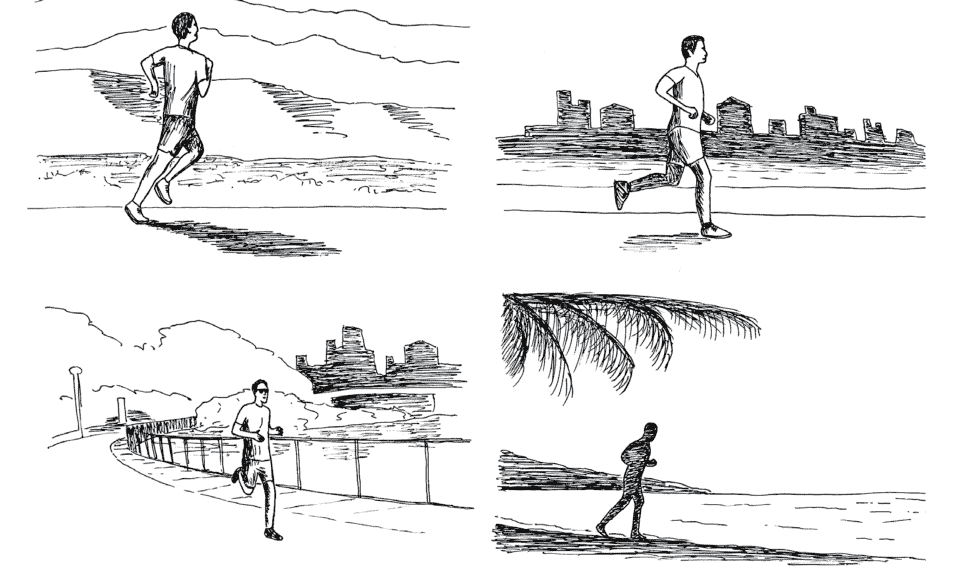

雖然膝蓋受過傷，一般人會覺得不適合跑步。但我一方面是自己喜歡，另一方面，坦白講，活在地球一定有重力的影響，種種結構的失調是避不開的，只是我們要學習怎麼去面對這個有壓力、有重力的世界，懂得用運動和休息來療癒，重新把均衡帶回來。

我們改習氣，需要透過行動（神經＋肌肉）建立新的神經迴路，療癒也是一樣的，透過動才能把堵塞沾黏的筋膜打開，讓關節恢復靈活，並把關節跟關節之間的配重重新整頓。所以，身體的不舒服要透過動，才會慢慢消失。

有時候，為了克服重力的影響，我也會在游泳池運動，不光是游泳，還包括一些在水裡做的健身項目，減輕關節的負擔，例如在水裡原地跑步或做開合跳。為了提高運動強度，可以同時穿戴海綿，強化在水中做動作的阻力，也減緩肌肉流失。

如果要運動，不一定要跑步或做某個流行的項目，每個人都有比較適應的運動，做了能讓心情愉快、身體活潑，是最重要。運動也有跟人互動的成分，我每次在公園做運動，總會有一群人跟著我一起做，彼此不認識，但熱鬧又有趣。配合我們的天性，讓運動變成每天的正常，才是促進療癒的關鍵。

前面提過，人都受到重力的影響，即使不是運動員，許多人也因為工作習慣或不良姿勢導致結構失衡、退化和老化。身體結構，特別是脊椎的調整，一方面是社會普遍的需求，另一方面也因為我個人的經歷，所以特別關心，也找出透過運動來療癒的方式。

可能因為如此，也就有了結構調整的靈感。前面提過我在慢跑時見到地藏王菩薩，除了自律神經的作用之外，他還教我結構調整，也是一套整體的醫學。這個經過聽來不可思議，但對我是再真實不過。

簡單來說，我們跟整體是透過螺旋連結的，結構調整是借用宇宙的力量，沿著螺旋的路徑反轉，將一路以來形成的沾黏和阻礙解開來，挪開導致失衡的力量，讓受力重新分配。這是我認為最徹底也最安全的方法。

這樣的結構調整在實作時，可以請別人徒手操作，這也是我在台北身心靈轉化中心請同仁提供的服務。但長久來說，更需要靠自己做正確的動作、妥當的姿勢，在身體的架構上來調整。這些自行操作的技巧，是我想指出的重點。

結構調整的動作，是透過反轉、共振及拉伸帶來的空間。這種調整，可以發生在小的範圍，也可以是全身的範圍。這套操作之所以可行，離不開筋膜的科學。

筋膜是繫住身體各個組織的薄膜，從頭到腳包覆全身的肌肉、骨骼、器官、血管和神經，具有一定的彈性和潤滑，能讓身體保持動作靈活，也有足夠韌性能拉住身體。特別的是，除了力學的作用，筋膜的狀態還會反映身心健康。

現代人特有的長期微緊繃狀態，讓原本健康的筋膜容易輕微脫水、沾黏，甚至纖維化，使身體變得僵硬，血液和淋巴液循環變得更差。這種不舒服，不會只停留在筋膜。筋膜有大量的感覺神經末梢，持續將不自在的訊號回傳給大腦，提示大腦要繼續保持警戒，人也就很難放鬆下來。

懂了筋膜的道理，也就能解釋從古代流傳到現在的許多運動養生智慧，包括各式各樣的瑜伽、太極、導引、氣功、體操，都是最有效的方法讓我們在最短時間把結構的健康和身心的靈活度與輕鬆找回來。

有些人可能不愛動，一生仍然健康。但是，我認為在現代這種步調普遍快、每個人壓力大的時代，不動卻仍保持健康，這難度是相當高。

接下來71～75章，我會推薦幾大類的運動，也請同仁拍影片來一項一項示範。我們用很簡單的方法照顧健康、帶來療癒。搭配第13章／「真實的提醒」書籤來進行，從每個細胞的運作跟靈性的追求合一。

運動示範影片播放清單

一切都是整體，我們怎麼想、感受、講、表現，包括運動，都可以和一體一致，和唯一而共同的意識一致。倒不是瑜伽歸瑜伽，健身歸健身，跟我們的本質和其他層面都不相關。

## 71 手和腳動起來，我們已經在健身

生活的樣樣活動，都靠肌肉的動作才能進行。從吃飯、上洗手間、從床上起身、從地上爬起，到可以獨自出門的生活自主能力，乃至於登山、游泳、跳舞、健行、打球等運動的快樂，都離不開身體的動。

許多朋友進入更年期（不是只有女士有更年期，男女都有類似的荷爾蒙變化）肌肉開始消失，最明顯的就是手臂下緣比較鬆，肚子也出來了。

我常常看到有些修行的朋友完全不運動，不把照顧身體當回事，不知道這反而讓自己走冤枉路。我們活在真實，離不開身體的動。要修行，要改習氣，更是從身心的動出發。身體的動，依賴大大小小的骨骼肌來完成，我們也要懂得守住它、照顧它。

怎麼照顧？從肩膀、手臂、腹部、大腿、小腿的大肌肉著手，是效率最高的方法。透過身體手腳大肌肉的動作，讓肌肉能守住力量，不會因為年紀大或荷爾蒙變化而退化太快。此外，因為是採用自己身體的重量來訓練，不會讓我們練出大塊肌肉，也不會造出心臟的負擔。

對於現代人常有的代謝症候群，這些訓練更是關鍵，能有效減輕胰島素阻抗。再搭配飲食的調整，幫助身體轉向生酮的代謝路徑。這對於代謝和頭腦的抗老化效果，是我再怎麼強調都不為過的。

我常建議大家，趁身體還健康，每天至少做40分鐘的運動。每長一歲，多一分鐘。如果把25歲當作起點，到了65歲，每天就要運動40+40分鐘，也就是80分鐘。

80分鐘聽來很多，甚至有些人會嫌麻煩，覺得浪費時間。但如果我们懂得結合生活的各種姿勢來做運動，不知不覺也就做到了。

運動不一定要速度快或很喘，也不一定需要特殊的設備。像這八個結合「推、拉、轉、蹲、單腳支撐」的動作構成了一整套從頭到腳、由中軸到四肢的全身性運動，照顧到軀幹的脊椎活動度，加強本體感覺的核心協調能力，也強化腿部的活動度和力量，非常適合作為早上起床後的體操。十幾分鐘就能把脊椎、核心、髖關節全部打開，讓人精神變好。

這些動作有不同的應用：

- ✔ 快一點、幅度大一點 → 有氧健身。
- ✔ 慢一點、有支撐 → 防跌倒訓練。
- ✔ 專注控制、配合呼吸 → 激烈運動後的動態恢復。

這套動作，無論在家裡、在辦公室、在戶外都能進行。做的時候要注意，無論是跨步出去、還是腳踢完放回來，都要控制腿腳輕輕落地，這代表我們的核心與腿部肌肉還在控制身體，而不是單純被地心引力帶走。

以下是安全運動的幾個基本原則，只要守住，就不容易疲倦或受傷：

**呼吸，氣要順：** 動作出力（如踢腿、抬膝）時鼻子吐氣，放鬆時鼻子吸氣。不要憋氣，保持呼吸順暢，頭腦才不會暈。

**核心，肚要收：** 隨時想像把「肚臍往脊椎的方向吸進去」一點點，感覺腹部有一圈隱形的束腰撐著。旋轉與單腳站立時，肚子有力量，腰椎就受到保護，也比較不會因為重心不穩而跌倒。

**注意，痛就停：** 肌肉覺得痠痠脹脹的是訓練；但如果是關節覺得刺刺的、卡卡的或銳利的痛，那可能就是受傷。每個人的關節活動度不同，一旦有刺痛感，就縮小動作幅度（例如腿抬低一點、蹲淺一點）或停止動作，不要硬撐。

此外，長者要安全運動，記得要扶穩。一旦感覺不穩就扶著牆壁做，效果一樣好。

轉體和肘碰膝是兩個非常關鍵的項目。轉體，能預防閃到腰，肘碰膝能預防跌倒。看電視的廣告時間，就站起來做一組。

我還想提醒年紀大的朋友，腿部的訓練很重要。許多朋友頭腦還很清楚，但手腳肌力已經開始退化。就像這棵樹，即使根部（頭腦）還健壯，但枝葉（手腳）已經萎黃，甚至脆化，就要盡早處理。我們如果等到走不快、走不動或膝蓋僵硬，也就慢了幾步，需要更費力去修正。

我們可以透過適當的鍛鍊來減緩衰老速度，用自己的力量來面對生活、守住生活自理的能力，對心情、健康和身邊的人都會是很大的幫助。

## 72 喚醒久坐而沉睡的肌肉

我和大多數人一樣，工作時間長。隨著年齡增長，我也發現身體開始有各種退化的跡象，其中最明顯的，當然還是脊椎的健康。

許多朋友聽過上交叉症候群或下交叉症候群（也就是我在《真原醫》提到的大鼓手和鴨子的姿勢失衡問題），臨床上很少人是純粹的「大鼓手」或「鴨子」，而是整體性的失衡。

我們的生活型態，例如長時間坐著不動，會使髖屈肌緊繃，胸椎活動度受限，導致身體容易駝背，前後不平衡。

要照顧脊椎的健康，離不開核心肌肉的力量。我多年來分享了一些簡單而有效的動作，希望幫助大家解開核心力量不足、骨盆肌肉僵硬的問題，不光減輕腰椎疼痛，也能更輕鬆地盤腿靜坐。

久坐時，身體往往是靠腰椎或周邊的大肌肉在支撐，而非深層核心肌群。這會使腹橫肌、多裂肌和骨盆底肌這些「地基」弱化。

此外，久坐讓臀大肌長時間處於拉長且不需出力的狀態，使神經系統與臀肌的連結減弱，需要它出力時也反應不來。這使得我們站立或運動時，身體會錯誤使用下背部肌肉來代償，而容易腰痠背痛。

因此我們需要做一些動作，像是凱格爾運動和臀橋（半橋式），來強化骨盆深層的核心肌肉、喚醒臀大肌，讓它重新工作。再加上蜘蛛走路／鳥狗式的整合，可以組合一套對應久坐傷害的動作。

一般人都聽過凱格爾運動有助改善漏尿、幫助產後恢復、提升性功能，但不曉得它是骨盆底肌唯一的直接啟動方式，能調整腹腔壓力管理，活化腹橫肌，讓整個核心系統從最深層開始穩定。

臀橋（半橋式）是最常見的臀大肌啟動動作，將發力專注在臀部，可以減少大腿後側或下背部的代償。

蜘蛛走路這個動作可啟動全身穩定肌群，特別是腹橫肌、腹斜肌、肩帶穩定肌群和髖屈肌群的協同作用，讓身體準備好，學習從各方位承擔重量和出力。

對有坐骨神經痛的人來說，蜘蛛走路由棒式起步可能對脊椎負荷過大，反而會引發疼痛。這時可降低強度，採用四足跪姿的鳥狗式，安全地訓練核心的抗旋轉穩定和對側肢體協調。

「凱格爾運動＋臀橋＋蜘蛛走路／鳥狗式」的組合，集中在身體的中心，形成完整的「穩定→啟動→整合」訓練迴路，對應久坐帶來的三個主要問題：核心無力、臀肌失去反應、以及全身穩定性下降。

這組動作，對關節的負擔很輕，甚至沒有負擔。在其中，蜘蛛走路／鳥狗式帶來的整合特別重要，統整了個別部位的修正與調整。我也請同仁在第70章提到的運動影片中做示範和說明。

身體不是只有生理、生化、代謝、內分泌和神經系統，還有機械和力學的層面。當初我的椎間盤滑脫，我並沒有開刀，而是用最簡單、最自然的方法，把滑出來的椎間盤帶回去。這並不神奇，只是我體會到了生理的代償，而把這個機制反過來調整自己。

年紀大了，許多人會退化——站著直不起腰，甚至要彎著身體才能站、才能走動。坐不成坐，躺著也沒辦法放鬆躺平，腰痠背痛早就是常態。

一般人遇到腰椎或頸椎的狀況，會考慮要不要開刀。這是因為他們得到的資訊也只有開刀與否的選擇，不知道還有其他的做法。但開刀只解決了局部的異常，沒有修正原本的代償模式。時間久了，失衡問題還是可能透過代償機制延伸到其他部位。我很少看到例外。

合義是一位同事，我遇到他時，他的腰已經直不起來，連手術的日期都已經排定了。我教他做一些能在家執行的結構調整動作，包括蜘蛛走路，用螺旋的方式把身體慢慢解開。後來我在聖誕節派對又遇到他，發現他已經可以跳舞，動作很靈活，還會做好多舞步的變化。

他當然感激有這個機緣，讓他知道有開刀以外的選擇，也很幸運看到效果。我也跟他說：「既然如此，你可以跟其他人分享。你自己就是最好的示範，教他們做，也做一些解釋。這才是最好的推廣和宣傳。」

時宇也是一位老同事，我跟他有次在出差時又遇到，他說五十肩的毛病持續了3年，時好時壞，右手臂往上抬最多到60、70度，無法抬到肩膀的高度。

我跟他說，這不是太大的問題，生命都是螺旋的組合，要拆開筋膜的沾黏，就要配合解剖反方向來操作。可以自己進行，也可以請有經驗的人來調整；可以溫和，也可以強烈。

溫和一點，好處是不那麼痛，也不會有太多抵抗，甚至可以自己透過運動來達成。但若是很有經驗的操作者，加上個案不怕痛，那麼這種調整能達到「開刀」的強度。

因為我和他都是出差，時間不多，我也不曉得他耐不耐痛，所以還是教他自己操作的溫和方式，尤其是在地板躺著或趴著進行的動作。其中最重要的動作，就是蜘蛛走路。

他很認真，也不介意旅館大廳地毯不那麼乾淨，馬上趴下來做，請我修正他的動作。但他畢竟有五十肩，光用手撐著就痛得不得了。我也只能勸他慢慢來，不要急。

這裡也要說明，時宇有五十肩，不能只靠手來支撐體重，但蜘蛛走路是藉由身體核心的轉動來帶動手腳，不是只靠肩膀硬撐。爬行時有身體核心與腿協作，反而造出一個承受體重的框架，幫助肩關節在爬行中穩定支撐。

時宇發現只有這麼做才能治本，也就每天都做，而且一天做好幾次，不到三個月，五十肩的不舒服已經改善了大概八、九成。

## 結構調整的過程，身體重新整合是關鍵

許多身體慢性疼痛的狀況，往往不是疼痛部位的問題，而是其他部位失去作用，轉將身體的重量與費力交給疼痛處承擔，導致疼痛處過度疲勞，才發出痠甚至痛的訊號。所以我才不斷提醒，症狀是局部的現象，而生病的是整體。

多年來除了健身和有氧運動，我還帶出各種拉伸，希望在這種長時間不動的生活型態中，幫助大家重新整頓。無論螺旋拉伸、結構調整、螺旋舞都有一個共同的重點，就是透過筋膜本身的彈性，從局部動作帶動整體結構重新平衡，釋放累積壓力。

值得注意的是，結構是整體，局部的受傷得到修正，也需要有健康的整體來支持。

在修正的過程，如果整體不夠強壯，我們會發現原本的痠痛或失衡會移動。例如肩頸的緊繃解開了，受力回到本該支撐全身的腰椎，但腹部核心肌群不夠強壯，腰痠背痛會變得更強烈。或者原本腰是緊的，解開後，變成膝蓋或腳踝會緊或疼痛。這並不是腰背或腿腳變差了，而是在重新分配受力的過程中，身體其他部位的力量還需要強化，來支持全身的運作。

如果對整體療癒的理解不足，缺乏信心，一般人會因此退回原本的不良姿勢或習慣，也就得到一種印象，以為自己的狀況好好壞壞，穩定不下來。這是非常可惜。

在解開局部失衡的同時，留給身心整合的空間，這是非常重要的。例如蜘蛛走路，就是透過身體的大螺旋整合各部位包括核心力量的動作。如果腰剛好受傷，也有比較溫和的鳥狗式，同樣可以讓身體的上下部重新整合。

重點還是個人的投入，無論心理的層面、頭腦的認知、肌肉的強化，都是別人沒辦法代為完成的。只有我們自己能夠進行，達到徹底的整合。

## 73 把自己交給單槓，解救疲憊的脊椎

我會從身心的層面出發，離不開中軸：在肉體的層面是脊椎，在能量體的層面是中脈。我們有許多結構調整的動作，一方面是抗老化、抗疾病，做身體的療癒；同時也是透過脊椎的調整，貫通中脈。

畢竟人是直立的動物，重心和架構與四足動物完全不同。脊椎頂天立地，既是維持直立的重要架構，也和天地能量的流動相應。懂得透過結構調整的原則來保護脊椎的架構，是相當重要的。

身心的障礙通了，念頭少，甚至沒有念頭。沒有念頭，也就容易定。我們做臣服或參會很順，完全不會有其他的選擇，一點也不費力。

我在《結構調整》提過，假如腰椎不穩定，頸椎或胸椎會代償；反過來，如果頸椎有狀況，腰椎也會代償。代償，本來是短暫的，目的是為了讓脊椎能維持直立。但如果局部的疲憊或失衡沒有矯正回來，長期由其他部位分擔受力，久而久之，這個異常會擴大，甚至讓整個架構歪掉。

另外，脊椎平時承受的重量，很少有機會妥當分散。長期下來，脊椎之間的空間也就愈來愈窄，容易壓迫到神經，造出疼痛與內臟的異常。

一般讓背部休息的姿勢不外乎是躺或坐，躺著要注意腰部有穩定的支撐，坐姿也要讓骨盆和雙腳平均分擔受力。然而躺多了，身體缺乏活動；坐久了，容易造出彎腰駝背的代償，這對健康都不是好事。

我小時候運動受傷，用自己的方法配合物理治療的紅外線和按摩，雖然也自然恢復，但腰椎舊傷連帶延伸頸椎的狀況，如果長時間疲憊或姿勢不良，還是會發出來。

我也會採用一些簡單的方法來自我療癒。其中之一，就是讓背部充分放鬆的「掛單槓」。一般大家說的吊單槓，是希望身體核心肌肉收緊，主動把自己撐上去；我指的「掛單槓」，則是被動地讓體重把脊椎「拉開」。也有人會找類似倒立機的設備，頭朝下，也是讓體重把脊椎拉開來。

我們在大醫院的物理治療部門，可能看過拉脖子或腰椎的輔助器械，需要治療師協助操作。我這裡講的掛單槓，則是順著重力的方向讓體重來施力，不需要把人固定在器械上，而是隨時可以鬆手，更安全也更有彈性。

「掛單槓」做來不複雜，也不需要昂貴的設備，只要雙手抓住單槓或堅固的橫杆，握住的距離大約和肩膀寬度差不多，手肘不彎曲，讓身體完全伸展並掛著，利用地心引力達到拉伸的作用。

掛單槓是「完全被動」的運動，除了抓穩單槓，身體完全不需要緊張。如果本來就有足夠的肌力，掛單槓不成問題，那就好好享受掛單槓為脊椎帶來的大放鬆。可以從短短幾秒開始，多重複幾次，目標是每天累計3分鐘。

當然，這些運動和一般的物理治療一樣，如果身體結構剛受傷，要等結構的撕裂得到修復，傷勢穩定下來後再進行。如果肩膀本來就因為錯誤使用而不穩定，或急性的椎間盤脫出還沒穩定下來，就不要急著做這些動作。

掛單槓常見的受傷情況，通常是身體緊繃，而讓手臂或肩膀過度代償。另一個情況是手的姿勢不正確，握距太窄或太寬或彎曲手臂，讓呼吸不順或導致肩膀額外的費力。另外也要注意，不要刻意收下巴，會對頸椎造出不必要的壓迫。

掛單槓是為了放鬆，為了照顧脊椎。目標不是撐久，而是不慌亂、不緊張地掛著。所有動作都以「舒服」「可控」為標準，不需要一下子太勉強自己。隨著動作熟練了、身體變得穩定有力，肌肉懂得如何相互配合來因應這個姿勢，再逐漸延長掛單槓的時間。

如果不敢把身體的重量交給雙手與肩膀，這表示手指、手臂還不習慣承重，握力不足，肩膀也難以放鬆，容易因為害怕掉下來而全身緊繃。我們可以從第70章的運動影片示範，學會透過漸進式的練習，提升前臂肌肉的耐力和握力，以及幫助肩膀穩定，讓身體有安全感來配合進行。

握力很重要。有研究追蹤17個國家14萬名成年人4年，發現握力每下降5公斤，死亡率、心臟病、中風的風險都會增加*1。我們從握力的鍛鍊開始，幫助自己習慣上槓的過程，也就逐漸找回心臟的健康。

持續練習，手的握力、手臂和身體各部位肌肉的力量會增強，更不用說脊椎拉伸帶來的幫助。我們會發現自己可以懸掛的時間愈來愈長。長期堅持，會感覺到站姿變挺，肩膀打開，改善久坐導致的駝背問題；伸展背部；為脊椎減壓，改善背痛；啟動核心肌群。

我們懂得讓背部放鬆，脊神經也得到一種休息的訊號，活化副交感神經，達到全身的舒暢。我們真正放鬆，中脈就是通的。這也是我為什麼會去強調脊椎有關的動作。

## 74

## 一整天都是運動的機會

我在推廣真原醫時，將運動歸納為有氧、健身、拉伸三大類。其中健身的鍛鍊類型，根據肌肉運動的特色又可以再區分為「等張收縮」（isotonic contraction）和「等長收縮」（isometric contraction）的運動。

等張收縮的運動，最接近一般人概念裡會動的運動：動作時會有關節角度的變化，肌肉的長度也會改變（縮短或拉長），例如深蹲、伏地挺身、啞鈴彎舉、跑步、游泳和大部分的重量訓練，都含著等張運動。能增加肌肉量、提高關節的活動力、改善肌肉協調性，也符合日常生活的動作型態。

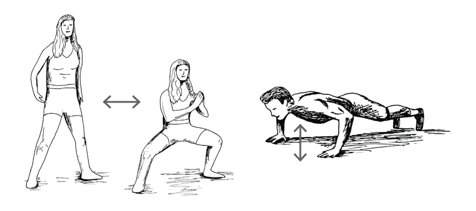

等長收縮的運動就安靜多了，動作時肌肉雖然出力，但肌肉長度不變，也不會讓關節角度產生變化。棒式、推牆、靠牆半蹲、靜態的瑜伽姿勢都是等長運動的實例。這樣的運動在進行時，不強調次數或速度，而是講究穩定和耐力，可以增強特定角度的肌肉力量（幫助穩定姿勢），對關節壓力比較小。對年紀大的人，是安全又有效的運動。

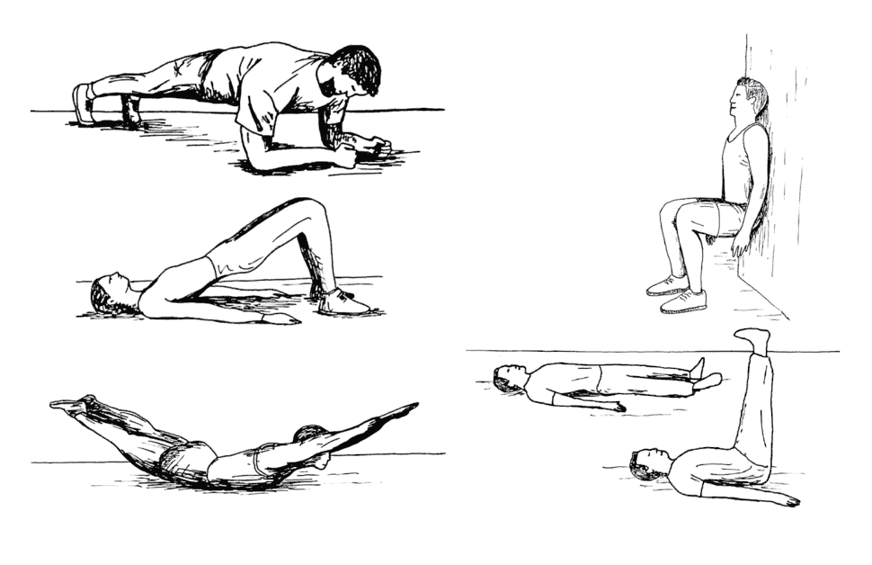

要運動，不見得總是氣喘吁吁、滿身大汗，也不一定要上山下海或特別預約運動場地。只要懂得安排，各個角落都是運動的空間，日常到處是培養力氣的機會。例如看電視的空檔可以蹲，洗碗時順便練腿和平衡，整理花草時慢慢地前彎，保持脊椎的彈性。

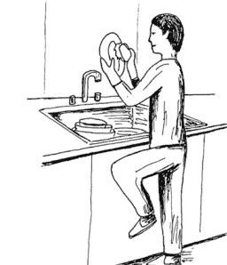

當然，動作太多，有時反而不知道從哪裡開始。我在這裡把六大類源自日本、適合年長者做的日常活動帶給大家，包括慢走、拉伸、深蹲休息、單腳站立、地板坐姿轉換和毛巾操。畢竟日本有全世界最多的百歲人瑞，他們的長壽生活經驗非常值得參考。

**慢走**：養成飯後慢走的習慣，可以消耗用餐攝入的糖分而維持血糖穩定，對糖尿病和心血管疾病這類代謝症候群有顯著的改善效果。以比平常慢一半的速度行走，配合呼吸。放慢速度，注意呼吸是否與步伐配合（一開始吸氣兩步，吐氣兩步；熟練了，再採用吸2閉2吐4的節奏）。

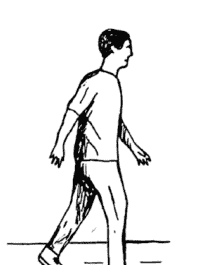

**拉伸：** 每天早上做一套約3分鐘的拉伸體操，讓關節保持活動，一天下來做事、走動都靈活一些。我們可以做自己熟悉的動作，或採用《真原醫運動新觀念》的螺旋拉伸。重點在於動作連貫流暢，正常呼吸，不憋氣。

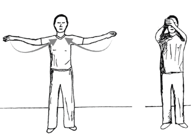

**全蹲休息：** 這就是我們從小都熟悉的蹲，可以放鬆背部壓力，也是生活自理需要的動作，例如拾取地上的東西、拿櫃子較低層的物品。做的時候，腳跟貼地，找一個能讓身體放鬆且舒適的姿勢，往下蹲。如果膝蓋或腳踝不適，就踮腳跟或減少下蹲深度。可以的話，每天累積20至30分鐘。

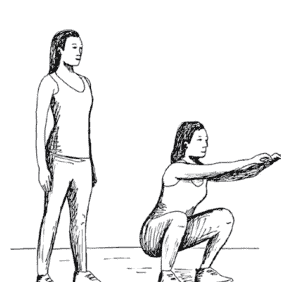

**單腳站立：** 每天兩次，單腳站立一分鐘。保持身體核心收緊，盡量穩定不晃動。這是直接鍛鍊腿力、練習平衡、防跌倒的運動。

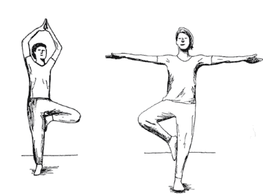

**地板坐姿轉換**：單腳站是防跌倒，地板坐姿轉換則是妥當應對跌倒這類意外事件。我們有步驟地練習從站姿轉換到跪姿或盤腿坐，以及從地板的坐或跪回到站姿。動作不倉促，而是緩慢、有控制地進行。

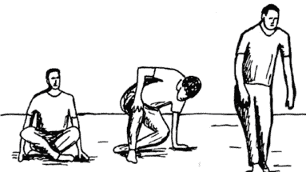

**毛巾操**：雙手握毛巾扭轉上半身。始終保持將毛巾往外拉緊的力道，好像要把毛巾扯斷一樣。保持這種張力，同時感受脊椎的旋轉。

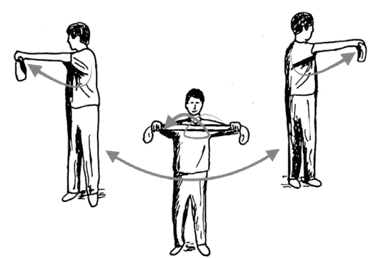

人年紀大了，視力會先衰退，接著骨盆功能減弱，腿力變差，需要依靠拐杖行走。慢走、單腳站立或小時候的蹲，都是很好的強化腿力運動。

當然，安全很重要。尤其蹲坐起身，對腿力和核心力量不足的朋友，更要避免重心不穩跌倒或滑倒。以下幾點，是長者運動要注意的地方：

- **環境安全**：如果需要椅子的輔助，椅子一定要靠牆，確認不會滑動。地板保持乾燥防滑。
- **身體狀況**：剛吃飽（30分鐘內）或剛吃藥頭暈時，勿進行肌力訓練。
- **有人陪伴**：練習「地板動作」或「單腳站立」時，初學者需有人陪伴。
- **身體警訊**：任何動作若感到**刺痛或胸悶**，請立刻停止。

這六大活動很簡單，卻含著各種運動和健康的原則，可以和一整天的生活作息做很好的配合。循序漸進練習，能夠強化腿力，方便蹲坐起身，也能應付生活裡撿東西和站起來的需求，讓年長者保留生活自理的能力，生活更舒暢自在。

## 75

## 放鬆頭腦

我們都有過半夜醒來後再也睡不著的經驗，也就是大家說的失眠，好像把睡眠給搞丟了，突然找不回來。

這時候，不如乾脆換個步調，用臀橋或半橋式來休息。把脊椎抬起，骨盆打開，會活化副交感神經的放鬆反應，讓人想打哈欠。這種放鬆反應會幫助身體進入修復的狀態，也和心臟的靈活性、消化和免疫功能分不開。

失眠的人都有過這種經驗：腦海不斷浮出「該睡了」的念頭，但偏偏就是睡不著。但反過來，如果身體放鬆，這個放鬆反應反而能回傳給大腦，讓大腦知道可以安心，可以關機，可以睡。

這種由身體啟動的放鬆反應，就是接下來幾項操作（眼球體操、輕揉耳朵、身體哈欠）的原理。透過這些簡單的操作，可以喚醒迷走神經的放鬆反應，讓大腦從交感神經主導的過度警戒的壓力狀態，切換回到能休息的放鬆狀態。不費力，也就把睡眠和休息找了回來。

## 眼球體操，多重的放鬆機制

現代人手機不離身，眼睛肌肉總是緊繃再緊繃，也連帶影響肩頸的肌肉，讓頭腦和身體更難放鬆。其實我們可以透過眼睛的動，把注意力從原本對外用眼、費腦、耗神的狀態，重新帶回到身體的休息。

一個人清醒或不清醒，跟腦幹的網狀激活系統（reticular activation system）有關，而眼球運動的神經（第3、4、6對腦神經）和這個腦幹的網狀激活系統有密切連結。

我在《好睡》介紹過一套眼睛的體操：躺在床上，閉起眼睛，讓眼球往左邊、右邊、上面、下面、鼻尖同方向移動。往左右上下到極限時，維持不動，直到出現吞嚥、嘆氣或打哈欠的反應。這是自律神經從緊繃切換到放鬆的訊號。接著，我們同時順時針轉，然後逆時針。每組動作，至少做10次。

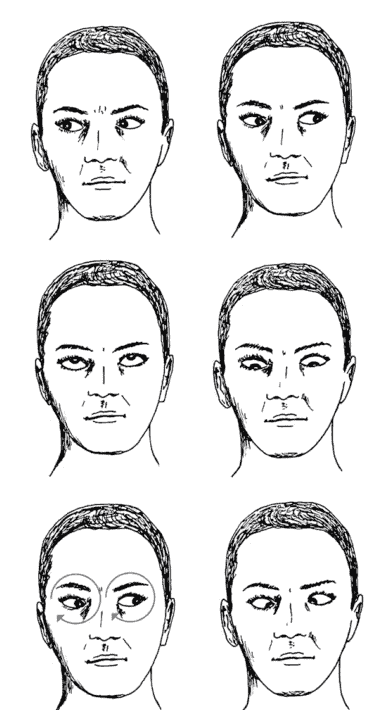

這套眼睛體操，透過眼球運動反過來給網狀激活系統踩剎車的信號，讓腦知道要睡覺了。此外，眼球的肌肉與枕下肌群（後腦勺底部的肌肉）也有神經連結，移動眼球能放鬆頸部，進而釋放受壓迫的迷走神經。

不光如此，身體還有眼心反射（oculo-cardiac reflex），是眼球和心臟之間反射性的神經反應。眼球受壓或特定眼球運動透過三叉神經和迷走神經的反射弧，會影響心跳並活化副交感神經系統，產生放鬆效果。

簡單的眼球體操，就能從頭腦的清醒機制、頸部肌肉、心臟運作三個層面放鬆緊繃。除了睡前放鬆，如果我們感到心跳過快或焦慮，也可以嘗試這套動作，為身體踩剎車。有些人頸部僵硬，容易緊張頭痛，做這套動作也能放鬆深層頸部肌肉，幫助緩解。

## 輕揉耳朵，安撫放鬆

很多人沒想過，耳朵除了聽聲音，還有別的作用。我在《呼吸，為了療癒》分享過，耳朵按摩是活化迷走神經放鬆反應很直接的方式。中醫也認為耳朵對應到全身器官的功能，而按摩耳朵就像疼愛胎兒，能帶來多層面的健康。

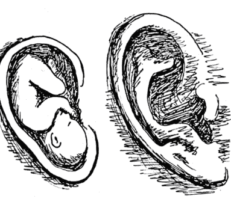

耳朵是人體體表唯一有迷走神經分布的地方，在耳朵中間凹陷進去那一部分特別多。按摩耳朵時，從外耳廓開始，也按摩裡頭陷進去的空間或耳垂。

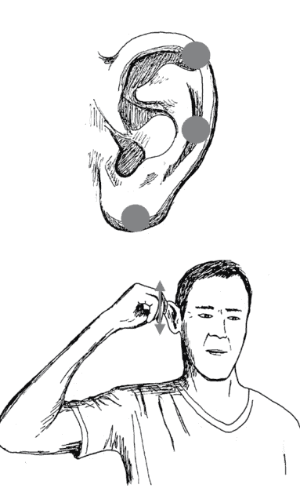

我們只要按摩，輕輕拉或輕輕揉耳朵，通常會立刻感受到一股暖流和放鬆，也可能發現對外界噪音的反應有了變化。同樣地，這種放鬆反應有助於減輕壓力、焦慮，改善睡眠。跟著做做看，留意呼吸是否變得更深、更平緩，心跳是否也跟著慢下來。完成整套動作後，感受一下是否比開始前更加平靜、放鬆。

## 全身打哈欠

這組動作結合了伸懶腰和打哈欠，讓肌肉放鬆，也讓大腦降溫。

背部和地板或床接觸時，慢慢將背部放平，讓脊椎完全貼合地面，感受肌肉像奶油一樣融化。此外，在做的時候，不管想不想睡，都要完整做出打哈欠的動作，讓張大嘴巴牽動的頸部肌肉直接刺激迷走神經。

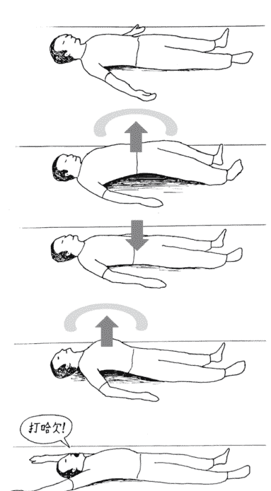

除了睡前做，幫助身體釋放累積一整天的肌肉張力，提升睡眠品質，在長時間久坐後也可以進行，有助解除背部僵硬，並透過哈欠為大腦補氧。

這些活化迷走神經的小動作，是簡單再簡單，但引發身心放鬆的效果卻是比想像更大。不光失眠時可以做，睡前、感覺疲憊、過度緊繃，都能用這些方法來放鬆頭腦。讓我們從腦海充滿煩惱的境界，落回到身心的休息。

人要入定，一定是沒有念頭、無思無想的狀態。現代人頭腦隨時在動，心裡隨時有煩惱，習慣了壓力的狀態，就算沒事也會生出一些苦惱來煩。帶出這些練習，一方面是顧慮到健康，另一方面，也是為意識的轉化來作準備。活在整體和真實去理解、體驗、活、練習這一切。不知不覺，我們已經從小我轉出來了。

## 76

## 從免疫紊亂恢復過來

## 雪麗的故事

COVID疫情期間，主流醫療要大家打疫苗，當時許多人認為沒有更好的選擇，而新病毒初期的致死率更讓人恐懼，當然會跟著做。然而病毒本身加上疫苗的衝擊，後續造出各種慢性病和退化，已經是全球各地的普遍現象。我會為大家擔心，也跟過去美國國家衛生研究院的同事討論。儘管主流醫學對這些異常還是認為只是巧合。但我們只要有醫學常識，都知道不是如此。

疫後，雪麗來找我，希望我幫助她。她打了兩劑COVID疫苗，沒多久就發現身體不對勁，好像有哪裡在發炎，總是發低燒，而且容易累，沒有力氣，早上起不來。此外情緒也不穩定，有時突然低落，有時又很亢奮。她還有很嚴重的腦霧。頭腦不清楚，沒辦法談事，月經也停了。

她感覺身體錯亂了，作息混亂再加上情緒不穩、注意力不集中，工作上出很多狀況，跟家人也處得不愉快。

不只如此，她本來不太感冒，變得一天到晚感冒。原本沒什麼過敏問題，現在好像對樣樣都過敏，特別飲食不耐受非常嚴重，有時候才吃飯就鼻水流不停。肚子總是在叫，好像腸胃很不穩定，不是脹氣、就是便秘，要不就瀉肚子。

雪麗已經看過無數的專家，都沒辦法解決她的困擾。坦白說，這會是許多人接下來可能遇到的狀況。

COVID的病毒和疫苗都會帶來後遺症，不光是疫苗，病毒本身也會，而在免疫層面造出兩個現象：一是單核球過度活化症候群（monocyte activation syndrome）讓本來沒有過敏的人突然對這也過敏、對那也過敏；另一是特殊類型的抗體IgG4大增，這會擾亂身體正常的免疫反應。我們從愈來愈多的「加速癌症」（turbo cancer）和自體免疫疾病的病例可以得到佐證。

人體內的單核球（monocytes，成熟後又稱為巨噬細胞macrophages）和大腦的神經膠細胞（glial cells）有很密切的連結。單核球過度活化症候群的患者，有些會出現中風、腦炎、癲癇發作，以及格林－巴利症候群（Guillain-Barre syndrome，這是一種癱瘓，身體完全不聽大腦使喚）等重症。雖然COVID病毒可能直接感染大腦，而血管炎也能解釋許多症狀，但我認為這些問題離不開單核球活化帶來的過度發炎。

大多數人「相對幸運」，症狀算是輕微，但也非常干擾生活。這些比較「輕」的症狀包括腦霧、運動耐受力低落（exercise intolerance）、疼痛、自律神經失調、神經認知與精神方面的失衡。

我也觀察到，疫情後，許多人不光是免疫系統混亂，連代謝都受影響。過去大多數人要到中年才有代謝症候群，但接下來發生的年紀會提早，還相當年輕可能就發現糖化血色素（HbA1C）偏高，身體質量指數（BMI）和體重偏高。

雪麗對組織胺過敏、對草酸也過敏，但她原本的飲食卻偏素食，我建議她，要徹底調整，就改用全肉飲食，也就是無植物成分的生酮飲食。步驟是漸進的，碳水化合物的攝取從一天400公克逐步降到150公克、80公克、50公克、20公克、10公克。我同時也請她戒掉咖啡，改變各種層面的生活習慣。

在降低飲食的碳水化合物、轉向生酮的同時，體內代謝的機制對於礦物質的需求也不同。我提醒她要補充鎂、鉀和鈉。如果會失眠，再補充鋅和銅。這些礦物質，對於整體的轉變有關鍵的作用。

第一個月，她非常不適應。我請她有機會就禱告、做感恩的功課，晚上把一天做得好的部分寫下來，給自己打氣。我也跟她說什麼是中道、友善接受一切、感恩、誠懇、謙虛。這些心理層面的功課，對於情緒不穩定的朋友，比任何方法都更重要。我們調整心態，時時對身邊的人表達感謝、肯定宇宙不會犯錯，結合飲食的轉變與呼吸練習，構成了完整的調整方案。

半年後，她的身體指數有顯著的改善。原本膽固醇較高，現在雖然膽固醇還是偏高，但三酸甘油酯已經降下來，HDL（高密度脂蛋白膽固醇）也維持在正常範圍。這也是我一再提醒的，膽固醇的種類和比例，比單項的數字還重要。

雪麗感覺自己彷彿換了一個人，不光是心情好轉，而且比以往更加樂觀、溫和、看得開。她每天至少運動1小時，做整套有氧健身的體操。出差也會把握時間在房間內運動，如果場地合適，就做水中運動。她也用睡眠貼布，幫助自己睡著了也守住鼻子呼吸，睡眠品質也大幅提升。

這次COVID病毒和疫苗帶來的衝擊，是人類歷史罕見的大災難。年輕一代普遍要面對糖尿病、代謝症候群等後遺症，也會出現異常的加速癌症。這不只是個人的不幸，龐大的醫療開支和醫療資源的消耗更是公共衛生的重大挑戰和負擔。

主流西醫從單一器官或單一系統分別著手，例如把肝臟、血液循環、免疫或內分泌分開處理。這樣的方法往往跟不上身體的變化，甚至愈調整、愈失衡。我在這本書中所談的一系列非主流醫療的療癒與操作，則是從整體著手，除了從生活習慣的飲食、運動和呼吸著手，還包括從情緒、信仰、領悟與靈性層面切入，可以說是醫療的大轉型和大革命。

但願這些觀念，能及早為整體的困難踩下剎車，建立更全面的未來醫學。

## 77

## 從沉重的代謝症候群脫身

## 思樂的故事

30多年前，我對美國國家衛生研究院的同仁預測，代謝症候群是未來最嚴重的問題，而且和心臟病、糖尿病、腫瘤等慢性病息息相關。當時他們可能不見得認同，但現在已經完全同意我的看法。

思樂有肥胖的問題，已經接近糖尿病邊緣，此外，膽固醇偏高，心血管鈣化指數也很高。醫師提醒她要注意血管硬化的問題，可能需要做心臟支架。

其實思樂不是少數，美國三分之二的人口BMI偏高，一半以上有過重的問題。糖尿病前期或第二型糖尿病是很大的健康負擔，而且年輕患者比例開始上升。亞洲也有類似的趨勢。

大多數人認為膽固醇高，心臟病和中風的風險就會高。然而，這個想法本身可能比膽固醇數字更需要進一步檢視。有心臟外科醫師注意到，依照醫療指南用大量斯他汀類藥物（statins）降低患者膽固醇後，儘管數字變漂亮了，但需要手術的案例不但沒有減少，甚至比以往更多。

如果膽固醇是凶手，我們把膽固醇降下來，應該能減少心臟病發病率。但是，斯他汀類藥物降低了膽固醇，卻沒有辦法阻止發病。這證明了從膽固醇著手，是無效的策略。

從文獻來看，LDL（低密度脂蛋白膽固醇）與心臟病的關聯性很弱（風險增加只有1.4-1.5倍），不像吸菸與肺癌的相關性那麼高（風險可達10-20倍），反倒是胰島素阻抗與心臟病的關聯強多了（風險增加5-7倍）*1。

在我看來，比起膽固醇，胰島素阻抗和發炎更是心臟病的根源。真要談膽固醇，重點也不在於個別膽固醇的數字，反而是膽固醇的種類和比例。舉例來說，總膽固醇與HDL的比值大於3.5或4、三酸甘油酯偏高、經過氧化的膽固醇、油胞很小的膽固醇（vsLDL），這些指標確實和心血管的發炎反應有關。

所以，比起在膽固醇的數字著手，調整生活方式（尤其是飲食）來改善身體的發炎和胰島素阻抗，更可能有效降低動脈粥狀硬化和中風的風險。

思樂找我，就是想知道怎麼把這些危險的數字降下來。畢竟醫師只說要注意，卻沒說如何改善。她想從飲食調整著手，但光是飲食就有各式各樣的做法，根本不曉得該怎麼開始。

現在我們理解，她表面看來是心臟病，但更根本的問題是胰島素阻抗和代謝症候群。胰島素阻抗在生化上不容易量測，但可以從五大指標來評估是否已經有胰島素阻抗，也就是腰圍、血壓、空腹血糖／糖化血色素、HDL、三酸甘油酯。如果五項指標有三項不在正常範圍，日後發生心臟病、癌症、阿茲海默症等慢性病風險會偏高。

| 指標 | 正常範圍 |
| --- | --- |
| 腰圍 | 男性 < 90 公分 女性 < 80 公分 |
| 血壓 | < 130/85 mmHg（無藥物干預） |
| 血糖 | 空腹血糖 < 100 mg/dL（無藥物干預） 糖化血色素 (HbA1C) < 5.7% |
| HDL | 男性 > 40 mg/dL 女性 > 50 mg/dL |
| 三酸甘油酯 | < 150 mg/dL |

我跟她說，先解決胰島素阻抗和發炎的問題，而不是急著處理心臟的狀況。對現代人來說，要改善代謝的健康，飲食是最強大的工具。

我在《療癒的飲食與斷食》提出一套完整的做法，最重要的是先讓身體對糖的代謝踩剎車，同時又滿足營養和熱量需求。低碳水飲食也有各式各樣的做法，包括我過去提過的高纖生酮、一般低碳水、一般生酮飲食、甚至全肉飲食。

她過去以素食為主，但吃得並不健康。為了方便，幾乎都吃過度加工食品；她知道這樣不健康，就吃很多水果來攝取纖維素，又連帶吃下大量的果糖。她一直有自體免疫的問題，但不知道這些狀況多半和植物性的食物有關。

我建議她採用全肉飲食，把碳水化合物帶來的問題先踩個剎車，也避開植物導致的發炎。

這並不是說吃素或植物性飲食是錯的，而是說讓身體恢復一下，等運作正常，再一項一項把這段時間排除的飲食帶回來。這就是減敏

飲食的WOW原則：停下可能帶來不適的項目（withdrawal），觀察（observe）一陣子讓身體恢復，再考慮把這些項目帶回飲食（work back in）。

當然，要一個原本素食為主、吃東西只管方便的人，改成完全吃肉，而且是原型食物，一開始很難適應。身體的代謝機制還沒有轉過來，心理的習慣也還沒消除。思樂有時成天發低燒，有時想吃甜食想得不得了。她難受極了，但還是規規矩矩去投入。

大概兩個月，170公分不到的思樂，體重從250磅降到180磅。再過了三個月，已經降到160磅。又過了半年，已經降到140磅。以她的狀況，很難沒有睡眠的問題，除了打呼，還總是睡到一半就醒來，我也讓她用睡眠貼布。

最重要的是，我教她禱告，接觸信仰。我還跟她說盡量光腳在草皮上走路，讓身體接觸大地。有些人以為這只是平衡身體電荷，但作用不只如此。我也讓她用微量元素，除了透過菇類和飲食補充，連家裡用的、喝的都是經過處理的水，讓水充滿能量，身體更容易吸收。

她非常投入，本來一到下午就打瞌睡，時常胸悶，有時還心絞痛，一陣子後，這些毛病都消失了。

一般過重的人，脊椎容易有問題，我也請她要運動，有氧、核心強化、掛單槓、拉伸各種項目都要做。她家裡有游泳池，可以在水裡做運動，一方面減少關節的衝擊，另一方面水的阻力也強化運動的強度。過去，她的體重根本不會讓她想去掛單槓，但現在她願意做，從10秒到20秒、30秒，慢慢到1分鐘。

聽到她採用全肉飲食，她的醫生難免擔心她的膽固醇。儘管數字已經降了下來，醫師還是依照醫療指南，不斷提醒她要用斯他汀類藥物。但是思樂走到這裡，不光別人看得到她外形和精神的變化，她也知道一切都在往好的方向走，身體已經告訴她怎麼做是對的。

思樂照顧身體，也投入全部生命的觀念，對真實有信心。她並不覺得這兩者是互斥的，認為身體和真實是兩面一體。

當然，適合思樂的方法不見得能套到別人身上，畢竟每個人累積的失衡、先天的體質都不一樣。有人長期吸菸喝酒，有人不菸不酒但過度偏重高碳水的加工飲食。狀況不同，調整方式必然不同。

但我坦白說，信仰才是重點。有信仰，身體的療癒自然會來配合。

> *1 "Lipoprotein (a) concentration and the risk of coronary heart disease, stroke, and nonvascular mortality." *JAMA: the journal of the American Medical Association* 302.4 (2009): 412.; Alberg, Anthony J., Donald R. Shopland, and K. Michael Cummings. "The 2014 Surgeon General's report: commemorating the 50th Anniversary of the 1964 Report of the Advisory Committee to the US Surgeon General and updating the evidence on the health consequences of cigarette smoking." *American journal of epidemiology* 179.4 (2014): 403-412.; Després, Jean-Pierre, *et al.* "Hyperinsulinemia as an independent risk factor for ischemic heart disease." *New England Journal of Medicine* 334.15 (1996): 952-958.; Puri, Rishi, *et al.* "Impact of statins on serial coronary calcification during atheroma progression and regression." *Journal of the American College of Cardiology* 65.13 (2015): 1273-1282.

## 78 和疾病共生存
卓山和斯高的故事

肝病是華人常見的疾病，卓山平常的生活步調很緊湊，根本沒想過要健康飲食。等到健康出狀況了，肝臟已經有幾個結節，小的大概1公分左右，最大的2、3公分。

這大概是20年前的事了，他跟我說想採用非主流的治療。我當時跟他說，西醫對肝腫瘤的治療已經非常成熟，手術加上化療、放療就能處理，再不濟還可以考慮換肝。台灣這方面的技術不會輸美國，也找得到最好的醫生。

大多數情況，我都會這麼建議。一方面我沒有時間親自協助，我也發現有些西醫的治療（特別是某些化療）和非主流治療的方法會互相抵觸。所以，如果對方採用西醫，我就不會同時建議非主流的治療。最多是教他在飲食、生活習慣、運動、靜坐方面作一些輔助的調養。

另一方面，我也明白大多數人通常是病程還在初期，或已經到了末期，別的方法都試過了，才願意好好配合。如果信心不夠，遇到一些反應當然會不安，甚至會埋怨是我讓他走冤枉路。所以，我多半寧願為彼此省掉這些麻煩。

卓山的性格很堅決，信仰夠大。考慮到他長年抽菸和應酬的負擔，我建議他完全改為素食，而且盡量生食。我教他用慢磨機榨大量的蔬菜汁來喝，不見得要用有機蔬菜，只要是本地當令的蔬菜都可用。這方面，和前面給思樂與雪麗的建議就完全不同。

他需要運動，除了有氧健身、拉伸、橋式和臀橋，也包括跳床。跳床，對淋巴循環和身體的元氣都很有幫助。我請他睡眠要調整，盡量每天睡滿7、8個小時。

我也教他靜坐，帶他做各種呼吸方法，還跟他分享「心靈聖約」，感恩、懺悔、祈望、回饋。這裡講的祈望，也就是信仰。我也請他每天做紀錄，把自己的感恩、懺悔、祈望、回饋寫下來。

無論我請他做什麼，他全部都執行到底。醫師為他做核磁共振和電腦斷層掃描，發現腫瘤完全消失。他的主治醫師來找我，想知道是不是有什麼奇妙的療法。我也只是跟他的醫師說：「是你幫助他的，跟我沒有什麼關係。」

那時候我仍然感覺主流醫學對這些做法是不信任的，即使勉強接受，還是會用特例或巧合這種字眼來貶低療癒的價值，認為不符合他們的道理。所以我也不願意為了推廣或說服產生不需要的爭議或風波。

另一位朋友斯高除了過重，還有前列腺腫瘤。他來找我的時候，BMI已經30多，身高大概170公分，體重已經到113公斤。前列腺腫瘤已經轉移，治療也踩不了剎車。

我在工作上和斯高有機會互動，可以體會到他性格上和卓山的相似之處，也就跟他講真原醫的道理，包括「心靈聖約」，還教他時時禱告，誠懇到底，謙虛到底。

他在健康方面的問題和卓山很不一樣，所以我教他的調整方法也大不同。那時候我跟他說吃「lion's diet」，也就是像獅子一樣，完全吃肉。我知道他不見得能找到草飼牛，跟他說買不到沒關係，是乾淨的牛排就行，要肥一點的部位，例如肋眼，而不是菲力之類的瘦肉，讓油的比例占總熱量的70%。最好能找鄰近的肉店商量，看一次多買能不能算便宜點。

讀到這裡，熟悉《療癒的飲食與斷食》的朋友應該猜得到，我希望幫助斯高進入酮態。我要他去查生酮的原理，弄清楚了，執行就不容易失誤。我也提醒他，要讓自己舒服一點，要調整情緒，把活力找回來。

過重的人，睡覺打呼是難免的，斯高三更半夜會突然醒過來，也就是有睡眠呼吸中止的問題，再怎麼睡也很難睡飽。那時他一天大概睡4、5個小時，整天總是精神不好，不光影響工作效率，也缺乏活力。

這種狀況，我一定會建議他採用睡眠貼布，也教他各種呼吸的方法：短呼吸、長呼吸、深呼吸、淺呼吸，延長自然憋氣的時間，改善心臟功能的彈性。

我遇到一些華人，都是應酬喝酒喝出病來。我也提醒他要戒酒，但如果身體沒有活力，需要透過酒精才能得到刺激，那是戒不了酒的。所以，我讓他用全肉飲食取得活力，把身體能量補夠，就不會隨時想喝。

剛開始，他也一樣有各種心情和習慣上的不適應，但還是照做，也不再喝酒。3個月後，體重降了下來。本來已經接近糖尿病的邊緣，經過飲食調整，糖化血色素從7點多（正常範圍是5.7以下）降到5左右。

斯高原本肝指數都高，應該是有明顯的肝損傷，也許是肝纖維化或硬化。到這時，肝指數也降了下來，代表肝臟還有一些沒有受損的部分，能夠正常執行功能。

他的前列腺腫瘤指數已經降低，半年後再驗也保持穩定，從影像掃描看來，擴散到骨頭的部分似乎縮小了一些。1年後又去檢查，全部的指數都降到正常範圍。雖然膽固醇增加，但增加的是好的膽固醇，而血脂都降了下來。

又過1年，他沒有再回診。我說你還是應該去檢查，他說每次去都感覺壓力很大，現在用這些方法已經過得很好。他決定跟腫瘤共生存，而不是非消滅腫瘤細胞不可。

身體轉向生酮除了有明顯的降血脂和減重效果、減緩代謝症候群之外，影響最大的是頭腦。以斯高為例，他知道自己會焦慮、容易發脾氣，而且頭腦不清楚，講話會顛三倒四，有時還有點被害妄想，總覺得別人想傷害他。身體進入酮態後，這方面的心情起伏減少很多，他也覺得這是最大的收穫。

當然，再怎麼掌控飲食，也很難達到零糖分，畢竟肌肉和肝臟裡會有肝醣，而脂肪代謝也產生糖。我也教他一個減少身體糖負擔的技巧，也就是用餐後就去散步，移動身體的大塊肌肉例如肩膀、大腿、小腿，或者在游泳池走路，加上水的阻力，當作有點強度的有氧運動，用這些方法讓身體動起來，把糖分盡快消耗掉。

他也從一日三餐慢慢降到一日一餐，讓身體啟動細胞的自噬作用，清理老舊的細胞和代謝廢物。再加上睡眠夠深，也就讓腦脊液和神經膠淋巴能夠全面淨化大腦。

## 從代謝切入治療

會跟斯高講全肉飲食，是有道理的。主流醫學界認為癌症是一種基因疾病，但美國西佛里德博士（Thomas Seyfried）提出癌症其實是一種代謝疾病*1，是粒線體損傷在前，然後才有基因的突變。

他認為細胞癌化不是因為基因突變，而是因為粒線體功能障礙導致細胞能量代謝受損。我們會在癌細胞看到基因受損，是因為故障的粒線體已經無法產生足夠能量來支持細胞運作，讓細胞修復不了基因突變和染色體畸變，難以維持基因體的穩定。

有了致病的路徑，也就有治療的方向。

| 傳統基因理論 | 代謝理論 |
|---|---|
| 病因：癌症是體細胞突變累積所引起的基因疾病 | 病因：癌症是細胞呼吸作用受損（粒線體功能障礙）所引起的代謝性疾病 |
| 基因突變：是癌症的因 | 基因突變：是細胞代謝受損後的果，而非根本原因 |
| 治療：以基因（如靶向治療、免疫療法）或細胞增殖（化療）為目標 | 治療：以癌細胞的代謝弱點（即對葡萄糖和麩醯胺酸的依賴）為目標 |

很多人聽過「把癌細胞餓死」的做法，但正確的做法並不是什麼都不吃，而是透過妥當的飲食讓身體得到足以運作的能量和營養，同時以毒性最低的方式把癌細胞餓死。

粒線體是細胞進行高效率有氧呼吸來產生能量的地方，但粒線體受損時，細胞會改用低效率的能量產生方式，也就是比較原始的糖解作用。這種代謝的轉變，會使癌細胞更依賴糖解作用的燃料來取得能量，特別是葡萄糖和麩醯胺酸。這種依賴，就是代謝療法的切入點。

代謝療法的實際操作，也就是生酮代謝療法。在酮態下，正常細胞能有效利用酮體，但大多數癌細胞因為粒線體受損、無法有效利用酮體而會被「餓死」。這種代謝能力的差異，是生酮代謝療法得以產生療效的關鍵。

和標準生酮飲食最大的差異在於，生酮代謝療法除了降低醣類攝取來帶動身體進入酮態、產生酮體之外，還要盡量減少麩醯胺酸的攝取。雖然所有含蛋白質的食物都含有麩醯胺酸，但生酮代謝療法會盡量限制或避開比較高含量的乳製品、內臟和豆類與堅果。

要注意的是，某些腫瘤特別依賴麩醯胺酸，所以生酮代謝療法的菜單必須依照癌症類型、代謝狀況和體重來量身定做，包括配合藥物治療來抑制癌細胞的代謝和生長。

以下提供一個生酮代謝療法的菜單範例，重點是以高健康脂肪作為主要熱量來源，並限制碳水化合物淨公克數（通常小於20公克），嚴格控制適量的蛋白質（通常為0.8-1.2公克／公斤體重）。熟悉一般生酮飲食的朋友，看這份菜單應該能體會到不同。

| 餐點 | 食物內容 | 說明 |
| :--- | :--- | :--- |
| 早餐 | 生酮防彈咖啡／茶 | 咖啡／茶和脂肪，不含碳水化合物。不含蛋白質。 |
| 午餐 | 少量草飼紅肉或深海魚類（比紅肉少麩醯胺酸）＋大量綠葉蔬菜＋高脂肪醬料（如橄欖油和醋） | 主要是綠葉蔬菜，碳水化合物極低。魚肉分量需精確計算，以符合每日總蛋白質量。 |
| 點心（如有需要） | 少量夏威夷豆（碳水、蛋白皆低）或四分之一顆酪梨 | 酪梨和夏威夷豆，碳水化合物很低，蛋白質含量極低。 |
| 晚餐 | 少量草飼牛絞肉或羊肉（比雞肉更少麩醯胺酸）＋烤花椰菜或蘆筍＋額外脂肪（可淋橄欖油或椰子油） | 花椰菜、蘆筍等非澱粉蔬菜。肉類分量須嚴格控制在當日總額內。 |

前面提到，生酮代謝療法會避開乳製品、內臟和豆類與特定堅果，轉而採用脂肪含量高且蛋白質可精確掌控的草飼紅肉（如牛羊）和深海魚類（如鮭魚、沙丁魚），因這些肉類的脂肪比例高，且胺基酸分布可能比一般家禽類（如雞肉）更適合一些，但還是要嚴格控制分量。

> *1 《癌症代謝療法：了解、預防與治療癌症，更有效率的方式》（*Cancer as a Metabolic Disease: On the Origin, Management, and Prevention of Cancer*）

## 79 療癒的藍圖：從身體的修復，到生命的康復

從前面幾個實例，我想說明這整套整體醫學的重點，在於直接切入疾病的根源，也將健康的主動性交回到我們的手裡，而不是給別人來決定。

COVID疫情之後，疫苗和病毒的後遺症，包括腦霧、憂鬱都讓許多朋友非常難受。我在和他們互動的過程，一路從氣脈、呼吸、拉伸、飲食、心態、礦物質和微量元素，談到感恩，已經完整覆蓋了身體療癒的藍圖，從許多層面著手，將每一個瞬間都轉化為療癒的門戶。

### 活化身體的修復機制

現代人最普遍的健康危機，是發炎及交感神經過度緊繃。以單核球活化症候群為例，恢復「神經－內分泌－免疫軸」（neuro-endocrine-immune axis）的良性互動是關鍵。為了做到這一點，我們要對各種療法保持開放的心態。在我看來，現在一般人認為非主流的療癒方式，總有一天會成為主流。

完全放鬆打通中脈，是恢復自體免疫功能、修復神經退化、抗衰老及促進身心健康的關鍵。中脈是主要的能量管道，但在人體解剖構造是找不到的。我們最多是體會到好像有一條能量的高速公路，位置大致和大腦與脊椎重疊，從骨盆底部的會陰一路向上直達頭頂。

30多年前，我已經開始解說副交感神經的放鬆反應，以及這種放鬆反應對健康、療癒和修行的幫助。我也示範打哈欠、按摩耳朵或做臀橋，來觸發這種有益於療癒的反應。

談副交感神經，少不了要介紹它的「另一半」交感神經。交感神經從每一節脊椎延伸出去，會讓人亢奮、激動而緊繃；副交感神經則是包括了分布全身（從腳趾到頭，包括內臟每個角落）的迷走神經，穿過頸部、口腔，進入腦幹，帶來放鬆、療癒、休息、舒暢。

交感／副交感神經的作用，是我從青少年階段當選手開始，50多年來不斷體會到療癒和康復的關鍵。現代人普遍有自律神經失調的困擾，交感神經（負責「打或逃」反應）過於亢奮，我們需要觸發副交感神經的放鬆反應，把平衡找回來。

要活化放鬆反應，把中脈打開，最簡單的練習方法就是舌抵上顎，只要想到就做。其次簡單的方法是打哈欠，最好連打幾十次，直到流眼淚為止。前幾章我也介紹了一些有效活化副交感神經作用的動作，例如臀橋、眼球體操、摸耳朵，方便大家在半夜醒來、早晨、晚上的空檔重複進行。

除了練習，被動的按摩和熱敷也是很好的放鬆。尤其皮膚是人體最大的免疫器官，對於發炎指數失控的朋友，蓖麻油熱敷會很有幫助。我在1980年代初於紐約醫院看到患者接受蓖麻油熱敷的效果，後來也帶回亞洲和更多人分享。

嗅覺是唯一直通大腦的感官，也是很好的療癒管道。精油和芳香草本（特別是沒藥、檜香脂、乳香、檀香、鼠尾草、聖木等），透過嗅覺的傳遞，喚起古老的記憶，讓我們腦海安靜下來，內心感到放鬆自在。

放鬆自律神經系統，頭腦會變得空白。這種空白（或無我、無念），正是所有靜坐和靈性修行想達到的境界。有意思的是，頭腦變得空白，我們通常會想睡覺，同時不可能發炎。

### 呼吸是生命的中樞

我們把自己當成瑜伽士，去精通呼吸完整的光譜，從最慢（甚至閉氣）到最快，從深呼吸到淺呼吸，這是讓身體歸零、改善心臟靈活性的鑰匙。

首先，如果一整天都能守住鼻子呼吸，那是再好不過，這是日常正確的呼吸方式。白天隨時舌抵上顎，能確保鼻子呼吸。晚上要睡了，就使用睡眠貼布。市面上找得到現成的貼布，也可以用一般的透氣膠帶。

保持鼻子呼吸（包含左右鼻孔交替呼吸法），能幫助改善上呼吸道發炎與鼻塞，這是單核球過度活化症候群常有的困擾。順帶一提，小孩子如果能保持鼻子呼吸，臉部的結構得以正常發育，牙齒排列會整齊。

閉氣，則是整頓身心的關鍵。隨時可以做，小孩子會喜歡在浴缸或泳池練習憋氣。更簡單的方法是，我們直接捏住鼻子，開始計時。或者不捏鼻子，只要觀想自己像一個氣球，吸氣充氣直到無法再吸，這時放鬆身體的肌肉，會發現氣球還能繼續擴張。我們保持吸氣，其實已經達到閉氣，空氣不會從鼻子跑出來。試著將閉氣時間延長到極限，直到再也憋不住為止，然後瞬間把氣一次吐出來。這是西藏「九節佛風」的一種變化。

我也常提醒一些朋友，人生都到這個階段了，為什麼不透過「我一在」的呼吸，把身上的重擔交出去？其他可以進一步探索的呼吸練習還包括諧振式呼吸、重生的呼吸、溫霍夫呼吸法（Wim Hof Method），以及不同的閉氣練習和鯨豚式呼吸。

這些練習，我已經整合在《呼吸，為了療癒》以及《清醒的呼吸》，對身心、心臟與神經系統，能帶來很大的整頓，讓我們變得強壯、靈活，能包容生活的一切，面對所有的焦慮與疲勞，仍然能輕鬆度過每一天。

### 脊椎減壓

我推廣過許多運動，最早帶出來的項目是「還原六法」，特別需要熟悉的是其中的下犬式及第四式（橋式）。這些動作，都能幫助把中脈打開。

伸展背部的瑜伽動作也很有幫助。有伴侶的人用這樣的方法，很輕鬆把背部拉開：兩人背對背站立，手臂互相勾住，一個人向前彎身、另一個人向後仰，用這種方式把對方背起來，動作要盡可能柔和且緩慢。

剛開始練習時，向後仰的那一方只要盡可能伸展腳趾即可，不一定要被抬離地面；但最終會找到各種變化的角度，讓身體獲得最大的伸展。

完全放鬆的掛單槓，則讓脊椎在體重的作用下解壓縮，帶來全身的放鬆，並拉出脊椎的空間。這是一種對抗發炎極其有利的狀態。

如果能讓掛單槓成為日常，我們的體質會發生根本性的改變，好像整個大腦和脊椎都完成了一次大減壓。別忘了，所有的靈長類，包括人類，過去都是掛在樹上的。這種古老的「練習」，作用可能比我們以為的更深刻。

這些方法，我已經整理在《真原醫運動新觀念》《結構調整》和《感恩身體的功課》，有些示範也透過YouTube跟大家分享。

### 飲食和其他補充品

抗衰老，其實也就是抗發炎。要抗發炎，我們從最基礎的代謝著手，特別是從代謝的燃料，也就是飲食開始。

首先，我們需要改變腦細胞和身體所使用的燃料。對身體而言，唯一不會引起發炎的燃料是脂肪。任何形式的糖，都會引起發炎。

這兩項特質結合，自然往「減醣」和「高脂」的方向走，我在《療癒的飲食與斷食》說明了如何從一般飲食轉為低碳水化合物飲食（每天低於150公克），接著是輕度生酮（低於80公克），然後是標準生酮（低於50公克）。接著繼續減少碳水化合物，直到能降至每天20公克以下，最終達到零碳水。

關於腦部的運作，除了從大腦的燃料著手，我們能做的介入並不多。大腦喜歡使用酮體，卻被過量的葡萄糖所餵養。為了恢復常態、啟動療癒，我們必須從代謝著手。

如果不將身體的能量燃料來源從葡萄糖轉到酮體，很難重新設定大腦與神經的運作，也難以擺脫發炎和損傷的問題。

別小看飲食的作用，透過飲食做代謝調整，激烈程度就像車子從使用柴油轉為使用煤油一樣。在過渡期間，身體一定會出現反彈。成功的關鍵在於溫和地進行，與身體合作，而不是對抗。

我常說真原醫是整體醫學，同時也是元素醫學。我們的飲食缺乏某些珍貴的過渡元素，這些元素以一種科學界很陌生的形態存在，主流醫學界也還不熟悉。所以我將每一種單原子微量元素融入配方，讓

## 心態

一般人都以為身體很脆弱，但其實身體是非常強韌的。要讓身體「脫軌」需要很大的破壞力，一旦脫軌則需要徹底整頓才能拉回正軌。

1990年代發明HIV雞尾酒療法的何大一博士說過，需要一兆個HIV病毒顆粒才能讓身體出現症狀，這就是身體的韌性。直到傷害超過某個臨界點，身體才會突然崩潰，而這正是癌症和許多惡性疾病的真相。

身體有奇蹟的自癒能力，但我們必須給它工具和機會。真正的整體療癒，是身-心-靈的全面轉變。如果我們只停留在身體層面，可能錯過了全面的療癒。但如果有無條件的信仰，病已經好了一半。

我也常提醒朋友，選一句和健康、圓滿相關的話，例如「一切都好！」、「宇宙不會犯錯！」、「我寬恕自己，也原諒你。」當作咒語，不斷在內心重複。這等於是在重新塑造大腦，建立新的神經迴路。這套新的迴路會成為新的正常，帶動療癒。

「我-在」的呼吸，也是這樣的聲明，而且隨著一呼一吸，隨時可以進行。對人事物保持喜悅、敞開、肯定與善意的心態，是無可取代的療癒窗口。我們感到喜悅，身體會以放鬆來回應；會合作，而不是對抗。

療癒的路上，只要往前看，專心做眼前能做的，正向到底，讓一切存在，而一切都是剛剛好。每一個呼吸、每一個當下都是新鮮，充滿活力。這樣子，我們不再需要重溫過去，不再有遺憾；帶著對生命的信任，讓療癒自然展開。

一路上，我們還有很多事好忙，還有很多練習可以做。最重要的，是完全從靈性層面出發。平時，最簡單也最重要的練習，就是感恩——無論日子好壞，我們欣賞並深刻體認每一個當下都是神聖的，而且宇宙不會犯錯。

隨時舌抵上顎、做「我-在」的呼吸、並且不斷在內心表達「謝謝」。這麼做，已經向宇宙發出了訊號，宣告我們準備好要自我療癒了，而宇宙也會伸出援手。

做這些，不只是為身體的療癒，不只是成為更好的人，不只是改變個性或命運。做這些，是因為我們本來就是完整的。

感恩會帶來愛，而愛是宇宙最強大的力量，能跨過所有的負面與分別。說到底，是愛療癒了這顆心，以及身體。

我們臣服於感恩和愛，也就變得完整。

*1 計算活菌數的單位。

## 意識的練習

### 80 我個人的日常

現代人的習性，會想把樣樣都當作一種成就來取得，還沒得到時拼命想爭取，得到了就失去興趣。這養成了一種心態，要逼自己不斷往上移動，留不住這裡，也享受不了現在。有些朋友還可能擔心花這麼多時間練習，會不會影響活力？會不會失去做事的幹勁？或是影響人生的追求？

這是難免的，我們認為自己一路來都是透過頭腦的規劃、安排、用功……而得到生存，甚至可以有一點成就，也就被洗腦到底。現在，要突然轉過來，難度是非常大。

走到這裡，這種想要轉變的意願和空間，很值得好好珍惜。無論難度大小，總還是有機會，至少先從修正習氣開始。

跟大家分享的這些練習，也是我隨時的日常。如果我說一套，但私下做另一套，既不誠實，也不可靠。

認識我的人都曉得，我平時每天做的事、要開的會是數不完的，一個人做好幾個人的事。但他們也知道我每天還是輕輕鬆鬆的，完成各式各樣的專案，但心裡沒有事，好像隨時都在休息的狀態。

「在的瑜伽」、隨息和靜坐，對我都是完全放過世界的休息。如果工作很忙，哪怕只有一兩分鐘的空檔，我也能數息、做「我-在」的呼吸或閉氣。不會打擾人時，我就做朗誦，特別在沖澡的時候，更是沒有顧慮。這些都是我常使用的工具。

有時事情多，我可能許多天沒有睡，同時也斷食。這種作息，一般人可能會覺得是苦修，但我心裡仍然沒有事，一切都是輕輕鬆鬆的。無論到世界哪裡工作、跟誰講話、處理什麼事，對我是一樣的。這種隨時休息的狀態變成正常，娛樂的需求減少，甚至不需要。到了假期，別人蒙頭大睡，我仍然很舒暢地靜坐，做「在的瑜伽」。

要說差別，也許這就是差別。

我會用一個比喻來說，隨時活在這種休息的狀態，就好像剛從國外度假回來，心情本來就很好。我們會發現不需要特別安排去享受什麼，也不會為了無聊而去換著花樣找變化。這大概就是我每天的心情，畢竟如果隨時從宇宙補充能量和恩典，是不會累的。

我前面提過，許多老師會遇到困難，沒辦法在生活的每一個角落活出修行的道理，而為自己和學生帶來許多障礙。這種觀察，讓我有一種深切的反省。一位老師的方便法門或教學能力固然重要，畢竟每個學生的成熟度、氣質、屬性、傾向都不同，但走到最後，最直接有效的方法，也就是老師完全用生活的日常來示範、講課、練習。

老師是活在真實自性、真正自在，才有真的影響力。如果只是講很深的理論或把經典從頭到尾背出來，這些理論化的表達是沒有用的。

所以我對六祖惠能、拉瑪那·馬哈希充滿尊敬，他們講和做是一致的，隨時都是友善的念頭，不用講什麼特別的話，別人一看就體會得到滿滿的慈悲、智慧和光。每一句話或每一個思考的原則、出發點、用意、行為、感受，跟他的領悟都是一致，完全落在一體，符合唯一而共同的意識。

對我們，這種示範是最好的提醒，反過來問自己：我做得到嗎？說的、想的、做的都能一致嗎？還是說歸說，但心裡是不同的想法？說得很有愛心，但私下都在批評人？不斷下一個好壞的標籤？

看看客觀的事實，如果我們還是如此，那還是要練習，不斷投入生命的真實。

練習，幫我們將注意力回轉，建立神聖的空間，淨化自己的習氣。這個神聖的空間，我們本來就有，離不開根本的聰明。進入神聖的空間，也只是隨時回到或者守住在聰明的源頭，放掉控制，該發生什麼，讓它發生。我們差不多了，心也就把我們帶回到家。

說練習，其實只是如此，倒不是掌控了多少技術層面的細節。很多朋友關切某個姿勢怎麼擺才對？打坐要不要雙盤？舌抵上顎是不是要把舌頭捲到後面？咒語發音正不正確？哪些咒語最有感應？儀軌怎麼做？這些問題，離不開頭腦在人間鎖定的模式，完全不是練習的重點。

如果真正懂了，反而靈活得很。畢竟我們還有身心的架構，免不了受到種種的影響，採用這個或那個方法，並沒有什麼阻礙。到最後，都是把小我的重要性挪開。

六祖惠能、拉瑪那·馬哈希突然在一個剎那醒過來，確實不是靠人間的磨練。他們的實例非常特別，比獨角獸還稀有難得。現在，我們的成熟度可能還不到足以把一切推翻的地步，做練習就是了。練習的目的是把小我的重要性放在一旁，真心地建立誠懇心、信仰、毅力、信心，規規矩矩做練習。前面講的技術細節，也就不成為障礙。

就算已經有老師的身分在幫助人，好像有點修行的功夫或本事，我們還是要抱持著初學的態度，把心胸打開，慢慢修正習氣，讓自己裡外一致，變成透明的、空的容器。

遇到奇奇怪怪的現象、體驗，甚至很深的體悟，都臣服，隨時交出來。對不好的事情，我們臣服；遇到好事、喜事，也臣服。對樣樣都可以接受，自己的習氣都可以改。天真、謙虛、誠懇，一路往前進。

我們會發現，表面上不斷重複的練習，能帶來非常顯著的轉變。別人看也知道，我們已經完全不一樣。

走到最後，淨化得差不多，信仰爆發出來，24/7每一個瞬間，包括睡覺的時候，都離不開練習，練習就變成生活，變成一切。不是練習在幫助我們活這個人生，而是這一生來是為了練習。

這樣子，我也就可以放心，知道我們能一路走下去。

### 81 寶瓶的時代

世界再亂，我們還是可以愈來愈成熟，一起建立意識格，守住中心，穩重往前走。

很多時候，我在靜坐中體會到未來的寶瓶時代，和現在相比，是往公平、完美的理想在前進。等人類發達到這個地步，彌勒佛的意識、基督的意識早晚會降臨，沒有人可以擋住。

寶瓶時代最大的特色就是公平，人跟人之間沒有那麼大的區隔。過去，人類為了生存要勞苦，但在寶瓶時代不需要如此。到那個時候，透過各種技術和制度的演變，人類整體的生存會非常簡單，能支撐每個人的基本生活。這在一些先進的外星文明，老早就是常態，而地球有朝一日也會如此。

例如在昴宿星團，人的壽命就像《聖經》提過的至少幾百、甚至上千年。整個文明非常先進，講究人的福祉、合理與和平。我會說的這麼肯定，也是因為有很多相關的記憶。在那裡，是孩子選擇父母、選擇生在怎樣的家庭、選擇自己要學習什麼。人生的前六、七十年都在學習，針對個性和長處投入一項專業，而這方面的選擇和訓練並不以經濟為考量。一切的運作，是圍繞著個人的理解、領悟、成長和圓滿來進行。

一般靈性的法門，例如新時代講究往上揚升。但我會提醒大家，路徑是剛好相反。我們需要的不是別的境界，而是踏踏實實降下來，扎實落到地球，落到肉體，落在生命的根。

在這個時候最需要的，還是把頭腦的作用稍微踩一點剎車，把注意稍微落到身體。落到身體，找回身心本來就有的諧振，念頭馬上減少，甚至中脈也跟著打開。

把注意力踏踏實實降下來，落回到身體，然後再談超越。但超越並不是頭腦落在更高的哪裡，來回頭看這瞬間。這反而是一種隔閡、分離的境界，還是落在時空。我們的注意落回身體，也就超越表面上的矛盾——超越時空，其實要落在時空，老老實實跟瞬間結合，跟眼前的瞬間分不開。

我們在做什麼，就完全投入眼前的什麼，在想什麼就講什麼，在講什麼就投入所講的。這樣子不會跟瞬間還多出一個隔閡，不會好像眼前做的和頭腦裡想的不是同一件事，不會像是活在不同的世界，也不會像是不同的人在活。

我過去很少用這個角度來談，但事實是如此。我知道一些朋友，透過這幾年的共修加上平時的投入，已經體會到這一點。他們在很寧靜的時候，可以超越時空的境界，這種體驗是非常難忘。

我們如果嚐到超越或解脫的滋味，可能會脫胎換骨。當然，我還是要一再提醒，這還只能算是初學，不要抓著不放，也不要花太多時間在上頭做文章，或以為要超越更高的境界。

現在有好多文明在跟我們溝通，比人類先進百萬、千萬年都有。但我們如果質疑心重、沒有信仰，它也不會出現的。

講這些，主要還是想為大家帶來希望，也提醒我們打開心胸，不要樣樣都認為不可能。但我也需要強調，不要把寶貴的一生和精力又拿來追求這方面的資訊。

最重要的，還是問自己：有沒有信仰？是認定肉體和世界就是全部的可能？還是明白有遠遠更大的層面？透過信仰，我們才可以體會到寶瓶時代，活出寶瓶時代的精神。

### 82 靜坐的重點

現在最普遍的困難是：人活著快步調的生活，很難慢下來。大家隨時都在滑手機，而且注意力愈來愈不足，一方面是散漫不集中，另一方面也就是跳躍，想要同時在很多層面作用。這種不集中的作用，不光影響修行的深度，就連日常生活的品質也打了非常大的折扣。

不只成年人忙忙碌碌是如此，年輕世代難以專注的情況也非常嚴重，腦、心、身體分離，達不到平衡與一致。這是世界性的趨勢，不光華人如此，西方文化也是一樣的。也反映了現代人不安定、缺乏安全感的現象。

個人的狀況，加上時代的變化，許多人好像不是活在眼前的當下，而是漂浮在腦海裡虛擬的現實，跟現實生活周邊的人事物，總是有一種說不清的隔閡感。孤寂，也成為另一種長期的狀態。

也因為如此，我時常提醒身邊的朋友要讓注意集中，把生活的步調慢下來。這幾十年示範靜坐，也採用比較豐富的方法，同時守住至少兩、三個感官來進行，例如做觀想（運用視覺）時，也用聽或其他感官的作用來配合。同時從多個感官著手，能更有效率幫助我們集中注意力。

有時候我沒有採用什麼方法，只是輕鬆的講話，也許點到或帶動了什麼，也會達到安定的效果。這一點，我想跟我接觸的朋友都曉得，而且都體會過。

這幾十年來，我最常採用的，也就是呼吸的靜坐。我們先把注意擺到呼吸，這是身體的生理作用，同時既是自主，又有非自主的特色——人睡著了，不會去控制呼吸，但還是能保持呼吸，這是呼吸非自主的層面；平時清醒的狀態，我們可以控制呼吸，想快就快，要慢就慢，也就是自主的層面。因為兼具這兩個特色，呼吸是非常好的練習工具，影響自律神經系統的作用，也讓練習的結果穿透生活的不同角落。

再換一個方法來說，我們把注意擺到身體某個部分，注意力到哪裡，氣或身體的能量就到那裡。接下來，呼吸和念頭會慢下來。

用呼吸的法門，還有一個額外的用意。現代人都失衡，步調快、隨時處在壓力反應，呼吸偏快偏淺。先把呼吸穩定下來，心臟的頻率也會正常化，包括心臟功能和血液循環的彈性也增加，身體也跟著活化、年輕化。

我們有那麼多呼吸的靜坐，包括諧振式呼吸、重生呼吸、閉氣練習、數息、觀息、隨息，都是希望先把注意落在生理的一部分，然後把它慢下來。慢下來，指的不是隨便慢下來，而是有規律和規則。呼吸落到一個基礎的頻率，就連身體血管和肌肉的作用也會被帶動到最不費力的狀態。

這個頻率，我們稱為梅爾頻率。身心的運作進入這種頻率，原本雜亂的波自然落到同步，就像雷射光的原理一樣，能量不會互相抵銷，而是彼此加成，同樣的費力卻能達到更好的作用，人也感到舒暢。

舒暢起來，身心的磨擦降下來，這時候要集中注意或讓意識擴大，很容易達到。

## 讓注意力集中或平等化

我在《靜坐》用座標圖來表達過，即使靜坐法門有八萬四千種，都可以看作是專注和觀（止和觀）不同比例的組合。

專注，是主動集中注意在一點，好像人讓注意力帶頭，讓它跳到身心的前面去掌控，去停留，集中而不搖動。被集中注意的點，可以是眼前的客體或是人正在想、在專注的對象。這對象（客體）可以很抽象，也可以很具體，可以很小，也可以很大。

觀，好像人站得很遠在看，看眼前的畫面或心裡的一件事，都是一樣的。這種觀，是一種頭腦不去干涉的觀——把樣樣都看得是平等，來就讓它來，走就讓它走。

專注在一個小點，到最後，這個小點不知不覺變成一種奇點。奇點，指的是注意力還沒有起伏的一個點，沒有「動」的作用。頭腦突然停下來，也就是佛教的「止」。但是首先，頭腦要停下來。頭腦本來很亂，但突然間就好像滿天的灰塵都沉澱下來。到最後，它沒有地方可以跑。

觀，跟專注是兩面一體。從觀，可以走到專注。從專注，也可以走到觀。專注到最後沒有動了，進入一種奇點。奇點沒有時空的觀念，注意力停留在哪裡也已經沒有意義，這本身也就是觀。

觀，把樣樣都看成平等的，沒有起伏。這種狀態，跟專注所得到的幾乎是一樣，是重疊的。兩個分不開。

## 由放鬆的專注著手，從數息開始

止（專注）和觀是兩面一體，分不開。每個靜坐方法，都隨時在用這兩個層面。

現代人喜歡動腦筋，即使自認為不特別聰明的人，腦海也是不斷在動，動得比古人、比父母那一代都要快得多。針對這種屬性，我會建議從專注著手，例如從簡單的數息出發。

**數息**，是非常具體的練習。不用管呼吸深淺快慢，只是數呼吸，從1數到10，再回到1，數到10，能重複多久就多久。小孩子只要會數數，也能做數息。吸氣數或吐氣數，都可以。但一般我會請大家在吐氣的時候數，這種做法讓人更容易放鬆而專注，不那麼緊繃。

仔細分析，數息還帶著一種頭腦和邏輯的層面。我們在數，再加上數吐氣本身帶著觸覺的覺受，也就能從兩個感官守住注意力，讓人安定下來。

要數呼吸，一定要專注。數到最後，注意力愈來愈集中，數息的「動」會變慢，甚至停下來，好像沒什麼好數。這時候，我們自然進入觀息，也就是呼吸的進出都不干涉，只是看著呼吸，觀察呼吸。

從數息，會慢慢轉成**觀息**，進入觀。單純的觀息，但將注意力落在吐氣要結束、還沒開始吸氣的那一點點空檔，就是Anapana的大法門——從呼吸本身的動、氣流進出帶來的覺受，加上觀，包住注意力而不會散亂。

無論觀察什麼、聽什麼或注意什麼，我們輕鬆集中注意力在它身上，也許是呼吸的次數、呼吸吐氣的結尾，或身體某個位置。突然，主體（我們）和注意的客體（注意力集中的對象）變成合一了。

我們和注意的對象間本來有個動力——在聽，在看，在觀想。這個動力慢慢不見了。我們（主體）、對象（客體）和之間的連結（動力）合併，壓縮到一點，這就是透過專注達到止，也就是意識和念頭停住的境界。要談修行，首先念頭要停下來，在腦海和人生給自己一種暫停，才有其他可談。

觀則比較像是一種膨脹的觀念。比如說我們在觀察呼吸，這個觀察會從很具體的範圍慢慢膨脹開來，膨脹到整體。就像已經不是這個肉體在觀，而是活在整體在觀。

**止，是注意集中在一個縮小的範圍；觀，則是讓注意放鬆、擴大到無限大的範圍。**

觀息，深淺快慢也無妨，只是觀察呼吸的一進一出。這本身是觸覺。一開始只是守住一個具體的點，例如把注意稍微擺到鼻尖、胸腔或丹田。這時候還帶著一點很微細的專注，專注在呼吸的一進一出。到最後，好像進跟出是平等，完全一樣，不知不覺就進入止：腦海沒有雜念，好像一點灰塵都沒有。

接下來，可以進一步做**隨息**，也就是隨呼吸，根本不去干涉什麼。做隨息時，注意最多是放在一個很抽象的觀念，叫做呼吸。呼吸來就來，怎麼去也放過。這時候注意力已經更安靜，更不需要注意這、注意那，是在非常遠的背景，也就達到了止的作用。最後，有呼吸的念頭，也放過。這自然讓人進入一種平等心。

隨息，或說是「沒有方法的方法」。人的注意力壓縮到奇點——注意力還沒有出發的一點或根本的聰明，而已經帶動一片寧靜、一片空，也可以講一片有。

前面提過**觀音法門**，跟聲音、慈悲心有關，也離不開觀。我們把注意擺到心裡，擺到讓我們聽見聲音的神的本體，也就是回到耳根，一種根本的聰明。熟練了，聲音好像變成一個管道或門戶，讓人隨時可以回轉。

我會用各式各樣的聲音、音樂，甚至我自己的聲音，或是鼓、朗誦......慢慢地，我們對這個聲音不那麼感興趣，反而回轉到根本的覺察機制，也就是讓人可以聽到聲音的機制。

這時候，已經是一種臣服，是友善的中立性，也延伸到參。參什麼？也只是一點點疑情：「在？」「覺？」或是：「為誰還有這個聲音？對我，那我又是誰？」

就連**持咒**也是一樣。唸咒語到最後，不知不覺就空掉了。我們的注意力和咒語完全合一，咒語是客體，聲音是客體。那麼，我們是主體還是客體？已經分不開。分不開了，就連咒語也朗誦不出來，根本是一片空、一片寧靜。

無論數息、觀息、隨息、觀音或持咒，都先讓人把注意落在身體，終結腦海和身體的分離，進入一種合一。

## 止觀雙運

止和觀，無論從哪一邊出發，走到最後都一樣把主體跟客體的分別壓縮到一個體上。主客之間本來有一種動力或作用，也就是注意的作用，突然不見了。全部落在一個體上，也就是我常講的唯一而共同的意識。

這時，哪裡還有第二個意識？還是有什麼第一個意識在觀察第二、第三個意識？這些說法，也只是頭腦的產物。而這時候，我們就可以把這一切擺開了。這就是靜坐的基礎。

我們隨時可以專注，又可以觀，就是古人說的**止觀雙運**。止，就是專注；觀，是觀察。止和觀，也只是意識或注意力的縮小或擴大。

用空間來表達，我們透過止，讓注意集中在一點，集中到最後，這個點比小還更小，也就是奇點（還沒有點的一個點）。觀，就是放大，大到底，大到沒辦法比較，等於是無限大。這就是一般在講的靜坐，從最小到最大，好像意識要集中在一點，或是膨脹到全部。

我們也可以用時間的概念來表達，我們平常說的過去、未來是浮動的，是相對而有的。是有現在，才有過去和未來。所以，靜坐要有效，用時間的觀念來看，就是「當下」「現在」的觀念。但我會說「這裡現在」，是因為現在這個瞬間馬上會消失被下一個瞬間補上，所以加上一點空間的觀念「這裡現在」把它守住，不然沒辦法靜坐。

當然，當下或這裡現在其實不屬於時間的軸，它並不是在過去和未來取得中間點，變成當下或現在。它不在這個範圍定義，而是在絕對的領域運作，只是如果要在時空有交會，那就是這裡現在。

借用時空的維度來說明靜坐，是很有意思的角度。靜坐的注意力透過聽、聞、觀想集中在一點，讓注意力完全停下來，達到**止**。假如我們將注意力往後退幾步，不是集中在眼前一個具體的點，而是好像從更高、更大、更遠、更廣的整體和無限大來體會，就是**觀**。

概念不難，前面也提到，因為現代人注意力不集中，執行上還是從專注開始。有些朋友直接跳到觀，哪怕接受過很多觀念，但他沒辦法集中，過去沒有進入一種定或止的狀態，反而心裡會亂，可能浮出很深的失落感。所以我還是希望大家兩方面都完全投入，能夠專注，也同時把觀帶起來。

我用數息、觀息、隨息這樣的順序來帶，有些朋友老老實實做，就發現有收穫。因為先建立專注的基礎，讓頭腦雜念降下來，再到觀，也就不容易散亂。

我們如果懂得用這些工具，會發現原來用中道、友善的中立性、正向到底、臣服跟參，都是達到同一個效果，都是同一些觀念。

## 五官和念頭整合，一切都是靜坐的工具

對容易散漫的朋友，著重專注的靜坐是有幫助的。尤其現代人隨時在多層面使用注意力，看錶、滑手機、看影片、跟人聊天，雜念流都流不完。注意力好像碎成許多小小的片段，到處散落。這時候，只要有方法讓我們集中注意，稍微專注一點，都是好事。

所以我會先帶大家做數息，放鬆地專注。但我們如果熟練了，觀念也全面貫通了，通到底，通得很深，自然會發現，把注意放鬆再放鬆，擴大再擴大，樣樣看作平等的觀，是非常好用的工具。

前面用數息、觀息、隨息、觀音法門和持咒來舉例，隨著我們愈來愈通透，會發現各種靜坐方法都離不開五官：眼睛的看、耳朵的聽、皮膚的觸感、鼻子的嗅聞、舌頭的嘗，再加上念頭的作用。

生活各式各樣的感觸都是可以用來靜坐的工具，像我喜歡用聲音，幫助觀跟專注是特別有效，特別直接。在比較小的空間，我也喜歡用精油，透過嗅覺來靜坐。除了採用單一的感官，也可以合併幾個感官的作用來進行。

根據古印度的經典，Babaji會用火的典禮來帶領大家。有意思的是，並沒有哪一位老師教過我火的典禮，反而我在阿拉斯加、巴西、德國、美國、亞洲都在教大家做，有些也在《奇蹟》分享過。只要做，都會有很深的體悟。在一個靜坐裡有觀想，有聽，有皮膚的感觸，連身體都會覺得熱。五官的作用，再加上念頭的整合，徹底包住注意力，不會輕易散掉。

靜坐的方法離不開五官和念頭，就連領悟還是離不開念頭。在五官作用的範圍裡，專注和觀兩個都可以成為工具。

從靜坐可以走到臣服，也可以走到參。靜坐的止觀，是在頭腦作用的層面練習，在注意和觀察的層面著手；臣服和參，在更廣的層面，24/7從行為的層面著手。一整天下來，不是強調要把注意擺到某個點、整體，或是意識，反而更融入生活，和我們一舉一動分不開。

行為、波羅蜜、心態、價值觀......跟靜坐也分不開。我們投入這些練習，成為新的日常，影響到靜坐。我們會發現，重點不在於怎麼盤腿。盤腿是很重要，但是靜坐最多只是一種提醒。到最後，不分什麼練習和生活。像「在的瑜伽」也就是一種觀，我們隨時認為自己和整體分不開，是整體帶著生活，很自然回到中道，回到臣服和參。

## 觀想

觀想，也是我常帶著大家進行的方法。一般都知道密宗最強調觀想，觀想壇城（佛和真實的境界）到每個細節都清清楚楚的地步，用這樣的方法讓理論和腦海、身心融合。

我帶著大家觀想，運用五官輕輕鬆鬆達到專注，讓注意從小我的限制放鬆擴大開來。其中，最常做的練習也就是**白骨觀**。白骨觀，過去我稱它是Babaji的大法門，也是小乘佛教的大法門。讓人很踏實面對生命，又同時體會到什麼叫做無常。

白骨觀具體的做法，我在《靜坐》談過，也在《中道，中道到底》用不同的變化來引導。這是非常重要的練習，把我們的注意撤出腦海的虛擬，踏踏實實降落到身體，而且是身體一個很具體的部位：左腳的大趾頭，這有許多生理的作用。

首先重心降下來，我們就穩定了。本來頭腦都在別的地方，整天想要提升，要到別的哪裡，或總是想順便多完成幾件事。突然間，注意力扎實地壓縮到左腳大趾頭，把原本分散的能量全部整併到一個點。這作用是非常直接的。

白骨觀，也讓我們體會到這個身體的無常。

在身心的層面，這個觀想有點意思，左腳大趾頭其實是跟大腦相通的。有時候我會更長時間停留在大趾頭，也只集中在大趾頭。指頭範圍比較小，注意力只集中在這裡，可能會釋放很多能量，而引發更多的心理轉變。有些朋友體會到什麼是無常，有些則是眼淚流也流不完。

過去很多朋友跟我一起做，把注意輕鬆集中在左腳大趾頭，他們都會得到很大的放鬆。有人跟我說，他好像突然頭腦輕了整整1公斤，雜七雜八的念頭一下子都沒有了。這種放下，可能一生難忘。

這就是專注的力量。我們不需要把注意擺到更大的層面，只是集中在左腳的大趾頭，也就透過專注培養「止」。原本連結主體跟客體之間的「動」也就被打斷，好像被壓縮到一點，不知不覺進入觀。觀，意識從局限逐漸放鬆開來，眼前的客體跟主體一起慢慢膨脹，擴大到最後，到全部，也可以講沒有。

在這過程，我們的注意從大到小，把它集中，小到不能再小，就是止，也就從小再擴大出來。從整體看，那個味道就完全不一樣。這才是真正的觀。膨脹到無限大，也是達到止。

從專注出發，可以抵達止；從觀出發，也能達到止。從最小到大，從大到最小，是幾面一體。就像臣服和參都能回到神的本體，回到源頭。都是一樣的。

前面提到協助大家的茉莉，有一次，她跟大家一起進行白骨觀，自然而然演變出她自己的觀想，把腳上的白色骨頭看得像一顆金色的珍珠。

這個珍珠慢慢愈來愈大，到心輪突然展開，就像我在《真原醫》畫的能量場充分打開。光沿著脊椎衝到頂輪，到天空，再轉下來從海底輪重新進入身體。就這麼一再地循環。光的場，也愈來愈大，愈來愈強烈。

這有一種拙火的作用，而茉莉無意間發現了道教傳承的**金華的靜坐**。金華就是金色的花，我通常觀想一朵很美的花，在頭頂上綻放開來，把宇宙很美、很溫暖的金色的光帶進身體，沿著脊椎和中脈下來到會陰，再把它送出去。送出去，觀想光就像一根筆直的管子向下插入地心。讓地球充滿了光。光繞了一圈又回到頭頂，等於是螺旋的連結。

我們觀想時有一點音樂很好，沒有音樂也可以。能投入多久就多久，對身心會帶來非常大的調整，而從每一個細胞體會到愛、希望和光。

## 接觸大自然，輕鬆專注，進入觀

有時候，我也提醒大家接觸大自然，大自然也不斷透過專注和觀來引導。我們都有過類似的經驗，看到一隻動物、一朵花、一棵樹、大地，不知不覺就專注，很快就和大自然產生共鳴，進入生命的場、大自然的場，意識也就擴大、膨脹了。

膨脹什麼？不會想去追究，就與大自然合一了。大自然有時候有一點動態，出現一隻動物、一個畫面、一個風景，也就抓住注意力，稍微帶來一點專注的味道，接下來，意識又自然打開，回到一種平等的觀念，也就回到觀。

這些話，還是事後的分析。在這個經過，不需要做任何分析，樣樣都好，樣樣都剛剛好，反而進入一種共鳴，也就輕輕鬆鬆又在專注，又在觀。這種輕鬆的止和觀，不是功夫的產物，我們只是借用大自然的生命場，把自己交給它。

當然，人懂了，即使在家、在臥室、在工作環境，也可以進入這種輕鬆的止觀。唯一的差別最多只是，我們在工作環境或家裡可能雜念太多，而環境的生命場不夠透澈，或說力量不夠大。

在大自然，因為它是活的，是一個完整的生態。全部眾生都在裡面，就連一條小蚯蚓、一隻小螞蟻，都離不開整體。每一個小小的生命都在提供它的生命場，加上生命的意識場。

在這種大的形態形成場，也就是神聖的空間，我們會發現念頭不太起伏，感覺生命好像簡化了。我們坐在草坪，可能生命的觀念和價值都已經改了。本來有許多煩惱，但是看著天空，咦？煩惱去哪裡了？明明在看著藍色的天、白色的雲，念頭好像就空掉了。

我們還來不及想到空的容器，就已經空掉了。也許只是短短的幾秒鐘，有時候是幾分鐘，但那種非常舒暢、爽快、沒有阻礙、沒有摩擦的境界，是這麼新鮮，自然會從所有的經驗凸顯出來。

至於人為的環境，頻率一般比較雜亂。我們本身是業力組合的，透過思考、觀念和意識型態，也就破壞了一些本來很均衡、帶著黃金比例的神聖幾何。所以，在人工的空間，要達到這種諧振和舒暢是比較難。

現在社會步調這麼快，在亂局裡，處處都是衝突，是緊繃。但是如果真正懂了，其實也難不到哪裡，都可以克服，也沒有矛盾。走到最後，我們還是要安住在真正的自己，同時也多接觸大自然，把大自然當作最好的老師。

## 五大元素的靜坐

我過去在講座、活動和一些有聲作品，透過五大元素的靜坐，讓大家很容易進入一種過去沒有接觸過的狀態。

我們大多數時候整天都在忙，也不知道在忙什麼，身體和腦海不斷在動，有數不完的任務要完成。在這忙的常態中，只要體會過一次這種諧振的狀態，會很驚訝發現，原本動個不停的注意力突然停下來了，好像達到一種止，達到一種定。

前面提過，無論透過專注或觀想，都可以讓意識達到止，累積下來停留在定，也就是一般所說的入定。這種定，很可能是一生沒有體驗過的，而會帶來一種脫胎換骨的體驗。

但這個方法很輕鬆，只是跟五大元素達到一種共振，它也會透過它的波動，讓人進入一種寧靜，而且是過去從來沒有體會過的。我們如果隨時跟肉體合一，會活得非常穩重，好像腳踏實地活在地球，做一個好人，活在理想的行為。

會採用五個元素來靜坐，跟我們在講的靜坐道理是類似的。人是地、水、風、火、金五大元素的組合，肉體離不開這幾個元素。當然，這是從古人的醫學例如中醫或印度阿育吠陀的角度來談，並不是現代醫學的主流。

既然人體是五大元素的組合，那麼，我們只要跟某個元素達到共振，進入那個元素的諧振，就這麼簡單、這麼直接，念頭會少，腦海的境界會簡化，會發現我們全身都有這個元素的特質。進入共振，整個氣脈也就打通了，讓我們進入最放鬆的狀態。這樣子，人就落在一種休息、放鬆而舒暢的狀態，安住在真正的自己。

五大元素各有各的特質，我會結合聲音和觀想來引導，一步一步讓大家安靜下來，得到合一。聽覺不那麼受限於空間和方向，再搭配觀想，讓我們輕輕鬆鬆進入每一個元素的狀態。

**火的典禮**，也就是採用火的特質。火的特質很單純，樣樣都燒得乾乾淨淨，樣樣都毀滅，都解散。對許多受過創傷，走不出失落，充滿心痛，心裡有結打不開的朋友，從我的經驗，火的典禮是最快的方式，讓人過去的痛苦消失，帶來一種重新開始的作用。我在帶領的時候，不光要把火的觀念帶出來幫助大家觀想，也會用聲音來配合，用多個感官守住一些現象，可以說是用現象，走出現象。

聲音是觀世音菩薩的法門，**水**也是。人體含著大量的水，沒有水就沒有生命。我在台北的身心靈轉化中心有一整個系列的水和元素，在我心裡是觀世音菩薩和藥師佛留下來的配方。我也請同仁用代表兩位菩薩的寶藍色來包裝，送給一些朋友。

我在帶領靜坐引導時，會用流水、水滴、下雨、打雷的聲音來代表水，有幾年甚至就坐在小溪旁錄音。水的聲音作為一種工具，本身既是自然，又同時有很大的重複性，能將多層面的注意守住，慢慢引導回到覺察的機制、根本的聰明，就是聽到聲音的本能（耳根）或神的本體。

**地**，大地孕育萬物，才有豐富的生命。我用好多動物的聲音包括森林、草原蟲鳥的聲音，培養這種氣氛，讓人體會到大地的生命力，而我們的生命離不開大地的組合。我過去教大家體會到豐盛，也是用大地的靜坐和觀想。

除了這以外，還有**風**。風帶著雙重的特質，一個是溝通，一個是解散。身體的氣、能量，連結身心，讓不同層面可以溝通，也是風的特質。我有時帶領火的觀想，到最後差不多了，透過風，也把燒乾淨的、燒不完的統統解散。我在靜坐和引導，透過風帶來的聲音和一些體驗，效果非常直接。我通常不強調氣脈，畢竟氣脈打通是自然的後果。而我們用正確的方法投入，到最後氣脈會打開。風的靜坐，就有這樣的效果。

還有**金**的元素，也就是金屬的特質。這兩年茉莉協助召集一群音樂家，來表達一些主題。有意思的是，這些樂器的聲音剛好都帶著金屬的屬性，用不同的頻率帶來一種諧波，從很低的頻率一直追加到很高的頻率，本身就是一種連結的作用。

「金」可以貫通其他四大元素（地、水、火、風），讓注意從比較沉重、頻率低的肉體，漸進上升到一種更高的境界。無論是用鑼、水晶缽或是西藏頌缽，都帶著這種味道，讓我們從很低的頻率慢慢追加，好像進入一種旅程，到一種不同的境界，到更大的範圍，到好像天堂的狀態。

最有意思的是，五大元素的靜坐完全是輕輕鬆鬆的。再加上現在有技術上的協助，讓我在共修的錄音裡完整保留過去錄下來的引導，任何人都可以投入，自己安排時間把基礎打穩，進入更深的層面和真實接軌。

## 意識擴大到真善美

前面提過，我們認為有現象的世界和宇宙，是用五官的覺察，加上感受，再思考、再想，這樣子組合的。只要停下來研究，就會發現我們體會到的世界，離不開感官組合的資訊。

我們把覺察放空，讓它擴大，讓它膨脹。無論哪個感官都能這麼做：眼睛、耳朵、鼻子聞、舌頭嘗、皮膚感受都一直讓它擴大，膨脹到最後，等於說是讓它跟絕對接觸。有意思的是，這種擴大帶來一個觀念，也就是美。

說到美，我們會想到真善美。那麼，「真」是怎麼來的？就是把念頭擴大，從相對到絕對，那麼這個念頭或說知識就變成智慧。「愛」呢？也就是把感觸、感受、感情擴大，擴大到最後就變成慈悲和愛。

華人會把「真善美」當作同一件事來談，本身就很奇妙。但是將真善美和意識擴大一起談，我相信過去沒人講過，一般人大概也不會想到。

我也帶過一個練習，觀想拿著一支畫圖的水彩筆或油畫筆，對著心，一筆一筆為心上色，一筆一筆把顏色暈開。慢慢塗色，把它擴散開來，讓心愈來愈大。這樣子觀想，也就把心輪慢慢打開。

感受是一樣，覺察也是一樣的。無論哪個感官，都這麼慢慢擴大。例如觀想拿一支畫筆，把看的感官，也就是眼睛，一筆一筆去畫，讓它擴大開來，我們突然懂得美。

之前我用這個方法帶領一些藝術家，他們發現這個方法很有趣，也發現可以觀想耳朵，用同樣的方法慢慢讓它擴大。

真實也是一樣的，我們放下念頭，從眉間輪來看一切，從具體的一點擴散到沒有或是膨脹到全部。我們不再守住哪一點，也就懂了什麼是智慧。

觀想畫筆的筆刷，一筆一筆把它打開，對大多數人比較容易，也就不知不覺發現注意不是集中，而是擴大，是膨脹的。

「在的瑜伽」雖然沒有觀想畫筆和畫畫的動作，但讓自己發呆，沒有進入任何一件事，好像很遙遠在聽、在知、在覺、在在，讓注意擴大到一個沒有地方的地方，也就停留在那裡，也是一樣的。

說了這麼多的方法，說它們是靜坐、瑜伽或練習，都只是一種提醒，提醒我們本來就知道的，本來就在的。

我們本來就安住在家，只是忘了。一提醒，也就知道自己本來就在，本來就安住在家。這樣子，也就直接超連結到家，到神聖的空間。

這樣的解釋方式，我相信許多朋友從來沒有聽過，也可能對原來的修行觀念帶來很大的衝擊。有些朋友跟我說，他突然懂了，但究竟懂了什麼，他也說不清楚，只是感覺到突然完整、突然明白，好像完全做了一種大的整合。

## 將靜坐和修行簡化再簡化

信仰到底，也就是把樣樣都看得簡單明瞭，簡單到底也就是唯識——只有意識，而且是唯一而共同的意識——意識為主，而其他都是意識的下游顯化出來的。

我們假如有這種信心，知道只有意識，其他都是後段的發生，已經差不多了。

有了這種理解，我們進一步也會明白，靜坐從形式來看有八萬四千法門，但也只是透過五官的覺察、腦海的想、身心的感受當工具，經由注意力的止和觀得到各式各樣的變化。

**靜坐，是把注意力放在客體。**但如果我們有正確的理解和領悟，可以不需要費力往客體集中再把身心安靜下來，而是直接將注意力放在主體，也就是參。

**參，注意力安放在主體，**有一點起伏，我們馬上會注意到，也輕輕鬆鬆提醒自己「在？」「覺？」

**臣服，是在下游一點，**頭腦的作用已經延伸出來。一個有覺察、有現象、有念頭、有感受的世界已經浮現，這時我們需要多一個動作，**透過一點正向的方式讓注意力轉回主體。**

懂了，我們會明白，參直接多了，力道也更大。只是一般人的注意力都在客體，沒有停留在主體過，所經驗到的，還是一個充滿情緒、念頭、知覺和現象的世界。要從這個充滿客體、有情緒、有眼前各種發生的世界出發，還是需要做一些功課，讓注意力回到主體，回到心。

不同的靜坐和修行方法可以歸納成止和觀，而全部修行的方法濃縮再濃縮，也就是透過臣服或參回到最終的主體：根本的聰明、根本的意識、奇點、大我。

差別就在於，靜坐將注意力放在客體，臣服把注意力帶回到主體，參是停留在主體。成熟的修行者在醒覺過程中一定要面對的，也只是臣服和參。這兩條路徑，是兩面一體。

止、觀、臣服與參，到最後是幾面一體——我們從專注（止）很容易滑到臣服或是參，觀也是一樣，而且彼此之間是相通的。

現在，回頭看過去的種種練習，包括靜坐，我們會明白那是為了初學，為了配合這個充滿隔閡、有距離、有目標、有各種看法和觀念的世界，用這些方法把人「哄」進來，一起建立完美、完整、最圓滿的意識格。透過這些練習，我們輕輕鬆鬆進入了真實的門，大愛的門。

但是，也不要小看這些靜坐的方法，無論止或觀，還是幫助我們對人生有妥當而透徹的理解和領悟，帶來一個省不掉的基礎。

在人間，有這些給初學的方法，也就讓頭腦的雜念和困惑、各式各樣的悖論、遇到事的不適應和反彈、對人生悲觀、缺乏信心、自卑、沒有安全感……漸漸消失影響力。

在這個基礎上，我們隨時把心找回來，透過止和觀，重建身心的健康，恢復本來就有的和諧、舒暢與穩重。這時，我們已經準備好接受參，接受臣服。透過參和臣服，又隨時讓注意力投入在止或觀。

我們是很自由的，隨時修正生活種種的習慣，建立新的迴路，有一個新鮮的開始。

接下來，生命就不一樣了。我們活在最高的理想，而這個最高的理想，跟人間所講的理想完全不一樣，我們最多只能把它稱為真、善、美。

這些話，等著我們親自去驗證。

## 靜坐可以照顧身心，但真正的靜坐只是徹底的領悟

雖然說了這麼多，大多數人也還是把靜坐當作一種瑜伽的體位法（asana），花很多時間在談姿勢，怎麼盤腿，認為需要安排一段時間，固定幾點到幾點，在怎樣的環境，有一套很具體的作業。所有的安排和操作，都離不開身體的練習和姿勢。

我確實也從姿勢開始教，提醒大家挺直脊椎。尤其現代人久坐少動，身體已經習慣往前傾、甚至往前窩著，年紀大了，會累積更多結構的失衡。如果靜坐懂得調整姿勢，這本身對結構就是最好的調整。

如果可以雙盤，那當然很好。這種柔軟度能幫助氣脈打通，特別腰部、大腿、腹部的柔軟是非常重要的，跟長生不老分不開。如果做不到雙盤，要單盤或散盤或坐在椅子上也行，最重要的是穩定支撐身體，讓重量平均分配在臀部和兩腳。

手，輕鬆放在膝蓋就好。靜坐時夠放鬆、中脈暢通，身體毛孔也會打開。我們可以在膝蓋、大腿、肩膀披毛巾或毯子，避免受風著涼。

有些靜坐的手印很特別，我們靜坐熟練到某一個程度，也會有一種敏感度，知道哪一個手印跟內臟、穴道、氣脈有關係。但這是一種自然的結果，並不需要當作一種特殊的技巧去追求。

談這些，都還是在身體的層面。重不重要？當然還是有它的重要性。

唯一我親手寫的書就是《真原醫》，談的正是整體和個體的健康。一般人寫醫學和身心健康的主題，總是會比較嚴肅一點。但我當初是寫給身邊的親人和朋友，很多話是從心裡流出來，帶著一種詩的味道，又有科學的嚴謹。我記得出版社的朋友跟我說，在台灣的市場，一本談健康的書有幾十萬本銷量，是很特別。

跟我接觸的朋友都知道，如果時間允許，我可以靜坐幾個小時，甚至幾天。對我來說，那是非常過癮。對一般人，卻可能非常困難。多坐幾分鐘，也就腿痛或哪裡不對勁，痛苦都來不及。

一般人可能認為是功夫深淺不同，也可能覺得是沒掌握到姿勢或方法的細節。我在《真原醫》特別寫了一章，英文原稿不到一頁A4，完全略過姿勢和技巧等等具體的細節，只說真正的靜坐最多是真正的領悟。我給朋友看，每個人都會愣住，覺得很有力道，但又說不出是什麼。

坦白說，震撼在於我推翻了一般認定的事實，讓讀者會想到：「既然如此，每天花幾個小時維持某一種困難的姿勢盤腿，就是真正的靜坐嗎？」

這個觀念，現在看來固然是再明白不過，但當時好像讓協助出版的同仁很為難，畢竟跟大眾的期待完全不一樣。

現在寫《徹底的信仰，根本的療癒》，再回頭解釋當初的寫法，就容易多了。人會有突然、根本、徹底的信仰，離不開突然、根本而徹底的領悟。領悟什麼？理解什麼？還是回到唯識，意識為主。

我們領悟、講話、想事情、有感受、睡覺、做夢、動、不動都是一樣的，只有唯一而共同的意識，一切是唯識。

這種領悟全面或通透到一個地步，它已經跨過所有的形式、動作、練習、姿態和表相。一切的做或不做，都可以省掉了。我們安住在最根本的領悟，也就是唯識。其他，什麼都不需要做，也跟「做」沒有關係。維持某個姿勢的靜坐，最多是一種初學的作業，不成比例，也不需要。

如果要談坐多久、什麼時候靜坐，那我最多只能講一整年24/7，連睡覺都在靜坐，都在真正的領悟。包括走路、跑步、跟人家談話也在靜坐，從來沒有離開過最根本的聰明。這種徹底的領悟，我才會把它當作靜坐。

從我的看法，靜坐最多是把雜念的灰塵、身心的障礙擺開，把它看穿，讓它沉澱。這是任何時間都可以做的。無論辦事、講話、發呆、飲食、各種任務做或不做，我們隨時在領悟，不離真實。

想想，哪種靜坐才能真正變成新的正常？讓人隨時採用、隨時依靠、隨時聲明真實？而跟生活分不開？哪一個成就或說深度比較透澈？

我相信答案非常清楚。

只有隨時活在這種領悟，安住在意識，知道只有意識，我們才會把樣樣都看成一樣，是平等。

我們站在突然的領悟，安住在神聖的空間，無論做或不做什麼，其實都一樣的，都無所謂，都影響不到自己。

這才是真正的靜坐。

## 86 靜坐到底，一樣走到臣服和參

止和觀，兩者都是好的工具。只要做，每個人都會找到比較適應的方法。但是，現代社會的步調太快，我還是需要提醒大家平時做一點止的練習，也做一點觀的練習，放鬆地進行，把身心的平衡點找回來。

止和觀走到底，是一樣的。臣服和參也是。參到底，自然進入臣服，臣服到底，也自然進入參。兩方面隨時可以交換。

我有時候會用烏龜的比喻來說明這種意識狀態。原本我們舒舒服服落在心，也就像烏龜舒舒服服待在殼裡，沒有事。有時候注意受到刺激，有雜念、產生了觀念、有了一點動態。這就像烏龜受到打擾，伸出頭，要看看外頭的情況。

這時候，我們不去反對，而是對這些雜念、變化、起伏做個歡迎、接待、感恩。在心裡用這種友善的中立性、中道來面對，不當作一件大事，反而注意也就回轉。就像烏龜伸出頭探看，發現沒有事，也就把頭收回殼子，回到自己。

參，就是這麼輕鬆，甚至是被動的。我們本來就隨時在殼子裡休息，沒有事。有時候想延伸出來，那時候注意力很清晰，也就參「誰伸出來？」「誰要有一個念頭？」「誰沒辦法休息？」「我？」「我是誰？」這種參，不是要求一個答案，而最多是一種提醒，讓念頭和反應自己踩剎車。

就像烏龜本來在殼子裡舒服休息，沒有必要動，但要是動了一下，也就做一個提醒，可以收回殼子裡，繼續休息。

我在二十歲不到時，看到拉瑪那·馬哈希的照片，就有一種很強烈的熟悉感，也認為他是百年來現代人最偉大的一位菩薩，後來才知道他將不二論重新帶出來。對我來說，「我是誰？」和兩千年前六祖惠能帶出來的禪，最終的效果是一樣的。他們所談的，哪怕經過百千年，仍然是人類的指南。

當然，我親自進行就發現，現代人腦海更活躍，隨時都在動。這種活躍，不見得能得到智慧，但確實比古人快得多。所以，如果一直拿同一句「我是誰？」來問，身心反而有一種反彈，會感覺無聊，認為沒有什麼作用，也就放棄了。

有些朋友把參當作一種問答，認為問得愈用力，代表愈認真練習。他們會在雜念很重的時候不斷問「我是誰？我是誰？」但其實不是這樣子的。做參的時候，已經很安靜了，不會有這麼多的念頭和費力。如果還有一點念頭起伏，也只是透過參，稍微點一下，也就安靜下來了。

在安靜中，沒有念頭，沒有臣服，也不用參。如果還有得參、有得臣服，代表腦海已經延伸出一點動態，而且這個動態跟身心不是合一的，已經拉開了一點點距離，我們才有得參，才有得臣服。

所以不用拘泥「我是誰？」或「我是什麼？」或「在？」「覺？」。無論用哪一句來問，或哪一種方法，重點是把注意力帶回神聖的空間、大我、一種沒有雜念的空間——超越語言、超越任何參考的視角、超越任何衡量的基準。

活在神聖的空間，一切已經圓滿，宇宙已經為我們完成。停留在這神聖的空間，發現有沉默，而沉默又把我們帶回家，帶回這神聖的空間。假如接下來有點雜念，也能很輕鬆面對。

我們不見得一定是問「我是誰？」「為誰還有雜念？」最多輕鬆做一點提醒：「在？」「覺？」接下來，答案非常清楚，我們當然在。人有根本的意識、根本的聰明，當然覺。

其實「我是誰？」或是任何一個禪宗的話頭一直問下去，也沒有答案。我們懂了，就不再是不斷尋、不斷問、不斷追求。它不是理性的答案，去追求，是沒有用的。

參，變成提醒。站在神聖的空間，我們最多只是提出一個很微細的問：「在？」「覺？」這個問，已經變成提醒。結果，變成了方法。

我們會發現，並不是聰明、理性或頭腦有多少本事能把誰帶回家。是心，帶我們回家。或是，心安住在自己，始終沒有離開過。

這樣子，全部練習就變成一種超連結的工具，練習就是超連結。大家一起共振，進入一種心跟心的共鳴。停留在這種共振和共鳴，接下來，練習最多只是一種提醒，只是一個超連結，帶我們回到本來就在、安住的沒有空間的空間。

仔細想，這跟止和觀，有什麼不一樣？透過止，我們可以隨時活在領悟。透過觀，也是一樣的。

懂了這些，我們隨時在參，隨時在臣服，活在止，活在觀。四個特質其實是幾面一體的，沒辦法區隔，也不需要再去區隔。

## 87 定，已經是信仰

談到靜坐，一般人會連想到入定，也認為這是一種修行的成就。我在《定》談過，一般人以為的定，其實算是小定。即使佛陀當年達到的無想定（nirvikapa samadhi），念頭和頭腦的運作完全停下來，這種徹底的止，也還是人間的定。這樣的定，可以透過止或觀進入，也可以展開成四禪八定的境界。

禪定是自然的後果，不是我們追求就能達到的目標，刻意去追求四禪八定是不必要的。當然，我這麼說，聽的人多半不會安心，一方面不相信，另一方面也不服氣，總是會找機會換個方式再來問。

前面提過，止，是集中；觀，可以理解為一種擴散或擴大的過程。靜坐和修行的八萬四千法門，也就是止和觀的比例不同的組合。我們強調專注，修行就往「止」的方向前進；若是偏重觀照，則是朝向「觀」的方向發展。

經典談的四禪八定，也是這麼來的。四禪八定是色界四禪和無色界四定的合稱，即初禪、二禪、三禪、四禪、空無邊處定、識無邊處定、無所有處定、非想非非想定。

如果我們把頭腦的作用簡化再簡化，到最後沒辦法再簡化，剩下的是沒辦法動的動，也沒辦法再往上游去捕捉、去專注，自然就進入四禪八定。

四禪八定，可以說是從意識層面專注在時空很狹窄的一點，窄到沒辦法再更窄，然後在時空的軸再慢慢打開。比如說注意擺到一個小點，或是透過觀讓注意擴大到整個宇宙，是一種無限大、永恆。

在空間上，意識往「大」的方向不斷膨脹，擴大到整個宇宙，甚至超越宇宙，也就是一種無限大的無邊無際的境界；在時間上也可以無限延伸，延伸到底，是永恆。在時空的範圍往擴大的方向走，到最後是永恆而無限大。

我們將「時間」這個維度無限膨脹，趨近永恆，就會顯現四禪八定的某些層面或特質；如果將「空間」擴展到無限大，又會出現另一種性質。無論偏重哪個維度，都會展現出不同的禪定特質；同樣地，若將範圍極度縮小，也會有其獨特的特質。

在時空的範圍，往小的方向小到底，就是這裡現在，也就是當下。

歸納起來，四禪八定的境界不是止和觀的比例不同，而是空間和時間兩個軸擴大的比例不同。用座標圖來畫，例如X軸代表空間，Y軸代表時間，中間畫一條四十五度的斜線，象徵從縮小到擴大的過程，也就是從最具體一直到沒有、甚至超越沒有，或說從這個時空到無限大、永恆的層面都在裡面。

用這樣的方式去看待四禪八定，我們會發現境界的差別只是意識的焦點不同。許多人想鉅細靡遺解釋四禪八定，但往往只是將經典內容稍作翻譯，把一句話變成更多句話，最多是語言現代一點。少了真正的理解與體驗，這種文字遊戲是沒有實質幫助的。

再舉一個例子，一般人聽音樂，音樂是客體，是他（主體）在聽的對象。有人在聽音樂，不知不覺，沒有雜念，和音樂突然沒有距離。聽的人、人和音樂中間的橋樑（聽）、音樂三者合一。

這種境界，無論是聽音樂、跟大自然接觸、靜坐，都可能突然進入，而已經是許多人一生沒有體會過的，稍微帶著一種止的味道，但還不是徹底的止，還有些微的動，但已經沒有東西在看著動。這個動，跟可以聽到、體驗到、覺察到的人（主體）已經分不開。

止，是非常有力量的，相對於充滿「動」的世界，讓人一生難忘，而讓人想要一再回去。但要注意，這不等於真正的「定」。我過去也常提，如果中脈沒有打通，氣脈不通，身心全部的阻礙沒有擺到旁邊、沒有放下，那是不可能入定的。

許多人還沒嚐到一點止的滋味，更別說定，就已經開始擔心萬一拙火升起怎麼辦。甚至有些人跟我說他不敢靜坐，就是因為擔心走火入魔。他們可能期待我同情這個顧慮或教他們怎麼避免，我卻反而說：「No！這一生假如有拙火的經驗，要到佛前大禮拜、大感謝。這是好事，不是壞事。」坦白說，我們如果還會擔心這個，有這些顧慮、那些顧慮，也就還沒有本事、沒有能力活出來。

我再透露一個大秘密：信仰是捷徑，直接切入核心，切入最根本的聰明，我們根本不用管定或不定。我們如果有無條件的信仰，全部氣脈已經打通了，不用再顧慮什麼氣脈轉變的過度狀態或特殊的體驗。

我們投入信仰，對彌勒佛闡述的、基督代表的意識、釋迦牟尼佛等大聖人的話充滿信心，心會完全敞開，跟著心流走下去。走下去，有時候會落在四禪八定的某個階段——例如第三禪、第五定，甚至第八定、第一禪——就像一段旅途，也可以說是自己的朝聖之旅。但是，我們沒有預設非要怎樣不可，走到哪，算到哪。

我們不在意這是不是代表自己的成熟度，也不會認為必須從初禪進入二禪、三禪、四禪，然後再抵達第五定、第六定、第七定或第八定。

這些，根本已經不重要了。信仰，就足以讓我們依靠著往前走，而度過各種大大小小的體驗。不會瞥見一眼整體，就自認為成道。愈是有各種體驗和領悟，反而更謙虛、更投入練習，不會以為不需要，就把它省略。

坦白說，四禪八定的分別，和功夫不相關。真正的重點在於：從信仰出發，完全投入信仰，任何現象，都回轉到自己。要活在四禪八定，就是這麼簡單。

信仰的作用就是這麼大：而信仰多大，領悟和體驗自然會跟上。

> *1 《中阿含經》對四禪八定的描述：
>
> 初禪——離欲、離惡不善之法，有覺、有觀，離生喜、樂。
>
> 二禪——覺、觀已息。內靜，一心。無覺、無觀。定生喜、樂。
>
> 三禪——離於喜欲，捨無求遊。正念正智而身覺樂。謂聖所說，聖所捨，念，樂住，空。
>
> 四禪——樂滅，苦滅。喜、憂本已滅。不苦不樂、捨、念、清淨。
>
> 空無邊處定——度一切色想，滅有對想，不念若干想，無量空。
>
> 識無邊處定——度一切無量空處，無量識。
>
> 無所有處定——度一切無量識處，無所有。
>
> 非想非非想定——度一切無所有處，非有想非無想。

## 88 開悟是什麼？

禪宗講開悟。
開悟，最早的紀錄是佛陀手上拿了一朵花，弟子大迦葉抬起頭來微笑了一下，表達他清清楚楚貫通了。當下這個傳承，後來的人稱為「教外別傳」，也可以說是幾千年來satsang的系統。Sat是「在」（Being），sang是「一起」。Satsang，就是在上師的面前接受傳承。
這個傳承，從佛陀傳法給大迦葉，再往下傳到菩提達摩，一共二十八代。菩提達摩再從印度來到東亞，成為中國禪宗的祖師，一代一代傳到六祖惠能，接著一千三百多年來所傳的，也就是頓悟——突然的領悟。
頓悟就是大定——在任何狀況、生活的任何角落都有這種領悟。
佛教的學者通常把佛陀言行的紀錄稱為「經」，後來弟子解釋的觀點稱為「論」。《六祖壇經》可以說是華人帶來唯一被稱為「經」的論，雖然也是古文，但並不特別難讀。現代能夠讀中文的人，都能輕鬆去接觸，

我中文不好，就請人用中文讀給我聽。第一次聽到，就有一種很熟悉的感覺，好像在聽一首詩，不曉得過去接觸過多少次。後來讀英文本，我在《奇蹟》也提過，好像整個人離開了身體，或說不曉得身體去了哪裡。我感覺自己從身體不斷擴大開來，變得比房子還大，在天花板看一切。

《六祖壇經》談到六祖惠能個人的經過，他本來是砍柴為生的樵夫，20歲左右聽到《金剛經》，內心浮出很大的喜悅，就把母親安排好，獨自去找五祖。當時沒有人談頓悟，一般人認為和人間所有事情一樣，最好每天練習、每天盤腿，跟著一位好老師學習幾十年。時間長了，功夫深了，總是會醒過來，會開悟。

惠能那時候還不是六祖，就是一個普通人，而且沒有受過教育，不會讀寫，講話又有很重的腔調，一聽就知道是「南蠻」，也不受人重視。但是他在五祖那裡沒多久，沒見到五祖幾次，就完全醒過來了。

六祖惠能得到五祖的認可和衣缽，在外地流浪很久，同時整合自己的頓悟，後來才到廣州開始帶學生。大家都知道南惠能北神秀，是當時最有名的兩位老師，也就有了頓悟和漸悟的區隔。

北方最有名的就是五祖的大弟子神秀禪師，他的做法就是規規矩矩盤腿做練習，一般人稱為漸悟。六祖惠能在南方，他知道這些形式根本不相關。從頭腦和身心再怎麼去磨練，也磨練不出來的。他直接切入突然或根本的領悟，一般人稱為頓悟。

漸悟和頓悟的辯論流傳了一千三百多年，到現在我們還得解釋。很多年前，兩位很有名的大師辯論同一個主題。我知道他們辯論是希望在西方世界推廣佛教，需要爭取知識分子的注意，出發點是善意的。但會把漸悟和頓悟當作值得辯論的題目，我知道了也只能苦笑。

那時我還很年輕，很少表達個人的看法。現在有了年紀，也不再顧慮那麼多——關於頓悟和漸悟哪個說法才對？其實兩個都對，但也可以说兩個都不對。

六祖惠能講的頓悟，百分之一千是對的。但理由可能跟大家想的不一樣，也不完全是後人記錄的《六祖壇經》所表達的。六祖惠能講的頓悟不在人間、不在相對的層面，不在人間主客二元式的聰明劃出來的任何局部或角落。

首先，悟，一定是突然的。從相對到絕對，是比突然更突然，是在一個剎那，甚至這個剎那沒辦法用時間去表達，去衡量，是一種突然的經過。

頓悟是絕對的觀念，是真實的觀念，而真實不在人間。但是，每個人的成熟度跟過去的福德不同，頓悟不見得可以徹底。也許睜開了一眼，宇宙讓他突然瞥見了真實，體會到一些東西，看穿一些現象，而接下來又滑回到人間。下一次，又是再一次突然的境界，他又領悟到了，但不見得能夠徹底。

從個人的轉變來看，這個過程好像是斷斷續續的，也就是漸悟。但是漸悟每一次的突破都是突然的，是從相對突然到絕對，比快還快，沒辦法用時間來衡量。

所以兩種說法都對，沒有矛盾。對我，這是不值得做文章的辯論。但哪怕是投入了多少年的學者或自認為在修禪的人，還是認為值得投入大量的注意去談。

*1 其實我最沒資格談別人的口音和讀寫。我小學一年級就到了巴西，沒再接受中文教育。全部生命系列的書都是口述，簡單整理彌勒佛、基督的妙勝智和中道，同事記錄後讀給我對稿，出版後也沒有正式去推廣。有時覺得很有意思，我應該是少數無法閱讀自己作品的作者。

## 89 只有頓悟

頓悟是絕對的真實，不在人間。我談中道，表達的也是——真實並不是在現象的世界得到平均，不是從時間或空間的一點跟另一點取得一種中間。頓悟，只可能是頓悟。但這種頓悟，不是從這裡走到那裡就會抵達。

古人早就知道，所以用「指月亮的手指頭」比喻，意思是這個手指頭可以指向月亮，但如果我们跟著路標一直延伸下去，以為這樣能走到月亮，那反而是誤導，其實是走不到的。

古人的真實，跟我們現在的真實完全是同一個。真實沒有生過、沒有死過，不是用指頭可以指到，不是用語言可以表達出來，不是用念頭可以想像。這都是不可能的。

我們能做的，最多是讓注意回到奇點。這個，只要有人類的聰明，任何人都可以做到，但最多也只是回到一個還沒有動的點，接下來不可能靠自己頓悟。

要頓悟，是頓悟來頓悟我們，是宇宙、是心帶我們回家，來貫通我們。假如我們已經真正成為空的容器，這個貫通的過程會是突然的。它不靠時間來發生，與時間的觀念無關。它不費力，讓人沒有選擇。不費力，意思是沒有摩擦，沒有耗損。畢竟它沒有動，沒有動，怎麼可能費力？沒有動，代表是瞬間立即的，比一秒鐘，比千分之一秒、萬分之一秒還快，所以是突然，才會說是頓悟。

頓悟，不是我們突然懂了什麼，而是好像心突然貫通了什麼。所以沒有什麼要下載的，沒有阻礙，也沒有什麼閃電閃過去。要有閃電，還是要在大氣或哪裡有一點摩擦。但頓悟完全是透明的，真實的光直接照明，照明是突然的，比兆分之一秒還突然。

禪宗是教外別傳，代表這不是透過理解或知識的追求，不是從理論的層面好像懂了什麼學問、解開哪些問題。前面提過，禪宗可以說是satsang——跟上師的生命場接觸。接觸已經頓悟、醒覺的人，不光是聽他講道理，更多是我們一直在強調的，隨時跟這種頓悟的生命場達到共振，進入他的生命場、他的意識場、他神聖的空間、他的形態形成場，就是這麼簡單。

不是我們學到什麼、懂多少。一切是宇宙來灌頂，是生命、是心來貫通。我們把自己擺開，不再帶出來任何門檻、任何抵抗。把自己真正變成空的殼子或容器，不再有任何阻礙，沒有任何摩擦。

觀念，是我們帶來、學到、累積的一種門檻，是業力的產物，在這整體還是阻礙。我們最多只需要把自己好像挖空，完全把小我對人生的看法、對人間種種的意見、對別人的批評和判斷……全部交出來，把它擺開。

跟著生命走，我們不斷把自己放過，就像從小溪流到大河，最後流到海。最終，回到一個還沒有啟發、還沒有動念、連一個念頭都稱不上的點。這個沒有出發點的點，我過去用「奇點」「大我」來表達，也就是還沒有區隔，還沒有分別，這最原初的點。

稱奇點、大我、心、真實，也許有點抽象，有時候我會說——觀，但不是觀察什麼；知，但不是知道什麼；活在愛，但不是愛什麼；想，但不是想什麼。這個連念頭都稱不上的點，也就是這種可以觀、可以知、可以愛、可以想、可以看、可以做一切、可以在的本事。

到最後，人成熟了，也就只是透過臣服和參兩條路回到大我，回到心。我們要做的，也只是停留在那裡。

為什麼說走到最後離不開參或臣服？其實參和臣服也不是什麼管道，甚至說不上是一條路。這兩個不是方法的方法，最多只是做點提醒。

參，是我們已經入定了——安住在心，在本性，在這個還沒有出發的本能，在這個本能還沒有動的「在」的狀態——有一點動、有一點離開家時，用「參」稍微提醒，倒稱不上是什麼練習。

我們舒服地停留在還沒有出發的奇點，就像烏龜在殼裡休息，沒有伸出頭來張望。這個奇點有本事顯化一切，只是還沒有發揮出來。

我們安住在心、在本性，就像烏龜舒舒服服待在殼裡，好得很。但是，不知道哪來的刺激，讓烏龜伸出頭來，有一個世界要去應付，有了一個觀念，一個動態。這時候，我們最多是把已經延伸出來的客體、印象、觀念抱起來。這就是臣服。

怎麼擁抱，也只是用歡迎、接待、肯定、感恩的念頭來接受。面對已經從寧靜延伸出來的念頭、反應、觀念，被注意到的一點印象、一個人、一隻動物、一個東西，我們只是打開心胸，像接待客人一樣，給他一個擁抱。對樣樣，都用同一個態度擁抱。

只要重複幾次，我們會發現都是同一個方法。無論面對的是一件窩囊的事、某個人的印象、聽人講話、處理事、眼前的風景，都是用同一個方法來進行。

做久了，我們會發現，眼前是什麼其實不重要，即使一個念頭都沒有，也可以回轉到自己。回轉到自己，舒舒服服待著，我們已經懶得讓頭腦啟發作用。那，就休息吧。休息在這個沒有動的奇點，在心，在休息。

如果注意稍微動了一下，頭腦在動，身心在動，這時候輕鬆一點，不讓它延伸那麼多。還沒有延伸那麼多，用參，把它接回家。

這就是最終的兩個大法門，但連法門也稱不上，它是最自然的。我們一直回去，直到沒辦法再往上走，回到奇點、大我不動的層面、意識的根源、相對聰明的最上游。

也只是這樣子。

也許哪一天我們懂了，也可能用自己的語言來表達，而表達出來的離不開這裡所講的觀念。而這觀念，和一般認為「是小我主動走到開悟」的想法是相反的。

## 90 頓悟是徹底的信仰，而每一個漸悟都含著頓悟

頓悟完全是靠信仰，過去因果的連結全部打斷了。沒有到有、有到沒有，中間沒有一個連結，沒有什麼東西可以把我們推到絕對的軌道。六祖惠能、拉瑪那·馬哈希是從相對一步就跳到絕對。這一定是突然的，甚至比突然更突然，要說省時間，是最省時間，根本沒辦法用時間的範圍來談，也沒辦法用頭腦的邏輯來解釋。

徹底的信仰也是突然的，不在時空的範圍。如果有足夠的福德，直接一大步跳到絕對，過去幾千、幾萬年人類文明談的修行、靈性的傳承、法、大智慧，我們透過信仰就突然懂了。

這個過程不是漸進的。最根本的領悟和理解，到頭來與徹底的信仰分不開。如果沒辦法達到徹底的信仰，跳不過去，那也沒有關係。有信仰，本身也在幫助我們成熟，甚至完全推翻看世界和人生的觀點。這樣的信仰，已經在幫我們設立基礎。

回到漸悟和頓悟的主題，從我來看，漸悟，也是一種很深的領悟，而每個漸悟都含著頓悟。

漸悟的情況，其實還是頓悟，雖然也是突然，可是突然的不夠徹底，所以還要再慢慢學習。學習差不多了，又會跳很大一步。跳這一步，又是突然的。等於說，漸悟是多次的頓悟。

我們對真實突然有很深的體悟，它本身含著頓悟的味道，只是我們還有種種的障礙，身心還沒有完全打開，還沒把它變成沒有阻礙的空的容器，也就還會留下一些腳印，還有一些印象可談。所以，連漸悟本身都是頓悟，只是我們透過身心的阻礙不讓它透徹下去。那麼，人要追求漸悟還是頓悟，也就不那麼重要了。多次漸悟，也是一樣的。當然，這需要有一位好老師在身邊。

許多朋友都聽過密勒日巴的故事，他是1000年前的西藏人，可以說是十地菩薩的大修行者。我會注意到他的弟子岡波巴和他的互動。岡波巴是一位醫師，對密勒日巴有很大的信心，也學上師苦修。

岡波巴有解剖和醫學的觀念，修行過程有很多殊勝的身心轉變。這一點，我們現在都知道了，也就是不斷地漸悟。他也會跟密勒日巴上師請教，將自己的變化描述得非常精細。每次上師都會告訴他，這是氣脈從哪裡走到哪裡，打通哪裡，然後還是跟他說再回去多練習。

岡波巴很失望，他每次都認為已經頓悟了，而且愈來愈深，但去問上師，又好像總是被潑冷水，要他回去多修行。密勒日巴不斷在跟他解釋的，也就是這裡談的漸悟，而一再提醒他不要走冤枉路。

一路這樣走下去，不管有沒有什麼領悟或境界，我們早晚會發現，真正的頓悟沒有境界可談。假如還可以談境界，那等於說還在業力組合的範圍。是有一點阻礙、一些摩擦，才會在身心留下印象，才落下一些境界好談。

如果我們突然打開了，徹底變成空的容器，一點阻礙都沒有，這時候還有境界可談嗎？——連「頓悟」這兩個字都不會用的。

誰在頓悟？誰幫誰在頓悟？什麼叫做頓悟呢？我們本來就是悟，本來就是意識組合，是空組合的，跟悟從來沒有分開過，也可以講是悟來悟我們。那什麼叫做突然？誰在體會呢？

沒有一個小我能突然體會到任何東西。空到最後，能被空的，已經被它化解了，被它解構了、解散了、消失了，最多是這樣子。

不靠時間，也沒有空間可以占用，這樣子。沒有事了。人生不是件事，沒有哪件事是問題，只是眼前有時候有狀況需要處理。

是頓悟？還是漸悟？——這個傳統的辯論，到這裡為止。再跟著談下去，也就是走冤枉路了。

## 91 信仰不是頭腦的系統

信仰或缺少信仰的問題，對許多朋友來說可能是最關鍵的題目。

信仰是非理性的，它不是人間透過聰明、主客二元式的分別、捕捉多少知識建立的。我們用邏輯、聰明、分別愈多，反而信仰愈沒辦法發揮它的作用。它是一種心好像突然打開，突然進入絕對的軌道，讓我們突然體會到自己跟整體、一體、意識從來沒有分開過。信仰，最多只是這樣子。

信仰，跟成熟度是相輔相成的。我們慢慢成熟，淨化得差不多了，能稍微擺開小我的障礙和阻力，把自己像剝洋蔥剝到底，只剩下一種核心的聰明，根本的意識。我們明白過去的劇本和故事、人生已經活或等著活的部分，在整體裡是不成比例的小，還有遠遠更大的層面在等著我們。

信仰已經是正常。我們根本不需要解釋什麼是非理性，也不需要用暗物質、暗能量的觀念來比喻未知、不可知的部分。連談信仰，都是多餘的。

有些朋友，可能一句話就醒過來了，滑回到根本的聰明。落在信仰，他不再靠五官在活。五官的資訊只是保障肉體的生存，帶著生理、化學、生化的層面，應付身體的需要。他非常清楚還有其他的層面在等著他活出來，生命全部的可能性就像完整的光譜在等著一一展開。

到這個地步，他輕鬆的很，什麼都可以選擇或不選擇，自由意志也爆發出來了。眼前可能別人還認為他吃虧、倒霉、損失，但對他根本無所謂。也因為無所謂，樣樣放過，生命全部的光譜也就展開了。

這一生就是靠業力組合的，靠還沒結算的業債延伸出人生。這些，他都放過。業力怎麼來就讓它來，怎麼走就讓它走。有時候也可以稍微扭轉一下眼前的業力，讓業力變得像神聖的喜劇展開，也沒有什麼事。

人本來就是醒覺，成熟到一個地步，只要一句話，就調動整個醒覺。六祖惠能不就是這樣子嗎？拉瑪那·馬哈希不也是這樣子嗎？人足夠成熟，而且這種成熟度不是這生帶來的，是不曉得多少輩子來都在投入修行的路，在累積福德，等到差不多了再來一次。

六祖惠能很年輕就想出家，但他當時也認為自己沒有資格，畢竟語言不通，講話口音很重，就連寫偈，都要請別人代寫。這樣的惠能得到上師的傳承，其他弟子當然會不服氣，覺得一個沒有受過教育、甚至可能不認得字的人，怎麼有資格來做禪的大師？

這就是分別的聰明在運作，也就是人可憐的限制。五祖看得很清楚，也只是為惠能讀一小段《金剛經》，那麼單純、那麼直接，一點解釋也不用，惠能的頭腦第一次打開，進入一種空的定，在那裡停留。沒有多久，第二次跟五祖對話，突然腦海又打開更大，體會到空在全部只是一部分——從空有有，有有空——突然體會到什麼是平等性，大徹大悟，也就把一生的追求告了一個段落。

只是一句話，不算什麼傳承或說法。足夠成熟的修行者，有時候就一句話，或者在大自然裡風一吹，或看一片葉子、一朵花打開，或者在海灘，頭腦就打開了。

頭腦打開是什麼意思？是說人已經淨化得差不多，遮住腦海的膜愈來愈薄，已經發現有遠遠更大的層面，而突然被絕對、被整體吸收進去，相對的小我徹底變成整體的一部分。這不是理論，而是可以體會到的。

整體把相對融化，這時就看我們的成熟度是不是足以把這種打開的狀態穩定下來。好的老師，可以讓人體會到他領悟的心境，而幫助弟子穩定下來。如果弟子福德夠大，成就可能遠遠超過老師的心境，就像六祖後來讓禪的大法門廣傳，千年後的華人還在探討。

拉瑪那·馬哈希也是一樣，他在16歲時有了很大的轉變，然後聽見有人說到印度西南部聖山阿如那查拉山，腦海就完全打開，知道一定要去接觸。

他還只是中學生，沒人帶路，一個人去搭火車，經過好多狀況才到阿如那查拉山。他把自己全部交出來，臣服到底，幾十年不講話，一個人在山洞閉關。後來我也到這個山洞待了幾天，在那裡體會他當時的經過。

我們夠成熟，成就會跟上。六祖惠能、拉瑪那·馬哈希就是實例，成熟得差不多，也就整個打開了。他的現實完全粉碎，被整體吸收了。

這裡講的信仰，跟見道、頓悟、醒覺是幾面一體，分不開的。信仰是絕對的觀念。哪怕對我們有上百次的漸悟，但每一次的漸悟，都是透過頓悟來的，是突然的。它不是用相對的語言可以衡量，而是突然到哪個境界，完全是絕對的觀念。

千百萬年下來，不管用哪一個體系修行，也會得到同樣的結論——走到最後，關鍵是信仰。

## 92 華人的聰明和限制

我時常提醒，華人非常聰明，無論受教育或在社會磨練，都很容易得到一定的成就，但最缺少的就是信仰。

很多人說到信仰就以為跟宗教有關，或認為要遵守一套的信念體系（belief system），而會認定不理性、很神秘、很玄。但這不是我們談的信仰。信仰是對整體、一體、本來的佛性、根本聰明、根本意識的認識，一再體會到我們沒有離開過，而就是是主、神、上帝的一部分，從來沒有不是過。

我們有信仰，等於臣服到更大的體，不再自以為是生命的主人，不再自以為生命全在自己掌握中。我們充分知道整體遠遠更聰明，更有智慧，更有潛能，含著一切的答案，也就把生命的鑰匙交給更大的體，一點猶豫和顧慮都沒有。

徹底領悟到這樣的真實，知道這才是生命的常識，是正常，而不會用不理性或非理性這種字眼來描述，也不可能再去區分絕對或相對。

這種信仰是突然的，沒有什麼能制約它，也不需要一個因果的連結或論述才能建立。信仰是無條件的，那是我們心中的真實爆發出來，而這種真實帶領我們克服一切，推翻過去累積的觀念和認知世界的典範。這種推翻，甚至連用典範變遷（paradigm shift）都沒辦法表達。

我們採用了一生的觀念、典範、視角都被推翻了，這時候要用什麼話來表達？脫胎換骨？海嘯？大地震？開悟？頓悟？——都不是，它不是人間的經驗。

用這些話，好像指出一個什麼，勉強可以和別人分享。但有意思的是，怎麼表達還只是比喻，如果對方沒有親自體驗什麼是根本、徹底的信仰，再怎麼形容、再怎麼描述，到最後還是聽不懂，體會不來的。

大家都知道，我從醫學和科學領域出來，點點滴滴都講究根據、數據和驗證。多年來，我也是用這種科學的語言帶著大家靜坐，帶著大家修行，解釋各種觀念。

但是，走到最後，還是要把這些觀念通通拋開，放到一旁。我們不光是睜開了眼，瞥見一眼真實，看到空，而是安住在空，把空當作24/7的正常。

就這樣，我們已經到了一種成熟度，可以接受這些表面上的非理性，進入信仰的領域。走到最後，還是靠信仰，信仰多大，靈性和領悟的成就也就跟著大。這是從古人到現在都知道的重點。

這樣的信仰，是我認為現階段許多朋友最需要的。誠懇而謙虛地接受，接受自己，接受我們有一個層面叫做信仰，而信仰本身就是這一生想找的橋樑。

我過去鋪下的基礎像一道樓梯，一步一步帶著大家愈來愈成熟，觀念愈來愈豐富，愈來愈深。走到最後，還是要把全部的觀念擺開，我們才可以蒙著頭往前走，對自己、對宇宙、對整體的信仰不會再動搖。

到這裡，還有什麼練習要做？還需要做什麼反思？我們已經在一種臣服的狀態，已經隨時在參，不用再加一個頭進來。

## 93 信仰就在眼前

信仰是後果，是生命的果。
我常跟身邊的朋友說「Faith is yours to lose.」前面也講過「Happiness is yours to lose.」信仰和快樂是一樣的，本來是我們的，才能被我們搞丟——因為受人間影響，而讓信仰和快樂好像跟著退轉。

退轉，那又如何呢？即使一時覺得沒辦法進入、體會、活在信仰，我們至少可以把小我的抵抗、摩擦力和無明看穿，甚至不需要擺開。

擺開，只是個比喻，其實是擺不開的，我們最多只需要看透無明。就像天空有雲，太陽並不需要把雲推開，最多只要讓光從雲中間透過去，雲就解散了。看透無明，人生帶來的錯覺和妄想也就結束了。

錯覺和妄想，說到底不存在，卻把我們對世界的理解完全扭曲。我們活在無明中，為這個地球帶來多少問題——不光傷害自己，傷害環境，甚至傷害別的社會、別的國家。這就是人的處境，一切是無事生非。

這種破壞力，帶給整體很大的危機和不安全感。這幾十年，科技快速發展，社會不斷變化，人完全跟不上，擔心生存可能被科技奪走，也就心裡不安、失掉均衡、不健康。

在這種失衡的狀態下，無明的作用愈來愈重，我們透過五官、念頭、感受，會認為這一切都是真的，而且只有這些選擇，甚至只有悲觀的選擇。

但我們如果夠成熟、夠聰明，對大聖人的話有信心，知道他們所說都是真的，規規矩矩不斷將生命簡化，讓自己淨化，把一層一層的無明剝開，最多就這樣。其他，不相關了。

世界再怎麼亂，我們可以影響就影響，沒辦法影響也不需要逞英雄，還是首先守住自己。

這並不是我們自私，不管別人。不是的，而是這時候業力的轉變非常巨大，我們擋不住，倒不如先把注意力擺到自己，將「我是什麼？」「我是誰？」這真正重要的問題告一個段落。

我們淨化再淨化，簡化再簡化，會發現生存需要的真的很少。一般人會無聊，會需要有娛樂。但對我們，生活的選擇好像很簡單，沒有多少花樣，也沒有什麼多少選擇。我們也不會想著為了打發無聊要去做什麼，好像這些都跟我們不相關。

我們如果簡化到底，完全看穿世界，過去認為的挑戰和刺激，現在會發現根本像一場夢。我們不可能在夢中很認真去反應，去克服，最多是把噩夢看穿。我們只是把精神和時間全部投入在自己，把真正的自己找回來，明白自己是誰，來這一生要扮什麼角色。

最多就這樣子。輕輕鬆鬆成熟了，準備得剛剛好，就像水果成熟得差不多了。到這裡，已經不用擔心，信仰會從心最深的層面活出來，帶我們活這一生。

接下來，信仰變成我們的正常，已經幫我們好像推翻了一切，推翻過去認知的典範、對世界的看法，而我們接下來當然是在信仰、在心看一切。

就這麼單純，我們慢慢解脫，醒覺變成我們的正常。

活在信仰，我們會發現過去的各種觀念、知識、資訊跟我們好像不相關，反而我過去用30本書、有聲作品、共修講的一切確實是理所當然，簡單明了，而我們最多是跟這些觀念共振，進入一種共同的能量場，好像頻率剛剛好符合。

進入共振，進入神聖的空間，我們就讓生命帶著走，走到哪裡，就到那裡。回頭看，我們會明白過去透過理性和邏輯所認識的一切，根本不成比例，不懂或不可知的層面遠遠更大。

這些話，不再是理論，而就是我們。接下來，信仰、決心、成就可能就不動搖了，我們真正走上沒有回頭路的路。

## 94 有了信仰還要做什麼？

許多人把修行當作人生的一個階段、一個要完成的關卡，也就喜歡問「開悟、見道以後該做什麼？」認為按照真實，會有一個期待要去完成。這些想法，本身還是小我在講話。

我們如果真的有信仰，生命脫胎換骨，整個人從裡到外好像換過一輪，是全新的，這時，根本不會想問這種問題。

這個問題本身還是含著一種因果的連結，帶出一種目的，好像接受了宇宙的恩典、把生命的可能性打開，就代表自己得了本來不該得的——領悟的成就或身分——而接下來該做點什麼來回報或來償還。如果我們還沒有成熟到底，種種制約還沒有脫落到底，難免還會講這些話。

首先，信仰——本來如是——跟你我的期待沒有一點關係，它比我們根本的聰明還更根本。要談期待、談接下來該做什麼、完成什麼意義——這些話和信仰不是同一個軌道。

這是頭腦在投射，說——假如我領悟到、有信仰，我該做什麼？但是如果我們把注意力轉回到自己，回到中道，回到搖不動的信仰，那麼，這些話有什麼好回應？最多是苦笑一下，笑自己還注意到這個問題，還以為要有答覆。

這些話，可能會想回答嗎？或是，可以回答嗎？

透過信仰，我們突然醒覺，真正自由——可以來也可以走，也可以什麼都不做。眼前想去做什麼，都可以做。

這些做什麼、活什麼的觀念，已經過去，對我們完全不重要，也好像無關。有人問，我們也許還是回答跟著心流走，讓上帝、能量、道帶著走。但這些話本身沒什麼意義，只是也無所謂了，沒有什麼可以制約或不制約的。

當然，回到小我的角色，小我還是有一些能做的。

如果我們還沒有完全淨化，還有種種的觀念、有思考、有抵抗、有意見，把自己當作小小的我、小小的你，而真實好像很遙遠、好像不可能……信仰還不夠，也自然還不是一個空的容器。但同時，繼續練習，繼續淨化，盡量去做。雖然還沒有貫通到底，但我們非常誠懇，生命還是會想來幫助，想帶我們回家。

信仰，也就是對心、對真實、對整體、對一切、對整體的意識、對宇宙的意識，我們非常有信心，質疑心不能說完全沒有，但是已經往這方向在走。我們已經愈來愈清楚，愈來愈淨化，愈來愈空。

誠懇心多大，信仰多大，成就也就有多大。腦海形成的觀念和念頭空掉了。五官的知覺和感受的功能永遠都有，但感受帶來的阻礙，像是人情世故的顧慮、失落、受傷的感覺……已經慢慢消失。

這時候，宇宙還是會來想貫通我們。宇宙依照對稱的法來運作，我們往它走一步，它可能走十步，畢竟生命的力量遠遠比個人更大。

生命和宇宙的力量掃過來，就像打雷閃電一般掃過小小的身心。我們還有阻礙，也會有相對應的震撼感。用雷電來比喻，也並不誇張。這些留下來的作用或印象，我之前說過，就像宇宙留下的一點腳印，好像帶來一個暗號，讓我們還可以從記憶裡捕捉回來。

之前，我把這方面的觀念寫成《短路》，解釋各種身體、生理和物質的變化，也就是一般人認為漸悟會有的成就。這些變化和成就，在這個身心是有的，但這個層面的漸悟和頓悟完全是兩回事。

頓悟是在講人已經跟整體、跟真實合一、共融、結合，完全分不開。而漸悟是站到肉體和身心的角度，在談整體意識留下來的腳印和印象。

我們如果愈來愈成熟，信心和毅力已經不會動搖，那麼，不用擔心，宇宙會不斷來貫通，會一來再來，像海嘯一樣。來一次還不夠，第二次來的腳印和印象可能截然不同。

有些朋友有過很深的體會，也有自己的領悟，或者有一般人認為的神通。但他的體會沒有貫通到底，也就一直想把過去的領悟捕捉回來，包括不斷跟人分享、不斷回味、不斷強調這種經驗有多殊勝、認為這種經驗對醒覺有全面的代表性。

當然，在身心的層面，這些經驗確實很特別。但如果我們沒有真正貫通，也就賦予這些經驗不妥當的代表性，而可能誤導自己、誤導別人，誤導到底。

這些現象，只是整體在身心留下的腳印，可以當作是禮物或恩典。它不需要在同一個角落再送一次禮物，也許是在另一個部位再產生作用，產生不同的印象，也可能根本不會再重複。重複或不重複，也不代表什麼。在這個層面著手，我們其實又找錯地方，找錯重點。把這些現象當作目標，鼓勵自己和別人去追尋，可能也就浪費好多時間。

## 95

## 單純、天真、實事求是，反而更快

我過去見過許多修行者，其中有非常成熟、甚至幾十年都在專修的，可以說是被誤導走修行的路。跟這些朋友互動，除了給他們鼓勵，我也發現如果沒有釐清觀念，講再多好像也只是強化錯誤的努力。

大多數時候，話到嘴邊，我會掙扎要不要去修正。畢竟對方修行幾十年，難免自認為比較資深，會不自覺有一種身分。我那時還很年輕，他當然會想為什麼要聽一個可能接觸修行沒幾年的年輕人的建議，而這個年輕人連中文都說不好。

人就是如此，我剛回台灣的時候，也知道自己中文講得不好。這一點，我想只要到外國生活過一段時間，都能體會到這種困難。但一般人會把表達清不清楚當作一種成就或是聰明來看。這種表面的注意是很可惜，如果看重這些，那麼，就算六祖惠能在眼前也認不出來，甚至可能會認為眼前這個不能讀寫、講話腔調很重的南方人，憑什麼談修行。一樣的，一位下了幾十年功夫的修行者，我們要跟他講一個很天真、很直接的方法，他可能也聽不進去。

我也會遇到一些朋友，他們接觸真實和修行是很單純的，不懂什麼規矩，也沒有讀過什麼經典，更別說接觸道場。他們有時候也會表達，擔心自己基礎不夠、做的功課不夠，可能來不及在修行告一個段落，或者不夠穩定。

我會說「No, you're wrong.」就是因為沒有宗教的觀念，實事求是地在追求真實這個題目，反而理解和領悟的速度還可能更快。雖然說快或慢，我相信比較成熟的朋友也可以聽懂了，也和真實不相關，最多只是反映人間的判斷而已。

所以，沒有什麼是非怎樣不可的。我通常會安慰這些朋友，也只是這條路真的是很孤獨的一條路。從我的角度，能幫一把、扶一把，為什麼不做？能做多少，也就做多少。

只是，我還是要尊重每個人的個性和特質，有些功課，他要親自去學到。有時候，面對一些比較成熟的修行者，我還會提醒自己要放過。不光放過眼前這個人，連這個想幫助人的念頭，都要放過。

我們自以為的助人，不見得真的有幫助，那只是一種幻想、錯覺或執念，跟所有人間的觀念有什麼兩樣？更別說什麼叫幫助？對受幫助的人，他的現況、過去和未來，也是種種業力的組合，我們憑什麼去擾動業力運作的平衡？我們不忍心而去拉一把，卻不見得是他需要的，甚至還可能把他學習的機會耽擱了。

所以，到最後，誰能幫助誰？能幫助什麼？

一般在探討的頓悟或漸悟，跟事實是完全顛倒的。花時間去探討，對我來說，還不如做「在的瑜伽」，老老實實做人，想、講、做完全一致，不要去傷害身邊的人，該活潑就活潑，讓生命帶著往前進。

人生該怎麼走就怎麼走，我們不用擔心，也沒有什麼規劃。這個身體該完成什麼，有什麼任務還沒有完成，心比我們更知道。就看我們有沒有這種勇氣，把自己交給生命。

## 96

## 對聖人和聖人的法有信仰

人有福德，才會有信仰；或是反過來，有信仰，人會培養福德。如果我們信仰不夠，最後沒有妥當的力量拉或推一把，也就可能過不了關。

當然，我們可以對主有信仰，但主相對抽象，對一般人來說不夠具體，不容易化為心中的偶像。大聖人和老師有人的身體，比較容易與我們共振；還有一生的紀錄、看得到、可以對話，讓人比較容易臣服，而能培養信仰。

如果我們心中充滿信仰，對一位老師以及他的方法充滿信心，只要信仰夠深、夠大，足以讓老師和他所教的持續在心中活起來，就能在修行路途不斷前進，而節省無數徬徨、摸索和疑惑的時間。過去各個宗教都有很好的實例，弟子對老師無條件的愛和信任，這也反映了信仰的精神。奉愛瑜伽，就是這麼來的，也反映了一生的成就。

有些人會說「這不重要，這條路要靠自己走。」對，是這樣沒錯。但是我們要走到底，還是要靠一個力量，這力量就是信仰。對老師產生深層的崇拜、尊敬、佩服，這樣的情感可以培養堅定的信仰。這個層面的信仰，和對法、對真實的信仰能相輔相成，並不需要去貶低。

人有自己的聰明，可以體會到聖人的行為、表達、頻率好像更高、更完美、更圓滿。透過心的共振，這種識別是自然而然的。然而，如果老師守不住菩薩道，守不住聖人最基本的行為，學生看著看著，心裡也會猶豫，產生疑慮，很難培養真正的信仰。

我個人對釋迦牟尼佛的信仰非常堅定，我常常講，地球可能會毀滅，但是佛陀的話不可能不是從真實出發，我的信心就是這麼大。他所教的每個層面，我不曾質疑過。如果我做了沒有成果、沒有感覺，問題是我的理解不夠深、不夠完整，可能還要回去再研究。

過去用這種態度，我親手驗證釋迦牟尼佛所講的一切——他的技巧、他用什麼方法帶弟子、他的建議、他的手冊——全部都可以解開，好像做反覆的工程。樣樣都是對的，問題是我們多認真去研究。

舉例來說，前面提過Anapana大法門，這就是釋迦牟尼佛教兒子羅睺羅很有效的方法。我們平常都在動，不容易體會到什麼是止。但呼吸和呼吸之間，剛好有一個止。尤其在吐氣後還沒吸氣的空檔，那個停止稍微會長一些。

我們把注意擺在這個空檔，會發現這個空檔含著人生全部的答案。這一點，要親自去實踐。不是聽說過就好，而是用它輕輕鬆鬆進入呼吸的空檔帶來的止。

用這個方法，一路可以到阿羅漢的境界*1。所以，我總是強調「Anapana大法門」，不僅是對方法本身的尊敬，更是對本師釋迦牟尼佛最深的信仰，也是傳遞信仰的方式。

> *1 《安般守意經》「數息為須陀洹，相隨為斯陀含，止為阿那含，觀為阿羅漢。」

## 97

## 在神聖的空間，呼吸我在

另一個大方法，就是「我一在」的呼吸——吸氣，吐氣，都活在主或神的身分在呼吸。每一口呼吸都是提醒，而本身又是一種超連結，隨時帶我們回到主、神、佛性的空間。

這麼進行，還有什麼費力可談？就連臣服和參，也只是提醒「在？」「覺？」就這麼簡單，只是回到神聖的空間。

神聖的空間是大我，是有形與無形、有限與無限之間的交會點。回到神聖的空間，最多也只是回到交會點。有限進入不了無限，我們沒辦法再跨過去，最多只能停留在有限的源頭。

一般人講超越，就是停留在這個沒有念頭的交會點。這樣子，也就懂得什麼是「我一在」。同時也發現，這本身就是沉默，本身就是平靜。這時，再講做一個友善的見證者，也是多餘的。我們本來就是友善，本來就是見證者，在整體看一切。

懂了這些，生命全部的可能就爆發出來了。沒有雜念，沒有主客二元的運作。這時候，生命才來灌頂我們，心流帶著繼續走下去。我們樣樣都不怕，願意活在生命的全部，活出全部的可能。

這種境界不是時間、語言、任何基準能表達出來的。

世上大多數人會認為生存第一，而認為修行跟生存無關，是一種無用的清談。我覺得很可惜，會這麼想其實完全錯過了重點。修行，反而是跨過生存的制約，把生命發揮到淋漓盡致，活在生命的全部可能，活在真實。

活在生命的真實，我們也就突然發現樣樣都平等。領悟、沒有領悟，初學、最資深，境界跟境界或沒有境界，沒有什麼好區隔的。

我們懂了這些，也就突然體會到，原來最高的表現就是透過行為活出領悟。這樣子，又回到菩薩道的波羅蜜，聖人的境界、聖人的行為。

原來全部都是連貫，是通的。

到這裡，我們也會明白，一切的領悟、一切的殊勝、一切的奇蹟，都要放過。這就是*neti neti*，隨時讓人回到大我，回到神聖的空間，回到最根本的聰明。

這樣子，是不是全部宗教、修行的法門、靈性的說法，都整合起來了？

## 充滿信仰的生命

## 98

## 這一生，也只是我們的禱告

只有人，會以為人生要有什麼成就、找到什麼意義、滿足某個目的。

然而，生命沒有什麼成就、突破可談，甚至也沒有什麼救贖、原諒、後悔。這些人生的故事，過去，就過去了，再追求也沒有用。我們也還可能對新聞、對局勢、對樣樣都要去反彈，但連這些，好像也不相關。

要怎麼從人類的錯覺走出來？

走出錯覺，也只是透過一些簡單的練習或提醒，我才會一再陪著大家進行。同樣的練習熟練了，深深進入我們的意識，配合友善、神聖的念頭，對身心的作用又完全不同。

許多朋友心裡受傷，過去經過非常多的困難、挑戰和創傷，當然更想走出來。但走出來的方式，並不是從過去找原因、找方法、找對策，也不是不斷反省檢討，以為這樣可以把過去的痛苦平反過來。倒不是這樣子。

要走出人生的錯覺，我們採用這本書提到的各種正向的練習，好像表面上忙得很，這裡做一下，那裡做一下。但這些練習，其實都把我們帶回真正的自性，建立神聖的空間。

假如我們完全投入，非要走出過去的受傷不可，這種決心和練習合一，加上菩薩道和最高的行為，從醒到睡不斷臣服跟參，變成隨時的正常。不知不覺，我們已經從傷痛走出來。就看我們有沒有這種信仰，不是對我或誰，而是對自己。

臣服，知道自己沒辦法接受，知道現在還會痛心，知道有時候還可能跌倒，講了不該講的話，做了不該做的事……知道，不斷地知道，不斷地接受，接受我們自己。

達不到期待，我們面對自己的失望，一樣充滿歡迎、接納、肯定、感恩。這就是友善的中立性，或說中道。本來是一連串負面的念頭，因為我們踩了剎車，也就慢慢消失作用。這樣子，身體也跟著調整，呼吸恢復正常，心率變異改善，全身舒暢。身體的步調、心的步調，跟我們達到一致和同步，就是諧振。這種轉變是非常明顯的，看我們願不願意這樣做。

過去的問題，不需要擺到心裡面。放過，就放過了，就過去了。要是心情還會起伏，我們一樣歡迎，完全可以接納。接納到底，歡迎到底，還有什麼會起伏？

這就是這一生要完成的任務、要走過的旅程。別人沒辦法幫我們走，要自己有勇氣往前進。

我們沒有恐懼，也就不再追究過去。我們本來自認是受害者，從這種心態走出來，不光放下了受害者的心態，我們還會恢復靈活、喜樂、充滿希望、充滿光，變成有愛心而優雅的人，身邊的人都會感受到，都想來接觸。

充滿善意、充滿神聖的念頭，我們跟禱告也分不開了。我們還可能怕什麼？還有什麼發生會帶來恐懼？還是我們可以勇敢，可以一起走出來？

在領悟的層面，我們不一定要去追求什麼成就、突破、多激烈的開悟經驗。別人講多殊勝的成就、多大的喜樂，我們都不用去管，都不是重點。

我們心中體會到什麼是真正的原諒和包容，不只是對別人，自己也在內，就走出來了。過去的淚，該流的，已經流過了，不需要再重複。我們不需要再把過去的罪、過去的傷口不斷帶回來。

我們是可以走出來的。

## 99

## 不是第一次接觸

大多數的朋友可能以為這是第一次接觸妙勝智、中道和唯識，但事實上，這絕對不是第一次。是生生世世不知道累積多少福德，用多少方式接觸過，我們現在才會有一種熟悉感，而發現這正是自己需要的。

我們過去可能把妙勝智或中道或唯識當作是一套學問，認為應該是充滿理性和觀念，這一來，難免會覺得學得很費力。聽是聽了，卻好像很難懂，也不可能和心共振。

我還遇過許多用功的朋友，他們把上師或大聖人的話記得也很熟，也跟別人分享，但可能還沒發現那些話不是從心裡流出來的，不是自己的。

等我們慢慢成熟了，讓觀念慢慢沉澱，不知不覺貫通了，也建立了信仰，會突然發現這條路跟學到什麼一點關係都沒有，根本不相關。

這些年來，我只是怕大家吃虧，也就這裡塞一點、那裡塞一點。但我們有了一種成熟度或信仰，讓心突然打開，沒有底，也沒有邊；然後發現不是靠努力讀或練習多少，也不靠我們從各角度提醒這個或那個觀念。

這兩年，我甚至換了步調，用音樂和輕鬆的觀想來進行。這種沒有壓力的過程，可能讓我們突然體會——走到最後是靠信仰。信仰不是理性、是非理性，不是透過聰明懂了什麼、理解什麼、掌握了某一種呼吸或朗誦或運動的技巧，或可以把佛法或神學朗朗上口。我們只是突然發現，沒有什麼東西能捕捉，並不是透過哪些知識或觀念可以進入真實，真實是在另外一個軌道。

真實在絕對的軌道，勉強用空間表達是無限大，用時間來說就是永恆，也可以說它不屬於時空。

然而，我們在人間體會、看到、能描述出來的都離不開時空，再怎麼特別、怎麼精確都還是在相對的軌道。所以，我們怎麼可能用相對的工具、相對的領域、相對的語言、相對的智慧來表達非理性、絕對的層面？兩者根本接不上頭，不相關。

輕輕鬆鬆投入自己，活在最高、最不費力、最沒有選擇的一套行為，也就是菩薩道的波羅蜜、聖人的境界或說聖靈的果子，最多就這樣子。假如還會費力，還會勉強，那還是在頭腦層面著手。

一些朋友會突然發現，活在這些行為，最多也只是在聲明本來就有的價值觀，本來就是的最高的境界，本來就是的真實，本來就是的自己。

如果這種聲明還有點費力而勉強，我們大概還沒有準備好接受這個本來就是的事實。

## 100

## 當下，就可以解脫

一些投入修行的朋友會有很深的領悟，有一種空靈的體驗。我遇到這些朋友，當然會鼓勵他們。但從另外一個角度，我還是要講實話：人可以表達出來、跟人分享的還是頭腦的產物，還是活在某一個視角或參考架構，而這視角跟小我分不開，離不開時空。

就連我們用「解脫」這兩個字，還是頭腦的產物。

我們本來就是解脫，從來沒有過沒有解脫。但是小我一介入，就認為有個東西叫解脫，有個解脫和不解脫的分別。頭腦和小我會認為自己是身體的主人，而有一個觀念叫做解脫，好像是要跳出人間，跑到某個別的地方、別的維度、別的哪裡，變成某一種樣子就叫做解脫。百分之百的人都會這麼想。

突然聽到「解脫就是我們本身」，頭腦是聽不懂的，但心成熟了，可以聽懂，可以共振，跟這些話會達到一種共鳴。這時候心才會真正打開，我們才發現已經準備得差不多，最多只是淨化再淨化，把小我的障礙、隔閡的膜慢慢打開，慢慢消失。我好多次用剝洋蔥的比喻，剝到最後剩下什麼？差不多剩下一個根本、核心的什麼，再也剝不掉——我們最多只能這樣表達。

如果我們把這個「什麼」講成一個具體的東西，哪怕是抽象的，例如講根本的聰明、根本的意識，或本質，頭腦馬上會去抓什麼是本質、什麼是核心、什麼是根本、什麼是意識，一連串的故事、解釋和理論又出來了。因為頭腦馬上會做連結，跟過去的觀念做比較，又跑出來一套套觀念。

我們慢慢成熟，也就會發現過去就是最深的體悟，還是離不開頭腦的產物。一切是頭腦的東西，連這裡所說的頓悟，全部是頭腦的東西。

這是最難懂，最難接受的。但是人到某個階段，心打開了，好像淨化得差不多，沒有阻礙，就像我過去這麼比喻——是整體、一體、宇宙、心來短路我們。不是我們得到什麼，而是撤出來多少、擺開多少、放下多少，讓整體來貫通我們，整體把我們帶回家，把我們化解掉。

化解的力量，就是信仰。

## 101

## 信仰是橋梁

信仰本身是力量，也是走到最後的門戶。如果過不了，也就是門檻。

隨著我們淨化再淨化，在我們的注意裡，小我愈來愈不重要，差不多就剩下一個核心、根本、源頭，也可以說是神的本體。在小我和整體之間需要有一個橋梁，不然兩邊是不通的，碰不上頭。

我們淨化得差不多，小我的重要性愈來愈少，信仰就是橋梁，從幾乎不再重要的小我跟大我、宇宙、絕對之間浮出來，把我們帶回家。信仰，作為中間的連結，它的扭力大到一個地步，誰也擋不住。

現在，透過這樣的表達，過去零零散散的觀念可能有了全新的整合——原來信仰並不是一種很玄、很神秘、充滿宗教味的觀念，它最多只是橋梁，是一體和個體間能量的交換。

透過信仰，人好像一腳站在世界，可以有種種體會，而另一腳在無色無形的層面。等我們淨化得差不多，變成空的容器，信仰的力量突然把我們融化到整體、吸收到整體，帶我們回家。

這種力量不是從小我出發，不是從小我把小我推到哪裡，而是從大我、從一體、從心發出，就像把小我吸進去，拉回自己的源頭。

如果不是如此，兩邊（個體與整體）永遠是不通的。相對沒有能力包圍絕對，也滑不過去絕對，兩者沒有交會點。

信仰不是頭腦的產物，而是最單純、最直接從心發出的力量。我們一講信仰，馬上知道是從心發出來的，是懇誠和謙虛產生的螺旋場。反過來說，信仰也是從整體把我們拉回家——心走在前頭，頭腦跟上，一起被拉過去。

六祖惠能或拉瑪那·馬哈希到最後，信仰到了，成熟度也到了，頭腦是完全打開的，不是集中在知識。認知的基礎擴大到無限大，我們最多只能稱為是智慧——般若波羅蜜。

我們差不多了，已經成熟，身心和腦海要打開，生命無窮的智慧和能量要爆發出來了，對整體充滿信仰。整個人從頭到腳、從內到外已經像是翻了一番，無論是先後本末的順序、看到的世界、認知的典範、理解和領悟都已經翻過來，跟一般人的認知是顛倒的。

這時候，我們充滿信心，可能一句話、閉關或是突然成熟，就徹底打開了。意識膨脹開來，擴大再擴大，覺一想一受的框架解體了。這樣子，人生沒有回頭路，已經翻頁了。這個「新」的心境和境界非常成熟、非常穩定，我們就安住在那。

六祖惠能當時是這樣，拉瑪那·馬哈希也是一樣的。六祖惠能頓悟後跟獵戶一起過很單純的生活，那些年可以說是他的閉關。拉瑪那·馬哈希則是一個人待在山上，許多年連一句話都不講。他們的閉關是在做什麼？也只是把領悟穩定下來，變成正常，不會再滑回人間、滑回主客二元運作的世界。

我們也可能有很深的領悟，但是捨不得放下，捨不得閉關。也因為如此，我們的狀態不穩定，碰到狀況就會滑回到人間，前面的領悟也就變成好遙遠——有時記得、有時不記得，最多變成一些特殊的體驗，或寫下來做一點記錄，接下來從記憶回想，想要取回來，覺得捨不得、很懷念。

我們通常是這樣子。這少了什麼？就是少了信仰。如果我們成熟到底，對生命、一體、大聖人的信仰夠大，人間任何東西已經不再有吸引力。人生也就告一個段落，不可能再走歪了。我們跟大聖人沒有什麼不同，要說差別，就差在信仰，而不是差在知識。很多人認為要有知識，才有資格解脫，也就自己設定一個目標，像是要把佛法讀完，把唯識弄清楚等等。於是聽到我在講彌勒佛就花時間去研究，也可能排功課把《聖經》從頭到尾讀完，或是去希臘或哪裡追尋真實，立志把不二論弄得清清楚楚，有些西方的朋友甚至能把《奧義書》背出來，認為有這些知識也就差不多了。無論是出家或在家，我發現這些朋友還是停留在頭腦和知識的狀態。遇到了，我都會給他們大大的熊抱。用這種簡單的表達讓他知道，連這些知識都要放下——我們可不可以單單純純做人？達到最高的境界，而這種境界是穩定的，是24/7的正常。這可不可以做到呢？如果可以做到，那也不需要再費精神去讀、去看、去累積，只是輕輕鬆鬆活下去，承擔我們本來就有的層面。就那麼簡單。

## 102

## 每一個瞬間，充滿信仰、奇蹟與臣服

我這一生似乎有一個願望，也就是希望大家能普遍體會到生命的奇蹟和信仰，每個瞬間都當作最高的瞬間，而充分活在生命的全部。

幾十年來，我有數不完的經過，在奇蹟一般不會發生的地方，突然亮了起來。一個很平常的例子是，我工作上會需要應酬或招待朋友，常到各式各樣的餐廳，也許是飲食的特色或他們服務的方式，讓我有靈感想跟主廚表達感謝。接下來，主廚會來打招呼，他們知道自己獨到的手法被注意到、被欣賞，也想和我們交流更深入、更多，同時表達他們的歡喜。

剛好在現場的朋友，他們注意到這些奇妙的發生，會以為那是我的緣故。但其實不是的。眼前的瞬間可能是跟人互動，給人擁抱，或是聽人說話、安慰人。但這麼做不是我決定的，而是瞬間來找我，讓我活在最高的境界。

這樣的經過，在世界各角落一再地發生。每次有這樣的互動，我當然很快樂，在心裡跟Babaji說：「Thank you. 謝謝！」我明白這樣的好互動不是偶然，是宇宙整體每個角落都是互相連結的。

活在生命的奇蹟，並不是我們要刻意去信仰，要把環境或自己變成怎樣去面對瞬間。其實不是，我們只是把每一個瞬間當作最後一個。

瞬間，每個瞬間都有無與倫比的重要性，都是最關鍵的瞬間。

奇蹟不見得要在很大的尺度發生，而是在生活裡最小的範圍就有。我們活在信仰，已經在活別人想不到的奇蹟。一般會以為奇蹟應該是很特別的發生，必須跟一般的發生很不一樣，卻忘記了每一個瞬間已經充滿無限的可能性。

別人沒想到這瞬間有多重要，但我們活在這個瞬間，同時讓對方得到一種光明、鼓勵、希望和安慰，這個瞬間已經活出了它的生命，再也不用帶到別的瞬間去懊惱、去後悔。

其實就是這樣子，非常簡單。只是一般人不相信、沒想過，才會感覺活不出來，但這種境界是本來就有的。

如果我們心中有信仰，對生命的無限智慧與靈感有信心，徹底放手，臣服到底，每一個瞬間都充滿了全部的可能，奇蹟就活起來了，跟原本以為的很不一樣，就好像展開了另外一個軌道的發生。

回頭看，無論在哪裡、遇到什麼狀況，我發現明明事前沒有預設，但在當下該講什麼、怎麼接待、怎麼處理，我會有一種靈感。但這靈感跟我個人沒有關係，而是好像有一種智慧在牽著我的手。

我只是把自己交出來，全部臣服出來，至於眼前該做什麼、該講什麼、該忍耐什麼、該體會什麼也就不費力、沒有選擇地展開。

既然全部的可能已經展開，也不會想去知道什麼是信仰、什麼是奇蹟，或去刻意區分誰驅動誰，它已經活在它自己。

## 103

## 修行，最多是為了喜悅

有些朋友會好奇，在個人休息的空檔，我通常會做什麼？
如果有機會，我會去散步。我一邊散步，沒有事，聽到鳥的聲音、公園的聲音、大自然的聲音、風的聲音。我什麼也沒有做，只是慢慢走，欣賞自然。
本來什麼事都沒有，走到這裡，還是什麼事都沒有。既然如此，人最多就是喜悅。喜悅，為了喜悅，沒有什麼別的理由，也不需要區分合理或不合理。
在喜悅中，我們體會到整體，體會到自己，體會到一切，體會到真實。喜悅本身是後果，但也是入口。我們懂得快樂，隨時慶祝、感恩，也就能活在菩薩道，活在人最高的境界。
就是這樣子，就是那麼簡單。
但是人類的質疑心很重，不敢輕易相信可以簡單到這個地步。所以我還需要用各式各樣的方法來解釋、來分享個人的一些看法。
我們如果夠成熟，到最後會發現連走一步都不需要，我們早就在其中，早就允許生命的全部可能活出來。這是事實，不可能不是如此。
如果我們認為生命不公平、不合理，通常會設法去修正、去預防、去抵抗。但這是無效的，反而是把小我擺開，把我們認定的不合理、不幸、不理想擺開，才能培養信仰。有信仰，才能活出生命全部的可能。

我們心裡完全沒有事，隨時安住在自己、安住在神聖的空間，這本身是最高的信仰，也是最高的智慧。生命的快樂、平安、大愛、智慧是取得不來的，並不是點點滴滴去規劃而有。是透過信仰，我們讓生命全部可能的譜完整展開。

你看，這一點是不是可以配合現在的領悟？還是仍然不敢相信可以這麼直接、這麼簡單？信仰，不是相信某一句話、某一個觀念、某個人的說法、某個法門……講到最後，是對自己、對心有信仰。

信仰，就是這麼單純的事。我在散步，聽到鳥在唱，什麼事都沒有。我讓鳥的唱歌帶著我走。當然，帶著誰走？只是一個小我被帶著走，而整體沒有動過。

重點不是鳥在帶著我們走，不是聲音在帶著我們走。反過來，是雖然有聲音，但是好像還有一個東西不動，根本動不了，它也不想動。這才是重點。

大自然怎麼來就讓它來，怎麼走就讓它走。

雖然有雜音、有聲音、有五官的作用，但有一個覺的本能是動不了、帶不走的。這種安住，本身就是大定。它帶來喜悅，可能是我們這一生沒有嘗過，還沒有體會到的。這讓我們能整合一切，把樣樣觀念都擺開。

我們有一個可以享受、可以歡喜的經驗，在內心把這個歡喜的體帶出來。在忙碌中處理事、解決問題，這個歡喜的體始終沒有動過，隨時可以浮出來。

把喜悅和慶祝帶到平常的生活，後果會完全不一樣。即使在不順中，我們的喜悅仍然會影響到周邊，會感動別人，帶動更多人。

這種感染，能夠讓我們完成別人完成不了的，組合別人凝聚不了的。

這種喜悅，是從心裡面發出來，不是為了別的。它本身是無條件的喜悅，不受到制約的喜悅。喜悅，本身也把生命簡化，像中道一樣可以讓注意力立即回轉，就好像這個瞬間還沒有來，我們已經臣服又歡喜。

我們有信仰，跟主合一，回到家，回到主的身邊，永不分離，這時還剩下什麼？只有喜悅，只可能是喜悅。在這種喜悅，看一切都是顛倒的，完全不一樣了。

我們本來就有的層面，從來沒有離開過。只是我們不敢相信，質疑心太重，信仰沒辦法培養。

多走的冤枉路，就是差在這裡。

## 104

## 就輕輕鬆鬆醒過來吧

尤迦南達在《一個瑜伽行者的自傳》提到他遇見阿南達瑪依，聽她說：「一切都一樣。」好像這世界再怎麼變，她心裡有一個聰明，有個根本的覺或智慧，從來沒有變過。對她，一切都一樣。

這句話，我轉述了一次又一次，但我們的理解和成熟度，可能已經完全不同。

在世界各個角落，無論是不是華人，我觀察到大家的疑惑和門檻是完全一樣的，也就是理性和聰明帶來的分別和質疑心。當然在不同文化會有些小地方不同，我可能要稍微考慮表達的方式，但是大致都是一樣的。

我們沒辦法達到意識的轉化，也就是我們不斷強化質疑心，總認為不可能，不會那麼簡單。這一來，難免會充滿問題和悖論而耽誤好多時間。

質疑心成為最大的門檻，讓人過不了小我帶來的阻礙和劇本。這個人生的劇本和故事太真實，好像不可能打破，於是我們很難醒過來。

所以我帶著大家朗誦、發呆、一起呼吸、聽聲音、參、臣服，甚至帶著大家到大自然。說是修行，就像遊戲，但效果反而是不可思議的大。

人的需要都是一樣的。無論外表長什麼樣子，皮膚是什麼顏色，每個人想找的，說到底，都是真實。

世界是非常難度過的，再誠心的朝聖者也有走不動的時候。儘管人生每一個瞬間都是寶貴再寶貴，我們可能沒有能力珍惜，或不會珍惜。

有些朋友很難從創傷走出來，隨時都停留在過去。有些朋友，把人生當作太簡單，認為填滿了眼前的貪嗔癡就會滿足，卻可能沒有注意到這種滿足感最多是臨時的，是短暫的，是無常的。還有些朋友一生很順，想要什麼就有什麼，也是一樣的走不出來。

人就是人，都是一樣的；美國、南美、亞洲、歐洲，也是一樣的。無論在哪裡，再孤獨，是不是把它稱為菩薩道還是別的，我該做的，還是一樣的。

我想著用各式各樣的辦法，希望大家珍惜每一個瞬間，不要讓它白白過去。每個瞬間，都當作最後一個。我們投入每一個瞬間，這就是神聖的空間，而都含著我們真正的身分。

既然如此，還有什麼好保留的？還要再另外去尋？還可能嗎？好像下個瞬間，可能帶來一些期待，是在這個瞬間得不到的？過去可能還有這種質疑心，現在還有嗎？

投入在自己，一路走下去，真實就在眼前，就在心中。這條路是非常簡單，非常直接，非常簡化。我該給的鑰匙，都給了。只怕我們信仰不夠，智慧不夠，沒辦法完全臣服。

這一生，我們對每一個瞬間可以期待、得到、活的，都是一樣的。內容已經不重要了，重要的是我們知道心中有一個聰明，有個智慧，有個意識的根，可以有這個本事，可以覺，可以安住在覺。

最多就這樣子，就是那麼簡單。

還是我們下個決心，就這裡、現在，就醒過來吧。

## 結語

## 先療癒自己

古希臘德爾菲聖域的阿波羅神殿上刻的這句話「Know thyself. 認識你自己」，是西方哲學從巴門尼德、蘇格拉底、柏拉圖就很重視的觀念，也就是我們如果要理解世界、追求真實，首先要懂得自己是誰。

對我來說，這跟「我是誰？」是一樣的意思。

在這本書的最後，我借用「Know thyself. 認識你自己」要表達的其實是「Heal thyself first. 先療癒自己」，也就是追求身心靈整體的療癒前，首先要療癒自己。而「先療癒自己」同時也含著「先認識自己」——我們要在自己的真實先告一個段落，然後落在行為的層面，帶來身心靈全面的轉變和療癒。

療癒和信仰，是兩面一體。對真實有徹底的信仰，才能從根本得到療癒。進入這種生命整體的療癒，也多少會影響到身心的健康。

活出信仰，也就是找到自己的真實，活出真實的領悟，安住在領悟，也安住在這最終的療癒。

活在領悟，活在最深的療癒，肉體健不健康已經和我們無關了。肉體本身是無常，早晚要衰退，會消失，它在不在，對整體沒有一點影響。這是我們要親自去體會，別人的理解和實踐是無法取代的。

我們先療癒自己，也就會發現，是對真實沒有了了解，才會想追求長生不老，想把身體從無常變成永恆，而身心靈整體的療癒所處理的，不光是健康或疾病的層面，更是站在整體，體會到生命不只是落在時空框架的肉體。

我們參到底，臣服到底，也就發現——肉體走掉，又怎樣呢？人的生命還有一個根本的聰明，是永遠消失不了的，而跟這個肉體完全沒有關係。

我希望，讀完這本書，我們可以清楚地得到這個結論。這樣子，生命的價值、方向、命運、一切觀念也就跟著得到了徹底的轉變。

## 全共修簡介

楊定一博士選擇透過寫書、親自錄製影音和音頻來傳遞全部生命的觀念。每年長時間的共修，更是充分結合理論與生命的實踐。讀者可以自行安排時間進行，跟著一起深入、一同淨化。

**信任・2026**
人若能隨時活出信仰、臣服於整體，自然會安住在健康而完整的狀態。這不僅是肉體的康復，更是生命整體的療癒

**中道，中道到底・2025**
從變化與無常脫身，回歸內心寧靜的源頭，推動生命正向的轉變

**心，向前行・2024**
面對個人創傷的作用，老老實實將情緒的結、內心的結打開，活出這一生的祝福

**清醒的呼吸・2023**
在最親密的一呼一吸，穿越病苦、煩惱與創傷的高牆

**定在心・2022**
放過個人的不完美，世界的不完美，毫無顧慮投入自己、投入心、投入真實

**沒有路的路・2021**
讓這一生時時刻刻反映真心，透過一個個練習沉浸在真實

**唯識的每日靜心・2020**
解說「唯識」的觀念，也帶大家進入寧靜

**這裡・現在・2018**
結合光與聲音的觀想、呼吸練習，一步一步引導從臣服到參，一再回到生命的真實

**蛻變・重生・2017**
六小時引導，透過螺旋式的理論與練習並進，一點點深入我們的心
