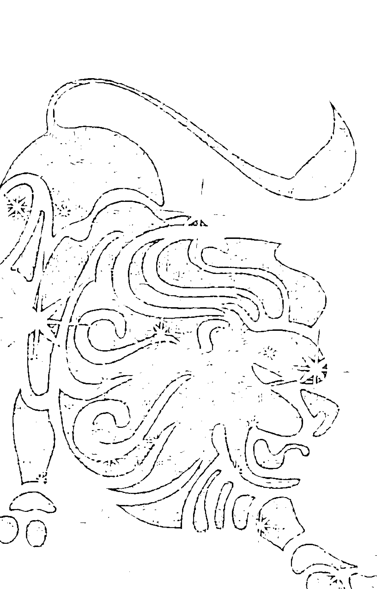
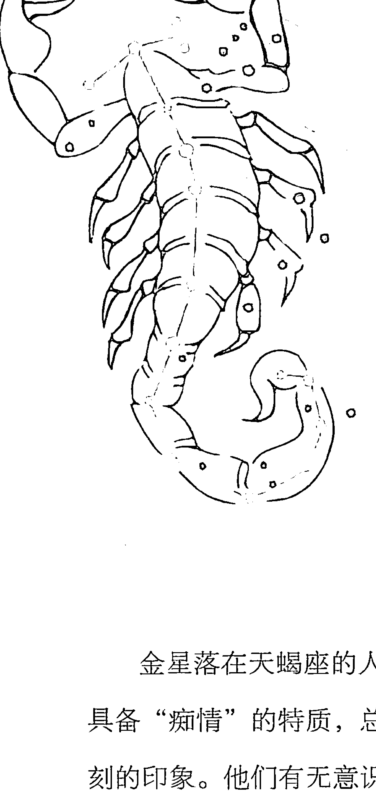
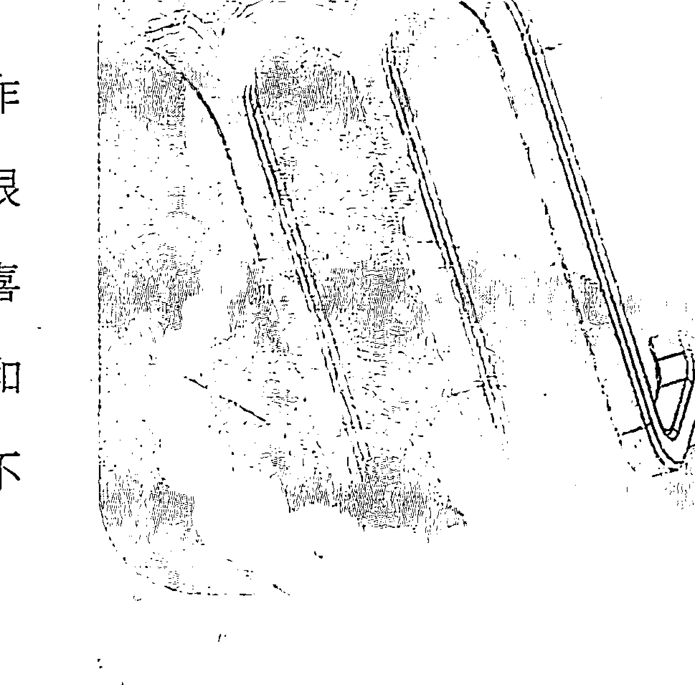

# 12金星星座

幻觉的文本《12星座，看谁写了星座的爱》，脱离了简单的星座描述。从占星学的角度出发，我们从与占星学中的星体相联系，描述了我们爱与被爱的方式。我们的爱情在不同星体的影响下形成各种形态，它构成了星座学一个独特的角度。让我们了解到，并不仅仅是把人简单分成12等份的性格类型，更是公转的太阳象征影响着我们的行为特征和动机，综合起来形成了复杂的人性。

> ——人气占星人 王小亚

作为星座漫画师，我与幻觉有过几次合作。她对星座，特别是金星星座的研究功底深厚，对爱情的解析细致而犀利，准确而且充满了洞察。她把星座与占星学的理论用轻松而有趣的方式表达出来，上升到一个更理性的层面。她写的内容既不是简单的星座娱乐，而是教你如何利用自己的星盘结构，让自己变得更好、更理想。而这本关于爱情的星座读物，也一定会让你受益匪浅。

> ——星座漫画师 Bele

在我认识的星座师中，幻觉无疑是带给我最大震撼的。她仅仅给我看了我的星盘之后，就说出了我所经历过几段恋爱中存在的问题，准确得像亲眼目睹一般。而且通过她的分析和帮助，我也找到了自己的 Mr. Right。她的星座解读不是随意的娱乐，而是源于她对占星学和两性情感问题多年来潜心研究的积累。相信她的新书《12星座，看谁写了星座的爱》，一定能帮助更多的人了解爱情的课题。

> ——超准星探 抱抱熊

# 导言：星星知道答案

有时我们不知道自己为何存在，不知道人生究竟是要怎样，更不知道生命中将遇到的那个TA是谁，是什么性格，又为什么是TA而不是别人。特别是在遇到种种不解之事、在无奈之时、在感情受挫之后，总是试图借用某些工具寻找到生活为我们预设好的路径。于是，我们仰望星空，寻求一切答案。

占星术是可以这样使用的一种工具。通过占星术，你可以看穿许多表象之下的实质所在。但占星术并非“算命”，从“算命”的角度看待占星术会让我们觉得，仿佛我们的每一步人生都是由星星注定，完全失去了自我选择的意志和权利。

但占星术告诉我们的是，虽然我们在很多事情上会受到限制，比如我们的出生以及出生的环境、成长的背景是无法自我选择的，但在这些限制之内，我们仍然有选择如何生活的自由和权利。占星术并不会完全剥夺我们在有限条件下自我决定人生的自由，也不是面对痛苦与挫折用来说服自我、去认命、去逃避的工具，只是通过观察太阳系行星的位置影响，更加深刻地了解自己与他人。

生命原本是个丰富富足的经历，每条可供选择的路都足够我们用一生去体验。当我们掌握了这个从“原生态”就更多了解自我及他人的工具后，我们的选择相应也多了起来，生活也随之精彩了起来。

占星术是如此复杂的一整套系统，有太多太多内容可以学习、研究，而且还在不断地发展进化，完全掌握这门工具几乎不可能。但占星术同时也可视为很简单的系统，比如已经成为一门流行文化的“星座”。仅凭太阳星座，就可以得出不少对人性格描述的准确结论，通过行运行星对太阳星座的影响，我们已经结识了很多“很准”的占星师。

略微深入一点，通过月亮星座，我们能体会到外表看不出的内心情感；而再略微深入一点，我们可能就会考虑水星带给人的表达特质、金星带给人的审美与情感倾向、火星带给人的行事风格等等。

爱情是人类永恒的话题，爱情之中有很多难解的课题。我为什么喜欢这样的人？为什么遇上TA就不可自拔？为什么会对TA念念不忘？为什么会与TA分手？为什么想找回TA？到底与我彼此交付了真爱的TA是茫茫人海中的哪一个……

只有你知道TA有多美，TA到底是谁；只有TA知道你有多好。问问自己的月亮、金星和火星，通过星盘的解读，也许你自己就能找到这个答案。

## 只了解太阳星座就够了吗？
星座还远远不够

在占星里，太阳赋予万物生命，代表着我们的自我意识、生活意愿和创造人生的力量。太阳象征着我们每个人的生命力，代表我们的意识、精神、行为原则、动力、意志、力量来源，也代表未来、权威人物、英雄、统治者、年长的人、领袖等。

### 太阳星座是“概括帝”，行星才能解释本质

在占星上，太阳赋予万物生命，代表着我们的自我意识、生活意愿和创造人生的力量。太阳象征着我们每个人的生命力，代表我们的意识、精神、行为原则、动力、意志、力量来源，也代表未来、权威人物、英雄、统治者、年长的人、领袖等。就像在太阳系中，所有的行星都围绕太阳旋转，我们也是从命盘的太阳处获取自己的人生目标的。

太阳就是自我，也是我们的“成熟体”——我们用来有意识地抑制自己“内心孩子”的那部分，这引发出了我们的各种行为和最终决定。太阳是我们的基础身份，代表着自我认知。在我们问自己“我是谁”的时候，得出的答案会是对自己的太阳的一种描述，用太阳星座的特性对自己进行了基本判断和定位。太阳也代表着我们的整体生命力，指引着人生的方向，可被视为每张星盘的引领者。

太阳在星盘中的地位特别重要，那些能够与其太阳位置表达一致的人可以说是这个世界上最幸福的。可能有人会觉得，一个人被赋予太阳位置的特性是一件顺理成章的事，但其实太阳表现出来的，是我们要学会的样子——学会成为太阳位置表现的样子。太阳代表的是终点，而不是本能，这一点很重要。占星师格兰特·莱维认为，太阳象征着“主宰我们行为的心理倾向”。当我们表现出自己的太阳时，我们目的明确、直接，富有创造；但从负面角度上说，也可能会变得过于任性、以自我为中心。

在命盘中，太阳星座代表着人生目标和行为风格。太阳所落的宫位，决定着我们会在哪些方面凸显自己的个性。在太阳所落宫位掌管的各个方面，我们渴望着表现出太阳星座的特性。太阳能量的具体表达经由月亮和其他行星的功能实现，就像在地球上，太阳能量遍及整个星球，给予万物生命，但我们却无法直接将太阳能利用到具体生活上，必须通过一些工具收集、转化一样。月亮和其他行星的功能就类似于收集转化太阳能量的工具，各有各的作用，然后通过太阳形成统一的整体。我们通过自觉意识和表达意愿（太阳），整合所有的个性作用（其他星体），形成自我。

我们平时所讲的“星座”，指的就是太阳星座，也就是我们出生的时候太阳所落的星座位置。

### 12太阳星座，你是一个怎样的人？

#### 太阳白羊座

白羊座是“我自己”的代言，自信、热情、积极、冲动。白羊座的人总是那样精力充沛，好奇心旺盛，对于新奇事物充满兴趣，迫不及待地想投身其中尝试一下，勇于面对任何挑战，克服任何困难。往往不考虑后果，凭借一腔热血毫不犹豫地投入到行动中，秉承“进攻就是最好的防守”。任何有他们参与的场合，他们都会有强烈发言的意愿，要明确说出自己的立场，很难让人忽视。

勇猛大胆的他们不会随意附和别人的想法，特别坚持自己，也往往显得非常自私，因为他们坚信自己是正确的。不一致的想法在他们看来一定是错误的，这给人造成“眼中没有别人，从不考虑别人感受”的印象。如果他们无法自主生活，就会活得不快乐。所以，他们一直致力于打破生活中那些不符合他们观念的规则，这个不断打破规则的过程也给他们自己带来了很多难题。

凡事交给他们都没错，只要他们不对这个东西失去兴趣，那种一往无前的执着和动力会让他们得以成功。但问题就在于，如果实现这个目标的速度不够快，他们又会突然丧失兴趣。太容易觉得无聊并且失去耐心，总是雄心勃勃地立刻着手一件事，但最终因为没了做事的热情而无法完成。

#### 太阳金牛座

金牛座是“我拥有”的代言，踏实、缓慢、执着、可靠。占星师们常用“感官星座”来形容金牛座，他们特别爱享受，各种能带来肉体舒适的内容对他们必不可少。通常财务状况都不错，即便有时发迹得晚一点，但也能保障人生的衣食无忧。

他们非常需要稳固，害怕改变，也怕放手。“拥有”就意味着永不失去，一旦做出决定就想坚持到底，固执得像一头牛。这也是因为他们非常害怕颠覆掉自己曾经拥有的价值体系。在性格的负面因素上，可能表现为贪婪、多疑、爱嫉妒。

大部分金牛座的人都很慢，无论是考虑事情还是投入感情，都是慢热型。一切事情都想用自己的节奏来做，这种缓慢甚至可以称为懒惰的习惯，再加上对口腹之欲的热爱，会让很多金牛座的人变成胖子。而且出于对身体快感的热爱，很多金牛座（特别是男性）都是出了名的“好色”。只是这种“好色”单纯出于身体快感和对“更好生活”的欲望，与他们对感情关系的专一并不矛盾。感情关系也是他们的一种“占有”，即便不满，需要通过外界因素补足，却也不可以失去。

他们对生活的要求非常高。很多人认为金牛座的人非常物质，但其实那些完全以金钱为目标的金牛座并不多。他们想要打造的，只是给自己和亲人、爱人最稳定的社会环境和经济条件，是值得别人信赖和依靠的人。

#### 太阳双子座

双子座是“我认为”的代言，聪慧、敏捷、善言、多动。双子座的人一般都有阳光的外表和孩子般的心性，看上去特别顺眼。但不管是双子男还是双子女，他们都更依赖于自己的心智而并非外表，总是不断地做出表达，无论是言语还是文字。让他们停止表达自己，简直是不可能的任务。

用“样样都懂，样样稀松”来形容双子座的人再贴切不过。他们很难在某一件事上集中精力，而排除其他事情的干扰认真研究下去。所以他们宁愿把时间用在多了解一些事情上，也不想让一件事情占用太多时间。双子座在占星上也掌管初级教育，就像我们上小学、中学一样，什么都得学一点，但并不区分具体专业。

他们确实不是能靠得住的人，“相信什么也别相信双子座那张嘴”是人们对他们的普遍评价。而且正因为太擅长用言语欺诈和恭维别人，他们反倒能因此得到自己想要的东西。另外，由于双子座的双体特性，他们如果没有表现出特别阴暗险恶的一面，那么内心也会潜藏着这样的一面。最好不要激怒双子座的人，如果你的心理承受力并不是很强的话，他们的语言可是抽人很痛的小皮鞭。

#### 太阳巨蟹座

巨蟹座是“我感觉”的代言，聪明、善良、恋家、隐忍。巨蟹座的主星月亮代表人的情绪和感受、本能反应和最深的自我需求，也代表母亲。巨蟹座的第一需求就是家，一个关在门后的、舒适、安全的巢穴。不少巨蟹座都很“宅”，看上去仿佛不需要朋友，也不需要社交，就像螃蟹隐退回自己的壳子里。

巨蟹座具备保护特质，会把自己的亲人、爱人带进“壳子”里加以培养。但这种保护有时也非常折磨人，他们总是用痛苦表现进行感情“勒索”，破坏亲人、爱人的自尊心。他们在外面的时候，看起来总是非常平稳，摆出信心十足的样子，甚至让人觉得他们很强硬。但其实，在最亲密的人面前，他们时刻表现出毫无安全感的样子：情绪化，发作起来不可理喻，不断用过去的伤痕惩罚自己，进而惩罚亲密的人。

他们的情绪化很难掌控，总是上一分钟还充满爱意，又细致又耐心，下一分钟就成了暴躁、冰冷甚至充满攻击性的人。他们特别爱生气，看起来还常常没缘故地易怒，因为他们不喜欢把事情说出来，认为“我不说你也应该知道”。如果真的没有被理解到生气的原因，会让他们更加愤怒，认为“你根本不关心我的心情”。

一般的时候，他们用沉默和冷暴力来表示不满；极端的时候，会彻底失控。巨蟹座也具备商人的精明，凡事讲“交换”，也很看重钱财，会在感情上依赖于财务是否富足。

#### 太阳狮子座

狮子座是“我决心”的代言，自信、忠诚、大方、尊贵。他们的热情大方特别容易感染别人，也很容易被人喜欢。他们那些充沛的精力需要很多发泄的出口，有前途的职场、活跃的社交活动都是他们不可缺少的生活要素。他们身上放射出的极大魅力和高贵姿态广受爱戴，而关键是，如果没有这些爱戴，他们也无法满足。

所以在生活的各个方面，无论选择做什么，他们都要大出风头，都要成为领袖角色，煽动并鼓舞别人。这些能力也让他们可以成功登上真正的领导位置。

但这些性格的负面特质就是专横、跋扈、自私。狮子座的人非常自恋，无法容忍指责和批评。当他们的骄傲与主导权受到威胁时，会有脾气大爆发，显得特别暴虐。他们也无法接受自己曾经“失败”，面对失败往往会把责任全部推卸给别人。

心情好时，狮子座特别宠溺别人。可以说，被他们宠溺的人是这个世界上看上去最幸福的人。他们喜欢被人仰慕，也不可缺少人们的恭维与赞美。当他们的自尊心和虚荣心得到满足的时候，会大方地做出回报，甚至会离谱地慷慨。一般对待金钱毫不在意，花钱如流水，就算借债也要维持自己面子上的光鲜。

#### 太阳处女座

处女座是“我分析”的代言，谦虚、天真、苛刻、羞怯。处女座的人对世界的辨析能力很强，时常是一种“冷眼看透”的感觉，对于自己和别人都有极高标准。他们几乎在一切事情上追求完美，想去做一件事，就会尽自己最大努力把事情完成，要是事情做得“不好”“不对”，会给他们带来长时间的困扰。

他们总是对别人的意见表示出不屑，认为每个人都不如他们明白，总想从“完美角度”去改变别人，甚至是事务的进展。他们不能容忍别人不准时或不精确，爱指出别人的错误和问题，这会带来一种优越感，所以他们总是叨叨个不停。即便这是出于帮助别人的好心，也让人听得厌烦。

他们不能承受被忽略，如果一些感兴趣、有意义的事情没能参与其中，他们会非常不满，甚至产生自卑，认为自己在别人的眼中“还不够完美”。为了证明自己的能力，会更加挑剔别人的弱点。这让他们成为非常好的下属，但也不易合作，宁愿自己把事完成，怕被人拖了后腿。公平地说，他们在对人苛刻挑剔的同时，对自己更加苛刻，也为此长期受困并且受制。他们对人的要求，也会建立在“我能做到你为什么不能”的基础上。

#### 太阳天秤座

天秤座是“我掂量”的代言，美丽、优雅、平和、有礼。天秤座的人总是能给人留下非常好的第一印象，因为他们的审美能力卓越，讲究品位，性格和善，擅长交际，确实是给人感觉非常美的一群人。

他们总是可以和很多人成为朋友，公平、正义、随和、八面玲珑。因为追求和谐，凡事都倾向于配合，很少与人对抗，为了平息事端宁愿委曲让步，但这也会给他们带来“虚伪”的评价。也因为总是不断改变自己的观点去迎合他人换取和谐，让他们毫无立场可言。原本他们是出于“平衡”的目的这样去做，但久而久之，这最终让他们失去了平衡。他们是出了名的选择障碍和犹豫不决，这也是因为没有坚定立场所致。

而且天秤座是无法一个人过活的星座，他们的对宫白羊座总是“我”，而天秤座总是“我们”。他们毕生追求“同进同退”的配合协作关系，但事实上因为他们太爱从口头上顺从别人，总是用改变自己来取悦他人，他们的人际关系反倒容易出现失衡的问题，泛泛之交不少，却很难得到对他们掏心掏肺的朋友。

#### 太阳天蝎座

天蝎座是“我打造”的代言，冷酷、强硬、神秘、坚持。天蝎座的内心蕴藏着巨大的能量，极端而且激烈的感情、强大并且持久的耐力，一旦出手绝不半途而废，不达目的誓不罢休，天蝎座的人里最容易出现大成大败之人。

他们非常多疑，会怀疑一切事情背后都有阴暗的目的，相信没有任何事情是单纯的。他们的洞察力非常强，会在外人毫无察觉之时就掌握了对方的事实和真相，自己却隐藏得很深，无情起来让人脊梁发冷。因为他们不会遗忘，情感特别深刻激烈，深深铭记一切好与坏。但单从外表你永远无法得知他们内心在想什么，常常让人感叹此人真是妖孽，可怕但又神秘，那样吸引人。

他们不怕痛苦，会勇于面对一切困难，拼杀出血路得以进一步成长，甚至把痛苦当成人生必须的内容，认为失去痛苦的人生不值得玩味，太麻木平淡。天蝎座本身掌管性，情欲上几乎无所不用其极，但这和他们对于专一情感的追求并无矛盾。毕竟对于深刻的天蝎座，一旦对感情认真起来，真的可以升华到灵魂的深度。

#### 太阳射手座

射手座是“我见过”的代言，真诚、自由、乐观、热情。射手座是天生幸运的星座，因为有木星这颗大福星的照顾，他们在成长路上并不会遭遇巨大的波折，那种“危难时刻凭借幸运过关”的情况屡见不鲜，这也造就了他们的快乐天性，特别招人喜欢。

他们总是渴望尽可能多的阅历，“读万卷书不如行万里路”正是他们的写照。对于资讯和旅行有着强烈的渴望，对于一切不够了解的事情和人具备“征服欲”，所有的目标都集中于“让我得到进步”。他们对事物的看法超越于眼前和当下，站在更高、更广的视角。几乎每个射手座都喜欢参与或评论国际话题、时政新闻，对于快乐和痛苦的体验都上升到全人类的高度。

他们具备天生的道德感，即使那种道德感本质也许并不道德，甚至讲不通，但这就是他们的世界观和方法论，会一直用来应对世事和人群。为了把这些内容强加给别人，时常和人争论得面红耳赤。同时，也因为天生的好运，射手座的人难免流于懒惰和侥幸心理，不肯吃苦拼搏，人生很可能会流于玩玩乐乐一辈子，而最终一事无成。

#### 太阳摩羯座

摩羯座是“我利用”的代言，沉闷、踏实、严肃、刻苦。摩羯座受到土星的影响，无疑是最成熟稳重的星座。他们具备很好的组织能力，也最努力工作，往往都是工作狂，也能成为一方领导。摩羯座的野心都很大，会为雄心壮志吃苦奋斗，但绝不会投机冒险。他们的人生倾向于名利地位，会预先做好提纲，一步一个脚印。

但他们很容易自卑，并且情绪波动也很大，很多摩羯座会有抑郁倾向，时常悲观，躲起来自怨自艾，对失败久久不能释怀。偶尔发生自虐和自残倾向，甚至一次失败引发的情绪发作对他们来说都可能是致命的。也是出于这个原因，他们严于律己，有不少摩羯座会给自己设定禁区，包括有一些摩羯座会有禁欲倾向，会被人看成“唯利是图”。

他们是年龄越大发展越好的星座，小时候就比一般人早熟，而成功往往来得更晚一些。这让他们年轻时候必须要忍受很多制约和情绪上的自苦，这种磨砺也造就了摩羯座坚忍的性格，是让所有人不敢轻视小觑的星座。

#### 太阳水瓶座

水瓶座是“我懂得”的代言，聪明、直接、随性、疏离。水瓶座的与众不同非常明显，特别擅长做出一些古怪的事情，让人高呼“好像来自火星”。他们对世事的超脱可以达到冷漠的境界，人们很难用寻常观念来揣测这个星座，让人觉得他们不太合群，也很难弄懂。

他们明显叛逆，不会向不喜欢的惯例妥协，倾向于自己创造一套不合常规的规则，会被一切具备先锋性、实验性的内容吸引。毕竟他们的主星天王星代表了变革和高科技，正是最具思想的创造家。但同时他们也带有土星的特质，时常在成长的路上经受限制和约束，并且心里潜藏着远大的雄心抱负。

他们的朋友虽然很多但并不深入，因为不愿与任何人产生亲密关系，就算和家人也有些疏离，怕背上感情包袱，对独立自主极度渴求。但其实，他们是最具备人群观念和人道主义精神的星座，也不会用条条框框来约束别人，心态非常开放，对于自己和别人的缺陷都能坦然接受。和他们在一起，只要不寄托于得到太多情感体验，就会感受到他们带来的快乐和帮助。

#### 太阳双鱼座

双鱼座是“我信仰”的代言，温柔、脆弱、迷幻、善良。双鱼座身上总是有种朦胧气质，时不时地陶醉于自己构想出的世界，给人感觉很不清醒。但他们并不在意别人认为自己是糊涂的人，宁愿相信那些构想真实存在，在梦想与现实之间来回摇摆，穿插生活。

他们特别富有同情心，会觉得别人可怜并且代入角色，想要为别人做些什么。这种天性让他们天生有种治愈能力，擅长关心并且照顾别人。但他们也时常陷入自怜，并以夸张的方式表现出来，越夸张越觉得真实，甚至把自己变成悲情故事的最悲情主角，即使旁人都已戳穿也毫无自知。

他们非常需要强有力的目标让自己明白生活的意义，否则容易在梦想与现实的摇摆中迷失，情绪上陷入忽好忽坏的极端，甚至寻求成瘾型的寄托。他们也的确需要对成瘾物质的自控能力，很多双鱼座一旦尝试过酗酒、吸毒的感觉就再也无法自拔。也是因为这个原因，双鱼座也是最容易被“勾引”的星座，时常游离的幻想让他们轻易就被一个小小的情绪细节所吸引投入，当然他们也就难以安定下来。

## 学堂

金星在占星术中掌管爱情、艺术、和谐、幸福等内容；当金星的优雅与爱意被发散照射时，无论是命盘金星，还是行运金星的正面影响，都会让人沐浴在美和喜悦之中，并带来爱与财富。

## ◎ 你拥有爱神维纳斯的“金腰带”吗？

金星，也被称为“启明星”“长庚星”“太白金星”。它是颗名副其实的“明星”，明亮夺目，可以用肉眼观测。清晨和傍晚时，金星都会在天空独自闪耀。人们将它比拟为美神维纳斯，金星的英文 Venus 即由罗马神话中的维纳斯而来。在太阳系中，金星比地球的位置更靠近太阳，所以在占星上，金星永远不离开太阳48°以上（最精确的是47.5°）。

在占星学中，金星属于“内行星”，是“个人行星”之一，也是占星系统中非常重要的行星。在多种类型的占星体系中，都是需要加以关注和着重考虑的行星。它掌管爱与美、拥有与财富，这是我们在占星上对金星的基础印象。

金星就是罗马神话中的维纳斯和希腊神话中的阿芙洛狄忒，是广为人知的掌管爱、美、优雅、慈悲的神祇。关于她的诞生一般有两种说法，其中更常见的是希腊神话中有关阿芙洛狄忒诞生（即金星，罗马神话中的维纳斯 Venus）的说法。

与我们概念中的金星印象不同，阿芙洛狄忒的诞生相当暴力。希腊神话中，克洛诺斯（即土星，罗马神话中的萨图恩 Saturn）阉割了他父亲乌拉诺斯（即天王星，罗马神话中也叫做乌拉诺斯 Uranus）。被阉割掉的生殖器落入大海，阿芙洛狄忒便从海洋里升起。阿芙洛狄忒的名字即来自希腊文 “Aphros”，意思是由海浪暴力翻腾而产生的“海洋的泡沫”。

虽然占星学中都是用罗马神话的名字来命名行星，但实际上罗马神话是脱胎于希腊神话的再创作，绝大部分的故事和理解都来自古希腊人。

此外，中美洲的玛雅人和阿兹特克人也认为金星与暴力有关。他们相信，在金星逆行的时候，会从一名女人变成男人，引诱爱神失去贞洁，然后生出海妖孩子，然后“他”会在一场比赛仪式中失败，必须被祭祀给太阳，这之后“他”又重生为“她”，再从男人变为女人。中美洲的古文化里，通过真实的竞赛、战争和人血祭祀组成生育仪式，正是反映了上述过程。

在今天的西方文化中，人们更加看重金星的温柔面。人人都喜欢美好的内容，跟一个看重礼节、胸怀公平、美丽、慈爱、温柔、性感的人相处当然会更让人舒服。在希腊神话里，阿芙洛狄忒是掌管性、欲望、爱情、快乐和美的女神。在罗马神话里，维纳斯原本只是个掌管花园和葡萄园的农业女神，后来维纳斯的特质里更多地采用了阿芙洛狄忒的特性，融合了两种文化的特点。

阿芙洛狄忒或者说维纳斯最有名的饰品就是那根金腰带了，这是她的“法定丈夫”——锻造之神赫菲斯托斯（即罗马神话中的伏尔甘 Vulcan）用黄金精心制造的。她戴上这根金腰带时，发散的魅力无人可挡。有时别的女神想吸引爱情，也会向阿芙洛狄忒借用这根腰带。

如果我们戴上了这根金腰带（也就是说金星的魅力在我们身上显现时），就会被爱、欲望、美、魅力所环绕。不论外表如何，都会显得非常迷人，这是灵魂中天然之美放射出的光芒。在天文学上，还有一种大气现象以此命名——金星带。这是日出前和日落后出现的一种大气现象，呈粉色光或反射黄昏光，是朝霞和夕晖中最美丽的部分。

其实神话中的金星并不那么可爱。比如，她是可怕的特洛伊战争里的核心人物，这场战争始于阿芙洛狄忒、赫拉（即婚神，罗马神话中的朱诺 Juno）、雅典娜三人之间的比美。阿芙洛狄忒在比美中取胜之后，混乱随之开始，最终导致了特洛伊战争。

同时，在希腊神话中，阿芙洛狄忒还是个绝不允许被小看的女神。任何看不起她、不崇拜她的人都会受到她的惩罚。关于这一点，有很多例子：比如爱上自己倒影的纳西塞斯，就是因为蔑视了别人爱意而受到阿芙洛狄忒的惩罚；塞浦路斯岛上的一个公主因为不崇拜阿芙洛狄忒，就被惩罚而爱上自己的亲生父亲；希波吕托斯因为厌恶女人和爱情，被阿芙洛狄忒惩罚，让他养母向他求爱，被拒绝后养母诬告了希波吕托斯并自杀……

通过希腊神话我们可以感受到，任何蔑视金星的人，或是崇拜别的内容超过崇拜金星的人，都会受到她的惩罚。她会用性谗、单恋、悲剧、不伦等类似“违背天伦的激情”施加惩罚。

当我们不尊重爱情和亲密关系的圣洁性、重要性的时候，就背离了自己的心，并因此失去了生命的核心意义。金星就是要求我们要遵从自己的心。因此，对于阿芙洛狄忒来说，忠贞并不是她的第一要求，而遵从自己的心才是。她对于宙斯（即木星，罗马神话中的朱庇特 Jupiter）为她指定的“法定丈夫”——锻造之神赫菲斯托斯非常不满，因为这个人又瘸又丑。她最深爱的情人之一是英俊而善战的战神阿瑞斯（即火星，罗马神话中的马尔斯 Mars），她还和阿瑞斯生了三个孩子。

在所有阿芙洛狄忒的神话传说中，最著名的一段就是她与阿瑞斯被丈夫捉奸在床，后被诸神围观嘲笑的故事。阿芙洛狄忒还和包括海神波塞冬（即海王星，罗马神话中的尼普顿 Neptunus）、信使赫尔墨斯（即水星，罗马神话中的墨丘利 Mercurius）等神祇和一干凡人之间传出了各种风流韵事。可以说，阿芙洛狄忒对人和事的判断标准只有“喜欢”和“讨厌”这两个词，她永远遵从自己的心，而不是其他标准。

遵从内心可能有这样那样的后果，但不遵从内心，我们只能被别人施加的意图所驱使。我们必须做出选择——是服从金星，还是等待金星的惩罚？金星所传递的核心内容是：尊重爱，认为爱超过其他一切，是很重要的。如果你对爱不够尊重，蔑视发自真心的内容，就早晚会为此受到苦难与折磨。

## ◎ 爱是金星的真正意向

金星在占星术中掌管爱情、艺术、和谐、幸福等内容。当金星的优雅与慈爱散发影响时，不论是命盘金星还是行运金星的正面影响，都会让人沐浴在美和喜悦之中，并带来爱与财富。

金星掌管爱情关系，比如掌管婚姻。金星也拥有爱情的智慧，知道如何让爱情关系变得更牢固紧密。但在前面的神话传说中我们已经谈过，金星也是放纵的女神阿芙洛狄忒，她情事不断，尤其是与火星的关系堪称轰轰烈烈。这说明金星真正“忠于”的是各个类型的“爱”。传统的婚姻也好，狂放的行乐也罢，只要是“爱”就是金星真正所趋向的。

所以在占星术中，金星具备多重面孔，既有善良多情的一面，也有报复心、嫉妒心强、强迫性、富于诱惑性的一面。

金星还代表了外形顾问、时尚专家、内在艺术家这类角色。对女性来说，金星展现了她渴望成为怎样的人；对男性来说，金星体现出他渴望或需要哪种类型的女性，而在同性关系中，金星会表现出崇拜与被崇拜。金星是一个人的精华部分，我们用金星的方式主动去寻找爱与和谐，以金星的激情发现生活的美好，放大这世界的美与人分享。就像一朵绽放的花，用它美丽的姿态和香味来吸引采蜜的蜂蝶。

### 理解金星的几个关键点

- 因为金星从不远离太阳48°以上，所以金星星座只可能与太阳同星座，或者是太阳星座前两个星座之一、太阳星座后两个星座之一。
- 状态良好的金星是在爱情中的好运，而状态困难的金星可能妨碍爱情中的幸福和快乐，或让人很难感受到快乐。金星也掌管金钱和财务，道理也是一样的。
- 金星主宰了欲求本身，但欲求具体内容会被社会文化、环境等外界力量所影响和改变。
- 金星会使我们无法抗拒某种风格、性格或行为特征，因而坠入爱河。
- 金星让我们在谈情说爱时表现出不同的方式。
- 两人金星之间彼此和谐的时候，很可能有来电的感觉，但没有其他和谐影响的支持，仅凭两个人的金星不能决定两人是否能深入交往。
- 金星的正面影响：爱、美、价值、品位、和谐、分享、友善、欢愉、依恋、艺术、满足等；负面影响：虚荣、贪婪、懒惰、傲慢、专横、色情、独占、放纵、物质至上等。
- 金星的阴暗面：爱会转为嫉妒、执念、仇恨。
- 金星在占星术上掌管的星座：金牛座和天秤座。
- 金星在金牛座和天秤座入庙，在白羊座和天蝎座失势，在双鱼座擢升，在处女座落陷。
- 金星在每个星座的运行时间大约为一个月。

## ◎ 金星决定爱不爱

每个人的命盘里都有金星，它可以说明：是什么激发我们内心的爱、我们独特的爱情风格、我们需要的情感模式、我们对别人表达爱意的方式，以及什么事物会给予我们最根源的满足和最根源的失望。

也许金星是最了解我们内心的行星，既能反映出我们的优势和特长，也能反映出问题和困难。不过金星更擅长展现优点和长处。我们喜欢的、享受的、愿意去做的、能够放松去做的，这些发自天性的内容正是每个人的自然魅力所在。

金星掌握着我们对爱情的想象。单身的时候，我们期望“能有一次那样的爱情就好了”；在真的步入爱情时，我们期望在这段爱情中将之前的想象变为现实。人们说：“爱情是盲目的。”每次爱情发生时，几乎都会伴随着一种莫名的感觉，令人无法自控，金星就是引出这种“感觉”的重要因素之一。

自己的优点是什么？自己的魅力在哪里？自己对于爱情的想象是怎么样的？自己擅长的东西、喜欢的事物、放松的空间，都是什么样的？

在你真的了解这些之后，对于你的感情体验是非常有帮助的。身为占星师，每当被人问及：“我喜欢上了某个帅哥（美女），怎样才能让他（她）也喜欢我呢？”我的第一反应就是做张对方的命盘，看看他／她的金星是什么情况。

## ◎ 金星星座查询表（1962年—2012年）

在占星术中，除了太阳星座、月亮星座之外，人们关注度最高的就要算金星星座了，这也是因为金星与恋爱之间的关系最密切的缘故。虽然占星术可以了解生活各个方面的情况，毕竟爱情永远是人们最关注的一个主题。

金星星座就是出生时，金星落在十二星座的具体位置。金星星座往往比月亮星座更容易理解，比太阳星座更容易感知。比如我们对自己的优点、需求、不满都有明确的内心答案，这个答案应该和我们的金星星座非常相符。

前面已经说过，金星并不仅仅掌管喜爱与吸引，也掌管厌恶和排斥，代表了一个人的内在价值观，这是经由情感层面上的经验累积而成的。我们出于这种内在价值观而形成特定的反应，所以金星的爱与恨会驱动我们做出一些事，也使我们的个性与他人有所区别。我们的内在价值观和个性，会与金星星座非常相符。

下表中列出的是每年金星换星座的时间。根据你的出生日期，查看自己生日之前（或当天）金星进入哪个星座，那么你的金星就是这个星座。例如你出生在1981年1月1日，通过下表可以发现：1980年12月18日金星进入射手座，1981年1月11日金星才转换为摩羯座，所以你的金星就位于射手座。

| 1962 |  | 1963 |  | 1964 |  |
|---|---|---|---|---|---|
| 1月22日 | 水瓶 | 1月7日 | 射手 | 1月17日 | 双鱼 |
| 2月15日 | 双鱼 | 2月6日 | 摩羯 | 2月11日 | 白羊 |
| 3月11日 | 白羊 | 3月4日 | 水瓶 | 3月7日 | 金牛 |
| 4月4日 | 金牛 | 3月30日 | 双鱼 | 4月4日 | 双子 |
| 4月28日 | 双子 | 4月24日 | 白羊 | 5月9日 | 巨蟹 |
| 5月23日 | 巨蟹 | 5月19日 | 金牛 | 6月18日 | 双子 |
| 6月17日 | 狮子 | 6月13日 | 双子 | 8月5日 | 巨蟹 |
| 7月13日 | 处女 | 7月7日 | 巨蟹 | 9月8日 | 狮子 |
| 8月9日 | 天秤 | 8月1日 | 狮子 | 10月6日 | 处女 |
| 9月7日 | 天蝎 | 8月25日 | 处女 | 10月31日 | 天秤 |
|  |  | 9月18日 | 天秤 | 11月25日 | 天蝎 |
|  |  | 10月12日 | 天蝎 | 12月19日 | 射手 |
|  |  | 11月5日 | 射手 |  |  |
|  |  | 11月29日 | 摩羯 |  |  |
|  |  | 12月24日 | 水瓶 |  |  |

| 1965 |  | 1966 |  | 1967 |  |
|---|---|---|---|---|---|
| 1月12日 | 摩羯 | 2月6日 | 摩羯 | 1月7日 | 水瓶 |
| 2月5日 | 水瓶 | 2月25日 | 水瓶 | 1月31日 | 双鱼 |
| 3月1日 | 双鱼 | 4月6日 | 双鱼 | 2月24日 | 白羊 |
| 3月25日 | 白羊 | 5月5日 | 白羊 | 3月20日 | 金牛 |
| 4月18日 | 金牛 | 6月1日 | 金牛 | 4月14日 | 双子 |
| 5月13日 | 双子 | 6月26日 | 双子 | 5月10日 | 巨蟹 |
| 6月6日 | 巨蟹 | 7月22日 | 巨蟹 | 6月7日 | 狮子 |
| 7月1日 | 狮子 | 8月15日 | 狮子 | 7月9日 | 处女 |
| 7月25日 | 处女 | 9月9日 | 处女 | 9月9日 | 狮子 |
| 8月19日 | 天秤 | 10月3日 | 天秤 | 10月2日 | 处女 |
| 9月14日 | 天蝎 | 10月27日 | 天蝎 | 11月10日 | 天秤 |
| 10月10日 | 射手 | 11月20日 | 射手 | 12月7日 | 天蝎 |
| 11月6日 | 摩羯 | 12月14日 | 摩羯 |  |  |
| 12月7日 | 水瓶 |  |  |  |  |

##### 1968 / 1969 / 1970

|1968 日期|星座|1969 日期|星座|1970 日期|星座|
|---|---|---|---|---|---|
|1月2日|射手|1月5日|双鱼|1月21日|水瓶|
|1月27日|摩羯|2月2日|白羊|2月14日|双鱼|
|2月20日|水瓶|6月6日|金牛|3月10日|白羊|
|3月15日|双鱼|7月7日|双子|4月3日|金牛|
|4月9日|白羊|8月3日|巨蟹|4月28日|双子|
|5月3日|金牛|8月29日|狮子|5月22日|巨蟹|
|5月28日|双子|9月23日|处女|6月17日|狮子|
|6月21日|巨蟹|10月17日|天秤|7月12日|处女|
|7月15日|狮子|11月11日|天蝎|8月8日|天秤|
|8月9日|处女|12月4日|射手|9月7日|天蝎|
|9月2日|天秤|12月28日|摩羯|||
|9月27日|天蝎|||||
|10月21日|射手|||||
|11月15日|摩羯|||||
|12月10日|水瓶|||||

##### 1971 / 1972 / 1973

|1971 日期|星座|1972 日期|星座|1973 日期|星座|
|---|---|---|---|---|---|
|1月7日|射手|1月16日|双鱼|1月12日|摩羯|
|2月5日|摩羯|2月10日|白羊|2月5日|水瓶|
|3月4日|水瓶|3月7日|金牛|3月1日|双鱼|
|3月29日|双鱼|4月4日|双子|3月25日|白羊|
|4月24日|白羊|5月10日|巨蟹|4月18日|金牛|
|5月18日|金牛|6月12日|双子|5月12日|双子|
|6月12日|双子|8月6日|巨蟹|6月6日|巨蟹|
|7月7日|巨蟹|9月8日|狮子|6月30日|狮子|
|7月31日|狮子|10月5日|处女|7月25日|处女|
|8月25日|处女|10月31日|天秤|8月19日|天秤|
|9月18日|天秤|11月24日|天蝎|9月13日|天蝎|
|10月12日|天蝎|12月19日|射手|10月9日|射手|
|11月5日|射手|| |11月5日|摩羯|
|11月29日|摩羯|| |12月8日|水瓶|
|12月23日|水瓶||||

##### 1974 / 1975 / 1976

|1974 日期|星座|1975 日期|星座|1976 日期|星座|
|---|---|---|---|---|---|
|1月30日|摩羯|1月6日|水瓶|1月1日|射手|
|2月28日|水瓶|1月30日|双鱼|1月26日|摩羯|
|4月6日|双鱼|2月23日|白羊|2月20日|水瓶|
|5月5日|白羊|3月20日|金牛|3月15日|双鱼|
|5月31日|金牛|4月14日|双子|4月8日|白羊|
|6月26日|双子|5月10日|巨蟹|5月3日|金牛|
|7月21日|巨蟹|6月6日|狮子|5月27日|双子|
|8月15日|狮子|7月9日|处女|6月20日|巨蟹|
|9月8日|处女|9月3日|狮子|7月15日|狮子|
|10月2日|天秤|10月4日|处女|8月8日|处女|
|10月26日|天蝎|11月9日|天秤|9月2日|天秤|
|11月19日|射手|12月7日|天蝎|9月26日|天蝎|
|12月13日|摩羯|||10月21日|射手|
|||||11月14日|摩羯|
|||||12月9日|水瓶|

##### 1977 / 1978 / 1979

|1977 日期|星座|1978 日期|星座|1979 日期|星座|
|---|---|---|---|---|---|
|1月4日|双鱼|1月21日|水瓶|1月7日|射手|
|2月2日|白羊|2月13日|双鱼|2月5日|摩羯|
|6月6日|金牛|3月10日|白羊|3月4日|水瓶|
|7月6日|双子|4月3日|金牛|3月29日|双鱼|
|8月3日|巨蟹|4月27日|双子|4月23日|白羊|
|8月28日|狮子|5月22日|巨蟹|5月18日|金牛|
|9月22日|处女|6月16日|狮子|6月12日|双子|
|10月17日|天秤|7月12日|处女|7月6日|巨蟹|
|11月10日|天蝎|8月8日|天秤|7月31日|狮子|
|12月4日|射手|9月7日|天蝎|8月24日|处女|
|12月28日|摩羯|||9月17日|天秤|
|||||10月11日|天蝎|
|||||11月4日|射手|
|||||11月28日|摩羯|
|||||12月23日|水瓶|

##### 1980 / 1981 / 1982

|1980 日期|星座|1981 日期|星座|1982 日期|星座|
|---|---|---|---|---|---|
|1月16日|双鱼|1月11日|摩羯|1月23日|摩羯|
|2月10日|白羊|2月4日|水瓶|3月2日|水瓶|
|3月7日|金牛|2月28日|双鱼|4月6日|双鱼|
|4月4日|双子|3月24日|白羊|5月4日|白羊|
|5月13日|巨蟹|4月17日|金牛|5月31日|金牛|
|6月5日|双子|5月12日|双子|6月25日|双子|
|8月6日|巨蟹|6月5日|巨蟹|7月21日|巨蟹|
|9月8日|狮子|6月30日|狮子|8月14日|狮子|
|10月5日|处女|7月24日|处女|9月8日|处女|
|10月30日|天秤|8月18日|天秤|10月2日|天秤|
|11月24日|天蝎|9月13日|天蝎|10月26日|天蝎|
|12月18日|射手|10月9日|射手|11月19日|射手|
|||11月5日|摩羯|12月13日|摩羯|
|||12月9日|水瓶||

##### 1983 / 1984 / 1985

|1983 日期|星座|1984 日期|星座|1985 日期|星座|
|---|---|---|---|---|---|
|1月6日|水瓶|1月1日|射手|1月4日|双鱼|
|1月30日|双鱼|1月26日|摩羯|2月2日|白羊|
|2月2日|白羊|2月19日|水瓶|6月6日|金牛|
|3月19日|金牛|3月14日|双鱼|7月6日|双子|
|4月13日|双子|4月8日|白羊|8月2日|巨蟹|
|5月9日|巨蟹|5月2日|金牛|8月28日|狮子|
|6月6日|狮子|5月26日|双鱼|9月22日|处女|
|7月10日|处女|6月20日|巨蟹|10月16日|天秤|
|8月27日|狮子|7月14日|狮子|11月9日|天蝎|
|10月6日|处女|8月8日|处女|12月3日|射手|
|11月9日|天秤|9月1日|天秤|12月27日|摩羯|
|12月7日|天蝎|9月25日|天蝎|||
|||10月20日|射手|||
|||11月14日|摩羯|||
|||12月9日|水瓶|||

##### 1986 / 1987 / 1988

|1986 日期|星座|1987 日期|星座|1988 日期|星座|
|---|---|---|---|---|---|
|1月20日|水瓶|1月7日|射手|1月15日|双鱼|
|2月13日|双鱼|2月5日|摩羯|2月9日|白羊|
|3月9日|白羊|3月4日|水瓶|3月6日|金牛|
|4月2日|金牛|3月29日|双鱼|4月4日|双子|
|4月27日|双子|4月22日|白羊|5月17日|巨蟹|
|5月21日|巨蟹|5月17日|金牛|5月27日|双子|
|6月16日|狮子|6月11日|双子|8月7日|巨蟹|
|7月12日|处女|7月6日|巨蟹|9月7日|狮子|
|8月8日|天秤|7月30日|狮子|10月4日|处女|
|9月7日|天蝎|8月23日|处女|10月30日|天秤|
|||9月17日|天秤|11月23日|天蝎|
|||10月11日|天蝎|12月18日|射手|
|||11月4日|射手|||
|||11月28日|摩羯|||
|||12月22日|水瓶|||

##### 1989 / 1990 / 1991

|1989 日期|星座|1990 日期|星座|1991 日期|星座|
|---|---|---|---|---|---|
|1月11日|摩羯|1月16日|摩羯|1月5日|水瓶|
|2月4日|水瓶|3月4日|水瓶|1月29日|双鱼|
|2月28日|双鱼|4月6日|双鱼|2月22日|白羊|
|3月24日|白羊|5月4日|白羊|3月19日|金牛|
|4月17日|金牛|5月30日|金牛|4月13日|双子|
|5月11日|双子|6月25日|双子|5月9日|巨蟹|
|6月5日|巨蟹|7月20日|巨蟹|6月6日|狮子|
|6月29日|狮子|8月14日|狮子|7月11日|处女|
|7月24日|处女|9月7日|处女|8月21日|狮子|
|8月18日|天秤|10月1日|天秤|10月7日|处女|
|9月12日|天蝎|10月25日|天蝎|11月9日|天秤|
|10月8日|射手|11月18日|射手|12月6日|天蝎|
|11月5日|摩羯|12月12日|摩羯|12月31日|射手|
|12月10日|水瓶||||

##### 1992 / 1993 / 1994

|1992 日期|星座|1993 日期|星座|1994 日期|星座|
|---|---|---|---|---|---|
|1月25日|摩羯|1月4日|双鱼|1月20日|水瓶|
|2月19日|水瓶|2月2日|白羊|2月12日|双鱼|
|3月14日|双鱼|6月6日|金牛|3月8日|白羊|
|4月7日|白羊|7月6日|双子|4月2日|金牛|
|5月1日|金牛|8月2日|巨蟹|4月26日|双子|
|5月26日|双子|8月27日|狮子|5月21日|巨蟹|
|6月19日|巨蟹|9月21日|处女|6月15日|狮子|
|7月14日|狮子|10月16日|天秤|7月11日|处女|
|8月7日|处女|11月9日|天蝎|8月7日|天秤|
|8月31日|天秤|12月3日|射手|9月8日|天蝎|
|9月25日|天蝎|12月27日|摩羯|||
|10月20日|射手|||||
|11月13日|摩羯|||||
|12月9日|水瓶|||||

##### 1995 / 1996 / 1997

|1995 日期|星座|1996 日期|星座|1997 日期|星座|
|---|---|---|---|---|---|
|1月7日|射手|1月15日|双鱼|1月10日|摩羯|
|2月5日|摩羯|2月9日|白羊|2月3日|水瓶|
|3月3日|水瓶|3月6日|金牛|2月27日|双鱼|
|3月28日|双鱼|4月3日|双子|3月23日|白羊|
|4月22日|白羊|8月7日|巨蟹|4月16日|金牛|
|5月17日|金牛|9月7日|狮子|5月11日|双子|
|6月11日|双子|10月4日|处女|6月4日|巨蟹|
|7月5日|巨蟹|11月23日|天蝎|6月29日|狮子|
|7月30日|狮子|| |7月23日|处女|
|8月23日|处女|| |8月17日|天秤|
|9月16日|天秤|| |9月12日|天蝎|
|10月10日|天蝎|| |10月8日|射手|
|11月3日|射手|| |11月5日|摩羯|
|11月27日|摩羯|| |12月12日|水瓶|
|12月22日|水瓶|| ||

##### 1998 / 1999 / 2000

|1998 日期|星座|1999 日期|星座|2000 日期|星座|
|---|---|---|---|---|---|
|3月4日|水瓶|1月5日|水瓶|1月25日|摩羯|
|4月6日|双鱼|1月29日|双鱼|2月18日|水瓶|
|5月4日|白羊|2月22日|白羊|3月13日|双鱼|
|5月30日|金牛|3月18日|金牛|4月7日|白羊|
|6月24日|双子|4月12日|双子|5月1日|金牛|
|7月19日|巨蟹|5月9日|巨蟹|5月25日|双子|
|8月13日|狮子|6月6日|狮子|6月19日|巨蟹|
|9月7日|处女|7月12日|处女|7月13日|狮子|
|10月1日|天秤|8月15日|狮子|8月7日|处女|
|10月25日|天蝎|10月8日|处女|8月31日|天秤|
|11月18日|射手|11月9日|天秤|9月24日|天蝎|
|12月12日|摩羯|12月6日|天蝎|10月19日|射手|
|||12月31日|射手|11月13日|摩羯|
|||||12月8日|水瓶|

##### 2001 / 2002 / 2003

|2001 日期|星座|2002 日期|星座|2003 日期|星座|
|---|---|---|---|---|---|
|1月4日|双鱼|1月19日|水瓶|1月7日|射手|
|2月3日|白羊|2月12日|双鱼|2月4日|摩羯|
|6月6日|金牛|3月8日|白羊|3月2日|水瓶|
|7月6日|双子|4月1日|金牛|3月28日|双鱼|
|8月1日|巨蟹|4月26日|双子|4月22日|白羊|
|8月27日|狮子|5月22日|巨蟹|5月16日|金牛|
|9月21日|处女|6月15日|狮子|6月10日|双子|
|10月15日|天秤|7月11日|处女|7月5日|巨蟹|
|11月8日|天蝎|8月7日|天秤|7月29日|狮子|
|12月2日|射手|9月8日|天蝎|8月22日|处女|
|12月26日|摩羯|||9月15日|天秤|
|||||10月10日|天蝎|
|||||11月3日|射手|
|||||11月27日|摩羯|
|||||12月21日|水瓶|

##### 2004 / 2005 / 2006

|2004 日期|星座|2005 日期|星座|2006 日期|星座|
|---|---|---|---|---|---|
|1月15日|双鱼|1月10日|摩羯|1月2日|摩羯|
|2月9日|白羊|2月2日|水瓶|3月5日|水瓶|
|3月6日|金牛|2月26日|双鱼|4月6日|双鱼|
|4月3日|双子|3月23日|白羊|5月3日|白羊|
|8月7日|巨蟹|4月16日|金牛|5月29日|金牛|
|9月7日|狮子|5月10日|双子|6月24日|双子|
|10月4日|处女|6月3日|巨蟹|7月19日|巨蟹|
|10月29日|天秤|6月28日|狮子|8月13日|狮子|
|11月22日|天蝎|7月23日|处女|9月6日|处女|
|12月17日|射手|8月17日|天秤|9月30日|天秤|
|||9月12日|天蝎|10月24日|天蝎|
|||10月8日|射手|11月17日|射手|
|||11月5日|摩羯|12月11日|摩羯|
|||12月15日|水瓶||

##### 2007 / 2008 / 2009

|2007 日期|星座|2008 日期|星座|2009 日期|星座|
|---|---|---|---|---|---|
|1月4日|水瓶|1月24日|摩羯|1月3日|双鱼|
|1月28日|双鱼|2月18日|水瓶|2月3日|白羊|
|2月21日|白羊|3月13日|双鱼|4月11日|双鱼|
|3月18日|金牛|4月6日|白羊|4月24日|白羊|
|4月12日|双子|4月30日|金牛|6月6日|金牛|
|5月8日|巨蟹|5月25日|双子|7月5日|双子|
|6月6日|狮子|6月18日|巨蟹|8月1日|巨蟹|
|7月15日|处女|7月13日|狮子|8月27日|狮子|
|8月9日|狮子|8月6日|处女|9月20日|处女|
|10月8日|处女|8月30日|天秤|10月15日|天秤|
|11月9日|天秤|9月24日|天蝎|11月8日|天蝎|
|12月5日|天蝎|10月19日|射手|12月2日|射手|
|12月31日|射手|11月12日|摩羯|12月26日|摩羯|
|||12月8日|水瓶||

##### 2010 / 2011 / 2012

|2010 日期|星座|2011 日期|星座|2012 日期|星座|
|---|---|---|---|---|---|
|1月18日|水瓶|1月7日|射手|1月14日|双鱼|
|2月11日|双鱼|2月4日|摩羯|2月8日|白羊|
|3月7日|白羊|3月2日|水瓶|3月5日|金牛|
|4月1日|金牛|3月27日|双鱼|4月3日|双子|
|4月25日|双子|4月21日|白羊|8月7日|巨蟹|
|5月20日|巨蟹|5月16日|金牛|9月6日|狮子|
|6月14日|狮子|6月9日|双子|10月3日|处女|
|7月10日|处女|7月4日|巨蟹|10月28日|天秤|
|8月7日|天秤|7月28日|狮子|11月22日|天蝎|
|9月8日|天蝎|8月22日|处女|12月16日|射手|
|11月8日|天秤|9月15日|天秤||
|11月30日|天蝎|10月9日|天蝎||
|| |11月2日|射手||
|| |11月26日|摩羯||
|| |12月21日|水瓶||

## 十二星座

### 星座特质决定一生运势

在占星学上，对星座共有三大分类法：第一是两分法，即把星座分为阳性和阴性两类；第二是三分法，即把星座分为本位型、固定型和变动型；第三是四分法，即把星座分为火、地、风、水四类……

## ◎ 阳性星座和阴性星座：他会主动表白吗？

占星上的阳性星座包括：白羊座、双子座、狮子座、天秤座、射手座、水瓶座。阴性星座包括：金牛座、巨蟹座、处女座、天蝎座、摩羯座、双鱼座。

|阳性星座|阴性星座|
|---|---|
|白羊座|金牛座|
|双子座|巨蟹座|
|狮子座|处女座|
|天秤座|天蝎座|
|射手座|摩羯座|
|水瓶座|双鱼座|

星盘中的阳性星座会增加身体和心灵的活跃度与精神化，阴性星座则会增加身体和心灵的敏感度与情绪化。

阳性星座一般被视为相对活跃、不太敏感的星座，他们主要关注的是精神世界和心灵世界。风相星座和火相星座都是阳性星座。阴性星座一般被视为相对敏感、不太活跃的星座，他们主要关注的是感情世界和物质世界，土相星座和水相星座都是阴性星座。

黄道十二宫里，第一个星座是白羊座，于春分点的时候升起，白羊座为阳性星座；第二个星座是金牛座，为阴性星座；第三个星座是双子座，为阳性星座……十二星座就以这样的方式阴阳循环。任何星盘都是阴阳之间的平衡。

平衡，光明与黑暗的平衡，雄性和雌性的平衡，这样也就成就了世间万物的完美。

## ◎ 三方星座：他是理性的还是感性的？

三方星座就是把十二星座划分为火、土、风、水四组，也叫星座四元素，每个元素内有三个星座。即火相星座：白羊座、狮子座、射手座；土相星座：金牛座、处女座、摩羯座；风相星座：双子座、天秤座、水瓶座；水相星座：巨蟹座、天蝎座、双鱼座。

| 火相星座 | 土相星座 | 风相星座 | 水相星座 |
|---|---|---|---|
| 白羊座 | 金牛座 | 双子座 | 巨蟹座 |
| 狮子座 | 处女座 | 天秤座 | 天蝎座 |
| 射手座 | 摩羯座 | 水瓶座 | 双鱼座 |

火相星座的行动力和掌控欲很强。他们总是喜欢占据主导，不懂什么叫低调，一旦产生想法就很容易被看穿。他们在达到自己目标前永不停步，具备领导气质（大部分领袖星盘中都拥有强烈的火相特质），骄傲、自信、乐观，表现过头时显得自负；缺乏耐心、容易厌倦。

金星在火相星座的人特别理想主义，总是自我中心，他们非常向往爱情关系，非常真实，但对恋人的需求不太关心。他们喜欢先写好自己的爱情剧本，然后让另一半遵循这个剧本，不然他们就会很失望。他们总觉得自己是温暖、热情的人，但很多时候这只不过是他们以自我为中心的表现。

金星火相人总是需要为感情关系添加新鲜内容，这对于那些渴求平稳的恋人来说太累了。在很糟糕的时候，他们有点像吸血鬼，强烈要求爱人的关注，通过这种方式慢慢消耗对方的精力。如果他们的恋人也乐意折腾，那还过得下去；如果恋人并不喜欢这种方式的“热烈感情”，很快就会觉得疲惫不堪。

金星火相人在爱情中相当真实，而且直接，他们也这样要求对方。他们对一段感情关系中关注度和刺激度的需要超过其他一切，哪怕太阳星座是最慢热迟钝的星座，比如太阳落在土相的金牛座、处女座、摩羯座的人，如果金星星座落在火相星座，也需要通过感情关系感受到生命的活力。有时候甚至会让人觉得，他们对待恋人就好像对待一件自己的物品，或者说，恋人就像是他们“自我”延伸的一部分。

土相星座的稳定性和耐久性最强，他们一旦有了目标就会坚持不懈，哪怕需要愚公移山般的努力。他们不需要太多关注，会照顾到别人的需求，严谨、保守、谨慎，表现过头时显得无聊和小气，不懂变通。他们不能忍受失去曾经拥有的东西，时常因为抗拒新事物而失去机会。

金星在土相星座的人最喜欢稳定、持久、可靠的爱情关系。尽管他们总是在进入一段新关系时特别小心谨慎，但一旦作出了决定，他们的真心和痴情非常可贵。金星土相人最喜欢别人以有形物质和可衡量价值的方式表达，同样他们对别人表白的时候也不会用那些花哨盛大的方式。在确定了关系后，如果恋人让他们证明自己的爱，总让他们很头疼，一般会用“我就在你身边还不是爱你吗”这样的话来回应。也许这也和他们在最初进入一段感情时消耗了太多的精力有关，毕竟他们慢热，需要很长时间，小心谨慎地确定自己是否要开始这段感情。任何华而不实的感情对他们来说都是多余的，他们认为那是肤浅的表现。

金星土相人最喜欢有实质证明的感情关系，努力从物质层面和实际层面维护一段爱情。除非金星土相人命盘里的水相元素非常突出，那还会有些水相特性的感情化，否则他们对待感情的方式会显得太没人情味、过分实际、古板无趣。

风相星座的说服力和沟通欲很强，他们总是喜欢跑动、变化，社交欲望强烈。他们不会过于情绪化，无法投入深刻的情感，总保持理智距离，因而显得冷酷、淡漠。他们热爱思考、热爱学习知识，不能忍受束缚，表现过头时显得古怪、虚浮、肤浅而经不起推敲。

金星在风相星座的人把沟通视为爱情中的关键部分，华丽的语言表白会让他们产生热烈的回应。他们也认为思想上的分享在感情中最重要，沉默寡言的另一半让他们完全无法忍受。有些在别人看来感觉浅薄的举止，他们倒是很感兴趣，比如他们很看重对方能否在恰当的时机说出恰当的话。

与金星土相人相反，金星风相人对感情中的实质性存在并没太大兴趣，他们认为只要与另一半之间能开放、顺利地沟通就很好。他们喜欢被人关心、被爱、被赞赏，但在爱情中需要很多的独立，要求另一半给予空间。

他们一般都是非常有趣的人，偶尔也会显得风流花心，时常爱说点自己根本做不到的大话，总是期待与他人进行活泼、智慧、好玩的交流。

水相星座的感情浓度和情绪化最强烈，他们非常浪漫、感性、文艺，温柔而且忧伤。他们动人、敏感、直觉力很强，总是带有灵气气质。如果水相特质表现过头，会表现得非常情绪化，因为缺乏安全感而出现逃避行为或产生攻击性，他们也容易沉溺于不良嗜好而获得需要的感觉。

金星在水相星座的人最喜欢感情的充沛表达。尽管他们在开展新的交往关系时有点自我保护的姿态，显得小心翼翼，但一旦进入了爱情关系，他们会用水相的方式呵护照顾另一半。他们认为情绪的共鸣是最重要的，用嘴说出的感情倒没那么重要，需要在爱情中与对方“成为一体”——“我不说你就知道我怎么想的”。他们认为用嘴说出的感情非常肤浅，如果对方总是要求他们说出“我爱你”，很容易招致反感。

有时候，金星水相人看起来也许有点难以理解，他们原本就天性敏感，不高兴时还会沉默不语，这时想让他们开放地交流、直接说出想法会加倍困难。他们很容易体会到对方的深层次感情需求，这是金星水相人最值得骄傲的本能，他们正是通过掌握对方的内心情感变化来表达自己的爱意。

很多人都会因为金星水相人不喜欢沟通这一点感觉懊恼，他们总显得太爱绕弯子，有话从不直说，通过让对方玩猜心游戏猜得很累。

## ◎ 四正星座：他是寻求真爱还是贪恋新鲜？

四正星座就是把十二星座划分为基本宫、固定宫、变动宫三组，也叫星座三分法，每组内有四个星座。即基本宫星座：白羊座、巨蟹座、天秤座、摩羯座；固定宫星座：金牛座、狮子座、天蝎座、水瓶座；变动宫星座：双子座、处女座、射手座、双鱼座。

| 基本宫 | 固定宫 | 变动宫 |
|---|---|---|
| 白羊座 | 金牛座 | 双子座 |
| 巨蟹座 | 狮子座 | 处女座 |
| 天秤座 | 天蝎座 | 射手座 |
| 摩羯座 | 水瓶座 | 双鱼座 |

基本宫（cardinal）这个英文词汇源于法语里的“cardo”，意为中枢，其他的事物都要建筑在上面。这是很重要的部分，基本宫星座的方向是正东、正南、正西、正北，也是四季交替更迭的时候。白羊座是春天的开始，巨蟹座是夏天的开始，天秤座是秋天的开始，摩羯座是冬天的开始。星盘上，基本宫星座是一、四、七、十宫，象征着事物的开端。关键词：开创。

有时白羊座和天秤座也被称为昼夜平分点星座，即春分和秋分星座，是昼夜之间的平衡（白昼和黑夜各12小时）。巨蟹座和摩羯座也被称为二至点星座，即夏至和冬至星座，是白昼和黑夜最长的时候。由此可以看出，白羊座和天秤座是时间的平衡，也是时间变化的开端；巨蟹座和摩羯座则是时间的极点。

固定宫（fixed）这个英文词汇代表放置安稳、紧紧抓住，意蕴“不变”的含义。星盘上，固定宫星座是二、五、八、十一宫，象征着不变、保持。属于固定宫的星座是金牛座、狮子座、天蝎座和水瓶座。关键词：稳定。

变动宫（mutable）这个英文词汇代表出现改变。星盘上，变动宫星座是三、六、九、十二宫，象征着可变、结束、破坏。属于变动宫的星座是双子座、处女座、射手座、双鱼座。关键词：灵活。

| 基本宫 | 固定宫 | 变动宫 |
|---|---|---|
| 开动 | 改变 | 停止 |
| 创造 | 维持 | 破坏 |
| 开始 | 继续 | 结束 |
| 出生 | 成长 | 死亡 |

基本宫星座与开创有关，他们有力量且进取，想要完成事务，而且通常是些新事务。他们规划这个世界，带来事务的开启。白羊座迫不及待地投入自己想做的具体事务中；巨蟹座则迫不及待地投入丰富的感情体验中；天秤座打造平衡，用沟通说服别人来采取必要的行动；摩羯座脚踏实地，一步一个脚印。

固定宫星座与维持有关，他们改变事物是为了和从前一样，或是将事物打造稳定。他们的固定和改变之间是不矛盾的，就好比一座房子，需要不停地打扫修缮这些改变，才能保持原样不变。我们做出的很多类似改变的目的都是为了不变。金牛座想要保持自己拥有的所有事物永远不变；狮子座想要保持自己的权力永远不变；天蝎座想要维持的是情感反馈，他们在知道别人感受的时候会觉得更安全；水瓶座想要维持的是他们的信仰、朋友、变革等内容，虽然变革是一种改变，但水瓶座要维持的是变革本身的不变，也就是说，一直不变地处于变革之中。

变动宫星座与“把事务变成别的事务”有关，这并不是指转而去做别的事，而是与固定宫的维系正好相反，变动宫接受事务变成其他的样子。还拿房子的例子而言，变动宫会接受房子变成庄园这件事本身。变动宫星座结束之前一个循环，再回到基本宫的开启。双子座通过言语和思想的变化去适应环境；处女座通过分析和批判结束曾经相信的事物；射手座寻求的是以知识和资讯结束“无知”；双鱼座是以“消融”为一体的方式带来情感结束。

## 第四章

## 12金星星座，你所不知道的恋情真相

在占星学中，金星属于“内行星”，是“个人行星”之一，也是占星系统中非常重要的行星。它掌管着爱与美、拥有与财富，这是我们在占星中对金星的基础印象。

## ○ 不顾一切爱上你——乐观激进的金星白羊

白羊座的象征是一只公羊，代表着雄性的生殖力、攻击性和勇敢。羊角也是丰饶的象征，公羊会把双角直插在敌人的身上，所以白羊的方式就是“直接”。

在历史上，白羊被视为领导能力的符号。白羊座的人在占星上被视为领导者和开拓者，凡事直接、简单、明快，第一个开始也第一个结束，身体强壮，并倾向于靠自己的精力将事情解决。他们没有太多感性的时候，也不会提前规划很多，活得简单直白，光明磊落。对他们来说，现在、立刻、当下是最重要的。他们耐心不足，总想开创新的内容，始终有勇气去行动。他们知道自己想要什么，需要时就会走捷径来最快实现目标。

特性：黄道第一宫，基本宫，火相星座，阳性，由火星掌管，春季，金属铁，红色，头部与脸部。

关键词：战士、行动力、冲动、直接、勇敢、自我、开创、好斗。

金星在此位置失势。

### 金星白羊座的一般性格特质和喜好

金星白羊座的人很有吸引力，这类人更多强硬，更少温情，更多倾向于肉欲而不是精神，更加外向、开朗。他们的人生像是一场场欢乐的派对，不过一场派对结束、刺激消失的时候，就会出现问题。他们会长时间恍惚，直到下一场可以快速投入的派对出现。

金星在白羊座是失势位置，就好比女性的金星在全部都是男性的地盘生活（白羊座被火星掌管，金火互相在彼此掌管的星座内失势），金星在这里处于相对羸弱的状态。白羊座是分散的，而金星要做的是整合，在这里它无法得到足够稳定的东西，从而无法形成持久恒定的金星特质，这使得金星白羊座会经历不少小挫折，所以他们要通过牢牢抓住感官上的欢乐来弥补自己的不安。

白羊座非常激进，但激进的特性对于女性来说并不适宜，往往新的开创和进步都会经由原始的斗争过程才能实现。白羊座也代表征战，而女性也是大部分争斗中的受害者。白羊座的不受约束让他们快速前进，没时间享受金星的爱、开心、愉悦。金星白羊座的人不会为了进入婚姻而去开展一段爱情，这对火星掌管的白羊座来说是很正常而令人满意的，但对金星而言却没什么好处。毕竟金星是女性的标志，女性总是渴望着获得稳定的家庭生活，并生儿育女。因此金星白羊座的人可能总是情事不断，但感情又总是因他们草率激进的行为而无法长期维持。

金星白羊座的人积极、头脑灵活，在团队中颇具领袖气质，社交能力强，勤勉好动，总显得忙忙碌碌。他们把声望和名誉摆在重要的位置，时刻有意识提醒自己是公众社会的一员，对自己的社会地位非常明确。富有创造性，能够创造独属于自己的风格。他们热情洋溢，为了爱可以抛弃一切。主要缺点是心浮气躁，精力分散。金星白羊座是最追求激情的人，性事上也倾向于直接大胆，算是比较风流的人物，“刺激”是他们爱情的关键出发点。

### 在感情各阶段各种情况下的态度

金星白羊座很容易对人心动，见到符合自己口味的“美”就立即追随。他们倾向于主动开始一段关系，率真、直接、大胆地展现自己，以此进而独立捕获对方的心。其他人也很容易被他们孩子般的魅力所感染。但在成熟的人看来，他们很多行为未免显得过于幼稚、毛躁。

同时，因为白羊座本身的激进特质，他们的“心动”往往来自于一眼看见的瞬间。同样的激情因素也让他们一直对爱情充满了渴望，只是对于持久的感情来说，这些因素都太矛盾了。这导致他们即使很容易开始恋爱，也很难遇上“真爱”，恋爱次数不少，时常以失败告终。

他们性格急躁，没耐心等待。表白时，如果对方表示出要考虑一下的意思，他们甚至有可能在对方考虑的过程中就去寻找下一个对象。他们不断追求刺激，在上一段感情仍然余灰未冷时，只要有机会就会投入新的一段感情。尽管这种感情的热烈程度非同一般，但同样也导致热情燃烧得非常快。

他们很可能爱上谈恋爱的感觉，一直喜欢处于感情的初始阶段，可以把最好的自己展示给对方，这让他们寻求永远的新鲜感，反复折腾、反复纠结，直到有一天他们能够领悟到：持续对新鲜感的渴求并不能带来真正的满足。他们需要克服欲望的诱惑，学会培养内心的平静，这样才能找到永恒的爱。

他们喜欢热烈的爱情和快速的定位，闪婚这种事很可能在他们身上发生，但因为兴趣热情丧失得也很快，这往往会给他们带来感情上的麻烦。对他们来说，性生活是否和谐是评判一段关系的主要内容，其重要性甚至会超过所有内容。为了获得对方的爱和确认，金星白羊座的人是非常慷慨的，可以说他们是为了爱情挥霍无度的人。

他们并不喜欢过于稳定的爱情生活，反而喜欢比较折腾的感情，不愿意和被动的人在一起。当关系变得平淡乏味时，会快速放弃。要想让他们在爱情中不感觉无聊，就要不断挑战他们、刺激他们，忍受他们喜爱的激烈争吵游戏。

### 金星白羊座恋爱秘笈

金星白羊座喜欢挑战，总是喜欢激情四射的人。他们的掠夺欲强烈，强取豪夺式的爱情总能让他们斗志高涨，一见钟情是他们常玩的把戏。他们喜欢真实、直接的人，需要对方有话直说绝不拐弯抹角。他们不会去分析一段关系，也不想在关系中玩读心术，那些独立并对生活充满激情的人会受到他们的喜爱。

如果你想追求金星白羊座的女性，必须去做些事情吸引她的注意，但千万不要让她感受到你有征服她的意思。这段感情的主动权应该交给她，你只需挑起她主动表白的兴趣。你的说话声音要大，语速放慢，句句清楚，说话声音小的男性会被她视为懦弱的男人。

她需要挑战，带她参加一些户外运动，特别是极限运动、徒步、骑行等，这些是很好的办法。要记住，她喜欢命令别人，所以你千万不能命令她或告诉她应该做什么，只让她和你一起去玩就可以。

她还希望自己承担领头人的角色，你要做出一些她视为引领者的举动，让她觉得你的眼里只有她一个人，唯她马首是瞻。

她有些男子气概，渴望瞬间的快感，如果她让你干些什么，你要立刻去做。如果你喜欢上了她，完全可以直接过去和她说话；只要不是上来就和她说黄色话题，其他说什么都行。她并不在乎你说的实际内容，但很在乎你搭讪的方式。千万别表现出紧张，因为她本身非常直接、自信，要是你的举止表现得不够放松、自信，她会看不上你。

你可以经常和她开一些玩笑，但一定记得要用善意的方式。她是控制欲较强的人，你必须做到欣赏、呵护、尊重她的独立精神。你还可以通过有趣的方式吸引她，金星火相的人都很需要幽默感。给她讲好玩的事情逗她开心，带她去一些秘密或冒险的地方，带她去寻找作乐……这些事都能让缺乏耐心、痛恨无聊的她开怀大笑。要记住，一定要给她很多很多的欢乐。

如果你想追求金星白羊座的男性，可以制造一起参加体育运动的机会，跟他谈论一场体育比赛的结果，他会因为瞬间的惊喜就坠入爱河。记住，性活动对于他也算是“体育活动”。在他那里你不可以对性过于保守，他是无性不爱的类型。他也非常喜欢性感的装扮，比如黑丝、高跟鞋这些。这类人非常自恋，如果你的年龄比他小很多，看上去还像个清纯小萝莉，那就又多了几分胜算。

他比较喜欢去夜店，制造夜店偶遇，让他请你喝酒，这样明确的暗示要比含情脉脉更能让他明白。交往时要经常和他聊聊他的成就，用这种方式提起他多和你说话的兴趣，聊的时候要表示出坚信他能做成一切。

如果你的个人条件、家境、财务比他要好的话，他也许很难接受你，因为他害怕因此低你一头而无法成为关系的主宰。但看看对方的实际情况，你也可以适时采取激将法，说说自己多么厉害多么成功，也许这反而能刺激他的征服欲。

交往时要保持对他的挑战，不然你屈服的时候可能也就是失去他的时候。有时他会喜欢用吵架当作前戏，这难以理解的爱好也许和白羊座被火星掌管有关，又要争斗，又要做爱。

在他面前你可以直接、可以粗鲁、可以挑衅、可以毛躁，但就是不能一直表现得非常强势，更不能和他产生肉体上的距离。

一言以蔽之，他喜欢占据主动权，你要适随他的想法和安排，还要接受他们的自私，接受他们做任何决定都是出于自己需要而不会考虑到你的需求这件事。他们总是要用很多时间忙活自己的事情，所以找到一个独立、聪明、自信的女友太重要了。

### 金星白羊座的性活动倾向

对他们来说最好的性爱是自然而然、自由自在的。当对方完全并且纯粹地交付出自己时，他们就可能深陷其中，无法自拔。在爱情里，大部分金星白羊座喜欢找茬，沉迷于征服和控制带来的乐趣。头部和脸部是他们的性感带，做爱时喜欢对方弄乱他们的头发、触摸他们的脸庞。

他们在床上的表现相当自私，因为缺乏耐心，所以不会有过多的前戏，偏向于直接进入主题。他们一般很快速，有时也会更具侵略性。这类人喜欢通过性表现出自己对爱的真挚和激情。

他们的欲望的确无比强大，在爱情之中更是如此，以性活动来强烈地说明自己有多么爱恋人。不过，他们很容易只因为异性的器官刺激就欲望无限，轻易地进入和退出一段感情。当他们想要一个人的时候，才能感觉自己活着。

### 金星白羊座开运指南

适合金星白羊座的植物精油：为了积极投入工作，可以尝试“黑胡椒”的香料香气。为了集中精神，可以尝试“佛手柑油”，如“格雷伯爵茶”的清凉香气。

适合金星白羊座的颜色：主色橙色。橙色可以引出金星白羊座开朗外向、擅长社交的一面。辅色绿色。绿色可以让金星白羊座冷静地思考，并给人一种平衡感，可以防止因为心浮气躁而造成的错误选择。

### 金星在白羊座的五个太阳星座

#### 金星白羊 + 太阳水瓶

热情乐观的金星白羊给冷漠疏离的太阳水瓶添加了激情。这个配置的人在恋爱中的感情很强烈，但如果现实需要他们决定是否需要通过一起生活来加深彼此关系的时候，他们就很容易发生自我矛盾，所以会迟迟不愿做出感情方面的承诺。在水瓶座的生活风格里，独立是最重要的，他们的社会交往非常活跃，有很多志同道合的朋友，这些人对于金钱的态度往往…和一般人不同，看上去可能有点奇怪，他们更喜欢非一般意义上的“财产”，如真心朋友等。

#### 金星白羊 + 太阳双鱼

太阳双鱼座是感情敏锐的水相星座，与带有炽热感情的金星白羊座配置结合在一起，使得这个配置的人在恋爱时感情像火相星座一般热烈，行为则像水相星座那样照顾别人，非常温柔。他们时常在爱情中产生自我纠结，一面是双鱼座那种具备强烈的爱同时又会恐惧或缺乏自信，一面是白羊座对爱人的渴求和欲望。

对于他们来说，为一段双方都有收获的感情而奋斗很重要，希望双方就像能够分享乐趣和好处的朋友一样。他们喜欢花钱，不太容易节俭，冲动下的大手笔可能会给他们带来麻烦。

#### 金星白羊 + 太阳白羊

这是把金星白羊座特质加倍发挥的配置，他们是非常激情、热烈的恋人，在一段稳定的感情中也需要保持独立。尽管平时经常显得这个人很自私，但对爱人其实是慷慨大方的。他们希望爱人能够在爱情中得到快乐，愿意为对方的快乐埋单。

他们往往有个不太好的爱好，喜欢在恋爱的时候吵架。朋友圈子里，他们时常表现出爱竞争、爱对抗的倾向，总是想要成为朋友圈子里的领头人。很喜欢通过多种方式赚钱，经常会去兼职，还喜欢私人投资，不过花钱时候的冲动也可能带来财务短缺问题。

#### 金星白羊 + 太阳金牛

这个配置的人情感热烈，特别是在一段美好而且舒适的关系里，他们会投入非常多的感情。这个时候，金牛座的占有欲和白羊座的自私可能导致很严重的问题，但这两种感情结合起来的强度，对一些恋人来说反而会显得特别浪漫，从心理上也会特别满足。

在朋友圈子里，他们偶尔过于情绪化的直白反应有时也会带来困难。他们在财务事宜上非常聪明，金牛座会赚钱，再加上白羊座的行动力，这让他们可以实现一些财务上的成就，但对于奢侈感的爱好可能会让他们花费颇多。

#### 金星白羊 + 太阳双子

在这个配置的人身上，一面是太阳双子座对感情的不信任，一面是金星白羊座的激情四射，结合起来可能会带来自我纠结的问题。有可能导致他们始终拿不准到底自己爱还是不爱。

这个配置的人都很善于交朋友，也会有良好的人际关系，只要他们克服掉对任何事情都要求合理化的双子座思维，那么也会得到情爱上的满足。作为朋友，他们兴趣广泛，爱好多样，表现活跃，总想做大事，比如漫游世界什么的。他们必须要克制对金钱的挥霍倾向。

## ◎ 爱就爱到底：执着坚毅的金星金牛

金牛座，象征是一只公牛，代表着力量性、坚韧度和强大。公牛独处的时候会安逸地吃草，但受到干扰的时候就会发起猛攻。同样，金牛座的人一般都是安静平和的，但是愤怒起来，会变得非常邪恶。

金牛座在古典占星里属于暴怒星座之一，他们喜爱稳定并且安全的生活，面对突发的改变通常都会非常不安。他们是坚持而且有耐力的人，也非常固执，非常肉欲，也容易沉溺于纵欲；他们掌管财富，也积极追求财富；虽然勤勉刻苦，但追求舒适感，感觉舒适之后会变得懒惰。

他们占有欲强烈，一旦拥有过就再也不能忍受失去。这个星座非常可靠，不过这种可靠一般不是体现在对外的助力上，而是表现在他们对于习惯的坚守上。

特性：黄道第二宫，固定宫，土相星座，阴性，由金星掌管，春季，金属铜，绿色，颈部与喉咙。  
关键词：贵族、物质、务实、稳妥、金钱、固执、占有。  

金星在此位置入庙。

### 金星金牛座的一般性格特质和喜好

金星金牛座具备很强的存在感，人群中也容易被一眼看到，很讨人喜欢。他们看上去会富足矜持，有种慢悠悠的气质，散发出性感的慵懒味道。他们富有艺术气质，创作力很强，都是审美的行家，绝不允许自己流于泛泛，在爱好上也多会尽心尽力，做出一番成就，甚至把爱好达成专业水准。

他们几乎都拥有优美的声线，也大都擅长家居美化事务，良好的味觉还让他们做得一手好菜。

金星掌管金牛座，因而在这里入庙，就像女性回到了自己的家里一样，金星在这里感觉舒适，得到良好的支持，爱与美的特质得到最充足的发挥。金星金牛座气质脱俗，具备惹眼的肉体美。他们举止优雅，随和可亲，体贴别人的感受，懂得欣赏和鼓励别人，会让身边的人感觉温暖舒适。

喜欢让人情绪舒缓的颜色，特别喜欢“豪华主义”的珠宝和饰品。各类农业、园艺、养殖设备能勾起他们的兴趣，具有高贵感的事物和色香味俱全的食物都能让他们兴致勃勃。金星金牛座的审美倾向有点声色犬马的感觉，他们的喜好很大程度上取决于“质量”，来自对生活的高标准和安全感、满意度。

财富对他们来说非常重要，这一定程度上决定了他们的安全感和稳定度。奢侈的生活很吸引他们，对美食、美酒、好看的衣服、漂亮的东西以及能令感官愉悦的活动没有抵抗力，只要能够负担得起就会一掷千金，所以很多金星金牛人会为了钱结婚，这样能少奋斗许多年，直接过上舒适安逸的生活。对金星金牛座的人来说，享受最好的一切是自己天生的权利。

虽然看上去有奢侈倾向，但这些人一旦喜欢上一样事物，就会长久不变。他们会一直寻找那些质量上乘、符合自己高标准的东西，毕竟质量上乘就代表着稳定，稳定就等于安全。

出于这种特性，他们容易形成行为定势，总是去同一家饭店吃饭，去同一家影院看电影，去同一家商场买东西等，从不考虑换地方，也根本不太情愿尝试新事物。他们本能地知道，只要充分利用自己拥有的，就能实现天生好运，成就自己的梦想。

就算财务条件不太好，他们也具备良好的生活心态，就像“吸引力法则”里面说的那样，这种良好的心理能量会让他们不太费劲就获得大量的物质支持。他们还特别倾向于自然，喜欢用“接地气”的方式生活——通过种地、露营、徒步、插花等方式趋向大自然。通常他们都会养养宠物，摆弄花草，还喜欢户外野餐。

他们终生都不会期盼那种“纷乱中豪华登场，力挽狂澜”的英雄主义生活，永远追求安稳，需要稳定的环境充分发挥天赋和才能。金星与金牛座都和钱与艺术有关，本命盘上这种元素突出的人会通过金钱得到满足感，或通过艺术的具体形式得到内心满足。

他们在消费自己拥有的财富时，或用自己创造出的艺术作品美化外部世界时，都会得到极大的满足。缺点是，这些人在某些情况下会产生强烈的不安和嫉妒，不加以克制甚至会在沉默中侵蚀并消耗身心。

## 在感情各阶段各情况中的态度

因为金牛座是被动的，金星金牛座的人喜欢被爱，超过喜欢主动去爱别人。他们很少在冲动下快速开启一段爱情关系，而是特别慢热，需要一定时间才能产生信任感并决定投入一段感情。

他们个性务实、稳定、持久，表达爱情的方式简单而且直接，时常用富有感情的表达（包括礼物）给对方惊喜，不断地用各种小细节让对方的生活更加愉悦。他们自己也很容易被每天送上的早餐或贴心小礼物所打动，这些小细节会让他们感觉幸福。

他们是很懂得感恩的人，只要能够得到尊重，就会忠诚地长期付出，没有任何人比他们更懂得欣赏和感恩的重要，也不会有任何人比他们更能让人感觉踏实。

当他们决定开始一段感情，就会表现得一心一意。最开始时可能需要对方在爱情中付出更多一些，他们并不会轻易地全盘付出。他们需要自己的关系有一定的可预见性和可靠性，哪怕是最冲动的太阳白羊座和太阳双子座，只要金星落在金牛座，也会有这样的需求。他们严肃地对待感情关系，真诚得让人难以拒绝。

因为沉迷于感官享受的缘故，他们爱情的重点是物质世界和肉体享受，会迷恋那些肉体上和谐、能够一起做各种享受之事、承诺给他们温馨生活的伴侣。

和他们在一起的日子非常愉快，他们不会过于计较，不会过于情绪化，不会让人摸不着头脑就突然发火。他们明白怎样才能开心地过日子，也会帮助对方明白怎样的生活才幸福。

他们完全不需要折腾的生活，讨厌感情不认真和虚伪的另一半。稳定、稳定、稳定，稳定才是压倒一切的。这时他们会将自己完全地交付，而他们最期待的回报也莫过于对方也完全付出自己。

和他们在一起生活，就少不了美食、美酒、美好的性关系以及其他奢侈的现实体验。他们需要时不时的拥抱和其他的身体接触，也要得到来自对方的同类反馈。

在爱情中，这些人占有欲很强，遇上节奏快、消耗大的爱情关系会感觉不安。在他们看来，爱的意义就是完全地占有。当安全感受到威胁时，会产生令人震惊的暴怒。

但这不妨碍他们成为很好的结婚对象，他们在遇见合适的人之后，很乐意与对方结合成稳固的一体关系，为了“永远”的目标不停努力。来自伴侣的忠贞是他们安全感的关键，他们抗拒爱情中的变化，一心一意，需要深层次的承诺，也愿意报以同等承诺。

他们有时可能显得太安逸、太踏实。如果你曾觉得这种生活太过老套，要记得提醒自己，这才是能给你持久爱情的忠厚之人。和他们在一起要学会培养耐心，懂得顺其自然，更不要让他们感觉到任何失去占有权的威胁。

如果你追求踏实可靠，相信也不会介意被对方当成拥有的财富一般看待。

### 金星金牛座恋爱秘笈

金星金牛人喜欢富于古典美的事物，第一眼喜欢俊男美女，倾向于选择学历高、有稳定职业、社会地位高、经济条件好的人，要求对方“只爱我一个人”，而对那些行为开放、举止轻浮的人敬而远之。

他们永远渴望永恒的爱情，但也很容易被取悦。口气清新些、声音好听些，都可能会带来下文。记住，保持跟他们恋爱的秘诀就是，要让他们沉溺于舒适的感觉里。

如果你想追求金星金牛座的女性，你要关注她的肉体美，但切忌表现出色迷迷的样子。如果你给她的第一印象是你很好色，那你基本没戏了。

不过她非常喜欢身体接触，你可以用很礼貌的方式和她轻微产生一些身体接触，尺度要把握在让她感觉舒适，却又丝毫没有色情意味的程度上，比如礼貌的握手（很温柔地轻握小手，可以时间稍长）、表示肯定地轻拍肩膀、邀请她一起跳舞，这都是可以接受的范围。

在这个过程中，你要表现得自信放松，让自己也处于舒服的状态中。

金星金牛女都喜欢大自然、植物、户外，这些主题都能成为你搭讪或进一步发展的契机。如果你看起来品质优秀，比如你个子很高、身材适宜、性格很好、幽默感丰富等，那么你的胜算就多了几成。

金星金牛女不喜欢话太多的人，更欣赏相对安静、能在沉默状态下传递出魅力的人。可以经常给她买些可爱又美丽的礼物，连续不断地送出大束鲜花、带她去吃奢侈的烛光晚餐，这都是追求她们的好办法。

总之要记住，金钱和礼物绝对可以打动她们。她们喜欢遵循自己的习惯，所以你不要试图打破她的路线，只要把自己变成她习惯的一部分就是巨大的成功。

如果你想追求金星金牛座的男性，你的穿衣打扮和妆容是非常重要的，好闻的香气也是必备武器。他们通常会被天生身材玲珑娇柔的女性所吸引，不喜欢好斗或具有挑战性的角色，更传统的女性类型会是他们的选择，对对方身上的气味会尤其敏感。

女人味儿的甜蜜和性感是他们最喜欢的。他们恐怕是最注重肉体美的一类人，会喜欢那些身材好、打扮比一般人性感但又不显轻浮的女性，而且需要的是温柔有女人味儿的那种，无法接受性格太“爷们儿”的姑娘。

初见时和他们产生一些礼节性的身体触碰也能增加你们之间的亲密度，一起跳舞是最好的选择。不过，追求他们也许会是很漫长的过程，你必须坚持，这就是他们的方式。

如果你年龄比他大一些，反倒会多几分胜算。你要学会理解他们的心思，要确保在没有过问太多的情况下就大致明白他的想法，问他太多问题会让他进入防御状态。

他们不是理想主义的梦想家，个性非常现实，不要让他们觉得你不切实际。他们很重视肉体交流的质量，平时喜欢触摸对方和被对方触摸，脖颈处是敏感带。

对他们来说，有一句老话可算真理，那就是“要想抓住一个男人的心，就要先抓住他的胃”。只要你能挺过他慢热的时间段，让他发现你不仅上得厅堂，还能下得厨房，在卧室里也春色无边，那他就是你的了。

## 金星金牛的性活动倾向

对于金星金牛人来说，所有的实际感觉都能引起他们的性冲动，其中触觉和嗅觉尤为重要。他们是最具肉欲的伴侣，只要心情好且有足够的身体接触，任何性活动都被视为快乐之事，可以去尝试一把。

他们的欲望很强但是一般花样不多，非常擅长取悦对方。让他们禁欲是绝不可能的，所以对于他们来说，找个固定的性伴侣显得极其重要。

做爱时，他们持久且稳定，精力无限，非常在意对方的感受。他们虽然对别的事情富有耐心，但是性活动的风格会比平时野蛮、直接。

他们需要的是自然的、舒适的、感官完全放开的性爱，理智的性只会让他们困惑不满。

### 金星金牛座开运指南

适合金星金牛座的植物精油：为了进一步提高自己的艺术气质，可以选用“马郁兰精油”的清爽芳香。消沉的时候，可以选用“玫瑰精油”，尝试“芳香女王”的奢华香味。

适合金星金牛座的颜色：  
- 主色金色，金色可以进一步提升金星金牛座的奢华感。  
- 辅色棕色，棕色可以很好地控制金星金牛座人的不安感、嫉妒心等负面情绪。

## 金星金牛的5个太阳星座

#### 金星金牛 + 太阳双鱼

与太阳双鱼座性格中的飘忽不定相反，金星金牛座给这个配置增加了稳定性，让这个配置的人感情更加平稳，更通情理，而且具有很好的理财能力。

这让他们对待爱情和财务的方式都更加务实，而且这个配置还加上了双鱼座的创意天赋，能够帮助他们将创意落实到具体事务上。

作为朋友，他们比大多数太阳双鱼座的人更加可靠，但在所有的人际关系里都会显示出一种金牛座的占有欲。

#### 金星金牛 + 太阳白羊

这个配置是对感情和激情的进一步提升。他们不像一般的太阳白羊座人，对待爱情会很谨慎，但自私和占有欲的程度也会比一般的白羊座更高。

利用好这个配置的方法是将白羊座的乐观一面与金牛座的审慎一面提炼出来，加以结合并调和，不论是感情上还是物质上。

他们都是很好的朋友，拥有良好的人际圈子，带有快乐的感染力，在渴求金钱的同时也对理财非常小心。

#### 金星金牛 + 太阳金牛

这个配置是将金星金牛座特质加强的配置，金牛座的特性会非常突出，在性格上会压倒其他上升星座的影响。

就像前面说过的金星金牛人那样，太阳金牛座对爱情和金钱的态度进一步发挥了上述特性，并使之提升和扩大。感情和金钱上的安全感对他们来说极端重要。

因为这个配置也会带来新陈代谢的减速，他们会有些金牛型的疾病，要注意通过限制高脂食物的摄入严格控制体重。

#### 金星金牛 + 太阳双子

这个配置里，金星提升了太阳双子座的感情层次，但可能带来问题，因为这个配置的人必须学会表达出自己的情感，而不是像一般双子座那样把情感也过于理性化。

他们的双子座理性思维不得不努力去和自己身上存在的天生占有欲这个事实抗争。

他们是活泼健谈的朋友，喜欢组织活动，聪明机灵的双子座能够补足金星金牛座稍微欠缺的事业能力。

### 金星金牛 · 太阳巨蟹

这个配置的人是潜力股，他们很可能就是你身边最温柔、敏感并且极端性感的恋人。

但是巨蟹座倾向于保护和持有，再加上金牛座的占有欲，可能会在关系中营造与外界完全隔绝的环境，这样对两个人结合起来的整体在社会上的位置产生不利影响。

他们是可靠的朋友，但是非常情绪化，事业的潜力非常大，巨蟹座的精明会进一步提升金星金牛座的鉴别能力。

## ◎ 爱就要干脆利落：多情善变的金星双子

双子座的象征是一对双胞胎，代表着双重性、交融性和互动。双子座与沟通、跑动和交互理念密切相关。

双子座的人非常灵活多变，适应力很强，常常被看做有“双重性格”。双子座自我表达的欲望非常强烈，对收集信息和分享资讯很有兴趣，好奇心过强，凡事都要插一脚。

他们聪明、有趣，能快速吸收别人的知识为己所用，但这种吸收少了种自我加工、分辨的过程，看起来比较像人云亦云、鹦鹉学舌，所以偶尔有“复读机”的恶名。

虽然朋友很多，外表阳光，但看起来还是有些冷感，不太容易接近，而且他们不擅长保守秘密。经常四处跑动，一生要吸收很多知识，只是注意力分散，没有一项能钻研透，只满足于浅表所知。

特性：黄道第三宫，变动宫，风相星座，阳性，由水星掌管，春季，金属汞，黄色，手和手臂以及肺部。  
关键词：王子、沟通、言语、学习、跑动、好奇、善变。

### 金星双子座的一般性格特质和喜好

金星双子座是无拘无束的人，一般都表现得很是积极乐观，身上有股灵气。特别喜欢交朋友，会加入很多团体，并在其中如鱼得水。

明显多话，嘴皮子快，爱八卦又是个大喇叭，告诉他们的秘密会在下一秒就众人皆知。多变，就像个变色龙，见人说人话，见鬼说鬼话。

他们好奇心强，有点顽皮，爱到处跑动，会迅速扩展涉足范围，喜欢新事物、新人和新领域。感情短暂且不深入，显得有点无法捉摸、飘忽不定，越亲近越觉得疏离淡漠。

金星是感性的，与理智善辩的双子座并不是很和谐。金星双子座让人更倾向于精神化，多多少少背离了金星的感性原则。好处是让他们的言辞更有想象力和诗意，文学水平可算一流，这也是对他们追求变化和交流的支持。

作为朋友，他们活泼有趣，特别喜欢收集小道消息，总在茶余饭后讲述各种花边内幕。他们的社会交往面也很广，到处和人分享最新的新闻。

超强的口头表达能力给他们提供了很大的助力，比如他们是天生的优秀推销员、砍价专家。

他们是被两个脑子支配的一个人，极度善变，审美风格也不确定。因为本就喜欢有变化的东西，一般也会对成双成对的东西有好感（大约正好满足了两个脑子的两种需要）。

喜欢新奇好玩的事物，喜欢各类通讯器材、电子用品、汽车等与沟通、交通有关的东西。金星双子座没有特别明显的审美倾向，他们的喜好很大程度上取决于“未知”，来自他们对吸收知识的渴望。

他们会给人不诚实的感觉，被认为态度暧昧、时常撒谎。似乎就算被逼到绝路都很难给出确切答案，或借口和理由总是一把一把的。

因为他们无法准确捕捉自己的感性体会，无法随时组织出确切的答案，这时就开始直接瞎编。原本这世界没有任何人能永远知道确切答案，但他们太善于动嘴了，遇到问题时马上下意识反应，想起什么就回答什么，就这样给人留下了不诚实的印象。

他们虽然友善开朗，但很害怕卷入他人的问题里。作为一个时常思考的人，他们可以通过思考得到快乐，为了理解别人和被人理解而满足，却不愿意被别人的麻烦或是情感负担分散精力。

他们寻求的是互动活跃但无需深刻下去的人际关系，短时间内能互相聊那些风马牛不相及的话题，寻求欢乐就足够。

他们喜欢和别人分享思想，也希望激发别人和自己分享思想。只要能满足他们的浅层沟通欲望，就能得到一个很好的倾听者、朋友。

他们不是特别有激情的人，倾向以头脑分析理解激情，并非以心灵感受激情（星盘中水相元素突出的人在这方面会好些）。在得到头脑上的刺激和挑战时会兴奋。

他们经常没有预兆地发生变化，很难预测下一刻他们的想法是什么。虽然他们一般不是出自恶意，但散播流言、态度闪烁、流于肤浅以及喜新厌旧的负面性格，容易使他们在人群中丧失信用。

意中给他人带来巨大伤害，迫使别人远离他们。

## 在感情各阶段各情况中的态度

爱情和有关爱情的一切都会让金星双子座开心。在恋爱的最初阶段，他们会试图用幽默的谈吐征服感兴趣的对象，不停地展示自己的知识面多么广博，不停地演示他们的兴趣多么丰富。而恭维对方则是他们的第二个强大武器，这些人最知道如何才能说出别人爱听的话。他们很喜欢参加各种聚会，经常不请自来，乐于在其中制造轻松欢乐的氛围并发现潜在的爱情目标，偶尔会用恶作剧的方式吸引别人的注意。

他们寻求能一直聊得下去的恋人，希望在各个方面都有共同话语，这意味着能带来各种形式的新元素。他们能同时跟一个以上的人恋爱，不拘泥于恋爱的形态，网恋、异地恋都是他们在感情体验中的常见形式。他们内心充满了对爱情的渴望，又永远无法真正地满足，毕竟任何活生生有血有肉的人都注定无法达到他们经由思考得出的理想化状态，所以恋爱对象会像走马灯一样变换不停，更接近“友爱”的状态。

一般来说，他们难以稳定下来，内心抗拒特别正式的关系。哪怕他们的太阳星座是金牛座、巨蟹座这种看起来保守谨慎的星座，但如果金星落在双子座，也会希望爱情关系中不受约束、轻松随意，永远不想将生活绑定在一个人身上。他们愿意经常谈论爱情（而且往往说个不停），但很明显地避讳严肃深刻的问题。一旦看出对方存在占有欲和嫉妒心的苗头，他们就会马上跑得远远的。因为不想背上感情包袱，那些喜欢指挥、命令他们的人也会被很快甩掉，他们不喜欢爱情的伤感状态，不能容忍另一半时常悲悲戚戚的怨怼模样。

遇上合适、满意的人时，他们也可以安定下来。在关系中，能够分享共同的兴趣爱好非常重要。那些在智商上和肉体上都能挑战和刺激他们，能让他们想要和对方学习甚至在某些方面让他们崇拜的另一半，才能够抓住他们的心。在这样的时刻，他们觉得恋人“很有趣”，会主动放弃出去寻欢作乐的时间与个人空间，想要黏在一起寸步不离。总之，他们喜欢爱情的快乐，但恐惧爱情强加的义务，找到理想与现实的平衡点是他们爱情中的终身课题。

### 金星双子座恋爱秘笈

他们喜欢头脑聪明、思维敏捷、博学多识、能言善辩的人，还要有幽默感和知性气质，最好是能让他们猜不透、有兴趣一直猜下去的类型。为了相互理解，谈得来是必不可少的，同时不希望受到对方的束缚。吸引金星双子座的不二法门就是：聊天、聊天、聊天——金星双子会悦于“言”。邀请金星双子参加聚会，选择那种口头表达或书面表达以及智商碰撞多多的事情一起参与。

如果你想要追求金星双子座的女性，一开始要和她不停地聊天，想尽各种办法让你们的话题保持连续不断。不论是谈论你的想法还是情绪，或是所见的一花一草一木，你的过去、现在和将来，都是很好的题材。唯一需要遵循的原则就是让她对谈话内容充满好奇，制造一些扣人心弦的气氛，让她产生想要继续了解的渴望。她们忽冷忽热，若即若离，容易感觉无聊，话题多变，你要跟随这个节奏陪她们玩游戏，告诉她们你喜欢把变化当做生活的调味品。

因为金星双子女喜欢跑动，带她出去玩，安排心血来潮的短途旅行会得到她们的好感，一起参加语言、写作方面的培训也是促进感情的好办法。

如果你比她年轻，或是长了一张娃娃脸，或者是个老师，胜算还会多几成。她们很喜欢被人抓住手说：“走，我带你去看看XX”的感觉。但要注意，这个举止的关键是“带她去看XX（吸收资讯）”，而不是抓她的手，不要让她感觉出刻意。要多多询问她有什么计划和想法，她们总是言语上的巨人，行动上的矮子。你要是能帮助她把计划和想法实践起来，她们会对你产生极大的好感。

如果你想追求金星双子座的男性，女性的智慧和活泼更为重要。他们通常会选择看起来健康、活跃、开朗、健谈的女性。一开始要问他一些问题，和他产生直接的目光交流，眼神中流露出好奇，勾出他说话的欲望。这时切忌对自己的事情、想法描述太多，否则容易招致反感。对他们表现出热爱自由、渴求知识、多才多艺的样子，并且表示对他们的聪明机智和独特思维的高度赞赏。“原来是这样啊，我原来都不知道（原来一直弄错了）！”这种话配上恍然大悟又有点崇拜的表情，会让他们得意忘形。

平时打扮得粉嫩一些，妆容不要过浓，小家碧玉的气质很吸引他们，新潮而又休闲的装扮也是他们喜欢的。经常和他一起散步，或者主动带他参加各种聚会、派对，把你的朋友都介绍给他认识，这些也会增加他的好感度。平时要多关注新闻、科技、汽车类的资讯，这都是他们喜欢的话题。永远用各种方式激发他的头脑风暴，对他感兴趣的事务形成个性见解，保持凡事在可以与他争论但不会吵到翻脸的尺度，这样可以一直触发出他的爱意。

### 金星双子座的性活动倾向

对于金星双子座来说，用语言勾引他们上床是很好的开始，调情的言语能让他们兴奋起来。他们特别喜欢亲吻，热衷于口腔的乐趣，也喜欢玩角色扮演，只要性活动表现得多种多样。他们一般在床上非常好玩风趣，只是做爱时突然进出的语声和即时沟通的念头也许不会被所有人接受。做爱时还要带脑交谈绝对是不合时宜的，但对他们来说，那是上床前戏的一部分。

这类人对各种各样的性爱姿势充满了好奇且富有激情，所以会爱好各种尝试，但并不能说他们是放荡淫乱的伴侣，只是单纯因为好奇而喜欢提出诸如“如果我们试试看什么什么？”等一系列的考验。他们更倾向于理性地做爱，而绝非单纯的欲望驱使。

### 金星双子座开运指南

适合金星双子座的植物精油：激发文学创作灵感，可以尝试“伊兰油”，东方式的香气。心情焦躁、无法平静下来的时候，可以尝试“白檀”丰富的香气。

适合金星双子座的颜色：  
主色柠檬黄，柠檬黄可以进一步激发金星双子座知性、自由的发散性思维。辅色深蓝色，深蓝色可以改变金星双子座容易厌烦、讨厌束缚的性格，让他们变得沉稳、安定。

## 金星双子座的5个太阳星座

#### 金星双子 + 太阳白羊

在这个配置里，白羊座的极度激情与双子座的无忧无虑和言语优势得到了结合。他们总是容易说些做不到的话，并希望自己在任何方面都表现得最好。这总是会给爱情中的另一方带来伤害。白羊座的自私和对麻烦环境的快速反应，在面对考验的时候会有很明显的表现。

不论是想成为这个配置的人的朋友还是爱人，好的头脑和肉体美都是基本条件；智力上的竞争是他们喜欢的。白羊座对金钱的进取心在这个配置下被加强了，他们很适合从事推销工作。

#### 金星双子 + 太阳金牛

太阳金牛座的爱、激情以及天赐的强烈魅力被这个配置进一步提升了，金牛座的个性会被减弱。这个配置的人比一般金牛座的人更擅长言语表达，而一般的金牛座都不善言辞或者有着口头表达的问题。同时，金牛座的占有倾向也会减轻，做事的缓慢速度也会被修正；不论是智力上还是肉体上都是如此。

这个配置的人是喜欢智商沟通和美好生活的好朋友，物质安全感让他们对于财产的需求进一步加强。谨慎警惕和敏锐思维的结合将成为他们事业上的优势。

#### 金星双子 + 太阳双子

这是将金星双子座特性进一步加强的配置。金星双子座的影响非常明显，他们要学会避免那种对任何感情都要合理化的过分要求。感情本来就是不讲道理的，过分要求理性会给他们带来抑郁。

感情方面的表现需要看看星盘其他区域才能确定，因为上升和月亮星座以及相位的影响对他们来说更加明显。他们一般拥有赚钱的天赋。

#### 金星双子 + 太阳巨蟹

这个配置的人，双子座对理性的高需求时常压过了巨蟹座的情绪化，但是巨蟹座对恋人的过度担忧也被加剧了。他们选择伴侣时很看重能否形成良好的智商交流和朋友之情，因为这些都是头脑上的激励。

他们头脑观念自由，有锐利的表达能力，但巨蟹座的可靠还是很明显。在事业上会具备巨蟹座的精明。

#### 金星双子 + 太阳狮子

在这个配置的人身上，狮子座的热情和对爱情的需求给他们添加了一些轻松的元素，但友情和进步的关系是他们必须的。他们可以良好地表达出自己的情感，对共同的问题还持有理性态度，需要会生活的伴侣，并且要求对方在感情和财务上都很大方。

他们需要克服自己性格中的吝啬因素，特别是对朋友的吝啬。在他们身上，奢侈开支和聪明理财是并存的。

## ◎ 爱你在心口难开：柔和敏感的金星巨蟹

巨蟹座的象征是一只螃蟹，代表着防御性、内在性和保护。螃蟹都有一对大螯、一层壳子，也有保护色，所以巨蟹座的人也会有经常举起大螯威慑他人，遇到危险会缩回壳子，并且擅长融入环境而不是离开的性格。

巨蟹座的人有着强烈的求生本能，他们很怕死，保护所有自己关心的东西，时常沉溺于自己的世界。他们的情绪是出了名的喜怒无常，就像掌管他们的守护星月亮一样，时刻都可能发生变化，而他们抗拒来自外界的变化，因为不变才意味着安全。他们非常敏感，一有风吹草动的直觉反应就是撤退，就像缩回壳子才能好好保护自己那样。但壳子之下，他们的内心是非常柔软的，也容易受伤，特别擅长照顾、养育事物。

特性：黄道第四宫，基本宫，水相星座，阴性，由月亮掌管，夏季，金属银，白色和黄色，胸部和胃部。

关键词：王后、家庭、母亲、情绪、根基、血脉、住宅。

### 金星巨蟹座的一般性格特质和喜好

金星巨蟹座的人大多是理想主义的，而且是坚定派。他们很善良，有同情心，只是受月亮的控制，他们的情绪波动大、喜怒无常，经常出现“大姨妈”状况。

他们一般给人很谨慎的感觉，面对一座危桥绝对不会贸然通过，是不折不扣的慎重派。这是因为他们知道自己容易受伤，要时时刻刻保护好自己。

阴性的金星位于月亮掌管的巨蟹座时会感觉很舒适，因为金星和巨蟹座都与繁殖和成长的过程有关。他们的情感比较脆弱，总是与家族之间存在着强大关系，特别是与母亲的关系密切。他们的财富很可能来自家庭的物质财产支持。金星在巨蟹座的力量和弱点都与雌性物种有关。

从负面来看，金星巨蟹人倾向于有强烈的占有欲，生性羞怯但容易被奉承打动，过分情绪化。这让他们容易出现“停住不动等待好运砸头”的情况，无法对梦寐以求的目标加以积极追求。

从正面上看，想取悦别人的欲望培养了他们慈善和仁爱这些美好品质，因为他们需要被宠爱，被珍惜，渴望因为美好品德被人爱慕。土相属性的金星会融化在水相属性的巨蟹座，这会让他们显得过于美好，无法在这个弱肉强食的世界得到足够安全感。

他们都容易被艺术、音乐、文字所吸引，特别是那种带有迷幻、奇怪特质的，会在生活的愉悦中找到独特的享乐方式。对他们来说，美在生活里不是奢侈品，而是必需品。对美妙视觉听觉的渴望要远远高于生理上的饥饿感。

他们还喜欢想象力丰富、轮廓柔软、风格幽暗的作品，还有那些能让他们沉浸在怀念里，不停地怀念过去美好生活和美好爱情的东西。他们喜欢银色、白色等比较素净的颜色，喜欢古董，喜欢美食，喜欢一切梦幻的东西，喜欢一切浪漫得好像偶像剧的内容。

他们还容易对能够勾起回忆的物品产生依恋，部分人有较严重的恋物倾向。金星巨蟹座的女性比较喜欢小动物。他们的审美倾向于传统、保守、古旧的感觉，他们的喜好很大程度上取决于安全感，往往源自他们对过去的回忆和他们父母的审美倾向。

他们不会浪费，会一点点地积累财富，但需要严格修炼来抵抗对安逸的热爱，否则这种热爱会沦为对娇奢淫逸的放纵渴望。这些人最具标志性的是极端深刻敏锐的情感，这种极端的敏感意味着很容易在感情上受伤害。

时常被情绪控制，进而放任情绪发作。但他们更多的是会把这个弱点隐藏在稍微有些凝重的外表之下，总是在自怨自艾、生闷气，还会试图通过假装没事掩藏自己的不舒服。悲伤、痛苦时有醉心于宗教信仰，向宗教寻求帮助的倾向。

### 在感情各阶段各种情况下的态度

这种本命盘里有着强大月亮、金星的人总是很受大家的欢迎与喜爱。他们有一种魅力之光，能让别人感受到善意、优雅和个性的引力，渴求安稳的爱情，拥有保护欲也希望被保护。

他们在感情上很少鲁莽，其实也无需鲁莽，那些迷人天赋让他们有能力得到精华，或是充分利用已有的一切。巨蟹座的被动会让他们的情感天生柔软，这些柔软易碎的小心灵很难拒绝强势的追求，并且容易变得过于大度、过于付出，容易被人利用。

他们最不需要的是理智和客观，太理性的东西会让他们感觉心寒恐惧。

这些人总是担心会被抛弃，害怕无人可靠。如果他们受过伤害，就需要花费漫长的时间来艰难地忘却。好多时候会缩回自己的安全壳里（这点像不像螃蟹？），很难再把他们拉出来。

在一段感情的最开始，要给他们信心，他们特别害怕被拒绝，会用一些让人不爽甚至不可理喻的方式测试自己被爱程度有多深。想象一下螃蟹接近目标时不断试探的样子，就能理解他们采取的方式了。

一旦做出承诺，他们给予的爱是最好的，而且相当稳定。他们像妈妈一样去关怀爱人，非常黏人，对爱人把持得很紧。对他们那易碎的小心灵而言，能够紧紧锁定一段安全感和稳定程度都很高的关系很重要。他们需要另一半的明确表示，表现出对他们的感激。

他们索取回报：名分、安全感、安慰和呵护，需要彻底安全、彻底稳定的爱情关系。怀着交换的心情付出一分期待回馈一分，得不到满意的回馈就会受伤。在他们看来，爱情就是家里的灯光，就是安全的巢。在确定自己能够得到这种安全感后，也会尽一切所能给予对方同等的甚至更大的回报，“养育”他们的伴侣。

他们在爱情中仍然非常敏感，并不害怕爱情中充斥了过多感情元素，反倒害怕感情元素不够充足。哪怕太阳星座是更加有趣外向的星座，即使他们可能在生活其他方面相对轻浮，比如双子座或者金牛座，但只要金星位于巨蟹座，都能让人感觉到这个人的“自我”意识并不太高。

在爱情里他们时常情绪化，经常呈现冷暴力态度，或是以哭闹发作以获取对方的关注。这时他们把不俗的“照料”能力施加在自己身上，而无限再吸取另一半。

他们实在太过多愁善感，需要大量的温存才能觉得踏实。他们中的很多人是很棒的厨师，擅长各类居家事务，终身渴望和平安宁的家庭氛围，与家庭和家人有着深深的牵绊，乐于成为一个忠诚知足的好伴侣。

因为他们在爱情里需求太多，就注定总是容易失望。他们需要另一半提供全部所需的安全感，不论是明着付出还是暗着付出，都会渴望来自对方的感激和承认。这种需求在关系中容易被对方忽略，让他们反复受伤并因此承受分手的痛苦。

他们可算相当忠贞的爱人。稳定的爱人出现在他们生活中以后，爱情关系也会倾向于长期甚至永恒。

### 金星巨蟹座恋爱秘笈

喜欢像自己母亲（或父亲）类型的异性，常见年龄差距较大的感情。另外具有和近亲产生爱情的倾向。喜欢传统型的另一半，希望对方具有艺术、文学等方面的特长，倾向于选择那些能给他们带来“家人”和“自己人”感觉的异性。

也喜欢宅在家里，吃到“妈妈味道”的菜肴时会觉得很安全和感动。

如果你想追求金星巨蟹座的女性，一定要把她的心情放在第一位。要注意环境、注意旁边的人、注意她的情绪，这些真的非常重要。如果你个子高或者是个商人，那么初始条件就会比其他男性更优越。

在她面前要保持传统、保守的样子，要非常温柔，特别浪漫。蜡烛、美食和合适的音乐能够帮你。

注意要让她心情愉悦，不要总是逗她，这样反而非常可能伤害到她，她会偷偷逃跑的。跟她相处，最关键的是要适应她的需求，因为她们总是非常害羞。要传递给她们“你怎样都可以，只要你开心”的意思，让她们在你面前无拘无束地放松。

她们容易情绪化，并且和她们过去熟悉的状况或者经验有关，这是比较麻烦的问题。她们非常需要浓烈的感情，并且依赖于感情，所以你可以通过激发她的感情体验来让她对自己产生好感。一般她们对甜言蜜语和浓情蜜意的追求方式没什么抵抗力，制造怀旧场景也是很好的选择。

多和她谈谈她的家庭和家人，给她讲故事，讲美好的童话，把她当作小孩子一样呵护。和她聊宠物和童年回忆。你要尽量停留在她的视线范围之内。她们也对花钱的事情比较敏感，不要让她们看见你在消费上的问题。

总之要记住，她们特别脆弱多心。越多让她们见到你、熟悉你，给她们越多安全感，把她们追到手就越容易。

如果你想追求金星巨蟹座的男性，他们会选择甜美、温柔、热情的女性。一般不倾向于选择那些如模特般瘦削、或者像假小子一样性别特征不明显、或者过于璀璨、备受瞩目的类型。

外表更为女性化，穿着不张扬、不艳俗的类型更吸引他们。他们喜欢女性挺拔的胸部（不能是隆胸哦）和天真无邪的个性。

要知道他们是最恋家的男人，是彬彬有礼、整洁体面的绅士。最关键的是他们很敏感。准备发起爱情攻势前，最好事先多做一些功课，稍稍了解一些他的过去，这样就有可能看穿他的保护壳，因为他们对现在很多事情的判断常常来自过去的经验。

在交往最初，对他们的梦想表示支持会让他们非常开心。你必须接受他们很难放弃过去这个特质，不要对这些太过介怀。支持他们的能力和才华是你该做的。

如果你是个不错的厨师，那么你的胜算会更多几分。他们偏好美食，更喜欢亲自在家下厨做出的美食。不要批评他，更不能忽视他。你可以通过一些并不明显的方式指引他应该如何去爱，牵动他按照这些方式尝试一下。

比如安排一场在家的约会，或是通过你的感情表现给他一种“回到了家”的感觉。设置出他喜欢的真正气氛（比如某国风情或是情景再现、情绪再现）对他们的内心会有很大触动。

多和他们聊聊家庭和童年，耐心地听他们反复讲述自己小时候的事情。他们中的很多人喜好收藏，可以引导他对自己的收藏侃侃而谈。永远让他觉得熟悉亲密，永远让他感受到支持。

总之，他越熟悉你、越习惯你，就会越离不开你的存在。

### 金星巨蟹座的性活动倾向

金星巨蟹座会是最敏感、最温柔的伴侣。当他们心情不坏时，浪漫而且黏人；心情不好时，就看什么都不行。带有奴役的暴力情节会让他们兴奋起来，只要他们深深明白对方的爱，也许就会允许并喜欢对方在床上表现得暴力且擅长进攻。

他们中有些人还能因为生孩子的愿望而兴奋起来，有些只是喜欢在床上被完全占有的感觉。他们是最容易被胸部吸引、胸部也最敏感的金星星座。他们爱对方的男子气概或女性柔情，更希望对方能察觉自己的性需求，而不会直接告诉对方怎样能让他们兴奋舒适。在床上的表现具有保护性，动作不激烈，而是非常舒缓。

### 金星巨蟹座开运指南

适合金星巨蟹座的植物精油：想把注意力集中于工作的时候，可以尝试“天竺葵”的香气，一种近似于蔷薇花的芳香。想消除忧伤心情的时候，柑橘类的香味是不错的选择。

适合金星巨蟹座的颜色：  
主色粉红色。粉红色是偏向女性化的颜色，对金星巨蟹座渴望拥有深沉爱情的性格形成强力支撑。辅色淡绿色，淡绿色微妙、敏感，暗合理想主义，可以将人引导向好的方向。

### 金星巨蟹座的五个太阳星座

#### 金星巨蟹 + 太阳金牛

这个配置的人很有激情也很敏感，对爱情和感情的表达非常活跃。不过金牛座的占有欲加上巨蟹座的情绪化可能会破坏感情。他们的感情水准极端高涨，热烈起来时常像一场风暴。

他们必须学会在一段感情结束后不再纠缠。可以再看看星盘中其他的配置，也许水星的位置对他们来说很重要。他们是深情但可能非常苛刻的朋友，具备理财能力和良好的商业头脑。

#### 金星巨蟹 + 太阳双子

这个配置提升了双子座的感情水准。巨蟹座的“情绪至上”法则会让双子座的理性思维得到压制，不再要求理性化的情感。他们擅长表达感情，很浪漫，很温柔，也非常懂得珍惜。

他们的性生活一般比较活跃并且刺激。他们很体贴，与朋友和爱人之间都能良好沟通。这个配置的人特别能够通过收藏古董或古器物得到财务上的安全感。

#### 金星巨蟹 + 太阳巨蟹

这是能把金星巨蟹特质表达得特别充分的配置。他们的感情动力和爱情表达都非常强大，但对另一半的无谓担忧和对家庭的焦虑也被扩大了。巨蟹座照顾别人的能力也可能在朋友那里失控，显得有些多事。事业上的精明是很强大的助力。

#### 金星巨蟹 + 太阳狮子

这个配置的人感情水准很高，非常需要对方的追求和爱慕，而且狮子座的骄傲很有可能占据支配地位，这是对感情有害的一面。太阳狮子座的敏感性被巨蟹座大大增强了，但因为狮子座一般都好面子，这些人的内心很可能要比外人看见的受到更多的痛苦折磨。他们非常喜欢高质量的美丽事物，需要花很多的钱，舒适、安全感、质量都非常重要。性能量充实、有益并且富有想象力，是具备超强组织能力又善于关爱他人的好朋友。

#### 金星巨蟹 + 太阳处女

这个配置的人身上虽然感情资源富足，却因为太过羞涩而不愿意表达出来。他们想象力很丰富，容易对爱人的行为过度担忧，这会让他们抑郁，特别是年轻的时候更容易这样。他们很爱挑剔伴侣，再加上情绪化的易怒，发作起来非常伤人。在肉体关系上，这个配置的人偶见冷淡的情况，家庭琐事或个人爱好会被他们用来当作借口，来说明自己为什么在感情中不喜欢亲密。具备精明的商业头脑，但有时会使用得不够光明。

## ◎ 羡慕别人爱一次：霸气倔强的金星狮子

狮子座的象征是一只威严的狮子，万兽之王，代表着主宰权、统治权和勇气。自古以来，狮子的形象和力量都占据着人类的梦想。

被视为强大的领袖人物，具备高贵的品质和行为模式，很难被忽略。他们一般都是被情感所驱动的人，拥有远大的梦想。他们拥有自负的名声，但所做的一切确实是出于某种意义上“改变世界”的目的。

他们一般都很勤奋刻苦，会被生活中最好的东西吸引，会努力工作赚取这些事物。有时他们也会偷懒，但这就好比沉睡中的雄狮，一旦醒来开始有所动作，就会以极大的决心坚持到底。他们平时就像大猫，是快乐、和善的人，但被人冒犯的话，狮子的愤怒可以想象。在古典占星中，狮子座也是暴怒星座之一。

特性：黄道第五宫，固定宫，火相星座，阳性，由太阳掌管，夏季，金属金，橙色和金色，心脏。  

关键词：国王、自我、尊严、王者、胆略、快乐、高傲。

### 金星狮子座的一般性格特质和喜好

金星狮子座的人富有热情，喜欢戏剧化的人生，希望自己永远站在顶尖位置。这种好胜心让他们具有强烈的自我表现欲，渴望受人瞩目、被人崇拜，需要“高高在上、轰轰烈烈”的感觉，非常讨厌失败和认输。一般在色彩、音乐等方面富有艺术才能，性格单纯无邪，像孩子一样。

金星对美的直觉在狮子座找到了一个合适的出口，带来了个性化的创意。

他们倾向于优美的、艺术化的表现方式，往往都是引领风潮的人，制造着时尚与美的标准。他们永远致力于让整体独一无二，独特的创新也容易被大众所接受。他们做事“不怕大”，特别擅长制造盛大场面，自视甚高，喜欢和地位高的人打交道，组织派对总需要邀请一些知名人物。

他们是天生爱演的人，能够非常生动地表达自己，具备登上大舞台的天赋和才华。在他们心里，整个世界都是自己的舞台，因为凡事都必须要以堂皇的方式展现。审美偏向于耀目、昂贵，比如会喜欢金色、黄色这种代表王者气质的颜色，对于钻石、礼服、炫丽的舞台、金碧辉煌的场馆这些豪华的东西没有抗拒力。因为狮子座本身被太阳所掌管，他们也会喜欢和太阳有关的东西，他们的喜好源自成为人群焦点的渴望。

金星的特性较为内敛，但狮子座的天性是外放，想让任何人都看到他们身上具备最好的性格，他们也可以通过这种性格准确判断出别人的想法。其实他们的性格真的很不错，只是有时难免说些大话。他们懂得用什么样的方式可以引起他人注意，也对自己给他人产生的影响非常敏锐。

这种性格的缺点是反而更容易受到影响，而不是有效地影响到别人，太专注于外表而忽略了实质的倾向。他们总是圈子里最体面、最活跃的人，但如果只是因为这些外在表现而被注意，而忽视那些更深层的自我定位，他们会非常不开心。

对这个世界来说，他们是一个华丽的存在，在人群中受万众瞩目。就社会性而言，他们会对周围的人给予极力的帮助，所以也为自己赢得了很高的社会地位。不过，由于自尊心过强，他们也容易遭到一部分人的反感，经常由于各种矛盾纠纷使自己的根基不稳，好不容易构筑起来的社会地位容易毁于一旦。

## 在感情各阶段各情况下的态度

金星的唯美唤醒狮子座的热情创造力时，他们会散发出灵魂之美，通过不可抗拒的爱情能量满足所有的需求和欲望。他们热爱恋爱的感觉，这些本性热情、爱好玩乐的人渴望欢乐和浪漫的刺激，希望生活是灿烂并且戏剧化的。但他们也很真诚，极端忠诚，极端大方，始终乐于与别人分享他们的好运。他们的爱情观相对于其他火相金星星座是比较被动的。

如果他们觉得自己的慷慨未被赞赏，那就麻烦了。在他们大度付出后，如果发现自己得到的感激比应得的少，就会感觉忿忿不平。如果忘了他们的生日或者重要的纪念日，他们会幼稚地生气。天性中的乐观让他们期望值过高，当这种信念被破坏的时候，就会产生严重的幻灭感和绝望感。他们对爱情的期待值也特别理想化，当另一半没有满足他们的期待，或者对方身上露出了人性弱点的时候，他们就会感觉非常沮丧失落。

他们在爱情中也是骄傲的，甚至显得浮夸。哪怕这个人的太阳是谦卑的处女座或腼腆的巨蟹座，只要金星在狮子座，都可能成为要求很高的恋人。他们热爱争夺与被争夺，需要感觉自己与他人有别。他们温暖、大方，甚至奢侈，但对伴侣相当忠贞（要记住爱情是金星狮子生命中最重要的事情），特别需要来自异性的关注。

身为他们的另一半随时都要做好准备看表演：他们会逐一告诉你都有谁谁谁追求了他们，但这只是想展示自己，并没有伤害的意思。可是如果另一半也这么做的话，那就是另外一回事了，这时候就等着聆听“河东狮吼”吧！

无需置疑，人们在面对这些“大猫”的时候，还是需要温顺一些的。千万不要用这些事情去激怒他们。他们就是想表现自己的爱情经历，哪怕经历很少或根本没有。

他们的期待值都非常高，但这些期待值只与另一半的关注程度有关，其实他们对其他任何事情都相当洒脱。不喜欢过于沉闷的爱情关系，或是不再有火花的爱情。另一半的冷淡或缺少人情味也会让他们不开心。

尽管他们通过性来表达感情的欲望非常强烈，但对感情的渴望相比较起来其实更强烈。他们很难把爱和性分开，就算他们最色情的幻想也都与感情分不开，所以他们很难在一段缺乏感情的肉体关系中维系太长时间。反而可以在以爱为主、性方面并不和谐的关系中停留得更久，不过这样也很难让他们太满意就是了。

他们需要另一半大量的关注，需要时常被另一半点明他们有多么完美。和他们在一起，要一直尊重并赞赏他们，容忍他们幼稚和“犯二”的时候。他们需要觉得自己对另一半很有吸引力，对他们来说，另一半的各种小嫉妒是吸引力的证明。一定要避免在这方面让他们失望。

在他们开始感觉对另一半失去兴趣后，慢慢就会真的完全失去兴趣，这时就会出现各种戏剧化的折腾情节。要让他们决定如何约会，也让他们掏钱。只要让他们感觉到被爱、被赏识，回馈给另一半的就是完全的忠诚、极大的乐趣，还有各种各样的表达方式。

### 金星狮子座恋爱秘笈

喜欢华丽、灿烂、富有魅力的人，喜欢沐浴在赞美和宠爱当中。对于恋爱对象，不论是在学历、社会地位方面，还是外表方面，他们都要求对方是出类拔萃的人。理想的结婚对象经常出现在他们的生活中，就看如何去把握了，因为他们容易以貌取人，往往会以偏概全，让外表欺骗了自己的眼睛，选中性格不合的对象。

如果你想追求金星狮子座的女性，一定要把她置于关注的中心，让她感受到你视她为光芒四射的公主，不断恭维奉承她，告诉她有多美好、多出色，自己是崇拜她的粉丝之一。带她去看电影或话剧是很好的约会方式，或是送她那些高级俱乐部、会所的会员卡。她们一般都很爱玩，很喜欢有趣的东西。切莫在她们面前不苟言笑，谈笑风生才是正确的交往方式。不要在任何方面贬低她，尊重她的独立，永远不要损伤到她的骄傲和虚荣，送礼要送值钱的。

在开始关系之后，要记住金星狮子女的实质是一只“大猫”。就像猫一样，如果你只是宠溺她们，那并不能满足她们的要求。但是，如果你把她当成并存但彼此独立的猫，一直在她身边，并不特意直接接触她们，她们反而会喵喵叫着渴求你的安抚。凡事多问问她有什么想法和建议，她会认为这是在意她的表现。对她们要表现得有幽默感，让她们觉得你非常会生活，既能以高大形象立足于社会，又会寻找生活的乐趣。

如果你想追求金星狮子座的男性，他们会被骄傲、外向和张扬的女性所吸引。冷漠、高贵和自信的性格对他们很有吸引力，会倾向于浓妆淡抹、珠光宝气的类型。虽然有些会选择外表略为朴素的类型，但仍然会要求女友具备大胆和自信的风格。

首先要表现出热情乐观的态度，要经常赞美他的成就，允许他处处成为焦点。你可以羞涩地告诉他：“我为站在你身边而感到骄傲。”送礼物的话，最好送有形的，而不要只搞一些意识形态的东西，贵一点更好。要学会和他聊天，可以多和他聊聊小孩子的话题。

对金星狮子男来说，性很重要，他们的性冲动也很强烈。你可以对他们表示出冲动和大胆，但一定要做得有范儿。和他一起度过有品位的娱乐时间，并且要把自己打扮得光芒四射，粉色和桃红色都是不错的选择。他们喜欢带出去很有面子的另一半。如果你有机会在华丽的场所，穿着华服靠近他，成功的概率会很高。毕竟他们是“国王”，要寻找他们的“皇后”。

带他参加一些盛大的活动，特别是电影、话剧首映式这类带有戏剧特性的活动，或是豪华场所盛装开业现场这类奢侈华丽的活动。时常在不经意间对他表露：“无人能与你相比。”因为狮子座本身很固执，如果你能获取他们的爱，这份爱就会保持长久。

### 金星狮子座的性活动倾向

金星狮子座的人始终希望被赞美和关注围绕，在对方把他们当王者（女神）一样对待时，最能令他们兴奋。他们在床上是一个体贴入微的好手，但是天性需要释放尊严，做爱时这种自尊感驱使他们表现最好的一面。

必要的时候他们还希望能够拿伴侣炫耀一下，所以不喜欢和同星座的人一起。他们占有欲强、容易嫉妒，尽管经常极力掩藏这个事实，其实会时刻测试对方的忠诚度，要求对方完完全全属于他们。为得到爱情和性爱，他们会撒点小谎试图打动对方。

永远喜欢不对等的性爱角色，但不意味着他们总是属于主动的一方，时常也喜欢对方具有攻击性。让他们将爱和性分别对待是非常困难的，他们的性幻想与爱慕之情紧密相关。有时他们的需求来得太过强烈，在没有立即得到满足时会缺乏耐心，但床上的豪放直率也是很令人欣赏的。

### 金星狮子座开运指南

适合金星狮子座的植物精油：为了进一步提高自信，“茉莉花香”这种香中之王的香气非常合适。歇斯底里的时候，“橙花精油”有助于让人心情平静下来。

适合金星狮子座的颜色：主色红色。红色特别适合热情洋溢、精力旺盛的金星狮子座的人。辅色紫色，紫色可以激发出人在音乐、艺术方面的才能，有时可以弥补精神世界的不足。

## 金星狮子座的5个太阳星座

#### 金星狮子 + 太阳双子

这个配置为太阳双子座加强了情感体验，因为这个配置的目标是得到一种满意度高并且回报丰厚的爱情。他们极度外向，倾向于自负，并且对于另一半也会这样。很大方，需要有感觉的场所，也需要生活活动和社交生活的多变性。这种配置的人会带来快乐的爱情，但可能不太忠诚。不过狮子座本身还是倾向于忠贞的，这多少能够抑制住双子座的分裂性。他们会是活跃并且有助的朋友，奢华和冲动购物容易带给他们财务问题。

#### 金星狮子 + 太阳巨蟹

在这个配置里，狮子座给巨蟹座添加了外向和热情，让这个配置的人更擅长表达，但也加剧了感情需求。他们身上的坚定和忠贞是很关键的，只是巨蟹座的情绪化和喜怒无常可能和狮子座的飞扬跋扈结合在一起，变得更加严重，这是非常需要控制的一面。他们需要放松一点，享受生活中的美好。

不过，这个配置的人会是热情并且温馨的朋友。他们爱好收藏，也许投资金银制品能给他们带来好处。

#### 金星狮子 + 太阳狮子

这是把金星狮子座特质进一步放大的配置，他们急需控制过于奢侈华丽的表达方式和戏剧化的情感，因为这些方面都可能带来严重问题。这个配置的人无时无刻不在寻求别人的崇拜和爱慕，需要另一半给予大量的鼓舞和赞美。

如果能把身上的跋扈气质变得更加圆滑妥帖的话，恋爱的成功几率就会大大提高。他们永远不会缺乏性感情，为了提高生活质量会付出很多。

#### 金星狮子 + 太阳处女

这个配置里，狮子座为相对腼腆羞涩的处女座太阳增加了很多信心，但在他们感觉焦虑的时候必须控制一下自己，他们平时说得太多了，一不小心就会收不住嘴。

处女座本性中的谦卑很容易和狮子座本性中的爱现形成冲突，不论是在感情里还是在自己的外表上，都需要做好自我调和。他们是活跃的朋友，乐于安排让所有人都满意的活动，偶尔奢侈起来的时候也不会像一般处女座那样存在浪费的负罪感。

#### 金星狮子 + 太阳天秤

金星掌管天秤座，金星在这个配置里的影响更强大，所以这种天秤座的人会有很多狮子座的特性。一般都非常大方，一旦缺少了爱情和感情，他们甚至倾向于用钱去购买感情，向心仪之人砸出大手笔的礼物。

他们热爱生活，因此可以非常浪漫，并且能通过热烈的情感和性关系为爱人付出很多。他们是善解人意并且富有同情心的朋友，尽管时常奢侈，但理财能力很强。

## ◎ 只能爱我一个人：内敛保守的金星处女座

处女座的象征是一个少女，代表着纯洁性、稚嫩性和羞怯。有时也被一个抱着麦穗收割的女性作为象征，代表着夏末的收获（智慧）。而且处女座的原型是一半女神一半冥后的双重身份，虽然在形象上不如双子、射手、双鱼那样具备明显的双体合一特征，但也是一个双体星座。

处女座的符号与天蝎座的符号相像，被视为描绘性的符号。处女座的符号尾部向内，将自己对外界关闭，而天蝎座符号与之相反。

处女座不可能都是单身的，但处女座的人在生活中永远保持一种独立的个人身份。冷静镇定是他们的天性，同时他们常常很羞涩，对于开放的世界相对封闭自己，具备一种纯洁性。

非常关注细节，因而也无一例外地挑剔。他们都是完美主义者，对人对己都倾向于苛刻。

特性：黄道第六宫，变动宫，土相星座，阴性，由水星掌管，夏季，金属汞，蓝色和米色，肠道和神经系统。  

关键词：公主、整洁、健康、严谨、逻辑、计划、挑剔。

金星在此位置落陷。

### 金星处女座的一般性格特质和喜好

金星处女座的人富有知性，善于关怀他人，冷静而且行动迅速，责任感强而且言出必行，所以在社会上得到广泛信任。他们在工作中有良好的协调性，会受到工作伙伴的喜爱。

因为慎重、冷静的性格，所以非常适合政界秘书、注册会计师等职业，也盛产家庭主妇、教师、医生这类可以用相对客观的方式发挥处女座服务特质的人，使之转化为工作中的优势。

他们言谈、举止优雅，还适合从事领导岗位，属于教师型的人才。不过，他们内心中经常冷静地打小算盘，也容易被人认为是“无法读懂内心”而难以接近的人。

因为金星和处女座都与土相元素相关，而且金星在此落陷，不能充分发挥其特质。这个配置表现出一种务实、冷漠形式的感情模式，信奉“简单即美”。在他们思维模式中，与“喜欢什么”相比，更优先考虑的是“讨厌什么”。

他们讨厌赤裸裸的欲望以及粗糙的事物，喜欢礼数周到的态度以及冷酷的美。他们是实用主义者，喜欢清洁，对个人卫生状况十分挑剔，对任何表现粗鲁不洁的人都会远离，并且希望关系亲近的人都遵从他们的高标准。

他们很可能在物质上极端大方，在那些认定的人身上毫无保留。但总是对自己的名声产生焦虑，因为他们把隐藏害怕自己被别人挑剔的思维带来报应，非常想让人视为完美，但一般意识不到在这方面是自己有些心理问题，反而去责怪别人身上存在问题。

他们的感情非常矜敛，对那些过于靠近的陌生人露出疏离的刺，随时等着戳伤那些人。他们很容易辨识出别人身上的缺陷，想要他们克制着不去挑剔将是很难的事，越亲近就越挑剔。

他们在成长过程中会让心灵更加趋近美、接受美，但这未必会带给他们情商上的发展。他们非常勤勉，擅长收集、整理、分类，保持生活的整洁有序。这种勤勉能够带来物质上的结果，却不一定会带来对人生的领悟。

他们几乎都会在情感表达方面遇到障碍，这让内心羞怯的他们看起来显得相当冷漠。他们可能没有想过，这种羞怯正是因为太过小心谨慎，在涉足所有事务中都想预先知道自己能够得到什么、有什么可以期待，会觉得“比起将来后悔，现在确保安全才是最重要的”。其实很多东西一开始是无法预测的。

## 在感情各阶段各情况中的态度

他们很检点又过于洁癖，所以不容易对异性产生爱意。也有的人沉迷于故事和空想，是典型的浪漫主义者。但在爱情方面没有太多浪漫意识，寻求的是能够相伴一生的亲人，彼此作为另一半的好伴侣，让两个人都成功。对于他们来说，未来的事业和爱情是联系在一起的。

他们的爱情都离不开理性分析，再加上处女座本身就很挑剔，对事物的精确度要求苛刻，这总是会让他们弄错爱情目标，追求完全不一样的类型。

他们总是静静地、慢慢地渗透别人的心，相当敏感，甚至会因为靠近爱情而变得没有安全感。这种有所保留、孤独寂寞的性格也是他们的魅力之一。

他们喜欢踏实的爱情，需要在采取主动之前首先确认对方一定喜欢他们，是很好的倾听者，习惯于观察和了解对方所有内在和外在。真的面对爱情时会表现出各种幼稚的反应，就像小孩子一样，通过唠叨或者批评表现关注。

但要记住，不管他是批评对方思维方式有问题，还是指责对方做事方法不对，甚至说对方性格不好，都没有伤害别人的意思，而是真心想要帮助对方。

他们会被那些不惹眼、不突出的人吸引，很不喜欢爱出风头的人和自以为无所不知的人，也会被对方过多的经历和体验吓到，怕自己没有能力取悦对方。

他们自身的魅力很难被他人体会，天性中的批判特质会阻碍别人的感受，让人觉得他们似乎流露着嫌弃的意思，虽然这并不是他们本意。他们从来不是轻浮的类型，天生就不爱表达。

对于爱，他们视为完全的承诺和付出，忠诚是其中绝对必须的。他们很真实，向来不喜欢华丽的表现，也不会公开流露得特别明显，只通过不断关心对方细节来表现关心，特别注意另一半的实际需求，远比外表看起来的大方。

他们的另一半要避免过快地带他们去见家人和朋友，这会让他们感觉焦虑。

选定了另一半后，没有人能比他们对另一半更好了。金星擅长提炼，处女座擅长改善，所以一旦他们找到了满意的伴侣并且确定了关系，他们不会这山望着那山高，而是尽量让当下这段关系处于最好状态。

当另一半对他们做的所有小事都表示出赞赏的时候，他们还会继续默默做到更多。但问题来了，他们做事的方式本身就很安静，并不是总能让人注意到，另一半也就无法及时给予鼓励，这时他们会很失望。

他们非常需要一些个人空间（毕竟总是忙于让一切有序运转）。在他们的基础需求得到关照之后，他们其实并没有外表看起来那样难以取悦。在一段稳定的关系中，他们会坚持要另一半也遵从他们的高标准和理念。如果另一半无法做到他们的高标准，他们宁愿独自生活。

### 金星处女座恋爱秘笈

金星处女座喜欢有条理的人，要整洁、有序、真实、不招摇。他们喜欢帮助别人和被人帮助，喜欢能够关注到他们一些简单、日常事务（如打扫房间、做饭等）以及细节问题的人。

如果你想追求金星处女座的女性，一定要记住她们总是在追寻完美和纯粹。要表现出自身的整洁、有序、有风度。带她们出去吃饭、娱乐的时候，一定要选择清洁的地方。如果她们有自己的日常安排，你也要根据她的兴趣选择健康的食物或者活动。给她平静感，因为她们天性就倾向于焦虑。

多帮助她们释放焦虑感会博得好感，千万不要再把自己变成她们的新闻题。在她面前切忌表现出冲动，要时常真诚地说出对她的欣赏，如果能写文笔优美的情书就更好了。

她们务实并且有条理，不要逼着她们拿出任何定论，学会顺其自然。对她们来说，爱情是需要时间培养的。不要在她们面前表现得奢侈浪费，而是通过一些小细节、小玩意取悦她们。把自己当作她们的主人，允许她们为你做事，甚至成为你的保姆，然后一定记得要感激她所做的一切。她总是害怕自己做得不够好，所以要想尽办法避免她产生这种担心，给她传递一种“这件事没有你不行”的感觉，她们非常需要被人需要的感觉。

如果你想追求金星处女座的男性，要记得，对他们有吸引力的女性通常外表朴素、简单，不会有太多夸张造型和性感的味道。具备健康、自然、洁净的外观，以及对日常生活的智慧，看上去谦逊而通情达理，这种类型会受到他们欢迎。要记住他们是挑剔的人，完美主义，责任感超强，工作起来非常专注。

你的外表要干净、简约，闻起来要有淡淡的清香。他们一般喜欢白色的衣服，也喜欢胸部平平、没有发育完全的小萝莉。不要直接谈论情感话题，可以时常和他交流，共同分析日常事务和工作事务。他们总是不够确定，时常不安，给他们一些建设性的意见会让他对你青睐有加。和他谈话的时候，记得要如实并且精确。

要是你在与健康有关的事业领域工作，那你的起点就比一般人高了不少。虽然他们看上去很干净，但他们的家里可不是，你可以帮他打扫家庭卫生。永远不要批评他的忧伤和挑剔，最好经常给他写一些忧伤唯美的文字，表达内心的爱意。也可以经常寻求他的帮助，比如让他给你修灯泡、修水龙头，然后表示深深的感谢。进入一段关系后，不要经常和他谈论感情问题，两人之间时常聊聊生活的日常安排就最好了。他们有时候很消沉，显得冷漠，这时切忌也跟着消沉。平时注意收集他的喜好，在他消沉时以不明显的小手段让他心情好转起来。

### 金星处女座的性活动倾向

金星处女座对性活动的第一要求就是健康、干净。性对他们来说是一种对健康有益的身体活动，能够释放压力和紧张。他们的兴奋点有些不为人知，虽然喜欢简单温柔的方式，但是当对方把他们当作仆人，需要被他们服务时更能令他们兴奋。他们喜欢为对方做一些细微的事情，收到对方为他们的服务表达感谢时令他们更加兴奋。他们对自己在性活动中的表现不太自信，包括对自己的身材、姿态都不够自信，所以把注意力放在挑逗对方的技术上用来弥补。他们尊重对方的喜恶，而且专注于对方最喜欢的方式。

他们要求整洁、纯粹，像是吹毛求疵，但其实在性方面并没有过于挑剔。他们喜欢不完美，享受照顾他人、把不完美变得完美的过程，会专门为对方制定周全的计划。他们会有意识地压抑性幻想，对性表现出隐秘的好奇感，所以很容易出现窥视者倾向。

与处女座看似冷淡的一面不同的是，在性爱方面，他们愿意取悦对方、服务对方，反倒比其他星座“做”得更加频繁。在健康的性爱范围内，如果对方是个高手，他们并不排斥变得开放。

### 金星处女座开运指南

适合金星处女座的植物精油：为了维持冷静的判断力，可以尝试一下“迷迭香”的香气。为了保持热情，“广藿香油”是不错的选择。

适合金星处女座的颜色：主色蓝色，蓝色可以助人冷静地思考、判断，还能激发出与周围人良好相处的社交能力。辅色粉色，粉色有助于中和过于冷静的性格。

## 金星处女座的5个太阳星座

#### 金星处女 + 太阳巨蟹

巨蟹座倾向于对另一半有各种担忧焦虑，而且很难自由地表达出想表达的意思。在这个配置里，巨蟹座的情绪化加上处女座的挑剔让问题严重加剧了。

他们必须学会如何在一段感情中放松下来，不再那么紧张兮兮，学会获取真正的快乐。特别是巨蟹座本来是能给生活带来很多基础的人，只要放松神经，美好生活原本只是很简单的事情。他们是善良的朋友，但多少都有些挑剔，对于钱会抓得很紧，难免显得小气些。

#### 金星处女 + 太阳狮子

狮子座的戏剧化和热情被这个配置减低了，偶尔处女座带来的冷漠也会带来性方面的抑制。狮子的骄傲和处女的批判结合在一起，使问题非常严重，必须有意识地加以控制和协调。

他们在人际关系中的沟通能力很强，这种积极的能力对感情关系很有帮助，更有助于与朋友从事共同的兴趣和工作项目。他们是活跃有助的朋友，通常具有投资天赋，不过处女座的低调和狮子座的奢华会存在碰撞。

#### 金星处女 + 太阳处女

这个配置能够完全表露出金星处女座的特质。他们不太自信，特别是因为性活力不足，对异性的吸引力也不太强。身上的挑剔特质也会进一步增强，很难对谁满意，本身又极度卑微低调，这让他们很难开始一段感情，对于成为他们未来伴侣的人来说也是对耐心的考验。

他们必须学会如何化解人际交往中满足自我与服务他人之间的矛盾。他们对于消费是相当谨慎的，被视为抠门的人。

#### 金星处女 + 太阳天秤

这个配置组合起来有点不舒服，因为天秤座需要爱与和谐，而处女座本身的特质是不愿太明显地表达感情，也不愿太明显地做出爱的回应。因为金星掌管天秤，这个配置的天秤人身上处女座的特质更强。

他们是活跃、健谈但优柔寡断的朋友，以务实的态度处理财务事宜。

#### 金星处女 + 太阳天蝎

这个配置放在一起很强大也很棘手，在性的方面可能有强迫的潜质，因为处女座很有可能以批判的态度或者情感看待性问题，觉得天蝎座特质里的性不洁而且紧张。但到底是不是这样，很大程度上还要取决于太阳与月亮、上升和水星的相位。

在良好的状态下，他们是充满活力的朋友、有思想的伙伴。这个配置的人对财务事宜较为谨慎。

## ◎ 爱就要为你承担一切：优雅虚伪的金星天秤

天秤座的象征是一台天秤，代表着对称性、平衡性与和谐。天秤座是十二星座中唯一一个没有生命的象征，不是人形也不是动物，所以被视为“可能传递不出生命的温度与活力”。

天秤座拥有智慧，渴求公平正义，他们擅长交际，擅长多种方式与人合作，要花费很多的时间和精力维持平衡。

他们爱好和平，寻找中立的位置，所以常被人指责为虚伪，认为他们不肯直接表态，想要两边示好。其实不过是他们为了避免争斗，出于天性去寻找一种中间立场，难免显得中庸甚至无能，永远做不出明确的决断，毕竟这个世界原本没有真正的完全平衡。

他们文明而且高雅，具备不凡的气质，是产出俊男美女的星座。

- 特性：黄道第七宫，基本宫，风相星座，阳性，由金星掌管，秋季，金属铜，淡绿色，肾脏。
- 关键词：外交官、公平、正义、平衡、美、关系、对手。

金星在此位置入庙。

### 金星天秤座的一般性格特质和喜好

金星天秤座的人喜欢美好的事物，但和同样入庙的金星金牛座不同的是，他们对美好事物的喜好不会仅仅停留在视觉和外表上，而是从整体平衡的角度进行衡量。

金星金牛座本性是很迷人的，因为他们用务实的策略培养认同感。但金星天秤座不是这种方式，他们毫不犹豫地采用各种巧妙做作的手段或让人迷惑的假象来吸引他人的感情。因为这种渴望更多出于精神层面而不是物质层面，他们会通过迷惑效应故意操纵别人。

他们重视与所有人之间的和谐与平衡感，基本都具备优雅的外表和行为方式，是穿衣高手，普普通通的衣物也能穿出美好的气质。因为金星入庙带来天生的好运，他们很容易获得促进个人成长的支持。

他们很擅长设计新的样式，会深深吸引那些已产生审美疲劳的人。这种能够良好利用人类欲望的能力让他们在广告、商品包装、化妆品等方面拥有天生的才华。因为需要平衡，他们特别喜欢对称的东西，喜欢精致的珠宝。与相对质朴的原料相比，他们更喜欢精心打磨的成品。

他们非常温柔，对他人充满理解和同情，用很多时间倾听别人的问题并且提供精神上的支持。他们一般都很聪明，富有外交智慧，非常向往美好、舒适的生活，有时甚至有奢侈倾向。

负面影响是他们可能容易忽怒，犹豫不决并且特别懒惰，花钱如流水，甚至会花钱来购买感情。被人需要是他们最大的动力来源之一。

他们的经济观念很强，审美上存在天秤座的左右摇摆、犹豫不决，需要很长时间判断，很少做出冲动的行为。他们还经常搜集周围人的各种情报，判断人和事物时不受感情干扰也是他们的强项。他们掌握着丰富的情报，但也正因此，他们容易把自己的结论强加于人。

在他们的世界，人际关系比生活本身还要重要。他们把人际关系当作生命的一部分，如果感觉到被利用，就会很沮丧。其实，内心永远追求公平正义的他们很容易受骗。

## 在感情各阶段各情况下的态度

金星位于掌管婚姻的天秤座，婚姻成为他们个人体现的前提条件。至少他们不能没有爱情，他们非常需要并且依赖爱情关系，单身时甚至无法得到个人的充分成长，有时会因为沉溺于爱情的感觉而忽视了真相。

还很有可能从伴侣身上得到财富，关于财务方面的好运不少。典型的天秤座往往会被即时的情绪所驱使产生倾向性，但对自己的变化性掌握不足，总是在某一刻就认定自己需要将关系固定为正式关系甚至是法律模式，以获取不间断的稳定感。这种对稳定感的渴望也反映了土星在天秤座提升的影响。

他们对待爱情的态度是浪漫深情、理想主义的，也是容易爱上爱情的人，拥有对爱情关系的设想。他们总是觉得，对爱情而言，抽象的理想要比真实的需求更加重要。

他们在爱情里很浪漫，但未必踏实，因为踏实与否很大程度上取决于对方是否与心理期待相符。他们一般会有对某种礼节或行为方式的偏好，这让他们的爱情像是一个事先设定好的精心仪式。

他们的恋爱观多为被动型，因为不擅长拒绝常被误解。他们喜欢有悟性又懂规矩的人。在他们的生命中，遇到能够厮守一生的人的概率很高。

他们会用自己的温柔、大度来吸引别人，愿意为了关系付出，在爱情里也有一些外交特质的圆滑，有时显得不够真诚或者有点肤浅。

他们非常优雅，反感被别人冒犯。粗鲁、无礼和过于直白是他们不喜欢的，感情表达不够细腻的人也不是他们的菜。

他们不仅愿意选择中庸之道，也寻求关系中的中间地带，愿意为对方做出退让，甚至让自己的生活调整为对方适应的方式，是能够换位思考替对方着想的恋人，最终将心比心、公平待人。

进入一段关系后，他们乐于和另一半分享一切，也需要另一半让他们分享，特别喜欢与对方谈论两人的爱情关系，但极度厌烦争吵。

尽管他们看起来能够容忍很多，主张和谐，不惜一切避免争吵的场面，但和他们在一起的人还是要尽量待他们以公平，否则假以时日，关系中的不平衡一定会让他们不开心。这时他们就会用迂回的方式，巧妙地算计对方。

### 金星天秤座恋爱秘笈

金星天秤悦于“美”——鲜花、烛光、音乐是通往金星天秤心扉的途径。环境越和谐、越美，效果就越好。恋人打扮得越美、越帅，着装的色调和身上的香氛越迷人，他们越感兴趣。他们喜欢以平静、舒缓的方式来恋爱，过多的吵闹和活动则会起反作用。

- 如果你想追求金星天秤座的女性，最好是在某个社交场面中与她开始沟通。她们是最愿意参与交际活动的人，在展现别的优点给她之前，你先要学会如何创造出自己在某个社交场合中的存在价值。她们完全不能忍受孤独，极度需要陪伴。对她们来说朋友圈子非常重要，所以你最初要把她视为一个朋友，而不是一个目标。先不要直接请她单独出去，相反，要花心思去营造邂逅，但不被她察觉是故意的，这比直接约她的效果更好。

她们喜欢在和谐的环境中和对方谈天说地。你也要试着和她在精神上保持高度一致，但在身体上保有一定距离。经常问问她对你的衣着建议等涉及个人品位的话题，这会让她们很愿意和你聊天。她们很难自己做出决定，你可以随时为她们提供你的选择建议。

如果你年纪偏小一点，或有艺术特长，那胜算就又高了几分。时常送她们美丽的礼物，香水、珠宝、衣服都是很好的选择。要记住她们永远都是喜爱交往的人。如果她表现得像是个派对动物并乐于认识新人，你可一定不要限制或者嫉妒。和她一起出席这些活动，并把自己打扮得很有面子就对了。她们倾向于和社会地位高或者有钱的另一半在一起。

- 如果你想追求金星天秤座的男性，要记得，他们喜欢举止温柔、低调和有良好教养的女性。着装打扮上简单或华丽都可以，唯一不能改变的是一定要端庄。他们不会考虑鲁莽、蛮横的女性。

记得他们非常会迎合别人，却又需要人人平等，讨厌争吵和直接冲突。所以你也要避免过于直接、强势的行为，让自己时刻表现得温柔甜美。他们是唯美主义者，你要注意自己的审美品位，切不可显得过于老土。最好也特别注意外表，时常变换造型，微微散发出一点冷酷的高贵。

要是你身材较高，留着长直发，是古典美人儿型气质，那么他们一定会被你的外表所吸引。总之你最好很漂亮，或者要很有气质。如果这些你都无法做到，那么你至少经济条件要好一些。他们对另一半比自己有钱是毫不抗拒的，甚至可以说，他们很欢迎这样的搭配。

他们身上也存在天秤座的选择障碍，时常拿不定主意，这时绝不能逼他赶紧做下定论。如果在询问你的选择意见时，你能够提供让他们觉得满意的分析答案，他们就有可能倚重你，以后事事都询问你。

他们往往外形出色、气质优雅，所以女人缘也总是很好，而且他们天生喜欢交际，愿意面面俱到地周旋于众人之间。和他们在一起要做好这方面的心理准备。

### 金星天秤座的性活动倾向

在性活动中要注意如何取悦金星天秤座。他们会以安静的方式进行挑逗，不会主动猛扑，往往是缓慢、不着痕迹地开始。他们寻求平衡和完美，在性爱关系上也希望一切都是平衡对等的，喜欢让一切事情都在正确的轨道上。

他们有强烈的欲望不断改变、不断提升自己的性爱表现。在床上是给予者，但也无比渴望对方等同回报。对于性活动的环境、情绪、气氛都会表现得有点挑剔，但只要对方让他们快乐，他就会时刻想着满足对方的需求。

### 金星天秤座开运指南

适合金星天秤座的植物精油：柑橘类的“橙花”香气有助于保持内心的平衡。清爽的西洋风情“杜松子”香气能让人在作出判断时不受感情的影响。

适合金星天秤座的颜色：主色绿色，绿色具有平衡感，特别适合重视公平、平衡的金星天秤座人。辅色橙色，橙色可以给人积极向上的力量，也帮助增加决断力。

## 金星天秤座的5个太阳星座

#### 金星天秤 + 太阳狮子

这个配置的人相当放松、活泼。狮子座的大方慷慨被天秤座进一步加强了，并且更加在意一段爱情是否良好舒适。但也许因为另一半无法满足他们那相当苛刻的标准而带来伤害。

能够拥有美好生活对于他们非常重要，很喜欢质量高的生活。这个配置的人会拥有设计、艺术方面的创造力，是能够把所有事情都办得很到位的朋友。他们需要努力工作赚取高收入，因为开支很大。

#### 金星天秤 + 太阳处女

这个配置里，天秤座能帮助羞怯、缺少自信的处女座更加放松，更享受一段爱情，也会接受奢侈华丽的东西，能缓解更加锋利、挑剔的处女座一面。

这个配置的人在手工方面通常都很有创造力，比如雕刻、裁剪等，能得到充分的发展。他们是有助力、有同情心的朋友，喜欢为别人付出，会为赚钱艰苦努力，却也不像一般处女座那样反对通过大把花钱享受钱财带来的愉悦。

#### 金星天秤 + 太阳天秤

这个配置的金星特性非常强大，会大大加强所有的金星和天秤座特质，特别是太阳与金星形成比较紧密的合相时。他们花钱的态度过于随意。

#### 金星天秤 + 太阳天蝎

在这个配置里，天秤座为激烈、激情的天蝎座增加了多彩浪漫的一面，也增强了天蝎座对另一半的理解，让他们比一般天蝎座更能用温馨的方式表达感情。

对于舒适和奢侈的喜爱进一步提升了。但是天秤座对于不公平的不满很可能与天蝎座的极端结合在一起，从而变得更加严重，会通过可怕的方式发泄出来，这必须要得到控制。他们是很好的朋友，但容易多疑，在财务事宜上表现得很大方。

#### 金星天秤 + 太阳射手

这个配置里，射手座因为添加了天秤座需要陪伴的元素，在感情关系中变得需要一些俘获感，而不仅仅是太阳射手通常需要的征服感。

强大的金星减轻了射手座对现实的不满，激发出射手座更加宏观的价值体系。财务规划的稳定和安全是非常重要的，因为他们对于物质享受的需求要远远大于其他射手座。

## ◎ 爱上你就不放手：多疑善妒的金星天蝎

天蝎座的象征是一只蝎子，代表着强度、激烈和复仇。蝎子会用两只龙虾般的大螯紧紧抓住猎物，然后将尾刺扎入猎物的身体，使其丧失活动能力，被视为狡猾而又深含仇恨的标志。

天蝎座还有第二个象征，就是鹰。鹰代表着清楚的洞察力、智慧和力量。天蝎座非常深刻，他们如何利用这种深刻，取决于发挥了蝎子的一面还是鹰的一面。

天蝎座的符号与处女座的符号类似，但是有箭头型的尾巴向外摆出，象征了对动力的需要以及对更深层次事务的追求，也代表男性生殖能力。天蝎座与性密切相关。

天蝎座以其激烈的性格闻名，他们想要什么就会投入什么，不达目的誓不罢休，绝不轻言放弃，持久力超强。而他们行为背后的动机往往是追求真正的权力；并不像摩羯座那样在乎声望或像狮子座那样在乎权威。就像蝎子一样可以长时间静止在一处，看准猎物就瞬间出击将其捕获。

天蝎座往往与深刻的痛苦脱不开干系，也时刻准备好直面一切事物的阴暗面。在他们的信念中认为凡事都是偏向阴暗的，而且他们的修复能力超强，具备惊人的再生力。

- 特性：黄道第八宫，固定宫，水相星座，阴性，由火星与冥王星掌管，秋季，金属钢和铁，金色和紫色，生殖器、膀胱和直肠。
- 关键词：杀手、深刻、黑暗、财富、激烈、灵魂、仇视。

金星在此位置失势。

### 金星天蝎座的一般性格特质和喜好

金星天蝎座的人一般对外表不拘小节，因为天蝎座的深刻，他们对于视觉可见的东西基本上不那么在乎。

他们举止神秘，感情丰富，感性起来具有压倒周围一切的气势，一般富有艺术才华，具有独特的思维角度，能创造出流传后世的艺术作品，一旦成功会有很高的名望。

这个配置还有利于赚钱，一般都具有投资和商业天赋，虽然开支也会相当大。当内心负面因素启动时，他们会变得善妒、任性和冷淡，容易被周围的人疏远。

他们自尊心很强，自视甚高，虽然集万般宠爱于一身，但对和自己价值观不合的人却理都懒得理。跟朋友也时常处于某种对抗状态，还会有隐约的嫉妒心理，所以就连朋友都会有一些压力。

金星在天蝎座失势，在此处很难发挥金星的正面力量。掌管性的天蝎座在给这个配置带来情欲魅力的同时，也让他们对情感和诱惑无力抗拒。

土相的金星位于水相的天蝎座，形成一种偏向阴郁的欲望。原本这不利于人生的成功，但由此激发出的创意和力量却弥补了阴暗情感的缺陷。

倾向世俗化的金星会给天蝎的洞察思维带来巨大的觉醒。具备社会意识的他们对安逸人生不屑一顾，反倒喜欢投入那些痛苦的、需要个人挣扎和砥砺的生活。

因为他们在准确表达感受方面存在一定困难，很可能转而投向宗教，醉心于信仰，或是在欲望的本能驱使下做出夸张的事情。

在一时满足了感官体验后，他们会意识到有些痛苦和抗争毫无意义。经过反省和忏悔得到自控力的提升。这种终生经由不断反省带来的巨大自控力也成为他们能够获取成功的关键因素，留给人“稳、准、狠”的深刻印象。

他们会把事情做得很极端，甚至带有挑衅的感觉。这些人被激怒时可不是好惹的，极有可能爆发极端特质。

他们对人多疑，怀有倾向人性阴暗面的成见，恨不得把他们关注的人调查个彻底才能甘心，但同时又把自己的秘密潜藏很深。哪怕一个人的命盘中只有金星位于天蝎座，这种能量也会需要积极正面的不断疏导，不只是通过性和爱的渠道，还需要更多的美和艺术渠道。他们喜欢极端的东西、极端的色彩，特别是黑色和艳红色，喜欢禁忌、隐秘特质的物品。

## 在感情各阶段各情况下的态度

金星落在天蝎座的人对恋爱充满热情，感性远远大于理性，因此他们具备“痴情”的特质，总是为爱做出令人惊诧或感叹的举止，为此给人深刻的印象。他们有无意识地将感情关系隐藏起来的癖好，也许会有很多秘密情事以及不恰当的关系。他们对爱情的勇气是值得赞赏的，激情的天蝎座加剧了金星对爱情关系中“灵魂相通”特点的追求。他们需要体会到强烈的爱与被爱，更希望伴侣间能升华到灵魂伴侣的层次。

他们擅于发掘人性中最深刻的东西，容易被具有同等感觉的人所吸引。他们有着野性的诱惑力，并且深知如何释放这种野性吸引别人的注意。他们天性多疑而且具备侦查欲，在锁定目标之后，就会采用各种手段调查对方，在目标尚未察觉太多之时，他们就已经掌握了方方面面的“情报”。一旦爱起来，他们的爱情很激烈，并且为自己这些激烈的爱情方式感觉骄傲，这的确是他们的魅力之一，但也是因为太激烈，他们经常给人虐恋的感觉，相处起来往往有伤人伤己的消耗感，因为他们自己需要的永远是波澜不惊的爱情。

在进入爱情的时候，他们的爱意强大并且深刻，那种“不爱那么多，只爱一点点”的方式是他们永远无法接受的。他们永远不懂什么是有所保留的爱，要爱就是全部付出和得到。独占欲强烈，既喜欢占有他人，也喜欢被人占有，要求得到对方的一切，也希望对方满足自己的一切，可以算是专一的恋人，而且他们愿意为爱承诺，一旦承诺就会爱到底。他们的爱与性无法分离，但对另一半总是要求要达到“灵魂相通”的程度，也就是说，即使自己不说对方也能理解。其实这一点对于星盘中水相特质不突出的人来说完全是个难题，也总成为他们爱情中容易引发矛盾的地方。

他们永远怀有只属于自己的秘密和沉默，倾向于从阴暗的角度审视问题，很容易表现出嫉妒和残酷的一面，很可能因为不满、不肯妥协、不肯忘却、想要报复而带来严重的问题，有时候甚至会变得憎恶爱情。虽然他们总是给别人和自己带来“坏爱情”，但他们对爱情关系的认真严肃程度是无法否定的，而且随着阅历的增加和自我修正，他们可以成为最深情、最专一、“为爱而生”的人。

### 金星天蝎座恋爱秘笈

金星天蝎座喜欢一些略带暴力感的作品，以及激烈的感情方式，但绝不需要很多对白，需要更深刻的“感悟力”。他们喜欢令人情绪紧张的活动，最好兼具深度和力量感，其实对他们来说，性本身就是不错的“活动”。

如果你想追求金星天蝎座的女性，首先要抱着“把一块儿冰都摇热”的态度，准备好面对最深刻激烈的感情体验。还有，准备好面对她们超强的嫉妒心。永远不要指望和她们之间的爱情会平淡无奇或者波澜不兴。你不能是个无聊的人，你要对她们形成挑战，要能够逗她们开怀大笑，还要深刻地研究她们无意识中传递出的内心最深刻的信念，切莫忘记她们需要的永远都是“灵魂伴侣”。她们并不喜欢强强的光线，所以那些有着暗暗光芒的隐秘场所是约会的好地方。

永远不要直接探究她们的过去，要记住她们是最需要隐私和秘密的人，如果她们乐于分享，会想要告诉你，而不希望你在偷偷窥探。她们同时也是最需要侦查别人隐私和秘密的人，要是惹怒了她们，你的人生可就狗血了。在进入一段关系后，她们喜欢被人黏着、被人占有，你大可以经常缠住她不放，同时也要尽全力容忍被她占有。

如果你想追求金星天蝎座的男性，妖娆的蛇蝎之美会比较适合他们的审美，那些性感外露、有点阴暗、有些神秘和气场强大的女性尤其具备吸引力。也许你会觉得他们是容易被勾引的，这倒不假，但记住他们要求的是深刻。想要建立长期关系的话，你就要能够挑起他的情绪波动，从情绪上提弄他，让他欲罢不能。你要洞察到他们内心深处的思想，然后做一些符合这些思想的事儿，让他们发现你们之间“心有灵犀”。不要主动索取他的联系方式，但可以主动把自己的联系方式留给他，告诉他有时间一起玩。可以穿一些比较暴露的衣服，绝不能太保守，当然太夸张也不行，夸张到一丝不挂也肯定不行。要是你有一对“胸器”，看上去具备野性之美，那么胜算相对高了几分。

他们往往会对皮革这类野性味道的衣着有兴趣，当然也包括黑丝和皮靴这种女王类服饰。他们自己会喜欢围巾和帽子等能给他们“神秘”感的配饰。时常和他讨论赚钱之道，并乐于对他们的每句话都做出评论，引导他继续和你谈下去。进入一段关系后，要记住他们的身体欲望是永无止境的，在这个方面你只要全盘投降并全心享受就好。

### 金星天蝎座的性活动倾向

金星天蝎座的性冲动比较难以捉摸。他们拥有高强度的、极其深刻的性渴望，但是性表现取决于成熟的程度。他们中有些人喜欢控制，会因诱惑而打破禁忌的枷锁，享受全身的性爱体验。他们几乎愿意做任何尝试，年轻的金星天蝎座更是如此。有些则表现出自己是禁欲已久、难以得手的，只有在他们认为对方值得的时候才会宽衣解带。不管他们的性冲动是什么样子的，都在床上喜欢承诺，并且性活动表现激烈。他们非常容易兴奋起来，但还是会保护自己的隐秘。有部分金星天蝎座尤其不喜欢亲吻。他们中的大部分人从不倾诉或与外人交流性体验，认为性爱是个人隐私，但是私下里他们的性幻想却是全方位的。

## 金星天蝎座开运

适合金星天蝎座的植物精油：“春黄菊”的香气可以丰富人的艺术感觉；“柠檬草”的香气有助于让人心情平静。

适合金星天蝎座的颜色：主色紫色。紫色能够让丰富的情感和艺术气质更具魅力。淡蓝色能够帮助欠缺协调性的金星天蝎座提高与人交往的能力。

## 金星天蝎座的5个太阳星座

#### 金星天蝎 + 太阳处女

在这个配置里，处女座的卑微和天蝎强烈的性渴望之间存在矛盾，这让他们具有极端的性引力——虽然身为太阳处女座，他们并不想表现出这个样子。如果能在对性的看法上有所成长，变成更自信和放松的类型，金星的影响就会给原本性魅力不足的处女座带来大量好处。他们是全心全意的朋友，但有时过于挑剔。这个配置的人理财能力也很强。

#### 金星天蝎 + 太阳天秤

总体而言，天秤座人总是会获取更多的金星特质，毕竟金星掌管天秤座。这给这个配置的人带来极端性感的魅力，也让这个配置的女性非常妖娆妩媚。天蝎座减弱了天秤座倾向于和谐浪漫的爱情观，使他们比别的天秤座多了一种激情感和目的感。他们是需要享受生活所有内容的一种朋友类型，而且有能力享受生活，能赚钱又会花钱。

#### 金星天蝎 + 太阳天蝎

这是把金星天蝎座特质发挥得最完整的配置，进一步增强了天蝎座的性感魅力。但是嫉妒问题也被这个配置进一步增强了，很容易对伴侣的所有举动都带有强迫性。他们事业目标明确，肯于吃苦，在赚钱方面很有能力。

#### 金星天蝎 + 太阳射手

在这个配置里，射手座活跃、火热的激情进一步提升，但对于自由和独立的需求与天蝎座的深刻情感之间有些冲突。他们可能时常产生大量的嫉妒，但自己非常厌恶这些嫉妒感，尽一切可能让这种烦人的感受变得合理，以便能够说服自己。意识到这个问题能帮助他们克服这种倾向。射手座享受生活的能力被提高了，他们是不可思议的奇妙朋友，能够给别人很多生活中存在的快乐事。财务上风险很大，结果也不确定，但因为射手座天生的好运，一般不会很懊悔。

#### 金星天蝎 + 太阳摩羯

这个配置的人对于爱情生活非常严肃。也许作为摩羯座，他们拒绝承认自己内心拥有一些深刻、激烈、强力的情感，但实际上他们是有的，只是被太阳摩羯座有意识地压制着。一旦做出承诺他们就非常忠诚，但有时会在感情与物质的双方需求上产生自我矛盾，这会让他们考虑是否要承诺时变得拖拖拉拉。他们会考验自己的朋友，通过考验的人才能被完全接受。稳定的财务积累非常重要，并且也能够实现。

## ◎ 爱情就是一场游戏：直爽豁达的金星射手

射手座的象征是半人半马，代表着智慧、自由和灵性。半人半马象征着射手座试图从人类的动物本性中挣脱，是人类灵魂的一种进化，结合了动物本性和男性的欲望，以及超越人与动物的灵性渴望。在希腊神话里，半人马族都是冒险家，勇敢而且智慧，也习惯于争吵和野蛮。

射手座是停不下来的人，他们开朗、友善，具备跑动特质，是很受欢迎的好朋友。他们对人和世界总是存在一种盲目的信仰，身上的乐观能够感染别人，但这种盲目的乐观也时常让他们遇到麻烦。

他们非常好奇，热爱学习，恐惧失去新鲜资讯。虽然他们都是欢乐的人，直接、诚实、夸张，但毕竟带有火相星座的急躁本质，也容易生气并与人争吵，但过去就算了，从来不记仇。

木星掌管的射手座往往具有天生的好运，成长过程中遇上的波折不多，时常凭借小聪明侥幸率过关，这也造成了他们的惰性，以及面对麻烦时候的逃避心理，常常被认为不负责任。

特性：黄道第九宫，变动宫，火相星座，阳性，由木星掌管，秋季，金属锡，青绿色，臀部、大腿和肌肉。

关键词：传道者、乐观、慷慨、信念、知识、距离、扩展。

### 金星射手座的一般性格特质和喜好

金星射手座的人性格明快、富有幽默感、善于社交，重视立场分明的人际关系，人缘超好。沮丧、消极这些表现与他们无缘。在圈子里他们是能给大家带来欢乐的好朋友，对钱不太在意，秉承“有得花就有得赚”的理念，而且更强调首先“有得花”。

他们乐于讨论，有时甚至会演变成争论，对于哲学和教育很感兴趣，也能在学术、信仰等许多形而上的领域带给人助力。即兴能力很强，音乐、讲段子、戏剧等，一切融合智慧与幽默的东西都是他们所擅长的。

在很多方面，金星都被射手座提升了。木星的影响扩大了这些人的情感，让他们愿意为博爱牺牲。“老吾老以及人之老，幼吾幼以及人之幼”“同体慈悲”是他们的人生信念，这让他们成为大爱并尊重生命的人。他们对自己这种开放、超脱的心态也非常骄傲，但话说回来，这些人还是在心里有着精心小算盘的人，并不像看上去那样大大咧咧、粗心毛躁。

他们总是浪费太多精力在一些乌托邦梦想上，而不愿为那些与理想主义不太一致的人和事投入精力，让他们专注于目标需要外界长期强力约束。

他们的朋友非常多，每天的活动排得很满，总是与那些喜欢出去玩、喜欢冒险的人关系很好。走到哪儿都能碰上熟人，总是能交到新朋友。因为性格外向、好奇心旺盛，他们需要的朋友圈越大越好。他们对朋友比对恋人更好，因为朋友多了会让他们感觉充实，而爱情特别容易演化为不受欢迎的纠缠。

他们具备射手座的跑动特质，也随时可能在朋友圈子里消失，换另外的圈子、另外的城市，甚至另外的国家生活。他们的理想主义也时常成为他们动力的来源，因为可以跳出局限去看待人和事物，再郁闷的事情有他们排解也会变得轻松很多。

对于那些务实的人来说，他们很可能容易令人失望。毕竟金星在这个位置总是许诺的比做到的更多。为了防止被人误认为吹嘘，他们可能会用善变而放肆的行为来弥补这种不足。其实那些放纵的行为也正表现了他们超越世俗观念限制的渴望。

他们也容易被人质疑是否不够真诚，因为他们会奉行“普遍撒网，重点捕鱼”的政策。其实他们直率到了惊人的地步，正因为过于直率，反而不容易被相信，而那些特别敏感的感性型人士则容易被他们的坦率直白戳伤。

## 在感情各阶段各种情况中的态度

对爱情他们豁达且直爽，有点粗枝大叶，却又有很酷的一面。他们喜欢那些万事都往积极方面看、对生活充满热情的人，并不要求对方一定彬彬有礼或行为恰当。

他们以集邮型的方式收集朋友和恋人。对于他们来说，恋人和朋友通常是一个意思，能够在爱情中形成朋友般的感觉非常重要，也会在朋友中选择最合适的恋爱对象。

他们把爱理想化。虽然肉体关系必不可少，但选择恋情时更多偏向于精神层面的契合，因此感情表达方式不太热烈，更像是苍穹中遥远的星光，光芒美丽却又没什么温度。

他们在年轻的时候对性爱充满好奇，一般在落地踏实生活前会浪荡很长时间，追寻各种不同的体验。在他们身上，射手座的双体特征非常明显，时常有可能同时进行一段以上的关系。

但那些爱上他们的人也会发现，爱情会对他们产生神奇的作用，把他们变成更好的人。有时这会让他们用“合理化”来选择婚姻，最喜欢能帮助自己成长的、能不断扩大自己接触范围的伴侣，也可能把感情作为迈向自我成功和社会地位的台阶。

他们会喜欢上外国人，或者是比较远的异地恋，总之是能超越日常的熟悉感以及平凡感的更广阔范围内的人。有时会寻求不一般的爱情方式，土（金星）和火（射手座）之间反差太大了，爱和欲望容易彼此独立起来。

当然，他们乐于爱，也乐于在关系中让对方快乐受益，不管是在床上还是在其他方面。不过作为回报，他们的另一半需要有良好的反馈，不仅仅是在性的方面，也包括智力上。

他们很反感来自伴侣的限制，无法忍受特别唠叨的人，也不喜欢反应慢或是思维给他很大感情包袱的人。他们没有耐心，对固定不变的爱情关系容易厌倦，不算长情的人。而且遇上麻烦的第一反应就是逃避。平时还可能只是逃避出去玩玩、体验些新东西，然后再回来，但要在这个过程中遇上了“更合适”的人，他们也会直接劈腿，一去不返。

他们对家庭没有什么责任感，因为过于追求自由，需要不断扩大人生的精彩。成家生子这种沉闷的事情无法满足他们。他们不是不喜欢有家庭，而是说，如果有了家庭，在做任何事的时候，家庭“都不要拦着我”，这是唯一的宗旨。

他们认为爱情不能变成柴米油盐的琐碎，应该不断培养有趣新颖的爱好，永远都可以学习新的东西，永远可以共同经历很多事情。所有的事情都要做得“有意义”，对方要认可他们的信仰和理念。如果恋人之间没有共同目标，爱情就变得不再重要。

他们是轻浮和严肃的混合体，天生是个流浪者、追寻者。智慧上的交流、朋友、性是必不可少的三大元素。

### 金星射手座恋爱秘笈

金星射手乐于“智”——喜欢冒险、张扬、成长，不论物质方面还是精神方面，他们都要学习和积累经验。喜欢那些能在智商上、言谈上、思想认识上都和自己水准相当的人，即使观点不一致也没关系，只要对方有属于自己的思考和见识。

如果你想追求金星射手座的女性，首先自己要是个能让她开怀大笑的人，让她觉得和你在一起非常放松安逸。要一直表现出积极乐观，让她欣赏你散发出的自信。可以邀请她一起散步聊天，或者外地玩，参加户外徒步等活动更是上佳选择。要记住她是具备跑动特质的人，到处走、到处玩是她的人生理想。

永远不要束缚她，给她成长的巨大空间，把她当成最好的朋友，而不是把她当成附属于爱情的某个人。她还具备射手座的双体特性，你要成为一个能满足她们双方面需求的人。

对各种话题都能和她聊到一起非常重要。熟悉她未知的内容会引发她的好奇和崇拜，想要和你一起尝试新的领域。但同时肉体关系也很重要，记住，这个方面真的非常重要。她们有时看上去大大咧咧、傻乎乎，其实很多时候是因为她们对世俗规则并不在意，你要学会欣赏。

如果你想追求金星射手座的男性，要记得他们喜欢充满活力和快乐的女性。他们通常会被健康、豪放的外表所吸引，大大绽放的笑容更是他们的菜。一般他们会喜欢苗条但不瘦弱的类型，不必妆容精细，蓬乱和随意的装束反倒更符合他们的审美。

他们喜欢个子高、身材健美型、有点线条状肌肉的姑娘，至少要看起来阳光健康，而且要有趣且勇于冒险。要记得他自己就是一个永远在路上的旅行者。

你要表现出自己理想远大，对未来充满信心，独立不黏人，并且拥有自己独特的表达方式。在旅行、运动、冒险这些方面有自己的心得，能够和他们辩论但从不批判他们的信仰，有自己合理的哲学观点或与他们的哲学观点保持一致。

表现出对他既往经历的好奇，询问他有什么地方好玩，他都去过哪些地方，让他有空带你一起体验。一直能跟上他的速度，至少不被远远抛在后面，不要让他觉得你很无知。

在他们想要更多体验世界的时候，你能够加入一起体验。他们不需要你为感情牺牲太多，因为自己不想背上感情包袱。尝试做他互不相欠、共同找乐的朋友，对他们没有对感情形式的过多索取，从不向他们逼要承诺。

### 金星射手座的性活动倾向

金星射手座把性爱当做是一项运动、一项冒险。当欲望和需求降临时，他们直截了当、及时行乐，对性爱坦荡直白，毫不掩饰对快感的喜爱和追逐。大笑以及相对粗犷的行为能使他们兴奋起来，哪怕对方非常主动，他们也能很快反客为主。

在性方面，他们表现得稍微自私，会把自我体验释放在性爱的每个细节上。如果对方喜欢的性爱游戏不浪费时间或者不那么曲折复杂，他们也很乐于尝试在游戏中欲擒故纵、旁敲侧击、半推半就的过程，表现自己的耐心。和他们做爱的策略就是只管去做，如果确实有必要的话，过后再和他们谈论性活动的相关内容。

### 金星射手座开运指南

适合金星射手座的植物精油：在人众人面前为了提高气场，可以尝试“香丹参油”的优雅香气。焦躁不安、心情难以平静的时候，可以将自己包围在“丝柏精油”的森林香气中。

适合金星射手座的颜色：主色黄色。黄色明快并且富有幽默感，可以进一步提高金星射手座的社交能力。辅色银色，当金星射手座过于客观的时候，银色可以帮他们突出个性，提高表现力。

## 金星射手座的5个太阳星座

#### 金星射手 + 太阳天秤

这个配置的人看起来对爱情本身不太关心，其实他们非常需要爱的感觉。热情的射手座加强了相对距离感的天秤座对感情强度的认识。他们对智力交流、朋友圈子、感情纯度多方面都有强烈需求，相较于一般天秤显得有点花心。他们是非常好的朋友，而且比其他天秤座更容易在别人身上学会东西或得到东西，建议多多投入固定资产的投资。

#### 金星射手 + 太阳天蝎

这个配置里，轻松开朗的射手座减轻了太阳天蝎座对于爱和性的激烈与沉重，增强了对智力交流的需求。一大部分原因是为了满足另一半的期待，另一部分是为了交付自己。天蝎座的嫉妒会与射手座的独立产生冲突，能够解决这种冲突非常重要。在给予时交付的深刻感情和在退出时表现的坚决离去两相比较，很容易让另一半感觉心冷。他们是需要分享乐趣和冒险的朋友，喜欢投资，但要严防投机心态。

#### 金星射手 + 太阳射手

射手座是十二星座中的猎人。当金星和太阳都位于这个配置的时候，对于感情中的征服感变得更加注重，需要不停地找到征服目标来满足这种征服欲。他们必须要克制自己的多变和多情，金星射手的所有特质在这个配置上都被放大了。

如果海王星也在射手的话（即出生于1970年至1983年之间），则容易过于理想主义和浪漫幻想，很有可能出家修行或出现避世行为。他们是攒不住钱的人。

#### 金星射手 + 太阳摩羯

尽管在这个配置里，太阳摩羯座的忠诚特质变得不那么明显了，但这个配置其实非常适合严肃的摩羯座品质，帮助他们学会享受生活，并且暖化自己的情感，不再那么冷淡。

在爱情中，他们不会像别的摩羯座那样过于注重社会地位，而是更重视自己的头脑会不会被认可。理想和抱负会被另一半激励和鼓舞。他们与朋友间必须共享相对高端的兴趣爱好，相对别的摩羯座来说，对赚钱看得没那么重。

#### 金星射手 + 太阳水瓶

这个配置里，水瓶座的精神化会与射手座的独立性产生共鸣，而射手座的火热也会把水瓶座的冷感、疏离加以缓解。不过这种结合的人对于独立的要求非常高，这让他们没办法投入到任何长期关系中。与异性关系时常变化，看起来像是在做实验。

他们的朋友圈子非常非常广泛，并且朋友之间分享的往往都是与慈善有关的兴趣和智商头脑方面的兴趣。他们花钱没有规律，总是买些很“二”的东西，或者是前卫的东西。

## ◎ 事业比爱情更重要：冷静务实的金星摩羯

摩羯座的象征是一只山羊，代表着稳定性、孤独性和攀爬，就像山羊。

这种动物一样。他们孤独而深藏不露，找到一座高山，慢慢地攀爬上去，独自站在悬崖峭壁上。他们爬山的过程缓慢而且踏实，每一步都走得很稳，攀爬就是他们一生的生活。

摩羯座的人无论还拥有其他怎样的星盘配置，也都知道如何按部就班地做事，缓慢而稳定地实现目标。他们想做的，都是在现实生活中能够满足并供养自己生活的事。对世俗有着非常强的鉴别力。当一切有了稳定的结构框架和计划步骤的时候，他们会觉得人生有靠，而且他们不介意过程的缓慢，也不介意方法的老旧，不想冒险，只想沿袭已证明实际有效的办法。只要最终能够攀爬到顶峰就可以，这种定力和耐力确实令人敬佩。

因为被土星掌管的缘故，他们看上去孤独而且冷漠，不会有太多的情感外露。小时候摩羯座的生活中往往遭受了各种限制和约束，经过人生路上的苦苦打拼，一步一个脚印走向最终的成功。

特性：黄道第十宫，基本宫，土相星座，阴性，由土星掌管，冬季，金属铅，紫色和棕色，膝部和骨骼。

关键词：奴隶、忍耐、克制、考验、约束、事业、权威。

### 金星摩羯座的一般性格特质和喜好

金星摩羯座的人心中时常充满不安感，所以他们会对事业注入大部分热情，不惜付出数倍于别人的努力。毕竟这是有形的，如果付出一分就有可能获取相应的一份回报，而情感不是这样，所以他们宁愿把心血投入到相对可靠的事业上。

他们的人生的确会因为刻苦努力而收获回报，让他们用按部就班的方式一步步走向成功。但因为内心的不安容易流于行为之中，所以看起来他们在大事面前总是不知所措，反复徘徊于如何决断。但他们确实是较于为理想献身并奉献一切的人，具有强韧的耐力，而且他们的原生状态中就富有社会性，不会简单地屈服于权力的重压，而是通过自己与痛苦和压力的抗争拼出一条血路，所以他们往往都是带有领袖气质的人。

金星在摩羯座原本是非常舒适的位置，因为是土相行星和土相星座的融合，这让他们更加有规矩、有秩序。做事之前会把精力用在寻找最合适的方式上，这种优势在任何领域都更容易带来成功。

但金星和土星都很极端又互相矛盾。金星在摩羯座的人内心往往有些很对立的冲动需要解决。土星是沉重庞大的星体，金星则是柔软安逸的。最终土星的冷漠会约束金星的发挥，把金星特质中的爱克制起来，于是他们成了唯利是图的类型，能够为了个人利益出卖感情，也需要财富的积累维持自我尊严，让他们更渴望权力而不是爱情。

这也让他们时常有抑郁倾向，也存在对他人阴暗面的洞察力。他们喜欢古典、传统、守旧、质朴、坚实的东西，对古董有很好的鉴赏力。

如果成为朋友，他们非常好，会帮助他人打造基础、站稳脚跟。他们喜欢稳妥的事情，希望身边的人也与他的责任感相当。他们的亲密朋友大部分来自于职场，或是彼此间有某种利益合作关系。可以说如果一个人“没有用”的话，他们也不想耗费精力深交。

他们永远想用具体表现打动别人，并不喜欢说得太多，一旦说出就必须确保自己能够做到。他们需要别人欣赏这种“未雨绸缪”的态度，而且要多给予这些行动上的巨人关注，毕竟他们总是不会表达或只会默默表达。

尽管小时候来自土星的限制让他们经受了很多挫折，但成熟之后这会给他们带来意想不到的回报。土星总是在一个人能展现出最好自己之前，用很长的时间让他们成熟起来。

不过最后需要提示的是，如果因为前述内容就认为金星摩羯座一定是个物质为先、没有人情味的配置，那真是大错特错了。因为他们要追求的目标具体内容并非由物质决定，而是以“权威感”决定，比如可以是领先于其他关系或者享有声誉的关系。所以为爱付出一切并且长期隐忍的金星摩羯座人屡见不鲜。

## 在感情各阶段各情况中的态度

他们在恋爱方面一般属于晚熟类型，长期习惯于将爱情冲动置于事业追求之后。辨识别人的能力很强，知道什么时候找到了对自己有帮助而且各方面都不错的人，倾向于喜欢年长或者沉稳的人。

他们看起来特立独行，冷淡淡定，不会公开表达感情，有时显得太过实际审慎，给人以缺乏热情和冲动的感觉。他们喜欢务实认真、目标明确的人，在爱情中提前计划，并且让对方准确地知道两个人的方向。

他们的感情因为自我压抑和克制变得更加深刻，不会浪费感情随便去爱，更不会涉足一夜情等露水情缘，因为那对他们的人生毫无意义。甚至我们可以发现，一些金星摩羯座的人在没有找到具体爱情关系前，始终处于严格的禁欲状态，这对于今日世界的很多人是无法想象的。但对于他们来说，与其将时间浪费在毫无意义的感官体验上，还不如拿来做些有可能见到回报的事情。

他们多少有点羞涩，但不想让人知道。长期得不到理解和宣泄的时候会变得自暴自弃，甚至产生抑郁、轻生的行为。其实这是把土星特性转变为对金星情感控制的过程。

他们就算明知遇上了真爱，也需要时间慢慢培养。他们有耐心，任劳任怨，深深相信只要自己努力付出就能生成久远的结果。最后这种付出就逐渐转变成全部为他人而活的奴性，并给自己设置出极高的道德戒律底线。

这使得他们看上去自制力很强，沉着冷静，有责任感。他们想让人明白自己的目标明确，充满智慧和悟性，没有人能够利用他们；想让人发现自己是多么有能力。

其实他们可以相当浪漫，并且渴望与另一半分享人生。他们喜欢稳定并可以预见的感情，所以对方对感情关系的想象非常重要。因为提前知道这些也能为他们设定自己在爱情中的表现方向。

他们保守并且乐于承诺，是非常忠贞、靠谱并值得信任的伴侣。虽然他们在爱情里也时常表现出不安，比如渴望极度的安全感等，但这种不安其实是因为害怕被对方否定和拒绝而产生的。

他们对爱情的考量一定会围绕现实条件展开，也算是脚踏实地的人。可能总是和对方聊起事业问题，审视对方是否有事业心，也可能为了各种实际原因选择婚姻。

实际上，在这样的情况下，他们的初恋已经给了事业。通常都会与那些在事业上有帮助的另一半结合，梦想通过这种结合打造一个王国以及永远持续的内容。这让他们质朴的感情方式表现得更加老土。

而随着年龄的增长和土星不断磨练带来的领悟，他们最终会成为最懂得爱情实质的人。

### 金星摩羯座恋爱秘笈

金星摩羯喜欢努力工作、生活能力强的人，对方绝对不能是弱者。要有地位或者有钱，至少是在某个方面有特长，能供金星摩羯人拿到公众面前炫耀。有时他们会因此喜欢一些很俗气的东西。很可能和年龄比自己小的异性闪婚。

如果你想追求金星摩羯座的女性，这个过程很像“破冰之旅”。你甚至需要一些特别的装备用来穿透她的自我防御，因为她们非常谨慎，也很算计，标准又高，而且这标准时常很势利。

如果你已经有了足够强大的内心，或一些正式的、架构明确的东西，或你已经是某些方面的权威，她们会高看你一眼。如果你是政府机构的人员，或者你的工作需要穿制服，就会获得比较有利的地位。

她们讨厌粗俗的人。不要直接跟她说你喜欢她，更不要恭维她，哪怕她看似在等待你的恭维。可以多和她讲讲你的好口碑和成就，让她知道你是如何白手起家的。

不要太早把自己全部透露给她，那样她就会占据上风。在追求她们的时候，还是你占据上风更加有利些。把她的习惯变成你的策略：打造你的自我防御阀，轻易不让她突破。在沟通的时候与她打造一种距离感，这会给她神秘感，刺激她首先从自己的防御里走出来。

在她面前稍微狂妄一点没什么，这反倒能强调你自己的位置。无恶意的嘲笑和逗弄是不错的办法。你必须给她一定的安全感，她们具有传统而保守的信念，可能连性欲望都升华为对物质安全的渴望。

隐私和手段是她的关键词，不要做出公开的情感表态。

如果你想追求金星摩羯座的男性，他们会喜欢比较有能力的女性。古典的风格和职场装束对他们最有吸引力，有时会喜欢年龄大的女性。

追求他们真不容易，他们很重视自己的面具，这也是他们的自我防御。突破这层防御、弄清楚他们的内心想法非常重要。他们的外在与内在很不一致，是具备严肃人生观的攀登者，野心和抱负都很大。

通常他们都不是太轻松的人，也不够幽默，非常保守，需要一个具备传统价值观的伴侣一起分享传统稳定的生活。

他们不喜欢公开表现感情，会被金钱和财富吸引，因为物质安全对他们来说非常重要。通常对政治和社会事务具有很大的热情。

你要表现出对他事业的支持，而且你自己也要做到脚踏实地的务实，最好表现得很职业化。他们忍不住要为别人设置限制，你必须愿意听从他的智慧。他总是凌驾于规则之上并且存在优越感。从某种意义上讲，他们是制造“规则”的人——他自己的规则。

和金星摩羯女一样，如果你是在政府机关工作，或是你的工作是穿制服的，你会吸引到他。他们比较枯燥，也没什么人情味儿，所以冷笑话倒是很适合讲给他听。

多表示出对他的地位、事业、成就的关注和好感。他们往往都是工作狂，没有什么时间陪伴你，但绝不可以因为这个批判他。

### 金星摩羯座的性活动倾向

金星摩羯座认为最好的性爱是真率而又简单的，喜欢经验老道、风韵成熟的人，有固定的获取性快感方式。

他们喜欢与有权威、个性强大且具有控制欲的人做爱，被奴役时也会产生极大的心理快感。一般倾向于朴实无华的方式，性爱的安全性比变化多端的尝试更为重要，持久性也更能让他们快乐。

他们的性渴望执着而且强烈，但是非常隐私。外表看起来甚至有些冷淡、保守。尽管有些金星摩羯座愿意把性活动作为一种炫耀，向他人证明自己掌控着高质量的性生活，但他们不会泄露自己的细节。

### 金星摩羯座开运指南

适合金星摩羯座的植物精油：  
治愈工作中的疲惫，“罗勒精油”非常有效。消除不安感可以尝试“薄荷油”清凉的香气。

适合金星摩羯座的颜色：  
主色酒红色。酒红色能够让金星摩羯座更具领袖气质，激发出积极向上的一面。  
辅色绿色。绿色可以补足金星摩羯座精神不稳定、易抑郁的部分，让精神达到平衡。

## 金星摩羯座的5个太阳星座

#### 金星摩羯 + 太阳天蝎

这个配置的人将激情热烈的天蝎属性与冷漠谨慎的摩羯属性结合到了一起。这让他们想要什么就一定会得到，时常打造出成功的人生。但也因此变得不太会在意另一半的感受，缺乏了一些同情心和同理心。

他们是苛刻的朋友，会根据对方的能力决定是否交朋友，留给人唯利是图的印象，一定要避免在生活的各个方面都过于冷漠无情。这个配置的人赚钱能力卓越。

#### 金星摩羯 + 太阳射手

这个配置将射手座的激情平和下来，使他们对爱情更加严肃，能够好好考虑爱情关系并且倾向于发展长期关系，这方面与别的射手座有所区别。

但是也有自我矛盾的地方：射手座对爱情自由表达的需求和摩羯座要把一切事情做对做好的需求之间会产生冲突。他们是喜欢苛刻挑剔的朋友，通过聪明才智和适当投机能够攒下财富。

#### 金星摩羯 + 太阳摩羯

这个配置里金星摩羯座的特性非常明显。他们忠诚并且不善于表达情感，必须要注意不要对物质追求太过在意，否则会忽视包括伴侣和孩子在内的人生其他重要内容。

#### 金星摩羯 + 太阳水瓶

这个配置里，非常独立的水瓶座风格让他们不愿对感情做出承诺。比起一般水瓶座，他们的爱情方式更加压抑，给人冷漠感和距离感。但这种冷酷的感觉也能带来很强大的吸引力。

他们是忠实的好朋友，但总是让人无法理解。理财方面时好时坏，所以需要有意识地去平衡。

#### 金星摩羯 + 太阳双鱼

这个配置是比较好的，因为金星摩羯座会帮助双鱼座在感情和情绪上稳定一些，能做到以务实的方式去爱。

在这里摩羯座的冷淡是一种正面的元素，给双鱼座的梦幻带入些谨慎平凡的情感。他们是很好的朋友，在别人需要帮助的时候能够提供很多明智的意见。

这个配置的人也有理财能力，但如果水星也落在双鱼座的话，还是要听听专业的理财建议。

## ◎ 爱你更爱我自己：理智自我的金星水瓶

水瓶座的象征是送水的青年。水是非常重要的元素，所以这代表着永远给予世界生命和粮食（精神食粮）。容器中流出来的水冲洗掉过去，为新的开始留出空间。

水瓶座是有远见、成长型的星座，关注人类的平等和自由，向全人类传递知识和平等个性的理念。水瓶座的人不走寻常路，时常被人比喻为外星人。他们的内心渴望着进步与发展，对古旧的思维和做法不屑一顾。

虽然他们理论上对于变化是保持开放心态的，但身上还存在着固定宫的倾向，对自己的理想十分坚持，所以水瓶座本身也代表了理想和抱负。

他们都非常聪明，能够迅速掌握需要的知识，带有改革性的特点，绝不会随大流从事，充满人道主义精神，热爱慈善和公益事务，反对任何类型的歧视与偏见。

他们终生都离不开人群，会有很多很多的朋友。

特性：黄道第十一宫，固定宫，风相星座，阳性，由土星和天王星掌管，冬季，金属铀，天蓝色，脚踝、小腿和循环系统。

关键词：革命者、朋友、团体、人道主义、愿望、变革、创新。

### 金星水瓶座的一般性格特质和喜好

金星水瓶座的人是特立独行者、博爱主义者，喜欢与众不同、前卫的事物以及极端传统的事物。

他们的直觉非常强大，如果加以正确训练，很多人都可以培养出预知能力。他们总是经常想起那些不存在的内容，显得超越了时间和空间，并因此找到真正的创造力。

对他们而言，跟随直觉很重要。不用遵从主流艺术和世俗文化是最关键的。他们一般会拥有些原生财富，并且敬畏财富，因为这能保证他们去做自己想做的事情，又尤其能让他们从固定的劳动收入中解脱，成为自己的主宰。

他们专心于新技术的研究，晚年价值得到认可，属于大器晚成型。

他们在与人交往中寻求对等的友情，是友善有助的朋友，对别人不存在占有欲，喜欢人群环绕的生活。很可能是属于多个不同团体的人物，不论是现实意义的团体，还是身边聚集着志同道合的人，更可能是通过各种活动认识大范围趋同于他们理念的人。

他们在推进自己的理念方面非常激进，是非常社会化的人物。对他们来说，找到思维同步并且不试图改变他们远大理想的人非常重要。

他们真的很有魅力，身上具备浪子和怪人的气质。超脱常规，不平凡，让人愉悦而且非常独特，同时又特别公正，不会产生偏见，对不平衡的事物发挥平衡作用。

他们追求的是对所有人一样的敬重，比一般人需要更多的空间，给人无拘无束的自由感觉。他们不想被约束，也不想与任何人融为一体，不想拥有任何类似的约束形式。

他们永远流露出开放的思维、独立的精神，也需要被视为独特叛逆，甚至反抗、革命的人物。希望别人懂得，一切定式都不会是他们的方式，需要非常规的、非一般的关系，不想遵循一切规则，尽管偶尔喜欢制定规则。

能表现出水瓶座身上天王星之改革特性的是，他们特别容易同情失败者，哪怕因此被置于风口浪尖，人们往往很喜欢他们的立场。

和他们相处很容易，他们本性不喜欢挑剔和批判别人，也不喜欢回顾过去，这都是已经被他们超越的东西。独立空间和彼此尊重对他们来说无比重要。

虽然经常给人冷漠的印象，但他们绝对不是无聊的人，特别是在感情里，毕竟亲密背离了他们的原生属性。

## 在感情各阶段各情况下的态度

金星水瓶座的人要么早婚要么晚婚。早婚的话多少会经历一些挫折，但最终能克服重重困难懂得真爱，所以在婚姻中一定的忍耐是必不可少的。晚婚的他们一般是用了一定时间从朋友中找到了伴侣。

水瓶座给金星带来理想主义的爱情。他们可能发现自己对爱情的渴望无法被平凡的物质关系所满足，而是更倾向于一些奇怪的东西。水瓶座更多带出金星精神化的一面，物质化的一面被压抑克制。

因为需要非常规的新奇内容，他们总是容易遭遇看似不太正常的爱情关系。

他们喜欢自由的爱情，但这是源于他们需要自己成为独一无二的个体。这让他们看起来成为超越世俗的角色，反对任何形式的稳定。

他们厌恶情结化的人，希望别人喜爱他的智慧和想象力，希望恋人同时也是朋友。特别反感那些情绪蔓延起来会让他人受到影响的激烈人士，永远以不走寻常路和超前思维的形象示人。

他们喜欢能欣赏他们好玩之处的人。在恋爱中，对恋人多少有点固执、刚愎，总是乐于表现自己高人一等的智商，对自己独特的理念非常骄傲。

需要那些能够容忍他们、和他们怀有同样梦想、不为他们设定界限、反应快速敏捷的另一半。

其实他们真的更适合做朋友而不是恋人，因为他们始终希望恋人同时也是能理解他们智力、兴趣的好朋友，能提供给他们快乐的人际圈子。

因此，他们往往成为感情的独行者，甚至需要在朋友熙熙攘攘不同的环境中，才能平衡与恋人间的感觉。

他们的感情有同情心，更愿意放在涉及人类整体的大爱上，而不是针对某个特别的人去倾斜付出。表现得有些冰冷，很少特别热情。

因为他们的感情是可以升华至全人类范围的，也许会把精力直接投入到大众事业和公益事业中。

尽管他们一直在谈恋爱，但爱情出于利益因素的可能，居然远比出于感情冲动的可能性更高。如果他们结婚生子了，还会经常去想如何从家庭的约束中得以解放。

### 金星水瓶座恋爱秘笈

金星水瓶对于爱情也把重点放在“友爱”上，具有中性倾向的人是他们的“菜”。金星水瓶悦于“奇”，喜欢与众不同且不太感性的事情，反感那些令人过度动情的活动。一些稍微叛逆和危险的事情会引起她们的兴趣，需要新的、不寻常的方式恋爱。

如果你想追求金星水瓶座的女性，要记得她们总是与圈子和人际网络有关，很可能在公益项目、组织以及类似团体内非常活跃，可以邀请她加入某个团队或其他需要众人分享的组织。

你不可以表现得墨守成规，她们喜欢叛逆独特的类型。比如你具备不顾一切的态度，外表很酷，常常几天不刮胡子，像库利哥一样让人印象深刻，看上去像个坏孩子等。

多问问她对那些灵界、玄秘事务的看法，她会很有兴趣。不论关系进展到什么地步，都在心里把她当做好朋友，而不仅仅是恋人。

不要约束她或者逼她稳定下来，也不要强迫她加入你的家庭聚会。她们的思维跳脱、思想解放，想按照自己的方式来，你也要做到和她们一样博爱，永远不要强迫她。

避免表现出很敏感、情绪化，她们不喜欢这样。要尽可能表现得独特，哪怕是古怪、前卫、先锋。她们喜欢实验性的内容。

千万不要对她表现出“我认定了你就是我未来妻子”的样子，一定要让自己酷而有型。和她开玩笑，交流中多使用机智的幽默，这会激发她对你的兴趣和好感。

如果你想追求金星水瓶座的男性，要记得他们会对穿衣风格和整体性格上有点不守常规或乖僻的女性印象深刻。他们想要有趣的女性，最好漂亮，但绝不能无聊。

要记住他们是最难预计的人，也很难追求，至少他永远不会做一名追随者。他们是友情倾向的人，并非爱情。因为太过超脱，他们难以深刻感受爱情。

他们需要的是精神上的互动和智力游戏。不要在一开始就不着四六地套近乎，对于他们，乱套近乎是没什么用的，要表现得真实，直接说出你的想法。

他们喜欢独特、怪异、非传统的关系。因为水瓶也属于风相星座，和他们之间的沟通当然非常重要，要保持短信、电话沟通。

他们通过邮件和其他方式聊天。不要纠缠过去，只问他对于明天和未来的打算，但也别扯到临死前你想做什么那么远，谈近期的未来计划就行了。因为他们并不十分看重感情，不要表现得太敏感，少谈论家长里短的事。你要让他们觉得你是他们最好的朋友之一，不强迫他做任何事。你没办法改变他，也就不要尝试改变了，做好你自己。他们是你能见过最独立的人，想脱离工作、家庭、恋人而独立。

### 金星水瓶座的性活动倾向

金星水瓶座对待性活动的态度是“要么接受，要么拒绝”，冷得让人觉得性感无比，令人疯狂。他们永远不是在性爱中寻找温暖和存在感的人，而且正好相反，因为他们的思想开放、超脱现实，并不一定需要实际的性爱活动来满足自己的生活。

他们的悟性和前卫在床上也会体现得淋漓尽致，而且柏拉图式的性爱（非身体性爱、通过网络、通讯的性活动）他们表现得异常出色。这也是为什么视频性爱、手机性爱以及精神出轨对他们极具吸引力，却不会破坏他们的婚姻。

对方冷淡的性态度会让他们兴奋起来。对他们来说，对于性的一切幻想比实际的身体性行为更刺激、更有趣、更有意义，而且他们通常会幻想自己是被强迫的一方，也容易被古怪和异类的方式吸引。

### 金星水瓶座开运指南

适合金星水瓶座的植物精油：为了进一步提高直觉力，“安息香”之类的香草气息是非常有效的。“桉树精油”的植物叶香，让人显得更加与众不同。

适合金星水瓶座的颜色：主色蓝色。蓝色非常适合特立独行又奉行和平主义的金星水瓶座，能够发挥他们的长处。辅色淡粉色，当过于固执、一意孤行的时候，淡粉色有收敛、抑制的作用。

## 金星水瓶座的5个太阳星座

#### 金星水瓶 + 太阳射手

这个配置增强了射手座对爱情中独立精神的需求，也冷却了射手座热烈的激情，但是如果他们在感情上做出了承诺，那么也比一般的射手座更加忠诚。射手座的人喜欢征服，水瓶座的冷感掩盖住了这种本性，也让个性随意的射手座形象得到美化。他们是很有助力也很热心的朋友，会给人带来很多积极的鼓舞，喜欢在财务方面承担风险，而且不很思索，处理方式不定。

#### 金星水瓶 + 太阳摩羯

这个配置将让志向高远的摩羯座风格显得更加桀骜不驯。不过恋爱刚刚萌芽时，很可能就会被他们自己掐死，因为他们内心觉得对人生没有前瞻性、未来性的伴侣不适合。这也可能是他们做出承诺非常缓慢拖延的原因，而且水瓶座的冷感和摩羯座的内敛放在一起，对于感情的表达也非常困难。

#### 金星水瓶 + 太阳水瓶

这个配置是把金星水瓶特质发挥得最彻底，非常有活力，也非常吸引人，但是他们真的让一般人很难理解。生活的各个方面，包括恋爱的时候，独立精神都是必须的，尽管也需要爱情和追随。他们对于昂贵的物品没有抵抗力。

#### 金星水瓶 + 太阳双鱼

双鱼座的感性在这个配置里被水瓶座控制，让他们比一般的双鱼座更擅长把自己从情绪化里带出来，而不那么依赖直觉。人们通常觉得他们很有创意，只是有时未免过于活跃。博爱心态和对于慈善公益的热爱让他们为之做出很多贡献。他们是非常好的朋友，但有时健忘，建议多多听取专业理财建议，也适合把经商能力用在其他不单纯追求利益的方面。

#### 金星水瓶 + 太阳白羊

白羊座的火热激情被水瓶座的冷漠疏离浇灭了，但白羊座对于独立精神的需求又被水瓶座进一步加强。需要长期关系的愿望可能会与无拘无束的需求产生矛盾和碰撞。如果能遇上善于感同身受的另一半，将能帮助他们做出一些对生活的妥协。他们是非常活跃的朋友，非常热衷于团体活动，也具备一定财务能力，但是性急的投资可能带来财务问题。

## ◎ 为了爱情无怨无悔：细腻痴情的金星双鱼

双鱼座的象征是两尾相反方向的鱼，代表着轮回、迷团与融合。双鱼座的人适应力很强，也容易受到外界影响，总想开放，有着超越世俗的头脑。外人可能觉得他们非常迷茫，但其实他们确实怀有深刻的梦想，因为那些梦想时常超越人类范畴，才显得那样虚幻缥缈。

他们往往都有与灵异、玄秘世界沟通的经历，内心带有深深的爱，特别容易代入别人的痛苦。他们的代入感、想象力以及直觉特别令人羡慕，这些东西也让他们容易获取成功的人生。他们有怜悯之心，也有自怜倾向，凡事喜欢通过自欺欺人的方式逃避，从中获取生活的力量。也许痛苦对他们来说是一种欢乐。双鱼座是高产艺术家的星座，与灵性的互通以及对痛苦悲伤的感同身受给予了他们创意的源泉和力量。他们看起来时常犯迷糊，但当时自己无法意识到，是真正的“神游天外”去了。

特性：黄道第十二宫，变动宫，水相星座，阴性，由木星和海王星掌管，冬季，金属锡，海水绿，脚和静脉。  

关键词：殉道者、终点、牺牲、潜意识、宿命、梦境、灵异。金星在此位置擢升。

### 金星双鱼座的一般性格特质和喜好

金星双鱼座的人性格温柔、随和，喜欢宗教、教育、福利方面的事业，具有卓越的艺术才能。神秘、不可思议的人或事物总能够吸引他们。他们相当敏感、脆弱，更容易受伤，但这往往是一种净化的力量，让他们的人生更加纯粹，能对别人的痛苦感同身受。他们的助力并非仅限于自己，更是一种对苦难的治愈。即使伴随着自我牺牲，他们也会始终保持助力，甚至奉献自己的一生，所以会受到众人喜欢。

他们拥有生动诗意的想象力，看起来就像被神启过一般，可以轻易地占据别人感情，这让他们拥有成为明星的天赋。他们容易陷入自我怜悯，而内心的懦弱也容易被各种人所利用。

因为金星在双鱼座擢升，理论上讲，金星在双鱼时是相当舒服的，也能把金星特质表现得相当完全。他们没有金星入庙金牛那样以感官体验为重，也没有金星入庙天秤那样的世俗交际能力。他们的感情温软而且热烈，是感悟的提升，带来谦逊但有力的能量。这让他们肯于放弃自我，奉献给任何人，甚至任何生命体。

他们是最好的倾听者，并对别人的痛苦感同身受，但往往这会让他们过于深入别人的感情负担，给自己也带来非常痛苦的感觉。

他们都特别喜欢音乐，要不就是自己从事音乐，要不就是会强烈地被音乐感染，情绪随音乐跌宕起伏。其他艺术类型也会带给他们类似的效果。他们作品的主题总是超凡脱俗的，涉及梦境、前世、人类与灵性世界的联系。如果星盘中没有足够克制这些艺术元素的特质，这种情绪上的影响会导致他们过于脆弱伤感。水相的双鱼座彻底把金星的物质层面融化成了无形的潜流。

他们有些神秘感，像是人群中的梦想家，能够从象征层面解读事物，对人极度仁慈。他们还年轻的时候，可能会被太多东西左右。随着年龄的增长、阅历的增加和心灵的提升，成熟后会更加直接地追求自己的目标。

他们非常需要学会从那些消耗自己感情的人中脱身，而更加贴近那些能够提升他们的人。所以在生活里，学会清除那些利用他们的人是很关键的。

有时这些温顺的人也会为自己的权利争取，哪怕这意味着要拒绝朋友、亲戚甚至伴侣。他们时常会下意识地抱怨那些占据了自己时间和精力的人，还很讨厌那些总是迫使自己自我反省的人，或是隐藏在善良面具之下，却做着一些事情，让内疚和赎罪感不停循环的人。

尽管他们总是神经质、敏感、付出自我牺牲，但金星在这里的良好配置确实给予了他们去同情和帮助别人的天赋。金星落在迷乱的海王星掌管星座，让他们永远都不会做出故意伤害的事情，但是在某方面也会有些混乱或者难以面对现实。

## 在感情各阶段各情况中的态度

金星双鱼座的人没有爱就会感到不安，相信婚姻是天注定的，另一半也是命中带来的。他们追求纯爱，容易迎合恋爱对象而成为一个“好人”，反过来也会要求对方迎合自己。

他们无法做到一个人独活，时刻需要能够分享感受的人在一起。哪怕是替代爱情感受、可以分享其他感受的朋友也可以。他们渴望把自己的个性与所爱的人融合，形成一种极度浪漫的关系，为此可以完全牺牲自己，成全一个看起来并不真实的梦想。

他们富有灵性，拥有细腻、敏感的性格，对于爱情的表达比较克制，甚至连亲切也不会轻易流露，所以不容易被别人察觉。他们懂得秘密的、架空的恋爱，经常沉浸在童话般的空想中。

他们会把自己的爱情注入到大自然以及所有生物身上。他们会爱上不得志的人，也会被需要帮助的或任性的家伙吸引。爱情观倾向于苦难感，想要扮演拯救或被拯救的一方。

与金星入庙天秤座要求事事平等不同，金星擢升双鱼座的位置，要求的却是完全的不平等，总有一方要为了另一方完全牺牲。他们恋爱的终极目标是在过程中实现爱，完成世俗旅程的一个阶段。

对于他们来说，爱情是与某人之间的神秘体验，总是容易一见钟情，甚至看不到摆在眼前的不合适。即使有人狠狠欺骗了他们，他们也会倾向于选择不破坏这段关系，用自欺欺人的方式去看待这段感情。

他们的魅力不太好形容——有点甜蜜的顽皮，小小的情绪化，有点摸不到规律。喜欢浪漫和诗意，也喜欢试探对方，需要对方知道他们的爱是无条件的，所以对外在的、物质的条件不太在意，更看重一个人的内在。

他们时常很困惑，很难确定自己对某段关系的感觉，也很难做出承诺。在一起度过温馨愉悦的时光很容易，但确实不能特别依赖他们。因为害怕给别人带来伤害，他们时常说谎或做出夸张的举止，而且还自欺欺人地觉得未被他人看穿。

人们很难理解他们对自己没有明确认知的行为，因此误解他们爱撒谎、不真诚，甚至存在品质问题。在他们感觉被误解的时候，很可能偷偷地劈腿。他们的确在关系中缺乏明确的方向感，对未来走向感觉迷茫，因为他们的心实在太大了，对于所有可能性都抱着开放的心态准备去接纳，这让他们对任何一件事、一个想法、一个人做出承诺都确实很难。

### 金星双鱼座恋爱秘笈

他们喜欢超脱的人，容易爱上弱者和失败者，分不清同情和爱情，对能够触及另外世界的东西感兴趣，时常逃避现实世界，倾向于那些带有艺术气质的人。

如果你想追求金星双鱼座的女性，要保持一种全面的接触，而且不能显得过于大胆。要把她当成公主一样看待和恭维，给她以感情上的支持。

她们的感受力很敏锐，会因为不安而失去对你的兴趣，所以要确保你的外形不会让她不安，并且表现出轻松的自信。可以给她一些没有侵略性的肢体接触，比如在适宜时机用手轻轻拍她的手背，这可以在第一次接触的时候试试看，如果她敏感地躲开了，就不要再试了。

和她讨论灵异、玄秘这些深奥的话题，聊星座、看手相这些都是不错的接触方式。讨论艺术、诗歌等类似内容也能引起她们的兴趣。这个配置应该算是十二星座里艺术创造力最强的了。

她们会倾向于喜欢父亲类型的人，或者敏感孩子气的人，要是喜欢动物就更好了。她们是最有女人味的人，要尊重她们的梦想和幻想，给她们文艺的一面带来支持。

你可以给她传递一种信息：“我能够给你方向明确的稳定生活”，因为她们时常迷迷糊糊，需要这方面的力量。用上你所有的想象力，给她你能给出的所有温暖。

另外有个秘密提示：双鱼座是很容易被催眠的，如果你有这方面的知识，希望你用来打造你们的爱情，不要利用这个弱点对她们做“坏事”。

如果你想追求金星双鱼座的男性，他们一般会挑选有着女性温柔、甜美和有点无知气质的异性，不需要强势或好斗的类型。相反，要是缺乏自信或有一种无助感的女性，反倒更符合他们的审美。

要知道他们是很梦幻的人物，内心也很柔软、敏感、易碎，但这并不是针对某个人，而是对所有人都如此。你可以从请他喝杯酒开始，或者陪他一起出去喝酒。一般双鱼属性重的男性都喜欢喝酒，一边喝一边聊聊文艺话题或者奇幻想话题，或者给他讲述一个幻想味道浓烈的梦境（哪怕是瞎编的）。

他们偏向于喜欢那些略微强势些、比他主动的女性，还有很多会喜欢比他年纪大不少的女性。你要经常帮他提高信心，在不破坏他梦想的情况下，尽量帮他看向更加务实的方面。

他们偶尔会像小孩子一样弱不禁风，还时常脑袋混乱，所以你要支持他、鼓励他甚至保护他。要学会理解双鱼座的感受，给他们温柔、浪漫、美和平静的氛围。

他们往往倾向于安静，话不一定多。在他们沉默的时候，不要过多提问，他们也许只是走进了幻想状态，并没有什么问题。

因为他们喜欢在爱情中扮演拯救者或者受难者其中的一方，你可以根据他的现实状况判断一下，自己是扮演相应的哪个角色。

### 金星双鱼座的性活动倾向

金星双鱼座的性爱需要完善的调情战术，他们能够接受任何一种性表现，那些隐秘的、鲜为人知的、令人瞠目的他们都能接受。他们容易屈服，而且心甘情愿地取悦对方。有时浪漫且黏人，但也很善变、捉摸不定，今天晚上叽叽喳喳，明天却可能一言不发。

他们一般倾向于沉默的、情绪传递的表达，而且喜欢不对等的关系。所有一切都可以是自我牺牲、同情，或者是宗教意识混杂的。

虽然非常敏感、极易受伤，却很容易原谅对方的伤害。如果对方想离开甚至会直接放走，而且永远爱着对方，这也是他们需要的“牺牲感”。

他们的性幻想错综复杂、难以理解，一部分属于性饥渴的人群，一部分属于完全被压制的性爱角色。

### 金星双鱼座开运指南

适合金星双鱼座的植物精油：治愈工作疲劳可以用“罗勒精油”那种原始的香气。消除不安可以尝试“薄荷精油”的清爽薄荷味。

适合金星双鱼座的颜色：主色玫瑰粉。玫瑰粉似乎天生就是为爱意深沉、细腻敏感的金星双鱼座准备的。辅色柠檬绿，因为敏感所以容易受伤，而柠檬绿可以给容易受伤的心注入力量，提供支持，增强平衡感。

## 金星双鱼座的5个太阳星座

#### 金星双鱼 + 太阳摩羯

这个配置里，双鱼座暖化了摩羯座的冷漠，也使得摩羯座对另一半的态度增加了一些柔软度。摩羯座对于社会地位的追求也不那么明显了，更愿意把时间花在另一半和孩子身上，而不会过于在意物质方面的追求。

摩羯座的性格遇上容易动情的双鱼座，为双鱼座极端波动的情绪中加入了一些稳定因素。他们是务实又有同情心的朋友，在财务事宜上，特别是投资上，可以追随自己的直觉成事。

#### 金星双鱼 + 太阳水瓶

这个配置中，双鱼座进一步加强了水瓶座的善意、人道主义精神和慈善力量，并且暖化了水瓶座的情感，让他们对感情更敏感，没有那么明显的距离感。

比起一般水瓶座，他们的感性水准被提高了，是能够理解并且能对他人感同身受的朋友。他们对金钱的控制不理想，需要理财方面的专业帮助。

#### 金星双鱼 + 太阳双鱼

这是所有金星双鱼座特质都表现得淋漓尽致的配置，非常美好。但他们必须明白，自己的情绪和感情太容易超越一切，容易过于善良、过于同情别人。加上略微软弱的性格，碰到精神消耗型的人可能会给自己带来很大的伤害。有时过于大方也可能带来财务问题。

#### 金星双鱼 + 太阳白羊

这个配置就是水与火的结合。白羊座的人天生自信，双鱼座的人天性柔软，所以这个配置的人在具备内在力量的同时，也会加入温暖、善良的成分。白羊座的自私被软化了，多了些对别人的理解与同情。

在恋爱中是热情的另一半，性活力也很突出。不论是恋人还是朋友都将得到他们积极的鼓励。理财方面白羊座过于激进的精神有时会导致不假思索，给财富的积累带来障碍。

#### 金星双鱼 + 太阳金牛

这是令人感觉愉悦舒适的配置，温柔而且深刻，喜欢有意义地表达感情。金牛座的占有欲在这个配置里被双鱼座软化了，变得不那么麻烦，但爱情中的安全感还是非常重要的。

双鱼座的情感为金星主管的金牛座创造出更有爱心、更激情，并且非常性感的爱人。他们可能会为了打造舒适环境花费太多金钱。

## 第五章

## 金星星座匹配大全，和谁在一起最配

这个世界并没有真的不能在一起的星座或者配置，只有不想在一起的心。如果在你看过对方金星星座的特性之后，有意识地告诉自己：你们是恋人，不是敌人。对于很多自己无法理解的内容，不过是他们特有的性格特征。与爱与不爱并无必然联系。学会理解、包容，学习对方和自己不一致的地方，那么就算星座不够和谐，爱情也一样能够持久。

之前我们已经讨论过了各个金星星座的性格特性、感情特性等内容，这部分主要谈谈金星星座之间的搭配情况。

一般说来，彼此金星星座三分相（也就是都为同一元素星座，同为水相、火相、风相、土相星座，比如金星白羊与金星狮子、金星射手）和彼此金星星座六合相（也就是同为阳性或者阴性星座，但不同元素星座且不互为对宫，比如金星白羊与金星水瓶）是和谐的搭配。

反之，彼此金星星座相刑、相冲（也就是同为基本宫、固定宫、变动宫星座，比如金星白羊与金星巨蟹、金星摩羯；金星白羊与金星天秤）是不太兼容的搭配。

但关键的是要明白，这个世界并没有真的不能在一起的星座或者配置，只有不想在一起的人。如果在你看过了金星星座的特性之后，有意识地告诉自己，你们是恋人，不是敌人，对方很多自己无法理解的内容不过是他们特有的性格特征，与爱与不爱并无必然联系。学会理解、包容、学习对方和自己不一致的地方，那么就算星座不够和谐，爱情也一样能够持久。充分发挥爱和理解的力量，爱就会一直延续！

## ◎ 金星白羊座的匹配金牌

### 金星白羊座与金星白羊座

这是一对火花四射的组合，绝不会缺乏激情。但因为双方太像了，一定会有碰撞发生。双方都是需要立刻得到满足的人，这段感情很容易被喜怒无常的情绪主宰。毕竟两个人的心情不可能随时一致，这使得感情中出现波动。

双方都心态开放并且享乐主义，搭配起来一起玩比较合适，都需要不断的新奇刺激，这样也让感情中充满了新鲜感。而且双方都喜欢竞争型的关系，又不害怕吵架。反倒要是感情里太平静了，就肯定会有一方挑点事情出来。

总是需要感情不断地翻新、燃烧、互斗，但很明显这并不利于长期持久的感情，双方之间的消耗都太强烈了。彼此给对方一点空间是明智之举。就是在一起的时候，也尽量把用不完的精力用来一起完成些目标，也算是良好的疏导渠道。

这段感情总是非常激烈，但一定很活跃很刺激，也正好是双方都需要的。

### 金星白羊座与金星金牛座

因为金星白羊座需要快速满足，金星金牛座做事倾向于放慢速度。要是磨合好了，就能找到对彼此都更加有益的平衡点。

两个人的感情风格和需求完全不同，能相互发现缺陷并互补。不过两个人的感情方式都有自我中心的特质，这一点是非常难以磨合的。随着关系的推进，会不断出现摩擦和矛盾。

金星白羊觉得金星金牛又慢又执拗，太爱享受舒适；金星金牛又觉得金星白羊太闹太功利。

金星金牛喜欢和谐，但金星白羊视和谐为单调。彼此都没有可能做出太大的改变。但火相白羊和土相金牛多少还是阳性星座与阴性星座的调和，金星白羊可以成为引导这段感情方向的主动方。

这种有所调和的搭配也可以带来强烈的吸引力和合拍的性关系，尽管感情中不断出现这样那样的问题。

### 金星白羊座与金星双子座

双方都把爱情视为一种快乐，在感情里也都很活跃。谁都不希望感情变得无聊，而且彼此都乐于给对方独立的空间。

在一起时，金星白羊的热情能感染到相对冷感的金星双子，而金星双子的智慧又能刺激到相对冲动的金星白羊，这样的搭配当然会充满了乐趣。

但是金星双子可能太喜欢对话了，对话的时候还容易没完没了。这种漫长的对聊会让目的直接的金星白羊烦躁爆发，并且金星白羊的直接也难以忍受金星双子的变动犹豫，关系中也时常呈现出忽冷忽热的状态。

这两个人都比较冲动，也各自拥有对一段感情的目标。如果能把各自的能量都用来给感情添加乐趣，可以是个令人羡慕的组合。

要是金星白羊有意识地让自己慢下来，金星双子也有意识地让自己把精力更多集中在感情上，这段感情就会变得活跃而且充实。

### 金星白羊座与金星巨蟹座

这两个配置几乎是完全没有交集的类型，对爱情的需求也完全不同。

金星白羊特别容易脑子发热，也能完全开放地表达感情；金星巨蟹则特别谨慎，防卫感很强，表达感情时也会慎重考虑。

一开始，这种完全的差异会形成很大的吸引力，但随着时间的推移就会演化成一系列矛盾。

对于金星巨蟹来说，含蓄温柔特别重要，而金星白羊看重的是直率明确。时间长了，金星巨蟹就会觉得对方怎么可以这样粗暴地对待爱人，而金星白羊会觉得对方怎么什么事都不说、成天兜圈子呢？

互相理解，明白这只是人性格的不同，并非原则问题，那么反倒能从对方身上学会很多东西，彼此调和弥补，这段感情也会因此走得长远，并且给双方都带来好处。金星白羊会让感情永远充满活力和快乐，而金星巨蟹会给感情带来培养和安全。

### 金星白羊座与金星狮子座

这两位都是容易快速坠入爱河的人，彼此间也很和谐。不过金星狮子对待爱情要比金星白羊更加认真，金星白羊相对于金星狮子的稳定，就显得热情来得快也去得快了。他们之间的问题也是太自我中心了，有时还真有点相像，连在爱情里都要互相竞争，就算特别爱慕对方，也会因为骄傲的原因不愿意表现出来。

这两个人关系好的时候相当要好，坏的时候也会坏到彻底。金星狮子需要别人捧着夸着，但金星白羊并不考虑这个，倾向于直率甚至鲁莽的风格。金星狮子一开始可能还很欣赏这种风格，时间长了却会被激怒，所以感情中总是刺激欢乐伴随着生气愤怒共同而来。

他们都是在爱情中表现强势的人物，如果他们能都稍微后撤一点，学会时不时赞美对方，感激对方，就会成为有趣而且瞩目的强大组合。

### 金星白羊座与金星处女座

可以想象，直率冲动的金星白羊和挑剔龟毛的金星处女在一起是多么不好相处，但这样的组合也会有其优点。因为两人都是看重对方是否真实坦诚的人，很容易从对方身上满足这种需求。

问题在于金星白羊需要刺激和兴奋，金星处女需要稳定和安全，无疑金星白羊会时不时给金星处女不稳定感。金星处女可以容忍付出很多，但又非常需要对方时不时对这些加以认可，但金星白羊的那条神经很容易忽略这件事。

同时，财务问题也是这两人之间容易产生矛盾的地方。金星处女对钱的问题非常谨慎，而且生来就容易担忧财务短缺，而金星白羊绝对是冲动购物的类型。

虽然这个组合有很多潜在的问题，但金星处女是具备服务特质的类型，非常乐于为对方做出合理的调整。如果双方都能意识到性格不同，需要彼此配合调整的话，金星白羊的行动力和金星处女的条理化会让他们形成高效有力的一对。

### 金星白羊座与金星天秤座

一般对宫星座之间的吸引力都非常强大，因为彼此在各自的缺陷上完全互补，又在很多方面存在共通。金星白羊的直接弥补了金星天秤的犹豫，金星天秤的外交艺术弥补了金星白羊的自私简单等。

说实话，这两个人更适合在其他范围内合作，而不是成为情侣。涉及到爱情的时候，长期坚持下来不太容易，因为在表现特性上的南辕北辙会随着时间推移带来太多的矛盾和冲突。尤其是金星天秤座的犹豫实在让金星白羊瞧不起，甚至在对方还犹豫的时候，金星白羊都转而投向他人怀抱了。

金星天秤特别需要关系的平衡和谐，凡事都需要合理，但明显金星白羊会是不考虑对方、只考虑自己的一边倒类型，完全可能只凭冲动做事。

如果他们想要长期走下去，必须学会向对方放开胸怀，接纳包容对方和自己不一致的地方，共同学习找到平衡点，否则这种拉锯般的关系会让双方都疲惫不堪。

### 金星白羊座与金星天蝎座

这一对之间的吸引力，特别是性吸引力超强。毕竟都是火星掌管的星座（天蝎座的古典主星是火星），很容易迸出火花。但两个金星失势的位置结合起来，真的不是那么容易。

金星白羊直接，而金星天蝎迂回。金星白羊的力量波动很大，但金星天蝎的力量却比较持续高亢。金星白羊渴望感情上的刺激，而金星天蝎却还需要承诺与永恒。

这一对很适合只做性伴侣，在感情上契合起来确实存在困难。但因为他们都是精力充沛的类型，如果能把精力投入到双方都喜欢的事情上去，同时从积极的方面为感情做出不断的让步和调整，彼此多加迁就，相处起来就会容易得多。

而且他们之间产生的感情，不论持久与否，都会让双方终生难忘，甚至让旁观者加以感叹。

### 金星白羊座与金星射手座

这是一对能够彼此独立的搭配。双方都是倾向于快速直接开始一段感情的人，可以只因为对方引发了自己的兴趣就马上开始恋爱进程。

他们之间相处得非常和谐，能够互相刺激、彼此鼓舞、共同成长。只是在金星射手眼里，金星白羊显得有点没脑子、一根筋。

金星白羊会认为金星射手总是做作卖弄，故意显得有学问。吵架对他们来说是家常便饭，好在这两人都乐于争论，并且过了就忘、不记仇，感情建立在这种基础上是很容易有进展的。

双方都不喜欢被束缚，也不会强力束缚对方，一起玩乐、一起欢笑，可以说是相当般配的金星搭配组合。但真的有可能他们都在同时进行一段以上的爱情关系，让他们的关系显得混乱。

### 金星白羊座与金星摩羯座

这样的搭配在一开始就很难彼此欣赏。金星白羊来得快，凡事要先开始了再去思考；金星摩羯求稳，凡事必须弄清楚前因后果、来龙去脉才考虑开始不开始。

可以说，金星摩羯的一方很难在最初看上金星白羊的一方，但因为金星白羊的热烈，金星摩羯也可能被吸引着或推动着走向一段感情关系。

在相对长期的关系中，金星摩羯更能主导这段感情向着健康的方向前进。金星白羊可以带给金星摩羯以积极，疏导金星摩羯时不时的抑郁感受；金星摩羯可以带给金星白羊沉稳，至少有助于金星白羊积累下必要的财富。

这种极度热情与极度冷静的组合必然少不了冲突，也许金星白羊很快就会觉得金星摩羯太过无趣而放弃对方，不过他们非常适合一起做些事业。

### 金星白羊座与金星水瓶座

这是能够彼此尊重的搭配。双方都算是非常积极的人，虽然金星水瓶在感情中看似有点古怪疏离，但金星白羊还恰恰喜欢这种有挑战的刺激感觉。金星水瓶同时也很欣赏金星白羊的直接与坦率，觉得他们毫不做作，值得相交。

金星水瓶的冷淡在金星白羊的眼里是一种个性，并且是激发他征服欲的个性。唯一存在问题的仍然是金星白羊凡事求快的特性，希望立刻打开一段感情关系，但金星水瓶总是传递出疏离感，这会让金星白羊不耐烦。

其实这对组合比较和谐，他们都能给对方足够的空间，也彼此欣赏、彼此尊重，而且金星水瓶的超脱创造力可以经由金星白羊的动手能力形成作品。调整好了，可以成为在各个方面互相成就的一对。

### 金星白羊座与金星双鱼座

金星双鱼是很能够激发金星白羊保护欲望的配置。一开始，金星白羊就可能会被金星双鱼的脆弱迷住，主动进攻开展一段关系，而金星双鱼面对强势进攻一般都没有什么抵抗力。

但是这个搭配的感情要想长久需要克服很多问题。一是金星双鱼的迷茫和不确定会让金星白羊失去耐心，产生“不好伺候”的念头而离开；二是金星白羊的目标明确在金星双鱼那里很难得到理解，觉得金星白羊是个毫无情趣的人。

可以说，金星双鱼的飘忽不定和金星白羊的一条道走到黑之间，完全是天上地下的差别。如果双方能在性格特质上彼此理解，明白那些自己看不懂的行为反而是带有个性特质的示爱方式，那么这两个完全“不同类”的人也能彼此扶持着走到最后。

## ◎ 金星金牛座的匹配金律

### 金星金牛座与金星金牛座

双方在爱情的需求和风格上是一样的，但这既赏心悦目又难以相处，都是朴实而又性感的爱人。爱情对双方来说是一种切实的、感性的体验，都不会轻视关系。安全和舒适在感情关系中很重要，伴侣的感觉也是如此。

如果共享财产，双方都更愿意由自己决定如何花钱；如果同居，都更愿意由自己决定如何装修家居。

然而，由于心事一样，可能会有意志和倔强上的冲突。尽管彼此吸引，却都是很被动的人，因此让关系开始可能有点困难。当然，一旦开始了关系，很可能维持到最后。

两个金星金牛在一起，关系可能不太活跃，因为双方都容易自我满足。要注意关系不会因此陷入固定的模式，要保持经常的交流。尽管如此，这一对共同的追求、品味和需求能够帮助稳固你们的关系，让双方都受益。

### 金星金牛座与金星双子座

这是对爱情态度完全不同的一对。金星金牛固执、情色，也非常实际，把承诺看得很重。金星双子则倾向于活在爱的当下，善于把趣味和活力注入到恋爱关系之中。

虽然一开始都觉得对方很迷人，但是当意识到价值观背道而驰的时候，问题就来了。金星双子重视语言交流，通过嬉戏、揶揄和兴趣来表现爱意。金星金牛重视稳定和安全感，较少关心变化和娱乐，更在乎是否拥有可靠的伴侣关系。

对金星金牛来说，一次触摸胜过言语，感情和身体的忠诚同样重要。金星双子则可能会抱怨，对方把自己的话太当真，希望他完全按照说过的话去做。金星双子不喜欢被牵制，会把情绪和心思都写在脸上。

当金星金牛需要释放精神压力时，倾向于寻求身体和自然的愉悦，通常独自一人；而金星双子陷入苦恼或遇到问题时，希望能够侃侃长谈。

金星双子喜欢新的体验和环境，金星金牛则不会一下子就接受改变。当金星双子缺乏信心时，可以在金星金牛的身上找到动力；金星金牛也很欣赏金星双子的机智。

### 金星金牛座与金星巨蟹座

最初，金星金牛能立刻感受到金星巨蟹身上的认真和热情并为之吸引，而金星金牛踏实可靠的作风也吸引了金星巨蟹。

金星金牛可以让伴侣感觉到安全和舒适，这对金星巨蟹来说很重要。虽然在感情里，金星巨蟹更容易情绪化，但金星金牛比大部分人更能给予稳定他们情绪的安全感。

双方都沉湎于肉体上的快乐，这方面当然非常和谐。这种搭配的问题在于，他们的关系有可能变得过于模式化和一成不变。

金星金牛不太接受直接的情感表达，而金星巨蟹在感情表达上是个直率的人。有时需要推一把或者刺激一下，才会打开金星金牛的话匣子，而这又不是金星金牛的本性，交流会因此受到影响。这种关系缺少灵活性，金星巨蟹可能会觉得金星金牛对自己的嗜好过于执拗。

金星金牛要理解对方偶尔在感情上的喜怒无常，将顽固和死板搁置一边。这种关系在稳定性和长期性方面有着很好的潜质。

### 金星金牛座与金星狮子座

这是一对都看重忠诚并且能给予对方忠诚的组合。金星狮子会在金星金牛身上感觉到踏实和持久，钦佩金星金牛的力量和信念。

但是金星狮子略微有些轻浮爱玩，金星金牛很可能将这种行为曲解为不忠。金星金牛的占有欲很强，会为此产生不快，但其实金星狮子在稳定关系中相对而言是非常忠贞的类型，只不过是喜欢被人关注。

狮子座和金牛座都是固定宫，这一对会倾向于维持住关系，所以一旦形成爱情关系会比其他人持续得更久，虽然长久未必代表着容易。

他们之间也是一种性吸引力的组合。双方都在彼此的关系中寻求安全感，金星狮子则对金星金牛给予的安全感体会得更强烈。

如果涉及到了共享的财务，如何花钱是两人经常需要面对的问题。金星狮子是冲动又挥金如土的人，而金星金牛虽然同样欣赏生活中美好的事情，但是会对到底买什么、不买什么花费更多心思。

这个组合彼此可以提供很多助力，也能相互尊重，唯一严重的问题是强烈的个性和执拗带来意愿上的矛盾。

### 金星金牛座与金星处女座

因为双方都是土象的金星星座，这一对之间肯定会有共通之处，都渴望建立值得经营的伴侣关系，都渴望在爱情中寻找安全感。

他们性情中的最大差别是金星处女愿意为顺应对方、顺应生活做出一些调整，而金星金牛往往是比较顽固的人。当然，金星处女的灵活也为金星金牛的执着提供了良好的补充与协调。

双方都是内敛的恋人，享受性愉悦。但有时金星处女会在性爱方面表现紧张，而金星金牛在这方面的天赋比他人更能平抚这种紧张情绪，从整体上帮助对方对自己感觉舒适。

金星处女会非常喜欢自然围绕在金星金牛身边的安全氛围，而金星金牛亦能感受到金星处女的承诺和正直。共同的兴趣和爱好对金星处女来说很重要，金星金牛也会欣赏。

不过金星处女往往不会承担过多劳累的工作。而且，尽管金星处女内心谦卑，但他们确实需要得到别人的欣赏和赞扬。

### 金星金牛座与金星天秤座

双方都是金星入庙的星座，所以都重视和谐、融洽和平衡。这种共通点可以消除风象星座与土象星座配置上的不兼容。

在太阳、月亮等其他行星落位方面，这可能是大不相同的性格配对。金星金牛采用非常实际和朴素的方式去爱，而金星天秤看起来更具智慧，会思考和谈及很多有关感情的主题。

很多时候，土象星座会将风象星座身上典型的、智慧的恋爱方式理解为缺乏真挚和忠实。而金星金牛看起来对讨论感情并没太大兴趣，金星天秤也会因此感到沮丧。

虽然金星金牛能够看到对方花费了大量时间和精力在你们感情上，然而却怀疑这段感情是否会有结果。因为金星金牛始终明白自己需要什么样的爱情——是实际、物质的那种。

而总是挂在金星天秤嘴上的那些对感情的描述，如“会是”“可能是”等词语，对金星金牛并无太大触动。

但是金星天秤具有发现感情中不平衡之处的天赋，通常更愿意让步并做出平衡的调整。这个特质相当适合金星金牛，因为他们绝对不够灵活。

金星金牛特别容易自我满足的态度并不能轻易影响到金星天秤渴望互动的态度。对于这种配对，互相尊重和容忍非常必要，他们会相互承诺并共同把感情关系变得平衡、舒适、美丽。

### 金星金牛座与金星天蝎座

这又是一对对宫星座的搭配。其实对宫星座之间可以共享一个主题，我们会发现在对宫星座间会有很多相似的地方，这经常帮助他们在意见上取得一致。

这两个星座可算是十二星座中最倔强的两个，习惯和品位非常固定，都不会轻易地放弃感情或另一半。

金星天蝎对个人情感的关注更加强烈，而金星金牛需要用很长的时间学会如何用自己的平静感安抚金星天蝎偶尔出现的情绪和需求的激烈波动。

他们都被对方强烈的个性和乐于承诺的特质所吸引，彼此感受到对方身上的力量。这会带来一种相互尊重的“保持距离”的感觉。

这是一种性关系非常强烈的组合，而且双方会用不同的方式表现性方面的渴望。双方都是足够强烈的个性，时不时发生碰撞。

最常见的差异在于两人接触感情的方式：金星金牛会觉得金星天蝎过于复杂，而金星天蝎则认为金星金牛不够深刻。

金星金牛渴望平静和稳定，对关系的预见性正是金星金牛的需要；可是当感情关系变得可以预见、一眼望到头时，金星天蝎会不舒服。

这种基本的冲突不可避免，寻找共同点将是至关重要的。一旦协调好了，这段关系很容易走向持久。

### 金星金牛座与金星射手座

这种搭配的感情关系看上去有点奇怪，因为双方的恋爱方式和需求完全不同。金星射手享受恋爱中的快乐，并能够将各种快乐与兴奋注入到感情关系中。

而这种刺激、兴奋的伴侣关系对金星金牛来说并不重要。在金星金牛的感情里，稳定性和预见性才是最吸引他们的地方。

金星射手是个爱情（也包括赚钱）冒险家，而金星金牛凡事都愿意悠着点。金星金牛在乎周围的小事，在乎一些让自己感到舒适的细节，而金星射手的目标更加远大，对细节比较粗心，只对更大的事情生成见解。

金星射手比较花心，总是这山望着那山高，很容易会给金星金牛带来挫败感，因为金星金牛倾向于知足。

金星金牛的占有欲容易给这种搭配带来问题。金星射手只有在感受自由时，才会快乐和愿意付出的人。可“自由”这两个字在金星金牛的字典里，释义却常常是“不忠”。

金星金牛给金星射手以自由，允许金星射手做自己；反之，金星射手给金星金牛以稳定，不要让金星金牛受到失去占有权的威胁。这将会是这种伴侣关系得以持续的关键。

### 金星金牛座与金星摩羯座

这是很容易持久的组合。尽管双方也具备极大的差异，会难以容忍彼此的兴趣爱好，但是这一对在爱情上共同的目标可以将关系中的紧张感降到最低。

双方共同享受最基础的安全感和朴素的生活快乐，由金星金牛主管财权，决定如何花钱来添置让生活更美好的东西。

不过这两个金星星座都不会冲动地快速建立伴侣关系，可能在最开始都很被动，互相等待告白的过程有点冗长。

但在一起时，彼此会感到格外的舒适和安全，这种和谐般配的感觉会让他们沉溺在这段感情之中不愿改变。

金星金牛相比于和其他类型的伴侣，更愿意在情绪上做出让步。所以双方在心情、意愿（包括理财）上的一致性，会让任何伴侣都觉得羡慕。

相处的时候，金星摩羯可能是更主动、更愿意付诸行动的一方。有时会认为金星金牛有点过于容易自我满足，而不太顾及对方的感受。

然而因为双方都明白对方可以依赖，这对双方的情感需求来说才是最重要的。

### 金星金牛座与金星水瓶座

双方都是在某些方面争强好胜的人，都需要在伴侣关系中获取很多，而且对此都有着热烈的想法。只是在很多方面，这些想法之间会发生冲突。

金星金牛看待伴侣关系的角度偏向传统，重视关系中的恒久和信任。但是金星水瓶不喜欢去做那些已经尝试过而且得到过结果的事，更愿意开拓新的方向，不想沿着老路前行。

金星金牛希望爱情生活简单、肉欲、舒适；金星水瓶虽然很清楚如何稳定，但确实难以在一成不变的伴侣关系中找到舒适感。

理想情况是双方能够发现一个共通点。尽管双方都很固执，很难预测谁会为此让步，最好的办法是互相学习对方身上的长处。

其实金星水瓶怪异的想法和举止非常有趣，也许会启迪到金星金牛；同时金星金牛也可以经常向金星水瓶证明，简单而朴素的快乐是多么美妙。

只要用心经营，这种搭配关系也会比较稳定。

### 金星金牛座与金星双鱼座

虽然双方对爱情的表达方式完全不一样，不过这种搭配是富足和创造力的组合。在伴侣关系中，金星金牛很强势也很可靠——或许这正是时常迷茫的金星双鱼所需要的。

其实金星双鱼并不常常感情波动，只是因为他们实在相当敏感，很容易被打动。金星金牛这种坚定可靠的伴侣会让金星双鱼感到踏实。

而在关系中，金星双鱼无疑会更加灵活多变。这种多变的负面特质是，在不同的时候金星双鱼会依着情绪去看待对方。

金星金牛的可靠，在金星双鱼开心的时候会被视为可靠，很欣赏这种对伴侣关系的预见性和简单需求；不开心的时候则可能视为枯燥，认为金星金牛的行为方式过于固定。

但金星双鱼会明白，自己脆弱迷茫的时候可以依靠金星金牛，这是带给金星双鱼人最大的安慰。

金星金牛可能有时会抱怨金星双鱼太迷茫或太善变、情绪化，但在发现金星双鱼的亲和力绝对不会变时，也就逐步忽略掉那些抱怨。

双方都欣赏艺术，尽管欣赏角度不同，但在各个方面都可以很好地取长补短。

## ◎ 金星双子座的匹配金律

## 金星双子座与金星双子座

这个搭配由于双方在伴侣关系上有着类似需求，会同时突出金星双子座的优点和弱点。双方都乐于交谈，好动有趣，都具备应变能力，这会让双方都很开心，可以一起享受美妙而轻松的欢乐时光。

这种搭配的关系中不会因为占有或猜忌而乌云密布，然而时冷时热是肯定会发生的。双方都容易很快地兴奋起来，也容易很快就厌倦。

如果你们处在不同的情绪周期，热脸贴了冷屁股，或者冷了太久，那势必少不了暴风骤雨的时刻。

由于这个原因，这种配对更适合露水情缘，实在不适合长期承诺，除非星盘中有着更强的配置（比如来自土星的压制）。

往好的一面看，这种搭配会非常活跃有趣。两个人都会很好奇，兴趣爱好也都会很快改变。在别的情侣看来，很难理解这些特性，认为这是对爱情的极大威胁，但这一对至少理论上会在这些方面保持一致。

## 金星双子座与金星巨蟹座

双方共通之处非常少，接近爱情的方式也完全不一样。金星巨蟹的记忆力超强，并且非常善于照顾别人，会在关系中照顾金星双子，而金星双子更多的内涵是体现在思想上的。

金星双子的开朗、灵活和聪明会吸引到倾向于保守的金星巨蟹。

但随着时间的推移，双方完全不同的爱情方式会造成难题，产生价值观底线上的冲突。金星双子爱调戏别人，那些不好听的挖苦实际上是一种喜爱的表现，但金星巨蟹在心事上很敏感，会因为金星双子的调侃而感觉受伤，而且金星巨蟹一般不会把这种感受表现出来。

金星双子认为通过彻底的交谈可以解决任何问题，但是金星巨蟹相信和重视的是情感纽带——这种情感纽带难以用言语表达，即便用语言说出来，效果也不是最好。

金星巨蟹喜欢通过行动和承诺来表达爱，所以总是觉得金星双子说得太多，而做不到的也太多。

关系进行良好的时候，金星双子可以依靠金星巨蟹在情感上的支持，借此克服不安和迷茫的时刻；金星巨蟹也可以通过金星双子的灵活聪明得到更多的生活乐趣。

## 金星双子座与金星狮子座

这个搭配的双方首先会注意到两个人拥有共同的乐趣，都是调皮型的恋人——都经常被人说好像小孩子。

但是金星双子的爱情多样性会让金星狮子感到威胁，因为金星狮子永远渴望成为对方关注的焦点。

金星狮子对关注度的极大渴求，在金星双子眼里像是一种彻头彻尾的嫉妒。尤其是因为金星双子表现得永远不像个忠实可靠的伴侣。

当金星狮子感到不安全或受到威胁时，会上演一些狗血剧情，但金星双子完全不理解这种行为，甚至会认为金星狮子的表现简直搞笑。

金星狮子注重恒久，可能会把金星双子对变化的需求和刺激理解为浅薄轻浮。

不过，尽管这个搭配有这么大的差异，但仍然是迷人而积极的组合。彼此都觉得对方身上有很多可以欣赏的地方，这种相互欣赏可以温暖双方的心。

## 金星双子座与金星处女座

双方都是带有变动特质的人，尽管分享头脑对双方都很重要，但是在洞察力和深刻度上，金星双子不如金星处女。对于同一件事，金星处女会通过分析产生自己的概念，而金星双子是典型的鹦鹉学舌，这难免被金星处女挑剔个不停。

当关系建立之后，金星双子需要更多的自由，还需要经常在别人那里获得头脑上的刺激，这对于金星处女来说是种威胁，因为他们更想成为另一半生活中绝不可或缺的人。金星双子随遇而安，喜欢戏弄和开玩笑，可是金星处女在心事上更敏感，会很严肃地看待金星双子原本只是说说的噱头。

虽然双方都需要变化，但金星双子需要的变化比金星处女需要的极端很多，会让金星处女感到不舒服，开始质问对方是否真挚和忠实。积极的一面是，金星处女也非常重视对方是否聪明，能否顺利交流，因此这个搭配之间会有很多精神上的吸引力。

## 金星双子座与金星天秤座

这是一对充满活力的搭配，比较有特点的是，他们之间的交流特别跳跃，在一起会享受很多有趣的对话。金星双子无疑是能够满足金星天秤交流需求的配置，因为金星天秤抛出观点之后需要对方做出反应，而金星双子的反应能力超群。

双方便彼此十分尊重，都喜欢大量交往和头脑上的刺激，只不过金星天秤更在乎的是双方共同的事务，金星双子则没有那么具体的要求。因为双方都爱讲话，很可能会争夺说话时间，为此产生矛盾。金星天秤可能会抱怨金星双子不够浪漫、太喜欢刨根问底，金星双子的快速反应也可能被指责为鲁莽，而金星双子则会奇怪和抱怨为什么金星天秤总是需要占用大量时间待在一起，不过大部分时间双方还是非常和谐的。

这种搭配因为缺少双方都切合实际的目标，有可能在决定一件事情的时候非常困难，但因为双方都不太容易放弃，一起走下去倒不是什么困难的事情。

## 金星双子座与金星天蝎座

这是非常有挑战的一对搭配。最初，对于双方来说吸引力都很强烈，双方都是好奇的人，虽然好奇的方式不一样，但看到很不同的人时会被对方身上的差异迷住。但是随着时间的推移，这种让双方彼此吸引的差异会转变成严重的问题。

双方都用自己的方式挑逗了对方。金星双子是爱挑逗、调情的人，会让金星天蝎感觉失去了控制权，并且金星天蝎的爱情模式在本性上非常渴望隐私，而金星双子时常表现得像个大嘴巴。当金星天蝎的控制权和隐私受到威胁时，也会变得非常挑衅，并且会用相当微妙的方式这样做，这时候就会让心思不太深重的金星双子感觉非常懊恼。

双方对伴侣关系的看法也完全不一样：金星双子希望伴侣关系里充满玩乐嬉闹，而金星天蝎愿意为激烈的感情牺牲玩乐。让双方学会融合这些截然不同的风格和价值观是非常挑战的事情，但若成功，一切都值得。

## 金星双子座与金星射手座

又是对宫星座的搭配，看起来完全相反却又在实质上存在相似的地方。在感情关系中，双方都是自由爱好者，都喜欢进行刺激的争论和交谈，都不会维持一段受束缚的或者乏味的关系。除非这段关系中有着强有力的支撑，否则很可能因为一语不合、一时冲动导致分手。

不安分是双方在爱情中共有的东西，最好尝试将能量引导到共同的爱好上，比如双方都喜欢旅行和写作这些东西，而不是用来发现彼此的漏洞。金星射手在信念和远见上比金星双子更有热情，也更看重人的真诚，期望金星双子能接受同样的信念，而金星双子看重的是定期的精神交流，也时常不够真诚地随便说说。

这个搭配在一起，彼此都很容易得到启发，但因为双方确实都是太不安分于长期感情的人，花花事件一般也是少不了的。

## 金星双子座与金星摩羯座

这两个配置能搭配到一起就够不寻常的。金星双子对于爱情和承诺态度轻浅，但金星摩羯非常关心承诺和久远问题，经常为将来做好打算，而且在进入一段正式关系后，金星摩羯往往是个肉欲又实际的人，金星双子则非常注重精神。

虽然金星摩羯比其他人能更好地处理金星双子挂在嘴上的打趣和揶揄，但心里非常抱怨金星双子爱在思想上开小差。目标坚定的金星摩羯觉得爱拿嘴说说的金星双子非常软弱，金星双子则会觉得金星摩羯十分乏味无趣，更喜欢比金星摩羯这种配置更活跃积极的另一半。

这种配对能走到一起确实太不容易，风相变动宫和土相基本宫的组合简直让人难以想象。但现实中还真的有许多夫妻是这种搭配，也许是因为我们会感觉完全不同的人身上有我们所缺少的东西。金星摩羯喜欢拥有一定的独处空间，如果金星双子正好利用这些对方独处的时候来追求自己的兴趣爱好，这种关系应该会很好地运行。

## 金星双子座与金星水瓶座

这无疑是最容易的搭配之一了。双方有许多共同的兴趣，彼此激励对方，享受在一起的时间，都喜欢交谈，都寻求一种以互相帮助成长为方向的伴侣关系。

金星双子会发现金星水瓶绝对比其他人更能理解那些变化无常的倾向，别人可能会认为这是轻浮，但金星水瓶非常欣赏这种可变性，他们巴不得对方越古怪有趣越好。不过金星水瓶比金星双子更倔强、更坚定，而金星双子的想法变得很快，在变化的节奏上双方不太容易同步，这会造成一些问题，在必要的时候需要金星双子对自己做出些调整。

最好的地方是双方都明白对方特别需要私人空间，也都很感激对方从不施加占有欲和嫉妒感在自己身上。感情里又轻松又活跃，真是具有创造性的组合。双方能够相互仰慕是感情中很宝贵的品质，这一对是最有可能拥有的。

## 金星双子座与金星双鱼座

这个搭配里，双方有着一定程度的不一致和多变，渴望交流的意愿都很强烈。不过金星双子更在意精神上的激励，而金星双鱼最注重浪漫的力量。

金星双子喜欢使每件事都明确、合理，而金星双鱼很难明断自己的想法，迷茫得甚至时常不知道自己的心事到底是什么，更难以做出明确的表达。金星双鱼依赖直觉，喜欢把爱情维持在感情层面上，时不时要问对方爱不爱自己、如何爱自己这些问题。

而金星双子面对“情感包袱”会张嘴就编，甚至直接逃避，这让金星双鱼非常不安，甚至觉得面对金星双子喜爱的戏谑、玩笑之语非常疲倦。金星双子也无法理解金星双鱼在情绪上的阴晴不定。

但好在双方都是柔顺、聪明的人，也都是宽以待人的类型，这无疑非常有助于感情关系。只要爱和容忍到位，都能够顺应对方的需求。

## ◎ 金星巨蟹座的匹配金律

## 金星巨蟹座与金星巨蟹座

双方都是擅长照顾别人并且很有同情心的人，感情中的优点和缺点都被同样的配置突出甚至增倍了。多愁善感在你们的感情中很明显，都有点儿情绪化，而且情绪化发作的周期都不稳定。

就爱情的敏感程度而言，十二星座中这个搭配真是互为最好的对手，可以想象这段感情里的喜怒哀乐会以怎样过山车一般的状态跌宕起伏。双方对于爱情都是被动羞涩的，一开始建立起恋爱关系会有点困难，一旦度过了最初的尴尬阶段，会确信彼此的情感，不光互相溺爱甚至互相同情，在家庭和安全感上容易达成一致，彼此也非常忠贞。

几乎可以说，除了情绪化问题，这个搭配唯一的问题就是太好了吧！这种承诺一旦形成就相当牢固。

## 金星巨蟹座与金星狮子座

狮子座的主星是太阳，巨蟹座的主星是月亮，这种搭配真的存在很大的吸引力，特别是对于金星巨蟹的一方，很容易对金星狮子的一方一见钟情（虽然金星巨蟹一般不会主动），就像月亮需要太阳的光芒一样。

金星巨蟹用很细腻的方式来表达爱，会关心注意对方的基本情感需要。但这种方式因为缺少“闪亮的表达”，会让金星狮子觉得太模糊而不够满足。金星狮子需要成为关注焦点，需要被人奉承、赞美和追求，这让金星巨蟹产生对方不够忠诚的怀疑，甚至觉得金星狮子花心轻浮，易碎的金星巨蟹会为此心痛不已。

其实双方都非常需要对方的爱意和表达。对金星巨蟹而言，要通过感情建立安全感和舒适感；对金星狮子而言，要通过感情建立自信心和尊严感。只要能彼此理解对方在感情中的自我定位，这段太阳与月亮的组合真的会非常特别。

## 金星巨蟹座与金星处女座

这是比较好的一种搭配，照顾和培养是这种搭配组合的主题。也许这会是种非常低调的关系——不如一些搭配那么令人兴奋，但却是非常有力的组合。双方都渴求伴侣关系的安全感和可靠性，也很乐于把这些展示给对方。

有点问题的地方是金星处女会习惯性地挑剔批判别人，这可能被金星巨蟹误解为嫌弃和拒绝，进而自怨自艾和情绪波动。而金星处女还觉得金星巨蟹的恋爱方式有些干涩，并不善于互相交流，因为金星巨蟹更看重无言的表达，希望对方能够从感情层面体会，而不是说得太明确。

金星处女可以用他们特有的温和方式，鼓励金星巨蟹打开话匣。这种搭配之间相互非常尊重，而且能体会到的安全感非常突出，对于爱情，还有什么比这更让人羡慕的呢。

## 金星巨蟹座与金星天秤座

这对搭配的双方都很温柔平和，但爱情风格上有关键差异。随着时间的推移，这种差异会成为争议点。金星巨蟹用相当感情化的方式来表达爱情，而金星天秤则更加强理智，这在金星巨蟹眼里看起来过于客观、脱离，像是爱得不够投入，因此产生不安甚至进入防御状态而后退。

金星天秤则是非常追求和谐的人，为了保持和谐、防止矛盾，可能会彻底改变自己本来的方式，结果造成两个人都距离自己的真实感受越来越远。真诚的沟通、讲明自己极为重要；只要正大光明地摊开彼此的感受，就会防止彼此越在乎却越远离。

金星天秤会觉得金星巨蟹格外温馨体贴，而金星巨蟹也会为了对方的迁就、妥协而感动。

## 金星巨蟹座与金星天蝎座

这被视为比较容易相处的搭配，因为双方在爱情表达上都是水相星座那些类似、熟悉的性情，感觉就像“回到家”一样。

对于爱情双方都有占有欲，都应该多一些开放的态度。因为双方有时都倾向于保持沉默，把受伤的情绪隐藏起来，而金星巨蟹的情绪化和金星天蝎的激烈，使得一方实在忍不住发作的时候，一切都变得很麻烦。

有时金星天蝎会采用冷暴力，这会直接戳穿金星巨蟹的保护壳，给心灵重击，进而形成双方长期的冷暴力，将感情关系彻底恶化。但双方对承诺和忠贞都严肃而认真，而且情感上和表达上都那么艺术、深刻。

金星巨蟹的温暖和关怀会给金星天蝎带来重生的感觉，而金星天蝎留给金星巨蟹的印象是那种包罗万象的爱情，种种都打动金星巨蟹的内心深处。这种爱情是被深深感受的，经得住时间的考验，只要能彼此承认对方付出了感情，就可以软化关系中任何坚硬的棱角。

## 金星巨蟹座与金星射手座

这个搭配多少让人觉得有点困惑，如果双方都愿意接受真实的对方，搭配起来会非常刺激。

当金星巨蟹处在平稳而且发展前景良好的感情关系之中时，会觉得安全舒服，可是这种关系太可预见或太拘束，会让金星射手觉得不够快乐。

金星巨蟹通过关心、关注的行为来表现自己的爱，这种原本非常好的品质却会让金星射手这种随心所欲的人觉得失落。他们渴望的是某种意义上的旅程，可以让身体和精神都得到享受，能够在精神和知识上全面成长，这样他们会觉得很愉快。

金星射手并不擅长直面对方的情绪问题，但这毫无疑问却是金星巨蟹所擅长的。金星巨蟹甚至会通过故意闹情绪来测试对方的关爱程度，最害怕被对方拒绝。

但在金星射手的眼里，令人满意的感情中最重要的成分是自由和活力，任何金星巨蟹的软硬兼施都不能改变这种需求。如果金星巨蟹能把某种信念投入到金星射手那里，给对方活动的自由，就完全不用思考什么战术来让金星射手离不开。

如果能克服性格上的这些差异，这个搭配的关系里会有很多乐趣，金星射手也会因金星巨蟹的温柔多情而终生受益。

## 金星巨蟹座与金星摩羯座

对宫搭配的组合确实会觉得对方很迷人，然而双方对关系的不同要求会产生一些问题。金星巨蟹用敏感和直觉的方式去爱，而金星摩羯会实际很多，喜欢牢牢控制关系中的情绪表达。

这种搭配在最初可能需要花些时间来开启，因为双方对于承诺都缓慢而谨慎，都非常在意未来，也都非常乐意做出承诺，都知道自己是对感情负责任的人。

虽然双方在一开始时都是不确定的心态，但彼此有点“太了解对方了”，会直接测试对方。感情稳定下来之后，会很好地照顾对方——金星巨蟹采用温文尔雅的方式，金星摩羯采用可靠实际的方式，双方的付出和获得都很多。

如果能欣赏对方的差异，而不是把差异当作对付对方的情感武器，那么这种搭配的组合将会非常成功，双方都会把“踏实”当作感情中最关键的内容。

## 金星巨蟹座与金星水瓶座

这种搭配很有些挑战性，双方爱的风格和需求搭配起来相当奇怪。金星巨蟹渴望一种感情浓重并且承诺有力的关系，而金星水瓶则始终想从自己相处的所有关系中寻找一段最舒服、最终可能“变成”爱情的关系。

双方会有一些特有的习惯举动。金星巨蟹的举动较为婉转柔和，而金星水瓶则较为直接另类。金星水瓶的行为会让金星巨蟹十分不安，剥夺了金星巨蟹对于感情关系的最大需求——安全感。

并且金星水瓶是个自由爱好者，他们的爱往往不会落在非常个人化的层面，而是遍及身边的朋友圈子。这种风格没有金星巨蟹渴求的亲密和依附。金星巨蟹倾向于让自己围绕在另一半身边，感觉抚慰，一开始这很可能迷住金星水瓶，但假以时日，在金星水瓶感受到感情的沉闷或者受到约束时，就会产生问题。

爱情的确可以解决一切问题，然而要想维持这种搭配的组合关系，必须双方都做出大量的调整。

## 金星巨蟹座与金星双鱼座

这会是一种高回报的搭配，特点是在感情里有许多许多的付出，还有梦幻般的依恋。双方相互尊重，目标类似，都擅长浪漫，这些元素会加固感情关系的强度。

双方都重视纯真浪漫和文艺化的表达，感情中的相互依恋对双方都很重要。金星巨蟹想要照顾另一半，给予安全感和爱，金星双鱼特别容易接受这种风格。

这种搭配之间可能出现的最大问题是双方在爱的实质上存在根本差异：金星巨蟹座的爱情是个人化的、排外的，而金星双鱼的爱情则倾向于大众化。金星双鱼表现出的敏感并不经常让金星巨蟹感觉自己更特别，有时反而觉得金星双鱼也这样爱着其他很多人，希望能把金星双鱼的爱更为集中地引到自己身上。

金星双鱼很容易同情甚至爱上弱者，在这方面有种灵性，但这种灵性很容易被引入歧途。金星巨蟹可能会花很多时间试图捕捉和驯服这种难以捉摸的心理。

但不管怎样，这是一种特别温暖、带有奉献特质的、彼此悉心关怀的搭配。一旦形成感情关系，不论最后怎样，都肯定是令双方难忘的一段。

## ◎ 金星狮子座的匹配金律

## 金星狮子座与金星狮子座

这么戏剧化星座的搭配，仿佛要搭台唱戏。双方爱情风格和需求类似，会完全享受对方的热力与激情。感情像是可以永远停在相恋的最初阶段，都渴望长久的浪漫和激情、安全感，在这些方面都是那样契合。

但另一方面，双方都想成为中心点，这会造成很多问题。双方都需要很多奉承来维持特别的关注，可是却都不愿向对方这样做。都愿意展示自己的爱慕者和情史来显得自己很受欢迎，但又不愿意对方也来展示。

在感情里，这会带来一种既爱又恨的情绪——好时是真心好；坏时都要崩溃。双方都想要特别的感觉，都想成为对方眼中最好的那个。这种搭配组合充满热力，但一旦发生矛盾，也同样充满热力——怒火。

## 金星狮子座与金星处女座

就爱情而言，这种搭配缺少互相的理解。金星狮子活在当下，充分享受愉悦的爱情，渴望将感情一直停留在最开始交往时的激情感觉。金星处女则更关注未来，时常担心感情关系中更加实际的一面。

金星狮子喜欢用奢华炫耀的方式来表达爱情，消耗并享受着浪漫，希望对方有同样的感觉。而不论金星处女是否真的形成了同样的感觉，他们表达爱的方式都明显与金星狮子的表达方式不同。金星处女还会因为金星狮子经常讲述的各种感情经历而感觉对方不够忠诚。

金星狮子渴望成为权威，偶尔流露出官腔官调，这在不经意间就让金星处女觉得不真诚。金星处女通过建立坚实的爱情基础来表达爱意，这对金星狮子而言不够浪漫。

其实所有感情的实际层面对一段关系非常重要。尽管金星狮子没有这种倾向，也应该接受这种倾向。理解占星上的这些意义可以对这种搭配起到很大的帮助作用。其实金星狮子是很专一的人，只要彼此宽容，是可以稳定走下去的。

## 金星狮子座与金星天秤座

这种搭配相处起来比较容易，都是用爱去爱的人。双方都喜欢各种类型的交往关系。这个搭配里最主要的差别是金星天秤酷爱使用“我们”，考虑事情也是站在“我们”的角度，而金星狮子更喜欢用权威的“我”。但是金星天秤非常乐于让步、妥协和适应对方，这会让金星狮子的权威感得到满足。

不过随着时间的推移，金星天秤在一段总是失衡的关系中，会积累到一定程度，突然把一笔笔旧账拿出来算总账。其实金星天秤特别在意平等和公平，尽管乐于向对方妥协，但不满会在内心燃烧。如果金星狮子不注意这点的话，最终这种不满会达到顶点进而爆发。

金星天秤会觉得金星狮子时常有些过于热情，而金星狮子时常觉得金星天秤过于乖戾、太爱算计。金星天秤总是跟在金星狮子后面试着讨好，维持关系的和睦，但内心很可能会怨恨这种不平衡。

在这个搭配组合里，得到快乐的关键是享受感情中的快乐，并避免陷入前面所说的关系模式。

## 金星狮子座与金星天蝎座

这个搭配组合里，双方的占有欲是个大问题。双方都想占有对方，金星天蝎很快就能了解到金星狮子的底线。

这个搭配是一种火与水的组合，金星天蝎有浇灭金星狮子的能力。如果金星狮子在爱情上的活力和热情让金星天蝎感觉到威胁或不安，金星天蝎会立即出手把金星狮子拉下来。

双方都非常忠实，也非常倔强，都会维持伴侣关系，这种搭配很可能形成长期伴侣关系。但因为双方都不够灵活，同时又非常骄傲，嫉妒和冲突时常发生，对于共享的财务也会存在矛盾。

双方对于性的渴望都很强烈，但卧室也可能成为双方的另一个战场。金星天蝎很可能在觉得自己没有足够被爱的时候拒绝和对方亲热，而金星狮子对这种状况毫无概念。

但这个搭配双方都有太多地方可以让对方欣赏，也都不回避严肃的承诺关系，因此彼此强烈吸引——即便是一种痛苦而激烈的吸引。这是一个紧张又充满激情的组合。

## 金星狮子座与金星射手座

双方爱情的方式同样直接，都是凭直觉坠入爱河，没有太多纠结考虑。双方分享共同活动和生活情趣。

这种搭配碰到一起，无论是恋爱还是做朋友，关系都会快速又热烈地开始，这对于感情来说毫无疑问是个良好的开端。

但金星狮子当然会比不安分的金星射手更加忠诚，而且对于金星狮子来说，来自伴侣的忠诚非常重要。这样的搭配并不意味着金星射手是过于随便的人，只是金星射手那种不安分会威胁到金星狮子的感受。

金星射手那种不怕远方的大远见让他们不会总是盯着眼前，而金星狮子非常在意对方是否对自己高度关注，这是金星狮子得到爱情快乐的基础。金星狮子应该了解金星射手不喜欢约束，金星射手在感到自由的时候才可能保持真正的自己，一旦金星狮子抑制金星射手，感情关系会很快变得不稳定。

在这种搭配里，当双方互相从精神上点燃对方，并且尊重彼此不同需求时，一定会又精彩又快乐，并让彼此都在爱情中得到新的成长。

## 金星狮子座与金星摩羯座

这个搭配的双方风格完全不同，但进入爱情之后关系会比较稳定。金星狮子非常喜欢完全公开地、带点虚荣地表达感情，而金星摩羯对爱情关系更加稳定实际。金星狮子喜欢把感情戏剧化，而金星摩羯倾向于保留感觉和克制表达。

愿望不说出来。其实对于金星摩羯而言，轻易流露的情感是不舒服、完全不实际的，甚至怀疑金星狮子的“爱现”背后是全无真诚。其实双方都是重视忠诚和安全感的人。金星摩羯非常在意一段关系会朝什么方向发展，而金星狮子活在当下。当双方存在共同的财务支配时，类似的冲突就会出现。无论是爱情还是金钱，金星摩羯的主旨都是适可而止，而金星狮子在这两方面容易走极端。

金星狮子很在意对方如何对待自己，但过度的自信会让金星摩羯逐渐变得懒得搭理。这样的话，金星狮子可能很快会对这段关系失去兴趣。金星摩羯希望时不时能独自一人待着思考，这种退避肯定会让金星狮子大动肝火。

尽管这些听起来像是双方根本不可能成就一段关系，但如果双方都有意调整自己，维持关系的强度，其实金星摩羯会非常欣赏金星狮子把生活变美好的能力，而金星狮子也会爱上金星摩羯为一段共同关系单独付出的巨大努力。

## 金星狮子座与金星水瓶座

这是对宫星座的搭配，对冲让双方彼此激发了高度兴趣，但有时真的会非常沮丧。双方都很重视个人和创造性的自我表达，金星水瓶更关注两个人在一起时在这些方面的表现，而金星狮子完全关注的只是自己的表现。

金星水瓶表达爱情的方式总是给人疏离感和冷漠感，这无疑会让金星狮子不满、沮丧，让戏剧化的金星狮子时常想着“要不就吵，要不就走”，使得金星狮子开始挑起争吵或者完全跑到了反方向。

金星狮子非常主观，而金星水瓶在所有感情中都很客观。金星狮子是个人的、投入的、强烈的，而金星水瓶是大众的、游离的、冷感的。但这种完全不一样的风格却有着完全一样的答案：双方都想成为特别与众不同的人。但金星狮子的与众不同，是想在伴侣眼中成为最好的；而金星水瓶的与众不同，是想两人在一起时自己的独特性能够被珍视。双方都可以从对方那里感受到自己个性的“影子”。

## 金星狮子座与金星双鱼座

这是种不太相容的搭配，始终需要不断努力去理解对方的个性。金星狮子对自己喜欢的事又直接又大方，金星双鱼也可以一样的大方，但表达的方式明显不同。金星狮子作为固定宫星座的属性，缺乏灵活性，接受不同的表达方式对他们而言是种难题。

双方都需要极度的浪漫，而金星狮子的浪漫方式是具体化、华丽型的，金星双鱼的浪漫则无所不在，并不局限于感情之中。金星狮子很欣赏、喜爱金星双鱼的温暖多情，但金星双鱼那“普及”又含糊的方式让金星狮子不满，甚至觉得有威胁感，会情不自禁地认为金星双鱼对每个人都那样，而不仅仅是另一半。金星狮子那么需要独特感，却很难牵制住金星双鱼的表达方式，无法获取渴望的关注。

金星双鱼非常敏感，可以瞬间捕捉到对方情绪中的细微之处。在金星狮子不满时容易变得戏剧化发作，金星双鱼很可能把这种戏剧化理解为对自己的惩罚，这让金星狮子非常无奈，他们认为那所展现的是真实与热情。金星双鱼在感情中会牺牲很多，希望对方体会到自己的付出并给予同等回报，但金星狮子更愿意对方能直接说出到底想要什么。总之，这种搭配又让人着迷又让人痛苦。

## ◎ 金星处女座的匹配金律

### 金星处女座与金星处女座

双方的爱情模式和表达方式属于同一类型，在爱情中重视相同的东西，这是一个好的开始。这种搭配里，分享兴趣对双方都很重要。但是当两个金星处女在一起时，双方有不同的兴趣和活动会更有意义一些，而且“有意义”是金星处女最常用的词汇。

这是因为在任何项目和活动中，双方都想展现自己的无所不知，挑剔对方的错误与区别。而且金星处女都是很灵活和很专注的人，共同去做同一件事、同一个活动的话，很难选出一个领头的人。当然在感情关系中并不永远需要领头人，但是都想当领头的人的意愿也会给关系在细节上带来小小障碍。

这种搭配需要为伴侣关系建立一些长远的目标，而不是在生活中应对自然出现的短期目标，让双方都太忙于照顾手头的事情。双方爱情上都倾向于紧张焦虑，注意不要彼此挑剔对方的不是，而是多多享受你们都擅长的良好分析和沟通。

### 金星处女座与金星天秤座

这种搭配组合之间能够分享平衡和谐的爱，这是对双方最大的吸引力。但是就金星而言，出现在风相天秤和土相处女之间的问题是，他们的爱情风格完全不同，容易导致误解。

无疑，这两个金星星座的人都是思想家，但金星天秤倾向于奔放的幻想，而金星处女的想法更保守实际一点。金星天秤会觉得金星处女心事太重、想得太多；金星处女认为金星天秤过于空想、不切实际。

忠诚感对双方来说都非常重要，金星天秤无疑会是对一段关系忠诚的人。我们已经说过，金星天秤就是为伴侣关系而活的人，但金星天秤那种有点超脱的表达方式，却会让金星处女误解为缺乏诚意。不过双方都非常愿意为一段关系的运行做出调整，在一起总是能进行有趣的谈话。在双方都愿意迁就和适应以保持关系稳定的情况下，两个完全不同的个性配对反倒能形成一段非常美妙、稳定的关系。

## 金星处女座与金星天蝎座

这是很有潜力的搭配组合。对于这两个金星星座，信任都来之不易，能走到一起就说明对方已经给了自己足够的安全感。

金星天蝎充满热情，感情激烈——甚至有些挑衅，对情感的兴奋度非常依赖。金星天蝎在感觉感情中的热情和承诺失去或减少的时候，会采用一些微妙的手段阻止关系变得沉闷。

通常时候，金星处女乐于接受这些意愿和需求，也会相应调整自己的行为。通常问题会出现在差异上：金星处女注重的是实际的承诺表达，而金星天蝎看重的是情感上的。金星天蝎那种微妙的控制感会成为问题的根源。

如果金星天蝎感觉任何情感距离出现，就会想用一切办法来重新获取控制感。而金星处女看起来是有距离感的，因为总是忙于处理日常出现的事情，而且金星处女喜欢谈论，不能理解为什么金星天蝎总是沉默。其实金星天蝎熟练地知道如何控制对方，沉默可能是最能引起对方注意、进而改变关系状态的一种方式，而且也是激烈起来的有效方式。

好在双方都不会轻浮对待承诺关系，这种搭配很难被打破，是一种高效、有力的组合。

## 金星处女座与金星射手座

这种搭配相处起来较为困难。一些主要的分歧会出现在价值观和爱情风格上。双方的共同基础是渴望一段爱情关系有所成长，并且都愿意把事情摊在桌面上讲明白。

金星射手非常欣赏金星处女那敏锐的洞察力和分析能力，双方能够形成很好的谈话。金星射手尤其喜欢交流思想、探讨哲学，金星处女则肯定会实际一些，有时会让金星射手觉得太一板一眼了。而金星处女反过来会抱怨金星射手盲目的信念，更希望能一起活在此时此刻的现实中。

同时，金星射手喜欢从更大的方面来思考一段关系，这却会让金星处女感觉不靠谱。在如何花钱这个问题上双方分歧也很大。金星射手不是未雨绸缪的人（除非土星影响到金星），这是金星处女很难忍受的。

金星射手非常需要自由空间，金星处女却想在意愿上控制对方，或者把对方挑剔得无处藏躲。但好在，如果关系中双方都得到了强烈的成长感，这段关系将会更加快乐。制定共同的计划和明确目标会起到帮助作用。

## 金星处女座与金星摩羯座

这是一对土相星座之间的搭配，双方对爱情和关系的需求明显类似。双方都非常重视关系中的安全感，都乐于承担各自的责任。虽然这个搭配听起来或许枯燥无味，但在感情之间确实有很多相互尊重和欣赏的地方。

在刚刚交往的阶段，因为双方都负责谨慎，在表达感情方面被动羞涩，可能开始的速度比较缓慢。开始一段感情之后，双方都注意让这段感情落地生根，会发现彼此都可以交付信任。在财务和职业态度上都具有一样的保守负责，都愿意付出巨大的努力让一切运转良好。

只是要注意，双方都倾向于爱挑剔、爱批评对方，应该将这些挑剔引导到有建设性的区域，致力于将一件事打磨得更好，而不能放任自流地乱挑剔、乱批评。而且金星摩羯珍视一些独处的时刻，这是金星处女应该理解并尊重的地方，不要为此感觉不安。总之，这是一种和谐且稳定的搭配。

## 金星处女座与金星水瓶座

这种搭配之间存在一定的距离感。金星水瓶理想远大，在精神层面双方会有很多可以分享。双方都喜欢和恋人进行有意义的谈话，但喜欢谈论的内容基本上完全不兼容。

金星处女认为自己在许多方面的需求都很简单，爱好也很实际，希望伴侣常在身边。一个经常跑去和朋友在一起的伴侣会让金星处女感觉被抛弃，非常不安，而金星水瓶看重的正是那种自由，这是这种搭配关系中最需要双方共同努力的地方。

金星水瓶学会表达对金星处女的欣赏非常重要，否则金星处女会自怨自艾，认为自己做错了什么。而金星水瓶用独立而且不同的方式来展现爱情，如果金星处女误解了金星水瓶本性里对独立的需求，会变得焦虑不已。其实如果金星处女能够放手做自己，会得到金星水瓶更多的欣赏。

双方独特且差异巨大的爱情天性很可能带来误解，进而拆散这种搭配，也使得这种搭配更具挑战性。

## 金星处女座与金星双鱼座

这是对宫星座之间的搭配。除了对冲的影响，对宫之间也有一条共同轴线将它们永远绑在一起。当最初彼此吸引的品质随后变成摩擦根源时，关系随之变得富有挑战性。

双方都能体会到对方和自己一样的敏感，但是表达爱的方式完全不一样。其实对宫星座之间永远有太多可以相互学习的地方。

金星处女非常欣赏金星双鱼的温顺和富有同情心，然而又会觉得有时金星双鱼太难捉摸。这是因为当金星处女很想把这段感情定义下来时，金星双鱼往往因为自身的迷茫有所保留。

如果金星处女愿意谈及信仰、灵性，金星双鱼则可以成为良好的导师，这样也会让金星双鱼更接近踏实。在关系中适度地建立规则和秩序有助于双方设立出明确的目标。适度是在对冲之间寻求平衡的关键。如果金星处女的秩序感通过金星双鱼的同理心得以成全，这种搭配比大多数结合更容易实现关系中的既定目标。

## ◎ 金星天秤座的匹配金律

### 金星天秤座与金星天秤座

两个金星天秤在一起，最好的状况是完全的和谐愉悦，最坏的结果是彻底有一方觉得不平衡。不平衡是让金星天秤最不舒服的词汇，毕竟金星天秤是如此致力于平衡一切关系和环境。

双方都很重视交流与互动，都十二分愿意给予对方适应。但由于本身的自我矛盾和优柔寡断，双方结合到一起的结果很可能是无止境的恶性循环。建立起谈话的时候会很开心，这毫无疑问，但是这种谈话是否很牢靠呢？两个自我纠结的人的谈话结果很可能不是。

双方需要在关系中建立一些目标，以此来避免“无止境的恶性循环”。

在这种搭配中很难确立主导者。当然爱情本身并不需要主导者，可是双方都太容易顺从妥协。处理起事情时，谁都拿不出办法是个很大问题。同时感情里节俭开销有时很难，因为双方都存在高消费潜质。

但这个搭配真的彼此了解，有着非常类似的需求和期待。形成归属感是双方都希望的，这些类似之处会成为一段强大关系的基础。

## 金星天秤座与金星天蝎座

这种搭配彼此理解起来也不容易。虽然双方都重视正式的承诺，也都需要极度的归属感，爱情都是必须的，但金星天蝎想要完全占有对方的感情，而金星天秤对友情关系和感情之外其他关系的归属感也很感兴趣。

金星天秤努力寻求共同的基础，并且坚定地相信平等和公平，但金星天蝎同样坚定地相信生活永远没有平等和公平。尽管金星天蝎具备保有神秘的口碑，但在感情里，金星天蝎反倒认为金星天秤表现得太神秘、难理解。

金星天秤喜欢轻松、平和的能量，这与金星天蝎强烈渴望的激烈感和摧毁欲形成了鲜明对比。这种基本的差异是这种搭配中存在困难的根源。在双方之间寻找一个共同的基础并不是那么容易，但是双方对感情的坚定承诺会成为最强势的共同目标。

## 金星天秤座与金星射手座

这种搭配的金星星座相互兼容，无疑是使双方相互欣赏的关系。风相与火相的结合在这个搭配里会产生大量热情并积极的能量。

但是金星天秤特别需要各种类型的陪伴感，而金星射手单纯地热爱自由，这会让金星天秤时常内心不安。而金星射手因为在感情上有冒险和跑动特质，时常过于热情，不像金星天秤那么理智，经常会霸道地对待对方的感情，无意间就让金星天秤怀疑对方是否真的爱自己。

金星天秤优柔寡断，做出一个举动前会权衡各方的倾向，这也让“现在就做”的金星射手感到费解和烦躁。

然而，这种搭配可以拥有很多欢乐。愉悦和欢笑对任何关系来说都是一种礼物。双方在一起时交谈顺畅，共同的兴趣会大大增强关系的强度。而且金星射手喜欢讲理的人，无疑金星天秤是最讲理的了，这也为一段长期持久关系奠定了良好的基础。

## 金星天秤座与金星摩羯座

这种搭配因为都看重正式关系，能够非常持久。双方对于稳定有同样的承诺，只是方式不一样。

金星摩羯不太喜欢公开表达爱意，但口才和浪漫对金星天秤很重要；实质的表达方式对金星摩羯很重要。如果能互相接受不同的爱情表达方式，需要稳定的共通思路能起到加强关系的作用。

金星天秤关注自己在关系中获得的平等，天天忙于衡量利弊；金星摩羯也关注关系是否运转良好，会感激金星天秤做出的承诺，从中获得安全感。

金星天秤愿意为维持关系的平等和谐做出调整和适应，这会在一定程度上增进你们的关系。金星摩羯需要认识到并欣赏这种难能的品质；反过来金星天秤也要确信自己了解金星摩羯的稳定性，并且感谢对方给予的安全感，而不仅仅注重表达层面的风格。

尽管双方确实存在不小差异，但这种搭配之间的相互尊重是非常充足的，并且会共同朝着稳定的方向走很长一段路。

## 金星天秤座与金星水瓶座

这对搭配会有巨大的朋友圈子。双方都把彼此具有共同的想法看成最重要的，这也是这种搭配之间强大基础的主要来源。

交流在这种搭配之间非常流畅和谐，只是在对这段感情做出定义时可能会遇上一些问题，因为双方都是善于对外交往的人。但在一切关系中，金星天秤把感情关系看得最重要，而金星水瓶则更倾向于看重友谊，随后才是感情关系。

不过在感情关系内部双方非常合作，这为形成运转流畅、互相尊重的关系添加了巨大力量。金星水瓶有时会用一种冷漠的姿态来阻挠自己对爱情的兴趣，不想背负过重的情绪负担，而金星天秤比其他人更能理解这种特质。

双方都重视和谐。金星水瓶并不相信平等，但在实际上却待人平等，这尤为吸引金星天秤。

双方都通情达理，也就形成了通情达理的组合。就算感情中出现冲突不可避免，但是金星天秤理顺事情的能力会让金星水瓶给予积极反应，解决掉各种冲突问题。

## 金星天秤座与金星双鱼座

这种搭配也是需要做出一定调整的组合之一，因为双方的爱情天性很不一样。虽然双方都愿意为对方做出牺牲去适应、妥协，但是金星风相和金星水相在处理问题的时候是大不相同的。

金星天秤用理智和讲道理的方式来处理关系中的问题，而金星双鱼则本能地凭感情和情绪对问题做出反应。金星天秤倾向于用思想和观念推动关系，而金星双鱼大多数时间由感觉推动。

遇事时，金星双鱼需要一些独处空间以解决自己内心的问题；而金星天秤首先的反应是把事情讲出来好好谈谈。

但是双方会意识到，一个金星入庙的星座和一个金星擢升的星座之间会有殊途同归的价值观和需求。双方都是温和、有同情心的人，这种品质肯定会推动一段关系。尽管必要的调整经常发生，但金星的爱与理解会让这段关系运转良好。

## ◎ 金星天蝎座的匹配金律

### 金星天蝎座与金星天蝎座

这种搭配常常就是天蝎座优点与缺点间的明确结合。双方在爱情风格和需求的类似之处会增进这段感情关系，也会让双方始终保持对对方的警惕。

双方都是热情的爱人，也肯定能从对方那里得到热情。但说句实话，天蝎座比其他多数星座更需要一个互补的伴侣，用足够的差异来让感情变得激烈有味道，而不是流于沉闷或者同走极端，而这种情况非常容易出现在两个金星天蝎的搭配中。

这个搭配需要软化双方的锋利。在感情中会有太多任由自己喜好的激烈表演，让一段情感像过山车般跌宕。激烈和激烈的叠加、冷战和冷战的叠加，都是会让一段关系逐步恶化的根源。

如果能通过理解做出自己的调整，各自后退一步，虽然这个搭配几乎让人无法忍受的隔阂经常出现，但也可以建立起强有力的承诺。两个强烈激情的人通过了解自身弱点而学会欣赏对方，也能形成相互尊重和共同目标。

## 金星天蝎座与金星射手座

这种搭配高度刺激，双方的爱情风格和表达方式非常不同，看上去让各自在关系中显得笨拙和杂乱。

金星天蝎带着强烈的感情进入一段恋爱关系，但金星射手永远不会对感情的体验那么强烈。金星射手是个爱热闹的人，把人生焦点放在跑动和激情上，而金星天蝎的激情更固定、更深入并且更情绪化。

不同的体验对金星射手很重要，并没有固定的喜好，这也会让金星天蝎感觉沮丧和威胁。金星天蝎的爱情方面存在占有欲，但当金星射手感觉到被人占有时，会产生窒息感而不快乐。

金星天蝎会觉得金星射手太爱突发奇想和变化无常，而金星射手会因为金星天蝎总是索取亲密行为而感到迷惑。

尽管如此，金星天蝎还是会享受金星射手带来的新鲜和兴奋；金星射手也会认为金星天蝎聪明机敏，欣赏金星天蝎的悟性深度。这是存在一定障碍的搭配，但新奇刺激不断，双方在肉体上也很和谐。

## 金星天蝎座与金星摩羯座

这是一对永远不会失望的搭配。也许这话说得有点极端，但天蝎与摩羯的结合非常有力，说所向披靡也不为过。

金星摩羯在金星天蝎身上感受到真实的激情，非常动心。尽管在他人眼里，会觉得金星摩羯在爱情方面有所保留，但是金星天蝎永远有办法让金星摩羯动心。

其实金星摩羯既害怕亲密又渴求亲密，因此金星天蝎是最理想的人选，让金星摩羯觉得兴奋着迷。金星天蝎完全能够体会到金星摩羯对一段感情的竭力奉献，这会被视为所能得到的最好赞赏。

双方都有强烈的个性，但方式不太一样，这有时会造成一些紧张氛围。但双方都不喜欢弱者，因此互相尊重甚至崇仰会让感情关系变得更加美妙。在这种搭配组合中，双方可给予和可索取的东西很多，几乎永远不会厌倦对方。

在金星摩羯的冷静和实际吓住别人的时候，金星天蝎却完全可以看穿这种防御，挖掘更多，不会觉得任何失望。这种组合能走到一起对双方都是非常幸运的：优点结合，缺陷互补。

## 金星天蝎座与金星水瓶座

这也是最具挑战性的一对搭配。虽然在最初，双方的爱情天性都会对此产生强烈的兴趣，但金星天蝎的爱情激烈、个人化，而金星水瓶的爱情疏离、普遍化。

金星水瓶在很多涉及情感和情绪的问题上都更愿意后退一步，防止过多卷入，而金星天蝎却很难做到这一点，甚至直接误解这一点。

有时这可以互补，但更多的时候会让金星天蝎感到灰心，因为金星天蝎不太容易理解为什么金星水瓶能够把情感分离开，甚至会觉得这威胁到了爱情的根基。

金星水瓶会因金星天蝎的激烈反应感到困惑甚至反感，认为太过于纠结情感问题会适得其反，更重视客观性，会为自己解决问题的能力而自豪。于是倾向于给金星天蝎自己的空间来应对激烈情绪，这很可能让金星天蝎更加失落沮丧，把给予空间理解为置之不理——或者更甚，认为对方根本不爱自己。

这种搭配的感情里时不时会有风暴出现，不过还是令人兴奋的，最起码双方都会欣赏对方坚强的性格。

## 金星天蝎座与金星双鱼座

一对水相金星的搭配原本应该和谐，但这种组合需要彼此之间对个性特征有全面了解。在刚开始接触的时候，双方都能感觉到一种类似深度的情感，自然可以立即建立起关系。双方都是用直觉和情绪去爱，并不需要用理智去分析判断。

但是在感情里，金星天蝎更关注一种亲密又排他的特别关系，而金星双鱼的感情更加普遍，甚至上升到全体人类。虽然金星双鱼会用心深深爱，但金星天蝎很想知道那些感觉到底是不是对自己唯一的，永远不愿意和任何外界分享另一半。

因此，当金星双鱼对每个人都表示同情时，金星天蝎会感觉受到了威胁，进而迷失方向——强烈地武断对方出现外遇，这可能是这种搭配关系中的最大问题。在其他方面，这个组合会发现很多共同点，金星双鱼尤其欣赏金星天蝎对于爱情的强度和深度。

## ◎ 金星射手座的匹配金律

### 金星射手座与金星射手座

这种搭配实在是太快乐、太成长了，但让人怀疑他们是不是更适合做对共同成长的玩伴。双方有类似的爱情风格和需求，都想在关系中得到成长，都喜欢大笑，喜欢学习并了解对方，通过各自的幽默感和对生活的积极态度吸引对方。因此，如果两个金星射手走到一起，会特别欣赏另一半怀有的信念和带来的轻松，会生成深刻的情谊。

由于在任何关系中，双方都需要感受巨大的自由，在一起时这段关系也会非常活跃，会有一些与现实世界无关的讨论——这使双方充满能量。

由于双方在个性和爱情天性的类似，两个人到底能走多远取决于各自在这段关系里感到舒适的程度。多数情况下双方相互鼓励，明确知道如何在一起玩得开心，这是在任何关系中都令人羡慕的品质，但确实不太适合现实世界里的生活。

### 金星射手座与金星摩羯座

这一对搭配又是非常不同的组合，关系里挑战与成长并存。金星射手总是在爱情中全心全意地投入当下，不在意长期计划，而金星摩羯正好相反，在开始一段关系时十分谨慎，一旦做出了承诺，就会在乎关系是否持续和严肃。这带来感情中的潜在冲突——爱情走向的问题。

金星摩羯想从双方共同对感情的计划中取得安全感，而金星射手以开放的心态让一段关系顺其自然。最开始的时候，金星射手的开朗乐观会成为这段关系的开关，引导金星摩羯也变得乐观，愿意开始一段感情。但随着时间的推进，金星摩羯会越来越怀疑这段感情是否有自己需要的安全感，进而一点点收回乐观。

而金星射手也会抱怨金星摩羯把感情看得太严肃，让关系少了乐趣，希望得到更多的快乐和冒险。

但其实这一对搭配有很多可以相互提供的内容：金星摩羯可以学着对金星射手放手，允许更多的轻松和空间存在；金星射手也会在金星摩羯的帮助下发现做事时计划在前的意义和价值。

### 金星射手座与金星水瓶座

这种搭配之间很可能缺乏爱情中应有的温度和亲密。双方都很重视感情关系中的自由、成长和独立，都欣赏个性需求，都不认为感情关系应该遏制自己对个性的基本需求，所以双方很难特别亲近、深情。

金星射手爱的方式比金星水瓶要更冲动和情绪化，金星水瓶则倾向冷静、游离。金星射手遇到感兴趣的事情时，会喜形于色、津津有味，而金星水瓶的行为感觉起来有点像阵雨，时冷时热。

金星射手比金星水瓶更善于表达，大多数反应是即刻的、受感觉支配的，而金星水瓶倾向于跳脱感性、分析状况。如果能超越这个小小的不协调，并把它当作成长的机会，那么这对搭配组合也很有潜力。双方都是永不停步、向往前进的人，又都不愿意遏制对方，也不愿意陷入别人的固定模式。这种从根本上的兼容将能为牢固而又快乐的感情关系奠定良好基础。

### 金星射手座与金星双鱼座

这是一对充满博爱、大爱和理想主义的搭配。双方都会很快发现对方的优点，博爱和理想拉近了双方的距离，但是在爱情里面的表现却南辕北辙。

金星射手一般很清楚自己需要什么，但是金星双鱼却对自己到底想要什么感觉模糊。

金星双鱼座富有激情、敏锐，在处理事情和爱情方面依靠直觉的引导，而直觉不是时时点燃的。金星射手很容易爱上一个人，对待金星双鱼的迷茫就会缺乏耐心。金星双鱼容易被爱情所伤，而金星射手对待爱情的态度直截了当，希望对方能更坚强些，不要那么多事，这种相互的不满会成为这种搭配关系分手的很大原因。

双方都要将注意力集中在满足对方的情感需求上来防止关系的破裂，而且要承认自己确实没有做到完全满足对方的需求。与此同时，主要去看对方为自己付出努力的地方。

## ◎ 金星摩羯座的匹配金律

### 金星摩羯座与金星摩羯座

一对相敬如宾的搭配。双方对爱情的类似需求和风格是关系健康发展的坚固基石，不管其他方面的差异多大，这些共同的需求都能让这段感情良好运行下去。

在理财方面，金星摩羯的特质能让双方有共同的看法，都会储存一笔钱以备不测，这种责任感让彼此欣赏不已。接触之初，双方都会稍显冷淡和腼腆，所以这样的搭配需要花费很多时间才可能有所进展。但一旦结合在一起，双方的相敬如宾会使爱情直接升华到永恒。

当然，任何相同星座的结合都会有枯燥乏味的风险，特别是两个金星摩羯，很可能在关系里的相敬如宾变成相敬如冰。但如果双方星盘里还有很大的其他差异，生活也一定不会那样枯燥，可以互相依赖的感觉肯定能让这段感情的双方无比幸福。

### 金星摩羯座与金星水瓶座

一对与众不同的搭配。其实在占星里，相邻星座之间差异是巨大的，很难找到相同点，但这也许就是一开始彼此吸引的地方。

在爱情里，金星摩羯会在对方面前很好地隐藏自己的感性和爱意，这满足了金星水瓶不愿过多背负情绪包袱的特质；相反金星水瓶却能够毫不保留地表现出来，这也满足了金星摩羯需要的安全感。

但是在人际交往方面，金星水瓶对爱情稍微冷淡，对不特定的人建立关系没有过多兴趣，喜欢通过交朋友来拓展交际圈；而金星摩羯会愿意花更多的时间在一起，占有欲有点强，并不愿有过多的社交往来。

不过金星摩羯需要独处的空间，金星水瓶也会需要空间出去，把这两件事结合起来是很有好处的。金星水瓶能够为了关系退让，拥有解决问题的天赋，这种强大的能力也会让金星摩羯充满爱慕。金星摩羯永远不会爱上弱者，这种搭配中双方需要做出的努力和调整是巨大的，一旦调整好，关系的能量也是巨大的。

### 金星摩羯座与金星双鱼座

这是一对梦想照进现实的搭配。金星双鱼会被金星摩羯散发出的力量和坚定所吸引，柔弱的金星双鱼会拜倒在“一切都在掌控之中”的金星摩羯气质之下，也为此感觉不再迷茫、有了方向。

而金星摩羯则可能会被金星双鱼的善良和博爱吸引，而且金星双鱼听话并且能感同身受，愿意去适应和接受。

双方都能够接受和欣赏彼此的不同之处，成就了一种相互倾慕的关系。但是在一些关键时刻，这些差异可能带来挑战：金星双鱼发现金星摩羯的期望太高、太严格，而金星摩羯不难发现金星双鱼梦幻般的爱情太飘渺。

金星双鱼比其他人更擅长发现金星摩羯冷酷外表之下的热情。金星摩羯会非常欣赏金星双鱼在感情和其他方面的适应能力和包容性。水相和土相的结合总是丰饶的，能够孕育好的未来。

## ◎ 金星水瓶座的匹配金律

### 金星水瓶座与金星水瓶座

这是独一无二、创造力卓越的搭配。共同的金星星座具备相似的想法和做事风格，双方都很在乎这样一段感情在精神世界和社会交往上起到的作用和带来的影响，都不喜欢过于传统和拘束的感情，会给彼此更多一点自由。

双方的情感力量来自于他们对事物的一致看法，而缺点则在于缺乏平衡。由于固定宫的顽强，无论是优点还是缺点的一边倒都会带来不平衡。

尽管双方都倾向于给予对方更多活动和表达的自由，但对习惯和思维的适应能力却都不强，导致双方的互动交流和互相影响少了交集。对于理智的水瓶座而言，想要更亲密一些，需要创造一种感情纽带和亲密感，然后一起重新定义感情关系，这样可以很好地满足双方需求。

这种搭配非常自由且与众不同，或许在外人看来是不同寻常的，但只要找到了合适的亲密方式，感情也会不断升华且永不平淡，断然是一对独一无二的组合。

### 金星水瓶座与金星双鱼座

这是一种超越现实的组合。双方都具备对人类的博爱，而且都是理想主义者，思维都跳脱于现实世界。

在感情中，金星水瓶喜欢把对方当成朋友，一起思考处理事情的办法，而金星双鱼座在这方面是完美对象。

说到感情，金星双鱼当然要更敏感和情绪化一些，但也乐于跟着金星水瓶那种博爱的眼光和理想一同前行。不过金星双鱼会希望拥有在感觉上更加深入的感情，而金星水瓶并不愿意过于深入感情层面。双方都喜欢交谈，喜欢对方的激情与梦想，但金星双鱼更需要的是温柔和亲密，而不是理性的争辩，金星水瓶或许会觉得金星双鱼像小孩一样敏感。

金星双鱼会向金星水瓶充满创造力的思维中注入大量的情感、灵感和想象力，而金星水瓶也可以理性地了解金星双鱼的梦想，并找到现实办法帮助实现。只要这种搭配能够将感情与理性结合，将会非常高效。而且双方都不喜欢为琐事争吵，都想看到对方最好的一面，这些都会使这种搭配组合一帆风顺。

## ◎ 金星双鱼座的匹配金律

### 金星双鱼座与金星双鱼座

这可真是一对梦幻的搭配，感情中充满富有爱意的金星特质和温柔多情的双鱼特征。不管在星盘其他方面体现出双方有什么不同，但这对金星的结合代表着双方相似的需求和想法。

双方都愿意通过为对方做出改变和牺牲来一展深情。这个共同点是这种组合的优点，但也会成为潜在的矛盾，因为在这种组合中，需要出现一个人担当“引导”和“定义”的角色：双方的界限在哪里，又要走向哪里，这可能是双方要面临的主要问题。

双方都那么追求和重视与对方的精神交流，看重精神上的共鸣，但毕竟在一起生活也需要考虑现实因素和实际问题，否则只靠直觉会让这段关系在现实生活中处处碰壁。

但不管怎样，两个追求精神世界的人在一起会是梦幻、浪漫、甜蜜的组合。这个完美的搭配与其他任何组合相比，感情之间的火花和共鸣会多得多。

## 莉莉丝金星逆行：享乐与亲密关系的考验

当金星在本命盘里呈逆行状态时，盘主对金逆的自我感觉是很深刻的，对社会交往层面影响很大，往往不太轻松。在青少年时期，本命金逆的人会出现不同程度的羞怯；在日常亲密和社交礼仪里都会感觉莫名的尴尬。

## ◎ 什么是金星逆行

有时，金星在天空中看起来像是在后退，这也就是我们所说的“金星逆行”。“看起来”这个词在这里很关键，其实从理论上来讲，太阳系没有一颗行星会在自己的轨道上向后退，运行速度也没有减慢。逆行实际上源于从地球角度观察而产生的错觉，原因很简单：地球同时也在围绕太阳旋转，但是速度不同于其他行星。平均每18个月中，金星会有40～43天左右的时间处于逆行。

当金星在本命盘里呈逆行状态时，盘主对金逆的自我感觉是很深刻的。对于社会交往层面影响很大，往往不太轻松。在青少年时期，本命金逆的人会出现不同程度的羞怯，在日常寒暄和社交礼仪里都会感觉莫名的尴尬。

对于本命金逆的人，我们可以有这样的理解：“本命金逆的人在前世（或几轮前世）中的爱情没有得到回报，或因情况所迫，由于某种原因被拒绝。这两种情况均使本命金逆的人在现世的情感更加剧烈、更加复杂。他们可能会认为朋友或爱人的贪欲永远得不到满足，在金钱、爱情、生活方面都是这样。另一方面可能会克制自己的感情，无法追随自己真正的感觉；或者由于之前得到的伤害而不肯对爱情承诺。”

当本命金逆的人在成长中学会相信自己，允许生活中多一些甜蜜时，新的爱情观将会逐渐形成。

## ◎ 金星在不同星座内逆行时对12太阳星座的影响

金星作为掌管爱情和财富的行星，逆行期是我们重新评定价值观的时期：我们的价值是什么？我们是谁？金星逆行发生在你星盘上的位置，可以说明你的生活中哪些方面会受到金星逆行期两个停滞点的影响。

让我们用2012年5月15日发生的这次金星逆行为例：2012年5月15日北京时间22:33左右，金星开始逆行。这次逆行，金星从双子座24°00′停滞并逆行，到2012年6月27日北京时间23:06左右，金星从双子座7°29′停滞并顺行。

对于双子座而言，金星是在第一宫逆行；对于金牛座，金星是在第二宫逆行；对于白羊座，金星是在第三宫逆行……以此类推。

对于十二星座，每次金星逆行落在个人星盘上的位置可参照下表：

| 星座 | 金星在白羊座逆行 | 金星在金牛座逆行 | 金星在双子座逆行 | 金星在巨蟹座逆行 | 金星在狮子座逆行 | 金星在处女座逆行 | 金星在天秤座逆行 | 金星在天蝎座逆行 | 金星在射手座逆行 | 金星在摩羯座逆行 | 金星在水瓶座逆行 | 金星在双鱼座逆行 |
|---|---|---|---|---|---|---|---|---|---|---|---|---|
| 白羊座 | 第一宫 | 第二宫 | 第三宫 | 第四宫 | 第五宫 | 第六宫 | 第七宫 | 第八宫 | 第九宫 | 第十宫 | 第十一宫 | 第十二宫 |
| 金牛座 | 第十二宫 | 第一宫 | 第二宫 | 第三宫 | 第四宫 | 第五宫 | 第六宫 | 第七宫 | 第八宫 | 第九宫 | 第十宫 | 第十一宫 |
| 双子座 | 第十一宫 | 第十二宫 | 第一宫 | 第二宫 | 第三宫 | 第四宫 | 第五宫 | 第六宫 | 第七宫 | 第八宫 | 第九宫 | 第十宫 |
| 巨蟹座 | 第十宫 | 第十一宫 | 第十二宫 | 第一宫 | 第二宫 | 第三宫 | 第四宫 | 第五宫 | 第六宫 | 第七宫 | 第八宫 | 第九宫 |
| 狮子座 | 第九宫 | 第十宫 | 第十一宫 | 第十二宫 | 第一宫 | 第二宫 | 第三宫 | 第四宫 | 第五宫 | 第六宫 | 第七宫 | 第八宫 |
| 处女座 | 第八宫 | 第九宫 | 第十宫 | 第十一宫 | 第十二宫 | 第一宫 | 第二宫 | 第三宫 | 第四宫 | 第五宫 | 第六宫 | 第七宫 |
| 天秤座 | 第七宫 | 第八宫 | 第九宫 | 第十宫 | 第十一宫 | 第十二宫 | 第一宫 | 第二宫 | 第三宫 | 第四宫 | 第五宫 | 第六宫 |
| 天蝎座 | 第六宫 | 第七宫 | 第八宫 | 第九宫 | 第十宫 | 第十一宫 | 第十二宫 | 第一宫 | 第二宫 | 第三宫 | 第四宫 | 第五宫 |
| 射手座 | 第五宫 | 第六宫 | 第七宫 | 第八宫 | 第九宫 | 第十宫 | 第十一宫 | 第十二宫 | 第一宫 | 第二宫 | 第三宫 | 第四宫 |
| 摩羯座 | 第四宫 | 第五宫 | 第六宫 | 第七宫 | 第八宫 | 第九宫 | 第十宫 | 第十一宫 | 第十二宫 | 第一宫 | 第二宫 | 第三宫 |
| 水瓶座 | 第三宫 | 第四宫 | 第五宫 | 第六宫 | 第七宫 | 第八宫 | 第九宫 | 第十宫 | 第十一宫 | 第十二宫 | 第一宫 | 第二宫 |
| 双鱼座 | 第二宫 | 第三宫 | 第四宫 | 第五宫 | 第六宫 | 第七宫 | 第八宫 | 第九宫 | 第十宫 | 第十一宫 | 第十二宫 | 第一宫 |

### 金星在第一宫逆行

逆行开始后，你正在进入反思如何改变自我的时期：如何改变外表、改变风格、改变个性、改变表达方式、改变整体生活等等。你会觉得自己还没有把个人形象最大化地在这个世界上展示出来，这时拥有了在外形和人格上调整、修正甚至重塑自我的机会，期待通过反思形成一个新的自我，或是原来那个自己的更优化版本。

利用这段时间重新审视一下自己，这样有助于你决定是否还要继续挖掘下去，发掘到最大潜能。注重形象和自我展示会是个人内在价值的自我体现。

逆行结束后，对于如何展示自己、如何改变他人看待你的方式，会生成比较清晰的蓝图。在你调整自我形象的时候，他人看待和评价你的方式也会比之前更好，你对他人眼光的反应能力也正在得到提高。一切外在的调整只是内心变化的一种映像，不过内外越统一，你会越容易及时获取你想要的。

### 金星在第二宫逆行

逆行开始后，你可能会发现自我价值定位或经济状况无法使自己满足，即使并没有真实的情况说明这些感觉，你却真的产生了这样的感受。因此你想要探究到底为什么自己的价值被忽略，或是为什么没有足够的物质满足感。

你会去思考自己真正想得到的是什么：你现在已经拥有的，是否会为你带来真正想要的感受？有时候可能是因为有人或事在施加阻力，又或许是你自己对“拥有”调整了心态。

把“你拥有什么和想要什么”与“你是谁和想成为谁”想清楚，是最重要的事情。

逆行结束后，你已经可以很好地整理资源，优先选择手边可能让你迅速有所转变的资源，随后你会发现自己优先选择的计划被逐步固定下来。分清轻重主次，优先选择可以在短期内实现的目标，而不是计划把自己变成一个需要很长时间才能证明的赚钱专家。

明白你想要什么以及从事什么是关键因素——并且在前进的时候充满自信，记得自己在金逆期想明白的状况和做出的承诺，用行动来证明价值或赚取基础。

### 金星在第三宫逆行

逆行开始后，你突然很想知道自己天天能够见面的人是否值得在意，对于那些不值得关注的人和事进行一些小取舍。也可能突然发现，自己放缓的社交欲望更适合现在的状态，不再兜转于人群之中，呼吸片刻新鲜空气，化解周围的喧嚣。

一切如何处理都在你自己。这时的停滞也许会对你之前进行中的计划造成不利影响，但到最后你可能会发现，其实这样做反倒省了一笔钱。

逆行结束后，你总是觉得让别人了解你自己到底怎么想的确实有点困难，期待和愿望被人误解，需要在这个时候做出一些澄清。但也用不着像复读机似地反复重复念叨，说清楚之后就尽管去争取自己想要的。

关键是梳理清楚自己的想法，坚定所有自己想要的目标，在目标清晰之时付诸行动，集中精力追寻它。当你内心已经能够坚定，就要勇往直前了。

### 金星在第四宫逆行

逆行开始后，你会经常反复纠结到底该坚持什么、放弃什么。你会觉得自己再也不用太在意外界，更不用去想别人的那么多，关心自己就可以了。你会重新定义，甚至反复定义，能使你感觉放松、自在、舒适的环境。

问自己：对所处的现状满意吗？是在坚持，还是正在转变自己的价值观？个人底线……到底是什么？当你能够提出这些问题时，或许会重新发现自己，也重新定义自己，并且由此感觉到内心的想法更加坚定，这样就能更好地发挥自我以追求既定的目标，尤其在与他人交往方面更为笃定。

逆行结束后，你感觉到自己的核心价值观正处于争议之中，需要再次审视哪些是真正对你有意义的，而哪些只是昙花一现。由此做出的改变会趋于固定，并引导你应该确立什么样的个人目标和内心底线。舍弃那些只能带来短暂快乐而无法滋养灵魂的事物。要求质量而非数量的积累，这应该成为你的标语——遵从自己的内心，而非情绪，你会体会到充实。另外别忘记“给予即得到”，你那一颗慷慨付出的心一定会给你带来好运。

### 金星在第五宫逆行

逆行开始后，你可能会重新调整自己的创意灵感和爱情观念，重新定义哪些能真正地满足你，而不仅仅只是娱乐。你对快乐的渴望会给你带来前所未有的体验，当某个想法停止生长时就继续开始下一个，不管是为了自己还是为了艺术。“什么东西或者谁，只是泛泛之交还是满足自我？”这个问题也就是“你是谁以及你想成为谁”的答案——当你处理完根本问题之后，其他的也会变得简单。

逆行结束后，你会发现自己的创意冲动曾被搅乱，需要沉下心弄明白自己真正想要干什么。审视过自己后，摒弃与本能有关的乏味冲动，原本冲突的渴望便会自然成为一致，最终选择的实质是你对自己的肯定。感觉愈好，之后就会变得更好——你的目标就会达成得更多。给欲望做个深呼吸，你会发现它很管用。

### 金星在第六宫逆行

逆行开始后，你会开始更加注重每天生活中的一些琐碎小事。最明显的是，你会发现自己没有得到应得的关心——随后明白，是因为自己没有对真正想要的东西做出要求。在金逆期，你可以学习一些新的、更令人满意的方式去改善个人习惯，而且通过仔细观察之后，你也会擅长发现别人身上比较好的习惯。

你需要更好地照顾自己，吃自己更喜欢、更健康的食物，去锻炼，去一点点把自己想到的变为现实。你会觉得，原来生活其实就是把每件事做得漂亮。

逆行结束后，你弄清楚了自己想从每天的忙碌中得到什么，这样你的生活开始为你服务，而不再是你为生活辛劳卖命。事情需要一个发展过程，整理好纷繁复杂的细节是你最紧迫的任务。去优化你的事务，确立清晰的目标，这样就会使每一步实现起来变得更容易。计划越详尽越好，下定决心远离那些浪费你精力的人，放弃那些不着边际的计划，只坚持那些必要的，这样你会如释重负，拥有更开阔的视野。

### 金星在第七宫逆行

逆行开始后，你会发现自己的感情关系或是合作关系看起来有点问题，这是剥除关系上那层华丽外衣的时候了。也许你会发现，之前自己并没有要求太多真正想要的，而是为了一些根本不关心的内容做出了太多要求，结果那些又不能使你满足。如果放任这种习惯发展下去，两人之间的关系就会逐渐僵化疏远。

只有当你确定自己到底想从这段关系中得到什么，接下来关系的发展才能合意。因此，花些时间对你的人际关系做一次去粗取精的提纯，保留真正有效的，抛弃那些多余的。在双方都真正肯投入时，你的生活才会重新焕发光彩。

逆行结束后，你会发现，当自己不确定想从一个人那里得到什么的时候，往往很难得到一段关系的意义。“有舍有得”的规则一直以来被变得更像是“一个愿打，一个愿挨”。你可以寻求他人的建议，帮你一起确定自己到底想要什么，然后清晰地罗列出来，确保无误。这样，你就能明白自己想要什么、不想要什么，也就越能看清楚你自己是一个什么样的人。

而那些凭空幻想的期待会把事情弄得一团糟，但当你把精力放在真正的愿望上时，周围的一切都会来帮助你。你会与内心有一个真正的接触，这时，别人都会成为你的资源。

### 金星在第八宫停滞并逆行

逆行开始后，你可能产生遗忘某些事务的感觉，这些事务曾经使你开心、难忘，但却莫名其妙地丢失了。在你通往下一个目标和成就的路上，这种感觉经常出现，你仿佛无意中把之前难忘的愉悦冰冻了起来。

到时候回顾一下过去，找回一些旧的，放弃一些新的，追忆一下之前你真正拥有的，并重新思考你未来真正想得到的。还有些东西是永远无法追回的（或者你并没有真正地失去它）。因此，当你已经拥有新的、完全可以替代的事物时，这时候你也会明白，自己不需要再枉费心思去争取追回，可以彻底让其消失。

逆行结束后，你已经知道了自己可以永远地放弃什么，又还想找回什么、并找谁去要。但与眼下的局面交织在一起，多少有些混乱。在对一切进行梳理之后，事情逐渐变得可以解决，可以利用的资源也逐渐明晰。解决问题的关键是一次专心于一件事，直到你满意为止。将愿望变得有条理，按部就班，步骤明确，尽可能利用周围的资源，之后的走向也将逐渐清晰。

### 金星在第九宫逆行

逆行开始后，你可能发现一些大型计划和目标无法使你满意，或者根本不容易实现。满足一个大的愿望会使你感到疲惫，不如只拿取自己真正想要的东西。你发现自己之前关心的事情并不太实际，过于理想主义，而你笃定需要得到的却被华而不实的理想主义拖累了。

不能继续空想下去，如果确定自己想要，那么就去争取；否则就果断放手。每个人的热情都是需要精力的，金星逆行期是你可以重新恢复精力的好时机。而在那些你认为自己无法真正得到的东西上，其实往往是因为你根本不需要那样东西。从某种意义上说，你需要调整自己的胃口了。

逆行结束后，你已经清楚地发现那些远大的理想受到阻力，而这正是由于你自己的不确定性所致。一旦你已明确目标，就会加快步伐，全力以赴，抛弃一切干扰因素，继续坚定前进方向，也就因此获得巨大动力。知道自己想要什么，也就意味着知道了自己不想要什么。刚开始时不需要太过具体详细，你可以在之后的过程中将细节完善。现在是明确方向和上路的时候，对准目标开足马力吧。

### 金星在第十宫逆行

逆行开始后，你开始考虑自己在公众中的位置是否达到了你所期待的。声望值有多少？声望又如何？其实，获得成功的万全之策就是在开始行动的时候做出明确定义——如果你无法定义它，也就无法得到它。你会觉得自己一直焦虑于没有得到的东西，其实那也不是你内心迫切想要拥有的。然后主动调整目标，净化期望。

逆行结束后，按照你对自己形象的定位和设想的在公众之中的地位，建立起你在别人眼里的印象。如果你对这依然迷茫不清，那么迷茫不清就成了你自己的形象。在经历过金逆期的不确定和改变之后，现在到了做出自己选择的时期，并要向大众公开。

这时你可以为自己重写一份简历——不管是为了工作还是仅仅为了生活本身——你要说明的不是“你是谁，你做过什么”，而是“你之后要去做什么，以及你想从生活中得到什么”。让别人真诚地评价你，提升你在公众中的声望和地位。

### 金星在第十一宫逆行

逆行开始后，很容易轻视某件事或者某个人的重要性，把那些长期以来的朋友和环境视为背景，有些忽视了。所以这时要给这些人和环境新的重视，不要让自己忘记朋友和幕后力量的重要性。这时是整理事务和思绪的好时机，这些问题往往源于人在考虑自己利益时多于考虑朋友。到时候应该和朋友讨论讨论这些问题。

逆行结束后，你更加清楚地明白，朋友对于保持生活的温暖和支撑感是非常必要的。逆行期在这一方面可能出现了一些变化——这些变化并非源于外界，而是源于内心。谁是你真正亲近的人，谁又仅仅是个相识？遵从自己的内在感觉，挑选出志同道合的伙伴，以及只在一起凑热闹的普通朋友。尊重身边所有的人，永远不要把他们的付出当作理所当然。

### 金星在第十二宫逆行

逆行开始后，你会发现自己有些迷茫，并不明白到底想要做什么、结交什么样的人，对于未来的愿景也并不明晰。这时不要做出任何决定性的举措，尤其不可以感情用事，单凭感觉就决定什么。对于事情的结果你可能并不清楚，也肯定不希望错过一些东西。

在这个时间段，时间显得并不那么重要。对于旧时人和事的一些美好回忆仍会使你感觉开心。你可以利用这段时间多考虑、多思索，在未来采取行动之前弄清楚自己的方向。

逆行结束后，你那种在各类欲望里漂浮的感觉会慢慢消失。你会发现，也许最好的决定就是不做决定，让事情顺其自然。由外界力量来处理，往往比自己凭借情绪和感觉做出判断更好，一切最好静观其变。之后你会发现，风向正在转变，之前的顺势而为让你不至于迈进错误方向。

## ◎ 金星逆行时期注意事项

金星逆行期，我们会更加清楚地看到自己在感情、金钱和自我价值这些方面一直以来做出的贡献。这些内容往往也是长期困扰我们的东西。感情和自我价值的问题在这个时期回归，也有可能重新触及旧日模式或者旧时伤口，从而让我们能够更深刻地检视它们。

### 在感情方面

金星掌管爱情和人际关系，它让我们感觉到浪漫和爱意。仅凭金星就能对我们的感情起到很大作用。金星需要我们把他人视为自己的一部分。

单身的人往往会在金逆期被多彩鲜明的性格所吸引，爱上似乎不该爱上的人，也触及自己内心最阴暗的地方。那些人就像熟知进入你内心的密码，熟练掌握如何刺痛你的心，赢取你的感情并毁坏你的感情。

在金星逆行的时候，会失去“你是我的一部分”这种情感。就像对于爱情关系，有句话说：“你使我完整”，而在金星逆行时，这种感受就成了“你在一些方面无法使我完整”。

人际关系，包括婚姻、恋爱关系，都可能会在金星逆行期结束。曾经是你人生一部分的东西貌似在这时失去了与你的关系。你不再需要这个人，或者别人不再需要你在其生活里。他们已经在爱情生活中成长，需要一些别的内容，或者需要与原来不同的内容。

这不代表所有的人都会在这时分手，而是那些关系本身已经变得不稳定的组合，金星逆行给他们一个助力，帮助这段关系走向结束。对于任何人来说，一段关系走向终结的可能性都是很让人恐惧的想法，这也说明这段关系长久下去的可能性很小。

但是我们不要为此焦虑。很多时候，我们无法看到到底是好是坏的答案，直到某个顿悟的时刻。我们往往会在一件事情过去很多个月之后，甚至经年之后，才明白分开到底是好还是坏的答案。在感情和友谊上，金逆期往往都会回顾旧日问题，发现对老问题的新看法。你希望自己的感情或者友谊变成什么样呢？需要金星来指导，而在逆行期往往会出现意外的答案。

### 在金钱方面

金逆期，那些让人感觉良好的昂贵物品会具备不可抵抗的诱惑力。在这个时期，为了让自己感觉舒适和愉快，特别容易花出不该花的钱，因此要尤其注意。我们在这个时候特别需要克制自己，因为在看到一些东西时会觉得：“太棒了，我必须得到！”这种欲望会影响判断力。

但是有占星师认为，这段时间非常适合购入二手物品，因为买家能够看到二手物品的价值，而卖家在此时出售，则可能没有看清其中的价值。

## 理解金星逆行的几个关键点

- 金星是金牛座和天秤座的主星，所以金星逆行往往对太阳或上升是金牛座、天秤座的人影响更大。金星在哪个星座逆行，对太阳或上升是那个星座的人影响也会更大。
- 大度地放下旧时的伤口和背叛，一切都已经过去。
- 爱自己。我们从来没有给过自己足够的爱，我们像对爱感到饥饿的小孩子，都在渴望感情。想想自己在爱别人的时候，不管是伴侣、朋友还是同事，把放在他们身上的爱也给自己。
- 找到新的爱情工具。太多爱情的折磨，是因为双方缺少让自己幸福的“爱情工具”。比如利用占星，我们就可以很好地发掘自己和对方身上的特点，以及两人相处的秘密。
- 放弃控制。没有人能够控制别人的感情和思维，那为什么还要尝试控制别人呢？虽然这在实践中确实有点难。有句话是这样说的：这个世界我只需要两种思维，一个是自己的，一个是命运的。不用总是试图预见别人到底是什么想法、什么情绪，只要尽自己所能把一切变得更好就够了。做好自己的事，管好自己。
- 检查一下别人为什么会有些奇怪的反应。比如平时交往较多的人突然变得不太一样，让你感觉不舒服，那么先看看是不是自己做了什么冒犯对方的事情，改变自己对待他们的方式。
- 在金星逆行前如何防止关系走向结束：提前沟通一些问题，只需问问自己：“你想从我这里得到些什么？我们的立场是怎样的？在你的未来中能看到我吗？或者你的现在有我的存在吗？你是否做好了进入一段承诺关系的准备？”这些问题的很多答案都能让我们弄明白，自己究竟是否在和某个人浪费时间。

也许面对这些问题会有些困难和疼痛，但把这些摊开来讨论，你至少能明白自己所面对的问题，以及这些问题可能会等来怎样的答案。有时这真的很痛苦，但是大概任何人都更愿意提前知道。然后让金星逆行的作用生效——或改变，或结束，或放手。

- 金星掌管金钱，所以逆行期最好不要做出重大的财务决策；另外也不要在金星逆行期购买昂贵物品，因为这个时候的审美倾向可能不同于以往，很可能之后发现自己一掷千金买来的东西并不喜欢。
- 金星掌管美与外表，所以不要在逆行期做出巨大的外形改变，比如剪发、整容等等。

## 未来20年中的金星逆行时间表

注：表中的年份为月/日/年，时间为北京时间

| 逆行起始时间 | 逆行结束时间 | 逆行星座 |
|---|---|---|
| 5/15/2012 22:32:11 | 6/27/2012 23:06:38 | 金星在双子座23°59'32"逆行到7°29'16" |
| 12/22/2013 5:53:55 | 2/01/2014 4:47:58 | 金星在摩羯座28°58'57"逆行到13°33'23" |
| 7/25/2015 17:28:48 | 9/06/2015 16:29:41 | 金星在处女座0°46'23"逆行到狮子座14°23'18"，其中7/31/2015 23:27:15逆行回到狮子座 |

| 开始时间 | 结束时间 | 内容 |
|---|---|---|
| 3/04/2017 17:09:25 | 4/15/2017 18:17:28 | 金星在白羊座13°8'50"逆行到双鱼座26°54'34"，其中4/03/2017 8:25:14逆行回到双鱼座 |
| 10/06/2018 3:03:45 | 11/16/2018 18:50:22 | 金星在天蝎座10°50'22"逆行到天秤座25°14'32"，其中11/01/2018 3:41:37逆行回到天秤座 |
| 5/13/2020 14:45:15 | 6/25/2020 14:47:35 | 金星在双子座21°50'25"逆行到5°20'12" |
| 12/19/2021 18:36:05 | 1/29/2022 16:45:27 | 金星在摩羯座26°29'25"逆行到11°4'37" |
| 7/23/2023 9:32:06 | 9/04/2023 9:20:28 | 金星在狮子座28°36'12"逆行到12°12'14" |
| 3/02/2025 8:36:24 | 4/13/2025 9:02:33 | 金星在白羊座10°50'9"逆行到24°37'30"，其中3/27/2025 16:40:18逆行回到双鱼座 |
| 10/03/2026 15:15:12 | 11/14/2026 8:27:00 | 金星在天蝎座8°29'28"逆行到天秤座22°51'49"，其中10/25/2026 17:09:29逆行回到天秤座 |
| 5/11/2028 7:02:31 | 6/23/2028 6:11:46 | 金星在双子座19°41'12"逆行到3°10'47" |
| 12/17/2029 7:47:36 | 1/27/2030 5:33:12 | 金星在摩羯座24°1'42"逆行到8°37'41" |
| 7/21/2031 1:07:27 | 9/02/2031 1:55:53 | 金星在狮子座26°25'37"逆行到10°1'11" |