# 中国人九种体质揭开星座密码

> 首款完全从身体角度解读十二星座的书
> 解答你一直以来的疑惑：为什么星座不准了？

本书为“2010年度全行业优秀畅销书”
《解密中国人的九种体质》生活拓展读本系列

这本书，与你看到的任何一本星座书都不一样！

我们一直努力地在浩淼的人生中，寻找自己的坐标。
渴望知道我是谁？我什么样？我的人生最终将会走向什么样的方向？
一度以为，神秘而庞杂的星象学体系能够给出答案。但是，在有些人惊叹“天啊，太像我了”的同时，也有很多人觉得“星座根本不准，说得一点儿都不像我。” 星座为什么不准了？中医体质学的九种体质分型方法，将从身体的角度，为你的困惑给出答案：

你是否知道？体质的形成和改变，是消弭或改变星座能量的重要因素。或者说，不同体质的人，或多或少都“囚禁”了一项以上的星座能量。这导致了一个本应奔放、热烈的白羊座人，会因为先天或后天的气虚体质，外在气质变得内向、寡言、喜静不喜动；而处女座的灵魂，则会因为被装在一个阴虚的身体里，变得急躁而奔放，完全没有本星座应有的忧郁和细致……

马上翻开本书，看一看，你是A～I哪种体质？你的身体“囚禁”了哪些有益的星座能量，又如何调整。
现在，就尝试将灵魂从身体的禁锢里释放，成为一个更好的你！

## 致读者

# 九种体质助你通关人生旅途

亿万国人，体质可分成九种，你是哪一种？你的家人、朋友、恋人、竞争对手，又是哪一种？你或他们，有哪些性格或情感表现，让你觉得困惑？有哪些健康问题，让你不知道如何解决？

本丛书开卷必有益，无论你是哪个阶层，90后、80后、70后还是50后，都一定能在这套丛书中，找到适合你的那一本，并从中发现能够改变生活，乃至改变命运的重要信息。

### 1

为什么我们要将这套丛书冠以“人生攻略”这样的名字？

所谓“人生攻略”，就是清楚地知道“我是谁”、“我是什么样”、“我能够做什么”，在竞争激烈的当下，比别人早一步发现并发挥自我优势，掌握好人生的方向盘，在快速变化的世界中能够找到自己，并与环境安然相处。

所谓“人生攻略”，就是为你“画”一张生命沿途所遇人、事、物的“地图”，并帮助你了解他们的“属性”，随时都能够看清哪里有障碍，哪里是通路。

所谓“人生攻略”，就是让你能够一眼看清，什么样的人是适合你的爱人，如何才能将爱情进行到底，并生下健康聪明的后代。

所谓“人生攻略”，就是懂得“活着”的游戏规则，吃什么，怎么吃，才能保有健康，结结实实的生活。

来自中医学的创新思维“九种体质分类方法”，能够帮助你，更为深刻和全面地了解自己和身边的每一个人——即使是素不相识的人，也能用九种体质的分类方法，从他的面貌、体型和语言特征，看透他属于哪种体质，大致拥有什么样的性格，身体又存在哪些健康隐患。而懂得了这些“技能”，会让你的生活发生巨大的变化。

翻开本丛书，不仅能够通过载于书中，由权威中医体质学专家所提供的调配方案，让身体得到健康，让心情常处于淡定和愉悦的状态，同时，健康的身心状态，也能够净化一直以来萦绕在你周身的，浮躁、紧张、压抑的“气场”。不夸张地说，它将改变你人生命运的格局和气象！

### 何为九种体质分类方法？

著名中医学家王琦教授历时30多年，构建出中医体质学，将国人体质分为九种类型。每一种体质类型，都涵盖了这一群体的体质共性，包括面貌特征、体型特征、情感特征、性格特征、心理特征、行为方式和思维模式、易发疾病特点等等。
2009年4月9日，在人民大会堂，我国第一部用于指导和规范中医体质研究及应用的标准——《中医体质分类与判定》标准获得国家重要科研奖项，并正式对外发布，“标准”所涵纳的九种体质类型分别为：

- A型 平和体质——是相对健康的体质类型。看上去肤色红润，发色黑亮，精力充沛，个性开朗、随和，不爱生病，处处体现出一种“健康态”。
- B型 气虚体质——以气不足为主要表现。稍微运动，就觉得气不够用，出现微喘，平时容易感冒，性格也偏于内向、沉静，懒言语，不爱与人打交道，偶尔容易急躁。
- C型 阳虚体质——以怕冷为主要表现。一些习惯性腹泻，以及女性的不孕，大多与阳虚有关。阳虚体质人的性格同样偏于沉静、内向，处事谨慎多虑，常给人待人接物较冷漠的印象。
- D型 阴虚体质——体型多干瘦，性情急躁易怒，给人不容易相处的感觉。阴虚体质人多过于外向好动，似乎总在不停地找事情做。阴虚体质人更容易出现失眠、高血压、女性性冷淡等问题。
- E型 痰湿体质——个性多敦厚、随和，大多是亲朋眼中的老好人。慢性子，容易给人懒惰，做事拖沓的印象，而且他们比别人更容易发胖，且多胖在肚子上，平时容易生痰、眼泡易肿。糖尿病、肿瘤及女性的月经不调等病，多与痰湿体质密切相关。
- F型 湿热体质——容易长痘，面部油脂过多，头发也爱出油，身体常年处于困重、不清爽的感觉中。受体内湿热影响，很多这种体质类型的人，平时个性也会较沉闷，情绪低迷，不够爽朗，并且急躁易怒。
- G型 气郁体质——多有抑郁倾向，容易唉声叹气，面容看上去总是不快乐，很愁苦的样子。个性多疑，敏感脆弱。脾胃消化功能较差，体型多偏瘦弱。
- H型 血瘀体质——内心常会觉得烦闷、压抑，性情急躁，情绪不稳定。女性易痛经，面部容易长色斑。这种体质类型的人常表现出嘴唇发暗或发紫，身体上会常出现不明原因的瘀青。心血管疾病及男性因为前列腺病引起前列腺痛的病人中，有很多都是血瘀体质。
- I型 特禀体质——容易过敏的人群基本都属于这一体质类型。

九种体质分型在研究过程中，对多个地域的人群进行了问卷调查，是经过大量相关数据的分析和研究，才建立起的科学模型。它的研究结果，很大程度上，反映了当下国人的身心状态。

2009年，由中医体质学创建人王琦教授，中医文化传播人田原女士，合著的《解密中国人的九种体质》一书出版，在社会上掀起了一股“九种体质”热，许多书籍和媒体，开始频频出现“九种体质”话题，热度持续至今。

但是，在一本书中，承载着“十三亿人，九种体质”这样的宏大主题，难免有未尽人意之处。比如，有许多读者反映：体质现象还没有写透，我只是约略知道了九种体质的分型，但仍然不明确自己属于哪一种体质？体质的变化除了影响我的健康，还与生活其他方面存在什么样的关系？还有没有更多的实用方法来调整体质，帮助我和家人远离疾病，回归健康？

时隔两年，我们精心打造了这套“九种体质人生攻略”丛书，送入每一个平常人的生活。这套丛书，很大程度上，是对《解密中国人的九种体质》和中医体质学实用价值的进一步拓展和深入分析——

比如体质分型理论：让人们能够更深层次地认识他人，认识自己，了解每一个行为、语言背后的原因和动机，促进婚恋关系，家庭关系，乃至社会关系的和谐融洽。

比如形神相关理论，认为身心是一体的，身体的变化必然会导致心理变化，心理的些微不安和恐惧等情绪，也都会影响身体的健康。了解了这一点，年轻一代对生活、对生命本身的诸多困惑，就能够在“形神相关”理论的关照下，得以解惑。

比如体病相关理论：认为不同体质的人，所易得的疾病也不尽相同。

比如体质可调理论：认为通过对不同体质的调整，能够提早遏制疾病发生，降低国人患病几率，强健国人身体，让公众健康的改善更加有据可依。而体质遗传因素也决定了，唯有父母这代的偏颇体质得以调整，后代才有更大几率获得健康……

我们还将九种体质与星座、婚恋、职业规划等热闹话题重新打包，编写出这套丛书，用通俗易懂且智趣时尚的语言，让不同年龄、不同社会阶层的人，都能够在最短的时间内，了解并掌握九种体质分类的使用方法，充分应用于生活的各个方面。

拥有了这套丛书，在人生的“通关之旅”中，就会比别人更早一步抓住机遇，规避风险，即使必然要面临选择和阻碍，也能各个击破，轻松过关！

《九种体质人生攻略》丛书编委会

The Secret of Stars

# 星座与身体的秘密

你是否知道
当体质发生改变
一些本应该属于我们的
有益的星座能量
也正在悄悄关闭

The Secret of Stars

## 01. 寻找人生的方向标

“人生得意须尽欢”！大多数人却不知道，什么样的人生才是快乐的人生，才是“我”的人生。

尽管活在当下，却还是常常觉得进入了一个不知名的国度，一眼望去，布满了千万条岔路口。我们不知道这些路通向哪里，也不知道自己应该选择走哪一条路，会有什么样的际遇，到达什么样的目的地。

在路上，尽管我们会遇到很多人，或许是朋友、亲人、爱人；或者是敌人乃至仇家。不管他们是谁，他们也和你我拥有同样的迷惑，也在复杂的人生旅途上寻找，哪一条才是属于“我”的路。

有的人一辈子都在寻找，有时找对了，有时找错了，有时连对错都分不清……

未知总是让人惊慌失措，当我们迫切需要人生的方向标时，星象学出现了，带着来自遥远天际的神秘色彩，像一个拿着魔棒的仙女，微笑着，用魔法为我们贴上标签，又在许多的叉路上画上路标，画上白羊、双子、摩羯等十二个星座的图案，并附带说明。我们看看路标，再对照一下身上的标签，恍然大悟，开始了解，哦，原来我是双子，所以我的性格和行为方式是这样，我应该走那条路；他是摩羯，他是那样，所以他适合走的路注定与我不同。

## 02. 星座为什么不准了？

可是也有很多人又发现，星座为他们贴上的标签好像错了。因为Ta是一个软绵绵，毫无斗志的白羊；Ta冲动、火爆又霸道，丝毫没有安静、羞涩的处女特质；还有Ta，一个成天把悲观绝望挂在嘴上，总是一脸被批斗惨相的射手……

按照十二星座划分的人群当中，都会存在许多质疑星座准确程度的人。这让星座到现在为止，仍然是一个在普众当中颇有争议的存在：有的人看到属于他的星宫里的每一个“标签”，都惊叹：“天啊，太准了，我就是这样。”也有很多人抱怨：根本都不准，完全不像我嘛，我才不信。

为什么会有这样明显的差别？其实，人本来就是一个复杂的生命体，很难用某个准确的概念完全解释和覆盖。

除星座之外，国际上还有如菲尔人格测试、卡氏十六种人格因素测试，以及近年比较流行的九型人格和FPA性格色彩等许多种关于人格分型的方法。如果有时间和兴趣，不妨每个都尝试一下，有助于对自己加深了解的同时，也会发现，即使是最科学、最权威的人格分型方法，也都有其准或不准的一面。

即便是认为星座超准的人群当中，也有许多人出现视觉盲点而不自知——仔细想想，就会发现，很多人并没有将星象学中所说的内容逐一条款的阅读下来，因为直觉会自动帮你做出选择，挑选和自己相像的特质，忽略一些不那么像的特质。

其实不管用哪种方法，都是有助于从不同的角度，更深刻的认识和了解自己，从而能够选择适合自己的人生道路。星座只不过是目前为止，全球广普率最高的一种自我认知工具。

这就好像登山的时候需要一个手杖，其实我们不会特别介意它是

## 03. 更容易掌握的九种体质分型方法

早在古代，中国就有“四柱命理学”。这个如今被看作只能用来“批八字”、“算命”的学说，在现代人看来很不科学。其实，“四柱命理学”的核心思想来源于《易经》。“四柱”，即年、月、日、时，但其在考虑到时间因素之外，也会考虑空间因素，即出生在什么方向，哪一个经纬度。

人和人之所以不同，根本上是因为诞生在不同的，微妙的时空交叉点上。

星座理论与“四柱”理论是非常相像的：在占星学上，黄道十二星座是宇宙方位的代名词，代表了12种基本性格原型。一个人出生时，各星体落入黄道上的位置，说明了一个人的先天性格、天赋及健康趋向等。人们发现了这个规律，于是将黄道分成十二个星座，称为“黄道十二星座”。依次为白羊座、金牛座、双子座、巨蟹座、狮子座、处女座、天秤座、天蝎座、射手座、摩羯座、水瓶座、双鱼座。

但是，对《易经》研究甚深的学者会告诉你，即使是“四柱”这样历经数千年，也没有从人们记忆中完全淡出的“算命学”，也只能“算”出一个大的命运。很大程度上，是因为它只算到了天、地之变，却算不到在天地之间最灵慧的生物，“人”。

东西方皆认可人是万物之灵，人拥有复杂的思维系统，难以预测的情感变化，以及灵活多变的肢体行为……这些特质，都让人成为空间移动范围最广的动物。

举个例子来说，人可以几个小时就从北半球飞到南半球，此时，时间和空间都发生了变化，以人超强的适应能力，为了适应当地的社会和地理环境，身体机能必然也会发生相应的变化，语言和行为模式都会发生变化，所谓的“命运”也必然要受到微妙影响。

这也是所谓的“天人合一”理念——人的体质，在受到自然界及社会环境等多方面因素的综合影响下，必然要发生改变。

中医体质学，正是在传统的中医理论基础上，更着重于从“人”的角度认识自己，也正因为如此，它特别容易为人们所掌握和应用。

大致辨认自己的体质类型，只需要一面镜子，镜子里的你，面色、容貌、身材等等细微信息，就能够作为初步判断体质的依据。如果再进一步填写《中医体质分类与判定自测表》，就能准确的判断出自己属于哪一种体质，这种体质的人有什么样的思维方式，性格什么样，在语言和行为方面有哪些特质……

从而，能够清晰的看到一个更为完整的自己，清楚的知道自己有哪些优势，又有哪些不足，在身体健康方面，有哪些需要注意的地方等等。并且，中医体质学的“体质可调理论”，还提供了一些实用的方法，通过对体质的调整和改变，增加优势，消弥弱势……

可以说，掌握了九种体质分型方法，就相当于掌握了改变命运的枢机。

## 04. 被体质“囚禁”的星座能量

有种关于十二星座的说法，很有趣：“按照星象学的逻辑，‘每一个人都携带着自身独有的能量’，又因为各自不同的能量，而有了自己的长处和短处。”

也就是说，从星象学的角度来说，不同星宫的人，所携带的能量也不尽相同，从而形成了不同的特质，包括容貌、身材、性格、言行等等，“通过观察不同的能量如何被焕发和强化、压挤和消弭，可以判断一个人通俗概念的优秀与否。绝大多数的情况是，我们每一个人都同时存在着不同的受强化、受压制、受消弭的能量，而更重要的是，这些复杂的能量并不恒定，而是随流年和环境的变迁时刻演变、发展，并建立、发展出复杂而独特的人格和能量。

这一点，也如同先天遗传自父母的体质，到了后天，也会因为饮食、生活起居、社会环境、人生际遇等种种细微因素而发生不同的变化，从而改变或消弭一些先天所具有的能量，甚至有向反向极端发展的可能。

更有意思的是，体质的改变，成为了消弭或改变星座能量的重要因素。或者说，不同体质的人，或多或少都“囚禁”了一项以上的星座能量。

比如一个本应奔放、热烈的白羊座人，会因为先天或后天的气虚体质，外在气质变得内向、寡言、喜静不喜动。

白羊座的作家三毛就是一个很好的例子。她自小就体弱多病，在中医学的理论中，病久之人皆气虚，三毛无疑有一个气虚的身体。在《三毛传》中，就记录着她自小性格内向、孤僻，她属于白羊人的热烈和奔放，只能寄托于文字当中，而不会从外在明显表现出来。

同是处女座的罗纳尔多和张国荣，也是一个很强烈的对比。相比之下，当然是“哥哥”张国荣更为符合内在的、细致的，并且带有忧郁气质的处女座形象。

有人说：像罗纳尔多那么没心没肺的人怎么可能是处女座？但事实上，他确实生于9月22日，位于处女星宫。

关于星座的一切的似是而非，从中医体质学的角度来说，都是由于体质不同所决定的。

## 05. 调整体质，重启星座能量

> > 黑格尔说：“存在即合理”。

有些时候，成功者并非上天恩赐给Ta多么惊人的天赋，而是机缘决定了Ta是否能够将自身本来拥有的负面能量，转化为积极的正面能量，成为全新的动力。

三毛和罗纳尔多的例子就充分说明了不同体质的人，尽管消弥和改变了所在星宫所赋予的能量，却仍然能够在各自的领域里成为风云人物。正是因为这一点，在“九种体质人生攻略”的这套丛书当中，有一本名《中国人九种体质之找对你的工作》的书籍，它将教会每一个人，如何运用九种体质分型方法，在不同领域当中，找到将劣势转变为动力的枢机，发现迈向成功的捷径。

其实，越是在自我条件不佳的情况下，越是在困境当中，越能激发人自我实现的欲望。而你现在需要做的，就是更为全面和深入地了解自己，先弄清楚，你是哪一个星座的人？你又是哪一种体质？你的体质究竟“囚禁”了哪些星座能量？

与其不断听别人来告诉你你是谁，声音越多，内心就更茫然，以至于变得压抑、扭曲，对现实生活失望，不如从现在开始，学会观照自己，通过九种体质分型方法，重新找准人生的方向标，坦诚面对自己人格和身体上的优势和缺陷，成为一个更成熟的人。

合理应用中医体质学所提供的调整体质的方法，还能帮助重启星座所赋予的有益能量，获得事业和爱情上的成功。

## 06. 初识九种体质

为了方便后面的阅读，需要先来初步了解一下“九种体质分型方法”将中国人的体质分为了哪九种。

在中医体质学的九种体质分型中，包括八种偏颇体质，一种平和体质——

平和体质：代表着生理和心理都相对健康的体质类型，个性开朗随和、不记仇，因为睡眠质量良好，不容易产生焦躁和抑郁的情绪，偶尔发脾气时，也能够很好的控制。良好的新陈代谢，加上精力旺盛，喜欢运动，不容易发胖。

气虚体质：气是力量的象征，因此气虚体质典型的特征是身体的无力感和说话声音的低弱。他们性格内向，喜欢独处，将时间和精力更多关注于心灵世界的内省，讨厌应对过于复杂的人际关系。

阳虚体质：人体的阳气，是温暖的来源，阳虚体质人的身体表现以怕冷为主，四肢冰凉，一点儿凉气也会有想拉肚子的感觉。性格上有与气虚体质相似的沉静内向，表情不丰富，甚至过于冷漠，有时候会给人以更关注自己，而不关注他人的自私感。

阴虚体质：阴，代表的是性格中的沉静、内敛、柔和。阴虚之人，性格过于外向，尽管活泼开朗，但性急，并且情绪极不稳定，容易急躁、发怒，难以自控。喜欢掌握主动权，会给人以霸道之感。

痰湿体质：在《解密中国人的九种体质》中，对“痰湿多胖人”进行了详述。这类胖人，肌肉不实，肚腩偏大，面部多油多汗，易脱发。性格方面，虽然稳重、敦厚，善于忍耐，但行事过于保守，瞻前顾后，并多城府较深。

湿热体质：温热最明显的外在表现，是面部易长“油痘”（包括青春痘），皮肤有油腻不净的感觉，毛孔粗糙。性格上，因为湿热带来的困重感，会让此种体质人变得急躁、烦怒，顽固不好沟通，有避世心理。喝酒之人，最易湿热。

血瘀体质：血液出现瘀滞，就如同河流出现积泥，外在表现为肤色黯淡，易长色斑，女性容易痛经。血瘀导致的血养不足，还会造成健忘、多疑、烦躁的性格，睡眠质量差。

气郁体质：这种体质可以看作是患抑郁症的重要基础，气机郁结，让此种体质人长期处于生闷气的状态，胸闷、乳胀，吃饭不香。性格上，悲观厌世，经常唉声叹气。

特禀体质：以过敏体质为主，容易出现过敏现象，外表无特殊。性格相对敏感。在中医体质学九种体质的分型中，特禀体质人群属于较特殊的一个群体。主要是因为先天（遗传）因素，或受到环境因素、药物因素等不同影响，而导致生理上出现一些特殊的变化。其中，过敏人群，是特禀体质中较为普遍的群体，所以又被称作“过敏性体质”。除此外种体质之外，特禀体质还包括了因为先天性、遗传性的生理缺陷与疾病等。比如畸形及先天性的生理缺陷等。

# 九种体质外形素描表

注：不管你是哪一个星座的人，都会在下面这个表格当中，发现不同体质的自己。

| 辨别气虚体质要点提示 | 辨别阳虚体质要点提示 | 辨别阴虚体质要点提示 |
| --- | --- | --- |
| 说话很小声、没底气 肤色柔白缺少红润 眼神缺少神采 肌肉软绵绵的不够结实 喜欢安静的环境 与生人保持距离 经常感冒 ...... | 肤色柔白缺少红润 肌肉松软不结实 表情庄重淡漠 唇色淡 手脚冰凉且怕冷 常给人一种倦怠感 着衣总比常人多且厚 一年四季都喜热饮食 ...... | 身材瘦长 面色潮红 唇红微干 皮肤偏干易生皱纹 活泼好动但性情急躁 喜冷饮 ...... |
| 辨别痰湿体质要点提示 | 辨别湿热体质要点提示 | 辨别血瘀体质要点提示 |
| 体形肥胖 腹部尤其肥满松软 面部皮肤油脂较多 多汗且黏 面色淡黄而暗 眼泡微浮肿 容易困倦 常觉胸闷多痰 ...... | 体型偏胖或苍瘦 平时脸部不净有油光 易生痤疮粉刺（青春痘） 口苦口干 身重困倦不爽 心烦乏力 部分人眼睛出现红赤色 ...... | 瘦人居多 面色晦暗少光泽 眼眶皮肤偏暗或色素沉着 易长色斑 身体常有莫名瘀青 口唇颜色暗淡或偏紫 舌下静脉曲张 女性可能伴有习惯性痛经 很健忘 ...... |
| 辨别气郁体质要点提示 | 辨别特禀体质要点提示 | 辨别平和体质要点提示 |
| 体型多消瘦 神情常烦闷忧郁 常常叹气 性格内向 敏感多疑 感情脆弱易受伤害 ...... | 更容易过敏 没有感冒时也会打喷嚏 没有感冒时也鼻塞、流涕 因季节变化、温度变化或异味等原因而咳喘 易起荨麻疹（风团、风疹块、风疙瘩） 因过敏出现紫癜（紫红色瘀点、瘀斑） 皮肤一抓就红，并再现抓痕 ...... | 体形匀称而健壮 面色和肤色通透有光泽 目光炯炯有神 嗅觉灵敏通利 唇色红润 精力充沛 睡眠良好 二便正常 舌色淡色 舌苔薄白 ...... |

## 07. 领取你的“体质身份”

在进一步了解你的哪些星座能量被关闭，又如何调整之前，请先通过填写和计算由中华中医药学制定的《中医体质分类与判定自测表》，领取属于你的“体质身份”！

### 判定体质前的准备：

+   一只笔，一张白纸，一个计算器（也可笔算）

### 如何填写自测表：

《中医体质分类与判定自测表》由九种体质类型的表格组成，每种体质的自测表都需要进行单独的填选和计算。在对九种体质的最终计算结果进行比对后，才能找到属于你的体质类型。

每种体质的表格按照五个等级进行评分。在勾选时，需用笔记下勾选项目所标注的分数，为后面的计算公式做准备。

### 基本体质判定公式：

体质计算公式分为计算原始分和转化分两个步骤。

第一步计算原始分：原始分 = 各个条目的分数相加

将每种体质所勾选的项目对应分数相加，最终会得到九个原始分的数值。

第二步计算转化分数：转化分数 = [（原始分－条目数）/（条目数×4）]×100

在原始分的基础之上，经过计算，将得出九个转化分数值，以此作为标准，进行综合比较，最终判定基本体质类型。①

### 填选体质自测表格：

**底气不足的气虚体质**

| 请根据近一年的体验和感觉，回答以下问题 | 没有 (根本不) | 很少 (有一点) | 有时 (有些) | 经常 (相当) | 总是 (非常) |
| :--- | :---: | :---: | :---: | :---: | :---: |
| (1) 您容易疲乏吗？ | 1 | 2 | 3 | 4 | 5 |
| (2) 您容易气短（呼吸短促，接不上气）吗？ | 1 | 2 | 3 | 4 | 5 |
| (3) 您容易心慌吗？ | 1 | 2 | 3 | 4 | 5 |
| (4) 您容易头晕或站起时晕眩吗？ | 1 | 2 | 3 | 4 | 5 |
| (5) 您比别人容易感冒吗？ | 1 | 2 | 3 | 4 | 5 |
| (6) 您喜欢安静、懒得说话吗？ | 1 | 2 | 3 | 4 | 5 |
| (7) 您说话声音低弱无力吗？ | 1 | 2 | 3 | 4 | 5 |
| (8) 您活动量稍大就容易出虚汗吗？ | 1 | 2 | 3 | 4 | 5 |
| **判断结果：** | □是 | □倾向是 | □否 |  |  |

①条目数即在计算每种体质的时候，此种体质所问问题的数量。

**很怕冷的阳虚体质**

| 请根据近一年的体验和感觉，回答以下问题 | 没有 (根本不) | 很少 (有一点) | 有时 (有些) | 经常 (相当) | 总是 (非常) |
| :--- | :---: | :---: | :---: | :---: | :---: |
| (1) 您手脚发凉吗？ | 1 | 2 | 3 | 4 | 5 |
| (2) 您胃脘部、背部或腰膝部怕冷吗？ | 1 | 2 | 3 | 4 | 5 |
| (3) 您感到怕冷、衣服比别人穿得多吗？ | 1 | 2 | 3 | 4 | 5 |
| (4) 您比一般人耐受不了寒冷（冬天的寒冷，夏天的冷空调、电扇等）吗？ | 1 | 2 | 3 | 4 | 5 |
| (5) 您比别人容易患感冒吗？ | 1 | 2 | 3 | 4 | 5 |
| (6) 您吃（喝）凉的东西会感到不舒服或者怕吃（喝）凉东西吗？ | 1 | 2 | 3 | 4 | 5 |
| (7) 您受凉或吃（喝）凉的东西后，容易腹泻（拉肚子）吗？ | 1 | 2 | 3 | 4 | 5 |
| **判断结果：** | □是 | □倾向是 | □否 |  |  |

**急性子的阴虚体质**

| 请根据近一年的体验和感觉，回答以下问题 | 没有 (根本不) | 很少 (有一点) | 有时 (有些) | 经常 (相当) | 总是 (非常) |
| :--- | :---: | :---: | :---: | :---: | :---: |
| (1) 您感到手脚心发热吗？ | 1 | 2 | 3 | 4 | 5 |
| (2) 您感觉身体、脸上发热吗？ | 1 | 2 | 3 | 4 | 5 |
| (3) 您皮肤或口唇干吗？ | 1 | 2 | 3 | 4 | 5 |
| (4) 您口唇的颜色比一般人红吗？ | 1 | 2 | 3 | 4 | 5 |
| (5) 您容易便秘或大便干燥吗？ | 1 | 2 | 3 | 4 | 5 |
| (6) 您面部两颧潮红或偏红吗？ | 1 | 2 | 3 | 4 | 5 |
| (7) 您感到眼睛干涩吗？ | 1 | 2 | 3 | 4 | 5 |
| (8) 您感到口干咽燥，总想喝水吗？ | 1 | 2 | 3 | 4 | 5 |
| **判断结果：** | □是 | □倾向是 | □否 |  |  |

**胖乎乎的痰湿体质**

| 请根据近一年的体验和感觉，回答以下问题 | 没有(根本不) | 很少(有一点) | 有时(有些) | 经常(相当) | 总是(非常) |
| :--- | :---: | :---: | :---: | :---: | :---: |
| （1）您感到胸闷或腹部胀满吗？ | 1 | 2 | 3 | 4 | 5 |
| （2）您感到身体沉重不轻松或不爽快吗？ | 1 | 2 | 3 | 4 | 5 |
| （3）您腹部肥满松软吗？ | 1 | 2 | 3 | 4 | 5 |
| （4）您有额部油脂分泌多的现象吗？ | 1 | 2 | 3 | 4 | 5 |
| （5）您上眼睑比别人肿（上眼睑有轻微隆起的现象）吗？ | 1 | 2 | 3 | 4 | 5 |
| （6）您嘴里有黏黏的感觉吗？ | 1 | 2 | 3 | 4 | 5 |
| （7）您平时痰多，特别是咽喉部总感到有痰堵着吗？ | 1 | 2 | 3 | 4 | 5 |
| （8）您舌苔厚腻或有舌苔厚厚的感觉吗？ | 1 | 2 | 3 | 4 | 5 |
| **判断结果：** | □是 | □倾向是 | □否 |  |  |

**“痘油”脸儿的湿热体质**

| 请根据近一年的体验和感觉，回答以下问题 | 没有(根本不) | 很少(有一点) | 有时(有些) | 经常(相当) | 总是(非常) |
| :--- | :---: | :---: | :---: | :---: | :---: |
| （1）您面部或鼻部有油腻感或者油亮发光吗？ | 1 | 2 | 3 | 4 | 5 |
| （2）您容易生痤疮或疮疖吗？ | 1 | 2 | 3 | 4 | 5 |
| （3）您感到口苦或嘴里有异味吗？ | 1 | 2 | 3 | 4 | 5 |
| （4）您大便黏滞不爽、有解不尽的感觉吗？ | 1 | 2 | 3 | 4 | 5 |
| （5）您小便时尿道有发热感、尿色浓（深）吗？ | 1 | 2 | 3 | 4 | 5 |
| （6）您带下色黄（白带颜色发黄）吗？（限女性回答） | 1 | 2 | 3 | 4 | 5 |
| （7）您的阴囊部位潮湿吗？（限男性回答） | 1 | 2 | 3 | 4 | 5 |
| **判断结果：** | □是 | □倾向是 | □否 |  |  |

**易长斑和痛经的血瘀体质**

| 请根据近一年的体验和感觉，回答以下问题 | 没有(根本不) | 很少(有一点) | 有时(有些) | 经常(相当) | 总是(非常) |
| :--- | :---: | :---: | :---: | :---: | :---: |
| （1）您的皮肤在不知不觉中会出现青紫瘀斑（皮下出血）吗？ | 1 | 2 | 3 | 4 | 5 |
| （2）您两颧部有细微红丝吗？ | 1 | 2 | 3 | 4 | 5 |

# 续表

| 问题 | 没有(根本不) | 很少(有一点) | 有时(有些) | 经常(相当) | 总是（非常） |
| :--- | :---: | :---: | :---: | :---: | :---: |
| (3) 您身体上有哪些疼痛吗？ | 1 | 2 | 3 | 4 | 5 |
| (4) 您面色晦黯或容易出现褐斑吗？ | 1 | 2 | 3 | 4 | 5 |
| (5) 您容易有黑眼圈吗？ | 1 | 2 | 3 | 4 | 5 |
| (6) 您容易忘事（健忘）吗？ | 1 | 2 | 3 | 4 | 5 |
| (7) 您口唇颜色偏黯吗？ | 1 | 2 | 3 | 4 | 5 |

判断结果： □是 □倾向是 □否

# 爱郁闷的气郁体质

| 问题 | 没有(根本不) | 很少(有一点) | 有时(有些) | 经常(相当) | 总是（非常） |
| :--- | :---: | :---: | :---: | :---: | :---: |
| (1) 您感到闷闷不乐、情绪低沉吗？ | 1 | 2 | 3 | 4 | 5 |
| (2) 您容易精神紧张、焦虑不安吗？ | 1 | 2 | 3 | 4 | 5 |
| (3) 您多愁善感、感情脆弱吗？ | 1 | 2 | 3 | 4 | 5 |
| (4) 您容易感到害怕或受到惊吓吗？ | 1 | 2 | 3 | 4 | 5 |
| (5) 您胁肋部或乳房胀痛吗？ | 1 | 2 | 3 | 4 | 5 |
| (6) 您无缘无故叹气吗？ | 1 | 2 | 3 | 4 | 5 |
| (7) 您咽喉部有异物感，且吐之不出、咽之下吗？ | 1 | 2 | 3 | 4 | 5 |

判断结果： □是 □倾向是 □否

# 常过敏的特禀体质

| 请根据近一年的体验和感觉，回答以下问题 | 没有（根本不） | 很少（有一点） | 有时（有些） | 经常（相当） | 总是（非常） |
| :--- | :---: | :---: | :---: | :---: | :---: |
| (1) 您没有感冒时也会打喷嚏吗？ | 1 | 2 | 3 | 4 | 5 |
| (2) 您没有感冒时也会鼻塞、流鼻涕吗？ | 1 | 2 | 3 | 4 | 5 |
| (3) 您有因季节变化、温度变化或异味等原因而咳喘的现象吗？ | 1 | 2 | 3 | 4 | 5 |
| (4) 您容易过敏（对药物、食物、气味、花粉或在季节交替、气候变化时）吗？ | 1 ✓ | 2 | 3 | 4 | 5 |
| (5) 您的皮肤容易起荨麻疹（风团、风疹块、风疙瘩）吗？ | 1 ✓ | 2 | 3 | 4 | 5 |
| (6) 您的皮肤因过敏出现过紫癜（紫红色瘀点、瘀斑）吗？ | 1 ✓ | 2 | 3 | 4 | 5 |
| (7) 您的皮肤一抓就红，并出现抓痕吗？ | 1 | 2 ✓ | 3 | 4 | 5 |
| 判断结果： | □是 | □倾向是 | □否 | | |

# 相对健康的平和体质

| 请根据近一年的体验和感觉，回答以下问题 | 没有（根本不） | 很少（有一点） | 有时（有些） | 经常（相当） | 总是（非常） |
| :--- | :---: | :---: | :---: | :---: | :---: |
| (1) 您精力充沛吗？ | 1 | 2 ✓ | 3 | 4 | 5 |
| (2) 您容易疲乏吗？ * | 1 | 2 | 3 | 4 ✓ | 5 |
| (3) 您说话声音低弱无力吗？ * | 1 | 2 | 3 ✓ | 4 | 5 |
| (4) 您感到闷闷不乐、情绪低沉吗？ * | 1 | 2 | 3 ✓ | 4 | 5 |
| (5) 您比一般人耐受不了寒冷（冬天的寒冷，夏天的冷空调、电扇等）吗？ * | 1 ✓ | 2 | 3 | 4 | 5 |
| (6) 您能适应外界自然和社会环境的变化吗？ | 1 ✓ | 2 | 3 | 4 | 5 |
| (7) 您容易失眠吗？ * | 1 | 2 | 3 ✓ | 4 | 5 |
| (8) 您容易忘事（健忘）吗？ * | 1 | 2 | 3 ✓ | 4 | 5 |
| 判断结果： | □是 | □倾向是 | □否 | | |

注：带 * 的项目，表格里的分数在勾选时需要先逆向计分，即 1→5，2→4，3→3，4→2，5→1，然后再进行公式计算。

# 最终的体质判定结果

在分别计算出九种体质的转化分后，了解下面这个表格，对体质最终的判定结果，至关重要！

# 平和体质与偏颇体质判定标准表

| 体质类型 | 条 件 | 测定结果 |
| :--- | :--- | :--- |
| 平和质 | 转化分≥60 分 其他 8 种体质转化分均 <30 分 | 是 |
| 平和质 | 转化分≥60 分 其他 8 种体质转化分均 <40 分 | 基本是 |
| 平和质 | 不满足上述条件者 | 否 |
| 偏颇体质 | 转化分≥40 分 | 是 |
| 偏颇体质 | 转化分 30~39 分 | 倾向是 |
| 偏颇体质 | 转化分 <30 分 | 否 |

# 示例 1:

某人各体质类型转化分为：平和体质 75 分，气虚体质 56 分，阳虚体质 27 分，阴虚体质 25 分，痰湿体质 12 分，湿热体质 15 分，血瘀体质 20 分，气郁体质 18 分，特禀体质 10 分。根据判定标准，虽然平和体质转化分≥60 分，但其他 8 种体质转化分并未全部 <40 分，其中气虚体质转化分≥40 分，故此人不能判定为平和体质，应判定为气虚体质。

# 示例 2:

某人各体质类型转化分为：平和体质 75 分，气虚体质 16 分，阳虚体质 27 分，阴虚体质 25 分，痰湿体质 32 分，湿热体质 25 分，血瘀体质 10 分，气郁体质 18 分，特禀体质 10 分。根据判定标准，虽然平和体质转化分≥60 分，且其他 8 种体质转化分均 <40 分，可判定为基本是平和体质，同时，痰湿体质转化分在 30~39 之间，可判定为痰湿体质倾向，故此人最终体质判定结果基本是平和体质，有痰湿体质倾向。

# 绘出你的体质雷达图

在找到了自己的基本体质类型后，请再抽出 1 分钟的时间，绘出你的体质雷达图，以便对整体的体质水平，有一个更为全面和立体化的了解。

许多人在完成体质判定自测表后存在困惑，认为判定结果并不完全符合他的身体特征。比如一个判定结果为痰湿体质的人，并没有这种体质所描述的大肚子体征，却像湿热体质人一样，很容易长痘。而在他的计算结果当中，湿热体质的得分也非常的高。这种情况究竟是计算错误，还是他本应是湿热体质呢？其实出现这种现象，是因为人的体质就如同性格一样，并非是单一和不变的。在现实生活当中，能达到完全平和状态的人并不多，但同时具备两种或两种以上体质特征的人，却有很多，这就好比很多人会觉得自己是双重甚至多重性格一样。

除基本体质以外的体质现象，就叫做兼夹体质。为了更好理解，姑且称之为“隐性体质”。在这种情况下，绘制出属于你的体质雷达图，就能有效地对自己还“隐藏”了哪些体质，进行全方位的掌握。在调整体质的过程当中，除了要针对基本体质类型进行调整之外，还应该同时对隐性体质进行调整。

雷达图的绘制方法很简单，只需要将体质判定表中，除平和体质之外，其他8种体质最后计算出的转化分数值，以点的方式，用笔点在图中相应的位置上，再用线连接就可以了。

### 示例

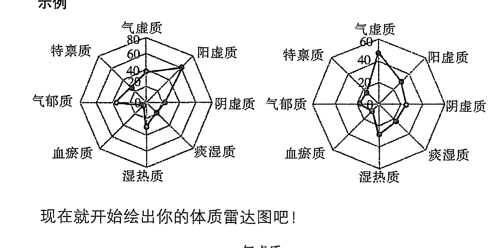

现在就开始绘出你的体质雷达图吧！

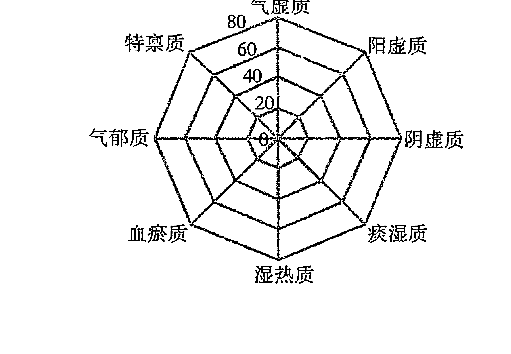

# 建议本书阅读方法

在得知自己的体质类型后，可以按照你的阳历出生日期，找到属于你的星座，通篇阅读，也可以在阅读常规星座特质解析，了解此星座在星象学中的特质之后，直接找到属于你的体质类型进行阅读。

最后一篇，“开启星座能量篇”，会为你提供来自中医体质学的权威饮食和生活习惯调体方案，协助你逐渐养成良好的生活习惯，转变体质，开启更多有益的星座能量。让生命之旅，回归坦途。

# 白羊座

3月21日～4月20日

位置：黄道第一星座
属性：火象星座

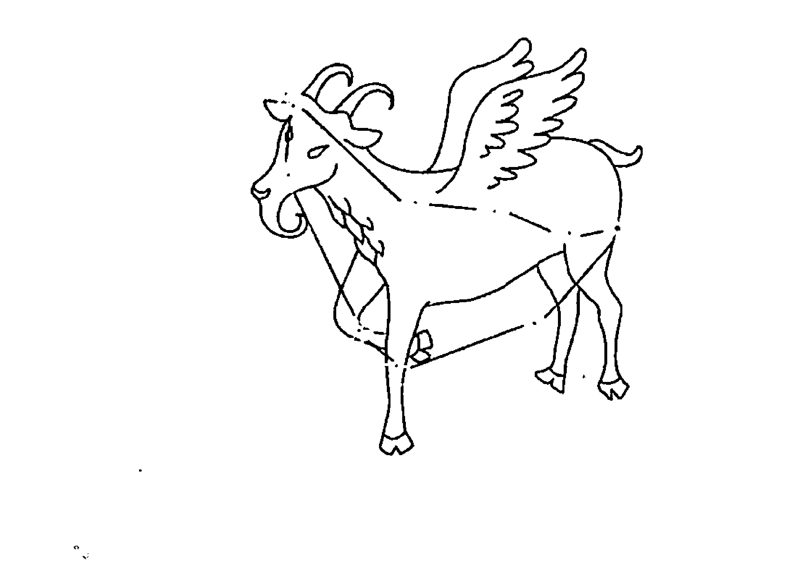

爱足球，爱飙车。
爱爆发，爱两肋插刀。
我不是好斗分子，我是热血青年。
不让我埋单我跟你急。
我是白羊座。

## The Secret of Stars

## 常规白羊座特质解析

作为黄道十二宫的首座，羊羊们出生的节气正值春分，意喻了阳气初生，具有凶猛的“新鲜力”。这给了位于火象星座的白羊以火的特质——奔放、热烈，拥有永不磨灭的激情。但是，“火”所带来的副作用，就是容易变得暴躁、好斗、激进。

白羊座的标识是有着强壮双角的公羊。公羊的特性就是强壮、好斗，而且自负。许多漫画形象中，都能看到公羊们那高傲自大又鄙夷一切的眼神。他们的词典里没有“服输”这个词，拒绝墨守成规，不断寻求突破和创新。但万事过犹不及，如果不能够很好地控制天赋的强大能量，甚至被反控制，就会像一台刹车失灵的跑车，大马力前进，完全不看重“安全感”，很容易剑走偏锋。

越是年轻气盛的白羊，就越是谁都管不住，认定自己才是人生的主人，冒险的欲望总是蠢蠢欲动，是让旁人受惊吓指数最高的星座。他们是那种在挑战如蹦极这种极限运动时，别人还在不断给自己加油、鼓气时，他早已经不耐烦的一跃而下，连旁边刚绑好绳子的工作人员也被吓一跳。

做事当机立断，不搞权宜之计，也没有委曲求全，更不注意细节。这样的白羊在经历不够丰富的青少年时代，容易落下说话、办事不够审慎，不给别人留有余地的诟病。并且常常是速战速决得痛快，后悔来得也快。白羊座天生的领袖特质，让其难以久居人下。只是，只想着怎样做大、做强，一味向前冲的白羊，常常忘记照顾后方阵地，导致梦想越大，危机越大。

在岁月的沉淀下，冲动又孩子气的白羊会变得更为成熟，渐渐懂得控制自己的激情和能量，转而应用于扩张和守护事业版图，不乏中年成功者。

白羊座的男性中，也容易出现“痞子英雄”。年轻时，可能是小混混、“暴走一族”，或者让人讨厌的自大冲动派……一旦回归，让人跌破眼镜的成为各个领域的顶尖人物，甚至是大哥级别。著名的白羊“大哥”典范就是成龙。

想做“大哥”，不光是有威信就可以的。任何一位“大哥”，都有“慷慨解囊”的习惯，正所谓“散财”才能“交士”。

钱财在白羊手里就是浮云，白羊座总是众人聚会时抢埋单的那个，就算兜里只剩下这个月的生活费，输人不输阵，怎样也要把面子做足。这导致了羊羊们尽管常常有钱花，但因为攒不下钱，需要大笔金钱周转的时候，就要面临窘境。

对于白羊座的女“大哥”们，要提点一句，太过“哥们儿义气”，会把心仪的他吓跑的。

激情满怀的白羊女，尽管会主动追求心怡的男性，不会错过好姻缘，但在两性关系中，太过主动，爱发号施令的她们，还是有可能让男友“小生怕怕”。

希腊神话中，白羊座的保护神赫拉克勒斯天生神力。在他满18岁那天，父亲带他到天庭为自己选择人生道路时，他毅然拒绝了“恶德”女神向他提供的安逸和财富人生，接受美德女神所提供的，需要通过严苛的人生历练和考验，才能收获荣耀和尊重的人生之路。最终，这个误杀了自己的老师的冲动少年，成为希腊神话中最伟大的英雄。

作为白羊的代言人，赫拉克勒斯的例子充分说明了，常规白羊并不像很多人想象的那样——冲动无脑，只一味顶着强悍的“兽角”拼命向前冲。他们本该是勇气和智慧的综合体。哪种体质，会是更符合白羊的“载体”？当“白羊”的灵魂，被“装”入不同的身体，又会发生什么样的化学变化？且往下读！

## 中国人九种体质之 揭开星座密码

### 01. 史上最宅的羊 气虚白羊

气虚白羊被关闭的星座能量：自信、魄力、胆量、力量

白羊的自信程度，基本上已经到了自大的地步，他们从不为自己设限，眼里只有挑战，没有困难。而气虚白羊自信力却大大下降，在做某件事情之前，内心会反复自我质疑：我真的可以吗？如果遇到某种状况我要怎么办？如果做得不好会不会被人笑话？越想越悲观，以至于迷失方向，常常需要助力和推手才能将想法付诸行动。

生命需要保持激情，才“不会因虚度年华而懊恼，不会因碌碌无为而悔恨”。春分时节出生的白羊，有春的蓬勃生命力，因此白羊多是凭着激情做事的人，这给了他们坚不可摧的力量，在人生的旅途中，尽管会跌倒，也能迅速爬起来，继续奔跑。气虚白羊则少了这份激情。代表力量之源的“气”的虚弱，让气虚白羊激情的火焰，好像是“燃气不足”一样，尽管内心仍然充满憧憬和梦想，有不输于常规白羊的抱负，但身体的无力，让人们再也看不到勇敢向前冲的常规白羊，面对现实世界表现出更多的默然和抗拒——既然无力改变之，那么就任由它去吧，我只要守护好内心的乌托邦就好。

尽管在现实世界中，他们可能是弱者，但却依然是内心世界的战神。有艺术天分的气虚白羊，常常会将内在的激情，诉诸文字或绘画，营造出不可思议的“脑内王国”。白羊座作家安徒生就是很好的例子。他从小骨瘦如柴，强烈自卑，但是在他的童话世界里，却塑造了很多“平民英雄”。比如《勇敢的裁缝》中，瘦小的裁缝用无畏的精神和智慧，大战巨人，并最终当上了国王。足见，就算气虚的身体也阻挡不了属于白羊座人内心的强大，只不过需要寻找另一个途径去发挥而已。

火象星座赋予了白羊健实的体魄和旺盛的生命力，他们喜欢“向外走”，运动、登山、郊游等等，崇尚“驴”行天下，只要有得玩，做什么都好，都会让白羊更能体会到生命的价值和意义。让他们过安安静静且循规蹈矩的生活，简直就是生不如死。可是，一旦白羊遭遇气虚体质，你才知道什么是“史上最宅白羊”。

气虚白羊爱孤独胜过爱热闹，爱静态胜过爱动态。闲来无事，他们更喜欢选择一处安静舒适的场所，一本心怡许久的书，一杯口感绵醇的咖啡，就这样小资又舒服的窝上几天也不会厌倦。旅游吗？也是可以的，但一定要去能让心灵获得平静，使灵魂能够内省之所。一大批人热热闹闹的游山玩水？哦，NO！就算勉强去了，气虚白羊也会因为经常远离大家，独自一人安静看风景，而让大家觉得孤傲，有点小扫兴。常规白羊还热衷挑战极限运动，气虚白羊却会被吓到脸色发白。

中国人崇尚中庸之道，强调做人要低调。白羊却偏偏喜欢招摇过市，并会因此惹出不少的娄子，而且常常因为行动力快过大脑思考速度，做出让自己后悔的事情。在这一点上，气虚白羊就比常规白羊表现得更为内敛、稳重。气虚白羊是“低调做事低调做人”的典范，不但有白羊不达目的誓不罢休的韧劲儿，更懂得在事前做好周密计划，处事严谨，不凭一时冲动，处理问题也就更加客观和成熟。最主要的是，受到众人瞩目光让气虚白羊感觉不安，因此奉行低调处事，默默努力，从不过分张扬。

### 02. 速冻火力 阳虚白羊

阳虚白羊被关闭的星座能量：活力、胆量、沟通能力、健康力

某种程度上，常规白羊与九种体质中的阴虚体质，在很多描述上都相当一致，开朗、外向、急躁、不服输……有阴虚，就有阳亢。换言之，常规白羊之所以被形容为强壮而勇猛的星座，也是因为代表“阳性”的火象星座，给了他们以过分发挥的“阳力”。“羊”，本身也是阳的谐音。

阳力主管人的体力、活力、胆量。阳力过盛的表现，除了精力之旺盛异于常人外，就是胆量大过了头，什么都不怕，一不小心就变得莽撞，常常闯祸。年少轻狂的白羊男更容易打架生事；白羊女相对要斯文一些，但也常会表现得过于强势，或在发生争执时口不择言。

一旦支撑白羊座的阳力被削弱，事情就会走到极端的反面。就算是“战神”出身的常规白羊，在遭遇阳虚体质时，也会成为“逃兵”，变得胆小、懦弱、畏缩，从欺负别人到被人欺负，而且居然打不还手、骂不还口。白羊尽管有保护弱小的正义之心，但又鄙视一切懦弱行为。如果不能够通过调整体质找回“丢失”的阳力，阳虚白羊大概要做一辈子被“羊群”排拒在外的“懦弱羊”。

白羊是凭激情做事的人，一旦他对所做之事、所爱之人没了激情，自然要转战其他目标。而阳虚白羊则根本连最初的热情都燃烧不起来。他们没有白羊面对爱人时的热烈，变得不善于对所爱之人表达内心的情感，不会主动追求恋人。在婚恋关系中，两人出现争执时，会选择“冷处理”，导致关系更加恶化。阳虚男性易患阳痿，阳虚女性则很容易出现“性冷感”。除此之外，对不了解他们的人来说，阳虚白羊面无表情，淡漠的神情，完全是一副拒人于千里之外的模样。完全不似常规白羊，不管认不认识的人，见面先用大大的笑容打招呼。

没人统计过这世上的白羊都长得什么模样，但从星座的角度来说，不管一个白羊是高是矮，是胖是瘦，旁人都能轻易感觉到他由内而外爆发出的力量感。比如会大声笑、大声讲话，是急性子，走路带风，做事主张今日事今日毕，就算已经累得头晕眼花了，面子也要撑住，所以在别人眼里，他不知疲倦，总是好体力的将所有事情做完才肯去休息……气虚白羊就没这个本事。尽管内心倔强的他们还是很要面子，讨厌别人看到虚弱的一面，可是无奈，阳虚导致的直接结果，就是身体无力到随时都要找个支撑物，看上去总是一副萎靡的样子。象征白羊座的“力量”，将从他们的身上彻底消失。

但上天是公平的，将难能可贵的温柔、庄重的品质送给了阳虚白羊。在社交场合，阳虚白羊表现得要更为沉静、内敛。他们不再是藏不住话，学不会倾听的强势白羊，他们可以安静的坐在一旁，淡笑旁观，因为阳虚而表现出的淡漠气质，也为气虚白羊增添了几分深不可测的神秘感，倒是更容易吸引异性的关注。

### 03. 嚣张羊的代表 阴虚白羊

阴虚白羊被关闭的星座能量：包容、韧性

从理论上说，常规白羊很难做到持久的温柔。火象星座所赋予的力量，使得白羊很容易以自我为中心，看事物的角度就难免过于主观。以白羊有话要直说的坦率性格，加上他们会觉得“说你也是为你好”，就会立刻对“做错事”的人进行指点。偏偏让耿直又自我的白羊看不惯的事情还真多。当一个常规白羊没事儿就对着你碎碎念甚至大发脾气的时候，温柔？真的好遥远。而本就急躁又自我的阴虚体质加上白羊属性……简直就是对温柔能量的毁灭性打击，也不能说不懂得温柔，只不过温柔通常不会持续太久。因为在骨子里，阴虚白羊们是“打是亲、骂是爱”的忠实执行者。

让这一体质白羊女小鸟依人装柔弱，绝对办不到，但她们对男友的爱恋和保护欲却大过任何人，奉行“我欺负他行，别人欺负我的人，休想！”的理念；这一体质男羊有天生对柔弱女性的保护欲，只不过他们对恋人的霸道也很让人受不了，会因为一些小事不耐烦、发脾气，也能瞬间多云转晴，买礼物哄你，真是让人哭笑不得。

白羊座的梵高，从画像上看，有比较明显的阴虚特质——身材干瘦，表情严肃而郁怒，性格也急躁易怒。在他的画像中，基本找不到带有微笑的画面。如果有一张名为“梵高的微笑”的画，恐怕比蒙娜丽莎那张还要值钱。

“极端主义”本就是白羊座的特质之一，他们自信时仿佛无所不能，自卑时又认为自己被全世界抛弃；人前满面笑容、坚强无畏，人后却变得脆弱，有强烈的孤独感。阴虚白羊，则更容易将“极端主义”的禀赋发挥到极致。追求完美的精神世界，却因为受到现实束缚，不能得到完全的自由，会日渐消弭阴虚白羊人格中，用以牵制“极端性格”的阳光面，从而掉入黑暗的深渊。梵高的自残和自杀，都意味着他走到了黑暗的极端。白羊座加阴虚体质，容易将阴虚白羊“进化”成为一触即发的活火山，不时就要喷点儿岩浆。如果你发现一个白羊座人，将他暴躁易怒的那一面发挥到了极致，不停说话，做事急躁，遇到一点小事都会成为他发飙的理由，那么他可能就是一个阴虚白羊。这种大起大落的情绪不但会对健康造成隐忧，也容易让周围的人都躲得远远的。

与白羊座特质有些不同的是，阴虚体质人的思维更为灵活多变。公羊的性格通常是这样：人生道路上，挺着强壮的双角闷头向前冲，撞到了南墙就把墙撞倒继续冲。阴虚白羊则要灵活得多，通常会选择绕着墙走，很少钻牛角尖。

### 04. 肥羊羊 痰湿白羊

痰湿白羊被关闭的星座能量：执着、信念、勇气、魄力

对于急性子的白羊来说，最看不惯的就是两种人，一是遇事往后退的胆小鬼；二是做事拖泥带水的慢性子。不幸的是，当白羊遭遇痰湿体质，几乎就两样全都占上了——痰湿白羊处事保守，害怕创新，遇事总是抱着“我再考虑看看”的观望态度，错过机遇才知道后悔，但下次还会再犯；痰湿白羊做事情拖沓，总是在想明天再做也可以，明日复明日的结果是，空有满腹才华，却一事无成，还常常因为拖累团队的任务进度而遭人口舌。

常规白羊对没有到手的东西，具有不达目标誓不罢休的执着，至于到手之后能保持多久的新鲜感那是后话。而对痰湿白羊来说，没有什么人是非要见的，没有什么事不做会死，没有什么东西必须拥有……他们的人生目标总是忽隐忽现，在他们状态不错的时候，也是可以为了目标拼一把的，只是怠惰情绪很快就会到来，这时候就算天塌下也无所谓，反正有高个子会去挡。

痰湿的体质，还让有春天般生机的白羊，失去了活泼、好动的性格。身体的沉重感和倦怠感，让本来热衷于运动的白羊宁可和朋友坐在大排档里喝酒聊天儿，或在家看看电视，玩玩电脑，也不愿意顶着太阳，去逛街、爬山或参加其他需要体力配合的运动。这一特点，也让口才不错的痰湿白羊，容易出现吹牛高手——身体无力，动动嘴皮子还是可以的，毕竟他们的心灵和大脑仍然属于白羊，仍然要强、好斗、要面子。

在人们的印象当中，白羊基本和温和、善于忍耐这样的词汇不挨边儿，但痰湿白羊将打破这一印象。正所谓心宽体胖，因为痰湿体质而更容易变胖的痰湿白羊，其温和、稳重，善于忍耐的性格，丝毫不输金牛座。这一特质简直可以说为遇事脑未动、身先行的白羊，安上了一个“手刹”，大大减少了因为高速而“出轨”的可能。

痰湿体质白羊还从令领导头疼的激进人物，华丽变身成为团队中的“甘草”，其温和“属性”对调和上下级、同事间的矛盾，会起到很重要的作用。

### 05. 陷入沼泽的羊群 湿热白羊

湿热白羊被关闭的星座能量：勇气、魄力、率性

白羊说话那叫一个“嘎巴儿利落脆”，最受不了就是絮叨半天也进不了主题的人。湿热白羊延续了常规白羊的急脾气，也见不得人墨迹，小脾气说上就上来，偏偏他自己变成了最墨迹的白羊。

湿热体质白羊要么不说话，生生寂寞死你，要么就自以为条理清晰，说起话来表情严肃，义正言辞，其实絮叨半天了，也没说到核心问题。

率真的白羊为人处事向来大大方方、坦坦荡荡。要什么，马上就要去拿；喜欢谁，抢也要抢过来。湿热体质白羊却少了这股子率真劲儿，是纠结加“闷烧”的典型。正所谓：

> 春叫猫儿猫叫春，
> 听它越叫越精神。
> 老僧亦有猫儿意，
> 不敢人前叫一声。

湿热白羊也改变了有话直说的性格，常常说话说一半，就玩起了“你猜”的游戏，你猜到了最好，猜不到，他们也只是故作神秘的一笑，不肯揭开谜底，任人抓狂。尤其面对喜欢的对象时，想方设法的让你发现他好像喜欢你，却怎么也不愿意直说“我喜欢你”。

想要白羊变得低调又务实？那就让他“湿热”吧。

身体和思想都受到湿热困缚的白羊，如同生活在沼泽地里的“羊群”，尽管会有身困脑胀的苦恼，轻盈和速度都已不在；但却能在布满泥泞的人生中，仍然一步一个脚印的前行。

湿热白羊属于闷头做事的一群人，不张扬，有责任感，会为自己的人生做好规划，然后用“羊”的坚韧和毅力一个个目标去实现。大大修正了白羊给人以做人做事过于高调，而且轻飘、不负责任的印象。

### 06. 请重拾相信的力量 血瘀白羊

血瘀白羊被关闭的星座能量：大度、乐观

因为男女有别的生理因素，在两性关系中，“女羊”难免比“男羊”要多疑一些，但可以多疑到像天蝎那样的程度，有点风吹草动就能胡思乱想的，非血瘀白羊莫属。血瘀白羊，看似热情、友善，但细细观察就会发现，他们从不喜欢谈自己的事，保持着一种让人几乎感觉不到的淡淡距离感，而不是像常规白羊那样，对第一次见面的人都热情得有些夸张。

血瘀白羊缺乏安全感，时刻都在防范被伤害。即使在平时和朋友聊天时，大脑也经常处于紧张状态，分析对方的话是否有目的，是否在刺探？他们会在和不很熟的朋友聊天时，全神贯注的听对方讲话，专注到让对方都觉得有点儿不适应。对方会觉得自己只是在聊一些琐事，却没想到说者无意，听者有心……

白羊做事风风火火之余，也容易顾前不顾后。常常大局在握，但却总在细微琐事上丢三落四。不记得车钥匙放在哪儿是家常便饭，因为弄丢了手机而把别人大骂一顿，最后却在自己的手包里发现的也大有人在。血瘀白羊更是白羊健忘特质的升级版，把门钥匙锁在家里的情况将会经常出现。这样的白羊，与同样丢三落四的双子倒可以结成一对难兄难弟——东西丢的时候可以一起丢，一起找。互相还有个伴，觉得自己还不是最健忘那个……

### 07. 失去了“战神”的护佑 气郁白羊

气郁白羊被关闭的星座能量：希望、开朗、勇气、坚忍

在战神赫拉克勒斯精神的佑护之下，白羊座成为十二星座当中，内心最充满希望的星座之一。“希望”，是支撑白羊“敢为天下先”的主要能量，让他们在人生之旅中不管跌倒多少次，受了多少伤，都能够勇敢的爬起来继续前进。而气郁体质白羊内心脆弱、悲观，受到一丝伤害，伤口都会被主观意识无限放大。即使是勇敢如白羊，在气郁之后也终于承认，这个世界上的许多事，“我无能为力”。这种悲观的情绪，会日渐削弱属于白羊的果敢、勇猛，变得逃避现实。

气郁白羊变得像巨蟹一样“想太多”。细密而纠结的思绪，会像重重的细线，将他们的心灵捆绑，变得多愁善感，一片落叶的凋零也会让他们心痛，哪里还有常规白羊的大气、豪爽。

率真心机，是白羊让人心动的优点所在，但这也会导致他们不大注意自己的言行举止，以至于经常隐含了自己也不知道的攻击性。发起脾气六亲不认，说话伤人，不给人留余地，都是常有的事。与常规白羊相处，会为了他的激情而澎湃，也难免会为他不经意的攻击性而受到伤害，而他们自己却一无所知。气郁将赋予大气白羊以优雅、恬静的气质，他们做事不急进，说话留三分，懂得再好的朋友，也要保持适当的距离感，给彼此一个空间。

### 08. 被缰绳套住的“野马” 特禀白羊

#### 特禀白羊被关闭的星座能量：洒脱、无畏

白羊几乎是天生的美食家，尽管不及金牛对美食的执着和专业，但闲来无事，寻找好吃的食物和地点，就是他们最好的休闲方式。他们不一定会研究吃，但却对寻找能满足口腹之欲的美食乐此不疲。而特禀白羊却自从第一次食物过敏的那天开始，就没了常规白羊的口福。

过敏的身体，让他们吃什么都得先掂量掂量这东西吃了会不会过敏，想得多了，就算再好吃的东西，也都会没了胃口；对性格火辣辣的常规白羊来说，吃的东西也非辣不爽，非重口味不爽，但过敏体质需要的是饮食清淡。一向无所畏惧的白羊，在遭遇特禀体质之后，终于有了怕的东西，而且可能还不止一样。所以拜托，为了不遭罪，还是收收对着麻辣咸香流出的口水吧。

除了对很多食物过敏，很多特禀白羊还会对某种植物过敏，只能远观；对某种气味过敏，只能避之惟恐不及。一个不小心，就容易满身“红豆”，这就逼得大大咧咧的白羊再不能肆意于生活，而要开始小心翼翼，这种“憋屈”生活会让特禀白羊的脾气变得更加急躁。

特禀体质，就像缰绳一样，套住白羊这匹“野马”，限制了他们飞奔的脚步，逼着他们放慢动作，好好欣赏原地的风景。这倒为一向狂放的白羊平添了几分细腻的心思。他们开始懂得关照身体的需要，明白身体想要什么、排斥什么，而不再像孩子一样，只知道四处玩耍、享受生命，这使白羊因为过于活跃，而比一般人消耗更多的生命能量，能够得到休养，从而走更远的路。

### 09. 也有可能冲过头 平和白羊

平和体质首先赋予白羊的是相对健康的身体，精力充沛，不容易感到疲倦，也不容易生病，多数是运动场上的健将和朋友圈里开朗、活泼的大声王，即使刚见面的朋友，也能快速套好交情。他们记忆力好得出奇，别人为了各种考试 K 书累得半死，他们却在照常吃喝玩乐的情况下也能轻松过关。

但是，良好的体质基础，也像为冲动的白羊准备了强大的“战斗机器”，充沛的精力极有可能让他们凡事冲过头。要知道，体质并不是固定不变的，而是随着生活的每个细节无时无刻不发生改变。千万别以为有了好底子就肆意妄为，加班、刷夜，在压力大、情绪差的状态下，不注意及时调整，并且大吃大喝，酒肉鲜香通通全来，等到有一天成为其他八种偏颇体质的时候，再来后悔当初的不知节制，也是悔之晚矣。平和的状态一旦被打乱，可没有那么轻易就被调整回来哦。

# 金牛篇

4月21日~5月21日

位置：黄道第二星座
属性：地象星座

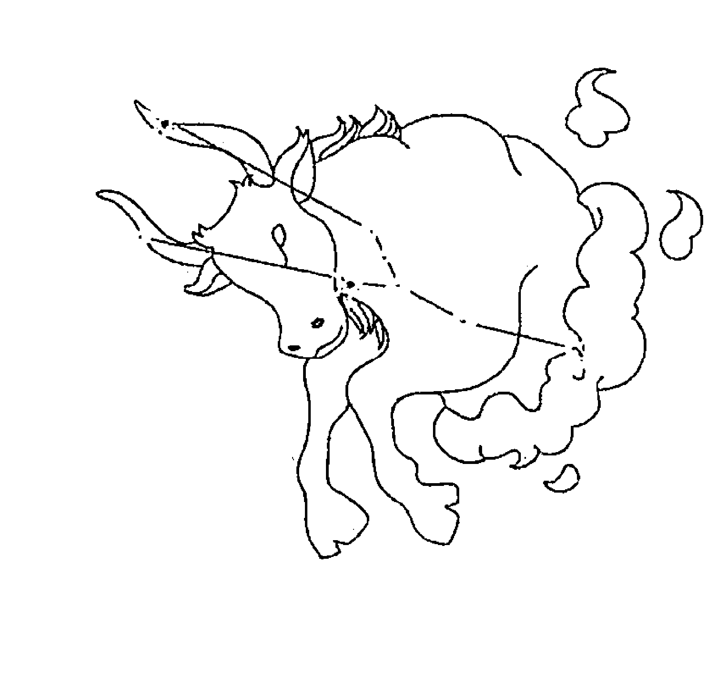

> 爱忧郁，爱纠结。
> 爱忍无可忍，继续忍忍。
> 不过别以为我好欺负，
> 我有孩子的内心，却有政客的大脑。
> 我是金牛座，顶！

## The Secret of Stars

### 常规金牛座特质解析

在中国传统的五行文化中，金、木、水、火、土有着相生相克的亲密关系，“土能生金”，寓意了有母性特质的大地，能够为人类孕育出宝贵的财富。而金牛，正是地象星座上的一座宝藏。

牛牛秉承了土地的厚德、宽忍，性格敦厚，善于忍耐，懂得沉默而理性的看待问题，不管面对什么样的艰难逆境，都能默默扛过去，抗压能力极强；他们还兼容了“金”的华贵、纯质，喜欢美丽的事物，在美的女神雅典娜护佑之下，言行庄重、优雅，性格中和，很少有过激行为，并且注重形象，喜好打扮。这样的牛牛，被看作是十二星座中，最值得交往的异性伴侣。

但是，任何事物都有它的两面性，如土地一样敦厚的金牛，同时也是固执、不好沟通、死硬派、挑剔鬼、没情趣的代名词。

只要脑海里想想“金牛”这两个字，自然就会将它形容成坚固的、健壮的、倔强的。这些词汇，共同组成了金牛内心那座坚固的堡垒，无坚可摧。表面上对谁都很温和，好脾气的金牛，其实是用这样一种“软隔离”的方式，守护着内心那个情感丰盈的世界，独自品味，不轻易让人进去，自己也不肯走出来，不愿意用绝对真实的自我面对这个世界。所以金牛挚友很少，大多都是泛泛之交，见面点头微笑，聊天也还算热闹，一番你来我往之后，挥手再见，他们却连对方的名字都不会刻意去记。

这也导致了在众人眼中，金牛世故、圆滑，是标准的现实主义者，在许多事情上只有“客观”，而缺乏自己的立场。甚至谈及金牛的话题，常常要与利益和金钱挂钩，金牛就连谈婚论嫁，也能理性的分析双方的结合是否对大家都有利。他们永远知道自己要的是什么。

其实“现实主义”只不过是一种保护色。聪明的金牛，早就看穿了这个世界的游戏规则，只是他们不会像白羊那样，热血抵抗，为梦想粉身碎骨也在所不惜，他们有自己的方式，有对生命观和世界观更为深刻的思考——人毕竟是社会的人，惟有投入其中，才能获得更大的自由。这也是金牛特有的圆滑和成熟。

一般会认为，金牛只是简单又固执的星座，其实他们人格上的矛盾不亚于任何一个星座。

外表上，牛是健壮又憨厚的动物，甚至有些木讷，但牛的内心却无比柔软和感性，正如金牛所表现出来的理性和感性的极端面——他们可以在婚恋关系中将“你的”和“我的”算得很清楚，也会为了深爱的人，放下身段，送花、送礼、砸钱，无所不用其极。当然，他们也是爱恨强烈的一群，一旦被伤害，就永远无法原谅。

金牛的务实精神，让他们能够叱咤学术领域，并在政治领域多有建树。思想家苏格拉底、马克思、弗洛伊德以及前美国总统尼克松，都是金牛座的代表人物。艺术界中，已故演员阮玲玉、翁美玲也是金牛座。更多金牛座名人不妨去网搜一下，还真别说，看看这些人的面容、气质，都有一个共同的特征——隐含着那么一丝金牛独有的倔强、不肯与世界妥协的痕迹……

是“保有”还是“出走”？是常常困扰金牛的一个选择题。做事保守、谨慎，虽然能够更好的垒实自己的资本，减少风险系数，获得更大的成功，但也可能因为过于保守错过良机，总在原地踏步。这让许多金牛尽管事业稳定，却很难有所成就。

其实不必烦恼选择问题，因为不同体质的金牛，自然就会有不同的选择，下面就来看看你会是哪一种。

### 01. 苦逼人生 气虚金牛

气虚金牛被关闭的星座能量：勇气、沟通能力、活力

气虚金牛是典型“活在自己的世界”里的牛牛，将常规金牛的难以沟通发挥得很彻底。他们习惯了凡事按照自己的逻辑思考，就像火车必须要跑在固定的铁轨上面一样，必须层层递进，想要停在哪站也由他们说了算。你想中途加站，为他提出建议，想要帮他解决问题，或者想要插入别的话题，那是没有可能的事情，他必须思考并处理完自己的事情，“跑完全程”，才会抽出时间“临幸”与你。一旦陷入自己的思维模式，与外界的交流就是表面化的，嘴里哼哈答应着，其实你说了什么他一点儿没听进去，半天才回过神来，问“你刚刚说了什么？”足以让你崩溃。气虚金牛固执起来，更是让人有想跳河的无力感。

“苦逼”这个词出自佛经，意为痛苦、烦恼，如今在网上被解释为“自寻烦恼”，倒是更为恰当。金牛本就是“自寻烦恼”这四个字的代言人，加上一个气虚，就更是“苦逼”的让旁人看了都跟着着急。气虚金牛崇尚一切 DIY 的生活，他们不喜欢别人介入自己生活的同时，也轻易不会麻烦别人。不管面对再大的困难，都发挥拓荒牛的精神，一“垦”到底，宁可自己纠结着，也绝不轻易向人求助。造成气虚金牛“苦逼”的另一个主因是，他们都喜欢刨根问底，不管什么事，都要不断地问“为什么？”当然，大多数都是自己问自己。他们永远没办法理解，有些问题，其实是不需要答案的，如果硬是要得到一个答案，不就是自寻烦恼吗？

很多人困惑，金牛不是很渴望家庭生活，并且享受家庭生活的吗？怎么他们在恋爱关系中的表现却那么让人捉摸不透？他们可以莫名其妙的几天不发短信、不打电话、不见人影，或者不时冒出两句关心话语后，又迅速消失，无厘头得让人抓狂。猜想他们到底是什么意思？如果你的金牛发生这种情形，那么就要考虑他是不是一个气虚金牛或湿热金牛了。爱上这两类牛牛，就要有心理准备，包容他们骨子里的孤独感，认可他们需要并享受这种感觉的思行模式。这种孤独之美，不也是你当初爱上他的原因吗？

表面温和、豁达，但内心情重的牛牛们，大多过着隐忍的生活，尽管坚强的忍受着生活里的种种压力，内心却又有无法排解压力的压抑感，所以每过一个阶段，就需要时间和空间放空自己，气虚和湿热的牛牛身上，更是拥有这种典型的金牛特质。所以，当他们想要从现实中“出逃”时，给他们空间，就待在原地等他，等到他们觉得又有勇气面对现实的时候，就会回到你的身边。

人们一直认为双子是最具两面性的星座，其实，双子是最具有多面性的星座，金牛才是将理性面与感性面清晰并存的双面星座。理性的一面，让金牛座盛产思想家、政治家，而气虚体质金牛，则将其感性的一面发挥到极致，赋予了许多金牛以艺术家的天赋。

气虚体质人对一切纯美的事物，都有极佳的敏感度，会被深深触动，对舞蹈、音乐、绘画等艺术的鉴赏能力极高。也只有艺术的魅力，才能穿透气虚金牛看似坚固的堡垒，直抵内心，让他们那颗柔软多情的心被深深触动。

## 02. 一颗总是拔凉拔凉的心 阳虚金牛

### 阳虚金牛被关闭的星座能量：坚强、活力、沟通能力

金牛座的恋人，玩不来激情、刺激的恋爱关系，他们的爱就像一缕温泉，脉脉传达着温情。就像那句歌词所说：“这世上你最好看，眼神最让我心安，只有你跟我有关，其他的我都不管”。作为金牛的爱人，时时刻刻都能体会到他们的关注和细心呵护，虽然有时候难免关注过了头，好像瞬间升级为父母辈，管东管西，唠唠叨叨，但即使如此，也舍不得离开这种温柔牵绊。

如果你遇到的是一位阳虚体质的金牛恋人，倒是不用烦恼他的关心过度了，他们早已自顾不暇。阳虚不仅导致了金牛的身体变得虚弱、畏冷，就连他们的心，也总是处于“拔凉、拔凉”的状态，整日消极、懈怠，看似对一切都无所谓。其实并非真的无所谓，他们极其渴望从亲友、恋人身上获取温暖，像每个金牛一样渴望一个温暖的家庭，只是阳力不足，便没有余力关注他人，更何况回报以温情。如果你有一个阳虚金牛的恋人，爱他，也要多多体谅和关心他，不要拿他去和别的金牛比较，那样会让他更加畏缩，双方的关系就会进一步恶化。

金牛真的是个蛮有意思的星座，一派有着贵族式的冷漠，信奉“事不关己，高高挂起”，就算是对爱人，也可以几天不联系，冷漠到欠扁的地步；另一派则是标准的“黏人阿娜达”，热恋高峰期，没事发个短信、打个电话嘘寒问暖一下。而阳虚金牛则是更特别的金牛类型，他们已经到达“黏人王”级别，只不过他们嘘寒问暖的功力差很多，多半是要求恋人“就陪陪我嘛”，即使是以大男子主义称号的金牛男，也可能每天都用弱弱的声音抱怨一堆，要老婆好声好语的哄过才肯罢休。

没有什么能够打垮坚忍又给力的“牛人”。务实的金牛座，在面对压力和难题时，会用“好吧，既然问题已经存在，那么不要想太多，反正总有解决办法”的态度，积极面对。阳虚金牛则少了这股韧劲儿，抗压能力几乎变负数。其实阳虚金牛的思想依然是强大的，他们不容易对现实服输，只是阳虚导致的精力不足、身体总处于疲倦无力的状态，让他们只能想想而已，想得太多、太久，自然会觉得“人活着好累”。这种无力感，会让本就内心压抑的金牛，变得更容易悲观、抑郁。

### 03. 将得罪人这事儿进行到底 阴虚金牛

阴虚金牛被关闭的星座能量：宽容、稳重、温和、淡定

金牛一向直观，说话办事也是直来直去不会绕弯子，所以金牛也是容易得罪人的星座。值得庆幸的是，他们也常常是抱着多一事不如少一事的心态，很少对别人的事发表自己的观点。但阴虚金牛就并非如此了。话多本来就是阴虚体质人的特色，冲动的常规金牛，往往嘴比大脑还快，让他们“话到嘴边留半句”是不可能的事，而阴虚金牛在话多之外，又加了一个爱说实话的“毛病”。朋友满心欢喜的买了个巨贵的LV，他会直言不讳：“又不是皮的，还那么贵。”有话直说，不管你爱不爱听，有时候一不小心杵到了别人的肺管子上，看着别人脸色一会儿红一会儿白的，阴虚金牛还会觉得你有什么好气？跟你关系很好我才这么毫无保留，我可是为了你好！

常规金牛的脾气就像原子弹，他们轻易不发脾气，一旦发脾气，简直就是排山倒海，威力和破坏力巨大，而且极难安抚；阴虚金牛则从原子弹变成了地雷，发作频率明显上升，坏脾气随时发作，就连丢钥匙这样的小事，也会让他愤怒到捶墙壁。与他相处时更要随时注意，不一定哪儿惹到他，就炸得你满脸开花。这一体质的金牛女，更是从温和的好好女人形象，摇身变成女王型人物，让人觉得专制而急躁。

常规金牛做事谨慎，习惯事先做好计划，将利弊得失考虑周全，再依照计划，一步一步去执行。这也是金牛长期以来稳坐“最可靠”星座的基础。阴虚金牛属于“斗牛”型，眼里处处都是“红布”，见到目标就勇往直前，尽管不乏勇气，但顾前不顾后，很容易出纰漏，会落下做事毛躁的印象。尽管常规金牛沉稳的一面不时跳出来告诉自己“不要着急，要心平气和的看待问题”，但仍像少了刹车一样，控制不住自己的急脾气。

常规金牛常给人做事保守，不能够接受新生事物的呆板印象。其实并非所有金牛都是如此，阴虚金牛就更有拓荒牛的精神，他们敢于突破现状，不断寻找新的挑战和机遇，做事风风火火，速战速决，不能忍受拖泥带水，相比之下，是更容易获得成功的体质类型。阴虚金牛有话直说的外向性格，也使得一直以来，给人以苦逼印象的金牛变得外向、明朗起来，更具有亲和力。

### 04. 维纳斯的背叛者 痰湿金牛

痰湿金牛被关闭的星座能量：美貌、自信、创新力

说金牛座盛产帅哥、美女其实没有什么依据，惟一的推测依据，是源于美的女神雅典娜是金牛座的守护神，这让常规金牛有着不错的美感，十分注重外在形象。因此，金牛不管五官、身材是不是合乎现代人审美标准，至少谈吐举止、衣着打扮都让人看着舒服，不一定穿## 中国人九种体质之揭示星座密码

穿得很贵，但穿着搭配品味不凡。而痰湿金牛们不注重仪表打理的程度，简直已经到了成为雅典娜背叛者的地步。

尽管痰湿体质多胖人，但谁说胖就不能可爱又有亲和力呢？痰湿金牛会给人邋遢的印象，很大程度源于痰湿体质所带来的身体困重、不爽的感觉，让他们变得懒惰，不愿意在面子上多下下功夫。再加上骨子里还有常规金牛不在乎外人看法的特质，就算穿着松垮，头发散乱，也可以潇洒的走在路上，管他别人怎么看。

与痰湿体质相伴的，往往是内心深处的强烈自卑感，害怕与人接触。其实这种自卑并非天生，而是来源于周遭人严厉的审视眼光。痰湿除了会导致发胖之外，还会让皮肤变得黯淡，整个人缺乏神采，面泛油光……这些特质，确实与“美”有一定距离。但是别忘了，微笑是最美的表情，不要陷入他人的审美陷阱，要正视自己优秀的一面，任何乐观、自信的人都会焕发出他独有的人格魅力。

当然，重拾作为金牛的品味至关重要。不管有多么丰富、充盈的内在，门面功夫也要做足，毕竟人与人的交往都是先从外表开始。多看些时装杂志，多逛逛网店，都有助于提升你的衣着品味。痰湿金牛也不必急于寻找自己的另一半，你拥有温厚、平和的性情，愿意为别人付出，一定会等到你的灵魂伴侣。

常规金牛从不打没把握的仗，不但资本要累积充分，而且会谨慎执行计划，不容半点差错。所以尽管做事过于保守，但却给人以稳妥的印象。痰湿金牛们，却有点将常规金牛的保守发挥过度了，他们遇事要琢磨再三，绝不冒半点风险，极度谨慎。不管在工作还是爱情上，遇到机遇时，不是考虑先抓住再说，而是犹豫不决的衡量再三，错过机遇又后悔莫及。过于保守，让痰湿金牛的眼界受到局限，即使与朋友合伙做生意，也因为缺乏野心，过度强调稳定经营，而难成大事。

在九种体质分型中，痰湿体质与金牛在人格方面的特质最为匹配。同样的低调、有城府、善于隐忍。痰湿金牛将更为和善、宽容，而且将不再像常规金牛那样，只活在自己的小世界里，看似温和，却很少顾及别人的看法。痰湿金牛更能放下自我，愿意倾听别人的声音，并从中汲取精神营养，对自己的言行举止进行修正，从而比常规金牛获得更多的肯定与爱戴。他们也更愿意帮助别人，尽管有时也难免落个“烂好人”、“好管闲事”的形象，经常帮人收拾烂摊子又不落好，但仍会因为这一点，而得到更多的尊重。

## 05. 无敌“憋死牛” 湿热金牛

### 湿热金牛被关闭的星座能量：宽容、健康力

“憋死牛”是一种古老的游戏，在一张长方形纸上，画两条对角线，呈四个三角形。在左边三角形上画一个圆，当作井。每队两个棋子，在棋盘上走。哪队要是过不去井，或是跳井，就少了一个棋子。之所以叫这么个名字，大概也是因为牛本身就是一条道走到黑的主儿，湿热金牛更是将常规金牛的缺少变通发挥到了极致，面对难题，他们的选择通常只有两个，要么一个人关在房间里，想破头，琢磨怎么“跳过去”，要么就直接“跳下去”。绕小路过去？固执到一定要走直线的湿热金牛，才不会“投机取巧”。

金牛的固执，让他们本就将心门严守得固若金汤，湿热金牛则在门上还加了两道锁。他们不需要别人了解，也没打算走出来了解一下这个世界正在发生什么样的变化，这一特质，使得在与湿热金牛沟通时，常常有“对牛弹琴”的感觉。他们常常对你的话充耳不闻，就算表面点头答应了，最后还是会选择按照他的套路去执行，实在固执到让人气结。如果在什么事情上起了争执，就算再亲近的人他也会和你争执到底，没关系，反正我有扇子，你要生气？我可以帮你扇扇。

牛发脾气绝对不会像马那样仰天长啸，它们往往瞪红了一双眼睛，鼻子里愤怒的喷着热气，头也不抬的向招惹了它们的人凶猛冲过去。湿热金牛算是把牛脾气发挥得淋漓尽致了，他们大多数时候保持沉默，一旦发起脾气来，那双因为湿热体质导致的红眼，也会瞪得圆圆的，倒真跟牛有几分相像。幸好牛牛特别知道照顾别人的面子，越是亲近的人，才越能体会他们那副牛脾气，对外则总是温和、礼貌的好好先生模样。

湿热金牛，也是想到什么会马上付出行动的怪怪一族，比方说他们今天说想去旅行，晚上就查好了行程和住宿地点等细节，第二天早上再给他打电话，他已经背起行囊出发了，搞得亲戚朋友都傻了眼。像这样的事情，在守秩序的常规金牛身上很少发生。尽管有些无厘头加任性，但能让一直努力把持自己的金牛，为了梦想偶尔任性一回，也未尝不可。

### 06. 傻乎乎的茫然 血瘀金牛

血瘀金牛被关闭的星座能量：乐观、信任

血瘀金牛不喜欢倾诉，也不会将不良的情绪发泄在别人的身上，而会选择自己一个人烦恼，默默哭泣。这也会让他们因为许多不良情绪得不到抒发，而变得更加纠结和阴郁。使得本就有悲观情结的金牛变得更加悲观。

微笑是金牛一贯的表情。他们习惯用这样温和憨厚的笑容欺世，掩盖内心世界的柔软，而血瘀金牛却失去了这样的笑容，长着雀斑的脸，变得有些呆呆的，有种傻乎乎的茫然。

常规金牛的固执，让他们能够坚守住自己的立场，但却凸显出另一个问题——眼光不够开放。

血瘀的体质会让金牛的思维变得更为闭塞和内敛，会给金牛带来思路狭窄的问题，而且更加缺乏变通，更喜欢独断专行，这些都会影响到金牛的事业发展。

血瘀金牛的性格会变得更有棱角，看问题更加尖锐，这对一向充当着好好先生的金牛是件好事，在与他们讨论某件事的时候，终于不用再听常规金牛：“我觉得都成”、“我看没什么区别？”这样谁都不得罪，好坏都不选的圆滑回答。

血瘀金牛将变得爱憎分明，喜欢就是喜欢，讨厌就是讨厌，绝对没有灰色的中间地带，也不会为了照顾别人的面子刻意说些讨好谁的话。这样的金牛，不是也很可爱吗？

### 07. 紧钻牛角尖 气郁金牛

气郁金牛被关闭的星座能量：希望、开朗、勇气、坚忍

作为土象星座，常规金牛是最容易抑郁的星座之一，这一切皆因为他们坚守着内在那座城堡，不允许他人跨雷池一步。其实，他们本就是更容易气郁的一个星座，发展到极端，常常会觉得忧郁、恐慌、无助。需知气郁体质的下一步，极可能就是抑郁症。即使你是固执，不轻易相信他人的牛牛，看到这里，也要明了此种体质的严重性，及时进行调整。

面对感情，气郁金牛的做法极端到让人头疼，他们可能会执着暗恋下去，因为对结局做好了悲观的假设，怎样也不肯向对方表白；或者因为内心的不安、焦躁，而给对方造成无形的压力，直到对方忍无可忍，选择离开，搞得两败俱伤。

常规金牛渴望成功，将成就感看得很重，在乎成败。然而人生不如意十有八九，如果太在意那“八九”，难免会想太多，对自己的要求过于苛刻。气郁金牛就是钻进了牛角尖的人，他们心思更为缜密、敏感，无法看淡得失，容易悲观，易将事情向坏的方面想。对恋人也多疑外加小心眼，找个机会就要吵上一架，发泄心中闷气的同时，也希望获得更多的关注来弥补内心的伤感和空洞。久而久之，多坚固的感情也难保不出现问题。

气郁金牛是能够将常规金牛的艺术天赋发挥到极致的体质类型。这对于牛男来说，会有意外惊喜，他们忧郁的气息，轻易就能勾起女性的母性情怀，更容易吸引异性。但想让感情长久，还是应该改变气郁体质，毕竟相爱容易相处难，没谁愿意整天听到恋人的抱怨和叹息。

### 08. 不是一般的心累 特禀金牛

特禀金牛被关闭的星座能量：洒脱、宽容、信任

特禀金牛与常规金牛相比，除了生理上容易过敏，心理上也更为敏感，是内心戏十足的警惕者。任何微小的变化都可能引起他们的警觉，他们活得很累，总是处于一种紧张状态。

敏感。常规金牛的性格不算豪放，但也不算小心眼。一般情况下，对于哪些事情该上心，哪些不用太在意，他们把握得很得当。而特禀金牛的表现就是对原本就关心的事更加敏感。比如，“牛男”们本就有些大男子主义，特禀“牛男”会对自己的面子问题格外敏感，大男子主义表现得更加突出。而“牛女”呢，会对外表更加在意，经常毫无必要地怀疑自己是不是刘海有些乱？脸上是不是蹭上了脏东西？真不是一般的心累。

特禀体质，为金牛带来了强烈的不安感，绝不亚于血瘀和气郁体质金牛。尤其在感情问题上，特禀金牛像一只护食的猫，多疑又脆弱，动不动就怀疑自己被背叛了，并为此伤心。如果你的朋友或是爱人是特禀金牛，如果你十分在意这份感情，那么请耐心一些，爱他，就要表达出来，让他感受到更多的安全感。

金星是金牛座的守护星，这决定了金牛的保守，不喜欢尝试新鲜事物，不喜欢改变。他们会点经常吃的菜，或者很少改变穿衣和发型风格。这种习惯无形当中为特禀金牛带来了益处——减少了因为乱吃东西，而惹到过敏源的危机，偶尔玩一次新花样，出现了过敏症状，也能更快判断出是什么导致了过敏，方便对症下药，以后也会格外注意。特禀金牛也会因为体质因素，变得更加谨慎，这也是自我保护的一种体现。在感情上特禀金牛的心思极其细密，很会察言观色，对待伴侣就更加体贴入微，总能让对方体会到恰到好处的照顾。

### 09. 需防“稳重超标” 平和金牛

稳重也可以超标的吗？当然。总的来说，平和体质金牛还是蛮可爱的，如果说他们也有让人抓狂的时候，就是将金牛的沉稳、敦厚发挥得太过，为了安全，宁愿一直“走直线”，而不愿意人生有任何小起伏。例如他们不爱冒险，蹦极、攀岩、或者是云霄飞车，都是他们看不惯的娱乐项目。“干吗要给自己找这种刺激呢？”还是安安稳稳地站在大地上比较妥当。多少让人觉得有些扫兴。和他们在一起，生活怕会过于平淡，你只能陪他们做个红灯停、绿灯行，规规矩矩的十佳市民。

平和金牛也希望感情生活稳定。无论是牛男还是牛女，一旦认定了一个人，就会牢牢地抓住对方，目的是谈一场永不分手的恋爱。然而这种爱也太沉重了吧，分分合合本就是世上最正常不过的事，不是每个人都受得起的，很可能会压得人喘不过气来。然而，面对如此专一的金牛，你又不忍伤害他，生怕自己成了一个负心的混蛋。感情上太过小心翼翼，反而容易发生变故。

但是不管如何，女孩儿都希望找一个金牛男来过日子，他们的优点还是远远大于缺陷。如果只用一个字形容的话，平和金牛是“润”。润怎么讲呢？润如土，润如玉。金牛们的身上没有太多棱角。他们不像双子座那样伶俐，不如狮子座霸气，也不会像天蝎那样犀利。他们不做流星，更像是一颗恒星。路遥知马力，日久见人心。只有长期地和金牛相处，才能感受到他们的独一无二。

平和金牛也会固执，但是很有分寸。不妨将这种固执解释为他们很有忍耐力。认准目标，就一心向前。这种性格不是非常可爱吗？

# 双子篇

5月22日~6月21日

位置：黄道第三星座
属性：风象星座

爱洒脱，爱自由。爱热闹，爱孤独。爱动也爱静。别说我轻浮，我完全漠视你。其实我不花心，难道拿得起放得下也有错？我是一个身体里的两个人。我是双子座。

## The Secret of Stars

## 常规双子座特质解析

处于风向星座上的双子，被称为“上帝使者”的水星主宰。风与水，两种构建成这个世界的动态元素，使双子们的思想意识，具有极强的波动性和扩散性能量——他们的思维系统非同一般的敏锐、发达，思路多灵活而诡异，更拥有无与伦比的快速反应能力，他们更善于将思想意识从现实世界抽离，宏观观察事物本质——这使得双子们成为了“最聪明、最善于思考”的一群人。

强大的星座能量，还为双子们带来了旺盛的精力，他们恐惧孤独，热衷并十分擅长人际交往，这让他们成为人类群体中合格的“信息传播使者”，不知疲倦的在人际交往的过程中收集并传播信息。

然而上帝是公平的，拥有两个脑、两颗心的双子，在比别人多出一倍智慧的同时，处事也更加容易三心二意。

双子的善变和缺乏责任感简直到了令人发指的地步。因为点子太多，时间太少，而且重复、长久的做同一样工作，很容易让永远在追逐新鲜感的双子感到厌倦，与此同时，他们会给自己一百个理由抽身，让别人去收拾烂摊子。倾听他们的高谈阔论？行！和他们一起做事？还是算了吧！因为你就会郁怒的发现，自己被他们似模似样的好点子支使得团团转，而他自己却什么也没干。

如果单单从双子的人格特点来说，他们是很难获得成功的人，因为缺乏耐心和毅力，做事喜欢耍小聪明。幸好，还有体质的制约，让双子们能够擅用上天赐与的强势能量，为人类文化的进步和发展做出贡献。

许多伟人和艺术家都是双子座，比如前美国总统约翰·肯尼迪，超鬼才的侦探小说之父柯南道尔，世界级绘画大师高更，以及南宋诗人辛弃疾等等。

能够坚守梦想，并最终获得成功的双子，与他们属于哪种体质也密切相关。

下面，就来看看不同体质的双子们，都被关闭了哪些能量，又为他们的人生之旅带来了哪些益处。

## 01. 淡定的人生有点儿寂寞 气虚双子

气虚双子被关闭的星座能量：精力、胆量、沟通能力、健康力

双子是天生的话题中心，非常善于引导话题。看他们聊天，就好像看魔术表演，惊喜不断，话题更是天南海北，绝无冷场。但气虚体质双子，却只能拱手让出“话题王”的桂冠。气虚双子的共有表现，就是平时不大爱说话，即使说话，也声音低弱，像是喃喃自语，显得没有底气，有时候甚至会缺少了存在感。

“气虚”的身体，并不影响双子保有天马行空的想象力与创新能力，他们的大脑仍然能快速运转。只是如果你是这一体质的双子，就会发现，当脑中的想法化为语言，想要与人分享，低弱的声音却轻易就被环境中的杂音淹没，或被忽略得很彻底，难以引起重视。

你是更喜欢一个人窝在家里，讨厌人际交往的双子吗？如果是，那就要好好检视一下你是否属于气虚体质了。活力能量被关闭的气虚双子，将不再热爱刺激冒险的户外活动，转而走向安静的极端——喜欢一个人安静的看书、听音乐、玩游戏以及睡觉。对于复杂的人际交往更是到了讨厌的程度，不爱和人聊天，受不了人多嘈杂的场所，懒得和看不顺眼的人说话。本来好奇心比猫还要强烈的双子，在遭遇气虚的体质后，再也不会在别人私语时，受好奇心驱使的靠上前问：“你们在说什么？” 气虚，让双子从疯狂的信息搜集者，转而患上了“人际交往恐惧症”。

双子有多幽默？有人将他们放在十二星座幽默排名第一位。交际广泛让双子的笑话来自世界各地，社会各个阶层。只要他们心情好，你就等着为他们的超强幽默感和滑稽动作笑到肚子爆。遗憾的是，这一特色，在气虚和阳虚的双子身上却消失殆尽。这两种体质的双子为人处事都较为严谨，真的很少讲笑话。偶尔的冷幽默，尽管也相当搞笑，但是却完全不会有常规双子们，不管在任何场合，都会想要刻意搞气氛的心情。

计划行事，这个从来和双子扯不上关系的名词，却在气虚双子身上得到充分体现。他们习惯在事前做好周密计划，然后按步骤执行，拒绝横生枝桠。好的一方面是做事沉稳可信，但却失掉了双子面对变化能够快速适应，并及时自我调整的天赋。

气虚会使双子变得沉稳和内敛，大大缓冲了双子过于张扬的个性。对脑中快速、多变的想法，能够进行沉淀和重新审视，避免了一贯给人点子多，却轻薄和流于肤浅的印象。这一点，会对双子发展事业有很大帮助，但在情感方面却可能是阻碍，因为气虚体质双子缺乏勇气，看待爱情有些悲观，不敢对喜欢的人表白，从而错过好姻缘。关于九种体质的情感话题，会在《中国人九种体质之找对你的另一半》中进行详述。

气虚双子是“假沉稳”，表面看上去沉静、淡然，其实私底下脾气了不得。气虚双子的抗压能力并不强，面对思想瓶颈或焦急的事情，会变得急躁，发小脾气，摔些小东西发泄也是常有的事。不过因为延续了双子一贯爱面子的做法，这些泄愤的行为，大多都是关起门“暗地行事”。

## 02. 热情雪藏在身体里 阳虚双子

阳虚双子被关闭的星座能量：热情、胆量、活力、沟通能力

常规双子的热情像一盏灯油不足的油灯，忽明忽暗。总体来说，碰到心情好，以及感兴趣的人事物时，就会热情大爆发，等到这种心情和兴趣过气了，也能立即变得冷若冰霜，实在是吓人的极端。举例来说，即使是好朋友，也可以个把月不给你打一个电话，也可能连着数天，天天黏着你。而阳虚体质双子热情的那面，却被雪藏了，只能一味的冷下去。

在中医来说，阳，除了掌管身体的温暖，也主管热烈的情感。阳力不足的双子，除了身体会出现怕冷、怕风，在经过冰柜的一瞬间也会小腿发凉，打激灵这些身体缺乏温暖的状况之外，在情感上也会相对表现得比较淡漠，不懂得如何去表达自己的情感，只好冷漠回避，给身边人以冷若冰山之感，其实内心里比谁都渴望温暖。

在中医理论中，气虚和阳虚能够互相“推演”——气虚的人自然会有些阳虚，而阳虚之人是必然要气虚的。这导致了气虚体质和阳虚体质的许多趋同性。比如都喜静不喜动，受不了人多嘈杂的环境，不善于人际交往等等。可从本质上来说，气虚体质人更为享受一个人独处的孤独感，阳虚体质人却对孤独万分恐惧。即使有人伸出温暖之手，胆小的阳虚双子，也会因为害怕受到伤害，畏缩回自己的小世界中，加之因为阳虚而导致的活动圈子变窄，话题有限，会使得朋友越来越少，孤独感愈加强烈。内心仍然像常规双子那样，渴望自由翱翔的阳虚双子，就像一只被关在鱼缸里的鱼，只能孤独的瞭望玻璃外界的热闹和繁华。

一旦成为阳虚体质，双子强大的精神世界，也将随之倾塌。双子的人格特点，就是长袖善舞，能屈能伸。他们是乐观起来会觉得世上无难事，悲观起来会觉得天都塌了的矛盾星座，这同时也意味着双子具有极强的自我调节机能——强大的精神力量，让他们能够迅速的从沮丧和困境当中恢复过来。但对于阳虚双子来说，他们的精神世界则不堪一击。围绕着阳虚体质人的词汇总是“失眠”、“容易受惊吓”、“神经脆弱”等等，没有阳力的支撑，让阳虚体质人面对生活中的种种打击，显得特别脆弱，容易陷入自怨自艾的漩涡。尤其在事业和爱情的道路上，更容易放弃而不是勇敢争取。

但是一个阳虚的双子，将浮于表面的机灵、聪明，沉淀到心底，变为深藏不露的小心机。他们常常是表面上不动声色，胸怀里那颗“七窍玲珑心”却早已反复思虑了许多遍的人。常规双子往往凭感觉行事，过于冲动鲁莽，阳虚双子自我控制得很好，他们如同气虚双子一样，在做任何事情前，都会有一番周密计划，然后按计划行事，更为踏实、谨慎、细致。更容易获取周遭人的信任。

## 03. 戒不掉的暴脾气 阴虚双子

阴虚双子被关闭的星座能量：包容力、韧性

在九种体质分型中，阴虚体质可以说是与双子座特质最为匹配的类型：精力旺盛、想法多变、开朗外向，包括在一个人独处时，很容易陷入到忧郁情绪这一点都惊人的相似。而且，阴虚双子将常规双子的特色发挥到了极致——更加好动、善变以及急躁，精力更是旺盛到让人招架不住。以至于让他安静的坐久一会儿都不可能，总是站起来、坐下的反复折腾。

众所周知，双子人生的意义，就是不停追逐新鲜感，尽管机智聪慧，任何事物一点就通，但却总像熊熊掰苞米一样，掰一穗扔一穗，是属于稳定性极差的星座。而阴虚体质双子更是将这种“失稳性”发挥到了极致。阴和阳，在中国传统文化中代表着安静和浮躁。阴虚，自然就要阳亢，表现出来的就是焦虑和躁动，缺少冷静思考的环节，容易鲁莽行事。这些因素，也导致了阴虚双子遇到紧急事情或事物繁多的时候，心焦难耐，却不知道从何做起，急得像热锅上的蚂蚁，一下子就乱了阵脚，难以冷静思考解决办法。

阴虚双子的另一个特点，就是注意力更容易被转移。只差一步就完成的工作，也会因为一点儿意外的小事，转而扔下手边的事情，奔向其他爱好。做事三天打鱼两天晒网、马虎大意、丢三落四都是常有的事。实在想让人大喊：“拜托你，认真把这件事情做完好不好！拜托！”

思维运作快于常人的常规双子，常常给人神经质的感觉，当你打算认真的跟他探讨某个话题的时候，他却已经转向，突然冒出另一个话题，善变的不是一星半点。阴虚双子更是善变得让人摸不着头脑，不管在什么场合，都可能会因为突然想到某事兴奋的站起来，面带微笑，搞得身边的人莫名其妙。上一秒暴怒到口不择言，下一秒却像什么事也没发生一样，微笑和你话家常，也是阴虚双子最容易做的事情……

能言善道是双子好人缘的基础，可是话说多了，难免被大家看成“话痨”，阴虚双子更是“话痨”的升级版。少了代表静态的“阴”的制约，使得阴虚双子过于活跃，闲一会儿都难受，喜欢不停地说话，而且说的每个字都像吐葡萄籽一样，一串接一串。所以千万不要惹到阴虚双子，他们强大的思维系统，加上辩才无障碍的口才，随时能够说出一堆犀利、刻薄的言词大肆反击，而且句句都能引经据典，直到堵得你说不出话来为止。

双子爱面子的特点，也被阴虚双子发挥到极致，即使是 对爱人乱中国人九种体质之揭开星座密码

发一通脾气，也少会口头承认错误，真是比鸭子的嘴还硬，所以往往会因为坏脾气和爱面子，迎来分手的悲剧。

在九种体质当中，除了代表着身心和谐健康的平和体质，论活力充沛，非阴虚体质莫属。尽管他们所表现出的精力旺盛，是一种‘虚假繁荣’，只不过是因为阴的不足，而导致阳力无法得到适当的收敛和修复，被过度挥霍了，就像是燃烧旺盛的油灯，过分消耗了灯油一样。这导致阴虚体质人都过着一边疲劳不堪，一边仍然停不下脚步的矛盾生活。但不可否认，他们精力充沛的身体，确实为‘双子’满脑子古灵精怪的奇特思维，提供了可以将想法化为实际行动的强大‘身体机器’。

## 04. 把自己关进小圈子 痰湿双子

痰湿双子被关闭的星座能量：勇气、魄力、活力、轻灵

许多星座书都会对你说，双子啊，那是最不容易变胖的星座，他们旺盛的精力和活力，让热量在他们的身上很难积攒下来。偏偏痰湿体质的双子，不断破灭着风向双子的‘不胖神话’。

中医里有句话叫‘胖人多痰湿’。痰和湿可以理解为身体里的多余物质，是造成气血不够顺畅，从而堆积出肉肉的主要原因。痰湿体质的双子，不再是来无影、去无踪的小旋风，身体里的痰和湿让他们容易感到身体沉重、困倦。

痰湿体质，也让双子像猫一样对任何事物都很好奇，想要去了解的激情被大大消减。他们仍然对新鲜事物好奇，想要尝试，对事物的敏感度和反应速度也仍然敏捷，可是说到行动力就差了一大截。当一个新点子冒出来，想到执行的问题，痰湿双子就劝自己：‘好像有点儿麻烦，还是算了吧。’ 总之就是有一大堆的理由偷懒，结果就这么一边日复一日的浑噩度日，一边又纠结于内心许多没有实现的想法，搞得自己还很沮丧。常规双子原是极喜欢与朋友们结伴出游的，也因为痰湿作梗，轻盈不再，变成休息时也赖在家里睡觉、看肥皂剧的宅一族，体重越来越失控。

胆小、保守、缺少魄力？那是用来形容水瓶和金牛的形容词才对吧？什么时候跟做事横冲直撞，如风般无畏的双子挂上钩了？偏偏当双子遭遇痰湿体质，这些本不属于双子的特质，就会一一出现。

如果要评一个“面对问题时思考时间最短”奖，双子一定名列前三名，因为他们的行动力几乎与大脑思维同步。尽管有时会显得莽撞，但也有其直率和可爱的一面，而痰湿双子在这方面简直就不像风风火火的双子。他们在做事情前，要考虑来、考虑去，并给自己提出一大堆的联想和假设，越想越慌张，为自己画一个小圈子，“画地为牢”，不断地在里面转来转去，结果往往是等想明白的时候，机会已经稍纵即逝，只有自怨自艾的份儿了。

尽管常规双子聪明、机灵，但为人处事总是少了一丝事故和圆滑。他们就像是一个大孩子，肆无忌惮的挥洒生命的活力，天天都很快乐，有的时候甚至快乐得有些脱离现实，常常满脑子充满了不切实际的幻想。而痰湿双子，则是相对成熟的双子，也充分的体现了双子现实的那一面。痰湿体质双子被磨去了常规双子尖利的棱角，变得性情温和、敦厚，善于忍耐，增加了更多稳定因素。但这并不表示一个痰湿双子，就失去了引以为傲的头脑。只是踏实、稳重的一面，让痰湿双子懂得藏起锋芒，能够百忍成金，成为了有较深城府的人，非常适合做谋士。

痰湿双子的职业稳定性也很高，在一个地方待久了，就会形成习惯，加上有“要担负一家老小生计”这种双子少有的责任感，因此很少会主动辞职。尽管显得过于保守，但避免了常规双子因为不能忍受枯燥、重复的工作，不断跳槽，却总是挑不到适合工作的窘况。要知道，找一个双子恋人，是要承担他可能会因为爱好和任性抛掉不满意的工作，而只能跟着他喝粥吃咸菜的后果的。唯一需要提醒痰湿双子的是，你的小心机更多用在了自保位置与争夺一些小名小利上，眼界和心性的不够开阔，会让事业停滞不前。

## 05. 纠结双子的终极代表 湿热双子

湿热双子被关闭的星座能量：精力、活力、沟通能力、健康力

活跃的常规双子周身散发出的神秘又带点儿小野性的异国风情，很难不让人着迷。

他们并不见得美丽，但却绝对性感，而且真的是什么都敢往身上穿，豹纹、大耳环、带洞的裤子……誓要将热辣进行到底。

但是，如果双子们遭遇了爱长痘的湿热体质，再性感的气质也会被脸上的痘子遮掩。成天研究超有效祛痘方法，也会让湿热双子少了那份装扮自己的心情。

湿热双子还会更多表现出不自信的一面。这与他们被油光和“痘类”占据的面容，以及常感到困倦无力的身体都有关系。

湿热双子所表现出的不自信有显性和隐性两种。显性的一眼就能辨别：用头发遮盖脸上的痘子，走路、说话都喜欢低着头，没有必要不去人多的场合等；隐性的，则更多表现出一种高傲和淡漠，表面给人感觉很拽，其实是湿热体质造成的不善言谈。

许多喝酒过度的湿热体质人，舌头还会觉得麻木和胖大，吐字不清……

常规双子极其富有感染力，所以才总能成为聚会中的话题中心，不管他们说什么，大家都会觉得有趣，笑话也讲得很好笑，偶尔还附带动作。偏于内向的湿热双子大多时候是喜欢玩儿冷幽默的，讲出来的冷笑话，真是“冻”得人哭笑不得。

耐不住寂寞的双子，恨不得夜夜笙歌，夜夜有人陪伴，偶尔想要清静独处的时候，真的是少得可怜。湿热双子却有沉沦于寂寞空间的勇气，他们属于不规则的“深宅族”，心情好的时候，可以去参加爬山、骑马这类野外活动，不过许多时候还是会自己闷在家里，听歌、上网、打扫房间，或者来上几两小酒……

## 06. 燃烧无力的生命火焰 血瘀双子

血瘀双子被关闭的星座能量：快乐力、活力、协调人际关系能力

在中医体质学中，描述血瘀体质人的一个特征就是：血瘀“可导致孤独的不良心态，有时不能参与正常的人际交往”。但是血瘀体质的孤独感，与气虚和气郁体质所表现出来的孤独感还不一样。因为血瘀体质人，并不像气虚、气郁体质人那样，内心里抗拒复杂的人际关系，压根儿也不想和太多人做朋友，好友一两个便很好。保持适当的孤独感反而还让他们觉得舒服。血瘀体质人在面对建立人际关系网这个难题时，是既期待又怕受伤害。

血瘀体质双子很多都是“拒宅族”，拥有常规双子想要参与更多活动，结交更多朋友的特质。麻烦的是，血瘀的体质，导致了这一体质类型的双子变得多疑、敏感，并且非一般的固执。和他们很难聊过于深入的话题。所谓“深入”并非是指特定的话题，而是想要了解更多的他，或者出于友好，对他们的不足之处做出指点时，就会碰钉子。潜意识里，他们将这些话题当作是在“进攻”他们的地盘，马上会竖起尖刺，准备了一百句硬话等着“回击”，并且丝毫不会因为是朋友关系而留情面。

因为无法聊过多深入话题，只好浅尝辄止，表面上大家 happy 就很好。和血瘀体质的双子做朋友，很可能跟他交往了一段时间，却发现自己对他还是不够了解，尽管每次见面，他也会面带微笑，跟你说“好久不见了，朋友”。若是以常规双子藏不住话的性格，见上几次面，你可能对他家祖宗八代的信息都略有了解了。

双子的烂记性也几乎到了人神共愤的地步。最让人不能忍受的是，他会因为看到喜欢的事物如：球赛、表演等，忘记约了男/女朋友这样的大事。而血瘀双子的烂记性可说是有增无减，他们是出现丢钥匙、丢手机，丢一切细碎物件状况最多的双子。其实对于小狡猾又孩子气的双子来说，只要他们想要记住的东西还是能够记住的，“失忆”很多时候都被当成为不守时、不守约减少愧疚感的借口。

所谓“大大咧咧”不是贬义词，虽然用来形容做事没有什么章法，不计后果，但也是种迷迷糊糊的小可爱。当大大咧咧的“双子精神”，被装在一副“血瘀”的身体里，估计任何人都很难从他的表现看出原来这个人是双子……血瘀双子处事有如同阳虚和气郁体质的谨慎和小心，就好像从北方人变成了南方人。这在做具体事情上，当然是一大优点，终于可以摆脱常规双子的马虎大意，但同时，也让血瘀双子成为了不大能开过分玩笑的人。注意，“过分”这两个字在血瘀双子那儿，底线可是很低的。

情感方面，血瘀双子也更加喜欢玩暧昧。他们是多么谨慎小心的一群人，恋爱关系中的“暧昧”态度是品味恋爱滋味，又时刻可以脱身的双保险。

“血瘀”，显而意见是说血液瘀阻不畅，就如同流通不畅的河流，缺少纯净、欢快的光明面，反而会表现一些阴性的黑暗特质，这会导致双子本来还算平衡的双面性格偏向古怪。如果有机会和血瘀双子聊天，会发现他们的语言隐隐露出如气郁体质一般的绝望和萧条，大多数时候，这些特质会被隐藏于欢快的表相之下。所以血瘀体质人也是属于比较喜怒无常的一群，加之本就不稳定的双子特质，这种叠加的多变性又会表现得如同阴虚体质双子一般——在与朋友愉快谈话时，突然沉下脸、发脾气，甚至转身离去。这些都会导致不够了解血瘀双子的人，因为无法忍受阴晴不定的坏脾气而渐渐疏远。

众所周知，常规双子既是最好的“信息传递者”，同时也是经常泄密的“大喇叭”。他们可以在前一秒庄重严肃的说：“我绝不会把你的秘密告诉第二个人。”后一秒就将这个秘密拿去交换其他人的另一个秘密……说是可耻也不为过。在双子群体中，血瘀双子、气虚双子、气郁双子却能做一个“秘密守护者”，他们开启了潜藏起来的“秘密保护机制”，再八卦的新闻，到了他们这里也能成为终点站，并被回收销毁，是双子中比较可靠的一群人。

## 07. 卡斯托尔与波吕杜克斯的存亡之争  气郁双子

气郁双子被关闭的星座能量：快乐力、勇气、活力、胆量

双子的符号，代表一对双生子——希腊神话中，宙斯的孪生儿子卡斯托尔和波吕杜克斯。因为这种“双重身分”，双子座被认为是“强与弱，黑暗与光明，恶魔与天使”的矛盾结合体。但是在气郁体质双子的精神世界里，在卡斯托尔和波吕杜克斯之间，在光明面与黑暗面的抗衡之中，黑暗的那一面，随时都威胁着要将光明那面吞没。

因为拥有双重人格，常规双子常常陷入极端快乐与极端忧伤的境地。而气郁双子会发现自己越来越难找回性格中阳光、快乐的一面，忧郁情绪时常占了上峰，并有愈演愈烈之势。以至于看到一朵花凋零，一片叶子掉落，都会引起无限悲伤的情绪。任何打击对他们来说，都很难消弭，反而会慢慢累加，变得更敏感脆弱，更容易忧伤，更爱生闷气。

常规双子“八卦”功力一流，是合格的信息传播使者。这源于他们将任何一条新打探到的消息憋在心里都会很痛苦，非要找个人痛快的说出去才会舒服。他们的心门常常是大敞四开的，犹如“加州旅馆”，友好的欢迎任何信息的进出。气虚、气郁、湿热体质的双子，心门则常常处于关闭状态，他们没那么愿意向人吐露心事，害怕别人看到自己脆弱的一面，有问题只想自己解决，解决不了也宁可压在心底，不见天日。

在中医体质学中，常常将林妹妹作为气郁体质的代表。除了有娇花之美，林妹妹最让人印象深刻的，就是那张刻薄的小嘴，真是不饶人的。红玉说她：“这个林妹妹嘴里又爱刻薄人，心里又细。”其实内在越软弱的人，外在越表现得刚强。气郁体质人敏感、多疑，总是害怕受到伤害，难免就要给自己的身上装上“尖刺”，偶尔刺别人一下，昭示着自己其实不好惹。人际交往方面向来随和开放式的常规双子，遭遇了气郁体质，也难免变得喜欢奚落别人，常常会冷冰冰的吐槽，人格标签从“Hallo，你好！”变成了“生人勿近”。

多变本就是双子让人头疼的小问题，气郁体质双子的情绪变化更是让人摸不着头脑，上一秒还巧笑倩兮的和你闲话家常，下一秒就可能因为一个小笑话，完全不给你留面子的沉着张脸转身离开。没办法，气郁双子过于敏感了嘛，开玩笑的尺度极其有限。这一点常会为气郁双子的人际关系和恋爱关系带来障碍，尤其容易为感情生活蒙上阴影。

许多演艺、文学界的名人都有气郁体质倾向，比如已逝的“哥哥”张国荣；跳昆明湖的近代国学大师王国维；因为无法忍受迫害，而跳入北京太平湖的老舍……纵观中国历史，许多富有才华的人物，都选择了放弃生命。当然，这并非说气郁体质人，最后都以结束生命作为收场，只是根据中医体质学的理论，气郁体质长期得不到调整，很容易就会向抑郁症倾斜，甚至产生轻生的想法。

气郁双子的内心世界，本就细腻委婉，善于在内心营造一个奇幻的国度，尽管它未必是阳光、明朗的，但却有凄楚绝美的气质。艺术、文学界的气郁体质人，更会通过各种形式，将这样的气质灌输于他们的艺术作品之中，传达给观者，并将伤感的魅力深植人心。细心观察，就会发现，人群中的气郁体质人，不管学历、文化素养如何，大多会表现出不同于常人的“文气”。

安静内敛的气郁体质和活跃、变动的双子之间，虽说是一种抵触，在某些方面来说，却也可以说是一种中和。天生就两颗心、两个脑的气郁双子，更能将内心里的幻境编织得更加广袤无垠，尽管会让心在这样宏大的内在世界中，显得更加无助和寂寞，与此同时也将推动气郁双子们，在文学界和艺术界拥有更高的造诣。

气郁体质还给了一刻不得闲的双子安静下来的理由，戒掉浮躁，不断内省。对于气郁双子来说，只要能够关注到自己的体质类型，并做出及时和恰当的调整，就不会被拖入抑郁的深渊，反而还能够唤醒潜藏于双子内心的更为强大的能量，这对在人生道路上，获得事业以及爱情的成功有巨大帮助。

## 08. 无时无刻需要被关注 特禀双子

特禀双子被关闭的星座能量：自由、独立

大概没有哪个星座比双子座遭遇特禀体质更为痛苦，他们就像风一样，无时无刻不在寻找自由，百无禁忌是双子所崇尚的最高生活水准，想到哪玩儿就去哪玩儿，想吃什么就吃什么，有一点点约束，都会让他们像被限制出门的孩子一样，委屈瘪嘴。而特禀双子，根本就像嘴被安上了拉链，不适合的东西，再嘴馋也得忍着；腿则像被装上了有尺度的铁链，走到不对的地方，就被强行拉回来。这让特禀双子不禁悲叹，人生沦落至此，究竟还有什么乐趣可言！

另外，双子的忍耐力差也出了名，一点小病小痛就哼哼叽叽，非得让人都围着他转。

因为过敏带来的痒和痛，真的会让特禀双子崩溃，恨不得能灵魂出壳，永久脱离这付躯壳。双子们之所以总将病痛效果放大的另一个原因，是他们总像孩子一样需要被关注，但特禀体质可不像感冒发烧那样，照顾你一两天，病好了自然又是那个活蹦乱跳的双子。

严重的过敏症病人在家断断续续痒上几个月也是常有的事，总不能让大家都放下工作，天天在家陪你吧？偏偏，在大家都去上学、上班，只有他一个留在家里的时候，双子的“忧伤欲”就开始泛滥，好像全世界都把他抛弃了一样，渐渐就会变得情绪低沉，不爱说话，更不爱笑，活脱脱的向着气郁体质冲去。

你可是弹性超强的双子，还是赶快振作起来调整过敏体质吧，否则真成了气郁双子，连你自己都会开始讨厌自己的抑郁情绪了。

## 09. 自由的风筝 平和双子

广告词说得好：“身体倍棒，吃嘛嘛香。” 如果再加上睡眠好、性格开朗，社会和自然适应能力强，恭喜你，获得了人人渴望的平和体质。

平和双子发黑如墨，脸色红润，身材匀称而充满活力，性情开朗、阳光，很少会为小事斤斤计较，也不会轻易郁闷或动怒。这样的双子，大概是双子群体中，活得最自在逍遥的。

双子座的双重人格，让他们情绪大起大落到自己都郁闷。状态好的阶段，万里无云，快乐得不得了，就算告诉他明天就是 2012，他们也会想，反正谁也逃不掉，何苦烦恼，不如好好过今天；如果状态不好，那简直就像到了世界末日，沮丧、颓废，一切的负面情绪通通出现。

双子 MM 因为受到生理期的影响，这种落差很大的情绪起伏就更加明显。而平和体质，相对来说，能很好的中和这种情绪的落差，更加懂得“胜不骄，败不馁”的真谛，会在开心的时刻告诉自己不要乐极生悲，也会在消极到极点时自我鼓励。

常规双子是有“多动症”的孩子，坐久了就想站一下，站久了就想跑一下，反正就是不能太长时间的处于同一种状态。平和体质所赋予他们的充沛体力，更让太过活泼的双子们闲不下来，旅游、登山、极限运动……能玩儿的都不错。这样的双子，容易因为太过渴望自由而忽略家人的感受。尽管上天赋予了你旺盛的精力，但也要偶尔停下脚步，珍惜与家人相聚的时刻。

# 巨蟹篇

6月22日~7月23日

位置：黄道第四星座

属性：水象星座

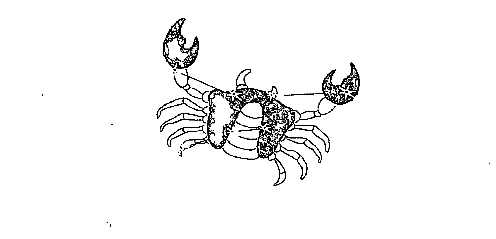

> 爱幻想，爱回忆。
> 爱有所依赖。
> 温柔如慈母（父），却永葆童心。
> 我是巨蟹座。

# The Secret of Stars

## 常规巨蟹座特质解析

巨蟹处于夏天的伊始，由象征母亲的月亮守护，这既给了巨蟹以母性的温柔慈爱、柔和细腻，同时也秉承了月亮较为阴性的一面，多愁善感、敏感多疑。这导致巨蟹的情绪起伏可以比天气还快，说笑就笑，说哭就哭，多少有些神经质的嫌疑。

提到蟹子，总会让人觉得是横行霸道、蛮不讲理的象征，其实在蟹子坚硬的外壳下，包裹着一颗无比柔软的心，温柔如慈母（父），又天真如孩童。他们举持着两把蟹钳，看似凶悍，其实在内心里，比谁都想获得关怀和爱。外表一副横行霸道的样子，只不过是源于天性中敏感爱猜疑所导致的强烈不安，让他们严重缺乏安全感，才会采取用这样一种强势的姿态面对世界。其实他们的蟹钳只对敌人才会举起，面对可以信赖的人，就会放下蟹钳，敞开心怀，坦诚自己的一片真心。毕竟他们是非常需要爱与安定的星座。

初识巨蟹座的人，大概会讨厌他们带搭不理的冷漠、高傲样子，但当他认可了你，愿意对你敞开心怀，你就会发现，他们有多么懂得为他人着想。

巨蟹座多半喜欢沉浸于自己的幻想国度，逃避现实，也总给他人一种不够现实的感觉。

蟹子多愁善感，容易情绪化，上一秒还在大笑，下一秒就不明原因的躲到某个角落暗自悲伤。他们喜欢把烦恼隐藏在心里，不愿与人分享，因此常常忧心忡忡。性格古怪，让人琢磨不透，适应不良者纷纷避开，无形当中，营造出蟹子的神秘形象。

想说服固执的蟹子真是比登天还要难，当你提出建议时，他不会以激烈的方式反驳你，只会微笑倾听，不时附和“是啊”，“对啊”，“好呀”，好像很赞同你的想法，但当你说“那我们就这样去做吧”，他却很干脆的告诉你：“不要”。因为他们可以听你说，但他们有自己的套路，谁也别想改变，这种“打太极”的方法简直让人生气。

作为水象星座，巨蟹也有水的缠绵和固执，他们的爱情态度非常传统，重视家庭，对爱人十分忠诚。缺点是，容易在恋情中丧失自我。平时高调又嚣张的巨蟹，一旦爱上某人，就让人傻眼的放低姿态，一切以爱人为中心。这种对爱情的过度执拗，尽管让巨蟹成为出名痴情的星座，但由此而生的可怕占有欲，也会让爱人吃不消。喜欢钻牛尖的特质，也容易让巨蟹在得不到所爱之人，或与爱人反目时，控制不了自己，做出过激行为。他们也不善于处理感情伤口，很难从旧恋情中走出来，是典型的拿得起放不下。

巨蟹也是一个怪怪星座，一方面深深陷入爱情不能自拔，有时候甚至到了“白目”的程度，另一方面又理智的告诉自己爱情不可能永久保鲜，因此永远都会给自己留条后路，即使结婚，也会保持经济独立，懂得为自己存钱或掌握家里的财政大权。

巨蟹热爱生活，懂得细品人生的每一分美好，尤其喜欢将家里布置得整洁、舒适、浪漫，忙碌一天之后，回到这座安心的小城堡，可以过短暂而惬意的自由生活。他们讨厌将生活安排得过于紧张，持续快节奏的工作和生活方式，都会让他们面临崩溃边缘，想要做些疯狂的事情发泄。

## 01. 固执的小螃蟹 气虚巨蟹

气虚巨蟹被关闭的星座能量：胆量、沟通能力

常规巨蟹害怕孤独，他们也不是可以一个人玩儿的孩子，一个人待得久了，就容易陷入莫名的伤感，越来越寂寞，因此他们总会表现得对恋人过分依赖，把自己的全副身心都投入在爱人身上，想要随时保持联系，经常腻在一起，为爱人的一个微笑可以付出一切……但气虚巨蟹可是孤独世界的掌控者，他们性格内向且独立，不习惯依赖任何人，他们乐于在孤独中获得心灵的自省和提升，与爱人、朋友在一起也是可以的，但总是在一起，则会让气虚巨蟹觉得厌烦，丧失了自由，偶尔就想要从人群中消失个几天，谁也不见，只好好拥抱他的孤独。

若论好口才，十二星座中非能言善辩，甚至到了诡辩程度的双子莫属，但说话最让人心里充满暖意的，却是巨蟹。他们发自内心想要与人交往，会从别人的角度考虑问题，从而为自己带来好人缘。尽管巨蟹的出发点是害怕孤独，想要拥有更多的朋友，并且掌控更多的人脉关系，有更加充足的安全感，但不可否认，与巨蟹谈话真是舒服，他们会对你所说的话专注倾听，并总能在恰当的时间，插入几句窝心话语。这些，都是过于自我的气虚巨蟹做不到的事情。气虚体质会让巨蟹变得懒言少语，他们的态度颇为清高，更注重心灵的沟通而非言语，让他们抽出宝贵的时候听你倒垃圾？NO！就更别提适当说上几句抚慰人心的话。事实上，因为气虚巨蟹过于固执，越是亲近的人，就越会觉得他们难以沟通，明明是关心你的话，也能让他们说得又倔又硬，让人气得半死。

气虚体质巨蟹将会成为一个很好的生活观察者。他们就像是生活在“淤泥质”沙土里的螃蟹一样，性格内敛，喜静不喜动，甚至有点小懒惰，但这并不妨碍他们聪明的大脑随时运转，对所观察到的动态人事物，从特殊的角度做出分析。尽管这样的蟹子在争斗中容易落下风，但他们也懂得潜藏自我，不断寻觅机会。

气虚巨蟹绝对是蟹群中最聪明的一群，惟一的问题是，他们天性当中的不喜争斗，会导致行动力的下降，就算瞄准了机会，能不能狠狠的伸出钳子抓住，这还是个问题。

## 02. 自顾不暇 阳虚巨蟹

阳虚巨蟹被关闭的星座能量：温情、胆量、沟通能力

出生在夏至点的巨蟹，阳气本就处于萌芽阶段，不够壮旺，这给了很多蟹男、蟹女以更多的阴柔之美。这一点，也总让他们的温情恰到好处，既不过于热烈，却也足够缠绵。而阳虚蟹子则成了真正冷漠和悲观的蟹族。缺少温暖就会让人失去勇气和自信，阳虚蟹子开始躲避与人交往，尽可能的将自己藏在温暖之所，而无法像常规巨蟹那样，可以自信的游走于社交圈子之中。阳虚巨蟹也再没有办法为别人更多付出自己的关怀和爱，因为他们早已自顾不暇。

唯一可以让阳虚巨蟹名正言顺汲取温暖的，只有他们的爱人和家人，然而，本就有着很强依赖性的巨蟹，在遭遇了阳虚体质之后，容易使得骨子里对情感的执着走向极端——他们既渴望来自家人的关心，内心的寒冷和不安，又让他们不断地抱怨，其实无非想要获得更多一些的注意，只不过带刺又悲观的言语，反而会让关心自己的家人受到伤害，不知道如何与你相处，而站得更远。

巨蟹潜意识里总有占地为王的想法，认定了掌控越多的事情，安全感就会越强烈，因为阳虚而带来不安的阳虚巨蟹，更是将这一特质充分发挥。阳虚，让他们总是害怕被所爱的人抛弃，他们疑虑重重，不停地问“你爱不爱我？”他们会以一种藤蔓的姿态，默默地掌控起你的时间、财政大权。刚开始不会觉得，只会觉得他真是太爱你了，才会如此亲近和关心你，时间久了，会让人有一种喘不过气的感觉。这一致命伤，会让巨蟹，尤其是阳虚巨蟹的每段恋情都难以长久。

有时候，巨蟹的自信真的有点太超过，当受到夸奖时，马上就反应：“是吧，我也这么觉得。”难免让人觉得浮夸。阳虚体质，会让巨蟹的性格变得拘谨和低调，会大大改变人们印象中那个嚣张跋扈，横着走的巨蟹模样。他们也会对强者表现出更多的敬意，而不似常规巨蟹，面对任何人都摆出挑衅和不驯态度。需要注意的是，用更为谦虚的态度面对生活当然很好，但过于退缩的姿态，就会变成懦弱可欺，这可不会是任何人想要的人生。

## 03. 急躁的“青苔质”螃蟹 阴虚巨蟹

阴虚巨蟹被关闭的星座能量：温柔、耐性

水象星座一向以阴柔著称，他们的性格如小河流水一般温顺，容易适应变化，随波逐浪，偏偏当巨蟹遇到了阴虚体质，就连一向以温顺著称的巨蟹，也要变了。阴虚巨蟹是典型的“青苔质”螃蟹。这种螃蟹生活在岩石质和青苔质环境中，性格浮躁，好动，情绪变化较快，喜怒无常、生性好勇斗狠，爱挑战强者。他们是真正霸道的巨蟹。炎热的夏天，尤其会让阴虚蟹子变得更加急躁，因为一点小事发莫名的火都是很正常的。

阴虚还带走了常规巨蟹一直以来的好耐性，他们雄心勃勃，脑子里经常充满了好点子，但真要做起事来却又因为缺少耐性而变得虎头蛇尾。

常规巨蟹本身情绪就不是很稳定，阴虚巨蟹更将这种不稳定的特质发挥到了极致，敏感、多疑又加上不懂控制自己的暴脾气，动不动就大吼外加摔东西，几近人格分裂。尽管自己煎熬得也很痛苦，但周遭的亲朋也被他折磨得很痛苦，难免想要逃之夭夭。

阴虚巨蟹开朗、直率、热情，而且他们从不吝啬向第一次见面的人也展现自己的热情和友好，这会给常在第一次见面时冷漠以对的蟹子加分，让他们变得更容易亲近。除此之外，阴虚巨蟹是最藏不住话的人，他们向来都有话直说，有事直接办，玩不来小心机，这也会大大改善常规巨蟹给人心机很重的印象。

阴虚蟹子的阳光性格，也使得他们的个性中，多了一份乐观和豁达，不会总是纠结于自己的敏感和多疑，这样的人生也会快乐许多吧！

## 04. 找不到自己的style 痰湿巨蟹

痰湿巨蟹被关闭的星座能量：执着、信念、勇气、魄力

巨蟹是第六感超强的星座，哪怕只是你的一个微笑，一个眼神，都足让他们获得关于你的第一手消息，从而迅速做出分析判断——在与你的交往中，哪些“策略”会更起作用，让你更加信任他。这让巨蟹在人际交往当中，常常处于“讨好者”的形象，不管与谁交流，他们的言谈举止总是恰如其分。但痰湿巨蟹的这种天赋，却被掩盖了。身体内的痰湿所带来的沉重感和自卑感，让他们对外界事物趋于麻木，他们不懂得如何去讨好他人，甚至有的时候常会给人以笨拙的印象，表情呆板，言语木讷。

常规巨蟹习惯了掌控别人，而痰湿巨蟹则变成了习惯被人掌控。对于痰湿巨蟹来说，他们已经懒得和人玩儿心机，尽管这应该是作为巨蟹最擅长也最乐在其中的一件事。其实玩心机并不一定是件坏事，连毛主席都说“与人斗其乐无穷”，但痰湿巨蟹显然体会不到这种乐趣，在面对别人的请求或要求时，他们的回答通常都是“好的”、“没问题”、“放心吧”，他们不懂得也不好意思拒绝别人，做得最好的就是“……好吧”，犹豫了一下，最终还是答应了。

巨蟹也是个矛盾的星座，他们一生都活在别人的眼光中，分外在意他人对自己的评判，但又一生都在试图逃离他人的眼光，潇潇洒洒的做回自己。这种人格分裂式的思维，特别容易让巨蟹走向极端，要么做个众人眼中品学兼优的乖宝宝，要么酗酒、飞车，什么都敢干。但不管如何，活在他人眼光中的巨蟹，还是十分在意自己的外在形象，是否整洁、得体，会不会让人觉得不够礼貌。他们永远知道见什么人穿什么样的衣服，说什么样的话。所以尽管巨蟹在衣着品味方面尚不及金牛，但也算小有成就。在这一点上，痰湿巨蟹又是蟹群里的奇葩，他们既在意别人的观感，但又不足让他们下定决心做出改变，尤其是在自己的仪表打理上，好像总是找不到自己的style，不是穿得太随性，就是穿得太夸张。

巨蟹是报复心极重的星座，他们不能忍受被人伤害，尤其不能忍受被所爱的人伤害。这源于他们本就不轻易向人敞开自己柔软的内心世界，一旦让人进入，就代表完全的信赖，对方的伤害，将直接穿透他们伪装的“硬壳”，刺入那颗柔软的心，从而留下难以磨灭的深刻伤痕。他们奉行“君子报仇，十年不晚”，不管过了多少年，只要有机会，就会唤醒那颗报复之心。而痰湿巨蟹在这一方面就表现得宽容、豁达很多，是不记仇的群体，就算被人伤害，一时痛苦，日子一久，也就忘了，就算以后再想起这段记忆，也不会再有曾经的疼痛感，笑笑地对自己说：“算了，就这么过去吧”。正是这样的宽容大度，让痰湿巨蟹拥有一个好人缘。

## 05. 陷入沼泽的“醉蟹” 湿热巨蟹

湿热巨蟹被关闭的星座能量：勇气、魄力、率性

湿热会为思绪复杂的巨蟹带来阴郁面容和内心世界，周遭的一切仿佛都会让他觉得不满，这让他们对外界采取拒绝态度，不想面对社会交往，宁愿选择待在家里，上网、游戏，也懒得与外界交流沟通。

喜爱构建自我王国的蟹子，遭遇急躁易怒的湿热体质，助长了常规蟹子本就孤僻的性格，从而成为了内心王国的暴君，就算独处，也会莫名感到沮丧和郁怒。

对外方面，他们看谁都不顺眼，一句不顺耳的话也能挑起他们的怒火。

湿热体质在九种体质中，是人格方面与巨蟹非常符合的体质之一，某个角度来说，湿热体质反而会加重巨蟹的不安、多疑心态，也加重了巨蟹给人的冷漠和高傲感。

因为湿热而导致的皮肤粗糙、长痘甚至酒糟鼻，还在很大程度上牵制了巨蟹外向的一面，从而让他们变得更加自闭。

如果你是一个巨蟹，切记远远躲开成为湿热体质的可能，因为它将对你的一生产生重要影响。

但是比较麻烦的是，总是想太多的巨蟹，也最喜欢借酒消愁，过量饮酒是造成湿热体质的最大元凶。醉蟹是一道不错的菜，但如果将自己变成了“醉蟹”，可能会将自己引入湿热的沼泽之地，在人生之旅中蹒跚前行，又怎么会活得痛快？

## 06. 敏感多疑大升级 血瘀巨蟹

血瘀巨蟹被关闭的星座能量：大度、乐观

本就冷漠的巨蟹遭遇血瘀体质，情绪会变得忽冷忽热，更让人摸不着头脑。前一分钟话还很多，后一分钟就神游去了，和你搭话也是有一句没一句的心不在焉；他也可能对你好的时候真的很好，却会忽然莫名其妙的冷起来，几天不通电话，通电话时，语气也是不咸不淡，好像没有话聊。其实他们的情绪变化不一定和你有关，而是自己内心的潮汐涨涨落落，没个规律，难免让旁人觉得莫名其妙。

若你想要隐瞒什么事情，最好能保证这事永远都被保护得密不透风，否则还是选择告诉他们比较妥当。因为血瘀巨蟹的敏感和多疑程度已经大升级，以他们的敏感和超神准第六感，难保不闻到你隐瞒事情的味道。以他们的性格又不会直接问你，只好放在心里胡乱猜疑，把自己折磨得痛苦不堪，表现出来的可能就是对你发莫须有的坏脾气。

健忘是血瘀巨蟹的明显标志，上一秒说的话，下一秒你再问他，他却反问你：“我有这么说吗？”认真的表情让你哑口无言。他们大事记得很牢，但诸如交往纪念日、结婚纪念日、男女朋友的生日……反正与生计无关的小事统统会被记忆系统忽视，忘记钥匙、手机这类琐碎事故更是经常发生。

对于巨蟹来说，尽早摆脱血瘀体质才是上策，否则也很容易走上气郁体质的道路，向抑郁症迈进。具体的饮食、起居辅助调整体质方法，会在开启星座能量篇里有比较详细的说明。

## 07. 被遮挡住光明面的月神 气郁巨蟹

气郁巨蟹被关闭的星座能量：希望、开朗、勇气、坚忍

巨蟹座的守护神是罗马的月亮女神戴安娜，传说她是万能之神宙斯与黑暗女神勒托的孩子。在星相家眼中，常规巨蟹身上同时聚集着光明和黑暗两种特质。这让他们常常是看上去健康开朗，内心却又布满伤感。气郁巨蟹，是阳光面被遮挡的蟹子，在他们的眼中，更多看到的是灰暗的事物，而非光明的事物；是悲观的结局而非有希望的未来。

气郁巨蟹的日子，仿佛每天都在唉声叹气中度过，他们努力的想要快乐，无奈快乐却迟迟不来，不善于向别人倾述痛苦，就只能任由内心的悲观思想苦苦折磨。多数时候，他们认为自己内心城堡的大门森严紧闭，让他们无路可逃，却意识不到，没有人锁上那扇门，轻轻一推，就是另外一个世界，只是你想不想走出来而已。

常规巨蟹所拥有的双面特质，源于巨蟹守护神戴安娜拥有的双重身份——她在希腊神话中，是狩猎女神阿提密斯。这赋予了常规巨蟹“静若处子，动若脱兔”的特质，他们有时喜欢在舒适的家中安静独处，但也喜欢户外活动，对骑马、涉猎这类接近自然和原始性格的运动，更是尤为喜爱，而气郁巨蟹相比之下，却对诗书琴画更感兴趣，尤其喜爱伤感的文字和韵律，他们秉承了月亮阴柔的一面，却失去了巨蟹本该拥有的活力。尽管这种体质让巨蟹出了不少艺术家和文人，但气郁体质却极易向抑郁症倾斜。

气郁体质的代表人物是林黛玉，许多人在猜想她到底属于哪一个星座？细品她的言行举止，倒是与气郁巨蟹很相似，不只悲春伤秋，属于巨蟹的敏感多疑更是加码，别人的一句话也斤斤计较，加上那一张利嘴，随时准备回击敌人，不正像巨蟹高举的双钳吗？

尽管很多人表示，生活中林黛玉这样的MM实在是不招人喜欢。所谓娶妻娶贤，谁不想要个性格温和，言行大方得体，而且懂得包容和理解自己丈夫的老婆呢？关键问题是，就算是你遇到这样的妹妹，身姿羸弱，眼神忧郁，能保证自己的一片怜爱之心不泛滥过度吗？就算在交往当中对她的多疑、说话带刺有些受不了，但任谁也会对这个“第一眼美人”心动不已吧。

至于男性的气郁巨蟹，就要道声“保重”了，不是谁都有“哥哥”张国荣那般倾城美貌，也不是谁都能来得了朝伟哥那双忧郁电眼，气郁型男，尽管已经成为一个流行元素，但是想当这类帅哥，需要的是综合素质，否则一个弄不好，就容易被看作是阴阳怪气，让女生纷纷回避，情路坎坷。

### 08. 零食禁口 特禀巨蟹

特禀巨蟹被关闭的星座能量：宽容、无畏

巨蟹也喜欢吃，只不过他们最喜欢吃零食，各种水果、蜜饯，来者不拒，特禀巨蟹可能要禁禁口了，吃得太多太杂，过敏反应一出现，连医生都为找不到过敏源头头疼。

当身体发生变化，心理自然会受到影响，这也是中医体质学强调的“心身构成论”。一个过敏体质人，内心相对于普通人，要更加敏感，这本身也是一种自我保护机能的启动，随时防御气候、社会环境等因素会让敏感的身体产生一些相应的变化，也让他们的心理敏感程度加重，更为在意别人的一言一行，容易对号入座。过多猜忌会对内心造成煎熬，使得性情变得古怪，对人际关系交往十分不利。

### 09. 只遗憾少了“蟹范儿” 平和巨蟹

会神神秘秘，会古古怪怪，会一会儿如慈爱长者，一会儿又像个捣蛋的小鬼，那才叫蟹子，独一无二。而平和巨蟹的棱角，都被平和体质打磨光滑。尽管饮食正常、睡眠好、二便通畅、性格开朗，社会和自然适应能力强，但却可能比常规巨蟹少了一些蟹子的范儿。

只是，虽然少了一些独有的魅力，平和巨蟹却拥有了其他方面的优势，最明显的就是性格里多了一些开朗，虽说潜意识里还是会自我保护，防人防得厉害，但最起码表面上看起来亲和了许多，并且还少了一些悲观情绪，多了一些活力。

平和巨蟹比起常规巨蟹，可以更好地控制自己的情绪，不会再那样频繁地改变着自己的晴雨表，一会儿晴，一会儿阴，一会儿又雨夹雪的，会让周围的朋友安心许多。

蟹子的固执也得到了改善，开始懂得更多的和人沟通，而不会依旧烟不出火不进，擎等着把人憋死才开心。

6月22日～7月23日 巨蟹篇

# 狮子篇

7月24日~8月23日

位置：黄道第五星座
属性：火象星座

爱装酷，爱自己。
爱听赞美，也爱 BMW 和 PRADA。
我是国王，不是 HelloKitty。
我粗枝大叶，但可以为朋友两肋插刀。
会河东狮吼，不懂绵羊音。
其实我是狮子座。

中国人九种体质之揭开星座密码

The Secret of Stars

常规狮子座特质解析

狮子座是夏天的第二个星座，备受太阳的关护。他们就像夏日的骄阳一样，开朗、热情、奔放，拥有宽厚、仁慈的心怀，不爱记仇，容易原谅他人，是天生的领导者。有狮子座的地方就有无限阳光，天赋的幽默和机智，让他们总能言谈有物，对一切充满希望，即使是最悲观的人，也会在与他们的交流中受到鼓舞。而狮子们也从不吝啬播洒自己的阳光，他们喜欢参与社交活动，终生需要表现自己的舞台，享受在交际圈中受到偶像一样的崇拜，那会让他们像打了肾上腺素一样兴奋到不行。

然而正如风筝如果飞得过高，就有可能断线，变得漂浮不定，喜欢被众人挺举的狮子，也会好大喜功，容易因为别人几句恭维的话，而辨不清是非好坏，容易受到蒙骗。他们最常犯的毛病就是识人不清，遇到谈得来的朋友，一下子就热情泛滥，掏心挖肺的对人家，如果对方也是重情重义的人，那倒是一拍即合，若是碰到善于伪装的小人，那就真成了大象被小老鼠害，最后怎么死的都不知道。

在爱情领域，热情过头的狮子也容易“剃头担子一头热”，人家对他稍好一点，就一头扎进爱河，知道人家根本没那个意思，才灰头土脸的硬撑，对对方说：“没关系，我们可以做朋友”。而且狮子简直可以被称作“爱情白目”，就算遇人不淑，也宁可自己隐忍，认为有爱就能度过一切难关，对外一概宣称幸福，所有苦处都自己背负，真是傻得让人心疼。

正因为狮子的纯和傻，让人们能够包容他们孩子气的自大和浮夸，为他们带来好人缘。

如果说狮子有些最让人受不了的特质，就是他们有时候目中无人得有点过分。所有狮子都喜欢当强者，男性狮子喜欢保护柔弱女性，有大男子主义倾向；女性狮子则多少有些女王倾向，认为男人就该拜倒在自己的石榴裙下，看不惯就走开。这样的特质让他们在爱情关系中，喜欢操纵对方，尽管他们将经营爱情当经营事业一样尽心尽力，喜欢安排各种纪念日，送爱人神秘小礼物，准备温馨浪漫的爱情表白，精心策划烛光晚餐……但时间久了，你会发现所有主动权都在他们手里。他们在安排这些节目的时候，甚至早就把你的时间安排打探得一清二楚，让你没有理由拒绝。没错，他们确实深爱着你，但他们的强势和占有欲会慢慢让你有被操控得喘不过气的感觉，不得不带着遗憾说再见。

狮子的任性也是出了名的，他想做的事情，马上就做，不管多少人反对，会造成什么样的后果，会不会影响到别人等等，都不在他们的考虑范围，他们可是万兽之王，岂是活在别人眼光里的弱者？但是拜托，因为你的任性和没有责任心，留下一堆烂摊子给别人收拾，应该也不是尊贵的“万兽之王”应该做的事情吧？

不同体质的狮子会呈现出怎样不同的气质？就得接着往下看了！

### 01. 谁摘去了你的光环 气虚狮子

气虚狮子被关闭的星座能量：魅力、活力、胆量、沟通能力

狮子座热情、奔放、喜欢热闹，爱表现自己，但并非所有狮子都如此。如果你正是一个气虚狮子，那么非但讨厌热闹和受人注目，有些时候还喜欢安静到了有些自闭的程度。讨厌人多的地方，讨厌节假日出门，在休息日一个人窝在家里看书、看DV，还会幸福地对自己说“一个人的感觉真好”！

气虚狮子还由一个天生演讲者，变得少言寡语，尤其和陌生人或看不顺眼的人在一起，宁愿当哑巴，各种面壁。当别人太过吵闹，让他觉得心烦时，他会说：“拜托，能不能安静一点。”瞬间招来一片置疑眼光，有没有搞错？你可是狮子座！

不管怎样，就算气虚了，狮子还是狮子，表面像猫一样乖顺，不意味着他们的灵魂也变成了猫，他们仍然雄心勃勃，梦想做一番大业，关键问题是，气虚狮子不再像常规狮子一样大步向前走，反而因为考虑太多，而思前顾后，捆手绑脚，少了属于狮子的那份勇敢和魄力。

气虚狮子也不喜欢交朋友，或者应该说在交友方面更重质不重量。但他们也未免挑剔得太过了一点，完全以第一眼判断为准，看着舒服了，那就多聊两句，看不顺眼连给人展示自己的机会也没有，就直接藐视到底。性格比较张扬的人，一般都会出现在气虚狮子的“黑名单”中，难有翻身之日，完全的自我为中心。这也导致了气虚狮子比常规狮子的心胸狭隘了许多。其实奉劝气虚狮子一句，所谓多个朋友多条路，滥交朋友是不太好，但也没必要一下子否决别人。毕竟每个人身上都有值得学习的东西。

感情方面，气虚狮子往往内心火热，外表冷漠，在心里或许对心上人爱慕不已，但是表现在脸上的却是一副冷面孔，这样很容易使人产生错觉，错失爱情。

可喜的是，气虚体质，将为一向冲动又自大的狮子带来一颗更为冷静的头脑。惟有沉在水底的石子，方能看清更多的真相。喜欢被别人恭维的狮子，却总是浮在水面之上，容易只看表象而忽略了潜藏于水底的危机，成为容易被人利用和欺骗的星座，尤其在事业方面，对他人的轻率信任和感情用事会让狮子爬得高也摔得重。而气虚体质的狮子在这方面要清醒许多，“好话”再不能让气虚的他们热血沸腾，反而会多了几分理性的思考——你真正想说的究竟是什么？

### 02. 变身！HelloKitty 阳虚狮子

阳虚狮子被关闭的星座能量：温暖、活力、胆量、沟通能力

守护星为太阳的狮子，被赋予了温暖、热情、外向、勇敢的特质，而阳虚狮子，无需说，相当于缺少了太阳的关照，会使狮子的积极属性走向反面。阳虚狮子不但身体对气候变化比较敏感，怕冷，常常裹着厚衣服来保持身体的温度，活力值更是大大下降，总觉得做什么事都提不起精神。再也没办法像常规狮子那样，穿着短袖在运动场上挥汗如雨。

常规狮子所散发出的光和热，足以温暖身边的每一个人，但是阳虚体质“自身难保”，自己都热量不足，又怎样去温暖他人？这也让狮子的魅力锐减。阳虚狮子不再像典型狮子那样春风满面，他们常常是一副虚弱无力的样子，说话、走路也都像没有吃饱饭一样蹒跚，而且大夏天还会冒冷汗。这副虚弱的模样，简直就从勇猛狮子，摇身变成了可爱乖巧的HelloKitty，更不禁让人怀疑，这还是精力充沛的狮子吗？

阳虚狮子失去了常规狮子咄咄逼人的气势，同时也失去了进取心。阳力的亏虚，让他们已经没有办法全力投入到事业或爱情中，他们现在更关注“我的身体怎么了？”而没有余力去想我要创造一片自己的王国，我要让他或她对我一往情深。

阳虚狮子在情感上比起常规狮子被动很多，甚至会主动放手。对于他们来说，有这样一副身体，再没有什么值得去争夺，也争夺不到。特别是阳虚狮男的“弱不禁风”，也容易使女生感觉缺乏安全感，难免要被淘汰出局。

狮子篇 7月24日~8月23日人的精力有限，当将过多的精力用于外在的发挥，就对事物少了更深层次的内省。常规狮子就是这样的典型。太阳星赋予了他们众星拱月般的魅力，也会让他们在众人艳羡和赞美中变得盲目，习惯了凭感觉行事，很少三思而后行，有勇而少谋。

只需观察周遭的人，就会发现，安静的人，总比活跃的人更为“智能”。而安静的阳虚狮子，自然也要比常规狮子看待事物多了些许深度。身体的冷，恰恰激发了阳虚狮子的思考力，他们懂得对事物的利弊进行深入的剖析，进而得出更为接近其本质的判断。他们不再只是视觉动物，开始懂得用全然的感官来判断美丑、是非。

## 03. 活脱脱变成暴君 阴虚狮子

### 阴虚狮子被关闭的星座能量：包容、韧性、淡定

狮子的诸多特质，因为遭遇了阴虚体质而得到更为淋漓尽致的发挥，比如更外向、更精力充沛、更富有激情。在中国文化中，阳主外放，阴主收敛，阴不足的阴虚狮子，变得更冲动和急躁，不考虑后果，而且表现欲也更强。他们也将狮子的野心发挥到极致，争强好胜，不能容忍失败或落于人后。可是老祖宗早就说过，“枪打出头鸟”，阴虚狮子的过度张扬给自己带来的麻烦也不小，容易在团队中被孤立。

尽管狮子有兽王之称，但狮子们却并不暴躁。他们大多数时候温厚、平和。还记得很久以前，CCTV 放的一部美剧《侠胆雄狮》里的狮人 Vincent 吗？对坏人凶悍到不行，对身边人却温和多情。而阴虚狮子则活脱脱变成了暴君。他们比常规狮子脾气要大得多，很小的事都可能触发他们的暴脾气，并且从不考虑这脾气该不该发。情绪波动之大，经常会迁怒于无辜之人。如果遇到阴虚狮子的上司，那可要处处行事谨慎，否则一不小心就容易踏进雷区。

阴虚狮子在与人交往中，也将表现出更强的操控欲，希望他人对他完全服从，很难接受反对意见。在爱情中不讲究技巧，往往是以一种咄咄逼人的姿态，性急地展开追求攻势，好像一切都能手到擒来，却反而会让被追求的对象吓得逃之夭夭。

阴虚的狮子有火一般的热情和胆量，享受工作带来的挑战和成就感，这让他们的事业版图将扩张得更为迅猛，他们干练、高效。属于狮子座的完美主义，让他们对自己比较苛刻，总在不断挖掘自身潜力。阴虚狮女也是典型的女强人。

### 04. 狡猾的“狩猎者” 痰湿狮子

痰湿狮子被关闭的星座能量：执着、信念、勇气、魄力

作为火相星座，常规狮子的干劲和爆发力极强，他们是职场的斗士，爱情领域的常胜将军，只是当狮子遭遇痰湿，却凡事都要忍耐，内心的火热无法喷薄而出，激情受到极大打压。

狮子的率性是出了名的，他们想做什么就做什么，想说什么就说什么，没有什么能阻挡他们前进的道路。而痰湿体质使他们率真的脾气变得温吞了，他们学会了妥协、忍耐，学会了将事情憋在心里，这对于狮子无疑是痛苦的，尽管外表温和，其实正因无法释放内心的火热而备受煎熬。

痰湿体质磨平了常规狮子性格的棱角，他们体胖心宽，待人随和，秉持着“人不犯我，我不犯人，人若犯我，能忍则忍”的原则，尽管减少了与别人发生冲突的几率，但却也让狮子变得胆小、懦弱，固步自封，缺乏个性。他们已经不再是敢爱敢恨，路见不平拔刀相助的“正义之狮”，而是成了典型的“老好人”，为人处事过于圆滑和世故。痰湿体质，也让狮子变得贪吃、嗜睡，精气神皆不足，工作久了会觉得头晕疲乏，对高负荷工作常处于心有余而力不足的状态，难以闯出一番大事业。

爱情方面，痰湿狮子也失去月亮女神所赋予的华贵外表，尽管不乏胖的可爱的狮子，但不得不承认，人胖了，选择性就开始变得有限，以狮子对异性伴侣的挑剔眼光，难免就经常遇到喜欢的人不喜欢自己，喜欢自己的呢，却又看不上眼的窘况。爱情在狮子的生命中占有极大比重，他们渴望轰轰烈烈且富有浪漫色彩的爱情，喜欢在婚后也保持着恋爱中的氛围，偶尔为伴侣制造一个小惊喜，讨厌过平凡无奇的生活，偏偏痰湿狮子们是标准“过日子”的人，他们只要安稳、平静、实在就够了，至于激情和浪漫，那是华丽而不切实际的电影情节。可是别忘了，你不需要，并不代表你的伴侣也不需要，你所期待的平凡和安稳，说不定在他看来是枯燥和乏味。每一段长久而幸福的婚姻，都需要制造一些小惊喜，让对方时常感觉到你绵延的爱意，日子才能快乐地过下去。

以和为贵的痰湿狮子，是狮群中的最有心机者，他们并不完全如表现出来的那样呆板和木讷，他们有更为成熟和世故的思维，偶尔会装傻，骨子里却精明得吓人。很多痰湿狮子看上去完全没什么进取心，做事不紧不慢，看似毫无竞争意识，却步步高升。

痰湿狮子，就像是已经过了浮躁的青春期，转而迈入中年的成熟狮子，少了一些青涩和冲动，多了几分成熟和稳健，如同成熟的狮子在“狩猎”之前，要对周遭的环境和“狩猎”对象进行全盘考察，再耐心等待机遇，慢慢接近目标一样，成熟的痰湿狮子，也懂得在不同的环境中，要先摸清这里的游戏规则，懂得对什么人说什么话，又如何把握这其中的分寸，在处事方面，不再一味向前冲，而是仔细考虑，做多少是个恰好的度，既完成了自己的任务，又不会落人话柄……

### 05. “熟”过分了  湿热狮子

湿热狮子被关闭的星座能量：勇气、魄力、率性

爱面子的狮子们，常常因为觉得不被理解，而将自己置于金字塔的顶端，因为他们从不愿意向他人袒露自己的失败与落寞，对于“不如意”，总是选择放在心里默默忍受，成为容易借酒消愁的星座。过量饮酒，是酿湿酿热的重要原因，这样的狮子，遭遇湿热体质的几率自然就更高。

如果说痰湿狮子是成熟狮子的代表，湿热狮子则“熟”过分了。他们有时喜欢热闹，有时又古怪地懒得接近人群，喜欢自己一个人关在家里，抑郁寡欢，如同一只暮年的老狮子。他们的脾气也会变得喜怒无常，缺乏耐性，时不时就像被点着的湿柴火一样，冒出点蒸汽，碰到一点不如意的事就会大发雷霆。虽并无大碍，但也会熏得众人纷纷躲开，留他自己继续自怨自艾。湿热狮子尤其讨厌湿热的天气，会在暑季变得更加暴躁，难以接近。

在爱情中，湿热狮子也不属于“清纯妹妹”、“清爽哥哥”的类型，他们会因为爱长痘的外表自卑，变得多疑，总是怀疑别人说的话是别有用心，并第一时间顶撞回去。这样的性格，让明明内心渴望爱情的狮子，像是长了刺的刺猬，即使对喜欢的人也嘴上不留情，渐渐加入“剩男剩女”的队伍。

湿热狮子是个奇怪的矛盾体，他们有时候喜欢寂寞，有时候却又害怕寂寞，真正能成为朋友的人，会经常接到他们的短信和电话，邀请大家一起聚一聚，K歌、喝酒、吃烧烤，尽管这样的生活习惯离健康两个字实在有距离，但湿热狮子是可以永远做朋友的人。在这个大家都在“瞎忙”，就算住在同一个城市，也互相半年或几年见不上面的时代，湿热狮子不会忘记自己的朋友，不管自己有多忙、多累，他们心里永远在意友情，每隔一小段时间，就要叫朋友出来坐坐，联络一下感情，不要彼此陌生、忘怀了。实在是难得！

### 06. 被衰老的信号打击 血瘀狮子

血瘀狮子被关闭的星座能量：大度、乐观

狮子并非都是帅哥、美女，但他们天生就能在人群中显露光芒。正因为如此，他们害怕衰老，坚信自己拥有永恒的活力和魅力，但血瘀体质的狮子，却不得不面临面容出现斑点和细纹，头发容易脱落，甚至记忆力大不如前等衰老的信号。遭遇血瘀对完美主义者的狮子们的打击，还要大过其他星座，会加重内心的悲观和忧郁。

血瘀体质导致面色暗淡，也是狮子们心里的小痛，擦再多亮容霜、美白霜，也改善不了这样的肤色，于是，从来不知道自卑为何物的狮子，开始有了小小的自卑感，天生喜欢被人注目的他们，在陌生人多的场合，开始有意地将自己藏起来，不要惹人注意。“桃花”自然急转直下。血瘀狮子不再是大大咧咧，可以随便开玩笑的主儿，不一定哪句话，就会刺到他们变得敏感的心，让他们发脾气走人。
相较于常规狮子的张扬、自负，血瘀狮子更为谦逊、内敛。他们也可以默默做事，默默付出，而且做起事来，更为细致。尽管在爱情领域，没了狮子的大胆表白，有可能错过良缘，但在职场中，却未尝不是一件好事，毕竟“少说多做”的实干家，总是更容易得到上司青睐。

### 07. 想要逃离这个世界 气郁狮子

### 气郁狮子被关闭的星座能量：希望、开朗、勇气

气郁体质会将狮子内心多愁善感那一面发挥得淋漓尽致。他们容易产生悲观伤感的情绪，会从一朵小花的凋零，想到飞快逝去的岁月，不禁就悲从中来。内心的不安感，让他们常常从梦里惊醒，胸口的涨闷又加重了心情的抑郁。始终不快乐、始终孤独、始终无可奈何！气郁狮子变得越来越不适应社会交往，喜欢将自己封闭在一个固定的空间，一旦离开这个空间就会失去安全感，显得笨拙，自尊心超强的狮子，会努力用各种方法来掩饰自己的笨拙，却发现事情变得更糟。
气郁狮子更少了常规狮子对周围事物的热情，他们试图改变这恼人的心情，可是却发现无从下手。当别人开心大笑时，他便更加觉得自己的人生充满无奈；朋友给他讲个笑话，他又会觉得自己居然沦落到让别人哄的地步……总之就是很难伺候，有时还会以冷漠回应别人的关心。渐渐地，气郁狮子身边的朋友会越来越少，而自己则越来越孤独和压抑。
气郁狮子将变得更任性，总是莫名其妙地心情不好，对周遭的人掉脸子，发小脾气，如果遇到脾气倔强的人，对他莫名其妙的脾气一顿数落，瞬间就让他们掉下委屈的眼泪，搞得对方丈二金刚摸不着头脑，看着他好像被欺负似的不知所措，事实上是他们自己先发的火！
气郁狮子是喜欢按照规矩和先例做事的人，一旦没了这些，就会觉得手足无措，失去自信。他们变成了生存在小圈子里，才会觉得自己安全的人，已经不再习惯像常规狮子那样，不断扩张自己的版图，不管是事业的，还是人际交往的，或者爱情方面的。他们身在现实之中，却又好像生活在现实之外。他们不单不再是交际圈的核心人物，反而慢慢让自己退到边缘，好像整个世界都与他无关，甚至有想要逃离这个世界的冲动。

气郁狮子的才情和“多愁善感”，尽管让他们失去常规狮子的阳光和开朗，却让他们有了诗人般的飘逸气质，他们不再像常规狮子那样粗细条，对于生活中的变化更为敏感，善于捕捉细节，对其进行情感上的升华，并诉诸于文字。如果气郁狮子能够好好运用这一特质，必能够在文学领域有所造诣。

气郁狮子还学会了隐藏自己真实的情感和想法，不再像常规狮子那样，一眼就被别人看穿心里在想什么，遭人算计、陷害的概率也会大大降低。

爱情中，气郁狮子终于脱去女王的外衣，变得更为娇柔、内敛，弱不禁风的身型，以及眉间一缕淡淡哀愁，极易引起异性的爱慕之情。

### 08. 被关进笼子的狮子  特禀狮子

特禀狮子被关闭的星座能量：自由、乐观

特禀体质，让热爱大自然的狮子，多了许多顾忌。春暖花开之时，再也不敢约上好友出门踏青、登山，只能闷在家里躲四处都闻得到的花粉、飞絮，这简直就等同于将他们关进了笼子。他们对季节的变化也很敏感，稍不注意就可能引发身体的过敏反应。

受到各种限制，没有办法肆意做自己喜欢的事情，无法任意吃喜欢的食物，都会让潇洒惯了的特禀狮子情绪低落，甚至变得孤僻和古怪，他们的疑心开始加重，总在别人聊天时，怀疑是不是在背后谈论他总是请假、身体过敏等话题，甚至开始对身边人怀有莫名的敌意。时间长了，身边的亲人和朋友，都会受到这种敌意的伤害。
尽管花粉过敏的狮子，不再能毫无顾忌地去公园观赏春花，食物过敏的狮子，再不能任意品尝美食……但是，身体的敏感，终于也让一向率性而为、大大咧咧的狮子，不再仗着太阳星赋予的健康体魄任意妄为，开始懂得放慢脚步，欣赏起周遭曾经被忽视的风景，并终于能将一直向外发散的注意力收回身体，时刻关注、呵护身体的需求和变化。

### 09. 尽显王者风范 平和狮子

平和体质会让人面色红润，目光炯炯有神，身体强壮，这会大大增加狮子的气场。平和狮子身上活力无限，心胸开阔，大度宽容，脸上总是洋溢着笑容，很有魅力，他们是人群中的开心果，让与他们相处的人，总是处于快乐中，所以他们有很多朋友。哪怕是受了别人欺骗，也可以保持乐观的心态，不爱记仇。

平和狮子能力超群，这很大程度源于他们健康的体魄。他们不但是运动场上的健将，更是舞台上的耀眼明星，他们可以长时间地从事某一项工作而不感到疲乏。他们很自信，这使他们可以不断地挖掘自身潜力、不断地突破自我；他们很乐观，哪怕是遭遇了失败，也能尽快地调整心态，重新投入战斗。只是这些特质，也会让他们变得容易骄傲，甚至自负、自满，过分相信自己的能力，做事一意孤行，不愿意采纳别人的建议，很容易‘栽跟头’。

平和狮子耳根子软，喜欢听奉承的话，喜欢听到赞美和喝彩，满足自己的虚荣心。这让平和狮子，对外人没有什么戒心，似乎把所有人都当好人，往往会吃亏、上当，有时还会被小人的暗箭所伤。

平和狮子在爱情领域中是非常抢手的，没有异性会拒绝平和狮子灿烂的笑容、真诚的情话、浪漫的表白。只是，爱情中的他们喜欢控制对方，要求另一半无条件地服从自己、崇拜自己。他们虽然爱得炽烈、真诚、浪漫，但是居高临下的态度很容易使对方受不了，这是平和狮子容易造成爱情悲剧的重要原因。

# 处女篇

8月24日~9月23日

位置：黄道第六星座

属性：地象星座

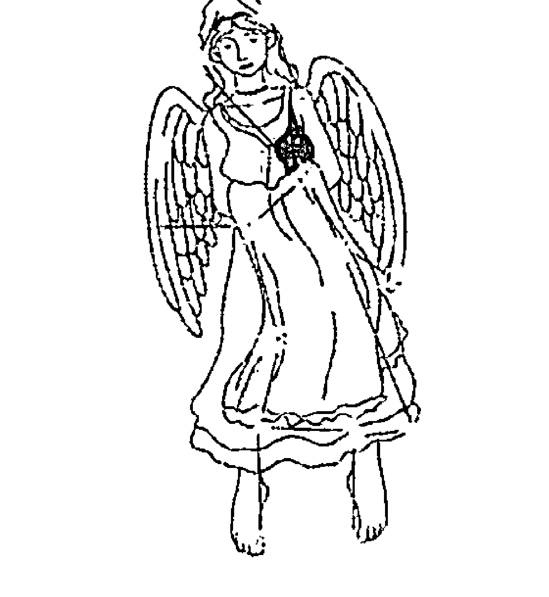

> > 爱秩序，不爱散乱。
> 天生的坚强，天生的悲观。
> 因为怕伤害，所以更理智。
> 我不冷漠，只是不想投入太多情感。
> 你们才傻，不知道这样才最安全。
> 我是处女座。

## 常规处女座特质解析

与其单纯从星象角度来分析处女，不妨看看更为真实的处女座究竟什么样。以下，便是一位网友对处女座的切身感悟，这可是很多人都觉得非常准的哦：

处女座是双重性格，甚至有点神经质，其实原因只有一个，处女座的一切都要随自己外显的性格而转，姑且称之为“状态”。

处女座状态好的时候，可以将自己聪明、细腻、能干、温情、幽默、有内涵等优良品质完全外展，此时他们显得如此完美，光芒四射，并且可以表现得非常外向、健谈，容易与人打成一片（这本非他们的性格）。而一旦处女座状态不好，便会变成另一个人，甚至非常窝囊，一事无成，不过通常此时他们都躲避外在的干扰，所以让人感觉有点间歇性自闭症。因为同为水星守护，所以处女和双子一样善变，但双子善变的是心思，处女善变的却是情绪。

很多时候处女座要面对很多实际的琐事，这时的处女座便不得不在“冷”中面对周围世界：要么说话做事很不自然，有做作的痕迹；要么便极度冷漠和被动，对谁都不理不睬。其实处女座很清楚自己现在的样子，但他们无力改变和控制自己的情绪，只能选择疯狂地逃避一切。他们想的是：与其很不自然地面对你，尴尬地和你说些无关痛痒的话，或是因和平时反差太大而被人说成表里不一，性格怪异，还不如先躲一阵子，等调节好了以后再出来。所以，在与人交往中，他们只会和不得不交流的人（实在躲不掉）或是完全陌生的人（反正无所谓）交谈，而和熟悉的朋友反而疏远。所以，你在他心中地位越重，他躲得你越远。特别是恋人。

大家都知道处女座有严重的完美主义倾向，所以就有了所谓的“处女座的人最喜欢若即若离”。原因很简单：他只想给你一个最好最完美的自己，而不愿让你看到他无助脆弱的一面。所以请记住，有时处女座对你冷，绝不是你说错或做错什么，他们只是不想让严寒和冰霜伤害了你（可事实上这种做法已经是伤害）。不必为此难过，因为他们在乎你的话，内心就比你还要难过、自责和内疚！他们所能做的，就是希望快点调整好情绪，回到你的身边。

基于以上两点，处女座有时便会表现出非常另类的行为和思维模式。他们的性格也很多来源于此：不喜主动，不善交际（也可以热情，只是今天热了，终有一天会冷的），不爱表现，不喜欢抛头露面（万一哪天情绪无法把握，状态不好时，岂不大失脸面），诸如此类。

关于“洁癖”——并非处女都有洁癖，很多处女座并不爱干净，但却要求整洁，他们更多的是井然有序，不喜欢别人破坏他们所整理和布置的“完美”格局。处女座更多的是有精神洁癖。一旦触碰到他们精神上的禁区，严重时会表现得歇斯底里。

关于“花心”——一般说来处女座绝不花心，忠诚是他们的代名词。异性关系多很可能是他们需要确定一个好人缘和自己有魅力，来反击那些普遍观点。一旦找到心中真爱，他会呵护你一辈子，只要你能给他安全感，他永不背叛，心中眼中惟你一人。寻花问柳，红杏出墙这些事与他们绝缘（一是责任感所致，二是怕麻烦）。

关于“聪明”——不似双子灵活机巧，不像水瓶创意非凡，也不是天蝎的那种计划周密，处女座更多体现的是智慧。细腻、理性、好学加上十二星座里一流的洞察力和最强的逻辑思维能力，处女座想不聪明都难。没事少在处女座面前信口开河，随意撒谎，很多伪装他们一眼便能看透；也别跟他们玩什么心计，你玩不过他们的。处女座是那种可以把你卖了你还得向他道谢的类型。没事也少跟处女座辩论，他们没理也可以找出理，甚至找出不止一条理来。处女座是永远不会吃亏的。

关于“单纯”——处女座很纯真，但绝不单纯，他们内心复杂得让人难以想象，很多不经意的事可能都是他们精心布置的。处女座也总在纯洁和好色之间徘徊，这一点最难说清。不过他们真正的内心是极其善良的，宁可自己苦也不愿伤害任何人，心灵如水晶一般晶莹剔透。

关于“幽默”——都说处女座冷若冰霜，缺乏幽默。多和他们接触吧，你会体会到什么是冷幽默，什么是真正的幽默，而并非品位低俗的搞笑。

关于“迟钝”——别看你和处女座说某些提议时他们半天才反应过来，在你说好的一瞬间，他们脑子里可能已经转过五六个你这项提议会造成的后果（通常是消极后果）。他们总是想得太多，绝非想得太慢。

关于“自私”——处女座的自私不是狮子座的那种惟我独尊，也不是水瓶座的以自我为中心。处女座正因为是无私的，所以显得自私。因为处女座不想伤害任何人。

关于“逃避”——由于处女座性格上的因素，他们通常会显得压力很大。当周遭的事物已无法掌控，或是自己的情绪无法调节好时，他们会疯狂地逃避、堕落，让所有爱他们的人感到心碎。不过不用太担心，过一阵子他们自己会好的，他们天性的自我批判精神很快便会起作用。处女座一般不会彻底堕落，堕落前可能都已留有余地，只是在等待着希望的来临。甚至有时堕落都是做给别人看的。

关于“内涵”——处女座有涵养这一点是肯定的。他们在成长中不断吸取教训，不断学习，取人之长来丰富自己的内涵。因为他们感觉到，尽管情绪无法把握，而这些是自己可以踏踏实实做到的，将来一定有帮助。这是他们所追求的完美主义目标。

处女座就是一个表面神秘到难以琢磨，说穿了却又很简单的星座。最接近神的人？可能吧，处女座喜欢这样来标榜自己。因为他们确实有超凡脱俗的一面。他们的内心接近了神，可是身在这个世界，不能不食人间烟火吧？所以必须得戴着一个面具活在这个世界上。

处女座喜欢和人说些暧昧的话，对心仪的对象却不好意思表白。

处女座希望别人了解自己，却又只将能公布的那一部分对外展示。

处女座是最有责任感的人了，可很多时候却害怕承担责任。

## 01. 极度犯懒 气虚处女

气虚处女被关闭的星座能量：精力、胆量、沟通能力

气虚体质人的特点就是不喜欢接近陌生人，对看不顺眼的人更是懒得言语，但如果是熟人或交情很好的朋友，就有机会享受他的关心。一个气虚处女在关心朋友之余，还附带上因为关心过度而碎碎念的功力。尽管因为气虚而声音低到有时候听不清他在讲什么，但就是这种像蚊子一样的声音，更容易让人神经崩溃。

对于熟人，气虚处女还很喜欢说冷笑话，尽管有时候他自己一点也不觉得说了笑话，一脸莫名地看着大家笑得东倒西歪，这副“发生什么事”的表情更像下了猛料，让人笑到无力。

气虚，还会为向来不甘低于人下（虽然他们也没指望做什么人上人）的处女变得有些小自卑。不管在面试、相亲等等需要得到他人认同的场合，都自己先漏了气，担心被嫌弃、被淘汰，往往会表现得过于拘谨和冷漠，甚至有那么点儿懦弱。要知道，这样的形象更有可能被 pass 掉，还不如鼓足勇气，表现出真实的自己，才不会错过事业和爱情上的机遇。

完美主义的处女座，容易给自己施加过多的压力，偏偏气虚体质是抗压性很低的一种体质，倒不是说压力会将身体压垮，而是会让心情变得格外焦躁，即使是永远在人前保持冷静形象的处女座，也会开始发飙摔东西。

在爱情方面，气虚，自然就缺乏勇气，于是本就因为好面子不肯向心上人表白的处女，在遭遇了气虚体质后，更是怯懦到让人着急，他们通常只是试探几次心上人的心意，觉得对方似乎没表现出过多的好感，就打退堂鼓了，心想不如就保持距离做普通朋友，怎样也比被拒绝强，尽管有些难过，却还是对这样“理智”的决定暗暗得意。虽然保住了面子，却因为不肯过多努力而丢掉了爱情，真是不知道有什么好得意。而且习惯了禁锢于自己的小世界，好友只有那么两三只的气虚处女，在好不容易遇到心仪之人的情况下，还拿不出勇气表白，到底是想怎样？

气虚体质所带来的乏力感，让本就循规蹈矩的处女，对生活更是没过多的苛求。他们只需要一间温馨的，五脏俱全的小房间，和一张## 02. 少了支柱的棉花糖 阳虚处女

阳虚处女被关闭的星座能量：活力、胆量、沟通能力

心思缜密的阳虚处女，会要求自己的工作做到无懈可击，他们不需要坐到多么高端的位置上，但绝对需要他人对他们不可或缺的地位的肯定。正因为这个特质，阳虚处女会是最好的秘书人选。他们的执行能力超强，在做每一项工作时，都一丝不苟、严谨认真，通常是最让上司放心的员工。比较麻烦的是，阳虚的身体会像缺少了支柱的棉花糖一样，长期处于软绵绵的无力状态。尽管阳虚处女想做好自己的工作，但身体的不给力，还是会让她们出现拖延工期的状况，甚至无法正常工作。这对一生都投入于工作当中的处女座来说，可是沉重的打击。他们不需要事业，但却不能没有工作，这就是怪怪的处女座。

因为缺少了雄心壮志，阳虚处女尽管会尽其所能将手头工作做得近乎完美，却不会主动去探索未知的领域，他们对所有未知的东西都感到担心，也就严重缺乏创新精神和竞争意识。不过这一点，就算是一个体质平和的处女座，也很难突破，“不放弃自己应得的，也不费力追求过多的”本来就是处女座的行为准则。加上阳虚体质也会让人想要生活在自己了如指掌的小圈子里，自然也少了很多接触新鲜事物的机会。

阳虚处女的另一个麻烦就是，他们不懂得拒绝别人。被人拜托，尽管自己心也无力，体也无力，但还是会在略微地推托后，接手过来。这种被动性体现在感情上，很容易就让阳虚处女错过了有缘人。他们在感情上过分“深思熟虑”，不主动表白，遇到心仪的对象也不会放胆去追求，倒是默默等在原地，期待心上人突如其来的关注。需知，以你的安静和内敛，很可能就被埋没在人堆里，要等到心上人的主动关注，几率简直比彗星撞地球还要低。建议你再遇到有情人的时候，

## 03. 典型的“操控系” 阴虚处女

阴虚处女被关闭的星座能量：包容、韧性、淡定

阴虚处女是典型的“操控系”，不管男性女性，很多时候都喜欢以自己的标准衡量别人，带有强制意味地要求他人以自己的意愿为转移。阴虚处女也会成为出名的点子王，头脑发达，思路活跃，但在拜托他们帮忙之前，一定要仔细考虑，因为如果他们为你帮忙，给你出谋划策，到头来你却没按他们的方案行事或是稍有差池，他们可是会很快落下脸来，认为自己“好心当成驴肝肺”，凭你再怎么好言相劝，也听不进去，一味认为你对他不够尊重，还放下“以后有事少来找我”的狠话。可是如果下次真的还去求他，热心肠的阴虚处女还是不会不管，不过还是会要面子地嘴硬：“仅此一次，下不为例”！

在中医理论中，阴虚之人，就会阳亢，表现出一种精力得不到收敛，过于发散的状态，其中一项就是憋不住话，总是忍不住地数落身边人这不对、那不是。本就喜欢碎碎念的处女遭遇了阴虚体质，真是念功又上一层，加之其天性中隐含的批判主义精神，一旦被他们发现“小辫子”，迎来的将是一通训教，直念得人耳鸣头大，纷纷逃离。

经常像念紧箍咒一样的阴虚处女，也会无形间给周遭的亲友施加很大压力，尤其是正处于更年期的中年“处女”（这个星座的名字还真是别扭），往往就是阴虚状态，最烦恼的就是丈夫和儿女受不了她的唠叨，见到她就像见到蜇人的马蜂一样迅速回避。其实内心里她也想好好关心家人，如此的爱唠叨，实在是体质所赐，她想控制也控制不了。

细心温和，习惯慢工出细活，本是处女座的一大优势，他们是焦躁之人的稳定剂，不管多么紧急的状况，也能稳住自己，面露微笑，冷静地想出解决方案，但阴虚体质却硬是给处女们加上了一个急躁性子，遇到急事，情绪就像是将发面的碱换成了酵母，快速膨胀，暴脾气和焦虑症一起上，不但经常雷到身边众人，更是常常让自己陷入半癫狂状态，怒骂、摔东西的情况都有可能会出现。

处女座是缺乏活力的群体，说他们活泼可以，但活力就……毕竟他们是终生以保持“平衡”为志愿的星座呀，凡事既不能不足，但也不能太过，所以他们喜欢运动，但不喜欢太过刺激的运动；他们喜欢笑，但嘴角微笑的角度可要控制好。这就导致了在许多人眼中，处女等于拘谨。而阴虚处女则表现得更加率性，他们想做什么就会去做，才懒得去想尺度有没有太超过，或是过于在意他人眼光，他们也不像常规处女那样逃避改变，相反，他们受不了一成不变的生活，会通过自己的努力让变化发生。

在爱情方面，常规处女也难逃一直以来内心那座天秤的制衡，面对爱情和面包的选择时，会理智到冷血地选择面包。但这也不能怪他们，因为处女内心敏感脆弱，在他们看来，面包是保险的，有利而无弊，但爱人却随时有可能离去或者伤害自己，他们赌不起。阴虚处女则少了这层顾虑，他们是天生的赌徒，人生在世，就如船行大海，若没有惊涛骇浪为伴怎么够刺激？对于阴虚处女来说，爱上了，就会勇敢追，哪来那么多废话。至于之后的事情怎么样，不是现在需要想的。

## 04. 深得“退”字精华 痰湿处女

痰湿处女被关闭的星座能量：执着、信念

常规处女奉行“退一步海阔天空”的处事原则，不喜欢挑起纷争，但他们也会聪明地在恰当时机调和矛盾，也就是说他们所谓的“退一步”，完全有可能是放长线，钓大鱼，但绝不可能让人骑到自己身上。而痰湿处女的“退”，就几乎是无条件了。

痰湿体质人一向是心宽体胖的践行者，有超强的忍耐力，不爱出风头，名利心不强。他们在与人发生矛盾，或者面对别人的刻意打压时，以懒得和人计较的态度，可以一步步退让，容忍度几乎无上限。

痰湿体质，是在人格上与处女座十分相近的体质，如常规处女一般，在意别人的眼光，在意做事的尺度，永远为自己留一条后路，所以轻易不会做风险投资。他们延续了常规处女的传统思维，活在自我约束的枷锁里，不管对自己的工作有多么不满，以至于逢人就抱怨工作又累、钱又少，却还是没办法下决心离职。痰湿处女的跳槽几率将远远低于他人。

你可以说他忠心耿耿，也可以说他固步自封，总之，他就是不愿意打破得来不易的“稳定”。

痰湿男很在意娶妻娶贤，愿意让妻子婚后做全职太太，对职场白骨精，奉行着眼睛欣赏欣赏就好，娶回家的，还是要会过日子的女人才踏实。

而痰湿女嫁人后，多是标准的家庭主妇，尽管不能说到了以夫为天的程度，但一切以丈夫孩子为核心，对事业没啥企图心。这些特质，都让痰湿处女变得更为平实可亲。

处女座的完美主义，让他们总是落下吹毛求疵的诟病，很多人不愿意和过于挑剔的处女座共事，甚至在选择婚恋对象时，也会自动地将处女座剔除在外。

其实不必如此急着下判断，因为痰湿处女温和、敦厚的秉性，可能会让你看到一个完全不一样的处女——他们心胸豁达，不与人争强、计较；他们可以自嘲，自然就不会因为一个不咸不淡的小笑话而翻脸；他们待人宽容，容易原谅别人的错误，更不会以批判别人为己任；他们也很少有洁癖，但你可能需要包容他们少许的邋遢；还有，他们不再是事业型的处女座，很少为了做好上司交待的工作，而忽略与家人共进晚餐，不过也要接受他们对事业没有太大的野心……

他们未必是出得了厅堂的伴侣，但绝对进得了厨房，是宜家、宜室，居家必备的伴侣人选。

## 05. 无法接受不完美 湿热处女

湿热处女被关闭的星座能量：包容、忍耐

湿热处女，就是传说中可能有“间歇自闭症”的处女座了。
他们喜怒无常，心情不错的时候，可以是聪明、细腻又温情的处女，偶尔出现在大家面前，跟你喝杯酒，吃上几个肉串，不咸不淡地谈谈人生。如果莫名其妙陷入抑郁情绪，则常常把自己关起来，成天对着电脑，斗地主、打拖拉机，偶尔还对着 QQ 上的一群陌生人发发莫名其妙的图，等人家主动与他攀谈，又懒得理人家。

处女座的人常常为没有做到尽善尽美，而内疚和不安，湿热处女则更加无法接受不完美。他们会不断自我怀疑，瞻前顾后，搞得自己心烦意乱。

遇到不如意的事情，他们早就没了常规处女的淡定，以及能够迅速调整自己状态的能力，湿热处女会显得分外急躁，在内心怨怪现实。这个时候千万别去理他，他不是给你碰冷钉子，就是会发一阵不小的脾气，何必呢？

处女座求知欲旺盛，喜好分析，说白了就是爱钻牛角尖，而湿热处女简直就是把这一特质发挥到了极致，他们喜欢不断追问为什么，非要得到一个明确的解答才肯罢休，经常钻到牛角尖里出不来，痛苦的还是自己。

在追寻答案的过程当中，他们又不自觉地成为了批判家，对于无法理解的事，往往批判得体无完肤。虽常怀惩恶扬善的心，也会因过度苛刻而与目标背道而驰。

湿热处女对待工作也有常规处女的细致和尽责，会尽最大努力将事情做好，享受工作所带来的成就感。他们对待朋友和爱人，不吝于付出感情，一旦认准，就会全身心地投入。对朋友更是可以到了两肋插刀的地步。

湿热体质，会让处女变得更加沉静和内敛，从而能够更加细心地观察他人的需求，总能在恰当的时候伸出援手。这种细微的情感，常会让人陷入他们的温柔陷阱，无法自拔。

## 06. 极品居家侦探 血瘀处女

血瘀处女被关闭的星座能量：大度、乐观

血瘀处女会让你见识到什么才是象征着处女座的洁癖和谨小慎微。细心敏感的血瘀体质，是最容易出现洁癖处女的体质之一。到血瘀处女的家里做客，轻易不要动任何东西，即使看上去很乱，你好心地想要帮他收拾一下，也会被他们发现被移动过的痕迹，简直就是“居家侦探”。他们是有自己秩序的人，乱，也是一种秩序，擅自破坏这种秩序就会引起他们的不满。而且千万不要在吃饼干等零碎食物时，将渣滓掉在地上，或者在他们的领域里留下任何痕迹，尽管他表面说没关系地清扫干净，但却再也不会允许你踏入他的家门。

他们对洁癖的概念不只是卫生方面的，包括情感方面。血瘀处女会要求爱人百分百的忠诚，朋友也不能做一点欺瞒他的事情，否则以他们的敏感和多疑，发现一丝蛛丝马迹，都不会善罢甘休，一定要向你追问到真相为止。关键问题是，有的时候即便你说了真相，他们也不会相信那是真的，还莫不如说些能让他心安的善意谎言，平复他们的焦躁。否则不只你再也受不了他们的追问，他们自己也被内心的怀疑和烦躁折磨到抓狂。

常规处女座已经多疑到让人受不了的地步，遇到血瘀体质简直就是雪上加霜。处女并非是天生的智者，他们后天所取得的一切成就，全凭自己努力。即使是这样，也总会担心做得不够完美，无形当中给自己增加了太多压力，变得忧虑重重，总是担心哪个地方做得不够好，或者在群体当中不受欢迎，也有很强的自卑感。血瘀处女对周遭的风吹草动就更是敏感，即使已经做足了功课，在看似自信的外表下，还是不断担心被人赶超，压力超大。可能一生都处在智能纠错状态。

说也奇怪，连一支笔原本摆在哪里，是否被人动过都能灵敏察觉的处女，却还是无法逃脱血瘀体质所带来的健忘。只要走出自己的领域，立即变成丢东落西的“失忆王”，昏头胀脑地寻找车钥匙，最后发现钥匙就在自己的手上。实在是无法理解的怪异现象。健忘还会让血瘀处女有无法掌控自己生活的恐慌，变得更加急躁和偏激。

多疑和爱发脾气，让血瘀处女的爱情之路也不那么顺畅。风平浪静的时候，血瘀处女也可以温柔可人，但下一秒就可能变成暴雨雷霆。这让与他们相处的人有点提心吊胆，慢慢就变得厌倦、放弃。想要拥有长久的爱情，血瘀处女一定要学会信任和宽容才好。

## 07. 落入悲观陷阱 气郁处女

气郁处女被关闭的星座能量：希望、开朗、勇气、坚忍

气郁处女钻牛角尖的功力较之血瘀处女有过之而无不及。他们做任何事都小心翼翼，就算是好事，也会联想到最坏的结局，负面情绪也常常影响大家的心情，让身边的人也会因为他的忧郁而倍感压力——春天到了，就会想秋天和冬天也会相继而来；顺利找到工作，却每天都在忧虑如果失业应该怎么办……他们几乎坚信好事不会发生在自己身上，反而麻烦会随时发生，而身边的任何人都比他们要来得幸运。

气郁处女的焦虑状况也会更加严重，总是扮演“听者有意”的角色。别人一句无心的话，也当成是对他们的指涉或嘲讽，并会立刻回以犀利的言语攻击，反而常常让别人摸不着头脑，不知道哪儿又得罪了他。除了过于忧虑，他们的敏感程度也是升级版的，怕被人嫌弃，被人看作是累赘和麻烦，并且担心意外会随时发生，而明天的自己还不知道会在哪里。这些无谓的担心，会让气郁处女将自己关进小圈子里，将自己孤立起来。就像内心总有恐惧的人，喜欢四处无死角的小房间，而不喜欢空洞的大房子一样，他们要周围的一切都随时可见，没有遮挡，即便这样，也会害怕突如其来的意外，会打破小圈子里的宁静。

气郁处女终于相信这个世界上没有绝对的完美，生活到处充满缺憾：买的房子邻居太吵，遇见的人对你不好，自己呆着无聊，出去玩周围又太闹，新买的鞋子磨脚，打出租司机给你乱绕，自己还没长大父母又变老，点的菜不合胃口情绪烦躁，去年的衣服今年穿不上，钱包偶尔被盗……你瞧，岁月只是偶尔静好，人生永远充满烦恼。

生活既然如此，又如何再纠结于怎样让人生保持完美？不如沉入自己的内心世界不断自省，寻找心灵的田园。如果能抛却这其中的过度忧伤，那么气郁处女的内心世界也是恬静而美丽的。

## 08. 过于关注细节 特禀处女

特禀处女被关闭的星座能量：自信、洒脱

特禀体质往往会让处女更加专注于对细节的关注，而忽略大局。他们仍然谨慎而细致地做着手边的每一件事，犯错概率极低，却对人生的大目标变得更加茫然。他们就好像河边的船工，每日行走于河的两岸，从不会出任何差错，但是这两边的终点，却都不是他人生的目的地。特禀体质人内心多会有敏感自卑的一面，正是这种心理特质，让他们碌碌于生活，却不知道自己还能够做什么，来让人生变得更加丰满。

细致本就是处女座的招牌优点，加上特禀体质特有的细腻心思，会让这个优点更加突出。如果跟特禀处女座共事的，是个爱打马虎眼，做事虎头蛇尾的人，他们通常会受不了，因为他们做事习惯了一板一眼，不允许任何遗漏，否则就会觉得良心不安。

## 09. 挑剔少那么一点点 平和处女

平和的健康体质，最为看重的不只是身体的平和，更重要的是心态的平和。平和处女，内心对完美主义的极端追求，得到了适当的收敛，变得更加开朗和平易近人，也不会再让人觉得那样的吹毛求疵，人缘自然会好上不少。

平和处女，开始真正懂得如何用平常心看待周围的人事物，内心因为不安，而导致过于谨慎的性格，会得到很大改善，待人接物温和有礼，与处女座所代表的无私奉献精神将更加接近。

# 天秤篇

9月24日~10月23日

位置：黄道第七星座

属性：风象星座

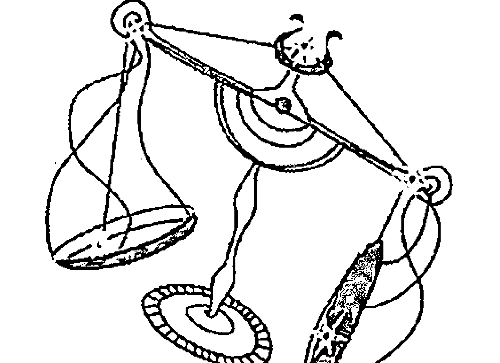

爱公正，爱和谐。爱正直，更爱优柔寡断。我不是和平使者，我只是左右为难。别妄想破坏我的温和与优雅，因为它们已经深入我的灵魂。我是天秤座。

## 常规天秤座特质解析

由金星和维纳斯守护的天秤座，爱好和平，追求完美，多外形出众，气质优雅，而且因为性格和善，在社会交往当中很吃得开。他们既善于倾听，也善于沟通，很注意谈吐的适度，话语从不过激，能够对他人的事情做出客观而公正的判断，是很好的“和事佬”，可是，一旦事情轮到他们自己身上，一双慧眼就成了“雾里看花”，看不清真相，从而在处理自身事务上面变得优柔寡断，找不到合理的方案，甚至会脑子打结，将事情变得更加复杂。这个时候，他们往往会采取逃避政策，回避相关的人事物，来个眼不见为净，极其任性和不负责任。

女神手提一架天秤飞舞于天际，人们便认为由她掌管的天秤座，是公平的象征，他们公正不阿，不循私利，善于调和人与人之间的矛盾。其实世界上哪来的绝对公平？天秤座人，奉行的是中国老祖宗的中庸之道——不评价对错，注重人与人之间的和谐关系。但在现在人看来，这样的天秤未免也太没有个性和立场，其实就连天秤本身，也常为自己总当老好人，总是左右摇摆不定的个性而苦恼。毕竟，这是一个张扬个性的时代，没有个性，就缺乏魅力。

没错，天秤的心中，确实有一架天秤，时时都衡量着周遭每个人的言行举止，也衡量自己或他人做每一件事的尺度，只不过，刻度的制定者是他们自己，这养成了天秤习惯用自己的标准衡量他人，甚至有将自己的想法强加于人的倾向。只不过，他们不会将这种想法表现出来，因为制造事端，是强调和谐关系，注重自己公信力的天秤绝不会去做的事情。表面上，他们仍然温文尔雅，平易近人，每说一个字都好像练习了几百遍的圆滑。

天秤的人缘极佳，但若论到真心朋友，恐怕一只手也数得出来，因为天秤是典型交人不交心的星座，他们深深知道如何通过保持距离，来维系与大多数人的融洽往来，而不会因为走得太近，彼此产生摩擦。这样的天秤，尽管是天生的外交家，内心里却仍然会感到寂寞。一个人的时候，会想方设法与人沟通，哪怕不见面，只是发发短信或者打个电话也好。

天秤们一生都在追求平衡感，希望自己是完美的，既不激进也不落后，既不过于安逸，也不会让自己置于危险之中，他们希望自己永远都能左右逢源，别人的一个“恶评”，也能让他们郁闷上很久，思考自己哪做得有问题，如何去修正。所以表面风光的天秤，其实在内心给自己上了重重枷锁，活得很累。说穿了，这世上哪有鱼与熊掌兼得的好事？不断寻找平衡点的过程中，不知不觉就迷失了自我。在深夜独自一人的时候，不禁会在心里自问“我是谁？我一直在为别人改变着自己的模样，我真正的模样又是什么呢？”然而这样的问题，根本就很难得到答案，反而会越问越纠结，最后只能像条滑溜的泥鳅，不断逃避现实。

天秤的情路也走得坎坷，原因仍旧在于他们想要寻求平衡。天秤容易出现花心情圣，不管男女，都喜欢和异性玩暧昧，即使结了婚，也不能终止他们处处留情的习惯。根本原因，还在于生活本来就只能“调衡”，而不可能绝对平衡，不知所措的天秤，就只好向外寻求慰藉和平衡感，自以为这种做法很聪明，其实傻得可以。

## 01. 从外交家的舞台隐退 气虚天秤

气虚天秤被关闭的星座能量：精力、活力、沟通能力

常规的天秤是颇有公心的人，热衷游走于各个社会场合，寻找今天或者明天的朋友，帮助熟悉或陌生的人解决困惑和烦恼，尽管其目的，是为了发现各种对自己有利的关系，进行重新“嫁接”，收为己用，以便不断扩大人脉。

气虚天秤就相对比较自我，他们会从天生外交家的舞台上隐退下来，投入一个人的平静生活。天秤喜欢扮演维护和平、维持正义的角色，这会为他们带来不可思议的满足感，而气虚天秤则会想，和不和平关我何事？我只要把自己的生活过好，就万事太平。

气虚天秤是“陌生群体沟通障碍者”，他们不喜欢也不擅长与陌生人交流，会紧张、不知说些什么，甚至在与人对话时，常常会出现牛头不对马嘴的情况。陌生的人越多，他们就越安静，越会寻找不容易被人注视的角落，甚至有的时候，会在群体聚会中缺乏存在感。

但是，气虚天秤倒是将常规天秤逃避现实的习惯给继承了下来，他们更愿意沉浸于内心假想的世界，而不愿正视现实中正发生的许多事情。

当遭遇了无法相处的人，不能解决的事，气虚天秤还会从亲友的视线中消失那么一段时间，或者选择“闭门”自省，或者出门旅游，反正能躲一时躲一时，能躲一世更是再好不过。

气虚天秤男缺少男子汉的霸气，又总是一副没啥担当的文弱书生模样，若在古代，倒也是连美女小倩都中意的才子模样，无奈这个时代“财”子比才子要受欢迎，气虚之后，就算是风流倜傥的天秤男，也很难再受到女孩子们的青睐。

常规天秤的另一个问题，就是他们太过在意细节，以至于经常做出丢了西瓜捡芝麻的糗事，气虚天秤却占尽了这方面的优势。气虚体质天秤，因为身体上能量的缺失，而放大了内心世界的能量，他们的思想境界不受局限，思考事物更接近于本质，注重宏观思维，相比之下，要比常规天秤的思路开阔得多。

## 02. 生活没有品质可言 阳虚天秤

阳虚天秤被关闭的星座能量：温暖、活力、沟通能力。

不甘寂寞的天秤总需要有人陪伴，除了热衷于参加各种聚会，还会经常呼朋引伴到家里来玩。平时，他们也不愿意一个人关在家里，哪怕只是出门闲逛，买上一堆没什么实用价值的琐碎物件，或者去喝一杯咖啡也好，只要是“人气”旺的地方，就会是他们的首选。而常年处于疲惫、怕冷状态的阳虚天秤，就算内心里渴望热闹，也是力不从心。

阳虚天秤，就是那一类陷入自己无法解决的事物不能自拔，从而选择逃避现实的人群。他们没有办法积极面对身体虚弱畏冷这个事实，努力增强运动来让虚弱的阳气“回温”，反正会自暴自弃，更加厌倦出门和与人交往，只会留在家里捂上厚被自怨自艾。一不小心就会放任自己的懒散，成为逃避工作、逃避人群的借口。

常规天秤向往美好的爱情，不堪忍受单身的孤独生活，但在婚恋之中，他们是独立者，不会过分地依赖于恋人，阳虚天秤则做不到这点。身体上的寒冷，会同时带来心的寒冷，这让他们更加渴望从爱人那里汲取温暖，却没有想过长久以来，对爱人的过分依赖，也会让对方感到疲累和厌倦。毕竟，结婚是为了互相取暖，谁又有足够的能量一直单方面地向你供给呢？

常规天秤注重生活品质，他们会将自己的居所打理得舒适且井井有条，会合理安排好自己每天的行程、目标以及休闲时间，当天秤遭遇阳虚体质，这一切的秩序都将被打乱。阳虚带来的倦怠感，使得生活本就没有品质可言，更不要说享受其中。一个典型的阳虚体质天秤，在入秋以后，活动地点基本就是室内，或者干脆就是铺着厚被的床上，门外的一丝寒气，在他们的身体上都会被放大，变得冰寒入骨，穿再厚的衣服也抵挡不住。

## 03. 最不怕事儿大 阴虚天秤

阴虚天秤被关闭的星座能量：包容、韧性、淡定。

缺乏团队精神，不懂得为集体负责任，是阴虚天秤与常规天秤的最大区别。常规天秤极有合作精神，他们了解团队的重要性，深知“一根筷子易掰折，一捆筷子掰不折”的道理，他们会将自己定位于人群中的弱者，需要团队的支持才能变得强大，而阴虚天秤基本上是白羊性格，他们相信只要自己足够强悍，就攻无不克、战无不胜。

善于倾听是天秤人缘好的一个重要原因，他们总是很有礼貌，哪怕只是假装的，看上去也是一副对对方的话很感兴趣的样子。而外向、好动的阴虚天秤更喜欢让别人倾听自己，总是控制不住地打断别人的话，强行穿插进自己的想法，如果被人拒绝，他们还会固执地问：怎么了，我只是想给你提一些对你更有利的意见，我可是为了你好。

常规天秤爱好和平，或者说只有和平的人际关系才让他们觉得安全，一点点火药味都足以让他们感到不安。但阴虚体质天秤，却偏偏成了最不怕事儿大的人。他们打破了常规天秤一生都在辛苦维系的平衡点，开始有了明显的个性和棱角。一旦天秤遭遇了阴虚体质，再也别妄想招惹了他们之后，简单的一句道歉就换来他们微笑地说：“没关系。”性情急躁易怒的阴虚天秤正处于气头上，非要跟你较劲到底：你为什么那么说话？你对我不满是吗？想打架是不是？告诉你，哥不怕！当然，除去这种要不得的急躁特质，阴虚天秤有主见这一点，还是值得其他天秤借鉴的。尽管阴虚天秤有时会鲁莽行事，顾前不顾后，但这样的人也同样富有创新精神，有突破现状的勇气，具有领导才能。

常规天秤很少会对别人的请求说不，不管这请求是不是合理。他们可是维护和平的天秤座，怎么能够因为自己的拒绝而打破朋友间的平衡状态呢？他们也不善于拒绝别人的示好，哪怕自己已经有了婚恋对象，还是会对追求自己的对象，摆出模棱两可的态度引人误会，引起桃色风波不断，其实他真的什么都没做。但是阴虚体质天秤却学会了说“不”，他们是奉行独立，自己的事自己做的天秤，最讨厌替别人背负包袱。偶尔一两次确实需要他们帮助没问题，但若将此当作常态，那可别怪阴虚天秤不客气地对你说：不要有事就找我，我又不是你的佣人。

犹豫不决、优柔寡断是常规天秤的最大弱点。他们总是能把简单的事情复杂化，把单选题变成多选题，然后皱着眉头在心里反复掂量，难以抉择。越是紧急的事情，就越会让他们踌躇不定，难以下判断，只能像热锅上的蚂蚁一样，满屋子乱转。而阴虚体质天秤则是能够果断做出决定的那一个人。其实所做的决定是对是错又有什么关系？人不可能每一个决定都是对的，只要保证大多数正确，你就仍然是赢家，又何必自寻烦恼呢。

天性浪漫的天秤，在为爱人制造惊喜这件事上从来不怕麻烦。他们懂得讨好恋人，才能在婚恋关系中，最大限度地扩大自己的自由度。尤其是天秤男，常被骂花心也不是没有道理。尽管不是每个天秤都花心，但是花了的天秤，是极其懂得如何用浪漫招式安抚老婆的，以便获得更多的自由，发展外面的“彩旗”。就算被老婆发现，他们也还是有办法哄得老婆大人开心，让她放下芥蒂。天秤注重家庭的和谐，如同他们注重任何关系的平衡，所以不管在外怎么混，也轻易不会选择离婚。而没什么耐心，烦事怕麻烦的阴虚天秤，平时虽然也会制造一些小浪漫，但需要花费耐心的实实在在是做不来，就算是花了，就算是被老婆发现了，忍着性子哄上两句，再不行他就要翻脸，惹得老婆也跟着翻脸离家出走、闹离婚，才为自己的草率捶胸顿足。唉！早知今日，何必要有当初呢？

## 04. Mr.懒 痰湿天秤

痰湿天秤被关闭的星座能量：执着、信念。

跟常规天秤过日子，真的是比较考验人的一项“工作”。他们在外严守自己的谦谦君子风度，回家却像泄了气的皮球一样，萎靡不振。就算是周旋于人际关系消耗了太多的脑力和体力，但是一点家务都不帮忙做，就有点让人看不过去。而痰湿天秤的懒，更是到了让人看了冒火的程度。一个人的痰湿天秤，家里通常乱得除了他自己，别人进来都不知道坐哪儿好的地步，一般情况下，只有床是最清静的，因为那上面如果也堆满了不知是干净还是脏的衣服，那他们就没有躺的地儿了。睡觉之所的舒适程度对他们而言，比任何地方的整洁都来得重要。如果是两个人过日子，拜托、拜托，千万不要是两个痰湿体质人过日子，不管他们各自是什么星座，都会在家务上互相推诿，连洗碗都要推来推去，或者总是今天晚上吃完饭，明天才洗碗。

天秤的优柔寡断会在遭遇到痰湿体质之后更甚，心思更加缜密，考虑的事情更多，牵绊前行脚步的事情也就更多。他们更加不善于做出决策，更少了一些爽快，与他们办事，常常会对他们的“墨迹”无可奈何。

与同样是金星守护的金牛座比起来，天秤的踏实程度差太远了，他们做事马虎，很少善始善终，也不懂得对他人负责。痰湿体质天秤则更趋于稳重，做事更加认真负责。

天秤对于他人的嘲讽，很多时候比较白目。要对他们提意见，麻烦你明说，夹枪带棍，指桑骂槐，他们不见得听得出来，反倒你自己容易郁闷到得内伤。这一切皆因天秤自恋的程度仅次于水瓶——他们是天秤啊，公正的象征，怎么可能在自己身上出现瑕疵呢？但这种“白目”却给了旁人以与世无争的假象，认为他们不与人争强，也不记仇，其实他们压根儿就不知道被人家的矛指着，又何来记仇之说。而痰湿天秤则是真正的胸怀宽大了。因为痰湿导致的肥胖，让他们没有了天秤们最引以为傲的外在资本（天秤可是最容易出现俊男美女的星座）。尽管少了自信，但也未见得是坏事，他们藏起了灵魂中浮夸的一面，变得低调而内敛，总能清醒地意识到对方的赞美究竟是真或是假，是真正的夸奖或是讽刺，但即便知道了真相，也会选择宽容一笑，特别是对于不重要的人，更是懒得花心思去琢磨对方的出发点是什么，倒显得话里藏刀的人幼稚。

## 05. 严苛的“执秤人” 湿热天秤

湿热天秤被关闭的星座能量：包容、豁达。

湿热体质天秤，是更为严苛的“执秤人”，对于爱人和朋友的筛选，在他们指定的刻度上，差一个准星都别想过关，他们的挑剔简直就不输处女。不是很善于言辞的湿热天秤，默默用心里的天秤去衡量你时，那副沉默高深的样子，还真让人有点心惊胆战。做湿热天秤的朋友或恋人都不容易，因为他们用来衡量你的那架天秤，随时都摆在心里，不高不低……

常规天秤内心有着超乎寻常的正义感，对不公之事会表现得愤愤不平，但也不知道是这个时代造成的，还是他们早已看透了人生冷暖、生死伦常，或者本来就只是内心的勇者，现实世界的胆小鬼，就算他们再愤愤，大多数时候也只是冷眼旁观，而不会像白羊那般冲动地站出来主持正义。湿热天秤就更别说，面对身边的不公，急得眼睛都红了，却还是不知道被什么样的力量控制着，做不到挺身上前。反而还会因为见证了这世界有太多不公，而变得有些厌世，偶尔微博、QQ上发发牢骚，一派忧国忧民的样子。搞不懂他们在想什么。尽管拿着象征公正的天秤，但是如果让天秤们从事司法相关的工作，他们是不是能做到勇于主持正义，还真是个未知数。

在感情上，湿热天秤也会遇到麻烦。本来就对伴侣比较挑剔的他们，因为心烦和暴躁，更是少了对另一半的理解和包容。其实他们是那么的厌恶争吵，但是体质决定了他们很难控制消极的情绪。在和伴侣争吵以后，会非常难过和内疚。

## 06. 更不懂变通 血瘀天秤

血瘀天秤被关闭的星座能量：圆融、乐观。

常规天秤们聪明，领悟能力极强，而血瘀天秤则显得呆呆的，反应速度慢不说，还健忘。因循守旧也是天秤的一个弱点。他们习惯按自己的标准办事，不喜欢开辟新路径。血瘀天秤更加不懂得变通，甚至是固执。在工作上，他们也比较死板，缺乏创新精神和优秀的点子。

当血瘀天秤需要做出选择的时候，会非常痛苦。表面上他们是在思考如何抉择的模样，实际上脑子已经转不动了，越琢磨越觉得心烦，索性一拖再拖，甚至置之不理，由着它去。

浪漫的天秤们总是有办法给心爱的人制造惊喜。但血瘀天秤想不出太多的小花样来哄对方开心，也显得更加实际了。而且，固执的他们总是用自己的条条框框去限制对方。稍有他们认为不妥的地方，就会生气，弄得双方都感觉很累。但是，在感情方面，血瘀天秤更容易坚持自己的立场，不再因为寂寞而轻易地爱上谁，他们懂得在心里默默地对对方进行一番考评，再决定两人是否合适，能否一起走下去。而且血瘀天秤多了一股倔强和坚忍，在困境中，不轻言放弃，会选择坚持下去试试看。习惯顺从的天秤，即使自己有更妙的主意，还是会遵从他人的意见。而血瘀天秤比较固执，会坚持自己的看法，也多了打破沙锅问到底的精神。

## 07. 更愿意一个人待着 气郁天秤

气郁天秤被关闭的星座能量：乐观、开朗、沟通能力。

善于交际和热爱沟通的天秤们，一直给人以阳光、明朗的形象。但在遭遇了气郁体质之后，内心的阳光就仿佛被乌云遮住了，整个人变得阴郁而沉默。天秤原本是极善于自圆其说和自我开解的，很少任由自己陷入长时间的纠结当中。而气郁天秤则变得容易钻牛角尖，跟自己较劲，比如今天的衣服没穿对，会让他们郁闷；袜子配得不合适，路人甲好像瞅了他一眼，也很郁闷；去饭店没有吃到想吃的菜，实在太倒霉、太郁闷了……简直无事不闷。在与朋友相处时，气郁天秤也失去侃侃而谈的兴致，总是坐在角落里一副闷闷不乐的样子，朋友问他怎么了？一律回答没什么，然后接着闷闷不乐。

天秤们是典型的乐观派，喜欢将事情往好的方面想，但这其中一定不包括气郁天秤，他们总是时而乐观一点点，时而悲观到极点，总体来说，悲观的时候大于乐观，或者说他们在微笑和与友人看似愉快攀谈的时候，其实心里也还在悲观。

处理感情问题的时候，气郁天秤不仅敏感，而且易怒。他们心中积攒的郁闷只能和最亲近的人发泄，所以气郁天秤的伴侣一定要有豁达的好脾气，懂得包容你敏感的爱人，慢慢去疏解他的郁气，不然这份感情难以长久。气郁天秤也更为智慧，只要他们愿意用心倾听你说话，总是能敏锐地抓到重点，知道你缺少什么，想要什么。与聪明的他们交谈，真是无需多言，一点就透。只不过更愿意流连于自己世界里的气郁天秤，实在很难得会与人倾心交谈。

常规天秤像是漂亮的孩子，你看他们一眼，就会为他们的阳光、开朗或者被他们俊美的外形所吸引，可谈之无物的天秤也真的不少，越是深入交往，越会觉得，此等人类，只可远观，不可亲近。而气郁天秤却比常规天秤多了一分内涵与雅韵，他们是天生的艺术家，就算不刻意去写诗作画，也不知道怎么就有那么一股子才气，与他们交谈，尽管有时候被他们悲观的性格搞得自己也很伤感，却还是会沉浸于他们娴静、幽然的气质和谈吐之中。

## 08. 极品守规一族 特禀天秤

特禀天秤被关闭的星座能量：洒脱、豁达。

敏感的天秤座，一生都在小心翼翼地保持着内心的平衡感。稍有风吹草动，他们就会调动所有的感官来应对变化。特禀天秤更加敏感，达到了多疑的地步。他们无法迅速适应意料之外的变化，因此只好总让自己处于高度戒备的状态。

不能否认天秤有极佳的人缘，但是他们不够坦诚的特点，也很难让人对他们敞开心扉。特禀天秤的内心更加敏感和复杂，再加上他们喜欢用自己的标准衡量别人，会显得有点小心眼，不够爽快和豁达。

常规天秤拥有敏锐的眼光，对外界信息的捕捉犀利而准确。比如，他们能用最短的时间感应到谁是志同道合的朋友，谁又对自己不怀好意。特禀天秤就像是装有雷达一样拥有“超感应”，无时无刻不在感知环境的变化，以便在引起他们过敏反应的事物出现之前，第一时间做好防护。这也让他们对谁是真正的朋友，谁又是伪善的说谎者能够迅速洞察。总之，活得有点辛苦。但这却能够让他们在聊天过程当中，就将对方的心思摸了个六分透，很容易成为别人的知己。心思极深的特禀天秤，也常因思虑过度而感到疲惫。

## 09. 一不小心就成享乐主义者 平和天秤

不管体质多么健康，也很难改变天秤们优柔寡断的性格。健康乐观的平和天秤，在面对选择时，仍然犹豫、徘徊着，难以做决定。到最后，要么胡乱做出选择，要么干脆放弃，等着船到桥头自然直。说真的，平和天秤真要开始锻炼自己的毅力，再这么纠结下去，也很可能转变为气郁天秤。

平和天秤的人生大概过得太过顺遂了，不小心就让他们成了享乐主义者。除非特别感兴趣的工作，他们基本不会投入过多的热情和精力在事业上面，他们对事业完全没有野心。一旦工作进入瓶颈期，平和天秤们才不会像金牛那样低头闷挺，说什么也要克服过去，他们会选择放下工作，出去潇洒游玩一番。自在是自在的，但是得不到成长可是自己的事，总不能一辈子做个要宠的小孩子吧？

体质的平和，阻止不了天秤容易感到空虚和寂寞的特质，仍然少不了朋友的陪伴。对于他们来说，与人充分的沟通和交流是必须的，朋友就是要多，不同的心情可以向不同的朋友倾述，不同的朋友能提供不同的帮助。好吧，他们把大部分时间都用在了联络友情上，难怪对事业那么不上心。只是看起来朋友很多，知心的究竟有几个？

# 天蝎篇

10月24日~11月22日

位置：黄道第八星座
属性：水象星座

爱孤僻，爱幽静。
爱毒舌，爱犀利。
不犀利不要钱。
爱真情，也爱绝情。
其实我不毒，但我天生尾上长针且带毒。
你让我怎么办？
外在装十三，内心小澎湃。
我，就是天蝎座。

## 常规天蝎座特质解析

蝎子属于水象星座。至刚至柔的水，在秋末冬初之际开始走向沉静与寒凉，奔腾跳跃了一夏的躁动归于静寂，开始为冬的收藏做好准备，也让在这个走向内收季节出生的蝎子，有了与生机旺盛的白羊和双子截然不同的沉静气质。

他们的性格趋于内敛，没有收尽的余热透着属于秋的冷静，以及如秋般肃杀地面对生命的坚定和执着。

蝎子们才华横溢，敏感而孤傲，同时具有勇敢、优雅、爱憎分明的特质。

蝎子强悍的外在，如同他们内心的坚定，对自己所选定的工作抱有永不歇灭的激情。他们能勇敢地面对失败，坚持自己的主张，不怕所有的反对和阻挠。

天蝎喜静，喜好清幽，心胸高妙，忍耐力极强，追求完美。在蝎子们身上，气质与才华相得益彰，他们有着极准的直觉和判断力，钱钟书便是最典型的例子，敏感聪明之外，其看透世间真相的睿智与冷静，也让他散发出无穷的魅力。

情感方面，天蝎都是极端的完美主义者。爱之深，恨之切。天蝎追求灵肉的完美结合，来不得半点杂念，所以蝎子们的醋劲儿，也就可想而知了。蝎子在爱情中是主动的，因为其坚韧的性格，认定了，便绝不放手。当然，充满魅力的蝎子们有着迷倒众生的眼神，在爱情的追逐战中，他们是不败的。重要的是，蝎子的内心具有高度责任感、忠诚度、自律性以及矛盾性，对于爱情或友情，他们都是苛刻于质量而不求数量。朋友，知心一二足矣。

### 01. 消失的王之气场 气虚天蝎

气虚天蝎被关闭的星座能量：精力、胆量、沟通能力。

蝎子本就是生存于沙漠地带的天生王者，环境，造就了他们比万兽之王狮子还要坚韧和倔强的生命，尽管个头不大，但气场十足、让人畏惧。天蝎，秉承了这种王者风范，他们的魅力，仿佛强大的黑洞，一旦被吸住就很难再离开。遗憾的是，气虚蝎子除了人格上仍保有了蝎子的冷静和坚韧，周身带有魔力的气场，却完全消失了。非但性格变得内向而保守，也没有了那专注迷人的眼神，和摄人心魄的神秘气息。他们变得更像处女，安静，不着痕迹地守在角落里，即使从人群中悄然隐退，也不会被人注意。

蝎子外表静默，内心火热，在自己投身进去的事业中，勇敢而充满激情。然而受气虚的影响，蝎子必胜的信念不再那么坚定，他们会保守地估计和处理手头的工作，没有了不达目的誓不罢休的狠劲儿。

气虚天蝎逃避人群，不喜欢人多热闹的地方，聚会时，会更愿意坐在安静的角落，他们虚弱的气场，无力的话语，消去了属于蝎子的磁力，无法像常规蝎子那样，就算坐在角落，也能轻易引人注目。当然，作为气虚蝎子，大概还享受于这种不被人瞩目的感觉，可是别忘了，想要吸引到心仪的另一半，也变得更加困难。

常规天蝎孤傲，多少有几分让人无法接受的自以为是。他们是世界的观察者，不轻易发言，只在内心审视评价一切观点，但从不怀疑自己作出判断的准确性，犹如他们追捕猎物时，从来不会怀疑放射出的速度与毒力，一定让对方一击毙命。可是再精准的枪手，也有失利的时候，盲目自大，容易让他们有时候跌入陷阱也不自知。气虚蝎子则长于内省，相比之下，多了几分淡然，尽管他们的态度依然清高，性格仍然过于执拗，却大大收敛了内里悄然生长的狂妄。变得没有那样强势。

### 02. 与世隔绝者 阳虚天蝎

阳虚天蝎被关闭的星座能量：胆量、沟通能力。

蝎子的魅力在于那若有似无的距离感，他们眼光闪烁，总让人猜不透心里在想什么。在很多时候，为了拉拢人脉，常规蝎子是会主动和人攀关系、拉交情的，只不过，不管他们再怎么掩饰，那种骨子里的高傲和淡漠，还是会让人一眼看透。他们防着别人，别人也防着他们。而阳虚蝎子，更是将这种“冷”发挥得淋漓尽致，对周遭的一切表现出漠然和抗拒，只有最亲近的家人和朋友，才能享受到片刻温情。

与常规天蝎不同的是，阳虚蝎子不再关注世界的变化，属于蝎子的野心也消失无踪。不再拼尽全力追求更高的成就，只要安然地过着自己的日子就好。他们更像退居远山的蝎子，失去了王者的霸气，变得对这个世界无话可说。

### 03. 是谁“煮”的你 阴虚天蝎

阴虚天蝎被关闭的星座能量：冷静、理性。

阴虚蝎子，是冷漠蝎群里的变异者。他们可以在气急时，不顾形象地暴跳如雷，也可以在起争端时，幼稚地对你发脾气，让你哭笑不得。不得不怀疑，这真的是那个成熟又冷漠的天蝎吗？天蝎的魅力很大部分就来源于其不可知性，当阴虚蝎子也变得张扬外露时，蝎子的神秘感就像被浇了一盆冷水，瞬间化身凡人。

看过那则退烧药的广告吗？一只螃蟹在遇到另外一只外壳通红的螃蟹时，用憨爽的东北话说：“咋的了哥们儿？被煮了噢？”遭遇了阴虚体质的天蝎，就有如那只被“煮”了的螃蟹一样，性格色彩从象征冷静、淡漠的黑，转变为象征热情、冲动的红。被“煮”的蝎子，不再是那个坐在一个明暗模糊的背景前，冷眼看世界，一句## 04. 失踪的神秘气息 痰湿天蝎

痰湿天蝎被关闭的星座能量：执着、信念、魄力

蝎子们注重自己的形象，他们可以不美丽和帅气，但一定要干练整洁，万万不能被人看了笑话，偏偏一个痰湿蝎子，那胖胖又油油的脸颊，憨憨的笑容……大概会让作为蝎子的灵魂深感沮丧吧？

其实每个人都有一个真实的自己，它像果核一样，被重重遮掩和包裹，以至于有时候连自己也忘记了，真正的自己应该是什么模样。

痰湿蝎子，将原本属于天蝎的优雅、深沉、冷静，一概埋藏，反而多了几许谦恭和亲和，有一副好脾气。现在，你有没有想到陈升，一个天蝎座的歌者？升哥有胖胖可亲的笑脸，柔和的线条圆润了蝎子的坚毅和冷酷，可他仍然迷人，因为这不妨碍他有蝎子的灵魂。

痰湿蝎子在失去神秘气质、俊酷外表的同时，性格也变得更为保守而退缩，藏起了渴望成功的那一面，没有什么宏大志向，安于平淡的生活、工作、婚姻。不要看痰湿蝎子一副憨憨的样子，他们大多都有较深的城府，只不过眼界的不够开阔，让他们通常只是耍点儿于己有利的小心机，如果放开胆量，将其应用于事业版图，同样会获得惊人的成功。

其实，体质是可以调整的，关键看你能够付出多少的努力。只要足够用心，恢复常规蝎子的身段和气质，指日可待。

### 05. 腹黑 “雨林蝎” 湿热天蝎

湿热天蝎被关闭的星座能量：魄力、率性

天蝎是个神奇的星座，自古多有艺术家出自其中。可当湿热缠绕天蝎，天蝎的艺术气息，也会被暗黑湿气遮挡。

湿热天蝎将变得更加阴郁和腹黑，他们就像一种叫 “雨林蝎” 的蝎子一样，习惯躲在暗处。

蝎子本就是夜行动物，而湿热蝎子更是典型的夜行族，如果不是需要上班，宁可白天呆在家里睡觉，晚上再出来活动、觅食，夏天的大排档最常见到他们的身影。

都说 “男人不坏女人不爱”，天蝎这个原本坏到好处的 “抢手货”，也在成为湿热体质之后行情下滑。当然不只是因为湿热体质所导致的皮肤粗糙和青春痘，让他们没有了姣好的面容，更是因为他们阴郁的内心世界，让外人很难接近。

对于天蝎来说，这个世界上是没有什么能够阻挡他的，偏偏湿热体质让他像陷入了泥沼般不得伸展。

《解密中国人的九种体质》一书中，形容湿热之人，“因于湿，首如裹”，就是说湿热体质会让人的头部像是被什么裹住了一样，混沌、沉重，这对一向头脑冷静的天蝎来说，是个沉重打击，会让他们变得更加烦躁，脾气越来越大，不满也越来越多。这种内心的压抑和不满，化为言语，就会黑暗且带刺，让关心自己的人最终也无法忍受，纷纷走避。

### 06. “第六感罗盘”失灵了 血瘀天蝎

血瘀天蝎被关闭的星座能量：敏锐、冷静

天蝎座通常很敏感，传说中具有神奇的第六感，通常能准确且灵异地辨别事情的好坏和事情发展的方向。所以轻易不要惹精明的小蝎蝎，他们会一眼就看穿你的伎俩哦！可是，当天蝎座的灵魂，被装入血瘀体质的身体时，这敏锐的观察力和洞悉人心的眼，就像捉迷藏时被蒙了纱布一样，一片漆黑，事情的预测能力下降，同时辨别是非的能力也骤减，很容易就掉入别人的小玩笑和陷阱中。

本来很敏感的天蝎，在感情方面，凭借第六感这个“罗盘”，本该顺风顺水。可当血瘀体质出现，罗盘失灵了，感情危机更是变得不可预期——血瘀天蝎，不再是那个能将爱情掌控在手里的人，他们开始变得茫然和不安，不确定自己爱的人是不是对的，是不是适合自己的，更加不确定一份感情最终会走到哪一个方向。

天蝎座的性格专横且富有神秘色彩，很难从平静的外表看到内心世界的全貌，自我保护意识极强的血瘀天蝎，更加凸显了这份神秘味道。

都说男人喜欢雾里看花，朦朦胧胧别有一番滋味；女人喜欢故事中的神秘黑衣男子，渴望突然惊喜带来的刺激与甜蜜。血瘀天蝎恰好就有这种隐约的潇洒气息，让人好奇到欲罢不能，倒是很有可能会为自己增添不少令人羡慕的桃花运。

### 07. 最神秘的天蝎 气郁天蝎

气郁天蝎被关闭的星座能量：理性、勇气、沟通能力

以天蝎的聪明，早看清了人生就是一个大游戏，于是为人处事圆滑周到，只有比他们更聪明的人，才能看透那和善、亲切的表象下，一颗冷眼旁观的心，在你感动于他们的善意时，早已将你分析透彻。于不管谁提到天蝎的名字，都要附加一个词汇——神秘。

而气郁天蝎，无疑是天蝎家族中，将神秘气质表现得最为淋漓尽致的一个，同时，也将蝎子们的阴暗面发挥到极致。

他们是忧伤而冷漠的，不多话、不爱笑，讨厌管闲事，常常静静地看着细雨或落花，心底就生出一种悲观阴暗的情绪。这样的情绪，也给了他们一双冷漠而充满哀愁的眼睛。在他们注视你的时候，你会觉得那双眼里，如同藏了一个大秘密，忍不住想要与他们攀谈，去看一看，到底是一个什么样的秘密。

只不过，气郁天蝎没有了常规天蝎向这个世界挑战的勇气，或者说，他们是不屑于向世界挑战的，他们更乐于独善其身，沉浸在自己的世界中。

### 08. “龟毛”升级版 特禀天蝎

特禀天蝎被关闭的星座能量：洒脱、无畏

蝎子的讲究和怪癖多得不胜枚举，轻微洁癖、苛求完美，还时常喜欢裸睡，偶尔会失眠或者嗜睡，在家不喜欢穿正常衣服，好做梦，喜欢收集小东西，买没用的东西等等。
各种说不清的小习惯构成了“毛病多”且略微龟毛的天蝎。

但说到最高级的“龟毛蝎”，还得说是特禀天蝎。因为体质导致过敏的他们，惧怕小猫小狗的接近，讨厌花……一切都是过敏惹的祸！
至于洁癖就不用强调了，有洁癖的特禀天蝎简直就是极品，甚至有超过处女龟毛的程度。

特禀体质在无形当中，还有可能成为恋人间亲密接触的拦路虎，动不动就鼻涕横流，疹子狂起，巨痒难耐，什么小亲亲，碰触、拥抱，自然免谈。

### 09. 同时兼具三个要死 平和天蝎

平和体质是相对健康的体质类型，不会抑制和影响天蝎优势的发挥，反而起到推波助澜的作用，将属于天蝎的优点毫无保留地展现出来。

很多平和天蝎都是搞笑幽默的中心人物，他们待人忠诚且不能容忍背叛，同时兼具三个“要死”：心眼小得要死，大男子（大女人）主义得要死，自以为是得要死。和他们谈天谈地，谈人生理想都随意，但是遇到有分歧的地方可要小心了，他们可不是容易说服的主，如果不顺着他们的意思，翻桌子、翻脸比翻书还快，通常就因为这个自以为是的自认死理，惹恼了很多本来志同道合的朋友。

感情方面也是这样，在婚恋关系中，他们希望永远都是自己主导，自己永远是正确的，永远是对方眼里的圣经，殊不知这样的想法就好比抹杀了恋爱双方磨合的乐趣，成了自己的单方面情感，多半会导致不欢而散的悲惨后果。

平和天蝎所散发出的傲气和自信让人自愧不如，运筹帷幄的能力也让人钦佩。需要特别注意的是，拥有平和体质的天蝎，那份自大一个不小心就变得更加放肆，就算再开朗幽默，也会因为自我膨胀得过于夸张而让人难以接受。

# 射手篇

11月23日 ~ 12月21日

位置：黄道第九星座
属性：火象星座

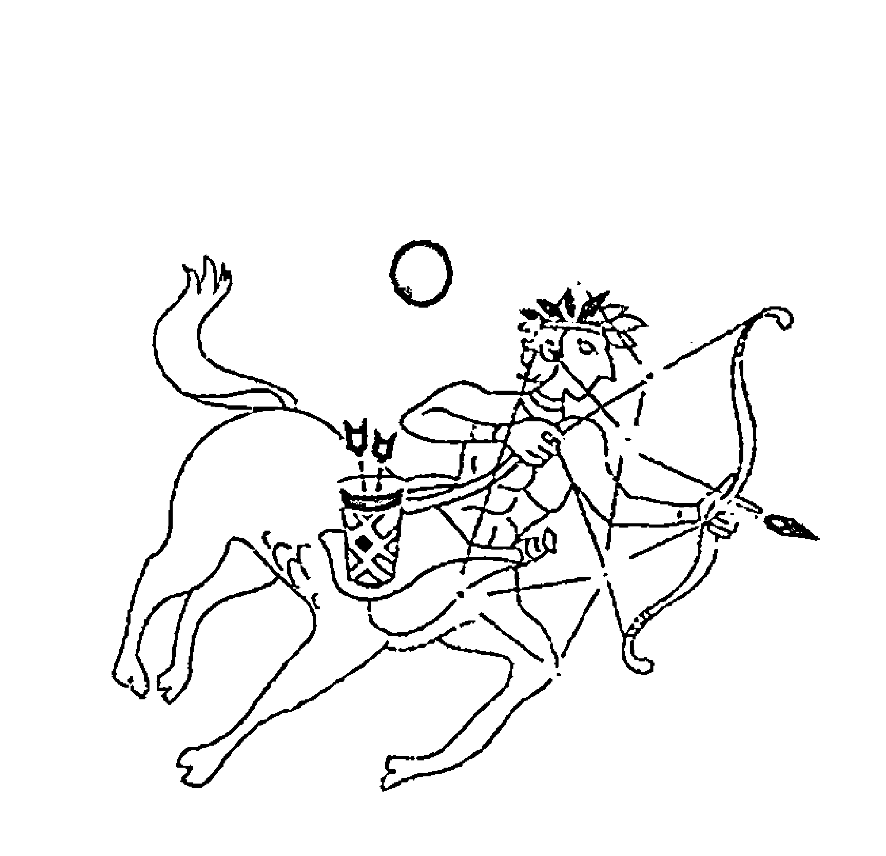

- 爱自由，爱忧伤。
- 爱直率，爱浪漫。
- 有品味，有个性。

不要叫我小资，我只是以我的方式细品生活，
我是射手座，我骑马的。

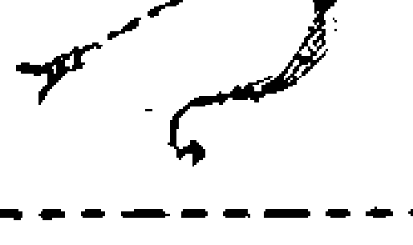

## The Secret of Stars

## 常规射手座特质解析

射手理想色彩浓厚，不按牌理出牌，情绪的多变像瓦斯一样，爆发毫无预警，来得快去得也快。射手通常被描绘成“张弓欲射”的猎手，但他们追寻的不是普通猎物，而是更高的理想目标。

火象射手的实质，就像火焰一样，激烈、热情、难以掌控，有随时乘风肆虐的架势。

射手思维敏捷、飘忽不定，情绪变化经常大起大落，常常是早晨你还看到一个嘻嘻哈哈、莫名其妙乐得冒泡的射手，到了下午他又忽然一副默默不语、郁郁寡欢的模样，实在让人摸不透。要跟上射手的三级跳思维不是件容易的事，当你还在喋喋不休地谈论一件事情的时候，他的脑袋里大概已经万水千山了。

“好奇心能杀死猫”，但吓不倒射手们，他们天生充满好奇心，未知的探险旅途会让他们两眼放光、一顿澎湃。射手天生乐观，行动力强，一旦坚定信仰，甭管前面是坦途还是刀山，都阻止不了他们一直向前，越挫越勇。

他们开朗、幽默，是朋友圈里的开心果，总能吸引众人的目光，虽然他们的特立独行有点儿让人头疼，经常做出一些惊吓大众的举动，让人惊讶和感叹是他们的拿手活。射手对自由的向往和追求是永无止境的，“人生得意须尽欢”是他们的座右铭，他们讨厌束缚，任何让他们觉得有碍自由的牵绊，都会毫不犹豫地斩断。

射手也是最“没眼力见儿”的人，很少顾及周遭的情况和他人的心情，常常是自己的事做完了，才可能抬抬他们那高贵的眼皮，瞄你一眼。射手还是典型的理想主义者，有高远的人生信仰，于是又成为了爱幻想的射手，在他们的幻想世界中，他们可以像没线扯着的风筝一样，自由自在，想怎样就怎样，老爸老妈、亲密爱人一概管不了他。奇怪的是，他们可以承受幻想世界的风吹雨打，不管什么事、什么人，都别想阻止他们向理想前行的脚步，面对现实中的困难和阻碍却极其容易打退堂鼓，每每受到现实的打击和伤害，就像个委屈的孩子，自己躲去角落里画圈圈，一副被全世界抛弃的样子，偶尔回过头给你看看他那张悲摧泪流的脸，让观者的额际挂满黑线，是不是真有这么严重啊？

变幻莫测的火象射手是隐性完美主义者，他们心里有一个高得恐怕连自己也难符合的标准，用放大镜式地挑剔，衡量一切。面子上和谁都过得去，其实没几个人能让他们看在眼里，要让他们觉得“嗯，这个人还不错”，实在是不容易。这种高傲自负的表现，偶尔会出现在他们看似随和的表情和言谈里。他们的挑剔简直直逼处女，无法忍受别人品性、道德、言行上的瑕疵，其实反观自己，你又给自己打几分呢？

那种活在自己世界中的自由特质，让他们显得自我、自私，不顾及他人感受，常常伤害朋友甚至亲人却不自知，如果你对他说：“你伤害我了。”他还要委屈反驳，怎么可能？我可是处处都想着你。但诚恳是射手的极大优点，一旦他们真的认识到是自己的错，也会爽快道歉。

在情感面前，射手是伪装高手，明明非常在乎、放不下却又要死撑到底，假装不在乎、无所谓。完全是小朋友摔了一跤，怕人笑，怎么也不肯喊疼掉眼泪的心理。热情似火的射手隐藏着一颗孤寂的心，他们不会适时地装傻，也不擅长表达悲伤，在众人面前都是一副开朗活泼的面孔，待午夜梦回脱下面具后，才独自伤心忧郁。

射手在交友方面戒心很重，很少在内心认可他人之前，展示自己真实的一面。如果你认识的射手永远都是一副开朗、乐观的样子，那证明你和他的关系并没有你想象的那么亲密。“爱我就给我自由”是射手恋爱时经常说的话，一个总是打电话、发信息询问射手在干嘛的恋人，只会让他们飞快地逃走。虽然大多数时间都只考虑自己的射手，对恋爱目标总是换来换去，但他们内心又渴望有一个人能让他们安定下来，一旦确定目标，浪漫多情的射手会使出浑身解数让对方幸福，转而成为有着传统爱情观、可靠的恋人。独特神秘的人总能吸引射手的注意，会挑起他们喜欢探险的好奇心，而独立有个性的人能够让动荡的射手觉得踏实安稳，长久相处下去。

# 射手篇 11月23日-12月21日

# 中国人九种体质之揭开星座密码

### 01. 活得越来越不现实 气虚射手

气虚射手被关闭的星座能量：精力、活力、胆量、沟通能力

火象射手本应具有外向、活跃的特质，再加上射手本身就是“人马”的健壮形象，让射手们大多身材健美，体力充沛，而且极喜欢运动，网球、自行车等运动。但气虚体质射手，不只外表上没了健美形象，变得白泡泡软绵绵，性格也从乐观开朗变为内向、安静。虽然气虚一点都不会影响他们的聪明才智，灵敏思维仍然一会东一会西的飘忽不定、活跃异常，各种小聪明、小点子层出不穷，但大多数时候，会因为气虚的身体无力将想法付诸行动。需要提醒射手的是，你的减肥手段有时候过于激烈，会从减食上下手，只吃水果不吃米饭，甚至可以每天只吃一顿饭，这将成为你转变成气虚射手的主要原因。

气虚射手将更容易产生消极的想法，气场不足的他们在人群中容易成为沉默寡言、格格不入的一类，让人难以靠近，甚至觉得他们很奇怪。他们失去了常规射手会在人群里散发出的独特魅力，活得越来越不现实，难免会曲高和寡，尽显寂寥。没有了洒脱、自由的豪情，气虚射手更像是被捆绑的兽，理想高远，却热情不足，工作上往往不能得志。

气虚射手更善于将自己彻头彻尾地伪装起来，他们不爱说话，不爱参加集体活动，很少与人交流，甚至很难让人想到这就是那个乐观、开朗、少根筋的射手。气虚的射手更难让人靠近，说话声音低弱的他们，更显冷淡，总让人觉得跟他们相处，自己简直就是剃头挑子一头热，很是不爽。这样的射手容易在不知不觉中得罪人，也会失去真心关爱的朋友。气虚射手在恋爱中会让对方摸不着头脑，不知道他们在想什么，无从下手。有时觉得他们很近，有时又觉得很远，实在是交往起来很累人的一类。

虽然气虚让射手失去了火象星座独有的激情和活力，但是偏于安稳的他们也有很多可爱的地方。好奇心和探险精神都有所收敛的气虚射手，变得更为沉着，有更强的洞察力。他们也不会再像常规射手那样，虽然在生人面前很“假仙”，一副淡然冷静的样子，与熟人相处时会夸夸其谈到让朋友也觉得他们有些浮夸。气虚射手将更懂得倾听他人说话，而不是抓住机会发表自己的观点，而且变得话少的射手，偶尔说出那么几句话来，还真是颇有智性和分量，不禁让人刮目相看。而且言语不多的他们，细细品味，还多了几分天蝎才有的神秘味道哦。

气虚射手，也略微调整了常规射手喜欢对人挑刺儿的心态。尽管他们对能成为自己朋友的人，设门槛仍然高得吓人，但会试着从内心里，接受不同的意见、不同类型的人，只不过偶尔出现的冷笑、不屑，对别人的衣着或做事方法觉得不可思议的表情，还是收一收为好。大家都不傻，每个人都有每个人的个性，如果不懂珍惜别人的好意，再热诚的心，也会冷得彻底。可不要当那种相处越久，越能被人家看到真实的你，进而对你敬而远之的人哦。

### 02. 你爱也好，你也可以不爱 阳虚射手

阳虚射手被关闭的星座能量：温暖、胆量、活力、沟通能力

活泼好动的常规射手，在遭遇阳虚体质后，变得喜爱安静，受不了吵闹。也让总在感性与理智间挣扎的常规射手变得更加冷静和理智。阳虚射手与气虚射手相似的地方是，他们都有沉静的外在，话语不多，却总能一语中的。只是，有时候难免受阳虚体质导致的压抑情绪影响，不大说好话，喜欢抱怨生活，抱怨别人，难免让人觉得不可理喻。

表情淡漠的阳虚射手和开朗、幽默不沾边，他们自顾自地生活在自己的小圈子里，对周围人事物的异换和变化不敏感也不关心，他们将本就不多的精力投入在自己的身体上，常常想为什么我会这么怕冷？我到底得了什么病？然而，得不到答案的他们，常常会处于自我恐惧状态，容易导致抑郁倾向。

阳虚的射手心里那把衡量一切的尺，被反复打磨，变得更加精准，对他人的挑剔也就更甚。他们戒心很重，不会主动去结交朋友，但表面上又来者不拒，其实是因为阳虚体质让自己的人生失去了方向，想要从他人身上汲取温暖和寻找生存的意义，却又因为强烈的不安，不肯付出自己的真心。“交人要交心”，这种潜意识当中为了一己私利而有目的的交往方式，并非谁都可以接受。就算是对你再真心的人，也会因为感受到你对他的“利用”而远离。

阳虚体质，也让射手抗拒面对复杂的事情，不愿为此浪费精力，感情方面崇尚“顺其自然”，不会在维系双方关系方面付出太多努力，其实是有些破罐子破摔的势头，抱着“你爱也好，你也可以不爱”的消极态度。当然，这也与他们本来就阳力不足的身体密切相关——爱自己尚且无力，又哪有多出的爱情给他人。

不过，阳虚体质倒是让射手一直以来的高心气儿降了下来，懂得“三思而后行”，不会总是因为一时嘴快说错话而后悔，对常规射手经常出现的夸张表达方式和肢体语言，也不太感兴趣，这对不够世故圆滑的射手来说，会成为职场上的一个优势，让一向孩子气的他们看上去更成熟和老练。阳虚射手的责任感也会增强，不再像常规射手一样，满脑子华丽的幻想，喜欢做一些自己喜欢，其实不切实际的事，他们懂得面对真实的人生，更脚踏实地。尽管身体总是不给力，多干些活儿就头晕体乏，但他们仍会尽其所能地坚持下去，虽然效率说不上特别高，但这种认真负责的态度，才是上司们最喜欢的。

### 03. 爆竹变核弹 阴虚射手

阴虚射手被关闭的星座能量：冷静、随和

火象星座皆有冲动、急进，但也乐观、坦率的特质，当总是像炮竹一样激情四射，渴望华丽绽放的射手遭遇阴虚体质，炮竹就升级成了核弹，气势磅礴，毁灭力超强。阴虚体质人总像脚底下踩了风火轮一样的风风火火，行事匆匆，来去无影踪。这种节奏，倒是与常规射手蛮符合，只是凡事跑得太快，急于求成，往往会因为耐力不足导致半途而废。时常变换目标是阴虚射手的典型特征，今天想学计算机，明天想要学摄影，后天又觉得旅游是个不错的主意，对每件事都是三分钟热度，容易在一两次尝试失败后，很快转向下一个目标，涉猎的领域倒是很广，却哪一样都缺乏深度。

阴虚射手情绪波动大，容易急躁，而且急躁起来就容易变成小炸弹，轰炸身边人，说话不留情面，很少顾及他人，常常莫名其妙地发火，让周围人觉得这个射手真是难搞，慢慢就疏远了他们。就算是和恋人吵起架来，阴虚射手也不会嘴下留三分，该说不该说的统统说了，气得恋人也火气大发扭头走人才有那么一点后悔，但又不愿意先低头认错，是典型的死要面子活受罪。

和阴虚射手在一起，不需要防备，没有压力，他们喜怒易形于色，藏不住秘密，即便聪明的头脑会让一些阴虚射手也有很深的城府，善于谋略，但你却依然愿意信任他们，因为你完全了解，他们是将事情做在明面上的人，不会在背后黑你。

### 04. 内心复杂的“深水井” 痰湿射手

痰湿射手被关闭的星座能量：活力、信念

人马射手一向喜欢奔驰在风中的快感，他们几乎终生都在风里自由地飞奔。而痰湿体质，却像是为他们健壮的四蹄涂上了 502，举步维艰，只能停滞在原地，或是蹒跚前行。痰湿射手看上去温吞、保守，其实内心仍然怀揣着对自由的向往。毕竟，没有一个人的心不生长着翅膀，没有一个人不想要无拘无束地翱翔天际。可是，痰湿体质人沉重的身体，会带来沉甸甸的心情，这几乎是每一个胖人的通病。就算给他们一双翅膀，他们也担心自己飞不高，飞不快，或者飞太高了摔下来，与其担心这、担心那，还不如老老实实地呆在厚实的土地上比较保险。总之就是行事保守、死板到让人看不惯。成了思想上的巨人，行动上的矮子。

如孩子般朝气蓬勃的射手，在“被痰湿”后，还像得了“心灵过熟症”，为人处事讲究安全第一，看到不够成熟稳重的人，就算自己还没人家年长，也会摆出一副老成的姿态，传授别人生活经验，在被传授者不好直接拒绝的情况下，只能无奈地翻白眼，心想，拜托，你以为你是谁啊？

他们注重与家人的相处和团结，还有很多痰湿射手喜欢象棋、古诗词字画类老人家才有耐性做的事功，他们甚至似模似样地在家准备了笔墨纸砚，没事儿的时候用毛笔写几首诗，抒发一下内心的情怀。这大概是因为变得沉静的痰湿射手少了外在的能量消耗，导致聚集在内心的小宇宙过度爆发的缘故。这种体质也会让单纯到有时候挺“白目”的射手，多了那么一些城府，从欢畅流淌的小溪水变身成“深水井”，思维变复杂，为人处事圆滑世故，喜欢研究别人言行举止背后的心理活动，对勾心斗角和名利竞争这事儿变得热衷，让人觉得好可怕。

不安分的射手遭遇痰湿体质后，对他们那谁都管不住的狂野劲儿倒是一个很好的制约。用“运筹帷幄”来形容痰湿射手是再合适不过的了。痰湿射手没有了平日的变幻无常、粗心大意、夸夸其谈、急躁、没有耐心等火象特质，多了一份稳重、沉静和细腻，不再总是为自己的小聪明窃喜到不行。痰湿射手做事习惯再三思量，反复考证后再有所行动，尽管有时候总会因为慢半拍而错失良机，但仍然会给人以可靠、踏实的感觉。这一点是常规射手们从来都不可能呈现的特质。

因为不会再意气用事而冲动行事，痰湿射手的“箭”瞄得似乎更准了一些，更有可能直中目标，在人生的道路上，大大减少了犯错和走弯路的几率。

### 05. 被绑了一颗定时炸弹 湿热射手

湿热射手被关闭的星座能量：开朗、活力、随和

当射手遭遇湿热体质，和绑定了一颗定时炸弹基本没什么分别。他们情绪不稳定，随时都会爆发的样子，像小孩子一样情绪化，稍有不满就会皱起眉头，严肃得吓死人。他们还会用不痛不痒的言语对你发起“冷弹”攻击，搞得你也好“阴虚”似的，好想发火。

千万不要挑战湿热射手的极限，就算他们再怎么会伪装内心的激荡，但是终究包不住焦躁这团火，把他们惹火了，发飙、吵架、摔东西都是小意思，很有可能会变身成倔强“复仇者”，对你进行处心积虑、绝无雷同的恶作剧式报复，任性程度让人哭笑不得。

湿热射手的性格会更加浮躁、没有耐心，但是头脑里那不切实际的高度理想化思维却丝毫没有减少，于是，湿热射手会频繁地变换工作，试图找到最为理想的那个，结果找来找去都找不到，反而对现实更为不满，干脆什么也不做地关在家里，无病呻吟地感慨自己是“高处不胜寒”。这一点，也会在感情方面表现出来，对婚恋关系缺乏责任感，不懂也不想去经营感情，高兴的时候怎样都行，不高兴的时候会完全抛弃恋人或家庭，独自一人出门旅游，或者压根儿离家出走。实在走不出去的，也会窝回自己的小世界，老婆孩子全不理。

湿热射手不喜欢拖泥带水，喜欢一个人会直接表达出来，行就行，不行就不要浪费大家的时间，真是现实得可以。

### 06. 挑剔王 血瘀射手

血瘀射手被关闭的星座能量：随和、乐观

血瘀射手内心孤寂的一面会有所突显，更偏于沉寂、内向，甚至有点小阴郁，心里的小算盘打得噼里啪啦响，表面却可以不动声色。他们缺少了常规射手的坦率，常常露出一副不愉快的表情，好像对谁都不太满意，但是又不说明原因，让身边的人觉得很无辜又无奈，时间长了，容易让人觉得相处起来很辛苦，从而渐渐疏远，自然朋友就少得可怜。

血瘀射手的完美主义有增无减，他们仍然以观察者的角度审视周遭的人，嘴上虽然不说，但是心里会评头论足，他们的朋友圈，好像是高级会所，只有符合资质的人，才能成为 VIP，有入会资格。表面上不乏开朗的血瘀射手，其实比常规射手更难亲近。就算是对恋人他们也能诸多挑剔，从相貌身材、穿着发型，到吃喝玩乐、日常起居，没有他们关注不到的事情，所以与血瘀射手同居，相当于给了他们机会，连你有几根眉毛，长短是不是一致都数得一清二楚，不但不会让感情加温，还可能会让分手来得更快。不是你不够好，而是他们眼太高。血瘀射手也容易烦躁，吵架成了家常便饭，而且吵完之后，他们自己反而先受不了，暗自忧郁。这样累人的射手可是很容易让心爱的人从身边逃走的哦。

血瘀射手对理想更加执着，还比常规射手多了脚踏实地完成梦想的优势，他们近乎固执的向着理想的方向前进，不达目的势不罢休。血瘀射手也比常规射手来得稳重，处理任何事情都严谨、细致，就更容易成就事业。血瘀射手对事物往往有独到的理解和看法，却不轻易吐露，但常常在关键时刻提出具有建设性的意见。恋爱中的血瘀射手，会因为其完美主义倾向，而变得更加用心，他们会更多地关注对方，不过有时候关注过了头，难免会让恋人觉得受不了，这是需要调整的一点。但同时，他们对感情的忠诚度也很高，不会轻易移情别恋。

### 07. 吸毒一样沉入忧伤 气郁射手

气郁射手被关闭的星座能量：希望、开朗、活力

上半身是人、下半身为马，也是感性与理性共存的象征，注定了射手是一个自我挣扎的矛盾体。而气郁体质的射手更是时常陷自己于矛盾之中。理性的一面，告诉他们，要让自己积极乐观，面对世界展露微笑，但感性那一面，却又失控得无法摆脱内心那种“谁能懂我”的空虚和悲观。气郁射手不再像常规射手一样，有事没事，都是一副乐呵呵的面容，他们更多时候，都是一副郁郁寡欢、闷闷不乐的样子。你问他们为什么不开心？恐怕他们也没办法给你答案，因为他们也不知道内心的无助和伤感情怀从何而来。

爱幻想的射手遭遇气郁体质后，会更痴迷于理想世界不能自拔，他们幻想一个纯净无杂质的世界：天还是蓝的，水也是绿的；窗户是没防盗功能的，睡觉是不用担心关门的；学雷锋是不留名的，丢了钱包还是可以找到的……越是沉浸于理想世界，就越无法接受现实世界的种种，这让气郁射手总感觉自己是大海上一叶孤立的小舟，没有方向，不知道自己的人生有什么值得努力和期许。

气郁射手喜欢自嘲，常常把自己说得不名一文，内心的悲观和自卑情结表露无疑，这种负面情绪会带给身边的亲朋很大压力，他们已经忧伤、堕落到让旁人开始觉得不耐烦，同时也为生活、工作和情感带来不好的影响，很多事，他们还没开始尝试，就选择了放弃，逃避成了气郁射手的家常便饭。然而，不管气郁射手再怎么样孤独无助，也不愿意向别人伸出援手，连最亲密的爱人也被他们隔离在外，觉得自己不被信任，而选择放手。以这种态度面对外界，一方面是因为属于射手的要强，让他们不容自己对外示弱，一方面在潜意识里，他们沉迷于这种悲观的思绪，就像吸食毒品者一样上瘾却不自知。

### 08. 蹩脚的伪装者 特禀射手

特禀射手被关闭的星座能量：洒脱、无畏

因为特禀体质而导致的身体敏感及内心敏感，让这一体质的射手处事偏于保守，不敢大胆行事，事业上容易错过好的机遇。他们敏感、多虑，缺乏安全感，但又善于伪装，明明受到伤害，却还偏偏摆出一副没关系的样子，宁愿独自躲在黑暗处流泪，也不愿意与朋友分担忧愁，害怕暴露过多的自我。
他们常常因为一点小事，就引起较大的情绪起伏，性格反复且有感情洁癖，无法接受伴侣的欺骗和不忠。
常规射手原本是以自我为中心、神经很大条的一类人，他们很难及时注意周围发生的变化，而特禀体质射手却变得更为细心，时刻关注周围的变化，注意环境的改变，在意他人的感受，对朋友情感上的变化也较为敏感。这种关注，对友情的延续很有帮助。

### 09. 典型的自由射手 平和射手

平和体质，是较能发挥射手座正面特质的一种体质，他们开朗、乐观、活泼、坦率，并且脑子里仍然塞满了很多不切实际，但却别出心裁的幻想。

在体质方面，平和体质射手有典型人马射手的强健和洒脱，喜欢无拘无束地四处游荡，在条件允许的情况下，以离家出走的姿态四处旅游，半年一年不着家是很平常的事情。看来，平和体质没办法改变射手只考虑自己的感受，而忽略他人的特质，完全不考虑老爸、老妈在家对孩子思念得要命的心情，总是要玩够了才肯回家享受家庭的温情。

同样，平和体质也没办法改变射手一向的心直口快和口无遮拦，大大咧咧的射手女，很容易变身神经麻木的傻大姐，看不懂或者压根儿没想看别人的脸色，开玩笑不留余地，嘻嘻哈哈之际，不经意地捶你一拳，打得还蛮疼。

平和射手也依然的粗心大意，看似像模像样地做一件事，细一品却错处百出，就好像织毛巾会织得一个袖子长一个袖子短，让人啼笑皆非。

平和体质的射手，可以说是老天的宠儿，他们每天都快快乐乐，很少有忧愁烦恼的时候，他们就是一个被装进大人模子的孩子，带着那么几分傻里傻气，几分欠扁的自负，还有骨子里不经意的冲动暴力。

成天捧着星座书，眉头紧皱地思考“为什么我怎么看也不像射手”的人，不妨找找身边的平和体质射手，他们大概正向你举手呐喊“看，我就是射手，典型的射手！”

平和体质赋予了射手坚强的心灵和健实的身体，还有什么能阻挡他们为了理想而飞奔前进呢？

## 11月23日～12月21日 射手篇

# 摩羯篇

12月22日~1月20日

位置：黄道第十星座

属性：地象星座

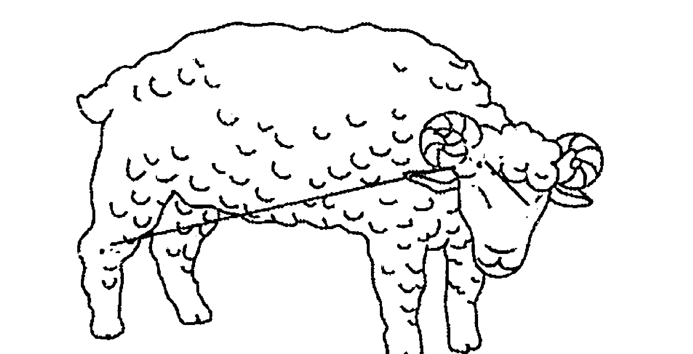

> 爱冷静，爱固执。
哥不是传说，
哥实实在在，不要耍心机，
没人夸我聪明，但我脚踏实地。
我是工作狂，我是摩羯座。

## The Secret of Stars

### 常规摩羯座特质解析

摩羯，又叫山羊，相对这个比较平庸的名字，摩羯更能代表其个性。“摩”即坚韧磨砺、刚柔相济，“羯”则象征阉割过的公羊，温驯善良。土向的摩羯虽现实而功利，却如大地一样宽厚而实在，这让有“万王之王”称号的摩羯笼罩上低调的华丽。外表冷漠的摩羯内心有着为感情付出一切的忠贞和浪漫。

摩羯的符号是一个古代象形文字，这个奇怪的文字一边意味着坚韧倔强的羊头，一边则是多情忧郁的鱼尾，极恰当地绘出摩羯极端的双面性。表面上，他们冷漠、急功近利、老谋深算，杀人不用刀，又木头一样毫无幽默感，是个让人畏惧的狠角色。其实，外在越是坚硬的材质，越意味着想要掩盖内里的柔软，所以这个世界上有种水果名叫榴莲。摩羯很像榴莲，外表坚硬多刺，内里却善良、敏感，并有不一样的鲜美味道。他们非常擅长伪装，常常用高高在上或严厉姿态来掩饰内心的多愁善感。如果跟摩羯不熟，很难看到摩羯流泪、软弱的一面。

摩羯节俭，但不抠门儿，他们可以自己每天吃泡面咸菜，却为朋友的生日礼物挥金如土。摩羯善于理智观察、冷静分析，任何举动都逃不出他们的法眼。他们耐力极强，是典型的“老好人”，没人知道他们承受压力和伤害的底线在哪里。摩羯喜欢热闹却也享受孤独，有属于自己的小世界。他们原则性强，有视角独特的世界观和价值观。他们喜欢拼搏，有欲望、有野心、有很强的目的性，但也有着怀才不遇的隐忍和孤独，以及内心不轻易示人的自卑。

他们经常通过物质来表达爱意，现实的不是一般般，其实，他们只是觉得，通过自己努力所获取的财富，是给爱人最好也最忠诚的礼物。他们理智、谨慎，在情感上属于慢热型，不会轻易被感动，一旦爱了，就矢志不渝。

当然，这并非说摩羯是不花心的专情动物，只是他们将性和爱分得很明白，即使不爱，大家各取所需也没有什么问题，但千万不要认为他们接受了你的陪伴，你就可以放心地去爱他们，只要他们没有承认你爱人身份的一天，你们之间，只是朋友或玩伴，这是属于摩羯的专情和残忍，而他们却并不觉得残忍，因为他自认已经和你说得很清楚：我们应该是什么关系，应该保持怎样的尺度，如果你妄想超过这个尺度，那么不好意思，再见！

尽管这样的摩羯让人恨得牙痒痒，但不可否认，摩羯注重承诺，所以不轻易许诺。他们是外表坚强，内心却极度缺乏安全感的人，怎么可能轻易付出？而对于选定的伴侣，摩羯就不会轻言放弃，也正因为如此，他们绝对无法忍受亲近的人的欺骗和背叛，有可能会采取偏激的报复手段。

### 01. 内向是种力量 气虚摩羯

气虚摩羯被关闭的星座能量：精力、执着、胆量

摩羯座象征着冬天的开始，万物初初萌动，有新鲜但含蓄的生命力，这赋予了摩羯座内向，但思维活跃的性格特质，他们的表情总是平静而淡漠，一副不太容易接近的样子，这些特质，都与气虚体质的人惊人的相似。气虚摩羯，只有在熟悉的人面前，才会变得活泼而健谈，尽管声音仍然低低小小，但在表述和情感上，则明显的欢快起来。

猫王 Elvis Presley，就是一个很典型的摩羯座人，人们大多关注他在屏幕前的开朗和风流倜傥，却不了解小时候的猫王是个安静内向的孩子，他从不轻易和人说话，用一层坚固而冷漠的壳保护好自己，惟有获得他认可的人，才有机会看到他的活泼。周杰伦也是很典型的摩羯座，在舞台上挥洒自如，在陌生环境中却显得局促，脸上也是一副怪怪的似羞涩，又似不安的表情，这样的神情，却让歌迷觉得很 Q 又很酷。如果为这样的摩羯，加上一副经常像梦游似的眼神，柔白的肤色，和低低弱弱的声音，那么，他一定是气虚摩羯无疑了。气虚体质，会让摩羯的情绪变得不稳定，常因为内心无来由的自卑感而感到焦虑，甚至郁郁寡欢。

超内向的气虚摩羯，不善和人沟通，参加陌生人居多的聚会，在和接待他的人点头致意后，就不知道闪到哪个角落里做壁花，未免让其他人觉得这可真是个怪人。这让气虚摩羯不容易交到朋友，有时候连他们自己也怀疑，是不是自己缺乏适应环境的能力？内心随时存在一种会被淘汰的恐惧感。其实，或许连他们自己也没有觉悟到，坐在角落里的他们，并非只是呆呆地陷入孤独，他们成了这个环境中最好的观察者，像是藏在暗处的摄像机，将一切尽收眼底，再依自己的喜好，逐个人物、场景，筛选、对比、分析，像是做了一次小考察，无形当中扩大了自己思域的存储量。谁又敢说内向就一定是弱者呢？内向其实是一种可喜的内省性格，但是不可否认，这样的摩羯，容易让人产生强烈的距离感，是常规意义上不那么合群的一群人。

土象星座的摩羯，通常都有惊人的耐力和毅力，这也是气虚摩羯所具备的，有所不同的是，气虚的体质，并没有办法为在逆境中常能激发出强大意志力的摩羯提供“电力十足”的载体，也就是说，就算是意志坚强如摩羯，也有可能因为气虚，而对一些非常渴望达成的目标难以坚持下去。

感情方面，气虚的摩羯也要慎防自己成为败者。常规摩羯本来就是感情中极被动的那类人，他们在感情上高傲得像个帝王，不主动出击，只在努力追求他的众人当中，挑选自己合意的那一位。尽管找到心爱的人，就会努力经营两人的婚恋关系，但这样的被动，还是让摩羯找到命中天子的几率大降。气虚体质摩羯在这方面就更是急人，慢热的他们，就算遇到自己喜欢的人，也很可能表现出一副不喜欢的样子，有意无意地刺探对方心意，等对方被别人追走才来后悔莫及。

### 02. 停下奔忙的脚步 阳虚摩羯

阳虚摩羯被关闭的星座能量：温暖、胆量、沟通能力

阳虚摩羯比气虚摩羯更加的沉静、内向，少言寡语，更显孤僻。也更容易遭到忽视，而一旦被忽视，自尊心强的他们会有强烈的挫败感，更加不愿意接触人群、开口说话。他们的面容通常从容、冷漠，没人知道他们在想什么。他们喜欢安静的场所，吵闹和刺耳的声音简直能让他们精神崩溃。总是需要找地方靠一下的阳虚摩羯，看上去真是不堪一击。

不管平日的摩羯多么的“生命不息，奋斗不止”，多么的垂涎于权利，野心勃勃，遭遇了阳虚体质后，也是心有余而力不足，不能不投降，安份地做个普通人。尽管脑子里还在冒出各种各样的方案、计划，却没有精力去一一实现，他们已经很难集中精力去专心做一件事情，这让他们懊恼、沮丧，却无计可施。多不可思议，就算是权利欲超强的摩羯，在阳虚之后，也终究对竞争感到厌倦，宁愿待在温暖的家里，睡觉、喝热茶、看电视。

阳虚摩羯在感情上也更为被动，他们内向、沉闷，不知道如何与人相处，更擅长远远遥望而不是表白、行动，始终裹步不前，错失姻缘。

虽然阳虚摩羯看上去日渐消沉，但却让他们终于能停下奔忙的脚步，可以消停地与爱人、朋友分享一顿早餐，一顿晚餐，在睡前闲话家常。这才是属于人过的生活吧，而不是每天像上战场一样，早饭不吃就狂奔出去，不是追赶公车就是追赶地铁，再不就是早高峰时，被挤在车流里捶着方向盘泄恨，然后这一天就在方案、客户、表格中度过。阳虚摩羯，虽然怕冷又容易疲倦，难受得生不如死，但人生时光本就短暂，能够因为阳虚，被迫放弃野心，与家人一起过过慢生活，也不错啊。

### 03. 华丽丽的开朗 阴虚摩羯

阴虚摩羯被关闭的星座能量：冷静、沉稳

土向属性的摩羯不喜欢高调和炫耀。但是阴虚摩羯，就不再那么沉稳、内敛了，他们失去了常规摩羯的冷静、沉着，也就缺少了在冷静中才能够获得的敏锐洞察力和极强的对人事物的分析能力，尽管他们依然有野心、有目标，却容易因为性子急，过于急功近利，做出事后连自己都后悔的事。

常规摩羯的好脾气，也会在遭遇阴虚体质之后消失殆尽，他们变得急躁，容易发怒，像一座活火山，一点小事也能引起喷发。幸好，属于摩羯的良好修养约束了阴虚体质所造成的躁动，在生人面前，他们仍然是那个淡漠而有礼的好好先生，但相熟的人就没这么好的待遇了，越是亲近的人，就越容易让他们爆发。虽然在亲近的人面前无需掩饰自己的真性情是种信任，可是三天两头地吼一下，脾气再好的人也会被吼到想逃跑的好不好？所以拜托，如果实在控制不了自己的脾气，除了在要发脾气之前默念几遍“世界如此美好，我却如此暴躁”之外，多读佛经也很有好处。

要强，是摩羯的长项，就算因为欠了一屁股债，追债电话打得电话机都快爆掉，他们也轻易不会向朋友开口借钱，他们自信，欠再多的债，凭他们的实力，总有一天会还回去。反而朋友有难向他借钱的时候，想尽办法，也要“慷慨解囊”。这种特质，在阴虚体质摩羯身上更是发挥得淋漓尽致，出了天大的事，该吃吃，该玩玩，一副没心没肺的样子，其实内心的煎熬只有自己知道，晚上睡不着觉，做梦被人砍，也只有自己知道。其实何必所有事都自己苦撑呢？好朋友不就是拿来靠的？在这个布满激流险滩，极速发展的世界里，大家互相靠一靠，日子才有办法过下去不是吗？把自己逼到快疯的程度，还学人家强颜欢笑，等某天生生憋成了气郁体质，才真是得不偿失。

阴虚体质对于摩羯来说，相当于一个性格中和协调器。当冷静又内向的摩羯与外向、急躁、活力四射的阴虚体质相融合，一个阳光、开朗的摩羯就华丽丽地诞生了，终于再也不用看到常规摩羯那张千年不变的冰块儿脸，尽管发怒时眉毛眼睛都皱在一起，凶巴巴的，但这也是有血有肉的摩羯，而且还热血沸腾呢。尽管阴虚摩羯工作狂的特质比常规摩羯还要严重，但他们心情不错时，能很好地融入人群，聚会、游玩、八卦全部都OK，突发奇想来个小恶作剧就更显人性化和可爱。

在感情上，阴虚摩羯也更主动、更大胆，他们可没那个耐心等啊等，爱了就勇敢追，追不上也不后悔，在婚恋关系中，他们也愿意与恋人分享自己的快乐和苦恼，让彼此的感情更进一步。他们也少了些刻板，多些情趣。冲动、浪漫的举动也是会时常发生的。

### 04. 行动力在哪里 痰湿摩羯

痰湿摩羯被关闭的星座能量：执着、信念、魄力

痰湿摩羯的内敛、沉稳及超强忍耐力，比起常规摩羯有过之而无不及。在沉稳和城府方面，简直就是常规摩羯的升级版：他们精明稳重，城府很深，恼在心里笑在面上是他们最擅长的事情，很少有人能猜透他们的心思；他们有着他人无法企及的忍耐力，即使是吃火锅吃出带翅膀的虫虫，也会表现出一派淡定。

但是，痰湿摩羯缺乏主见，随意妥协这点，则与摩羯的信念坚定，

12月22日-1月20日
摩羯篇## 中国人九种体质之 揭开星座密码

背道而驰。对于常规摩羯来说：“我想要1，你给我1.5绝对不可以”，而痰湿摩羯最常挂在嘴边的话就是“随便”。“随便”惯了的痰湿摩羯，在面临人生中应该突破进取、大胆抉择的机遇时，会变得婆婆妈妈，不停地思考利益得失、前因后果，许多机缘就这么转瞬即逝。痰湿摩羯的优点是善良、随和，尤其是自己喜欢的人，不管平日多么现实、坏心眼儿，但是提到他们心中爱的人，立刻会换上一副温柔的表情，前一秒还神情高傲凶狠，让人脊背发凉，后一秒就会撅着屁股蹲在路边给喜欢的人挑他们爱吃的水果。

### 05. 提到名字都怕的暴君 湿热摩羯

湿热摩羯被关闭的星座能量：勇气、魄力

摩羯以冷静、理智著称，但是湿热体质的摩羯却和阴虚摩羯一样，完全出人意料。但不管怎样，阴虚的活泼开朗也是有目共睹，在他们心情不错的时候，与他们相处还是蛮愉快的事情。但湿热摩羯可没那么开朗，他们秉承了常规摩羯的冷静、木讷，还外加了由湿热而导致的阴郁和坏脾气，如果他们成为统治者，极可能就是一个让人提到名字都害怕的暴君。

湿热摩羯的耐力降低，沉稳不足，在一定的积累之后，容易在沉默中爆发。常规摩羯表现不满的方式，通常是不理你，湿热摩羯则可能从吵架和摔东西开始。他们表面淡定，内心焦躁。无论是工作还是感情，总是在变来变去，没有办法维持长时间的稳定。会因急躁、易怒而一时失控，伤害别人而不自知。

一定有人嫌弃过摩羯的慢性子。诚然，摩羯那种三棒子打不出个声响，处事又喜欢冷静观察、再三权衡的性格，会让很多行动快于脑子的急性子人受不了。但是湿热体质的摩羯很好地弥补了这一不足。湿热的摩羯，沉静中不失活泼，现实中不乏理想主义，理性中掺杂感性，淡定中渗透急躁，他们简直就成了金牛加白羊的矛盾混合体。他们对生活满载热情，更加懂得在安静中观察机遇，更易及时抓住在身

### 06. 天生的筹划师 血瘀摩羯

血瘀摩羯被关闭的星座能量：理性、宽容

血瘀体质通常会让人有严重的完美主义倾向，永远认为自己可以做得更好，也容易为一些瑕疵而烦躁发怒，甚至会波及他人。而本就对自己严要求到有些变态的摩羯，在遭遇血瘀体质之后，“龟毛”程度有增无减。他们分外在意自己的穿着和装容，有一点点瑕疵被人指出来，都会让他们觉得受不了，要立刻躲起来去休整好再出来见人，近乎强迫症。之所以有这种特质，是因为血瘀体质会使人变得敏感、多疑，他们最受不了别人在窃窃私语时，自己却听不到他们在说什么，于是便开始胡思乱想“也许是在说我，是不是我头发乱了？还是衣服皱了？”

通常情况下，摩羯很懂得关照他人的心情，但他们却碍于面子，多不会表达，偶尔一两句关怀的话，也被他们说走了味道，变得连讽带刺，真要有足够的耐心压抑怒火，才能发现讽刺背后的关心。而血瘀摩羯在这一点上更是有过之而无不及。血瘀，会让人长期处于一种干涩紧绷的状态，不管是身体，还是情绪，或是语言，于是就算是恋人间的吴侬软语，也能让他们说得犀利无比。

血瘀摩羯是天生的筹划师，小心翼翼地为每件事做着计划，不只是说工作上的，更是人际交往当中的。他们随时考虑着和什么样的人用什么样的交往方式，对方可能会产生哪些反应，这种步步为营，如果是正常的交往还好，会完全照顾到朋友的需要，很贴心。但如果是刻意算计、使坏，那就非常可怕，你不一定能够算计过他，因为他早早掌握了自己手里有哪些筹码。摩羯也是爱记恨的星座之一，这一点在血瘀摩羯身上会加倍体现，他喜欢你，是全然的，他恨你，也会

### 07. 忧伤的王子和公主们 气郁摩羯

气郁摩羯被关闭的星座能量：希望、勇气、坚忍

气郁摩羯比典型摩羯更思虑重重、忧国忧民。在他们的脸上很难看到笑容，他们总是闷闷不乐、多愁善感，容易受周围环境的影响，经常为了一点小事唉声叹气、悲观流泪。他们虽富有想象力，但容易和现实世界脱节，只是活在自己的世界里感慨事态的变迁，悲观的情绪占据了他们生活的大部分。自责是他们常做的事情。随时反省自己、修正自己，自卑感严重。

气郁摩羯远离人群和欢笑。即使是在盛大的派对上，他们也会莫名其妙地悲伤起来。这种忧郁的气场很容易影响到身边的人，所以很多人都不愿意离他们太近，他们总是被当成不起眼的背景被人忘却。比起成为众人瞩目的佼佼者，他们更愿意过安宁的生活。

但是，气郁体质也赋予了摩羯吟游诗人般的气质。他们爱幻想，爱浪漫，内心有着种种美好的期盼。有时候，气郁摩羯只是安安静静地坐着，就能让人感受到忧郁王子或是悲情公主那样孤独高贵的气质，这可是许多人想要，却无论如何也都学不来的。人们会为他们的温柔情怀所打动，视他们为才子佳人。

气郁摩羯不在乎物质和名利，他们看重的是感觉，在爱情方面，几近苛求价值观的一致。他们是浪漫高手，烛光晚餐、百合玫瑰、温柔情话都不成问题。他们会带你听雨、看雪，会因为你的一个眼神、一个举动而感动。和气郁摩羯在一起，会体会到那种在小说里才有的纯爱，无关乎名利、家世，惟有他和你。

### 08. 焦躁不安的野兽 特禀摩羯

特禀摩羯被关闭的星座能量：洒脱、无畏

特禀体质人身体上的敏感，往往会带来心理上的敏感，而本就行事谨慎的摩羯，在遭遇特禀体质之后，会变得更加特立独行，常会盘算猜疑。分析每个人、每句话，让他们乐此不疲。

特禀摩羯戒心很重，内心会有莫名的自卑，更加缺乏安全感，一个无心的举动都可能会触动他们脆弱的神经，让他们变成焦躁不安的野兽。他们很难与人维持长久的亲密关系。报复心较重。和特禀摩羯相处会让人觉得辛苦，要想一直待在他们身边真的不太容易。

特禀摩羯长于对人事物的观察，理性聪慧，分析能力极强，工作时能在短时间内把握住最好的结果，事半功倍。但在他们的心里，总有两个小人在打架，既想给爱的人自由，却又非常害怕失去，这也导致了他们的情绪起伏不定，但会对爱人更加贴心和忠诚，也更能坚守住承诺。

### 09. “还好”的平淡 平和摩羯

平和体质的摩羯处于一种半推半就的中庸状态。

很多平和摩羯既没有将摩羯的天性发挥到极致，也没有什么特别的个性。虽然善良友爱，但缺乏创造力，总给人一种“还好”的平淡感觉。他们更容易摇摆不定、犹豫不决，这在做一些重大抉择时会成为最大绊脚石。

但是平和体质所带来的既沉稳冷静，又乐观开朗的性格特质，却像是给了摩羯们一张万能的通行证。他们有计划、有理想，更为脚踏实地、负责守信，他们乐观进取、不怕失败。

这样的平和摩羯，散发着天然的魅力，用自己的方式努力爱着每一个他所爱的人。

# 水瓶篇

1月21日~2月19日

位置：黄道第十一星座

属性：风象星座

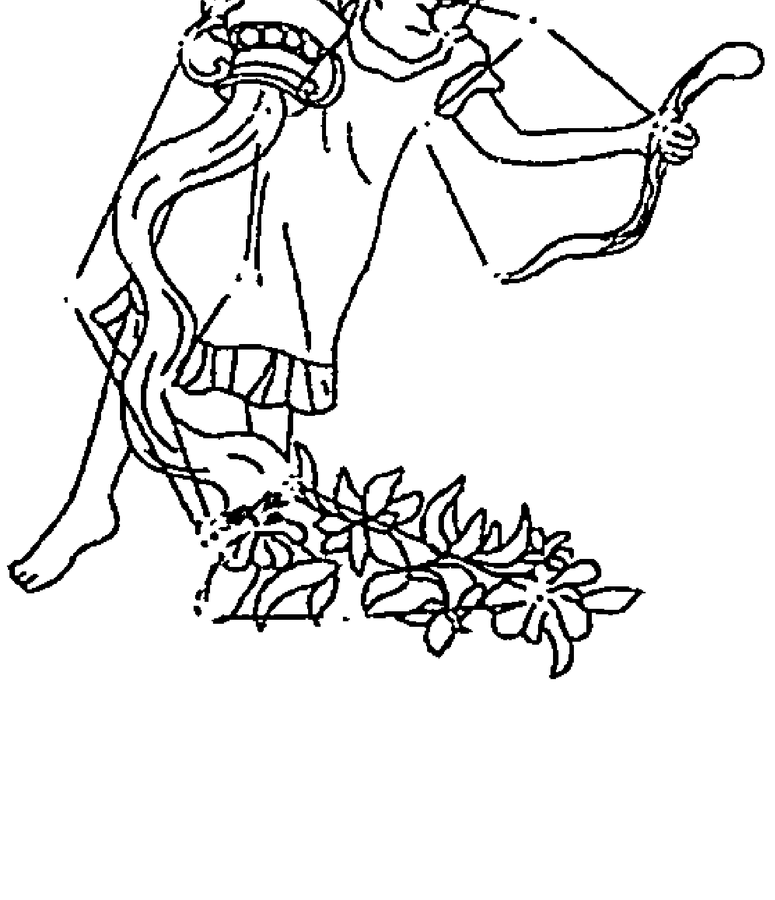

> > 爱自由，爱浪漫。
> 爱与众不同，最讨厌随波逐流。
> 我可以掌控灯红酒绿，也可以置身红尘世外。
> 理想与现实，
> 我懂取舍，
> 我是现实的理想主义者。
> 我是水瓶座。

## The Secret of Stars

## 常规水瓶座特质解析

风象星座的水瓶，是谜一样的星座，人们难以为他们的性格下定论，他们时而柔情似水，时而冷冰冰的。可以没形状、没有气味；也可以是任何形状、任何气味，这就增加了水的不可测性，正如人们一直以来，都猜不透水瓶常挂在嘴角的真诚微笑背后，究竟在想什么。

水瓶的符号，象征着生命力和智慧，这让水瓶重视精神世界的自由和圆满高于一切。他们不愿意接受任何形式上的束缚，事业心并不强，或者说，不愿意做与人争名夺利这样的小把戏。但这并不意味着水瓶是像双鱼那样，整日活在梦里，对现实的一切都不关注，而是他们对升职、加薪这样的“小问题”并不十分在意，他们有更大的野心，即如何能在现实世界中，建立起心目中的理想国度。

也有不少水瓶做了思想上的巨人，行动上的矮子。因为理想很丰满，现实很骨感，被骨感现实打击到抬不起头的水瓶，过度自卑的像个可怜虫。

但仍然有很多水瓶，可以做一个矛盾的现实理想主义者，他们眼光高远，潜意识里将自己定位成天生做大事的人，只是他想做的“大事”，不像摩羯那样，完全的现实主义抱负，终其一生在攀爬金字塔，想做人上之人。水瓶有兼善天下的胸怀，独乐乐不如众乐乐是他们的基本理念。他们是餐桌上那个看着大家吃得高兴，彼此相处和谐、融洽，即便他一口菜都没动，也会觉得很开心的人。是真正怀揣“共产主义理想”的人。

“我要拯救地球、拯救全人类”这种在常人看来很疯狂又幼稚的想法，真的存在于水瓶心中。所以水瓶喜欢帮助别人，会在帮助他人的过程当中，得到自我实现和满足，并认为自己也会得到同样的回馈，但事实却让他们备受打击，也会对自己一直以来坚持的理想感到茫然和动摇。同情心泛滥的水瓶，也是容易受到欺骗和背叛的星座。

水瓶不是盲目的追梦人，他们能够清醒的看到现实中的种种阻力，懂得丛林里的生存法则，也能够尽情投入其中，玩得不亦乐乎。玩权术、玩心机？他们从不落于人后，但又奇怪的不会给人如摩羯般的阴沉感觉。

看似善良的水瓶，在需要下决定的时候，绝不会犹豫和手软，尤其作为企业管理者的水瓶，开除、裁员的决定，通常下得爽快利落，尽管内心里也会同情员工有一家老小要养，但为了团队的健康进步，绝不姑息，真是既温善又残忍。很多人觉得水瓶不好相处，也是因为他们时而热情开朗，时而冷若冰霜的奇怪性格。

水瓶的矛盾还在于，他们能接受新思想，新创意，在某些方面却顽固而保守得可以。比如当他们认为自己的想法是正确的，就算来多少人反对，也更改不了。更高明的是，他们从不因为这一点，与人硬性争执，因为水瓶最讨厌制造冲突和矛盾，他们会用天然的幽默感化解紧张气氛，再假装没听到反对的声音，自顾自按自己的想法去做。遇到这样的水瓶，直脾气的人常常会觉得跟他争执，就像用拳头打棉花，无处使力。

他们讨厌谎言和隐瞒，认定一切事情都要晾到台面上，交朋友更要真诚，没有秘密，这种过于耿直坦率的性格，会让内向、慢热型的人觉得受不了。谁都有秘密，你总试图拿个铲子去挖人家的内心，总是不太好。

水瓶们博爱，与任何人都可以交好，但说到知己，就真的很少。看似朋友多，对谁都蛮和善的水瓶，其实只会将专注力放到和他有共同价值观，站在共同高度上看问题的人身上。你跟他说些有的没的也可以，他表面上微笑倾听，其实早已不知道神游何方，惟有把话说到他的心里，才能够唤回他的注意力。

也正因为这一点，爱上水瓶总体来说是一件蛮悲摧的事情，尤其是那些看上去外表、人才俱佳的水瓶座。因为你要先考量一下，自己有没有永远能够抓住他的魅力。

水瓶一生都在寻找理想的灵魂伴侣，并总以为找到了，一时激情过后才发现原来找错了，在他眼里曾经魅力四射的你，一瞬间就成了灰姑娘，平平无奇。这个时候，他们可没有时间和精力去怜悯你，而会马不停蹄地去寻找另一位心目中的公主，绝情得有够可以，天知道下一位是不是他的真命天女。

想要水瓶挑剔的眼光永远在你身上驻留？最底线的方法就是让他看到吃不到。他们爱玩暧昧，大家看谁玩得比较高明。要敬告MM们的是，越是对自己狂追猛攻的人，水瓶男们越不感兴趣，追急了还会转身就跑，或者躲起来不见人影。想要吊住水瓶？你得先将自己变成可口的蛋糕，吸引他们上钩才行。

水瓶们不是那么看重外表，而是好奇你的脑子里装了些什么？与他们谈恋爱比起与双子谈恋爱真是好不了多少，除非你能让他们觉得自己是个宝藏，永远有惊喜，否则以他们按照八核计算机速度运行的大脑，将你彻底分析透彻之后，觉得没什么好玩了，就会马上想撤退。

关于爱情，忠实、深情、永恒都是水瓶座喜欢看见的字眼，他们在爱一个人的时候，确实也能够做到，甚至痴情得有些夸张，关键是这样的爱情能保鲜多久？谁也说不准。

### 01. 不想做老大 气虚水瓶

气虚水瓶被关闭的星座能量：包容、胆量、沟通能力

常规水瓶的懒是出了名的，并非特指他们不喜欢运动，而且对于应酬、聚会、走亲访友这类没什么营养的交往，是能避就避。在遭遇气虚体质后，水瓶更是将这种懒发挥到极致，他们对人多嘈杂的公共场合兴趣缺缺，小范围的聚会，也要选择的是清静场合才会愿意参加。走亲访友对他们来说简直就是一种压力，尤其在家族里排行过小的水瓶，到哪个亲戚家里都要装乖、说好话，实在烦得不得了。有这个时间，他们还宁可窝在家里看书、睡觉。

气虚水瓶总体来说是属于没啥斗志的瓶子，过于沉湎于内在世界，容易忽视外在变化，行事我行我素。他们不像常规瓶子那样，和谁面子上都还蛮合得来，都有心思和对方贫上几句。底气不足，说话声音很低的他们，本来就懒得说话，还要和一些不重要的人说些不重要的话？抱歉，他们没这个精力和闲工夫。气虚水瓶较亲近的朋友，往往只有那么几个人，他们是属于年少夜不归宿时，父母也能很容易猜到他们去了谁家的孩子。

常规水瓶一生都致力于经营自己的理想事业，不管他们的理想事业是开一间有“梦游仙境”那种气质的花店，还是成为拯救人类堕落的英雄，他们所积攒的人脉关系，都是为了完成这一事业而服务。而气虚体质水瓶，则极可能成为“思想上的巨人，行动上的矮子”。他们聪明、富有灵性的大脑仍然充斥着各种对美好事物的幻想，但说到像常规瓶子那样，步步为营地将自己的理想变为现实？恐怕很难做到。气虚不只让他们的身体变得虚弱下来，也拿走了他们的勇气，这让气虚水瓶多少有些避世的态度，常常不愿意面对现实。

气虚，还会影响常规水瓶原本的开放性性格，变得更加顽固，常常执着于自己的想法，不肯接受他人的建议和意见，要想说服他们，首先要看你有没有资本能够说服他们“说服自己”。听起像绕口令，其实很简单——惟有得到他们认可的人，他们才有可能说服自己尝试着接受你的建议。这就要看你的魅力值够不够高咯。

气虚也会使水瓶在情感表达上缺少勇气。本来水瓶就是不喜欢说“爱”和“喜欢”的人，气虚水瓶就更是爱面子到在表白的时候也顾左右而言他，以至于被表白的对象常常一头雾水，不知道你想说什么。最后还是选择放在心里，做好朋友看看，还安慰自己，这样也好，既不用担心遭到拒绝，又不会因为相爱容易相处难而惨烈分手，里子、面子都保住了。

气虚，多少都会遮掩水瓶的犀利。他们不愿意出风头，不想做“老大”，习惯用旁观者的姿态，审视一切。这样的水瓶，颇有几分“高人”的味道，对于一些问题，既不说是，也不说不，只是带着淡淡微笑，常常让人猜疑他真正的想法到底是什么？所以在谈判桌上，气虚水瓶往往不是以好口才取胜，而是他那副一切皆在掌握的神情。他们也确实有这样的本事，所以气虚水瓶很适合做方案策划一类的工作。

## 02. 爱忧神又不识趣 阳虚水瓶

阳虚水瓶被关闭的星座能量：热情、胆量、沟通能力

自然万物的生命力，都离不开太阳所赋予的能量，因为阳力不足，而导致注意力无法长时间集中在某事上，是阳虚体质人共有的问题。阳虚水瓶自然也不能幸免。他们常常因为心不在焉而惹麻烦，比如你和他说了半天话，他却好像刚回魂似的问你“刚才说什么”；或者去接孩子，却恍神到自己先上车，把孩子忘在原地……有时，阳虚体质人还十分看不懂状况，虽然出于关心，但总说些别人不爱听的话，对方郁闷得脸都拉到老长，他还在那儿絮絮叨叨，最后搞得连家里人都躲着自己，生怕被抓到就一顿神聊。其实他们也很委屈，阳虚之人，话说多一点也会累的，能对你这样殷殷叮嘱，完全是把你当作自己人，这番苦心，又有谁能理解呢？

喜悦与开放是典型水瓶生活里很重要的一部分，他们博爱、热心，喜欢接纳别人。但阳虚水瓶却会明显地表现出“排外”，他们内向，喜欢安静，对于不熟的人，根本连眼皮都懒得抬，完全一副冷漠的样子，有时候这副神情，也会让亲人和朋友感觉受到了伤害。殊不知实在是他们精力有限，对特别怕冷，无时无刻不想裹着被子安静睡觉的阳虚水瓶，就不要苛求了，他们现在需要的不是关心别人，而是被人关心。其实作为水瓶，他们依然渴望自由、独立，但却身不由己，这会让阳虚水瓶整日活在困惑和痛苦中，不知如何是好。
阳虚还为水瓶带来了更加强烈的不安全感，依赖感变得强烈，但表面却要用坚强来掩饰，无形当中，会增加与爱人之间的隔阂。
常规水瓶一向自信，也是对自己的星座最有骄傲感的一族，巴不得让全世界的人都知道“我可是水瓶哦”。自信满满当然是好事，但发挥过度就成了“爱现”。常规水瓶在穿衣打扮等各个方面都很品味，但也没必要从说话的语气，到简单的一个站姿都仿佛在炫耀你的自信吧？他们也往往喜欢用一种看似诚恳的表情，炫耀自己的实力和人脉关系，人们对他们的诚恳表演全套接收，但总觉得有哪里不太对劲。在这一点上，阳虚水瓶就显得内敛、谦虚得多，他们不轻易开口发言，不对自己进行过多表述，行为举止也是一派低调，而一旦发言，往往言词犀利富有智性，能够一鸣惊人。

## 03. 可怕的爆发力 阴虚水瓶

阴虚水瓶被关闭的星座能量：淡定、温和

当风象星座因为一些特别因素，而导致气流增强时，原来只是和煦春风的水瓶，就成了龙卷风，尽管能量增大，但破坏力也增强了。这个特别因素，极可能就是阴虚体质造成的。
阴虚体质人有典型的外向性格，开朗大气，语速很快，做事急躁、要求快速得到结果，而且脾气通常都不太好。阴虚体质的水瓶，自然也会表现出相应的特质。外向活泼的常规水瓶，脑子里总有不少的好点子，但他们中的很多人，都明白什么叫“出头的椽子先烂”，所以甘于将自己摆在“老二”的位置上，懂得在适当的时机发言，巧妙地影响局势发展又不会变成“众矢之的”。而阴虚水瓶却像是动力十足的火车头，一味向前冲，他们憋不住话，有什么想法不马上找人说出来，就会像一团火在心里烧得难受，容易在想法未成熟时，就拿出来与人分享，显得极不成熟；他们也容易犯下轻易许诺的毛病，最后却落下说到做不到的话柄。 常规水瓶属于隐性急躁者，表面上风和日丽，怎样不满也会一笑置之，在特别熟的人面前却难以掩饰真性情，容易因为一些小事发火。而阴虚水瓶，则连表面功夫都省了，他们性格起伏较大，比较善变，平时开朗、外向，直率得可爱，但若惹到他们，发起飙来简直就是台风“梅花”。有个阴虚水瓶女，只是因为玩游戏遇到猪一样的队友，于是像对方就在眼前一样，表情凶悍地对着电脑口出各种三字经，发泄完后又深呼吸地告诉自己：“淑女，我是淑女。”其善变程度直让坐在旁边的朋友傻眼。情感方面，棱角过于分明的阴虚水瓶，很容易会将身边的人推远，水瓶的完美主义加上阴虚的急躁，要小心，总有一天会让对方受不了的。

### 04. 像老蛳般蠕动 痰湿水瓶

痰湿水瓶被关闭的星座能量：执着、信念、勇气、魄力

常规瓶子会在一些原则性问题上过于固执和保守，但若为大局着想，他们还是很能接受突破和创新，而且常常是革新的发起人，而痰湿水瓶，则保守得有些过。他们固步自封，不喜欢变化，就像一个固执的蛹，就算你告诉他破了茧就能变成漂亮的蝴蝶，他还是宁愿呆在黑洞洞却温暖安全的茧里，蠕动，蠕动……肉得不是一般二般。 水瓶本就是介于理想和现实之间的复杂人种，协调得好的人，往往能做出一番大事业，将理想世界，变成现实王国，就如同水瓶座的前美国总统林肯，从一个一文不明的穷小子，变成操持一个国家的领袖。但如果协调不好，要么就沦落成不切实际的幻想家，要么就碌碌无为甘于平庸。痰湿水瓶一不小心，就有可能成为后者。痰湿体质不只为水瓶带来沉重的身体，也为他们带来沉重的思想，他们并不是没有聪明的头脑，相反，痰湿体质人表面敦厚、善忍，内在却有极深的## 05. 总是烦得想挠墙 湿热水瓶

#### 湿热水瓶被关闭的星座能量：开朗、率性

水瓶本应给人们一种清爽的气质，但遭遇湿热体质，那个清灵脱俗的水瓶不见了，一个容易心烦意乱，性格急躁易怒的湿热水瓶由此诞生。

向往自由的瓶子，常常任由奇思妙想在自己的思域里驰骋，可对于头脑总是混沌沉重，思绪短路的湿热水瓶来说，却经常性的，有很强的无力感。而且对于烦闷状态的湿热水瓶来说，最讨厌别人的打扰，即便是没人来打扰自己，他们心中的小世界也会很容易失衡，说不上因为什么事儿就心烦意乱，就连雨季的潮湿空气，也会让他烦得想挠墙。这样的水瓶，还想让他们在处于人群中时，时常露出淡定而神秘的微笑？实在没什么可能。他们更容易出现的表现是眉头紧皱，或是一脸的严肃。

湿热体质还让水瓶变得更加顽固，遇到不同意见时，如果别人不顺从自己的意思，而是“顽强抵抗”，他们的急性子就会发作，各种发飙，直到与之共事的人再也不敢提意见，甚至开始躲他，才来哀叹自己越来越孤独。

### 06. “失忆”者 血瘀水瓶

#### 血瘀水瓶被关闭的星座能量：大度、乐观

血瘀体质本就是一种追求完美主义的体质类型，加上同样有完美主义者潜质的水瓶座，就“完美”得太超过了。因为他们在要求自己完美的同时，也会对别人更加苛刻，与人相处时，对方衣服扣子歪了，妆容不美，衬衫上有污渍，反正他总是挑得出来毛病，而且会发挥水瓶座要说就说真话的特质，一一将他的“发现”告诉对方，当对方从微笑忍耐到忍无可忍地说：你能不能不要再说了？他还一副委屈的样子：“你看，我这不是好心嘛！”和这样的朋友相处起来，有时候真是觉得很烦，再阳光的心情被他一挑剔，都阴云密布了。在情感上过度的完美主义自然更是要不得的，容易给双方造成压力。由此看来，血瘀水瓶的爱情之路会有些难走了。

血瘀体质还会使水瓶的忘性变大，约好九点见面，他十点才起床，等你打电话问他怎么还不到，他才想起来，啊，原来今天跟你有约！他们也是处于总在找自己的钥匙、手机等零碎物件中的水瓶，没办法，就算前一天晚上告诉自己，我把手机放在这个抽屉里，第二天早上还是慌张地到处翻。所以养成固定物品长期放在固定地方的习惯，会对血瘀水瓶大有帮助。关键问题是，不可能每样小物件都给它一个指定的摆放地点吧？ 水瓶座的人通常创造力很强，喜欢探求真理、发现新的事物。但如果思考不能深入到核心，只停留在表面，就难免给人造成轻浮印象。血瘀体质水瓶的执着，为水瓶进入更深层次的思考带来了可能。

### 07. 宁愿沉湎于悲伤 气郁水瓶

#### 气郁水瓶被关闭的星座能量：希望、开朗、勇气

风与水的流动赋予了水瓶座难以琢磨的特质，灵动却不好动，深沉却不低沉，但当水瓶遭遇气郁体质，气流郁结了，瓶子们难免变得忧郁、悲观。

气郁体质并不会影响水瓶们对精神自由的向往和追求，只是一旦你成为气郁水瓶，就会发现，当自己在精神世界里畅游时，很容易就陷入忧郁当中。

瓶子们本身就更愿意生活在幻想的完美国度，但他们强在与此同时，也能够接受并投入现实生活。但气郁水瓶却对现实充满了悲观，容易产生厌世情绪。

其实他们知道发生了什么，但却宁愿更深地沉湎于悲伤，也不愿走出自己的思维怪圈。

常规水瓶的内心其实是保守的，所以不会很热情，也不会很冷漠；向往浪漫，却不一味追求浪漫。

这样的瓶子总让人觉得有些呆板无趣，而气郁水瓶则增加了一份浪漫的气质，甚至吟诗作对、品酒赏花也是他们常做的事，平淡的生活里多了一点情趣，这份情趣自然会感染瓶子们周围的朋友。

气郁水瓶的这份浪漫气质为他们的爱情增添了许多色彩。而水瓶女也因为这份忧郁的气质更加惹人怜爱。

### 08. 缺少安全感 特禀水瓶

#### 特禀水瓶被关闭的星座能量：洒脱、无畏

特禀体质人有着先天缺陷或是过敏反应，水瓶遭遇特禀体质，变得敏感多虑、缺少安全感是难免的。而以瓶子的个性，绝不会把自己脆弱的一面展现给外人。于是，他们用坚强的外表，来掩饰内心的脆弱和痛苦。

包括在情感方面，让人心疼的特禀水瓶们也是这样做的，“赶”走了许多关心自己的人。但如果有幸能够碰到一个理解、欣赏自己的人，这段爱情一样会是真挚感人的。

### 09. 超常淡定 平和水瓶

众所周知，水瓶座虽然号称十二星座中最智慧的星座，但同时，也是在现实和理想世界中最纠结的星座。

如何能够很好地协调两者之间的关系，在现实当中建立起理想的国度？恐怕这是平和水瓶才更加容易做到的事情。

平和体质，将赋予水瓶一种淡定、从容的心态，以及充沛的精力。这对水瓶追求事业上的高峰，打造出理想的世界，是极其有益的。他们既不是不食人间烟火的完全理想主义，又不会因为过于现实，而放弃自己的理想。

而且，一个平和水瓶，没有那么容易在艰难困阻面前轻易放弃，他们有足够的精力和体力，即使失败，也能一次次重新站起来，自我调整心态，向着目标继续前进。

平和体质水瓶，也非常懂得如何与人交往，这不是他们使用了什么样的技巧，而是一个平和之人，心态通常不偏不倚，就不会处处防备他人，在交往中，更为真诚和坦率。人缘自然也就越来越好了。

惟一不足的是，平和水瓶，会将常规的固执延续下去，一旦是自己认定的事，仍旧十头牛也拉不回来。
在爱情中，本就颇为自负的水瓶，在拥有健美、阳光的平和体质后，容易变得更为追求完美，眼光奇高。
奉劝平和水瓶，要小心“高处不胜寒”，别因为太过挑剔，轻易错过最爱自己，最懂得心疼自己的人。

# 双鱼篇

2月20日~3月20日

- 位置：黄道第十二星座
- 属性：水象星座

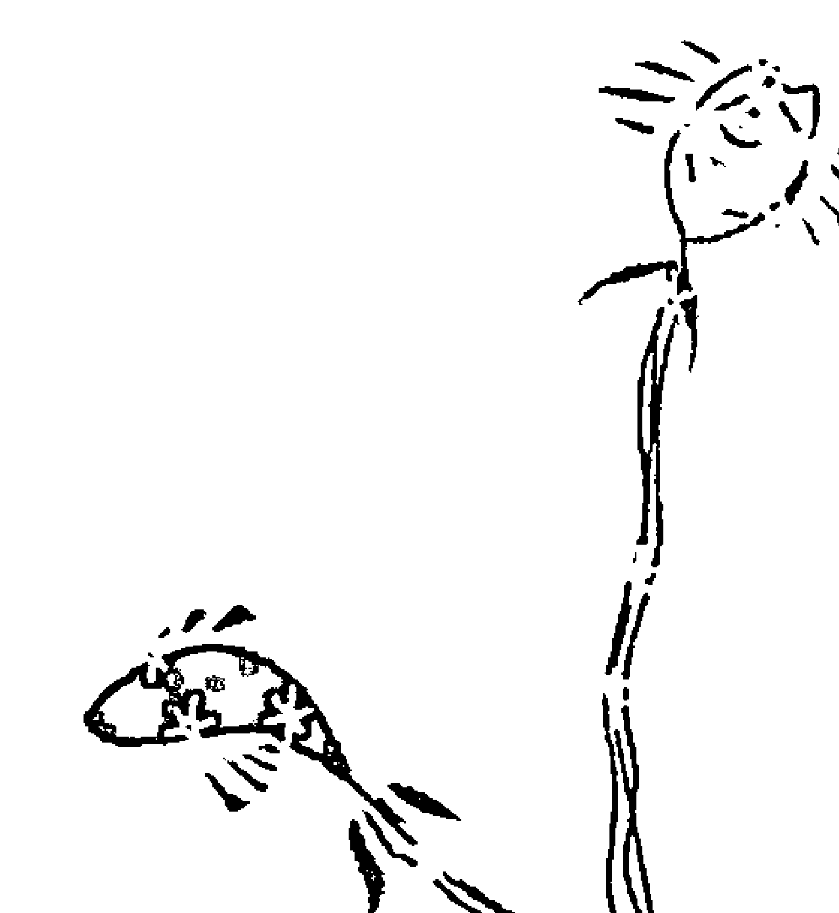

> > 爱思考，爱幻想。
> 善解人意，有同情心。
> 我代表纯真与邪恶，
> 我代表谎言与忠诚。
> 其实连我也说不清自己，
> 因为我天生活在角色里。
> 我就是双鱼座。

## 常规双鱼座特质解析

关于双鱼，即使很多占星师也会将它当成谜一样的星座，想解释它，真的有很多话说，多得有种说不完，最后还把自己也给绕进去的感觉。网络中，有一篇传说中最准的星座解析，但若说其中解析得最准的一个星座，恐怕还是双鱼，只因为它开篇的一句话就能将人吸引：这是最后一个星座，这是全部的星座。

> > “这是最后一个星座，这是全部的星座。”

先说句题外话，哪个星座最单纯？我给出的答案，白羊座。每年的春分时节，是星座更替的开始。最简单的总是脱胎于最复杂的。双鱼座是最复杂的星座。没有哪个星座不可以一言以蔽之，惟有双鱼你做不到。他们在不同的状态下可以像任何一个星座。感情受伤时他们像巨蟹，但会像天蝎一样报复，甚至比天蝎持久；他们的社交风格有天秤的风采但更亲和；谦虚和受虐很像处女；有金牛一样的欲望但深藏不露；他们可以像双子一样轻快冷漠，也有射手一样纯真的理想。

绝大多数的双鱼是温和的，包括本拉登那样的双鱼。在陌生的环境里遇到双鱼是件愉快的事情，他们乐于助人毫无架子，这和双子只作嘴上功夫的特点不同，双鱼的很多帮助是纯粹的奉献。普通人往往把这些和道德联系在一起，这就大错而特错了。他们心中的道德感其实很薄弱。以温和的面孔示人，是因为他们内在的过分敏感所致。过分的敏感，导致了双鱼座的不安和自卑。

像天蝎座的微笑一样，双鱼的温和只是他们应对外在世界的面具，那不是本质。说到表里不一，双鱼座不拔头筹也是一流。你经常看见他们上午信誓旦旦，到了下午就做出完全相反的事情。同样，他们在私下里深恶痛绝的人，你会看见在另一个场合两人如相识多年的老友，彼此温情脉脉，毫无芥蒂。当这些悖反，是为了某一个具体的目的，不足为奇，但是在双鱼座来说，这样做基本没有任何目的，这是他们最大的特色。

他们用谎言和忠诚，用激烈和退缩，用昂扬和萎靡，给自己的人生成了一种毫无目的的均衡。但与天秤座的均衡意识不同的是，双鱼的均衡就是编制自身矛盾，而不是天秤座般的符合美的原则的和谐。由此而产生的人格分裂与双子不相上下，但双鱼的分裂远比双子深刻——双子的分裂是一个人被劈开，而双鱼的分裂完全就是两个人。

他们有着诗人一般的气质和灵感，总是迟疑不定的说出对事情最深刻的洞悉；但另一方面，没有一个经商赔钱的双鱼座，他们的现实感有时强的像摩羯座一般。但他们注定不是摩羯座，很多在现实中取得巨大成功的双鱼座，其实在内心深处对自己所做的一切非常厌恶，他们可以在一个自己并不接受的现实中逗留一生。

在我们只能想象和揣度的内心世界里，他们孤独离世，在种种最不具备人类特征的梦想中彻底逃避了生活。他们即使在年纪很老的情况下，仍旧可能像孩子一样对稚气的玩具和游戏充满兴趣；但即使在孩子时期，他们对世界的理解也是全面和深刻的。

他们从不审视自我，对自己的长处无从得知，因为他们具备一切。但在极端的环境下，他们几乎可以应付一切。他们内在的天赋，只是安静地等待外在命运的召唤；如果他们没被选中，就在昼夜如梦一般的状态中打发人生。但一生顺遂平坦的双鱼座很少很少。他们经常遭遇荒谬的挫折，或者自己犯最低级的错误。如果旁观的你看到此时他们可怜兮兮的样子，你会哀叹命运的不公。但请你相信，上帝的选择从无错误。你要是以为这个说话态度谦逊温和，两眼闪烁着梦幻真诚目光的小可怜儿真的可怜，你就错了。

## 中国人九种体质之揭开星座密码

当你解开双鱼座厄运的谜底，你会发现，他们像活了若干世的老人，他们错误的起因往往深刻得超越人类的想象力。像所有水象星座一样，他们的耐力惊人。巨蟹的忍耐是决心跟时间赛跑，天蝎座是等待最后一击的猎人，而双鱼是让自己完全生活在另一个世界里。

很多双鱼座在日常人际交往中很弱势，除非具备某种突出的外在优势，一般来说他们不自信。作为最不自信的三个星座之一（还有巨蟹和处女），他们应对的方式很特别。巨蟹座应对自卑的方式，是不承认自己自卑；处女座是挑剔别人；而双鱼是彻底投降。但是投降，对他们来说不算什么。对那些强势的星座而言，荣誉的坍塌就是结束，而对双鱼座这只是开始。这不是简单的计策，他们没什么长远的计策，这是深刻的求生求胜的本能，这是理智无法抵达的智慧。在与世无争低头奉献的面具下，他们永远清楚自己的欲望，只是他们终其一生厌恶这种欲望。

爱情中的双鱼几乎都是骗子。他们独自表演和感受，还要装得处处为别人着想。他们能迁就人，从不自傲。但是，双鱼座的自尊心远比你想象的强。你之所以不能察觉，是因为他们厌恶针锋相对的感觉。但随后的阴损招数和背叛，表明他们可不是那么没心没肺。不断乞求别伤害我，但又不断背叛，这种双重行为很像爱情中的天蝎，但在自尊平复之后他们比天蝎仁慈，因为他们在乎的是尊严而非恩怨。

在巨蟹座纯朴又固执的攻势下，他们往往能找到归宿。双子座是双鱼的克星之一，双子轻快的侵略性令双鱼无法反应。同为风向星座的水瓶座几乎总能给双鱼带来噩梦，水瓶的自信明朗以及超脱的意识吸引双鱼，但那种目中无人我行我素的风格，是对双鱼最大的打击。他们不能遇见比他们还善变的人。

双鱼男子最好也别招惹金牛女，金牛座的女人喜欢纯粹而有力度的爱情，这绝非双鱼所长，反而在金牛女看来，双鱼男人过于女性化。双鱼女人有着狮子座一般强烈的受虐意识，又有着巨蟹座一般的敏感和自尊。这使得她们总是扑朔迷离，难以捉摸。有些双鱼女人，在第一次见面时会以顽皮挑逗的方式对待你，此时你一定要温和面对。她们大大咧咧的外表下，是对安全感极度的渴望。当然，一旦对伴侣的忠诚有了把握，她们背叛的渴望同样强烈。

特殊时期，特殊领域，是双鱼座提升自我的绝佳机会。华盛顿和爱因斯坦是双鱼座两个绝好的范例。他们的献身精神和最最深刻的智慧，在特殊的条件下被淬炼到极限，从而也使得他们从自己梦幻软弱的生活中挣脱出来。一个超越了自我的双鱼座具备圣人的特质，有着天蝎座一般为理想奉献的精神和摩羯座一般博大的襟怀，又可以像处女一般建设性的改善人类生活。

> 他们可以什么都不是，也可以是一切。

其实如果细究，这篇号称最准的星座解析，也并非最准。因为双鱼是天生的演员，他们就是角色本身。他们也试图寻找真正的自己，到头来却发现“自己”太多，哪一个都真实，哪一个又都不像真的。其实真与不真都不重要，只要活在当下，这就够了！

## 01. 天然呆 气虚双鱼

#### 气虚双鱼被关闭的星座能量：精力、活力、沟通能力

处于水象星座的双鱼，本身有着如水的温柔。当水缺少了气流的帮助——双鱼遭遇气虚，水的温柔被放大到极致，甚至有些懦弱、顾影自怜。

超爱幻想的双鱼座，在遭遇气虚体质后，更容易化身成无时无刻都沉浸于想象世界，不知道周围正在发生什么的“天然呆”。比如走在马路上，看到某个很养眼的帅哥，脑海立刻天马行空的想象着和这陌生帅哥，展开了一场惊天动地的罗曼史，那双眼茫然，莫名傻笑的表情，无形中提升了路人的回头率还不自知。

有鉴于双鱼的复杂性——既有开朗外向的双鱼，也有偏于内向的双鱼，气虚双鱼就属于后者，他们对人际交往没有过多兴趣，喜欢独处，认为窝在家里看看漫画和小说，比跟人相处简单省事得多，只要家里“万事俱备”，一个星期不出门也没有关系，内向到让家长以为得了自闭症。对很多双鱼来说，思想是最适合他们这尾鱼遨游的海洋，那里什么都有，地方大，还很清静，何必要浪费时间去应对复杂的人类呢？这样的双鱼只有在自己的思想内界里才是个性完备的人，一旦出了这里，不管是工作还是学习，只要不熟的，一概冷漠视之，不爱理人。

但是对于相熟的朋友来说，气虚双鱼还是会很热心，甚至会太超过了。他们内心有极其柔软、善良的一面，特别受不了朋友处于受难状态，不用说都会主动出击，解救朋友于危难之中，但是，他们也常常会将自己的思想强加于人，认为只有按照他们说的去做，事情才可能完满解决，如果你不肯照他说的做，他可会生闷气，甩手走人，还会心想真是不知好歹。

双鱼座的牺牲精神是出了名的，在他们的字典里没有“不”字，不善拒绝。而底气不足的气虚体质人，也通常对说“不”字发憷，这样一来，“拒绝”对于气虚双鱼来说，简直成了不可能的任务，即使“不要”、“不想”、“不可以”到了嘴边，也会别人还没听清他们低弱的声音说些什么的时候咽了回去。看过台剧《命中注定我爱你》吗？其实，最容易成为人人可以支使的“便利贴”女孩儿的，就是气虚体质人。

恬淡和安静，是气虚双鱼独有的魅力特质，他们温婉的气质吸引着周围人的靠近。他们不爱说话、不善表达，却是最完美的倾听者。当然，这种倾听的耐心，也只有受到他们认可的好友才有资格享受。

常规双鱼一向以“思考者”著称的，虽然有时候真的是想太多。他们喜欢观察周围的人事物，而气虚双鱼收敛起向外发散的能量，恰恰为思考提供了更大的空间，但要小心，一定不要把这种理智的思考，转变为很重的心计，否则时间久了，身边的朋友便会逃之夭夭。

在情感上，心思细腻、温婉可人的气虚鱼女们，一定会得到许多人的爱怜，鱼男则没那么幸运，他们低弱的气场，容易让女生觉得没有安全感。

## 02. 冷水鱼 阳虚双鱼

#### 阳虚双鱼被关闭的星座能量：温暖、活力、沟通能力

在阳光的照射下，水的流动与鱼儿的畅游可以尽收眼底。但当双鱼遭遇阳虚，阳光暗淡了，人们便很难得知鱼儿们的去向。怕冷，会限制阳虚双鱼喜爱遨游于深海的自由，他们变得如非必要足不出户，特别是在转凉的秋冬季，严重一些的阳虚体质人更是打死也不愿意离开温暖的被窝，不乏因为此种体质而导致辞职的人。

双鱼当然没有同样带双的双子那样热情，他们会用带着小调皮的恶作剧来表示和你的亲昵，有可爱的小温馨。然而，一尾阳虚体质双鱼，却连这样的小温情也消失了，他们表情单一而冷漠，不喜与人接近，防心很重，除非很要好的朋友，否则轻易不会理解他们的内心有多么需要别人的关照和温暖。他们常常因为感情的表达错误，丧失好姻缘，明明很喜欢对方，却仍然会莫名的保持距离，一副不远不近的样子。其实是阳力不足的身体，让他们没有表达热情的余力，内心里的自卑，让他们没有表达爱意的勇气。阳虚双鱼因为处事圆滑，容易被扣上“世故”的帽子。

双鱼座是个超爱幻想的星座，遇到阳虚体质，鱼儿们变得深谙人情冷暖，走出自己内心的幻想，变得现实了许多，这倒是一大益事。

## 03. 虚假旺盛带来的不稳定 阴虚双鱼

#### 阴虚双鱼被关闭的星座能量：温和、韧性

处于水象星座的双鱼，有着如水一般的温柔。但水本身就是种不稳定的物质，他们平静时，可以波光粼粼，愤怒时，却也能惊涛骇流。
提到双鱼，人们首先想到的就是他们的安静和温柔，并且双鱼座有奉献的特质，能够体贴的了解别人的需要，并总能在恰当的时候出现在需要帮助的人面前，伸出援手，这种友好的表现，让很多朋友喜欢向他们诉说烦恼，寻求他们的帮助。但阴虚双鱼带来的外向与急躁打破了双鱼本身的平静，他们不再善于倾听，反而更喜欢倾诉；即使仍然讲义气，总是能及时解救好友与危难之中，但是变得有些强势，如果你有阴虚双鱼的朋友，就会有体会，很多时候，他们根本没耐心听你把话讲完。

本就有工作狂基因的双鱼，有了阴虚体质助阵，简直是如虎添翼。阴虚所赋予的“虚假旺盛”，让他们有了更多的精力，狂热的投入工作当中，加班是正常的，因为工作、会议推掉与家人的约会也是经常出现的事情。他们连自己都忘了照顾，又怎么有时间和精力去照顾家人呢？可是工作永远都干不完，与家人相处的时间却越来越短，为工作做出这样的牺牲，真的值得吗？

阴虚双鱼另一个特点，是爆发力很猛，但持续时间却很短，他们想做一件事情，激情势不可挡，但又往往后劲儿不长，很容易半途而废，常常给人以做事虎头蛇尾的印象。

在情感方面，阴虚双鱼总是温柔没有两分钟，就因为一点小事起急，虽然事后会向爱人道歉，但总是“打个巴掌给个甜枣”，任谁也会受不了，情感之路就不会很顺利。

## 04. 超强责任感 痰湿双鱼

痰湿双鱼被关闭的星座能量：执着、信念

有人说，双子座是被劈开两半的一个人，而双鱼则是被塞进同一个躯壳的两个人，这导致了他们在做任何决定的时候，都思谋过虑，以至于因为“想太多”而变得畏首畏尾。

从来不是意见领袖的双鱼座，在遇到痰湿体质后，思前怕后的情况又更加重了。他们变得很难下决断，即使是对命运有重大影响的决定，也会因为过于思虑而错过机遇。

痰湿双鱼的另一个特质，就是害怕改变。明知道前方或许有更好的风景，但因为熟悉、安全的因素，宁可原地踏步。这并不是说他们没有进步，而是相较于周遭的人来说，进步得实在是太慢了。

很多双鱼不承认自己圆滑，其实是否圆滑，也要看看你到底是哪一种体质的双鱼了。痰湿双鱼的圆滑和城府，会让其他双鱼难以企及。他们表面上憨厚、老实，胖胖的脸上，总带着朴实的笑容，说话办事谨慎而保守，而且极善忍耐，一副不可能有什么“太超过”事情发生的样子。其实他们最懂得“明哲保身”，总是尽量不让自己置身于风口浪尖，但若真有算计或报复之心，那必是能够“卧薪尝胆”，如同朱元璋那样的狠角色。

即使是梦幻双鱼，在遭遇痰湿体质之后，也会变得更为现实，愿意张开眼睛看看这个世界的变化，并承认幻想毕竟是幻想，而日子还是要过下去。他们会更为踏实的生活和工作，而不会再一味沉浸于梦想之中不可自拔。如鱼一样滑溜的双鱼，常会给人不切实际之感，是属于本来定好的事情，也可以因为他们单方面的因素说变卦就变卦的家伙，缺少责任心不是一星半点，他们可以像世界级球迷罗西那样，只是为了当一个专职球迷，而放弃工作、放弃一家大小。而痰湿双鱼则对家庭有很重的责任感，即使是再不喜欢的工作，为了一家生计，也会让自己坚强的忍下去。他们不是有个性的追梦人，但他们却踏踏实实的活在当下，成为一个好丈夫，一个家庭里坚实的顶梁柱。有很高的信任和可靠指数。

## 05. 酒入愁肠湿更湿 湿热双鱼

#### 湿热双鱼被关闭的星座能量：勇气、温和、率性

鱼儿缺了水是无法好好生存的，双鱼遭遇湿热，水虽然还在，但是其中多了一些黏稠燥热的因素，把畅游的双鱼们搞得心烦意乱，头脑发晕的横冲直撞。

双鱼是最善于思考的星座，他们对事物的分析能力强大得惊人，可遭遇湿热体质后，因为湿热而造成的头部总像被布袋套裹的困重感，让他们的反应能力变迟缓，分析能力大大下降。这种困重的感觉，还会让湿热双鱼容易心烦意乱，急躁易怒。

湿热双鱼的群体中，也是最容易出现“酒鬼”的。

常规双鱼本就更愿意沉浸于幻想世界，而对现实世界多有排斥，在没办法逃离现实的情况下，他们干脆就选择双眼全闭，自欺欺人，所以总给人感觉像是活在梦里。

而湿热体质双鱼就有些悲摧，他们被湿热裹挟的大脑，连幻想都无力，偏偏作为双鱼，对美好的人生也有许多期待，矛盾重重之下，酒自然就成了解愁的最好方法，却不知道“酒入愁肠湿更湿”。

喝起小酒的时候赛过活神仙，酒醒了，困重更甚，头脑更晕。

双鱼本是很享受和谐友爱气氛的，湿热体质，却让原本那个对人亲和，能够耐心听人倾诉的双鱼渐渐远去，他们很多时候就像是《美女与野兽》里的那只怪兽，宁愿将自己关在黑不隆冬的城堡里独自痛苦，也不愿意向人倾诉。

湿热还会造成痤疮的爆发和皮肤粗糙等问题，这让湿热双鱼更不愿意面对人群，变得越来越孤僻，不善与人交流。

这种时候，只能靠你自己走出心的城堡，否则在爱情方面，也不会很顺利，毕竟不是每个“怪兽”都有美女来拯救他们。

## 06. 逃避现实的完美主义者 血瘀双鱼

#### 血瘀双鱼被关闭的星座能量：乐观、温和

双鱼座属于水象星座，需要强大的气流支持，遭遇血瘀体质，血不畅则气也难行，双鱼外向的一面就会被过度收敛，变得内向而阴郁。

血，是鲜活流畅的物质，血液出现瘀滞，就会在对人对事的处理上缺乏弹性，喜欢钻牛角尖，是非观过重。这让血瘀体质多是某个领域中的完美主义者，并总会因为现实与想象不符，而变得沮丧和抑郁。当与本就喜欢用幻想方式，来逃避现实生活中的困境与苦恼的双鱼相遇，会造成血瘀双鱼们越是求完美，就越觉得生活如此的不尽人意，心情也就会变得越抑郁，也就越是加重了常规双鱼本身就存在的些微自卑心理。

血瘀双鱼，性格上的分裂会越显得突出，具体表现为，一些血瘀双鱼，会出现所谓的“人前白羊，人后双鱼”性格，即人前开朗、外向，人后却纠结、痛苦；或者不管在人前还是人后，都会时而开朗，时而阴郁，连自己也闹不清楚为什么会这样。

血瘀双鱼还将常规双鱼敏感、脆弱的特质进行了过度发挥，他们容易多疑，不只怀疑别人也怀疑自己。尤其在恋爱当中，这样的特质更是要不得，偷偷查看恋人的手机、QQ信息等事件时而发生，并会因为怀疑恋人出轨，在没有证据，内心却已经无法忍受的情况下，尖锐的质问，这样的行为，往往会让所爱之人觉得害怕，进而选择分手。

血瘀体质人因为血液的运行不畅，记性就不好，丢东忘西是常事，而常规双鱼本就是迷迷糊糊的星座，两者相加，让血瘀双鱼的忘功一流，属于转个身就忘了自己刚才有没有锁门的主儿。

血瘀体质有着固执的本质，这给得过且过的双鱼，多少增加了一些定力。血瘀双鱼一旦认定的人和事，就会坚持到底，现实困难确实会让他们觉得压抑和痛苦，但仍然会努力的向着目标前行。对爱人也是如此，血瘀双鱼会牢牢守住自己认定的那个他，尽全力让两个人在一起。需要注意的是，千万不要守护过度，将对方当成自己的私有物一样监管，否则再浓的爱意，也会让对方疲惫不堪，想要逃离。

## 07. 总是看到别人的缺点 气郁双鱼

#### 气郁双鱼被关闭的星座能量：希望、开朗、勇气

多重人格的双鱼座，容易受到抑郁状态的侵扰，这本就是一个容易气郁的星座。气郁双鱼会表现出更为灰暗的思想：他们多愁善感，更加容易自怜、沮丧；觉得身边没有可以真正信任的朋友；总是看到别人的缺点；认为人们是丑陋和虚伪的；笑不出来，甚至想找个地方躲起来；更愤世嫉俗……

亲和力超强的双鱼，在遭遇气郁后，开始让身边的人觉得压抑。

注重精神世界的气郁双鱼，当然还保有着常规双鱼爱幻想的特质，只不过，他们内心的那个世界，没有明朗的天气、温暖的阳光，而是带有更多忧郁悲观的色彩，甚至五彩缤纷的花朵，在他们的世界里也是凋零的、黑色的。

气郁双鱼表现出更多对现实世界的抗拒和逃避，以至于对爱情的信任度大打折扣。他们比谁都渴望天长地久的爱情，他们又比谁对爱情的结局都感到悲观，不认为现实生活中，有绝对忠诚的恋人，即使相爱时，也会为分手时做出打算。

气郁，会为双鱼 MM 增加更多梦幻气息，对异性的吸引力有增无减，只不过，与气郁双鱼 MM 相处却是一项挑战，她会常常觉得你不爱她了，莫名地认为你有了更好的对象，会抛弃她，因为一个小争吵，你没往里心去，但她却悲观的想到分手，又会因为害怕想象当中的分手而让自己躲藏起来，不见人，不接电话，让你急得满头大汗，却还不知道自己哪儿惹到她了……如果你无法、无力给她们满满的安全感，那么就不要因为她们的独特气质而靠近，否则，伤的会是双方。

气郁双鱼 GG 在爱情方面也不太乐观。即使韩剧男主的忧郁魅力风靡亚洲，也不是每个有忧郁气质的男生都会受到欢迎，因为那是花美男的特权。在内心里，每个女孩子都会希望有一个阳光、开朗的男朋友，而气郁的你，让人心疼，勾惹异性母性情怀的气质是有，但却缺乏了男子汉的气概。因为自己也想逃避这个世界，自然会缺少担当，这样子的你，又要怎么给女友充足的安全感呢？

## 08. 太在意别人的眼光 特禀双鱼

#### 特禀双鱼被关闭的星座能量：洒脱、无畏

特禀体质人多有敏感和缺少安全感的共性。遭遇特禀体质，本身就敏感、脆弱的双鱼座，似乎又更加容易猜忌和多疑，马路上一个陌生人的眼神，也会让你赶紧检查自己是否衣着不妥，或是哪儿出了问题，这样的生活方式当然会让自己活得很累。

特禀双鱼还会有很强烈的孤独感，即使身处人群当中，还是会觉得自己格格不入。其实这一切，都是来源于身体上的敏感，所带来的精神上的“副作用”。过敏，会让特禀双鱼觉得自己是特别的那一个，但不是特别好，而是特别奇怪。由此，也加重了特禀双鱼的自卑感，整天笼罩在自嘲与自怜的阴影当中，无法解脱。

未婚的特禀双鱼，会对自己的体质颇多顾忌，在遇到喜欢的人时不敢表白，或者与喜欢的人相处起来不自信、不自在，话里话外更是诸多刺探，想方设法问清楚对方，介不介意有个过敏的恋人？不过，过敏人在外表上，大多没有什么特别之处，因此在对方不了解你的目的的情况下，就会对你的刺探和很多语意不明之处有所反感，反而会将他推得更远。其实过敏而已，有什么好自卑的呢？如果对方不能接受这样的你，那他就不是你的真命天子，不如早早离去，别浪费遇到更好的人的宝贵时间。

## 09. 现实比幻想更重要 平和双鱼

#### 平和体质人身材匀称，不胖不瘦，开朗随和，精力充沛，不容易生病。

双鱼座遇到平和体质，自然是再好不过的了，但同时，双鱼也会丢掉一些自己独有的个性。

鱼儿们对世界上发生的一切，乃至虚无缥缈的事物都有浓厚的兴趣。这种琢磨不透的神秘感使双鱼周身被布上一圈神秘的光晕，吸引着许许多多的人。而平和体质人中庸的性格，很少会做出与他人迥异的举动。双鱼遇到平和体质，神秘减少了，那光晕的魅力自然下降了。

常规双鱼有着天生的洞察能力，敏锐的他们可以很好地观察周围的事和人。平和体质的双鱼洞察力下降，不会很热衷于周遭的事情，这样一来，也就磨灭了双鱼们对事情独特的分析和判断视角。在情感中，即便是遇到真爱的人，平和双鱼的爱也少了些浪漫色彩，对于平和双鱼来说，现实要比幻想更重要，可能会给人以无趣的感觉。

常规双鱼有着敏感而脆弱的性格，多愁善感，遇到平和体质，双鱼变得坚强了许多，自怜、沮丧的情形自然也就减少了。双鱼本身最受不了的就是自己懦弱的个性，不善拒绝，到头来只能自找苦吃。但平和体质的双鱼就不同了，他们很懂得拒绝的艺术，坚决却又不失礼节地说“不”，为自己减少了很多不必要的麻烦。

遇到平和体质，双鱼喜欢帮助别人的个性还是不会变的，只是更多的不是因为不自信，而仅仅是出于热心。

走在爱情之路上的平和双鱼，不再过度追求幻想与浪漫，因为他们深知只有平实的爱情才能够走得很远、很远。

# 开启你的星座能量

在日常生活当中
通过合理的饮食和运动
改善体质并收获健康的同时
也开启了被关闭的星座能量

## 中国人九种体质之揭开星座密码

## 01. 补足你的“气质”——开启气虚体质星座能量

气虚体质健康指数：★★☆☆☆

气虚体质人易患疾病：反复感冒和胃下垂等疾病，病后康复缓慢。

守护气虚体质的食物：宜选择性味温和，能够健脾益气的食物。比如山药、长豇豆、黄豆、红薯、土豆、豌豆、芋头、香菇、小米、糯米、扁豆、粳米、莲子、白果、芡实、南瓜、包心菜、胡萝卜、土豆、蚕豆、莲藕（熟吃）、豆腐、鸡肉（鸡蛋）、猪肚、牛肉、兔肉、羊肉、鹌鹑（蛋）、淡水鱼、黄鱼、比目鱼、刀鱼、泥鳅、黄鳝、大枣、葡萄干、苹果、菱角、龙眼肉及橙子等，都是能够健脾益气的食物。

对气虚体质不利的食物包括：因为脾肺功能虚弱，要尽量少吃或不吃耗气、下气的食物，如荞麦、生萝卜、空心菜、柚子、槟榔、柑等，以及生冷苦寒、辛辣燥热等偏性较大的食物，如苦瓜、辣椒等。

气虚体质人开启能量的生活方式：不熬夜、三餐规律以及经常性的舒缓运动，例如慢跑、瑜伽、普拉提和舞蹈类。

## 02. 给身体“喂”点儿阳光——开启阳虚体质星座能量

阳虚体质健康指数：★★☆☆☆

阳虚体质人易患疾病：痰饮（多痰为明显表现）、肿胀（身体的浮肿为明显表现）、泄泻（经常腹泻为明显表现）等病。

守护阳虚体质的食物：能够温补脾阳、肾阳的食物。比如刀豆、南瓜、韭菜、生姜、黄豆芽、椒类、茼蒿、荔枝、龙眼、榴莲、樱桃、杏、核桃、栗子、大枣、腰果、松子、洋葱、香菜、胡萝卜、山药、红茶。对于安静的植物气质有余，动物气质不足的阳虚体质人来说，在蔬菜之外，适当吃一些肉食也很重要，如羊肉、牛肉、猪肚、鸡肉、带鱼、猪肉和黄鳝等，能带来动物所特有的“跃动”气息；可以吃的海产品有虾、海参、鲍鱼、淡菜等。

对阳虚体质不利的食物包括：阳虚体质人阳气亏虚，基于“开源节流”的原则，吃温暖食物可以“开源”，少吃寒凉食物可以“节流”。哪些食物会耗伤阳气呢？如田螺、螃蟹、绿茶、冷冻饮料等；寒凉的蔬果类有西瓜、海带、紫菜、黄瓜、苦瓜、冬瓜、竹笋、芹菜、绿豆和蚕豆等。除此之外，阳虚体质人还应减少食盐的摄入，并慎用抗生素或清热解毒效用的中药，以保护阳气。

阳虚体质人开启能量的生活方式：少熬夜，多做阳光下的户外活动，不可在寒冷潮湿的环境中长期工作和生活。春夏季节适当多做户外锻炼，如散步、慢跑、太极拳、跳绳、踢毽子以及各种球类运动。

## 03. 滋润是王道——开启阴虚体质星座能量

阴虚体质健康指数：★★★☆☆

阴虚体质人易患疾病：便秘、咽痛、失眠等疾病。

守护阴虚体质的食物：银耳、番茄、菠菜、白菜花、苦瓜、百合、绿豆、荸荠、大小白菜以及其他许多蔬菜、水果类，都有很好的滋润作用。另外，芝麻、糯米、蜂蜜、乌贼、龟鳖、海参、鲍鱼、螃蟹、牛奶、牡蛎、蛤蜊、海蜇、鸭肉、猪肉、猪皮、兔肉、豆腐、甘蔗、黑木耳等食物也很好。

对阴虚体质不利的食物包括：在中医看来，温燥、辛辣的食物最容易伤阴，因为这些食物的发散性特别强，会对阴津继续耗损。所以对于阴虚体质人来说，辣椒、韭菜、葱、蒜、虾、荔枝、桂圆、樱桃、杏、大枣、核桃、羊肉和狗肉要少吃或不吃。

阴虚体质人开启能量的生活方式：不熬夜，做舒缓的运动，如慢跑、瑜伽等，平时多听舒缓的音乐。

## 04. 减轻负担才能轻装上阵——开启痰湿体质星座能量

痰湿体质健康指数：★★★☆☆

痰湿体质人易患疾病：高血压、高血脂、糖尿病、冠心病等。

守护痰湿体质的食物：扁豆、蚕豆、赤豆、冬瓜、竹笋、橄榄、紫菜、大蒜、芥蓝、淮山、薏米、花生、海蜇、胖头鱼、鲫鱼、鲤鱼、鲈鱼、羊肉、萝卜、山药、洋葱、豆角、辣椒、咖喱、生姜等。

对痰湿体质不利的食物包括：肥甘、油腻、滋补、寒凉的菜都要少吃，这些都是伤脾的食物，多吃了会生痰生湿；肥猪肉、油炸食品等肥甘油腻之品，不宜多吃；西瓜、梨等寒凉水果应该少吃；大枣、李子、柿子等食物，容易生痰，也不宜多吃；银耳、燕窝、龟和鳖等滋阴之品，也应该少吃。特别是龟和鳖，据《随息居饮食谱》记载：“甲鱼，孕妇及中虚，寒湿内盛，时邪未净者，切忌之。”因为这类食物最擅滋阴，易生寒湿，越吃体内积的湿也越多。除此之外，痰湿体质人体内的环境偏于酸性，酸性的食物也不宜多吃，如可乐等碳酸饮料以及山楂、醋、梅子、枇杷、香蕉、桃子、板栗、芝麻等。

痰湿体质人开启能量的生活方式：早睡早起，坚持运动。还要常晒被褥，居室常通风，努力给自己营造一个更为干爽的生活环境。

## 05. 身体大清扫——开启湿热体质星座能量

湿热体质健康指数：★★★☆☆

湿热体质人易患疾病：疮疖、黄疸、热淋等。

守护湿热体质的食物：莲藕、莲子、芹菜、茭白、生菜、黄瓜、薏苡仁、茯苓、红小豆、四季豆、蚕豆、绿豆、鸭肉、兔肉、马蹄、鲫鱼、鲤鱼、田螺、海带、紫菜、冬瓜、线瓜、葫芦、苦瓜、菜瓜、西瓜、梨、绿茶、花茶、白菜、荠菜、竹笋、莴笋、空心菜、萝卜、豆角、绿豆等。痰湿体质适合的很多食物，也都适合湿热体质人吃。

对湿热体质不利的食物包括：辛辣燥热的食物首当其冲，虽然它们对湿热体质的人是很大诱惑，似乎不吃它们，吃什么都没了味道，可是如果吃了，体内会热上加热。所以湿热体质人还是要记得餐桌上，辣、煎、炒、烤、油炸的食物是你的“敌人”，一定不能多吃。此外，还有一些大补的食物也过热，像动物内脏、狗肉、鹿肉、羊肉等也不宜吃。热管住了，还得管住湿。一些滋阴的食物，往往有助湿的嫌疑，像银耳、燕窝、雪蛤、阿胶、蜂蜜等，这些都不宜多吃。

湿热体质人开启能量的生活方式：避免居住在低洼潮湿的地方，居住环境宜干燥、通风。盛夏暑湿较重，要减少户外活动的时间。不要熬夜或过于劳累，必须保持充足而有规律的睡眠。运动上，适合做高强度、大运动量的锻炼，如中长跑、游泳、爬山、各种球类、武术等。

## 06. 疏通堵塞的体内“河流”——开启血瘀体质星座能量

血瘀体质健康指数：★★★☆☆

血瘀体质人易患疾病：癥瘕（包括肿瘤）及痛证、血证等。

守护血瘀体质的食物：如洋葱、大蒜、韭菜、生姜这类蔬菜，适合血瘀体质在冬天或阳虚间夹血瘀体质吃；黄豆以及包括香菇在内的各种菌类养肝、护肝，防癌抗癌，也很适合血瘀体质；生藕、黑木耳、竹笋、紫皮茄子、芸薹（油菜）适合血瘀体质在夏天或血瘀夹湿热，阴虚内热体质的人吃。其他适合血瘀体质人的食物还包括：山楂、番木瓜、螃蟹、海参和醋。黄酒和葡萄酒、糯米甜酒也可以少量饮用。

对血瘀体质不利的食物包括：血瘀体质人，因为本身血流不畅，因此不宜吃收涩、寒凉、冰冻、油腻之物，如乌梅、苦瓜、柿子、石榴、花生米；多吃蔬菜，少吃油腻的肉类，如蛋黄、虾、猪头肉、猪脑、奶酪等。总体来说，血瘀体质在吃任何蔬菜的时候，最好都经过烹煮，而尽量少吃生菜、凉菜。

血瘀体质人开启能量的生活方式：运动有助于通畅经络、气血，可选择舞蹈、健身操、多步行等运动。

## 07. 汲取“快乐”能量——开启气郁体质星座能量

气郁体质健康指数：★★☆☆☆

气郁体质人易患疾病：抑郁症、失眠、疼痛等。

守护气郁体质的食物：黑豆、胡萝卜、香菜、茴香、油菜、茄子、黄花菜、萝卜、丝瓜、洋葱、小西葫芦、乌塌菜、菊花、大麦、荞麦、高粱、刀豆、蘑菇、豆豉、柑橘、柚子、香菜、包心菜、苦瓜、玫瑰、茉莉花、海带、海藻、山楂等；龙眼、红枣、葡萄干、蛋黄等皆可以补肝血。

对气郁体质不利的食物包括：气郁体质人肝气郁滞，一边要开郁，让闷气发散出去，一边更要补肝血，安顿好肝气的大本营。平时要注意少吃收敛酸涩和冰冷的食物，这种酸、收的力量，在补肝血里能起到一定的引经作用，但单独吃，或吃太多，会进一步阻拦闷气的发散，加重气滞。收敛酸涩的蔬果有南瓜、乌梅、泡菜、石榴、青梅、杨梅、草莓、杨桃、酸枣、李子、柠檬等等；雪糕、冰淇淋、冰冻饮料更不宜多吃。

气郁体质人开启能量的生活方式：多参加社会活动、集体文娱活动；常看喜剧、滑稽剧，看到什么悲剧苦情的就躲远点；多听轻快、明朗的音乐，来提升情绪；多读积极的、鼓励的书籍，以培养开朗、豁达的性格；学会知足常乐，就像胡同里躺在藤椅里晒太阳的老人们说的：难得糊涂啊。

气郁体质人要懂得发泄。经研究，最好的发泄方法有三种，而且都很简单，那就是哭、笑、还有运动。你也可以寻找你自己的发泄方式，写日记、逛街……

## 08. 降低身体敏感指数——开启特禀体质星座能量

特禀体质的健康指数：☆☆☆☆☆

特禀体质人易患疾病：过敏症

守护特禀体质的食物：以下粥品均为体质学专家建议，对辅助改善一些过敏症状很有帮助。

#### 冬瓜固表粥

原料：粳米100g，冬瓜皮30g，防风10g，乌梅15g，黄芪20g，当归12g。

做法：将材料全部放入砂锅中加水煮开，再用小火慢熬成浓汁，将汤汁倒出，原料再加水煮开取汁，汤汁中放入粳米熬粥，加冰糖热食。

功效：养血消风，扶正固表。

# 开启你的星座能量

#### 葱白百合粥
原料：葱白一段，粳米100g，百合30g，薄荷6g，金荞麦10g。
做法：葱白切末；锅内加适量水，粳米、百合放入锅中熬煮45分钟左右，加入葱白、薄荷，调和食用。

对特禀体质不利的食物包括：特禀体质人在日常生活当中，饮食应当清淡，忌生冷、辛辣、肥甘油腻及各种“发物”，比如酒、鱼、虾、蟹、辣椒、肥肉、浓茶、咖啡等。在蔬菜方面，要少吃蚕豆、白扁豆、辣椒等蔬菜。

特禀体质人开启能量的生活方式：保持室内清洁，被褥、床单要经常洗晒，室内装修后不宜立即搬进居住。春季减少室外活动时间，可防止对花粉过敏。不宜养宠物，起居应有规律，积极参加各种体育锻炼，避免情绪紧张。

## 09. 保卫你的平和——保持平和体质星座能量
平和体质的健康指数：★★★★☆

平和体质人易患疾病：很少生病，或病后恢复较快。

守护平和体质的食物：平和体质人应注重顺时调养，根据不同季节选择适宜的饮食，保持与自然界规律的协调统一。春季阳气初升，可以多吃一些菠菜、韭菜、芹菜、春笋、荠菜等。夏季阳气正盛，可多吃新鲜水果，如西瓜、番茄、菠萝等。菊花、金银花、芦根、绿豆、冬瓜、苦瓜、黄瓜、生菜，都可以适当吃一些，起到清热祛暑的作用。长夏的湿气重，多吃茯苓、山药、莲子、薏米、扁豆、冬瓜、丝瓜等利湿食物很有好处。秋季阳气收敛，可食用一些滋阴的食物，比如芝麻、甘蔗、梨、葡萄，或用沙参、麦冬、阿胶、甘草等搭配成饮品饮用。冬季阳气深藏，可以吃一些温补食物，比如姜、桂、胡椒、羊肉、牛肉、狗肉等。

对平和体质不利的食物包括：平和体质不宜过多药补，盲目的药补反而容易破坏平衡。

平和体质人保持充足能量的生活方式：在维持自身阴阳平衡的同时，平和体质的人还应该注意自然界的四时阴阳变化，顺应此变化，以保持自身与自然界的整体和谐。保证充足的睡眠，适量增强有氧运动也非常重要。