# 你的身体就是12星座

## 各界赞誉

> “丽贝卡·戈登是我见过最好的占星师之一。她真诚、风趣，而且才华洋溢！我向每一个人推荐她的作品以及《你的身体就是12星座》！”
>
> ——嘉柏丽·伯恩斯坦 (Gabby Bernstein) “纽约时报”畅销书《用愿力召唤奇迹》(Miracles Now) 作者

> “我很喜欢史蒂芬妮医师与丽贝卡将你的身体和灵魂带到另一个维度，不仅融合了物质、形上学和心智，也深度探索了我们自己与每一个黄道星座的关联。《你的身体就是12星座》深入地教育我睁开双眼，看清我是多么地需要利用其他星座的元素来让自己完整。这真是一本出色的杰作！”
>
> ——伊丽莎白·霍夫帕普 (Elisabeth Halfpapp) 身心编程 (Mind-body Programming) 执行副总，呼气法的共同创办人，核心融合 (Core Fusion®) 芭蕾课程的共同创作者，《芭蕾健身》(Barre Fitness) 的共同作者

> “这是一本完美的著作，由史蒂芬妮医师与丽贝卡·戈登共同执笔。我着迷于占星和健康差不多五十年了，这两位女士所汇整的资料，对有兴趣研究占星学与身体关系、以及你可以如何运用这些资讯达致更大幸福的人来说，实在是详实又有用。我强力推荐《你的身体就是12星座》。”
>
> ——埃尔森·M·哈斯（Elson M. Haas）医学博士 综合家庭医师（网站：elsonhasmd.com），《四季健康法》（Staying Healthy with the Seasons）与《营养健康法》（Staying Healthy with Nutrition）作者

> “天体物理学家卡尔·萨根（Carl Sagan）说过：‘我们是星辰打造的。’而在突破性的最新力作《你的身体就是12星座》当中，占星家丽贝卡·戈登与全人照护医师史蒂芬妮博士，支持这个强有力的宇宙概念。她们用一份综合的全人健康指南让读者看见，藉由实用的工具和精巧如宇宙法则的健康计划，如何将你的整体幸福增至最大。通过理解星座与自己身体之间的关系，丽贝卡和史蒂芬妮医师带你踏上一趟自我发现之旅，那将会引领你进入与星辰及物质世界和谐共存的境地，让你看见如何活在最佳的健康状态中。”
>
> ——罗尼·葛利许曼（Ronnie Grishman）《戴尔星象》（Dell Horoscope）杂志总编辑

> “太棒了，史蒂芬妮医师和丽贝卡——我现在醉心于认识我的身体以及我要求它完成的一切，而那是如此地深受我和宇宙的形上连接所影响。我从本书中所习得的智慧，已经深化了我对自己身体的赞赏以及我对身心概念的理解，而那是如此地遍布在我们的呼气健身课程之中。感谢这本伟大的著作。现在，它将是我的参考书目之一。”
>
> ——弗雷德·德维托（Fred DeVito） 呼气法的执行副总裁兼共同创办人，核心融合芭蕾课程的共同创作者，《芭蕾健身》的共同作者

## 【作者序】

## 链接身体和星座的养生智慧

我相信科学，也相信灵性，知道能量有无数种形式。事实上，我认为科学和灵性时常诉说着类似的事情，只是以不同的方式诉说。但科学著作与我却出现分歧：我不让自己仅仅局限在科学——只接受唯有人类当前科技可以理解的事物才是可能的。恰如紫外线和微生物，在人类开发出可以看见它们的适当工具之前，这两样东西早就存在了。同理，我相信还有许许多多现代人的眼睛和心智所看不见的东西。我是谁？怎能局限大自然的能力呢？或是怎能局限我们理解大自然能力的方法呢？

二○一二年在一场探讨意识进化研讨会期间，我就是这样的心态迎接丽贝卡的占星学简报。在此之前，我对于占星学从未深思细想过。当然，我知道自己的太阳（出生）星座（射手座），也翻阅过一些星象信息，但除了基本的流行文化，占星学不曾实质地进入我的视野范围内。因此，我很诧异丽贝卡的谈话居然对我造成如此大的冲击。但的确是这样啊！而且我相信是这样，因为丽贝卡把星座解释成“实用的魔法”，而这也是我在担任全人照护医师的过程中，对人体的理解。

在我的定义中，“实用的魔法”是指有能力采用人世间看不见的原力（例如，念头、情绪、觉受、直觉及其他），同时将它们具体地表达出来；这是在祭出“无形之形”（formless form）。好比你脑袋里的某个念头（例如，“我想买房子”），如何在某一天转译成某样可触摸的东西（某间被你和你的其余有形财产占据的真实砖墙灰泥住宅）；或是工作上因老板所造成的尚未克服的情绪压力，如何变成颈部的肌肉张力。在我

心中，那是一种魔法。

而且这很实用，因为它涉及你的日常生活。你的念头、感觉、印象，最终都被表达在你选择吃下的东西、选择度日的方式、以及选择与谁共度时光等等之中。你是可以同时选择“无形”和“无形之形”的魔术师！有时候，你外在的选择会反映出你内在的真实本质，但并非始终如此。对于如何生活，你不见得可以始终感到一致或平衡，因而造成了一种“不适感”。其实，最能充分表达健康的，不外乎是：全然地表达你自己。

这带领我们回到丽贝卡与她的能力——她能够解读你的出生星盘，进而点滴搜集蕴含其中的宇宙万物。

无论个案是家庭主妇或公司的专业人士，丽贝卡都会提醒每一个人，是什么因素造就了个案的独一无二，从个人的指纹样式，到个人灵魂的蓝图。丽贝卡解读个案的星座，使个案与他们的更大智慧连成一气，从而激发动机，走出自己的舒适圈，活出最为广阔浩瀚的人生。

举例来说，她可能会引导某位金牛座的个案扩大自我表达，那不仅会帮助个案与自己的真实本质连成一气，而且有助于解决头部的紧绷。同样地，我会鼓励头部长期紧绷的病患，让对方更深入地理解自己的身体，以及身体与心智、情绪、灵性的连接；病患无形的念头、感觉、以及与自我表达相关的故事（在物质和形上层面，头部都代表自我表达），可能会导致有形的肌肉紧绷和压力。然后我会教导病患实用的工具（运动、呼吸、营养、静心冥想等等），以此对治问题。

因此，虽然丽贝卡和我外表看似大相径庭（或者如同某笑话的开场，说一位医师和一位占星师走进一间酒吧……），但我俩都带着根深蒂固的信念来应对自己的个人生活和职业生涯，相信一切均蕴藏于内，相信你的身体包含整个宇宙的智慧，而那可以充当通向个人幸福安康的钥匙——只要你让宇宙的智慧接管。

当然，在认识对方（那并没有发生在那场研讨会当晚）之前，我们并没有觉察到这个概念上的重叠。没有错，第一晚见到丽贝卡时，我就知道有一天我们将会认识，并且建构一份深厚的关系，但这需要发生在适当的时间。因此，在她演讲期间，我只是坐着微笑，隔天醒来兴起了勾勒本书大纲的灵感：……然后等了大约六个月，直到事实证明，我在某疗愈中心租用的办公室空间就在丽贝卡的办公室隔壁。值得讨论一下我俩的星盘！

然后接下来故事的发展，哦，就是这本书了。这是一本谈论你的身体与星座的著作，以一个清新的观点，让你得以醒觉，起身面对新的可能性，并且超越你目前想象“自己是谁”或“应该是谁”的限定。此书也附带了实用的工具，帮助你活出最充实、最丰富、最安好的人生。

此刻，难道不是取回你的完整自我的时候吗？该是时候成为研究自己的专家了吧？假使真的如此，假使你感觉到除了现在的快乐、健康之外，还有其他更多的事物，而且你想要为此承担实际的责任，那么我们邀请你前来探索这个自我故事的下一篇章。这一则故事谈论的是：天堂与人间、灵性与物质，以及居住其间的“你”。

> ——史蒂芬妮医师 (Dr. Stephanie)## 【前言】

## 在所有层面活出最好的自己

这不是一本占星书，也不是一本解剖学著作；应该说，这是一本健康指南，是以星座为基础的全人健康指引，有别于以特定饮食或日常锻炼为基础的健康指南。世上有许多方法可以保持健康，同时感觉安好，而且幸运的是，当代的焦点正逐渐转向以「全人健康」作为新的健康型态。千万不要误解我们的意思！我们相信传统西方医疗系统尽管有其缺失，但的确表现出色，只不过其焦点在于急性照护以及疾病的诊断和管理，而不在于健康优化和全人健康。

「全人健康」的涵盖面更广泛，不仅是身体，更囊括心智、情绪和灵性。可是当我们进入这些无形界域时，许多全人健康疗法变得很难用当前的科学尺度和方法加以证明。毕竟，相较于用X光检查骨折，评估一个人情绪和心智的幸福状态是比较模糊的。但有一个理由，使得全人疗法现在变得比另类疗法更为主流，那即是：大多数体验过营养、瑜伽、针灸等疗法的人，除了自己亲身的感觉，并不需要任何进一步的证明。对大部分的我们来说，个人的健康、经验和理解就是明证。

本书提出另一种方式，可以存取你的一切有形和无形的零星片断，同时帮助它们开始以一个「统一的整体」来运作。乍看之下，利用黄道星座促进全人健康的疗法似乎有些偏门，但我们只是取回一套被认可过的古老信念系统——一套巩固现代医学和科学基础的信念系统，并且不去理会任何的误解或争议。诚如美国科学史学家大卫·林德伯格博士提醒我们的：「如果公平对待整个历史事业，就必须如实地看待过往……我们必须尊重先人接近大自然的方法，承认它，尽管那可能与现代的方法不同，却仍旧有其趣味性，因为那是我们智慧传承的一部分。」① 因此，使用本书时，我们要求读者不仅要对自己的幸福喜乐负起更大的责任，还要尝试实践幸福喜乐的新方法，如此，这方法将会扩展、吸引并启发你，使你对身体状况与全人健康拥有不同于以往的理解。

星座的故事提出威力强大的法则，使你能够最充分地表达全人健康，亦即：全然地表达你自己。如果将你对这些法则的关注放在与你的身体的关系中，你将会逐渐领悟到，你是远远超乎肉眼所见的。当然，你将会感觉更好、更自在释然，但本书真正的礼物是：它有助于引导你在「所有」层面（包括身、心、灵）活出最佳版本的自己。在如此实践的过程中，你将会实现更有质地和品质的人生——拥有容光焕发的身体、振奋人心的想法、得到扩展的情感、值得信赖的直觉。然后，最终，你个人的小宇宙，将会跟你理所当然属于的大宇宙重新链接。

## 本书的撰写基础及各章脉络

《你的身体就是12星座》利用黄道带作为你的身体形相的地图，而且从头至尾象征你与宇宙万物的联结。这可帮助你取回自己的身体，将身体置于你的更大整体中作考量，而当你这么做时，你就取回了自己已然丢失或遗忘的面向。我们所做的，只是搭桥衔接其间的疗愈联结。

第一章为这个联结奠定了基础，我们在这一章介绍星座的背景脉络之于占星学和你的身体的关系。接下来的十二个章节，每一章均专章谈论某个特定的身体部位以及与其相关联的黄道星座，并深入探讨更多身体与星座相互关联的详实细节。身体部位为每一章设置舞台（头部、胸部、膝盖），搭配聚焦在肌肉骨骼的解剖结构，因为骨骼、关节、肌肉往往是最可关联且最容易存取的部分。然后，我们将身体链接至该黄道星座在占星学上的精神或性格，透过该星座的主题呈现出来，并解释这个主题，进而介绍它的普世特征，同时为读者强调它的个人关联性。

每一章的「不健康的身体警讯（两种极端）」一节，意在向读者介绍「可能」伴随身体症状出现哪些需要考虑的心智和灵性问题。这些不是为了自我诊断，也并非暗示某些日期或特点一定会造成某些症状；更确切地说，它们勾勒出黄道星座与身体表现之间可能存在的联结，而这些联结其实比本书所描述的复杂许多。再次重申，强调的重点在于肌肉骨骼的表现（同时约略提及其他面向）。

为了让资料切题且实用，我们紧接着提出自学式提问，协助阐明日前活在你之内的星座主题（因此在观察的过程中要诚实以对，且不加以评断），以及动作建议，引导你将这些主题带到物质生活中。所推荐的练习就大部分的经验层面而言都是实用的，而且是拣选自种种物理疗法，包括：伸展和强化锻炼、瑜伽、皮拉提斯（Pilates）课程等等。我们无法囊括每一种练习的图像，因此鼓励读者请教当地的教练，或是上网查询与本书所举练习相关的影视教学说明。这些练习的用意是要满足广大群众，并且只需略加修改调整，便可裁剪成适合你的程度。尽管如此，我们鼓励读者进一步将这些练习修改得符合你身体的需求（譬如，增加重复的次数，减少一次撑握的时间，利用瑜伽砖和软垫）。请务必勤加练习，带着自我觉知，加上适度的校正，并以你的最大安全为考量。不当地执行某个进阶动作，往往比适度地完成某个基本动作更容易。

## 如何最有效的阅读本书

你一定会注意到，十二个主要章节交互使用特定性别的名词和代名词（「他」和「她」）。这个用法是根据前人讨论过的星座极性。「二元性」（polarity）就是「二元性」（duality）——阴与阳，雌与雄，负向和正向——代表相互的理解。如此称谓并无贬损之意，也与性别无关。譬如说，牡羊之类的火象星座被认为偏阳性，共享行动和外向性之类的特质；而因为牡羊是阳性星座，所以，牡羊的代名词就是「她」。另一方面，金牛是阴性星座，于是用来描述金牛能量的代名词便是「她」。虽然这不是一般常用的准则，但我们仍采用这个方法来协助维系每一个星座的完整性。本书最后附上具实用参照功能的附录，包括：以图表举例说明不同的身体表现与黄道、身体联结之间的关系；十二星座全身能量扫描；人体骨骼结构与部位名称。撰写本书时，我们只介绍了浩瀚的占星学和解剖学领域，以及其间的疗愈联结；这些附录的目标，是要使读者能够靠自己继续学习，同时不断地去体验。

我们相信，「经验」就是大师级教师。许多占星学或解剖学著作的读者，往往只阅读他们认为与自己有关的章节（譬如，太阳处女只阅读处女座相关章节，膝盖外科医生只阅读膝盖相关章节）。然而，我们鼓励你去经验本书的每一个章节，因为每一个身体部位和星座都活在你之内！你可能出生在处女座的时段，但仍有双子座的双手（双子座）和狮子的心脏（狮子座）。每一天，不同的星座都透过你而做出不同的表达。当某个身体部位由于外来的疼痛或内在的失衡而需要关注时，该星座的敏感弱点也就浮上台面。事实上，身体和星座都需要关注，且与你的其余部分达致平衡。你当然不必等到自己的某一部分故障了，才阅读相关章节。事实上，我们鼓励你阅读不同身体部位的相关内容，从而优化各个部位的健康——只要这是你受到本书吸引的原因。换言之，我们鼓励读者依照与你产生共鸣的顺序阅读各个章节，如此，本书才可以被用作量身订制的身体扫描图兼全人健康参考书，方便一再地使用。

你可以根据身体部位或黄道星座选择某一章，然后开始扫描。选择你最感兴趣的身体部位，或或许这与你的太阳星座相关联，或是你最近才在某健身杂志上读到这个部位，或者这是你觉得疼痛的部位。举例来说，如果你是想要多加了解膝盖的跑者，请参阅第十一章「海山羊的膝盖」。要以开放的心态接触这一章，带着诸如此类的提问：「我的膝盖的实际状况如何？它们在我的生命中扮演什么样的角色？我可以从我的膝盖学习到什么课题？」然后翻到上一章和下一章的身体部位。以此例而言，分别是第十章「人马的臀部」和第十二章「持水者的脚踝」，以了解可能与膝盖疼痛相关的相连身体部位。

此外，本书也将探讨你与星座的联结、星座代表的古老智慧，以及你该如何透过自己的身体形相来运用星座的智慧。因此，你也可以依据自己的太阳（出生）、月亮或上升星座，或是依据你想要进一步体现的某个星座主题，选择开始阅读某一章。譬如说，假使你是个太阳双鱼，想要更加了解自己的本质，以及如何最恰当地表达自己的本质，那就翻到第十三章「鱼儿的双脚」。阅读的时候，问些诸如此类的问题：「我要如何活出鱼儿的本质？这个星座为我呈现的是什么课题？我的双脚如何体现我的本质的这个部分？」

当你从自己所选择的观点来阅读时，要同时密切注意这对你有何意义。哪些特征感觉起来强固而健壮？哪些可以被发展得更好？要尽可能地诚实面对自己，才能从本书获得最大裨益。

每一个人都有优势强项和敏感弱点，这无关好坏善恶。过度强势有过度强势的问题（例如，肌肉拉伤、行为顽固），过度敏感也有过度敏感的麻烦（例如，肩膀错位、缺乏自信）。你需要平衡这两者，才能保持健康。你需要坚强屹立，同时随风摇摆。如同众所周知的芦苇，在暴风雨中比橡树更加屹立不摇，因为它能够弯曲而不被折断。要记下你的优势强项和敏感弱点，因为在阅读的过程中，它们会变得愈来愈明显。

需要帮你选择哪些特征该要好好滋养吗？哪些特征该要纳入更美好的平衡吗？阅读时，要留意身体部位和星座特征的相关叙述，哪些与你产生最大的共鸣，那类叙述便会以确切的「是」或「否」立即突显出来。凡是强烈的反应，无论「是」或「否」，均指出你需要多加考量的面向。假以时日，你的操练一定会不一样，因为你是被召唤去体现不同的特性。这些特性全都活在你之内，活在你人生的不同时期，都需要以不同的方式被表达出来。所以，随心所欲地重返每一章，好好参照你这一生的历程。每一次阅读，一定会揭露出新的信息。

最重要的是，本书旨在带你踏上一趟穿越宇宙万物的旅程，因为宇宙万物不仅活在你周围，更活在你之内。前进，然后带着太空人该有的探险感，加上开放的想象力，想像这份全人健康指南如何为你提供最大效用。倘若我们的宇宙、银河、太阳系、地球、肉身不神奇，那么它们便什么也不是了。而存取这些，就是让实用的魔法发挥最大效力。

原注：①大卫·林德伯格（David C. Lindberg，一九三五～二○一五），《西方科学的起源》（The Beginnings of Western Science: The European Scientific Tradition in Philosophical, Religious, and Institutional Context, Prehistory to A.D. 1450），Chicago: University of Chicago Press，2007，2-3页。

## 如其在上，如其在下

你在镜子中看见的「你」，是一具历经数百万年结构演化而诞生的身体，有一个头颅、一个躯干、两只手臂、两条腿等等，定义出「人类」这个物种。但你的其他部分呢？你那些看不见或触碰不到、但却定义出你的真正核心的部分呢？（我们所谓的「核心」，指的不只是你的腹部！）你的身体的这些零星片段，其实远远大过身体的形相：它们活生生、正在呼吸，具体地显化出你的希望和恐惧、优势强项和敏感弱点、梦想愿景和失望沮丧。整个历史的文明，一直参照着星座来增强我们对自己和世界的理解。亿万年来，我们的祖先看见了人间与天堂、自然与神界之间并无差别，星座被反映在身体的各个部位，于是提出了一套深具洞见的生命内在作业指南与之相应。来，看着你的双手，以此为例：你很可能看见两项实用的附件，而我们的古希腊前辈在注视双手的同时，却见到了来自众神的礼物。说得更明确些，是来自众神的主宰——天神宙斯——的礼物。这个礼物化成孪生子的形相，拉丁文叫作Gemini（双子座），被表达成太阳每年（五月二十一日至六月二十一日）行经的一群星宿。根据古代希腊人的说法，你的双手代表双子座联结凡间与神性两个界域，以及某人与他人之间的交流。当你有意识地协调双手时（常用双手但不过度，在适度校正的情况下操作双手，保持双手强健但柔软灵活），不论你出生在什么时候，就等于是唤起你最美好的双子特征，诸如非凡的适应能力和沟通交流。同样地，假使你不是处于平衡状态，那么双子座的敏感弱点（例如，感觉涣散）可能会凌驾一切。此一关系的研究（天堂与人间、天体、人事），就变成了占星学的课题。这是一门类似数学般精确的艺术兼科学，整个发展出人们数千年来的日常观察和经验。诚如上述举例说明的双子神话，我们的祖先相信，物质和非物质的世界是联合的、同一的，他们相信，古代的众神遍布尘世间，使世间活跃有生气，也为世间带来信息。

## 大宇宙：星体的舞台

古人没有我们的现代科学知识，他们的周围事物（以及得自周围事物的智慧）是诗歌。暴风雨不是起伏波动的气象状况造成的，而是众神之间强力交锋的结果。地球不是因为气体的偶然结合所形成，而是诞生自某位伟大母神的子宫。爱不是脑部的多巴胺丰富区被活化了，而是被邱比特的弓射了一箭。物质与灵性、自然与神界之间，没什么明显的差别。众神经常影响凡间事务，也常被凡间事务所影响，而夜空就是见证这些神性运作的最佳地点。

在某个清朗的黑夜，肉眼可以见到大约两、三千颗星辰。对受过训练的眼睛来说，这些星辰结合，形成十二个星群，每一个星群都有自己的故事和符号。

这十二个星群沿着太阳的轨道（名为「黄道面」，ecliptic plane）分布，形成一条满天星斗的带子，称为「黄道带」（the zodiac）。原则上，太阳一个月行经一个星群，一年行遍整个黄道带。（因为太阳并不是真正在移动，太阳的视轨是太阳看似在天空中形成的轨迹，奠基於观察者从地球上找个有利位置观看太阳，而这个位置会依地球绕行太阳的位置而轮换。）

我们目前的系统对黄道带的理解，源自于古希腊兼具地理学家、占星家、天文学家、数学家等身分的克劳狄乌斯·托勒密（Claudius Ptolemy，西元一○○／一六八—一七八年），他在西元第二世纪左右写下了《天文学大成》（Almagest），描述了半数以上今日已知的八十八个星群（人类的望远镜愈好，能够看到的星群就愈多）。

最近，国际天文学联合会（International Astronomical Union，简称IAU）聚集了一群科学家，为星辰和太空设定标准，藉此更新对天文学的理解。当然，假如宇宙已有一百四十亿岁，必有许多尚待了解的领域！然而，由于本书是以基础占星学为宗旨，所以主要演出者仍是行星和星座。

> 不管冥王星是不是被称作行星，它还是同一颗物质和形上实体。在天文学上，它是一团冰块加岩石；在占星学上，它则与深度的力量感和进化相关联。一九三〇年冥王星的发现，有助于占星学家阐明个人和社会事件的崛起，例如，心理分析与核能……。这些特质都与同名的罗马神话阴间统治者「冥王」，有着惊人的相似性。

- 本书出版时，国际天文学联合会标出八颗行星：水星、金星、地球、火星、木星、土星、天王星、海王星。冥王星如今与谷神星（Ceres）、阋神星（Eris）、鸟神星（Makemake）、妊神星（Haumea）同属相当新颖且正在增长的矮行星级别。

每一颗行星代表你性格的一个维度。举例来说，火星代表行动，它是一股强大的力道，帮助驱动你朝向目标迈进，无论是马拉松路跑期间或是与人争辩之际。相较之下，金星描绘你成为情人时的特征，强调一开始是哪些特质将你吸引到你的伴侣面前。所有行星全都存在于你的整个出生星图中。

假使行星的作用就像生活舞台上的演员，那就把星座想成行星在行经黄道带时所扮演的角色。有十二个黄道星座，每个星座三十度，均分三百六十度的天球（celestial sphere，见第28页）。虽然你的太阳星座可能最为突出，但所有十二个星座全都活在你之内，全在你里面自我表述。

> > 仅次于太阳星座之外，有另外两个星座因素会明显出现在你的性情中，亦即：月亮星座（月亮在你出生时行经的星座）透露出你的内在自我、需求、情绪、恐惧，它是最亲近的人看见的那个你；上升星座（在你出生时，位于东方地平线上的星座）是你如何将自己投射到人世间，往往也是世人对你的看法，包括你给他人留下的印象。因此，火爆的射手座对待她的配偶可能像个体贴的巨蟹，对待朋友则像是讲究平衡的天秤。

当行星行经每一个黄道星座时，都会受到每一个星座鲜明的特征所影响。譬如双子座的角色是沟通，当火星行经双子座时，便将火星的招牌行动风格带入沟通的领域；他可能因此成为能言善道的发电机，积极地提出他的理想，且积极到足以使任何辩论团队引以为傲。另一方面，金星行经双子座而成为一个迷人的演说家，优雅并自在地表达她的信息，恰似选美大会上的女王。

占星学错综复杂，远远超乎流行文化的预言或命定。占星学背后的原始意图是：描绘行星与星座之间的链接，并对应于地球上的生命，以此完善人类的状况；运用天空的语言鉴往知来，充分发挥当下和未来的效用。从古至今，占星家一直利用占星资讯解决种种议题，包括：告知重要的政治决定、预测天气型态、突发事件、照拂个人的健康。换言之，占星学一直被用来回答「为什么」、「什么时间」、「情况如何」，而不是只回答「什么事」。这点在今天同样适用：每一张天宫图的作用可能就像自助指南，是一种理解你的真我且只回答「什么事」同时相应地活出真我的方式。

根据占星知识，建议最有利于全然活着的环境。这好比本质与教养，全都合而为一。多年来，科学已经知道，本质影响教养，而且更进一步地发现教养也影响着本质。事实上，新兴的表观遗传学（epigenetics）领域，专门致力于更加理解教养所扮演的角色。目前为止，科学家已经确定，虽然你的基因没变，但告知身体何时要表现那些基因的信号，却可以因食物、关系、压力之类的环境因素而改变。换言之，你选择吃什么、你的婚姻品质、或是生活环境的毒性，可能会影响你容易罹患心脏病的体质是否被表现出来，以及如何被表现出来。同样地，占星学理解到，人类不仅受到基因和环境因素影响，并且同时将我们对环境的理解扩展至包含整个太阳系。

> > 有史以来，不同的文化采纳了不同类型的占星学。例如，西洋占星学根据春分的位置定义十二星座，强调本命星座中的太阳星座。相较之下，源自印度的吠陀（Vedic）占星学利用固定的星座作为参照点，强调业力和月亮星座。中国占星学强调流年（相较于流月）周期，也强调五行（木、火、土、金、水）和生肖（例如，龙、马、猴）的关联。

西洋占星学最重视你的太阳星座，而本书维持同样的做法。所以，虽然所有星座的特征全都活在你之内，但太阳星座（你出生时，太阳所在的黄道星座）的特征在你的真实本质中最占优势。举例而言，假使你出生在七月二十三日至八月二十二日之间，太阳在狮子座，因此，你的禀性便包含狮子座的优势强项，例如，勇气、野心、极富魅力，以及骄傲和自恋之类的敏感弱点。请注意，你的星座所拥有的特性，不见得他人就欠缺。狮子座当然可能像射手座一样通晓哲理，或是像处女座一样善于分析。你囊括了所有星座的特性，但你的太阳星座的特性将最为耀眼闪亮。

明白这点，可以如何帮助你呢？哦，如果你是苹果，那么不管你愿不愿意，你始终都是苹果，而绝不会是柳橙。然而，若要成为最好的苹果，你可以有许多方法去觉察到你的真实苹果本质，并据此生活。同样地，如果你是狮子座，你知道自己被裁制成为众人的焦点，那么选择地铁列车长作为终生职业，可能就不利于你的长远成就。当然，你可以那么做，但那违背了狮子座天生热爱光鲜与社交群居的特质。为了追求最快乐、最健康的人生，要学习与你的真实本质合作，发展你的优势强项，并从你的敏感弱点中学习，然后在你的太阳星座与内在其他十一个星座之间找到恰当的平衡。占星学可以提供如此更加深入的洞见，以及个人的指引。

## 小宇宙：人体的奥秘

然而，占星学的研究并非终结于此！事实上，占星学提供许多使其教诲鲜活有生气的方法，从指引（例如，在水星逆行期要注意沟通和运输难题），到谷物（藉由与每个行星的特质相关联的食物和草本植物），而你的身体更是不折不扣唾手可得的占星途径。

你的身体相当了不起，它是大自然六百万年来所打造的奇迹。站在镜子前，你可以看见身体的形状是一颗五芒星，由一颗头颅、两只手臂、两条腿组成。这些结构共同形成你最为熟悉的「你」。然而，身体真正的美不在于它的个别部位，而是更宏伟且实用的整体。走路、跑步、单脚跳、双脚跳，加上你的骨骼、肌肉等等，一同編排出使你能夠如願運轉的交響樂章。然而，我們目前生活在一個多數人都知道如何操作筆記型電腦、卻不太曉得如何操作雙腿的社會，在這個世界中，日曆與電腦之間發生同步的頻率，大過頭顱與頸部之間的連結。你忘記將身體視為一個綜合的整體，許多人甚至不知道身體有些什麼部位。也就是說，這樣的無知將一直持續到某個身體部位停止其該有的行為，緊接著是疼痛、折斷或碎裂，抑或是無法運轉。

但並不是一直都如此。很久很久以前，只有「整體」被看見。對結構部件的關注並不存在，直到像別迦摩的蓋倫（Galen of Pergamum，西元一二九／一二一〇年，古羅馬的醫學家、哲學家）這樣的解剖學家，揮舞著手術刀，有系統地解剖骨骼、腦部和血管，用影響今日科學的巨作，鉅細靡遺地描述這些細節，一切才有所改觀。但回顧當時，當蓋倫詳細描述身體的各個部位時，他也將這些部位與一個人的靈性相互關聯（正如柏拉圖之前確認的那樣）。因此，心臟被視為身體循環的源頭，同時也是一個人的激情活動中心；腦部引動身體的神經以及靈魂的心智。對蓋倫來說，神性的證明就存在於物質界的布丁裡。

因此，這與占星術一致。十二個黃道星座，每一個皆統御一個身體部位，從牡羊座的頭部開始，結束於雙魚座的雙腳，其他星座則居其間。你可能很熟悉中世紀的「黃道帶人」（Zodiac Man）圖解（見34頁），它描述十二個黃道星座疊映在圖中的人形上。

這個圖形提到，身體是人類通向宇宙萬物的鑰匙。這個觀念顯示，每一個星座的能量都活在身體裡面，可以透過相關聯的身體部位加以存取。以此方式，每一個黃道星座的所有性格特性、優勢強項和敏感弱點就不必仍舊只是概念，它們全都可以活靈活現，如此一來，你是誰便與你的作為相呼應。使你自己的「黃道帶人」鮮活有生氣，就好比言行一致之於幸福康樂。你的身體可以如實地活出星座的故事。存取並不像你想得那麼困難，因為星辰已經活在你之內——在你之內呼吸。其實，人是由跟星辰相同的物質打造而成的，這是不折不扣的真相。星辰主要是由氫和氦組成，它們在過去幾十億年的生死循環中，同時製造了幾乎每一樣其他元素，包括碳、氮、氧。你瞧，就跟我們知道的一樣，這些基本元素正是構成生命的一部分，也實在是土壤中、草地裡、食物中……在你之內找到的那些元素。譬如說，氫是水分子（H₂O）的體蛋白質的重要部分；氧是數兆個細胞的主要燃料。簡言之，你活著，因為星辰跟你一樣——死亡，然後回收利用它們的原料。

資料來源：十五世紀的德國醫師凱沁（Johannes de Ketham），「黃道帶人」，《醫學百科》（Fasciculo de medicina，Venice: Gregori, 1943）。

有許多關於「黃道帶人」的描述，但原圖作者至今依舊不詳。大部分畫作可以追溯到中世紀，儘管第一份參照此一概念的文本，時間更早，出現在馬庫斯·馬尼里烏斯（Marcus Manilus，古羅馬詩人，大約活躍於西元一世紀初期）西元十五～二十年的作品中。他的作品是根據前輩依次傳遞下來的智慧。他的前輩如何確定身體與星座之間的關係呢？嗯，對絕绝大部分已知的人類歷史來說，自然界和神界不過是同一枚硬幣的兩面。人類祖先的思想傳統不同於現在，因此，我們無法回顧不同的年代，然後將現代的心態套用在古人身上。古人的證明主要是基於生活經驗，而不是實證研究（例如，你主觀地知道睡眠對你有好處，不必等某份科學研究告知你）。所以，古人靠著生活經歷知道這一切。

這可能是你首度邂逅「主張你體現了星辰的物質和靈性兩方面」這個理念，但這是一份存在許久的關係，時間甚至早於巴比倫帝國的紀錄。請注意下頁表格，看看黃道星座如何與你的身體部位對應關聯。

你可以查出自己星盤中最突出的星座，例如，太陽、月亮或上升星座，但要記住，十二個黃道星座全都活在你之內！也就是說，事實上，赫密斯公理（Hermetic axiom）「如其在上，如其在下」（As above, so below）的意思是：天堂被反映在此地人間，反之，人間也反映出天堂。這意指假使你有一個身體部位，那麼你就有相應星座的故事在你之內活著。譬如說，你那顆充滿愛的獅子心臟和謹慎的摩羯膝蓋。

> 人體中沒有氫，但氫與氦共同組成全世界大約百分之九十八的已知物質。

無論你是否意識到這點，所有黃道星座的特徵皆呈現出你的各方各面，而那些是你要好好表達的層面——只要你如此選擇。於是，問題在於：哪些方面要表達？如何表達？你要如何透過你的身體形相活出星座的故事呢？

| 星座 | 身體 |
| --- | --- |
| 牡羊座 | 頭部 |
| 金牛座 | 頸部 |
| 雙子座 | 胳膊、前臂、雙手 |
| 巨蟹座 | 胸部 |
| 獅子座 | 心臟、上背部 |
| 處女座 | 腹部 |
| 天秤座 | 下背部 |
| 天蠍座 | 腎骨 |
| 射手座 | 臀部、大腿 |
| 摩羯座 | 膝蓋 |
| 寶瓶座 | 腳踝 |
| 雙魚座 | 雙腳 |

> 註：
⑪ 羅馬神話的冥王普魯托（Pluto），也就是希臘神話的黑帝斯（Hades）。

# 2

# 公羊的頭部

## ♈ 牡羊座

-   出生日期：三月二十一日～四月十九日
-   身體部位：頭部
-   主題：主動覺知，堅持自己的主張

黄道带是一个周期循环，从牡羊座启程，结束于双鱼座，只为了再次开始。身为循环周期的第一个星座，牡羊座强调个人，它引进「你」——你是谁、你在这里是要完成什么事——藉此表现你降生人世的形上层面。它是你的自我感，让你体认到你拥有自己独一无二的头部和双脚、欲求和需要。虽然你是所处环境的产物，但你与你的环境并不同，牡羊座使你沉浸在个体化之中，帮助你对焦于最真实的自己，同时有意识地在周遭事物中坚持真我。

### 牡羊座司掌：头部

「头好壮壮」（顽固任性）是一个适用于牡羊座的措辞，尤其是因为头部是与牡羊座关联的身体部位。的确，牡羊座的头部实在强健。其实，每一个人的头部都是强健的，目的在保护里头的内容物，也就是你的「脑」，那是你身体的指挥中心。头部的骨骼结构由颅骨构成，那是由二十二块骨头集合而成。然而，触摸你的头顶，感觉却好似只有一块骨头，因为它们靠骨缝关节接合在一起，使你的颅骨可以感觉和操作起来都像一个坚实的整全。

如果你真正需要的只是一块强健的骨头，为什么还要有那么多块骨头呢？因为好几块浮动的骨头会比一块坚实的骨头更有弹性。这样的弹性让婴儿的大脑袋能够通过相对窄小的产道；一旦婴儿来到人世间，这样的弹性也让婴儿的脑部有成长的空间。如果你触摸婴儿的头顶，可以在一个名为「前囟」的区域感觉到浮动的骨头，这是介于额骨和顶骨之间的膜质开口，大约要两年后才会接合。

出生时需要柔软有弹性的，不只是婴儿的头部，还包括母亲的骨盆。通常为了适应人类靠两只脚走路的方式，骨盆需要稳定而狭窄；然而，在分娩期间，松弛素之类的激素可以帮助韧带松弛，方便骨盆变宽。

头部的骨骼结构，参见附录C。

明白了吧！头颅是你进入人世间的第一个部分，它在实质上和比喻上都是大大敞开的。因此，我们每一个人之内的牡羊座都必须保持一颗清晰的头脑，以觉察可能会经历的一切，如此才能够挑选属于自己的冒险。否则，我们可能会被困在不是由自己打造的生命中，这对牡羊能量来说会是个问题，因为牡羊的存在是要打造自己的道路。
还好，头部位在颈部上方，而颈部是身体最可移动的部位之一。你的头部将头部从一侧移动到另一侧，旋转几近一百八十度，使头部的感觉器官得以欣赏到周围的大量事物。的确，你的眼睛、耳朵、鼻子、嘴巴和皮肤全都位在头部，而且就是这些器官输入的印象，加上脑部处理这些印象，最终知会你经验到现实。这一切会提供外在资讯，让你的心智用来塑造内在资讯；反之亦然。举例来说，假使你没有看过或听过健身房，便不会知道健身房的存在；然而，一旦你觉知到健身房的存在，就可以将它纳入你的定期健康作息中。
所以，关键在于，为了让我们的牡羊本质尽可能地融入所处环境，我们可以选择最适合自己发挥的元素。
你从四周环境中接收到多少元素呢？请从下述练习找出答案。

##### 分解步骤：

1.  站起来，在周遭漫步一分钟。跟平时一样与周围事物互动。等回到原地后，才进一步阅读第二点。
2.  回来之后，记下你看见的十件事物。
3.  盘点你与周围事物的互动情况：你看到了什么？你是否将天花板、地板和墙壁纳入你的视界中？抑或只是将你的经验侷限在眼前的事物？
4.  现在，再次缓步走，试着更积极而全面地看。
5.  回来后，记下你看见的五件新事物。你是否注意到什么以前没有注意到的元素？你需要做什么才会注意到那些元素呢？

### 牡羊座健康课题：主动觉知，坚持自己的主张

四处走动时，许多人会将头部固定在某一个方向，眼睛直盯着前方或是手机，完全没注意到周遭事物所提供的一切。他们只是盯着地面，或是只聆听自己的内在对话，因而错过了草地、人物、天空。设定在某一个方向的感官，就只会接收到一组资讯。然而，从演化的观点看，你的感官基于一个理由而存在——要从你的环境中接收大量资料，如此，你才能决定当你需要回应时，该如何回应。换句话说，如果你没有意识到一只狮子在你背后，那么你很有可能会被吃掉。所以，你的头部加上头部里的感觉器官，以及内含的脑，能帮助你更有觉知。

> 「你如何做一件事，就会如何做每一件事」

你是否听过这样的说法：「你如何做一件事，就会如何做每一件事」？如果没听过，那就花些时间仔细想一想这个情境：你如何沿街而下呢？是有目的的，还是漫无目标？和朋友聊天时，你在结束话语的那一刻，是信誓旦旦，还是语调上扬？你怎么走路、说话、选择何种方式带着这具皮囊度日，全都是你如何在这颗地球上坚持自我存在的实例。

牡羊座直言不讳，他在这里是要明确而果断地坚持主张。他在这里，是要带着明确的「我是（I AM）」以及存活下去的意志，向世界宣称他的存在。这点反映在他出生的季节，也就是春天。如同春天的种子知道自己终将长大成为一棵树，每一头公羊都是先驱，带着目标向前、向上推进。牡羊能量总是带着意志力直指向前。想象一下牡羊座的另一个名字——公羊。这种动物有两支大角，不容易被震慑住，因此，牡羊座的精神也不容易受到震慑。此等精神是一种可怕的承诺——承诺于「真我」和「目的」，而「应该」和「期望」是被诅咒的。正是从这份承诺开始，真正的力量发光发热。那不是整个社会所定义的力量，而是寓居在你内心深处的火焰所生起的强大燃料，那是一股力道，在这里精确地坚持你是谁、你来这里是要完成什么事。

我们所生活的社会中，表意识和潜意识层面均存在着习俗和规范、意见和期望，并在不同程度上影响我们每一个人。譬如说，当你的心智告诉你要进入某间大学，才能拥有一定的事业，才能赚取一定的钱财，才能成功……试问那份计划有多少真正是属于你的？这是一个难以回答的问题，因为个人与集体的相互作用全被编织在我们的生命和我们的决定之中。但那可能或多或少是被影响的，而在这方面，牡羊座落在少数派，落在社会上戮力以赴的另一边，而且可能完全蔑视社会的影响力。

这个「只顾自己」的焦点是需要的，因为牡羊座负责定义自主权；或者，更简洁的说法是，负责定义那个「我」，而那是需要的，因为这个星座与我们的想法、我们的心智、我们的头部相关联。但千万不要将对「我」的强调与傲慢混为一谈。这两者可以被连结在一起吗？绝对可以，但不见得有必要。「我」也可以活在它最简单的状态中——体认到「自己」是一个人，与人群中的其他人有所区别。这意指在你环视周遭事物、听着他人不得不说的话时，你不会因看不见你的本性和你的欲求。就举牡羊座民权领袖布克·华盛顿（Booker T. Washington）为例，华盛顿生于奴隶家庭，解放后，在一个大家告诉他那既不是、也不可能是他的身份的年代，他半工半读地完成学业。但他十分专注于尽其所能地成为佼佼者，因此，他不仅完成了学业，最终更成为塔斯基吉大学（美国一所私立传统黑人大学）的第一位领导人，以及美国总统西奥多·罗斯福和威廉·霍华德·塔夫脱的顾问，这使得华盛顿成为美国第一位黑人政治领袖之一。他的自我实现方法反映了他的信念，因为他主张透过教育和产业进步，而不是藉由当时的准则——抗议隔离法。他的做法颇有争议，但华盛顿仍坚持自己的立场，因此能够为非洲裔美国人建立农村学校和商业联盟，而这些都是之前不曾存在的。

> ♈

马斯洛在一九四三年的一篇论文中，提出他的需求层次。今天，需求层次备受关注，被描述成一座基本需求的金字塔，自下而上包括：
- 生理
- 安全
- 归属感和爱
- 尊重
- 自我实现
后来又加入备受争议的自我超越。

以此方式，华盛顿不仅是模范牡羊座，更是想要体现牡羊优势强项（专注在自己的「我」和自己的欲求）的任何人的典范。他知道自己的需求，也追求自己的需求，尽管过程困难重重。牡羊座发展心理学家亚伯拉罕·马斯洛（Abraham Maslow）说：「你想成为什么样的人，你就会是什么样的人。一个人必须忠于自己的本性。如此的需求，我们可以称为自我实现……。这个倾向可以被表达达成欲求渴望：要变得愈来愈忠实于一个人本然的气质，要成为一个人有能耐成为的一切。」

换言之，我们每一个人在这里是为了自我实现，为了定义并坚持自己的道路。而且是什么道路无关紧要，只要那是我们自己的。当我们畅所欲言时，就是在体现牡羊座的本质，一种不能够也不可以被他人观点约束的本质，即使在这个过程中，我们冒着父母和同伴并不赞同的风险。我们应该聆听他人的观点吗？当然应该。但我们必须将那些观点当作资讯，当作基准点，代表世界可以提供的不同面向。有许许多多的面向，我们觉察到愈多，就愈好。要记住，身为黄道周期开端的牡羊座，是形上层面的新生儿。并且就像新生儿一样，我们的牡羊本质照拂着周围呼唤我们名字、指引我们觉察关注的面向，而除了本能反应外，这个过程还附加一层理性思考作为额外的赠礼。

你对周遭环境有几分觉知？觉知意指有意识地感知周遭世界，从眼中所见（例如，实体商店）到看不见的（诸如愤怒之类的情绪），它是一种以被动和主动形式同时存在的知觉。被动觉知指接收感官体验，却没有尝试、想要、甚或是意识到你的情况。譬如说，因为有周边视力，从中心视力向外，你看見顛倒一百度，鼻側六十度，向上六十度，向下七十五度；这意味著即使你盯著手機沿街而下，即使你不直視商店，商店也會進入你的視界。另一方面，主动觉知是刻意纳入；它是你沿街而下之际，同时注意著途径的每家商店。这种刻意参与是要培养的重点，因为一个牡羊座觉知到的路径愈多，他就愈能够选择适合他的道路，而这是一条最能证实他自己的想法和兴趣的途径。

话说回来，虽然牡羊能量最能领会周遭事物能够为他做什么，但他同样需要密切注意自己对周遭事物所造成的冲击，否则他可能会迷失在自己的心智阴谋、自己的欲求和需要里，却没有注意到他人的心智阴谋以及欲求和需要。这是在试图变得更加独立时，我们冒着思虑过剩的风险。

关于牡羊座不计代价地个体化所导致的全面毁坏，最适合的警世故事叫作「寻找金羊毛」，这是与牡羊星群相关联的希腊神话。自信而英勇的年轻人杰森，幸运地从森林里走出来，并且坚称自己是之前被盗走的王位合法继承人。长话短说！对方给了他重掌王权的机会，条件是要拿一头公羊的金羊毛前来交换。如此特殊的羊毛被认为是无法取得的，但杰森就像任何有本事的牡羊座一样，立即接受挑战。他召集了一群英雄，登上名为「阿果号」的船舰，寻得了羊毛。然而，杰森并非没有奋斗就获得成功，他是靠着美迪雅的青睐才战胜的。美迪雅是个女巫，被邱比特的弓射了一箭，于是爱上杰森。为了帮助杰森，美迪雅做出莫大的牺牲（例如，杀死自己的兄弟），最后更为了成为杰森的妻子而离开家人。杰森答应美迪雅，等他们回到希腊，美迪雅将会因她的功绩而备受尊崇。然而，当英雄返家时，他却被王室的野心蒙蔽了。他突然不承认美迪雅，将美迪雅在他的成功中所扮演的角色减至最小，并且选择迎娶另一名女子，好替自己的王位增添声望。心烦意乱的美迪雅用巫术夺走杰森的一切，包括他的新娘的性命。最终，杰森愤怒生气，沦落到孑然一身，完全看不见自己的想法和行为如何导致他的败亡。唉！要是杰森能够看见他的实际情况（相较于他所欲求的情况）就好了，那么他将会成就自己与生俱来的至高荣光。

如果只看见自己想看见的东西，你将会像戴了眼罩的公羊，莽撞地闯荡人生。眼罩可以是健康的工具，减少分心，强化焦点；但你必须先有机会点滴搜集蕴藏在上方、后方、下方的信息，眼罩才会发挥效用。收藏全方位的资讯不但有助于确保选择一条适合你的道路，并且纳入了周遭世界的认可。

### 不健康的身体警讯（两种极端）

头脑心智会从头部接收到的输入信息来创造故事。譬如说，你读到某则新的饮食计划，在智性上有所感，你可能会断定这个选项对你来说很不错，你的饮食故事随后变成了「我只吃……」。如果这则故事与你的个人真相一致，你将会根据头脑心智的欲求和身体的需要进食；但是如果你的故事不对头，那么你将会成天购买着、思考着、消耗着把注智力而非滋养身体形相的食物。
无论是聚焦在食物还是傅柯（Michel Foucault，法国哲学家和思想史学家），你的心智阴谋的来源可能五花八门——自我、家庭、社会、学校，而牡羊座在此是要破解它们的个人关联性和真实性。
只要牡羊座的自来自于你的最高真理，确认你的真理是诸多真理之一，那就是最佳状态的自我中心。假如你能够成就这个宝贵的平衡，就是有效地活出牡羊的黄道功课：懂得定义并坚持自己的独立性，同时与周遭事物协同合作。
然而，假使你无法确认自己的身份，无法识别自己与周遭契合的程度，那么牡羊的阴暗面将会出现。你内在的公羊将会变得烦躁易怒，事情似乎很难照计划进行，而公羊会将这份感知到的失败归咎于他人。
公羊拒绝质疑自己的内在信念，因此势必不明白自己何以缺乏外在成就。他只会看见周围事物有问题，却看不见自己脑中的陈旧故事与冀望更大觉知的需求。当这事发生时，公羊的能量将会感到受阻。他会感觉到仿佛是因为缺乏外在的执行，他的杰出想法和计划才被迫留在脑里。
在自然界，公羊用头抵撞敌人；在此情况下，牡羊座的公羊不仅忙着用头抵撞他人，也抵撞他自己。头部是与牡羊座相关的身体部位，它会保留牡羊的能量。无法被建设性地释出的能量将会卡在里面，显化成挫败的想法和感觉。紧张将会积累壮大，然后填满塞胀的牡羊能量，其身体表现可能包括：

-   ★头痛
-   ★偏头痛
-   ★头痛鼻塞型伤风
-   ★鼻窦炎
-   ★脸部色斑
-   ★鼻塞或头闷

容易爆发的牡羊本质，其身体表现可能包括：

-   ★耳朵感染
-   ★磨牙，牙齿感染
-   ★下颚肌肉紧绷
-   ★头痛
-   ★偏头痛
-   ★流鼻水
-   ★牙痛，牙齿感染
-   ★听力减退
-   ★眼睛感染
-   ★脸部色斑
-   ★毛发脱落

你的头部的觉察程度如何呢？无论是感觉到填满塞胀、容易爆发，还是介于两者之间的某处，关键都在于好好聆听你的身体，给予身体所需要的。好好运用下述提问和练习，唤醒你内在的牡羊座。

话说回来，倘若你确切知道你是谁、你在这里是要完成什么事，那么你的公羊将是一股强大的力量。然而，如果沒有保持适量的谦卑，公羊可能会毅然而决然地爆发，一路碾过被他视为路障的任何人、事、物。对于敢质疑他的人，他可能会不由自主地猛烈抨击，最终造成的自我伤害将大于利益。而且他不聆听别人的忠告，只会继续顽固地坚守自己的意见。失败通常不是个人牡羊面向的选项，但在此情况下，失败却成为自我实现的预言。

### 找回平衡的五项提问

下述提问和练习将会充当你体现牡羊座的个人指南，不妨运用它们去主动觉知，坚持自己的主张。

- 「真正」的你是谁？写下一份形容词清单，描述核心的你（例如，聪明、热情）。
- 看着你的清单，圈选出你想在白天多加维护的前三项特质。你需要采取什么行动才能让它发生？什么在阻止你，使你无法一开始就坚持自己的主张？
- 当你坚持自己的主张时，对周遭的其他人（诸如朋友、环境）有什么影响？你可以更有效地坚持自己的主张吗？
- 你是否主动觉察周遭事物？走在街上时，你是让头部持续固定在某个位置，还是刻意环顾四周？
- 周遭事物如何帮助或阻碍你走在自己的道路上？

### 牡羊座养生操

#### 练习 1

### 点头：增强自我主张

要知道你是谁，同时好好展现你的本性！从皮拉提斯课程的点头开始，这有助于强化头部周围的肌肉组织，让头部正确地置于颈部之上。一颗位置妥贴的脑袋，足以充分说明你的自我感。它是稳定的，得到良好

的支撑，不像摇头晃脑的玩具娃娃。这份稳定感赋予一股坚定的信念（只要你愿意，肩膀上就有一颗好脑袋），帮助你为你是谁以及你在这里所要完成的事而奋斗。

##### 分解步骤：

1. 脸朝上躺着，双膝弯曲，双脚平贴在地板上。伸长双臂，置于身体两侧，手掌朝下。
2. 找到头部的中立位置，使头部与天花板平行。处在这个位置时，你应该保持颈部的自然曲线。
3. 吸气时，下巴收向胸部。感觉这个动作是在伸长颈部（而不是压缩颈部）。
4. 呼气，让头部返回中立位置。
5. 下一次吸气时，下巴上仰，然后回来。再次强调，在移动时感觉颈部伸长。
6. 呼气，让头部返回中立位置。
7. 重复十遍，结束在头部处于中立位置。

头部的移动应该要缓慢而微小，如此，在俯屈（下巴微收）和伸展（下巴上仰）的过程中，颈部才会感觉得支持。移动头部时，设法确保不要忽略头部的中立位置；这个位置接近站立时头部应该要摆放的位置。

#### 练习2

### 站立前屈折叠式：更新你的自我感和周遭事物

每一天，你带着直立的视角四处走动。身为直立的人类，这是自然的事。不过有时候，你的世界观需要被颠倒过来。为了成长，你需要用新的方式看待同样的事物。用这个站立折叠式让感官接收到新的视角吧！

##### 分解步骤：

1. 以中立位置站立，双脚分开，与臀部同宽，双臂伸长，置于身体两侧。接收你的感受。
2. 呼气时，慢慢将上半身向下弯成折叠位置，从头部开始，接着是颈部，然后是上背部、中背部，最后是下背部。一次一根椎骨慢慢向下，直至双手触及地板。假使双手触碰不到地板，可放在腿部前方作为支撑。

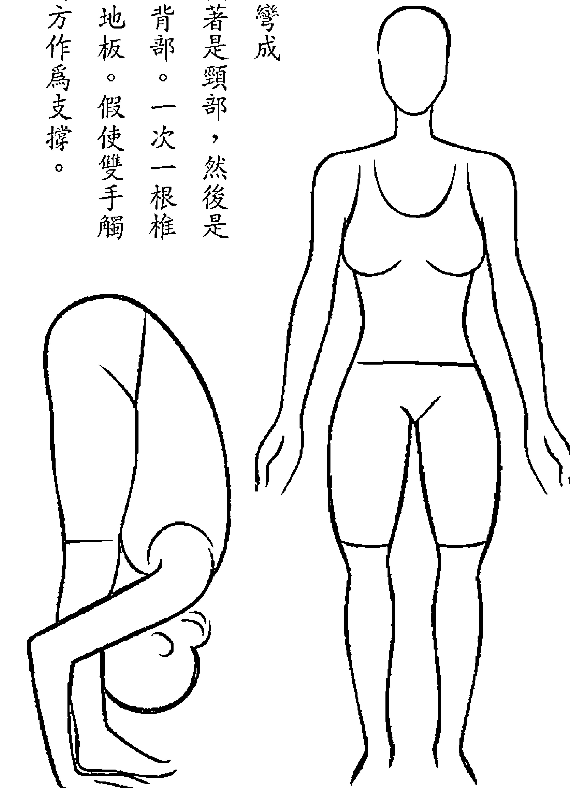

## 练习 3

### 声音静心：主动觉知周遭事物

超越心智的阴谋，进入得到扩展的觉知。更加觉察到你自己和你周围的事物始终在你之内。有时候，你只需要静下心来就能找到它。静心冥想是透过有纪律的聚焦，让头脑安静下来。研究人员推测，原始的狩猎采集社会可能是在凝视火堆的火焰时发现了静心聚焦法，历经后续无数个世纪和社会，静心冥想演变成更具

3. 放轻松，进入最大折叠状态，无论你能够折叠到哪里。设法确保头部或颈部不紧绷。你可以闭上眼睛。
4. 点头表示『是』，重复数次。摇头表示『不』。再次点头表示『是』。
5. 依旧保持折叠式，并持续几秒钟，让血液流向头部。
6. 如果眼睛是闭上的，就睁开双眼，从你的新视角环顾四周环境。暂停一会儿，接收一下。
7. 吸气时，逆转原来的方向，一次一根椎骨，经过下背部、中背部、上背部、颈部、头部，慢慢向上，回复成站姿。
8. 当你返回站立位置时，闭上眼睛，暂停一下。感觉你现在的感受与刚开始练习时，有何差异。举例来说，你觉得刺痛吗？更加敞开吗？更为放松吗？

##### 分解步骤：

1. 选择一个不会被打断的空间和时间。关掉手机铃声，同时设定闹钟，在这段十分钟的静心结束时提醒你。
2. 在地板上找到一个舒服的座位。需要的话，盘腿坐在软垫、枕头或瑜伽砖上（如果不能盘腿，就找一个舒适的姿势在地板上坐正；如果这个坐姿对你而言仍有困难，就坐在椅子上）。最好的坐姿是能够在接下来的十分钟健康地支撑你的姿势。
3. 双手放在膝部，手掌朝上。轻轻地闭上眼睛。
4. 将心思聚焦于发生在周遭的某个声音上，例如，路上的车辆、蟋蟀或水龙头的滴答声。
5. 当心神游移时，儘快逮住心神，将它带回来，回到融入四周环境的行为，聚精会神在某个声音上。假使又神游了，不要感到挫败，大多数人都是这样的。集中注意力需要经常练习，这是静心冥想被认为是一种修练的原因。

结构化的修练。举例而言，某些人称之为「吠陀」的最早期印度经典，提到大约五千年前的静心冥想技巧，佛陀则在西元前五百年左右让静心冥想成为其哲学的核心原则。有许多静心冥想的方法，甚至有更多集中注意力的要点。下述静心冥想积极地将你的注意力集中在来自紧邻环境的声音上，以此方式，让心智远离头脑中的故事，朝向比较重大的周遭事物。

6. 闹钟响后，保持坐着，闭上双眼，暂停一会儿。反思一下这段经验，再继续过你一天的生活。

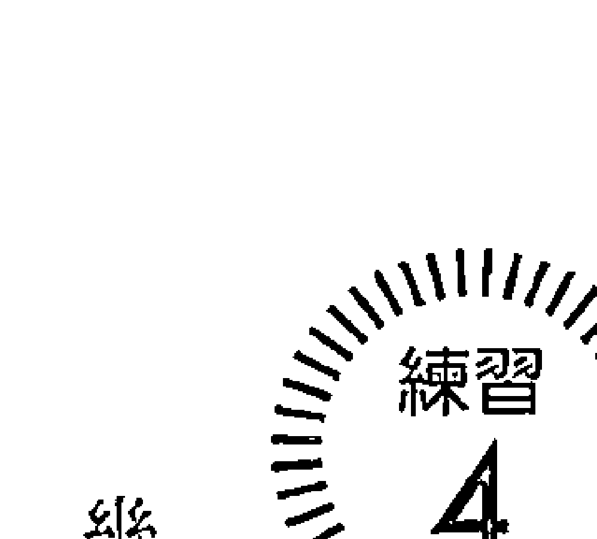

## 洗鼻壶：使头脑清明

几千年来，洗鼻壶（neti pot）一直被瑜伽行者用于「净鼻水疗法」（Jala Neti）或鼻腔清洁。你可能比较熟悉洗鼻壶的现代版替代品——鼻腔冲洗法。无论是当年或现在，做法都很类似，需要让盐水溶液流经鼻腔通道。尽管方法简单，但却需要某种勇气才有办法尝试。不管怎样，此方法的种种好处非常值得你尽力尝试，何况据信好处包括减低过敏和实性症状、清除鼻屎、改善嗅觉和味觉。为自己看看这个古老方法如何帮助你保持整个头脑清晰，即使头部不觉得塞胀，但总是个机会可以使头脑更加敞开，觉察到以前没有觉察到的事物。

如果十分钟静心冥想似乎令你生畏，可随意找一段可以练习这个静心冥想的时间（譬如说，两或五分钟）。无论哪一种静心冥想，最大要点都是实地练习。假以时日，静心冥想的时间长度便会自然而然地增加。

##### 分解步骤：

1. 在洗鼻壶中，将不超过四分之一茶匙的盐与温水混合。使用最纯净的盐，可将刺激性减至最小（例如，非精制海盐）。
2. 俯身靠近水槽，将脑袋转向一侧。
3. 轻轻地将鼻壶的壶嘴插入上侧鼻孔，让鼻嘴舒适地封住鼻孔。
4. 透过张开的嘴巴呼吸。
5. 缓缓举起洗鼻壶，让盐水流经上侧鼻孔，从下侧鼻孔流出，然后流入水槽。要用掉半壶盐水。
6. 当你用掉半壶盐水时，要轻轻地吹、重复地吹，将鼻中的盐水吹进水槽，以此清除鼻腔通道。不要捏住鼻孔。
7. 用剩下的半壶盐水重复上述步骤，清洗另一侧鼻孔。
8. 将盐水吹进水槽后，用面纸或毛巾擦干鼻子。

附注：可预期到新手要实验这个技术几次，才能找到最佳位置。实验的过程中，盐水可能会向下滴入喉咙，感觉类似于水呛到鼻子。若要将此情况发生的机会减至最小，在使用洗鼻壶期间不要说话或大笑。不过你八成会经验到某些不适，因为那是一种不熟悉的全新感官体验。假使真的很不舒服，可立即中断。

#### 练习 5
燕麦去角质面膜：展现你的真我

皮肤细胞大约每二十七天再生一次，意指你其实每个月会呈现一张全新的面孔给世人。如此自我更新的价值自古以来已被理解到，而且以面膜的形式实践了。举例来说，埃及艳后克丽奥佩特拉声称用死海泥当作深层洁肤泥，而中国历代皇室据说会将珍珠和玉石之类的宝石磨碎，用作脸部滋补药。假使你无法取得磨碎的宝石，可不要绝望。简单如燕麦和蜂蜜之类的材料，也能发挥绝佳功效。这类燕麦面膜将会轻轻地除去肌肤的角质，促进肌肤原本该有的更新。利用这个方法反映全新的自我感，或是当你想要祈请全新的自我感时，就好好的使用一下。

分解步骤：
1. 购买钢切燕麦片。
2. 按照包装指示烹调一份燕麦粥。
3. 将燕麦粥放至微温。
4. 像平时一样清洁和擦干脸部。涂抹一层燕麦粥到整张脸上，敷十至十五分钟。
5. 用冷水和毛巾轻轻地将面膜冲洗掉。

#### 练习 6

### 「我是」练习：建立「你是谁」的自信

牡羊座的座右铭是「我是」。有时候，你必须把这一类话说出来，你才会相信。利用描述核心的你的三个形容词（拣选自第48页五项提问的前两个），或是挑选你希望祈请的其他三个形容词，以此提醒自己你的真实本性。譬如说：「我是强而有力的」、「我是英俊潇洒的」、「我是聪明机智的」。无论你选择哪一句，都要对自己说出来——大声地说出来，边照镜子边说。你需要重复几次才能相信，就重复几次。然后进入那个世界，成为那样的人！

一个与「我是」类似的说是由牡羊座法国数学家兼哲学家勒内·笛卡儿创造的：「我思，故我在。」鉴于笛卡儿的星座，这个心智发电机利用思考验证存在，实在是再恰当不过了。当然，有许多替换词，例如：「我感觉，故我在」、「我呼吸，故我在」等等。

进阶版：在步骤 2 和 3 之间加入约两汤匙蜂蜜，可增强保湿效果。

### 小结

头部是与牡羊座相关联的部位，五官（以及处理五官的脑部）是其特色，头部支配着你对世界的看法，以及你在人世间的地位。

- ★牡羊座是黄道周期的第一个星座，其能量涉及你是谁、你在这里是要完成什么事，以及让这一切发生的意志。
- ★假使你坚定自信的牡羊本质被扼杀，或是从另一个方面看，不受（你）管束，你的头部可能会体验到不同的症状，例如，闷胀、流鼻水、头痛。
- ★透过聚焦于头部的提问、练习和活动，校正你内在的牡羊座。运用这些技巧进行自我更新，是公羊和他的出生季节（春天）不可或缺的内容。

> > 原注：
> ①亚伯拉罕·马斯洛（Abraham H. Maslow），《动机与人格》（Motivation and Personality），第一版（New York: Harper & Row, 1970），46页。

# 3

## 公牛的颈部

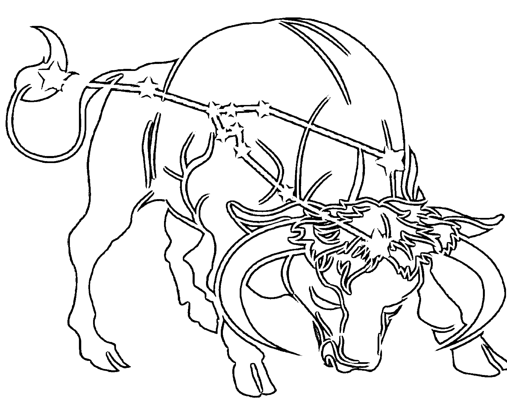

♉ 金牛座

- ☆出生日期：四月二十日～五月二十日
- ☆身体部位：颈部
- ☆主 题：擢升感官享受，超越物质

金牛座是第二个星座，建立在牡羊座知道的事物之上。她长大了一点儿，脱离了牡羊座的新生儿时光，现在是蹒跚学步的幼儿。她有能力识别「自我」，能够将那份自我感投射到人世间，同时藉由抓取、触碰、品尝看得见的一切。牡羊座带着「我是」的座右铭进入人世间，金牛座带着「我有」紧随在后——她看见大地必定会提供的事物，而且想要那一切成为她的。的确，身为土象星座，金牛座天生酷爱物质领域和物质界的所有宝藏，例如，大量的金钱、永恒的艺术、美食、超棒的性爱。大地是感官的游乐场，而在最崇高的层次，赞赏感官体验是金牛座在这里所要表达的。

### 金牛座司掌：头部

公牛是模样特殊的牛，因包含粗大头部在内的大骨架（体重平均超过九百公斤）而闻名。公牛的颈部十分突出，因此在医学用语中，「公牛颈」（bull neck）是专业术语，意指颈部肿大的人（通常是由于肌肉肥大或淋巴结肿胀）。鉴于公牛与其颈部之间的关联，颈部是与黄道的公牛（金牛座）相关联的身体部位，就没什么好大惊小怪了。

颈部是位于头部和背部之间的狭窄结构，由七节椎骨（颈椎）组成。这些骨头算是脊柱的一部分，而脊柱跨越整个背部和颈部，通常被称作脊椎。脊椎有不同类型的椎骨，以颈部的那几节最为细致。每一节颈椎都有一片利于活动的细薄结构，更有一个椎间孔允许来回连接头部的血管和神经通行。但颈部尽管细致，却不虚弱：你的颈部支撑着保龄球般大小的头部，同时可移动头部。事实上，颈部拥有整条脊椎最大的活动范围，每一个方向都可以旋转高达九十度。这样的活动范围使头部能够活动，也让头部（以及头部所包含的眼、耳、鼻和口）得以充分感应周遭环境。

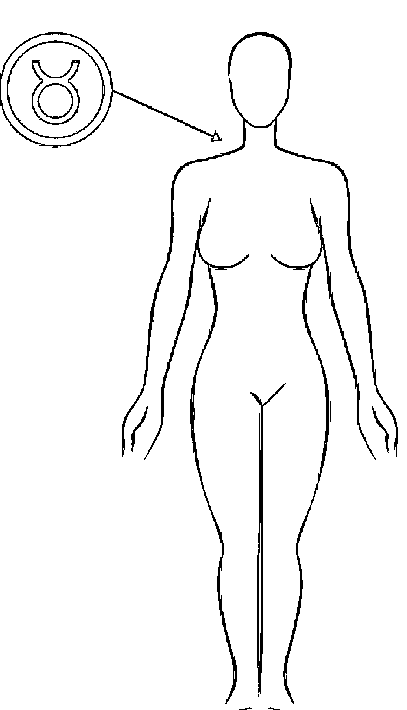

颈部的骨骼结构，参见附录C。

> ♉ 几乎所有哺乳动物（包括人类、公牛、甚至长颈鹿）的颈部都有七块椎骨。

然而，帮助头部接收感官的输入信息只是这场战役的一半，颈部还负责将你用输入信息打造的创作传达到世界其他地方。颈部经由声带完成这件事，而声带是在气管中发现的两瓣膜状皱褶组织，也是演化赠送给饶舌多嘴的礼物。就机械原理而言，皱褶是用来将空气的振动形成声音，再将声音化为言语。言语是你的主要表达方式之一。言语将内在的思想、感觉和情绪传达到外在世界。你选择的用词，以及你选择如何说出那些话，不仅反映出你对自己的看法，更塑造了你对这件事的概念。因此，金牛座所说的话一定要充分表达出她的本质——从实际面到热情面，从肉体物质到文化修养。那不是频谱的一端，而是两端全包。公牛需要尽职地查询贷款利率，同时在家的美丽装潢中升华。假使内在的公牛只表达你的一部分情感，那么你将只表达出一部分的自己，而你其余的思想和情绪并不会神奇地消失；相反地，它们将会逗留在颈部里面，以压力或紧张的形式屯驻。不幸的是，颈部扭伤太容易发生，而且原因五花八门。就身体层面而言，颈部的关节、肌肉和韧带招致压力，是由于头部和颈部的位置不当，例如，当你坐着、站立、行走或阅读时，头部不经意地向前突出或歪向一侧。因为最佳的声音表达需要声带正确定位（那发生在当颈部正确定位在头部和躯干之间），假使你打扰了颈部（以及其内的声带）的校正，就等同于中断了自己的表达能力。花些时间确定自己颈部的状态，为自己检查看看，颈部是否端端正正地介于头部和躯干之间。

### 金牛座健康课题：提升感官享受，最终超越物质

现代社会中，许多人都带着固定前屈的头颅站立。以此姿势站立，头部和颈部突出于躯干前方，仿佛在前头领路。当你走在街上或坐在电脑屏幕前，很可能呈现的是这个姿势。然而，头部虽然是个要角，本意却不是要永远突出。头部本该直接位在心脏上方，由颈部搭桥衔接两者，如此，颈部将最能充分地表达出两个世界，包括内心的情感和头部的知觉。

分解步骤：
1. 站在镜子前，转向一侧，检查侧身轮廓。像平时一样站立，看看你是否没注意到自己的姿势。（不要作弊！）
2. 尽可能地少转头，看向镜子，观察头部和颈部是否向前突出。
3. 如果向前突出，将头部和颈部调整回来，与躯干对齐，使头部、颈部和背部均停在一直线上，两个耳垂的位置就在肩膀上方。假使肩膀向前弯，同样将肩膀挺直起来。
4. 与之前相较，注意觉察这次重新校正有何不同。这次校正应更接近你的理想状态。

超越，意指超过某种限制。在数学中，例如，π或e之类的超越数超过代数的极限；在超验静坐（transcendental meditation）中，修习者进入超越日常意识的觉知状态；在超验哲学（transcendental philosophy），创始人伊曼努尔·康德（Immanuel Kant，太阳和上升星座都在金牛座）里，只要知识超出了你对客体的认知模式，知识就是超越的。无论你以何种方式切割，超验主义（transcendentalism）都允许心灵去

感知你的物质实相，然后说：「嘿，还有许多。」对我们的金牛座本质来说，如此心态尤其切中要害。金牛座品味物质世界，但她对物质界的享受是受到召唤的，为的是好好延伸，以超越眼前的物质。每一个内在的金牛座都欣喜于她可以拥有和掌握的物质事物，她为此而努力工作。每一个金牛就像与她相关联的公牛星群一样，具有坚韧而实际的本质。所以，难怪金牛热爱金钱可以买到的所有好东西，这些代表酬谢她的忍耐，酬谢她坚持贯彻，确保工作好好完成。但全然实现的金牛能量将会超越物质实相，领会到物质实相的更高本质，于是超越身体形相，进入情绪、心智和灵魂的界域。举食物为例。食物就像物质世界的其余部分，是由物质组成，而且就因为是食物，所以可以被消耗。或者，它可以提供一种超越的经验，最佳实例莫过于「玛德莲」（la madeleine），那是作家马塞尔·普鲁斯特（Marcel Proust，月亮星座在金牛）在他的经典作品《追忆似水年华》当中广为人知的小蛋糕。有一天，普鲁斯特边吃玛德莲蛋糕边喝茶，他描述了他与这块蛋糕的经验不只是摄入面糊和奶油，更是某种使他穿越时空的东西。一口美味，将他带回到童年周日早餐的味道、教堂尖塔的声音、对已故阿姨的情感。换言之，那一块玛德莲蛋糕为普鲁斯特提供了一场感官盛宴。这是经验的界域，远远超出了碳水化合物的平凡性能。当然，有时候，套用金牛座精神分析师弗洛伊德的说法，玛德莲蛋糕就是玛德莲蛋糕。客体当然可以因其自身的因素而被享受，不必唤起更多的东西。的确，如果每一口午餐都带你进入被升高的觉知状态，那么日常生活势必充满挑战。但这个状态是我们内在的金牛受到召唤要好好体现的。因为她的禀性与大地密切相关，所以，公牛必须学会不要卡在她的世俗本质里。反之，她在这里是要运用身体的形相作为基础，追求更崇高伟大的经验，而那些经验存在于超乎双手所能持有、双眼所能看见的事物中。从你手中的书本到握着书本的双手，物质世界不但构成你，并且包围着你。这个物质世界的建构要素是

原子，数十亿颗又数十亿颗的原子交叠，创造出你可以看到、尝到、摸到、听到、嗅闻到的世界。虽然原子不是固态的实体，但原子的电磁力的相互作用却呈现出坚实的幻觉，让你感知到一个充满事物的世界。

> 原子是几乎完全空无的空间。然而，如果你将世上的所有原子取走，同时移除其间的空间，那么单单一茶匙如此产生的质量就重约五十亿吨。

在事物（尤其是奢侈品）的领域中，金牛座自在悠游。从精美的珠宝到皮手套，从美食到异国香气，她喜爱拥有奢华。她从耐久的品质和看似坚实的特性中得到莫大的安慰。仿佛是，拥有许多事物可帮助她与世上最大的东西——地球——保持连结。

连结大地可带来美好的事物。但「买者当心」！（货物售出，概不退换！）我们的公牛本质可能会执着于个人的财物。我们可能会忘记，拥有的乐趣其实不在于物品本身，而在于物品所带来的经验或学习。我们比我们的任一项财产（甚至是财产的总和）更宏大。财产可能有助于促进我们感到快乐的经验，但那份快乐最终是由内在升起。

所以，不要成为你自己的米达斯国王（King Midas）。这位神话中的国王将周遭的一切全都变成黄金（包括自己的女儿），然后什么也无法享受。你应该要完全享受辛苦劳动挣来的成果。但如果取得这些是你的最终目标，那么不论拥有多少，你将永不满足。譬如说，你将为了购买一辆豪华名车而努力工作，为了负担名车的维修费而待在同一份工作，为了购买第二辆车而在同一份工作待上更长的时间，于是在十年后意识

到，你从不曾将车子开到户外旅游或开心兜风。你将十分专注于取得这些物质事物，甚至专注到错失了它们所带来的更大欢愉。

长久以来，佛陀一直与金牛座相关联。事实上，人们相信，佛陀出生、开悟和死亡的时间都在金牛座月份（四月和五月）。倘若这是真的，那么藉由创造一门以不执著为中心的哲学，佛陀已学习并教导了金牛功课中最为高深的一课。

> ♉

长久以来，佛陀一直与金牛座相关联。事实上，人们相信，佛陀出生、开悟和死亡的时间都在金牛座月份（四月和五月）。倘若这是真的，那么藉由创造一门以不执著为中心的哲学，佛陀已学习并教导了金牛功课中最为高深的一课。

物质层面提供许多更大的欢愉。诚如牡羊座那一章讨论过的，你的感官透过感觉器官（眼睛、耳朵、舌头、皮肤、鼻子）将资料带到脑部处理。譬如说，在你阅读一首诗的时候，光线反射出诗的字句，穿过眼睛的角膜、虹膜和晶体，与视网膜交会，神经细胞（视杆细胞和视锥细胞）在此将光线转换成电脉冲。视神经接着将这些脉冲传送至产生图像的脑部，从而允许你阅读。这一连串复杂的事件本身相当了不起，但如果你曾经读过一首诗（或是任何文字），你就会知道你的阅读经验甚至比阅读本身更为坚实。因为除了实际上看见文字，你很可能想到或感觉到什么。或许你因某篇短文而形成了某个见解、好好欣赏了某一本书、或是被阅读到的文章所启发，进而深入研究。无限多的印象伴随着你的眼睛所看见的字句。

如此，诗不只是写在纸张上的文字，就像图画不只是图像。诗歌和图画，以及被归类为艺术的任何东西，其更大的美在于它们所表达的故事以及启发的情感。这意味着，你的知觉感受不只是生理上的反应，因为你的身体感受同样引出心智、情绪和灵性的觉受。在这方面，你的知觉感受以一种被擢升的形式存在，超越眼睛所能见、鼻子所能嗅、耳朵所能闻等等。一种被擢升的知觉感受因此被布达了，且不但布达在物质层# 不健康的身體警訊（兩種極端）

品味你的感官接收到的禮物，並不需要數百萬美元或過著退休人員的生活。這是透過物質找到樂趣，而不是被世俗所壓垮的功課。雖然世俗很重要，但人生還有比那更重要的事物。你的感官看見的每一個客體都具有超過其實體存在的價值，它蘊含某段經驗、某個思想、某種情緒、某則教訓，或是某種更宏大的感官體驗，使你可以從中衍生。如此，一切均是物質兼具靈性，使你在此人間的每一個物體中均能找到一丁點的天堂。

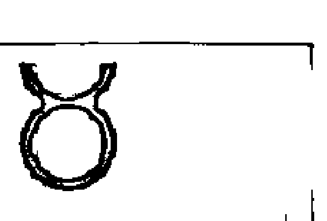

> 在占星術中，「廟旺」這個術語意指一顆行星與某一黃道星座的關係，在此，行星的能量和潛力被放大了。舉例而言，月亮的廟旺星座是金牛座，因此當月亮行經金牛座時，月亮就被擢升了（廟旺），它與五種感官相關聯的品質亦被提高了。

面上，更佈達在高層，存在於思想、感覺、靈感的界域中。看見、嗅聞、品嚐、觸碰……當我們內在的金牛擅長地在基本層次經驗她的知覺感受時，她在這裡是要喚起這一切的崇高形式。她不見得需要親自寫詩或畫圖，但她受惠於被地球的美（所有宏偉的色彩、質地和聲音）所包圍。感官的靈敏度為她持久、勤奮、物質導向的本質提供完美的補充。耗費幾個月時間照顧花園，然後她的一部分可以停下來，嗅聞一下玫瑰。而在現代社會裡（先前提我們每一個人都貼地的金牛），停下來嗅聞一下並不容易，那需要意圖加上練習。但就連真正的牛也會從地上抬起頭來，凝視著天空。因此，金牛座的目標是要將我們的物質欲望提升到一種感官享受的「廟旺」（exaltation）狀態。

這種被提升的感官享受如同第六感，那是一種更宏大的美感，天生存在於我們每一個人內在的金牛本質裡。不要被你平時認定的金牛給愚弄了，因為牛通常並不視為精煉雅緻。金牛座的公牛遠遠超乎鼻子貼地，它是黃道最溫柔、最浪漫、最感性的星座之一。雖然公牛以她持續而耐久的努力聞名，但最大的禮物卻在於：她能夠抬頭仰望，同時享受周遭的一切。

因此，對你內在的金牛來說，至關重要的是：擁抱她企求更高理想的傾向，且在留意物質兼顧尋求感性的所有榮光之中，表達她的本性。她需要討論某一個體的有形優點，同時欣喜於該物體的更大魅力。她應該要按照實際情況提議，也要推動玩耍。假使你本質的這個部分無法讚賞每一種感官必須給出的經驗廣度，那麼你的自我表達將會感到備受約束，因為你的部分金牛被擱置了。在此，為了徜徉於欣喜而存在的那個部分將無處可尋，或是因害怕失去地盤而遭到人為打壓。當然，金牛是一種天生踏實接地的動物，但就連這樣的牛，也可能過度踏實接地。

固定不變的金牛能量，其身體表現可能包括：

- ★ 頸部緊繃
- ★ 僵硬或疼痛
- ★ 活動範圍受限
- ★ 活動時發出噼啪聲或嘎吱響的感官體驗
- ★ 其他：咳嗽、咽喉痛感染、甲狀腺失衡、聲音不穩定

對金牛的安全需求來說，她的深厚根基是必不可少的，那是一種根深柢固的需求。然而，如果她將安全保障誤認為感官享受所帶來的歡愉，她將會發現自己踏上一場永無止境的徒勞追逐。在你的金牛試圖拼湊穩定的過程中，財產將會與日俱增。無論是擁有大量的鞋子，還是買下一支又一支的手錶，你的金牛可能會仰賴不斷湧入的實體商品，才能連結到她的接地感。但若沒有如此適當的基地，潛在的焦慮和恐懼（與缺乏安全感相關聯）終將勝出。

充滿欲望的金牛能量，其身體表現可能包括：

- * 頸部肌肉虛弱
- * 活動過度
- * 不穩定
- * 不斷發出砰砰聲或急著想將頸部動得劈啪響
- * 其他：甲狀腺失衡、喉嚨刺痛、聲音不穩定

你的頸部善於表達到什麼程度？無論是感覺固定不變、充滿欲望，還是介於兩者之間的某處，關鍵都在於：好好聆聽你的身體，給予身體所需要的。要伸展緊繃的脖子，或強化虛弱的頸部，並且運用下述提問和練習，喚醒你內在的金牛座。

# 找回平衡的六項提問

下述提問和練習將充當你體現金牛座特質的個人指南，不妨運用它們擢升感官享受，從而超越物質。

- ★ 你一天花多少比例的時間取得物品（例如，工作、購物）？你一天花多少比例的時間享受這些物品？
- ★ 你是否比較依賴某種感官勝過其他？你有沒有忽略哪一種感官？你如何在一整天當中投入更多的感官？
- ★ 在日常事務中，你有多容易找到更大的美？描述一下你每天停下來嗅聞玫瑰的典型情景？
- ★ 你覺得什麼時候可以最自由地表達自己？當時你和誰在一起？當時你在哪裡？
- ★ 什麼人、地方和事物妨礙了你表達自由？試著注意看看，當你感到表達受阻時，是否很容易觸摸脖子？
- ★ 當你說話時，你的話語通常表達些什麼？某種規劃、準備或回憶？還是讚賞、享受和感覺？

# 金牛座養生操

### 練習 1

### 等長收縮，強化頸部：強健身體的基礎

請照顧身體的需求，培養強健的根基，如此，其餘的你才能安心成長。就連高挺的向日葵，也將基礎深深地紮在土地裡。下述等長收縮鍛鍊將透過最大的活動範圍強化頸部，並且進一步地支撐頭部的基本感官，以及你表達基本感覺的能力。

#### 分解步驟：

- 1. 一開始，擺出輕鬆站姿。
- 2. 雙手手掌平放在前額上。保持下巴與地面平行，將前額向前推入雙手之中，撐住，慢慢數到十。
- 3. 雙手放在頭部後面，將頭部壓在雙手中。保持下巴與地面平行。同樣撐住，慢慢數到十。

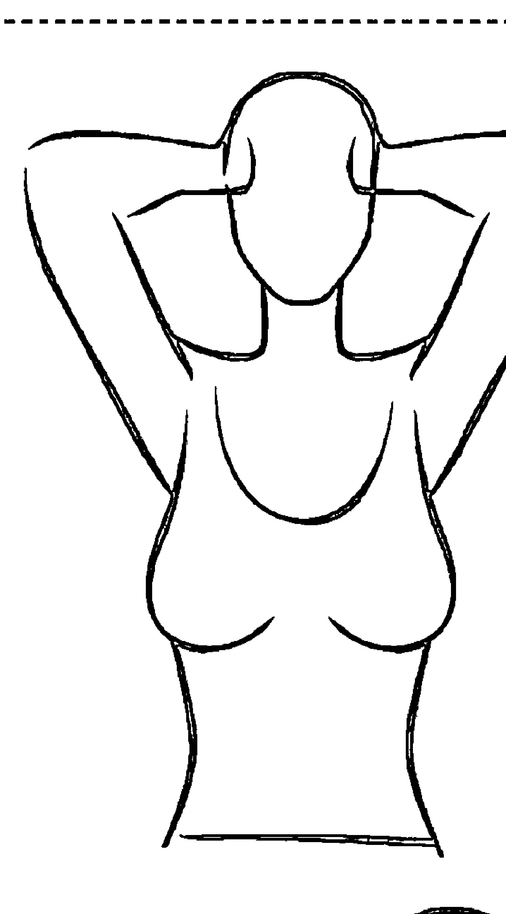

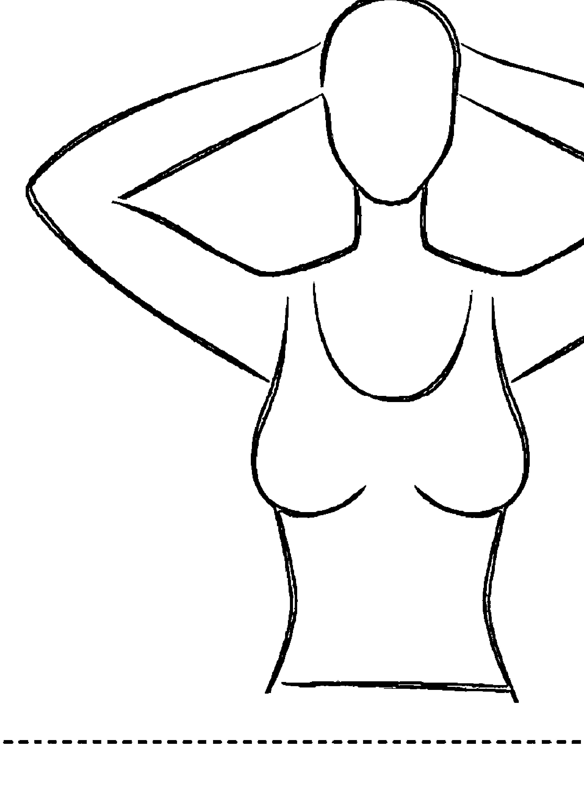

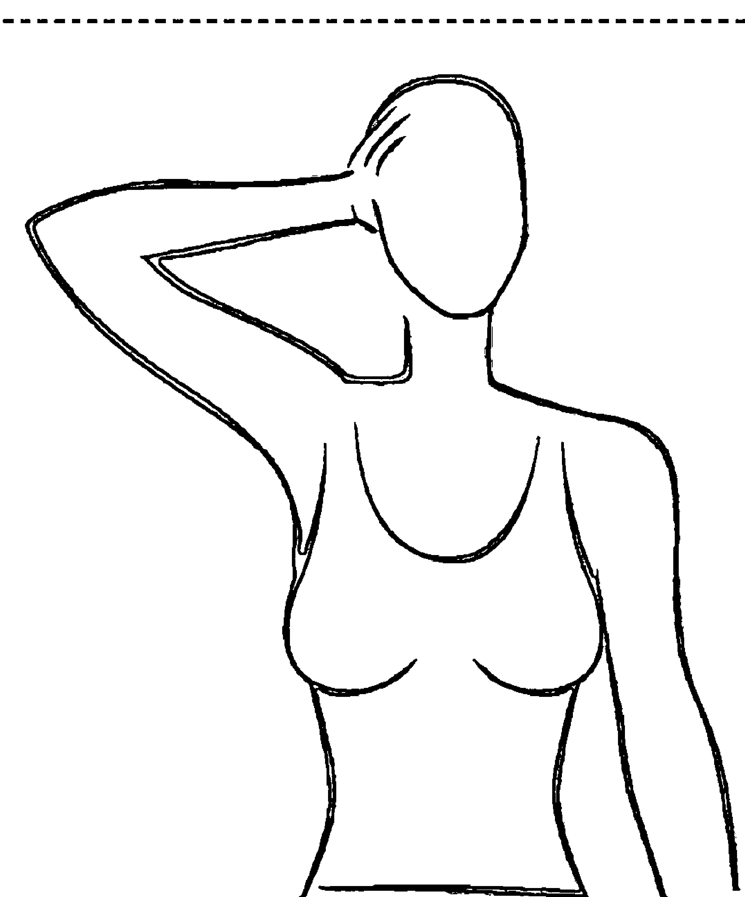

4. 右手放在頭部右側，右耳上方。用頭去推手，彷彿將右耳帶向右肩。撐住，數到十。輪到左側重複此動作。

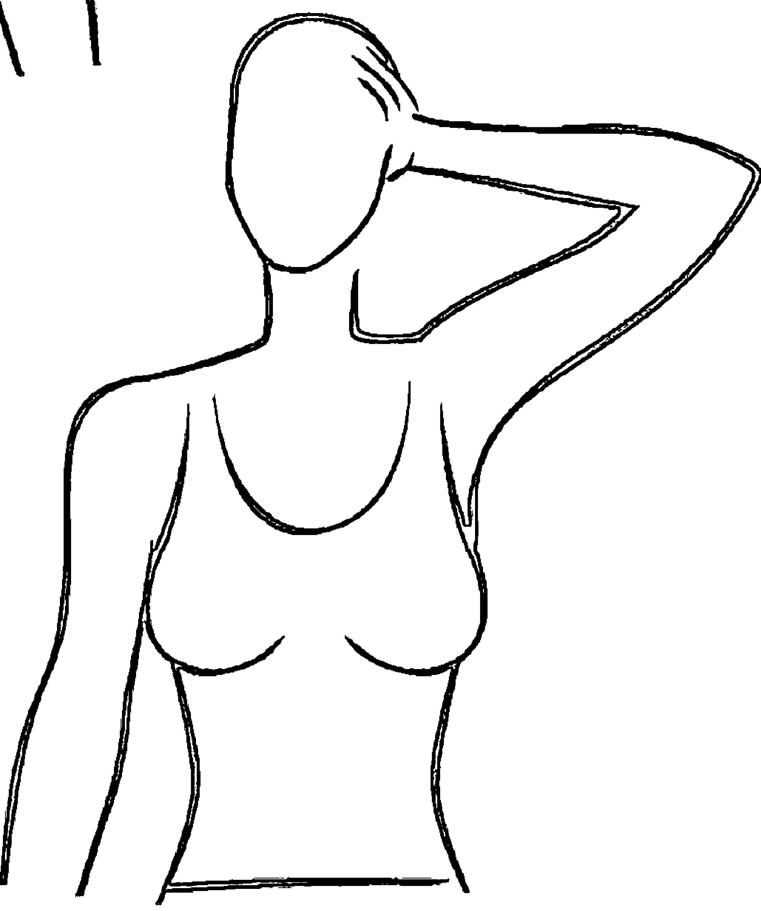

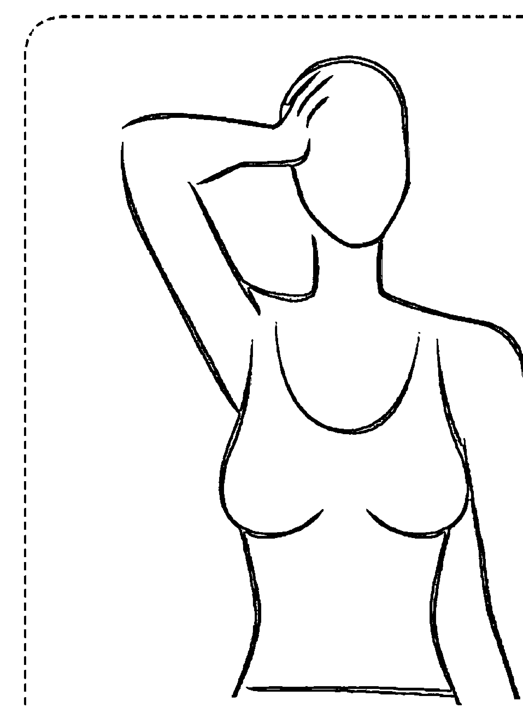

5. 雙手放在頭部右側，太陽穴附近。保持下巴與地面平行，將頭轉向右側，將右側太陽穴朝右手推擠，右手朝太陽穴推撐。撐住，數到十。輪到左側重複此動作。

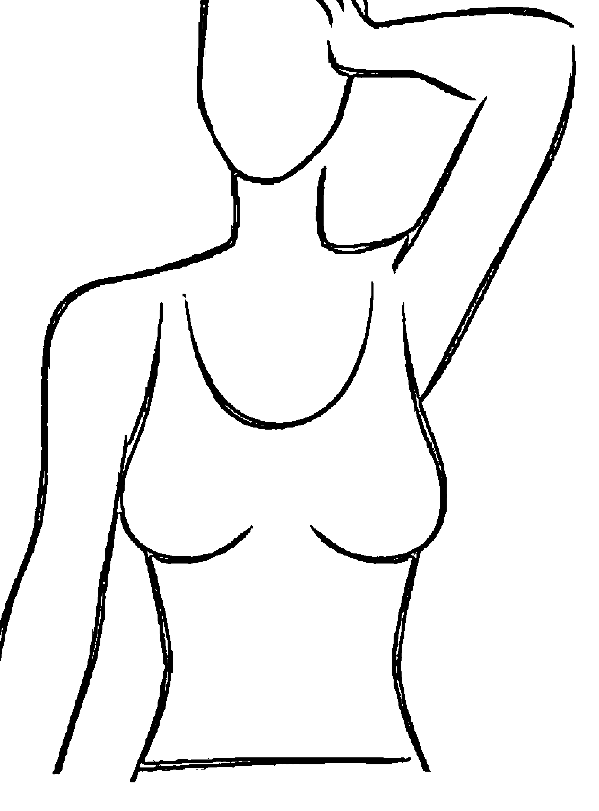

6. 雙手放輕鬆，置於身體兩側，「輕輕地」甩甩頭部和頸部。

### 練習 2

### 頭部、頸部畫圓圈：敞開進入更大的感官體驗

這一系統運動是透過雙手的抵制來強化頭部，使你因此有能力隨心所欲地施加盡可能多或盡可能少的阻力。你愈是用來自雙手的壓力抵制頭部的運動，頭部和頸部的運動就愈小。不論你創造什麼等級的阻力，都一定要保持雙肩放鬆，使肩膀遠離雙耳。

#### 分解步驟

- 1. 站立，雙腳分開，與臀部同寬，雙膝微彎。雙臂垂放在身體兩側。頭部呈中立位置，下巴與地板平行。
- 2. 保持頸部和肩膀放鬆，朝下巴方向點頭，然後將頭「慢慢地」向右轉，設法確保頭部和頸部之間有一顆拳頭大小的球一樣（這將防止頭部的轉動範圍過大）。重複五次。當頭部在中立位置時結束此動作。
- 3. 逆轉方向，將頭轉向左。重複五次。當頭部在中立位置時結束此動作。

一旦你覺得能夠舒服地畫圓圈，就可以閉上眼睛，更進一步深入這個練習。如需額外益處，可在練習中加入呼吸：每次頭部轉向後方時，做一次緩慢、深入的吸氣；當頭部轉向前方時，享受一次緩慢、深入的呼氣。

外在有一整個的世界，而柔軟的頸部將會幫助你感應外界，同時讚賞你所感應到的一切。透過最大的活動範圍活動你的頸部，如此，你的頭部將比以前更能看見、品味、觸碰、聞嗅、聽見。請準備好傳達你所吸納到的一切！此外，敞開的頭部會更有能力隨時表達。

### 練習 3

### 梵唱：追求更完整的表達

學習使用梵唱，以此新方式表達你的聲音。梵唱是一種使用原始聲音傳達神聖意涵的古老技術。譬如說，梵唱RAM祈請與頭部（喉輪）相連的能量中心的特質。藉由重複這個聲音，你接收頭部的能量和功效。梵唱雖然以其印度根源聞名，但也遍及佛教、錫克教、耆那教。聖詩與頌歌的概念被發現存在於甚至更廣大的圈子中，包括猶太教與基督教文化，並出現在「太初有道」和「阿門」之類的措辭裡。在古埃及，金牛座甚至被譽為「神聖聲音的轉譯者」。利用下述梵唱練習表現你自己的聲音。

#### 分解步驟：

- 1. 選擇一個不會被打斷的空間和時間。關掉手機鈴聲，同時設定鬧鐘，在這段兩分鐘的靜心結束時提醒你。
- 2. 在地板上找到一個舒服的座位。需要的話，盤腿坐在軟墊、枕頭或瑜伽磚上（如果不能盤腿，就找一個舒適的姿勢在地板上坐正；如果這個坐姿對你而言仍有困難，就坐在椅子上）。最好的坐姿是能夠在接下來的兩分鐘支撐你。
- 3. 雙手放在大腿上，手掌朝上。輕輕地閉上眼睛。
- 4. 感覺振動源自於胸部，產生聲音HAM（a 的發音像 father 一字中的 a）。讓這個聲音綿長而寬廣，從胸部升起，向上穿過喉嚨。聲音離開雙唇時，感覺 hummm 的振動，如同發 humming 一字。重複此一梵唱，允許一個發音接著另一個發音流出。
- 5. 鬧鐘響後，保持坐著，閉上眼睛，暫停一會兒才起身。感覺殘餘的振動遍佈全身。

為了達致最大效果，要每天練習上述梵唱，持續至少四十天。當你對這個聲音及其節奏有所感，你的靜心就可能有所進展，如此，你會將此梵唱唱得更加柔和。最終，一旦你熟悉了這個聲音及其振動，便可以私下應用它。

### 練習 4

### 在大自然裡漫步：企求超越物質

金牛的誕生是要讚賞地球的豐盛。在野外散步，無論是公園、小山、或是最為啟發你的溪流，都要好好享受你的俗世本質。走路時，投入你的所有感官，融入你的環境：嗅聞空氣，聆聽鳥兒，看見太陽的光線，感受陽光晒在肌膚上的溫暖。現在更進一步，好好應用金牛座對更大之美的第六感。

- - 童年記憶？
- - 幸福快樂？
- - 寬心放鬆？

漫步時，請留意是否升起了哪些在開始漫步之前不曾存在的感官體驗。多加練習，這種接收你的感官的能力就可以成為你自己的。經過幾次專注地在大自然中漫步，你將會發現，你不僅愈來愈了解自己的基本感官，而且更明白感官所通向的宏偉大境界。

> > 進階版：走路時，吹吹口哨或哼哼歌，運用頸部好好地表達。金牛座歌手艾拉·費茲潔拉（Ella Fitzgerald，被公認為二十世紀最重要的爵士樂歌手之一）曾說：「我不想說錯話，而我總是說錯……我想，唱歌的時候，我表現得比較好。」①

### 練習 5

### 裝飾頸部：強化表達能力

低胸露肩裝呈現出女性軀幹的上半身，包含女性的頸部、肩膀、上背部和胸部。儘管這只是女性身體的一部分，但透過裝飾這部分所表達的信息卻是如此之多。無論是巴洛克時代的袒露乳溝，還是維多利亞時代的高領，女人如何對待自己的低胸露肩裝，可以充當某種時尚美學兼社會規範的陳述。男性也是如此。在某個場合繫上領帶可能是恰當的，在另一個場合卻可能不適合，而無論何種情況，表達的都是穿戴者自己，而非這人心中的猜疑。你的低胸露肩裝透露了哪些與你相關的信息呢：

- ★ 你目前如何裝飾領口（高領、項鍊、領結、V領毛衣、圍巾）？
- ★ 領口的裝飾（或缺乏裝飾）表達了什麼信息？你該如何裝飾、暴露或隱藏領口，才能更精準地表達自己？
- ★ 當你穿著低胸襯衫、鬆掉領帶、或是披上絲巾時，升起什麼樣的感官覺受呢？即使不必穿上它們，它們會喚起什麼樣的言外之意呢？

### 練習 6

### 停下來聞聞玫瑰香：擢升感官享受

透過練習，才能懂得讚賞生活中更美好的事物，而最好的開始時間莫過於現在。以下是其中一種方法。

#### 分解步驟：

- 1. 不需特別的原因，為自己買一束玫瑰。
- 2. 將玫瑰插進花瓶，擺在某張你經常會經過的桌子上。
- 3. 經過時，暫停一下，欣喜於玫瑰的和諧交融——它們的豐富色彩、花瓣的柔軟光滑，以及芬芳的氣味。
- 4. 閉上眼睛，專注於玫瑰的香氣。傾身靠近某個玫瑰花蕾，深深吸氣，吸進花蕾的香氣，去感覺它將帶你去到何方。
- 5. 再重複做一次。
- 6. 沒有天長地久，終有一天，你的玫瑰會凋謝。趁你擁有的時候，好好讚賞吧！
- 7. 玫瑰凋謝之後，用乾燥的玫瑰花瓣裝飾住家（撒在床罩上，作為某精心佈置的晚餐餐桌的一部分，或是撒在泡泡浴中），藉此延長你對玫瑰的享受。

此法不適合對花卉過敏的人。

# 小結

- ★ 頸部是與金牛座相關聯的部位。內有聲帶的頸部，可表達出你對自己的看法，同時形塑出你對此一看法的概念。
- ★ 金牛座是黃道週期的第一個星座，其能量涉及活出並慶祝你是誰的最大範疇，包括從物質到感官享受。
- ★ 如果你有美感的金牛本質過度關心安全保障，或是過度渴望感官歡愉，你的頸部可能會體驗到不同的症狀，例如，緊繃、虛弱、咳嗽。

原註：①吉姆·莫瑞（Jim Moret），《拉·費茲潔拉過世，享壽七十八歲》（Ella Fitzgerald Dies at 78），CNN網站檔案，一九九六年八月十五日，http://web.archive.org/web/20061129231320/http://www.cnn.com/SNOWBZ/9606/15/fitzgerald.obit/index.html。

# 4

# 雙生子的雙手

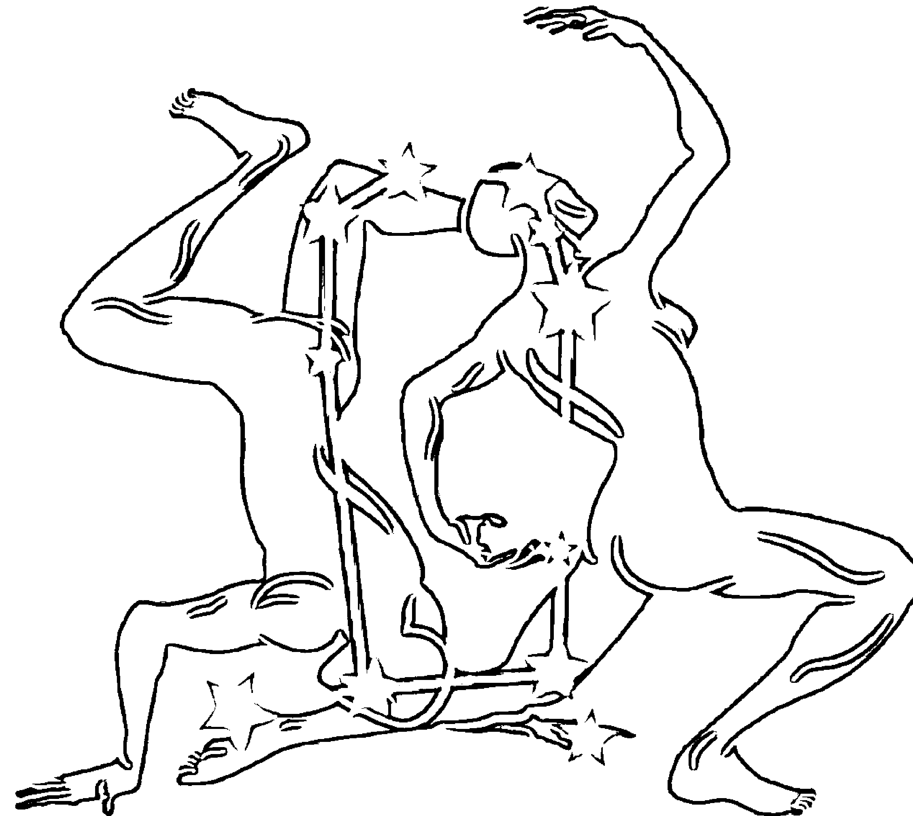

## II 雙子座

- ☆ 出生日期：五月二十一日～六月二十日
- ☆ 身體部位：胳膊、前臂、雙手
- ☆ 主    題：提供服務，成為內在明心的信使

牡羊和金牛（黃道的前兩個星座）將你勾勒成一個個人，描述成一滴水，並與其餘的大海分隔開來。這個個人的基礎很重要，因為來到雙子座，你如今堅實的「我」開始體認到，它屬於一個更大的「我們」。它體認到，你其實居住在一片更大的水域中，即便是分離的，但你仍同時屬於一個更大的整體。雙子座因此是黃道第一個不是以自我（相較於他人）運作的星座，而且開始搭橋銜接自我與他人兩者。雙子座有幸享有聰明的頭腦，以及分享聰明頭腦的機伶，他在這裡是要將個人的理念傳遞給更廣大的世界。

## 雙子座司掌：胳膊、前臂、雙手

在本章標題「孿生子的雙手」當中，「手」其實是整個上肢的「簡寫」（short hand），也有「短手」之意；你有兩個上肢，分別由胳膊、前臂和手構成。雙子座是唯一與一個以上的肌肉骨骼身體部位相關聯的黃道星座。

牡羊和金牛座的自我中心式焦點，可以被表示成遍及此兩個星座的單一狀態——定義「一個」自己，用「一個」星群（例如，公羊或公牛）表示，加上「一個」相關聯的身體部位（例如，頭部或頸部）。相較之下，雙子座生出「兩個」的概念，它引進「兩個」個體（除了自己之外，還有對方），用「兩個」生命構成的一個星宿表示，加上由「兩個」上肢構成的身體部位（包含兩隻胳膊、兩隻前臂、兩隻手）。

然而，這些不同的部位共同合作，達成一個統一的目標——讓雙手得以連結到空間中的物體。你的胳膊和前臂雖然自有其用途，但它們的存在讓你可以打招呼、握手、開門、劃火柴，以及執行讓人類且只有人類能與周圍事物溝通的大量手勢。

很久以前，我們的靈長類祖先即利用此一能力連接廣闊的叢林區，擺盪在蔓藤之間。如今，你的胳膊使你能夠以其他方式連結——從上方的架上抓取雜貨，或是採摘鮮花。胳膊的廣泛接觸起源於肩膀，兩個球窩關節是人體中活動度最大的關節（肱骨形成球，肩胛骨形成窩槽）。

兩個胳膊各生出一個前臂，這個部位通常沒得到太多的關注，但卻好好地完成其份內的工作。前臂延伸在肘關節和腕關節之間，它的兩根骨頭——橈骨和尺骨，容許兩個關節區的活動（儘管活動範圍比肩膀區小許多），但兩根骨頭的角色同等重要，都是將手臂的力道轉移至手中。如此的過渡以及力道的緩和，有助於控制和改善雙手的活動。

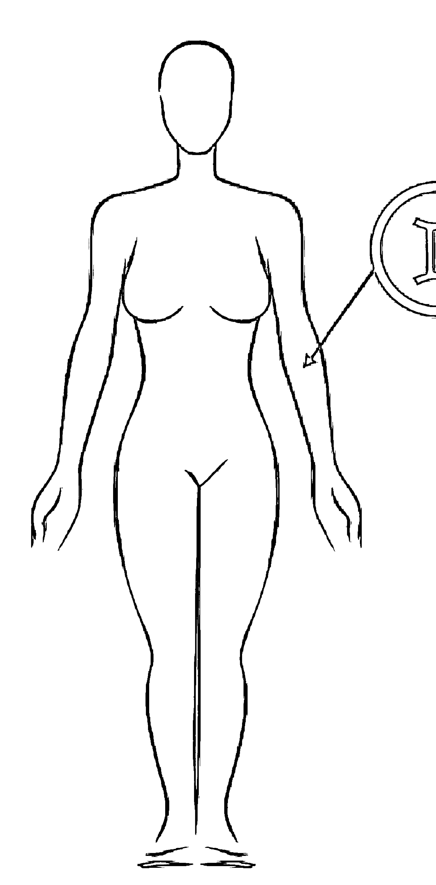

胳膊、前臂和手的骨骼結構，參見附錄C。

與兩隻胳膊的總體活動相較，雙手的活動是細微的。想想看，你的雙手可以十分精細地改變握法，使你能夠握住鉛筆、將鑰匙插入鎖孔中、或是縫好一顆鈕釦。這番靈巧是由大約三十根骨頭、十一組內附肌、以及在每隻手中發現的四處關節部位所啟動。這個複雜的結構是人類特有的，而且人類還有可以反向操作的拇指（因為拇指不受與其他手指相關的韌帶束縛，更以不同的角度附著在手上）。

英文的「拇指」（thumb）來自拉丁文的 pollex。因此，移動拇指的肌肉，名稱上往往有 pollicis，例如，「屈拇長肌」叫做 flexor pollicis longus。不要將 pollex 與 Pollux 混為一談，波勒克斯（Pollux）是雙子星宿中有橙色色調的巨星，也是希臘神話中卡斯托爾（Castor）的兄弟。

總而言之，由於雙手數不盡的活動和操縱，才能擔任身體的終極信使。哎呀，用雙手溝通實在太方便，也因此有幾百萬人得以透過手語，用雙手說出所有語言。

> > Ⅱ
> 
> 「手」的拉丁字根 manus，也是 manifest（顯化）這個英文字的字根，這一點也不奇怪。當雙手取得某個想法（例如，成立某家公司的點子），同時使想法顯而易見（例如，撰寫一份經營計劃書），這時，雙手做的事正是「顯化」。

不過，值得一再重複的是，雙手（當雙子座的星辰出現時）並不是單獨工作的。它們與胳膊和前臂一起合作，將你內在的構思連結到外在世界。舉例來說，假使你有個成立某家新興互聯網公司的好點子，你的第一個步驟之一是：將點子寫下來。在這個動作之前，你的胳膊、前臂和雙手會率先讓你能夠取得紙和筆。你的五根手指頭握住筆，將無形的念頭帶到有形的現實中，草草寫下經營計劃書。有了計劃書在手，你準備妥當，要向某位投資人提出你的構思。

想像這次簡報完美地呈現出來，過程中，你的雙唇積極支持你的構思，你很可能用到胳膊、前臂和雙手，熱切地比著手勢，賦予這個目標更偉大的生命。現在想像一下，你做著同一份簡報，雙臂牢牢地交疊於胸前。即使你說著同樣的話，但你的身體卻散播著全然不同的信息，這一切全都是因為你的肩膀、肘部和腕部關節的某些屈曲和伸展。

以此例而言，你的上肢有助於發展你的點子，同時以兩種不同的方式將點子傳送到世界上，這將我們帶回到雙子座擔任信使的角色。你的信息是什麼？你如何傳達信息？你如何運用（或不用）胳膊、前臂和雙手將信息的概念傳達給需要這些信息的人們？許多人庸庸碌碌地度日，而沒有覺察到四肢的效用，結果雙臂胡亂擺動，關門時被夾到手指頭。你與上肢活動的連結達到什麼程度？可用下述這個簡單的練習為自己檢視一番。

#### 分解步驟：

- 1. 選擇一個姿勢，或坐或站皆可。雙臂交疊於胸前。
- 2. 你先交疊哪一隻手臂？右還是左？你需要一點時間思考答案嗎？還是憑直覺知道答案？
- 3. 慢動作重複這個手勢，注意看看哪一隻手臂先交疊。
- 4. 放鬆雙臂，置於身體兩側。
- 5. 現在，雙臂交疊於胸前，且先從另一隻手臂開始。

很可能你與先交疊的那隻手臂的連結較佳，它是你的主導手臂（根據統計，應該是你的右手臂）；若想先交疊非主導手臂，可能需要先暫停一下才能開始。會發生這種情況是因為你的兩肢不均稱，你某一側的發展勝過另一側，因為你用主導的那隻手進食、書寫、刷牙。但這並不意味著你無法培養另一隻手的財富。這是雙子座的雜耍表演，具有雙重本質（以及偏手性）。你如何存取你的本質的兩個方面，以便可以從甲和乙同時獲益，而不是只得利於某一方？何況假使你擁有兩方面的才能，那麼仰賴一方而排斥另一方，究竟有什麼好處呢？

眾所周知，右手是由左腦所支配，左手是由右腦所支配。然而，偏手性的實相卻複雜許多，而且似乎由種種因素（神經的、遺傳的、行為的、生理的、社會的）匯聚，需要進一步的研究證明，才可以明確地陳述任何結論。

## 雙子座健康課題：啟迪世人，成為內在明心的信使

有許多方法可以提供服務，讓自己的用途更大些，而不只限於為自己效勞。這個效用的發生可以透過許多不同的方法（例如，幫朋友搬家、駕駛公車、成為政治人物），以及根據許多不同的規模（例如，一對一、群組、全球）。「服務」是一個超出個人效用或個人晉升的行為，是一個從自我延伸到他人的行為。

雙子座引進「他人」，將服務的概念帶入黃道帶。「他人」代表世界上不同於你的所有那些人，對方有自己的想法、感覺、希望和夢想。通常在兩歲左右，小朋友會體認到他不是沙坑中唯一的孩子。最終，孩子學習到，他可以更好地服務自己以及他人，不是透過尖叫，而是用「想要」或「不要」之類的言辭傳達他想分享某樣玩具的渴望。就成人而言，學習也是同樣的：你可以要麼開口說話，聽到自己的聲音；要麼用一種認可交談對象的方式，分享你的想法。通常若想被聽見，後一種方法會有效許多，無論是被雞尾酒會上的朋友聽見，還是被行銷會議上的客戶聽見。

值得一再重複的是，他對服務做出的最重要貢獻包括引進「他人」。雙子座能量在此是要透過想法點子來創造並連結社群。但功課。雙子座只是在此與周遭世界分享他腦袋裡的東西，即使他的理由是服務自己，那也無妨。每一個人都可以受惠，不只是嘉惠他人，而我們內在的雙子座就是在此提醒我們這個雙重現實。

在遊戲的這個階段，不再是你對抗他人，而是你「以及」他人，一個由互補的一對所構成的連結。因此，雖然有些人可能將世界看作黑色或白色、天堂或人間、男性或女性、好或壞、較高或較低等等，但雙子座看見的是任何等式的兩邊。這種二元性形成了雙子本質的基礎，而且身為黃道帶的一部分，這個本質同樣存在你之內。祈請你內在的雙子座，將會幫助你「同時」活在好與壞、天堂與人間的世界中。

體認到二元性的美在於：你不必在自己或他人之間做選擇，而是可以擁抱這兩者。你可以培養並享受自己的天賦，同時以嘉惠他人的方式分享。舉個例子，華特·惠特曼（Walt Whitman）是雙子座詩人，他的詩，就像節錄自他的著名詩集《草葉集》的詩作一樣，引進自由詩體，改變了詩歌的領域。假使惠特曼一直將自己的詩作侷限成個人的愛好，只是全神貫注地終生擔任當地報紙的排版員，那麼詩作的領域恐怕早已陷入節奏和韻律的困境。

當然，你不需要是惠特曼，也能成功地提供服務。你可能在地鐵上談笑風生，服務某個陌生人；或是講些驚奇怪誕的床邊故事，服務你的家人；再不然寫張鼓舞人心的便箋，服務同事。服務就是服務，不管觀眾多寡。當服務涉及溝通時，我們的雙子本質尤其能夠好好發揮。

推崇華特·惠特曼為師的當代詩人之一艾倫·金斯堡（Allen Ginsberg）也是雙子座。他跟惠特曼一樣，不墨守成規，也同樣以文學為媒介，用他的敏銳智性引進新的意識形態，最終成為「垮掉的一代」（Beat Generation）及後續由該世代激起的反文化運動的偶像。

信使經由媒介傳達某個想法或點子。無論媒介是電報、信件、文字或拳頭，信使從一開始就已經傳送出各類消息。天使是人世間最古老的信使群。事實上，天使（angel）的英文來自於古希臘字angelos，意思是「信使」。即使你不相信天使，可能也知道，傳說中天使的角色是將天堂的信息傳送給人類，這與雙子座孿生子的角色相去不遠。

孿生子代表雙子座，他們不是天使，而是既屬塵世又屬神界。他們就是透過這份雙重本質，才能有效地提供服務，成為兩個界域之間的信使。的確，他們在此是要讓天堂的最高理想在地球上鮮活起來；他們在此起，而這則神話就像雙子座多才多藝的本質一樣，有著許多版本。最典型的版本從那對雙子座孿生子的誕生開始，說他們出自同一位母親萊達（Leda），卻各有不同的父親。斯巴達國王所生的卡斯托爾是會死的凡人，而希臘天神宙斯所生的波勒克斯則是不死的神。

這對孿生兄弟相親相愛，一起共享了許多探險，包括牡羊座的尋找金羊毛（見第二章）。然而，在一次異地他鄉的探險途中，卡斯托爾被殺。有些神話說，他的死是起於一場因牛而引發的爭端；其他神話則說，爭端是因女人而起。無論是哪一種說法，波勒克斯都悲痛欲絕，一心求死。天神宙斯完成了他的心願，但附帶條件是，波勒克斯將一半時間活在地底下（冥界），另一半時間活在天堂。在某一個神話版本中，這對雙胞胎始終團聚，同在天堂和人間；另一個版本則說他們絕不會在一起，因為一個在天堂，另一個就在人間，然後兩人再易地而居。不論故事以哪一種說法講述，這對雙子座孿生兒均舞動於天地之間、凡間與神界之域。

在天堂的時候，他們轉述人間的故事；在人間時，則傳達天堂的靈性。因此，雙子座是同時無所不在的。雙子本質的適應力極強，可以幫助我們周旋於所處的任何環境，既能

水星（Mercury）是四處飛奔的羅馬神墨丘利的名字，它是 mercurial（敏捷的、善變的）這個英文文字的起源，意指易變的、反覆無常的或飄忽不定的行為。

此外，他有幸擁有饒舌多嘴的天賦禮物，可以扣人心弦地傳達他的觀點。提醒你，對他的聽眾來說，他的觀點可能聽起來反覆無常，今天說一回事，明天又說另外一回事。但這只是因為對任何既定的情況來說，他都同時看見所有面向。這不是外在看似似的悖論，而是屬於孿生子的多面實相。而我們每一個人內在的這個本質都可以幫助我們完成同樣的事。

良好的溝通是將他人的觀點納入考量。不可避免地，你的言辭將會影響你的談話對象，而你應該刻意投資言辭的實際效用。換言之，一個好的溝通者覺察到的不只是此時被傳達的內容，還包括此刻內容如何被接收。你的信息來自何方？你如何傳送信息？你要將信息傳送給誰？最終目的何在？儘管擁有連結點子、大眾、以及將點子連結至大眾的天賦能力，但最重要的是，我們投入自己的雙子本質，使他在我們的生命中完整地實現這個角色。一則信息若要完整地被傳達，需要其媒介、群眾、源起連結成一氣。舉個例子，假使信息是「愛你的鄰居」，那麼很可能會發現，最大效用出現在牧師在講壇上佈道，面對教會會眾，以此作為耶穌基督的教誨。話說回來，同樣的信息印刷在九十五號州際公路沿線的廣告牌上，作為房地產行銷活動的一部分，可能會被視為毫無誠意，於是收不到預期的效果。有效的信息具有改變世界的力量。舉例而言，雙子座美國總統約翰・甘迺迪一九六一年就職演說的措辭，實在令人難忘：「不要問國家能為你做些什麼，要問你能為國家做些什麼。」(Ask not what your country can do for you, ask what you can do for your country.) ①甘迺迪用這十七個簡單的英文字，召喚了他的國家採取行動。他的信息是一份希望，因為他要求國人起身迎向眼前的挑戰。他喚起了勇氣、社群以及和平，喚起了永垂不朽的概念，而且的確，那則信息的力量比這位信使更長壽。有實際效用的信息（尤其是永恆的信息），通常是由「明心」（illumined mind）構成的。你可能會問，什麼是「明心」？你熟悉自己樸實的「本心」（old mind），這個本心聞名的是它有能力思考、合理化、劃分，以及用其他方法理解你的世界。是你的這個部分正在閱讀本書，同時對本書形成洞見；是你的這個部分正在感知。現在想像一下，你的心有能力用更好的方法取得資訊。這種更高層的操作模式就是「明心」的境界。你的這個部分就是知道，不必搞清楚到底怎麼一回事，你的這個部分能以更浩瀚、更廣闊、更綜合（而且神秘）的方法理解你的現實，勝過你慣用的低階心智的陰謀詭計。你的這個部分被連結到……其實，誰知道它連結到哪裡？反正是一個似乎比你自己更大的智慧源頭。你的這個部分不需要你去思考，它將允許本章的資訊去點擊，如此，幾天或幾週後，你目前正在閱讀的內容將會呈現另一層嶄新的意義。你不但需要高層被照亮的明心，也需要低階的慣用心智，因為它們共同合作。理想情況下，明心的高階連結會過濾掉你的慣用心智，於是你知道的一切來自於可能最宏偉的地方，然後你能夠以他人可理解的方式傳達那則資訊。然而，時至今日，與其說如此高層和低階心智的合夥關係是基準，倒不如說是例外。在西方化的世界中，許多人在辦公室的小隔間內一待好幾個小時，往往仰賴低階心智作為思考、提問、答覆、以及如何執行的源頭。這是許多在一將盡時何以如此疲累的原因之一，他們只運用自己一半的心智資源啊！

所以，現在正是時候，要培養高層心靈，重新平衡這個等式。

幸好，雙子座的學生子挺身承擔這份任務。畢竟，明心是雙子座的超級力量。這是雙子座創造力和靈感的源頭，你的信息必須由此湧現。這是雙子座幫助我們服務更大善良的方式——連結到你的自我的更大部分的部分，將它傳達出來。不過要做到這點，你必須祈請你內在的雙子座來體認你的雙重本質。正如雙子能量是平靜兼焦慮的、強健兼軟弱的、忙碌兼懶散的，同理，它既出自高層心靈，也來自低階心智，而你必須有意識地選擇培養高層心靈。

當然，說來容易做來難，但多加練習，那是可能辦到的。練習接收閃現的靈感，然後好好信任它；興起某個聰明、大膽的點子，然後分享它，即使這個點子太過新穎或不合規範。起初，同時操作兩個心智可能感覺如同拋雜耍，不確知誰來誰去，空中和地面之間隨時出現好幾顆球。但最終，雜耍是一場遊戲。還好，你內在的雙子座有倖擁有如此天生敏捷的手法！

雜耍玩家運用雙手將球保持在空中。他八成不是天生便善於左右開弓，而是久而久之養成了平均使用左右兩側的能力。這是我們從自己的雙子座習得的功課：體認到我們的雙重本質，同時將所有面向帶入平衡。我們通常需要平衡的面向是高階層面，最顯著的是我們的高層心靈以及我們與彼端的連結，兩者都在那裡等著被開發。我們的其他面向，例如，與自己的連結以及操作低階心智的才能，很可能早已流暢自如。

假使我們的雙子座無法完成這項任務，那麼他可能會感到受限，無法呈現自己的本性以及能夠完成的事，彷彿他有絕妙的點子要呈獻給世界，然而一旦這些點子離開頭腦，似乎就無法發揮效用。舉個例子，假使你的雙子本質過度仰賴低階心智作爲點子的源頭，那麼這些點子可能會招致失敗，因爲它們不是你在這真正要傳達的信息，或是它們可能沒有與社群的更高理想產生共鳴。再不然，你的點子可能被接受了，甚至在財務上收益頗豐，但你的雙子座卻徒留壯志未酬之感，因爲那些點子太過迎合現狀，而非呈現新的要素。

然後，你可能覺得扎根接地、頹喪沉重、壓縮受限，而這違背了如此神采飛揚的星座的真正本質。

受到侷限的雙子本質，其身體表現可能包括：

-   ★肩膀緊繃
-   ★肩膀、肘部、前臂、手腕或手部疼痛
-   ★肩胛骨緊繃
-   ★上肢關節發出劈啪聲或嘎吱響的感官體驗
-   ★肩膀、肘部、手腕或手部活動受限或僵硬
-   ★靈活度差

你的雙子面向將會同樣感到壯志未酬——只要是他人們連結的能力被削弱了，只要是他忽略了等式的另一半。舉個例子，如果你的點子想像力非凡，但被採納只是基於自身興趣或自我利益，在此情況下，你可能會淪落到疏遠他人、心思渙散，沒有任何穩固的人際連結。或者，你的點子可能單純地欠缺實際應用面，這情節發生在雙子座被包圍在點子的全然光彩或才能中，而不去質疑點子是否真能服務更廣大的群眾。毫無疑問地，許多點子，不論源自何方，都是出色的，但假使點子沒有實現某個更大的宗旨，它們還是會令你的雙子面向徒留不滿之感。
心神渙散的雙子本質，其身體表現可能包括：

-   ★ 關節活動度過大，尤其是肩膀、肘部或手指
-   ★ 上肢虛弱或不穩
-   ★ 肩胛骨突出或呈「翼狀肩」
-   ★ 指關節過度咔咔響
-   ★ 靈活性差
-   ★ 握桿或握手無力

你的上肢溝通和連結到什麼程度？無論是感覺受到侷限、心神渙散，還是介於兩者之間的某處，關鍵都在於：好好聆聽你的身體，給予身體所需要的。要伸展緊繃的上肢，或是強化虛弱的上肢，運用下述提問和練習，喚醒你內在的雙子座。

## 找回平衡的五項提問

下述提問和練習將充當你體現雙子座的個人指南，不妨運用它們提供服務，成為內在明心的信使。

-   ★你在這裡要分享什麼樣的高層信息？分享的對象是誰（個人、社群）？
-   ★你如何分享你的信息（透過詩歌、陶器、PowerPoint簡報）？你想要如何分享？
-   ★當你在溝通時，會運用雙手一起說話嗎？當你與他人握手時，你傳送出什麼信息（自信、被動）？
-   ★你用何種方式使用胳膊、前臂和雙手，將你的點子栩栩如生地呈現出來？
-   ★你最新的靈感或點子是什麼？你多久一次分享你的點子？你多久一次將點子付諸行動？

## 雙子座養生操

### 練習 1：以手部和手腕畫八字形：自在、流暢地傳達信息

這個練習是基本手部和腕部畫圓圈的變型。做法是用你的手創造一個八字形的流暢動作，藉此提供一個簡單的伸展，以透過手腕每天未必能體驗到（但應該要體驗到）的一系列動作來移動手腕。這些動作快速簡易，且能在各種場合中完成，甚至可以在辦公室裡當作電腦族短暫休息時的運動。

分解步驟：

1.  坐在椅子上，雙腳著地，背部挺直，下巴與地面平行。
2.  將右手肘屈成九十度，用右手畫一個八字形。在此空間畫八字形時，要允許手指引導這個動作。
3.  慢慢地畫十個八字形。接著反向畫十個。
4.  換到左手重複上述動作。正反雙向重複。
5.  畫完之後，甩甩雙手。

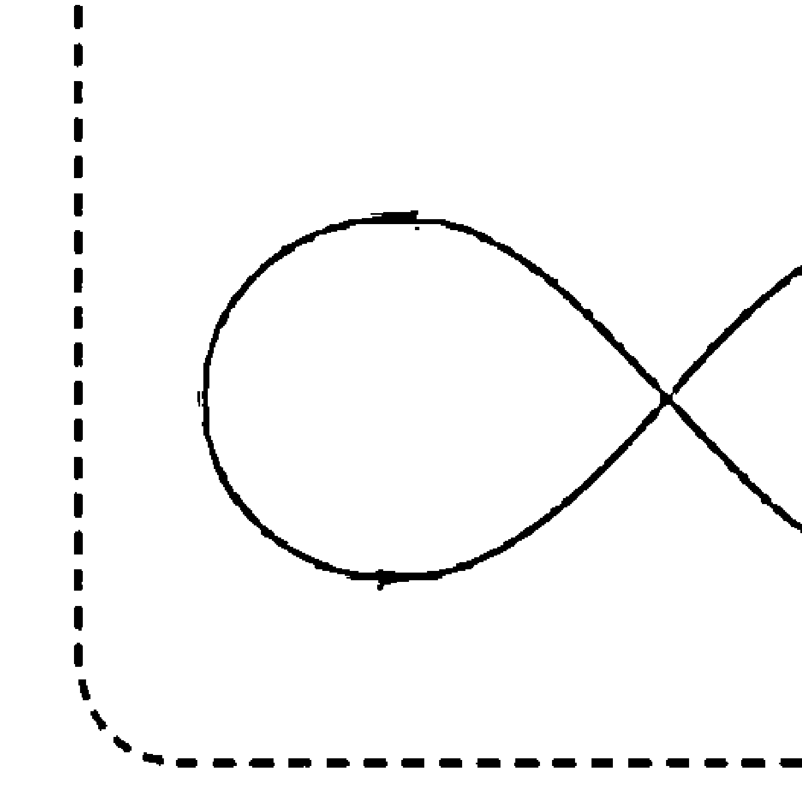

### 練習 2：棒式伏地挺身：連結力氣，並與氣力溝通

威力強大的棒式伏地挺身（或稱「平板式伏地挺身」），可以大大強化你的整個上肢，尤其是肩關節周圍的肌肉。強健的胳膊將會幫助你信念堅定地把腦中的點子連結至周遭事物（當你從明心出發，提出構想時，尤其需要如此堅定的信念）。假使無法在準確定的情況下完成這個練習，可採用下述變型，以減少肩膀、肘部和手腕所承受的重量。

等你運作自如後，可多方嘗試一下這個動作的品質。運用你想要傳達的不同品質來畫八字形，例如，優雅（手指優美地張開）或憤怒（手指形成爪子狀）。留心觀照，如何只用手指、雙手和手腕發送出許許多多不同的信息！

想要更放鬆自在，伏地挺身可以貼著牆壁做，而不貼在地板上。變型：最初呈現棒式時，可放低雙膝，貼到地板上，在後續整個鍛鍊期間，保持雙腿和雙腳抬高。

分解步驟：

1.  從雙手、雙膝貼地的「桌面姿勢」開始。手腕應該落在雙肩的正下方，使手腕、手肘和肩膀三者呈一直線。每隻手的手指都要牢牢貼地並張開。軀幹、頭部和頸部應與地板平行，兩眼向下凝視，稍微看向前方。
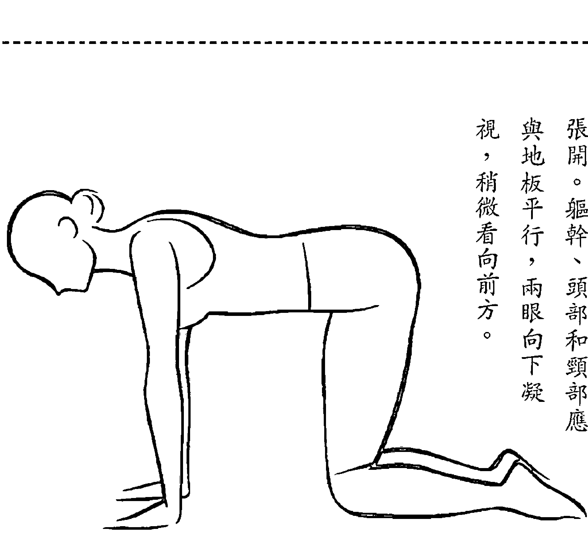
2.  將身體的重心放在上肢和下肢之間。緊縮核心，下方腳趾踮起，然後伸展雙腿。你現在呈現的即是棒式。要撐住至少一回台呼吸時間。
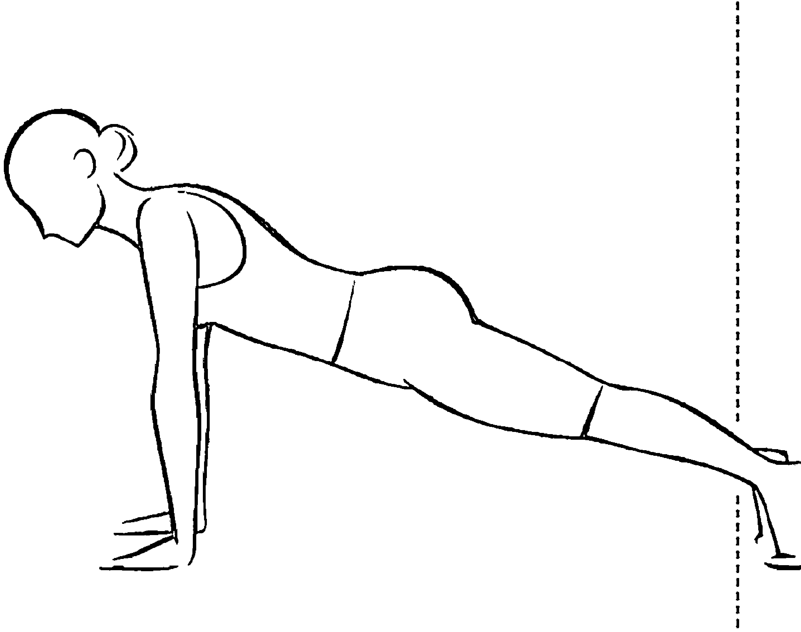
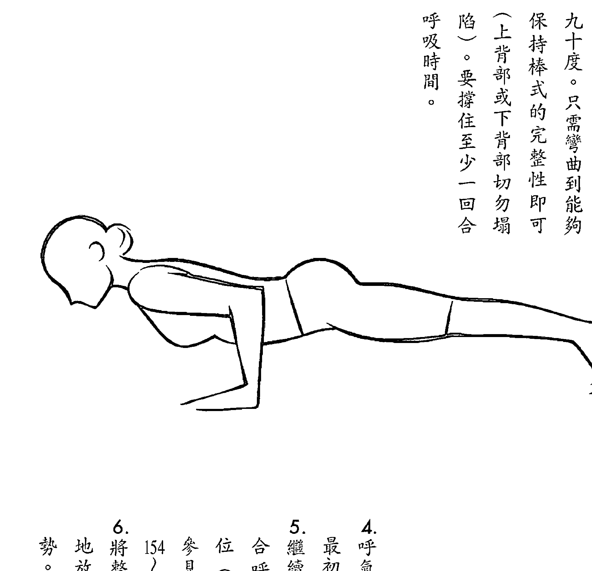
3.  呼氣時，屈曲手肘，最多九十度。只需彎曲到能夠保持棒式的完整性即可（上背部或下背部切勿塌陷）。要撐住至少一回合呼吸時間。
4.  呼氣時，伸直手肘，回復成最初的棒式。
5.  繼續維持棒式，多撐住一回合呼吸時間，保持正確定位（關鍵在於緊縮核心，可參見第七章「處女的腹部」154～157頁說明）。
6.  將整個身體像木板一樣緩緩地放到地板上，退出這個姿勢。

### 練習 3：最高階開悟手印：祈請明心，並與最大的智慧連結

手印法是象徵性的指法，可以祈請並喚起不同的意識狀態。雖然手印的源起仍是不解之謎，但大家都知道，手勢被許多文化視為是神聖的。你可以看見手勢被描繪在印度諸神的繪畫上，在基督教的禮拜儀式期間被當作祝福來執行。在昆達里尼（Kundalini）瑜伽傳統裡，手部的每一區都與更宏大的身體和心智相互關聯，使你得以利用雙手存取自己的其他部分。若渴望能觸及你的明心，在演說之前或寫書之際，可執行「最高階開悟手印」。你將會發現，執行這些動作除了可擴展意識，也會擴展手指和雙手的技能。

分解步驟：

1.  呈站姿或坐姿，將雙手置於心臟前方的祈禱位置。
2.  保持食指碰食指，拇指碰拇指，其他手指交錯。
3.  拇指向下指（應該可以觸碰到你的胸骨），同時食指指向天空。
4.  閉上雙眼，與你企圖引出的更大智慧連結。放鬆並呼吸。

### 練習 4：按摩：實踐服務精神，擴大非語言溝通

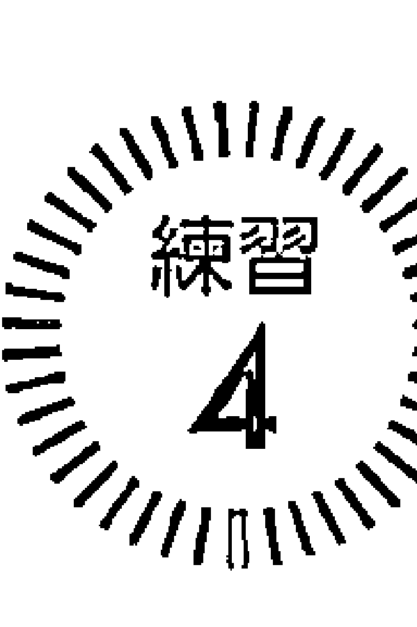

幫你在意的人按摩，是傳達情感的絕佳方式。你可以選擇以下類型的按摩——足部、頸部和肩膀、背部、手部、或是某種組合，前提是，按摩必須在兩造雙方均同意下進行，而且請尊重接受者的界限。不論你選擇與哪一個部位連結，過程中要有意識地投入你的胳膊、前臂和雙手。如同任何的一元性，給予是伴隨接受而來的，在你給出優質按摩的同時，你的上肢也同時得到優質的強化。

若想為你和對方的按摩體驗增添更進一步的平衡，可選用適合雙子座的精油，例如，薰衣草、檸檬草或佛手柑。

### 練習 5：保定球：打通經絡，連結身、心、靈

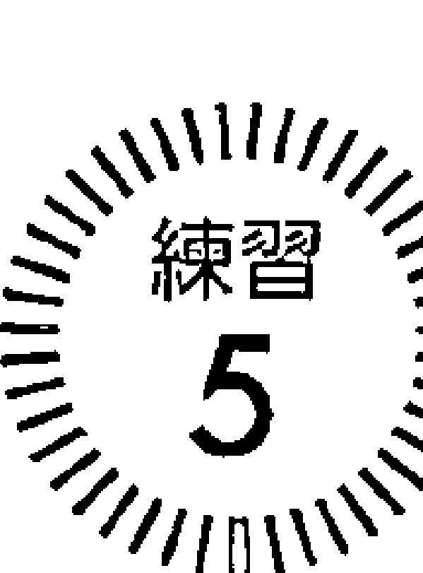

這種健身球被認為是起源於中國河北省保定市，時間大約在明朝。今天，在網路上經常可以找到保定球。許多不同的鍛鍊均可利用這種保定球來執行，不僅可以增強手指和前臂的氣力，還能提升靈敏度。而且人們相信，保定球可以接通連結到全身器官系統的能量經絡。因此，使用保定球可以幫助你連結身、心、靈。

舉一個鍛鍊實例：將兩顆保定球置於一手手掌之中，以順時針方向旋轉幾圈，按著以逆時針方向旋轉。能自在地旋轉幾圈，就轉幾圈。進階鍛鍊：可以在轉圈的同時，讓兩球之間保持距離，使其不發出碰撞聲。然而，不管旋轉多少回，都應該

-   (1) 雙手分開練習；(2) 操縱保定球時，要注意肩膀和手肘的姿勢。

理想情況下，你應該要坐著，肩膀和手肘放輕鬆，雙手放在大腿上，手掌朝上；或是坐著，兩個手肘彎曲約九十度，將前臂放在桌子或枕頭上。轉球時，雙手可以自然傾斜，借重力之助來旋轉。

### 練習 6：自由自在的書寫：顯化你的點子

身為黃道的信使，雙子座是一座點子工廠。他可產生打的構想，只不過並非總是善於執行。許多出色的著作、新創公司、裝置儀器，都源自於雙子的頭腦，但並沒有進一步製成成品。然而，只有當點子從內在被帶到外界的現實時，構思才能被分享，也才能服務發想者以外的人們。寫下你的點子是賦予構想更大生命的第一步。所以，要讓你的意識流流動，同時用雙手書寫（或打字）五分鐘。設定鬧鐘，指示你何時完工（當然也可以選擇書寫更久的時間）。凡是湧現的，都是可以利用的對象。在這個練習中，風格和文法無關緊要，高層心靈對抗低階心智也不重要，重要的是讓點子湧現出來！保## 小結

- ★上肢是與雙子座相關聯的部位，複合的胳膊、前臂和雙手使你得以與周遭事物連結，將你已得到的最佳內容傳達給他人。
- ★雙子座是黃道週期的第三個星座，其能量涉及接通你內在的明光和想像力，傳送以某種方法、形狀或形式啟發的信息。
- ★如果你出色的雙子本質在其自然擴展的範圍內變得太過受到侷限，或是相反地，太過四處渙散，那麼你的上肢可能會體驗到不同的症狀，例如，肌肉緊繃、關節不穩定。
- ★透過聚焦於上肢的提問、練習和活動，平衡你內在的雙子座，運用這些技巧來存取每一個二元性的兩面，無論是自我／他人，還是低階／高層，然後快樂地把玩一個由無限可能性所構成的世界。

> 原註：①白宮通信局，〈一九六一年一月二十日就職演說〉(Inaugural Address, 20 January 1961)，甘迺迪總統圖書館暨博物館，二〇一五年六月十一日存取，網址：http://www.jfklibrary.org/Asset-Viewer/BqXIEM9fF4024ntF17SVAJA.aspx。

## 5 蟹兒的胸部

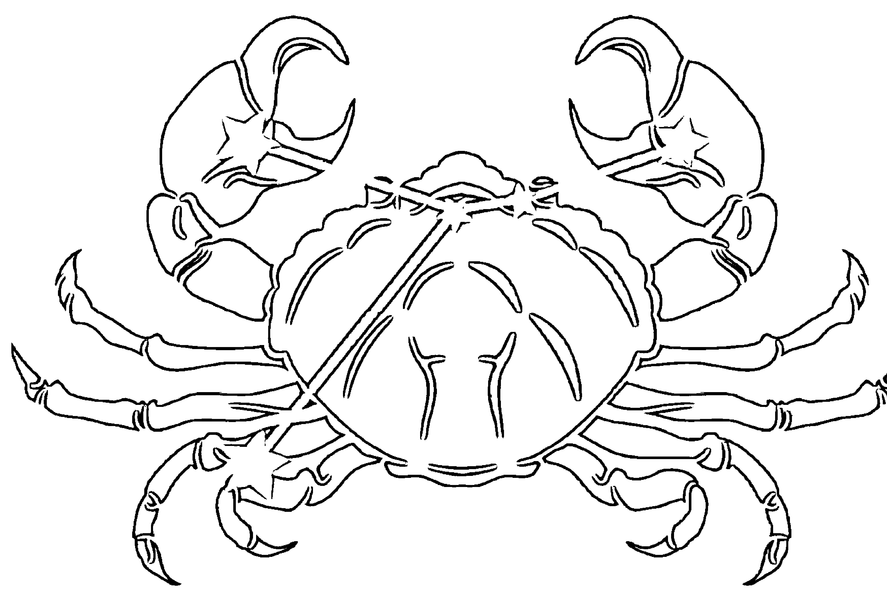

## ♋ 巨蟹座

- ☆出生日期：六月二十一日～七月二十二日
- ☆身體部位：胸部
- ☆主      題：啟動施與受的循環

### 巨蟹座司掌：胸部

對螃蟹來說，她的外殼就是她的家。對人類的螃蟹以及聚焦在我們的螃蟹本質的每一個人來說，家是心臟所在之處，位在胸部裡面。胸部這個與巨蟹座相關聯的身體部位，是身體上滋養和撫育的代表，在這裡，我們敏感的巨蟹能量可以轉變成感覺到支持和受到保護。甚至從嬰兒時期開始，胸部就被認為是家，那是我們吸吮母親乳房的地方。

透過餵食母乳的行為，孩子從母親那裡接收到有營養的母乳，同時鍛造出與母親之間的滋養聯繫。如此具代表性的母子聯繫將持續一生，而且十之八九會支配那許多複製或尋求被給予或沒有被給予他們的滋養，並在後續的關係中將如此的滋養演繹出來。舉個例子，如果這個巨蟹跟著無法提供某種滋養影響力的母親長大，那麼這個巨蟹很可能會在關係中重複此一動力，其伴侶不是實質上、就是情緒上缺席，而且無法滋養她。比起黃道帶的其他星座，巨蟹的本質是更努力地尋求一個可以返回且具支持性質和保護作用的家。

黃道週期的第一季——牡羊、金牛、雙子，談的都是你誕生到這個人世間的課題：你是誰、你如何表達本性，以及領悟到你並不孤單。第二季——巨蟹、獅子、處女，隨著夏季綻放開花。春天自我探索的動力已經有點成熟，從牡羊開始的種子，如今是一株植物。巨蟹座開始這個新階段。在此階段，帶著在雙子座期間引進的自我與他人之舞，進而設定成一個循環。這個循環是施與受，是形成人世間多數關係基礎的互補概念，從自己開始，在人際間擴大，演繹成家庭和社群。巨蟹不僅啟動這個施與受的循環，並且設法確保各個方面在循環的過程中得到良好的支持、平衡與滋養。

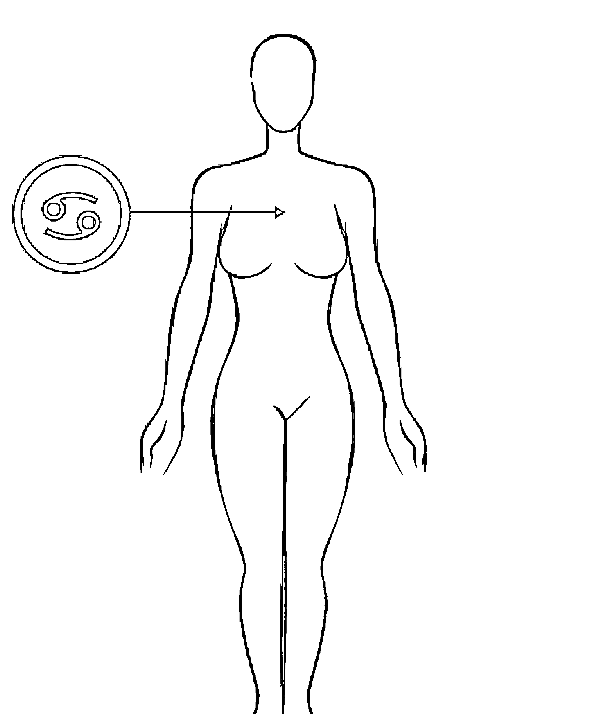

胸部的骨骼結構，參見附錄C。

用的家。從肌肉骨骼的觀點，胸部就是那個家。胸部的特色在於一座給予保護的籠子（一具肋骨架），保衛其中珍貴的內容。胸部的盔甲是由十二對肋骨構成，開始於身體前方的護胸（胸骨），包覆著軀幹的每一面，然後後繞過整個背部，與脊椎（脊柱）接合。雖然有些許的移動性（肋骨隨著你的吸氣、呼氣而升高、降低），但肋骨架專門負責穩定。它不得不如此，為的是維護內容物（肺臟、氣管、食道和心臟）的安全和保障。這些呼吸和消化結構的存在指出了發生在這裡的兩大生物過程——呼吸和消化。

> > 請注意，儘管心臟的位置在肋骨架裡面，卻位在有別於肺臟的獨立隔間之中。而且心臟與上背部，均與獅子座相關聯（見第六章「獅子的心臟」）。

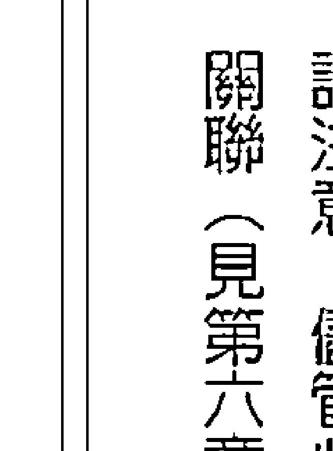

這兩者跟乳房一樣，都與巨蟹的滋養主題有關。消化是滋養的，因為它給予營養。在身體層面，你正在給予你的細胞所需要的食物，好讓它們支持你、使你成長。然後有圍繞著許多食物大作文章的情境，那些也可以起到支持的作用——好比一場有好友相伴的美好盛宴。「心靈食糧」（comfort food）一詞的存在是有原因的！呼吸道也被認為是滋養的，因為就跟消化道一樣，呼吸道為你的細胞帶來燃料。不過，呼吸道的燃料是以氧氣的形式呈現，氧氣經由嘴巴、氣管、支氣管和肺臟，擴散到你的血液中，以便被運送到身體的每一個細胞。如此寶貴的氧氣，是你在環境中經由樹木和植物接收到的，被用來產生一種名為三磷酸腺苷 (adenosine tri-phosphate, 簡稱 ATP) 的能量。三磷酸腺苷是你身體的能量貨幣，它為每一個細胞添加燃料，使你得以行走、呼吸，並以其他方式活著。它是你名副其實的生命力。

> 雖然食道內並沒有發生真正的消化，但食道在消化過程中卻扮演不可或缺的角色——在咽喉與胃部之間傳遞食物。此後發生在胃部和腸道內的消化，則與處女座相關聯。

因此，難怪呼吸被許多傳統視為生命力的載體。譬如說，呼吸被阿育吠陀和瑜伽傳統稱為「普拉納」（prana），被傳統中醫稱為「氣」。在基督教中，透過十三世紀的詞源學，呼吸跟一股有生氣的力量（或稱為「靈」（spirit））相關聯。「spirit」（靈）這個英文單源於拉丁文 spiritus，意思是「靈魂、活力、呼吸」，它也與spira re（去呼吸）相關聯。同樣地，「inspiration」（靈感，一個將空氣吸入肺部的技術名詞）的詞語起源意指上帝或某位神祇的影響力。《阿拉伯文辭典》同樣指出，「spirit / soul」（靈／靈魂）的字根，與「breath」（呼吸）的字根相同，而這些也是希伯來文、德文和希臘文字根共享的連結。

所以，呼吸滋養著身體與靈魂，但這只在你進行滋養的呼吸時才會發生。你是否以深長而充分的吸氣和呼氣接收你所需要的？抑或你處於永久焦慮的狀態中，以頻繁而淺短的方式呼吸？如果是後者，雖然你可以持續用次佳的方式呼吸，但你卻正在剝奪自己各個層面的生命力。就此而言，呼吸的良好程度可以測試出你滋養自己的程度。可使用下述方法評估你的呼吸品質。

## 巨蟹座健康課題：啟動施與受的循環

你上一次花時間注意自己的呼吸，是什麼時候？對多數人來說，答案是從沒留意過，因為呼吸是一個經常被認為理所當然的過程。所以，難怪呼吸品質差是我們現代社會的常態，而非例外。在這個社會中，許多人放棄存在，長期選擇在「戰或逃」的狀態中呼吸，結果導致更短暫、更快速、更表面的呼吸循環，類似受到「加油！加油！加油！」和「快做！快做！快做！」之類影響所促成的呼吸。好消息是，你有能力改變自己的呼吸方式。你可以決定移除呼吸的自動駕駛裝置，因為呼吸是少數由非自主和自主雙方一起控制操作的生物系統之一。這意指你可以重新發現並重塑你的自然呼吸模式，找到一種更綿長、更深入、整體上更具撫育作用的呼吸。你只需要有此意願為自己帶來這個呼吸，同時為了自己而好好領受它。

| 項目 | 描述 |
| :--- | :--- |
| 速率 | 記錄你在一分鐘內的正常呼吸次數（一次呼吸包括一次吸氣和一次呼氣）。平均呼吸速率大約是每分鐘十二至十六次。 |
| 深度 | 完整的呼吸應該不僅包含胸部，還會擴張腹部。你的正常呼吸是否全然進入你的肺部，還是只停在鎖骨附近？你的腹部是否隨著每次吸氣而擴大，還是始終保持平坦？ |
| 品質 | 閉上眼睛，放輕鬆，注意呼吸的自然流動，整個過程中不改變呼吸方式。呼吸應該是平順而連續的。你是這樣嗎？抑或你的呼吸並不規則？經常中斷？變動頻繁？ |

如「啟動發射」（initiate launch）這個詞就出現在太空梭發射升空之前，或是想想狩獵採集社會中，「啟動」教誨。就巨蟹座而言，「啟動」以黃道週期某個新階段的形式出現。雖然第一階段談的全都是「自我」，但下一階段則用「我們」開啟一份更有意義的關係，藉此呈現出每一個人的需求敏感的關係。這個階段幫助你建立一個可以滿足這些需求的堅實架構，譬如成立某個保健相關事業、投身社會工作、或是成為在家照顧孩子的父親或母親。

對敏感的巨蟹本質來說，「啟動」的驅動力意味著，有時候她必須從殼中探出來，有時候她必須暴露柔軟的下腹部以面對嚴峻的世界，儘管所有理由都恰恰相反（通常結合了童年記憶、『原本想要』、父母的責咎）。掙脫過去的依附，走出個人的舒適圈，對誰都不是一件易事。何況當我們走出熟悉、踏入恐懼之際，負責情緒和直覺的巨蟹能量可能使事情變得更具挑戰性。無論是好是壞，穿越恐懼的唯一途徑就是，嗯，穿越過去……隧道盡頭的光則預示著下一個成長階段。因此，雖然堅硬的蟹殼提供美妙的安全港，但如果一個人絕不冒險踏出去，那麼蟹殼就成了藏身處，而不是具支持作用的家。

在內在與外界之間的巨蟹掙扎，是人生必不可少的要素。每一個人都需要時間待在自己的殼裡，以擴充資源、舔舐傷口、積聚成長的能量，然後用其他方式孵化而不受世界影響。同樣地，你也需要與他人連結、體驗更巨大的社會環境，並將你積攢的資源回饋社會：……直到該是再次返回殼中的時候。這隻螃蟹的關鍵在於，不要卡在要麼殼內（依賴、自憐、脆弱的狀態），要麼殼外（給予、滋養、犧牲）。相反地，她在这里是要教導每一個人，我們必須在自我照護與關懷他人之間找到平衡。以此方式，巨蟹啟動了這兩者之間的循環。

「循環」或「週期」是一系列事件或行為，一次又一次地以同樣的順序發生，就像季節的循環或經濟的循環。然而，不要被愚弄了，以為「同樣的順序」意味著「同樣的事」。舉個例子，四個季節構成一個循環，從春天開始，結束於冬天，然後又從春天開始。然而，儘管季節在概念上是相同的，但實際上並不一樣。當然，每一個春天需要類似的元素，如同樹上萌芽的樹葉。但每年實際發芽的樹葉跟前一年是完全不同的，沒有一根草是相同的，而你也是一樣的。從一個春天到下一個春天，你是不一樣的人，從你的思想和情緒，下達你體內的許多細胞，全都迥然不同。
無需動手指頭數算，你的生化循環比比皆是：當然，你可以屏住氣息，暫時停止呼吸的循環，但你的晝夜節律週期總是在運轉，支配著你一天二十四小時的生理過程，同樣的還有你的心搏週期（產生心跳）、尿素循環（協助肝臟為你的血液解毒）等等。

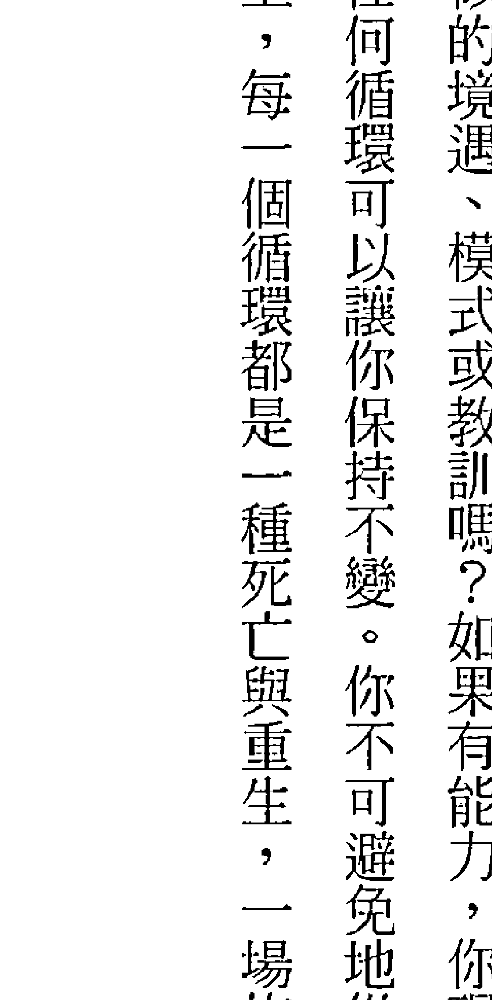

除了影響你身體的許多內部循環外，還有外在循環。譬如在你閱讀本文時，世界正依著它創造日夜循環的軸線旋轉，並以年度週期環繞太陽運行，同時（與我們的太陽系一起）以每隔兩億兩千五百萬年的週期繞著銀河系的中心旋轉。是的，就連我們的星系循環週期也不除外。
循環讓我們有機會從過去中學習，包括過往的思想、情緒、行為和情境。想一想，一年前你在什麼地方。你有能力體認到你生命中類似的境遇、模式或教訓嗎？如果有能力，你現在可以從不同的視角觀看它們嗎？無論你是否覺知到，都沒有任何循環可以讓你保持不變。你不可避免地從以前的你，轉變成此刻的你，而且你有機會再轉變一次。事實上，每一個循環都是一種死亡與重生，一場施與受的潮起潮落，符合巨蟹所在黃道星座的慈悲本質，而這個慈悲本質同時也是你的，使你體認到這一生的一切並為其負起責任。

在巨蟹座藝術家古斯塔夫·克林姆（Gustav Klimt，奧地利知名象徵主義畫家）的作品中，生命的週期是一個反覆出現的主題。舉個例子，在《女人的三個階段》（The Three Ages of Woman，一九○五年）畫作當中，三位女性人物代表生命週期的三個階段，分別透過孩童、母親、老婦人加以表達。

循環從一個地方開始，然後帶你到另外一個地方，包括物質層面和形上層面。舉英雄的循環（又稱「英雄的歸鄉之旅」）為例，循環發生在當英雄（例如，荷馬所作史詩中的國王奧德修斯）從家鄉啟程冒險並進入另一片領土的時候。一路上，他遭遇各種類型的試煉和磨難，從獨眼巨人到海妖，那需要施展莫大的力量和強大的意志力。英雄因此得到蛻變，從探險中帶著可以分享的新力量和新知識回歸故里。在比較日常的層面上，就連最平凡的練習也提供顯著的例子：繞著一條跑道上慢跑一圈或多圈後，你的身體在跑完時所呈現的物理狀態（可能疲憊但更強健）不同於起跑前，而你的思想和情緒同樣得到蛻變。於是，逃開事件成了克服某種身體或心靈壓力的口語指南——剛開始逃離的時候，你處在某種身體和心靈狀態中；返家時，你呈現的是另一種狀態。

循環的力量（無論是帶你到獨眼巨人的島嶼，還是當地中學的跑道）來自一個包羅萬象的過程，內含看似分歧的元素。如果你閱讀第四章，就會想起雙子座的超級力量在於，他看見的不是「或者」，而是「以及」——好與壞、對與錯、天堂與人間。我們的巨蟹本質則幫助我們進一步理解到，這些雙重元素不僅存在，而且一前一後串聯在一起操作。事實上，一個通向另一個。好與壞，對與錯，這些特性未必是相對立的，它們甚至不是同一枚硬幣的兩面；它們是在同一循環上的兩點。

以與巨蟹座相關聯的施與受循環為例。在我們的社會中，我們積極強調施捨，好的施予者總被認為是好人；另一方面，領受者可能被視為自私。然而，如果人人只是給予，那麼有誰可以領受呢？動詞「領受」（receive）的一個同義詞是「歡迎」（welcome），意指以謙恭而怡人的態度接受。當發自內心領受時，領受者將莫大的滿足送給施予者，於是施予者發現自己乃是透過贈予的禮物來領受這份滿足。就這樣，給予轉變成領受，領受轉變成給予，突然間，兩者之間並不是一分為二。再也沒有離散點，有的只是循環本身。

這種施受循環的好處之一是，內在的巨蟹得到關懷。這是一種動態交換，不僅滋養自己，也滋養他人。這是讓你感到完整，同時得到全面支持的方式，也是促使他人如法炮製的手段——只要背後的意圖以及如此交換執行的行為是合法正當的。由於施予在社會中的地位，以致很容易將施予（甚至是非刻意地）作為確認自我價值、建立操控、或是避免親密的手段。在這些情況下，這個舉動於是乎變成了虛假的自我支持循環，因為你透過給予、給予再給予，以企求某樣更大的東西，卻似乎絕不領受。當這事發生時，你其實是將自己的支持感顯現於外，這表示你需要轉而向內，在自己的軀殼裡找到滋養。

施與受的自然循環應該是均勻平衡的。「出乎爾者，反乎爾者」的概念遍佈在時間、空間和經文中，從談論業力的佛教教義，到《新約聖經》的「施予別人，上帝就會施予你們」（路加福音第六章三十八節）。就連十九世紀的強盜男爵兼慈善家約翰·戴維森·洛克菲勒（John D. Rockefeller Sr.）也寫道：「我相信，誠實地盡其所能取得，盡其所能給出，是一個人的神聖職責。」① 的確，這個巨蟹均等地活出了兩個面向——儘管他「盡其所能」取得的方式依舊備受爭議，但他驚人的領受卻精彩地給出平衡了。在他去世時，洛克菲勒已經捐出了十幾億美元財產的幾近一半，用於成立至今仍舊服務社會的醫療中心、大學、教會和藝術基金會。當然，金錢絕不是一個人可以給出和領受的唯一商品。幾乎任何東西都能與鈔票相提並論，因為給出什麼並不如何如何給出那麼重要。這就是為什麼給出一個充滿愛的微笑，可以是一份等同於（甚至是勝過）新瓷器的大禮，因為重點在於隨著禮物被給出的那顆心（甚至是將那顆心給予你自己！），而且是被領受了。所以，無論禮物是一個微笑還是一組盤子或是什麼都行，真正被給出和領受的是某種愛。最終，愛正是促使這個循環得以滋養每一個人的要素。

> 「潮起潮落」是一個通常被歸屬於海洋潮汐的術語，這個循環介於低（潮落）與高（潮漲）之間。潮汐由月球的循環週期支配，螃蟹換殼也一樣，發生在與滿月相關聯的高潮期。月球也統御黃道的巨蟹座，是這個水象星座的守護星。不用說，月球的循環週期提供無數機會，可以蛻棄老舊，揭露新鮮。

## 不健康的身體警訊（兩種極端）

真實地給出並不容易，而領受往往更難。願意敞開地接受別人的捐助，是以脆弱易感為前提；這創造出一個空間，在此，你允許另外一個人真正地影響你。如果對方使你升起某種感受，該怎麼辦？如果你哭了，該怎麼辦？這些問題本身可能就夠嚇人了，更甭提那趟找到答案的旅程。但假如你不是走在生命週期的旅程中，那你就是站著不動。如果你站著不動，持續過久，就等於冒著輪子被卡住的風險——卡在給出和領受之間的某處陰曹地府，那是一帖使你絕對感受不到被充分滋養的處方。

所以，巨蟹座教導我們學習去善於領受，以便更善於給出——針對自己，這是首要之務。整個巨蟹氛圍是一種滋養培育，而且最重要的是，你裡面的螃蟹感受到內心被關懷了，從而幫助你於外在將她的同理能量導向家人、朋友和社群。但領受幫助或關懷所隱含的脆弱易感是巨蟹的弱點，使這隻螃蟹多次縮回殼中，以避免敏感的本質被利用或暴露出來。

即使當巨蟹就是給予自己禮物的那個人時，上述情況仍舊適用。我們的巨蟹能量之所以抗拒從他人那裡領受，不過是反映出我們無法從自己這裡謙恭地領受。自我犒賞的最高形式是疼愛自己、照顧自己，而巨蟹座在這裡就是要創造那個空間。這是錦上添花嗎？你愈能滿足自己的需求，就愈能滿足他人的需求。倘若你無法滿足自己的需求，那麼你的巨蟹本質可能會永久卡住，退縮在殼內，用「為什麼是我？」之類的擔心里葬自己的感覺，指責外在環境害你動彈不得。

埋藏心底的巨蟹能量，其身體表現可能包括：

- ★ 感覺胸悶
- ★ 胸部凹下或塌陷
- ★ 駝背
- ★ 呼吸短促
- ★ 肋骨刺痛或發炎
- ★ 其他：呼吸不適、食道不適、乳房腫塊（例如，囊腫、纖維瘤）

## 找回平衡的五項提問

下述提問和練習將充當你體現巨蟹座故事的個人指南，不妨運用它們啟動一個全新的施與受循環。

你的胸部可以滋養到什麼程度？無論是感覺埋藏心底深處、顯現於外，還是介於兩者之間的某處，關鍵都在於：好好聆聽你的身體，給予身體所需要的。要伸展緊繃的胸部或強化虛弱的胸部，運用下述提問和練習，喚醒你內在的巨蟹座。

與埋藏心底深處相對照的是，在試圖用愛和滋養來填滿外殼時，巨蟹可能反而轉向其他一切人、事、物。情緒滿滿的她，可能聚焦在「他、她、或他們」，以他人作為自己問題和解答的源頭。一旦你在給出和領受循環中交出自己的力量，你的巨蟹能量就會成為不知情的受害者，你的情緒可能會無邊無際地流動，因為你沒有意識到這個循環是你的循環轉生的，而不是別人的。顯現於外的巨蟹能量，其身體表現可能包括：

- ★肋骨損傷（例如，錯位或分離）
- ★胸部疼痛
- ★胸部凹下或塌陷
- ★其他：呼吸不適、痰液過多、情緒性進食、心口灼熱、乳房腫塊（例如，囊腫、纖維瘤）

> ★ 你認為為什麼是你個人的外殼，是你認為最滋養的地方（臥室、海灘、靜心冥想）？什麼動機促使你進入自己的殼中？什麼動機促使你從殼中探出來？

> ★ 你需要什麼才能讓自己感到安全、滿意、得到支持？你需要從別人那裡領受到什麼，才能感到安全、滿意、得到支持？

> ★ 你給予自己多少？給予他人多少？你從自己這裡領受多少？從他人那裡領受多少？

> ★ 什麼感知和行為可能使你無法謙恭地給出，謙恭地領受？

> ★ 你在呼吸之間注意到什麼連結？你感覺（或是沒感覺）得到多少滋養？你因一次放鬆的呼吸而感到平靜，還是因為一次快速的呼吸而感覺亢奮？

## 巨蟹座養生操

### 練習1

### 全球呼吸法：透過呼吸來給予和領受

吸氣時，你從環境中接收氧氣，為你的細胞帶來它們所需要的；呼氣時，你將不再需要的東西（二氧化碳）帶回環境中，讓環境接收它所需要的。以此方式，呼吸的循環模仿了施與受的循環，因此，讓每一回呼吸變得美好吧！用「全球呼吸法」重新建構適當的呼吸模式，此法可提醒你的胸部如何促進一回具滋養作用的呼吸。

分解步驟：

- 1. 找到一個平靜舒適的位置，平躺在地板上，雙腿伸直。
- 2. 雙手交疊，放在胸前（居中線，鎖骨下方）。深入而緩慢地呼吸，隨著每一次吸氣，胸前隆起，貼近雙手，感覺胸部的「前區」擴展。重複五遍。
- 3. 伸長雙臂，置於身體兩側，雙手手掌平貼於地板。深入而緩慢地呼吸，隨著每一次吸氣，上背部貼地下壓，感覺胸部的「後區」擴展。重複五遍。
- 4. 雙手各放在肋骨架兩側（通常是舒服地將雙手放在胸部下方的位置，手指指向內側）。深入而緩慢地呼吸，感覺肋骨架兩側如何「側向」（向外側）移動，各自貼近你的左右手，擴展，使得雙手在每次吸氣時彼此分得更開一些。重複五遍。
- 5. 全向呼吸法：該是組合上述四個步驟的時候了！將雙手放在身體兩側，手掌平貼於地板。深入而緩慢地呼吸，每次吸氣時，感覺肋骨架如何同時向前、向後、向兩側擴展（像氣球一樣）。重複五遍。

## 練習2 上犬式：從殼中探出來

如上述步驟所示，肋骨架隨著每一次呼吸而朝許多方向擴展：前區、後區、側面。那是為甚麼你的肋骨上和肋骨之間有那麼多肌肉的原因——可方便移動肋骨！有些方向對你來說比其他方向容易些，那是自然的。無需評斷，觀察即可。做這個練習，將會幫助你以均衡的方式擴展肋骨架。何況除了重新建構呼吸模式，你也可以運用全向呼吸法的平靜效果，作為放鬆、改善心智焦點、增強能量的工具。請注意，學習這些指令時，第一次將花費最多時間。一旦經過練習，就可以在大約五分鐘內完成這個順序，因此強烈建議不要太過著急。

雖然巨蟹酷愛家中的溫暖和舒適，但有時候她仍必須探出頭來。她能教導他人的不外乎就是均衡照護的重要性。儘管如此，要螃蟹待在家裡，遠比要她出來容易許多（外面的掠食者四處橫行啊！）。利用這個姿勢，用強健而開闊的胸部幫助你脫殼而出，留在殼外。當你能夠展現自己時，就無需害怕他人暴你之短。

分解步驟：

- 1. 肚子貼地俯臥，雙腿完全伸直，腳尖貼地。手肘彎曲，置於身體兩側。手掌平貼於地板上，分別位於兩側肩膀正下方。

假使想要降低這個姿勢的強度，可保持肘部微彎，藉此榮耀巨蟹的慈悲，同時增加舒適度。

- 2. 伸直雙臂時，雙手平均地按壓地板。抬起軀幹，讓身體向上呈弧形。頭部和頸部應該要跟著屈起，讓視線向上、向外（但頸部不被壓縮）。同時，腳尖貼地下壓，幫助你將雙腿上抬幾英寸。此時，只有手掌和雙腳著地。
- 3. 維持這個姿勢時，要保持大腿微向內轉，雙臂微轉向外，使肘部的折痕朝前。維持雙肩低垂、向後。放鬆下背部。鬆開臀部。
- 4. 以此姿勢進行十回合的吸氣和呼氣，然後緩緩放低身體，回到地上。

## 練習3 昆達里尼開胸法：啟動你自己的循環

當帝王蟹蛻殼時，牠蛻掉舊殼，化成新殼。這個過程開始於實際蛻殼的前一天（這時帝王蟹會吸收可幫助舊殼膨脹的海水），然後在實際蛻殼時，開始在接縫處分開。隨後是大約十五分鐘的拖拉推動、踢踹猛扯，帝王蟹便從舊家出來，安頓在新家中。這是一種再生的循環，一生中發生大約二十次。而這也可以發生在你身上。這個昆達里尼修鍊法名為「上半脊椎屈伸簡易坐」，是一套絕佳妙法，可以刻意進入這個循環，同時保持其流動，如此，你就不會卡住。

分解步驟：

- 1. 舒服地坐在地板上，雙腿盤起，腳踝交叉。將交叉的腳踝盡量往前伸到你可以坐直坐正為止。如果需要進入或維持某個適當的坐姿，可將軟墊置於坐骨底下。
- 2. 雙手緊握兩個腳踝，保持手肘打直。
- 3. 保持手肘打直，將胸部向前挺，挺到胳臂前方，然後再將胸部後屈至胳臂後方。這樣算一回合。練習這個動作五回合，保持下巴與地面平行，使頭部維持水平，不像脊椎那樣移動。
- 4. 接下來幾回合，每當胸部向前移動時就吸氣，每當胸部向後移動時就呼氣。專注在胸部，以胸部作為啟動這個運動的身體部位。這些運動應該要快速而有活力，但卻是流動的。
- 5. 一旦你感覺自己找到了那份流動，就進行三十回合，搭配協調一致的呼吸。

## 練習4 平躺側邊扭轉法：自我照護與滋養

一旦你找到了這個運動的節奏，可以不費力地前後來回循環，就搭配呼吸試試看。不要將呼吸加入每一次的運動中，而是看看能否透過呼吸來啟動這個運動。這個做法可能更具挑戰性，但同樣值回票價。

如前所述，現代人根深柢固地習慣於神經系統的交感反應，也就是俗稱的「戰或逃」。當你從家裡飛奔去上班、上健身房、上超市，然後再次返回家中，檢查著手中的待辦清單，你的交感神經系統不斷被啟動。不過，你的這部分生理機能最適合逃離獅子，卻不適合保持長期的警戒狀態（這是由副交感神經系統的「休息和消化」功能加以平衡的）。副交感神經使你可以深度呼吸、吃得津津有味、徹底消化。換言之，你的這個部分談的全都是「存在」（being），相對於「作為」（doing）。這個部分的你是「滋養者」，相對於「成就者」。當你放鬆地做著這個開啟胸部的扭曲動作時，要允許自己滋養自己。

分解步驟：

- 1. 背朝下仰躺，雙膝彎曲，雙腳平貼於地板上。雙臂向身體兩側伸展，使身體呈T字形。雙手手掌朝上。允許這樣的伸展透過手指頭一路流動。
- 2. 呼氣時，雙膝轉向右側，保持左肩、左手臂和左手緊緊貼在地板上。只要轉到能夠讓左肩、左手臂、左手維持緊貼地板。試著讓雙膝與軀幹保持垂直。如果膝蓋碰不到地板，可在下方放一塊瑜伽磚作為支撐。
- 3. 將頭輕輕地轉向左側，與膝蓋呈反方向。維持這個姿勢，深呼吸十下。
- 4. 換邊，先將雙膝轉回到中央，然後轉向左側。軀幹仍舊平躺在地上。雙膝轉向左側時，要設法確保右肩、右手臂和右手緊貼在地板上。一旦雙膝來到最終位置（必要的話，使用瑜伽磚），再將頭輕輕地轉向右側。維持這個姿勢，深呼吸十下。
- 5. 若要退出這個姿勢，就讓頭部和雙膝返回到中央。暫停一下，享受放鬆而開放的狀態，然後再起身。

## 練習5 創造屬於你的時間：優先照顧自己

前一個練習（平躺側邊扭轉法）將你打開，進入滋養。來到這個練習則是時候到了，該要更深入地讚賞自我照顧，並在日常生活中優先照顧自己。「自我照顧」可以是你認為屬於滋養的任何活動——閱讀一本好書、編織、烹飪、運動等等。重點在於好好作出承諾，不論是什麼活動，都要運用良好的計畫來建立模式，將某些健康的新習慣納入日常生活中。

分解步驟：

- 1. 覺察：製作三份清單，以確認(1)在你的「理想」生活型態中，滋養你的是什麼？(2)具滋養作用的習慣，如何存在於你的「實際」健康生活型態中？(3)存在於這兩者之間的「障礙」是什麼？舉個例子，假使睡前閱讀對你而言很滋養，請注意，即使你想要每晚閱讀（理想上），但每個月只能做到一次（實際情況），因為深夜時分你還在發電子郵件（障礙）。
- 2. 承諾：從你想要且能夠做到的「理想」清單中，選出一項。要踏出第一步，追求你所渴求的生活型態的改變，將它寫下來、錄影下來、告訴某位同事、或是用其他方法讓自己負起責任。
- 3. 計畫：若要堅持承諾，可創作一份符合你目前所在位置的計畫。你的計畫指定你每週撥出時間致力於某事，無論是一週一次或五次，都無關緊要；重要的是，這事很容易做到。從小處開始，結果會不言自明，你的健康修練將會自然增長。
- 4. 支持：要求摯親幫你落實你的計畫。他們在哪一個面向最能支持你？要盡可能具體明確。你可能會驚訝地發現，一旦你清楚地要求摯親的支持，你就會領受到。

## 練習6 讚美：帶著感激和恩典領受

這個練習不言自明，不過可能比你想的難。要從實踐中找出原因！

分解步驟：

- 第一部分：想一件事，那可能是你的本性，或是你做得很好的事，譬如說，你可能生性慷慨或是善於編織。那應該是你早已感覺良好的某樣東西。看著鏡子，與自己保持目光接觸，然後用諸如此類的話讚美自己：「我是【插入選擇的字詞】！」而且那個特點「超讚！事實上，我真的很棒，令人讚歎！」邊說邊微笑，說完後再微微一笑。暫停一會兒，讓自己感覺良好。
- 第二部分：下次有人讚美你時（姑且不論讚美的強度或你是否信以為真），就像第一部分一樣，全心全意地領受。帶著真誠的笑容回應，用言語表達感激。不要否認、解釋、緩和、或加上「但是」之類的話。
- 第三部分：讚美某人。對方是朋友、同事或陌生人，都不打緊——要讓那個片刻啟發你。無需事先規劃。一旦你看到某人，認為她整個打扮好看極了，或是在工作上表現出色，或是做了一頓美味佳餚，就照實告訴她。直接說出來，簡單地說，帶著微笑。留意對方如何反應，而且要注意不管對方怎麼回應，這麼做，你有何感覺。

## 小結

- 胸部是與巨蟹座相關聯的部位，內含的結構使你得以在實質上和象徵意義上均深吸一口氣，你個人的寶貝胸部代表著撫育和滋養。
- 巨蟹座是黃道週期的第四個星座，其能量涉及施與受的天賦禮物，這些被納入一個為自己和他人添加燃料的循環中。
- 如果你敏感的巨蟹本質太容易退縮在殼內，或是太常暴露自己，那麼你的胸部可能會體驗到不同的症狀，例如，呼吸淺弱、胸悶。
- 透過聚焦於胸部的提問、練習和活動，平衡你內在的巨蟹座。運用這些更深入地探究施與受的循環，同時記住，若要好好滋養他人，自我滋養是必要的。

原註：
①洛克菲勒家族辦公室，「約翰·洛克菲勒，一八三九～一九三七年」，洛克菲勒檔案中心，一九九七年九月，http://www.rockarch.org/bio/drsr.php。

## 狮子的心脏

## ♌ 狮子座

- ☆出生日期：七月二十三日～八月二十二日
- ☆身體部位：心臟，上背部
- ☆主    題：綻放心的光芒，帶給人力量

前一個星座巨蟹座帶我們進入身體的軀幹，獅子座則繼續這趟旅程，深入探究心臟。這顆「心」代表勇氣、奉獻、慷慨，以及最深刻強烈的愛。而獅子在這裡所要給出、領受和照亮的，也就是「愛」——主要以「愛自己」的形式呈現。獅子座星群擁有夜空中最明亮的星辰之一「軒轅十四」（Regulus），這顆星精確地反映出獅子座在人世間所要完成的事：綻放心的光芒，照亮周遭的一切人、事、物。

> ♌
約有兩千一百六十年的時間，「軒轅十四」一直是獅子座不可或缺的一部分。儘管如此，二〇一二年底，軒轅十四進入了處女座，它將在此停留另一個兩千一百六十年，然後進入天秤座。不過，請注意，軒轅十四仍舊屬於獅子座星群。這些變化與星群和星辰穿越黃道星座的明顯運動有關。

## 獅子座司掌：心臟和上背部

心臟和上背部是與獅子相關的身體部位。從解剖學來說，你的心臟是一個攸關生死的器官，它抽送血液，使血液流經血管。這血液提供氧氣和營養素給身體的所有細胞，同時移除體內的廢物（例如，二氧化碳）。沒有如此的血液循環，你的腦便會在四到六分鐘內死去；骨骼、皮膚、肌腱會撐久一點，但也只能達十二小時。總而言之，對只有約兩百八十公克的肌肉來說，這是一項艱鉅的任務。 心肌位於肋骨架的中心區附近，介於肺臟之間。心臟雖然位居肺臟的中間，卻有心包將其分隔開來。心包是極薄的囊，包住、錨定、同時保護心臟。實體上，心臟與肺臟是分開的，在能量上，兩者也是分開的，就像占星學中將心臟與獅子座的上背部聯想在一起，而不是巨蟹座的胸部。然而，請注意，胸部和上背部其實就是同一枚硬幣的兩面，胸部與肋骨架的前區相關聯，上背部與肋骨架的後區相關聯，它們一起為心臟提供一只三百六十度的容器，但再次強調，占星學將上背部與心臟聯想在一起。

上背部是由胸椎組成，這些是屬於肋骨的脊椎骨。這十二節椎骨位於頸部（頸椎）與下背部（腰椎）之間。背部通常被認為由上、中、下三個部分構成，或是由上和下兩個部分構成。無論是哪一種情況，「上和中」或「上」都是指胸椎描述的部位。下背部是由腰椎定義（見第八章「天平的背部」）。鑑於頸部和下背部的設計是為了提供移動性，上背部的優勢在於力氣和穩定度，就是這部分維持住軀幹的直立。此外，因為胸椎連接肋骨，所以，上背部協助保護胸腔內的器官，例如，心臟。

在我們的社會中，當上背部由於分布在遺傳素質上層的不當姿勢而造成過度彎曲時，可能會被立即注意到。胸椎如此過度彎曲，被稱作「駝背」（或是「脊柱後凸」），視覺上顯示成兩個佝僂的肩膀加上一個圓起的上背部。你現在可能就這樣的姿勢坐著閱讀一本書，或是弓著背坐在電腦前。這個姿勢顯示你的上背部不正，心輪是隱藏的。駝背使你的心臟部位離開中心區，縮到身體後側，彷彿獅子退回牠的洞穴。如此退縮或胸椎過度俯屈，是一種奠基於恐懼的姿勢，這是一種演化的機制，在面對獅子攻擊之類的威脅時，此一設計是為了保護你的重要器官。但你的建構並不是要全天候維持如此基於恐懼的姿勢。你本該筆直挺立，雙肩向後，「心」歸於中心。

對許多人來說，隱藏你的心已形成多年來的模式，因此要把心挺出來，不過是讓胸腔返回到自然的校正和穩定度。這個姿勢可能比你習慣的姿勢更開闊、更無遮蔽。這意味著，敞開心扉站著，可能會讓你覺得脆弱易感，亦即容易因他人的評斷而受傷。但沒有人有力量使你升起某種感受，除非你將力量給予對方。所以，如果你感到受傷、憤怒，或是遭到另一個人的批評和指控，那可能是你選擇的，是因為對方碰到某個你自己尚未完全接受的部分，而你也正在評判那裡面的陰影（或許是不經意地）。這些陰影正是你的獅子座可能不想向內看的原因，反之，他可能認為比較容易的做法是，將心完全隱藏起來，或是用虛假的自信和驕傲掩蓋住。於是，他可能會反常地挺起胸膛，讓胸部顯得更大，以此補償感覺到自己的渺小。對於這個站姿，或許最具代表性的描繪莫過於獅子座皇帝拿破崙一世（Napoleon Bonaparte，法國軍事家、政治家、法學家，在法國大革命末期和法國大革命戰爭中達到權力巔峰）的肖像，以及因拿破崙而得名的『拿破崙情結』（Napoleon complex）。

> 「拿破崙情結」是個流行用詞，認為身材矮小的男性可能會用極端的幹勁、自戀和妄自尊大作為補償。然而，儘管拿破崙皇帝的身高不是最高的，有些歷史學家卻相信，他在當時的法國其實算是中等身材，但在畫像中顯得矮小是因為畫中的他，旁邊圍著身材高大的衛兵。

分解步驟：

- 1. 站在鏡子前，轉成側身，審視側身映像。如果你從來沒注意過自己的站姿，就依平時的站姿站立（不要作弊！）。盡可能不轉頭，看向鏡子，觀察上背部的曲線是否突出。
- 2. 誇大上背部的自然C形曲線，讓雙肩向前靠攏。呈現這個姿勢時，你的頭部和頸部將同樣向前、向下。現在，重複獅子座的座右銘：「我在這裡！」仔細留意，這話感覺起來如何，聽起來怎樣。

你如何攜帶自己的心輪呢？要正視你的上背部，把答案找出來。

- 3. 用你認為理想的校正對齊方式站好。頭部應該要疊在心臟上方，心臟在臀部上方，臀部在雙膝之上，雙膝在雙腳之上。應該要感覺整個身體彷彿用一根細繩串成一直線，並且懸垂著。現在，重複獅子座的座右銘：「我在這裡！」仔細留意，這話感覺起來如何，聽起來怎樣。

## 獅子座健康課題：綻放的光芒，帶給人力量

很可能你的自然站姿（步驟1）落在駝背站姿（步驟2）與理想站姿（步驟3）之間的某處。假使情況如此，那麼你便是全天候隱藏著心在移動。你將隨後放棄上背部的整體氣力和穩定度，而那些是原本該要傳達給你的部分，這是在步驟2可能較難發聲的原因。好消息是，你始終有能力愈來愈懂得存取這個部位。你每天都有機會挺直脊椎，擴展進入你的心，然後自信地說：「我是獅子，聽我吼吧！」

太陽是我們太陽系的中心，它的引力牽動著周圍的八顆行星、至少五顆矮行星、數萬顆小行星、數百萬顆彗星。無論我們考慮的是繞著太陽旋轉的星球、朝著太陽生長的植物、崇拜太陽的古人，還是做日光浴的海灘遊客，太陽都受到關注。人們被陽光所吸引。就我們的太陽系而言，那是最明亮的光。你感覺到它的威力量是因為你肌膚上的熱度，眼睛則看到它的亮光。從行星到人類，太陽照亮一切人、事、物。

太陽發光的特質正是獅子座的完美典範，而獅子座的守護星也正是太陽；太陽和獅子的關係長期存在，證據遍佈於波斯、閃族（起源於阿拉伯半島和敘利亞沙漠的游牧民族）、以及古埃及的傳說。因此，獅子能量代表太陽所擁有的光彩，那存在我們之內，且在每一個人裡面發光發亮。「綻放」（shefa）意指發送亮光。針對這點，獅子的做法是，昂首站立，對自己深具信心，確信他渴望向這世界充分展現自己的榮光。彷彿在前五个黄道星座期间，他一直在幕后排练，而现在已准备好要统领中央舞台。狮子能量知道自己是谁、擅长什么，而且怡然自得，想对身旁的任何人炫耀这份怡然。而且就像太阳一样，狮子座绽放的能量巨大无限，甚至到当他绽放光芒时，不仅点亮自己，也照耀他人。如此的阳光本质将会讨好他们、鼓舞他们，也帮助他们培养自己的光彩——只要我们内在的狮子座像古时候的太阳一样，得到备受尊崇的回报。倘若我们内在的狮子座没有接收到他应得的回报，那就要特别留意太阳耀斑（solar flare）了。正如太阳可能突然发出高强度射线一样，狮子如果没有得到他想要的，同样可能会爆发。他想要——不，是觉得有资格要——伴随中央舞台而来的赞美、装饰与奉承。这位反复无常的国王（他可不仅是丛林之王）用一声自负的咆哮，照自己的意思强烈要求，否则就以其他方式要求。想想昔日的世界统治者，例如，拿破仑、墨索里尼（Benito Mussolini，意大利政治家、记者、思想家，法西斯主义的创始人）、卡斯楚（Fidel Castro，古巴革命领袖，古巴共产党、社会主义古巴和古巴革命武装力量的主要缔造者），他们都是狮子座，在世界舞台上非常戏剧性地展现其狂妄自大，并且强烈要求要尊重和钦佩军队及国家。虽然支持者被授予最高官阶作为奖励，但如果领导人的信念被反对，那么报复是迅速而果断的。这是狮子座的危害性狂妄，他被自己的光芒蒙蔽了，以致看不见自己的阴影。

> ♌

除了太阳之外，狮子在传统上与王权相关联，被视为万兽之王。因此，可以看见狮子出现在从英国到斯里兰卡、伊朗、澳洲等国家的许多旗帜、顶饰、盾形纹章上。即使狮子星群与王权关系密切，但就像狮子座最明亮的星星轩辕十四的英文名Regulus一样，意思是「小王」。这颗星星位于天空中狮子鬃毛的底部，绽放的光芒亮度是我们的太阳的一百四十倍。

你的內在之光，其作用與太陽相同——它幫助你看見。它是一把內在的火焰，在你最健康、最幸福、最高階的自我上綻放你本性的光輝。它散發的不只是你的個人真相，更包括宇宙之光所蘊含的更大真理。它是你感覺到神聖、特殊、神奇的那個部分，正如它需要呈現的一切人、事、物也是妥當的、完美的。它足以存在，在這一區，而在這個空間裡，時間不復存在，擔憂、恐懼、掛念也不復存在。假使你相信它，你可以稱這光是你的「靈性」或「靈魂」。當你安頓於其內，你可能會說你是「成為光的狀態」（即「開悟」）。 是的，你的內在之光是緞帶、彩虹、以及一切美好的東西。不過，它也是你最深處、最黑暗的陰影的源頭。光線由於障礙物而無法到達的區域，那裡便是陰影。當你在戶外，下午時分沿街而下，這時，那個障礙物是你，你在途中阻擋了從太陽到水泥路面的陽光，這是你投下陰影的原因。於內在，那個障礙物被稱作你的陰暗面，這部分的你比純淨之光渺小。你個人在路上的顛簸碰撞，代表你尚未接受、拒絕看見、或是壓根就不喜歡的特點，即使你並確切知道它們是什麼，或它們是如何到達那裡的。 接受自己不太完美的部分，通常是一種挑戰。讓自己沿路而行，面向太陽，假裝陰影不存在，會容易許多。常言道，無知是福。但獅子座的任務之一是用他的光明確認他的黑暗，否則，我們的獅子本質會出毛病，如同上述的統治者那樣。針對這個主題，最恰當的實例莫過於獅子座精神治療醫師卡爾·榮格（Carl Jung），他用自己的影子理論作為闡明。「那個影子，」榮格寫道：「是那麼地隱秘、潛抑，絕大部分是自卑和滿載罪疚的人格，而人格的最終分枝回歸到我們動物祖先的範疇，如此構成了無意識的整個歷史面向。」①那是你原始自我的一部分，是一種黑暗，就像光明同樣深植在你之內。否認你的陰影，便是是否認你自己的面向。不管你不喜歡的部分，你不為黑暗的那個部分，也發揮過它們的作用，幫助你精確地到達你今天的位置（回想一下雙子座的功課，其中沒有光明「或」黑暗，而是光明「與」黑暗。

> 「那個影子，」榮格寫道：「是那麼地隱秘、潛抑，絕大部分是自卑和滿載罪疚的人格，而人格的最終分枝回歸到我們動物祖先的範疇，如此構成了無意識的整個歷史面向。」

①暗。這些陰影面向都有自己的角色要扮演，而獅子座在這裡是要幫助你積極地將一切囊括在遊戲中。

> > 宇宙主要透過光，告訴我們它的故事。光是由地球上以及環繞的星星、行星和銀河的所有生物與非生物所發出或吸收的。此外，光還讓我們看見，絕大部分的宇宙（百分之九十六）是由黑暗的物質和黑暗的能量構成，那是沒有光，我們就無法看見的。

投入自己這些更深層、更黑暗的面向，需要許多的光（再次強調，沒有光，便不可能看到陰影），外加可觀的勇氣。因為在看見自己的陰影後，獅子座的精湛技藝將會幫助你不迴避，而是直截了當地面對。在你面對過一次之後，你的獅子座將會幫助你在陰影持續重現時，一遍又一遍地面對。陰影就像形成影子的光一般，可能有種種形式；對那些獅子座在星盤中相當突出的人來說，這些形式往往以過度自豪、傲慢、自戀為特色，不然就是你可能會體驗到那些，只要你在那方面有所阻塞。不管顯化什麼，獅子座都會幫你作出抉擇——要麼負起個人的責任，開發你本性中這些次要的面向，要麼避開它們。假使你選擇前者，那麼你的獅子本質可能因內外均得到進化而有勝利之感。如果選擇後者，那麼他可能會將自己不想要的特質投射到他人身上，不然就是任由那些特質主宰，自己卻完全沒有意識到。換言之，不是你殺死內在的野獸，就是野獸殺死你。

在傳統中醫裡，器官代表使身體的結構和功能更加完善的形上網絡。譬如說，心臟在促成血液循環的同時，還儲存「神」（精神、智能），腎臟調節體液水平與身體的「精」（核心本質），肺臟統御呼吸以及「氣」（生命力）的分佈。

要用心啊！因為你的這種獅子本質在這裡是為了幫助你克服內在的障礙。古往今來的所有文化中，「心」一直代表我們最高尚的品質。埃及的《亡靈書》(Book of the Dead) 認為，我們的心等同於我們的性格。在生命結束時，人會受到審判，根據的便是這人的心與一根羽毛孰輕孰重。如果心比較輕，你便取得進入來世的權利；如果心比較重，就會被宣判為不復存在。當然，古埃及人既不是第一個、也不是最後一個以心臟象徵通往神性門戶的民族。在傳統中醫裡，心藏神（spirit，精神，即「靈」、「靈性」）賦予你的生命崇高的目的、存在和意義。出自印度《奧義書》（Upanishads）的一段經文，同樣裁定靈性寓居在心臟之中：「靈性光芒四射，無形地存於心臟這個最為秘密的地方，那是至高無上的住所，居住著移動和呼吸以及看見的所有一切。」就連身心分離的典型代表笛卡兒都相信，心臟是人體熱度的源頭，亦是展現「身體是上帝之手創造的機器」的一個實例②。

- 古希臘英雄海克力斯（Hercules）的十二項艱鉅任務（那是因殺死家人而自我加諸的懲罰）當中，第一項任務是殺死尼米亞（Nemea）的獅子，一頭沒有武器能傷得了牠的野獸。所以，海克力斯必須正面直視獅子，徒手與其交戰。最終，海克力斯殺死了代表他內在陰影的野獸，揚揚得意地披著獅子皮，勝利而歸。

②

Your Body and the Stars 136

不消說，縱觀無數的文化，心都連結到「許許多」。喜悅、勇氣、氣力，心的光芒就像光本身一樣，可以採納無數的形式。然而，它最有名的形式，或許是愛，那本身便以多不勝數的形狀和大小出現。獅子能量與「自愛」的連結最為密切，那是一種全然自我覺知和自我接受的狀態，是讚賞你的光明「與」黑暗，此外也是一種實踐，透過結盟思想與行動、意圖與執行，榮耀你全然融為一體的存在。這每天顯化成抉擇，那是與你在生物、心理、靈性方面的成長一致的抉擇，也是無恐無懼做出的抉擇。於是，自愛正是促使每一個獅子有勇氣以自己的作風綻放光芒的因素。當你對光亮的自己感覺美好時，你也希望他人為他們自己感受到同樣的愛和滿足。

但自愛需發自內在，才有可能散發出來。這個概念反映在《新約聖經》〈馬太福音〉最著名的其中一句經文：「愛鄰如愛己。」那是自愛的美被正確完成的表徵，整個重點在於你的一切「以及」他人的一切。在參與過你內在的雙子座之後，你明白那不再是一方或另一方，然後你的巨蟹座將幫助你強化施與受的交換。所以，現在，獅子座可以幫助你擁抱那份最純淨的自愛，那既不是自戀，也不是應得的權益。確切地說，那是一種讚賞，讚賞你的本性以及你必須給出的事物，外加負起使其發生的責任。你知道你需要什麼、你記得什麼，舉凡小於此的都行不通，而且不應該行得通。

## 不健康的身體警訊 （兩種極端）

從最基本到最高階的修習者，每一個人都可以用「心」生活。即使你感覺到自己已經從以「心」為中心的地方活著，你的工作也尚未完成。這是因為透過身體器官綻放的形上之光是永恆的，它提供足以成長和發光的無盡燃料。光的範疇無限，它屹立著，與頭腦的有限燃料及其不斷的過濾、合理化和量化形成對比。頭腦提供感知自己和周遭事物的重要方法，但頭腦的方法只是眾多方法之一。「心」的光芒提供另一套確定生命的可貴方法，附帶心的所有感應、迴響、闡述、探索、慶祝。在心的支持下，你的獅子能量必恢弘壯麗。當你愛自己時，你感覺有自信，可以大聲地、大膽地、滔滔不絕地說出你的意見；換言之，你可以怒吼咆哮。你的獅子座在這裡是要傳達心的廣袤，同時透過你（獅子座的人類形相）明亮地綻放心的光芒。然後當獅子座這麼做的時候，他重新點燃心的火焰，從而平衡了頭與心的方程式。在如此實踐的過程中，他默默地允許身旁的每一個人做同樣的事。獅子率先踏上空蕩蕩的舞池，這位勇敢的靈魂以他的熱情啟發他人站起來盡情享受。不過，請注意，獅子綻放的光芒愈是明亮，出現的陰影就愈多。因此，當你真正與你的獅子交手時，一定要準備好對自己揭露內在的陰影，然後才踏上舞臺，讓所有其他人看見。否則，可能出現兩種結果。其中一種，如果你的獅子要你只專注於良善，忽略惡劣和醜陋，那麼你所炫耀的一切將是虛假的——虛假的驕傲、虛假的勇氣、虛假的自信、虛假的自愛。「虛假」創造出一個門面，那是外圍的反射，內在的實力並不支持。當如此的虛張聲勢發生時，獅子座可能會彰顯成以自我為中心、自戀、利己主義、苛求強索，將不可能達到的標準強加在他人身上，為的是使自己感覺好些或優越些。華而不實的獅子本質，其身體表現可能包括：

- 挺突的胸部
- 屏住氣息
- 胸部凹陷
- 駝背姿勢
- 上背部疼痛、虛弱或疲累
- 呼吸淺弱
- 其他：心臟不適

或者，如果你的獅子努力覺知並接受自己的陰影，那麼他可能會放棄虛假，選擇全面撤退，躲回自己的洞穴，於是妳最終將活得比本來的妳更渺小。畢竟，獅子有力量遮蔽自己的光，就像太陽可以被月亮遮蔽一樣。而且正如日蝕終將結束，獅子也一定會再次綻放光芒，但前提是：黑暗得到理解，同時被整合到光之中。

- 上背部緊繃或緊張
- 上背部和肩胛骨的活動受限
- 其他：心臟不適

膽小怯懦的獅子本質，其身體表現可能包括：

## 找回平衡的五項提問

你的心輪擴展到什麼程度？無論是感覺華而不實、膽小怯懦，還是介於兩者之間的某處，關鍵都在於：好好聆聽你的身體，給予身體所需要的。要伸展緊繃的上背部或強化虛弱的上背部，運用下述提問和練習，喚醒你內在的獅子座。

下述提問和練習將充當你體現獅子座的個人指南，不妨運用它們綻放心的光芒。

- ★ 什麼時候你覺得自己最聰明（誰在場，你在哪裡，你穿什麼，你正在做什麼）？什麼因素使你無法綻放光芒？
- ★ 你如何接觸自己內在的光？
- ★ 你要如何描述你的陰暗面？這些特性在哪些方面幫助你？阻礙你？
- ★ 你如何鼓勵你的朋友、家人和同事綻放光芒？
- ★ 站立時，你的背部挺直、心扉敞開嗎？什麼情況促成如此的校正對齊？在何種處境下，你發現自己有個圓起的上背部和隱藏的心臟？

## 獅子座養生操

### 練習 1
### 人面獅身式：增強你的力量

在古埃及，人面獅身是獅子身體加人類頭部的神話生物。人們相信，人面獅身象徵法老王和法老王的統治——集權力和理性於一身。獅子的身體代表莫大的氣力，人的面容則象徵智慧和掌控。探觸你內在的法老（你的貴族獅子），藉此重建你的統治。當你敞開並校正環繞心臟的一整片廣闊區域，包括胸部、上背部、甚至是肩胛骨，人面獅身式將會提振這些部位，將它們展現出來。

### 分解步驟：

1. 俯臥，腹部貼在地板上，雙腿並排伸直。腳尖應該要平貼於地板。
2. 雙肘置於雙肩下方，使前臂靠在面前的地板上，彼此平行。
3. 伸直雙腳，使腳趾幾乎觸及身後的牆壁。
4. 吸氣時，抬起身軀，使身軀離地，讓背部微微伸展。

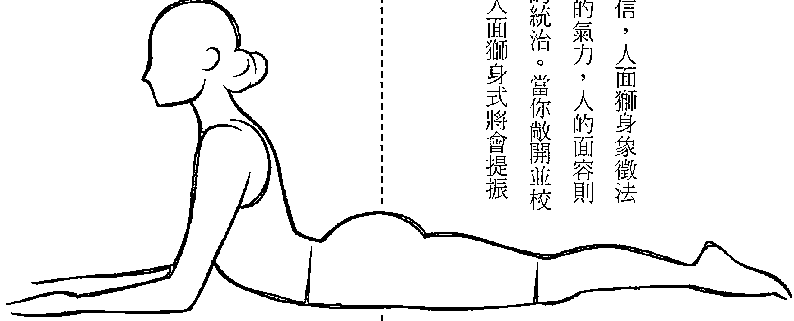

5. 你现在正呈现人面狮身式。若要微调此一姿势，可垂下双肩，使其远离双耳。始终透过十根手指头来保持前臂活耀而警觉。感觉你的耻骨（骨盆前区）轻轻地推入地板，同时下背部放松。如果感觉臀部紧绷的话，松开臀部。颈部的位置应该是脊椎的自然延伸，不过度伸展。撑住，持续五次深呼吸。
6. 若要退出这个姿势，可缓缓地将身躯放到地板上。
7. 再重複一遍或两遍。

#### 练习2
### 骆驼式：敞开心的光芒之中

骆驼以能载运大量重物而闻名，它们背上驮着一袋袋物品穿越沙漠，忍受著没水的生活长达六个月。虽然如此重担是肉体上的，但多少世纪以来，骆驼同样象徵著穿越形上重担所需要的忍耐力。哲学家尼采对精神生活的描述包含三种变形，骆驼是第一个象徵，第二阶段便是狮子。身为狮子，你不再承受世界的重担；反之，你领悟到“你的”意志可以影响世界。以此方式，你踏入自己的光芒中，且在如此实践的过程裡，更有能力与黑暗（以龙为象徵）作战。好好运用骆驼式穿越你的重担，进入心的光芒之中。

尽管这个姿势是静止的，却可以为它注入与人面狮身的帝王历史和奥秘相称的一股动态能量。譬如说，即使双臂和双腿并没有移动，也可以使它们不断地参与和扩展。

### # 分解步骤：

1. 跪在地板上，雙膝分開，與臀部同寬，小腿和腳尖貼地下壓。鬆開臀部。找到骨盆的中立位置，使骨盆既不收攏也不擴展。
2. 雙手手掌放在骨盆後方，脊椎兩側各一，十指同時朝下。保持雙肩下垂，遠離雙耳。
3. 吸氣，同時擴展上背部，提振並敞開你的心。頭部和頸部應該要成爲脊椎的延續，同時形成支撐的拱形；你的目光是向上向外的。（如果這個姿勢會使頸部承受太大的壓力，可將下巴收進來，收向頸部，尋求較大的支撐。）上半身擴展時，要設法確保下巴不動，同時將骨盆保持在開始時的中立位置。維持這個姿勢，持續十次呼吸。
4. 若要退出這個姿勢，可將雙手繼續放在骨盆上，緊縮核心，然後慢慢地讓軀幹返回到直立位置。這麼做的時候，用「心」來帶領，不靠頸部和頸部帶領，以尋求最大的穩定度。
5. 重複上述動作兩遍。

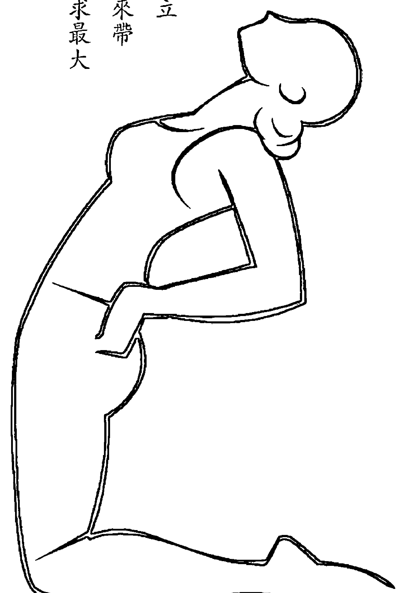

### # 練習 3
## 獅子式：帶著自信咆哮

為了更大的開啟，進階修習者可以增加背部的擴展，使雙手手掌最終停靠在腳底，從而進入正式的駱駝式。對所有人來說，嬰兒式的屈曲是駱駝式深度擴展的絕佳反向姿勢，此時，你的臀部向後，可能的話，貼在腳後跟上，同時將身軀置於兩側大腿之間，使前額貼地，伸直兩側雙臂。順道一提，這個嬰兒，正是尼采三種變形的最後階段。

你最後一次扮有趣的鬼臉，是什麼時候？很可能從你不再是孩子以後，就不會再扮過鬼臉了。小孩總是愛伸著舌頭，一部分是因為孩子不在意他人的想法。他們扮著有趣的鬼臉，因為這麼做讓他們覺得開心。這是在那個片刻及時表達自己的本性，對此，孩子不假思索，因為他們很少依「頭」而活，而是更常依「心」而活，那是一個不知道恐懼的地方。遺憾的是，多數成年人失去了這份與生俱來的自信，退縮到自己的巢穴中。畢竟，有趣的鬼臉只是臉部肌肉的屈曲和擴展。在身體層面，就是這樣。但在形上層面，成年人扮個有趣的鬼臉，經常涉及他人的想法。或者更確切地說：你對他人的想法，正是你對自己的看法。所以，用獅子式跳脫頭部，從而進入你的心。仔細聆聽來自童年的真誠自信，然後盡情咆哮！

### 練習4 海豚式：提升心臟的強度

這個姿勢對於增強和穩定心臟周圍的肌肉骨骼結構非常有效。關鍵在於保持背部平直（不凹陷）、胸部寬闊、肩胛骨平坦下垂。氣力引發氣力，因此，多加練習海豚式，無論是不是在瑜伽墊上練習，你都愈來愈能够輕易地維持心輪的適度校正。遲早你將會注意到，不僅帶著一顆強壯的心臟站立變得更加容易，而且發自強壯心臟的行動也變得易如反掌。

**分解步驟：**
1. 跪在地板上，下方腳趾屈起，臀部靠在腳後跟上。雙手放在大腿上，手掌朝下，手指張開。
2. 透過鼻子深深吸氣，用空氣填滿胸部和上背部。
3. 用力而徹底地呼氣，發出「哈」聲，同時：
   - 嘴巴張大，舌頭伸出來，盡可能朝下伸向 下巴。
   - 眼睛睜大，向上凝視第三眼（兩眉中間）的位置。
   - 雙手手掌壓在兩側大腿上，雙臂打直。
4. 重複上述動作三遍，每一次都要更誇張、更有力。

### # 分解步骤：

1. 從雙手、雙膝貼地的桌面姿勢開始。
2. 前臂放低，貼在地板上，使雙肩位於雙肘正上方。從這個姿勢開始，將雙手手掌併攏（兩個前臂朝中線形成某個角度），然後左右手指交錯。設法確保小指頭外側邊緣穩穩地貼靠著地板。

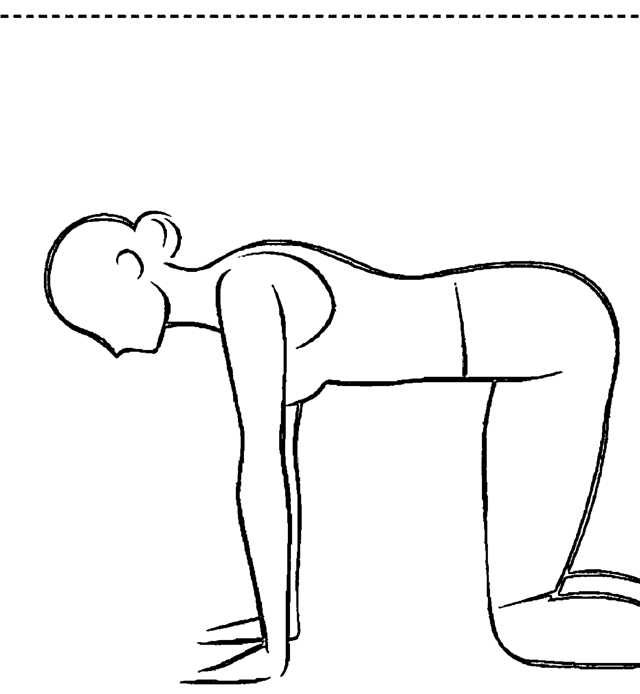

3. 兩個前臂貼靠地板下壓，下方腳趾踮起，吐氣，同時擴展雙腿，讓坐骨升起，朝向天花板，使現在的你呈現倒 V 字型。雙腳分開，與臀部同寬。頭部和頸部應該是脊柱的延伸，在一直線上；你的目光應落在大腿中段之間。

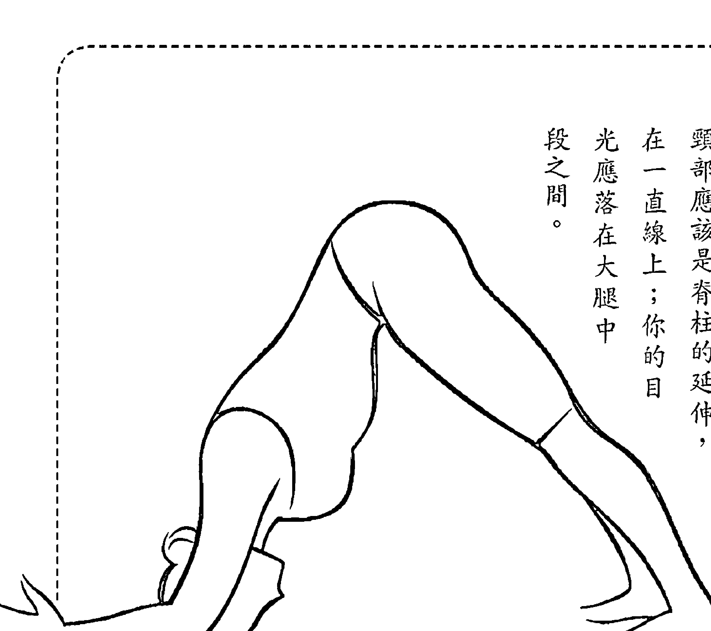

4. 肩胛骨平貼背部，使雙肩不出現弧度（如果雙肩仍舊出現弧度，那就微彎雙膝）。肩胛骨向下，遠離雙耳。你的整個軀幹（從骨盆到肘部），應該要形成一條平直線。
5. 緩慢而有所控制地至少呼吸五個回合。
6. 若要退出這個姿勢，可趁呼氣時將雙膝放到地板上。

### 練習5 製作清單：面對你的陰影

先是駱駝，然後是獅子。動物有力量可以成為偉大的老師，只要我們收到牠們帶來的更大信息。無論這些動物圖騰出現在美洲原住民或薩滿的傳說中，散播的信息都是類似的。譬如說，在諸多特質中，海豚代表最純淨的愛。記得本章前面提過的《亡靈書》嗎？並非都是由亡靈接引神阿努比斯（Anubis）將值得接引的靈魂傳送到來世（在靈魂的心臟被秤過之後），在某些古羅馬神話中，是一隻海豚將靈魂帶到「福人島」（Islands of the Blessed）。根據希臘人的說法，海豚是太陽神阿波羅的夥伴，而太陽神也是與獅子座相關聯的天神。因此，海豚式其實擁有一切，而此方法可讓你在所有層面強化你與心臟的連結。

許多時候，我們不喜歡自己的那些部分被隱藏得極好，好到自己看不見，但卻直接投射到他人身上。舉個例子，「應享權益」可能是你的一個敏感問題，你無法忍受在另一個人身上看到這個特性。當你看見它時，你甚至可能對自己說：「她是如此地享盡權益啊！我永遠不會那麼做。」然而，他人身上那些我們最不喜歡的特性，經常代表我們最不喜歡自己的部分。這就是為什麼你看見它時會有那麼多的指標，因為它正在反射你自己尚待接納的某個面向。假使情況如此，那麼應享權益（或是你的任何敏感問題）可能正在支配你的人生，而你卻沒有意識到。也就是說，一直要到你照亮它並同時主動覺知到這個特性為止。一旦你看見，就可以對它採取行動，同時決定是要讓這個特性繼續支配你的行為，還是扭轉局勢，讓自己成為支配者。要照亮你的陰影，從而看見你一直不願意看見的部分。

### 分解步驟：
1. 列出他人身上你無法忍受的特性。不要審查自己。凡是浮現在你腦海的，都是可以利用的對象。
2. 選擇使你瘋狂的三大特性。想幾個具體的實例，你如何、何時、與誰在一起時邂逅了這些特性？
3. 針對這些特性，一一加以檢視，看看它們是否是你曾在過去或現在顯露過的特質。想幾個具體的實例。要誠實客觀。這個練習不是要怪罪或自我苛責，只是要觀察自己身上以及前可能沒有覺察到的部分。
4. 就是這樣！覺知是克服自我陰影的第一步，單是這點，就有助於必要的轉化發生。你甚至可以更加覺察到這些特性如何出現在你的日常互動之中。

接下來的步驟包括接受你的陰影特性，以及對它們的內在責任，然後透過一份行動計畫，允許這些特性進化。

### 練習 6
### 擁抱自己：簡單的自愛

愛你自己。獅子座的重點在於豐盛，而且總是有綽綽有餘的愛環繞身旁。要敞開自己，迎向更多的愛，給出愛，領受愛，然後再給出愛。記得嗎？你從黃道帶的巨蟹階段開始進入這個施與受的循環。現在是你擁抱它的時候了。要如實、全然地擁抱。

### 分解步驟：
1. 在椅子上坐直坐正，雙腳平放在地板上。閉上眼睛。
2. 深吸一口氣，提起心臟、頸部和頭部，張開雙臂，大大地伸向兩側。這應該是一個盡你所能擴張的姿勢。
3. 深深呼氣時，讓軀幹回到中立位置，用雙臂環抱自己，呈現自我擁抱的姿勢。你的頭部和頸部很可能會放低，但應設法確保不要癱在胸前。
4. 重複並持續一分鐘，在吸氣和呼氣之間創造一個連續的流動。當你移動時，感覺你正敞開進入、領受、給出的那份愛。將你自己的才能賦予那份愛。這個運動應該是愉悅的、好玩的，甚至可能使你微笑。

### # 小結

一個擁抱，可透露出所有層面的愛。譬如說，一般人相信，好的擁抱益處多多，包括：釋放促進連結感和信任感的催產素；活化皮膚上的受體，從而降低血壓；降低皮質醇濃度，傳達平靜。

- ★ 心臟和上背部是與獅子座相關聯的部位，它們代表你的勇氣、愛，以及熱愛你是誰和你已然得到的一切。
- ★ 獅子座是黃道週期的第五個星座，其能量涉及你的內在之光，以及有能力直接從心綻放光芒（儘管那會帶來陰影！）。
- ★ 如果你的獅子本質變得過於自我中心，或是害怕聚光燈、退縮，你的心臟和上背部可能會體驗到不同的症狀，例如，肌肉緊繃或虛弱。
- ★ 透過聚焦於心臟和上背部的提問、練習和活動，平衡你內在的獅子座，運用這些來放大你自己的光芒，同時點燃他人的火焰。

> 原註：
- ① 史蒂芬·戴蒙德 (Stephen A. Diamond)，《陰影》(Shadow)，見《心理學與宗教百科全書》(Encyclopedia of Psychology and Religion) L-Z篇，大衛·喬明 (David A. Leeming) 編纂 (New York: Springer Science + Business Media, 2010)，836頁。
- ② 勒內·笛卡兒 (René Descartes)，《方法導論·沉思錄》(Discourse on Method and Meditations)，New York: Macmillan, 1960，41頁。

## 處女座

*   ☆出生日期：八月二十三日～九月二十二日
*   ☆身體部位：腹部
*   ☆主題：存心至誠，服務事奉

## 處女座司掌：腹部

由於獅子座對光明與黑暗本質的覺知，處女座渴望能夠精煉它，移除任何一丁點的雜質，亦即馴服獅子座的獸性。人生不再是關於她，而是關於她能夠給出什麼。畢竟，這是收穫的時節！在獅子座時期成熟結果的作物，於時值夏末的現在，已經準備好要收割了——準備好讓穀粒成為麵包，將葡萄變成葡萄酒。但首先，處女座必須將小麥與穀殼分開，因為她在這裡是要以最純淨的形式供應大地的豐盛。

你熟悉「你是你吃的東西」這樣的說法嗎？哦，這話是真的。你吃的食物最終會轉變成你。那是經由吸收發生的實際魔法，而吸收是小腸的流程，小腸則是與處女座相關聯的腹部器官之一。在此，一開始似乎與你分開的核桃，最終被消化成分子，成為蛋白質、脂肪等等，然後這些分子經由血液的流動，被運送到身體的其餘部分，成為諸如毛髮或荷爾蒙的一部分。

> ♍
處女座是黃道帶最大的星群，也是天空中第二大星座（次於「長蛇座」（Hydra））。它包含秋分，就是在這個點上，太陽的黃道與天球赤道（celestial equator）相交。不過在占星學上，是天秤座在北半球慶祝秋季的開始。

你的小腸（這個實用魔法的促進者）只是你的腹腔的一個元件。事實上，除了小腸以外，身體的大部分器官都在那裡，包括大腸、肝臟、胃。英文字 abdomen（腹部）的拉丁字根之一 abdere，意思是「隱藏」，而且，的確，許多器官都被隱藏在腹部。腹部是延伸在橫膈膜與骨盆之間的身體部位，雖然多數人都知道腹部的結構，參見附錄 C。

部的內容，但你可能更熟悉其外部組成，亦即：構成腹壁的四塊肌肉。最有名的腹直肌是最外層的肌肉，負責你的六塊肌。無論你看不看得見，你都有六塊肌。那是你的DNA的一部分，由肌腱插入形成，將腹直肌劃分成六份，甚至八份。腹橫肌是最內層的肌肉，是一層薄薄的護套，整體目的是要壓縮腹部的內容物。這塊肌肉對穩定肚子發揮了絕佳的作用，形成你核心的前區；另外兩塊腹肌：腹內斜肌和腹外斜肌，則形成肚子的兩側邊。

> > ♍ 你的腸道有它自己的想法。事實上，它有一整套神經系統，包含龐大的一億個神經元。雖然已知這個「第二大腦」監視著腸道的實際過程（消化、吸收、排泄），不需要頭部的腦輸入資訊，但目前愈來愈清楚的是，腸道也協助調節情緒。

何擺放可自由移動的另一條腿便無關緊要。無論你將可自由移動的那一隻腳停靠在腳踝、小腿上，或是懸掛到平衡的點位（想像一下懸掛的活動雕塑）。舉個例子，單腳站立時，一旦你找到自己的中心位置，那麼如核心肌群與身體內其他穩定型肌肉的區別在於所在位置，那就像束腹，圍住身體的質心。我們的質心很重要，因爲人體其餘部分的表現，就好像身體的所有質量都集中在那裡。因此，質心是你整個身體可以得在占星學上，「核心」是裝盛處女能量的容器。在身體上，「核心」是一個古老的概念，也是一個當代的術語，意指在解剖學上和功能上相互連結的下背部、腹部和骨盆的肌肉。這些肌肉協同穩定你的脊柱，囊括橫膈膜、骨盆橫膈膜、腹壁肌肉、背部的深處肌肉。在面對不穩定的力道時，例如，移動的列車、足球鏟球、或是舞蹈課上舞動的四肢，它們一起幫助你的軀幹維持保護的姿勢。

在半空中，你的整體平衡都不會被打亂。如果你將雙手插在腰上，或是伸展到頭頂上方，整體平衡同樣不會被打亂。反之亦然：假使你無法找出自己的中心，就無法單腳站立，讓另一條腿和雙臂任意擺放。在瑜伽課堂上找到你的中心並非易事，更遑論生活中不穩定力道猖獗的其他面向，那是更加困難的。無論這些力道來自工作、家庭壓力，或是你自己意識到需要去完成什麼，都可以很容易就感覺到彷彿你已然失去中心，立即被四面八方的力道拉扯著。好消息是，你的中心絕不會真正丟失。即使你似乎找不到，但它總是在那裡。因為它是你的核心！它是你內在的權威，也可以說，它是你的直覺本能，這地方明確地知道你是誰、為什麼在這裡。當你居於此間，浸淫在你的人生使命當中，這時，你也將力量交付給你的其餘部分。在身體層面，用核心作為運動的起源，讓你的雙臂和雙腿得以發揮最大效用，也就是說，最有效地發揮它們的用途。何況你內在的處女座如果沒有效率，那就一文不值了！打個比方，當調整頻率、收聽你的核心時，你挖掘某一深邃的燃料，那燃料猶如在腹部燃燒的火焰。那是深度感應到你的身分、價值和力量可以超越心智的能力，是一個分析的層次兼自我的精確性，對處女這個黃道星座而言是不可或缺的。你有多擅長存取自己的核心呢？嘗試這個修改過的棒式，好好測試一下。

## 分解步驟：

1.  從雙手、雙膝貼地的桌面姿勢開始，手腕在雙肩下方，雙膝在臀部下方。頸部居中立位置，目光向下，稍微落在眼前的地板上。

2.  兩隻前臂放在地上，彼此平行。緊縮核心，兩隻前臂向下壓，下方腳趾踮起，然後伸展雙膝。你現在呈現的是肘撐棒式。撐住六十秒。

3.  如果你可以完成這個測試（撐住這個姿勢，雙肩或骨盆帶不下沉，或是雙膝不彎曲），你就有很好的核心肌力。假使不然，你的核心肌力便有待改進。

從一個人的萎靡站姿，經常可以觀察到此人缺乏人生目標。假使身體缺乏能量和堅定的信念，這樣的站姿就會出現。沒有明確的中心，沒有合她意的人生目標，沒有關注的焦點驅使她的活動，就連她的目光也是飄忽不定的。如果你親自嘗試萎靡的站姿，就會看見，如此度日，不容易啊！當這個模樣不經意地遍佈全身時，要利用身體的能量就很難了。然而，你只有一個身體。況且若要給予身體（以及你）最好的照護，運動不應該是偶然發生的，而應該要有目的。無論何時，要覺察到你的骨架如何（以及為什麼）在空間中定位，從這一步開始找到你的中心、你的核心。

## 處女座健康課題：存心至誠，服務事奉

服務是提供協助，以有用的方式行動，而且你可以決定做法，因為沒有規格或限制限定你提供的服務是由什麼構成。只要你有能力構想和給予服務，服務就存在——從一個微笑，到一份三明治，到一席冗長的談話。它的魔法在於做法，那是區分服務的要素，或者姑且說它是一宗交易。那個做法是微笑或三明治被給予的方式，包括服務背後的意圖、正直、誠實和心（或無心）。在整個黃道週期中，服務的主題多次出現，而這些成分不僅定義你所給予的內容，還定義你所給予的方式，使得服務者的本質和她所提供的服務形影相隨。

不離。舉在當地市場賣玉米的農民為例，她栽培作物的專注和勤奮，同樣顯現於她在攤位上銷售作物的方式。她可能會給你一個免費試吃品，品嚐看看她的作物有多甘甜美味，並建議你如何處理剩下的玉米穗軸，或者只是看著你的眼睛微笑。她吸引的不是顧客的頭腦，而是顧客的心。這就是為什麼如此的採買經驗，可能截然不同於在超市購買類似玉米的交易。

服務的概念，現在可以在更深的層次被理解。記得吧，服務在雙子座的監看下被引進（見第四章）。雙子座的服務（以創新的點子和信息的形式呈現），需要觸及更廣大的群眾。只打動雙子座的心智的信息是不夠的；信息還必須嘉惠他人。現在來到處女座，服務發現，其根源不在於服務者或被服務的對象，而在於服務本身。這就是為什麼當地市場的交易，可能比超市的交易更令人充實滿意——小農市場的存在不只是基於賣方或買方，更是基於玉米的緣故。因為玉米不只是玉米，而且是土地、大自然、食糧、社群和辛勤工作的代表。因此，農民的處女面向播種、栽培、收穫玉米，並以其他方式供應玉米，因為她將自己視為玉米的管道，以及玉米所代表的一切。她只是為這項農產品提供一個成就其最高至善的方法，這讓她也得以成就「她的」最高至善。無論是食物、珠寶或療法，對服務的奉獻可能有許多形式，所有這些形式全被具體呈現在處女座的星群中。

古往今來，貞潔處女的原型一直被佈達——莎拉（Shala）是蘇美人的處女化身，伊西絲（Isis）成形於古埃及，狄密特（Demeter）出現在古希臘，羅馬則有維斯塔貞女（Vestal Virgin），然後是中世紀的聖母瑪利亞。晚近則有處女座的德蕾莎修女，她透過仁愛傳教會宣誓，要「為窮人中的窮人提供全心全意的免費服務」。當然，綽號「貞潔處女」並不是字面上的意思；這些女性代表那些未婚的少女，端上大地的果實，獻給大地的人民。而且如同貞潔處女，她們的服務被認為是謙虛的、未被褻瀆的、純淨的。

> 維斯塔貞女是負責維護古城聖火的女祭司。只要聖火燃燒，該城就會延續。巧的是，同樣叫做「維斯塔」(Vesta) 的有：羅馬的火之女神，以及晚近從地球上可以看見的最亮小行星。

根據古希臘哲學家柏拉圖的說法，這個世界是由本身純淨的形相（或屬性）所構成。舉「圓凸」的屬性為例，它存在於棒球、彈珠、柳橙、輪子、地球的大致形狀等等之中。但是，儘管這些東西樣樣以圓凸性為特徵，卻仍有其各自存在的本質。大小、形狀、重量、顏色，也是同一道理。即使所有的球和彈珠都被毀壞了，圓凸性的概念仍舊存在。它代表它自己的品質。當然，為了創造柳橙或球之類更複雜的獨立存在物，圓凸性可與重量或顏色之類的其他元素混合，但單就圓凸性來說，圓凸性就是圓凸性。只是純粹的圓凸，絕不會變。那是永恆的。

當然，純粹的圓凸很難找到。你看不到它沿街滾動。它需要其他特徵（例如，維度）才能具體存在。但它一與其他特徵融合，其純淨度就被稀釋了。因此，純淨是一種狀態（免於任何且汙染性質的東西），也是一種追求，企圖成就任何事物在原初狀態的核心本質。好比抱持純淨的念頭，或是行動出自純愛之境。

追求純淨是一條途徑兼一種修煉，而不是目的地。純淨的食物，就像純粹的圓凸一樣，現實中並不存在。那是理想，而我們原本就是要來享受追求純淨的旅程。然而，一旦我們的處女本質促使我們將貪求純淨作為最終目標，那可就悲哀了！儘管處女心智很強健，但用它來完美地定義完美，卻是處女座的陷阱之一。

舉例來說，嚴格控制食物的攝取，並不意味著某種飲食法（或是接受該飲食法的身體）一定純淨。事實上，即使你將飲食法發揮到絕對的極致，只吃空氣，空氣中的污染物也會使空氣的攝取變得不純淨。同樣地，耗費整個週末編輯和重新編輯同一份報告，並不會使每一個字詞或逗號應用得完美無缺。

純淨是運用我們的滋養、我們的工作、我們的心態、以及我們選擇的任何其他東西，所努力追求的一個理想。當努力是靠適當的處女能量完成時，努力可以是改進、完善、淨化自己的過程，不斷使你更接近真正的你，那是內外呼應、稱心愉快、充 實 滿 意 的 終 極 根 源——假使你的處女能量能夠指向如此純淨的個人和諧，那麼，最高階的人生目標莫過於此。

> ♍
在整個亞洲，憤怒佛的雕像跟歡喜佛一樣多。這些佛像提醒我們，夠了就是夠了，藉此幫助我們消除不再服務我們的念頭、情緒、習慣，以此淨化、成長、繼續前進。

處女座大力推廣從「存在」出發、進而「作為」的概念，讓「你是誰」得以啟發你所做的事。基於這個理由，這個星群的貞潔處女通常被描繪成手握一捆小麥。這捆小麥不但象徵她是谁（大地的女神），而且象徵她所做的事（供應大地的豐盛）。由於這個象徵，處女座納入當代個人與專業分家的觀念、消解其間無形的屏障，並結合這兩者。

當此一結合發生時，你已經找到了你的人生目標。你的人生目標是你存在的理由，是你在這裡所提供的獨特禮物。有些人稱之為「召喚」。有些人天生知道自己的召喚是什麼，有些人發展召喚，有些人窮其一生追求召喚，有些人則沒有感覺到自己竟擁有尋找召喚的奢華天賦。按照柏拉圖所說「形相」（form）難以捉摸的特性，許多時候，召喚是一項核心本質，在「不是什麼」之中更容易被理解。譬如說，大部分的速食店員工相當確定，暫時性的輪班工作並不是自己的真實召喚。他們或許還不知道自己的召喚是什麼，但卻知道不是速食店員工。話說回來，即使不是召喚，一切人、事、物都有其用意，即便是一份輪班工作。目前，或許這份工作為家庭提供了租金或食物，或者它是一種方法，藉由照亮顧客的一天，微調這位勞工的服務能力。（記住：服務就是服務，沒有哪一種服務比另一種服務高尚。其中的魔法在於服務發生的方式。）它將如何演繹至未來？只有事後才會確切知道。或許那是通向其他契機的踏腳石，是教你領悟重要功課的老師，或者事實上，它就是終生事業。不論「它」是什麼，如果你能夠看見它的更宗旨，你就能夠感覺良好，對你的人生道路放心且確信。

> ♍
處女座厄普頓·辛克萊 (Upton Sinclair) 的著作《魔鬼的叢林》(The Jungle) ，在一九○六年激起了全美國對食品工業狀況的吶喊，造就了第一條聯邦純食品法規。一個世紀後的今天，此一追求有機、當地、永續運動之名繼續，目的是在我們的食物。

你所做的每一件事，你所進入的每一份關係，已經帶你來到現在的位置。你的人生目標以及你來回其間的軌跡，看起來不見得是一條特別的路，因為它跟你一樣獨一無二。它不見得是由出生、境遇或成就它的挑戰所裁定的。即使是，可能也需要一生的時間去學習，因為它不見得是敏銳的處女才可以釐清的東西。的確，那可能源自於創傷，可能是你需要信任的某種柔軟的內在聲音或直覺，即使它超出理性思維或不符現狀。它看起來可能不像你認為應該有的樣子，而這正是為什麼找到它那麼地困難。而且它可能需要全面重建你的信念系統，才能放下自我強加的束縛，而就是那類束縛使你不斷地怯於表現，服務每一個宗旨卻不服務 你的最高人生目標。然而，處女座在這裡是要鼓勵你服務自己的最高人生目標，不論那個目標是什麼。而且 那其實就是她的目的。那是她真正餵養大地的方式——透過餵養你的靈魂。

## 不健康的身體警訊（兩種極端）

很久很久以前，或許在你還是個孩子的時候，你想像過你的未來。或許，你想像自己是個母親、仙女、消防員，或是以上所有身分。不論那個願景是什麼，它很可能因為感應到你是誰和你來此所做的事而得到推動，並且那個感應很可能已經隨著時間而進化。因為找到你的人生目標（更遑論活出這個目標），是一項 進行中的工作。在這條路上，今天服務你的事物，明天不見得仍舊為你服務。

當某事物或某人的宗旨停止服務你的宗旨時，就是該感謝對方的服務，然後繼續前進的時候了。以此方式，處女座永遠在移除生命中的雜質（包括內在和外界），使你的願景可以其最純淨的形式活靈活現。

她總是在消化某個念頭或放下某種習慣，正如她的腹部一樣，消化吸收身體所需，釋放排出身體所不需要的。

這是永久清理不再滿足需要的老舊形式。她可能不知道這一切會導向什麼，但她聽從直覺。

假使她忽略這份感應，就是冒險活出壯志未酬的人生。她將會用膚淺的知見，架構她是誰以及她允許出現在生命中的內容。然後，什麼都累積不起來，什麼都不夠好，什麼都滿足不了她要求嚴格的期望，因為她將持續無法滿足她自己來自核心的那些渴求。當這事發生時，處女座內在的批評家會將她推入名副其實評斷自我和他人的漩渦之中。然後這個漩渦可能導致經常試圖增加控制（通常是控制健康習慣和日常作息），因為她愈來愈努力嘗試成就她所渴求的結果。但如果她的宗旨一開始便設想錯誤，那麼她的嘗試也一定是錯誤的，於是痴迷將會取代奉獻。

強迫強制的處女能量，其身體表現可能包括：

*   固守核心
*   如軍人操練般的直挺站姿
*   呼吸淺弱或屏住氣息（相較於腹部呼吸）
*   其他：消化不良、飲食失調、不消化、食物過敏、便祕、疝氣、潰瘍、大腸激躁症、慮病症、強迫性行為

如果這個處女座完全放棄控制，那她就捨棄了處女座的一個特點——紀律。缺少紀律，處女座的淨化嘗試將是無規律或反覆無常的，她一定會比她最真實、最純淨的自我再暗上幾個色調。她的服務將會相應地受到影響，存在一個較不純淨、較不真實的狀態中。因此，不論哪方面斷了（處女座的中心感或服務感），這個處女座的課題都指出，自我感和人生目標仍舊有些路要走，才能得到充分的發展。

姑息縱容的處女本質，其身體表現可能包括：

*   核心虛弱
*   C形或脊柱前凸體態
*   其他：腹瀉或大腸激躁症、疝氣、暴飲暴食、營養不良、不消化、潰瘍、食物過敏

## 找回平衡的五項提問

下述提問和練習將充當你體現處女座的個人指南，不妨運用它們服務事奉，心存至誠。

*   ★你以什麼方式服務你的朋友、家庭、社會、工作？
*   ★你覺得你純粹是在服務嗎？如果不是，為了興起那樣的感覺，你生命中的什麼元素需要來來去去？
*   ★你忙於哪些健康作息和儀式？它們的目的是什麼？事實上，它們是否發揮其效用？
*   ★你找到你的召喚了嗎？無論找到了沒，什麼形容詞可以形容你的召喚（有創意的、企業型的、動手做的）？發揮想像力，不要自我掣肘。
*   ★什麼情況下，你從自己的核心取得實力？什麼情況下，你需要這麼做？

你的核心修養到什麼程度？無論是感覺強迫強制、姑息縱容，還是介於兩者之間的某處，關鍵都在於：好好聆聽你的身體，給予身體所需要的。要伸展緊繃的腹部或強化虛弱的腹部，運用下述提問和練習，喚醒你內在的處女座。

## 處女座養生操

### 練習 1
肘撐棒式進階：加強核心肌力

記得 146 頁的核心練習嗎？那不僅是核心肌力的考驗，也是很好的核心強化運動。那叫做「棒式」或「平板支撐」，因為你的身體應該要化為平板的形狀，像一塊木板或一塊扁平的長木頭。胸部不應該凹陷，骨盆也不應該提起或下陷。但是從頭部到腳後跟，你的形相應該呈一直線。說比做容易，因為它需要核心肌力，要好好駕馭是有挑戰性的。
鑑於我們的生活型態——從床上起身、進入汽車座椅、坐在電腦桌前、懶懶地躺在沙發上，健身中心便成為我們經常緊縮核心的地方。然而，核心的造就不只是為了這些。你可以定期練習核心肌力測試，而且為了使這個姿勢更具挑戰性，還可以新增下述動作。

分解步驟：
1.  抬高手臂，與地板平行，撐住十五秒。放下手臂。

2.  抬高手臂，與地板平行，撐住十五秒。放下左手臂。

3.  抬高右腿，與地板平行，撐住十五秒。放下右腿。

4.  抬高左腿，與地板平行，撐住十五秒。放下左腿。
5.  抬高左腿和右手臂，與地板平行，撐住十五秒。放下左腿和右手臂。

## 練習2 仰臥星形伸展：從核心向外輻射

每一顆星星都有一個核心，包括處女座星群最明亮的星星「角宿一」（Spica）。核心是一顆星星的能量源頭，在這裡，質子粒子用足以使彼此黏合的速度相互碰撞，然後透過核融合產生大量能量。這股能量不但燃燒核心，而且向外輻射到輻射區（這顆星星的下一層），供進一步使用。你的身體可以比作一顆五芒星；你的核心產生肌肉骨骼的燃料，為「你的」輻射區（頭部和頸部、上肢和下肢）提供動力，讓它們得以憑自身實力增添能量，同時更進一步地傳遞那份能量（例如，幫助你的雙臂抬起重物）。利用如此的鍛鍊學習成為你所是的星星，然後從你的核心向外輻射能量。

- 6. 抬高右腿「和」左手臂，與地板平行，撐住十五秒。放下右腿和左手臂。
- 7. 輕輕地將自己放到地上，放鬆一會兒才起身。

「角宿一」看起來像一顆星星，但它至少是兩顆星星，每一顆都比我們的太陽更大、更熱。根據對角宿一光線的觀察，有些天文學家甚至認為，角宿一不是由兩顆星，而是由五顆星所構成。

## 分解步驟

1. 仰躺在地板上，將身體變成一顆五芒星，雙臂沿著地板擴展，在頭部附近形成 V 字形，同時張開雙腿。
2. 以這個姿勢放鬆，感受身體的能量如何舒服地擴散。
3. 現在將你的雙臂、雙腿、頭部朝胸部合攏，讓自己成為一顆繃緊的人形球，以這個姿勢收縮每一條肌肉。
4. 有所目的地將你的頭部和四肢向外擴展，回復成地板上的星形。所有五個角（兩隻手、兩隻腳加上一顆頭）應該要在完全相同的時間觸及地板。不要讓五個角漫不經心地、強迫有力地、或是一個接一個地落到地上。要知道五個角正要去向何方，著重於將它們放到目標位置上，忘卻力量和目的。當所有部位都觸及地板時，你的星星姿勢應該是積極而投入的，一路通過你的手指和腳趾。要從頭部、頸部和雙肩釋放過度的張力。
5. 回復成一顆球，然後再次擴展。重複這個動作十遍，搭配呼吸。

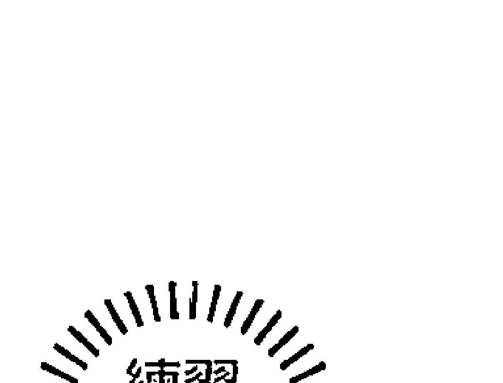

## 山式：返回到中心

你注意到了嗎？你精確地擺放頭部和四肢的能力，直接關聯到身體的核心參與度。愈是全神貫注在你的中心，以此作為頭部和四肢力量的來源，頭部和四肢的動作就益發威力強大且目標明確。

> 山上矗立著一棵橡樹和一根蘆葦。一天，在風暴之中，健壯的橡樹樹幹被折斷了，而柔順的蘆葦仍舊屹立著，只是彎曲了。它在陣風中搖擺，待風暴結束後，又回復原本的直立姿勢。要成為那根蘆葦，秉持目的，堅強屹立，但柔順到足以經受生命中不可避免的風暴。山式將會幫助你連結到你的中心，如此，你才能夠將自己從中心拋出，目的只是為了再次返回到中心。最終，除了你，沒有人可以使你遠離你的中心。

## 分解步驟

1. 站立，雙腳分開，與臀部同寬，彼此自然平行。提起並張開腳趾，將腳趾均衡地放在地板上，形成堅實的基礎。將你的體重集中在雙腳之間。

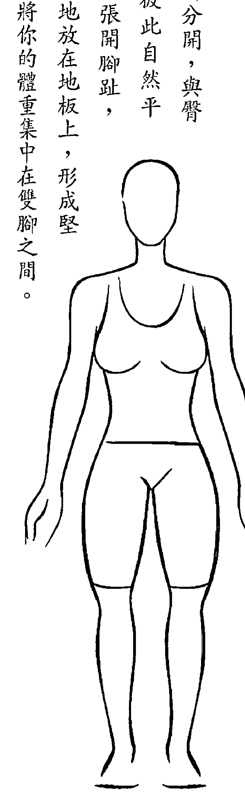

2. 緊縮身體內側的拱形區，感覺那樣的緊縮透過雙腿和大腿升起。非常輕微地將兩隻大腿轉向內側。
3. 提起肚臍的同時，將尾骨朝地板放低。
4. 緊縮核心，使其成為氣力的中心。
5. 輕輕地敞開胸部和雙肩，感覺肩胛骨堅定而寬廣，貼靠著背部。前臂垂放在身體兩側，
6. 脖子疊放在軀幹上（不是在軀幹前方），頭部擱在中立位置，下巴與地板平行。釋放任何頸部和肩部的緊張，柔化你的目光，然後呼吸。
7. 當你在這個姿勢中感覺到強健而歸於中心時，就閉上眼睛。注意所發生的自然搖擺。
8. 現在增加向右側的搖擺，直到你幾乎跌倒，但不要真的跌倒。盡可能地少移動、少用力，讓自己返回到歸於中心的位置。
9. 現在把身體的重量傾向左側，接著返回到中心。朝前、向後做同樣的事。試玩一下，看看在不跌倒的情況下，你可以傾斜到什麼程度。每次傾斜過後，都讓自己回到中心。
10. 等你完成了重新發現中心，就返回到山式，撐住三十秒，然後退出。

生命的其餘面向（包括身、心、靈三方面）重新創造山式的歸於中心感。

離開瑜伽墊 一樣做瑜伽：就像你嘗試在所有的瑜伽姿勢中重新創造山式的歸於中心感一樣，也要嘗試在

## 練習4 火呼吸法：潔淨身體，淨化心靈

在瑜伽系統中，身體被認為是透過脈輪連結到微妙的能量體（心智體、情緒體）。在梵文中，這些「旋轉的輪子」連結你的種種本質。有七大脈輪沿著貫穿身體中線的通道垂直分佈，每一個脈輪對應於身體的特定部位。舉例而言，第三脈輪對應於腹部及其內容物，除了調節相關的身體部位，還被認為可以支配你的自我感——不只你的核心身分（核心本體），還包括你用來將這股內在感受投射到外在世界的力量、自信和活力。可以說，這是內在的火，而且不只是幫助消化的火！就是這火，激起你是誰以及你每天在這裡所做的事。好好運用下述呼吸法重新恢復你內在的火，焚燒掉擋住它和阻礙你的任何雜質，例如，過時的念頭或情緒。

### 分解步驟

1. 在地板上找到一個舒服的座位，需要的話，盤腿坐在軟墊、枕頭或瑜伽磚上（如果不能盤腿，就找一個舒適的姿勢在地板上坐正；如果這個坐姿對你而言仍有困難，就坐在椅子上）。雙手手掌放在膝蓋上。挺直脊椎，下巴微收，閉上眼睛。
2. 透過鼻子深吸一口氣，讓胸部和腹部因這口氣而完全膨脹。
3. 透過鼻子呼氣，將空氣完全推出去，就像從氣球放氣那樣。
4. 現在，開始比較有力的呼吸，吸氣和呼氣並重。慢慢開始，建立某種穩定的節奏。增加到某個快速但舒適的速度（感覺就像快速聞喚）。保持胸部和胃部放鬆，讓它們隨著每一次呼吸而自行脈動。
5. 持續一分鐘。

在瑜伽傳統中，火呼吸法被認為既能潔淨身體又能淨化心靈。建議你等飯後至少兩小時才進行這個呼吸法，讓你的消化系統盡可能清潔而純淨。如果做的時候感覺不舒服或頭暈眼花，請停止。你可以稍後重新開始，同時減低強度。

## 練習5 正念飲食：修練目的的明確的人生

每一件事都有一個目的，但如果你卡在自己的觀點中，便可能會錯失掉。食物就是絕佳的例子，那不只是一個完整的感官體驗，也是供給身體細胞的燃料。然而，如今誰知道食物究竟服務了什麼目的呢？或許，它服務了你當天的需求，你吃著它，同時沿著人行道而行，或是吃著它，同時讀著電腦螢幕上的內容。明確地選擇你的食物，藉此練習保持明確目的。鑑於處女座與大地和腹部的連結，所以與食物密切連結。

### 分解步驟

1. 選擇一段你獨處的時間。沒有其他人，不閱讀，沒有電子產品，沒有令你分神的事物。
2. 選擇一塊一口大小、可以好好享受的食物，例如，一塊杏桃乾、一小片巧克力、一顆堅果。
3. 將食物放進嘴裡之前，花一分鐘時間用其他方式體驗這個食物：用手指旋轉它，感覺它的質地，從各方各面觀看它，聞嗅一下。如果有包裝，移除包裝時會發出什麼聲音？
4. 把這好吃的東西放進嘴裡。在咀嚼之前，用舌頭纏繞它，讓它在嘴裡滾動，使它觸及你的上顎和臉頰內側。閉上眼睛，提升此一感官體驗。
5. 開始咀嚼，要充分而徹底地。在吞嚥之前，你可以咀嚼多久？

神。由此，正念飲食成為了處女座的絕佳妙法，可以修練目的明確的人生。結是處女座與生俱來的權利，而鑑於心智的主宰「水星」是處女座的守護星，因此心智也是處女座的守護。

處女座的陷阱包括評斷、操控和自我批評，一切全都源自於那個強旺的心智。因此，成為這個修練的一部份，將那些特性忘在家裡吧！這一次進食，它們沒有席位。請盡情享受，好好探索！

## 練習6 獻上禮物：實現服務

古代的印度經文提到一個梵文字「prasad」（普拉薩德），意指「祭品」，是展現神恩的禮物。在最早的著作中，這份禮物是一種存在的狀態，一種恩典的狀態，為男神、女神、聖賢所擁有。後來這些祭品變得比較物質化，舉個例子，在一場典禮的獻祭中，為了祈神賜福，食物被獻給某位神祇，然後又代表神，將食物分配給信徒作為祝福。這份恩典（無論是以概念或物質的形式），就是處女座服務的方式。用你自己的祭品練習這種服務。

### 分解步驟

1. 選擇你希望祝福或保佑的社群一角，可能是朋友、家人、同事或鄰居。
2. 選擇你想要給予的祝福，可能是寬恕、愛、喜悅、感激、豐盛。
3. 選擇你想要獻上什麼類型的禮物，可能是水果、花、甜點、錢幣、手工藝品。
4. 創造一個空間（例如，臥室或客廳的角落），使你可以在此以有意義的方式祝福那份禮物。傳統的「普拉薩德」涉及將物體置放在有蠟燭和宗教雕像的祭壇上。儘管如此，握住那份禮物並將你的正向意圖置於其上，為自己創造一個神聖的空間，這樣就夠了。不管是什麼因素促使該禮物對你來說有意義且透過你而有意義，都無所謂。
5. 送出你的『普拉薩德』！帶著愛、喜悅、甚至是一個微笑，並且不期待任何回報。你的服務實現了。

## 小結

- ★ 腹部是與處女座相關聯的部位，腹部的內臟使食物得以為你提供滋養的服務，就像核心肌群提供穩定的服務一樣。
- ★ 處女座是黃道週期的第六個星座，其能量涉及服務某個允許所有其他人、地、事物得以發揮效用的目的。
- ★ 如果你追求純淨的處女本質變得太強迫強制，或是相反地，太過姑息縱容，你的腹部可能會體驗到不同的症狀，例如，核心虛弱、消化不良。
- ★ 透過聚焦於腹部的提問、練習和靜心，使你內在的處女座歸於中心，運用這些與你的人生召喚取得聯繫，同時記住，那是一趟持續的旅程，而不是有限的結果。

- 譯註：
- ❶ gut，因為腸道的反應是出於本能，不受大腦指揮，因此gut也有「直覺」之意。
- ❷ center of mass，指兩個或多个互繞物體的共同質量中心。

# 8 天平的背部

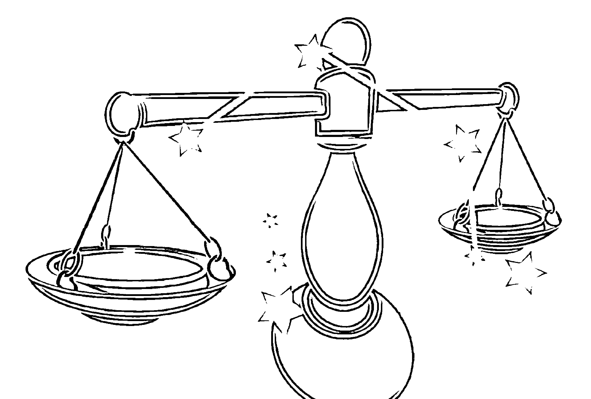

♎ 天秤座

- ☆出生日期：九月二十三日～十月二十二日
- ☆身體部位：下背部
- ☆主題：活出平衡，支持他人的真實

天秤座發動了黃道週期的後半部。回想一下，前半部的牡羊到處女建構了自我。現在，你進入天秤座，帶著必要的基礎，深深地潛入他人，同時在這麼做的過程中不失去自己，因為你的自我發展絕對尚未完成，只是朝著某個新方向繼續前進。這個新方向要求你，帶著你個人所有的希望、夢想和慾望，有意義地容納他人。當你質疑自己的終點在哪裡、他人的起點在何方之際，的確有一條微細的界線需要小心掌握。那需要平衡形形色色的真理天平，而這個任務正是天秤座在這裡要謙恭地完成的。

### 天秤座司掌：下背部

背部是從骨盆邊緣延伸至脖子基部的身體部位。雖然同一條脊椎（脊柱）和大部分的肌肉遍佈在整個寬闊的背部，但背部通常被認為是由兩個分區構成：上背部和下背部。上背部在第六章談到獅子座時討論過了，它是與胸椎相關聯的部位。下背部再往下行，與腰椎相關聯，也是與天秤座相關聯的部位。大大的椎骨是腰椎區的特色，這樣的尺寸是必須的，如此才能支撐其上所有的重量（來自你的頭部、頸部、雙臂和背部），同時平衡軀幹的動作。為了做到這點，你的背部有自己的支撐機制，例如，相鄰椎骨之間的椎間盤，用於緩衝減震，以及一套韌帶系統，幫助穩定。還有幫助骨骼、椎間盤和韌帶保持不移位的深層肌肉，例如，豎脊肌群和橫脊肌群。這些深層的穩定肌支撐背部的整體結構和功能。當你坐在凳子上（亦即沒有固定的靠背支撐）時，就是它們機動地使你的背部保持「挺直」。此外，這些肌肉被認為與下背部疼痛有關，那是美國人民到全國初級保健機構就診的常見原因。下背部疼痛可能肇因於許多根源，包括過度使用背部、錯誤使用背部、或是結合此兩者（好比經常用不當的姿勢提舉重物）。你的腰椎是穩定的，但它也是活動的，而且活動性愈高，愈容易造成損傷，尤其如果你沒有讓背部依其所需正確運作，就會更容易受損。

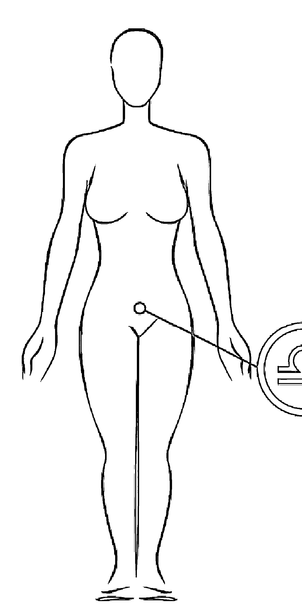

下背部的骨骼結構，參見附錄C。

對眼睛來說，你的背部看起來筆直端正，但脊柱形狀其實像一個S，就是這個S創造出除了顱骨和頸部的椎骨以外，上背部和下背部的弧線。這些弧線幫助支撐軀幹，抵抗重力。

換言之，你的背部一直「支持你」，但你是否給予它用來支撐你所需要的支持呢？如果背部的肌肉和關節虛弱、不穩定，或是腹部的支撐不良，就無法平衡堆疊其上的一切。「平衡」是天秤座遊戲的名稱！假使無法平衡自己的重量，你又該如何有效地為他人做同樣的事情呢？知道如何平衡他人，首先要知道如何平衡自己。畢竟，當你內在的天秤忙著平衡人世間的重量時，你希望它來自一個穩定的地方。假使情況並非如此，那麼你可能會某天抬起一隻箱子，然後，砰！傷到自己的背。即使看起來這事故像是突然發生的，但很可能已醞釀了好長一段時間。腰椎周圍的結構正緩緩脫離腰椎的自然平衡，但肯定持續一段時間了。不論你抬起的是什麼，都是壓垮駱駝的最後一根稻草。無論如何，沒有必要等到受傷，才給予背部（或身體的任何部分）所需要的。每一個實體結構（從你的身體到你的蝸居）都需要骨幹支撐，你的背部也不例外。事實上，它是你的基礎。你的背部支撐你到什麼程度呢？若想知道答案，不妨嘗試一下眼鏡蛇式。

## 分解步驟

1. 肚子平貼俯臥，雙手平放在地板上，就在雙肩正下方；手指撐住，肘收攏於身體兩側。兩腿伸長，雙腳腳尖貼地下壓。

當雙手離開地板且臀部放鬆時，你背部的高度代表背部本身的氣力，尤其是背部伸肌的氣力。你應該要能夠舒適地維持某一高度三十秒。你的背部變得愈強健，能夠抬離地板的高度就愈高。當然，氣力需要因伸展而平衡，如此，你的背部才不會變得太過緊繃或僵硬。相反地，它應該要具有靈活的穩定性，在內、外兩方面均能給予和領受支援。或許，這來自另一個介於「拒絕他人」與「贊同自己」之間的天秤式平衡。

2. 吸氣，開始靠兩側手肘伸展，將胸部抬離地板。這個抬起應該要從下背部產生氣力，而不是靠雙臂施力。臀部和雙腿保持在地上，臀部縮收，但不緊夾。注意不要屏住氣息！
3. 靠雙臂伸展，只要伸展到可以讓骨盆前方和地板之間維持某一連結的高度，這可能意味兩側手肘依舊彎曲。設法確保頭部和頸部連成一氣，成為脊椎其餘部分的延續，不過度伸展或屈曲。目光應該要斜斜地落在前方的地板上。
4. 壓低雙肩，肩胛骨牢牢地靠貼背部，然後舉起雙手，離開地板五公分。注意背部的高度是否因此而降低。
5. 不論你在哪一個空間，都撐住這個姿勢三十秒，同時呼吸。
6. 趁呼氣時，放鬆，回到地板上。

## 天秤座健康課題：活出平衡，支持他人的真相

想像一下靠單腳平衡。即使你可能認為你是平衡的，但支撐站立的那一腳是真正靜止的嗎？不，它的許多肌肉，連同腳踝的肌肉，都忙著進行無數的微調。這些微調影響到關節，幫助你保持直立——如果腳太過內翻，就讓它向外；太過伸展，就讓它屈曲。總而言之，雖然你似乎是不動的，但你的平衡卻是一個動態動作，是一支足部與地板之間的舞蹈。

> 這類微調也發生在內部，因為身體的維護需要許多物質（例如，碘），但只需要特定的劑量。你需要足夠的碘，才能維護你的甲狀腺功能；若太多可能產生毒性，太少則可能造成甲狀腺功能減退。

雖然天秤的星群（那些天平）是在天空中，但這個星座卻提供一則凡間的提示，提醒我們每一個人周遭都懸掛著一座座無形的天平。從工作要求與自我照護，到一份份蔬菜對照甜點，為了平衡這些天平的兩端，需要你讓內在的天秤座參予——去覺察哪一邊需要更多的重量、更多的焦點、更多的時間、更多的關注。如此的永久校準，使你不斷覺得彷彿正在得到你所需要的，「同時」關照他人。當然，也許你可以多做一些或少做一點點，但整體而言，你感覺到平衡、有所約束、得到支援，宛如正在得到你所需要的，同時公平地回應周遭的環境和人們。

每一個個人內在的天秤座都得到召喚，要去平衡自己的天平。就連美國政府也有一套監察與制衡制度，以確保沒有一個政府部門對國家有過大的運作力。不足為奇的是，正是天秤座的美國最高法院前首席大法官約翰·馬歇爾 ⑪，幫助平衡美國的統御方程式，使司法部門得以與其他兩個部門平起平坐。當然，鐘擺有時會擺到其中一個部門，但不會待在那裡太久。鐘擺的本質是擺盪在某個幅度的兩端之間，在其間傳遞鐘擺的均衡，而這同樣適用於你。雖然對擺錘來說，平衡它的是重力，但你有內在的天秤座可引導你邁向適合你且波動變換的和諧。這是一種內在的能力，不僅幫助你找到並維持平衡，並且以呼應內在真理的方式進行。

> 天秤座忙著自己美好的平衡動作，成為標示出秋分的黃道星座，這是一個白晝與黑夜長度大致相等的時節。

天秤座民權運動家聖雄甘地，在他倡導的印度獨立運動中祈請了真理。事實上，他打造了「堅持真理」（satyagraha）這個詞（satya 意指真理和愛，graha 暗示堅定和力度），目的在闡述他的宗旨——堅定但非暴力地反抗英國帝國主義。誠如甘地所解釋的：「這個『真理』不只是我們被期待要說出的真理，它就是唯一的真理，它是萬物所由生，憑藉自己的力量繼續存在，不靠任何其他東西支援，但卻支援存在的一切。唯有真理永恆不朽，其他一切都是短暫的……這不是盲目的法則，它統御整個宇宙。」①

> 在追隨著出現暴力行為後，甘地意識到，他的「堅持真理」教誨需要更大的試煉，才能在言行上成為典範。他隨後中止了這個運動，儘管該運動最終被認為是成功的。

然而，在存取某個更大的真理時，真理必須被帶到個人層面，進而被活出來，成為你的個人真相；否則，真理無法產生改變，然後可能變得棘手。因為即使有一個支配一切的真理，然而有多少真理的追求者，真理就有多少種被理解的方式；就連在你之內，真理也有許多種被理解的方式。故事的每一面都呈現出它自己的真相版本，而天秤看見了這一切。這個部分的你知道，不是單單某一麵是有效的，而是一切均可以同時有效，並且在可能的最大範圍內，全都應該得到尊重。然而，這裡的挑戰在於，當你被他人的真理包圍時，不要否定自己的真理。當然，你內在的天秤剛好天生是大家的開心果，但最終，你的真理描述了最全面的你，表達了最真實的你。因此，關鍵在於，要接觸並維護你自己真實的天秤座，即使當它與他人產生衝突時。以此方式進入恩典。

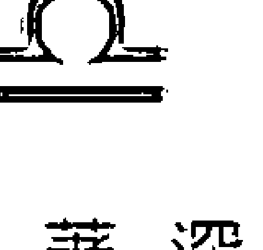

> 深思一下美國詩人約翰·戈弗瑞·薩克斯（John Godfrey Saxe）說過的印度傳說「盲人摸象」：有六個人觸摸著同一隻大象的不同部位，每一個人都對大象是什麼做出不同的詮釋，有牆、矛、蛇、樹、扇子、繩子。雖然每一個人所言就部分來說都是正確的……但整體而言，卻是錯誤的。

雖然在《新約》中，「恩典」是一個宗教術語，但它其實是一個普世的概念。每一個人都能夠給予祝福。你八成聽過許多次「靠著神的恩典」這個說法，但它真正的意思是什麼呢？《新約》中的「grace」（恩典）一字是從希臘文 charis 翻譯過來的，意指神慷慨給出的恩惠。例如，賜給罪人的救恩、賜予不思悔過者的祝福。

福，每天给出且以林林总总的形式给出。例如，慈祥的旅店老板，欣然地提供客人喜好的美食；有风度的输家，诚挚地与敌对对方握手；或是优雅的芭蕾舞女演员，为观众的演出遮掩了她染血的双脚。于是，恩典不只是行为，更是与行为一同被表现出来的品质。

行为谦恭和取悦他人之间的差别在于，前者（行为谦恭）而言，你很清楚你的真理，并且「选择」不发声，因为你感知到的是更大的良善。真理蕴涵在真理的知晓当中，而「小我」冲口说出的渴望并不会使真理的真实性增减丝毫。事实上，许多时候，沉默比言辞更能维护真理。以后者（取悦他人）来说，你可能觉察不到你的真理或「你可能是」的真相；无论是哪一种情况，你都是在违背真理，而这是基于某个别有用心的动机，例如，赢得喜爱、得到认可，不然就是利用它作为方法以图谋某个有意或无意的结局。结果终将不言自明，那不是恩典必然包含的舒适满意，而是隐含的怨恨与整体的枯竭。

假使我们的天秤座是要来领路的，而我们也真正心怀恩典优雅地活着，那么我们的世界势必见证到更加平安、和谐、稳定的时光。在某种程度上，那会类似「黄金时代」（Golden Age），也就是希腊「人类世纪」（Ages of Man）的最高阶。根据古希腊诗人赫西俄德（Hesiod）的说法，这是个和谐、繁荣的时代，此时的人种是众神最有出息的子女。星辰少女阿斯特莉亚（Astraea）主管这个时代，直到时光流逝，人类堕落，变得自我中心、贪婪、暴力。如此的堕落继续着，过了「黄金时代」，跌落成「白银时代」，然后是「青铜时代」（现在则是「黑铁时代」），阿斯特莉亚离开了。她无法忍受缺乏恩典，于是她的礼物在这个新世界完全丢失了。就这样，她返回到天界，如今在天界握着天秤座的天平，从天界支援人类的努力。这则故事的结局悲伤吗？你内在的天秤座会说：「也许悲伤，也许不悲伤。」因为尽管我们丢失了这位女神在此人间的指引，但我们现在被派给了在自己内在存取同样属性的任务。而比起假他人之手获得幸福安乐，如此的自我追寻和自立自强可能是一种更加丰富的方法。

> 虽然阿斯特莉亚握着天秤座的天平，但这时的她却站在处女座的星群中。就这方面的能力而言，阿斯特莉亚也被认为是处女座的天女之一，与埃及女神伊西丝、希腊女神狄蜜特、以及圣母玛利亚齐名。此外，阿斯特莉亚也与正义女神狄刻（Dike）相关联。

# 不健康的身体讯号（两种极端）

天秤座在这里，是要以谦恭的方式，由内而外平衡人世间的许多真理。恩典自然而然地临到这个星座的能量，那是从本质上珍视意气相投与和谐融洽。于是，你的天秤打造出能够维护和平的绝佳外交官，或是能够为每一枚硬币的每一面辩解的律师。结果，欣然融入这个世界的需求，使天秤座对每一个人来说都是可爱的。

天秤座的根本焦点是伙伴关系和人际关系，针对「你」或「我们」，以相较于「我」。拥有这个能量的功课是，要设法确保你的天秤座在融入他人需求的过程中，不至于失去自己的完善。掩饰自己的真理（或是不为真理挺身而出），许多时候可能比较容易维持和平。没有人比天秤座更讨厌皱乱的羽毛，但基于不惹是生非，他不经意地选择顾全表象的言行。然后他在公司的职级将获得晋升，并不是因为他活出某个内在的真理，而是因为他迎合表象与期待。在这个过程中，他可能甚至会在陈述意见时说些（白色）谎言、从不说「不」、带着虚饰的恩典微笑。所有这一切，都在努力促使他人开心。

> > 天秤座很容易融入人群。天秤座的星群也一样：该星座的星星都不是第一等级，这使得天秤座相对微弱。天秤座的两颗星星其实以前属于天蝎座的星群，形成天蝎座的爪子。

但那持续不了多久。取悦他人是很累人的，尤其当你的天秤面向取悦除了你自己以外的每一个人。于是屡见不鲜的情况是，你的天秤座到了感觉耗尽、疲乏、通常失衡的地步，甚至可能会出现身体问题，以帮助他重新平衡他的方程式，有效地强迫他致力于需要的休息和自我支持。换言之，天秤座需要重新发现自己的脊柱。下背部疼痛通常发生在背部肌肉太过虚弱或过于紧绷（紧绷与强健并不是同一回事）时，而且通常是在腹部支撑不良的情况下（见第七章）。倘若深层背肌是紧绷的，天秤座可能会拼命地继续紧握，以求支撑结构。或许他自我支持的惯性太过僵硬、局限，或是这些惯性建立在被紧紧握成了教条的真理之上。换言之，这些惯性『过于』支持，致使在他需要更大的范围时，却被局限在某个地方。不断抗拒的天秤本质，其身体表现可能包括：

- 紧绷、拉紧的下背部肌肉
- 肌肉痉挛
- 活动范围受限
- 平背体态
- ★突发性动作造成的剧痛
- ★其他：肾脏或肾上腺失衡（按照天秤座的平衡举动，这些位于下背部深层的器官是成对出现的）

假使天平倾向另一边，以致深层背肌无法支撑自身或周围的结构，便会导致整个部位更容易受伤。就实质面而言，这就好像没有人是你的靠山。又或许你有支援系统，但它们全是外部的（例如，朋友），而不是内在的（例如，自信）；如果它们即将消失，你可能会崩溃。无论是哪一种情况，你的背部都无法再支持你的天秤能量目前引领的生活型态的重量。

#### 屈服顺从的天秤本质，其身体表现可能包括：

- ★疼痛、拉紧的背肌
- ★身体消耗（例如，抬举）造成的疼痛或虚弱
- ★C形或脊柱前凸体态
- ★与关节退化相符的疼痛和症状
- ★其他：肾脏或肾上腺失衡

你的背部可以支撑到什么程度？无论是感觉不断抗拒、屈服顺从，或是介于两者之间的某处，关键都在於：好好聆听你的身体，给予身体所需要的。要伸展紧绷的下背部或强化虚弱的下背部，运用下述提问和练习，唤醒你内在的天秤座。

### 找回平衡的五项提问

下述提问和练习将充当你体现天秤座的个人指南，不妨运用它们，带着恩典平衡你的真理天平。

- ★你觉得你的生命平衡吗？你生命中的哪些领域可能失去了平衡？你该如何重新平衡生命中的这些天平？
- ★你握有的什么真理，对你是谁和你所做的事而言十分重要？哪一项名列榜首？你如何将它融入你的日常生活中？
- ★你知道自己的终点和他人的起点吗？
- ★你会说你在日常生活中展现了恩典的品质吗？如何展现？何时展现？你希望在什么情况下可以祈请更多的恩典？
- ★你的背部是否在你目前的生活型态和努力中支持你？需要发生什么事，才能让你和你的背部感觉得更好的支持？

### 天秤座养生操

# 练习1

# 半船式：有益平衡、气力、支撑

你见过眼镜蛇将头仰起、离地好几英寸的照片吗？由于肌肉构造之故，眼镜蛇可以举起大约三分之一的身体，而让其余三分之一留在地上。半船式是同样适用于你的平衡之举，而且此一锻炼，你在本章前面练习眼镜蛇式时已经操练过了（见182〜183页，你可以继续练习眼镜蛇式）。半船式利用你的背部伸肌和稳定肌来启动并维持举起的力道。运用半船式，你可以平衡背部与腹部的气力，有利于更进一步的核心支撑。

# # 分解步骤：

- 1. 坐直坐正，双膝弯曲，双脚平放在地板上。双臂位于身体两侧，手掌贴在臀部两侧的地板上。
- 2. 紧缩核心（保持躯干平直），接着抬起一腿，然后另一腿，让两腿的胫骨与地板平行。双手手掌牢牢地按住地板，帮助你，直到可以靠坐骨平衡为止。
- 3. 一旦找到了平衡点，便抬起双臂，与小腿齐平，让双臂彼此平行，同时与地板平行。双手用力，手指并拢，手掌朝向腿部。设法确保肩胛骨与背部齐平，如此才不会背往前弓。头部微倾向胸前，保持颈部细长。
- 4. 呼吸，保持这个姿势三十秒，不要放下双腿，接着尽力试试看能否撑到一分钟。你的腹壁应该要用力，但不紧绷。
- 5. 松开时，双脚放低，来到地板上，身体向上摇晃成坐姿，靠双手辅助，然后缓缓放低身体，使背部朝下平躺，让自己可以在地板上充分伸展。

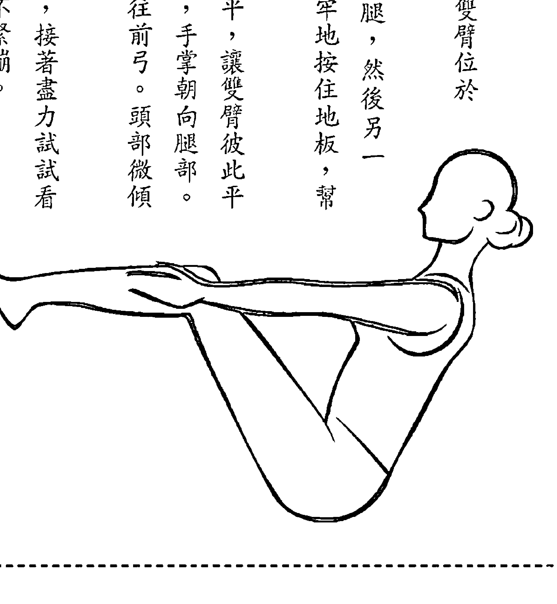

# ## 练习2
像球一样滚动：迈向平衡

十七世纪之交，多才多艺的义大利天文学家、数学家、科学家兼哲学家伽利略，因观察大教堂中摇摆的枝形吊灯而发现了钟摆的关键特征。每一具枝形吊灯都透过它的平衡点（被气流所取代）来回移动。同样地，人体也可以被看作是一根摆锤。举个例子，当你的某一下肢（从臀部到足部）摆动向前并跨出一步时，作用就像是身体的摆锤。

当你从一端（坐骨）滚到另一端（肩膀），这个练习可让你的整个身体得以复制摆锤的弧形。滚动时，要允许背部放松，才能优雅地在两端之间移动。注意这个练习的大部分时间其实是花在两端之间。

假使练习半船式对核心的负担太大，可将双手置于身体两侧，贴地支撑。话说回来，如果想要多加锻炼，或是充分表达半船式，可伸直双腿，同时保持躯干中立。但要记住，脊椎的支撑最为重要，因此，绝不要为了牵就脊椎的完整而牺牲腿部的高度！

##### 分解步骤：

- 1. 坐在某一有垫料缓冲的表面上（例如，垫子），坐在坐骨上。身体打直坐正。将双膝靠向胸前，双手扣住小腿。
- 2. 放下双肩，扩大背部，深化腹部，让脊椎形成一个C形弧线。颈部应该保持是脊柱的自然延伸。
- 3. 双脚抬离地面，靠坐骨平衡。

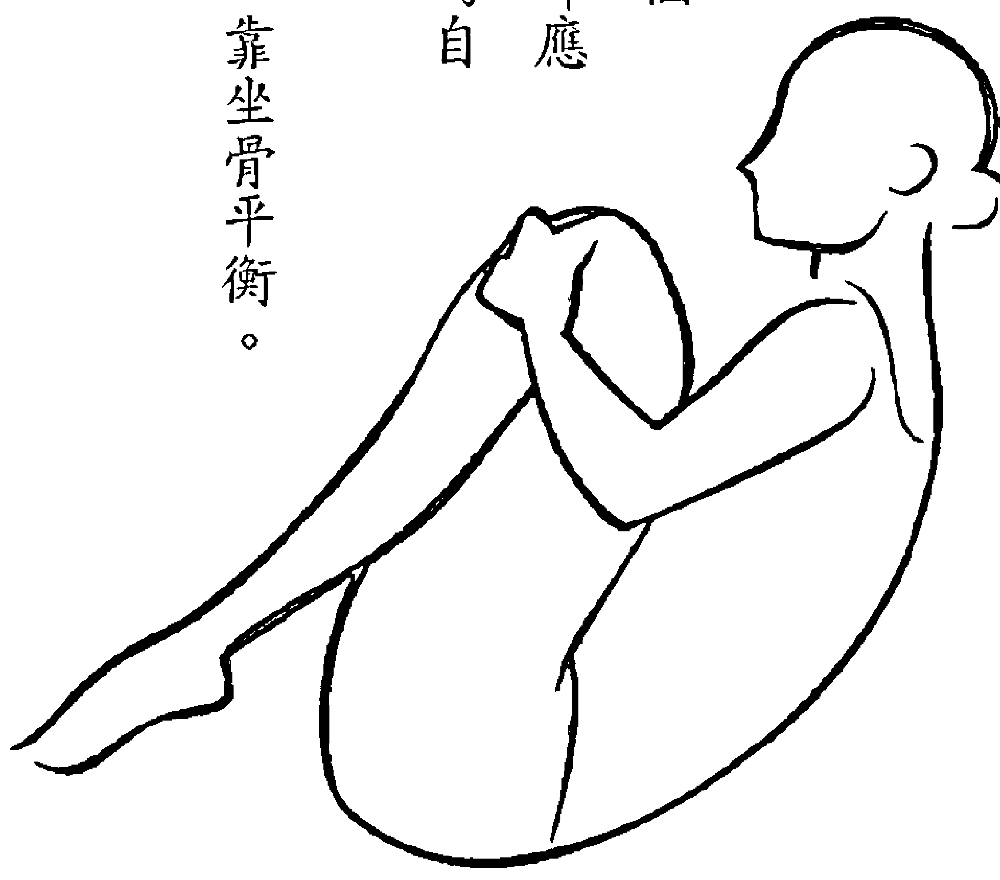

- 4. 呼气，加深C形曲线，同时向后滚。只要滚到肩膀的高度，并小心不要滚到颈部。
- 5. 维持C形曲线，吸气，滚向前，滚到坐骨上。
- 6. 重复五至十遍。

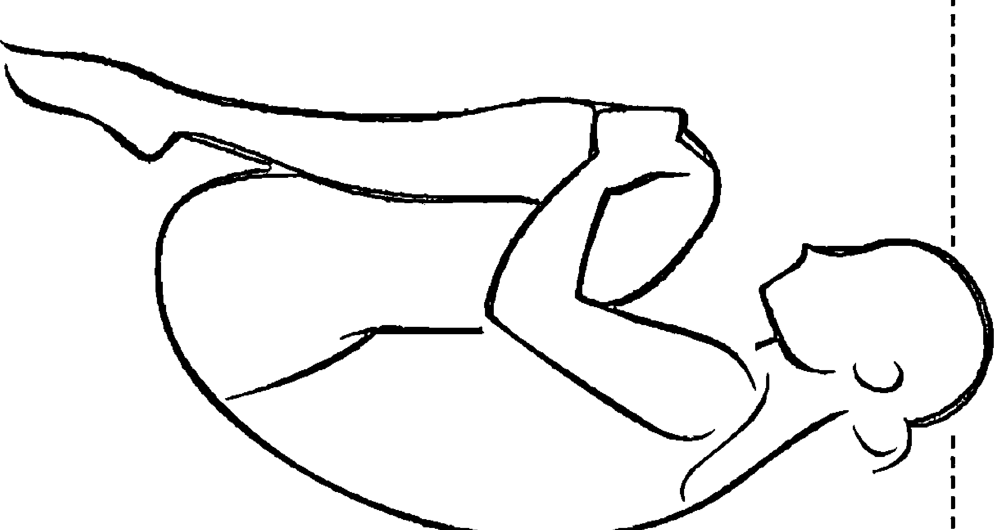

感觉弯曲还是失衡呢？继续练习，聚焦在脊椎，以脊椎作中线。

# 练习 3

# 站立脊椎扭转式：看见许多真相

身体是一具精细校准的机器，运用来自四周环境的感官输入（许多时候，你甚至没有意识到输入的信息），做出如何保持平衡的决定。因此，举个例子，你可能失足踏出只有约八公分高的路边，然而感觉却好似下坠的高度比八公分大上好一段，你砰地一声重重落地。感官输入不见了啊！你的头部是此一输入的主要指挥官，尤其是内耳，颈部则负责头部的活动（分别参见第二章和第三章）。但下背部支撑上述两者，而且靠着下背部的活动，使头部和颈部可以借助左右旋转以收进更宽广的范围。由于你可以绕着身体中轴做更大的旋转，因此能够更充分地欣赏这个世界。你可以更清楚地看见人世间不同的面向，以及每一个人都有不同的故事要讲述、不同的真理要持有。何况你愈是觉察到这些，就愈能够于内在整合它们，于外在容纳它们。

##### 分解步骤：

- 1. 站立，双脚分开，与臀部同宽，双膝微弯。允许双臂松松地垂挂在身体两侧。
- 2. 将躯干转到右侧，允许双臂摆动，使左臂移动到身体前方，右臂移动到身体后方。转到左侧，右手摆到身体前方，左手摆到身体后方。让此一扭转从下背部产生。骨盆应该保持正对前方。

> 现在，在看不见的情况下觉察：闭上眼睛，继续扭转。信不信由你，闭上眼睛会将活动的范围和旋转的流畅性增至最大。你不再用目光支撑自己，而是改用中立的骨盆和稳稳扎根的双脚来支撑背部的旋转。
> 
> - 3. 继续左右交替旋转，允许身体自由摆动于左右侧之间，仿佛你是一根庆祝五朔节的花柱。
> - 4. 摆动，总共旋转二十遍。

# # 练习 4

## 真名静心 (Satnam Meditation) : 觉察真理

套用最简单的说法，古木基文②的sat译为「真理」，nam译为「名字」。因此，说satnam是一种承认自己真实本质（你的神性）的方法，就好像说：「我体认到我的真实自我。」

- 1. 在地板上找到一个舒服的座位，需要的话，盘腿坐在软垫、枕头或瑜伽砖上（如果不能盘腿，就找一个舒适的姿势在地板上坐正；如果这个坐姿对你而言仍有困难，就坐在椅子上）。
- 2. satnam的最充分表达是一个四音节的单字，发音为sa-ta-na-ma。sa涉及整体，ta涉及生活，na涉及死亡，na与复活有关。②在整个静心期间发出每一个音节的过程中，要用拇指触碰每一个指尖（双手同时进行）。发sa音时，用拇指触碰食指；发ta音时，用拇指触碰中指；发na音时，用拇指触碰无名指；发na音时，用拇指触碰小指。然后再从sa开始。
- 3. 大声念诵这个梵咒（重复的声音），持续一分钟。
- 4. 小声念诵一分钟。
- 5. 小声念诵一分钟。
- 6. 于内在重复念诵五分钟。
- 7. 大声念诵一分钟。
- 8. 静静地坐着，好一会儿才起身。

时间总共是九分钟，但请持续以此方式进行至整整十五分钟，亦即：五分钟大声念诵和小声念诵，加上十分钟内在重复。别忘记使用拇指手印（手势）搭配你所念诵的梵咒。

尽管satnam在昆达里尼瑜伽中人气特旺，但它的分身namaste（合十致敬），更常以其他形式被听到。合十通常用作一堂课未尾的结束语，传达尊重与荣耀的感受，如同：「我内在的神性之光向你内在的神性之光鞠躬。」

# ## 练习 5
# 鼻孔交替呼吸：平衡自己与他人

- 1. 在地板上找到舒适的盘腿座位。关掉手机，同时设定五分钟闹铃。
- 2. 左手放在大腿上，手掌向上，右手形成吡湿奴手印：食指和中指朝向掌心弯曲，拇指、无名指和小指保持伸展。
- 3. 闭上眼睛，透过鼻子做两、三下深呼吸。
- 4. 呼气后，用右手拇指轻轻按住右侧鼻孔。注意均匀地调整呼吸，透过左侧鼻孔吸气，缓缓数到四。
- 5. 然后用右手无名指按住左侧鼻孔，打开右侧鼻孔，缓缓呼气，数到四。
- 6. 透过右侧鼻孔吸气，数到四。
- 7. 用右手拇指按住右侧鼻孔，同时打开左侧鼻孔，缓缓呼气，数到四。
- 8. 再次开始此一循环，重复五分钟。
- 9. 完成后，松开手印，回复至正常呼吸好一会儿，然后起身。

你有没有听人说过，当你生气时，「只要深吸一口气，然后数到十」？或者你是否有朋友，总是在你明显有压力时提醒你呼气？无论大家是否领悟到，这些都是金玉良言，因为缓慢的深呼吸可唤起神经系统的副交感神经分支，这个「休息和消化」回应使你得以平静并归于中心。

此外，这个呼吸法可平衡你的能量体的两面，从而使你在形上层面归于中心。左（或「阴」）面是你代表直觉、接收和关联的部分；右面是动态的「阳」，是使你成为演员、创作者、实干家的那把火。这两个部分都活在你之内。但很可能情况是，假使生活在西方社会，你已经大大培养了你的「阳」面。要与「阳」一起培育「阴」，从而将你整个人带回到平衡之中。这将帮助你维持必要的能量与优雅，可以为自己和他人继续努力。

所以，你该如何优雅地走路、优雅地说话、或是成为一个优雅的人呢？带着觉知——觉知到是什么品质（而任何事情都可以怀着恩典，优雅地完成，因为对任何人、事、物来说，心怀恩典的优雅就是「方法」。

优雅（即「恩典」）是一种品质，一种核心本质，它遍布在你的全身和身体的动作姿态、你的知见和言辞、你的感觉和行为之中。优雅的典型特征是流动的、流畅的、精致的，那是一份内在之美，平静地注入周遭事物。

#### 练习 6
保持觉知：在练习中培养优雅

这个技巧可在任何现有的时间内完成，就连仅止一分钟全神贯注的呼吸，也有助于平衡你的左右两侧。因此，不管你想要的是一次协调身心的晨间练习，或是在工作时感到压力重重，或是置身某次家庭聚会当中，你需要的只是一分钟的个人时间，即可帮助你在生活中重建平衡。

- 1. 挑选你已经做过的上述练习之一，带着心怀恩典的优雅，再操练一遍。必须重复几遍就重复几遍，力求感觉优雅，同时维持动作的完整性。

且有许多品质可以选择）注入你的日常模式中，「以及」这些模式如何有意和无意地影响他人。因为优雅是一种觉知的练习，所以熟练生巧。

### 小结

- ★ 下背部是与天秤座相关的部位。下背部有最大的脊椎骨支持你，因此，你也可以支持他人。
- ★ 天秤座是黄道周期的第七个星座，其能量涉及平衡。无论是你的真理、他的真理、或是社会的真理，天秤座优雅地尊重一切的真实性。
- ★ 如果你取悦他人的天秤本质，使得天秤倾向于太过局限或太过顺从，你的下背部可能会体验到不同的症状，例如，肌肉酸痛、疼痛或拉伤。
- ★ 透过聚焦于下背部的提问、练习和活动，平衡你内在的天秤座，运用这些调整频率，收听（同时重新平衡）你身心灵的需求，正如你为他人所做的那样。

> 原注：
> ①尤盖希·查达 (Yogesh Chadha)，《甘地传》(Gandhi: A Life, New York: John Wiley & Sons, 1997)，113页。
> ②乔治·福雷斯坦 (Georg Feuerstein)，《瑜伽传统：瑜伽的历史、文学、哲学与实践》(The Yoga Tradition: Its History, Literature, Philosophy and Practice, Prescott, AZ: Hohm Press, 1998)，448页。
> 
> 译注：
> ①John Marshall，美国政治家、法律家，曾任美国众议院议员、美国国务卿和美国首席大法官。在首席大法官任期内，马歇尔曾做出著名的马伯里诉麦迪逊案 (Marbury v. Madison) 的判决，奠定了美国法院对国会法律的司法审查权的基础。
> ②Gurmukhi，书写旁遮普语的最常用文字，锡克教文献中经常用到古木基文符号。

# 蝎子的荐骨

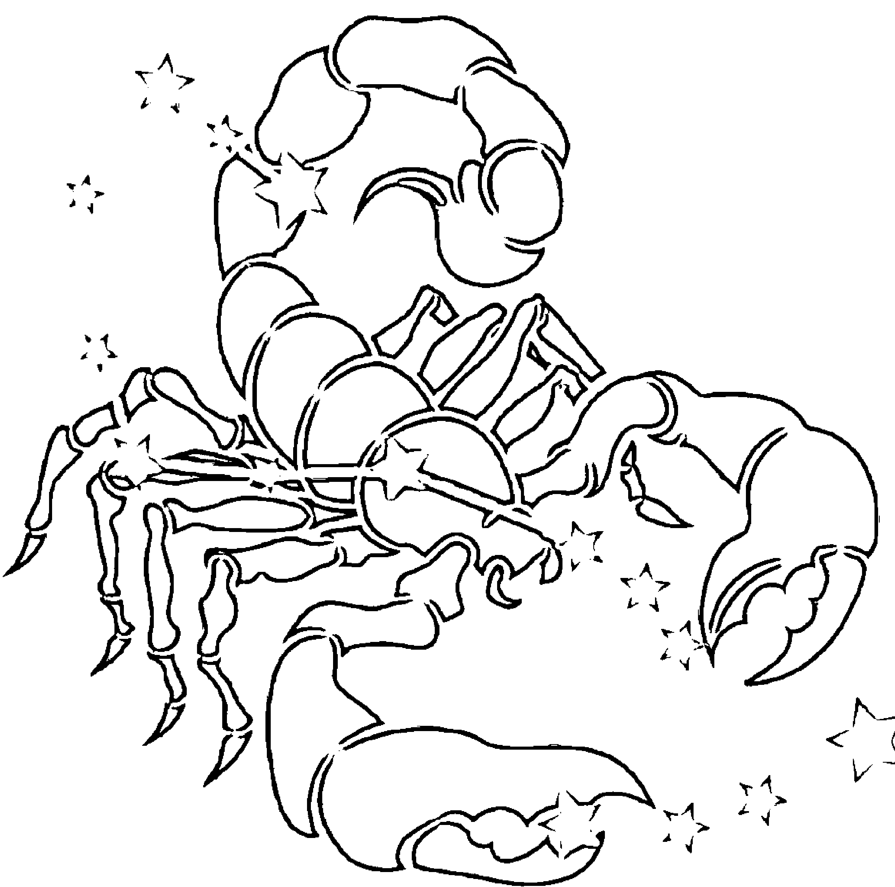

## ♏ 天蝎座

- ☆ 出生日期：十月二十三日～十一月二十一日
- ☆ 身体部位：荐骨中心、生殖系统
- ☆ 主题：转化情绪，达成蜕变重生

天蝎座在黄道带占据一个特殊的位置，它定出其前后星座的速度变化。换言之，现在是时候，该要超越你的日常状态而与更大的生命结构连结。然而，为了让此事发生，你需要隐喻性地死亡，才能重生。要进入天蝎座，这个星座直接来自冥府，为的是将你累世携带的潜意识模式连根拔起。那是一场业力的燃烧，一次又一次，蜕去一层层的皮。这种永恒的情感宣泄净化是天蝎座的核心本质，她准备要孤注一掷，为了再生而冒着失去一切的风险。每一次死亡都带来这样的转化，让天蝎座的凤凰坠毁，然后燃烧，只为了从灰烬中崛起，再次翱翔。

# # 天蝎座司掌：荐骨、生殖系统

荐骨是脊椎末端五块融合骨的集合。这块三角形的骨头位于你的下背部（腰椎）下方、尾椎骨（尾骨）之上。荐骨的拉丁词根是os sacrum，意思是「神圣的」，之所以这么称呼是基于某个古代的信念，相信灵魂住在那里（也许甚至涉及宝宝的灵魂在子宫得到孕育的地点）。荐骨与你的骨盆一起形成一个更大的区域，即一个大大的骨盆底。骨盆的两个半边形成这个骨盆底的前方加侧边，而由荐骨在后方结合这两个半边。它们聚合在荐髂关节（sacroiliac joint），名称源自于连结荐骨与担任侧翼盆骨的每一块髂骨），这些关节的活动度足以让你在走路时移动到骨盆，但活动范围不如背部其他部分的滑液关节。事实上，这些关节的活动虽然重要，但范围极小，因为它们需要赋予稳定性。毕竟，这两个小关节是身体中整个躯干唯一与下肢连结的地方。此外，稳定性是必要的，因为你的荐骨区或荐骨中心包围着传统上名为子宫的区域。所以，荐骨区的内容包括：子骶骨的骨骼结构，参见附录C。

子宫和卵巢等女性性器官、生孩子必备的一切、前列腺之类的男性生殖解剖构造。此外，骨盆本身的特色是帮助胎儿成长和分娩，也因此，女人的骨盆拥有更大的角度以及更大的入口和出口。基于这些与众不同的特色，骨盆成为身体中少数可以用来区分骨骼性别的骨头之一。

骨盆底除了生殖内容物之外，还有膀胱之类的泌尿器官。总的来说，这些器官使该部位成为高度流畅的区域，所以天蠍座是水象星座，这点便不足为奇了。事实上，就占星学而言，这个部位的流畅性不过是某个星座的身体表现，而这个星座非常着重情绪的抑制。此区的水和液体在总体与分子两个层次上流动。这类流动就像情绪的流动，使你迈向你喜欢的（例如，最爱的餐厅），远离你不喜欢的（例如，老鼠）。所以，液体、流动、情绪、意向是相关联的，而充满液体的荐骨中心因此被认为是身体活动和感受的基地。

天蠍座是非常热情的生物，她本能地知道喜欢什么、不喜欢什么，且在两者之间画上一条坚实的分界线。她容易达到高亢的高峰，也容易落入低凹的低谷，因为水能达到沸点，就像水能转变成冰一样容易，也因此聚焦在该部位的平衡与稳定极其重要。理想情况下，你希望骨盆的两侧齐平，直指前方，不倾斜、旋转、或是一侧高于另一侧。换言之，你想要让骨盆保持在中立位置，这将有助于身体的上下堆叠，也可以预防荐髂关节因错位而不适和疼痛。发展并维持中立位置的骨盆可以是耗费一生的工作，因为它可能是一个难以存取的部位。

> ♏

有趣的是，「情绪」的活动相关属性被嵌在「emotion」（情绪）这个英文字里。emotion 一字源自拉丁文 emovere，e 的意思是「脱离，彻底地」，movere 与活动有关。换言之，情绪使你迈出，四处飘泊。

第一步是判定骨盆的中立位置在哪里。不妨利用下述练习进行自我评估。

1. 背向下仰躺，双膝弯曲，双脚平放在地板上，分开，大约与臀部同宽。双臂伸长，置于身体两侧，手掌朝下。
2. 一手放在下背部的弯曲部分和地板之间。扩展或屈曲背部（整个练习中只需要微小的动作），使空间足以容纳你的手的宽度。这个姿势应该接近骨盆的中立位置。
3. 做一次骨盆前倾：将骨盆向前倾（朝向膝盖），使下背部拱起，背部、手和地板之间会出现多余的空间。这个姿势常见于具有脊柱前凸姿势的人身上（见第八章）。
4. 做一次骨盆后倾：腹部肌肉用力，将骨盆向后带，穿过中立位置，倾向另一个方向（朝头部）。你的骨盆应该要收拢，让下背部平贴在地板上，手被压缩在两者之间，坐骨应保持贴地。对背部来说，骨盆后倾是一个稳定的姿势。
5. 再次将骨盆微向前倾斜，返回到你的中立位置。感受这个位置在地板上的感觉（这将比站立时容易些）。感觉自由地前倾后倾，需要做几遍就做几遍，以此建立你对中立位置骨盆的感受。
6. 小心地站起来，站成你认定的轻松或正常站姿。你能感受到你的骨盆的方向（中立或倾斜）吗？如果骨盆是倾斜的，就做做必要的前倾或后倾调整，将骨盆移至中立位置。

> ♏

「心宿二」（Antares）是位于天蠍星群中心的星辰，其名字的意思是「像阿瑞斯（Ares）」或「媲美阿瑞斯」（「阿瑞斯」意指希腊战神）。根据神话，奥利安（Orion，即「猎户座」）想要杀死地球上的所有动物，于是大地女神盖娅（Gaia）派出蝎子去螯刺奥利安。后来蝎子和奥利安都被置放在天空中，遥遥相对，如此，具战略地位的蝎子便能继续监控奥利安这位战士。

## 天蠍座健康课题：转化情绪，达成蜕变重生

中立位置的骨盆，形成你的肌肉骨骼世界的基础，它是上方的躯干和下方的下肢之间的接合处，所以，骨盆的校正要麼为你身体的其余状态建立适当的基�，要麼造成浩劫。因此，骨盆的中立性和稳定度相当重要。鉴于天蠍座可能会经验到的极端（包括高度和深度），他们可以不断检查自己的荐骨中心，藉此好好照顾自己。

死亡对不同的人意味着不同的事。对古代的埃及人来说，死亡标示着世间生命的终止，以及在经历过阴间的一趟危险之旅后，某个在苍翠乐园中的来世。对中美洲的阿兹特克人而言，死亡是一场永恒的睡眠。对生活在西方社会的许多人来说，诚如我们所知，死亡是生命的一次结束，是分解成尘埃，是一场对抗的终结，或是一扇通往天堂的大门。在天蠍座的背景下，死亡可以被应用在必须放下的任何情境中，这时，你得到召唤去释放不再属于你的部分，例如，一份预期、个人的行囊、或是一则陈旧的故事。

你可能还记得，处女座同样可以净化自己的某些部分。这类净化是由欲望所驱动，渴望成为透明的器皿，以方便她服务事奉，因此有一个永久的修剪过程。相较之下，天蠍能量在这里的净化是为了情感宣泄、死亡、重生。故此，她放下了导致其模式的所有潜在原因，包括支配其日常念头与行为的情绪、本能和驱力。换言之，天蠍的死亡与毁灭是过时的「本我」(id) 面向。你的「本我」是一股灵力，与你对生存、安全、力量、性爱的感受有关；它是潜藏在你的念头与行为底下的原始动力，渴求立即的满足。当你的本我得到你的意识、小我和超我 (superego) 的其他面向居中斡旋时，就允许你以平衡的方式满足吃、喝、睡之类的强烈基本需求。

我们每一个人都有一个天蠍座，她必须面对失衡的本我面向（例如，在后面拉扯的恐惧），从而放下。

她甚至不需要知道那些特定的面向，不需要替它们贴标签，或是彻底理解它们唤起了哪些复杂的自我、学校、家庭、社会、媒体和业力互动。她只需要知道，是时候不该再服务于她的最高宗旨了，那部分该要死去了。

于是，死亡本身变成一个十分重要的过程。它提出了终极方法，让你连结并管理未能充分发挥的真实本质。而且为了顾及终身学习，死亡必须一再发生。就像冥后波西凤 (Persephone) 一样，这位希腊神话中的美女，每年为了重生而死亡，四季也因此得以循环：春天发生在她与母亲狄蜜特同在地球表面的时候；但每当她死亡并返回冥界与丈夫黑帝斯（罗马神话中的冥王普鲁托，亦即冥王星，恰好也是天蠍座的守护星）团聚时，冬天于是来临。当你的天蠍座隐喻性地死亡时，她仍在地球表面，但已成为一个她自己的全新化身。她的死亡经常受到某种剧变的催化，例如，濒死经验、破产、或失去亲人，她被从中用力推挤，从老旧蜕变成全新。虽然这些激烈的情节可能不会被故意执行，但你的天蠍本质「为了求死」，可能会下意识地吸引充满混乱和危机的情境，因为这些正是天蠍座的一部分结构。这些充满挑战的情境是宇宙教导你释放老旧执著的方式，也因此这些情境将会一再出现，以此帮助你接受死亡，从中学习，最终教导他人死亡的智慧。

死亡在我们的社会中存有污名，但也只是跟我们打造的死亡一样糟。除此之外，死亡就是死亡，既不好也不坏。应该说，死亡是一个要被尊重并从中学习的过程，这个过程对人生十分重要，重要到没有一个人的人生不是重复发生过许多形而上的死亡过程。就像蝎子一样，大约死过六次（蜕掉外骨骼），才能够完全成形。那是一种实质上兼比喻性的旧皮脱落，可以加速改变。不过，对黄道带的天蠍座来说，死后发生的事，其重要性不如死亡本身这个神圣而深奥的过程。死亡在最深邃、最吓人、最原始的层次与你连结，无论你需不需要，它都提供机会，使你看见、接纳、根据自己的某些部分采取行动。天蠍座带来的其实是一份大礼，那是一门内在的炼金术，让你将昔日的铅块转变成黄金。

炼金术是一门古老而神秘的「原科学」，它是现代化学和医学的前身，其核心原则是依据魔法石（亦称「贤者之石」）衍生。魔法石是一种难以捉摸的物质，据信能将铅块转变成黄金。虽然魔法石被认为是一种盐，但一般相信，它是追求不朽、开悟、人间天堂至福的关键要素。因此，它象征我们自己的转化——不只是一个元素蜕变成另一个元素，更是从凡人蜕变成神性。

> 在柏拉图不经意写下的占星文献《蒂迈欧篇》（Timaeus）之中，他描述了一种「原初物质」（prima materia，第一元素），所有物质都是由原初物质打造的。此外，古代炼金术士也用「原初物质」这个名称代表魔法石的起始成分。

我们的社会喜爱好的转化故事。孩子们读着青蛙如何变成王子的童话，青少年看着克拉克·肯特（Clark Kent）如何变身成超人的电影，成人们拾起有前后对比照片的杂志。如此癖好掩盖了对深层潜能的迷恋，使人无法体认到可能的状态与目前的状态截然相反。转化则允许你穿越内在与外在的执著（那些执著害你不断被监禁、受到奴役），使你长成全新版本的你以及你的生活方式，或是诚如天蠍座的西班牙艺术家毕卡索所言：「不同的动机难免需要不同的表达方式。」①

说来容易做来难，因为转化并非易事。事实上，它既难受又陌生。头脑心智根本不喜欢，因为即使你不会喜欢你的现状，但可能还是喜欢现状胜过一片未知。什么时候，头脑心智都宁可紧紧抓住当前的自我概念，而不愿让你扩展自我概念或与人交换。

因此，成功地改变必然包含弹性，这是一种信心，相信你可以反弹回来，可以从你可能面临的任何逆境中复原。如此品质是你内在的天蠍座肯定拥有的，只要你愿意放下，同时容许转化发生，尽管不确知它将带你去向何方。因此，任何好的转化就同它的前身死亡一样，在这个过程中，它强烈需要尊重和信任。

假使你的天蠍面向紧紧抓住你目前是谁以及你已然得到的事物，那么她将会暗中破坏那些深奥、神秘、与生俱来的混沌，然后她将会被卡住。再造将被抗拒所取代，内在的混沌将不会被引导成内在的转化，而是变成外在的操控。当这事发生时，他人的操纵就会出现。对天蠍来说，这是一种较不进化的方式，难以满足她所认定的最终目标（尤其是在财富和性爱相关领域）。因此，至关重要的是，拥抱自己的天蠍面向，同时帮助她拥抱内在的混沌，拥抱她转化蜕变的动力。她必须愿意成为凤凰，虽然未必知道燃烧后会升高到哪一个高度，只会知道她将会起身翱翔，一次又一次。

> 谈到无节制的本我，海德先生（Mr. Hyde）是绝佳实例，他代表美好的杰基尔博士（Dr. Jekyll）比较黑暗、好色的性格。《化身博士》（The Strange Case of Dr. Jekyll and Mr. Hyde）是一则描写内在双重性且由黑暗获胜的故事，执笔者是天蠍座作家罗伯特·路易斯·史蒂文森（Robert Louis Stevenson）。一般相信史蒂文森在写作的过程中，烧掉了故事的初稿，只为了重写目前的版本。就象征性而言，这个版本的确是从灰烬中升起。

应代表天蠍座的最高阶段。天蠍座其实可以用三种不同的动物来表示：蝎子、凤凰、鹰。蝎子与死亡驱力有关，凤凰与转化蜕变相关，鹰则代表翱翔高飞。这是一个死亡与再生的循环，使天蠍座能够成为、完成并得到自己想要的。这是为了维持纪律，她所需要觉察到的一股巨大力量，以免她发现自己被那股力量所操控。

翱翔是要超越一切，是要从最大的背景和意义观看某个情境，超越以其他方式存在的思想、情绪、琐事和磨难。提醒你一下，天蠍座沉著而镇定的举止往往只是静止的水，底下其实急流肆虐。但为了处在最进化的状态，翱翔提供一则辛酸痛苦的提示，让她的原始本质（她的本我）继续受到控制。要忙于酷炫的掌控，掩饰内在的动力，如此，她可以看见自己想要的，并以计算过的精确性来获得。就像老鹰一样，从高空中，将会快速而精确地自动追踪某隻田鼠，以满足他本能的饥饿，然后再次升空。

### 不健康的身体警讯（两种极端）

天蠍座的力量和热情可以使她一天之内破产，隔天翻转成为亿万富翁。以此方式，她展现出不论发生什么事，你都可以死去，然后重生。这是黄道带的提示，提醒你拥有转化的力量和弹性。这部分的你可以随时成为任何人事物、完成任何事情，即使你目前正从火焰中升起，或是下坠。毕竟，天蠍座的情绪范围是从高峰到深谷。

若要建设性地利用你天蠍情绪的深度，就需要好好控制和引导，如此，你才能利用情绪的力量，而不是被情绪所摧毁。

当然，许多时候，你需要隐喻性地死亡；但如果卡在死亡阶段，你将永远达不到蜕变转化，然后永远不会高飞翱翔。

被卡住是天蠍能量衰败的原因，正如水停滞淤塞一样。如果她执著于陈旧的故事、本能和恐惧，那么我们的天蠍本质也就跟着停滞淤塞，然后粪便积累。

所以，她必须从她的每一次死亡中学习，否则将无法继续前进。她将继续成为她曾经是和如今是的那个人，却永远不会迈进至她需要成为的那个人。

停滞淤塞的天蠍本质，其身体表现可能包括：

- ★下背部、腿筋、腹部、臀部、或（附著在荐骨或骨盆上的）骨盆底的肌肉紧绷、收缩
- ★下背部或臀部疼痛或不适
- ★下背部或骨盆的活动范围受限
- ★固定型非中立位骨盆（例如，一侧高于另一侧）
- ★其他：月经周期不规律、尿滞留

同样地，当你的天蠍座不平衡时，无论是身体上、情绪上、或其他方面，你的荐骨部位可能会由于极端情境而经验到故障或不相称的感受。在此情况下，可能就像你所感觉到的散漫放荡或不受控制。散漫放荡的天蠍本质，其身体表现可能包括：

- ★下背部、腿筋、腹部、臀部或骨盆底的肌肉虚弱，且可能被拉长，无法维持荐骨或骨盆的正确位置
- ★骨盆区感觉虚弱或不稳定
- ★活动过度
- ★骨盆过度旋转，过度外扩或内收、或倾斜
- ★其他：月经周期不规则、尿道感染、盆底肌肉虚弱导致尿失禁（盆底肌肉虚弱可能因年长而发生，或出现在产後天蠍敞开进入母亲的角色时，骨盆的骨头、肌肉和韧带也连带虚弱。见222页「练习6：凯格尔运动」，以此作为维护骨盆底和防制问题的方法）。

你的荐骨中心敏感到什么程度？无论是感觉停滞淤塞、散漫放荡，还是介于两者之间的某处，关键都在於：好好聆听你的身体，给予身体所需要的。要伸展紧绷的荐骨中心或强化虚弱的荐骨中心，运用下述提问和练习，唤醒你内在的天蠍座。

### 找回平衡的八项提问

下述提问和练习将充当你体现天蠍座故事的个人指南，不妨运用它们来面对死亡、转化、翱翔。

- ★ 关于死亡，你的信念是什么？死亡的信念如何帮助你的生命？如何妨碍你的生命？
- ★ 你能够将过去的执著、期望放下到什么程度？
- ★ 你最后一次再造自己，是什么时候？是什么加速这次的死亡与重生？
- ★ 你最后一次在荐骨中心的任何部分体验到不适，是什么时候？当时你生命中发生了什么事？
- ★ 你适应周遭新事物和蜕变转化的难易度如何？你欢迎这个过程，还是反抗这个过程？
- ★ 你在一个星期内感受到多少情绪？你懂得存取自己完整的情绪范围吗？
- ★ 当你体验到极端的负面情绪时，你能否超越？如何超越？
- ★ 当你体验到极端的正向情绪时，什么样的处境会令你退缩？

## 天蠍座养生操

#### 练习 1

### 桥式：培养放手的力量

死亡（甚至在形上层面的死亡）只是意识进程的一个阶段。这不是好或坏的问题，只是需由你决定。你可以怀着恐惧接近死亡，或者带着开放的心，看看死亡将会带你去到什么地方。关键是：允许死亡带你到那里，允许你对死亡的恐惧在这个过程中死去。要做到这点，就要释放掉你置放在死亡周围的污名。要利用你内在知晓的力量，明白到，尽管不知道桥的另一端会出现什么，但你必会安然无恙。那份死亡的自然流动将会带你去到你所需要的所在。这需要实力，才能信任这个未知的过程并跨越那座桥。要透过荐骨中心及其周围肌肉的气力来培育内在的实力。

##### 分解步骤：

1. 脸朝上躺下，双膝弯曲，双脚平放在地板上。两侧手臂伸长，手掌朝后跟。将双脚置于坐骨前方，这样的距离使你可以用手指指尖抓搔脚后跟。
2. 呼气时，双脚下压贴地，同时收拢骨盆（下背部要平贴在地板上）。持续用同样的动力抬高臀部。现在只有双脚、双臂、双肩、颈部和头部应该要贴在地板上。
3. 进行桥式时，大腿和双脚要保持平行。伸展双臂，以帮助你靠双肩支撑。将后脑勺轻贴于地板，在下巴与胸部之间创造空间。放松臀部，它应该是活跃的，而不是紧抓不放。
4. 保持这个姿势，做十次呼吸。趁呼气时松开，缓缓沿着地板将脊椎放下。

#### 练习 2

### 猫牛式：迎向转化和蜕变

倘若保持背部和臀部抬高，对你而言挑战性过大，那就将双臂贴在地上，肘部屈起，抬起前臂，用双手托住下背部，给予额外的支撑（手指头指向脚趾）。也可以用瑜伽砖提供更多的协助。假使你感觉到这个体式稳定了，同时渴望进一步放松，那就保持地基，只转动前臂，使双手手掌朝上，呈现开放的姿势，迎接接下来发生的任何事情。

天蠍被认为是比较直觉的星座之一，因此要多接触她内在的魔法、奥秘和炼金术。若要成为你自己的魔法石，可练习将自己的某些部分从铅块转变成黄金——将羞辱转变成喜悦，将饥饿转变成饱足，将『我不能』转变成『我可以』。你的生命很长，这期间，许多变化将会发生，而且诚如人们所言，机会有利於准备好的人。好好练习这个受欢迎的猫牛式，为自己不可避免的蜕变转化做准备，那将使你有机会从猫转变成牛（再从牛转变成猫）。

##### 分解步骤：

1. 从双手、双膝贴地的桌面姿势开始，双手手腕在双肩下方，双膝在臀部下方。双脚脚尖平贴地板。背部与地板平行，颈部处中立位，目光向下凝视地板，稍微落在你的前方。
2. 进入猫式：呼气时，脊椎朝天花板圆起。双手和双脚按住地板，帮助抬起。当背部圆起时，将头部轻轻地朝地板放松。
3. 进入牛式：接下来吸气时，抬起坐骨，将胸部朝天花板弓起。肚子将会沉向地板。头部应该会顺着脊椎向上弓，但要小心，不要过度延伸颈部。
4. 在随后呼气时，返回到猫式，然后在吸气时转变成牛式。在两者之间移动时，创造一个有节奏的流动。
5. 循环十回合的猫牛式，以桌面姿势结束。

### 练习 3
### 仰卧束角式：敞开并进入你的深层

身体的这个部位甚至被称作你的「幽冥区」，意味着最低阶和最黑暗的部分，特别是暗示地狱和阴间。要收回这个属於你且有效而珍贵的片段！你的每一部分都保留著它自己的力量，性欲区也不例外。要利用这个体式敞开进入你的最大范围，存取你可能无意中正在摒弃的某些深度。

> 十八世纪对性能力的不满，达到了关键性的时刻。当时内科医生们宣称，基於卫生和医疗的原因，手淫需要受到控制。他们医称，若非如此，可能会削弱消化、呼吸和神经系统，也可能造成不孕、风湿病、淋病、失明、精神失常和肿瘤。从那时候开始，割包皮（最初是针对男孩，而不是男婴）就成了当时较为流行的医疗手术之一。

分解步骤：
1. 坐著，双腿向前伸直。屈膝，使脚后跟靠向骨盆。当脚后跟靠近时，让两个膝盖向外侧## 練習 4：仰臥束角式

1. 讓軀幹向後，躺到地板上，用前臂和雙手支撐落下，使兩腳腳底靠在一起。
2. 等軀幹來到地板上，就在雙腳與骨盆之間找到一個舒適的距離（藉由或多或少的伸展，分別減少或增加距離）。這是一種被動的伸展，所以你應該會在腹股溝區感覺到一股溫和的打開。如果這樣的伸展太過強烈或出現膝蓋疼痛，可在膝蓋和地板之間置放軟墊。將雙手手掌輕輕地放在下腹部。
3. 閉上眼睛，完全放鬆。臣服於這個體式，讓重力發揮作用。保持這個體式五至十分鐘。
4. 若要退出這個體式，可將兩條大腿一起滾到同一側，然後緩緩地撐起自己，以防任何頭昏眼花。

若要巧妙地深化這個體式，可將尾骨等距離地延伸向雙腳。你應該會感覺到一股溫和的用力與薦骨中心的敞開，以及下背部輕微地弓起。從這個位置，現在允許你的尾骨沉入地板。

## 練習 4 昆達里尼觀想法：飛翔翱翔

幫貓咪剃毛的方法不只一種，讓蛇昂首的方法也不只一種。就喚醒你的昆達里尼（這條隱喻的大蛇蟄居在脊椎的基部，代表你出自本能的生命力）而言，這趟旅程可能出現許多不同的形式，取決於你承諾的程度、背後的意圖、當前的意識水平、以及生活型態。然而在多數形式中，這趟旅程涉及讓大蛇沿脊椎上升，然後從頭頂出去。下述練習提供如此上升的觀想法，因為透過圖像和原型，往往比透過字詞或想法，更能掌握這條大蛇以及其所代表的潛意識生命力。

當你的昆達里尼上升時，有什麼感覺呢？昆達里尼的覺醒涉及許多感官覺受，其中某些被比作貫穿你身體的電流、神聖的至福、一股輕盈感，彷彿你的凡間形相可以高飛翱翔。這個練習的本意不在於徹底喚醒你的昆達里尼，而是要幫助你窺探昆達里尼的潛力，然後好好準備。

### 分解步驟：
1. 兩腿盤起，舒服地坐在地板上。保持脊椎直立而放鬆。雙手手掌朝上，放在大腿上。眼睛閉上。
2. 在腦海中觀想一條大蛇繞著你的薦骨區盤繞三圈半。觀想大蛇的顏色、眼睛、鱗片……，任何你所選擇的形式。愈詳細愈好。吸氣，然後呼氣，迎接此一觀想。
3. 從你的頭頂處，彷彿被某股磁力拉扯，讓大蛇上升，緩緩地沿著脊椎上竄。在大蛇行經以下各個部位時，要吸氣，然後呼氣：薦骨中心（肚臍和腹股溝之間）、腹部（肚臍周圍）、心輪、喉嚨中間、第三眼、頭頂。當大蛇行經該部位時，要感覺每一個身體部位的體受感。
4. 當大蛇開始離開你的頭頂時，注意觀看你與大蛇合併，然後爆炸成一團明亮的白光。盡可能長時間感覺那道光帶來的感受。
5. 睜開眼睛，暫停一會兒，然後起身。

如果想要充分喚醒你的昆達里尼，可考慮透過昆達里尼瑜伽的資源，請專人指導。

## 練習 5 多接觸水：有益於情緒流動

讓水允許你的情緒流動。你有一整系列的感官覺受可用，而它們全都具有某個用途，就連憤怒之類的惡性感受，也可以在個人和社會層次催化出正向的改變。改造世界的人，絕少是因為滿意現狀而改革的！所以，讓自己上升到巨大的高度，跌落至極深的低谷。換言之，帶著熱情生活。不要被卡在舒適的情緒範圍內，而是要願意且有能力擴展情緒。要將水含納到日常作息中，讓水的漲落啟發你的起伏。

你可以這麼做：
- ★沿著河濱、湖畔或海邊散步
- ★全天候審慎地飲用純淨的過濾水
- ★將淋浴的慣常作息轉變成怡人的儀式
- ★游泳
- ★脫掉鞋子，在噴泉中嬉戲
- ★去水上樂園開心地玩耍

當水被導引時，無論是從支流被導入河川，或是從水龍頭流入玻璃杯中，水都發揮了它的最大效用。你的情緒也一樣。被釋放的情緒需要一根導管或某只容器，否則可能會恣意亂流，然後災害（隨後是疲累）將會接踵而至。給予你的情緒某種適當的形式，如此，情緒可以為你添加燃料，而不會不經意地從你那裡洩漏出去。強健的骨盆腔是一種形式，可支撐骨盆腔內與液體相關的薦骨內容物（亦即膀胱和子宮）。骨盆腔的某些肌肉可以隨時被觸及，例如，在仰臥束角式中得到伸展的深處外側旋轉肌，但其他肌肉（例如，骨盆底的肌肉）並不是那麼容易觸及。強化這些肌肉的最佳方法之一是透過凱格爾運動，這對男女均有益。

### 分解步驟：
1. 辨認適當的肌肉。尿排到一半突然中止，藉此緊縮骨盆底部的肌肉。這個動作用到的肌肉，與凱格爾運動中用到的肌肉相同。
2. 練習凱格爾收縮。凱格爾運動與你用來中止排尿的技巧完全相同，但凱格爾運動不是在你排尿時進行。清空膀胱，然後背朝下仰躺。跟先前一樣收縮骨盆底部的肌肉，撐住那樣的收縮十秒鐘，然後放鬆十秒鐘。這樣算一回。
3. 只集中在骨盆底部，不收縮臀部、腹部或大腿等其他肌肉。記得要呼吸。
4. 每天做三個時段，每次重複做三回。筆直坐著的時候也可以進行。

這些鍛鍊被認為有助於預防尿失禁，甚至可以增進性愛健康和歡愉。

## 小結

- ★薦骨中心是與天蠍座相關聯的部位，它是生殖器官與子宮的發源地，代表生命的種子以及情緒的活動中心。
- ★天蠍座是黃道週期的第八個星座，其能量涉及某種熱情，驅使你在隱喻上死亡、轉化，然後再次翱翔。
- ★如果你強大的天蠍本質變得停滯淤塞或失去控制，你的薦骨中心可能會體驗到不同的症狀，例如，薦髂關節不適、月經不規則。
- ★透過聚焦於薦骨中心的提問、練習和活動，祈請你內在的天蠍座，運用這些超越內在的衝突和外界的動亂，重拾允許你高飛翱翔的更大世界觀。

原註：
- ①《與畢卡索對話》（Conversation avec Picasso），克里斯蒂安·澤沃斯（Christian Zervos）編，Cahiers d'Art: 1935，被引用並翻譯在阿爾弗雷德·巴爾（Alfred H. Barr, Jr.）的作品《畢卡索：藝術生涯五十年》（Picasso: Fifty Years of His Art - New York: The Museum of Modern Art, 1946），247頁。

譯註：
- ⑪protoscience，意指在科學的範圍內，一個仍在成形或仍舊處於純理論狀態的概念。

# 10 人馬的臀部

射手座 ♐
- 出生日期：十一月二十二日～十二月二十一日
- 身體部位：臀部和大腿
- 主題：運用高階志向指引低階本質

### 射手座司掌：臀部和大腿

來到射手座，我們已離開黃道帶的上半身之旅，聚焦在下半身，並從臀部開始。當然，身體是以統一的整體在運作，所以，這個上下之分只是名義上的。但人馬的功課是要有意識地校正此兩者與其所代表的一切。因為射手座在此是要進化作為靈魂載具的身體，幫助你立志活出自己最高階、最純淨的理想，以此作為一天二十四小時的目標。

不論人馬的旅程是什麼，他都從自己的臀部（射手座的身體對應部位）接收他的課題和幫助。臀部的兩大關節並列在上半身與下半身之間，完美地平衡了射手座的奮鬥掙扎。上半身從骨盆到頭部，包括介於其間的背部、頸部、上肢和內臟（統稱為軀幹）；下半身從骨盆向下延伸，包含大腿、小腿和雙腳。你可以感覺到臀部深深地嵌在腰部兩側，這些關節的深度正是射手身體氣力的來源。

強健的臀部是由強健的骨骼形成，包括骨盆和股骨。骨盆是骨骼構成的寬闊盆腔，支撐上方軀幹的重量，同時將軀幹的力道轉移至下方的下肢。由於骨盆在人體中的位置，它是促使人類能夠靠雙腳直立的骨骼之一，雙腳直立的結構特徵使我們有別於其他的脊椎動物成員，包括馬（更多資訊，請參閱第十三章）。骨盆是髖關節的一部分，它提供一個深槽，讓股骨頭可以嵌入。股骨是大腿骨，是人體內最長的骨頭，它的上端是一顆光亮的圓球，嵌定在骨盆的深槽內。這兩塊骨頭共同形成一種名為「球窩」的關節。

> 許多人錯誤地將臀部置放在左大腿或右大腿的側邊。這個位置其實是股骨上的一塊骨性隆起，稱為股骨大轉子。因此，股骨大轉子是構成髖關節的一部分骨頭，但不是髖關節本身。

臀部的球窩關節使大腿部位可以移動。每一隻大腿都從骨盆延伸至膝蓋，而且是身體上結構良好的部位（對射手座來說更是如此），健壯且隨時準備好要立即採取行動。大腿的活動範圍跟它的黃道星座一樣廣泛：屈曲、伸展、外展、內收、旋轉。這些活動，無論是單獨運作還是聯合啟動，都促成了從踩踏到狂奔等許多日常行動。舉個例子，屈曲是任何踩踏或狂奔的起始動作，抬起大腿，靠近身體前方，於是你將腳抬離地面，然後勇往直前，踏上你內在的人馬旅程。

不論你的旅程帶你去向何方，不管是去機場還是去道場，臀部都幫忙將你移動到那裡。但「那裡」是哪裡呢？你要啟程去哪裡探索呢？若要到你想去的地方，需要的不只是移動，還包括方向。這裡蘊含著每一個人馬的畢生志業——他必須追求某個方向，而且他的道路要求他選擇最高階的方向，這個方向要使他的身體和靈魂均得到滿足。雖然這個受到啟發的任務對任何人來說都不容易，但對偏好低階活動的黃道星座來說，這個任務顯得更加困難。

因此，為了讓身體承載靈魂，他必須使上半身與下半身連成一氣；他必須夢想成為教授，讓他的臀部帶著他穿過學校的前門。如此的上下一致不僅是形上的玄學，更是物質的實相。你要親身體驗：

1. 站直，找到骨盆的中立位置，臀部直指向前。
2. 在骨盆上方，校正雙肩上方的頭部，軀幹上方的雙肩，臀部上方的軀幹。在骨盆下方，校正雙膝上方的臀部，腳踝和雙腳上方的膝蓋。
3. 在前方幾公尺處選擇一個焦點。
4. 走向那個焦點。

你如何去到那裡？由於頭部、胸部、臀部校正對齊了，你果決地朝選擇的方向走去。你想像過你所想要的，而且伸手觸及到它。相較之下，當你欠缺這樣的校正對齊時，會發生什麼事情呢？

1. 站直，臀部直指向前。
2. 保持骨盆和下肢的位置，頭部和胸部轉到左邊。臀部和下肢現在應該正對一個方向（正前方），而軀幹朝向另一個方向（左邊）。
3. 向前走。

你朝哪個方向走去了？以此例而言，你並沒有選擇方向，而且身體被預設成下半身提供的方向。你走向了臀部被定位的那條路。這是一個身體的實例，說明每一個人馬對於他的低階學習是多麼地敏感。

## 射手座健康課題：運用高階志向指引低階本質

「Sagittarius」（射手座）這個字是拉丁文的「弓箭手」，這個星群的代表符號恰好也是一個箭頭。箭頭的方向是由半人獸的人馬掌控，人馬將箭頭對準天空，瞄向開闊的地平線。他一拉弓，將箭射出，便為眼前的大膽旅程燃起一道熾熱的軌跡。這是一趟旅程，要求射手座指引他的身體朝向靈魂的迫切衝動而去。

有許多方法可以指引自己，不管你是納悶著該吃什麼食物，或是該接受什麼工作。方向的出現可以透過理性的思考、情感的吸引、直覺本能、或是某種這些與其他的組合，可能是由你引發，也可能因他人而起。

你如何選擇你的人生方向呢？並沒有對或錯的方向，只有使你發揮最大效用的方向。你的真實方向是來自你的真實本質的方向，它來自一個知曉的地方，透過頭腦心智的過濾，但同時比頭腦心智更宏大些。它是那份微妙的目的感，使你不時瞥見，彷彿你的靈魂帶著某個要實現的使命進入此生。你的射手座在這裡是要確認那個瞥見，是要誘導你去信任它，進而幫助你遵循它的方向——不論它引領你去向何方。

因為人馬是你內在的探路人、遠見卓識者、嚮導，它是你的一部分，暗中感應到你的宏大方向，同時激勵你一次又一次地瞄準那個方向。有時候，你第一次嘗試便擊中目標；有時候，你必須射出許多支箭。你不需要知道箭如何抵達目標（或者是否會抵達目標），但到達那裡的第一步是：知道「那裡」在哪裡。若要擊中某個特定的目標，你的瞄準器不能太高或太低。

在我們的社會中，「低」是帶著汙名出現的一個措辭，彷彿它是拙劣或令人不快的。然而，所有的「低」，其實都意味著「朝向地面或基層」，如同當月亮低垂在地平線上時，並沒有特別貶低之意。「高」是低的對應，屬於某個被升高的狀態，好比鷹在天空中高飛。當然，這全都是相對的，因此，即使是高高在天空中的東西，相對於其他事物而言，也可能是低的；反之亦然，就像高飛的鷹仍然低於低懸的月亮。這是因為高低是一前一後存在的品質，它們相輔相成，一個並不比另一個更好，因為兩者都是必要的。

高與低之間的並列，演繹成射手座作家約翰·米爾頓（John Milton）最著名的十七世紀作品《失樂園》和《復樂園》。《失樂園》講述了撒旦被驅離天堂的故事，以及他一手導演亞當和夏娃因失寵而墮落。《復樂園》敘述了耶穌被撒旦誘惑和抗拒撒旦的故事，以及耶穌如何因此（代表全人類）通過這個亞當和夏娃當初沒有通過的考驗。

舉例來說，你具有低階和高階的本質。根據人類的能量組成，我們的低階本質是指比其餘更為稠密的部分，例如，我們的身體（相對於靈性）或基本思想（相對於光明思維）。如果低階目標領導你的生命故事，你如果因基本的慾望和需求而過度消耗自己，沒有認知到你同時有個更高遠偉大的部分，那麼低階只會成為問題。在某一個極端，只迎合你的低階本質可能會造成眾所周知由性愛、毒品、搖滾構成的生活；極力渴求，親密關係卻令人不滿；野心滿滿，卻見到金錢造就了毫無意義的成功；超額過量，卻都花費在非炫耀性的消費上。低階招致低階是一則流傳已久的故事，是一則寫在射手座人馬星辰之間的寓意。

從前從前，根據希臘神話，半人馬們在大地上漫步。這些介於半人半馬的生物，住在麥格尼西亞的山區。牠們以洞穴為家，獵殺野生動物為食，與岩石和樹枝搏鬥。縱觀希臘和羅馬的作品，從古希臘吟遊詩人荷馬的《奧德賽》，到古羅馬詩人奧維德的《變形記》，這些半人馬都象徵人類最原始的傾向，因為牠們在野獸般的後腿和臀部，類似於馬匹的後半身，代表人類最動物性的面向。但牠們的警世故事只是故事的一半，因為這些生物也是人類。每一個半人馬都擁有人類的軀幹，從像馬兒一樣的身體升起，有頭部、頸部和胸部，代表人類最崇高的理想。

在第一代半人馬品種受其動物性、低階本質奴役的同時，漫步大地的還有另一支榮耀其高階人性面向的半人馬品種，他們是發揮智慧和預見能力的教師與療癒師。有一位這樣的半人馬叫做凱龍（Chiron），他是偉大的戰士海克力斯的朋友兼老師。一天，凱龍在幫助海克力斯的時候，遭毒箭所傷。宙斯把他變成了射手座星群，以此減輕他的痛苦，同時作為送給這位善心半人馬的禮物。於是，「人馬」成為射手座的黃道符號，象徵人類的最高本質。

你就跟半人馬一樣，擁有共同存在的高階和低階本質。若要活出最充分表達的你，需要你兩半皆存取，「完整的你」，除了你的低階驅力之外，你還需要存取你的創造力、洞見、想像力、直覺。你需要巍然屹立在地上，「同時」瞄準那些星辰。

瞄準那些星辰，類似於將你的視界設定在似乎目前搆不到的某樣東西上……直到你到達那裡為止！法國射手座工程師亞歷山大・居斯塔夫・艾菲爾（Alexandre Gustave Eiffel）在建造完當時全球最高的建築物艾菲爾鐵塔之後，就是做了這樣的事：他進入空氣動力學的領域，開發了隨後不僅延伸至天空而且可以飛翔的結構體（例如，飛機）。這個崇高的目標是志向，那是人馬的主要驅動力。

進化了的人馬是理想主義者，是有遠見卓識之人，他的視界超越當下，看見可能發生的情況。而洞悉無限潛能的那個瞥見，正是為他不斷邁進的旅程增添動力的燃料。總是有空間可以成長和進化，讓你能夠成為更好的父母、專家和個人等各種角色。

> 「aspire（立志）」這個英文文字的起源來自拉丁文aspire，這裡的a意指英文的不定詞「to」，spirare意指「呼吸」，這個字根源還包含spiri，意思是「靈性」。因此，aspire也可以意味著「在靈性中呼吸」。

當然，你不一定要胸懷大志。你可以隨意打水，甚至是逆行。但真實的射手能量瞄向的是可能存在的最高階理想。理想不見得需要被達成（甚至不需要是可能的），但那是驅動力。或者應該說是疾馳，因為人馬幸而擁有四個移動快速的蹄子（儘管馬蹄其實是單趾）。

你立志在人生中成為什麼或完成什麼呢？你正邁向什麼樣的高度呢？關於志向，令人感到敬畏的是，你只可能看見它在那麼高的地方，然後要假設是什麼在那裡等待著你。在那裡親身體驗之前，你不可能確切知道。一旦你到達那裡，那兒的風光難免與你原本設想的不同，於是妳領悟到，這不是你要抵達的最終高度，這只是中途站，通向另一個你現在只能看見尖頂的目的地。

因為我們住在一個已知有千億個銀河（而且數量還在成長）的宇宙中，你所觸及的高度正隨時準備擴展。然後，過程就這樣繼續，因為志向並不是已然抵達異乎尋常的高度，而是一再伸手拿取。

## 不健康的身體警訊（兩種極端）

人馬行走的方向，必須與他的上半身和下半身的方向一致。以此方式，他統一了自己的本質。他允許他的低階本質（由他的下肢代表），喚醒他的最高理想和衷心志向（由他的頭部和心臟代表）。

假使射手座在這趟冒險中取得成功，他將會感到充實滿意。他將會活出平衡的人生，照料著自己的各個面向，包括低階、高階，以及其間的一切。無論如何，這個傾向是要你的射手本質對他的低階傾向敏感，對他想要狼吞虎嚥地實現的貪吃和欲望敏感。但這正是他在這裡所要學習的，以及最終所要教導的：如何靠紀律、妥協和直覺，掌握你的低階動物性本質，而那是聆聽和留心其神性所不可或缺的。

> 體認到「貪吃」和「不可抗拒的欲望」嗎？根據天主教教會的教義問答，它們是七大致命原罪中的頭兩項，也是所有其他原罪的起因。它們是「致命的」，因為如此消耗人類的低階本質被認為是在摧毀恩典與慈善（高階本質的面向），從而帶來永恆的詛咒。

假使下半身的方向與上半身的方向變得非常不一致，臀部就會反映出這個形上的負擔，同時失去身體的校正對齊。透過種種肌肉骨骼的疼痛與痛苦，臀部將會藉由旅程的艱辛，阻止你前進。這是臀部讓你知道的方式：「餵，你並不是朝著對你最有利的方向移動，所以我們拒絕讓你繼續朝那裡前進。」舉個例子，如果你正朝著不服務你的最高宗旨的方向前進，你的臀部將會聽到警報聲。在此情況下，臀部可能會緊繃而受限，因為你內在的人馬試圖阻止你在一條對你而言未必最好的道路上向前衝（儘管這是你的最佳意圖）。或者，你可能選擇了一條的確是你的召喚的途徑，但你目前追求的方式太過快速或積極，導致臀部出現不一致。你的人馬旅程的一部分需要完全信賴神性的時機，相信你想要和需要的事將在適當的時間發生（時間並非總是符合心智頭腦的時間感）。否則，你將發現自己帶著一絲自以為是的憤慨，抱怨著精心安排的計畫。

| 症狀                                                         | 可能原因                                                     |
| ------------------------------------------------------------ | ------------------------------------------------------------ |
| 緊繃或拉緊的臀部肌群（例如，屈肌或伸肌）                     | 下半身方向與上半身方向不一致，或追求方式太過快速、積極。     |
| 不平衡的臀部肌群（例如，外展肌）                             |                                                              |
| 大腿固定向內或向外旋轉                                       |                                                              |
| 臀部的活動範圍受限                                           |                                                              |
| 髂脛束緊繃                                                   |                                                              |
| 關節、股骨大轉子或臀部周圍感覺疼痛                           |                                                              |
| 臀部或大腿後面神經痛                                         |                                                              |
| 其他：過度放縱於食物或飲酒，肝臟失衡                         | 射手座自我不願承諾方向，或過度放縱於低階本質。               |

反之，如果你的射手座自我不願意執起繮繩駕馭馬兒，並對某條路線作出承諾，那麼你也會發現自己有一些不對勁。毫無節制的興趣將會從這裡轉移到那裡，但你永遠不會將自己的巨大能量投注到一個方向。換言之，本質中這個魯莽輕率的面向將會鼓勵你無處不去，嘗試一切，且毫不深思熟慮。你將會瘋狂地、不切實際地拿著弓瞄準；或者，也許你好好瞄準，但欠缺後續貫徹的行動，因為許多方向爭著要你關注。你得到許多不對勁。

多機會，可能對選擇癱瘓了，或是不相信有一個方向值得你花時間，於是在你等待某個目的地以某種方式為你到來的過程中，你什麼都做——除了你的方向。在射手座的這個部分，這些例子可能造成不知該何去何從

魯莽輕率的射手能量，其身體表現可能包括：

- 虛弱的臀部肌群（例如，屈肌或伸肌）
- 不平衡的臀部肌群（例如，外展肌）
- 髖關節活動過度
- 大腿過度向內或向外旋轉
- 髂脛束緊繃
- 非中立的骨盆位置（見第九章）
- 臀部或大腿後面神經痛
- 其他：過度放縱於食物或飲酒，肝臟失衡

你的臀部對你的方向承諾到什麼程度呢？無論是感覺自以為是、魯莽輕率，還是介於兩者之間的某處，關鍵都在於：好好聆聽你的身體，給予身體所需要的。要伸展緊繃的臀部或強化虛弱的臀部，運用下述提問和練習，喚醒你內在的射手座。

## 找回平衡的六項提問

下述提問和練習將充當你體現射手座故事的個人指南，不妨運用它們以你的最高志向指引你的低階本質。

- ★你如何描述你目前的人生方向？
- ★你目前的方向是你為自己想像的完美願景嗎？如果是，你把在這方面的成功歸功於什麼？如果不是，你可以採取什麼步驟來改變路線？
- ★你的臀部對你的方向感怎麼說？你的臀部強健、虛弱、敞開嗎？
- ★你的高階和低階本質的哪些面向，可以被帶入更完美的平衡（例如，吃太多或喝太多，熬夜太晚）？
- ★什麼活動喚起你的高階本質？
- ★你立志追求什麼？在你的生命結束時，你希望如何被憶起？

### 射手座养生操

### 練習 1

### 椅式：建立强烈的方向感

方向可能难以确定，因为它不像你希望的那么明显或不言而喻。不同于你在路上开车时看到的路标，人生的路标不是看得见的。当然，线索在那里，但它们细微且容易错失，或是被摒弃了。因此，知道自己人生方向同时充满自信地跟随它，可能需要信心和毅力。这有点像第一次拉弓射箭：整件事可能感到笨拙而徒劳，因为箭不断从弓上落下，或是射向跟预期不同的轨道。但如果坚持不懈，最终还是能够把箭射往目标方向。嘿，你甚至可能命中靶心！所以，要毅然决然地前进。利用这个练习强化髋关节周围大部分的肌肉组织，因为强健的臀部有助于赋予强烈的方向感。（请注意，‘紧绷’和‘强健’是不同的。臀部屈肌大大受益于孜孜不倦的强化与伸展，因为它们在当代社会中变得长期缩短而紧绷，那是长时间在沙发上、办公椅、厨房凳、汽车内维持坐姿所造成的普遍身体架构。）

分解步骤：
1. 站立，双脚分开，与臀部同宽。呼气时，弯曲臀部和双膝，降低两条大腿，仿佛坐在椅子上。

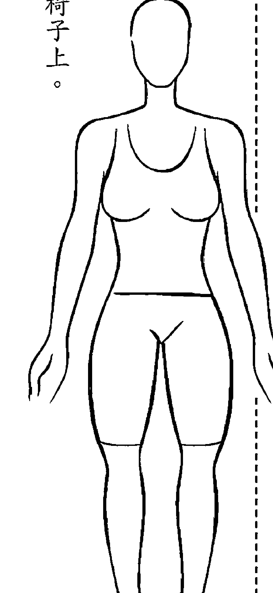

2. 吸氣，將雙臂抬高，來到耳邊，雙手手掌朝內，彼此相向。如果這個姿勢讓你不舒服，可以放低雙臂，將雙手手掌一起置於心臟前方。
3. 確保兩條大腿彼此平行，而且兩側膝蓋的方向就在對應的第二根腳趾上方。兩條大腿上方的軀幹將會以某個角度微向前傾，頸部和頭部應該要與脊椎的其餘部分呈一直線。
4. 維持這個姿勢，持續五個呼吸循環。趁吸氣時挺直臀部和雙膝，在隨後的呼氣時放低雙臂，藉此鬆開椅式。

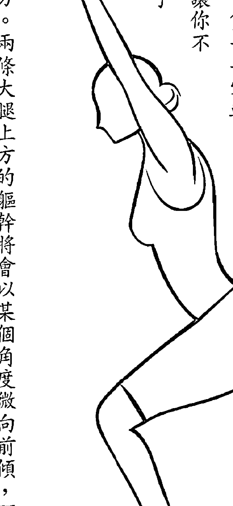

如果這個體式使你失去平衡，或是感覺虛弱或不穩，那就修改一下，在練習時讓背靠著牆。

### 練習 2

### 鴿子式：敞開迎接內在的方向

三千年來，鴿子一直被用來傳遞信息。無論是在戰時傳遞機密情報，還是在古希臘宣佈奧林匹克運動會的贏家，鴿子都由於方向感特佳而被用來當作可靠的信使。雖然鴿子不是閱讀地圖的專家，但牠們的確有一種與生俱來的家園感，使牠們能夠判定自己與巢穴的相對位置，永遠懂得返回家園。同樣的方向感亦存在你之內——要意識到你真正的方向就在你之內等待被發現，一旦你發現它，不論身在世界上的什麼地方，你都會覺得在家。好好利用這個鴿子式來打開臀部，你將會敞開，更深入地理解以前可能不會觸及的方向。

分解步驟：
1. 從雙手、雙膝貼地的桌面姿勢開始，雙手手腕在雙肩下方，雙膝在臀部下方。

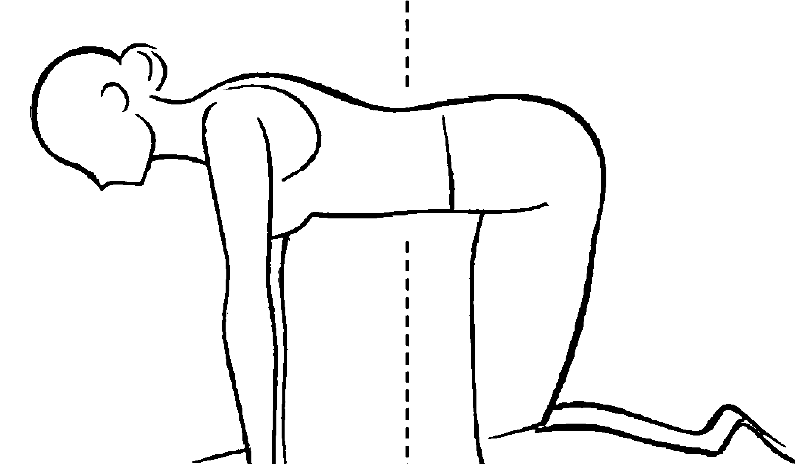

過去，印度偏鄉的警察局經常用信鴿在天災發生後，傳遞緊急消息。為了支持網際網路，「警鴿服務」信使系統後來已功成身退。
2. 稍微延伸脊椎，幫助抬起右大腿和彎曲右膝蓋。右腿向前滑動，使其與運動墊的頂部平行，如此，右膝蓋來到右手腕後方，同時右腳朝向左手腕。
3. 右腿的外側靠在地板上，延伸左膝蓋，讓左腿直接向後滑動。
4. 將右側坐骨放低至地板（不要讓貼地位置翻滾到外側臀部），同時將左腳腳尖貼在地板上。
5. 軀幹挺直，依自己的能力，將雙手手掌牢牢地貼在雙膝前方或兩側臀部旁邊的地板上。調整左側，保持骨盆中立，使整個骨盆移向運動墊的前方，並與右側呈一直線。
6. 保持這個姿勢，持續五次緩慢的深呼吸。
7. 返回到桌面姿勢，退出鴿子式。
8. 重複左側。

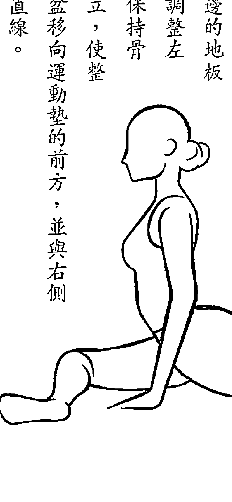

### 練習3

### 臀部轉圈：有彈性地改變人生方向

這樣的伸展是非常深入的。如果你想要讓動作更加深入，可將軀幹貼在地上，雙臂前伸。反之，若要縮小伸展，可減少前膝蓋的角度（讓前腳更靠近身體），或是將軟墊置於前側臀部的坐骨下方。請記住，焦點應該放在適度的校正對齊。多加練習，假以時日，更大的深度將會自然而然地出現。

髖關節的活動度幾乎跟肩關節一樣，可以啟動一系列有效地使臀部和大腿充分轉圈的動作。從旋風腿到呼拉圈，臀部的設計是可以朝多重方向活動的。所以，不要固定在單一方向上——不要特別聚焦在最後的終點，直到忽略這個終點是否真正適合你。在人生道路上，你將多次改變方向。所以，選定你的方向，但保持開放，迎向一路上出現的其他機會。有彈性的臀部認知到，任何給定的方向都有可能改變。利用這些圓圈為髖關節創造一個普遍而溫和的開口，讓你內在的射手座得以從容探索。

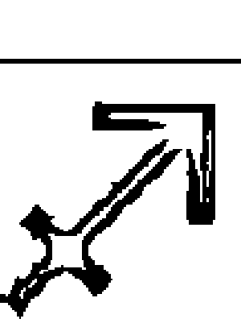

雖然呼拉圈在一九五〇年代因Wham-O玩具公司而人氣爆紅，但大約從西元前五百年開始，呼拉圈就已經存在了。當時，埃及的孩童用柳木或葡萄藤製成的圈圈繞著腰圍旋轉。古希臘人則用類似的環圈鍛鍊。

### 練習4

### 伸手摘星：立定志向

據說，單是我們的星系（銀河系），就有多達四千億顆星星。最近的是太陽，相距僅九千三百萬英里；相較於下一個最近的半人馬座阿爾法（Alpha Centauri）星系的星星，距離大約是四點三光年（一光年相當於5.9×10¹²英里）。所以，伸手摘星时，有许多空间可以触及！这个练习重新引导你的身体认识身体本身可触及的范围，以及你有能力不断扩大再扩大你所触及的范围。但正如你同时拥有低阶和高阶本质一样，你需扎根接地，才能够高飞。因此，只要设法确保上半身提升之际，你同时因下半身而稳定。这番动力将使你伸手触及的高度日渐增长。

這個鍛鍊不僅會打開臀部，還會打開下背部。請記得微笑。要允許自己敞開，好好地享受！

分解步驟：
1. 站直，雙腳分開，與臀部同寬，雙腳穩穩地踏在地板上。雙手放在腰上。
2. 稍微屈膝，以如此的彎曲度輕輕地上下跳，並逐漸適應這個上下跳躍的動作。幾次彈跳後，保持雙膝微彎。
3. 軀幹朝向前方，臀部向右畫圓圈。圓圈盡可能畫大，彷彿你正搖著呼拉圈，但不要太过運動到身體的其餘部分。軀幹將會稍微移動，但雙膝不宜彎曲，雙肩應該要保持齊平，頭部不宜向外突出。
4. 向右轉十圈，然後向左轉十圈。

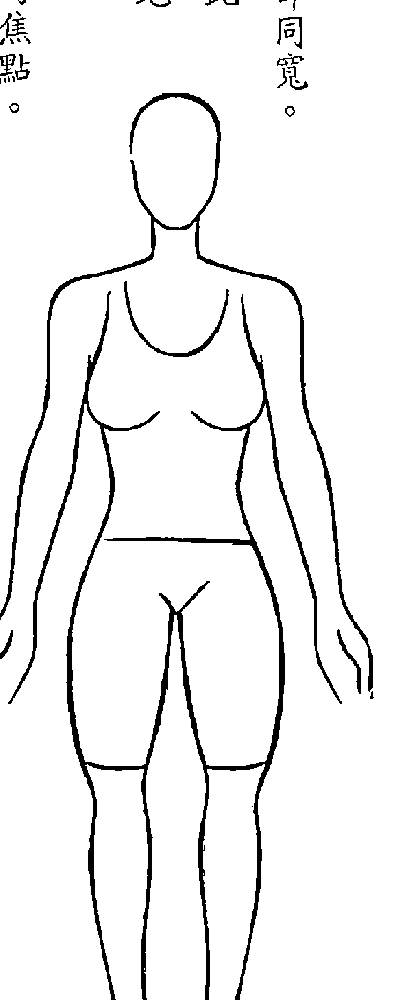

5. 站立，双脚分开，与臀部同宽。双脚平放在地板上，彼此自然平行，在其間均勻地平衡體重。
6. 在你面前选择一个不动的焦点。
7. 靠双脚轻轻地将体重向前移，踩着双脚脚趾头后方的踼球部将重心往上提。要保持平衡。
8. 等你觉得准备好了，便将双手手臂举到头部上方，仿佛即将触及天花板。透过手指头延伸，仿佛可以抓住星星。如果觉得够平衡了，便将目光上抬，来到双手之间。记得要微笑。
9. 感觉一股气力指引你的身体向上再向上，同时，另一股气力使你的双脚扎根接地。
10. 若要退出這個觸及姿勢，可鬆開雙臂，置於身體兩側，同時將雙腳放低至平貼地板。
11. 多練習幾次，一直練到感覺舒服為止。

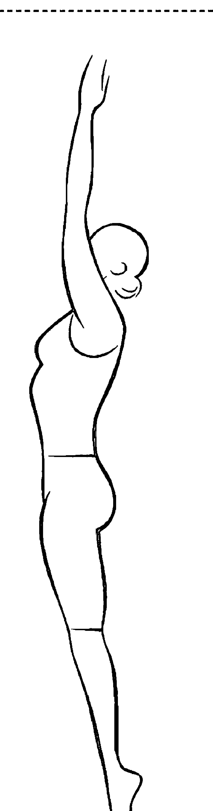

### 練習 5

### 最高自我静心：培养你的高阶本质

假使你今天沒有達到平衡，可雙腳平踏在地板上練習。此一鍛煉最重要的元素是上提的動力、雙腳扎扎根接地、結合軀幹和頭部及雙手渴求巨大高度的提升感。魔法在於伸手觸及本身，而不在實際的高度。

想像一下，一部分的你完全知道你是誰，以及你來這裡要完成的事，這個你是最為睿智、最為清明、最為崇高的，不但免於戲劇性事件、憂慮、恐懼、欲望、需索無度的小我，而且洞悉你的過去、現在和未來，以及所有這一切的目的。那是你的最高自我。沒錯，對吧？無論你是否意識到這個最高自我，你總是與你自己的這個乙太版本連結，而且總是有權選擇讓那個連結是有意識的。嘗試一下這個最高自我靜心法，允許自己從你的最高本質去存取、經驗和學習。

分解步驟：
1. 舒服地盤腿坐在地板上，讓你可以在整個靜心期間都維持這個坐姿。如有必要，可用軟墊作為支撐。關掉手機，同時設定十分鐘鬧鈴。
2. 閉上眼睛，雙手放在大腿上，手掌朝上。
3. 在腦海中創造一個你自己的形象。就如同你目前的模樣，沒有地點或其他人。你可以正穿著衣服，正在做任何事情。
4. 感受那個形象的感覺。誠實地去感受，不帶評斷。與那份感覺連結。
5. 現在，創造一個你的形象，代表你最為崇高、最為美好、最為至高無上的自我。你可以看起來就像你，或是像天使、發光的女神、超級英雄、半人馬。你看起來是什麼模樣並不重要。要允許你的想像力自由馳騁！你的描述要盡可能明確具體：你的頭髮是什麼顏色？衣服的設計如何？你臉上有什麼表情？能把你描述得愈詳細愈好。
6. 感受那個形象的感覺。當你感覺到了，你一定會知道。如果你想要那個形象感覺到某種方式（例如，狂喜、豐盛、慈悲），就隨心所欲地讓那些感覺充滿那個形象。
7. 讓兩個形象——你目前的形象和你最高階的化身——聚在一起，直到合而為一。
8. 停留在這份感覺和對你的認知當中，以此作為你的最高自我，直到鬧鈴響起為止。

十分鐘只是一個起點。可隨心所欲地展開一段更長的靜心，或增加靜心的時間長度。你應該會發現，這是一次非常愉快、溫馨、使內心輕盈的經驗。

### 練習6

### 鍛鍊紀律：馴服你的低階本質

許多人相信，射手座的英國首相溫斯頓·邱吉爾（Winston Churchill）說過這樣的話：「持續的努力——不是氣力或智能——正是揭開人類潛能的關鍵。」①換言之，熟練生巧。要練習訓練自己的低階本質，從而允許你的高階本質發光發亮。要好好利用您的弱點，使弱點發展成優勢，無知發展成知識，貧窮發展成豐盛，悲傷發展成喜悅。自律就像一塊肌肉，可以被開發。這點非常適合人馬的本質，否則他們會開心地狂奔，跑錯方向。可從下述練習開始。

> 「持續的努力——不是氣力或智能——正是揭開人類潛能的關鍵。」

分解步驟：
1. 一天安排兩分鐘（用鬧鐘定時）做這個練習。選擇當天可以獨處的某段時間。一定要精心安排出這樣一個時段，並且持續三個星期。
2. 取一張便利貼（任何顏色和形狀都行，只要貼在牆上能夠很顯眼），貼在坐著的時候眼睛平視即可看到的牆壁上。舒適地坐在房間對面的某個位置，將目光和心神專注在便利貼上。什麼都別想，甚至別想你正在注視一張紙。如果兩分鐘還沒到便失焦了，沒關係，從頭開始。你一意識到焦點游移，就讓它返回到圖像上即可。這項紀律鍛鍊的第一步是投入這個練習，經常安排鍛鍊的時間。就這樣持續訓練頭腦心智兩分鐘，或兩分鐘以上。
3. 假使你連續多次整段時間均能心神集中，專注力不游移，就將計時器增加到三分鐘，然後四分鐘，依此類推。
4. 若要更改時間模式，建議最短時段為三週。但可隨心所欲地持續更長的時間，讓此練習以對你有效的方式演進。

- ★ 臀部是與射手座關聯的部位，這些牽動大腿移動的結實關節擁有極大的活動範圍，不論你選擇去向何方，它們都能夠指引你。
- ★ 射手座是黃道週期的第九個星座，其能量認可你的高階和低階本質，而且要求你的高階本質出面領導。
- ★ 如果你有遠見的射手本質變得自以為是或魯莽輕率，你的臀部可能會體驗到不同的症狀，例如，緊繃、虛弱。
- ★ 透過聚焦於臀部的提問、練習和活動，校正你內在的射手座，運用這些來瞄準星星，從而知會你在人世間的方向。

原註：
①馬修·拉德曼內斯（Matthew Radmanesh），《破解物質宇宙的密碼：通向開悟與豐富的新世界的鑰匙》（Cracking the Code of Our Physical Universe: The Key to a New World of Enlightenment and Enrichment，Bloomington, IN: AuthorHouse, 2006），155頁。

## 11

## 海山羊的膝盖

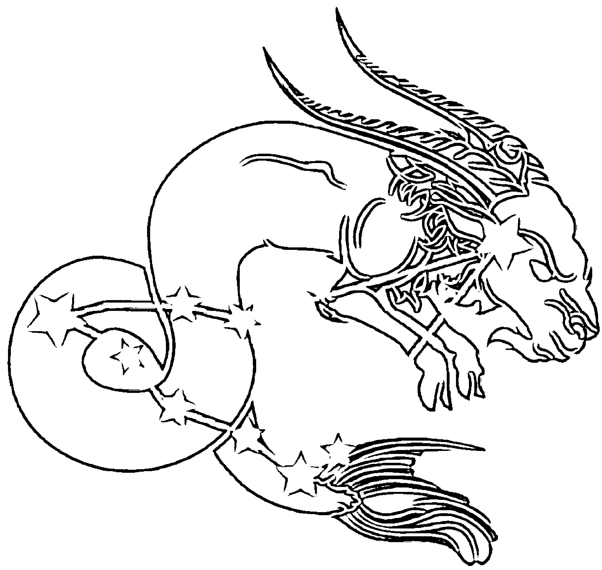

## ♑ 摩羯座

- ☆出生日期：十二月二十二日～一月十九日
- ☆身體部位：膝蓋
- ☆主 題：行事負責，謀求更大的良善

在前一個星座射手座，世界是一只盛滿（而且準備好要盛滿）智慧的聖杯。一切人、事、物都是教誨、功課、契機。摩羯座進入的局面是：已經學到許多，現在準備要提取知識的精華，轉化成有益且實用的東西。這不見得是為自己，而是為周遭的社群。摩羯座是黃道帶的現實主義者，在這裡是要直接與社會交手，然後盡其所能地促使社會再跨出一步。她是野心與意志力的化身，在這裡是要代表更大的良善將這些能力導入行動。

### 摩羯座司掌：膝蓋

摩羯是土象星座，因此穩定、實際、持久。儘管如此，她仍舊被驅動著向前達成，而且正是她的雙膝（與摩羯座相關聯的身體部位）帶著她抵達目的地。她的膝關節具體表現出這份介於穩定度與移動性之間的內在權衡，成為支撐上方整個身體重量、同時踩踏下方地面移動的必要部位。三塊不同的骨頭（脛骨、股骨、髕骨）構成一個修正過的鉸鏈關節（想想一扇門，那是鉸鏈的實例），從而衍生出如此權衡的設計。每一個膝關節都可以屈曲和伸展膝蓋，同時允許少量的內嵌式旋轉。

膝蓋的屈曲和伸展使你的雙腿移動，讓你可以上班、踢足球、爬山。而你「如何」參與這些活動，將指出你長期做著這些事情是否會成功。譬如說，假使你過度從事某個活動，或是以不當對齊的方式執行，那麼儘管意圖完美，還是會傷到你的膝蓋。多數的關節損傷就是這樣出現的：過度使用和濫用兩相結合，結果導致退化。許多時候，發生這個情況是由於心智過度凌駕於物質，卻沒有留意到自己的問題。

你的摩羯本質以及你的雙膝，需要兩相平衡。她提醒我們，要密切關注獎賞，要完成贏得獎賞需要耗費的功夫，同時孜孜不倦且守分盡責地執行達成目標的各個步驟。她的目標比她自己更大，而且需要耐心才能發生，誠如需要時間和關注，才能正確地執行倒立或馬拉松訓練。相較之下，假使你想要不計一切代價地擺出結束姿勢或來到比賽的終點，因為那是你頭腦心智發出的命令，那麼你的雙膝就有禍了，那是摩羯座的敏感部位。

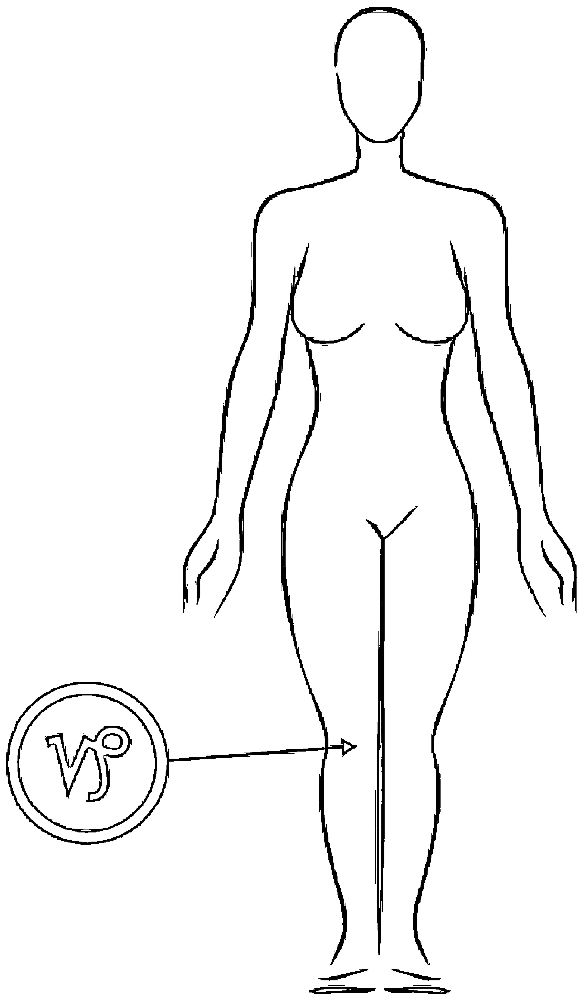

膝盖的骨骼結構，參見附錄C。

分解步驟：
1. 坐下來，捲起褲管，或是穿短褲，讓你可以好好看看展現其所有榮光的膝關節。請注意，膝蓋有曲線和輪廓，以及前面、後面和側邊。
2. 一次一個關節，用雙手感覺膝蓋。感覺膝蓋骨（髕骨）、骨脊，以及周圍的肌肉和所有側邊上的肌腱。隨心所欲地探索，問自己如下的問題：膝蓋的溫度是多少（比周圍的部位冰涼或溫暖）？有哪些部位感覺起來柔軟或腫脹？一側膝蓋與另一側膝蓋相較之下如何？兩者如何對稱？如何不對稱？像你現在這樣坐著，兩個膝蓋與雙腳有何對齊的關係（例如，在第二腳趾正上方，膝蓋向內屈）？
3. 等你感覺比較熟悉自己的膝蓋之後，站起來，四處走走。你的膝蓋如何自然地使你移動？有帶著信念、穩定、前進的動力嗎？跋著腳嗎？腿部發軟嗎？

你的雙膝如何帶你去到你想要去的地方呢？許多人甚至沒有覺察到自己的膝蓋，一直到膝蓋出事為止——膝蓋受傷、疼痛，或是因其他原因而停止正常運作。你比較熟悉身體的某些部位，而不熟悉其他部分，雖然這很自然，但膝蓋是值得認識的部位。所以要花些時間，讓自己重新認識這個使你每天可用許多方式行動的身體部位。

對陸地上的四腿山羊來說，兩個膝蓋是其存在不可或缺的部分。事實上，有些山羊忍受著某種主要影響膝關節的病毒性關節炎，被迫經常得躺臥休息，甚至是靠兩個膝蓋走路，以避免關節表面問題一起浮現。最終，膝蓋損傷甚至可能導致這隻山羊因無法自行維生而死亡。神話中的海山羊，可以幫助我們在兩側膝蓋尚未嚴重到如此程度之前，先行留意其黃道星座的功課！這只需要你覺察到兩個膝蓋的存在，同時結合審慎的行動——審慎的跨步、奔跑、跳躍，朝向你的最終目標。想像一下，如果你健康審慎地瞄準並完成自己的目標，你的身體會有什麼感覺？要成為走上山的山羊，每一步都是經過選擇的、精心策劃的、切實可行的。要長期這麼做，不輕易卻步。投入適度的時間、適當的關注，將會卓然有成。要有信心，相信你一定會堅持忍耐。

### 摩羯座健康課題：行事負責，謀求更大的良善

土象星座，她是帶著腦海中的結果採取行動的。

> 根據古代神話，海山羊的起源是：潘恩（Pan）是信使之神赫密斯（Hermes）與山羊艾克絲（Aix）的兒子，因此，他一部分是山羊，一部分也是牧羊人的神。一天，在樹林中，潘恩必須逃離巨妖泰風（Typhon），他替自己變出一條魚尾巴，然後潛入水中。後來，他幫助宙斯與巨妖泰風戰鬥，於是眾神之王宙斯將潘恩置於星辰之間，成為摩羯座，以此作為獎勵。

想想你的日常生活和你所有的日常行動，實在是不計其數啊！從刷牙到參與談話，你做著許多不同的事。但是你承擔的那些任務，有多少是在腦海中擁有具體的目標？譬如說，今天早上刷牙時，你是刻意用力刷以去除每一顆牙齒上的牙菌斑？還是你進入自動導航模式，想著即將到來的工作日？很可能情況是後者，那也沒關係！重點在於：體認到每一次採取行動時，你都選擇一個焦點（即使是不經意地）。而對我們的海山羊本質來說，這個焦點往往是行動的結果。在海山羊的世界觀裡，除非某事具有某個實際的用途，否則實在沒有必要動手做。海山羊在這裡不是為了這趟旅程，而是為了她的最終目標，就像與她同名的山羊一樣，帶著堅持忍耐一定要抵達山頂的意圖，穩定攀登山頂。

正如四足山羊是強健而堅定的登山家，摩羯座的海山羊也同樣有耐性。奠基於結果的行動是一場時間遊戲，而且由於目光盯著獎賞，因此，摩羯座需要多少時間才能到達目的地其實無關緊要。她投入其中，意在贏得獎賞。就她的黃道星座和能量來說，這意味著創造在人世間留下印記的永久結構。許多時候，這些結構並非實質的，而是理論的。舉例而言，十六世紀的摩羯座解剖學家安德雷亞斯·維薩里（Andreas Vesalius），精準地描繪了人形的結構，且將他的研究成果彙編成一本綜合著作，這使他成為現代人體解剖學的創始人。大約一個世紀後，擁有許多非凡成就的艾薩克·牛頓爵士（Sir Isaac Newton），根據敘述運動中物體的三項法則，詳細描繪了我們物質宇宙的結構。放眼其他領域，天文學家、占星家兼數學家約翰尼斯·克卜勒（Johannes Kepler），運用場域更大、放大倍率更高的望遠鏡，幫助人類更實際地架構宇宙萬物。

這些科學界的海山羊可能並不確切知道，他們在數學、物理學和天文學上努力的成果將會是什麼；但他們知道，他們在科學上的質問很重要，而且答案可能更加重要。因此，儘管那些岩石地形使他們今日永垂不朽（不要被愚弄了，以為他們的成功沒有經歷過失敗），但他們全都耗費一輩子時間攀登。不過這個拼圖還有一塊：除了「什麼」之外，還有「如何」。我們應該要「如何」行動？對大部分的摩羯座來說（或是當任何一個人忙著投入自己的摩羯能量時），答案都是：認真負責。舉個例子，克卜勒將他的科學工作視為一項宗教職責，那是一份責任，要去理解依他的形象造人的上帝是如何運作的。你或許也覺得要對生命中的許多人和事負責。或許你覺得要負責的包括：兒女的成長、母親的健康、房子的維修、工作的職責等等，不勝枚舉。這感覺其實是一份責任感，從你自己的內在生起，然後延伸到他人。它是一種全責性（accountability），要由內到外，對你是誰以及你如何生活負起責任。當你掌握自己生命的所有權時，一切從你開始。但由於你生存在許多更大的背景（家庭、鄰里、城市、國家、世界）之中，所有權最終延伸到那個更大的整體。此兩者是相關聯的，也因此，要照顧自己的健康，包括吃多少、睡多少、運動多少等等非常個人的決定，影響了你在社群層面的貢獻。當你生病在家休息時，便很難成為有生產力的社會成員。即使有許多合理的原因說明你為什麼生病（從生病的同事到不當的壓力），但對自身健康的責任，終將隨著你的選擇與決定而開始和停止。要忘掉是非對錯（你超越了雙子座的二分法）。比較重要的是：你有隨時利用所得到的一切，做出最適合你的決策嗎？你覺察到而且願意接受那些權衡與妥協嗎？你接受你的行為可能帶來意想不到且好壞兼具的後果嗎？那是行事負責的核心本質。行事負責是一種掌控自己生命、不成為受害者的方式。不論遇到多大的困難，你都是自己命運的主人，並以此度過每一天。而那個獎賞（自我賦能），非常值得你迎向挑戰。當然，存在的外在因素和力度有助於驅動你或使你脫軌，但那些與你的拼圖並不相互排斥。誠如古諺所云：最終，儘管所有因素都緩和了，但決定權還是在於那匹馬；或是以此例而言，則是海山羊是否要喝水。海山羊的責任感有多種形式，但大型的包括公民職責，那是一股社會力量，約束著摩羯座採取與那股力量一致的種種行動。想像一下，你站在人行道上，馬路上沒有車子駛來。你匆匆忙忙，非常有必要闖越那條馬路。可是如果這麼做，即使過程中沒有人受到傷害，你仍會違法。落實這條法律是為了保護全體行人，要確保的不只是一個匆促行人的福祉，還包括一個繁忙社群的福利。當時，你如何行動呢？你如何及何時選擇去維護你感知到相對於更大良善的個人利益呢？對海山羊來說，更大的良善是那股驅動力。當你可以嘉惠許多人的時候，為什麼要採取只影響一個人的行動？來到黃道週期的這個階段，自我只是一整片超大拼圖中的一塊，而這整片拼圖使你成為「你」。因此，代表他人行動吧！無論對方是你的家人還是周遭的社會，都與成就自己的目標是同一回事，這意味著你內在的海山羊需要惦記著他人，才能感到充實滿意。儘管如此，摩羯本質並不是缺乏自我認同。每一個人都需要自我感，即使我們全都只是水滴存在於眾所周知的海洋當中，但每一個人都是自己的水滴。而我們的海山羊非常清楚這一點。雖然是海洋的更大力道帶著她向前，但她非常清楚自己的個人意義，尤其是她可以成就的地位，無論是在職場、家庭或社會之中。那應該是她於情於理該得的獎賞，以獎勵她長期費力地登山。不過要重申的是：地位不該是背後的驅動力，某種渴望的結局才應該是那股驅動力。

> 摩羯座幫助建構了今日我們對科學的理解，這些名字讀來就像「名人錄」清單：詹姆斯·瓦特（James Watt，定義了馬力）、路易·布萊葉（Louis Braille，研發了盲人閱讀系統）、路易·巴斯德（Louis Pasteur，發現疫苗接種和巴氏滅菌背後的原理）、阿爾伯特·史懷哲（Albert Schweitzer，贏得諾貝爾獎的醫學傳教士）、班傑明·富蘭克林（Benjamin Franklin，發明雙焦點眼鏡和避雷針）。

> > 「你可以領著馬兒去喝水，但你無法要他低頭喝水。」

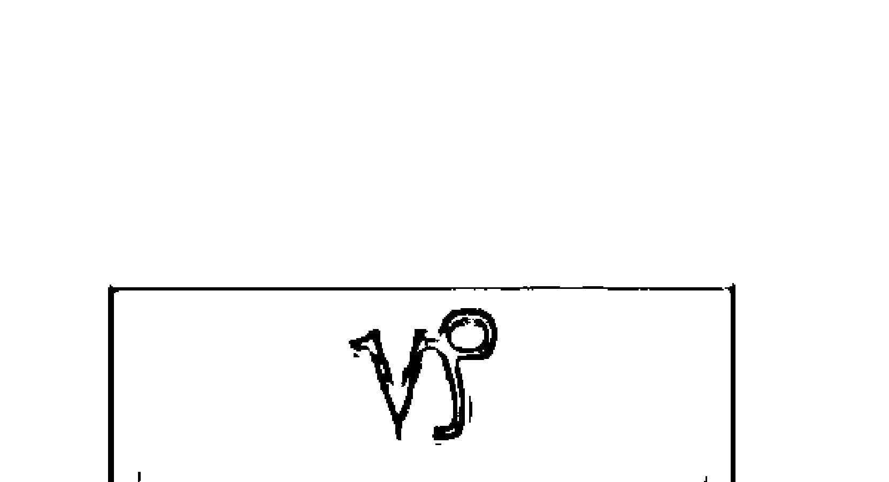

> 熟悉「只要目的正當，可以不擇手段」這句話嗎？它為義大利哲學家暨歷史學家尼可洛·馬基維利 (Niccolò Machiavelli) 的哲學，找到另一種說法。上升星座在摩羯的馬基維利，在《君王論》中指導一位王子如何獲取和維護權力。他當時指導的「王子」是誰呢？正是佛羅倫斯的統治者維倫佐·德·麥第奇 (Lorenzo de' Medici， 《君王論》就是獻給他的)，而麥第奇也是摩羯座。

## 不健康的身體警訊（兩種極端）

摩羯海山羊就跟任何山羊一樣，是一個很好的攀登家，以穩定、持久、獨立而強健的方式前進。這個海山羊有工作要做，而且沒有多麼事可以妨礙她的周密計畫。這點也符合她自己的需求，因為海山羊傾向於將家庭和工作的利益擺在自己的利益之前。因此，她是與更大的良善連結的。然而，為了確實履行她的責任，她不能完全擱置自己的需求，而你也不能這樣。所以，重要的的是，你學習到幫助你的摩羯本質親自連結到更大的良善，而不是將它看作是個別獨立的。她的需求、你的需求、他們的需求、我的需求……全都交織在一起。但帶著如此嚴肅而堅定的本質，海山羊可以輕而易舉地摒棄自己的福祉。如果發生這事，假使你拒絕接收自己的慾求，憂鬱將會戰勝。多數時候，海山羊願意放棄自己的情緒，以執行她認為需要完成的事。然而可別誤會了，即使海山羊通常不被視為溫暖而貼心，但她還是有許多的情緒。如果這些情緒沒有被適當地認清和疏導，就可能顯化成反覆無常的行為。所以，你內在的海山羊通常需要放鬆手中的繮繩，依照自己的條件享受些許樂趣，免得她過度有所作為（就這點而言，膝關節可能淪為所有關節中的犧牲品）。

> VS

一則摩羯座專心尋求地位卻得不到好結果的警世故事，與克洛諾斯（Cronus）有關，他是泰坦（Titan）十二神之王（在羅馬神話中，克洛諾斯的名字叫「撒登」，Saturn就是土星，即摩羯座的守護星）。克洛諾斯為了維護自己的王位，不顧妻子反對，吃掉了自己所有的子女。直到兒子宙斯出生，領導了一場憾天動地的反叛，推翻他父親，最終廢黜了克洛諾斯，確立了宙斯為王。

- ★膝關節周圍（亦即連結大腿或小腿）的肌肉和肌腱緊繃、收縮
- ★移動或坐著時，膝蓋疼痛或不適
- ★腿部的活動範圍受限或僵化
- ★膝蓋卡卡的
- ★活動時聽到劈啪聲或嘎吱響，或是感受到諸如此類的感官體驗
- ★ 關節周圍的液體過多
- ★ 胫骨疼痛

另一方面，如果海山羊過度受到自己個人的欲望所驅使（相對於那些更大良善構成的欲望），那麼她可能會發現她的計畫是不被支持的，於是不論她的規劃和策劃多麼費盡心血、耐性十足，都不會得到成果，甚至從長遠的觀點看，也是徒勞無功。事實上，這是你因某種不變的驅力和進展而感到筋疲力竭的時候，亦即你走錯方向了。

這近似於過度使用膝蓋，而且是不當地使用膝蓋（例如，跑馬拉松時，膝蓋抬得過高）。

追逐私利的摩羯本質，其身體表現可能包括：

- ★ 膝關節周圍（亦即連結大腿或小腿）的肌肉和肌腱虛弱
- ★ 膝蓋虛弱感，腿部發軟或不聽使喚
- ★ 移動或坐著時，膝蓋疼痛或不適
- ★ 過度伸展
- ★ 膝蓋校正不良

你的雙膝負責使你移動到什麼程度？無論是感覺責無旁貸、追逐私利，還是介於兩者之間的某處，關鍵都在於：好好聆聽你的身體，給予身體所需要的。若要伸展緊繃的膝蓋或強化虛弱的膝蓋，可運用下述提問和練習，喚醒你內在的摩羯座。

## 找回平衡的五項提問

下述提問和練習將充當你體現摩羯座的個人指南，不妨運用它們採取負責任的行動，謀求更大的良善。

- ★你日常行為的本質有何特徵（有計畫的、有目的的、憑感覺碰運氣）？試著描繪一下。
- ★驅策這些行為的是什麼（責任、成功、興奮、恐懼）？你的膝蓋如何促使你採取行動（疼痛地、緊繃地、偶爾腿部發軟）？
- ★列出你的許多職責。哪些主要是代表他人？哪些是針對你自己？
- ★你最後一次將責任外化到另一個人身上，是什麼時候（例如，責備配偶或同事）？回顧一下，在那件事當中，你扮演的角色（你的責任）是什麼？
- ★「更大的良善」對你來說是什麼意思？誰是它的一員？你覺得你以什麼方式代表它行事？當你代表它行動時，你感覺如何？

## 摩羯座養生操

### 練習 1
### 戰士二式：有力且審慎地採取行動

> > 「這是一件危險的事，佛羅多，出了家門……上了路，如果你不穩住雙腳，誰曉得你會被帶到哪裡去。」
>
> 佛羅多引述比爾博·巴金斯❶的這段話，它出自摩羯座作家托爾金（J. R. R. Tolkien）的史詩奇幻小說《魔戒首部曲：魔戒現身》❷中。換言之：要有意圖、有目的地採取行動，知道你在做什麼以及為什麼這麼做。
>
> 任何人，包括精靈、哈比人❸或人類，「穩住雙腳」的最佳方法之一是，審慎地校正使雙腳就位的雙膝和雙腿。當雙膝被定位在正前方時，會幫助雙腳仿效跟進。利用這個瑜伽體式審慎地強化並校正雙膝，讓它們可以帶著你四處走動。

### 分解步驟：

- 1. 從中立站姿開始。將雙臂抬高到T字型位置，雙腳分開，使兩個腳踝分別在兩手手腕下方對齊。保持雙肩下垂，雙手手腕中立，所有手指伸展。
- 2. 左腳稍微向內轉（不超過四十五度），右腳向外九十度。低頭看，確保左、右腳跟呈一直線。
- 3. 右膝彎曲成九十度，使大腿與地板平行。要確保右膝蓋骨直接定位在右腳踝上方，且與第二腳趾對齊。整個右腳應該要平放在地板上，足弓用勁（腳後跟或腳趾不宜抬起）。同樣地，左腳的所有點位應該要平均地接觸地面。
- 4. 轉頭，凝視你的右手指尖。軀幹應該保持直立，不要前傾。保持這個姿勢，持續五次緩慢而審慎的呼吸。
- 5. 換另一側重複上述動作。

這個體式的奇蹟之一是，它強化兩側膝蓋周圍的肌肉——只要你適度地進入這個體式，而不只是隨意做做。藉由用到被稱為「股內側斜肌」的某一「股四頭肌群」的一部分，即可強化一群已知在髖骨正常運作和校正對齊時扮演要角的肌肉纖維。這些纖維被用到了，不但出現在伸展範圍的末端（例如，此式中的後膝蓋），更出現在當膝蓋彎曲成九十度角且腿部承擔著重量時（例如，前膝蓋）。所以，若要達到你所渴望的結果，就要設法確保膝蓋彎曲的程度是舒適的（不過度），即使這意味著你沒有達到九十度，然後再依據上述步驟，讓膝蓋適度就定位。

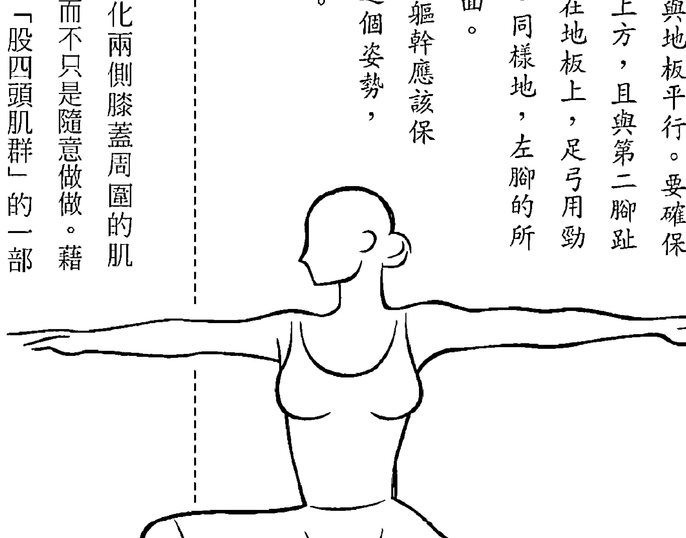

### 練習 2
### 坐姿長腿前彎式：敞開進入更大的責任

摩羯座玄秘學家兼詩人哈利勒·紀伯倫（Khalil Gibran）寫道：「昨天，我們服從國王，在皇帝面前俯首。但今天，我們只對真理下跪，只跟隨美，只服從愛。」 ② 你對哪些個人負責呢？什麼樣的更大力度驅策你的行為呢？你對誰或是對什麼下跪呢？永遠不會太遲的是，去評估你於何時、何地、如何在日常生活中負起責任。永遠不會太遲的是，敞開進入全新的理解方式，明白是什麼驅策你的行為並使你領悟到，最終，這一切都來自於你。在這個坐姿中，借用有利於你的雙膝健康的腿筋伸展，進一步對健康負起責任。

### 分解步驟：

- 1. 坐在地板上，雙腿在面前伸直。如果需要軟墊幫忙才能調好坐骨坐正，那就坐在軟墊上。保持兩側大腿平行（不向內或向外翻），雙腿伸展，雙腳伸展，透過兩個腳後跟積極推送。雙臂直接放在身體兩側，雙手手掌貼地下壓。
- 2. 保持軀幹伸長，從髖關節（不是腰部或背部）向前傾靠。將胸部朝胫部帶。向前傾靠時，雙手握住雙腳側邊。如果辦不到，就將雙手放在胫部上方或小腿。依你的伸展範圍，鬆開頭部和頸部，使頭頸可以輕輕地向前彎（雙肘可以進一步彎曲，以此協助）。保持這個姿勢，持續十次緩慢的呼吸。每次呼氣時，就向前彎得更深一些。
- 3. 按照進入的方式退出這個體式，將軀幹伸直，返回到中立位置。

責任不必是負擔，它不見得需要大量的努力，也未必要傷人。責任可以簡單到像是一份確認——確認你是自己生命的主人，且一切均來自這個確認。在這個體式中採納同樣的自在悠閒。要釋放掉壓力和緊張，讓重力的重量使你前彎得更深一些，並融入其中。

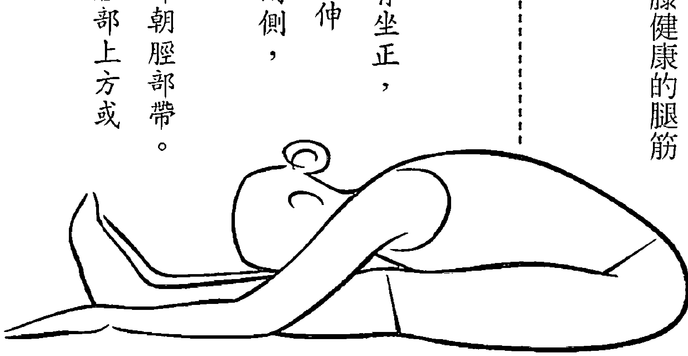

### 練習 3
### 膝蓋畫圓：包含更大的良善

人生與許許多多的你相關，同樣地，人生也包含許多的他人。不管你喜不喜歡，這些他人都圍繞著你，而且在這個過程中，形成你的社群的不同部分。因此當你行動時，你的行為並不是孑然獨立的。你採取的每一個行動就像一顆小卵石被扔進池塘裡，創造出不只是小卵石自己的水環，還包括周遭水域的同心圓。以此方式，你的行為可能會有意同時無意地影響他人。雖然結果不完全在你的掌握之中，但你至少可以有意圖地選擇，以及選擇是否代表更大的良善。利用這個練習，透過以意圖為基礎的行動，創造你自己的同心圓。

### 分解步驟：

- 1. 從中立位置的站姿開始，雙腳分開，與臀部同寬，雙手放在腰上。
- 2. 雙膝朝右畫圓圈，重複五遍。保持軀幹挺直，不要向前傾。設法確保圓圈是由膝蓋畫的，而不是突出的臀部或肩膀所畫，同時雙腳保持平貼在地板上。畫圓圈時，雙膝之間維持開始時的距離，不至於向內彎或向外翻。
- 3. 返回到中立站姿。
- 4. 換另一個方向重複上述動作。

### 練習 4
### 耐心手印：祈請耐性與洞察力

在昆達里尼瑜伽中，每一根手指代表一顆行星，因此可以祈請該星球的能量。第三根手指代表土星，亦即摩羯座的守護星。從天文學的角度看，土星是環繞太陽的第六顆行星，由於它與太陽的距離，遠遠大於地球（環繞太陽的第三顆行星）與太陽的距離，所以擁有大上許多的公轉軌道。結果是：土星需要一萬零八百多天的地球日，才能繞行太陽一周（時間長度大約是地球繞行太陽一周三百六十五天的二十倍）。討論一下耐心吧！土星顯然是不慌不忙的。就運用一個祈請土星持久能量的手印，祈請某些耐心。

### 分解步驟：

- 1. 在椅子或地板上找到一個舒服的坐姿。
- 2. 雙手放在大腿上，手掌朝上。
- 3. 兩手各用拇指觸碰中指，其他手指保持放鬆伸展。
- 4. 閉上眼睛，連結你企圖引出的更大智慧。放鬆，呼吸。

只要你喜歡，這個手印可以隨時執行。

### 練習 5: 沐浴：信任結果

在我們的社會中很難有耐心，因為我們被培養成要採取行動，要不斷地做、做、做！當沒什麼明顯的事情發生時，似乎就像什麼也沒發生。但情況往往不是這樣。一日車輪轉動，不管你是否看見，車輪都在轉動。有時候，你只需要等著它滾向你；你不可能總是當那個滾動它的人。要信任你在這個過程中扮演了自己的角色，同時相信，你所啟動的事物將依它自己的節奏發生。這個時間，往往勝過頭腦心智所設定的時機。所以，要花些時間沐浴，知道即使你「什麼也不做」，沐浴也會對你動工，只要允許沐浴鹽鬆弛你膝關節周圍的肌肉，以及身體的其餘部分。這一切唯一需要的是：由你去招來沐浴這件事，其餘的就讓沐浴接手。

以英國埃普索姆（Epsom）某一泉水命名的瀉鹽（Epsom salts），並不是真正的鹽，而是天然存在的鎂與硫酸鹽的化合物。瀉鹽已被用作若干疾病的傳統補救法，包括壓力、疼痛、肌肉緊張、炎症。

### 分解步驟：

- 1. 依你的喜好，洗個溫水浴。
- 2. 隨意創造能使你放鬆、不擔心時間的任何環境（例如，燭光）。關掉電話和其他可能引起你注意的電子產品。設定十二至十五分鐘的鬧鈴，這將使你放鬆，不考慮時間。
- 3. 將兩杯瀉鹽置入浴缸中，讓瀉鹽溶解幾分鐘。
- 4. 進入浴缸，放鬆，直到鬧鈴響起為止。這次沐浴不要用肥皂，因為肥皂會干擾瀉鹽的作用。
- 5. 一週洗多達三次的瀉鹽浴。

## 練習 6
### 爬山：為你的社群負責

「社群」可以意味著任何數量的事物。根據某字典的定義，「社群」是某一個任何類型或大小的社會團體（例如，宗教的、商業性的或區域型的），也可以指這類群體盤據的地區。你如何定義你的社群呢？很可能你有許多的社群，有許多的交叉貫穿。把它們找出來，成為你所是的海山羊，爬上不論哪一座讓你可以好好看一看的高山、丘陵或高樓大廈的頂部。俯瞰你的社群，它們就在那裡！不論你看見身旁和下方有什麼樣的喧囂忙碌，包圍著你所屬於的每一個不同團體，他們都是要要求你代表他們負責任地採取行動的團體，以及在身體上、心理上或情緒上支持你這麼做的團體。所以，前進吧！就用膝蓋向上攀登，代表你所屬的團體實實在在地看見，實實在在地明白為何如此。

### 小結

- ★ 膝蓋是與摩羯座相關聯的部位，這些關節是穩定度與移動性之間的平衡，不論你選擇去哪裡、如何動，它們都會使你移動。
- ★ 摩羯座是黃道週期的第十個星座，其能量確認你的責任感，以及你如何耐心且持續地運用責任感來謀求更大的良善。
- ★ 如果你務實的摩羯本質潛入工作太深，或是只為了工作而工作，你的膝蓋可能會體驗到不同的症狀，例如，疼痛、卡卡的、嘎吱作響。

## 原注：

- 1. 托爾金（J. R. R. Tolkien），《魔戒首部曲：魔戒現身》（The Fellowship of the Ring，Boston: Houghton Mifflin, 1965），83頁。
- 2. 哈利勒·紀伯倫（Khalil Gibran），《願望：靈魂路上的回憶》（The Vision: Reflections on the Way of the Soul，Ashland, OR: White Cloud Press, 1994），32頁。

## 译注：

- 1. Bilbo Baggins，托爾金小說裡的重要角色。
- 2. 出現在托爾金奇幻小說中的虛構民族。

> ☆透過聚焦於雙膝的提問、練習和活動，培養你內在的摩羯座，運用這些抵達你的山頂，同時設法確保沿途玩得開心。

# 12
# 持水者的腳踝

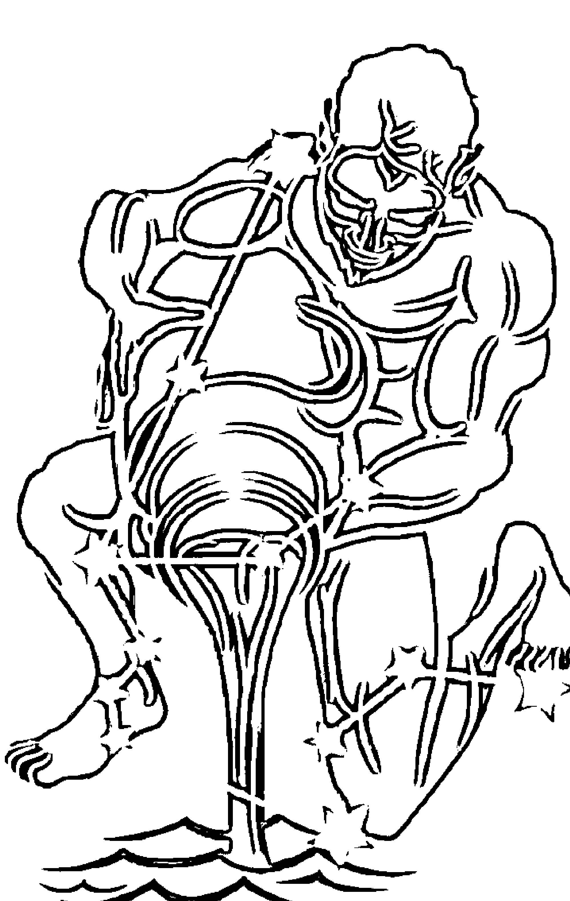

♒ 寶瓶座

- ☆出生日期：一月二十日～二月十八日
- ☆身體部位：腳踝
- ☆主　　題：喚醒新時代的潛能

## 寶瓶座司掌：腳踝

既然我們有了靠摩羯座的海山羊建立起來的堅實社會結構，那麼寶瓶座的持水者（Water Bearer）在這裡就是要拆除這個結構的！寶瓶座是技藝高超的平等主義者，在此是要瓦解摩羯座的階級制度，建立他認定有必要的「典範轉移」。這是一種滿足集體需求的新方式，強調集體。換言之，這個持水者是黃道帶的俠盜羅賓漢，他在這裡是要進入所有其他人的內在，喚醒他在自己之內所看到的同一種精神，引進一個真正人人具有平等潛能的新時代。

或許，身體的其他部位都不像腳踝（與寶瓶座相關聯的身體部位）一樣有個性。雖然每一個腳踝主要是能夠屈曲和伸展足部，但卻也是決定你如何將足部（見第十三章）置於地上的身體部位。想一想赤腳攀登某座由岩石所構成的山丘，你就會明白腳踝指揮足部的重要性和細微差別——稍微踏錯一步，很容易就會墜落！

腳踝只由三塊骨頭（腿部的脛骨和腓骨，以及足部的踝骨）構成，是緊鄰足部上方的部位，而足部是兩足人站立、步行、四處移動時，實際觸及地面的唯一一部分。因此，腳踝的移動必須是審慎的，因為置放下方的足部，也就是置放其上一百五十至一百八十公分高的「你」。換言之，這個謙遜的鉸鏈關節可以幫助決定如何以精緻、個人的方式在大地上站立和移動，它將來自上方臀部和膝蓋的較大動作，轉移至下方更加具體、微調的雙腳，即使當你站立時也不例外（請注意，長時間站立時，你的腳踝和雙腳絕不會真正靜止）。古往今來的許多文化都已經理解到，你的腳踝不止是骨性隆起。在古埃及，腳踝被認為是要好好裝飾的區域。基於這個原因，男人和女人都穿著短短的束腰外衣，以此炫耀用金、銀、鐵、珠子（用紫水晶之類腳踝的骨骼結構，參見附錄C。

用半寶石製作，裝飾的腳踝。在印度，這些踝鏈（payal，梵文「腳飾」）也因時尚而被女性所穿戴，有時則象徵部族的忠誠度。在古老的中東地區，兩個踝飾（兩腳各一）可能被連接在一起，發出叮噹聲響，不但引人注目，而且可縮短步態，這被認為是優雅而女性化的。有些文化分別為左、右腳是否配戴踝飾，賦予不同的意義（例如，關係狀態）；其他文化，例如維多利亞時代的英國和保守的伊斯蘭國家，則基於謙遜之故，將腳踝完全隱藏起來。

你上次注意看自己的腳踝，是什麼時候呢？更別提何時裝飾過腳踝了！這些時常被忽略的部位，道出了許多許多你如何完成你所做的事。譬如說，你如何站立？靠虛弱、發軟的腳踝，還是靠穩定的腳踝？還有你現在為了什麼而站立著？要上公車嗎？還是為了你有權利坐在公車上？

嘗試一下這個簡單的站姿，從而開始注意你的腳踝。

> 沒錯，就是羅莎·帕克斯（Rosa Parks），這位拒絕因人種之故而在公車上讓座的「民權第一夫人」，正是寶瓶座。同樣的還有亞伯拉罕·林肯（Abraham Lincoln），他在大約比這更早一個世紀左右，引進了美國民權的第一紀元。

## 分解步驟：

- 1. 站立，雙腳分開，與臀部同寬。
- 2. 不要移動身體的任何部位，只移動頸部和頭部，向下看，檢查你的腳踝。
- 3. 兩側腳踝分別位在膝蓋的正下方、腳後跟的正上方嗎？還是與足部相比，一側或兩側腳踝向內轉或向外翻？觀察即可。
- 4. 將體重移到右腳上，然後抬起左腳，離地幾英寸（需要的話，可就近扶著桌子或椅子）。你的右腳踝出現了什麼樣的變化？同樣地，觀察即可。
- 5. 換另一邊。

## 寶瓶座健康課題：喚醒新時代的潛能

每天早晨，你從睡眠中醒來，也許是因為穿透窗簾照耀而入的光線，因為鬧鐘，因為枕邊人醒了……你如何醒來其實無關緊要，因為結果都一樣：你醒覺了。你已經從沉睡之中被吵醒了，或是就比喻而言，從黑暗的狀態中被吵醒。無論那只是日曆上的某個新日期，還是人生中的某個新階段，你都進入了新的一天，引進了新的視角、新的構想、新的理解。無論是哪一種情況，醒覺都意味著一個全新的、增大的認知狀態，一個不同於從前擁有（且在某方面更加深刻）的狀態。當你醒覺時，你看見某個對任何已知情境均更加宏大的真相。譬如說，你可能醒悟到現實情況，明白你的朋友其實是一套、做一套（儘管他總是立意甚佳）。你可能醒悟到這個概念，明白你的心智正在為你創造一個你可以隨時選擇去改變的實相，這就是為什麼你看著電影哭泣，而坐在旁邊的那個人卻哈哈大笑。你可以醒覺的次數和方式多不勝數，那是永無止境的。持水者畢生都致力於在日益深入的層次上醒覺到自己的個體性，宛如洋蔥剝皮，揭露出洋蔥的許多層次。最終，他領悟到，他看似獨一無二的慾求和需要，其實代表更大整體的慾求和需要；他感覺到的憤怒，代表被全體感覺到的憤怒（儘管不同的個體感覺到的並不一樣）。這就是他的飢渴，這就是他的渴望，想要活出自己最高階、最快樂的潛能；諸如此類，以此類推。在物理學上，位能（potential energy，潛在能量）是靠位置儲存的能量。好比一支箭的位能，在箭被射出去之前，它被緊緊地往後拉，退到弓裡面。或者說，雨在降落之前的位能，經過某座渦輪機的處理，最終成為水力發電。雨是充滿潛能的，不只可作為電力的來源，更是作物的栽培家、衣服的洗滌者、碎片的清潔劑、人類的水合器，外帶可能是洪水氾濫的原因，或者缺雨時，便是乾旱的元兇。許許多多的前景，掌握在一顆顆的H2O小水滴之中！也因此，寶瓶星座是一名男子傾倒著一只盛水的容器。在許多古老的文化中，「雨」都預示著各種的可能性，從洪水到土壤裡的食物，那是寶瓶座的一個特點。

我們每一個人都像水一樣，同樣具有潛能，這意味著基於你已然擁有的一切特質，你可以表達更多——更多的愛、更多的創造力、更多的喜悅、更多的成功。雖然你個人的特質組合不同於母親、父親、隔壁的那個人，但在後設層次上，你們共享許多特質，例如，愛、創造力、喜悅、成功。因此，當你醒悟到你的潛能，並且跨出下一步，據此採取行動（或許是透過禪修強化內在的愛，或是在藝術課堂上提高你的創造力，或是在職場上暢所欲言），推動你的奇思妙想，你都心照不宣地允許周遭其他人採取同樣的做法。培養自己的潛能往往是極大的挑戰，培養另一個人的潛力就更不用說了。但當你這麼做時，你讓他人覺得可以走出來，按照他們自己的鼓聲節奏前進。

總是可以選擇的：一旦你覺察到自己的潛能，就可以決定是否使用它。當然，你可以迴避自己的崇高偉大，迴避自我力量的擴張，你可以繼續踮著腳尖沿主要幹線前進，但那不是你的持水者部分在這裡該做的事。你內在的持水者在這裡是要徹底地活出他的怪癖，同時啟發他人以其無法仿效的獨特方式做同樣的事，那甚至可以是原創的、有新意到足以定義一整個全新的時代。

「這是寶瓶年代的曙光」，大家一起唱吧！這個年代不只是一九七○年代那首以寶瓶座為名的歌曲的名言，也是天文學和占星學的實際情況。以天文學的角度來說，本來並沒有年代，但太陽的位置每隔兩千一百六十年左右發生一次轉移，大約在春分前後，太陽進入另一個黃道星座。以此例而言，是從雙魚座進入寶瓶座。在占星學的世界裡，如此位置的轉移發生，而且因此引進另一個星座的能量，於是創造出一個年代。

儘管是否正式轉移至寶瓶年代仍在討論之列（有些占星家斷定，這早在一九六○年代就開始了，其他占星家則將目光放在三六○○年），但大家均同意，這個年代正在發生。不管怎樣，持水者的能量並不是等待新年代自行引進的能量，可以說，它是在年代之中創造自己的年代；新的思想範型影響著我們的想法、感受和做法，從而改變社群。因此，這個星座的健康有賴於完全而獨立的自由，以表達他在這裡該做的不論什麼事。

舉例來說，美國發明家湯瑪斯·愛迪生和英國生物學家查爾斯·達爾文，是兩位在他們自己的歷史時代發展出新思想範型的寶瓶座。一八八○年，愛迪生取得燈泡的專利權，接著成立公司，將電力傳輸到全美各地，今天，這家公司叫做「奇異公司」（General Electric Corporation，或譯「通用電氣公司」）。提供電力以驅動社會的光源是十分重要的，否則你可能還就著燭光閱讀書，而不是在你的電腦、平板或手機上閱讀。

在此之前幾十年，達爾文在進化的保護傘底下導入了「物競天擇」的概念，從而改變了這個世界對自然界的想法。

雨和潛能相會的另一個地方在哪裡呢？寶瓶座科幻小說作家朱爾·凡爾納（Jules Verne）預見性地理解到，水的成分（氫和氧）可以產生燃料。這在他的時代是一個全新的構想，而這個構想今天仍舊被人們探究著。

我們每一個人都像水一樣，同樣具有潛能，這意味著基於你已然擁有的一切特質，你可以表達更多——更多的愛、更多的創造力、更多的喜悅、更多的成功。雖然你個人的特質組合不同於母親、父親、隔壁的那個人，但在後設層次上，你們共享許多特質，例如，愛、創造力、喜悅、成功。因此，當你醒悟到你的潛能，並且跨出下一步，據此採取行動（或許是透過禪修強化內在的愛，或是在藝術課堂上提高你的創造力，或是在職場上暢所欲言），推動你的奇思妙想，你都心照不宣地允許周遭其他人採取同樣的做法。培養自己的潛能往往是極大的挑戰，培養另一個人的潛力就更不用說了。但當你這麼做時，你讓他人覺得可以走出來，按照他們自己的鼓聲節奏前進。

總是可以選擇的：一旦你覺察到自己的潛能，就可以決定是否使用它。當然，你可以迴避自己的崇高偉大，迴避自我力量的擴張，你可以繼續踮著腳尖沿主要幹線前進，但那不是你的持水者部分在這裡該做的事。你內在的持水者在這裡是要徹底地活出他的怪癖，同時啟發他人以其無法仿效的獨特方式做同樣的事，那甚至可以是原創的、有新意到足以定義一整個全新的時代。

「這是寶瓶年代的曙光」，大家一起唱吧！這個年代不只是一九七○年代那首以寶瓶座為名的歌曲的名言，也是天文學和占星學的實際情況。以天文學的角度來說，本來並沒有年代，但太陽的位置每隔兩千一百六十年左右發生一次轉移，大約在春分前後，太陽進入另一個黃道星座。以此例而言，是從雙魚座進入寶瓶座。在占星學的世界裡，如此位置的轉移發生，而且因此引進另一個星座的能量，於是創造出一個年代。

儘管是否正式轉移至寶瓶年代仍在討論之列（有些占星家斷定，這早在一九六○年代就開始了，其他占星家則將目光放在三六○○年），但大家均同意，這個年代正在發生。不管怎樣，持水者的能量並不是等待新年代自行引進的能量，可以說，它是在年代之中創造自己的年代；新的思想範型影響著我們的想法、感受和做法，從而改變社群。因此，這個星座的健康有賴於完全而獨立的自由，以表達他在這裡該做的不論什麼事。

舉例來說，美國發明家湯瑪斯·愛迪生和英國生物學家查爾斯·達爾文，是兩位在他們自己的歷史時代發展出新思想範型的寶瓶座。一八八○年，愛迪生取得燈泡的專利權，接著成立公司，將電力傳輸到全美各地，今天，這家公司叫做「奇異公司」（General Electric Corporation，或譯「通用電氣公司」）。提供電力以驅動社會的光源是十分重要的，否則你可能還就著燭光閱讀書，而不是在你的電腦、平板或手機上閱讀。

在此之前幾十年，達爾文在進化的保護傘底下導入了「物競天擇」的概念，從而改變了這個世界對自然界的想法。

寶瓶座的革新者形形色色、五花八門。舉例來說，女性藝術家的名單包括：貝蒂·傅瑞丹（Betty Friedan，美）、國女權主義作家）、艾茵·蘭德（Ayn Rand，俄裔美籍客觀主義作家兼創始人）、露絲·聖·丹尼斯（Ruth St. Denis，美籍現代舞蹈先驅），以及吉普賽·羅斯·李（Gypsy Rose Lee，美國作家、女演員、滑稽劇表演者）。

## 不健康的身體警訊（兩種極端）

簡言之，持水者將永遠活出他自己的寶瓶年代。這是他在這裡的原因除——要覺悟到更宏大的人類和宇宙的實相，同時基於全體的利益，讓如此的理解鮮活起來，無論是燈泡、望遠鏡、還是進化論。以此方式，他活出自己最充分的潛能，同時利用社會的潛力，在兩相兼顧之下引進下一個新的年代。

就連寶瓶座的守護星天王星，也是我行我素。譬如說，天王星的傾斜十分極端，與其他行星不同，它根本是側躺著繞行太陽。而且天王星與自古以來一直被肉眼觀察到的古典行星不同，它是第一顆透過望遠鏡發現的行星（儘管此一發現純屬意外），是一位天文學家在一七八一年發現的。

天王星的發現與啟蒙時代的高潮恰恰相合，這個時代預示了個人的權利高於社會的傳統（這實在太令人驚訝了）。啟蒙運動於十七世紀末興起於歐洲，目的是改革社會上由貴族統治的社會和政治規範。該運動導致了美國和法國革命的崛起，並且伴隨一段文學和藝術的浪漫主義時期。

個人的權利、自由、表達（同時包括蘊含其內以及因此衍生的概念），最終透過當時擁有出色、原創和解放觀點的男女而形成。然而，寶瓶座存取的能量和理想不見得是他自己的，而是當你接觸內在的寶瓶座時，你有效地契入一個時機已然到來的理念，同時以你的特殊風格代表你的社會擔任實現理念的那個人。因此，重要的是，接收你自己的寶瓶思想風格，不要迷失在外界那些偉大的思想中。潛能之海是浩瀚的，可能令人耗時費力。如果你發現自己耗損了，不確定自己的思想和理念與他人的思想和理念有何差別，你可能會發現，在試圖自我定義的過程中，你死命地抓住任何機會，從一個思想形式跳到下一個思想形式，期望取得某個身分。在此情況下，你可能會行為激進或缺乏個人穩定度。這時，你的挑戰是，在面對看似無限的可能性時，要安全無憂地存在你的個體性之中。

激進極端的寶瓶本質，其身體表現可能包括：

- ★虛弱感
- ★活動過度
- ★腫脹
- ★皮膚底下劈啪響的感覺或聲音
- ★斷裂感
- ★狀態不穩定
- ★走路時經常足部內翻（腳踝以下的足部滑動，腳底翻向內側）

儘管帶著盛水的容器，但寶瓶座卻是固定星座，那意味著，這股能量可以單純地為了某樣東西的緣故而堅定、頑固地堅持。這情況可能導致他任性地走向並不真正屬於他的方向，或者那可能使他沒有真正原因地成為矢志不渝的反叛者。所以，重要的是，你內在的持水者不要變得僵化死板，執守著他的信念。他（還有伴隨著他的你）需要隨著從容器中傾倒而出的水流前行，那是他的理念的流動，是時代的流動。否則，他將會成為自己奮力對抗的機構。因此，你內在的寶瓶座必須是堅定而有彈性的，設法確保不要在過程中踩到他人的腳趾和理想。於是，你的挑戰在於：平衡個性化與社會現存結構的需求。因為正如你有意見的個人權利，所有其他人也有同樣的權利。

僵化死板的寶瓶本質，其身體表現可能包括：

- ★緊繃、收縮的小腿肌肉
- ★疼痛、腫脹
- ★關節僵硬
- ★痙攣或抽筋
- ★活動受限，做圓形旋轉時尤其明顯
- ★活動時有劈啪聲或劈啪感

## 找回平衡的五項提問

下述提問和練習將充當你體現寶瓶座的個人指南，不妨運用它們喚醒某個新時代的潛能。

- ★你最近學習到或經歷了什麼，使你醒悟到自己的某個新面向？醒悟到整體世界的某個新面向？
- ★展望未來，你把自己人生看成是充滿潛能，還是偏愛將它看成不可避免的結局？需要發生什麼事，你才能感到充滿潛能?
- ★你最近追求的是什麼樣的新嗜好、課程或興趣？你從中學到了什麼？你下一步想要學什麼？
- ★你最近的傑出點子或創新是什麼？你是否曾有過某個傑出的點子卻秘而不宣，因為害怕被奚落揶揄或更糟的情況？
- ★你的腳踝使你在頂天立地時（以及雙腳向前移動時），得以穩定到什麼程度？

## 寶瓶座養生操

### 練習 1 樹式：精煉和強化站姿

樹木挺直站立，甚至可高達數百英尺。然而，儘管高聳，但每一棵樹天生具有莫大的穩定性。這個能力使它們在暴雨或強風中能夠保持屹立，同時高聳參天。一系列的特性促使它們立場堅定，從剛硬而逐漸變細的樹幹，到柔韌的樹枝、螺旋形的纖維，還有擔任錨定作用的根軸系統。你的錨（身體的根）是使你插在地上的雙腳，以及置放雙腳、使雙腳移動的腳踝。運用這個樹式，好好感受「你」如何連接到地面。感覺你的站姿多有動力，你如何擁有可持續精煉站姿的力量，以及你如何在這個過程中變得更加強健。

### 分解步驟：

- 1. 中立位置站立，双脚分开，与臀部同宽，将身体重心移到右腿上。
- 2. 弯曲左膝，抬起左脚。将左脚脚底放在右大腿内侧（必要的话，可运用双手）。你的左脚趾应该要朝下指向地面。
- 3. 双手合掌，置于胸前，呈祈祷姿势（更进阶的练习可以举起双臂，在头顶上方呈树枝状，同时双眼凝视上方）。或者如果你需要帮忙才能平衡，可扶著桌子或椅子。
- 4. 紧缩核心。为了进一步的稳定性，可将左脚脚底贴压在站立的右脚大腿上，同时让右脚大腿回压左脚脚底。
- 5. 在正前方找到一个焦点，持续关注那个焦点，同时维持树式站姿，持续五次呼吸。
- 6. 一旦舒服地取得平衡，就去感覺足部如何在地板上左右移動、來回移動。然後將心智焦點轉移到腳踝上，注意腳踝如何移動，以回應來自地面和足部的力道，以及如何指揮這些力道。現在，刻意地讓腳踝穩定下來，將腳踝的動作和足部的動作減至最少。這是一種運用自己的力量精進站姿的方法。
- 7. 換邊重複上述動作。

假使完整的樹式會挑戰你的平衡能力，可稍加修改，將腳放在小腿或腳踝上，腳趾甚至可以觸碰地板。但需確定不要將腳放在膝蓋內側，以免受傷。找到強健而平衡的站姿是這個練習最重要的焦點，腳的高度並不是重點。

### 練習 2 腳踝轉圈：意在覺醒

誰知道覺醒居然簡單如腳踝轉圈運動？嗯，覺醒可能有多種形式，或大或小。有時候，最大的禮物就在最令人驚喜的包裹中，但它不見得是頭腦心智所期待或希望的禮物。要運用這個練習醒悟到，腳踝可能是你不曾花多少時間刻意探索的身體部位。身體的所有零星片斷都擁有智慧，有某些關於你自己的新課題待學習和理解，而你的兩個腳踝亦然。與其整天追縱身體的其餘部分，不如讓這個不熟悉的身體部位卸下某些重量，同時讓兩個腳踝按照它們原本的設計活動，利用使關節開放的轉圈運動，動遍腳踝的自然活動範圍。

### 分解步驟：

- 1. 舒適地坐在椅子上，背部挺直，雙肩開放而放鬆，下巴與地面平行。雙腳不要交叉，平貼在地板上。可能的話，光著腳操練。
- 2. 保持左腳平貼在地板上，抬起右腿，順時針旋轉右腳踝，持續緩慢地數到十。伸展腳趾（就連在鞋子裡也可以這麼做）。輕輕地將右腳放回地上。
- 3. 反方向以逆時針轉圈。
- 4. 換左邊重複上述動作。

### 練習 3 腳尖站立：培養潛力

曾經耗費六年時間練習靠腳尖站立的芭蕾舞者，她們終有一天能穿著「腳趾」鞋「靠腳尖」站立——她必須建立某个基础，才能够敞开迎向充满机会的更大世界，比如在《天鹅湖》中擔綱獨舞。換言之就是：收縮和伸展雙腳。這些動作很簡單，包含很可能你還沒有存取到的諸多潛力。只要練習這個，既然已用上述轉圈法重新連結並喚醒了你的腳踝，這個練習將會幫助腳踝完成腳踝（以及你）原本該做

### 分解步驟：

- 1. 光著腳走動幾分鐘，設法確保移動腳踝的小腿肌肉柔軟靈活，以準備好可以安全地移動。
- 2. 站立，雙腳分開，與臀部同寬，使體重平均地分佈在雙腳之間。設法確保雙腳處在自然平行的位置，腳趾盡可能平均而廣泛地分佈。
- 3. 伸展雙臂，使身體呈T字型。
- 4. 雙膝微彎。
- 5. 將兩腳腳跟抬離地面，保持雙腳的蹠球部（在趾頭後方）平貼在地板上。整個身體應該隨著一起上抬。
- 6. 吸氣，緊縮核心，伸直雙膝。
- 7. 呼氣，保持雙膝伸直，緊縮核心，然後放低腳跟，使腳跟貼到地板上。保持雙臂抬高。
- 8. 重複五次吸氣—呼氣循環。

每一天都呈現出新的可能性，包括與你的平衡相關的一切。假使你感覺比較平衡些，就盡可能長時間保持最後的「用腳尖站立」，然後以有所控制的方式落下。倘若覺得不那麼平衡，可在整個鍛鍊期間扶著前方的桌子或椅子；視需要靠近物體站立，盡可能保持軀幹挺直。

### 練習 4 蹲踞：強化站姿

從前，在站立之前，你蹲過。你在還是嬰兒的時候蹲過，而嬰兒們一直集體這麼做，並在人類進化史上持續了大約二十萬年。在某種程度上，蹲踞是為站立做準備，讓嬰兒可以用雙腳感應地面（呈現雙足站立姿勢），同時保留雙手的效用。蹲踞也是扎根接地，因為那需要堅定的站姿，才能不僅是運用氣力與平衡蹲下，同時返回到站姿。然而，很可能情況是，儘管你早期受過蹲踞的訓練，但蹲踞絕少進入你的日常生活中（除非你生活在每天自然而然需蹲踞幾百次的某些原住民文化中）。如今，你的座位可能是沙發或椅子。所以，讓身體動起來，重新找到你的蹲踞姿勢吧！這將會幫助你強化站姿。

### 分解步驟：

- 1. 站立，雙腳分開，稍微寬過肩膀的距離（大約是一般運動墊的寬度）。雙腳平貼在地板上，角度微微向外。雙手放在腰上。
- 2. 輕柔而深度地彎曲雙膝和臀部，將自己降低至蹲踞的位置。軀幹可能會前傾。
- 3. 當你達到了自己的彎曲限度時，就將雙手置於胸前，呈祈禱姿勢，雙肘放在雙膝內側，輕輕地將雙膝向外推壓至第二腳趾上方。這應該會幫助臀部更靠近雙腳。
- 4. 利用雙肘對抗雙膝的槓桿作用，幫助強化並伸長軀幹。
- 5. 保持這個姿勢，持續五次呼吸。
- 6. 伸直雙膝和臀部，回復站姿。你可以讓雙臂繼續呈祈禱姿勢。試著在站起來的過程中，盡可能少用無關的外來動作。
- 7. 再重複蹲下兩次。如有必要，可將雙手放在腰部，以方便蹲下的動作。
- 8. 退出最後的蹲踞姿勢，回復站姿，然後鬆開雙臂，置於身體兩側。甩一甩身體。

假使你的阿基里斯腱緊繃，使你無法蹲成這個姿勢，可將一張捲起的墊子或毯子置於腳跟底下。如果有任何的膝蓋或臀部損傷，可在無痛的活動範圍內屈曲患部的關節，而且只有在舒服的情況下才繼續保持該姿勢；也許甚至是在瑜伽磚上坐一回合，也就足夠了。

### 練習 5 梵唱：引進新時代

「嗡」（om，發音如同yoke中的o）很可能是最有名的梵唱，經常用在瑜伽課的開始或結尾，或是開始和結尾均採用。聲音是一種振動，而「嗡」音代表宇宙的振動，是最底層的基礎頻率，據此，一切形相被創造出來並加以維護。「嗡」音代表顯化的和沒有顯化的兩者，而且被唱誦時，它協調你的個人共振和宇宙的共振。換言之，它透過個人陶冶宇宙，幫助你接觸內在的神。你內在的神性為你儲存了什麼呢？祂要你貢獻什麼給這個世界呢？你不會知道的，除非你打開通向全新世界的那扇門，把它找出來。

> 「阿基里斯的腳後跟」是你的跟骨腱的別名。此名稱來自於希臘神話。在神話中，半神半人的阿基里斯（Achilles）在嬰兒時期被浸入斯提克斯河中，以求取得不死之身。他母親抓住他的一個腳後跟，好讓兒子的整個身體得到這條冥河的益處。當然，被迫漏的那個腳後跟除外。幾年後，在特洛伊戰爭中，阿基里斯被箭射殺，射中之處正是他致命且因此脆弱不堪的凡人部位，亦即「阿基里斯的腳後跟」。

分解步驟：

1.  選擇一個不會被打斷的空間和時間。
2.  在地板上找到一個舒服的座位。需要的話，盤腿坐在軟墊、枕頭或瑜伽磚上（如果不能盤腿，就找一個舒適的姿勢在地板上坐正；如果這個坐姿對你而言仍有困難，就坐在椅子上）。
3.  雙手放在大腿上，手掌朝上，輕輕地閉上眼睛。
4.  感覺振動源自於胸部，產生聲音「嗡」。聲音升起時，允許它長遠而遼闊。感覺那份振動從胸部開始，一路向上穿過喉嚨，然後離開雙唇。
5.  再重複兩次。
6.  繼續坐著，閉上眼睛，感覺全身殘留的振動，然後才起身。

> AAA
聲音與神性聲音之間的連結，聽起來很熟悉嗎？《欽定版聖經》《約翰福音》的開篇經文說：「太初有道，道與神同在，道就是神。」

若要臻至最大效果，可每天練習上述梵唱。天生創新的寶瓶座往往對例行常規心生厭煩，因此，不要煩惱要挑選哪一個特定時間，只要時機適合你，就練習吧！

# 練習 6
## 進修：勇於創新和變動

什麼可使你的幻想付諸實行？雕塑？舞蹈？數學？英國文學？去上一堂可增添不同經驗的課程，提振你的日常生活。寶瓶能量喜歡被引介到形形色色的活動。另外，加入某個群體環境以確保你走出自己的實驗室（實驗室可能就在你的腦袋裡），走進世界——那個你準備好要去改變的世界。在甚至沒有嘗試的情況下，你了解到他人的能量，同時保留適合你的而放棄其餘的。這是持水者吸收種種新觀點、從而創造自己獨特融合的方法。

# 小結

- ★ 腳踝是與寶瓶座相關聯的部位，這些複雜的關節允許你以自己獨特的方式精煉並堅持立場。
- ★ 寶瓶座是黃道週期的第十一個星座，其能量確認你理想化與創新的潛能，使你可以發掘新的視角，從而引進一個新的時代。
- ★ 假使你那叛逆的寶瓶本質搖擺向要麼僵化死板、要麼激進極端，那麼你的腳踝可能會體驗到不同的症狀，例如，腫脹、劈啪作響。

> > ★ 透過聚焦在腳踝的提問、練習和活動，存取你內在的寶瓶座，運用這些幫助你為自己認定是正確的信念挺身而出，那是為全人類建構一個公平而自由的未來。

原註：①第五維度合唱團（The Fifth Dimension），《寶瓶座／讓陽光進來（肉身失敗）》（Aquarius/Let the Sunshine In [The Flesh Failures]），作詞：詹姆斯·雷達（James Rado）、傑維姆·羅格尼（Gerome Ragni），作曲：高爾特·麥地蒙（Galt MacDermot），專輯：《寶瓶座年代》（The Age of Aquarius，Los Angeles, CA: Liberty Records），1969。

譯註：①meta level，簡言之，是指「高」個層次。

# 13

# 魚兒的雙腳

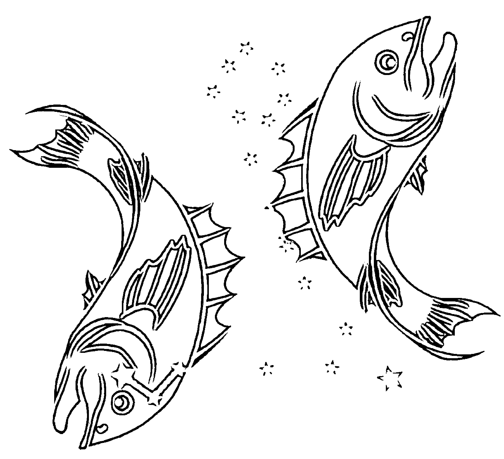

♓ 雙魚座

- * ☆出生日期：二月十九日～三月二十日
- * ☆身體部位：雙腳
- * ☆主    題：將靈性融入物質之中

來到雙魚座，黃道帶即完成了整個週期。之前的十一個星座已經經歷過且學習到了，現在輪到雙魚座汲取這些智慧並好好應用，將大家習得的宇宙教誨扎根至地球人間。因此，魚兒是神性以肉體形式呈現的方式。她具有從牡羊一路來到寶瓶的靈性（精神），而且她的外形就跟她的靈性一樣重要。因為誠如水在被倒入適當的容器之前並無法展現其用途，雙魚座四處流動的靈性也同樣無法發揮所長。她需要一艘船，某個物質的導管，讓黃道帶的繁星課程活靈活現起來。所以，正如「雙魚囊」（具體呈現在兩條魚兒分別朝反方向游去的雙魚座符號之中）一樣，她在這裡是要融合看似相反的靈性和物質，同時提醒我們，靈性與物質其實是同一個。

> > 隨著時間的推移，「雙魚囊」（正統的描述是相同半徑的兩個圓圈相交）已經代表了一切，從魚兒，到耶穌，到日蝕，到用來設計古代宗教建築的幾何矩陣。

## 雙魚座司掌：雙腳

每一隻腳（與雙魚座相關聯的身體部位）都是大自然的奇蹟，它包含大約三十根骨頭、二十多個關節、以及十一組內附肌（相較之下，體積大了許多的大腿，擁有相似的肌肉數量，但卻只有一根骨頭和兩個關節連接）。雙腳合作共事，形成使你筆直挺立其上的承重平臺，這是界定人類的一個特色。從那座平臺，你的雙腳驅策你向前、向後，在行動（走路、慢跑、在你認為適當時候練習瑜伽）的過程中，感應腳下的土地。

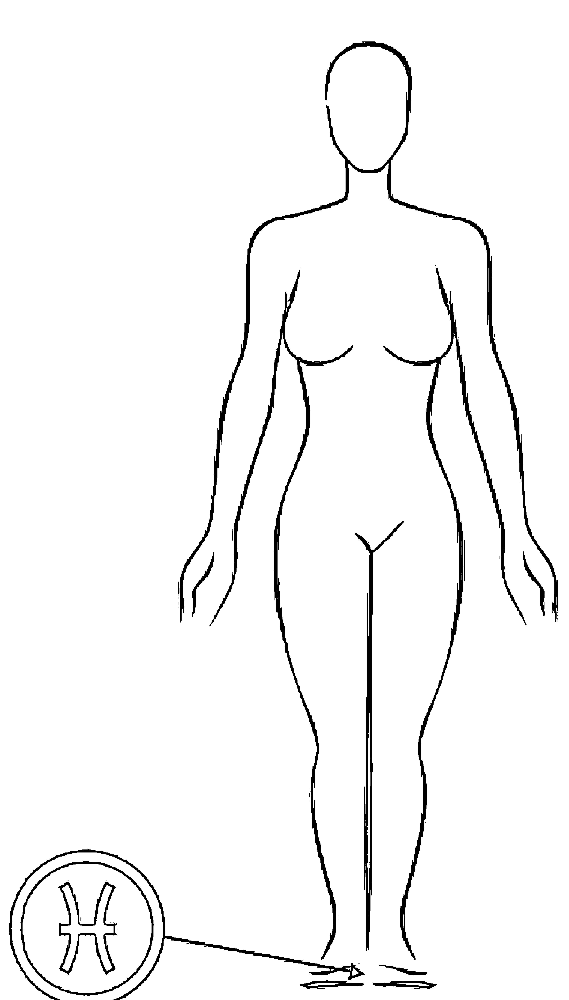

足部的骨骼結構，參見附錄C。

事實上，你的雙腳擁有全身最敏感的某些皮膚，專門用來感應如何使你與下方土地做最好的連結。（不要被粗糙的雞眼和老繭愚弄了！形成這些增厚的皮膚，乃是為了保護底下的敏感肌膚。） 雙腳是你整個人與大地之間的連結，在你的生命中扮演非常重要的角色。雙腳扎根接地，那不只是解剖學上和生理學上的零星片斷，更包括蘊藏其內的一切願景、夢想、恐懼、希望和愛。此外，你如何採用別的方法去上心愛的週二瑜伽課呢？即使是搭公車，讓你踏上公車的還是你的那一雙腳。 然而，儘管用途多多，今日的足部卻不被重視。雖然足部原本是用來赤腳跑過非洲納米比亞沙丘的，但如今卻一反常態，被捆綁在三寸高的高跟鞋內，踏在紐約市的水泥人行道上。將腳不自然地置放在這樣的鞋子當中不僅是虐待腳，也是濫用整個身體結構。高跟鞋使本該保持不活動的足部、小腿和大腿肌肉過度疲累，撐大和拉緊並不準備忍受持續壓力的韌帶，使腳踝和足部的關節負荷沉重，進而影響到重要的神經和血管。 然而，高跟鞋只是一個例子：襪子、鞋子、椅子、鋪過的道路、現代化交通工具、以及總是有地方可去的便利，這一切都使你與地面隔離。的確，假使你是一般的美國人，可能已經好一陣子不曾光腳站立，讓雙足穩穩地扎根在天然的土地上，安住在你的身體內整整五分鐘。所有這些現代化配備將你與「那片」土地隔離，也使你與你「個人的」土地隔離——那是你本該成為和操作的方式，並且不受外界干擾。 為什麼扎根接地如此重要呢？因為那是你如何參與你的有形和無形部分，並在地球上活出這兩者。這是一件大事，否則隨性的雙魚能量會開心地漂浮雲端。但地球不只是由雲朵構成的，何況假使魚兒辛苦習得的一切功課都保留在腦袋裡，沒有顯化成言辭、互動、藝術、時尚、以及其他可以啟發更多人而非少數人的模式，那我們的社會就得不到什麼好處。

所以，你需要連結到你的雙腳，才能將你的雙魚本質連接到她的土地，連接到物質，使她的靈性可以觸及物質界。你感覺靠自己的雙腳扎根接地到什麼程度呢？嘗試下述方法便可明白。

分解步驟：
1.  穿上使你與地板隔離的鞋子和襪子（或高跟鞋）。
2.  筆直站立，雙腳分開，與臀部同寬。雙臂伸直，置於身體兩側。體重應該要平均地平衡於兩腳之間。
3.  閉上眼睛，輕輕地前後、左右轉移你的體重，感覺你與下方地板連結。
4.  回復中立站姿，睜開眼睛。
5.  脫掉鞋子和襪子，讓自己赤腳。甩一甩雙腳。
6.  筆直站立，雙腳分開，與臀部同寬。雙臂伸直，置於身體兩側。體重應該要平均地平衡於兩腳之間。
7.  閉上眼睛，輕輕地前後、左右移動你的體重，感覺你與下方地板連結。
8.  回復站姿，睜開眼睛，注意穿鞋站立與不穿鞋站立之間的差異。

對某些人來說，光腳站立可能會感覺到些許不自在，因為你不習慣充分而敏銳地與地面連結，你習慣被足部盔甲「保護著」。對其他人來說，光腳站立可能是自由解放的，可能感覺像是一口氣終於釋放，使你得到解放。

# 雙魚座健康課題：將靈性融入物質之中

「融合」是綜合、合一，是將看似分離的部分合併成更大的整體。就像如何將一百片拼圖接合成一幅更大的海灘或馬匹圖像，或是如何混合麵粉、鹽巴和酵母，在烤箱的協助下，烘烤成麵包。融合當然不只是物質的；你也可以將相當於一學期英語課堂的各種想法和參考資料，結合成一篇新論文；再不然，你可能對某個個人有足夠的正向經驗和感受，假以時日，對方便成為你所認定的朋友。

這些例子說明你經常融入日常生活中的身體、心理和情緒結構。然而，雙魚座向前再跨一步，將「靈性」（精神）引進這個方程式，讓大家都在實踐、都在談論融合身體、情緒、心智和靈性。舉特定的愛的互動為例：你可能用頭腦心智思考愛（愛對你來說是什麼意思），存取你的情緒從而感覺愛（每次見到摯愛，心中便升起溫暖的感覺），伸出雙臂以身體表達愛（給予擁抱），開通自己的靈性以偵測愛的許多形式（你見到愛在愛犬的眼裡閃閃發亮）。缺少了身體、情緒、心智、靈性四個元素之一，你個人愛的體驗勢必不足。這就是為什麼多數人終其一生尋求真正地表達整個自己（從物質到靈性），即使他們不太確定那是什麼模樣，甚至那是什麼意思。

以融入其中，連結一直受到人為遏制的自己。對每一個人來說，在演變進化的過程中，光腳是你和你的身體被設計成為的模樣。在一個將你與自己的自然基質隔離的社會中，讓自己重新認識雙腳永遠不嫌太遲。要愈來愈覺察到雙腳成為身體的一部分有何感覺，同時感激雙腳在你的生命中所扮演的特殊角色。（閱讀第四章，回顧一下雙手和雙腳的平行結構。當然，足部缺乏方向相反的大腳趾，但由於骨頭和關節的複雜度相似，手部和足部都可以處理大量類似的細微動作。也因此，像東南亞地區「讓雙腳就是雙腳」的文化，甚至能夠用雙腳做針線活呢！）

關於靈性與世俗交會，歷史上最具代表性的描述出現在梵蒂岡西斯汀教堂的天花板上，作者是著名的雙魚藝術家米開朗基羅。在物質層面，米開朗基羅做的不過是調配、混合，不然就是將一系列的油畫顏料和形狀融合在一起。但藉由描繪人類與上帝伸手連結，將生命氣息吹入『創世紀』的開篇章節，米開朗基羅同時融合了靈性。這在人間造就出全然的不同！突然間，幾個筆觸成就的不僅止是牆壁（或者，更確切地說，是天花板）藝術，而且是一枚永恆的塵土徽章，透過上帝的靈性，活靈活現起來。這份作品表達得如此美好，好到每年有數百萬男女前來參觀。

當靈性與物質合而為一時，二元性不復存在。你可能會想起早先在黃道帶上隨著雙子、獅子出現過的這個主題。在那裡，你被引進至人類這枚硬幣的兩面——或多或少對應於人類本質天生的二元性。來到雙魚座，這些元素如今被融合了。人以靈性的身分活著，靈性以人的身分面對人生，不同的表現表達的是同一件事。雙魚座因此預示二元性的結束，允許星雲狀的乙太靈性世界不再被認為是分離的，而是一切人、事、物的一部分。事實上，來到雙魚座，靈性便成為我們物質世界的驅動力。

舉個例子，想像一台數位型收音機。假使沒有將電線插頭插入牆壁插座接收電力，這台收音機便不過是一些零件——塑膠、電線、橡膠。然而，電線插頭一插上，這台收音機就活了過來，有歌曲、演講、以及許許多你可以在電臺頻道上找到的聲音。以此例而言，電力是這台收音機的『生命衝力』（elan vital），攸關生命的法則和生命的源頭。它不是收音機吐出的歌曲或演講，也不是歌曲和演講背後的思想或情感，而是其生氣勃勃的力度。這就是你的人類身體的靈性。

像靈性這樣有品質的東西實在難以定義，也因此，靈性有許多的名稱，例如，上帝、耶和華、本源、光、能量、普拉納。儘管靈性是注入一切人、事、物的核心本質，但你卻無法直接看見、聞嗅、或以其他方式發自內心地感應到。所以，對於「靈性」意味著什麼，目前並沒有一致的見解，無法給出西方世界在驗證時所要求的客觀性。不過，請注意，許多其他的信念系統完全接受靈性和靈性所代表的一切。因此，「靈性」對不同的人來說意味著不同的事物，因為一個人的靈性經驗主要是主觀的——存在於洞察、直覺和印象的領域，以相較於線性、被貼了標籤的思想。 靈性是變形器，如實地遍佈各處，存在於一切事物當中，從桌椅等世俗製品，到愛與慈悲之類的原型。無條件的愛與慈悲是種種能量，而在所有的黃道星座中，雙魚座在此尤其要紮根接地於地球上。所以，你必須找到實際的方法，讓她的崇高理想扎根接地。一般而言，雙魚能量傾向於音樂、攝影、藝術，以及其他有創意的媒介，以此作為透過形相傳達靈性的方式。但所有類型的日常選擇，也都可以反映出雙魚座的理想，諸如選擇可持續提升能量的食物，購買對生態無害的清潔用品，自願參加慈善團體，幫助需要幫助的人。她與處女座共享服務的概念，不過雙魚座是出於慈悲而服務，而不是出於責任感。她將高貴的靈性帶給大家，因為她看見靈性反映在萬物之中。 但靈性需要形相才能活靈活現。因此，雙魚座諾貝爾獎得主愛因斯坦之所以聞名，並不是因為他坐著接收仍舊侷限在自己之內的傑出洞見，而是將他的理解轉變成數學方程式，然後將那些公式轉換到全球的黑板上。正如雙魚座的伽利略·伽利萊，透過由他發明及製作的望遠鏡所記錄得到的天文觀測，給予「日心說」（heliocentrism）的理論有形的支持。數字、黑板、筆、紙、望遠鏡……有許多方法可以使無形化為有形。那並不是要否定物質本身的存在！靈性或物質均不是至高無上的，兩者都需要對方才能達至完整。這是整個重點所在。靈性使物質移動，正如同物質使靈性移動。你如何看待這件事，純粹是觀點的問題，而問題是物質界的化現，尤其是當你考量到物質其實只是一種密集的能量。

> > 在東南亞部分地區，例如，巴里島並沒有『藝術』這個詞，因為做出的每一份貢獻和舉動都被視為藝術，那是一個靈性穿越物質的表示。

然而，就魚兒來說，物質充當靈性的容器。靈性是清潔、純淨的水，不論有多少目的，均可發揮效用，端看水是否被倒入花瓶中、行經某座水力發電廠、或是滲透一塊布。容器的類型沒有對錯，只有哪一隻容器最適合於雙魚的特殊目的。因此，你要考慮的是，你的物質面該如何服務你內在雙魚的目的，這股能量通常被發現它在藝術世界自在悠游，用雙手畫畫、用身體跳舞、用眼睛拍攝、用耳朵建構想像力和直覺理解到的一切。

靈性深深地影響著藝術的不同面向，這是許許多多的藝術得以成功存活幾百年的原因。例如，皮耶-奧古斯特·雷諾瓦 (Pierre-Auguste Renoir) 的《煎餅磨坊的舞會》(Dance at Le Moulin de la Galette)，皮特·蒙德里安 (Piet Mondrian) 的《三原色的構成》(Composition with Yellow, Blue, and Red)，弗雷德里克·蕭邦 (Frédéric Chopin) 的《革命練習曲》(Revolutionary Etude)，安東尼奧·維瓦第 (Antonio Vivaldi) 的《四季》(The Four Seasons)，這些作品聞名全球，因為它們的雙魚創作者們透過藝術和音樂喚起了普世的真理。文字不可能總是適合表現如此龐大的主題。而且因為靈性的信息在本質上是普世的，所以文字不見得被需要。我們能夠以許多形式理解靈性的表達，從藝術的畫布，到身體的運動，到激起情感的眼淚，畢竟，文字只是其中一種容器。

# 不健康的身體警訊（兩種極端）

要忘掉是哪一只鞋完美契合。每一個雙魚其實都在尋找如何讓她開放、敏感、如水一般的本質，得以流入我們有棱有角、心靈更勝物質的文明之中。魚兒的能量幾乎沒有自己的具體形狀，更不會套用社會大力鼓吹的形狀。然而，無形的能量需要在有形的世界成形，因此，這個星座的能量在此是要釐清自己的形狀如何在這個地球上生根，她該如何將自己的才華灌注到地球的整個物質界，從而幫助他人達到同樣的目標。最終，紮根確立了你存在的權利，以及你此刻在這裡的權利。誠如在任何特定的時間點，當時你是誰、你如何、你在生命中的什麼位置；沒有你的父母、你的工作、學校的期望，甚至沒有你自己的期望。紮根接地於自己意味著，你需要做的只不過就是成為你，存在你的整體——身體與靈魂、物質和靈性——之中。

如果成功達成這個任務，你就成為一個「覺者」的出色典範，這是一個透過物質在這個地球上活出其雙魚靈性的個人。當然，說比做容易！因為我們的現代世界是以物質為中心，就連「靈性」這個簡單的詞也足以使許多人閉上眼睛、封住頭腦。可笑的是，如果你將雙魚的靈性本質據為己有，避開形相的密度，那麼另一種偏見可能會出現。在此情況下，你將會拒絕合併兩者，同時冒著變成禁慾的風險。

（這種禁慾主義，以及因此造成的匱乏和苦行，反映在雙魚座誕生的季節，這時，冬天依舊蹂躪著大地，而春天的種子尚未發芽。）事實上，你將會放棄物質界的好、壞驚奇，追求你眼中的更高目標。

另一種避開物質、追求靈性的方法是頻頻逃避現實，無論是透過妄想還是毒品。在此情況下，你拒絕建立有必要讓自己的雙魚靈性紮根接地的結構。當你的靈性電路撒野放肆，沒有任何的容器可以有效地導入和疏導，你就開始脫離現實生活，比起沉浸在靈性世界，那必然會帶來更大的痛苦。在此情況下，靈性與物質缺乏融合，於是你在這顆星球上過活，卻偏愛感覺彷彿活在另一顆星球上。無論是哪一種情況，只要你的魚兒沒有扎根接地，可能都意指你還沒有找到真正的人生道路。
不切實際的雙魚能量，其身體表現可能包括：

- * 高足弓
- * 雙腳活動度過大
- * 走路時經常足部內翻（腳踝以下的足部翻轉，腳底向內）
- * 站立或走路時，足部無法完全且穩定地踏在地上
- * 腳趾頭撞傷
- * 其他：增生（例如，足部疣、雞眼、老繭、拇囊炎）、關節退化

相較於大量隱藏在靈性世界，太過踏實或扎根接地不正確，是另一種可能攪亂你人生道路的失衡魚兒能量。假使你太過踏實，你投注在身體和心智問題的時間可能多過你真正的需要，而且還否定靈性；如此，你可能忙著與物質界培養過於親近且對你來說並不自然的連結（這跟金牛座的例子不同，公牛只關心大地，而她唯一能做的就是舉頭仰望天空）。儘管本質高度敏感，但你甚至可能會迴避所有被視為靈性或偏激的活動、著作、談話或構想，以求不面對你自己的這個雙魚面向。如此的情節近似於強迫一個迴旋的圓圈進入方形的洞穴。或者雖然靈性可能被注入你的生命中，但你可能透過錯誤的工作、父母的期望、強迫的關係等，不當地扎根接地。在這兩種情況下，不正確的扎根接地正在發生，你那魚兒的雙腳將會感覺到因此導致的愚鈍。
過度踏實的雙魚本質，其身體表現可能包括：

- ★雙腳的沉重感，或是彷彿打了石膏
- ★扁平足
- ★腳踝、足部或腳趾的活動範圍減少
- ★腳底灼熱感
- ★疼痛或發炎，通常在腳底
- ★腳趾頭撞傷
- ★雙腳容易疲憊
- ★其他；增生（例如，足部疣、雞眼、老繭、拇囊炎）、關節退化

# 找回平衡的六項提問
下述提問和練習將充當你體現雙魚座的個人指南，不妨運用它們更進一步地將靈性融合到物質之中。

你的雙腳使你能夠接地到什麼程度？無論是感覺不切實際、過度踏實，還是介於兩者之間的某處，關鍵都在於：好好聆聽你的身體，給予身體所需要的。要伸展緊繃的雙腳或強化虛弱的雙足，運用下述提問和練習，喚醒你內在的雙魚座。

## 雙魚座養生操

### 練習 1

### 手碰腳前屈式：祈請你內在的黃道帶

儘管黃道帶並沒有真正的開端或結尾，但此一循環開始於牡羊座，那是新生命的種子在春天降臨。牡羊座化為形相的個體化過程開啟了某個程序，歷經十一個星座，結束在雙魚座從自我化為靈性的去個體化過程，只是為了再次找到牡羊座的某個全新形式！這是一趟凡人皆有的旅程，可能在一生或累世之內，透過

- ★ 當你考慮到自己人生的不同面向，從為人父母的角色、到搭擋、到員工等等，你覺得這些一起形成一個融合的整體嗎？還是你覺得自己活得像一系列斷續的零件？
- ★ 你對「靈性」的定義是什麼？它在你的生命中扮演什麼角色？
- ★ 你希望靈性在你的生命中扮演什麼角色？你可以給予它什麼形式，讓它成為你一天二十四小時真實存在的一部分？
- ★ 你覺得你受到與物質世界還是與靈性世界的連結所驅動？如果局面轉變，你的人生看起來和感覺起來會是什麼模樣？
- ★ 就品質而言，你生命中的什麼元素使你感覺不那麼踏實？或是更為扎實接地？
- ★ 你生命中的什麼元素使你感覺不那麼踏實？或是更為扎實接地？

身體、心智、情緒和靈性的匯合被經驗到。好好利用這個姿勢形成身體的循環，從而建立你自己的黃道週期，同時在如此實踐的過程中，將你的牡羊頭部帶到你的雙魚腳邊。

### 分解步驟：

1.  先筆直站立，雙腳分開，與臀部同寬，雙臂垂放在身體兩側。
2.  吸氣，然後在呼氣時開始朝地面緩緩而下，脊椎骨一節節向下。你的頭部將會開始下降，接著是頸部、肩膀、軀幹等等。
3.  當你緩緩下降時，允許你的兩隻手臂下降，分別用兩手的拇指、食指和中指抓住兩腳的大姆趾。需要的話，可屈膝，讓此一連結化為可能。
4.  吸氣，同時抬頭，盡可能拉直背部。
5.  呼氣，放鬆地進入前彎式。允許頭部和頸部懸擺著。保持在這裡，持續五次長而深的呼吸。
6.  若要退出，照來時方法緩緩向上，脊椎骨一節節升起，回復站姿。

在這個瑜伽姿勢中，進階學員可能會將雙手手掌各放在雙腳腳下，徹底接通身體的整個線路。資淺的學員可能會將雙手靠在脛部上。

## 練習 2
踮腳：利於扎根接地

感到扎根接地時，你會覺得更加堅實、穩定、平衡、得到支持，仿佛移除掉當天超量的負荷，使你可以輕易地呼吸。想想你最後一次花十五分鐘時間光著腳在草地上嬉戲所引發的感官體驗。事實證明，與地面接觸時，你感到扎根接地的理由之一是：大地其實扮演著接地的角色。大地這個物體從另一個物體（例如，你的身體轉換或接收電子，從而加以中和。需要更好的理由才要扎根接地嗎？如果是，請參閱後續的「練習5：赤腳步行」（見312頁）；否則，就用這幾個簡單的踩腳練習扎根接地（最好是赤腳走在戶外）。

1.  筆直站立，將沒穿鞋襪的雙腳打開，與肩同寬，雙手置於腰上。
2.  屈膝，將重心移到左腳上，盡可能舒服地抬高右腳，然後向下踩踏。允許右腳平坦而有力地落地，彷彿你正忙著將生麵糰搗入大地中。身體重心放低，屈膝。如果踩踏時發出聲音感覺上很自然，那就吼幾聲吧！
3.  當右腳感覺到牢牢地踩在地上時，就把重心移到右腳上，左腳抬離地面，然後向下踩。
4.  繼續兩邊交替踩踏，持續三十秒至一分鐘。

從小，踩踏就是你參與過的一個動作，因此，不必太過擔心這個練習的形式，只需密切注意雙膝如何處理你的重量。主要的焦點應該落在你與大地正在一起鍛鍊那份堅實而刻意的連結，以及你因此接收到的無數益處。

## 練習 3 自我足部按摩：敞開心扉進入靈性

回想一下，雙魚座如何將所有其他星座納入它的一體之中？同樣的道理也適用於雙魚的身體對應部位——雙腳。根據反射療法的說法，每一隻腳上的各個區域代表並連結到身體的其他部位，因此，按摩足弓底部同樣有益於你的消化器官。雖然埃及或中國古文化可能早已施行類似的技術，但反射療法在十九、二十世紀之交，才由一位物理治療師兼醫生引進美國。從那時起，許多美國人透過反射療法找到了輕鬆之道。事實上，就連簡單的足部按揉，也往往可以為腳痛創造奇蹟。親自嘗試看看，然後好好落實雙魚座敞開心扉的本質。你可能無法在家自己練習真正的反射療法，但自我足部按摩法是一個開始，可以使你敞開來迎向雙腳的奇蹟、新的療癒方法，然後也許一切就從那裡開始！

### 分解步驟：

1.  坐在椅子上，右腿翹在左腿上方，右腳踝靠在左大腿上方。
2.  用右手握住右腳腳趾，用左手穩住右腳後跟。用右手輕輕地延伸腳踝，將腳趾往回壓，持續十秒鐘。你應該會感覺到右腳腳底在伸展（沿足底筋膜）。
3.  放鬆那隻腳十秒鐘。總共重複十次。
4.  加入按摩：最後一次重複時，握住腳趾往回壓，然後用左手拇指按摩腳底，從右腳腳底踮球部呈線條狀按向右腳後跟。從內側腳弓區開始做線形按摩，接著移動到足部內側，然後沿著外側腳弓按摩。用感覺舒服的方式用力按壓。
5.  重複三次，然後換腳。

按摩雙腳時，可滴幾滴精油，替足部添加額外的營養。香根草這種精油善於調動雙魚本質中的直覺和靈性面向。給智者的建議：依足部的狀況，雙腳在前幾次按摩後，可能會感覺疼痛。假使情況如此，你的腳可能需要幾天時間才能習慣如此的伸展和按摩，這有助於減輕肌肉的黏附現象。很快地，按摩的體受感應應該會從「呃」轉成「啊」。

### 坐式足部伸展：形塑你的物質面

想像一名有一大堆黏土的雕塑家。對她來說，任何形狀都是可能的。她透過雙手傳達她的願景，將願景轉化成沒有固定形狀的隆起，最終顯化成她想要創作的任何東西，無論是咖啡杯，還是相互擁抱的雕像。雖然比起黏土，身體形相的限制更大些，但多數情況下，你也可以用許多不同的方式塑造自己。每一個人都有屬於自己的方法：由於關節的角度方位，加上韌帶的固有彈性，你將會體驗到不同於其他人的活動限制和範圍。基於這點，有些人可能天生（或後天變得）足夠靈活，可以表演雜技，而其他人則無論再怎麼伸展都無法勝任。身體活動的理想方式是：你的身體能夠活動的理想方式。你可以決定想要你的雙腳如何感覺——健康、開放、呼吸自如嗎？你想要你的雙腳做些什麼——好好跑步、踮腳尖站立、保持平衡嗎？這是你的選擇。你可以在現實中靠雙腳如實地注入你想要和需要的。你的身體是你的結構，要好好利用這個練習讓自己重新認識身體，如此方便你開始形塑身體，免得由他人為你塑形。做這個練習時，你將會需要一條健身帶。假使沒有，可用毛巾模擬健身帶。

### 分解步驟：

1.  坐在地板上，雙腿向前伸長。你應該坐在中立骨盆的上方。如果需要，可屈膝，讓自己坐正，不佝僂下背部。保持大腿、雙腿、雙腳彼此平行。
2.  右手握住健身帶兩端，將健身帶繞過右腳腳掌的蹠球部，讓腳趾被包覆起來。
3.  慢慢地將右腳腳趾（然後是右腳和右腳踝）指向地板。
4.  腳趾往回擴展，朝向自己。慢慢地移動，感覺那份阻抗以及貫穿腳趾、足部和腳踝等各個部分的連接方式。
5.  重複五遍，設法確保軀幹在雙腳工作時保持挺直。
6.  右腳依舊包覆在健身帶中，慢慢朝右邊畫五個圈，然後朝左邊畫五個圈。
7.  換邊，然後重複。

若要增加阻抗，可縮短健身帶的長度；若要減少阻抗，就延長健身帶的長度。

## 練習5 赤腳步行：利於融合

現在，你的一隻腳或兩隻腳很可能正踏在大地上休息。大地爲我們做了許多事，它提供食物和水，提供步行、蹲坐、建造的地面，還有天然而充實的能量。大地的能量是感覺健康的重要環節，也因此在充滿水泥的工業化社會中，你可能感覺不到健康。許多健康好處可能源自於融合你的物質面與大地的能量，從更美好的平衡，到與大自然連結，到改善足部健康和氣力。但要做到這點，你需要移除鞋子、襪子、以及其他阻止你直接與大地連結的減震品。藉由赤腳走在大地來產生連結，無論走的是泥地或沙地或草地，盡可能經常這麼做，即使只走二十秒鐘（但理想上是每天走二十分鐘）。如此赤腳冒險允許雙腳發揮功能，免於鞋子之類的干擾。若想要額外益處，可走入水中、走在水邊、或是沿水而行。雙魚座是水象星座，在許多層面，水對魚兒來說是生死攸關的，具有使其平靜、復原、充實滿意的作用。

## 練習6 充滿愛的靜心：培養愛與慈悲

寫到雙魚座，不可能不提到在內心深處流淌的兩大特徵——對人類深度的愛，以及無邊無際的慈悲。愛與慈悲是佔據靈性界域的兩大原型，因此，最重要的是，魚兒學會如何將這些特質顯化成她的身體形相，顯化成她說話、進食、關聯、舉止和行動的方式。當然，第一步是要與愛和慈悲取得聯繫，不是透過頭腦心智的理解，而是藉由內心的知曉。嘗試一下吧，你可能會驚喜地發現，一天靜心五分鐘大有幫助。

### 分解步驟：

1.  在地板上找到一個舒服的座位，需要的話，盤腿坐在軟墊、枕頭或瑜伽磚上（如果不能盤腿，就找一個舒適的姿勢在地板上坐正；如果這個坐姿對你而言仍有困難，就坐在椅子上）。
2.  選擇一個不會被打斷的空間和時間。關掉手機鈴聲，同時設定鬧鐘，在這段五分鐘的靜心結束時提醒你。
3.  雙手放在大腿上，手掌朝上，呈接收姿勢。
4.  讓你的左手代表愛，右手代表慈悲。回顧之前感覺到這些體受感的情境，藉此祈請這類感官體驗。
5.  閉上眼睛，聚焦在你腦海中的左手，祈請愛人的念頭和感覺。 若要促進這番努力，可回想引出 這個體受感的某人、某地方或某事物。
6.  現在聚焦在你腦海中的右手，祈請慈悲的念頭和感覺。 若要促進這番努力，可回想引出 這個體受感的某人、某地方或某事物。
7.  想像一個金色圓圈連結你的雙手。
8.  現在，當你的焦點返回到愛，就沿著圓圈的頂部繞行，帶你來到慈悲；一旦來到慈悲，就繞著圓圈底部回到愛。閉上眼睛，持續在愛與慈悲之間追蹤這個圓圈，感覺兩者逐漸融合。
9.  開鐘響後，保持坐著，雙眼閉上，暫停一會兒。好好反思一下這段經驗，再繼續過日子。

假使五分鐘似乎令你卻步，可在任何似乎可行的時段隨意練習這個靜心。無論是哪一種靜心，最重要的莫過於親自執行。多加修習，假以時日，一次靜心的時間長度將會自然而然地增加。

## 小結

- ★雙腳是與雙魚座相關聯的部位，你的雙腳以複雜的骨骼相互作用為其特色，無論你希不希望，雙腳都使你的其餘部分與下方的地面連結。
- ★雙魚座是黃道週期的第十二個兼最後一個星座，其能量確認你是從物質到靈性的整個連續體，而且它要求你將這些融合到你的生命中。
- ★假使你流暢的雙魚本質變得太過踏實，或是不夠踏實接地，那麼你的雙腳可能會體驗到不同的症狀，例如，灼熱、沉重。
- ★透過聚焦在雙腳的提問、練習和活動，擁抱你內在的雙魚座，運用這些憶起本來的你絕不僅止是肉體和骨骼；你正行走在人間天堂，正在講述人間天堂。

## 【結語】 從占星學洞見你的總體健康

這本全人健康指南蘊含的主旨是：你不僅止是肉眼所見，你的身體儘管在物質層面是由星塵構成的，但在形上層面也反映出宇宙萬物。你尊重如此物質與靈性的連結，並以一個互連互通的整體運著——你不愧是這個整體，也知道你是這個整體。
然而，不僅要相信這一點，更要真正活出來，這需要你言行一致，或者，更確切地說，要實踐每一章附帶的提問和練習，或是執行不管哪一套你為自己量身訂製的常規。重點在於：將故事從頁面上取下，脫離頭腦，賦予它形相的事實。透過你在一天當中做出的所有選擇校正自己，如此，「你是誰」便不只是你知道存在於內在的東西，更是你明確地活出的現實。這就如同「序言」中所舉的例子：關於購屋，你可以想像你想要的一切，但在你開始採取必要的步驟之前，你的房子依舊只是一個夢想。
我們相信，你的夢想可以成真，外帶你甚至不知道自己有過的其他巨大渴望；然而除非你嘗試，否則你將永遠不知道答案。而那正是我們希望這本書鼓勵你去完成的一部分事情——嘗試新鮮，擁抱一種學習「你是誰」的新方法。我們希望你得到啟發，懂得面對自己的弱點，同時將挑戰轉化成優勢，從而敞開來迎向全人健康的全新定義。當你這麼做時，當你在人生的這一個領域敞開自己時，那份開放性便與所有其他領域產生共鳴。就好比當你透過足部鍛鍊培養雙魚座的慈悲時，那不會持續僅僅五分鐘，而是遍及當天的其餘時間，你可以觀察到微妙的轉變，例如，變得更加寬恕自己，或是比較可能為他人敞開心房。
是時候該重新連結到我們的身體以及身體所預示的一切：從雙腳的扎根接地，到心中的愛，到腦袋的覺知。換言之，是時候該優化你的總體健康與幸福康樂了。有許多方法可以做到這點，而本書提供你星辰的智慧作為全人健康的途徑之一，這是一種實用且頗具療效的魔法，讓你得以透過日常的身體實相，契入一則古老的假設。因為單是知道活在你心中的愛，或許是不夠的；你應該要在愛的表達中細細品味，有能力透過你的動作、詞語的選擇、姿勢、工作、關係等等感覺到愛，並且活出愛。當出現這種情況時，愛不再只是一個概念，而是開始變得真實，這正是本書中的提問、練習和活動為什麼那麼重要的原因，它們幫助你喚起這些除此以外觸碰不到的部分。在經常實踐的過程中，你就利用了屬於你自己的實用魔法。 本書談論的是你的日常做法，以及因此產生的實用魔法。所以，戴上你的魔術帽吧！要透過你的身體（你所是的星辰）繼續生活，從內到外，不停地伸手觸及宇宙萬物，同時記住，你居住在一個不斷演化的宇宙——就像你現在這樣。 感謝你走過這趟從身體到星座、然後再折回的全人健康之旅。衷心希望你享有活出本書的樂趣，正如我們為你創作本書時也是同樣的欣喜愉悅。

——史蒂芬妮醫師與麗貝卡

## 【附錄A】
十二星座與身體症狀一覽表

每一個黃道星座的智慧都活在你之內！當你活在個人與此一智慧相互輝映時，你將感覺平衡而安好。然而，多數人都還在學習自己是誰以及如何活出最美好的自己，而且有時候我們可能會覺得不舒服。要利用任何的疼痛和痛苦作為機會，從而更加了解自己，同時學習如何在身、心、靈各個層面好好照顧自己。你眼中的創傷，可能是你的最大贈禮。既然本書的特色在於身體的肌肉骨骼系統，那麼收錄在下表的這些身體表現，主要也與肌肉骨骼相關聯（儘管就肌肉骨骼而言，某些部位的傳導性勝過其他部位）。這些揀選自每一章的「課題」內容，代表假使該星座的能量受阻、難以充分表達時，可能會出現什麼情況。誠如「前言」所述，請將此一覽表當作一份指南，進一步教育和探索你的身、心、靈連結（而不是用來診斷或預測）。

| 日期 | 星座 | 身體部位 | 身體表現 |
| :--- | :--- | :--- | :--- |
| 3月21日~4月19日 | 牡羊座 | 頭部 | ★ 頭痛、偏頭痛 ★ 鼻竇炎 ★ 頭痛鼻塞型傷風 ★ 鼻塞或流鼻水 ★ 眼睛感染 ★ 毛髮脫落 ★ 耳朵感染 ★ 聽力減退 ★ 牙痛、牙齒感染或磨牙 ★ 下顎肌肉緊繃 ★ 臉部色斑 |
| 4月20日~5月20日 | 金牛座 | 頸部 | ★ 緊張或虛弱、不穩定 ★ 僵硬或疼痛 ★ 活動範圍受限或活動過度 ★ 勞啪響或嘎吱響的感官體驗 ★ 其他：咳嗽、咽喉刺痛、咽喉感染、甲狀腺失衡、聲音輕柔或喧噪或不穩定 |
| 5月21日~6月20日 | 雙子座 | 胳膊前臂雙手 | ★ 肩膀、肘部、前臂、手腕或手部疼痛 ★ 勞啪響或嘎吱響的感官體驗 ★ 虛弱或緊繃 ★ 指關節過度咔咔響 ★ 肩胛骨緊繃或呈「翼狀肩」 ★ 活動受限或過度 ★ 靈活度差 ★ 握桿或握手無力 |
| 6月21日～7月22日 | 巨蟹座 | 胸部 | ★ 胸悶或疼痛 ★ 凹下或塌陷的駝背姿勢 ★ 呼吸短促 ★ 肋骨刺痛、發炎或損傷 ★ 其他：呼吸不適、食道不適、痰過多、情緒性進食、心口灼熱、乳房腫塊 |
| 7月23日～8月22日 | 獅子座 | 心臟 上背部 | ★ 挺凸的胸部 ★ 無精打采的上背部或駝背姿勢 ★ 屏住氣息或呼吸淺弱 ★ 上背部緊繃、緊張、虛弱或疲累 ★ 活動受限 ★ 心臟不適 |
| 8月23日～9月22日 | 處女座 | 腹部 | ★ 僵硬或虛弱的核心 ★ C形、脊柱前凸、或如軍人操練般的直挺站姿 ★ 呼吸淺弱或屏住氣息（相較於腹式呼吸） ★ 其他：消化不良、不消化、食物過敏、便秘、腹瀉或大腸激躁症、疝氣、潰瘍、飲食失調、慮病症、強迫性行為 |
| 9月23日～10月22日 | 天秤座 | 下背部 | ★ 疼痛或緊繃的肌肉 ★ 肌肉痙攣 ★ 活動範圍受限 ★ C形、脊柱前凸、或平背體態 ★ 突發性動作造成的疼痛 ★ 消耗造成的疼痛或虛弱 ★ 退化症狀 ★ 其他：腎臟或腎上腺失衡 |
| 10月23日～11月21日 | 天蠍座 | 薦骨中心 | ★ 下背部、腿筋、腹部、臀部、或骨盆底的肌肉緊繃或虛弱 ★ 下背部或臀部區疼痛或不適 ★ 骨盆區虛弱或不穩定 ★ 下背部或骨盆活動受限 ★ 活動過度 ★ 固定型非中立位骨盆 ★ 骨盆過度旋轉、過度外擴或內收、或傾斜 ★ 其他：月經週期不規律、尿滯留，或是尿失禁或尿道感染 |
| 11月22日～12月21日 | 射手座 | 臀部 大腿 | ★ 緊繃或虛弱的臀部肌群 ★ 失衡的臀部肌群 ★ 大腿固定或過度向內或向外旋轉 ★ 臀部的活動範圍受限 ★ 活動過度 ★ 髂脛束緊繃 ★ 非中立的骨盆位置 ★ 關節或關節周圍感覺疼痛 ★ 臀部和／或大腿神經挫傷 ★ 其他：過度放縱於食物或飲酒，肝臟失衡 |
| 12月22日～1月19日 | 摩羯座 | 膝蓋 | ★ 膝關節周圍的肌肉和肌腱緊繃或虛弱 ★ 移動或坐著時，膝蓋疼痛或不適 ★ 活動範圍受限或僵化 ★ 過度伸展 ★ 腿部發軟或膝蓋卡卡 ★ 劈啪聲或嘎吱響的感官體驗，或諸如此類的聲音 ★ 液體過多 ★ 脛骨疼痛 ★ 校正不良 |
| 1月20日～2月18日 | 寶瓶座 | 腳踝 | ★ 虛弱或不穩定的感官體驗 ★ 僵化死板或活動過度 ★ 腫脹 ★ 劈啪響的感覺或聲音 ★ 斷裂感 ★ 踝關節不穩定 ★ 走路時足部內翻 ★ 緊繃的小腿肌肉 ★ 痙攣或抽筋 |
| 2月19日～3月20日 | 雙魚座 | 雙腳 | ★ 活動過度 ★ 走路時足部內翻 ★ 高足弓或扁平足 ★ 雙腳無法完全穩定地踏在地上 ★ 腳趾頭撞傷 ★ 沉重 ★ 灼熱感 ★ 腳底疼痛 ★ 活動範圍減少 ★ 增生 (例如，雞眼、老繭) ★ 退化 |

*註：請記住，你可能會在不同的圖表中看到不同的日期。那是因為歲差（precession of the equinox），這是地球每七十二年發生一次緩慢、向後的運動，在此期間，星辰的時間位置會產生一度的變化。

## 【附錄 B】 十二星座全身能量掃描

這個全身掃描可以用來：

- ★ 與你的身體形相重新連結，感應可能遮蔽連結的任何阻塞
- ★ 使你的身體與星辰賦予身體的天賦權利以及更大的整體合一
- ★ 進行禪修與放鬆的體驗
- ★ 根據你的黃道需求，建立自我照護的規律練習法

一開始，找一個安靜的地點執行這個練習。可能需要大約五分鐘，但只要你喜歡，可以隨性延長時間。使用支撐物，讓自己舒服些。開始時將焦點集中在頭部，最後結束於雙腳，在內心裡重複下述短句，並在每一句之間放鬆地呼吸一下：

- ★ 我是牡羊座，我是我的頭部。我是整體。
- ★ 我是金牛座，我是我的頸部。我是整體。
- ★ 我是雙子座，我是我的胳膊、前臂和雙手。我是整體。
- ★ 我是巨蟹座，我是我的胸部。我是整體。
- ★ 我是獅子座，我是我的心臟和上背部。我是整體。
- ★ 我是處女座，我是我的腹部。我是整體。
- ★ 我是天秤座，我是我的下背部。我是整體。
- ★ 我是天蠍座，我是我的薦骨中心。我是整體。
- ★ 我是射手座，我是我的臀部和大腿。我是整體。
- ★ 我是摩羯座，我是我的膝蓋。我是整體。
- ★ 我是寶瓶座，我是我的腳踝。我是整體。
- ★ 我是雙魚座，我是我的雙腳。我是整體。
- ★ 我接受我的整體的各個部分，我感恩我的整體，我放鬆地融入我的整體。

如此重複，然後只要你喜歡，花多少時間保持大休息式皆可，平躺在地板上，雙腿和雙臂伸長並放鬆。

## 【附錄 C】 人體骨骼結構和部位名稱

### 骨骼結構

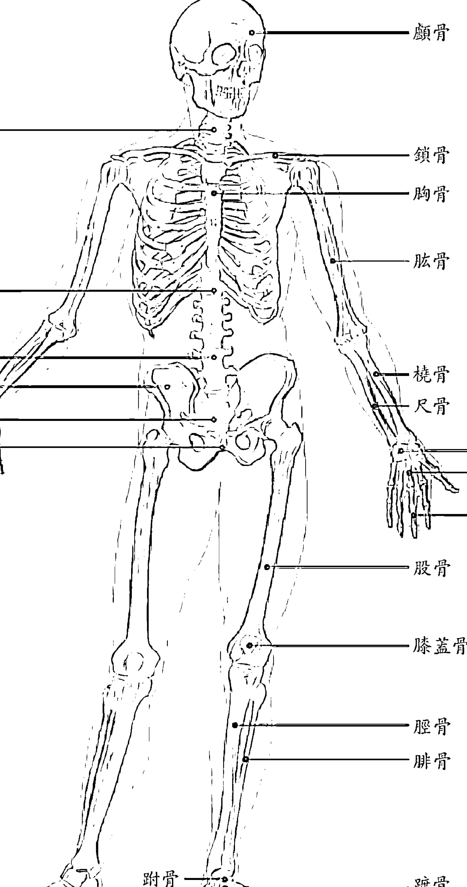

- 顱骨
- 頸椎
- 鎖骨
- 胸骨
- 肱骨
- 胸椎
- 腰椎
- 骨盆
- 薦骨
- 尾骨
- 橈骨
- 尺骨
- 腕骨
- 掌骨
- 指骨
- 股骨
- 膝蓋骨
- 脛骨
- 腓骨
- 跗骨
- 蹠骨
- 趾骨

### 身體部位

## 志謝

撰寫一本關於身體和星辰的著作，需要將生命視為一個互連互通的整體。就這方面而言，我們看見生活中的一切人物和事件都在幫助本書成形，為此，我們十分感激。儘管如此，卻有少數個人扮演了直接的角色，對於這些人，我們要親自致謝：

感謝三叉戟媒體集團（Trident Media Group）的羅伯特·哥特列波（Robert Gottlieb）與梅兒·弗拉什曼（Mel Flashman），謝謝他們的先見之明與信心。感謝愛蜜莉·韓（Emily Han）、琳賽·伊斯特布魯克-布朗（Lindsay Easterbrook-Brown）以及無可言喻出版社（Beyond Words Publishing）的整個團隊，謝謝你們清晰而真心地將我們所要說的話傳遞至讀者的手中。感謝勇敢地自願為我們的個案研究耗費時間、精力，同時提出洞見的所有男性和女性（雖然最後並沒有將個案研究列入本書中，但卻有助於增加每一章節的內容）。

還要感謝羅貝塔·羅夫納·皮齊尼克（Roberta Rovner Pieczenik）博士（史蒂芬妮博士的母親），她從史蒂芬妮小學開始便校訂她的文章，帶著愛、奉獻、敏銳的眼光，盯著使用過多的分號。最後，同樣由衷感謝所有一路上支持過我們的朋友、家人和摯愛，你們一定知道你們有多麼重要！

國家圖書館出版品預行編目 (CIP) 資料
你的身體就是12星座：占星這樣教我們健康養生 / 史蒂芬妮．莫倫歌 (Stephanie Marango)、麗貝卡．戈登 (Rebecca Gordon) 著 ; 星光餘燁譯.-- 初版.-- 臺北市 : 橡實文化出版 : 大雁文化發行, 2017.12
面 ; 公分
譯自: Your body and the stars : the zodiac as your wellness guide
ISBN 978-957-9001-30-4 (平裝)
1.占星術
292.22
106020292

BC1052

## 【你的身體就是12星座：占星這樣教我們健康養生】
### Your Body and the Stars: The Zodiac As Your Wellness Guide

本書包含作者的意見與想法，對闡述的主題提供有用的資料。讀者在採納書中的任何建議或是從中得出結論之前，應該先行諮詢自己的醫師、健保、或其他合格的專業人士。

作　者 史蒂芬妮．莫倫歌 (Stephanie Marango)、麗貝卡．戈登 (Rebecca Gordon)
譯　者 星光餘燁
責任編輯 田哲榮
協力編輯 劉芸棻
封面設計 黃聖文
內頁構成 歐陽碧智
校　對 吳小薇

發行人 蘇拾平
總編輯 蘇拾平
副總編輯 于芝崢
主編 田哲榮
業務 郭其彬、王綬晨
行銷 陳雅雯、汪佳穎、張竣瑜、余一霞
出版 橡實文化 ACORN Publishing
地址：10544臺北市松山區復興北路333號11樓之4
電話：02-2718-2001　傳真：02-2718-1258
E-mail信箱：acorn@andbooks.com.tw
發行 大雁出版基地
地址：10544臺北市松山區復興北路333號11樓之4
電話：02-2718-2001　傳真：02-2718-1258
讀者傳真服務：02-2718-1258
讀者服務信箱：andbooks@andbooks.com.tw
劃撥帳號：19983379　戶名：大雁文化事業股份有限公司

印刷 中原造像股份有限公司
初版一刷 2017年12月
定　價 480元
I S B N 978-957-9001-30-4

電子書
初版 2018年2月
建議價格 316元
ISBN 9789579001328 (EPUB)

版權所有．翻印必究 (Printed in Taiwan)
如有缺頁、破損或裝訂錯誤，請寄回本公司更換。

YOUR BODY AND THE STARS: The Zodiac As Your Wellness Guide by Stephanie Marango, M.D., RYT and Rebecca Gordon Copyright © 2016 by Stephanie Marango and Rebecca Gordon
Complex Chinese translation copyright © 2017 by ACORN Publishing, a division of AND Publishing Ltd. Published by arrangement with Atria Books/Beyond Words, a Division of Simon & Schuster, Inc. through Bardon-Chinese Media Agency.
ALL RIGHTS RESERVED