# 十二星座居家配色宝典


為全家人的身心靈、事業、愛情、人際關係補給正能量

用色彩，讓家屋成為令人安心的避風港

太陽對應玄關、套房，金星對應客廳，
月亮對應廚房、臥室，海王星對應浴室，冥王星對應廁所……
藉由個人星盤，找到適合每位家庭成員的色彩，
在居家生活中注入色彩能量，每一天都愉悅美好。


紀念我的兩位祖母蘿莎（Rosa）與瑪麗亞─裘瑟法（Maria-Josepha）：感謝她們帶我深入家中。

致我的祖父卡爾曼（Kallmann）：他日復一日做著質樸的工作，是我的榜樣。

致我的兒子羅伊（Loys）：希望他能將困難的事情貫徹到底：思考，建設，拆掉再來，洩氣的時候仍然會打起精神向前走。

致我的朋友：他們充滿耐心及關愛，忍受我，慷慨地付出他們的時間，幫我完成這項工作，讓我得以和許多人一起審視：
Caroline Abitbol, David Alexander, Laurence André, Christian Arizi, Denis Badet, l'agence de publicité Tangara, Federico et François Bonaudi-Van der Vorst, Alexander Carr, Patty et Steeve Carson, Rafael Chatelain, Robert Chillon, Yannick Clerentin, Raul Richard Cornejo, Albert Da Silva, Alexis Debeauvais, Laurent Del lac, Norbert Elmalih, Isabelle et Jean Flinois, Benoît Fosse, Nicolas Genevois, Donatien Gérard, Jeanine Giletta, Hervé Godard, Nadine Guetta, Xavier Günther, Paul Hopkirk, Letizia Ingrassia, Cléo Lambrecht, Véronique Lepochat, Suzette Le Bigot, Loik Lincetto, Pascal Léon, Gioacchino Licata, Marie-Dominique L'Hôte, Anna et Ettore Mazzola, Giovanna Mazzola, Pablo Menor Guerra, Dario Mucedda, Ulf Nast, Eric Osterhoff, Imelda Paoletti, Frédéric Petijon, Claude Picandet, Bruno Ouenard, Nicolas Ouindy, Abdulmonem Raslan, Wagner Rosa Jr., Yann Scioldo-Zürcher, Patricia Seitz, Fanny Siemons, Guillaume Segado, Raul Torres, Sadrü Valimahomed, Willem Verhoeff, Cy Wilson, Nouari Zaïm

致讀者：希望這本書能幫助你，陪伴你打造自己、尊重他人的意見，並且給你各式各樣的想法。


## 如何使用本書？

〈1 住屋、十二星座與色彩〉會告訴你住屋的每個空間屬於哪一顆「行星」，以及這顆行星在你出生那天運行到哪一個星座上。本書中的 77 種顏色依據它們代表的心理特質，連結到黃道十二星座。這麼一來，你就能為每個空間選擇符合你性格的顏色了。

〈2 選擇住屋的空間〉會逐一詳述住屋的各個空間，指出與它對應的行星。〈7 行星位置表〉可以讓你查找在生日那天每顆行星位在哪個星座上。接下來，你只要查看〈3 十二星座的色彩〉，就可以看見符合你的性格、適合用來裝飾房間的顏色。只要按照書中的每個指示，這項工作就會完成得簡單又快速。

如果你想要更多細節，或是家裡住了許多人，〈4 創造你的個人色彩〉能讓你以有趣的方法，完成每個空間的用色選擇。「一眨眼就完成了！」用圖示讓你知道如何進行。「做出你的決定」會幫助你從我們建議的顏色裡面，選出你可能會需要的顏色。

〈5 玩玩你的色彩！〉會教你室內設計師常用的幾個祕訣，讓你選擇的顏色能夠和諧搭配，不出錯。

〈6 我的住屋可以為我帶來什麼？〉用簡單的方法進一步說明「常見問題」裡的心理層面剖析。

〈8 色彩特質索引〉描述了本書 77 種色彩代表的心理特質。

## 常見問題

### 星座色彩探討什麼呢？
我該為我的住屋選擇什麼顏色呢？
牆壁、地板、窗簾、家具、日常用品，
又要挑選什麼顏色呢？
根據你及其他家人的性格，你會在本書
找到適合用於每個空間甚至車子的色彩。你無
需具備任何特別的知識，就可以像真正的專家
那樣搭配色彩。建築將我們帶往所有人類活動
的領域裡，這本遊戲書就像是這個可靠見解延
伸出來的實踐法，有趣、簡單且快速。一起來
玩吧，學著瞭解你每天生活的住屋有什麼未知
的一面！

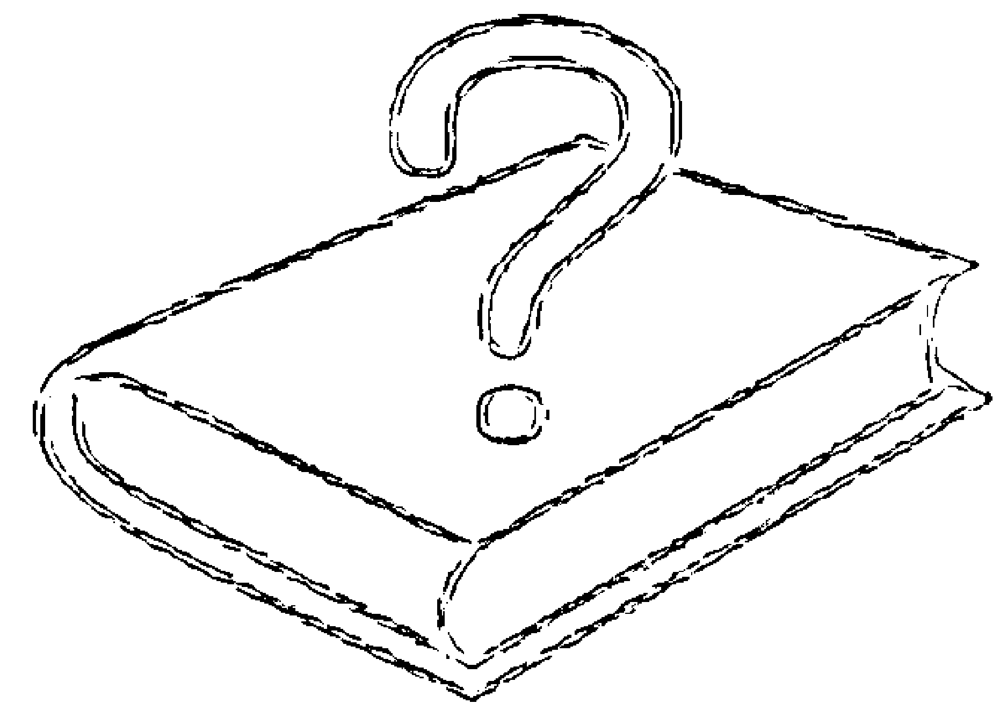

### 住屋對我們有什麼用處呢？
我們的住屋不只能為我們擋風遮雨、防寒避暑、
隔絕髒汗或其他等等。首先，住屋和它的顏色會影
響居住者的心理。正如〈6 我的住屋可以為我帶來什
麼？〉裡詳細說明的那樣，住屋能增進我們的智慧，
增強我們的記憶力，讓我們快樂、健康、生氣勃勃，
還可以減壓。它幫助我們睡得更香甜，保持年輕。
它會在我們想減肥、戒菸、戒酒或戒毒的時候，支
持我們。它帶我們去認識自己和伴侶，對世界和其
他人敞開心胸。它的貢獻是讓我們找到愛、保存愛、
養育小孩，讓家人之間的關係更緊密。同性伴侶可以
透過住屋將配偶關係具體化。普世認為「住屋」具有
療癒作用，它強化我們的自尊，幫助我們對抗憂鬱，
在我們因為生活、喪親、分手、失業或失敗受到創傷
時，還可以修復我們。若沒有住屋卻要承擔這一切，
我們會過於勞神費心，無暇他顧了！

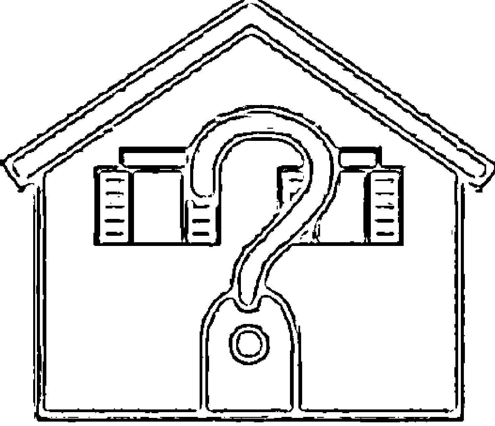

## 要如何利用住屋帶給我們的好處呢？
要利用住屋帶給我們的好處，就必須認識自己的住屋！只有在我們為住屋刻上自己的印記，展現我們的偏好與世界觀時，它才能擔任這些角色。我們像寄居蟹那樣回到住屋中，必須在裡頭放進我們的標記，才會意識到這是我們的家。如果住屋給我們歸屬感，代表它很像我們（許多人收拾住屋，是為了整頓自己的內心）。光是花時間待在臥室、廚房、客廳、浴室是不夠的，我們必須投資這些空間，利用相片刻下我們的印記，而在工作的時候，我們可以把相片放在辦公桌上。

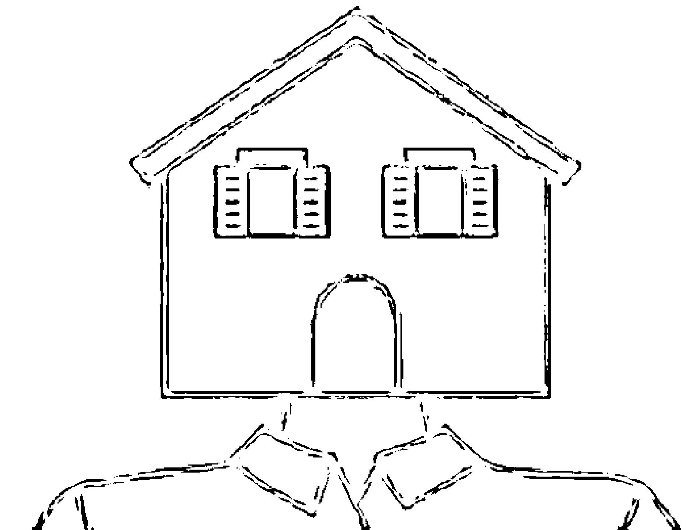

## 要如何在住屋中刻下我們的印記呢？
誰不曾夢想過要從心所欲，使用自己喜歡的建材，按照自己的心意安排空間及座向，蓋一棟自己的房子？因此，獨一無二的住屋理應符合每一個家庭才對。然而，我們居住的大多數房屋，都早在我們搬進之前就已經為其他人存在了。事實上，室內布置是設計師和居住者唯一能自由發揮的領域，不必因為建築規章、工匠技術，當然還有花費，而綁手綁腳。我們可以選擇並且擺設家具、個人用品，但只有我們在牆上刻下印記之後，才算真正安頓下來。用油漆、壁紙或壁布（素面或有花紋）為牆壁增彩添色，簡單又實惠，還是一整座屋子裡最有衝擊力的元素。城堡裡每個空間的名字，都是由它的顏色來命名，別忘了白宮！就算不會馬上動工，光是全家人聚集起來為每個空間挑選顏色，整個家就會在你的心中，然後你會開始全心過生活！

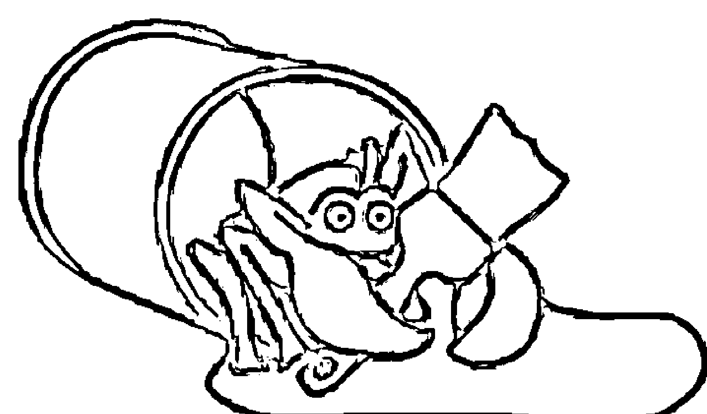

## 我的住屋要使用哪些顏色呢？
我們通常會依照每個空間的療癒特質去建議用色，譬如說，淡綠色的臥室可以讓人平心靜氣、橘色的餐室可以讓人胃口大开……到头来，每个人的家都一模一样。為住屋增色只是 1920 年代發明的「住宅機器」（machine à habiter）* 的一個額外步驟而已。然而，若住屋能反映居住者的個性，就能在庇護及重整居住者的思維方面，擔任要角。本書透過色彩來表達居住者的性格，讓住屋能夠成為他們自己的象徵。這可以幫助我們在搬家的時候找到依據，或許還能跨過難關。而且，正因住屋讓我們有熟識感，我們才會覺得它漂亮（請參照〈6 我的住屋可以為我帶來什麼？〉）。

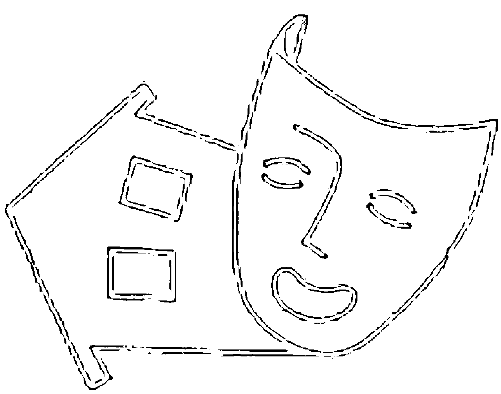

> * 來自柯比意 (Le Corbusier, 1887-1965) 的一種建築概念，他認為住屋要像一輛汽車或船艙，重點是實用性。

## 如何定義我們的性格呢？
本書使用黃道十二星座來談論家庭成員的性格。但星座代表得了我們的性格嗎？

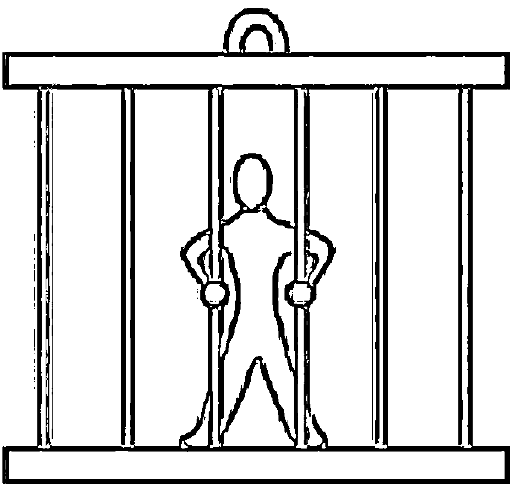

其實，它並不會比性格分類法好或差。性格分類法讓我們有意識的回答一些問題，彷彿我們的無意識不存在（參見 p.228）。這些指標很可能讓我們一輩子都受制於其結果，但其实它頂多只能代表我們回答問題時在想什麼而已。由於星座並不是受到科學認可的分類型，我們可以自由演變，也就可以輕易擺脫它們：只是占星學而已嘛！

占星學還有另一個優點：它並不會將我們歸類在單一框架中，我們不是只有一種性格，而由對應不同行星的多個星座組成。正好吻合我們這種自覺獨一無二，又會根據情況不同而有多重面貌的感受。

## 我不相信占星學，也用得上這本書嗎？
無論相不相信占星學，色彩對心理的影響都無可否認。你可以直接翻至〈8 色彩特質索引〉，找出符合你性格的色彩。〈5 玩玩你的色彩！〉是相當引人入勝，很有創意的一章，會教你如何和諧配色，並依照色彩的效果來配置。〈2 選擇住屋的空間〉裡的各種居家空間介紹，還有〈6 我的住屋可以為我帶來什麼？〉，都能讓你從建築、歷史、社會學和心理學方面，看看當下有關住宅的知識。

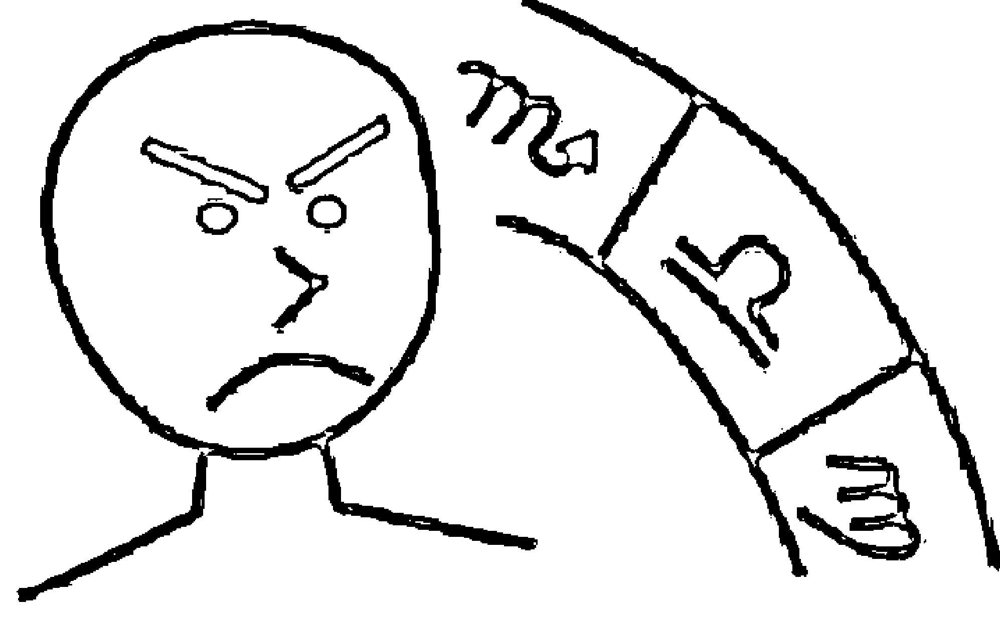

## 本書跟風水有關嗎？
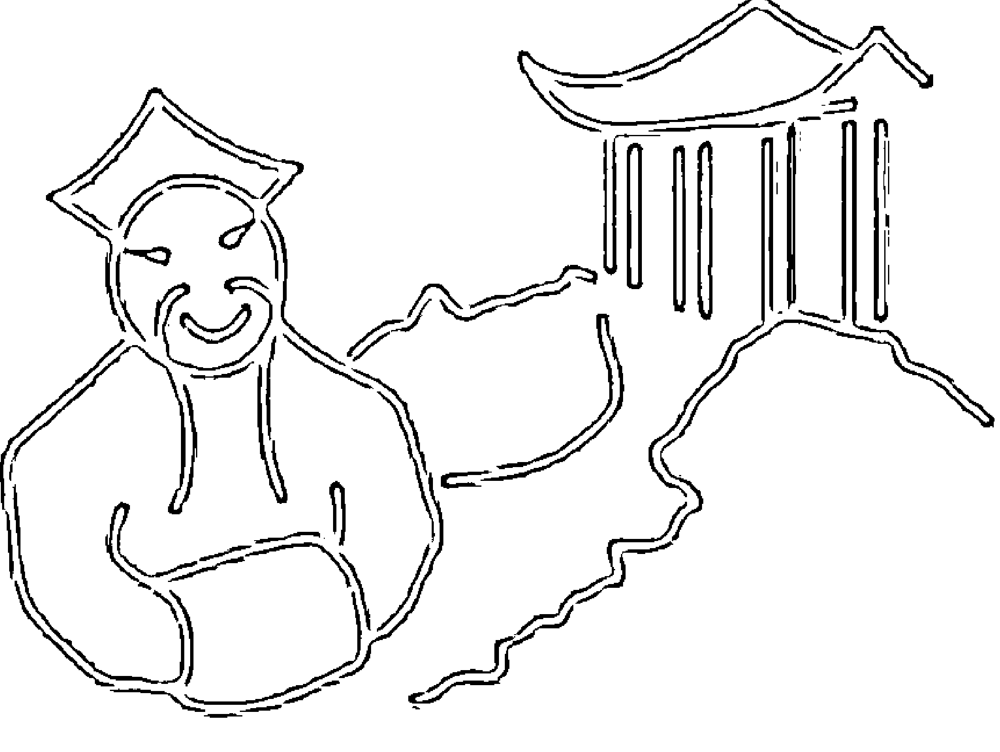

風水是源自中國的一種方術，讓我們重新布置住屋或辦公室，以便使所謂「氣」的宇宙能量能夠順暢流通，同時避開可能來自外在的威脅。風水在亞洲的風行程度，就跟西方的占星學一樣。風水可以應用在任何一種住宅中，而且絕不會與本書有所衝突。風水使住屋的每個部分呼應居住者的日常生活領域，並且主張居住者若按照某種方式擺設房間，就可以改變人生。我們同樣也可以使用色彩為人生帶來改變，刺激我們的生產力、性欲，或是其他活動領域（請見〈6 我的住屋可以為我帶來什麼？〉），我們也可以職場中運用色彩。如果說參考風水這本書來布置住屋，可以讓居住者舒適自在，那麼根據性格為住屋選擇色彩所帶來的影響，則完全是心理上的。

## 我需要瞭解占星學嗎？

你不需要特別具備占星學的知識。我不會在這裡向你娓娓道來占星學的來龍去脈。你只需知道自己的出生日期，就算你不曉得出生的時間也沒關係。我們在本書裡只會用到占星學最簡單的部分：行星和黃道十二宮。你們會在書末找到幾個補充解釋（參見p.228）。

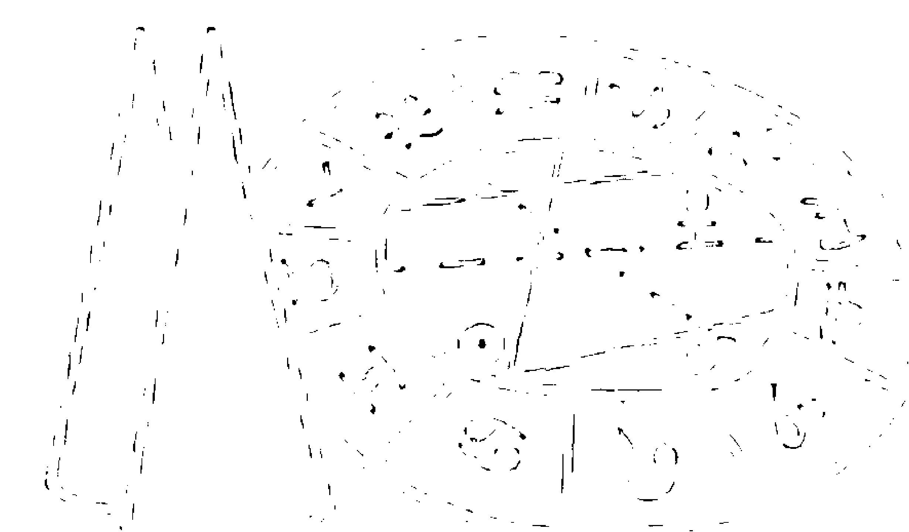

## 占星學準不準呢？

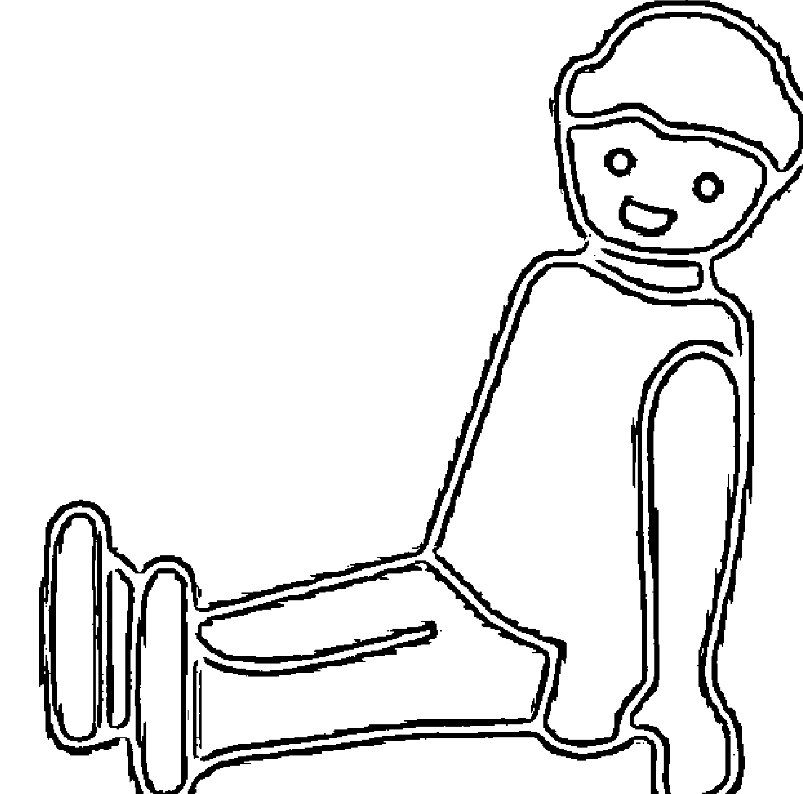

本書中的色彩都是根據占星學來分類。如果你在對應行星的該星座色彩選擇中，認出自己最喜歡的顏色（或者，你不喜歡我們提出的「不建議的用色」，就更有說服力了），那就是準的，反之就是不準，就這樣！準不準確並非本書的重點。本書的目的是要提供你一個基準點，讓你能夠在為住屋挑選顏色的時候做出決定（你無需面對作家口中的「白紙症候群」），家庭成員還能一起討論。每個人將心思投入在裝飾住屋上，就能理解到對方也需要空間，因此成全所願。總而言之，本書中的占星學或許可以被視為讓家庭成員互動的協調方法，好比孩子玩的塑膠人偶，還有在心理醫師面前表達自我。此外，如果你覺得我們建議的顏色反映出你的性格，那麼這個房間會給你歸屬感。千萬別讓一棵樹遮住了整座森林！

## 2010 | 10.1007/s10668-010-9230-2 | 3551

| Scenario | Cement production (kg/CO2) | Crude oil production (kg/CO2) | Electricity generation (kg/CO2) |
| :--- | :--- | :--- | :--- |
| 3560 | 0.79 | 0.03 | 0.93 |
| 3565 | 0.89 | 0.12 | 0.74 |
| 3570 | 0.79 | 0.02 | 0.68 |

Table 1 Carbon emission factors from fossil fuel combustion (IEA 2012)

CCS is a three-step process in which CO2 is first separated and compressed, then transported (usually by pipeline), and ultimately injected into a geological formation.

## 住屋、十二星座與色彩

## 十二星座的居家色彩

住屋是我們生活的地方。但因為某些活動並不會和其他活動或家庭成員一起進行，我們便把住屋分隔成不同的空間。


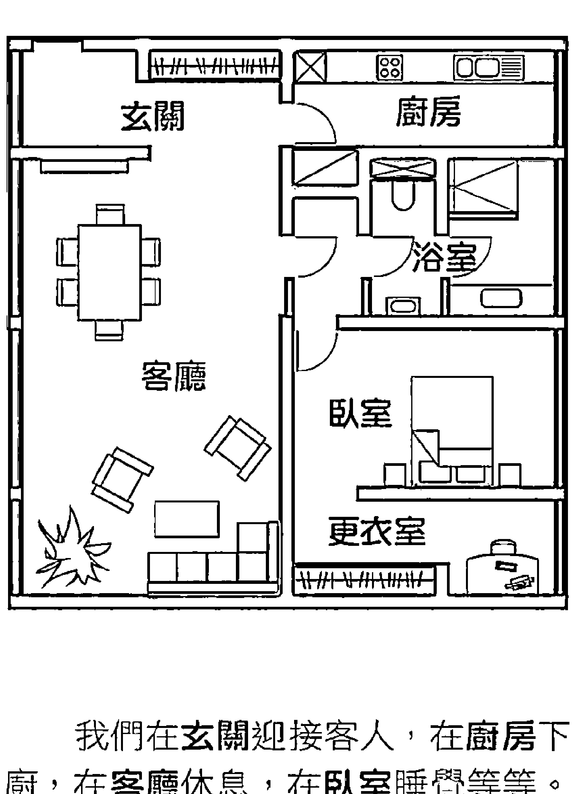

我們在玄關迎接客人，在廚房下廚，在客廳休息，在臥室睡覺等等。這些活動使得這些空間的功能彼此相異。

占星學利用出生當日天空中的行星位置，來描述一個人的性格（為了簡單起見，我們把太陽、月亮和冥王星也包括進去）。因為行星會移動，與相互固定的恆星不同，在占星學中，行星便代表「行動」。各個行星在一個人出生時的位置，讓我們可以知道這個人如何行動。

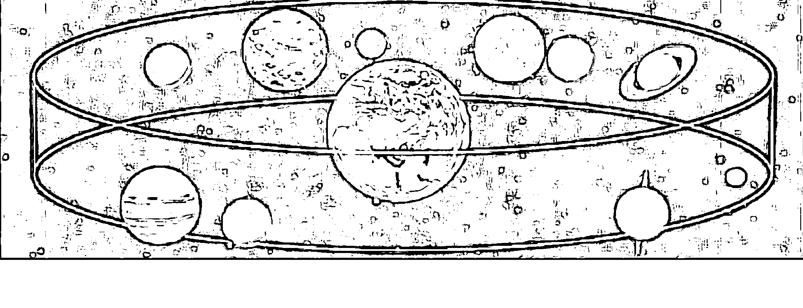

如同時鐘的指針標示著時和分，每顆行星都是一根指針，代表不同的行動方式：

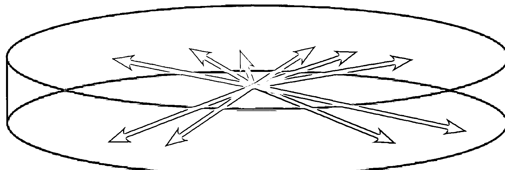

太陽代表我們的社會行為；月亮代表我們如何呵護及照顧他人；水星代表我們如何溝通；金星代表我們如何樂在其中；火星代表我們如何行動；木星代表我們如何領導；土星代表我們如何思考；天王星代表我們的創造力；海王星代表我們如何感受；冥王星代表我們如何反省自己。

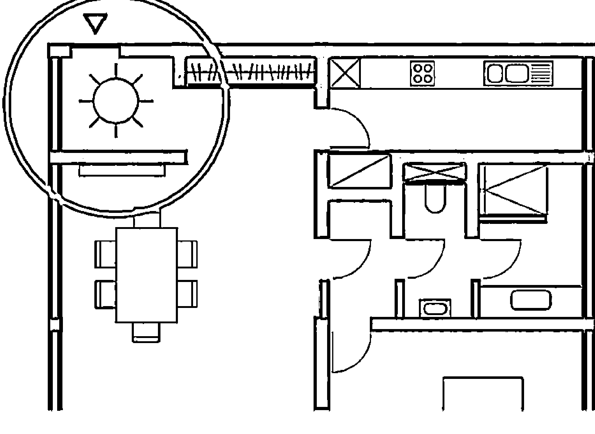

## 宮廷裡的七曜廳

就像佛羅倫斯的彼提宮(Palazzo Pitti)有「七曜廳」，凡爾賽宮也有「七曜宮」。

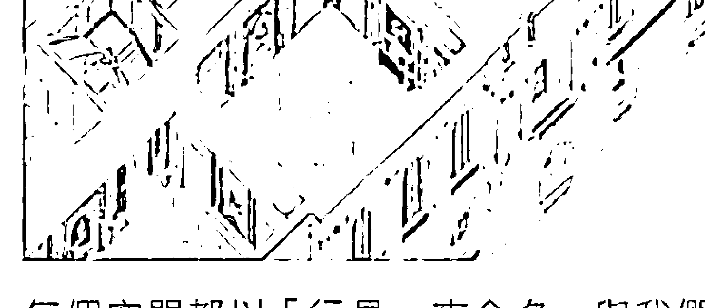

我們可以在把各個空間從事的活動，與各行星所代表的行動進行對照。
例如：玄關是我們與陌生人見面，以及準備出門的場所，而太陽代表我們的社會行為，因此對應玄關的行星就是太陽。

每個空間都以「行星」來命名，與我們在裡面從事的活動相呼應。阿波羅廳(Apollon/太陽)用來奏事議政。在黛安娜廳(Diane/月亮)，我們可以欣賞到撞球比賽。墨丘利廳(Mercure/水星)是遊戲室。維納斯廳(Vénus/金星)連接國王與情婦的寢宮。瑪爾斯廳(Mars/火星)充當衛兵廳與宴會廳。現為戰爭的朱比特廳(Jupiter/木星)是國王主持國事內閣之處。已經被拆掉的薩圖恩廳(Saturne/土星)則曾經是私人辦公室。

我們之所以知道時間，並非因為時鐘上的指針，而是鐘面上的十二個數字。按照這個邏輯，行星就如同指針，指向黃道上的十二星座。


我們都有同樣的十顆行星，但是在每個人的生日那天，這些行星並不會位在同樣的星座上。因此，我們才會性格迥異、獨一無二。我們跟鄰居的所作所為都不同，家裡的房間擺設也都跟他們不一樣。

每個空間都有對應的行星，因此也有對應的各個星座。我們知道玄關與太陽對應。


## 你的黃道星座

想像外太空有一面電影銀幕包圍著地球。我們將它分割成十二個大小相等的視窗，就像日晷那樣。這個日晷就是黃道帶，每個視窗都以我們看到的星圖來命名，此即星座。同時，我們也從地球觀賞到黃道帶上的行星。

例一：麥可出生當天，太陽位在水瓶座。因此，麥可家的玄關可對應水瓶座。


例二：雷歐出生當天，太陽位在獅子座。因此，雷歐家的玄關可對應獅子座。


你的黃道星座就是在你出生當天太陽所在的星座。太陽儘管是最重要的行星*，但是你不該忘了自己還擁有其他最多達九種的星座，因為其他九顆行星都對應著某個星座！

*太陽是恆星，但是在以地球為中心的西洋占星學中，太陽被視為行星。

占星學將每個黃道星座與一些特質連結起來。另一方面，我們也能從心理學的角度來說明色彩的特質，因此每種顏色都可以對應一個有同樣特質的星座。

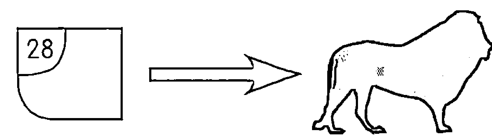

本書已經定義了 77 種顏色（為了簡化起見，我們也把白色、灰色、黑色稱為「色彩」）的心理特質。接著，每種顏色又依據每個星座的特質來分類：每個星座都有許多相契合的顏色，還有比較不適合的顏色。

#### 色彩的特質

色彩療法利用色彩對心理的效用來進行治療。色彩的象徵性儘管流傳已久，卻還沒有任何一本著作探討過色彩經常在演進。色彩特質的現有定義已經受到深究，並精確定為十個形容詞，足以讓人瞭解非常不同或非常近似的色彩之間的交互作用及對比。每一種色彩都透過問卷調查（「哪一種顏色最樂觀、最平靜」等等），和其他 76 種顏色比較過，讓我們得以建立《8 色彩特質索引》中的定義。

你可以為每個空間選擇符合你性格的顏色。

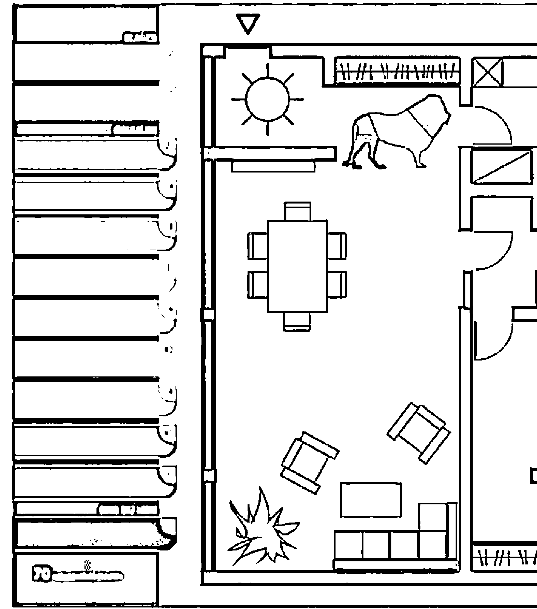
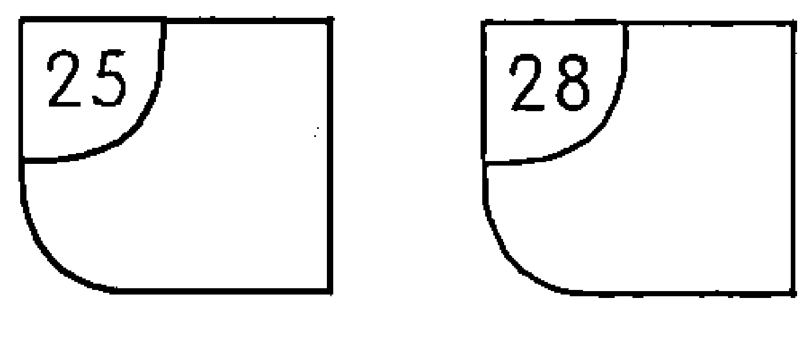

一項針對九種色彩進行的測試，顯示了一群性別、年齡、居住地點、社會階級及教育程度不一的西方人，大多數都會選擇同樣的定義。他們的選擇都符合每個顏色在色彩特質索引裡的定義。你可以在 www.astrocolors.com 上找到這項測試。

使用每個空間所對應的黃道星座所適合的顏色，並且避開不建議使用的顏色來裝飾空間，你就會認同這個空間。你一定會跟很多人一樣，在我們為你選擇的色彩中，找到你已經憑直覺採用過的顏色。

## 本書中的色彩

#### 注意！

你必須在白天的光線下看本書的色彩，但不要在陽光直射之下。燈光會造成色差。如果你在夜間閱讀本書，請記得你只能在白天的光線下判斷這些顏色。如果你在夜間選擇顏色，隔天一早可能會發現結果大出你的意料之外！

#### 列印書中的色彩


48

在印刷時，會將黑色、青色（cyan）、洋紅色（magenta）及黃色的小點混合疊加，重現出每一種顏色，有可能會跟我們想要的顏色相差甚遠。本書的色階全是以印刷為目的而特別精心製作的。

#### 色階

顏色有數百萬種，但是我們可以適當設限，大幅縮減色彩的種類。基礎色有：

- 原色：黃、紅、藍
- 二次色（由兩種原色混合而成的顏色）：橘色、紫羅蘭色、綠色
- 三次色（由原色與二次色混合而成的顏色）：金黃色、朱紅色、紫色、靛色、綠松色（turquoise）、黃綠色。

48


在基礎色之外還有一些漸層色（nuance）。其來源可以上溯至人工色素發明之前，古人製作這些顏色的方法。例如，布匹的紅色染料是從小昆蟲（胭脂蟲或介殼蟲）、軟體動物（骨螺）、花草（染色茜草或是巴西紅木〔bois-brésil〕；巴西即因盛產巴西紅木而得名）上取得。繪畫使用的紅色則來自硃砂（汞）、鉛丹、焚燒過的黃色赭石等。


這些過程產製出不同的紅色，並成為文化的一部分。

18 十二星座居家配色寶典

這些「純」色全都可以混合白色、黑色及灰色，如此一來，便擴大了色階。

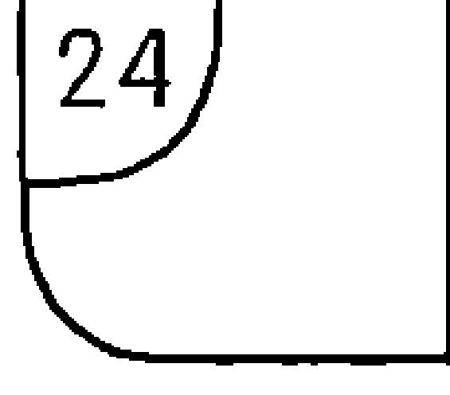
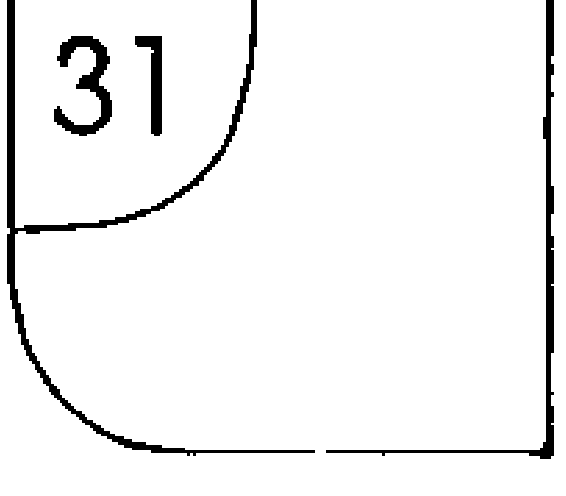
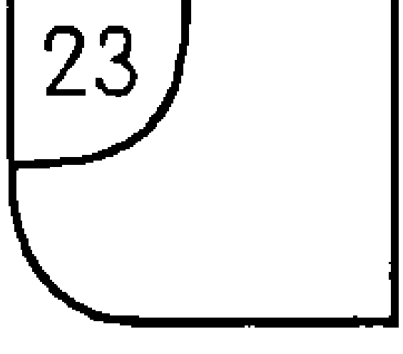
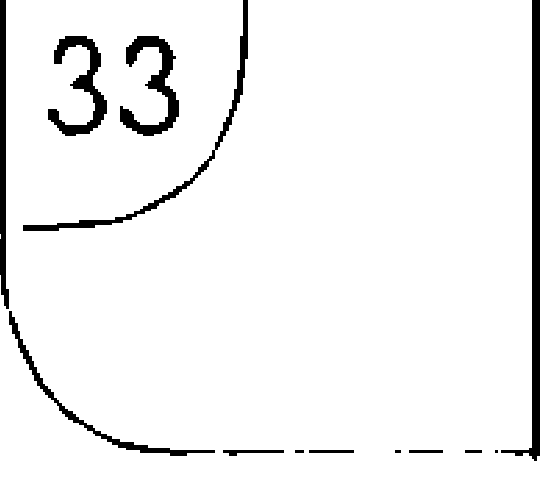

如果在「純色」中加入幾滴它沒有的原色，可以讓「純色」變化成更多種類。例如，這兩種綠色其實是一樣的綠色，只是另一種綠色中摻了一點紅色。

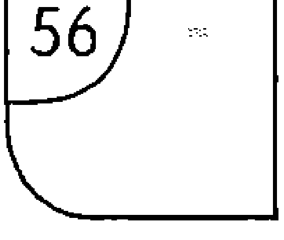
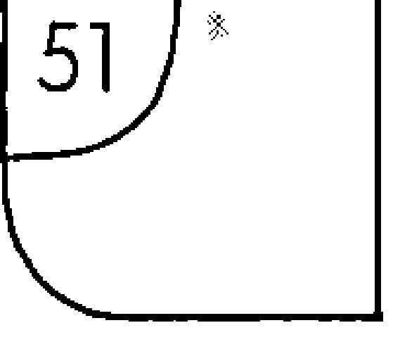

在上述兩種綠色之外，我們還可以加上幾種不常見的綠色，它們摻混了三種原色，還有白、黑或灰，如此一來，我們的調色盤越來越令人滿意了。

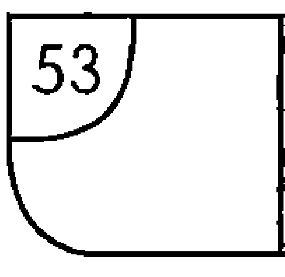
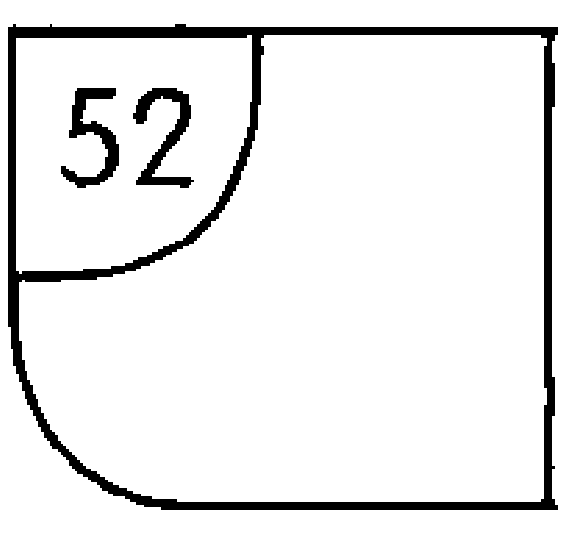
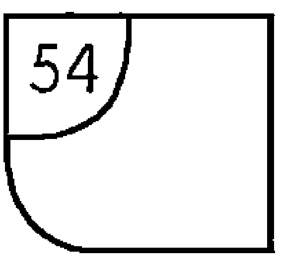

最後我們得到了這 77 種色彩。雖然這個數量純屬巧合，不過第 77 號元素原子是銥（iridium），來自拉丁文的 iris，就是「彩虹」的意思！如果你在找一種本書中沒有的顏色，可將它跟本書的一種或多種顏色互相對照，並看看我們建議給你的是哪些顏色，應該能給你一個非常近似的替代顏色。

#### 色彩的名稱是怎麼來的？

每種顏色的名稱仍然接近它們的傳統名稱（如果有的話）。顏色的名稱固然詩意畫意，卻會擾亂我們對顏色的感受，不過比起數字，名稱還是好記多了。如果你買的油漆和本書中的顏色名稱相同，要注意讓油漆在乾了之後也有差不多的色調。

#### 色彩的意義

如果我們不去看，就不會有色彩，它充其量只是可測量的光線罷了。色彩取決於觀者。要分辨一種顏色，是記住它的其中一項特徵，而不是其他特徵，這樣我們的大腦就能幫它在象徵世界裡找個位置。因此，色彩是一種文化現象。根據文明與時代的不同，同樣的光線能被解讀成多種顏色。偏好明亮的古羅馬人將紫羅蘭色稱為「次黑色」（sous-noir），紅色等同於綠色，而藍色甚至沒有名稱。某些非洲文明將紅色、褐色、黃色甚至綠色歸於一類。他們比較感興趣的是這些色彩的軟硬、光滑或粗糙、悶或響、快樂或哀傷，最重要的是乾或濕。在日本，關鍵是這個顏色有沒有光澤。各種白色有特定的名稱，外國人很難分辨出來。而西方文明只記得色彩的不同色調。因為這個色調跟我們象徵世界裡某一元素的色調一樣，大腦就會將其中一個的特質疊在另一個上面。也許血液的勃勃生機可以疊在紅色上，天空的超逸可以疊到藍色上，土地的實在感可以疊到棕色上，而草木的恬靜可以疊到綠色上。我們依據自己的文化環境和個人經驗，將每一組顏色與〈8 色彩特質索引〉中的詳盡描述連結起來。這些色彩間相互比較的定義，都經過測試驗收過了，較傾向於西方及我們所處的年代，因為每種顏色所代表的內涵都會不斷演進改變。此外，這些定義尚不齊全，因為它們也是一種藝術創造。

#### 白色與非純白色*

1
2
3
4
5
6
7
8
9

白色是明度最高的顏色。它代表純潔，但也代表著不願投入生活、等待、猶豫不決等。當你在猶豫時，等於選擇白色。本書中呈現的非純白色都比它實際的顏色還要鮮亮，否則難以分辨。

#### 粉彩色

10
11
12
13
14
15
16
17
18
19
20

粉彩色代表著純真，純色及其粉彩色之間的反差越大，該粉彩色便越顯純真，因此，粉紫羅蘭色比粉黃色更純真。若家中粉彩色居多，表示屋主是個歷盡滄桑的人。

#### 紫色

21
22
23

紫色介於紅色與紫羅蘭色之間。它代表行動與物質性。這種代表權力的顏色，原本是古羅馬皇帝專用，到了文藝復興時代則專屬英國國王。

#### 紅色

26
28
25
27
24

紅色是生機、能量、行動及男性化的那一面。洋紅色亦然，只是少了烈性。

#### 粉紅色

31
32
30
33
29

粉紅色是紅色和紫色摻雜了白色或灰色的結果，削減了能量。粉紅色顯示一個人敏感纖細。

#### 橘色

36
34
37
35

橘色介於紅色與黃色之間。橘色只要一加深，很快就會變成褐色。橘色最能表達樂觀精神與生活之樂。

#### 褐色

40
38
42
39
41

褐色是以藍色、黑色或灰色加深過的橘色。褐色可以令人聯想到物質、真實、沉重。

*非純白色：指所有摻了其他顏色的白色，如米白、藍白、灰白色等。

#### 黃色

黃色是一種脆弱的顏色。如果我們用黑色或紫羅蘭色加深它，會變成帶綠色的色系。唯一的辦法是混合紅色，讓黃色變成橘色。而添加的這一點紅色，讓我們能夠用藍色或黑色繼續加深它。黃色的淺色調令人聯想到亮光移動的光線，且黃色事實上是一種具有多變特質及青春洋溢特性的顏色，但是少了一點純真。

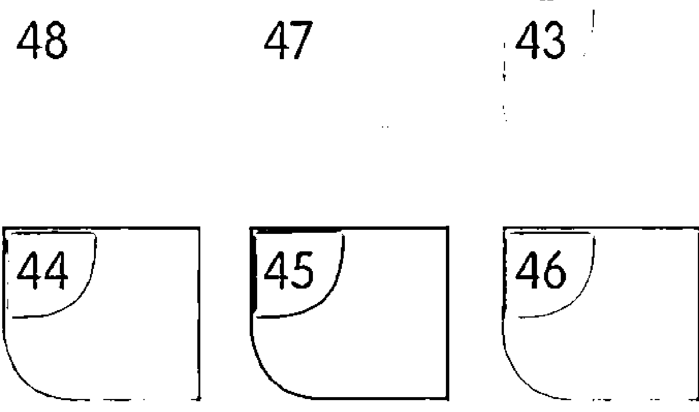

#### 綠色

綠色介於黃色和藍色之間。用紅色加深後的綠色頗接近褐色。綠色既能提振精神，又能撫慰人心。綠色代表均衡的生活。

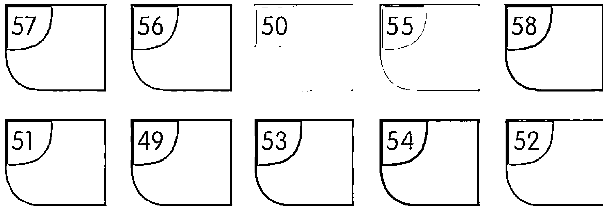

#### 綠松色

綠松色介於藍色與綠色之間。這是一種代表理想化的物質世界的顏色。

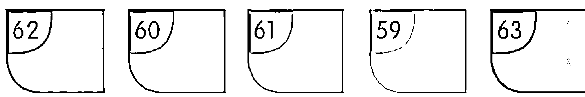

#### 藍色

在印刷上，要重現畫家的藍色不是一件容易的事，因為印刷時使用的青色摻有一絲黃色。群青色*的名稱來自青金石(lapis lazuli)，這是歐洲畫家從東方（即「海外」）引進的。藍色代表精神生活及絕對的觀念。淺藍色朝向理想主義，深藍色則偏向一貫性。

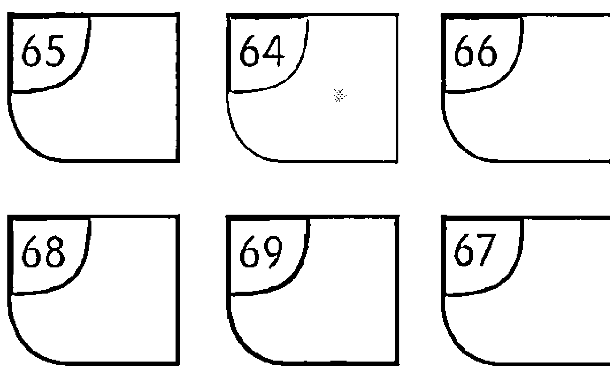

#### 紫羅蘭色

因為紫羅蘭色過亮，少有人會選擇純紫羅蘭色。紫羅蘭色傳達出吸引力和力量。淺紫羅蘭色有另一個意義：它表示和傷人的現實保持距離。

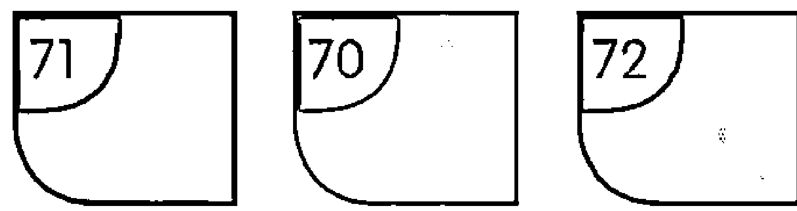

#### 灰色與黑色

灰色將白色與黑色分隔開來。這是一個垂直的形而上空間，反之，色彩就如同水平的塵世。淺灰色缺乏個人性，深灰色代表謙虛但悲傷。

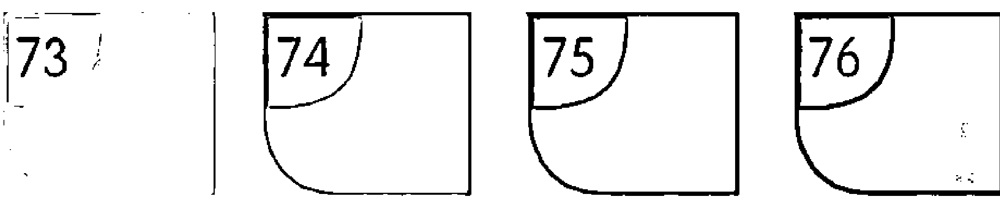

黑色是一種存在卻又空洞的顏色。弔喪的時候，黑色將我們置於世界之外。它吸收色彩，再熄滅色彩，傳達出一種搶眼的沉重。

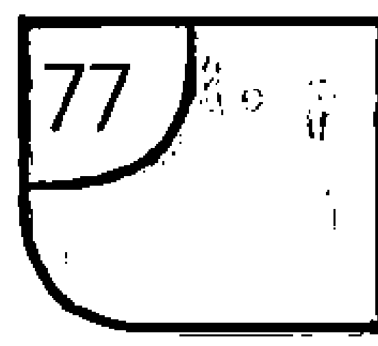

*群青色(ultramarine)的字面意思是「來自海外的藍色」。

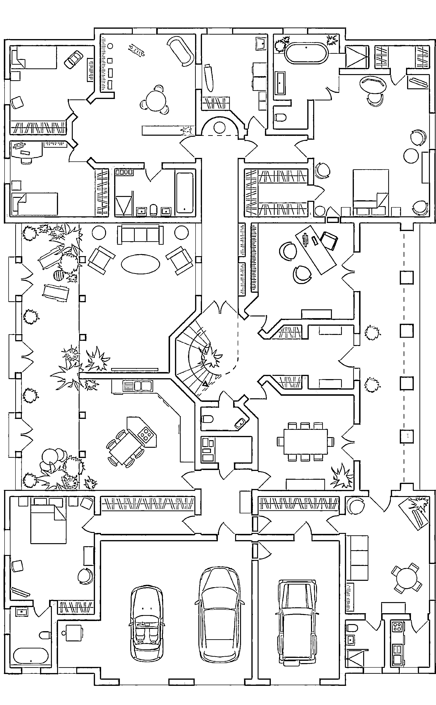

## 選擇住屋的空間

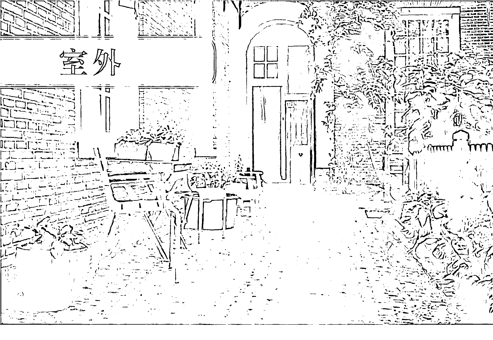

### 室外

指住屋外面，從街上便可見到的空間。對外人及家庭成員來說，這會是你們一家人的象徵。後院請參考客廳（p.38）。

色彩可以應用在外牆、護窗板、門窗、柵欄與欄杆、外面樓梯的踏面與踢面、信箱、落地燈、花圃、花面等等。大自然物質（包括草木的綠色）及紀念品（它們對你的意義更為重要）的顏色，並不包含在內。

### 如果你獨居

在第202頁的行星位置表找到太陽在你出生當天位在哪個星座。接著從第64至87頁，看看適合你的顏色有哪些。如欲更詳細的選擇，請翻至第92頁。

### 如果你與多人同住

盡情在第92頁挑選你的專屬色彩吧！

請參閱第152頁的「做出你的決定」單元，可幫助你做出選擇。

#### 室外代表融入社會

#### 你希望將什麼樣的形象呈現在外面？

從街上便可看到的住屋外觀，就像是你面對人群的臉孔。好比兒童畫筆下的房子，嘴巴是大門，眼睛是窗戶，頭髮是屋頂，煙囪中冒出的炊煙讓房子更加生動。你如何布置住屋周圍及牆面，顯現出你想要把什麼樣的生活、幸福夢想、社會地位（或是你希望的社會地位），以及如何融入社會呈現出來。你的家也許是這棟隱蔽的屋子，藏在濃密的植物後面，把自己緊緊包起來，避人眼目；或是那幢立有石柱的房子，表現出一種高社經地位的自命不凡；又或是這座務求從眾隨俗，與其他房屋融為一體的房屋；也可能是那棟被草坪包圍，直接面向街道的屋子，透過大型落地窗向外開放的透明性，給人一種坦蕩蕩的錯覺，以便更能隱藏你對私密感的需要（衛生設備、收納等等）；又或是這幢房屋，從街上就可以看見小小的菜園、孩子的鞦韆，還有庭院裡的小矮人，清清楚楚展現出你對幸福的某種想法。來的部分，窗戶看起來很好客的樣子，每一扇老虎窗令人想起每一個孩子，而那些縮在後方的小屋，都是想像中的叔伯姑姨，正在保護著我們。每當我們靠近自己的住屋，就會有這樣的感受：住屋是我們全家人共同的皮膚。

#### 住屋，是你們一家人的象徵

你如何看待全家人，在住屋的室外也指出了一些跡象。這些跡象既是給外人、家庭成員，也是給你自己的！我們的確將建築物稱為「體」，對吧？所以你的住屋會是一棟一體成型的房屋，家庭成員全都消失在這具「軀體」裡嗎？還是一棟凹凸有致，屋頂有各種形狀的房子，就好比家中每個成員都上來表演，述說著像睡美人的城堡那樣的故事呢？這種房子也像一幀全家福，爸爸是中間那棟屋子，媽媽是凸出的部分，窗戶看起來很好客的樣子，每一扇老虎窗令人想起每一個孩子，而那些縮在後方的小屋，都是想像中的叔伯姑姨，正在保護著我們。每當我們靠近自己的住屋，就會有這樣的感受：住屋是我們全家人共同的皮膚。

#### 男人與女人相會之處

另一方面，你知道孩子晚上作夢時，小女孩多數時候都會夢到家裡的各個房間，而小男孩的夢中場景則是在戶外的田野、森林或山裡嗎？從這個角度看，住屋的室外是家中男女的想像相會之處：在這個男女平等的地方，女性可以逃避家庭的象徵包袱，男性可以逃避工作的象徵包袱。如果外牆代表男性，如果陽臺和門窗洞代表女性，彼此在前門相會，前門既是牆又是門窗洞，這種矛盾的交合預告了另一個世界的誕生：室內。

| 對應室外的行星 |
| :--- |
| **太陽** |
| 招待朋友—角色扮演 |
| 布置—裝飾—照亮—交談 |
| 接待眾人—收集 |
| 展示—拍照 |
| **月亮** |
| 迎接—招待朋友 |
| 保護—呵護照顧—交談 |
| 諮詢—歡笑—展示—作夢 |
| 清洗—澆水 |
| 教導孩子 |
| **水星** |
| 往來—探問—交談 |
| 接待眾人—歡笑—討論 |
| 諮詢—做手工藝 |
| 招待朋友—停車 |

### 玄關

這是一個空間或角落，面積大小不拘。你和客人就是從這個地方出入。如果你是從走廊或樓梯間進門，就用玄關的顏色來裝飾走廊或樓梯間。

色彩可以應用在地板、天花板、牆壁、踢腳板、門、壁櫥門、暖氣、地毯、窗簾、家具、燈具、用品、畫作及其主題色彩、框（請牢記鏡子上的鍍銀會受到鏡框顏色的影響）上面。大自然物質及紀念品（它們對你的意義更為重要）的顏色，並不包含在內。

### 如果你獨居

盡情在第94頁挑選你的專屬色彩吧！

請參閱第152頁的「做出你的決定」單元，可幫助你做出選擇。

### 如果你與多人同住

## 十二星座居家配色寶典

在第202頁的行星位置表找到太陽在你出生當日位在哪個星座。接著從第64至87頁，看看適合你的顏色有哪些。如欲更詳細的選擇，請翻至第94頁。

#### 玄關為住屋定調

#### 保護

玄關絕無僅有。你可以從車庫、後門、廚房、客廳陽臺進入你的家，但是你只會讓客人從玄關進入。那麼玄關的關鍵何在？如果住屋是一個避難所，可以保護我們的安全，讓我們在到外面世界之前重獲新生，那麼就必須嚴守這個避難所，而玄關正扮演了這個角色！你知道中世紀的城堡和要塞城市裡，玄關是建築最漂亮的部分之一嗎？中世紀之後，宮殿和城裡的玄關變成了凱旋門。

#### 魔法

讓我們稍微聊一下這些凱旋門：古羅馬的軍隊在上戰場之前，祭司會對軍隊施法，祈求戰神鼓動他們。戰後，這些被戰神附身的士兵若沒有從這股毀滅力量中解脱的話，不能回到羅馬。因此，羅馬人讓軍隊從凱旋門下魚貫而過，這座魔法之門讓他們能夠卸除這股能量。住屋的關鍵也是如此：住屋能保護我們不受外來危險的傷害，前門就是這個屏障的象徵，但是，若讓外人穿過前門，也可能引狼入室……

當外人穿越前門後，玄關的目的將是繼續保護住屋。大部分的人，如送貨員、郵差、推銷員等，並不會到屋裡的其他地方。我們絲毫不必向這些人揭露我們的隱私，因此玄關掩藏了其他空間，或許還能將視線轉移到外頭的景觀。另外，既然這位陌生人可能是危險人物，那麼我們就要試著威嚇或哄服他，讓他打消歹念。

#### 玄關能威嚇或哄服外人

威嚇他？如果家裡有個地方能讓你搭景演出，非玄關莫屬了：尊貴的建材，寬廣的空間，鏡子和鋪張矯飾的樓梯，暗示著你的社會地位崇高。這有沒有稍微讓你想起城堡的玄關大廳、大企業的總部，還有某些公寓大樓呢？大體上，這就好比「好，你進來了，但這裡是我的天地，有我的規矩，你得照著辦。」哄服他？想想那些熱情好客的小巧玄關，不只插著花，還有屋主一家人的相片，像是在說「人人都愛我」，還有「小心，我不是一個人喔……」。當你似乎自信滿滿，好心好意的前來應門，上門拜訪的人怎麼還能對你抱有不良的意圖呢？

玄關是你一家人的隱私和外界之間的閥門。你就是在那裡戴上社交生活的面具（所以出門前記得往鏡子看一眼吧！），也是在那裡脱下外套（和武器……），一旦穿越前門，你就能重拾家所帶來的輕鬆祥和的感覺。

| 對應室外的行星 |
|---|
| **太陽**<br>接待眾人—交談<br>招待朋友—角色扮演<br>穿衣—梳頭—化妝<br>照鏡子<br>展示—照亮 |
| **木星**<br>交談—開玩笑—諮詢—迷惑<br>打電話—迎接—展示<br>角色扮演—接待眾人 |
| **月亮**<br>招待朋友—交談—歡笑<br>諮詢—寫字—收集<br>展示—照顧孩子<br>照鏡子<br>保護—穿衣 |

### 樓梯間

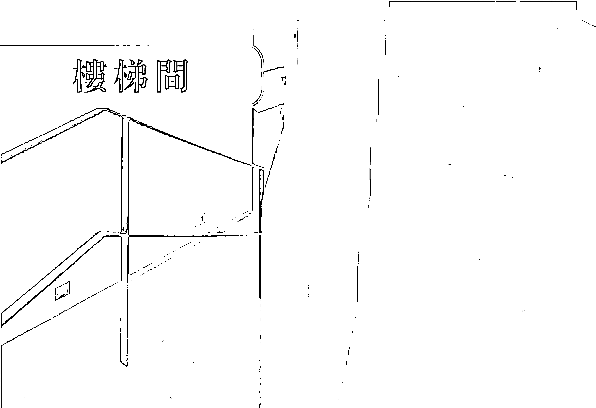

如果樓梯位在一個特定空間（如玄關、客廳等）裡，那麼樓梯間的用色必須配合該空間。反之，若樓梯位在走廊上，則是走廊要採用樓梯間的色彩。

色彩可以應用在樓梯（手扶欄杆、踏面和踢面）、地板、天花板、牆壁、踢腳板、門、壁櫥門、暖氣、地毯、窗簾、家具、燈具、用品、畫作及其主題色彩、框（注意，鏡子上的鍍銀會受到鏡框顏色的影響）。大自然物質及紀念品（它們對你的意義更為重要）的顏色並不包含在內。


### 如果你獨居

在第 222 頁的行星位置表找到木星在你出生當日位在哪個星座。接著從第 64 至 87 頁，看看適合你的顏色有哪些。如欲更詳細的選擇，請翻至第 96 頁。


### 如果你與多人同住

盡情在第 96 頁挑選你的專屬色彩吧！

> 請參閱第 152 頁的「做出你的決定」單元，可幫助你做出選擇。

#### 樓梯間及掌控無限

#### 一個擺門面的地方

樓梯基本上是個外界的場所，有一點像是社交性表演的舞臺。當一國元首在接待外使時，禮賓司在哪裡等候？樓梯上！在法國，確切說來是在樓梯的第四階。為什麼樓梯扮演著這種角色？或許是因為昔日手握權力的人是國王、主教或大臣。由於國王與主教是上帝的代表，要覲見他們理所當然必須「往天上」走（宮殿的顯著特徵就是陽臺）。我們還可以在公司領導階級專用的電梯及空中別墅的電梯中，看到樓梯的這個面向。因此，在我們企圖盡可能使訪客懾服的玄關裡，樓梯是第一主角。

#### 朝向無限與天外

樓梯還扮演著另一個角色。你知道我們的人生位在兩個令人憂懼的大哉問，「我們從哪裡來？」以及「我們要往哪裡去？」之間，而這兩個問題可以從時間與空間方面來詮釋。我們的家庭、社會、宗教、道德觀、職業生涯，提供給我們安心的依據，以對抗憂懼。想像一下，住在房子裡有點像是讓我們克服那些疑問的一場儀式。我們的憂懼隱藏在地底深處，那裡通常是地獄所在；我們嚮往的性靈境界及上帝之所，就是天上。樓梯間的天花板比其他房間都還要高，促使我們冥思。建築師除了用圓頂來代表天上，還會用樓梯。於是，規劃成十字形的香堡（château de Chambord）自然會需要圓頂，而它其實是一座教人驚歎不絕的雙螺旋梯，似乎出自達文西的構想，還激起帕拉弟奧（Andrea Palladio）*的讚佩。我們從一邊上樓，卻從另一邊下樓，因此上下樓的人不會碰到面。這是著名的「雅各之梯」，天使上下的梯子。精神分析說樓梯是我們害怕遇上父親（也可以指天父）的幽魂之處，因此樓梯是住屋中最具有宇宙性質的空間。天與地都是令人惶惶不安的無限空間，但多虧了地窖和閣樓，我們可以將天地據為己有：因為我可以用眼神親吻地窖，沒有理由要害怕我的潛意識；因為我可以用眼神親吻閣樓，沒有理由要害怕身後之事。

#### 存在的一種模式

樓梯好比一個頂天立地的男子，是個垂直的軸心，連接住屋的地窖與閣樓這兩個極端，中間是社交生活的樓層（玄關、客廳、餐室、廚房……）。主動的父母在一樓，依賴的孩子在樓上，我們在這串時代之鏈中，找到這種垂直性。最後，我們上下樓梯的時候，有種掌控自己存在的感覺。這是一個經由代表與自我保持距離的上樓，以及代表內省的下樓，來建設自我的場所。

| 行星 | 內容 |
|---|---|
| **木星** | 角色扮演—接待眾人<br>招待朋友—詢諮<br>迎接—展示—迷惑<br>交談—開玩笑—運動 |
| **土星** | 冥想—整理—批評<br>攀登社會階級—計算<br>收集—做手工藝 |
| **冥王星** | 思考—分析—支配<br>迷惑—激勵—清掃<br>堅持—揭穿 |

> *帕拉弟奧（1508~1580）：文藝復興時期最出色的義大利建築師。

### 客房

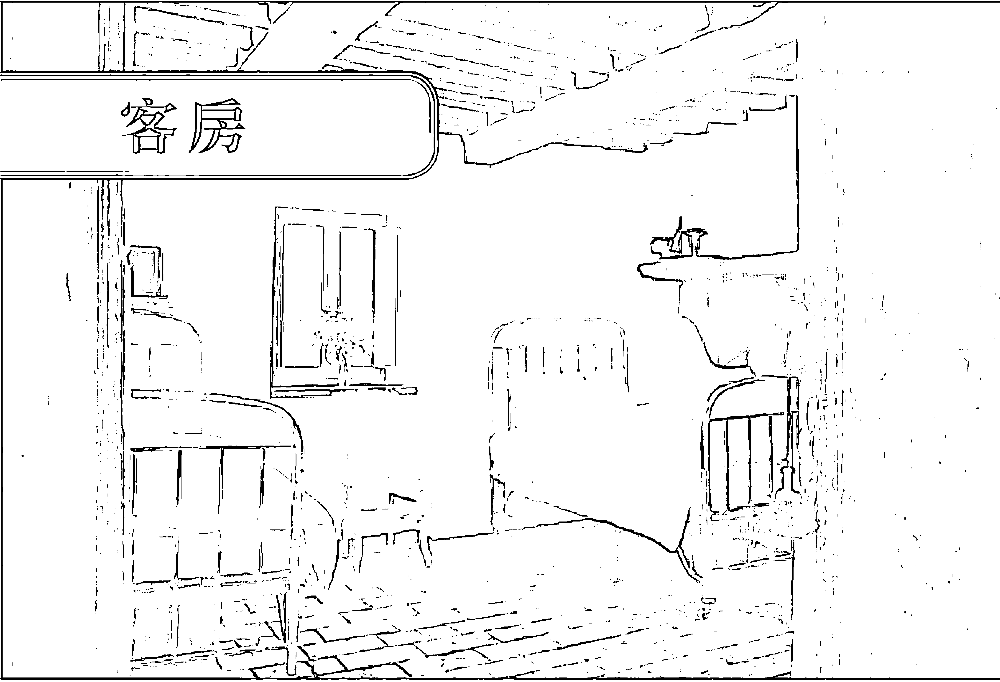

包含所有客人專用的房間，例如更衣室和浴室。如果你想為常客將客房個人化，可以參考臥室（p.44）。

色彩可以應用在地板、天花板、牆壁、地磚、踢腳板、門、壁櫥門、暖氣、地毯、窗簾、毛巾、家具（包括沙發和床）、燈具、用品、畫作及其主題色彩、框。如果衛浴設備是白色的，而白色不在你的選項之中，請不要慌張，某些顏色會因為屬於某物品的象徵，而不再被視為顏色。大自然物質的顏色並不包含在內。

### 如果你獨居

在第 222 頁的行星位置表中找到木星在你出生當日位在哪個星座。接著從第 64 至 87 頁，看看適合你的顏色有哪些。如欲更詳細的選擇，請翻至第 98 頁。

### 如果你與多人同住

盡情個人化第 98 頁的色彩吧！

請參閱第 152 頁的「做出你的決定」單元，可幫助你做出選擇。

#### 客房使家人的關係更緊密

你可能在書房或是用來燙衣服的房間裡，放置了一張床或沙發床。在這個情況下，你應該決定是否選用適合書房或洗衣間的顏色來裝飾它比較好，尤其是這個房間很少用來招待客人的時候。如果你的父母或朋友經常來拜訪，你可以把這個房間當成是他們的房間來裝飾，讓他們融入你的家庭核心。不然最好還是選用能激勵你的家人殷勤待客的顏色，畢竟你無法知道睡在裡頭的人會有什麼樣的性格。

有了客房，我們就可以控制來客，並且擺脫他們。而且客房是一個跟住屋有點疏離的地方。無怪乎我們有時候會發現客房（迎客居）位在房屋外面，理由是要讓我們的朋友不受到干涉。

#### 招待客人是為了接近他人

招待客人讓我們的孩子能透過一些可讓事情順利進行的規矩，去面對陌生人。從這個意義看來，招待客人等於是延長孩子從扮家家酒遊戲開始的、對外面世界的學習。這次不是由家人來扮演陌生人，在孩子面前的是真正的陌生人。青少年和同伴間的運動情誼也有同工異曲之妙。

家裡住著陌生人時，家中成員的關係會更加緊密，大家會感到維護住屋人人有責，便盡可能呈現一家人或自己最好的形象。因此，待客的經驗能讓全家人的心靈門戶朝外敞開，大家重新團結一心。

- **木星**
  - 角色扮演—招待朋友
  - 展示—迷惑—諮詢
  - 迎接—傳授—教育
  - 交談—開玩笑
- **月亮**
  - 教導孩子—交談
  - 囤積—照顧孩子
  - 照鏡子
  - 展示—歡笑—餵食
  - 招待朋友—諮詢
  - 保護—澆水
- **太陽**
  - 角色扮演—招待朋友
  - 教育—傳授—交談
  - 照鏡子
  - 布置—裝飾—展示
  - 照亮—烘暖

#### 社會的基礎

最早，招待客人是一件神聖的事。若不這麼做，就是褻瀆神明。《聖經》中的索多瑪城及蛾摩拉城就是因為違反這些規則，於是遭到上帝毀滅。住屋會保護我們，將我們與外界隔離開來，但它也切斷我們和外界的聯繫。招待客人可以讓我們與外界產生聯繫，也能向外人保證他不會受到敵視，而交換條件則是他不能傷害我們。這麼做有點像是要哄服對方：「我對你這麼好，你怎麼會傷害我呢？」若是認為外面不危險，對其他人有信心，心懷善意，我們會吸引來一些趣事和周圍的同道中人。因為是待客之人訂下的規矩，因此關係由我們來控制。我們款待來賓，他則不動聲色地適應我們的生活方式。缺點是我們必須擺出和顏悅色的樣子，就算我們沒有那個心情。我們可能覺得被人壓榨，而客人則有受到監禁的感覺。

#### 歡迎但有所控制

### 餐室


這是你和客人用餐的地方，是主人擺出威嚴的舞臺。如果餐室和客廳在同一個空間，就請參考客廳 (p.38)。

色彩可以應用在地板、天花板、牆壁、踢腳板、門、壁櫥門、暖氣、地毯、窗簾、桌巾、餐巾、家具（包含座椅上的織品）、燈具、用品（包含餐盤）、畫作及其主題色彩、框（注意，鏡子上的鍍銀會受到鏡框顏色的影響）。大自然物質及紀念品（它們對你的意義更為重要）的顏色並不包含在內。

### 如果你獨居

在第 222 頁的行星位置表找到木星在你出生當日位在哪個星座。接著從第 64 至 87 頁，看看適合你的顏色有哪些。如欲更詳細的選擇，請翻至第 100 頁。

### 如果你與多人同住

盡情個人化第 100 頁的色彩吧！

請參閱第 152 頁的「做出你的決定」單元，可幫助你做出選擇。

#### 餐室或協商室

#### 擺餐具

餐室跟客廳一樣，是十八世紀的發明。之前的人會在前廳的一張放在支架上、鋪有桌巾的板子上用餐，這張板子只有在用餐時才會被架起來（因此才有「擺桌子」*1 這句成語）。後來，因為僕人有眼有耳，會干擾主人暢所欲言、為所欲為，當時的人便設置了這個有特定用途的房間，可以在讓僕人在上菜後退下，還能用一整天慢慢布置。想像一下，那些因為開發巴西而堆金積銀的葡萄牙富翁，特地為甜點設置一個房間，就為了擺放糖絲做成的繁複裝飾品！

#### 用來做排場的房間

如果你家裡經常賓朋滿座，又必須在餐桌前及廚房裡穿梭，那麼餐室就是不可或缺的房間。在客廳的一角用餐，實在不夠正式；再說雙親宴客時，孩子通常在廚房裡用餐，清楚顯示有了餐室後，我們不著重私密感，而是社交生活。中世紀時，宴會是當時的人展示放置了銀製甚至黃金餐盤的餐具櫃，以便展現經濟能力的場合。如果你的餐桌附近有一座玻璃櫃，就是在延續餐具櫃或古羅馬時代的邊桌（cartibulum）*2 傳統。羅馬的達官顯貴原本是躺著進食，後來之所以在晚餐時坐到餐桌前，是因為主教寶座（cathedra）的影響。所謂的主教寶座就像王座，代表了上帝之座，因此教堂才會叫做 cathedral。最重要的人物是主教，而主教一坐下，眾生皆入座。

*1 dresser la table，意指放上餐盤及餐具等餐前擺設。
*2 古羅馬時代常見的長方形邊桌，通常由兩隻背對背的怪物凱美拉（chimera）或獅子支撐。

#### 心意相通與拔刀相向

另外，我們可以在餐桌前禱告，用餐時間就有點類似世俗的彌撒：首先要讓賓客願意就座，為了不要冒犯到他們敏感的神經，讓他們坐在圓桌前，地位均等，或是根據賓客的重要性來安排座位。接下來是分開伴侶，讓男女交替而坐（新婚夫妻除外），混合所有來賓。這是要透過享用同樣的食物以及滋養我們耳目的相同表演，讓大家心意相通。家庭聚餐中會吃到的火雞是一種夠大的家禽，所有人至少能分得一份。餐桌上的第十三個人會帶來厄運，有這位猶大在場，這頓飯恐怕不會有什麼好結果……餐桌能促使人神安氣定（而且有餐桌隔開賓客，可防止他們動手動腳），是主人的威嚴上演的舞臺，也是全家人一起做決定的地方（餐室是節慶大餐的場所）。由於「判斷」如同「切斷」，餐桌可以變成貨真價實的戰場。

#### 對應餐室的行星

- **木星**
  - 開玩笑—諮詢—迎接
  - 角色扮演—聽音樂
  - 教導—展示—迷惑
  - 和賓客一起用餐—教育
- **金星**
  - 看電視—做愛
  - 品嚐—招待朋友—玩耍
  - 聽音樂—歌唱
  - 擺花—裝飾
  - 浪漫雙人晚餐
- **太陽**
  - 展示—教育—照亮—裝飾
  - 交談—招待朋友—角色扮演
  - 歌唱—收集—拍照

### 廚房

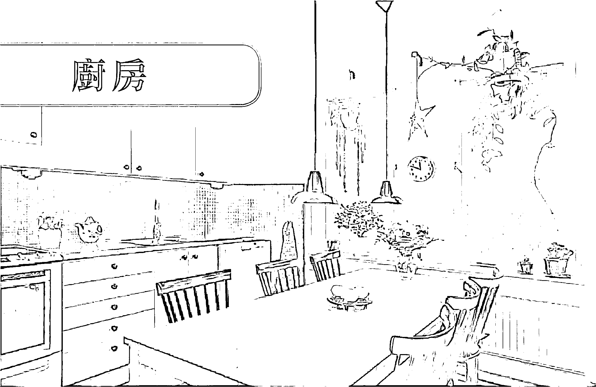

這是我們準備餐點，並且可以闔家用餐（甚至和客人一起）的地方。如果廚房是客廳的一部分，請參考客廳（p.38）。

色彩可以應用在地板、天花板、牆壁、地磚、踢腳板、門、壁櫥門、暖氣、地毯、窗簾、桌巾、餐巾、抹布、家具、燈具、用品（包括餐具和電器）。如果電器用品是白色的，而白色不在你的選項之中，請不要慌張，某些顏色會因為屬於某物品的象徵，而不再被視為顏色。大自然物質及紀念品（它們對你的意義更為重要）的顏色並不包含在內。

### 如果你獨居

在第 206 頁的行星位置表中找到月亮在你出生當日位在哪個星座。接著從第 64 至 87 頁，看看適合你的顏色有哪些。如欲更詳細的選擇，請翻至第 102 頁。

### 如果你與多人同住

盡情個人化第 102 頁的色彩吧！

請參閱第 152 頁的「做出你的決定」單元，可幫助你做出選擇。

#### 廚房是家庭的核心

#### 熱情好客的空間

廚房可以有相當先進的一面，而且由專家經過系統性的設置。但這並不是說小廚房（kitchenette）只要夠大，就能讓我們在那裡用餐。廚房的獨特性強，絕非小廚房所能相比。若說臥室是個人的私密場所，廚房的烹調區（即現代的爐竈）就是全家隱私的核心。竈火可供照明，可供取暖，它將我們帶回史前時代的部落去、古羅馬家庭的中庭裡，它也帶我們回到務農的祖先身邊，看著他們瑟縮在壁爐之前。不要忘記我們回到童年的廚房時那些特殊感受。在你從廚房進入家中時，就可以認出這種親暱感：不像玄關那樣可畏，而是熱烈的歡迎。廚房是孩子的場所，也是我們童年的場所：我們在餐桌上寫功課，請求正在下廚的媽媽幫忙。你提供的幫助、準備的食物，都為進食這件事注入愛情。在餐室裡，我們著重在用餐可能帶來的心意相通的感受，但是在廚房裡，這種感受攀升到更高階的程度，因為家庭本身變成一個整體。我們在廚房裡享用早餐，獲取力量，帶著屬於這個整體的感覺，準備迎抗外界的生活，家庭支持我們、保護我們，讓我們在外面遭遇的困難不再那麼大不了。我們在廚房裡有和家人最深入的對談，與在餐室因為話不投機而爆發衝突的情況截然不同。

#### 各司其職

為一家人建立身分的地方，就是廚房，更甚於其他空間。每位成員的崗位都很明確：下廚的人，擺餐具的人，收桌子的人，洗碗的人，或是無所事事的人。你在廚房裡做的菜，將你的民族根源、祖先來歷，透過孩子的模仿和學習，傳遞給他：每個人都有拿手菜和獨門妙技。還有在一年中穿插的傳統：誰在這星期的某一天負責準備早餐，誰在某個場合負責準備某道菜（男人最愛準備節日大餐！），人人的雙手沾滿麵粉，為節慶大餐獻上己力……

#### 濃入心魂的親密感

比起位在客廳一角的廚房，獨立廚房能讓親密感更加濃厚，因為前者位在過於寬敞的空間裡了……獨立廚房能召喚住在家裡的人，以及走進這間廚房的任何人去感覺。當朋友走到廚房找你時，都清楚此處適合談私事，之後他們重新調整自己和藹可親的社交面具，前往客廳。

#### 對應廚房的行星

| 行星 | 內容 |
|---|---|
| **月亮** | 喝—吃—交談—諮詢<br>洗碗—招待朋友<br>照顧孩子—保護<br>洗衣服—熨燙—餵食<br>教導孩子—哺乳<br>下廚—囤積—看電視<br>消化—休息 |
| **火星** | 熨燙—起身—下廚<br>切—做手工藝<br>磨光—移動—工作<br>做愛—烘暖 |
| **冥王星** | 吃—下廚—洗碗<br>洗衣服—修理—清掃<br>切—做愛—分類 |

### 小廚房（kitchenette）

這是一個可以關起來的凹室，或是無法闔家用餐的廚房。如果小廚房與客廳同在一個空間，請參考客廳（p.38）。

色彩可以應用在地板、天花板、牆壁、地磚、踢腳板、門、壁櫥門、暖氣、地毯、窗簾、抹布、家具、燈具、用品（包括餐具和電器）。如果電器用品是白色的，而白色不在你的選項之中，請不要慌張，某些顏色會因為屬於某物品的象徵，而不再被視為顏色。大自然物質及紀念品（它們對你的意義更為重要）的顏色並不包含在內。

### 如果你獨居

在第 219 頁的行星位置表中找到火星在你出生當日位在哪個星座。接著從第 64 至 87 頁，看看適合你的顏色有哪些。如欲更詳細的選擇，請翻至第 104 頁。

### 如果你與多人同住

盡情個人化第 104 頁的色彩吧！

請參閱第 152 頁的「做出你的決定」單元，可幫助你做出選擇。

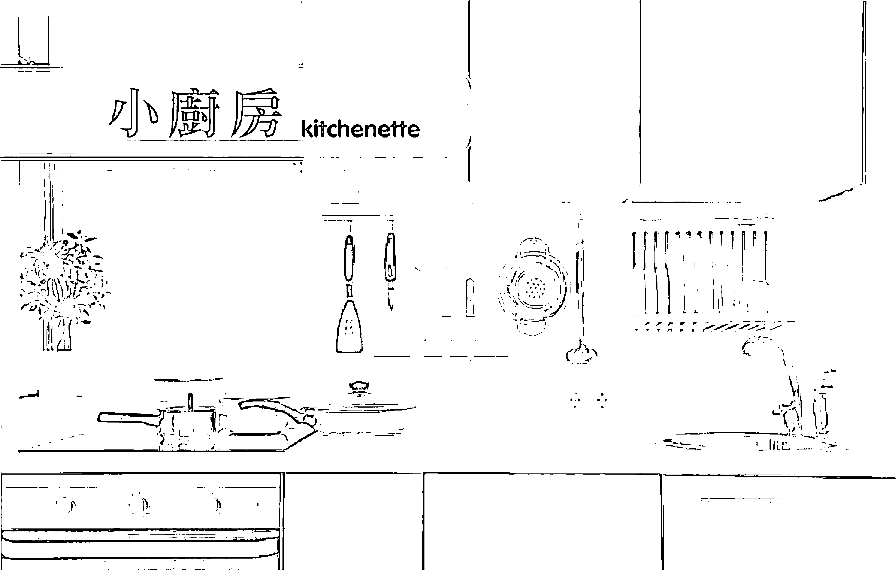

#### 小廚房象徵單身生活

小廚房是今日的產物。我們通常在廚房裡下廚用餐，但小廚房的用途只有下廚。某些寬敞農舍的壁爐幾乎就和小廚房一樣大，那些壁爐大到都可以做出滿漢全席來。你可能因為空間不足而選擇小廚房，像是住在套房時，但它也可能是人生的抉擇：著重用餐氣氛的愉快，犧牲廚房帶來的親密感（而且經常是伴隨著童年廚房的回憶......）。因此，小廚房可以是個封閉的小空間，或是面向客廳的角落，鎮日與油煙味及髒汙搏鬥（而且坐在沙發時，會看見堆在水槽裡的髒碗盤，心情也很難愉快起來......）。

煮、烤......）之間不可思議的反差。這是充滿火熱、冰冷、水、煙、蒸汽、氣流的地方。這是你可能割傷自己、燙傷自己、燒傷自己、電到自己的危險場所。這是你可能需要對孩子緊迫盯人（小心刀子，小心剪刀，小心電爐，小心鍋子很燙，小心消毒水......），需要密切注視每位好心來幫忙的人在幹什麼的風險場所。

客人不會來小廚房找你，因為那不是個親暱的場所，他也知道自己只會讓你為難而已。那些你清洗調理用具和機器，並因此渾然忘我的時刻，抵銷不了那些必須心神專注否則會釀成災禍的時光。

該不會單身男女和沒有孩子的夫妻淘汰掉傳統廚房這個家庭親密之所，而讓小廚房出現在家中，是為了掩藏自己沒有家人的事實？

我們會自己布置家裡的其餘空間，可是往往會找專家來規畫小廚房。專家會構思出空間的最佳利用法以省時省力。水槽的位置起碼要夠協調，垃圾桶的位置要方便且保持衛生，電爐、抗油煙味的抽油煙機、通風管、烤箱、微波爐、冰箱、冷凍櫃、洗碗機、食物儲藏櫃，餐盤是乾是濕，清潔用品，最後還有洗衣機和烘衣機，這還不包括咖啡機、熱水壺、烤麵包機、手搖杯、攪拌器、開罐器、桌上型吸塵器等。無論是露營拖車、太空船駕駛艙、工廠或手術室，小廚房皆可比擬！

#### 空間的效益

#### 為麻痺自己的感覺而勞動

小廚房是我們在家裡移動最頻繁的地方。首先我們無法就座，凡事都得站著做。接著是最尖端的科技（請試著以最簡單的方法描述微波爐如何運轉）與史前時代直接傳下來的原始活動（切、削、叉、分解、

#### 對應小廚房的行星

| 符號 | 行星 | 內容 |
|---|---|---|
| ♂ | **火星** | 磨光—烘暖; 下廚—切—移動; 工作—面對—做愛; 做手工藝 |
| ♇ | **冥王星** | 吃—切—修理; 洗衣服—下廚—分類; 收集—收拾家裡; 清掃—洗碗 |
| ☽ | **月亮** | 餵食—囤積—喝; 吃—下廚—清洗—寫字; 閱讀—照顧孩子; 洗碗 |

### 客廳與庭院

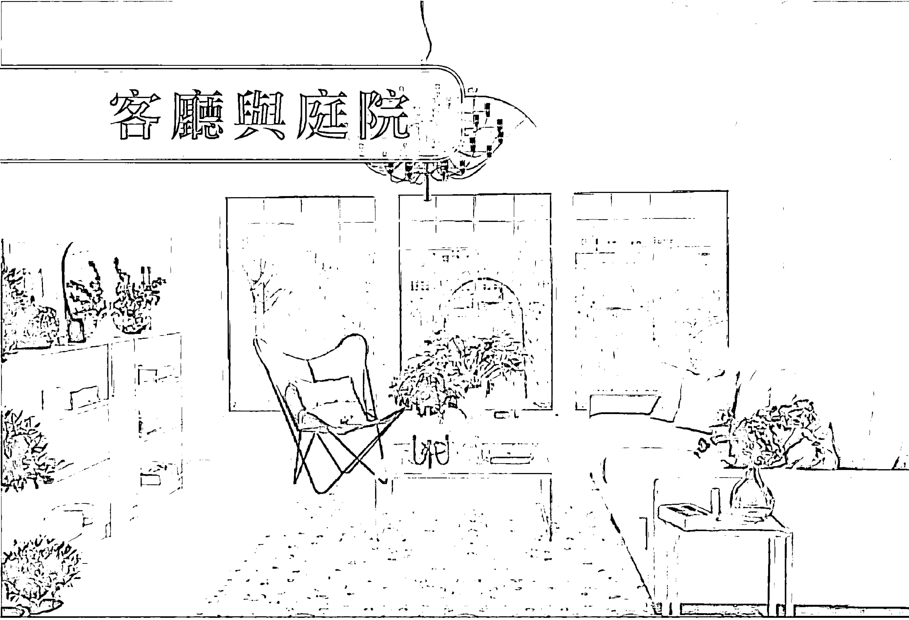

這是全家人休憩的場所。客廳可以放著餐桌或電視機。從街上看不見的室外也適用此空間的色彩。招待客人用的客廳，可以參考玄關(p.26)。

色彩可以應用在地板、天花板、牆壁、踢腳板、門、壁櫥門、暖氣、地毯、窗簾、家具（包括沙發）、抱枕、燈具、用品、畫作及其主題色彩、框（注意，鏡子上的鍍銀會受到鏡框顏色的影響）。大自然物質及紀念品（它們對你的意義更為重要）的顏色並不包含在內。

### 如果你獨居

在第215頁的行星位置表中找到金星在你出生當日位在哪個星座。接著從第64至87頁，看看適合你的顏色有哪些。如欲更詳細的選擇，請翻至第106頁。


### 如果你與多人同住

盡情個人化第106頁的色彩吧！
請參閱第152頁的「做出你的決定」單元，可幫助你做出選擇。


#### 客廳代表我們的理想世界

在古老大宅裡，前廳（antichambre）與後廳（chambre）是相對的。我們在前廳接待外人，在那裡架起餐桌進食；我們在後廳睡覺，躺在床上和朋友交談、賭博。前廳給人難以親近的感受，後廳又過於寬敞，不夠親密。到了十八世紀，人們尋求舒適，睡在比較容易烘暖的睡房（cabinet），即別室（cabine）中。他們繼續在後廳招待客人，那裡有一張公開的大床。前人睡覺的睡房漸漸演變成今日的臥室，而少了隱私的後廳，則變成招待客人的客廳。前廳的面積縮小，變成玄關。女主人可以利用供人午睡的轉角沙發（méridien，中午之意），為自己布置出白天用的房間，找回隱私：這就是起居室（boudoir）或小客廳。

#### 一起放鬆

今日職場生活的蓬勃，提高了住屋的庇護價值。建立在我們的品味以及與心愛之人的同居生活上的真實生活夢想，可以讓人們在職場上受到的傷害變得不再那麼大不了。儘管我們可以為了客人而留著大客廳，但是我們也能加上一個全家人使用的客廳，這種客廳在家中沒有大客廳時就會用來招待客人。從天倫之樂及放鬆心情的角度看來，這裡是家庭生活的公共空間。沙發是公開大床的後代，為客廳的象徵家具。除此之外，有時我們也會看到一種看電視專用的客廳。客廳經常集中全家人的共同活動，有一部分當餐室，甚至有一部分廚房。餐室有點像一個表演空間，而廚房通常是全家人親密生活的核心，就好像我們試著以玩樂的心情過家庭生活。下廚的人不再被隔開，而且一種較為濃烈的同舟之誼在我們和客人之間產生。我們會根據自己對理想世界的觀點來布置客廳，也就是我們希望這個世界是什麼樣子（充滿設計感、視野開闊、舒適、溫暖、親密等等），以便補償我們覺得世界不理想之處。

#### 從自己的世界到全世界

我們當然想要將這個理想世界投射到真實世界中，於是我們讓客廳通往室外，即陽臺或庭院。我們不是為了讓街上的人觀賞才建造庭院的，而是為了讓我們自己高興，庭院就像是客廳的延伸（男性比較喜歡在客廳裡放鬆，女性卻比較喜歡在庭院裡蒔花弄草）。到了夏天，庭院是我們招待朋友的場所。我們渴望依照自己對理想的觀點來轉換外在世界，因此庭院可以朝與這個觀點相容的一部分景色開放，也可以團團圍起來，而且多虧池塘或游泳池，庭院成為這個世界的象徵模型。

#### 對應客廳與庭院的行星

- **金星**
  - 做愛—品嚐—玩耍
  - 放鬆—聽音樂
  - 跳舞—照鏡子
  - 招待朋友—刺繡
- **太陽**
  - 招待朋友—裝飾
  - 展示—交談—角色扮演
  - 照鏡子—照亮
  - 供暖—教育—照相
- **水星**
  - 鼓動—歡笑—打電話
  - 交談—接待眾人—玩耍
  - 翻閱—看電視
  - 打電動—傳授

### 遊戲室

這是孩子們玩遊戲的地方（臥室用來睡覺和學習），也可以是大人使用的空間（例如打撞球）。

色彩可以應用在地板、天花板、牆壁、踢腳板、門、壁櫥門、暖氣、地毯、窗簾、家具、燈具、用品、畫作及其主題色彩、框。傳統遊戲桌的綠色不該被視為顏色，而是一種象徵。大自然物質及紀念品（它們對你的意義更為重要）的顏色並不包含在內。

### 如果你獨居

在第 210 頁的行星位置表找到水星在你出生當日位在哪個星座。接著從第 64 至 87 頁，看看適合你的顏色有哪些。如欲更詳細的選擇，請翻至第 108 頁。

### 如果你與多人同住

盡情個人化第 108 頁的色彩吧！
請參閱第 152 頁的「做出你的決定」單元，可幫助你做出選擇。

#### 遊戲室，是被馴服的世界

#### 個人風格

遊戲室可以是給大人、青少年、兒童使用的空間。大人的遊戲室可以非常豪華，像是撞球間。因此，遊戲室是有如玄關、客廳或餐室的待客空間。家裡有間辦公室，代表著主人想成為菁英或領導階層，有撞球間則是為了向習慣賭桌和醜聞（你聽說過在撞球桌上做愛的性幻想吧……）的富豪看齊。青少年的遊戲室較常位於地下室，是特別整理出來擺放乒乓球或桌上足球機的場所。其實遊戲室多多少少算是室內的遊樂場，不會受到惡劣天氣的影響。到了夏天，這些桌子經常被移到室外。在這裡，遊戲是朋友之間的運動和競賽。兒童有了遊戲室，就可以把臥室留給睡眠與學習。我們也可以把亂象局限在玩具所在的遊戲室裡（理論上是如此……）。雖然遊戲室主要是生活的一種選擇，但如果你有三個年紀相近的孩子，卻只有兩間臥室，那麼整理出一間遊戲室可以讓你秉持公正：他們三個人一起玩，一起睡覺。

#### 成長與透過遊戲開發智力

遊戲室有助於孩子的發育和自主能力。遊戲室有一點代表外面的世界，但又是一個讓孩子感到安全的世界，他可以在那裡學習融入其他人，同時遵守遊戲規則。在這些規則之前人人平等，沒有父母兄弟姊妹之別，只有玩家。你的孩子會理解這些規則並不僅僅是父母的意志，而是必須遵守的規則，這樣遊戲才玩得起來，而且社交生活就是這樣。青少年的遊戲室則代表一個進階步驟，他們透過與那些勢均力敵但不屬於家人的朋友一起運動，征服了外面的世界。

在遊戲室裡，我們和其他人平起平坐，我們可以發洩，可以靠著遊戲的掩護給對方一點顏色瞧瞧，還能公開我們每天竭力隱藏的愛好……多虧如此，遊戲室可以降低家人間的壓力。它也是你的孩子讓夢想盡情馳騁，而無需言語來形容的地方。透過遊戲，他可以成為最富有（因此最受人喜愛……）、最強大、最聰明、學識最豐富、速度最快的人等等。你的孩子可以探索自身還不知道，或是被家庭的道德觀放到一旁的各種面貌，像是作弊、説謊、吹牛、野心勃勃、無情……而他不必害怕這個形象會讓別人和自己看見，因為只是在玩遊戲而已。而且因為這場遊戲發生在一個特定房間裡，他只要離開，就能將自己的輸和失敗拋到腦後。

#### 對應遊戲室的行星

- **水星**
  - 招待朋友—交談—鼓動
  - 畫圖—歡笑—做手工藝
  - 討論—玩耍—上網
  - 諮詢—教導—分類
  - 計算—打電動
  - 看電視—探問
- **太陽**
  - 照亮—烘暖—教育—交談
  - 教導—角色扮演—裝飾
  - 歌唱—跳舞—聚集
  - 展示—招待朋友
- **冥王星**
  - 收集—分類—修理
  - 記帳—思考
  - 調查—評判—支配
  - 操縱—摧毀

### 走廊

這指的是住屋中的每一條走廊。如果走廊上有樓梯，請參考樓梯間（p.28）。如果你是從走廊進入住屋，請參考玄關（p.26）。

色彩可以應用在地板、天花板、牆壁、踢腳板、門、壁櫥門、暖氣、地毯、窗簾、家具、燈具、用品、畫作及其主題色彩、框（注意，鏡子上的鍍銀會受到鏡框顏色的影響）。大自然物質及紀念品（它們對你的意義更為重要）的顏色並不包含在內。


### 如果你獨居

在第 210 頁的行星位置表找到水星在你出生當日位在哪個星座。接著從第 64 至 87 頁，看看適合你的顏色有哪些。如欲更詳細的選擇，請翻至第 110 頁。


### 如果你與多人同住

盡情個人化第 110 頁的色彩吧！

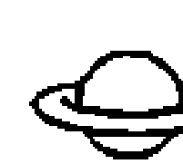

請參閱第 152 頁的「做出你的決定」單元，可幫助你做出選擇。

#### 走廊是前往另一個世界的通道

走廊與長廊都是通道。宮殿裡的走廊能容納人潮，讓它充滿了動感。長廊異於走廊之處，在於長廊非常寬敞，有時候甚至呈正方形，而走廊通常又狹又長。法式長廊必須兩側都有照明（這就是凡爾賽宮的鏡廳裡，鏡子企圖呈現的效果），而走廊可以晦暗不明。長廊就像可以信步走動的休息室*，而走廊則是快速經過的通道。長廊是藝術品的展覽場所，走廊展示的是壁櫥。一言蔽之，長廊是擺門面的絕佳空間（宴會廳），而走廊只有實用功能。

很久以前的人只在一個房間裡生活，睡在同一張床上，互相取暖，牲畜通常就在旁邊，所以父母只好在孩子旁邊親密。人們為了取得一點私密感，用帷幔把這個房間分隔成許多角落。因此，在中世紀的宮殿裡，廣闊廳堂的壁氈就用來分隔睡房，還能幫助保暖。這些宮殿裡的房間彼此相通，但是要到另一個房間，就必須不斷打擾其住客。走廊最早是以木頭陽臺的形式出現，逐漸演變成可以擋風遮雨，接下來為石製，最後則連接左右兩側的房間，讓每個房間得以獨立。因為走廊的存在拉長了從一個房間到另一個房間所需的時間及距離，而能將房間分隔開來。

你以為走廊是連接兩個房間，又無需經過其他房間的唯一方法嗎？錯了！中世紀的人發明了一種很精巧的系統，現今還可以在雙層火車中窺見一二：城堡的每一層樓都有一個房間，這些房間上下相疊。在突出城堡外牆的小圓塔裡，有螺旋樓梯連接上下的兩個房間。如果一個房間有人居住，阻擋你經過，你可以上樓或下樓來避開這個房間：於是你會經過樓上或樓下那個房間，再下樓或上樓到要去的房間。

地窖—客廳—臥室—閣樓的垂直相疊，吻合一個以宗教為中心組織起來的社會。水平的住宅則符合我們的社會。我們對自身存在感到的憂懼，就是在走廊上碰到的。在我們的夢裡，走廊與惡夢有關：我們無路可逃，盡頭不是被堵住了，就是看不到盡頭。把走廊縮窄到最小，讓走廊的形狀貼合一個人的身形，直到令人感到壓迫。真正的原因會不會是誕生過程的反映？來到人間的這個過程一被提醒，自然會讓人自問起死亡過程的問題。就像我們在出生時，也希望能邁向光明。

| 符號 | 行星 | 相關活動 |
|---|---|---|
| ○ | **水星** | 諮詢—探問、鼓動—招待眾人、歡笑—玩耍—打電話、交談—招待朋友、往來 |
| ♂ | **火星** | 面對—烘暖、活躍—堅持—往來、做運動—跑 |
| ⊕ | **冥王星** | 揭穿—思考—分析、激勵—堅持—清掃 |

*指附屬於候客室的大型房間，等候的人可以在裡面踱步，常見於車站、市政廳等場所。

#### 走廊與長廊（galerie）
#### 來一點小故事
#### 誕生到另一個世界
#### 對應走廊的行星

### 臥室

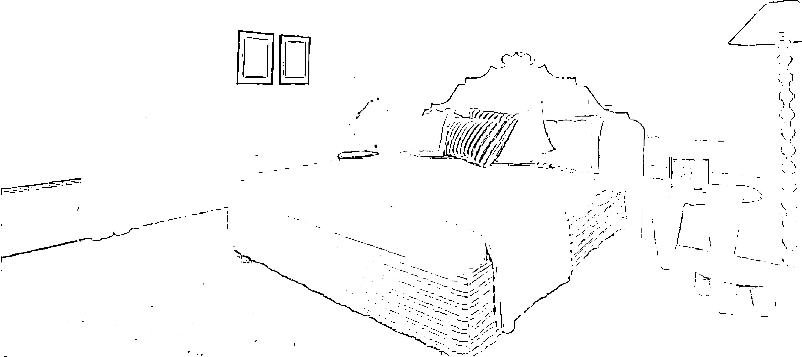

這是你睡覺的地方。臥室若位在過於開闊的樓中樓，則採用它所通往的房間的適用色彩。

色彩可以應用在地板、天花板、牆壁、踢腳板、門、壁櫥門、暖氣、地毯、窗簾、家具、燈具、用品、畫作及其主題色彩、框（注意，鏡子上的鍍銀會受到鏡框顏色的影響）。大自然物質及紀念品（它們對你的意義更為重要）的顏色並不包含在內。

### 如果你獨居

在第 206 頁的行星位置表中找到月亮在你出生當日位在哪個星座。接著從第 64 至 87 頁，看看適合你的顏色有哪些。如欲更詳細的選擇，請翻至第 112 頁。

### 如果你與多人同住

盡情個人化你的色彩吧！
- 第 112 頁—主臥室
- 第 114 頁—兒童房
- 第 120 頁—青少年房
請參閱第 152 頁的「做出你的決定」單元，可幫助你做出選擇。

#### 創造的奇蹟就在臥室中

臥室有別於其他地方，我們可以獨處。走廊有助於隔離臥室，將臥室和其他空間拉開距離，並且讓人從外在世界溫和地過渡到內心世界。臥室是整個家裡女性最偏愛的房間，而男人最喜歡客廳。女性會在客人不會進來的臥室中，展示她心愛的物品，並且揭開自己的面紗。

在古代的住宅裡，臥室的一部分被用作客廳。睡覺或生病時，只有拉上華蓋大床的簾幕才會有一點隱私和溫暖。十八世紀的人習慣睡在容易烘暖的睡房中，客人不再進得去：這個睡房成了現今的臥室，大而無當的華蓋大床最後消失了。在亞維儂教廷*時期的主教宮殿中，我們可以看到現代公寓的樣式出現了，有前廳/後廳這樣的搭配。更氣派的版本是「法式寓所」：第一前廳/第二前廳/後廳/睡房。從入口開始，我們漸次穿越一間比一間更私密的空間。這個被神父們精緻化的格局，有沒有讓你想起古埃及時代、《聖經》描述的所羅門聖殿，還有那些需要行經一間間越來越私人的空間，才能來到上帝雕像或聖餐桌之前的教堂？

臥室位在寓所的盡頭，有著至聖場所的形象。正是這個原因，人們偏好在臥室禱告。如果靜謐讓臥室有天界形象的特點，與其他共用空間的塵俗相反，那是因為臥室是個神聖的場所。為什麼呢？

*亞維儂教廷時期（1309~1378）：天主教教廷從義大利羅馬遷到法國亞維儂的一段時期。

在睡美人的城堡中，臥室位在最頂樓，城牆、高塔、守衛都只是用來保護它。中世紀的大總管——臥室的守衛——看守領主的珠寶箱（現今多在床腳的位置），而且在你的家中，一定會把珠寶都保管在臥室裡。可是你知道臥室守護的最珍貴財寶是什麼嗎？就是女人！不過在那個時代，保護女人主要是為避免子嗣中悄悄躲了私生子……臥室位在住屋的盡頭，是象徵女性生殖器官的神聖形象。

在住屋中其他空間進行的性行為叫做交配，在臥室裡則是兩具靈魂受愛情的驅動而結合。這是因為臥室含有宗教的一面，而不是因為我們習慣躺在上面及睡覺。臥室是伴侶雙方在孩子都睡著以後，體驗私密的場所。這樣的私密感無需言語形容，因為臥室是我們接近創造的奇蹟之處。

#### 對應臥室的行星

- **月亮**
  - 撒嬌—看電視
  - 保護—照顧孩子
  - 哺乳—作夢—收集
  - 展示—閱讀—寫字
- **土星**
  - 獨處—冥想—閱讀—學習
  - 整理—收集
  - 工作—按摩
- **海王星**
  - 看電視—休息
  - 聽音樂—冥想—禱告
  - 睡覺—作夢—穿衣—裝飾

#### 女性化的場所
#### 平靜且親密的場所
#### 神聖的地方

### 浴室

這是不一定有馬桶，但是有浴缸或淋浴間的空間。如果浴室位在臥室一角，可參考臥室（p.44）。

顏色可以應用在地板、天花板、牆壁、地磚、踢腳板、門、壁櫥門、暖氣、地毯、窗簾、毛巾、家具、燈具、用品、畫作及其主題色彩、框（注意，鏡子上的鍍銀會受到鏡框顏色的影響）。如果衛浴設備是白色的，而白色不在你的選項之中，請不要慌張，某些顏色會因為屬於某物品的象徵，而不再被視為顏色。大自然物質的顏色並不包含在內。

### 如果你獨居

在第 226 頁的行星位置表找到海王星在你出生當日位在哪個星座。接著從第 64 至 87 頁，看看適合你的顏色有哪些。如欲更詳細的選擇，請翻至第 126 頁。

### 如果你與多人同住

盡情個人化第 126 頁的色彩吧！
請參閱第 152 頁的「做出你的決定」單元，可幫助你做出選擇。

#### 沐浴如洗禮，讓我們迎接新的一天

#### 奢侈、平靜和感官享受

設有浴缸的浴室比僅講求實用的淋浴間更豪華。浴室是一個真正的房間，淋浴間則小得多。浴室仍舊是一個配備，因為旅館的房間都會說明「附或不附」浴室。當人們輪流使用浴室時，必定會在行程緊湊時造成問題。古希臘羅馬時代的人會上公共澡堂、泡溫泉，在中世紀的大眾浴池裡還看得見這個習慣。大型瘟疫造成這些地方關閉，因為當時的人相信疾病是透過皮膚毛孔傳染的。由於泡澡的羅馬權貴出現在拉丁作家的創作中，文藝復興時期的王公貴族便也想要有自己的浴室。於是，浴室以富麗堂皇的氣派房間形式出現，就像楓丹白露城堡的浴室那樣，據稱法國國手法蘭索瓦一世（FrançoisⅠ）將達文西的《蒙娜麗莎的微笑》掛在裡面。浴室是個私人的空間，卻又任人窺視，是奢侈與歡愉的象徵。反之，以盥洗為目的的淋浴間的由來，要到臥室的角落和睡房去找。

我們最常放鏡子的地方是浴室，而這也是對自己最誠實的時候。要找回一具年輕健康的肉體，我們必須刮鬍子、剃毛、剪指甲、刷牙、塗塗抹抹。這些行為的粗暴，以及熱水與冷空氣間的反差，讓孩子不喜歡洗澡，說不定是因為這提醒了他們在誕生時受到的考驗？

#### 具淨化作用的水

也許我們洗澡的主要目的是淨化，而不是純粹為了保持乾淨？沐浴像是一場洗禮，讓我們煥然一新，去迎接嶄新的一天。我們起床後刷牙，不就是埃及法老王時代重新賜予木乃伊新生，讓它復活的「開口儀式」*嗎？除去我們的臭味，用芬芳取代，不就是古埃及祭司每天早上為神像做的事嗎？一身馨香的神明⋯⋯總而言之，沐浴是讓我們從動物變成人類的過程。透過這些儀式（我們絕對可以這樣稱呼），我們找回勇氣，重新開始漫長人生中日復一日的嶄新一天。

#### 傷人的事實

泡澡有一點像是變回在熱水裡拍手打腳的嬰兒，因為熱水令人想起媽媽的子宮。這是回到純真的時期，當時的我們赤裸著身體，而且為此開心。浴室的牆保護我們的隱私，我們可以徹底放鬆。因為我們在浴室裡格外脆弱，恐怖片才會特別喜歡拿浴室當作場景吧！我們在可讓人回春的浴室裡，使用美妝產品修復身體。也出於同樣的原因，我們會在浴室裡置放藥品櫃。

#### 對應浴室的行星

- **海王星**
  - 看電視—冥想
  - 洗澡—泡澡—注意儀表
  - 悠閒—聽廣播—休息
  - 聽音樂—穿衣
- **火星**
  - 搓—細心照料—起身—剪
  - 供暖—運動—刮鬍子
  - 搓揉—做愛—排便
- **土星**
  - 獨處—冥想—計算
  - 整理—收集
  - 分類—學習—閱讀—按摩

*是古埃及墓葬習俗中的一種儀式，他們相信經過該儀式的木乃伊可以在棺木中保有呼吸能力，在將來重生。

### 廁所

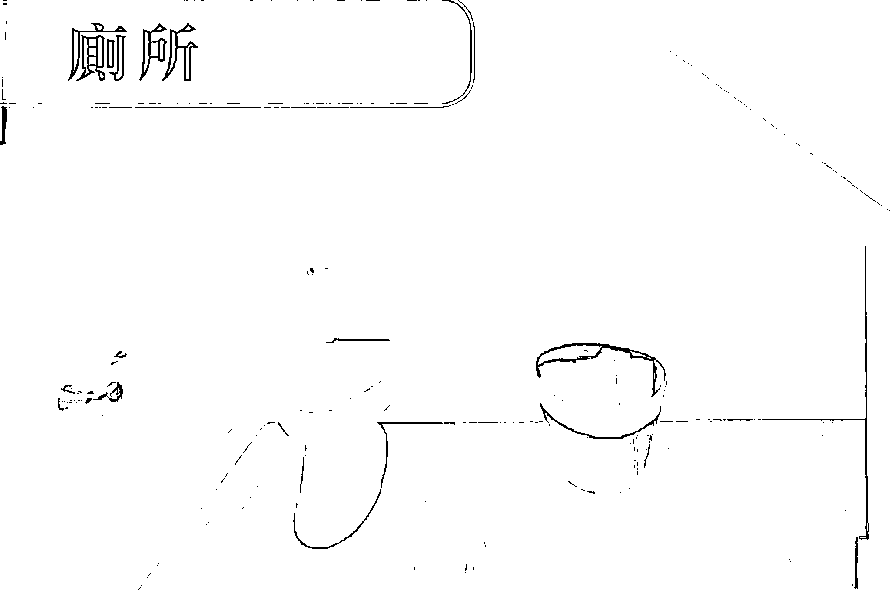

廁所裡沒有淋浴間，也沒有浴缸。我們可以認為家中的每位成員有權使用每間廁所。

色彩可以應用在地板、天花板、牆壁、地磚、踢腳板、門、壁櫥門、暖氣、地毯、窗簾、毛巾、家具、燈具、用品、畫作及其主題色彩、框（注意，鏡子上的鍍銀會受到鏡框顏色的影響）。如果衛浴設備是白色的，而白色不在你的選項之中，請不要慌張，某些顏色會因為屬於某物品的象徵，而不再被視為顏色。大自然物質的顏色並不包含在內。


### 如果你獨居

在第227頁的行星位置表中找到冥王星在你出生當日位在哪個星座。接著從第64至87頁，看看適合你的顏色有哪些。如欲更詳細的選擇，請翻至第132頁。


### 如果你與多人同住

盡情個人化第132頁的色彩吧！

請參閱第152頁的「做出你的決定」單元，可幫助你做出選擇。

#### 精神分析師的診療室

#### 來一點小故事
我們熟知的馬桶是在十八世紀的英國發明的。在接下來的幾個世紀中，馬桶文化散播到西方各國。但別以為對所有人來說，這是制式配備！你知道世界上絕大多數人採用我們稱為「土耳其式馬桶」的蹲式系統嗎？這種系統比較省水，比較衛生，因為皮膚並不會觸碰到瓷器，而且姿勢也比較適合排便。人類在發明廁所之前是使用夜壺，還有一種人稱「方便椅」的座椅，其下方就放著夜壺，椅面上有蓋子。馬桶的進化尚未結束，因為這些椅子漸趨完美，現在還有馬桶內建水柱，可幫你清洗，有的甚至包含了醫療測量儀器呢！

#### 需要就是法律
當然，我們上廁所就是為了使用廁所的功能，但是我們也會到廁所去迴避一下其他人。此外，大多數人常常在裡頭待超過二十分鐘。因為廁所是個清靜的場所，讓我們可在那裡獨處並重新充電。我們為廁所冠上的名號，就跟讓我們上廁所的身體部位的名稱一樣多，這個發現實在很有趣！在尚屬平等的西方社會中，廁所是唯一不平等的空間，因為我們將之區隔為女廁與男廁。然而，有什麼地方比廁所更對人類一視同仁呢？無論貴賤，不分老少，全都在同樣的急迫下，在廁所裡做著同樣的事。廁所讓我們正視自己體內這隻禽獸。廁所是一個羞恥之所，是我們會咳嗽來掩蓋聲音的地方，是歲月把我們變得依賴他人的地方。在廁所裡，我們不再炫示自己的社會形象，而只是五臟和六腑……精神脆弱的人會為此恐懼，為了抵抗憂懼而變得偏執，因而寫下歧視意味的塗鴉。如果你在廁所閱讀雜誌，這是在轉移自己的專注力，或許也是為了逃脫那妨礙你放縱自己的憂懼！

#### 在象徵意義上，廁所是精神分析的場所
廁所就像地窖，代表了我們的潛意識。佛洛伊德已經告訴我們，當我們還是嬰兒時，廁所是我們握有凌駕父母的力量的場所，因為父母是如此渴望我們學會自己上廁所。我們可以瞄準馬桶或是不這麼做，可以排出或是隱忍。他將肛門性格與秩序、吝嗇與頑固、糞便與禮物或金錢連上關係。

我們體內的垃圾會透過住屋的管道系統（簡直像我們內臟的延長……），繼續它們的旅程，直抵下水道及地底深處，那裡隱藏著我們的憂懼。說到底，上廁所不就是讓我們得以在象徵意義上，擺脫心理上的重負嗎？

#### 對應廁所的行星
- **冥王星**
  - 收集—分類—清掃
  - 記帳—修復—排泄
- **土星**
  - 分類—整理
  - 計算—收集—閱讀
  - 批評—學習—工作
  - 獨處—冥想—按摩
  - 雕塑—做手工藝
- **太陽**
  - 角色扮演—照亮—暴露
  - 照鏡子—穿衣
  - 灑香水—化妝
  - 梳頭

### 書房
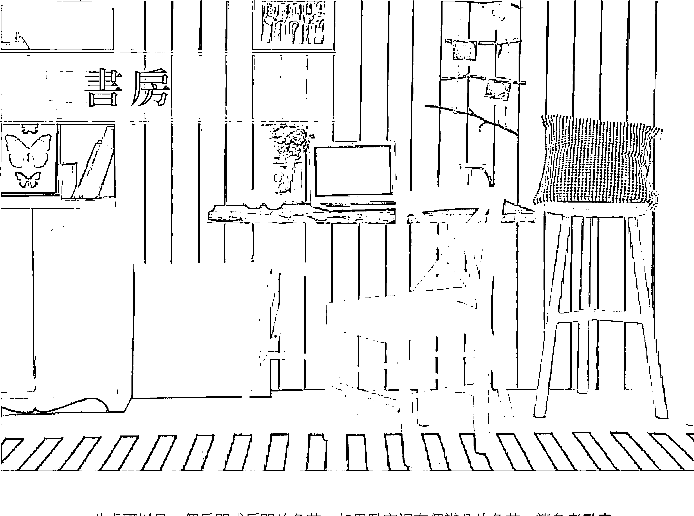

此处可以是一个房间或房间的角落。如果卧室里有个办公的角落，请参考卧室 (p.44)。

色彩可以应用在地板、天花板、墙壁、踢脚板、门、壁橱门、暖气、地毯、窗帘、家具（包括办公桌和椅子）、灯具、用品（书籍除外）、画作及其主题色彩、框（注意，镜子上的镀银会受到镜框颜色的影响）。大自然物质及纪念品（它们对你的意义更为重要）的颜色并不包含在内。

### 如果你独居
在第 225 页的行星位置表找到天王星在你出生当日位在哪个星座。接著从第 64 至 87 页，看看适合你的颜色有哪些。如欲更详细的选择，请翻至第 134 页。

### 如果你与多人同住
尽情个人化第 134 页的色彩吧！

请参阅第 152 页的「做出你的决定」单元，可帮助你做出选择。

50 十二星座居家配色宝典

#### 讓人獨處，或是向全世界開放
這是家中唯一讓男性除了客廳之外，擁有歸屬感的房間。女性有自己的小客廳或起居室（白天的臥室），男人有書房，滿足了他對皮革和雪茄的幻想。以前把書房稱為「圖書室」，在某些城堡裡，圖書室是最寬敞的房間。在自宅裡有一間圖書室是極為奢侈的事，也是社會地位（或至少我們希冀擁有的）的顯赫象徵。你知道書店會成批販賣專門用來「裝飾」這些圖書室的精裝書籍嗎？而且我們的確經常在書房書架上最顯著的位置，找到某種完全過時、但有著美麗皮革的精裝醫學辭典。因此，男人可以威風凜凜地坐在辦公桌後的巨大扶手椅上，知識唾手可得。我們也可以在書架上找到化石、礦石、年代不詳的亞非風格小塑像，由此可見我們的「印第安納·瓊斯」確實親赴現場，用行動支持自己的博古知今！多虧這個，男主人那帶點專橫的力量變成他的威嚴；他的力量被合理化，因為他最博學多聞！

#### 陽剛氣息特別重的房間
#### 書房中的品德教育
雖然男人的確能躲在書房裡，逃避家庭生活的幸福美滿及日常瑣事，但是他大可以在公司工作，而非待在家裡，這個選擇證明了，家庭生活對他的重要性：就算他獨自待在書房裡，依然是「在家裡」。孩子會全心讚歎父親這個工作到渾然忘我的形象，去模仿工作及學習的價值，以便能夠用同一種語言和父親溝通，還能爭取到一點力量……

> 私室是中世紀城堡中一種可以鎖起來的小房間，主要用來收納貴重物品，但也可以當成私人使用的空間。

#### 向世界敞開心胸
當書房不是一個獨立的房間，而只是兩個房間之間的角落或在樓中樓裡，便是以實用性為主（私室*的後代）的空間，人們囤積收據、銀行帳單、家人的正式文件，和其他社會的官僚制度所帶來的小樂趣。我們可以根據書籍的主題，把書本分散到家中其他地方，像是客廳、走廊、臥室，當然還有廁所。有了網路後，書房不再具有授業角色的優勢，因為你可以陪伴孩子上網尋找知識，刺激他的好奇心。在他探索著可以與他互動的世界時陪伴身旁，等於是在教育他。「教育」的拉丁文是 *ex ducere*，意指帶領他到外面探索。在他首次的虛擬離巢時，你陪伴在他身邊，注意他的安全。分享孩子的興趣，你會更認識他，而他會在無意識中複製你和世界交流的方法。

| 行星 | 相關活動與象徵 |
| :--- | :--- |
| **天王星** | 上網—聽廣播、看電視—打電話、打電動—創造、用電腦工作—教導、擺設—照亮—學習 |
| **太陽** | 招待許多人—交談—照亮、角色扮演—傳授—裝飾、展示—聚集—收集、教育—照鏡子 |
| **土星** | 學習—閱讀—獨處—冥想、批評—計算—整理、分類—收集—工作、攀登社會階級 |

### 更衣室
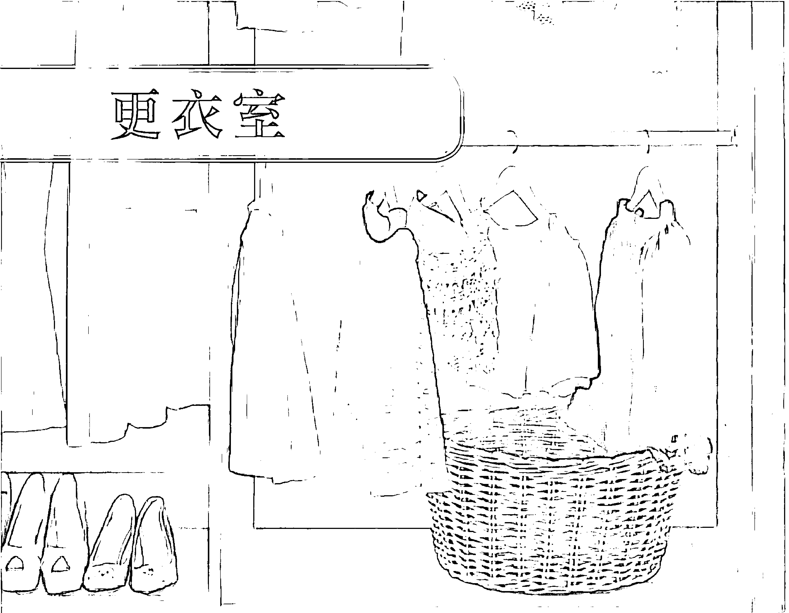

這是一個獨立的房間，我們在裡面可以挑選服裝，也可以換衣服。如果是臥室裡的一個壁櫥，參考臥室（p.44）。

顏色可以應用在地板、天花板、牆壁、踢腳板、門、壁櫥門、暖氣、地毯、窗簾、家具、燈具、用品（壁櫥裡的內容物除外）、畫作和它的主要色彩、框（注意，鏡子上的鍍銀會受到鏡框顏色的影響）。大自然物質及紀念品（它們對你的意義更為重要）的顏色並不包含在內。

### 如果你獨居
在第 202 頁的行星位置表中找到太陽在你出生當日位在哪個星座。接著從第 64 至 87 頁，看看適合你的顏色有哪些。如欲更詳細的選擇，請翻至第 136 頁。

### 如果你與多人同住
盡情個人化第 136 頁的色彩吧！

> 請參閱第 152 頁的「做出你的決定」單元，可幫助你做出選擇。

#### 自我的外衣
這是一個小房間，你在裡面收納衣物，並且挑選你要穿的衣服。它讓你必須為臥室的衣服數量設限，並將牆壁從壁櫥的魔掌中釋放出來。

而這麼做會隱藏真正的自己，或是你認為的自己。你選擇的衣物就像一種語言：別人會看到你屬於哪一群人。屬於同樣族群的人會將你視為友人，對你而言，他們就像是無論你走到哪裡，幾乎都隨處可見的家人。這樣一來，你迎抗外在世界時就不會害怕。

衣服可以隱藏你身體的缺陷，無論是真實的缺陷，還是來自心理的因素。你會展示自己的身體，讓其他人渴望你，你會誘惑他們，這樣你身邊就會圍繞著友善的人，讓你有安全感。

#### 與其他人隔離
你以為更衣室是一個現代的發明嗎？我們以前稱呼更衣室為「私室」。一個可以隨時鎖起來的小房間，用來保存衣物與貴重物品，以防範家僕。私生活就是從那裡誕生，也就是說沒有全家人注視著的生活，因為中世紀的人全都在同一個房間裡生活。人們是在那些「斗室」、「別室」中離群獨處，如廁、學習，或是兩人進行私談。私室就是更衣室、廁所、淋浴間、書房，甚至臥室的前身！

#### 從鏡子到護胸甲
一方面，更衣室是一個你和自己獨處的地方，因為你的衣物都在那裡。這些衣物反映出你，並且讓你跟自己確認你是誰或是你希望成為誰。穿上衣物後，你便向自己呈現了你想要的性別和年齡、生活方式、社會地位或是嚮往的社會地位等等。衣物維護你的精神，讓它不受外在世界的侵犯。譬如説，你選擇鮮艷的色彩來對抗冬天的灰暗。穿上一件新衣服，則是變成另一個人。穿衣打扮有一點療癒作用，主要目的是為了自己。

#### 我們的旗幟
另一方面，你會在更衣室戴上面具，再去跟其他人交流。服裝是一張面具，因為你會根據希望別人怎麼看待自己來穿衣，

#### 對應書房的行星
**太陽**
- 角色扮演—展示
- 傳授—教育—照亮
- 照相—收集
- 烘暖—噴香水—穿衣照鏡子
- 梳頭—化妝
- 聚集—裝飾

**土星**
- 學習—閱讀—獨處—冥想
- 批評—計算—整理
- 分類—收集—工作提高社會階級

**水星**
- 玩耍—傳授—溝通
- 聽電臺—分類—計算
- 往來—相談—調適
- 散布—發明

### 洗衣間
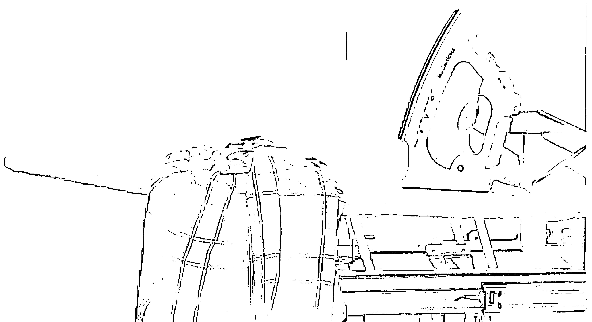

這是一個獨立的房間，你在裡面燙衣服，就算電器都放在廚房或浴室裡。這個房間也可以有其他用途（鍋爐室、雜物間），但是這些用途必須是次要的。

色彩可以應用在地板、天花板、牆壁、地磚、踢腳板、門、壁櫥門、暖氣、地毯、窗簾、家具、燈具、用品（織品除外）、畫作和它的主要色彩、框。如果衛浴設備和電器都是白色的，而白色不在你的選項之中，請不要驚慌，某些顏色會因為屬於某物品的象徵，而不再被視為顏色。大自然物質的顏色並不包含在內。

### 如果你獨居
在第 206 頁的行星位置表中找到月亮在你出生當日位在哪個星座。接著從第 64 至 87 頁，看看適合你的顏色有哪些。如欲更詳細的選擇，請翻至第 140 頁。

### 如果你與多人同住
盡情個人化第 140 頁的色彩吧！

請參閱第 152 頁的「做出你的決定」單元，可幫助你做出選擇。

#### 洗衣間是簡樸的功能性房間
瀰漫著皂香的洗衣間是一個功能性房間，我們在那裡洗衣服，也經常在那裡燙衣服。一般説來，我們不會去裝飾它，説得難聽一點，它根本還是原始狀態。這提醒了我們，宮殿裡慘澹的功能性房間和光彩奪目的接待室之間的反差。

洗衣間不是一個溫暖或冷漠的場所，也不乾燥或潮濕，也沒有四大元素。這是個簡樸的功能性房間，透過骯髒、潮濕、發皺變形、扁塌的衣物和內衣褲，揭開了家中每位成員的隱私。此外，你也知道這句俗諺「髒衣服絕不公開洗」*……

我們在那裡分類、洗滌、搓揉、瀝乾、晾曬、熨燙、折疊、整理、收納。所有這些活動都很耗神累人，又沒有什麼成就感，不比在其他房間從事的實用性活動。例如，我們下廚時，是用愛餵養全家人；當我們清掃住屋時，也是在清理自己的思緒，讓我們能夠轉移到另一件事上。

> * ne lave pas son linge sale en public，家醜不外揚的意思。

為洗衣間增彩添色，是刺激那位必須面對洗衣勞務的人，賜予他勇氣去做這件工作。「苦差事」一詞用得多好，因為洗衣間是我們還未能夠消除家事的地方。當然，我們改善了熨燙衣服這件工作，現在還有不易起皺的布料，只是離熨燙板壽終正寢的那天還久得很……

洗衣服這件苦差事（雖説大幅改善了）是一個時代的遺留，在那個時代中，能享受類似今日舒適生活的人，是那些大富大貴者的特權，而這迫使他們坐擁一大群僕人。

在我們這個平等（看看大明星的垃圾桶，你就會知道他們也會吃喝，也會使用所有我們使用的產品……）的社會中，我們可以説，洗衣間和洗衣服這件苦差事，都是一個「幸好已經結束，只是還無法徹底擺脫」的時代之見證。

- 保護—洗衣服、穿衣—交談—看電視、打電話—照顧孩子、收集—熨燙—澆水
- 做手工藝、工作—面對—起身、往來—做愛—供暖、磨光—熨燙
- 批評—計算—分類—獨處、做手工藝—工作、整理—收集

#### 對應洗衣間的行星
### 功能性房間
#### 讓苦差事不再那麼苦
#### 洗衣服是件質樸的差事
我們在浴室修復自己的身體和皮膚，在洗衣間則是修復我們的第二層皮膚——衣服。儘管我們努力呵護，但只要越常洗，衣物的顏色就褪得越厲害，有新衣服來到洗衣間的時候，更突顯了其他衣服的過時老舊。這些衣物有一點代表了我們自己，這個發現教我們瞭解：重要的是真實性，是「本質」而不是「外在」。這證明了我們在洗衣房裡完成的差事有多麼質樸。

- 月亮
- 火星
- 土星

### 套房與倉屋
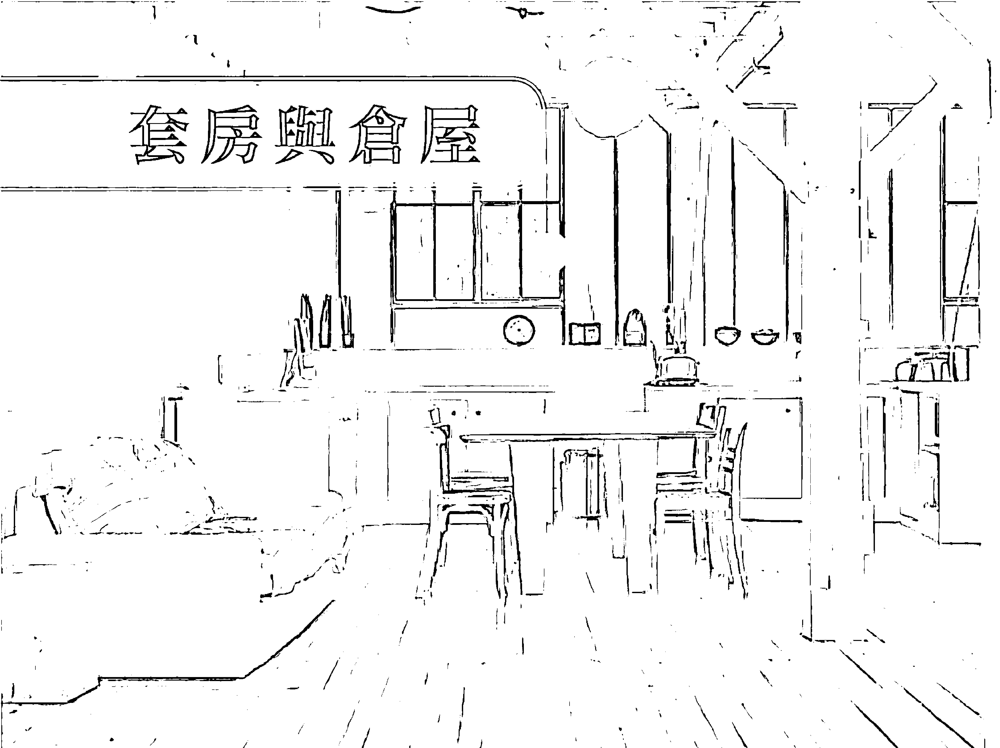

我們在這個單一房間裡生活和睡覺，面積大小不拘。那裡也有廚房或衛浴設備。色彩可以應用在地板、天花板、牆壁、地磚、踢腳板、門、壁櫥門、暖氣、地毯、窗簾、家具（包含沙發與床）、燈具、用品（包含餐盤）、畫作和它的主要色彩、框（注意，鏡子上的鍍銀會受到鏡框顏色的影響）。大自然物質及紀念品（它們對你的意義更為重要）的顏色並不包含在內。

### 如果你獨居
在第202頁的行星位置表中找到太陽在你出生當日位在哪個星座。接著從第64至87頁，看看適合你的顏色有哪些。如欲更詳細的選擇，請翻至第142頁。

### 如果你與多人同住
盡情個人化第142頁的色彩吧！

> 請參閱第152頁的「做出你的決定」單元，可幫助你做出選擇。

#### 套房的限制與倉屋的夢幻生活
#### 倉屋（loft）*
這是只有廁所與浴室（或者可能還有廚房）被分隔開的住宅。如果你住在倉屋，是出於刻意的選擇，因為你不願住在公寓或獨棟住宅裡。當然，有一些倉屋無法隔間，因為它們是舊工廠，白天的光線並不總是能到達我們希望它照射的地方。但是倉屋吸引你的地方，一定是它的開放空間，這代表你有開放的思想。選擇住在倉屋裡的人，是不需感覺受到保護，而是向其他人敞開心胸，以歡樂的方式看待人生，對世界有個理想觀點。這是來自 1970 年代，抗拒中產階級傳統價值觀的反從眾主義（anticonformism），他們不管什麼時候都在同一個地方睡覺、吃喝、下廚、做愛、創造、工作。

#### 套房
如果你住在套房裡，極有可能是出於省錢的必要性而做這個選擇。套房是空間的爭奪戰：放家具的空間，私人物品的空間，其他人的空間，你自己的空間。某些套房侷促到你一進門就感覺受到侵犯。更不用説一天中的每一刻都必須轉換想法（跟自己説「這地方讓我想睡覺」或是「這地方讓我想工作」）有多疲勞。你被迫在一個空間內，從白天過渡到夜晚，把床搬出來，把沙發床擺好，每天都要重做一遍並不好玩，而且確實能讓人打消那想小睡片刻的欲望。套房是窮人的住所，而且廚房飄來的味道會在每次就寢時提醒你這件事。你的客人也知道，他的眼光會比較批判，並注意到一些他在公寓裡不會注意到的東西。

*一般譯為「閣樓」，在本書中為了與屋內的閣樓區分，採用「倉屋」。

#### 粉碎隱私感
倉屋是一個自由的空間，而住套房則必須具備嚴謹和紀律，因為沒有這兩樣，你將會處在不可名狀的混亂中。在各自保留給單一用途的房間內，我們有更多的隱私。最早無論是農民或領主，都生活在唯一的房間中，因為需要隱私，而開始為住宅隔間。兩人一起住套房時，睡覺和清醒的人得想辦法避開對方。住在倉屋也未必比較美滿，就算空間不是問題：要如何在你需要靜一靜，伴侶卻在看電視時找到平靜呢？唯一的解決之道就是廁所或浴室。事實上，我們可以合情合理的自問，生活在同一個空間中的種種不便背後，是不是懷念著在臥室裡做所有事情的青少年時期？會不會也在懷念那段不復見的無憂無慮歲月？為了不喪失對這個世界的理想觀點，因此不願放棄那種無憂無慮的感覺？

#### 對應套房和閣樓的行星
| 星體 | 行星 | 相關活動 |
| :--- | :--- | :--- |
| ☉ | **太陽** | 招待朋友—交談、角色扮演—教育—裝飾、展示—照相—照亮、照鏡子—烘暖 |
| ♀ | **金星** | 招待朋友—品嚐—放鬆、做愛—跳舞—裝飾、刺繡—聽音樂、照鏡子—玩耍 |
| ☽ | **月亮** | 招待朋友—諮詢—吃、看電視—閱讀—展示、喝—作夢—休息—穿衣、交談—照鏡子 |

### 雜物間

#### 雜物間與家族祕密
這是一個總是關著門的地方，讓我們擺脫別人或是自己覺得礙眼的東西。我們可以在那裡找到占空間的東西，像是吸塵器、工作梯、掃帚、水桶。所有再也用不著卻又不想丟掉的東西雜七雜八的混在一起，從家具到小東西一應俱全。會占掉空間的東西，也就是會阻礙我們在屋內行走，還有阻礙我們想為人生帶來改變的東西。那些我們再也不想要的東西，顯示我們可以往前看了。

住屋在演進，而雜物間這個回憶場所保存了它所經歷的所有世代的遺跡。

你有發現這一堆為了「以防萬一」而保存下來的雜七雜八的東西，其實從來都用不著嗎？也許是因為你很難一下子就割捨掉這些東西，因為這些東西在你人生的某一刻，有點代表了你自己。因此，把它們存放在某個地方，等到完全忘記它們的那一天再丟掉，還是比較安心。

#### 讓它消失！
這是兩個空間（樓梯下方、壁龕）之外的殘餘空間。它可以是普通的掃帚櫃或是真正的房間。雜物間是家裡唯一可以被設在任何一個改變了用途的房間之處：臥室、浴室、廚房等等。事實上，雜物間是個垃圾桶，丟滿了我們不想放在家裡的東西，就像是住屋外面的一處地方。公寓的雜物間是陽臺；若是沒有地窖或閣樓的獨棟住宅，就會利用車庫。

地窖和閣樓有為住屋保暖隔熱及防潮的功能。它們只有在經過整理、有了用途之後，才會變成房間。

地窖位在地底下，傾斜的閣樓包覆著我們，因此地窖和閣樓分別表達了潛意識和內省，而這些特質也都加在雜物間的特質上了。

#### 藏著所有祕密的地方
當雜物間空無一物時，表達了什麼？祕密。這是一個祕密角落，我們可以躲進裡面搞消失。就像孩童時期玩捉迷藏的壁櫥一樣，那裡也是我們犯錯之後會躲藏的地方。它是保護我們不受他人侵犯的空間。雜物間後面或許暗藏通道，還有充滿祕密隔間及夾層的密室，都很容易引起遐想。隱匿在雜物間裡的寶藏，就是可能阻礙我們的祕密，就像一位埃及神明被迫服從那位知道祂的祕密名字的人。它是在那裡長大的、吃盡苦頭的孩子，曾經有過的祕密情人。家族祕密阻塞了溝通，拿家族頑固的舊包袱對抗每個人的進步，直到你死或我亡。我們做過的不太上得了檯面的事情，就像是壁櫥裡的骷髏*。壁櫥裡傳來的聲音讓我們驚嚇不已，因為我們畏懼的是揭發自己。直到我們離開壁櫥，讓自己解脫！

#### 對應雜物間的行星
| 行星 | 特徵 |
| :--- | :--- |
| 土星 | 工作—獨處—冥想、收集—計算—分類、批評—整理 |
| 月亮 | 作夢—保護、收集—堆積 |
| 冥王星 | 記帳—分類—修理、收集—清掃—揭穿、堅持—分析 |

> *家醜之意。

### 車庫與汽車
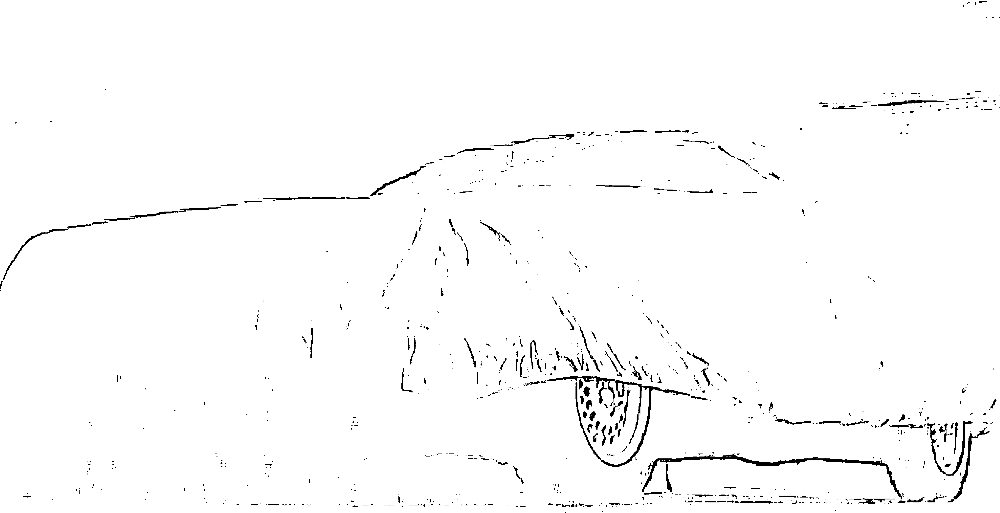

這裡只關係到車庫的內部空間，因為外部屬於室外（p.24）。這也包含汽車內外的顏色。

色彩可以應用在地板、天花板、牆壁、車庫門的內面門扉等等。色彩也可以應用在車子的內外。如果車庫內設備（例如鍋爐……）的顏色不在你的選項之中，也不必擔心，某些顏色會因為屬於某物品的象徵，而不再被視為顏色。大自然物質的顏色並不包含在內。

### 如果你獨居
在第202頁的行星位置表找到太陽在你出生當日位在何處。接著從第64至87頁，看看適合你的顏色有哪些。如欲更詳細的選擇，請翻至第146頁。

### 如果你與多人同住
盡情個人化第146頁的色彩吧！
請參閱第152頁的「做出你的決定」單元，可幫助你做出選擇。

#### 車庫，是希望
它可以設置在住屋中，或是一棟獨立的建築物。車庫是唯一不依照人而是依照車子的比例建蓋的房間，讓它跟住屋中的其他房間比起來像個外人。車庫是第二個玄關，也負責送往迎來。

在玄關裡，你穿上了可保護你不受外面世界侵害的大衣；在車庫中，你讓車子像個金屬鎧甲，包住自己。這些變化，門都可以作證：你從家裡進入車庫所經過的門，尺寸與你的衣著相近，然後離開車庫時所穿越的門，尺寸與汽車相近。

車庫沒有玄關那種令人印象深刻的特性。因為它是住屋的附屬建物，等同馬廄、牛欄、豬圈、雞舍、穀倉、工坊和堆放工具的場所。車庫樸實無華，就像聖誕節的馬槽。我們走過車庫時，總是滿手購物袋，我們在那裡做所有髒活：刷油漆、做些零活、修理機器。住屋的鍋爐、洗衣機和烘衣機，也都放在那裡。

車庫裡的東西漸漸越積越多，特別是在沒有地窖、沒有閣樓的住屋中。它最後被當成雜物間，汽車再也停不進去。直到一切都在「清倉拍賣」中清空，我們才會跟所有破爛說再見。

車庫是多出來的房間，充滿了希望，那可是個人電腦的誕生地呢！預設一間車庫，等於預設一個擴大住屋的可能性，可以整理成一間獨立套房給成長中的青少年，不然也可以是一間錄音室，或是……誰知道呢？

#### 汽車或是行動住屋
汽車，有點像是攜帶到外面世界的住屋。我們能夠靠身體感覺出車子能不能鑽過某個空間，停車時還能僅離其他障礙物幾公分遠，這是因為我們已經跟汽車融為一體，而這也是我們已變成這個住屋的證據。

所有在空間中移動的方式，都呼應了我們想掌控命運及人生的意志。思想就像個空間，而快速跑遍這個空間，就有一種我們是思緒的主人的感覺。

就像你住屋的室外一樣，汽車是你想呈現給別人看的自己。住屋呈現的是全家人的形象，但是車子呈現的是你自己的形象。當全家人同聚一堂時，不妨看看那一排汽車，你會看見眼前是全家人各種性格的濃縮，很有趣！彷彿這一輛接著一輛停放的汽車，代表著這些世代的延續。

| 對應行星 | 相關功能與活動 |
|---|---|
| 太陽 | 照亮—烘暖—主掌<br>角色扮演—招待朋友<br>激勵—交談—教導<br>教育—照相<br>收集—聚集 |
| 水星 | 工作—教導—交談<br>分類—計算—招待朋友<br>討論—打電話—探問<br>諮詢—做手工藝<br>停車—聽廣播 |
| 火星 | 往來—烘暖—活躍—奔跑<br>做手工藝—工作<br>切—園藝—運動<br>面對—做愛—磨光 |


## 十二星座的色彩

### 64 十二星座居家配色寶典

* BLANCS 白色
2
9

* COULEURS 彩色
23
24
26
32
36
37
38
44
65

* GRIS OU NOIR 灰色或黑色
77

### 牡羊座的色彩
- 一馬當先
- 精力充沛
- 熱情
- 獨立
- 意志堅定
- 不守紀律
- 急躁
- 自動自發
- 勇氣
- 自我中心

7
10
17
19
20
29
30
35
52
59
70
75

### 不建議使用的顏色

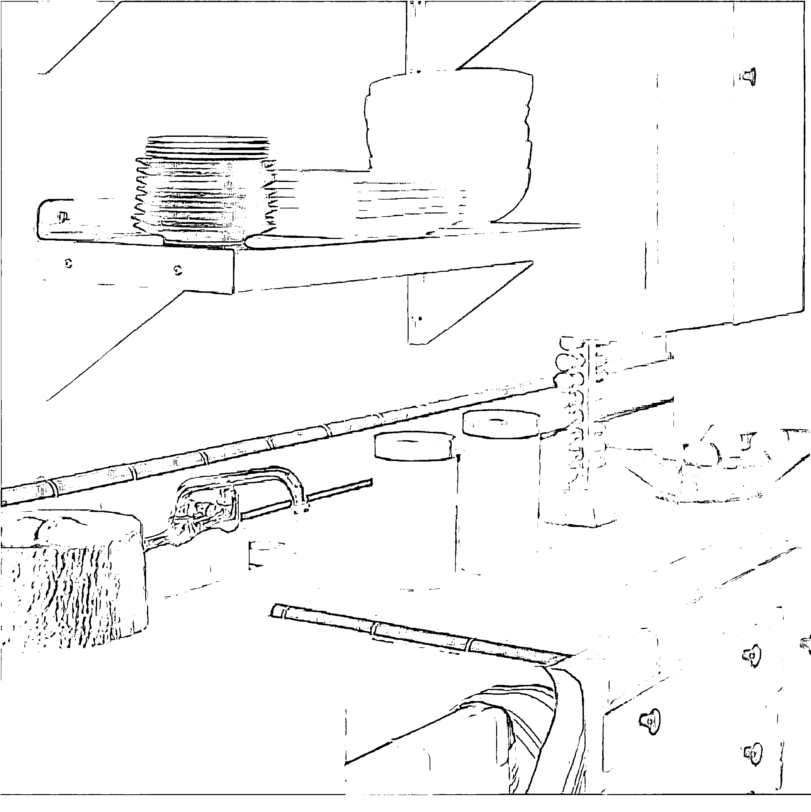

### 薇若妮克的小廚房
她的小廚房（p.36）可對應火星。
薇若妮克生於 1970 年 1 月 27 日。
當天火星（p.219）位在牡羊座上。
薇若妮克的小廚房含有牡羊座的色彩。

37 | 44
65 | 77

BLANCS 白色
1
4

COULEURS 彩色
12
22
37
39
40
45
49
53
67

GRIS OU NOIR 灰色或黑色
75

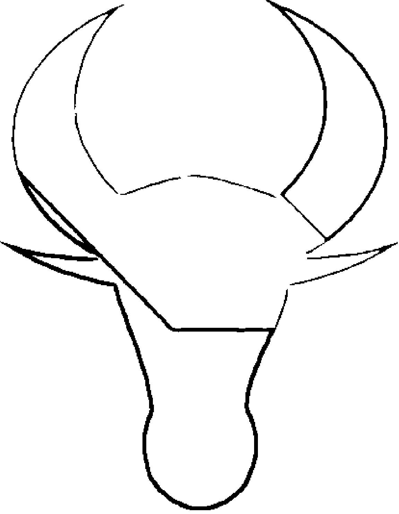

### 金牛座的色彩
- 創作力
- 意志堅定
- 可靠
- 謹慎
- 實際
- 物質主義
- 好色
- 慢條斯理
- 善妒
- 愛記仇

66 十二星座居家配色寶典

7
13
14
16
18
34
47
50
55
61
64

### 不建議使用的顏色
73

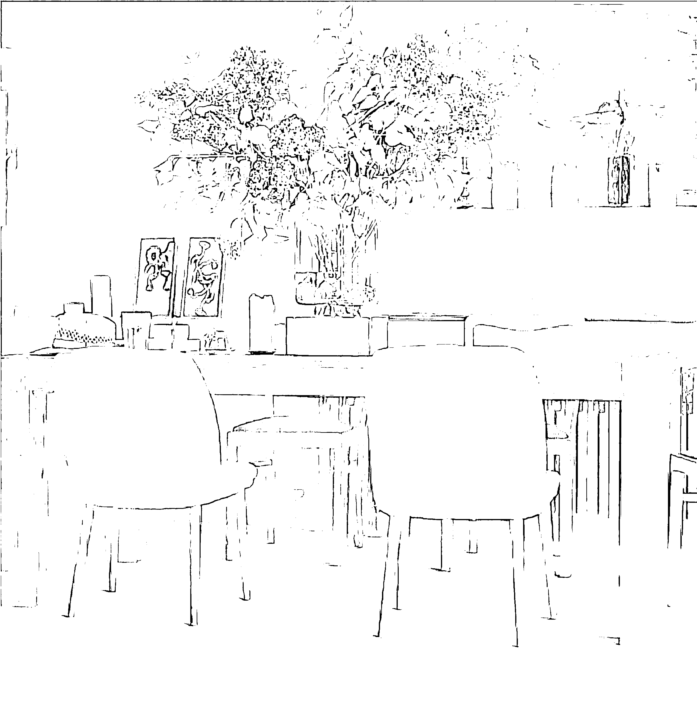

### 埃洛蒂的餐室
埃洛蒂的餐室（p.32）可對應木星。埃洛蒂生於 1988 年 6 月 15 日。當天木星（p.222）位在金牛座。埃洛蒂的餐室含有金牛座的色彩。

BLANCS 白色
2
3

COULEURS 彩色
14
15
16
34
47
48
50
61
64

GRIS OU NOIR 灰色或黑色
74

68 十二星座居家配色寶典

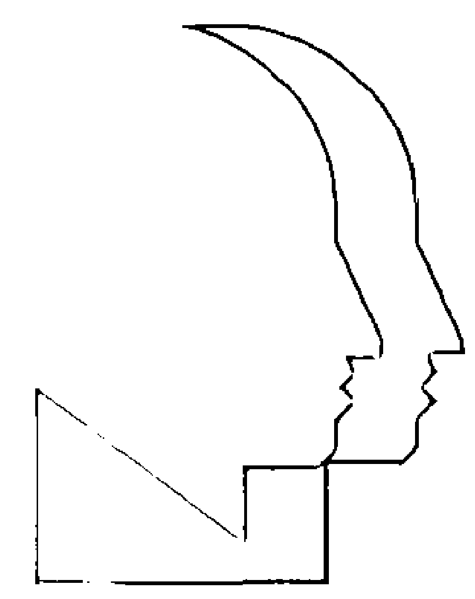

### 雙子座的色彩
- 好奇心
- 聰慧
- 能言善道
- 善於社交
- 具創造力
- 有幽默感
- 八面玲瓏
- 充滿生氣
- 反覆無常
- 飄忽不定

8
23
29
33
35
39
53
58
59
63
70
75

### 不建議使用的顏色

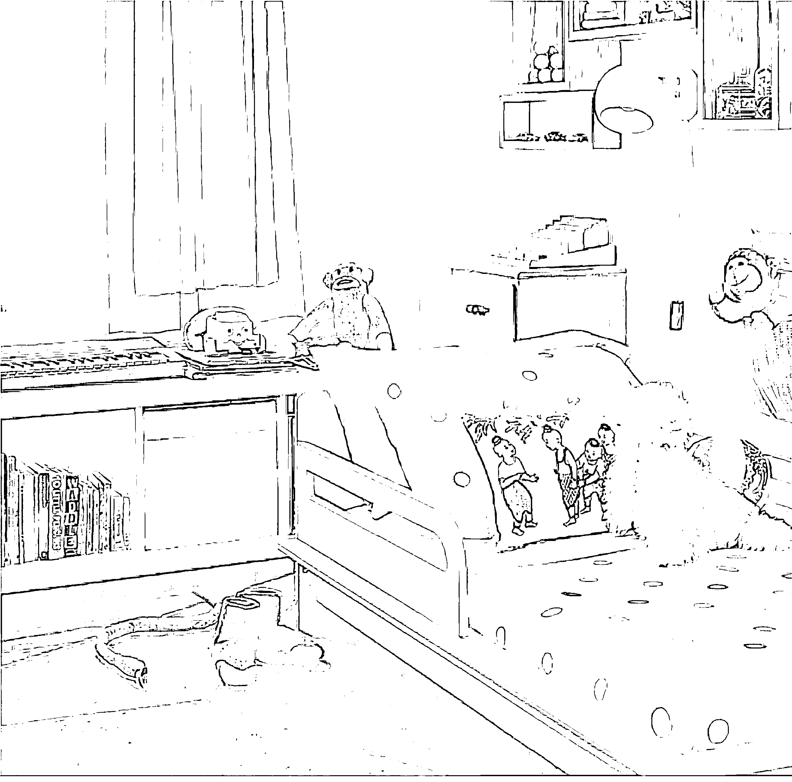

### 柔伊的兒童房
柔伊的兒童房（p.114）可對應月亮。柔伊生於 2012 年 5 月 22 日。當天月亮（p.206）位在雙子座。柔伊的兒童房含有雙子座的色彩。

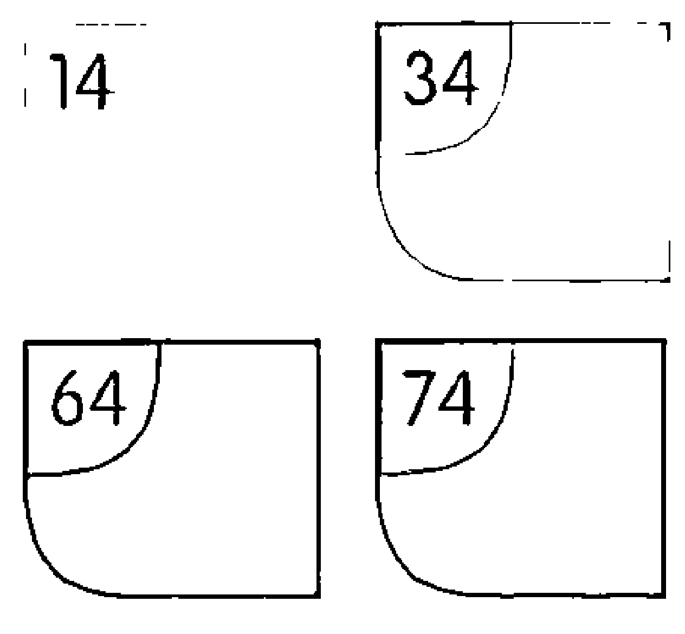

7
BLANCS 白色
8

COULEURS 彩色
11
19
33
39
42
46
49
52
60

GRIS OU NOIR 灰色或黑色
74

70 十二星座居家配色寶典

### 巨蟹座的色彩
- 注意力
- 直覺
- 機敏靈巧
- 忠貞
- 野心勃勃
- 寧靜
- 內向
- 頑強
- 情緒化
- 記憶力佳


3
24
25
27
36
48
61
62
64
65
71
73

不建議使用的顏色

### 娜塔莉的廚房
娜塔莉的廚房（p.34）可對應月亮。
娜塔莉生於 1969 年 5 月 20 日。
當天月亮（p.206）位在巨蟹座。
娜塔莉的廚房含有巨蟹座的色彩。


COULEURS 彩色

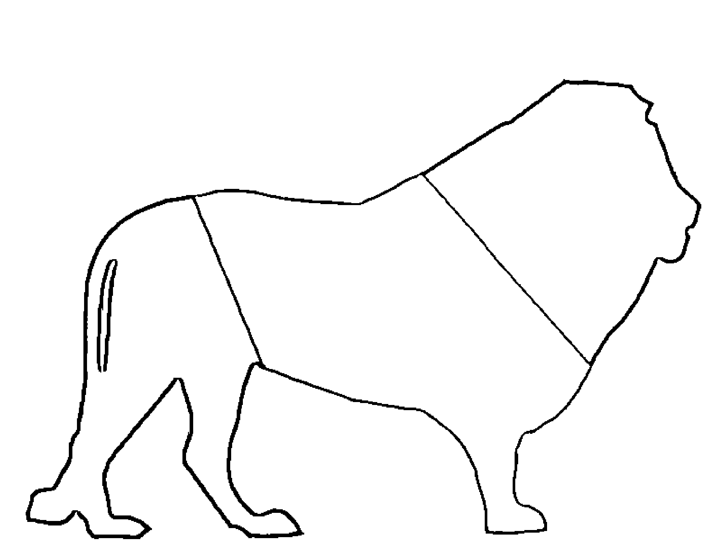

### 獅子座的色彩
- 慷慨
- 忠誠
- 歡樂
- 創造力
- 毅力
- 魅力
- 理想主義
- 專斷獨行
- 驕傲
- 威嚴

GRIS OU NOIR 灰色或黑色
BLANCS 白色
不建議使用的顏色
72 十二星座居家配色寶典

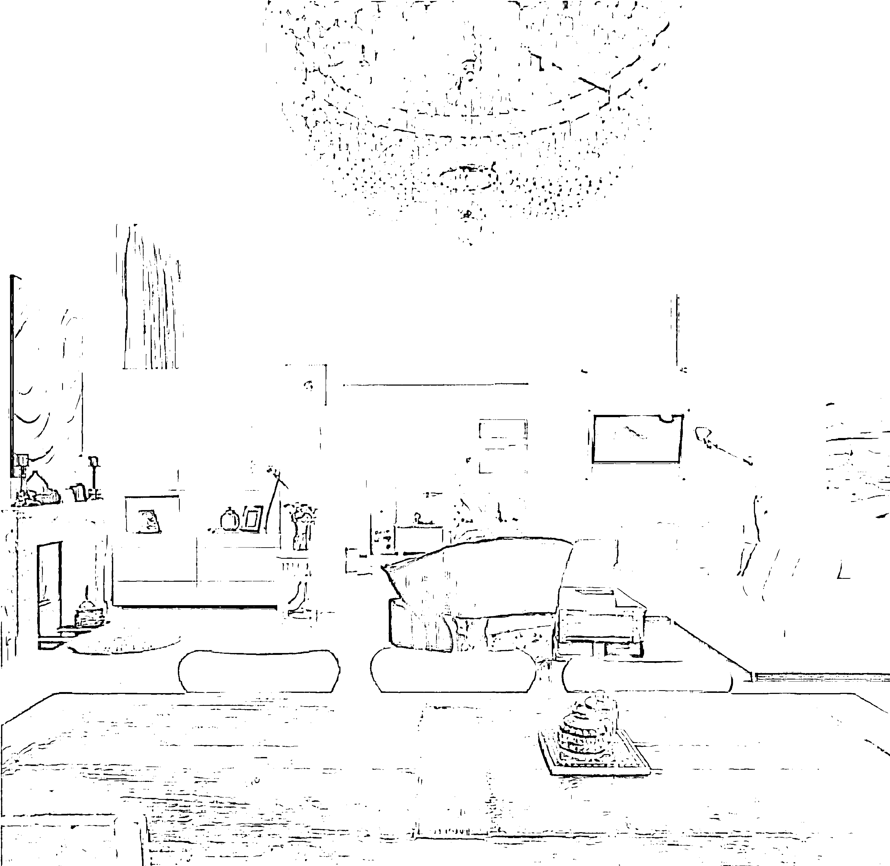

### 尼可拉的客廳
尼可拉的客廳（p.38）可對應金星。
尼可拉生於 1982 年 8 月 26 日。
當天金星（p.215）位在獅子座。
尼可拉的客廳含有獅子座的色彩。

| 3 | 28 | 36 |
|---|---|---|
|   | 65 | 77 |

BLANCS 白色
4
9

COULEURS 彩色
12
17
29
40
41
51
58
67
69

GRIS OU NOIR 灰色或黑色
74

74 十二星座居家配色寶典

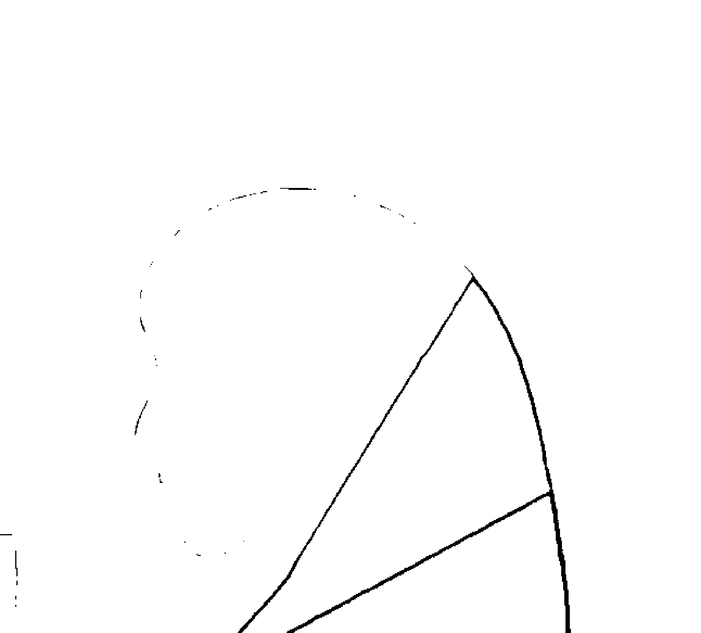

### 處女座的色彩
- 整潔
- 謹慎
- 樂於助人
- 謙虛
- 耐性
- 積極
- 誠實
- 焦慮
- 完美主義
- 紀律

2
20
24
27
28
31
36
44
49
62
70
76

不建議使用的顏色

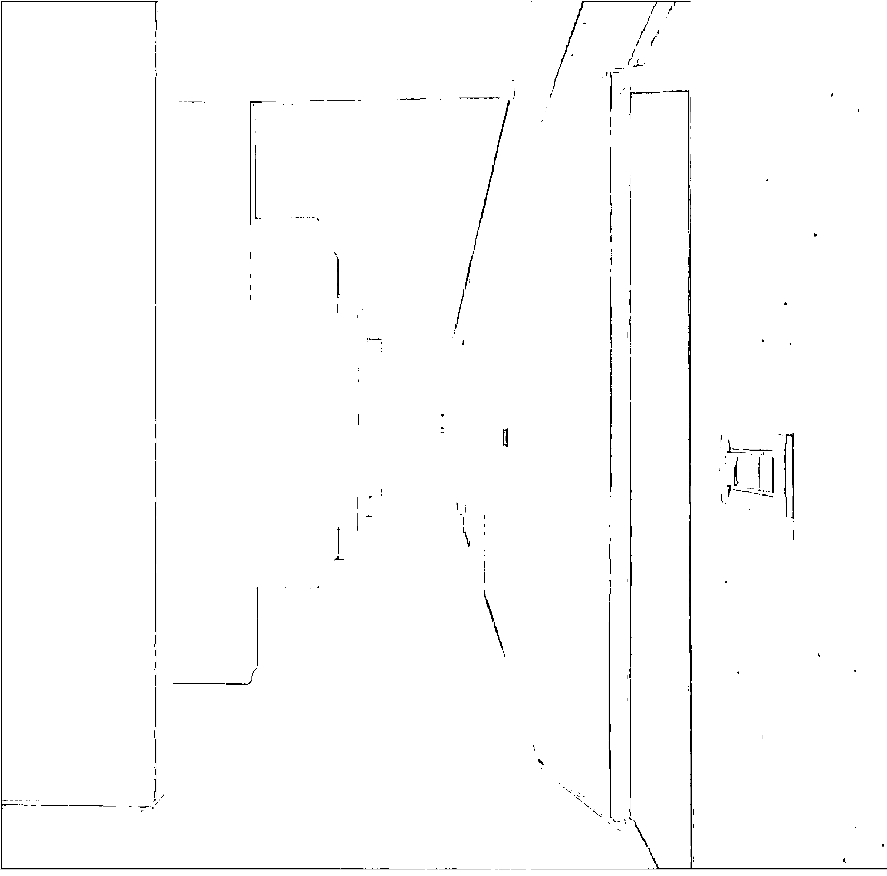

### 菲利浦的走廊
菲利浦的走廊（p.42）可對應水星。
菲利浦生於 1962 年 8 月 20 日。
當天水星（p.210）位在處女座。
菲利浦的走廊含有處女座的色彩。

| 12 | 17 |
| :--- | :--- |
|    | 41 |

BLANCS 白色
1
7

COULEURS 彩色
10
17
18
32
41
43
47
52
66

GRIS OU NOIR 灰色或黑色
76

### 天秤座的色彩
- 優雅
- 自戀
- 寬容
- 八面玲瓏
- 彬彬有禮
- 誘惑力
- 投機主義
- 漫不經心
- 依賴
- 優柔寡斷

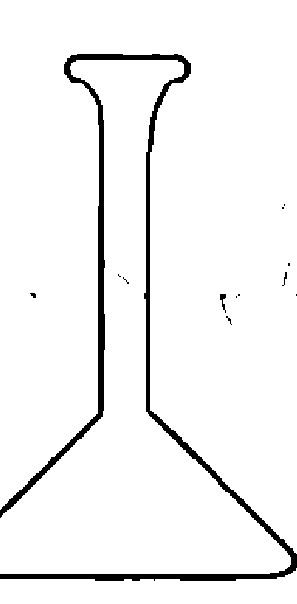

9
22
25
26
28
38
58
68
69
71
72
74

不建議使用的顏色

10 18 41 47

### 史黛芬妮的客廳
史黛芬妮的客廳（p.38）可對應金星。
史黛芬妮生於 1975 年 11 月 24 日。
當天金星（p.215）位在天秤座。
史黛芬妮的客廳含有天秤座的色彩。

| BLANCS 白色 |
|---|
| 2 |
| 4 |
| COULEURS 彩色 |
|---|
| 23 |
| 25 |
| 27 |
| 38 |
| 53 |
| 54 |
| 63 |
| 71 |
| 72 |
| GRIS OU NOIR 灰色或黑色 |
|---|
| 77 |

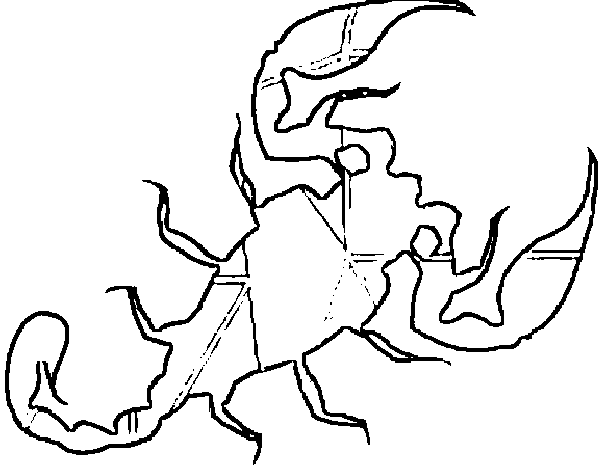

### 天蠍座的色彩
- 吸引力
- 感性
- 獨立自主
- 野心勃勃
- 感官享受
- 占有欲
- 滲透力
- 破壞力
- 報復心強
- 執迷

9
10
11
13
14
34
35
47
50
55
70

不建議使用的顏色
73
78 十二星座居家配色寶典

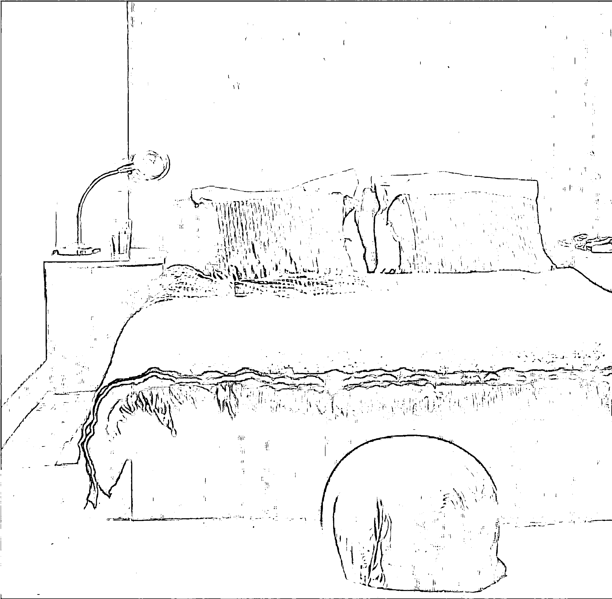

### 瑪麗的臥室
瑪麗的臥室（p.44）可對應月亮。瑪麗生於 1956 年 1 月 9 日。當天月亮（p.206）位在天蠍座。瑪麗的臥室含有天蠍座的色彩。

BLANCS 白色
3
5

COULEURS 彩色
21
27
28
35
56
57
60
62
66

GRIS OU NOIR 灰色或黑色
77

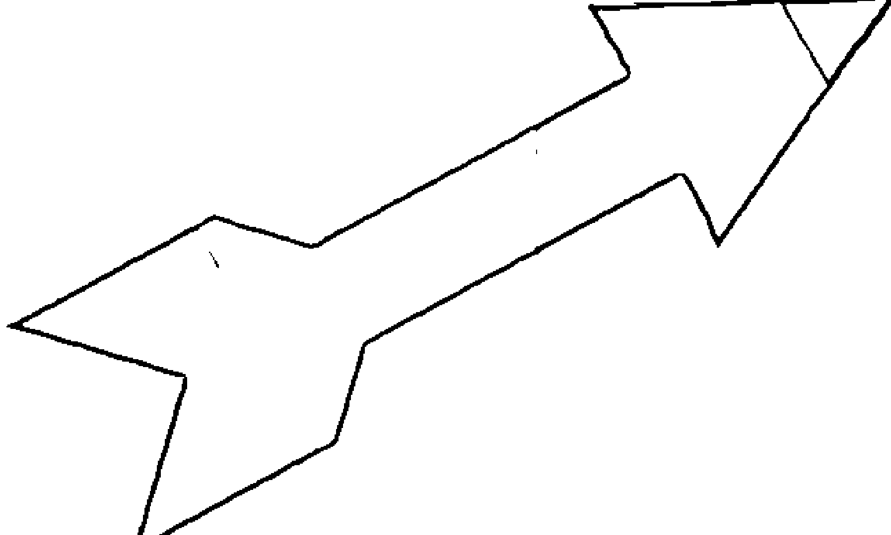

### 射手座的色彩
- 冒險精神
- 獨立
- 樂觀
- 不忠
- 缺乏條理
- 活力旺盛
- 灑脫
- 自我中心
- 率直
- 熱情

1
10
11
13
14
29
30
33
39
54
72
76

不建議使用的顏色
80 十二星座居家配色寶典

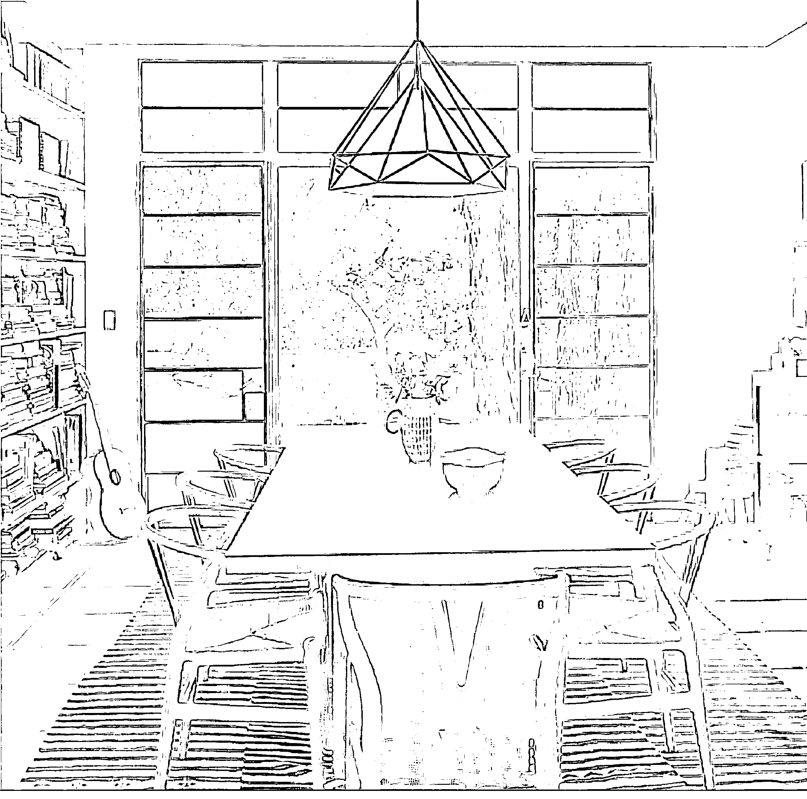

### 艾立克的餐室
艾立克的餐室（p.32）可對應木星。
艾立克生於 1971 年 3 月 3 日。
當天木星（p.222）位在射手座。
艾立克的餐室含有射手座的色彩。

3 十二星座的色彩 81

1
4
22
25
26
42
54
58
63
68
69
74

### 摩羯座的色彩
- 責任感
- 樸實
- 有條有理
- 嚴謹
- 保守
- 耐勞
- 自大
- 悲觀
- 穩定
- 威嚴

8
10
11
13
20
30
31
33
34
44
49
75

82 十二星座居家配色寶典

### 朱利安的浴室
朱利安的浴室（p.46）可對應海王星。
朱利安生於 1984 年 11 月 25 日。
當天海王星（p.226）位在摩羯座。
朱利安的浴室含有摩羯座的色彩。

| 1 | 69 |
|---|---|
|   | 74 |

BLANCS 白色
7

COULEURS 彩色
16
18
44
48
55
61
62
64
68

GRIS OU NOIR 灰色或黑色
73

### 水瓶座的色彩
- 和藹可親
- 獨立
- 理想主義
- 有系統
- 進步主義
- 創造
- 改革
- 魅力
- 慷慨
- 不妥協

3
11
30
31
33
34
35
38
40
52
53
76

不建議使用的顏色
84 十二星座居家配色寶典


### 伊涅絲的青少年臥室
伊涅絲的青少年臥室（p.120）可對應太陽。伊涅絲生於 2002 年 2 月 5 日。當天太陽（p.202）位在水瓶座。伊涅絲的青少年臥室含有水瓶座的色彩。

BLANCS 白色
6
8

COULEURS 彩色
13
19
20
30
51
57
59
70
72

GRIS OU NOIR 灰色或黑色
76


### 雙魚座的色彩
- 感受性
- 親密融洽
- 懶散
- 投機主義
- 憐憫
- 激情
- 主觀
- 優柔寡斷
- 軟弱
- 靈通

4
12
16
22
23
26
48
63
65
68
69
77

### 不建議使用的顏色


### 傑洛姆的餐室
傑洛姆的餐室（p.32）可對應木星。
傑洛姆生於 1974 年 9 月 15 日。
當天木星（p.222）位在雙魚座。
傑洛姆的餐室含有雙魚座的色彩。


## 創造你的個人色彩

### 一眨眼就完成了！

#### 1. 選擇空間
選擇空間並寫下使用該空間的每位家庭成員的名字。查看〈7 行星位置表〉，把每位家庭成員出生當天，與該房間對應的行星所在星座抄下來。

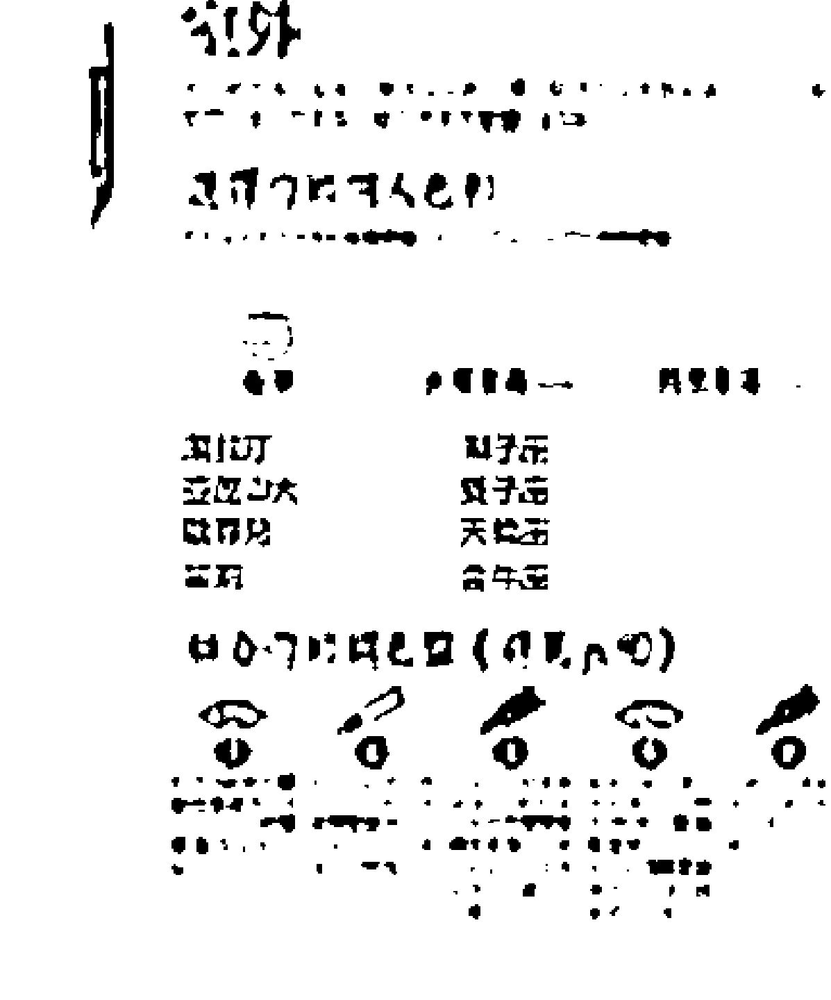
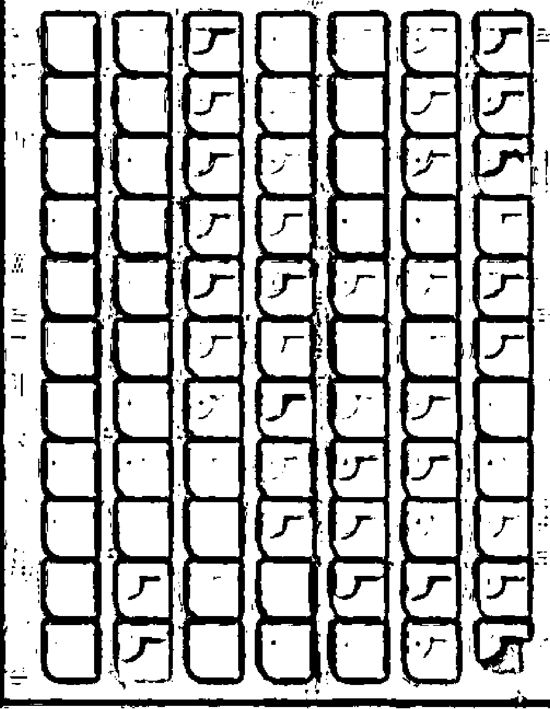

#### 2. 翻閱十二星座的色彩
翻至〈3 十二星座的色彩〉，第一位家庭成員的星座那一頁。

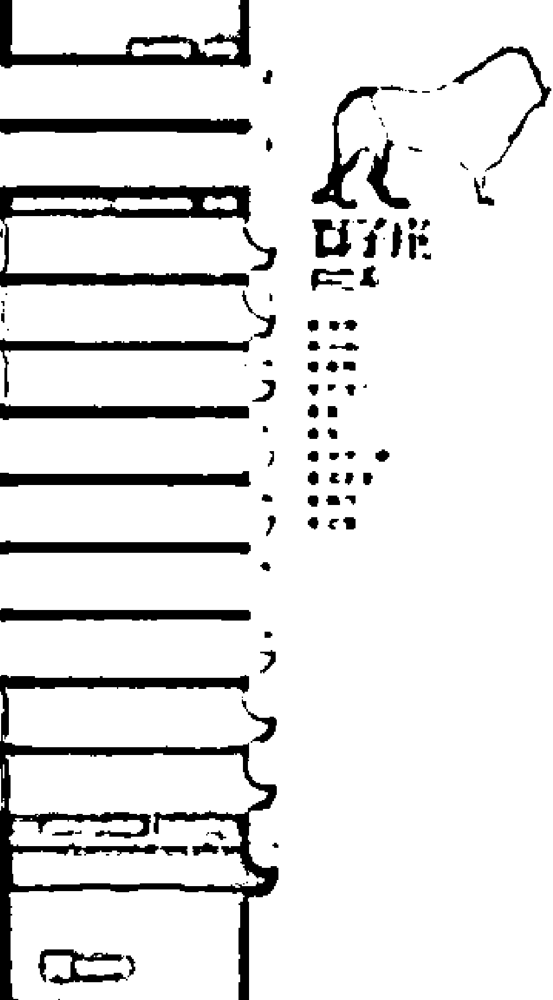
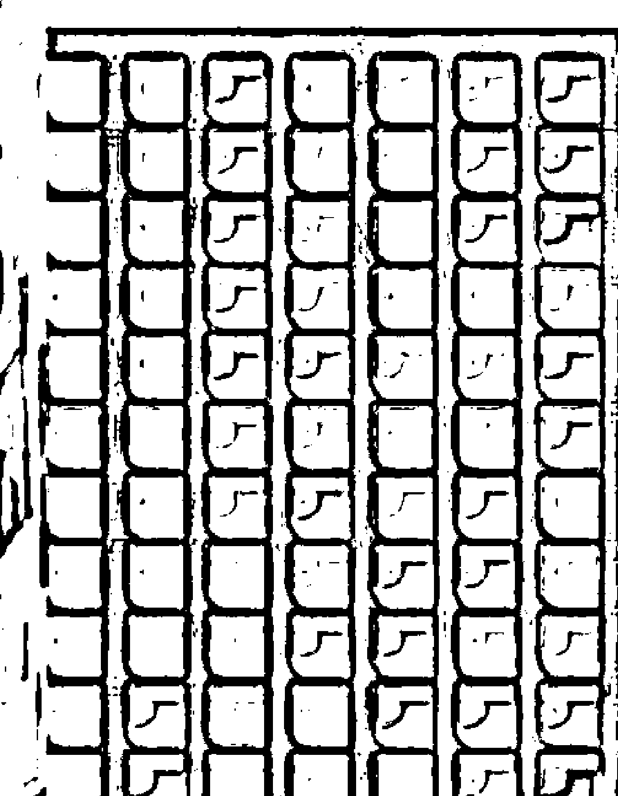

#### 3. 選取色彩
選取第一位家庭成員的星座色彩，再把他名字的簡稱寫在調色盤中的該星座色彩上面。

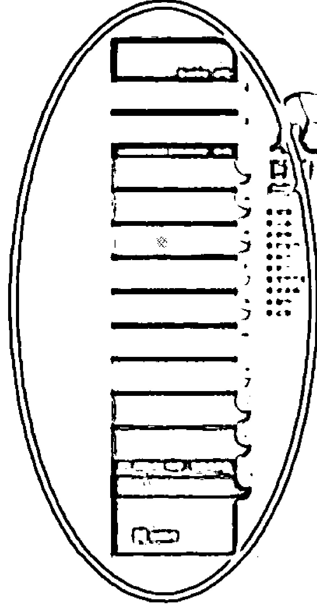
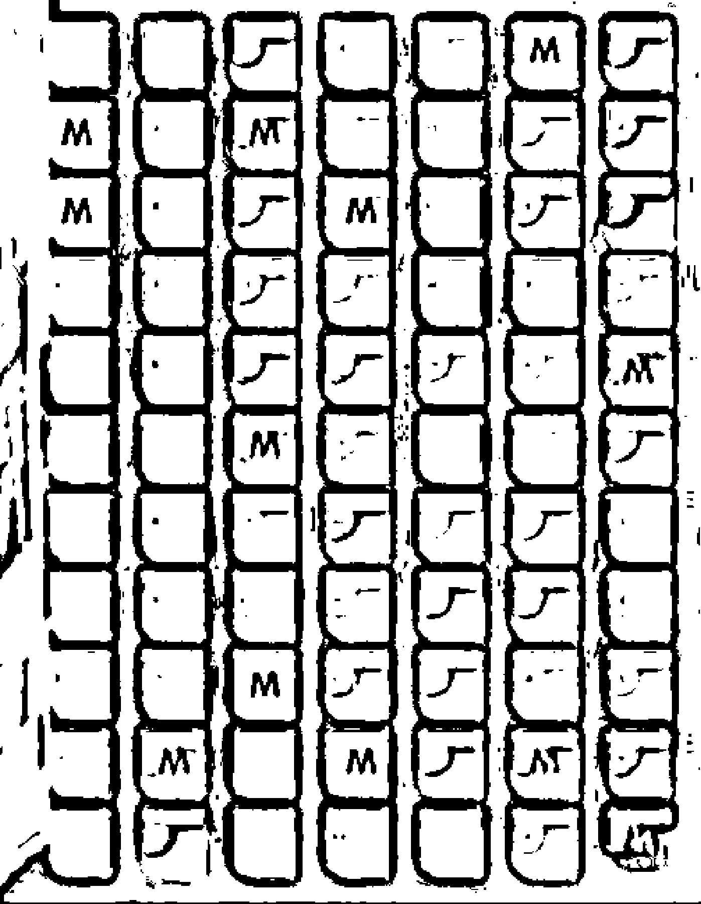

#### 4. 剔除不建議使用的色彩
用黑色奇異筆劃掉調色盤上每一種不建議使用的色彩。

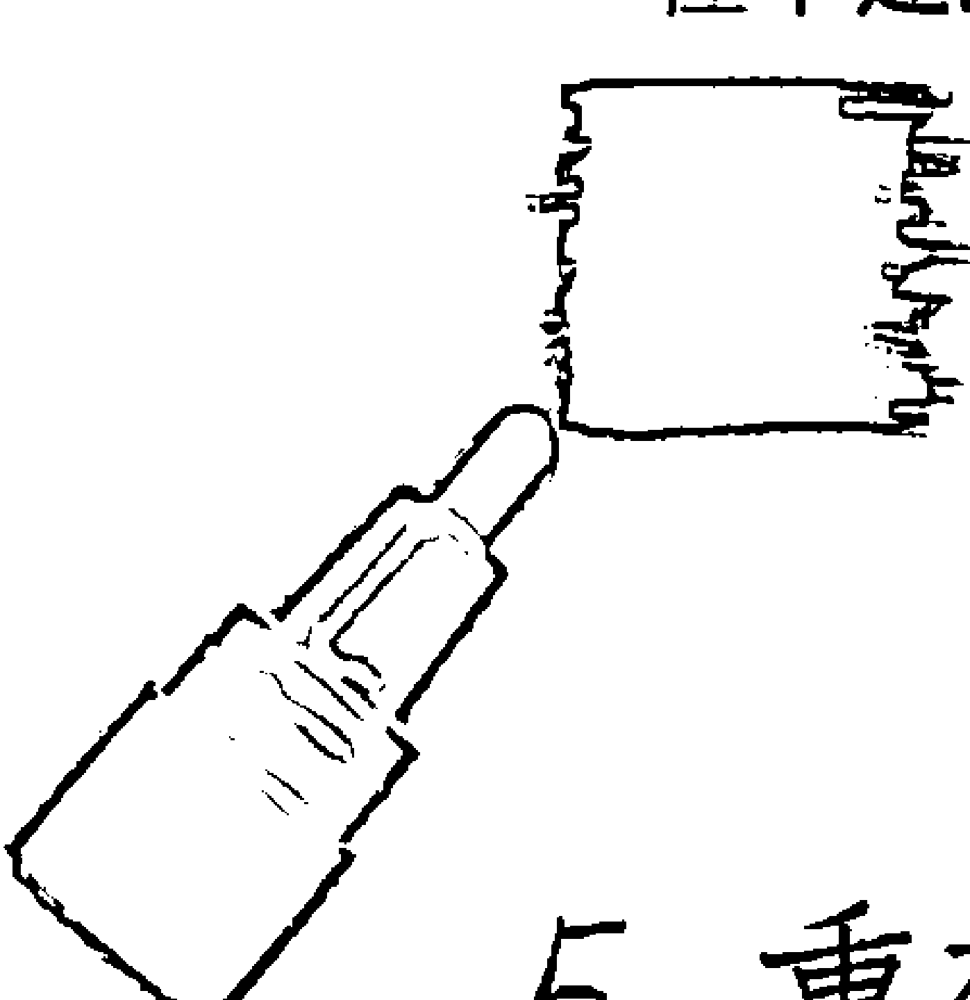
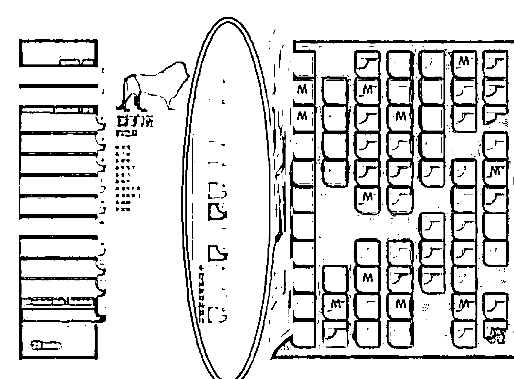

#### 5. 重複這些動作
為每位家庭成員做同樣的事。
剔除不建議使用的色彩，就算它們被其他星座或其他人選中也一樣。
如果你希望進一步細選，可以對應該房間的第二個行星，再進行一次。

#### 6. 你的調色盤完成了
用奇異筆劃掉那些沒有寫上名字的顏色。

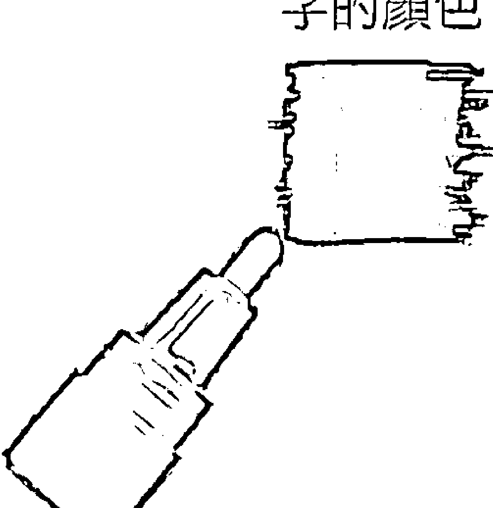
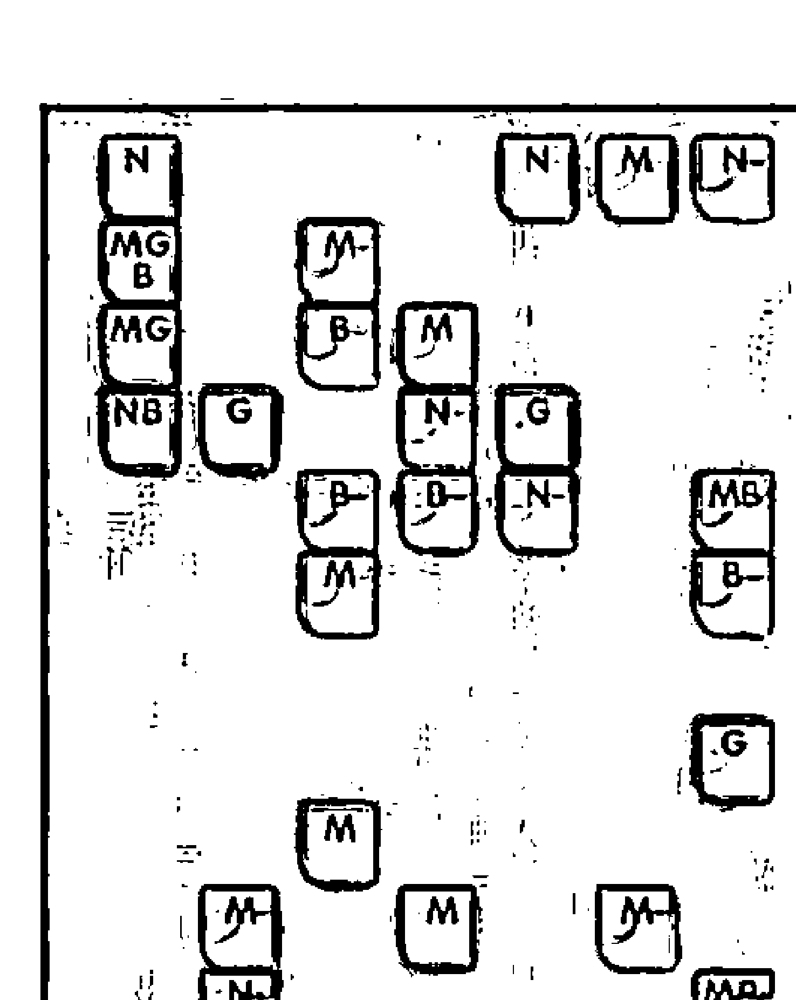

請參閱第 152 頁的「做出你的決定」單元，可幫助你做出選擇。

### 室外
指住屋外面，從街上便可見到的空間。對外人及家庭成員來說，這會是你們一家人的象徵。後院請參考客廳（p.106）。

## 選擇你的個人色彩
記下每位家庭成員的太陽星座，也可以再記下他們的月亮星座。

| 名字 | 太陽星座 (p.202) | 月亮星座 (p.206) |
|---|---|---|
|      |                  |                  |
|      |                  |                  |

### 組合你的調色盤（詳見 p.90）


翻至〈3 十二星座的色彩〉，查看這些人的太陽星座適合的色彩。


於右頁的調色板上，在這些人的太陽星座適合的色彩上，寫下其名字的簡稱。


用黑色奇異筆劃掉右頁調色板上每個不建議使用的色彩，就算它們被其他星座或其他人選中也一樣。


如果你希望進一步細選，可以翻至〈3 十二星座的色彩〉，用這些人的月亮星座適合的色彩，再進行一次。


用黑色奇異筆劃掉右頁調色板上沒有寫上任何簡稱的色彩。

請參閱第 152 頁的「做出你的決定」單元，可幫助你做出選擇。

| 1 | 2 | 3 | 4 | 5 | 6 | 7 |
|---|---|---|---|---|---|---|
| 1 | 12 | 23 | 34 | 45 | 56 | 67 |
| 2 | 13 | 24 | 35 | 46 | 57 | 68 |
| 3 | 14 | 25 | 36 | 47 | 58 | 69 |
| 4 | 15 | 26 | 37 | 48 | 59 | 70 |
| 5 | 16 | 27 | 38 | 49 | 60 | 71 |
| 6 | 17 | 28 | 39 | 50 | 61 | 72 |
| 7 | 18 | 29 | 40 | 51 | 62 | 73 |
| 8 | 19 | 30 | 41 | 52 | 63 | 74 |
| 9 | 20 | 31 | 42 | 53 | 64 | 75 |
| 10 | 21 | 32 | 43 | 54 | 65 | 76 |
| 11 | 22 | 33 | 44 | 55 | 66 | 77 |

### 玄關

這是一個空間或角落，面積大小不拘。你和客人就是從這個地方出入。如果你是從走廊或樓梯間進門，就用玄關的顏色來裝飾走廊或樓梯間。

## 選擇你的個人色彩

記下每位家庭成員的太陽星座，也可以再記下他們的木星星座。

| 名字 | 太陽星座 (p.202) | 木星星座 (p.222) |
|---|---|---|
| | | |

### 組合你的調色盤 (詳見 p.90)

- ① 翻至《3十二星座的色彩》，查看這些人的太陽星座適合的色彩。
- ② 於右頁的調色板上，在這些人的太陽星座適合的色彩上，寫下其名字的簡稱。
- ③ 用黑色奇異筆劃掉右頁調色板上每個不建議使用的色彩，就算它們被其他星座或其他人選中也一樣。
- ④ 如果你希望進一步細選，可以翻至《3十二星座的色彩》，用這些人的木星星座適合的色彩，再進行一次。
- ⑤ 用黑色奇異筆劃掉右頁調色板上沒有寫上任何簡稱的色彩。

> 請參閱第 152 頁的「做出你的決定」單元，可幫助你做出選擇。

| 1 | 2 | 3 | 4 | 5 | 6 | 7 |
|---|---|---|---|---|---|---|
| 1 | 12 | 23 | 34 | 45 | 56 | 67 |
| 2 | 13 | 24 | 35 | 46 | 57 | 68 |
| 3 | 14 | 25 | 36 | 47 | 58 | 69 |
| 4 | 15 | 26 | 37 | 48 | 59 | 70 |
| 5 | 16 | 27 | 38 | 49 | 60 | 71 |
| 6 | 17 | 28 | 39 | 50 | 61 | 72 |
| 7 | 18 | 29 | 40 | 51 | 62 | 73 |
| 8 | 19 | 30 | 41 | 52 | 63 | 74 |
| 9 | 20 | 31 | 42 | 53 | 64 | 75 |
| 10 | 21 | 32 | 43 | 54 | 65 | 76 |
| 11 | 22 | 33 | 44 | 55 | 66 | 77 |

### 樓梯間

如果樓梯位在一個房間（如玄關、客廳等）裡，樓梯間就必須採用這個房間的色彩。反之，樓梯若位在走廊上，則是走廊要採用樓梯間的用色。

## 選擇你的個人色彩

記下每位家庭成員的木星星座，也可以再記下他們的土星星座。

| 名字 | 木星星座 (p.222) | 土星星座 (p.224) |
|---|---|---|
| | | |
| | | |

### 組合你的調色盤（詳見 p.90）

- ① 翻至《3十二星座的色彩》，查看這些人的木星星座適合的色彩。
- ② 於右頁的調色板上，在這些人的木星星座適合的色彩上，寫下其名字的簡稱。
- ③ 用黑色奇異筆劃掉右頁調色板上每個不建議使用的色彩，就算它們被其他星座或其他人選中也一樣。
- ④ 如果你希望進一步細選，可以翻至《3十二星座的色彩》，用這些人的土星星座適合的色彩，再進行一次。
- ⑤ 用黑色奇異筆劃掉右頁調色板上沒有寫上任何簡稱的色彩。

> 請參閱第152頁的「做出你的決定」單元，可幫助你做出選擇。

| 1 | 2 | 3 | 4 | 5 | 6 | 7 |
|---|---|---|---|---|---|---|
| 1 | 12 | 23 | 34 | 45 | 56 | 67 |
| 2 | 13 | 24 | 35 | 46 | 57 | 68 |
| 3 | 14 | 25 | 36 | 47 | 58 | 69 |
| 4 | 15 | 26 | 37 | 48 | 59 | 70 |
| 5 | 16 | 27 | 38 | 49 | 60 | 71 |
| 6 | 17 | 28 | 39 | 50 | 61 | 72 |
| 7 | 18 | 29 | 40 | 51 | 62 | 73 |
| 8 | 19 | 30 | 41 | 52 | 63 | 74 |
| 9 | 20 | 31 | 42 | 53 | 64 | 75 |
| 10 | 21 | 32 | 43 | 54 | 65 | 76 |
| 11 | 22 | 33 | 44 | 55 | 66 | 77 |

### 客房

包含所有客人專用的房間，例如更衣室和浴室。如果你想為常客將客房個人化，可以參考主臥室 (p.112)。

## 選擇你的個人色彩

記下每位家庭成員的木星星座，也可以再記下他們的月亮星座。

| 名字 | 木星星座 (p.222) | 月亮星座 (p.206) |
|---|---|---|
| | | |

### 組合你的調色盤 (詳見 p.90)

- 1. 翻至《3十二星座的色彩》，查看這些人的木星星座適合的色彩。
- 2. 於右頁的調色板上，在這些人的木星星座適合的色彩上，寫下其名字的簡稱。
- 3. 用黑色奇異筆劃掉右頁調色板上每個不建議使用的色彩，就算它們被其他星座或其他人選中也一樣。
- 4. 如果你希望進一步細選，可以翻至《3十二星座的色彩》，用這些人的月亮星座適合的色彩，再進行一次。
- 5. 用黑色奇異筆劃掉右頁調色板上沒有寫上任何簡稱的色彩。

> 請參閱第152頁的「做出你的決定」單元，可幫助你做出選擇。

| 1 | 2 | 3 | 4 | 5 | 6 | 7 |
|---|---|---|---|---|---|---|
| 1 | 12 | 23 | 34 | 45 | 56 | 67 |
| 2 | 13 | 24 | 35 | 46 | 57 | 68 |
| 3 | 14 | 25 | 36 | 47 | 58 | 69 |
| 4 | 15 | 26 | 37 | 48 | 59 | 70 |
| 5 | 16 | 27 | 38 | 49 | 60 | 71 |
| 6 | 17 | 28 | 39 | 50 | 61 | 72 |
| 7 | 18 | 29 | 40 | 51 | 62 | 73 |
| 8 | 19 | 30 | 41 | 52 | 63 | 74 |
| 9 | 20 | 31 | 42 | 53 | 64 | 75 |
| 10 | 21 | 32 | 43 | 54 | 65 | 76 |
| 11 | 22 | 33 | 44 | 55 | 66 | 77 |

### 餐廳

這是你和客人用餐的地方，是主人擺出威嚴的舞臺。如果餐室和客廳在同一個空間，就請參考客廳 (p.106)。

## 選擇你的個人色彩

記下家中主人的木星星座，也可以再記下他們的金星星座。

| 名字 | 木星星座 (p.222) | 金星星座 (p.215) |
|---|---|---|
| | | |

### 組合你的調色盤 (詳見 p.90)

- ① 翻至《3十二星座的色彩》，查看這些人的木星星座適合的色彩。
- ② 於右頁的調色板上，在這些人的木星星座適合的色彩上，寫下其名字的簡稱。
- ③ 用黑色奇異筆劃掉右頁調色板上每個不建議使用的色彩，就算它們被其他星座或其他人選中也一樣。
- ④ 如果你希望進一步細選，可以翻至《3十二星座的色彩》，用這些人的金星星座適合的色彩，再進行一次。
- ⑤ 用黑色奇異筆劃掉右頁調色板上沒有寫上任何簡稱的色彩。

> 請參閱第152頁的「做出你的決定」單元，可幫助你做出選擇。

| 1 | 2 | 3 | 4 | 5 | 6 | 7 |
|---|---|---|---|---|---|---|
| 1 | 12 | 23 | 34 | 45 | 56 | 67 |
| 2 | 13 | 24 | 35 | 46 | 57 | 68 |
| 3 | 14 | 25 | 36 | 47 | 58 | 69 |
| 4 | 15 | 26 | 37 | 48 | 59 | 70 |
| 5 | 16 | 27 | 38 | 49 | 60 | 71 |
| 6 | 17 | 28 | 39 | 50 | 61 | 72 |
| 7 | 18 | 29 | 40 | 51 | 62 | 73 |
| 8 | 19 | 30 | 41 | 52 | 63 | 74 |
| 9 | 20 | 31 | 42 | 53 | 64 | 75 |
| 10 | 21 | 32 | 43 | 54 | 65 | 76 |
| 11 | 22 | 33 | 44 | 55 | 66 | 77 |

### 廚房

這是我們準備餐點，並且可以闔家用餐（甚至和客人一起）的地方。如果廚房是客廳的一部分，請參考客廳（p.106）。

## 選擇你的個人色彩

記下每位家庭成員的月亮星座，也可以再記下他們的火星星座。

| 名字 | 月亮星座 (p.206) | 火星星座 (p.219) |
|---|---|---|
| | | |

### 組合你的調色盤（詳見 p.90）

- ① 翻至《3十二星座的色彩》，查看這些人的月亮星座適合的色彩。
- ② 於右頁的調色板上，在這些人的月亮星座適合的色彩上，寫下其名字的簡稱。
- ③ 用黑色奇異筆劃掉右頁調色板上每個不建議使用的色彩，就算它們被其他星座或其他人選中也一樣。
- ④ 如果你希望進一步細選，可以翻至《3十二星座的色彩》，用這些人的火星星座適合的色彩，再進行一次。
- ⑤ 用黑色奇異筆劃掉右頁調色板上沒有寫上任何簡稱的色彩。

> 請參閱第152頁的「做出你的決定」單元，可幫助你做出選擇。

| 1 | 2 | 3 | 4 | 5 | 6 | 7 |
|---|---|---|---|---|---|---|
| 1 | 12 | 23 | 34 | 45 | 56 | 67 |
| 2 | 13 | 24 | 35 | 46 | 57 | 68 |
| 3 | 14 | 25 | 36 | 47 | 58 | 69 |
| 4 | 15 | 26 | 37 | 48 | 59 | 70 |
| 5 | 16 | 27 | 38 | 49 | 60 | 71 |
| 6 | 17 | 28 | 39 | 50 | 61 | 72 |
| 7 | 18 | 29 | 40 | 51 | 62 | 73 |
| 8 | 19 | 30 | 41 | 52 | 63 | 74 |
| 9 | 20 | 31 | 42 | 53 | 64 | 75 |
| 10 | 21 | 32 | 43 | 54 | 65 | 76 |
| 11 | 22 | 33 | 44 | 55 | 66 | 77 |

### 小廚房

這是一個可以關起來的凹室，或是無法闔家用餐的廚房。如果小廚房與客廳在同一個空間，請參考客廳（p.106）。

## 選擇你的個人色彩

記下家中成人的火星星座，也可以再記下他們的冥王星星座。

| 名字 | 火星星座 (p.219) | 冥王星星座 (p.227) |
|---|---|---|
| | | |

### 組合你的調色盤（詳見 p.90）

- ① 翻至《3十二星座的色彩》，查看這些人的火星星座適合的色彩。
- ② 於右頁的調色板上，在這些人的火星星座適合的色彩上，寫下其名字的簡稱。
- ③ 用黑色奇異筆劃掉右頁調色板上每個不建議使用的色彩，就算它們被其他星座或其他人選中也一樣。
- ④ 如果你希望進一步細選，可以翻至《3十二星座的色彩》，用這些人的冥王星星座適合的色彩，再進行一次。
- ⑤ 用黑色奇異筆劃掉右頁調色板上沒有寫上任何簡稱的色彩。

> 請參閱第 152 頁的「做出你的決定」單元，可幫助你做出選擇。

| 1 | 2 | 3 | 4 | 5 | 6 | 7 |
|---|---|---|---|---|---|---|
| 1 | 12 | 23 | 34 | 45 | 56 | 67 |
| 2 | 13 | 24 | 35 | 46 | 57 | 68 |
| 3 | 14 | 25 | 36 | 47 | 58 | 69 |
| 4 | 15 | 26 | 37 | 48 | 59 | 70 |
| 5 | 16 | 27 | 38 | 49 | 60 | 71 |
| 6 | 17 | 28 | 39 | 50 | 61 | 72 |
| 7 | 18 | 29 | 40 | 51 | 62 | 73 |
| 8 | 19 | 30 | 41 | 52 | 63 | 74 |
| 9 | 20 | 31 | 42 | 53 | 64 | 75 |
| 10 | 21 | 32 | 43 | 54 | 65 | 76 |
| 11 | 22 | 33 | 44 | 55 | 66 | 77 |

### 客廳與庭院

這是全家人休憩的場所。客廳裡可以放著餐桌或電視機。從街上看不見的室外空間，也要使用此處的適用色彩。招待客人用的客廳，可以參考玄關（p.94）。

## 選擇你的個人色彩

記下每位家庭成員的金星星座，也可以再記下他們的太陽星座。

| 名字 | 金星星座 (p.215) | 太陽星座 (p.202) |
|---|---|---|
| | | |

### 組合你的調色盤（詳見 p.90）

- 翻至《3十二星座的色彩》，查看這些人的金星星座適合的色彩。
- 於右頁的調色板上，在這些人的金星星座適合的色彩上，寫下其名字的簡稱。
- 用黑色奇異筆劃掉右頁調色板上每個不建議使用的色彩，就算它們被其他星座或其他人選中也一樣。
- 如果你希望進一步細選，可以翻至《3十二星座的色彩》，用這些人的太陽星座適合的色彩，再進行一次。
- 用黑色奇異筆劃掉右頁調色板上沒有寫上任何簡稱的色彩。

> 請參閱第 152 頁的「做出你的決定」單元，可幫助你做出選擇。

| 1 | 2 | 3 | 4 | 5 | 6 | 7 |
|---|---|---|---|---|---|---|
| 1 | 12 | 23 | 34 | 45 | 56 | 67 |
| 2 | 13 | 24 | 35 | 46 | 57 | 68 |
| 3 | 14 | 25 | 36 | 47 | 58 | 69 |
| 4 | 15 | 26 | 37 | 48 | 59 | 70 |
| 5 | 16 | 27 | 38 | 49 | 60 | 71 |
| 6 | 17 | 28 | 39 | 50 | 61 | 72 |
| 7 | 18 | 29 | 40 | 51 | 62 | 73 |
| 8 | 19 | 30 | 41 | 52 | 63 | 74 |
| 9 | 20 | 31 | 42 | 53 | 64 | 75 |
| 10 | 21 | 32 | 43 | 54 | 65 | 76 |
| 11 | 22 | 33 | 44 | 55 | 66 | 77 |

### 遊戲室

這是孩子們玩遊戲的地方（臥室用來睡覺和學習），也可以是大人使用的空間（例如打撞球）。

## 選擇你的個人色彩

記下每位會使用這個空間的家庭成員的水星星座，也可以再記下他們的太陽星座。

| 名字 | 水星星座 (p.210) | 太陽星座 (p.202) |
|---|---|---|
| | | |

### 組合你的調色盤 (詳見 p.90)

- ① 翻至《3十二星座的色彩》，查看這些人的水星星座適合的色彩。
- ② 於右頁的調色板上，在這些人的水星星座適合的色彩上，寫下其名字的簡稱。
- ③ 用黑色奇異筆劃掉右頁調色板上每個不建議使用的色彩，就算它們被其他星座或其他人選中也一樣。
- ④ 如果你希望進一步細選，可以翻至《3十二星座的色彩》，用這些人的太陽星座適合的色彩，再進行一次。
- ⑤ 用黑色奇異筆劃掉右頁調色板上沒有寫上任何簡稱的色彩。

> 請參閱第 152 頁的「做出你的決定」單元，可幫助你做出選擇。

### 走廊
這是住屋中的每一條走廊。如果走廊上有樓梯，請參考樓梯間 (p.96)。如果你是從走廊進入住屋，請參考玄關 (p.94)。

## 選擇你的個人色彩
記下每位家庭成員的水星星座，也可以再記下他們的火星星座。

### 名字

### 水星星座 (p.210)

### 火星星座 (p.219)

### 組合你的調色盤 (詳見 p.90)
翻至〈3十二星座的色彩〉，查看這些人的水星星座適合的色彩。

於右頁的調色板上，在這些人的水星星座適合的色彩上，寫下其名字的簡稱。

用黑色奇異筆劃掉右頁調色板上每個不建議使用的色彩，就算它們被其他星座或其他人選中也一樣。

如果你希望進一步細選，可以翻至〈3十二星座的色彩〉，用這些人的火星星座適合的色彩，再進行一次。

用黑色奇異筆劃掉右頁調色板上沒有寫上任何簡稱的色彩。

| 簡稱1 | 簡稱12 | 簡稱23 | 簡稱34 | 簡稱45 | 簡稱56 | 簡稱67 |
|---|---|---|---|---|---|---|
| 簡稱2 | 簡稱13 | 簡稱24 | 簡稱35 | 簡稱46 | 簡稱57 | 簡稱68 |
| 簡稱3 | 簡稱14 | 簡稱25 | 簡稱36 | 簡稱47 | 簡稱58 | 簡稱69 |
| 簡稱4 | 簡稱15 | 簡稱26 | 簡稱37 | 簡稱48 | 簡稱59 | 簡稱70 |
| 簡稱5 | 簡稱16 | 簡稱27 | 簡稱38 | 簡稱49 | 簡稱60 | 簡稱71 |
| 簡稱6 | 簡稱17 | 簡稱28 | 簡稱39 | 簡稱50 | 簡稱61 | 簡稱72 |
| 簡稱7 | 簡稱18 | 簡稱29 | 簡稱40 | 簡稱51 | 簡稱62 | 簡稱73 |
| 簡稱8 | 簡稱19 | 簡稱30 | 簡稱41 | 簡稱52 | 簡稱63 | 簡稱74 |
| 簡稱9 | 簡稱20 | 簡稱31 | 簡稱42 | 簡稱53 | 簡稱64 | 簡稱75 |
| 簡稱10 | 簡稱21 | 簡稱32 | 簡稱43 | 簡稱54 | 簡稱65 | 簡稱76 |
| 簡稱11 | 簡稱22 | 簡稱33 | 簡稱44 | 簡稱55 | 簡稱66 | 簡稱77 |

### 主臥室
這是父母的私人空間。孩子如果沒有自己的房間，可以睡在這裡。主臥室若位在過於開闊的樓中樓，則採用它所通往的房間的色彩。

## 選擇你的個人色彩
記下每位睡在這裡的家庭成員的月亮星座，也可以再記下他們的土星星座。

| 名字 | 月亮星座 (p.206) | 土星星座 (p.224) |
|---|---|---|
| | | |

### 組合你的調色盤 (詳見 p.90)
- ① 翻至〈3十二星座的色彩〉，查看這些人的月亮星座適合的色彩。
- ② 於右頁的調色板上，在這些人的月亮星座適合的色彩上，寫下其名字的簡稱。
- ③ 用黑色奇異筆劃掉右頁調色板上每個不建議使用的色彩，就算它們被其他星座或其他人選中也一樣。
- ④ 如果你希望進一步細選，可以翻至〈3十二星座的色彩〉，用這些人的土星星座適合的色彩，再進行一次。
- ⑤ 用黑色奇異筆劃掉右頁調色板上沒有寫上任何簡稱的色彩。

> 請參閱第152頁的「做出你的決定」單元，可幫助你做出選擇。

| 1 | 12 | 23 | 34 | 45 | 56 | 67 |
|---|---|---|---|---|---|---|
| 2 | 13 | 24 | 35 | 46 | 57 | 68 |
| 3 | 14 | 25 | 36 | 47 | 58 | 69 |
| 4 | 15 | 26 | 37 | 48 | 59 | 70 |
| 5 | 16 | 27 | 38 | 49 | 60 | 71 |
| 6 | 17 | 28 | 39 | 50 | 61 | 72 |
| 7 | 18 | 29 | 40 | 51 | 62 | 73 |
| 8 | 19 | 30 | 41 | 52 | 63 | 74 |
| 9 | 20 | 31 | 42 | 53 | 64 | 75 |
| 10 | 21 | 32 | 43 | 54 | 65 | 76 |
| 11 | 22 | 33 | 44 | 55 | 66 | 77 |

### 兒童房 1
如果家中的兒童與青少年共用臥室，請參考青少年臥室 (p.120)。在本書中，會自主要求換掉兒童房的孩子被視為青少年。

## 選擇你的個人色彩
記下每位睡在這裡的家庭成員的月亮星座，也可以再記下他們的水星星座。

| 名字 | 月亮星座 (p.206) | 水星星座 (p.210) |
|:---|:---|:---|
| (空白) | (空白) | (空白) |
| (空白) | (空白) | (空白) |
| (空白) | (空白) | (空白) |

### 組合你的調色盤 (詳見 p.90)
- ① 翻至〈3十二星座的色彩〉，查看這些人的月亮星座適合的色彩。
- ② 於右頁的調色板上，在這些人的月亮星座適合的色彩上，寫下其名字的簡稱。
- ③ 用黑色奇異筆劃掉右頁調色板上每個不建議使用的色彩，就算它們被其他星座或其他人選中也一樣。
- ④ 如果你希望進一步細選，可以翻至〈3十二星座的色彩〉，用這些人的水星星座適合的色彩，再進行一次。
- ⑤ 用黑色奇異筆劃掉右頁調色板上沒有寫上任何簡稱的色彩。

請參閱第 152 頁的「做出你的決定」單元，可幫助你做出選擇。

| 簡稱1 | 簡稱12 | 簡稱23 | 簡稱34 | 簡稱45 | 簡稱56 | 簡稱67 |
|---|---|---|---|---|---|---|
| 簡稱2 | 簡稱13 | 簡稱24 | 簡稱35 | 簡稱46 | 簡稱57 | 簡稱68 |
| 簡稱3 | 簡稱14 | 簡稱25 | 簡稱36 | 簡稱47 | 簡稱58 | 簡稱69 |
| 簡稱4 | 簡稱15 | 簡稱26 | 簡稱37 | 簡稱48 | 簡稱59 | 簡稱70 |
| 簡稱5 | 簡稱16 | 簡稱27 | 簡稱38 | 簡稱49 | 簡稱60 | 簡稱71 |
| 簡稱6 | 簡稱17 | 簡稱28 | 簡稱39 | 簡稱50 | 簡稱61 | 簡稱72 |
| 簡稱7 | 簡稱18 | 簡稱29 | 簡稱40 | 簡稱51 | 簡稱62 | 簡稱73 |
| 簡稱8 | 簡稱19 | 簡稱30 | 簡稱41 | 簡稱52 | 簡稱63 | 簡稱74 |
| 簡稱9 | 簡稱20 | 簡稱31 | 簡稱42 | 簡稱53 | 簡稱64 | 簡稱75 |
| 簡稱10 | 簡稱21 | 簡稱32 | 簡稱43 | 簡稱54 | 簡稱65 | 簡稱76 |
| 簡稱11 | 簡稱22 | 簡稱33 | 簡稱44 | 簡稱55 | 簡稱66 | 簡稱77 |

### 兒童房 2
如果家中的兒童與青少年共用臥室，請參考青少年臥室 (p.120)。在本書中，會自主要求換掉兒童房的孩子被視為青少年。

## 選擇你的個人色彩
記下每位睡在這裡的家庭成員的月亮星座，也可以再記下他們的水星星座。

| 名字 | 月亮星座 (p.206) | 水星星座 (p.210) |
|---|---|---|
| | | |

### 組合你的調色盤 (詳見 p.90)
- ① 翻至〈3十二星座的色彩〉，查看這些人的月亮星座適合的色彩。
- ② 於右頁的調色板上，在這些人的月亮星座適合的色彩上，寫下其名字的簡稱。
- ③ 用黑色奇異筆劃掉右頁調色板上每個不建議使用的色彩，就算它們被其他星座或其他人選中也一樣。
- ④ 如果你希望進一步細選，可以翻至〈3十二星座的色彩〉，用這些人的水星星座適合的色彩，再進行一次。
- ⑤ 用黑色奇異筆劃掉右頁調色板上沒有寫上任何簡稱的色彩。

> 請參閱第 152 頁的「做出你的決定」單元，可幫助你做出選擇。

| 簡稱1 | 簡稱12 | 簡稱23 | 簡稱34 | 簡稱45 | 簡稱56 | 簡稱67 |
|---|---|---|---|---|---|---|
| 簡稱2 | 簡稱13 | 簡稱24 | 簡稱35 | 簡稱46 | 簡稱57 | 簡稱68 |
| 簡稱3 | 簡稱14 | 簡稱25 | 簡稱36 | 簡稱47 | 簡稱58 | 簡稱69 |
| 簡稱4 | 簡稱15 | 簡稱26 | 簡稱37 | 簡稱48 | 簡稱59 | 簡稱70 |
| 簡稱5 | 簡稱16 | 簡稱27 | 簡稱38 | 簡稱49 | 簡稱60 | 簡稱71 |
| 簡稱6 | 簡稱17 | 簡稱28 | 簡稱39 | 簡稱50 | 簡稱61 | 簡稱72 |
| 簡稱7 | 簡稱18 | 簡稱29 | 簡稱40 | 簡稱51 | 簡稱62 | 簡稱73 |
| 簡稱8 | 簡稱19 | 簡稱30 | 簡稱41 | 簡稱52 | 簡稱63 | 簡稱74 |
| 簡稱9 | 簡稱20 | 簡稱31 | 簡稱42 | 簡稱53 | 簡稱64 | 簡稱75 |
| 簡稱10 | 簡稱21 | 簡稱32 | 簡稱43 | 簡稱54 | 簡稱65 | 簡稱76 |
| 簡稱11 | 簡稱22 | 簡稱33 | 簡稱44 | 簡稱55 | 簡稱66 | 簡稱77 |

### 兒童房 3
如果家中的兒童與青少年共用臥室，請參考青少年臥室 (p.120)。在本書中，會自主要求換掉兒童房的孩子被視為青少年。

## 選擇你的個人色彩
記下每位睡在這裡的家庭成員的月亮星座，也可以再記下他們的水星星座。

| 名字 | 月亮星座 (p.206) | 水星星座 (p.210) |
|:---|:---|:---|
| | | |

### 組合你的調色盤 (詳見 p.90)
- ① 翻至〈3十二星座的色彩〉，查看這些人的月亮星座適合的色彩。
- ② 於右頁的調色板上，在這些人的月亮星座適合的色彩上，寫下其名字的簡稱。
- ③ 用黑色奇異筆劃掉右頁調色板上每個不建議使用的色彩，就算它們被其他星座或其他人選中也一樣。
- ④ 如果你希望進一步細選，可以翻至〈3十二星座的色彩〉，用這些人的水星星座適合的色彩，再進行一次。
- ⑤ 用黑色奇異筆劃掉右頁調色板上沒有寫上任何簡稱的色彩。

請參閱第 152 頁的「做出你的決定」單元，可幫助你做出選擇。

| 簡稱1 | 簡稱12 | 簡稱23 | 簡稱34 | 簡稱45 | 簡稱56 | 簡稱67 |
|:---|:---|:---|:---|:---|:---|:---|
| 簡稱2 | 簡稱13 | 簡稱24 | 簡稱35 | 簡稱46 | 簡稱57 | 簡稱68 |
| 簡稱3 | 簡稱14 | 簡稱25 | 簡稱36 | 簡稱47 | 簡稱58 | 簡稱69 |
| 簡稱4 | 簡稱15 | 簡稱26 | 簡稱37 | 簡稱48 | 簡稱59 | 簡稱70 |
| 簡稱5 | 簡稱16 | 簡稱27 | 簡稱38 | 簡稱49 | 簡稱60 | 簡稱71 |
| 簡稱6 | 簡稱17 | 簡稱28 | 簡稱39 | 簡稱50 | 簡稱61 | 簡稱72 |
| 簡稱7 | 簡稱18 | 簡稱29 | 簡稱40 | 簡稱51 | 簡稱62 | 簡稱73 |
| 簡稱8 | 簡稱19 | 簡稱30 | 簡稱41 | 簡稱52 | 簡稱63 | 簡稱74 |
| 簡稱9 | 簡稱20 | 簡稱31 | 簡稱42 | 簡稱53 | 簡稱64 | 簡稱75 |
| 簡稱10 | 簡稱21 | 簡稱32 | 簡稱43 | 簡稱54 | 簡稱65 | 簡稱76 |
| 簡稱11 | 簡稱22 | 簡稱33 | 簡稱44 | 簡稱55 | 簡稱66 | 簡稱77 |

### 青少年臥室 1
在本書中，會自主要求換掉兒童房的孩子被視為青少年。如果家中的兒童與青少年共用臥室，請將他們視為青少年。

## 選擇你的個人色彩
記下每位睡在這裡的家庭成員的太陽星座，也可以再記下他們的土星星座。

| 名字 | 太陽星座 (p.202) | 土星星座 (p.224) |
|:---|:---|:---|
| | | |

### 組合你的調色盤 (詳見 p.90)
- ① 翻至〈3十二星座的色彩〉，查看這些人的太陽星座適合的色彩。
- ② 於右頁的調色板上，在這些人的太陽星座適合的色彩上，寫下其名字的簡稱。
- ③ 用黑色奇異筆劃掉右頁調色板上每個不建議使用的色彩，就算它們被其他星座或其他人選中也一樣。
- ④ 如果你希望進一步細選，可以翻至〈3十二星座的色彩〉，用這些人的土星星座適合的色彩，再進行一次。
- ⑤ 用黑色奇異筆劃掉右頁調色板上沒有寫上任何簡稱的色彩。

> 請參閱第 152 頁的「做出你的決定」單元，可幫助你做出選擇。

| 簡稱1 | 簡稱12 | 簡稱23 | 簡稱34 | 簡稱45 | 簡稱56 | 簡稱67 |
|:---:|:---:|:---:|:---:|:---:|:---:|:---:|
| 簡稱2 | 簡稱13 | 簡稱24 | 簡稱35 | 簡稱46 | 簡稱57 | 簡稱68 |
| 簡稱3 | 簡稱14 | 簡稱25 | 簡稱36 | 簡稱47 | 簡稱58 | 簡稱69 |
| 簡稱4 | 簡稱15 | 簡稱26 | 簡稱37 | 簡稱48 | 簡稱59 | 簡稱70 |
| 簡稱5 | 簡稱16 | 簡稱27 | 簡稱38 | 簡稱49 | 簡稱60 | 簡稱71 |
| 簡稱6 | 簡稱17 | 簡稱28 | 簡稱39 | 簡稱50 | 簡稱61 | 簡稱72 |
| 簡稱7 | 簡稱18 | 簡稱29 | 簡稱40 | 簡稱51 | 簡稱62 | 簡稱73 |
| 簡稱8 | 簡稱19 | 簡稱30 | 簡稱41 | 簡稱52 | 簡稱63 | 簡稱74 |
| 簡稱9 | 簡稱20 | 簡稱31 | 簡稱42 | 簡稱53 | 簡稱64 | 簡稱75 |
| 簡稱10 | 簡稱21 | 簡稱32 | 簡稱43 | 簡稱54 | 簡稱65 | 簡稱76 |
| 簡稱11 | 簡稱22 | 簡稱33 | 簡稱44 | 簡稱55 | 簡稱66 | 簡稱77 |

### 青少年臥室 2
在本書中，會自主要求換掉兒童房的孩子被視為青少年。如果家中的兒童與青少年共用臥室，請將他們視為青少年。

## 選擇你的個人色彩
記下每位睡在這裡的家庭成員的太陽星座，也可以再記下他們的土星星座。

| 名字 | 太陽星座 (p.202) | 土星星座 (p.224) |
|---|---|---|
| | | |

### 組合你的調色盤 (詳見 p.90)
- ① 翻至〈3十二星座的色彩〉，查看這些人的太陽星座適合的色彩。
- ② 於右頁的調色板上，在這些人的太陽星座適合的色彩上，寫下其名字的簡稱。
- ③ 用黑色奇異筆劃掉右頁調色板上每個不建議使用的色彩，就算它們被其他星座或其他人選中也一樣。
- ④ 如果你希望進一步細選，可以翻至〈3十二星座的色彩〉，用這些人的土星星座適合的色彩，再進行一次。
- ⑤ 用黑色奇異筆劃掉右頁調色板上沒有寫上任何簡稱的色彩。

> 請參閱第 152 頁的「做出你的決定」單元，可幫助你做出選擇。

| 簡稱1 | 簡稱12 | 簡稱23 | 簡稱34 | 簡稱45 | 簡稱56 | 簡稱67 |
|---|---|---|---|---|---|---|
| 簡稱2 | 簡稱13 | 簡稱24 | 簡稱35 | 簡稱46 | 簡稱57 | 簡稱68 |
| 簡稱3 | 簡稱14 | 簡稱25 | 簡稱36 | 簡稱47 | 簡稱58 | 簡稱69 |
| 簡稱4 | 簡稱15 | 簡稱26 | 簡稱37 | 簡稱48 | 簡稱59 | 簡稱70 |
| 簡稱5 | 簡稱16 | 簡稱27 | 簡稱38 | 簡稱49 | 簡稱60 | 簡稱71 |
| 簡稱6 | 簡稱17 | 簡稱28 | 簡稱39 | 簡稱50 | 簡稱61 | 簡稱72 |
| 簡稱7 | 簡稱18 | 簡稱29 | 簡稱40 | 簡稱51 | 簡稱62 | 簡稱73 |
| 簡稱8 | 簡稱19 | 簡稱30 | 簡稱41 | 簡稱52 | 簡稱63 | 簡稱74 |
| 簡稱9 | 簡稱20 | 簡稱31 | 簡稱42 | 簡稱53 | 簡稱64 | 簡稱75 |
| 簡稱10 | 簡稱21 | 簡稱32 | 簡稱43 | 簡稱54 | 簡稱65 | 簡稱76 |
| 簡稱11 | 簡稱22 | 簡稱33 | 簡稱44 | 簡稱55 | 簡稱66 | 簡稱77 |

### 青少年臥室 3

在本書中，會自主要求換掉兒童房的孩子被視為青少年。如果家中的兒童與青少年共用臥室，請將他們視為青少年。

## 選擇你的個人色彩
記下每位睡在這裡的家庭成員的太陽星座，也可以再記下他們的土星星座。

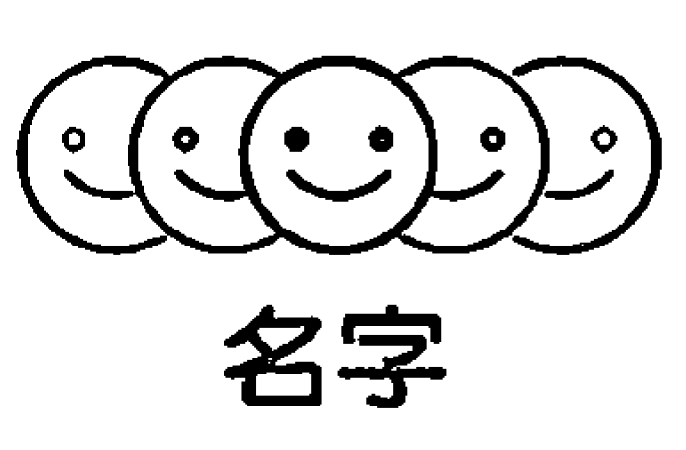

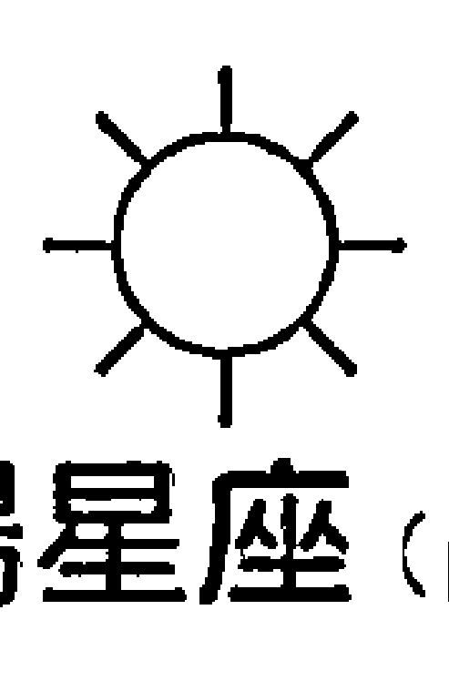

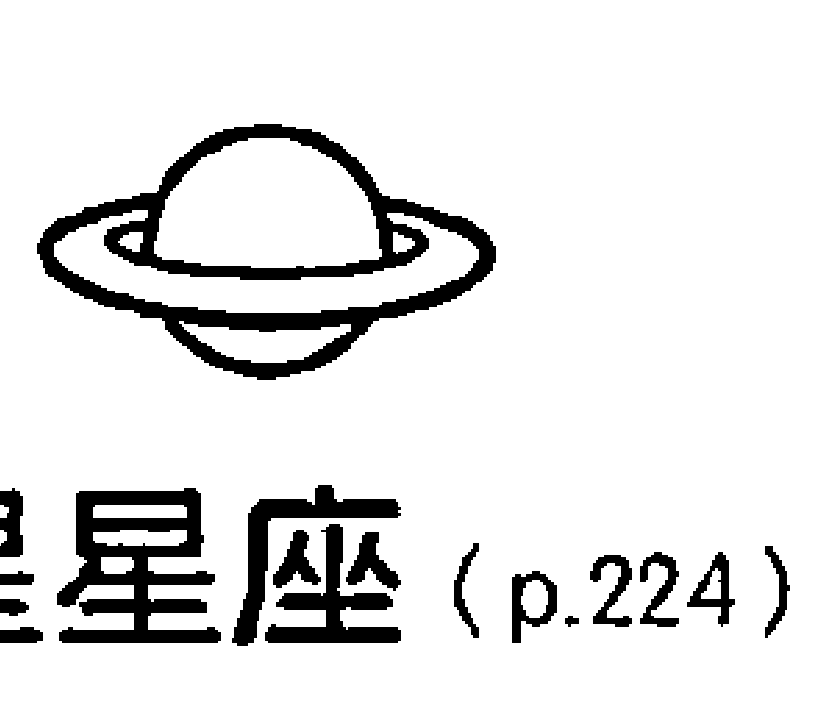

### 組合你的調色盤（詳見 p.90）
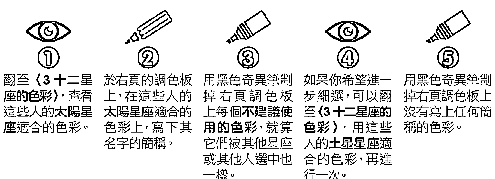

請參閱第 152 頁的「做出你的決定」單元，可幫助你做出選擇。

124 十二星座居家配色寶典

| 簡碼 1 | 簡碼 12 | 簡碼 23 | 簡碼 34 | 簡碼 45 | 簡碼 56 | 簡碼 67 |
|---|---|---|---|---|---|---|
| 1 | 12 | 23 | 34 | 45 | 56 | 67 |
| 2 | 13 | 24 | 35 | 46 | 57 | 68 |
| 3 | 14 | 25 | 36 | 47 | 58 | 69 |
| 4 | 15 | 26 | 37 | 48 | 59 | 70 |
| 5 | 16 | 27 | 38 | 49 | 60 | 71 |
| 6 | 17 | 28 | 39 | 50 | 61 | 72 |
| 7 | 18 | 29 | 40 | 51 | 62 | 73 |
| 8 | 19 | 30 | 41 | 52 | 63 | 74 |
| 9 | 20 | 31 | 42 | 53 | 64 | 75 |
| 10 | 21 | 32 | 43 | 54 | 65 | 76 |
| 11 | 22 | 33 | 44 | 55 | 66 | 77 |

### 浴室 1

這是不一定有馬桶，但是有浴缸或淋浴間的房間。如果浴室位在臥室一角，可參考主臥室（p.112）。

## 選擇你的個人色彩
記下每位家庭成員的海王星星座，也可以再記下他們的火星星座。

| 名字 | 海王星星座（p.226） | 火星星座（p.219） |
|---|---|---|
| | | |

### 組合你的調色盤（詳見 p.90）
- 1. 翻至〈3 十二星座的色彩〉，查看這些人的海王星星座適合的色彩。
- 2. 於右頁的調色板上，在這些人的海王星星座適合的色彩上，寫下其名字的簡稱。
- 3. 用黑色奇異筆劃掉右頁調色板上每個不建議使用的色彩，就算它們被其他星座或其他人選中也一樣。
- 4. 如果你希望進一步細選，可以翻至〈3 十二星座的色彩〉，用這些人的火星星座適合的色彩，再進行一次。
- 5. 用黑色奇異筆劃掉右頁調色板上沒有寫上任何簡稱的色彩。

請參閱第 152 頁的「做出你的決定」單元，可幫助你做出選擇。

| 簡碼 1 | 簡碼 12 | 簡碼 23 | 簡碼 34 | 簡碼 45 | 簡碼 56 | 簡碼 67 |
|---|---|---|---|---|---|---|
| 1 | 12 | 23 | 34 | 45 | 56 | 67 |
| 2 | 13 | 24 | 35 | 46 | 57 | 68 |
| 3 | 14 | 25 | 36 | 47 | 58 | 69 |
| 4 | 15 | 26 | 37 | 48 | 59 | 70 |
| 5 | 16 | 27 | 38 | 49 | 60 | 71 |
| 6 | 17 | 28 | 39 | 50 | 61 | 72 |
| 7 | 18 | 29 | 40 | 51 | 62 | 73 |
| 8 | 19 | 30 | 41 | 52 | 63 | 74 |
| 9 | 20 | 31 | 42 | 53 | 64 | 75 |
| 10 | 21 | 32 | 43 | 54 | 65 | 76 |
| 11 | 22 | 33 | 44 | 55 | 66 | 77 |

### 浴室 2

這是不一定有馬桶，但是有浴缸或淋浴間的房間。如果浴室位在臥室一角，可參考主臥室（p.112）。

## 選擇你的個人色彩
記下每位家庭成員的海王星星座，也可以再記下他們的火星星座。

| 名字 | 海王星星座（p.226） | 火星星座（p.219） |
|---|---|---|
| | | |

### 組合你的調色盤（詳見 p.90）
- 1. 翻至〈3 十二星座的色彩〉，查看這些人的海王星星座適合的色彩。
- 2. 於右頁的調色板上，在這些人的海王星星座適合的色彩上，寫下其名字的簡稱。
- 3. 用黑色奇異筆劃掉右頁調色板上每個不建議使用的色彩，就算它們被其他星座或其他人選中也一樣。
- 4. 如果你希望進一步細選，可以翻至〈3 十二星座的色彩〉，用這些人的火星星座適合的色彩，再進行一次。
- 5. 用黑色奇異筆劃掉右頁調色板上沒有寫上任何簡稱的色彩。

請參閱第 152 頁的「做出你的決定」單元，可幫助你做出選擇。

| 簡碼 1 | 簡碼 12 | 簡碼 23 | 簡碼 34 | 簡碼 45 | 簡碼 56 | 簡碼 67 |
|---|---|---|---|---|---|---|
| 1 | 12 | 23 | 34 | 45 | 56 | 67 |
| 2 | 13 | 24 | 35 | 46 | 57 | 68 |
| 3 | 14 | 25 | 36 | 47 | 58 | 69 |
| 4 | 15 | 26 | 37 | 48 | 59 | 70 |
| 5 | 16 | 27 | 38 | 49 | 60 | 71 |
| 6 | 17 | 28 | 39 | 50 | 61 | 72 |
| 7 | 18 | 29 | 40 | 51 | 62 | 73 |
| 8 | 19 | 30 | 41 | 52 | 63 | 74 |
| 9 | 20 | 31 | 42 | 53 | 64 | 75 |
| 10 | 21 | 32 | 43 | 54 | 65 | 76 |
| 11 | 22 | 33 | 44 | 55 | 66 | 77 |

### 浴室 3

這是不一定有馬桶，但是有浴缸或淋浴間的房間。如果浴室位在臥室一角，可參考主臥室（p.112）。

## 選擇你的個人色彩
記下每位家庭成員的海王星星座，也可以再記下他們的火星星座。

| 名字 | 海王星星座（p.226） | 火星星座（p.219） |
|---|---|---|
| | | |
| | | |
| | | |

### 組合你的調色盤（詳見 p.90）
- 1. 翻至〈3 十二星座的色彩〉，查看這些人的海王星星座適合的色彩。
- 2. 於右頁的調色板上，在這些人的海王星星座適合的色彩上，寫下其名字的簡稱。
- 3. 用黑色奇異筆劃掉右頁調色板上每個不建議使用的色彩，就算它們被其他星座或其他人選中也一樣。
- 4. 如果你希望進一步細選，可以翻至〈3 十二星座的色彩〉，用這些人的火星星座適合的色彩，再進行一次。
- 5. 用黑色奇異筆劃掉右頁調色板上沒有寫上任何簡稱的色彩。

請參閱第 152 頁的「做出你的決定」單元，可幫助你做出選擇。

130 十二星座居家配色寶典

| 簡碼 1 | 簡碼 12 | 簡碼 23 | 簡碼 34 | 簡碼 45 | 簡碼 56 | 簡碼 67 |
|---|---|---|---|---|---|---|
| 1 | 12 | 23 | 34 | 45 | 56 | 67 |
| 2 | 13 | 24 | 35 | 46 | 57 | 68 |
| 3 | 14 | 25 | 36 | 47 | 58 | 69 |
| 4 | 15 | 26 | 37 | 48 | 59 | 70 |
| 5 | 16 | 27 | 38 | 49 | 60 | 71 |
| 6 | 17 | 28 | 39 | 50 | 61 | 72 |
| 7 | 18 | 29 | 40 | 51 | 62 | 73 |
| 8 | 19 | 30 | 41 | 52 | 63 | 74 |
| 9 | 20 | 31 | 42 | 53 | 64 | 75 |
| 10 | 21 | 32 | 43 | 54 | 65 | 76 |
| 11 | 22 | 33 | 44 | 55 | 66 | 77 |

### 廁所

廁所裡沒有淋浴間，也沒有浴缸。我認為家中的每位成員都有權使用每間廁所。

## 選擇你的個人色彩
記下每位家庭成員的冥王星星座，也可以再記下他們的土星星座。

| 名字 | 冥王星星座（p.227） | 土星星座（p.224） |
|---|---|---|
| | | |

### 組合你的調色盤（詳見 p.90）
- 1. 翻至〈3 十二星座的色彩〉，查看這些人的冥王星星座適合的色彩。
- 2. 於右頁的調色板上，在這些人的冥王星星座適合的色彩上，寫下其名字的簡稱。
- 3. 用黑色奇異筆劃掉右頁調色板上每個不建議使用的色彩，就算它們被其他星座或其他人選中也一樣。
- 4. 如果你希望進一步細選，可以翻至〈3 十二星座的色彩〉，用這些人的土星星座適合的色彩，再進行一次。
- 5. 用黑色奇異筆劃掉右頁調色板上沒有寫上任何簡稱的色彩。

請參閱第 152 頁的「做出你的決定」單元，可幫助你做出選擇。

| 簡碼 1 | 簡碼 12 | 簡碼 23 | 簡碼 34 | 簡碼 45 | 簡碼 56 | 簡碼 67 |
|---|---|---|---|---|---|---|
| 1 | 12 | 23 | 34 | 45 | 56 | 67 |
| 2 | 13 | 24 | 35 | 46 | 57 | 68 |
| 3 | 14 | 25 | 36 | 47 | 58 | 69 |
| 4 | 15 | 26 | 37 | 48 | 59 | 70 |
| 5 | 16 | 27 | 38 | 49 | 60 | 71 |
| 6 | 17 | 28 | 39 | 50 | 61 | 72 |
| 7 | 18 | 29 | 40 | 51 | 62 | 73 |
| 8 | 19 | 30 | 41 | 52 | 63 | 74 |
| 9 | 20 | 31 | 42 | 53 | 64 | 75 |
| 10 | 21 | 32 | 43 | 54 | 65 | 76 |
| 11 | 22 | 33 | 44 | 55 | 66 | 77 |

### 書房

此處可以是一個獨立的房間或是房間的角落。如果臥室裡有個辦公角落，請參考主臥室（p.112）。

## 選擇你的個人色彩
記下每位家庭成員的天王星星座，也可以再記下他們的太陽星座。

| 名字 | 天王星座（p.225） | 太陽星座（p.202） |
|---|---|---|
| | | |

### 組合你的調色盤（詳見 p.90）
- 1. 翻至〈3 十二星座的色彩〉，查看這些人的天王星星座適合的色彩。
- 2. 於右頁的調色板上，在這些人的天王星星座適合的色彩上，寫下其名字的簡稱。
- 3. 用黑色奇異筆劃掉右頁調色板上每個不建議使用的色彩，就算它們被其他星座或其他人選中也一樣。
- 4. 如果你希望進一步細選，可以翻至〈3 十二星座的色彩〉，用這些人的太陽星座適合的色彩，再進行一次。
- 5. 用黑色奇異筆劃掉右頁調色板上沒有寫上任何簡稱的色彩。

> 請參閱第 152 頁的「做出你的決定」單元，可幫助你做出選擇。

- 問題 1
- 問題 2
- 問題 3
- 問題 4
- 問題 5
- 問題 6
- 問題 7
- 問題 8
- 問題 9
- 問題 10
- 問題 11
- 問題 12
- 問題 13
- 問題 14
- 問題 15
- 問題 16
- 問題 17
- 問題 18
- 問題 19
- 問題 20
- 問題 21
- 問題 22
- 問題 23
- 問題 24
- 問題 25
- 問題 26
- 問題 27
- 問題 28
- 問題 29
- 問題 30
- 問題 31
- 問題 32
- 問題 33
- 問題 34
- 問題 35
- 問題 36
- 問題 37
- 問題 38
- 問題 39
- 問題 40
- 問題 41
- 問題 42
- 問題 43
- 問題 44
- 問題 45
- 問題 46
- 問題 47
- 問題 48
- 問題 49
- 問題 50
- 問題 51
- 問題 52
- 問題 53
- 問題 54
- 問題 55
- 問題 56
- 問題 57
- 問題 58
- 問題 59
- 問題 60
- 問題 61
- 問題 62
- 問題 63
- 問題 64
- 問題 65
- 問題 66
- 問題 67
- 問題 68
- 問題 69
- 問題 70
- 問題 71
- 問題 72
- 問題 73
- 問題 74
- 問題 75
- 問題 76
- 問題 77

### 更衣室 1

這是一個獨立的房間，我們可以在裡面挑選服裝，也可以換衣服。如果你的更衣室是臥室裡的一座壁櫥，參考主臥室（p.112）。

## 選擇你的個人色彩
記下每位使用這個房間的家庭成員的太陽星座，也可以再記下他們的土星星座。

| 名字 | 太陽星座（p.202） | 土星星座（p.224） |
|---|---|---|
| ☺ ☺ ☺ ☺ ☺ | ☼ | ☄ |
| | | |

### 組合你的調色盤（詳見 p.90）
- 1. 翻至〈3 十二星座的色彩〉，查看這些人的太陽星座適合的色彩。
- 2. 於右頁的調色板上，在這些人的太陽星座適合的色彩上，寫下其名字的簡稱。
- 3. 用黑色奇異筆劃掉右頁調色板上每個不建議使用的色彩，就算它們被其他星座或其他人選中也一樣。
- 4. 如果你希望進一步細選，可以翻至〈3 十二星座的色彩〉，用這些人的土星星座適合的色彩，再進行一次。
- 5. 用黑色奇異筆劃掉右頁調色板上沒有寫上任何簡稱的色彩。

> 請參閱第 152 頁的「做出你的決定」單元，可幫助你做出選擇。

| 簡碼 1 | 簡碼 12 | 簡碼 23 | 簡碼 34 | 簡碼 45 | 簡碼 56 | 簡碼 67 |
|---|---|---|---|---|---|---|
| 1 | 12 | 23 | 34 | 45 | 56 | 67 |
| 2 | 13 | 24 | 35 | 46 | 57 | 68 |
| 3 | 14 | 25 | 36 | 47 | 58 | 69 |
| 4 | 15 | 26 | 37 | 48 | 59 | 70 |
| 5 | 16 | 27 | 38 | 49 | 60 | 71 |
| 6 | 17 | 28 | 39 | 50 | 61 | 72 |
| 7 | 18 | 29 | 40 | 51 | 62 | 73 |
| 8 | 19 | 30 | 41 | 52 | 63 | 74 |
| 9 | 20 | 31 | 42 | 53 | 64 | 75 |
| 10 | 21 | 32 | 43 | 54 | 65 | 76 |
| 11 | 22 | 33 | 44 | 55 | 66 | 77 |

### 更衣室 2

這是一個獨立的房間，我們可以在裡面挑選服裝，也可以換衣服。如果你的更衣室是臥室裡的一座壁櫥，參考主臥室（p.112）。

## 選擇你的個人色彩
記下每位使用這個房間的家庭成員的太陽星座，也可以再記下他們的土星星座。

| 名字 | 太陽星座（p.202） | 土星星座（p.224） |
|---|---|---|
| | | |

### 組合你的調色盤（詳見 p.90）
- 1. 翻至〈3 十二星座的色彩〉，查看這些人的太陽星座適合的色彩。
- 2. 於右頁的調色板上，在這些人的太陽星座適合的色彩上，寫下其名字的簡稱。
- 3. 用黑色奇異筆劃掉右頁調色板上每個不建議使用的色彩，就算它們被其他星座或其他人選中也一樣。
- 4. 如果你希望進一步細選，可以翻至〈3 十二星座的色彩〉，用這些人的土星星座適合的色彩，再進行一次。
- 5. 用黑色奇異筆劃掉右頁調色板上沒有寫上任何簡稱的色彩。

> 請參閱第 152 頁的「做出你的決定」單元，可幫助你做出選擇。

### 洗衣間

這是一個獨立的房間，就算電器都放在廚房或浴室裡，你還是會在裡面燙衣服。這個房間也可以有其他用途（鍋爐室、雜物間），但這些用途必須是次要的。

## 選擇你的個人色彩

記下每位負責洗衣服的家庭成員的月亮星座，也可以再記下他們的火星星座。
- 名字
- 月亮星座 (p.206)
- 火星星座 (p.219)

### 組合你的調色盤（詳見 p.90）

1. 翻至《3十二星座的色彩》，查看這些人的月亮星座適合的色彩。
2. 於右頁的調色板上，在這些人的月亮星座適合的色彩上，寫下其名字的簡稱。
3. 用黑色奇異筆劃掉右頁調色板上每個不建議使用的色彩，就算它們被其他星座或其他人選中也一樣。
4. 如果你希望進一步細選，可以翻至《3十二星座的色彩》，用這些人的火星星座適合的色彩，再進行一次。
5. 用黑色奇異筆劃掉右頁調色板上沒有寫上任何簡稱的色彩。

> 請參閱第 152 頁的「做出你的決定」單元，可幫助你做出選擇。

| 簡碼 | 簡碼 | 簡碼 | 簡碼 | 簡碼 | 簡碼 | 簡碼 |
|---|---|---|---|---|---|---|
| 1 | 12 | 23 | 34 | 45 | 56 | 67 |
| 2 | 13 | 24 | 35 | 46 | 57 | 68 |
| 3 | 14 | 25 | 36 | 47 | 58 | 69 |
| 4 | 15 | 26 | 37 | 48 | 59 | 70 |
| 5 | 16 | 27 | 38 | 49 | 60 | 71 |
| 6 | 17 | 28 | 39 | 50 | 61 | 72 |
| 7 | 18 | 29 | 40 | 51 | 62 | 73 |
| 8 | 19 | 30 | 41 | 52 | 63 | 74 |
| 9 | 20 | 31 | 42 | 53 | 64 | 75 |
| 10 | 21 | 32 | 43 | 54 | 65 | 76 |
| 11 | 22 | 33 | 44 | 55 | 66 | 77 |

| 簡碼 | 簡碼 | 簡碼 | 簡碼 | 簡碼 | 簡碼 | 簡碼 |
|---|---|---|---|---|---|---|
| 1 | 12 | 23 | 34 | 45 | 56 | 67 |
| 2 | 13 | 24 | 35 | 46 | 57 | 68 |
| 3 | 14 | 25 | 36 | 47 | 58 | 69 |
| 4 | 15 | 26 | 37 | 48 | 59 | 70 |
| 5 | 16 | 27 | 38 | 49 | 60 | 71 |
| 6 | 17 | 28 | 39 | 50 | 61 | 72 |
| 7 | 18 | 29 | 40 | 51 | 62 | 73 |
| 8 | 19 | 30 | 41 | 52 | 63 | 74 |
| 9 | 20 | 31 | 42 | 53 | 64 | 75 |
| 10 | 21 | 32 | 43 | 54 | 65 | 76 |
| 11 | 22 | 33 | 44 | 55 | 66 | 77 |

### 套房與倉屋

我們在這個單一房間裡生活和睡覺，面積大小不拘。那裡也有廚房設備或衛浴設備。

## 選擇你的個人色彩

記下每位生活在這裡的家庭成員的太陽星座，也可以再記下他們的金星星座。
| 名字 | 太陽星座(p.202) | 金星星座(p.215) |
| :---: | :---: | :---: |
| (笑脸图标) | (太阳图标) | (金星图标) |
| | | |

### 組合你的調色盤(詳見p.90)

1. 翻至〈3十二星座的色彩〉，查看這些人的太陽星座適合的色彩。
2. 於右頁的調色板上，在這些人的太陽星座適合的色彩上，寫下其名字的簡稱。
3. 用黑色奇異筆劃掉右頁調色板上每個不建議使用的色彩，就算它們被其他星座或其他人選中也一樣。
4. 如果你希望進一步細選，可以翻至〈3十二星座的色彩〉，用這些人的金星星座適合的色彩，再進行一次。
5. 用黑色奇異筆劃掉右頁調色板上沒有寫上任何簡稱的色彩。

> 請參閱第152頁的「做出你的決定」單元，可幫助你做出選擇。

| 簡碼 | 簡碼 | 簡碼 | 簡碼 | 簡碼 | 簡碼 | 簡碼 |
| :--- | :--- | :--- | :--- | :--- | :--- | :--- |
| 1 | 12 | 23 | 34 | 45 | 56 | 67 |
| 2 | 13 | 24 | 35 | 46 | 57 | 68 |
| 3 | 14 | 25 | 36 | 47 | 58 | 69 |
| 4 | 15 | 26 | 37 | 48 | 59 | 70 |
| 5 | 16 | 27 | 38 | 49 | 60 | 71 |
| 6 | 17 | 28 | 39 | 50 | 61 | 72 |
| 7 | 18 | 29 | 40 | 51 | 62 | 73 |
| 8 | 19 | 30 | 41 | 52 | 63 | 74 |
| 9 | 20 | 31 | 42 | 53 | 64 | 75 |
| 10 | 21 | 32 | 43 | 54 | 65 | 76 |
| 11 | 22 | 33 | 44 | 55 | 66 | 77 |

### 雜物間

這是一個用來存放物品的獨立房間或密閉角落。除了掃帚櫃之外，壁櫥並不被視為雜物間，而且壁櫥需要採用它所在房間的色彩。更衣室（p.136）有自己的用色。

## 選擇你的個人色彩

記下每位家庭成員的土星星座，也可以再記下他們的月亮星座。
| 名字 | 土星星座（p.224） | 月亮星座（p.206） |
| :--- | :--- | :--- |
| | | |

### 組合你的調色盤（詳見p.90）

1. 翻至〈3 十二星座的色彩〉，查看這些人的土星星座適合的色彩。
2. 於右頁的調色板上，在這些人的土星星座適合的色彩上，寫下其名字的簡稱。
3. 用黑色奇異筆劃掉右頁調色板上每個不建議使用的色彩，就算它們被其他星座或其他人選中也一樣。
4. 如果你希望進一步細選，可以翻至〈3 十二星座的色彩〉，用這些人的月亮星座適合的色彩，再進行一次。
5. 用黑色奇異筆劃掉右頁調色板上沒有寫上任何簡稱的色彩。

請參閱第 152 頁的「做出你的決定」單元，可幫助你做出選擇。

144 十二星座居家配色寶典

| 簡碼 | 簡碼 | 簡碼 | 簡碼 | 簡碼 | 簡碼 | 簡碼 |
|---|---|---|---|---|---|---|
| 1 | 12 | 23 | 34 | 45 | 56 | 67 |
| 2 | 13 | 24 | 35 | 46 | 57 | 68 |
| 3 | 14 | 25 | 36 | 47 | 58 | 69 |
| 4 | 15 | 26 | 37 | 48 | 59 | 70 |
| 5 | 16 | 27 | 38 | 49 | 60 | 71 |
| 6 | 17 | 28 | 39 | 50 | 61 | 72 |
| 7 | 18 | 29 | 40 | 51 | 62 | 73 |
| 8 | 19 | 30 | 41 | 52 | 63 | 74 |
| 9 | 20 | 31 | 42 | 53 | 64 | 75 |
| 10 | 21 | 32 | 43 | 54 | 65 | 76 |
| 11 | 22 | 33 | 44 | 55 | 66 | 77 |

### 車庫與汽車 1

這裡只關係到車庫的內部空間，因為外部屬於室外（p.92）。這也包含你的汽車內外的顏色。

## 選擇你的個人色彩

記下每位家庭成員的太陽星座，也可以再記下他們的水星星座。
| 名字 | 太陽星座（p.202） | 水星星座（p.210） |
| :--- | :--- | :--- |
| [笑脸图标] | [太阳图标] | [月亮图标] |

### 組合你的調色盤（詳見p.90）

1. 翻至〈3十二星座的色彩〉，查看這些人的太陽星座適合的色彩。
2. 於右頁的調色板上，在這些人的太陽星座適合的色彩上，寫下其名字的簡稱。
3. 用黑色奇異筆劃掉右頁調色板上每個不建議使用的色彩，就算它們被其他星座或其他人選中也一樣。
4. 如果你希望進一步細選，可以翻至〈3十二星座的色彩〉，用這些人的水星星座適合的色彩，再進行一次。
5. 用黑色奇異筆劃掉右頁調色板上沒有寫上任何簡稱的色彩。

> 請參閱第152頁的「做出你的決定」單元，可幫助你做出選擇。

| 簡碼 | 簡碼 | 簡碼 | 簡碼 | 簡碼 | 簡碼 | 簡碼 |
| :---: | :---: | :---: | :---: | :---: | :---: | :---: |
| 1 | 12 | 23 | 34 | 45 | 56 | 67 |
| 2 | 13 | 24 | 35 | 46 | 57 | 68 |
| 3 | 14 | 25 | 36 | 47 | 58 | 69 |
| 4 | 15 | 26 | 37 | 48 | 59 | 70 |
| 5 | 16 | 27 | 38 | 49 | 60 | 71 |
| 6 | 17 | 28 | 39 | 50 | 61 | 72 |
| 7 | 18 | 29 | 40 | 51 | 62 | 73 |
| 8 | 19 | 30 | 41 | 52 | 63 | 74 |
| 9 | 20 | 31 | 42 | 53 | 64 | 75 |
| 10 | 21 | 32 | 43 | 54 | 65 | 76 |
| 11 | 22 | 33 | 44 | 55 | 66 | 77 |

### 車庫與汽車 2

這裡只關係到車庫的內部空間，因為外部屬於室外（p.92）。這也包含你的汽車內外的顏色。

## 選擇你的個人色彩

記下每位家庭成員的太陽星座，也可以再記下他們的水星星座。
| 名字 | 太陽星座 (p.202) | 水星星座 (p.210) |
|---|---|---|
| (Icon) | (Icon) | (Icon) |

### 組合你的調色盤（詳見 p.90）

1. 翻至《3 十二星座的色彩》，查看這些人的太陽星座適合的色彩。
2. 於右頁的調色板上，在這些人的太陽星座適合的色彩上，寫下其名字的簡稱。
3. 用黑色奇異筆劃掉右頁調色板上每個不建議使用的色彩，就算它們被其他星座或其他人選中也一樣。
4. 如果你希望進一步細選，可以翻至《3 十二星座的色彩》，用這些人的水星星座適合的色彩，再進行一次。
5. 用黑色奇異筆劃掉右頁調色板上沒有寫上任何簡稱的色彩。

> 請參閱第 152 頁的「做出你的決定」單元，可幫助你做出選擇。

| 簡碼 | 簡碼 | 簡碼 | 簡碼 | 簡碼 | 簡碼 | 簡碼 |
|---|---|---|---|---|---|---|
| 1 | 12 | 23 | 34 | 45 | 56 | 67 |
| 2 | 13 | 24 | 35 | 46 | 57 | 68 |
| 3 | 14 | 25 | 36 | 47 | 58 | 69 |
| 4 | 15 | 26 | 37 | 48 | 59 | 70 |
| 5 | 16 | 27 | 38 | 49 | 60 | 71 |
| 6 | 17 | 28 | 39 | 50 | 61 | 72 |
| 7 | 18 | 29 | 40 | 51 | 62 | 73 |
| 8 | 19 | 30 | 41 | 52 | 63 | 74 |
| 9 | 20 | 31 | 42 | 53 | 64 | 75 |
| 10 | 21 | 32 | 43 | 54 | 65 | 76 |
| 11 | 22 | 33 | 44 | 55 | 66 | 77 |

### 車庫與汽車 3

這裡只關係到車庫的內部空間，因為外部屬於室外（p.92）。這也包含你的汽車內外的顏色。

## 選擇你的個人色彩

記下每位家庭成員的太陽星座，也可以再記下他們的水星星座。
| 名字 | 太陽星座（p.202） | 水星星座（p.210） |
| :--- | :--- | :--- |
| | | |

### 組合你的調色盤（詳見 p.90）

1. 翻至〈3 十二星座的色彩〉，查看這些人的太陽星座適合的色彩。
2. 於右頁的調色板上，在這些人的太陽星座適合的色彩上，寫下其名字的簡稱。
3. 用黑色奇異筆劃掉右頁調色板上每個不建議使用的色彩，就算它們被其他星座或其他人選中也一樣。
4. 如果你希望進一步細選，可以翻至〈3 十二星座的色彩〉，用這些人的水星星座適合的色彩，再進行一次。
5. 用黑色奇異筆劃掉右頁調色板上沒有寫上任何簡稱的色彩。

請參閱第 152 頁的「做出你的決定」單元，可幫助你做出選擇。

| 簡碼 | 簡碼 | 簡碼 | 簡碼 | 簡碼 | 簡碼 | 簡碼 |
|---|---|---|---|---|---|---|
| 1 | 12 | 23 | 34 | 45 | 56 | 67 |
| 2 | 13 | 24 | 35 | 46 | 57 | 68 |
| 3 | 14 | 25 | 36 | 47 | 58 | 69 |
| 4 | 15 | 26 | 37 | 48 | 59 | 70 |
| 5 | 16 | 27 | 38 | 49 | 60 | 71 |
| 6 | 17 | 28 | 39 | 50 | 61 | 72 |
| 7 | 18 | 29 | 40 | 51 | 62 | 73 |
| 8 | 19 | 30 | 41 | 52 | 63 | 74 |
| 9 | 20 | 31 | 42 | 53 | 64 | 75 |
| 10 | 21 | 32 | 43 | 54 | 65 | 76 |
| 11 | 22 | 33 | 44 | 55 | 66 | 77 |

### 做出你的決定

#### 1. 參考我們為你選擇的空間色彩

如果你獨居，請翻至〈3十二星座的色彩〉。
如果你與多人同住，請參考〈4創造你的個人色彩〉。
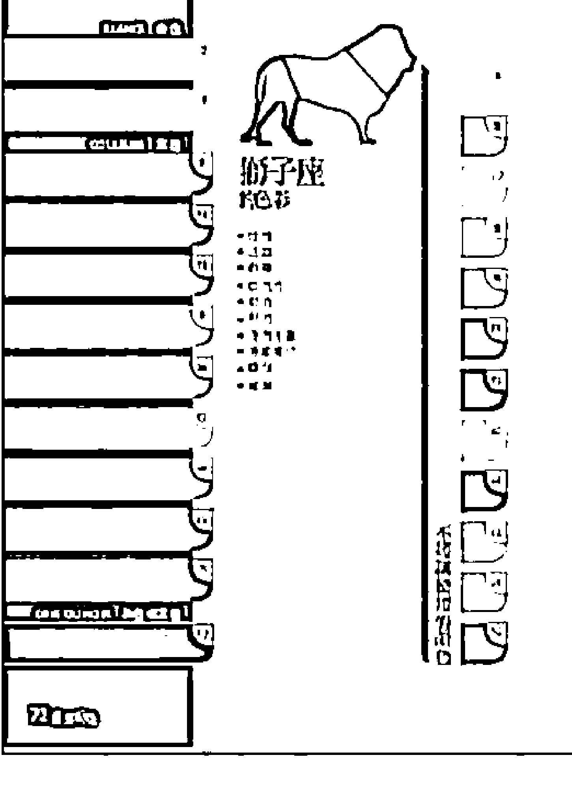
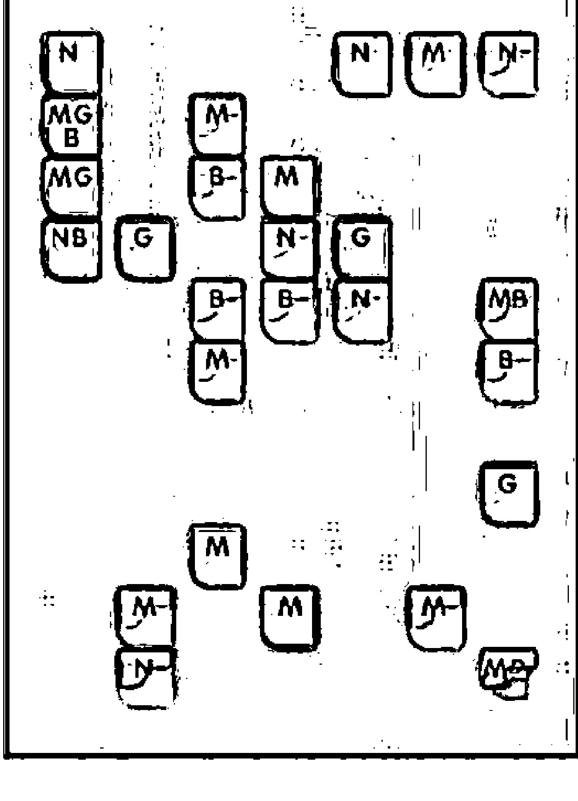


#### 2. 召集全家人

如果你有家人，召集每位會使用該空間的家人，一起參與選擇。
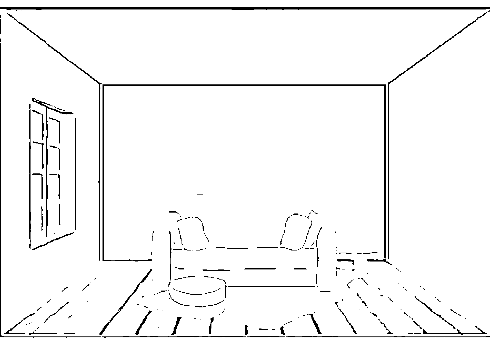

#### 3. 決定色彩的數量

到現場，找出哪些現有物品的顏色無法改變。
決定你需要幾種主色（例如：地板、牆壁、天花板、門、壁櫥門、窗簾、家具等）。
大自然物質的顏色並不包含在內。

#### 4. 選擇顏色

要考慮到你無法改變現有物品的顏色！
從我們提供的色彩選項中，選擇讓你直覺受到吸引，而且似乎彼此搭調的色彩。幾年後，你可能會想用其他色彩。你的品味將創造住屋的統一美感。
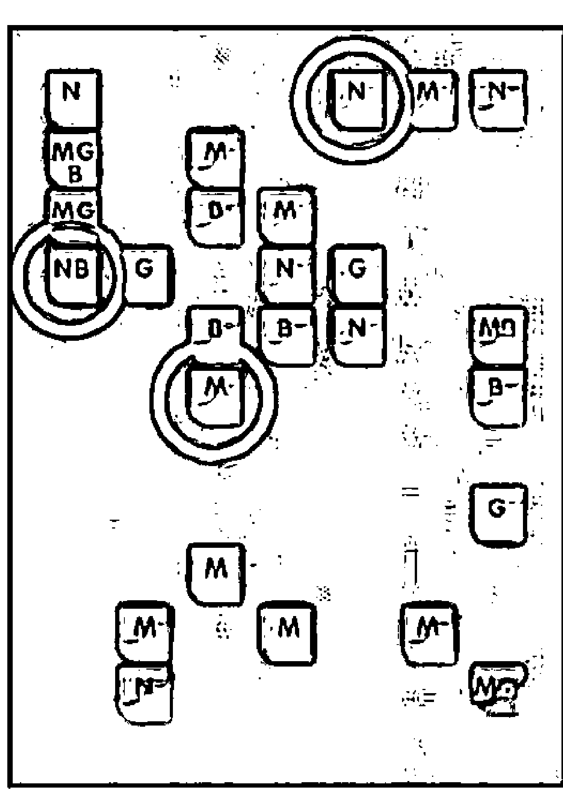
考慮每個顏色，不要拘泥在那些有全家人名字的顏色上面。
如果有幾個顏色讓你猶豫不決，你可以在該空間的自然光及人造光下試色（在硬紙板、壁紙或壁布上沾一點油漆）。這個基準範本會立刻指引你到正確的顏色，即便它不在我們提供的色彩選項中。

#### 5. 每個人都有代表的顏色


確認每位家庭成員都至少有一種代表顏色。若非如此，請他選定房間內某個細節或物品，再從調色盤中找出相符的色彩。

#### 6. 將這些顏色安排到空間裡

〈5玩玩你的色彩！〉會根據色彩對光線和空間的效果，幫助你下決定，看看哪些顏色可以用在地板、天花板、牆壁、家具和家飾品上……你就能確認看看自己的選色是否都能和諧搭配。

## 玩玩你的色彩！

### 色彩與空間
顏色的深淺、冷暖、彩度高低，是經過兩種相鄰（例如，地板與牆壁、牆壁與天花板等）的顏色對比之後，才得出的結果。

深色會縮小空間。


暖色會縮小空間。


彩度高的顏色會縮小空間。


淺色會放大空間。


冷色會放大空間。


彩度低的顏色會放大空間。


平光質地會縮小空間，減低色彩的衝擊力，帶來溫暖的一面（不過較不易維護，容易在牆面留下指印及摩擦痕跡，清洗後也會改變表面的效果）。

亮光質地會放大空間，讓色彩生氣洋溢，但也會讓它顯得刺眼（因為表面上的缺點都會暴露出來，因此亮光質地常見於細部或家具）。絲光質地則界於兩者之間，容易維護，又不會讓缺點那麼顯眼。

#### 從深至淺的顏色
| 28 | 25 | 42 | 35 | 11 | 70 | 41 | 16 | 55 | 58 | 57 | 64 | 18 |
| :--- | :--- | :--- | :--- | :--- | :--- | :--- | :--- | :--- | :--- | :--- | :--- | :--- |
| 26 | 21 | 22 | 34 | 29 | 13 | 46 | 49 | 52 | 67 | 59 | 62 | 19 |
| 36 | 38 | 33 | 39 | 10 | 72 | 48 | 53 | 56 | 68 | 17 | 66 | 61 |
| 24 | 23 | 44 | 30 | 71 | 45 | 20 | 15 | 50 | 69 | 65 | 60 | |
| 27 | 32 | 31 | 37 | 43 | 40 | 14 | 47 | 51 | 54 | 12 | 63 | |

#### 從暖至冷的顏色
| 1 | 44 | 68 | 23 | 34 | 55 | 67 | 10 | 18 | 49 | 12 | 41 |
| :--- | :--- | :--- | :--- | :--- | :--- | :--- | :--- | :--- | :--- | :--- | :--- |
| 21 | 48 | 69 | 25 | 37 | 58 | 70 | 11 | 19 | 51 | 29 | 46 |
| 24 | 56 | 71 | 27 | 43 | 60 | 73 | 13 | 20 | 59 | 33 | 52 |
| 26 | 57 | 77 | 30 | 45 | 61 | 76 | 14 | 22 | 63 | 39 | 53 |
| 28 | 62 | 31 | 47 | 64 | 15 | 35 | 72 | 40 | 54 | | |
| 36 | 65 | 32 | 50 | 66 | 16 | 38 | 74 | | | | |
| | | | | | 17 | 42 | 75 | | | | |

#### 彩度高至彩度低的顏色 (分成四組)

### 花紋與空間
挑選壁紙與壁布是件令人傷腦筋的事，究竟該選格紋、條紋、花紋或是什麼底色較好呢？顏色的對比性（深／淺、暖／冷、彩度高／低）越小，表面越顯得素勻。

比起素面，格紋、條紋和花紋較會縮小空間。
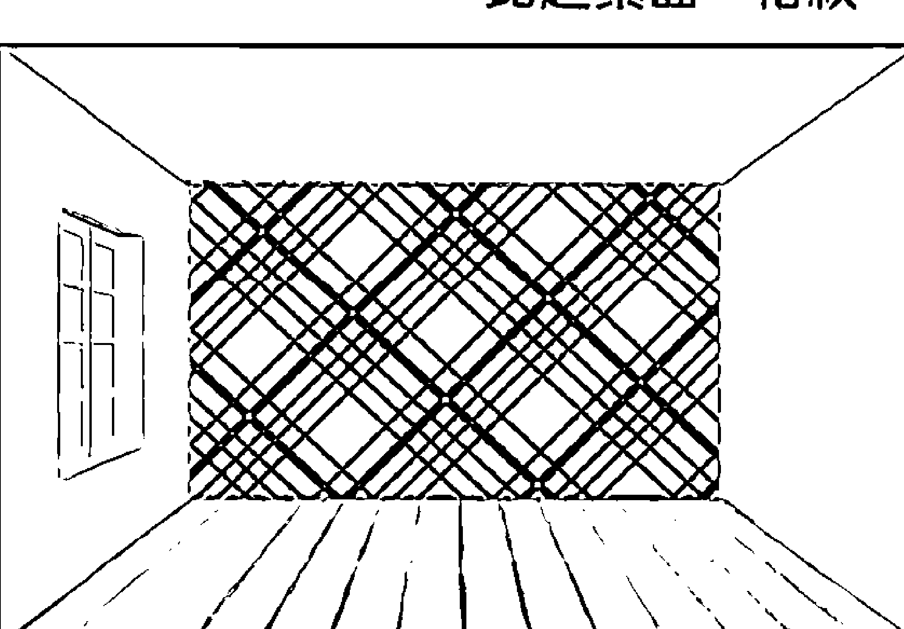
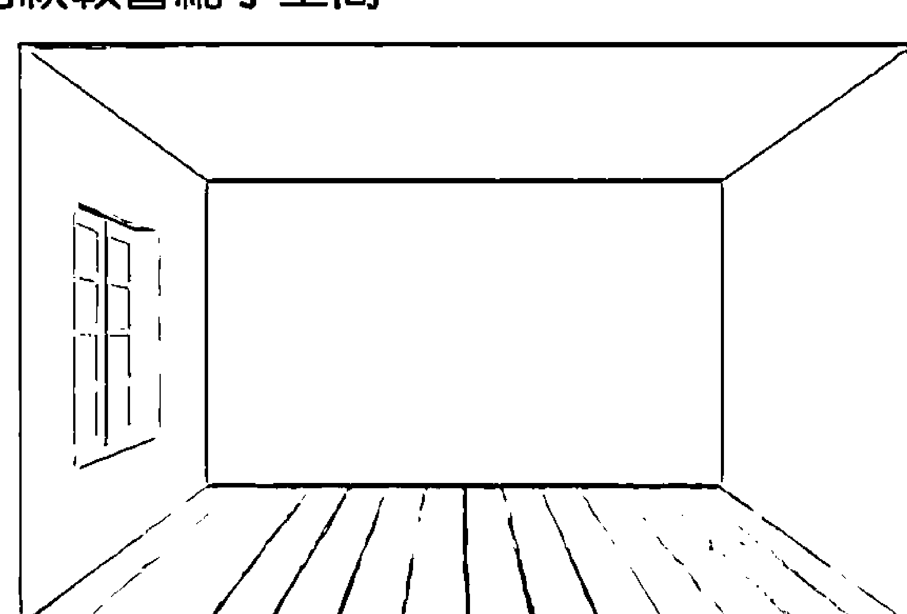

一絲不苟風：格紋比條紋更會縮小空間。
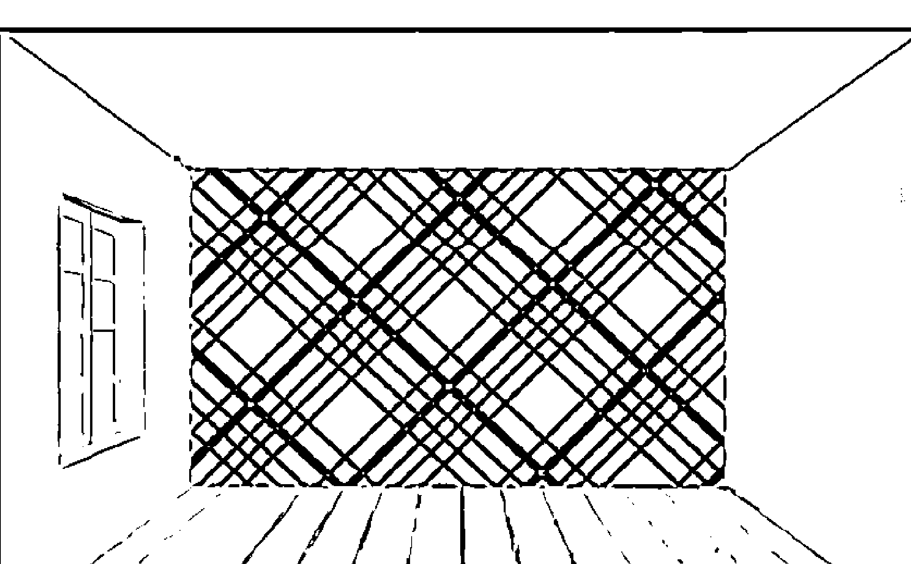
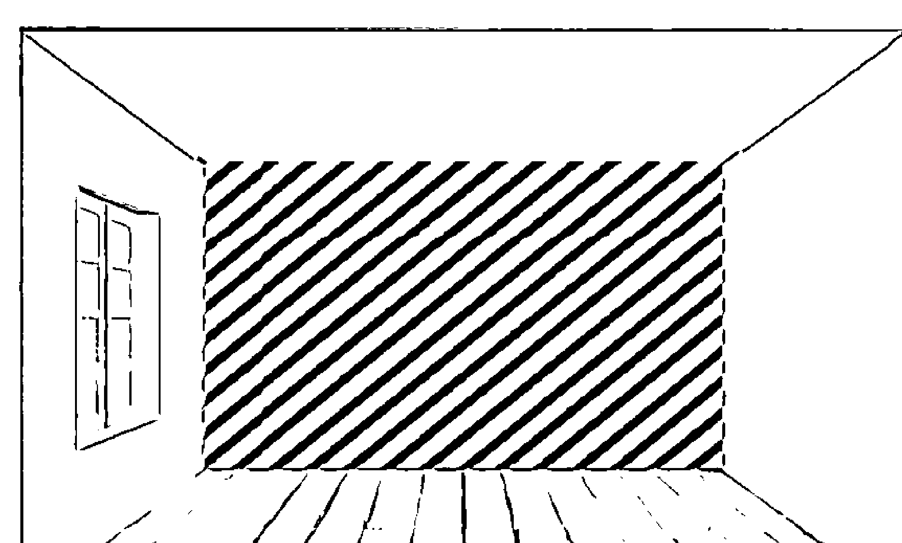

印花風：大圖案比小圖案更會縮小空間。
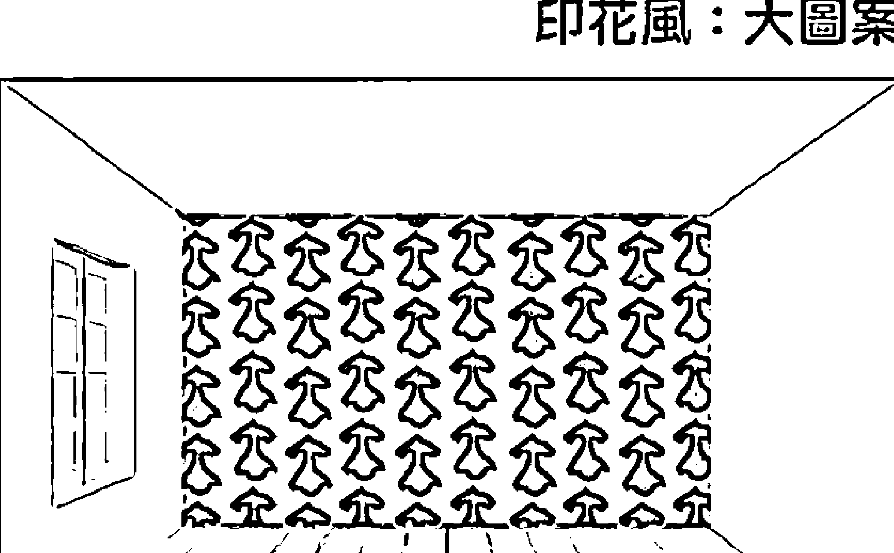
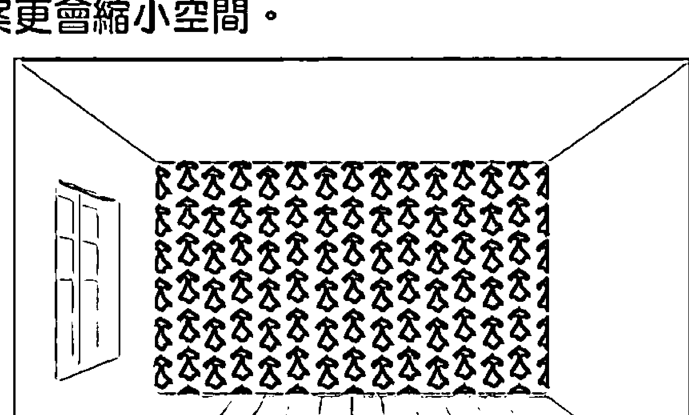

要讓格紋、條紋、花紋和素面能和諧搭配，要先找出組成圖案的主要顏色，然後參考第 172 頁。你會發現壁布和壁紙的設計師大多都會遵循本書裡的規則！

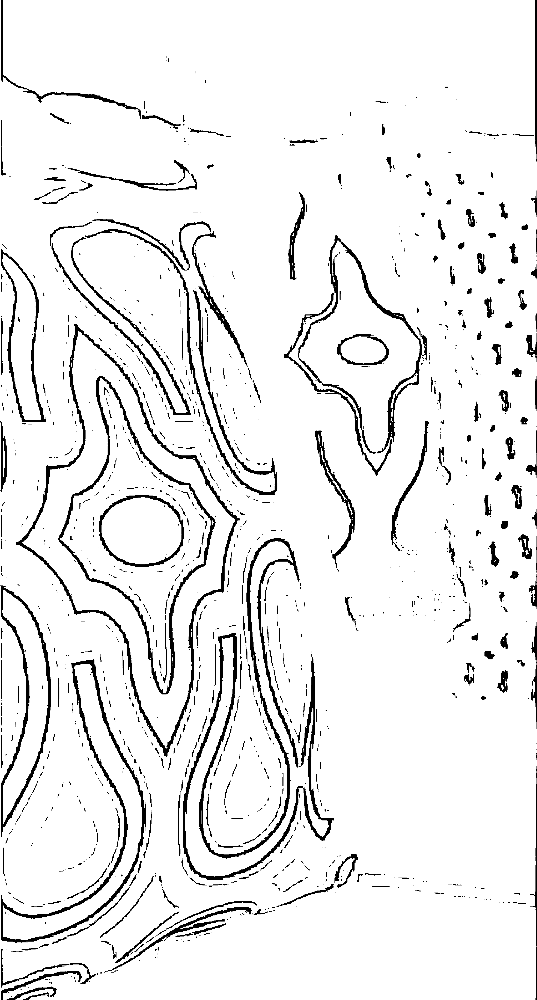
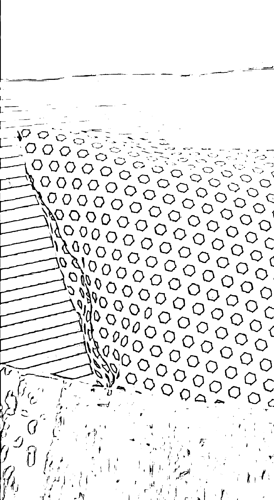

格紋或條紋與花紋搭配無間。大尺寸的圖案可以搭配小尺寸的圖案。在布料方面，最理想的是：材質不同，但品質一致。鹿皮（brocade）和絲、平紋棉紗（percale）和棉、麻和天鵝絨麻或天鵝絨棉。

### 地板與天花板
比起淺色天花板的房間，深色天花板的房間看起來更加寬敞。顏色近似的地板和天花板，會讓人把注意力放在牆壁上。
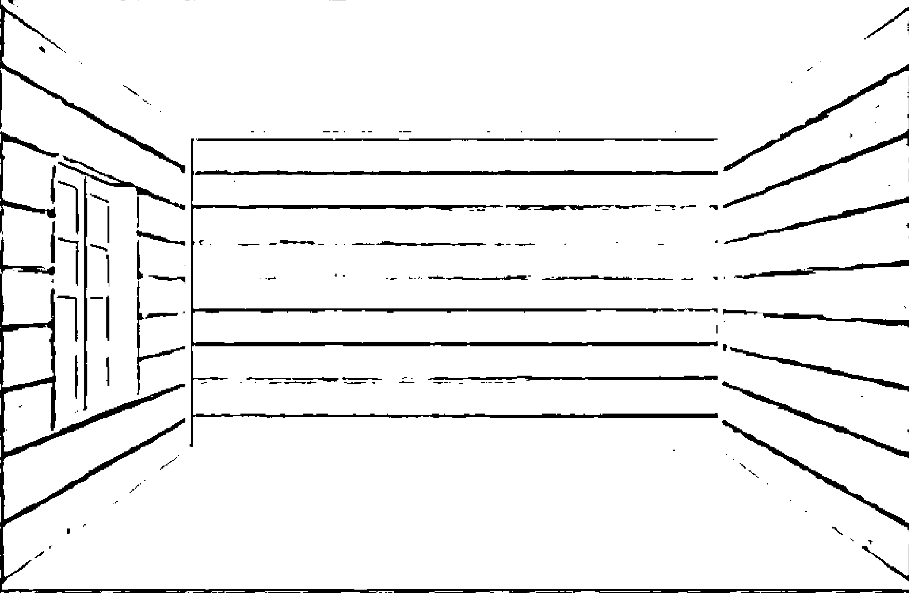
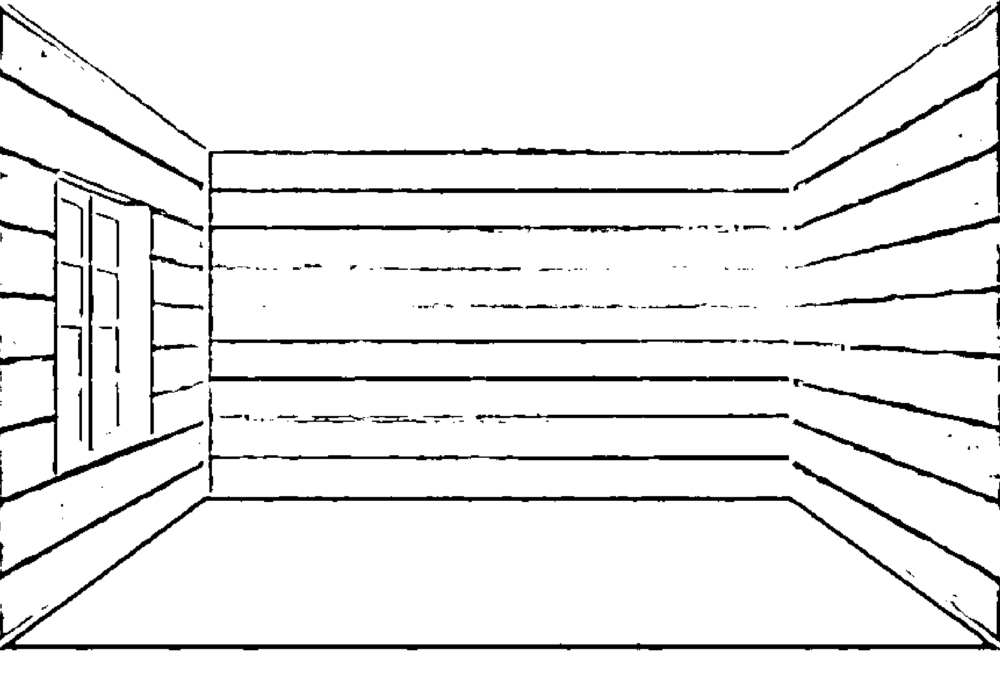

深色、暖調、彩度高或有花紋的天花板，會促使你潛神靜思，評估自身的狀況，猶如在潛意識中搜尋。這樣的天花板可能給人壓迫感。你的心神較專注，也會斷絕與世界的聯繫。

淺色、冷調、彩度低或素面的天花板，讓你的心靈門戶向外開放。它釋放你的思緒，讓大腦輕鬆自由。這種天花板能點亮房間。在一個所有天花板都如此的住屋中，你既身處在自家中，心靈又同時向外開放。

淺色、冷調、彩度低或素面的地板，讓人覺得自己已經逃離了物質世界，心情舒暢。它會創造一個不受時間控制的世界，一個消毒過的世界，那裡不存在死亡。

深色、暖調、彩度高或有花紋的地板，就像一根柱子，幫助你直立。它會製造重力，讓你站穩腳跟。
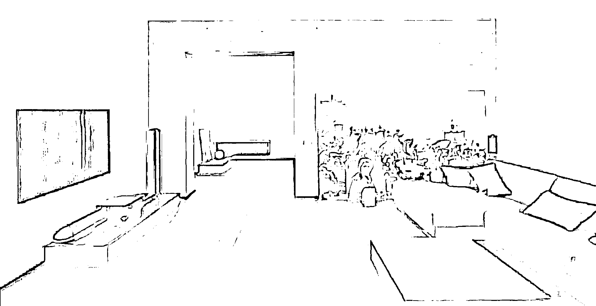

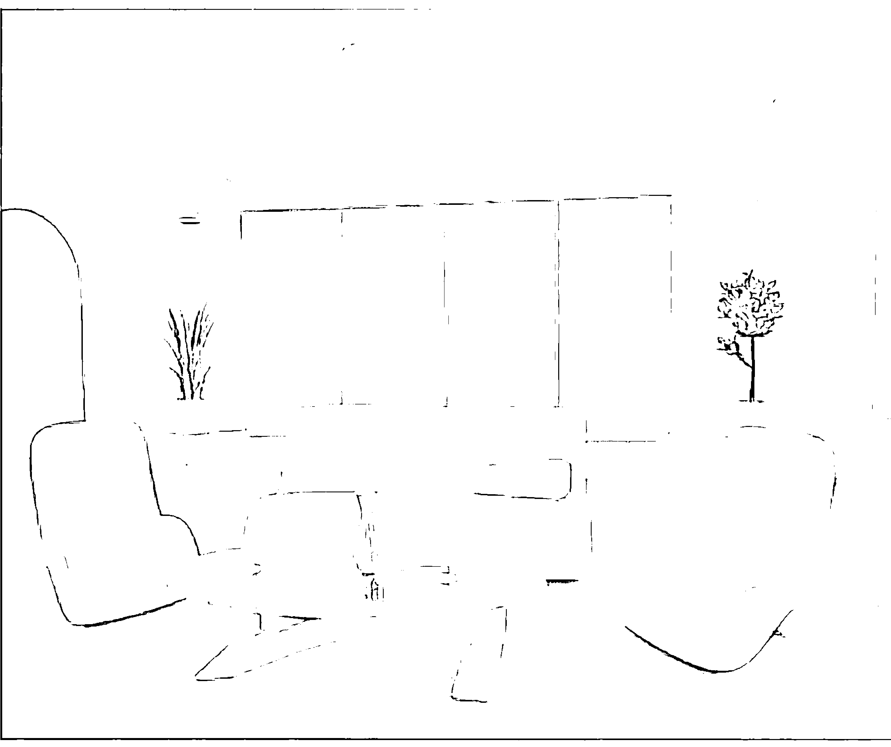

若要透過內在及外在的感受來刺激你的心靈，你可以在主要房間內使用淺色、冷調、彩度低或素面的天花板，而小房間或是暫時停留的房間就用深色、暖調、彩度高或有花紋的天花板，這樣會讓主要房間顯得更大。深色、暖調、彩度高或有花紋的天花板，往往會用在廁所裡，你在廁所裡心神專注，排空在象徵意義上重壓在精神上的東西，但是你也可以將這類天花板用在小廚房、走廊和樓梯間裡。

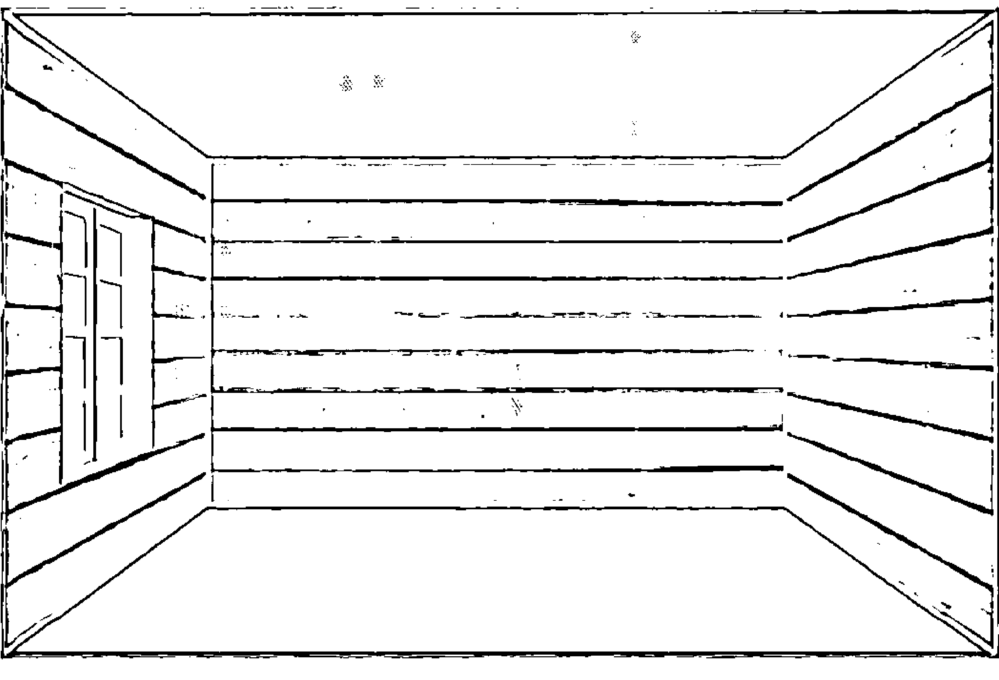

當地板和天花板都是淺色、冷調、彩度低的顏色或素面的時候，人會把注意力放到牆壁上。

當兩者都是深色、暖調、彩度高的顏色或有花紋的時候也一樣，製造了橫向世界，突出每位家庭成員的個性。

### 牆壁
將房間的每面牆壁都漆上一樣的顏色，會製造出私密空間感。將房間的每面牆壁漆上不同的顏色，則會製造暫時停留的房間，彷彿每面牆都是隔壁房間的外牆。

如果你在相接的牆壁上漆同樣的顏色，就是在製造「角落」：這個房間在邀請你留下來。對廚房、臥室、浴室、廁所和書房這種私密空間而言，這樣的安排很理想。
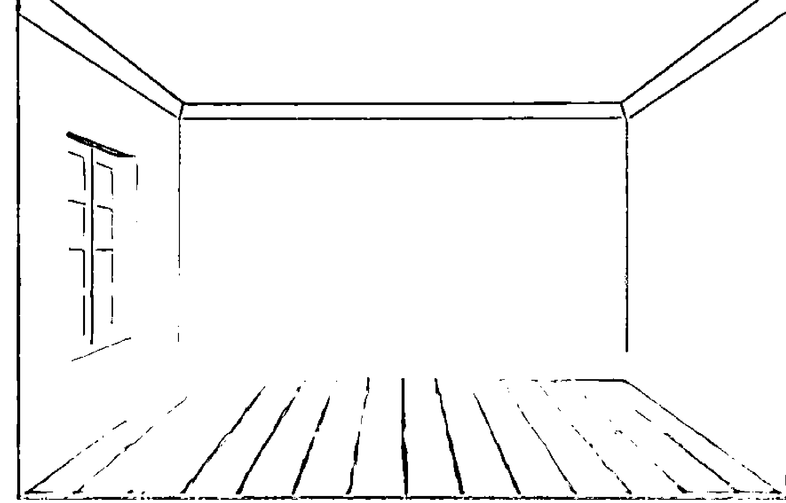

你可以用同一個顏色的牆將房間包覆起來，強化房間的保護特質，再用不同的顏色將圍繞整個房間的細部元素（踢腳板或壁帶）凸顯出來。
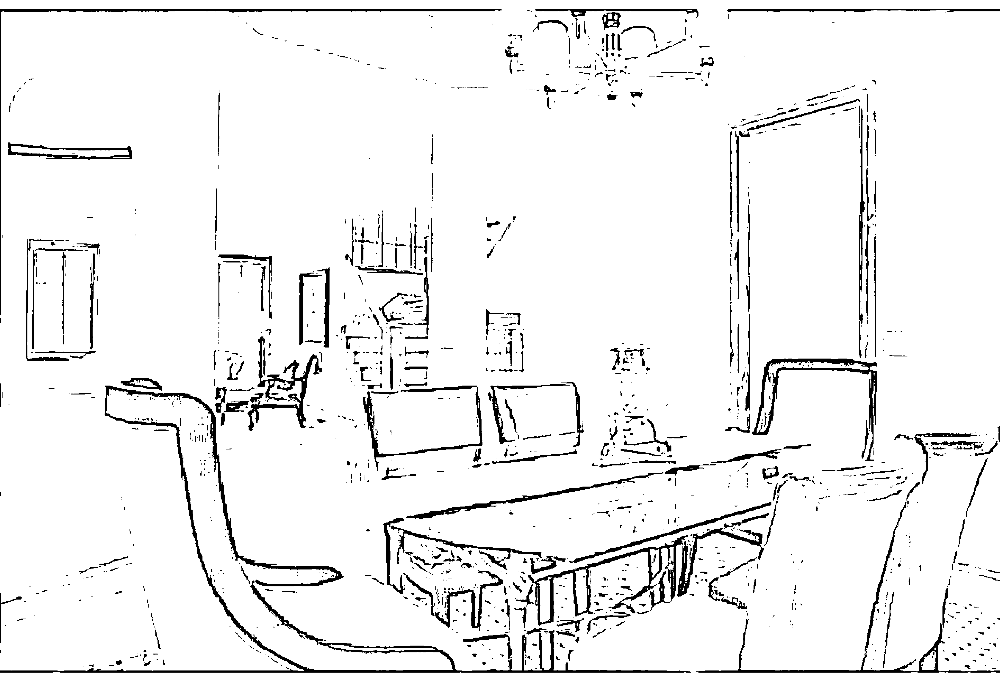

門、窗、壁櫥門、暖氣會擾亂牆壁的連續性。把它們漆成和牆壁一樣的顏色，就有放大房間的效果。把它們漆成和牆壁不一樣的顏色，就會有縮小房間的效果，也會增加私密感。

飾板（molding）就像踢腳板或壁帶（cornice）圍繞整間房間，加強房間的保護性質。飾板裝飾空無一物的牆面，就好像它們是外圍的一座建物。如果你的某個房間裡有飾板，可以為飾板漆上不同於牆壁的顏色（也包括門上的），或是在牆壁壁板框內，漆上另一種顏色、貼上壁紙或是掛上壁布。牆壁、飾板和壁板之間的對比越強烈，空間就顯得越狹窄。
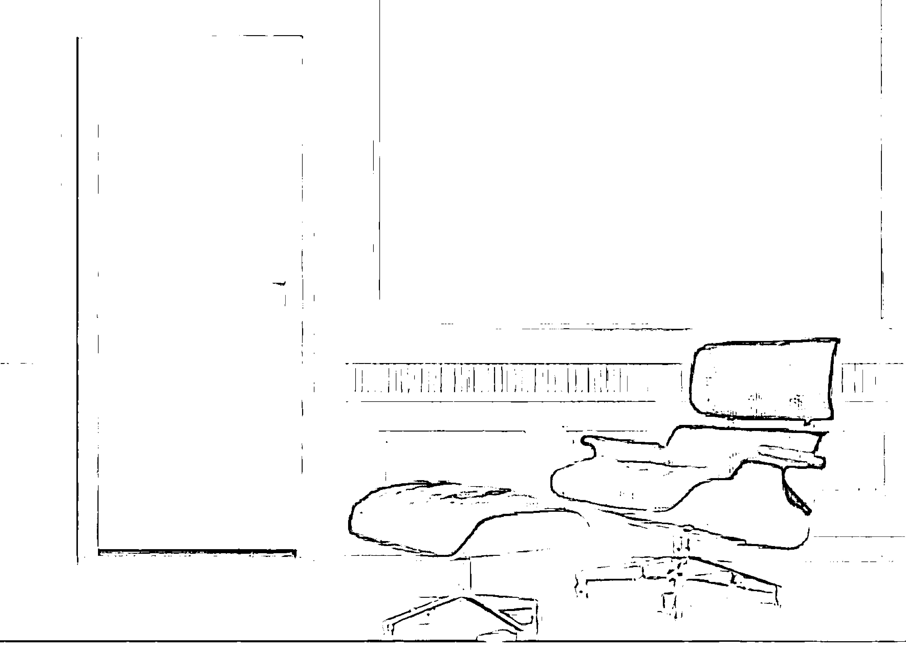

牆面和飾板使用差異越大的顏色，這個房間感覺起來就越私密。

牆面和飾板使用越相近的顏色，就越偏向讓人暫時停留的房間。
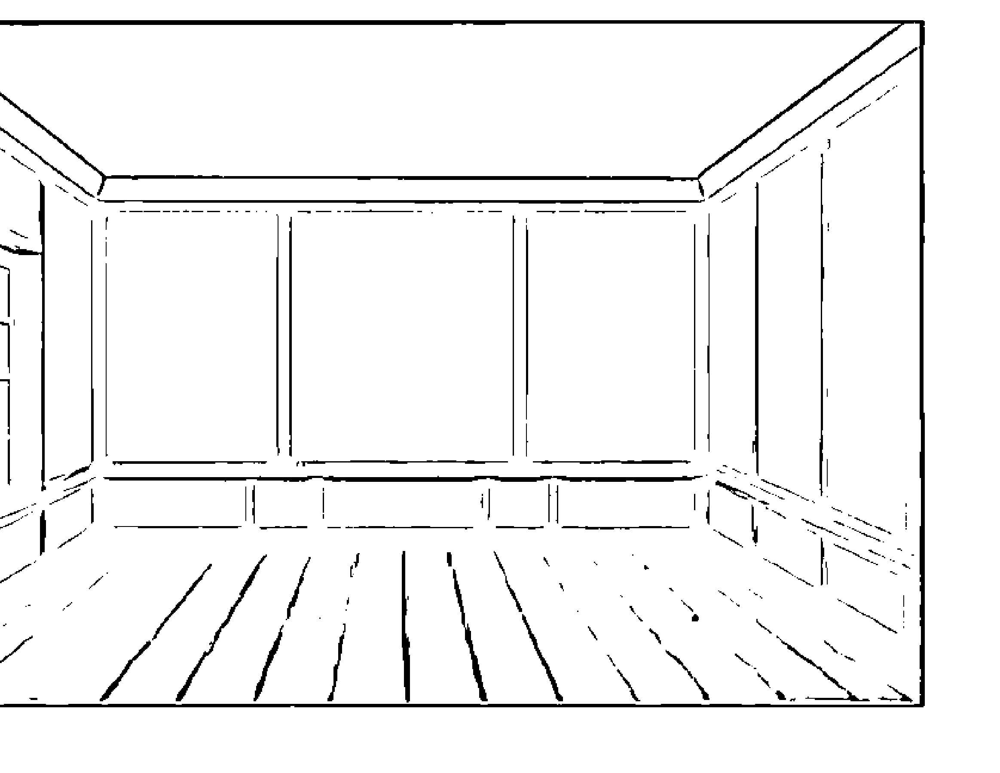
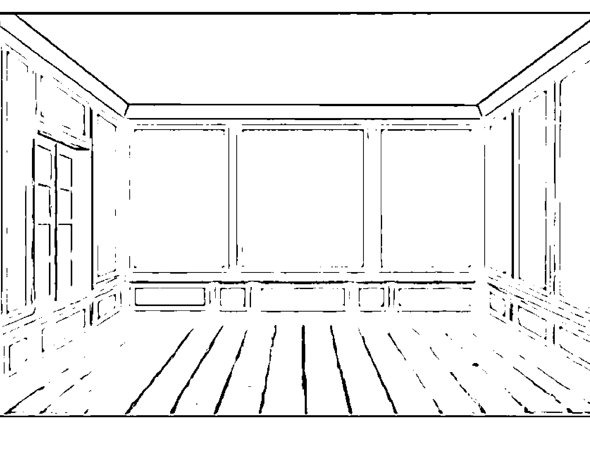

飾板能讓你以對稱的方式擺設家具。如果一個房間裡有飾板，而你擺設家具的位置與其對稱或平行，就能將飾板漆上與牆壁不一樣的顏色，藉以烘襯飾板。如果你想要用細緻的方法突顯飾板，可以將牆壁與飾板都漆上同樣的顏色，牆壁用平光漆，飾板則使用絲光漆或亮光漆，抑或牆壁使用絲光漆，飾板用亮光漆。

反之，如果這個房間的佈置，與飾板的位置並不協調，請別猶豫，直接將牆壁和飾板都漆上同一種顏色，讓它們融為一體。這樣你就不會製造出不愉快的壓力了。

畫作扮演著與飾板相同的角色，能破除牆面的空蕩感，並且給你更多的彈性來配置牆面，因為你可以隨心所欲地把畫作掛在想要的位置上。畫框（也有飾板）讓人的視線能溫和地從畫作移到牆面。你有注意到深色的牆更能烘托掛在牆上的畫作和其他物品，彷彿有聚光燈照在上面嗎？
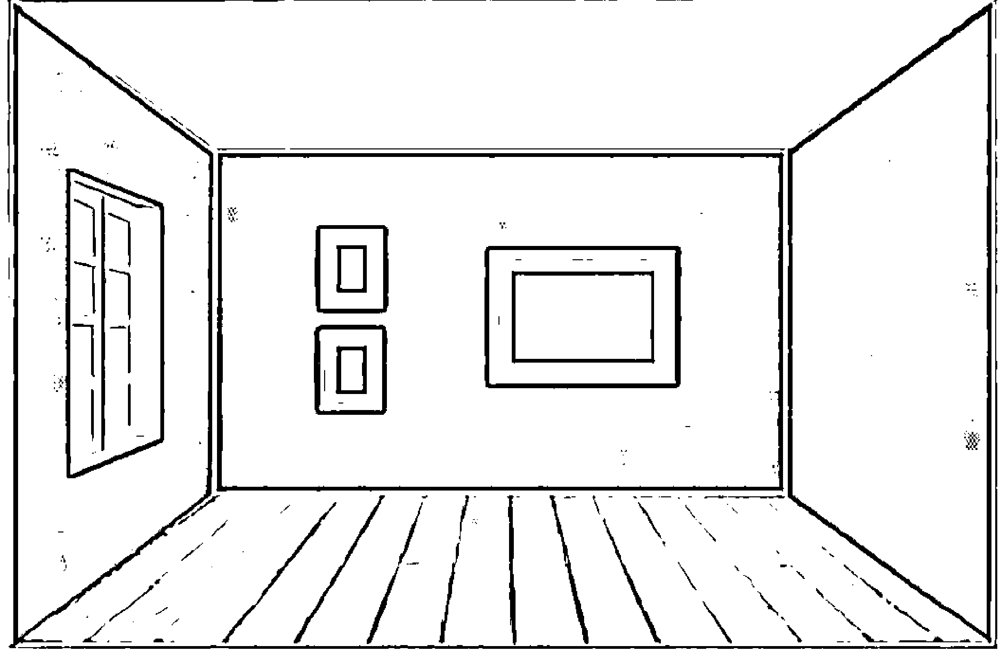

### 改善空間
如果一個房間看起來太小，你可以將牆壁頂端漆成與天花板一樣的顏色，藉此來放大空間。若要劃分牆壁的這兩個部分，你可以裝上平滑的飾板（約 35x7 公釐）、軌道式掛畫器，也可以為牆面加上腰線（frieze）。
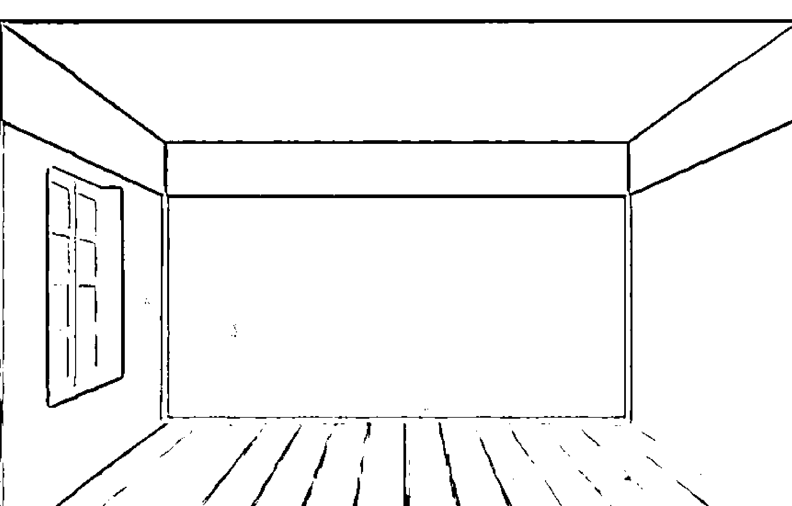

如果房間太深長，你可以將盡頭那面牆漆上深色、暖調或彩度高的顏色，也可以貼上壁紙或是有花紋的壁布（如果在走廊上，看到前方濃暗一片，實在不怎麼吸引人）。你也可以把風景印在壁紙或壁布上，製造步入夢境的感覺。
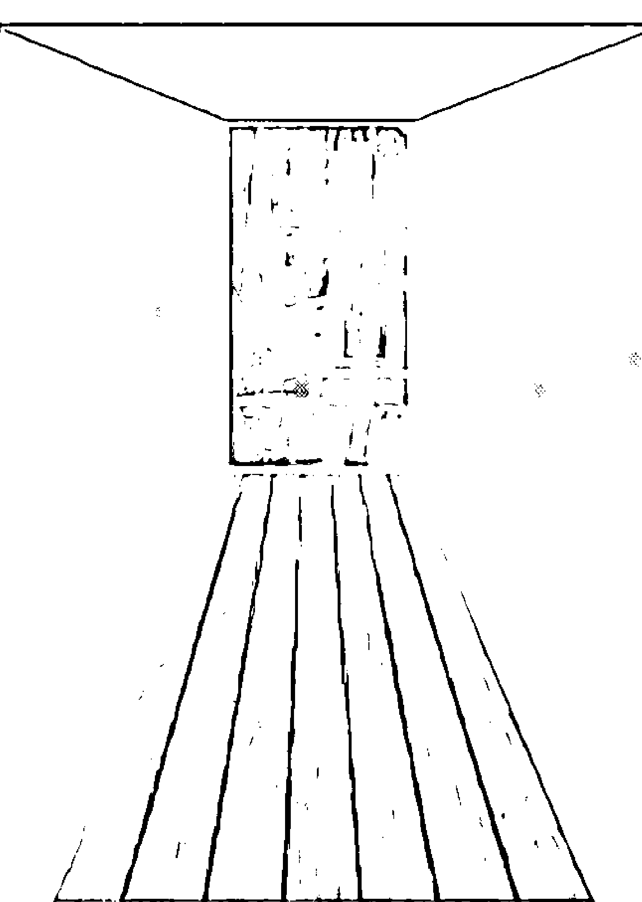
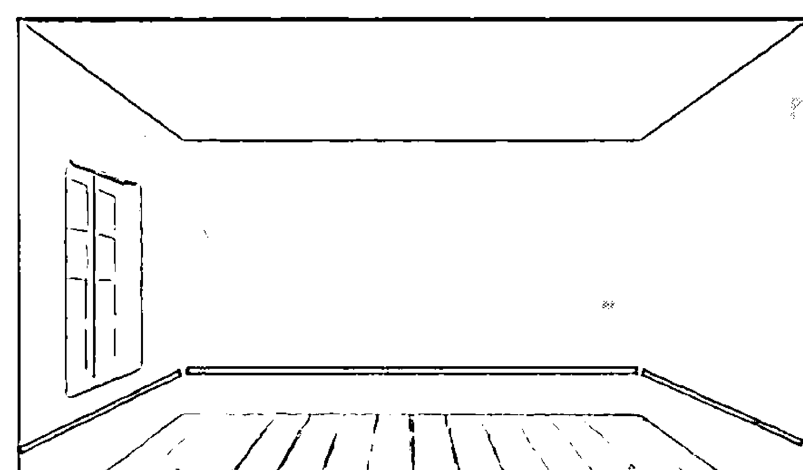

同樣的，你也可以偽造一個放大的空間。在牆壁較低的位置（60 公分處），加裝一條與牆壁其他部分相同或不同顏色的漂亮飾板，或是一條小腰線，為牆壁上方及下方的壁紙劃分界線。
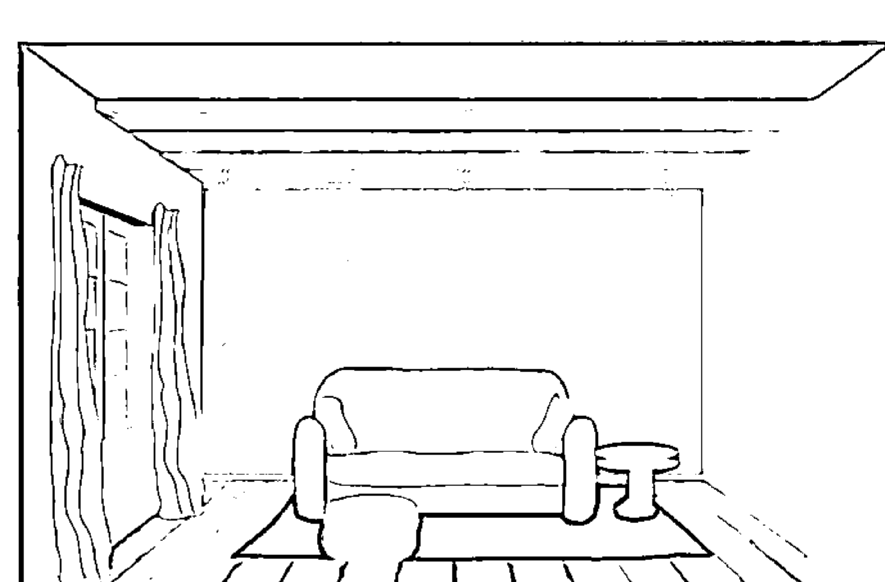

如果房間的天花板太高，你可以漆上深色、暖調或彩度高的顏色，也可以貼上壁紙或是有花紋的壁布，給人天花板比較低矮的印象。你可以在看似過於挑高的樓梯間運用這個效果，或是餐桌上方，又或是客廳的一角（別忘了，我們坐下來時，比站姿下降了 60 公分，這會讓天花板變得更高）。一層木製的假天花板、水晶吊燈或是華蓋，也可以扮演這個角色。
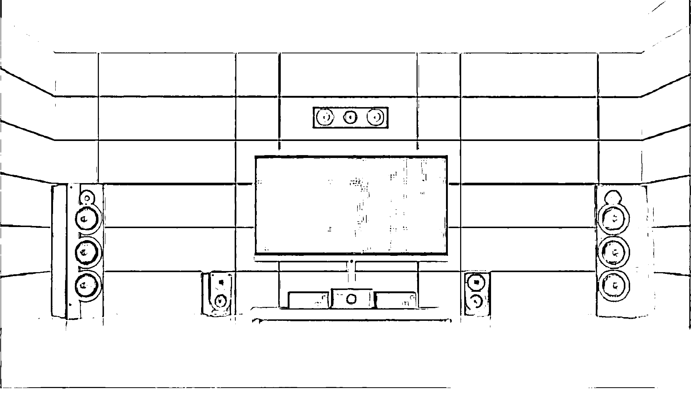

直條紋讓房間更顯挑高，看起來更加寬敞，因為我們的視線就不會沿著牆面橫向移動。直條紋靜態的一面非常適合我們會待下來的房間。

橫條紋讓房間看起來比較低矮，比較窄，因為它們立刻將視線導向房間的盡頭。橫條紋動態的一面相當適合暫時停留的房間。
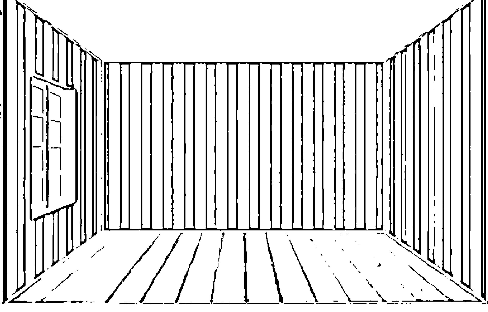
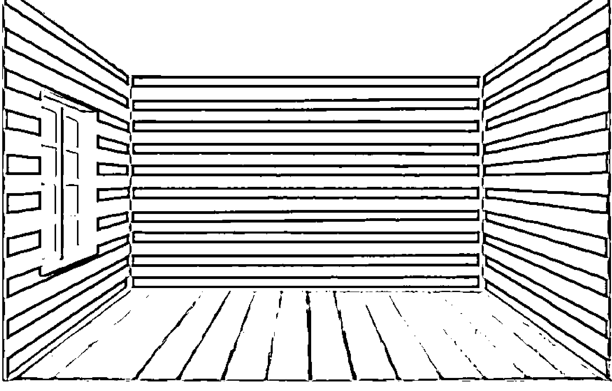

至於斜紋，走向朝上（從左下角往右上角）永遠是最好的選擇，除非你要的是特別的效果（講求對稱或是請人爬樓梯）。
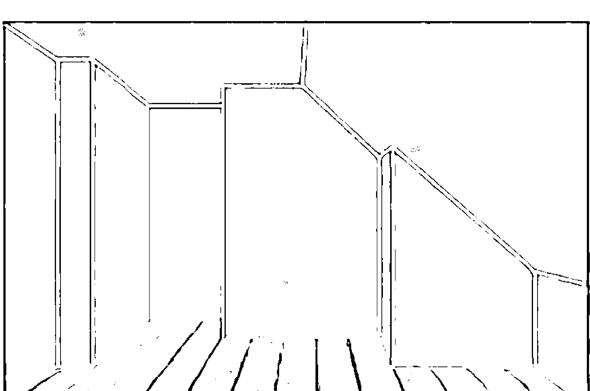

如果是奇形怪狀的屋隅，你可以選擇讓牆壁和地板的顏色一致，或是天花板和牆壁的顏色相同，藉此減輕空間的不規則感。

### 改善光線
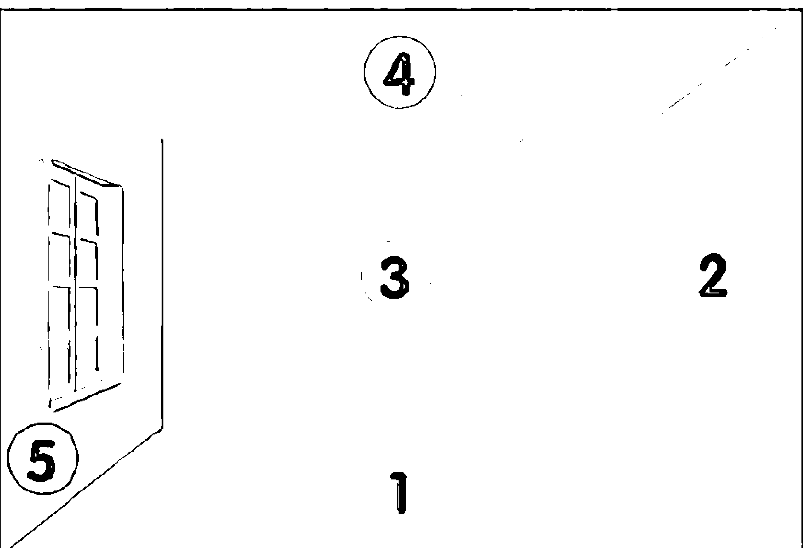

室內的天然光照是這樣分散的：地板受光最多①，接下來是直接受到曝曬的牆壁②，然後是沒有受到曝曬的牆壁③，接著是天花板④，最後是窗戶所在的牆壁⑤，位於背光面。位在牆壁上方與天花板齊高的壁帶，其角色是讓視線從牆壁移到天花板：壁帶把光線分解成灰色系，讓視線移動的過程比較和緩。

假如你決定將房間的牆壁都漆上不同的顏色，請為窗戶那面牆壁選擇較淺的色調。但是別忘記，夜晚時房間的照明來自人造光，效果會截然不同喔！
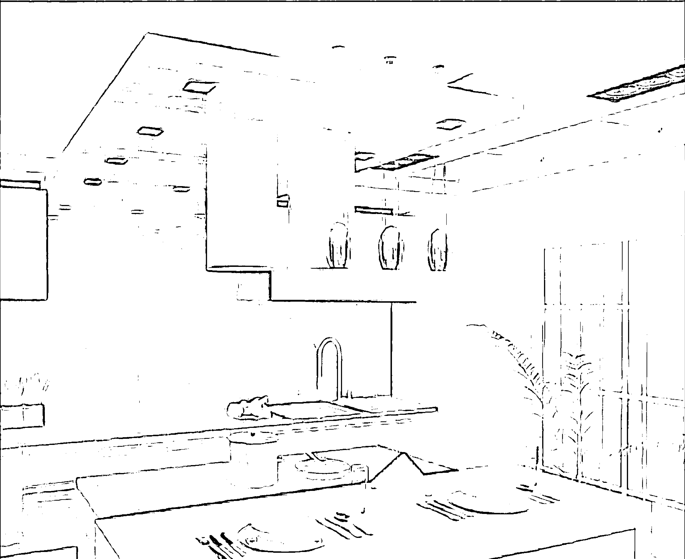

色彩會根據照明種類——天然光或人造光——而不同。當照明減弱，黃色、橘色和紅色看上去會比較深（我們選的這類顏色總是會過深，因為它們看起來很黯淡），而藍色和綠色反而會顯得比較淡（我們選的這類顏色總是會太淡，因為這些顏色看起來很空透）。請根據你會什麼時候待在這個空間裡來選擇色調：如果你只有晚上在家，週末又常常不在，就在人造光下選擇色彩。不要在陽光直射下判斷顏色，它看起來會比實際還要淡。
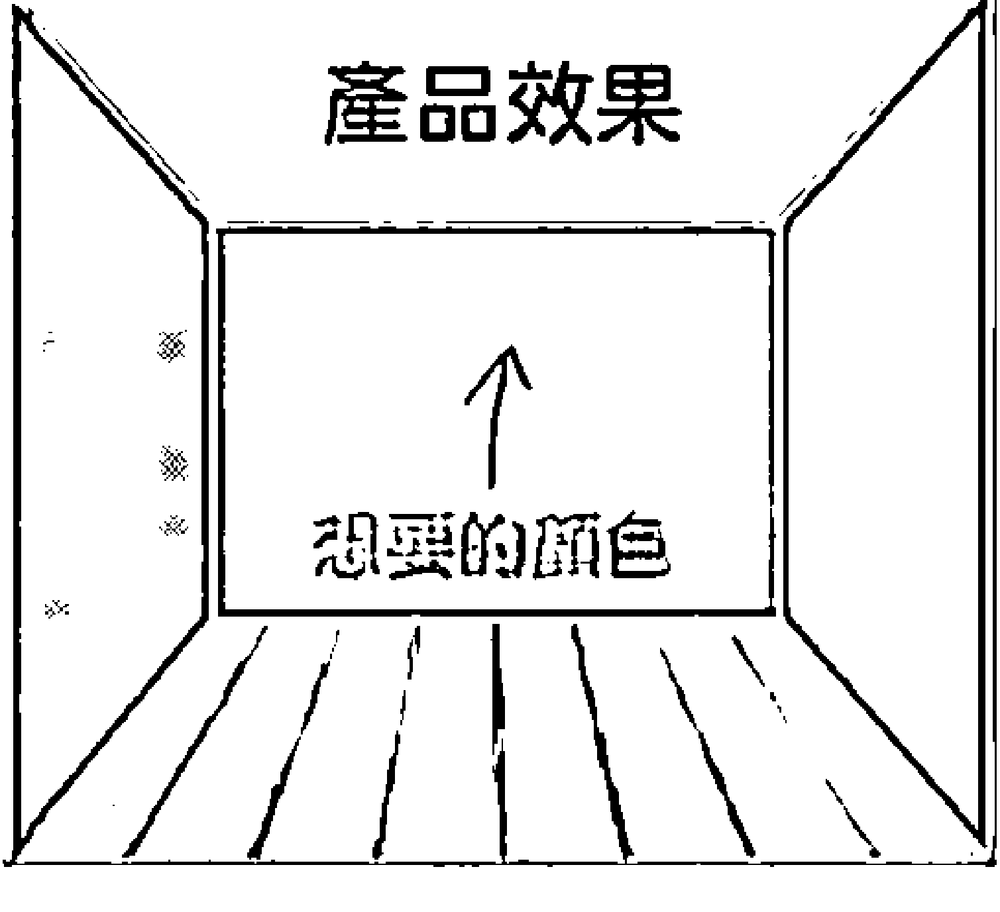
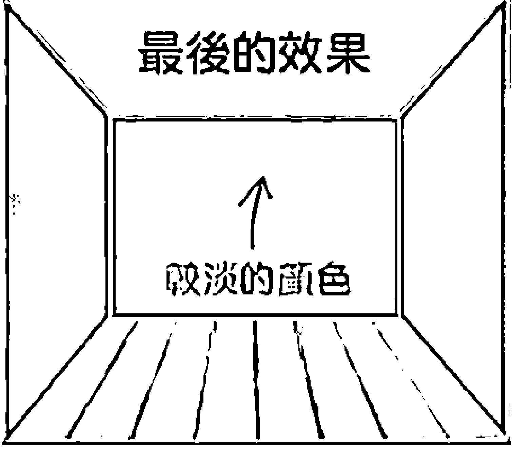

如果你在小房間內使用亮光漆或絲光漆，牆壁的顏色會互相反射，使顏色集中。因此我們選擇的顏色，應該不會如預想的效果那麼光鮮。

另一方面，深色會染到相鄰的淺色上：譬如說，與黃色相鄰的深綠色會「弄髒」黃色。要修正這種狀況，就要讓淺色接近深色的「互補色」。你可以翻至第 173 頁的圖表，開始做修正：一個顏色的補色位在對面列位中。例如，紅色是綠色的互補色，你只需要將黃色稍微「染紅」即可。
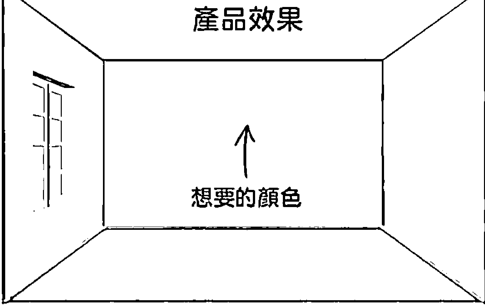
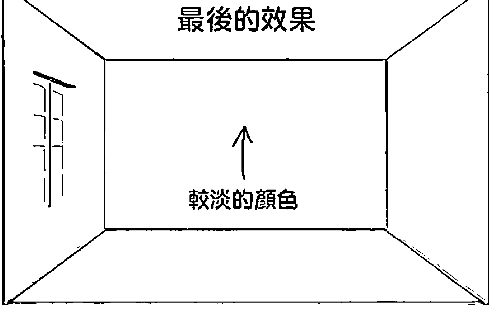

白色很容易受到相鄰的顏色侵染。如果房間的牆壁是黃色的，白色天花板可能會顯黃，就算天花板才剛粉刷過，看起來還是會像舊漆。不論牆壁的顏色為何，它都會影響到白色的天花板。若要讓天花板盡可能顯白，我們可以運用補色的手法。做法是翻至第 173 頁的圖表，找出銜接天花板邊緣的牆壁顏色，然後選擇同一欄另一半列的非純白色：例如，牆面是粉黃色，你希望天花板看起來非常潔白，那就要選用非純白色⑧。要得到非純白色，只需要在白油漆罐裡滴幾滴其他的顏色就可以了，得到的結果與純白色幾乎無法區辨！

### 家具與家飾品
兩點之間的距離給人的感覺，可以營造空間感或私密感。空間感，是指兩點之間感覺起來較遠，而私密感則是兩點之間感覺起來較近。你可以依目的營造這兩種空間效果。


這裡有兩種安排空間的簡單方法。首先，你必須將房間視為電影布景，分成兩個層次：
- 背景：牆壁、踢腳板、門窗、壁櫥門、暖氣。
- 前景：家具與家飾品（燈具、用品、抱枕、床、餐巾等等）。

你可以將窗簾、畫框的顏色，連結上前景的顏色，以突顯窗簾和畫框。或是反其道而行，融入背景的顏色中。你還能再利用顏色介於兩者之間的地板和地毯，來連接前景和背景。


#### 營造空間感
為前景選擇深色、暖調、彩度高的顏色或是花紋，背景則選擇淡色、冷調、彩度低的顏色或素面。你的房間會給人比實際上更寬闊的印象：你製造了空間！你可以在全家人共用的房間裡，運用這個效果。


#### 營造私密感
為前景選擇淡色、冷調、彩度低的顏色或是素面，為背景選用深色、暖調、彩度高的顏色和花紋。你的房間會給人私密的印象：你縮小了空間！你可以在臥室這類的私人空間中，使用這個效果。

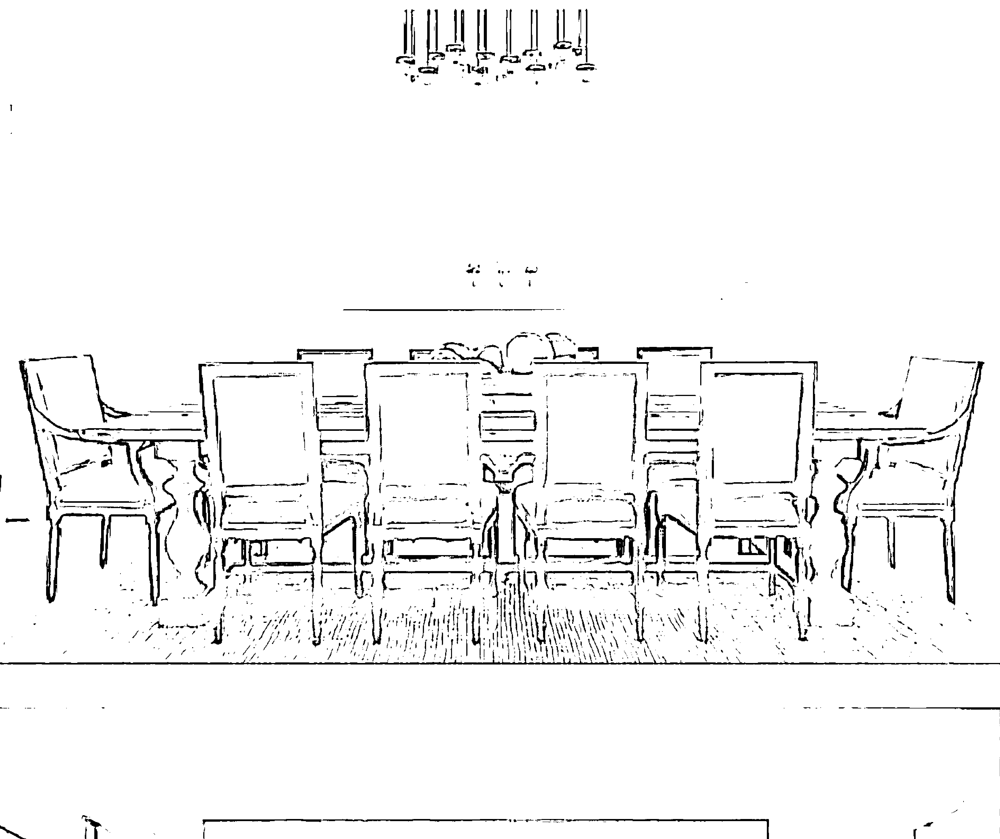
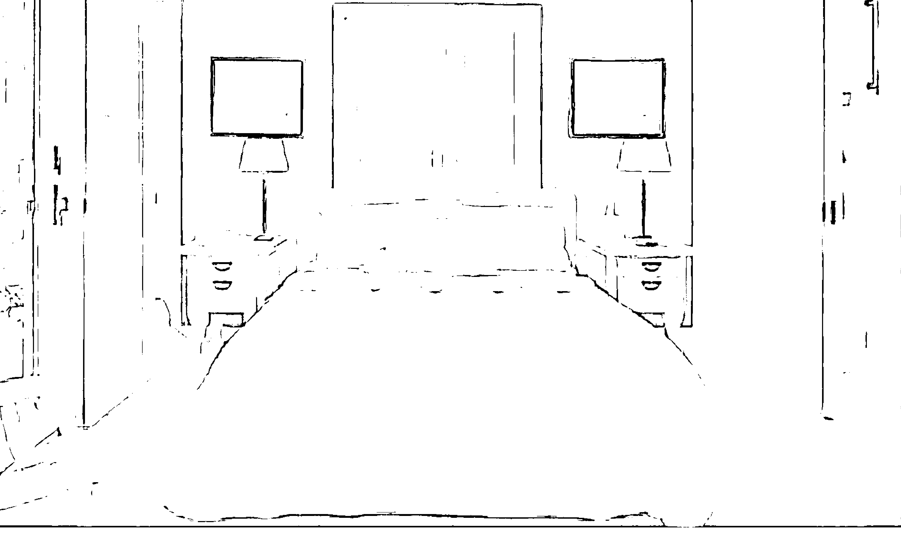

### 我選擇的配色搭調嗎？
從本書建議的顏色中，你已經選出了幾種顏色。要如何確定這樣的配色是和諧的呢？這裡會告訴你怎麼確認自己的選擇是不是成功的配色。

#### 中性色能搭配各種配色法
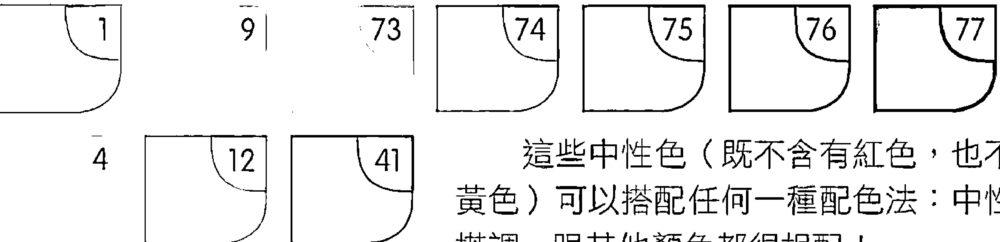

這些中性色（既不含有紅色，也不含有藍色或黃色）可以搭配任何一種配色法：中性色彼此也很搭調，跟其他顏色都很相配！

#### 單彩及互補色配色法
單彩（camaïeu）是指同一種顏色的明度、彩度及色調的漸層。而一種顏色的「互補色」就是它未含有的原色（藍、紅、黃）。譬如說，紫羅蘭色是藍色和紅色的混合，因此紫羅蘭色的互補色就是黃色。互補色最能烘托出那種顏色。因此，花瓶的顏色若是壁紙的互補色，那麼花瓶顏色的一絲活力，就能突顯壁紙的顏色。

請在右圖中找出你為房間選擇的色彩。如果這些顏色全都位在一格，或最多兩個相鄰的欄位裡，那你的選擇就屬於單彩及互補色配色法。

#### 阿嘉莎的單彩及互補色配色法
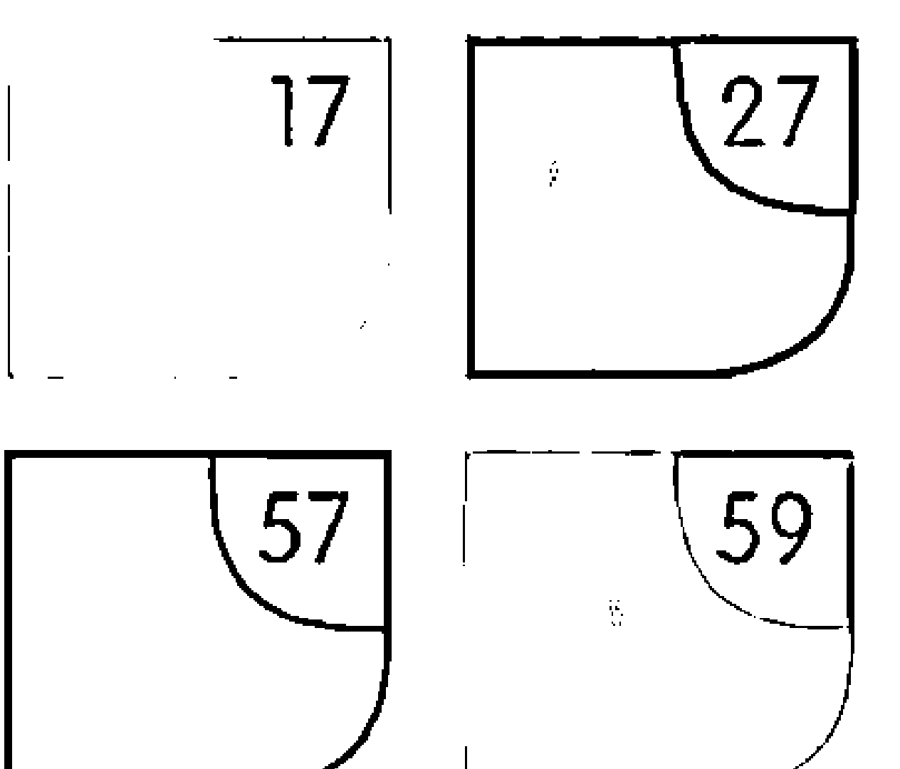

阿嘉莎選擇的顏色全都位在右圖的 C 欄與 D 欄中（C 欄：17 和 57。D 欄：27 和 59）。這些顏色彼此相鄰。因此，阿嘉莎的選色屬於單彩及互補色配色法。

以單彩及補色配色法裝飾的房間範例，請見第 65、69、73、81 頁。

### 單彩及互補色配色法、四色和諧配色法的圖表

| | A | B | C | D | E | F | G | H | A |
|---|---|---|---|---|---|---|---|---|---|
| | 5 | 6 | 6 | 6 | 7 | 7 | 7 | 8 | 8 |
| 上 | | | | | | 42 | | | |
| | 24 | | | 40 | 37 | 45 | | |
| | 22 | 39 | | | 38 | 36 | 44 | 49 | |
| | 21 | 31 | | | 28 | 35 | 46 | 48 | 53 |
| | 29 | 33 | 23 | 27 | 32 | 34 | 43 | 47 | 50 |
| | 30 | 10 | 25 | 26 | 11 | 13 | 14 | 15 | 16 |
| 下 | 16 | 55 | 17 | 59 | 61 | 18 | 19 | 20 | 30 |
| | 50 | 51 | 57 | 60 | 62 | 64 | 66 | 70 | 29 |
| | 53 | 56 | 58 | | 63 | 65 | 68 | 71 | 21 |
| | | 52 | 54 | | | 67 | 69 | 72 | 22 |
| | 8 | 2 | 2 | 2 | 2 | 3 | 3 | 5 | 5 |

### 四色和諧配色法

四色和諧配色法並不是指你只能用四種顏色：你可以選擇更多顏色，但是最少需要四種。

在前頁的圖表中，找出你為房間選擇的色彩。如果這些顏色都位在不相鄰的兩個欄位中（只要每一欄的上列及下列中，都至少有一種你的選色），那你的選擇就屬於四色和諧配色法。

#### 艾曼紐的四色和諧配色法

艾曼紐選擇的顏色都位在前頁的 A 欄與 F 欄裡（A 欄：22 在上列，53 在下列。F 欄：34 和 42 在上列，67 在下列）。

這些欄位彼此不相鄰，而且 A 欄與 F 欄的上列和下列都至少有一種顏色。因此，艾曼紐的選色屬於四色和諧配色法。

以四色和諧配色法裝飾的房間範例，請見第 71 頁。

### 三色和諧配色法

三色和諧配色法並不是指你只能選三種顏色：你可以選擇更多顏色，但是最少需要三種。

在右頁找出你為房間選擇的色彩。如果這些顏色全都位在同一區中，而且該區中三個欄位都至少有一種你的選色，那你的選擇就屬於三色和諧配色法。

#### 米凱爾的三色和諧配色法

米凱爾選擇的顏色都位在第四區中（第一欄：21；第二欄：44 和 46；第三欄：61）。

他選擇的顏色全都位在同一區，而且每一欄至少有一種選色。因此，米凱爾的選色屬於三色和諧配色法。

以三色和諧配色法裝飾的房間範例，請見第 77、87 頁。

### 三色和諧配色法的圖表

第一區
第二區
第三區
第四區

### 幫幫我！這些配色法全都不管用！

你的選色不符合任何一種配色法嗎？那你可以再選擇其他顏色，讓你的選色能配合其中一種配色法。就算你不屬於追求和諧配色的傳統派，結果不會因此就了無趣味：請見第 67、79、85 頁。實驗能創造出明日新世界！


## 我的住屋可以為我帶來什麼？

住屋會影響我們的心理狀態。儘管你不需要閱讀這一章節也能使用本書，我們還是邀請你踏上一趟小旅行，看看住屋能為你的心理狀態帶來什麼樣的貢獻。住屋讓人聯想到擋風遮雨、建築材料、地理位置、舒適愜意，但是在這之前，它主要展現出一個人的精神空間。住屋會傳達出居住者是什麼樣的人，我們為生活帶來的改變反映出我們心靈的演變。但是最令人矚目的，還是住屋對我們的心理狀態有直接的影響。只要我們認同自己的住屋，例如透過我們最喜歡的顏色，住屋就隨時能在人生的各個領域中，助我們一臂之力。

（接下來的每個論點都彼此獨立，你可以直接翻到感興趣的部分。）

### 培養智能

我們的心靈必須抵禦可能來自外在的傷害，還要對抗人類潛意識幻想出來的體內器官散落的風險。我們的心靈留意著外在世界（多虧聽覺、視覺、嗅覺、味覺和觸覺），還有體內的動靜（感謝身體的感覺：痛楚、壓力⋯⋯）。它所接收的每個訊息，都會在心靈刻下一個「象徵印記」。這些印記會和其他具有同樣意義的印記合併起來，構成「意見」，而這些意見會以畫面來顯示。心靈時時刻刻忙著根據新的訊息來重新組織自己，所以這些畫面都是動態的，就像作夢。啟動這些畫面（思想），會構成所謂「心理皮膚」（psychic skin，參見 p182-183）的東西：那是仿照皮膚所建構起來的一層容納著「象徵」的組織，就像包圍住器官的囊袋，以便（象徵性的）防止自我分崩離析，給我們完整個體的感覺。此外，宇宙中唯一能減少熵（entropy，一個系統的混亂程度）的，就是我們的思想。

人類為了啟動心靈的功能，試圖在外在世界中重現心靈。例如，我們利用畫圖來引導思維，是為了能讓思想隨傳隨到，不必擔心會忘記發生在我們身上的事。在這些思想的「模型」中，建築物扮演著獨一無二的角色，因為建築物就像心靈，能讓我們體驗身在內部和外部的感覺。

一個經過反覆論證後建立的理論，往往被比擬成建築物。我們以空間來思考。瀏覽笛卡兒的《方法論》，我們幾乎可以把它誤認為一部建築論述了。而康德有一本著作甚至就叫做《何謂在思考中定向？》（What does it mean to orient oneself in thinking ?）。當佛洛伊德描述他的第一套精神分析理論系統時，提到潛意識就好比前廳，而意識就像客廳，有護衛守著門口。

反之，建築則反映思想。聖米歇爾山修道院中的「奇蹟樓」（Merveille）預計興建三座建築，每座都有三層樓。第一座建築代表人類：第一層是給貧民的講道壇，再上一層是貴族的賓客廳，最後一層則是僧侶的食堂。第二座代表財物：第一層是地糧所在的儲藏室，第二層是象徵智慧糧食的抄寫室和圖書室，再上去則是象徵精神糧食的回廊。第三座沒有完成的建築代表品德：第一層是司法廳，第二層是象徵樂善好義的醫護室，第三層是代表信仰的教務會，每天宣读寺規。「奇蹟樓」明確展示社會的階級結構分成三等：底層是勞工，再上一層是戰士，最頂層則是祈禱的人。從最雄偉的教堂到最簡樸的住宅，所有建築物都能用畫面來顯示人類的思想。這是因為我們可以在某個時候從外部來思考，也因为我們的思想能將別的東西概念化，讓它自己變成其他東西。接下來，這樣的演變將讓它構思另一座建築等等。例如，我們可以自問，在同一棟建築物中，從一個房間的門穿越到另一個房間，從一個世界到另一個世界的過程，這個「死在此地，在他方重生」的經驗，會不會就是讓我們構想出轉世觀念的靈感來源……

我們很清楚住屋對自己的記憶是強而有力的支柱，特別是童年時期住過的家：只要身在該處，又或者看見自己再度回到那個家裡，回憶馬上就會湧現。強迫症（童年時期受創之後，拒絕重組心靈的標記所引起）患者就是利用住屋的這種效果，讓住屋的回憶持續入侵心靈，讓心靈與生氣蓬勃的世界切割開來，結果讓心理狀態停滯不前，無法進化。

幫住屋決定適合我們的色彩，是讓色彩成為我們心靈的投射。于是，住屋用畫面來顯示我們的思想，幫助我們增進智能。住屋會向我們呈現某個時候的我們是什麼樣子，接著會隨著我們一起演變，或是讓另一個更加吻合改變後的我們的住屋所取代。我們的心理在加速運行的這種感覺，總是讓我們覺得住屋像一個變形之地。

我們有時候會因為一些建築細節為老舊不堪的物品重新帶來活力，而選擇該住屋；我們在這些細節中認出自己，因此有助於我們全心擁抱住屋。藉由我們為一個個住屋之間建立起來的連結，可以找回過去一些令人安心的影子，但是我們也可以傳遞病源，像是世世代代與我們形影相隨的家族問題……

### 活絡記憶力

當我們的心靈接收到一個訊息後，就會在心靈上刻下一個象徵印記，然後把這些印記和其他具有同樣意義的印記連接起來，構成一個「意見」。我們只需記起一個象徵印記，就能讓意見盤繞成束有如毛線。由於我們不是一次僅能接收一個訊息，而是許多個，就算訊息帶來的象徵印記都跟不同的意見網在一起，還是彼此相連，因為這些象徵印記都是同時被創造的。四面八方的意見纏結不清，好比《聖經》的內容提供千般萬種的解讀。所以記起某件事情來，會連帶勾起另一件事情的回憶。

因此，住屋與記憶之間有非常緊密的關聯；住屋的原意不就是讓我們「回放」資訊的地方嗎？從這個意義看來，記憶是一個場所。所有必須牢記冗長台詞的人，像是古希臘羅馬時代的演說家、講道的教士、需要獨白的演員等，都會利用建築物與記憶之間的關聯，即我們口中的「精神殿堂」，將台詞的每個部分與住屋的一個房間連結起來。我們最好親自前往住屋的每個房間，把每個論點和房間的一個細節（如果我們必須憶起過去，可以選一張父母的照片；如果內容有關亞洲，可以選一本描述亞洲的精裝書或是亞洲風格的物品；如果關乎絢麗的未來，可以選插了花的花瓶等等）連結起來，以便說出那一部分的台詞。面對聽眾以及怯場的心情，只需要在心裡隔離自己，好似在住屋裡面散步，這樣一來，演說的每個部分就會出現在記憶裡，接續而來。

用適合我們的色彩來布置住屋，並不會幫助我們活絡對過去的記憶，卻能讓未來的我們更容易記起今天的生活。我們的住屋確實可能連結我們一時的的精神狀態，而且重新在腦海中觀看住屋，會自動帶我們回想起自己曾經是怎樣的人，因此回想起我們當時在做什麼事。

### 感覺快樂

針對快樂所做的研究，特別是林恩·哈特蘭（Line Hatland）的紀錄片《你能多快樂？》（How happy can you be），顯示快樂的感覺與一個人心理活動的多寡成反比（那些說著複雜語言的人應該快樂不起來……），快樂是一種當心靈無需辛辛苦苦處理接收訊息時的感覺。總而言之，快樂就是不用傷腦筋！

心靈接收來自外在世界以及身體內部的訊息，在心理皮膚上刻下象徵印記。心靈的工作就是整理這些印記，以便將它們合併成「意見」。某些意見很渺小，其他則比較大。這些意見互相矛盾的時候，心靈會偏向最重要的那個，讓這個意見成為了沒有次要意見的「身分」。所以，身分是指有意識的意見，而次要意見越是與這個身分相悖，我們就越意識不到此次要意見。身分的線頭緊緊纏結，編織起我們的心理皮膚，讓它堅實起來。

幸好有「心理皮膚」這個容器，我們可以視自己為「單一個體」，而不是一堆器官。

當心靈接收的象徵印記延伸了次要意見的時候，這個意見就能變成最重要的。於是，心靈必須打破來自最重要的舊意見的身分，重新整頓所有其他身分，讓出一個位置給它。總而言之，是強迫心靈移開那個它試圖將之變得實在的身分。為了避免這龐大的工作量，我們的心靈會寧願不去理會這個象徵印記。我們的心靈會驅逐它、拒絕它、轉變它，把它投射到外面或是讓它直接通往體內，因此可能會使人罹病。但是一直這麼維持下去，會迫使心靈耗費許多精力。

另一個解決之道就是強固現有的身分。若非將會干擾的意見隔離開來，就是控制一個人或情況，以產生我們需要的象徵印記，再不然就是放大一個身分所帶來的欲望。因為這個身分，所以我們是「這個樣子」，身分會為了我們不是的「那個樣子」而生出欲望。渴望那麼多的「那個樣子」，代表著我們是如此地「這個樣子」！欲望不再是身分的後果那麼簡單，而是變成身分的記號了。我們當然只會選擇無法被滿足的欲望，因為不這麼做的話，就會取消我們的各種身分，而這正是我們力圖避免的！

我們可以拿一棟八花九裂的房屋來比喻心靈的這份苦差：破舊立新會耗費許多力氣，因此心靈寧可把縫隙補起來。可是這些縫隙一裂再裂，結果從某刻開始，心靈就只是忙著四處修補再度裂開的縫隙而已。就是因為這麼龐大的工作量，才沒有留給快樂的空間。住屋會按照每個人的標準去過濾來自外部的訊息，限制會帶來干擾的象徵印記。住屋會迫使客人按照我們的規矩行事，讓我們能夠創造自己需要的象徵印記。漆上屬於我們的色彩的住屋，就如同母親的子宮，可以降低我們企求臻於「完整」的欲望之重要性。我們追求的「完整」，是生命初始時那個血濃於水的母子關係的形象。住屋是我們心靈的模型，能減輕心靈為了用畫面表現自己所需的繁重工作。住屋將數不清的身分置於我們眼前，這些身分全都同等重要，住屋會鞏固它們，同時又因為我們面對這些身分時保持距離，讓這些身分具有彈性和適應力。從這個意義看來，如果住在家裡時感覺快樂，無非就是因為對自己很滿意。

### 保持身體健康

保持身體健康是擁有能有效保護自己的免疫系統。邁阿密大學 2002 年 1 月發表在《美國精神病學期刊》（The American Journal of Psychiatry）的一項研究，指出為免疫力低的愛滋病帶原者所做的壓力管理計畫，能讓他們負責免疫力的 T 細胞指數增加。

住屋是個防護罩，為我們防禦外面世界的侵害。它能舒心寧神，讓我們能夠修復自己。住屋也是可以調整的過濾器，只會讓我們能夠面對的一定數量的訊息通過。住屋是我們重拾自信心的場所，我們可以放心在家中練習一些新行為。住屋令人安心，因此有助於我們的睡眠。由於住屋保護我們不受外在世界的侵害，可減少心靈每天透過作夢來修復自身的需要，因此我們能睡得更香甜，不再那麼脆弱。住屋是我們從承受的壓力中放鬆的絕佳場所，所以能幫助我們保持身體健康。依照適合我們的色彩來布置住屋，讓我們能在住屋中認出自己，並且隨時看見這些標記，就無需時時憂懼死亡。

### 保存我們的生命力

時間與空間是無限的。當我們接收的訊息量，超過了心靈的治療能力，建構我們心靈的象徵世界就崩坍了，再也不能做為我們和世界之間的過濾器。形而上的憂懼，是我們直接面對時空的無限時都會有的感覺。時間與空間在這兩個問題裡面交會：「我們從哪裡來？」、「我們要往何處去？」這兩個問題或許是我們生命力的泉源。這股體內湧生的內在能量，源自一個平衡：過度憂懼會癱瘓我們，毫不憂懼又會讓我們停滯不動。透過內省以及和專家交談，我們可以製造出一面心理盾牌，保護我們不受這些憂懼侵害。可是我們就跟那些總嫌自己不夠壯的健美先生一樣，不知道適可而止，而且出於各式各樣的理由，我們的對話者也不懂得要停下來。因此，那些經由內省而構成一個過度防範憂懼侵害的意見的人，讓人覺得他們的源頭好像枯竭了，更不用說拆除那些由促使人去交際的機制造成的副作用，還有與快樂的感覺格格不入的心理作用……

面對這種憂懼，住屋就是一面盾牌，而且人類很可能就是為此而發明住屋的。住屋是一個個人化的過濾器，只有在居住者的心靈能夠處理這些數量的、來自外在的混亂訊息時，才會讓它們通過。

住屋能停止時間：它不會改變，因此凍結了時間。經由安排規畫住屋的每個空間，所有的生活習慣就能隨之產生，也就是我們在家裡的習慣性動作（起床、上廁所、刷牙、燒開水等）。這些儀式就是時間中的基準點。這些儀式讓我們不必每天早上都要重新創造世界，拯救我們免於憂懼，每天賜予我們力氣去面對新的一天。建造現代教堂的建築師都深深明白這一點，要讓我們面對空曠，讓我們需要儀式來逃離憂懼：荒涼中方能見到上帝。

住屋能停止空間：它為無限設限。它給予空間基準點。住屋是個以空蕩為礎石的宇宙。人類正是出於對空蕩的憂懼，才會在牆面上置入標記，無法讓牆壁赤裸裸的。這或許就是有懼曠症的人面臨的問題。標記可以是在空間中的記號，像是用品、家具，或是適合你的色彩。

住屋的首要用途，是保護我們不受形而上憂懼的侵害，這是它最重要的功能。如果我們絲毫沒有意識到這一點，那是因為住屋出色扮演了它的角色。

### 對抗壓力

人類胚胎在發育期間，會分成三個胚層。內胚層會生成器官。內胚層的外面有中胚層包圍，中胚層會生成肌肉。中胚層的外面則有外胚層包覆，外胚層會生成皮膚與大腦。由此可見，我們的皮膚與大腦從最初就連結在一起了。「心理皮膚」就在這層連結著大腦的皮膚上形成，覆蓋著感官接收的所有訊息的象徵印記。這些象徵印記可以依照其相似性，重新連結到彼此，並且構成「意見」。最重要的意見就是「身分」，這些身分給了我們完整個體的感覺。

我們創造心理皮膚，以便讓我們的有機體抵抗來自體內的侵害（器官的刺激），以及來自外在的傷害（寒冷、捕食性動物等）。因為潛意識裡幻想人體各部位及器官會散落，導致有機體創造這層心理皮膚。布滿在心理皮膚上的許多身分，將心理皮膚編織得越發堅實。因此，是心理皮膚這一層容納象徵印記的組織（即身分），讓心理皮膚能夠扮演它的角色。

壓力，是承受內在或外在的超乎正常的精神壓迫，迫使心理皮膚盡最大的努力。也因為面臨一些外來訊息（被資遣的威脅、失去伴侶、失去自由等），讓我們質疑起某些身分，因而造成心理皮膚變得脆弱。於是，心理皮膚必須向肌肉（中胚層）求助，我們將之稱為「次級皮膚」（E. Bick）。我們下意識收縮全身的肌肉，維持肌肉的緊張度。

但這種肉體上的苦勞沒辦法持續太久。這只能是權宜之計，因為這個舉動將消耗肉體能量，讓有機體疲勞，而肌肉的緊張狀態會干擾睡眠，妨礙我們補眠。因為當肌肉一鬆弛，心靈的象徵印記層面又要重新面對容納不了的壓力，然後崩毀。也就是在這個時候，我們對著施壓在我們身上的人或情況「爆發」……

依照適合你的色彩來布置的住屋，能替代壓力引起的肌肉收縮。從你一踏進家中開始，就能將住屋當作防護罩，完整地占用它，並且讓肌肉硬殼放鬆下來。此外，住屋透過你選擇的裝飾，讓你看見自己的身分，可以強化你的身分，並且讓心靈更加堅實，幫助它抵抗來自壓力源的干擾訊息。

### 睡得更香甜

大部分人面對的問題不是睡覺，而是入睡。我們的皮膚負責抵抗來自外在以及體內的傷害。我們清醒的時候，心理皮膚墊在這層皮膚上。心理皮膚是皮膚及大腦作用的結果（皮膚和大腦從我們還是胚胎時就連結在一起了）。心理皮膚的界限活動自如，因此能收窄，有時候甚至變得比身體更窄，或是服貼在一個像是給人安全感的房間那樣友好的環境上。幽閉恐懼症患者的狀況是心理皮膚占去太多位置，而可用的空間又不夠，就帶來了憂懼。當我們在房間裡感到冷或熱的時候，全都有過相同的經驗：遇冷時我們會蜷縮起來，遇熱時我們會放鬆。

我們的心理皮膚是由象徵印記（一生中接收的感覺訊息）組成，這些象徵印記組成「意見」，最重要的意見／想法就是我們的「身分」。這些身分編織我們的心理皮膚。透過我們作夢時看見的影像，作夢讓心靈得以把一天中獲得的新象徵印記，融入現存的意見中。入睡是一段很獨特的時間，在這段時間中，心靈必須阻隔外在及體內的刺激，停止活動，以便能夠透過夢境重組自己。我們睡著的時候，心靈不再能容納體內的刺激和外在的撩撥，因此無法再製造象徵印記（我們不記得發生在周圍的事，也不再感覺到身體可能會有的疼痛）。我們睡著的時候，來自外在的侵害很可能直接讓內臟承受，引起創傷性後果。

催眠、冥想超痛法（sophrology）和冥想在「體外—心理皮膚—體內」的關係上面產生作用，能夠讓心理皮膚與外在或體內隔離，或者同時與兩者隔離（像在夢境中），以便影響它的構造。心理皮膚的界限變薄弱的這一刻，帶來一種在精神病學上稱為「怖怪」（das Unheimliche）的感覺。

入睡有一點像是放任自己死去，因為我們停止思考活動。於是心靈接收到一個危險的符號，並且透過緊湊的心理活動（這就是強迫症患者使用的原理）豎起一道障礙來阻止它。我們可以讓電視誘騙心靈，或是藉由閱讀進入另一個象徵世界，並且「換個想法」。於是，我們趁著心靈在「認清自己的所在」之前所需的適應時間，就可以進入夢鄉。我們可以讓就寢儀式化，以便儀式除去外面世界的活力，而心靈無需維持形狀來抵抗這個潛伏著危險的世界。我們可以使用枕頭，蜷縮在被子下面，靠在某樣東西或某個人身上，就像與母親重建象徵性的關係，找回嬰兒時期沉入夢鄉的信心。但是最有效的辦法還是環境，即背景：放床舖及睡覺的房間，那個房間必須是個防護罩，就像隔絕外在危險的母親子宮。

依照適合你的色彩布置的房間，像是你心靈的模型，保證你睡眠持久，並讓你比較容易停止心理活動。此外，在住屋各處安排適合你的色彩，會強化你的身分，讓你面對一整天來自外在的侵害時，也不會那麼脆弱無力。因此，你的心靈少了許多需要在睡眠中吸收的創傷，這應該能讓你睡得更香甜。

### 保持年輕

「看起來年輕」並不是指沒有表情紋，不是擁有好膚質，也不是在空間中移動自如且動作協調，而是擁有個人愛型。感謝這面明鏡，我們可以看見自己的心靈，也就是我們的思緒及身體的形象。擁有漂亮的住屋，是把自己的一個美好影像內心化，它會在我們與其他人接觸時流露出來。

最後，住屋也是我們創造理想世界的場所。如果我們的品味在在散發出青春，就會沉浸在一個為我們吸引來青春的人與際遇的象徵世界中。依照適合我們性格的顏色所布置的住屋，是維持青春，並且看起來年輕的好方法。

### 減重或戒菸

人們會進食和吸菸，存在著各式各樣的原因，其中之一是為了讓自己安心。讓嘴巴動起來，有一點像是我們在象徵意義上，重新製造吸奶時與母親接觸的那種令人安心的環境。

我們表現出來的樣子。住屋確實能幫助我們戒菸，或是停止過量攝食，因為住屋有安定心靈的力量：它包容我們，讓我們心安，象徵性的扮演「母親子宮」這個保護者的角色。住屋讓我們把所有不好的念頭丟到外面的世界，因此住屋就變成一種良品，成為慈母的分身。它是我們心理標記的可視記號，讓我們的象徵世界更穩固，並且保留過去的秩序。但是，住屋只有在我們認同它時，才能擔任這些角色。這就是為什麼我們最好根據適合自己的顏色來布置住屋。

### 戒酒或戒毒

酗酒或吸毒，是想要干涉我們與外在世界，以及我們與身體內部的關係。酒精和毒品會修改我們的感覺，也就是感官接收的訊息。麻醉藥品讓我們的身體在接受手術時不去感覺。

為什麼我們要讓心靈切斷來自外在世界和體內的感受呢？可能是為了不要接收某些訊息。不是因為訊息量超過我們的處理能力，就是因為某些訊息可能讓我們心理皮膚的身分受到質疑。這兩個假設的匯聚帶來形而上的憂懼：「我們從哪裡來？」以及「我們要往哪裡去？」而住屋可以幫你下定決心戒酒或戒毒，因為它能限制來自外在的訊息量。它就像可以根據你的需求調整的過濾器那樣。依照適合你的色彩布置住屋，它會成為你的標記之可視記號，讓你的象徵世界更容易抵抗那些讓它受到質疑的訊息。接下來就由你來省察自己，住屋會給你適當的幫助。

### 更認識自己

如果家具和用品在精神分析學上象徵性的代表他人，那麼住屋就是我們自身的代表，也是我們心理完整的象徵。心靈位在我們的外在感知世界與內在感知世界之間。唯有建築物能讓人經歷身在外面及內在的感覺，就像心靈。因此，住屋是一面鏡子，讓我們能夠凝視自己。能夠從住屋外面進入室內，會發展我們的意識，因為我們需要在自身以外的地方劃定一個空間，才能臻至完整。我們全都愛我們的住屋，就像我們愛自己。

住屋是我們心靈的模型，因為我們在當中認出自己的身形，我們的身體就像住屋，由不同的部分組成；我們裝飾及擺設住屋時，會在選擇中認出自己的想法。我們生活的地方充滿了自己身分的跡象，述說著我們的心理特點，它不言不語，卻能陳述我們的為人。但是在呈現給別人看之前，這些選擇都是我們為了自己而做的，這些選擇告訴我們，自己是什麼樣的人。我們從為住屋做的布置或是將它修整至合意的過程中，認出自己，並得以找到我們的身分。因為重新布置了住屋，我們轉變自己，並且為住屋帶來新的變化，讓它符合新的我們，以此類推。我們可以看到其中的運作原理跟心靈一模一樣，建築物扮演著我們的心理皮膚、形體的角色。自己創造室內空間，就是上演我們的思想。為了到達我們的理想，有一部分要透過住屋才能完成。

如果我們和許多人一起住，不同的思想使用同樣的空間，因此而產生的衝突可以使我們加速認識自己，因為我們會從不曾想過的角度來質疑自己的身分。

從我們的選色中為每一個房間挑出這種或那種顏色，讓我們問自己：「我們是誰？」並且用選色來檢驗這個問題。最後，我們也許會明白自己並非全然是我們所以為的那樣，而且我們重新裝飾住屋時，會用不同的選色來表現。此外，保證每位家庭成員都能選擇色彩，就是避免其他人擅權，讓他得以利用建築物這個無與倫比的工具，來認識自己。

### 向世界和他人開放自己的胸襟

整個住屋連結兩種空間：一種稱為「父系」的空間，另一種稱為「母系」的空間。兩者的重要性取決於居住者，但是無論哪一邊都不可能單獨存在。一個人在人生中越是對自己滿懷信心，父系空間在住屋中占有的重要性就越大。

父系空間為主的住屋打開我們的心胸，通往景致，通往地平線的彼端，通往太陽，通往光明。我們可以去冒險，去犯難。這樣的住屋明亮、寬敞、通風、整齊、開放，彷彿房間全不存在。父系空間為主的住屋是創造的場所，是居住者對理想世界的觀點，就像居住者希望它是什麼樣子。它讓我們得以具體化自己的價值，建立自己的規則。住屋是個微宇宙，一個讓我們以為能夠看清世界的混亂並加以主宰的小宇宙。

由於父系空間為主的住屋在內部為我們劃出一片平和的領地，它成為學習場所，我們可以逐步習得一個行為，又不怕受到無禮的對待，有一點類似行為療法。因為父系空間為主的住屋給我們自信，我們才得以朝世界邁進，走向這個危險的世界，走向我們為了擺脫潛意識的怪物而創造的「外面」。

用適合我們的色彩布置住屋的每個房間，是藉由這些色彩來說明某個自己。是強化我們的身分，豐富我們的意識，讓我們直接面對自己想像出來的怪物，以及其他我們投射到外在世界的其他海怪（Kraken）。

### 找到真愛

從生理學的角度來看，我們從一開始就是兩個人的人生：母嬰之間自給自足。這個關係在我們出生之後結束，那時候我們理解到自己和母親是不同的兩個人。我們在伊甸園的傳說中保留了這個有如置身天堂的關係的痕跡；伊甸園是人類的起源，也能說我們個人的起源……

出於對這個關係的懷念，產生了欲望：為了變得完整，我們想要跟異於自己的人同化，導致我們整個成人時期都在尋找靈魂伴侶。雙人生活，是能夠表達愛意，是找回反主為客的感覺，由另一個人包辦一切，受他愛護，因此感到心安，時間停止流逝（我們可以與詹姆斯·葛洛斯坦〔James S. Grotstein〕的「支撐」〔backing〕概念的第一個姿勢進行對照：愛護孩子的母親緊貼著孩子的背）。雙人生活也代表著想要關照他人、保護他、讓他安心，以便彌補自己未曾擁有的感覺，同時能感到自己強大且有用（我們可以與葛洛斯坦的「支撐」的第二個姿勢進行對照：孩子靠在愛護他的母親背上）。這是能夠倚仗他人，兩個人一起與世界熱切互動。這需要肉體的結合、一項計畫、一間住屋、一個孩子。

但是說到實踐，我們必須老實承認，要找到真命天子或真命天女並不簡單，而想辦法讓對方留下來也不容易……事實上，成果最卓著的，似乎就是不需要其他人。對一個人來說，要糾正自戀的問題，也就是自己形體的孱弱形象引起的問題，找個伴侶經常是一個簡單的方法。若非能吸引我們的強大另一半，就是讓我們得以扮演強者的另一半：如果我們表現得像個強者，那是因為我們很強大！因此，自己來滿足自己的需要，就越容易吸引另一半。因為你一向自足自主，就不會把喜愛的活動推延到明天。你遇上似乎跟你品味相同的人，這意謂著你也在分享他們的品味。既然你沒有特別尋覓什麼，就不會上當，而且你的要求很高。既然你單身也很愉快，就不會對別人施壓，你可以保持剛好能讓他緊跟不放的距離（「跟上去，他要跑了！離遠一點，他追上來了！」），然後看上去像個堅強的人，讓對方想要依靠。更好的是，懂得自我肯定的性格意謂著非常美滿的性關係！

住屋是你自己的模型，因此根據適合你的顏色布置的住屋，能強化你的身分，充實你的心理皮膚。住屋讓你對自己有自信、自立自主，讓你體驗到欲望，並走向他人。於是，住屋把勝券交到你的手上，讓你遇上真命天子或真命天女。

### 認識我的伴侶

並不是我們住在同一個住屋裡，就等於住在同一個空間裡。當然，住屋裡有一些共享的場所，也有比較私人的場所。讓伴侶發言，我們可以理解到每個人感知空間的方法不同，而且他賦予這個或那個元素的重要性也不一樣。

住在一起能讓伴侶發現他們的共通點，也讓他們直接面對彼此的差異：「你為什麼這麼做？我覺得那樣做才對啊！」伴侶如果想要牽手天長地久，住屋就必須要能夠騰出空間來容納每個人的意見。要是兩者之一試圖把自己的世界硬加在對方身上，等於不讓對方落地生根，不要和對方有瓜葛。如果不希望對方變心思遷，每個伴侶就必須與對方一起決定住屋的布置。兩人攜手創造有益於結成良伴，讓彼此的關係更緊密，促進同住屋簷下的歡洽。把兩人的差異具體化，依照適合兩人的色彩來布置住屋，可以阻止其中一方將自己的世界強加於人，操縱另一人。因此，本書強迫我們對話，聆聽對方的異議。藉由這樣的談話，本書會是認識他人的工具。

本書所提議的個人化選色方式，清楚說明了這個目的：重點不在於找出彼此最大的共同意見，而是選擇能夠完整表達每個伴侶的色彩，而且條件是對方能夠接受這些顏色。請放心，爭持不下的風險微乎其微，因為我們會和某個人分享生活，通常是因為彼此有共通點，對世界的觀點雷同。

### 讓家庭更團結

家庭有別於其他團體。家庭成員扮演的角色無法對換，而且家庭的運作規則早在家庭形成之前，就已經由社會定義。住屋就是讓這個家族機關能夠運轉的環境。住屋就是總部，是家庭的基礎。

住屋就是家庭。刺殺法國國王的刺客，其家人住的地方會被夷為平地，沒有人能在那裡重建，刺客的家人也必須改名換姓，或是離開法國。當我們提到溫莎王朝（House of Windsor），指的不是他們的住處，而是這個家族。

家庭必須是全家人的虛構代表，以便將不同的成員融成一體。住屋是一個涵容的保護罩，可以把它想像成「共同的皮膚」。因此，我們可以把金字塔或大教堂視為某一個時代的人的共同皮膚。

住屋若要扮演這個統一者的角色，就必須帶有家族的各個身分，也就是每個家庭成員都能認同這個家庭。從這個意義看來，我們可以拿透過催眠產生的群體效應來比擬住屋：將一群會結合成團體的個人融為一體。催眠使用的手段是說話，也就是讓所有人加入同一個想像空間。家庭創始人的故事（例如家族史、雙親的邂逅……）、文化傳統、生活習慣，會構成全家人的共通身分，讓全家人渾然一體。正是因為那些身分，讓我們每個人能夠為自己構成一層心理皮膚，它就像一個可以集中我們所有器官的囊袋。我們的四肢和器官可以被移植到我們之外的其他人身上去，就如同家庭成員可以離家。

依照適合每個人的色彩來布置住屋，會讓成員不僅看見自己的身分，還有群體的身分。這些色彩有點類似昔日的家徽，象徵全體成員，簇擁著共同的傳說。因此，住屋讓人無需另一個把全家團結起來的方法，那些舊方法通常會擾亂我們與外面世界的關係：憑空杜撰出攻擊者，例如誇大自己受到歧視，受到父母或是某組織的迫害……等。

### 讓同性伴侶的關係更緊密

一直以來，男性將住屋當成奴役女性的手段：女性待在廚房或臥室，男性待在書房和客廳。為這些空間選擇能夠同時代表男方與女方心靈的色彩，等於將書房和客廳開放給女性，把男性帶進廚房和臥室之中。

人們往往嘲弄情緒化的女性歇斯底里，嘲笑正經八百的男性有強迫症，但這些說法實在可議……異性伴侶很清楚在日常生活中結合兩人的難題和愛情，與歇斯底里女性和強迫症男性之間的爆炸性相遇，完全是兩回事。

雙人生活經常是藉由不動產計畫來實現。要同住在一個屋簷下，伴侶才會說「我們」。住屋能向其他人展現這對伴侶，而且只要每個人全心擁抱住屋，住屋能讓這對伴侶在第一個孩子出生之前，就將兩人視為一體。在同性伴侶的狀況中，住屋能夠象徵伴侶的結合。選擇適合每個人性格的色彩，就是讓人在家中認出自己，也認出對方。因此，住屋能具體化一個女人和一個男人、兩個女人或兩個男人的結合。

### 幫助孩子成長

對某些男人而言，伴侶懷孕期間是一段很難熬的日子，父親的身分讓男人質疑起自己，而如果這些男人感到自己被排除在這個無與倫比的母嬰關係之外，他們又會更脆弱。要讓一個父親參與孕期，並且接納新生兒到來的最好辦法，就是讓他去布置嬰兒房。讓他去布置的意思是，母親不應該自行作主決定，你的孩子是一個正在發育的人類，他必須按照自己的節奏去打造自己。嬰兒想像自己與母親渾然一體。讓他意識到自己和母親是兩個人的，並非自己的誕生這件事，而是我們口中的「鏡像階段」（賈克·拉岡〔Jacques Lacan〕）。在這個階段中，嬰兒理解到他有自己身體，因為母親使用能讓他將身體部位象徵化的字眼，陪他一起建立對自己的觀點：「這是你的手，這是你的手臂，這是你的腿……這就是你。」發現自己被排除在外以後，曾經參與母親的心靈並且體驗母親情緒的嬰兒，會進入一段憂鬱期。在這段憂鬱期，他會納入自己的形體，逐步構成自己的心靈。你迎接他的情緒及感受，既不批評，也不貶損，就是在認證他在這個世界上的經驗，讓他能創造第一批象徵印記，這些印記會構成他的螢幕，即他的心理皮膚。

心理皮膚越是建構完整，憂鬱退得越乾淨，差不多半年之後（這對嬰兒的人生來說多麼漫長啊！），他已經可以定義一些零星片段的身分，也就是欲望。

#### 5.4.4 度過青春期的變化

幼兒比較喜歡和大人在一起，因為有安全感。可是青少年讓自己的臥室成為他唯一的世界，我們幾乎可以說他是走出房間，步入家中的！這是一段對青少年及雙親都相當難熬的時期。

在青春期之前，孩子可以依循雙親的模式，整頓來自外在與體內的象徵印記，建造心理皮膚。到了青春期就得面對激烈的改變。首先，孩子的身體正值荷爾蒙大量分泌的時期，心理皮膚必須容納這些新刺激（還有潛意識的身體器官四散的幻想）。此外，仿照雙親的模式所產生的身分，重新受到質疑且崩解了。因此，青少年心理皮膚的涵容量變小，還必須面對更強烈的內在刺激。更不用說課業、選擇志向，以及雙親對青少年新地位的敵意反應等這些外在壓力。

雙親拒絕承認青少年跟大人一樣，或是有著違背雙親期待的欲望，還有性慾。因為對他們而言，接受青少年的新地位，等於接受歲月不待人。最後，後輩把前輩推到門口，重新燃起前輩們對死亡的憂懼，他們本以為可以透過永恆的現在來否認死亡。這就是為什麼雙親有生存的潛意識反應，牢牢抓住自己的地位不放，不讓青少年占有一席之地。所以衝突才會自然而然出現，而雙親必須探詢自己的潛意識去解讀，但他們提出的論據經常只是藉口。

青少年的心靈如此脆弱，如何抵抗得了這場內外夾攻呢？就是用自己臥室的牆壁來支援他的心靈（就像撐持一棟坍塌房屋的牆壁）啊！青少年將要占有他臥室的牆壁，彷彿牆壁是他的思想、心理皮膚和心靈本身的螢幕。他用海報覆蓋住牆面，這些海報代表他的興趣（因此是他的想像），像是為了透過欲望，繼續在腦海中觀看他的各種身分。他也可以讓音樂（震耳欲聾的音樂……）或氣味瀰漫他的天地，來強化臥室的界限。

他會對臥室遭人擅闖這麼敏感，是因為他把這種事當成是對他身體的滲透，因為牆壁扮演著他的心理皮膚的角色。當他在外頭闖蕩時，他用名牌服飾來代替臥室牆壁，這些牌子是既能讓他認同自己，也能讓其他人認同他的身分記號。刺青可以讓我們清楚看出這個物質記號過渡到心靈的過程，也就是說為了彌補自己的心理皮膚（也就是心靈）缺乏的象徵印記，而把這些符號注入皮膚。

青少年在這個難熬的階段中，重新組織並且強化他的想像空間，以便成為大人。若想要在這個時候幫助青少年，就要尊重他的嚐試，尊重他臥室裡的亂象，因為這個亂象恰恰符合他內在的紊亂，而這個亂象將為他打開一條路，通往他在尋找的新秩序。幫助他建立新的標記，用家事或課業表現來換取新的自由，逐步引導他自立。讓青少年用適合自己的顏色去布置臥室，讓他更容易占有自己的臥室並感到受尊重，可以幫他渡過這個階段。

### 近似心理治療

許多人認為規畫建築的過程，是一件近似精神分析療法的工作，反之，做精神分析，就是興建自己的房子。在這兩種情況裡，我們都在疏通精神物質從潛意識到有意識的通道，也就是說，我們拆除那些來自主要意見，且遮住了可能會出現的次要意見的身分。精神分析的目的，是讓人跟這些身分、面具保持距離，讓我們意識到這些身分都是來自他人。因為我們與心愛的人溝通的第一個方式，就是成為他的樣子，讓他成為我們的一部分。（幼兒回應你的鬼臉的方法，就是扮鬼臉！）我們的每一張面具都是為了想成為我們愛過的人（跟爸爸一樣笑口常開又沉靜），或者為了心愛人口中的我們（「你有褐色的頭髮」、「你是男孩子」、「你是天蠍座」、「你是基督徒」、「你是法國人」），又或是成為對方希望我們變成的樣子（「你要有紀律、精準、勤奮，這樣才對得起我們的德國祖先。」）或者要跟這些期待唱反調，才構成的。

意識到我們的身分都是來自其他人，可以讓心靈有空間去接納所有來自外在世界和體內的新訊息，又沒有被脅迫的感覺。於是，我們可以表達自己的矛盾，在各身分間加入一點間隙，跟身分帶來的欲望保持一點距離，藉此減輕心靈的工作量。根據每個房間的功能來決定選色，就是去反省我們的經歷、我們是或不是什麼樣的人及欲望。因此，最後我們強化了俗稱「自我」的東西，這是世界上許多精神分析學派的目標。

宣稱住屋可以代替精神分析，或許太誇張了，但是我們絕對可以把住屋當成「近似精神分析」的工具。

但是，住屋更甚於精神分析，住屋主要是一種無言的療法，讓人可以待在那裡自我修復。住屋是一個容器，為我們防禦外在世界的傷害，給予我們重建自己所需的喘息時間。布置我們的住屋並且好好照料，就是在照料自己，因為照顧某個人或某樣東西，就是在照顧自己。只要我們認同自己的家，住屋就是一面自我的鏡子，我們透過每個房間和其餘房間之間的關係，也就是說部分與全體的關係，得以逐步接納我們形體的輪廓。將身體象徵化，讓我們得以構成自己的心理皮膚，心理皮膚是我們心靈運作的基礎。從這個意義看來，住屋是一種自我療法。

### 增強自尊

「自尊心缺乏」好發於那些被精神分析師稱為「邊緣型人格疾患」（BPD）的人身上。現今，邊緣型人格疾患涉及超過半數的患者，但是精神分析師最初的治療對象主要是精神官能症患者，也就是那些有性別認同障礙的人。

邊緣型人格疾患的患者缺乏界限（意思是缺乏標記，沒有設限）。「缺乏可做依據的標記」也是現今性開放、組合式家庭充斥、社會階級之分不明、多重國籍等的社會之特徵。

邊緣型人格疾患中的「邊緣」是「界限」之意，因為精神分析療法的治療「能力有限」。如果治療精神官能症患者是透過視覺和圖像，那麼對付邊緣型人格疾患的方法，就是觸覺、味覺和嗅覺……邊緣型人格疾患的患者都缺乏親情的灌溉：他們未能確實象徵化自己的身形，他們的心靈功能變了質。如果拿電腦來比喻，心靈就是主機（大腦）及螢幕（皮膚）。兩者缺一不可，否則無法運轉：我們需要看著螢幕才能使用電腦。在邊緣型人格疾患的患者身上，主機無法「辨識」螢幕，因為身體沒有確實的象徵化。他們對自己形象的認知，完全與自己的形體不合。有一些心靈無法保護的、被遺忘的部分，會變成病灶，還會有一些彼此獨立運轉的部分（就像精神變態及思覺失調）。

好消息是，哪怕螢幕失靈，伊底帕斯情結（戀母情結）對邊緣型人格疾患患者和精神官能症患者造成的衝擊，並不相同！重建保護罩（螢幕）對邊緣型人格疾患患者來說，往往已經足夠，不需要先破壞患者的所有身分以便之後重建身分，這種「重組」主機容納的資訊的長期分析治療療程。

那麼，要如何修補邊緣型人格疾患患者的螢幕？治療師會滔滔不絕（技術上而言，催眠的運作原理並不會用到螢幕，因為其螢幕已經失靈），編織出一個有容量的保護罩。治療師會利用同理心，迎接病患的情緒，加以評注，認證這些情緒，回答患者的問題，應他的要求來解釋說明，這些都是跟患者的身分有關的問題。透過這項工作，治療師能引導患者建立自己的形象（精神分析法中的理想自我），這個形象其實是他形體的象徵化結果。你會明白：無論治療師是男或女，都是慈愛的母親。

分析治療的背景，也就是進行治療的場地和儀式，在這個過程中扮演著不可輕忽的角色，而且這個空間有包容、保護及修復的作用，象徵著患者心靈的完整。有時候，精神分析師不願意充當治療師，這時住屋甚至是唯一有影響力的元素……用適合你的色彩布置住屋，就是把分析治療的背景搬到住屋來，創造一個准許我們表達的場所。這是將我們的生活空間變成具有包容、保護及修復功能的空間，其功效會持續一整天，不再只有進行治療的那段時間。而住屋為我們帶來的一致感覺，將會逐步增強我們的自尊心。

### 對抗憂鬱

憂鬱是一種失去欲望的感覺。我們的各種身分讓我們得以欲求：因為我們是這個樣子，所以我們會渴望自己所缺乏的。必須有所缺，才會心生欲望。這種對完整、身為自己又想身為別人的需要，有點像是對生命初始與母親渾然一體的眷戀。沒有身分，就沒有欲望；沒有欲望，我們就不會走向他人，走向世界。想像一下，如果你不覺得自己年輕，也不覺得自己老；不是男人，也不是女人；不美也不醜等等，你哪能產生什麼欲望呢？缺乏身分，就是無欲無求，這就是憂鬱。

當嬰兒理解到母親跟他不是同一個人，他們並不是「一體」，他就帶著憂鬱的心情開始自己的人生。他花了大約半年走出憂鬱，因為那是他把第一批象徵印記集合成「意見」所需要的時間。最重要的意見將會是他的第一批「身分」，這些身分會編織他的心理皮膚。幸好有這些身分，他能夠去欲求，因此走向世界。

在我們的人生當中，碰上一個跟我們的世界觀點截然不合的情況時，我們會經歷一段憂鬱期。來自外在的象徵印記（「你退休了」、「你的父親剛剛過世」、「我實現我的計畫了」），跟組成我們心理皮膚的意見（「我在工作」、「我可以依賴我父親」、「我正在進行一項計畫」）相反：於是我們的身分崩解，再也無欲無求。

有些精神分析療法想要讓患者從所有身分中解脫，因為患者建構這些身分是為了取悅他人。這些精神分析療法總是讓患者以憂鬱告終，原因就是他們拆毀了能讓患者欲求的那些身分。憂鬱的症狀只有在重建身分的時候才會消失。

用適合你的色彩來布置住屋，能幫助你走出憂鬱，因為住屋為你呈現出身分。而這些身分讓你生出欲望，欲望將會是這些身分的外在記號。沒有身分的話，我們無法過活，就像我們不能沒有皮膚。每個身分不相上下，重要的是跟它保持距離，因為身分終究只是我們所有面具的其中一張罷了。

### 在不如意時修復自己

住屋連接兩種空間：一種是「母系」的空間，另一種是「父系」的空間。兩者的可能性取決於居住者，但是它們將會永遠存在。一個人的內心越是脆弱，母系空間在住屋中的重要性就越大。

母系空間為主的住屋，是一個把我們藏起來的避難所，從外在世界撤退時的歸宿，一個保護罩，一間娃娃屋。母系空間為主的住屋讓我們得以獨處。它是封閉、私密、舒適且幽暗的空間。母系空間為主的住屋核心是臥室。一跨過住屋的門檻，就是躲回到象徵性的母親子宮去。住屋的母系空間永遠不會消失，因為它表現出我們需要愛，而愛永遠也不嫌多！母系空間為主的住屋，保存著我們珍貴的回憶。我們可以盡情喜愛自己的回憶，而回憶也永遠不會拋棄我們。在遺產繼承的關頭會出現對遺物的爭執，除了要將故人的愛據為己有以外，別無其他原因。

但是，缺乏愛就像有人竊走了我們的人生。失去愛會讓我們停在過去，因此與生氣勃勃的外界切割。雖然一個母系空間為主的住屋讓我們得以包紮傷口，但它只有在我們需要到外面回應透窗而來的陽光召喚的時候，才會修補我們。

依照適合我們的色彩來布置住屋，會有一種能夠表達自我，沒有人強迫我們閉嘴的感覺。這樣的住屋能修復我們，因為我們會覺得自己還不算差。裝飾了適合我們的色彩的住屋，將會展現出我們的某一些身分，讓那些促使我們行動、回到外面的欲望重生。

### 克服親人逝世或分手的難關

當家中少了一名成員——無論他是否自願離開——的時候，住屋就需要重組。如果不重組住屋，繼續為離開的人保留位置，住屋會逐漸與現實切割。家庭再也不能適應外在世界的變化，也無法適應家庭成員個人要求的轉變，於是家庭就會被迫崩解。

住屋充滿了記憶，家中房間帶著故人的痕跡，讓我們更難走出哀傷。住屋固定了我們的心靈狀態，妨礙我們向故人告別。一成不變的住屋會影響我們的療傷。克服這個問題最好的辦法就是搬家，安頓在別的地方，但我們很少能這麼做。

從你的選色中挑選新色彩來重新布置住屋，並不是忘記離開的那個人，而是讓有關他的記憶不再被固定。也就是撤除回憶的實質支撐，讓它成為一個在你心靈裡的自由意見。於是，這個意見就可以演進，直到找到某個位置，也正是這個時候，你會走出哀痛。

你不一定要重新上漆、貼壁紙，或是裝飾牆壁，才能讓你選擇的新色彩發揮效果。只要全家集合起來，為每個房間決定新色彩就夠了：每次你來到一個房間，就會透過你的布置來調整這個過濾器，看見這個房間的真實面貌。在等著重新裝飾牆壁的時候，重新擺設家具能為你帶來立即的幫助。因為沒有完成的告別，會讓我們製造許多藉口不去重新裝飾，你可以給自己兩個小時的時間來改造，強迫自己克服現況。或是鼓起勇氣承認你需要外在的幫助，並請朋友過來提供建議，重新擺設你的住屋。

### 在失業與受挫時獲得支持

像失業或失戀這樣的挫折，會讓我們懷疑自己及自身的能力，還會導致我們重新安排自己的標記，也就是我們的身分。我們的身分創造我們的心理皮膚；多虧心理皮膚，我們的心靈才能運轉。那些遮蔽對立但次要的意見之意見，就是身分。當我們的心理皮膚接收一些訊息，而這些訊息反駁某個身分的象徵印記時，就會為這些印記補充一個次要的對立意見。這個次要的意見可以取得它原本沒有的重要性，變成主要意見，並且產生一個代替舊身分的新身分。構成「我的表現很棒」或「我很吸引人」這種意見，並不代表你不曾有過「我真是不中用」或「我很惹人厭」的象徵印記。只是後者一直是次要的，被比較重要的意見掩蓋掉了。挫折會引起身分的改變，心理皮膚很可能跟著全體重新組織，讓所有身分受到質疑。這種情況會導向憂鬱症。

住屋是一個防護罩，也是個安全的場所，你可以在住屋中重拾自信。依照適合你的色彩布置住屋，你可以看見某一種自己，亦即身分，能讓你修補那些變得脆弱的意見。因此，住屋可以幫你甩掉這種挫敗感。

### 覺得自己的家很美

美是一種立即感受到的感覺。美並不會為我們生出欲望，否則它就不再是「美」，而是哲學家口中的「善」。我們並不是因為認為某樣東西美，就想要擁有它。我們必須有所缺，才能心生欲望。如果沒有缺憾，就代表我們體內已經有了這樣東西。人必須要有思考能力，才能有美感。事實上，我們認為美的，都是我們心靈的一個影像，我們在其中看見自己。所以有形形色色的人，就有形形色色的對美的鑑賞：一個人覺得美的，另一個人不見得有同感。將我們的性格透過色彩，投射在住屋牆壁上，會讓我們越來越接近我們覺得美的住屋，因為我們可以在住屋中認出自己來！

那麼在美之中，有沒有公認的標準呢？我們的心靈有某樣東西是所有人共有的。那就是訊息的逐步貧乏會導致「簡單就是美」這樣的準則。心靈是由什麼組成的？若拿電腦來比喻，我們可以說心靈是主機（大腦就像思想的引擎），也是螢幕（讓大腦可以瀏覽自己的皮膚）。缺一不可，否則無法運轉：我們必須看著電腦螢幕才能使用電腦。語言以「開發系統」的方式，構建主機容納的資訊。由於每種語言有自己的邏輯，根據我們思考時使用的語言不同，推理方式也各有差異。如果每一台「主機」的「開發系統」不一樣，它們的機型就不相同，無法成為全世界心靈的共通點。於是，美的標準只能涉及到螢幕，也就是皮膚，或者說得更確切一點，是我們自己形體的影像。

對每個人來說，美的標準就是認出自己的形體。也就是從各部位的組成（彼此間的位置關係），以及各部位之間的相對比例（彼此間的相對尺寸）中認出自己的形象。從古希臘羅馬時代開始，建築師就企圖創造一個「計量單位」來組成建築物的每個部分，以便臻於完美。

這些「標準尺寸」，是以人體來表示的度量單位。我們還能在「吋」、「肘尺」、「噚」、「呎」、「步長」*中看見這種觀念。

*在法文中，「寸」是「拇指」的意思，「肘尺」是「肘」，「噚」是「手臂」，「呎」是「腳」，「步長」是「腳步」。

要表達美，除了與人體有關的數字之外，不可能還有其他黃金數字。

你覺得自家美麗之處，將是表達出你的想法的選色。所有人覺得你家美麗之處，將是色彩表面之間的關係，而且將是你身體比例的形象。例如，地板顏色，與牆壁、天花板、窗簾等的色彩之間的比例關係。儘管前人已經做了那麼多嘗試，依然沒有數學公式可以創造你覺得美的東西。你只能摸索，也就是你朝房間出其不意的一瞥時能否在當中認出自己。在那一刻，你就會吹入自己的精神，為你的住屋注入生命。

### 遷入新家

我們只有沒在他處保留另一棟房子時，才可能占有新房子。否則居住者會把自己投射在原本的房子上，而且就算相隔遙遠，它也會繼續活著。如果我們要融入新家，就必須放棄原本的房子，賣掉或出租都好。這就是移民面對的問題。

搬家的理由很多：有時是出於自願，因為之前的房子不再符合現在的我們，抑或是情況生變讓我們不得不搬家，或者更慘的，遭人驅逐。最後那種情況所衍生的痛苦，顯示房子如何在情感上深深觸動我們。這是因為住屋符合我們的形象，而且充滿了回憶。

搬家時，人們會出現失根的感覺，因為每個人把自己的身分以及家庭的身分連結在一些標記上，而失去這些可以做為依據的標記，會讓他們變得脆弱，並引發衝突，甚至爆發精神疾病。在某些狀況下，我們沒辦法走出悲傷，無法將自己投射在新的空間中，也無法布置它。所以才會有些一年後還沒辦法清空的紙箱……從前任屋主的油漆和壁紙中感覺到他們的存在，是無法幫助我們的。如果某些房間的品味不合我們的意，我們會在心理上設下障礙，反對這個房間。既然我們無法占有，住屋就無法為我們帶來有益的心理影響。

依照適合你的色彩來布置住屋，讓你可以很快就把這個新空間占為己有，甚至不需要立刻施工改裝。你只要為每個房間選擇色彩，不必重新上漆、貼壁紙、裝飾，但是將這些工作放眼到未來，會在你和各房間的真實狀態之間插入「想像」。

### 改變人生

住屋傳遞了一些在乍看之下無法想像能在它身上找到的意見。我們想要擺設住屋的本能，事實上是出自一種從雙親及雙親的雙親……傳下來的潛意識的居家方式。我們有時候會棄絕自己認識過的東西，但是這往往只涉及到不會動搖本質的表象事物。就算在剛搬進去的新房子裡，歷代先人家中的悲劇也會如影隨形。因此，我們的不幸才會再三重演。

但正是這些考驗讓我們有改變的動力。要改變我們的人生，就必須改變居家方式。你有多少次受到朋友家的布置而吸引，甚至讓你想在自家比照辦理，試圖逃離你的生活？本書建議給你的選色，無法讓你破除這條往事之鏈病態的那一面，但是透過你非比尋常且熱切的反應，這些色彩也許能暴露出關於往事的一條線索，讓你推敲、思索。

難道沒有任何辦法可以干預發生在我們人生路上的大事嗎？我思考過一個可能的假設如下：我們的心靈，是皮膚與大腦這一對拍檔的作用。概括說來，大腦透過從體內及外在接收的所有訊息，產生了象徵印記。某些象徵印記因為屬於同一種類，而被集中起來形成「意見」。這些意見彼此交纏，編織起心理皮膚，心理皮膚會因一個人形體的影像而異。我們經由心理皮膚與外在世界交流，因為我們的心理皮膚包覆著身體。

我相信，我們不會與任何一個外在世界交流，而是與一個反映我們的象徵印記的外在世界。有點類似一塊拼圖的碎片在拼圖上遊走，直到在與它吻合的地方停留。因此，我們只能和具有同樣象徵印記的人及環境交流。例如，我們可能在一個小時之內聽別人說到三次長頸鹿：朋友、街上正在與另一人說話的陌生人，接著是電視。這可以拿墨菲定律來解釋了。這就是為什麼我們會鬼使神差地碰上那些和我們當下的興趣相同的同道中人，也是為什麼車子或房屋的問題總是很神奇的與我們自身的情況相互共鳴，還有生命中那些不可思議的「巧合」，所謂的「命運的徵兆」……

例如，你的朋友在你必須搭火車時，碰巧與你聊到火車、玫瑰形狀的巧克力，晚上你回到家後，意外收到一束玫瑰花……那麼為何是這些象徵印記，而不是其他呢？為什麼會收到玫瑰花而不是巧克力？這些象徵印記似乎都是不特定的，其中一些剛剛讓我們的心理皮膚接收，和回應我們自有象徵印記之一的象徵印記一起鑽進來。就像泰山在一條又一條蔓藤上盪來盪去，我們用自己的象徵印記緊抓著其他人的象徵印記。他們的心理皮膚會「交織」我們，於是他們的某些象徵印記穿透到我們的象徵印記之中，成為我們與其他人或情況的新起點，以此類推。

這意謂著你可以在體內融入你意欲親近的象徵世界，干預你的際遇！如果你想在電影界工作，那就讓自己關注電影世界，生活過得像電影技術人員。如果你想要萬事亨通，那就做個慷慨的好人！不過這裡有個反面教材：拿破崙的外交部長塔列蘭曾經辭退一名他剛剛雇用的人，只因為那個人開心過頭地告訴塔列蘭，自己直到此刻之前都不曾有過好運……

有一個很簡單的干預方法，那就是想像自己已經得償所願，這是催眠、預言、禱告的原則，也就是堅信自己如願以償。同樣的，你可以使用住屋的象徵宇宙：你可以在本書建議你的色彩中，加上幾個你從〈8 色彩特質索引〉中遴選出來的顏色，來獲取你想要的特質。

### 刺激生產力、性慾或其他活動領域

色彩會刺激我們的有機體，這是色彩療法的目的。選擇紅色會刺激我們的活力，淺綠色能幫助我們心安寧神……所以，我們可以根據自己希望注入的特質，使用〈8 色彩特質索引〉來選擇顏色。

但是方法不只有一個：例如，某些上司頤指氣使，某些上司處事圓滑，還有一些人與自己的部屬平起平坐……總而言之，光說「某個顏色有助於這件事，所以我們選這個顏色吧」並不足夠。

占星學假定每顆行星都各自代表著一種活動種類。該行星在你出生當天的位置，能讓你知道自己被假設會如何從事該活動。因此，每顆行星給你一個不同的身分，從這些身分的交替中脫穎而出的，就是你的性格。此外，我們也知道自己可能會根據情況而刻意不呈現出自己的某一面：我們很輕易就能根據情況成為「這個樣子」，然後在另一個情況中變成「那個樣子」。

所以，先從 **2 選擇住居的空間** 及對應該空間的行星中，找出與你想促進的活動有關的行星，接著在 **7 行星位置表** 中確定在你出生當天，該行星落在哪個星座上。然後查看 **3 十二星座的色彩**，看看對應這個星座的色彩有哪些。最後，你可以參考 **8 色彩特質索引**，從中選出似乎最能代表你的特質的顏色。如此一來，你就會在心靈裡建立一個「意見」，它會有利於實行該活動。

若單就性慾而言，依照適合我們性格的色彩去布置住居，讓我們展現並強化身分，也就是在與「我們不是什麼樣子」對照之下，「我們是什麼樣子」。從我們還是胚胎時開始，就與母親形成一個單一的有機體。誕生讓我們與母親分開，因此我們整個人生都在懷念這個失去的一體感。無論在哪一個領域中，一旦我們有種自己是「這個樣子」的感覺，就會想要也變成「那個樣子」來彌補這種感覺。慾望是身分產生的後果，因為欲求就是想要成為「我們不是」的那種人作為補償，而這是透過模仿、攝食，還有性行為獲得。依照適合我們的色彩布置住居，可以展現並強化我們的身分，無論如何最後都會刺激我們的性慾。

## 我的住屋就是我的城堡

> 無可失，無可造，萬物皆在轉變之中（Rien ne se perd, rien ne se crée）。*

無可生，也無可滅，只是一些現存事物的分分合合。所有「先於我們存在，之後也還會存在」的元素，形成今天的我們。每一刻都會有某些人加入我們，某些人離開我們，就像細菌、病毒和寄生蟲，代表我們身體的十分之九。

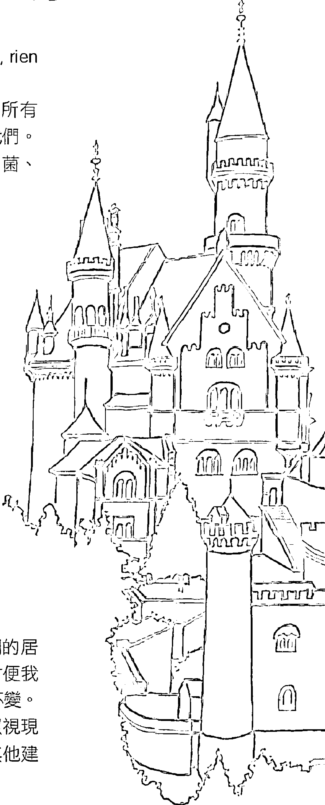

人體構造的不同層次，會根據尺寸排序：細胞、組織、器官。我們之所以能夠運轉，要感謝它們，就好比一家企業和它多少可以替換的合作製造商。在我們人生的幾個界石之間，心靈的任務是協調所有這些元素，幸好有由那些可以進化的身分所編織的心理囊袋，就像一家企業依其理念去協調各種活動。

住屋是由一群共通的基因組所組成，家庭是繼個人而來的組織。住屋會根據時代的不同去組織成員，讓他們多少能自立。牽涉到許多行星的占星學就像一面鏡子，映照出我們在尋找一條共通道路，無論是個人或家庭方面。一個家庭的標識，是確保家庭協調的識別物，基本上就是住屋。住屋是一個家庭投射自己的多重身分的螢幕。

多虧我們能穿梭於住屋的各個房間，你可以理解我們的居家方式攸關文化，我們並不住在「住宅機器」（一個只是方便我們當下需要的空間而已）。它是我們文明特有的，自古至今不變。公寓和獨棟住宅是人類的殿堂，而城堡就像個放大鏡，照視現下正在發生的事。城堡是唯一能夠概括建築的建設，比其他建築物更甚，就連神殿也不及它。

> *這是十八世紀的法國化學家拉瓦錫（Antoine-Laurent de Lavoisier, 1743~1794）的名言。

城堡顯示住戶成員間彼此共同和抵觸的欲望共存於時間中。生者的欲望壓過死者的欲望。這種情況可以將城堡摧毀殆盡。只有必要時才堅持，是尊重每個人的欲望；讓黃道十二星座來表達家庭成員的性格，是帶來一個不受強勢力量影響的參考點，讓每個人能拯救自己的欲望。使用本書時為它加上評注，能把這本書個人化，讓它變得獨一無二，也能把本書這些良好的用意扎根到現實生活中。

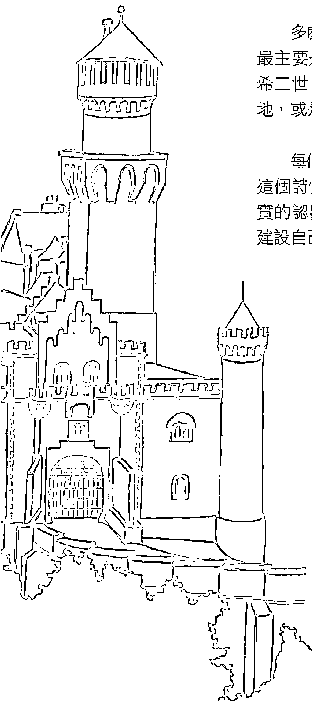

多虧色彩為空間帶來的效果，住屋可以扮演城堡，但是色彩最主要是能在住屋中帶入城堡的詩意。如同巴伐利亞國王路德維希二世（Ludwig Otto Friedrich Wilhelm）的新天鵝堡，城堡是夢之地，或是更確切說，這裡充滿了動人遐思的選擇。

每個人內心深處都夢想著要蓋一座自己的城堡、自己的天堂，這個詩情畫意的場所代表了他個人的幸福，他能在某一刻確確實實的認出自己。藉由建設心目中的城堡來尋找幸福，能協助我們建設自己，而且讓我們看見自己的理想影像。

經驗證明，如果我們不參照先前一個令人不滿的狀況，就創造不出新的東西：因為知道什麼樣的事無法滿足我們，我們才會知道什麼能滿足我們。同樣的道理，城堡和星星分別是景物和天空中的參考，黃道十二星座的選色將會幫助你找到真心喜愛的色彩，可是如果我們沒有把這些選擇攤在你面前的話，你不會想到它們。也因為以占星學為基礎來選色並非牢不可破的真理，你可以輕易丟開，但是在這段時間內，它會扮演好它的角色，讓你找到正確的顏色，那些屬於今天的顏色。

事實上，重點在勇於講述人生中雞毛蒜皮的小事、一件物品或一段回憶的故事。你這些動人遐思的選擇，表現出你的想法很年輕，這就是幸福。這些雞毛蒜皮的小事表達出我們的為人、欲望、抱負或卑微的期待，還有我們的生活和人性。

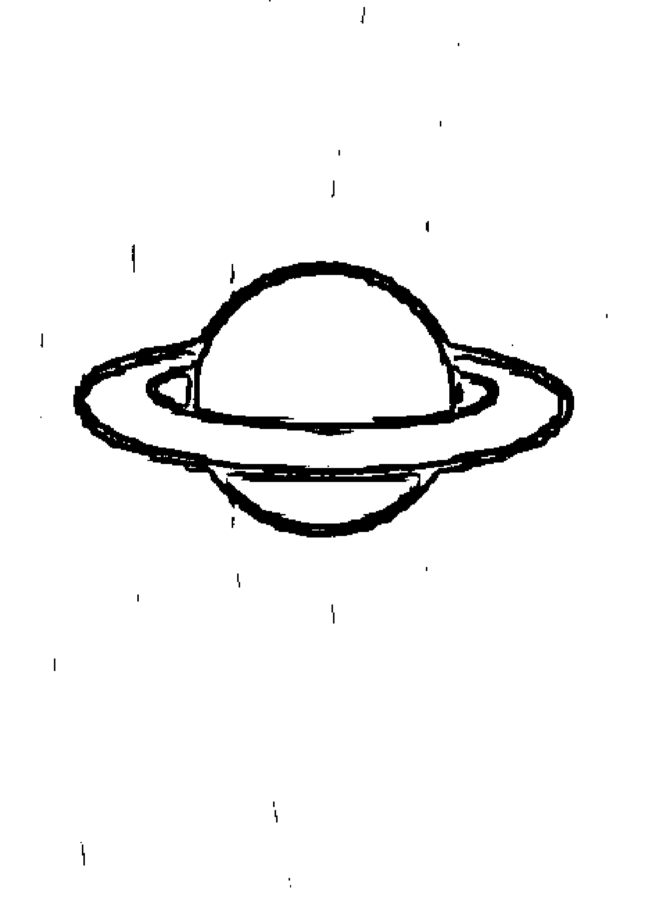
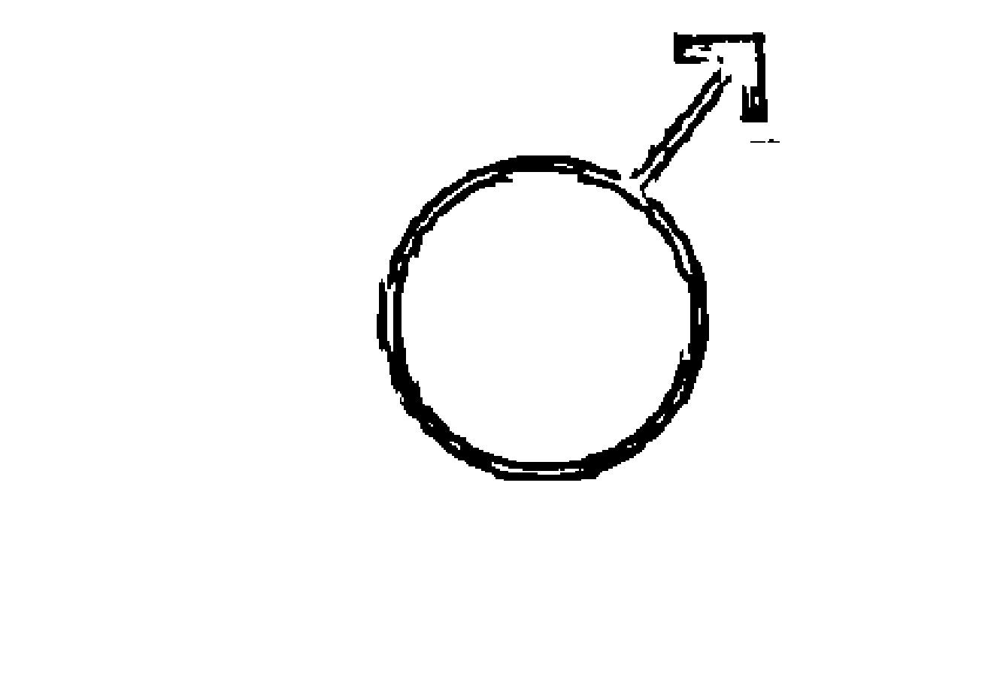
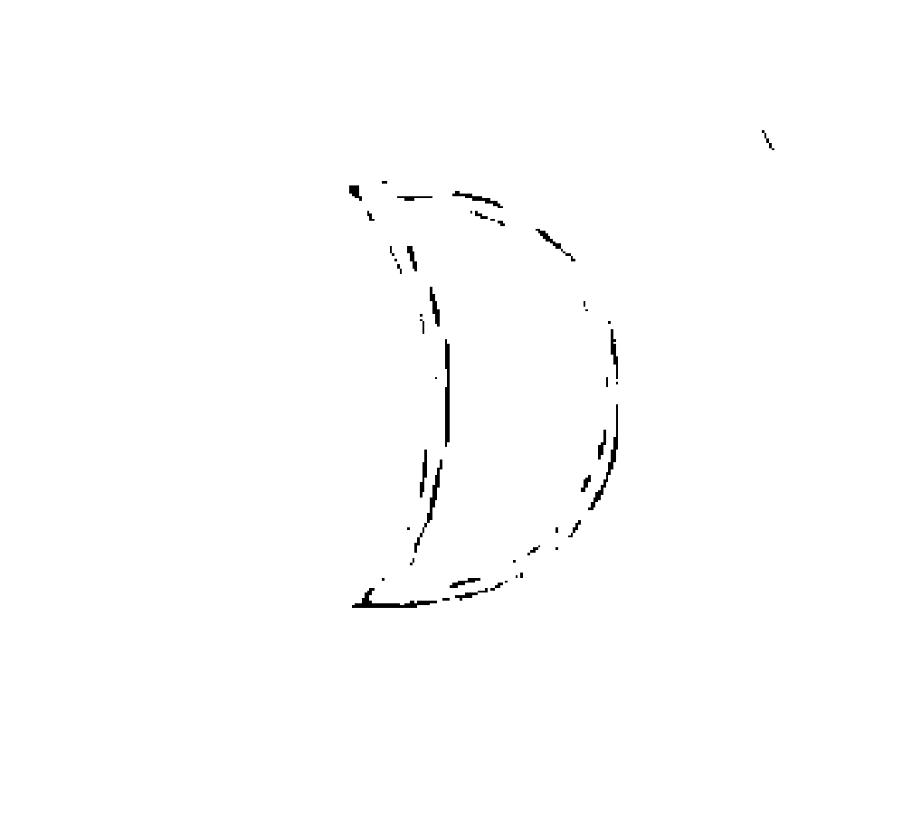
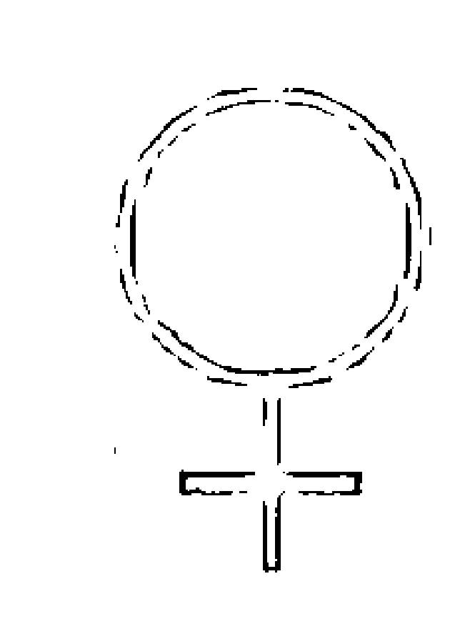
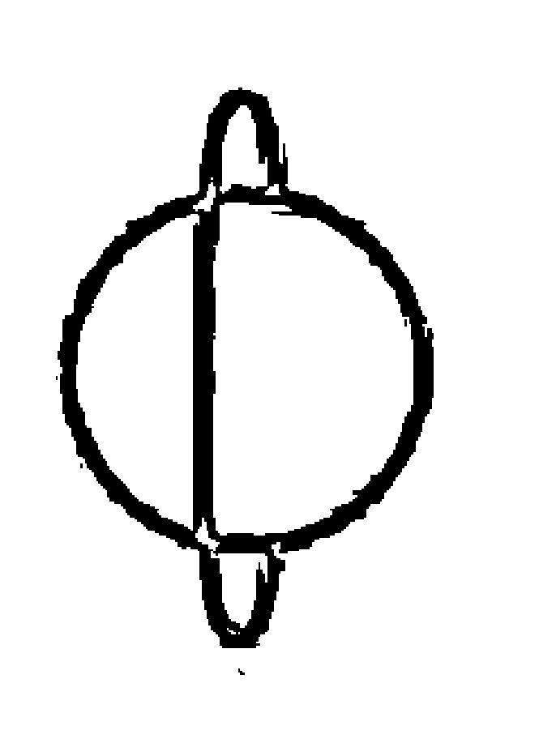
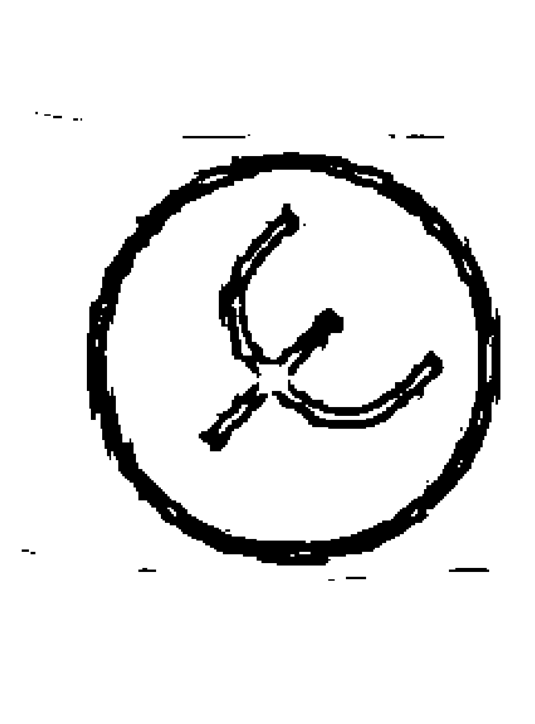
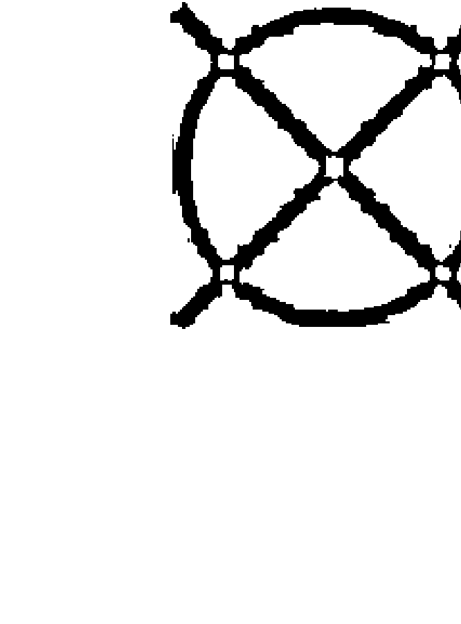

## 行星位置表

### 太陽

寫下家庭成員的名字及出生日期。

| 名字 | 出生日期 | 太陽星座 |
|---|---|---|
|  |  |  |
|  |  |  |
|  |  |  |
|  |  |  |
|  |  |  |
|  |  |  |
|  |  |  |
|  |  |  |

準備好成員之一的出生日期，並且在下方列表中，找出該生日之前、最接近的日期，所註記的星座。把這個星座記進表格中。

例如，某人出生於1945年5月3日：在列表中，他生日之前最接近的日期是1945年4月21日。因此，他的太陽星座是金牛座。

列表僅供參考，無關出生地點與時間。
若要確實找到每個行星所在的星座，請上網：
www.astrocolors.com

#### 1940 年至 2040 年間，太陽所在的星座
- 1940 1/22 水瓶座
- 2/20 雙魚座
- 3/21 牡羊座
- 4/21 金牛座
- 5/22 雙子座
- 6/22 巨蟹座
- 7/24 獅子座
- 8/24 處女座
- 9/24 天秤座
- 10/24 天蠍座
- 11/23 射手座
- 12/22 摩羯座
- 1941 1/21 水瓶座
- 2/20 雙魚座
- 3/22 牡羊座
- 4/21 金牛座
- 5/22 雙子座
- 6/22 巨蟹座
- 7/24 獅子座
- 8/24 處女座
- 9/24 天秤座
- 10/24 天蠍座
- 11/23 射手座
- 12/23 摩羯座
- 1942 1/21 水瓶座
- 2/20 雙魚座
- 3/22 牡羊座
- 4/21 金牛座
- 5/22 雙子座
- 6/23 巨蟹座
- 7/24 獅子座
- 8/24 處女座
- 9/24 天秤座
- 10/25 天蠍座
- 11/23 射手座
- 12/23 摩羯座
- 1943 1/21 水瓶座
- 2/20 雙魚座
- 3/22 牡羊座
- 4/21 金牛座
- 5/22 雙子座
- 6/23 巨蟹座
- 7/24 獅子座
- 8/25 處女座
- 9/24 天秤座
- 10/25 天蠍座
- 11/24 射手座
- 12/23 摩羯座
- 1944 1/22 水瓶座
- 2/20 雙魚座
- 3/21 牡羊座
- 4/21 金牛座
- 5/22 雙子座
- 6/22 巨蟹座
- 7/23 獅子座
- 8/24 處女座
- 9/24 天秤座
- 10/24 天蠍座
- 11/23 射手座
- 12/22 摩羯座
- 1945 1/21 水瓶座
- 2/20 雙魚座
- 3/21 牡羊座
- 4/21 金牛座
- 5/22 雙子座
- 6/22 巨蟹座
- 7/24 獅子座
- 8/24 處女座
- 9/24 天秤座
- 10/24 天蠍座
- 11/23 射手座
- 12/23 摩羯座
- 1946 1/21 水瓶座
- 2/20 雙魚座
- 3/22 牡羊座
- 4/21 金牛座
- 5/22 雙子座
- 6/23 巨蟹座
- 7/24 獅子座
- 8/24 處女座
- 9/24 天秤座
- 10/25 天蠍座
- 11/23 射手座
- 12/23 摩羯座
- 1947 1/21 水瓶座
- 2/20 雙魚座
- 3/22 牡羊座
- 4/21 金牛座
- 5/22 雙子座
- 6/23 巨蟹座

### 太陽

| | | | | | | | | | |
|---|---|---|---|---|---|---|---|---|---|
| 7/24 獅子座 | 3/22 牡羊座 | 11/23 射手座 | 7/24 獅子座 | 3/22 牡羊座 |
| 8/25 處女座 | 4/21 金牛座 | 12/22 摩羯座 | 8/24 處女座 | 4/21 金牛座 |
| 9/24 天秤座 | 5/22 雙子座 | 1/21 水瓶座 | 9/24 天秤座 | 5/22 雙子座 |
| 10/25 天蠍座 | 6/22 巨蟹座 | 2/19 雙魚座 | 10/25 天蠍座 | 6/22 巨蟹座 |
| 11/24 射手座 | 7/24 獅子座 | 3/21 牡羊座 | 11/24 射手座 | 7/24 獅子座 |
| 12/23 摩羯座 | 8/24 處女座 | 4/21 金牛座 | 12/23 摩羯座 | 8/24 處女座 |
| 1948 1/22 水瓶座 | 9/24 天秤座 | 5/22 雙子座 | 1968 1/21 水瓶座 | 9/24 天秤座 |
| 2/20 雙魚座 | 10/24 天蠍座 | 6/22 巨蟹座 | 2/20 雙魚座 | 10/24 天蠍座 |
| 3/21 牡羊座 | 11/23 射手座 | 7/24 獅子座 | 3/21 牡羊座 | 11/23 射手座 |
| 4/21 金牛座 | 12/23 摩羯座 | 8/24 處女座 | 4/21 金牛座 | 12/23 摩羯座 |
| 5/22 雙子座 | 1955 1/21 水瓶座 | 9/24 天秤座 | 5/22 雙子座 | 1975 1/21 水瓶座 |
| 6/22 巨蟹座 | 2/20 雙魚座 | 10/24 天蠍座 | 6/22 巨蟹座 | 2/20 雙魚座 |
| 7/23 獅子座 | 3/22 牡羊座 | 11/23 射手座 | 7/23 獅子座 | 3/22 牡羊座 |
| 8/24 處女座 | 4/21 金牛座 | 12/23 摩羯座 | 8/24 處女座 | 4/21 金牛座 |
| 9/24 天秤座 | 5/22 雙子座 | 1962 1/21 水瓶座 | 9/23 天秤座 | 5/22 雙子座 |
| 10/24 天蠍座 | 6/23 巨蟹座 | 2/20 雙魚座 | 10/24 天蠍座 | 6/23 巨蟹座 |
| 11/23 射手座 | 7/24 獅子座 | 3/22 牡羊座 | 11/23 射手座 | 7/24 獅子座 |
| 12/22 摩羯座 | 8/24 處女座 | 4/21 金牛座 | 12/22 摩羯座 | 8/24 處女座 |
| 1949 1/21 水瓶座 | 9/24 天秤座 | 5/22 雙子座 | 1969 1/21 水瓶座 | 9/24 天秤座 |
| 2/19 雙魚座 | 10/25 天蠍座 | 6/22 巨蟹座 | 2/19 雙魚座 | 10/25 天蠍座 |
| 3/21 牡羊座 | 11/24 射手座 | 7/24 獅子座 | 3/21 牡羊座 | 11/23 射手座 |
| 4/21 金牛座 | 12/23 摩羯座 | 8/24 處女座 | 4/21 金牛座 | 12/23 摩羯座 |
| 5/22 雙子座 | 1956 1/22 水瓶座 | 9/24 天秤座 | 5/22 雙子座 | 1976 1/21 水瓶座 |
| 6/22 巨蟹座 | 2/20 雙魚座 | 10/24 天蠍座 | 6/22 巨蟹座 | 2/20 雙魚座 |
| 7/24 獅子座 | 3/21 牡羊座 | 11/23 射手座 | 7/24 獅子座 | 3/21 牡羊座 |
| 8/24 處女座 | 4/21 金牛座 | 12/23 摩羯座 | 8/24 處女座 | 4/20 金牛座 |
| 9/24 天秤座 | 5/22 雙子座 | 1963 1/21 水瓶座 | 9/24 天秤座 | 5/21 雙子座 |
| 10/24 天蠍座 | 6/22 巨蟹座 | 2/20 雙魚座 | 10/24 天蠍座 | 6/22 巨蟹座 |
| 11/23 射手座 | 7/23 獅子座 | 3/22 牡羊座 | 11/23 射手座 | 7/23 獅子座 |
| 12/23 摩羯座 | 8/24 處女座 | 4/21 金牛座 | 12/23 摩羯座 | 8/24 處女座 |
| 1950 1/21 水瓶座 | 9/24 天秤座 | 5/22 雙子座 | 1970 1/21 水瓶座 | 9/23 天秤座 |
| 2/20 雙魚座 | 10/24 天蠍座 | 6/23 巨蟹座 | 2/20 雙魚座 | 10/24 天蠍座 |
| 3/22 牡羊座 | 11/23 射手座 | 7/24 獅子座 | 3/22 牡羊座 | 11/23 射手座 |
| 4/21 金牛座 | 12/22 摩羯座 | 8/24 處女座 | 4/21 金牛座 | 12/22 摩羯座 |
| 5/22 雙子座 | 1957 1/21 水瓶座 | 9/24 天秤座 | 5/22 雙子座 | 1977 1/21 水瓶座 |
| 6/22 巨蟹座 | 2/19 雙魚座 | 10/25 天蠍座 | 6/22 巨蟹座 | 2/19 雙魚座 |
| 7/24 獅子座 | 3/21 牡羊座 | 11/24 射手座 | 7/24 獅子座 | 3/21 牡羊座 |
| 8/24 處女座 | 4/21 金牛座 | 12/23 摩羯座 | 8/24 處女座 | 4/21 金牛座 |
| 9/24 天秤座 | 5/22 雙子座 | 1964 1/22 水瓶座 | 9/24 天秤座 | 5/22 雙子座 |
| 10/24 天蠍座 | 6/22 巨蟹座 | 2/20 雙魚座 | 10/24 天蠍座 | 6/22 巨蟹座 |
| 11/23 射手座 | 7/24 獅子座 | 3/21 牡羊座 | 11/23 射手座 | 7/23 獅子座 |
| 12/23 摩羯座 | 8/24 處女座 | 4/21 金牛座 | 12/23 摩羯座 | 8/24 處女座 |
| 1951 1/21 水瓶座 | 9/24 天秤座 | 5/22 雙子座 | 1971 1/21 水瓶座 | 9/24 天秤座 |
| 2/20 雙魚座 | 10/24 天蠍座 | 6/22 巨蟹座 | 2/20 雙魚座 | 10/24 天蠍座 |
| 3/22 牡羊座 | 11/23 射手座 | 7/23 獅子座 | 3/22 牡羊座 | 11/23 射手座 |
| 4/21 金牛座 | 12/23 摩羯座 | 8/24 處女座 | 4/21 金牛座 | 12/22 摩羯座 |
| 5/22 雙子座 | 1958 1/21 水瓶座 | 9/24 天秤座 | 5/22 雙子座 | 1978 1/21 水瓶座 |
| 6/23 巨蟹座 | 2/20 雙魚座 | 10/24 天蠍座 | 6/23 巨蟹座 | 2/20 雙魚座 |
| 7/24 獅子座 | 3/22 牡羊座 | 11/23 射手座 | 7/24 獅子座 | 3/21 牡羊座 |
| 8/24 處女座 | 4/21 金牛座 | 12/22 摩羯座 | 8/24 處女座 | 4/21 金牛座 |
| 9/24 天秤座 | 5/22 雙子座 | 1965 1/21 水瓶座 | 9/24 天秤座 | 5/22 雙子座 |
| 10/25 天蠍座 | 6/22 巨蟹座 | 2/19 雙魚座 | 10/25 天蠍座 | 6/22 巨蟹座 |
| 11/24 射手座 | 7/24 獅子座 | 3/21 牡羊座 | 11/23 射手座 | 7/24 獅子座 |
| 12/23 摩羯座 | 8/24 處女座 | 4/21 金牛座 | 12/23 摩羯座 | 8/24 處女座 |
| 1952 1/22 水瓶座 | 9/24 天秤座 | 5/22 雙子座 | 1972 1/21 水瓶座 | 9/24 天秤座 |
| 2/20 雙魚座 | 10/24 天蠍座 | 6/22 巨蟹座 | 2/20 雙魚座 | 10/24 天蠍座 |
| 3/21 牡羊座 | 11/23 射手座 | 7/24 獅子座 | 3/21 牡羊座 | 11/23 射手座 |
| 4/21 金牛座 | 12/23 摩羯座 | 8/24 處女座 | 4/20 金牛座 | 12/23 摩羯座 |
| 5/22 雙子座 | 1959 1/21 水瓶座 | 9/24 天秤座 | 5/21 雙子座 | 1979 1/21 水瓶座 |
| 6/22 巨蟹座 | 2/20 雙魚座 | 10/24 天蠍座 | 6/22 巨蟹座 | 2/20 雙魚座 |
| 7/23 獅子座 | 3/22 牡羊座 | 11/23 射手座 | 7/23 獅子座 | 3/22 牡羊座 |
| 8/24 處女座 | 4/21 金牛座 | 12/23 摩羯座 | 8/24 處女座 | 4/21 金牛座 |
| 9/24 天秤座 | 5/22 雙子座 | 1966 1/21 水瓶座 | 9/23 天秤座 | 5/22 雙子座 |
| 10/24 天蠍座 | 6/23 巨蟹座 | 2/20 雙魚座 | 10/24 天蠍座 | 6/22 巨蟹座 |
| 11/23 射手座 | 7/24 獅子座 | 3/22 牡羊座 | 11/23 射手座 | 7/24 獅子座 |
| 12/22 摩羯座 | 8/24 處女座 | 4/21 金牛座 | 12/22 摩羯座 | 8/24 處女座 |
| 1953 1/21 水瓶座 | 9/24 天秤座 | 5/22 雙子座 | 1973 1/21 水瓶座 | 9/24 天秤座 |
| 2/19 雙魚座 | 10/25 天蠍座 | 6/22 巨蟹座 | 2/19 雙魚座 | 10/25 天蠍座 |
| 3/21 牡羊座 | 11/24 射手座 | 7/24 獅子座 | 3/21 牡羊座 | 11/23 射手座 |
| 4/21 金牛座 | 12/23 摩羯座 | 8/24 處女座 | 4/21 金牛座 | 12/23 摩羯座 |
| 5/22 雙子座 | 1960 1/22 水瓶座 | 9/24 天秤座 | 5/22 雙子座 | 1980 1/21 水瓶座 |
| 6/22 巨蟹座 | 2/20 雙魚座 | 10/24 天蠍座 | 6/22 巨蟹座 | 2/20 雙魚座 |
| 7/24 獅子座 | 3/21 牡羊座 | 11/23 射手座 | 7/23 獅子座 | 3/21 牡羊座 |
| 8/24 處女座 | 4/21 金牛座 | 12/23 摩羯座 | 8/24 處女座 | 4/20 金牛座 |
| 9/24 天秤座 | 5/22 雙子座 | 1967 1/21 水瓶座 | 9/24 天秤座 | 5/21 雙子座 |
| 10/24 天蠍座 | 6/22 巨蟹座 | 2/20 雙魚座 | 10/24 天蠍座 | 6/22 巨蟹座 |
| 11/23 射手座 | 7/23 獅子座 | 3/22 牡羊座 | 11/23 射手座 | 7/23 獅子座 |
| 12/23 摩羯座 | 8/24 處女座 | 4/21 金牛座 | 12/23 摩羯座 | 8/23 處女座 |
| 1954 1/21 水瓶座 | 9/24 天秤座 | 5/22 雙子座 | 1974 1/21 水瓶座 | 9/23 天秤座 |
| 2/20 雙魚座 | 10/24 天蠍座 | 6/23 巨蟹座 | 2/20 雙魚座 | 10/24 天蠍座 |

### 太陽

| Year | Date | Zodiac |
|---|---|---|
| 1981 | 1/21 | 水瓶座 |
| 1981 | 2/19 | 雙魚座 |
| 1981 | 3/21 | 牡羊座 |
| 1981 | 4/21 | 金牛座 |
| 1981 | 5/22 | 雙子座 |
| 1981 | 6/22 | 巨蟹座 |
| 1981 | 7/23 | 獅子座 |
| 1981 | 8/24 | 處女座 |
| 1981 | 9/24 | 天秤座 |
| 1981 | 10/24 | 天蠍座 |
| 1981 | 11/23 | 射手座 |
| 1981 | 12/22 | 摩羯座 |
| 1982 | 1/21 | 水瓶座 |
| 1982 | 2/19 | 雙魚座 |
| 1982 | 3/21 | 牡羊座 |
| 1982 | 4/21 | 金牛座 |
| 1982 | 5/22 | 雙子座 |
| 1982 | 6/22 | 巨蟹座 |
| 1982 | 7/24 | 獅子座 |
| 1982 | 8/24 | 處女座 |
| 1982 | 9/24 | 天秤座 |
| 1982 | 10/24 | 天蠍座 |
| 1982 | 11/23 | 射手座 |
| 1982 | 12/23 | 摩羯座 |
| 1983 | 1/21 | 水瓶座 |
| 1983 | 2/20 | 雙魚座 |
| 1983 | 3/22 | 牡羊座 |
| 1983 | 4/21 | 金牛座 |
| 1983 | 5/22 | 雙子座 |
| 1983 | 6/22 | 巨蟹座 |
| 1983 | 7/24 | 獅子座 |
| 1983 | 8/24 | 處女座 |
| 1983 | 9/24 | 天秤座 |
| 1983 | 10/24 | 天蠍座 |
| 1983 | 11/23 | 射手座 |
| 1983 | 12/23 | 摩羯座 |
| 1984 | 1/21 | 水瓶座 |
| 1984 | 2/20 | 雙魚座 |
| 1984 | 3/21 | 牡羊座 |
| 1984 | 4/20 | 金牛座 |
| 1984 | 5/21 | 雙子座 |
| 1984 | 6/22 | 巨蟹座 |
| 1984 | 7/23 | 獅子座 |
| 1984 | 8/23 | 處女座 |
| 1984 | 9/23 | 天秤座 |
| 1984 | 10/24 | 天蠍座 |
| 1984 | 11/23 | 射手座 |
| 1984 | 12/22 | 摩羯座 |
| 1985 | 1/21 | 水瓶座 |
| 1985 | 2/19 | 雙魚座 |
| 1985 | 3/21 | 牡羊座 |
| 1985 | 4/21 | 金牛座 |
| 1985 | 5/22 | 雙子座 |
| 1985 | 6/22 | 巨蟹座 |
| 1985 | 7/23 | 獅子座 |
| 1985 | 8/24 | 處女座 |
| 1985 | 9/24 | 天秤座 |
| 1985 | 10/24 | 天蠍座 |
| 1985 | 11/23 | 射手座 |
| 1985 | 12/22 | 摩羯座 |
| 1986 | 1/21 | 水瓶座 |
| 1986 | 2/19 | 雙魚座 |
| 1986 | 3/21 | 牡羊座 |
| 1986 | 4/21 | 金牛座 |
| 1986 | 5/22 | 雙子座 |
| 1986 | 6/22 | 巨蟹座 |
| 1986 | 7/24 | 獅子座 |
| 1986 | 8/24 | 處女座 |
| 1986 | 9/24 | 天秤座 |
| 1986 | 10/24 | 天蠍座 |
| 1986 | 11/23 | 射手座 |
| 1986 | 12/23 | 摩羯座 |
| 1987 | 1/21 | 水瓶座 |
| 1987 | 2/20 | 雙魚座 |
| 1987 | 3/22 | 牡羊座 |
| 1987 | 4/21 | 金牛座 |
| 1987 | 5/22 | 雙子座 |
| 1987 | 6/22 | 巨蟹座 |
| 1987 | 7/24 | 獅子座 |
| 1987 | 8/24 | 處女座 |
| 1987 | 9/24 | 天秤座 |
| 1987 | 10/24 | 天蠍座 |
| 1988 | 1/21 | 水瓶座 |
| 1988 | 2/20 | 雙魚座 |
| 1988 | 3/21 | 牡羊座 |
| 1988 | 4/20 | 金牛座 |
| 1988 | 5/21 | 雙子座 |
| 1988 | 6/22 | 巨蟹座 |
| 1988 | 7/23 | 獅子座 |
| 1988 | 8/23 | 處女座 |
| 1988 | 9/23 | 天秤座 |
| 1988 | 10/24 | 天蠍座 |
| 1988 | 11/23 | 射手座 |
| 1988 | 12/22 | 摩羯座 |
| 1989 | 1/21 | 水瓶座 |
| 1989 | 2/19 | 雙魚座 |
| 1989 | 3/21 | 牡羊座 |
| 1989 | 4/21 | 金牛座 |
| 1989 | 5/22 | 雙子座 |
| 1989 | 6/22 | 巨蟹座 |
| 1989 | 7/24 | 獅子座 |
| 1989 | 8/24 | 處女座 |
| 1989 | 9/24 | 天秤座 |
| 1989 | 10/24 | 天蠍座 |
| 1989 | 11/23 | 射手座 |
| 1989 | 12/23 | 摩羯座 |
| 1990 | 1/21 | 水瓶座 |
| 1990 | 2/19 | 雙魚座 |
| 1990 | 3/21 | 牡羊座 |
| 1990 | 4/21 | 金牛座 |
| 1990 | 5/22 | 雙子座 |
| 1990 | 6/22 | 巨蟹座 |
| 1990 | 7/24 | 獅子座 |
| 1990 | 8/24 | 處女座 |
| 1990 | 9/24 | 天秤座 |
| 1990 | 10/24 | 天蠍座 |
| 1990 | 11/23 | 射手座 |
| 1990 | 12/23 | 摩羯座 |
| 1991 | 1/21 | 水瓶座 |
| 1991 | 2/20 | 雙魚座 |
| 1991 | 3/22 | 牡羊座 |
| 1991 | 4/21 | 金牛座 |
| 1991 | 5/22 | 雙子座 |
| 1991 | 6/22 | 巨蟹座 |
| 1991 | 7/23 | 獅子座 |
| 1991 | 8/24 | 處女座 |
| 1991 | 9/23 | 天秤座 |
| 1991 | 10/24 | 天蠍座 |
| 1991 | 11/23 | 射手座 |
| 1991 | 12/22 | 摩羯座 |
| 1992 | 1/21 | 水瓶座 |
| 1992 | 2/20 | 雙魚座 |
| 1992 | 3/21 | 牡羊座 |
| 1992 | 4/20 | 金牛座 |
| 1992 | 5/21 | 雙子座 |
| 1992 | 6/22 | 巨蟹座 |
| 1992 | 7/23 | 獅子座 |
| 1992 | 8/24 | 處女座 |
| 1992 | 9/24 | 天秤座 |
| 1992 | 10/24 | 天蠍座 |
| 1992 | 11/23 | 射手座 |
| 1992 | 12/22 | 摩羯座 |
| 1993 | 1/21 | 水瓶座 |
| 1993 | 2/19 | 雙魚座 |
| 1993 | 3/21 | 牡羊座 |
| 1993 | 4/21 | 金牛座 |
| 1993 | 5/22 | 雙子座 |
| 1993 | 6/22 | 巨蟹座 |
| 1993 | 7/24 | 獅子座 |
| 1993 | 8/24 | 處女座 |
| 1993 | 9/24 | 天秤座 |
| 1993 | 10/24 | 天蠍座 |
| 1993 | 11/23 | 射手座 |
| 1993 | 12/23 | 摩羯座 |
| 1994 | 1/21 | 水瓶座 |
| 1994 | 2/19 | 雙魚座 |
| 1994 | 3/21 | 牡羊座 |
| 1994 | 4/21 | 金牛座 |
| 1994 | 5/22 | 雙子座 |
| 1994 | 6/22 | 巨蟹座 |
| 1994 | 7/24 | 獅子座 |
| 1994 | 8/24 | 處女座 |
| 1994 | 9/24 | 天秤座 |
| 1994 | 10/24 | 天蠍座 |
| 1994 | 11/23 | 射手座 |
| 1994 | 12/23 | 摩羯座 |
| 1995 | 1/21 | 水瓶座 |
| 1995 | 2/20 | 雙魚座 |
| 1995 | 3/22 | 牡羊座 |
| 1995 | 4/21 | 金牛座 |
| 1995 | 5/22 | 雙子座 |
| 1995 | 6/22 | 巨蟹座 |
| 1995 | 7/24 | 獅子座 |
| 1995 | 8/24 | 處女座 |
| 1995 | 9/24 | 天秤座 |
| 1995 | 10/24 | 天蠍座 |
| 1995 | 11/23 | 射手座 |
| 1995 | 12/23 | 摩羯座 |
| 1996 | 1/21 | 水瓶座 |
| 1996 | 2/20 | 雙魚座 |
| 1996 | 3/21 | 牡羊座 |
| 1996 | 4/20 | 金牛座 |
| 1996 | 5/21 | 雙子座 |
| 1996 | 6/22 | 巨蟹座 |
| 1996 | 7/23 | 獅子座 |
| 1996 | 8/24 | 處女座 |
| 1996 | 9/24 | 天秤座 |
| 1996 | 10/24 | 天蠍座 |
| 1996 | 11/23 | 射手座 |
| 1996 | 12/23 | 摩羯座 |
| 1997 | 1/21 | 水瓶座 |
| 1997 | 2/19 | 雙魚座 |
| 1997 | 3/21 | 牡羊座 |
| 1997 | 4/21 | 金牛座 |
| 1997 | 5/22 | 雙子座 |
| 1997 | 6/22 | 巨蟹座 |
| 1997 | 7/24 | 獅子座 |
| 1997 | 8/24 | 處女座 |
| 1997 | 9/24 | 天秤座 |
| 1997 | 10/24 | 天蠍座 |
| 1997 | 11/23 | 射手座 |
| 1997 | 12/23 | 摩羯座 |
| 1998 | 1/21 | 水瓶座 |
| 1998 | 2/19 | 雙魚座 |
| 1998 | 3/21 | 牡羊座 |
| 1998 | 4/21 | 金牛座 |
| 1998 | 5/22 | 雙子座 |
| 1998 | 6/22 | 巨蟹座 |
| 1998 | 7/24 | 獅子座 |
| 1998 | 8/24 | 處女座 |
| 1998 | 9/24 | 天秤座 |
| 1998 | 10/24 | 天蠍座 |
| 1998 | 11/23 | 射手座 |
| 1998 | 12/23 | 摩羯座 |
| 1999 | 1/21 | 水瓶座 |
| 1999 | 2/20 | 雙魚座 |
| 1999 | 3/22 | 牡羊座 |
| 1999 | 4/21 | 金牛座 |
| 1999 | 5/22 | 雙子座 |
| 1999 | 6/22 | 巨蟹座 |
| 1999 | 7/23 | 獅子座 |
| 1999 | 8/23 | 處女座 |
| 1999 | 9/23 | 天秤座 |
| 1999 | 10/24 | 天蠍座 |
| 1999 | 11/23 | 射手座 |
| 1999 | 12/22 | 摩羯座 |
| 2000 | 1/21 | 水瓶座 |
| 2000 | 2/20 | 雙魚座 |
| 2000 | 3/21 | 牡羊座 |
| 2000 | 4/20 | 金牛座 |
| 2000 | 5/21 | 雙子座 |
| 2000 | 6/22 | 巨蟹座 |
| 2000 | 7/23 | 獅子座 |
| 2000 | 8/23 | 處女座 |
| 2000 | 9/23 | 天秤座 |
| 2000 | 10/24 | 天蠍座 |
| 2000 | 11/23 | 射手座 |
| 2000 | 12/22 | 摩羯座 |
| 2001 | 1/21 | 水瓶座 |
| 2001 | 2/19 | 雙魚座 |
| 2001 | 3/21 | 牡羊座 |
| 2001 | 4/21 | 金牛座 |
| 2001 | 5/21 | 雙子座 |
| 2001 | 6/22 | 巨蟹座 |
| 2001 | 7/23 | 獅子座 |
| 2001 | 8/24 | 處女座 |
| 2001 | 9/23 | 天秤座 |
| 2001 | 10/24 | 天蠍座 |
| 2001 | 11/23 | 射手座 |
| 2001 | 12/22 | 摩羯座 |
| 2002 | 1/21 | 水瓶座 |
| 2002 | 2/19 | 雙魚座 |
| 2002 | 3/21 | 牡羊座 |
| 2002 | 4/21 | 金牛座 |
| 2002 | 5/22 | 雙子座 |
| 2002 | 6/22 | 巨蟹座 |
| 2002 | 7/24 | 獅子座 |
| 2002 | 8/24 | 處女座 |
| 2002 | 9/24 | 天秤座 |
| 2002 | 10/24 | 天蠍座 |
| 2002 | 11/23 | 射手座 |
| 2002 | 12/23 | 摩羯座 |
| 2003 | 1/21 | 水瓶座 |
| 2003 | 2/20 | 雙魚座 |
| 2003 | 3/22 | 牡羊座 |
| 2003 | 4/21 | 金牛座 |
| 2003 | 5/22 | 雙子座 |
| 2003 | 6/22 | 巨蟹座 |
| 2003 | 7/24 | 獅子座 |
| 2003 | 8/24 | 處女座 |
| 2003 | 9/24 | 天秤座 |
| 2003 | 10/24 | 天蠍座 |
| 2003 | 11/23 | 射手座 |
| 2003 | 12/23 | 摩羯座 |
| 2004 | 1/21 | 水瓶座 |
| 2004 | 2/20 | 雙魚座 |
| 2004 | 3/21 | 牡羊座 |
| 2004 | 4/20 | 金牛座 |
| 2004 | 5/21 | 雙子座 |
| 2004 | 6/22 | 巨蟹座 |
| 2004 | 7/23 | 獅子座 |
| 2004 | 8/24 | 處女座 |
| 2004 | 9/24 | 天秤座 |
| 2004 | 10/24 | 天蠍座 |
| 2004 | 11/23 | 射手座 |
| 2004 | 12/22 | 摩羯座 |
| 2005 | 1/20 | 水瓶座 |
| 2005 | 2/19 | 雙魚座 |
| 2005 | 3/21 | 牡羊座 |
| 2005 | 4/20 | 金牛座 |
| 2005 | 5/21 | 雙子座 |
| 2005 | 6/22 | 巨蟹座 |
| 2005 | 7/23 | 獅子座 |
| 2005 | 8/24 | 處女座 |
| 2005 | 9/24 | 天秤座 |
| 2005 | 10/24 | 天蠍座 |
| 2005 | 11/23 | 射手座 |
| 2005 | 12/23 | 摩羯座 |
| 2006 | 1/21 | 水瓶座 |
| 2006 | 2/19 | 雙魚座 |
| 2006 | 3/21 | 牡羊座 |
| 2006 | 4/21 | 金牛座 |
| 2006 | 5/22 | 雙子座 |
| 2006 | 6/22 | 巨蟹座 |
| 2006 | 7/24 | 獅子座 |
| 2006 | 8/24 | 處女座 |
| 2006 | 9/23 | 天秤座 |
| 2006 | 10/24 | 天蠍座 |
| 2006 | 11/22 | 射手座 |
| 2006 | 12/22 | 摩羯座 |
| 2007 | 1/21 | 水瓶座 |
| 2007 | 2/20 | 雙魚座 |
| 2007 | 3/22 | 牡羊座 |
| 2007 | 4/21 | 金牛座 |
| 2007 | 5/22 | 雙子座 |
| 2007 | 6/22 | 巨蟹座 |
| 2007 | 7/24 | 獅子座 |
| 2007 | 8/24 | 處女座 |
| 2007 | 9/24 | 天秤座 |
| 2007 | 10/24 | 天蠍座 |
| 2007 | 11/23 | 射手座 |
| 2007 | 12/23 | 摩羯座 |
| 2008 | 1/21 | 水瓶座 |
| 2008 | 2/20 | 雙魚座 |
| 2008 | 3/21 | 牡羊座 |
| 2008 | 4/20 | 金牛座 |
| 2008 | 5/21 | 雙子座 |
| 2008 | 6/22 | 巨蟹座 |
| 2008 | 7/23 | 獅子座 |
| 2008 | 8/23 | 處女座 |
| 2008 | 9/23 | 天秤座 |
| 2008 | 10/24 | 天蠍座 |
| 2008 | 11/22 | 射手座 |
| 2008 | 12/22 | 摩羯座 |
| 2009 | 1/20 | 水瓶座 |
| 2009 | 2/19 | 雙魚座 |
| 2009 | 3/21 | 牡羊座 |
| 2009 | 4/20 | 金牛座 |
| 2009 | 5/21 | 雙子座 |
| 2009 | 6/22 | 巨蟹座 |
| 2009 | 7/23 | 獅子座 |
| 2009 | 8/23 | 處女座 |
| 2009 | 9/23 | 天秤座 |
| 2009 | 10/24 | 天蠍座 |
| 2009 | 11/23 | 射手座 |
| 2009 | 12/23 | 摩羯座 |
| 2010 | 1/21 | 水瓶座 |
| 2010 | 2/19 | 雙魚座 |
| 2010 | 3/21 | 牡羊座 |
| 2010 | 4/21 | 金牛座 |
| 2010 | 5/22 | 雙子座 |
| 2010 | 6/22 | 巨蟹座 |
| 2010 | 7/24 | 獅子座 |
| 2010 | 8/24 | 處女座 |
| 2010 | 9/24 | 天秤座 |
| 2010 | 10/24 | 天蠍座 |
| 2010 | 11/23 | 射手座 |
| 2010 | 12/22 | 摩羯座 |
| 2011 | 1/21 | 水瓶座 |
| 2011 | 2/20 | 雙魚座 |
| 2011 | 3/21 | 牡羊座 |
| 2011 | 4/21 | 金牛座 |
| 2011 | 5/22 | 雙子座 |
| 2011 | 6/22 | 巨蟹座 |
| 2011 | 7/24 | 獅子座 |
| 2011 | 8/24 | 處女座 |
| 2011 | 9/24 | 天秤座 |
| 2011 | 10/24 | 天蠍座 |
| 2011 | 11/23 | 射手座 |
| 2011 | 12/22 | 摩羯座 |
| 2012 | 1/21 | 水瓶座 |
| 2012 | 2/20 | 雙魚座 |
| 2012 | 3/21 | 牡羊座 |
| 2012 | 4/20 | 金牛座 |
| 2012 | 5/21 | 雙子座 |
| 2012 | 6/21 | 巨蟹座 |
| 2012 | 7/23 | 獅子座 |
| 2012 | 8/23 | 處女座 |
| 2012 | 9/23 | 天秤座 |
| 2012 | 10/24 | 天蠍座 |
| 2012 | 11/23 | 射手座 |
| 2012 | 12/23 | 摩羯座 |
| 2013 | 1/20 | 水瓶座 |
| 2013 | 2/19 | 雙魚座 |
| 2013 | 3/21 | 牡羊座 |
| 2013 | 4/20 | 金牛座 |
| 2013 | 5/21 | 雙子座 |
| 2013 | 6/22 | 巨蟹座 |
| 2013 | 7/23 | 獅子座 |
| 2013 | 8/23 | 處女座 |
| 2013 | 9/23 | 天秤座 |
| 2013 | 10/24 | 天蠍座 |
| 2013 | 11/23 | 射手座 |
| 2013 | 12/22 | 摩羯座 |
| 2014 | 1/21 | 水瓶座 |
| 2014 | 2/19 | 雙魚座 |

### 太陽
| 3/21 牡羊座 | 8/24 處女座 | 2025 1/20 水瓶座 | 6/22 巨蟹座 | 11/23 射手座 |
|---|---|---|---|---|
| 4/21 金牛座 | 9/24 天秤座 | 2/19 雙魚座 | 7/23 獅子座 | 12/23 摩羯座 |
| 5/22 雙子座 | 10/24 天蠍座 | 3/21 牡羊座 | 8/24 處女座 | 2036 1/21 水瓶座 |
| 6/22 巨蟹座 | 11/23 射手座 | 4/20 金牛座 | 9/23 天秤座 | 2/20 雙魚座 |
| 7/23 獅子座 | 12/23 摩羯座 | 5/21 雙子座 | 10/24 天蠍座 | 3/21 牡羊座 |
| 8/24 處女座 | 2020 1/21 水瓶座 | 6/22 巨蟹座 | 11/23 射手座 | 4/20 金牛座 |
| 9/24 天秤座 | 2/20 雙魚座 | 7/23 獅子座 | 12/22 摩羯座 | 5/21 雙子座 |
| 10/24 天蠍座 | 3/21 牡羊座 | 8/23 處女座 | 2031 1/21 水瓶座 | 6/21 巨蟹座 |
| 11/23 射手座 | 4/20 金牛座 | 9/23 天秤座 | 2/19 雙魚座 | 7/23 獅子座 |
| 12/22 摩羯座 | 5/21 雙子座 | 10/24 天蠍座 | 3/21 牡羊座 | 8/23 處女座 |
| 2015 1/21 水瓶座 | 6/21 巨蟹座 | 11/23 射手座 | 4/21 金牛座 | 9/23 天秤座 |
| 2/19 雙魚座 | 7/23 獅子座 | 12/22 摩羯座 | 5/22 雙子座 | 10/23 天蠍座 |
| 3/21 牡羊座 | 8/23 處女座 | 2026 1/21 水瓶座 | 6/22 巨蟹座 | 11/22 射手座 |
| 4/21 金牛座 | 9/23 天秤座 | 2/19 雙魚座 | 7/24 獅子座 | 12/22 摩羯座 |
| 5/22 雙子座 | 10/23 天蠍座 | 3/21 牡羊座 | 8/24 處女座 | 2037 1/20 水瓶座 |
| 6/22 巨蟹座 | 11/22 射手座 | 4/21 金牛座 | 9/24 天秤座 | 2/19 雙魚座 |
| 7/24 獅子座 | 12/22 摩羯座 | 5/22 雙子座 | 10/24 天蠍座 | 3/21 牡羊座 |
| 8/24 處女座 | 2021 1/20 水瓶座 | 6/22 巨蟹座 | 11/23 射手座 | 4/20 金牛座 |
| 9/24 天秤座 | 2/19 雙魚座 | 7/23 獅子座 | 12/23 摩羯座 | 5/21 雙子座 |
| 10/24 天蠍座 | 3/21 牡羊座 | 8/24 處女座 | 2032 1/21 水瓶座 | 6/22 巨蟹座 |
| 11/23 射手座 | 4/20 金牛座 | 9/24 天秤座 | 2/20 雙魚座 | 7/23 獅子座 |
| 12/23 摩羯座 | 5/21 雙子座 | 10/24 天蠍座 | 3/21 牡羊座 | 8/23 處女座 |
| 2016 1/21 水瓶座 | 6/22 巨蟹座 | 11/23 射手座 | 4/20 金牛座 | 9/23 天秤座 |
| 2/20 雙魚座 | 7/23 獅子座 | 12/22 摩羯座 | 5/21 雙子座 | 10/24 天蠍座 |
| 3/21 牡羊座 | 8/23 處女座 | 2027 1/21 水瓶座 | 6/21 巨蟹座 | 11/22 射手座 |
| 4/20 金牛座 | 9/23 天秤座 | 2/19 雙魚座 | 7/23 獅子座 | 12/22 摩羯座 |
| 5/21 雙子座 | 10/24 天蠍座 | 3/21 牡羊座 | 8/23 處女座 | 2038 1/20 水瓶座 |
| 6/21 巨蟹座 | 11/23 射手座 | 4/21 金牛座 | 9/23 天秤座 | 2/19 雙魚座 |
| 7/23 獅子座 | 12/22 摩羯座 | 5/22 雙子座 | 10/23 天蠍座 | 3/21 牡羊座 |
| 8/23 處女座 | 2022 1/21 水瓶座 | 6/22 巨蟹座 | 11/22 射手座 | 4/20 金牛座 |
| 9/23 天秤座 | 2/19 雙魚座 | 7/24 獅子座 | 12/22 摩羯座 | 5/21 雙子座 |
| 10/23 天蠍座 | 3/21 牡羊座 | 8/24 處女座 | 2033 1/20 水瓶座 | 6/22 巨蟹座 |
| 11/22 射手座 | 4/21 金牛座 | 9/24 天秤座 | 2/19 雙魚座 | 7/23 獅子座 |
| 12/22 摩羯座 | 5/22 雙子座 | 10/24 天蠍座 | 3/21 牡羊座 | 8/24 處女座 |
| 2017 1/20 水瓶座 | 6/22 巨蟹座 | 11/23 射手座 | 4/20 金牛座 | 9/23 天秤座 |
| 2/19 雙魚座 | 7/23 獅子座 | 12/23 摩羯座 | 5/21 雙子座 | 10/24 天蠍座 |
| 3/21 牡羊座 | 8/24 處女座 | 2028 1/21 水瓶座 | 6/22 巨蟹座 | 11/23 射手座 |
| 4/20 金牛座 | 9/24 天秤座 | 2/20 雙魚座 | 7/23 獅子座 | 12/22 摩羯座 |
| 5/21 雙子座 | 10/24 天蠍座 | 3/21 牡羊座 | 8/23 處女座 | 2039 1/21 水瓶座 |
| 6/22 巨蟹座 | 11/23 射手座 | 4/20 金牛座 | 9/23 天秤座 | 2/19 雙魚座 |
| 7/23 獅子座 | 12/22 摩羯座 | 5/21 雙子座 | 10/24 天蠍座 | 3/21 牡羊座 |
| 8/23 處女座 | 2023 1/21 水瓶座 | 6/21 巨蟹座 | 11/23 射手座 | 4/21 金牛座 |
| 9/23 天秤座 | 2/19 雙魚座 | 7/23 獅子座 | 12/22 摩羯座 | 5/22 雙子座 |
| 10/24 天蠍座 | 3/21 牡羊座 | 8/23 處女座 | 2034 1/21 水瓶座 | 6/22 巨蟹座 |
| 11/23 射手座 | 4/21 金牛座 | 9/23 天秤座 | 2/19 雙魚座 | 7/23 獅子座 |
| 12/22 摩羯座 | 5/22 雙子座 | 10/23 天蠍座 | 3/21 牡羊座 | 8/22 處女座 |
| 2018 1/21 水瓶座 | 6/22 巨蟹座 | 11/22 射手座 | 4/21 金牛座 | 9/24 天秤座 |
| 2/19 雙魚座 | 7/24 獅子座 | 12/22 摩羯座 | 5/21 雙子座 | 10/24 天蠍座 |
| 3/21 牡羊座 | 8/24 處女座 | 2029 1/20 水瓶座 | 6/22 巨蟹座 | 11/23 射手座 |
| 4/21 金牛座 | 9/24 天秤座 | 2/19 雙魚座 | 7/23 獅子座 | 12/23 摩羯座 |
| 5/22 雙子座 | 10/24 天蠍座 | 3/21 牡羊座 | 8/24 處女座 | 2040 1/21 水瓶座 |
| 6/22 巨蟹座 | 11/23 射手座 | 4/20 金牛座 | 9/23 天秤座 | 2/20 雙魚座 |
| 7/23 獅子座 | 12/23 摩羯座 | 5/21 雙子座 | 10/24 天蠍座 | 3/21 牡羊座 |
| 8/24 處女座 | 2024 1/21 水瓶座 | 6/22 巨蟹座 | 11/23 射手座 | 4/20 金牛座 |
| 9/24 天秤座 | 2/20 雙魚座 | 7/23 獅子座 | 12/22 摩羯座 | 5/21 雙子座 |
| 10/24 天蠍座 | 3/21 牡羊座 | 8/23 處女座 | 2035 1/21 水瓶座 | 6/21 巨蟹座 |
| 11/23 射手座 | 4/20 金牛座 | 9/23 天秤座 | 2/19 雙魚座 | 7/23 獅子座 |
| 12/22 摩羯座 | 5/21 雙子座 | 10/24 天蠍座 | 3/21 牡羊座 | 8/23 處女座 |
| 2019 1/21 水瓶座 | 6/21 巨蟹座 | 11/23 射手座 | 4/21 金牛座 | 9/23 天秤座 |
| 2/19 雙魚座 | 7/23 獅子座 | 12/22 摩羯座 | 5/22 雙子座 | 10/23 天蠍座 |
| 3/21 牡羊座 | 8/23 處女座 | 2030 1/21 水瓶座 | 6/22 巨蟹座 | 11/22 射手座 |
| 4/21 金牛座 | 9/23 天秤座 | 2/19 雙魚座 | 7/23 獅子座 | 12/22 摩羯座 |
| 5/22 雙子座 | 10/23 天蠍座 | 3/21 牡羊座 | 8/24 處女座 | 2041 1/20 水瓶座 |
| 6/22 巨蟹座 | 11/22 射手座 | 4/21 金牛座 | 9/24 天秤座 | | |
| 7/24 獅子座 | 12/22 摩羯座 | 5/21 雙子座 | 10/24 天蠍座 | | |

### 月亮
寫下家庭成員的名字及出生日期。


| 名字 | 出生日期 | 月亮星座 |
|---|---|---|
|  |  |  |
|  |  |  |
|  |  |  |
|  |  |  |
|  |  |  |
|  |  |  |
|  |  |  |
|  |  |  |

月亮的運行很規律，每兩天半就會換一個星座。要找出你出生當天月亮所在的星座，作法如下：

在下頁列表中，看看你的生日之前、最接近的日期，所註記的星座是什麼。把這個星座記進表格中。算一算你必須加上多少天才是你的生日。接著參考下方的說明，然後把星座記入表格中。

- 出生日期 = 日期 + 0、1或2天 ⇒ 月亮在牡羊座
- 出生日期 = 日期 + 3、4或5天 ⇒ 月亮在金牛座
- 出生日期 = 日期 + 6或7天 ⇒ 月亮在雙子座
- 出生日期 = 日期 + 8或9天 ⇒ 月亮在巨蟹座
- 出生日期 = 日期 + 10或11天 ⇒ 月亮在獅子座
- 出生日期 = 日期 + 12、13或14天 ⇒ 月亮在處女座
- 出生日期 = 日期 + 15或16天 ⇒ 月亮在天秤座
- 出生日期 = 日期 + 17或18天 ⇒ 月亮在天蠍座
- 出生日期 = 日期 + 19、20或21天 ⇒ 月亮在射手座
- 出生日期 = 日期 + 22或23天 ⇒ 月亮在摩羯座
- 出生日期 = 日期 + 24或25天 ⇒ 月亮在水瓶座
- 出生日期 = 日期 + 26、27或28天 ⇒ 月亮在雙魚座

例如，某人出生於 1945 年 5 月 3 日：在列表中，他的出生日期前面的日期是 1945 年 4 月 12 日。這兩個日期之間相隔 21 天。因此：

- 1945 年 5 月 3 日 = 1945 年 4 月 12 日 + 21 天 ⇒ 月亮在射手座

列表僅供參考，無關出生地點與時間。

若要確實找到每個行星所在的星座，請上網：

www.astrocolors.com

#### 1940 年至 2040 年間，月亮位在牡羊座的日期
| 1940 1/16 | 1946 1/10 | 1952 1/4 | 12/2 | 11/27 | 11/20 |
|---|---|---|---|---|---|
| 29 天！ 2/12 | 2/6 | 1/31 | 12/29 | 12/24 | 12/17 |
| 3/11 | 3/5 | 29 天！ 2/28 | 1958 1/25 | 1964 1/20 | 1970 1/13 |
| 4/7 | 4/2 | 3/26 | 2/22 | 29 天！ 2/17 | 2/10 |
| 5/4 | 4/29 | 4/22 | 3/21 | 3/15 | 3/9 |
| 5/31 | 5/27 | 5/20 | 4/17 | 4/11 | 4/6 |
| 6/28 | 6/23 | 5/30 | 5/14 | 5/9 | 5/3 |
| 7/25 | 7/20 | 6/16 | 6/11 | 6/5 | 5/30 |
| 8/21 | 8/16 | 7/13 | 7/8 | 7/3 | 6/26 |
| 9/18 | 9/13 | 8/9 | 8/4 | 7/30 | 7/24 |
| 10/15 | 10/10 | 9/6 | 9/1 | 8/26 | 8/20 |
| 11/11 | 11/7 | 10/3 | 9/28 | 9/22 | 9/16 |
| 12/8 | 12/4 | 10/31 | 10/25 | 10/20 | 10/14 |
| 1941 1/5 | 12/31 | 11/27 | 11/22 | 11/16 | 11/10 |
| 2/1 | 1947 1/28 | 12/24 | 12/19 | 12/14 | 12/8 |
| 2/28 | 2/24 | 1953 1/20 | 1959 1/15 | 1965 1/10 | 1971 1/4 |
| 3/28 | 3/23 | 2/17 | 2/12 | 2/6 | 1/31 |
| 4/24 | 4/19 | 3/16 | 3/11 | 3/5 | 2/27 |
| 5/21 | 5/17 | 4/13 | 4/7 | 4/2 | 3/27 |
| 6/18 | 6/13 | 5/10 | 5/4 | 4/29 | 4/23 |
| 7/15 | 7/11 | 6/6 | 6/1 | 5/26 | 5/21 |
| 8/11 | 8/7 | 7/4 | 6/28 | 6/23 | 6/17 |
| 9/8 | 9/3 | 7/31 | 7/25 | 7/20 | 7/14 |
| 10/5 | 9/30 | 8/27 | 8/22 | 8/16 | 8/10 |
| 11/1 | 10/28 | 9/24 | 9/18 | 9/12 | 9/7 |
| 11/28 | 11/24 | 10/21 | 10/15 | 10/10 | 10/4 |
| 12/26 | 12/21 | 11/18 | 11/12 | 11/6 | 11/1 |
| 1942 1/22 | 1948 1/18 | 12/15 | 12/9 | 12/3 | 11/28 |
| 2/18 | 29 天！ 2/14 | 1954 1/11 | 1960 1/5 | 12/31 | 12/25 |
| 3/18 | 3/12 | 2/7 | 2/2 | 1966 1/27 | 1972 1/22 |
| 4/14 | 4/8 | 3/7 | 2/29 | 2/23 | 29 天！ 2/18 |
| 5/11 | 5/6 | 4/3 | 3/27 | 3/23 | 3/16 |
| 6/8 | 6/2 | 5/1 | 4/24 | 4/19 | 4/13 |
| 7/5 | 6/29 | 5/28 | 5/21 | 5/16 | 5/10 |
| 8/1 | 7/27 | 6/24 | 6/17 | 6/13 | 6/7 |
| 8/29 | 8/23 | 7/21 | 7/14 | 7/10 | 7/4 |
| 9/25 | 9/19 | 8/18 | 8/11 | 8/6 | 7/31 |
| 10/22 | 10/17 | 9/14 | 9/7 | 9/2 | 8/27 |
| 11/19 | 11/13 | 10/11 | 10/5 | 9/30 | 9/24 |
| 12/16 | 12/10 | 11/8 | 11/1 | 10/27 | 10/21 |
| 1943 1/12 | 1949 1/7 | 12/5 | 11/28 | 11/23 | 11/18 |
| 2/9 | 2/3 | 1955 1/2 | 12/25 | 12/21 | 12/15 |
| 3/8 | 3/2 | 1/29 | 1961 1/22 | 1967 1/17 | 1973 1/11 |
| 4/4 | 3/29 | 2/25 | 2/18 | 2/13 | 2/7 |
| 5/2 | 4/26 | 3/24 | 3/18 | 3/13 | 3/7 |
| 5/29 | 5/23 | 4/21 | 4/14 | 4/9 | 4/3 |
| 6/25 | 6/19 | 5/18 | 5/11 | 5/6 | 4/30 |
| 7/22 | 7/17 | 6/15 | 6/7 | 6/2 | 5/28 |
| 8/19 | 8/13 | 7/12 | 7/5 | 6/30 | 6/24 |
| 9/15 | 9/9 | 8/8 | 8/1 | 7/27 | 7/21 |
| 10/13 | 10/6 | 9/4 | 8/28 | 8/23 | 8/18 |
| 11/9 | 11/3 | 10/2 | 9/25 | 9/20 | 9/14 |
| 12/6 | 11/30 | 10/29 | 10/22 | 10/17 | 10/11 |
| 1944 1/3 | 12/27 | 11/26 | 11/19 | 11/13 | 11/8 |
| 1/30 | 1950 1/24 | 12/23 | 12/16 | 12/10 | 12/5 |
| 29 天！ 2/26 | 2/20 | 1956 1/19 | 1962 1/12 | 1968 1/7 | 1974 1/1 |
| 3/25 | 3/19 | 29 天！ 2/15 | 2/8 | 29 天！ 2/3 | 1/29 |
| 4/21 | 4/16 | 3/14 | 3/8 | 3/1 | 2/25 |
| 5/18 | 5/13 | 4/10 | 4/4 | 3/29 | 3/24 |
| 6/15 | 6/9 | 5/7 | 5/2 | 4/25 | 4/21 |
| 7/12 | 7/6 | 6/4 | 5/29 | 5/22 | 5/18 |
| 8/8 | 8/3 | 7/1 | 6/25 | 6/19 | 6/14 |
| 9/5 | 8/30 | 7/28 | 7/23 | 7/16 | 7/12 |
| 10/2 | 9/26 | 8/25 | 8/19 | 8/12 | 8/8 |
| 10/30 | 10/24 | 9/21 | 9/15 | 9/9 | 9/4 |
| 11/26 | 11/20 | 10/18 | 10/13 | 10/6 | 10/1 |
| 12/23 | 12/17 | 11/15 | 11/9 | 11/2 | 10/29 |
| 1945 1/19 | 1951 1/14 | 12/12 | 12/6 | 11/29 | 11/25 |
| 2/16 | 2/10 | 1957 1/8 | 1963 1/3 | 12/27 | 12/22 |
| 3/15 | 3/9 | 2/5 | 1/30 | 1969 1/23 | 1975 1/19 |
| 4/12 | 4/6 | 3/4 | 2/26 | 2/19 | 2/15 |
| 5/9 | 5/3 | 3/31 | 3/26 | 3/19 | 3/14 |
| 6/5 | 5/30 | 4/27 | 4/22 | 4/15 | 4/10 |
| 7/3 | 6/26 | 5/25 | 5/20 | 5/12 | 5/8 |
| 7/30 | 7/24 | 6/21 | 6/16 | 6/9 | 6/4 |
| 8/26 | 8/20 | 7/18 | 7/13 | 7/6 | 7/1 |
| 9/22 | 9/17 | 8/15 | 8/9 | 8/2 | 7/29 |
| 10/20 | 10/14 | 9/11 | 9/6 | 8/30 | 8/25 |
| 11/16 | 11/10 | 10/8 | 10/3 | 9/26 | 9/21 |
| 12/14 | 12/7 | 11/4 | 10/31 | 10/24 | 10/19 |

### 月亮

| 11/15 | 11/9 | 11/3 | 10/28 | 10/23 | 10/16 |
|---|---|---|---|---|---|
| 12/12 | 12/6 | 11/30 | 11/24 | 11/20 | 11/13 |
| 1976 1/8 | 1982 1/3 | 12/28 | 12/22 | 12/17 | 12/10 |
| 29天! 2/5 | 1/30 | 1988 1/24 | 1994 1/18 | 2000 1/13 | 2006 1/6 |
| 3/3 | 2/26 | 29天! 2/20 | 2/14 | 29天! 2/10 | 2/2 |
| 3/30 | 3/26 | 3/19 | 3/13 | 3/8 | 3/2 |
| 4/27 | 4/22 | 4/15 | 4/10 | 4/4 | 3/29 |
| 5/24 | 5/19 | 5/12 | 5/7 | 5/2 | 4/26 |
| 6/20 | 6/16 | 6/9 | 6/3 | 5/29 | 5/23 |
| 7/18 | 7/13 | 7/6 | 7/1 | 6/25 | 6/19 |
| 8/14 | 8/9 | 8/2 | 7/28 | 7/23 | 7/17 |
| 9/10 | 9/6 | 8/30 | 8/24 | 8/19 | 8/13 |
| 10/7 | 10/3 | 9/26 | 9/21 | 9/15 | 9/9 |
| 11/4 | 10/30 | 10/24 | 10/18 | 10/12 | 10/7 |
| 12/1 | 11/27 | 11/20 | 11/14 | 11/9 | 11/3 |
| 12/28 | 12/24 | 12/17 | 12/11 | 12/6 | 11/30 |
| 1977 1/25 | 1983 1/20 | 1989 1/13 | 1995 1/8 | 2001 1/2 | 12/28 |
| 2/21 | 2/16 | 2/10 | 2/4 | 1/30 | 2007 1/24 |
| 3/20 | 3/16 | 3/9 | 3/3 | 2/26 | 2/20 |
| 4/17 | 4/12 | 4/6 | 3/31 | 3/25 | 3/20 |
| 5/14 | 5/9 | 5/3 | 4/27 | 4/22 | 4/16 |
| 6/10 | 6/6 | 5/30 | 5/24 | 5/19 | 5/14 |
| 7/7 | 7/3 | 6/27 | 6/21 | 6/15 | 6/10 |
| 8/4 | 7/30 | 7/24 | 7/18 | 7/13 | 7/7 |
| 8/31 | 8/27 | 8/20 | 8/14 | 8/9 | 8/3 |
| 9/28 | 9/23 | 9/16 | 9/11 | 9/5 | 8/31 |
| 10/25 | 10/20 | 10/14 | 10/8 | 10/2 | 9/27 |
| 11/21 | 11/17 | 11/10 | 11/4 | 10/30 | 10/25 |
| 12/18 | 12/14 | 12/8 | 12/2 | 11/26 | 11/21 |
| 1978 1/15 | 1984 1/10 | 1990 1/4 | 12/29 | 12/23 | 12/18 |
| 2/11 | 29天! 2/7 | 1/31 | 1996 1/25 | 2002 1/20 | 2008 1/15 |
| 3/10 | 3/5 | 2/28 | 29天! 2/22 | 2/16 | 29天! 2/11 |
| 4/7 | 4/1 | 3/27 | 3/20 | 3/15 | 3/9 |
| 5/4 | 4/28 | 4/23 | 4/16 | 4/11 | 4/6 |
| 5/31 | 5/26 | 5/21 | 5/14 | 5/9 | 5/3 |
| 6/28 | 6/22 | 6/17 | 6/10 | 6/5 | 5/30 |
| 7/25 | 7/19 | 7/14 | 7/7 | 7/2 | 6/27 |
| 8/21 | 8/16 | 8/11 | 8/3 | 7/30 | 7/24 |
| 9/18 | 9/12 | 9/7 | 8/31 | 8/26 | 8/20 |
| 10/15 | 10/9 | 10/4 | 9/27 | 9/22 | 9/16 |
| 11/11 | 11/5 | 11/1 | 10/25 | 10/19 | 10/14 |
| 12/9 | 12/3 | 11/28 | 11/21 | 11/16 | 11/10 |
| 1979 1/5 | 12/30 | 12/25 | 12/18 | 12/13 | 12/8 |
| 2/1 | 1985 1/26 | 1991 1/22 | 1997 1/14 | 2003 1/9 | 2009 1/4 |
| 3/1 | 2/23 | 2/18 | 2/11 | 2/6 | 1/31 |
| 3/28 | 3/22 | 3/17 | 3/10 | 3/5 | 2/27 |
| 4/25 | 4/18 | 4/14 | 4/7 | 4/1 | 3/27 |
| 5/22 | 5/15 | 5/11 | 5/4 | 4/29 | 4/23 |
| 6/18 | 6/12 | 6/7 | 5/31 | 5/26 | 5/20 |
| 7/15 | 7/9 | 7/5 | 6/28 | 6/22 | 6/17 |
| 8/12 | 8/5 | 8/1 | 7/25 | 7/19 | 7/14 |
| 9/8 | 9/2 | 8/28 | 8/21 | 8/16 | 8/10 |
| 10/6 | 9/29 | 9/24 | 9/18 | 9/12 | 9/7 |
| 11/2 | 10/26 | 10/22 | 10/15 | 10/9 | 10/4 |
| 11/29 | 11/23 | 11/18 | 11/12 | 11/6 | 10/31 |
| 12/26 | 12/20 | 12/16 | 12/9 | 12/3 | 11/28 |
| 1980 1/23 | 1986 1/16 | 1992 1/12 | 1998 1/5 | 12/30 | 12/25 |
| 29天! 2/19 | 2/13 | 29天! 2/8 | 2/1 | 2004 1/27 | 2010 1/21 |
| 3/18 | 3/12 | 3/6 | 3/1 | 29天! 2/23 | 2/18 |
| 4/14 | 4/8 | 4/3 | 3/28 | 3/21 | 3/17 |
| 5/11 | 5/5 | 4/30 | 4/25 | 4/18 | 4/13 |
| 6/8 | 6/2 | 5/27 | 5/22 | 5/15 | 5/10 |
| 7/5 | 6/29 | 6/24 | 6/18 | 6/11 | 6/7 |
| 8/1 | 7/26 | 7/21 | 7/15 | 7/8 | 7/4 |
| 8/28 | 8/23 | 8/17 | 8/12 | 8/5 | 7/31 |
| 9/25 | 9/19 | 9/13 | 9/8 | 9/1 | 8/28 |
| 10/22 | 10/16 | 10/11 | 10/6 | 9/29 | 9/24 |
| 11/19 | 11/13 | 11/7 | 11/2 | 10/26 | 10/21 |
| 12/16 | 12/10 | 12/4 | 11/29 | 11/22 | 11/17 |
| 1981 1/12 | 1987 1/6 | 1993 1/1 | 12/27 | 12/19 | 12/15 |
| 2/9 | 2/3 | 1/28 | 1999 1/23 | 2005 1/16 | 2011 1/11 |
| 3/8 | 3/2 | 2/24 | 2/19 | 2/12 | 2/7 |
| 4/4 | 3/29 | 3/24 | 3/19 | 3/12 | 3/7 |
| 5/2 | 4/26 | 4/20 | 4/15 | 4/8 | 4/3 |
| 5/29 | 5/23 | 5/17 | 5/12 | 5/5 | 4/30 |
| 6/25 | 6/19 | 6/13 | 6/9 | 6/2 | 5/28 |
| 7/23 | 7/17 | 7/11 | 7/6 | 6/29 | 6/24 |
| 8/19 | 8/13 | 8/7 | 8/2 | 7/26 | 7/21 |
| 9/15 | 9/9 | 9/3 | 8/29 | 8/22 | 8/18 |
| 10/13 | 10/7 | 10/1 | 9/26 | 9/19 | 9/14 |

### 水星

寫下家庭成員的名字及出生日期。


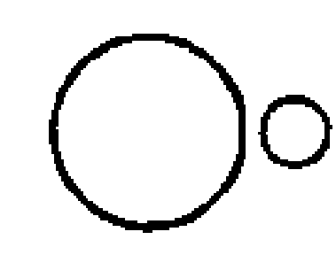

| 名字 | 出生日期 | 水星星座 |
|---|---|---|
| | | |
| | | |
| | | |
| | | |
| | | |
| | | |

準備好成員之一的出生日期，並且在下方列表中，找出該生日之前、最接近的日期，所註記的星座。把這個星座記進表格中。

例如，某人出生於 1945 年 5 月 3 日：在列表中，他生日之前最接近的日期是 1945 年 3 月 12 日。因此，他的水星星座是牡羊座。

列表僅供參考，無關出生地點與時間。

若要確實找到每個行星所在的星座，請上網：

```
www.astrocolors.com
```

### 1940 年至 2040 年間，水星所在的星座——

| 1940 1/7 摩羯座 | 2/4 雙魚座 | 4/21 金牛座 | 7/7 巨蟹座 | 10/23 天蠍座 |
|---|---|---|---|---|
| 1/26 水瓶座 | 3/8 水瓶座 | 5/6 雙子座 | 7/21 獅子座 | 11/11 射手座 |
| 2/12 雙魚座 | 3/17 雙魚座 | 7/13 巨蟹座 | 8/6 處女座 | 12/2 摩羯座 |
| 3/5 牡羊座 | 4/13 牡羊座 | 7/30 獅子座 | 8/28 天秤座 | 12/24 射手座 |
| 3/9 雙魚座 | 4/29 金牛座 | 8/14 處女座 | 9/26 處女座 | 1945 1/15 摩羯座 |
| 4/18 牡羊座 | 5/14 雙子座 | 9/1 天秤座 | 10/12 天秤座 | 2/6 水瓶座 |
| 5/7 金牛座 | 5/30 巨蟹座 | 11/8 天蠍座 | 10/31 天蠍座 | 2/24 雙魚座 |
| 5/22 雙子座 | 8/7 獅子座 | 11/26 射手座 | 11/19 射手座 | 3/12 牡羊座 |
| 6/5 巨蟹座 | 8/22 處女座 | 12/15 摩羯座 | 12/9 摩羯座 | 5/17 金牛座 |
| 6/27 獅子座 | 9/7 天秤座 | 1943 1/4 水瓶座 | 1944 2/13 水瓶座 | 6/5 雙子座 |
| 7/22 巨蟹座 | 9/29 天蠍座 | 1/28 摩羯座 | 3/4 雙魚座 | 6/19 巨蟹座 |
| 8/12 獅子座 | 10/30 天秤座 | 2/16 水瓶座 | 3/20 牡羊座 | 7/4 獅子座 |
| 8/30 處女座 | 11/12 天蠍座 | 3/12 雙魚座 | 4/4 金牛座 | 7/27 處女座 |
| 9/15 天秤座 | 12/4 射手座 | 3/29 牡羊座 | 6/12 雙子座 | 8/18 獅子座 |
| 10/4 天蠍座 | 12/23 摩羯座 | 4/13 金牛座 | 6/28 巨蟹座 | 9/11 處女座 |
| 12/10 射手座 | 1942 1/10 水瓶座 | 5/1 雙子座 | 7/12 獅子座 | 9/28 天秤座 |
| 12/30 摩羯座 | 3/18 雙魚座 | 5/27 金牛座 | 7/29 處女座 | 10/16 天蠍座 |
| 1941 1/17 水瓶座 | 4/6 牡羊座 | 6/15 雙子座 | 10/6 天秤座 | 11/4 射手座 |
| 1946 1/10 摩羯座 | 5/16 金牛座 | 11/1 天蠍座 | 5/4 雙子座 | 12/6 射手座 |
| 1/30 水瓶座 | 6/10 雙子座 | 11/19 射手座 | 7/12 巨蟹座 | 12/25 摩羯座 |
| 2/16 雙魚座 | 6/25 巨蟹座 | 12/9 摩羯座 | 7/27 獅子座 | 1968 1/13 水瓶座 |
| 3/5 牡羊座 | 7/9 獅子座 | 1957 2/13 水瓶座 | 8/11 處女座 | 2/2 雙魚座 |
| 4/2 雙魚座 | 7/28 處女座 | 3/5 雙魚座 | 8/30 天秤座 | 2/12 水瓶座 |
| 4/17 牡羊座 | 10/3 天秤座 | 3/21 牡羊座 | 11/6 天蠍座 | 3/18 雙魚座 |
| 5/12 金牛座 | 10/20 天蠍座 | 4/5 金牛座 | 11/24 射手座 | 4/8 牡羊座 |
| 5/28 雙子座 | 11/9 射手座 | 6/13 雙子座 | 12/13 摩羯座 | 4/23 金牛座 |
| 6/11 巨蟹座 | 12/2 摩羯座 | 6/29 巨蟹座 | 1963 1/3 水瓶座 | 5/7 雙子座 |
| 6/28 獅子座 | 12/13 射手座 | 7/31 處女座 | 1/21 摩羯座 | 5/30 巨蟹座 |
| 9/4 處女座 | 1952 1/14 摩羯座 | 10/7 天秤座 | 2/16 水瓶座 | 6/14 雙子座 |
| 9/20 天秤座 | 2/4 水瓶座 | 10/24 天蠍座 | 3/10 雙魚座 | 7/14 巨蟹座 |
| 10/8 天蠍座 | 2/21 雙魚座 | 11/12 射手座 | 3/27 牡羊座 | 8/1 獅子座 |
| 10/31 射手座 | 3/8 牡羊座 | 12/3 摩羯座 | 4/10 金牛座 | 8/16 處女座 |
| 11/21 天蠍座 | 5/15 金牛座 | 12/29 射手座 | 5/4 雙子座 | 9/2 天秤座 |
| 12/13 射手座 | 6/1 雙子座 | 1958 1/15 摩羯座 | 5/11 金牛座 | 9/29 天蠍座 |
| 1947 1/4 摩羯座 | 6/15 巨蟹座 | 2/7 水瓶座 | 6/15 雙子座 | 10/8 天秤座 |
| 1/22 水瓶座 | 7/1 獅子座 | 2/25 雙魚座 | 7/5 巨蟹座 | 11/9 天蠍座 |
| 2/9 雙魚座 | 9/8 處女座 | 3/13 牡羊座 | 7/19 獅子座 | 11/28 射手座 |
| 4/17 牡羊座 | 9/24 天秤座 | 4/3 金牛座 | 8/4 處女座 | 12/17 摩羯座 |
| 5/5 金牛座 | 10/12 天蠍座 | 4/11 牡羊座 | 8/27 天秤座 | 1969 1/5 水瓶座 |
| 5/19 雙子座 | 11/2 射手座 | 5/18 金牛座 | 9/17 處女座 | 3/13 雙魚座 |
| 6/3 巨蟹座 | 1953 1/7 摩羯座 | 6/6 雙子座 | 10/11 天秤座 | 3/31 牡羊座 |
| 8/11 獅子座 | 1/26 水瓶座 | 6/21 巨蟹座 | 10/29 天蠍座 | 4/15 金牛座 |
| 8/27 處女座 | 2/12 雙魚座 | 7/5 獅子座 | 11/17 射手座 | 5/1 雙子座 |
| 9/12 天秤座 | 3/3 牡羊座 | 7/27 處女座 | 12/7 摩羯座 | 7/9 巨蟹座 |
| 10/2 天蠍座 | 3/16 雙魚座 | 8/24 獅子座 | 1964 2/11 水瓶座 | 7/23 獅子座 |
| 12/8 射手座 | 4/18 牡羊座 | 9/12 處女座 | 3/1 雙魚座 | 8/8 處女座 |
| 12/27 摩羯座 | 5/9 金牛座 | 9/29 天秤座 | 3/17 牡羊座 | 8/28 天秤座 |
| 1948 1/15 水瓶座 | 5/24 雙子座 | 10/17 天蠍座 | 4/3 金牛座 | 10/8 處女座 |
| 2/3 雙魚座 | 6/7 巨蟹座 | 11/6 射手座 | 6/10 雙子座 | 10/10 天秤座 |
| 2/21 水瓶座 | 6/27 獅子座 | 1959 1/11 摩羯座 | 6/25 巨蟹座 | 11/2 天蠍座 |
| 3/19 雙魚座 | 7/29 巨蟹座 | 1/31 水瓶座 | 7/10 獅子座 | 11/21 射手座 |
| 4/10 牡羊座 | 8/12 獅子座 | 2/18 雙魚座 | 7/28 處女座 | 12/10 摩羯座 |
| 4/26 金牛座 | 8/31 處女座 | 3/6 牡羊座 | 10/4 天秤座 | 1970 2/14 水瓶座 |
| 5/10 雙子座 | 9/16 天秤座 | 5/13 金牛座 | 10/21 天蠍座 | 3/6 雙魚座 |
| 5/29 巨蟹座 | 10/5 天蠍座 | 5/29 雙子座 | 11/9 射手座 | 3/23 牡羊座 |
| 6/29 雙子座 | 11/1 射手座 | 6/12 巨蟹座 | 12/1 摩羯座 | 4/7 金牛座 |
| 7/12 巨蟹座 | 11/7 天蠍座 | 6/29 獅子座 | 12/17 射手座 | 6/14 雙子座 |
| 8/3 獅子座 | 12/11 射手座 | 9/6 處女座 | 1965 1/14 摩羯座 | 7/1 巨蟹座 |
| 8/18 處女座 | 12/31 摩羯座 | 9/22 天秤座 | 2/4 水瓶座 | 7/15 獅子座 |
| 9/4 天秤座 | 1954 1/19 水瓶座 | 10/10 天蠍座 | 2/22 雙魚座 | 8/1 處女座 |
| 9/28 天蠍座 | 2/5 雙魚座 | 11/1 射手座 | 3/10 牡羊座 | 10/8 天秤座 |
| 10/18 天秤座 | 4/14 牡羊座 | 11/26 天蠍座 | 5/16 金牛座 | 10/26 天蠍座 |
| 11/11 天蠍座 | 5/1 金牛座 | 12/14 射手座 | 6/3 雙子座 | 11/14 射手座 |
| 11/30 射手座 | 5/15 雙子座 | 1960 1/5 摩羯座 | 6/17 巨蟹座 | 12/4 摩羯座 |
| 12/19 摩羯座 | 5/31 巨蟹座 | 1/24 水瓶座 | 7/2 獅子座 | 1971 1/3 射手座 |
| 1949 1/7 水瓶座 | 8/8 獅子座 | 2/10 雙魚座 | 7/31 處女座 | 1/15 摩羯座 |
| 3/15 雙魚座 | 8/23 處女座 | 4/17 牡羊座 | 8/3 獅子座 | 2/8 水瓶座 |
| 4/2 牡羊座 | 9/9 天秤座 | 5/5 金牛座 | 9/9 處女座 | 2/27 雙魚座 |
| 4/17 金牛座 | 9/30 天蠍座 | 5/20 雙子座 | 9/26 天秤座 | 3/15 牡羊座 |
| 5/3 雙子座 | 11/5 天秤座 | 6/3 巨蟹座 | 10/13 天蠍座 | 4/2 金牛座 |
| 7/11 巨蟹座 | 11/12 天蠍座 | 7/2 獅子座 | 11/3 射手座 | 4/19 牡羊座 |
| 7/26 獅子座 | 12/5 射手座 | 7/7 巨蟹座 | 1966 1/8 摩羯座 | 5/18 金牛座 |
| 8/10 處女座 | 12/24 摩羯座 | 8/11 獅子座 | 1/28 水瓶座 | 6/8 雙子座 |
| 8/29 天秤座 | 1955 1/11 水瓶座 | 8/28 處女座 | 2/14 雙魚座 | 6/22 巨蟹座 |
| 11/4 天蠍座 | 3/18 雙魚座 | 9/13 天秤座 | 3/4 牡羊座 | 7/7 獅子座 |
| 11/23 射手座 | 4/7 牡羊座 | 10/2 天蠍座 | 3/23 雙魚座 | 7/27 處女座 |
| 12/12 摩羯座 | 4/23 金牛座 | 12/8 射手座 | 4/18 牡羊座 | 8/30 獅子座 |
| 1950 1/2 水瓶座 | 5/7 雙子座 | 12/28 摩羯座 | 5/10 金牛座 | 9/12 處女座 |
| 1/16 摩羯座 | 7/14 巨蟹座 | 1961 1/15 水瓶座 | 5/25 雙子座 | 10/1 天秤座 |
| 2/5 水瓶座 | 7/31 獅子座 | 2/2 雙魚座 | 6/8 巨蟹座 | 10/18 天蠍座 |
| 3/8 雙魚座 | 8/15 處女座 | 2/25 水瓶座 | 6/27 獅子座 | 11/7 射手座 |
| 3/25 牡羊座 | 9/2 天秤座 | 3/19 雙魚座 | 9/2 處女座 | 1972 1/12 摩羯座 |
| 4/9 金牛座 | 11/9 天蠍座 | 4/11 牡羊座 | 9/18 天秤座 | 2/1 水瓶座 |
| 6/15 雙子座 | 11/28 射手座 | 4/27 金牛座 | 10/6 天蠍座 | 2/19 雙魚座 |
| 7/3 巨蟹座 | 12/17 摩羯座 | 5/11 雙子座 | 10/31 射手座 | 3/6 牡羊座 |
| 7/17 獅子座 | 1956 1/5 水瓶座 | 5/29 巨蟹座 | 11/14 天蠍座 | 5/13 金牛座 |
| 8/3 處女座 | 2/3 摩羯座 | 8/5 獅子座 | 12/12 射手座 | 5/30 雙子座 |
| 8/28 天秤座 | 2/16 水瓶座 | 8/19 處女座 | 1967 1/2 摩羯座 | 6/13 巨蟹座 |
| 9/11 處女座 | 3/12 雙魚座 | 9/5 天秤座 | 1/20 水瓶座 | 6/29 獅子座 |
| 10/10 天秤座 | 3/29 牡羊座 | 9/28 天蠍座 | 2/7 雙魚座 | 9/6 處女座 |
| 10/28 天蠍座 | 4/13 金牛座 | 10/23 天秤座 | 4/15 牡羊座 | 9/22 天秤座 |
| 11/16 射手座 | 4/30 雙子座 | 11/11 天蠍座 | 5/2 金牛座 | 10/10 天蠍座 |
| 12/6 摩羯座 | 7/7 巨蟹座 | 12/1 射手座 | 5/17 雙子座 | 10/31 射手座 |
| 1951 2/10 水瓶座 | 7/22 獅子座 | 12/21 摩羯座 | 6/1 巨蟹座 | 11/30 天蠍座 |
| 3/1 雙魚座 | 8/6 處女座 | 1962 1/8 水瓶座 | 8/9 獅子座 | 12/13 射手座 |
| 3/17 牡羊座 | 8/27 天秤座 | 3/16 雙魚座 | 8/25 處女座 | 1973 1/5 摩羯座 |
| 4/3 金牛座 | 9/30 處女座 | 4/4 牡羊座 | 9/10 天秤座 | 1/24 水瓶座 |
| 5/2 牡羊座 | 10/12 天秤座 | 4/19 金牛座 | 10/1 天蠍座 | 2/10 雙魚座 |

### 水星

| | | | | | | | | | |
|---|---|---|---|---|---|---|---|---|---|
| 4/17 牡羊座 | 8/14 獅子座 | 1984 2/10 水瓶座 | 4/30 雙子座 | 9/5 天秤座 | | | | | |
| 5/7 金牛座 | 9/10 處女座 | 2/28 雙魚座 | 5/29 金牛座 | 9/28 天蠍座 | | | | | |
| 5/21 雙子座 | 9/27 天秤座 | 3/15 牡羊座 | 6/13 雙子座 | 10/20 天秤座 | | | | | |
| 6/5 巨蟹座 | 10/15 天蠍座 | 4/1 金牛座 | 7/7 巨蟹座 | 11/11 天蠍座 | | | | | |
| 6/28 獅子座 | 11/4 射手座 | 4/26 牡羊座 | 7/21 獅子座 | 12/1 射手座 | | | | | |
| 7/17 巨蟹座 | 1979 1/9 摩羯座 | 5/16 金牛座 | 8/6 處女座 | 12/20 摩羯座 | | | | | |
| 8/12 獅子座 | 1/29 水瓶座 | 6/8 雙子座 | 8/27 天秤座 | 1995 1/7 水瓶座 | | | | | |
| 8/29 處女座 | 2/15 雙魚座 | 6/23 巨蟹座 | 9/27 處女座 | 3/15 雙魚座 | | | | | |
| 9/14 天秤座 | 3/4 牡羊座 | 7/7 獅子座 | 10/12 天秤座 | 4/3 牡羊座 | | | | | |
| 10/3 天蠍座 | 3/29 雙魚座 | 7/27 處女座 | 10/31 天蠍座 | 4/18 金牛座 | | | | | |
| 12/9 射手座 | 4/18 牡羊座 | 10/1 天秤座 | 11/19 射手座 | 5/3 雙子座 | | | | | |
| 12/29 摩羯座 | 5/11 金牛座 | 10/19 天蠍座 | 12/8 摩羯座 | 7/11 巨蟹座 | | | | | |
| 1974 1/17 水瓶座 | 5/27 雙子座 | 11/7 射手座 | 1990 2/13 水瓶座 | 7/26 獅子座 | | | | | |
| 2/3 雙魚座 | 6/10 巨蟹座 | 12/2 摩羯座 | 3/4 雙魚座 | 8/11 處女座 | | | | | |
| 3/3 水瓶座 | 6/28 獅子座 | 12/8 射手座 | 3/20 牡羊座 | 8/30 天秤座 | | | | | |
| 3/18 雙魚座 | 9/3 處女座 | 1985 1/12 摩羯座 | 4/5 金牛座 | 11/5 天蠍座 | | | | | |
| 4/12 牡羊座 | 9/19 天秤座 | 2/2 水瓶座 | 6/13 雙子座 | 11/23 射手座 | | | | | |
| 4/29 金牛座 | 10/8 天蠍座 | 2/19 雙魚座 | 6/28 巨蟹座 | 12/13 摩羯座 | | | | | |
| 5/13 雙子座 | 10/31 射手座 | 3/8 牡羊座 | 7/12 獅子座 | 1996 1/2 水瓶座 | | | | | |
| 5/30 巨蟹座 | 11/19 天蠍座 | 5/15 金牛座 | 7/30 處女座 | 1/18 摩羯座 | | | | | |
| 8/6 獅子座 | 12/13 射手座 | 5/31 雙子座 | 10/6 天秤座 | 2/16 水瓶座 | | | | | |
| 8/21 處女座 | 1980 1/3 摩羯座 | 6/14 巨蟹座 | 10/24 天蠍座 | 3/8 雙魚座 | | | | | |
| 9/7 天秤座 | 1/22 水瓶座 | 6/30 獅子座 | 11/11 射手座 | 3/25 牡羊座 | | | | | |
| 9/29 天蠍座 | 2/8 雙魚座 | 9/7 處女座 | 12/3 摩羯座 | 4/9 金牛座 | | | | | |
| 10/27 天秤座 | 4/15 牡羊座 | 9/23 天秤座 | 12/26 射手座 | 6/14 雙子座 | | | | | |
| 11/12 天蠍座 | 5/3 金牛座 | 10/11 天蠍座 | 1991 1/15 摩羯座 | 7/3 巨蟹座 | | | | | |
| 12/3 射手座 | 5/17 雙子座 | 11/1 射手座 | 2/6 水瓶座 | 7/17 獅子座 | | | | | |
| 12/22 摩羯座 | 6/1 巨蟹座 | 12/5 天蠍座 | 2/25 雙魚座 | 8/2 處女座 | | | | | |
| 1975 1/9 水瓶座 | 8/10 獅子座 | 12/13 射手座 | 3/12 牡羊座 | 8/27 天秤座 | | | | | |
| 3/17 雙魚座 | 8/25 處女座 | 1986 1/6 摩羯座 | 5/17 金牛座 | 9/13 處女座 | | | | | |
| 4/5 牡羊座 | 9/11 天秤座 | 1/26 水瓶座 | 6/6 雙子座 | 10/10 天秤座 | | | | | |
| 4/20 金牛座 | 10/1 天蠍座 | 2/12 雙魚座 | 6/20 巨蟹座 | 10/28 天蠍座 | | | | | |
| 5/5 雙子座 | 12/6 射手座 | 3/4 牡羊座 | 7/5 獅子座 | 11/15 射手座 | | | | | |
| 7/13 巨蟹座 | 12/26 摩羯座 | 3/12 雙魚座 | 7/27 處女座 | 12/5 摩羯座 | | | | | |
| 7/29 獅子座 | 1981 1/13 水瓶座 | 4/18 牡羊座 | 8/20 獅子座 | 1997 2/10 水瓶座 | | | | | |
| 8/13 處女座 | 2/1 雙魚座 | 5/8 金牛座 | 9/11 處女座 | 3/1 雙魚座 | | | | | |
| 8/31 天秤座 | 2/17 水瓶座 | 5/23 雙子座 | 9/29 天秤座 | 3/17 牡羊座 | | | | | |
| 11/7 天蠍座 | 3/19 雙魚座 | 6/6 巨蟹座 | 10/16 天蠍座 | 4/2 金牛座 | | | | | |
| 11/26 射手座 | 4/9 牡羊座 | 6/27 獅子座 | 11/5 射手座 | 5/6 牡羊座 | | | | | |
| 12/15 摩羯座 | 4/25 金牛座 | 7/24 巨蟹座 | 1992 1/11 摩羯座 | 5/13 金牛座 | | | | | |
| 1976 1/3 水瓶座 | 5/9 雙子座 | 8/12 獅子座 | 1/30 水瓶座 | 6/9 雙子座 | | | | | |
| 1/26 摩羯座 | 5/29 巨蟹座 | 8/31 處女座 | 2/17 雙魚座 | 7/24 巨蟹座 | | | | | |
| 2/16 水瓶座 | 6/23 雙子座 | 9/16 天秤座 | 3/4 牡羊座 | 7/9 獅子座 | | | | | |
| 3/10 雙魚座 | 7/13 巨蟹座 | 10/5 天蠍座 | 4/5 雙魚座 | 7/28 處女座 | | | | | |
| 3/27 牡羊座 | 8/2 獅子座 | 12/11 射手座 | 4/15 牡羊座 | 10/3 天秤座 | | | | | |
| 4/11 金牛座 | 8/17 處女座 | 12/30 摩羯座 | 5/12 金牛座 | 10/20 天蠍座 | | | | | |
| 4/30 雙子座 | 9/3 天秤座 | 1987 1/18 水瓶座 | 5/27 雙子座 | 11/8 射手座 | | | | | |
| 5/20 金牛座 | 9/28 天蠍座 | 2/5 雙魚座 | 6/10 巨蟹座 | 12/1 摩羯座 | | | | | |
| 6/14 雙子座 | 10/15 天秤座 | 3/12 水瓶座 | 6/28 獅子座 | 12/14 射手座 | | | | | |
| 7/5 巨蟹座 | 11/10 天蠍座 | 3/14 雙魚座 | 9/4 處女座 | 1998 1/13 摩羯座 | | | | | |
| 7/19 獅子座 | 11/29 射手座 | 4/13 牡羊座 | 9/20 天秤座 | 2/3 水瓶座 | | | | | |
| 8/4 處女座 | 12/18 摩羯座 | 4/30 金牛座 | 10/8 天蠍座 | 2/21 雙魚座 | | | | | |
| 8/26 天秤座 | 1982 1/6 水瓶座 | 5/14 雙子座 | 10/30 射手座 | 3/9 牡羊座 | | | | | |
| 9/22 處女座 | 3/14 雙魚座 | 5/31 巨蟹座 | 11/22 天蠍座 | 5/16 金牛座 | | | | | |
| 10/11 天秤座 | 4/1 牡羊座 | 8/7 獅子座 | 12/13 射手座 | 6/2 雙子座 | | | | | |
| 10/30 天蠍座 | 4/16 金牛座 | 8/22 處女座 | 1993 1/3 摩羯座 | 6/16 巨蟹座 | | | | | |
| 11/17 射手座 | 5/2 雙子座 | 9/8 天秤座 | 1/22 水瓶座 | 7/1 獅子座 | | | | | |
| 12/7 摩羯座 | 7/10 巨蟹座 | 9/29 天蠍座 | 2/8 雙魚座 | 9/9 處女座 | | | | | |
| 1977 2/11 水瓶座 | 7/25 獅子座 | 11/2 天秤座 | 4/16 牡羊座 | 9/25 天秤座 | | | | | |
| 3/3 雙魚座 | 8/9 處女座 | 11/12 天蠍座 | 5/4 金牛座 | 10/13 天蠍座 | | | | | |
| 3/19 牡羊座 | 8/29 天秤座 | 12/4 射手座 | 5/19 雙子座 | 11/2 射手座 | | | | | |
| 4/4 金牛座 | 11/4 天蠍座 | 12/23 摩羯座 | 6/3 巨蟹座 | 1999 1/8 摩羯座 | | | | | |
| 6/11 雙子座 | 11/22 射手座 | 1988 1/11 水瓶座 | 8/11 獅子座 | 1/27 水瓶座 | | | | | |
| 6/27 巨蟹座 | 12/11 摩羯座 | 3/17 雙魚座 | 8/27 處女座 | 2/13 雙魚座 | | | | | |
| 7/11 獅子座 | 1983 1/2 水瓶座 | 4/5 牡羊座 | 9/12 天秤座 | 3/3 牡羊座 | | | | | |
| 7/29 處女座 | 1/13 摩羯座 | 4/21 金牛座 | 10/2 天蠍座 | 3/19 雙魚座 | | | | | |
| 10/5 天秤座 | 2/15 水瓶座 | 5/5 雙子座 | 12/8 射手座 | 4/18 牡羊座 | | | | | |
| 10/22 天蠍座 | 3/8 雙魚座 | 7/13 巨蟹座 | 12/27 摩羯座 | 5/9 金牛座 | | | | | |
| 11/10 射手座 | 3/24 牡羊座 | 7/29 獅子座 | 1994 1/15 水瓶座 | 5/24 雙子座 | | | | | |
| 12/2 摩羯座 | 4/8 金牛座 | 8/13 處女座 | 2/2 雙魚座 | 6/8 巨蟹座 | | | | | |
| 12/22 射手座 | 6/15 雙子座 | 8/31 天秤座 | 2/22 水瓶座 | 6/27 獅子座 | | | | | |
| 1978 1/14 摩羯座 | 7/2 巨蟹座 | 11/7 天蠍座 | 3/19 雙魚座 | 8/1 巨蟹座 | | | | | |
| 2/5 水瓶座 | 7/16 獅子座 | 11/26 射手座 | 4/10 牡羊座 | 8/12 獅子座 | | | | | |
| 2/23 雙魚座 | 8/2 處女座 | 12/15 摩羯座 | 4/26 金牛座 | 9/1 處女座 | | | | | |
| 3/11 牡羊座 | 8/30 天秤座 | 1989 1/3 水瓶座 | 5/10 雙子座 | 9/17 天秤座 | | | | | |
| 5/17 金牛座 | 9/7 處女座 | 1/30 摩羯座 | 5/29 巨蟹座 | 10/6 天蠍座 | | | | | |
| 6/4 雙子座 | 10/9 天秤座 | 2/15 水瓶座 | 7/3 雙子座 | 10/31 射手座 | | | | | |
| 6/18 巨蟹座 | 10/27 天蠍座 | 3/11 雙魚座 | 7/11 巨蟹座 | 11/10 天蠍座 | | | | | |
| 7/3 獅子座 | 11/15 射手座 | 3/29 牡羊座 | 8/4 獅子座 | 12/12 射手座 | | | | | |
| 7/28 處女座 | 12/5 摩羯座 | 4/12 金牛座 | 8/19 處女座 | 2000 1/1 摩羯座 | | | | | |
| 1/19 | 水瓶座 | 6/29 | 獅子座 | 12/19 | 射手座 | 6/13 | 雙子座 | 11/25 | 射手座 |
| 2/6 | 雙魚座 | 9/5 | 處女座 | 2011 1/14 | 摩羯座 | 6/30 | 巨蟹座 | 12/14 | 摩羯座 |
| 4/14 | 牡羊座 | 9/21 | 天秤座 | 2/4 | 水瓶座 | 7/15 | 獅子座 | 2022 1/3 | 水瓶座 |
| 5/1 | 金牛座 | 10/9 | 天蠍座 | 2/22 | 雙魚座 | 7/31 | 處女座 | 1/27 | 摩羯座 |
| 5/15 | 雙子座 | 10/31 | 射手座 | 3/10 | 牡羊座 | 10/8 | 天秤座 | 2/15 | 水瓶座 |
| 5/31 | 巨蟹座 | 11/27 | 天蠍座 | 5/16 | 金牛座 | 10/25 | 天蠍座 | 3/11 | 雙魚座 |
| 8/8 | 獅子座 | 12/31 | 射手座 | 6/3 | 雙子座 | 11/13 | 射手座 | 3/28 | 牡羊座 |
| 8/23 | 處女座 | 2006 1/4 | 摩羯座 | 6/17 | 巨蟹座 | 12/3 | 摩羯座 | 4/12 | 金牛座 |
| 9/8 | 天秤座 | 1/23 | 水瓶座 | 7/3 | 獅子座 | 2017 1/5 | 射手座 | 4/30 | 雙子座 |
| 9/29 | 天蠍座 | 2/10 | 雙魚座 | 7/29 | 處女座 | 1/13 | 摩羯座 | 5/24 | 金牛座 |
| 11/8 | 天秤座 | 4/17 | 牡羊座 | 8/9 | 獅子座 | 2/8 | 水瓶座 | 6/14 | 雙子座 |
| 11/9 | 天蠍座 | 5/6 | 金牛座 | 9/10 | 處女座 | 2/26 | 雙魚座 | 7/6 | 巨蟹座 |
| 12/4 | 射手座 | 5/20 | 雙子座 | 9/26 | 天秤座 | 3/14 | 牡羊座 | 7/20 | 獅子座 |
| 12/24 | 摩羯座 | 6/4 | 巨蟹座 | 10/14 | 天蠍座 | 4/1 | 金牛座 | 8/5 | 處女座 |
| 2001 1/11 | 水瓶座 | 6/29 | 獅子座 | 11/3 | 射手座 | 4/21 | 牡羊座 | 8/27 | 天秤座 |
| 2/2 | 雙魚座 | 7/11 | 巨蟹座 | 2012 1/9 | 摩羯座 | 5/17 | 金牛座 | 9/24 | 處女座 |
| 2/7 | 水瓶座 | 8/12 | 獅子座 | 1/28 | 水瓶座 | 6/7 | 雙子座 | 10/11 | 天秤座 |
| 3/18 | 雙魚座 | 8/28 | 處女座 | 2/15 | 雙魚座 | 6/22 | 巨蟹座 | 10/30 | 天蠍座 |
| 4/7 | 牡羊座 | 9/13 | 天秤座 | 3/3 | 牡羊座 | 7/7 | 獅子座 | 11/18 | 射手座 |
| 4/22 | 金牛座 | 10/3 | 天蠍座 | 3/24 | 雙魚座 | 7/26 | 處女座 | 12/7 | 摩羯座 |
| 5/7 | 雙子座 | 12/9 | 射手座 | 4/17 | 牡羊座 | 9/1 | 獅子座 | 2023 2/12 | 水瓶座 |
| 7/13 | 巨蟹座 | 12/28 | 摩羯座 | 5/10 | 金牛座 | 9/11 | 處女座 | 3/3 | 雙魚座 |
| 7/31 | 獅子座 | 2007 1/16 | 水瓶座 | 5/25 | 雙子座 | 10/1 | 天秤座 | 3/20 | 牡羊座 |
| 8/15 | 處女座 | 2/3 | 雙魚座 | 6/8 | 巨蟹座 | 10/18 | 天蠍座 | 4/4 | 金牛座 |
| 9/2 | 天秤座 | 2/28 | 水瓶座 | 6/27 | 獅子座 | 11/6 | 射手座 | 6/12 | 雙子座 |
| 11/8 | 天蠍座 | 3/19 | 雙魚座 | 9/2 | 處女座 | 2018 1/12 | 摩羯座 | 6/28 | 巨蟹座 |
| 11/27 | 射手座 | 4/11 | 牡羊座 | 9/17 | 天秤座 | 2/1 | 水瓶座 | 7/12 | 獅子座 |
| 12/16 | 摩羯座 | 4/28 | 金牛座 | 10/6 | 天蠍座 | 2/19 | 雙魚座 | 7/29 | 處女座 |
| 2002 1/4 | 水瓶座 | 5/12 | 雙子座 | 10/30 | 射手座 | 3/7 | 牡羊座 | 10/6 | 天秤座 |
| 2/5 | 摩羯座 | 5/30 | 巨蟹座 | 11/15 | 天蠍座 | 5/14 | 金牛座 | 10/23 | 天蠍座 |
| 2/14 | 水瓶座 | 8/5 | 獅子座 | 12/12 | 射手座 | 5/30 | 雙子座 | 11/11 | 射手座 |
| 3/12 | 雙魚座 | 8/20 | 處女座 | 2013 1/1 | 摩羯座 | 6/13 | 巨蟹座 | 12/2 | 摩羯座 |
| 3/30 | 牡羊座 | 9/6 | 天秤座 | 1/20 | 水瓶座 | 6/30 | 獅子座 | 12/24 | 射手座 |
| 4/14 | 金牛座 | 9/28 | 天蠍座 | 2/6 | 雙魚座 | 9/7 | 處女座 | 2024 1/13 | 摩羯座 |
| 5/1 | 雙子座 | 10/25 | 天秤座 | 4/15 | 牡羊座 | 9/23 | 天秤座 | 2/6 | 水瓶座 |
| 7/8 | 巨蟹座 | 11/12 | 天蠍座 | 5/2 | 金牛座 | 10/11 | 天蠍座 | 2/24 | 雙魚座 |
| 7/22 | 獅子座 | 12/2 | 射手座 | 5/16 | 雙子座 | 11/1 | 射手座 | 3/11 | 牡羊座 |
| 8/7 | 處女座 | 12/21 | 摩羯座 | 6/1 | 巨蟹座 | 12/2 | 天蠍座 | 5/16 | 金牛座 |
| 8/27 | 天秤座 | 2008 1/9 | 水瓶座 | 8/9 | 獅子座 | 12/13 | 射手座 | 6/4 | 雙子座 |
| 10/3 | 處女座 | 3/15 | 雙魚座 | 8/24 | 處女座 | 2019 1/6 | 摩羯座 | 6/18 | 巨蟹座 |
| 10/12 | 天秤座 | 4/3 | 牡羊座 | 9/10 | 天秤座 | 1/25 | 水瓶座 | 7/3 | 獅子座 |
| 11/1 | 天蠍座 | 4/18 | 金牛座 | 9/30 | 天蠍座 | 2/11 | 雙魚座 | 7/26 | 處女座 |
| 11/20 | 射手座 | 5/3 | 雙子座 | 12/6 | 射手座 | 4/18 | 牡羊座 | 8/16 | 獅子座 |
| 12/9 | 摩羯座 | 7/11 | 巨蟹座 | 12/25 | 摩羯座 | 5/7 | 金牛座 | 9/10 | 處女座 |
| 2003 2/14 | 水瓶座 | 7/27 | 獅子座 | 2014 1/12 | 水瓶座 | 5/22 | 雙子座 | 9/27 | 天秤座 |
| 3/6 | 雙魚座 | 8/11 | 處女座 | 2/1 | 雙魚座 | 6/5 | 巨蟹座 | 10/14 | 天蠍座 |
| 3/22 | 牡羊座 | 8/30 | 天秤座 | 2/14 | 水瓶座 | 6/28 | 獅子座 | 11/3 | 射手座 |
| 4/6 | 金牛座 | 11/5 | 天蠍座 | 3/18 | 雙魚座 | 7/20 | 巨蟹座 | 2025 1/9 | 摩羯座 |
| 6/14 | 雙子座 | 11/24 | 射手座 | 4/8 | 牡羊座 | 8/12 | 獅子座 | 1/29 | 水瓶座 |
| 6/30 | 巨蟹座 | 12/13 | 摩羯座 | 4/24 | 金牛座 | 8/30 | 處女座 | 2/15 | 雙魚座 |
| 7/14 | 獅子座 | 2009 1/2 | 水瓶座 | 5/8 | 雙子座 | 9/15 | 天秤座 | 3/4 | 牡羊座 |
| 7/31 | 處女座 | 1/22 | 摩羯座 | 5/30 | 巨蟹座 | 10/4 | 天蠍座 | 3/31 | 雙魚座 |
| 10/8 | 天秤座 | 2/15 | 水瓶座 | 6/18 | 雙子座 | 12/10 | 射手座 | 4/17 | 牡羊座 |
| 10/25 | 天蠍座 | 3/9 | 雙魚座 | 7/14 | 巨蟹座 | 12/30 | 摩羯座 | 5/11 | 金牛座 |
| 11/13 | 射手座 | 3/26 | 牡羊座 | 8/1 | 獅子座 | 2020 1/17 | 水瓶座 | 5/27 | 雙子座 |
| 12/3 | 摩羯座 | 4/10 | 金牛座 | 8/16 | 處女座 | 2/4 | 雙魚座 | 6/9 | 巨蟹座 |
| 12/31 | 射手座 | 5/1 | 雙子座 | 9/3 | 天秤座 | 3/5 | 水瓶座 | 6/27 | 獅子座 |
| 2004 1/15 | 摩羯座 | 5/15 | 金牛座 | 9/28 | 天蠍座 | 3/17 | 雙魚座 | 9/3 | 處女座 |
| 2/8 | 水瓶座 | 6/15 | 雙子座 | 10/11 | 天秤座 | 4/12 | 牡羊座 | 9/19 | 天秤座 |
| 2/28 | 雙魚座 | 7/4 | 巨蟹座 | 11/9 | 天蠍座 | 4/28 | 金牛座 | 10/7 | 天蠍座 |
| 3/13 | 牡羊座 | 7/18 | 獅子座 | 11/29 | 射手座 | 5/12 | 雙子座 | 10/30 | 射手座 |
| 4/2 | 金牛座 | 8/3 | 處女座 | 12/18 | 摩羯座 | 5/29 | 巨蟹座 | 11/20 | 天蠍座 |
| 4/14 | 牡羊座 | 8/26 | 天秤座 | 2015 1/6 | 水瓶座 | 8/6 | 獅子座 | 12/12 | 射手座 |
| 5/17 | 金牛座 | 9/19 | 處女座 | 3/14 | 雙魚座 | 8/21 | 處女座 | 2026 1/2 | 摩羯座 |
| 6/6 | 雙子座 | 10/11 | 天秤座 | 4/1 | 牡羊座 | 9/6 | 天秤座 | 1/21 | 水瓶座 |
| 6/20 | 巨蟹座 | 10/29 | 天蠍座 | 4/15 | 金牛座 | 9/28 | 天蠍座 | 2/7 | 雙魚座 |
| 7/5 | 獅子座 | 11/17 | 射手座 | 5/2 | 雙子座 | 10/29 | 天秤座 | 4/16 | 牡羊座 |
| 7/26 | 處女座 | 12/6 | 摩羯座 | 7/9 | 巨蟹座 | 11/11 | 天蠍座 | 5/4 | 金牛座 |
| 8/26 | 獅子座 | 2010 2/11 | 水瓶座 | 7/24 | 獅子座 | 12/2 | 射手座 | 5/18 | 雙子座 |
| 9/11 | 處女座 | 3/2 | 雙魚座 | 8/8 | 處女座 | 12/21 | 摩羯座 | 6/2 | 巨蟹座 |
| 9/29 | 天秤座 | 3/18 | 牡羊座 | 8/28 | 天秤座 | 2021 1/9 | 水瓶座 | 8/10 | 獅子座 |
| 10/16 | 天蠍座 | 4/3 | 金牛座 | 11/3 | 天蠍座 | 3/16 | 雙魚座 | 8/26 | 處女座 |
| 11/5 | 射手座 | 6/11 | 雙子座 | 11/21 | 射手座 | 4/5 | 牡羊座 | 9/11 | 天秤座 |
| 2005 1/11 | 摩羯座 | 6/26 | 巨蟹座 | 12/11 | 摩羯座 | 4/20 | 金牛座 | 10/1 | 天蠍座 |
| 1/31 | 水瓶座 | 7/10 | 獅子座 | 2016 1/3 | 水瓶座 | 5/5 | 雙子座 | 12/7 | 射手座 |
| 2/17 | 雙魚座 | 7/28 | 處女座 | 1/9 | 摩羯座 | 7/12 | 巨蟹座 | 12/26 | 摩羯座 |
| 3/6 | 牡羊座 | 10/4 | 天秤座 | 2/14 | 水瓶座 | 7/29 | 獅子座 | 2027 1/14 | 水瓶座 |
| 5/13 | 金牛座 | 10/21 | 天蠍座 | 3/6 | 雙魚座 | 8/12 | 處女座 | 2/2 | 雙魚座 |
| 5/29 | 雙子座 | 11/9 | 射手座 | 3/23 | 牡羊座 | 8/21 | 天秤座 | 2/19 | 水瓶座 |
| 6/12 | 巨蟹座 | 12/2 | 摩羯座 | 4/6 | 金牛座 | 11/6 | 天蠍座 | 3/19 | 雙魚座 |

### 水星

4/9 牡羊座
4/25 金牛座
5/10 雙子座
5/29 巨蟹座
6/27 雙子座
7/13 巨蟹座
8/3 獅子座
8/18 處女座
9/4 天秤座
9/28 天蠍座
10/17 天秤座
11/11 天蠍座
11/30 射手座
12/19 摩羯座
2028 1/7 水瓶座
3/14 雙魚座
4/1 牡羊座
4/16 金牛座
5/2 雙子座
7/10 巨蟹座
7/25 獅子座
8/9 處女座
8/28 天秤座
11/3 天蠍座
11/22 射手座
12/11 摩羯座
2029 1/1 水瓶座
1/14 摩羯座
2/14 水瓶座
3/7 雙魚座
3/24 牡羊座
4/8 金牛座
6/14 雙子座
7/2 巨蟹座
7/16 獅子座
8/1 處女座
8/28 天秤座
9/9 處女座
10/9 天秤座
10/27 天蠍座
11/14 射手座
12/4 摩羯座
2030 2/9 水瓶座
2/28 雙魚座
3/1 牡羊座
4/2 金牛座
4/29 牡羊座
5/16 金牛座
6/9 雙子座
6/23 巨蟹座
7/8 獅子座
7/27 處女座
10/2 天秤座
10/19 天蠍座
11/8 射手座
12/2 摩羯座
12/11 射手座
2031 1/13 摩羯座
2/2 水瓶座
2/20 雙魚座
3/8 牡羊座
5/15 金牛座
6/1 雙子座
6/15 巨蟹座
7/1 獅子座
9/8 處女座
9/24 天秤座
10/12 天蠍座
11/2 射手座
12/9 天蠍座
12/12 射手座
2032 1/7 摩羯座
1/26 水瓶座
2/12 雙魚座
3/3 牡羊座
3/14 雙魚座
4/17 牡羊座
5/8 金牛座
5/23 雙子座
6/6 巨蟹座
6/26 獅子座
7/26 巨蟹座
8/11 獅子座
8/30 處女座
9/15 天秤座
10/4 天蠍座
11/1 射手座
11/5 天蠍座
12/10 射手座
12/30 摩羯座
2033 1/18 水瓶座
2/4 雙魚座
4/13 牡羊座
4/30 金牛座
5/14 雙子座
5/30 巨蟹座
8/7 獅子座
8/22 處女座
9/8 天秤座
9/29 天蠍座
11/3 天秤座
11/11 天蠍座
12/4 射手座
12/23 摩羯座
2034 1/10 水瓶座
3/17 雙魚座
4/6 牡羊座
4/21 金牛座
5/6 雙子座
7/13 巨蟹座
7/30 獅子座
8/14 處女座
9/1 天秤座
11/8 天蠍座
11/26 射手座
12/16 摩羯座
2035 1/4 水瓶座
2/2 摩羯座
2/15 水瓶座
3/12 雙魚座
3/29 牡羊座
4/13 金牛座
5/1 雙子座
6/3 金牛座
6/11 雙子座
7/7 巨蟹座
7/22 獅子座
8/6 處女座
8/27 天秤座
9/29 處女座
10/12 天秤座
11/1 天蠍座
11/19 射手座
12/9 摩羯座
2036 2/13 水瓶座
3/4 雙魚座
3/20 牡羊座
4/4 金牛座
6/12 雙子座
6/28 巨蟹座
7/12 獅子座
7/29 處女座
10/6 天秤座
10/23 天蠍座
11/11 射手座
12/2 摩羯座
12/27 射手座
2037 1/14 摩羯座
2/6 水瓶座
2/24 雙魚座
3/12 牡羊座
4/4 金牛座
4/7 牡羊座
5/17 金牛座
6/5 雙子座
6/19 巨蟹座
7/4 獅子座
7/26 處女座
8/22 獅子座
9/11 處女座
9/28 天秤座
10/16 天蠍座
11/4 射手座
2038 1/10 摩羯座
1/30 水瓶座
2/16 雙魚座
3/5 牡羊座
4/9 雙魚座
4/13 牡羊座
5/12 金牛座
5/28 雙子座
6/11 巨蟹座
6/28 獅子座
9/4 處女座
9/20 天秤座
10/8 天蠍座
10/30 射手座
11/24 天蠍座
12/13 射手座
2039 1/4 摩羯座
1/23 水瓶座
2/9 雙魚座
4/17 牡羊座
5/5 金牛座
5/20 雙子座
6/3 巨蟹座
8/11 獅子座
8/27 處女座
9/13 天秤座
10/2 天蠍座
12/8 射手座
12/28 摩羯座
2040 1/15 水瓶座
2/2 雙魚座
2/24 水瓶座
3/18 雙魚座
4/10 牡羊座
4/26 金牛座
5/10 雙子座
5/28 巨蟹座
8/3 獅子座
8/18 處女座
9/4 天秤座
9/27 天蠍座
10/21 天秤座
11/10 天蠍座
11/30 射手座
12/19 摩羯座
2041 1/7 水瓶座

### 金星

寫下家庭成員的名字及出生日期。

| 名字 | 出生日期 | 金星星座 |
| :--- | :--- | :--- |
| | | |
| | | |
| | | |
| | | |
| | | |
| | | |


準備好成員之一的出生日期，並且在下方列表中，找出該生日之前、最接近的日期，所註記的星座。把這個星座記進表格中。

例如，某人出生於 1945 年 5 月 3 日：在列表中，他生日之前最接近的日期是 1945 年 4 月 8 日。因此，他的金星星座是牡羊座。

列表僅供參考，無關出生地點與時間。

若要確實找到每個行星所在的星座，請上網：
www.astromix.com

#### 1940 年至 2040 年間，金星所在的星座

| 日期/資訊 | 資訊 | 日期/資訊 | 資訊 | 日期/資訊 |
|---|---|---|---|---|
| 1940 1/19 雙魚座 | 6/8 巨蟹座 | 12/16 摩羯座 | 6/23 巨蟹座 | 11/13 天蠍座 |
| 2/13 牡羊座 | 7/3 獅子座 | 1943 1/9 水瓶座 | 7/18 獅子座 | 12/7 射手座 |
| 3/9 金牛座 | 7/28 處女座 | 2/2 雙魚座 | 8/11 處女座 | 12/31 摩羯座 |
| 4/5 雙子座 | 8/22 天秤座 | 2/26 牡羊座 | 9/4 天秤座 | 1946 1/23 水瓶座 |
| 5/7 巨蟹座 | 9/16 天蠍座 | 3/22 金牛座 | 9/29 天蠍座 | 2/16 雙魚座 |
| 7/6 雙子座 | 10/11 射手座 | 4/16 雙子座 | 10/23 射手座 | 3/12 牡羊座 |
| 8/2 巨蟹座 | 11/7 摩羯座 | 5/12 巨蟹座 | 11/17 摩羯座 | 4/6 金牛座 |
| 9/9 獅子座 | 12/6 水瓶座 | 6/8 獅子座 | 12/12 水瓶座 | 4/30 雙子座 |
| 10/7 處女座 | 1942 4/7 雙魚座 | 7/8 處女座 | 1945 1/6 雙魚座 | 5/25 巨蟹座 |
| 11/2 天秤座 | 5/7 牡羊座 | 11/10 天秤座 | 2/3 牡羊座 | 6/19 獅子座 |
| 11/27 天蠍座 | 6/3 金牛座 | 12/9 天蠍座 | 3/12 金牛座 | 7/14 處女座 |
| 12/21 射手座 | 6/28 雙子座 | 1944 1/4 射手座 | 4/8 牡羊座 | 8/10 天秤座 |
| 1941 1/14 摩羯座 | 7/24 巨蟹座 | 1/29 摩羯座 | 6/5 金牛座 | 9/8 天蠍座 |
| 2/7 水瓶座 | 8/18 獅子座 | 2/22 水瓶座 | 7/8 雙子座 | 10/17 射手座 |
| 3/3 雙魚座 | 9/11 處女座 | 3/18 雙魚座 | 8/5 巨蟹座 | 11/9 天蠍座 |
| 3/28 牡羊座 | 10/5 天秤座 | 4/11 牡羊座 | 8/31 獅子座 | 1947 1/6 射手座 |
| 4/21 金牛座 | 10/29 天蠍座 | 5/5 金牛座 | 9/25 處女座 | 2/7 摩羯座 |
| 5/15 雙子座 | 11/22 射手座 | 5/30 雙子座 | 10/20 天秤座 | 3/6 水瓶座 |
| 3/31 | 雙魚座 | 8/5 | 巨蟹座 | 9/26 | 處女座 | 1966 | 2/7 | 摩羯座 | 5/11 | 巨蟹座 |
| 4/26 | 牡羊座 | 8/31 | 獅子座 | 11/10 | 天秤座 | 2/26 | 水瓶座 | 6/12 | 雙子座 |
| 5/21 | 金牛座 | 9/25 | 處女座 | 12/8 | 天蠍座 | 4/7 | 雙魚座 | 8/7 | 巨蟹座 |
| 6/14 | 雙子座 | 10/19 | 天秤座 | 1960 | 1/3 | 射手座 | 5/6 | 牡羊座 | 9/8 | 獅子座 |
| 7/9 | 巨蟹座 | 11/12 | 天蠍座 | 1/28 | 摩羯座 | 6/1 | 金牛座 | 10/6 | 處女座 |
| 8/3 | 獅子座 | 12/6 | 射手座 | 2/21 | 水瓶座 | 6/27 | 雙子座 | 10/31 | 天秤座 |
| 8/27 | 處女座 | 12/30 | 摩羯座 | 3/17 | 雙魚座 | 7/22 | 巨蟹座 | 11/25 | 天蠍座 |
| 9/20 | 天秤座 | 1954 | 1/23 | 水瓶座 | 4/10 | 牡羊座 | 8/16 | 獅子座 | 12/9 | 射手座 |
| 10/14 | 天蠍座 | 2/16 | 雙魚座 | 5/4 | 金牛座 | 9/9 | 處女座 | 1973 | 1/12 | 摩羯座 |
| 11/7 | 射手座 | 3/12 | 牡羊座 | 5/29 | 雙子座 | 10/4 | 天秤座 | 2/5 | 水瓶座 |
| 12/1 | 摩羯座 | 4/5 | 金牛座 | 6/22 | 巨蟹座 | 10/28 | 天蠍座 | 3/1 | 雙魚座 |
| 12/25 | 水瓶座 | 4/29 | 雙子座 | 7/17 | 獅子座 | 11/21 | 射手座 | 3/25 | 牡羊座 |
| 1948 | 1/19 | 雙魚座 | 5/24 | 巨蟹座 | 8/10 | 處女座 | 12/14 | 摩羯座 | 4/19 | 金牛座 |
| 2/12 | 牡羊座 | 6/18 | 獅子座 | 9/3 | 天秤座 | 1967 | 1/7 | 水瓶座 | 5/13 | 雙子座 |
| 3/9 | 金牛座 | 7/14 | 處女座 | 9/28 | 天蠍座 | 1/31 | 雙魚座 | 6/6 | 巨蟹座 |
| 4/5 | 雙子座 | 8/10 | 天秤座 | 10/22 | 射手座 | 2/24 | 牡羊座 | 7/1 | 獅子座 |
| 5/8 | 巨蟹座 | 9/7 | 天蠍座 | 11/16 | 摩羯座 | 3/21 | 金牛座 | 7/26 | 處女座 |
| 6/30 | 雙子座 | 10/24 | 射手座 | 12/11 | 水瓶座 | 4/15 | 雙子座 | 8/20 | 天秤座 |
| 8/4 | 巨蟹座 | 10/28 | 天蠍座 | 1961 | 1/6 | 雙魚座 | 5/11 | 巨蟹座 | 9/14 | 天蠍座 |
| 9/9 | 獅子座 | 1955 | 1/7 | 射手座 | 2/3 | 牡羊座 | 6/7 | 獅子座 | 10/10 | 射手座 |
| 10/7 | 處女座 | 2/7 | 摩羯座 | 6/6 | 金牛座 | 7/9 | 處女座 | 11/6 | 摩羯座 |
| 11/2 | 天秤座 | 3/5 | 水瓶座 | 7/8 | 雙子座 | 9/10 | 獅子座 | 12/8 | 水瓶座 |
| 11/27 | 天蠍座 | 3/31 | 雙魚座 | 8/4 | 巨蟹座 | 10/2 | 處女座 | 1974 | 1/30 | 摩羯座 |
| 12/21 | 射手座 | 4/25 | 牡羊座 | 8/30 | 獅子座 | 11/10 | 天秤座 | 3/1 | 水瓶座 |
| 1949 | 1/14 | 摩羯座 | 5/20 | 金牛座 | 9/24 | 處女座 | 12/8 | 天蠍座 | 4/7 | 雙魚座 |
| 2/7 | 水瓶座 | 6/14 | 雙子座 | 10/19 | 天秤座 | 1968 | 1/2 | 射手座 | 5/5 | 牡羊座 |
| 3/3 | 雙魚座 | 7/9 | 巨蟹座 | 11/12 | 天蠍座 | 1/27 | 摩羯座 | 6/1 | 金牛座 |
| 3/27 | 牡羊座 | 8/2 | 獅子座 | 12/6 | 射手座 | 2/21 | 水瓶座 | 6/26 | 雙子座 |
| 4/20 | 金牛座 | 8/26 | 處女座 | 12/29 | 摩羯座 | 3/16 | 雙魚座 | 7/22 | 巨蟹座 |
| 5/15 | 雙子座 | 9/19 | 天秤座 | 1962 | 1/22 | 水瓶座 | 4/9 | 牡羊座 | 8/15 | 獅子座 |
| 6/8 | 巨蟹座 | 10/14 | 天蠍座 | 2/15 | 雙魚座 | 5/4 | 金牛座 | 9/9 | 處女座 |
| 7/2 | 獅子座 | 11/7 | 射手座 | 3/11 | 牡羊座 | 5/28 | 雙子座 | 10/3 | 天秤座 |
| 7/27 | 處女座 | 12/1 | 摩羯座 | 4/4 | 金牛座 | 6/22 | 巨蟹座 | 10/27 | 天蠍座 |
| 8/21 | 天秤座 | 12/25 | 水瓶座 | 4/29 | 雙子座 | 7/16 | 獅子座 | 11/20 | 射手座 |
| 9/15 | 天蠍座 | 1956 | 1/18 | 雙魚座 | 5/24 | 巨蟹座 | 8/9 | 處女座 | 12/14 | 摩羯座 |
| 10/11 | 射手座 | 2/12 | 牡羊座 | 6/18 | 獅子座 | 9/3 | 天秤座 | 1975 | 1/7 | 水瓶座 |
| 11/7 | 摩羯座 | 3/8 | 金牛座 | 7/13 | 處女座 | 9/27 | 天蠍座 | 1/31 | 雙魚座 |
| 12/7 | 水瓶座 | 4/5 | 雙子座 | 8/9 | 天秤座 | 10/22 | 射手座 | 2/24 | 牡羊座 |
| 1950 | 4/7 | 雙魚座 | 5/9 | 巨蟹座 | 9/7 | 天蠍座 | 11/15 | 摩羯座 | 3/20 | 金牛座 |
| 5/6 | 牡羊座 | 6/24 | 雙子座 | 1963 | 1/7 | 射手座 | 12/10 | 水瓶座 | 4/14 | 雙子座 |
| 6/2 | 金牛座 | 8/5 | 巨蟹座 | 2/6 | 摩羯座 | 1969 | 1/5 | 雙魚座 | 5/10 | 巨蟹座 |
| 6/28 | 雙子座 | 9/9 | 獅子座 | 3/5 | 水瓶座 | 2/3 | 牡羊座 | 6/7 | 獅子座 |
| 7/23 | 巨蟹座 | 10/7 | 處女座 | 3/31 | 雙魚座 | 6/7 | 金牛座 | 7/10 | 處女座 |
| 8/17 | 獅子座 | 11/1 | 天秤座 | 4/25 | 牡羊座 | 7/7 | 雙子座 | 9/3 | 獅子座 |
| 9/11 | 處女座 | 11/26 | 天蠍座 | 5/20 | 金牛座 | 8/4 | 巨蟹座 | 10/5 | 處女座 |
| 10/5 | 天秤座 | 12/20 | 射手座 | 6/13 | 雙子座 | 8/30 | 獅子座 | 11/10 | 天秤座 |
| 10/29 | 天蠍座 | 1957 | 1/13 | 摩羯座 | 7/8 | 巨蟹座 | 9/24 | 處女座 | 12/8 | 天蠍座 |
| 11/22 | 射手座 | 2/6 | 水瓶座 | 8/1 | 獅子座 | 10/18 | 天秤座 | 1976 | 1/2 | 射手座 |
| 12/15 | 摩羯座 | 3/2 | 雙魚座 | 8/26 | 處女座 | 11/11 | 天蠍座 | 1/27 | 摩羯座 |
| 1951 | 1/8 | 水瓶座 | 3/26 | 牡羊座 | 9/19 | 天秤座 | 12/5 | 射手座 | 2/20 | 水瓶座 |
| 2/1 | 雙魚座 | 4/20 | 金牛座 | 10/13 | 天蠍座 | 12/29 | 摩羯座 | 3/16 | 雙魚座 |
| 2/25 | 牡羊座 | 5/14 | 雙子座 | 11/6 | 射手座 | 1970 | 1/22 | 水瓶座 | 4/9 | 牡羊座 |
| 3/22 | 金牛座 | 6/7 | 巨蟹座 | 11/30 | 摩羯座 | 2/15 | 雙魚座 | 5/3 | 金牛座 |
| 4/16 | 雙子座 | 7/2 | 獅子座 | 12/24 | 水瓶座 | 3/11 | 牡羊座 | 5/28 | 雙子座 |
| 5/12 | 巨蟹座 | 7/27 | 處女座 | 1964 | 1/18 | 雙魚座 | 4/4 | 金牛座 | 6/21 | 巨蟹座 |
| 6/8 | 獅子座 | 8/21 | 天秤座 | 2/11 | 牡羊座 | 4/28 | 雙子座 | 7/15 | 獅子座 |
| 7/9 | 處女座 | 9/15 | 天蠍座 | 3/8 | 金牛座 | 5/23 | 巨蟹座 | 8/9 | 處女座 |
| 11/10 | 天秤座 | 10/11 | 射手座 | 4/5 | 雙子座 | 6/17 | 獅子座 | 9/2 | 天秤座 |
| 12/9 | 天蠍座 | 11/6 | 摩羯座 | 5/10 | 巨蟹座 | 7/13 | 處女座 | 9/27 | 天蠍座 |
| 1952 | 1/3 | 射手座 | 12/7 | 水瓶座 | 6/18 | 雙子座 | 8/9 | 天秤座 | 10/21 | 射手座 |
| 1/28 | 摩羯座 | 1958 | 4/7 | 雙魚座 | 8/6 | 巨蟹座 | 9/8 | 天蠍座 | 11/15 | 摩羯座 |
| 2/22 | 水瓶座 | 5/6 | 牡羊座 | 9/9 | 獅子座 | 1971 | 1/8 | 射手座 | 12/10 | 水瓶座 |
| 3/17 | 雙魚座 | 6/2 | 金牛座 | 10/6 | 處女座 | 2/6 | 摩羯座 | 1977 | 1/5 | 雙魚座 |
| 4/10 | 牡羊座 | 6/27 | 雙子座 | 11/1 | 天秤座 | 3/5 | 水瓶座 | 2/3 | 牡羊座 |
| 5/5 | 金牛座 | 7/23 | 巨蟹座 | 11/26 | 天蠍座 | 3/30 | 雙魚座 | 6/7 | 金牛座 |
| 5/29 | 雙子座 | 8/17 | 獅子座 | 12/20 | 射手座 | 4/24 | 牡羊座 | 7/7 | 雙子座 |
| 6/23 | 巨蟹座 | 9/10 | 處女座 | 1965 | 1/13 | 摩羯座 | 5/19 | 金牛座 | 8/3 | 巨蟹座 |
| 7/17 | 獅子座 | 10/4 | 天秤座 | 2/6 | 水瓶座 | 6/13 | 雙子座 | 8/29 | 獅子座 |
| 8/10 | 處女座 | 10/28 | 天蠍座 | 3/2 | 雙魚座 | 7/7 | 巨蟹座 | 9/23 | 處女座 |
| 9/4 | 天秤座 | 11/21 | 射手座 | 3/26 | 牡羊座 | 8/1 | 獅子座 | 10/18 | 天秤座 |
| 9/28 | 天蠍座 | 12/15 | 摩羯座 | 4/19 | 金牛座 | 8/25 | 處女座 | 11/11 | 天蠍座 |
| 10/23 | 射手座 | 1959 | 1/8 | 水瓶座 | 5/13 | 雙子座 | 9/18 | 天秤座 | 12/5 | 射手座 |
| 11/16 | 摩羯座 | 2/1 | 雙魚座 | 6/7 | 巨蟹座 | 10/12 | 天蠍座 | 12/28 | 摩羯座 |
| 12/11 | 水瓶座 | 2/25 | 牡羊座 | 7/1 | 獅子座 | 11/6 | 射手座 | 1978 | 1/21 | 水瓶座 |
| 1953 | 1/6 | 雙魚座 | 3/21 | 金牛座 | 7/26 | 處女座 | 11/30 | 摩羯座 | 2/14 | 雙魚座 |
| 2/3 | 牡羊座 | 4/15 | 雙子座 | 8/20 | 天秤座 | 12/24 | 水瓶座 | 3/10 | 牡羊座 |
| 3/15 | 金牛座 | 5/11 | 巨蟹座 | 9/14 | 天蠍座 | 1972 | 1/17 | 雙魚座 | 4/3 | 金牛座 |
| 4/1 | 牡羊座 | 6/7 | 獅子座 | 10/10 | 射手座 | 2/11 | 牡羊座 | 4/28 | 雙子座 |
| 6/6 | 金牛座 | 7/9 | 處女座 | 11/6 | 摩羯座 | 3/8 | 金牛座 | 5/23 | 巨蟹座 |
| 7/8 | 雙子座 | 9/21 | 獅子座 | 12/8 | 水瓶座 | 4/4 | 雙子座 | 6/17 | 獅子座 |

### 金星

| 7/13 處女座 | 9/26 天蠍座 | 1/30 雙魚座 | 7/24 處女座 | 11/28 摩羯座 |
|---|---|---|---|---|
| 8/9 天秤座 | 10/21 射手座 | 2/23 牡羊座 | 8/18 天秤座 | 12/22 水瓶座 |
| 9/8 天蠍座 | 11/14 摩羯座 | 3/19 金牛座 | 9/13 天蠍座 | 2004 1/15 雙魚座 |
| 1979 1/8 射手座 | 12/10 水瓶座 | 4/14 雙子座 | 10/9 射手座 | 2/9 牡羊座 |
| 2/6 摩羯座 | 1985 1/5 雙魚座 | 5/10 巨蟹座 | 11/6 摩羯座 | 3/6 金牛座 |
| 3/4 水瓶座 | 2/3 牡羊座 | 6/7 獅子座 | 12/13 水瓶座 | 4/4 雙子座 |
| 3/30 雙魚座 | 6/7 金牛座 | 7/12 處女座 | 1998 1/10 摩羯座 | 8/8 巨蟹座 |
| 4/24 牡羊座 | 7/7 雙子座 | 8/22 獅子座 | 3/5 水瓶座 | 9/7 獅子座 |
| 5/19 金牛座 | 8/3 巨蟹座 | 10/7 處女座 | 4/7 雙魚座 | 10/4 處女座 |
| 6/12 雙子座 | 8/29 獅子座 | 11/10 天秤座 | 5/4 牡羊座 | 10/30 天秤座 |
| 7/7 巨蟹座 | 9/23 處女座 | 12/7 天蠍座 | 5/30 金牛座 | 11/23 天蠍座 |
| 7/31 獅子座 | 10/17 天秤座 | 1992 1/1 射手座 | 6/25 雙子座 | 12/17 射手座 |
| 8/25 處女座 | 11/10 天蠍座 | 1/26 摩羯座 | 7/20 巨蟹座 | 2005 1/10 摩羯座 |
| 9/18 天秤座 | 12/4 射手座 | 2/19 水瓶座 | 8/14 獅子座 | 2/3 水瓶座 |
| 10/12 天蠍座 | 12/28 摩羯座 | 3/14 雙魚座 | 9/7 處女座 | 2/27 雙魚座 |
| 11/5 射手座 | 1986 1/21 水瓶座 | 4/8 牡羊座 | 10/1 天秤座 | 3/23 牡羊座 |
| 11/29 摩羯座 | 2/14 雙魚座 | 5/2 金牛座 | 10/25 天蠍座 | 4/16 金牛座 |
| 12/23 水瓶座 | 3/10 牡羊座 | 5/27 雙子座 | 11/18 射手座 | 5/11 雙子座 |
| 1980 1/17 雙魚座 | 4/3 金牛座 | 6/20 巨蟹座 | 12/12 摩羯座 | 6/4 巨蟹座 |
| 2/10 牡羊座 | 4/27 雙子座 | 7/14 獅子座 | 1999 1/5 水瓶座 | 6/29 獅子座 |
| 3/7 金牛座 | 5/22 巨蟹座 | 8/8 處女座 | 1/29 雙魚座 | 7/24 處女座 |
| 4/4 雙子座 | 6/16 獅子座 | 9/1 天秤座 | 2/22 牡羊座 | 8/18 天秤座 |
| 5/13 巨蟹座 | 7/12 處女座 | 9/26 天蠍座 | 3/19 金牛座 | 9/12 天蠍座 |
| 6/6 雙子座 | 8/8 天秤座 | 10/20 射手座 | 4/13 雙子座 | 10/9 射手座 |
| 8/7 巨蟹座 | 9/8 天蠍座 | 11/14 摩羯座 | 5/9 巨蟹座 | 11/6 摩羯座 |
| 9/8 獅子座 | 1987 1/8 射手座 | 12/9 水瓶座 | 6/6 獅子座 | 12/16 水瓶座 |
| 10/5 處女座 | 2/6 摩羯座 | 1993 1/4 雙魚座 | 7/13 處女座 | 2006 1/2 摩羯座 |
| 10/31 天秤座 | 3/4 水瓶座 | 2/3 牡羊座 | 8/16 獅子座 | 3/6 水瓶座 |
| 11/25 天蠍座 | 3/29 雙魚座 | 6/7 金牛座 | 10/8 處女座 | 4/7 雙魚座 |
| 12/19 射手座 | 4/23 牡羊座 | 7/7 雙子座 | 11/10 天秤座 | 5/4 牡羊座 |
| 1981 1/12 摩羯座 | 5/18 金牛座 | 8/2 巨蟹座 | 12/6 天蠍座 | 5/30 金牛座 |
| 2/5 水瓶座 | 6/12 雙子座 | 8/28 獅子座 | 2000 1/1 射手座 | 6/25 雙子座 |
| 3/1 雙魚座 | 7/6 巨蟹座 | 9/22 處女座 | 1/25 摩羯座 | 7/20 巨蟹座 |
| 3/25 牡羊座 | 7/31 獅子座 | 10/17 天秤座 | 2/19 水瓶座 | 8/13 獅子座 |
| 4/18 金牛座 | 8/24 處女座 | 11/10 天蠍座 | 3/14 雙魚座 | 9/7 處女座 |
| 5/12 雙子座 | 9/17 天秤座 | 12/3 射手座 | 4/7 牡羊座 | 10/1 天秤座 |
| 6/6 巨蟹座 | 10/11 天蠍座 | 12/27 摩羯座 | 5/2 金牛座 | 10/25 天蠍座 |
| 6/30 獅子座 | 11/4 射手座 | 1994 1/20 水瓶座 | 5/26 雙子座 | 11/18 射手座 |
| 7/25 處女座 | 11/29 摩羯座 | 2/13 雙魚座 | 6/19 巨蟹座 | 12/12 摩羯座 |
| 8/19 天秤座 | 12/23 水瓶座 | 3/9 牡羊座 | 7/14 獅子座 | 2007 1/5 水瓶座 |
| 9/13 天蠍座 | 1988 1/16 雙魚座 | 4/2 金牛座 | 8/7 處女座 | 1/29 雙魚座 |
| 10/9 射手座 | 2/10 牡羊座 | 4/27 雙子座 | 9/1 天秤座 | 2/22 牡羊座 |
| 11/6 摩羯座 | 3/7 金牛座 | 5/22 巨蟹座 | 9/25 天蠍座 | 3/18 金牛座 |
| 12/9 水瓶座 | 4/4 雙子座 | 6/16 獅子座 | 10/20 射手座 | 4/13 雙子座 |
| 1982 1/24 摩羯座 | 5/18 巨蟹座 | 7/12 處女座 | 11/14 摩羯座 | 5/9 巨蟹座 |
| 3/3 水瓶座 | 5/28 雙子座 | 8/8 天秤座 | 12/9 水瓶座 | 6/6 獅子座 |
| 4/7 雙魚座 | 8/7 巨蟹座 | 9/8 天蠍座 | 2001 1/4 雙魚座 | 7/15 處女座 |
| 5/5 牡羊座 | 9/8 獅子座 | 1995 1/8 射手座 | 2/3 牡羊座 | 8/10 獅子座 |
| 5/31 金牛座 | 10/5 處女座 | 2/5 摩羯座 | 6/7 金牛座 | 10/9 處女座 |
| 6/26 雙子座 | 10/30 天秤座 | 3/3 水瓶座 | 7/6 雙子座 | 11/9 天秤座 |
| 7/21 巨蟹座 | 11/24 天蠍座 | 3/29 雙魚座 | 8/2 巨蟹座 | 12/6 天蠍座 |
| 8/15 獅子座 | 12/18 射手座 | 4/23 牡羊座 | 8/28 獅子座 | 12/31 射手座 |
| 9/8 處女座 | 1989 1/11 摩羯座 | 5/17 金牛座 | 9/22 處女座 | 2008 1/25 摩羯座 |
| 10/3 天秤座 | 2/4 水瓶座 | 6/11 雙子座 | 10/16 天秤座 | 2/18 水瓶座 |
| 10/27 天蠍座 | 2/28 雙魚座 | 7/6 巨蟹座 | 11/9 天蠍座 | 3/13 雙魚座 |
| 11/19 射手座 | 3/24 牡羊座 | 7/30 獅子座 | 12/3 射手座 | 4/7 牡羊座 |
| 12/13 摩羯座 | 4/17 金牛座 | 8/24 處女座 | 12/27 摩羯座 | 5/1 金牛座 |
| 1983 1/6 水瓶座 | 5/12 雙子座 | 9/17 天秤座 | 2002 1/20 水瓶座 | 5/25 雙子座 |
| 1/30 雙魚座 | 6/5 巨蟹座 | 10/11 天蠍座 | 2/13 雙魚座 | 6/19 巨蟹座 |
| 2/23 牡羊座 | 6/30 獅子座 | 11/4 射手座 | 3/9 牡羊座 | 7/13 獅子座 |
| 3/20 金牛座 | 7/25 處女座 | 11/28 摩羯座 | 4/2 金牛座 | 8/7 處女座 |
| 4/14 雙子座 | 8/19 天秤座 | 12/22 水瓶座 | 4/26 雙子座 | 8/31 天秤座 |
| 5/10 巨蟹座 | 9/13 天蠍座 | 1996 1/16 雙魚座 | 5/21 巨蟹座 | 9/25 天蠍座 |
| 6/7 獅子座 | 10/9 射手座 | 2/10 牡羊座 | 6/15 獅子座 | 10/19 射手座 |
| 7/11 處女座 | 11/6 摩羯座 | 3/7 金牛座 | 7/11 處女座 | 11/13 摩羯座 |
| 8/28 獅子座 | 12/11 水瓶座 | 4/4 雙子座 | 8/8 天秤座 | 12/8 水瓶座 |
| 10/6 處女座 | 1990 1/17 摩羯座 | 8/8 巨蟹座 | 9/9 天蠍座 | 2009 1/4 雙魚座 |
| 11/10 天秤座 | 3/4 水瓶座 | 9/8 獅子座 | 2003 1/8 射手座 | 2/4 牡羊座 |
| 12/7 天蠍座 | 4/7 雙魚座 | 10/5 處女座 | 2/5 摩羯座 | 4/12 雙魚座 |
| 1984 1/2 射手座 | 5/5 牡羊座 | 10/30 天秤座 | 3/3 水瓶座 | 4/25 牡羊座 |
| 1/26 摩羯座 | 5/31 金牛座 | 11/24 天蠍座 | 3/28 雙魚座 | 6/7 金牛座 |
| 2/20 水瓶座 | 6/26 雙子座 | 12/18 射手座 | 4/22 牡羊座 | 7/6 雙子座 |
| 3/15 雙魚座 | 7/21 巨蟹座 | 1997 1/11 摩羯座 | 5/17 金牛座 | 8/2 巨蟹座 |
| 4/8 牡羊座 | 8/14 獅子座 | 2/4 水瓶座 | 6/11 雙子座 | 8/27 獅子座 |
| 5/3 金牛座 | 9/8 處女座 | 2/28 雙魚座 | 7/5 巨蟹座 | 9/21 處女座 |
| 5/27 雙子座 | 10/2 天秤座 | 3/24 牡羊座 | 7/30 獅子座 | 10/15 天秤座 |
| 6/21 巨蟹座 | 10/26 天蠍座 | 4/17 金牛座 | 8/23 處女座 | 11/9 天蠍座 |
| 7/15 獅子座 | 11/19 射手座 | 5/11 雙子座 | 9/16 天秤座 | 12/2 射手座 |
| 8/8 處女座 | 12/13 摩羯座 | 6/5 巨蟹座 | 10/10 天蠍座 | 12/26 摩羯座 |
| 9/2 天秤座 | 1991 1/6 水瓶座 | 6/29 獅子座 | 11/3 射手座 | 2010 1/19 水瓶座 |
| 2/12 雙魚座 | 5/1 金牛座 | 7/19 巨蟹座 | 10/3 處女座 | 2035 1/8 射手座 |
| 3/8 牡羊座 | 5/25 雙子座 | 8/12 獅子座 | 10/28 天秤座 | 2/4 摩羯座 |
| 4/1 金牛座 | 6/18 巨蟹座 | 9/6 處女座 | 11/22 天蠍座 | 3/1 水瓶座 |
| 4/26 雙子座 | 7/13 獅子座 | 9/30 天秤座 | 12/16 射手座 | 3/26 雙魚座 |
| 5/21 巨蟹座 | 8/6 處女座 | 10/24 天蠍座 | 2029 1/9 摩羯座 | 4/20 牡羊座 |
| 6/15 獅子座 | 8/31 天秤座 | 11/17 射手座 | 2/2 水瓶座 | 5/15 金牛座 |
| 7/11 處女座 | 9/24 天蠍座 | 12/11 摩羯座 | 2/25 雙魚座 | 6/8 雙子座 |
| 8/8 天秤座 | 10/19 射手座 | 2023 1/4 水瓶座 | 3/22 牡羊座 | 7/3 巨蟹座 |
| 9/9 天蠍座 | 11/13 摩羯座 | 1/28 雙魚座 | 4/15 金牛座 | 7/27 獅子座 |
| 11/9 天秤座 | 12/8 水瓶座 | 2/21 牡羊座 | 5/9 雙子座 | 8/21 處女座 |
| 12/1 天蠍座 | 2017 1/4 雙魚座 | 3/17 金牛座 | 6/3 巨蟹座 | 9/14 天秤座 |
| 2011 1/8 射手座 | 2/4 牡羊座 | 4/12 雙子座 | 6/27 獅子座 | 10/8 天蠍座 |
| 2/5 摩羯座 | 4/4 雙魚座 | 5/8 巨蟹座 | 7/22 處女座 | 11/1 射手座 |
| 3/3 水瓶座 | 4/29 牡羊座 | 6/6 獅子座 | 8/16 天秤座 | 11/25 摩羯座 |
| 3/28 雙魚座 | 6/7 金牛座 | 10/10 處女座 | 9/11 天蠍座 | 12/20 水瓶座 |
| 4/22 牡羊座 | 7/6 雙子座 | 11/9 天秤座 | 10/8 射手座 | 2036 1/13 雙魚座 |
| 5/16 金牛座 | 8/1 巨蟹座 | 12/5 天蠍座 | 11/6 摩羯座 | 2/8 牡羊座 |
| 6/10 雙子座 | 8/27 獅子座 | 12/30 射手座 | 2030 3/7 水瓶座 | 3/5 金牛座 |
| 7/5 巨蟹座 | 9/21 處女座 | 2024 1/24 摩羯座 | 4/6 雙魚座 | 4/5 雙子座 |
| 7/29 獅子座 | 10/15 天秤座 | 2/17 水瓶座 | 5/3 牡羊座 | 8/8 巨蟹座 |
| 8/22 處女座 | 11/8 天蠍座 | 3/12 雙魚座 | 5/29 金牛座 | 9/6 獅子座 |
| 9/16 天秤座 | 12/2 射手座 | 4/6 牡羊座 | 6/23 雙子座 | 10/2 處女座 |
| 10/10 天蠍座 | 12/26 摩羯座 | 4/30 金牛座 | 7/18 巨蟹座 | 10/28 天秤座 |
| 11/3 射手座 | 2018 1/19 水瓶座 | 5/24 雙子座 | 8/12 獅子座 | 11/21 天蠍座 |
| 11/27 摩羯座 | 2/11 雙魚座 | 6/18 巨蟹座 | 9/3 處女座 | 12/15 射手座 |
| 12/21 水瓶座 | 3/7 牡羊座 | 7/12 獅子座 | 9/29 天秤座 | 2037 1/8 摩羯座 |
| 2012 1/15 雙魚座 | 4/1 金牛座 | 8/6 處女座 | 10/23 天蠍座 | 2/1 水瓶座 |
| 2/9 牡羊座 | 4/25 雙子座 | 8/30 天秤座 | 11/16 射手座 | 2/25 雙魚座 |
| 3/6 金牛座 | 5/20 巨蟹座 | 9/24 天蠍座 | 12/10 摩羯座 | 3/21 牡羊座 |
| 4/4 雙子座 | 6/14 獅子座 | 10/18 射手座 | 2031 1/3 水瓶座 | 4/14 金牛座 |
| 8/8 巨蟹座 | 7/11 處女座 | 11/12 摩羯座 | 1/27 雙魚座 | 5/8 雙子座 |
| 9/7 獅子座 | 8/7 天秤座 | 12/8 水瓶座 | 2/20 牡羊座 | 6/2 巨蟹座 |
| 10/4 處女座 | 9/10 天蠍座 | 2025 1/4 雙魚座 | 3/17 金牛座 | 6/27 獅子座 |
| 10/29 天秤座 | 11/1 天秤座 | 2/5 牡羊座 | 4/11 雙子座 | 7/22 處女座 |
| 11/23 天蠍座 | 12/3 天蠍座 | 3/28 雙魚座 | 5/8 巨蟹座 | 8/16 天秤座 |
| 12/17 射手座 | 2019 1/8 射手座 | 5/1 牡羊座 | 6/6 獅子座 | 9/11 天蠍座 |
| 2013 1/10 摩羯座 | 2/4 摩羯座 | 6/7 金牛座 | 10/10 處女座 | 10/7 射手座 |
| 2/3 水瓶座 | 3/2 水瓶座 | 7/5 雙子座 | 11/9 天秤座 | 11/6 摩羯座 |
| 2/27 雙魚座 | 3/27 雙魚座 | 8/1 巨蟹座 | 12/5 天蠍座 | 2038 3/7 水瓶座 |
| 3/23 牡羊座 | 4/21 牡羊座 | 8/26 獅子座 | 12/30 射手座 | 4/6 雙魚座 |
| 4/16 金牛座 | 5/16 金牛座 | 9/20 處女座 | 2032 1/23 摩羯座 | 5/2 牡羊座 |
| 5/10 雙子座 | 6/10 雙子座 | 10/14 天秤座 | 2/17 水瓶座 | 5/28 金牛座 |
| 6/4 巨蟹座 | 7/4 巨蟹座 | 11/7 天蠍座 | 3/12 雙魚座 | 6/23 雙子座 |
| 6/28 獅子座 | 7/29 獅子座 | 12/1 射手座 | 4/5 牡羊座 | 7/18 巨蟹座 |
| 7/23 處女座 | 8/22 處女座 | 12/25 摩羯座 | 4/29 金牛座 | 8/11 獅子座 |
| 8/17 天秤座 | 9/15 天秤座 | 2026 1/18 水瓶座 | 5/24 雙子座 | 9/3 處女座 |
| 9/12 天蠍座 | 10/9 天蠍座 | 2/11 雙魚座 | 6/17 巨蟹座 | 9/29 天秤座 |
| 10/8 射手座 | 11/2 射手座 | 3/7 牡羊座 | 7/12 獅子座 | 10/23 天蠍座 |
| 11/6 摩羯座 | 11/27 摩羯座 | 3/31 金牛座 | 8/5 處女座 | 11/16 射手座 |
| 2014 3/6 水瓶座 | 12/21 水瓶座 | 4/25 雙子座 | 8/30 天秤座 | 12/10 摩羯座 |
| 4/6 雙魚座 | 2020 1/14 雙魚座 | 5/20 巨蟹座 | 9/23 天蠍座 | 2039 1/3 水瓶座 |
| 5/4 牡羊座 | 2/8 牡羊座 | 6/14 獅子座 | 10/18 射手座 | 1/27 雙魚座 |
| 5/30 金牛座 | 3/6 金牛座 | 7/10 處女座 | 11/12 摩羯座 | 2/20 牡羊座 |
| 6/24 雙子座 | 4/4 雙子座 | 8/7 天秤座 | 12/7 水瓶座 | 3/16 金牛座 |
| 7/19 巨蟹座 | 8/8 巨蟹座 | 9/11 天蠍座 | 2033 1/3 雙魚座 | 4/11 雙子座 |
| 8/13 獅子座 | 9/7 獅子座 | 10/26 天秤座 | 2/6 牡羊座 | 5/7 巨蟹座 |
| 9/6 處女座 | 10/3 處女座 | 12/5 天蠍座 | 3/22 雙魚座 | 6/6 獅子座 |
| 9/30 天秤座 | 10/29 天秤座 | 2027 1/8 射手座 | 5/3 牡羊座 | 10/10 處女座 |
| 10/24 天蠍座 | 11/22 天蠍座 | 2/4 摩羯座 | 6/7 金牛座 | 11/8 天秤座 |
| 11/17 射手座 | 12/16 射手座 | 3/2 水瓶座 | 7/5 雙子座 | 12/4 天蠍座 |
| 12/11 摩羯座 | 2021 1/9 摩羯座 | 3/27 雙魚座 | 8/26 獅子座 | 12/29 射手座 |
| 2015 1/4 水瓶座 | 2/2 水瓶座 | 4/21 牡羊座 | 9/19 處女座 | 2040 1/23 摩羯座 |
| 1/28 雙魚座 | 2/26 雙魚座 | 5/15 金牛座 | 10/14 天秤座 | 2/16 水瓶座 |
| 2/21 牡羊座 | 3/22 牡羊座 | 6/9 雙子座 | 11/7 天蠍座 | 3/11 雙魚座 |
| 3/18 金牛座 | 4/15 金牛座 | 7/4 巨蟹座 | 12/1 射手座 | 4/5 牡羊座 |
| 4/12 雙子座 | 5/10 雙子座 | 7/28 獅子座 | 12/25 摩羯座 | 4/29 金牛座 |
| 5/8 巨蟹座 | 6/3 巨蟹座 | 8/21 處女座 | 2034 1/17 水瓶座 | 5/23 雙子座 |
| 6/6 獅子座 | 6/28 獅子座 | 9/15 天秤座 | 2/10 雙魚座 | 6/17 巨蟹座 |
| 7/19 處女座 | 7/23 處女座 | 10/9 天蠍座 | 3/6 牡羊座 | 7/11 獅子座 |
| 8/1 獅子座 | 8/17 天秤座 | 11/2 射手座 | 3/31 金牛座 | 8/5 處女座 |
| 10/9 處女座 | 9/11 天蠍座 | 11/26 摩羯座 | 4/24 雙子座 | 8/29 天秤座 |
| 11/9 天秤座 | 10/8 射手座 | 12/20 水瓶座 | 5/19 巨蟹座 | 9/23 天蠍座 |
| 12/6 天蠍座 | 11/6 摩羯座 | 2028 1/14 雙魚座 | 6/13 獅子座 | 10/17 射手座 |
| 12/31 射手座 | 2022 3/7 水瓶座 | 2/8 牡羊座 | 7/10 處女座 | 11/11 摩羯座 |
| 2016 1/24 摩羯座 | 4/6 雙魚座 | 3/5 金牛座 | 8/7 天秤座 | 12/7 水瓶座 |
| 2/18 水瓶座 | 5/3 牡羊座 | 4/4 雙子座 | 9/12 天蠍座 | 2041 1/3 雙魚座 |
| 3/13 雙魚座 | 5/29 金牛座 | 8/8 巨蟹座 | 10/20 天秤座 | |
| 4/6 牡羊座 | 6/24 雙子座 | 9/6 獅子座 | 12/6 天蠍座 | |

### 火星

寫下家庭成員的名字及出生日期。

| 名字 | 出生日期 | 火星星座 |
|---|---|---|
|  |  |  |
|  |  |  |
|  |  |  |
|  |  |  |
|  |  |  |
|  |  |  |
|  |  |  |
|  |  |  |

準備好成員之一的出生日期，並且在下方列表中，找出該生日之前、最接近的日期，所註記的星座。把這個星座記進表格中。

例如，某人出生於 1945 年 5 月 3 日：在列表中，他生日之前最接近的日期是 1945 年 5 月 3 日。因此，他的火星星座是牡羊座。

列表僅供參考，無關出生地點與時間。若要確實找到每個行星所在的星座，請上網：www.astrocolors.com

#### 1940 年至 2040 年間，火星所在的星座

| 年份 | 日期 | 星座 |
|---|---|---|
| 1940 | 1/4 | 牡羊座 |
| 1940 | 9/18 | 天秤座 |
| 1940 | 5/3 | 牡羊座 |
| 1940 | 10/2 | 獅子座 |
| 1940 | 6/12 | 天秤座 |
| 1940 | 2/18 | 金牛座 |
| 1940 | 11/2 | 天蠍座 |
| 1940 | 6/12 | 金牛座 |
| 1940 | 12/2 | 處女座 |
| 1940 | 8/11 | 天蠍座 |
| 1940 | 4/2 | 雙子座 |
| 1940 | 12/16 | 射手座 |
| 1940 | 7/24 | 雙子座 |
| 1948 | 2/13 | 獅子座 |
| 1940 | 9/26 | 射手座 |
| 1940 | 5/18 | 巨蟹座 |
| 1943 | 1/27 | 摩羯座 |
| 1940 | 9/8 | 巨蟹座 |
| 1940 | 5/19 | 處女座 |
| 1940 | 11/7 | 摩羯座 |
| 1940 | 7/4 | 獅子座 |
| 1940 | 3/9 | 水瓶座 |
| 1940 | 11/12 | 獅子座 |
| 1940 | 7/18 | 天秤座 |
| 1940 | 12/16 | 水瓶座 |
| 1940 | 8/20 | 處女座 |
| 1940 | 4/18 | 雙魚座 |
| 1940 | 12/27 | 巨蟹座 |
| 1940 | 9/4 | 天蠍座 |
| 1951 | 1/23 | 雙魚座 |
| 1940 | 10/6 | 天秤座 |
| 1940 | 5/28 | 牡羊座 |
| 1946 | 4/23 | 獅子座 |
| 1940 | 10/18 | 射手座 |
| 1940 | 3/2 | 牡羊座 |
| 1940 | 11/21 | 天蠍座 |
| 1940 | 7/8 | 金牛座 |
| 1940 | 6/21 | 處女座 |
| 1940 | 11/27 | 摩羯座 |
| 1940 | 4/11 | 金牛座 |
| 1941 | 1/5 | 射手座 |
| 1941 | 8/24 | 雙子座 |
| 1941 | 8/10 | 天秤座 |
| 1949 | 1/5 | 水瓶座 |
| 1941 | 5/22 | 雙子座 |
| 1941 | 2/18 | 摩羯座 |
| 1944 | 3/29 | 巨蟹座 |
| 1941 | 9/25 | 天蠍座 |
| 1941 | 2/12 | 雙魚座 |
| 1941 | 7/4 | 巨蟹座 |
| 1941 | 4/3 | 水瓶座 |
| 1941 | 5/23 | 獅子座 |
| 1941 | 11/7 | 射手座 |
| 1941 | 3/22 | 牡羊座 |
| 1941 | 8/19 | 獅子座 |
| 1941 | 5/17 | 雙魚座 |
| 1941 | 7/13 | 處女座 |
| 1941 | 12/18 | 摩羯座 |
| 1941 | 5/1 | 金牛座 |
| 1941 | 10/6 | 處女座 |
| 1941 | 7/3 | 牡羊座 |
| 1941 | 8/30 | 天秤座 |
| 1947 | 1/26 | 水瓶座 |
| 1941 | 6/11 | 雙子座 |
| 1941 | 11/25 | 天秤座 |
| 1942 | 1/12 | 金牛座 |
| 1942 | 10/14 | 天蠍座 |
| 1942 | 3/5 | 雙魚座 |
| 1942 | 7/24 | 巨蟹座 |
| 1952 | 1/21 | 天蠍座 |
| 1942 | 3/8 | 雙子座 |
| 1942 | 11/26 | 射手座 |
| 1942 | 4/12 | 牡羊座 |
| 1942 | 9/8 | 獅子座 |
| 1942 | 8/28 | 射手座 |
| 1942 | 4/27 | 巨蟹座 |
| 1945 | 1/6 | 摩羯座 |
| 1942 | 5/22 | 金牛座 |
| 1942 | 10/28 | 處女座 |
| 1942 | 10/13 | 摩羯座 |
| 1942 | 6/15 | 獅子座 |
| 1942 | 2/15 | 水瓶座 |
| 1942 | 7/2 | 雙子座 |
| 1942 | 12/27 | 天秤座 |
| 1942 | 11/22 | 水瓶座 |
| 1942 | 8/2 | 處女座 |
| 1942 | 3/26 | 雙魚座 |
| 1942 | 8/14 | 巨蟹座 |
| 1950 | 3/29 | 處女座 |
| 1942 | 12/31 | 雙魚座 |
| 1953 | 2/9 | 牡羊座 |
| 1953 | 3/21 | 金牛座 |
| 1953 | 5/2 | 雙子座 |
| 1953 | 6/15 | 巨蟹座 |
| 1953 | 7/30 | 獅子座 |
| 1953 | 9/15 | 處女座 |
| 1953 | 11/2 | 天秤座 |
| 1953 | 12/21 | 天蠍座 |
| 1954 | 2/10 | 射手座 |
| 1954 | 4/13 | 摩羯座 |
| 1954 | 7/4 | 射手座 |
| 1954 | 8/25 | 摩羯座 |
| 1954 | 10/22 | 水瓶座 |
| 1954 | 12/5 | 雙魚座 |
| 1955 | 1/16 | 牡羊座 |
| 1955 | 2/27 | 金牛座 |
| 1955 | 4/11 | 雙子座 |
| 1955 | 5/27 | 巨蟹座 |
| 1955 | 7/12 | 獅子座 |
| 1955 | 8/28 | 處女座 |
| 1955 | 10/14 | 天秤座 |
| 1955 | 11/30 | 天蠍座 |
| 1956 | 1/15 | 射手座 |
| 1956 | 2/29 | 摩羯座 |
| 1956 | 4/15 | 水瓶座 |
| 1956 | 6/4 | 雙魚座 |
| 1956 | 12/7 | 牡羊座 |
| 1957 | 1/29 | 金牛座 |
| 1957 | 3/18 | 雙子座 |
| 1957 | 5/5 | 巨蟹座 |
| 1957 | 6/22 | 獅子座 |
| 1957 | 8/9 | 處女座 |
| 1957 | 9/25 | 天秤座 |
| 1957 | 11/9 | 天蠍座 |
| 1957 | 12/24 | 射手座 |
| 1958 | 2/4 | 摩羯座 |
| 1958 | 3/18 | 水瓶座 |
| 1958 | 4/28 | 雙魚座 |
| 1958 | 6/8 | 牡羊座 |
| 1958 | 7/22 | 金牛座 |
| 1958 | 9/22 | 雙子座 |
| 1958 | 10/30 | 金牛座 |
| 1959 | 2/11 | 雙子座 |
| 1959 | 4/11 | 巨蟹座 |
| 1959 | 6/2 | 獅子座 |
| 1959 | 7/21 | 處女座 |
| 1959 | 9/6 | 天秤座 |
| 1959 | 10/22 | 天蠍座 |
| 1959 | 12/4 | 射手座 |
| 1960 | 1/15 | 摩羯座 |
| 1960 | 2/24 | 水瓶座 |
| 1960 | 4/3 | 雙魚座 |
| 1960 | 5/12 | 牡羊座 |
| 1960 | 6/21 | 金牛座 |
| 1960 | 8/3 | 雙子座 |
| 1960 | 9/22 | 巨蟹座 |
| 1961 | 5/7 | 獅子座 |
| 1961 | 6/29 | 處女座 |
| 1961 | 8/18 | 天秤座 |
| 1961 | 10/2 | 天蠍座 |
| 1961 | 11/14 | 射手座 |
| 1961 | 12/25 | 摩羯座 |
| 1962 | 2/2 | 水瓶座 |
| 1962 | 3/13 | 雙魚座 |
| 1962 | 4/20 | 牡羊座 |
| 1962 | 5/29 | 金牛座 |
| 1962 | 7/10 | 雙子座 |
| 1962 | 8/23 | 巨蟹座 |
| 1962 | 10/12 | 獅子座 |
| 1963 | 6/4 | 處女座 |
| 1963 | 7/28 | 天秤座 |
| 1963 | 9/13 | 天蠍座 |
| 1963 | 10/26 | 射手座 |
| 1963 | 12/6 | 摩羯座 |
| 1964 | 1/14 | 水瓶座 |
| 1964 | 2/21 | 雙魚座 |
| 1964 | 3/30 | 牡羊座 |
| 1964 | 5/8 | 金牛座 |
| 1964 | 6/18 | 雙子座 |
| 1964 | 7/31 | 巨蟹座 |
| 1964 | 9/16 | 獅子座 |
| 1964 | 11/7 | 處女座 |
| 1965 | 6/30 | 天秤座 |
| 1965 | 8/21 | 天蠍座 |
| 1965 | 10/5 | 射手座 |
| 1965 | 11/15 | 摩羯座 |
| 1965 | 12/24 | 水瓶座 |
| 1966 | 1/31 | 雙魚座 |
| 1966 | 3/10 | 牡羊座 |
| 1966 | 4/18 | 金牛座 |
| 1966 | 5/29 | 雙子座 |
| 1966 | 7/12 | 巨蟹座 |
| 1966 | 8/26 | 獅子座 |
| 1966 | 10/13 | 處女座 |
| 1966 | 12/5 | 天秤座 |
| 1967 | 2/13 | 天蠍座 |
| 1967 | 4/1 | 天秤座 |
| 1967 | 7/20 | 天蠍座 |
| 1967 | 9/11 | 射手座 |
| 1967 | 10/24 | 摩羯座 |
| 1967 | 12/2 | 水瓶座 |
| 1968 | 1/10 | 雙魚座 |
| 1968 | 2/18 | 牡羊座 |
| 1968 | 3/28 | 金牛座 |
| 1968 | 5/9 | 雙子座 |
| 1968 | 6/22 | 巨蟹座 |
| 1968 | 8/6 | 獅子座 |
| 1968 | 9/22 | 處女座 |
| 1968 | 11/10 | 天秤座 |
| 1968 | 12/30 | 天蠍座 |
| 1969 | 2/26 | 射手座 |
| 1969 | 9/22 | 摩羯座 |
| 1969 | 11/5 | 水瓶座 |
| 1969 | 12/16 | 雙魚座 |
| 1970 | 1/25 | 牡羊座 |
| 1970 | 3/8 | 金牛座 |
| 1970 | 4/19 | 雙子座 |
| 1970 | 6/3 | 巨蟹座 |
| 1970 | 7/19 | 獅子座 |
| 1970 | 9/4 | 處女座 |
| 1970 | 10/21 | 天秤座 |
| 1970 | 12/7 | 天蠍座 |
| 1971 | 1/24 | 射手座 |
| 1971 | 3/13 | 摩羯座 |
| 1971 | 5/4 | 水瓶座 |
| 1971 | 11/7 | 雙魚座 |
| 1971 | 12/27 | 牡羊座 |
| 1972 | 2/11 | 金牛座 |
| 1972 | 3/28 | 雙子座 |
| 1972 | 5/13 | 巨蟹座 |
| 1972 | 6/29 | 獅子座 |
| 1972 | 8/16 | 處女座 |
| 1972 | 10/1 | 天秤座 |
| 1972 | 11/16 | 天蠍座 |
| 1972 | 12/31 | 射手座 |
| 1973 | 2/13 | 摩羯座 |
| 1973 | 3/27 | 水瓶座 |
| 1973 | 5/9 | 雙魚座 |
| 1973 | 6/21 | 牡羊座 |
| 1973 | 8/13 | 金牛座 |
| 1973 | 10/30 | 牡羊座 |
| 1973 | 12/25 | 金牛座 |
| 1974 | 2/28 | 雙子座 |
| 1974 | 4/21 | 巨蟹座 |
| 1974 | 6/10 | 獅子座 |
| 1974 | 7/28 | 處女座 |
| 1974 | 9/13 | 天秤座 |
| 1974 | 10/29 | 天蠍座 |
| 1974 | 12/11 | 射手座 |
| 1975 | 1/22 | 摩羯座 |
| 1975 | 3/4 | 水瓶座 |
| 1975 | 4/12 | 雙魚座 |
| 1975 | 5/22 | 牡羊座 |
| 1975 | 7/2 | 金牛座 |
| 1975 | 8/15 | 雙子座 |
| 1975 | 10/18 | 巨蟹座 |
| 1975 | 11/26 | 雙子座 |
| 1976 | 3/19 | 巨蟹座 |
| 1976 | 5/17 | 獅子座 |
| 1976 | 7/7 | 處女座 |
| 1976 | 8/25 | 天秤座 |
| 1976 | 10/9 | 天蠍座 |
| 1976 | 11/21 | 射手座 |
| 1977 | 1/2 | 摩羯座 |
| 1977 | 2/10 | 水瓶座 |
| 1977 | 3/21 | 雙魚座 |
| 1977 | 4/28 | 牡羊座 |
| 1977 | 6/7 | 金牛座 |
| 1977 | 7/18 | 雙子座 |
| 1977 | 9/2 | 巨蟹座 |
| 1977 | 10/27 | 獅子座 |
| 1978 | 1/27 | 巨蟹座 |
| 1978 | 4/11 | 獅子座 |
| 1978 | 7/15 | 處女座 |
| 1978 | 8/5 | 天秤座 |
| 1978 | 9/20 | 天蠍座 |
| 1978 | 11/3 | 射手座 |
| 1978 | 12/13 | 摩羯座 |
| 1979 | 1/21 | 水瓶座 |
| 1979 | 2/28 | 雙魚座 |
| 1979 | 4/8 | 牡羊座 |
| 1979 | 5/17 | 金牛座 |
| 1979 | 6/27 | 雙子座 |
| 1979 | 8/9 | 巨蟹座 |
| 1979 | 9/25 | 獅子座 |
| 1979 | 11/20 | 處女座 |
| 1980 | 3/12 | 獅子座 |
| 1980 | 5/5 | 處女座 |
| 1980 | 7/11 | 天秤座 |
| 1980 | 8/30 | 天蠍座 |
| 1980 | 10/13 | 射手座 |
| 1980 | 11/23 | 摩羯座 |
| 1980 | 12/31 | 水瓶座 |
| 1981 | 2/7 | 雙魚座 |
| 1981 | 3/18 | 牡羊座 |
| 1981 | 4/26 | 金牛座 |
| 1981 | 6/6 | 雙子座 |
| 1981 | 7/19 | 巨蟹座 |
| 1981 | 9/3 | 獅子座 |
| 1981 | 10/22 | 處女座 |
| 1981 | 12/16 | 天秤座 |
| 1982 | 8/4 | 天蠍座 |
| 1982 | 9/21 | 射手座 |
| 1982 | 11/1 | 摩羯座 |
| 1982 | 12/11 | 水瓶座 |
| 1983 | 1/18 | 雙魚座 |
| 1983 | 2/26 | 牡羊座 |
| 1983 | 4/6 | 金牛座 |
| 1983 | 5/17 | 雙子座 |
| 1983 | 6/30 | 巨蟹座 |
| 1983 | 8/14 | 獅子座 |
| 1983 | 9/30 | 處女座 |
| 1983 | 11/19 | 天秤座 |
| 1984 | 1/12 | 天蠍座 |
| 1984 | 8/18 | 射手座 |
| 1984 | 10/6 | 摩羯座 |
| 1984 | 11/16 | 水瓶座 |
| 1984 | 12/26 | 雙魚座 |
| 1985 | 2/3 | 牡羊座 |
| 1985 | 3/16 | 金牛座 |
| 1985 | 4/27 | 雙子座 |
| 1985 | 6/10 | 巨蟹座 |
| 1985 | 7/26 | 獅子座 |
| 1985 | 9/11 | 處女座 |
| 1985 | 10/28 | 天秤座 |
| 1985 | 12/15 | 天蠍座 |
| 1986 | 2/3 | 射手座 |
| 1986 | 3/29 | 摩羯座 |
| 1986 | 10/10 | 水瓶座 |
| 1986 | 11/27 | 雙魚座 |
| 1987 | 1/9 | 牡羊座 |
| 1987 | 2/21 | 金牛座 |
| 1987 | 4/6 | 雙子座 |
| 1987 | 5/22 | 巨蟹座 |
| 1987 | 7/7 | 獅子座 |
| 1987 | 8/23 | 處女座 |
| 1987 | 10/9 | 天秤座 |
| 1987 | 11/25 | 天蠍座 |
| 1988 | 1/9 | 射手座 |
| 1988 | 2/23 | 摩羯座 |
| 1988 | 4/7 | 水瓶座 |
| 1988 | 5/23 | 雙魚座 |
| 1988 | 7/14 | 牡羊座 |
| 1988 | 10/25 | 雙魚座 |
| 1988 | 11/2 | 牡羊座 |
| 1989 | 1/20 | 金牛座 |
| 1989 | 3/12 | 雙子座 |
| 1989 | 4/30 | 巨蟹座 |
| 1989 | 6/17 | 獅子座 |
| 1989 | 8/4 | 處女座 |
| 1989 | 9/20 | 天秤座 |
| 1989 | 11/5 | 天蠍座 |
| 1989 | 12/19 | 射手座 |
| 1990 | 1/30 | 摩羯座 |
| 1990 | 3/12 | 水瓶座 |
| 1990 | 4/21 | 雙魚座 |
| 1990 | 6/13 | 牡羊座 |
| 1990 | 7/13 | 金牛座 |
| 1990 | 9/1 | 雙子座 |
| 1990 | 12/15 | 金牛座 |
| 1991 | 1/22 | 雙子座 |
| 1991 | 4/4 | 巨蟹座 |
| 1991 | 5/27 | 獅子座 |
| 1991 | 7/16 | 處女座 |
| 1991 | 9/2 | 天秤座 |
| 1991 | 10/17 | 天蠍座 |
| 1991 | 11/30 | 射手座 |
| 1992 | 1/10 | 摩羯座 |
| 1992 | 2/19 | 水瓶座 |
| 1992 | 3/29 | 雙魚座 |
| 1992 | 5/6 | 牡羊座 |
| 1992 | 6/15 | 金牛座 |
| 1992 | 7/27 | 雙子座 |
| 1992 | 9/13 | 巨蟹座 |
| 1993 | 4/28 | 獅子座 |
| 1993 | 6/24 | 處女座 |
| 1993 | 8/13 | 天秤座 |
| 1993 | 9/28 | 天蠍座 |
| 1993 | 11/10 | 射手座 |
| 1993 | 12/21 | 摩羯座 |
| 1994 | 1/29 | 水瓶座 |
| 1994 | 3/8 | 雙魚座 |
| 1994 | 4/15 | 牡羊座 |
| 1994 | 5/24 | 金牛座 |
| 1994 | 7/4 | 雙子座 |
| 1994 | 8/17 | 巨蟹座 |
| 1994 | 10/15 | 獅子座 |
| 1994 | 12/13 | 處女座 |
| 1995 | 1/24 | 獅子座 |
| 1995 | 5/26 | 處女座 |
| 1995 | 7/22 | 天秤座 |
| 1995 | 9/8 | 天蠍座 |
| 1995 | 10/21 | 射手座 |
| 1995 | 12/1 | 摩羯座 |
| 1996 | 1/9 | 水瓶座 |
| 1996 | 2/16 | 雙魚座 |
| 1996 | 3/25 | 牡羊座 |
| 1996 | 5/3 | 金牛座 |
| 1996 | 6/13 | 雙子座 |
| 1996 | 7/26 | 巨蟹座 |
| 1996 | 9/10 | 獅子座 |
| 1996 | 10/31 | 處女座 |
| 1997 | 1/4 | 天秤座 |
| 1997 | 3/9 | 處女座 |
| 1997 | 6/20 | 天秤座 |
| 1997 | 8/15 | 天蠍座 |
| 1997 | 9/29 | 射手座 |
| 1997 | 11/10 | 摩羯座 |
| 1997 | 12/19 | 水瓶座 |
| 1998 | 1/26 | 雙魚座 |
| 1998 | 3/5 | 牡羊座 |
| 1998 | 4/14 | 金牛座 |
| 1998 | 5/25 | 雙子座 |
| 1998 | 7/7 | 巨蟹座 |
| 1998 | 8/21 | 獅子座 |
| 1998 | 10/8 | 處女座 |
| 1998 | 11/28 | 天秤座 |
| 1999 | 1/27 | 天蠍座 |
| 1999 | 3/6 | 天秤座 |
| 1999 | 7/6 | 天蠍座 |
| 1999 | 9/3 | 射手座 |
| 1999 | 10/18 | 摩羯座 |
| 1999 | 11/27 | 水瓶座 |
| 2000 | 1/5 | 雙魚座 |
| 2000 | 2/13 | 牡羊座 |
| 2000 | 3/24 | 金牛座 |
| 2000 | 5/4 | 雙子座 |
| 2000 | 6/17 | 巨蟹座 |
| 2000 | 8/2 | 獅子座 |
| 2000 | 9/18 | 處女座 |
| 2000 | 11/5 | 天秤座 |
| 2000 | 12/24 | 天蠍座 |
| 2001 | 2/15 | 射手座 |
| 2001 | 9/9 | 摩羯座 |
| 2001 | 10/28 | 水瓶座 |
| 2001 | 12/9 | 雙魚座 |
| 2002 | 1/19 | 牡羊座 |
| 2002 | 3/2 | 金牛座 |
| 2002 | 4/14 | 雙子座 |
| 2002 | 5/29 | 巨蟹座 |
| 2002 | 7/14 | 獅子座 |
| 2002 | 8/30 | 處女座 |
| 2002 | 10/16 | 天秤座 |
| 2002 | 12/2 | 天蠍座 |
| 2003 | 1/18 | 射手座 |
| 2003 | 3/5 | 摩羯座 |
| 2003 | 4/22 | 水瓶座 |
| 2003 | 6/18 | 雙魚座 |
| 2003 | 12/17 | 牡羊座 |
| 2004 | 2/4 | 金牛座 |
| 2004 | 3/22 | 雙子座 |
| 2004 | 5/8 | 巨蟹座 |
| 2004 | 6/24 | 獅子座 |
| 2004 | 8/11 | 處女座 |
| 2004 | 9/27 | 天秤座 |
| 2004 | 11/12 | 天蠍座 |
| 2004 | 12/26 | 射手座 |
| 2005 | 2/7 | 摩羯座 |
| 2005 | 3/21 | 水瓶座 |
| 2005 | 5/2 | 雙魚座 |
| 2005 | 6/13 | 牡羊座 |
| 2005 | 7/29 | 金牛座 |
| 2006 | 2/18 | 雙子座 |
| 2006 | 4/15 | 巨蟹座 |
| 2006 | 6/4 | 獅子座 |
| 2006 | 7/23 | 處女座 |
| 2006 | 9/9 | 天秤座 |
| 2006 | 10/24 | 天蠍座 |
| 2006 | 12/7 | 射手座 |
| 2007 | 1/17 | 摩羯座 |
| 2007 | 2/27 | 水瓶座 |
| 2007 | 4/7 | 雙魚座 |
| 2007 | 5/16 | 牡羊座 |
| 2007 | 6/25 | 金牛座 |
| 2007 | 8/8 | 雙子座 |
| 2007 | 9/29 | 巨蟹座 |
| 2008 | 1/1 | 雙子座 |
| 2008 | 3/5 | 巨蟹座 |
| 2008 | 5/10 | 獅子座 |
| 2008 | 7/2 | 處女座 |
| 2008 | 8/20 | 天秤座 |
| 2008 | 10/5 | 天蠍座 |
| 2008 | 11/17 | 射手座 |
| 2008 | 12/28 | 摩羯座 |
| 2009 | 2/5 | 水瓶座 |
| 2009 | 3/16 | 雙魚座 |
| 2009 | 4/23 | 牡羊座 |
| 2009 | 6/1 | 金牛座 |
| 2009 | 7/13 | 雙子座 |
| 2009 | 8/26 | 巨蟹座 |
| 2009 | 10/17 | 獅子座 |
| 2010 | 6/8 | 處女座 |
| 2010 | 7/30 | 天秤座 |
| 2010 | 9/15 | 天蠍座 |
| 2010 | 10/29 | 射手座 |
| 2010 | 12/8 | 摩羯座 |
| 2011 | 1/16 | 水瓶座 |
| 2011 | 2/24 | 雙魚座 |
| 2011 | 4/3 | 牡羊座 |
| 2011 | 5/12 | 金牛座 |

### 火星

| 6/22 雙子座 | 9/6 處女座 | 11/25 射手座 | 8/8 天蠍座 | 4/13 水瓶座 |
|---|---|---|---|---|
| 8/4 巨蟹座 | 10/23 天秤座 | 2024 1/5 摩羯座 | 9/24 射手座 | 5/31 雙魚座 |
| 9/20 獅子座 | 12/10 天蠍座 | 2/14 水瓶座 | 11/5 摩羯座 | 12/2 牡羊座 |
| 11/12 處女座 | 2018 1/27 射手座 | 3/23 雙魚座 | 12/14 水瓶座 | 2036 1/27 金牛座 |
| 2012 7/4 天秤座 | 3/18 摩羯座 | 5/1 牡羊座 | 2030 1/21 雙魚座 | 3/16 雙子座 |
| 8/24 天蠍座 | 5/17 水瓶座 | 6/10 金牛座 | 2/28 牡羊座 | 5/3 巨蟹座 |
| 10/8 射手座 | 8/14 處女座 | 7/21 雙子座 | 4/9 金牛座 | 6/19 獅子座 |
| 11/18 摩羯座 | 9/11 天秤座 | 9/5 巨蟹座 | 5/20 雙子座 | 8/6 處女座 |
| 12/27 水瓶座 | 11/16 雙魚座 | 11/5 獅子座 | 7/2 巨蟹座 | 9/22 天秤座 |
| 2013 2/3 雙魚座 | 2019 1/2 牡羊座 | 2025 1/29 巨蟹座 | 8/16 獅子座 | 11/7 天蠍座 |
| 3/13 牡羊座 | 2/15 金牛座 | 4/19 獅子座 | 10/3 處女座 | 12/21 射手座 |
| 4/21 金牛座 | 4/1 雙子座 | 6/18 處女座 | 11/22 天秤座 | 2037 2/2 摩羯座 |
| 6/1 雙子座 | 5/17 巨蟹座 | 8/7 天秤座 | 2031 1/16 天蠍座 | 3/15 水瓶座 |
| 7/14 巨蟹座 | 7/2 獅子座 | 9/23 天蠍座 | 8/26 射手座 | 4/25 雙魚座 |
| 8/29 獅子座 | 8/19 處女座 | 11/5 射手座 | 10/11 摩羯座 | 6/5 牡羊座 |
| 10/16 處女座 | 10/5 天秤座 | 12/16 摩羯座 | 11/21 水瓶座 | 7/18 金牛座 |
| 12/8 天秤座 | 11/20 天蠍座 | 2026 1/24 水瓶座 | 12/30 雙魚座 | 9/12 雙子座 |
| 2014 7/27 天蠍座 | 2020 1/4 射手座 | 3/3 雙魚座 | 2032 2/7 牡羊座 | 11/13 金牛座 |
| 9/14 射手座 | 2/17 摩羯座 | 4/10 牡羊座 | 3/19 金牛座 | 2038 2/6 雙子座 |
| 10/27 摩羯座 | 3/31 水瓶座 | 5/19 金牛座 | 4/29 雙子座 | 4/8 巨蟹座 |
| 12/5 水瓶座 | 5/14 雙魚座 | 6/29 雙子座 | 6/12 巨蟹座 | 5/30 獅子座 |
| 2015 1/13 雙魚座 | 6/29 牡羊座 | 8/12 巨蟹座 | 7/28 獅子座 | 7/18 處女座 |
| 2/20 牡羊座 | 2021 1/7 金牛座 | 9/29 獅子座 | 9/13 處女座 | 9/4 天秤座 |
| 4/1 金牛座 | 3/5 雙子座 | 11/26 處女座 | 10/31 天秤座 | 10/20 天蠍座 |
| 5/13 雙子座 | 4/24 巨蟹座 | 2027 2/22 獅子座 | 12/18 天蠍座 | 12/2 射手座 |
| 6/25 巨蟹座 | 6/12 獅子座 | 5/15 處女座 | 2033 2/7 射手座 | 2039 1/13 摩羯座 |
| 8/9 獅子座 | 7/30 處女座 | 7/16 天秤座 | 4/7 摩羯座 | 2/22 水瓶座 |
| 9/26 處女座 | 9/15 天秤座 | 9/3 天蠍座 | 7/28 射手座 | 4/2 雙魚座 |
| 11/13 天秤座 | 10/31 天蠍座 | 10/16 射手座 | 8/7 摩羯座 | 5/11 牡羊座 |
| 2016 1/4 天蠍座 | 12/14 射手座 | 11/26 摩羯座 | 10/18 水瓶座 | 6/19 金牛座 |
| 3/7 射手座 | 2022 1/25 摩羯座 | 2028 1/4 水瓶座 | 12/2 雙魚座 | 8/1 雙子座 |
| 5/28 天蠍座 | 3/7 水瓶座 | 2/11 雙魚座 | 2034 1/13 牡羊座 | 9/19 巨蟹座 |
| 8/3 射手座 | 4/16 雙魚座 | 3/20 牡羊座 | 2/24 金牛座 | 2040 5/3 獅子座 |
| 9/28 摩羯座 | 5/25 牡羊座 | 4/28 金牛座 | 4/9 雙子座 | 6/27 處女座 |
| 11/10 水瓶座 | 7/6 金牛座 | 6/8 雙子座 | 5/24 巨蟹座 | 8/15 天秤座 |
| 12/20 雙魚座 | 8/21 雙子座 | 7/21 巨蟹座 | 7/9 獅子座 | 9/30 天蠍座 |
| 2017 1/29 牡羊座 | 2023 3/26 巨蟹座 | 9/5 獅子座 | 8/25 處女座 | 11/12 射手座 |
| 3/11 金牛座 | 5/21 獅子座 | 10/25 處女座 | 10/12 天秤座 | 12/23 摩羯座 |
| 4/22 雙子座 | 7/11 處女座 | 12/22 天秤座 | 11/27 天蠍座 | 2041 1/31 水瓶座 |
| 6/5 巨蟹座 | 8/28 天秤座 | 2029 4/8 處女座 | 2035 1/12 射手座 |  |
| 7/21 獅子座 | 10/13 天蠍座 | 6/6 天秤座 | 2/27 摩羯座 |  |

### 水星

寫下家庭成員的名字及出生日期。


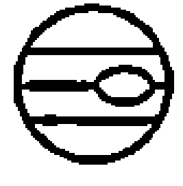

| 名字 | 出生日期 | 木星星座 |
|---|---|---|
| | | |
| | | |
| | | |
| | | |
| | | |
| | | |
| | | |

準備好成員之一的出生日期，並且在下方列表中，找出該生日之前、最接近的日期，所註記的星座。把這個星座記進表格中。

例如，某人出生於 1945 年 5 月 3 日：在列表中，他生日之前最接近的日期是 1944 年 7 月 27 日。因此，他的水星星座是處女座。

列表僅供參考，無關出生地點與時間。

若要確實找到每個行星所在的星座，請上網：
www.astrocolors.com

#### 1940 年至 2040 年間，水星所在的星座

| 1940 5/17 金牛座 | 1954 5/25 巨蟹座 | 8/13 摩羯座 | 12/17 天蠍座 | 4/12 巨蟹座 |
|---|---|---|---|---|
| 1941 5/27 雙子座 | 1955 6/13 獅子座 | 11/5 水瓶座 | 1970 5/1 天秤座 | 9/6 獅子座 |
| 1942 6/11 巨蟹座 | 11/18 處女座 | 1962 3/26 雙魚座 | 8/16 天蠍座 | 1979 3/2 巨蟹座 |
| 1943 7/1 獅子座 | 1956 1/19 獅子座 | 1963 4/5 牡羊座 | 1971 1/15 射手座 | 4/21 獅子座 |
| 1944 7/27 處女座 | 7/8 處女座 | 1964 4/13 金牛座 | 6/6 天蠍座 | 9/30 處女座 |
| 1945 8/26 天秤座 | 12/14 天秤座 | 1965 4/23 雙子座 | 9/12 射手座 | 1980 10/28 天秤座 |
| 1946 9/26 天蠍座 | 1957 2/20 處女座 | 9/22 巨蟹座 | 1972 2/7 摩羯座 | 1981 11/28 天蠍座 |
| 1947 10/25 射手座 | 8/8 天秤座 | 11/18 雙子座 | 7/25 射手座 | 1982 12/27 射手座 |
| 1948 11/16 摩羯座 | 1958 1/14 天蠍座 | 1966 5/6 巨蟹座 | 9/26 摩羯座 | 1984 1/20 摩羯座 |
| 1949 4/13 水瓶座 | 3/21 天秤座 | 9/28 獅子座 | 1973 2/24 水瓶座 | 1985 2/7 水瓶座 |
| 6/28 摩羯座 | 9/8 天蠍座 | 1967 1/17 巨蟹座 | 1974 3/9 雙魚座 | 1986 2/21 雙魚座 |
| 12/1 水瓶座 | 1959 2/11 射手座 | 5/24 獅子座 | 1975 3/19 牡羊座 | 1987 3/3 牡羊座 |
| 1950 4/16 雙魚座 | 4/25 天蠍座 | 10/20 處女座 | 1976 3/27 金牛座 | 1988 3/9 金牛座 |
| 9/16 水瓶座 | 10/6 射手座 | 1968 2/28 獅子座 | 8/24 雙子座 | 7/22 雙子座 |
| 12/2 雙魚座 | 1960 3/2 摩羯座 | 6/16 處女座 | 10/17 金牛座 | 12/1 金牛座 |
| 1951 4/22 牡羊座 | 6/11 射手座 | 11/16 天秤座 | 1977 4/4 雙子座 | 1989 3/12 雙子座 |
| 1952 4/29 金牛座 | 10/27 摩羯座 | 1969 3/31 處女座 | 8/21 巨蟹座 | 7/31 巨蟹座 |
| 1953 5/10 雙子座 | 1961 3/16 水瓶座 | 7/16 天秤座 | 1978 1/1 雙子座 | 1990 8/19 獅子座 |

### 木星

| 1991 | 9/13 | 處女座 |
|---|---|---|
| 1992 | 10/11 | 天秤座 |
| 1993 | 11/11 | 天蠍座 |
| 1994 | 12/10 | 射手座 |
| 1996 | 1/4 | 摩羯座 |
| 1997 | 1/22 | 水瓶座 |
| 1998 | 2/5 | 雙魚座 |
| 1999 | 2/14 | 牡羊座 |
| | 6/29 | 金牛座 |
| | 10/24 | 牡羊座 |
| 2000 | 2/15 | 金牛座 |
| | 7/1 | 雙子座 |
| 2001 | 7/13 | 巨蟹座 |
| 2002 | 8/2 | 獅子座 |
| 2003 | 8/28 | 處女座 |
| 2004 | 9/26 | 天秤座 |
| 2005 | 10/27 | 天蠍座 |
| 2006 | 11/25 | 射手座 |
| 2007 | 12/19 | 摩羯座 |
| 2009 | 1/6 | 水瓶座 |
| 2010 | 1/19 | 雙魚座 |
| | 6/7 | 牡羊座 |
| | 9/10 | 雙魚座 |
| 2011 | 1/23 | 牡羊座 |
| | 6/5 | 金牛座 |
| 2012 | 6/12 | 雙子座 |
| 2013 | 6/27 | 巨蟹座 |
| 2014 | 7/17 | 獅子座 |
| 2015 | 8/12 | 處女座 |
| 2016 | 9/10 | 天秤座 |
| 2017 | 10/11 | 天蠍座 |
| 2018 | 11/9 | 射手座 |
| 2019 | 12/3 | 摩羯座 |
| 2020 | 12/20 | 水瓶座 |
| 2021 | 5/14 | 雙魚座 |
| | 7/29 | 水瓶座 |
| | 12/30 | 雙魚座 |
| 2022 | 5/11 | 牡羊座 |
| | 10/29 | 雙魚座 |
| | 12/21 | 牡羊座 |
| 2023 | 5/17 | 金牛座 |
| 2024 | 5/26 | 雙子座 |
| 2025 | 6/10 | 巨蟹座 |
| 2026 | 7/1 | 獅子座 |
| 2027 | 7/27 | 處女座 |
| 2028 | 8/25 | 天秤座 |
| 2029 | 9/25 | 天蠍座 |
| 2030 | 10/23 | 射手座 |
| 2031 | 11/16 | 摩羯座 |
| 2032 | 4/12 | 水瓶座 |
| | 6/27 | 摩羯座 |
| | 12/1 | 水瓶座 |
| 2033 | 4/15 | 雙魚座 |
| | 9/14 | 水瓶座 |
| | 12/2 | 雙魚座 |
| 2034 | 4/22 | 牡羊座 |
| 2035 | 4/30 | 金牛座 |
| 2036 | 5/10 | 雙子座 |
| 2037 | 5/31 | 巨蟹座 |
| 2038 | 6/13 | 獅子座 |
| | 11/17 | 處女座 |
| 2039 | 1/17 | 獅子座 |
| | 7/8 | 處女座 |
| | 12/13 | 天秤座 |
| 2040 | 2/21 | 處女座 |
| | 8/6 | 天秤座 |
| 2041 | 1/12 | 天蠍座 |

### 土星

寫下家庭成員的名字及出生日期。

| 名字 | 出生日期 | 土星星座 |
|---|---|---|
| | | |
| | | |
| | | |
| | | |
| | | |
| | | |
| | | |

準備好成員之一的出生日期，並且在下方列表中，找出該生日之前、最接近的日期，所註記的星座。把這個星座記進表格中。

例如，某人出生於 1945 年 5 月 3 日：在列表中，他生日之前最接近的日期是 1944 年 6 月 21 日。因此，他的土星星座是巨蟹座。

列表僅供參考，無關出生地點與時間。

若要確實找到每個行星所在的星座，請上網：
www.astrocolors.com

#### 1940 年至 2040 年間，土星所在的星座

| 年份 | 日期 | 土星星座 |
|---|---|---|
| 1940 | 3/21 | 金牛座 |
| 1942 | 5/9 | 雙子座 |
| 1944 | 6/21 | 巨蟹座 |
| 1946 | 8/3 | 獅子座 |
| 1948 | 9/20 | 處女座 |
| 1949 | 4/4 | 獅子座 |
| | 5/30 | 處女座 |
| 1950 | 11/21 | 天秤座 |
| 1951 | 3/8 | 處女座 |
| | 8/14 | 天秤座 |
| 1953 | 10/23 | 天蠍座 |
| 1956 | 1/13 | 射手座 |
| | 5/15 | 天蠍座 |
| | 10/11 | 射手座 |
| 1959 | 1/6 | 摩羯座 |
| 1962 | 1/4 | 水瓶座 |
| 1964 | 3/25 | 雙魚座 |
| | 9/18 | 水瓶座 |
| | 12/17 | 雙魚座 |
| 1967 | 3/4 | 牡羊座 |
| 1969 | 4/30 | 金牛座 |
| 1971 | 6/19 | 雙子座 |
| 1972 | 1/11 | 金牛座 |
| | 2/22 | 雙子座 |
| 1973 | 8/2 | 巨蟹座 |
| 1974 | 1/8 | 雙子座 |
| | 4/19 | 巨蟹座 |
| 1975 | 9/18 | 獅子座 |
| 1976 | 1/15 | 巨蟹座 |
| | 6/6 | 獅子座 |
| 1977 | 11/17 | 處女座 |
| 1978 | 1/6 | 獅子座 |
| | 7/27 | 處女座 |
| 1980 | 9/22 | 天秤座 |
| 1982 | 11/30 | 天蠍座 |
| 1983 | 5/7 | 天秤座 |
| | 8/25 | 天蠍座 |
| 1985 | 11/18 | 射手座 |
| 1988 | 2/14 | 摩羯座 |
| | 6/11 | 射手座 |
| | 11/13 | 摩羯座 |
| 1991 | 2/7 | 水瓶座 |
| 1993 | 5/21 | 雙魚座 |
| | 7/1 | 水瓶座 |
| 1994 | 1/29 | 雙魚座 |
| 1996 | 4/8 | 牡羊座 |
| 1998 | 6/10 | 金牛座 |
| | 10/26 | 牡羊座 |
| 1999 | 3/1 | 金牛座 |
| 2000 | 8/10 | 雙子座 |
| | 10/17 | 金牛座 |
| 2001 | 4/21 | 雙子座 |
| 2003 | 6/4 | 巨蟹座 |
| 2005 | 7/17 | 獅子座 |
| 2007 | 9/3 | 處女座 |
| 2009 | 10/30 | 天秤座 |
| 2010 | 4/8 | 處女座 |
| | 7/22 | 天秤座 |
| 2012 | 10/6 | 天蠍座 |
| 2014 | 12/24 | 射手座 |
| 2015 | 6/16 | 天蠍座 |
| | 9/18 | 射手座 |
| 2017 | 12/21 | 牡羊座 |
| 2020 | 3/23 | 水瓶座 |
| | 7/3 | 摩羯座 |
| | 12/18 | 水瓶座 |
| 2023 | 3/8 | 雙魚座 |
| 2025 | 5/26 | 牡羊座 |
| | 9/2 | 雙魚座 |
| 2026 | 2/14 | 牡羊座 |
| 2028 | 4/14 | 金牛座 |
| 2030 | 6/2 | 雙子座 |
| 2032 | 7/15 | 巨蟹座 |
| 2034 | 8/28 | 獅子座 |
| 2035 | 2/16 | 巨蟹座 |
| | 5/12 | 獅子座 |
| 2036 | 10/17 | 處女座 |
| 2037 | 2/12 | 獅子座 |
| | 7/8 | 處女座 |
| 2039 | 9/7 | 天秤座 |
| 2041 | 11/12 | 天蠍座 |

### 天王星

寫下家庭成員的名字及出生日期。

| 名字 | 出生日期 | 天王星星座 |
|---|---|---|
| | | |
| | | |
| | | |
| | | |
| | | |
| | | |
| | | |
| | | |

準備好成員之一的出生日期，並且在下方列表中，找出該生日之前、最接近的日期，所註記的星座。把這個星座記進表格中。

例如，某人出生於 1945 年 5 月 3 日：在列表中，他生日之前最接近的日期是 1942 年 5 月 16 日。因此，他的天王星星座是雙子座。

列表僅供參考，無關出生地點與時間。

若要確實找到每個行星所在的星座，請上網：

www.astrocolors.com

#### 1940 年至 2040 年間，天王星所在的星座

- 1935 3/28 金牛座
- 1941 8/8 雙子座
- 10/6 金牛座
- 1942 5/16 雙子座
- 1948 8/31 巨蟹座
- 11/13 雙子座
- 1949 6/11 巨蟹座
- 1955 8/25 獅子座
- 1956 1/29 巨蟹座
- 6/10 獅子座
- 1961 11/2 處女座
- 1962 1/11 獅子座
- 8/10 處女座
- 1968 9/29 天秤座
- 1969 5/22 處女座
- 6/24 天秤座
- 1974 11/22 天蠍座
- 1975 5/2 天秤座
- 9/9 天蠍座
- 1981 2/17 射手座
- 3/22 天蠍座
- 11/17 射手座
- 1988 2/15 摩羯座
- 5/28 射手座
- 12/3 摩羯座
- 1995 4/2 水瓶座
- 6/10 摩羯座
- 1996 1/13 水瓶座
- 2003 3/11 雙魚座
- 9/16 水瓶座
- 12/31 雙魚座
- 2010 5/28 牡羊座
- 8/15 雙魚座
- 2011 3/12 牡羊座
- 2018 5/16 金牛座
- 11/7 牡羊座
- 2019 3/7 金牛座
- 2025 7/8 雙子座
- 11/9 金牛座
- 2026 4/26 雙子座
- 2032 8/4 巨蟹座
- 12/13 雙子座
- 2033 5/23 巨蟹座
- 2039 8/7 獅子座
- 2040 2/26 巨蟹座
- 5/16 獅子座
- 2045 10/7 處女座

### 海王星

寫下家庭成員的名字及出生日期。


| 名字 | 出生日期 | 海王星星座 |
|---|---|---|
| | | |
| | | |
| | | |
| | | |
| | | |
| | | |
| | | |
| | | |

準備好成員之一的出生日期，並且在下方列表中，找出該生日之前、最接近的日期，所註記的星座。把這個星座記進表格中。

例如，某人出生於 1945 年 5 月 3 日：在列表中，他生日之前最接近的日期是 1943 年 8 月 3 日。因此，他的海王星星座是天秤座。

列表僅供參考，無關出生地點與時間。

若要確實找到每個行星所在的星座，請上網：
www.astrocolors.com

#### 1940 年至 2040 年間，海王星所在的星座

- 1929 7/25 處女座
- 1942 10/4 天秤座
- 1943 4/18 處女座
- 8/3 天秤座
- 1955 12/25 天蠍座
- 1956 3/13 天秤座
- 10/20 天蠍座
- 1957 6/17 天秤座
- 8/6 天蠍座
- 1970 1/5 射手座
- 5/4 天蠍座
- 11/7 射手座
- 1984 1/19 摩羯座
- 6/24 射手座
- 11/22 摩羯座
- 1998 1/29 水瓶座
- 8/24 摩羯座
- 11/28 水瓶座
- 2011 4/5 雙魚座
- 8/6 水瓶座
- 2012 2/4 雙魚座
- 2025 3/31 牡羊座
- 10/23 雙魚座
- 2026 1/27 牡羊座
- 2038 5/22 金牛座
- 10/22 牡羊座
- 2039 3/24 金牛座
- 2051 7/17 雙子座

### 冥王星

寫下家庭成員的名字及出生日期。

| 名字 | 出生日期 | 冥王星星座 |
|---|---|---|
| | | |
| | | |
| | | |
| | | |
| | | |
| | | |
| | | |
| | | |

準備好成員之一的出生日期，並且在下方列表中，找出該生日之前、最接近的日期，所註記的星座。把這個星座記進表格中。

例如，某人出生於 1945 年 5 月 3 日：在列表中，他生日之前最接近的日期是 1939 年 6 月 14 日。因此，他的冥王星星座是獅子座。

列表僅供參考，無關出生地點與時間。
若要確實找到每個行星所在的星座，請上網：

www.astrocolors.com

#### 1940 年至 2040 年間，冥王星所在的星座

- 1939 6/14 獅子座
- 1956 10/20 處女座
- 1957 1/16 獅子座
- 8/19 處女座
- 1958 4/13 獅子座
- 6/11 處女座
- 1971 10/6 天秤座
- 1972 4/18 處女座
- 7/31 天秤座
- 1983 11/6 天蠍座
- 1984 5/19 天秤座
- 8/28 天蠍座
- 1995 1/18 射手座
- 4/22 天蠍座
- 11/11 射手座
- 2008 1/26 摩羯座
- 6/15 射手座
- 11/27 摩羯座
- 2023 3/24 水瓶座
- 6/12 摩羯座
- 2024 1/21 水瓶座
- 9/3 摩羯座
- 11/20 水瓶座
- 2043 3/9 雙魚座

## 占星學Q&A

### Q：為什麼要用黃道十二星座來定義我們的個性呢？

先來問個問題，何謂個性？我們可以在「個性」（personality）一詞中發現「人」（person）字的存在，而這個詞源自希臘文的 persona，意思是「戲劇用的面具」。因此，個性就是我們的表面。

從古希臘羅馬時代開始，人類就試圖發明一些系統來為個性分類：泰奧弗拉斯托斯（Theophrastus）*1的《性格學》以及拉布魯耶爾（Jean de La Bruyère）*2的作品在諷刺社會；希波克拉底（Hippocrate）*3的「體液學説」（humeurs）是以醫療為目的，現今的精神疾病行為歸類（《精神疾病診斷與統計手冊》）都是「體液學説」遙遠的後代子孫；還有根據頭形來判斷心理特質的顱相學（對那些頭形不佳的人來說，應該不怎麼好玩……）。

榮格（Carl Gustav Jung）在二十世紀初寫下《心理類型學》（Psychology Types），之後被邁爾斯及其女兒布里格斯發展出著名的「邁爾斯—布里格斯性格分類法」（Myers-Briggs Type Indicator）。這個分類法要求受試者在四個不同的維度中為自己定位：動力（外向型或內向型）、感知（實感型或直覺型）、決定方式（根據理性或個人特質），以及生活方式（對人生機會採開放態度，還是試圖控制一切）。再依照受試者的回答，把他們分配到這四個維度組合出來的十六個格子之一。

可是，我今天的答案會跟明天的一樣嗎？難道我不會被困在這個「科學鑑定」的身分上，從而失去適應性嗎？況且，透過問答遊戲來定義自己的個性，與潛意識的概念完全背道而馳：「潛意識」的意思就是「我們沒有覺知」。所以，這種以有意識的方法定義出來的個性，顯然無法完全代表我們。

最好的情況是，這個個性將會表達出我們自己的理想形象；知道自己的理想形象為何，也許是挺有意思的經驗。事實上，這份問卷只有我們之外的另一個人才回答得了！可是我們之外的另一個人只會看我們令他好奇的部分：他眼中的一鱗半爪的我們，是他自己有的特質。因此，必須要由許許多多其他人來回答，而不只是另一個人，如此一來，問卷裡的字眼對每個人而言才會有同樣的意義……

其實要定義一個人的個性，最有趣的方法可能是看看什麼樣的人讓我們透過生理反應就直覺討厭，也說不上為什麼。那些人或許意外地反映出我們的為人，而我們找理由不去忍受他們，都只是為了遮掩他們的這一面，因為這一面千真萬確是我們的倒影。我們討厭那些人，因為不再覺得自己獨一無二，也不能再說「我」，因為我們已經發展出一種個性，以便終結他人對我們的控制。

儘管如此，我們還是可以定義我們的個性，就算只是由唯一的身分來定義。如果我們認為自己符合這個身分，我們也會有了點附加價值的感覺。能在唯一的身分裡認出自己，並非心理健康的跡象，因為這太像精神病患者為自己創造的唯一意見，例如，他們認為自己是上帝派來的使者。就算我們感覺自己是完整的個體，也知道自己會有不同的面貌。在精神分析中，這些面貌形成「自我」，就像劇院的庫房裡積存了所有戲服。我們會視情況穿上這件或那件戲服。出現在夢中的所有人物，事實上都只是我們的不同面貌、不同身分的痕跡。

因此，我們偏好用占星學來定義個性：占星學中的我們不只有單一身分，而是與我們可以在黃道星座上見到的「行星」一樣多，這給了我們許多彈性和空間。此外，如果占星學對我們定義的身分而言已變得礙事，我們也可以輕易擺脫它，因為占星學是沒有科學根據的分類法，就只是占星學而已……有趣的是，榮格可能是受到占星學系統的啟發，來想出他的心理類型。另一種類型學指標「九型人格」，或者造形藝術家配色時使用的十二色相環，以及三角形、正方形和長方形，全都讓人聯想到星圖。

### Q：為什麼沒有參考上升星座？

「上升星座」是指當我們在地球某處，在某特定時刻看著天空時，從地平線升起的星座。因為地球在二十四小時內自轉一圈，製造出每天日升日落的情況。黃道十二星座與行星亦然，也會給人升落的印象。希臘人發明了這種觀測天象的方法。後來，美索不達米亞人傾向於把行星落在星座間的位置，與旱災、澇災、歉收及豐收連上關係。參照觀象者的觀點，而非行星的位置，標示出了占星學的轉捩點：占星學已經不再被用來預測全體人類的事變，而是用來談一個特定人士的命運。

行星在天空中移動的速度非常快，確實讓我們能夠「個人化」一個行星位置的紀錄，但是行星在黃道帶上移動得非常緩慢，因此無法這麼做。一個人誕生時，需要看他的上升星座（上升到地平線上方的黃道星座），還有在上升星座旁邊的那些行星，即朝向天頂（天空的中央）的行星、沉落的行星（下降星座），還有在中天對面（天底）的行星。原意為「觀測時辰」的「天宮圖」（horoscope），名稱來自一個人誕生日當天的星圖，這是古人依照行星與四個「尖軸」（上升星座、天頂星座、下降星座與天底星座）的相對位置而建立的。占星學認為上升星座指出其他人眼中的我們是什麼模樣，這意謂著我們不見得會有認同感。既然本書的目的是定義適合我們的色彩，讓我們可以透過色彩認出自己來，那麼就沒有必要討論上升星座了。

### Q：為什麼沒有參考宮位？

占星學的「宮」（house）是太空中那四大尖軸之間的四個區域。我們稱這些區域為「宮」，因為那是行星居留之處。希臘人認為誕生的時刻構成了這個人生命的開端及前提，檢視天宮圖，我們就可以談述一個人的一生，就好比我们說只要有人體的樣本，就可以複製他。因此，第一個「宮」會代表人生的開端，始於上升星座。最後一個「宮」代表人生的盡頭，止於上升星座。可是這四個「宮」給我們的細節不夠，而我們問占星師的問題總是很明確（金錢、健康、婚姻、事業、遺產、死亡等等）。於是，古人把每個「宮」分成兩個，讓它們各自符合一個特定主題，因此我們就有了八個「宮」。

接下來，就跟亞歷山大大帝想要融合希臘人和波斯人一樣，古人也想要用黃道十二星座來概括天宮圖，於是八個宮又變成十二個宮。我們可以從這種對獨一無二的整體性系統的尋尋覓覓中，認出人類有追求心理完整的傾向。每個黃道星座及其對應宮位的特質，終究會自然而然互相影響。占星學宮位的問題，在於沒有人使用一樣的系統。將原來的四個宮再各自劃分成三個的方法，有各式各樣。某些占星師比較喜歡使用八個宮的系統，而不是十二宮的系統。其他占星師則採用與傳統方向相反的方向，去為宮位編號。根據占星師使用的系統不同，同一顆行星可能位在四個不同的宮位中！

此外，占星學中的行星既然只有十顆（加上太陽與月亮），宮位卻有十二個，某些宮位理所當然會是空的。為了解釋這些空蕩蕩的宮位代表為何，占星師可以根據自己的喜好，加上一些小行星和虛構的點。但是，他們主要的作法是把每個宮位牽連到一顆行星上：占星師會去看對應這個空蕩宮位的行星的動靜。

正如我們所見，在占星學中，一切都歸結到行星，直接或間接地透過行星在星座上的位置。此外，人類發明宮位是為了預告未來，但是我們今天可以注

### Q：為什麼沒有參考守護星？

「守護星」是接近其中一個尖軸的行星，假設它能刻劃一個人行為的特點。天王星、海王星和冥王星通常不能被視為守護星。你的守護星可以從你運用所有行星決定出來的色彩中，指出你的主要色彩。

由米榭・高克蘭（Michel Gauquelin）*4的研究可見，你的守護星大約位在你上升星座前方 20 度及後方 40 度之間，天頂星座前方 10 度及後方 35 度之間，下降星座後方 1 度至 20 度之間，天底星座後方 5 度至 25 度之間，上升星座及天頂星座優先。這些守護星可能指出對一個人而言最重要的房間：對太陽來説是玄關、客廳和遊戲室；對月亮來説是玄關、廚房和臥室；對水星來説是客廳和遊戲室；對金星來説是客廳和餐室；對火星來説是小廚房；對木星來説是玄關和餐室；對土星而言是臥室和書房。

### Q：為什麼沒有參考相位（aspect）？

「相位」是指兩個行星之間的好壞關係，根據的是兩者在 360 度的星盤上之間的距離。「相位」其實是希臘人綜合數祕術（numerology）和占星學所發明出來的一種概念。「合相」、「對分相」、「三分相」、「四分相」、「五分相」、「六分相」，都能令人聯想到畢達哥拉斯 *5 的那些數字一、二、三、四、五、六。此外，我們只要用這幾個數字之一除以星盤的 360 度，就可以得出每個相位特有的度數。

由於兩顆行星之間罕有距離精確的情況，因此占星師都會放寬標準，人稱「容許度」(orb)，對太陽或月亮而言，可以容許到 10 度的誤差。就跟宮位一樣，每位占星師自己決定使用多少「容許度」。某些人認為，如果合相的行星不位在同一些星座裡，就不是真正的合相，或是某些行星彼此之間不管怎樣都無法相合。某些人認為只有往黃道星座的方向移動的第一顆行星，才會有影響力。

最後，還有人對某些傳統被公認為吉相的相位有所懷疑等等。要看兩顆行星的關係是否和諧，何不使用本書去比較它們的色彩，以便確認兩者有多相似呢？

### Q：占星學中有什麼是一致的？

最後，占星學中有什麼是一致的？就是天宮圖四大尖軸的位置和行星在星座裡的位置。恆星派（Sidereal Astrology）的人照樣可以使用本書，但是不必參考〈7 行星位置表〉，因為這份列表是根據「回歸黃道」來為行星定位，而在恆星派的觀念中，星座都會因為「分點歲差」而部分偏移。

*1：西元前四世紀的古希臘哲學家與科學家
*2：十七世紀法國哲學家，重要著作為《品格論》（Les Caractères ou les Mœurs de ce siècle）。
*3：為古希臘時代的醫師，約生於西元前460年。
*4：二十世紀的法國心理學家。
*5：古希臘哲學家、數學家和音樂理論家。

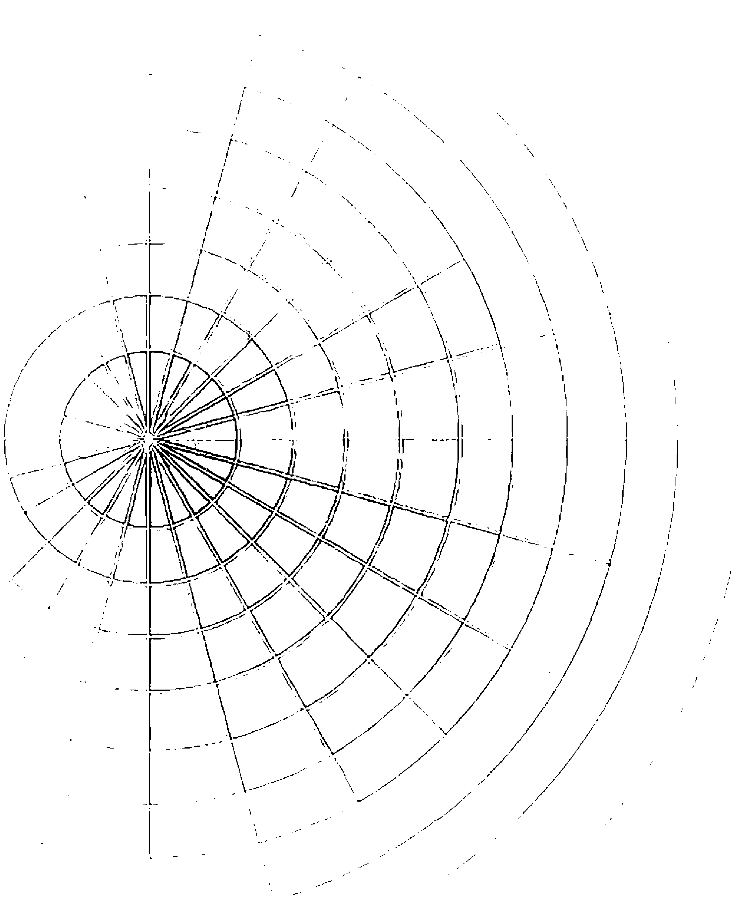

## 色彩特質索引

### 1. 白色
耐心、責任感、嚴謹、廉正、明確、深思熟慮、沉靜、猶豫不決、內向、實際

### 2. 帶粉紅的非純白色
大膽、朝氣蓬勃、不知疲倦、勇敢、獨立、衝動、輕率、反覆不定、散漫、行動派

### 3. 帶橘色的非純白色
快活、外向、熱情、自我中心、享樂至上、支配欲、樂觀、活躍進取、雜亂無章、愛開玩笑

### 4. 米白色
有條不紊、有生產力、可靠、實際、剛毅果決、不知變通、執拗、效率高、通情達理、紀律

### 5. 帶黃色的非純白色
靈敏、好奇心旺盛、快活、有感染力、新潮、膚淺、適應力強、冒失、心不在焉、聰穎

### 6. 帶綠色的非純白色
圓滑、纖細敏銳、依賴性強、圓通、人見人愛、寬容、優柔寡斷、玩世不恭、敏感、安心寧神

### 7. 帶天藍色的非純白色
自由、客觀、進步主義、有創意、知機識變、利他主義、博愛、開放、獨具匠心、聰穎

### 8. 帶錦葵紫的非純白色
富有想像力、體貼、敏感、內向、貼心、自私、鼓舞人心、性好沉思、令人放鬆、審慎

### 9. 帶灰色的非純白色
聰穎、機巧、完美主義、紀律、有條不紊、實際、嚴肅、純真、冷峻、廉正

### 10. 粉紅色
恬靜、安心寧神、擅於交際、和善、圓通、感情豐富、富有想像力、寬容、和平主義者、適應力強

### 11. 鮭魚色
和善、擅於交際、和平主義者、適應力強、依賴性強、漫不經心、優柔寡斷、敏感、玩世不恭

### 米色
善於分析、謙虛、有耐性、服務精神、體貼、依賴性強、敏感、內向、易受影響、游移不定

### 殼黃色 (shell)
親切、隨和、玩世不恭、純潔、動人、寬容、依賴性強、好客、易受影響、安心寧神

### 淡赭黃色
擅於交際、適應力強、漫不經心、富想像力、寬容、軟弱、玩世不恭、屈從、易受影響、安心寧神

### 那不勒斯黃 (Naples yellow)
擅於交際、和平主義者、適應力強、漫不經心、懶散、鬆散、優柔寡斷、無憂無慮、好客、易受影響

### 鎳鈦黃 (nickel titanium)
聰穎、新潮、知機識變、寬容、有説服力、擅於交際、伶俐、博愛、適應力強、人見人愛

### 杏仁綠
耐性、恬靜、隨和、和平主義者、依賴性強、自信滿滿、善於傾聽、樂於助人、安心寧神、謙虛

### 天藍色
利他主義、知機識變、開放、泰然自若、寬容、和平主義、優柔寡斷、怯懦、圓滑、適應力強

### 薰衣草色
和平主義、漫不經心、敏感、內向、體貼、優柔寡斷、玩世不恭、樂於助人、安心寧神、不切實際

### 淺紫色 (Parma)
富有同情心、感情豐富、被動、鬼計多端、貼心、不切實際、懶散、安心寧神、充滿母愛、好客

#### 紫色
樂觀、滿腔熱忱、易怒、獨立、堅決、朝氣蓬勃、坦率、領袖、野心勃勃、盛氣凌人

### 李子色 (plum)
有生產力、通情達理、可靠、耐心、不知變通、保守、耐勞、堅定、穩定、因循守舊

### 23. 酒紅色（Bordeaux）
野心勃勃、朝氣蓬勃、鋭志、記恨、滿腔熱忱、狡猾、占有慾強、吸引力、操縱人心、明察秋毫

### 24. 品紅色
樂觀、愛開玩笑、外向、專制、自尊自大、魅力、予人好感、剛愎、自信滿滿、憤世嫉俗

### 25. 緋紅色（crimson）
朝氣蓬勃、大膽、易怒、殷切、吹毛求疵、野心勃勃、吸引力、自信滿滿、愛開玩笑、驕矜

### 26. 紅色
坦率、朝氣蓬勃、行動派、殷切、衝動、大膽、領導風範、鋭志、急躁、氣量狹小

### 27. 胭脂紅（carmine）
效率高、吹毛求疵、破壞力、支配者、獨立、自信滿滿、朝氣蓬勃、滿腔熱忱、吸引力、勇敢

### 28. 朱紅色（vermilion）
獨立、樂觀、愛開玩笑、外向、急躁、輕率、剛愎、行動派、富冒險精神、大膽

### 29. 紫檀色
體貼、樂於助人、依賴性強、易受影響、充滿母愛、好客、被動、盡心盡力、過度敏感、安心寧神

### 30. 錦葵紫（mauve）
體貼、易受影響、安心寧神、敏感、富想像力、多愁善感、深情、充滿母愛、感情豐富、圓通

### 31. 暖粉紅色
人見人愛、逗人開心、溫和、擅於交際、熱情、圓通、快活、享樂至上、操縱人心

### 32. 珊瑚色
圓通、享樂至上、人見人愛、擅於交際、優雅、和平主義者、隨機應變、自戀、寬容、漫不經心

### 33. 復古粉紅色
敏感、恬靜、保守、有耐性、體貼、安心寧神、操縱人心、公平認真、委婉、依賴性強

### 杏桃色
圓通、人見人愛、逗人開心、擅於交際、自戀、隨機應變、膚淺、操縱人心、優雅、無憂無慮

### 戰神黃（Mars yellow）*
自私、追求物質享受、待機而動、投機、快活、享樂至上、和善、寬容、剛愎、委婉

#### 橘色
好動、富冒險精神、輕率、急躁、殷切、愛開玩笑、剛愎、雜亂無章、樂觀、自尊自大

### 深橘色
自由、盛氣凌人、易怒、行動派、大膽、堅韌不拔、活躍進取、滿腔熱忱、操縱人心、吹毛求疵

### 紅棕色
滿腔熱忱、有洞察力、朝氣蓬勃、野心勃勃、占有慾強、好鬥、吹毛求疵、有生產力、實際、重視感官享受

### 赤陶色（terracotta）
謙虛、有耐性、機巧、保守、節儉、謹慎、可靠、扭怩、焦慮、實際

### 戰神紅（Mars red）
有條不紊、保守、有生產力、通情達理、可靠、實際、勤勞、紀律、嚴肅、誇才賣智

### 咖啡牛奶
勤勉、效率高、謙虛、有耐性、可靠、實際、有條不紊、節儉、深思熟慮、緩慢

### 赭紅色
勤勞、執拗、追求物質享受、有生產力、可靠、果斷、實際、記恨、審慎、效率高

### 鎘黃色
快活、有感染力、有說服力、耀眼、敏捷、外向、伶俐、新潮、淘氣、膚淺

### 金黃色
慷慨、輕信他人、快活、有巧思、外向、魅力、耀眼、理想主義、積極、嘲謔

* 戰神色是指含有合成氧化鐵的顏色。

## 45 黃褐色
- 嘲謔、追求物質享受、好動、伶俐、冒失、樂觀、自信、剛愎、易怒、愛開玩笑

## 46 赭石色
- 聰穎、有感染力、伶俐、新潮、靈活、淘氣、好奇心旺盛、理想主義、自由、急躁

## 47 檸檬黃
- 有感染力、擅於交際、隨機應變、冒失、自私、三心二意、優柔寡斷、易受影響、輕信他人、無憂無慮

## 48 黃色
- 好奇心旺盛、快活、有感染力、新潮、魅力、進步主義、予人好感、獨具匠心、耀眼、聰穎

## 49 卡其色
- 享樂主義、操縱人心、執拗、嫉妒、有洞察力、健朗、銳志、吹毛求疵、憤世嫉俗、巧智

## 50 黃綠色
- 進步主義、獨具匠心、聰穎、適應力強、三心二意、知機識變、自由、靈活、新潮、利他主義

## 51 橄欖綠
- 有耐性、謹慎、圓通、擅於交際、威嚴、予人好感、服務精神、敏感、安心寧神、委婉

## 52 赭綠色
- 依賴性強、敏感、內向、體貼、恬靜、通情達理、占有慾強、重視感官享受、緩慢、焦慮

## 53 焦茶色
- 執拗、嫉妒、剛毅果決、吸引力、滿腔熱忱、有洞察力、好色、朝氣蓬勃、占有慾強、現實

## 54 深綠色
- 有生產力、條理井然、穩定、有耐性、占有慾強、執拗、野心勃勃、精神充沛、實際

## 55 草綠色
- 開放、泰然自若、獨具匠心、放鬆、人見人愛、溫和、擅於交際、人道主義、圓通、快活

## 葉綠色
- 聰穎、新潮、知機識變、寬容、有說服力、擅於交際、伶俐、博愛、適應力強、人見人愛

#### 綠色
- 領袖、殷切、自信、活躍進取、威嚴、盛氣凌人、明確、專制、剛愎、驕矜

## 祖母綠
- 獨立、領袖、專制、威嚴、剛愎、有生產力、耐勞、嚴謹、穩定、驕矜

## 銅綠色 (verdigris)
- 體貼、恬靜、直覺、內向、感情豐富、焦慮、服務精神、易受影響、謙虛、耐心

## 鈷綠色 (cobalt green)
- 有探究精神、進步主義、明理、別出心裁、利他主義、博愛、獨具匠心、叛逆、知機識變、自由

#### 綠松色
- 進步主義、利他主義、予人好感、有說服力、聰穎、別出心裁、知機識變、博愛、泰然自若、有感染力

## 土耳其藍
- 進步主義、理想主義、富冒險精神、急躁、雜亂無章、偏激、創造力、行動派、殷切、活躍進取

## 深綠松色
- 深思熟慮、審慎、條理井然、吹毛求疵、邏輯、嚴謹、完美主義、有生產力、嚴肅、耐勞

## 青色
- 進步主義、自由、開放、富冒險精神、有感染力、獨具匠心、聰穎、殷切、好奇心旺盛、行動派

#### 藍色
- 好勝、行動派、專制、滿腔熱忱、慷慨、急躁、致力於現代化、自信滿滿、理想主義、獨立

## 群青紫 (ultramarine violet)
- 盡心盡力、知機識變、利他主義、創造力、致力於現代化、自由、有探究精神、有系統的、專業、明理

## 深藍色
- 恆心、氣量狹小、寧折不彎、完美主義、紀律、有責任感、深思熟慮、條理井然、驕矜、明確

## 靛色
- 專業、氣量狹小、領袖、條理井然、嚴肅、明確、寧折不彎、嚴謹、滿腔熱忱

## 普魯士藍
- 嚴謹、恆心、寧折不彎、氣量狹小、有責任感、專業、審慎、深思熟慮、有計畫的、明確

## 紫丁香色
- 保護、鼓舞人心、性好沉思、鬼計多端、敏悟、盡心盡力、貼心、充滿母愛、好客

#### 紫羅蘭色
- 體貼、滿腔熱忱、吸引力、朝氣蓬勃、領袖、好色、易怒、喜怒無常、明察秋毫、記恨

## 深紫羅蘭色
- 嫉妒、尋根究柢、執拗、有洞察力、朝氣蓬勃、勤勉、深思熟慮、有計畫的、剛毅果決、重視感官享受

## 淺灰色
- 善變、漫不經心、心不在焉、適應力強、別出心裁、開放、好奇心旺盛、有感染力、伶俐、新潮

## 灰色
- 善於分析、紀律、嚴肅、嚴謹、責任感、領袖、條理井然、可靠、勤勉、完美主義

## 深灰色
- 謹慎、有生產力、實際、占有慾強、體貼、敏感、堅韌不拔、恬靜、內向、保守

## 煤灰色
- 圓滑、寬容、依賴性強、優柔寡斷、敏悟、盡心盡力、貼心、軟弱、安心寧神、委婉

## 黑色
- 朝氣蓬勃、富冒險精神、獨立、支配慾、剛愎、行動派、大膽、叛逆、吸引力、領袖

## 家屋、星座與色彩的關係
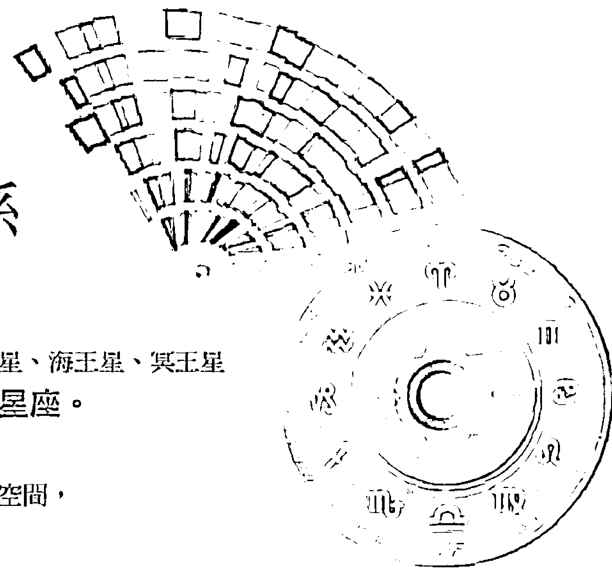

家屋的每個空間都有各自對應的行星。
——太陽、月亮、水星、金星、火星、木星、土星、天王星、海王星、冥王星

在每個人的星盤中，這些行星都對應了不同的星座。

十二星座有各自適合的色彩。

結合以上條件，就能為你家的客廳、廚房、臥室、衛浴等空間，挑選出適合全家人的顏色。

將這些顏色運用在對應的空間裡，像專家那樣和諧配色。

你會對家屋更有歸屬感，家屋也會反過來療癒你。

## 如果不相信占星學⋯⋯

即使如此，色彩對人類心理的影響都無可否認。

你可以直接翻到羅列77種色彩的〈色彩特質索引〉，找出符合自己性格的色彩；

〈玩玩你的色彩！〉也會教你如何搭配色彩。

此外，還有各種居家空間介紹，能讓你從建築、歷史、社會學和心理學等方面，深度了解家屋與人們的緊密關係。