# 占星业力与转化

## 【譯序】
## 靈修與占星

身心靈療愈課程講師、作者、譯者  
胡因夢

我對占星學的著迷大約是高中時代開始的，啟蒙書應該說是老友劉鐵虎翻譯的《巴比倫占星術》。雖然詢問初見面者的太陽星座早已成為我的日常慣例，但是對占星學的深入程度卻始終沒怎麼提升，直到好友韓良露的幾本貢獻卓越的占星力作問市，才總算獲得了一窺堂奧的機會。

八年前，太陽落寶瓶座的金銘成為我生命中最重要的任務伴侶，為了幫助這位「宇宙的旁觀者」找到一個發揮創造力的管道，也為了幫助我們彼此釐清一些性格上的難題，我開始鼓勵他研究占星學，同時在自我覺察的內在工作之中，加進了深度占星學這項輔助工具。

由於在每個當下覺察身心的變化早已是例行之事，而三十三歲那年覺醒的生理拙火（內氣）也已經進展到相當精微的程度，因此我能明確地意識到食物、環境以及周遭的人所散發出來的能量，對我造成的影響遠比外在事件要明確得多。

信息場之外，似乎還有一些其他的因素在影響著身心，使其產生一種階段性的變化，而且是在脈輪的精微層次上發生的。甚至連憂鬱症的出現，都跟這些無形的影響力或勢力有關。

大約在二○○三年的陽曆七、八月間（中元節左右），我覺察到頭頂的頂輪附近，經常有振動頻率十分不穩定的能量波試圖進入我的脈輪裡面，而且會造成全身的能量瞬間被「鎖住」，接著就會出現一種難以言喻的鬱悶感。那是一種十分真切的覺受，絲毫不帶有自我暗示的成分。曾經體驗過長達三年的產後憂鬱症，經常與失眠等十幾種慢性病症狀共處的我，從未嘗過如此束手無策的感覺。由於干擾是來自於肉眼看不見的次元，所以我意識到必須向處理「靈擾」（psychic attack）的專家求助，在這樣的因緣之下，我才真正有機會深入於靈療與能量醫學的奧妙內涵。但更重要的是，這些艱難無比的精微次元考驗，讓我親身印證了深度占星學在生命週期循環以及自我轉化上面的驚人發現。原來我所感受到的那些無形勢力，有一大部分是源自於宇宙行星為人所帶來的階段性影響力與挑戰。

這項發現開始促使我從占星學的性格分析層面，轉為觀察五個外行星所造成的生命週期循環。回顧人生中最大的變動階段，應該是在生下女兒之後長達八年的調理與轉化過程。有趣的是，女兒誕生的日期恰好是土星（業力之王）快要接近我六宮（健康宮）宮頭的時段。當土星正式進入六宮（大約是土星推進雙魚座二十四度左右），我就被迫在產後憂鬱症的強大壓力之下，痛改以往忽略身體健康、不愛運動的習性。我每天早晚按部就班地快走四十五分鐘，並且在各種另類療法的領域裡當起自我實驗的白老鼠。上述所有的作風，都完全吻合土星進六宮所帶來的改變與影響，因為它就是要我們為自己的身心健康和日常習慣負起責任。更有意思的是，女兒誕生的那一天，剛好也是天王星（主掌變動、意外、瓦解以及汰舊換新之星）正接近我本命四宮的階段。當時我所做出的人生重大決定，包括將兩棟非常滿意的市區住宅匆匆賣掉，搬到市郊遠離塵囂的社區裡去生活，後來又曾移民加拿大等等，事後回顧起來都十分符合天王星在家庭宮位所做出的大刀闊斧改革。雖然當時的作風的確流於衝動，但誠如 Howard Sasportas 所說的，「有時天王星也會迫使一個人搬家……因為停留在老舊的情境裡，某些潛力可能無法施展出來。」此外，海王星也剛好在那時接近四宮宮頭，海王星所象徵的「為照料他人而擱置自己的需求」，正是新生兒誕生之後初為人母者所面臨的挑戰。同時天王星與海王星進四宮，在自我轉化上也意味擺脫童年創傷、發展出真正的獨立性和客觀性、與內在最深的神性連結。我產後每日固定靜心兩小時，過程中盡量懷著客觀意識與經絡嚴重阻塞所帶來的焦慮感共處，然後慢慢地深入於心靈底層的本體——那個不受任何現象影響的部分，因而對「平等自性」有了真實的體證。這些經驗都十分符合天、海進四宮的意涵。至於二〇〇三年中元節左右出現的無形干擾，我在翻譯阿若優的這本《占星、業力與轉化》時，才明白原來土星進八宮意味著，「在這個階段許多人會經驗到深刻的痛苦，但原因很難清楚地指出，有人甚至把這個階段的經驗描述成『煉獄』。」他同時又提到，最常見的現象是，人會在此階段尋求保護，以建立最深的「靈魂的安全感」。這些心理現象上的精準詮釋，令我感到十分震撼，因為長久以來我最不擅長的就是尋求保護（火象星座過多的人有逞強傾向），而土星進八宮正是我此生唯一積極向專家求救的階段。尋求「靈魂的安全感」，令我臣服於權威一段時日，甚至出現了月亮獅子座很難展現出的謙卑心態。但是當土星正式進九宮之後，我就釐清了過往種種精微體驗上面的認知，整理出了一套身心靈的連鎖觀點。如同阿若優所描述的，「土星進九宮乃是要消化多年以來的經驗，將它們和各種有意義的理想、哲學以及自我改善的攝生法連結起來。」當土星推進我的本命十宮，分別與位置十分接近的月亮及南交點呈合相時，一對住在馬來西亞與我有宿緣的夫婦（兩個人的海、土分別與我的上升點呈合相，同時在星盤比對上竟然有六十多個產生關聯的相位），跟我們結成了莫逆之交。多年來我一直有深層的「鄉愁」，好像我是一個異鄉人，很難碰到同一個「靈團」的夥伴，然而這對夫婦卻能讓我和金銘破例陪他們一同旅遊，我們也經常到他們在馬來西亞的一座熱帶雨林裡辦工作坊，分享「大家族」歡聚的喜悅，而這全是在土星與象徵前世業力的南交點，以及象徵家族或內在之家的月亮形成合相時發生的事（這兩位友人各有日、月座落於月亮所掌管的巨蟹座）。由於這份經驗，我內心深處的無歸屬感和童年的孤獨充分被揭露，更重要的是我藉由不間斷的覺察突破了許多強烈的情緒幻相，而終於能落實無憾地生活在台灣這個環境裡。就在月亮代表的深層潛意識問題解除之後，土星便推進我本命盤十宮裡的冥王星形成合相。這時你很清楚地發現，土冥合相的確揭露了過往數十年的因果總結——我譯介的二十多本心靈書籍，開始繼個人傳記之後陸續在大陸出版，獲得意料之外的迴響，也達成了冥王星落十宮在社會影響力上面的正向作用。

我之所以鉅細靡遺地將自己的生命週期經驗與讀者分享，為的就是要幫助大家具體了解本書的意義與目的。誠如阿若優所強調的，「占星學這個宇宙語言還有許多內在意義足以促進靈性上的成長，提升人們的覺知。占星學確實能論述不同層次的意識或經驗的不同面向，而且遠遠超過邏輯頭腦所能理解的範疇。」此外阿若優也同意，「人的確可以透過禪定、不間斷的修持以及把心敞開到立即覺知當下最核心的實相，來提升我們的直觀能力。」

占星學這門「業力科學」如果運用錯誤，很容易流於將焦點固著於劇情和外在事件，進行過度瑣碎的性格分析，或是將其變成一種自我合理化的藉口，而喪失了它最深的價值。

> > 榮格經常在他的著作裡指出：一個人若是無法覺知到內在的衝突，那麼外在世界就會逼不得已將那份衝突『演示』出來，並撕裂成兩極對立的情況。

換言之，如果自我覺察的程度提升，業力就會顯現於更精微的次元。按照我親身的體驗，這樣的觀點是相當真切的，不過精微次元的功課未必比粗鈍次元的功課來得容易，然而一旦學會了細膩的辨識與覺察，自我轉化與成長的確能幫助一個人變得更完整、更清明。靈修與占星學都是達成這項目地的最佳工具。

本書是我在眾多西方占星著作裡挑選出來的『必讀』之作。史蒂芬・阿若優本持著樸實而嚴謹的態度，統合了人本占星學、榮格心理學以及東西的靈性教誨，發展出這本屬於現代占星學正向潮流的暢銷佳作，目前已經翻譯成九國語言，深受占星學界推崇以及西方讀者的推崇。希望本書能夠致力於成長和自我轉化的本地讀者，帶來一種對宇宙隱微秩序的讚嘆，以及因了悟這份秩序而必然生起的寧靜與安全感。對占星學有任何疑問的讀者，可進一步與我聯絡。我的e-mail: longjoe@ms47.hinet.net。

## 【前言】
## 占星學的真義

> > 不出戶，知天下；不闚牖，見天道。其出彌遠，其知彌少。——老子《道德經》

人生起了很大的變化時，我開始對占星學產生興趣，後來又深深地沉浸在榮格的著作裡一段時間，那時我已經知道還有許多東西是這些占星教科書尚未提及的。換句話說，我早已直覺地知道在傳統占星學的象徵符號與擬古式的語言背後，還埋藏著更大的智慧、更深的生命法則，以及能夠讓忠誠的占星學子在靈性層次上產生精純理解的洞見。因此當我一本又一本地吸收消化這些占星著作時，我立即發現自己已經在搜尋這些象徵符號更深遠的涵義了；我認為這個宇宙語言還有許多內在意義足以促進靈性上的成長，提升人們的覺知。

當我開始進行我的研究之後，才越來越明白占星學確實能論述不同層次的意識或經驗的不同面向，而且遠遠超過邏輯頭腦所能理解的範疇。但顯然只有高等的直觀之心（也可稱為「靈魂之眼」），才能真的了解占星學的深層涵義與支脈。隨著年齡的增長，我發現人確實可以透過禪定、不間斷的修持以及把心敞開到立即覺知當下最核心的實相，來提升我們的直觀能力。我早期在做研究時雖然不像西方文化裡的許多人那樣對占星學抱持懷疑態度，但我很快就對古代與現代占星學者的著作感到極度失望，因為裡面的思想、辨識力、客觀性以及靈性上的覺醒均嫌不足。這些著作不但只聚焦於事件、預測或膚淺的個性分析，而況——也多半是一些荒謬的論斷或說教；它們規避了占星元素核心意義的探討。【註二】

> > 我多年來一直在尋求了解占星元素主要意義的簡明方式，後來逐漸發展出了我希望能那種格外便利的指南書——《史蒂芬・阿若優之星盤解析指南》（Stephen Arroyo's Chart Interpretation Hand Book）。

基於這些原因，我覺得自己確實很幸運能快速地發現丹恩・魯依爾（Dane Rudhyar）的著作，甚而有機會深入於瑜珈、治療、東方宗教以及許多精神導師的教誨，同時還能以多年的時間研究榮格無與倫比的科學探索。這一切的追尋，加上我自己對能量場與日俱增的清晰體察、長期以來對夢境啟示的研究，並直觀地將這些生命的各個次元統合到最核心的靈性典範上，才逐漸發展出一種令我欣慰的應用與理解占星學的方式。

但我並不是在說我已經發展出一套「詮釋」占星學的「封閉系統」，那樣的體系正好是我無法忍受的侷限，況且堅持己見的方式很快就會變得僵固與不恰當。其實我想表達的只是我目前的理解方向與諮商方式，因為這種方式對我個人的成長很有幫助，也比較能為我的案主和學生們帶來更富建設性的利益——遠遠超過傳統事件派占星學或奧秘占星學的那些無法驗證的理論與假設。這麼多的占星著作中有許多誤謬的、甚至是毫無根據的推測，若是將它們應用在個案的情況裡而不去敏銳地感應當事人的意識層次，將會造成極嚴重的傷害。即便我們以誠實不欺的方式去粗略地測試這些說法，也還是會發現它們大多是十分荒唐的見解，而且大部分與真實的生活經驗無關。

讀者也許有興趣知道，當初我開始研究占星學的時候，本命盤裡正好有下述的推運角度：土星與本命盤的上升點呈合相，海王星與金星也有角度，冥王星與天王星則正落在處女座，與我本命盤的天王星形成緊密相位，而這些全都是所謂的「緊張」或「硬式」相位。我提到這一點乃是為了說明占星學對我而言不但是全職事業，更是一種追求真理的思考方式，而且一向是也仍然是改善我的本性、激勵我在當下的經驗裡朝著更高典範發展的工具。這本書就是我在查證生命的統合法則與占星學的深層意涵時，所產生的想法之總結，其中包括我很難從占星教科書裡獲得了悟的種種主題，甚至是根本沒出版過的一些東西。我無意撰寫出一本充斥著詮釋的「占星食譜」，而且已經假設讀者們對傳統占星學的基本定義、星座、行星或相位，都有了初步的認識。

在這本書裡我主要想闡明占星學的某些次元。占星學有各種層次的詮釋方式，但深層意涵、內在次元、以成長為導向的經驗性詮釋層次，卻是一直被忽略的。如果你對那些公式化的預測、陳腔濫調的概念以及簡化的性格分析已經感到很滿足了，那麼本書將不會和你產生任何關聯，但是那些仍然在質疑以下問題的人，卻會覺得它很有用、很能增長見聞。譬如占星學為什麼會產生作用？為什麼某些人會有某些相位？眼前看似困難的人生階段究竟帶有什麼目的？為什麼有些人能夠以實在的態度面對問題？

但由於我們探討的主題太精微，範疇又太廣，因此某些主題只能做高度的推測；因為我不能說自己在終極議題上已經有了一切答案，更不能聲稱自己是證入高層意識、有能力了悟生命更高次元的人。無疑的，本書絕不是一套詮釋本命盤的機械化法則，它必須配合個人經驗及直覺來加以應用。在我們研究占星學的前幾個階段裡，特定的法則也許可以帶給我們一些引領，不過逐漸就得把它們擱置一旁，因為宇宙的一體性和愛自然會轉化那些仔細設想法則與原則，而且會越來越成為生活中啟發個人的當下實相，讓我們了解面對另一個人的迷思有什麼意義。任何一種玄學上的研究，都可能令學生在層出不窮的次要現象裡迷失方向，使我們無法認清這些都只是終極真實反映出的某些面向罷了。本書前言一開始所引用的老子的話，優美地傳達了「素樸」的價值與真實性，任何一個占星從業者若想把本命盤的眾多元素統合成意旨深遠、前後貫通的整體認識，就必須了悟老子的話中之話。高層意識的一體性反映成低層的存在時，勢必會從「大一化為繁多」，人越是遠離實相，生命就越顯得矛盾及多樣化。但只要與那最高層的「大一」相應，你就會越來越清楚本命盤是一個統合的整體，而且這些象徵符號都是活的。人並不是由不同的元素組合成的，他是神聖潛能的一個活生生的單位，而本命盤所顯示的成長過程（推進和移位），也不是互不相干、重複發生的週期循環；它們是不斷在發展的意識的不同面向，而這些面向都同時在各個次元裡運作著。我覺得做為占星學的從業者或學生，若想把這門知識當成是一項敏銳的、能夠饒益他人的個人化技藝，就無需擔憂目前正在氾濫的那些預測方式或詮釋技巧。我的學生們時常問我：「我到底該從何處入手去看一個人的星盤？」其實你如果能徹底了解星盤裡的任何一個元素，它自然會引領你進入那示現出萬象的核心部分。換句話說，一開始只要談你真正了解的東西，將它和個案的真實經驗連結，然後任其自由發展就對了。如同愛因斯坦所說的，如果能進入任何一個事物的核心，你終將遇上最深的實相與真相。

我所指出的這些素樸的道理並不是一種無法了解的典範，它不是聽起來很美妙但完全無法被應用的東西；它是從我們對內在無限潛能的覺知以及對宇宙一體性的洞察，而發展出來的品質。東方的智者曾經說過，心智本是真理的殘殺者，也是清明洞見的敵人。一個人的心智的確會迷失於本命盤的繁瑣細節裡，而再也看不見案主的整體性與價值了。若是這種情況發生，那麼心智就成了真理的敵人；它只會令人困惑的細節來障蔽住當下的問題。或許案主會暫時被各式各樣的新奇說詞所吸引而覺得舒坦一些，但這種快感能維持多久呢？此人很快必須以專注而深入的態度面對眼前的難題了。

雖然如此，心智仍然可以當做高層自性的工具；它能協助我們領略奧妙莫測的生命真相以及個人的命運。占星時的對談品質，完全取決於占星師的心智純淨度、專注力的深度與其人生典範。那些企圖屏除哲學和靈性價值的人，往往會聲稱這樣的取向是不科學的、過於神秘的，或者與合乎情理的占星基本教義無關。以我的角度來看，這樣的說法幾乎是完全不了解他們在為人諮商時所造成的影響。現今占星圈子裡顯而易見的混亂以及初學者揮之不去的困惑，只能藉由我們工作底端的哲學與靈性意涵來予以釐清。肯尼斯・內格斯博士（Dr. Kenneth Negus）寫過一篇傑出的文章：## 十二個規則之間的交互作用

占星學最好不要像科學那樣只著重在物質及能量的層次。只有更高的哲學途徑方能正確地論述這些至高無上的宇宙創造力——這才是最高層次的占星學真理，而它是不帶有科學性質的。

(from Astrology now, Vol. 1, No. 11, p. 18)

我們必須認清占星學的領域裡存在著一種高階知識。這意味著占星學中的哲學與人本次元不但是最主要的研究方向，同時我們也必須視其為一種帶著超越驗性的優勢。

雖然我試圖將讀者引至整全與素樸的方向，但我不認為宣揚孰真孰假會是我的職責。

此書的本質乃是用我自己的理解和價值觀來提出合理的意義，同時提供一種對不同要素的辨識方向。此外我也經常論及所謂的星盤「主題」，以便呈現出元素統合之後的素樸性。這樣的方式被許多占星學家詳細闡述過，譬如吉波拉·都賓斯博士 (Dr. Zipporah Dobyns) 就不斷提及占星符號裡的十二個規則，它們幾乎可以涵蓋本命盤的所有元素；李察·艾德曼 (Richard Ideman) 也經常談到這些要素之間的「對話」，亦即將行星、星座及宮位統合成一個連貫的整體。我也時常採用這些要素之間的「對話」，我覺得任何一個研究占星學的人都可以藉由這個途徑獲益。

——若是把這種觀察星盤要素的方式理解成一種哲學結論，便能徹底轉化好壞吉凶的分類詮釋方式。
最後我必須聲明的是，像這樣一本論及業力、轉世與自我轉化的占星書籍，必須奠基於某些假設之上，而這些假設與一般常識底端未說出的假定是完全衝突的，也跟大部分的占星詮釋類型相左。我會這麼做的原因是，我們一旦認清轉世與業力便是生命的事實，而且已經在依持靈性典範致力於自我轉化，那麼所有以事件為導向的傳統占星學之標籤、定義及詮釋，都會由裡向外翻轉過來。一旦選擇了這種範疇更寬廣的途徑，亦即以感官知覺範圍外的高層實相作基礎的途徑，就會發現最重要的解答都不是從外在而是由內產生的。

> 〔註二〕「交替作用」（interchange）也許是某些讀者所不熟悉的占星法則，所以我想說明一下。我們可以先舉幾個七與十的「交替作用」來加以說明：譬如土星落在天平座；土星落在七宮；金星落在摩羯座；金星落在十宮；金星與土星的所有相位；七宮與十宮的所有衝突相位（九十度），以及天平座與摩羯座的所有衝突相位。
另外一個例子則是四與十的交替作用：土星落在巨蟹座；月亮落在摩羯座；月亮落在十宮；土星落在四宮；月亮與土星的所有相位；四宮與十宮的所有對立相位，以及巨蟹座與摩羯座的所有對立相位。
一個人的本命盤若是有某種類型的交替法則以二或多種情況呈現出來，那麼這股動力就會構成所謂的生命次要「主題」。但如果本命盤包含了三或三種以上的情況，那就是生命的重要「主題」了。

與其執著於某種情境或某個生命階段的感覺是否輕鬆舒適，不如去洞察困境裡要學習的功課及成長潛力是什麼，同時在面對順境時也不宜失去平衡或變得過度自負。若是能以這種態度去面對人生，那麼物質次元的便利性或生活狀況的舒適與否，就不再是最重要的元素了；我們將會把自我成長的過程和內心的存在狀態，當成是首要之事。舉例來說，假設一個人本命盤裡的金星與月亮、海王星、天王星或土星都成九十度角，那我們就不該把此人可能面臨的關係或戀情上的問題視為首要之事，反而應該認清這些經驗在意識發展的大範疇內的意義是什麼、目的是什麼，或者究竟能讓我們學到什麼東西。因此我將嘗試為讀者指出一種理解本命盤、推進法、移位法以及星盤比對的方向，這個方向是透過對星盤深層次元的解析來誘發內在的覺醒，從而讓一個人意識到自己的需求、潛力以及人生目的。這絕不是一個能輕易達成的任務，因為人生是一種多次元的發展，雖然大部分人都能察覺某個推進相位所顯示出的表層現象，但那個現象底端同時還存在著深層的意義，而且這份改變或生命的發展方向很可能演變成種種的發展支脈。占星家最困難的挑戰和責任就是為案主闡明其中的意義，幫助案主把注意力放在最重要的發展過程上，而不是只注重表面的改變。榮格在他的著作裡經常指出一點：你沒有覺察到的事情就會變成你的「命運」。如果你不為這些發生的事負起責任，或者無法認清你也是促使它發生的原因之一，便可能會覺得事情是從外面來的。我們越是能帶著覺知去跟內在的活動產生連結，那麼占星學——不是一種操控命運的方式，也不是能帶來驚喜的把戲——便越能提供你一種理解自我發展階段的工具。我們應當善用這個機會來進行自我轉化。

## 第一章 業力

> 人身上發生的事就是他他人格的寫照。他代表的是某種鑄型以及可以接合在一起的個個碎片。隨著生命的進展，這些碎片將會按照既定的設計一一落回原處。
—— 榮格

許多的玄學家、占星家以及其他關懷宇宙法則的人，均以各種方式沿用過「業力」（Karma）這個名詞，因此在思考占星學與業力的關係時，我們必須先釐清這個名詞的意義。基本上它指的就是宇宙法則裡的因果律，與聖經格言「人種的是什麼，收的也是什麼」十分雷同，但是又比俗世因果概念的範疇更寬廣一些；很顯然的，一個播下薊花種子的人是不可能種出玫瑰來的。業力法則與牛頓機械定律「每個作用力必定產生反作用力」很近似，但其涵蓋範圍的廣度卻有差異。業力法則假定人轉世投生乃是連續不斷的經驗，而且絕不會在物質世界投生一次就了結了。從這個角度來看，業力法則可以被視為一種維持與達成宇宙正義及平衡性的方式；它其實是一個最單純、最能涵蓋一切生命律法的法則。它跟某些人所說的「機會法則」（Law of Opportunity）——爲了讓我們變得越來越像神，宇宙必須帶給我們一些機會去學習我們最需要突破的心靈功課——是不可分的。

業力的概念本是奠基於兩極現象之上的，宇宙藉著這個律法才能維持平衡。這種平衡狀態並不是一種慣性，而是不斷地在動、在變化中的平衡性。這個概念之中有一種假設，那就是個人的「靈魂」（某些學派所說的「存有」）裡面有一種因力，會逐漸形成一種「果」，而引發這個過程的本能就是「意志」。這整個因果現象的結構便是所謂的「欲望」，欲望可以看成是用意志力來引導個人的能量，然後將某種衝動或想法示現出來。

當然有關業報的概念是無法與轉世理論區分開來的。有些作者認爲業力與轉世本是用來象徵或隱喻某種宇宙作用力的法則，而這種作用力比一般人所設想的還要精微得多，不過大部分能接受轉世與業力之說的人，通常對傳統的顯明定義已經感到很滿足了。多數人都認爲轉世的目的只是暫時投生爲一個必朽的靈魂或存有，藉著肉身這個媒介來地球學習特定的功課，或是依照特定的方式發展自己，以便進入更高層的意識或存在。根據偉大的透視眼艾德格·凱西（Edgar Cayce）——通稱爲「沉睡中的先知」（The Sleeping Prophet），也是傑斯·史坦恩（Jess Stern）的暢銷名著之書名——在「靈命解讀」(psychic reading) 時所傳達的轉世理論，「【譯註一】」一切存有被創造出來之後就不斷投生於地球，為的是學習最根本的心靈功課：愛、耐性、謙和、平衡、信心、奉獻精神等等。根據凱西的理論，人若是能了解宇宙的基本律法，諸如轉世、業力、恩寵、物以類聚、境由心生等法則，將會替心靈的發展帶來助益，其中的「恩寵法則」（Law of Grace）是凱西的靈命解讀中最重要的一環。

如同牛頓機械定律與現代量子物理學的明顯對比，業力法則似乎也比恩寵法則的層次粗淺許多。按照凱西的說法，一個人如果能敞開自己與內在的「基督意識」（Christ Consciousness）連結，那麼因果律就會被恩寵法則取代。所謂的「基督意識」指的就是人類經驗中如如不動的一體性，它不是在二元對立的運作層次裡發生的，因此我們若是接受了艾德格·凱西的恩寵法則概念，就會發現業力法則並不是我們生命最底層的驅力。

> 雖然如此，能夠了解業力法則的運作模式還是很有幫助的。凱西曾經說過：「人類的每一世都是過去所有轉世的『我』之總合。」「過去所造作的一切，不論好壞，都包含在目前這一世的機會裡。」「當他為數千名個案做靈命解讀時，總是不斷地強調當人面對特定困難或壓力時，只不過是在「跟過去的自己相遇」罷了——換句話說，這個人現在必須面對他過去世裡造作出來的經驗了。

業力法則最粗淺的表現層次便是聖經格言所說的：以牙還牙，以眼還眼。「【註一】」我們絕不能忽視欲望的力量，因為它就是引發業力的最深驅力，然而只有小我才有欲望，我們最核心的自性或本體並沒有任何欲望；它與萬物本是一體的。業力法則基本上要告訴我們的就是：「你終將嚐到你欲望的後果。」不過當然只有在經驗到這些後果時，我們才會明白自己欲望的支脈是什麼。

舉例來說，某個人很渴望世俗財富，因此未來的某世他終於誕生在一個奢華的家庭裡。他既然已經擁有了自己想要的一切，總該滿足了吧？結果卻並非如此，因為其他的欲望又產生了。心的本質就是不斷地製造欲望，它是不會停歇下來的。事實上這個人或許已經發現他所擁有的這些財富不但無法帶來滿足，甚至變成了一種恐怖的負擔！至少他貧窮時沒什麼東西可以損失，因此是自由的，現在雖然擁有了財富，卻不斷地害怕會失去那些自己已經不再渴望但仍然執著的東西。接下來的問題則是：一個人要如何釋放掉這些鍛造出欲望的執著，以便再度獲得自由呢？（傑出的英國詩人威廉・布萊克（William Blake）

【註一】 請參閱世茂出版社發行的《靈魂轉生的奧秘》。

【註二】 讀者若想查看聖經裡有關業力與轉世的部分，請參閱

- 〈約伯記十四：十四〉
- 〈傳道書一：十一〉
- 〈耶利米書一：五〉
- 〈馬太福音十七：九〉十三&十六：十三、十四〉
- 〈馬可福音六：十五〉
- 〈路加福音九：八〉
- 〈約翰福音三：七&一：二十一及二十五〉
- 〈歌羅西書三：三〉
- 〈猶大書一：四〉
- 〈啟示錄三：十二〉

William Blake」稱這種執著為「由心念打造成的手銬」其實所有的解脫道與自我證悟法門追求的就是這份自由。

在許多心靈導師的著作與教誨之中，都可以發現對業力法則的本質以及運作上的洞見，這些導師大部分來自東方世界，因此他們的教誨多半根植於佛教或印度教。帕拉瑪韓撒·尤伽南達（Paramahansa Yogananda）可以說是第一位到西方世界弘法的東方大師，他寫過一本優美而富啟發性的傳記《一位瑜伽士的自傳》（Autobiography of a Yogi），以下是從其中摘錄出來的一段話：

命運、業力與定數——不論你怎麼稱呼它——指的就是一種正義法則，它決定了我們的種族、我們的肉體結構以及心智與情緒的特質。我們必須認清的是我們很難逃脫這些基本模式，不過我們還是可以學習如何去順應它，而此處就必須用到意志力了。我們在有限的理解之下仍然有選擇和辨認的自由，因此若是能正確地行使我們的選擇權，悟性自然會增長。一旦做了選擇，人就必須接納他的選擇所帶來的後果，然後繼續運作下去。

尤伽南達進一步解釋了如何有效地處理個人的業力，以及什麼才是面對命運的正確態度：

### 態度：

過往業力的種子如果被神聖的智慧之火烤過，就不可能再發芽了：：：一個人的自我了悟越深，越能運用精微的心靈能量來影響整個宇宙，而其本身也不再被無常的現象（業力）所染著。

尤伽南達對占星學也很熟習，因為他的上師就是一位精通古老科學與藝術的大師，因此他對占星學的見解是很值得參考的：

一個孩子誕生那一天的時辰，便是天體射線與他個人的業力交織出數學上的一致性的時刻。他的個人星盤是一個深富挑戰性的圖像，裡面呈現了他無法更改的歷史以及未來可能發生的結果。只有那些具有直觀智慧的人才能正確地詮釋個人本命盤；但很少有人具備這種智慧。

偶爾我會要求某些占星家根據星盤擇出我最艱困的時段，不過最終我還是能達成自己所設定的任務，但是在那些時段裡，許多艱困的挑戰仍然會伴隨著我的成就一同出現。對神聖護持力的信心以及正確地運用上天賦予人的意志力，往往能幫助我克服所有的障礙，因此我的罪業終究獲得了寬釋。

在佛教傳統裡，解脫道與心靈修持最終的目標就是「涅槃」，許多追求佛家智慧的西方人都未能正確地詮釋這個名相。「涅槃」字面上的意思就是「業力之風不再吹襲了」。換句話說，唯一能夠讓心靈有所進展的便是覺醒（「佛」的意思就是「覺者」），或是把意識提升至超越幻覺或業力的層次。從這些教誨中我們可以得知，對治業力最根本的方式就是超越它。只要我們轉世到肉體中，業力法則一定會以某種形式影響我們；如果能夠對此生的業力模式有所了解，將會帶來極大的幫助，或者至少可以讓我們以毅力、接納及感恩的態度來面對我們的命運。

### 定業、今生所造之業與藏業

印度有一種古老的傳統把業力法則分析得很深入，它將業力分成了三種類型：【譯註
「定業」（Pralabd karma）乃是一個人在此生一定會面臨的定數、命運或業力。這種基本的業力模式是無法更改的，因此人只能在此生面對這些經驗模式。不過據說透過靈修、心靈導師的幫助或者靠著上主的恩賜，也許可以把特別重的業所造成的影響降低，如同把「刀傷」變成「針刺」一般。

「今生所造之業」（Kriyaman Karma）指的是我們此生造作出來的業，但是在未來世才會受到果報。某些修練途徑之所以會強調嚴格的戒律，就是要控制修行者的行為，避免造出更多的業而阻礙了此人未來的心靈發展。除了嚴格的戒律之外，避免在今生造業的主要方式就是不執著、不產生強烈的欲望，同時要在履行每日的義務時培養出正確的心態與超然的態度。當然，維持正確的心態與超然的態度是非常困難的，因此大部分的靈修教誨皆主張，缺少了冥想的幫助是絕無可能達到那種境界的。

最後一種業便是所謂的「藏業」（Sinchit Karma），它指的是我們多生多世貯藏下來的業，在這一世裡並不顯得特別活躍。根據這些教誨的說法，我們已經有過成千上萬的轉世經驗，累積了無數的業力，因此不可能在一世裡面對所有的思想與行動的業果——我們的身體、精神和情緒都可能被擊垮——所以這些業必須被貯藏起來，不能完全派給這一世去面對。根據這些教誨，我們將會在未來世裡面臨這些業報，除非我們能碰到一個完美的靈性上師幫助我們釋放這些重擔。

> 〔譯註二〕以下不採用傳統在「三業」上的一貫譯法，主要是基於本書作者對這三種「業」的解釋與傳統所謂的三業有所出入之故。

梅爾·巴巴（Meher Baba）是一位旅居美國擁有眾多門徒的心靈導師，他也用類似的話語闡述業力的運作模式：

以一般粗鈍肉身示現的你，將一次又一次地轉世，直到你證悟了自己的「真我」為止。但是你的心卻只會誕生一次，死亡一次；若是以這個角度來看，你是不落入輪迴的。你的粗鈍肉身一直在改變，但你的心（心智體）卻始終如一，沒有任何改變。一切的印象都儲存於此心之中。這些印象將會在後續的轉世中被耗盡或完全抵銷。你將會誕生為女人、男人、窮人、富人、聰明人或愚蠢的人，擁有了這些豐富的經驗，才能幫助你轉化所有的二元對立形式。

我想任何一個熟悉占星學的精確度與有效性的人，都無法否認本命盤（natal birth-chart）確實能揭露一個人的主要生命模式：潛能、才華、執著的焦點、難題以及主要的心智特質。若是能接受這個觀點，那麼本命盤很顯然透露出了一個人現世定業的藍圖或X光片。我在我的著作《占星、心理學與四元素》（Astrology, Psychology, and the Four Elements）裡面，曾詳細說明星盤可以視為一個人的能量模式的藍圖，而這些能量會同時在各個次元裡顯現出來：身體、心智、情緒及靈性次元，同時也跟地、水、火、風四大元素有關。然而「藏業」卻不顯示在本命盤裡，因為它們不會完全分發給這一世。同樣的，今生所造之業也不會顯示出來，因為我們似乎還保有某種程度的自由意志，即使很有限，但還是能決定我們在這一世將造作出什麼樣的業。雖然真相就是如此，可我並不想讓讀者留下「一切都是命定」的印象，好像我們對自己的業力是束手無策的，無法以正確的方式來改變我們的人生。其實情況恰好相反，雖然本命盤顯現出了我們的業力，並因而阻礙了我們的自由，造成了我們的束縛，但本命盤仍然可以讓我們認清生命的哪個領域需要被轉化，或者我們目前的表達模式有哪些需要改變。就像艾德格·凱西在他的靈命解讀中所說的「心即是建構者」，我們的心駐留在何處，我們就會變成什麼樣子。
如果我們能以細膩的方式改變自己的態度及思維模式，或者經常能藉由靜坐來連結高層意識，不只是擁有並且能活出生命力，那麼或許就可以從束縛中解脫出來，和宇宙的律動調成一致。如同二十世紀最偉大的占星學家丹恩·魯依爾所強調的，發生在人身上的事件本身，遠不及人對事件的反應來得重要。這句話總結了我們在面對業力時的心靈與心理發展的可能性。換句話說，我們對經驗所抱持的態度才是最關鍵的要素。我們的態度本身就能決定在面對困境時將會受苦，或者將學會生命要教給我們的功課。
因此本命盤能顯示出我們的心智模式或過往的制約，亦即梅爾·巴巴所指的內心的「印記」。本命盤顯示的就是我們過往的思想與行為所造成的現世業果。這些老舊的、根深柢固的模式是極不容易改變的，只是運用顯得有點老派的意志力，毫無疑問地將無法改變那些強而有力的模式。這些模式也不可能藉由時髦的「新時代」心理治療術語或是膨脹自我的流行哲學——「我創造我的現實；我終於明白是我一直在讓自己受苦；我現在已經能掌握我的人生了」——而輕易地改變。人類的心靈演化過程比這些觀念要精微多了。當我們面臨非常嚴重的挑戰時，這些老舊的、單憑意志力便能解決問題的方式，一定會遭到瓦解，而企圖合理化自己的衝突及靈性危機，也只能暫時阻擋生命的洪流，緊接著這股能量就會像奔放的急流一般無法控制地傾洩出來，而這只會赤裸裸地揭露膚淺的假靈修之中的逃避傾向。業力模式是既真實又強烈的，這些習性不可能靠著一些鼓舞士氣的積極思考就在一夜之間消褪，這些生命驅力必須被認清被接納，而且要充分地加以關注才行。
自我認識與自我了悟乃是證入神性的必要前奏，但是在前面的階段裡，一個追尋真理或追求更高形式的占星學的學生，經常會因為洞察到自己的諸多負面特質、情緒及習慣模式而感到挫敗。當一個人發展到這個階段時，身為他的輔導者或引領者的占星師或其他角色，就勢必得付出更多的關懷了。諮商者此刻應該為對方詳加解釋：門只要打開一道小小的縫，就會有一束光射進黑暗的房子裡，這時空氣中所有的塵埃和髒東西都會顯現出來。換句話說，當你在自我認識的道路上跨出第一步時——也許是占星學或其他能帶來自發的方式——你很快就會發展出一種對自己、對命運以及對本命盤的負面態度。
同時我們還要進一步地說明，當那道光變得越來越明亮時，做學生的就更容易察覺自己的缺點、弱點或負面特質，但那部份覺知是應該被欣然接受的，因為它顯示出了更深的自我認識與更明確的發展階段。輔導者應該鼓勵學生善用這份洞見來採取富有建設性的行動，從而轉化個人的人生，不再為自己的恐懼和焦慮找藉口。同時老師還要更進一步地為學生們指出，當自我認識的程度提升時，業力往往會顯現於更精微的次元。因為她或他現在已經敞開心門來認識自己，於是就不再需要靠外在的戲劇化事件或衝擊，讓自己從心靈的沉睡或昏睡狀態裡覺醒過來。如同榮格所指出的：

> (Aion, p.71) 。

心理學的法則告訴我們說，若是無法察覺內在的情緒，它們就會投射出來變成外在的命運，也就是說，一個人若是無法覺知到內在的衝突，那麼外在世界就會逼不得已已將那份衝突「演示」出來，而且會撕裂成兩極對立的情況。

因此下面這個說法應該是很保險的，那就是，致力於自我成長與自我認識不但能幫助一個人變得整全、快樂及清明，而且採取這樣的行動往往能克服前期的困惑與挫敗，The request was rejected because it was considered high risk月亮落在这些宫位的理由。他们似乎能够从这项研究里发现一种秩序和支持的力量。如果月亮落在水象宫位里，那么此人的心智运作模式就会比较倾向于直觉而非逻辑思考。他们的观点和沟通经常显得含糊不清，有时又极为细腻而敏锐。他们的心智会自然倾向于深度思考——偶尔会出现过度思考——或者往往有玄学才华、感应力或灵性上的研究及写作能力。

如果火星落在这些宫位里，那么此人可能会被无法掌控的力量所驱使，其目标也无法轻易地加以定义。这股驱力有点像着了魔似的，譬如梵高就有火星落在十二宫；或者此人会把他的热情导向解决别人的困难以及对抗自己的负面倾向，甚至会过度严苛地对待自己。不过无可否认，火星落入水象宫位在自我发展上确实会带来有效的激励。

金星落在水象宫位则代表无法在表面的活动或关系里得到满足。这种倾向会导致此人向内探索，或者会利用灵性上的追求来满足情感的需求。如果木星落在这些宫位里，那么此人在精神上的需求只能藉由更深的生命驱力来达成。他通常会有慷慨的心胸，可以帮助他度过艰难时期，并且能在一切都很萧瑟时仍然保有良好的士气。外行星如落在水象宫位则代表敏锐而显著的直觉力，或是具有活跃的无意识能量。简而言之，落在水象宫位的行星通常代表比较难以满足或不易体察到的深层需求，因此只有藉着深切的内在体悟能得到满足。其实落在任何一个水象宫位的行星都可以被解释成个人本质的某个面向，或是生命经验的某个向度，而且只能透过内在的追寻来得到满足。换句话说，这个人必须变成真理的追寻者或内在次元的探索者。在他对内心活动没有足够了解之前，是无法满足心底的那份渴望的。如果此人在灵性上尚未臻于成熟，或者还没采取实际行动去认识和面对内心的动机与本质，那么这些落在水象宫位的行星就可能带来很大的麻烦。她或他一旦觉知到这些渴望背后的目的，并了解了这种暂时性的挫败和渴求最根本的原因是什么，便往往经验到意识上必要的转化。

一个人此生的人格乃是奠基于过去世的基础之上。因为四宫座落于本命盘的底端，且构成了我们整个人格的基础，所以月亮按传统的说法也掌管巨蟹座及四宫——象征着我们对自己最深的一份感觉。心理学家所谓的「自我意象」与月亮的性能十分类似，但月亮象征的自我意象通常无法被充分意识到；它只能含糊地指出我们的真相。传统上，占星家总是把月亮和过去连在一块儿，包括此生的童年环境以及跟父母的关系（尤其是母亲），或是根据轮回转世的观点而提出更宽广的解释。许多占星学著作都阐明月亮代表的是过去，太阳显示的是现在的方向，上升星座则指出未来的发展方向。就大部分的情况来看，这样的说法可能是正确的，不过一切的发生皆汇集于当下，而每一个当下都会影响我们的态度、行动和发展方向。我们如何感觉自己以及什么是令我们最舒服的表达方式（月亮），都会对我们目前的生活模式产生巨大影响。

月亮代表的是过去的经验和行为模式残留下来的一种意象，因为我们对其很熟悉，所以通常感到很自在。换句话说，月亮象征——尤其要考虑其星座的位置——特定的心智与情感的业力模式，它可能会抑制或帮助我们表达自己，也可能影响到我们适应外在世界的能力。如果月亮的相位是和谐的，就代表源于过去的自反应模式能帮助此人适应社会、生活以及其自我表现。如果月亮的相位呈现出紧张的能量，就代表此人无法自在地适应生活或负面的自我意象，而这种情绪上的倾向是必须革除的。我们需要注意的是，月亮象征的自发反应和情绪模式在童年时会特别明显，因为那时人的行为比较单纯而不受压制。因此，月亮的星座和相位对一个人的童年有最显著的影响，但随着年龄的增长，这些老旧的模式就可能逐渐被革除，即使本命盘里的月亮相位显示出某些情绪障碍也一样。我指的并不是月亮星座不再有任何重要性，因为它永远象征着一个人最根本的存在方式。我想要强调的是，与月亮相位攸关的问题和冲突确实有可能彻底革除，至少可以调整成比较健全的态度。

由于月亮是一个非常复杂的象征符号，其定义又十分多样化，因此最妥当的解释方式就是做个纲要：

一、月亮象征一个人与大众互动时反映出的自我。月亮呈现紧张相位代表的是此人无法和谐地展现自己，以便别人以正向态度做回应。月亮呈现和谐相位，则显示此人与大众互动时有能力和谐地展现自己，而且能够知道大众的喜好是什么（换句话说，一个人若是能以直觉正确地回应别人，别人就会以正向方式回应他。）因此月亮呈和相代表我们能够在那个领域自然地投射自己，以得到良好的回应。

二、月亮呈紧张相位代表错误的自我意象。奠基于老旧模式和身份感的自我意象，已经不再能正确地描绘此人目前的真实本质。这种错误的自我意象经常反射成下列行为：过度敏感，以错误方式看待事物，为琐碎小事而过度反应，以无法展现内在本质和真实人格的方式修饰自己，或是过度自我防卫。

三、本命盘月亮座落的宫位，显示出我们必须在哪个领域里得到更多的回响，如此才能更客观地看待自己，发展出内在的祥和感。

四、月亮的星座往往彰显出自卫的方式。譬如月亮落在火象星座会有愤怒的反应；落在风象星座会有理性思考、争辩或议论的反应；月亮落在水象星座会产生退缩倾向或轻易流露出情绪；落在土象星座则比较有耐力。

五、月亮星座也象征着自然产生的表达模式，以及令我们感到安全的行为模式，因为月亮星座代表舒适自在的旧模式（除非相位太紧张）。举例而言，月亮落魔羯座往往会在老成持重的行为里找到安全感；月亮落狮子座则会在戏剧化的展现或受人瞩目的行为里找到安全感。

六、由于月亮代表某种存在模式的表现动力，而这股冲动是很自然又私密的，因此月亮星座也代表你必须表现出来的某种东西，如此才能对自己产生美好的感觉。如同格兰特・路易（Grant Lewi）所言，月亮确实显示出「内心最深的渴望」，月亮的相位则显示出一个人表达这种存在模式的自在度，以及获得幸福的能力。

七、月亮星座象征太阳能量的运用及其目的，因此太阳与月亮呈和谐相、次和谐相或合相（或者太阳和月亮的元素相配），都代表稳定的力量和创造潜能，因为太阳的能量可以轻易藉由实际的方式展现出来。

从以上的论述我们应该很清楚地得知月亮的星座、宫位及相位在本命盘中如何揭示出业力讯息。本命盘的其他元素可能都不及月亮这么直接地衔接过去世的行为和模式，但我们还是不宜过度简化地说：「你的月亮落狮子座，所以你在过去世是一名演员。」这样的诠释或许偶尔能生效，但通常没有任何建设性，而且会带给案主一种印象，好像占星师只会以耸动的方式引人注目罢了。真正的重点是月亮所象征的此生需求究竟是什么。如果想从业力的观点建设性地诠释本命盘，就必须为案主阐明可能感受到却无法认同或认清的内在动机与压力。

总结是，我们每个人都有机会达成内在的和谐性，而且也都有机会接纳他人，即使在人格层次上我们与对方并不相融。重点是我们该要求自己与所有的人或经验都和谐共处吗？我们能不能演化出一种成熟而抽离的意识，来帮助我们观察自己在这齣宇宙大戏里扮演的角色？我们能不能对自己的冲突、复杂性与反复无常一笑置之？更重要的是我们能不能信任宇宙基本上是和谐的，而所有的纷扰皆源自于我们狭窄的视野？这些问题的答案将决定我们能面对自己的业报到什么程度，以及目前我们正在制造出什么样的业力。【註五】

【註五】 宽容与豁达的品质可以被看成是木星的影响，有了这些品质才能面对人生的起伏以及业力带来的幽暗经验。这些宏大的视野与接纳的态度确实能带来很大的帮助，不过本书对这点着墨并不多，因此读者或许可以参照我的另外两本书里对木星的探讨：《占星学在职业上的应用》（The Practice & Profession of Astrology）第一百五十七页，以及史蒂芬・阿若优的《星盘解析手册》（Stephen Arroyo's Chart Interpretation Handbook）第七十七页。

# 第二章 转化

> > 没有任何一位占星家或心理学家能以超越本身层次的角度，来诠释生命以及命运。
> ——丹恩・鲁依尔

历史上的某一时期人类曾迫害、放逐、刑求及骚扰过占星学和其他玄学的研究者。在这些阶段里此类研究者必须发展出隐密语言、密码或象征符号来进行彼此之间的沟通。玄学或隐密语言确保了这些人的安全，但是在二十世纪的美国，情况却有了戏剧性的改变。虽然从事占星研究或灵疗工作的人偶尔还是会被骚扰，不过民主体制下的人民的确有更多的自由去探索个人成长的种种方法。一般大众对各种形式的玄学、灵修和通灵议题越来越感兴趣，从此类书籍的销售量、课程演讲的参加人数以及媒体对这类议题的重视，都可以看得出来。不过这股热潮一旦消退，或许又只剩下了一小部分认真的学生在进行研究；这种现象在每个时代都出现过。

不论未来占星学领域里会出现什么，我觉得有两件事是确定的。第一，许多认真的学生都渴望见到一种新颖而现代化的占星语言，而且已经对那些发展出此类语言的人做出了回应。第二，许多对占星学好奇的人读了几本传统著作或上了几堂课之后，便失去了兴趣；他们之中有许多人本来可以继续对占星学保有兴趣的，但不幸的是这个领域能未能以现代化及富建设性的诠释方式，来教导那些实际和正向思考的人。今日的占星学仍经常以古老的方式呈现出来，这些方式都根植于过多的信念而非真实的知识和理解，因此人们必须靠着一股着迷的动力才能维持长远的兴趣。

把占星学维持在一种密学层次，在今日已经没有必要了，我们可以藉由直接的体认来面对占星学的神秘向度，而这便是我在本书里试图做到的事。我觉得把占星学弄成一种神秘的东西，只是一种自我的把戏罢了，就好像在说：「你看我的见解多么深刻，我竟然可以看透宇宙的奥秘！」另外有些占星师或即将成为占星师的人之所以会把事情神秘化，主要是因为她或他欠缺真正的了解。其实越是能透过当下的体验来产生真正的了解（不是只凭着理论上的推演），你所表达的东西就越简单实际。如同爱因斯坦所说的，如果你真的理解了某个东西，那么即使是小孩也能听懂你的解说。如同我在前言中所说的，占星领域甚至整个世界观都需要一种单纯而统合的法则，换句话说，我们为什么要玩那种自我中心的占星谜游戏，何不直接面对生命的原型法则呢？但什么是单纯而统合的占星法则呢？首先我们应该认同的是，应用在个人生命上的占星学要处理的就是转化问题。换句话说，占星学乃是对自然的变化、循环、成长及毁坏过程的一种洞察。同时我们也应该赞同的是，占星学能提供我们一种经验性语言，而这种语言在描述个人的内在经验及其连续不断的变化（註）上是很有帮助的。占星学并不必象征一个人的外在情境或事件，虽然它在许多情况下也能产生这种作用。举个例子，某人在土星与本命盘的太阳呈九十度角时「坠入情网」，但占星师之中却很少有人能从这个相位正确地推演出此人正在展开一段新的「爱情」关系，不过一个熟知土星推运深层意涵的占星家，就能够比较深刻地阐述这份经验的意义，以及此人在这个阶段里会有什么感受，或者这份关系最富张力的时间会有多长。这个例子显示出占星工作必须从案主那儿得到一些回响，而且以对谈形式进行谘商会比单方面的「解盘」要正确得多。

我在前面的段落里曾经阐释过，应用在个人生命的占星学要处理的就是转化问题。或许以概要的形式来加以说明会比较确切一些，譬如有以行星位置为基准的占星谘商，通常可以阐明下列几种个人性的转化议题：

1. 太阳：转化身份认同与创造力的表现模式。
2. 月亮：转化对自己的感觉以及跟自己相处的舒适度。
3. 水星：转化思想、觉知模式以及心智的表达方式。
4. 金星：转化情感方面的价值观、表现模式以及对亲密性的需求的了解。
5. 火星：转化意志力的确立方式以及对自己真正渴求的事物的了解。
6. 木星：转化信念、抱负以及未来的长期计划——这些都承诺了改善的可能性。
7. 土星：转化企图心、优先选择性及工作结构。
8. 天王星：转化生命的自由度、个人性目的与个人性特质。
9. 海王星：转化生命的灵性典范与社会理想。
10. 冥王星：转化内在力量与资源的运用，特别是跟心智和意志力的运用有关的转化。

我们会在本书中重复提到这些不同类型的人性转化，而这些详尽的说明应该能厘清这些转化所带来的意义与范畴。但若想以较为健全及和谐的方式来经验这些转化过程，

> 【註二】 在《占星、心理学与四元素》的第七十九页里，我已经试图从经验的角度来解释占星学的基本元素：行星是经验的次元，星座是经验的特质，宫位则是经验的不同领域。

身心症的研究几乎完全是从因果律的角度来看身心之间的关系，但古老的非因果律巫医典范，却主张疾病是一种神圣作用力的结果。巫医理论的基础是，惩罚人生病的神祇既是致病亦是疗愈的关键所在，因此它不像对抗疗法那样去跟疾病格斗，反而与疾病建立起良好关系，一种与神圣力量之间的正确关系。

古老的说法主张行星乃是我们必须崇敬的神祇，我们必须对这些内在和外在力量格外注意，才能活在健全的状态里。既然「惩罚人的神祇既是致病也是疗愈的关键所在」，我们就必须认清本命盘显示出的任何一个生命难题，皆暗示着我们必须跟那股宇宙力量或法则建立更良好的关系。换句话说，生命的那个领域必须产生某种程度的转变才行。

（荣格派心理学家罗伯・史丹恩 (Robert M. Stein) 曾经说过：「……就必须具备正确的态度，并且要跟这些行星代表的能量与力量保持正确关系。我们必须有意识地跟存在的所有面向调和，才能彻底开放地面对不断出现的转变。这种开放度与和谐的心态，会直接影响到我们身心灵的健康。」
from "Body and Psyche: An Archetypal View of Psychosomatic Phenomena", Spring 1976.）

一味地假装那个难题是一种可以被压抑或忽略的困扰，乃是徒劳无益的态度。这样的态度在一般流行的占星术里经常会看到：「不必太担心，只要这颗行星推进下一个星座时，一切就OK了。」给予这类建言的占星师所不了解的是，案主目前没产生什么困扰，可能是因为他藉由过去的经验已经学会或消化了某些问题，进而得到了正确的洞见与统合；但如果目前面临的冲突或必须下的决定未能有效地处理，问题就会在未来重新浮现，不过出现的形式与目前的或许有些不同。

在许多古老的文化里，行星一向被视为天界的神祗，或至少是某种灵力的示现。印度教的某个支派就认为行星是上天派来管辖各种创造领域，以及执行种种业报的主宰。

如果我们能够将神祗视为宇宙法则的神力的显现，那么从古人的角度来看待这些行星就变得很容易了；我们会将其视为宇宙法则和神圣力量的象征或反映。进一步地研究东方的各种古籍，也能让我们了解宇宙结构和占星元素的真实意义及模式。

譬如吠陀哲学就主张，任何一界天的法则所掌管的乃是低于这界天的一切存有，因此不论我们有没有领悟到这一点，占星学其实就是一种掌管低等次元的高等法则。但愿藉由对这些高等法则的了解，我们可以更和谐自在地适应眼前经验背后的宇宙旨意。

## 日月法则

古吠陀哲学进一步指出，在物质界与心智次元之间还有许多亚次元；它首先提到的就是太阳世界，然后是月亮世界，接下来还有无数的次地带。它同时还认为肉眼能见的太阳与月亮，只是精微次元的日月能源的反映。吠陀经与启愿诗（Shastras）是印度最古老的经典，没有人知道这些教诲出自何处，不过它们都主张个人的灵魂是从灵界沿着日月之光来到物质世界的。也许这就是为什么太阳和月亮在占星学中会这么重要的原因，而且一个人本命盘里的所有元素都跟太阳、月亮的星座及位置相关。假设灵魂真的是神圣力量的核心单位，那么其本身应当是完整而圆满的，但是当灵魂转世到二元世界之后，便有了所谓的好坏、日夜或男女的两极对立。灵魂似乎是根据日月的位置而呈现出两极性的，换句话说，它会反映成存在的两个面向，示现成意识与无意识、积极与消极、男性与女性。但这么一来完整性就不见了，界分也于焉产生。在大部分的情况下，女人确实跟她们的月亮特质相应，男人则跟他们的太阳特质相应，不过我们必须了解我们现在所讲的乃是原型法则，此法则不可能在活人身上示现成纯粹的形式。因此确实有许多男人（譬如巨蟹座、金牛座与双鱼座被强化的人）比较能表达月亮的特质；有许多女人（牡羊座、宝瓶座与天蝎座被强化的人）则比较能自在地表现出太阳的力量和独立性。

虽然科学观点认为太阳比月亮大得多，但我总觉得日、月的相对直径和距离是很有趣的一种象征，因为从地球来看两者的大小几乎是相同的。这不只代表太阳与月亮的势力在我们的生活中是同等重要的，同时也很清楚地显示从地球来观察天际，即使是一度之差也十分巨大。【註二】此外太阳与月亮既然在视觉上的大小是相同的，那么占星学家也必须考虑太阳与月亮的相位。

然而日、月到底有哪些法则呢？我们仍然可以在荣格的著作里看到它们在心理意义上所代表的最清晰的诠释。荣格将月亮的势力与原型式的女性法则连贯在一起，将太阳的力量与男性法则连结在一起，几千年来的占星家和炼金士也都是这么主张的。荣格更进一步地将女性法则定义为「爱洛斯」（Eros），但并不是现代观点认为的那种纯粹的肉体吸引力，而是以更宽广的角度来看人与人之间的关系。同时他又将男性法则定义为「拉格斯」（logos）。女性心理是根植于爱洛斯法则的，一种让事物结合与松解的力量，而自古以来男性一向是被拉格斯法则所掌理的（from "Woman in Europe", Collected Works, Vol.10, par.254）。因此男人形诸于外的态度通常是逻辑与客观性，或者是可以说是观念导向的，女性特质则偏向于感觉导向。但是就灵魂而言，情况刚好相反：在内心里男性偏向于感觉，女性则偏向于思考。因此一个可能令男人彻底绝望的情境，女人却可以在其中找到慰藉和希望；基于这个理由，男人比女人更容易轻生自杀。虽然有许多女人是社会情境的受害者，譬如妓女，但男人也经常是无意识的冲动的受害者，例如酗酒和其他恶习（from Psychological Types: C.W., Vol.6, par.805）。

女性意识具有一种月亮特质，它发出的光是一种温和的月光，能够将事物融合成一片而非造成界分。它不像烈日那样暴露出事物残酷无情的界分性，而能够以欺人的微光将远近的事物都融为一体，也能神奇地将渺小的事物转化成巨大的东西，把高的转成低的，为所有的色彩罩上一层朦胧的蓝光，并且将夜晚的景致调和成一种无可怀疑的整体性。

若想把差異性極大的個人結合成一個大家庭，就必須有月亮般的意識才辦得到。依照這種意識來說話和行動不但不會干擾到局部之間的和諧，同時還能促成它們的統合。因此何處有深淵，月光均能將其撫平。

> （from *Mysterium Coniunctionis*: C.W., Vol. 14; par. 223 & 227）

雖然各個文化及世代在性別角色的表現模式上有很大的差異（許多占星師都經常忽略這個事實！），但追求個人的完整性已經成為許多西方人最關心的事了。榮格以短短的幾句話闡述了我們對整合陰陽兩面（太陽與月亮）的需求；這種朝向完整性的發展，正是占星學可以帶來利益的生命領域。

人際關係會引領我們進入精神世界，或是理智與靈性的中間地帶——它既能容納這兩者，又不會讓它們喪失自己的特質。男人若想跟女人和解，就必須冒險進入這個地帶。外在情境迫使女人追求各種男性特質，這樣她才不會停留在老舊的、純屬本能反應的陰性特質裡，或是在男性世界裡迷失方向。因此男人也將被迫發展出他的陰性面向，開啟他對心靈及厄洛斯的認識。這是他無法逃避的一項任務，除非他甘願以小男生的方式尾隨於女人身後，遠遠地暗自崇拜著女性，但又十分懼怕自己將成為一個藏身於女人口袋裡的東西（from "Woman in Europe", par. 258）。

個人的陰陽整合顯然是心理與靈性發展的理想方向，但卻不是普遍可以見到的現象。事實上，兩性之間的諸多問題都跟缺乏這種完整性有直接關係。讓我再引用榮格的一句話：「女人被徹底阻隔於她先生的精神世界之外，男人被徹底阻隔於他妻子的情感世界之外，這幾乎是經常在發生的事。」（from "Marriage as a Psychological Relationship", C. G. W., Vol. 17, par. 331c）。如果我們逐漸能意識到自己的完整性格，那麼我們所運用的占星學也應該能反映這份正在發展的完整性才對。一旦透過自己的經驗認清了文化裡的性別角色，我們就會把案主視為一個能突破性別角色侷限的個體。在我們尚未發展出這份洞見之前，還是經常會以主觀的態度看待我們的案主，或是以無益於求助者的性別偏見來提供建言（在許多占星傳統裡也有各種性別上的偏見，但並不像某些極端分子想像的那麼離譜；某些人之所以認為占星學對女性有性別上的歧視，乃是因為占星學時常談到原型式的男性與女性法則，但是他們並沒有了解其潛在的完整性）。舉例而言，將十九世紀占星學的僵固婚姻觀用在現代年輕人身上，顯然是不妥的做法；但若是將適用於年輕人身上的假定或說法，運用在老一輩生活模式比較傳統的人身上，也同樣是不妥的做法。

### 日月位置反映出我們與父母的關係

本命盤裡日、月的位置也能反映出我們跟父母的關係，以及我們體驗到的他們。在這一世裡，父母構成了我們的人生、我們的身分，以及我們性格的顯明與具體根源。早期的許多占星著作留給我們一種印象，好像我們可以從本命盤一成不變地推演出父母相處的情況以及我們和他們的關係，譬如他們離了婚或其中一人早逝等等。但是我發現要推演出這些確切的洞見並不容易，也許偶爾能從星盤的數據猜測出一些正確的事實來，不過即便是如此，也不能真的證明什麼或提供任何有用的洞見。這只不過是一種猜謎遊戲罷了。然而我們為什麼要花時間和精神去猜測，詢問一下案主便能得到的解答呢？在我看來，太陽和月亮的位置，尤其是它們的相位，通常象徵著一個人的內心所體認到的父母，或者父母在此人心中代表著什麼，譬如他們之間的關係是不是正向的，此人與他們的關係所帶來的感覺是什麼等等。我們應該弄清楚的是，本命盤主要顯示的是我們的經驗，而不必然是某種情境的客觀事實。舉例來說，我曾經見過許多個案的父母經常吵架，甚至最後以離婚收場，但這孩子的星盤卻顯示出太陽與月亮的和諧相位，而且並不像傳統的說法那樣經歷到家庭生活的瓦解；此人似乎並沒有因父母失和而受到嚴重影響。

### 透過星盤認清我們獨特的表現模式

透過星盤來分析一個人早年生活的心理狀態，最有用的方式就是認清我們獨特的業力與自我表現模式，無可避免地會引發他人的反應，尤其是跟我們朝夕相處的人。我們自己的問題不該怪罪到父母身上，而且把自己的責任投射到別人身上是沒有任何建設性的。我指的並不是親子關係不需要仔細檢視或不需要接受心理治療，情況剛好相反！我也見過其他人的星盤裡有太陽與月亮的九十度相位，還有幾個顯示出父母「情結」的指標，然而這些人的父母卻和諧愉悅地相處了四十年。就這些個案的情況而言，你不妨假設此人眼中的父母代表的是衝突的存在方式，以及矛盾的自我表現模式（特別是太陽與月亮呈九十度角），而這種情況造成了此人與父母相處上的某些問題，或者在其內心裡製造了主動與被動、掌控與接受之間的衝突。大部分人的星盤裡的日、月與其他行星多少都會有和諧或緊張相位，仔細地分析這些要素、與個案探討其最深的感覺，往往會揭露此人雖然與父母之中的某人有某種程度的和諧關係，然而在其他層面上所經驗到的，卻是極大的挫敗與衝突。譬如一個人的月亮若是與水星和諧相，卻跟金星成九十度角，那麼此人就可能與母親有良好的心智交流，但是會缺乏身體上的親密感，或是不易產生愛的感覺。

孩子之間經常存在著特別嚴重的業力。如果親子關係確實有嚴重問題，那麼我們不但要檢視個人本命盤，還要觀察兩張星盤比對之下的細節。有些人因為先天本質截然而完全無法相融，在這種情況下再怎麼努力也無法使兩者相像。他們或許可以學習如何更完整地接納彼此，並給予對方足夠的自我表現空間，但他們可能仍舊不想待在對方身邊太久。

孩子必須生活在父母的能量場裡面，換句話說，父母會創造出一種氛圍，而孩子就在這種氛圍裡生活與呼吸。等到一個人越來越成熟獨立之後，便可能逐漸發現自己真正的本質與父母的氛圍並不相融，但這種氛圍仍然以心理慣性的形式存在於他的心中。如果結果是這種情況，那麼此人就必須發現以及發展出自己的氛圍，一種有益於他真實本質的生活和關係的模式。通常四宮宮頭的星座象徵的是能夠令此人感覺舒服的氛圍。如果拿父母的星盤與此人的星盤對照著觀察，而不僅只是分析他個人的本命盤，那麼我們往往可以看出他是否能在父母的氛圍裡感覺舒適健康，以及與此氛圍相關的制約模式是否能幫助他的自我表達。每個人都必須對這個問題有所領會，才能發展出一種抽離的觀點來客觀地看待自己的孩子，體認到他們也需要獨立空間。如果這份客觀性無法發展出來，那麼此人通常會無意識地重複父母的錯誤。如同榮格所言：「重蹈原生家庭的覆轍可以說是一種心理上的原罪，或是代代相傳的『阿特柔斯詛咒』（The curse of the Atrides）」（from *Mysterium Coniunctionis*, C.W., Vol 14, par.232）。

美國文化缺少一種徹底脫離父母的成年啟蒙儀式，因此人們只能在漫長的發展過程裡不斷地說服自己：我已經是個獨立自主的大人了。在這個冒險轉化自己的階段裡，年輕人除了得到含糊的承諾與開車飲酒的執照之外，並沒有足以保護他或她的神話或聖典。因為這個國家缺乏一種可以讓人從某種生活模式進入另一個階段的啟蒙儀式，所以這個過程通常會拖延到近三十歲左右，而且往往無法徹底完成；個人根本無法擺脫童年的模式與需求。美國的文化典範是如此高超而不切實際，幾乎沒有人可以達到那些標準，因此這個國家裡的孩子們往往變成了假扮成人的懦弱之人。這個國家裡沒有真正的王者，除了我們自身之外沒有絕對的權威，因此一切都只能仰仗自己了。這是令人驚駭的事，而我們的反應往往是急切地向外追求安全感，匆匆扮演起社會、職業或家庭角色，這麼一來我們就避開了自己應負的責任而試圖去取悅別人，並且逃脫了那份與自己的理想達成協議的負擔。有許多人的內心已經逐漸死亡，到了中晚年才發現心底有一股隱約的怨懟感，但是又沒有明顯的對象。我們不但不能領會我們怨懟的就是自己的無知、愚蠢及懦弱，反而將這股怨恨投射到某些定義不明、公開漠視社會壓制性價值的團體身上，或是投射到一些具有壓制性結構、束縛住我們自由的團體上面。在一個社會裡我們必須尋找屬於自己的啟蒙與轉化工具，在這一點上占星學的確扮演著某種富有價值的角色，不過我們必須記住占星學並不是一種與生活有別的東西。它既不是信仰，也不是一門包羅所有知識的科學，而是許多工具中的一種，我們可以藉由各種方式來運用它。在個人生涯裡，占星學可以領導我們穿越種種的轉變、艱苦的過渡期與草創期。它能提供我們一種宇宙性的框架和目的，為每一個重要經驗注入深刻的意義，這是大部分宗教無法做到的事。若想把占星學當成一種專業諮商工具，就必須洞察社會角色、父母的影響力與制約力，以及個人必須穿越的原型式轉化階段，才能達成有效的諮商。社會或宗教若是無法提供理解的工具來認識這些重要的過程和需求，那麼就必須尋求其他的方式。占星學可以說是無數人都在尋求的理解人生的方式之一。

在這本書裡我經常用到「高層意識」或「高層覺知」這類名相，尚未探討到占星學根據某些相位和行星的位置，可以得知一個人的靈魂演化是否很高，或者是不是「老靈魂」等等。我覺得這是一個嚴重的錯誤。這不但會誤導一個人在自我認識上的方向，而且會導致與別人相處時的自我合理化態度，尤其是那些經驗不足尚未發展出深刻認識的占星生手。我們都是朝著愛與光明在發展的掙扎中的靈魂，或許我們各自所處的位階有所不同，但都是走在同一條路上。此生的本命盤象徵的就是我們在這條路上所處的特定階段。丹恩・魯依爾曾不厭其煩地解釋本命盤如何揭示生命的構成模式，[註三]但本命盤並不能顯示此結構裡的內涵和意識階層。雖然一個有靈性傾向、對心理層面敏感的占星師往往能直觀到別人的意識階層（若想幫助案主認識自己，就必須有能力細緻地描述個案的意識階層），不過這樣的洞識主要是源自於占星師本人，而非憑著本命盤就能夠看出來的。理想上一個人確實可以直觀眼前的案主來達成深度的了解，並能直覺地綜合本命盤裡所有的能量模式，但即使有足夠的敏感度可以感應到對方的意識階層，也必須在下論斷時十分審慎地運用這份直覺。因為我們每個人都是有限的，我們的理解層次和我們的價值觀，往往會限制住我們的客觀性以及諮商的有效性。本章一開始便引用魯依爾的一段話來說明為何要如此審慎；從本命盤推測案主的意識層次或靈性發展的程度，是一種十分受制的諮商方式。

難道我們無法在此生讓自己的意識有所成長嗎？但願我們能夠！我很幸運有一對比我小十歲的同卵雙胞胎妹妹，我一直看著她們成長，發展出屬於自己的生活方式。她們出生的時間非常接近，她們的本命盤也幾乎完全相同，連上升星座都只差一又二分之一度。根據某些占星家的說法，這兩個人的心靈發展應該處於相同層次才對；雖然兩人的本命盤都能正確而概括地描繪出她們的心理特質，但其實她們的心靈層次是截然不同的。其中之一是素食者，對占星學感興趣，很能自省，特別有靈性傾向；另一個則非常外向，完全不像她姊姊那樣對這類事物感興趣。

我們不但得知道占星學能產生什麼作用，同時也得知道它的侷限是什麼，因此我們必須在此強調，我們不能只根據占星學的論據來判斷一個人的意識層次。此外，雖然本命盤清楚地彰顯出原型式的業力模式，但我們仍然無法從星盤中看出這些模式的明確示現方式，也無法知道一個人將會遇見什麼樣的業力，我們只能把本命盤看成是一面鏡片，藉由它我們的注意力以及感應力可以集中；當然某些人確實有能力藉由感應力來覺察特定業力經驗的細節，不過這跟單純地運用本命盤是截然不同的方式。

因此到底該怎麼解釋「高層意識」呢？我所能想出的最佳類比就是電力與燈泡的關係。意識能量（電力）流動得越強烈，覺知（光度）就越清醒。一個不知不覺的靈魂就像是一支十五瓦特的電燈泡，而一般人大概是六十瓦特的燈泡；高階禪定門徒也許能達到兩百瓦特的亮度，但一個完美的靈性大師卻可能接通無限量的光源；即使用一兆瓦特的燈泡都不足以象徵這種層次的意識。當我們的意識能量專注和純淨到某個程度時，覺知之光便可能在此生中從七十五瓦特提升至兩百瓦特的層次。或許這個類比有點笨拙，（註三）在《占星、心理學與四元素》的第四章裡可以找到這些結構的複雜解析。但重點是我們的本命盤確實顯示出被我們這個層次的覺知所照亮的潛能結構。這覺知之光若是能加以培育、滋養以及獲得發展的機會，那麼本命盤所彰顯的能量形式的輪廓，就能夠在日常生活裡以更正向更融通的方式展現出來。我們若是能夠讓這種情況發生，便是真的有所成長了——心理與靈性的成長——而這也是一種真實的自我轉化。

## 第三章

## 轉化的關鍵——第一部分：天王星與海王星

> ……開心起來吧！我兒，我們的狂歡已經結束了。我們的這些演員，我曾經告訴過你的，原本都只是一些精靈，而現在已經消失了蹤影。如同幻影虛妄的構成一般，那入雲的樓閣、瑰巍的宮殿、莊嚴的廟堂，甚至地球本身，抑或地球上的一切事物，同樣終將消失蹤影。就像是一場無實質性的野台戲，不曾留下任何影像。我們皆是夢中人物，我們渺小的一生都是在夢中完成的……。
——莎士比亞的《暴風雨》

過去十年裡有許多占星著作均闡明過土星之外的行星——天王星、海王星及冥王星的意義，但是我不可能將這些意義全部濃縮在一兩章裡，而且這也不是我最主要的目的。在目前這個章節裡，我將試著釐清三王星的運作有什麼意義，譬如這些行星帶來的個人性轉化和生命的動力特質是什麼，而這些能量與經驗層次都是個人可以立即感受到的。占星學的著作或講演經常告訴我們，三王星也跟群體特質、世代差異或「集體業報」有關。雖然三王星確實與上述的因素攸關，但任何一個以心理學為導向的占星諮商師，都必須從實際的、經驗性的觀點，來認識土星之外的行星對個人生命有何意義，但這些力量畢竟只能透過其世代族群的組成分子才能產生作用。我覺得大部分的占星著作對天王星及海王星的解釋都比冥王星要清楚，所以下一章將整個用來深入探討冥王星，而本章將著重於天王星與海王星，不過這三個外行星仍然是彼此相關的轉化力量。藉由這些帶著超越性的力量，人類往往會經驗到思維模式、意識層次、生活方式以及自我表達能力上的巨大改變。

### 影響個人心靈最深的三王星

我的感覺是，三王星會立即影響到個人心靈生活最深的面向，但這些巨大的力量本身是從超自然次元爆發出來進入物質世界的，因此它們也會促成物質世界的改變。現代占星學有一派（從靈魂成長的角度來看人類的發展）主張，三王星只能強而有力地影響那些在靈性上已經覺醒的人。根據其說法，三王星的能量確實會影響我們的精微體，但只有當一個人達到演化的某個階段時，這些精微體才會被意識到。此學派有一個理論認為，隨著寶瓶時代的進展，越來越多的靈魂將受到三王星的影響，它們會促使一個人朝著更高的次元旋進。我當然比較贊同三王星——而非古老占星學所說的前面七個行星——與高等能量有關（至少與更細緻更富有穿透力的能量有關），我也同意個人的意識階層確實會決定三王星帶來的影響將如何被經驗到，但我仍然覺得只強調那些「高度演化」的靈魂才可能對這些行星能量產生反應，是一種過度籠統的說法。更正確的說法或許是，一個覺知力比較高的人往往能成為這些行星力量最純淨、最細緻、最富有建設性的表現管道，就其他行星而言也是如此。不過我們絕不能武斷地說具破壞性的革命分子不易感受到天王星的作用力、黑手黨成員不易感受到冥王星的作用力、有毒癮者不易感受到海王星的作用力——其實這些人也都在展現三王星能量的某個面向，雖然其展現方式顯然不是最佳的。

天王星、海王星與冥王星象徵的是不斷促使我們的意識改變的力量（但願是一種成長）。傑出占星學家丹恩·魯依爾稱這些外行星為「銀河系的大使」（ambassadors of the galaxy），他在《占星觀點》（Astroview）這本雜誌裡發表過一篇文章：任何一個有機系統或宇宙單位都受到兩股力量的影響。其中的一股力量會把此系統中的每一個部分拉向中心（譬如地心引力），另外還有一股來自外太空的引力；這是一個能容納前者的更大系統。太陽系的行星以及地球上的生命多少都受銀河引力的影響，同時我們也受我們這個系統裡太陽引力的反向影響。

土星代表的就是這兩股相反引力之間的基本界線。土星軌道之內的行星主要是太陽系的受造物與屬下；土星之外的行星則是我多年來一直沿用的「銀河系的大使」。這些銀河系的星群將所有能量灌注於太陽系上面，它們並不全然屬於太陽系。它們只是在太陽系的勢力範圍內產生作用，將我們這個小系統與銀河這個大系統連結起來（太陽是中心，土星的軌道環繞在其周。）

三王星象徵著宇宙或銀河的推進力量（實際經驗上是一種逐出力量），它們能促使個人成長，令個人意識與更大更富有包容性的生命力結合，而這些勢力各有不同的示現方式。從地球的角度來觀察這些外行星，你會發現它們運行的速度十分緩慢，因此每一個行星停留在黃道某星座的時間往往有好多年。我們會發現一整個世代的男女會經驗到相似的改變，雖然改變的焦點因人而異，而且得根據宮位和角度來決定。

再者，我們也可以在星盤比對中發現宇宙的演化驅力如何藉由人際關係在運行著。

恆久以來的「代溝」問題便是外行星促使個人成長及拓寬意識的實例。與不同世代的人深入接觸往往會帶來痛苦的覺醒經驗，從而促使我們發展出更開放的心胸以及更整全的人生觀。把兩個出生時間相隔數十年的人的本命盤做個對照，你會發現個人星盤的三王星不但各自落在不同的星座上，而且經常落在對方星盤的不同宮位裡。換句話說，假設我把二宮裡的本命冥王星（就說是獅子座二度好了）放在我父親本命盤的獅子座二度上，那麼它可能會落在他星盤的任何一個宮位，卻絕不可能落在他的冥王星座落的那個宮位。我們因此而發現，不同世代的人因緊密關係所造成的重大改變，將會帶來嶄新的秩序，並且會以嶄新的方式影響這兩個人，促使他們轉化，或是急速地改變他們對生命某個特定領域的態度。

### 沒有一種覺醒是不帶著痛苦的

讓我再進一步地釐清這一點。假設有一位比我年長或年輕二十歲的人，他的三王星都落在我的第九宮，那麼此人就極可能強烈地影響我的信念、理念、宗教傾向與自我改造計畫（九宮議題），而且是帶著天王星的革命性、海王星的精神性及練達度，或是冥王星的深刻轉化力道。在這種情況下，三王星的能量就會以嶄新而富挑戰性的方式影響這兩個人。因此和不同世代的人互動比同輩更困難，因為這樣的關係必定會讓我們跳脫老舊的思想與行為模式，這樣的關係勢必會讓我們朝著更寬廣的方向成長（可以說是一種更「宇宙化」的方向），所以跟不同世代的人互動經常會威脅到我們，而且必須付出許多努力。因此我們必須面對那個宮位所顯示出的某種痛苦，同時也可能在面對轉化時產生某種形式的焦慮，但誠如榮格所言：「沒有任何一種覺醒是不帶著痛苦的。」當然我们之中也有人是很乐意学习及接受挑战的，特别是从拥有人生观和经验的人身上学到一些东西。如果我们可以对人生与学习保持开放态度，并且认清他人经验的价值，那么与不同世代的人互动所产生的挑战就能够被接纳，甚至乐在其中了。

每个人生命里的基本要素都是相同的，这些基本力量或生命次元自始以来一直存在于所有人的身上，它们会促使人往特定的方向发展，至于这些力量能够被意识到什么程度，则多半取决于星盘的相位所显示的要素之间的关系，同时还要看特定时空背景里有些什么来自环境的影响或文化规范。在占星学上，这些力量乃是由太阳、月亮、水星、金星及火星所代表的。〔注二〕木星和土星代表的则是个人行星与三王星之间的中段，通常攸关我们与社会规范、信念及目标之间的关系。这七个行星的星座、宫位及相位，往往显示出这些力量如何在个人身上产生作用。在某种程度上，这七个行星象徵的诸多因素是可以藉由对当下经验的觉知和凝聚的意志力，来加以修正的。

三王星则完全在我们掌控之外，个人根本无法控制这些行星的能量，但还是能控制自己受它们影响时所产生的态度。个人可以调整自己对这些巨大力量的觉知方向。前面我们已经说过，三王星的作用力一向能促成被影响的那个领域的改变，如果三王星与其他行星呈「轻松」相位，那么带来的改变将是和谐的，不会造成太大的分裂。但三王星若是与其他行星呈紧张相位，其改变就比较难以「应付」了，也就是说我们会很难控制眼前的情况而被这些力量击溃。因此，三王星象徵的能量远比其他行星有力量得多，单凭意志力和决心绝不足以应付这些能量。

## 三王星为人的生命带来集中焦点的改变

举例来说，如果三王星之一与另一个行星呈九十度角，那么这两股力量就会不和，这时其中之一必须退让才行。我们有时会长期地抗拒改变带来的压力，但其实只是在抗拒让自己变得更整全罢了，因此这份抗拒力最终只是一种自我打击倾向。让我举梅尔·巴巴的例子来说明本命盘的紧张相位。梅尔·巴巴是一位被追随者视为神人的印度精神导师，有人曾经问过他是不是神，他的回答是：「我还会是谁呢？」梅尔·巴巴本命盘的太阳是落在第一宫，与座落于四宫呈合相的冥王星及海王星（冥王星与海王星合相），同时与九宫的月亮成一五○度角）。因此梅尔·巴巴的自我身分感（一宫的太阳特别强而有力）与冥王星及海王星（落于代表存在根源的四宫）所象徵的巨大力量互不相让。这个紧张相位激发出的巨大能量意味着其中的一方必须让步，而最后让步的乃是分裂出来的小我意识。如此一来太阳元素便成了更大力量的体现管道，月亮则变成让这些力量集中及散播的要素。如果我们能认清海王星有一部分象徵的是神秘意识，冥王星象徵的是心灵的再生潜能，我们就会发现这位伟大的精神导师之所以能体现宇宙力量的关键所在。太阳与月亮的宫位（能够让这些力量运作的管道）揭示了这些影响力所显现的生命领域。太阳落在一宫（自我身份的宫位）代表此人完全认同生命的创造性，月亮落在九宫（宗教及追寻真理的宫位）则提供了成为精神导师的符码。这个例子揭露了三王星的诠释方式。由更大的力量所造成的「渴望见到」的显现，将会替一个人的生命带来集中焦点的改变，这个现象可以藉由三王星的紧密相位而精确地指出。因此，三王星会活化由土星、木星、水星、金星、火星、太阳及月亮所代表的心理要素，就好像能源本是来自天王星、海王星及冥王星，其他七个行星则是可以让这些能量流通的管道。三王星与其他七个行星形成的相位决定了这些能量流通的方式。由于三王星在黄道运行的速度十分缓慢，因此它们的确会对人类的某些世代产生特定影响，这些影响也会因某个区域盛行的文化而改变。本命盘里显现出的三王星相位透露了一个人对待内心深处的转化力量的态度，同时也揭露了他对那个特定时代的态度。由于这些相位和社会环境有关，因此在观察它们与某个时期的社会潮流的关系时，可能得提出一个问题：此人到底是保守分子，还是彻头彻尾的革命分子，抑或是温和的改革派？他与其时代的改变力量能不能协调一致，能不能开放地接纳「银河系的大使」捎来的信息，还是会忽略或对抗崭新意识造成的阵痛？除了本命盘的宫位和相位之外，三王星推进的相位和宫位也非常重要。这些细节将在第九章里详细讨论。我在这里要提醒的是，三王星推进本命盘时所形成的敏感相位将会带来最深远最持久的影响。接下来我会简短地描述三王星的个别意义，以及个人将如何体认这些行星的推进力量。

## 天王星：伟大的解放者、觉醒者与启蒙者

天王星象徵着生命模式的突然改变、意识上突然产生的变化、掠过心头的洞见、快速浮现的新观念以及原创的想法。天王星可以被看成是一个管道，强而有力的能量会以闪电般的速度藉由它而进入个人意识。天王星同时也表现成一股独立、叛逆、不合常规、原创、非传统、无法逆料的冲力。天王星带来的影响不会让一个人变得稳定，却会让一个人变成新观念的诞生管道。如果一个人本命盘里的天王星十分强而有力，那么与天王星形成相位的行星所象徵的因素就会被磁化、活化及强化；如果一切都很顺利，还可能因此而获得天启。所以我们通常把天王星看成是突发冲动的象征，这股力量会穿透土星的自我防卫倾向和意识心的思维障碍而爆发出来。我认为天王星并不象某些人所说的那样一定会带来破坏性的行为，只有当我们抗拒它的影响时才会展现成一种破坏力。不过由于抗拒经常存在，尤其是天王星呈现紧张相位，因此天王星推进时往往会让 us 体验到混乱。

在推运上，天王星会在相关的领域里革除掉老旧的模式，大肆改造一个人的存在方式。它会带来势如破竹的转变，让一个人的意识重组（一开始可能会搅乱秩序）以达到新的成长。在心理上，它会让一个人的下意识产生某些概念、感觉及领悟。在行运上，它会跟任何一种形式的压抑相互抵触。如果一个人一直活在压抑的态度里，而且本质里的活力元素受到了忽略、漠视或阻碍，那么几乎可以确定的是，天王星与个人行星一旦成合相、冲突相或对立相，势必会立即为此人本质里的这些部分带来一股相互抵触的张力。天王星一向会让自然的韵律加快速度，于是此人就可能经验到一股紧张的、兴奋的、焦虑的驱力，一种极度想获得自由与改变的动力。从最佳的角度来看，天王星是一个伟大的解放者、觉醒者与启蒙者，它会扰动一个人的内在与外在，从此以后事物就变得截然不同了。

### 以革命性的冲动来突破老旧的结构

这个行星可以拿神话里的普罗米修斯（Prometheus）来类比：他从天神那里盗火让人类拓宽他们的知识。大部分的人在天王星推进时都会渴望付诸行动，以满足他们对自由、实验及刺激的需求。他们经常会采取激进的行动来改变令他们窒息的生命情境，但是有一小部分的人会在天王星推进时经验到纯属内在次元的转变，譬如他们会在内心里隐微地改变自己的态度、理解的方式与自我表达的模式。他们的外在生活也经常会跟这份崭新而觉醒的态度相互辉映，但变化并不十分明显。当天王星推进时，个人经常会想从拘束或挫败的生命情境里逃脱出来，不过有时也会示现成更富有建设性的处理方式，譬如此人可能会假设目前的生命情境在根本上是健全而带着弹性的，因此他可以在旧有的制约，譬如婚姻、工作或其他领域里，带来一些根本的改变。藉由这样的挑战来拓展对自己的认识，经常比抛弃旧有的一切、急切地投入于完全陌生的情境要好得多。当然这并不是否定彻底改革或跳到另一极有时也是必要的。许多人会把天王星看成是一种文化上的影响力，因为土星结束之处便是天王星的开始。土星标示出了自我意识的界线，也象徵着集体文化的标准或规范（佛洛伊德所说的文化上的「超我」），因此土星是僵固而紧缩的；天王星则刚好相反，它是以革命性的冲动来突破老旧的结构。土星僵固的界限遇上了天王星，通常会分崩离析。个人在心理上经验到的天王星驱力不但很容易领会，而且对一个能够接受新奇事物的人来说，甚至是充满着鼓舞力量的。

### 第三章 转化的关键——第一部分：天王星与海王星

## 宇宙灵性源头的创造力

丹恩・鲁依尔在他深刻而富启发性的《占星学三联图》这本书里，将天王星诠释成「宇宙灵性源头的创造力」。鲁依尔将天王星看成是个人发展阶段里的一种「质变」，而一个经过质变之后的人往往会成为宇宙意识创造能量的集中点。他同时主张天王星可以被视为「神的声音」，「根据印度传统的说法，这是宇宙神秘之声的创造力，它弥漫在所有的空间里……」，伴随着天王星所形成的相位，宇宙意识的创造力会以极快的速度被觉知到。这是因为心灵的敏感度提升了，故而能够从高等次元里获得知识及洞见。

在古老的占星学里水星一向被视为神的使者，这听起来和鲁依尔所说的「银河系的大使」非常近似。那个时代的占星学通常把水星与人类的创造才能连结在一起，不过据我们所知，古时候的占星家并不晓得有天王星的存在，但仍然有许多炼金士发现在理性思考的底端还有一股更高更高的创造力。那些炼金士把这股创造力与玄学里的水星结成了一体的两面，但是从现代观点来看，我们怀疑他们指的或许就是天王星的作用力，只是他们没有这个象征符号可以表达自己已经验到的东西。此假设背后的事实很可能就像无数的现代占星学家所认为的——希腊古占星学主张的水星擢升位置在处女座这个版本相左——水星擢升的位置应该是宝瓶座，天王星的主宰星座。

天王星代表的是直观式的洞见以及超越时空局限的理性运作。天王星之所以会驱使一个人去进行实验，是因为它令人意识到认知是没有界限的；这是一种内在的信心，使人相信自己有能力以更富包容性的方式来了解生命，而且也有权利追求这些知识，不论世俗观点的指令是什么（当然也有许多天王星型人会过度融入于探索及实验的兴奋感中，他们经常会有极端的态度和意见，因此被视为狂热分子、漠视传统之人以及意志力超强的顽固分子）。不过天王星型人所拥有的直观力并不违背逻辑。格兰特·路易（Grant Lewi）三十年前就指出天王星的运作是非常合乎逻辑的，不过由于这份逻辑运作的速度十分迅速，所以看起来就像是一种直觉似的。他也同时说明，天王星象徵的是拓展到超意识层次的视野，因此我们可以把它诠释成「通往宇宙意识原型次元」的一份认知能力。一个人若是能超越土星的界限而探入天王星与海王星的次元，那么一切因逻辑所造成的二元性及界分形式都会消失。到了这个阶段人就能超越二分法，同时看见事物的两面而不再是非黑即白了。换句话说，物化的逻辑思考里面的二分法，将会被更富有包容力以及更整全的当下洞识所取代。天王星座落的宫位则揭示一个人可能会在哪个领域里经验到这股能造成觉醒的潜能。在这个领域里，此人会体验到突发的改变、洞见，以及想要拓展自由度的种种感觉。此人会想在这个领域里脱离传统规范，自由地表达自己，而且往往会在这个领域里排拒传统和无用的累赘。

如果一个人的天王星落在基本宫位（一、四、七、十宫），她或他就会有付诸行动的强大驱力，并且会以明显而生动的方式突破传统。反之，如果天王星落在固定宫位（二、五、八、十一宫）或变动宫位（三、六、九、十二宫），那么此人还是会有强烈的冲动想要改革传统，但可能是在日常生活里以隐微的方式将这些感觉付诸行动，而且表面上显得有点保守。

## 海王星：超越任何界线，与宇宙合一

海王星象徵的是完全在我们掌控之外的力量，因为它超越了逻辑思考的理解范畴，真正能了解海王星的方式就是臣服于它；在定义和运作上它是超越任何界的，只有与它融为一体、变成没有疆界的状态时，我们才能认识它。所以海王星一向与神秘主义、奥秘事物、宇宙一体性、灵性发展以及灵感有关，同时它也象徵着无相、幻觉、消融力、想象力与理想主义。我认为最有用的描述方式，就是把它定义为想要消融于另一种意识状态（可高可低）、从各种局限之中逃脱出来的冲动，此局限包括物化的存在方式、乏味无聊的生活形式，以及人格与自我的种种局限。因此我们可能藉由自我破坏的行动或建设性的行动来寻求出路。海王型人可能是有逃避倾向和难以捉摸的，但也能够洞察精微次元或慈悲的（或两者兼具）。

个人所经验到的海王星的「影响」，包括本命盘里的宫位、相位及推运，经常带着一种困惑、不确定性、「飘在半空中」以及精神恍惚的感觉。当一个人开始有意识地面对海王星，但尚未落实下来平衡自己的精神状态时，是经常会有这种感觉的。这份困惑部分是源自于一种惯性态度，亦即要求任何一种新的经验都要「符合」既定的思维类别。然而一个人永远不可能为海王星设下界线，你怎能把一个无界线又无相的东西纳入有限的概念和生命结构里呢？换句话说，我们会经验到海王星的困惑或恍惚感，主要是因为我们人格的某个面向或生命的某个模式遭到幻灭或消解时，我们对其产生了抗拒。一个人若是没有落实到物质世界，海王星负向的一面就会变得十分明显。我们可以说，除非一个人能够与土星带来的压力、现实性及责任达成和解，否则是不足以用落实态度去面对对三王星所带来的强烈扰动的。换句话说，我们必须采取天王星的洞见与自由精神、海王星的灵感和理想主义，然后以踏实的态度体现它们，将其整合到日常生活里，看看这些陈义甚高的意向是否能落实。[注二]若是无法以诚实勤勉的态度来整合它们，它们就会经常带来巨大的不满足感或心理上的搅扰，进而造成人格上更严重的分裂。

> [注二] 如果一个人的本命盘里有土星、天王星或海王星的紧密相位，譬如合相、冲突相或对立相，那么就格外有必要做到这一点。

### 落实于大地的锚

有一个很好的例子可以拿来说明为什么人在心理或精神转化的阶段里要落实到现实世界，这个例子就是荣格的传记《记忆、梦与反思》（Memories, Dreams, Reflections）。在这本书里荣格描述当年他如何经验到最强烈的「与无意识的对质」（confrontation with the Unconscious）——他遇上了好几个人物及存有，与它们产生了神交——唯一能够让他穿越这场意识上的彻底转化的，就是他始终还能回过头来眷顾他在现实世界里的某个位置，一份他所熟悉的专职工作。若是缺少了这个让他落实于大地的锚，他觉得自己很可能像一艘小船，在大海的暴风雨里无助地载沉载浮，遭遇到心理上的瓦解。目睹许多人在迷幻药上的实验，便可以了解这种瓦解带来的破坏性是什么了；以人为力量强行打开心灵通往三王星所象徵的强烈能量管道，是十分危险的事。这些人之中确实有人体验到灵性与精神层面的实相而经历了生命的深刻转化，但是他们之中大部分的人年纪都还太轻，并没有现实世界及职责上的扎实基础，因此很难将这些洞见与尚未成形的人格切实地统合在一起。将这种对高层实相的惊鸿一瞥统合到尚在发展中的人格结构里，乃是转化意识与生活方式必要的努力，许多案例都证实这样的做法才能带来创造性与最终的成果。但是在集体无意识的大海里载沉载浮并不是一件容易的事，而且广泛地做过这类药物实验的人都会告诉别人说，他们发现这类人之中有许多根本未曾到达过彼岸，而且经过多年的努力之后，到现在还在企图抓住一些东西让自己稳定下来。

### 透过幻灭来认识更高的实相

在任何一个本命盘里，与海王星呈紧密相位的行星所象徵的要素，其敏感度与精緻度势必会提高。不过这份敏感度往往会示现成幻觉、自欺、困惑，甚至会示现成那个生命次元的分裂，因为海王星可能会在生命的某个领域里造成不实际的理想或幻想，不过这些困扰通常也会促使一个人寻求解决办法。在寻求解答的过程里，此人其实是透过幻灭来认识更高的实相，如此一来海王星的这些相位就会让那些被理想化的事物及心灵倾向，呈现出正相意义。在第六章里我们会进一步地解说海王星在个人灵性追求上的意义是什么；由于占星学的教科书里很难看见对海王星正确又清晰的解说，所以在此我要先说明几件事。我在前面已经提过海王星会消融掉意识里的僵固模式，而这会让我们察觉我们惯常想法的局限性，发现还有更大更宽广的东西是我们从未臆测过的。涉入一个更整全、更无实质性的东西，会被某些人看成是一种深奥的神秘经验或是蒙受了「恩宠」。我自己的经验则是，海王星与个人行星或上升点呈合相、冲突相、对立相的人，通常会积极地追寻某种灵修之道做为他或她人生的主要工作。对求道者而言，显然这些「紧张」相位并不是「坏」相位。由紧张相位激发出的能量会促使一个人将自己的灵性倾向付诸行动，并且会在那个生命领域里付出极大的努力。卡特（C. E. O. Carter）也发现，海王星的紧张相位比轻松相位更能揭示艺术上的创造性和灵性上的进展。我认为他的《占星学的相位》（The Astrological Aspects）在相位这个议题上比任何一本书都更富有洞见。下面这段话是卡特对金星与海王星星不和谐相的解说：

> 从某方面来看，这些紧张相位比和谐相位、次和谐相更能带来明确的结果，因为它们会赋予一个人心灵上的不满足感，并且会促使一个人不停地追求在现实世界不易实践的理想，尤其是跟爱有关的理想。这种相位显示出的理想的確非常高超，因此可能会有持续性的对人事物的不满，进而显现出不易取悦或暴躁易怒的态度，但也可能拥有崇高的志向或是有能力达成更完整的内在体悟。……许多伟大艺术家的本命盘都有这种海王星与金星的不和谐相位。虽然这两个行星和谐相比较能带来快乐与顺利的情境，但不和谐相似乎在成就、道德及艺术能力的发展上并不比和谐相要差；事实上，它们也许更能制造出高能量。

## 灵性理想的误解及谬用

卡特提到的这种「心灵上的不满足感」，确实会在个人本命盘的海王星与个人行星或上升点呈合相、冲突相、对立相的情况里，发现到这一点。这份不满足感源自于海王星提高了人对未知实相及非物质势力的敏感度。如果一个人能觉知到更精微更高超的次元，就很难再有耐性感觉如同监牢般的物质世界里。以我看來，若想与生命中的海王能量形成正确关系，就必须体认到不断向外寻求理想或解脱是不可能如愿的。只有接受了土星的责任意识之后，这些愿望才能达成，因为我们的理想必须藉由自己的创造性和贡献方能落实。换句话说，我们必须向内探求、活出心中的理想。不停地想让外在情境变得更完美，包括更完美的工作、更理想的婚姻或是更美好的居家环境，乃是徒劳无益的事。海王星会驱使一个人执著于心中的完美形象，令人想逃脱日常生活的痛苦。极度敏感的人显然必须活在一个不会剥夺他或她心灵能量的适意环境里，而且工作的型式也不能太紧张，但执意要让每件事都变得完美才能全心全意地生活，乃是一种永远无法带来安宁的态度。

能量，你甚至可以说呈现出这种情况的海王星相位，显示出我们必须偿还过去世里对他人欠下的业债。不过这种有关海王星的说法只对了一半，因为这些感觉背后的动机并没有解释清楚。对他人的这份责任感难道没有其他的理由吗？难道所有的情况都代表对别人欠下了业债吗？或者这只是一种笼统的解释罢了？以我看來，这份对人类、社会、受苦的人以及动物的责任感，乃是源自于我们感受到了我们与众生的一体性。如果一个人强烈地感受到自己与其他人都相同的（甚至在本质上与其他动物都是相同的），那么此人怎么会吝于帮助那些有需求的人呢？这份给予的精神并不是一种慷慨的态度，而是体会到了别人与我们在本质上是相同的。这是一种当下自发的责任感；如果我不把这份责任感付诸实践，我真的可能会觉得十分内疚。这份认同所有人的倾向无疑地是一种美好的心灵品质，但还是必须连结现实因素才行，否则此人就可能被别人操控、利用，甚至为满足别人的需求而耗尽所有的能量。极少有人不需要任何形式的帮助或援助，只因为我们感觉自己与众生是一体的，并不意味我们内在有足够的力量可以支持一切众生。我们必须意识到上主在这里也有角色要扮演。不论我们做了什么，祂还是有祂的角色要扮演，因此我们不需要负起祂的责任。我们经常发现海王型人会耗尽他们的精力，企图满足他们对别人的那份永不知足的责任感。这是一种对灵性理想的误解及谬用，里面经常伴随着各种形式的自欺，以为自己的灵性发展已经很高了。海王星的运作模式可能是……所有行星中最隐微的，而海王星与个人行星所呈现的紧张相位，往往显示此人有某种隐匿的“灵性上的自我主义”（spiritual egoism）。【注三】

## 宇宙合一性的支撑与治疗能量

从以上的解说我们可以发现海王星带给每一个人的影响，完全取决于我们对它的态度、我们赋予它的价值，以及我们如何把这些精微次元的经验纳入自己的生命结构里。

如果能以开放的心胸迎接海王星带来的冲击，便可能体验到心灵视野、想象力与灵感的提升。我们可能会见到原型意象，感受到无时间性的实相。如同丹恩·鲁依尔所说的，

> “海王星在任何层次上都是宇宙合一性的支撑与治疗能量。”鲁依尔进一步地指出：
> ……如果一个人已经把他的灵魂转化成让上主居住的圣殿，那么他的意识

> 【注三】如果太阳与海王星成合相、冲突相与对立相，往往很容易出现“灵性上的自我主义”，因为太阳象征的是一个人的自我与身份认同。任何个人行星或上升点与海王星呈上述相位，也会呈现明确的“灵性上的企图心”。尤其是本命盘里有海王星与这些行星成九十度角，因为九十度角的本质就是某种类型的企图心。当然企图心既可能导向徒劳无益地追求灵性上的权力，或是在灵性团体里追求世俗权力，但也可能藉着持之以恒的心灵修练而非追求个人荣耀，来达成某种精神境界。

> （from Astrological Triptych）

本命盘里海王星座落的宫位，显示出一个人会在哪个领域直接接受到恩宠或接收到转化心灵的影响力，同时也显示出一种体认恩宠与心灵实相的潜力。人的确可能经验到非物质性的力量、提升正向的心灵敏感度，威廉・戴维森医生（Dr. William Davidson）称其为“天使降福”（angelic benediction），指的是一种高层的庇佑与引领，但也可能示现成一种自我破坏倾向（例如着魔、自欺或能量的耗损）。精微的海王星能量及其相位将如何统合到整个生命结构里，就取决于我们有多诚实、多勇敢以及多落实了。我们必须以土星的现实性做为基础，才能充分运用和赏识海王星带来的提升。前面我们谈到荣格如何以落实于世间工作及职责的态度来面对无意识里的挑战，因此一个人若想在不混乱的情况下开放地领受海王星的影响，就必须统合土星与海王星的特质，形成一种面对生命的健康态度。若是不能在明确的范围内建立起人生的运作模式，又如何能意识到无限性的价值呢？

符合海王星最高形式的法则是极为罕见的事，毕竟有几人能声称自己已经摆脱了想逃离残酷现实的各种自欺、不实际的妄想或欲望呢？基于这个理由，本命盘海王星座落的宫位通常代表过度理想化的生命区块和经验领域，而且问题经常源自于我们所不了解的无意识和超意识。我们会在那个领域里寻找理想典范，相信我们想要相信的东西；至于为什么会逃避这个生命领域，我认为往往是源自于下意识的恐惧，因为当下立即揭露它会迫使我们面对心中的空虚，因此我们宁愿驻留在黑暗里，维持着那份神秘感，而不愿去觉察那些长久以来被我们理想化的事物上，结果是造成了许多困惑。我们必须有敏锐的辨识力（处女座对应于海王星主宰的双鱼座）——才能认清什么是真正的心灵成长，否则我们可能会终身投入于某个生命领域，总想藉其来满足我们的渴望，解除心底的孤独。

我时常怀疑本命盘的三王星是否跟过去世或两世之间的经验有关。譬如天王星代表的是洞见、原创性与才华，然而这份洞见和新知究竟出自何处呢？海王星揭露的则是预知力和想象力，以及与日常的物质世界距离甚远的神秘合一境界。本命盘里与海王星有关的相位代表的是一种与生俱来的心象，或许也包括两世之间其他次元的经验。与天王星有关的相位则代表过去世里早已吸收的知识，今生只是将其表达出来罢了。我认为本书第十一章的内文将会为读者带来一些启发，因为艾德格·凯西的灵命解读广泛地探索了两世之间的灵界经验与行星的关系。

土星之外的行星代表超越个人性的意识层次，它们涉及的是转化的能量与生命的精微次元。这三王星全部与直观、超感能力以及类似的敏感性有关，但每一个行星都不太相同，而且每一个都不能被单独视为直观或感应能力的行星。从心灵的角度来看，三王星涉及的都是高等次元，其差别如下：

天王星：代表的是对高层意识的理解力。高层意识指的是能统合二元对立性的活络真理。

海王星：代表的是在情感上与高层意识相应的能力，一种对高等次元的渴望与着迷。

冥王星：代表的是将心灵转化的渴望付诸实践的能力。它可以把高层意识与真实的存在结合，使我们了解所有的欲望和执着都必须被净化、被揭露，而且所有的动机都必须加以面对。处在这样的意识层次上，你已经不再满足于高等知识或是对高层意识的迷恋；你会想在转化过程中直接体验所有的念头和情绪。

## 第四章
## 转化的关键 —— 第二部分：冥王星

> 大海看似凶残，实则仁慈；
> 我对它们的诅咒是缺乏理由的。
> ——莎士比亚《暴风雨》

大部分的占星学家都认为冥王星象征的是生命复杂而深奥的面向，因此本命盘的冥王星在定义上总是带着一股神秘的氛围。自从它被发现以来，许多人都试图替它下过定义；虽然占星家们想出了一些有用的定义，许多文章也阐述过冥王星在“集体业报”与世俗事件上的“影响力”，但我尚未发现任何与冥王星有关的定义可以用来周全地解释一个人的心理结构。冥王星似乎总有一些隐微而难以用逻辑概念说明的部分。与冥王星相关的每件事都有点不寻常及古怪，并且暗示着一个无法思议的浩瀚次元，不但行星的运作如此，这个行星本身的运转方式也是如此。

冥王星的轨道与其他行星的轨道一样都是椭圆形的，不过其轨道比太阳系任何一个主要行星的轨道都显得更椭圆。这是因为其他行星的轨道距离地球的轨道，或称为黄道，均在七度之内，而冥王星的轨道却距离黄道整整十七度。这个行星与太阳的距离大约是四十个天文单位，“天文单位”指的是地球与太阳之间的平均距离。一个天文单位大约是九千三百万公里，因此四十个天文单位的距离大致是三十七亿公里。由于冥王星的轨道是如此之椭圆，因此它与太阳的距离差异可以大到十八亿公里，最小的距离也将近有二十八亿公里，稍微短于太阳与海王星的距离；它与太阳之间最大的距离则大约是四十六亿公里，比太阳与海王星的距离多出近六十五个百分比。如同其他的行星一样，它也是以反时钟方向从西至东环绕着地球运转。它绕太阳公转一周大约是地球的两百五十年，因此在冥王星的世界里一年等于地球的两百五十年。冥王星现在正接近它轨道上的近日点；（译注二）它会在一九八九年经过近日点，那时它与太阳的距离将会比太阳与海王星的距离（二十八亿公里）稍微近一些，届时冥王星与地球及太阳的距离都是最接近的，我们可以从地球清晰地观察到它。

如果冥王星的轨道与海王星的轨道处在同样的平面上，那么冥王星入近日点时就会稍微进入海王星的轨道。虽然这两个行星的轨道平面是如此接近，但是它们的轨道不会有任何交集，因此冥王星最靠近太阳时会比海王星更接近太阳。根据纽约海顿天文馆的法兰克林博士的说法，一九七八年十二月十一日那天冥王星的轨道将会比海王星更接近太阳，而且会一直停留在那个位置直到一九九九年的三月十四日。许多占星学家都对这个时期做出了某些评论，他们认为世界的文化发展这时会有重大改变。丹恩・鲁依尔特别指出，当冥王星比海王星更接近太阳时，将会为人类集体意识的深层带来“播种”效应。他写道：

> 从某个角度来看，我们可以说冥王星象征的是种子落在年尾分解及施肥后的残余腐质土里（海王星分解后的产物）；也可以看成是基督复活前的“地狱经验”。当冥王星切入海王星的轨道时，人类会从过往的历史里释放出来，并且会藉由对未来的深刻洞识而象征性地受胎。因此在冥王星环绕太阳的周期里，这些阶段可以说是极为重要的。这些阶段会经常出现集体无意识以及人类理想的再度极化，而这多少会强化人性底端的某些元素，并且会普遍出现在人类当中。

马克・爱德蒙・琼斯（Marc Edmund Jones）曾经说过，历史上的这些“冥王时期”在地球促成了事物全面而彻底的改革”。吉波拉・都宾斯（Zipporah Dobyns）进一步地阐明了她对这些阶段的观点：

> 本世纪最后四分之一的时段里，天蝎座的特质将会被再度强调……从一九八〇年中期至一九九〇年中期，冥王星将会落在它自己的星座上。人类会发现在这段期间必须学习分享地球的资源。占星学里“八”这个数字，不论是冥王星、天蝎座或第八宫，都代表我们必须藉由亲密同侪来认识自己，并且要以尊重别人权益的态度来学会自我克制。

冥王星的影响力会在这个阶段里增强，这样的说法在本世纪初艾德格・凯西的灵命解读里就出现过：

> ……冥王星的影响乃是要促成宇宙或地球一带的成长——冥王星的影响力会逐渐增强，并且会促成未来的某些明确的活动或人类的成长，使人类更能朝灵性层面进展……。我们可以说目前有些人正在逐渐觉醒。

未来的一两百年内，冥王星将会为人类在灵性上的跃升带来巨大影响，因为届时它最接近地球上的活动，不过要说明的是，其影响力是逐渐在增强的，并不是已经确立了。（Reading 1100-27, quoted in Margaret Gammons's Astrology and the Edgar Cayce Readings, p.46）

冥王星最不寻常的一点就在于其意义包含了许多相反的特质，在后面我们会详加叙述。单从天文学的观点来研究这个行星，不可避免地一定会面临测量上的问题，从最微小到最巨大的都有。举例来说，冥王星的亮度大约是第十四等级的行星，这意味它的亮度是月黑风高的夜晚里肉眼可见亮度最微弱行星的一千六百分之一。这样微弱的亮度再加上它超小的体积，很容易使我们忽略掉它的力量。任何一个与冥王星（或天蝎座及第八宫）相关的事物都不易从表面得到正确判断，也不易从表面的特质来加以理解。自从发现冥王星之后，我们对浩瀚行星系统的概念以及对人性本质的了解便有了巨大进展。以前天文学家总认为我们的太阳系至多是六十个天文单位，现在他们却认为全部直径是八十个天文单位，甚至更大一些，因为太阳的重力场范围其实延伸至冥王星之外。科学家现在认为，若是以光速在太阳系的面积内旅行——以每秒十八万六千公里的光速在真空中旅行——大约要十一个小时才能从这一端抵达另一端。最近有越来越多的占星学家主张，冥王星在个人本命盘里象征的意识扩张潜力，与冥王星被发现后所促成的对太阳系广度的进一步认识，可以说是相匹敌的。

冥王星运作的深度与精微度不可能藉由几个名人的星盘就能有所认识，毕竟这些人的内在问题和经验的深刻面向绝不是我们可以轻易得知的。因此若想对冥王星进行最深入的研究，就必须借助我们自己的以及亲友的星盘才行。从冥王星来看个人经验或集体现象，其所象征的永远是一股极为集中的力量；因为这股力量是如此地集中，所以冥王星现象的形式与大小就无关紧要了。譬如原子弹就被视为一种冥王式力量，虽然原子弹的体积并不大，但是它释放出来的能量却如此地惊人。如同前面所说的，此行星本身就带着这种特质；它的体积虽然比地球小，但是对地球生命的影响却比其体积要大得多。因此冥王星的能量是从超越物质形式的某个源头发射出来的。这股先验的能量是很不明显的，而且一向以对立形式表现出来，因为先验性的能量只有透过其反面才能被了解：光与黑暗、快乐与痛苦、壮观的演出与其后座力。此外核能与化学杀虫剂的大量运用也被视为一种冥王现象，两者都是巨大的力量，而我们也都见识了它们带来的一些成果。

不过它们也造成了许多具有破坏性的负面后果，譬如基因上的损害、放射性毒害，以及为土壤、食物及水源带来的化学污染。因此，运用冥王星能量的人必须具足精神修为，才能善用这股深远而巨大的力量。我们可以说深度治疗与心灵进化的活动，乃是让冥王能量不至于变成负面后座力的两个重要经验领域。

### 冥王星的推进

冥王星能量的运作方式，可以藉由冥王星推进本命盘形成重要相位时的意义来加以观察。虽然第九章将会探讨到这些推运的细节，但现在我们必须先说明一下，才能厘清冥王星代表的核心法则是什么。冥王星推进时通常会显示出死亡与老旧事物的毁灭，因为老旧事物毁灭了之后，新的东西才能生长出来。卡特曾经写道：“所有的淘汰过程都是由冥王星造成的，包括自愈力促成的汰旧过程在内。”在治疗上鼓吹自愈力的人都主张疗愈必须先从排毒着手，体内的毒素以及使能量阻塞的障碍物必须先排除掉，才能够让自然的疗愈力更新我们的身体。卡特说“沸腾”也是一种小规模的冥王能量运作模式，因为它会使一些必须被排除掉的东西浮到表面。当冥王星被发现时，就是冥王星的势力以大规模形式运作的时期。当时佛洛伊德创立了深度心理学（把所有压抑的心理问题揭露出来），纳粹主义也是在那个时期兴起的（让埋藏在“文明”底端的魔性浮现出来）。

几年前我的一位案主因精神濒临崩溃而来见我。他平日极为矜持，那时却变得既偏执又歇斯底里。他说他对他的爱人充满着各式各样的偏颇想象。我们翻开天文历查看当时他本命盘的推进行星究竟形成了什么相位，于是他所经验到的事情立即有了清晰的解释。原来他的冥王星与金星正形成九十度角。接着我向他解释冥王星推进时会摧毁老旧的思想和行为模式，淘汰掉阻碍他成长的心灵残渣，而且由于冥王星与金星呈冲突相，他的经验很自然会影响到他的情感生活与亲密关系。似乎他在亲密关系上的所有恐惧、理想、幻想及期待全都被逼上了台面，不论他所期待的是什么，这些心态全遭到淘汰与肃清。这些说明让他对心底深处发生的事有了一些了解，不过他仍旧得彻底体验这些情绪才行。占星咨商令他获得了一些纾解；几天后他告诉我他已经和某位心理医师敲定了咨商时间，为的是进一步了解内心深处的一些感觉。这个相位过後事情变得和缓了些，但是当冥王星逆行回来再度与本命盘的金星成冲突相时，这段艰辛的情感转化过程便结束了，那时他才认清他跟女友的关系的真相，于是他决定暂缓婚事；他似乎对自己每天的情感生活更知足了。除此之外，他一切的价值认同，不论是攸关爱、婚姻、金钱或审美上的偏好，都经历了彻底的转变。到了几年后的现在，从更成熟的眼光来看当时的经验，感觉上虽然既痛苦又充满着困惑，却开启了一扇门，使他产生了崭新的洞见。那份截然不同的人生视野到现在仍影响着他的生活态度。

## 从不再对心灵有用的形式及内容中解脱出来

这一点说明了三王星无法被过分强调的原因：这些关键性的变量带来的影响并不是那么明显，必须透过时间才能产生清晰的洞见。在这些阶段里出现的改变是那么凝聚和强烈，它们为整个人生带来的弦外之音又是那么精微，因此大部分的人都不可能在短时间内认清这类推运的完整意义是什么。可能得花上十年的时间，才能彻底了解这些转化阶段里自己的深层意识究竟发生了什么事。当三王星推进正相位时当事人并不知道发生了什么，他只是觉得脚下的地毯被抽走了，顿时失去了方向。旧有的一切已经不能再挽回，脚下又没有立足之地；没有熟悉而明确的路标可以依循，所以是一种非常不安全的感觉，此外还会出现生理或心理上的各种瓦解征兆。我时常发现三王星推进任何一个行星时的真实经验并不带来太大的压力，不像后续的结果那么令人紧张、恐惧和焦虑，因为人毕竟是习惯的动物，很少有人会放弃老旧模式带来的安全感。人们经常会抗拒这些改变——其结果是更加强了内在的紧张与压力。唯一能让我们度过这些阶段、维持住某种程度的平衡性的，就是对生命本有的智慧和秩序的一份不可动摇的信心，但是这份信心必须奠基於对宇宙律法的真实认识。当源于恐惧的假信心面临真正的挑战时，不可避免地一定会瓦解，而这便是占星学最能产生价值的地方，因为它能引领一个人去发现模塑我们的宇宙律法里面，有哪些真实可靠的知识足以带来高度的洞察力，或是一种会逐渐发展成智慧的超然性。

虽然某些占星家坚持主张冥王星推进时将带来某种形式的分离——与人、事物或活动的分离——不过从上述的例子可以看出冥王星运作的方式非常深奥，远比无常的现象深远多了。我的意思并不是说大规模的外在事件不会随着这类推运出现，我其实要强调的是不论当时有没有明显的外在改变，那份经验的意义从来就不是明显的；因为这些在最深的精神层面产生的改变会延续很久的时间，而且是那么地深刻，因此理智心根本无法领略它们真实的目的是什么。前面提到的那个例子，分离的情况的确发生了，不过是在很深的情感层面发生的。藉由淘汰旧有的生命模式，当事人摆脱了阻滞其内在发展的一些障碍，他和那些会带来阻碍及破坏的心理模式“分离”了，但是跟某个女人的关系却变得更深刻更亲密，而且对自己情感需求的了解以及和另一个人的连结能力，都有了快速的增长。因此，冥王星推进时往往会令陈旧的外在活动或自我表现模式彻底了结，而且不可避免地会为我们的内心带来一种提示，要我们放掉老旧的心理模式或不再能带来创造性的生命态度。

丹恩・鲁依尔在他的《占星学三联图》这本书里也阐述了同样的观念，他把冥王星的影响描述成“从不再对心灵有用的形式及内容中解脱出来：：：”。因此冥王星的推进相位，象征某个恒久的东西从短暂的事物里解放了出来，如同死亡的那一刻灵魂从肉体里抽拔出来，或者个人的自性及自我的旧壳子里抽离出来。冥王星的推进会把潜存或深埋的局限带到表面，为的是让这股能量从老旧的壳子里释放出来，转化成一种可以被清醒运用的能量。冥王星推进时的行动一向跟黑暗与光明、新与旧有关，因为它会让老旧的东西浮到表面以便淘汰掉它们，也会让我们发现内在的自我究竟学到了什么，同时会让永恒的存在本质示现出来。

## 转世与业力

从转世与业力法则的角度来观察，或许才能认清冥王星带来的影响是什么。冥王星推进时往往会摧毁及消除老旧的心理模式——可以被视为从过去残留下来的思想和行为模式。如果每个人（或灵魂）都有过许多世的肉身经验，那么这些世里的行为及思想所形成的记忆和印象仍埋藏在今生的无意识里，似乎是合理的事，而且这些思想及行为造成的潜意识模式，很可能在日常生活里被激活，进而干扰到我们的运作，使我们无法保持自由或完全清醒。因此，冥王星推进时会加速我们的演化，使我们脱离老旧模式，腾出空间给新的经验。根据荣格的说法，这些无意识里的聚结物的确具有自己的“精神能量”，也就是一般所谓的“情结”。这些情结不但还活跃着，而且还藉由种种隐微的、甚至带着强迫性的感受，影响着个人的意识。这些集中的精神能量可以看成是过去世的思想、欲望及行动的业果。冥王星的推进似乎经常会消除掉某个特定领域里的业力残渣，让个人表达自我的可能性变得更多元化，在心理上更自由一些。随着冥王星而出现的幻想、偏执倾向及幻觉，便是这种精神残渣被扰动后浮上表面的结果。

在神话学里冥王星一向与冥府相关。如同冥王在冥府里拘留波希凤（Persephone）一般，冥王星的能量在个人星盘里也象征着困住我们的一些老旧模式，以及精神上的废物。【注】在希腊神话里，冥王星则等同于海德斯（Hades）或戴奥尼索斯（Dionysos）。

如同学者克兰依（Kerenyi）所言，海德斯与冥王都被视为戴奥尼索斯的“代号”。其实酒神戴奥尼索斯等同于冥王这件事，恰好给了我们一个线索，使我们了解为什么人在酒精的影响下会变得如此冲动；因为酒精会激起无意识里的驱力，一些老旧的记忆。克兰依曾经写道，“波希凤被她的父亲——地府里的宙斯、海德斯或戴奥尼索斯——所诱拐……”这位地府里的宙斯就等于是冥王，而这位神祇之所以被称为宙斯，正是因为他拥有慑人的力量。

在希腊人的眼里，冥王星与太阳神阿波罗是对立的，因此冥王一向被视为所有新生的不共戴天之敌。这个诠释方式也可应用在占星学上；因为个人星盘里的太阳代表的是我们吸收进来的东西，以及最深的自我会在哪个领域里展现出来，而冥王星彰显的却是是人格的哪些面向必須先淘汰掉，然後自我才能成長，同時也代表我們會在哪個領域顯現老舊與衝動的存在模式。如同前面提到的，冥王星與地府裡的神聖力量（戴奧尼索斯）有關，後者掌握了富饒之鑰，同時也能賦予或奪走一切存在於自然形式內的生命力。這種生與死、光明與黑暗、新與舊的兩極對立，透露了冥王星如何與最深奧的生命進程相連，如何在生命經驗的最深層面活動。

### 地底的力量

從這個角度來看，冥王星也可以被視為榮格所謂的「地底的力量」（chthonic power）——壓倒性的，非人性的大地勢力，與冥王星相關的無情與殘暴特質，也可以在大自然的優勝劣敗、強者恆存定律中瞥見一般。生命歷程中確實有一種超自然定律在引領著一切，但處於物質次元的我們，仍經常感受到那股非人性的殘酷力量，而且往往會形成無法減輕的恐懼和驚慌。冥王星與大地的深層力量相關這件事，或許就是凱西所指的：冥王星與地球的活動是最接近的。

如果有人想要更貼近地去感受這股屬於地底的力量，我建議你不妨依照希臘神話的指示，去找個有大型無花果樹的地方，體會一下樹底下的那股冥王能量。千百年來無花果樹一向代表的是大地的創造力，因為它甚至可以在沙漠裡生長。我以前常去北加州某座山丘的某棵巨大的無花果樹下靜坐。我一向被那個區域散發出來的強烈能量所吸引，那種感覺猶如回到了史前時代——當人們還有能力直接體驗宇宙力量或能量的那種時代。即使外面的溫度高達華氏110度，這棵無花果樹下的溫度仍然十分清涼。這棵老樹的直徑超過四英尺，而整棵樹的高度起碼有五十英尺。最奇特的是，我從未聽過希臘神話裡有關冥王星與無花果樹的事。後來當我得知這段神話故事的時候，才開始覺得這段古老的傳說應該不只是根據現實能量的一種體驗，因為我當時的月亮正推進本命盤的八宮，與冥王星成正相位。

冥王星的弔詭性之一就在於它不但象徵著應該被淘汰的老舊生命形式，同時也象徵著可以摧毀這些老舊形式、帶來心理或情感上的開刀手術的一股力量。冥王星的能量是包含在老舊形式之內的，而且只有被激發（譬如被強而有力的推進相位所激發）之後，才能快速地把老舊的東西帶到表層。此外種子萌芽也可以拿來比喻它；因為種子堅硬濃縮的形式確實會因發芽而遭到破壞。當種子受到水的滋潤和陽光的照射時，它潛存的能量就會顯示出來，這時種子會開始破裂，然後我們才能享用它的養分來促進生長。我們可以從這個比喻裡學到一件事，那就是生命的老舊形式或模式在冥王星推進時會被摧毀，繼而從目前的生活模式裡消除掉；從這種轉化（即使是以極為痛苦的形式呈現出來）中釋放出來的能量，往往可以滋養我們，使我們繼續成長。

## 冥王星的宮位

因此我們可以說，冥王星在個人本命盤的位置，透露了仍然活躍的舊我或人格的舊殼子，而且仍含藏著不可忽視的濃縮精神能量。只要這股能量不被意識到而仍然與生命的老舊模式連結在一起，那麼它就會以心理情結的形式表現出來，進而在我們的意識裡促成衝動的、揮之不去的思想及行為。反之，這股能量若是能從那個舊殼子裡釋放出來，我們就可以清醒地運用它來幫助我們把太陽星座的本質展現出來，而這個新的存在形式乃是我們的發展不可或缺的。因此冥王星在個人星盤上（包括宮位）象徵著過去世的欲望及行動所導致的深層精神印記；它們在今生會示現成隱微而無法解釋的執迷和衝動。換言之，我們已經弄不清楚這股欲望的真實本質是什麼了，但仍然受它擺佈著，而且經常令我們十分痛苦。因此，冥王星座落的宮位也代表老舊的欲望或行為模式所顯現的領域，而這股壓倒性的衝動帶來的後果往往是痛苦的。

另外還有一種解釋，冥王星座落的宮位象徵著我們會嚐到最深業報的領域。土星常被形容成「業力之王」，但土星揭露的乃是特定的業力試煉以及必須學會自律的部分，冥王星的宮位顯示出的經驗領域，則是我們會跟老舊的自我或過去的欲望相遇的地方。與這個老舊的自我相遇經常會帶來必要的痛苦，而這也說明要活出古老格言：「認識你自己」有多麼困難了。個人本命盤裡的冥王星透露出我們在深層意識裡必須進行的轉化工作，同時也代表必須放下、淘汰或拒絕的存在模式。冥王星代表火星的「高八階」（higher octave）行星能量，兩者都有極強大而獨斷的影響力，同時也都透露出其能量應該發展的特定方向。火星代表的是我們在現世應該努力的方向，冥王星代表的則是我們最深層的精神結構裡應該轉化的業力。不論冥王星落在哪個宮位都會強化那個宮位的能量，你會在其中立即接觸到一股深埋的濃縮力量。這股巨大的力量可能被用來確立一個人的欲望，而且方式是一意孤行的、無情的、不愉快的；或者也可以將其導正為正向的意志力與心力，來幫助我們提升到更高的層次。本命盤裡冥王星座落的宮位，代表我們會在那個領域裡將自己的意志強加在別人身上。但這個生命領域也是個人成長會產生戲劇化進展的地方。

換言之，冥王星座落的宮位暗示著一個人可以運用的巨大能量，這股能量往往會帶來深度、周密性、洞見與專注力，不過前提我們必須以清醒的方式運用這股能量。冥王星的宮位同時也代表令此人感覺孤獨和孤立的生命領域，我們可能會在這個領域裡埋首於自己的興趣，而這會彰顯出一種反社會特質，因為我們對這個領域經常感到焦躁不安或要求過高。這股焦躁傾向乃是源自於身分遭到威脅而生起的深切感受，因為每一件與這個經驗領域相關的事物都在瓦解中，個人的存在基礎也遭到了破壞。在這裡我們會看到太陽（一個人此生真正的身分）與冥王星（過去世的老舊身分，不過現在仍活躍著）的兩極對立。這個老舊的身分必須被摧毀，此人才能經驗到嶄新的存在方式。

宮頂可說是冥王星最辛苦的位置了，因為此人會在他此生的第一個二十五年或更長的時間裡持續地經驗到認同危機，這種經驗往往會嚴重地影響這個人的自我形象。但這種感覺究竟是怎麼產生的呢？我覺得只有輪迴和業力之說才能解釋得清楚。譬如我有兩個朋友，根據一位可靠的通靈者的說法，這兩個人過去世裡經驗到的某種作用力，在此生仍相當活躍。兩人的冥王星都落在一宮——代表個人身分的宮位。其中的一人據說曾經是奴隸，可想而知這份被貶抑的經驗當然會造成她缺乏自信，以及從童年起就顯現出的階段性認同危機。另一個人據說曾經在亞特蘭提斯的時代裡被殘酷地當成科學實驗工具，而這當然也會嚴重地影響她的身分感，造成她在自我認同上的一些問題。另外一個人的冥王星則是落在本命盤的第五宮，據說她過去曾經是某個大家族的主事者，在別人身上濫用過權力，這種傾向一直延續到今生，導致她總是忘記別人也有自己的欲望和主權（第五宮通常與獅子座的貴族氣息相關）。此外，艾德格·凱西也透過對自己的靈命解讀而得知他曾經是古埃及時代的一位大祭司，憑著對社會的影響力，他模塑了成千上萬人的生活。這個解讀很符合凱西冥王星落入十宮所代表的權威性，而且任何一位讀過凱西傳記的人都會發現，他經常與他那個時代裡的權威人物起衝突。

由此而知冥王星座落的宮位代表的是從過去帶到今世的生命模式。從過去帶來的力量仍然存在著，但顯然必須以新的方式加以運用。那個老舊的生命模式必須死亡，新的存在方式才會開展出來。此刻你可能會問說，我們該如何在老舊模式下開展出新的存在方式呢？我只能說你必須帶著覺知放下老舊的模式，並敞開心胸接受別人的影響，這樣才會在那個生命領域裡發展出新的態度。然而對冥王型或天蠍型的人來說，「放下」是格外困難的事，因為他們害怕放下之後的敞開狀態會令他們變得十分脆弱，而且可能會把自己的權利拱手讓給了他人。如果一個人根本不信任別人，也不信任自己的動機，甚至不相信上帝或生命本身，又如何能放得下呢？任何一個人的冥王星、天蠍座或第八宮被強化的話，都會面臨這兩難之局，因此我們可以說，對治這類問題的第一步就是要學會信賴，尤其是要冒點險，不時地敞開心胸，並且要領會發生任何事都有辦法處理。冥王星被強化的人有一種矛盾的天性，他們對外在的活動和挑戰帶來的痛苦毫無所懼，卻對自己深層的感受帶來的痛苦恐懼萬分。這個學習新的存在方式的過程，乃是要讓我們的自我表現模式或意志力的運用變得更練達，這個過程通常被稱為一種「重生」。因此我們可以說，冥王星的宮位透露出我們必須在那個生命領域裡獲得重生，這種重生往往把原先的衝動、無情與任性，轉化成有能力清醒地運用這股集中的能量，來發展出洞見、對精微勢力的理解（經常會表現成超時代的認知）以及運用意志力來促成創造的行動。冥王星的能量也可以轉化成一種治療管道，事實上，以徒手治療或是以其他系統的接觸治療為主的人，本命盤裡都有顯著的冥王星能量。我必須強調的是，冥王星的能量在治療上之所以會如此有效，就是因為它既是一種外放的強勢能量，也代表一種帶有接收性的敏感度。接下來的段落將提供一些指引與提示，來詮釋冥王星在本命盤座落的宮位所顯現的意義。請務必謹記在心：這些詮釋只是一個引子，為的是導引出你自己的洞見。至於這些不同的潛力究竟是正向還是負向的，就必須由你自己去判斷了。

### 冥王星在一宮

一宮是自我身分的宮位，冥王星座落於此宮，顯示這個人的自我身分感必須徹底改變。雖然他具有透析式的理解力，但他的缺乏安全感，往往會阻礙他自在地展現自我。他強制性地需要聽取別人對他的看法，才能產生對自己的嶄新感受，而他的防衛性也經常阻礙他敞開心胸。與人深入合作對他而言是極為困難的事，因此他時常感覺孤獨，甚至與家人或朋友逐漸疏離。如果冥王星的能量能夠被創新地運用，此人就可能展現出強大的專注力、對更高的精神層次或社會理想的奉獻，以及對生命深層意義的真知灼見。

### 冥王星在二宮

冥王星落於此宮，顯示出對物質資源不可遏止的掌控欲，目的只是為了藉此來達成內心的平安；其實這種掌控或占有傾向就是內在擾動的亂源。此人對人事物的占有態度必須轉化，才能夠在價值觀上獲得重生。冥王星落於這個宮位也顯示此人在金錢的花用上有強迫傾向，因此必須學會自制，不過在建立物質安全感上卻十分有策略；他能夠了解金錢代表的深層能量是什麼。

### 冥王星在三宮

冥王星落於此宮，顯示此人在攸關溝通的種種事宜上有過度周密的傾向。他需要確知自己的想法有沒有清楚地傳達出來，而這會顯示成一種急躁的說話方式，但也可能轉化成深度溝通上的創造性。同時他也可能有徒手治療的能力，在各種形式的研究上也有天分。

### 冥王星在四宮

冥王星落於四宮，顯示此人的強迫傾向通常會在內心深處或家庭裡顯現出來。他有一股想要追求安全感的強大驅力，而這會促使他不斷地尋找一個可以完全掌控的棲身之所。同時也代表他的家庭生活可能會因為他的任性頑強而產生劇變或爭鬥，所以他必須在安全感、內在的祥和與知足上徹底改造自己。不過冥王星落於此宮，也代表對他人的

### 冥王星在五宮

此人有一股想成為重要人物或是以更宏大的方式表達自己的驅力，但這股想要出人頭地的慾望卻經常遭到橫阻，故而迫使他必須重新評估自己的慾望為何如此強烈。若是能將這份驅力轉成清醒而實際的運用方式，那麼此人將可能在創造的領域裡發展出非凡的洞識。他的這份創造工作可能遠遠領先其時代，從其中發展出的力量和周全性一定會讓他逐漸被時代接納。與孩子或愛人的親密關係也會幫助此人對自己產生深刻的認識，然而他在這類關係裡展現出的強制性卻必須去除掉。此宮位的關鍵就在於必須學習知足常樂，並且要學會運用這股強大的能量做出某些特殊的事情，而不是總想被人當成特殊人物來看待。

### 冥王星在六宮

冥王星落於此宮，顯示此人若不是非常想幫助別人或為人服務，就是想讓自己成為一個有用的人。但是他雖然有服務別人的驅力，卻往往不被那些接受他幫助的人所感激。此人最佳的工作方式就是單獨作業，或是將那股改革的能量用在自身的轉化上。冥王星

### 冥王星在七宮

冥王星落於此宮，顯示此人會在婚姻或親密關係上產生真正的個人性轉變。他經常會在親密關係上出現強制性的痛苦或情緒。雖然此人很想給別人自由，也很想被愛，可就是不易親近。他一旦發現對方在他的生命裡握有大權，跟對方合作就會變得十分困難。此宮位可能會有長久的婚姻，但只有在願意改變自己的情況下婚姻才會順利。

### 冥王星在八宮

冥王星落於此宮，顯示此人急於想運用權力來影響世界，譬如藉由社會認可的管道、深刻的心力或玄奧力量來達成目的。他也可能傾向於操控別人或堅持要別人按照他的價值觀來改變自己。如同冥王星在六宮的人一樣，此人最好學會讓別人做自己，並且要運用冥王星的能量來轉化自己，同時也經常會有強制性的性經驗，而且是痛苦的。轉化這些複雜情結的關鍵就在於重建權力的運用方式，包括肉體、心智、社會、情緒及心靈等各個層面。

### 冥王星在九宮

冥王星落於九宮，顯示此人會展現出強烈的信念和理想，也會擁有足以引領人生的信念和理想。若是以負面方式表現出來，則可能帶著教條主義、自以為是、想要說服別人或改變別人信仰的傾向。若想改革這份傾向，就該領略榮格所說的：某個人的救贖，很可能是另一個人的詛咒；他應該放下那股想藉著向別人說教來證明自己的信念的慾望。此外我們也經常發現，這類人在多年後也許會徹底改變自己對上帝、真理或人生價值上的態度。

### 冥王星在十宮

冥王星落於十宮，顯示此人對權威人物缺乏耐性；他會厭惡那些大權在握的人，或者急於想成為傑出人物以得到別人的認可。此人經常能達成他所追求的社會地位，不過通常會涉及長期而痛苦的自我價值與動機上的重新評估。此人必須徹底轉化他對外在成就、權威及聲望的態度。理想上，冥王星落於此宮象徵著有能力看穿外在形式的權威，發展出更深刻的行使權威的態度。

### 冥王星在十一宮

冥王星落於此宮，顯示此人很想被人接納，而且想發展出某種程度的客觀性與清明度。此人的某些固著想法必須改變，才能達成他最終極的目的和願望。此外他也可能過度強調未來而忽略了當下。冥王星落入這個宮位的人應該學習靠自己而非他人來達成滿足，並且要認清只有在社會需求的框架內完成他在自我轉化與淨化上的創造性目的，才能滿足他最深的期許。

### 冥王星在十二宮

冥王星落於此宮，顯示此人必須藉助某種信念或具有超驗性的真理來轉化自己的情緒，如此才能從情緒的困境裡解放出來。這種再教育的過程往往需要長期獨處或減少與社會的互動；因為與他人互動經常會激起老舊的、惱人的情緒反應。他應該小心不要讓偏狹的罪疚感或自我迫害傾向占上風，而關鍵就在於建構對生命的超世俗態度。這種心靈上的轉化一旦有了顯著的進展，此人便可能體驗到外在形式底端的宇宙合一性。冥王星座落於任何一個宮位，都可能帶來非個人性的——但是可以控制的——高層意識，並且能夠將意志力導向創造性的活動上。跟土星一樣，冥王星的負面特質一向是被過度強調的，不過只有在干預它的運作時，這股能量才會轉成負向。

### 冥王星的相位

在我的經驗裡，冥王星涉及的相位是一個星盤裡最難理解的元素，因為你永遠不知道其中的潛力將如何顯示出來。雖然天王星的本質經常被描述成「無法預料」，對我而言冥王星的活動似乎更難逆料。在許多情況裡，那些所謂的和諧相位與不和諧相位之間也沒多大差異。事實上，當你開始去探究這三王星的相位時，你會發現所謂的緊張相位往往是最富有創意和最具有心靈傾向的，因此當我們在衡量這些相位的意義時，真的只能仰賴自己的人生哲學以及我們最重視的生命目的。如果我們此生主要的目的只是想活得輕鬆，沒有煩惱（也可能因此而失去成長及開創的機會），那我們不妨多少採納一下傳統所謂的緊張／輕鬆、好／壞、硬式／軟式等相位的說法。但若是有能力以更複雜、更深刻的角度來看生命的可能性，我們就很難依照這種簡化的分類法去定義人的各種經驗。對我而言最明顯的事實是，假設我們認爲宇宙間確實有一種創造性的智慧，而一切生命都是從其中示現出來的，那麼生命的每一種經驗都應該是由這更高的智慧所引領的，而且帶著特定的目的。我們能質疑這份目的性嗎？質疑它只會透露出我們的無知。認為我們比這個宇宙建築師懂得更多，乃是一種膽大妄為的態度。在第六章裡我會以更具有建設性——與一般占星教科書相較——的方式來詮釋這些相位。前面的某些問題，尤其是有關冥王星相位的議題，我們將會在第六章裡進一步地探討，不過在此我們可以釐清一些有關冥王星特質的論點。

冥王星與其他行星形成的相位，往往會揭露一個人能不能輕易地運用冥王星的能量，或者能不能輕鬆地通過冥王星帶來的重生過程。雖然行星之間的和諧相及衝突相都會帶來類似的發展與轉化，但衝突相比較會令一個人抗拒改變。如果相位比較和諧（一百二十度或六十度），那麼案主就會有一種內在的認知，知道這種改變乃是必要的，進而準備好去接受這份改變。尤其是冥王星與太陽或月亮呈和諧相的人，特別有一種與生俱來的對成長與轉化的自然過程的了解。他們理所當然地認為應該放下老舊模式、敞開心胸去接受新的可能性，但這並不意味他們不會體驗到冥王星帶來的痛苦，他們只是把這份痛苦視為生命必要的經驗罷了。

>「我發現我永遠都在改革自己的情緒狀態，而且是有意識地在改變我每一個當下的想法。」

以下的例子足以描述冥王星呈緊張或輕鬆相位，將會帶來什麼類型的轉化。多年前我曾經為一位三十歲的男士諮商，當時我們談到他的情緒反應與慣常的情緒狀態，他的說法是：

### 冥王星的困難相位帶來的張力

「我發現我永遠都在改革自己的情緒狀態，而且是有意識地在改變我每一個當下的想法。」此人在那個階段裡對占星學的了解十分有限，對冥王星相位的意義也很陌生，但只要看一下他的星盤就會明白是什麼原因了。原來他本命盤裡的冥王星與月亮剛好是一百二十度角！還有什麼象徵符號更能貼切地描述我們經驗到的現象呢？但真正的重點是，他完全能意識到自己持續地帶著覺知在影響這一部分的轉化和改造。他對這個部分沒有任何抗拒，也不覺得有什麼困難，他認為這只是日常生活裡一直在進行的轉化過程罷了。然而同樣的經驗若是發生在冥王星與月亮合相、衝突相或對立相的人身上，那麼他雖然也覺得有必要改變自己的情緒反應以適應日常生活的挑戰，但還是會把這件事看成是一種困難，而且不太願意做這種改變。冥王星與個人行星呈現任何一種相位，都代表此人會在那個行星象徵的議題上產生某種認識或重生。如果形成的相位是合相、衝突相、對立相或掙扎相（一百五十度），那麼這份認識在個人成長上就應該被看成是必要的。換句話說，凡是與冥王星形成相位的行星，都象徵著那個層面的經驗必須被轉化成更高或更清明的表達形式。在比較緊張的相位裡面，合相、衝突相及掙扎相代表的是內在的張力與挑戰；我們可能會把它看成是必須全心面對的議題，但也可能選擇逃避或閃躲。此外與冥王星呈對立相的行星，通常代表的是我們在某份關係裡呈現出來的衝動、強求與任性傾向。與冥王星形成相位的行星及宮位往往能提供我們足夠的訊息，讓我們知道這份特定關係真正的問題是什麼。

## 占星、業力與轉化在我的经验里，冥王星呈对立相的人很少能认清其关系里的问题乃是源自于他们的隐微要求——要求对方变成完全不同的人。事实上，就因为冥王星的本质带着某种强制性的情结或无法被意识到的倾向，所以我接触的个案若有冥王星的强制行为模式而无法立即接受此一事实，也就无足为奇了。只有那些已经能诚实——甚至是无情地——检验自己真相的人，才会意识到自己最深的感受和动机，然后才能了解他们星盘里的冥王星有什么意义。冥王星的困难相位带来的张力，通常会让人以特别具有爆发性的方式来展现冥王的力量。

## 和谐相位可能带来的创造性

一百二十度与六十度相位，则意味着冥王星的创造力可以轻易地表现出来；但这一点并不是必然的。这些相位的确代表有一个开放的管道可以表现这股能量，不过这股能量若是不够精炼或尚未获得更新，那么此人就会轻易地展现出负向与冲动的冥王力量。

僵固信念的执着，不断地让她的成长遭受打击。她的想法既没有逻辑，也不是奠基于个

## 冥王星、第八宫及天蝎座的深层本质

某回我从李察·艾德曼──著名占星学者与演说家──的谈话里，得到了另一种对人性的启示或直觉。她的信念模式以及从中产生的意见，似乎是过去世的制约所造成的，而且她觉得从其中解放出来是很困难的事。不论她有多么不满意今世的生活，不论她得到了多少面对今世的解决方法，她总是有办法建立起某种僵固的信念，并利用这些信念来合理化自己的不敢冒险或不愿改变。因此即便她的冥王星与其他行星和谐相，也只代表她会轻易展现出自我挫败的态度和意见罢了。只有当她转化了这个领域所代表的特质，成功地释放掉这些强制性的倾向，这种一百二十度的和谐相位才能展现出创造性。

冥王星的相位也可以带给我们一种线索，让我们知道一个人会如何运用自己的意志力与脑力。虽然将一般通则用在个人身上是必须留意的事，不过我还是很确定合相、冲突相及对立相，的确代表经常将自己的意志无情地用在他人身上。但这些相位也代表有潜力发展出极大的勇气和内在力量，不过前提是此人必须察觉自己如何在误用权力，并且要学会控制这种倾向。冥王星的力量若是能以富创造性的方式表达出来，此人可能会展现出极高的自制力、对灵性发展无可动摇的奉献精神以及应变的才智。

冥王星相位的洞见。他认为冥王星与“社会禁忌”有关，冥王星被强化的人对社会禁止的领域往往怀有一种恐惧。这个攸关禁忌的概念是很有用的，因为它清楚地阐释了冥王星、第八宫以及天蝎座的深层本质。譬如我越来越发现天蝎型及冥王型的人特别会有某种程度的偏执倾向，原因之一是这份深层的内在恐惧，如同我早先提到的，其实是源自于这类人并不相信自己或别人的感觉及动机。但另一个理由却是，这类人之所以会有这类恐惧，往往是因为他们对打破社会道德或家庭禁忌怀有罪疚感。

冥王型人对生命的禁忌领域有极强烈的爱恨冲突。他们要不是在这些禁忌领域里直接付诸行动来满足自己的兴致，否则就会在脑子里向往这些事或压抑住想付诸行动的欲望，因此他们经常会被罪疚感所困扰，甚至觉得自己可能因违犯这些禁忌而遭到报应。

以我的观察，那些拒绝透过直接行动来面对自己真实欲望的人，最容易形成负面反应、偏执倾向或丧失活力等种种痛苦。当一个人把他最深的欲望付诸行动时，至少内心的禁忌和情感上的执着会被揭露出来，继而让此人可以开始为自己最深的感觉负责。

但我们如何把这个“禁忌”概念运用在冥王星的特定相位上呢？冥王星不论呈现出合相、冲突相或对立相，都会让一个人在面对禁忌议题时感受到压力。这些禁忌领域可能是性、宗教、伦理道德、家庭、社会，有时也同时包含两个领域或所有领域。大部分人的第一个反应就是想藉着压抑来控制这份倾向，但有些人也会逐渐发现这股幽禁的转化力量能驱使他们面对禁忌，突破自己的制约。某种程度的突破似乎是必要的，然后才能发挥那个相位的转化潜能。因为精神上的垃圾、恐惧、执着及负面倾向必须被带到表层意识，才能得到质变或成长。若是不了解监狱的结构是什么，每道门的锁要怎么开，警卫何时下班，又如何能逃出这座监狱呢？因此每件事都必须在当下面对才行。某些有冥王星与个人行星呈紧张相位的人，由于能意识到这股挥之不去的潜藏力量，而对其产生了巨大的恐惧，甚而失控（他们以为自己可以控制这股力量，其实是办不到的！），因此他们经常会无情地操控别人，以高度的意志力压制住自己的情绪，并且否认这股力量是实存的，来因应心中的恐惧。这样的反应当然只会强化心中的那股紧迫感，进而让问题变得更严重。这种压抑倾向时常会显现成“着魔”式的冲动行为，就好像被一股完全无法意识到的能量所掌控似的。其实这个人真的是被这股能量“附身”了；他被一股强烈的驱力迷住了，却又拒绝面对它，但只要他继续装出“用意志力便能解决问题”的态度，就可能会带给他无止境的麻烦。为什么冥王星、天蝎座及第八宫会跟转化有关，原因就在于它们都和欲望攸关，而这些欲望又会形成我们的执着，让我们产生冲动的行为。深入于这些感受的核心或探入这些欲望的动机及源头，不但能为我们的日常经验带来启发，同时也能让我们照见此生的业力模式。

# 第五章
## 土星的本质与周期

> 忍一时之气，免百日之灾；小不忍则乱大谋。
——中国谚语

长久以来，土星在大部分的占星著作中都被视为一种“邪恶”的影响力，是多数人不愿面对的一个经验次元，而且除了隐忍之外似乎也找不到什么正向目的。但是在过往的一、二十年里，现代占星学发展出了一种富建设性的风潮，其中的许多作者开始以更正向、更有成长价值的方式来定义土星。【注一】由于这种正向途径已经广为人知，所以我觉得有必要再以过多的理性分析来说服读者，虽然如此，我还是觉得土星的某些作用力，尤其是当它推进不同宫位与其他行星成相位时，的确有许多内涵需要厘清。首先让我们略为陈述一下土星最重要的意涵：

一、代表自我保护与自我紧缩的特质，往往会以防卫或惧怕的态度呈现出来，或者会示现成追求世俗成就的野心以及责任义务的达成。因此它标示出了一个人会退缩到哪个领域，以便发展出更坚强的内在力量和仰赖自己的能力。

二、代表形式、结构与稳定性的法则；因此土星与法律、文化、社会传统、父亲以及所有的权威象征有关。

三、代表藉由生命不断重复的课题在每个当下达成学习的目的，同时也跟时间法则有关。这些法则会带来许多经常被提及的土星特质：严肃、谨慎、世智辩聪、耐性、经济现实以及保守主义。土星在希腊神话里一向与时间之神相关，这位神祇总是以无情及大公无私的态度行使正义。同时土星也跟“固着化”有关，譬如生命与人格的老旧模式会随着时间而变得越来越僵固。渐进式的学习方式可能令有土星倾向的人封闭自我，进而变得不敢尝试新颖的事物，也不敢透露自己真实的感觉，甚至充满着疑虑和自我压抑。但同样的经验却可能让另一个人发展出对恒久价值的敏感度，或者更有能力展现出效率、秩序及稳健的特质。也有人会发展出安祥和抽离的智慧。

四、代表对个人生命结构和尊严的守护，或者想透过现实成就来获得安全与保障。

五、根据丹恩·鲁依尔的观察，土星与一个人的“根本本质”或“真实自我”有关，因为大部分的人只是活在时尚、社会模式、传统及自我的把戏里，并没有活出自己最深的本质，所以土星才会在许多占星家及学员们的心目中变得如此负面。土星经常被体认成严重的羞辱或命运的挑战，目的是要促使我们开始留意自己最根本的本质是什么。土星确实是一个会带来重大考验的老师，尤其是当我们脱离了自己真正的本质时，其考验往往显得格外艰难。

六、在心理上，土星代表的是自我情结的某个面向，这个面向通常会随着年龄的增长变得越来越僵化——换句话说，这些根深蒂固的行为模式和态度往往会让一个人纠结在恐惧里。同时土星也跟荣格所说的心理阴影层有关，里面充斥着畏惧和罪疚感；我们通常会把这些特质投射到别人身上。还有人拿土星来象征阿基里斯的脚踝，一种退缩本能。[译注] 但诚如鲁依尔所指出的，土星同时也象征着想实践先天潜能的深层野心。在感觉上，这股企图心就像是一种内在压力，会促使我们依照内心的潜力模式来达成某种明确的成就。

> [注二] 带有正向意味的著作如下：马克·罗伯森 (Marc Robertson) 的《土星的推进》(The Transit of Saturn)、诺亚·泰尔 (Noel Tyl)《星盘与身分认同》(The Horoscope as Identity)；另外丽兹·格林 (Liz Greene) 的《土星：以新观点看老恶魔》(Saturn: A New Look at an Old Devil)，我认为是一本能洞察土星在心理上的象征意义的好书。
> [译注] 阿基里斯的脚踝 (Achilles heel) 一般的解释是“致命的弱点”。

土星最重要的定义是集中焦点的经验与学习，而且只能在肉体和物质次元里达成。透过物质的阻力与肉身带来的存在压力，我们才有机会发展出更深的理解和更大的耐性。因此土星经常被描述成掌管粗钝物质次元的法则。当一个人转世到物质世界时，他的能量场会遭到压缩，进而变成一种凝固状态，这就是为什么尘世生活才是最佳学习经验的理由，因为在这里我们可以藉着深度的体验、聚焦的工作以及在当下立即看到行动的结果，来达成这场学习。因此，尘世生活的痛苦、紧张与压力往往具有演化及发展的目的，如同诗人艾略特（T. S. Eliot）的描述：物质次元就是时间与永恒的交叉点。土星是一颗有时间性的行星，透过物质世界的土星经验——里面的一切事物都运行得十分缓慢，而且必须艰苦地努力才能让事情发生或发展——我们才能达成最高层次的心灵进展。这里的一切似乎运作得太缓慢了，因此我们的耐性在过程里一直遭到试炼，但若是能将内心抗拒物质世界的那层阻力降低，坚持地运作下去，我们就会发现什么是持久的、什么是短暂的，或者在何处遭到了挫败、何处通过了试炼。土星的活动清楚地显示出我们的欲望与执着的代价是什么；它严厉地彰显出我们的自我局限，同时也让我们认清当死亡来临时唯一可以带走的东西，就是我们对这个世界的深刻了解和浓缩的省察。它让我们认清了工作的价值，因为美好的信念或理想若是不能透过努力来应用在日常生活里，也是没有多大意义的。因此土星带来的压力应该被视为一种推动力，帮助我们去完成那些必须完成的工作，这样我们才不会企图逃避那些令我们畏惧的事物。

## 土星：物质次元的真正本质

土星带来的压力与热恼，可以帮助我们发展出佛教所谓的“金刚心”或“金刚不坏之身”，而这便是我们最根本、最深刻的本性。但若是只注重土星的发展而缺乏爱与轻松的态度，也可能变得僵化、死寂。心智与情感如果受到土星法则的影响而极端地展现出固著和窒碍的生命态度，那么这些堆叠的负面特质将会排挤掉生命力与真爱的本质，然后我们的灵魂便开始感到饥渴、萎缩，因为它的生命之水不见了。因此与土星互补的乃是木星（有时也包括海王星）。我们不但需要努力（土星），同时也需要上天的恩宠（木星／海王星）；不但需要当下的经验以及被证明的事实（土星），同时还需要信心（木星／海王星）。努力与恩宠是同时运作的，它们是一体的两面。藉由努力我们可以打开一个通道，让上天的恩宠贯通进来。缺少了努力，恩宠是不会降临到个人生命里的。不过有一点必须加以说明的是，在个人的灵性成长上除非上天的恩宠降临其身，否则是很难付出任何努力的。因此缺少了努力，恩宠不容易出现；缺少了恩宠，我们也不会付出任何努力。我们会发现木星与土星或海王星与土星象征的是一对互补行星，在观察一个人的本命盘时必须参照这两者。

然而土星还是不该被过度强调，因为土星之外的三王星的转化力量更强大、更深刻。土星代表的是物质次元的真正本质，促使我们完成必要任务的影响力，以及从客观的现实角度所看到的事物真相。土星之外的三王星却代表凌驾于物质世界之上的意识层次与存在次元。土星能带领我们去经验物质世界的局限，因此本命盘的土星力量被激活时，都是一个人必须面对生命某个次元遭到局限的时段。换句话说，你在物质次元是不可能拥有一切的，也不可能变成每一个你所幻想的状态，反之，土星之外的三王星却能帮我们朝着存在与经验的无限性发展。它们是浩瀚无边的；它们承诺了无止境的成长。

从灵性净化的角度来看，土星会带来两种最大的贡献：第一，它会非常缓慢而确切地让我们明白物质世界的现实真相是什么，不过前提是我们必须先厘清自己的希望、愿望、幻想、自欺以及所有的欲望。第二，我们在物质世界里的土星经验，会为我们发展过程中的每一个步骤带来试炼；土星是不允许任何自欺、逃避或强辩的。土星让我们看见在灵性成长上我们有多专注或多凝聚，因此面对土星带来的经验，我们必须回答以下这个问题：“目前我的运势很差，那么我所认为的自知之明或灵修基础，能不能让我以温和、接纳或坚忍的态度面对现前的业力呢？”有许多灵魂似乎在两世之间的过渡期里体验过精微次元的光辉与壮丽，然而一旦转世到地球，随着年龄的增长以及人格的发展，这些属于高层实相的觉知就会逐渐沈潜到意识底端，只有那些把生命能量完全集中于灵性典范上的人，才能够跟这些高层实相产生清晰的相应。只有那些真正献身于灵性面向、开始转化自我及执着倾向的人，才能在物质次元的压力下维持住高层意识。大部分的人都还保有一些属于高层次元、“梦中世界”及“天堂”的记忆，或者还记得一些比目前更理想、更美好的境界。但是这份记忆通常已经失焦了，而且只会令人感到不满足、不愉悦。根据古往今来的各种灵性教诲，似乎只有透过专注禅定才能清晰地觉知那种理想境界，因此我们应该在此生就开始持续地修持，如此方能增加对高层意识的觉知。我们可以说，海王星代表的是对物质次元局限性的逃避倾向，或是与更精微的一体性融合的渴望，但真正能促使我们朝着一体性进展的却是土星！

## 本命盘的土星
解释：
- 土星落在基本星座（牡羊座、巨蟹座、天秤座、山羊座）：土星落入这些星座跟组织力和个人性的能量运作有关，但能量主要的表现模式（不论是地、水、火、风任何一种元素）似乎受到了阻碍或带着保留态度，这暗示着此人渴望自我表现的模式能变得稳定，但必须透过努力才能发展出这份品质。

- 土星落在固定星座（金牛座、狮子座、天蝎座、宝瓶座）：土星落在这些星座一向代表的是高度的意志力以及会障蔽住爱的僵固模式，因此必须重建最核心的生命力、最深的自我与基本元气。这种位置通常会显现出缺乏信赖感、爱或不能宽恕的倾向。这些问题固然可以找到补救办法，不过这类倾向绝对是存在的。这些话听起来或许有点笼统，但你不妨问问自己有没有遇见过任何一位土星落在固定星座的人，是真正能给予、能自在地表达热情，或者在面对别人的需求时能展现融通反应的？你真的很难遇见！

- 土星落在变动星座（双子座、处女座、射手座、双鱼座）：土星落在这些星座的人必须重建自己的心智模式与思维的运作模式。这些人头脑里的想法经常是负面的，并且容易担忧或坚持己见。这些人必须重组自己的思考模式，改变他们在理解日常经验及操控日常经验上的心力运用方式。

我们可以借助一些特定的法则，来进一步探索土星落入的星座及宫位的意义。以下所有的概念都可以运用在个人本命盘里，尤其是在分析土星落入的宫位时特别有价值，因为每一个宫位都可以指出大部分人的特定经验领域。但若想把这些原则运用在土星落入的星座上，则必须对一个人的深层心理本质和心灵能量的流动，有更深的洞见和认识。

一、土星在星盘中的位置显示出你可能会过度执着，或是以自我为中心的领域，而且往往会在那个领域里用极端过分的方式控制自己；你会在那个生命领域以自我防卫的方式产生反应，因为你已经被绑在一个负面的纠结里。因此你必须体验过那个领域的许多艰难的功课之后，才能拆掉那些自我中心与自我防卫的藩篱。

二、如同某位精神导师曾经写过的：『义务与责任（土星）乃是牵制住心智的水闸。』因此本命盘里土星落入的领域，就是我们会经验到特定业力与责任义务的领域，而它会帮助我们发展出心智活动和欲望上的纪律。这份纪律也能反过来帮助我们为自己的行动、欲望以及这个领域里的困难负起责任。这份纪律也许会在某个阶段里被体认成挫折或压制，但是每一位咨询师或治疗师都应该知道，挫折会把一个人扔回到自己身上，进而带出发展内在力量的机会。

三、在本命盘里，土星象征的是非常敏感的关键点，在这个生命领域里，个人可能会藉由认真的、周全的、有效的方法来克服局限（也可能在那个领域的四周筑起藩篱来保护自己，故而发展出了更深的负面倾向）。土星显示出会产生自卑感、自惭形秽或压抑倾向的领域，如果其中的挑战没有被妥当地面对，往往会形成尖酸刻薄的反应。但若是能接纳土星的挑战而建立起新的结构，以及那个生命领域的正确态度，那么土星的位置将会透露整个人生最深满足的实现之处。

四、土星的位置揭示出让你觉得沉重或重要的经验，你经常会觉得你必须在那个领域里努力工作、建立起稳定性。同时你也必须在那个领域里学会现实中的必要事物，方式是付出额外的努力和额外的责任，虽然你对这个领域经常感到恐惧或焦虑。

五、土星的位置显示出特别令你觉得受伤的社会规范和期待，你会很想在这个领域里得到赞同或活出某种成就。另外有许多个案则会在那个特定的领域里，彻底拒绝扮演社会角色或遵守规范。其实这些人只是害怕在那个生命领域里遭到失败，因此这样的行径不该只从表面来判断。由于此人感觉那个生命领域是如此的重要，所以才会想彻底拒绝或逃避它，而不愿面对心中的恐惧、承担起这项艰难的任务。

## 土星的相位

本命盘的土星相位显示出一个人能否完成生活中不得不完成的事。这些相位透露出此人是否能适应社会生活、当下的现实、必须完成的事，以及文化上的规范和标准。土星是教导我们有关现实及地球法则的良师，因为它必定会让我们体认到耐性、节制、不走极端、负起责任以及努力工作的真谛。这些相位不但使我们了解一个人将以何种方式投入社会，同时也代表此人在这个生命领域的自我表现，是否会受到妥当感或受欢迎的程度的限制。换句话说，此人对社会接纳度的看法也许是不正确的，他可能会觉得自己不安当或不被接受而自闭于某个领域里，但客观情况并没有对他的表现方式加诸真正的制约。换句话说，我们所感受到的社会压力很可能是过去世的业力造成的制约，不过这份内在制约也会促使一个人成长。土星的紧张相位确实会彰显出一个人与约定俗成的标准的对立，包括感觉与行为上的对立，但我们必须深入地检视这些相位在心理及灵性上的意义，才能理解这些感觉与行为的原由是什么。

或许你可以说土星法则呈现出的负面倾向只是一种恐惧罢了。因此土星呈紧张相位代表此人可以藉着清明的纪律，以及将土星相位展现出的能量稳定下来，而跟某种特定的恐惧和解，至少此人必须学会适应或排除掉这份倾向。透过实际地面对那份恐惧和障碍，我们可以开始在那个生命领域展现出不同的态度与习惯模式。一旦有胆量面对恐惧，并且心甘情愿地付出努力来转化我们生命的那个面向，我们惧怕的那份黑暗的本质就会消散，继而揭露另一个存在的面向或另一种生命的挑战，而里面的焦虑和过度小心的倾向往往是我们习以为常的。下述的一些困难相位可以用以说明以上的观点。

### 土星與月亮或太陽呈合相、衝突相、對立相

經常出現一種害怕展現真實自我的恐懼。由於害怕遭受批評、犯錯或表現，經常會導致這些人不敢嘗試新穎的事物，因此他們必須以嶄新的方式來穩定和建構自我感與自我形象，而且必須借助目前的能力、成就及毅力來達成，而非強調過去的錯誤、侷限或過失（一個人的業果）。這些人必須以嶄新的勇氣為自己負起責任，並且要學會在自我表現和生活形式上冒一點險，如此才能深入地發現自己真正的能力或表達力。此外，呈對立相位的人經常會把恐懼投射到別人身上。

### 土星與火星呈合相、衝突相、對立相

這些人可能會懼怕性愛、確立自己或是在這些領域裡冒險，但也可能過度強調野心或性能力來得到補償。這些人在運用和展現這股獨斷的本能驅力時，必須學會自律和重整自己。也有許多人會因此而獻身於某種高度專業化的工作，藉由這樣的工作他們可以把大量的性能能量昇華。

### 土星與水星呈合相、衝突相、對立相

這些人會相當執著於智力和知識，也會強調自己的心智能力。這些傾向是起因於害怕被當成是愚蠢、反應遲緩或說話含糊的人。雖然這些相位可能顯示出嚴重的心智障礙，譬如語言障礙、學習與閱讀緩慢或沒有能力精確地使用語言，但是從我的經驗看來，更常出現的情況卻是會努力學習某種技藝（而且經常會成功），來證明她或他的能力及智力。不過這份能力也可能發展得過於極端而導致此人變得思想僵固，有心智上的傲慢傾向，與他人交換意見時甚至會顯現出更嚴重的水星問題。關鍵就在於這些人必須重建和穩定智能以及心智的表達模式，而不再固著於受制的概念或意見。

### 土星與金星呈合相、衝突相、對立相

這些人可能害怕太自在地給予別人關愛，會讓自己變得脆弱易感。這種傾向也許跟早期的家庭經驗有關，譬如父母之中有一人的態度過於冷淡，但也有許多情況是從過去世帶來的業果。這些人經常與人保持距離，似乎在確保這樣的孤獨狀態將延續到下一世。還有的情況則是下定決心要面對人際關係的所有面向，尤其是愛情關係，故而展現出強烈的責任感與可靠性。但即使是這樣，他們仍然會顯現出一種冷淡或疏離的態度，進而誘發拒絕的行爲。有這些相位的人必須學會重建或重新定義施與愛，而且通常必須歷經失望和痛苦的愛情關係，方能促使這些人重新檢視這個生命領域。

### 土星的和諧相位

我們論及的這些土星相位都是傳統占星學所謂的緊張相位，仔細地探討這些相位確實比談論和諧相更有必要，也更能帶來幫助，因爲它們代表一個人必須調整及付出努力的經驗領域。不過土星的和諧相也得加以留意，雖然這些相位通常不會出現僵化和懼怕的態度。基本上我們可以說，土星的和諧相位大多展現出與土星成相位的那個現實領域的適應力，雖然此人仍舊可能呈現出某種程度的小心與保留，不過通常會是一種正向的審慎態度或常識性的理解力，而非令人癱瘓的壓抑傾向。有這些相位的人似乎具極佳的時間感和運用精力的能力，而且會把自律視爲生活的必要事實而非強硬的制約。與土星和諧相的行星能量往往可以和諧地運作，雖然其中帶有某種程度的謹慎與現實感，而這種傾向通常會讓此人的速度放緩，對這個生命領域抱持著實事求是的態度。

由於土星法則在定義上剛好與信心呈兩極對立，因此任何一個土星的相位（不論是和諧或不和諧）都代表缺乏信心的生命領域。土星呈任何相位最正向的意義（尤其是涉及到個人行星或上升點），代表的都是我們可以在那個領域發展出嶄新的信心。我們可以藉由試煉、工作及經驗本身來發現自己真正的能力是什麼。換句話說，藉由實際地評估努力的結果或看到多年的努力成果，我們可以客觀地決定是否誤判了自己的能力，或是過去的潛在才華現在已經被證明是事實。時間的考驗與經驗可以幫助我們發展出真實而持久的信心，這份信心乃是基於當下的事實，不再是基於期望、幻覺、自我膨脹或空泛的概念。透過土星帶來的壓力我們可以發展出強大的內在力量，這股力量部分是來自於我們知道自己已經完成了必須完成的工作，而且徹底地為自己負起了成長的責任。

從以上的論述我們可以做個總結，那就是有關本命盤的土星詮釋，永遠都應該注意到時間的重要性，因為土星的相位目前呈現出的意義與幾年後的意義不一定相同。目前看來它可能是困難的，幾年後同樣的能量卻可能帶來極大的助益。雖然許多著作都帶給讀者一種觀念，好像土星不可避免地一定會令人感到憂鬱或障蔽住所有的信心，事實上土星在一個人年輕時造成的信心缺乏，很可能在多年後為此人帶來無可動搖的自信和穩定度，但這完全取決於如何面對土星為我們帶來的挑戰。

#### 土星的推進

許多玄學與宗教傳統都十分強調七年一個週期的循環，包括身體的生長、心理的發展、世界大事以及靈性上的進化。艾德格·凱西的靈命解讀充滿著這種七年一個週期的論點，特別是與健康有關的議題。根據這些靈命解讀，人類可以在七年的週期裡改變身心靈大部分的情況，不過前提是他必須真的想有所改變。如果凱西的這個觀點就像他的其他觀點一樣被證實是正確的，那麼人類在身心靈的更新或再生上就幾乎沒有限制了。以下是艾德格·凱西的靈命解讀裡的一些可以說明這些週期的摘要：

你難道沒聽說人體每七年就徹底更新一次嗎？在這段期間是不需要有任何焦慮不安的，因為常識告訴我們一切自有安排。但你的心若是執著於眼前的問題，它就會變成一種苦惱！如果你認為你的胃或肝出了問題，這個問題就會繼續存在！

即使是這種情況，身體——包括身心靈三個層面——還是會把問題排除掉，不過前提是你不能執著於那份焦慮！

有一份解剖學與病理學上的報告，是用第三眼的功能做出的攸關七年週期的研究報告。我們可以從中發現，那些靠著精神食糧而活的人，往往能利用內在之光照亮所有的陰暗角落。那些純粹藉著物質和心智的影響力之外，其他層面的影響就一無所知了。（#262-20）

這樣的情況（肌肉緊繃）是不可能在一天、一週或一年內解除的，它必須經過七年才能活化、改變或消散。（#1710-10）在這個案例裡，我們發現他必須運動、照料自己、時時檢視身體的活動……，身體的表現會不斷地改變。當七年的週期循環結束時，身體在七年前的狀態已經完全被汰換掉了，然而換上的又是什麼呢？是老舊的傾向變本加厲，還是被連根拔除了？（#2533-6）

丹尼爾・樂文生博士（Dr. Daniel Levinson）也做過有關七年週期的研究。他是耶魯大學醫學院的心理系教授，在一次由曼寧格基金會（Menninger Foundation）主辦的研討會上，他提出了一份報告；他發現沒有任何生命結構可以持續七年或八年以上。由於樂文生是一位心理學家，因此他的計算方式是以數百人多年來的心理發展做基礎的。

樂文生博士的發現後來被蓋兒・希伊（Gail Sheehy）採納而完成了她的《旅程：成人生活可測的危機》（Passages: Predictable Crises in Adult Life）。在這本書裡她採訪了數百人的心智狀態，以及在不同階段裡的生命價值觀。她概略地舉出了容易呈現重大改變、重要抉擇或快速發展的生命階段。對大部分的占星家而言，這些受訪之人的重要生命階段，不足為奇地幾乎都跟土星合相、衝突相或對立相的時段有關。如果再加上天王星推進本命盤所形成的衝突相及對立相在內，你就能更完整而精確地指出這些人的重大改變階段。這對占星家來說已經不是什麼新鮮的事了。一九四○年格蘭特·路易發行了他的占星著作《大眾占星學》（Astrology for the Millions），書中他率先提出了對土星週期的解釋，因而為讀者提供了一個可以運用在個人生活裡的有力占星工具。在那本書中路易清楚地描述了土星推進的旅程，那些觀點正是讀者可以在希伊的著作裡讀到的心理學上的重大「發現」。此外榮格在多年前也指出過，最重大的心理危機往往會伴隨著土星或天王星的推進而出現，但我並不是在藐視樂文生和希伊的貢獻，因為任何一種能進一步證實生命週期的觀點都符合這種正向趨勢。事實上我覺得所有的占星家皆可從希伊的著作中獲益，因為它清晰地闡明了男女在危機時段裡的反應的差異，這樣的認識會讓占星諮商師特別著重女人在特定時段裡的某些經驗面向，以及男人在其他生命領域裡的經驗歷程。事實上希伊不時地在書中闡明這些危機時刻在經驗上的意義是什麼：

> 我們跟某些外殼特別堅硬的甲殼類動物並沒有什麼不同。龍蝦必須藉由褪掉堅硬的外殼才能成長。它每一次從內向外擴張時，監禁它的外殼都必須先卸脫掉。在過程中它會先暴露在毫無保護的情況裡，然後新的外殼才會長出來代替舊有的。
>
> 人類成長階段的每一個旅程也同樣得卸掉外在的保護結構。我們也會變成毫無屏障的脆弱生命——回歸到胚胎狀態可以使我們以前所未有的方式伸展自己。(p. 20)
>
> 但二十來歲時的幻想，還是能令我們帶著興奮與熱情付出自己的承諾，並讓我們維持住這種長期的承諾以便獲得人生中的某些經驗，(p. 88)

如果有讀者還不熟悉土星推進呈合相、衝突相、對立相的一般意涵，不妨參照格蘭特·路易、諾亞·泰爾（Noel Tyl）以及馬克·羅柏森（Marc Robertson）的占星著作。

既然在這個議題上已經出版了這麼多傑出的書籍，我就沒有必要在此複述了，不過某些關鍵性的概念還是值得提出來，因為它們會在占星諮詢和理解土星週期上帶來特別的幫助。

但我並不是在暗示單憑土星推進形成的相位，就能評估個人生命的重大改變階段，其實任何一個深度諮商工作的占星師，毫無疑問地都應該參照五個外行星推進的相位、新月與其相位，以及太陽與月亮的移位。因此我們將在後面的章節裡探討三王星的推進和移位。雖然如此，土星的週期仍然能提供我們特別完整而有用的象徵，來說明人類的成長、成就及趨近成熟的歷程。

土星向來是個偉大的導師，而土星的推進，特別是與本命盤呈合相、衝突相、對立相時，經常會被體認成學習某些特定功課的階段，這種經驗甚至會促使人們說出：「土星似乎在我耳邊對我低聲細語，告訴我目前應該做些什麼，才能從眼前的制約和挫折中解脫出來。」五個外行星推進本命盤的行星形成正相位時，都會讓我們有一種受到神明指示的感覺。三王星的能量經常被體認成衝動或強制性的驅力，土星則往往被體認成教導我們重要功課的原型導師。

我還記得多年前當土星與我本命盤的水星呈對立相位時，我進入了一種深刻的學習階段，那種感覺就像是被一種高等能量以系統化及刻意的方式在指引著。它似乎完全知道我需要學些什麼，而且除非我付出足夠的心力去學習它帶給我的功課，否則它絕不會減輕我頭腦裡的壓力。有時那股壓力強烈得像是要爆炸似的，許多深刻的洞見不斷地灌進我的腦子裡。感覺上，土星的影響力一向與精確化或具體化的驅力有關，因此我當時覺得有必要把我得到的啟示寫下來。等到一個月後，當這個推進的角度過去時，我已經累積了一页又一页的札記，往後每當我的人生出現困惑時，我都會拿這札記來參考。雖然許多書籍都主張土星推進水星形成相位時會造成憂鬱傾向，但是對我而言那個階段卻帶了深刻的啟示。我在這裡要說明的重點是，我們確實可以敞開心胸接納土星的客觀性和智慧，深入地去體會它推進時帶來的特定功課。

### 土星推進原位

我在前面強調過土星推進本命盤形成合相、衝突相及對立相，大約是七年一個循環。在這些時段裡幾乎總是會出現重大的調整，例如修正態度、做出重要決定、更改我們對責任的觀點，有時也會從根本上改變生活方式、職業、工作結構以及私人生活的形式。
在所有的推進相位裡，土星推進原位（大約是二十九歲及五十八歲）在占星著作中是最受囑目的，但不幸的是有關於這三個重要階段的觀點大多是負向的，強調的都是這些階段有多麼艱辛，因此以比較深入的態度來看土星的推進原位，似乎是一種恰當的選擇。我必須強調的是，以下的許多概念也可適用於土星的其他推進相位。
首先要釐清的是，所謂的土星推進原位在感覺上是非常艱辛的時期，其實完全得取決於前面的二十九年是怎麼過的，譬如有沒有達成某些特定的目標，有沒有深入理解人生或完成創造性上面的追求；此外，一個人的根本本質被壓抑到什麼程度，也是很重要的事。但我們無法從本命盤完全推演出上面這些問題的答案，因為人往往有能力適應和調整本命星圖所顯現的潛能。雖然如此，我們還是可以藉著土星星座落的位置與相位，來獲得有用的指示。如果本命盤的土星透露出可觀的壓力，那麼此人便可能難以面對必須完成的現實事物，這麼一來，這人就會在土星推進原位時經驗到更大的壓力，因為她或他會發現為了發展生命的模式與潛力，必須做出進一步的調適。
譬如，某人的本命盤裡有土星與個人行星成十分接近的合相、衝突相與對立相，那麼此人就會在土星第二次推進原位時，發現這些相位所顯示的問題變得更尖銳了，故而必須採取某種確切的行動來面對這些問題。只要面對的行動被延後或是這份需要被抑制了下來，那麼土星推進原位時的壓力就不可能停歇下來。不過此人一旦面對了這些問題，那麼不論其中的感覺有多痛苦，壓力和擔憂都會明顯地減輕。從另一方面來看，如果本命盤的土星與其他行星大多形成和諧相位——尤其是土星與太陽或月亮呈和諧相——那麼此人就可能在多年的發展過程裡，把土星的特質和現實的責任意識統合到他的人格中；因此，土星的功課毫無意外地一定會降臨，而且會把發展多年的生命導向變得更穩固更明確。但如果一個人的本命盤裡既有土星的和諧相位，也有不和諧相位，那麼當土星推進原位時，此人的某個生命領域雖然會出現建設性的發展與信心的增強，但同時也會面臨其他層面的問題。

#### 土星第一次推進原位

本命盤的土星第一次推進原位的頭二十九年裡，主要是根據以往的制約、業力、父母的影響以及社會壓力而產生種種的反應。在那段生命歷程裡，人們通常無法從根本上意識到自己是誰或處在什麼狀態。但是土星第一次推進原位時，感覺卻像是舊債已了，許多老舊的業力模式或責任似乎突然卸脫了。那段時期會讓人有一種非常複雜的存在感；無法改變人生結構的制約與內在的自由會同時出現，甚至會產生興奮和提振土氣的喜悅。那份制約乃是源自於此人比過往更能意識到自己的人生目的，因此必須從那個階段就開始發展那份可能性、完成那個目的。你不再認為自己有無限的機會與選擇；你已經達成了年輕時的幻想，完成了自己的實驗，所以從那個階段開始，你就必須演出你在這場宇宙大戲裡的特定角色了，即使你根本不知道自己是如何被指派來演出這個角色的。你對自己以及對別人的責任已經變得越來越清晰，但某些責任在感覺上是非常沉重與受制的。同時你又體驗到一種深刻的自由，因為你發現自己不再受老舊的恐懼、責任與制約的束縛了。這份自由也可能是源自於更清晰地了解了自己真正的能力、需求及創造潛力。如果你從很年輕就等著有一天能找到真正的自己，開始發揮自己的影響力，信心十足地展現自己，那麼你的等待已經結束了。現在就是采取行動、工作、活在當下、接納自己的生命意義的時刻，因為你已經知道該走什麼路了。這種轉化階段不是立即完成的；其實土星推進原位後的兩至兩年半左右，轉化不間斷地在進行著。如果你從童年到青春前期一直覺得自己受到了阻礙，似乎總是在浪費時間，強忍著那些既無法控制又不能帶來滿足的事物，那麼在這個時期你的能量可能會突然增強，企圖心也會比較旺盛，有一種等待已經結束的解放感。你覺得終於可以帶著某種程度的覺知來模塑自己的人生。如同格蘭特・路易在《大眾占星學》這本書裡所說的：

> 當這個推進的相位結束之後，你會感覺內在的許多制約都脫落了。你已經清除掉本質裡的一些老舊的東西，並且準備采取積極的行動，不再受制於複雜的情結或人格上的困擾。簡而言之，你已經把幼稚的東西拋掉，開始準備以成人的身分立足於這個世界。
>
> 土星推進原位乃是意志力在人生中運作的最重要時刻，它會令人產生前所未有的無拘無束感……你不會再像此刻這麼自由了。不過這時你必須以智慧做出抉擇，因為你此刻的自由意志將會決定長期的命運走向，甚至影響到你的餘生。

#### 第二個二十九年的循環

因此你若是能以勇氣和誠實的態度來面對土星的第一次推進原位，那麼在土星的第二個二十九年的循環裡你就會更清明更富有行動力、不再受制於恐懼或焦慮，從而更能為自己的經驗負責。人如果能在這個階段裡體悟到人生真正的目的是什麼，就能夠在往後的生活裡安住於當下，因為她或他已經學會帶著充分的覺知和接納的態度來順應內在的軌則，所以就變得更有耐性。在這個階段裡，一個人的世俗成就與權威性已經透過直接的方式打下了鞏固的基礎，而且對自己從此該扮演的角色也產生了明確的洞識。『註』本命盤裡土星的宮位以及由土星主宰的宮位，在這個階段都會得到進一步的定義和深化的體解，而且通常會出現顯著的生理變化，因為土星對物質性的存在一向有種親和力。這時不只會出現令人感覺被侷限住的健康問題，同時也會造成重心上的改變，進而讓人發現自己還蘊藏著更深的能量在體內。這時一個人的能量水平會比二十來歲的時候降低許多，不過可以使用的能量卻比以往集中，是一種更可靠、更穩定的能流；這時的重心會從頭部、頸部降到骨盤一帶以及下腹。能量不再集中於頭部而開始均勻地遍布全身，這種情況變成了真實的日常經驗。他發現自己不再像年輕時那樣需要用到那麼多精力。精力可以自然地保存下來，而且變得很穩定，因此人們可以在此時學會如何運用這嶄新的能量運作模式。

【註二】觀察名人星盤裡的土星推進原位的時間，可以很快地確定這種占星傳統的正確性。譬如葛楚·史坦思（Gertrude Stein, 1874-1946）就是在二十九歲時土星正好推進了原位，就這一點她在《Fernhurst》這本書裡仔細地闡述過：『從童年期、青春期到青年期的頭二十九年裡，會有許多令人困惑、必須不斷奮鬥的問題出現——譬如對人生的目標、意義與力量感到不確定，心中的願望無法達成，於是只好顛簸地將能量用在錯誤的方向，歷經許多的風暴和壓力來發展出自己的人格。二十九歲乃是生命趨向成熟階段的一道直挺挺的窄門，一通過這道窄門，所有的困惑和騷動都變成了具體的形式與目的，我們會以渺小而艱困的現實取代偉大而黯淡的種種可能性。』此外，我們美國式的生活方式並不強迫人去做某些事，我們可以隨著自己的欲望和機會經常地變換職業，因此一個人的青年期往往會延遲至二十九歲。到了近三十歲時，我們才會發現自己真正想付出努力的志業是什麼。

### 土星推進其他行星

土星推進釋放出的能量品質都是類似的，不論與其形成相位的本命盤行星是什麼都一樣，也由於所有的土星推進相位皆可體認成某個生命面向上的個人性反應，而依據的往往是土星的法則和教訓，因此我覺得只要把某些關鍵性的概念描述出來，便足以了解土星推進帶來的意義是什麼了。在這一章的前面我已經試著說明土星推進時形成的合相、衝突相及對立相是最重要的相位；我們也可以說土星推進個人星座、上升點或原位時通常可以被明顯地意識到，然而土星推進木星、天王星、海王星及冥王星所帶來的經驗與感受，卻只能偶爾被直接地察覺。一個人對這些外行星帶來的感受能覺察到什麼程度，大部分得取決於此人對內在活動有多少覺知，或是對這些行星在本命盤的位置、力量及角度的意義察覺到什麼程度。我個人曾觀察過土星推進木星、天王星、海王星或冥王星形成十度內的角度時，所發生的某些極為重大的經驗，不過通常必須在幾個月或幾年後，才能領略其中的深層意涵。以下的基本原則可以適用於任何一種土星的推運：

-   一、土星一向會讓它所涉及的那个面向的自然韻律放緩下來，這時你會產生一種：「事情什麼時候才結束啊？」的感覺，這種感覺往往會讓我們專注在自己的經驗上面，充分地活在當下，並且能幫助我們集中精力和保存能量。
-   二、土星推進時會深化和凝聚我們的知覺，同時會讓我們變得更抽離更客觀。譬如當土星與金星形成相位時，你對愛的態度會變得超然與客觀，同時在愛的施與受上面也會發展出更深的能力，因為你的注意力比較能集中於當下，因此對自己的所作所為、與人分享愛的態度以及愛帶給你的意義，都會有更深的覺知。
-   三、土星推進時經常會帶給你一種感覺，就好像「命運之手」已經伸進你生命被設計好的那個領域裡，它往往會驅使你面對你在那個領域裡的恐懼。面對這些感覺可能十分困難，甚至覺得極為殘酷，但你若想在那個領域建立起更深的安全感或更踏實的態度，那麼跨出這一步就是必要的。
-   四、土星的推進會讓一個人體認到自己必須決定和必須做的事，不過前提是他真的## 土星推進不同的宮位

上述七個概念可以用來說明土星推進不同宮位的意義，其中的差異如下：土星推進本命盤與某些行星正相位，象徵的是體悟人格的某個特定面向的意義之歷程，同時也

- 五、土星推進會施壓於個人，土星會讓某個特定的經驗與面向變得明確而具體；它會以一兩種方式來試探你在那個領域裡的態度或優先選擇，如此才能促使你產生更實事求是的態度。你可能會覺得正在遭逢眼前情況的試煉，看看自己是否搆得上某種標準；或者你會覺得內在有股衝動想要檢視那個生命領域，看看它是否符合自己新發現的價值和需求。這種試煉會被體認成侷限或是挫敗，完全取決於一個人覺知的廣度，但這樣的壓力卻能帶來自力更生的能力，發展出那個特定領域的內在力量。想以自尊自重的方式來負起人生的責任。
- 六、土星推進可以幫助你在某個領域裡建立信心，讓你發現自己真正的能力是什麼，努力多年的成果是什麼。一旦更實際地認清自己的能力，便能負起對生命的責任。
- 七、土星推進時往往能緩和發展過度的傾向，譬如在某個生命領域裡展現出的過度自尊、過度的活動、過度的執著、過度的依賴，甚至是過度的信仰。

### 面對當下的現實

會讓人感受到這個面向最深的本質，土星推進任何宮位都代表那整個領域和經驗的意義正在明朗化。土星推進某個宮位帶來的改變比推進某個行星帶來的改變更容易被體察到，當然這個通則仍然有許多例外。如果一個人本命盤裡的任何行星「被附帶地強化」，亦即與其相關的宮位有強化作用，那麼當土星推進這個宮位時，就會帶來額外的重要性與力量；因為土星這時會跟某個特定的行星形成合相。換句話說，如果一個人本命盤的金星是落在第七宮，那麼當土星合相金星時，土星也會進入第七宮，如此一來我們就擁有了兩種象徵符號，可以幫助我們了解此人對伴侶和愛的需求上的覺知之定義，以及建構的過程。這便是我所謂的「星盤主題」，因為此人會在這股壓力之下，以更實際的態度面對關係中的感受與活動。她或他會在幾個月或兩年多的時間裡面對這個重要主題。土星推進任何一個宮位都代表此人必須或試圖建構與釐清的生命經驗，而且她或他確實應該對這個領域建立起穩固而持久的了解。

若想了解土星在任何一個特定宮位的意義，就必須全盤了解土星為十二個宮位帶來的生命經驗和趨近成熟的過程。同時我們也要認清我們為什麼要強調這種週期循環的某個起點。本命盤土星星座落的位置顯然是這整個週期循環和成長過程的焦點，雖然格蘭特·路易早期對土星週期的說明帶來了占星學在實用性上的突破，並且提供了許多有價值的洞見，但我仍然覺得他只強調了土星週期的某個面向：世俗成就和職業目標上的意義。

如果你想把土星的推進用在生命經驗的實際面向上，那麼你就該像他一樣特別強調土星進四宮乃是土星進十宮前的起點。按照路易的看法，土星推進一、二、三宮可以說是一種「晦暗不明的階段」——他不認為這些階段有什麼重要性，因為這只是為了將來尚未明朗化的成就做準備的時期。如果你只想把占星學應用在職業輔導、個人工作、公司的經營或政府機構的管理上，那麼路易的觀念在應用上應該已經足夠了，而且通常是相當正確的。但如果你涉及的是更細緻更私密的諮詢形式，就必須把更個人性的需求與感受納入考量。你不能只是告訴案主未來的七年內會進入晦暗不明的階段，因此她或他只能耐心地等候某份「意義不詳」的工作或職業，而這份工作將會逐漸為其人生帶來某種深刻的價值與鼓舞。

這類利用占星諮詢承諾美好未來的做法，經常被證實是一種空泛或逃避的作風，其目的只是為了掩飾占星者的無知和錯誤的認識。為案主提供虛幻的希望絕不是真正的諮詢；這只是在鼓勵一個人把焦點集中於幻覺上，而非面對當下的事實與感受。雖然大部分的占星諮詢師都聲稱他們不想成為算命師，但這種作風就是一種江湖術士的做法！占星學運用到的行星象徵符號之中，沒有一個比土星更能喚醒我們去面對當下的現實。

我想我們可以在這裡以更富建設性的方式，為案主、朋友或自己解析土星的週期將會帶來什麼樣的經驗。

其實觀察土星週期最佳的方式，就是把土星象徵的發展過程視為一個整體，尤其要強調的是土星進第一宮的意義，因為第一宮代表的是本命盤裡最個人性的領域。若是把第一宮看成是整個週期循環最重要的階段，而非晦暗時期的開端，就不會把土星週期視為僅能代表事業或職業變化的象徵符號，因為它也象徵著個人在心理及靈性層面的發展。

我們將會以這種方式來探討土星推進不同宮位的意義，但是在尚未詳細討論每個宮位之前，應該提出一種觀察土星推進的另類方式，那就是把這些宮位分成比路易的定義更寬廣更側重於心理層面的四大面向。馬克·羅柏森也在他《土星的推進》（The Transit of Saturn）一書中以丹恩·魯依爾發展出的觀念提出了類似的解說。以下是這些觀點的概念：

- 一宮、二宮及三宮：土星推進這三個宮位，透露出我們在自我覺察與生存方式上的成長。
- 四宮、五宮及六宮：土星推進這三個宮位，透露出我們在理解力與自我表達模式上的成長。
- 七宮、八宮及九宮：土星推進這三個宮位，透露出與他人互動方式上的成長，以及
- 十宮、十一宮及十二宮：土星推進這三個宮位，透露出對他人和社會的影響以及表達上的成長。

應該要注意的是，以上的觀念只是一種概括式的說法，目的是為了讓占星者有一種對土星週期意義的整體感。在大部份的情況下，最正確的態度就是把這些概論放在心中，做為理解土星推進某宮位所顯現之經驗的參考背景。

另外有一點也值得提出的是，土星推進某宮的定義會隨著它越來越趨近那個宮位而有所改變。當土星開始要進入一個宮位時（土星離某宮宮頭大約六度時我們就有感覺了，〔註三〕）雖然原則上它還是在前一宮裡，會讓人強烈地感受到一股想要在這個生命領域做點什麼的衝動，甚至比正式進入此宮還要強烈。土星進入某個宮位所帶來的問題，通常會在頭一年左右明顯地感受到。

那個階段一過，此人便似乎被迫學會了如何以更實際的態度來處理這個生命領域的問題，故而能進一步地面對其中的功課。以多快的速度學會土星的功課，當然是因人而異的事，因此這些概念絕不能變成教條，但是土星推進某宮的前半段時期，確實會讓人感受到土星的沉重壓力，同時也會產生最強烈的挫敗感以及想要採取行動的驅力，一旦對這個領域有了更深的了解和穩定度之後，壓力雖然仍舊存在著，感覺上已經不再那麼強烈或沉重了。這個概論尤其適用於宮位裡沒有行星的情況，但如果有行星座落於此宮，那麼當土星與這個行星成正合相時，通常都是感受達到顛峰的時刻。如果我們已經學會以正確態度面對土星進入某宮第一階段的內外壓力，那麼第二階段就可以被看成是更深入地了解個中意涵的時期。當土星快要離開某宮進入另一宮時（距離下一宮的宮頭大約六度左右），經常會產生與土星將要離開的這一宮之基本定義相關的事件、經驗或領悟。這時經常會發生一些能清楚象徵過去兩三年來的努力有多鞏固的事件，而這些重要的事件通常不會隨著其他行星的推進或移位出現。換句話說，在大部分的情況下，除了土星離開某個特定宮位之外，沒有任何占星元素足以象徵眼前所發生的這類事。那個事件通常會帶來一種釋放感或是一種進化與滿足，就好像在為土星進入另一宮之前做準備似的。我會特別強調這一點，是因為我重複地看見這種現象在發生，身為一名占星師，自然會急著想找到特定的推進、移位或方位來說明這種經驗。事實上，同樣的現象也會在月亮從一個宮位移進另一個宮位時發生。我可以寫一整本書來描述這類經驗相關的個案歷史，不過我們現在必須探討的是土星推進每一宮的涵義。

#### 土星推進一宮

當土星推進這個宮位時，一種新的秩序會被創造出來，土星在十二宮時的舊秩序則會被消融掉。當土星趨近以及合相上升點時，你往往有一種落實於大地的感覺，而這會讓你認清過去的行為模式和行動的結果是什麼，也會促使你對自己以及自己的行為更負起責任。這時經常有某些外在情況驅使你去面對一直被你忽略，或視為理所當然的重要事實及情境。這類經驗會令人開始認清自己的某些實際面向。大部分人在這種時刻比較能察覺自己在未來發展上的缺失和需求，因此通常會在這個階段積極地尋求別人的意見，來認清自己的真相是什麼。人們可能會從朋友、諮商師、心理治療師、占星師或其他類型的治療者那裡尋求忠告。簡而言之，這是一個對自己的看法比較落實的階段，你會更清楚你想要創造出什麼樣的你，而且會藉由專注的努力和更誠實的評估來建構一個新的「你」。你會在這段時間開始更深刻地認識自己，認清自己的潛在能力是什麼。土星推進十二宮及一宮時往往會產生個人性危機，而經歷一段長達五年的重生過程。在這漫長的階段裡，舊有的結構無可挽回地被拋諸腦後，但是會用什麼樣的新結構、新方式來面對人生和展現自己，大部分還得仰賴你在這個階段能夠多誠實地面對自己。我的感覺是，土星在十二宮和一宮的五年階段裡，應該被看成是個人生命中最重要的轉化期之一，因此最好能把土星進一宮和十二宮的意涵都弄清楚，而不是把這兩者當成各自獨立的階段。「重組自我」應該是土星進一宮最恰當的描述方式，因為當土星離開十二宮時，人們通常會覺得像新生兒一般，不但充滿著好奇，而且對每件事都抱持開放態度，但是又缺乏人格的紀律或特定的結構。土星推進十二宮時顯現出來的潛能尚未統合到整個生命中，因此當土星進入一宮時你通常會覺得想要變成某種東西，並且會積極地發展自己，不再停留於十二宮所象徵的開放卻被動的存在的狀態。這時你會付出可觀的努力去維持住一種新的身分或更深的信心；當土星快要離開一宮時，人們可能會遇到某種經驗或某個人，來引領他認識自己的完整性。這份完整性和堅強感乃是根植於一種深層的恆久價值，以及對自身的責任及核心特質的深切體認。土星通過上升點進入一宮時，通常在身體上也會出現一些明顯的變化。體重不費力就減輕了乃是常見的現象，有時甚至變得消瘦而憔悴。這時身體的能量通常很低，而且會示現成消化不良、疲憊或憂鬱。不過我們應該認清這是建構新身體和新人格的大好機會。但是建構這一切是需要毅力、紀律以及下工夫的。我見過許多身體強健的人，由於沒有在這個階段改善自己在健康上的習慣，也沒在飲食和生活上節制自己，所以這段時間就白白浪費掉了。我也曾目睹過許多贏弱多病的人在這個階段開始進行養生食療，結果健康狀態變得極佳，甚至在土星還未離開一宮時就顯得活力充沛了！ 換句話說，土星推進一宮可以說是土星週期的關鍵時段，因為在這個時段裡我們會創造出我們想要的自己，並且會認清我們的業力究竟要我們變成什麼樣的人。因此接下來的二十九年裡一個人所涉及的外在活動，都是從這個階段的價值觀和某種特質直接產生出來的。土星推進一宮的確可以被視為「晦暗」一期，因為人們在這個時期主要關注的焦點只有自己，因此不會活躍地投入任何一種公開的社交活動或企圖心的達成（當然也有例外！）。在轉化與急速成長的階段，我們多少都得從外在活動退回到內心世界。同時我要指出的是，在這個階段人們經常會開始一種新的研究、興趣，或建立一個長期目標，而這個目標逐漸會變成一種全職的事業或志業，因為代表事業與志業的行星（土星）正位於象徵開端的宮位裡（第一宮）。當土星推進十二宮時，一個人過去最主要的志願和長期目標可能會瓦解或不再有任何意義，新的目標與事業上的關注則會在土星進入一宮時開始形成。人們此時並不清楚這些被關注的目標會在未來的歲月裡扮演何種角色，可是卻有一股力量導引著他們朝特定的工作去努力，即使她或他對這樣的工作仍抱持抗拒態度。畢竟，土星在感受上往往是推動我們人生的命運之手，而這只是土星在我們未來導向上扮演的角色之一。

#### 土星推進二宮

當土星進二宮時，對自己身份的考量就結束了，因此經常會有一種顯著的解放感，還有一種必須落實下來生產出一些東西的強烈感受。許多人會出現下面這種感覺：「我對我是誰現在應當很清楚，如果繼續考慮這些問題，就會顯得太過於自我耽溺。我現在只想到現實世界裡去進行某些事，達成具體的成就，賺些錢。」因此當一個人的土星推進二宮時往往會有建構經濟基礎的強烈欲望，而且會努力安排或用某種方式來鞏固收入、投資、儲蓄、生活，或是做一些生涯規劃。人們經常會在這個階段白手起家創立事業，以正式或非正式的方式學習某種技藝，或接受某種具體的訓練以便未來能賺錢謀生。換句話說，這是一個打基礎的時段，以便在物質世界建立保障和穩定性；但這時人們還在準備階段，所以收入通常不豐，因此會對金錢或其他的安全要素感到焦慮，但是以我的經驗看來，認為土星進入這個宮位會導致一個人負債、變得貧窮或遭受考驗，乃是誇大其詞的說法。大部分的人確實會在這個階段有一種必須落實下來生產出一些東西的強烈感受。

生命領域裡感受到土星的壓力，然而我接觸過的個案卻多半能以實際的方式面對這些考量，同時也都沒經歷過經濟上特別嚴重的災難。有位案主甚至在土星進入二宮時贏得一萬五千美元的大獎；還有一些案主在這個階段開始接受新的訓練或開創新事業，後來逐漸變得非常成功。人們往往會在這個階段真切地意識到經濟上必須完成的事，這份壓力會促使一個人很實際地學習生存的功課。這段時期的一開始如何照料你的物質需求，將會對你在這個階段的經驗造成很大的影響。必須謹記在心的是，土星的速度是既緩慢又堅定的，若是能耐心地處理這個時期的現實問題，通常都會在未來獲利。你也許並不會立即得到明顯的利益，但若是能面對這份需求，在不忽視個人代價的情況下建構經濟與安全保險的基礎，那麼這些基礎就會為你往後的許多年帶來好處。土星推進二宮的意義並不僅僅侷限於物質事務，因為這是一般人會立即感受到的生命情境，所以我才會集中地探討這個層面。其實我們可以說，這是一個以緩慢而切實的方式累積各種資源的時段，包括物質和心理上的資源，而它們都能為你帶來更大的信心，因為你明白自己已經擁有了某些支撐與動力以及深層的理解和資源，可以讓你度過餘生。同時這也是清點你過去（二宮就是三宮的十二宮）是如何在運用特定的技術與概念的階段，看看它們是否幫助你生產出了一些東西，或者被證實是無效及不實際的。如果它們被證實是有價值的，而且你對它們已經運用自如了，那麼你通常會在土星準備離開這個宮位時經濟情況的改善。

#### 土星推進三宮

當土星推進三宮時，原先的那些對現實事物的考量現在都安歇了下來，而開始以深度的學習來加強職業資歷的累積，以及增長個人的價值感。這個階段的感覺不再像前面的土象宮位那麼沉重，不過土星推進三宮的主要意義還得看此人是以智力發展為導向，或者所涉及的工作與溝通、旅遊有關。在這個階段裡人們往往會有無謂的擔憂，見解或知識深度上的不足感通常會變得很明顯。這是應該專注於新觀念、新技巧、新事實的階段，而這些都會強化一個人在表達上的深度與實用性。這也是做研究或進行深度思考的最佳時段；人們會把精力傾吐在建構自己的教育計畫、改善教書或寫作的方法、建立表達意見的模式，對於嚴肅的分析、實用的思想以及更精確地表達概念的能力，也會越來越重視。許多人會在這個階段裡挑燈夜讀，還有些人則發現他們說話的語氣和方式改變了。這樣的發展之所以會產生，是因為人們感覺自己的觀念和見解必須建立更紮實的基礎結構，因此人們會在這個階段裡接受更多的教育，或是進行私下的研究來達成目的；雖然本階段學到的觀念、論據及技巧未來並不一定會用到，但是對各種技術和觀點的熟諳，卻能提供更寬廣的知識背景，以便將來在比較和研判各種理論和觀念時可以用得上，對於以經驗作基礎的方法也會比較有辨識力。為了加深自己在智力上的安全感，在這個階段裡擴大學習和研究的範疇是必要的；顯現出旅行活動的增加，原因是職業或家庭的職責使他必須這麼做。同時這也是個不再「漫無目標」的階段，包括智識領域，也包括和他人的關係在內。人們往往會清楚地界定與親友關係的底限在哪裡。

#### 土星推進四宮

土星進四宮是落實於安全保障和基本需求的階段，同時也要處理歸屬感和內心的安寧之類的問題。你可能會認真地考量自己在社群中的位置是什麼，而且往往會在居家環境裡建立秩序及鞏固感。當然不同的人會有不同的理解，不過通常會顯現出兩種與家有關的現象，第一，你原先的室內設計功能無法達成你的目的，因此可能會在這個階段裡改變居家環境，在屋子裡或院子裡增建一些設施，甚至搬新家；第二，你的家庭責任會變得沉重而明確。你可能覺得被周圍的環境束縛住了，因此想進一步認清自己的界線在哪裡，包括家庭生活，也包括人生志業在內（十宮與四宮呈兩極對立）。事實上，當土星進四宮時就該規劃好未來的志業應當如何發展，而這也許會導致你搬遷辦公的地點或做生意的地點，至少你可能會重整你的工作環境。最後要提醒大家的是，土星進四宮往往會讓人經驗到某些業果，這些業果是跟過去的創造力或戀情有關的，因為四宮可以說就是五宮的十二宮。

#### 土星推進五宮

土星推進五宮與土星推進一宮是很類似的——都會讓一個人對自己抱持更認真的態度，而且經常出現活力低落的情況。由於五宮是跟太陽和獅子座相關的宮位，所以土星推進此宮會影響到一個人的喜悅感、自發性以及心中的安寧。有人曾抱怨過他們在這個階段幾乎沒有一點樂趣，而且覺得自己不被愛、不被欣賞。如果能認清土星進此宮最主要目的是要促使我們察覺自己如何在運用生命力——身體及性上面的能量、愛的能量以及其他形式的創造力——就會瞭解為什麼會產生那些負面的感覺了。我們並不是突如其來地經驗到前所未有的阻礙和制約，而是認清了削弱以及制約住能量的恐懼和障礙是什麼，或者創造力與愛的本質是被什麼樣的恐懼或障礙遮蔽了。簡而言之，我們可以在這個階段開始面對那些令我們感到衰弱、缺乏創造力、不被愛或無法愛人的恐懼和習性。我們也可以更深入地探索自我表達的模式，同時以負責和守紀律的方式，而非戲劇化的誇示和空泛的賣弄與人互動。

土星在這個階段帶來的壓力會把你拋回到自己身上，讓你發展出屬於自己的創造力和愛，而不再向外尋求滿足。但是那份孤獨和不被愛的感覺，也可能讓你無意識地向伴侶、孩子、愛人或其他人索求更多的關注；你可能在不知不覺的情況下變得過於苛求而令你想接近的那個人感到不悅，繼而使你產生被拒絕的感覺。這時如果能以誠實、盡責的態度表達出真實的情感和忠誠性，那麼這個階段也可能帶來很深的滿足；你會發現缺少了責任感，這個世界根本不會有真正的愛。你對別人表達出的愛此時將變得更具有保護色彩，而這樣的感覺在面對孩子時會顯得格外強烈，因為這正是與孩子深入連結以及負起責任的階段。這個時期也可能被帶有土星特質、魔羯特質或年長的人吸引，因為你會在這類人身上感受到一種目前所缺乏的穩定性。土星的冷靜、淡漠以及理所當然的態度，在這個階段往往顯得很有魅力，因為你正在緩慢地學習對情感的需求抱持客觀和不執著的態度。有人也會在土星推進五宮時想要利用別人（無意識地希望自己能墜入情網）來減輕那份孤獨感，或者企圖逃避自己缺乏深刻而可靠的愛這個事實。這個階段內心會生起一股強大的壓力，試圖創造出某些東西來，而這會迫使你在創作習慣上養成良好的紀律，並且更努力地讓自己的創造管道暢通無阻。如果你在藝術領域裡有一些企圖心，那麼這段時期就應該規律地進行你的創作，不再仰賴瞬間產生的「靈感」。你會發現任何一種創作活動，都是宇宙能量透過你這個管道完成的，並不是直接

〔註三〕 我通常採用寇區制 (Koch Birthplace House System)；實驗過普拉西德制 (Placidus)、坎普納斯制 (Campanus) 以及等宮制 (Equal) 之後，我發現寇區制在行星推進不同宮位時的容許度，最能正確地標示重要變化的時間點，按照這個系統的原則，距離宮頭六度的容許度，不但被運用在推進中，同時也運用在本命盤的分析裡，換句話說，在特定的本命盤裡，如果某個行星在技術上是屬於第五宮，卻離開六宮宮頭只有六度之差，那麼把這個行星列為六宮的行星就會比列為五宮的更合理。不過也有某些情況是兩種詮釋都很合理的。

從你的內在發出的。換句話說，如果我們的業力要我們創造出某種東西來，我們就必須按部就班地付出一些努力，好讓這股創造的能流透過我們展現出來。不過這點很難辦到，因為我們在這個階段裡通常是信心不足的，因此可能會害怕失敗或封閉住自己。這時我們會以過度認真的態度來看待生命的所有面向，因為我們把自己看得太嚴重了。其實就算是卓然有成的作家、藝術家或其他人，往往也會在這個階段經驗到工作上的挫敗。如果我們能夠在這段期間認清靈感是很平常的東西，工作卻不平常——百分之九十五的創意都來自艱苦的工作——我們就能鞏固自己的信心，讓創作表現上的方法變得更紮實。

> > 誠如亨利·米勒（Henry Miller）在他的札記裡所寫到的：「如果你創作不出東西來，就該努力地工作！

> > 此外威廉·福克納（William Faulkner）也回答過他在何時進行寫作的問題：「我只有在想寫的時候才寫……，但我每天早上都想寫點東西！

由於五宮本是遊戲、嗜好以及娛樂的宮位，所以土星進五宮也會對這些領域造成影響。這時人們經常會工作過度，很難把時間空下來享受自己，即使是休假也很難放鬆，因為你會一直思索著某些嚴肅的東西。還有的情況是，過去的某些嗜好現在變成了一種按部就班在進行的事業。如果我們把五宮看成六宮的第十二宮，便可能出現對這個階段的另一種洞識：你過去的工作成果是什麼、你是如何執行責任的，個中的真相都會在這個階段表現出來。它們可能呈現成一種因深層的滿足而帶來的快樂，或是創造的能量穩定地湧出，也可能示現成徒勞無益的耗損或冒險投機，為的只是補償從未藉由努力而獲得任何成果的遺憾。

#### 土星推進六宮

土星進六宮是一個人在思想、工作、健康以及習慣上自我調整與改變的階段。人被內在的渴望及外在的壓力所驅使，而變得在現實生活上更有組織力、更能自律，尤其是工作和健康這兩方面。變換工作以及工作結構是很常見的事，同時也可能出現慢性病徵狀。我見過一個相當沒有組織力也沒有效率的人，突然在此階段變得幹練起來，連他自己也禁不住說道：『我簡直不敢相信這些日子以來我做了多少事。我的效率變得奇佳無比！』土星進六宮會促使我們決定自己該做什麼，並且有能力分辨什麼是重要的事、什麼是無關緊要的事。有時辨識力會在這個階段變得過於活躍，乃至於因過度苛求而導致身心症或憂鬱症。這種自我苛求傾向也會讓我們開始發現，與我們一起工作或生活的人對我們真正的感覺是什麼。我們會認清自己究竟是有用的，還是被別人當成了一種負擔。換句話說，由於六宮就是七宮的十二宮，所以我們會在這個階段意識到各種關係的結果是什麼。

土星進六宮主要處理的是每一個層次的自我淨化。在這個階段產生的許多健康問題，其實都跟一個人的飲食習慣以及血液中的高度污染有關。身體似乎會在這個階段拋掉許多不淨的東西；若是不跟這個淨化過程合作，某些病徵就會示現出來，因此土星推進此宮，乃是調整飲食、建立運動習慣以及其他良好習慣的最佳時機；或者我們可以在這個階段進行斷食、嘗試有淨化作用的食療。這個階段最重要的就是健康問題和工作問題，這些功課會讓你意識到必須在日常生活裡建立起某種習慣模式，以便土星通過下降點進入七宮時開始面對另一個生命階段。

#### 土星推進七宮

就像土星推進任何一個宮位一樣，此宮位也會同時示現出不同層次的現象。譬如我的某些案主在這個階段開始建立工作上的夥伴關係，當土星推進八宮時，經濟情況就變得更穩固了些。所有的關係在這個階段都會被認真看待，人們經常會在此時為特定的關係負起更多的責任。大部分的人似乎都會把焦點放在重要關係或婚姻關係上。當土星通過下降點開始往天頂的方向推進時，人們往往會認清自己在關係上的需求、侷限及責任是什麼；人們也會在這個階段逐漸進入更大的社會舞台，參與更多的社交活動。如果你在過去一直把某份重要關係視為理所當然，或者覺得這份關係並不符合自己的需求，那麼這個階段就可以用更實在的態度來面對它。（土星推進本命盤的金星形成相位時，也會有同樣的情況發生。）土星會讓你在某個生命領域裡變得更落實，因此土星進入此宮，意味著你應該試著以更明確更穩重的態度，來面對那些會影響你整個身份認同以及生活方式的關係（請留意，當土星與下降點合相時，就會同時與上升點成一百八十度角！）如果你對關係的期待過高，或者覺得它無法再維持下去了，那麼在此階段就可以用更客觀更超然的方式面對這些事實。同時你在關係中的態度和行為也可能變得有點冷漠與保留，因此你的伴侶或許會質疑你為什麼顯得比平常退縮了許多。其實你只是想跟對方保持一點距離，看看自己到底該涉入這份關係到什麼程度；這麼做至少不會讓你的伴侶把情況想像得更糟。無疑地，這是一個試煉婚姻和親密關係的階段，但這個階段所感受到的壓力有多大，完全取決於這份關係多年來的品質以及真實狀態是什麼。
在我的經驗裡，土星推進七宮所造成的離婚率，不會比木星推進七宮更高——因為當木星推進此宮時，我們會想打破目前的關係帶來的侷限性，但土星推進此宮卻是為關係做決定或付出承諾的時段，最重要的是你會在這個階段以更客觀的方式看待你的伴侶——你會發現她或他是一個有別於你的獨立個體，而不是一個讓你投射的對象或附屬品。簡而言之，如果一份關係是健康而富有彈性的，它就會讓你充分體驗你自己，並且會讓你以充分的覺知去跟其他人或社會互動。如果是這樣，那麼這份關係就可以維持下去；這將會是你在這個階段裡認清的真相，雖然這份認識必須歷經艱難的考驗。但如果一份

#### 土星推進八宮

土星進入八宮強調的是財務情況、性愛、心理或靈性等各個層面的問題。由於八宮是跟冥王星以及天蠍座相關的，因此這個階段最重要的就是終結某些老舊的生命模式——在這個階段，你很可能會體驗到一種重生。在這個階段，你可能會發現慾望的終極支脈是什麼、長久以來自己是如何在運作力量的：包括經濟、性、情緒、靈性及玄奧次元的力量。有許多許多人在這個階段會經驗到深刻的痛苦，但原因很難清楚地指出。有許多人甚至把這個階段的經驗描述成「煉獄」，因為他們的慾望和執著會經歷一段去蕪存菁的過程，而他們對深層生命能量的覺知也會覺醒。簡而言之，這是一個面對生命底端的時段，也是面對被忽略被怠慢的核心經驗的階段。有許多人似乎會在此時專心致志於精神生活的核心實相、死後的世界以及死亡等重要的面向。這也是一個以更加實在的態度面對死亡這個無情事實的階段，這種對死亡的覺知會促使一個人投入於遺產、共同資產以及不動產的處理。這個階段也會促使人面對其他的重要財務問題，但最常見的現象是人會在此階段尋求保護自己的方法，並且會建立最深的「靈魂的安全感」。 同時這個階段也會認清性生活的意義，以及自己是如何在運作能量的。 某些個案會顯示出性方面的挫折，從而促使她或他變得更自足與自律。 還有的人會切斷某些性的出口或活動，學會養精蓄銳，把能量運用在治療和更富建設性的目的上。 還有許多人會在此時大量地進行玄學上的研究，從事靈性上的鍛鍊或其他形式的探索。 我覺得很重要的一點是，我們應該把八宮看成是九宮的十二宮，換句話說，土星推進八宮會讓你看到企圖活出自己的理想或信念的結果是什麼，而這會呈現成一種轉化——可能是喜悅的，也可能是藉由必要的痛苦來進一步地釐清人生的理想。

#### 土星推進九宮

土星推進九宮乃是要消化多年以來的經驗，將它們和各種有意義的理想、哲學或自我改善的攝生法連結起來。 許多人會在這個階段建立起對事物更深的了解，也許是透過旅行、學術訓練、聽演講、參加教會活動，或是藉由個人專注的研究來發展出這份理解。 我看過有人把上述這些可能性全都涵蓋在內，甚至去國外讀書進修。 基本上，這是弄清楚自己的終極理想的階段，方式也許是在哲學、宗教、形上學的領域進行研究，或是對法律、社會問題的理論深入地探究。 你的人生信念需要在這個階段予以釐清，因為它會變成往後引領你以及指引你的典範。

簡而言之，大部分的人會在這段時期產生自我改善的強大驅動力，這意味著讓自己符合更高的思想典範。另外有些人則會渴望到世界各地旅行，或者研究不同的主題來成就更寬廣的生命視野。對那些比較能接受一般的自我改善觀念的人，這個階段也可以開始一種學術訓練上的規劃。這是運用心智能量的大好時段，也是透過教學、演講或出版來影響別人的時期。同時我們必須注意九宮就是十宮的十二宮，因此它代表你的企圖心所帶來的成果，而這可能示現成不滿足與焦躁不安，或是認清自己在表達知識方面必須下更大的功夫。這個時段也在為繼起的十宮階段鋪路做準備，那時你的成就將取決於這個階段在思想典範上下了多少功夫。

#### 土星推進十宮

土星通過天頂進入十宮時通常關注的是企圖心的達成。你會期待達成事業上的某種成就，建立自己在社會的角色和地位，發揮你對社會的影響力，鞏固工作的結構。有時這個階段也會感受到屬於這個領域的挫敗感，或者因肩負過多的責任而產生焦慮。但這種情況會發生，主要是因為你所建立的事業結構不夠實際或壓力太大，因此並不符合你真正的本質。與傳統上占星學的說法相左的是，你的企圖心不一定會在這個階段遭逢挫折。其實這個階段只代表你必須更加了解自己的企圖心的範圍和意義。事實上有些人的事業會在這個階段達到頂峰，完成可觀的成就與聲望，雖然從我的經驗看來，這樣的現象並不如格蘭特・路易所預期的那麼常見，但也算是普遍了。同時這個階段也會讓人對自己已經達到的成就產生一個超然的視野，這跟一般人眼中的聲望有所差異。如果我們把十宮看成是十一宮的十二宮，就可以進一步地把這個階段看成是你的人脈、目標及個人獨特人生目的（十一宮）的結果（十二宮）。如果你在此階段對事業或職業結構產生了挫敗感，那麼就代表你未能有效地把個人目標和社會理想統合在一起。你可以在土星進入十一宮時朝著這個方向去努力。

#### 土星推進十一宮

大部分的占星著作都沒有把十一宮的定義說清楚，它們經常都是含糊而令人困惑的。在我看來，本宮最主要象徵的是你此生的個人性志向、你在社會裡的作用以及未來想要的發展。它可能是最具有未來性的宮位。若是有太陽或重要行星落在此宮，那麼此人就會特別關注未來的發展，包括他們想在未來達成的境界，以及社會將朝著什麼樣的方向發展。

因此土星推進十一宮，暗示著你將在這段期間發現自己已經做了什麼、還未做什麼、以及未來想做什麼。這是一個重新定義目標和社會角色的時期。未來該做的是什麼，尤其是與他人或整體社會將產生什麼樣的關係。你會在這段期間弄清楚你可以帶給別人什麼，因為你已經擁有了某種社會地位（在十宮時打下的基礎）。這個階段最重要的就是認清自己的個人性目標：不再是事業上的目標，而是個人此生真正的目標：你真正想成為的那種人，以及你最適合在人群中扮演的角色。你會在此階段認清自己最私密的期望、願望以及與人類需求相關的個人性志向。你會在這個階段以負責任的態度對待所有人，而這份強烈的關懷將促使你用更清明的態度來面對朋友、同志以及更大的團體。有時你甚至必須與某些朋友或團體切斷聯繫，或者你會在與他們互動的方式上負起更大的責任。舉例而言，某位女士在土星推進十一宮時變成了單身旅遊團的導遊。由於此宮與寶瓶座有關，因此這個階段你會把自己在前面十宮的所學散播出，或佈施給他人。

#### 土星推進十二宮

如同我們在一開頭所提到的，土星推進十二宮與一宮可以說是人生最重要的時段之一。土星在十二宮會讓你面對土星在其他十一個宮位的週期循環的結果，包括曾經有過的一切思想、行為以及慾望的總結。你在一宮時所展現的自我，現在已無可避免地讓你必須面對它所帶來的果了。如果這是此生土星第一次來到十二宮，那麼從過去世帶來的業果就會在這個階段面臨一種了結。無論如何這都是某個老舊的循環週期的結尾；因此人往往會經驗到不滿足、困惑、失去方向，還有一種當老舊的生命結構瓦解時的情緒制約感。

換句話說，那些曾經帶給我們意義與方向的企圖心、價值、優先選擇、活動及信念，都會在土星進入十二宮時消解掉；因此，這個階段的頭一年左右會有一種失落或缺乏方向的感覺，直到你確立了新的價值以及對生命更練達的態度為止。

許多人會在這個階段實驗各種面對人生的方式，這時舊有的執著已經被證實是空虛而不再有生命力的，因此你會在這個階段釐清自己的理想和終極的靈性導向。簡而言之，這是一個釐清生命的超驗或精微次元的時段，雖然這兩面向通常很難言喻，但只有它們才能幫助我們在面臨人生的障礙及挑戰時，產生出內在的力量。

十二宮一向被稱為自我孤立的宮位，因此在這個階段也會出現某種程度的孤立傾向。這個時期的上半段經常會感覺自己是處在一種情感被監禁的狀態裡，外在世界好像變得很遙遠，很不真實。這是應該朝著內在發展的時段，如此方能接上情感與靈性的能源；如果我們在此時無法有意識地選擇向內探索的方向，那麼外在情況就會迫使我們經驗到某種形式的孤立，而這會讓我們毫無選擇地必須以超然的觀點來省視我們的人生。不過我所見到的情況大部分是案主渴望擺脫外在世界的掛礙，選擇一種孤立的生活形式，譬如跑到寺廟裡閉關，或者放下那些過去認為有意義的活動以及人際互動。這是一個研究靈修、神秘學或玄學的大好時光。也有許多人會特別想要往音樂、詩詞或視覺藝術上發展，因為這些東西必須藉由意像、能量振動以及直覺表達出來，邏輯和理性思考這時已經失去了它們的作用力。也有的人會朝著人道活動和社服工作去發展，藉此而找到人生的價值。

這個階段經常會出現健康議題，而且是無法診斷出的身心症，似乎只有靠著心理治療與靈修才能生效。身體的能量在這個階段也會非常低落，因為舊有的人格結構已經完全消解掉了，情緒上自然會出現被掏空的感覺。其實老舊的結構被消解掉，為的是讓新的生命方向和結構誕生出來。這個階段之所以會覺得沒有方向，乃是因為內心正在等待、組織夢以及探索新的方向，所以往往缺乏牢固的界線或足以落錨的基地。這時你正在等待和準備著新結構的誕生，但只有當土星通過上升點進入一宮時，這個基地才能建立起來。這時如果能認清一個嶄新的「你」正要被塑造出來，而它是沒有任何負擔的，那麼當土星從十二宮漸趨近於上升點時，你就會變得越來越輕鬆，越來越快活。

## 【第六章】
本命盤的相位帶來的轉化

> > 若想讓一棵樹的樹枝伸向天堂，它的根就必須深入地獄。
> —— 中古世紀煉金格言

> > 一個人也許會朝著完美奮鬥，但必須在相反的那一面受足了苦，才能使自己變得完整。
> —— 榮格

上面這兩句話我們要永遠牢記在心，才能了解占星學相位的意義：生命本身需要我們遭遇各式各樣的經驗，包括光明的、黑暗的、好的、壞的、容易的、艱困的，這樣我們才能增長自我覺知，變得更完整。我們之中有許多人已經了解了一個事實，那就是越困難、越痛苦的經驗，越是能幫助我們理解人生，促進我們日後的成長。由於二十世紀初期的英國與美國正彌漫著各種類別的意識形態，所以大部分的占星著作都沒有將這一點考慮進來。那個階段發行的占星著作幾乎把本命盤的每一對元素，都按照「輕鬆」或「困難」相位的分類法來分成好相位或壞相位，於是某種狹窄而扭曲的人生觀，就在閱讀這些書籍的人的心中發展出來。

近幾年來，有許多占星著作及演講家對這些負向的、扭曲的觀點產生了反動，而發展出了比較細緻的、更傾向於心理學的觀察角度，這種趨勢的創始者其實是丹恩·魯依爾及馬克·艾德蒙·瓊斯。不過這種對極端言論的反動，也令許多以成長為導向或採取正向態度的先驅們，為了彌補傳統占星學犯下的錯誤而走向另一個極端——過度強調生命的光明面，故而忽略了黑暗面。過去被視為困難的相位，這時開始塗上了理想的糖衣，因而忽略了某些困難相位確實能顯示一個人真正的問題，甚至可能是此人最重要的缺失或負面特質。因此依我看來，現在正是以更實際的態度來面對占星學的時刻，這意味著我們必須對自己和自己的人生觀抱持更實際的態度。人生是充滿著艱困與煩惱的，但也因為如此，才能為我們的靈魂帶來深刻的學習經驗。如果把本命盤看成是代表生命潛能與模式的象徵符碼，那麼此象徵符碼勢必包含一個人最關鍵的問題在內，而這些有問題的領域正是我們可以成長和學會重要功課的部分，不過本命盤通常無法顯示我們會以何種態度去面對我們的業力和宇宙遺產。由於我們無法單憑本命盤就能決定內心會產生什麼態度，所以占星師在衡量行星結構時必須十分小心，因為它們雖然彰顯了一個人內在的某些主要「潛能」，但並不意味這些潛能已經示現成既定事實。因此在任何一次的占星諮詢對談裡都必須注意到這一點，才能讓占星諮詢師清晰地意識到某種足以引領個案的態度和典範。

由於某些人能夠把困境和問題視為生命的一部分，內心經常保持樂觀，因此本命盤顯示出的困難相位在這類人眼裡並不是什麼重大問題；如果占星諮詢師過度強調這些困難面向，案主可能會覺得這位諮詢師只是在激起各式各樣的煩惱，而沒有建設性的目的；星盤解讀往往會變成占星師這一方向的單向表演。反之，占星師若是能向案主解釋困難相位乃此生必須面對的挑戰，那麼一個傾向於積極思考的案主，就會有興趣想知道這些挑戰將為他的性格、內在力量以及認知帶來何種啟示，而那些過度在意自己、容易惶恐不安的人，則可能從嶄新的角度看待這些困難。

挑戰、困境或問題不但有益於我們的健康，還應當被視為一種學習必要功課的機會，誠如榮格曾經說過的：

> > 懼怕命運是很容易理解的一種現象，因為命運既無法估量，又充滿著未知的危機。官能症式的遲疑傾向會促使人採取旁觀態度、不涉入任何帶有危險性的生存掙扎，藉此來逃避積極的行動。但任何一個拒絕體驗人生的人勢必會壓制住生之慾望——換句話說，他勢必會造成某種程度的自殺（from Symbols of Transformation）。

當然，沒有一位占星諮詢師會認為自己是在鼓勵案主發展出「官能症」式的行為；但是讓案主對命運感到恐懼，認為只有好相位出現時才能採取行動，並想盡辦法躲開危險以及困難的情境，這樣的占星形式其實是在促使案主過度依賴占星師，而且會阻礙案主發展出真正的自信。或許傳統所謂的困難相位只是在指出案主內心最大的壓力點，而這份壓力也還是可以用樂受的態度來面對的。我要再引用榮格的話：壓力越大，潛能就越大；對立的元素之間往往會產生最大的能量。基於這個理由，本書後面涉及到相位的幾個章節，將不會採用傳統所謂的輕鬆／硬式、好／壞的分類方式，而是以下面的分類法呈現出來：
動力或挑戰相位：這兩種名稱指的就是傳統所謂的「緊張相位」或「不和諧相位」，包括九十度角、一八○度角、一三五度角和某些合相（要看涉及的行星是什麼），以及某些四十五度角、一五○度角。這些角度都跟內在壓力有關，而且往往會促成某種確切的行動，或至少會在那個特定領域裡發展出更高的覺知。雖然這些相位確實有「不和諧」的成分，但這樣的形容詞經常會誤導我們，因為所謂的「和諧」通常只意味著能量可以毫不費力地流動，但這並不意味著此人就能充分意識到那些能量或將其整合到內在。和諧或流暢相位：這兩種名稱指的是傳統所謂的「輕鬆相位」或「好相位」，包括六十度角、一二○度角、某些合相（要看涉及的行星是什麼），以及某些小相位（要看星座的元素之間是否和諧）。 這些相位與自發的能力、才華、理解力及表達力有關，通常有這些相位的人比較能輕鬆地、前後一貫地運用與發展這些能力。 這類人可以在任何時刻攫取這些穩定而可靠的心理資糧，雖然她或他可能傾向於將能量和注意力凝聚在比較具挑戰性及動力的相位上。 這些流暢相位確實代表能發展出不凡才華的潛力，而這些相位與動力相位的不同之處，就在於它們代表的是已經發展得相當穩固的狀態和表達能力；動力相位卻代表必須藉由努力、明確的行動或新的表達形式來進行調整。

在詳細探討相位之前，我們不妨檢視一下爲何動力相位比較受占星學的關注。是因爲有負面傾向的占星師在強調人生的困難面上獲得了虐待狂式的享受，還是有其他的對這個現象的解釋呢？卡特在他的《占星學的相位》這本書裡做了一些釐清，他說：「不和諧相比較會顯示成明顯而清楚的外在現象，因此較容易拿出來談論。」卡特的這個觀點證實了某個占星學派——宇宙生物學派（Cosmobiology）的一貫主張，此學派幾和諧相比較會顯示成明顯而清楚的外在現象，因此較容易拿出來談論。

### 从现代观点看相位

几乎完全漠视和谐相而比较喜欢参照动力相位；其实任何一个熟习宇宙生物学派底端之假设与导向的人，都很清楚他们感兴趣的主要是事件、重大的改变、明显的创伤，以及在物质世界发生的事，而非个人面对经验时的心理反应或灵性上的意义。我自己也很强调这些动力相位，但并不是因为我的咨询方向与宇宙生物学派相似，而是因为这些角度代表人可以藉由聚焦的经验获得成长。此外由于我的咨询经验主要来自与个案的对话（我不完全仰赖本命盘的研究和探索），因此比较倾向于透过案主的人生危机来发现正向潜能。基于这个理由，在这一章里我将会强调动力相位，藉以厘清大部分占星教科书的负面诠释。我尤其会集中探索三王星所涉及的相位，因为它们特别能揭示个人业力的转化。

二十世纪末期，现代占星学出现了许多新的理论、诠释方式以及各种层次的应用法则，故而导致了难以消化和理解的后果，尤其是有关相位的议题，似乎非得透过大部头的著作才能说明清楚。现代的研究与临床经验显示中点（midpoints）、行星完型图（planetary pictures）（涉及许多行星与中点的占星完型图）以及泛音盘（harmonics）均能提供占星师额外的工具来理解人类，而且经常比传统的方法更能带来洞见。我们发现不同行星之间的关系（亦即人类的心理／身体／能量等不同次元的关系）不是只参照两个行星之间的相位就算了，也不能像多少世纪以来的传统占星学那样一直强调某些特定的角度。如同本书前言所提到的，现代占星师已经很习惯于谈论行星之间的对话或交互作用，即使没有传统所谓的紧密相位，行星之间仍存在着各种关系。越来越多的人发现行星所涉及的任何一种配置，皆能决定某些心理因素的本质以及释放出的能量之基调。这些要素令人很难在诠释特定相位上建立可靠的法则，因为你会发现同样的一种基本相位，往往会有各种不同的呈现方式。

因此，如果有人一直在关注占星学最新的研究发现，觉得有必要将这些新的洞见整合到他们的咨询中，同时觉得基于自重必须重新评估传统占星学的有效性，那么他们就会发现占星学已经变得越来越困难，越来越复杂。这层发现令这个领域里的某些人不禁感叹时不我与，然而这些不断在增生的方法和概念还是带来了两种正向效果。首先，它能促使我们更致力于研究出富有整合性的方法，就像我在我的几本著作中尝试做到的那样。在占星学的框架内早就埋藏了这样的整合原则，我们不需要透过电脑分析再去发明或发现新的法则，我们只需要以更深的理解与更清晰的认识将其运用在生活上面。第二，这些新概念可以让占星学员或从业者更加认清本命盘不只是刻板而简化的资讯来源，因此他们必须仰赖自己的洞见、体认和咨询能力，来发展出属于个人形式的占星方式。占星领域看似永无止境的成长与发展，让其他的要素也不得不纳入考量。其中比较明显的一点是，如果占星咨询师有相当多的客户需要咨询，那么即使是传统的占星技法都很难完全应用上，更何况是那些创新的方法了。对这样的专业占星咨询师而言，生存考量与顾客当前的需求通常会超越他心智的好奇倾向，如果把焦点集中在顾客的需求而非层出不穷的增生资料，那么某些基本的占星法则所能提供的资讯已经足够了，因此很少会动用到更深的洞见。譬如我发现威恩（Wynn）发展出来的「关键周期循环系统」（Key Cycle System），〔注一〕就是极为精确而富有穿透力的方法。我发现它经常能清楚地象征某些人的发展或导向，比一般采用的推进和移位法要更精准些，虽然如此，我却根本没时间将其用在自己身上，更何况是我的那些案主了。我很少会记挂它，虽然我发现它通常能带来额外而可靠的资讯。我的咨询方向是跟个案建立私人性对谈，星盘对我而言主要是一种引领系统和人格结构蓝图。忽略掉一些比较琐碎的资讯，应该不会让一位优秀的咨询师在帮助顾客得到更清晰更正向的人生洞识上碰到阻碍！

> 〔注一〕威恩的《关键周期循环》最初是发表在一九七〇年的美国占星师联盟（AFA）的会报里面，目前仍然可以在此机构的会册里找到这一系列的文章。

另外有一个必须谨记在心的观点，如果我们把本命盘看成是一张乐谱，那么它必定会显示出不同的主旋律。这些主旋律可以通过许多占星方法来发掘，但大部分时候采用复杂的新技法不能揭露任何重要的新主题，而只能进一步地强调或提出一些传统方法之外的细节。换句话说，这些流行的新技法并不能提供可以立即用上的攸关个人心理本质的洞见。这些新观点都十分有趣，也很具有挑战性，或许它们会促成更多的研究数据和预测上的应用，但那些面临困境的人又该怎么办呢？这些方法该如何运用在咨询里面呢？它们如何能协助占星师帮助个案了解自己，而不只是说服一些「科学家」，成功地预测某些事件？这种种情况令我们更加认清占星学已经变成高度专业化的领域，其中一些占星师主要的工作是咨询，其他人则埋首于研究或是理论上的创新，重点在于每一位占星从业者都得察觉自己独特的角色乃是要促成占星学的拓展。如果一个人的角色是占星咨询师，那么不论非正式地协助亲朋好友，或是已经成为专职的占星从业者，都得小心不要让咨询情况变得过度复杂。原型式的人类问题或剧情通常会重复再三地出现，其强烈度就像从未发生过一般，因此帮助个案面对这些问题是需要高度技巧的。我们的目的乃是要协助个案洞察自己的情境，让他们藉由更深的了解来活出更完整的自己。

### 特定相位的性质

许多作者都谈到个人能量场里的几个能量中枢（行星）与相位之间的关系。在威廉·戴维森医师有关医药占星学的演讲里，我们可以发现某些最实际的攸关这些行星势力与身心关系的洞见。在那场演讲里，他以相当具有原创性的方式探讨了不同相位与各种疾病之间的关联，不过当然，相位代表的能量潜力是跟好坏无关的：它们只是朝着和谐及快乐或有害及痛苦的方向去展现的倾向罢了。戴维森医师在医学领域里体认到的占星象征符号的应用，无疑地说明了动力相位确实比和谐相位更容易带来身体上的疾病，因为动力相位会激起内在的紧张，在身心上造成压力。但一个人将如何处置这份压力，或如何疏通这股能量来释放内在的紧张，才是不会逐渐导致严重的健康问题，或将其运用在创造性目的上的关键所在。我们不该低估心智和意志的力量，因为我们的思想、理想以及欲望，可以为我们能量场里的这些势力带来微细的改变。持怀疑论的科学家已经透过超觉静坐的实验，证实了禅修确实能改变身体的某些韵律，而且能释放身心的压力。

另外一个观点必须再度提出来，那就是占星师必须依照行星的本质来衡量每一个相位的意义。有许多可观的证据已经证实传统所谓的「和谐相位」能带来利益这件事并不真确，因为它们经常也会带来挥霍无度或其他的问题。举例来说，有海王星和谐相的人可能会展现出海王星的负面特质：嗑药问题、逃避倾向、虚伪的灵性追求或不够落实的态度，甚至是严重的心理解离倾向，譬如精神病、无法控制的妄想症、妄自尊大的错觉，或是没有能力有效地面对物质世界。另外有天王星和谐相与天王星呈动力相位的人，同样也可能显示出自我中心、无法与人合作或「我是全知的」症候群，而且会对自己的兴趣过度亢奋，乃至于对别人极不耐烦。木星和谐相的人则可能显现出懒散的自我耽溺倾向，总想依赖别人而非靠自己来完成艰苦的工作。相反的，行星形成动力相位（细节将在下面的章节里继续探讨），却往往象征着极大的专注力、内在力量以及创造力，虽然无可否认它们也会彰显出冲突与问题（有时是同时出现）。如果我们能认清努力和痛苦中的价值，而非将本命盘看成是跟生活分开来的现象，就能够以正确、深刻以及实际的方式来了解这些相位。我最喜欢诠释相位的法则如下：

落在特定星座上的行星，代表的是自我表现与追求圆满的根本冲动。相位则透露了能量流动的实际状态，以及个人必须付出多少努力才能把特定的冲动表达出来，或者才能满足某种需求。

换句话说，特定的相位并不能告诉我们这个人会或不会做这件事或那件事；它无法告诉我们一个人能不能达成和体认某些事，也无法告诉我们此人将付出多少努力才能达成某种结果。我们可以再加进一些解释，那就是整张星盘必须佐以个案的历史、背景、周遭的环境以及特定的教育训练，才能够让我们产生清晰的概念以判断此人真正的才干与业力模式，能不能促使其去满足这些冲动和需求。

了解一般占星法则的局限之后，我们现在可以开始从能量流动的理论来分析相位的特质，不过必须记住，下面这些概念只是在描述特定能量在精微次元的运作方式，而这些能量可以示现成各种不同的行为模式和人格特质。为了化繁为简，我们将以早先谈到的动力或挑战相位以及和谐或流畅相位来分类。流畅相位显示出两股涉入的能量（亦即个人存在的两种次元）是以和谐的方式在共振的，而且会在个人的能量场里彼此补强，有点类似两种磁波和谐地融成一种统合的复杂能量。譬如说，如果水星与火星呈和谐相，那么这两股能量融合起来就会制造出心智上的力量、强而有力的表达方式、强韧的神经系统，以及有能力将想法付诸明确的行动。就好像水星以其智力引领火星的自我坚持，同时火星也能强化水星的观点和言语上的表达能力。这样的行星互动关系或许可以用图一来说明。

换句话说，流畅相位代表的是一种稳定而强韧的存在状态与一致性，也就是能够以轻松而流畅的方式运用能量（但这并不意味个案不会误用这些能量；这只代表个案可以轻松地让能量流露出来。）

动力相位则显示涉及的能量无法以和谐方式共振。它们似乎会干扰到彼此的表现，而且会在能量场里制造压力，就好像两股磁波的关系不和谐，故而形成了一种不稳定或焦躁的基调，但不稳定或焦躁的能量也会促使人采取确切的行动以解决内在的紧张。让我再次引用水星与火星的例子。假若这两个行星之间呈现动力相位，就会示现出沟通上（水星）的不耐烦倾向（火星），或是在学习（水星）上有强大驱力（火星），在表达概念及意念（水星）上有过度用力的倾向（火星），神经系统容易受刺激或是批判性过强等等。但若是能成功地控制和引导这股内在的紧张与过敏倾向，这类人反而有能力凝聚强大的驱力，发展出卓越的心智技巧。这两个行星之间的关系可以用图二来说明。

拿图二的能量图对照电学上的理论，将会带来更大的帮助。电学上有一种说法是，间隔六十度的三面电流通常是阻力最小的；这相当于占星学里的次和谐相（六十度）及和谐相（一二〇度）的概念。反之，呈九十度或一八〇度的电流则是张力最强的，往往会让电线的温度升高，有时电压也会变得过高或者完全没有电压；这相当于占星学的冲突相及对立相，因为它们会让个人的能量变得不规律，时而和谐，时而制造出相互的干扰或静止状态。这种能量流动上的变更，卡特称之为「间歇发作」的能量展现；个案时而具备大量的能量，有时又觉得精力耗竭。请注意一下图二，那两条线有时交错，有时分离，变动性显得很大。当张力达到巅峰时，会有更多的能量释放出来；这股额外的能量可以被有意识地导向某种建设性的目标，否则就可能为个人的生命带来爆发性的问题。

尼可拉斯·迪沃尔（Nichlas De Vore）的《占星百科全书》（Encyclopedia of Astrology）对相位提出了卓越的概论，我觉得这本书的确是占星领域里的经典之作，里面充满着学术与常识上的启发性。这本书指出，一切有机体都是由细胞构成的，细胞的形状和六角形的蜂巢很类似，而六角形又是最主要的和谐结构模型。工程界的人也「发现」六角形是最强韧最节约的储藏柜形式，其实数百万年来蜜蜂一直在建造这样的储藏室。书中继续谈到有关相位的问题：

当创造之光于外呈现六十度角、于内呈现一二〇度角时，必然会照亮一个结构的所有部分，而且影响是非常均衡的。无论是六十或一二○度角，创造之光都能够以和谐的振动激励成长。与其相反的则是一种结晶化的过程，在磁学与电学里都可以发现到它，亦即两股力量以直角相互影响——一种会破坏有机体的几何关系，其结果是两股伴随在大自然左右的不相容力量，不顾它们对彼此的反感，共同携手朝着整体的和谐性而努力；一个是奠基于九十度角相位差，另一个则是奠基于六角形的相位——冲突相与和谐相。

占星学上的假设是：大自然里不同结构的潜藏能量会藉由九十度角的相位释放出来，而这是对组织结构有害的；一二○度角的相位则是大自然建设性的一面，藉由这股能量，有机体会被创造出来，并因为获得滋养而持续地存在，直到这个有机体再度遇见破坏性的相位为止。(0.26)

从以上的解说我们可以推演出两种相位的分类方式：「能量释放」一组以及「结构维系」一组。能量释放组的相位指的当然是九十度角与一八○度角，虽然某些合相以及小相位（要看涉及的行星和星座的元素是什么）也象征特别具有动力的模式。结构维系组的相位主要是六十度角与一二○度角，但某些合相与小相位也可纳入这个类别中。除了行星的角度之外，我们还要观察其星座的元素，才能决定它是动力相位或和谐相位。「结构维系」这句话的意思，也可以用能量流动得格外稳定来描述。先前曾解释过六角形乃是特别稳定以及能够带来生命力的结构，其实正三角形也是一个自给自足的形式；金字塔就是最显著的代表，它比数千年后建造的任何建筑物都要持久。能量释放组的相位所代表的结构乍看上是极为稳定的，但是从能量流动最有利的点去看这个结构，却显得不太稳定，而且比六角形、正三角形容易毁坏。一个人的本命盘里最好有能量释放与结构维系这两组相位，因为能量场会因此而产生两组互补的能量。至于能量如何透过结构维系的相位而运作，答案应该是很明显的，因为这些相位大多涉及到和谐元素的组合。还有一点必须提出来，那就是，能量将如何透过动力相位而释放出来？如果动力相位涉及的是基本星座，那么释放出来的能量就会显得焦躁不安、有强大的行动驱力、勇于开始新的计划以及面对危机。此人通常是一个充满着计划的行动家，而且追求的方向很具体。如果涉及的是固定星座，就会有根深蒂固的习性模式，继而促成极为专注的能量，并且会表现成顽固的意志。不过这股能量一旦释放出来，就会达成具体成就的非凡意志力与能力。如果涉及的是变动星座，那么释放出的能量则似乎会透过心智的管道显现出来，而且兴趣十分广泛，总是渴求各式各样的经验来满足学习欲。

以下将概略说明主要相位的某些重要观念：

#### 合相

本命盘里的任何两个行星之间的合相（或是行星与上升点呈合相），都应该被视为星盘的重点，因为它代表的是两股生命力的紧密互动与融合。在占星学里合相是最强而有力的，尤其是涉及个人行星（太阳、月亮、水星、金星及火星）或上升点的合相。上述行星的合相几乎永远能描绘出一个人生命的主要面向、首要动机与需求，以及特别强烈的能量流动模式和个人性的展现。合相的基调就是行动与自我投射，我们会发现个人行星或上升点成合相，通常会显示出一个人在自我展现上最持之以恒、意味最深长的面向，而且比其他面向更能代表这个人的本质。

#### 次和谐相（六十度）

多年来我一直不清楚次和谐相的意义，直到有人告诉我上升点的次和谐相通常会连接到三宫宫头或十一宫宫头，而这两个宫头都跟风象星座有关，也跟朋友、心智上的追求以及藉由不同的经验来进行实验有关。因此，次和谐相似乎涉及到对新奇事物的开放度，包括接触新的人、新的观念、新的态度；而且它象征着藉由新的人或观念来达成新的学习。次和谐相主要代表的是伸缩性和理解的潜能，而且属于一种心智面向，不过还是要考量涉及的行星是什么。最重要的一点是，次和谐相或许代表我们可以在某个人生领域培养出崭新层次的理解，以及可以带来更自由的客观性。

#### 和谐相（一二○度）

和谐相意味着能够轻松自在的能量建立表现的管道，（不过要看涉及的行星是什么，因为有时也会显现出缺乏纪律的倾向）。和谐相使人不需要建立新的结构或做出显著的调整，便能创意十足地运用这股能量。和谐相所涉及的行星代表生命某个面向的能量可以自然地统合，而且可以和谐地共同运作。此相位往往显示出一种「存在」而非「做」的形式；因为拥有这种相位的人往往会把其中的能力或才华视为理所当然，而感觉不到，除非别人鼓励他们，才会去善用这些能量。因此，和谐相代表我们可以在某个生命领域经验到复杂能量的和谐流动。它们代表一个人可以放松和享受自己的那个面向；至于其中的因果业力究竟是什么，我们不妨假设这些相位象征的是过去已经发展出来的能力，所以此生才能如此轻易地显现出来。

#### 挣扎相（一五〇度）

行星呈一五〇角，通常显示的是两个生命领域之间的强烈能流，但此人可能会觉得这两股能量太冲动或不断地带来困扰。此人几乎必须发展出超越这种冲动的敏锐辨识力以及某种形式的自律，才能为这两个生命领域带来转化。由于涉及的两种元素必须依赖对方的能量，所以此人可能会发现不加以处理的话，似乎很难满足另外那股能量所代表的需求或冲动。因此，此人应该辨认的就是如何细致地调整自己对那两个生命领域的态度，而不是完全革除掉过去的模式或造成内心的隔阂感。

#### 冲突相（九十度）与对立相（一八〇度）

本书前几章已经解释了许多挑战相位代表的潜能在。这两种挑战相位中，冲突相是比较麻烦的，因为它通常代表涉入的两个行星元素是不和谐的，而且必须付出很大的努力，才能整合这两股分歧的能量。冲突相显示出能量必须被解放的领域，而且得藉由特定的行动才能建立新的能量结构。反之，对立相涉及的行星则是互补的元素，因此经常显示出一种能量场里的过度刺激，这尤其会为个人关系带来最大的挑战。

这种相位通常代表缺乏客观性，因为此人会将其本质里的一些面向投射到他人身上，所以很难分辨到底是自己的问题还是别人的问题。但个人本命盘与合盘里的冲突相及对立相，却能促使我们去觉察自己的欲望与能量。我们可以说我们需要冲突相及对立相带来的挑战，同时也要靠和谐相带来的资源去面对这些挑战。挑战相位涉及的张力可以驱使我们采取行动，来改变内心与外在的不如意情境；如果我们不面对这些挑战，就会停留在挫败和骚乱里。

挑战相位比和谐相位的能量要高出许多；为了释放内在的张力，人往往会在这些生命领域里付出更多的努力。一旦能有效地面对这些挑战，此人就会获得比和谐相更大的满足感。我们可以说，冲突相位代表你必须在当下面对其中的能量，和谐相位代表你能自然地投入其中。不过单看本命盘还是无法判断你会偏爱紧张相位带来的挑战，还是和谐相位带来的自在感。许多占星学家都认为冲突相位具有一种土星特质：你不得不处理的问题。另一种土星特质则是恐惧，因为我们会害怕面对本命盘里的冲突相位所代表的难题。在面对这些难题时，我们必须记住恐惧才是我们最大的敌人。害怕挑战会使我们缺乏足够的能量来有效地面对问题。我们时常会看见一张本命盘里非常缺乏冲突相与合相，这些人似乎从不学习面对问题和挑战，他们总是活在自己的世界里（一个充满幻觉的世界）；他们的问题似乎都是在这一世创造出来的，而非由过去世的业力延续下来的。

挑战相位所涉及的行星，让我们明确地看到此生必须面对的业力是什么，这类相位尤其能显示出我们最深的执着和最不平衡的情绪模式。这些受制或障蔽住的能量，似乎在某种程度上能促使我们发现当下的行为、情绪、思想及欲望的真相是什么，如果这些思想或行为不能畅然无阻地展现出来，我们又如何能学到任何东西呢？我们只会延续旧有的模式。有的模式而没有任何自省或自我分析。挑战相位反映出我们在过去世如何误用了能量，基于这个理由，那些负面习气才会延续到这一世。虽然如此，我们还是可以在这一世转化这些不平衡或受制的业习。和谐相、次和谐相以及合相也可能显示出执着倾向，不过这些执着倾向并不会造成精神上的破坏性，也不会带来生命力的阻碍或低落的情绪。本命盘里的特定相位必须和其他元素一起考量，而且要拿来对照个案目前的生活形式、成本以及理想；以下的说明或许能为读者带来一些相位上的指引。下面的这些行星如果形成挑战相位，就会显示出以下所描述的执着倾向：

- 太阳：执着于自己是与众不同的人。
- 月亮：执着于过往的历史、家庭、宗族与俗世生活的宁静（期望外在世界能变得完美）。
- 水星：执着于心智和智力上的优越性。
- 金星：执着于他人、身体上的舒适以及情绪上的满足。
- 火星：执着于行动、成就、赢得别人的欢心以及达成自己的欲望。
- 木星：好大喜功（缺乏谦逊的胸襟）。
- 土星：执着于权力、权威性、声望以及社会的认可。

接下来的章节里我想集中探讨天王星、海王星以及冥王星的相位。土星的相位已经在第五章探讨过了；除了土星的相位之外，三王星所涉及的相位才是真正的「转化相位」（我们会在第十章里讨论上升点的相位）。此外我将强调三王星与个人行星形成的相位，因为这些相位会在内心造成直接而带有强迫性的驱力。

### 天王星的相位

如果土星相位代表的是缺乏自由、必须自律或是在表现上保持低调的领域，那么天王星的相位就代表必须敞开心胸去经验新的事物，而且要以彻底客观的态度面对真相。天王星与个人行星所形成的相位，显示出我们在那些生命领域里有极强的冲动想获得表现上的自由，而且想不断地进行实验、得到激励。在其相关的领域里，我们很想与众不同，从绑手绑脚的传统以及过去的制约里得到更大的独立性，因此经常显现出一种原创力、发明能力与豁达的客观性。虽然有天王星与个人行星或上升点成紧密相位的人，都可能有表达模式上的正向展现，但我们还是得牢记天王星代表的是一种高度紧张、容易激动以及善变的振动频率，它一瞬间便可能产生改变而跳到另一极，而且不断地需要刺激。这种没有目标的改变，往往会导致缺乏耐性、狂热主义和一意孤行。在考量天王星的相位或其他外行星的相位时，如果只从建设或破坏的角度去衡量一个相位，往往会造成错误的理解，因为真正的转化相位是需要经过痛苦的挣扎、冲突和挣扎，才能带来意识上的提升和成长。例如，天王星与土星的相位可能代表着旧有结构的打破和重建，而天王星与海王星的相位则可能象征着理想与现实的冲突与融合。

成误判；因为天王星比其他任何一个行星都更能代表意识的两极面向，因此绝不是非此即彼的。换句话说，一个天王型人通常会同时展现出正向与负向特质。集中探讨天王星的相位本质时，我们不妨建立下面几个原则：

一、天王星的相位透露出一种能量流动或活动上的突发性韵律，它会在瞬间改变，而且是完全无法预料的。天王星能量的创造性会连带地出现一些不尽理想的特质。
二、根据威廉・戴维森医师的说法，天王星与突发性的活动有关，所以慢性病很可能是由这种能量上的痉挛所造成的。（注二）天王星的能量对肉体的影响是很激烈的，因此任何一个与天王星特别相应的人，都应该学会处理天王星在神经系统上造成的持续性压力。
三、天王星会强化任何一个它所接触到的东西，因此与天王星形成紧密相位的个人行星通常会被强化，速度也会加快，同时会产生高伏特的洞见、惊人的冲劲与体验。（天王星与电力相关似乎是真实不虚的事，人类发现天王星的那个时期正是全球都在普遍利用电子科技的时代；此外，天王型人一向以惊世骇俗的作风闻名于世。）
四、天王星带来的客观性与非个人性的自由精神，在某种情况下可以说是一种正向品质，然而这种倾向往往会伴随着缺乏热情、甚至是冰冷的抽离态度，对自己的深层感受以及对别人都是如此。不过这一点得取决于它所涉及的星座是什么。

五、基本上，天王星是很难被僵化地归类或清楚地加以说明的，因为它会打破所有的准则，而且非常乐于粉碎传统惯例。

六、总结来说，天王星会在某一个人的生命领域里造成从一极跳到另一极的现象，并且会快速地斩掉过去世带来的习性痕迹。它会透过令人兴奋的、吓人的或带来创伤的危机，让人进入新的经验领域。不论以哪种形式，不论喜不喜欢，你都会面临选择崭新生活方式的实验机会。

在考量以下的行星相位时，我主要想探讨的是这些能量以及经验的特质，不过我将会特别强调紧张相位的能量是如何显现的。我不想浪费时间去重复其他作者已经诠释过的内容，譬如卡特的《占星学的相位》以及艾倫·欧肯（Allan Oken）的《天宫图、道路及其旅者》（The Horoscope, the Road and Its Travellers），这两本书都包含了相位上的卓越解释。〔原书编按〕此处我主要想说明的是那些我认为比较有趣、不寻常、重要或未被

> 〔注二〕威廉·戴维森医师的这篇有关医药占星学演讲稿，是由纽约蒙罗的占星学推广局（Astrological Bureau, Monrol N.Y.）发行的。

#### 太阳与天王星的相位

有这些相位的人会被天王星的能量影响，而带着自我中心、容易兴奋和无法揣测的特质。此人在各式各样的活动上经常都带有创意，可是却很难在任何一个专业领域里定下心来，因为她或他不断地需要新的刺激，而且非常不喜欢落入例行公事。因此这些人在一生中可能会经历各种生活方式、工作类型以及不同的关系。他们很想加入更大的团体或完成更宏大的目的，同时却觉得与人合作是很费力的事，而且显得缺乏耐性。他们在本质上几乎永远带着一种独立性，似乎认为自己有权力做任何事，而不管己身的责任义务是什么。你会在这些人的身上发现一种「我什么都知道」的态度，尤其是呈紧张相位的人特别容易显现这份特质。

不过这些人真的是富有科学精神；他们会开放地经验任何事情，为的是亲自弄清楚孰真孰假。太阳与天王星成紧密相位会显现出太阳在宝瓶座的特质。这些人的生活结构与自我表现模式会有阶段性的巨大改变，当其他的行星推进或移位而与太阳成重要相位时，通常也会活化天王星的能量。和谐相位与紧张相位的差异可以用下面的观点来看待：太阳与天王星和谐相的人，

通常都能在既定的生活结构里整合自己的冲动、实验以及洞见；太阳与天王星呈紧张相位则会经验到一股内在的张力，驱迫着他们以激进的手段跨越目前的生活方式进入未知领域。若是呈和谐相，此人的意识就比较容易在旧有的基础上建立新的人生态度与人生方向；呈紧张相位的人则经常感觉自己必须除去所有老旧的痕迹，方能彻底经验自己的潜能。

这两者都会有突发的洞见——虽然这些洞见有时并不正确，也不可靠——呈紧张相位的人比较会在不知情的情况下产生极端的见解。

和谐与紧张相位都会促使一个人去探索思想与行为的新疆界；两者的差异似乎就在于，呈紧张相位的人比较无法处置那股想要改变的冲动，而且比较难承受后续发展出来的张力，因此会藉着脱离常轨或老旧的生活形式来释放那股张力。呈紧张相位的人故而时常抛弃其他人会珍惜的事物，他们对更新颖、更自由的生活领域感到兴奋，而且似乎觉得为了进入新的领域，必须无情地、毫不保留地放弃旧有的一切。因为他们认为有权力去做自己想做的事，所以对自己的计划也不太保密。他们会展现出毫不妥协的诚实与理性观察能力的好书，而且是少数能够让我每读必有新的洞见产生的占星著作。

> 【原书编按】卡特的著作必须细心地加以研究，才能透悉其最深的洞见。不过因为他的言论有时的确显得僵固或偏颇，而且喜欢以好坏来论断相位，所以最好以保留的态度来看待他的某些评断。此外我们必须了解这本书是在一九三〇年撰写的，那时这种占星语言是很常见的，因此他仍然可以算是具

# 第六章 本命盘的相位带来的转化

#### 月亮与天王星的相位

诚恳，而且对别人的感受通常是不够敏感以及缺乏分寸的。如同我的太阳与天王星合相的编辑所言，不论太阳与天王星成什么相位，这类天王型人的任务就是要彻底表达他们的个性，以证实每个人与生俱来的独特性和价值。如果能超越自我中心倾向，这些人往往会成为真正富有人道精神的天王能量管道。

上面描述的天王星与太阳相位的特质和准则，也可以运用在天王星与月亮的相位上。如同卡特所指出的，月亮与天王星的相位经常显现出适应人生变化上的困难度，以及缺乏伸缩性的特质，不论和谐或紧张相位皆是如此。因为和谐相的能量通常比较懒散，因此有这类相位的人不太愿意适应外在的改变，只想停留在目前的惯性行为里。某些呈紧张相位的人也会出现缺乏伸缩性的态度，不过其中有些人却很急于改变，故而能迎接那些更新自己生活方式的外来刺激。星盘里有月亮与天王星呈紧张相位的人，似乎别无选择地必须适应周期性的剧变，而且早年就会出现这样的倾向。如果从月亮落在宝瓶座的角度去理解这类相位，可能更容易明白一些，因为这些人既渴求变化与多样性，又极力想掌控一切，故而发展出了抗拒改变的倾向。宝瓶座既带着开放的实验性，又带有一种对特定观念或态度的狂热倾向和固着特质。如果一个人的月亮也是落在宝瓶座的话，这

种复杂度就会更明显。

有这类相位的人特别具有敏锐的直觉（和谐相通常显示出可靠而稳定的直觉力），因为月亮本身就是一个带着接受性和直觉力的行星。月亮与天王星紧张相位的人经常渴望以激烈的方式改变自己的身份，并且想去去除过往的制约。这类人里面有许多在此生经验到一或多次的名字上的变更。有的人是因为母亲改嫁而在年轻时就改了名字；还有的人换名字是因为它能象征身份上的转变。

> 卡尔·培恩·托比（Carl Payne Tobey）曾发表过一些有关相位的犀利见解，他指出那些有行星与天王星紧张相位的人，经常会在做决定时感受到一股「溃堤般的洪水」从内心涌出。这些人可能不停地搬家，拥有这些相位的男性也可能觉得一夫一妻制大约束了他们想要做实验的需求，同时也制约了他们在情感上的表达模式。托比同时指出，月亮与天王星和谐相位，会带来极为独特和有益的品质，譬喻能够在某个领域里帮助别人提高工作效率。他说：「卓越的反省力，令这类人在任何情况下都能产生正确反应。」同时他指出，这类人可以在正确的时间产生正确的洞见；他们内心的反应与当下的行动能恰当地调和一致。也就是说，一个人的个人行星（特别是太阳、月亮或水星）若是与天王星紧密相位，往往有能力在瞬间从其他次元撷取信息和知识来对治眼前的问题。只要他们能辨认什么是真实而客观的知识，什么是狂热而情绪化的主张，就可

#### 水星与天王星的相位

水星与天王星的相位象征着逻辑意识与宇宙意识之间的调和性；不过要考量的是它们之间的和谐程度有多高。这些相位都代表一个人的神经系统与觉知受天王星的影响而加快了速度，以致力能够展现出极大的洞察力、发明才能、原创力以及记忆力；不过其心智运作的方式却不太可靠，有些反复无常，紧张相位尤其如此。这些相位象征着一种不寻常的联想力，可以把毫不相干的概念串连成洞见。这类人心智运作的速度快到令人觉得有点不合逻辑，甚至有点荒谬，而且他们多半会对那些思维迟缓的人不耐烦。如果一个人的心智很明显地和天王星相应，那么其概念通常会显得相当合乎逻辑，虽然她或他可能会在做结论前省略掉分析的过程。这类人也可能对传统教育中的道德感到不耐烦，因为这会让创意或原创思想受到限制。

虽然他们的心智似乎是透过直观而非逻辑在运作者，但其实是经过逻辑思考的。这类人几乎永远有神经紧张的倾向，而且思想显得有些古怪，其原创想法的幅度非常宽广，虽然缺乏前后的连贯性。某些极端的例子会显示出「我什么都知道」的现象，而且有崇拜知识的倾向。有这些相位的人几乎都会被瞬间出现的洞见或新切入的想法所撼动，因为

此似乎缺乏心智上的自制力，而且思想前后不太一致。关键之一就在于这类人对自己的想法感到无比的兴奋，以至于很少能安静下来聆听别人说话，也很难吸收别人的回应来修正自己最初的印象。这种缺乏耐性的态度会造成他们无法轻松地与人产生关系；如果我们根本无法聆听别人的观点，又如何与人建立关系呢？尤其是水星与天王星呈对立相的人，特别会显现出反常的心智运作模式。此类人可能有详尽而精准的记忆力，能够快速地理解新观点，但某些时候却显得心不在焉或极为固执己见。虽然他们的心智活动前后不一致，却似乎有能力在重要时刻向自己的知识库裡撷取洞见；他们的心智往往能够在紧要关头发挥充分的作用。我认识的一位医生就有水星与天王星的对立相位，此人在医学院就读时向来是不唸书的，只有在考试前才临时抱佛脚。他可以在考前快速抢记书中的内容，并且获得高分，他最后是以第三名毕业的。在个人层面他没有任何亲近的朋友，因为他根本无法和谐地与人交流；他对每一个人都缺乏耐性，因此没有人喜欢接近他。他极为固执己见，而且缺乏这类相位所显示的开放心胸。这种对立相位的困难之一就是无法与人沟通，而他是一个明显的例子。

#### 金星与天王星的相位

大部分的占星教科书对金星涉及的相位诠释得很差，因此在探讨金星与天王星的

相位之前，我们应该厘清一个与金星相位有关的重点。本命盘的金星相位以及它所坐落的星座，通常会显示出一个人与人互动时是否能带着觉知。金星呈紧张相位并不意味此人不被爱，或是在内心里感受到爱；紧张相位代表此人可能会压制住爱的表现，同时也可能阻止自己从别人那里获得关爱。
金星与天王星的所有相位在传统占星著作里诠释得很差，尤其是紧张相位。传统上认为这两个行星的紧张相位就是所谓的「离婚相位」，而且认为它们和性欲反常、性关系杂乱有关。当然这些相位与此类经验的确有些关系，但是按照卡特的说法，这些相位「并不倾向于杂交或低俗下流，说它们与性欲反常有关，是极为夸张的讲法。虽然有此类相位的某些人似乎带着这种倾向，但大部分的人却是以更细致的方式在展现这些能量。通常他们都强烈地渴求情绪上的兴奋感与浪漫冒险，至于在性或感官享受上会涉入到什么程度，则取决于金星坐落的星座是什么，同时还要看星盘里的要素有哪些。如果金星是落在天蝎座或金牛座，那么在性上面的实验能力一定高于金星落在天平座、双子座或狮子座，因为金星落在某些星座比金星落在其他星座，更需要藉由身体的表达来获得情绪的释放和亲密感。这些人通常会想经验各式各样的关系，而且会想在亲密关系上拥有极大的自由；某些情况下这份需求可能会展现成同性恋、双性恋、集体性游戏或是其他反传统的行为（因为天王星会促使我们以激进的形式突破文化上的规范！）。

不过大部分有这类相位的人，尤其是呈和谐相的人，往往会表现出所谓的「温和的反传统倾向」；他们大部分会对异性产生强烈兴趣，而且几乎都有活跃的社交生活，交往的人也都不会是太保守的人。金星与天王星成和谐相的人，会展现出与各式各样的人和谐共处的开放度，但即使是和谐相位，还是存在着一个显著的问题，那就是善变与非个人性的特质令此人很快就对不再令人兴奋的关系感到厌倦。疏离而不带着个人性的天王星与敏感而个人导向的金星之组合，并不是最适合的互动关系；不过和谐相毕竟不像紧张相位那样显得困难重重。金星与天王星组合中的冲突相位在情绪的不安上可以说是达到了颠峰。我们经常会发现这类人有自我中心、冷淡、对人不敏感的倾向，他们往往不顾别人、坚持自己有作任何实验的权力，这种倾向为他们最重要的关系制造了浩劫。合相、冲突相、挣扎相及对立相都可能显现出同样的倾向；不过其中的对立相特别容易有关系上的问题，因为金星本身以及对立相的本质都象征着关系。这些紧张相位的自我中心倾向经常被人点出来，但从未就内在动力的角度说明过。其实这类人通常对个人性的亲密之爱感到恐惧，他们觉得这样的承诺会限制他们情感上的自由度。他们的情绪能量场里总是带着一股紧张又反复无常的特质，而这会示现出不安全感或难以取悦的态度，虽然你并不会立即察觉到这一点。他们有一种不想被爱的倾向，因为他们习惯于把承诺下去的情感突然收回来。

害怕受伤往往会让人注定受伤，而害怕遭受拒绝通常是这类有紧张相位的人十分常见的心态。这些人会无意识地向他们的伙伴、爱人或朋友发出下面的讯息：「我并不需要你！」藉此来处置自己的情感，因此他们会奉自由之名给他们的伴侣极大的空间。然而这个空间有时可能会变得太大，乃至於两人之间的鸿沟越来越深。他们的伴侣可能会收到一种讯息：「我已经对你感到厌烦了。我不需要你了。」这么一来，这些人就会强迫他们的伴侣去寻找更深刻更温暖的关系。有紧张相位的人会同时呈现出自我中心与不够敏感的行为模式，但同时又会抱怨：「没有人爱我。」我们可能会假设这种处理关系的模式是从过去世延续下来的，但重点是这样的能量模式仍然会在此生出现，这些人会在此生继续制造出自己的不幸。这类相位的转化目的似乎是要让人学习自由（天王星）地给予爱（金星），不过要带着某种程度的敏感度与平衡性，才不至于太背离人类的情感模式。

#### 火星与天王星的相位

火星与天王星之间的相位往往显示出强而有力的能流，而且会示现成果断、进取以及源源不绝的能量。这类相位会显现出一种强烈的不安于室倾向，以及容易兴奋的特质，尤其是在性驱力、肉体活动与野心上面。这类人通常拥有一些勇气、领导才能、发明创

造的才能以及独立性。如同卡特所言，这类人「非常了解自己的心智运作模式」，但不能简化地说法们永远能理解背后的动机是什么，因为这些相位代表的是冲动的冒险精神与行为。这些人会被新的知识领域和活动所激励（必须看火星落在什么位置），而且经常会有工程和机械方面的才华（我认识的两位女工程师都有火星与天王星的对立相位）。这些相位会带来极大的紧张度，尤其是冲突相，它们会不时地爆发出愤怒和暴力的行为（身体、言语或情绪上的暴力），而且会无意义地破坏一些东西，或者会出现性的举动。虽然这些相位以暴力著称并不是没有理由的，但这些强而有力的能量并不需要以这类形式展现出来。举例而言，许多的治疗者、发明家或超级推销员都有火星与天王星的相位。露斯·蒙哥马利的那本精彩著作《天生的治疗者》（*Born to Heal*），就提到过一位火星与天王星呈九十度相位的A先生，此人的传记也显示他确实可以运用这些能量来达成治疗效果。不过还是要看火星和天王星或其他行星之间的关系是什么，以及火星星座落的位置是什么。如果这两个行星或其中之一与个人行星或土星成和谐相，那么此人的暴力倾向就会降低。在衡量这些相位时有一些重要的问题必须考量：此人控制这些力量与引导这些力量的能力够不够，所涉及的活动能不能吸收这些强烈的能量。其实这类能量最佳的特质就是可以处理各式各样的挑战和危机。事实上，她或他经常无意识地在寻找挑战和危机。如同卡特所说的，「在危机时刻这些相位会显示出最佳」

> 「这类人并不适合一般的生活形式，尤其不适合婚姻生活或任何一种受制的例行生活方式……。我经常怀疑这类人在过去世里是不是曾经有过战争经验，或者曾受过肉体与精神上的苦行训练。」

的表现……。

冲突相尤其会显现出缺乏耐性的特质，而此人的无法放缓脚步或降低自我的极端倾向，可能是这个相位最糟的特质了。他们的意志力里面经常带着狂热倾向，而且非常渴求粗糙的刺激，如同卡特所说的，「不计后果地想要依自己的方式行事。」如果他们能够够以更专注更细致的方式来经验这股兴奋感，那么这些相位就可能呈现出不寻常的创造力。然而大部分拥有这类相位的人都强烈地需要自由，完全不喜欢任何形式的制约，因此他们的能量场会散发一种焦躁和恼人的氛围。如果是这种情况，那么卡特的评量就是正确的：「这类人并不适合一般的生活形式，尤其不适合婚姻生活或任何一种受制的例行生活方式……。我经常怀疑这类人在过去世里是不是曾经有过战争经验，或者曾受过肉体与精神上的苦行训练。」

总括来看，我们可以说天王星与所有的个人行星形成的相位（尤其是紧张相位），均显示出我们的态度、能量的调节与基本的生命结构必须产生根本上的转化，如此才能突破那些阻碍我们发展的老旧存在模式。因此，天王星的相位必须接受的挑战就是学习平衡那份对自由的需求，并且要为自己许下的承诺负责。藉由强烈的能量扰动及强化，某种特定的经验层面（与天王星形成相位的行星所代表的面向）就会历经一些转化，如此方能促使我们在短时间内藉由大幅度的经验来获得一些成长。藉着天王星的影响我们## 海王星的相位

如同天王星的相位一樣，海王星的相位也代表我們生命中的某些次元（要看涉及的其他行星是什麼），我們可以在這些次元裡經驗到嶄新層次的自由。不過天王星與海王星所象徵的自由是帶著微細與重要差異的。如果天王星象徵的是個人主義、任性、表達上的衝動，那麼海王星象徵的就是終極的、超驗的解脫渴望，也就是渴望擺脫自我與人格的束縛，從理智與自我的疆界裡解脫出來。

海王星象徵著與眾生合一，與所有的存在融為一體，消弭掉一切疆界、界分以及自我中心傾向。或許對海王星本質最實際的描述，就是其相位代表的是逃脫各種束縛的企圖，包括傳統、自我、物質世界以及日常生活的嚴酷考驗。

雖然許多書籍都正確地說明了海王星相位與想像力有關，而挑戰相位則會顯露自欺、困惑及閒散的傾向，但是它們都沒有強調海王星最重要的一個事實：海王星與任何個人行星或上升點呈緊密相位，皆顯示出有能力立即體悟經驗上的靈性面向以及眾生的一體性，而且挑戰相位比和諧相位更能將靈性典範融入日常生活裡。不過這些相位確實可能以負面形式顯現成自欺、靈性上的自我主義、自我破壞性的逃避傾向，或者逃避對自己以及別人的種種責任。

雖然如此，這類相位顯現出的負面特質仍然代表此人已經開始感受到靈魂深處的渴望，不過她或他尚未瞭解這些感受的核心意義，也沒學會辨認這些感受的正確方法。之所以會有困惑，往往是由於此人仍想藉助外在世界的滿足來達成高層意識的覺知，或是徹底體悟到靈性上的理想境界，而這自然會導致幻覺，因為海王星在本質上代表的是與內在的源頭連結，以及與經驗的無形次元相應。

事實上我們可以說，海王星的挑戰相位就是要讓我們細膩地體認到靈性層面的價值與實相，其方式是徹底經驗到幻滅！與海王星成緊密相位的行星代表的就是這個遭到幻滅的經驗次元。

如同我們在第三章所提及的，海王星的挑戰相位比和諧相更能顯示出創意與生產力，其實我們可以把海王星與個人行星的緊張相位視為「靈性追尋者的相位」。當然這並不意味有這種相位的人都會有意識地追求生命中的靈性面向；不過當一位占星諮商師看見海王星與個人行星的緊張相位時，她或他確實應該以同理心去探索此人更深層的靈性傾向，而不是只聚焦在這個相位所呈現的日常問題上面。

若是能強調這些相位的深層意涵以及此人最深的渴望，那麼占星諮商師就可能發現眼前的個案對困境有了截然不同的洞察，甚至領略到生命中的困惑是帶著靈性意義的，是對靈性發展有利的！因為當我們從靈性的角度去看問題時，整個視野會產生根本上的改變：過去的重大問題現在變成了一種恩賜，過去認為無法承受的痛苦，現在卻成了促使我們朝著超驗次元與悟境去發展的道路。

由於第三章已經探討過海王星相位的概要，所以我們現在可以繼續建立某些基本原則來幫助我們理解這些相位。讀者也許可以溫習一下第三章有關海王星的段落，然後再閱讀下面的幾個原則：

-   一、海王星相位代表的是通往無限與無量境界的生命領域。當一個人體驗到真正的開放性時，便可能面臨生命的某個具有無限可能性的次元——它與既定的思維結構完全無關，而且是無形無相的——這時就會體認到卡特所說的海王式困惑，「一種逃避具體行動和判斷的傾向。」這種不確定狀態會一直帶來困擾，直到此人發現必須採取確切的行動，從有限的觀點裡付出必要的承諾為止，因為我們仍然活在肉身裡面。換句話說，只要我們還是活在相對次元裡，就必須在相對次元裡行動，雖然我們的靈性會告訴我們；這樣的觀點是虛妄不實的。我們永遠不可能認識任何一個行動中的所有精微涵義，也不可能認識未來業力的全貌；因此我們必須活在當下，盡我們所能去行事，然後把其餘的留給上主。如同某位精神導師所說的，活在相對次元裡應該像個「誠心誠意的演員」，把分派給我們的角色盡可能地演好：活在世間，但不屬於它。如果我們不想變成海王式自欺傾向的受害者，那麼敏銳而細緻的靈性辨識力就是必要的，因為有了它，才能處理海王星帶來的強烈影響。

-   二、任何一個與海王星深深相應的人（譬如海王星與個人行星成緊密相位，或是個人行星落在雙魚座、海王星落在第一宮、上升點落在雙魚座），都極須找到一種明確而有紀律的方式，以表達她或他想要超越現狀或逃脫束縛的那股衝動。除非此人發現或是為某種靈性典範許下承諾——為自我發展訂定計畫或是找到一條靈性修持的道路——否則根本沒有可能達成內心的祥和；因為那股神聖的不滿足感會一直持續下去，直到她或他採取了確切的方式來對治這個問題為止。

-   三、海王星的任何一個緊密相位都可能（但並非永遠如此）顯示出此人有能力和極精微的次元交感。這樣的洞察力不但是源自於此人意識裡的靈性次元，某些情況下甚至可能是源自於心靈導師、靈界嚮導或星光界之存有的指示。這便是戴維森醫師所說的「天使降福」，亦即真的得到其他次元的存有的保護和引領。舉個例子，你有時會遇見某些美國人（尤其是年輕人）很清楚地知道他們有靈界嚮導，這些嚮導在過去世裡曾經是美國印地安人，而且是善於和不同次元進行交感的人，因為這就是他們在地球生活時受到的訓練。不過當我們開始談到靈界嚮導以及此類現象時，必須留意在這種海王式的經驗領域裡，誠實與清晰的辨識力是絕對必要的；因為有許多海王型人顯然已經陷落在此類幻覺中，故而往往以膨脹的態度誇耀自己的精神境界或「眼通能力」。除非我們能徹底落實下來，以誠實的態度面對自己，否則海王星可能會誘使我們去相信我們想要相信的事物，或是看見我們想要看見的東西。直接的靈性體悟與想像之間只有一線之隔。

-   四、在上段裡我們曾指出某些海王星相位可能代表對靈性能量的誤解或誤用。海王星與個人行星呈緊張相位經常暴露出一種業力模式——誤解或誤用了靈性能量，如果是這種情況，那麼此人今生就必須面對這些傾向，並且要非常直接而積極地處理靈性上的理念與能量；換句話說，她或他必須建立一個新的結構，藉由這個新的結構，此人才能以更昇華更洗鍊的態度落實地展現海王星能量。如果能做到這一點，那麼過去帶來的困惑、自我破壞式的逃避傾向以及自我膨脹的心態，才會逐漸地降低，繼而越來越意識到靈性層面的精微內涵。

-   五、與海王星呈緊密相位的任何一個行星的敏感度都會提升，其所象徵的經驗面向也可能受到啓發而變得更細微，甚至變得更「精神化」。然而敏感度一旦提高，並且打開了通往未知以及超驗次元的管道，那麼我們也會變得過於易感或是能量容易耗竭。此外，那份開放度如果令我們過於信賴別人而失去了防衛性，也很容易上別人的當。海王星代表的敏感度和細膩特質，在本質上當然是—種正向特質，然而這樣的特質和態度在物質世界並不是特別適合。如果你不想受別人操控或是不想讓自己的能量耗竭，那麽這樣的接納性和精細度就必須受到保護。如果一個人擁有這麽高的敏感度，那麽活在這個物質世界勢必得『像蛇一樣的足智多謀，像鴿子一般溫柔』。海王星的能量會讓一個人變得極為善感，乃至於容易被人欺騙、利用、佔便宜，而且會為那些不該負責的事感到責無旁貸（源自深切的慈悲心），因此我們必須學習保護自己，但又不至於阻絕掉這份善感的品質。

某位智者曾勸告過一隻蛇不要再去咬任何人，因為那是邪惡的行為。這隻蛇接受了智者的勸告，但不久它就發現自己經常被當地的居民騷擾，而且時常孩子們用木棍毒打，因為這些人都發現蛇不再咬人了。於是這隻蛇又去見那位智者，向他抱怨自己的兩難之局：『我如何保持在無害的狀態，同時又不會因為受欺負而想去傷人呢？』這位智者的回答是：『我告訴你不要咬人，但我沒說你不要發出嘶嘶聲啊！』或許海王型人的的確應該培養發出嘶嘶聲的能力！

我們現在可以檢視一下海王星與個人行星互動的情況，而且要像早先的天王星那樣強調其中的緊張相位。

## 第六章 本命盤的相位帶來的轉化

#### 太陽與海王星的相位

這些相位代表被更大更富有包容性的視野所引領。這種宏觀視野在本質上可能是人道主義的、政治的、藝術的或屬靈的。根據卡特的見解，太陽與海王星合相是占星家本命盤裡最常見的相位，而這兩個行星的其他相位，也經常顯現於那些對生命無形力量特別感興趣的人的星盤裡。一般的藝術家或是對各種類型的美感刺激很敏銳的藝術家，其星盤裡都時常見到這些相位。這類人多半能立即感受到能量的震動，也許是藉由音樂、色彩、靈氣、不尋常的治療方式或其他方式而感受到的。

這兩個行星的組合並不意味此人就是不實際的（與許多占星教科書的詮釋相左），事實上這類人往往會顯現出不尋常的世俗能力（但也有人是完全「飄在半空中的」），不過還是要檢查整張星盤裡的其他元素是什麼。

有這些相位的人通常都富有遠見；你會很驚訝地發現這些人之中有多少真的達成了自己的願景！傳統教科書經常指出這些相位缺乏清晰的頭腦，但似乎指的並不是這類人處理外在世界的方式，而是她或他對自己的覺知。他們往往顯示出強烈的自欺傾向；尤其是挑戰相位，而且幾乎永遠缺乏清晰的自我覺知，對自己的觀察也不實際。正確而實際的自我認識是很罕見的，因為他們很難客觀地看待自己。這類人需要從別人那裡得到一些反饋，才能發展出清晰的自我感。由於他們對自己以及自己的動機缺乏洞見，所以很容易受騙。如同卡特所說的：「這類人由於虛榮心、同情心或兩者兼具而經常被玩弄。一雖然如此，他們仍然是非常敏感而富有慈悲心的（帶著一種非個人性的特質）而且道德標準很高、有靈性傾向或是具有人道情懷。主要的問題就在於他們拒絕面對自己的真相，即使真相是正面的、能帶來鼓舞的；由於他們會低估自己的能力，所以時常忽略掉自己的某些創造潛能。

#### 月亮與海王星的相位

上面描述的太陽與海王星相位，同時也能適用於月亮與海王星的相位。不過其中有多個特點格外明顯。由於月亮與海王星都是十分敏感、富直覺力以及接納性很高的行星，因此這樣的組合往往帶有神秘色彩、直覺力以及理想主義傾向，而且會獻身於一份理想典範（請注意，月亮與巨蟹座、海王星與雙魚座都跟奉獻有關）。由於這兩個行星與不斷在改變的、缺乏結構的能量相關，因此經常會展現出內在的焦躁不安，或是對自己以及所有事物都感到失望的一種「神聖不滿足感」。

這類人很難安頓下來，因為他們似乎直覺地知道無常的生命之流將會沖走他們的努力。他們經常把父母或其中一人過度理想化；在男人的星盤裡，挑戰相位（包括合相）往往顯示出尋找伴侶上的困難，因為很少有人能符合他們的期望，此外他們也經常把女人過度理想化（包括母親在內）。他們非常渴求情緒上的關懷、滋養及撫慰，而且極難被滿足；沒有人能符合月亮／海王型人投射在別人身上的那種無私的形象，而這通常便是這類人無意識地在尋找的對象。由於月亮象徵的是潛意識的制約模式，因此其自欺的潛力甚至比擁有海太相位的人更大。基於這個理由，這兩個行星呈現出任何一種緊張相位，都需要以絕對誠實的態度來加以面對，並且要盡可能地避開容易造成托詞的情況，如此才能揭露自己真正的慾望與需求。如果有這個相位的人能活出自己的理想而非去追尋這份理想，那麼此人就會變成靈性洞見與悲憫心的管道。

#### 水星與海王星的相位

這兩個行星的互動一向顯現出特別敏感、有直覺力、甚至是富有遠見的特質；水海相位往往顯現出思想上的靈感與顯著的藝術才能，但也可能顯現成精微的操控力或是把自欺合理化的習性。他們可能會跟生命的高層次元相應，故而對美、色彩、音樂及神秘的真理有敏銳感受，而且想像力格外活躍。他們或許有能力取得難以用言語表達的洞見或信息，這是因為海王星會讓心智通往無限次元，或是能立即觀察到當下的細微現象。

這份觀察力若是以意象、象徵或藝術的形式表現出來，會比邏輯化的言詞更容易表達一些。事實上，這些人經常覺得用言語表達是很挫敗的事，不過也有人發展出了寫詩的能力。他們通常有寫作才華，而且是以小說、詩、玄學/神秘學或幻想的方式呈現出來的；他們比較不適合系統式的論述。由於他們的覺知已經敏銳到一種程度，所以很難讓自己的思想變得有結構。從表面上看來，他們的觀察力和智慧似乎並不高；當他們與人交談時，如果只從表面來觀察，可能會覺得其思想簡直是混亂不堪，但同時又覺得他們似乎能感應到你潛意識裡的慾望和動機。憑著這份直覺，他們往往有能力發現別人真實的動機，甚至能藉此來操控別人而又不透露出自己真實的想法；他們對別人能一覽無遺，同時又能掩飾住自己的慾望和觀點（冥王星與水星有相位的人，也會顯現這種特質）。這樣的傾向顯然無法帶來真正的交流；明確而真實的關係互動會被朦朧的恐懼以及潛意識的慾望所抑制，因爲他們不願別人的意見與事實，只願相信自己想要相信的東西。

水海的挑戰相位經常顯示出無法控制妄念的傾向，其心智會漫無目的地攫取各種無頭緒或不相干的觀點，而沒有任何節制。缺乏專注力是另一個顯見的特質，如果你很強調思想上的邏輯性與精確度，那麼跟這類人溝通是很容易被激怒的。事實上，跟這類人溝通有時幾乎是不可能的事，除非你能感應到海王星想要表達的精微覺受。這種掩蓋簡單事實的傾向會替這些人帶來各式各樣的麻煩，其中之一就是經常爲無謂的事擔憂。這些人若是能面對當下的事實，便能減輕心中的擔憂。這些相位也時常顯現自欺傾向（無意識的），尤其是挑戰相位，因爲水星代表的就是溝通與理性思考。這些相位會讓一個人合理化自己的動機而無法面對其中的真相。從最好的角度來看，即使是挑戰相位，也能讓一個人展現非凡的創意、高尚的理想以及對未來的遠見，或者會被宗教情懷以及靈性議題所啟發。此類人在說話時往往示現出神秘的氛圍與魅力，這股充沛的能量乃是源自於更高的意識次元。

#### 金星與海王星的相位

我們在第三章裡曾引用過卡特對金海挑戰相位的描述，因此沒有必要再重述這些概念了。我們現在要強調的是，金星與海王星的挑戰相位代表最真誠的心靈追尋以及對神秘境界的渴望，這是因為金星這顆愛的行星受海王星影響而大大提高了敏感度與理想性，故而讓擁有這些相位的人根本無法滿足於世俗的關係；她或他真正渴望的是高層的合一境界。對愛和世俗制約不斷地感到幻滅，導致這類人往往會朝著靈性的方向去追尋。換句話說，他們嚮往的是最高境界的愛，而這份渴求是不屬於這個世界的。因此這類人會無意識地企圖逃避親密關係中的承諾，他們似乎全神貫注於理想之愛，一種不存在但又有可能性的完美合一之愛；這份情感上的執迷會讓這類人逃避眼前的真實關係。我們可以說那份朦朧的夢想（有時是朦朧的恐懼！）阻止了這類人建立真正的關係，而他們竟然還質疑自己的關係為什麼會失敗！若想跟有金海相位的人建立真實而徹底的關係，勢必會對此人的無法付出承諾以及無法捉摸的舉止感到挫敗。

問題不在於這類人沒有愛，事實上他們通常是極為仁慈和充滿著悲憫的；真正的問題就在於他們感受到的愛是擴散而沒有焦點的（海王星！），他們那種有容乃大的感受很難縮小到一個人身上。同樣的傾向也會在金星落於雙魚座的人身上發現。我的一位朋友曾經向我描述過這類人：「沒錯，他們確實很有愛心，但因為他們對所有人都抱持這樣的態度，所以你怎麼知道你在他們心中的意義究竟是什麼？」基於這個理由，有金海相位的人感覺最舒服的狀態就是把愛散播給更多的人，而不是只侷限在一個人身上。

這些人會由於心胸開放以及慈悲為懷而經常遭到玩弄，要獲得他們的同情是很容易的事，他們甚至會基於同情而付出愛，尤其是挑戰相位。你會發現他們的情感與性導向中都缺乏辨識力，因為他們把每一個人都想像得很好，所以容易遭到愚弄（海王星很容易把別人的觀點及動機理想化），因此他們往往跟不太高尚的人產生關係，繼而讓自己的情感或肉體遭到傷害。在情感上無法聚焦的特質，也會在性上面帶來一些困難；你怎麼可能一邊三心二意地對其他人充滿著幻想，一邊又積極地涉入於某份關係呢？我曾經看過一些女性，她們雖然被異性吸引，卻很難在一個例行的關係裡繼續保持性上面的興趣。為了讓她們熱情地投入於一份關係中的情感和性愛，其伴侶通常必須符合某種理想的形象，或是必須藉助人為刺激才行（譬如音樂、燭光、酒精、藥物等等）。換句話說，這份關係必須注入一些東西才能變得不平常。也許上面的描述可以解釋為什麼初次碰見這些人的感覺是那麼友善而充滿著愛心，但他們卻很難擁有一份令其滿意又具備生命力的關係。

最後，這些相位的藝術能力也應該探討一下。如同卡特所描寫的，「這些相位的組合代表最卓越的藝術才華。它們與美的關係遠勝於道德及科學。」其中的藝術才華可能展現在音樂、戲劇、繪畫、素描、詩或其他領域；有這些相位的人也經常會透過各種媒介來表達自己，但並不是所有的人都能善用其中的能量，因為金海相位往往顯現出被動與懶散的傾向（取決於座落的星座以及其他相位）。不過他們幾乎都有美學上的敏感度，而且有極高的品味。其中九十度相位是最多產的，因為這類人比較傾向於透過工作來發展這份表達的天賦。

#### 火星與海王星的相位

這些相位彰顯出的建設性與破壞性、正向與負向特質的差異是很大的，而且遠遠超過海王星的其他相位，這可能是由於火星與力量及確切的行動有關，而上述的那些行星與海王星形成的相位多半著眼在感受或觀點上面。火星與海王星相位的能量展現取決於下面幾個因素：

-   一、此人的意識層次和理想典範
-   二、所涉及的星座
-   三、本命盤裡其他因素，譬如有沒有與這兩個行星有關的其他相位。

無論如何，你經常會在這類人身上同時發現這兩個行星的正向與負向展現方式，尤其是她或他正在很努力地改善火星所展現的粗糙能量。這兩個行星的組合會強烈地刺激一個人的想像力，在某些情況下會帶來旺盛的企圖心與抱負（可能是實際或不實際的），但也可能演變成自欺、逃避或恐懼。不論是什麼模式，此人通常很難承認或看見自己的缺失，因為他是如此地深陷在自己那高昂而遙不可及的願景中。

卡特很簡潔地描述了這類人的特質：「對海王星／火星有相位的人來說，一般的例行生活實在太單調乏味了，他追求的乃是靈魂的大愛以及浪漫的願景。」基於這個理由，我們不難在藝術家、電影與電視明星以及著名的運動員的星盤裡看見這樣的行星相位。這些人在眾人面前展現自己的才華似乎是個自然的事，而且的確富有魅力，不過並不是每個人都偏愛公眾人物的生活方式。

其中的男性特別容易引起大眾的注意，因為他們能投射出火星的陽剛力量，譬如保羅．紐曼（Paul Newman）有海火120度，馬克．史畢茲（Mark Spitz）有海火合相，O．J．辛普森（O．J．Simpson）有海火110度。後面這兩位不但在體育上表現傑出，後來還成為演員及電視實況轉播員。至於保羅．紐曼，除了演戲之外，他在運動領域裡最富火星色彩的賽車上也有成就。

上面這些解說都不足以描述這類相位所象徵的特質。這些能量的組合可能表現在各個不同的層次，如果只注意某種特質的展現，勢必會造成許多誤解，因此強調心理動力面向比觀察外在行為要更有用一些。從最積極的面向來看這類人，他們通常有能力把自己的理想付諸實踐、擁有直觀的遠見、充分實踐自己的願景，包括世俗成就與精神上的渴望在內。從最壞的角度來看，這兩個行星的組合可能會呈現恐懼，或是被非理性的潛意識欲望所驅動的行爲，一種完全不知道自己想要什麼的困惑，或者不想把自己從願景中拉回到殘酷的現實裡。幾乎不可避免地，此人必須面對心理和情感的未竟之事，也必須以實際的方式來面對不明確的情況。如果他們想獲得寧靜，就必須釐清左右他們行動的那些欲望和理想。

我們幾乎可以寫一整章來探討這些相位的性愛層面，不過有幾個重點可以先提出來。我們在前面提過，火海相位經常出現在受公眾歡迎的男性星盤裡，因爲它們象徵著理想的男性形象，不過有這種相位的女人也很具有性魅力；這兩種性別的人都會耽溺在各種性幻想中，同時也時常會對自己的性取向感到困惑，或不知道什麼是最妥當的性活動與性生活。由於海王星會開啟各種的可能性，至少在潛意識層面會如此，因此這些人往往被自己的幻想和感受所混淆。對男人而言，他的男性自我以及性上面的身分認同，經常是會帶來衝突的領域，尤其是挑戰相位。你會發現這些人很容易涉入性活動之中，而且並不是自己真正想要的；有時他們是基於同情，有時是出於恐懼，有時則是爲了證實自己的性能力而去做這件事。不過大部分的情況都是以理想化或誇張的方式來運用自己的力量。這兩個行星的組合最顯著的就是誘惑傾向；有的情況是積極地去誘惑別人，另外有的情況則是被別人誘惑。

### 冥王星的相位

在第四章里我们已经详谈过冥王星的本质与相位，因此我们可以立即进入冥王星与个人行星相位的探讨。读者可以重温一下第四章所提到的有关冥王星相位的段落。

#### 太阳与冥王星的相位

个人星盘里有这类相位的人，会展现出太阳落在天蝎座的一些特质：渴望重塑自己、强大的意志力、性格强烈、迷恋权力、对自己的动机和欲望深藏不露，对他人以及对自己都有显著的无情倾向。他们喜欢用极端而有力的方式来行事或展现自己，尤其是挑战相位。这些人需要以激进的方式转化自己，或去除掉不再符合理想的老旧生命模式，而那些拥有和谐相的人一旦觉察到这个转变过程，通常会比较容易达成真正的转化。有这类和谐相位的人比较容易顺利地放下老旧模式，并且容易理解旧的不去新的不生的宇宙法则。然而不论是挑战相位或和谐相位，性格上几乎都有冲动倾向，这类人会被无意识里的东西驱动，而朝向自己也不太明白的目标前进。事实上，在这些人身上发生的事经常可以用“无法测度”来形容，因为他们会经验到不能以理性来解释的一些“巧合”，或是经验到一些带有目的性的神秘机遇以及交会。挑战相位几乎永远会出现强烈的阶段性权力挣扎；此人的整个身份认同也经常遭到急速的改变，以及间歇性的危机；此人不只会改变对自己的看法，连日常生活的自我表现也会跟着起变化。

对女人来说，这些相位带来的困扰似乎比男人还多，不过上面提到的那些特质男女都有。我发现在女性的星盘里，这些相位往往代表她们跟父亲以及其他男性有很大的问题。她们缺少和父亲的交流，也得不到父亲的关爱，而这会带来一种无法享有爱以及怨恨的感觉。此即这类女性经常会寻找有权势的丈夫（甚至是无情的或有犯罪倾向之人）的理由，因为她们会把这类男人幻想成能带给自己爱或力量的权威人物。此外这些人本身也可能对伴侣要求过高，甚至可以无情到驱走自己真正渴望的爱。有这些相位的人无论男女都有自我炫耀倾向，你很难在其身上看到谦虚的特质，因此他们不容易有和谐的亲密关系，除非在自己身上下极大的功夫；尤其是对立相位的人，特别会对自己的亲密伴侣要求过高（无意识地）。他们似乎希望自己的伴侣能变成截然不同的人，而且通常会散发出这样的讯息（虽然他们极少能意识到自己的举动）。除非对方变成截然不同的人，否则他们是无法完全接纳对方的，而这显然是不可能办到的事！因此有对立相位的人会对亲密关系极度失望，冥王星与金星、月亮成对立相的人也有这种倾向。会显现出这类问题的大多是挑战相位。由于冥王星和我们内在的某些无法意识到的力量攸关，因此挑战相位的力量和张力，似乎能迫使一个人发现内在的冲突以及转化的必要性。相反的，和谐相虽然比较能轻松地达成生命的转化目的，但是有和谐及次和谐相的人之中，仍然有许多无法充分发现这些相位带来的创造潜力和利益，因此这一段的解说主要是应用在星盘里有紧张相位的情况。还有一种解说似乎也能帮助大家了解这类相位与父亲之间的关系。我不断地发现冥王星有紧张相位或太阳落在第八宫（冥王宫）的人，往往会因为跟父亲分离而在内心留下极深的伤痕。这种分离也许是身体上的（父亲离开或过世了），甚至有许多情况是消失了），或者父亲虽然在眼前，但心理上跟孩子有很大的距离。还有少数的情况会把父亲视为偶像，喜欢腻在父亲身边，或是对父亲抱持不实的正向观点。另外有些情形则是对父亲过度执着，而无法建立明确的身份认同。此外，查理斯·杰恩（Charles Jayne）对有冥太相位的男性也做了值得检视的研究：这类男性会跟女性有特别密切的连接（通常是母亲）。不论情况如何，我们都必须理解这样的紧密连接其实是一种自我的消融，也就是让自己融入于另一个人的生命里（或者完全被吞没），乃至于彻底丧失了自我的身份或信心（请留意，有这种冥王相位的人可能是被吞没的人，也可能是吞没别人的人）。
这么紧密的关系会让一个人失去自己的独特性以及真正的成长；这种模式会严重地阻碍一个人发展成独立成熟的人。这种紧密度乃是基于极强的执着习性，并不是真正的爱和关怀；真正的爱一向是支持与鼓励而非占有或操控。我们经常看见这类披着爱的外衣而实则以冷淡态度在操控另一个人的情况。因此本命盘里有冥王星与太阳、月亮、金星或上升点呈紧张相位的人，若是能客观地看待自己的重要关系，尤其是自己的父母，就有机会认清父母的行为中的真实动机是什么。

#### 月亮与冥王星的相位

对冥太相位的描述也可适用于冥月的相位，不过后者可能会有更显著的极端化情绪。
有这些相位的人跟月亮落在天蝎座的人相当类似：激进、极度敏感；对自己非常不满意，想要以新的方式重塑自己；有很强的心灵感应力，渴望探究生命的奥秘和别人的动机；想要突破社会禁忌，尤其是突破父母的影响和童年制约。他们通常会奋不顾身地献身于某个目标，而且非常有自制力；他们在危机时显得格外有办法，重生能力极强（请留意巨蟹座和月亮的法则，以及天蝎座和冥王星的法则；这些法则都跟自我保护有关）。

由于月亮象征的是自我意象以及一个人对自己的感受，而冥王星（尤其是挑战相位）透露了摧毁和去除老旧模式的倾向，因此这两个行星的组合往往透露出对自己的无情与苛求；他们对老旧的情绪制约感到很不舒服，因此很想摧毁掉旧有的形象和身份，极端的情况下甚至会显现成自杀倾向——最终极的自我毁灭。不论如何，这些人往往会经验到阶段性的自我敌视和强烈的情绪扰动。这些人最需要的就是一种集中的自我转化课程，以改变他们的本能反应模式，如此才能以更客观更富有弹性的态度面对日常的经验。这些人往往有一个“母亲情结”（mother complex），或者有一位掌控性很高、把自己的恐惧投射在孩子身上、利用细腻的要求去吞没子女的母亲（也可能有一位不懂得给予爱的父亲）。有这类相位的女性有时也想变成一名“超级母亲”（super mother），包括拥有许多孩子（向别人展示自己的母性力量），在一个组织或团体生活里扮演领头的角色。此外这类人也可能想变成修道院的女院长，或是孤儿院的主持人。太阳与冥王星有紧密相位的女性也有这种倾向；根据查理斯·杰恩对移位和出生时间的校定研究，冥王星通常是拿来象征母亲的，因此当月亮和冥王星成相位时，母性倾向可能会更强烈。但这并不意味着这类欲望都会被体认到，其实有这些相位的人往往会被这类欲望所掌控。从这个角度来看，我们可以把冥王星看成是神话里的恐怖母神原型，譬如印度教里的卡利女神（Kali）就是一种拥有大能的母性偶像，她一面哺育着她的孩子，一面却将他们吃进肚子里。这股力量中的无情特质是非常明显的，但人们通常很崇拜这股掌有生杀大权的力量。这两个行星的组合（尤其是对立相），同时也显示出一种无意识地认同别人、对别人有过高要求的倾向，因为此类人通常会把别人视为自己的延伸。他们会在心理上细微地要求别人全神贯注于自己身上，借此来建立起自己的身份认同，因此他们会强烈地想要吞没别人或是被别人吞没。不论是哪种情况，此人都渴望毁掉自己的身份或企图与人融合来达成这一点。

#### 水星与冥王星的相位

这两个行星的组合与水星落在天蝎座十分类似。他们都会展现出极高的专注力，而且对玄学、性及其他禁忌领域很感兴趣。他们心灵的敏感度与心智上的专注力通常很明显，不过有时也会表现成失控或格外守密以及畏惧的形式。如果是后者，里面就会有一种对最糟情境的恐惧，或者有时以为自己已经拥有了通灵能力，而其实只是负面情绪在作祟罢了。他们通常能以刻意而直接的方式运用心力，甚至能透过细腻的操控力和意志力来胜过别人。因此有这类相位的人应该放下自己对玄学知识的研究或玄奥的修练方式，代之以严格的伦理道德和精神修持典范。

#### 金星与冥王星的相位

具有挑战相位的人特别倾向于喋喋不休地高谈阔论，并且会不断地把自己的想法强加于别人身上，即使这些概念本身并不是那么有意义。换句话说，他们想带给别人的印象其实是言词后面的那股力量，而人们往往会认为这么强而有力的言词一定有某些重要性。这些人会通过沟通把沸腾的情绪释放出来，即使是未经仔细思考甚至是毫不相干的想法，也能讲得兴头十足。某些情况里，这些人在意见表达上的冲动特质，会令他们以完全缺乏逻辑的方式去表达自己的概念或信念，甚至完全不屑以律己的态度来检视自己的想法。还有一些人会感受到内在巨大的张力，但似乎很难以清晰或前后贯通的方式表达心中真正的想法，因此这类人有时会发展出一种言语表达上的拘谨态度，而这也和水星与月亮、土星、天王星或海王星呈挑战相位十分类似。我们可以从水冥的相位看到心智运作的方式，但无法单凭某个相位就了解一个人认知能力的品质，因为心智的产物还是要观察整体意识的展现才行。

这些相位与金星落在天蝎座的许多特质是相通的：有魅力、对公众有吸引力、具有教主般的领导力；渴望突破爱、性、关系上的各种禁忌；以强烈、冲动和无情的态度涉入情感。通常会有守密、善妒及好批评的特质，不过必须看金星涉及的星座是什么，如果金星是落在宝瓶座和天秤座，就会拒绝耽溺在这样的感觉里。如同金星落在天蝎座一样，有金冥相位的人——尤其是紧张相位——都会想探索情感与性爱的神秘面向，或者不愿痛苦地深入去体验情感与关系的底层，并且会把自己在性与情感上的操纵力发挥到极致。他们会觉得情感上的满足和深刻的亲密性乃是不可或缺的部分，是不容逃避也不容忽视的经验领域。虽然某些人会企图逃离自己的深层感受和需求，但他们从不觉得这种逃避倾向能带来快乐，因为他们生命的关键部分并没有活出来。从另一方面来看，即使是突破了某些制约与禁忌，也很少有情绪上的满足感。这些相位的关键就在于对情感的滋养有点贪得无厌；好像他们内心有一个永远也填不满的爱的无底洞。这种倾向有一部分是源自于不知道该如何处置爱；他们可能会追求越来越多的东西来填满自己的需求，而这会使我们认清冥金相位的核心意义：彻底转化自己对爱和关系的处置方式。在这种转化过程里老旧的价值会被摧毁，妨碍转化的关系可能会结束，或者他们本身会转变成一种更真实的存有。他们对享乐和快乐的了解会变得更细致——藉由情感上的折磨——而内心会历经脱胎换骨的过程。
这样的转化固然是十分理想的，然而在转化的道路上这些人究竟会经验到什么呢？可能会产生的经验或倾向我们已经提过了，但还有一点是值得留意的，有这类相位的人往往会利用自己的吸引力或友善态度来获取金钱、权力，或者只是为了膨胀自我。这些人往往无法发现自己真正的动机是什么，但其他人也许会识出这些行为的背后是有预谋的，而且态度是迂回的。

有冥金紧张相位的人会以非个人性又带点强迫性的热情与人相处。起初他们似乎非常友善而富有爱心，接着你就会发现他们真实的动机并不是那么无私的，但或许他们并不能意识得到。我曾经看过冥金合相的人脸上带着最虚假的微笑，看上去是那么细腻而易感，似乎想藉此来让我忽略掉他们真正的需求是什么。他们好像在说：“我会做你要我做的一切事情，因为我是这么体恤而友善，不过你最好按照我的方式去做，否则……”。散发出这样的磁场合吸引同样频率的人到自己的生命里，而有这些相位的人（尤其是对立相）似乎经常会跟带着冥王特质的人建立亲密关系，这样一来，他们的强迫倾向就会变得更严重。因此这类人经常会觉得孤独、不被爱、被利用、被忽略、被掌控，或者觉得情感耗尽。然而就是在这种沮丧的时刻，此人才会开始跟内心最深的真相连接，继而领略到那份对深刻之爱的需求。

有紧张相位的人往往会出现性方面的问题，或是出现性心理失调的情况。同性恋或双性恋倾向也很常见；即使是不把自己的冲动付诸行动，这类人也时常会对同性或异性产生强烈的怨恨。需要注意的是，这种怨恨的形式也会在异性恋者的身上发现。因为冥王星会显现成爱恨交织的情况，所以我们时常发现这些人会陷入自我破坏的行为模式里，

#### 火星与冥王星的相位

与火星落在天蝎座一样，这两个行星组合的能量或许是最强烈而赤裸的力量的展现了。由于火星代表的是欲望和意志力，也代表在物质世界完成特定任务的能量，而冥王星象征的则是无意识底端的欲望与意志，或是在“地下世界”完成某些工作，因此这两个行星的组合暗示着具有建设性或破坏性的行动潜力。就像火星落在天蝎座一样，这股赤裸的能量是从生命最深处释放出来的。这种极端倾向主要是由两个原因造成的：此人具有源源不绝的精力可以运用，而且有一部分是以无意识的形式在运作的。再者，有这类相位的人几乎永远都想控制住这股带着强迫性的能量，因此上面的盖子一旦被掀开来，就可能会造成能量的爆发。这类人特别会用秘密的——甚至是迂回而不实的方式——来完成一些事情（就某些事来说是很有效的），同时这类人的行事方式也显得特别周密。这种行为模式往往会遭遇“无情”的评价，原因是他们痛恨事情只做到一半，而且倾向于一针见血地去看问题，对可能有的反弹也毫不畏惧。因此这类相位会显示出缺乏耐性、冷酷以及毫不妥协的特质，而且有无尽的勇气，可以在危机时刻果断地采取行动。有这类相位的人特别能胜任需要快速做出决定和许诺的工作。

任何一个带有火冥挑战相位的人，都必须勇敢地面对权力的本质；权力背后的价值观是什么，对这类人而言甚至是更重要的事。这些能量如果能带着人道精神和悲悯的胸怀，那么这些人就会成为改革和具体行动的表达管道。虽然有许多人向往改革工作，但鲜有几人真的能付诸实践，如果这些能量的展现是有纪律的——有这类相位的人往往是自律甚严之人——那么其心智和意志力就能贡献给自我转化或世俗结构的改变。但这些力量如果无法妥当地加以引导，甚至基于自私的理由而迷恋权力的话，就可能演变成不择手段以及“强权即是公理”的态度，继而导致反社会及犯罪行为，甚至完全不顾伦理道德与社会价值。

想藉由权力来成就一些事情，可能会导致“不管怎样，我就是要做自己想做的事”的蛮横态度。这种态度比较奇特的部分就在于这类人并不真的知道自己想要什么。他们多半是被一股具有强迫性的力量所驱使，或者可以说是被这股压倒性的表现力量所占据。不论以建设性或破坏性的方式去运用这股力量，两者身上都可以发现这类执迷与不满足的心态。总之，这是一种会驱使人不顾一切达成目标的使命感，但进一步地来看，这种为使命献身的狂热态度是非常利于自我转化的，因为我们可以将欲望彻底转变成更高的抱负。

不过这类人一旦将这些能量倾吐在自我转化上，就不得不面对某些问题了。首先，个人的演化过程是非常缓慢的，因此不耐烦以及无情的倾向，往往会导致对自我局限和失败的过度苛求。过去他们可能对社会或他人要求过高，现在却把这份要求转向自己，因此这类人必须认清这股带有强迫性的表现力，就像是一个必须被妥当驾驭的野兽一般。如果此人过度认同精神修持上的成败，那么她或他就会在内心制造出更大的张力和挫败感。因此首先他们必须认清自己的那份想要改造一切的需求是什么；第二步则是要开始了解这个过程的微细与复杂面向，接着就是要采取温和的行动，把心安住在当下这一刻。另一个重点则是要认清自己心中出现的愤怒与厌恶感。这些情绪里面的暴力，乃是源自于长期以来无法察觉自己最深的欲望及挫折。这些相位确实会显现出一种自我压抑倾向，而这类型通常对自己的本质以及累世的业力浑然不觉。处置个中愤怒的解药，就是要培养对自己以及对别人的宽恕能力。

### 月亮的相位

虽然这一章的目的是要探讨三个外行星的相位，但我们还是不能不提到与转化有关的月亮相位，因为月亮与过去世的制约——业力——是密切攸关的。若想正确地诠释月亮的相位，我们必须先了解一个基本原则：月亮与其他行星的相位，代表一个人将如何运用和表现过去世的经验及制约的业果。换句话说，这些相位透露出我们的直觉反应将会干预我们的表达欲望、满足我们的需求，还是能够为我们的自我带来支持及鼓励，替内心奠定安全与宁静的基础。月亮的和谐相位意味着相关领域的业力模式是带着弹性的，而且能正确无误地展现我们的能力，让我们以丰沛的情感及创意来善用这些自发反应。月亮的挑战相位则会令其相关的生命领域出现某种僵固的业力模式。我们会因此而无法轻松地适应这些问题，生命力也无法流畅无阻。我们会在那个领域里不断地经验到一股紧张感，而这会在日常生活里显现成过度敏感的反应。事实上，“过度敏感”可以被看成是形容月亮紧张相位的关键词眼：月火的紧张相位意味着对确立自我这件事过度敏感；月水的紧张相位意味着对自己的意见和观念过度敏感；月木的紧张相位意味着对自己的自我过度敏感，因为你会想带给别人有能力或慷慨等等的印象。如果一个行星跟月亮成紧张相位，那么此人大致会出现怕失去根基的恐惧，亦即怕失去情感上的安全感，或者怕跨出老旧的自我表现模式及行为之后会容易受伤，因此他们无法以不同的能量形式来展现自己。从另一方面来看，月亮所涉及的和谐相位则显示出一种轻松自在的情绪能量，而这些能量与所涉及的行星有关。这些相位的能量展现会让我们不受恐惧的阻碍，并且能注入一种正向情绪，因为此人会在日常经验里体验到这些面向的舒适感。

另外还有一个跟相位有关的重点，那就是月亮涉及的紧密相位都会带给我们一种自我形象感。如果相位是和谐的，我们就能客观地看待自己在那个领域的本质与能力，如果相位是九十度或一八〇度角，我们则往往无法以客观正确的态度看待自己在那个领域的展现。当然，如果能以自然舒适的方式展现自己，别人也会以热情舒适的态度回应我们。当我们展现出紧张或不舒服的感觉时，别人也会接收到这些能量，因此月亮的相位使我们了解别人或一般大众会如何对我们产生反应，或者对我们的感觉是否舒服。

罗勃・詹斯基（Robert Janskys）的《行星相位的诠释》（Interpreting The Aspects）这本书里有关月亮的相位，可以做为我们最后的指南。当我看到这种概略而又极为有用的分类方式时，我突然发现月亮相位运作的方式可以是截然不同的，而且往往得取决于涉入的其他行星。简单地说：一、月亮跟太阳、金星、水星或火星成紧张相位，代表无法把自己的真实感受“表达”出来。二、月亮和其他行星形成紧张相位，则往往感觉自己無法妥當地面對生活的要求。如果讀者能把這些原則運用在月亮的種種相位上，會是十分有用而正確的詮釋方式。

## 了解本命盤的主體

一旦對特定相位有了深入的了解，就可以更廣泛地將其運用在相位的十二個基本法則上，如同我們在前言裡所提到的，我們必須按照這十二個基本法則來綜合地研判本命盤裡的元素，才能偵查出這張星盤裡的各種主題。在看一張星盤時，我們不但得觀察其盤裡的元素，同時還要觀察宮位以及涉入的行星。這比按照占星教科書來詮釋個別的相位要難得多；由於一張星盤所涉及的相位、星座及宮位是如此地複雜，因此不可能立即學會整合性的觀察。每一個相位都會被涉及的星座所侷限，而每一個行星的能量不但被相關的相位所影響，同時也會被星座的位置所染著。

舉例來說，一個人的星盤裡如果有火星落在天蠍座（這種1與8的占星數字的組合），通常會讓火星能量染上冥王星色彩），同時還有火星與冥王星的緊密相位（又是一種1與8的組合），那麼這兩種能量就會彼此補強，同時火星的能量也會被冥王星強化。如果火星落在八宮或冥王星落在一宮，那麼這個主題就會更明顯。

另一個例子或許也能幫助大家了解如何進行綜合式的分析，尤其是初階和中階的占星學員。譬如一個人有水星落在魔羯座，那麼這個人的心智特質就會近似所有水星座落在這個位置的人。但如果這個人的土星也跟水星成緊密相位，那麼同樣的主題就會有兩種強化的形式：占星數字三與十的互動（如果這個人的水星是落在處女座，則又會強化六與十的關係），那麼占星數字三與十的互動就是一個主題了。同一種基本的動力被強化之後，我們就會發現此人非常強調細節的處理，而且思維方式既嚴肅又實際，帶有神經緊張傾向，並且會很努力地發展出確切的概念。如果一個人的本命盤裡還有別的元素可以代表這類法則的互動（譬如水星落在十宮，土星在三宮或六宮），那麼這個主題更可能主宰此人的一生；如此一來占星師就能確定這是諮商時必須強調的主題。此外占星學員也會發現，不同行星形成的格局很難加以詮釋，只有透過多年的經驗才能克服這似乎無法克服的障礙；因為你必須有能力整體地去看星盤的格局，同時還得把涉入的行星的意義融會貫通。許多占星教科書都在討論有關格局的理論（大三角、大十字、大風箏以及三刑會沖等等），但這種解說方式往往讓事情變得更複雜。人們通常會忽略掉一個事實，那就是所有的要素和細節都只是在象徵一個人的不同刻面，因此在看這些格局時必須記住下面三個基本原則，它們比那些格局本身甚至更重要一些：

- 一、與其把焦點集中在格局上（不論是大三角、大風箏或上帝手指等等），不如去了解所涉及的行星的意義是什麼，以及和其他行星的關係是什麼。如此才能正確地將這些意義融會貫通，然後正確反映此人是如何在經驗這些能量的。傳統的格局都有其創造力與生產力，因為它們都代表能量的交互作用以及行星象徵法則的強化。

- 二、我們應該根據一張星盤裡行星的重要性，來決定該聚焦於哪個格局的哪些行星上面。譬如，一個行星如果是太陽、月亮、上升點或其他行星的星座主宰行星，那麼它就會是特別重要的。換句話說，一個行星若是一張星盤中最重要的主題，故而以操控性的方式決定了一個人的表現，那麼我們就必須特別留意這個行星在某個格局中的角色。

- 三、我們應該留意某個格局所涉及的任何個人行星或上升點，因為這個要素象徵著整個格局在能量展現上最直接的模式，而且它揭露了一個人的存在被部分意識到的面向，故而對此人的日常經驗有最直接的影響。此人往往會認同這個個人行星的意義，故而能理解和修正這股能量的展現。換句話說，此人對這些經驗面向可以帶著覺知來調整，因此整個格局的能量展現模式就能得到修正。

如果一個相位的意義完全無法被闡明，那麼就可以採用一個經常能揭露某些事實的技法，亦即占星師與自己或客戶之間的「內在對話」。我們可以扮演每一種行星的角色，看看我們內在的這些能量會示現成什麼樣的語言、行動或情緒。如果一個人活出了某個行星的相位的需求與驅力，就好像自我的這兩個部分對彼此有了認識，而且學會了如實接受彼此。運用這個技法處理緊張相位帶來的阻礙和衝突似乎特別有用，因為此人非常需要在那些領域裡得到統合。這樣的內在對話多年來一直被成功地運用在心理劇以及完型治療上，而這是占星師應該熟悉的處理過程。這樣的處理方式通常能夠讓個案立即經驗到某個相位所象徵的困難，這種當下的體驗比抽象探討更強而有力，也更能帶來清晰的覺知。

# 【第七章】
## 業力與關係

> 人際關係的目的是為了自我揭露而非獲得滿足。人，尤其是朋友，乃是令我們發現自己的一面鏡子。——H·F·威克利

我們可能得寫一整本書，才能解釋占星元素如何指出了人際關係和其中的業力，因此在這一章裡我將集中探討星盤比對上常見的問題，以及該如何斟酌其所涉及的模式。雖然我主要想探討的是土星、天王星、海王星、冥王星的相位與宮位，但並不意味其他元素就不帶有業力的暗示了。事實上，如同本書先前提到的，我們可以把整張星盤都看成是業力的示現！如果說業力法則的確自動牽引著個人生命裡的一切事物——至少它的一般模式、結構及情況都受到了牽引——那麼我們和其他人的關係尤其會受業力影響，因為人與人不斷地藉由施與受交換著能量。我們甚至可以說任何一份關係都不斷地在業力帳戶裡提款或存款，類似一種償還舊債和修正執著傾向的活動。某些情況下我們必須給對方一些東西，別的情況下我們則是要接收一些東西。還有的關係似乎很公平地在交換著能量，好像業力之秤藉由人與人的互動細緻地達成了平衡。

身為一名占星師以及婚姻與家族諮商顧問，我已經見識過成千上百的人，而這些經驗都清晰地揭示了一個無法逃避的事實：當我們做星盤比對分析時，雖然有無數的元素可以拿來代表不同種類的吸引力與契合度，但只有幾個關鍵性的要素，能夠象徵關係中的具體問題。這些會在關係中帶來問題的相位，往往涉及到一個人的土星、天王星、海王星、冥王星，與另一個人的個人行星或上升點的緊張相位。（註二）這些相位顯示雙方可能會經歷顯著的衝突、失和、理想的幻滅、壓制、不信任或操控。它們每一個都揭露了特定的能量互擾，而當事者往往將其體認成一種難以調和的重大困難與障礙，但這並不意味這些相位缺乏正向效能或無法被改善，因為呈現出張力的領域，也暗示著最大的學習機會。在大部分的情況下，這類相位通常顯示雙方都必須提高互動中的覺知，並且要發展出新的對待方式，如果他們還想讓這份關係持續下去以及獲得滿足的話。雖然如此，那份張力有時仍大到令人無法適應的程度，因為兩人的本質相差太遠，再怎麼努力也無法發展出和諧性。不過兩人最主要的能量、理想及目標如果能夠相應（至少個人行星與上升點仍然有幾個和諧相位），那麼這些緊張相位就能提供促進自我覺知的刺激，

### 關係中的挑戰相位

研究星盤比對也要像觀察本命盤一樣，必須將注意力集中在正相位上面；在所有的相位裡面，合相可以說是最有力量的，而星盤比對中涉及到的個人行星或上升點的挑戰相位，甚至比本命盤的這些相位更能顯示出衝突或不和諧性，但某些對立相卻除外，因為它們彰顯出了強烈的吸引力、激勵及完整感（譬如月月對立、太月對立、金月對立、金金對立）。關係中的挑戰相位比個人本命盤的挑戰相位更可靠地揭示出當事者能立即察覺的問題。這些相位之所以能讓我們了解一份關係的主要問題，乃是因為當事者可能在很小便開始學習統合本命盤裡的衝突傾向，而且早已懂得如何管理這些能量，但是跟另一個人形成關係之後，卻往往無法改善伴侶的能量；我們只有盡可能地去跟對方互動。如果她或他所展現的太陽、月亮或金星的能量無法與我們的相容，那麼除了學習不批判、不論斷、不強求地接納對方之外，也沒什麼其他的辦法了。我們只能學習適應她或他的存在方式而不能改變什麼。事實上，我們若是要求對方以不自然或不真實的行為來滿足我們的需求，事後往往會覺得更挫敗，因為我們對伴侶的依賴會變得惱人地明顯，而對方那不自然的行為也無法令彼此感覺滿意。

或許我們可以舉個例子，來說明本命盤與星盤比對的某些特定相位。如果一個人的本命盤裡有水星與土星的衝突相，那麼她或他就必須努力地學習一些技巧和認識事實，並且要發展有效又自制的表達模式，或者必須把智力和語言能力當成是最重要的事，而且需要很長的時間才能顯現出效果與改變，不過此人無疑地會做出自覺性的調整。然而在一份關係裡面的土星若是與另一方的水星衝突相的話，那麼水星這方就會感受到土星人的保留、要求或批判帶來的壓力，而且不論怎麼逃避或試圖改變都沒用。水星人可能會發現只有改變自己對土星人的態度，才能解決這個問題。事實上他可能會逐漸發現，這種被迫建立的思維與溝通模式上的自制力，是非常有利於自己的。雖然如此，這個相位顯示出的能量互擾仍然存在，水星這方會意識到與土星人緊密互動或生活在一起，神經系統還是有一種沉重的負擔感，智力上的信心也會降低，這位土星人所展現的批判性有多強，水星人受到的影響當然就有多大，即便是沒有說出的負面念頭，也會威脅到對方的能量場。

同樣的，土星人再怎麼努力也無法改變水星人的思維模式，如果他被水星人的思想所威脅，那麼他要不是從這份關係退縮下來，否則就得敞開心胸，去看看對方究竟為自己的理解帶來了多大的啟發性。水星人的想法很可能有利於土星人的工作或企圖心的達成，因為水星人能夠提供不同的觀點，並且能幫助土星人放鬆某些僵固的偏見，理由是水星比較有伸縮性，土星則是拘謹的。無可否認的，這個相位還是帶著許多正向特質，我只是在用這個例子來說明，藉由星盤比對分析更能認清某些本命盤相位的特質。
如果兩張星盤的四個外行星之一，呈現出一個以上的合相、衝突相或對立相，我們就必須斟酌這會不會是關係中的主題了。舉個例子，如果瑪麗的土星與我的月亮合相，同時也跟我的金星呈衝突相，那麼很顯然她對我的情緒反應會產生批判、挫折感或是會忽略我，而我和她的情緒連結方式也可能激發她土星的恐懼與防衛傾向。另外一個例子則是，如果我的天王星與南西的太陽呈對立相，並且與她的火星呈衝突相，那麼我的冷淡和無法預料的行為便可能令她覺得無法仰賴我，或是不能做出任何需要我合作的計畫，因為我可能隨時從她的活動和願景中抽離出來；她甚至可能對我產生怨恨，因為我讓她感到挫敗。這樣的關係主題，幾乎永遠會出現在一方的外行星與對方的內行星或上升點呈緊張相位的情況裡。如果一方本命盤的四個外行星之一重複地與另一方的個人行星形成相位，這個主題也會顯現出來。舉例來說，如果我的天王星與傑瑞的火星成衝突相，而他的天王星又跟我的火星呈對立相，那麼這種爆發性的能量互擾就會加倍地強化。我記得在某次有關星盤比對的演講裡，我舉過一個相位被三重強化的例子：我認識這對夫婦已經許多年了，我觀察到這些被強化的相位確實是他們關係中的重要主題。這些相位如下：

- 他的金星與她的海王星合相；她的金星與他的海王星合相。
- 他的土星與她的金星呈對立相；她的土星與他的金星呈衝突相。
- 他的天王星與她的太陽呈對立相；她的天王星與他的太陽呈衝突相。

這些相位的意義，將會在後續段落裡越來越清晰地呈現出來。如果你對露易絲·薩爾金（Lois H Sargent）的《如何處置你的人際關係》（How to Handle Your Human Relations）很熟悉的話，就會立刻明白這些相位是如何顯現的。簡單地說，這兩人的金海合相所代表的憐憫與同情，仍不足以讓他們容忍彼此的金土相位帶來的挫敗感，也不足以處理太天相位造成的不穩定性及突發的能量。事實上他們結婚兩年後就離婚了，雖然他們婚前曾斷斷續續地（天王星！）生活在一起好多年。另外還有一個在斟酌兩張星盤的相位時必須注意的元素：一個人的行星將如何與另一個人星盤裡的主要相位產生關係？舉例來說，如果一個人的上升點強化了我星盤裡最緊密的衝突相，而且跟其中的一個行星呈合相、與另一個行星呈衝突相，那麼這個人在我生命中的角色就是要帶給我挑戰，讓我去面對我生命領域裡極為困難的問題。我也許很不喜歡這樣的挑戰帶來的挫敗感，也不喜歡這必要的自我認識帶來的痛苦，但並不代表這份關係就是不好的，或者我們是「不合適的」。如果我能帶著覺知去解決這種衝突相所造成的矛盾與緊張，就可能在比較屬靈及內省的一刻，深深感恩對方帶給我的挑戰，讓我去面對我內在的衝突相應。

如果某人的水星強化了我本命盤裡相同的衝突相，我則可能透過與那個人對談來察覺我的問題；事實上，與這樣的人交流也許特別能帶來有效的治療經驗，因為她或他可以立即和我內在的衝突相應。

讓我舉個例子來說明一方的個人行星與他人的重要相位之間的關係：如果一個人的金星與我本命盤裡的某個重要衝突相成一二〇度角，那麼此人就有能力幫助我調解經常帶給我困擾的表現方式；此人也許會對我產生鼓勵和安慰的作用。上述所有論點都應該在星盤比對時牢記於心，因為不這麼做的話你的解釋將會顯得很膚淺，而且無法探索到這份關係最深的意義。此外，你也無法讓兩位案主對如何處置這份關係有更清晰的認識。

在下面的段落裡我將採用「交集相位」（interaspect）這個詞彙，而非更囉唆的「星盤之間的相位」（interchart aspect），來代表兩張星盤之間的主要角度。在一九七六年的占星學年會裡，肯尼斯·內格夫夫婦做了一場精彩的演說，我就是在那次的演說裡首次聽到這個詞彙的。這是一個很確切而有用的名相，而且在星盤比對解析的專門用語上做出了某種貢獻。

### 土星的挑戰交集相位

當我開始做星盤比對諮詢時，我仍然受傳統占星學的影響，認為兩張星盤之間的土星緊張相位是不好的，而且註定會讓一份關係失敗（可能會導致離婚）。當時我完全不理解為什麼每對婚姻伴侶的星盤之間，至少會有一或多个土星的相位，包括那些已經結婚數十年的人在內。最常見的是其中一人的土星與對方的太陽、月亮、金星或上升點形成相位。但是在幾百對星盤裡重複地看到這類相位之後，我就開始明白土星的核心意義以及它和業力之間的關係了。首先，土星通常象徵著事物的持續性，或者揭露了一種想建立安全持久的生命結構的渴望，即使經驗證實這是行不通的。此外，土星的相位在星盤比對裡也代表某種特定的執著業習（其中的一人或兩人都有執著於彼此的僵固習性），而且你會發現所有的重要關係在本質上都帶著一種業力，因此我們如果把重要關係（特別是婚姻伴侶）看成是一種建構好的安排，那麼這些相位就會出現截然不同的意義。理由是這兩個人必須透過彼此來學習放下期待與執著，而且得償還對彼此的宿債。有幾個關鍵性的字眼可以用來形容這些交集相位：安全感、尊重、權限以及責任。讓我們逐一地檢視一下這些與關係及其業力有關的相位。

### 「時間」能揭露土星帶來的真相

土星這方與他人的個人行星或上升點形成相位時，經常會顯現出對另一方的謹慎感。當個人行星或上升點這一方剛剛進入與土星人的關係時，往往會帶著一種小心甚至是恐懼的感覺，就好像她或他下意識地知道與土星人之間有很重的業力要完成。想要逃避這份關係、甚至完全避開它，在相遇初期是十分常見的現象。但這種初期的疑慮如果被克服了，而此人已經積極地投入於這份關係，那麼兩人就會產生極有保障的感覺。即使他們不相信輪迴轉世，仍然會覺得在一起非常舒服安全，就好像舊識一般，甚至有種久別重逢的熟悉感。這類相位顯現出的執著傾向是相當強烈的，雙方似乎必須做出承諾，才會對這份關係的某些負面部分有所認知，好像只有這樣才能綁在一起一段時間，去面對這份關係所涉及的業力。與土星有關的事物確實要靠時間來揭露一些真相；隨著時間的演進，未能立即認清的業力會逐漸被揭露。由於這些業力是埋藏在安全感底端的，因此當它們變得明朗化之後，兩人的安全感就會受到危害。土星這方尤其會感覺受到威脅，因為對方似乎已經有了成長。通常土星這方會無意識地要求對方停留在原狀，或至少展現出什麼也沒改變的樣子，但事實上對方已經成長，也改變許久了，而且根本不想再照著土星人強加的那套老舊的模式生活了。這些強求通常會以批判新的行為模式的方式展現出來，而且會以專橫的態度運用自己的權威（土星人通常是擁有權威的一方），或者會展現出恐懼和自我防衛的行為模式。如此一來，原先的安全感就變成了一種惱人的習性；因為這份安全感是奠基於過去世的關係、下意識的記憶與老舊的互動模式上的——這一切對目前雙方的發展都不再適切。這類問題主要的改善方式，就是土星人必須學習放下自己的那些基於恐懼的要求，並且要從內在轉變成一個自給自足的人。他必須運用本有的自制力來轉化自己，而非要求對方做出改變。同樣的，另一方也必須學習不再延續令土星人感到焦慮不安的表現模式。事實上她或他可能會發現，土星人提出的權威之見或批評，在根本上是很有價值，而且有益的。

如果某人的土星與你的個人行星或上升點呈合相、衝突相或對立相，你就可能覺得此人在某方面是超越你的，比較極端的情況是你可能會覺得一切都受那個人的支配，或者你對她或他的權威性有一份深切的敬重感。你會十分景仰或崇拜對方（至少有一段時間是如此）。如果某人本命盤的行星為你自己的十宮帶來了能量，也可能有同樣的體認，因為十宮就是土星的宮位，所以帶有相同的涵義。在這樣的關係裡，其中的一方會以為對方仍然握有掌控權，而這可能是由於過去世把權力交給了對方。如果真是這樣的情況，你就會覺得對土星人有一份義務，想要取悅他來獲得他的讚許。同樣的，土星人也會覺得對你有一份責任；因此一方或雙方都有很深的虧欠感，這份感覺會一直持續到還完了債為止。這個過程可能需要很長的時間，但往往會在土星推進形成重要相位時，以特別集中的方式完成。我必須指明的是這份虧欠感乃是一種精神模式，其本身就是製造無盡業力的執著傾向，因此只有當你準備好要放下對那個人的執著時，才會感覺債已經還完了；通常當土星回歸到它本來的位置，或者當土星與你的太陽、上升點、月亮、金星或種虧欠感，但個人行星或上升點這方通常會覺得對土星那方有種長期的責任意識，即使無法從對方身上獲得任何東西也一樣。這些相位在關係中是最麻煩的，因為彼此都帶著沉重的責任及義務感，而形成了事業上的承諾與婚姻的夥伴關係。換句話說，當你試圖達成明確的目標，想要掌理自己的生活、金錢及能量，或是企圖做出重要的選擇時，如果都必須與另一個人融成一體，那麼這份關係勢必會涉及到領導以及委派權力的問題。在這種以目標為導向的關係裡，往往會產生權力以及權威性的衝突，但星盤裡的其他相位若是能顯現出和諧、關懷及體恤的情感，而且可以用客觀與成熟的態度面對過往的模式，那麼這份關係就可能會是極富生產力的。有這種相位的關係幾乎都帶著對彼此的強烈忠誠感，不過我們必須承認的是，這些正向的土星品質有時也會退化成怨恨、嫌惡與喪失活力，尤其是在婚姻裡面——這樣的生命結構可能會在合作與一致性上帶來最高的試煉（請注意，土星的躍昇位置是天秤座，傳統上就是代表婚姻的星座！）。我們會發現能長期做朋友的人都有這種相位，因為他們會有一種忠誠的責任感，但又不至於太沉重或是太消耗能量；因為兩個人可以各行各事，擁有自己的生活方式與空間，跟不同的人交往來滿足各種需求。但是在婚姻關係裡面，雙方卻會過於緊守著彼此來滿足自己的需求或欲望；或許一開始因天性吻合而感覺很開心，最後卻會變成一種不健康、封閉和依賴的關係。這種關係最好的發展，就是土星人善用他的經驗、智慧及權威性，來幫助對方表達、建構自己的能量，變成一個比較有效率有組織的人；但兩人的發展是否是正向，還必須看土星人有沒有愛心和耐性，或是太難以取悅了！雖然我們無法單從占星學的資料推演出兩人過去世的關係（星盤只能揭露從過去世帶來的原型業力模式，而不能揭露出際角色的關係），但其中的模式似乎可以分成兩種類別。首先，土星的相位往往代表兩人仍執著的老舊業力模式，譬如兩人在一起在過去世未付出明確的承諾，或是害怕負責而現在必須藉由對彼此的特定義務來彌補過去世的虧欠。不論是前者或後者，這些相位在婚姻中都是常見的，而且可以推演出兩人曾經有過非常深的關係，不過這份關係並不是那麼正向或是能促進成長，因此現在他們必須面對過去行為的業果，並且要以心甘情願的態度建立一份奠基於愛與責任的關係。

### 天王星的挑戰交集相位

這類相位象徵兩種不同的業力模式：一是無法預測或分分合合的老舊模式的重現，二是為了彌補過去太缺乏自由而再度形成關係。我個人的感覺是，這些相位代表過去世的關係是無法預測或分分合合的。從各種的通靈報告以及我自己的直觀看來，那些在此生經驗到業力模式重現的人，往往會落入兩種類別中的一種。第一種關係是過去世太自由、太缺乏個人性，譬如兩人曾經是好友，不過對待彼此的方式並不是十分可靠。第二種類別是當時的情況無法讓這份關係維持穩定或繼續下去，譬如不斷地有戰亂發生，兩人因而變得聚散無常。如果是後者，那麼兩人只能短暫地相聚而變得對彼此沒有太高的期許，但是在碰面時卻極為興奮。其結果是兩人此生第一次相遇時也會有一種興奮感，而且這份關係會發展得很快，感覺也十分強烈，有時甚至在幾週或幾個月內便決定結婚。此外，兩人會期待這種興奮感能延續下去，但短時間後卻對例行的生活方式感到失望。其中一人會試圖藉著分開或強調自己的自由來維持住那份興奮感。

### 非傳統的結合方式

這類關係裡永遠帶著一種自由的基調，其實任何關係都需要某種程度的自由來促進成長或保有真實性，因此這類相位也會示現成摯友或是尊重對方需求的關係。雖然如此，天王星畢竟是個極端的行星，而這種朝著個人自由發展的傾向往往會變得太極端，進而導致兩人懷疑這份關係是否真的存在。某些天王星相位會令個人行星或上升點這一方怨恨天王星人對自由、非個人性以及保持距離的堅持；而天王星人也可能抗拒對方加諸在他身上的限制。如果兩人的關係裡有幾個緊張的天王星相位，那麼非個人性和獨立性就會占有主控地位，進而導致兩人忽略對方的需要和欲望，或者雖然生活在一起，卻沒有心智與情感的交流。不論是哪種情況，這些相位都會展現出天王星斷斷續續、分分合合的節奏；不斷地在分合之中做調整。這種相位一方面雖然可以獲得己身的自由，一方面卻覺得這種自我中心的生活方式裡缺少了親密性，然後又會從這種挫敗和孤獨感中爆發出憤怒或反叛，最後則會因再度結合而獲得興奮感。這種相處的方式非常不穩定，結合的狀態很快就會演變成兩人之間的鴻溝。我們經常會看見某些關係永遠處於瀕臨分手的邊緣，卻總是無法結束，這樣的關係似乎總帶著一種無法預測與不確定的基調。在關係一開始的階段，這類的感覺可能會帶來很大的挫敗，然而一旦對這份關係的節奏習以為常，而且接受了暫時分開的需求（必須有某種程度的自給自足和伸縮性才辦得到！）那麼這份關係就能持續下去，而且會變得十分理想。這絕對是一種非傳統的結合方式，兩個人只能學著接受它，而不能企圖讓這份關係符合傳統所認為的「正確」模式。如果一份關係裡的天王星調子太強的話，亦即有許多天王星的挑戰相位，那麼這兩人就會變得越來越獨立，越來越抗拒合作，甚至不能再繼續下去。

這類關係裡的一方或雙方會不時地想逃離一陣子，如果不去做點新鮮或令人興奮的事，通常會感到窒息。如果另一方抗拒這種暫時性的分離，那麼兩人之間的緊張就會加強。換句話說，如果某人的個人行星或上升點與我本命盤的天王星成合相、衝突相及對立相，那麼對方的本質就會刺激我去追求改變與興奮感，但是對方如果抗拒我展現出天王星的需求與衝動，那麼我的天王星傾向就會變得更強！其實我們必須認清一點，我們只能給天王星一方更多的空間和自由，才能讓這份關係茁壯起來。天王星就像它所主宰的星座（寶瓶座）一樣，對各種形式的忌妒和操控都感到十分厭惡，因此一個人本命盤的天王星若是與你的任何個人行星呈緊張相位，而你覺得她或他已經開始對你感到乏味了，那麼你就應該記住：阻止對方去做實驗或積極地追求獨立自主，勢必會製造更多的問題。如果他或她能活出那份對改變和自由的需求，那麼老舊的模式就會變成令人興奮的轉化，如此一來就能夠為乏味的關係帶來新的熱情。

### 海王星的挑戰交集相位

這裡指的挑戰相位主要是衝突相及對立相，它們會呈現成星盤比對中最困難的部分。個人行星與海王星合相通常被列為和諧相位，因為它會把關係中的利角磨圓，就像個人行星與金星和諧相一樣。理由是和諧相（六十和一二○度角）通常是一種帶著同情與憐憫的能量，可以使其中的一方對另一方生起感應作用。在海王星與個人行星所有的合相中，只有海火合相是最麻煩的；但即使是這個相位，也會呈現成某種正向的形式。別的合相也會帶來問題，但主要是起因於過度的同情或憐憫。海王星與個人行星成合相，通常象徵著對彼此的強烈認同，還夾雜著一份責任感（如果一方的十二宮被另一方的行星所強化，也會有這種感覺）。其中會有一種把對方理想化的傾向，而這會令我們不求回饋地幫助對方。從業力的角度來看，我們可以說我們確實欠了對方一些東西，因此在潛意識裡想要藉由任何一種形式來償還舊業。由於我們帶著如此強烈的責任感，所以會給予對方無盡的包容、諒解、臣服及忍耐，甚至覺得他不需要回報任何東西，如此一來我們就可以透過他而學會不期待。這種責任感與土星的相位帶來的責任感不太一樣，因為後者有一種必須償還的感覺。就海王星的相位而言，我們的內心會有一種很深的感覺，好像對方在過去世曾幫助過我們，所以我們很渴望回饋此人一些東西，不過我們必須小心不要讓這種感覺變成因得不到回饋而導致的怨恨，或者因莫名的虧欠感而讓對方任意地利用我們。

### 強烈的困惑和失去判斷的感覺

這種關係涉及的業力是極難捉摸的，因此很難詳細地解說。我們只需要把這些相位看成是一種暗示，明白這份關係裡的某個部分確實帶著某種業力，但仍然得清晰地辨認那份感覺到底是過去世的虧欠，還是會導致怨恨的一種困惑。在呈現出衝突相及對立相的情況裡，上述的感覺會變得更明顯，不過更常見到的是一種截然不同的模式會顯現出來。海王星這方通常會有逃離對方的需求（尤其是個人行星與海王星呈相位）。

當海王星這方面遭到對方的挑戰時，往往會顯現出強烈的困惑以及失去判斷的感覺，海王星人只有逃開這股能量才能集中精神或清晰地運作。

舉個例子，我曾經跟一位水星與我的海王星成衝突相的編輯合作過，她是一位優秀的編輯，我們一向互動得很愉快。有一次我們共同審閱某個章節的內文，她先把整段內文讀了一遍，並且做了一些筆記，目的是要告訴我有哪幾段需要修正，等我讀完一遍之後，再與她共同決定哪些部分需要潤飾及修改等等。在這麼密切的合作之下，我才發現她的水星與我的海王星之間有多麼緊張了。當她為我指出不同的段落時，我竟然會完全失焦，落入徹底困惑的狀態。以這種方式做編輯工作實在太浪費時間，也太令人感到挫折，於是我們只好停工。在工作時我發現我必須距離她十呎遠，才能脫離她能量場的影響、專注於手上的工作。一旦脫離她靈光場的範圍，我就能專注而清晰地思考了。最後我們發現，如果我單獨作業，而她只要建議哪個地方需要修正，工作就會變得十分有效率。這就是我的海王星與她的水星成九十度角造成的情況；但是她的水星在表達上也遭到了挫折，因為我根本不了解她在說些什麼，每當我們開始校訂時，她就會變得非常緊張焦慮。

### 不實際的理想化傾向

海王星的交集相位往往會呈現上述的困惑，有時也會顯現成一種輕微的焦慮，或者顯現成極大的誤解及錯誤的詮釋，甚至是欺騙。欺騙之所以會產生，多半是海王星人不願徹底面對某些事情。海王星人之所以不願把事情說清楚或者完全不表明態度，目的只是為了不讓對方在不明白整個真相之前做出任何假設。海王星想維持住自己的自欺傾向，而且對以具體方式解決困難感到很不舒服、很不確定。藉由逃避問題以及保持含糊態度，才可以防止對方的影響，同時又無需做出任何承諾。如果一方的海王星相位與對方的太陽形成相位，這類的互動方式就會在這份關係裡變得十分顯著，進而顯現出一種慣性逃避傾向（海王星人），而太陽這方也會有某種程度的挫敗感，因為她或他給出真實而富有創意的能量之後，往往得不到直接的回應或認可。海王星與太陽合相也帶有同樣特質，但這種相位偶爾會顯現出對彼此的認同，就好像是同一個人似的。有時特別親密的關係也會出現這種相位，兩人之間有一種細緻又強烈的愛的感覺。對立相位也會顯現出這種神秘特質，但上所述的困難還是十分明顯。衝突相位則是其中最令人感到挫敗的相位，同時也最容易製造出更大的矛盾；雖然兩人偶爾也會有強烈的認同感，不過這份關係還是奠基於一種不實際的理想化傾向，因為這份認同感通常源自於潛意識裡的偏見及幻覺。

### 冥王星的挑戰交集相位

前面幾章已經描述過的冥王星特質，都可以用來解析星盤比對中的挑戰相位。在那些章節裡我曾說過冥王星與操控性、併吞性以及正向的轉化潛力有關，這些定義也都可以運用在星盤比對裡的冥王星相位。事實上我們可以很輕易地舉出這些相位的另類示現方式，因為這些能量會以相當極端的方式展現出來，包括正向與負向在內。雖然如此，我們還是應該記住冥王星就像占星學的其他要素那樣，也會以兩極化的方式呈現出來；曾經是極負向的狀態，經過一段時日之後就會轉為極正向的展現方式。凡是與冥王星有關的事物，我們都很難預測最終的行為或經驗會是什麼。因為冥王星永遠想透視經驗的底層、探究最核心的意義，而且喜歡以無情及強烈的方式面對所有經驗，因此在探討星盤比對裡的冥王星相位時，我們主要針對的就是它的操控與轉化特質。換句話說，冥王星人要不是打擊對方的土氣，甚至以貶低對方的方式帶來助益（促成對方的自我貶抑）；否則就會鼓勵對方以專注和決斷的方式進行自我轉化。是否能呈現出後面這種情況，就得看冥王星人在靈性覺醒上已經到達什麼程度了。我們很難期待一個在靈性上尚未覺醒的人，或者仍然被無意識的衝動操控的人，能夠為另一個人帶來靈性上的成長。

### 深入底層探究冥王星的涵義

試圖了解兩張星盤中的冥王星相位一向是很困難的事，通常必須涉及某種程度的猜測與直觀力，或者必須對這兩人的互動有很深的認識才行；因為冥王星極少會是表面化的活動，除非我們對這兩人的互動有很深的認識，否則根本不可能描述得出這類相位的表現方式。此外冥王星的涵義通常是非常複雜的，如果只憑著表面的現象就做出判斷，一定不可能徹底了解冥王星相位的意義。假設約翰的冥王星與我的水星成衝突相，那麼其他人可能會認為約翰總是在影響我去思考一些禁忌議題，或者要我表達一些對社會產生威脅性的觀點，而一個喜歡批判的旁觀者便可能會說：「你看約翰對那個老兄的影響有多大，他根本是在壓制對方的推理能力和常識嗎！」這個約翰真是惡劣！然而我所體认到的与约翰的关系，却是非常有价值的。表面上看，他或许是在贬抑我，但也许我真的需要深入到生命的核心，看看自己的心智和情绪里还有哪些老旧的废物、恐惧、过时的态度或冲动是需要淘汰的。藉由这种深入的探究，我可能会产生前所未有的勇气以及对自己的了解，即使约翰的动机完全是负面的，又有谁能断定我无法从这种挑战中获得成长呢？我一旦从这份经验里获得了成长，或许就能自在地告诉约翰说：你可以消失了！

另外还有一个理由可以说明为什么必须谨慎地诠释这类相位。由于冥王星移动的速度非常缓慢，因此我们等于是跟千千万万人共享同样的相位。举个例子，如果我的冥王星刚好与太阳成对相，那么我本命盘的太阳就会跟我差不多年龄的人的冥王星成对立相。这不是意味我与这千千万万个人的关系，都有著相同的基本模式吗？答案当然是否定的。重点是只有我这个世代的人才会经由这个对立相强化我的能量；但最主要的问题还是在我身上，不在别人身上！因此当我看见两个人的星盘里有冥王星（或是天王星、海王星）被强化的现象时，我通常不会去强调这些相位，而会去找更具有个人性的面向。只有当星盘比对里的冥王星主题浮现时，譬如冥王星呈现数个挑战相位（有时也包括某人的行星落在双方本命盘的八宫里），那么我就会留意冥王星所象征的潜力了。

比对年龄相仿的两个人的星盘时，其中一人的冥王星往往会跟另一方的冥王星形成相位，但比对年龄相隔非常远的两张星盘时，却更容易发现这一类的挑战相位。因此，一个人的冥王星若是与他人的个人行星成合相、冲突相或对立相，就应该看成是这份关系之中极为重要的特质。不过我还是要再强调一点，即便没有重要的冥王星相位，两人的八宫若是被强化，也会显露冥王星的特质。一个人的八宫若是被另一个人的个人行星所强化，那么八宫这方的人就会想操控、吞没、转化或改造另一个人。

### 冥王星为关系带来的主题

从业力的角度来看，冥王星为一份关系带来的主题，乃是要这两人或其中一人学会如何独立生活，并且要让对方以最自然最自发的方式成长。不过这门功课是很难做的，因为冥王星被强化，似乎意味着两人在此世曾过度融入于彼此，他们的身份已经融成一体，因此依赖性、亲密性或操控性往往是被过度强化的。此刻我们自然会联想到母子关系，不过也可能是其他类型的关係，譬如两人在此世裡曾经是彼此相属的爱人、夫妻或主僕关系。这类关系的另一面往往跟权力有关。在大部分的情况下，冥王星人是握有大权的一方，特别是跟另一个人的太阳、月亮或上升点有相位的话。有时这种操控性并不是十分强烈，但多少还是存在着，因此其中的一人通常会感受到从冥王星那一方散发出来的磁力。除非冥王星人能自动放弃对另一方的操控，否则对方将逐渐发现她或他必须从这扰人的能量场裡抽身出来，才能自由地呼吸与生活。

### 合盘

既然这一章主要是在说明特定关系裡的业力元素，那么我们就该谈一下特定关系裡的主要目的是什么。直到最近我才对合盘（Composite Chart）【註二】产生兴趣，虽然我已经在這上面做了一些实验。我之所以会缺乏兴趣，主要是因为我阅读过的有关合盘的解释，没有一个能够应用在我对它的实验裡。由于其中缺乏有意义的哲理以及可以带来启发的理论，所以我不禁开始怀疑这整个技法纯粹是一种臆测，甚至可能是毫无价值的东西。当我把某些书籍裡的诠释应用在合盘时，这些感觉就更强烈了，因为它们完全不符合我的经验。

后来我遇到一位名叫茱迪·温斯汀（Judy Weinstein）的占星家，她在合盘上下过许多功夫。她建议我应该把合盘看成是特定关系的生命目的指南，从这个崭新的观点来看合盘，一切都有了清晰的意义。过往看似毫无道理的元素，现在似乎都有了意义，因为不久之后我前往西雅图做了一场演讲，另一位名叫琼·马尔斯登（June Marsden）的占星家也告诉我说，她发现这样的解说方式对合盘而言是正确而有用的。往后我个人的经验也都证实了合盘能揭露一份关系的主要生命目的。因此，如果我们遇见一位似乎在我们生命裡扮演重要角色的人，而传统的星盘比对方式又不能有效地说明这份关系的意义，这时我们就可以把她或他的星盘跟我们的做一个合盘。这么做或许可以更清楚地揭露这份关系的目的是什么，以及两个人合起来的能量最根本的表现方式是什么。〔注三〕

## 第七章 业力与关系

## 第八章

### 转化的周期循环——第一部分：移位法

> > 一个未经检视的人生是不值得活的。

——苏格拉底

> > 道法自然。

——老子

本章以及接下来要探讨的推进法（transit）章节，将检视这两种方法中最重要的主题，以便理解人类发展及成长的周期循环之本质。有关推进法的探讨近代有许多著作已经很详尽地解说过了，但「移位法」（progression）这个主题——虽然拥有广大市场的占星杂志约略提及过它——却并没有被赋予同样深切的关注。（注二）因此当我们试图对占星学做出现代化的改革时，仍然得发展出妥当而适切的语言，以便从经验性的观点来理解它，而非从传统的角度把移位法看成是外在事件的观察线索。我在本章裡想要探讨的就是这种崭新的解析方式，但首先我们必须先定义好要探讨的移位法究竟是什么类型，同时要区分推进法与移位法的意义有何不同。

### 次级移位系统

目前占星学家所采用的移位法起码有十几种，这个事实应该让我们意识到移位法所涉及的经验有多麽细微了；如果移位法不可避免地与确切的、易于被观察到的经验及事件有关，那么我们可能会认为只有几种方式会被运用到，因为经由多年的测试已经证实了它们的有效性。从某个程度来看，大部分的占星师都偏好几种特定的方法，然而这份偏好到底是基於这些方法值得被信赖，还是因为大部分的占星学派只教授这几种方法，就不得而知了。不过有一点是很明显的，西方的占星师经常采用的方法只有下面两种：「次级移位系统」（Secondary Progressions），或「一天代表一年法」（A Day for a Year），以及近年来流行的「太阳弧移位法」（Solar Arc）。由於这两种方法是我比较有经验的，所以我想把我的解说设定在这两种方法上面。根据我的经验，次级移位法在了解心理发展、重要成长以及内心议题的揭露上是比较适切的，虽然特定的事件以及重大的经验也会随之出现。假设我们参照的是移位的太阳与月亮形成的相位，那么这种移位法的可靠度就是很高的（不论我们是否能察觉当时呈现出来的情况），但若是把这种移位法用在其他行星上面，就不是那麽可靠了。这代表人们比较能意识到移位的太阳及月亮的相位所显示的成长与发展，但其他的行星就不带有这类的意义或实际的价值了。譬如同移位的火星、水星或金星跟个人生活裡明显的趋势虽然有关，但并不是所有的人都能认同或了解个中的意义，因此关键就在於一个人能察觉内在的改变及动力到什麽程度。有些人声称他们可以觉知所有次级移位形成正相位时带来的影响，其他人则只能体认到太阳和月亮移位时的相位。

> > 【注二】诺亚·泰尔（Noel Tyle）的《扩张的当下》（The Expanded Present）是一个例外，这是一本很有价值且深富教育性的着作，它不但列举了各种移位法以及运用的方式，同时还进一步地运用经验性的心理动力语言，来表达特定移位相位的意义。

### 太阳弧移位法

从另一方面来看，太阳弧移位法似乎比次级移位法更可靠一些，主要是因为太阳弧移位法涉及到所有行星而不不仅只是太阳和月亮，因此它对本命盘行星的影响似乎比较均匀。太阳弧移位法比大部分的次级移位法更能揭露明确的事件（除了次级移位法的月亮移进本命盘与某个行星成相之外），因此有越来越多的事件派上星师采用这个方法。由於太阳弧移位法主要是在了解和预测外在的事件以及情况的明确改变，因此我觉得凡是对个人内在生活比较感兴趣的人，都应该强调次级移位法，但并不是要排除太阳弧移由於太陽弧移位法的計算方式，是基於跟次級移位法的太陽（大約一年一度）同樣移進速度的行星之上的，因此它跟移位法裡的行星以一年一度的速度移進很類似。

卡特以下的這段說明似乎可以運用在太陽弧移位法上：「假設我準備把其他所有的移位法都排除掉，至少我會保留一年一度的計算方式，因為我發現它們從未失效過。」（from Some Principles of Horoscopic Delineation, p. 75）。

但我們必須謹記在心的是，太陽弧移位法比次級移位法更容易測試，原因是後者象徵的是非常微細的生命發展方式，所以其意義無法被立即察覺到。由於本書的重點主要是放在星盤的內在次元與個人經驗上面，因此我所說的特定移位角度的內涵，多半是以次級移位法為主的。太陽及月亮的移位通常是最可靠也最能代表內在的重大發展，因此我要探討的就是這兩個行星在次級移位法裡面的定義。

### 推進及移位法的差異

尚未詳細探討特定的移位角度之前我要先提出一個概念：我們首先要區別推進及移位這兩種方法在定義和應用幅度上的差異。某些人經常提到移位法顯示的是內在的發展，推進法顯示的則是環境與外在情況的改變，其實這種過度簡化的說法忽略了其中最主要的元素。以這種方式來區分這兩種方法，乃是用人為的假設來設定有內在與外在或個人與環境的分別。其實外在世界就是我們的業力以及內在情境的投射，我們都體驗過情緒或態度上的變化如何徹底改變了我們對外在情況的觀點。特定的移位角度有時會跟外在的某個事件相關，有時也會在意識裡產生變化，或是兩種現象同時出現；推進法也是同樣的情況。我在前言裡曾指出過，我們的業力和命運將會呈現成外在的某些情境和事件，但究竟會呈現到什麼程度，那就得看我們的自覺意識有多高了。羅勃・韓特（Robert Hand）在他的《推進中的行星》（Planet in Transit）這本書的前言裡寫了一篇精彩的引言，釐清了內在與外在經驗的人為二分法：

> 我們所謂的客觀陳述，其實是一種集體性的主觀經驗。或許真有一種在個人經驗之外的絕對現實，但這跟我們的日常生活是毫不相干的。我們永遠是在意識的連續場裡產生對世界的反應，並且覺知到自己的反應。

韓特繼續細膩地比較了移位法及推進法的異同，我希望讀者能研究一下他的觀察。接下來所引用的這段文字，就是出自他的精采結論：

占星學的象徵符號可以藉由不同的方式呈現出來，其中的推進法代表的是你生命的象徵符號將如何在時間中展露出來，移位法也是一樣，但推進法比移位法更能提供詳細的解說。移位法顯示的通常是較長時段的概略生命結構。我們同時也發現推進法指的是比較確切的能量上的連結，而且是可以立即感受到的，大部分的移位法揭示的則是情緒的變化、新的興趣、新的生活導向，但我們很難在整個能量場裡感受到這些能量模式上的變化。就好像本命盤裡的行星已經設定好了一種宇宙能量模式的制約，我們只是按照被設定好的頻率及速度不斷在振動著。雖然如此，大宇宙環境裡的變化，仍然能顯示我們跟其中的能量是和諧的還是衝突的。行星的推進可以暫時改變我們星盤裡的能量模式，方式是在我們一貫的存在形式中添加其他的頻率振動。這種新的能流會在行星推進的相位消失時結束，繼而揭露那個相位帶來的微小變化。還有的情況是個案似乎消化了這些新加進來的能量（可能會呈現成某個生命面向上態度的改變），雖然本命盤的基本能量模式仍然保留著，但重大的人格變化顯然已經發生了。移位所形成的角度，往往會揭露每個人都可能經驗到的週期循環模式；換句話說，我們從誕生以來一直交感著的能量場，規律又自然地造成了內心階段性的改變，而這些改變可以透過移位的角度觀察出來。我認為許多占星學派過度強調移位法的重要，甚至徹底否定了行星推進的影響力。

我完全無法理解一個採用推進法數年之久的人，竟然會將其所提供的極為有用的洞見拋諸腦後。另外，我認為有些占星師太過於強調所謂的「移位星盤」，他們的方法是利用目前的移位角度建構出一個星盤，然後以抽象的跟個人本命盤無關的方式來詮釋它。我和其他的許多占星者一樣，皆主張所有的移位及推進法都應該和本命盤連結，因為這樣的方式比較能揭露一個人的成長、顯示出本命盤的各種潛力。同時我也贊同卡特的說法：

> 「就個人經驗的層次來看，我認為我不太平靜的一生有四分之三的部分都可以藉由推進法獲得正確的理解。」（from Some Principles of Horoscopic Delineation, p. 73）

卡特最後的那句「正確的理解」，就是這整個爭議之中的關鍵詞；因為你一旦懂得如何正確地運用推進法，就會透過研究以及實際操作而發展出自己的洞見。你會發現起碼有百分之九十的重大經驗與人生階段，都可以藉由推進法得到明確的理解。接下來的章節裡我將指出占星教科書極少提到的正確使用推進法的概念，不過當然，某些時刻的生命循環經驗是無法藉由任何方式來了解的，雖然這樣的時刻並不多見。如果我們在理性上夠誠實，而且拒絕拿行星週期循環的意義來詮釋所有的生命經驗，那麼我們就會承認某些經驗是無法藉由任何方式來了解的。卡特早在一九二七年所出版的《占星的七大問題》（The Seven Great Problems of Astrology）一書中談到了這個議題，他的說法可以同時運用在推進法和移位法上面：

我們一旦發現導致某個特定階段的發展的肇因時，通常會以為自己已經擁有了攸關自然和諧性的美妙範例。這時我們必須念及那些移位的行星帶來的發展跡象，其實並不會永遠明確地示現出來；有時我們必須承認許多事件的發生是沒有明顯跡象的，或者可以說發展的跡象無法產生作用，或是在錯誤的時間產生作用，甚至以相左於占星預測的方式在作用著。有許多占星系統已經被倡導出來，新的系統也不斷地在出現，但我懷疑是否真有完美的詮釋方式。理由是生命的複雜性是無解的，不但個人層次上是如此，與他人的關係也是如此……，期待一個完美的占星解說系統乃是過度樂觀的態度，特別是許多人都受到同一個事件的影響：譬如某位雇主死了，那麼許多僱員都會受影響，難道這些人的天頂都會出現應該有的跡象嗎？如果是這種情況的話，那麼就意味著這樣完美的占星解說，已經讓人陷入一種機械化的模式了。（P.10）

卡特的正確說法應該可以幫助我們認清占星學本是一門藝術，在這門精緻的藝術之中，占星師不但是位藝術家，同時也是最主要的表達媒介；而推進法、移位法以及其他技法，都只不過是運用這門藝術的工具罷了。還有一個重要觀點是初學者必須花很長時間才能領悟的，許多經驗老道的占星從業者也未必能了解，那就是由推進法、移位法所象徵的人生歷程，都只是一個活生生的人的一部分罷了。這些生命的改變階段與週期循環並不是突如其來互不相干的，如同我在前言中所說的，它們都是一個統合且繼續在發展中的意識的所有面向，而且同時在不同的存在次元運作著。換句話說，所謂的一個人的太陽與火星成九十度角這件事，並不是真有其事，這絕不是你可以去百貨公司購買或是由某人送給你的東西；這其實是從你、你的本質、你目前的生命情境以及你未來的潛能裡產生出來的。真正發生的事也許可以用下面這句話來表達：「你的太陽已經移位到某個能活化你的火星的點。」這意味著你的身分認同、意識及運用創造力（太陽）的方式，已經移位到某個可以讓你確立自己（火星）的階段。因此，你可以進一步地統合火星的能量到你的生命中，而且從此以後會更有能力掌握和消化這股能量。換句話說，我們對移位情況的解釋必須變得更個人化，更能與個人的本質相應（與本命盤相應）。只有以這種方式來詮釋移位及推進的相位，才能讓我們進一步地了解自己。換言之，移位或推進的行星相位帶來的影響，都得仰賴我們本命盤呈現出的特質。

舉個例子，當太陽或月亮的移位與本命盤的土星呈和諧相時，往往代表這個人正在經歷快速的成長和深刻的滿足感。這時雖然還是得付出一些努力，但此人可能會把這些努力看成是理所當然，並且會從中獲得很大的滿足。如果木星也涉及進來的話，那麼此人若是無法以健康流暢的方式和木星相應，就算是有和諧相位，也可能浪費掉大好的機會。最重要的是，次級移位的行星角度（尤其是日月的角度），可以帶給我們一個機會整合我們本質裡的不同面向，使我們更能支配自己的能量。因此，理解這些移位行星的相位，可以使我們對自我轉化的奧秘產生了解，並且能幫助我們隨著時間而變得更成熟。我前面提到過，正確地了解推進法，可以讓占星者掌握一個人重要生命階段大約百分之九十的內涵，因此我們可能會質疑是否還有必要再運用移位法，特別是某些受尊崇的占星家從不使用它。我的觀點是，各種方法都應該有所了解，並且要實驗一段時間，然後再專注於那些可以帶來最佳成效的方法。我個人會建議學生去學習次級移位法以及太陽弧移位法，然後把焦點放在移位中的太陽與月亮。雖然移位的太陽與月亮的相位只能象徵生命重要經驗中的一小部分，但這些經驗仍然是非常重要的。其他還有幾個次級移位系統也很值得關注，我在本章的後段將會談到。

### 移位的太陽

為有意義的詮釋方式，即使沒有任何占星知識的個案，也能夠輕易地了解其中的意思。

我在觀察移位的太陽時，通常著重的是它跟本命盤裡的行星形成的相位，不像其他的占星師，我很少去關注移位太陽的星座與宮位，因為我覺得這些元素的重要性往往被過度強調了。雖然移位的太陽目前座落的星座與宮位，確實有某些重要性，但它會停留在某個星座及宮位長達三十年之久，所以在諮商時很難指出特定的意義。不過移位的太陽如果正在改變星座或宮位，這時我就會加以留意了，因為這些改變的階段是很重要的，而個案也往往會感受到價值觀上的變化。不論移位的太陽落在什麼星座及宮位，個案勢必會在一兩年內以某種方式適應這種改變，屆時就不會像正面臨改變時的感受那麼強烈了。因此在觀察移位中的太陽時，相位最能彰顯出目前此人關注的事物的意義。雖然我們應該著重在合相、衝突相及對立相，但移位的太陽與本命盤形成的所有正相位，都可能有明顯的意義，即便是三十度或四十五度角也一樣。移位的太陽因為速度非常緩慢，因此形成的正相位維持在十五分內（大約四分之一度）可以長達六個月的時間。在這段期間裡，兩股強而有力的能量會交織在一起一段時間，因此當事者勢必會開始察覺某種程度的內在壓力以及想要改變的衝動，即使當時呈現的是所謂的小相位。

以上的探討讓我意識到一個問題，在詮釋移位的太陽相位時，到底該採取什麼樣的容許度呢？換句話說，我們怎麼知道移位的太陽形成的相位最活躍的時間有多長？不同的占星師對這個問題通常有不同的說法，因為每個人的心性都有所不同，某些人可能對內在的改變以及能量的新發展方向，比別人來得敏感一些。接下來的章節將會談到更多有關容許度的問題，我個人採用的系統比一般建議的一度要小一些，因為如果採用的是一度的容許度，那麼移位的太陽相位帶來的感受就會長達兩年之久。這樣的容許度有時也是有用的，然而我的經驗通常不是如此，因為大部分的人根本沒時間注意人生中重大的改變，直到改變力量強大到逼著他們不得不關注為止。我比較喜歡用二分之一度的容許度來看相位的接近，用四分之一度來看相位的離開，這意味著大部分的人必須等移位的太陽快要形成正相位之前的六個月左右，才會開始感受到它的影響。正相位一旦脫離，強烈的感受就會開始消失（在三個月內），雖然完全消化這份經驗還需要更長的時間。

根據我的體驗，大部分人會在六個月左右的時間裡，消化完太陽移位的相位所帶來的感受。這段期間人們往往會體驗到最強烈的感受。

### 快速發展與成長的階段

太陽移位的相位可以藉由太陽與獅子座的定義來加以理解，譬如渴望變成某種理想的狀態或是渴望表現自己，如果我們從這個角度來看移位的太陽形成的相位，就會發現它一向代表一個人正在吸納新的存在品質，以及發展出新的表現模式。當移位的太陽與其他行星形成相位時，我們就開始有機會跟那些行星象徵的潛能相應，並覺察到這些象徵符號在我們人生裡的意義是什麼。為了釐清我剛才所說的「吸納新的存在品質」，不妨快速地回想一下獅子座的能量是怎麼運作的；獅子座的人通常會說：「我將會變成那樣的人」，然後就會朝著那份願景去發展。他們會徹底變成自己想要的狀態，雖然目前他們並不是自己渴望的那副樣子，但這並不會帶給他們任何阻礙。他們會採取立即的行動來朝著那個方向發展，因此他們是自我轉化的最佳範例。雖然還有其他改變自己的方式，但獅子座確實能彰顯出太陽運作的法則。如果把這個概念放在太陽的移位上，我們就可以說當移位的太陽與本命盤的行星形成相位時，你會更像那個行星的特質。在這個相位形成的階段裡你會比以往的改變更大，不論你能不能覺知得到，這個改變的歷程都會發生。我們可以說，太陽與獅子座象徵的是想要比目前的自己更完善更卓越的一種渴望。如果你明白太陽象徵著變得更好的渴望，那麼我們就會明白移位太陽的相位代表的是快速發展與成長的階段；我們整個人格都會在這個階段裡產生變化，而自我表現的範疇也會在這個階段裡拓寬。

我的檔案裡有些範例可以用來解釋移位的太陽形成的相位：

### 移位的太阳与火星合相（一位二十五岁的男性）

他開始呈現出陽性特質、個人性的力量與性格。過往的恐懼及制約（本命盤的土星與火星星衝突相）曾阻礙他去追求自己想要的東西，現在似乎越來越無法造成威脅了；事實上，這是一段在信心和勇氣上快速成長的階段，他再也不會回到以往的那種恐懼與自我懷疑的行為模式中了，因為他似乎已經徹底消化了火星的能量。他跟火星的本質更接近了：他變得更無懼、更能確定自己、更有力，同時也更能發動新的計畫和採取行動，即使這些計畫可能涉及到某些危機。這算是一段急速轉化的過程。

### 移位的太阳与金星合相（一位四十八岁的女性）

從未結過婚，而且從未經驗過愛或性上面的關係，在這個階段裡她開始對自己這個被忽略的部分有所覺知，她與兩個男人發展出了性關係，雖然這兩個關係都沒有維持太久。同時她也被自己的行為和欲望產生的衝突所困擾，但這畢竟是一個快速成長的階段，因為她跟金星代表的需求、欲望以及潛力連結得比較深了，繼而產生了對自己的女性魅力與吸引力的信心，同時也能敞開心胸去面對金星象徵的經驗次元。在這個階段裡她變成了金星代表的那種人——敏感度加強了，情感深度也增加了。

### 移位的太陽與木星成九十度角（一位十九歲的男性）

這是一個拓展自我、改善自己以及冒險的階段。他在這個階段裡實驗了各種新的觀念、理念、生活方式及理想，也能夠在人際互動中增長自知之明。這是一段發現自己、變得更有信心、更快樂獨立的階段。他同時也找到了新的宗教上的興趣，因為他首次接觸到東方宗教的輪迴觀念以及道家哲學。在經濟上也有人送了他一輛車和上大學的津貼。

### 移位的太陽與海王星合相（一位二十六歲的女性）

她顯現出更理想主義的傾向，而且真的朝著這些理想在生活。心靈層面上她也開始覺醒，並且更能察覺以往忽略掉的複雜細微的生命元素。這個階段的一開頭她辭去了自己的工作，退隱了三個月，在這段期間她發展出一些比過往的生活更富啟發性的未來計畫。她對醫學領域開始產生興趣，甚至去追求這方面的知識長達好幾年的時間，因而獲得了內在的滿足。在這個階段裡，她對業力和命運也更能開放地接納了。

### 移位的太陽與天王星合相（一位二十七歲的男性）

他的外在生活與內在的個人性及目的感都產生了巨大變化。在這個階段的一開始他搬到另一州去居住，為的是尋求新的事業發展方向：他在大學主修的是心理學，這時卻轉而求取音樂碩士學位，幾個月後他又放棄了碩士學位而回到原先的住處，為的是研究占星學與占星諮詢。由於他之前沒有任何諮詢經驗，而且從未認真研究過占星學，因此這是一個激進的新方向。他變得更像天王星人，不但他的外在世界有許多改變，同時也變得對占星學越來越感興趣。

### 移位的太陽與冥王星成九十度角（一位三十歲的男性）

他在這個階段脫離了舊有的模式，發現自己已經不再是一個受大學經驗影響的年輕人。這個階段裡他消化了一個事實，他發現過去的一切已無可挽回，過去的那些面對人生情境的機械化和衝動反應，也不再令他感興趣或感到滿意。這個階段裡同時出現了令他有再生感的為期三週的病痛，復原之後他徹底結束了過往賴以維生的工作，開始朝著新的事業方向發展。生病的那段期間，他發現自己再也無法活在以往的那些毫無意義、毫無啟發性的活動裡，他變得更像一個冥王星人（正向的！），開始以無情的方式行使他的生活，並且更專注於目標的追求。

### 移位的太陽與土星成九十度角（一位二十五歲的男性）

在這個階段裡，他的價值觀與觀念變得比以往保守了一些。他吸收了許多土星特質，某些是源自於他和一位老教授之間的衝突。他覺得有必要暫停研究所的學業，於是用了五星期的時間來考慮自己是否該繼續完成這份企圖心。這個階段一過去，基於許多現實因素他辭去了工作，離開了研究所，而且越來越像土星人那樣，能夠接受社會建制裡的某些資深成員，也變得更有耐性了。

上面的讀者應該可以讓讀者更明白這種對移位太陽的解釋，以便在實際諮詢時加以運用，然後我們才能認清這種著重於心理成長的占星諮詢方式是否適用。雖然移位的太陽形成的小相位、一二O度以及六十度角並不能顯示出心理上的重大發展，但還是值得加以關注。移位的太陽呈合相、衝突相及對立相時，則永遠能揭示自我轉化上的重要階段，而且在這個階段裡個案也比較能整合本質裡的顯著部分。如果一個人與其精微面向較為相應，那麼他或她就會察覺重要的業力模式正在被激化，或是被自己覺知到。那些對內在活動不太敏感的人則會在此階段經驗到某些外在事件，繼而迫使他們面對內在的某些部分，同時會在這個階段裡出現人格上的發展與成熟度的增长。

### 移位的月亮

移位的月亮是一個格外有價值的參考點，因為它行進的速度比較快，所以它跟本命盤的行星形成的相位和座落的宮位，都可以運用在詮釋上面。此外，移位的月亮在個人本命盤裡的週期循環（大約二十七至二十八年），也可以跟推進的土星週期（二十八年半至三十年）形成完美互補。移位的太陽進入的宮位，代表你會開始覺知到的生命經驗領域；你會覺得不斷地被那個領域裡的事物所吸引。相反的，推進的土星落的宮位，如同我們在第五章所描述的，則特別能代表促使我們付出努力或帶著覺知去表達的生命領域。以下的解說可以顯示移位的月亮進入的宮位之意義：

- 一、從過去帶來的潛意識態度和反應，會在與其相關的領域裡變得更明顯。

> 〔註二〕請留意月亮象徵的是印度占星學所謂的「心智」，它代表不斷在流動的思緒、感受、印象、情緒、腦中的意象、心理上的需求以及種種的回憶，而這一切都是我們一般所處的「心智狀態」。與這一類心智狀態有別的乃是水星所象徵的理智心，而理智心只是意識心理面的一部分機能，因此認為心智完全是由水星所掌管的，乃是一種不正確的說法，雖然我們不能否認水星的作用力完全隸屬於心智層面。

- 二、當月亮移位至某個宮位時，我們會把許多注意力集中在那個領域裡的經驗。

- 三、當月亮移進另一個宮位時，興趣上的變化往往會變得明確，尤其是當它跟本命盤的行星成正相位時。

- 四、當月亮移進不同的宮位或是和本命盤的行星緊密相位時，新的關係或人脈會因此而建立起來。

- 五、一個人的整個情緒會藉由月亮移進的宮位顯示出來，因此當一個人消化了這份嶄新的經驗時，心理上的發展就會變得很明確（請注意月亮是跟滋養、照料及餵養有關的行星，因此也跟消化賴以維生的事物有關；或者我們可以說月亮移進的宮位也代表我們賴以維生的經驗領域）。

- 六、某些情況下，月亮移進的宮位也代表日常的環境與情境；不過大部分時候揭示的是我們腦子裡關注的事物。

- 七、月亮移進的宮位代表我們生命力的導向，因此那個經驗領域或興趣導向會特別吸引我們，有時會讓我們變得格外敏感、容易產生反應。

當移位的月亮或推進的土星落在角宮（angular house）時，往往會出現一些顯著的活動，落在續宮（succeedent house）則會追尋安全感或建構一些東西，落在終止宮（cad...## 移位的月亮進入的宮位

移位的月亮進入一個新的宮位（尤其是四、八、十二宮或一、五、九宮）則會出現嶄新的經驗與學習，而且會涉及到旅遊或教育訓練。移位的月亮（有時也可以適用於土星與木星的推進）可以進一步地藉由與其相關的星座元素，來為其座落的宮位分類：

-   通過風象宮位（三、七、十一宮）：會刺激我們做計畫，產生新的概念和新的關係，並且能獲得對事物的客觀洞識。
-   通過火象宮位（一、五、九宮）：會刺激我們採取行動以及為事物付出承諾，或是對事物產生創造力及願景。通常會熱切地投入於外在世界。
-   通過水象宮位（四、八、十二）：會刺激我們產生反省，想要退回到內心世界去更深入地認識自己，因此可能出現顯著的靈性成長，心靈的敏感度也會增加。
-   通過土象宮位（二、六、十宮）：會刺激我們察覺眼前必須完成的事，以及跟責任義務相關的事情，使我們意識到該如何適應外在世界。有時也顯示出必須藉由努力來償還某些特定的業債。

我們需要留意的是，移位的月亮如果落在火象或風象宮位，通常會顯現出情緒上的放鬆，遠勝於落在土象或水象宮位。事實上，當一個人的月亮移進另一個宮位時，我們會立即察覺情緒上的明顯改變。如果進入火象或風象宮位，能量的流動會比較流暢，進入水象或土象宮位卻似乎會遭到阻礙。舉個例子，假設一個人過去的兩年半移位的月亮都是落在八宮，而現在則進入了九宮，那麼此人的整個行為舉止都會改變，譬如從沉重、緊張及內省的情緒，轉變成樂觀、富有冒險精神以及愛開玩笑的情緒。

當月亮正要離開或正要進入另一個宮位時，通常都會出現明確的事件或經驗，這一點我們在第五章會提到過，但我並不是在說月亮進入另一宮永遠都會出現重大而明確的經驗。如果我們採用的是冠區宮位制，就會發現當月亮靠近另一個宮位大約六到八度時，往往會出現這種情況，所以我一向對這個可能性抱持警覺態度。因此月亮移進任何一個宮位的旅程都可以用下面的解釋來描述，而這也可以運用在土星的推進上：當一個行星剛進入一個宮位時，我們通常必須做一些決定，或者會意識到一種新的成長方向，但接近一個宮位的尾端時，我們的計畫與努力的結果就會顯現出來，而且是很具體很明確的。

似乎那些潛力在一開始是抽象的——以一種活躍的想法或想像呈現出來——現在卻變成具體的形式。這件事一旦發生，我們就會看見由那個宮位所代表的生命領域變得更落實了，而且感覺上也更舒適更熟悉了。

推進的土星以及移位的月亮還有一種對等性：這兩個行星都會在二十七歲和三十歲之間回歸到原位。土星回歸到原位代表的是接納自己的命運安排，尤其是跟外在世界的關係，而月亮移位至原來的位置，則會顯現出較為主觀及私密的感受。如同土星回歸原位的階段一樣，月亮回歸原位也是一個學習接納自己本質的時段，同時要學會接納內在的需要和感受，但主要是給了你一個跟自己和諧相處的機會。父母、社會、宗教以及教育帶給我們的壓力，全都會造成我們對自己的不確定感，使我們不知道做自己是不是正確的事。基於這個理由，大部分的人都會發展出對自己某個部分的不信任，甚至經常感受到一種隱約的不舒服，好像我們的某些部分得不到外在的權威人物認可似的。但是當月亮移進原先的位置時，我們就可以脫離童年的不安全感，以毫無罪咎感或毫不窘迫的態度來跟自己的真相共處。本命盤的月亮星座所顯示的某種特質，現在也開始更自在地展現出來，而其相位所顯示的某種程度的張力，現在也能釋放出來變成富有建設性與創意的能量。

在下面的概略解釋裡，我將說明大部分的人會經驗到的傾向。

-   一宮：代表的是一個新階段的開始，人們會覺得從無法掌控的種種因素裡，又回歸到自己身上。這時會顯得比較有信心和獨立，也能以自發的方式和外在世界絕大部分的生命連結。可能會有一種解放感！
-   二宮：會以更堅實的態度面對自己的計畫、工作及謀生的活動。為安全保障奠定好基礎（特別是物質上的保障），依據的是更深更實際的價值觀。
-   三宮：會以更自發的態度回應別人，因為覺得可以從別人那裡學到一些東西。這時會出現強烈的追求各種經驗的慾望，而且必須發展出變通的能力。
-   四宮：這時會發覺某個循環週期結束了，但新的發展帶來了一些干擾。這是一個想要回歸內在做些準備的階段，因此待在家裡的時間會比較長。在這個階段裡人會需要進入一個像子宮般的私密環境，以便發展出內在的某些新的部分。
-   五宮：在這個階段裡會有更多的信心和富足感，可以更正確地感覺自己的能力，也更清晰地認識自己的潛力和創造力。同時能冒險表達自己，滿足自己在愛、享樂及自我認同上的需求。如果你能夠給自己機會或是被賦予了機會，那麼在這個階段就可以發現自己有了相當大的成就。
-   六宮：這是淨化自己的階段，你會藉由自我分析、照顧自己的健康，或者有規律地學習一些東西，來為自己的人生創造出新的意義。有時生理上會出現一些問題，來促使你重新評估與改善自己。當你發現自己的種種缺失時可能會產生一些沮喪感；這個階段的快樂主要是源自於奉獻服務。
-   七宮：會有一種強烈的想要與人分享的傾向。會把更多的能量放在一對一的關係或是與公眾的互動上面。新的關係可能會開始，老舊的關係會結束，尤其是月亮接近此宮的尾端時。喜歡投入於各種的社交關係。
-   八宮：所有的生命議題在這時都會深化，對許多人而言，這會是最沉重而深刻的命運階段，玄學、形上學以及靈性上的興趣往往會出現，同時負面傾向也會顯現出來：貪婪、自大、吝嗇、權力鬥爭等等的衝突和痛苦。這是一個改善自己和追求更深價值觀的階段。由於突破了許多社會禁忌，所以受制的古老價值觀現在已經被視為是膚淺及空洞的。感覺上就像處在煉獄一般。
-   九宮：會想拓寬自己的視野，認清什麼是終極真理，發展並改善自己，尋求某些明確而帶著理想性的生活方式或信念。對那些仍然在追尋中的人而言，這是一個不斷質疑和尋找的階段，對那些自以為已經找到某些東西的人而言，這往往是演講、出版、與人分享理念的階段。不論是外在或內在都會有長途旅行的渴望。
-   十宮：這是一個充滿企圖心的階段，會不斷地想達成某些目的及成就。對人生抱持非個人的抽離態度，因此會有某些人跟你的現實目標完全吻合，或者完全不吻合。很可能在世上達到某種地位，因此可能會在事業成就上付出最大的努力，但不一定能真的達成，尤其是那些三十五歲以下的人。
-   十一宮：會更清楚地意識到你的社會責任及義務，社會意識也越來越強，並且會領略到你跟他人的關係裡的意義（譬如該如何與別人的生活調和，自己到底滿足了他們的哪些需求）。這時會清楚地感受到自己是否被人接納，或是否受人歡迎。這個階段可能會把自己的知識大量地傳播給別人，為眾人服務。
-   十二宮：這是一個被拋回到自己身上的重要階段，並且會感覺你已經從曾經帶來秩序和意義的活動裡脫離了出來。會出現孤獨的感受（可能是形勢造成的），或者自己有需要退隱下來。這時所有該逝去的東西都會消逝，只剩下了過往經驗帶來的核心精神意義。

月亮移位的星座也必須納入考量，雖然在我的經驗裡它極少有明顯的重要性。由於本命盤是一個統合的整體，因此分析移位月亮的理想方式，就是將其座落的星座特質及宮位的定義統合在一起。某些占星家曾經告訴我說，他們特別容易跟他們目前月亮移進的星座所代表的那種人形成關係，在這一點上我雖然沒有很明確的發現，但因為看見許多這類的例子，所以覺得這是一個值得研究的觀點。

### 移位的月亮相位

移位的月亮形成的重要相位，如同前面提到過的，通常是合相、衝突相以及對立相。當月亮與本命盤的行星形成這些相位時，往往會出現明顯的發展或經驗，雖然偶爾也有例外。根據我個人的體驗來看，合相必定會出現某些明顯的事件、經驗或領悟；因此我認為合相是最有力量的相位，其次才是對立相及衝突相。此外，其他移位的月亮正相位也值得注意（包括六十度以及一五○度角），雖然這些相位並不意味有重大的發展，但依舊可以被視為促成某些確切行動的因素。譬如我就是在移位的月亮與我本命盤的金星成正六十度角時結婚，那時我對移位法一無所知；當時只有這個正相位可以顯示結婚的可能性。其實我真正想說的是，只著重於合相、衝突相及對立相，已經足以提供占星師最重要的資料了。移位中的月亮不但跟內在的改變有關，而且形成的相位也經常顯現成外在事件，譬如遇見一個會在你的未來扮演重要角色的人，或是產生新的興趣與活動，出現重大的轉化歷程和決定。事實上，移位的月亮相位比移位的太陽相位更能彰顯出明確的外在事件，似乎移位的月亮象徵的是必須遭遇的業力、情況及事件。當然並不是所有重大事件都是由移位的月亮相位所代表的；但最強而有力的月亮相位，確實能代表別的方法無法顯示出的重要事件或經驗。

根據一般原則我會建議大家採用一個月的容許度（在正相位的前後），因為這段期間可能發生的情況或許會顯現出來。根據我的經驗這樣的方式似乎是比较正確的，理由是許多移位和推進的相位似乎並不會造成作用，除非月亮驅動了它們。因此當我們採用一個月的容許度時，推進的月亮形成的角度與移位的月亮形成的角度，就會帶來兩個時間點。在移位的月亮有多長的影響力這一點上，我跟卡特的觀點是相同的，他說移位的月亮相位通常只會持續一個月左右，除非是合相或對相——他所謂的「最強而有力的相位」——否則不可能有更長久的影響力了。

### 其他重要的移位相位

在這一章裡我只想談談本命盤四交點的移位相位，而這會涉及到兩種類型，兩者都與生命的重大發展有關。我們可以用下面的方式來描述它們：

-   一、移位的上升點或天頂與本命盤的行星形成的相位，會同時涉及移位的下降點或天底。
-   二、移位的行星與本命盤的四交點成合相。

第一種解析方式可能會使占星學員感到困惑，因為天頂或上升點移位所形成的相位實在有太多種了。我通常會建議初學者採用太陽弧移位法，也就是看一看移位的太陽走了幾度幾分，然後加進到本命盤的上升點或天頂的度數裡就對了。另外還有一個最常見的計算上升點移位的方式，就是採用太陽弧移位法，確立移位的天頂星座的位置，然後輸入出生地的經緯度，就會找到移位的上升點的位置。在卡特的《占星法則解析》（Some Principles of Horoscopic Delineation）一書中，他十分強調這些類型的移位法：

移位的上升點或天頂與本命盤形成的相位：……，據說是所有占星指標中最強而有力的，它們幾乎都會製造出劃時代的事件。移位的太陽與本命盤形成的相位在重要性上也不小，不過在影響的幅度上或許還是輕了些。(p.74)

當一個人的移位上升點或天頂與本命盤行星成相位時（尤其是合相），此人就會立即將這些行星象徵的能量、特質及活動納入自己的生命裡；而這些相位往往會顯示出新的領悟、明確的決定或是重要的事件。

當移位的行星與本命盤的上升點或天頂形成相位時（特別是合相），人往往會直接覺知那個移位的行星所象徵的經驗面向。與天頂形成的相位通常會影響到長期計畫、野心以及生命結構；與上升點形成的相位則會顯示出個人生活裡的新發展、覺知上的改變、重要的新嗜好，或是自我表現模式上的改變。舉個例子，如果移位的金星與天頂合相，那麼你的長期計畫就會有所進展，事業的展望或社會地位也會有樂觀的發展。如果移位的金星與上升點合相，那麼由金星象徵的生命面向就會立即被你覺知到，例如新的戀情、經濟上的發展、藝術活動或愉悅的社交等等。移位的行星若是與下降點或天底合相，也是值得留意的重點，這類合相往往會令人察覺關係上的發展（下降點），或是家庭生活以及生活情境上的發展。又由於上升點／下降點以及天頂／天底會在本命盤裡形成巨大能量，因此與這四交點合相往往會造成明顯的對立情況，若想了解這類的移位角度，我建議你仔細考量對立交點以及對立宮位之間的兩極活動，譬如與天頂合相可能會顯現購買新家（天底）的情況。這個例子代表本命盤裡的元素並不是互不相干的，而是相互產生共鳴的一個整體。

## 第九章 轉化的週期循環——第二部分：推進法

> 覺醒是不可能沒有痛苦的。——榮格

在這一章裡我主要想呈現一種化繁為簡的綜合性概念，重點是放在推進法帶來的成長潛力與轉化效果，因此我將試著解釋各種推進法的核心涵義，並闡明它們的實際用法，包括它們所象徵的特定經驗以及可以被預測出的重大改變時段。由於許多著作已經有系統地探討過推進法，而且其中有幾本寫得相當清楚，所以我覺得沒有必要再逐一列舉的方式來闡明其中的法則，那樣的詮釋方式非得再寫一本厚重的專書才行。格蘭特·路易的《大眾占星學》是最佳的有關推進法的著作，即使是三十五年之後，這本書仍然值得詳細研究；第一本是羅伯·韓特的《推進中的行星》；還有一本是瑞士的占星學家亞歷山大·魯伯提（Alexander Ruperti）從人本及整合觀點撰寫出的《轉化的循環週期》（Cycles of Becoming）。[註一]因此，與其重複敘述這些書籍已經探討過的要素，不如提供更具體的有關推進法的看法，以便讀者理解人生的各種轉化階段，同時我也想提出一些在運用推進法上有意義又可靠的指南。

我想強調的是一些極少能看見的有關推進法的概念，這是我花了多年才領悟出來的：

推進法的核心概要。整體來講占星學其實是非常簡明的東西；它主要是在描述四種基本能量（四元素），而每一種行星的運行法則都顯示出一種凝聚的能量流動方式。推進的行星涉及的一切相位，都只是以某種方式在活化某些能量的流動，而且是帶著特定韻律的。舉個例子，所有的行星推進本命盤的金星時，全都跟你本命盤的行星與金星互動的法則一樣；換句話說，它們都活化了金星象徵的經驗次元，並且影響了金星的星座所代表的元素能量，每一個推進的行星都會以不同的方式活化或影響其能量的流動。推進的行星中以五個外行星最為重要（除了新月與本命盤行星形成緊密相位之外），它們會激起無意識的反應，讓你與本命盤的某些要素產生連結。當五個外行星推進時，都會在無意識裡造成壓力，為的是促使你改變、轉化以及放下，更重的是促使你產生覺知！我們可以說所有的推進相位根本的意義都是相似的。或許這樣的概論會引起占星家的困惑或憤怒，但如果我们考量下面的一些觀點，也許就不會覺得這麼激進了：

一、每個人都是活生生的單位，而所有的推進相位都會反映出人的內在改變。[註二] 本書出版之後，我又撰寫了《關係與生命週期》這本書，書中有許多跟推進法有關的資料。如果某個推進的相位影響了整體的一部分，那麼它勢必會影響到全體；因此，當特定的推進相位集中在一個人生命的一或兩個經驗次元時，其實就影響了這整個人。

二、所有的推進相位都是要讓你面對已經準備好的經驗，不論你是否清楚該面對這些經驗的時機已經成熟。行星的推進會讓你察覺生命的某些面向已經準備好要消化分解了。如果你能夠跟自己的存在模式以及成長韻律調和一致，並領略到人生本是一個場學習的過程，那麼從更高層的發展角度來看，你所經驗的一切事物對你都是好的。因此，極少有任何推進相位會真的令你感到驚訝，因為你已經意識到自己的的確需要去面對它們了。事實上，你可能事先已經對它們產生了渴望，即便你知道這些經驗可能會帶來壓力、痛苦，或必須下工夫面對。然而在大部分的情況下，人還是會傾向於對抗自己必須面對的經驗，基於這個理由，人面臨未能預知的挑戰的反應，很可能是：「我不想要它！快點把它弄走吧！」這種反應就像是小孩在賭氣一般。

通常行星推進依循的法則只有十二種，因此任何一個特定的行星推進你的本命盤或重要的交點，基本上上的意義都是相似的。因為在那段時間裡推進的行星都在活化你的某種特定的能量。舉個例子，冥王星推進的所有角度都會在你的人生裡帶來類似的議題，因為在那個階段裡冥王星的能量或運作會特別強而有力。不論冥王星推進的是上升點、太陽、月亮、金星或其他行星，你都會在某種程度上感受到冥王星的力道（行星推進個特定的行星在接近時，的確該試著去了解它所有的內涵；不過我們仍然要記住一個事實，譬如當冥王星與本命盤的行星形成任何一個相位，都是一個人生命裡的冥王時刻！

個案對某個階段的生命特質保持覺知是很重要的事，其重要性等同於記下可能會發生的經驗。如果個案的某個生命時段裡有許多重要的推進相位正在形成，那麼占星諮商師如果只為這位個案詳解每一個相位的內涵，便阻礙了個案為自己找出生命模式的可能性。反之，如果占星諮商師能緩慢而清晰地為個案解析一生中的哪個階段，可能會有哪些面向的能量被活化，就可以讓個案領會到生命的某種秩序。

### 關鍵性的轉化階段

在過去的五年裡，我的個案至少有百分之七十是在經驗到重大推進相位時打電話要求我諮詢的。重要推進相位象徵的是關鍵性轉化階段以及急劇的改變，因此大部分的人感受到衝突、緊張、困惑而促使他們尋求專業幫助時，往往都有一個以上的推進相位正在同時發生。譬如說，喬治的木星正與本命盤的上升點合相，冥王星則跟他的合相的金星與水星成九十度角，而且天王星也和他的月亮成九十度角，因此他不可避免地進入了緊張而重要的改變階段，而且會在一年多的時間裡重整人生方向。或許為他解釋每一個相位的細節是一種妥當的做法，但如果能在描述細節之後，再做一個有關此階段的特質及生命基調的綜合概論，可能會更恰當一些。喬治或許會在後續的一年裡回想起諮商師並因而對那個階段產生了洞識。

我前面提到過某些人對不愉快的經驗會產生孩子般的賭氣反應，一種面對痛苦時的抗拒傾向。唐娜・康寧漢（Donna Cunningham）在《占星月刊》（Horoscope magazine）裡寫過一系列精采的文章，解析人面對痛苦時所產生的反應，其標題是「從靈性及心理的角度看推運」，這是我所見過有關這個議題的最佳論述。[注二] 康寧漢在這個系列的第一部分寫道：「我們的某些情緒上的痛苦，其實是沒有得到自己想要的東西的賭氣反應」，而「行星推進時的痛苦情緒，似乎也源自於抗拒改變」。她同時從成長的角度提出了面對痛苦的正向態度：

> ……痛苦乃是祈求幫助的代名詞；如果我們留意它，做出一些建設性的事情，就可以避免進一步的麻煩，並且能踏入生命比較健康的階段。痛苦經常會在適應更大的外在要求時產生，但我們這個有機體會因為適應這份要求而成長；不久我們更高層的運作方式裡就不會再有痛苦了，感覺上甚至是相當正常的一件事。在靈性層次上當我們試圖伸展自己的時候，也會經驗到某種形式的痛苦；不久之後我們就會比以往運作得更好了。推進的行星形成的緊張相位經常會帶給我們伸展自己的動力，如果我們無法自動自發做到的話，它們甚至會提供一些情境來迫使我們發展出伸縮性。我認為推進的行星之所以會帶來巨大的痛苦，不外乎是因為在治療、成長和強化自己的過程中產生了副作用。我們犯的錯誤就在於太專注於痛苦而非成長的過程……。

[註一] 註一：這些作者和書籍在占星學領域內有著重要的地位。
[註二] 注二：這些文章全都包括在唐娜・康寧漢的新書《自我覺察上的占星指南》（An Astrological Guide to Self-Awareness）（由CRCS出版社發行）。這本書同時包含許多著眼於心理及個人成長的觀點，作者是以正向而踏實的語言在撰寫這本書的，所以風格十分清新。

康宁汉同时也解释说：「行星推进所形成的事件并不是各自孤立无法被你掌控的，它们其实是你整个心理发展过程中的某些部分。」一如她所指出的，在占星咨询中若想善用推进法，就得询问个案过去一两年里发生了什么事，同时要查看那个阶段有哪些重大相位带来了影响。这么做不但能让我们感觉到此人仍然在体受的一些人性改变，同时也能获得一些线索来帮助我们了解此人如何面对宇宙所带来的成长。一旦了解了这个人面对生命危机时的惯性反应，我们就可以很轻易地调整我们的表达方式，来帮助他或她目前正在经验什么。同时这样的问题也可以让我们清楚此人本命盘的象征符号，是如何在日常经验里示现出来的。若是无法感受星盘的动力活动如何在真实经验里示现出来，就势必很难完全了解某个推进的相位的内涵，更别说是预测未来会发生什么事了。」

不过当然，我个人比较倾向于去了解一个人而非做出某些预测，因为把焦点放在预测上，会让个案的注意力从目前正在进行的事上面转移到未来。康宁汉是一位领有执照的社会工作者，而且有丰富的辅导经验，她在她的文章里也表达了相同的看法：

占星师如果把过多的注意力放在事件上，便容易忽略掉个人的心理现象形成的过程。事件就像是路标一样，往往比行进的道路更显著，然而你并不是从某个城镇立即跳到另一个城镇，你是逐步在行进的。事件很有可能是你行进过程中的顶点，或者是促使你踏上旅程的触媒，因此最有利的方式就是把它们看成内在趋势的外在指标。如果解读行星的推进时只把焦点专注于事件上，我们就无法利用它来促进自我认识与改变了。

在重要的推进角度形成时，我们会感受到内有一股想要改变的驱力（如果对自己有足够的觉知），或者我们会遭遇某些外在情况来促使我们改变，或是两者兼具。行星的推进可以被看成是内在的一个气压计，能够反映出一个人内在环境里的「改变」，而外在的情况也会反映出内心的情境，尤其是当你需要一些鼓励来帮助你向内觉察时。行星的推进无法和一个人的成长分开，尤其是五个外行星与本命盘形成重要相位时，而这便是我们要在本章里探讨的议题。你可以藉着这些经验获得深刻及彻底的转化，也可以逃避它们，或逃避内在的那些想要改变的压力。采取后面一种态度的人，可能会在推进的角度离开之后，又回复到思想与行为的旧模式里，即使眼前面对的是崭新的情况。这种态度很可能会造成不知所措的后果，因为老旧的行为模式已经显得空洞、不自然、令人困窘，并且制造出了可观的挫败感和丧失方向的感觉。更甚的是，当下一个类似的转化阶段的能量启动时，你可能会被迫再度面对同样的议题。

## 推进法与业力

推进的行星角度会显示出一个人的业力能量是如何释放出来的，而非释放出了什么东西。换句话说，它们揭露的是经验的特质，而无法事先指出将会产生何种经验。推进的行星会让业力表现得更清楚、更明显。每一个相位都会以某种方式激化业力能量，它们的速度、特质、强烈度与深度都不相同，能促成我们产生觉察的事件也不相同（请参照以下的段落，来了解每一个推进的行星之间的差异）。在每个行星推进的时段里，我们都可能播下新的业力种子，或者收获以前播下的种子的业果。大部分的情况下我们都无法了解自己究竟是在面临过去的业果，还是在制造未来必须面对的业力，或是两者兼具。因此我们在面对所有的经验时，都应该假设我们是在制造出新的业力，并且要以审慎的态度去面对眼前的情况。如果我们已经尽力而为，但仍然无法避免让事情变得更复杂，而且感觉上是一种对灵性成长的负面影响，那我们就该假设这是从过去带来的必须偿还的业果。

### 播下业种或收成业果

就像康宁汉前面说过的那段话，事件也许是某个成长过程的结果，但也可能是一个必须偿还的业果，或是新开始的触媒。同样的，我们虽然无法确切地知道我们是在播下业种或收成果，但推进的行星形成的相位的确能显现出一些差异。土星与冥王星推进本命盘的行星时往往是业果收成的时刻，我们会在这些阶段里面对过去的行为与思想的总结。事实上，这就是为什么土星会在过去的历史里被视为业力之星的原因，因为当它与本命盘形成相位时，往往会造成明显的命定事件。当冥王星推进本命盘形成相位时，通常也会显现出类似的经验模式，而它所造成的事件不但是命定的，还是深不可测的。

木星与天王星的推进则跟播种的时刻有关，并且能揭示未来的发展方向。当木星推进本命盘形成相位的时段里，特别是木星与上升点成合相时，我们经常能瞥见未来会发生的事，可能是藉由梦境、一闪而逝的直觉，或是透过未来导向的强烈念头而获知。同时我也发现，木星与本命盘的太阳成合相或是成120度角，也会出现带着预知性的梦、预感或异象；而两种情况下所显示出的未来发展，都会从这些真实的洞见里产生出来。

由于射手座本来是由木星主宰的星座，所以它一向和未来的愿景或预言有关（威廉・布莱克，这位木星与太阳合相在射手座的诗人，便曾经发表过许多预言诗及图画）。不过我们当然要小心一点，不要以为这样的经验就是绝对真理的神圣启示了，尤其是那些木星或海王星被强化的人特别要谨慎。然而这些洞见仍然是极有价值的，因为它们不但能指引未来的计划与活动，同时也能提供信心和力量。但我们也必须了解并不是每个人都能够和未来的启示相应，因为某些人的开放度还不足以接收到这些讯息，有的人则没有足够的觉知可以发现它们，还有的人是因为分析式的思想太多，而无法领悟木星带来的洞见。

同样的，当天王星推进本命盘的时候（尤其是跟上升点、太阳或上升点的主宰行星形成相位时），我们也会接收到有关未来发展的洞见，而且这时所经验到的洞见或许得花十年以上的时间，才会在物质世界里实践出来。但是从其中产生的兴奋感与快速的领悟，往往会带来势必将来开花结果的可靠指示。因此木星与天王星推进本命盘所经验到的感受，可以进一步地用来说明我在第五章里提到的现象：当行星推进而形成重要相位时，我们经常会得到一些信息与指示。至于这些信息是源自于行星本身、指导灵、无意识心或其他的源头，则是无关紧要的事。重要的是当我们产生这些体验时，不妨视其为某个特定的行星正在与我们对话，并且在提供我们一些可以理解及运用的信息。

我们也可以藉由行星推进的宫位来获得业力上面的启示。这样的考量几乎永远集中于那些有木星及土星推进的宫位。因为个人行星推进每一个宫位的速度太快，故而无法显示出重要的趋势，不过偶尔我们会发现火星推进的宫位也能揭示某些重要的活动。从另一个角度来看，天王星、海王星及冥王星推进的宫位，在占星咨询时的用处却不大（只有在变换宫位时才有意义，尤其是通过四交点的时候），这是因为三个外行星停留在一个宫位的时间实在太长了，而且他或她会在一段时间之内就适应了这些行星的能量振动。但木星在一个宫位只停留一年，土星则会停留两年半，所以个案可以看见明显的生命阶段的形成。基于这个理由，木星与土星推进宫位里才会变成最重要的启示，因为它们会揭露个案生命循环的结构、特质与韵律。

至于一个人将如何体认木星与土星推进地平线以上的宫位或地平线以下的宫位，则完全取决于此人的基本生命态度。如果你是一个喜欢反观自己的内向型人，而且偏好的是隐密的生活方式，那么当木星以及／或土星推进地平线以上的宫位时，你就会觉得与这些宫位相关的活动是不得不进行的，而不是你真的想要进行的；你可能发现你必须面对各式各样的情境与责任义务（如果你是非常外向的人，这时就会觉得极为满足，因为外在的目标与责任在你的生命里占了主要地位）。但假如你是一个内向的人，那么当木星以及／或土星推进地平线以下的宫位时，你就可能会投入那些生命领域，并且在其中工作，而你是基于对安全感和快乐的需求，自动自发地去做这些事的。一个比较外向的人在这段时间里可能会觉得被逼转向内在，远离外界的耗能与分心活动。

大致上看來，当木星推进地平线以上的宫位时，你的外在活动通常会增加，为的是与生命的律动相应而增长信心。你会对别人的需求、期待和欲望更敏感，而且想要与他们和谐相处。这时大部分的支撑都是来自于外界。但是当木星开始进入地平线以下的一宫时，你就会对自己想做的事更有信心，因为你不再管别人的做法和说法了。你在这个阶段里会感受到木星的扩张与保护能量，因此你已经不需要在意别人的做和说法了。土星也是同样的情况，当土星通过后面六个宫位时，你会涉入到外在的许多责任、义务及业力重负里面，而头六个宫位则会显示出个人性与私密层面的考量，以及认真工作的态度。因此当土星推进地平线以下的宫位时，你会解决与个人性的焦虑、不安全感以及基本能力有关的业力。

## 推进的行星造成的影响

各种推进的行星形成的经验，往往会被描述成对一个人的『影响』。接下来的一系列解说就是在描述这些行星所造成的影响：

-   **冥王星**：会把问题带到表面再加以转化，通常会终止老旧的生命形式或表现方式。
-   **海王星**：会让感受变得更细致、敏感及灵性化，或是让事物消融掉以及逐渐被削弱。
-   **天王星**：会让自然的韵律加速，促进改变，带来瓦解和改革，令人觉察到意识底端的驱力。
-   **土星**：令自然的韵律延迟与减缓，继而让你专注于眼前的经验，或者会带来限制，使人以更实际的方式面对生命。
-   **木星**：促成新的计划、愿景与改善，使你意识到未来的可能性，并促使你敞开心胸面对新的经验与领域。
-   **火星**：扰乱正常的韵律，令其产生更高的能量，并促使你想要采取行动，往往会带来急躁的感觉。
-   **金星**：为经验带来和谐的能量，而且在能量的展现上也比较祥和。有时会出现令人愉悦的消息，或者会放松原来的紧张感。
-   **水星**：并没有太大的重要性，不过会出现沟通与会晤方面的事宜。
-   **太阳与月亮**：必须看成是一组行星；新月的位置是最重要的，因为它会替相位中的行星带来能量。满月也会为本命盘的行星带来活力。

我想要用几句话来解释太阳与月亮推进时的观察方式。虽然有许多书籍都列出了太阳或月亮在推进时个别造成的「影响」，但月亮的推进极少是带有重要性的，虽然它们似乎也会活化其他的推进或移位的相位。同样的，推进的太阳也很少具有显著的重要性，虽然它们偶尔也会造成一两天的显著改变。但即使是如此，太阳和月亮仍旧会形成一组完全两极化的能量，因此在研究它们的推进相位时必须交互参照着去观察。研究推进的相位时应该同时参照新月与满月的月相推进法。新月是极为有力的，当它与本命盘的行星成合相、对立相或冲突相，或是力量比较小的冲突相时，都会带来激化作用。新月及满月似乎并没有显著特质或影响力，它们只会把本命盘显示出的潜力激化。新月与本命盘的行星形成相位，则往往代表某个重要的经验发生了。某些新月或满月的时刻也是日蚀或月蚀的时刻，这样的天体现象在传统上通常被视为最富有影响力，而且远胜于其他的圆缺时刻。但我个人的经验促使我认为日、月蚀在本命盘里并没有太大的作用。我们必须回顾一下传统占星学为什么会考量日、月蚀的影响力，这是因为早期占星学主要是运用在世俗事件的预测上；事实上那些传统法则至今仍然被事件派占星学所采用。我本身并没有足够的经验可以论断事件派占星学，不过某些研究者早已发现与日、月蚀相关的重要定义，而且也发现日、月蚀通过不同国家所造成的象征意义。我个人的感觉是，日、月蚀在个人星盘里的重要性不会大于一般的新月或满月，除非非此人目前所处的位置可以看见日、月蚀。古早以地球为中心的占星学是完全从地球的位置来观察行星的，因此我们在应用这个基本假设时也必须前后一致。这意味着只有在日、月蚀与本命盘形成重要相位，而且在居住的地方可以用肉眼看到它们，才会为我们带来强而有力的信息。否则的话，我觉得我们只需要把日、月蚀看成是新月或满月就行了。

新月是很有力量的，因为它们会增强某些经验领域的能量，即使它和本命盘的行星没有形成紧密相位也一样。这类经验的重要性虽然比不上紧密相位形成的经验，但还是会产生明显的情绪变化、某种类型的活动或生命基调。举个例子，如果新月落在三或九宫，那么接下来的一个月里就可能有较多的旅行机会，如果新月落在五宫，我们则可能有强大的驱力想要赌博、买东西或享受。新月如果落在十二宫，则会令某些人回顾过往一年的思想及欲望带来的结果。换句话说，新月可以使我们了解一年里所发生的固定循环模式。即使是不相信占星学的人，也会受新月的影响而产生某些体认，譬如我们都听过某些朋友说出类似于下面的这些话：『我生命里的重大事件似乎都发生在秋季』或者『每一年到了这个时期我就会有健康上的问题』。观察新月的循环不但使我们了解了一年的趋势，同时也能够让我们正确地找出产生变化的阶段。

在这一段里我要说明被推进的行星活化的本命行星之涵义。换句话说，当某个行星推进本命盘的某个点或行星的一般定义究竟是什么？答案是，本命盘里的那个行星所象征的经验面向将会被活化。如同我在本章一开始所提到的，我觉得这种诠释方式比较能让我们简要地感受到推进法的主旨。举个例子，任何一个推进的外行星与本命盘的水星形成相位，都会以类似的方式示现出来：譬如土星、天王星、冥王星与本命盘的水星呈挑战相位时，我们往往会感受到一股想要脱离老朋友和旧识的驱力。这股驱力背后的动机会随着行星的不同而显现出差异：以土星来说，当它与水星形成相位时，我们会不想再浪费时间和心力在那些不能满足我们实际需求的人身上；如果天王星与水星形成紧张相位，我们则会对一份关系的肤浅感到不满足，因为那个阶段我们需要更深刻更强烈的交流。但是在大部分的情况下，从那些内在驱力产生的行为模式几乎都是类似的。

#### 冥王星

当推进的行星与本命盘的冥王星形成相位时，通常会影响到一个人的内在力量以及才能的运用。有时心灵感应经验会变得很明显，但也会出现冲动的思想和行为模式。不过对内心世界的觉知不够的人，将很难感受到行星推进冥王星所代表的意义。其所形成的相位有时会标示出某段生命乐章的结束，特别是推进的行星是土星、天王星或海王星，而最终往往只留下了久远的回忆与空洞的外壳。

#### 海王星

行星推进本命盘的海王星，对有灵性倾向的人是格外重要的。由于海王星本身代表的是极为被动的状态，因此必须被其他的行星（尤其是土星、天王星、冥王星或新月）激活，才能强烈又富建设性地示现出它的特质。上述几个外行星与海王星形成的相位，经常显示出理想上的转变与定义上的更新，或者会促使我们去面对自己的逃避倾向，心灵的敏感度也会在这个阶段里提升。我见过许多人在天王星与本命海王星时，则会出现不太严重的危机，因为这两个行星都会令我们产生某种驱力，想要整合自己的理想或是洗刷旧有的逃避及自欺倾向，在这个阶段里会出现某些情况，促使我们面对我们一直忽略的事物，而且经常会出现性方面的问题（特别是冥王星推进本命盘的时候）。原因是西方文化特别会在这个领域里产生自欺、不实际的理想、伪善以及严重的情绪困扰；因为西方文化缺乏活跃的神话，或其他能够正确地理解性能量与心灵实相（海王星）的方式。

#### 天王星

行星推进本命天王星会影响我们的自在度、表达个人独特性与原创性的能力，并促成想要改变以及追求刺激的态度。这类的推进角度也会促使一个人去冒险。当天王星被木星、土星、海王星或冥王星活化时，我们对独立性的概念会产生重大改变。

#### 土星

当行星推进本命的土星时，往往会对一个人的生命结构以及长期的发展产生影响，不过最显著的感受还是跟物质上的安全感有关。在这个阶段里，一个人的工作、事业或日常事物会成为注目焦点；不但事业领域里的角色会受影响，同时也会影响到家庭主妇和母亲的角色。当木星与本命土星形成相位时，通常会带来事业上的改善或扩张，天王星、海王星、冥王星与本命土星形成相位，则会造成工作或社会地位的不确定与不安感。

#### 木星

当行星推进本命木星形成相位时，经常会影响一个人的未来计划和愿景，包括财务上的投资、教育或旅游计划，或是会藉由宗教、哲学、形上学的活动来改善自己。因此，

#### 火星

当行星推进本命的火星时，你在自我确立和追求目标的方式上往往会改变，而且会越来越意识到自己想要的是什么（海王星的推进则是一个例外），此外身体和性能量也会起变化。就男人而言，他们对自己的男性气概与力量的信心可能会有惊人的改变，男女两性都有能力确立自己的欲望。当四个外行星推进本命的木星时，会促使一个人修改未来的计划，让人意识到自己真实的潜力在哪里。

#### 金星

外行星推进本命金星时，会在好几个领域里产生变化，包括关系与情绪层面的活动、财务状况、美学上的品味以及个人价值观。这些推进的角度都跟日常生活的满足感或快乐有关。不论是男人或女人，在社交的舒适度以及是否有吸引力之类的感受上，都会产生变化；女性则会在自己的性享受和信心上产生明显的转变。

#### 水星

外行星推进本命水星的重要性经常被低估，因为这些相位通常不会为眼前的情况带来立即的改变，也不会造成特别痛苦的危机。但由于外行星和水星形成相位会影响一个人的思想及表达方式，而且「你将会变成你所想的那副模样」，因此我们还是应该把它们看成是重要的推进角度。特别是当五个外行星与水星形成相位时，我们意识心的运作方式仍然会受到强烈影响，进而逐渐导致生命态度上的彻底改变（虽然这些改变可能是很细微的，而且是别人无法立即觉察到的），或者会投入于新的技艺或研究领域。

#### 月亮

当外行星推进本命的月亮形成相位时，则往往会影响到我们对自己的感受，譬如我们对自己的感觉以及目前的生活情况有多自在，我们对孩子、父母、家庭生活或是与「根源」有关的领域抱持什么观点等等。这个阶段里最主要的考量就是安全议题，因此心里总是在思索着与归属感相关的事物。女人则往往更能意识到自己的女性特质，以及这份特质与未来计划的关系。无论是男性或女性都有机会强化自己的阴性特质：一种温柔、能够给予滋养的存在品质。

#### 太阳

任何一个行星与本命太阳形成相位都是很重要的，即使推进的行星是金星、火星或水星，因为任何行星与太阳形成相位都会让我们立即意识到。这些相位会影响我们在自我表现上面的信心，也会影响我们的创造潜力与幸福感。它们对你的整个人生态度都会产生影响，同时也会影响到你的自我表现方式，或是直接影响你的活力。

行星推进本命盘的任何一个行星对个人都是很重要的事，不过还是要看此人对那个行星的能量是如何呼应的。如果这个被推进的行星是上升点、太阳星座或月亮星座的主宰行星，那么它所造成的影响一定比落在与本命盘主题无关的行星要明显得多。如果某个特定的行星主宰着某个宫位，那么其所象征的生命领域，就会在其他行星推进时引起我们的注意。举个例子，如果水星主宰你的第六宫，那么当五个外行星与水星形成挑战相位时，不但会示现成外行星推进水星的种种变化，而且往往会跟你的工作、健康或职业上的议题有关。五个外行星与上升点或下降点形成合相，也是非常重要的角度，可能会以戏剧化又立即的方式带来长期的影响。这类的推进相位不但会影响你惯常的生命态度，以及你对自己的信心，同时还会影响你的健康与活力。五个外行星推进上升点的主行星也会带来类似的影响，尤其明显的是健康和自我表现上的基调。如同古老的占星法则所说的：当行星通过上升点时，其主宰行星星座落的宫位也必须加以留意。我发现这个法则是十分正确的，因此所有的行星通过上升点时都要加以留意；即使是金星或水星通过上升点，也会带来非凡的意义，尤其是这个行星在你的本命盘里特别有力量的话。同时还要注意的是，本命盘的任何一个行星若是跟太阳或月亮呈紧密相位，或是落在一宫里，在这时也会变得非常敏感，因为你特别能够跟这股能量相应。

## 五个外行星的推进

在接下来的段落里，我将概括地阐述这些推进的外行星的主要原理，同时要以确切的方式来呈现这些原理，以便初学者能立即运用。到目前为止我们应该已经明白这五个外行星的推进，为什么比其他的行星重要，不过提及一些有关它们的实例，或许更能证实前面所谈到的各种观点。

### 木星的推进

木星推进本命盘的任何一个宫位，都可以明确地描述成：

-   (一) 藉由更宽广的经验来理解那个生命领域；
-   (二) 拓宽那个生命领域的视野，并且改善它；
-   (三) 行动会造成未来的发展，或者行动是以未来的考量做基础的；帶來過度擴張的傾向，進而導致資源與能量的耗損。但是與許多書籍所說的恰好相反，人們往往在木星與本命盤形成角度時（包括九十度角在內）信心十足地立即採取行動，去做他們早就想做的事情。換句話說，你長久以來所渴望的計畫與行動在這個階段裡會付諸實踐，因為這時的你會更有信心，也很想改善眼前的情況。但似乎有更多的人會採取不必要的保留態度，而不是在日常生活裡過度擴張自己，因此當木星推進時通常能提供一些機會來突破這些制約。舉一些實例或許可以澄清這些觀點。

木星推進一宮時，一來可以更加了解何種自我表現方式能夠令自己感覺活潑自然，二來可以拓寬自我表現的幅度；三是能夠以自我表現上的未來願景和終極目標作為行動的基礎。拿我的情況做個例子，我就是在木星推進一宮時（與我本命太陽成對立相）開始撰寫有關四元素的文章，並且發現這些文章很快就組合成一本書的內容，而有三家出版社都提出了出書的邀約，這就是我的《占星、心理學與四元素》會問市的原因；我其實並沒有計畫要寫這麼一本書，事實上我想寫的是其他的主題。因此，我確實很驚訝自已對四元素有這麼多話想要講。我認為當時木星帶來的擴展能量的確不可否認。

另外還有一個關於木星的例子，我有兩位女性個案一向在性上面有嚴重制約，但是對性能能量在生命中的位置有了更深的了解，同時也更能清楚地覺知自己的性與情感的需求。另外有兩位案主在木星與本命木星成九十度角時，開始擴張自己的事業，並且提高了產品的售價；與某些占星書籍所說的剛好相反，這兩個人的收入都增加了，同時也透過這種擴張的行為而讓事業變得更成功，甚至沒有任何負面影響。值得一提的是，推進的木星與本命盤的木星成一八〇度角，經常比九十度角要麻煩一些。九十度角似乎能促成新的行動或是新的發展，並且會立即採取行動，但木星的一八〇度角雖然會帶來極正向和幸運的時段，不過也有些人會特別經驗到某個領域裡的障礙，或是本命盤裡的行星象徵的困難被強化。舉個例子，某位男士的木星與本命盤的獅子座土星成對立相時，經驗到了嚴重的背痛，另外一位男士則是在木星與本命金星成對立相時以特價出售他的產品，結果無人問津而一無所獲。

當推進的木星與本命四交點合相時，一向會造成強烈的影響。木星推進與太陽成合相則會帶來信心上的增長，並且會加強創造力，但明顯的世俗成就卻不一定會發生（木星與本命的太陽形成九十度、一二〇度、一八〇度時，也會增強信心）。木星推進與月亮形成合相，也會帶來信心上的增長，並且會帶來事情上的順遂，有的人則會在這個階段對外來刺激產生過度反應，不過出現的相位往往是九十度和一八〇度角。當推近的木星與本命的水星形成合相時，則經常出現新的計畫、點子以及教育上的願景。推進的木星與本命行星形成合相，幾乎永遠會帶來新的信心以及宗教感受上的加強。木星在一個宮位的影響力通常會持續一年左右，它所帶來的主要困難可以用底下四個字來總結：過度增強。如果我們在木星的推進階段裡不過度誇大自我表現的能量，就沒有必要不去冒一些險，因為木星不但承諾了更多的報酬，同時還能增加你對自我的了解與滿足感。

#### 土星的推進

土星的法則與特質已經在第五章詳細地解釋過了，因此在這一段裡只需要做個概略式的總結就夠了。土星推進與本命行星形成挑戰相位時，會逼著你以更實際的態度去面對事物，尤其是你一直在逃避的那些事情。這些角度可能會形成某些疾病、麻煩、挫敗感或是事物的延遲，然而只有在你忽略了對自己或他人的某些責任，或是沒有用實際的態度來衡量事物時，才會發生這種情況。這些土星的相位並不會造成麻煩；它們只會促使你去面對那些缺乏紀律或結構的內在生命領域。它們會試探你的人生品質以及你的承諾，並且會讓你的生命節奏減緩，以便專注而深入地體驗一些事情。

推進的土星與本命冥王星合相時，往往會帶來一些通靈經驗或是靈性上的體悟，或者會促使你在自我轉化上下功夫，同時也會讓你留意到自己最深的責任是什麼，進而促使你改變自己的壞習性。某位六十歲的女性在這個階段裡學會了靜坐，幾個小時後她回家自己打坐，突然靈魂脫離了身體，看見一個許多文化都描述過的神祕之光。她帶著前所未有的喜悅和信心描述說那是她一生最嚮往的經驗！這個例子說明了推進的土星與冥王星合相，有時會在精神層面帶來強大的影響。

當土星與本命水星成九十度時，則會體驗到身體及心理上的某些徵狀。譬如某位男士的本命水星與推進的土星成九十度角時，他的神經系統開始變得十分緊張，進而示現成嚴重的牙痛（他去看牙醫，卻查不出有任何蛀齒）。在這個階段裡他做了一些深刻的思考，雖然這些想法令他有些沮喪，卻使他避開了一些未來的麻煩；因為他決定不跟另一個人結成事業夥伴。雖然這個合夥關係看起來可能會在財務上帶來一些新的機會，但後來發生的一些事證實他如果跟這個人合夥，將會失去大部分投注下去的錢、時間與能量。

另外有一個人的土星與本命天王星成合相，還有一個人是土星與天王星成九十度角，他們全都在這個階段裡經驗到一些挫敗，並且都渴望獲得更大的自由。後來他們也都領悟到自己必須接納這個階段所帶來的制約感，因為只有這樣才能發展出更實際的創造形式，也更能實際地運用理想與創意。我們可以說推進的土星與本命天王星形成相位時，往往會讓人明白什麼是真正的自由，同時會令人以自動自發的負責態度來管束自己，以更有結構的方式運用自己的創意，而在內心裡體認到深刻的振奮感。

我見過一個年輕人的土星與其本命盤的木星成對立相的例子。這是我所見過最有趣的例子之一。土星推進本命木星往往會示現出自我改善、未來成長的計畫和願景上的確定，而這個年輕人所體認到的也就是這些現象。通常這類的角度是跟財務、教育及心智的發展有關的，但是他的經驗比較不尋常。當土星與他的本命木星成對立相時，他在兩天中出現了兩次靈視經驗，這兩個畫面都跟內在的智慧和力量有關。其中的一次靈視出現了一個美國印地安人，他代表的是這個年輕人所缺乏的耐性與理解力。這名印地安人似乎是位精神嚮導或靈性上的援手，在危急時特別能帶來支持與幫助。另一個畫面出現的則是一位全副武裝的維京戰士，象徵的是這個年輕人在發揮創造力上面所需要的力量和勇氣。他後來的總結是，這兩個經驗帶給了他更大的信心（木星！），因為他不但認清了自己還有更深的精神資糧可以擷取，同時也更實際地了解了未來將會變成的狀態。

#### 天王星的推進

我已經在第三章裡提到天王星推進時的基本意義，同時也指出了天王星一向與突發的性以及速度加快有關。天王星推進本命盤的任何一個點，都會令那個階段產生時間加速的感覺；每當生命的律動加速時，你自然會有勇氣去進行實驗和達成新的成長。這些推進的相位並不必然會「造成」突發事件，但我們往往會在那個時段裡無意識地引來一些突發事件。有一個方式可以描述這些相位的基本法則：我們會在這個階段裡以更抽離更客觀的角度，來看待某個經驗的面向，不過前提是必須敞開心胸，擺脫掉一切老舊的制約、傳統、習性，以及社會文化上的偏見。如同所有的外行星推進的法則一樣，天王星也會激化那些已經準備好要發生的事，因為你已經有了成長。在這個階段裡，所有的驅動力都會促使你採取行動來獲得成長。你必須快速而自由地成長。事實上，當天王星推進時會顯現出擺脫老舊生命模式的作風，不過當然也可能會停留在老舊的例行公式裡，理由是我們渴望安全感、惰性很強、對改變感到焦慮。即使我們已經擺脫了某些老舊的生活方式，但只要天王星推進本命盤形成角度，所有能帶來成長的必要改變還是會突然出現，或許我們尚未察覺這些突發事件在大部分的情況下，都是由我們日漸增長的不滿足思想、感受及行為所促成的。即使我們面臨的是自己不想要的創傷經驗（某個摯友的死亡或離去），我們仍舊會在幾個月或幾年之後發現這件事對我們是有利的，因為它讓我們變得更獨立，更能自力更生。天王星推進的主要意義，就是要讓我們意識到內在自由的本質。它會使我們擺脫掉所有的義務、恐懼、業力以及不可或缺的事物；而且會令我們覺察到一種獨立的存在狀態，以及我們獨特的人生主旨。譬如，某位男士在天王星推進本命太陽形成九十度角時辭去了慣常的工作，因為他發現他必須追求更具有創造性的工作，而這是他從小就嚮往卻一直忽略的願景。另外有位男士在天王星與本命太陽合相時，突然接收到另外一個次元帶給他的啟示，這些啟示全都跟宇宙法則、靈性的演化以及占星學的真理有關。他同時也發現他本質上是需要一個伴侶的，除非他結婚，否則根本無法獲得真正的自由。因此他在這個階段裡遇見了某個人，而且很快地完成了婚事。這兩個例子都顯示對自己的核心本質有了一領悟。

另外有位二十四歲的女性在天王星推進本命水星形成九十度角時，突然發現她已經擺脫掉舊有的思想與行為，甚至連裝扮自己的方式也不大相同了（請注意上升點以及它的主宰行星都跟外表有關）。她把頭髮剪掉了一大半，開始學習東方的行禪方法，並且辭去了全職的工作，為的是擁有更多的自由來追求更富有創意的活動。這所有的了悟已經醞釀了一兩年，在那段期間她一直感覺不滿足，有一股想要從根本上改變自己的強烈慾望，但時機一直沒有成熟，而改變的方向也不確定，直到這個角度形成為止。

另外有位男士在天王星推進本命土星形成九十度角時，忽然發現他根本就擁有做自己喜歡的事的自由，因此不需要為了謀生賺錢而緊抓著舊有的工作模式不放。他察覺自己本來就擁有選擇的自由，可以擺脫掉舊有的義務、責任以及奠基於恐懼的習性；於是他停止了原本的事業，開始去追求更富創意的全職工作。在他採取行動之前，老舊的工作早已令他感覺乏味透頂，甚至到達快要精神崩潰的程度。天王星推進本命金星與火星，幾乎永遠會促使一個人在性和情感上進行大膽的實驗；雖然這些經驗可能會對既有的關係（婚姻）造成極大的威脅，但無論是付諸行動或是面

#### 海王星的推進

在第三章裡我們也提到了海王星的核心法則，因此我們只需要概略地了解海王星的推進相位代表的是與無形次元的接觸。雖然在感受上這個階段會帶來極大的不確定感，但同時也可以體認成藉由精微化和靈性化的過程，來獲得靈感與啟蒙。這個階段可以讓我們領會生命更精微的功課，並且能體認無形無相的元素比日常瑣事（大部分人所認為的終極實相）更重要、更有力量。海王星的能量振動會滲透我們的意識，令我們感應到那些帶著無限可能性的次元，進而促使我們快速地拓寬覺知的範圍，甚至能夠與存在的宇宙次元交感。推進的海王星會帶給我們機會修正自己的理解以及態度行為，其方式是磨利我們對無形勢力的覺知。這個階段如果不根據某種心靈典範來面對這些挑戰，我們就會感到困惑、不著邊際。

某些特定的例子可以促使我們了解海王星推進時的意義，因為我們很難以合乎邏輯的方式來解釋海王星的超驗能量。某位三十四歲的女性在海王星推進本命太陽形成九十度角時，經歷了長達一年半的個人層面的轉變。在這個階段裡與她結縭十二年的丈夫離開了她，而且既不打算回到他們的關係裡，也不真的想了結這份關係，就這樣她被擱置在半空中，不知是否該開始一段屬於自己的新生活，還是應該等待對方做出明確的決定。

她在這個階段裡發展出對占星學、輪迴以及相關領域的興趣，這些知識幫助她了解了自己正在經驗的問題。她首次獲得一些屬於靈性層面的觀點，這些觀點讓她有勇氣做出離婚的決定，並且讓她在自我成長上跨出了一大步，不再病態地依賴她先生。在這個階段裡她獲得了一種前所未有的自在感與獨立感（太陽）；她的生命裡首度出現了成長的可能性。

另外有一個六歲大的男孩在海王星與本命太陽成合相時，開始接觸到一位來自印度的靈性大師，因為這名男孩的母親是這位大師的追隨者。在沒有預警的情況下，這名男孩突然跑到大師面前要求皈依，但自始以來從未有二十歲以下的人接受過皈依。這名男孩想必已經準備好要跟靈性的源頭產生連結，因為那位大師竟然答應為他舉行皈依儀式，並且帶著他進入了某種內在的靈性體驗，他因為這份體驗而變得快樂無比，被震撼得幾乎說不出話來。

當海王星推進本命金星形成緊密相位時，往往會更深入更細膩地了解愛的意義。某位女士在海王星與本命金星形成對立相位時遇見了一位男士，當時的情況相當特殊。他們的關係一開始就像童話故事一般，似乎是一種命定的緣分，這份關係被一種充滿著魅力的氛圍環繞著，但是當正相位離開之後，她就開始發現這只是一場幻相罷了。那位男士的太陽星座是帶有靈性傾向的雙魚座，藉由他，她結識了許多同類型的人（請留意金星代表的不只是浪漫愛情，同時還涉及到各式各樣的關係）。在這個階段裡她對靈性議題有了興趣，也產生了一些了解，雖然她並沒有認真地研究。在這名男士的影響之下，這位女士花了許多錢去上操控心靈的課程，但是她始終不清楚自己為什麼會有上課的動機。在上課的過程裡她出乎意料地體驗到自己的感應能力。當這個相位接近尾聲時，她開始對這位男士的疏離態度感到失望，並意識到她愛上的只是心中的理想而非那個人本身。雖然她在情感及物質上都覺得被這個男人「騙了」，不過那些經驗還是讓她對愛有了更深的了解。

另外有一個人在海王星推進本命金星成合相時，發現他眼前的愛情關係開始逐漸消解。他對他的愛人所抱持的理想化觀點遭到了破壞，因為他發現她竟然跟他最好的朋友有染。在這之前他一直以為這個女人是他的擁有物，藉由這件事所帶來的痛苦，他開始察覺他在各種重要關係裡感受到的嫉妒和占有欲。因此這個經驗裡包含了重要的功課，而這些功課涉及到他生命的許多領域（海王星總是與普遍性有關）。藉由痛苦的感受到可以考慮跟另一個女人建立新的關係。不但發展出了面對情感的抽離態度，並且修正了許多他對愛的看法，同時他的心也敞開了。

在海王星推進本命盤時，我們的想像力會變得十分活躍，而且會缺乏專注力及效率（尤其是海王星與本命火星、土星形成相位時）。在這個階段裡物質事物可能會暫時遭遇困難，但是在靈性與無形次元的體驗上，卻會留下無法磨滅足以引領一生的記憶。

#### 冥王星的推進

有關冥王星推進的涵義在第四章都談過了，因此這裡只要做個摘要就夠了。冥王星推進時會迫使你了結那些應該被革除的生命章節。這些相位會告訴你該「放下了」，如果你不這麼去做，就會被迫經歷一些痛苦。這些推進的相位會藉由淘汰掉生命表層的老舊形式，來揭露埋藏在內心的一些資源。冥王星推進時不但會讓某些東西徹底消失，讓你的某個部分陷入困境，同時會讓你的某個早已被遺忘的面向或是老舊的感覺、活動與人，重新在你眼前出現。換句話說，這些推進的相位能夠蛻掉老舊的殼子，以便揭露內在的某個核心，讓你經驗到自由、喜悅與創造性。它們能夠幫助我們體驗到年輕時會感到受過的自發性與能力，雖然這些東西已經被文化模式或業力埋沒掉了。當冥王星離開後一切的事物都更新了，於是我們再度體認到自己的核心本質，而開始將其展現出來。冥王星推進的感覺就像是一場驅魔儀式，或是一種外科手術（身體、情緒、心智及靈性都包括在內），我們的某個部分會因此而徹底地改變。我們可以藉由對天蠍座的深入了解來洞察冥王星的本質。一年之中的天蠍時段（至少在北半球）代表的乃是生命力從大自然的外在形式隱退下來，然後凝聚在種子裡面。空心南瓜燈象徵的就是死亡，因為空洞的頭顱裡閃閃發亮的燭光，象徵的就是離開人世的那股生命力的餘光。（天蠍型人經常會覺得自己像個空洞的殼子，他們對自己的那些老舊的強迫性行為非常不滿，但又排除不掉）。傳統上，萬聖節乃是死者還陽的日子，活著的人在這時可以跟各式各樣的靈魂及聖人直接接觸。孩子們被允許在這天晚上出外遊蕩，超過就寢的時間都沒關係，甚至可以挨家挨戶乞討食物，直到太陽升起為止（象徵著世間的生命）！的確，天蠍座以及冥王型人似乎跟生命的陰暗領域特別有緣，其方式也許是帶著建設性的態度，或者交雜著恐懼與著迷的心態。這天晚上孩子們會穿上各式各樣的奇裝異服，就像是在覓食的孤魂野鬼一般。天蠍型或冥王型人總是掛念著與死亡有關的事物，如果他們懼怕死亡，就一定會害怕冥王星推進的力量。天蠍座與冥王星代表的是穿透到生命核心的一股驅力，直到與另一種能源（人或神聖的次元）融合在一起，而體認到純粹的生命力為止。由此可知，冥王星推進時會讓我們與核心力量產生連結，並且會經驗到最強烈、最濃縮以及最徹底的生命經驗，進而揭露我們的核心本質以及最純粹的正向潛能。當這樣的情況出現時，應該被革除的情緒與思維習慣就會漸漸消失或是被否決掉。

接下來的例子可以闡明這些推進的相位是如何運作的。一位四十三歲的女性在推進的冥王星與本命一宮的火星成合相時，經驗到了丈夫的死亡。她從未遇見過適合的男人，直到她先生出現為止。他幫助她重拾信心與力量，但是他們結婚只有幾年他就過世了，這個經驗最重要的部分就在於她又重新變得自給自足，有能力確立和主導自己的人生（這些都是由火星所象徵的）。在她還未接觸占星諮商之前，她已經發現自己必須開始學習自力更生，運用內心深處的資源。

另外有位二十七歲的女性在推進本命的水星成合相時，淨除了許多老舊的態度與回憶。這段期間她最明顯的外在表現就是放鬆了許多（水星掌管的是神經系統的活動），而且態度和思想也比以往顯得深刻多了。我們可以說她之所以能放鬆下來，乃是由於覺察力加深了，緊張的習慣被冥王星解除掉了。

另外有三個例子也可以說明冥王星與本命天王星成九十度角時，會有什麼樣的示現：

## 第九章 轉化的週期循環——第二部分：推進法

(一) 某位年輕的女士在這個階段裡轉化了她對自由的觀念，她決定不再跟隨一個有暴力傾向的改革組織，而開始學習整脊療法；(二) 另外有位女士在這個階段突然生了一場病，而與過去的兩個男友再度相遇，同時她一直渴望的個人自由，也變得比較明確了；(三) 某位年輕男士在這個階段經歷了漫長的心理煎熬以及靈性上的轉化，他的夢境變得十分活躍，對占星學也開始產生興趣，對心理諮商和夢境分析也比較能適應了。

一位三十五歲的女性在冥王星與她的本命金星形成九十度角時，經歷了非常嚴重的情緒轉化過程，雖然那些經驗令她十分痛苦，但最終還是讓她對愛產生了更令人愉悅的了解。與她結婚十五年的丈夫在這段期間離開了，不久之後一位好友也癱瘓了（此人的本命盤裡有天王星與火星合相，而這個階段又有天王星推進，與這兩顆行星成對立相），這真是一個剝除掉執著傾向的階段，她因而得到了無可取代的深入體認。

另外有位三十歲的男性在冥王星推進與本命太陽成合相時，離開了他辛苦經營八年的事業。當這個相位接近時，他的情緒和身體都生病了，幾乎有一個月不能下床。在逐漸復原的過程裡，他不但發現自己已經不能繼續目前這份耗盡能量的工作，同時也開始閱讀許多新書，這些書所涉及的領域後來都變成了他的事業選擇。他所有老舊的謀生手段似乎突然被掃除一空，剩下的只有他年輕時非常感興趣的事物；這些他所熟悉的早年的能力，後來都成了他事業上的新方向。

### 推進的時間點

最後這個例子對那些想尋求某種靈性途徑的人而言，會格外具有啟發性：冥王星推進與本命海王星形成相位時，往往呈現成極大的不滿足感和困惑的心境，因為老舊的渴望、理想及幻想都會浮出表面。這時人們往往可以洞察到自己的真實渴望與動機，也能洞察到那些促成不實行為舉止的深層情緒。這時雖然會升起強烈的逃避欲望，但卻能體認到自己最終其實是在逃避某個揮之不去的東西：必須面對自己最真實的欲望和需求，並轉化自己以及自己的理想。這個階段通常會出現幻覺式的、帶有逃避傾向的活動；自欺也會變得顯而易見。簡而言之，當冥王星推進時我們會產生想要改革自己的欲望，這時的焦點會放在自己的理想上面，同時會面對長久以來一直遭到自己所背叛的生命領域。人們經常會在這個階段裡去面對那些帶有自欺傾向的行事方式，而且極少有人會在這些相位結束之後，仍然無法面對產生自欺的那個生命領域。這個階段雖然會出現許多明顯的失望反應，但這通常是源自於不實際的夢想或自欺，這類的失望反應會促使我們認清更深更可靠的生命價值。

我早先提到過，行星的推進是無法根據僵化的原則來定義的，因為大部分還是得取決於個人的敏感度，以及得用多久的時間來消化經驗與個中的意義。舉個例子，我看過有人在十五岁时（推进的土星与本命的土星成对立相）经历到的挫败或创伤，一直持续困扰着这个人长达十五年之久，直到土星回归原位时此人才彻底了解和接纳了那个阶段的意义！还有许多类似的模式可以再解析一下，因为五颗外行星推进时都带着相同特质，它们在个人生命里造成的影响实在太深了，因此往往令人无法招架，更何况是在短时间内便统合这整个经验的意义。

事实上，所有心理治疗技法的目的都是要促成一个人的统合，使其接纳各种不同的经验，虽然经验发生的那个阶段的痛苦很难令人彻底面对。这些心理治疗技法与传统占星学是十分不同的，但这两种方式可以完美地互补（那些主张占星师无法藉由心理学学到任何东西的人，其实是在执着于一种不完整的咨询形式，因为他们并没有在处理个案的情绪。极少数的占星师可以变成够格的治疗师，因此占星咨询师至少该留意一下，看看什么样的治疗方式可以运用在个案的情绪问题上）。事实上占星学最大的价值，就在于它能够帮助我们以更快更彻底的方式，消化吸收某个经验所带来的意义；我们可以说占星学是一种「预防医学」，它可以减低我们对密集心理治疗的需求。

占星学在解决孩子问题上面特别有用。小孩之中很少有人具备足够的觉察力、洞见或力量，来帮助他们面对童年的痛苦经验，因此就像大部分的成年人一样，小孩往往会忽略、否定、压抑他们的痛苦感受。如此一来，他们就会把面对这些情绪的时间拖延到成年之后。由于大部分的成年人都不了解小孩的感受，而且会把他们的感受看成是不重要的，因此小孩获得的忠告多半是：「不要担心，这是必经的过程，长大之后你就会知道这根本是不重要的事。」但是对小孩来说那件事确实是重要的！如果父母、辅导者、老师或亲友们懂得占星学，他们就可以透视孩子的内在经验，开始以更敏感的态度来面对他们。如果有人真的能了解孩子正在经历什么，这些童年的痛苦经验就可以获得改善！

但是当我们回到特定推进相位的时间点这个主题时，我们会发现观察这些时间点比较像是一门艺术而非科学，因为这是纯属个人性的事物。虽然如此，我们还是可以概略地提出一些有用的指导方针，等到占星者有了足够经验以后，她或他就能以特定的方式去感受各种推进相位的影响。

当我们在观察行星的推进时，最重要的就是要留意某些占星书籍很少提及的部分：行星在推进时来来回回三次（海王星或冥王星甚至会来回五次），时间会长达好几个月。譬如，冥王星与我本命的月亮形成九十度角之后就会往前推进，接着又会倒退回来与月亮再次形成九十度角，然后又重复一次。甚至有些情况是冥王星倒退回去再形成这个角度两次。推进的行星偶尔会进入它的「停滞」状态（这时它显然没有任何活动，既不前进也不后退），而这是非常强而有力的时段！如果我们看见一个特定的推进相位在几个月的时间里重复出现几次的话，我们就该把它看成是改变与转化过程的某种代表，而这份转化将会是非常深刻的，而且会在第一次正相位之前就开始出现，最后一次的相位形成之后还会持续一段时间。就好像这段期间的正相位标示出了能量流动上的巅峰，即使当行星暂时脱离正相位，这种改变的过程仍然会在某种程度上持续下去。当正相位出现时，重要的经验与发展不一定会永远显现出来，但有时还是会显现出来。正相位通常是播种的阶段，这时我们对个中能量的感受通常是最强烈的。如同我们早先所提到的，第一次出现的相位通常代表一个改变阶段里最令人震撼的经验；如果出现的是紧张的相位，那么就代表此人会经验到最麻烦的状态（这里应该指出的是，如果本命盘被激化的行星是逆行的话，那么当行星倒退回来再度形成相位的时段，就会出现最强烈的经验）。这就好像你必须在第一次形成相位时清除掉一些障碍，以便敞开心胸去接受接下来的必要功课。

至于推进时所采用的容许度问题，我们或许可以简化一点采取以时间为准而非以度数为准的容许度。如同我们在第八章所提到的，我认为以正相位前后一个月的时间来设定容许度，应该是比较重要的计算方式，这意味着推进的月亮将会在这两个月的时间里与外行星形成相位的行星合相两次。如果我们采用的是比较僵化的一度容许度，则比较会忽略与特定经验相关的行星相位。由于太阳和月亮的推进会调整我们生命的能流，所以我们应该了解它们所形成的影响力，可能会在正相位形成的前后就被感觉到了。大体而言，一个月的容许度已经是最大的极限，因为大部分的情况下，两周的容许度（包括推进的月亮的完整循环）已经足以概括地显示出特定相位所形成的强力时段。但我必须再强调这只是一种指导原则，因为实际咨询时往往会出现几个不符合惯常法则的推进行星。接下来我要解说的就是有关它们的概论。

#### 新月

新月与本命盘的行星形成紧密相位，通常会在日／月成正合相之前的几天便开始显示出来。因为当推进的月亮接近推进的太阳时，它们的能量会开始融合，而当推进的月亮进入推进的太阳星座时，释放出来的能量就会更强。

## 水星、金星及火星的推进

若想理解这些行星推进时的意义，通常采用一度的容许度就行了。譬如以火星为例，当它推进本命盘与太阳成对立相时，通常最强的能量至多维持三天。这一类行星推进时的星座位置本身，或许能象征短时间内的一般趋势；举个例子，当推进的金星落在你的太阳星座时，那个阶段就会显现出想要形成关系的渴望，或是想结识新的人。

### 木星与土星的推进

除了上面所提到的以时间为准的容许度之外，在衡量木星与土星的推进时，也应该考量这些推进的行星所落的星座位置；因为光是看这两个行星推进的星座位置，或是你本命盘的太阳、月亮或其他行星的星座是否被它们推进，都可以得知几个月之内你的整体会不会染上这些星座的色彩，即使没有形成紧密相位也一样。譬如当木星推进你的月亮星座时，你在自我表现上的信心往往会增强，而这份新的感受可能会持续一整年之久。当土星推进你太阳的星座时，你会以严肃的态度建构你在创造力上面的运用方式。这股想要建构的渴望，往往会在土星与本命太阳成紧密相位时开始被强化。我同时还要强调的是，木星的推进会在正相位形成之前的四到六个月，就让我们开始体验到未来发展上更大的可能性（请留意木星代表的是对未来的愿景）。相反的，土星一向被视为与拖延及减缓有关的行星，因此当土星的正相位过去之后的一年半阶段里，许多重要的发展也会出现。

### 天王星的推进

天王星的推进只有在正相位前的五度左右才被视为是重要的；它们的星座位置通常不及木星／土星的星座位置来得重要。天王星推进形成的相位是占星学里有关相位设定上最精确的，因为它们似乎会在形成正相位时立即显现出迹象。如同查理斯·杰恩以及依莎贝尔·希基所指出的，这些推进的相位在矫正星盘时特别有用。最后我还要指出的一点是，那些在本命盘里显现出强烈天王星能量的人（大部分都会投入于占星学的研究），将会对这一类的推进相位特别敏感，因此在正相位尚未形成之前，他们就会感受到生命的步调已经开始加速，在这种情况下前面提到的五度容许度就派上用场了。

### 海王星的推进

这些推进的相位往往取决于个人的感应程度。那些完全投入于粗钝世界之生存与责任义务的人，通常会在正合相的一两度内才会发现海王星的某个相位已经形成了；然而那些对精微次元比较有感应力的人，却会在正相位形成前的五度左右，就开始感受到海王星的能量振动。

如同天王星一样，推进的海王星落入的星座位置对个人而言也不是那么重要。

### 冥王星的推进

冥王星的推进相位格外强而有力，甚至在正相位形成前的五度左右就开始有感觉了。除了木星与土星之外，我认为冥王星也应该赋予更大的容许度，因为冥王星推进本命盘与行星形成正相位所带来的影响，是大部分人都能察觉到的。当冥王星形成正相位的五度之前，亦即大约一年前左右，大部分的人已经感受到它所带来的强大影响了。冥王星的潜力尚未明朗化之前，便开始让人做些准备。人们通常会在充满着困惑的情况下对新的事物抱持开放态度；而当冥王星推进形成正相位时，人们往往会经验到疲惫、乏味、痛苦或困惑最终还是会令人获益。虽然我们的教育经验和文化偏见会令我们害怕混乱，但追寻以及情绪上的痛苦，这些感受会深深地影响一个人，继而引发精神上的困惑。但托比（Carl Payne Tobey）在《内在空间占星学》（The Astrology of Inner Space）这本书里所说的：

> > 永远不要惧怕混乱，因为从混乱之中一定会生出某些东西来。与其担忧某种混乱的情况，不如等待重生。你的心或我的心之所以会惧怕混乱，主要是因为它无法看见全貌。

## 【第十章】 上升点与天顶：人格结构的重要元素

> 只有那些具有直观智慧的人，才能正确地诠释个人本命盘；但很少有人具备这样的智慧。 ——帕拉玛罕撒·尤迦南达

多年来我一直想了解上升点与天顶的意义，我听过许多有关这个主题的演讲，也阅读许多这方面的著作，但只有当我开始做占星咨询、深入地探索本命盘的各种构成要素之后，才逐渐对这两个占星要素有所领会。在我还未得到一对一的咨询经验之前，这些有关上升点与天顶的理论都只是一些抽象概念，而且没有多大用处。我觉得这种直接的咨询经验是绝对必要的，理由有二。首先，上升点象征着整个自我最自发最直接的表现方式，几乎没有什么言词能完全捕捉其核心本质，因此它几乎带着一种超验性的重要价值，因为它能促使一个人统合自己，变成一个能完整运作且充满动力的个体。第二，天顶的意义在一个人年轻时似乎显得比较抽象——随着年龄的增长，彻底地参与社会之后，人们会更重视自己的企图心的达成，而且人格结构也会建立起来，成为一种既定的模式——这时天顶的意义就会越来越明显，也越来越容易被了解。若是能了解土星的质与天顶之间的关系，我们就能辨别天顶代表的乃是对统合生命结构的追求，以促使人格臻于成熟。

另外值得一提的是，法国的统计学家米歇尔·古奎伦（Michel Gauquelin）已经确立了上升点与天顶的重要性，尤其是这两个点与其他行星成合相的情况。古奎伦的研究似乎彰显出上升点与天顶并不是它们那一宫的起点，而是重要能流的集中点。一宫与十宫可能在上升点与天顶之前的几度就开始了。根据他的研究所显示的事实，落在传统所谓的十二宫或九宫的行星似乎格外重要，也就是距离一宫和十宫宫头前几度之远的行星。

这项发现确立了我和其他占星家已经在自然沿用的某个准则：将宫头视为每一个宫位最强而有力的区域，但这并不意味宫头就是一个宫位的中间地带。我个人认为宫头以及它左右六度的地带，是任何一个宫位最有力的区域，因此我一向在宫头这个部分采取六度的容许度。根据传统占星学的讲法，一个人诞生的那一刻与其上升点交会的那个行星，通常被视为一个人生命中格外有力的影响。至于为什么接近地平线的行星会带来特别重要的影响，我们将会在下面的章节里加以阐述。

## 上升点

任何一个落在上升点的行星，都应该被视为个人生命里特别显著的特质与能量（行星推进上升点也会带来格外强烈的感受）。由于大部分的占星学都是以地球为中心的，因此人们往往会根据地球上观察到的天体因素的表象，来辨认其重要性，如果直接观察天文现象本身，也可能显现出这样的趋势（从占星学的观察里撷取而来的）。的确，星座落于地平线上的行星的能量确实会被扩大！不妨想像一下地平线上金黄色的满月，它看起来非常巨大，比往常的直径要大出一倍之多。许多人把这个现象归因于大气层所造成的视觉扭曲（接近地平线的太阳、其他行星及星座，也会出现这种情况）；虽然满月呈现出的金黄光晕很可能是由污染的空气、尘埃，或其他的大气元素所造成的，但它们并不会使月亮的直径加大。月亮靠近地平线时虽然看起来比较接近地球，其实并非如此（月亮挂在观察者的头顶上方时，才是最接近的距离）。令人惊讶的是，造成这种扩大的感觉，完全是一种视觉上的作用。如果你用照相机把地平线上的月亮及头顶上的月亮拍摄下来，它们的直径是完全相同的；它们的大小根本没有改变。因此科学家认为这个现象只是一种视觉幻象，虽然如此，以地球为中心的占星学仍然认为肉眼看见的现象才是重要的。因此我们应该把上述的现象看成是一种象征，亦即靠近地平线的任何一颗行星，在我们生命里都是格外重要的，因为它的「影响力」会扩大！

让我们举出一个实例来阐明靠近上升点的行星的重要性，譬如有位男士的太阳落在魔羯座，月亮落在处女座，而上升点落在巨蟹座。如果我们想从这三个元素来评量此人的整体性格，那么很显然他应该是相当保守的人：谨慎、自我保护、追求安全感，甚至对不是扎根于文化或传统的事物都抱持怀疑态度。然而这位男士的天王星与上升点成合相（可能是落在十二宫，也可能是在一宫这边），于是我们发现他的人格出现了截然不同的另一面。虽然本命盘里的几个要素都指向保守与传统的特质，但是加上了天王星的能量，就会显现出高度的实验性、非正统倾向，以及对新颖的事物比较能采取开放态度。他非但没有变成一个充满恐惧与怀疑的守旧分子，反而彰显出思想前进与某种程度的革命倾向。事实上，这位男士永远不会满足于魔羯的那种只强调责任与自制的生活方式，因为他不但渴望、同时会付诸行动来经验各种不同的事物，自在地展现自己。

假设另外有位女士的太阳是落在宝瓶座，月亮落在射手座，上升点则是落在狮子座！这三种正向而积极的能量组合，会让我们期待看到一个以夸张态度展现自己的人。然而这位女士的上升点也跟冥王星成合相，所以她表现自己的态度很可能带着上升点落在天蝎座的特质：守密、易怒、深思熟虑以及自我压抑。简而言之，她可能会害怕展现出其他元素象征的那种自发性。在这个例子里，靠近上升点的冥王星扩大了冥王的特质，而比冥王星落在本命盘的其他区域更有力量。

上升点代表的是格外能够让我们意识到的特质，而这也就说明了推进的行星通过上升点为什么会特别有力量；因为它会影响我们最敏感的生命领域，以及能量场的特定面向。某些占星家曾经说过，上升点代表的是我们诞生时吸进第一口大气的那一刻，我不知道这是否确实是真实的说法，但是我所经验过的治疗方式（尤其是两极治疗法），都使我相信上升点与身体连结的部分，代表的就是我们的肉体与精微能量场的衔接点，因此它是强大能流涌进的部分。接下来我还要指出有关上升点的一些定义：

-   一、上升点代表的是一个人在别人眼中的形象，但这并不代表这个形象就能正确地描绘此人的人格特质；它只是别人对此人的第一印象罢了。事实上，上升点代表的自我形象与当事者对自己的感觉，往往是截然不同的。
-   二、上升点代表一个人与外在世界的主动融合方式，因此早期的占星论述一向认为它揭露的是一个人的「气质」。
-   三、上升点象征着命运的某个重要面向，你必须以上升点的方式来表现自己以及活出自己，才能感觉完整与自由。
-   四、上升点（尤其要根据它的元素：地、水、火或风）透露出直接活化肉体的那股能量的特质，因此可能显现出风元素或火元素的传导性，或是水元素或土元素的抗拒性，这其中的关联可以解释为什么行星推进上升点，会强烈地影响你的活力、外貌以及健康状态。
-   五、另外有一点可以说明上升点与肉体的连结：肉身建构出了你当下的物质环境。当我们诞生下来的时候，在某种程度上我们的身体以及母亲的身体组成了早期的整个生存环境；虽然长大之后我们会比较认同自己的身体而遗忘了早期的环境，但身体仍然是我们环境里的主要部分。这就是为什么上升点经常会拿来跟早期的环境连结的原因，因为我们与外在世界的接触，多半是透过跟上升点的相应而达成的。我们的身体（上升点）将外在环境纳入我们的存在之中，因此上升点决定了我们将如何看待周遭的环境，以及成长之后会以什么态度面对外在世界。
-   六、有人认为上升点代表的面向是跟「自我」有关的。虽然我们不能说上升点与自我有直接关系，但上升点确实能代表自我的某个重要面向。当一个人遭遇威胁时，他要不是摆脱掉上升点所象征的表现形式，进入太阳所代表的更安全的人格模式里，不然就是会进一步地强调上升点的特质，来确保自己的个性与生存上的安全感。由于上升点在本命盘里与牡羊座相关，因此上升点一向代表一个人的自我表现方式，但这不该被视为是一种负面特质，除非此人在自我表现上过于冲动。
-   七、早先我们提到过上升点代表『超验』的面向，这是因为上升点会彰显出我们如何自发而纯然地与生命融合；它代表超越我们的『理解』的存活方式。因此太阳星座比上升点更能透露我们是如何『理解』以及消化各种经验的，上升点揭露的则是我们对自己的独特性的感受方式，同时也代表自发的行动与觉知的制高点。

最后这一段所描述的上升点的超验特质，或许一开始并不容易认清，因此值得再详细解析一番。上升点标示出了十二宫（超越意识掌控之外的事物）与一宫（我们可以自觉地加以运用的力量）之间的界分。因此任何一个行星落在上升点（包括本命盘、推进或移位的行星），都代表能够被我们立即察觉的宇宙法则、能量或作用力。荣格派心理学家派崔克·哈尔丁（Patrick Harding）进一步地解释了这个观点：

> > 如果出生的时间非常正确，那么上升点代表的正是子宫里的生活与外在生活的交接点，因此它揭示了两者之间的一个无时间性地带，而这个无时间性的点似乎、甚至一定跟孩子的精神上烙下上升星座的特质有关。如果我们把上升点看成是无意识的子宫与有意识的外在世界的中点，那么当一切都达成平衡以及处在无时间性的状态时，按理说三位一体的法则就会开始运作，而精神上的第三个构成分子——集体无意识——也会开始产生作用。在集体无意识里面存在着一些重要的原型，某些证据显示这些原型的数目有十二个，它们都跟黄道十二星座的象征意象有关……。一个小孩在出生那一刻穿越无时间性的地带时，很自然的，那个时段正在活跃的原型特质，必然会在这个孩子的精神上留下印记。 (from "Time Alone Can Tell", Journal of Astrological Studies, Vol.1, p. 193.)

由于行星比星座更能代表聚焦的能量，所以在此我们应该了解上升星座不该被看成是一个分开来的部分，因为它跟那些能够修正、强化、著染自我表现模式——由上升点和整个一宫所代表——的行星是相互关联的。这一类的行星基本上有两种类型：

-   一、任何一个座落于一宫的行星（不但包含地平线以下的一宫领域——距离二宫宫头六到八度的行星除外——同时也包括传统所谓的十二宫领域里的行星，以及距离上升点十度容许度的行星）。
-   二、上升点的主宰行星。

上升点的主宰行星将会在下一段里详加解释，因为要了解它的重要性必需费一番功夫。不过在这里我们可以简短地检视一下一宫里的行星的重要性。首先要强调的是，座落于一宫的行星会遮蔽住上升点所代表的能量。虽然上升星座代表的特质仍然运作着，但座落于一宫的行星（尤其是紧邻上升点的行星）却彰显出格外有力的表现模式。如果一宫里的行星的星座与上升点的星座差异很大，那么两者就会呈现出强烈对比，举个例子，某人的上升点落在狮子座，那么他不可避免的会示现出狮子座的性格特质；但位于一宫的行星若是落在处女座，就会让许多人猜测此人的上升点是处女座。那些一宫里的行星星座与上升点的星座有很大差异的人，在人生态度上也比其他人更复杂一些。

如果一宫里的行星是落在上升点的星座上面，那么这个星座的能量与特质就会加倍地强化，但释放出的能量模式是什么仍旧得取决于行星是什么。举个例子，如果一个人的土星是落在牡羊座与一宫，而上升点又落在牡羊座的话，那么此人的牡羊能量就会显得十分重要，同时也会非常努力地活出牡羊的特质。此人虽然有强烈的牡羊特质，但土星的位置却会让这股牡羊能量以比较拘谨的方式释放出来。在某些情况下，此人甚至会显现出上升点落魔羯座而非牡羊座的人格特质。

### 上升星座的主宰行星

上升星座的主宰行星以及它座落的宫位和星座位置，乃是分析一个人的上升星座时必须同时考量的要素。事实上我们可以说，上升点落牡羊座有十二种基本型态（取决于火星的星座位置），上升点落金牛座也有十二种基本型态（取决于金星的星座位置）。

以此類推等等。上升星座的主宰行星的星座與宮位，是一個星盤裡極為重要的元素，但主宰行星若是天王星、海王星或冥王星，那麼其宮位就比星座的位置更重要一些。主宰行星的位置代表的是能促使你行動的主要能量和經驗領域。此外，上升星座的主宰行星落的星座元素，則往往顯示出讓你的身體能量流動的經驗層面。由於上升點本身代表的是「做你自己」的一般經驗，同時也代表你自然的本質，因此主宰行星落的宮位代表的就是整個生命活動的特定領域，你可以在其中立即經驗到自己的核心本質。一旦與那個生命領域相遇，同時也接受了其所代表的能量類型，你就會覺得更有活力，更願意表達自己，而且內心也更有安全感。上升點的主宰行星所涉及的相位也是格外重要的，特別是跟太陽、月亮或上升點本身形成的相位。這些相位之所以如此重要，乃是因為它們代表的是能夠影響你自我表現的某些動力。上升點的主宰行星與一個人的健康和身體能量的高低也有密切關係，只要觀察一下行星推進上升點的主宰行星所呈現出來的狀態，就能明白這一點。因此，這一類的推進相位跟一個人的健康、活力或外表的改變都有密切關聯。舉個例子，我有一名個案是位三十四歲的男性，他的上升點落在處女座，當推進的天王星與他本命的水星成九十度角時，他的精神突然歷經了徹底的崩解。雖然推進的天王星與任何一個人的本命水星成九十度角，都可能產生精神上的壓力，但如果上升點的主宰行星不是水星，就不可能有如此強烈的影響。

我們可能會質疑上升點的行星為什麼如此重要，甚至超過太陽星座的主宰行星，尤其涉及的是生命態度上的徹底改變或深刻而立即的經驗。以我看来，這個問題的的答案必須回到一個非常古老的概念：自古以來人們一向認為上升點的主宰行星統管著整體人生以及誕生的那一刻。在各種古老的占星學概念裡面，上升點的主宰行星一向被視為上天指派下來掌管一個人的整體人生的神祇。比較現代化的說法則是，上升星座的主宰行星的本質，往往為一個人帶來了整體性的基調，包括他所有的經驗以及他跟外在世界互動的方式。因此其主宰的星座位置，就象徵著經驗的特質、能量的流動方式，以及掌控一個人此生存方式的慣常傾向。雖然我不能說自己已經擁有足夠的經驗，可以證實上面提到的那個古老概念，但我曾經有過一個帶給我強烈印象的體驗，或許藉由它便能確切地證實這個說法。

幾年前我被邀請去一位待產友人的家裡，目的是要記錄孩子誕生的正確時辰，因此我可以說那個小孩的出生時間是極為精準的。就在孩子快要生下來的那一刻，我心裡大致計算了一下，於是假設這個孩子的上升點是落在寶瓶座。當這個小孩生出來的時候，整間屋子都瀰漫著一股強烈又堅實的能量。那一刻屋子裡所呈現的壓力感，只能以土星的能量振動頻率來加以描述，於是我向其中的某位人士表達了我的感覺。夜裡當事情穩定下來而這名新生兒已經入睡之後，我開始很精確地畫出了他的星盤，出乎我的意料之外，他的上升點竟然落在二十八度的魔羯座，因此他上升點的主宰行星正好就是土星，而我根本無法想像除了土星之外還有什麼行星能帶來那麼堅實的能量。由於誕生到這個物質世界本來就是一種土星式的事件，因此即使這個小孩的上升星座的主宰行星是金星或木星，也很難說我不會經驗到類似的感受。不過我覺得這個例子還是值得提出來，因為透過它可以鼓勵人們去留意一下，看看靈魂降生到物質次元帶來的能量振動會是什麼感覺。

現在我們應該已經清楚，如果不同時考量與上升點有關的所有複雜元素，就不可能完全了解上升點的意義。換句話說，上升星座的特質以及它的主宰行星（包括它的星座與宮位），還有第一宮裡面的行星，全都會形成你生命裡最主要的衝動、需求和傾向。這所有的元素加起來就成了整個人格結構在平衡性上的支點，同時它們也揭露了一個人的自我是如何投射出來的。如果一個人無法自在地表現這些能量，就可能發展出一種內在的緊張感，甚至會有乏味、無趣、缺乏方向與目的之傾向。下面我要舉出一個實例來說明如何將諸多的元素統合起來解釋。就讓我們拿上面提到的那名嬰兒的上升點作為例子好了：

- 二、上升點的主宰行星是土星，落在雙子座及第五宮，與金星及水星成合相。
- 三、第一宮裡的木星落寶瓶座。

我們可以用下面的方式來描述這些元素的組合：

想要以謹慎的態度（上升點落魔羯座）、深刻的創造性（土星落第五宮）來面對人生，包括心智與情緒兩個層面（水星與金星都跟土星合相）；需要深入地思考，並且以嚴肅的方式來表達自己的思想（土星落在雙子座與水星合相）；渴望透過自制力與組織力來看到確實的創造成果（上升點落魔羯座以及土星落第五宮），這所有的特質都染上一層樂天而不拘小節的慷慨色彩，並且帶著一股獨立的自信心（木星落在寶瓶座）。

### 上升點的相位

上面提到過另一個與上升點有關的要素，亦即行星與上升點形成的緊密相位。傳統上認為這樣的相位會影響一個人的性格和氣質，但極少有書籍將這類相位的詮釋涵括在內。在這個簡短的段落裡我不準備做出有系統的詮釋，但還是有幾個重要的觀點可以牢記在心，以便認清一張星盤裡最重要的上升點的相位意義。根據一般的法則，上升點的相位代表一個人把自己展現給外在世界的方式，這包括以輕鬆自然的方式（合相、六十度角以及最重要的一二○度角）展現出來，還是以某種程度的壓抑、緊張、自制，或是格外強烈的企圖心（九十度角與一八〇度角）而展現出來。換句話說，上升點的相位透露出一個人的各種面向（由本命的行星所象徵）與上升點的能量不斷驅使我們做出的自我表現模式，究竟是和諧的還是不一致的。上升點的對立相位則往往透露出內心的分裂，這會讓一個人不斷地意識到內在的緊張感，因為有一股強烈的驅力，促使他或她呈現出與內心完全相反的活動模式。這種內在的緊張感會激發巨大的能量，並且會示現出特別複雜的意識類型。這樣的人經常會在兩種不同的人生方向之間變來變去，有時會強調其中的一種自我表現模式，別的時間則會聚焦在另一種發展方向上。移位的月亮或推進的木星及土星，似乎會階段性地激發此人本質裡的這兩個面向。與上升點成九十度角的行星，通常象徵著一個人早期環境的本質，而且往往示現成壓抑或制約傾向（尤其是涉及的行星落在第四宮），或者會示現成強烈的成就欲（如果涉及的行星是落在第十宮）。換句話說，上升點的九十度角有兩種基本類型：一、與四宮成九十度角會顯現情緒上的壓抑傾向，讓我們無法自發地展現上升星座的表現方式；二、與十宮成九十度角則顯示內在有一股驅力，會迫使我們完成某種成就。上升點與其他行星成六十度角，通常代表的是那個行星能夠在學習階段形成時以流暢的方式運作。當那個經驗面向還沒有跟上升點的能量整合之前，做些小小的修正是必要的。

### 火象星座構成的大三角

行星與上升點成合相或一二〇度角是應該放在一起觀察的，因為它們和某個鮮少被提及的重要占星現象有關，亦即由一、五、九三個火象宮位構成的大三角。

由火象星座構成的大三角在基本的占星書籍裡都提到過，但是由火象宮位構成的大三角卻很少被提及。這些書籍之所以忽略掉這個類型的大三角，乃是因為它們代表的是跟超驗性有關的能量流動模式。我已經提過上升點可以被看成是無時間性的自發能量的展現模式，因此很自然的我們會不知道如何描述它，這樣的特質也可以適用於火象宮位構成的大三角，因為火象宮位一向與純然的存在及轉化有關。由它們所代表的自我表現上的純粹性，在某些情況下可以被明確地歸類為靈性傾向（尤其是一個人不再認同其自我，而能夠讓創造力藉由她或他流露出來，也就是說把自己看成是宇宙創造力的示現管道）。

我一開始做占星研究工作就被這些火象宮位給困住了，那時我還未看到任何一本書提及這樣的現象。這項發現是我畫了成打的靈性大師的星盤之後出現的。當時我正試圖從他們的本命盤裡找出共通的要素，很顯然他們的火象宮位裡都有許多行星。在努力想了解這個模式但無法成功的情況下，我做了一個鮮明的夢，夢境中我獲得一個啟示，我看見由上升點、五宮及九宮所構成的大三角，變成了一團不停在轉動的火紅能量球。這個夢帶給我的即時體悟很難用言語描述，但這的確是個直接而深刻的了悟，它讓我明白了這些宮位象徵的能量是什麼情況。在這段落裡我畫了一張發光的大三角圖形，目的就是要傳達那個夢境的意象。（請見圖三）這個概念的實際運用方式，就是去領略與上升點成合相或一二〇度的行星帶有什麼潛力，但這並不意味這樣的行星配置就一定代表屬靈傾向，因為多數的情況下這三個宮位被強化並不能明確地標上屬靈特質，理由是大部分的人無可否認都是以自我為中心的。不過就整體而言，這些宮位展現出的特別富有動力的創造能量，的確能夠以自發和強而有力的方式表現出來。與上升點成合相或一二〇度的行星所代表的經驗次元，往往會以某種程度的正向、自然與立即的方式展現出來，而且是星盤裡的其他要素無法代表的。舉個例子，某人的火星如果與上升點成合相，或是從五宮、九宮的領域與上升點成一二〇度角，那麼此人很可能是天生的領導者，而且帶著某種程度的勇氣，甚至在態度舉止上顯得有些粗率。或者某人的土星落在相似的位置，那麼他的性格就會帶著一種實際傾向，而且很能抓住時機，同時會展現出超越她或他年齡的智慧。

### 我們最核心的本質

雖然這三個火象宮位都有所差異，而且也都有自己的定義，但我們必須留意的是，座落於這個動力十足的大三角內的行星，很可能對一個人的生命導向產生強大影響。事實上這些火象宮位最簡單的描述方式，就是一、五、九宮的宮頭星座加上座落於這些宮位裡的行星（尤其是與上升點形成緊密相位的行星），都象徵著一個人對整體生命的態度！由於我們對生命的態度往往會決定我們的經驗（因為你內在的能量會吸引某些特定的經驗），因此我們很容易就可以了解這些要素為什麼會在一個人的生命模式裡扮演重要角色。另外還有一點要考量的是，我們對人生的態度和我們對自己的態度是不可分的。事實上我們可以說它們是同一種東西。很顯然我們對人生抱持的態度就是源自於我們對自己的態度，反之亦然。我們都見過某些人的人生哲學變得比較正向時，其自我信心也會產生變化。因此火象宮位的大三角象徵的就是我們最核心的本質，同時也代表我們面對人生的一貫態度。

#### 第一宮和其中的行星：顯示出一種自發的能流

第一宮和其中的行星會顯示出一種自發的能流，它的正向振動頻率會讓一個人的性格展現出高度的自我中心傾向，以及格外明顯的自尊。很顯然這兩種展現方式是此類能量的極端表現，但我們並不難看到這樣的例子。任何一個與上升點合相的行星，都代表我們對那個部分的自己感到很滿意。舉個例子，如果太陽與上升點合相，那麼此人往往顯現出孩子般的慷慨特質，或者會以戲劇化的方式興高采烈地誇耀自己的能力。太陽與上升點合相所顯現的自我中心與自豪傾向，通常比上升點落在獅子座十分相似，雖然太陽與上升點落在獅子座更顯而易見。另外有個例子則是水星與上升點合相，這類人往往會展現出學習和智力上的自傲。有時水星與上升點合相的人會想要弄清楚每一個瑣碎的事物，而這往往會導致不必要的麻煩與擔憂。這類人會有特別敏銳的頭腦和言語上的表達能力，而且表達的方式十分戲劇化，不過他們的意見經常是他們最糟的敵人。

#### 第五宮以及其中的行星：源源不絕的創造力

第五宮以及其中的行星透露的是源源不絕的創造力，同時也象徵著某種程度的自信，或至少會覺得必須獲得真正的自信。由於五宮與獅子座及其主宰行星（太陽）有關，因此我會逐漸認為這個宮位的力量僅次於一宮，是十一個宮位裡能量次強的，也就不足為奇了；因為五宮不但代表一個人的創造潛力，同時也代表一個人的能量自發地湧出的方式。在實際進行諮詢時，任何一個落入五宮的行星（尤其是在跟上升點成緊密的一二○度角）都會影響一個人的自我投射方式與範圍，其影響力跟一宮裡的行星是同樣強烈的。

#### 第九宮以及其中的行星：未來導向的信念和願景

第九宮攸關一個人的生命態度，這樣的特質甚至超越一宮或五宮，原因是九宮在傳統上暗示著一個人的宗教信仰和哲學傾向。許多書籍都提到過九宮以及其中的行星與高等心智息息相關；由於我們的高層願景和信念最能操控我們的生命態度，因此我們會發現九宮的元素與火象宮位的大三角代表的傾向，是協調一致的。

#### 第五宮的真實涵義

這三個宮位裡面五宮最容易被誤解，因為一般都認為這個宮位與小孩、賭博、戀愛事件以及娛樂相關。事實上五宮有更深的意義，因為它跟我們剛才提到的火象宮位大三角的超驗性有關。我必須說世代以來的占星家一直不重視這個宮位與太陽之間的關係，是十分令人驚訝的事！雖然五宮的能量往往顯示出感官上的享受、孩童般的自我中心傾向以及戀愛事件，但這所有的活動都根植於想要冒點險，以便藉由個人的人格來體現更大的宇宙力量。如同我們曾經說過的，五宮代表的是愛的力量或是對力量的愛，在最佳的情況下，它代表的是讓神的愛與光流過自己的一種能力，同時也代表對生命之善懷抱著單純的信念。它意味著讓創造力藉由我們示現出來，同時也代表對身心層面與孩子們的連結（渴望一個超越自我的東西能藉由我們誕生出來）。小孩和真正的創造性都能教導我們一些功課，讓我們學會做自己真正愛做的事，以便獲得充滿著喜悅的生命力。這份喜悅本是一種天賫的才華或是一種神聖的恩賜，而不是感官上的享樂。一九七三年英國占星學會月刊登出了一篇丹尼斯·艾爾威爾（Dennis Elwell）的有關五宮的文章，在這篇富有洞見的文章裡他寫道：

五宮：代表的是我們對生命的信心的氣壓計，尤其是我們對生命無法計數的元素的信心；生命帶給我們的保障就像是一項不需要被批准的禮物、一份不求自來的恩賜，只因為我們是值得的。

在五宮所象徵的事物中，墜入愛河可能是超越我們掌控之外的，另外像生孩子、帶著創造性的工作甚至在賭局中贏錢，都不是我們所能掌控的事。艾爾威爾指出愛情可能是盲目的，但五宮以及太陽法則所代表的靈性意義，也可能包含在愛情裡面：

或許只有當我們愛上一個人的時候，才會以他應該被看待的方式來看待他！……當我們在談戀愛時，我們的生命溫度會完全改變：我們會開始以冷淡的態度來看待自己，我們的缺點也會變得過於明顯，然而我們對我們所愛的人卻充滿著溫暖、愛慕與興致。

當我們談戀愛時，天空看起來比往常要藍得多，所有的生命經驗都會被強化，每樣事情似乎都更美好了，因為那時我們才開始看見事物的本來面目；我們的愛之火終於將「自我」燃燒掉了！因此我們可以說五宮既代表自我的火焰，也代表能夠把自我燃燒掉的愛之火。整體來看，由火象宮位構成的大三角全都包含這個核心意義！因此這些宮位裡的行星幾乎永遠都帶著重要性，特別是與上升點成緊密相位的行星，更應該被看成是一個人在發展上的巨大力量！

### 天頂及其相位

幾乎所有的占星教科書都提過天頂乃是本命盤的重要部分，但很少有書籍能夠讓我們了解它的意義。其實大致上我已經發現，與十宮或天頂有關的元素都帶著相同的意義，這不但包括天頂的星座，同時也包括天頂星座的主宰行星以及座落在十宮裡的行星：這些元素全都代表一個人所期待、仰慕與努力發展出的存在方式、人格特質以及能力。天頂的星座象徵的是我們成年後會自然成長的方向（我們年輕時這些特質往往需要付出努力方能獲得。舉個例子，天頂落在牡羊座的人非常羨慕別人的勇氣和力量，故而會渴望發展出這份果斷的特質。天頂落在金牛座代表一個人會羨慕寧靜、自在與美，因此他會努力發展出這些特質。天頂落在天蠍座則代表此人仰慕別人上的慈與直覺力，故而會有意識地培養這些特質。天頂星座的主宰行星顯得格外重要，是因為主宰行星落的宮位往往代表你真正的人生志業，而志業這個字的意思就是「朝著你的召喚前進」。不但天頂的星座與你的志業有關，十宮裡的其他元素也都跟你志業上的導向息息相關，但是根據我的經驗來看，最有用的元素還是天頂星座的主宰行星坐落的宮位，因為這個宮位代表最符合你真正召喚的經驗領域。你會覺得你終於做了你應該做的工作，前提是你必須了悟自己真正該從事的志業是什麼。有趣的是天頂就坐落於一個人本命盤的頂端，因此天頂與其主宰行星象徵的便是企圖心與意旨深遠成就的「頂峰」。另外有一種方式也可以說明天頂與十宮裡的元素，那就是它們都象徵著你所「重視」的東西。特別是座落在十宮裡的行星（尤其是跟天頂合相的行星，也包括九宮裡與天頂成合相的行星在內）都跟這種重要感相關，這類行星代表的是一個人特別尊崇的存在方式、特質或活動。由於他們尊崇這些特質，所以會在公眾場合展現出這些特質，或是表現出此種類型的能量，以博得別人的讚美（因此十宮與天頂通常跟一個人的「聲譽」有關）。

下面一個例子可以幫助我們釐清這個觀點：

- 如果水星落在十宮內，那麼此人就會覺得受教育和博學是很重要的事，他們如果沒有得到自己所期待的教育，就會努力地達成或驅策別人達成這個目標。
- 如果金星落在十宮內，那麼此人往往會重視美（包括藝術上的表現），同時也會注重自己的外表，而且會花很多的金錢及能量來改善這方面的事物。
- 如果土星落在十宮內，那麼此人就會特別重視某種實際形式的成就，因為他會特別尊崇耐力、工作表現以及處理責任義務的能力。
- 如果天王星落在十宮內，那麼保持獨立以及獨立思考，對此人而言會是很重要的事。
- 如果冥王星落在十宮內，那麼此人便可能會重視自己的權威性、權力以及影響力。

我們還可以列出許多其他行星的解釋，但這可能會花費過多的言詞。不過還有一點必須加以說明的，譬如金星落在十宮內與十宮頭的主宰行星是金星（亦即天頂的星座是金牛座或天平座），在意義上是十分近似的。另外舉個例子，火星落在十宮內與十宮頭的主宰行星是火星（亦即天頂落在牡羊座）也十分相似，這兩種情況都會讓一個人特別執著於這個相關行星所象徵的價值與特質。唯一的差別就在於落在十宮內的行星應該被看成是更確切集中的能量。

除了我們已經提到的上升點的合相之外，我們也要關注一下與天頂形成相位的行星，這些相位在大部分的教科書裡幾乎完全被忽略，唯一可以找到的有關這個議題的研究，據我所知只有薇薇亞·傑恩（Vivia Jayne）的《四交點的相位》（Aspects to Horoscope Angles）。在此書裡她說明了行星與天頂的相位（包括六十度、一二○度、九十度）的意義，遠不及造成那個相位的行星本身來得重要。我自己的經驗也讓我做出同樣的結論，但我確實覺得與天頂形成的一二○度角比合相的力量要差一些，因為與天頂合相的行星元素往往跟天頂一樣。傑恩的著作列舉了與天頂形成相位的每一個行星的意義，因此我不需要在此重複敘述了。除了傳統所說的天頂相位會影響你在公開場合的表現、職業及志業的目標之外，我們還得了解任何一個與天頂成緊密相位的行星，通常都代表會促成

### 星盤比對中的四交點

鮮少有書籍能詳盡地闡明一個人的本命行星，與另一個人的上升點、天頂或其主宰行星形成之相位的意義，其中一個例外就是露易絲·H·薩爾金的《如何處置你的人際關係》，在這本書裡她重複地提到上升點及其主宰行星，以下是她說過的幾段話：

判斷兩個人之間是否有吸引力，最重要的是觀察一張本命盤的上升點與另一個人的行星之相位，這一點不但攸關於婚姻，而且在所有的關係配對上都占有重要性。

一個人的太陽、月亮、金星或火星落在對方的上升點或下降點的星座上，都代表這兩個人之間會有強烈的吸引力。

除非一個人的上升點或下降點的星座跟對方的行星之星座合併，否則單憑吸引力是很難演變成婚姻的。根據我個人的經驗，我甚至會說單憑吸引力永遠無法演變成婚姻，除非一方或雙方的上升點或下降點有上述相位。象徵人格的上升點決定了一個人與他人之間的吸引力。一方的上升點跟另一方的行星形成相位，就如同行星與行星之間形成相位一樣，勢必會確立和支撐兩張星盤之間的舒適度與相配性。

我建議讀者不妨閱讀一下薩爾金的著作，以便更詳細地了解星盤比對中的上升點及其主宰行星的相位。在這本書的第一部分，她舉出了許多可能發生在上升點、下降點及其主宰行星的相位。這些說明以及這整本書都值得研究，但我主要想強調的是四交點形成的一切相位在星盤比對中都非常重要，因為格外親密或重要的關係不可能不出現四交點的緊密相位。

但薩爾金的著作並不注重兩張星盤之間的天頂相位（也包括天底的相位）。我雖然也認為做星盤比對時上升點及下降點的相位比天頂重要，但我的經驗卻告訴我凡涉及到天頂的相位仍舊非常重要。在上升點的相位這個部分，假如某人的太陽或木星與我的上升點成一二○度角或合相，那麼此人就會鼓勵我以更自發和充滿活力的方式去表現我自己，換句話說，這個人對我生命的影響會立即呈現在個人層次上，而這會使我的各種表現以及我對生命的整體態度增色不少。星盤比對時所有涉及到上升點的相位，都帶著這（涉及到下降點的相位也極為有力，但比較聚焦在關係的互動上）。反之，星盤比對中的天頂相位則往往顯示出特定類型的人際互動，最常見的是一方的權威性對另一方的生命產生支配作用，但這樣的模式並不一定侷限在事業、親子關係或受雇的關係。類似的模式也經常會在愛人、婚姻伴侶或好朋友的星盤比對中發現。

### 星盤比對中的天頂相位

星盤比對中的天頂相位通常會顯示出兩種主要的模式：一、一個人的行星如果跟你會很明顯地藉由某種形式的操控性，來阻礙你去追求你想達成的野心。由於天頂與土星的特質及活動有關，因此任何一個人的行星與你的天頂成緊密相位，都可能會在你的人生裡扮演重要的促成者角色，他要不是幫助你變成一個社會上有用的人，否則就會透過權威的影響力來阻礙你達成某種事業成就。如果一個人的本命行星與我的天頂成緊密相位（尤其是合相），那麼我很可能會尊崇這個人所展現的特質與能力。我會非常仰慕這個人，雖然我的仰慕可能過度了一點；我會不知不覺地受其操控，但事後又覺得後悔。如果從業力角度來看星盤比對中的天頂，或是十宮裡的元素被強化（類似星盤比對的土星相位），就會發現一方可能在過去世裡習於對另一方施展權威，而這種情況（這會自動涉及到四宮的課題被強化）似乎代表這兩個人在過去世裡是親子關係。

舉個例子或許更能釐清這一類的關係，譬如某人的本命太陽與你的天頂合相，那麼你就會發現此人不但鼓勵你成就自己，而且會採取確切的行動來幫助你達成事業目標，同時她或他還會以家長的方式庇祐你。事實上你們彼此都很想保護對方，就像是親子關係一般，藉由這樣的關係你可能會受到鼓舞（太陽尤其是跟鼓舞有關的行星；但若是還有其他行星涉及到裡面的話，你受到的影響就會有所不同），而發展出更大的信心來達成事業目標。

星盤比對時還有最後一個元素需要留意，那就是兩人的上升點的主宰行星成緊密相位。其相位的正確類型是什麼並不重要，因為兩人的主要人生導向已經有非常緊密的關係了（我必須指出的是，合相或流暢相位在大部分情況下確實會顯現更和諧的互動模式；但兩個主宰行星的相位若是呈現緊張的情況，這份關係就會出現某種類型的障礙、衝突或挫折，即使這兩個人很合得來，甚至維持了多年的關係也一樣）。我一向把雙方上升點的主宰行星相位看成是重要業緣的證據，但這在星盤比對中是比較罕見的業力元素。通常上升點或下降點跟另一個人的行星落在同樣的星座是比較常見的情況，因此我們必須對前者付出額外的關注。兩人上升點主宰行星的緊密相位可以看成是格外明確的象徵符號，因爲這已經足以說明兩人爲何特別能彼此鼓舞。我們可以說星盤比對時其他層次的互動，都比不上主宰行星的相位來得重要，就好像兩人的關係完全環繞在這個能量互換的樞紐上，因此雙方會以何種態度來面對這種情況，將會是這份關係在發展上的關鍵。

## 【第十一章】艾德格·凱西靈命解讀的占星概念

人在地球上生活的每一個週期循環，都會帶給靈魂存有另一次的抉擇機會，使它從物質世界的活動裡產生出另一股驅力。然而這一切都只是為了暗示這個存有，使其了解這些驅力如何以及為何會成為整體生命經驗的一部分。進入物質世界的寄居之旅並不是偶然發生的，它是一種延續下來的模式或目的；每一個靈魂都可以從靈界看見這些作用力而被其吸引。生命之河的轉折完全可以在「那裡」看得一清二楚。

——艾德格·凱西的靈命解讀「#3128-1」

艾德格·凱西的靈命解讀包含了不容忽視的占星訊息。我的感覺是不論你涉及何種學派的占星學，都可以從凱西的解讀裡獲益。這些資料的深度與廣度是十分驚人的，而且由於資料的保存完好詳盡，因此在研究上很有高的價值。凱西一開始藉由靈命解讀為人們剖析過去世的因果時，其實並不相信占星學，但是他所提供的解析幾乎永遠涵蓋占星學的某些「作用力」在內，不過熟悉傳統西方占星學的人可能會覺得其中的解說很不尋常。由於凱西總試圖從好幾個不同的次元來解讀一個人的生命現象，所以採用的語言有時會造成困惑，但我們可以試著釐清他的解讀中與占星學有關的概念，藉以拓寬我們對傳統占星學的理解。我要檢視的是凱西的解讀中的兩個面向：一、他如何藉由行星「作用力」的運作模式以及對占星學應用範疇的定義，來釐清占星學的傳統。二、他有哪些解析是跟傳統占星學的理論相左或者起對比作用的。

若想詳盡地闡明凱西的觀念，可能要寫一整本書才行，事實上瑪格麗特·蓋蒙（Margaret Gammons）的《占星學與艾德格·凱西的靈命解讀》（Astrology and the Edgar Cayce Readings），已經很有系統地呈現了凱西對每一個行星本質的解析，並將其與傳統占星著作對行星的一貫解釋做了一些對照。此外，她還詳盡地列舉了凱西的解讀裡有關相位、宮位以及其他要素的細節。我認為對占星學深層面向感興趣的讀者都該閱讀此書，不過我覺得還是有必要在此說明凱西的解讀中的一些概念，因為它們可以立即整合到一般的占星諮商裡頭。凱西的靈命解讀大體來講是很難了解的，他的一些有關占星學的說法往往顯得太不尋常，所以想要在凱西的言論裡找到本命盤的簡易解說的人，通常會感到困惑。

我個人曾拜訪過凱西圖書館（位於維吉尼亞海灘的凱西啟蒙研究總部），為的是看到第一手的解讀資料。其檔案室裡的資料包括了許多接受過解讀的人的生辰，因此我們可以從中擷取一些來繪製星盤，以便了解凱西對這些人的本命盤做了什麼解析。花費了許多時間和努力之後，我發現其中只有一小部分的訊息可以用在我的占星諮詢裡，其中他的概念幾乎完全無法被理解，或者顯然是源自於某種無法再找到的古老占星體系。雖然如此，凱西的數千個有關其他主題的靈命解讀訊息，仍然被證實是十分準確的，我個人覺得我們必須假定這些占星資料也是同樣準確的，不論我們是否能徹底明白個中的涵義。接下來的段落裡我將試圖呈現出一些我認為有價值的資料。

首先必須說明的是，凱西所有的解讀都是以輪迴、業力、個人的靈性成長以及高層意識的發展為主的，因此他的許多概念與本書的主題格外相應。凱西強調人的每一次轉世都包含了過去多生多世的業力總結，亦即我們每個人在此生遭到的經驗，都只是在「跟自己相遇」罷了。現在的我們就是過去的自己的混合體；過去建立起的一切，不論善惡，均涵蓋在今生的機會裡。凱西鼓勵我們去認清，過去世裡我們對宇宙創造源頭的體認以及對生命典範的追求成果，就是今日的我們。如同我們在本章一開始所提到的引言，靈魂「可以從靈界看到這些作用力而被其吸引」，換句話說，我們都會被最適合我們成長的行星相位的能量振動，以及其他星盤的作用力所吸引。凱西的靈命解讀強而有力地證實了古老的小宇宙與大宇宙交感的概念，因爲他曾經說過：「那些示現於宇宙的核心勢力，全都會顯現在一個人的身上，同時也會顯現在人的靈魂層面上。」（靈命解讀「#900-70」）衆生一體乃是凱西最根本的教誨，而這種一體性並不是含糊的幻境，它們其實是生命的基本事實：

從物質世界的角度來看，那些掌管地球以及其中之存有的法則或律法，是在轉世的一開始就設定的。同樣的，那些律法也掌管著天體之中的所有行星、恆星、星座與星群。這所有的勢力其實是一體的……。（靈命解讀「#3744-4」）

除了上面提到的蓋蒙的著作之外，湯瑪斯·薩格魯（Thomas Sugrue）撰寫的凱西傳記《生命之河》（There is a River），也論及凱西對占星學的觀點。薩格魯闡明了凱西對太陽系的概念，他說凱西把太陽系看成是靈魂種種經驗的週期循環之象徵。這個週期循環系統有八個面向，它們都跟行星（太陽與月亮這兩個提供能量的星體除外）相通。這些行星代表的是生命不同面向的焦點，同時也象徵著意識的各種層次。「註二」藉由這些意識層次，靈魂可以從物質世界轉換到靈界。地球則可以被看成是太陽系的實驗場，因爲只有在這裡意志力才能充分發揮作用，在其他次元裡靈魂會受到較大的約束，以確保它學到正確的功課。根據凱西的靈命解讀，靈魂只有在物質次元裡才能學會一些功課，因爲靈魂必須藉著意志力的運用及努力，方能有所成長。

根據凱西的說法，行星之間的相位組合代表的是靈魂的模式，黃道十二星座則象徵靈魂投生到地球的十二個基模，它們代表的是一個人的人格、氣質以及心智狀態，而肉身就是這些靈魂基模的具體化展現，或者可以說反映出了「靈魂的個體性」。誠如凱西所說的：「黃道十二星座是業力的各種圖樣，行星是織布機，意志力則是織布者。」（靈命解讀「#3654-1」）。

與許多玄學傳統一樣，凱西認爲行星與我們的七個脈輪（能量中樞）有關，同時也攸關我們的內分泌系統。看起來行星的作用力以及我們的業力，有一部分是透過這些內分泌腺體和能量中樞顯現出來的，這不但會影響到我們的身體，同時也影響了我們的心智、情緒與能量體。凱西的靈命解讀裡有一個特別有趣的例子，藉由這個例子我們可以了解日月法則與我們的人格和個人性之間的關係：「你的人格本是一種物質性的展現；你的個人性則是靈魂的性格。」（靈命解讀「#2995-1」）對我而言這段話指的是月亮的確，人們經常提到月亮揭露了從過去世裡帶來的制約反應和「靈魂的拉扯」。凱西的靈命解讀似乎與我在前面章節裡提到的觀點——月亮代表的特質是從我們的業力之中直接反映出來的——是相同的。從另一個角度來看，許多的占星著作都主張太陽星座與個體性相關，很顯然我們不能說太陽代表靈魂本身，也不能說太陽星座跟我們內在的那個與上主連結的一體性相關，因為太陽的每一個星座都只是十二個星座中的一個罷了。雖然如此，我仍然認為「太陽及其星座代表的是靈魂的人格」這句話是十分精確的，因為太陽星座的特質與我們的存在方式太有關聯了，而且能夠代表我們本質裡最燦爛、最富有創意及活力的面向。

〔註二〕「意識的層次」、存在的「次元或面向」，指的都是同一個現實。我個人是採用「經驗的面向」來解讀行星所象徵的經驗，因爲這個名相最符合我個人的體會，而且比較能避免狹窄的個人發展層面的二次元觀點。

## 靈魂表現的管道

凱西的解讀裡四處可見有關業力的主題，而且有好幾本書全部在講凱西對輪迴及業力的概念，其中最好的是吉娜·舍明那拉（Gina Cerminaras）的《靈魂轉生的奧秘》（Many Mansions），[譯註一]以及諾艾爾·蘭利（Noel Langley）的《艾德格凱西的轉世概念》（Edgar Cayce on Reincarnation）。其中的某些概念特別能幫助我們了解基本的占星議題。舉個例子，一個人為何以及如何在特定的時間轉世到地球，並呈現出一個特定的本命盤？這個問題可以透過對艾德格·凱西靈命解讀的研究來獲得釐清。

據說輪迴轉世通常是在受孕那一刻決定的，因為父母提供了一個給靈魂表現的管道。嶄新的模式（近似於魯依爾所說的本命盤象徵著靈魂的種子模式）藉由父母靈魂模式的融合而創造了出來。父母的交合及受孕似乎會形成特定的能量振動，而這會吸引一個處於發展狀態的靈魂，因為其振動模式很符合這個靈魂在成長上的需要。但凱西堅持主張本命盤的繪製應該根據誕生的時刻而非受孕的時辰，因為那個時刻最能象徵一個人的本質，而且是最有利於自我分析的。凱西的靈命解讀同時也不斷談到各種類型的週期循環，而我已經在第五章裡談過七年一次循環的概念。現在再引用其中的一段文字，或許能讓我們進一步地了解生命的週期循環，因為這對占星諮商中涉及的推進法與移位法，將會是十分重要的概念。靈魂進入地球的目的就是要終結某個生命週期循環，使其更接近於無限量的神——祂了解這個存有轉世到地球的目的是什麼。（靈命解讀「#3131-1」）

我們必須在一世的轉生裡完成不同的生命週期循環，而這或許可以解釋不同的相位與我們的關係。凱西暗示行星的位置可以顯示出一個人「在這個行星上所扮演的角色，而非這個行星在此存有上所扮演的角色：……」換句話說，行星的位置（尤其是相位）或期循環。這個概念與許多占星家的主張相符，亦即本命盤的緊張或挑戰相位揭露了一些未竟之事，或是尚未徹底達成某個生命週期循環的了悟，而非毫無理由毫無目的地阻礙一個靈魂的表現。事實上凱西曾經說過：「你就是一個正在形成中的神。」因此我們的本命盤可以顯示目前我們正處於發展中的哪個階段，以及我們正在完成哪個階段的學習與進展。

凱西的靈命解讀裡有好幾次提到另一種類型的生命循環週期，亦即某些人會在好幾次的轉世裡受到同樣的星體作用力的影響。

有時我們會發現靈魂存有轉世到地球是為了結束某個週期循環，它會跟過去在地球旅居時一樣經理到同樣的星盤作用力（在同樣的月分和日子裡誕生，但時辰不一樣）；它會發現自己經歷到的生命週期活動，跟前一世旅居地球的生命週期是一樣的，而且潛伏和顯現出來的驅力也一樣。（靈命解讀「#2814-1」）

如果真有這樣的生命週期循環，那麼它顯然和我以前就認為的過於簡化的輪迴模式有所衝突。這種簡化的說法是：一個人此生的太陽是牡羊座，下一世的太陽就會落在金牛座，或是上升點落在牡羊座。占星著作及教誨裡充斥著這一類的理論，但我一向覺得這些是含糊不清完全不實際的說法。毫無疑問的，不同的轉世勢必會出現截然不同的星盤模式，但我認為任何一種模式都得適合自己的本質，而且能反映出她或他將以多快的速度學會必要的功課。

凱西同時也提到另一種類型的業力經驗，或許他的說法可以幫助我們了解，占星的週期循環就像生命的某個章節結束，而另一個章節又開始了。湯瑪斯的《生命之河》對這個模式做了如下的解釋：影響人格的種種轉世經驗，會反映在一個人的生命模式裡。有時一個孩子的父母會重新創造出適合某種經驗的環境，長大之後他的伴侶又會創造出另一種環境。有時這些作用力會以階段性的方式呈現出來：童年及原生家庭可能會製造出一種情境，中學和大學又會創造出另一種情境，婚姻可能是第三種情境，事業則是第四種情境……，所有的業力問題會在一個人準備好的情況下呈現給他。（p.319）

## 行星的寄居之旅

「行星寄居之旅」是凱西最根本的占星學理念，同時也是有別於傳統占星教誨的部分。事實上，凱西對行星寄居之旅的描述才是最富有革命性的觀點，而且可能會讓占星學有關作用力的所有理論，換上令人興奮的嶄新視野。我一向覺得傳統及現代占星學的結構裡較弱的一環，就是缺少了一種富有意義及說服性的理論，來說明占星學的要素為什麼以及如何跟我們地球的生命有關。凱西的「行星寄居之旅」或許可以完美地補上這個空缺。然而他所謂的行星寄居之旅究竟是什麼意思呢？我在本章的前幾段會提到每個行星都代表意識的某個層次，或是經驗的某個面向；從轉世的角度來看，當靈魂脫離肉身之後，會穿越這些不同的面向。凱西重複地斷言星盤的作用力是一個人生命裡的事實，因為靈魂每一次脫離地球之後，都會穿越、停留以及連結由行星所象徵的各個經驗次元。

行星的驅力不只存在於誕生那一刻的太陽、月亮或任何一個行星上面；因為靈魂存有本是宇宙意識的一部分，而它的確曾經寄居在那些行星的環境裡。（靈命解讀「#2132-L1」）

因此，凱西的靈命解讀暗示我們，靈魂的確在這些不同的次元裡旅居過。似乎藉由不同次元的旅行經驗，我們才能跟行星所象徵的各种能量及特質相互交感。事實上，靈魂可能穿越的層次並不僅限於太陽系的行星，因為凱西的靈命解讀裡多次提到其他星球也會對我們產生類似的影響：

我們將會發現靈魂存有在行星寄居之旅獲得的經驗，往往會變成我們內在的某些驅力，這些驅力可能會在白日夢的情況裡出現，也可能在最深的冥思中出現。由此看來星盤的相位確實會影響我們的日常經驗，但這種影響力乃是源自靈魂的行星寄居之旅，而非誕生那一刻的行星或星座的位置。（靈命解讀「#1895-L1」）

凱西同時也不斷提到「靈魂啟程」的行星。這意味著靈魂還未投生之前最後的意識次元或經驗面向，就是那個行星。這一「靈魂啟程」的行星通常是最接近天頂的行星，但或許還有其他要素會阻止我們把這個指導原則當成是絕無僅有的律法。把靈命解讀與本命盤做了許多對比之後，我們確實可以說最接近天頂的行星，就象徵著靈魂轉世之前最後旅居的次元，因此它也代表一個人特別能相應的特質。

凱西的靈命解讀指出了我們未來靈魂成長上的需求，以及我們最近一次轉世的生命型態，同時也解析了為什麼靈魂在死後有的會被天王星所吸引，有的則被金星吸引等等。我們最近一次轉世經驗中所消化的東西，以及內建進來的思維與行動，都是我們離開肉身穿越其他次元的強大驅力。

死亡之後我們會立即進入一個無意識階段，這個階段將有多長，乃是由靈魂存有的靈性發展所決定的。死亡之後靈魂或心靈是藉由最近一次的地球經驗的心智產物支撐著。不論我們在物質次元裡收穫的是什麼，這時都會派上用場（靈命解讀 #3744）

凱西對靈魂在兩次轉世之間寄居於其他次元的概念，或許可以解釋行星如何對我們產生影響。目前我們跟這些生命面向的相應，並不是一種意外或是由神秘的行星射線所支配的；因為我們真的在旅居這些行星的次元時消化了這些特質，並且跟這些能量產生了連結。

我很驚訝地發現露絲·蒙哥馬利的著作《轉世前的世界》（The World Before）這本書裡，著名的靈媒亞瑟·福特（Arthur Ford）同樣傳達了行星寄居之旅的概念。這本書裡的訊息據說是福特死後藉由通靈管道傳遞出來的，其中的觀念跟凱西的概念十分接近，書中第十三章的標題就是《行星之旅》，內文描述的是靈魂在出體情況下如何探訪其他星球，甚至能夠到大角星（Arcturus）或其他的星球上面遊覽一番。這些靈命解讀同時也強調地球才是靈性進化最佳的場所，而地球周圍的整個宇宙環境，也都是靈魂成長及發展的廣大系統的一部分。

如果一個人在物質界的成長已經臻於完美，那麼這些行星之旅就會變得毫無痛苦，因為此人已經有能力穿越所有的試煉，但其他未臻完美的人卻會明確地感受到這些試煉所帶來的痛苦。這些探訪之旅在自我轉化上是必要的，其目的乃是為了彌補對別人的傷害、去除優越感以及自我中心的態度。這其實是一種扯平因果的歷程，我們一再地告知你們：要在物質世界面對自己，清點自己。己的所作所為，改善及修正對別人錯誤的言行舉止，因為在地球上完成這些功課，比在探訪行星的時候遭受靈性上的折磨要容易多了。因此何不趁著現在就開始淨化阿卡夏檔案（Akasha Record）〔譯註二〕裡的記錄？你要評量自己對別人做出了哪些傷害，並且要立即補償或是去幫助那些懼怕你的人。但如果別人傷害了你又該怎麼辦呢？這是他們自己造下的業，當他們「跟自己相遇」時，自然要償還的，因此就留給他們去面對吧，不過你還是要盡可能透過寬恕與忘懷來幫助他們。在物質世界做到這一點是比較容易的，一旦脫離掉肉身，考驗就會變得十分艱辛，故而要利用餘年修正錯誤，並且要善用肉身帶來的轉化機會。 (p.164-165)

福特的解讀進一步地描述了這些行星之旅的經驗：

我們會冒險奔向火星、海王星、天王星等等領域，去體驗一下那些新奇的感受。起先我們會「觀想」自己已經在那裡了，然後我們會變成一道尖銳的穿透黑暗的光束，接著在不知不覺的情況下我們已經到達，譬如有火星的表面……： (p.159)

亞瑟·福特對土星的觀點是特別有趣的部分，因為它跟傳統認為的土星象徵負面特質及困境是相左的：

土星正是靈性獲得提升的地方，只有面對了其他行星的作用力之後，才有能力面對土星的挑戰，因為完成土星的功課是極為重要的：...，大部分的人都尚未準備好接受最終極的試煉，所以會先學習其他行星的功課。（p.164）

福特對於土星的觀點，也經由艾德格·凱西對土星的論點所證實——「所有不足的部分都要受到土星的重新模塑。」這種土星與「重新模塑」之間的關係，跟我在第五章裡所說的土星的作用力很類似，因為人所體驗到的土星就像是一雙宇宙之手，默默地伸進我們的生命裡，重新模塑著我們的存在方式。

〔譯註二〕阿卡夏（Akasha）是一個梵語字，它跟宇宙最基本的乙太（Ether）物質有關，其成分屬於一種電波的靈能（Electro-Spiritual）。宇宙創生以來的每一個聲、光、活動或意念，都印紀在阿卡夏檔案之表面，永遠不會消逝。它就像是一種感應板，能自動感應一切印象而予以記錄，不妨將其視為大宇宙的檔案室，用以調取個案的因果記錄，以達成療癒效果。

凱西和福特都提到大角星乃是一個與靈性成長、提高覺知有關的重要次元，福特曾說過：「大角星是一個很有趣的恆星，它對我們的靈性成長有明確的影響。」凱西也進一步地闡明大角星不但代表高層意識，同時也是靈魂從我們的太陽系進入宇宙其他星系的一扇門。凱西曾經替一位靈性發展特別高的人做靈命解讀，在解讀中凱西描述了這個現象：

太陽系裡面的太陽並不是唯一的中心點，因為靈魂存有甚至造訪過大角星的次元……，從那裡意識可以進入其他次元，而靈魂也可以為了特定的任務返回地球。（靈命解讀「#2823-L1」）

凱西的靈命解讀「#630-2」提供了他的占星觀點以及行星之旅的明確概要：

若想對我們這一世的經驗有所幫助，就得重視靈魂在地球的寄居之旅，同時也要重視占星學或行星的各種相位。我們應該了解的是靈魂確實旅居過這些行星，其重要性甚至超過行星的相位（九十度、一二〇度等等），因為行星的作用力會影響靈魂存有或肉身的表現方式。

但這不意味我們應該忽略古人的研究，而是要持平地加以理解。如同我們曾經指出的：以下的作用力對靈魂存有而言並不是那麼重要，譬如月亮落在寶瓶座，太陽落在魔羯座，金星或水星落在某個宮位以及某個星座，月亮與太陽座落於同樣的星座，某個行星的位置是這個那個等等。最重要的是靈魂曾寄居在那些行星上面，所以才會形成這些相位！

雖然凱西對占星學的觀點與傳統的說法有顯著的不同，但他仍鼓勵人們去研究占星學，如果人們真想對占星學有正確了解的話。因為這會在自我認識上帶來很大的幫助。

在好幾個靈命解讀裡他甚至提供了星盤詮釋上的某些暗示。

對人的命運影響最大的，首先是太陽的能量，然後是接近太陽的行星或是誕生那一刻趨近上升點的行星。也就是說，人的種種傾向是由他降生時的行星所掌管的。除了意志力或意志的作用力之外，人的命運一向是被行星的勢力所影響的。（靈命解讀「#3744」）

凱西的靈命解讀裡到處可見他對意志力的強調，他想藉由不斷的提醒，來建立人們對星盤作用力的正確觀點，亦即人必須藉由努力而非依賴行星的作用力，來掌握自己的生命。

某些人曾經指出過，你們都是宇宙意識或神的一部分，而萬物都在宇宙意識或宇宙覺知之內：包括行星、恆星、太陽及月亮。

> （靈命解讀「#2794-3」）然而到底是它們主宰著你，還是你主宰著它們？答案是，它們是為你所用的。沒錯，這就是它們所扮演的角色……你就是上主身體的一個微粒，因此藉由我們的思想及行為，我們都在和祂一同創造……（靈命解讀「#2794-3」）

你也許會問說，我們到底該如何著手研究占星學，並從中獲得最高的利益，或者我們也許根本不該去學它，以防變過度依賴它。在靈命解讀「#3744」的資料裡，個案提出了下面這個問題：「我們是不是應該研究行星對我們造成了什麼影響，以便了解我們的那些更深的傾向，因為這些傾向都受到行星的左右？」凱西的回答是：

如果研究的態度是正確的，那麼占星學將會是非常、非常、非常值得研究的東西，然後要如何進行研究才算是正確的呢？我們可以藉由那些已經被人們發展出來的占星知識來了解行星的作用力，同時也要了解意志力永遠可以引領人往更高的層次發展。

我的感覺是凱西的靈命解讀裡有關占星方面最有價值的部分，就是它可以幫助我們從靈性發展的角度去看占星學，並將這門古老的藝術及科學看成是自我了解的實用工具。此外，凱西的觀點不但能讓我們了解占星學對內在世界的影響，同時也可以讓我們看見它的侷限。如果我們接受凱西深富啟發性的忠告，就能夠以不執著和謙虛的態度來善用占星學，並提醒自己以及個案，意志力和努力才是日常生活中面對業力的關鍵所在。不論在私人生活裡或是在專業工作的層面，我們都應該以嚴肅的態度來看待占星學；它絕不只是一個可以滿足好奇心，隨時供我們把玩的室內遊戲。我們的本命盤反映出的是現在的我們、過去的我們以及未來的我們，同時也是——如同凱西所指出的——我們在過去多生多世裡對自己最高的理想典範做出的努力。再也沒有什麼東西比占星學更嚴肅，更富有個性了，因此它是值得我們尊敬與敬畏的。第十二章末我將提供一項練習，來幫助我們認清今生最高的理想典範，而凱西的靈命解讀也不斷提醒我們，擁有最高的理想是極為重要的事。

至於此生究竟是進步了，還是退步了，這點得取決於一個人是否能堅持自己的理想，以及如何在心智與物質的互動關係裡活出這份理想。

> 人生是一場帶著目的性的經歷，人若是能運用目前的能力、缺點、挫折及美德，來達成其靈魂想要在三次元世界裡完成的目的，那麼他將會在這裡發現自己。（摘自《生命之河》）

## 第十二章 占星師與諮商

> >「兔子很聰明，」小熊维尼很审慎地说道，
>
>「是的，兔子很聰明，而且很有頭腦。」小豬答道，
>
>沉默了一陣子小熊维尼才回答說：
>
>「或許這就是他從來沒真的了解任何東西的理由。」
>
>—— A.A. 密爾尼 (A. A. Milne)，《小熊維尼的家》(The House at Pooh Corner)

自從我開始撰寫《占星、心理學與四元素》裡面的「如何在谘商中利用占星學」這個章節，有許多和占星諮商相關的事一直在發生，因此我想在這裡跟各位做個分享。最近我釐清了這方面的某些議題，這些越來越清晰的想法，讓我開始以更健康而新穎的角度來看待我的工作、我人生的目的與動機，以及占星諮商的本身。

### 占星學與心理學：兩種不同理解生命的途徑

如同我已經提到過的，我並不想被人看成是一名不實際的、誇大的、時常遭逢毀謗的占星師，因此很自然我會考慮拿個心理學的博士學位，變成一名心理學家——被社會認可的，有著安全舒適工作的人——然後做我喜歡的諮商和治療工作；這時有或沒有占星學的輔助就不重要了。於是我進入心理研究所深造，準備繼續攻讀博士學位，但不久事情就開始變得相當明朗化，因為即便是最開放最解放的大學教授，也無法接受整個占星學的概念以及它的種種支脈。當我談到占星學的時候，他們的神情顯得相當緊張，很顯然他們都受到了心智與情緒上的消化不良之苦，因為他們必須以自己完全不熟悉的方式來吸收這些占星學觀點。他們之所以會消化不良，我覺得純粹是因為將生命奠基於未經檢視的假設上面——我們能夠掌控我們所有的命運——於是自我就變得十分僵固。簡而言之，憑著超高的毅力以及竭盡所能地運用說服力（移位的太陽與我本命的土星成九十度角），我終於完成了研究所的碩士課程。然後我聽從內在的聲音而認清，整個美國或許沒有任何博士課程能適合我的叛逆性與喜好質疑的本質。同時我也發現，心理學的學術圈子裡所採用的人格理論、治療技法以及臨床實驗上的研究，大概只有百分之十的內容；事實上我覺得人們不但應該學習這些東西，而且如果不學的話，很可能會變成極糟的心理學家嗎？「當然，由於占星學是一種理解生命的象徵語言，因此它的確具備各種象徵心理經驗的符碼，不過上述的問題之中的暗示卻是：既然占星學是這麼棒的一個工具，那麼就乾脆不要管那些惱人的心理學算了！這就好像在說你對基督教的喜好甚於印度教，畢竟兩者都是在處理神的問題，不是嗎？這樣的說法乃是把占星學看成一種宗教般的信仰，好像你只能選擇其中的一種似的。這樣的態度忽略了一個事實：占星學與心理學是兩種不同的理解生命以及個人內在活動的途徑，它們可以為彼此提供寶貴的知識，而許多最前衛最有創意的占星學家，都證實了融合這兩門學問所帶來的價值。」原書

【編按】我願意率先承認許多心理學的理論和治療技法，都是奠基於不實或極為受制的假設之上的，它們往往反映了發展出它們的那些理論家的偏見。假設你採取了這些偏頗的生命觀點，那麼你可能會發現那些觀念反映的正是你自己的偏見。大部分的心理學理論都不過是一種系統來描述和解釋人類的活動，但又沒有宏大的宇宙觀可以當作自己概念的基礎，往往就會產生投射。雖然我覺得占星家可以從心理學的複雜學問與理論之中獲益，但還是不該把心理學過度理想化。心理學家比起占星學家更像是一群在黑暗中摸索的人。

大部分的情況下星盤確實可以闡明生命經驗的一些事實，但並不能闡明最深的肇因，然而心理學也極少能闡明經驗最根本的肇因！因此當我們在尋找最根本的肇因，或試圖回答個案其經驗最深的理由為何的時候，我們就會發現占星學在那一刻已經開始變成一門諮商藝術了。因為這時占星家的特定宗教信仰、靈修體驗以及哲學上的訓練，就開始發揮作用了。占星從業者越是能體悟這個事實，就越能提升工作的品質，同時也會開始敞開心胸與更宏大的生命目的產生連結。

我對我目前工作的態度是很難用言語來表達的，我既不認同「心理學家」這個頭銜，也不認同「占星學家」這個稱謂，我只是把自己看成是一名輔導者，一個為人指出生命經驗最深意義的人。我認為這就是占星工作最主要的目的之一。我把占星學看成是一種非常有價值、而且值得敬畏的啟蒙工具，因為它能幫助人更完整地生活以及理解人生。

但是對我而言它並不是一種宗教信仰或生活方式，它只是一門非常個人化的技藝。如果運用占星學可以幫助別人更清晰地認識自己的個人特質、創造與成長的潛力，那麼它也一定能夠幫助占星從業者本身，去發現他內在的那個超越一切標籤或職業封號的原創目的。

**【原書編按】** 史蒂芬·阿若優後來又出版了許多占星學與諮商方面的文章，如果想獲得就職與占星哲學方面的觀點，不妨閱讀阿若優的《占星學的職業訓練》（*The Practice & Profession of Astrology*），以及他跟麗茲·格林合著的《現代占星學的新視野》。

換句話說，一個人若是發現他生命的原始目的就是要成為專業諮詢師，那麼他就該明白，能成為那些在物質次元的暴風雨中尋找生命方向的人的嚮導，是極為幸運的一件事。至於該冠上何種標籤，卻不是什麼重要的事情，我們可以稱自己為心理學家、占星學家、人生顧問、輔導者、諮商、朋友、好鄰居或僕人都可以。最重要的還是這份工作的品質，以及跟人深入接觸時所展現出的意識特質。

因此當我的學生問我該如何成為專業占星諮詢師，是否有學校可以去上、有課程可以去參加，或者是否需要通過什麼考試，參加什麼組織等等，我給他們的答案通常是：

> 「你，才是最重要的！」

「占星學並不是一個有別於你的東西，你也不是要成為一個充滿著無意義的資料和上萬種資訊的電腦。不過當然，基本的知識還是要懂得，同時也要熟悉占星學的各個支派以及詮釋方式上的不同途徑。但這一切仍然只是背景而已，一個供你建立自己的工作與事業結構的基礎，有了這個基礎你個人的創造力才能展露。透過這份工作，你將學會活出自己的潛力；藉由做你自己，你將會成為你自己。當你通過所有的檢測尺度而被任命為真正合格的占星師的那一刻，你會有一種不可思議的美妙感覺。

假設你選擇以諮商方式來謀生，那麼你必須知道人們會來找你並不是因為你擁有了一些知識，而是因為你這個人所擁有的特質。誠如榮格所說的，醫生自身的人格決定了他是否能帶來療效。你所運用的系統是什麼最總會變得無關緊要，因為重要的是你會從你的經驗中發展出自己的體系：你就是讓你的意識流動的管道，因此你本身就是一個體系。我過往的經驗以及最近的感受使我產生了一些想法，我認為占星學必須被當成是諮商的一部分，而不是一個自給自足、從私密對談中孤立出來的東西。除非我們把占星學運用在特定的人或特定的情況裡，否則不可能善用它所有的潛力。我覺得有許多占星師已經忘了自己的工作最重要的目的是什麼，因為他們太耽溺在占星學的細節、頭腦遊戲、無盡的數學計算以及玄奧的解析裡面。我們很難一方面思索著種種細節以及各不相干的事件，同時又能體認我們所面對的個案的完整性，而達成最高的諮商效果。丹恩·魯依爾的思想之所以卓越，就在於他不斷地提醒我們占星學還有更高的目的，我們所面對的個案乃是一個完整的人。但我們仍然會說：「這個觀念真的很棒！」接著就把它遺忘了。人是一種受習性宰制的動物，除非占星師本身能持續地檢視自己，並且能不斷地釐清自己工作的目的與意義，否則不可避免地一定會落入某些慣性模式裡，乃至於逐漸障礙到他的諮商工作所需要的開放度。這種開放度是十分必要的，因為我覺得占星師比其他諮商者更可能扮演宇宙秩序、智慧及洞見的管道。藉由本命盤這個鏡片，占星師可以集中他的意識來認清一些超越邏輯之外的事物，或至少感受到有這份可能性。當你勤奮地運用占星學多年之後，你會發現你的直覺力變得更敏銳了，你的感應力也增加了，而你對生命的驚嘆更會讓你超越一切疆界。換句話說，占星諮詢師的作用就像是一個靈媒或是通往宇宙的天線，其所感應到的經驗次元，是超越邏輯解析或任何既定的心理學理論的。因此，這個管道的理想典範、價值觀、動機、人生目的與純粹度，一定會對個案產生巨大的影響。基於這個理由，占星學才會變成一門徹底人性的技藝，而且永遠無法電腦化、教條化，或顯然無法以其他學科的方式來傳授。

按照以上的方式來運用占星學，就能夠為諮詢者本人帶來進化與修正的機會，讓內在的力量以及每一個人都有的潛力發展出來。然而一個人該如何與其他次元相應呢？（如果占星諮詢師的本命盤裡有三個外行星的重要相位）？我認為答案應該是開放的心胸（能夠防止自大傾向或過多的自我）以及徹底而持續的演練。我們必須不斷地運用這些已經發展出來的能力，否則一個月裡面如果只看一兩張星盤，那麼這些新發展出來的能力很快就會消失。因此當我的學生向我表明他們想成為專業上占星諮詢師的時候，我通常會問他們一星期之中會看幾張星盤。他們到底是在紙上談兵，還是已經在直接運用這些理論，並透過親身經驗去測試每個占星要素，同時藉由親身經驗來消化這些要素的核心意義？如果他們回答說一星期只看兩張星盤，我就會要求他們至少要看三到四張。只有透過不斷地深入演練，才能將占星學這門如此需要高深技巧的藝術，變成一個完善的諮商工具。我們不可能在毫無付出的情況下獲得任何東西。一個只在週末玩一玩占星學的人，不可能獲得足夠的經驗來發展出高品質的諮詢能力。舉個例子，如果你生病了，你會想去看一名只利用餘暇做診療的醫師嗎？若想達到占星學上最高的程度，我們就必須有豐富的實務經驗以提供我們必要的資歷和胸襟，來發展出個案處境的洞見。如果我們一生中只研究過親朋好友的星盤，我們所能擷取的經驗就很有限了。假如有人問我們天王星推進上升點時會發生什麼事，而我們僅有的經驗就是茉莉阿姨與比爾叔叔在這個相位時離婚了，那我們很可能輕率地偏重離婚這件事，而忽略掉這時也可能在生命態度上產生有利於兩人婚姻的革命性改變。同樣的，占星者也很容易因為看見某些相位，就習慣性地期待個案將面臨最麻煩、最具煽動性或是會造成創傷的事件。這種負面傾向之所以會產生，乃是因為占星諮詢師——就像其他的助人者一樣——很自然地會看見事情困難的一面。大部分的個案之所以會尋求諮詢，就是因為他們覺得自己有了麻煩、很難下決定，或者想釐清心中的某些焦慮以及不滿足感。然而那些成千上萬從不尋求協助，也從不與任何專業助人者預約諮詢的人，又該怎麼辦呢？顯然他們的人生也有許多起起伏伏的衝突與危機，他們也勢必會經歷四個外行星的推進及移位所帶來的困難相位。他們在這些週期循環裡又會遭遇到什麼呢？我覺得凡是有良知的占星師，都會主動詢問個案之外的其他人的生辰，然後去研究他們的星盤，與他們建立對談，以便測試這些所謂的危機時段還有哪一些示現的可能性。任何一個助人者如果不謹慎地觀察這些有問題的人與一般正常朋友的生命現象之差異，就會很容易發展出偏狹的觀點。阿道夫·古根包爾-克雷格（Adolf Guggenbuhl-Craig）寫了一本名叫《助人行業中的權力》（Power in the Helping Professions），書中很深入地探討了助人者的整個孤立傾向。這位作者是瑞士蘇黎世榮格學會的會長，這整本書都展現出他在諮商與治療上的深度及洞見。他很清楚地闡明了諮商者、醫師或治療者的角色，很可能嚴重地損傷自己私生活裡的某些關係，而且往往令一個人在不知不覺中變成其所排斥的那種「假先知」或「江湖郎中」。這本書的其他章節也論及此類的重要主題：如何有效地解決「治療者」這個角色所製造出的問題。他說如果你想維持個人的完整性以及工作的效果，就必須發展出自知之明以及誠實的自我檢視能力；同時還要面對諮商時的性困擾和種種的失誤。簡而言之，古根包爾-克雷格醫師的這本書，很徹底地探討了所有諮商師必須面對的共通問題，包括私人生活以及專業工作。在還沒談及其他占星諮詢的議題之前，我似乎應該在此提及我今天接到的一封信裡的一句話，這句話可以被看成是一種「同時發生性」現象，因為當我正在寫這個章節時，我看到了這封信的下面這句話：如果治療者能夠有效地生活，他的治療自然會生效……。諮商師若是沒有按照自己的忠告去生活，那麼一切都只是一場遊戲罷了（from Beyond Counseling & Therapy by Carkhuff and Berenson）。

我們同樣也可以說，占星學這門一對一的諮商藝術只有在占星師有效地生活時，才能充分發揮效果。如果我們的占星諮商無法與我們的生活方式統合，它就會變成一種技術遊戲。這門技術或許十分稀奇有趣，不過從根本上來看還是毫無意義的。

## 不提供意見的諮商藝術

雖然許多占星師都認為他們主要的任務是為個案提供意見，雖然人們會去找占星師就是想得到一些意見，但我還是對隨便告訴別人該做什麼或不該做什麼的諮商方式採取保留態度。首先我們必須很誠實地問自己，我們真的知道眼前這個人應該做什麼嗎？誠如榮格所說的：

> 認為自己永遠知道什麼事對病人有利或不利，乃是一種冒失的想法。或許他根本就知道什麼事是對自己不利的，但他仍然會去做這件事，而且勢必會帶來內心的罪咎感。然而從經驗至上的角度來看，這件事對他而言可能是十分有利的。或許他必須體驗一下邪惡的力量，吃一點苦頭，因為只有這樣他才能放棄他對別人的偽善態度。或許命運、無意識、上帝——不論你稱其為什麼——必須給他重重的一擊，讓他在泥濘裡打一翻身，因為只有這麼激烈的方式才能擊中要害，將他從幼稚的行為裡拉出來，讓他變得成熟一些。如果他根本不覺得自己需要被拯救，那麼別人又如何知道該怎麼拯救他呢？(Civilization in Transition, Vol. 10, Collected Works)

這段話裡面的智慧好幾次喚醒了我。舉個例子，我經常在為個案做過諮商的幾個月後再度見到她或他，但是我發現他們根本沒按照我無比聰明的建議去行事，或者在我們詳談之後很快又發生了某些事，於是他們必須以全新的角度去看問題，甚至是問題的背景完全改變了。

這時你可能會問，那麼占星師究竟能做什麼呢？他工作的目的究竟是什麼？如果不能提供特定的意見，他又能貢獻什麼呢？他能貢獻的就是他的洞見、理解與支持；他可以藉由占星學釐清一些問題、提供一種秩序感與意義、幫助人提高意識的層次，以及讓對方看見目前情境中的終極價值。以這種方式來運用占星學，就能幫助個案更有效地面對他們的人生，發現他們在宇宙週期循環中的功課，並且幫助他們真正洞察自己，了解自己和外在世界的關係。本命盤並不是一個看一看就了事的僵固之物，它其實是一個可以幫助人發現自己、了悟自己的生命藍圖。占星學最大的目的並不是要改變一個人的命運，而是要藉由增長覺知來圓滿自己的人生。即使所有的相位和暗示都讓我們清楚地認識了一個人的情境，但仍然有某些因素會促成更複雜的後果。容我再度引用榮格的話：

> 人生中的重大事件通常無法藉由意志力或合乎理性的分析來下決定，有時反而必須依循直覺以及其他神秘的無意識元素。一雙鞋也許合某個人的腳，但卻會讓另一個人感到痛苦不堪；沒有任何一種生活食譜是適合所有人的。每一個人的內心都攜帶著自己的生命程式——一個別人無法戰勝的非理性程式。
(From The Practice of Psychotherapy, Vol. 16, Collected Works)

## 理想典範的重要性

我們對個案所產生的重大影響除了源自於我們說了什麼，更重要的是我們如何看待個案的價值觀與理想典範。榮格經常提醒我們說，治療者或諮商者永遠不該損傷、批判或輕忽個案的價值觀和理想。我們應該以平等的態度對待個案，而不是高高在上地指導對方。因此說教是不該發生的事，但尋求占星諮商的人往往都是因缺乏理想典範而產生了價值上的匱乏感。大部分人的行動都跟某些理想有關，卻很少有人會去釐清這些促使他們行動的典範究竟是什麼。長時間研究艾德格·凱西的靈命解讀，讓我認清了一個人的理想典範的重要性，凱西的解讀不斷地強調人要對自己的理想有所覺察。他經常建議人們去做一個簡單的練習來幫助他們釐清其中的問題，而我也經常向個案提及這一點（當行星推進本命海王星或海王星推進本命盤的行星時，這項練習會顯得格外有用；因為在這些時段裡，只有去覺知最高的理想典範或超驗的實相，才能帶給當事者一種秩序感）。

這項練習如下：

1.  拿出一張紙，畫出三個欄框，然後再寫上三個標題：靈、心、身。
2.  仔細地思考一番（可能需要花上幾天的時間），然後在每個欄框裡寫下你在那個生命領域裡的理想典範。換句話說，你想要在身心靈三個層面上變成什麼模樣？
3.  採取行動，把這些理想典範付諸實踐，方式是帶著覺知去消化或演練。舉個例子，如果你想要在身體上變得更強壯、更有活力，那麼也許你就該改善你的飲食，開始做運動方面的規劃；如果你想變得更有愛心，更符合神性，就該有規律地練習靜坐。
4.  要記住自己的理想典範會隨著時間而改變。你二十一歲時所渴望的東西，不一定會跟你五十歲時渴望的東西相同，因此你的理想典範如果產生了明顯的變化，就請你自由地更改已經寫下來的東西。
5.  最重要的是必須朝著這些理想典範去努力，如果徹底達成了這些理想的人格特質，它們就不再是你的指標了。

我會提出這些觀點，乃是為了說明個案的理想不但是占星諮商者可以運用的有效方法，同時我們提供給個案的建議也都該符合其所渴望的理想典範。事實上我們給予的建議若是不符合一個人的最高理想，那麼這個建議就無法與此人最深的本質達成一致，繼而變得毫無用途。這麼一來，不但諮商者的建議會被忽略或遭到排拒，有時甚至會為一個充滿著煩惱的人帶來更多不協調的聲音。簡而言之，如果占星諮商師能夠忠於自己的理想，同時也能覺知個案的典範與價值觀，那麼這份諮商工作就能夠為自己帶來深刻的啟示，以及美妙而細膩的生命經驗。

## 【附錄】

## 延伸閱讀

*   《占星全書》（2007），魯道夫，春光。
*   《神聖占星學：強化能量的鍊金術》（2006），道維·史卓思納 (Dovid Strusiner)，生命潛能。
*   《月亮書：從圓缺週期發現生活智慧》（2006），約翰娜·鮑格 (Johanna Paunger) & 湯瑪斯·波普 (Thomas Poppe)，方智。
*   《靈魂的符號：從占星學發現你的宿業》（2005），茱娜·蕾克 (Gina Lake)，麥田。
*   《靈魂占星筆記》（2005），瑪格麗特·庫曼 (Margaret Koolman)，生命潛能。
*   《十二原型星座：了解你愛情、生命與靈魂的風景》（2003），韓良露，麥田。
*   《容格與占星學》（2001），瑪姬·海德 (Maggie Hyde)，立緒。
*   《靈魂占星：看南北交點如何影響你的人生》（1999），Jan Spiller，方智。
*   《生命歷程全占星》（1999），韓良露，方智。
*   《寶瓶世紀全占星》(1999)，韓良露，方智。
*   《人際緣份全占星》(1998)，韓良露，方智。
*   《愛情全占星》(1998)，韓良露，方智。
*   《占星學》(1996)，Geoffrey Cornelius, Maggie Hyde, 立緒。
*   《占星玩家手册》(1995)，Frances Sakoian, Louis S. Acker, 方智。

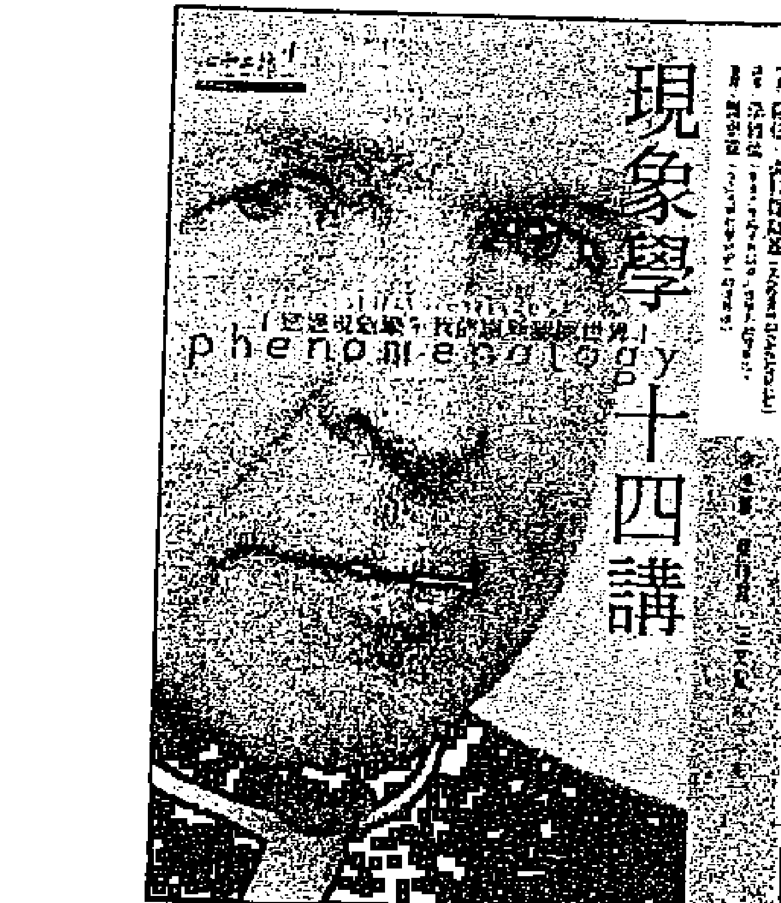

### 現象學十四講

作者—羅伯·索科羅斯基  
譯者—李維倫 定價—380元

這本認識現象學的入門書，將現象學的核心議題、基本要素、語彙、概念等做了詳盡的解釋，並也以日常生活為例，讓讀者從以往的習以為常，進入從現象學角度思考的哲學生活。

迷惘與清明的纏綿糾葛，讓人渴盼  
清靈的暮鼓晨鐘，心靈的虔誠祈禱，智慧的凝練經句  
或是淡淡點撥，或是重重棒喝  
內在靈性已然洗滌清澈，超越自我

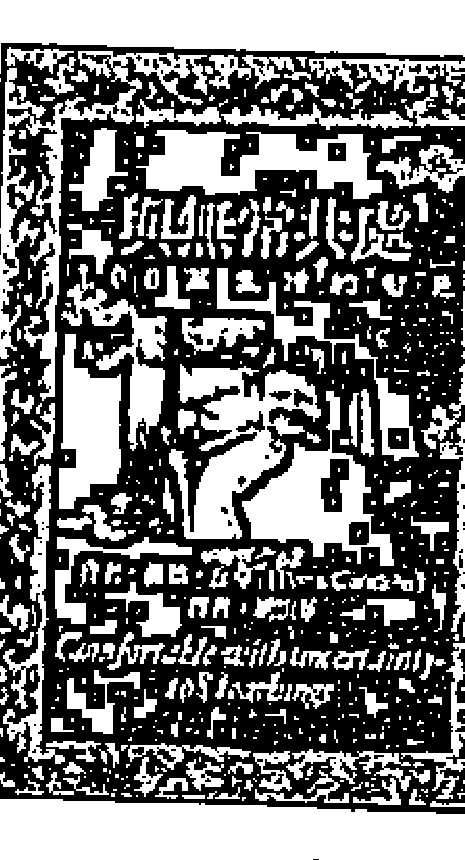

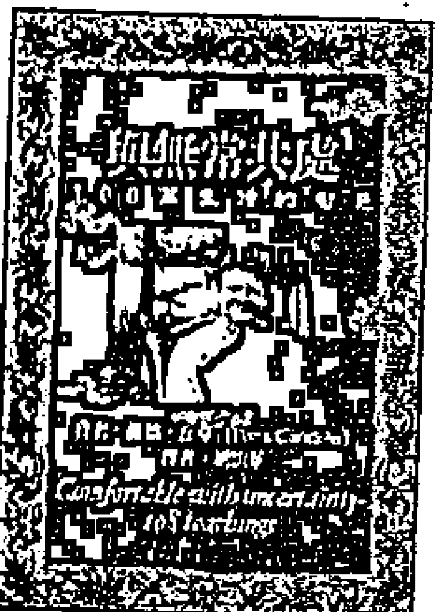

### 與無常共處

【108篇生活的智慧】

作者—佩瑪·丘卓  
譯者—胡因夢 定價—320元

本書結集佩瑪·丘卓數本著作中的一百零八篇教誨，幫助我們在日常的挑戰中培養慈悲心和覺察力，深入探索友愛、禪定、正念、當下、放下，以及如何面對恐懼和各種痛苦的情緒。

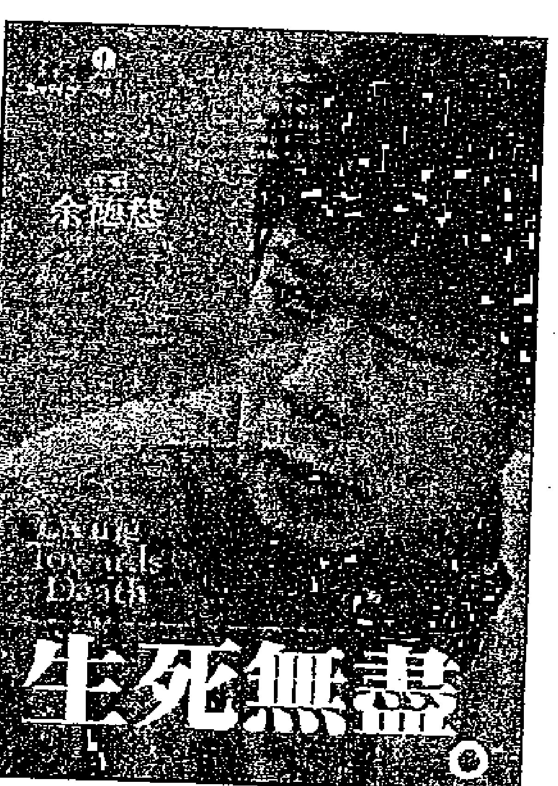

### 生死無盡

作者—余德慧 定價—250元

承接「把死亡當作生命的立足點」的觀念，余德慧教授在本書中思考的是現實中與生共俱的死亡。在剝除重重障蔽的過程中，他提出「瀕臨」的想法：「在任何活著的時刻，都能準確地捕捉到生死的同時存在。」呈現出一個「生死相通」的自在世界。

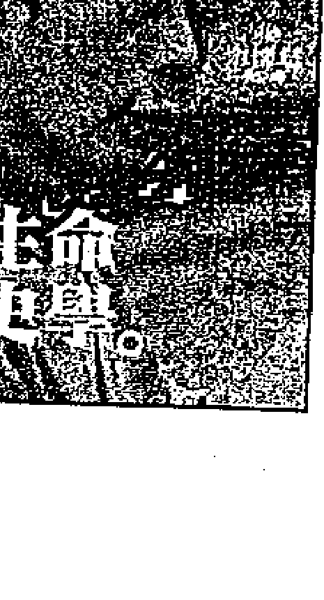

### 生命的哲思

作者—葛瑞林  
譯者—李淑珺 定價—250元

本書是英國著名哲人葛瑞林對人類日常生活的深思與反省。透過一篇篇短小精煉的文章，作者想傳達給我們的是，追求生命的意義與生命蘊含的寶藏，會使人獲得深刻的啟發與提升。

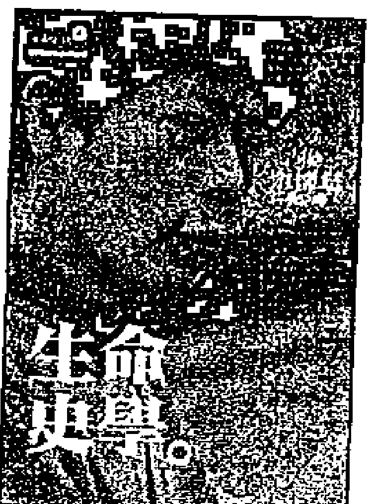

### 生命史學

作者—余德慧 定價—280元

時間賦予我們奇妙的感覺，使我們的生命產生某種氛圍，像薄薄的光暈籠罩著現在，也因此有了生命的厚重感。

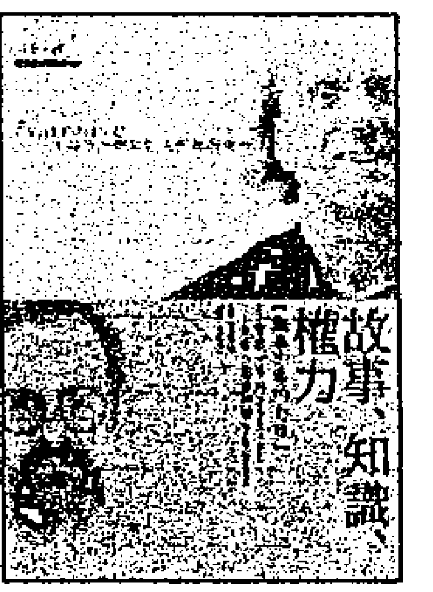

### 故事·知識·權力

【敘事治療的力量】
作者—麥克·懷特、大衛·艾普斯頓
審閱—吳熙琄 譯者—廖世德
定價—300元

本書針對敘事治療提出多種實例，邀請並鼓勵讀者以反省的立場，在敘述和重說自己的故事當中，寫作與重寫自己的經驗與關係。

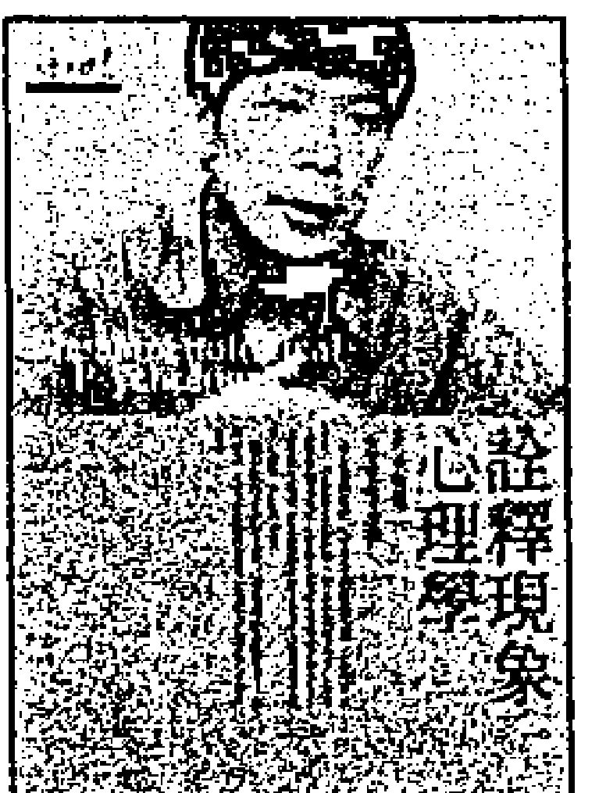

### 詮釋現象心理學

作者—余德慧 定價—250元

本書探詢語言是何等神聖，詮釋又是怎麼一回事，希望在心理學的基設上做更多的思考，孕育心理學更豐富的知識。

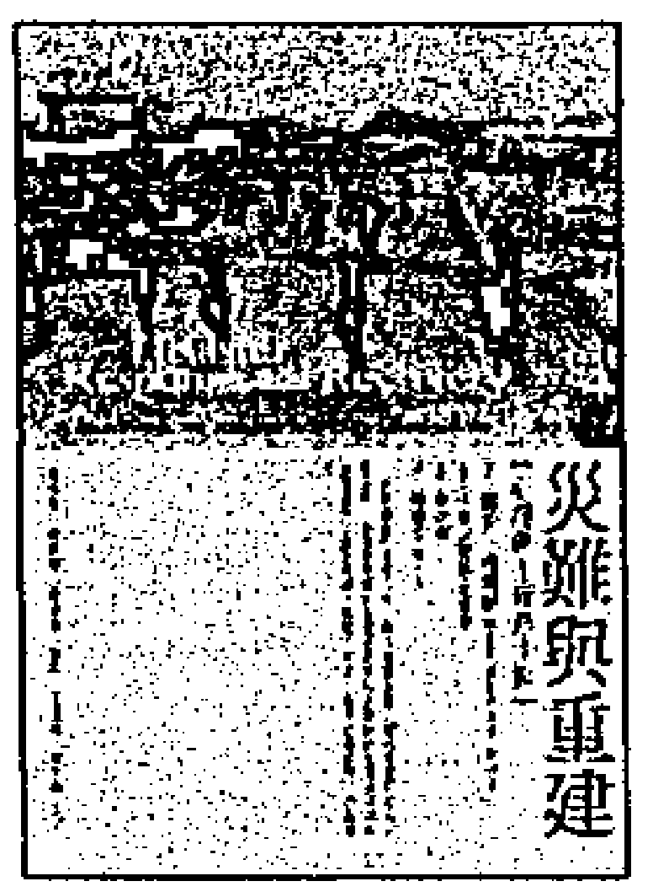

### 災難與重建

【心理衛生實務手冊】
作者—戴安·梅爾斯 審閱—魯中興
策劃—中華心理衛生協會
譯者—陳錦宏等十人 定價—300元

災後重建，除了理論依據，還需實際的方法與步驟。本書希望藉由美國的災難經驗及災後重建的實務運作，提供國內實際工作的參考。

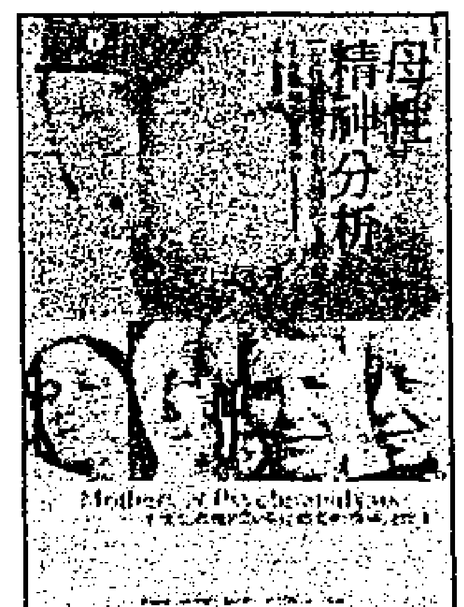

### 母性精神分析

【女性精神分析大師的生命故事】
作者—珍妮特·樹爾絲 譯者—劉慧卿
定價—450元

作者企圖標示出不同於佛洛伊德的古典精神分析之路（注意焦點和研究主題的不同），用極端的二分法「母性和父系」，讓讀者注意到這種焦點的改變。

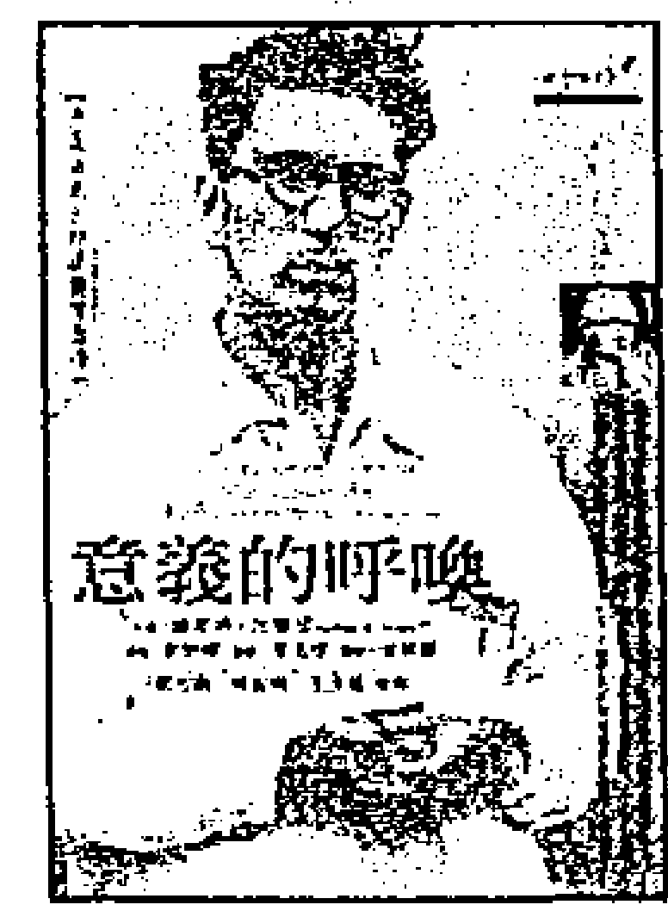

### 意義的呼喚

【意義治療大師法蘭克自傳】
作者—維克多·法蘭克 審閱—李天慈
譯者—鄭納無 定價—220元

法蘭可是從納粹集中營裡生還的心理治療師，更是意義治療學派的創始人。在九十歲的高齡，他自述其跨越一世紀的精采人生，向世人展現他追尋意義的心靈旅程。

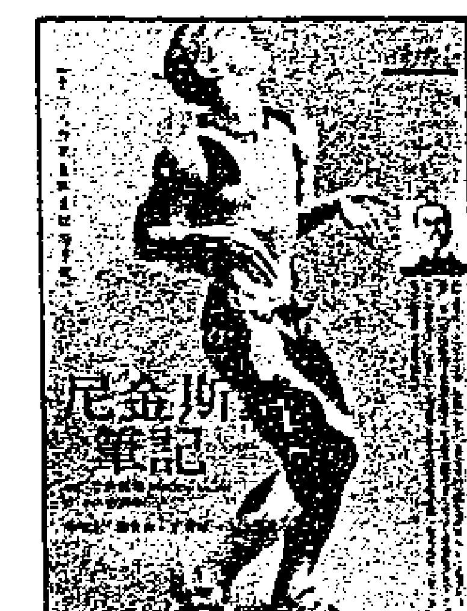

### 尼金斯基筆記

作者—尼金斯基 譯者—劉森堯
定價—320元

舞神尼金斯基在被送入療養院治療精神疾病前寫下的筆記，見證這位藝術家對人類的愛、精神和宗教的追尋。這些文字來自一個崩潰的靈魂的吶喊，為了達到舞蹈極限，他跳向一個無人能及的地方—「上帝的心中」。

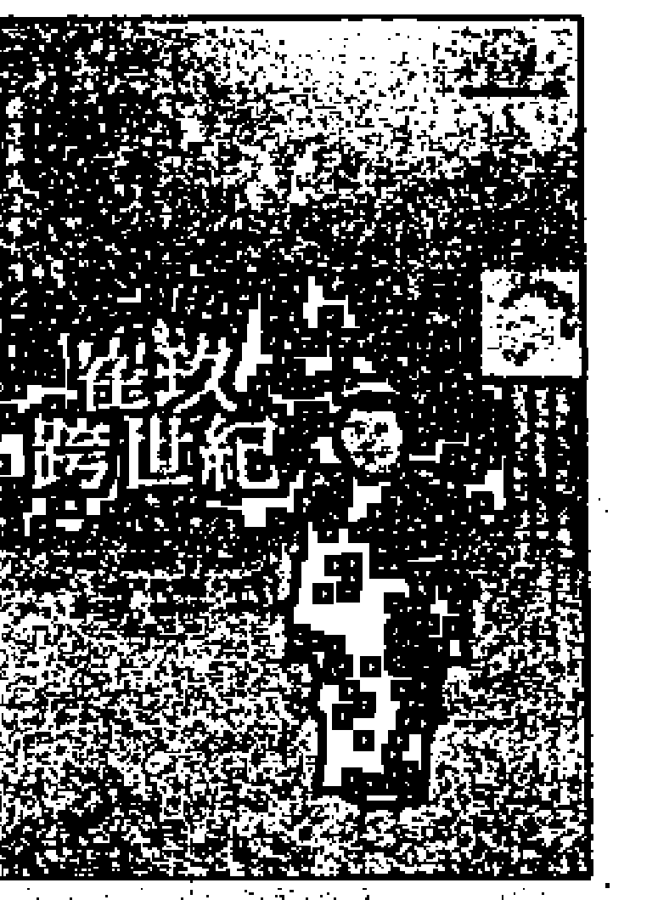

### 崔玖跨世紀

口述—崔玖 執筆—林少雯、奚善美
定價—300元

從國際知名的婦產科權威，到中西醫的整合研究，到花精治療及生物能醫學的倡導，台灣的「另類醫學之父」崔玖七十餘年的人生，不斷突破傳統，開創新局，是一則永遠走在時代尖端的傳奇！

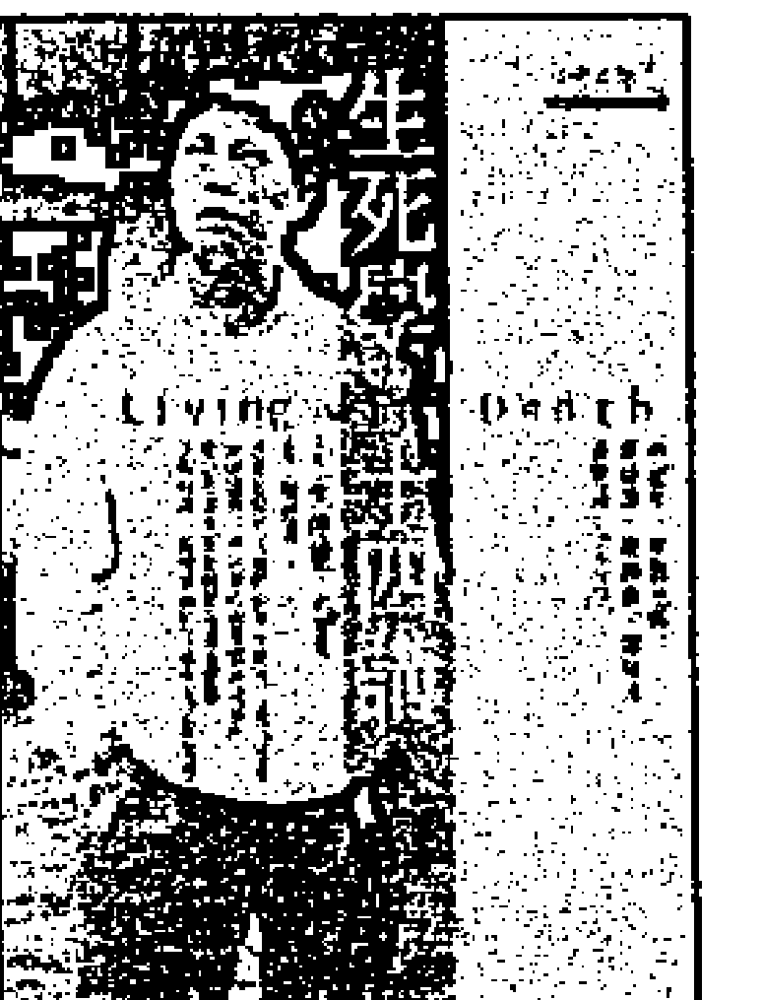

### 生死學十四講

作者—余德慧、石佳儀 整理—陳冠秀
定價—280元

本書從現代人獨特的生存與死亡處境出發，以海德格、齊克果的哲學精神為經緯，結合作者多年累積的學養與體驗，引領你我一起探索關於生命與死亡的智慧。

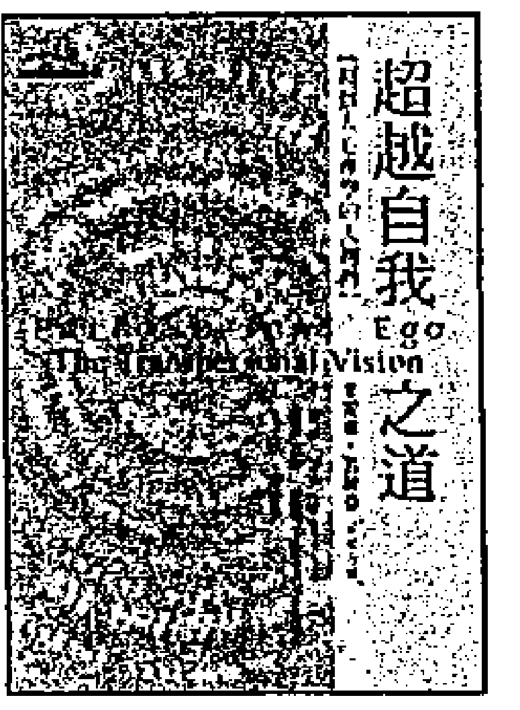

### 超越自我之道

作者—羅傑·渥許、法蘭西絲·方恩
譯者—易之新、胡因夢 定價—450元

本書呈現的是超個人學派發展的大趨勢。且看超個人運動能不能引領我們化解全球迫切的危機、使人類徹底覺醒。

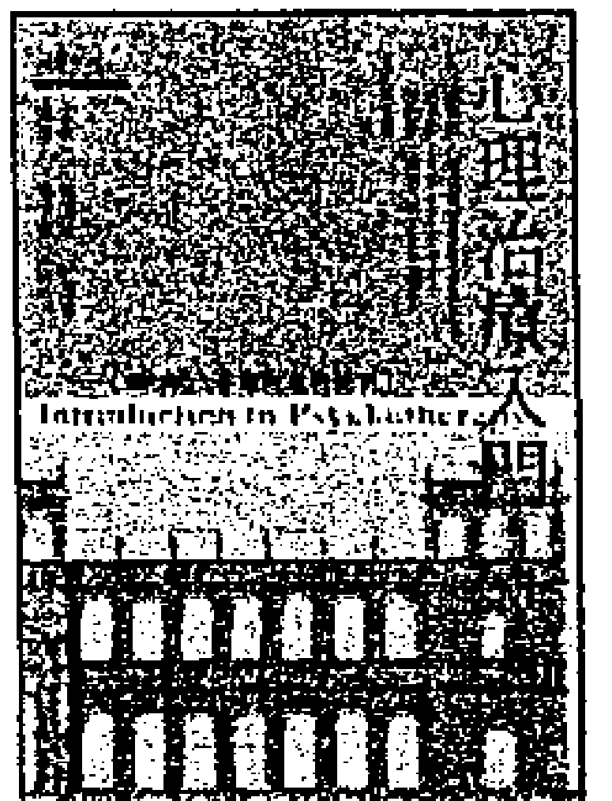

### 心理治療入門

作者—安東尼·貝特曼、丹尼斯·布朗
強納森·佩德
譯者—陳登義 定價—450元

本書是心理治療的經典入門作品，詳盡地介紹精神動力的原理與實務概要，對於不同型式心理治療的歷史、理論、實務等方面的脈絡加以討論，是學習正統心理治療最佳的媒介。

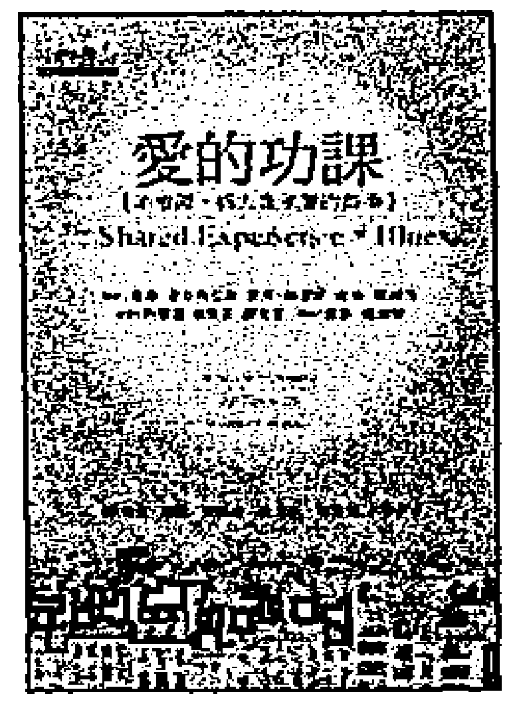

### 愛的功課

【治療師、病人及家屬的故事】
作者—蘇珊·麥克丹尼爾、潔芮·赫渥斯
威廉·賓赫提
譯者—楊淑智、詹宓 定價—600元

一群家族治療師勇敢打破傳統心理專業人士與病人、家屬之間的階級與藩籬，分享自己生病的經驗。讓治療的過程更富人性，醫病關係也更真誠。

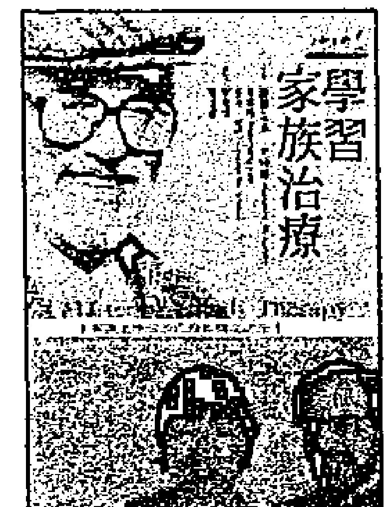

### 學習家族治療

作者—薩爾瓦多·米紐慶、李維榮
喬治·賽門
譯者—劉瓊瑛、黃漢耀 定價—420元

米紐慶在家族治療領域有深遠的影響力，他的典型面談甚至成為治療師評斷自己工作優劣的標準。本書提供了初學者與執業者少有的機會，在大師的帶領下，學習家族治療的藝術與技術。

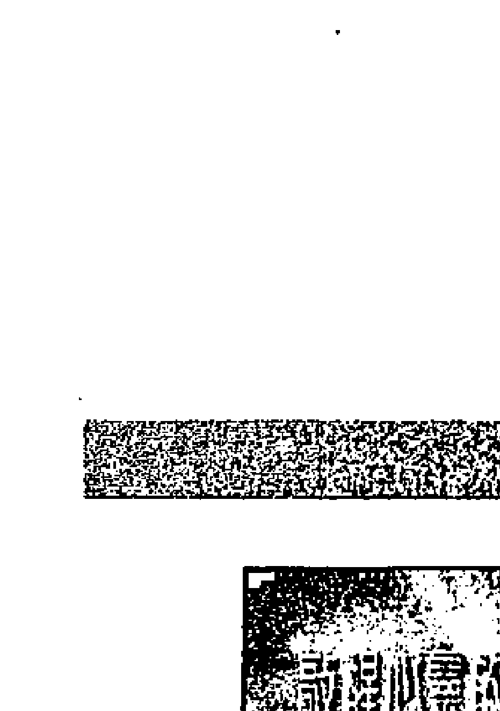

### 敲醒心靈的良醫

### 【迅速平衡情緒的思維場療法】

作者—羅傑·卡拉漢、理查·特魯波
譯者—林國光 定價—320元

在全世界，思維場療法已經證明對75%至80%的病人的身心產生恆久的療效，這個成功率是傳統心理治療方法的許多倍。透過本書，希望有更多讀者也能迅速改善情緒，過著更平衡的人生。

> 顛倒的生命，窒息的心願，沈淪的夢想
為在暗夜進出的靈魂，
守住窗前最後的一盞燭光
直到晨星在天邊發亮

### Self Help

### 不要叫我瘋子

### 【還給精神障礙者人權】

作者—派屈克·柯瑞根、羅伯特·朗丁
譯者—張苹 定價—320元

本書兩位作者都有過精神障礙的問題，由於他們的寶貴經驗，更提高本書的價值。汙名化不僅只影響精障朋友，而會擴及社會。所以找出消除汙名化的方法應是大眾的責任。

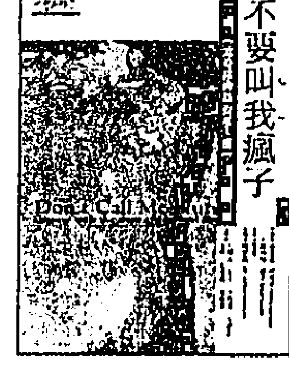

### 他不知道他病了

### 【協助精神障礙者接受治療】

作者—哈維亞·阿瑪多&安娜麗莎·強那森
譯者—魏嘉瑩 定價—250元

如果你正為有精神障礙的家人該不該接受治療而掙扎，本書是你不可或缺的。作者提供了深刻、同理且實用的原則，足以化解我們在面對生病的人時，產生的挫折與罪惡感。

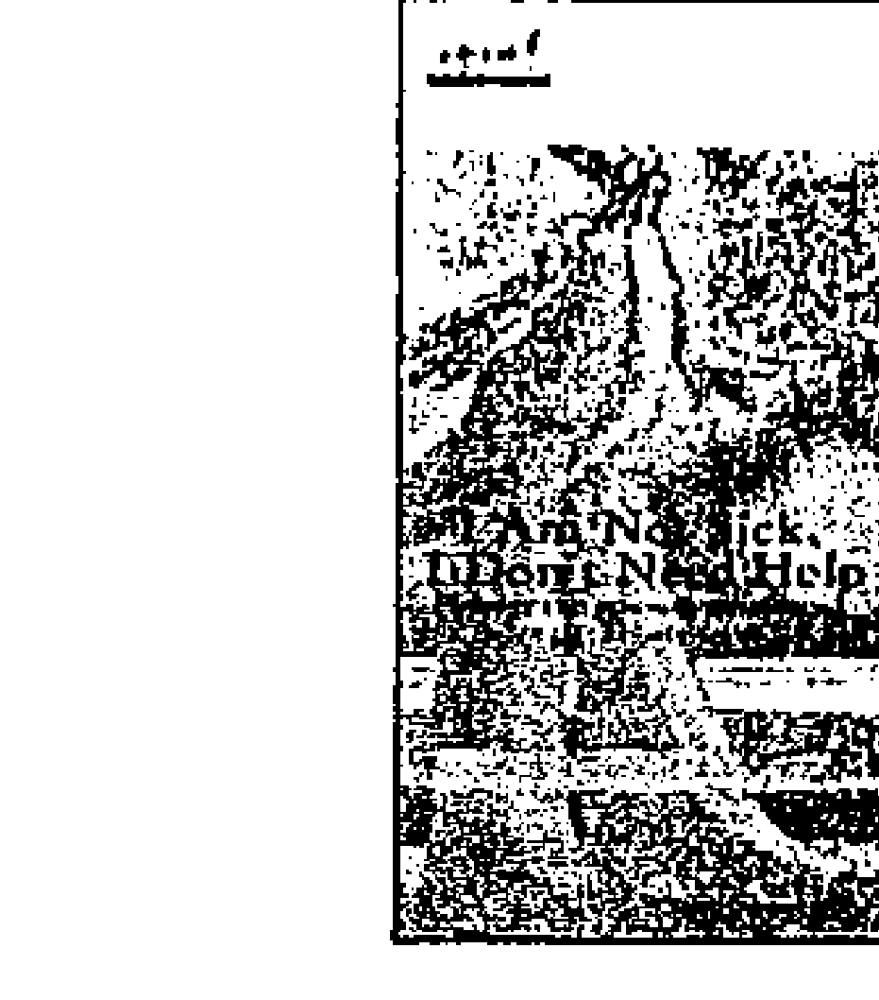

### 愛，上了癮

### 【撫平因愛受傷的心靈】

作者—伊東明 譯者—廣梅芳 定價—280元

日本知名性別心理學專家伊東明，透過十三位男女的真實故事，探討何謂「愛情上癮症」。他將愛情上癮症分為四種：共依存型、逃避幸福型、性上癮型，以及浪漫上癮型。

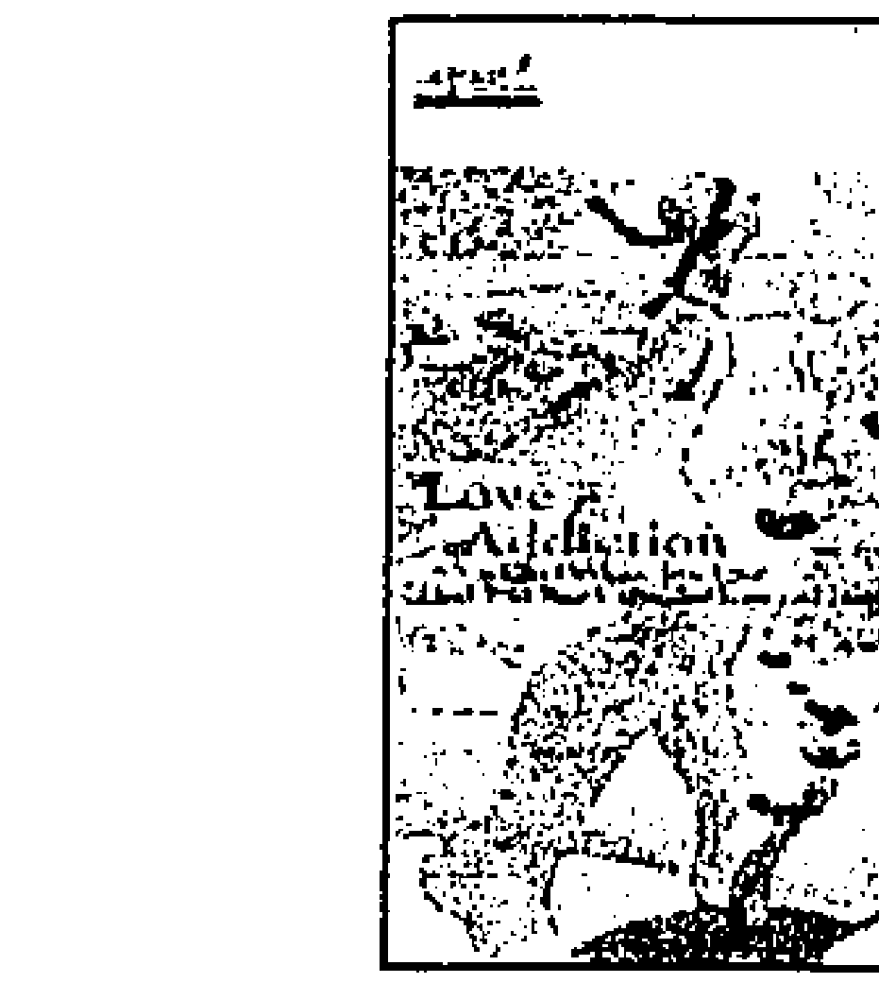

### 孩子，別怕

### 【關心目睹家暴兒童】

作者—貝慈·葛羅思
譯者—劉小菁 定價—240元

本書讓我們看到目睹家暴的孩子如何理解、回應並且深受暴力的影響。作者基於十多年的實務經驗，與父母、老師、警察及其他助人工作者分享如何從輔導、法令與政策各方面著手，真正幫助到目睹家暴的兒童。

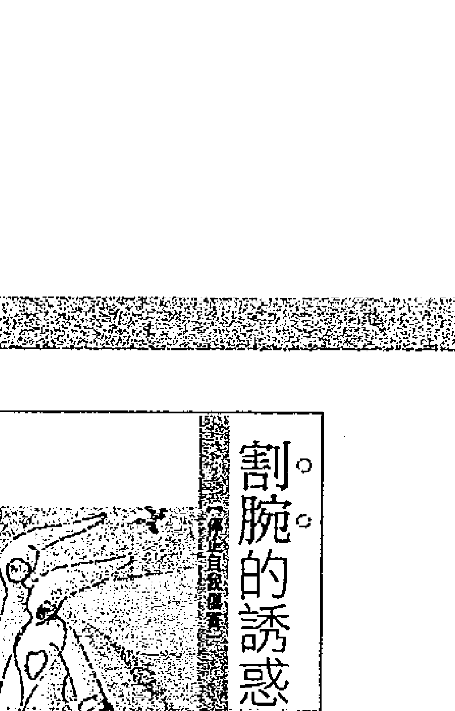

### 割腕的誘惑

### 【停止自我傷害】

作者—史蒂芬·雷文克隆
譯者—李俊毅 定價—300元

本書作者深入探究自傷者形成自我傷害性格的成因，如基因遺傳、家庭經驗、童年創傷及雙親的行為等，同時也為自傷者、他們的父母以及治療師提出療癒的方法。

探索身體，追求智性，呼喊靈性，
攀向更高遠的意義與價值
是幸福，是恩典，更是內在心靈的基本需求，
企求穿越回歸真我的旅程

### 病床邊的溫柔

作者—范丹伯 譯者—石世明
定價—150元

本書捨棄生理或解剖的觀點，從病人
受到病痛的打擊，生命必須面臨忽然
的改變來談生病的人遭遇的種種問
題，並提出一些訪客箴言。

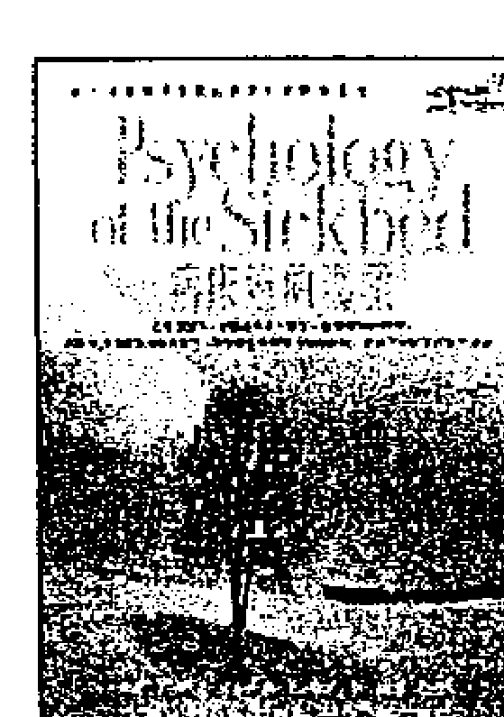

### 疾病的希望

【身心整合的療癒力量】
作者—托瓦爾特·德特雷福仁、
呂迪格·達爾可
譯者—易之新 定價—360元

把疾病當成最親密誠實的朋友，與它
對話——因為身體提供了更廣的視
角，讓我們從各種症狀的痛苦中學到
自我療癒的人生功課。

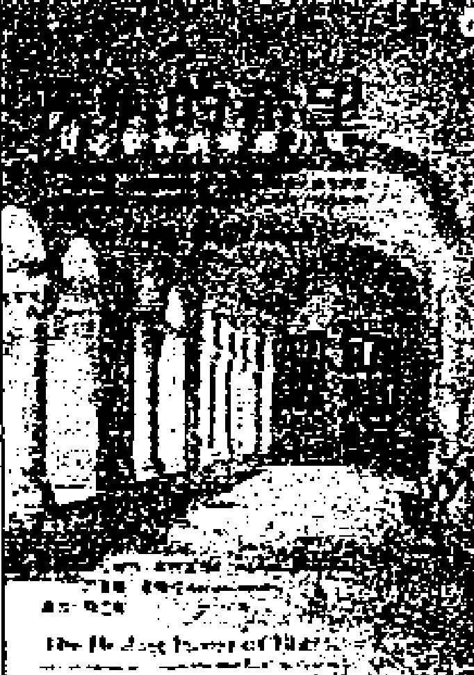

### 當生命陷落時

【與逆境共處的智慧】
作者—佩瑪·丘卓
譯者—胡因夢、廖世德 定價—200元

生命陷落谷底，如何安頓身心、在逆
境中尋得澄淨的智慧？本書是反思生
命、當下立斷煩惱的經典作。

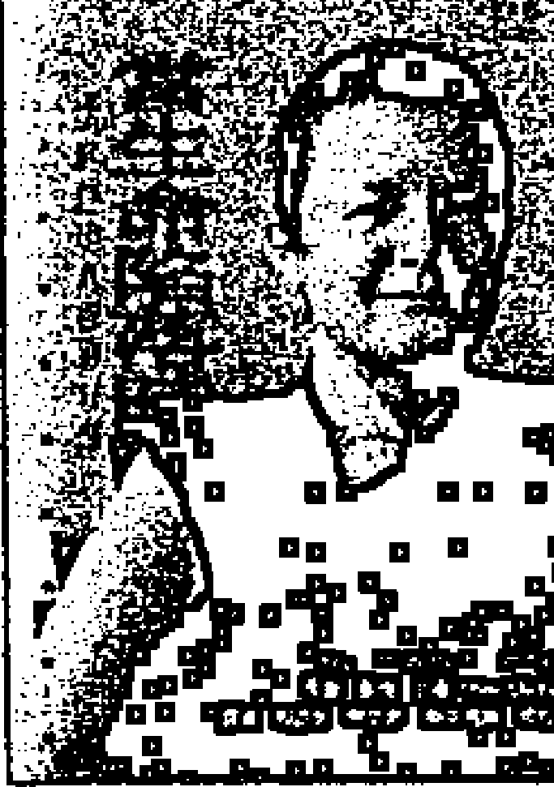

### 心靈寫作

【創造你的異想世界】
作者—娜妲莉·高柏
譯者—韓良憶 定價—300元

在紙與筆之間，寫作猶如修行坐禪
讓心中的迴旋之歌自然流唱
尋獲馴服自己與釋放心靈的方法

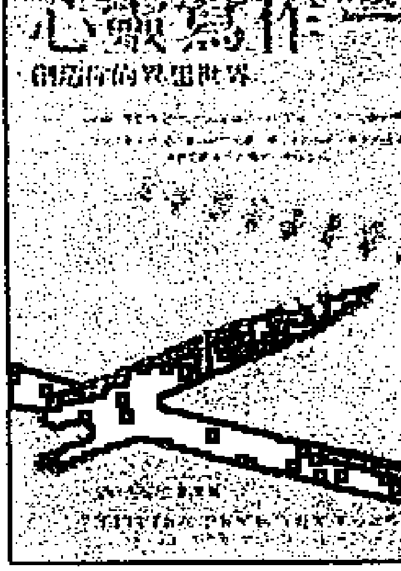

### 無盡的療癒

【身心覺察的禪定練習】
作者—東杜法王 譯者—丁乃竺
定價—300元

繼《心靈神醫》後，作者在此書中再
次以身心靈治療為主、教授藏傳佛教
中的禪定及觀想原則；任何人都可藉
由此書習得用祥和心修身養性、增進
身心健康的方法。

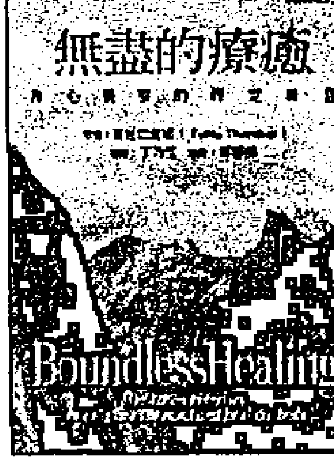

### 存在禪

【活出禪的身體體悟】
作者—艾茲拉·貝達 譯者—胡因夢
定價—250元

我們需要一種清晰明確的實修方式，
幫助我們在真實生命經驗中體證自己
的身心。本書將引領你進入開闊的自
性，體悟心中本有的祥和及解脫。

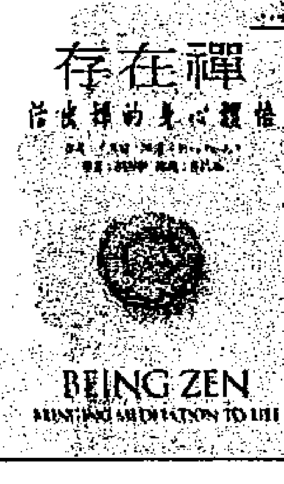

### 十七世大寶法王

作者—讓保羅·希柏
審閱—鄭振煌、劉俐 譯者—徐筱玥
定價—300元

在達賴喇嘛出走西藏四十年後，年輕
的十七世大寶法王到達蘭薩拉去找
他，準備要追隨他走上同一條精神大
道，以智慧及慈悲來造福所有生靈。

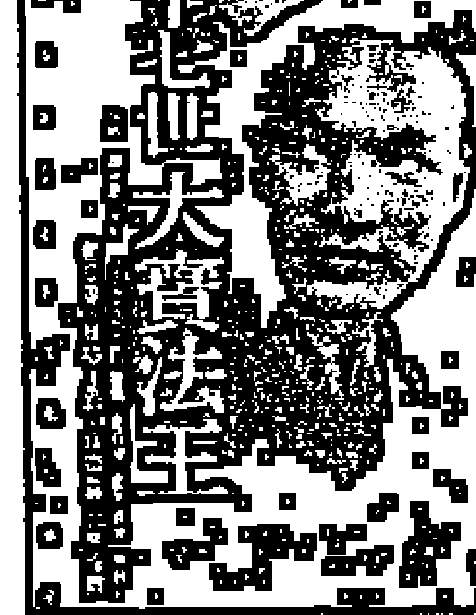

### 生命的禮物

【給心理治療師的85則備忘錄】
作者—歐文·亞隆 譯者—易之新
定價—350元

當代造詣最深的心理治療思想家亞隆
認為治療是生命的禮物。他喜歡把自
己和病人看成「旅程中的同伴」，要
攜手體驗愉快的人生，也要經驗人生
的黑暗，才能找到心靈回家之路。

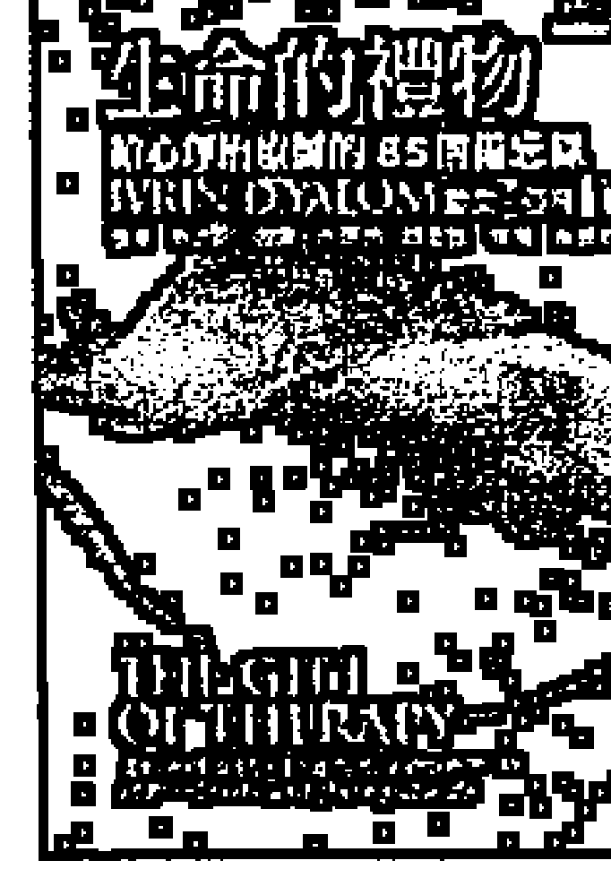

### 傾聽身體之歌

【舞蹈治療的發展與內涵】
作者—李宗芹 定價—280元

全書從舞蹈治療的發展緣起開始，進
而介紹各種不同的治療取向，再到臨
床治療實務運作方法，是國內第一本
最完整的舞蹈治療權威書籍。

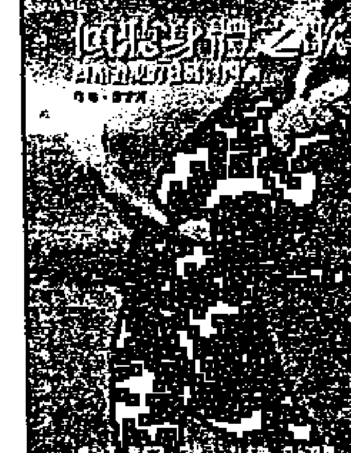

### 非常愛跳舞

【創造性舞蹈的新體驗】
作者—李宗芹 定價—220元

讓身體從累贅的衣服中解脫，用舞蹈
表達自己內在的生命，身體動作的力
量遠勝於人的意念，創造性舞蹈的精
神即是如此。

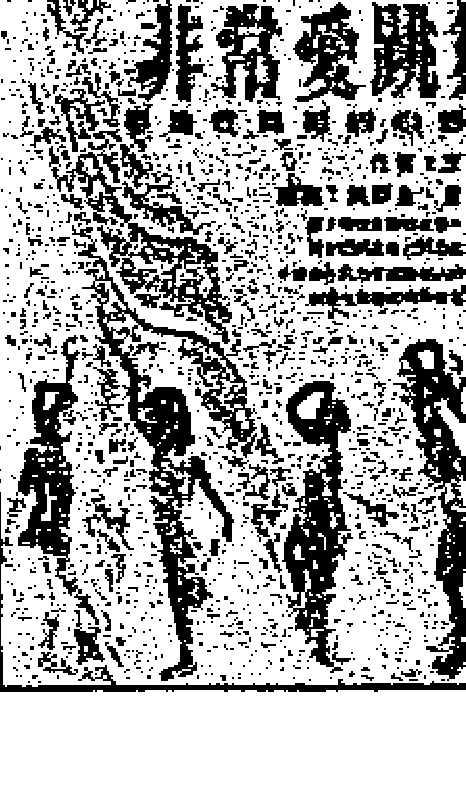

### 轉逆境為喜悅

【身心整合的療癒力量】
作者—佩瑪·丘卓 譯者—胡因夢
定價—230元

以女性特有的敏感度，將易流於籠統
生硬的法教，化成了順手拈來的幽默
譬喻，及心理動力過程的細膩剖析。
她為人們指出了當下立斷煩惱的中道
實相觀，一條不找尋出口的解脫道。

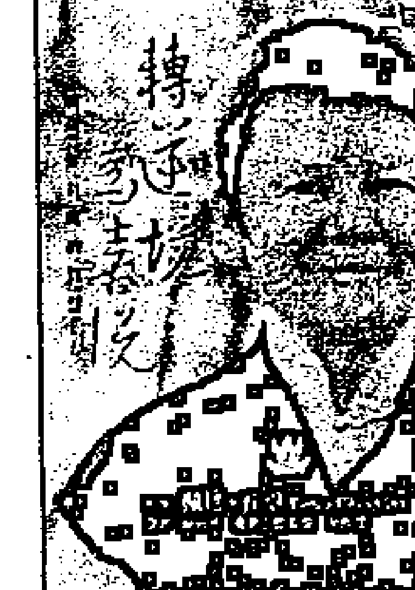

### 大圓滿

作者—達賴喇嘛 譯者—丁乃竺
定價—320元

「大圓滿」是藏傳佛教中最高及最核
心的究竟真理。而達賴喇嘛則是藏傳
佛教的最高領導，一位無與倫比的佛
教上師。請看達賴喇嘛如何來詮釋和
開示「大圓滿」的精義。

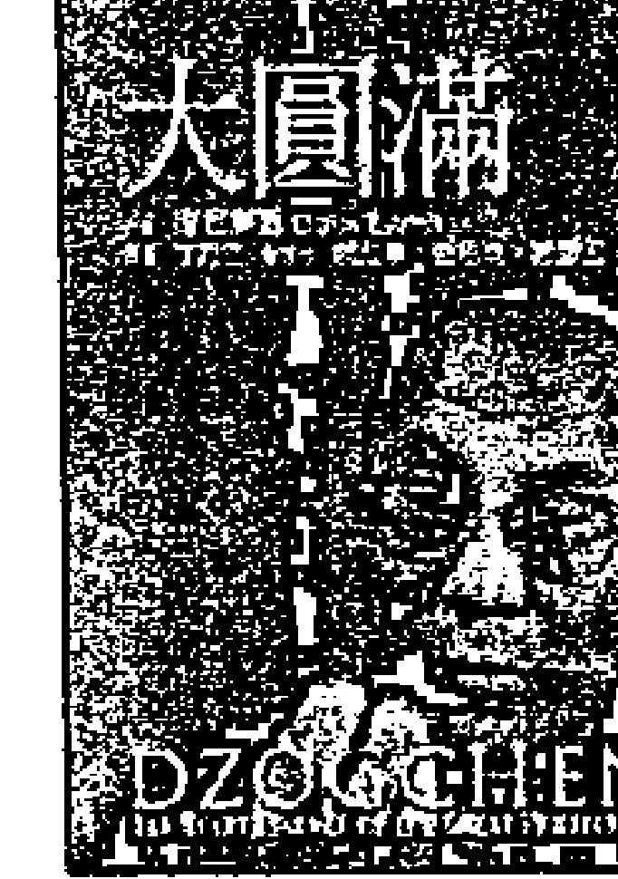

### 終於學會愛自己

【一位婚姻專家的離婚手記】

作者—王瑞琪 定價—250元

知名的婚姻諮商專家王瑞琪，藉由忠實記錄自己的失婚經驗，讓有同樣經歷的讀者，能藉由她的故事，得到經驗的分享與共鳴。

### 以畫療傷

【一位藝術家的變遷之旅】

作者—盛正德 定價—300元

……此刻我把繪畫當成一條救贖之道、一段自我的療程，藉著塗抹的過程，畫出真實或想像的心理傷痕，所有壓抑也靠著畫筆渲洩出來。我藉由繪畫來延續隨時會斷裂的生命與靈魂、來找到活下去的理由。……

### 染色的青春

【十個色情工作少女的故事】

編著—婦女救援基金會、櫻花 定價—200元

本書呈現十位色情工作少女的真實故事，仔細聆聽，你會發現她們未被呵護的傷痛，對愛濃烈的渴望與需求，透過她們，我們能進一步思索家庭、學校、社會的種種危機與改善之道。

### 親愛的爸媽，我是同志

編者—台灣同志諮詢熱線協會 定價—260元

本書讓父母及子女能有一個機會，看見其他家庭面對同性戀這個課題的生命經驗。或許在出櫃這件事上，每一位子女或父母當下仍承受著痛苦與不解，但在閱讀這本書的同時，我們希望彼此都能多一點體諒與同理心。

### 學飛的男人

【體驗恐懼、信任與放手的樂趣】

作者—山姆·金恩 譯者—詹宓 定價—280元

為了一圓孩提時的學飛夢想，山姆以六十二歲之齡加入馬戲團學校，學習空中飛人。藉由細緻的述說，學飛成為一則關於冒險、轉化、克服自我設限、狂喜隱喻的性靈旅程。

在奔馳的想像中尋找情感的歸屬
在迷離的經驗中仰望生命的出口
在波動的人性中釐定掙扎的路徑
在卑微的靈魂中趨近深處的起落

### Story

### 太太的歷史

作者—瑪莉蓮·亞隆 譯者—何穎怡 定價—480元

這本西方女性與婚姻的概論史淋漓盡致呈現平凡女性的聲音，作者瑪莉蓮·亞隆博覽古今，記錄婚姻的演化史，讓我們了解其歷經的集體變遷，以及妻子角色的轉變過程，是本旁徵博引但可口易讀的書。

### 跟自己調情

【身體意象與性愛成長】

作者—許佑生 定價—280元

身體是如何被眾多的禁忌所捆綁？要如何打破迷思，讓屬於身體的一切都更健康自然？本書帶領讀者以新的角度欣賞自己的身體，讓人人都可以擺脫傳統限制，讓身體更輕鬆而自在！

### 幸福

作者—威爾·弗格森 譯者—韓良憶 定價—280元

在陽光和幸福撒滿大地，人人微笑而滿足的時刻，由慾望架構起來的城市，卻像骨牌一般紛紛崩解。艾德溫決定了，這是最後的對抗，他必須去殺掉心靈大師，將世界從幸福中解救出來，讓痛苦、災難和醉話重回人間。……

### 貧窮的富裕

作者—以馬內利修女 譯者—華宇 定價—250元

現年95歲的以馬內利修女，是法國最受敬重的女性宗教領袖。她花了一生的時間服務窮人，跟不公義的世界對抗。本書是她從個人親身經驗出發的思考，文字簡單動人卻充滿智慧和力量，灑灑著現代人最深層的心靈。

生命長河，如夢如風，
猶如一段逆向的歷程
一個掙扎的故事，一種反差的存在，
留下探索的紀錄與軌跡

### Caring

### 眼戲

【失去視力，獲得識見的故事】

作者—亨利·格倫沃
譯者—于而彥、楊淑智 定價—180元

慣於掌握全球動脈的資深新聞人，卻發現自己再也無法看清世界樣貌……這突如其來的人生戲碼，徹底改變他對世界的「看」法。

### 與愛對話

作者—伊芙·可索夫斯基·賽菊寇
譯者—陳佳伶 定價—320元

作者以特異的寫作風格——結合對話、詩和治療師的筆記——探索對致命疾病的反應、與男同志友人的親密情誼、性幻想的冒險場域，以及她投入佛教思想的恩典。

### 空間就是權力

作者—畢恆達 定價—320元

空間是身體的延伸、自我認同的象徵，更是社會文化與政治權力的角力場。

### 愛他，也要愛自己

【女人必備的七種愛情智慧】

作者—貝芙莉·英格爾 譯者—楊淑智 定價—320元

本書探討女性與異性交往時，如何犧牲自己的主體性，錯失追求成長的機會。作者累積多年從事女性和家庭諮商的經驗，多角度探討問題的根源。

### 希望陪妳長大

【一個愛滋爸爸的心願】

作者—鄭鴻 定價—180元

這是一位愛滋爸爸，因為擔心無法陪伴女兒長大，而寫給女兒的書…

### 瘋狂天才

【藝術家的躁鬱之心】

作者—凱·傑米森
譯者—易之新、王雅茵 定價—320元

本書從多位詩人、文學家、畫家，談從憂鬱、躁鬱氣質逐漸到病症的過程，深刻反省現代醫學對躁鬱症和其他疾病所需考量的倫理觀點。

### 難以承受的告別

【自殺者親友的哀傷旅程】

作者—克里斯多福·路加斯、亨利·賽登
譯者—楊淑智 定價—280元

自殺的人走了，留下的親友則歷經各種煎熬：悔恨、遺憾、憤怒、自責、怨懟……漫漫長路，活著的人該如何走出這片哀傷濃霧？

### 快樂是我的奢侈品

作者—蔡香蘋、李文瑄 定價—250元

本書籍由真實的個案，輔以專業醫學知識，從人性關懷的角度探討憂鬱症患者的心路歷程，以同理心去感受病友的喜怒哀樂，為所有關懷生命、或身受憂鬱症之苦的朋友開啟了一扇希望之窗。

### 晚安，憂鬱

【我在藍色風暴中】（增訂版）

作者—許佑生 定價—250元

正面迎擊憂鬱症，
不如側面跟它做朋友。
跟憂鬱症做朋友，
其实就是跟自己做朋友，

### 聽天使唱歌

作者—許佑生 定價—250元

我深信唯有親自走過這條泥濘路的人，才真正了解那種微細的心理糾纏、顛覆、拉扯，也才會在絕境中用肉身又爬又滾，找到一條獨特的出路…。

### 醫院裡的哲學家

作者—李察·詹納 譯者—譚家瑜 定價—260元

作者不僅在書中為哲學、倫理學、醫學做了最佳詮釋，還帶領讀者親臨醫療現場，實地目睹多位病患必須痛苦面對的醫療難題。

### 揚起彩虹旗

【我的同志運動經驗 1990-2001】

主編—莊慧秋 作者—張娟芬、許佑生等 定價—320元

本書邀請近三十位長期關心、參與同志運動的人士，一起回看曾經努力走過的足跡。這是非常珍貴的一段回憶，也是給下一個十年的同志運動，一份不可不看的備忘錄。
