# 占星占心

## 推薦序

### 師徒之緣

Cecily 跟我研習西洋占星、印度占星、大六壬、三元玄空陽宅學，至今不到五個年頭。她甚殷勤地反覆再三咀嚼上課內容外，也用心花時間研讀我推介的一些重要的經典占星學書籍，如班傑明博士（Dr. Benjamin N Dykes）英譯的 The Book of Astronomy（Guido Bonatti）、Christian Astrology（William Lilly）……等，並組織讀書會、研討會帶領學弟妹們交流課程心得，範圍包括占星學歷史、本命／流年、卜卦、弧角天星擇日、合盤、換置、A*C*G 等占星應用的科目；也相當熱心指導學弟妹如何操作占星軟體，她的奉獻一直為學弟妹所津津樂道。又天人之際研究學會的部落格，也因她和育奇（衛恣）努力灌溉而有些成績。

她的命宮上升於浪漫的雙魚座，尤其是本命月亮位於玄秘宮（第十二宮）1度內會合到自古被相當重視的四個皇冠恆星之一的北落師門（Fom alhaut），利神秘、玄學、直覺力強、具有內在深層的靈魂力量。我常向她開玩笑說：「祖師爺要賞妳這口飯吃」，憑藉著毅力、不斷地實證，在自己的部落格——迷占星 108 室裡發表心得感想，因具同理心的敏銳心思，而得到廣泛迴響，更在文化大學推廣部教授基礎的古典占星學。透過教學相長，不藏私、有問必答，與上課學生互動佳，贏得尊敬。

從小歷經艱辛的生活，她仍努力向上就讀北一女中、考上國立成功大學並念完研究所，出社會後，憑其學識及幹練，很快地晉升高階經理人，正想要好好衝刺一番時，卻因婚姻觸礁、事業被打擊等不幸遭遇隨之而來，選擇放空了然一身，頗感觸人生無常，遂想探求命運起落的軌跡，適逢拙作《占星學》（上、下）出版，她閱讀後，主動打電話跟我聯繫，更因她剛參加完某公司的就職面試後，想了解後續狀況，透過卜卦占星（Horary）分析，一一得以應驗，乃開啟我跟她的師徒之緣。

在研習的過程中，Cecily 她勇於實證，常拿一些頗具特殊轉折的案例跟我討論，我也建議她需懂得資料保存與整理，並詳實記錄整個論斷過程，等案例多了，實戰經驗有了，所謂的技巧或訣竅，自然而然地浮現，就會熟能生巧。她確實做到了，本書的架構及一些論斷技巧，就是她這幾年來辛苦努力的結晶，書中的案例雖不是完整全程的論斷，但有關愛情、婚姻、事業、疾病、財運及災厄橫逆等，如何以古典占星的技巧來切入，在目前市面上缺乏這方面的中文占星書籍，是彌足珍貴的，值得推薦。

當西方占星學與19世紀、20世紀大為興起的心理學結合後，於 1980 年代達到高鋒，現代心理占星學成為占星學的顯學，美英地區的主流占星學都朝心理動力學和人本主義的方向走，強調內在心靈的成長，自我精神的提升，確實讓占星學耳目一新。相對地，古典占星學被邊緣化，不但被冷落且被汙名化為「宿命論」。當時在美國的 Robert Zoller 仍堅持以古德・波納提（Guido Bonatti）的內容為教材，在英國的 Olivia Barkley 以威廉・里利（William Lilly）的學說作為主軸，默默地耕耘古典占星的園地。

現代心理占星學頗能爭取高級知識分子或中產階級的認同，但因一般普羅大眾對專業的心理學名詞比較陌生，要跟心理占星家互動本就不易，期望獲得良好的諮詢效果恐將緣木求魚，他們關心的是比較直接的各項生活領域問題的吉凶，因而引起對現代心理占星學的反思，於 1990 年代 Robert Hand 發起占星復古運動，重新整理並詮釋希臘、中世紀（阿拉伯、文藝復興）時期等古典占星書籍，使許多重要的古典占星技巧重見天日，用之實證相當令人驚豔，簡單又實用，研習古典占星乃蔚為風潮。

Cecily 是古典占星的研習者，但不會偏執，並將現代心理占星與古典技巧融於一爐，冀求提供較好的諮詢服務，是尋求諮詢者之幸。

——秦瑞生
（天人之際占星研究學會學術顧問）

## 推薦序

### 超越生命的定數

四年前第一次在「魔法學校」遇見 Cecily，她年紀不大，但比我們更早拜泰瑞生老師學藝，因此學姐也是她另一個稱呼。就像魔法一樣，我們在教室中解析了無數已印證的命盤，也精確地預測許多事件的發生。例如伊拉克戰爭、知名演藝人員的意外事故、乃至台灣幾次重大選舉的預測。我們就像生命密碼與宇宙訊息的解密者，所以我稱這裡為「魔法學校，93／4教室」。

我從事醫療設備二十多年，產品暢銷全球，從急診、開刀房、重症加護病房（ICU）、產房、洗腎中心、健診中心，設備包括二十四小時心電圖、生理監視器、胎兒監視器、超音波、電腦斷層掃描、核磁共振、正子造影，乃至拯救生命最後一招：心臟電擊甦醒器。凡此所有設備都提供醫護人員第三隻眼，作為下一步診斷醫療的重要訊息。這些從萬般的訊息中，擷取必要的訊息呈現在醫師面前，由專業的醫師來判定病情的狀況，就如同每一個人獨一無二的本命星圖（Natal Chart），可由專業的占星師來剖析你生命的劇本。

從高科技公司進入中國數術及占星學的研究，似乎大相逕庭，但自古以來許多科學家、物理學家、心理學家、醫師也是知名的占星學家，如牛頓、容格等。這個領域涵蓋了天文學、物理學、量子物理學、哲學、心理學及宗教學。現代物理學家已經證明了光速不是次原子世界的速度極限，愛爾蘭物理學家約翰·貝爾（John Bell）測試量子如何運動，結果發現兩顆接觸過的量子粒子，雖然相隔遙遠，若對其中一方施予磁力，產生變化，另一顆也接著變化。這個發現對於我們了解宇宙真相，以及占星學精確的預測、與心電感應，提供一個重要依據。另一位英國數學家保羅·狄拉克（Paul Dirac）是量子場理論的原創始人之一，他發現宇宙間不存在空無一物，若能把所有物質和能量掃除，在星體的空間中仍充滿了次原子活動的世界。這也符合佛經上所說的「真空妙有」或「色不異空，空不異色，色即是空，空即是色」。

然而占星學只拿來「算命」或「預測事件」則太可惜了。好的占星師從本命星盤（Natal Chart）中或能得到詢問者的因緣果報，一切事件並不命定、並不宿命，人仍有自由意志，當果報尚未成熟前，改變它的架構，就如雲谷禪師對袁了凡啟示「造命」之學，當流年的土星或三王星引動你星盤的三刑會沖，最好能像聖嚴法師開示我們的：「面對它、接受它、處理它，最後放下它」。如此才能作好今世的功課，超越定數，提升靈魂的演化，生命也較能海闊天空。

人生如戲、戲如人生，戲院如先天十二星座，場景如後天十二宮，演員如行星，戲中總有悲、歡、離、合或酸、甜、苦、辣，有人成功不可一世，有人失敗垂頭喪氣，也有些人平平淡淡，形形色色，但戲終有落幕的一天，在落幕前人們所關心的，不外乎妻、財、子、祿、壽、夭、窮、通，也就是愛情、婚姻、子女、生育、家庭、財富、職業、地位、健康、疾病或意外事件。Cecily 這本書，不但深入淺出教讀者如何入門，更有實際案例讓讀者學得有趣及更有效率。

Cecily 這本《占星占心》，她的案例均完整分析本命占星圖，不似大眾媒體上僅以簡要星座資訊來判斷，有心的讀者絕對會發現物超所值之處。試問剖析整張星圖，若不論及上升星座、ASC、MC、DSC、IC、命主星、宮主星、飛星、轉宮、容納、互容、相位、行星的宇宙力量、阿拉伯點、恆星、過運行星引動、乃至 A*C*G 及合盤等資訊判斷，焉能呈現一幅完整的生命地圖？

「魔法學校」的同學們將繼續騎著掃帚遨遊於星際之間，串連時間的長河，繼續向人們解說我們所熟知的星球訊息。

——李榮宗

（前 HP 惠普科技醫學事業部總經理、前飛利浦醫學事業部總經理，現為大圓滿科技公司董事長）

## 推薦序

### 展開古典占星的另一片天空

希斯莉學姐是我學習西洋古典占星時所結識的好朋友，多年前在秦瑞生老師舉辦的西洋古典占星說明會上第一次與她見面，還記得當時她積極助人與樂觀分享的態度就讓人印象深刻。

之後承蒙秦老師的熱心指導，有緣進一步接觸西洋古典占星大師威廉・里利各種細論本命與卜卦的占星技法，同時旁及換置占星、西洋天星擇日以及印度占星學等重要的占星學門。學習的過程中，希斯莉集合了前後期好幾位對占星有興趣的好朋友們，組成了讀書會每週分享學習心得，所以大家都習慣稱呼她「學姐」。也是從那時開始，學姐和我們這些好朋友們一路從占星實務技巧切磋到各種中國的命理古法，她對中西各種命理在生活實例應用上，都有著自己獨特的理解與生命體會。

在這本《占星占心》的自序中，大家可以看到希斯莉的占星學習歷程，她毫不保留地跟大家分享了她自己真實人生中的喜怒哀樂，以及她與占星學結緣的始末。與大多數的學習者一樣，希斯莉從星座解析與心理占星入手，在面對人生難題的磨難歷練時，雖然當下沒在傳統命理中找到頓悟的契機，卻在秦老師指導的西洋古典占星中發現另一片天空。精進了西洋占星學各個學門後，希斯莉更進一步地接觸了各種中國命理技巧。不畏之前在傳統命理接觸上的遺憾，學姐以各種實例與我們這群較早學習中國命理的好友進行相當深入的討論，不只是累積了難得的學習成果，更在中西技巧融合上發展了她獨到的見解。

幾年來與希斯莉學姐在實務案例上的交流與研討，無論是從中國命理或西洋占星的觀點切入，對中外遠古文明的智慧應用，她都懷著謙卑與尊敬的態度。在職業占星師的執業過程中，對每個面臨的個案與委託人，希斯莉學姐也懷著同理心盡心盡力的為人解盤。每個案例對她而言，都是人生大智慧具體的示現，而現在更大方地同諸位讀者分享她的學習心得與占星師的人生體驗。

《占星占心》絕對是本難得的好書，從占星的宿命觀點出發，但同時在每個案例中揭示了一個占星師對生命努力方向的積極詮釋與敬畏天地的謙卑，無論對精進西洋古典占星或學習中西命理技巧的讀者而言，都是一本必讀的佳作。

——孫龍翔
（中華民國道家學術研究會理事）

## 自序

### 柑仔店女孩

這是一本以人生故事為主軸的占星書籍。故事的開端要從哪裡作為起點？我想了很久，應該從自己開始，方能使其他主人翁環環相扣串連成篇。

我出生於外省移民家庭，祖父母為遠離家鄉的饑荒與戰亂，帶著年幼的父親從大陸逃難至台灣，成為弱勢窮困的跨海難民。學齡時，父母為了生活，在就讀的小學門口租屋，將客廳挪作為柑仔店，髒亂的小店裡面販賣著一罐罐彩色的糖果零食、抽紙籤的零嘴玩具，以及偷偷擺設的電玩與鞭炮，父母每晚整理數著當日賺進的銅板，加上母親深夜屈著身體踩縫紉車以賺取一件一角的代工勞務，仍不足以養活一家人，經常靠親友借貸度日。

我在校名列前茅的成績能光耀家庭，家裡的柑仔店卻總是讓我蒙羞。小朋友們下課後湧至家門口，伸長手臂搖晃手中銅板爭喊購買零嘴，我卻在人群中偷偷鑽進房間寫作業，又被媽媽掐著耳朵拖出來照顧生意，直至晚餐後洗碗筷、為家人燒洗澡熱水、洗好妹妹的衣服，才有時間念書。朝會時訓導主任的訓話，詞嚴厲色要求同學下課不得至柑仔店逗留，並且派糾察隊於家門口站崗記名字，這些訓斥都讓我背脊發涼而無地自容。

多年來，家庭微薄的收入，因父親不自量力的事業野心，始終跟不上負債的累積速度，加上接二連三的災禍降臨：每逢強颱帶來的大水災就會淹沒柑仔店的多數商品，隨後竟又被鞭炮引燃大火燒掉一大半的房屋，讓我們無家可歸，母親甚至精神崩潰，我年輕的心更從未安頓過。現在回憶過往，上天賦予我這個環境，這是一個有充分養分來培育深刻心靈的好園地，只是年少的我不懂得這樣的安排，對命運憤恨不平，只希望透過課業的努力以擺脫貧困，力爭上游。

順利取得碩士學位後進入職場，受到主管青睞而持續晉升，然而人生的發展並非如勵志故事般，從此走向順遂。穩定的薪酬只能讓家庭慢慢減輕負債，我仍受困於經濟壓力，以及經濟不平穩所帶來紛擾而緊張的家庭關係。單純而無助的柑仔店小女孩一直藏在職業面具之下，從不曾離開過，她不適應以經濟條件來衡量彼此的社交關係，更恐懼於頻仍的人事鬥爭，即使柑仔店女孩被封藏於心底深處，這面真實人格與外在世界的格格不入始終困擾我。多次錯誤的人生重大決定讓我看清自己：多年的學校教育雖能教導我生存技能的知識，但是，缺乏良好的家庭教育，我從沒學會面對生命的知識。

## 占星習藝之旅

結束了短暫而傷害的婚姻之後，我強烈想一探究竟，生命是否真存在上天旨意？上天到底想為我安排哪種命運？何以賦予我很好的能力，易受良善感動的心地，卻讓我一直受挫中掙扎。曾找過傳統命理師，直斷我事業有成，不愁錢財，但六親無緣。奮力的人生竟然被幾句簡單詞彙就全部涵蓋了，可能命理師與我的價值觀不同，溝通起來毫無交集，讓我我很難認同論命的結果，我真切想了解的是關於生命的價值與意義，卻無法知悉。

一天浮起靈感上網搜尋「占星」兩字，我受到其中一個網站吸引，便發信給該站主解析命盤。他以溫暖而感性的字眼解析我的內心，原來占星可以直達心靈深處，滿足我對命運安排的探究。才開始閱讀當時仍屬稀少的中文專業占星書籍。

初窺占星殿堂，便驚喜於它豐富的人文內涵，也發現媒體的星座之說，相較於占星學在學術上的深度差距甚大。從遠古文明的歷史中可知，先民敬畏上天冥冥安排，深怕違背神明意旨而遭受困頓，故先民以自身可覺察的神秘經驗，找出大自然可類比的現象，對照人世間事物，形成符號系統以解構人事的變化過程。其中最大量被流傳、研究與驗證的知識系統，莫過於以星體運行模擬人類命運的模型。

星象系統經歷幾千年的發展，以及史上大規模征戰，更促使不同文化橫跨數千里之遠地而彼此交流，不同地區的遠古文明所累積的觀星資料得以傳播吸納再匯集，成為多元豐富的比擬命運架構的預測工具。即使近三百年來文明發展轉向科學理性主義，而許多人，就像我自身故事的開端一般，想要探索自身命運的強大原始動機未曾止歇過，使得占星學能成為人類歷史上一門探索命運的專業知識學科。

當時正統西洋占星流傳至台灣的時間不長，投入研究者仍為小眾，研習占星作為論命工具的實戰經營者，更是少見。我當時習得占星學偏向心理探索，卻無法滿足一般人想得知的預測，我直覺推想，具有數千年歷史的占星學，曾是許多皇族做重大決策的關鍵依據，占星學的應用發展，不太可能僅應用於心理性格分析，應有類似中國命理的實用架構。

### 豐富實用的古典占星

我一面學習心理占星，一面搜尋瀏覽更多國外占星網站，發現未曾見過的專有名詞，這些內容雖似懂非懂，大致可推測是有關 Natal 本命，Prediction 流年預測，Horary 卜卦，Election 擇日等占星應用，類似中國命理的應用範疇。這些內容甚為複雜難懂，正在困惑之際，我幸運地結識了授業恩師秦瑞生老師，並拜師習藝，才明瞭早在中世紀，占星學已成熟發展出完整實用的命理架構，應用範圍與中國數術相似，卻因近代天文與占星分家、科學興起，以論命預測為重的古典占星學逐漸沒落。直至 1990 年代，一群復古運動占星大師，如：羅伯・漢（Rob Hand）、羅伯特・左拉（Robert Zoller）、羅伯特・史密德（Robert Schmidt）、班傑明博士、李・雷曼博士（Lee Lehman）等人，將古代占星典籍重新編纂流傳，才獲得占星學界重視肯定，並在國際間蔚為主流。

古典占星的理論基礎，奠基於天文學理，由行星、星座、宮位、飛星、衍生宮、相位等，都有許多具體的類象可以連結至真實人生；加上具有科學精神的量化分析，以衡量行星狀態與力量；以及受不同時代驗證的論斷法則，層層抽絲剝繭、逐一分析演化成人生定稿的劇本。古典占星的判斷，皆須合併多項資訊才具以推論，所以研習古典占星須相當熟悉前述所有類象，在心中推演立判，可推論的結果將非常立體與細膩。

從古典占星推開解構命運符號世界，我進入一個從未見過的花花世界，這個世界比我想象大得太多，任何新東西都吸引我的目光，都想嘗鮮一下。在秦瑞生老師不遺餘力傾囊相授之下，幾年之中我放肆地涉獵了西洋占星、印度占星、三元玄空陽宅、大六壬、奇門遁甲，甚至與同門師兄弟們請益斗數、八字、人相學、姓名學等知識，自己很像武俠小說的主角，從一介凡人意外跌進一個神秘山谷中，本來折斷筋骨傷痕累累，卻因此遇上一群奇人，短短時間打通任督二脈，竟有幸習得各山門派的武藝。當然，我並非如小說主角，成了所向無敵的武術大師，但因此有幸擁有許多同儕，經常聚會研討，交換不同工具間不同的觀察角度，除了中國與西洋術數的門戶之別，我們以不同文化的命理工具吸納其他門派以融合擴充，在一些難以立下判斷的案例上，嘗試以不同工具去解讀，因此，更加尊敬所有遠古文化發展出來的古老智慧，這個團體的投入與付出，是我在研究命理路上意外卻豐富的收穫。

## 宿命或自由意志

從接觸占星到以此為業，一開始我著迷於占星推論的準驗性，並拿許多好友的命盤來印證占星的推理，常會因為判斷出事項發展的準驗度而喜不自勝。但是，至今看到許多驗證命運軌跡的案例後，現在真正讓我關注的，反而是真實命運的演化背景，以及面對命運預測的態度。

過去的我，跟大多數的人一樣，相信命運的軌跡是有理可循，但也認為憑一己的努力應可扭轉命運的方向。現在的我，從這麼多真實命例中領悟到，當星盤可以推演解釋生命的輪廓，就體現了命運這件事，確實是由因果業力的規律隱然作主，生在哪個國家、長於哪個家庭、結識了哪些對我們有影響力的人……都受因緣所支配，所謂命運應驗的結果，在於「我」的習性與因緣造就的環境，交融而出的結果；整張星盤，就是張習性與有緣環境的檢驗圖。推測命運並不可怕，如同就醫前的健康檢查，逃避檢查就不知病在哪裡，知病後卻仍不知照顧身體，當然落入應驗的結果。

當然，人生總有無法如願無可奈何之處，這世上有太多的事，是我們不願意碰到的，像是失業、感情受挫、貧窮、病痛、年老、死亡，沒有人終其一生能夠完全倖免於上述的困境與煩惱。我或許能預測出風浪何時出現，何時退潮，卻無法要求風浪不要來，被困在命運軌道中的我們能怎麼做？若能坦然將生命大浪視為訓練衝浪技巧的絕佳時刻，盡力面對，即使結果無法如願，具有自由意志的人們，仍可在吉凶之外體悟背後的價值，然後，真心由衷地尊重因緣排定好的一切，讓一次次的生命浪濤帶走我們無知與自負的執著，也讓時間浮現這些因緣的真實意涵。

幾年來，我一面研究占星學，一面真實體驗行星帶給我的人生歷程，呼應行星運行產生的人生轉折，命運的挫折還是不間斷地來敲門，幸運的是，有這項興趣讓我持續投注熱情，秦老師的指導與鼓勵，同修同學們的切磋與扶持，許多朋友的關心，更對我伸出援手，我更理解體會生命總有的無常困頓，卻也並存著相對應的生命之喜樂與福德，我赫然發現，過去人生的磨難，在走上占星這條路之後，都顯露出它的不凡意義了。

## 鮮活的星象案例

感謝所有曾經讓我觸碰過生命歷程的朋友們，對占星師而言，看到的是星象符號組成的星盤；對當事人來說，卻是真實可觸的生活經驗。命理工具的價值是透過分析者的解讀來展現的，所以，我小心翼翼的看待在這些星象符號下舞出的生命實象，常常為了如何表達星象所呈現的具象而斟酌考慮再三，不希望因為占星師粗心忽略某個細微關鍵的徵兆，而下錯了判斷，造成來訪朋友的內心負擔，也因為自身過往經歷的同理心，我更能體察來訪者的內心掙扎與不安。

會想以案例來細述星盤的演化，起因於許多讀者閱讀占星菜單書籍，只能學習到星象類化的關鍵形容詞，例如：土星代表壓抑、保守、自制、憂鬱等特質，卻學習不到這些徵象在一個鮮活的角色上，如何具體演繹出真實人生，以案例導引出的故事情節，將比菜單式的形容詞更令讀者深刻體會星象的特質。

不論是在過去、或是這些年因占星與我結識的許多好友，若將每個人的歲月濃縮摺疊在兩個小時內播放，都是一齣齣獨具戲劇性的人生，他們都是自己人生舞台的男女主角，他們回饋出的生命故事比我以星盤推算的類象更為精彩與真實，我擷取了這些精采故事作為本書案例，感謝每位案例主人翁首肯，讓這本書更加豐富，為了保護每位案例，內文也將隱藏真實人物的姓名與出生資料，尚請讀者見諒。

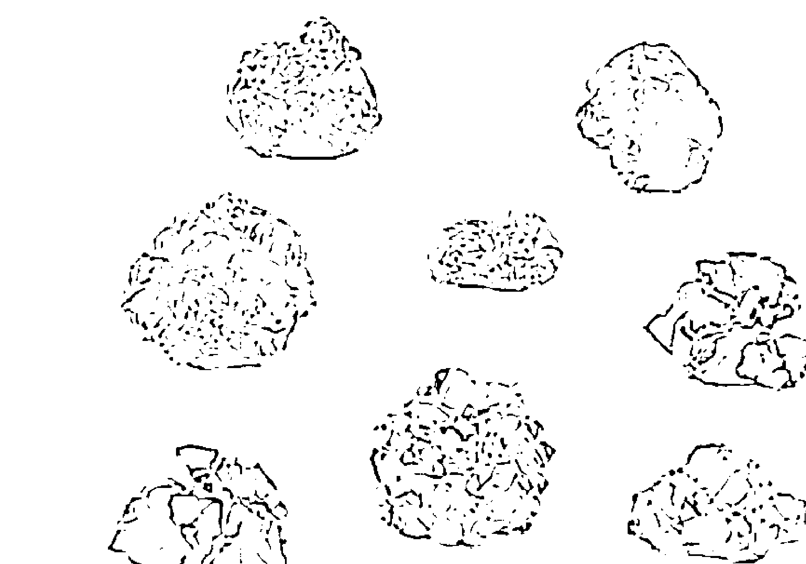

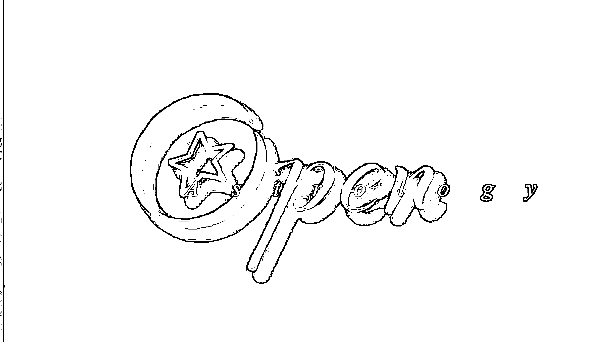

## 前言

### 古典占星與現代占星的相會

對於命理，有兩種極端的態度：一是極端相信命運，認為生命中的一切都由宿命註定好；另一種是極端輕視命運，認為生命中的一切都由自己決定，命理之說完全是無稽之談。除去極端的人，大多數是相信命運形成有理可循，也認為自己可以掌握大半的命運。隨著多元社會的包容性擴展，環境快速變化增加人心焦慮無助感，許多人透過命理工具解惑，作為另類心理諮商方式，而中小企業林立的台灣社會，企業家老闆多有專屬命理老師，為其決策做最後一道把關。要不要算命已不是個問題，問題是不同的命理工具，會以何種觀察角度來勾勒生命的輪廓。

隨著資訊媒體蓬勃發展，出現在大眾媒體前的不再只是專職演藝人員，命理、星座老師也成為螢光幕爭相邀請的媒體寵兒，星座的描述沒有艱澀的專有名詞，它能簡單生動的刻劃個性，加上資訊快速傳播，大眾均能將十二星座琅琅上口。但這般的傳播模式，並未將博大精深的占星學推薦給大眾，反而讓人誤以為，占星學的主要內容僅有娛樂性的十二星座分析。

### 占星學的歷史

占星學其實不只有娛樂性質，這是一項從古老觀星資料匯聚而成的命運指標。西洋占星學的發展，推估可追溯至巴比倫時期，一直是宮廷貴族推論命運國事所依賴的工具，更是主宰王國戰爭存亡的擇時工具。占星學在歷史上曾歷經幾次衰敗又再次復興，距今最近一次的衰退時期，發生在18世紀～19世紀，此時歐洲產生大規模的工業革命，促使科學進步，天文界又陸續發現三王星（天王星、海王星、冥王星），顛覆占星學既有論述，導致逐漸衰退，甚至有國家立法禁止民間算命行為。

20世紀初，英國占星師——亞倫·里歐（Alan Leo）因算命行為被控告，為了規避刑責，他向法官解釋僅以星盤作心理分析，因而將自古以事件預測為主軸的占星學，轉向個性心理的描述，占星學界便將亞倫·里歐之前的西洋占星學統稱為古典占星學，用以區別二十世紀後以心理分析為主的現代占星學。

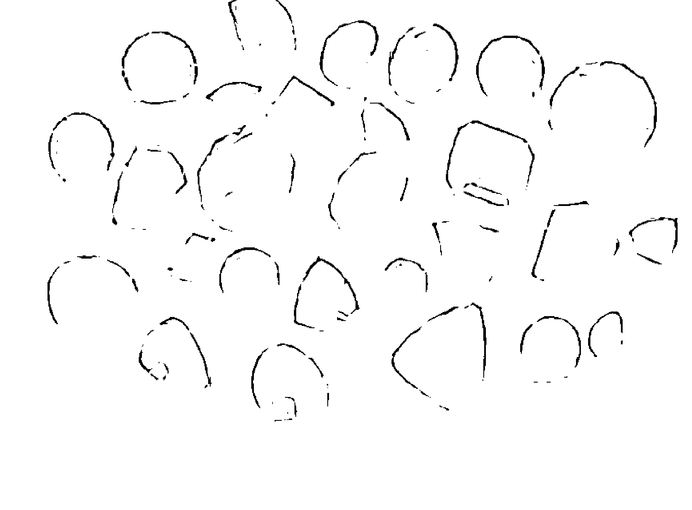

### 古典占星學的特色

西洋占星在台灣的發展，多傳承自現代占星學派，強調內在心理分析，透過星盤徵象分析問事者的心理徵象，不涉及星盤的吉凶與事件預測，認為人類所有遭遇經驗都能促進成長，但這般的星盤解說，似乎與台灣問命者的習慣大相逕庭，問命者多想直接得到「我應該選擇哪一行好？」、「這次的面談能不能成功？」、「我何時能買房子？」、「我哪一年結婚比較好？」等外在際遇的預測判斷，心理占星的立意與出發點確實崇高，卻讓問命者覺得隔靴搔癢，陳意過高。

反觀古典占星學，悠久歷史淵源所萃演的論斷法則，雖與心理占星使用同一張星盤資料，在實際應用上，古典占星能類似中國命理架構，從卜卦問事、擇日催吉避凶、至本命流年大運推論皆已完備，可以推算出星盤的富貴格局高低、家庭婚姻狀態、才華與事業發展方向、健康疾厄災禍、運程起伏等人生會遭逢的各式各樣生活狀態，更能滿足人們窺見未來、洞燭先機的需求。

雖然常言道：個性決定命運，但深究起來，人類命運所遭遇的事件未必都與個性心理徵象有絕對關係，當我們看見自然大災禍降臨，吞噬許多寶貴性命時，喪生者不乏各種個性樣態：或良善仁慈，或積極有為，但天地不仁，自無以個性來篩選受難者的理性邏輯。

以佛法觀點來看，古典占星推論法則所預見的事件，都是累世因緣和合而來，恐非今生今世求神拜佛就能轉化抹滅。面對命運或許不可違逆，現代心理占星學所提供面對事件的自我心理建設與轉化，更是我們學習面對命運機運的正面態度，以此展現生命的高度。古典占星與現代占星兩者交會，更具有其不凡的意義了！

### 如何閱讀本書？

西洋占星類象的基礎知識非常多，如果你不僅對案例中的故事情節有同感，還想進一步學習占星用以解構命運的架構，建議你應該先閱讀過完整占星基礎知識的內容（本書〈附錄：C 占星總複習〉，裡面有西洋占星的基本名詞解釋），如果你所閱讀的占星書籍已包含這些內容，就表示你對西洋占星學的主要架構掌握的相當完整了，可以進一步學習占星盤整體分析。

占星盤分析具有著整體交互關連的複雜度與多元性，在此歸納整理出幾個簡單的架構，但仍需請讀者從書中案例與各個星盤中慢慢體悟。

以下是給你閱讀本書的建議——

- 一、熟悉星盤符號。
- 二、運用古典占星的簡易分析步驟。

### 一、熟悉星盤符號

- 中天 (MC) 位置
- 第九宮
- 特殊點符號
- 第八宮
- 第十宮
- 第十一宮
- 行星符號
- 第七宮
- 第十二宮
- 上升 (ASC) 位置
- 下降點 (DSC) 位置
- 星座符號
- 第六宮
- 第一宮
- 第二宮
- 第五宮
- 第三宮
- 第四宮
- 相位線符號
- 天底 (IC) 位置

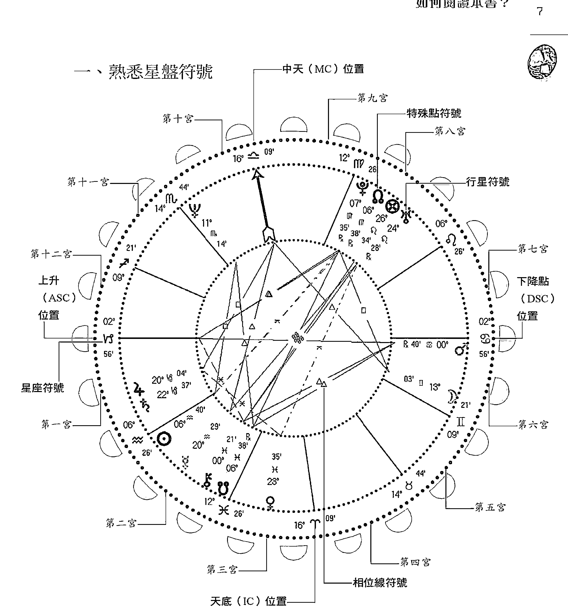

### 二、運用古典占星的簡易分析步驟

#### 第一步——命宮的代表因子

找出星盤的上升星座、命主星與宮內行星（見〈附錄：C 占星總複習〉名詞解釋：上升星座、命宮、命主星），並檢視命主星飛到哪一個宮位去。

> [以 F 小姐個案為例]

- 上升星座：摩羯座
- 命主星：土星
- 命主星所在星座：摩羯座
- 命主星所在宮位：第一宮
- 第一宮內行星：木星與土星

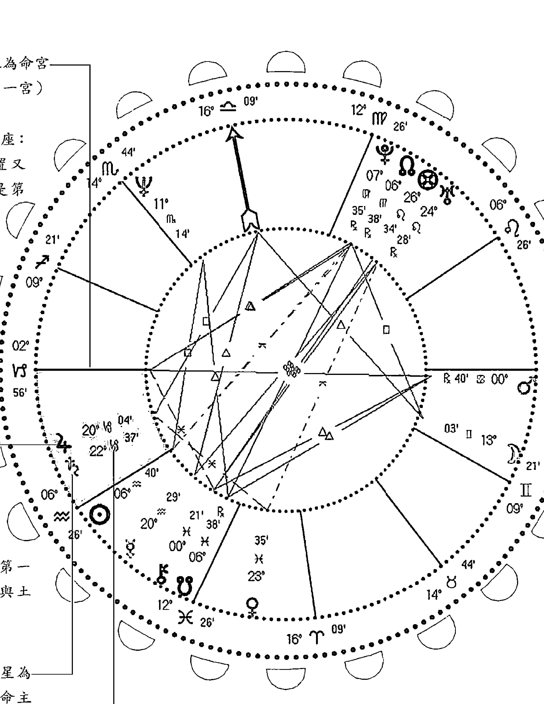

#### 第二步——事項的代表因子

依照詢問者所關心的事項，找出符合此事項的代表宮位、它的宮主星與它的宮內行星（見〈附錄：C 占星總複習〉的名詞解釋：宮位、宮主星），並檢視這個宮主星又落到哪一個宮位去。這個宮位內的行星又是掌管哪個宮位。例如所關心事項為婚姻，便要觀察分析第七宮夫妻宮的狀況。

- 第七宮星座：巨蟹座
- 第七宮主星：月亮
- 第七宮主星所在星座：月亮在雙子座
- 第七宮主星所在宮位：月亮在第六宮
- 第七宮內行星或敏感點：火星
- 火星掌管宮位：第四宮與第十一宮

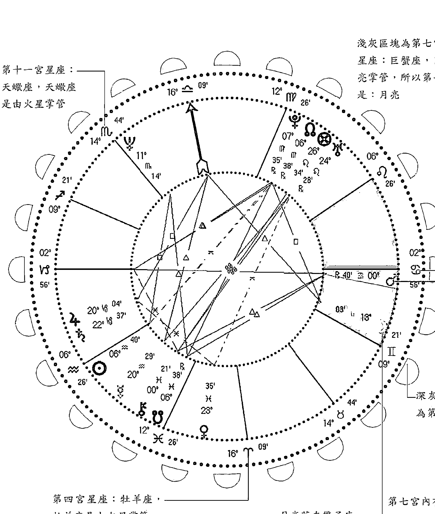

#### 第三步——分析

再分析事項的代表因子，與命宮的代表因子所形成的交互關聯狀況，以判斷詢問者所關心事項的來龍去脈與好壞程度。

例如：第七宮與命宮的交互關聯：第七宮的火星形成對沖ASC之相位。

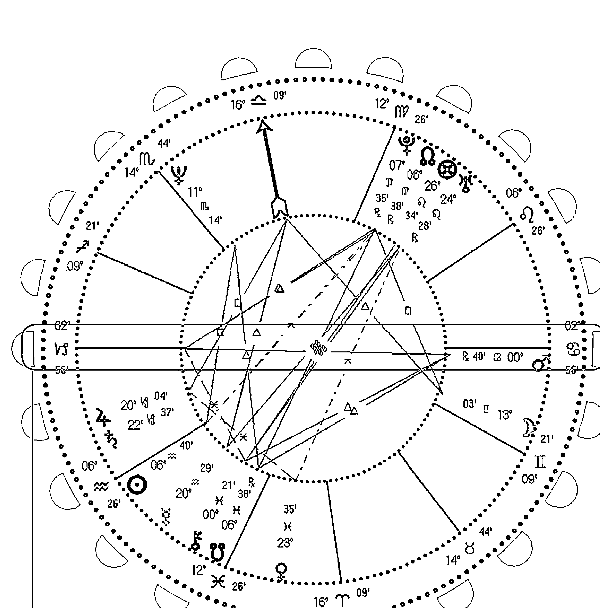

### 火星在第七宮對沖 ASC

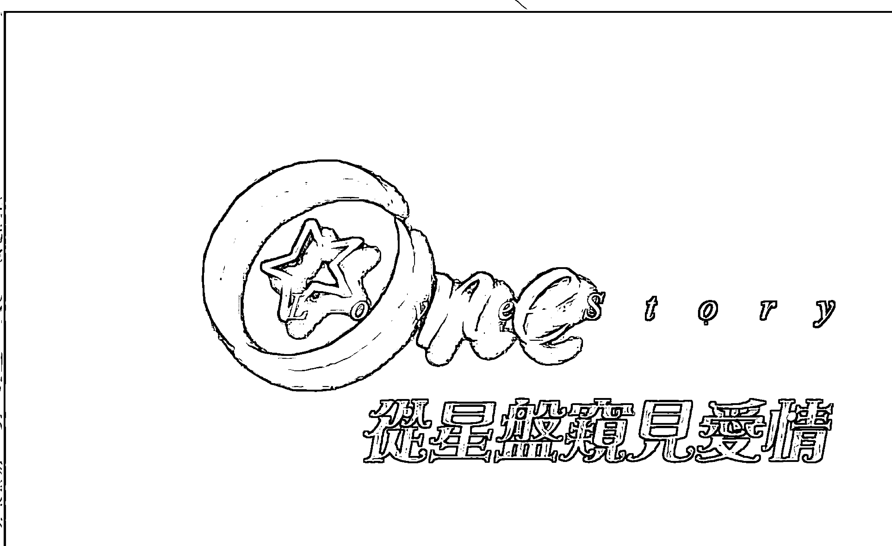

主要以第五宮愛情宮來判斷當事人的感情狀況，也透過金星了解當事人對感情的態度。

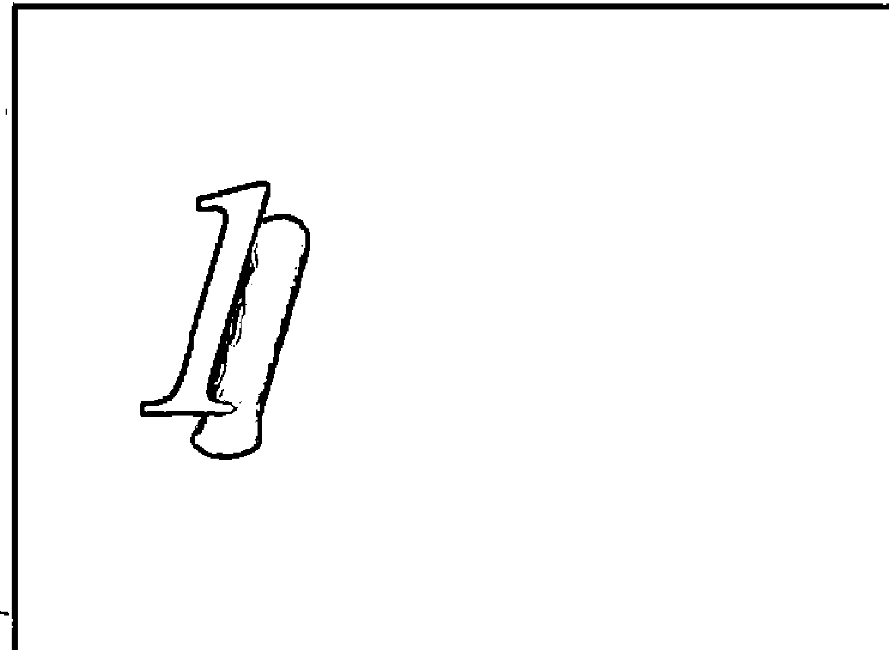

### 上帝之手介入的愛情

電腦一開機，MSN 才剛上線，總是會浮現三四個視窗同時敲我，除了打屁瞎談外，大多數是訴苦，也許表面上是占星，但在分享的過程中把我當作心靈諮商對象，許多好友遇到身旁有情緒障礙難解的個案時，也會轉託給我，我就成了心靈垃圾集散場，其中一位好友敲的內容是：她憂心遇到情傷的主管（後簡稱 B 小姐），無處排解情緒，於是大膽請我為 B 小姐諮商。

### 首次上陣諮商

這是我首次接到全然陌生的諮商個案。當時的我，才開始學習占星整合論斷，敢讓我解盤的對象，僅限於身旁家人朋友，讓我作白老鼠試驗。當好友在線上把出生資料傳過來後，我立即打開軟體起盤，星盤才一攤開眼前，尚未深入分析，我頓時就頭痛欲裂，這真是張刑剋甚多的星盤。待好友娓娓道來 B 小姐的故事時，更令人心疼，原來她並非承受一般戀情結束後的傷痛，而是交往多年論及婚嫁的男朋友辭世，讓她經營多年的感情生活，就這樣子被上帝之手介入而不得不終止。

我跟 B 小姐相約在捷運站旁的小咖啡廳裡。見到她時，讓我有點吃驚，相較於星盤裡記錄的出生時間，本人實在年輕許多，她的五官精緻清麗，搭配白皙緊緻的膚質，一開口說話更顯露她受過良好教育，談吐優雅言之有物，難怪她能擔任雜誌社的高階主管。

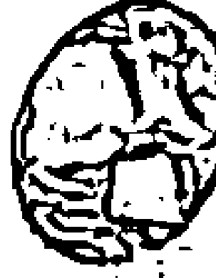

我攤開電腦戰戰兢兢地為 B 小姐解說星盤結構，在解說中加了很多占星的專有名詞，明知她未必能理解，但因為我有點膽怯直接以白話文來揭露她星盤顯示的強大刑沖。若從占星理論來說明，才能讓對方知道我的推論是用客觀工具分析所得到的結果，並非是我個人的主觀認知，理性專業術語也是一個掩飾占星者內心的面具，掩蓋著我也難以承擔這個故事的情緒。

先解釋她星盤中愛情宮的結構，並說明 B 小姐的男朋友辭世的時刻，正好是她的流年走到愛情宮的時候，原本刑沖就很大的愛情宮，被過運的冥王星運行會合到愛情宮內的月亮，引動了男朋友辭世的結果。我不確定這樣感覺像是命中註定的說明，能否讓她心裡好過一些，至少，有個工具能解釋這是天地不仁的安排，無力反抗天的我們只能低頭放下對情感的執著。

### 生死兩隔的情愛

B 小姐留學畢業後返回台灣就職，在所任職的公司結識了同為同事的他，兩個年輕男女深受彼此吸引，只是兩人學歷背景差異過大，戀情受到 B 的父母親反對，不願與男朋友分手的 B 小姐，便將這段戀情轉為地下情，背著父母偷偷交往六七年後，在她三十多歲時，父母屢次催促她結婚不成，才發現其實這兩人從未分離，這時 B 小姐的父母漸漸被這段堅貞的感情感動，便鬆口答應小倆口成婚。

豈知，就在兩人感情將要修成婚姻正果之際，B 小姐的男朋友卻發現自己罹患癌症，身體健康成為當下最重要的事，兩人只好先將婚事放一旁，讓男朋友專心養病。可惜，B 的男朋友健康未見好轉，七、八年的抗癌時光 B 小姐一直陪伴在旁，與男朋友並肩共渡，最終男朋友仍不敵病魔辭世，放下她一人必須獨自面對往後的人生。

她對往後的愛情與婚姻仍有期待，我看著她的星盤，卻無法順她心意告訴她好消息。當年諮商技巧拙劣的我，小心翼翼的說明：

> 從星盤顯示妳的婚姻狀態不理想，妳可能無法結婚，而且妳的婚姻破壞性甚強，我也建議妳最好不要進入婚姻。

她睜開眼睛驚訝說：

> 從沒有命理師這麼說過我的婚姻欸，妳是第一個這樣說的人！其實我現在擁有的一切，說穿了都不具意義，再高的職位、賺再多錢，不過是犧牲青春歲月時光的辛苦工作，我對人生最大的願望就是結婚生子，享受家庭溫暖，對我而言才是讓所有一切辛苦都有價值的人生！

### 生命獨特的禮物

頓時，我發現自己似乎說了不該說的真話，但話既已出，也追不回，我在心裡猛找措辭，希望她別誤解我的解說，其實背後有著一番好意。

腦中突然有個聲音，想透過我的嘴說出一番建言：

> 許多錯誤婚姻帶來的傷害與痛苦，會逐漸折損戀人間的情意。上天送給了妳一個獨特的禮物，妳擁有一份永恆的愛情，妳知道嗎？這是一般人求之不得，甚或認為早已消失世間的古物。

她聽完這段話後，臉上的線條柔和起來，而眼睛也綻放出光芒。

這已不是我第一次看到事業有成的職業婦女在情場失意的案例，但她的故事是最令我動容不已的。她已擁有優秀的學經歷背景及才能地位等人生福分，期望這樣的解釋能讓她釋懷這個人生缺憾，更希望她能獲得力量，在未來踏入星盤的命運路程上走得更加安穩、妥當。

### Cecily 思思星盤

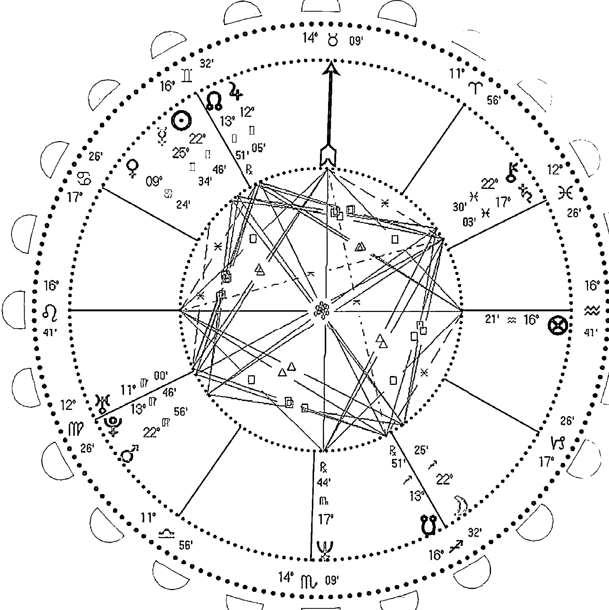

## 參考相位

1.  第二宮的火星，與第五宮的月亮，與第八宮的土星、凱龍星，與第十一宮的太陽、水星大十字型沖。
2.  第二宮的天王星、冥王星，與第五宮的南交點，與第八宮的土星，與第十宮的木星、北交點大十字型沖。

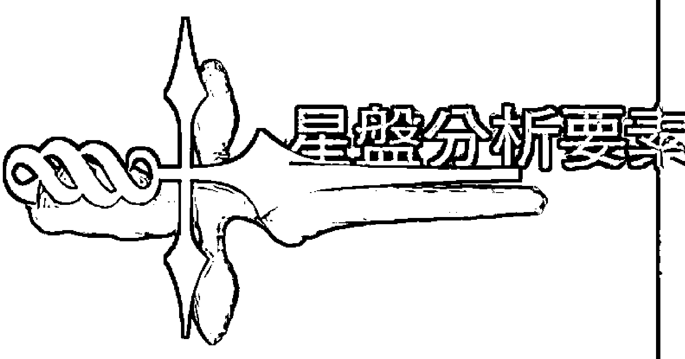

- 命主星所在星座：太陽在雙子座
- 命主星所在宮位：太陽在第十一宮

- 第五宮星座：射手座
- 第五宮主星：木星
- 第五宮主星所在星座：木星在雙子座
- 第五宮主星所在宮位：木星在第十宮
- 第五宮內行星：月亮
- 第五宮內行星所在星座：月亮在射手座
- 月亮掌管宮位：第十二宮

- 第七宮星座：水瓶座
- 第七宮主星：土星、天王星
- 第七宮主星所在星座：土星在雙魚座、天王星在處女座
- 第七宮主星所在宮位：土星在第八宮、天王星在第二宮

- 第四宮星座：天蠍座
- 第四宮主星：火星、冥王星

B 小姐上述的案例，故事主要發生的事項集中在第五宮（愛情宮），以及第七宮（夫妻宮）相關因子對於第一宮（命宮）與第二宮（財帛宮）、第四宮（家庭宮）、第八宮（疾厄宮）、第十宮（事業宮）的交互關聯。

### 解析① = 外型與才華

B 小姐的上升星座為獅子座，命主星太陽在第十一宮，落在雙子座，可看出她的外型亮麗，且具有領導能力、口才談吐與表達力甚佳、對於新資訊具有敏銳的吸收能力，印證了她具有擔任雜誌社主管的天賦才華。

### 解析② = 對愛情的態度

B 小姐的第五宮主星木星飛入事業宮，可以印證她與男朋友易為同事關係，從第五宮內的月亮，加上金星在巨蟹座，可看出 B 小姐所期望的感情經營形態就是建立兩人世界的溫馨家庭生活，但也容易因為愛情造成內心情緒波動與不安全感。

### 解析③ = 愛情宮的刑剋

但是從第五宮主星木星，受到天王星、冥王星、南北交點及土星的大十字型沖，加上第五宮內的月亮，受到太陽、水星、火星、土星、凱龍星的另一個大十字型沖，且第四宮主星為火星與冥王星，都參與這兩個大十字型沖，可見 B 小姐的家庭會強力反對她的男朋友。

## 占星寶盒

#### 上升星座 (Rising Sign)

也就是 ASC 所在的星座，從您的上升星座特質，可推知您的基本個性傾向。

#### ASC (Ascendant)

指的是上升位置，即出生時刻東方地平面與黃道之交點，也是第一宮起點的星座度數。

B 小姐對感情的付出，且情緒深受感情的影響，發生這般永誌銘心的愛情故事，實在令人為她不捨。

### 解析⑤=婚姻與財務的關連

B 小姐的第七宮宮內無行星，但第七宮主星土星在第八宮，皆參與上述兩個大十字型沖，另一個第七宮主星天王星落在第二宮，也是參與其中一個大十字型沖，這般的第七宮相關因子狀況，若論及婚嫁，恐容易因為財務問題傷害彼此關係。

### 解析⑥=星盤的調合

從 1965 至 1967 這三年出生者，某些月份恰逢土星與天王星及冥王星對沖，這個破壞力甚強的沖力，出現在這些時刻的星盤中，就看它落在何宮或掌管哪個宮位，而使得這些人生事項形成波折。這在我的經驗中實證案例相當多。

以 B 小姐的案例，在上述所提及的土天冥對沖之外，又加入了月亮、太陽、火星、木星、南北交點、凱龍星參與，使得這個刑沖相位波及到第二宮、第五宮、第八宮、第十與第十一宮，較為幸運的是，所有大十字型沖的頂點，大多與ASC（上升位置）及MC（中天位置）皆形成調合相位（僅有火星無調合相位），即便生命的波折起伏大，仍然可以依靠自己的智慧與事業上的能力重新站穩腳步。

## 占星寶盒

#### 流年
以一年為單位，推算每年的運勢情況，稱之為流年。

#### MC（Midheaven）
中天位置，又稱為天頂，即為第十宮起點的星座度數。

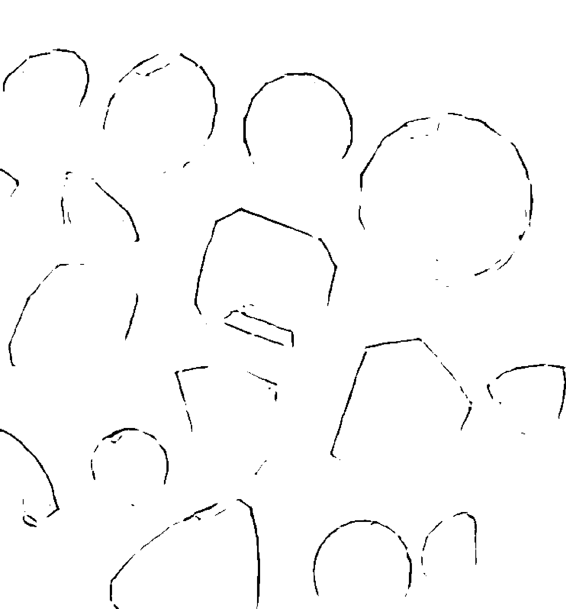

## 華麗地圖之繽紛

入冬的第一個寒流過後，一早起來就在鏡前搭配衣裝，然後至飯店參加大學合唱團學長 Q 先生的婚禮。

按照慣例，只要合唱團同學們的婚宴，必定會邀請幾位熟識的團員校友出席，並在婚宴中為來賓演唱幾首我們熟悉的合唱曲。Q 的婚禮，是有史以來合唱團校友們出席率最高的婚宴，北部婚宴為合唱團校友席開六桌，南部場地更是席開七桌，若以每桌十人計算，總共邀請了一百三十多位師長校友與家眷參加婚宴。可別因此以為他亂發婚帖，事實上他與每位出席者都有很深遠的交情，而這些友誼最遠可追溯至二十年前。

## 大學路上的合唱攤位

記得當年與幾位女同學在大學路上逛著社團攤位，對每個攤位都是隨意瀏覽後便走往下一攤，直到合唱團的攤位前，在長得帥氣的 Q 學長熱心招呼下，加上從小參加合唱團的回憶，讓我拉著同學們停下腳步，填下三個人的報名表。入團後才知道，這位神似偶像明星的學長是團長，與當時的指揮、男高音 Leader 為當屆合唱團三大台柱，靠著這三人的魅力，吸引不少像我這樣以貌取人的學妹入團。

合唱團團務繁瑣，不時有許多短期的目標要完成，例如每學期的固定練唱或聯誼活動、練唱曲目、校內外演出比賽等；另外還有長期跨越好幾屆的傳承才能完成的任務，例如記錄編撰團史、製作典藏的樂譜，與校友的聯繫等。此外，還得隨時留意團員的互動，例如誰跟誰傳緋聞又分手了、誰跟誰是小團體、誰跟誰不對盤，哪些人有何特殊才能可資提拔，對於這些大大小小事情，團長都必須確實掌握，因此他也成為收集全團師長同學最多秘密的情報站。

大二升大三時，輪到我們這屆選出新團長接掌團務。雖然Q 學長早已欽定接班對象，但卻突逢程咬金冒出頭來參選，這個參選人偏偏又是個長相俊秀的大帥哥，因此恐怕競選態勢未能如願。Q 私下斡旋兩人達成協議，勝出者需邀請另一位候選人擔任副團長，並暗自替他欽點的候選人拉票，同時還表達出另一位參選者若勝出恐不易傳承團務與文化的憂心。在他各方奔走下，選舉結果，他的接班人以相當小的差距險勝，有驚無險地完成他的傳承任務。

## 無任期的幕後顧問

Q 學長升上大四後仍退而不休，團內活動處處可見他的身影，現任幹部彷彿是傀儡政權般，繼續接受他的指令行使團務。此舉讓我們備受牽制，可是他如此熱心傳承，我們也深覺缺少不了他的幕後指導，如要逞強獨立運作，恐怕也難成氣候。這時，我才深刻覺察在校生活的社會化與政治化一面，而 Q 學長恐怕是我第一個共事的老闆，既想擺脫他的牽制、卻又期望自己的工作表現得到他的讚賞，真是令人又愛又氣。

眼見他直到畢業前都還在為合唱團付出全副心力，大家都認為他應是忽略課業，僅拿個建築系的學士文憑，畢業後便返鄉接掌家中的買賣事業。豈料在他退伍後一年，竟又考取建築研究所。我們常開玩笑地說，不曉得他是真想繼續鑽研學問，亦或是無法忘情為合唱團服務所以才重返母校。此次返校，在取得碩士學位後又繼續攻讀博士，一待竟是十年光景，使得他與歷屆校友的聯繫可以橫跨二十屆。

此時的他仍相當活躍於合唱音樂界，並在許多校友的小團體間穿針引線，成為大家情感與訊息的維繫者，我想若請每位校友列舉最常聯繫的同學名單，想必他應該都能排上前五名。無論在校時與他互動愉快與否，相信每個人都認可他為這個學生團體所付出的心力與時間，而且絕對是史無前人後無來者。

## 蹉跎的青春

他生命中較為不平順的地方就屬感情了。鍾情於學音樂的氣質美女，卻經常遇上家庭背景較為懸殊的對象。對方家長皆因 Q 學長往教職發展的生涯規劃，深怕女兒未來生活無法富裕無缺，而讓有情人難以終成眷屬。他也因此蹉跎了青春，眼看即將要與幾位仍單身的老同學，一同晉升成為「四十黃金單身漢俱樂部」的一員。

Q 快取得博士學位之際，我已在執業。當時來電給我，詢問我應該往哪個方向去，對事業與感情的助益最大。

我想了想說：「往你出生地的西南方去吧！」
他說：「西南方？哪有地方可以去，我只能去跳海了吧！」

我果然就是沒有仙姑般不可動搖的地位，我的指示總是會被朋友這樣吐槽，還好他又說：「如果過海到金門可以嗎？」
我說：「金門，也是位在你出生地的西南方，當然可以啊！」

沒想到我一語成讖，他於畢業後便找到金門地區的教職。這是十多年來的頭一次，Q 跟大家的距離，竟隔著台灣海峽如此遙遠。

## 事業婚姻的幸運地

這個西南隅戰地小島，果真是他的幸運地。陌生遙遠的離島上，居然有位他素未謀面的阿姨在此結婚定居。他赴任幾個月後，突然打電話給我，要我起一支卦，詢問一位對象是否適合他。我在起卦後很快地恭喜他，因為對方看起來是個很不錯的對象。原來，這位新對象是透過姨丈介紹，是當地一位年輕秀麗的女檢察官。

故鄉在金門，成長在台北的女檢察官，當年考試前曾向神明許願，考取檢察官後將返鄉金門服務，因此單身赴任金門三年多。當地生活單調一成不變，原先的交往對象也早因遠距離不易維持而分手，孤身的她可說是業務繁忙又沒有知心友人相伴。

結識 Q 學長前，女檢察官已提出轉調回台灣本島的申請，卻沒通過，本想再接再勵早日返家，卻在這個時機點結識人品學識相貌均優秀的 Q 學長。兩位適婚男女剛好都處於感情空窗期，生命的機緣輾轉流離，最後竟在金門小島引動出兩人的交會點。

在這通電話之後半年，我就接到他們的喜訊了。

婚宴中，我手持紅酒杯在合唱團保留席那幾張桌子間打轉，驚喜地與多年未見的老同學打招呼，有人變胖了、頭髮白了，添了些皺紋，更多同學幾乎都沒變，當主持人邀請合唱團校友上台演出時，我們盛大的陣容佔滿了舞台。Q 學長特意把我加入他婚禮的介紹人名單中，他說多虧我給他指示，讓他在金門抱得美嬌娘。其實，我們更是多虧了 Q 學長，才能與這麼多有緣人分享這二十年的光陰。

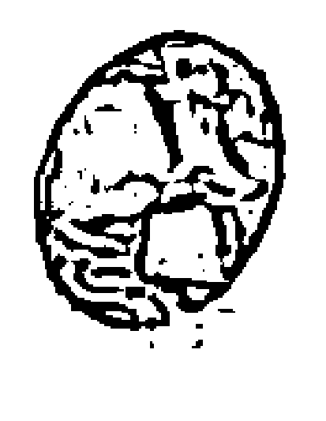

## Cecily 靈語星盤

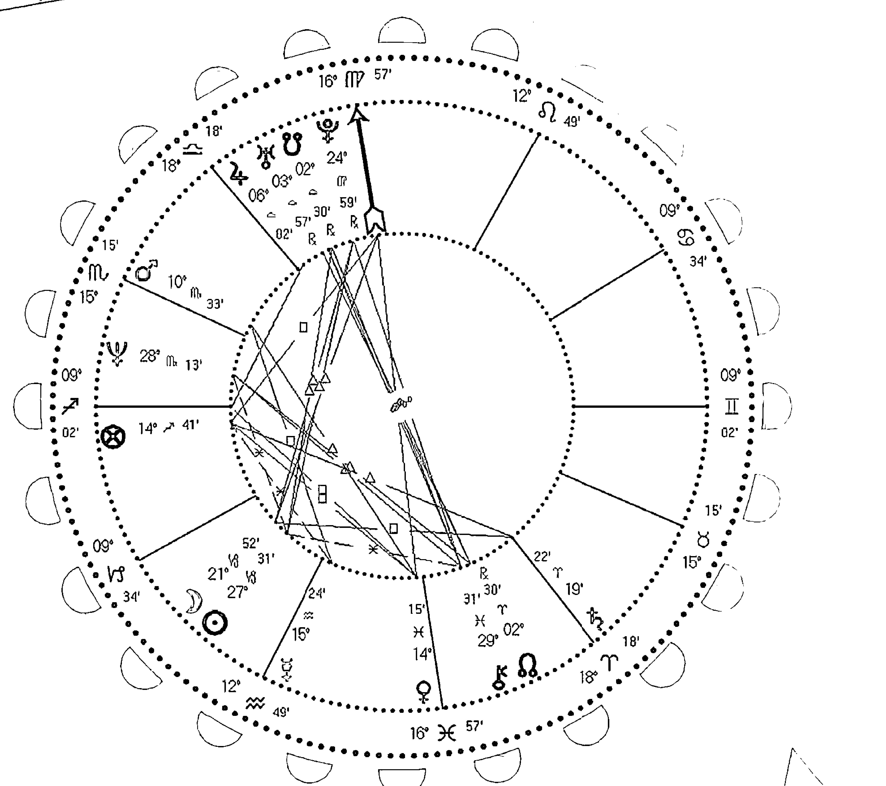

## 参考相位

- 1. 第十宮的木星在天秤座，與第三宮的金星在雙魚座，兩者有互容的關係。
- 2. 第十宮的木星會合天王星，第十宮的木星與 ASC（上升位置）六合相位。
- 3. 第十一宮的火星與第三宮的金星三合相位。
- 4. 第三宮的水星與第一宮的幸運點六合相位。
- 5. 第二宮太陽與第十宮冥王星三合相位。第二宮的太陽在摩羯座，與第五宮的土星在牡羊座，兩者有互容的關係，第二宮的月亮與第五宮的土星刑剋。

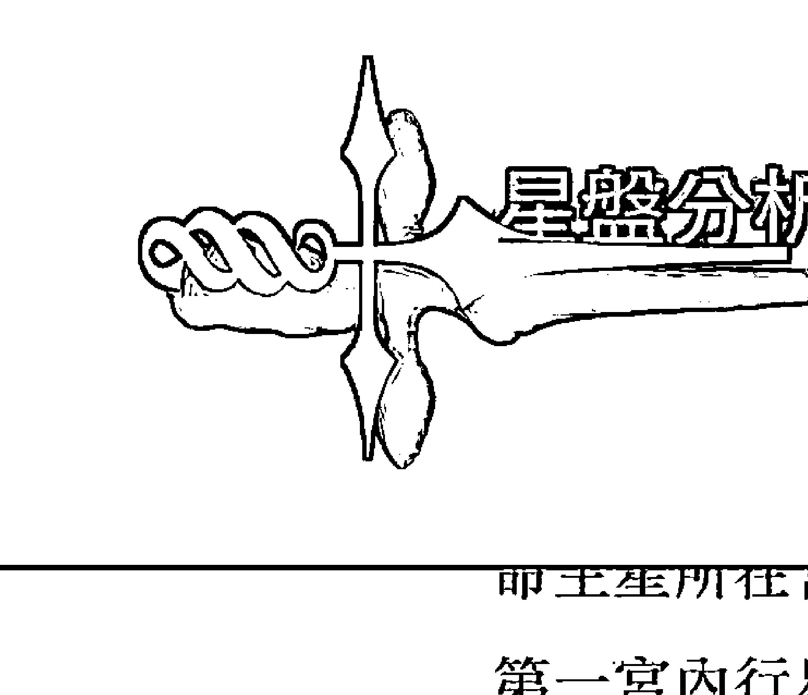

## 星盤分析要素

| 項目 | 內容 |
| :--- | :--- |
| 命主星 | 木星 |
| 木星所在星座 | 天秤座 |
| 命主星所在宮位 | 木星在第十宮 |
| 第一宮內行星或敏感點 | 幸運點 |
| 第三宮星座 | 水瓶座 |
| 第三宮主星 | 土星、天王星 |
| 第五宮星座 | 牡羊座 |
| 第五宮主星 | 火星 |
| 第五宮主星所在星座 | 火星在天蠍座 |
| 第五宮主星所在宮位 | 火星在第十一宮 |
| 第七宮星座 | 雙子座 |
| 第七宮主星 | 水星 |
| 第七宮主星所在星座 | 水星在水瓶座 |
| 第七宮主星所在宮位 | 水星在第三宮 |
| 第九宮星座 | 獅子座 |
| 第九宮主星 | 太陽 |
| 第十一宮星座 | 天秤座 |
| 第十一宮主星 | 金星 |
| 第十一宮主星所在星座 | 金星在雙魚座 |
| 第十一宮主星所在宮位 | 金星在第三宮 |

Q先生的案例，故事主要的事項集中在第三宮（兄弟同儕宮）、第十一宮（交友宮）相關因子對於第一宮（命宮）與第五宮（愛情宮）、第七宮（夫妻宮）、第九宮（高等教育宮）、第十宮（事業宮）的交互關聯。

### 解析①＝個性與交友

Q 先生的上升星座為射手座，命主星木星在第十宮，落在天秤座，與在雙魚座的金星互容。可看出他的個性樂觀自信熱情率直、善於公關交際，且長相俊秀、富有藝術與音樂的才華。他的金星亦為第十一宮主星，落在第三宮，木星又跟第三宮主星天王星會合，表示他往來的人際關係多集中在同學或朋友手足等，且同學多半涉獵藝術、設計、音樂、靈性等相關領域。

### 解析②＝才華與教育程度

Q 先生的命主星為木星飛入第十宮，與金星互容力量甚佳，且木星與 ASC（上升位置）有六合相位，水星落在水瓶座為旺宮，也跟第一宮內的幸運點形成六合相位，可看出智識學習能力甚佳，且可從事與木星相關的高等教育之職業類別，且涉及藝術設計等相關領域，印證其擔任大學建築系之教職，但因為第九宮主星太陽在摩羯座，與土星為互容關係，但並未有其他刑剋，故印證他的高等教育時間延長的狀況。太陽與事業宮最接近 MC（中天位置）的冥王星三合相位，可見在事業上甚有政治謀略能力。

### 解析③＝愛情狀況

金星在雙魚座，又與第五宮主星火星有三合相位，印證他欣賞具有藝術才華的異性，且會熱烈追求，情意相投，但因為第五宮內見到土星落在牡羊座為陷宮，與第二宮內月亮刑剋，造成感情受阻且因感情而財虧；第五宮主星火星又跟第七宮主水星刑剋，恐怕長久交往的感情反而不易進入婚姻關係。

### 解析④＝婚姻狀況與配偶特質

第七宮與第十宮的主星水星入第三宮水瓶座，與幸運點六合相位，進入婚姻的對象易與手足親戚、鄰居（或地緣關係）、同學有關，水瓶座所代表方位實為西北方，解盤當時誤述為西南方，卻意外成為Q事業的幸運地，也在該地因為親戚介紹而結識另一半，且另一伴聰明理性有自我主張，與他過去交往對象的特質較不相同，但配偶對Q先生在錢財與福分運氣上都有蔭助之力。

## 占星寶盒

### 互容

指 AB 兩行星，A 行星所在的星座，恰好為 B 行星的廟旺宮星座，而 B 行星所在的星座，也恰好為 A 行星的廟旺宮星座，此稱為兩行星有互容關係。

### 廟宮

行星落在自己主管的星座上稱為入廟宮，最能發揮此行星原本擅長的力量，能量最強。

### 旺宮

行星落在旺宮的星座上，對行星來說是舒適的狀態，雖然比入廟宮能量稍弱，但也很能發揮本身的能力。

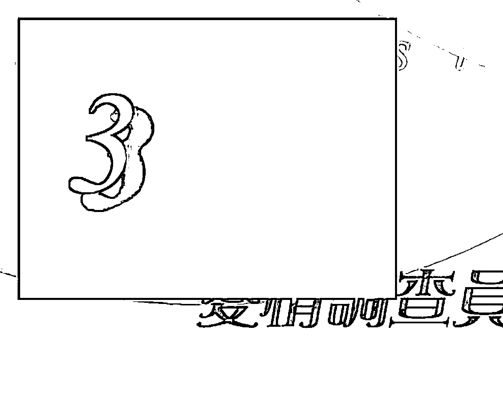

如果有位員工工作仔細認真，每日上班至少十多小時，卻沒有獨攬大權的野心，相信很多老闆都想高薪延聘她；如果她還願意兼職擔任老闆女友，工作範圍涵蓋打理老闆的生活大小事，甚至體恤現在賺錢不易，貼心自動打折薪資、幫忙調頭寸……

想遇上這般世間少有的稀世珍品，除了緣分還要有足夠的福分！

## 求愛小女人

與 Z 小姐同事時期，常看她勤奮工作，有時為了急件加班至半夜，甚至例假日也無休，從不喊累；她對上司的交代總是盡力完成，卻不是為了加級晉升求表現，但是她傑出的工作能力總讓主管更加信任並仰賴她。每隔一兩個月左右，Z 小姐就會休長假出國，回國上班的第一天，她總穿戴新行頭來公司，只要逢人讚美，她就喜孜孜地嬌笑說：「這是男友送的！」幾次的觀察後，才得知只要擁有愛她的男人，她就樂得享受小女人的幸福；至於認真工作，那只是她強烈責任心的好習慣，而非爭強出頭的自我表現。

成為職業占星師後，跟 Z 的關係更為密切，因為對愛情猜疑心頗重的她，需要我成為她戀愛關係中的諮商密友。Z 小姐前後任男友都在大陸經商，有些已婚、有些未婚，大部分都因為共事，而讓她逐漸成為男友在事業與感情上最有力的支柱。其中，已婚男友多半事業有成、年齡較長、個性穩重，這些吸引熟女的男性特質讓她甘於談起地下戀情。然而，由於戀情無法公開，加上男友經常在外地奔波，總讓她懷疑是否還有第四者存在。為此，她反而扮演起大老婆的角色，善用科技於無形、監視男友可疑行跡，巧布天羅地網逐一過濾他周圍女性。

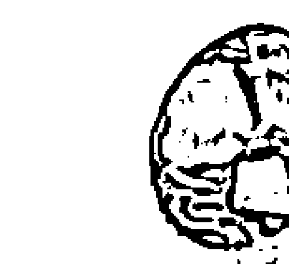

## 專業調查員

Z的過人之舉，在此取得她本人同意後與各位女性同胞分享：她能猜出男友可能設定的密碼組合，破解後進入信箱查看信件與簡訊留言；有時候假扮身分打電話給看似有曖昧關係的女性，旁敲側擊確認此人是否為情敵，再設下圈套拿此女子答話去套問男友；就像是位訓練有素的調查員，只要男友稍有疏忽，就能從電話語音、簡訊、MSN、E-mail、電腦鎖碼的檔案一一搜出，讓所有證據無所遁形。

當然，有時為求快速，她更直接請我幫她卜卦，以探知男友是否在溫柔鄉裡，於是我的卜卦、星盤等都是她化身偵探時的最佳工具。每次聽到 Z 栩栩如生地描述其暗中探查過程時，像我這種對男人行止不懂得打探推測的笨女人，看她如雷達般精準的直覺和不動聲色的優秀行動力，只能興嘆望塵莫及。

## 苦大於樂的愛情偵探

剛開始的熱戀，隨著男友的曖昧證據逐一曝光，更引發 Z 小姐在感情上強烈的不安全感。而男友的態度，也從一開始的閃爍其詞，演變到乾脆豁出去，反正都已經罪證確鑿，隱藏的多角關係乾脆直接攤開在陽光下。於是，男友返台跟她相會的次數越來越少，時間也愈來愈短；至於她，仍一手包辦公司經營的大小事，在協助男友籌措公司財源過程中卻使自己背負債務，這樣的戀情發展到最後只剩下拖棚的歹戲。

為了拋開舊情，她決定轉換工作跑道。在工作上 Z 小姐是一名得力助手，其實私底下，她還有一手精湛的廚藝。計劃出資遠赴大陸開設台菜餐廳的姐姐，相中她的才能，希望她到上海掌管餐廳並統籌一切。為求有個好的開始，她再度請我為此行卜卦，我從卦象中看出此事業有許多吉象，惟有愛情宮對事業形成凶象，因此我耳提面命地提醒她：「這次去大陸專心工作就好，千萬別談感情喔！」她出發兩個多月後，我給她的警語猶在耳，又接到她來電詢問感情。

## 不顧一切追求愛

這次的對象是位大陸籍主廚，年紀比 Z 小姐小甚多。由於兩人都離鄉背景來到異地，Z 小姐又常常指導他學習台式料理，每日長時間一起近身工作，日久生情。社會背景差距甚大的兩人，Z 的家人當然一致反對，Z 又回台拜訪感情顧問的我，詢問這份感情的存續。

我分析 Z 與姐姐的流年時，從星盤見到一些徵象：

> 「我從你姐姐未來這一年的流年星象，看到她的餐廳事業會因為手足的感情而有波動；從妳的星盤更明顯看到這一年會因為感情而破壞事業，打亂餐廳的經營，妳一定要好好考慮跟他之間的感情是否就此打住。」

為了博取家人認同，Z 小姐不斷與家人溝通卻受挫；同時，她又懷疑主廚對店裡的女服務生似乎有好感，這些多重壓力讓她一股腦兒把怒氣轉為亂拳狂打男友，暴怒過後，男生連分手都沒提，就悄悄返鄉離開，讓 Z 傷心錯愕，餐廳也突然面臨主廚消失的經營空窗期。

看著她的星盤，我只能說她的感情燃點太低，太容易動情，只要投入就不顧一切讓感情加速向前進展。然而，這份感情其實是受到特殊的時空背景加味後釀製而成，剝除了培養感情的環境氛圍，兩人要面對的是背景差距帶來的衝擊考驗，關心她的人都不樂見這份情感的發展。幾個好友苦口婆心的勸告，加上我使出星盤威嚇的殺手鐧，我們衷心希望她能夠理智面對情海，別讓衝動的感情波濤殃及剛起步的新事業。

## Cecily 紫微星盤

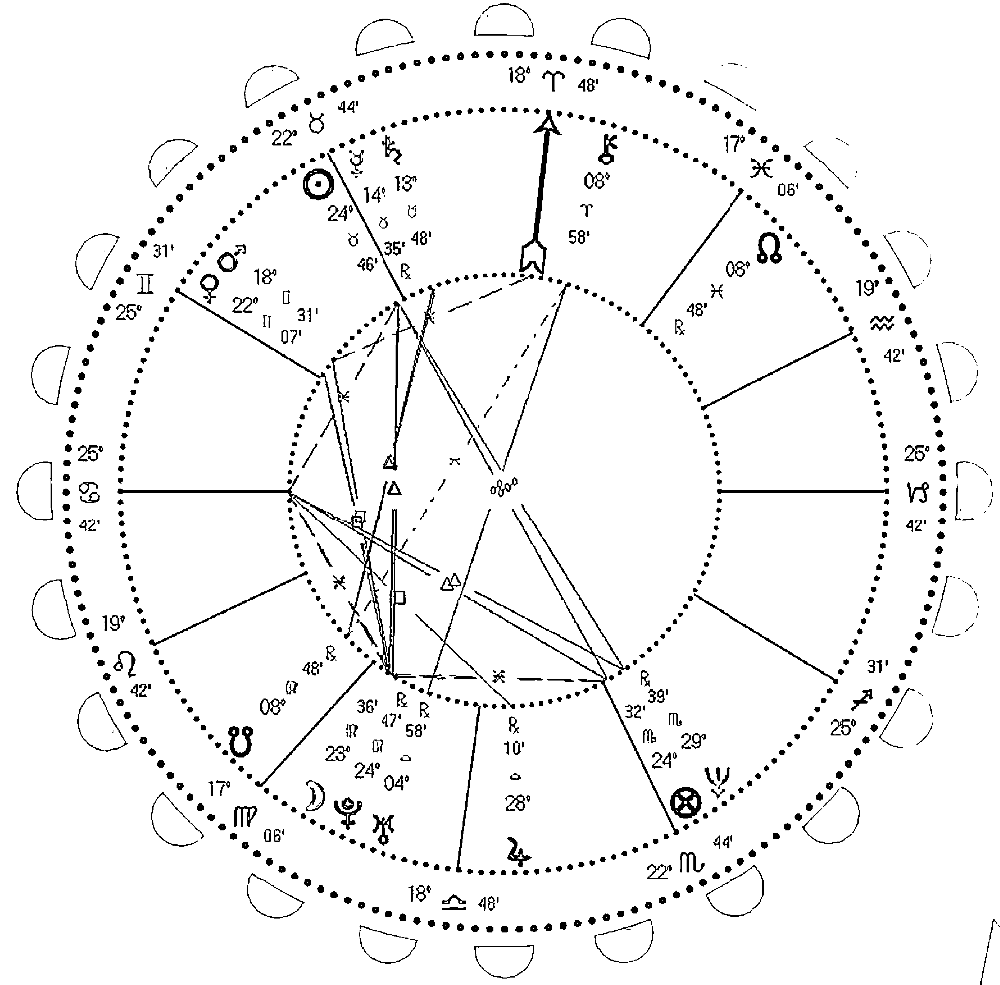

## 参考相位

- 1. 第三宮的月亮合相冥王星，與第十一宮的金星合相火星，兩者互相刑剋。
- 2. 第十一宮的金星與火星合相，與 MC（中天位置）形成六合相位。
- 3. 第五宮的海王星與 ASC（上升位置）形成三合相位，海王星也與第十一宮的太陽對沖。

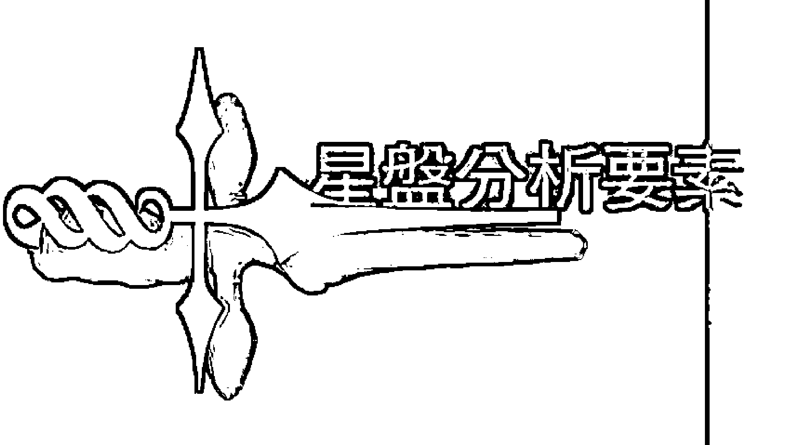

- 命主星所在星座：月亮在處女座
- 命主星所在宮位：月亮在第三宮
- 第五宮星座：天蠍座
- 第五宮主星：火星與冥王星
- 第五宮主星所在宮位：火星在第十一宮，冥王星在第三宮
- 第五宮主星所在星座：火星在雙子座，冥王星在處女座
- 第五宮內行星：海王星
- 第十宮星座：牡羊座
- 第十宮主星：火星

Z 小姐的案例，故事中的主要發生事項集中在第五宮（愛情桃花宮）之相關因子相對於第一宮（命宮）、第十宮（事業宮）的交互關聯。

### 解析①=個性分析

Z 小姐的上升星座為巨蟹座，命主星月亮在處女座，飛入第三宮合相冥王星，具有母性個性喜歡照顧人，擅長家務料理等。工作認真負責，對細節有條不紊，與手足關係密切，但有些疑心病重而情緒化。

### 解析②=愛情狀況分析

第五宮內有海王星，與 ASC（上升位置）三合，她對於感情存有浪漫幻想，也易受感情蒙蔽，代表愛情的金星在雙子座合相第十宮主星火星，金火與 MC（中天位置）形成六合相位，印證 Z 小姐的感情機緣易從工作關係而來。

### 解析③=感情態度分析

第五宮的另一個宮主星冥王星與月亮會合，又被金星與火星刑剋，火星也是第十宮的主星，可以印證追求她的對象通常是在身邊共事的同事，對象本身異性緣多，感情易引發工作職務上的麻煩與爭執，造成不快，且對方喜歡搞神秘，Z小姐也會因此暗中探查對方，彼此諜對諜。

### 解析④ = 感情陷阱分析

從海王星與太陽對沖，太陽又是第二宮的宮主星，Z小姐應小心在感情催化下，很容易被欺瞞而傷財，這表示此星盤在感情上的另一個陷阱。

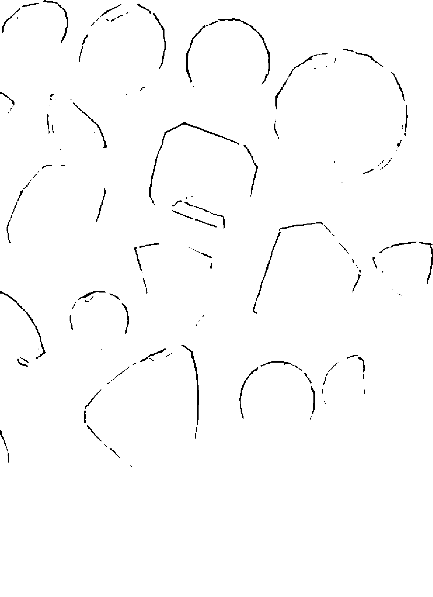

## 占星寶盒

### 命主星

上升星座之定位星即為命主星。例如案例中上升星座為巨蟹座，巨蟹座的定位星為月亮，所以月亮就是這張星盤的命主星。

### 宮主星

每個後天宮起點所在的星座，此星座之定位星即為此後天宮之宮主星。例如案例中第十宮的起點在牡羊座，因為牡羊座的定位星為火星，則第十宮的宮主星即為火星。

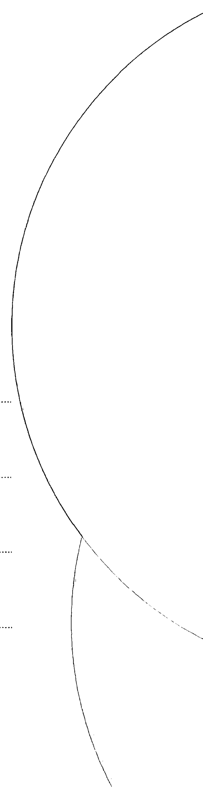

## The Marriage Story
### 徙星盤看婚姻關係

主要以第七宮夫妻宮來看婚姻中另一半的狀況，以及從命宮與第七宮的交互關係來分析婚姻關係的互動狀態。

## 可愛可愛的公主

我的好姐妹 E 小姐，有一雙迷濛的大眼、嬌憨慵懶的嗓音、甜美可人的笑容，經常微露香肩，穿著緊身七分褲，亮出她平坦緊實的腹部與一雙美腿。足蹬 Gucci 高跟鞋，拉著小提琴的身形照片，宛若五〇年代美國畫報上的女性，具有迷人性感魅力卻婉約傳統地勤持家務，兩種極端形象卻能同時出現在 E 小姐的身上。

### 發電機女王

E 過去曾是工作上的得力助手，偶有一點小迷糊卻不影響她敬業與識大體的工作表現，難得的是她在工作閒暇之餘，還學習小提琴，偶有公開演奏會；也到大學選修日文，強化自己的專業能力。E 不經意流露的強大電力；很自然地軟化了客戶、廠商與公司的互動關係，不僅與 E 共事的男同事會被電得神魂顛倒，只要有業務往來的客戶、廠商，也常會私下跟她要手機號碼；甚至外出用餐買碗牛肉麵，也能讓麵館的年輕小老闆兩眼發直，我們因此受惠，每次吃牛肉麵都能免費從小碗升級至大碗，外加吃到飽的小菜。

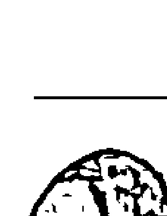

## 暴力相向的婚姻

但是她卻無法欣然接受這些異性的好感，只因她已是兩個十來歲小孩的媽咪，而她身處的婚姻狀態，更令人疼惜她的遭遇。共事一段時間後，我們之間如姐妹般的好交情，讓她不禁向我傾訴她的婚姻生活。

E 在二十出頭的年紀，就結識高大英挺、家境富裕的先生。外型登對的兩人，經過約半年的熱戀期就閃電完婚。婚後懷第一個小孩時，有抽菸習慣的夫妻，約定要當小孩的好榜樣，於是便互相監督對方戒菸。有回，她藏在皮包裡的煙盒被先生發現，先生起初是開玩笑的作勢要懲罰她，但卻真的點了菸往她手臂上燙出一道疤，這舉動讓她痛不欲生。當時覺得自己的行為不良而理虧受罰，並未警覺先生隱藏的暴戾性情。

待小孩出生後，首次扮演父親角色的丈夫，對於小孩的哭鬧束手無策。在煩擾的情緒下，兩人動輒口角爭執，每一爭吵便出手打人。最嚴重的一次，是小孩夜半受風寒哭鬧，他在被吵醒後竟給了小孩一個狠狠的巴掌，讓三歲小孩從床上被打飛起來再跌落。E 驚慌地攔住先生的暴力行為，卻被先生飽以拳打腳踢。隔天小朋友帶著深紅掌印上學，驚動老師來電關心，在老師的勸說之下 E 才去醫院驗傷，並開始考慮婚姻的去留。

## 无形的高塔牢笼

E小姐曾向公婆哭诉先生的暴力相向，但从小性格就蛮横霸道的丈夫，连公婆都很怕他，手足也对他避而远之，公婆仅能乡愿地要她尽好妻子本分，如此就能安然生活下去。这方求助不成，她便带小孩返回娘家，但娘家有着传统观念，对于出嫁女儿带小孩返家长住感到颜面无光。于是当先生至娘家登门要带她们回家时，娘家便帮着先生劝说，说服她跟两个小孩回家，别再轻易提出离婚。

在四面受阻、自己也无良好经济条件下，谈论离婚、子女抚养权与后续生活等等都不利于她，只好重回婚姻。迷糊的她将验伤单锁在保险箱里至过期失效，却意外被先生发现，对方盛怒之下又是一番毒打。经过这次风暴后，两人分房而居，每日见面无话可谈，甚至刻意避开彼此打照面的机会。先生每日在外应酬玩乐到深夜才返家，从此再也没有正眼看过她一次，过着没有夫妻之实，丈夫却也不放手还她自由的日子。几年来，这个“丈夫”已成了她偶而提及的“室友”。

两人无爱无互动的婚姻比一个人更为寂寞。E小姐就像住在高塔牢笼里的公主，被不懂得爱情的猛兽囚禁，幻想着英俊勇敢的王子能出现拯救她。不过幻想与真实的落差甚大，许多男性虽垂涎于她的美貌，不顾她已婚身份仍猛烈追求，但这样的情况反而让她陷入另一种困境：现代版的王子们都不够英勇，而且没有打败猛兽拯救公主的打算，只想在猛兽熟睡时，蹑手蹑脚地从高塔窗户爬进来，然后空手离去。

困在婚姻牢笼里的现代版公主，还得一人独自面对婚姻的难题，解救她的钥匙只剩下时间，等待时间让枷锁自然风化生锈崩坏，公主就能自己推开牢笼大门，走出高塔迎向新生活。

## 占星宝盒

### 下降点

下降点，即为ASC的相对点，也是第七宫起点的星座度数。

### 衍生宫

以某宫当作一宫，其余各宫重新以此宫起算，作为新的十二宫之意涵。例如以第四宫当成第一宫起算，第四宫之第六宫即变成原本第九宫，即可称为父亲的健康宫，以此类推。

## 参考相位

| 序号 | 相位描述 |
| :--- | :--- |
| 1. | 第五宫的金星与 ASC（上升位置）形成三合相位。 |
| 2. | 火星会合 DSC（下降点）对冲 ASC（上升位置），并刑克命主星海王星。 |
| 3. | 第十宫的木星被第七宫的冥王星刑克，但与太阳形成三合相位。 |

命主星所在星座：木星与海王星都在射手座
命主星所在宫位：木星在第十宫，海王星在第九宫
第七宫星座：处女座
第七宫主星：水星
第七宫主星所在星座：水星在狮子座
第七宫主星所在宫位：水星在第六宫
第七宫内行星或敏感点：冥王星，幸运点
第五宫星座：巨蟹座
第五宫主星：月亮
第五宫主星所在星座：月亮在水瓶座
第五宫主星所在宫位：月亮在第十二宫
第五宫内行星或敏感点：金星与南交点

E小姐的案例，故事主要的事项集中在第七宫（夫妻宫）、第五宫（爱情才华宫）相关因子对于第一宫（命宫）与第四宫（家庭宫）、第十宫（事业宫，配偶的家庭宫）的交互关联。

## 解析①=个性与才华

E小姐的上升星座为双鱼座，ASC（上升位置）与第五宫的金星三合，命主星木星在第十宫，落在射手座庙宫，与太阳形成三合相位，另一个命主星海王星在第九宫，也落在射手座旺宫。可以看出她的个性浪漫爱幻想，有艺术与音乐才华，而且乐观到无可救药，自信热情率直，重视工作认真敬业，识大体有大将之风，有进取学习心，向往异国的文化。在外型上，双鱼座常有一双迷蒙的眼睛，金星的相位造就她美丽优雅有艺术才华，成为吸引异性的强力放电机。

## 解析②=配偶个性

E小姐的第七宫宫头（即 DSC 处）见到火星会合，火星并 ASC（上升位置），命主星海王星也被火星刑克，另一个命主星木星也被第七宫内的冥王星刑克。诸多重叠类象，可以印证配偶的脾气爆烈，易与E小姐冲突争吵甚至有肢体暴力；忌妒心与占有欲强，猜疑心重、会暗中探查掌控，形成婚姻关系的隐形枷锁，这也可以解释为何两人已无夫妻互动关系，先生仍不情愿甘心放手。

## 解析③=家庭状况

第十宫的木星受到冥王星的刑克，与第四宫的土星，可以印证夫家（见第十宫。以衍生宫法则，以第七宫为第一宫起算，原本第十宫会变成第四宫，可称为第七之四宫，即配偶的家庭宫）父母出身背景地位良好，但却饱受E小姐先生的蛮横暴戾性情所苦，而E小姐原生家庭（第四宫代表）也因为有土星在此，具有较传统保守的家庭观念。

## 解析④=双方的爱情状况

第七宫主星水星飞到第六宫狮子座，狮子座原本就是异性缘较多的星座，又与第五宫主星月亮在第十二宫对冲，可以看出E小姐的先生外型显眼出色，也易逢异性之婚外情，进而影响婚姻。由于第十二宫本为隐蔽数，以衍生宫的法则，把第七宫当作第一宫来起算时，原本水星所在的第六宫会成为第十二宫，可称为第七之十二宫，即配偶的隐蔽数。故婚外情在隐匿的状况之下发生。

## 解析⑤=相位调和之处

此案例的星盘，所幸有非常多的吉相位，甚至有两个大三角的特殊相位以及甚多的小三角相位来调和，几乎每个受刑克的凶星都有其他调和相位来解救（除火星之外），让这张星盘的主人E小姐，在人生其他方面，仍是位享有许多福分的幸运儿。

## 越上越地入丈夫

一个闷热午后，我跟本书的幕后推手——明芝（译有：《进入你的感官世界》），在工作室附近找了一间有内推庭院造景的咖啡厅躲避暑气，从咖啡厅落地窗向外看出去，原本猛烈的阳光成了抚触庭院树木的柔美光源。下午时刻不见其它用餐客人，整个安静的空间里只有我们两个人的声音，我们的对话被手机声打断，是朋友打来的电话。

## 求救电话

> “哈啰，Cecily，有件事很紧急想请你帮忙！”我邻居最近可能要跟外遇的老公打离婚官司，可否请你帮她看看怎样能离了婚，并拿回她的财产？”

我明白朋友急切想帮助邻居的热情，但占星师不是万能的，社会运作架构自有不同角色执行不同职责，我说：

> “要打离婚官司应该是请教律师，确认法律程序需要准备哪些证据，这种节骨眼不该是来找我啊！”

> “可是她先生会暴力相向，她怕会被报复，对自己没有自信，甚至还闹自杀，Cecily，我想只有你能帮忙了！”

我的上升双鱼座易心软的个性大概是众所皆知，只要哀求就难以拒绝，我终究还是答应她了：
“好吧！你把她的出生资料给我，我来安排一下会面时间，
但是她还是要先去找律师，要冷静搜集各种对自己有力的物证。
如果先生有暴力行为，要记得先去报警并申请家暴保护令”
我又不忘以自己曾有的法律经验，对她耳提面命一番。

## 星盘明显的婚姻问题

询问了 F 小姐出生资料后，就帮她起了盘，一眼就看出夫妻宫的问题所在：两人无法平和相处、先生性情暴戾，加上显而易见的外遇问题，这些历程充满艰辛。从开业以来，就不断遇到相似的婚姻问题个案，同样也经历过离婚波折的我，常常会内心暗问，难道我过去所经历的一切遭遇，其实是为了让我有所准备，以便今日更有同理心来助人吗？

翌日，F 小姐本人就亲自来找我了。
F 婚前是位老师，一直没找到合适的结婚对象，焦急的家人请媒人打听对象，才认识现在的先生，并很快就结了婚。先生是一家中古车行的老板，生意经营的非常好，婚后她就辞掉人称铁饭碗的教师工作，专心在家帮老公管理账务、为员工料理伙食，公司的业绩亦蒸蒸日上。

F 的先生个性海派，有些许江湖性格，曾经与哥们之间一言不合就拿刀子互砍。刚结婚前一两年，夫妻感情都还算稳定，但从婚后第三年开始，先生开始对 F 小姐显露他的坏脾气。因当时车行营收甚佳，先生拿到大笔金额就会上酒店消费、挥霍，夜归回家被 F 小姐质问行踪，便在激烈争执下情绪失控，就对 F 饱以老拳一顿，夫妻间的暴力相向开始如家常便饭般出现。

某日，一名大陆女子跑来找 F 小姐，直接摆明自己是先生已包养近一年的情妇。此后，F 小姐的先生见暗藏情事已浮出台面，也就不忌讳的带着情妇公开出双入对，进出公司，还为情妇买房。受到情妇的唆使，他进而将 F 小姐手中掌握公司的财务大权移转给情妇主导，而车行的经营也开始一落千丈，近年来甚至由盈转亏，与客户间的纠纷也层出不穷。

## 坚韧的生命能量

> “两年前，我得了忧郁症。每天想着里被先生如此折磨糟蹋，到头来我却什么都没有、什么都不是，当我想离开这里重回职场工作，也被他奚落我只是个煮饭的，谁会雇用我，对未来整个自信心都崩毁了！”当时自杀的念头一直盘旋于 F 的脑中，于是她服用了大量的安眠药来结束所有的一切。

所幸，她的女儿提早下课回家，发现母亲倒地不省人事，马上叫救护车及时送医急救。生命的气息重新降临后，她从病床上苏醒过来，看到三个亭亭玉立的女儿全围在床边哭红了双眼，医生疼惜地问她：“你有这么可爱乖巧的女儿，怎么忍心放下她们自己离开呢？”她的心纠结起来，也顿悟到自己一定要活下去的重要原因。

从鬼门关前走了一遭，F 重获新生而振作起来。“不但为了自己，更为了这三个女儿，一定要坚强努力让她们有更好的生活。”于是她决心反击先生与情妇，收集证据以诉请离婚，甚至透过法律诉讼离婚并讨回自己应得的财产。

## 重获新生

从 F 小姐的星盘也见到她未来的生命重心，就是栽培这三个外形甜美、具有艺术音乐美感天分的女儿，我看到陪着她赴约十岁的小女儿，小小年纪就看得出是个美人胚子，她环抱着母亲的臂膀磨蹭着，并在一旁偷听我们的对话，听到她认同的地方，例如我提到 F 小姐先生的性格、婚姻状况、要注意属羊巨蟹座的人来破坏婚姻（先生的情妇恰为属羊巨蟹座）、女儿们的才华等等，小女儿还会在一旁偷偷的点头微笑。

F 小姐在离开我工作室前接到二女儿打来的电话：“面试结束啰，考得好吗？这样子喔，这次没过没关系，下次再努力就好啦。我们明天一起去吃一顿大餐帮你打气喔！”听着轻柔细语的声音越来越远，看着她离去的身影，我相信她未来的人生将会开始受到老天爷更多的眷顾了。

## 参考相位

| 序号 | 相位描述 |
| :--- | :--- |
| 1. | 第一宫的木星在摩羯座，与第七宫的火星在巨蟹座，两者为互容的关系。 |
| 2. | 第七宫的火星对冲 ASC（上升位置）。 |
| 3. | 第六宫的月亮，与第八宫的冥王星刑克。 |
| 4. | 第一宫的木星会合土星，两者与第三宫的金星六合相位。 |

## 星盘分析要素

命主星所在星座：土星在摩羯座
命主星所在宫位：土星在第一宫
第一宫内行星或敏感点：木星
第七宫星座：巨蟹座／第七宫主星：月亮
第七宫主星所在星座：月亮在双子座
第七宫主星所在宫位：月亮在第六宫
第七宫内行星或敏感点：火星
火星掌管宫位：第四宫与第十一宫
第十一宫星座：天蝎座
第十一宫主星：火星、冥王星
第十一宫主星所在星座：火星在巨蟹座，冥王星在处女座
第十一宫主星所在宫位：火星在第七宫，冥王星在第八宫
第五宫星座：金牛座／第五宫主星：金星
第五宫主星所在星座：金星在双鱼座
第五宫主星所在宫位：金星在第三宫

F小姐的案例，故事主要集中在第七宫（夫妻宫）、第十一宫（以转宫计算，为配偶的爱情宫）、第四宫（以衍生宫计算，为配偶的事业宫）相关因子对于第一宫（命宫）、第五宫（子女宫）、第八宫（配偶钱财宫）的交互关联。

## 解析①=夫妻个性描绘

F小姐的上升星座为魔羯座，命主星土星在第一宫，也落在魔羯座的庙宫，合相木星。可看出她在个性上易忧虑操烦爱说教适合教职，做人脚踏实地、刻苦耐劳耐操、勤奋负责。第一宫的木星，与第七宫的火星为互容关系，却因为木星在魔羯座为陷宫，火星在巨蟹座也是弱宫，两者的互容实际上是凶相居多，火星又对冲 ASC（上升位置）。由此可印证丈夫的情绪不稳定、脾气火爆，会对F小姐暴力相向，两人的关系互动往来密切，F小姐具有教师的性格易对先生说教，却也因先生的酒色财气困扰与麻烦，得常为先生收拾烂摊子。

## 解析②=另一半的事业

第七宫的火星为第四宫与第十一宫的主星，以衍生宫的法则，把第七宫当作第一宫来起算时，原本第四宫会成为第十宫，可称为第七之十宫，即配偶的事业宫。以火星为第七之十宫的主星来看，可印证F小姐的配偶会从事金属机械类的相关事业，且具有一定的事业格局，可成为创业主，但事业上也易见冲突不稳定。

## 解析③=婚姻关系的问题

以衍生宫法则，第十一宫（第七之五宫）作为配偶的爱情宫来看，第十一宫的两个主星，一个为飞至第七宫的火星，另一个为飞到第八宫的冥王星，火星对冲ASC（上升位置），冥王星刑克第七宫主星月亮。由此印证，F小姐的婚姻是因为丈夫的外遇对象而来破坏，且外遇对象亦会用对F小姐以直接冲突的方式来破坏婚姻，并谋求先生的钱财。

## 解析④=子女个性与互动

第五宫的主星为金星在双鱼座入旺宫，金星又与第一宫内的木星土星形成六合相位，且金星与火星形成较为宽广的刑克相位。可印证子女的个性温顺可人，具有艺术才华之天分，与F小姐的互动关系甚佳，但确实也与其父亲较不融洽与疏远。

## 占星宝盒

### 弱宫

行星落在旺宫星座的对面星座，称为入弱，此行星落在不舒适的状态，即无法发挥能力。此行星便很难发挥原本擅长之能力，且会凸显负面特质。以本案例，火星的旺宫星座为魔羯座，魔羯的对面星座为巨蟹座，所以火星在巨蟹座则落入弱宫。

## 女人的背景

许多人与我预约的过程，总是经过几回的留言或来电探询、一再确认咨询服务的内容后，才会如期造访。J小姐的作风明快直接，留言至部落格希望跟我预约；本来就有双鱼座糊涂个性的我，当时受到流年海王星持续刑克我的命主星，整个生活仿佛处在梦游状态，只有解盘时是清醒的，我竟遗漏了这个留言，迟至一星期后，才猛然发现它的存在，赶紧道歉并留下联络方式给她。隔天，J直接就来电给我了。

电话中尚未询问咨询服务方式与费用，J就直接给了详细的出生资料并同时预约时间，她也自行准备了几个曾发生的重大事项（如结婚与生子的时间）好让我作时间校正，其中提及小时候骑脚踏车，跌入大水沟中差点淹死的事情，让我更明确地证实她的出生时间。她明快的态度，似乎早已笃定选择我来为她服务。

## 贵妇莅临

J小姐的造访，让我小小的工作室突然显得局促。那天J小姐穿着剪裁合宜的窄裙套装，外搭一身贵气及膝的米色皮草大衣，修长双腿上是黑色镶水钻的丝袜，搭配尖头雅致的咖啡色高跟鞋。就出生资料看来已年届五十，但是从保养有道的皮肤与身形，则是完全超乎我过去对这个年龄对应外表的僵化想法。

我先以个性的描述作为解盘的开场白：
> “您的特质聪明、求知欲旺盛，具有领导风范，很容易成为他人的典范与楷模，更具有甚强的经商能力，可独当一面领导全局。但你并不像一般企图心强旺的女强人，只求外在表现，还具备相当内省的一面，喜欢独处与心灵对话，也喜欢亲近艺术、丰富内在心灵。”

在咨询中，她很认真地聆听我的描述，但并未积极参与对话，只是沉稳地以点头或发出“嗯”之声来回应，或偶而会回答：“没错，我就是这样的人。”就在我提及她的事业易与另一半紧密连接但却时有冲突时，才开始谈起自己的故事。

## 婚姻、事业、家庭三头重担

J 小姐协助先生创立公司、经营事业，但是先生的性格懦弱怕事，无法担当自己的承诺，面对公司决策常摇摆不定，有时还在该出现面对问题的关键时刻，突然退缩走避国外，留下 J 收拾先生错误决策后的烂摊子。曾经最严重的一次是，先生未与经营干部研商便擅自决定一项交易案，幸好 J 及时知晓，并拦下此案认赔出场，不过最后仍平白损失相当大的一笔钱。种种因素导致公司经营的灵魂人物自然落在 J 身上，她让公司的业绩蒸蒸日上，也成为先生做任何不当决定前的一道防火墙。

在家庭中，她养育了三个聪明有才华的子女，恰如其分地扮演好母亲的角色外，更是整个家族的精神支柱。安排父亲手足在公司里担任合适的职务，此外，其中一位手足因有轻微的智障，她便肩负担手足一家人的经济支援与甥姪教育。她就像撑起的一把大伞，为全家族的人挡风遮雨。

但是她的努力，却未能挽救婚姻。

将经营重担交给 J 小姐后的另一半，乐得逍遥，常与公司的女同事亲昵互动。许多老同事看不下去，便暗中提醒忙于工作而浑然不知情的 J 小姐，但即使情事被揭发，另一半仍是依然故我，改不掉喜欢拈花惹草的恶习，目标对象也总是公司女同事。这点让 J 不仅感情受创，在公司颜面挂不住，事业的领导权也大受影响。为难的处境连子女都不舍。他们在成长的过程中眼看着父母的不合，更清楚母亲为顾全家庭与事业付出了全部的生活，最后，子女们竟然都劝她离婚，表明他们已长大成人，有能力也十分愿意接手母亲的担子与一家人的照顾。

## 人生新一章

最后，J小姐终于在几年前走入金星大运时，毅然决定离婚，将所持有的公司股权出清，并辞去公司的职务，断然摆脱身心交瘁的过往，昂首迈向未来。离婚后，她去了美国一趟，学习艺术心理治疗。在学习的过程中，老师解析她的身心状况，教她如何放松肩颈压力。当她终于松掉肩头的压力、产生从未有过的轻盈感时，才惊觉过去的自己对这份惯有的压力感竟浑然不觉，还与之生活了几十年而未曾放下。

## 占星宝盒

### 大运

行星所代表的时间区间，将人生切割成几个较长期的时间区块，以推估每个不同时间区块中生命历程的好坏，称之为大运。

过往生活随着已消失的压力感而逐渐远离，她不耽恋过去辉煌的成就与地位，努力展开人生的新乐章。希望藉由艺术心理治疗，帮助更多相似遭遇的人，协助她们并给予支持的力量。目前，J小姐对这份简单而有意义的新生活相当乐在其中。

## Cecily 思思星盘

## 参考相位

| 序号 | 相位描述 |
| :--- | :--- |
| 1. | 太阳合相 ASC（上升位置）、对冲土星合相 DSC（下降点）。 |
| 2. | 金星与凯龙星、MC（中天位置）三合、与木星刑克。 |
| 3. | 天王星刑克海王星。 |

## 星盘分析要素

命主星：水星
水星在金牛座
命主星所在宫位：水星在第十二宫
第一宫宫内行星：太阳、金星
第一宫内行星所在星座：太阳与金星均在双子座
第二宫星座：巨蟹座／第二宫主星：月亮
第二宫主星所在宫位：月亮在第二宫
第三宫内行星：天王星
第五宫星座：处女座与天秤座（劫夺宫）
第五宫主星：水星与金星／第五宫内行星：木星
第六宫内行星：海王星
第七宫星座：射手座／第七宫主星：木星
第七宫主星所在星座：木星在处女座
第七宫内行星：土星
第七宫内行星掌管宫位：土星掌管第八、九、十宫
第九宫内行星：凯龙星J小姐的案例，故事中的主要發生事項集中在第一宮（命宮）與第七宮（夫妻宮），這兩宮之相關因子相對於：第二宮（財帛宮）、第五宮（子女宮、愛情桃花宮）、第八宮（配偶錢財宮）、第九宮（國外宮）、第十宮（事業宮）的交互關聯。並穿插部分故事與第三宮（手足宮、交通宮）、第四宮（家庭宮）與第六宮（健康宮）的交互關聯。

## 解析①＝個性與才華

J小姐的上升星座為雙子座，第一宮內見到太陽，很緊密地合相ASC（上升位置），又有金星也在命宮雙子座，命主星水星卻入到第十二宮（玄秘宮）。由此可印證她是位商業頭腦靈活、資訊嗅覺靈敏的領導者，且漂亮優雅，更具有氣質與知性美。但是會偶有隱匿自己的傾向，喜歡獨處自省作心靈對話，且會親近藝術以內化啟發心靈。

## 解析②＝配偶個性

第十宮（事業宮）主星土星飛入七宮夫妻宮射手座，並與第一宮的太陽對沖，印證J的事業會與配偶合作經營，因土星在射手座之故，配偶時而好大喜功、實則膽怯懦弱，相較於命宮太陽的領導與權威，土星反而造成阻礙問題。

## 解析③=從財帛宮看婚姻理財

第二宮（財帛宮）主星月亮入廟強旺，就落在二宮裡，第八宮主星為土星，飛入第七宮，所以J小姐能帶動業績蒸蒸日上，反觀配偶理財不當，或難以得財，更易形成錢財的損失。

## 解析④=配偶桃花狀況

第七宮主星木星接近第五宮宮始點，掌管愛情與桃花的宮位，又受到桃花星，也是第五宮主星金星的刑剋，可印證配偶必然桃花重。

## 解析⑤=子女緣分

五宮子女宮始點為處女座，中間還有天秤座，故五宮有兩個宮主星，分別為水星與金星，水星亦為命主星，金星飛入命宮，可見子女與J小姐的關係密切，互動佳。

## 解析⑥=大運新一章

命宮內金星與凱龍星三合，金星也與事業宮頭MC（中天位置）三合，金星又是十二宮主星，表示靈性深處的自省與探索的主星，金星本身即為藝術的徵象星，凱龍為治療師的徵象星，所以會從事藝術心理治療業有跡可循。離婚時，J小姐所行運的大運恰由太陽轉入金星大運，因此原本命宮內太陽與夫妻宮內土星對峙的戲碼將落幕，起而代之上場的是金星大運的人生，更將人生重心放在金星所代表的事業。

## 解析⑦ = 健康狀態

太陽雙子座受土星對沖，雙子座代表身體部位為肩頸、呼吸系統、神經系統等處，土星對沖將會對骨骼帶來長久的壓力。

## 解析⑧ = 家庭狀況

第四宮家庭宮主星為太陽，亦飛入命宮，印證J小姐會肩負起家庭責任，是家庭的領導者。三宮兄弟宮內見到天王星，受海王星刑剋，常會產生精神或心緒不正常的手足。

## 解析⑨ = 意外災難分析

三宮內有天王星受到六宮海王星刑剋，天王星在三宮為交通突發意外，六宮的海王星代表因水而造成的健康問題，此刑剋可以清楚看出她易有交通突然意外引發溺水的危難。

最近體會到一項偶然的巧合，總會在相當接近的期間內，有幾個相似的案例出現，讓我有機會在相同的人生議題上，探觸到不同詢問者的星盤，身為研究者的我們，更能比對驗證其中的異同；我也以旁觀者的身分，偷渡了當事人的人生經歷，參與許多歷歷在目的人性。

## 乘著愛情來攪局的金星

夜間出生的中年男子O先生，年屆五十歲走入金星大運，代表感情的金星在此時來攪亂一池春水，顛覆了平靜生活，但感情的兩面刃，還是傷害了穩定的家庭關係。

故事情節常見於報章新聞，中年台商赴大陸投資事業，妻子為子女的教育而長住加拿大，兩人分隔兩地生活近二十年，接下來的情節，就是一場通俗的連續劇情，我認識的小六學生大概都可以編得出男女主角的腳本。

劇情的轉折從女配角——年輕情婦的出場進入高潮。長年感情空虛的男主角，與處心積慮但喬裝成嬌弱可憐的情婦，是通俗家庭鬧劇裡熟悉的螢幕搭檔，男主角為了照顧她，與她族繁不及備載的家人們，不斷支付從天而降的帳單：從老家整修、外婆生病至學習進修，購買豪華床單等，在不算長的時間裡，就散盡數百萬元；兩人在異鄉暗築愛巢，情婦竟得寸進尺想向大老婆示威，假意粗心遺留物證，大老婆幾次至內地探夫，第一次發現數根女子長頭髮、第二次拾獲女性首飾，不知情婦心機的男主角還能頗為鎮定地編織謊言掩蓋。最後，情婦要讓男主角正視她的存在，於大老婆到來的前一日，將終極物證——女性內衣藏身於衣櫥裡。

劇情發展至最高潮，大老婆怒氣沖天逼問男主角，男主角已經詞窮，只能不堪的承認與情婦同居，大老婆進一步要求與破壞家庭的元凶見面；會面的原始動機僅是要勸離情婦的大老婆，面對情婦以挑釁的言語、感情勝利者的姿態宣稱自己同時還有十多個男友，對男主角的金錢付出視為無物，還嫌惡男主角吝嗇小氣，大老婆的憤怒已到達臨界點，顧不得貴婦形象，當街狂賞情婦數十個巴掌，才能一洩怒氣。

一場街頭鬧劇演罷後回到家，大老婆情緒逐漸和緩，識大體的她，充分展現包容與決斷力，所謂的外遇其實是騙局一場，失去的錢財她不去追究，只希望男主角能明白，他在家庭的重要性不會因這段插曲而消失，只要在未來，讓一家人能常常聚首生活，重新開始出發即可。夾在兩個女人之間一直不吭聲的男主角，此時像個闖大亂子的小男孩，重新獲得家人的接納與關愛，突然情緒潰堤哭喊著他要回家，家庭風暴終於和平落幕。

看故事的人，只見表面的情節，隨著男女主角的衝突劇演出，事不干己漫罵第三者以感情騙財，與男主角的不忠與視人不清，同情為家庭付出青春的大老婆，也為她的表現喝采。而占星師的眼光，落在男主角星盤運轉裡，更見包容的空間。

## 理解與包容

O先生為受人敬重的高階主管，更是家庭經濟的棟梁，二十多年投身事業換來家庭富裕的生活環境，星盤中清楚顯示著他的成就，隨著年歲走入中年運程，他的心境不難體會，處在事業頂端，沒有多少人能讓他鬆懈心防談天；沒有家人的異鄉住所，上下班的心境無法轉換；像候鳥隨季節來去相聚的夫妻關係，沒能適時分享歡樂情緒，或及時填補突然湧上心頭的孤寂；長年夫妻間的重心，都在所謂經營家庭與子女未來，如同經營另一個合夥事業，只是頭銜改為父親與母親，事業成果是子女的成就高低與財產的多寡，分配任務多於情感交流，我的包容實在太多了，劇情寫到這裡，讀者應該也都同情起闖禍的男主角了。

金星大運引動了男主角原本潛伏星盤的浪漫情愫，與男人面對異性時生理的直接反應，還有對溫暖家庭生活的渴求。沒有原生社會群體道德壓力的環境中，適時出現假扮悲苦命運的動人女性，殷勤照顧男人的起居，聽他的叨絮，分享每天生活瑣事，讓男人的異鄉住所開始像個家，這真是所有大老婆的噩夢，卻也是現實。

不過異鄉愛情，最終是女人的戰爭，只有女人能看清虛幻的愛情表象之下，實質是個爭奪利益的戰場。好奇怪的世界，世人總覺得女性容易陷入迷情，但中年過後，或許是賀爾蒙的分泌開始轉換雌雄，男人開始為情所困，女人反而實際起來了。金星大運，可能會讓男人繼續魂縈夢牽於虛實不清的感情，還好大老婆及時發現，設下停損點，也願意給丈夫一個回頭的機會。被發現事實也許不堪，畢竟是一輩子的家人，一次破壞性的事件，反而讓死寂的婚姻生活重生。

真正的不堪，應是已屆中年的男主角，看盡多少世事，卻誤把感情騙局當成死心塌地的真情，要怪，只能怪金星來攪局。

## 参考相位

- 第二宮內的月亮與第五宮的太陽、第十宮宮頭 MC 形成大三角的特殊相位，月亮還受到太陽容納。
- 第一宮的天王星，與第四宮的火星合相海王星，與第七宮的凱龍星形成三刑會沖的特殊相位。
- 第五宮的土星，受到第二宮的冥王星合相木星來刑剋。

命主星：月亮
月亮在獅子座
命主星所在宮位：月亮在第二宮
第一宮宮內行星：天王星
第一宮內行星所在星座：獅子座

第七宮星座：摩羯座／第七宮主星：土星
第七宮主星所在宮位：土星在第五宮
第七宮主星所在星座：土星在天蠍座
第七宮宮內行星：凱龍星

第五宮星座：天蠍座／第五宮主星：火星與冥王星
第五宮主星所在宮位：火星在第四宮，冥王星在第二宮
第五宮主星所在星座：火星在天蠍座為廟宮，冥王星在獅子座
第五宮內行星：水星與太陽

第九宮星座：雙魚座
第九宮主星：木星與海王星
第九宮主星所在宮位：木星在第二宮，海王星在第四宮

## 占星寶盒

### 大三角

由三個三分相位組合而成。大三角的三個行星通常落於土水火風之同一種元素上，會成為順利與和諧、幸運的狀況，可由三角形的三個行星所在宮位與所掌宮位的事項，推知順利與機會所在。

O先生的案例，故事中的主要發生事項集中在第五宮（愛情桃花宮）與第七宮（夫妻宮），這兩宮之相關因子相對於：第一宮（命宮）、第二宮（財帛宮）、第九宮（國外宮）、第十宮（事業宮）的交互關聯。

## 解析①＝個性與才能

O先生的上升星座為巨蟹座，命主星月亮在獅子座，與太陽及第十宮宮頭MC(中天位置)，形成大三角的特殊相位，月亮還受到太陽的容納，可印證O先生能成為受人敬重的高階主管。從命主星月亮入第二宮，更是為家庭扮演經濟棟樑的角色。

## 解析②＝桃花問題

火星為第五宮主星，與海王星會合，又跟金星六合，所以男主角原本就潛伏著浪漫情愫之基因，且第一宮內的天王星在獅子座，刑剋第四宮在天蠍座的火星，這兩個星座本來就情慾較強，又逢海王星來參與此刑剋，使男主角易受異性的性誘惑與欺騙。又因金星在摩羯座，更容易受到悲苦命運的動人女性吸引。海王星又是第九宮主星，飛入第四宮，所以在異鄉更容易需要家庭溫暖，而引發受到異性欺瞞誘惑之象。

## 解析③=婚姻狀況

第一宮的天王星，與第四宮的火星與海王星，及第七宮的凱龍星，形成三刑會沖的特殊相位，這份在幻象中不真實的情感，確實引發了婚姻關係岌岌可危的狀況，也造成夫妻兩人心中難以抹滅的傷痛。而從第七宮主星土星飛入第五宮，而第五宮另一個主星冥王星則飛在第二宮，兩者刑剋，印證表象兩個女人的感情戰爭，實際上卻成了爭奪利益的戰場。

## 解析④=金星大運

在夜間出生的人，皆為四十九歲後走入金星大運，O先生的金星已如上述分析，所以進入此大運後，才會引來一場婚姻與感情的風暴。

## Theory 占星術驗現健康

主要以命宮、第六宮健康宮、第八宮疾厄生死宮，綜合三者來推論當事人的天生體質與後天易產生疾病的癥結所在，並找尋解救之道。

## 是下地方的病魔

這是我的占星師生涯裡，首次與死亡的距離這麼近。

2007 年農曆年前，我見到在部落格留言希望能預約諮商的C小姐，她有張圓潤的臉龐，臉頰上有淡淡的雀斑，不算是典型美女，但全身的裝扮從衣服鞋子到包包，無一不是配搭協調的時尚元素，加上精心描繪的眼妝，讓眼神具有神秘魅力，就好像日本流行服飾雜誌裡的封面模特兒，散發強烈的吸引力。給人的第一眼印象就是位經濟條件好、追求者眾的年輕女性。

## 第一個考題

坐在我面前的C小姐，一開口便像考試般的直接詢問我：「老師，妳能不能看得出我去年發生了什麼事情？」

C 似乎期望著我能鐵口直斷出噴噴稱奇的星象。幸好我有在會談之前做功課，才沒被問倒。關於C小姐的星盤，初開啟星盤時曾出現劇烈的頭痛感受，過去幾次的經驗告訴我，這張盤可能問題不小。所以雖尚未分析，心中便已有譜，再經仔細推敲後，即看出她去年至今的流年刑沖甚大，應是攸關性命的大事。只不過其中有個不太確定的地方：雖然這是她的星盤，也能藉此推論父母狀態。當時被刑沖的行星，究竟引動的是她自身問題，還是父親的問題？以我當時菜鳥級的從業經驗，要下判斷確實有些為難。從現實的角度來看，這時的她才快滿二十八歲，如此年輕就遭逢生死交關的可能性並不高，況且她本人現在正氣色紅潤地端坐我面前，所以研判問題應是出在父親！

於是我回答說：「應該是父親面臨生死攸關的問題吧！」

C小姐很快給我一個更正的答覆：「不，是我自己，我已經被醫生判定是癌症末期的病患。」

## 前世約好的會面

一聽到這句話，我如被悶棍重重一擊，不是因為自己的推論有偏差，而是不敢相信這個事實。此時忽然想起，很少拿客戶星盤與自己星盤作合盤分析的我，意外地發現到我跟她之間可能存在前世關聯。在會面之前，我就對C小姐有些期待，相信她的故事應該跟我的研究有密切關係。而先前她的回答，證明了我們星盤上的關聯。

接著，C小姐進一步詢問：「那老師可以看出是哪個部位的癌症嗎？」

我說：「整合星盤結構看來，應該是兩個部位的問題，一為腎臟，一為免疫系統問題。」

聽到答覆的她，很平靜說出：「我原本是先天免疫系統功能失調，爾後持續惡化演變成為腎臟癌。我從國中時代即有這部位疼痛的問題，但向來沒有加以重視，直到最近又因疼痛做進一步檢查，沒想到檢驗的結果竟已經是癌末。」

目前她已完全放棄傳統的西醫治療，沒有進行任何手術化療，而讓身為中醫的父親開立處方調理。

她再問：「病情還會更嚴重嗎？」

我指出在她當年的生日過後、大約到九月之前，將會是她甚為難受的一段日子，也是相當關鍵的時刻。她說醫生研判她的生命可能只剩半年，與我提出的時間點不謀而合。

### 顯現解救方位

C詢問我的這個時間，已屆下年度的流年。根據星盤，C次年度流年健康宮內的水星，將會被幸運吉祥的木星解救，而木星常跟國外事項有關，於是便查了一下A*C*G（Astro*Carto*Graphy）地圖，發現木星的行星線落在日本，就在東京與大阪之間。

我告訴她或許可以考慮往日本去找尋其它的治療方法，一聽到日本，她睜大貓般的神秘雙眼，興奮地說：

「我一直很喜歡日本，尤其是東京與大阪。我待在這些地方時，一直有種特別熟悉的感覺，彷彿在自己的家鄉般親切。」

有著一口流利日文的她，也曾考慮要前往日本工作。交談到此，我已暗中知曉上天安排這場會面的理由了。

回家後不久，即因緣際會地透過好友引薦一本日本知名免疫學博士的著作。我相當認同博士透過免疫系統機能的研究，提出以食物與運動喚醒免疫系統恢復運作，進而治癒病症的療法，迥異於現代醫學治病卻非治癒的觀點，這也可能較為吻合C期望的治療方式，我就把博士的大名與著作介紹給C，希望對她有所助益。

### 難以放下的掛念

自會面後約莫半年，我們經常保持聯繫。C小姐所關切的議題多在感情、工作及父母關係上，我看她放不下這些繁雜的關係，總是旁敲側擊的提點，這些心煩意念執著的糾結，才是深層的病因。我也總會在每次交談結尾，關心她身體的近況，發覺確實越接近九月，她的身體越來越疼痛難耐。過程中我試探地詢問她是否準備日本之行，不過對她來說，這件事的重要性似乎不及她眼前的感情問題。

### C小姐的來信

老師

留言給您的今天，是我去年發生的關卡至今滿一年，想想是個非常值得紀念的日子。

我從一個無時無刻覺得命運很苦的人，轉化成了一個非常感恩的人。我的人生失去了曾經卻獲得了很多我意想不到的新禮物，讓我現在除了慚愧之外更多了智慧。

你知道嗎？我放下了我所謂的搖控器了，這一年的冥王星，給了我如此大的轉化力量，實在是不得不感嘆宇宙還有自我的力量，但想要告訴您的是，當我知道我已經轉變的那瞬間，除了家人，我最想告知的也是您，因為您陪著我渡過了這麼長的一段日子，我想您也在心裡期待著我成長的那一天。

2007 年中秋節前，C來電欲送禮給我卻未出現，之後就斷了音訊，且在下半年間，我也經歷母親與自己先後罹癌動手術的難熬時日，便逐漸淡忘久未聯繫的C小姐。

直到邁入 2008 年某日打開Outlook，行事曆上跳出C生日的提醒視窗，讓我又想起了她。我試著撥打C小姐的手機，但卻聽到停用的語音訊息，這時心不禁涼了一截。雖知她的工作地點，但一個占星師跟客戶的關係不至於親近到去電公司，未免顯得過於冒昧唐突，只能隨緣分來去。豈料，兩三星期後，她竟然主動來電。談話中得知自己的擔心是多餘，原來她已到過日本，也找到免疫學博士，而這位博士在巡迴各地演講的百忙之際，竟撥出返日休息的空檔與C小姐碰面治療，給了她生存的希望。

生命的存續是個沉重的議題，卻也是每個人終將碰觸的事項。占星師跟這件事的距離比一般人接近，因必然會提早推知身邊親人、包括自己的疾厄，雖然能在星盤中找到努力的轉化之道，但也必須泰然接受無法改變之事實；更應學習以死亡為師，隨時提醒自己終將走入死亡的必然性。

在死神面前，再高傲的人類都必須屈服於有盡身軀的渺小；正視生與死，將會讓我們重新調換生命事項的順序，才有機會探索今生更高貴的價值。

## Cecily 紫微星盤

## 参考相位

## 星盤分析要素

- 命主星所在星座：金星在摩羯座
- 命主星所在宫位：金星在第四宫
- 第一宫宫内行星：冥王星
- 第一宫内行星所在星座：冥王星在天秤座
- 第六宫星座：雙魚座
- 第六宫主星：木星與海王星
- 第六宫主星所在宫位：木星在第十宫、海王星在第三宫
- 第六宫主星所在星座：木星在巨蟹座、海王星在射手座
- 第六宫内行星與敏感點：南交點與水星
- 水星掌管宫位：第九宫
- 第八宫星座：金牛座
- 第八宫主星：金星
- 第八宫主星所在宫位：金星在第四宫C小姐的案例，故事中主要發生事項集中在第六宮（健康宮）與第八宮（疾厄宮），這兩宮之相關因子相對於：第一宮（命宮）、第四宮（家庭與父親宮）、第五宮（愛情與投資宮）、第九宮（海外宮）的交互關聯。

## 解析①＝個性與外型

C小姐的上升星座為天秤座，具有藝術設計美感，重視協調，能跟得上最新的流行時尚，命主金星在摩羯座，有超齡的成熟，金星受到月亮與木星的刑沖，體態會較為圓潤，但金星與火星互容，加上命宮內的冥王星緊密合相上升度數，使其具有明顯的性魅力。

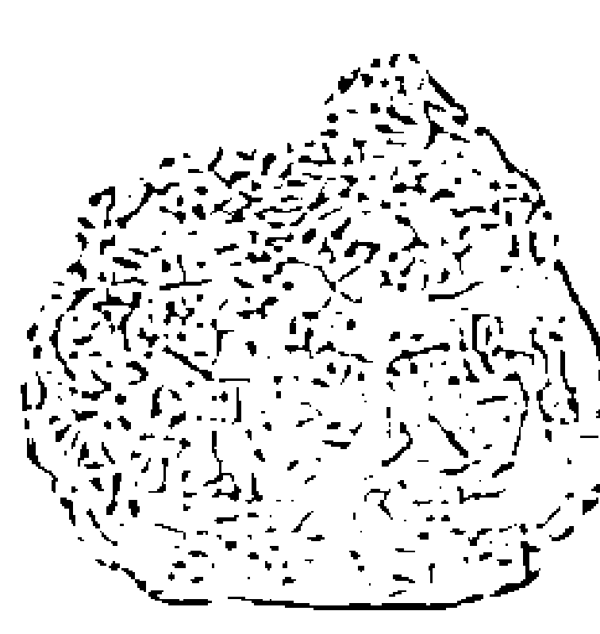

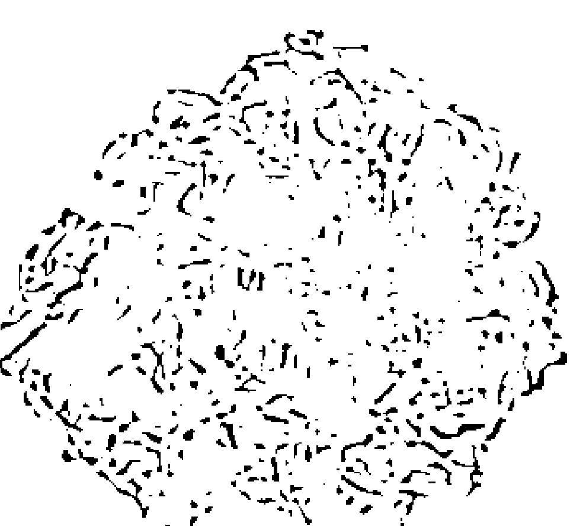

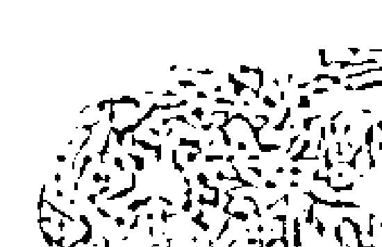

## 解析②＝當年度流年

二十七歲走第四宮小限年，第四宮即為父親宮，四宮內有金星，是本命八宮主星，因此她本人該年會有與第八宮相關事項發生：如疾厄、負債等，但土星對沖太陽，太陽為父親的徵象星，所以也有可能上述八宮事件發生在父親的身上，而非她本人。當年度的太陽被過運行星會合，引動本命中土星與太陽對沖之相。

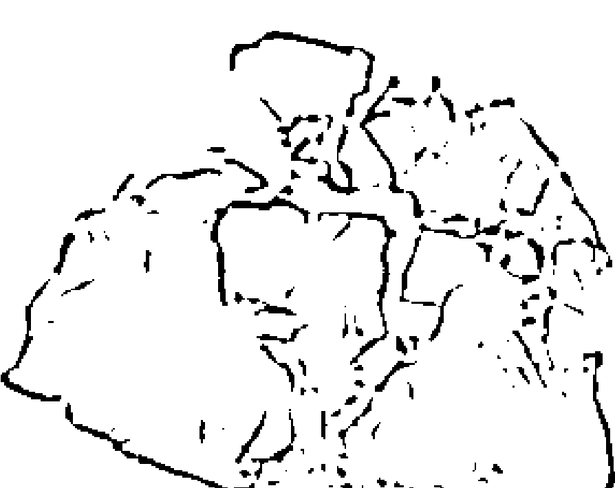

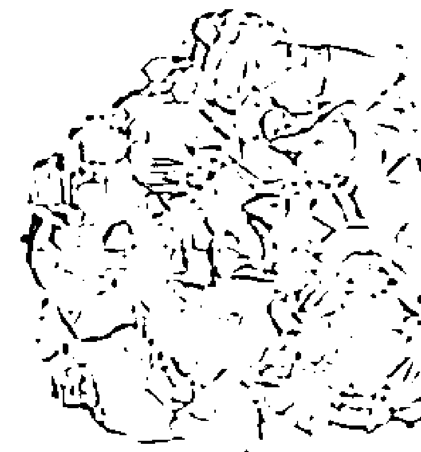

## 解析③ = 感情與投資的運勢

二十八歲小限年法走到第五宮，因五宮內太陽受到土星對沖，又受過運星引動。曾經歷感情波折與變化或是投資等問題，導致心境無法安寧。

## 解析④ = 疾病的癥結判斷

C小姐的第六宮頭處見到南交點，與本命冥王星形成疾病相位。南交點在雙魚座，代表體內液體循環系統的問題，一般最易形成病因，是為捍衛免疫系統的淋巴液循環，而疾病相位的另一端為冥王星在天秤座，此星座的刑剋，常帶來腎臟、腰部與泌尿系統等問題，她會得腎臟癌確實有跡可尋。2007 年九月前，一直有行星緊密引動上述刑沖，時間甚長，對健康非常不利。

## 占星寶盒

### 小限法 (Profection)

為預測流年的方法之一。是以 ASC 的星座起點當成 0 歲開始起算，每一年走一宮，並以每個流年的值宮當作第一宮，其餘各宮便以衍生宮（轉宮）後之宮位來論述。例如實歲 28 歲，流年小限的值宮即為第五宮，並以第五宮當這個流年的第一宮，而本命的第七宮則因衍生宮（轉宮）之故，就變成該流年的第三宮，以此類推。

## **解析⑤ = 用 A*C*G 找到解救方法**

以衍生宮（轉宮）來計算，二十八歲的流年為小限第五宮當作第一宮來起算，算至第六宮，恰為本命第十宮，此宮內見到在巨蟹座的木星，以三合相位解救本命第六宮的水星，水星本為第九宮的主星，故與海外有關，木星也是代表海外的自然主星，所以解救相關位都跟國外有關聯。根據 A*C*G 的行星線解釋，可看出木星行星線通過日本，就建議 C 小姐可前往日本，對於健康或有幫助。

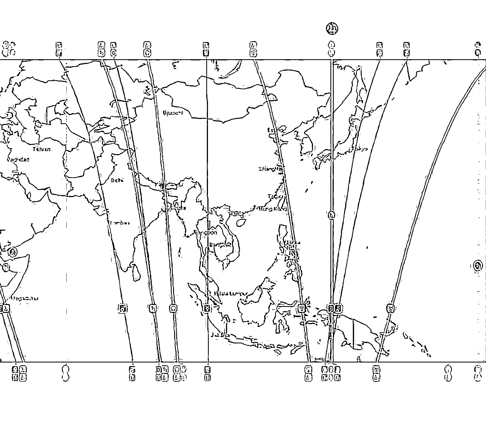

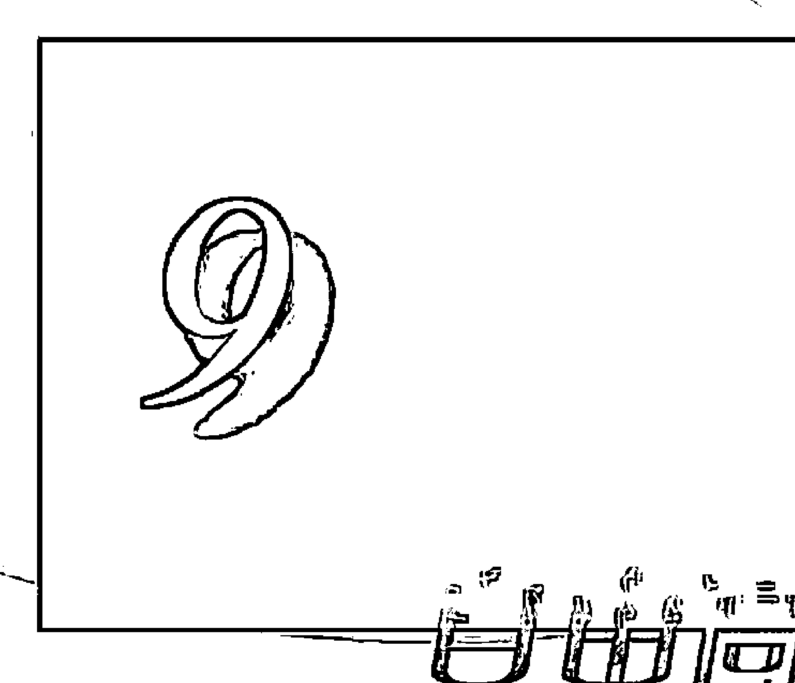

## 德行高貴的星盤

從事占星諮商開始，就一直希望每次來訪的個案，都是賺了大錢，事業成功，家庭幸福美滿，只是想要從星盤印證，他們的成功幸福真的其來有自；我想當喜鵲報喜訊，不想當烏鴉。

但這種愚痴的想法絕對是空想，多數個案都無法如願，每個人都有自己生命裡辛苦折磨的地方，這也正投射出在無盡輪迴中的真實人生。

## 德行高貴的星盤

這般的自我對話，就出現在我研究L小姐的星盤時，內心生起迴盪的音聲。L小姐的格局甚高、德性佳（此點是綜合阿拉伯點與印度占星判斷而來，礙於篇幅有限，在此不詳述判斷法則），這表示人格特質正向善念強，思想的層次亦高，雖然如此，可這高貴的靈魂卻投生在這張現世命運堪憐的星盤中，我憂心自己的分析著，會不會造成她的心理負擔。

在工作室裡，一面等著她來訪，一面在內心裡琢磨等會兒要和她說的話。當一個好的占星師，實在比當初單純的想像困難許多，只有懂得分析星盤絕對是不夠的，還要能以同理心來解釋星盤的意涵，雙方的價值觀要能一致，最好能站在對方的立場，去思考適宜的詞彙來說明星盤，所以，每張星盤對我來說都是一個新的使命與任務，就像使者一般，用正確的語言詮釋星盤符號幻化成的鮮活生命百態。

## 琢磨對白

L 小姐來訪了，出現在在我面前的是一位高挑長腿的氣質美女，有著一雙很像天心的魅力眼眸，白皙皮膚，一開口說話我就喜歡上這女孩了，非常真誠有禮，我感受到她其實很有自己的個性與想法，她所呈現出的禮貌與謙遜，是基於教養與尊重專業的禮節。

我開始緩緩講出已經在心中演練多時的對白：

> > 「從妳的星盤看來，是張格局很高的命盤」

> > 「格局很高？這是什麼意思呢？」

> > 「其實格局就是將人分成品秩與德性高低，當然現代社會已經沒這種說法了，但我們心裡都有數，社會上確實有這樣隱性的分類，而我們以占星架構分析星盤之前，更要先判斷格局高低。所以，妳的格局分數很高，表示你的德性高，會努力向上做出正面有價值的事，對於事情也能賦予更高層次的意義與價值觀。」

> > 「嗯，我知道了。」

> > 「不過，從妳的星盤看起來，有許多辛苦的地方，首先是妳的六親問題，跟原生家庭比較無緣，尤其是跟父母親緣分較淺。」

「我自小父母離異，我是爺爺奶奶帶大的。父親再婚後又跟繼母不合分居，我的爺爺奶奶也相繼往生，我只好跟繼母、同父異母的手足同住，雖然繼母也算照顧我，但是我跟繼母很多想法不太一致，一起生活不是很和諧。」

「嗯，妳的六親問題在命盤都有顯現，妳這麼年輕就要面對這樣的處境，真是為難妳了。另外，妳的命盤要多關心自己的健康問題，妳是否長期有呼吸系統相關的健康問題呢？而且是因為家裡濕氣重而造成的。」

「其實，我才因為生病緣故，在家休息至今無法工作，而且在很多年前就檢查出有肺部陰影的現象。我家住在基隆，基隆本來就常下雨，所以家裡濕氣很重。」

「明年妳又將會逢健康問題來干擾，為了預防起見，妳有可能搬到別的地方住嗎？」

「我很想自己住，但因為我現在也沒有工作收入，必須依賴繼母家庭的照顧，她們不搬，我也無法自己搬出來。」

「那麼妳要多照顧自己，最好能事先找醫生再作一次檢查比較好。」

「嗯，我會的，不過醫生說我的問題無法治療，只能持續觀察不要惡化。」

## 笑著走生命的路

其餘的時間，我們仍有許多未寫出的對話。之後，她也在我的留言板留下這段話：

> > 對於接下來的路途，挫折挑戰或生死，我倒是淡然；自己在去之前，有預感於自己的健康狀況有異。病痛卻是我，最不願見到的結果。大眾常無法理解病痛結束生命的人，為何無懼於生死，我倒是能深深有感。但既然逃不了，面對、接受、放下，還是我一貫處理的方法——樂知天命。也希望你能好好照顧身體，讓我們能一直站到生命的光明面，笑笑走下去。

## 任誰都受困命運規道上

我看多了許多星盤，也印證他們的真實人生，這些印證反應出的訊息就是：我們的一生都受困在已決定的命運軌跡裡。無論我們認為目前的成就是自身努力得來，或是認為困境是自己錯誤所造成，但驚人的實情是，許多人生經歷卻早已在自身的星盤裡顯現，但這實情並非表示我們什麼都不用做，就等待命運的結果到來就好。

應該思考的是，為何會被安排降臨於這樣的命運，並受困於這生的七情六慾裡？哪些事項是生命的關鍵重點，掌握這些關鍵才能真正掌握此生，甚至是來世。

我更相信，有些人的生命是來示現度人者，或是正在修行頂峰的最困難階段，所以選擇投身於多重磨難的軀體中，但有深度的靈魂卻可以自外於肉身，走出自由高貴的一生。

## 占星小故事

希臘天文學家——托勒密 (Claudius Ptolemy, A. D. 127-145)，他的著作《四書》 (Tetrabiblos) 被認為是第一本完整的占星學著作，涵蓋了所有占星的知識，也成為後代研究者的聖經。

托勒密觀察太陽進入巨蟹座時，是天空中最北緯的位置，且巨蟹座的始點即為夏至點，這會是北半球一年中最炎熱的時間，所以巨蟹座以及獅子座這兩個夏天的星座，就成了天空中掌管日夜的兩個重要行星：太陽與月亮所主管的星座，因為巨蟹座是陰性星座，而獅子座是陽性星座，所以安排陰性行星月亮主管巨蟹座，陽性行星太陽主管獅子座。

為了維持宇宙的和諧律動，托勒密安排最靠近太陽的行星——水星，去主管雙子座與處女座，這兩個星座恰好位在巨蟹座與獅子座之前後位置；軌道位於水星的下一個行星——金星，則主管金牛座與天秤座，這兩個星座就位在雙子座與處女座的前後位置；金星的下一個行星——火星，則主管牡羊座與天蠍座，這兩個星座就位在金牛座與天秤座的前後位置；火星的下一個行星——木星，則主管雙魚座與射手座，這兩個星座就位在牡羊座與天蠍座的前後位置；木星的下一個行星——土星，則主管水瓶座與魔羯座，這兩個星座就位在雙魚座與射手座的前後位置，也剛好就是位於巨蟹座與獅子座最遠的位置。上述的說明如下所示：

+   十二星座之主管行星
    *   狮子座：太阳
    *   巨蟹座：月亮
    *   处女座：水星
    *   双子座：水星
    *   天秤座：金星
    *   金牛座：金星
    *   天蝎座：火星
    *   牡羊座：火星
    *   射手座：木星
    *   双鱼座：木星
    *   摩羯座：土星
    *   水瓶座：土星

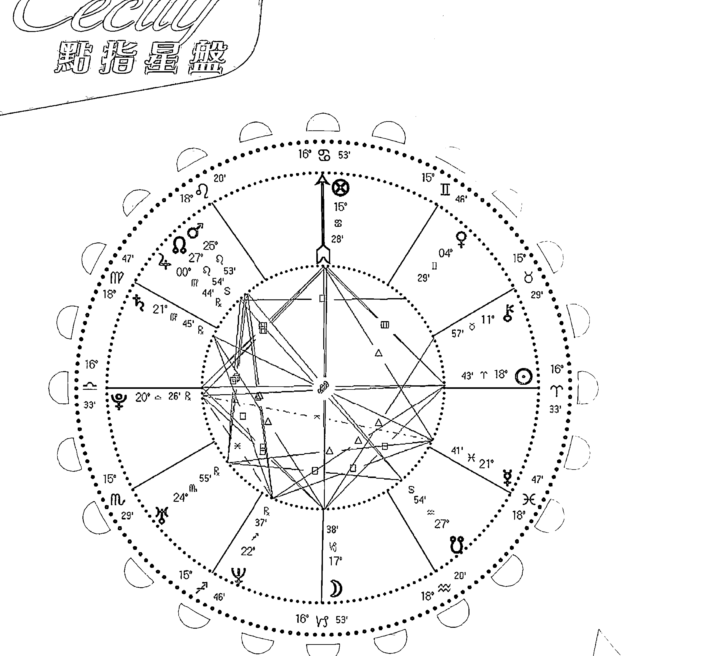

## 参考相位

+   1. 第一宮的冥王星，與第四宮的月亮，第七宮的太陽，與 MC（中天位置），形成大十字刑剋的特殊相位。
    2. 命主星金星在雙子座，與第六宮內的水星在雙魚座，兩者為互容的關係。
    3. 第三宮的海王星，與第六宮的水星，與第十二宮的土星成三刑會沖的特殊格局。
    4. 第一宮的冥王星與第六宮水星形成疾病相位。

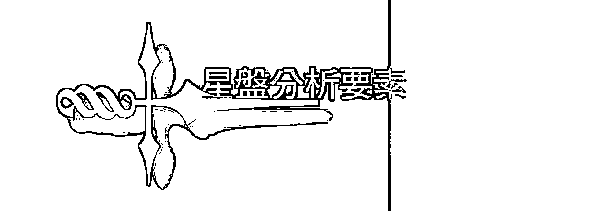

+   - 命主星所在星座：金星在双子座
    - 命主星所在宫位：金星在第八宫
    - 第一宫内行星：冥王星
    - 第四宫星座：摩羯座／第四宫主星：土星
    - 第四宫主星所在宫位：土星在第十二宫
    - 第四宫主星所在星座：土星在处女座
    - 第四宫内行星：月亮
    - 第六宫星座：双鱼座／第六宫主星：木星与海王星
    - 第六宫主星所在宫位：木星在第十一宫，海王星在第三宫
    - 第六宫主星所在星座：木星在处女座，海王星在射手座
    - 第六宫内行星：水星
    - 第十宫星座：巨蟹座
    - 第十宫主星：月亮
    - 第十宫主星所在宫位：第四宫
    - 第十宫主星所在星座：摩羯座

L小姐的案例，故事中的主要發生事項集中在第四宮（家庭與父親宮）與第十宮（母親宮）、第六宮（健康宮），這三宮之相關因子相對於第一宮（命宮）、第八宮（疾厄與生死宮）的交互關聯。

## **解析①=與父母的緣分**

L小姐的上升星座為天秤座，命宮內的冥王星與ASC（上升位置）緊密合相，又受到太陽與第四宮的月亮的刑剋，且第四宮主星土星又隱遁在第十二宮，可印證父親與L的緣分較淺，相處不易；月亮也是第十宮主星，入陷（陷宮）在摩羯座，也刑剋ASC（上升位置）與第一宮內的冥王星，可印證母親形象較弱，就是與她的緣分也淡，父母彼此間的關係也不和諧。

## **解析②=體質與健康判斷**

L小姐的命主星金星在第八宮，又跟第六宮的水星互容，且金星又受到第六宮主星木星在處女座入弱（弱宮）的刑剋，先天體質即較弱。水星與第十二宮的土星、第三宮的海王星，形成三刑會沖的特殊相位，且水星又跟第一宮的冥王星形成疾病相位，可印證L小姐較易有呼吸系統長期慢性的疾病。同時因為土星為第四宮主星受海王星與水星刑剋，容易因為居家較潮濕而造成健康的問題。

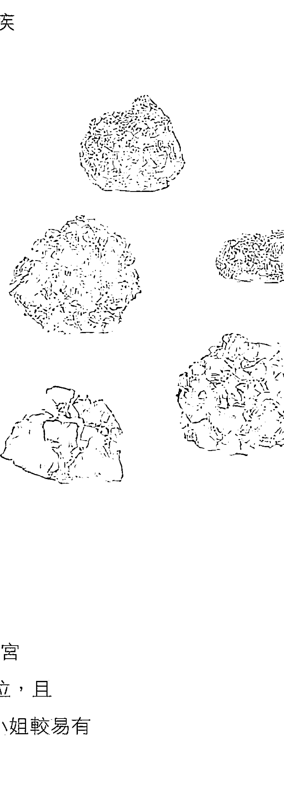

## 解析③＝第八宮的疾厄

命主星金星，也是第八宮主星，就落在八宮，使年輕早熟的 L 小姐早就深刻體悟生命無常，能將生死置之度外，樂天知命。所以，此星盤的刑剋雖然甚多，除了大十字刑沖的相位之外，還有兩個三刑會沖等特殊相位，所幸這些刑沖都有逢吉相位來調和（金星除外），使得即使面臨多重磨難，仍有能力穿過生命泥沼，才能體察軀體苦楚帶來的靈魂高度。

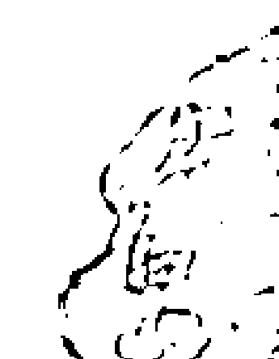

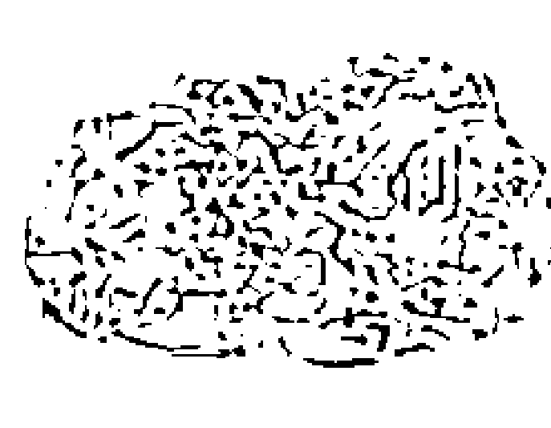

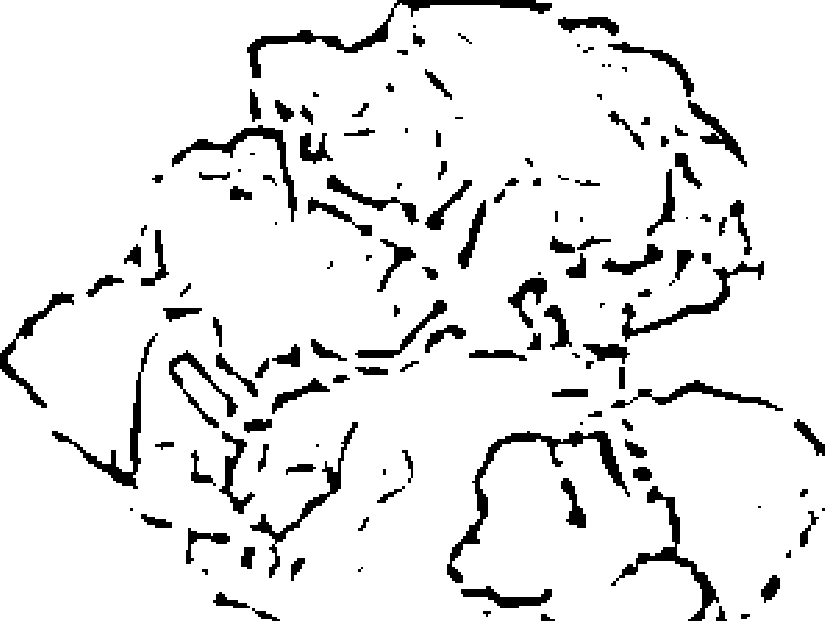

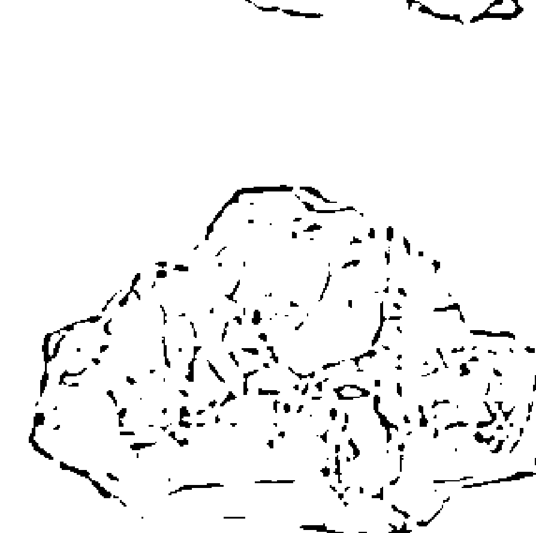

## 占星寶盒

### 相位 ( Aspects )

行星在一定的容許度數之下，彼此形成特定的角度關係，稱之為相位。一般常用的主要相位，係由托勒密 Ptolemy 所傳承下來，故稱為托勒密相位。

### 大十字 ( Grand Cross )

行星在一定的容許度數之下，彼此由四個行星組成兩個對分相位而成，這四個行星也與相連行星彼此成為四分相位。大十字的四個行星通常落在相同的四正星座（即啟動、固定、變動星座）上，阻礙力量甚強，但也更能發揮逆流而上的生命力。

## F a u l t s t o r y 紫微盤解析事業

主要以命宮與命主星來分析當事人的性向與才華，也透過第十宮事業宮的分析，判斷事業發展狀況。

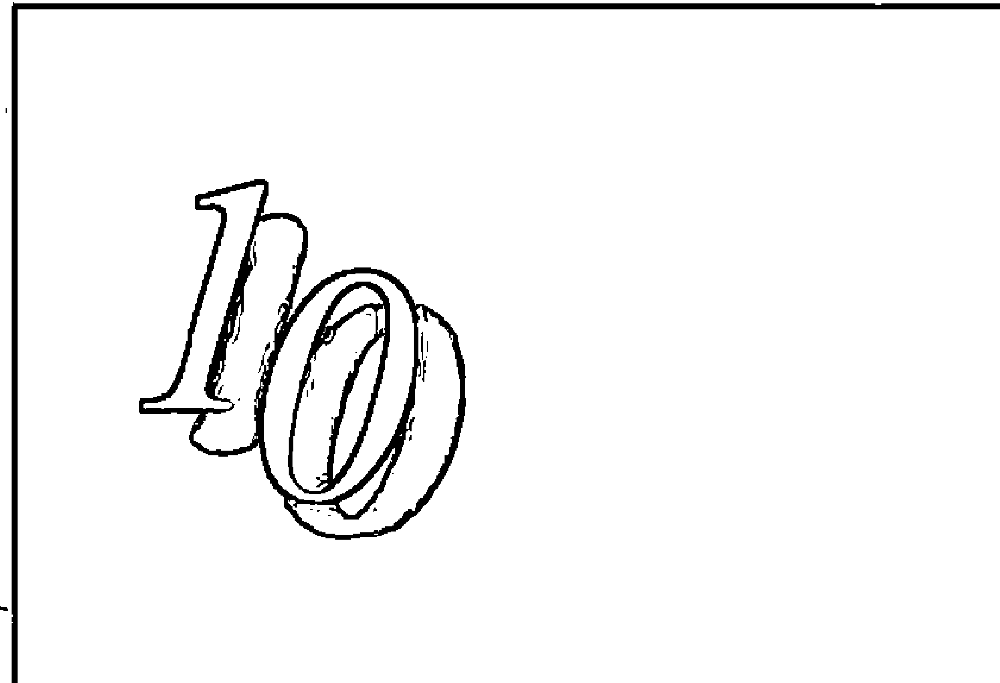

#### 疏離的孤狼

當人生甫過中年才發現「我現在的一切，都不是我當初想要的生活」該怎麼辦？

有人很幸運，一輩子從不曾浮現這種內心吶喊，來煩惱自己；但我的朋友 M 先生，心底常常出現這樣的質疑聲音，當他徘徊於過去與現況的內心掙扎中，我是他少數能傾訴的對象。

#### 疏離的孤狼

認識 M 很多年了，就是維持著幾個月才會聯絡一次的互動頻率，偶爾見面吃飯，或是突然來電說：正好下午有個空檔，一起開車上山兜風吧。因彼此沒有共同的交友圈，所以只要他不聯絡我，生活裡就完全沒有他的訊息。他就像孤狼一般，得空就獨自騎著單車、吉普車、重機上山旅行，十分享受與自己相處的時光，獨自在山嵐中，品味與世隔絕的孤離感。

M 先生從大學就開始玩音樂，是個地下樂團吉他手。年輕氣盛的 M 常會與人一言不合就情緒失控、大打出手。有次演出，他在酒精的催化下失手毆人致重傷，被拘提入獄，大學差點無法畢業。最後，一位知名音樂人因惜才為他奔走求情，才不致服刑並順利畢業，但已被貼上危險分子標籤的 M 先生，也因此難以繼續在樂團演出。

退伍後，M 老實地找了家行銷營養品的公司任職，雖不情願放棄理想，但總算有份穩定經濟的收入。他那與生俱來、對於電影音樂藝術的才華及商業敏銳度，在為公司構思產品的效益上發揮作用。透過鏡頭攝影剪接與音樂襯底，他將營養品在消費者身上的功效化成一支支感動人心的影片，這不但讓他有機會在一份原本不抱企圖的工作上發揮才能，更讓公司的業績大幅增長，也讓他一步步往上晉升，奠定了在事業上難以撼動的實力。

## 內心的缺口

在 M 的內心世界裡，一直有個未能被彌補的缺口。職位越高，在職場上必須戴著的面具就越重，他也就越容易出現矛盾不安的情緒，整個生活的軌道，更是離初始的夢想越遠。多年來，M 藉由玩重機、吉普車等興趣，讓自己的情緒放肆狂飆。偶而喝了酒騎單車上山，撞上迎面而來的汽車，便藉故與人打架爭執，靠著這種時而沉浸在有創痛感的生活裡，才有真實活著的感覺。也唯有這份感覺，才能帶著他重回到二十年前年少輕狂恣意、沒有官場面具，大笑大哭的時光。

我和他的內心裡，都有追尋人生存在意義的天真渴望，就是這份共通點將我們一直相繫。看著他用脫序的方式展現天真，看著我把共有的天真渴望化成真實的生活：結束掏空心靈的職場，投入星象諮商一途。有晚，我們倆在 Bar 喝了幾瓶紅酒，帶著酒意的他總是要求我唱歌給他聽。我哼起瓊·拜雅（Joan Baez）的 “Diamond and Rust”。他說我的歌聲，總能讓他感到真實人生的美好，也正是如此，他仍會經常想起我、試圖跟我聯絡。

## ## 真實的自己 VS. 現實的人生

M 顯得無助地重複對我說：

> > 「真的很羨慕妳，敢於放下過去的所有，作真實的自己，但是我實在沒有這樣的勇氣，不敢失去現在擁有的這一切。」

他繼續說：

> > 「有一天我跟多年不見的樂團老友見面，他們還繼續著當年玩音樂的夢想，上台演唱、下台喝醉，躺著趴著直到隔天茫然不知何地何時的揉眼甦醒。他們不知道下一場演唱在什麼時候，這意味著下一餐與下一頓酒也不知何時才有，就這樣過著醉在今朝卻沒有明天的日子。」

看著他們，他發覺過去的夢想有如腐敗的爛瘡，至此，M 一直魂縈夢牽的渴望已顯得無地自容。然而，當卸下臉上的面具時，又有哪裡是他真實的回鄉故所，能容納他狂野的內在心緒？

至於我，只能靜靜地當他生活裡的旁觀者，我的淡然表現，僅是傳達著我深刻體會生命的無常，就是藏身在這種無法接受當下、一直追尋不存在的幻象而生的苦楚，我只能提醒他，除了憾恨無法重來的過去外，他仍有眼下該珍視的美好一切，並調整自己的想法，去面對與接受現在，是我們除了學習生存技能外，更應該要學會的智慧與勇氣。如果做不到接受現況，卻又沒有破釜沉舟掙脫而行的力氣，就註定人生得背負著遺憾的念頭終老了。

註：我相當敬佩音樂創作人，前述音樂人的生活是轉述當事人的對話，敬請音樂專業工作者見諒。

## Cecily

### 紫微星盤

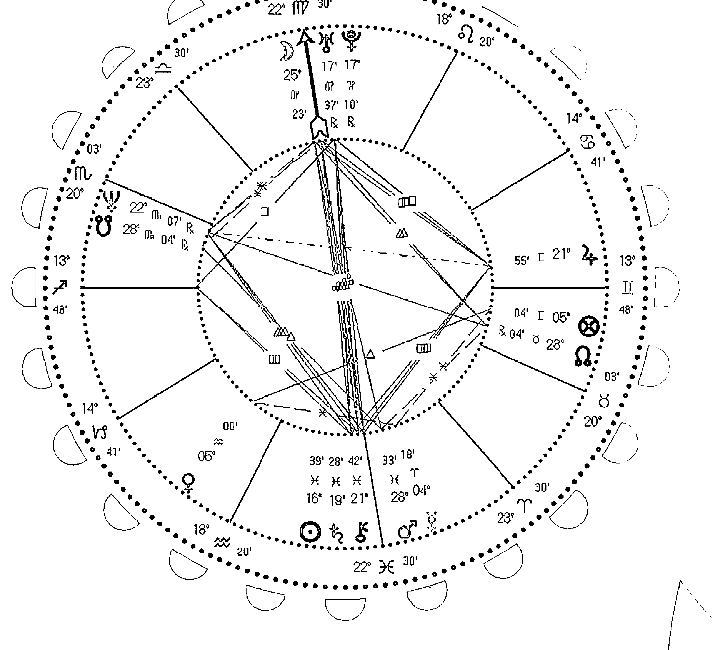

## 参考相位

+   1. 第三宮的太陽、土星，與第七宮的木星，第九宮的天王星、冥王星成三刑會沖的特殊格局。第三宮的太陽、土星，與第十二宮的海王星成三合相位。
    2. 第四宮的火星、凱龍星，與第七宮的木星，第十宮的月亮成三刑會沖的特殊格局。第四宮的凱龍星、火星，與第十二宮的海王星成三合相位。
    3. 第十宮的月亮，與第十二宮內的海王星成六合相位。

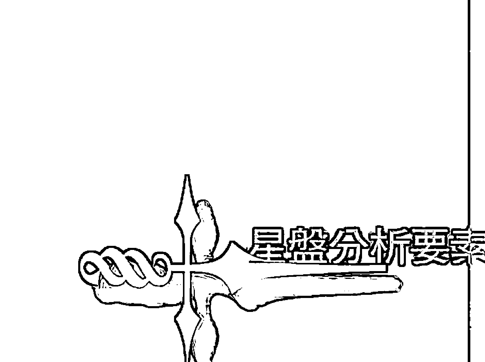

## 星盘分析要素

+   命主星所在星座：木星在双子座
+   命主星所在宫位：木星在第七宫
+   第三宫星座：水瓶座
+   第三宫主星：土星与天王星
+   第三宫主星所在宫位：土星在第三宫，天王星在第九宫
+   第三宫主星所在星座：土星在双鱼座，天王星在处女座
+   第五宫星座：牡羊座
+   第五宫主星：火星
+   第五宫主星所在宫位：火星在第四宫
+   第五宫主星所在星座：火星在双鱼座
+   第十宫星座：处女座
+   第十宫主星：水星
+   第十宫主星所在宫位：水星在第四宫
+   第十宫主星所在星座：水星在牡羊座
+   第十宫内行星：月亮M先生的案例，故事中的主要發生事項集中在第五宮（才华宫）與第十宮（事業宮），這兩宮之相關因子相對於：第一宮（命宮）、第二宮（財帛宮）、第三宮（交通宮）、第九宮（高等教育宮）、第十二宮（玄秘災難、監禁宮）的交互關聯。

### 解析① = 矛盾衝突的個性

M先生的上升星座為射手座，命主星木星在雙子座入陷，第三宮的太陽、土星，與第九宮的天王星、冥王星成三刑會沖；木星也與第四宮的火星、凱龍星，第十宮的月亮成三刑會沖，變動星座甚強，可印證M先生的心緒多變不定，人生多轉折變化，能朝多元方向發展，適應性也強，卻會無法堅持初衷。行星多數落在雙魚座與處女座上，兩個星座互為對宮而矛盾，可印證性格常在浪漫脫俗的想像，與世俗物質條件的精算之中矛盾衝突。

前述的刑沖，讓他性格中具有特立獨行，不願遵守紀律，缺乏耐性、易怒，計畫常改變，過分挑剔等另一面的人格特質。

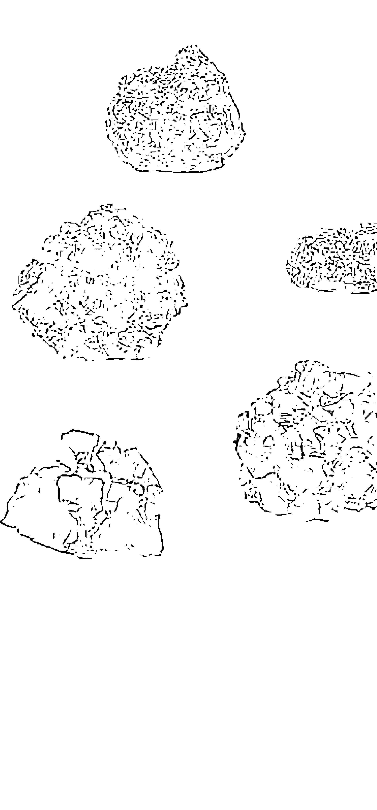

### 解析②=才華與個性特質

第五宮主星火星在雙魚座，火星又與第十二宮的海王星三合，印證其具有天馬行空的想像力，富有藝術與靈性直覺的天分，適合往藝術、音樂、電影或是玄學靈修等方向發揮才藝。

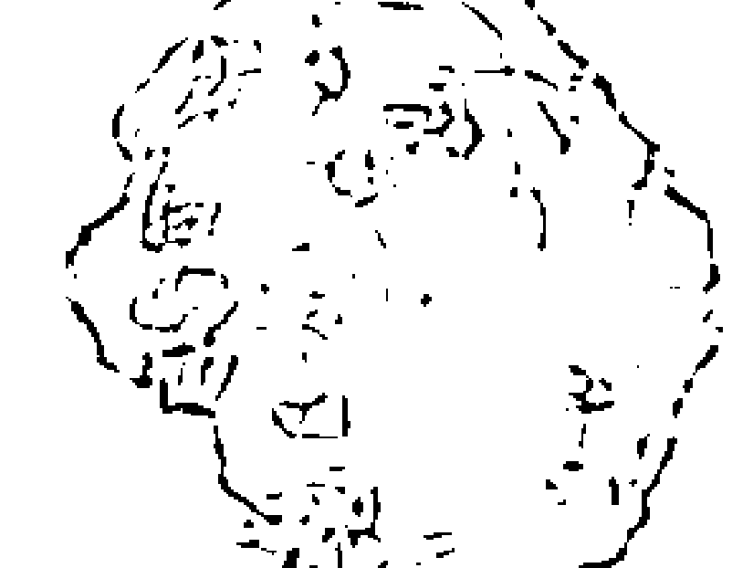

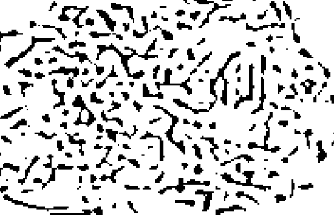

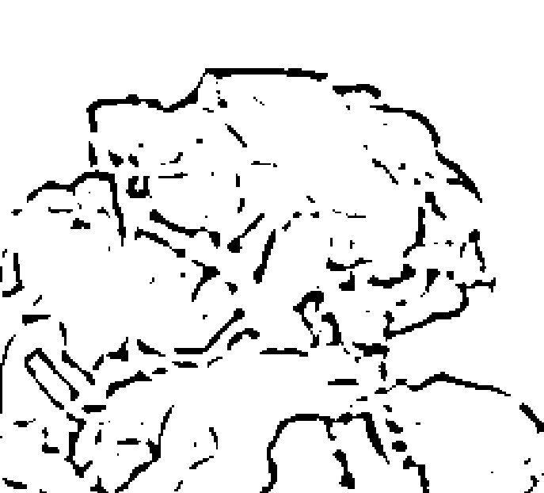

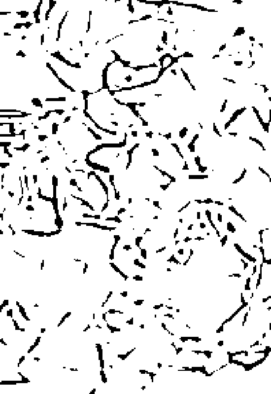

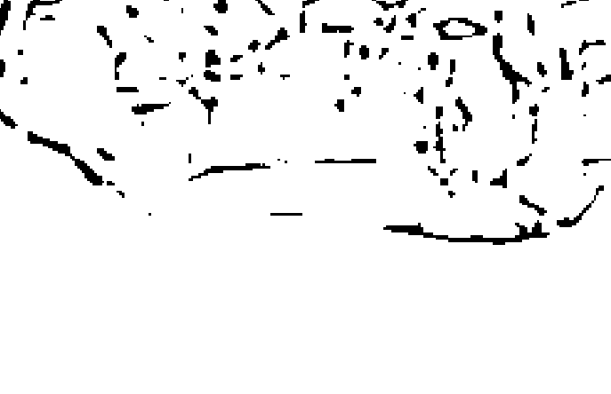

### 解析③=格局顯現意外危險

從第十二宮主星冥王星飛入第九宮，與天王星合相，且與命主星木星形成上述三刑會沖的格局。容易在高等教育階段，有災難或監禁等事情突然引發，造成困境。第三宮的太陽與土星，與第三宮主星天王星，都參與上述的三刑會沖，也讓他嗜好飆車競速等，也因此常惹出事端與意外危險。

## 占星寶盒

### 合相(Conjunction)

主要指兩個行星形成距離約0度之會合。此相位的好壞以行星本身的吉凶狀態來論好壞。

### 三刑會沖

由三個行星各自形成兩個四分相位與一個對分相位所組合而成。三刑會沖代表著挑戰與困難的狀況，而三角型頂點的行星所在宮位與所掌管宮位之事項，容易成為最主要的問題所在，所以頂點的行星所受壓力也最大。

### 解析 4 = 事業方向

第十宮落在處女座，代表分析、服務與協助有關的工作，也主宰著衛生健康營養等事務，加上月亮在第十宮，可印證會從事健康營養、餐飲食品等相關產業，月亮及 MC(中天位置)皆與海王星有六合相位，因此在現職中發揮自身藝術天分，更能相得益彰。

### 解析 5 = 衝突的平衡點

第十宮的月亮與第五宮主星火星、命主星木星三刑會沖，讓 M 先生在事業與才華興趣上總難以找到平衡點。整個星盤中，第十二宮的海王星，最能化解這幾組刑沖相位，所以他在自我的矛盾點上能找到的穩定力量，就是沉潛在靈性與神秘學中，如能將出世的虔誠轉化為入世生活的省思，才更有力量去轉化生命的空虛不足感受。

## 占星小故事

### 托勒密相位

希臘天文學家托勒密深受希臘哲學數學家畢達哥拉斯 (Pythagoras) 的影響，後者發現宇宙間存在的數的規律，進而發展出音律的結構。

畢達哥拉斯認為宇宙和諧基礎來自完美的數的比例，而音樂與宇宙天體存在類似的結構。他發現重要的音律比分別為 1:1、1:2、1:3、2:3、3:4，托勒密則結合這個理論應用至占星上，發展出不同星座相間隔距離的相位關係。他共建構出四種主要的相位關係：對分相位（180度）、四分相位（90度）、六分相位（60度）、三分相位（120度）。所以，對分相位即是同一直線上的對面星座，此即為1:1之音律比；四分相位就是對分相位之一半的距離，即1:2與3:4的音律比；六分相位為對分相位的三分之一距離，即1:3的音律比；三分相位為對分相位的三分之二距離，即2:3的音律比。

所以後世定義上述的星座間距的行星相位關係，取名稱為「托勒密相位」。

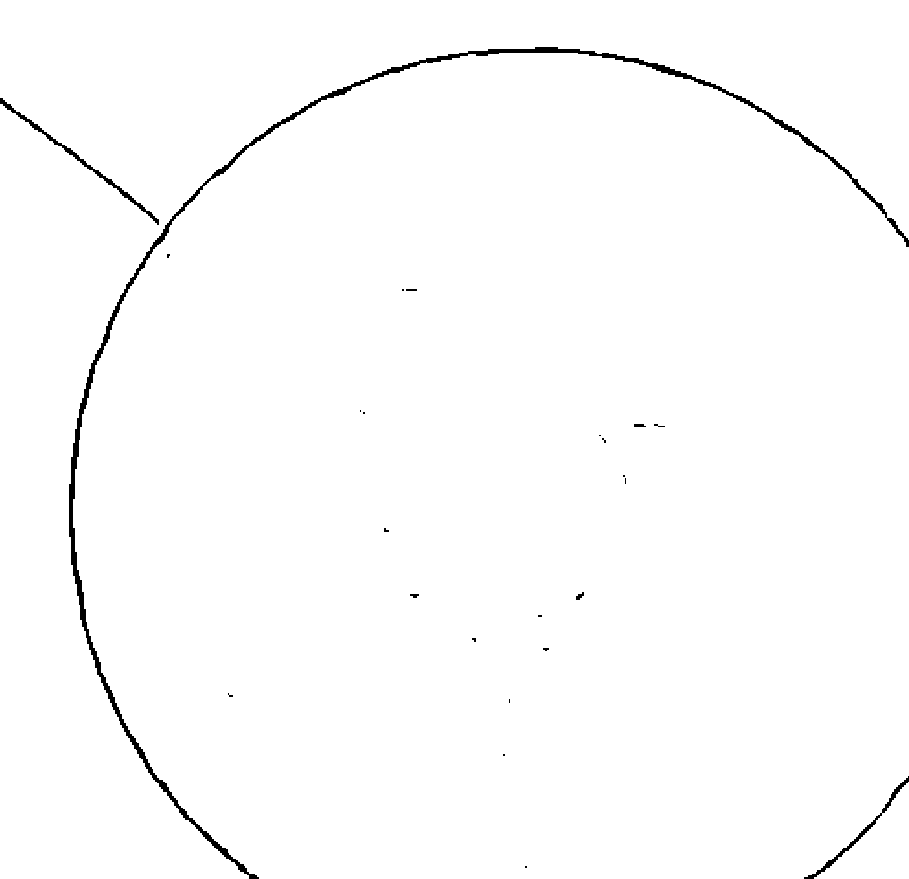

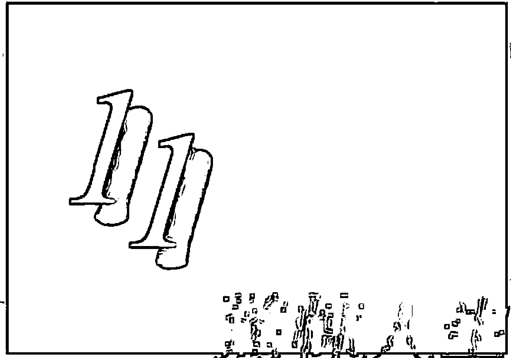

> 有天在電腦前寫文章時，線上出現一個要求加入我成為 MSN 好友的訊息，我習慣地按下是，便出現以下對話：
> 「占星老師，妳還記得我嗎？我是某某……」
> 「欸……我真有點記不起來了……」
> 「妳大概看過太多人的盤，所以記不得了，」
> 「等等！妳是那位歌手嗎？」
> 「對啊，好久不見！」
> 「真的好久不見，大概有三年了吧……」

正式開業前幾年，我以玩票的性質為朋友解盤，當時經友人介紹，認識一位組團的創作女歌手。幾年不見，互相交換近況後得知她已嫁作人婦，還身懷六甲。對於神秘學一直有深厚興趣的她，想請我幫忙看看先生的星盤，於是便欣喜地約在閒適的碧湖湖畔小咖啡廳裡重逢。

### 重逢敘舊

許久不見依舊爽朗的她，興奮聊起與先生在恆春街頭的浪漫邂逅，他倆結識當時仍各自有對象而錯過交往機會，但姻緣線最後仍將他倆連在一起。她在聽我分析起她的另一半（在此稱為 P 先生）星盤中的優點時，嘴巴雖然死硬地說：「別把他講得這麼好！」但表情卻藏不住以夫為榮的喜悅。確實，一個具有尖端科技專業的才子，體貼又英俊，身上還流著與她相同的浪漫血液、理解她的創作志向，給予她高度自由的婚姻生活空間，有對象如此，人生還有何求！

### 有破壞力的刑沖

當我推論 P 先生的財帛宮具有相當破壞性的刑沖結構，牽涉到事業、金錢借貸與感情的多重破壞力，甚至涉及暴力脅迫的狀態時，她只淡淡談起初識 P 時，他剛剛歷經一段很不堪的生活。她說到在兩人結識的初期，他已被過去幾年的工作折磨得不成人形，與現在根本判若兩人。這番話完全引出我的好奇心，想一探究竟這星盤上甚為強大的刑沖，會帶來怎樣的真實生活故事？

一星期後，她邀請我參加她的演唱會，我在現場首次見到 P 先生本人，頂著小平頭、蓄著小山羊鬍，有一雙極富藝術家氣息的單鳳眼，型男的裝扮行頭，怎麼看都不像個工程師，反而像是建築或室內設計師。當聊起占星，他不像一般人只好奇於占星的神秘驗證力，反倒著眼於占星發展的歷史軌跡，由此，便可清楚見識到他具備科學理性思維的訓練與素養。由於當天晚上的主角是台上帶球演唱的好友，所以還是忍住好奇心，不在對話中觸及他的過往。

### 故事終於揭曉

關於 P 先生奇特的人生經歷，是在一個星期後才揭曉。好友來工作室拜訪我，才繼續聊起 P 的星盤，沒想到我之後所聽見的故事情節，是個曾經佔據新聞版面的社會案件，整個過程如八點檔連續劇般令人難以置信，卻真實發生了。

P 先生剛踏出社會的第一份工作，是從事特殊專利的發電設備研發，市場遍及海內外國家。他認真地為公司拼命付出，年紀輕輕就肩負起市場開發的責任，此外也協助公司返校徵才，因而有許多學弟跟隨他進入公司。這間公司由一位說服力極強、易受人信賴、外表與學養俱佳的老闆領導，他常以佛理教導部屬，所有員工均對其言聽計從，甚至願意一起住在公司提供的宿舍裡，不分上下班時間、一起共同為公司打拚。

當接下海內外客戶的訂單後，公司屢屢因為財務吃緊而無法順利生產，但老闆不斷編說公司未來前景的大餅，讓這些少不經事又具有衝勁的員工們懷抱科技新貴的夢想，願意共同承擔對外募資的責任，紛紛遊說親友借貸或入股以資助公司，完全不疑有他。但公司的財務缺口像是個無底的大黑洞，導致每位員工對外的借款均達數百萬計，甚至有人背負上千萬債務，然而，這些不法所得卻全數流入老闆口袋中。

### 陰謀傷害

當時，與 P 交往中的女友曾警覺不對勁，認為這家公司並不單純，建議 P 換工作，可是早已一頭栽進去的 P 先生，完全聽不進去這番勸告。由於 P 和所有員工都住在公司宿舍裡，所以女友也經常於假期間來訪。

就在某個假日，P 單獨自外返回公司，知道女友在老闆辦公室。他本想敲門進去找女友，卻意外聽見門內傳來女友的喘息低吟聲。心頭一涼的他，只能愣坐在門外，一直到房內兩人完事後才默默離開。之後，他更發覺公司女同事跟老闆之間，均有不尋常的曖昧關係，至此他才看穿老闆外在假象底下所掩藏的猙獰面目。

從那時起，P 驚覺恍悟公司不尋常的經營手法，可能是騙局一場，便著手計畫離開，但是他不忍其他同事仍對老闆所言深信不疑，於是便偷偷向同事揭露真相。不過他的行徑卻反被同事暗中通報老闆，老闆也對此進行全力反擊。這個老闆運用強大的說服長才，向所有同事編造一番故事，將公司財務的虧損全歸咎於 P ，把 P 描繪成公司的叛徒公敵，要求全體同事一起監視他。孤立無援的 P 只好自己一人逃離公司，但卻在同事的嚴密監控下暴露行蹤，又被捉回公司。

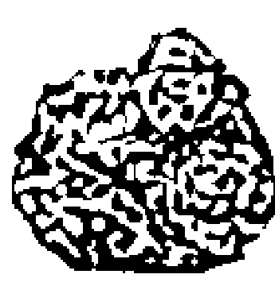

回到公司後，老闆指派幾名同事將 P 毒打一頓，還要求他每天在上班時間的八小時裡都得跪地懺悔。忍受這樣的日子足足半年之久，這段期間沒有同事伸出援手，甚至原本曾質疑公司經營異常的女友，卻轉而相信老闆的花言巧語，從他跪地的身旁走過時，竟也是投以冷淡輕蔑的神情。

### 逃亡重生

某個夜半時分，P的逃亡計畫終於順利成行。身心俱疲、創傷甚深的他什麼財物也沒能帶出來，只好緩步從高雄走回屏東老家。沿途中餓了向麵包店討隔夜麵包止飢、睏了就睡在公園長椅上，整整兩天終於回到家，結束了長達七八年的惡夢。

雖然因此背負著數百萬的債務，但這幾年的歷練，讓他結識不少賞識他的客戶，其中一位客戶在知道他的遭遇後，便出資邀請 P 開設新公司，繼續生產這項他相當熟稔的發電元件技術。P 也重新整頓過去的客戶資源，進而為新公司帶來可觀的業務量。

至於過去那家公司，在 P 離去後，老闆以經營不善宣告倒閉便潛逃，同事們才大夢初醒，終於發現這是一場騙局。他們聯繫上 P 先生，希望能一同串連控告老闆，無奈老闆早已脫產遁逃無蹤，甚至有兩名家境清白的女同事也跟著人間蒸發。

P 先生當下明白，耗費時間進行法律爭訟，就算能掙回金錢損失，也彌補不了過往時光的傷害。放下過去往前看，如今他的新事業已順利開展，身旁有活潑有魅力的妻子陪伴，也升格為父親，P 對於過往已無悔無恨，這些往事，暫且就由我來撰寫成文，讓讀者有機會細看他曾有過的驚悚人生吧！

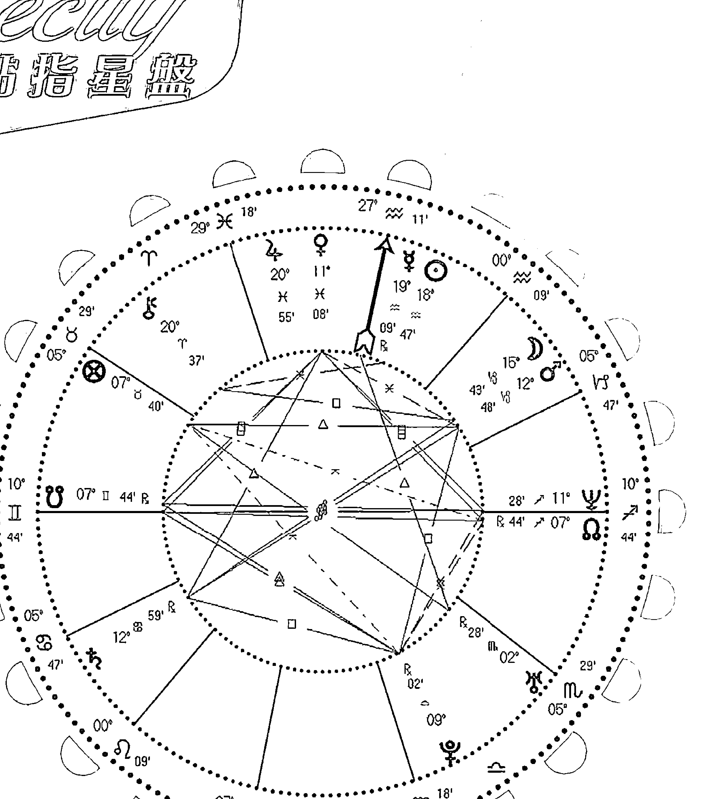

## 參考相位

- 1. 南交點、北交點與海王星、金星，分別落在第一宮、第七宮、第十宮形成三刑會沖。
- 2. 土星、冥王星、火星與月亮，分別落在第二宮、第五宮、第八宮形成三刑會沖。
- 3. 土星與金星三合，火星與金星六合，冥王星與 ASC（上升位置）三合。

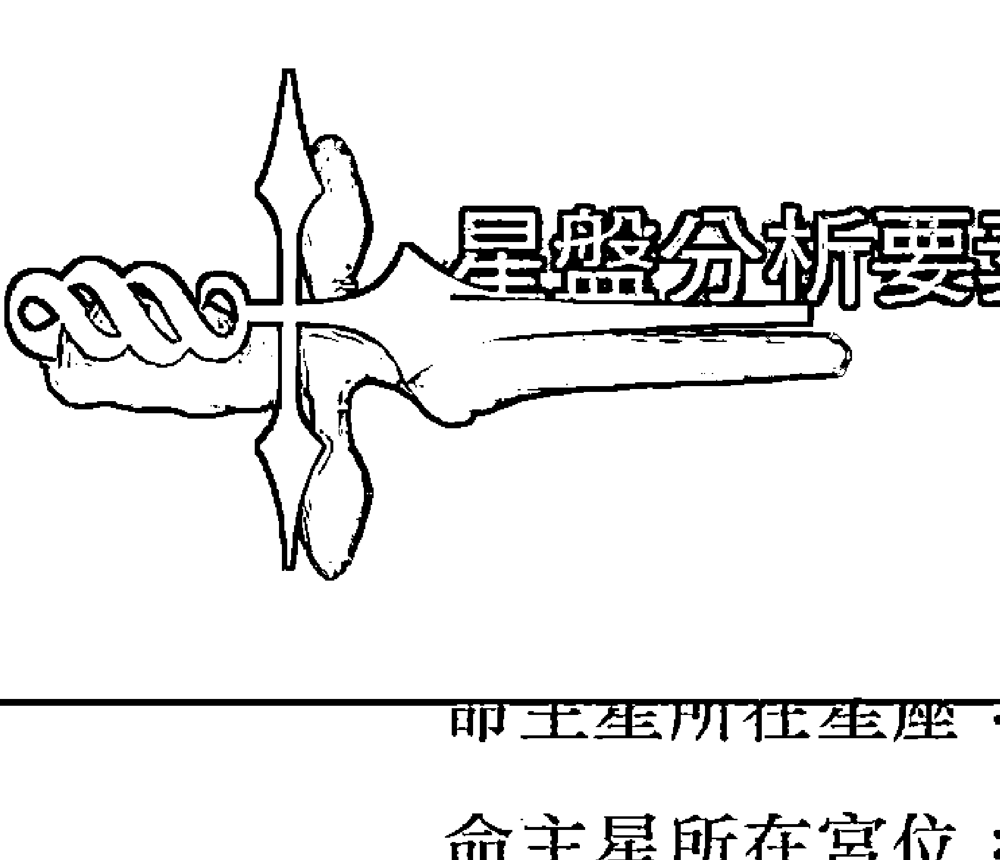

- 命主星所在星座：水星在水瓶座
- 命主星所在宮位：水星在第九宮
- 第一宮宮內行星：南交點
- 第十宮星座：水瓶座
- 第十宮主星：土星、天王星
- 第十宮主星所在星座：土星在巨蟹座，天王星在天蝎座
- 第十宮主星所在宮位：土星在第二宮，天王星在第五宮
- 第十宮內行星：木星，金星
- 第十宮內行星所在星座：木星與金星均在雙魚座

P先生的案例，故事中的主要發生事項集中在第十宮（事業宮），以及第十宮相關因子對於第一宮（命宮）與第二宮（財帛宮）、第八宮（借貸宮）的交互關聯。

### 解析①＝事業與才華

上升星座是雙子座，命主星在水瓶座是在旺宮星座，且在第九宮，第九宮主管國外、高等教育等事項。由前述星盤要素的串連，可推知 P 先生具有理性思維的教育與素養，對於科學知識具有相當強旺的求知慾望；由於命主星水星飛入第九宮，使得他的教育程度高，也有利於往海外從事行銷業務、教學演講、出版發行等事宜。

### 解析②＝印證個性

從第十宮（事業宮）內的金星，與第一宮（命宮）的南交點、第七宮（合夥宮）的北交點及海王星所形成的三刑會沖，可印證他容易遇到的上司是外型、人緣甚佳，會有宗教修持或是浪漫的藝術情懷等特質，但亦有自欺欺人的人格；與 P 先生具有累世的業力因果關係，易在此世造成事業上的困擾。

### 解析③＝刑沖問題所在

從第十宮主星土星落在第二宮（財帛宮），與第五宮（投機宮）冥王星、第八宮（借貸宮）的火星與月亮所形成的三刑會沖，可印證 P 的老闆易促成 P 去做借貸投機等事，因而造成財務困頓與負債等事。且火星、土星、冥王星這三顆凶星的組合，常與暴力傷害、囚禁阻隔、黑道陰謀等負面事項牽連在一起，也可就此看出老闆本身為人處事的凶惡之象。前述第十宮內金星的三刑會沖僅是小阻礙與困擾罷了，火星、土星、冥王星這三顆凶星的組合，才是 P 先生顯現命中最嚴重問題的地方。

### 解析④ = 化解之道

第五宮也代表愛情宮，宮內冥王星與土火的三刑會沖，印證當時交往的對象，雖有冥王星深入直覺式的觀察力，卻也被捲入在這個三刑會沖中無法自拔。好在，凶惡的三刑會沖的三個頂點行星分別有調和力量來化解：土星與火星受到金星的三合相位，冥王星受到 ASC（上升位置）的三合相位，事業宮內更有強而有力的兩大吉星：木星與金星在此，使得他能逢凶化吉，過去傷害也並未在心中留下恨意，反而把過去的磨難當作踏腳石，另闢事業新疆域。

> **占星寶盒**
>
> **四分相位**
>
> 四分相位又稱為刑。即兩行星形成距離約90度的距離，此相位為不協調的相位，凶象居多。三刑會沖即由三個行星形成兩個四分相位，與一個對分相位所組成的。

### 生命轉彎的關鍵貴人

我喜歡看電影。

劇情的轉折點，常是主角身處困境，恰巧某個關鍵人物出場，命運就起了戲劇性的變化。電影銀幕裡，會用運鏡、特效、音樂等轉換，來鋪陳主角命運裡的關鍵時刻，觀眾便清楚明白主角正面臨生命的重大改變。

人生若能把生命縮影成兩小時，轉折點的關鍵人物，可能就十分清晰了，只是關鍵主角沒有跟著緊湊的背景音樂一起出場，當事人無法像電影觀眾直接認出他，僅能回顧與他交織而成的關鍵決定，讓生命因此轉彎。有些關鍵主角的戲分很少，完成階段性任務就退場；有些人出現後的戲分很長，可能就是下半場的另一位主角。

### 星盤注定的潛能

認識 T 小姐時，僅知她是位專職的保險經紀人，花了些時間作了時間校正，校正後的星盤看來，她似乎具有朝向藝術投資發展的天賦，可是與她的現職卻搭不上邊，我也怕講了一個風馬牛不相及的星盤指引，顯得十分突兀可笑。

經驗告訴我，對於年輕小朋友可以從星盤天馬行空地討論他未來可能的幾種發展；對於社會歷練成熟的來客，僅能提供星盤具有的幾種潛能，但是對方的生命尚未因緣具足開展至此，當下倒未必相信真的能朝這些潛能發展；想想自己若在三十歲前就被預言未來會走入命理這條路，我應該會嗤之以鼻，但命運就有如此神奇的力量，把我帶上現在的道路。

我試探性地問了一句：「妳對藝術品有興趣嗎？」沒想到她竟然接口說：「我剛考上藝術管理碩士班，準備將來要跨足到藝術投資的領域。」後來我跟 T 小姐逐漸熟稔，才知道這是她職涯中第三個重大轉折，而且她的每個關鍵時刻，都有一個關鍵人物在背後推助她走上更好的道路。

### 第一個關鍵主角

在重視教育的家庭背景成長的 T 小姐，取得大學財經學位後，經過激烈競爭，考取一家知名的金控集團旗下保險事業子公司擔任儲備幹部，因此開始接觸保險事業，也初識因音樂而結緣的另一半。

這家大型集團有很強烈的階級觀念。例如每回老闆出入電梯彷彿像天子出巡般，一般職員均須快速走避淨空；職員不分男女皆需在金庫門前輪值守夜。這個企業的文化，讓初入社會的她難以適應。她更發覺，相較於管理的工作，自己對於開發保險業務的興趣更為濃厚。

當時尚在交往的先生，並沒有勸她留在這個大企業保護傘底下，反而鼓勵她展翅高飛，並為她分析當時保險市場，以她年輕專業的形象在當時的保險業務員屬於相當少數，具有保險公司管理幹部背景投入業務開發更是罕見；在當時多是媽媽保險業務員，僅靠人際裙帶關係來發展業務的情況，讓 T 在市場的優勢與特質深具信心。與先生兩人共同評估市場定位後，T 毅然決定放棄現職，並賠償原公司高額違約金，跳槽至另一家以業務員培訓搖籃聞名的外商保險公司，以專業之姿逆向操作開發市場，看準高收入的專業族群市場來切入，經過一段時間的拓展，最後成功鎖定醫生為目標經營客群，這使得她的業績一直名列前茅。

在這個階段，T 的生命出現第一個關鍵人物——她的先生，交織出一個關鍵決定，讓她走上自己的舞台。

### 第二位關鍵主角

T 小姐旺盛的企圖心並未因為業務順利而滿足，當大眾都接受正確的保險觀念，已臻成熟與飽和的保險市場，讓她開始有強烈危機意識，必須從原本的市場提升，並找尋轉換跑道，開始跨足投資型保單業務，並考取多項相關證照。

有天，T 無意間看到一篇財經報導，介紹一位從華爾街返台的基金經理人，T認出此篇報導主人翁的姓名是她昔日同班同學；商業嗅覺敏銳的她想對昔日同學開發保險業務，立刻去電至他的現職公司。電話接通後她才尷尬地得知，這是一場同名同姓的誤會，這位基金經理人並非她的舊識，但沒料想到兩人竟然發現彼此真的曾是校友，只是過去不相識，因為這通烏龍電話反而結識一位新朋友。

率直不拐彎抹角的 T 與對方訂下會面時間，以洽談保險業務。見面後，兩人從同校往事至保險業務等話題聊開來了，她當然不會放過這大好機會，順便向這位從華爾街抱得上億元而歸的同學請益投資要訣。幸運的是，老同學並非如同華爾街投資者般的投機主義，他分享華爾街許多被過度包裝的商品背後，藏著投資人很難探知的高風險性，既然 T 小姐想轉往投資理財發展，老同學甚有意願教導她如何避開投資陷阱，以及正確穩健的投資觀念。

這一談談出合作計畫，日後兩人共同設立經紀人公司，直接代理國際投資保單商品。在金融風暴前，T 原本手上持有的金融商品，也因為老同學對於國際金融局勢預測判斷，讓她早在風暴降臨前全數出脫，這位關鍵主角讓 T 小姐保全所有投資資產，安然度過金融危機。

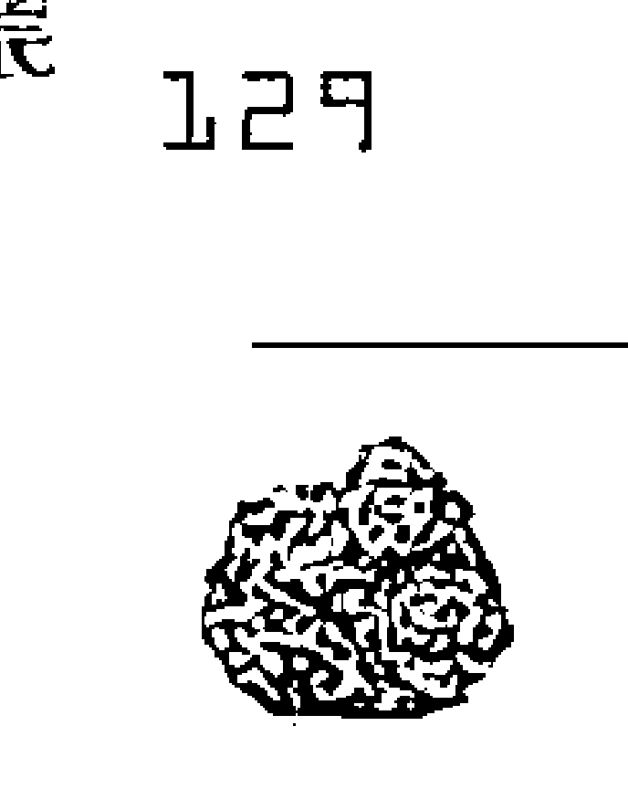

### 第三位關鍵主角

T小姐擔任投資經紀人期間，因緣際會參與了陶瓷骨董鑑賞課程，便常拉著先生至骨董文物會場尋寶，現場總有許多商家主動來推銷販售骨董，一位靦腆、口條不甚流暢的店家老闆趨近她，自稱擅長陶瓷古物專項，聊了幾句發現他也上過同一門骨董鑑賞課程，彼此稱得上是學長學妹關係，這個交集點，讓 T 願意與他作更深入的交談。

在真偽難辨的骨董市場裡，讓這位學長發展出一項特殊的業務，就是擔任骨董投資者的經紀人，代尋國際拍賣會場的投資標的物。他建議 T 要真正習得骨董鑑賞，除了理論基礎外，更需要接觸國際級真品，最直接的方式就是去國際拍賣會場上手。T小姐與先生均感興趣，也邀請學長擔任藝術投資經紀人，正式踏入骨董拍賣市場。在學長的指導下，大幅提升她對骨董的鑑識能力，幾次競標購得的骨董收藏把玩後，透過學長介紹轉賣，也讓 T小姐獲得投資收益；對投資市場有敏銳直覺的她，開始認真考慮骨董買賣，可能發展出另一番事業。

T小姐決定切割出時間研讀骨董文物歷史，並考取藝術管理碩士班，作為開啟新事業的準備。正當金融風暴快要席捲全世界前，卻也恰巧遇上骨董業的學長提出合作計畫，兩人結合設立新公司。

公司，正式跨足至骨董投資業，這一步也走向了她星盤指引的道路。

T 小姐雖然心直口快，回想起這些關鍵人物幫助她所下的關鍵決定，都深感幸運遇上貴人相助，但是，當貴人沒有搭配電影效果走入我們的生命時，又有多少人能真正認得他就是改變自己生命歷程的關鍵人物呢？

## Cecily 慧指星盘

## 参考相位

-   1. 命主星水星合相冥王星。
-   2. 第五宮內的木星與第九宮內的幸運點三合相位。
-   3. 木星在天秤座，與金星在巨蟹座，兩者為互容關係。
-   4. 木星會合第四宮內的天王星、刑剋月亮。
-   5. 第二宮內的金星、第六宮內的海王星、第十宮內的北交點形成大三角相位。

命主星所在星座：水星在處女座

命主星所在宮位：水星在第四宮

第七宮星座：射手座／第七宮主星：木星

第七宮主星所在星座：木星在天秤座

第七宮主星所在宮位：木星在第五宮

第十宮星座：雙魚座／第十宮主星：木星、海王星

第十宮主星所在星座：木星在天秤座、海王星在天蠍座

第十宮主星所在宮位：木星在第五宮、海王星在第六宮

第十宮內行星或敏感點：北交點

第二宮星座：巨蟹座／第二宮主星：月亮

第二宮主星所在星座：月亮在摩羯座

第二宮主星所在宮位：月亮在第七宮

第二宮內行星或敏感點：金星

第二宮內行星所在星座：巨蟹座

金星掌管宮位：第五宮與第十二宮

## 占星 寶盒

### 變動星座
(Mutual Signs)

包含雙子座、處女座、射手座、雙魚座，具有的共同特質為適應、變通、多元性，此特質顯著者能調整自己的心態來適應外在不定的變化，但缺點是善變與缺乏原則。

### 幸運點
(Part of Fortune)

為重要的阿拉伯點之一。幸運點代表物質幸運、聲望恩典、大財富等。

T 小姐的案例，故事主要的事項
集中在第七宮（夫妻合夥宮）、
第十宮（事業宮）相關因子對於第一宮（命宮）、第二宮（財帛宮）、第五宮（投資宮）、第八宮（他人錢財宮）、第九宮（海外宮）的交互關聯。

## 解析①=個性與才華

T 小姐的上升星座為雙子座，命主星水星在第四宮，落在處女座為廟宮、會合冥王星。可看出她的個性聰明、善於吸收新知，深受重視教育的家庭培育，具有理解與分析事理的邏輯與記憶能力，言談率直不拐彎抹角，尤其長於商業策略。
整張星盤許多行星所在星座落在變動星座甚多，所以適應性佳，富有隨時調整方向，培養多元技能的應變能力。

## 解析②=事業與財運

T小姐的第七宮主星為木星落在第五宮，木星也是第十宮主星，所以事業與合夥都易跟投資相關事項有關，或是事業能與個人興趣相結合。木星跟第二宮的金星為互容關係，且木星三合第九宮的幸運點，第五宮內的木星與第九宮內的幸運點三合相位，可印證T小姐的合夥人及配偶能在投資上成為T小姐的幸運助力，增強T小姐的財運，更印證了合夥人與配偶能幫助T小姐投資國外相關標的物而獲利。

## 解析③=命定的事業方向

T小姐的第二宮見到金星在巨蟹座，金星是第五宮主星，金星與第十宮的北交點、第六宮的海王星形成大三角，可印證她的事業可涉獵投資藝術品，更可因巨蟹座而細推至骨董上，因而得以在事業上名利雙收。

| 项目 | 说明 |
| --- | --- |
| 项目1 | 这是项目1的说明内容。 |
| 项目2 | 这是项目2的说明内容。 |
| 项目3 | 这是项目3的说明内容。 |
| 项目4 | 这是项目4的说明内容。 |

## Life Story
從星盤探知上天的安排

主要是討論世人面對生活的整體態度，
綜觀命宮、命主星與各宮之間的交互關聯性，
做整體的分析，感受星盤的徵象意涵。

## 13 長大

如果我們夠細心留意上蒼對生命的安排，會發現事事都有祂的巧思連結之處，今天無關緊要的偶發小事，卻可能是為日後某件有意義事件預先鋪陳的橋段。

## 故事的鋪陳

某個星期一，我照往常時間出門等車前往工作室，等了二十分鐘都等不到，此時出現另一路公車，不耐久候的我，索性上車前往捷運站轉乘；下車站牌處有三民書局，剛好想起來要找一本書，乾脆順道買了書再搭車；請店員尋書時，我無意識地翻閱桌邊攤開的翻譯文學，有套書吸引了我的目光，不禁翻開書本，越看越有滋味，便將整個下午花在這套書上了。

這是一套四冊名為《Persepolis 我在伊朗長大》的漫畫文學，這套書已被翻拍成電影「茉莉人生」。大概是命主星在第九宮射手座，讓我著迷於異國寫實生活的文學，這套書作者瑪贊・莎塔碧 (Marjane Satrapi) 為 1969 年代出生於伊朗的插畫家，現定居巴黎，有感於全球新聞頻道播放的影像，讓世人對於中東世界了解多麼片面、誤解，所以創作出這套書，以她個人在伊朗的生活為主軸，讓讀者深入了解伊朗人固有的價值觀與生活文化。因政權迭變、戰爭而產生的動盪不安，受到恐怖主義折磨最深的，其實是在這片土地生長的人們，在政府當局高壓控制下，人們為求自保而表面服從，使得伊朗人民在表象與暗地裡的生活，有著兩套截然不同的衝突差異面向，更可貴的是，她的父母親與祖母在社會價值嚴重被扭曲的生活下，仍保有一貫教養子女應有是非價值的判斷力。上述的書評是我以較嚴肅的觀點所下的摘要，實際著作中，作者經歷國土家園幾近毀滅的大悲劇，反而以兒童的觀察角度，輕鬆自嘲來描繪自己的生活。

## # 如數家珍的星盤分析

幾天後，我接到 D 小姐來電預約解盤，D 瀏覽過我的部落格，想請我幫她看看與剛出生寶寶的緣分。幾天後我們見面了，D 小姐相當謙遜有禮的儀表氣質，與電話中富教養的語氣一致，印證星盤中明顯的處女座性格。

D 小姐的星盤中，幾個顯著的地方是：工作認真，與社會外界互動溝通多。代表父親宮主的兩個主星，均有些扣分的不佳狀態，表示與父親緣分淺，同樣的刑剋也意味著 D 小姐受困於配偶錢財與自身健康的壓力。母親的自然徵象星在命宮，表示母親與命主的關係很深。國外宮內有來自夫妻宮的主星，配偶可能是在國外認識，或從外國來的緣分，D 小姐也喜歡至外地生活。子女宮兩主星，一個入命宮，一個在財帛宮，表示與子女緣分深，子女喜歡與她相處，會帶來好財運，但也會因用錢之道使其不悅。

D 小姐表示，出社會以來都是從事科技類業務工作。從小生活在單親家庭，與母親的關係相當緊密融洽，即使異性緣相當多，她也不積極接受異性追求，直到三十多歲，才認識當時剛從國外回來的男友（也就是目前的丈夫），丈夫從小在國外長大，也經歷不同國度求學、工作、創業，因創業失敗錢財一切歸零，認識 D 小姐時，剛在台灣定居重新開始。D 小姐很開心知道寶寶跟她緣分會很深，能緊繫夫妻關係，也為她帶來好財運。後來我們直接看寶寶的星盤時，我還提及他的水瓶座甚強，也都集中在十一宮，將來可能有機會為人權相關事情而奔走。

## # A*C*G 顯示的異國情緣

當然，除了上面呼應星盤如數家珍的人生事項，我們還分享很多對生命的感受。譬如各種的無常，讓我們領悟生命的實相，也使我們開啟研究占星這扇門，D 小姐也看了不少相關書籍，是個業餘愛好者，她提到網路上有相當多占星研究的部落格，也不知為何逛到迷占星部落格，瀏覽文章一段時間後，因寶寶的降臨，便起了想請我解盤的念頭。聊到這時，我們都還渾然不知道，這其中有股力量引導我們的會面。

接續前述，曾經在國外求學的 D 小姐很喜歡異地生活，在台灣緊繃的壓力，只要到了國外便能放鬆。我提及可能會因為先生之故，有機會到異國生活，便以 A*C*G 地圖（Astro*Carto*Graphy）為 D 小姐查看可能居住的國家。可是，我卻看到她的月亮行星線落在一個陌生的國度，我心想：怎麼會落在這地方啊！縮了一下脖子，也收回一點剛剛期待答案揭曉的情緒。

我語帶失望的口氣告訴她：「這恐怕是個妳不會有興趣的地方。」

> 這恐怕是個妳不會有興趣的地方。

但我還是硬著頭皮把這個地點——伊朗，指出來給她看，D 小姐反而甚為詫異的告訴我：「其實，我先生就是從小在伊朗長大的！」

> 其實，我先生就是從小在伊朗長大的！

我才又重新提振情緒說：「哇！真是太奇妙了，不然，我再看看妳兒子的 A*C*G 地圖好了……天啊！他的國外宮主星的行星線更是直接通過德黑蘭！」這時，我已經驚訝得頭皮發麻了！

> 哇！真是太奇妙了，不然，我再看看妳兒子的 A*C*G 地圖好了……天啊！他的國外宮主星的行星線更是直接通過德黑蘭！

## 從偶然串出關聯地圖

D 小姐寶寶的星盤，有機會為人權相關事情而努力，看了他的 A*C*G 地圖後，我猜想，長大後的他，或許有可能因為生命臍帶牽繫至遠方原生故鄉——伊朗，而為深陷戰禍的原鄉人權奔走吧！話題聊到此刻，我感到我們已經跳脫占星師與諮商客戶的關係，我很自然聊起《我在伊朗長大》這套書所描述的情節，她很開心回應，她的公婆提過當年在伊朗的生活，確實是如同書中所描述的情景，只是她還沒有機會看這套書，我則建議這是一套讓寶寶理解父系血緣歷史的好書，我們一邊聊著，一邊慢慢理解冥冥緣分這件事。

D 小姐在茫茫網海中發現我的部落格，我也在不久前看完《Persepolis：我在伊朗長大》這套書，確實有股強大力量牽繫我們見面，這不是單純的偶然吧！應是自有我們無法預知的安排。

因為這個案例，我特別跑去電影院重新觀賞由此套書改編的影片「茉莉人生」，當晚又違背自己不熬夜寫作的原則，一定要把這件真實案例記錄起來，堅持寫下當時我強烈的悸動！

## # 占星小故事

### ## 日心論

占星學說在歐洲繁榮興盛的文藝復興時期，大放光芒。梵蒂岡多位教皇，均延攬重用占星家擔任顧問，為其選擇加冕吉時，歐洲各國更有宮廷占星師，協助選擇征戰時機、或協助進行政治鬥爭等事宜。

當時，占星學採行的是托勒密所提出的天文體系理論，這個理論的基本架構認為地球位於宇宙的中心，所有星體均繞著地球運行以圓形軌道運行，現代稱這個理論為「地心論」（Geocentricism）。但是波蘭天文占星學家尼古拉斯·哥白尼（Nicolas Copernicu）卻對地心論產生懷疑，哥白尼進而提出「日心論」（Heliocentricism），他認為地球並不是宇宙的中心，地球其實是跟其他行星一樣以太陽為中心在運行，然後又以地軸為中心而自轉。

哥白尼一直擔心日心論之說，會被教會視為異端邪說，直至他逝世前一年才同意出版，他的理論由同世紀的天文學家約翰·開卜勒（Johnny Kepler），十七世紀義大利的天文物理學家伽利略（Galileo），十七世紀英國的天文物理學家牛頓（Isaac Newton）爵士持續研究驗證。

日心論的學說，因為推翻了占星學立論基礎，使得占星學逐漸沒落，在歷史上影響占星學發展甚鉅。有意思的是，前述諸位將天文學帶離占星學的偉大研究者均尊敬占星這門學科，也曾付出許多努力去研究占星學。

## 参考相位

-   1. 第十一宮的火星合相太陽與水星，受到第八宮的土星刑剋。
-   2. 第一宮的月亮合相海王星，與第十一宮的冥王星成六合相位。
-   3. 第九宮的金星刑剋 ASC（上升位置），但金星也跟第一宮的月亮海王星形成三合相位。
-   4. 第二宮的木星，與第十一宮的冥王星刑剋。

## 星盤分析要素

命主星：火星與冥王星
命主星所在星座／宮位：火星在處女座第十一宮，冥王星在天秤座第十二宮

第一宮內行星：月亮與海王星

第四宮星座：水瓶座／第四宮主星：土星與天王星
第四宮主星所在星座／宮位：土星在雙子座第八宮，天王星在天秤座第十二宮

第五宮星座：雙魚座／第五宮主星：木星與海王星
第五宮主星所在星座／宮位：木星在第二宮，海王星在第一宮，木星與海王星均在射手座

第七宮星座：金牛座／第七宮主星：金星
第七宮主星所在星座／宮位：金星在獅子座第九宮

第九宮星座：巨蟹座／第九宮主星：月亮
第九宮主星所在星座／宮位：月亮在射手座第一宮

第十一宮星座：處女座／第十一宮主星：水星
第十一宮主星所在星座／宮位：水星在處女座第十一宮

D 小姐的案例，故事中主要發生事項集中在第五宮（子女宮）與第七宮（夫妻宮），這兩宮之相關因子相對於第一宮（命宮）、第八宮（疾厄與配偶錢財宮）、第九宮（國外宮）、第十一宮（人際交友宮）的交互關聯。另外提及第四宮（父親宮）宮主星的狀況。

## 解析① = 印證個性與才能

D 小姐的上升星座為天蠍座，命主星火星在處女座，合相第十一宮主星水星與第十宮主星太陽，可印證 D 小姐具有處女座工作認真細膩、自我要求高，社會人際資源多，可透過人際關係與業務行銷來成就事業。第一宮見月亮合相海王星，又與金星三合相位，可知其個性賢淑顧家重感情、氣質優雅，喜愛音樂藝術。

## 解析② = 與父母親緣分

D 小姐的六親關係中，首先看父親的狀況，第四宮的兩個主星，天王星遁入第十二宮，土星在第八宮刑剋命主星火星，由此可印證與父親緣分淺。而第一宮內的月亮合相海王星，跟命主星冥王星有六合相位，且第十宮主星太陽合相另一命主星火星，可印證母親與 D 小姐的關係很近很親密，D小姐受母親影響也甚深。

## 解析③=配偶與子女緣分

D小姐的第七宮主星金星在第九宮，又跟第一宮的月亮海王星形成三合相位，但也刑剋 ASC（上升位置），可印證其配偶可能在外國認識，或是異國的緣分，兩人感情關係融洽，但配偶的異性緣會給D小姐帶來些困擾。而第八宮土星之刑剋也意味著D小姐會受到配偶錢財困頓的壓力。第五宮的兩個主星，海王星飛入第一宮，木星飛入第二宮，與冥王星刑剋，表示D小姐與子女緣分很深，子女喜歡與她相處，會帶來好財運，但也會因用錢的價值觀差異，造成親子關係緊張。

## 占星寶盒

### 六分相位
(Sextile)
又稱為六合相位或簡稱六合。兩行星形成距離約60度的相位。此相位代表機會相位，吉象居多。

## 解析④＝外地運勢

第九宮主星月亮飛至命宮，此月亮跟第五宮主星海王星合相，又跟第七宮主星金星形成三合相位，表示命主喜歡至外地生活，容易透過海外旅行紓解壓力，也容易因配偶或子女而有機會至海外生活。

## 解析⑤＝A*C*G 地圖印證到異地緣分

根據上述說明，我們可查看其 A*C*G（Astro*Carto*Graphy）地圖的月亮行星線所在位置，如下圖所示，月亮行星線落在中東即可印證。

幾年前，我即將離開一份任職頗久的工作，決心遠離紛擾的人事鬥爭。

辭呈被批准不久，公司就找到一位頂替原職務的新同事 K 先生，他是位口才便給的講師，在同行中的資歷比我還深，足以勝任這個職務。短短兩星期交接時間，我盡力把過去幾年的資料作完整交代，更像把小孩託付他人領養的母親般，把部門每位同事的性格習慣都向他作一番說明後，我帶著不捨的心情揮別過去赴任新工作。

## 職務交接

K 接下職務後的狀況，透過老同事聚會時有所聞，他的表現非常傑出，尤其過去講師的背景，更讓他在這個職務上如魚得水；幾年後，聽說他因私人因素離職，並更換了幾個不同工作，最新近況是，他自行成立個人工作室專為企業授課。

八年以後，因老長官生日聚餐的機緣，終於有機會與 K 見面。與他簡單交換近況，他正在規劃一個生命成長心靈課程。我對於他的新課程相當感興趣，礙於當天許多老同事在場，嬉鬧把酒言歡的時刻很難聊得深入，於是留下聯絡方式，希望有空能彼此採訪聯繫。

## # 天下男人都會犯的錯

一星期後，K 依約到工作室拜訪，我們邊用餐邊閒聊，把過去八年的空白迅速補足。K 先聽我談起這幾年的變化，之後，他緩緩聊起自己的過往，笑稱接下我空出的肥缺當時，是他人生外顯成就的巔峰時刻：公司營運蒸蒸日上，事業成功收入令人稱羨；任職於同業的老婆甜美可人，兩人感情融洽生活無虞；同時又遇上一位受到他成熟魅力吸引的女性友人，心甘情願當他的地下情人，毫不費力達成全天下男人想要的美夢。

只是，這種假象的平衡狀態無法維持太久，情人當初死心塌地的態度開始轉變，原本平衡的生活，從地下情人要求扶正這件事開始打破表象的和諧，逼著他與妻子離婚，K 不願意傷害妻子，情人就把事情鬧開，情願玉石俱焚，妻子才恍然驚覺婚姻中有第三者的存在。

婚外情驚爆後傷了三個人，妻子堅決要求離婚，情人也避走其他城市，K 更散盡錢財以彌補對前妻的傷害。更大的傷害是深藏在心中無止盡的自責，不堪緋聞的傳言在公司彌漫著，K 先生因而離職，轉換至新工作重新出發。

## 真實的平靜

K 經過幾次跳槽的機會，本來全心追求的高薪及地位也隨之而來，但是擁有了事業成就，卻無法擁有真實快樂的感覺，這才發現真正想獲得的是平靜滿足的生活；外在忙碌生活的狀態，無法平息內心自我批判的聲音，甚至失去相信自己的力量。內在騷動的能量需要有疏通的出口，否則將會潰堤，K 終於覺察需要對外尋求協助，在過去一位上司引導下，他接受了佛法的洗禮。

我很訝異 K 語氣平和地陳述這段往事，聽到他對過去的坦率，我不苛責他曾有的錯誤，反倒在心中暗許他是個真英雄，大家都容易將犯錯者當成蓄意傷害人的壞人，然而，當心中的良知拂照著自己過錯時，看似加害者的自我內心的折磨未必比受害者輕。

接觸佛法幾年下來，騷動逐漸平息，他了解過去的自己是沉溺在追逐外境成就，及慾樂的積習裡而不自覺，苛責與批判只會讓心更僵硬，唯有慈悲與接納才能柔軟；靜心的內觀呼吸法門更教導他，以自覺的心性去觀照習性的生起，方能逐漸破除它。K 原本旺盛的求知種子也找到孕育的園地，開始生起進一步的念頭，他善用過去擅長的教學與演講能力，以佛學思想為基礎，規劃出更貼近大眾語言的生命成長心靈課程，以幫助更多像過去的他一樣，沉溺習性中需要外力拉一把的人。

錯誤的認知與行為造作，讓K付出前半輩子累積的一切，卻也是開啟新生的一扇門。

## 可掌握的是看待命運的心境

我跟他的言談中，無意聊到宗教哲理對我的影響力，他對這個話題深感興趣，他問我：「妳獲得的體悟是什麼？」

投入命理工作後，我看見許多人人生變化，似乎不自覺地在被決定好的軌跡上行走，我一直問自己，身為人，我們能掌控的究竟是什麼？

透過宗教，才逐漸領悟命運就是內外境的交織，外境的因緣可能是累世結下的果，會遇上什麼人、好或壞的境遇，就像洪流一般襲來，是今生難以改變的；可掌握的內境，唯有清楚照見自己的習性。每張星盤，就像一張累世習性與外境交會的構圖，完全任由習性隨著外境走，自然就會走入命運安排的方向，因為得失而雀躍傷悲或許是人之常情，但是無論結果好壞，不過是定數罷了。唯有認清我們的習性，改變看待生命的眼光，相信活著就會犯錯，因為犯了錯，讓我們在疾速前行的途中停下來、檢查交通工具、確認自己前行的方向，然後重新出發。無論是否仍走在命運原本安排的路上，這時，旅途的心境已經全然改變了。

K 先生與我，是在人行道兩側分別種下的小樹苗，彼此看似無緣交會；在時機具足後，各自向上延伸成長的枝葉，竟在同樣高度的天空中相遇交織，奇妙的緣分就此又展開新一章。

## 占星小故事

### 伊莉莎白一世的御用占星師——約翰·迪伊博士

英國女王伊莉莎白一世在位期間，她的密友約翰·迪伊博士（Dr. John Dee）：畢業於劍橋大學，為著名的天文占星學家，得到伊莉莎白相當的信任，成為女王幕後諮政的顧問，伊莉莎白於1559年登基加冕的日期，即透過約翰·迪伊為其擇時。

約翰·迪伊擔任伊莉莎白一世諮政時，強力勸說伊莉莎白，為了護衛她的帝國，應加強海軍的實力，拓展海外的領域，他也擔任英國海外探險隊的導航技術顧問，並且建議以殖民統治來管理新的領土，英國在伊莉莎白的統治之下，終於打敗西班牙艦隊，成為新的海上霸權，約翰·迪伊也是最早使用「大英帝國」這個名詞來稱呼英國的人。

有趣的是，約翰·迪伊寫給伊莉莎白女王的密函，均以007為代號來匿名，這也就是後來英國著名電影007情報員的名稱之由來。

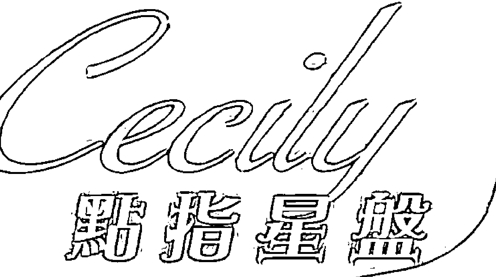

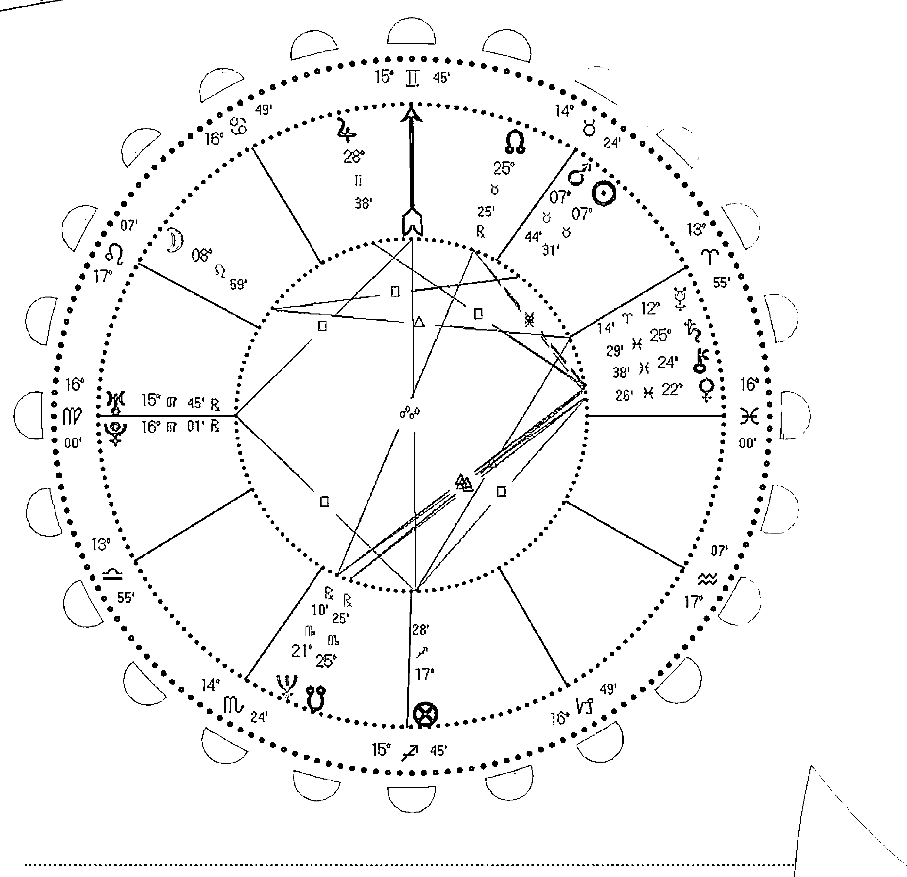

## 参考相位

- 1. 天王星、冥王星合相 ASC（上升位置）、對沖 DSC（下降點）。
- 2. 水星與月亮三合。
- 3. 火星合相太陽受月亮刑。
- 4. 七宮內的金星、凱龍星、土星與第三宮內的海王星、南交點三合，金星、凱龍星、土星也與第九宮的北交點六合。

## 星盤分析要素

| 項目 | 內容 |
| :--- | :--- |
| 命主星 | 水星 |
| 水星在牡羊座 |  |
| 命主星所在宮位 | 水星第八宮 |
| 第一宮宮內行星所在星座 | 天王星、冥王星均在處女座 |
| 第七宮星座 | 雙魚座／第七宮主星：木星、海王星 |
| 第七宮主星所在星座 | 木星在雙子座，海王星在天蠍座 |
| 第七宮主星所在宮位 | 木星在第十宮，海王星在第三宮 |
| 第七宮內行星所在星座 | 土星、凱龍星、金星均在雙魚座 |
| 第二宮星座 | 天秤座／第二宮主星：金星 |
| 第二宮主星所在宮位 | 金星在第七宮 |
| 第五宮星座 | 摩羯座／第五宮主星：土星 |
| 第五宮主星所在宮位 | 土星在第七宮 |
| 第八宮星座 | 牡羊座／第八宮主星：火星 |
| 第八宮內行星 | 火星、太陽 |
| 第九宮星座 | 金牛座／第九宮主星：金星 |
| 第九宮主星所在宮位 | 金星在第七宮 |
| 第九宮內行星 | 北交點 |

K先生的案例，故事主要發生事項集中在第七宮（夫妻宮），以及第七宮相關因子對於第一宮（命宮）與第二宮（財帛宮）、第五宮（愛情宮）、第八宮（借貸宮）、第九宮（宗教宮）、第十宮（事業宮）的交互關聯。

## 解析①=個性與才華

K先生的上升星座為處女座，命主星水星在第八宮（也跟深層心理隱藏的原欲有關）牡羊座，與月亮三合，具有行事細膩要求完美、聰明記憶力佳、擅長演說表達等特質；命宮中有天王星與冥王星合相在ASC（上升位置），更增加革新創造的先見之明，且擅長經營謀略、喜歡探究深層心理動機，由此印證他以演講專長作為事業發展的舞台，更能進一步延伸至心靈成長課程。

## 解析②=解讀婚姻狀況

天王星與冥王星對沖DSC（下降點），這兩顆星表現在親密關係上，當事人會高築心牆，使親密關係疏離，讓另一半難以解讀其內心深處的愛意，對於長遠穩定的婚姻容易帶來破壞性的因素。

## 解析③=婚姻癥結分析

第七宮（夫妻宮）的主星木星飛到第十宮（事業宮），第七宮內有土星（第五宮主星，代表愛情宮）、金星（第二宮主星，代表財帛宮）、另一半外型美麗，用情深也容易受情感所傷，土星恰好

## 解析④ = 婚姻與財務的關聯性

第二宮主星金星在第七宮，第八宮主星火星又受到月亮的刑剋，金星的力量為旺，印證了財務經營能力甚佳，配偶也具有幫夫財運之象。但是火星在八宮的破壞力，又受到代表女性的月亮來引發，使得累積錢財有因女性破損之象。

## 解析⑤ = 命定的宗教因緣

第九宮（宗教宮）內見到北交點、其主星金星又飛到第七宮，金星又與南北交點形成三六合相位，正好印證由於婚姻關係的變化，反而引發出宗教的因緣，想必是前世即有其因果緣分，而在今世待婚姻問題的產生後，實則是宗教緣分具足的時機。金星與第三宮（掌管演說教學等事項）的海王星與南交點三合，更印證因婚姻之故，引動從事靈性成長課程的方向。

## 占星寶盒

### 南北交點

南北交點並非行星，而是月亮運行軌道——白道，與太陽運行軌道——黃道之兩個交點。

南北交點所在宮位位置，代表個人前世善果報與來到此世應學習之處，具有宿命輪迴的特質。

月亮由南向北與黃道交軌處稱為北交點，又稱為羅喉，一般認為北交點具有像木星的幸運吉祥順利的吉星特質。

月亮由北向南與黃道交軌處稱為南交點，又稱為計都，一般認為南交點具有像土星的不幸、阻礙的凶星特質。

## 老鳥與菜鳥／庸俗與清新

十多年前，X 小姐剛出社會沒多久，帶著對未來的不確定感，來到一家雜誌社報到。她注意到後方的位子已空著好些天了，總不見主人身影，無意間才從同事的對話中聽到，原來這個位子是屬於一位負責大陸專案的女同事，每個月總有兩三個星期待在大陸。當下讓 X 小姐浮現想法：「不知道這位同事是個怎樣的人，聽說年紀約二十四、五，跟我差不多的歲數，竟然已經敢獨自一人往返大陸工作了。」

每次出差從大陸接案回台灣，我總是帶著一股歸國旋風進入公司。那一天進辦公室時，發現我的後方出現一張新面孔——X 小姐。她帶著靦腆但沉穩的笑容看著我，一身樸質清新的簡單打扮，有著濃郁的柔蘊氣質。對照自己一身緊身套裝短裙，腳蹬十多公分的露趾漆皮高跟鞋，臉上頂著濃妝與渾身的香水味，顯得庸俗不已。

帶著老鳥的姿態，我一派自在熱情地和 X 小姐打招呼。她戴著典雅的細紅框眼鏡，說話時習慣性地皺著眉頭，靜靜地坐在位子上工作，鮮少主動和同事閒聊。透過她的鏡片，我直覺感受到她的內心世界，於是便拉了椅子在她身旁坐下，一連問了好幾個私人問題，年輕又直率的我，壓根兒沒有想到此舉會不會嚇到她。經過幾天互動後，我便自以為是地向她表示：「我第一眼就看出妳會是我的好朋友！」

這個直覺是真的，我們倆相交至今已逾十幾年。

## 面具下的相似靈魂

在台北這個大都市，淺碟多變的表象人際關係使 X 對社會感到不適應，只有在全然被接納的關係裡才能安心表達自己。在眾人面前總是安靜少話的她，擅於在人群一旁觀察他人行為背後的性格，然後在心底分析、分類。

她和周圍的人相處，常以帶著距離的禮貌作為面具，來掩飾內心的不安與焦慮，想當然耳，她的知心朋友並不多。雖然我也有社會焦慮症，但我選擇了先對外開放自己，直到撞得鼻青臉腫後，好不容易學會戴上面具，保護我那脆弱敏感的內在。

然而一旦拿開我們各自的面具，會發現兩人隱藏在底下的靈魂，竟有著如雙胞胎般相似的本質。所以，看起來保守內向、總是未雨綢繆的她，和思慮不周、老是抱著好奇想嘗試的我，外表上看似如此不同，但骨子裡卻有著相同的頻率溝通。

## 原生的困頓

另一個命運的巧合安排，是我們相似的家庭背景。從花蓮北上工作的 X 小姐，跟我一樣隻身離家在外生活。我常主動邀她到我住處，兩人常常一聊便忘了時間，談天內容不似一般姐妹淘交換心儀對象的秘密、或是美麗的保養秘方，反而常是兩個年輕女生窩在一起相伴，以吞雲吐霧來紓解心裡的苦悶，話題多圍繞在彼此原生家庭帶來的生命困頓，導致年輕生命蒙上一層愁雲。

幸運的是，兩人都受了良好的教育，但也因此與家人溝通顯得格格不入。她選擇用綿薄力量去疏通改善家庭關係；表面樂觀的我，則抱以忽視與逃避的態度，叛逆離家獨自生活。

## 生命的新方向

另一個生命共同點是在進入職場多年後，我們不約而同地走到事業與興趣的岔路，分別在原職場外，找到了自己願意投注心力發展的新舞台：我走入占星命理這條路，而 X 小姐則戀上了瑜珈。

這兩條路的終極目標都指向生命的修持，將生命的認識、體悟生命的強烈渴求緊緊相連，我們也一起走入研習佛法的道途。

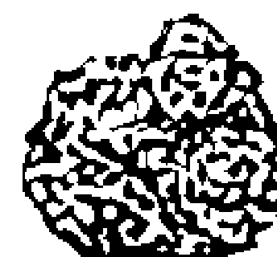

就是因為有這樣的生命基礎，使我們在相交十多年的路上，儘管兩人並不同在台北這個空間，不過每當情緒陷入難題時，都可以在夜半時分打電話給對方，泣訴攪亂心頭的空虛與焦慮，為彼此點出盲點、為對方尋找新的能量。這些年來，我們就是以這樣的方式相互支持、信任、成長，進而發展成珍貴無價的友誼。

## 命運分水嶺

X 小姐跟我最大的命運分水嶺是愛情婚姻。

在 X 小姐踏上婚姻前，深知這個對象必須能接受她的原生家庭，以及她對家庭強烈的責任感，所以愛情遊戲對她沒有絲毫的吸引力，因而她真正的戀情比一般人晚了許多。直到年近三十，才在之後任職的營建工程公司結識了工程師先生。

他們的互動並非建立在年輕男女對外表迷戀或曖昧情愫上，而是花了許多時間和精神溝通彼此的想法。兩人在了解對方的人生態度後才決定交往，經過一年多的時間，便自然地走向婚姻之路。

婚姻是她人生最顯著的轉折點。學問德性兼備的先生，有份穩定的工作，個性單純沉穩體貼、心地善良，對人大方不計較。由於家庭的關係，X 對未來和金錢有著相當的不安全感，來自家庭經濟無虞的丈夫，便以他非比尋常的耐心及人生價值觀影響著她，在敏感多愁的時刻照顧她的情緒，兩人還常常交換對人生看法。另一半對於 X 想照顧娘家父母的責任心，總是表達支持，不論是金錢或實際行動上都是。

## 返鄉之旅

源自對原生家庭根深蒂固的自卑、不輕易邀請朋友到老家的她，因著我是她最為交心的好友，邀我一同加入某次從竹南回花蓮的娘家之旅。我坐在車子後座，閒談間知道後行李廂裡除了一般的行李，還有他們新買的瑞士製壓力鍋與法製炒菜鍋，以及攜帶式保冷冰箱裡八斤的新竹冷凍貢丸與食材，而在沿途經過南方澳漁港時，還要去採買剛上岸的新鮮魚貨。

如此大費周章，全因為她想用自己一貫使用的器具，讓娘家的人能吃到她平時烹煮的美味，另一方面也希望鎮日操煩家務的年邁母親，可以在她回娘家這幾天多些時間休息。對於這一切，她的先生始終在背後全然支持她。

當天傍晚抵達花蓮，X 小姐踏進娘家門直奔廚房開始忙進忙出，我坐在客廳裡，聽著她的先生認真地與我分析瑞士製與義大利製壓力鍋的差異點，也聽他聊起長期對娘家的用心付出。後來他拿出每回陪伴岳父母遊玩景點的照片，以清晰的記憶說明這張、那張照片是何時何地的旅遊，正是這樣的用心，讓娘家所有老小每每都殷殷期盼他們夫妻返家，因為他們不是回娘家當客人，而是以最大的能力善盡孝道。

我們兩就像源自同一塊織布，被不同的設計師設計成不同版型的服裝，當我們遇見彼此，就好似看見自己缺憾的那部分被延伸出去，從而得到圓滿。看著 X 小姐益趨成熟的夫妻關係，讓我在婚姻遺憾的缺口上，延伸出清晰完美的理想輪廓；她也因為我與她先生易接納他人的性格，延展出 X 小姐生命更大的空間。

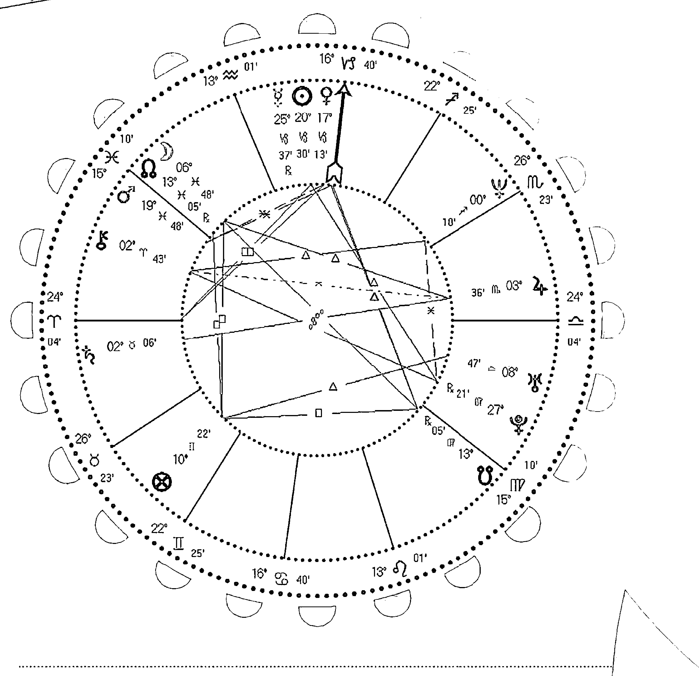

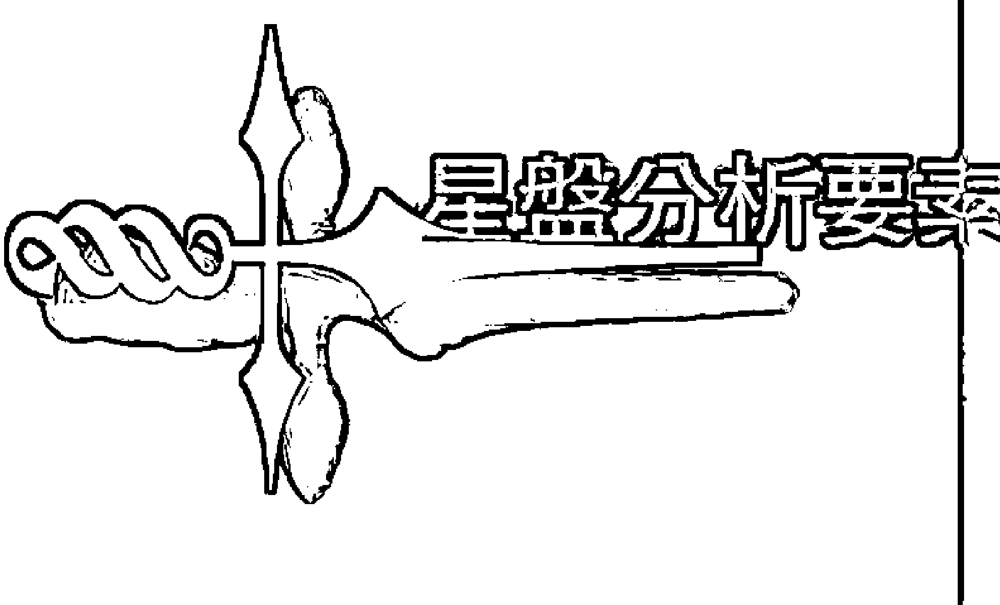

## 星盤分析要素

| 項目 | 內容 |
| :--- | :--- |
| 命主星所在星座 | 火星在雙魚座 |
| 命主星所在宮位 | 火星在第十二宮 |
| 第一宮宮內行星 | 土星 |
| 第一宮宮內行星所在星座 | 土星在金牛座 |
| 土星掌管宮位 | 第十宮與第十一宮 |
| 第七宮星座 | 天秤座 |
| 第七宮主星 | 金星 |
| 第七宮主星所在星座 | 金星在摩羯座 |
| 第七宮主星所在宮位 | 金星在第十宮 |
| 第七宮內行星 | 木星 |
| 第七宮內行星所在星座 | 木星在天蠍座 |
| 木星掌管宮位 | 第九宮與第十二宮 |
| 第四宮星座 | 巨蟹座 |
| 第四宮主星 | 月亮 |
| 第四宮主星所在宮位 | 月亮在第十一宮 |

## 占星寶盒

### 第十二宮

——玄秘隱藏宮

這個宮位類比雙魚座，主要看隱匿事項，如幕後、玄秘、靈修等，重要行星在此宮多代表個性低調易有心事或憂愁，有吉象則利於修行與玄學研究，有凶象則易犯小人、犯罪、因疾病住院，甚至是犯鬼魅陰邪等。

X 小姐的案例，故事主要的事項集中在第一宮（命宮），以及第七宮（夫妻宮）相關因子對於第四宮（家庭宮）與第十宮（事業宮）、第十一宮（交友宮）、第十二宮（隱藏宮）的交互關聯。

## 解析①＝命定的個性

X 小姐的上升星座為牡羊座，命主星火星在第十二宮玄秘隱藏宮，土星在命宮。雖有牡羊星的急性子與突然的冒險衝動，但主星落在隱藏宮，會藏匿個性中冒險衝動的部分，讓自己隱身在眾人背後是最安全的狀態；火星在雙魚座，感受性與包容性強，卻也易於困惑退縮，加上土星在命宮，責任心強烈，更容易因自我要求高帶來壓力；尤其在面對事業與人際關係上，所帶來的不安與膽怯，如果能透過宗教與靈性方向來引導內心對話，將能發展出深層的生命體悟。

## 解析②＝命定的配偶與夫妻互動

第七宮星座為天秤座，主星為金星在第十宮摩羯座，第七宮內見到木星，且為第九宮主星，印證 X 小姐與配偶是因工作而結識，且配偶恰為土木工程師，為摩羯座所代表的產業，由木星得知配偶的學歷甚佳、個性寬厚善良沉穩，事業表現亦佳。雖然見到第一宮內的土星與第七宮內的木星對沖，但木星受到月亮的調和，第一宮主星火星與第七宮主星金星互容，可見得 X 小姐會將不易抒發的壓力施加給先生，但兩人的互動關係緊密，對彼此情感關懷，甚至吸引力均足夠，不至造成嚴重問題，兩人的代表主星除了火星與金星互容外，火星也跟七宮內木星互容。一宮內土星也與金星互容，使得兩人能互相學習成長，化解木土的對沖。

## 解析 ③ = 配偶與家庭

月亮也是第四宮的主星，與木星形成三合相位，木星又容納月亮。所以 X 小姐的先生與娘家家人關係融洽，能以其寬厚性格去照顧 X 小姐的娘家。

## 解析 ④ = 窺見內心世界

X小姐的命主星火星剛好緊密合相我的 ASC（上升位置）命度，她在第十一宮的月亮也跟我的月亮緊密合相，都具有雙魚座易於自我犧牲卻不安易感靈魂藏匿在心靈深處，所以需要更高的精神力量才能強化脆弱的內心。透過瑜珈修行之路，來滿足渴求自我實現與體悟生命的內心呼喚，可從火星與金星的互容及三合相位，金星又在事業宮中可以得知。

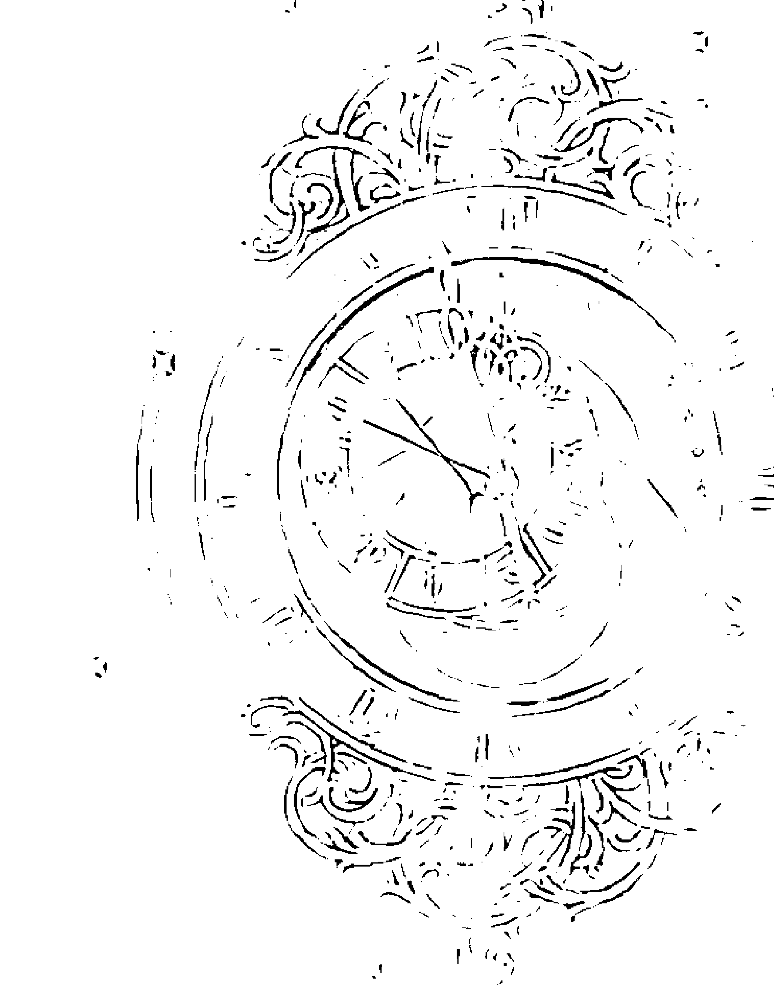

## 附录：占星資料庫

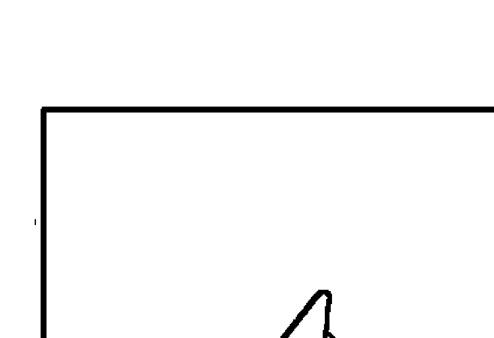

## 星盘解读第一步——命主星的所在位置

很多人跟我討論，在學習推論整張星盤時，常會陷入不知從哪裡開始著手分析的狀況。

整張星盤的資訊太多，要看上升星座、太陽、月亮所在的星座，還有其他更多行星——水星、金星、火星、木星、土星、天王星、海王星、冥王星所在的星座，也要判斷每個宮位內所落的行星意涵，更要分析每個行星與其他行星形成的相位，就算把一本厚厚的占星教科書菜單式名詞全背起來，再把這些個別資訊，吸收消化成為自己表達的語言，就已經是件難事；若將一張星盤中，每個單一訊息逐條羅列出來，可能前述星座與相位的說明彼此衝突，卻同時並存在一張星盤上，會出現相當矛盾的資訊。

例如：太陽在射手座的描述，多是：樂觀大方、愛好自由、思想開明，但是會盲目樂觀、反覆無常、缺乏責任感等。如果同時這張星盤的太陽又與土星形成四分相位，查占星教科書的說明，形容的是有明顯的責任感、常遭逢挫折、思考模式受到限制、缺乏活力。

兩者的個性說明是不是就衝突了呢？究竟要選擇哪一個方向的說明，還是兩種徵象矛盾並存呢？真讓人錯亂。所以，整合分析判斷，是占星學習上的一大關口，突破了，就會像練功時打通任督二脈般，功力快速提升。

整合分析就是所謂的推斷－演繹所有好壞徵象的資訊，並歸納出整體結論。不過，整合分析的推演要素相當多，需逐一分析各種不同事項的代表因子狀況。例如要分析星盤中財富的高低好壞之狀況，就要把所有財富相關的因子都找出來，逐一比對這些因子所在的星座力量、所落的宮位，與哪些行星形成相位，甚至是否參與恆星的力量，這些徵象的狀況逐一分析其好壞，才能下最終結論。因整合分析涉及的資訊太多，實在無法在本書中逐一說明，此處僅先點出占星學習上的常見問題。

但是，對於一張星盤初步分析之切入點，可在此做一番說明。

### 3 步驟找到命主星所在宮位

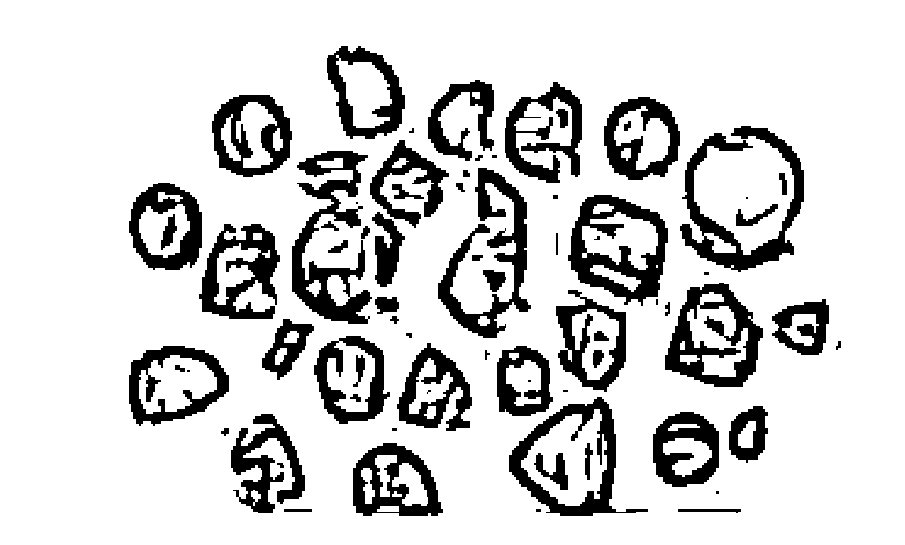

我在分析星盤時，無論是本命盤或是卜卦擇日盤等，都相當重視「命主星」或是「盤主星」所在的宮位，因為這顆命主星代表了自己，命主星所落的宮位，代表自己與外在人生環境、際遇的互動關係，也因此發掘出生命中最重要的一環，並由此再繼續串連出其他生命境遇的與此宮的接續互動，因此，找出命主星所在宮位，是我分析星盤重要的第一步。

#### 步驟1：找出上升星座

此處需注意，上升星座並非大家所熟知的太陽星座，你可以透過網路的占星軟體，輸入正確的出生年、月、日、時與分、以及出生地等資訊，軟體便會為您計算出上升星座的所在位置。（出生的時與分越精準越好，才能正確計算得知上升星座）。

上升星座非常重要，它決定了命宮的起點，也據此計算出每一個後天宮位的起點所落的星座，透過上升星座的確定，才能知道每個後天宮位代表的人生事項的徵象，例如上升星座為射手座，很可能第十宮就是處女座了，這時候就可以第十宮內行星及宮主星的徵象來判斷事業的發展狀況，甚至順利進行流年運勢的預測。

#### 步驟2：依據上升星座找到命主星

依據下表查出上升星座的定位星，即為您的「命主星」。

> 註：上升星座為每個人性格的基本輪廓，你的上升星座的個性描述，可參酌後文：「命主星在第一宮」的典型性格描繪，但是若你的命主星並非在第一宮，在能力的展現上則會有所差異。

| 上升星座 | 古典定位星 |
| :---: | :---: |
| 牡羊座 ♈ | 火星 ♂ |
| 金牛座 ♉ | 金星 ♀ |
| 雙子座 ♊ | 水星 ☿ |
| 巨蟹座 ♋ | 月亮 ☽ |
| 獅子座 ♌ | 太陽 ☉ |
| 處女座 ♍ | 水星 ☿ |
| 天秤座 ♎ | 金星 ♀ |
| 天蠍座 ♏ | 火星 ♂ |
| 射手座 ♐ | 木星 ♃ |
| 摩羯座 ♑ | 土星 ♄ |
| 水瓶座 ♒ | 土星 ♄ |
| 雙魚座 ♓ | 木星 ♃ |

注：在此特別說明，以上表列為古典時期的定位星，係天王星、海王星、冥王星尚未被發現之前的古典時期之定義。

#### 步驟 3：觀察命主星落在十二宮位的哪一宮位

例如，張小姐透過網路的占星軟體，輸入了她的資料：1979 年 1 月 1 日，中午 12:00、台北市出生等資料後，發現得到的上升星座為牡羊座，根據步驟 2 之表格，她查表得到牡羊座的定位星為火星，因此，火星就是張小姐的命主星。張小姐再檢視火星所在的宮位，發現落在第十宮，因此可說張小姐的命主星落在第十宮。

#### 〈舉例：張小姐星盤〉

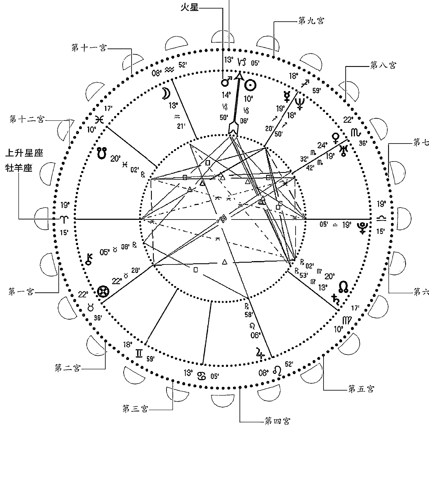

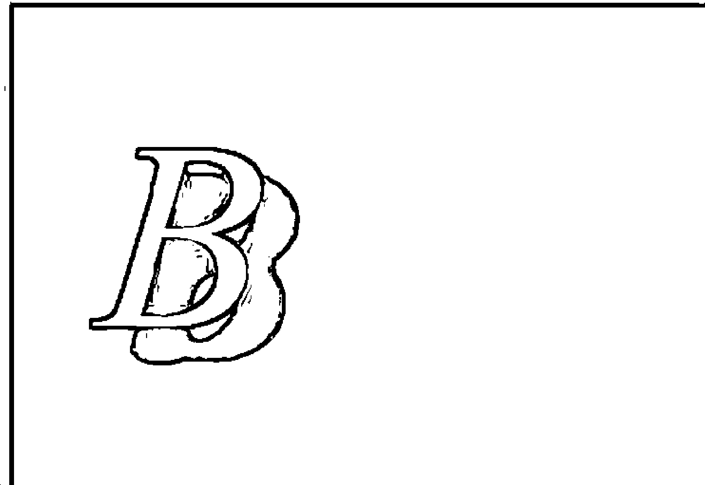

## 十二宮裡的命主星

找出命主星所在宮位後，表示這一個宮位代表的人生事項，會是當事人最重視，花最多時間與這個事項有所關連的，也可能代表著自我的能力或是生命狀態，但狀況有可能是正面或負面，端視落入的行星狀態好壞再來仔細分辨。

### 命主星在第一宮——命宮

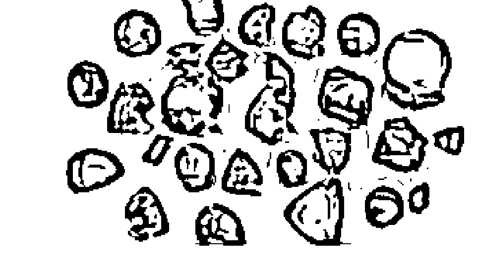

第一宮代表自我，命主星落在第一宮代表的人，會以自我的想法為重，自信心充沛，自身能力得以輕易發發揮展露，人格特質鮮明，天生的體質佳，尤其容易展現上升星座典型的性格，這個上升星座的優勢之處，便會成為自己與生俱來的天賦能力。但是因為自我的想法過於鮮明，主觀意識較強，嚴重的話甚至會難以相處，難以建立親密的關係，太過於主觀不顧他人想法，容易引發他人對自己的責難爭端。一般而言，命主星落在第一宮是相當好的位置，正面的特質會居多。

上升星座在牡羊座，命主星火星在第一宮者

只要談到有興趣的事，話還沒說完，他已經衝出去做了，火星讓他展現出牡羊座突出的競爭力與爆發力，企圖心與開拓性強旺，他的人生就是要有新目標，就能凸顯優異快速的行動力，但也要注意因過分著重自我、好強，正直、好打抱不平，容易破壞和諧的人際關係。

上升星座在金牛座，命主星金星在第一宮者

賺錢過好日子是他人生最重要的信念，具良好的理財能力，很喜歡美食等各種物質享受，喜歡談情說愛，也有人擁有悅耳的聲音或音樂藝術鑑賞力。缺點就是太過於執著金錢與物質享受，甚至沉溺在情欲享樂中，忽略了精神層次的提升。

上升星座在雙子座，命主星水星在第一宮者

多數水星強的人，在學校的智商測驗分數都得高分，是個聰明、能言善道、知識廣博、喜歡收集資訊的人，這些優異的才能，讓雙子座可以發揮在演說、寫作、傳播或經商做生意上。但要注意可能給人話太多而前後不一致的印象，或是過於好辯。

上升星座在巨蟹座，命主星月亮在第一宮者

喜歡佈置居家環境，或是經常研究食譜，展現廚藝讓家人好友分享，只要她當你是自己人，就會想把你當家人一般照顧，她也是最佳吐露心事的傾訴對象，她的同理心會讓人很窩心。但巨蟹座要注意，關心與雞婆就在一線之間，自己情緒變化過大也會讓人常不解其意。

上升星座在獅子座，命主星太陽在第一宮者

有種特殊氣質與光芒，讓人無法不注意他的存在，可能是因為沉穩堅定的處事態度、或是她的行頭、或是他的頭銜，在在顯示絕非等閒之輩，他雖具有受人敬重的領導特質，卻也多才多藝喜歡搞笑熱鬧，只是要注意，不要只想自傲地展露光芒，忽略他人存在，而成了別人口中的大頭症患者。

上升星座在處女座，命主星水星在第一宮者

能展現處女座優異的分析理解與邏輯能力，求知慾強烈又勤勉好學，跟知識豐富的處女座談天，會欣賞談吐優雅的他言之有物，更折服他的學問既井然有序又條理清晰。與處女座共事，卻會因為他過分要求細節，讓人覺得吹毛求疵，容易造成自己與他人精神緊張與壓力。

上升星座在天秤座，命主星金星在第一宮者

大多數都是外形迷人的俊男美女，天生就有一種優雅氣質，不管是談吐還是儀表都吸引人，讓人不禁想聽他說話、或是多看她一眼。她也有不凡的藝術涵養及品味，追求者眾的她，情事發展也常讓人津津樂道。要注意的是，當她把所有注意力都在享受愛情上，就會發懶而不易振作。

上升星座在天蠍座，命主星火星在第一宮者

具有神秘魅力的天蠍座，她的眼神好像一下子就看穿人，但是他的深沉又讓人猜不透，受到火星影響，天蠍兼具氣魄與魅力，還兼具有意志力及領悟力，常能成為商界及政圈的利害角色。但是要注意，天蠍座難以平撫情感被背叛的創傷，就會探查對方的秘密，暗中報復。

#### 上升星座在射手座，命主星木星在第一宮者

他擁有肚裡能撐船的寬厚度量，對事情總保持著樂觀自信的態度，對他人又不吝於伸出援手，他會欣賞不同文化的差異，能包容尊重多元的價值觀，當然，這樣的性格為自己累積許多福分，他就是自己生命的貴人。唯一要注意的是，木星會過分樂觀評估未來，因而粗心忽略細節。

#### 上升星座在摩羯座，命主星土星在第一宮者

常面臨各種現實生活的壓力，他習於承擔這些責任，養成了刻苦耐勞勤奮謹慎的個性，所以總給人老成穩重嚴肅的印象。摩羯是有企圖心的，但他不求一步登天，只有踏實跨出每一步，終能架構穩健的成功階梯。常憂心的摩羯，要學會適時放下肩上重擔，才能輕鬆笑看人生。

#### 上升星座在水瓶座，命主星土星在第一宮者

腦子裡會充滿創意的點子，也能有具體作為，不怕挫折堅持完成驚世之作，他不願走別人走過的路，標榜獨特的自我主張，是他最大的特色。因為土星的堅持，要他妥協於一般通俗觀點幾乎不太可能，在團體中常會是最難搞的麻煩份子，水瓶最需學習合作的圓融態度。

#### 上升星座在雙魚座，命主星木星在第一宮者

具有悲天憫人性格的雙魚，在他的心靈國度中，每個人都是受因緣牽引來此生的修行者，世俗的物質都是因緣所成，無需計較，因此，善良悲憫的雙魚，常會成為隱遁的藝術或靈修之士，成為他人面對現實人生的心靈依靠。要注意雙魚的慈悲心易被欺騙利用，反而讓自己成為自我犧牲的濫好人。

### 命主星在第二宮——財帛宮

第二宮就是財帛宮，顧名思義與錢財相關事項脫離不了關係，所以代表自己較重視錢財物質，為了改善生活條件，所以對追求財富的企圖心甚強，也容易有賺錢的好運，或是具有賺錢或管理錢財的生意頭腦。

倘若追求金錢的手段較不擇手段，反而會使第二宮產生負面狀況。例如為了招攬生意財源惹爭議，則反而會因此失財；或是過於貪戀在物質的擁有與享受上，擔憂金錢財富的流失，反而難以享受豐富多元的人生。

#### 上升星座在牡羊座，命主星火星在第二宮者

讓牡羊座積極主動性格，容易發揮在賺取金錢與物質上。牡羊可能從事理財相關職務，容易遇上冒險賺錢的機會，且稍縱即逝，讓牡羊心癢難耐而躍躍欲試，卻忽略機會中伴隨的風險，或是惡性競爭的賺錢方式。火星在這個宮位容易力量不佳，若再有其他傷害容易出問題反而損傷錢財，若有其他吉星的救助，才能緩解前述狀況。

#### 上升星座在金牛座，命主星金星在第二宮者

讓金牛座的財務管理能力得以發揮，而且又有甚為幸運的財運守護著，讓金牛容易獲得金錢有關的情報資訊，有機會可以輕易獲利，或是透過藝術品、美容時尚精品、珠寶飾品等項目之經營，來賺取金錢。金星在第二宮的負面狀況，會過度浪費金錢購買精品、奢侈品及談戀愛上。

上升星座在雙子座，命主星水星在第二宮者

雙子座靜不下來的腦子，在此能有源源不絕的做生意賺錢的好點子，跟錢有關的資訊都牢記不忘，會有定期閱讀財經雜誌的習慣，並會在企業的過往歷史紀錄上下功夫。水星若在此受到傷害，可能要注意不慎簽署錢財的文件或支票，造成金錢損失。

上升星座在巨蟹座，命主星月亮在第二宮者

巨蟹座能把精湛的廚藝料理，或是居家擺設的獨特品味，拿來作為賺錢的生計，可能有人會從事餐飲，透過絢麗矚目的餐廳設計，招來名氣與錢財，也可能有人經營女性用品而賺錢。月亮在此，母親容易有助於財運。負面狀況是易受錢財波動而影響情緒起伏，也要注意因女性的關係而損失錢財。

上升星座在獅子座，命主星太陽在第二宮者

獅子座會因為擁有財富物質，來肯定自己的成功、名望與地位，他擁有良好的金錢運用規劃能力，會努力累積錢財，也可能擔任財務分析管理相關職務，表現亮眼。太陽在此的負面狀況，可能想會以投機方式獲得錢財，或是喜歡炫耀財力來滿足自己的虛榮。

上升星座在處女座，命主星水星在第二宮者

處女座可以把清晰的邏輯分析能力發揮在錢財相關事務上，他可能擅長於財務法律細節研究，或是擅長與人溝通建立良好關係而獲利。

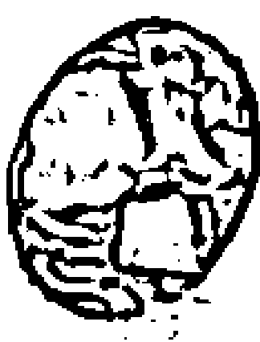

上升星座在天秤座，命主星金星在第二宮者

天秤座能透過圓融的人際關係，及自然天成的社交手腕，發揮在賺取錢財上，可能是經營藝術精品或是時尚裝飾物件等之買賣，也有人擅長於保單或金融商品之銷售而獲利。負面狀況會因為浪費錢在衣飾裝扮上，或是貪戀難以放手的感情而造成錢財的損失。

上升星座在天蠍座，命主星火星在第二宮者

天蠍座敏銳的直覺力與魄力，將可以化作賺錢的強烈企圖心，他具有做生意的高度競爭能力，挑戰越強越激發他的戰鬥力。他可能同時經營兩種以上的生意，或是經營國外商品貿易流通而獲利，負面狀況要注意容易遇上法律問題而損失錢財。

上升星座在射手座，命主星木星在第二宮者

射手座對於賺錢總有相當程度的樂觀與自信，可能會是經營建築、營造、礦石等生意來賺錢，因為賺錢的運氣很好，所以花錢也大方，甚至有些浪費成性，難以節制。另外，需注意常會輕忽錢財相關的法律條文，因此而損失金錢。

上升星座在摩羯座，命主星土星在第二宮者

摩羯座肩負著強烈的責任與壓力，必須努力賺錢積蓄，好在他確實具有賺錢的毅力與實力。他可能透過特殊的創造發明能力來賺取錢財，或是因為理性冷靜的態度，持續聚積錢財在土地房產上，長久累積獲得財富，但賺錢過程仍是辛苦費力。負面狀況會因過分害怕貧窮而用錢小心，甚至自私吝嗇。

上升星座在水瓶座，命主星土星在第二宮者

水瓶座的堅持與擇善固執的個性，財路反較不易擴展，管理錢財方式理性嚴謹小心，可能由於與眾生不同的價值觀，寧可生活像苦行僧般的物質條件，也不改其理念的堅持。甚至所得微薄仍會捐款行善，但要注意容易因為金錢而悲觀憂鬱，甚至因不時而來的莫名擔憂而精神耗弱，若有吉星救助，便可緩解這些狀況。

上升星座在雙魚座，命主星木星在第二宮者

雙魚座本有的善良與悲憫之心，更容易因熱心助人的個性，常以錢財慷慨幫助他人，也因此有好的財運福報來回饋自己。他可能一直都不愁錢財，或是經營財務相關職務，或是自己做生意，常會遇上好機運而大賺一筆。負面狀況是浪費花錢，或因為誤信宗教而損失錢財。

### 命主星在第三宮——兄弟宮

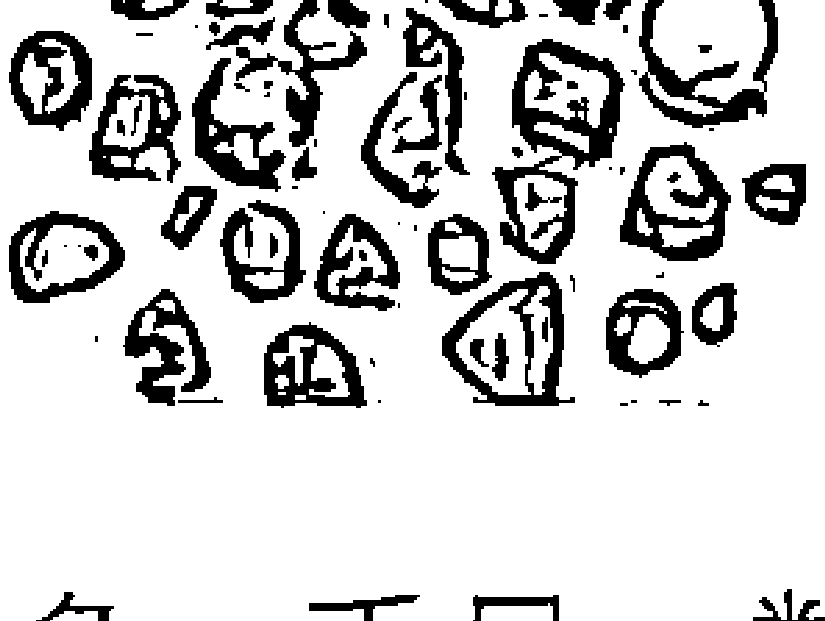

第三宮雖為兄弟手足宮，但是代表事項太多，手足、鄰居、親戚、同學關係是其一；也代表溝通、運用文字及語言的能力；也代表短程旅行。

若是命主星落在第三宮，通常與兄弟姊妹、鄰居、老同學的關係互動往來密切，也容易與他們建立久遠的人際關係；自己或許曾是文藝青年，有很好的文采，或是具有演說的能力；也有些男性的命主星在此宮，便喜歡到處開車旅行，玩車養車是自己生命中最大的樂趣。

第三宮的負面狀況，需注意與手足鄰居等因互動過於密切反而容易起摩擦，或是禍從口出，或是易有交通意外。

上升星座在牡羊座，命主星火星在第三宮者

火星在此，使得牡羊座容易發揮辯才無礙的急智口才，可能講話快很會挖苦人，卻又令人不得不佩服他的反應敏捷。他也可能很關心手足卻常有爭執不快，或是手足是惹事生非而讓他收拾善後。這個宮位會愛玩車尋刺激，要注意別開快車，會潛藏交通意外的危險性，若有吉星救助才能緩解此狀況。

上升星座在金牛座，命主星金星在第三宮者

金牛座可能在手足或同學中相當受歡迎，與手足的關係融洽，關心手足的感情狀態，常聯絡的老同學以女性為多，善於敦親睦鄰，也可能曾有青梅竹馬的青澀感情，或是可能在旅行時遇上戀情，對金牛座來說，開車到近郊出遊最能帶來愉悅的心情。

上升星座在雙子座，命主星水星在第三宮者

在此的雙子座更凸顯愛說話的一面，擅長演講，甚至會邊說邊表演，以搞笑來娛樂大家。學習能力強，基礎教育的成績表現佳，與手足的聯絡溝通多，但也可能常有意見不合。但要注意避免言語輕浮，以免禍從口出，或是因為駕照引起的交通問題。

上升星座在巨蟹座，命主星月亮在第三宮者

巨蟹座在此會相當關心照顧手足，尤其是對於其健康或生活細節上的關切，可能與姐妹或是女同學較親暱，常邀請手足或鄰居一同分享自己親手做的料理。中學前時或許常變換學校，也常喜歡旅行居住於不同地方。需要注意的是，自己情緒容易受到手足言語刺激而起伏不定。

上升星座在獅子座，命主星太陽在第三宮者

獅子座在此會喜歡以演說來展現自己，藉由演講增加名望，學習能力也佳，喜歡四處旅行。獅子座與手足關係密切和諧，可能常常會依賴手足為自己做決定，或是對手足影響力很大，可能某個手足自行創業或擔任較高職務，所以社會名望高。要注意在此容易言語較霸道、自以為是而難以溝通。

上升星座在處女座，命主星水星在第三宮者

處女座在此更會表現出領悟力強、對學習知識的殷切渴求，擅長寫作教學演講，具有文采。與手足的聯絡溝通多，但可能會有話悶著而溝通不良的狀況。在這裡需要注意的是，可能會有契約或文書的錯誤帶來困擾，或是禍從口出。

上升星座在天秤座，命主星金星在第三宮者

天秤座圓融的公關能力，發揮在維繫手足與老同學的感情上，會相當關心手足的感情狀態，自己也可能曾有青梅竹馬的青澀感情；旅行是他的心情調節器，國內外旅行既能帶來愉悅的心情，甚至有機會遇上新戀情，也擅長用文字表露情意。

上升星座在天蠍座，命主星火星在第三宮者

天蠍座的直覺力與魄力，能化為積極進取的行動力，因著對事業的強烈企圖心而到處奔波；常與手足及老同學一起廝混，關係密切熱烈但也常有打鬧爭吵。火星在此會愛玩車養車，要注意別開快車，容易發生交通意外的危險，若有吉星來救助才能減輕這個狀況。

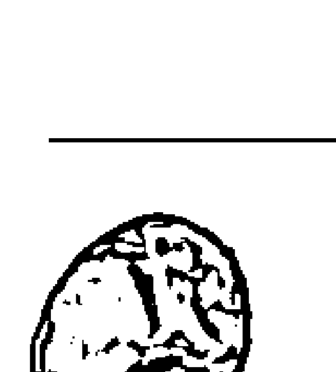

上升星座在射手座，命主星木星在第三宮者

好動、喜歡見識不同文化的射手座，在此宮具有四處遊歷的好運道，增加了不同生活體驗、更尊重他人不同的觀點。射手在此也具有良好的演說能力與文辭表達，會不斷學習以提升自我，手足的學識程度也佳，彼此能互有助益。

上升星座在摩羯座，命主星土星在第三宮者

摩羯座肩上巨大的壓力，可能是因承擔撫育手足的沉重責任，或是對於手足生活狀況多所擔憂；自己可能因早年環境之故，使得初等教育學習過程艱辛，因謹慎於言詞表達而反應慢，常因此沮喪。在此要注意因心不在焉而遇上交通意外。若有吉星來救助，則能減輕前述狀況。

上升星座在水瓶座，命主星土星在第三宮者

水瓶座特立獨行、不易妥協的性格，落在此處常會有言詞難以表達心境的困難，可能因此欠缺自我認同感，與人群疏離，顯得心境孤單寂寞。手足的關係也冷淡，甚至彼此有嚴重心結難以打開。在此要注意因交通意外而傷及頭部。若有吉星來救助，則能減輕前述狀況。

上升星座在雙魚座，命主星木星在第三宮者

雙魚座善良與慈悲的心腸，會推及至手足至親好友與左鄰右舍，他可能跟手足間具有互助互益的金錢關係，自己與手足的智識程度均佳；容易到處旅行而逢貴人協助；在此也具有良好的文辭表達能力，更會不斷學習以提升自我。

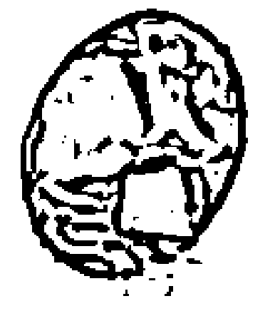

### 命主星在第四宮——家庭宮

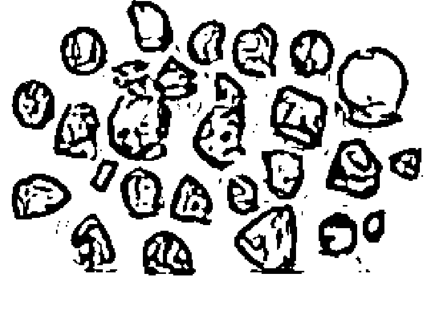

第四宮為家庭宮，命主星落在這個宮位，常常見到是家中的長男或長女，或是對家庭付出最多的人，通常很愛待在家裡，為了讓家人生活和樂，凡是與家庭有關的事項，自己都會盡一份心力；跟父親的關係甚為密切，甚至自己的個性就是遺傳自父親，因此長輩緣也較佳；購置房地產是自己一輩子要達成的目標。

第四宮的負面狀況，可能是家庭生活負擔重，或因為父親所帶來的問題多，所以自己必須一直背負著家庭的重擔，家庭或父親反而是自己最大的壓力，卻又難以卸下責任。

上升星座在牡羊座，命主星火星在第四宮者

火星在此，牡羊座人很關心家庭生活，喜歡待在家中，卻因為個性霸道干涉家人生活，使得家庭常吵鬧不睦，可能有脾氣不佳的父親，或常修繕房屋。在此需注意家中用電用火的安全，避免堆置易燃物引起火災，或家中遇失竊。

上升星座在金牛座，命主星金星在第四宮者

金牛座在家庭中具有相當重要的影響力，與家人的關係融洽，喜歡熱鬧氣氛，或設計布置居家環境，讓家裡成為舒適的社交場所。父親長相俊美或具有藝術品味，異性緣佳。有不錯的房產運，適合居住在優雅的環境地區。

上升星座在雙子座，命主星水星在第四宮者

在此的雙子座，受到父親良好的教育啟迪與栽培，會喜歡學習多元的學科項目，父親的教育程度亦佳，擅長分析、邏輯理解力甚佳，甚至可能從事學術教育等工作；喜歡與家人談天說話啟發心智，但也常因為意見不合而拌嘴。

上升星座在巨蟹座，命主星月亮在第四宮者

巨蟹座在此會非常喜歡待在家中，沒事就改變家庭布置擺設，或是在廚房研究新料理，讓家人大飽口福。他相當關心照顧家人，家庭關係親密融洽，可能有位和氣慈愛溫柔的父親，更是維繫家庭感情的重心。月亮在此要注意，家庭住所可能會常變遷，或是易受家人影響情緒，過分感情用事。

上升星座在獅子座，命主星太陽在第四宮者

獅子座可能會有讓他備感榮耀的家庭，或是具有社會地位或地方名望的父親。父親與家人對他的期許也很高，他也能光耀門楣，在家中更是舉足輕重，甚至因此繼承家傳的衣缽，也容易獲得父母家庭的遺蔭，或是繼承土地房產。在此處的缺點是，可能因出身背景而倨傲虛榮。

上升星座在處女座，命主星水星在第四宮者

處女座在此受到父親良好的教育啟迪與栽培，會喜歡學習多元的學科項目，可能受到父親豐富遊歷從而薰習多元文化，父親的知識程度亦佳，但自己常因為太廣泛學習因而廣而不精。喜歡與家人談天說話啟發心智，但也常因為意見不合而拌嘴。在此需注意房屋契約文件的錯誤造成困擾。

#### 上升星座在天秤座，命主星金星在第四宮者

天秤座處處逢源的人際關係，是來自家人和諧的感情，特別與父執輩的關係融洽，具有設計佈置居家環境的不凡創意，讓家庭成為社交場所。父親長相俊美或具有獨特藝術時尚品味，異性緣佳。買賣房屋之事甚為順暢，尤其適合居住在環境優雅的地區。

#### 上升星座在天蠍座，命主星火星在第四宮者

火星讓天蠍座對情感的佔有與專注力都放在家人身上，常在家中活動，卻也常會跟家人的生活價值觀點不同，會使家庭常有不睦的狀況，可能有脾氣難搞的父親，家庭關係因而也不和諧。在此需注意家中用電用火安全，小心火災或失竊意外。若有吉星來救助，則可以減少上述狀況的發生。

#### 上升星座在射手座，命主星木星在第四宮者

本來好動、喜歡往國外遊歷的射手座，會比較不尋常的戀家，因為家庭是自己幸運之所在，家人彼此能互助互益。有個宅心仁厚受人信賴的父親，學識教養佳，家境多見富裕，且家庭有宗教善念常積德，受長輩庇蔭容易得家產。若有受刑剋，則要注意買賣房產可能有法律糾紛。

#### 上升星座在摩羯座，命主星土星在第四宮者

摩羯座刻苦耐勞嚴肅的性格背後，可能暗藏著早年家庭生活艱辛困難的故事。父親或許較為年老冷漠，甚至健康狀況不佳，使得家庭重擔落在自己身上；與父親關係較為冷淡疏離，甚至種下難解的心結，除非有吉星來救助，才能化解前述狀況。

#### 上升星座在水瓶座，命主星土星在第四宮者

水瓶座過於固執不易妥協的性格，可能來自較為辛苦的家庭生活或是父親的影響。他的家庭經濟條件較不富裕，或是因環境困苦以節儉儲蓄來守住一分一毫的金錢，以及辛苦攢來的安居之所，因為對家庭的責任，讓水瓶固執於從小養成的生活方式。

#### 上升星座在雙魚座，命主星木星在第四宮者

受到家庭教育影響的雙魚座，會一改雙魚座的柔順，給人聰明、興趣廣泛的印象，但容易分心而無法專精。家運好，父親學問廣博多才多藝，可能在法律或教育領域學有所長，但是家庭生活習於花錢大方甚至浪費，也要注意買賣房屋時需小心法律糾紛。

### 命主星在第五宮——子女宮

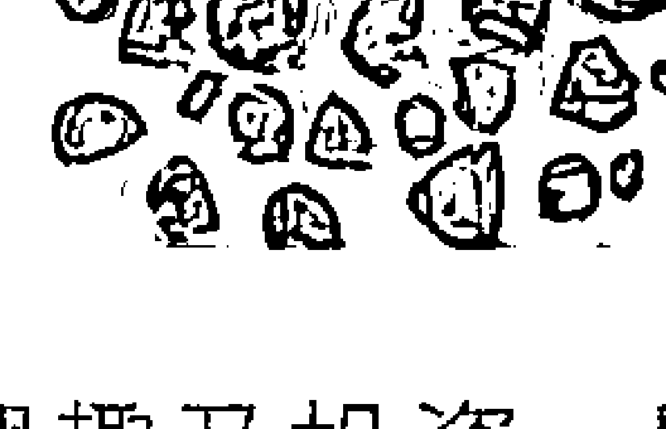

第五宮代表事項，主要為子女、愛情、興趣及投資，關係人生歡愉與生產創造力等事之狀況。若命主星在第五宮，通常才華洋溢，人生的意義就是在玩樂與享受愛情，個性像小孩子般，所以喜歡與子女相處互動。也有人會以運動來嶄露自己的才華，還有人常會喜歡進出股市投資，或是與友人小賭一番。

第五宮的負面狀況，容易產生貪縱於玩樂而不顧正事、沉迷賭博投資而賠錢，或是感情過於複雜放縱難解，或是過分關注子女反而造成親子關係困難。

#### 上升星座在牡羊座，命主星火星在第五宮者

不喜歡輸的感覺的牡羊座，可以把旺盛競爭力，發揮在股市賭錢上或是運動競賽，會因此很有成就感。他也喜歡與情敵搶追心愛的對象，這也是一種競爭遊戲；他可能會有個愛表現的孩子，但是個性過於自我、不服輸，親子互動時常惹牡羊生氣。在此要注意過分沉迷在投機賭博，容易產生突然的風險，除非有吉星來救助，才能躲避。

#### 上升星座在金牛座，命主星金星在第五宮者

金牛座的藝術細胞在這裡會呈現多方面的才藝，但是可能因為不夠愛現，並非很多人知道他的藝術細胞。金星在這裡也喜歡浸淫在戀愛中的感覺，會主動追求感情機會，但是表達上較為羞澀，除非有良好的水星來幫助。有興趣仔細研究股票投資，投資態度卻較為謹慎小心。與子女關係融洽，子女也頗有藝術涵養。

#### 上升星座在雙子座，命主星水星在第五宮者

水星在此的雙子座，可能對文藝創作或演說技巧等產生興趣，會透過共同興趣的培養，來談情說愛。對投資市場有作功課的習慣，需收集資訊判斷過後才會有投資的行動。重視子女教育，子女亦聰明好學，親子間經常溝通談天。

#### 上升星座在巨蟹座，命主星月亮在第五宮者

月亮在此的巨蟹座，會在談戀愛時就把對方當成孩子般，照顧對方的生活起居，但對感情會有點沒安全感，總想一直確定對方行蹤才能放心，要注意這樣會給對方壓力。對子女的照顧多，但也多掌控，可能容易生女兒。她的情緒起伏較大，使得投資的波動大，除非吉星救助才能減緩，可投資生活用品事業。

#### 上升星座在獅子座，命主星太陽在第五宮者

獅子座本來就喜歡玩樂與投機，太陽在此更是如魚得水，在投資上容易有好手氣而獲利，尤其是在投資海外標的物上頭。喜歡運動遊戲，天生的好體魄讓他能在運動項目上展現身手。他有小孩般的天真，容易像大孩子跟小朋友玩在一起，親子關係融洽，子女易有名望。喜歡談戀愛，喜歡追求知名人物，或是戀情易高調受矚目。

#### 上升星座在處女座，命主星水星在第五宮者

處女座邏輯分析的優點，受水星在此的影響，會收集投資市場的資訊，深入作研究，需判斷過後才會投入，投資的態度傾向保守。可能對教學教育等相當有興趣，所以重視子女教育，子女亦聰明好學，親子間經常透過某些興趣的培養研究，經常溝通互動。對感情趨向理性保守，要能談得來才會進一步交往。

#### 上升星座在天秤座，命主星金星在第五宮者

天秤座優雅迷人的特質，金星在此，異性更容易為天秤傾倒，他通常有獨特的藝術品味，或擁有自我風格強烈的創作能力。他對感情的態度相當博愛，但會理性地保有彼此獨立性，讓追求者難以掌控。可能有投資的好運氣，但是理性的他不會受鼓吹就投入金錢。與子女關係融洽，子女也能繼承自己獨特的藝術細胞。

#### 上升星座在天蠍座，命主星火星在第五宮者

天蠍座是個情感發電機，火星在此，讓他的感情電波能更加順暢發送出去，在愛情中，蠍子的刺先收起來，他會展現溫柔多情、善解人意的一面，除非讓他沒有安全感，才會採取緊追不捨的行動。

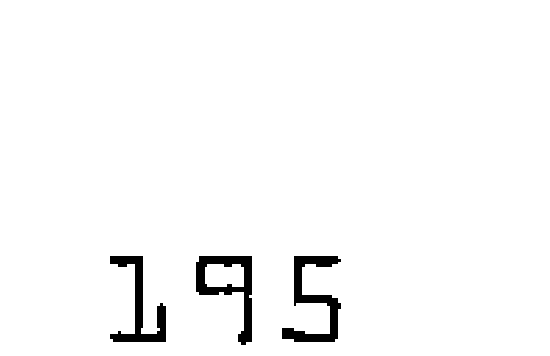

他的謀略也能在投資或是運動上展現，但要注意易受他人誤導或影響而失利。子女運動細胞佳，可能展現在舞蹈或瑜珈上。

#### 上升星座在射手座，命主星木星在第五宮者

體能佳又好動的射手座，木星在此容易在運動競賽上嶄露身手，可參與競速比賽等運動項目。在股市投資上常有意想不到的幸運出現而獲利。看到感覺對了的對象，就急切想開展關係，感情的發展順利。著重增廣子女的見識，與子女關係融洽，子女心胸寬厚、品性佳。

#### 上升星座在摩羯座，命主星土星在第五宮者

摩羯座自我責任感強烈的個性，會對子女有相同標準的要求，要她們學會踏實做事，對自己的財務要能負責，所以會造成親子關係較大壓力，甚至關係冷淡。容易與年長者談感情，或是對方個性較為老成，關係平淡卻持續穩固。對投資謹慎小心，長期持續才能見獲利。

#### 上升星座在水瓶座，命主星土星在第五宮者

水瓶座對於子女教育有一番自我主張，期望子女能學習多元學科培養多重興趣，在態度上卻較為要求，以至於子女容易感到壓力，造成親子關係較緊張甚至疏離，子女個性老成踏實。容易與年長者談感情，或是對方個性較為老成，很會講道理。對投資有做功課研究，但謹慎小心，長期持續才能見獲利。

#### 上升星座在雙魚座，命主星木星在第五宮者

木星讓慈愛善良的雙魚座把心放在子女的教育及照顧上，以家庭教育薰陶子女的性格，所以子女性格純良寬厚，有家庭觀念易得人信賴，只是常跟家人吃吃喝喝，容易發胖。對投資態度穩重平和，穩健獲利多。感情上喜歡顧家的對象，兩人發展關係就像家人一般。

### 命主星在第六宮——奴僕宮

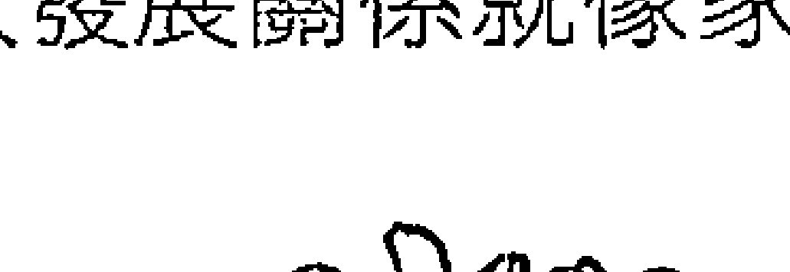

第六宮的名稱，雖然是奴僕宮，但是實際意涵跟辛勞較有關係，這個宮位也跟健康、小動物有關。命主星在這個宮位的人，常常工作較為辛苦，可能是因為工作內容無人能協助，只好凡事自己來，所以造成工作勞累的現象。也有人在這個宮位相當重視養生保健，甚至從事醫療保健相關領域之工作。也有人喜歡與小動物相處，飼養寵物成為人生的重心。

第六宮的負面狀況，會因為長時間耗費精神在工作上，而造成體能消耗影響健康，有小病不斷的狀況。或是與同事或部屬的關係較不佳，容易因為他們產生麻煩，自己必須收拾善後。或是需要謹慎關照小動物，成了生活的重要責任。

#### 上升星座在牡羊座，命主星火星在第六宮者

火星在此，經常多做多動，體力甚佳，也關心營養保健等養生資訊，但要注意常有突然發炎發燒等狀況，或是因病得動刀之狀況。可能從事操作器械設備之工作，與同事關係容易因為細故有所摩擦，也要注意工作環境的安全，易有工作職災。

#### 上升星座在金牛座，命主星金星在第六宮者

金星在此，金牛座的藝術細胞有所發揮，從事藝術音樂設計或公共關係等工作，與同事關係圓融，工作環境優雅，喜歡待在公司裡，也容易有辦公室戀情。喜歡小動物，所飼養的寵物也相當得人疼愛。健康上要多照顧腰、腎及泌尿系統。

#### 上升星座在雙子座，命主星水星在第六宮者

水星在此的雙子座，可能從事教學或是資訊媒體相關的工作，與同事間常交談溝通，但也可能口舌是非較多，自己心思全放在工作上，或常因工作而持續進修。關心健康養生的資訊，健康上要注意神經系統或呼吸系統問題。

#### 上升星座在巨蟹座，命主星月亮在第六宮者

月亮在此的巨蟹座，可能從事照護餐飲等相關工作，會因不穩定的工作而影響情緒，患得患失，甚至因此有情緒障礙或消化問題，他把同事當成家人般關心照顧，也喜歡飼養照顧小動物，很重視飲食的養生之道。母親可能較為操勞。

#### 上升星座在獅子座，命主星太陽在第六宮者

太陽在此的獅子座，有可能自己創業，但是身兼老闆與雜役等數職，是屬於勞心勞力的老闆，即使沒創業也可能擔任主管，卻是大小事包辦的全能主管。健康方面要注意因為過度操勞，容易引起心血管方面問題。父親可能較為操勞。

#### 上升星座在處女座，命主星水星在第六宮者

水星在此的處女座，可能從事研究分析或教學相關的工作，會不斷用心思考如何改進工作流程，或是為了提升工作能力而進修，與同事間常交談溝通，但也可能口舌是非較多。關心健康養生的資訊，健康上要注意容易緊張不安而神經質，以及呼吸系統問題。

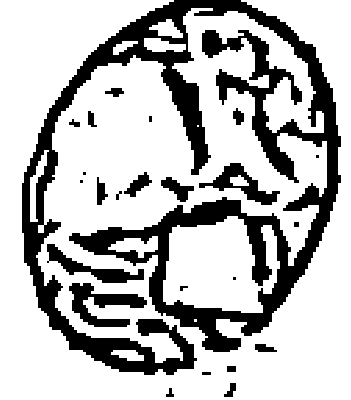

#### 上升星座在天秤座，命主星金星在第六宮者

金星在此，使得有藝術涵養的天秤座，能從事音樂影像等啟迪心靈的藝術工作，或是公共關係等工作，與同事關係融洽和諧，工作環境優美有靈性，甚至容易與同事日久生情。喜歡小動物，所飼養的寵物既可愛聽話善解人意。健康上要多注意腰、腎泌尿系統與免疫系統。

#### 上升星座在天蠍座，命主星火星在第六宮者

火星在此，可能從事操作機械設備之工作，或是艱辛挑戰、經常要耗費體力之任務，好在天蠍的體能佳，反而是對身體的鍛鍊，但要注意工作環境的安全，易有工作職災，常有突然發炎發燒等狀況，或是因病動刀之狀況。容易因為看不慣同事的做事態度，而有所摩擦，也要注意。

#### 上升星座在射手座，命主星木星在第六宮者

木星在此的射手座，可能從事金融理財或教育法律研究等相關的工作，工作的機會和運氣比起別人來順暢許多，也是因為自己重視工作表現，同事關係良好，常能遇到對自己有助益的部屬。重視養生之道，但是要注意肝臟的保養，以及易肥胖之問題。飼養小動物能給自己帶來好運。

#### 上升星座在摩羯座，命主星土星在第六宮者

土星在此，摩羯座自我鞭策的個性，更容易表現在工作上，他常被指派執行艱辛困難的任務，會努力吸取工作相關的資訊，並實際運作去檢驗理論的實用性，每一步都認真謹慎，但也因此長期超時負荷造成慢性疾病，共事的同事也常會感受到壓力而關係緊張。

#### 上升星座在水瓶座，命主星土星在第六宮者

土星在此，會展現水瓶座的堅持不妥協的性格，他會選擇較困難的方式去完成工作，過程中，容易使共事者都卻步，因為不易達成任務，會造成同事關係冷漠不悅。長期工作壓力與過度勞動，易造成慢性疾病，要注意皮膚骨骼及消化系統之保養。女性還需注意生殖系統的保養。

#### 上升星座在雙魚座，命主星木星在第六宮者

木星在此，讓雙魚座在工作環境中自然展現領導力與影響力，他在工作上表現容易受到肯定，被拔擢的運氣也比別人來的好，自己重視工作表現，與同事關係和諧，常會遇到能力強、對自己有助益的部屬。重視養生之道，但是要注意肝臟與心血管的保養，以及易肥胖問題，或是心室肥大的狀況。飼養小動物能給自己帶來更多好人緣。

### 命主星在第七宮——夫妻宮

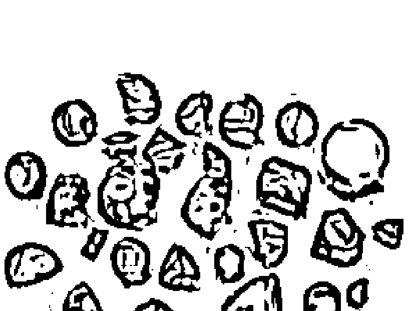

夫妻宮就是看與配偶有關的事務，但是這個宮位也跟合夥人、公開的敵人有關。命主星在第七宮的人，相當重視婚姻關係，通常異性緣也好，較年輕時就走入婚姻，與配偶的互動關係密切，生活每一步驟都會以兩人關係作為主要考量。也容易建立人際關係，能配合他人共同完成任務，人際互動和諧。

第七宮的負面狀況，會因為過分重視在意另一半，使得對方感受束縛的壓力，反而引發婚姻不快的狀況，甚至因此導致爭執衝突。對外界的關係，也會因此容易樹立敵人，爭端不斷。

#### 上升星座在牡羊座，命主星火星在第七宮者

牡羊座性急衝動的個性，因火星在此，會對另一半表達直接的熱情與關心，但也因過分干涉另一半的生活，因而引起不快爭執，若有嚴重刑沖，甚至會有分離的可能。也會積極與合夥人互動，卻反造成摩擦，也因此容易樹敵。若有吉星來救助才能緩解。

#### 上升星座在金牛座，命主星金星在第七宮者

金星在此，讓金牛座有相當好的異性緣，容易早婚，會直接對另一半表達情感愛意，體貼另一半，喜歡兩人世界，婚姻關情意綿綿和諧美滿，唯要注意對婚姻感情的佔有慾較強，有時要給對方一些獨立的空間。社交能力好，人際關係較為融洽。

#### 上升星座在雙子座，命主星水星在第七宮者

喜歡閒聊說話的雙子座，因為水星在此，會選擇與自己興趣話題相投合的配偶，配偶的學識也較豐富，重視另一半的想法，兩人常作溝通，婚姻關係較為理性，但有時也會拌嘴。合夥事業時，要注意合作條款的簽定以維繫雙方的承諾。

#### 上升星座在巨蟹座，命主星月亮在第七宮者

月亮在此的巨蟹座，對於配偶的關心程度可能超過自己，尤其是女性，會關心另一半的生活起居及飲食狀況，重視居家生活，但也常擔憂另一半，甚至對婚姻有不安全感，進而影響情緒，甚至精神不安寧，男性則可能會有悲觀憂愁而情緒不佳的配偶。

#### 上升星座在獅子座，命主星太陽在第七宮者

太陽在此的獅子座，可能會選擇較有社會名望，或出身背景良好的另一半，凡事尊重對方的意見與想法，但也會讓獅子有時感到受支配牽制，喪失自我的權威感。容易尋求知名有影響力的合夥對象，但合夥關係中容易受對方牽制。

#### 上升星座在處女座，命主星水星在第七宮者

水星在此的處女座，會因為談話契合之故，受到對方的吸引，所以配偶與自己興趣話題較投合，重視另一半的想法，配偶喜歡閒談，兩人常會有一些風花雪月的對話，但有時也會拌嘴。合夥事業時，要注意文件條款的謬誤而造成雙方合作關係上的錯誤認知。

#### 上升星座在天秤座，命主星金星在第七宮者

金星使得迷人異性緣佳的天秤，容易早早進入婚姻，可能是他主動坦白跟對方直接表露愛意，而追求到手，他相當體貼另一半，享受兩人的婚姻生活，關係和諧甜蜜，但要注意兩人對感情的表達太過於直接露骨，缺乏想像空間。社交能力好，積極主動建立人際關係。

#### 上升星座在天蠍座，命主星火星在第七宮者

天蠍座的占有欲及掌控的個性，會透過火星，以直接有魄力的方式征服另一半，但婚後會相當關心另一半，如有感情上的不信任感出現，甚至暗中探查另一半的私人空間，反引起不快爭執，容易會為錢所吵，若有嚴重刑沖，甚至會有分離的可能。與合夥人互動頻繁，卻反造成摩擦，也因此容易樹敵。若有吉星來救助方能緩解問題。

#### 上升星座在射手座，命主星木星在第七宮者

木星在此的射手座，會選擇見識廣而多元、重視精神生活的對象成婚，對配偶給予很大的自由空間，配偶學識高或從事教育法律相關行業，個性頗為樂觀自信，心胸寬厚，婚姻關係幸福。婚後財運順利，合夥事業也易順遂，唯一要注意太過自由的關係，反而變成漫不經心而不在乎了。

#### 上升星座在摩羯座，命主星土星在第七宮者

摩羯座嚴肅不易親近的個性，會因土星在此，容易找到較為年長或是想法老成穩重的對象成婚，婚姻關係中有許多共同的責任要承擔，造成兩人情意冷淡疏離，長久下來婚姻關係會著重責任與義務，且會對關係產生自憐多疑之心，甚至懼怕另一半，如有吉星來救助則可減緩問題。

#### 上升星座在水瓶座，命主星土星在第七宮者

水瓶座尊重他人意見想法的個性，反而因為土星在此，會找到重視威權、凡事以我為尊的另一半，兩人的關係可能是因現實利益的考量而結合，對方可能較為年長，卻不易相處，兩人關係會疏離冷漠，長久下來易貌合神離，如有吉星來救助則可減緩。

#### 上升星座在雙魚座，命主星木星在第七宮者

木星在此，讓雙魚座會選擇教育程度高，或是重視宗教信仰與精神生活的對象成婚。配偶可能從事海外貿易、教育法律相關行業，個性好學自信、心胸寬厚，對配偶給予很大的自由空間，婚姻關係幸福。婚後運氣佳，合夥事業也容易順利，唯一要注意太過強調精神生活，反而缺乏現實生活的理解。

### 命主星在第八宮——疾厄宮

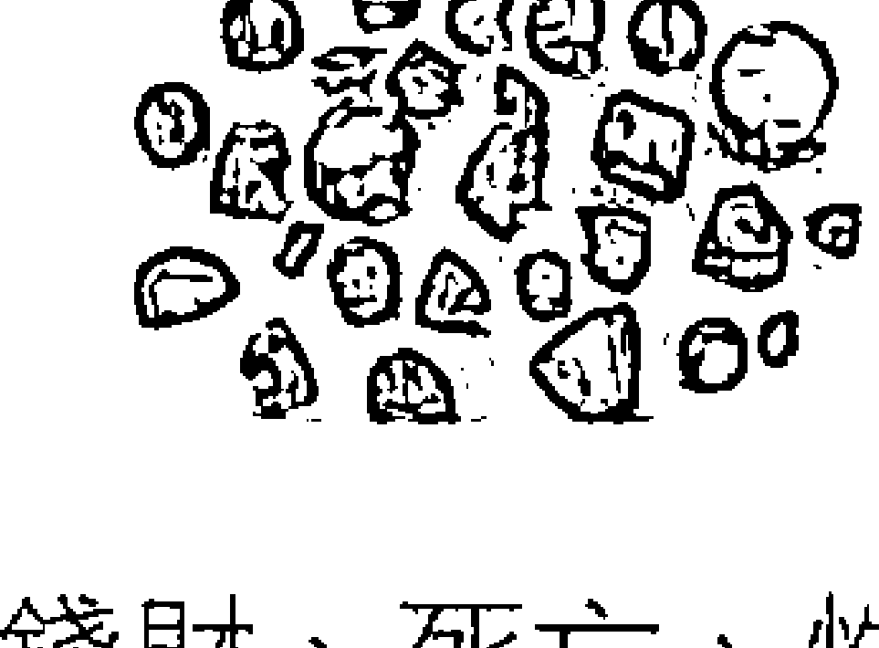

第八宮代表的人生事項太多，包括配偶錢財、死亡、性、人內心深層的恐懼慾望等事物。命主星在第八宮，喜歡探索人類內心對死亡與慾望的渴望，對於原欲的體悟特別深刻，也有機會獲得不勞而獲的錢財，例如配偶給予的錢財，或是繼承遺產，或保險理賠等，若有吉象，常會一走進別人店裡，就像招財貓般引來許多客源；也容易有活躍的性生活。

第八宮自古是凶宮之一，所帶來的負面情形較多，常帶來體質較弱之狀況；或是因為他人金錢糾紛卻讓自己背負債務；或是複雜的性愛關係等。

#### 上升星座在牡羊座，命主星火星在第八宮者

牡羊座的性急衝動的個性，因火星在此，會是個厲害的生意人，可從事保險理財等事項，但也容易涉入複雜金錢往來狀況，甚至為他人仗義挺身處理錢財問題。容易有衝動的性欲，占有慾強烈。在此要注意因他人金錢問題反而讓自己負債，切勿為財色逞兇而傷己。若有吉星來救助則可減緩問題。

#### 上升星座在金牛座，命主星金星在第八宮者

金牛座的理財能力，會因金星在此，常有機會幫人穿針引線賺錢，自己也因此得利，或是透過良好的社交能力，經營保險理財等事業而獲利，也容易繼承遺產或配偶錢財。感情隨著活躍的性生活而更加和諧，但需注意複雜的感情交往關係，因感情忌妒吃醋而惹禍，如有吉星救助則可以減緩。

#### 上升星座在雙子座，命主星水星在第八宮者

喜歡學習的雙子座，因為水星在此，對於人性所隱藏深層原欲的心理狀態，或是與生死有關的神秘事務，相當有興趣研究。具有業務能力的雙子，容易為他人經營管理錢財如保險業務等而獲利，但要注意涉及他人錢財之文件契約，如支票作保等，需謹慎簽署，以免錢財損失。避免口舌招來是非甚至惹禍上身，如有吉星來救助可減緩。

#### 上升星座在巨蟹座，命主星月亮在第八宮者

月亮在此的巨蟹座，容易關心配偶與家人的錢財狀況，自己也會付出協助他人度過金錢難關，但自己也容易繼承家庭遺產，甚至是母親的遺產，因此，若有重複見到母親的刑剋受剋，母親有早逝的可能，女性的生殖系統較不佳，若有吉星來救助則能緩解。具有生意頭腦，或與女性多有生意金錢往來。

#### 上升星座在獅子座，命主星太陽在第八宮者

太陽在此的獅子座，有良好的經商做生意的能力，對生死神秘學感興趣，但性格中多了些同情同理心。會幫助他人度過錢財困難，自己也可能會繼承遺產，尤其是來自父親，因此，若有重複見到父親刑剋的象徵，父親有早逝的可能；自己也要注意心血管系統的身體保養。若有吉星來救助則能緩解。

#### 上升星座在處女座，命主星水星在第八宮者

喜歡分析研究的處女座，因為水星在此，對玄奧的神秘學，或人類行為背後隱藏之心理動機，相當有興趣研究。工作認真的處女可以透過經營管理他人錢財而獲利，唯一需注意，涉及他人錢財之文件契約，如支票作保等，需謹慎簽署，以免錢財損失。還要注意禍從口出，謹防口舌招來的是非災禍，如有吉星來救助即可減緩。

#### 上升星座在天秤座，命主星金星在第八宮者

金星使得迷人的天秤座的戀情常伴隨著熱切的性生活，重視感官享受，也會因感情而得到物質或金錢的餽贈。因金星在此，可把社交手腕發揮在不同資源上的引薦，自己也因此得利，或經營管理他人錢財而獲利。容易繼承遺產或配偶錢財。最後，要注意生殖系統的保養。

#### 上升星座在天蠍座，命主星火星在第八宮者

天蠍座做生意的直覺天分，會因火星在此而發揮，是腦筋聰明、有高度競爭力的生意人，可從事保險理財等事業，生意上易有複雜金錢往來，常因為他人錢財的問題，或配偶或合夥人波及自己錢財而負債。對性的衝動需要理性克制，否則易惹來是非。若有吉星來救助則可以減緩問題。

#### 上升星座在射手座，命主星木星在第八宮者

木星在此的射手座，樂觀自信有胸襟不計較錢財，所以在能力範圍內會對他人伸出援手，不讓一文錢逼死一條好漢，自己累積許多福報及回饋，也容易繼承遺產或意外之財。可從事保險理財等事業，會因為在外良好的名聲而越做越好。對於神秘生死學或心理學，有高度研究興趣。

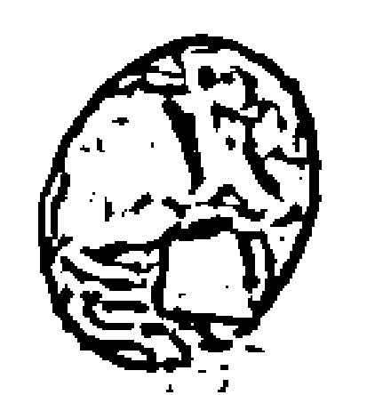

#### 上升星座在摩羯座，命主星土星在第八宮者

土星讓摩羯座常面對的挫折，肇因於配偶的經濟條件不佳，甚至必須承擔他人的負債，使得自己生活辛苦，土星在此不宜有金錢借貸往來，或是為他人擔保之行為。對性生活多所壓抑，生理與心理之健康均需要多照料，需注意骨骼或是心血管系統的保健。如有吉星來救助則可以解緩問題。

#### 上升星座在水瓶座，命主星土星在第八宮者

水瓶座重視朋友的個性，容易擔負他人錢財的困境，或是負擔配偶的花費開銷，讓自己承受較大的金錢壓力，土星在此需謹慎小心金錢借貸往來或擔任保人之狀況。性生活容易成為例行公事的責任，健康上需注意骨骼或是消化系統的保健。如有吉星來救助則可以解緩問題。

#### 上升星座在雙魚座，命主星木星在第八宮者

有宗教情懷的雙魚座，因木星在此，會有興趣研究生死學，也多了洞察他人心理動機的直覺。慈悲有同理心的雙魚座，會不忍他人貧苦而以錢財資助人，會對他人伸出援手，也因此累積今生來世的福報，也容易繼承遺產或等意外之財。可從事保險理財等事業，容易為他人招來財運。

### 命主星在第九宮——遷移宮

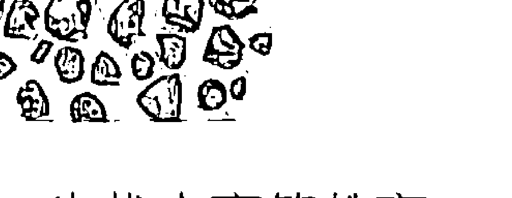

第九宮主要代表遠行，包含在國外相關事項，也代表高等教育、法律、以及宗教、良心道德觀。命主星在這個宮位，通常嚮往國外生活，也經常安排旅行活動，渴望接觸多元的文化，甚至容易移居海外。也有人有強烈自我提升的求知慾，所以能獲得高等教育的學歷，甚至從事研究工作。也有人一生秉持道德良心，熱衷精神與宗教活動等。

第九宮的負面狀況，需注意在國外交通與生活的安全性；也有人會遇上宗教詐騙事件；或是易有法律糾紛等問題。

#### 上升星座在牡羊座，命主星火星在第九宮者

牡羊座喜歡冒險好動的個性，因火星在此，喜歡往外地旅行拓展見識，通常會有強健的體魄，與強壯易行走的雙腿，能帶著牡羊到處遊歷，若有刑剋，則要注意在外地的交通安全。有強烈自我的崇高理想與正義感，會靠著身體力行去完成，或是從而追求更高等的精神層次或學問。要注意的是容易有法律糾紛，若有吉星來救助就可緩解。

#### 上升星座在金牛座，命主星金星在第九宮者

喜歡追求舒適生活的金牛座，因金星在此，只要有機會到海外去，就能享有愉悅的心情，甚至令人陶醉的戀情也有機會出現在異鄉，或與外國人士結婚，若有刑剋則要注意國外的戀情不易成功。會期許自我不斷提升，發揮求知慾而易有高等學歷。

#### 上升星座在雙子座，命主星水星在第九宮者

重視學習的雙子座，因為水星在此，會不斷追求學問與知識的增長，容易取得高等教育學位，可能對法律或教育、他國文化、哲學等領域甚有興趣。認為行萬里路有如讀萬卷書，故喜歡往海外遊歷，增廣見聞。

#### 上升星座在巨蟹座，命主星月亮在第九宮者

本性戀家的巨蟹座，因為月亮在此，對於多元生活方式的包容度較強，會嚮往國外生活方式，容易遷移至海外定居。高等教育求學時容易改變學科方向。重視道德與精神生活，喜歡探索生命與宗教哲理。可能要注意的是在外地生活時，情緒易受波動或飲食消化不順暢。

#### 上升星座在獅子座，命主星太陽在第九宮者

對自我期許高的獅子座，太陽在此會喜歡海外旅行，體驗異國生活，甚至有計劃地在海外工作發展事業，期望自己能在外光耀門楣。進取心強烈，容易考取知名學校取得高等學歷。喜歡探索教育法律、宗教哲理等領域，甚至因此成就名望。要注意的是，在國外可能常與政府機構打交道，會受制於政府法令規定的刁難。

#### 上升星座在處女座，命主星水星在第九宮者

對學問孜孜不倦的處女座，因為水星在此，可能對法律或教育、他國文化、哲學等領域展現高度求知欲，會持續累積知識與增長學問，若無刑剋易取得高等教育學位。喜歡至海外旅行增廣見聞滿足求知欲。水星如在此有受剋時，需注意財務相關之文件簽署所造成的法律糾紛。

#### 上升星座在天秤座，命主星金星在第九宮者

金星將使天秤座的異性緣會擴展至海外去，在國外見識異國迷人的氛圍，結交不同文化的朋友，心情就跟著雀躍，在異鄉也會放開心懷談情說愛，甚至有機會與外國人士結婚，若有刑剋則要注意在國外遇上爛桃花。自我將不斷提升並有強烈求知欲，易得到高等學歷。

#### 上升星座在天蠍座，命主星火星在第九宮者

天蠍座堅定的毅力，會因火星在此，會有機會前往外地旅行，可能在海外生活辛苦，都能以堅忍意志力持續下去，若有刑剋，則要注意在外地的交通安全，以及海外飲食之衛生狀況。有道德正義感，也渴望智識提升，但高等教育可能會易有波折。要注意的是容易有法律糾紛，或小心過分積極吸收的宗教團體，可能有所求，若有吉星來救助就可緩解。

#### 上升星座在射手座，命主星木星在第九宮者

重視道德、強調精神生活的射手座，木星在此更增添樂觀自信，會有好運氣而經常至海外旅行，或透過心靈思維的提升完成個人理想。有進取心與求知心，很容易取得高等教育學位，對於宗教哲學、他國文化、法律、高等教育等領域，有甚高的心智發展，走向學術研究易有所成就。

#### 上升星座在摩羯座，命主星土星在第九宮者

摩羯座堅忍不拔的毅力，因為土星在此，常會選擇荒涼偏僻、物資缺乏之地旅行，實際體驗窮鄉僻壤的生活環境，面對海外生活的許多困境，會透過學習與許多生活技能來適應陌生的外地生活。高等教育的學風保守，或是需要比一般人花更長時間才能取得學位。

#### 上升星座在水瓶座，命主星土星在第九宮者

水瓶座理性好思維公平正義的性格，因土星在此處，會透過實際走訪許多不同國家，從不同文化的生活背景，與當地人民建立良好互動，探索公平正義的真理。對高等學科嚴肅深入探討，可能要花較長時間，較為辛苦才能取得學位。

#### 上升星座在雙魚座，命主星木星在第九宮者

以宗教領導生活觀的雙魚座，因木星在此，喜歡探討宗教靈性生活與個人心理發展的關聯性，喜歡不斷提升心靈思維，有甚高的心智發展。有的常至海外旅行；有理想與求知欲，對於宗教哲學、高等教育、國際事務、法律等領域有興趣，易取得高等教育學位。

### 命主星在第十宮——官祿宮

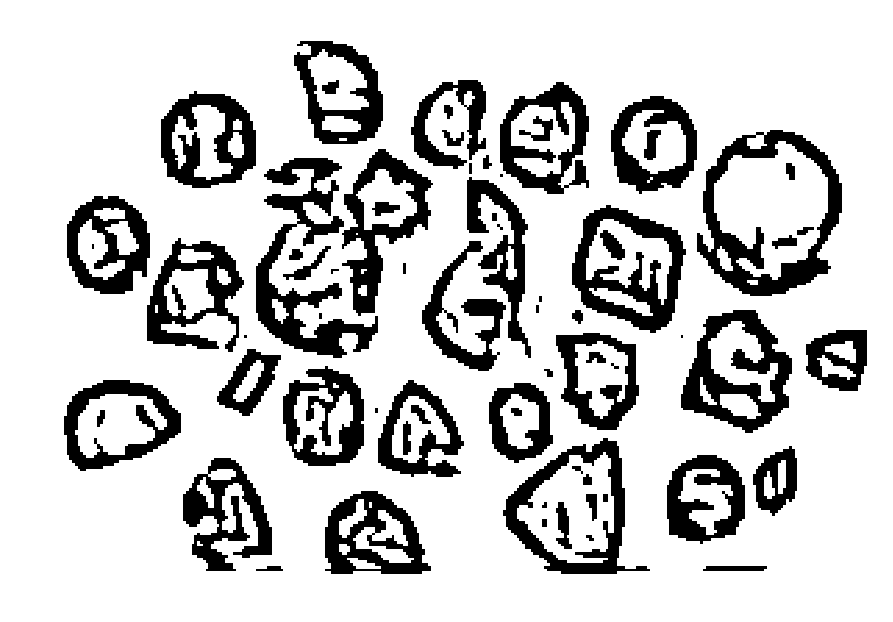

第十宮主要在看自己的事業、名聲地位，也看與主管、母親相處狀況。命主星在這個宮位，自己會非常重視對外的社會形象及聲譽，也容易獲得主管的賞識與拔擢，有好的事業運，事業上可以獨當一面。也有人在此宮位，呈現出與母親或主管關係密切，相處融洽，相當照顧母親。

命主星落在這個宮位，呈現出吉象居多，第十宮若有負面狀況，則容易因為企圖心過分強烈，導致主管互動產生裂痕，反而不易獲得拔擢，甚至有壞名聲。也會與母親關係密切，卻不融洽常有爭執。

#### 上升星座在牡羊座，命主星火星在第十宮者

牡羊座的積極企圖心，因火星在此，能全心發揮在事業的成就上，牡羊即具有高度競爭力，能應付瞬息萬變的產業環境，對於打擊競爭對手更是不留餘地，使得事業能快速拓展，將事業名望推向高峰，但容易為達目的而不擇手段。職務上因為過分表現自我，容易威脅到主管的地位。與母親的關係不佳，易爆發衝突。除非有吉星來救助才能減緩問題。

#### 上升星座在金牛座，命主星金星在第十宮者

金星在此的金牛座，能以財務管理，或是藝術才能作為發展事業的利基點，通常給人優雅好相處的印象，所以能透過良好的人際關係與社交手腕來發展事業，有利於公關或是藝術時尚事業。容易得到上司主管與母親的協助，甚至因上司主管而有戀愛機會，或是與社會地位較自己高的人相戀。

#### 上升星座在雙子座，命主星水星在第十宮者

多才多藝的雙子座，水星在此，能透過才藝、溝通能力或生意技巧來發展事業，容易從事銷售、教學、演說等工作，得到事業名望與肯定，但容易為達目的，承諾多變前後不一，言詞不誠懇難以取信於人。與上司及母親的溝通互動多，但也容易有口舌糾紛，有刑剋時需謹慎小心文件契約之錯誤影響名譽。

#### 上升星座在巨蟹座，命主星月亮在第十宮者

有持家管理能力及廚藝的巨蟹座，因為月亮在此，易從事餐飲飯店，或女性用品、超市等生活用品的經營管理，重視事業成就，但也較難以顧及家庭及私生活，易受女性上司拔擢，或事業上易逢女性貴人。與母親關係親近，但母親容易情緒低落或過分憂慮，甚至影響健康。

#### 上升星座在獅子座，命主星太陽在第十宮者

志氣高昂定要出人頭地的獅子座，太陽在此，一直都在為追求成功而努力，容易得上司賞識而被拔擢為主管，或有實力自行創業，或是擔任公部門的職位，事業易早有成就及名望，持續力及毅力也甚強，能持續長遠經營之實力，財務管理狀況也穩健。母系家族易有名望，母親在家中有舉足輕重的分量。

#### 上升星座在處女座，命主星水星在第十宮者

有研究與學習精神的處女座，因為水星在此，能透過豐富學識、演說技巧或商業頭腦來發展事業，易從事教育、銷售、演說、撰寫文字等相關工作，得到事業名望與肯定，但容易說話誇大，或是承諾多變不易達成，導致誠信受質疑。常與上司溝通多，但也容易有口舌糾紛。母親喜歡與人談天說話，有時口無遮攔；有刑剋時需小心文件契約之法律糾紛影響名譽。

#### 上升星座在天秤座，命主星金星在第十宮者

金星在此，將能發揮天秤座優異的公關能力，以及时尚設計能力，作為發展事業的利基點，常會讓人第一眼即受到她優雅氣質的吸引，她良好的人際關係與社交手腕更協助事業發展順利。容易得到上司主管與母親的協助，容易與上司產生辦公室戀情，或是因上司或母親的介紹而有戀愛機會，或是戀愛對象的社會地位甚高。

#### 上升星座在天蠍座，命主星火星在第十宮者

天蠍座悠遊政商圈子的謀略，會因火星在此，透過這些高層關係，積極讓自己在事業的能見度提升，對達成事業目標有強烈野心與手段，競爭者很難是他的對手，容易為達目的而不擇手段。太過凸顯自我又愛邀功，容易威脅到主管的地位。與母親的關係不佳，易有衝突。除非有吉星來救助才能減緩問題。

#### 上升星座在射手座，命主星木星在第十宮者

樂觀自信的射手座，木星在此，能把讓此性格優點展現在事業上，射手可能從事大學教職、法律、國際貿易、交通運輸等事業，事業上易有貴人提攜而順利發展，或是容易被拔擢，甚至自行創業，易累積財富資源。上司與母親常是自己的貴人，但要注意不要過於自信而誇大承諾，或過分擴張信用而難以收拾。

#### 上升星座在摩羯座，命主星土星在第十宮者

摩羯座的責任感與企圖心，因為土星在此，會腳踏實地一步步布局完成事業架構，事業經營過程較為辛苦，完成腳步可能比其他人慢，卻很紮實穩固，可能從事房地產、建築營造、農礦產、室內設計等事業，或是擔任公職或龐大實業等工作，上司主管較為傳統保守。母親生活辛苦，容易給壓力。

#### 上升星座在水瓶座，命主星土星在第十宮者

渴望開創與眾不同人生的水瓶座，因為土星在此，在經營事業名望上，可能刻意選擇較為艱辛困苦的事業道路，挫折也較多，一路上雖心境孤寂，但甚為固執難以變更已決定的方向，成功也較為艱辛。上司主管較為傳統保守，不易溝通所以關係不良。母親辛苦或年老，可能健康不佳，彼此關係冷淡。如有吉星來救助則可以減緩問題。

#### 上升星座在雙魚座，命主星木星在第十宮者

雙魚座因木星，雖不喜經濟市場的惡性競爭，卻因慈悲與高貴胸襟氣度，容易獲得貴人相助，宗教慈善事業、大學教職、法律、國際貿易等事業易成就，主管會提攜而順利發展及拔擢，更可能因見識不凡而自行創業成功，容易累積財富資源。上司與母親常是自己的貴人。但要注意不要過於浪費浮誇，或在財務上過分擴張信用。

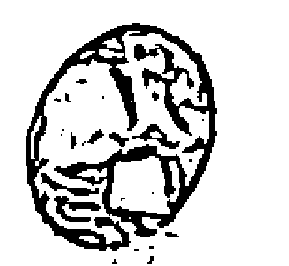

### 命主星在第十一宮——交友宮

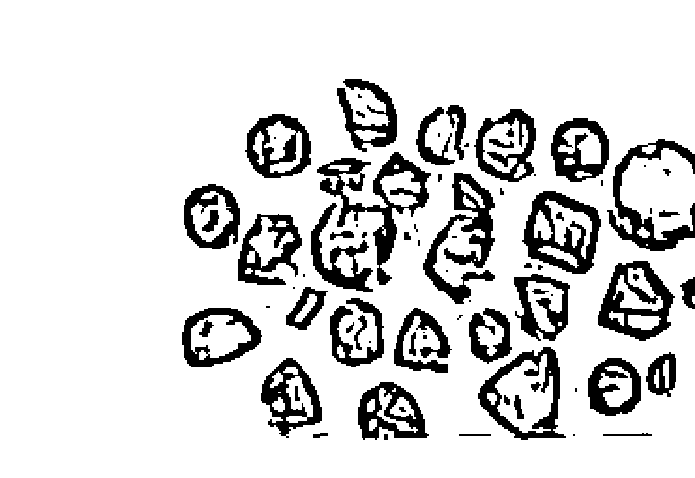

第十一宮主要是看與社會人際互動狀況，這個宮位也是大願望宮，可看出自己的願望能否順利實現的宮位。命主星落在這個宮位，對外的人際關係很廣，喜歡結交朋友也重視朋友，所以社會資源豐富，可能會是個業務高手，願望容易達成，因為有許多朋友相助，會心想事成。

命主星落在這個宮位，呈現出吉象居多，第十一宮若有負面狀況，可能會誤交損友，反而被朋友拖累。

#### 上升星座在牡羊座，命主星火星在第十一宮者

牡羊座的坦白熱情，因火星在此，交遊廣闊，五湖四海的朋友都有，其中可能有軍警界、運動界等朋友，或是常結交講義氣、卻也任性自我的友人，對朋友熱情互動頻繁，朋友關係熱鬧卻易有紛爭，友誼關係不合破裂反而無助益，若有刑剋需注意因朋友的紛爭而拖累自己，如有吉星救助則可減緩。

#### 上升星座在金牛座，命主星金星在第十一宮者

金星在此的金牛座，容易主動與人建立和諧關係，較易結識在藝文、音樂、電影、時尚圈等朋友，或是個性較溫和有禮的友人，常以藝術活動會友，重視朋友，彼此關係也較融洽，愛情機會亦多，要注意如有刑剋時，朋友間會有較多桃花紛擾。

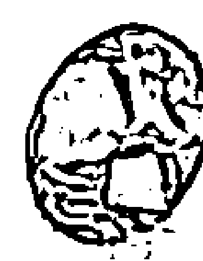

#### 上升星座在雙子座，命主星水星在第十一宮者

口才甚佳的雙子座，因水星在此，與什麼人什麼話題都能聊，會主動開口去結識人，容易成為業務高手，易結交媒體記者、講師、作家、銷售業務人才等朋友，或是口才表達能力好的朋友，或參與講座等活動會友，但要注意有刑剋時，朋友間易有口舌是非八卦來傷人。

#### 上升星座在巨蟹座，命主星月亮在第十一宮者

喜歡照顧人的巨蟹座，因月亮在此，會把照顧範圍擴大，推及好友圈子，相當關心朋友的日常生活與情緒狀況，容易結交女性或媽媽朋友們，或是個性較為雞婆、常聊家事、心事的朋友，朋友常有情緒問題需要談心紓解，若有刑剋容易朋友關係易起變化不穩定，或是男性星盤易被捲入女性糾紛是非。

#### 上升星座在獅子座，命主星太陽在第十一宮者

好表現的獅子座，因為太陽在此，常會擔任社團中領導幹部的角色，容易成為朋友間的表率，也容易結交有名望的朋友，或是企業主、政治人物、公職人員、社會名流、公眾人物等友人，喜歡參加具有社會影響力的團體，若有刑剋反而受到朋友名氣之累，或是名望被朋友利用。

#### 上升星座在處女座，命主星水星在第十一宮者

工作努力不懈的處女座，因為水星在此，對外的表達與溝通能力甚佳，較會主動與人攀談而結識人，容易學識豐富的朋友，或是從事媒體記者、老師、編輯、行銷人等友人，也常參與讀書會等活動會友，與朋友能教學相長。但注意有刑剋時，朋友間易有口舌或是網路資訊的是非誤解。

#### 上升星座在天秤座，命主星金星在第十一宮者

天秤座渾然天成的公關能力，容易主動與他人建立和諧友誼，常參加藝術活動、時尚派對等活動認識朋友，容易結識在時尚圈、電影娛樂圈、音樂藝術圈的朋友，或是外型時髦亮麗有品味的友人，重視朋友融洽關係，愛情機會亦多，要注意如有刑剋時，與朋友之間會有較多桃花紛擾。

#### 上升星座在天蠍座，命主星火星在第十一宮者

長於經商策略的天蠍座，會因火星在此，會透過人脈關係建立，串連起許多商業資源，交遊廣闊，不分朋友身分高低，其中可能有軍警界、運動界、醫界等朋友，或是政商背景關係複雜的友人，與朋友互動頻繁卻易有紛爭，常有友誼關係不合而破裂之狀況。若有刑剋需注意因朋友之紛爭而拖累自己，如有吉星救助則可減緩。

#### 上升星座在射手座，命主星木星在第十一宮者

熱情大方的射手座，因木星在此，社交圈子大，朋友多，對朋友很好，給朋友許多幫助，所以受人歡迎，常會結識學者教授、神職人員、修行同道、外國人等朋友，容易得到貴人幫助，願望容易達成。但要注意有刑剋時，容易對朋友浪費鋪張擺闊，只有酒肉朋友而無知音。

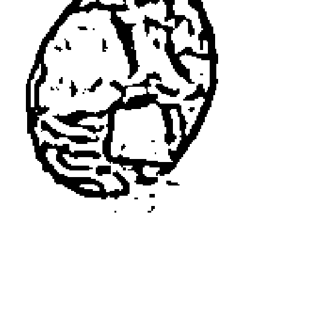

#### 上升星座在摩羯座，命主星土星在第十一宮者

謹言慎行的摩羯座，因為土星在此，朋友圈子較小，一旦認定是朋友關係，會對朋友盡自己的義務與責任，容易結識年長、傳統、個性內斂保守的朋友，或從事土地營造建築、農礦業的朋友。但受剋的話，可能朋友有困難與生活壓力、給自己帶來困境而關係不佳，或是根本沒什麼朋友。

#### 上升星座在水瓶座，命主星土星在第十一宮者

特立獨行的水瓶座，因為土星在此，不隨便交朋友，所以朋友圈子較小，一旦當作是朋友，關係就容易長久，會跟朋友患難與共，老朋友為多，或結識年長、想法老成的朋友，或從事土地營造建築、農礦業的朋友。如果有受剋，朋友的困難與生活壓力、會給自己造成困境而關係不佳，或是不容易結交知心朋友。

#### 上升星座在雙魚座，命主星木星在第十一宮者

包容力甚強的雙魚座，因木星在此，喜歡結交許多朋友，社交圈子大，與朋友之間互助互諒，關係和氣，所以受人歡迎，容易結識學者教授、神職人員、修行同道、外國人等朋友，容易得到貴人幫助而心想事成。但要注意有刑剋時，容易對朋友無節制的好，變成傻傻的濫好人，卻未必有真心相交的好友。

### 命主星在第十二宮——玄秘宮

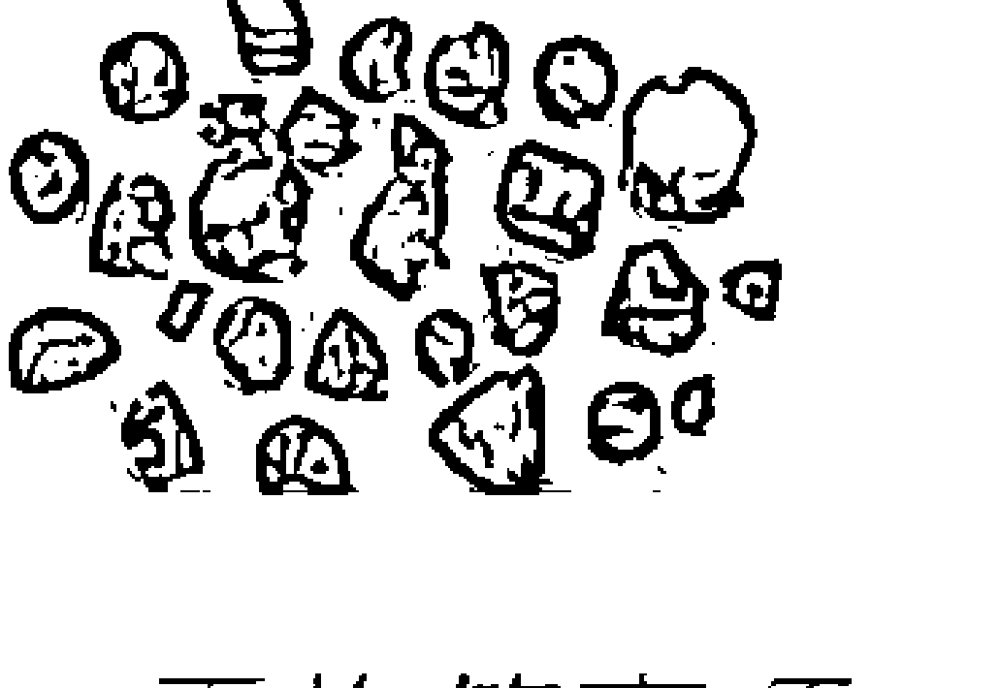

第十二宮主要是看隱匿事項，如幕後事項、靈修等事項，負面的事項會是跟小人、犯罪、犯陰等事項。命主星在這個宮位，個性會呈現較為低調不喜歡受人矚目，在團體中會隱藏自己，讓人常常感受不到他的存在。在此宮的人，喜歡從事幕後工作，也有人具有靈異體質，有較強的感應力，喜歡神秘靈修等與自我內心溝通之事，也會奉獻自我於慈善公益團體。

第十二宮自古是凶宮之一，所帶來的負面情形較多，常帶來體質較弱之狀況，甚至容易犯小人、犯罪、因疾病住院，或是犯陰、精神不正常等狀況。

#### 上升星座在牡羊座，命主星火星在第十二宮者

直率性急的牡羊座，會因火星在此，將會隱藏牡羊座好競爭外露的性格，甚至會畏懼外在世界或不認同競爭規則，關起門來躲在自己的世界裡，讓喜好探索的能量內化至藝術心靈靜態活動上，例如瑜珈舞蹈音樂等，或是熱心於慈善醫療等助人之事，甚或積極追求靈性生活，變成外冷內熱的羊兒。但要注意有刑剋時，小心受到燒燙割傷打鬥等意外、竊盜、小人等傷害，怒氣往內心裡藏，易有精神壓力。

#### 上升星座在金牛座，命主星金星在第十二宮者

本來就較悶騷的金牛座，因為金星在此，容易沉浸在寧靜或孤獨的狀態中，易萌生藝術靈感。會隱藏自己的感情狀態，雖然他可能是兩人關係中主動表露情感者，卻不會對外人輕易透露感情對象，或是交往狀況，對於情感保密到家，也因此容易為情所傷，或因單戀之故，感情上有難言之隱。若有刑剋要注意的地下戀情或因桃花帶來的是非紛擾。

上升星座在雙子座，命主星水星在第十二宮者

原本口才便給的雙子座，因水星隱藏在此，會喜歡一個人獨處，藉以探索內心思緒、閱讀、整理思考或寫作，不會輕易或聒噪地想表達內心思緒，適合從事心靈諮商或玄學數術之研究。但是常有內心隱憂難以傾訴，甚至種下心結而難以表達清楚，若有刑剋要注意暗中口舌是非、或是黑函、網路訊息的惡意攻擊等紛擾。

上升星座在巨蟹座，命主星月亮在第十二宮者

直覺敏銳的巨蟹座，因月亮在此，讓巨蟹喜歡離群索居，在心靈的豐富想像世界中更加優游自在，能發展靈性直覺能力，擅長玄學或靈性藝術、編劇等。但是會掩蓋自己的情緒起伏，對外更為害羞且神經敏感，若有刑剋則情緒較難以安定，甚至有神經質、精神困擾的狀況，或是容易有女性的秘密敵人。

上升星座在獅子座，命主星太陽在第十二宮者

自信、好表現的獅子座，因為太陽隱藏在此，喜歡獨處內省，面對內心真正的自我，不喜歡大肆張揚自我成就光芒，較願意隱身於幕後工作，或是慈善醫療服務之任務，也可能會把獅子的光芒及舞台放在慈善團體或是玄學靈修事業上，成為具有影響力的領導經營者。若有刑剋需注意暗中政治是非，或是得罪在上位之權威有力人士。

上升星座在處女座，命主星水星在第十二宮者

喜歡服務他人的處女座，因為水星在此，更容易凸顯他的低調，喜歡行善不欲人知，或是獨自閱讀研究占星命理之學問知識，藉以探索自己的內心思緒，適合從事心靈諮商或玄學數術之寫作研究。但是自己的言談文字常被曲解，而難以解釋清楚，若有刑剋要注意暗中文字口舌是非、或是網路訊息的黑函攻擊等紛擾。

#### 上升星座在天秤座，命主星金星在第十二宮者

天秤座對異性的強大電力，會因為金星在此，容易於孤單寂寞的處境裡，萌生情愫，但是未必是眾人認可的對象。會隱藏自己的感情狀態，不會對外人輕易透露感情對象，或是交往狀況，也因此容易為情所傷，或因單戀之故，感情上有難言之隱，若有刑剋要注意的地下戀情或因桃花帶來的是非紛擾。在寧靜或獨自一人的狀態中，容易滋養藝術靈感。

#### 上升星座在天蠍座，命主星火星在第十二宮者

善於保密的天蠍座，會因火星在此，容易受到神秘占星玄學的吸引，獨自探索神秘的心靈世界，或是藝術心靈的活動上，或是把行動力發揮在慈善醫療等助人之事。會有些畏懼外在世界或不認同社會的競爭遊戲規則，所以關起門來躲在自己的世界裡。要注意有刑剋時，容易受到燒、燙、割傷或打鬥等意外，或是竊盜、小人陷害等傷害，較難控制怒氣。

#### 上升星座在射手座，命主星木星在第十二宮者

本性坦白熱情的射手座，因木星在此，成了低調沉潛的修心修行者，透過冥想靜心的方式與內心對話，以直覺的感受力，讓心靈思維提升至更高的層次，喜歡暗中助人，容易成為慈善家或藝術家，心靈玄學家。容易有暗中的貴人。若有刑剋要注意過分相信神秘學而受騙，或是有法律的糾紛是非。

上升星座在摩羯座，命主星土星在第十二宮者

易憂鬱悲觀的摩羯座，因為土星在此，更容易身處在獨自一人孤單的狀態中，生活歷經許多苦難與滄桑，可能獨居生活較久，心中的寂寥難以紓解，外人也難以理解他的內心世界，但是可以忍受常人難忍耐的艱辛環境，從事極少人願意承擔的幕後工作。若有刑剋，長期下來容易成為心理問題，或是可能暗中遭敵意陷害監禁等困境。

上升星座在水瓶座，命主星土星在第十二宮者

特立獨行的水瓶座，因為土星在此，內心世界更不易被理解，個性低調也不願吐露心事，經常處在獨自生活的狀態中，可能是一個人單獨在艱困的生活環境中，作長期研究，生活無聊苦悶，他卻能忍別人所不能忍之處，只是外人也難以理解他的內心世界，心中的寂寥難以紓解。若有刑剋，長期下來可能會有心理問題，或是可能暗中遭遇困境，或是受陷害監禁等困境。

上升星座在雙魚座，命主星木星在第十二宮者

靈性強的雙魚座，因木星在此，適合長期養成冥想靜心的習慣，培養更敏銳的直覺的感受力，讓心靈思維提升至更高的層次，甚至能以心靈與不同世界相通，喜歡暗中助人，容易成為慈善家或藝術家、心靈玄學家。容易遇上暗中的貴人，或是福至心靈的感應力。若有刑剋要注意過分相信神秘學而受騙，或是易有法律的糾紛是非。

前面的案例中，提到許多占星專有名詞，想要掌握這些專業術語的意義與使用方式，可以先把以下內容在心中整理一番，幫助您更快掌握占星命盤分析之說明。

## 12 星座說明

專有名詞：牡羊座／英文：Aries

名詞說明

定位星：火星

星座類別：啟動星座、火象星座、陽性星座

星座特質：

牡羊座喜歡新奇與冒險，企圖心強而勇於嘗試，喜歡競爭不服輸，驅使牡羊座常尋找新目標，以發揮進取與即知即行的能力，是最具有開拓性格的星座。

### 注意事項與健康：

牡羊座的性格較自我主觀，易衝動暴躁，人際關係較不易平和，且過分積極的結果易使牡羊座產生偏頭痛、割傷燙傷等問題，開車也比較易急躁而橫衝直撞。

### 代表事物：

與火及熱相關設備：如瓦斯爐、鐵器、消防器材、外科手術器具，也代表切割利器，發炎發熱等現象、火紅色物品、頭部、腦部、眼睛、東方。

專有名詞：金牛座／英文：Taurus

名詞說明

定位星：金星

星座類別：固定星座、土象星座、陰性星座

星座特質：

金牛座緩慢穩重，忠實度高，誠懇有耐性，尤其具有理財頭腦，善於計算投資報酬率。受到金星的影響，金牛喜歡追求舒適的享受，具有藝術音樂美食的鑑賞力。

### 注意事項與健康：

金牛座較不知變通、步調太慢，適應性較不佳。金牛座要注意頸部喉嚨的保養，扁桃腺與甲狀腺等部位，有警訊產生時要特別照顧。

### 代表事物：

財務金融、理財能力、銀行、會計出納、藝術品、音樂、珠寶、美食、頸部、喉嚨、食道、聲帶、東南方。

專有名詞：雙子座/英文：Gemini

名詞說明

- 定位星：水星
- 星座類別：變動星座、風象星座、陽性星座

星座特質：

聰明的雙子座善於資訊收集與交流，各式各樣的談話主題他都能參與；雙子座具有語言與銷售的天賦，聰明機智多變化，很能趕得上新的潮流。

### 注意事項與健康：

雙子座易善變而說法前後不一，給人狡詐機巧之觀感。因為用腦過多，雙子座要讓神經系統適時休息，也要留意呼吸道與肺部等部位的問題，並多做手臂的放鬆運動。

### 代表事物：

文件契約、書信、新聞廣播、訊息、教學、演講、寫作、書籍、教育機構、交通工具、手臂肩部、肺部支氣管、神經系統、西南方。

專有名詞：巨蟹座／英文：Cancer

名詞說明

- 定位星：月亮
- 星座類別：啟動星座、水象星座、陰性星座

星座特質：

巨蟹座是所有星座最有家庭觀念的，會主動照顧他人，而且記性超強，也甚能敏銳感受周遭人的情緒反應，付出如家人般的貼心關懷。

### 注意事項與健康：

巨蟹座情緒起伏較大、表達情感時容易給人壓力。過於情緒化的心理狀態，以及貪吃的習性，會反映在胃腸消化上的困難，容易有胃潰瘍等症狀，女性還要留心子宮、乳房等部位之照顧。

### 代表事物：

- 母親、女性、家庭、歷史、住家、水、餐飲、日常生活用品、
- 古董、考古、胃部、胸腔、子宮卵巢、乳房、北方。

專有名詞：獅子座／英文：Leo

名詞說明

定位星：太陽

星座類別：固定星座、火象星座、陽性星座

星座特質：

獅子座具有領導風範，進取樂觀、大方樂於助人、有恢宏的格局與氣度，加上才華洋溢，具戲劇表演的天分，喜歡玩樂，舉手投足都能成為耀眼的主角。

### 注意事項與健康：

獅子座過度強調權威，易主觀太強而忽略他人感受。還要注意心血管系統之保養，留心脊椎或背部骨骼彎曲硬化等問題。

### 代表事物：

老闆、地位權威人士、父親、政府機構、證券投機、娛樂運動、展現才華、心血管系統、背部與脊椎、東北方。

專有名詞：處女座／英文：Virgo

名詞說明

定位星：水星

星座類別：變動星座、土象星座、陰性星座

星座特質：

處女座給人高雅細緻的感覺，因其注重細節與整潔、對事物能安排得井然有序、工作勤奮也喜歡服務他人，會細心幫助大家照顧被忽略但重要的細節卻重要的關鍵事務上。

### 注意事項與健康：

處女座易緊張不安難以放鬆，小題大作，對很多小事放心不下。易緊張的情緒，會影響腸道系統的蠕動，常有營養失調或不良問題，還要留意精神緊張的壓力導致身心問題。

### 代表事物：

秘書，部屬、服務勞動、衛生設備、營養品、健康醫護管理、傭人、腸道系統、交感神經、西南方。

專有名詞：天秤座／英文：Libra

名詞說明

定位星：金星

星座類別：啟動星座、風象星座、陽性星座

星座特質：

受到金星掌管的天秤座，是最具優雅氣質的星座，有藝術的品味與眼光，在人際關係上重協調與禮節，也擅長交際溝通與衡量仲裁等公關能力。

### 注意事項與健康：

天秤座易優柔寡斷，怕吃苦，處處討好人，給人魄力不足之觀感。天秤座要留意的健康問題在於腎臟、泌尿系統與腰部，應避免長期憋尿習慣而造成腎臟及泌尿系統的病變。

### 代表事物：

流行時尚、公關、美與藝術品味、美容用品、仲裁者、法官、婚姻、合作、腎臟、膀胱與泌尿道、腰部、西方。

專有名詞：天蠍座／英文：Scorpio

名詞說明

- 定位星：火星、冥王星
- 星座類別：固定星座、水象星座、陰性星座

星座特質：

天蠍座富有謀略、冷靜、善於保密及隱藏真相，直覺力強，領悟性也高，加上意志堅定有毅力，能全神貫注堅持到底。受火星掌管之天蠍座也有征服他人的氣魄。

### 注意事項與健康：

天蠍座對感情易過於執著、佔有慾強，疑心病重，可透過心理研究來轉移報復心與佔有慾。天蠍座應留心外生殖器與泌尿系統的照顧，例如子宮頸，攝護腺，直腸肛門，輸尿管等處。

### 代表事物：

死亡相關事物、保險與稅、合夥與配偶錢財、地下經濟、偵探間諜、性、深層心理學、排泄物、生殖器官、攝護腺、肛門、直腸、西北方。

專有名詞：射手座／英文：Sagittarius

名詞說明

定位星：木星

星座類別：變動星座、火象星座、陽性星座

星座特質：

射手座直率大方，不拘小節，熱情有正義感，追求自由自在的生活，具有國際觀與哲思的智慧，喜歡長途旅行、運動或是戶外活動。

### 注意事項與健康：

射手座易缺乏責任感、眼高手低。射手座愛好運動的天性，會讓下肢的活動較頻繁，因此大腿、臀骨、坐骨要格外照顧；也不宜熬夜或喝酒，因為肝臟部位是射手最易耗弱之處。

### 代表事物：

國外事物、高等教育、宗教、哲學、長途旅行、運動設備、肝臟、尾椎坐骨神經，臀部、東南方。

專有名詞：摩羯座／英文：Capricorn

名詞說明

定位星：土星

星座類別：啟動星座、土象星座、陰性星座

星座特質：

摩羯座受土星掌管，故老成穩重、嚴肅勤勉而踏實。摩羯座雖具有企圖心，但會刻苦耐勞，有步驟有系統的架構出成功的階梯。

### 注意事項與健康：

摩羯座較易悲觀，壓抑而過於嚴肅。摩羯座另外需要多照顧骨骼、牙齒、皮膚的健康，多注意關節炎、膝蓋痠痛、脫臼等問題。

### 代表事物：

土地、建築營造、泥土礦產、實業家、老人、節儉吝嗇、老舊物品、骨骼關節、皮膚、牙齒、南方。

專有名詞：水瓶座／英文：Aquarius

名詞說明

定位星：土星、天王星

星座類別：固定星座、風象星座、陽性星座

星座特質：

水瓶座是理性與創意交織的星座，具有自我主張，但會標新立異，喜歡與眾不同、強調人權平等。水瓶座創新的能力，具有創新科技之聰明才智。

### 注意事項與健康：

水瓶座因特立獨行、過於前衛的觀點而不合群。水瓶座另外需要多照顧下半身筋骨與氣血循環之健康，多注意靜脈曲張、坐骨神經炎、腿抽筋拉傷等問題。

### 代表事物：

創新科技發明、電子設備、古怪叛逆聰明、社會福利事務、天文占星、小腿腳踝、下半身循環、西南方。

專有名詞：雙魚座／英文：Pisces

名詞說明

- 定位星：
  - 木星
  - 海王星
- 星座類別：
  - 變動星座
  - 水象星座
  - 陰性星座

星座特質：

雙魚座性格浪漫、善良悲憫，不懂拒絕他人只好犧牲自己，常感到困惑，卻無受傷反擊能力，易往宗教或玄學尋找心靈的能量，作為面對現實人生的依靠。

### 注意事項與健康：

雙魚座較缺乏應付現實人際的能力，無法自我堅持原則。雙魚座要注意不能常藉由菸酒等物品，來暫時逃避問題，而造成酒精中毒或無法戒掉菸癮，另外需要多照顧腳掌部位、全身免疫與淋巴系統。

### 代表事物：

神秘玄學家、藝術家、催眠師、海洋、迷幻藥、騙子、石油、酒精、腳掌、淋巴系統、西北方。

## 宮位相關名詞

專有名詞：後天十二宮／英文：Houses

名詞說明

星盤分為十二個宮位區塊，代表每個人生重要的生活領域，作為演繹每個生活領域交互關係的重要基礎。由於宮位制的不同，會使得宮位起點度數有些微差異，故前述案例中，如有行星位於某宮位的末度數，則可視此行星已位於下一宮之宮內裡。

專有名詞：衍生宮（轉宮）／英文：Derivative House

名詞說明

以某宮當作一宮，其餘各宮重新以此宮起算，作為新的十二宮之意涵。例如以第四宮起算，第四宮之第六宮即為原本的第九宮，即可稱為父親的健康宮，以此類推。

專有名詞：第一宮／英文：First House

名詞說明

命宮，代表自己，表示人格特質與能力展現方式。

專有名詞：第二宮／英文：Second House

名詞說明

財帛宮，最主要為所有財務總合，以及對於金錢追求、經營管理的態度。

專有名詞：第三宮／英文：Third House

名詞說明

手足宮，代表兄弟姐妹與旁系血親、高中或大學以前的同學、鄰居、演講教學、寫作學習、文件契約、短距離交通。

專有名詞：第四宮／英文：Fourth House

名詞說明

田宅宮，呈現與父母相處的狀況，但主要代表父親，也代表土地房屋狀況。

專有名詞：第五宮／英文：Fifth House

名詞說明

子女宮，代表子女、戀情狀態、興趣與嗜好、運動休閒、賭博與投機。

專有名詞：第六宮／英文：Sixth House

名詞說明

奴僕宮，代表工作環境、例行性工作、雇員及下屬、健康狀態、小動物等。

專有名詞：第七宮／英文：Seventh House

名詞說明

夫妻宮，主要可推論另一半、合夥人之狀況與對待關係。第七宮也論及公開的敵人。

專有名詞：第八宮／英文：Eighth House

名詞說明

疾厄宮，主要看配偶錢財與他人借貸錢財的狀況，也看死亡與性的狀態，也代表深層心理意識。

專有名詞：第九宮／英文：Ninth House

名詞說明

遷移宮，主要看高等教育與國外遷移與法律、宗教及良心道德等事項。

專有名詞：第十宮／英文：Tenth House

名詞說明

事業宮，此宮主要看自己的名聲地位，與主管、母親的相處狀況。

專有名詞：第十一宮／英文：Eleventh House

名詞說明

交友宮，主要是看與社會團體、一般友人的相處狀況，也強調人道精神與願望。

專有名詞：第十二宮／英文：Twelfth House

名詞說明

玄秘隱藏宮，主要看隱匿事項，如幕後、玄秘、靈修等，也代表犯小人、犯罪、因疾病住院，或是犯險等。

專有名詞：宮主星及命主星／英文：Ruler Planet

名詞說明

每個後天宮起點所在的星座，此星座之定位星即為此後天宮之宮主星。例如：第二宮的始點在雙子座，因雙子座的定位星為水星，則第二宮的宮主星即為水星。
第一宮（即命宮）起點所在的星座，此星座之定位星即為命宮的命主星。

每個星座的定位星（Dispositor）如下：

| 星座 | 定位星 |
| :--- | :--- |
| 獅子座 | 太陽 |
| 巨蟹座 | 月亮 |
| 處女座 | 水星 |
| 雙子座 | 水星 |
| 天秤座 | 金星 |
| 金牛座 | 金星 |
| 天蠍座 | 火星及冥王星 |
| 牡羊座 | 火星 |
| 射手座 | 木星 |
| 摩羯座 | 土星 |
| 雙魚座 | 木星及海王星 |
| 水瓶座 | 土星及天王星 |

## 行星介紹

專有名詞：太陽／英文：Sun／符號：☉

名詞說明

行星性質：吉星

太陽所在星座為主要性格之一，代表自我讓人看見的外顯性格。

太陽所在的宮位位置，易展現個人之企圖心、才華，獲得肯定、名望、地位的所在。此宮也會跟父親、政府機構、有權力地位者有關。

太陽位在廟旺陷弱之星座如下：

- 廟星座：獅子座
- 旺星座：牡羊座
- 陷星座：水瓶座
- 弱星座：天秤座

專有名詞：月亮／英文：Moon／符號：☽

名詞說明

行星性質：吉星

月亮所在星座代表情緒及感情反應的方式。

月亮所在的宮位位置，代表個人情緒擔憂、在意敏感、易受感動之所在。此宮也會跟母親、女性、家庭、餐飲與日常生活等事項有關。

月亮位在廟旺陷弱之星座如下：

- 廟星座：巨蟹座
- 旺星座：金牛座
- 陷星座：摩羯座
- 弱星座：天蠍座

專有名詞：水星／英文：Mercury／符號：☿

名詞說明

行星性質：中性行星

水星所在星座代表思考學習、言語溝通表達的方式。水星所在的宮位位置，代表個人好奇、學習與話題、人際交往互動之所在。此宮也會跟契約文件、演說教學、求知、商業運作等事項相關。

水星位在廟旺陷弱之星座如下：

- 廟星座：雙子座、處女座
- 旺星座：水瓶座
- 陷星座：射手座、雙魚座
- 弱星座：獅子座

專有名詞：金星／英文：Venus／符號：♀

名詞說明

行星性質：第二大吉星

金星所在星座代表感情表達、人際關係、舒適享受、金錢觀的方式，與藝術鑑賞能力。金星所在的宮位位置，代表個人喜歡享受舒適，與柔性和諧關係、浪漫藝術美感之所在。此宮也會跟愛情、流行藝術精品、女性等事項有關。

金星位在廟旺陷弱之星座如下：

- 廟星座：金牛座、天秤座
- 旺星座：雙魚座
- 陷星座：天蠍座、牡羊座
- 弱星座：處女座

### 專有名詞：火星／英文：Mars／符號：♂

#### 名詞說明

行星性質：第二大凶星

火星所在星座代表個人企圖心、積極性、行動力、發脾氣的方式。

火星所在的宮位位置，代表個人發揮競爭力、企圖心、行動力、意外、暴躁之所在。也跟暴力衝突、機械工具、意外等事項有關。

火星所在廟旺陷弱之星座如下：

- 廟星座：牡羊座、天蠍座
- 旺星座：魔羯座
- 陷星座：天秤座、金牛座
- 弱星座：巨蟹座

### 專有名詞：木星／英文：Jupiter／符號：♃

#### 名詞說明

行星性質：第一大吉星

命盤中木星所在星座代表個人在精神性的哲學、宗教、道德觀的表達方式。

木星所在的宮位位置，代表幸運、財富，易有國外發展、高等教育、宗教之所在，也可看出浪費或法律糾紛之處。

木星所在廟旺陷弱之星座如下：

- 廟星座：射手座、雙魚座
- 旺星座：巨蟹座
- 陷星座：雙子座、處女座
- 弱星座：魔羯座

### 專有名詞：土星／英文：Saturn／符號：♄

#### 名詞說明

行星性質：第一大凶星

土星所在星座代表個人面對責任、壓力、困難、畏懼的態度。

土星所在的宮位位置，代表個人受到限制壓力困難，但好的土星也是承擔責任發揮務實執行力之處。

土星所在廟旺陷弱之星座如下：

- 廟星座：魔羯座、水瓶座
- 旺星座：天秤座
- 陷星座：巨蟹座、獅子座
- 弱星座：牡羊座

### 專有名詞：天王星／英文：Uranus／符號：♅

#### 名詞說明

行星性質：凶星

天王星所在的宮位位置，代表個人易遇到突然變化、分離之所在，也常代表有創意特立獨行的相關人事。

天王星所在廟旺陷弱之星座如下：

- 廟星座：水瓶座
- 陷星座：獅子座

### 專有名詞：海王星／英文：Neptune／符號：Ψ

#### 名詞說明

行星性質：凶星

海王星所在的宮位位置，代表個人易幻想、不實際之所在，或是代表易受騙之處，但也代表藝術靈性之相關人事。

海王星所在廟陷的星座如下：

- 廟星座：雙魚座
- 陷星座：處女座

### 專有名詞：冥王星／英文：Pluto／符號：♇

#### 名詞說明

行星性質：凶星

冥王星所在的宮位位置，代表個人無意識想要掌控之處，會想要犯罪、破壞與再建設之處。但也代表經營策略、政商掌控能力與相關人事。

冥王星所在廟陷的星座如下：

- 廟星座：天蠍座
- 陷星座：金牛座

### 專有名詞：凱龍星／英文：Chiron／符號：⚷

#### 名詞說明

凱龍星為常用的小行星。代表著覺醒傷痛獲得的智慧、心靈導師、醫療、博學多聞且善於應用。

凱龍星所在宮位位置，常為一個人精神傷痛所在，會為了彌補缺憾而強化此宮位的發展。

### 常見名词说明

#### 星盘敏感点

专有名词：上升位置／英文：Ascendant ／缩写：ASC

名词说明
即出生时刻东方地平面与黄道之交点，也是第一宫起点的星座度数。

专有名词：中天位置／英文：Midheaven ／缩写：MC

名词说明
又称为天顶，即为第十宫起点的星座度数。

专有名词：下降点／英文：Descendant ／缩写：DSC

名词说明
即为 ASC 的相对点，也是第七宫起点的星座度数。

专有名词：天底／英文：Immum Coeli ／缩写：IC

名词说明
即为 MC 的相对点，也是第四宫起点的星座度数。

专有名词：北交點／英文：North Node／符號：☊
南交點／英文：South Node／符號：☋

#### 名詞說明

南北交點並非行星，而是月亮運行軌道白道面與太陽運行軌道黃道面之兩個交點。

南北交點所在宮位位置，代表個人前世善果報與來到此世應學習之處，具有宿命輪迴之特質。

月亮由南向北與黃道交軌處稱為北交點，又稱為羅喉，一般認為北交點具有像木星的幸運吉祥順利的吉星特質。

月亮由北向南與黃道交軌處稱為南交點，又稱為計都，一般認為南交點具有像土星的不幸、阻礙的凶星特質。

专有名词：幸運點／英文：Part of Fortune／符號：⊗

#### 名詞說明

為重要的阿拉伯點之一。幸運點代表物質幸運、聲望恩典、大財富等。其計算方式分為白天與夜間盤——

白天盤為：ASC 星座度數 + 月亮星座度數 - 太陽星座度數
夜間盤為：ASC 星座度數 + 太陽星座度數 - 月亮星座度數

### 星座相關名詞

专有名词：十二星座／英文：Signs

#### 名詞說明

太陽運行的軌道稱為黃道，以黃道上下延伸九度的範圍稱為黃道帶，太陽、月亮、七大行星皆運行於黃道帶內。傳統占星學將黃道帶均分為十二個區段，各三十度寬，以星座命名。

黃道帶共等分為十二個30度之區塊，古人觀察時以各種熟悉甚或恐懼的動物去命名各個區塊的星宿圖案，就是我們所熟知的十二星座，又稱為先天黃道十二宮。十二星座在占星學的主要功能在標示行星或敏感點所在位置的座標，以及行星展現力量的狀態。

专有名词：上升星座／英文： Rising Sign

#### 名詞說明
也就是 ASC 所在的星座，從你的上升星座特質，可推知你的基本個性傾向。

专有名词：啟動星座／英文： Cardinal Signs

#### 名詞說明
也有人稱為基本星座，包含牡羊座、巨蟹座、天秤座、摩羯座，具有共同特質為開創、領導、驅動的能力，此特質顯著的人，會積極主動追尋新目標，也帶領他人向新目標前進。

专有名词：固定星座／英文： Fixed Signs

#### 名詞說明
包含金牛座、獅子座、天蠍座、水瓶座，具有共同特質為持續發展、穩固和持久，此特質顯著者面對環境的改變會以不變應萬變，堅持既有的作法與觀點，不願隨波逐流。

专有名词：變動星座／英文：Mutual Signs

#### 名詞說明
也稱為雙元星座，包含雙子座、處女座、射手座、雙魚座，具有共同特質為適應、變通、多元性、喜新厭舊，此特質顯著者能調整自己的心態，或學習多元能力來適應外在不定的變化，但缺點是善變與缺乏原則。

### 行星力量相關名詞

专有名词：廟宮／英文：Rulership

#### 名詞說明
行星落在自己主管的星座上稱為入廟宮，最能發揮此行星原本擅長的力量，能量最強。

专有名词：旺宮／英文：Exaltation

#### 名詞說明
行星落在旺宮的星座上，對行星來說是舒適的狀態，雖然比入廟稍弱，但也很能發揮本身的能力。

专有名词：陷宮／英文：Detriment

#### 名詞說明
行星落在自己主管星座的對宮，稱為入陷，此行星便很難發揮原本擅長的能力，且會凸顯負面特質。

专有名词：弱宮／英文：Fall

#### 名詞說明
行星落在旺宮星座的對宮，稱為入弱，此行星落在不舒適的狀態，即無法發揮能力。

专有名词：容納／英文：Reception

#### 名詞說明
指 AB 兩行星形成相位關係，A 行星所在的星座，恰好為 B 行星的廟旺宮星座，故B行星可容納A行星，給予A行星另外的能力。此稱為容納關係。容納關係是為單向的關係。

专有名词：互容／英文：Mutual Reception

#### 名詞說明
指 AB 兩行星，A 行星所在的星座，恰好為 B 行星的廟旺宮星座，而 B 行星所在的星座，也恰好為 A 行星的廟旺宮星座。故 B 行星可容納 A 行星，給予 A 行星另外的能力；A 行星也可容納 B 行星，給予 B 行星另外的能力。此稱為互容關係。互容關係是為雙向的關係。

### 相位相關名詞

专有名词：相位／英文：Aspects

#### 名詞說明
行星在一定的容許度數之下，彼此形成特定的角度關係，稱之為相位。一般常用的主要相位，係由托勒密（Ptolemy）所傳承下來，故稱為為托勒密相位。

专有名词：合相／英文：Conjunction／符號：☌

#### 名詞說明
兩個行星形成距離約 0 度之會合。
此相位以行星吉凶狀態論好壞。

专有名词：六分相位（六合）／英文：Sextile／符號： ✵

#### 名詞說明
又稱為六合相位。兩行星形成距離約 60 度的相位。
此相位代表機會之相位，吉象居多。

专有名词：四分相位（刑）／英文：Square／符號： □

#### 名詞說明
又稱為刑。兩行星形成距離約 90 度的相位。
此相位為不協調之相位，凶象居多。

专有名词：三分相位（三合）／英文：Trine／符號： △

#### 名詞說明
又稱為三合相位。兩行星形成距離約 120 度的相位。
此相位代表順利之相位，吉象居多。

专有名词：對分相位（對沖）／英文：Opposition／符號：☍

#### 名詞說明
又稱為對沖。兩行星形成距離約 180 度的相位。
此相位代表衝突之相位，凶象居多。

专有名词：十二分之五相位／英文：Quincunx／符號：⚻

#### 名詞說明
又稱為疾病相位。兩行星形成距離約 150 度的相位。
此相位代表疾病的問題。此相位並非托勒密相位。

专有名词：行星集中／英文：Stellium

#### 名詞說明
有三顆以上行星聚集在同一宮位，且在同一星座，兩兩間形成合相關係。這個相位型態會強調所落入宮位與星座代表的人生事項，許多事項都跟此宮的人事物有關，但好壞則要視其行星吉凶而定。

专有名词：大三角／英文：Grand Trine

#### 名詞說明
由三個三分相組合而成。大三角的三個行星通常落於土水火風之同一種元素上，會成為順利與和諧、幸運之狀況，可由三角型的三個行星所在宮位與所掌宮位的事項，推知順利與機會之所在。
另有小三角組合，為一個三分相加上兩個六分相，也可獲致上述的順利與機會。

专有名词：三刑會沖／英文：T-Square

#### 名詞說明
由兩個四分相位與一個對分相位所組合而成。三刑會沖代表著挑戰與困難的狀況，而三角型頂點的行星所在宮位與所掌管宮位之事項，容易成為最主要的問題所在，所以頂點的行星所受壓力也最大。

专有名词：大十字／英文：Grand Cross

#### 名詞說明
由四個行星組成兩個對分相位而成，這四個行星也與相連行星彼此成為四分相位。大十字的四个行星通常落在相同的四正星座（即啟動、固定、變動星座）上，阻礙力量甚強，但也更能發揮逆流而上的生命力。

### 運程相關名詞

专有名词：大運

#### 名詞說明
以行星所代表的時間區間，將人生切割成幾個較長期的時間區塊，以推估每個不同時間區塊中生命歷程的好壞，稱之為大運。

专有名词：流年

#### 名詞說明
以一年为单位，推算每年的运势情况，称之为流年。

专有名词：小限法／英文：Profection

#### 名詞說明
小限法为预测流年方法之一。此方法之记载最早见于希腊时期之占星文献，许多古典占星名家，如十三世纪的义大利占星家古德・波纳提、文艺复兴时期的英国占星家威廉・里利都使用此流年预测技术。

小限法系以 ASC 之星座起点当成 0 岁开始起算，每一年走一宫，并以每个流年的值宫当作第一宫，其余各宫便以转宫后的宫位来论述。

例如实岁 28 岁，流年小限的值宫即为第五宫，并以第五宫当这个流年的第一宫，而本命的第七宫则因衍生宫（转宫）之故，就变成该流年的第三宫，以此类推。

### 其他名词

专有名词：A*C*G

#### 名詞說明
Astro*Carto*Graphy（简称 A*C*G），由美国占星师吉姆・路易斯所创，绘制出各个行星的行星线，由这些行星线跨越世界地图的图表位置，我们可以从每个人星盘中的行星线所通过的国家（或城市），知道他未來適合去的地方，或是可能會為他帶來災難的地方。

頗類似中國風水陽宅的概念，可利用空間的轉換來改變或強化本命狀態。

古典占星的應用類似中國命理架構。從卜卦問事、擇日趨吉避凶至本命流年大運推論皆已完備。可以推算出星盤的富貴格局高低、家庭婚姻狀態、才能與事業發展方向、健康疾厄災禍、運程起伏等人生會遭遇的各式各樣生活現象，更滿足人們窺見未來並洞燭先機的需求。

面對命運或許不可逆的遭遇，現代心理占星所提供面對事件的自我內在建認與轉化，更是我們學習回應遭遇的態度，以此展現命運的高度。

古典占星與現代占星兩者交會，自有其不凡的意義！

> 書中的案例雖不是完整全盤的論斷，但有關愛情、婚姻、事業、疾病、財運及災厄溝通等，如何以古典占星的技巧來切入。在目前市面上缺乏這方面的中文占星書籍，是彌足珍貴的，值得推薦。

——秦瑞生
(天人之際占星研究學會學術顧問)

> Cecily 這本《占星占心》，她的案例均完整分析本命占星圖，不像大眾媒體上僅以簡要星座資訊來判斷，有心的讀者絕對會發現物超所值之處。

——李榮宗
(前 HP 惠普科技醫學事業部總經理、前飛利浦醫學事業部總經理)

> 《占星占心》絕對是本難得的好書，從占星的宿命觀點出發，但同時在每個案例中揭示了一個占星師對生命努力方向的積極態度與悲天憫人的胸懷，無論對精進西洋古典占星或學習中西命理技巧的同好而言，都是一本必讀的佳作。

——孫韻翊
(中華民國道家學術研究會理事)

分類：占星、命理