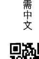
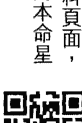
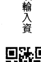
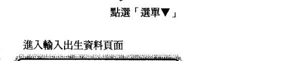
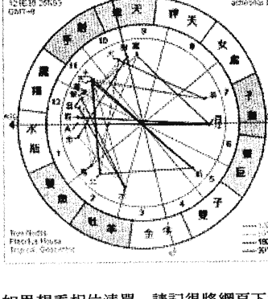

# 占星合盘的吸引力法则

## 出版緣起

興趣廣泛、身份多元的知名文化人韓良露，除了大家熟知的作家、媒體人及文化推動者身份之外，她也是藝文圈中最受重視的占星學大師。二〇〇三年起她在金石堂金石書院（現龍顏講堂）開設占星課程，由於口耳相傳、好評不斷，課程一直持續到二〇一〇年才劃下休止符。在長達八年的四百多堂課中，她以歷史、哲學、心理學、社會學的角度，將占星的深層智慧化為生動的教學內容，讓大家在學習與命運對話的同時，獲得看待人生的更高視野。這一系列課程不但架構了宇宙法則的邏輯，也融入她對人性與社會的觀察，但因資料整理工作浩大，成書計劃一直未能完成，為避免這些珍貴課程內容成為絕響，南瓜國際透過多年來數量龐大的上課錄音及相關資料，依據當時課程的規劃邏輯，整理成為系列書籍，期望能藉由文字重現精彩、動人且充滿智慧的上課盛況。

## 活佛是一種狀態

所有的合盤宮位，都是不同的人際關係。如果能夠藉由占星學來修煉自己的智慧，生命的重心有可能從比較粗淺、比較低階的能量，轉移到比較具有靈性的領域。不過也因為這件事情不容易，所以必須要主動的朝這些較高深的議題發展，它們才有可能成為生命主調，否則我們的生命旋律，一定會朝著比較膚淺、簡單之路發展。但人際關係如果都消耗在枝微末節的瑣事時，就難以繼續發展更高、更深、更有意義的課程。如果生命中所有人際關係都不避開，學占星就沒有意義了，因為你根本就混著混著過日子的人毫無差別。

當你本身的能量改變之後，生命中出現的善緣會比較多。在短短的一生中，我們要從各種正面與負面的關係中學習人際的功課。如果一輩子都把時間花在處理負面能量的話，就沒有時間學習人際關係的煉金術了。這是一件很可惜的事。

行星在占星教科書裡面不過是一個符號，它們要在日常生活中才會展現出能量。

舉例來說，

如果一個人本命星圖中月亮與冥王星有剋相，當事人容易在親密關係中（月亮）有很強的控制慾（冥王星），也比較容易在這一方面跟人起衝突。當事人如果能夠意識到這一點，盡量少去接觸相關的人事務，雖然在星圖中這個能量依然存在，但是它的影響力就會降低很多。當這個負面相位的力量降低，它就不太有辦法再吸引那些負面能量的人來進入你的生活中了。關鍵存乎一心——你本身的能量變了，外界過來的能量也就變了。我們看星圖的時候，不能死心眼的盯著星圖的好相位，就等著好事會發生。在星圖的能量場中，行星都不只是一個符號，它們的能量會不斷的隨著星圖的改變而改變。再怎麼作奸犯科的人，本命星圖中都不會完全沒有好相位，但為什麼沒有發生作用？原因在於當事人沒有去好好的運用這些好相位，而天天碰那些壞相位。日常生活中每天會遇到的外界人事物，它們都是不同的磁場，不同的力量。而這些力量的大小，都會隨著你的心念、你的取捨而改變——否則，這世界上所有的道德、所有的宗教，都沒有存在的意義了。理論上來說，人並不能改變命運，但從另一個角度來看，人其實可以改變命運。一個人不管怎麼改變，都不可能改變本命星圖，可是人可以改變身在能量場的自己，進而調整能量場中各種能量的大小。如果哪天我忽然決定要當壞人——當然不會——我的能量就變了。

活佛是一個狀態，不是一個頭銜。再大的活佛，能量變了，命運也就變了。我們每個人的生命都是一個狀態，要如何評鑑你的生命狀態？可以從每天你過著什麼樣的生活看出端倪。學習占星與命理，是要讓我們能夠學會整合，而不要誤用。我們每個人都有缺點，都各有其限制，我們要學的是用星圖中的正面能量來轉化整張星圖，而這是有可能做得到的。學占星的最高理想，在於如果世界上每一個人的土星、天王星、海王星、冥王星都變得更好一點，當我們的行星落在別人不管什麼宮位，就能夠少造一點業，甚至有可能積一點小德。當每一個人都變得更好一點點，整個世界就會變得更好一點。不過我們修得了自己，卻管不了別人，因此人際緣分在實際運用上的意義，在於遇到凶神惡煞時能躲則躲，而我們不要讓自己成為別人的凶神惡煞。這並不是一件很困難的事，簡單來說，就是每個人在自己的土星、天王星、海王星、冥王星中少掉一點執著，少掉一點貪心，少掉一點仇恨。生氣的時候提醒自己少氣一點，貪心的時候提醒自己少貪一點，這不僅對自己有益，對別人也很有利。

> 註 本文依據二〇〇六年「人際合盤」相關課程內容整理而成。

## PART 1 前言

每個人的本命星圖都是一個太陽系，每當我們跟他人產生關聯，都是兩個小宇宙太陽系在發生互動。天底下這麼多人在我們的星圖中跑來跑去，但並不是所有人都會跟我們發生關係。地球上每分每秒有這麼多人出生，如果翻開天文曆來看，能夠進入你的宮位，跟你形成關係的人可說是多不勝數。但是為什麼你遇到的是這個人，卻不是遇到那個人？地域因素首先篩選掉了絕大多數人，他們不可能跟你同時出現在同一個場合，因此你們沒有機會遇到。就算遇得到，如果你跟他之間缺乏行星與行星的吸引力（也就是合盤行星相位），雙方也容易擦身而過，不會被命運綁在一起。

### 宮位是什麼

在每個人的本命星圖中，出生時黃道座標與東方地平線的交點是上昇點，上昇點是第一宮的起點，進而畫出十二個宮位。十二個宮位，代表了十二個不同的生命情境。在占星學中，天數、人數、地數，這三者都很重要。天數包含了本命星圖中一出生就定下的這輩子所有命運，人數包括了所有他人對我們的影響，地數是指你跟身處的環境，不管你在台北、洛杉磯或倫敦，你跟這個環境會產生什麼樣的互動。而所有命運的變化，都來自於天數、地數、人數三者的交互作用。

宮位本身屬於天地人三者中的地數，而人際合盤中的宮位，可說是在人數命運中的地數影響。

在人際合盤的宮位中，我們會理解到我們星圖中的行星，進入了他人宮位時會有什麼意義，我們也會知道，他人星圖中的行星，進入了我們的什麼宮位時，會有什麼意義。

人際合盤是一面鏡子，從這面鏡子中，可以照出我們在人際關係中的處境。並不是每個人看到任何一個人，都會想要跟對方討論同樣的事情。我們很有可能會因為合盤的宮位不同，遇到這個人時，想跟他談錢，遇到那個人時，只想跟他講八卦。我們的任何行星，都有可能落在別人的任何宮位，別人的任何行星，也可能會落入我們的十二個宮位中。這件事情是為了讓我們理解，每個人都有各種不同的面向，沒有一個人是只有單一面向。如果我們對他人的想像，永遠只有兩種可能性時，我們對生命的解讀，就會過度簡化、過度扁平。

例如我本身的十宮事業宮中，只有一顆不重視現實的海王星，我自己對事業非常不看重，也不會要人去追求事業與社會地位。可是我的土星落在我妹妹良憶的十宮，土星重視現實所以一直以來，我經常暗自擔心她的工作與事業。即使我自以為很多話已經吞到肚子裡沒講，事實上我還是經常很囉唆的建議我妹妹做這個、做那個，甚至還多管閒事管到她男朋友身上。

不過宮位會隨著經緯度而改變，當一個人搬到國外，地緣就改變了，地緣改變造成的宮位改變，也會帶給人際關係的改變。後來良憶遠嫁荷蘭，我也就管不著她了。在台灣時，我一天到晚都想管她，但是她一搬去荷蘭，我就忽然不覺得她有什麼需要我擔憂的地方。這也是占星學人際合盤要教導我們的事情：我們每個人都受限於『天』、『地』、『人』的框架，有許多我們自以為非盡不可的責任，不過是因時、因地而產生的自以為是。

### 合盤宮位的特質

我們在學習人際合盤宮位時，一定要先有一個觀念，天下人何其多，能夠跟你發生重要關係的人，首先他們的行星跟你的行星之間，一定會有重要相位，尤其是土星與冥王星這兩顆具有業力性質的行星，才能像勾子一樣，將兩個人勾在一起。（註）

也就是說，並不是隨便把兩個人的星圖放在一起，看到合盤有行星進入五宮戀愛宮或七宮婚姻宮，就能說他們有戀愛緣或夫妻緣。如果兩人之間沒有重要的合盤相位，這兩個人就算有機會認識、成為朋友，也不一定會有更進一步的關係發展。

> 註 合盤相位書籍即將於近期內出版。

認識，也沒有足夠的緣分將兩個人牽在一起過生活。看宮位合盤時，一定得要同時看看兩個人合盤相位的吸引力。

我們在關注別人有什麼行星進入我們的宮位時，要注意三件事情：行星本身的相位好壞，宮位本身的相位好壞，以及行星進入宮位之後形成的相位好壞。

假設一個人本命星圖的太陽有兇相，例如太陽跟火星九十，或太陽跟月亮九十，這個人的太陽不管在人際合盤中進入別人什麼宮位，都容易在對方的宮位舞台中跟人產生衝突。很多人在生活中充滿了衝突麻煩時，他們常會覺得自己運氣很差，每天周遭遇到的都是壞人。他們沒有想到自己可能本命星圖中就有日月九十或日火九十，當他們在人際合盤中跑到了別人星圖的宮位時，他們會覺得問題都是別人帶來的，卻沒有想到他們自己本來就容易跟別人起衝突。這也是一種很正常的心理防衛機制：當我們在生活中遇到衝突時，我們會傾向先認為是別人在找我們麻煩，而不會想到是自己在找大家麻煩。所以在我們看我們跟他人宮位的人際合盤時，我們在看自己的行星進入他人宮位之前，應該先看一下這顆行星在本命星圖中本身的相位好壞，並且先在心中預先大致想一下這顆行星本命星圖相位會演出什麼樣的情節，再將這顆行星放入他人的宮位中，進而思考這樣的情節，會在他人宮位中，透過他人產生什麼樣的連鎖反應。

宮位這一 方本身也會有好壞之別。當一個宮位裡面本身有星時，這個宮位本身的能量就比較強，它會更容易吸引別人的行星進入這一宮。如果這顆宮內的星原先就有剋相時，當別人的行星落入這一宮，就算本身沒有剋相，也會因為宮位方本身有剋相而形成剋相。更何況如果落入對方宮位的行星本身就有剋相，那就可能會形成好幾重的剋相。

即使行星本身跟宮位本身都沒有相位，當一個人的行星進入對方的宮位之後，還是有可能會跟對方其他宮位的行星形成正面相位或負面相位。例如一個人的一宮是空宮，可是七宮有星，當別人的太陽落入他的一宮時，就有可能會跟他七宮的行星形成一百八十度對立。如果這顆行星本身就又剋相，當它落入別人宮位，又跟對方其他宮位的行星形成剋相時，就會因為負面相位的連鎖影響，形成更大的負面效應。當你的問題卡上別人的問題，別人的問題也卡上你，大家的問題卡來卡去，這可說是人際緣分中最困難的課程。

### 占星合盤的實用表格

大家可以直接利用占星網站或軟體排出兩人合盤，也可以先打出自己的圖，以自己的圖為主。各種占星網站或軟體都有不同的合盤圖示或列表。在大家還對合盤不熟時，不妨先將下一頁的表格印出來，填好之後，再對照著書中內容，占星合盤就能很快的上手。

### 表格一 合盤宮位關係圖

| 宮位的關係 | 你的星星 | 在他的宮位 | 宮位的關係 | 他的星星 | 在你的宮位 |
|------------|----------|------------|------------|----------|------------|
| ⊙太陽     |          |            | ⊙太陽     |          |            |
| ☽月亮     |          |            | ☽月亮     |          |            |
| ☿水星     |          |            | ☿水星     |          |            |
| ♀金星     |          |            | ♀金星     |          |            |
| ♂火星     |          |            | ♂火星     |          |            |
| ♃木星     |          |            | ♃木星     |          |            |
| ♄土星     |          |            | ♄土星     |          |            |
| ♅天王星   |          |            | ♅天王星   |          |            |
| ♆海王星   |          |            | ♆海王星   |          |            |
| ♇冥王星   |          |            | ♇冥王星   |          |            |

### 表格二 合盤相位關係圖

|          | 太陽 | 月亮 | 水星 | 金星 | 火星 | 木星 | 土星 | 天王星 | 海王星 | 冥王星 |
|----------|------|------|------|------|------|------|------|--------|--------|--------|
| 太陽     |      |      |      |      |      |      |      |        |        |        |
| 月亮     |      |      |      |      |      |      |      |        |        |        |
| 水星     |      |      |      |      |      |      |      |        |        |        |
| 金星     |      |      |      |      |      |      |      |        |        |        |
| 火星     |      |      |      |      |      |      |      |        |        |        |
| 木星     |      |      |      |      |      |      |      |        |        |        |
| 土星     |      |      |      |      |      |      |      |        |        |        |
| 天王星   |      |      |      |      |      |      |      |        |        |        |
| 海王星   |      |      |      |      |      |      |      |        |        |        |
| 冥王星   |      |      |      |      |      |      |      |        |        |        |準，再一一將他人的行星落入自己的宮位中。舉例來說，英國的查理王子的四宮家庭宮是在天秤座十三度到天蠍座二十三度之間，而黛安娜王妃的海王星在天蠍座八度，所以黛安娜的海王星落在查理的四宮。

### 行星方與宮位方

在合盤宮位中，行星這一方都會對宮位這一方有興趣。行星有能量而宮位沒有，所以行星通常會是採取主動的一方。在這樣的關係中，宮位這一方提供了行星可以發揮能量的情境，它是被動的一方。但如果宮位這一方並不想要這段關係，宮位方可以迴避或婉拒，不一定非得要將這段人際關係繼續發展下去。在所有合盤的行星進入對方宮位時，行星這一方會對宮位這一方有強烈的認同感，而宮位這一方如果對行星這一方沒興趣的話，宮位這一方具有拒絕的權利。當他人的行星進入我們的宮位時，如果真的不想跟對方產生什麼糾葛的話，我們是可以拒絕的一方。並不是每個月亮在你一宮的人說要來你家吃飯，你就非得做菜給他吃。身為一宮這方的你有拒絕的權利。當一個人的金星進入另一個人的五宮戀愛宮時，五宮這一方固然也會對金星產生一種羅曼蒂克的互動，但五宮這一方其實有點順水推舟，當五宮對金星也有好感時，五宮可以配合金星一起演出一場愛情戲。但如果五宮這一方沒興趣的話，通常只要迴避、不回應，金星這一方也很難有進一步的接觸。在行星落入對方宮位的人際緣分中，保持客觀很重要。尤其宮位這一方必須要能保持客觀，才有辦法決定這段關係是否要順水推舟，還是要予以婉拒。客觀的態度能讓宮位方保持自主性，讓自己不會隨行星方起舞；客觀的態度也能讓行星方尊重對方的自主性，進而有能力拿捏跟別人互動時要如何適可而止。

假設一個人的金星進入另一個人的宮時，金星這一方會覺得一宮這個人的外表很有吸引力，但如果一宮這一方夠客觀的話，他們就會知道這是金星這方情人眼裡出西施，如果換了一個人的話，對方未必會覺得一宮人很有吸引力。

不過宮位方雖然具有客觀的可能性，卻未必會經常保持客觀。在行星與宮位的關係中，雖然宮位都是被動方，但宮位方往往也都願意配合。原因在於我們都會有被人喜愛、重視的需求，當別人對我們感興趣時，我們會感受到受寵若驚的喜悅，因而跟對方互動。

在合盤中的十二個宮位，分別代表了人際關係的不同面向。人際關係雖然有這麼多面向，但不見得都很複雜。師生關係通常不會太複雜，同事關係也不複雜。辦公室的同事雖然相處時間很長，如果跟同辦公室的人處不來，的確會很煎熬，但有的人或許很討厭他的同事，可是當他換了一間公司之後，忽然就對之前痛恨的同事毫無感覺了。這顯示出這是一種跟地緣有關的人際緣分，當地緣改變之後，人際緣分也就改變了。這也代表同事關係再怎麼讓你不舒服，它也有其極限。

比較難過關的關係是夫妻關係，因為這是一種很全面的關係，但夫妻萬一真的合不來，還可以離婚，更複雜、更全面的關係，就是家人關係。這種很全面的深入關係的困難之處，在於它們一定會牽涉到很多宮位，也就是會在生活中的很多層面中交互影響。

不管是同事、朋友、同學或師生，都沒有必要發展成全面性的關係。透過合盤星圖，我們可以很快的分辨一段人際關係中，哪些值得發展，哪些不需要觸碰。你可能跟一個同事一起工作時合作愉快，但這不意謂著你適合跟他一起炒股票。因為你們可能有很好的共事緣分，可是未必有很好的共財的緣分。

當我們把人際緣分當成一件必須全面往來的事情時，雙方就容易出問題。很多人會情不自禁想要把所有的人際關係都攪和在一起，我們常在報上看到，有許多朋友可能十幾年來感情都很好，結果一起做生意了沒多久，其中一個人就把幾千萬都倒光。也就是說，好朋友不代表雙方就可以有金錢往來。相反的，如果你跟一個人聊不來，這也未必代表你不能將錢交給他管理。

大家常說「君子之交淡如水」，人際往來的原則，同樣也是宜淡不宜濃。因為人際交往的濃度越濃，雙方往來時遇到的星圖挑戰也會越重。越淡時，大家比較可以保持理性，讓雙方的發展保持在一個正向的範圍內。適合跟你發展出濃情蜜意的人，在人生當中比例一定不高。如果一個人宣稱他可以跟所有人變成好朋友，可以跟每個人合作，這種人恐怕是個混蛋，因為他根本不在乎自己會為別人惹出什麼問題。這種人就是個「渾人」，因為他們把所有人際關係都攪混在一起，結果牽扯出很多問題。

如果每個人對自己星圖中的負面能量都有所警覺，能夠有所修行，他們給別人帶來的麻煩，就會降低很多。如果天下人都能自修的話，世界上的麻煩就少得多——事實上，根本別管別人自不自修，只要我們每個人能夠對自己的負面能量有所修行，獲益的就會是我們身邊的每個人。一個修養很好的人，他們絕對很少跟他人產生衝突。

前面講的君子之交淡如水，或者是對自己的負面能量自修，這些都屬於「避凶」，如果想要「趨吉」，就必須要積極發展自己星圖中善的能量。當一個人對別人散發的都是正面能量時，他們在生活中遇到的人，也會以比較正面的態度回饋他們。這也就是我們常說的「結善緣」。每個人隨著出生的時間、地點，畫出了本命星圖之後，宮位的格局就已經被定了下來。但同樣的宮位擺在那邊，即使他人進入這個宮位的行星相同，就算演出的情節類似，但隨著這個人修行程度的不同，進入宮位行星的能量高低就有很大的差距。

不管誰的星跟對方的星形成什麼相位，不管誰的星落在誰的宮位，在看人際合盤前，最重要的重點，就是在進一步解析之前，一定要先回頭看看這顆星本身有沒有問題。

相較於「自作孽」的說法，作孽這個詞太過於批判，但我們可以說，每個人都活在天數、地數、人數的命運當中，我認為「自作數」才是其中的關鍵。我們活在這個世界上發生的好事或壞事，它們大多數都不是從天上掉下來的禮物或隕石，它們都是我們跟別人互動而產生的結果。因此在抱怨所有的人際關係之前，檢視自己的星圖，這才是最重要的事。如果不檢視自己的星圖，不能掌握自己星圖中的人際關係的話，想要改善自己的人際關係會很困難。在人際緣分的互動中，能夠自覺的面對自我，這是基本，也最重要的事。

事實上我們在日常生活中，即使在完全不知道別人星圖資訊的情況下，至少知道自己星圖中有哪些問題，只要少跟任何人一起去做你自己本命星圖原本就容易出問題的事，產生糾紛的機率也會大幅降低。你自己本命星圖中原本就有缺陷的部分，除非對方跟你之間有極好的相位，否則不管是你拖累對方，或者雙方互相拖累，這些地方都是很容易惹出問題的領域。因此即使在不清楚對方星圖的狀況下，你自己也應該知道，自己某些領域的事情最好少做為妙。

此外，不管人際合盤中的相位好壞，不符合正道的行為本身抵觸了天數原則，即使合盤相位再好，到最後都會帶來問題。因此不管是對自己或對別人，當我們能夠建立起一套符合正道的行為標準，這也能讓我們在人生中出問題的機會降低。如果不把正道放在心裡的話，你是小人物就容易出小問題，如果是大人物，就可能會惹出大麻煩。生命的戲劇，只有大舞台跟小舞台之分，大人物的戲劇在大舞台上演，小人物的戲劇在小舞台上演，但它只有大小之分，沒有本質之分。

## PART 2
行星落入對方宮位

每個人的本命星圖中，都有十顆主要行星，它們分別代表一個人擁有的各種不同能量。

- 太陽：一個人的意志與活力，它是一個人的人生目標
- 月亮：感覺、情緒
- 水星：思想、溝通能力、表達能力
- 金星：情感、價值觀、美感、吸引力
- 火星：欲望、性衝動、肉體的行動力
- 木星：智慧、機會，社會價值帶來的助益
- 土星：責任、限制、阻礙，社會價值帶來的壓抑
- 天王星：變化，它是宇宙性的巨大改革力量
- 海王星：靈性與同情心，它是宇宙間廣泛的融合力量
- 冥王星：摧毀、轉型，它是宇宙間潛藏的巨大毀滅與新生的力量

十二個宮位是十二個生命情境舞台，其中包含了：

- 一宮：自我形象
- 二宮：自己賺取的個人資產
- 三宮：兄弟姊妹、基礎教育、大眾媒體、近程溝通
- 四宮：內心之家。包含原生家庭、結婚以後的自組家庭，以及晚年生活
- 五宮：自我創造。包含了戀愛、小孩、賭博與創作
- 六宮：維繫日常生活運作的一切事物。包含工作、勞務與健康
- 七宮：合夥之宮：包含了婚姻伴侶與事業合作夥伴
- 八宮：他人的資產。跟性、金錢、權力有關的糾葛
- 九宮：遠程溝通。包含異國與高等教育
- 十宮：公眾可見的事業舞台
- 十一宮：志同道合的非營利團體
- 十二宮：將現實利益讓位給靈魂的業力、輪迴之宮

當一個人的行星進入別人的宮位，雙方就會在這個宮位領域中產生緣分。行星具有能量，宮位則提供讓行星發光的環境，所以在行星進入對方宮位的人際關係中，行星這一方通常會是主動方。但宮位方可以視情況決定是否要接納行星方。如果行星方帶來的是一段惡緣，宮位這一方可以決定予以迴避或婉拒。

### Chapter 1

#### 行星在對方一宮：自我形象舞台

一宮是一個人的童年環境，以及依據童年環境而養成的自我形象。約定俗成被稱為上昇星座的上昇點，就是一宮的起點。它代表了一個人的外在氣質，也就是當一個人面對外界時的直覺反應，也就是一個人什麼都不想時，顯露出來的一種調調兒。在所有行星進入對方一宮的關係中，一宮這一方都可以全然自在的做自己，而行星的一方也會因為一宮的做自己而感到愉悅。

#### 太陽在對方一宮

一宮代表的是個人形象。當太陽落在對方一宮時，太陽這一方特別容易刺激一宮這一方去自我表達。太陽會很希望一宮將自己的個人特色、人生意見、個人看法表現出來。受到太陽的影響，一宮的人特別會覺得不需要隱藏自我。在這樣的合盤中，太陽看重的是一宮的個人本質，太陽希望看到一宮表現出自己是什麼就是什麼。相對來說，如果太陽落在對方的七宮伴侶宮，太陽看重的就會是七宮這一方在伴侶關係中應該扮演的角色，而如果太陽落在對方四宮家庭宮，這個太陽會鼓勵的就是你在家庭中的功能，而非鼓勵你展現自我特質了。當別人的太陽落在你的任何宮位，太陽這一方都會在這個宮位領域中看重你，例如落在四宮家庭宮時，太陽會看重你在家庭中的功能，落在十宮事業宮時，太陽會看重你在事業舞台中的功能。但唯有一宮時，太陽看重的是你很單純的顯現出來的個人本色。舉例來說，如果你的一宮大部分落在牡羊，代表你平常跟人相處時，展現出來的自我形象就是一個牡羊的形象，就算你的上升點是在雙魚座的末端，你的一宮中還是有一部分屬於牡羊的那一面。當一個太陽牡羊進入你的一宮，太陽這一方一定會因為你一宮的星座跟他的太陽星座相同，因此他會感覺到你在一宮形象中展現出來的，是一種他可以了解的特質，因而想跟你親近。不過對於一宮明顯的跨兩個星座甚至跨三個星座的人來說，他們在一宮的自我形象上，就會顯露出兩個或三個星座的不同特質，當對方的太陽落在當事人一宮時，太陽這一方會明顯的對跟自己同星座的部分感到自在，而對跟自己太陽不同星座的部分感覺陌生。以我自己為例，我的上升在人馬二十六度，所以在我的一宮中，人馬只有四度，其他二十六度都在摩羯。我的上升展現出來的是人馬的氣質，但是我在一宮領域中必須要做很多摩羯的事。我的個人形象中有很多屬於摩羯的社會責任部分，但是我使用的是上升人馬的不受拘束的個性來做這些事。

太陽在人馬二十六到三十度的人，以及太陽在摩羯零度到摩羯二十六度的人，他們的太陽都會落在我的一宮。而太陽人馬跟太陽摩羯的人，分別會認同我的一宮形象中，人馬與摩羯這兩種不同部分。跟我有這兩部分不同緣分的人際關係很多，太陽人馬認同的都是我跟吃喝玩樂（人馬特質）有關的人馬部分，而太陽摩羯的朋友則跟我常有工作關係（摩羯特質），我的編輯很多都是太陽摩羯，他們找我時，都是要我寫稿，他們不會想要找我出去玩；相對的，我的太陽人馬朋友也從來不會找我合作談工作。

當太陽進入對方一宮，如果一宮這一方本身五宮或九宮中有行星，就很容易跟太陽形成一百二十度和諧相。例如我的九宮高等心智宮有一顆冥王星，落在處女座四度，而我的一宮大部分都在摩羯，如果一個人的太陽在摩羯四度左右，他的太陽就會落在我的一宮，而且同時跟我的九宮冥王星形成一百二十度和諧相，我就認識好幾個這樣的朋友，他們多年來，成為我在事業上強而有力的支柱。從他們的太陽落在我的一宮這方面來看，他們都充分的讓我展現自己的本色，只希望我做好自己，對我沒有其他的要求——這件事情也意謂著雖然我們認識多年、合作多年，

#### 月亮在對方一宮

在行星與對方宮位的關係中，行星方通常會是主動的一方，宮位方則會是被動的一方。但月亮本身是一顆很被動的行星，所以情況會稍微複雜。相較於太陽進入對方一宮，太陽本身非常主動，所以太陽會是主動找一宮去做什麼事情的一方。以我的太陽摩羯編輯朋友為例，他們都是主動找一宮摩羯的我寫稿，而不是我主動去找他們做什麼事。如果是月亮進入對方的一宮時，月亮這一方並不會主動去找一宮做什麼事，但是他們我們卻沒有私交。例如我跟一個摩羯座的編輯合作了非常多年，但私底下我跟他連一頓飯都沒吃過，兩年也見不到一次面。永遠是他打電話來邀我寫稿，我在截稿前交出一篇讓他滿意的稿子。不過這個例子並不是要說明太陽落在對方一宮會形成工作關係，這完全是因為太陽摩羯落在我的一宮，而摩羯本身特別跟工作有關，才會出現這樣的狀況。太陽落在對方一宮，雙方會有什麼樣的關係，會跟太陽與一宮位在什麼樣的星座有很大的關聯。如果太陽、一宮落在牡羊這種競爭性強烈星座的話，他們的關係跟工作的牽連就不會那麼大。當太陽牡羊落在一宮牡羊時，太陽牡羊就容易刺激一宮牡羊的人展現出更強烈的競爭心。

對一宮這一方會有一種被動的依賴。這種依賴會是一種情緒的依賴，而不只是單純行為上的依賴。月亮對一宮的情緒依賴，會反映在很多的事物上。不同於太陽落在對方一宮的思想表達，月亮跟一宮之間會有很多情緒的表達。月亮這一方在一宮面前不會隱藏自己的情緒，他們敢告訴一宮自己的情緒。由於月亮也跟食物有關，當月亮落入別人一宮時，月亮這一方會很喜歡跟一宮的人分享食物。

在情侶關係中（包含同性戀與異性戀），如果雙方除了月亮一宮之外，又有五宮戀愛宮的相位，這個相位會加強月亮一宮的情感連結。這種情感連結會促使雙方把對方當成很親密的家人的感覺，而五宮戀愛宮的情感中，也會因為跟一宮月亮產生連結，因而在戀愛關係中產生情感的依賴。在這樣的關係中，當事人會搞不清楚彼此之間到底是一種家人間的親密感覺，還是一種戀愛中的羅曼蒂克感覺。也就是說，除非月亮一宮同時又有五宮的相位連結，否則月亮進入對方一宮，只會有家人般的親密情感，而不會有五宮的羅曼蒂克感覺。

當月亮進入對方一宮時，彼此之間會有很多一起吃飯的緣分，也會有很多家人間往來的緣分。以我自己為例，我的太陽摩羯進入我一宮的朋友們，他們多年來不管是跟我邀稿，或者是編我的書，我們在事業上有很多的合作，我卻從未跟他們吃過一頓飯，也沒有邀請他們來我家玩過。而導演李崗的月亮在我的一宮，所以李崗一家人常來我家吃飯，我跟我先生也常去李崗家吃飯。月亮進入一宮的緣分，常常會是一種家庭對家庭的緣分，而不會只是月亮這個人跑去一宮這個人家裡吃飯。月亮進入對方一宮時，月亮會引動、強化一宮這一方的食物與情緒方面的餵養關係。在這樣的餵養關係中，月亮這一方會比較常找一宮吃飯，而非一宮常找月亮吃飯。如果月亮本身有剋相，代表月亮這一本身容易有情緒困擾，當月亮進入對方一宮時，一宮的人也容易受到月亮的情緒困擾而受到影響。但如果一宮這一本身有情緒困擾，但一宮的人就會對月亮產生安撫作用。在這樣的關係中，當一宮的人表達出自己真正的想法時，這些想法會對月亮這一產生情緒的感染力。不同於一般朋友，親子關係是一種比較深的關係。如果我們看到一些子女長大以後依然脫離不了父母的影響時，有可能是因為子女的月亮落在父母的一宮中。雙方會有一種剪不斷的情感臍帶般的關係。這樣的關係如果是不是出現在家庭生活中，也會以擬家庭的形式出現。如果真的是家庭關係的話，這個相位就會強化家庭的功能——這麼看來，大概很多父母會希望小孩落在自己的一宮，因為這麼一來，小孩就會對自己很情緒依賴，即使長大成人，也會三天兩頭跑回家。我妹妹良雯的月亮就在我的一宮。良雯從一出生，就有智能不足的問題。在這個關係中，我們可以很清楚的看到，她對我的確有著很強烈的情緒依賴，而且跟飲食有關。每個禮拜我一定要帶她出去吃東西，而且既然要帶她出去吃東西，所以當然也要呼朋引伴，找爸爸、弟弟、妹妹一起去，藉由一起出去吃東西，強化了家庭的功能。

從這個例子延伸，我們也可以看到，由於我自己的四七十宮並沒有跟良雯產生剋相，所以良雯的月亮想要跟我的一宮產生情感依賴時不會受挫。如果我的七宮有一個冥王星，我在七宮的冥王星與良雯在我一宮的月亮形成一百八十度剋相的話，可能我就會去嫁一個管很嚴的丈夫，這麼一來，我就沒有辦法每個禮拜都帶她出去吃東西了。

由於良雯本身的月亮跟土星合相，所以她不但月亮落在我的一宮，土星也在我的一宮。也就是說，她的月亮一對我有很強的情緒依賴，而她的土星也帶給我一宮很大的壓力。我是一個很愛出國旅行的人，但是受到她土星在我一宮的影響，等我父親過世以後，我就必須全力照顧良雯，再也無法想要出國就隨時出國旅行了。儘管這是我自願承擔的責任，但是責任就是責任，它不會是一件很輕鬆的事。有了這個責任之後，我就不可能完全的隨心所欲的做自己想做的事情了。

#### 水星在對方一宮

水星是一顆中性的行星，除非水星本身或者跟對方的土星、冥王星等行星形成嚴重剋相，雙方常會出現很激烈的言語衝突，或者感受到心智上或交談上的壓力，否則水星落在對方一宮都會是一種很中性的關係。在這樣的關係中，水星一方會刺激一宮去表達自己的想法，一宮這一方則會提供水星更深入了解事物的理解力。水星會期待一宮發表自己的意見，一宮則會讓水星的思考更加明澈。一宮這一方常會點出水星比較隱藏的動機與想法，在雙方的交談過程中，水星會越來越了解自己的想法。我們常常跟人談話，並不見得是為了真的想知道對方在想什麼，而是藉由不斷的跟對方談話，來釐清自己真正想的是什麼。水星落在對方一宮時，就是這樣的關係。我們也常發現，找到適當的對象時，談話可以讓我們對自己的想法越談越清晰，但是跟不對的人談話時，就會讓我們的腦袋越談越糊塗。由於一宮是一種很自由的自我表達，在水星與一宮的關係中，水星與一宮談論的事情會是完全不受限制的自由討論，相較於水星落在對方五宮，五宮是戀愛與遊戲之宮，談話的內容就會限定在談情說愛。如果落在四宮，雙方會談很多家庭的事情，在十宮的話，雙方就可能談很多工作的事。水星落在對方一宮時，透過一宮這一方談論自己最基本的人生態度，水星這一方也會對自己的人生態度有更深的理解。但如果水星這一方的水星有剋相，或者水星在進入對方一宮之後，跟對方的行星形成剋相的話，水星這一方就會產生防衛性，而水星的防衛性也會引起宮位這一方的不安。例如媒體人陳浩的水星就在我的一宮，他本身的水星相位很好，所以我們多年來一直是經常聊天的好朋友。他很喜歡聽我講話，我也很喜歡聽他講話，我的話對他有啟發性，我也覺得他有很多想法很不錯。另一個朋友的水星也落入我的一宮，但這個朋友本身的水星有剋相，我們就不會在一起聊天，由於我是宮位方，宮位方可以選擇接受或拒絕雙方關係是否繼續發展——當然如果對方是你的父母、家人或老闆，這種關係當然只能選擇接受，但如果只是一般的朋友關係的話，當我覺得跟這個朋友聊天來不太有意思，即使他打電話找我，我也不太想回他的電話。

#### 金星在對方一宮

金星這一方通常都會覺得一宮這一方擁有某些獨特的特質，這些包含了長相、個人的氛圍與他的生活型態、生活態度等等特質，特別能夠滿足金星這一方的虛榮心，因此會對金星這一方產生很大的吸引力。但金星一方如果本身金星就有剋相，例如金星本來就跟土星、海王星九十度，當它落到別人一宮時，金星會對一宮有仰慕之情，可是這種仰慕本身就跟土星的現實，或者跟海王星的幻想間，有著內在的矛盾。另一種可能是金星落入一宮之後，跟一宮這一方的土星或海王星形成了剋相。

金星九十度克相，代表金星對一宮的仰慕，會因為對方的土星或海王星而無法完成。也就是說，如果是金星本身的克相，帶來的是內在的矛盾，如果是一宮這一方帶來的克相，帶來的是外在的衝突。它們都會讓金星想要的事情無法完成。對一宮的這一方來說，他們會感受到金星對他們投以很大的關注，雖然未必受寵若驚，但一定會感到受寵——如果是上升獅子的話，他們絕對不會受寵若驚，對上升獅子來說，受人關注是天經地義，沒有什麼可驚。但對於比較害羞的上升處女來說，當他們受到金星的矚目時，他們就容易感到受寵若驚。金星這一方都會喜歡跟一宮的人在一起，但如果金星本身有克相，他們就可能會出現金星的負面能量，金星的虛榮是一種自戀傾向。當金星這一方跟一宮在一起時，一宮做自己時散發的氣質，剛好可以滿足金星想要滿足的自戀需求。如果金星本身有克相的話，金星這一方在喜歡一宮的同時，也會希望一宮可以幫他們滿足他們在金星方面包含物質與情感上的欲望，以及生活上的享受。在這個關係中，金星這一方跟一宮在一起時，通常可以提升自我的價值感，一宮這一方也常可以滿足金星這一方想要的物質享受。金星這一方就像是經紀人，一宮這一方則像是模特兒或藝人，金星常會將一宮視為可以展示、炫示的物件。因此金星這一方常常喜歡跟一宮一起出現。

金星對一宮的興趣並不會隨時間遞減，但金星對一宮的奉承，則容易讓一宮逐漸感到麻痺——這件事情說明了馬屁拍多了就不太有用。因此一宮的人時間久了，就有可能因為覺得無趣而想要脫離。我認識一對夫妻，太太的金星在獅子，先生的上升在獅子、太陽在牡羊，因此太太的金星落在先生的一宮。這對夫妻完全演出了金星落對方一宮的大戲。

金星獅子太太覺得上升獅子先生很有魅力——但金星落入對方一宮的吸引力，其實是一種情人眼裡出西施，我認識這個先生多年，對於金星天蠍的我來說，這個上升獅子完全不是我會喜歡的類型。

儘管如此，金星獅子跟上升獅子都具有愛漂亮、愛打扮的特質。這兩個人是我認識的人中最愛買衣服的人。當這兩個人一起出現在台北街頭時，的確是引人注目的璧人一對。這個先生從事的是跟獅子座有關的娛樂圈，因此我們也可以說，金星獅子太太喜歡的不只是上升獅子先生的外表，也喜歡先生從事的娛樂圈生活方式。經由先生的工作，太太也可以接觸許多五光十色的明星、藝人，出入也都跟漂亮的華美事物有關。

以我的標準來說，這個先生對太太一點都不體貼。但是這個太太經常跟別人說先生對她好，因為先生送她一個包包或戒指——金星獅子的女生最喜歡別人送她漂亮的禮物。不過這個先生婚後不時出軌，讓太太痛苦不已，以至於後來他們養成了模式：只要先生外遇出問題，先生就送一個禮物給太太，大纰漏送大禮物，小纰漏送小禮物。有一次先生跟太太的一個熟朋友上床，而且鬧到圈內所有的朋友都知道，這種等級的大纰漏，讓先生送出了一部賓士。後來由於先生的事業發展並不順遂，手頭很不寬裕，再也無法負擔出纰漏就要送禮物的壓力，送完賓士之後才不過一年，先生就決定與太太離婚。雖然整個婚姻過程讓太太痛苦不已，但是離了婚以後，太太還是對前夫非常讚許，覺得離婚很可惜。

#### 火星在对方一宮

當火星進入對方一宮，如果同時跟五宮戀愛宮產生相位的話，火星進入對方一宮也會是一個讓雙方產生戀愛關係的相位。尤其火星這一方如果是男性的話，戀愛的可能性會更高。

如果金星落入對方一宮時，金星這一方會強烈覺得一宮的人的模樣是他們喜歡的形象，這可說是一種標準的情人眼裡出西施。相較之下，火星進入對方一宮的話，火星這一方會覺得一宮的人的自我表達方式，非常符合火星這一方自我原欲的渴望。火星這一方也會因為一宮的自我表達，火星的欲望會因此受到刺激。這種欲望有一點近似性欲，但是它與火星入五宮（戀愛宮）、七宮（伴侶宮）或火星入八宮（性、金錢、權力）的性欲不同。如果火星進入的是對方的五宮、七宮或八宮時，火星這一方會有一種強烈的希望宮位方成為自己伴侶的欲望，但火星進入對方一宮時，火星只是純粹想要跟對方在一起，火星跟對方在一起時，可以刺激火星的生命活力，但火星這一方並不會覺得非得把對方娶回家或嫁給他，或者是很想要跟一宮上床的性欲，而是會被激起火星本身生命的欲望，這種欲望會讓火星這一方覺得活得充滿動力。這種欲望包含性欲，但是不等於性欲。這對一宮的人感受的差別很大，因為這麼一來，一宮這一方就不會像火星進入他人的五七八宮時，這麼感覺到自己是對方欲望的對象。一宮的人只是在做自己，而做自己這件事，剛好跟火星這一方很契合。火星本身如果有相位，火星的能量可能被強化，也可能會因為克相而變成負面能量。火星可能是活力、性欲，但也可以是激情、競爭，甚至可以是毀滅的力量。因此火星落入對方一宮，它有可能會是一種正向的活力展現，但也可以是一種互相攻擊的能量展現。如果火星跟一宮之間沒有形成負面相位的話，火星這一方跟一宮在一起時，都會變得比較有精神，而一宮這一方也會發現自己能讓火星變得比較有活力。火星跟一宮落在什麼星座，則會顯示出雙方在一起時，比較會想要去完成什麼樣的事情。例如我的一宮大部分都是摩羯，當我遇到火星摩羯的人時，他們比較會想要找我去做一些跟摩羯領域有關，也就是屬於社會上認可的工作之類的事情。如果沒有其他克相影響，火星落在對方一宮時，雖然火星會為雙方帶來競爭心，但是並不會帶來衝突。相較之下，火星落在對方七宮時，這種相位反而比較容易帶來衝突。原因在於火星落在對方七宮時，火星這一方會希望七宮的人扮演七宮的伴侶或合夥人角色，但如果七宮這一方只想扮演自己，也就是想扮演一宮角色時，他們就很容易會產生衝突。

#### 木星在对方一宮

木土天海冥都是超越個人的社會或宇宙能量，當它們進入對方一宮時，它們傳達的能量，就會跟太陽、月亮、水星、金星、火星的個人能量不同。由於它們都是藉由個人傳達出來的社會或宇宙能量，因此力道也會比單純的個人能量更大。在沒有克相干擾的情況下，當木星進入對方一宮時，木星這一宮會對一宮的人的自我表達格外有利。這種情況跟木星進入對方七宮有很顯著的差異。木星進入一宮時，木星強化的是讓一宮的人去做他自己；木星進入七宮時，木星會將七宮的人視為夥伴，並且從兩個人互為夥伴的角度來幫助對方。

舉例來說，我的木星在我先生的一宮，而我先生的木星在我的七宮。兩者的不同，在於我的木星會鼓勵我先生做他自己，既不是鼓勵他做我先生，也不是基於他是我先生而對他很好。例如我會鼓勵我先生畫畫，或者做一些舞台劇之類的創作，鼓勵他發揮自我，而不是像一般太太鼓勵先生努力工作以獲得更高的社會成就。相較之下，我先生木星落在我的七宮，他的木星會鼓勵我以夫妻的身份，一起去跟他做各種事情，他會非常喜歡跟我一起出雙入對。

當木星落入對方一宮時，隨著木星這一方本身發展程度的不同，也會激起一宮這一宮對於哲學、文化、宗教或靈性的不同層次的追求。從我的木星進入我先生一宮的例子來看，我的木星對哲學、文化的興趣影響到他的生活之外，也包括他因為我而接觸了很多占星學的內容。雖然他拿到博士學位，但因為我的木星進入他的一宮，所以在這段關係中，我會是關係中跟文化、教育有關的教導者。

由於木星是社會星，當木星落入對方一宮且相位不錯的話，雙方不見得一定會很親近，但兩個人常有機緣一起去做一些跟社會文教有關的工作。例如我跟心靈工坊的董事長王浩威就有這樣的相位，他的木星在我的一宮，冥王星在我的九宮，他本身有木星冥王星一百二十度的好相位，我的冥王星又跟他的木星一百二，所以我們一起從事許多木星領域的社會事務。由於木星並不是個人行星，我跟我先生是因為除了木星進入一宮之外，我的木星還跟他的月亮合相，雙方才會有更多私人互動，否則木星跟一宮的關係，可能就會像是我跟王浩威的關係，從社會的角度來看，他是心靈工坊的董事長，我是心靈工坊的副董事長，但我們私底下的互動其實並不多。從這兩個例子我們可以清楚看到，當木星進入對方一宮時，木星跟對方的個人行星是否形成相位的明顯差別。

當木星進入對方一宮時，木星這一方不管是物質或精神層面，對一宮都會產生正面的影響。藉由木星的刺激，一宮這一方也會在社會領域中實踐自己的理想。從王浩威的木星進我的一宮的例子來看，創立心靈工坊這件事是由他而發起，他代表的是木星的社會能量，他找我談了合作之後，我也因為他而參與了這個文化領域的社會工作。

#### 土星在对方一宮

土星是業力星，它會帶來責任與壓力。在家庭關係中，如果土星進入對方一宮的話，這會是一個比較辛苦的關係。家人關係是一種逃不了的關係，在家庭中出現土星進入一宮的關係時，這一宮這一方便會長期面臨自我受到土星壓抑的問題。土星進入對方一宮也常見於職場關係中。在這些相位中，雙方會經歷很重要、很嚴肅，而且會有很多現實生活中的串連。

當我們在職場上遇到土星落入我們一宮的人，情況可分為兩種：一種是本身一宮中就有一四七十宮克相問題的人，土星落入一宮的影響力就會比一宮沒有相位時要大得多。例如一個人本身有太陽月亮九十度克相，太陽在一宮、月亮在十宮，當對方的土星落入當事人一宮，在一宮中形成土星與太陽合相時，就會同時也跟十宮形成土星與月亮九十度克相。也就是說，對方的土星除了壓制住了你的土星之外，也壓住了你位在一宮的太陽，以及位在十宮的月亮，因此力量非常大。

對一宮的人來說，對方的土星進入一宮，土星這一方便會壓制一宮這一方原本引以為傲的自我，也會壓抑一宮原本天賦人權應有的自我表達空間，一宮這一方原本在心理上賴以生存的存在感，都會遭到打壓。在這樣的關係中，土星這一方一定具有某種能力，可以挑戰、壓制一宮的自我價值。土星這一方有可能是上司，也可能是同事。如果土星這一方是上司、一宮這一方是下屬，一宮這一方就會覺得壓力特別沈重。假如一宮這一方本來就有克相的話，土星上司不管說什麼，一宮都會覺得土星在指責他。但如果同樣的話說給不同的同事聽，別人可能根本有如馬耳東風，不會當一回事。人與人之間的人際關係，其實都是一種能量的互動。並沒有他故意找我麻煩，或者我故意找他麻煩這回事。一宮人覺得土星上司讓他壓力很大，其實跟上司說了什麼話並沒有百分之百的關聯，關鍵在於他用什麼心態面對跟上司相處這件事。一個人可能在公司裡面跟十個人講了同樣的話，但是只有當雙方形成了相位關係時，一宮的人才特別會覺得土星給他壓力。在這樣的關係中，一宮都會是感覺不愉快的一方，但土星卻未必會知道自己讓對方感覺到不高興。如果土星是下屬，一宮是上司，土星如果說了什麼讓一宮感覺很不中聽的話，一宮這一方若是本身具有較強的權威傾向，他們就會覺得這個下屬在挑戰他們的權威。也就是說，如果土星是上司，一宮會覺得自己的自我價值受到上司壓制；如果土星是下屬，一宮會覺得自己的權威受到土星的挑戰。土星落入對方一宮的壓力，其實除了工作、家庭以外，其他並不常見，那種多年後想起來覺得某個人給自己好大壓力的人際緣分，通常十個手指頭就算得完。如果一個人常常一下子就想到三五十個敵人，這個人可能本身有特殊狀況。否則一般來說，大部份的人頂多一次出現三五個讓自己壓力很大的人，隔幾年之後又出現三五個，它會具有一種時間上的規律性，而這種規律性往往會跟行運土星進入一四七十宮有關，例如行運土星如果快要進七宮，就可以預期在土星進入七宮的那兩年半，很可能會有好幾個土星落入一宮並讓一宮感覺壓力很大的人在此時出現。

土星落入對方一宮時，也可能形成的是好相位。如果形成的是好相位，土星這一方就會促使一宮的人將生命能量集中在比較有責任、比較嚴肅的目標上。在這樣的關係中，透過土星的督促，一宮會學習到生命中對自己的責任感。例如我的妹妹良雯的土星就在我的一宮。由於她的土星跟我的冥王星一百二，她的身體狀況不佳，讓我的生活因此受到很多限制，但雖然她先天智慧障，可是她必然在生命中具有教育我的責任。土星的教育與啟發，不見得一定代表土星這一方很聰明或很有智慧，從這個例子來看，妹妹良雯教導我的是家中有一個病人時，要怎麼樣負起照顧家人的責任。

在土星進入對方一宮的關係中，一宮這一方越是想要表現自我，就越容易遭到土星的打壓；一宮這一方如果在雙方相處時能夠接受土星的指導，即使只是表面上敷衍一番，一宮受到的壓力都會減輕。

當一宮遇到了土星的不利人際緣分，首先要記住的是，越避免一對一的直接衝突，壓力就越小。在這樣的關係中，一宮能躲則躲，千萬不要主動去找土星，即使土星找上一宮時，一宮這一宮也應秉持能躲則躲的原則，如果土星這一方是老闆的話，一宮的人越想在老闆面前表現，往往就會越倒楣，因此還不如收斂鋒芒，至少等到行運緊張時期過去，即使是打混度日，也不失為一種明哲保身之道。

這就像是下棋一樣，明明看到對方兵臨城下，這局棋不如暫時先不下，即使真的受到責備，也不要認真放在心上。越明白這樣的占星邏輯，就越不會把對方的土星視為對自己的挑戰。否則每天被土星氣得牙癢癢，對自己也並沒有什麼幫助。每個人都有很多的面向，土星這一方很可能也有他的幽默感，有他的大方之處，但越是陷在土星一宮的陷阱中，一宮就有可能只看到土星的壓制，其他什麼都看不到了。將對方窄化為只剩下土星，對土星這一方根本沒什麼影響，但是對一宮的影響很大。因為一宮這一方可能一看到土星就會情緒緊張、血壓升高，到頭來倒楣的還是一宮。這個時候唯有將被窄化的土星還原為一個完整的人，並且把行星的能量客觀化，認知到這是宇宙能量透過一個人來考驗自己，而不是對方針對自己在找麻煩，壓力就不會那麼大了。這也是學占星的好處。如果一個人完全不懂得占星學邏輯，就很難將人際緣分客觀化，越了解占星，就越有能力可以客觀化看待人際關係。

#### 天王星在对方一宮

這是一種非常有趣而不尋常的緣分。對於一宮的人來說，天王星的人就像是一句「芝麻開門」的咒語，當一宮的人遇到了天王星，他們很容易藉由天王星這一方而打開自己的心門，可以展露出自己不受社會階級、身份、角色約束的一面，這一宮這一 方會脫離原本跟對方應有社會角色的限定。我的天王星就在我父親跟我母親的一宮，所以我跟他們的關係，都很不像一般的父母子女。我先生第一次看到我跟我父母親相處時簡直嚇死了，因為完全沒大沒小——不只我不像女兒，我父母也完全不像父母。我從小學三年級起，我媽媽就讓我自己去買上學用的衣服、鞋子，國一的時候裝修房子，我父母也直接給我一筆錢，讓一個國一的小女生，跑去士林的丸十傢俱買了整套藤傢俱，還跟老闆殺價，打了七折——事實上我爸媽讓我買傢俱是對的，因為我爸媽兩人都是上升獅子，上升獅子最愛面子，如果讓他們去買傢俱，大概連零點五折都沒辦法殺。星圖裡面都會有一種邏輯上的合理性，我跟我父母之間既然有天王星一宮的沒大沒小親子關係，我們之間就不可能有他們的土星合相我的月亮，而是我的土星和諧相他們的月亮，是要照顧他們，而非他們來管教我。大家如果看多了星圖，就自然會發現人際關係中具有這樣邏輯上的合理性。

如果天王星的相位好，天王星這一宮的能量發展較高，一宮的人就有機會透過天王星而接觸到很多新事物，學習到很多人生中的新經驗，開拓很多新的可能性，也提升了自我表達的能量。

一宮是我們生命原型的角色，它跟我們在生命中扮演的種種角色，例如父母、員工、夫妻等是不相干的。我們很可能為人妻子之後，就只能發展七宮，可能生了小孩之後，就忙於發展五宮，結果無暇發展一宮。以我父母的上升都在獅子來說，上升獅子的生命原型就是青少年，由於他們並不需要因為生了我而端起為人父母的架子，或者擔負起沈重的父母責任，還是可以繼續保持青春、愛玩的一面。例如我父親可以在我面前吃加了三球冰淇淋的香蕉船，或者從早上九點看DVD看到半夜三點，以致於讓我每天晚上十點就打電話給他，催促他趕快去睡覺。

我的天王星在父母一宮的位置，也說明了當年我念台南女中因為逃學缺課太多，結果不得不休學時，我爸沒有問過我一句的原因。當時他去台南找到我之後，我們就去吃了東西，然後回台北。直到今天，他都沒有問過我為什麼不去上學。我長大之後才知道，這種事情在一般家庭中是很嚴重的事，但是在我家卻如此雲淡風輕。此外，我父母從來沒有問過我男朋友是誰，要不要結婚，也從來沒有跟我討論過我要不要生小孩。我父母某種程度，可以說比任何的朋友還不囉嗦，還不干涉我的生活。很多連朋友都會問的話題，我父母都從來不會追問。我跟他們之間的關係可以說是完全開放，完全跟我們在現實生活中的角色無關。受到我的影響，我的母親也對占星小有研究，據說她也能夠幫身邊朋友稍微看一些星圖。在天王星落入對方一宮的關係中，天王星像是鼓槌，一宮就像是鼓，一宮對於鼓槌可以回應到什麼程度，也會隨著鼓本身的狀態而有所不同。我父母畢竟年紀比較大，能夠回應天王星的程度有其極限。我身邊有其他上升獅子，我的天王星落在他們一宮的朋友，當我們碰在一起時，討論的事情就更為廣闊。有的時候討論的是失落的古文明，有的時候討論外星人，有的時候談神論鬼，其中有一個上升獅子的男生在我們多年談神論鬼之後，他居然走向了神學研究之路。對他們來說，我會帶來他們心智上的刺激；對我來說，我只要一遇到他們，就會情不自禁的講很多很具天王星風格的奇特話題。我的天王星也在導演李安的一宮。以他平常拘謹的程度來說，我會感覺到李安在我面前的態度比較開放，他在我面前也比較願意深入的講一些他自己的事情，我們也常探討跟靈魂有關的議題。以我的天王星在我父母的一宮來說，可能在我小時候，我的天王星就只是休學、翹課，很單純的顯現出不穩定、不可靠的那一面，他們可能不放心，但也無計可施。可是隨著我的天王星能量的提升，他們也從不放心而變成理解我的天王星突破現狀的一面。例如我在學生時期，名畫家鄭在東、名作家馮光遠就經常三更半夜還來找我，如果照一般父母的標準來看，這些人大概都是一些壞朋友，不過我父母都沒有批評，而事後也證明這些人都成了很有地位的人。

如同前面我們曾經提到過的觀念，在人際緣分中，我們或許無法改變別人，但如果每一個人都能夠先將自己的部分做好，先將自己的能量提升到比較高的境界，我們跟周圍的人際緣分就有機會發展到比較高的層次。如果天王星在對方一宮，天王星有負面相位時，這樣的關係雖然也很不尋常，但是負面相位會使天王星帶來過多的刺激，天王星的某一些舉止會讓一宮很不安。

#### 海王星在对方一宮

海王星在這樣的相位關係中，海王星這一宮都會還滿喜歡一宮，很可能會對一宮有某些幻想，無論相位如何，海王星有沒有克相，海王星都會希望一宮這一宮能夠表現得符合他們的夢想。當海王星本身有克相時，海王星就有可能會因為幻想無法成真而感到生氣，海王星這一宮的行為舉止就容易變得很古怪，讓一宮的人感到困惑，也可能讓一宮的人覺得海王星在欺騙他們。這麼一來，一宮的人也會覺得無法在海王星面前表現真正的自我。

如果海王星相位很好，海王星这一方会对一宫的人有灵性的帮助，能够协助一宫的人发展潜藏在自我内在的灵性。我的海王星在天蝎，我有一个上升天蝎的朋友，由于我的海王星在他一宫，借由我的影响，他开始对神秘主义之类的事情产生很大的兴趣。也就是说，如果海王星本身相位好，他们对一宫的梦想会是一种可以帮助一宫自我提升的动力。但如果海王星的相位不好，海王星自己本身就已经搞不清楚状况，一宫接收到的讯息就会很混淆，因而感到不安。

如果海王星落入对方一宫，又跟五宫恋爱宫产生相位时，彼此就容易产生罗曼蒂克的感情。这种罗曼蒂克感情跟金星落入对方一宫不同，金星落入对方一宫又跟五宫有相位是一种外表喜欢的肉体吸引力，而海王星落入对方一宫则是一种心灵的共鸣。在这样的关系中，海王星的感受会比一宫的感受要强，也就是说，海王星对一宫的喜欢，会比一宫对海王星的喜欢更强。但这并不意味着海王星就会因此好好对待一宫。如果海王星本身有克相时，海王星这一方可能在那里矛盾，因而对一宫传出很多纷乱的讯息，一宫这一方可能会有时觉得海王星对自己印象很好，有时候觉得海王星对自己印象很坏。前者会让一宫这一方感觉很愉快，但忽然变成后者时，一宫会感到大惑不解。这种一下好一下坏的关系，会让一宫这一方感觉不安，因而不喜欢跟海王星这一方相处。

从这边可以看到一个人际合盘的定理：别人的不平衡会造成我们的不平衡，我们的不平衡也会造成别人的不平衡。这种情形应该怎么办？第一，当我们遇到别人的不平衡能量时能躲则躲，要别人改变永远是很困难的。如果躲不掉的话，就要试着不把它当一回事，千万不要随之起舞，不要对方对你很好时就高兴，对方对你不好时就生气。说得白话一点，就是凡是遇到家人、朋友、同事发神经的时候，你就躲远一点。遇到这种情况时，最切忌陷入“他为什么有时候对我好，有时候对我不好”的牛角尖，切忌不断去想为什么他这么发神经——他的海王星受克，本来就很矛盾，没有什么原因。

除了别钻牛角尖之外，第二件事就是这阵子就别去招惹对方。其实要避开一个人，并不像想象中这么难，我们之所以避不开一个人，通常是因为我们不甘寂寞、多管闲事。否则其实要避开很多麻烦的处境，并没有想象中那么难。如果还是无法避开，至少要将麻烦约束在可控的范围内。例如你发现你跟某个家人特别处不来，你就应该尽量别跟他单独相处，如果真的得见面，一方面应该要尽量制造比较良好的相处环境，让双方心情都比较好，减少彼此摩擦，或者常常制造出有外人在的情境，找一大群人一起来降低双方的冲突。如果想跟对方表达自己的友善，不妨用打电话、写卡片、送礼物的客观方式，而未必非得要跟对方面对面。

#### 冥王星在对方一宫

冥王星的力量很大，当冥王星落在对方一宫，双方容易发展出很深的关系，冥王星这一方对一宫都会有很强的影响，也都会给一宫带来压力。这种压力可好可坏，视冥王星的相位好坏而不同。如果冥王星本身的相位不错，冥王星这一方对一宫就能够让一宫除旧布新，为一宫带来改革。
天王星、海王星、冥王星都是宇宙行星，它们不像太阳、月亮这些内行星用个人的能量唤起一宫的认同。它们都是超乎个人的能量对一宫造成影响。天海冥这一方不论相位好坏，他们不见得知道自己对一宫的影响有这么大，因为这些非个人行星的能量，当事人未必能够感受得很清楚。太阳、月亮、水星、金星、火星落入别人一宫时，行星方会对一宫的人产生很强的认同感，但天海冥落入对方一宫时，天海冥这一方并不会对一宫的人产生很强的认同感，他们会影响到一宫，可是是用一种比较幽微的方式造成影响，而非他们本身想要影响对方。例如天王星落入对方一宫时，一宫的人会对天王星打开心防，这并不是说天王星这一方对一宫做了什么，而是天王星这一方存在的状况本身，就能够让一宫的人产生自然反应。
冥王星也一样，只要冥王星这一方在场时，一宫的人就会感觉有点紧张。这种紧张可好可坏，如果是好的紧张，冥王星的人可以让一宫的人产生浴火重生的感觉，一宫会觉得冥王星可以为自己带来除旧布新的能量。问题是一宫这一方可能觉得除旧布新的时机还没到，也可能一宫并不想要改变，因此会觉得只要遇到冥王星时，就会感觉不舒服。

如果冥王星本身相位不好，冥王星就会喜欢操控别人。这么一来，一宫的人就更容易感到不安。如果冥王星又跟一宫的内行星有相位的话，一宫这一方会觉得冥王星想要通过激烈、专制的手段来改革，这一点让他十分不安。改革就等同于被冥王星控制，因而会使一宫对冥王星产生憎恨。

冥王星落入一宫的力量太强，因此并不适合亲密关系。其实天海冥土落入对方一宫都不适合亲密关系，即使天海冥土对一宫有帮助，它们对一宫的影响力都太大，如果必须朝夕相处的话，力量太过强烈，一宫这一方会觉得很累。例如我的天王星落在我父母一宫，我们最适宜每个礼拜像是约会一样见面一两次，而非天天住在一起。如果天天住在一起，他们的日子可能会过不下去。

如果冥王星相位很好，他们会很适合做一宫的心理医师或灵性上师，但如果你得跟你的心理医师、灵性上师天天住在一起，这样要怎么过日子？一宫的人即使需要自我改革，但是没有人有办法一年到头天天都在改革。

我的冥王星在我婆婆的一宫，我的冥王星本身有正面相位，也有负面相位，我跟她怎么相处，决定了我们之间的能量怎么运作。虽然我尽量不去干预我婆婆的想法，每年见面时也都带她去世界各处玩，但只要我在场时，我都会感觉到她有一点不安，一定要等到她回到美国，跟我有一段距离时，她才会告诉我们她玩得多开心。

人与人之间，如果具有这种比较紧张的相位时，要做的事情在于避免将关系过度个人化，不要认为自己非得改变他人，也不应该觉得自己应该获得回报。这么一来，其实双方都会轻松很多。

当冥王星本身严重受克时，冥王星会做很多他自己觉得对一宫好的事情，虽然这些事情有可能真的对一宫很有帮助，但是一宫会觉得对方好像是一个身心灵全面控制的严格教练，觉得自己仿佛是冥王星的禁脔。

获取更多好书，请加微信号：strcdts

店铺：http://strc.cr.cx

## Chapter/2

#### 行星在对方二宫：财富资源舞台

二宫是金钱宫，它代表一个人赚取资源的能力。

二宫的对面是八宫，二宫与八宫都在探讨资源的议题，差别在于二宫是自己赚来的资源，八宫是从他人得到的资源。也就是说，如果八宫是股份有限公司，二宫就是自营商。

二宫的自营商有可能是卖面线一碗一碗赚来的钱、卖画一张一张赚来的钱，也有可能是拍电影一部一部赚来的钱，它一定是当事人运用自己的资源，自食其力赚来的钱，它并不是钱多钱少，但它绝对不会是集资赚来的钱。

#### 太阳在对方二宫

关于二宫，大家最想知道，也最常混淆的地方，莫过于到底二宫方与太阳方这两方之间，谁对谁有利。事实上我们应该这么看：二宫这一方通常有经济条件、有资源，这种资源可以帮助太阳发展自我与创造力。当太阳遇到二宫时，太阳也会看出二宫的资源所在，能够充分利用二宫的资源。太阳这一方的想法与能量，则会刺激二宫去改变自己的物质生活状况。举例来说，我投资的网络公司的董事长，他的太阳就在我的二宫。身为二宫的我，会以经济资源支持他做董事长，二宫的人经济状况会受太阳一方的影响，我把钱拿出来开公司，不管公司赚或是赔，都是对我经济状况的影响。

在这样的关系中，太阳像是采矿的人，二宫像是矿藏。资源如果藏着不动，就只是矿，它唯有被开采出来以后，才会变成宝石。如果太阳本身的相位不错的话，代表太阳是一个能干的人，太阳与二宫的结合，一个是出资者，一个是执行者，这会是一种在商业上满好的互惠关系，不过不利于很私人的关系，例如夫妻关系。原因在于二宫这一方太像太阳的提款机，他们容易会觉得自已有一种被物化的感觉。

如果二宫这一方演化程度较高，他们也会影响太阳对于物质价值的看法。二宫身为出资者，出的资源除了金钱之外，也包含了其他的资源，以及对于资源的想法。我的二宫在宝瓶，而那个董事长是太阳宝瓶，所以我开公司时，最注重的就是宝瓶的高道德标准与公平原则，例如我从不以节税之名，游走税务灰色地带，也绝对不少开一张发票。这些关于二宫的价值标准，当然也会影响到太阳的思考模式，双方一起以宝瓶座天下为公的平等原则，作为经营公司的准则。

我认识一对夫妻，先生很会画画、做设计，太太的娘家满有钱，于是太太拿钱资助先生创业，这个先生的太阳就在太太的二宫。另一对夫妻的太太本身太阳金星合相，落在先生的二宫，先生开了一间建筑师事务所，太太则担任先生的公关，帮先生的事务所拉了很多大生意。从这个例子我们可以看到，是先生开了一间建筑师事务所，有了事务所的资源，太太才有展现公关能力的舞台。

#### 月亮在对方二宫

在这样的关系中，月亮一方在乎的是二宫给予的安全感。月亮想要从二宫那边得到的是家庭的象征，甚至是家庭的实体，月亮希望二宫这一方能够把自己当成家人来看待。只要跟二宫在一起，月亮这一方就会有一种情绪上的满足感。

包括二宫的房子、情绪或家庭处境、家庭生活，都会让月亮这一方比较有安全感。所以月亮这一方会很想透过二宫家庭的象征或实体，来得到情绪的安全感。我认识一个女性，她结婚时，先生送她一间房子。送房子的先生是二宫，得到房子的太太是月亮。我有个朋友的姻亲很有钱，在美国有一栋有十几间房间的大房子，所以他每次去美国，都住在这个姻亲家，这个人的月亮就落在他姻亲的二宫。又如我每次去洛杉矶都住在一个亲戚家中，我的月亮也在这个姻亲的二宫。此外，我身边有几个经常来我家吃饭、经常来我家玩的朋友，他们的月亮就在我的二宫。从这些例子可以看到，在月亮落入对方二宫的关系中，二宫这一方提供的是房子的实体与家庭的象征，透过二宫提供的家庭环境与家庭氛围，月亮这一方可以得到情绪的安全感。其中往往会跟饮食有关，因此在月亮二宫的关系中，双方常常会有机會一起吃东西。

前面提到，月亮在对方一宫的关系中，月亮一方会常找一宫的人吃饭，但是月亮一宫时，他们不见得一定要在一宫家吃饭，但月亮二宫时，月亮需要的是二宫提供家庭的场域与气氛，如果要约吃饭，他们一定会倾向要在二宫家吃。在这种关系中，月亮未必要二宫请客，也不见得一定要二宫做菜，月亮这一方可能会自己从外头买吃的东西到二宫家，他们需要的是二宫提供居家生活的舞台。例如我住洛杉矶时，我就经常叫披萨或买外卖，带回亲戚家一起吃。

在月亮二宫的关系中，二宫提供的资源一定会跟居家或房子有关，这种家庭氛围能够带给月亮安全感。我去洛杉矶喜欢住这个亲戚家，原因在于我真的很喜欢这个亲戚的房子，房子不但大，而且种满很多苹果、酪梨——在台湾一颗酪梨可不便宜，在他们家酪梨掉得满地，连家里养的四只狗都不想吃。秋天柿子结果时，因为实在太多，他们会把吃不完的柿子堆在车库门口，让邻居或邮差随手拿。

#### 水星在对方二宫

这也是一种很有商业缘分的關係。二宫这一方同样会提供一些资源，让水星可以发挥长才，水星这一方也会刺激二宫去思考、讨论跟金钱、资源有关的事情。

不管是夫妻或亲友，如果双方有这个相位，他们彼此之间在日常生活中，聊最多的事情就是聊做生意。我认识一对夫妻就有这个相位，每次见到这对夫妻时，他们都在谈生意，从来没有见过他们谈过其他事情。

水星这一方常会刺激、怂恿二宫跟自己一起去做一些跟金钱有关的事。如果水星本身相位好，这个生意成功的机率就很高，如果水星相位不好，这个生意就可能会使二宫蒙受损失。

很多家族企业的成员中，都会有这种水星二宫的合盘关系。

#### 金星在对方二宫

在这种关系中，二宫会提供资源让金星有发挥的舞台，如果金星本身相位不错的话，金星有可能会将二宫的财富做更好的运用。尤其金星如果从事的是服务业、公关业，以及跟美有关的行业特别有利。
金星与二宫的关系中，双方常有可能去从事一些奢侈、享乐的活动。如果金星本身有克相的话，他们就有可能会将太多资源用在奢华的物质享受，金星可能会让二宫在不必要享乐上浪费太多钱，而且完全赚不回来。也可能金星跟二宫在一起，完全是为了二宫的钱，这就有一点像是有些小狼狗被贵妇包养一样。所以金星二宫的组合到底赚不赚得了钱，这跟金星本身的相位好坏关系很大。

#### 火星在对方二宫

这是一个很容易引起双方金钱冲突的相位。二宫这一方必须特别小心火星的人会有一些冲动的计划，火星如果本身受克的话，尤其容易会引起二宫这一方的财务损失，火星这一方也可能会有损失。不管是哪一种，都会引发双方在金钱方面的不愉快。在这样的关系中，火星这一方都会是始作俑者，而二宫是提供资源的一方。例如火星可能会怂恿二宫一起来炒股票，而二宫会是拿钱的人。

火星跟二宫的纠纷，也可能起因于火星经常会对二宫使用资源的方式很不满，我看过一个财团里面母子反目，原因在于儿子觉得母亲给其他兄弟的钱比较多。儿子的火星就在妈妈的二宫。

当火星与二宫起冲突时，二宫会觉得火星伤了他的感情，而火星会觉得二宫在分配资源上让他愤怒。火星也跟欲望、任性有关。我有个朋友的火星落在太太的二宫，这个先生有一阵子非常想要买跑车，太太不肯，因为他们家并没有这么有钱。两个人吵了很久，闹得很不愉快，结果先生还是怒。

当火星落在对方二宫时，火星这一方就会特别觊觎二宫的资源。二宫倒也不见得一定会让火星为所欲为。例如二宫这一方如果本身有个土星在八宫，八宫的土星就很可能会跟火星杠上。不过，这些冲突会视二宫本身的修为而有所不同。一个非常心如止水的人，就算有人火星进入他们的二宫，火星这一方拼命怂恿二宫买股票，但如果二宫这一方心如止水，就算火星怎么怂恿，二宫其实也可以不为所动。对于火星一方也一样，如果我们察觉到我们对某些人的资源有企图，二宫其实也可以不为所动。

企图时，可不可以抑制住这种企图，就是一种修为。例如刚刚提到跟太太吵架要买跑车的先生，跑车真的难道非买不可吗？我们是不是在察觉到自己的火星跟别人二宫的纠葛前，就能够熄灭欲望过度之火？

所有人际缘分中，我们一定要了解的定理，就是一个铜板不会响。虽然有一些意外，例如土星、天王星或冥王星的缘分很难避免。但就算无法避免，我们也都有机会降低它们的厉害程度。一般来说，土星的宿命都很难避开，但如果能学会不执着，土星带来的伤害就会降低。

如果火星落入对方二宫，火星本身有好相位，而且火星也没有跟二宫的人出现其他克相，但即使在最好的情况下，火星这一方看二宫资源分配都会不顺眼。例如火星可能很受不了二宫把所有钱放在银行里面，因此力劝二宫把钱拿出来买股票。如果火星本身的相位很好，他们可能让二宫赚到比原先放在银行里生利息更多的钱，但火星都会用一种比较冲动、比较有动力的方式，去督促二宫起而行，因此都会对二宫造成压力。因此即使是在很好的相位状况下，火星这一方都应该考虑一下，是否一定得用自己的方式去强势的要求二宫照做，或者即使是照着火星的方法做，火星这一方也愿意降低他们的规模与能量。

#### 木星在对方二宫

二宫是金钱宫，木星是资源，在人际合盘中遇到了木星在对方二宫时，大家最搞不清楚的，就是“到底是谁给谁钱”？这是一个大部分人都很容易答错的题目，因为如果用本命星图的概念来猜，就很很容易张冠李戴。在本命星图中，当一个人木星在二宫，代表这个人的二宫会因为木星的扩张而赚到钱，大家常顺理成章的认为是木星把钱带进二宫。这个逻辑有点似是而非。

本命星图中的木星在二宫的真正意义，其实是木星让二宫在物质世界资源上拥有了一些幸运，它并不代表着你要去赚钱，而是代表你在现实资源中，你拥有比别人更多的好运。你在二宫的物质领域拥有幸运，当然就比较容易赚到钱。而不是说你的木星帮你赚到钱。

用同样的逻辑来看人际合盘，二宫会有一些可以提供木星使用的资源，而当木星遇到二宫的人时，他们容易很幸运地获得资源。用最简单的说法，在木星与二宫的关系中，受惠者是木星。

但木星这一方如果相位非常好，木星会在使用了二宫的资源之后，也让二宫受惠。可是追根究底，一开始都是二宫这一方提供了资源，而木星从二宫身上受惠。在这样的关系中，好运是在木星这一方的身上，而不在二宫身上。

二宫的资源可大可小，随着二宫这一方本身二宫的格局而有不同。宫位这一方其实都像是一种矿藏，行星方像是采矿人。当一个人的木星进入对方的二宫，代表二宫的矿比较能被木星开采到。如果一个人的木星没有进入对方的二宫，二宫的资源就不会为这个人开放。透过二宫的资源，木星可以去发展许多跟木星相关领域的事情，包括教育、旅行、社交、文化、社会的知名度或宗教的拓展。

我认识一个嫁给富家子的朋友，嫁过去之后才发现夫家很小气。女方虽然家境只是小康，但女方父母很大方，所以反而是太太的娘家付了钱，让先生出国留学。这个先生的木星，就在太太的二宫。这件事情如果不是当事人告诉我们的话，我们可能会以为太太的木星在先生二宫。由此可见嫁进豪门，不见得就能得到对方的资源。

我有一个很会画画的朋友，她靠绘画赚了很多钱之后，靠着这些钱让她的男友去旧金山学数字艺术，她男友的木星就在她的二宫。我母亲的木星也在我的二宫，这也非常明确。我母亲所有旅行、文化活动的赞助者都是我。

如果木星这一方比较爱花钱，他们就有可能向二宫索取无度，但二宫这一方会不会给钱给到让木星完全满意，这要视二宫本身的状况而定。不过，只要对方的木星在你的二宫，你就会比较难拒绝对方。二宫本来应该是一个比较保守的宫位，二宫并不分享，八宫才是分享宫，但只要对方的木星进入了你的二宫，你就容易为对方打开心防，愿意为对方花钱。尽管二宫原先的本质并不喜欢分享，但是由于木星本身是吉星，二宫为木星花钱时，也比较不会感觉心疼。在木星与二宫的关系中，二宫提供的资源，目的都是让木星可以得到智慧与愉悦，二宫这一方给钱也给得比较愉快。

#### 土星在对方二宫

土星在对方二宫的情况跟木星二宫有很大的不同，当木星在对方二宫时，二宫给木星资源时给得很愉快，而且不管木星拿二宫的钱去念书或出国旅游，木星这一方会真的因为二宫给的资源而受益。但土星不同。

当土星在对方二宫时，对双方来说，彼此都会有严重且严肃的财务关系。这种财务关系都会带来压力。对于二宫这一方来说，他们同样必须要给土星资源，但是二宫会给得很不甘心，而且会强烈地感觉到自己因为得给土星钱，自己的钱因而变少——事实上在木星二宫的关系中，二宫给木星钱，二宫的钱也会变少，但二宫给得高兴，所以不会去想自己的钱有没有变少。但在土星二宫的关系中，二宫是基于责任而非乐趣而给钱，由于给钱给得心不甘情不愿，所以给了钱之后都会觉得自己变穷了。举个简单的例子，我有个朋友未婚生女，她的土星，就在孩子的爸爸的二宫。一般来说，养小孩怎么会让父母变穷？但是男方并不想要养这个女儿，这是一笔他不想出但又不得不出的钱，因为钱给得很不情愿，给完之后就觉得自己变穷了。在土星二宫的关系中，二宫会觉得土星是一个责任，是一个逃不掉的负担。如果土星本身就有克相的话，二宫这一方会觉得压力更大。对土星这一方来说，他们获得二宫资源的过程会比较困难，如果他们要说服二宫一起去投资，都要耗费很大的心力。土星也会为二宫带来限制。如果土星本身的相位很好，土星会教导二宫学习勤俭之道。但土星常常会限制二宫，不准二宫随便花钱，土星可能一天到晚对二宫耳提面命，让二宫花钱时会有罪恶感。当两个人有土星与二宫的关系，如果土星的相位不好，他们就很不适合一起投资，二宫这一方通常不会很想支持土星的计划，而且因为土星会对财务过度悲观、保守，当二宫遇到任何好机会时，都会被土星阻止，反而让二宫赚不到该赚的钱。而且土星的某些行为，很可能会直接造成二宫财务的损害。如果土星本身相位好的话，就比较不会有这个问题。土星如果相位好，土星会对财务很谨慎，土星考虑的永远是保险为上，他们永远会限制二宫的资源使用，他们不太可能主动怂恿二宫去做什么额外的投资。如果土星二宫出现在夫妻关系中，二宫这一方必须要特别提防土星提出的财务建议。因为土## 天王星在对方二宫

在这样的关系中，天王星往往会造成二宫这一方在财务上的不寻常状况。如果天王星本身有刻相的话，天王星这一方就有可能会造成二宫的财务损失。我认识一对夫妻，太太的天王星在先生二宫，太太在中华电信上班，多年前中华电信开始释股，员工可以优先认股。当时相关产业一片荣景，于是这对夫妻不但投入所有存款，连房子都拿去抵押来买公司股票，结果2000年时网络业忽然泡沫化，股票因而惨跌，他们多年的积蓄一夜化为乌有。

这个太太在中华电信民营化之前，根本就是一个电信局的公务员，过着非常保守稳当的生活。他们之所以会投入这么多的金额，也是因为中华电信开放员工优先认股，既然是中华电信员工，机会非常难得，否则他们平常根本不会想去投资股票。在天王星进入对方二宫的人际关系中，尤其天王星本身受刻的话，他们容易忽然觉得某一个投资可以让他们发大财，结果反而赔了大钱。以这对夫妻来说，他们从来都不是股市炒手，之所以会买这么多股票，也是基于公司说的一定没问题”的公务员心态，没想到竟然因此把钱赔光。在股市崩盘前，几乎所有人如果得到这样的机会，可能都会做出这样的选择。不过连自己所有的房地产都抵押进去，这就属于天王星异想天开，想要一举致富的欲望了。

所有行星落入他人二宫时，行星方用的都是二宫的钱。以刚才举的例子来说，在中华电信上班，认购中华电信股票的虽然是太太，但是她用的是先生多年赚来的钱。他们刚好买的又是很符合天王星属性的电信、固网股票，如果这个太太是拿先生的钱去买土星特质的房地产，就算赔本，土星再亏也不会化为泡沫。同样以股票来说，传产股涨跌有限，科技股会暴涨也会暴跌，天王星的跌法有可能会很可怕，一旦跌起来，可能就会有去无回，不管是土地、房地产或传产股，只要给它们足够的时间，都会有一定的利润。

你可能会因为一支科技股而在很短的时间之内，翻了几十倍上百倍而发大财，但是把一支科技股买回来放十年之后，很可能江山已改，一文不值。

当天王星进入对方二宫，如果天王星本身的相位非常好，天王星这一方就能非常妥善的好使用二宫的资源。相较于木星进入对方二宫，天王星会比木星更会鼓励二宫开放自己的资源，鼓励二宫去从事更大的资源投资。

如果天王星发展的程度较高，他们对二宫的影响未必会是金钱，他们也有可能会影响二宫对于价值的看法。天王星这一方可能会刺激二宫去思索关于资源的问题。这辈子对我的二宫影响最大的人，就是我公公。他的天王星就在我的二宫。我跟我公公并没有金钱往来，但是我的金钱观因为他而受到很大的刺激。我从来没有看过对资源这么俭省的人，这跟土星落入二宫不同。如果他的土星落入我的二宫，他的土星就会来限制我使用金钱的方式，但由于他是天王星落入我的二宫，所以他并不会真的限制我使用金钱，可是从他异常俭省的用钱态度，却对我造成了很大的刺激。例如他下午看报纸时，为了不开灯，他会随着光线的角度不断的移动位置，最后变成坐在阳台上看报。为了省报纸钱，他也从来不看当天报纸，因为很多地方可以拿得到免钱的隔天旧报纸。这些事情对我来说，都是天王星的古怪行为，都跟我从小长大的家庭完全不同。我公公虽然日常生活用钱小气，但是他捐了很多钱给老家江西乡下盖小学。他是我认识的人中，对地球资源使用最少的人。他几乎不制造垃圾，因为他尽量不买东西。他对于使用金钱的逻辑，可说完全跟一般人的消费观念完全不同。一方面他有天王星宝瓶的人道精神，可是他对人道之外的日常生活，却又小气得不近情理，简直有如清教徒般的执着。我公公在个人化消费行为的严格禁止，又在非个人化的捐款上的慷慨，非常具有天王星两极化特质。我先生会很受我吸引，或许原因之一是他从小就从来没有出去外食的经验，跟我在一起时，他可以彻底感受到物质的解放，可以在饮食方面完全得到宠爱，自从他跟我在一起之后，大概胖了十几公斤。之前我对资源的想法，很自然的来自我的家庭，透过我公公对于资源完全不同的观念，让我不停的思索资源这件事情的更多可能性。

#### 海王星在对方二宫

在这样的相位关系中，二宫这一方很容易受到海王星的迷惑，如果海王星本身相位不好的话，海王星特别会觊觎二宫的财产，因此海王星会很容易骗到二宫的钱。一方面海王星天花乱坠说的事情二宫真的相信，另一方面二宫也愿意加入海王星，一起做那些被海王星说得天花乱坠的事情。在海王星面前，二宫很容易会自欺欺人。就算二宫并不相信海王星说的那些事情，但海王星还是有办法让二宫掏钱，原因在于二宫对海王星有感情。这种情感会让二宫很难拒绝海王星。海王星本身相位好坏的差别，在于海王星如果相位好，他们让二宫掏钱可能是为了理想与大爱，如果海王星本身相位不好，他们让二宫掏钱可能是为了自己的私欲。即使海王星本身的相位很好，海王星二宫也不适合一起去做商业上的投资，除非它跟艺术、宗教、人文有关。海王星可以鼓励二宫拿钱出来做慈善、为宗教奉献——卖佛教文物不在此列。佛教虽然是宗教，但是佛教文物的买卖，就变成了一种商业行为了。

不过也不需要把海王星二宫当成一件坏事，毕竟并不是所有的行星落入二宫的目的都是为了赚钱。一个发展得很好的海王星落入对方二宫时，它很可能会让二宫的资源发挥慈悲为怀的作用，虽然就现实面的立场来说，海王星并不能让二宫赚到钱，但就理想面来说，海王星却能够让更多人享受到二宫的资源。

海王星跟艺术、慈善有关。当海王星落入对方的二宫，二宫就容易出钱、出资赞助海王星从事艺术、慈善工作。很多父母不太喜欢小孩去学艺术，但如果子女的海王星落在父母的二宫，父母就会比较愿意支持小孩去学音乐、学艺术、学电影。

如果海王星本身相位很不好时，就必须特别小心避免海王星造成二宫的财务损失。例如我认识一对夫妻，太太的海王星就在先生的二宫。这对夫妻一起合作做生意，由于先生经常在大陆出差，太太在公司财务上有点迷糊，常常没有问过先生就自行进货，进货价格太高，结果造成公司很大的亏损。海王星经常会瞒着二宫去做一些商业上的决定，虽然不是海王星故意，但是他们就不太想完全告诉二宫实情。尤其海王星如果有水星、木星的克相时，海王星对文书的迷糊或自以为是，更容易造成二宫的损失——但也有可能海王星是真的在骗二宫，而不只是不小心。

#### 冥王星在对方二宫

冥王星这一方通常会能力可以控制二宫的资源。冥王星可能会把二宫的资源拿去投资或从事规模较大的生意。至于会为二宫赚到大钱，或者为二宫惹出大麻烦，则视冥王星本身的相位好坏而有不同。但不管是好是坏，冥王星都会跟二宫之间有重要的财务关系，冥王星常常会是二宫这一方的财务管理者。

我有个朋友开了一间公司，虽然这个朋友的太太另有工作，并不在这间公司上班，不过这间公司的会计，听的并不是老板的话，她听老板娘指示。当公司有金钱调度需要时，会计永远找的是老板娘而不是老板。虽然太太并不在这间公司上班，也不管公司中任何公事，但是整间公司的财务调度是由太太管理。这个太太的冥王星，就在先生的二宫。

太太冥王星在先生二宫的另一对夫妻，先生则把全部赚来的钱交给太太保管。这对夫妻是两个人人都在上班的双薪家庭，太太不但管自己的钱，也管先生的钱，而且太太会把两个人的钱分开，两笔账井井有条，清清楚楚——对于这个太太来说，虽然两个账户都是她在管，但是所有的生活支出都由先生的账户支付，她自己的那个账户是她专属的私房钱，永远只进不出，对于喜欢掌控的冥王星来说，这很可能就是乐趣所在。

我的冥王星也在我父母的二宫。大概在我二十几岁，我刚跟我先生在一起时，初次见识到不同的金钱价值观，才发现我父母过得实在太浪费了，于是很强烈的想要改造我父母对金钱的态度。

我在二十几岁前的金钱观，就是不管带多少钱出门，晚上回家前都会把钱花光。念书时有一次听到同学谈天，她说她每天都会固定存二十元，但今天因为某些原因把钱给花掉了，所以等下晚上要走路回家，把钱省下来，这样才有办法存到今天的二十元。这件事让我大为吃惊，因为我从来没想过，有人是用这种态度跟金钱相处。

我跟我先生在一起之后，最大的感慨就是他的父母跟我的父母由于用钱方式的不同，他的父母从很普通的公务员家庭，累积出很可观的财产，而我的父母却从原先很有钱的大商人，到最后变成破产。当时我刚跟我先生在一起，也刚开始因为编剧而赚了一些钱，帮弟弟出了为数可观的留学费用，特别觉得父母的金钱观需要调整，因此常常为了他们的用钱态度而跟他们吵架。我弟弟、弟媳大学毕业时，弟媳的亲戚们十几个都来参加，我母亲是太阳双鱼加上月亮牡羊，太阳双鱼让她有点过度爱面子，月亮牡羊则让她的脾气很独断，因此她要我去告诉弟媳的亲戚们，毕业典礼结束之后，由我请所有人吃饭。我先生听了以后很疑惑，为什么要请十几个以前不认识，以后应该也不太会往来的人吃饭？当时弟弟跟弟媳只是男女朋友，两个人又还没结婚，他们又不是弟媳的父母，而是她的远亲，何况人家也未必想要跟我们一起吃饭。

这就是在两种极端不同家庭长大的不同价值观。我自己并不想要请客，但是妈妈已经告诉对方要请，于是母女之间因为请客这件事情闹得不太愉快。

在冥王星进入对方二宫的人际关系中，冥王星这一方会想要改造二宫的金钱观，但是他们也对二宫有很强的责任感，他们会想要透过金钱来支配二宫。一直到我去了英国，学了占星，察觉到我的冥王星在他们的二宫之后，情况才有所改变。我虽然还是在财务上资助他们，但就算他们把钱丢水里，我也不再干涉，不再给他们压力。在这样的关系中，冥王星都会很想要支配二宫的金钱用度，但最好不要。因为冥王星不管出自善意或者想要操纵二宫，都会对二宫造成压力。为了避免这个问题，我后来养成把话吞下去的习惯。即使很想批评，其实忍一忍也就过了，没必要为了这种事情造成双方的不愉快。

当冥王星落入对方二宫时，冥王星这一方常常会帮二宫处理一些大钱，尤其是房地产相关事务。如果冥王星本身克相严重，冥王星这一方就很容易跟二宫产生争执。我认识一对冥王星在对方二宫的夫妻，后来他们离婚时，双方因为财产与赡养费闹出非常大的纠纷。如果你的子女冥王星在你的二宫，由于冥王星这一方的进化程度很难讲，所以最好别把棺材本全部交给子女保管，否则惹出纠纷，伤了亲子感情很不值得。

大家在学习冥王星落入对方二宫时，也常会被到底是冥王星给二宫钱，还是二宫给冥王星钱，为了这个问题而晕头转向。其实不管是谁给谁钱，冥王星一定把二宫的钱当成自己要管的事情。所以就算冥王星拿了二宫的钱去赚了大钱，这个钱最后也一定会被冥王星拿去管。

对于二宫来说，冥王星并不只是想要管钱，冥王星想要拥有二宫所有跟资源有关事物的主控权。他们不只是想要帮二宫管钱，如果二宫一天到晚不去赚钱，他们也会想逼着二宫去赚钱。

冥王星具有一种强势的气势，会让二宫觉得不能不将钱交给冥王星管。例如我如果要帮我父母管钱，他们一定双手奉上。

但虽然冥王星爱管钱，不代表他们一定管得好。如果冥王星本身有克相的话，二宫拿了大钱想要让冥王星去赚更多的钱时，钱往往会有去无回。所以冥王星这一方一定要能够意识到自己对二宫的控制欲，并且加以节制。冥王星必须要客观评估是否要帮二宫管钱的能力。

学占星学，要学的就是这种客观能力，否则我们永远会受欲望牵引。以前我可能会认为管我父母，别让他们乱花钱是天经地义的事，但其实我把钱给出去之后，他们爱怎么花这些钱是他们的自由。当我想通这件事情之后，我们的关系就改善了。不管冥王星进入别人的二宫、七宫等，冥王星都会很想要掌控对方的生活，但这样不但会造成宫位方的压力，冥王星这一方自己也不好受。不管是什么样的关系，只要陷在关系中出不来，这段关系就会成为你的天罗地网。

### 行星在对方三宫：日常沟通舞台

三宫是手足宫，它代表每个人从小兄弟姊妹或同班同学之间，不管是聊天或是拌嘴的一种近距离沟通。

一个人如果本命星图三宫很强，他们往往在国小、国中的基础教育阶段会表现得很好，长大以后也会很适合从事跟大众媒体相关的工作。

三宫的对面是九宫，三宫跟九宫要探讨的都是沟通议题。三宫跟九宫的差别，并不在于简单或难，而在于三宫是有形世界的法则，九宫是抽象的无形世界。数学、物理、化学都归三宫管，不管是在世界哪一个国家，数学、物理、化学的法则都相同；宗教、法律归九宫管，基督教世界的伦理跟伊斯兰世界的伦理，两者则有大大的不同。也因此，与其将三宫、九宫以高低来分，不如将两者区隔为有形法则与无形法则。

#### 太阳在对方三宫

当太阳落在对方三宫，彼此之间很容易会产生一种熟悉感。如果他们原先不是真正有血缘关系的兄弟姊妹，他们也会是一种异姓手足、拜把兄弟的关系，就像是回到童年跟手足相处时一样。这种关系并不是很明确的一对一朋友或恋人关系，在这样的关系中，当他们碰在一起时，他们常常会去做一些无聊的小事情。

朋友的关系有很多种，有的朋友会被你视为很重要的朋友，但是你们可能半年、一年才见一次面。但太阳在三宫不是。就像小的时候一天到晚都会跟兄弟姊妹见面一样，当太阳落在对方三宫时，双方一定在一开始往来的时候就容易经常见面，而且不会特别看重、在乎对方，才比较容易形成一种日常生活的放松状态，比较能够亲切、熟悉的一起去做许多生活中的无聊小事。

如果一对夫妻或恋人之间有太阳三宫的关系，代表他们一定一开始就有一种手足情谊的熟悉感。即使是一对夫妻，他们看起来也会很像是兄弟姊妹。在这样的关系中，他们通常还需要有其他的月亮之类的相位来维系，否则他们在相处时虽然很轻松，但是有点缺乏情感上的温柔与浪漫。

很多比较早婚的人会选择有太阳三宫关系的人结婚，但是有太阳三宫关系的夫妻离婚的也不少。原因在于我们在年轻时，对于人际关系的认识很浅薄，很可能不了解怎么样的对象适不适合我们，因而优先以容不容易相处当成唯一的选择条件。

三宫的缘分在年轻时力量很大，它常常是许多后来证明并不适合的早婚夫妻或男女朋友会有的关系。他们相处时，就像跟兄弟姊妹在一起一样轻松。不过婚姻毕竟是一种很重要的人际关系，光是太阳在对方三宫，如果没有其他土星、冥王星相位的话，双方虽然会有熟悉感，倒也不至于形成夫妻关系。之所以强调这是很多人早年择偶常有的失误，原因在于人在二十几岁的时候，人际缘份的经验多半只有兄弟姊妹跟同学，当你遇到一个人跟你相处时，很像你的兄弟姊妹或同学，由于这种感觉会让你最熟悉，因此很容易会误以为对方就是你的真命天子、真命天女。

其实三宫太阳的关系有点像是酒肉朋友，人在四十岁以后遇到三宫的人际缘分时，会将对方视为很谈得来、可以约出去鬼混的朋友，可是他们不会觉得自己应该要嫁或娶这个人。

在太阳与三宫的关系中，三宫这一方通常会觉得三宫的生活方式跟自己对生活的想法很接近，双方鼓励三宫多发表意见。太阳这一方则会对于日常生活的熟悉感，就来自于这种共通性。

我早年生活中，身边有很多太阳落在我的三宫的朋友。他们都不是一些很重要的朋友，但是当我们在一起的时候，总是有很多说不完的话、做不完的事。是不是三宫关系的朋友，有一种很简单的分辨方式。如果你跟一个人在一起相处得很愉快，聊天聊得很开心，但是两个人凑在一起超过两个小时，你们就觉得相处够了的话，这就不是三宫关系。而如果你可以跟一个朋友从早上十点混到晚上十点，甚至半夜，但两个人一天下来也没有真的在做什么事，甚至没有真的认真谈了什么话，这就是很标准的三宫关系。其实我们跟兄弟姊妹相处也是这样，大家整天从早混到晚，其实也并没有做什么正经事。不过这种一天到晚搅和在一起，不做什么正经事的人际缘分，通常比较容易出现在大家年轻的时候。随着年纪逐渐增长，大家都会有更多工作、家庭的责任，都会变得比较忙，三宫的吸引力就会降低。一个太阳在你三宫的朋友，他对你的意义，就如同电视机对你的意义。很多人在家电视一开，就关不掉了。人在年轻、没有其他更大责任的年纪时，我们就很容易花很多时间跟三宫的朋友在一起。知名媒体人陈文茜、蔡康永等人的太阳就在我的三宫，多年前他们还不是名人的时候，大家平常也没有什么大事可做，我们常常东混混、西混混，从中午混到三更半夜才回家。对于一起从事媒体工作的人来说，太阳落入对方三宫是一种非常有利的缘分。尤其太阳会是主动的一方，通常都是太阳找三宫一起出来聊天，三宫发表的意见，都会是太阳比较认同的意见。近几年来，我如果跟蔡康永、陈文茜见面，也都是他们约我到电视台，听我评论一些日常生活的事情，是他们找我上节目，而不是我找他们出来聊天。藉由我的闲谈，可以让他们太阳的能量发挥得更好。这也会衍生出一个好笑的状况：我上陈文茜的节目，目的应该是为了打书，但是常常因为聊天聊得太愉快，结果都忘了打书。有时候甚至离谱到别说是打书，我们两个因为聊太多有的没的小事，可能听众都搞不清楚为什么我要上节目了，因为纯粹变成我们两个在聊天。

如果在兄弟姊妹中出现太阳在对方三宫的缘分，太阳这一方会非常重视三宫这个手足。兄弟姊妹固然本身就是一种家人缘分，但是各自长大以后，可能这个缘分也就不再那么重要，但如果你的兄弟姊妹的太阳落在你的三宫的话，代表你是他们的手足，这件事情对他们很重要。

我的太阳落在我的妹妹良雯的三宫，良雯是一个我需要去照顾的妹妹，这件事情对我来说很重要。很多兄弟姊妹可能长大以后各居四方，有的人甚至住在不同国家，十十几年都不再见面，这种兄弟姊妹的缘分就很淡。

如果父母跟小孩之间有很强的三宫缘分，这种亲子关系就会很不像父母子女。如果你的母亲的月亮在你的三宫，你们之间就会比较像姊妹、姊弟，而不像母子、母女。三宫的缘分会让双方花很多的时间在聊天、沟通，如果有很强的三宫缘分时，双方会很适合一起做媒体工作。行星方会鼓励三宫这一方善用自己的资源，也鼓励三宫去从事跟媒体有关的工作。

#### 月亮在对方三宫

三宫本身是手足宫，如果在亲子间出现月亮落在对方三宫时，他们会比较像兄弟姊妹，而比较不像父母子女。如果原来就是兄弟姊妹，又有重要行星落在对方三宫时，他们之间的关系就会比一般的手足更深，因为这等于是双重的手足缘，很可能代表他们有累世的手足缘，除了这一世之外，他们在过去世很可能也曾经做过兄弟姊妹。在这样的双重手足缘中，如果是太阳落在对方三宫，太阳这一方很可能在过去世曾经做过对方的男性手足，如果是月亮落在对方三宫，不管月亮这一方是男性或女性，月亮这一方很可能在过去世曾经做过对方的女性手足。例如我的太阳落在我的妹妹良雯的三宫，这就代表过去世我可能是良雯的哥哥或弟弟。我母亲的月亮落在我大舅三宫，我母亲可能上辈子就是我大舅的姊姊，这也意味着我母亲这辈子对我大舅的手足之情特别深。

如果不是兄弟姊妹的关系，月亮这一方遇到三宫时，特别容易有一种情感上的熟悉感。不管三宫的人年纪比自己大多少或小多少，月亮在三宫面前特别容易吐露出内心的感觉，特别容易表达自己的情绪。

月亮落入对方三宫的特别之处，也在于当月亮落入对方三宫时，月亮这一方容易跟三宫这一方的家人，尤其是三宫这一方的兄弟姐妹产生关联。很多夫妻并不会跟对方的兄弟姐妹来往，但如果一对夫妻之间月亮落入对方三宫时，月亮这一方就会跟三宫的兄弟姐妹来往。我有两个朋友，她们都是透过先生的妹妹牵线而结了婚，她们跟先生的妹妹本来是同学，因为妹妹的关系而认识了未来的先生，进而成为了妹妹的嫂嫂。这两个人的月亮都落入先生三宫，通过了三宫月亮，也就是先生的妹妹牵线，因而促成了这段关系。

年轻时这种关系会让双方很谈得来，年纪较长时，这种关系会让双方很适合从事跟媒体有关的工作。如果水星有克相，双方虽然可能经常吵架，但是还是有缘分常常一起聊天。在三宫面前，水星落在对方三宫，代表三宫的人特别容易让你打开话匣子，让你比较愿意跟他谈很多日常生活中的小事。知名出版人詹宏志的水星在我的三宫，他平常并不是一个爱讲话的人，但是他在我面前，常常可以聊上好几个小时。例如我的朋友胡因梦，她的水星就在她的助理的三宫。所以每天胡因梦会对助理讲很多话，而非助理跟她讲很多话，三宫都会是少说多听的一方。

三宮之所以可以發展成比較密切也比較長期的關係，原因在於三宮的話題比較不嚴肅，所以不累人。如果你跟一個人有九宮的關係，或許你適合跟對方一起開研討會，花兩三個小時討論一些嚴肅的議題，但你不可能跟這樣的人連續相處五小時、八小時，因為這不是日常生活會做的事。

三宮不會讓水星感到壓力，它提供的是日常生活八卦、閒話展現的舞台，固然它會隨著水星這一方的程度，八卦、閒話的品質可能很上乘，但它的本質依然是八卦、閒話。當水星遇到三宮時，三宮會很欣賞水星這一方帶來的意識交流，而水星特別願意打開話匣子的原因，也在於透過三宮的引導，水星這一方特別容易理解自己的想法。

#### 金星在對方三宮

金星代表情感與喜好，當金星落入對方三宮時，雙方就容易在情感交流上，產生一種有如兄弟姊妹般的情誼。金星這一方會覺得跟三宮在一起時特別自在，三宮這一方也會很喜歡有金星在身旁作伴。對於年輕人來說，金星落在對方三宮，也會帶來很大的情感吸引力。

如果一對夫妻有金星在對方三宮的緣分，他們之間就會有一種兄弟姊妹般的感情，也意味著他們一起去從事很多日常活動時很合得來。其實很多夫妻平常不會一起去看電影、一起出去玩，他們一起去從事很多日常活動時很合得來。

一起做很多日常生活的活動，他們會各做各的、各玩各的，因為他們合不來。可是如果一對夫妻有金星三宮的關係，他們平常就會經常一起逛街、一起去玩，他們之間會有一種手足或同班同學之間的情誼。我前男友的金星就在我的三宮，雖然最後我們因為一些對於生命的重大歧見而分手，但其實我們在日常生活上很合得來，否則我們也不可能在一起談四年戀愛。我們經常一起出去看電影、一起出去吃飯、一起玩。人際緣分的奇妙，就在於其實我跟他百分之九十五是合得來的，我們甚少吵架，但是終究會因為百分之五合不來而分手。相比之下，有的夫妻吵架吵了一輩子，日常生活完全合不來，但是他們可能結婚一輩子都沒有分開。多年以後回想起來，我跟前男友在一起談了四年戀愛，但是只不過是因為我們都喜歡電影，所以談了四年戀愛，本質上根本就是跟同班同學一起去看電影、一起出去玩的關係。這種戀愛簡單來說，雙方很談得來、玩得來，基本上是一種好同學，但不小心變成了男女朋友罷了。我大舅舅的金星也落入我母親的三宮，雖然他一輩子給我母親惹出了很大的麻煩，但是他跟我母親真的很合得來，他也非常看重我母親對他的手足之情。我母親是大姊，除了大舅舅之外，還有二舅、三舅跟小阿姨，同樣都是兄弟姊妹，但是我母親跟大舅舅特別親，他們的命運也因此牢牢的綁在一起，原因就在於他們之間有三宮的關係。由此可見，如果本身是兄弟姊妹，又有行星落入對方三宮時，都不會是很簡單的手足緣分，他們之間一定有重要的課題要學，一定有重要的人生歷程要共同經歷。

#### 火星在對方三宮

當金星落入對方三宮時，彼此之間一定會在藝術、社交、音樂、電影、娛樂等相關領域很談得來。如果金星有剋相的話，彼此之間還是會有這些領域的緣分，只是容易會在這些地方發生一些傷感情的事。即使金星有剋相，這種關係也一定是先有愉快感，然後才遇到剋相的問題，絕對不會一開始就處不來。對於金星來說，三宮這一 方擁有一些跟美有關的資源讓金星很欣賞，而金星會提供三宮溫暖、愉悅的情感。

如果彼此之間還有其他五宮、八宮的相位，金星在對方三宮就有機會由單純的手足、同學般的緣分，得以發展出其他更為全面的關係。

夫妻或情侶關係中，如果有太多三宮關係的話，當然會降低彼此之間的羅曼蒂克感覺。如果缺乏其他五宮（戀愛宮）、八宮（性、金錢、權力）連結的話，彼此之間就會太像同學、同伴，而不像是一對夫妻或情侶了。

在兄弟姊妹之間，如果有火星落在對方三宮，這個手足就會是一個特別容易跟你產生爭執的對象。前面提到，我母親的月亮在我大舅的三宮，我大舅的金星落在我母親的三宮，可是他們兩個人彼此的火星都在對方三宮，所以後來他們惹出了很多大問題，因此起了很大的爭執。

如果在夫妻或情侶之間有火星三宮的關係，火星這一方會主動的找三宮去認識自己的兄弟姊妹，但火星這一方很容易跟三宮這一方的兄弟姊妹產生衝突，三宮這一方也容易跟火星的兄弟姊妹產生糾葛，所以在火星三宮的人際關係中，不只是火星與三宮這兩個人不愉快，連他們的兄弟姊妹也會介入他們的生活，帶來糾葛。

如果火星在對方三宮的相位很好，他們會很適合一起去做跟媒體、大眾傳播有關的事業。火星會是比較積極、主動去找三宮合作的一方。

前面提到我的前男友除了金星在我三宮之外，他的火星也在我的三宮。所以我們在生活中有很多合得來的地方，也有很多意見不合的地方。最特別的地方是我跟其他前男友的兄弟姊妹都沒有太多互動，甚至包括我在跟我先生結婚前，我都沒有見過我先生的兄弟姊妹，即使結婚以後，我跟先生的兄弟姊妹也不常往來。

但是火星在我三宮的前男友不同，他有五個姊姊，由於他的火星在我的三宮，我的兄弟姊妹宮因為他的火星落入而被啟動，因此我跟他五個姊姊都有往來，我以前住的地方，離其中一個姊姊家的距離，走路只需要兩分鐘。他的大姊尤其希望我可以嫁給他弟弟，所以有一段時間，大姊很積極的想要找我跟她一起做生意，想要藉此將我跟他們的家庭更深的綁在一起。

我有個朋友，他太太的火星在他三宮。先生是一個獨生子，太太的三個姊妹，分別住在英國、美國和法國。即使相隔這麼遠，由於夫妻之間的火星三宮關係，先生跟太太的三個姊妹都有密切往來。例如他跟英國的姊妹合買房子，當了美國姊妹的經紀人等等。但後來這兩個人離婚，原先在英國合買的房子就出了問題，惹出糾紛。

#### 木星在對方三宮

木星是社會星，它代表的是個人意志之外的社會資源。相較於太陽、月亮、水星、金星、火星等個人行星，當木星進入我們三宮時，對方可能跟我們有私人關係，但也有可能純粹是一種社會資源，對方不見得跟我們有私人關係。一個人如果太陽進入你的三宮，他可能一個禮拜跟你聊兩三天，你們之間有重要的私人關係，但是未必有重要的社會關係；當一個人的木星進入我們的三宮，對方可能一年會跟你一起做幾件重要的社會活動，但是你們平常未必有很重要的私人關係。前者是從個人角度的重要性來看，後者是從社會角度的重要性來看。

當社會性的木星出現在家庭關係時很有趣。在父母子女間的木星三宮相位，都會對木星這一方有利，但如果木星這一 方是子女會更有利。因為如果木星這一 方是父母時，它只代表親子之間在家庭生活的相處上，親子雙方都會有長期的友善關係，在三宮的日常溝通而非高等心智上，他們不會有話不投機或惡言相向的情況。但如果子女的木星落入父母的三宮，代表在小孩早年的成長時期，身為三宮的父母，為小孩提供了很好的學習與成長機會。三宮代表大學以前的基礎教育，當子女的木星進入父母的三宮，父母會提供良好的教育環境，讓木星這一方可以從小受到很好的教育，累積良好的社會資源。

在兄弟姊妹間如果有木星三宮關係，三宮這一方代表的是一種跟手足有關的處境，木星會是因為受到三宮的刺激，因而實際去做一些跟木星有關的社會工作的人。我的木星就落在妹妹良雯的三宮，由於她先天智障，使得我特別去關注特殊教育與遲緩兒童議題，進而讓她有機會進入心路社福基金會接受教育。我是因為妹妹良雯的狀況（三宮）而接觸特殊教育議題（木星），而良雯也因為我的關係而接受了初級教育（三宮）。

又如誠品書店老闆吳清友的木星在我的三宮，因此我連續幾年受邀擔任誠品年度活動主持人——如果我是誠品老闆，我大概會找瘦一點、漂亮一點的人來主持。身為木星一方的他是整個活動的主辦人，他邀請我去做這個跟大眾有關的文化活動，身為三宮的我擔任主持，的確有一些鎮場面的功效，不會有負使命。木星主辦的文化活動，借重了我在主持方面的溝通能力。

如果雙方是夫妻關係時，三宮這一方可能很會講話，因而讓木星這一方的社交生活有利。也可能三宮這一方從事跟溝通、媒體有關的工作，而木星這一方會喜歡跟三宮一起去做這類的事。負責王家衛電影宣傳事宜的人的木星在我的三宮，所以每次王家衛電影在台上映時，她都會找我去做一些宣傳活動，有一回我幫她牽線，找了《印刻》雜誌做王家衛專題，結果成了《印刻》僅次於村上春樹的暢銷專題。

由於行星方都是主動的一方，宮位方都是配合的一方，不管是誠品或王家衛電影宣傳，都是他們主動找我配合，對身為宮位方的我，這些都只是我每個月會做的幾十件事情中的一件，但對他們來說，這是他們那一陣子最重要的工作。木星這一方需要三宮的資源，來幫他們完成木星想要的社會利益相關事務；三宮的人則因為木星的關係而得到曝光機會。在這樣的關係中，很難說誰讓誰獲利，因為如果相位好的話，其實三宮跟木星雙方都有受益。不過如果嚴格來比的話，木星這一方借重了三宮的資源，因而得到了木星的利益，所以木星這一方可說稍微多一些。

前面提到木星是社會行星而非個人行星，雖然每次他們来找我都是一些比較大的案子，但是他們一年可能只在那一陣子會跟我見面，並不會每個禮拜找我聊天。

#### 土星在對方三宮

當土星位在對方三宮時，意謂著雙方會在日常溝通的領域中，具有一種嚴肅而重要的關係。隨著土星相位好壞的不同，這種關係可能是有利的關係，也有可能是不利的關係。木星與三宮的關係，是一種談得來的關係，而土星跟三宮之間卻往往談不來。土星跟三宮不可能發展出一種閒話說不停的狀態，雙方雖然話不投機，但如果土星相位好的話，閒話少說正事，如果土星相位不好，那就會連正事也談不來，閒話更是免談，彼此之間對很多基本觀念、基本想法有很多的隔閡。土星在對方三宮時，雙方有可能會一起從事跟大眾傳播有關的工作，當土星去找三宮做事情時，土星這一方不會將這件事情視為樂趣，而會將之視為責任。土星這一方在衡量合作時，如果能夠帶來獲利，他們或許會願意做，但如果無法獲利的話，他們就不見得會做。即使土星願意找三宮一起合作，但如果土星相位不好，這件事情到最後還是可能會做不成。我遇過幾次我的土星在對方三宮，或者對方土星在我的三宮，我們想要談一些合作案，但後來我打了退堂鼓的經驗。打退堂鼓的原因，多半在我們雙方對於三宮的大眾溝通的想法是不同的，很多人可能因為生活所需，即使談不來也會繼續合作，但因為我沒有非做不可的壓力，所以遇到有一點話不投機，通常都會不勉強、不溝通、不努力。不過這純粹是個人的生活態度，並不適用於所有人，很多土星三宮的關係中，雙方雖然在溝通上有隔閡，他們還是會為了合作而努力。

土星三宮的關係如果要能夠成功，前提是三宮這一方願意接受土星的制約。曾經有一個電視台一直找我寫劇本，我也寫了好幾個故事大綱，但總是沒有真的完成，原因之一就是電視台主管的土星在我的三宮。一般來說，寫故事大綱是編劇最頭痛的工作，一旦故事大綱通過，沒有理由不繼續把劇本寫完。但由於電視台主管的土星在我的三宮，寫完故事大綱之後，他就會提出很多建議，並且不斷的想找我開會，事實上如果不是因為這些事情讓你感到很拘束的話，我也不見得不能把那些劇本寫完，但問題是土星在對方三宮時，土星這一方一定會想辦法約束三宮，而我這個人特別沒辦法受人約束，以至於合作談了很多年，卻一直沒有辦法真的把事情做出來。

#### 天王星在對方三宮

在這樣的關係中，如果天王星本身有嚴重的剋相，例如天王星火星、天王星冥王星的九十或一百八十度相位，就容易因為天王星的介入，使得三宮在交通方面受到不利的影響，也有可能會損害三宮這一方的兄弟姊妹關係。例如先生的天王星落入太太三宮，如果先生的天王星相位很差，就有可能先生不但不跟太太的兄弟姊妹往來，太太也可能會因為先生的關係，跟自己的手足斷了來往。其實手足關係也是一種受社會認定的倫常關係，而天王星最不願受到社會價值的約束。當天王星落入對方三宮時，不管是吵架、冷漠、疏離或不近人情，天王星可能會想要讓三宮脫離傳統對手足應有的兄弟恭的價值觀。即使天王星沒有剋相，他們也不會覺得自己跟對方的兄弟姊妹都是一家人。

在天王星落入對方三宮的關係中，雙方比較適合去做一些比較特殊的計劃，例如一起研究占星學、神秘學或電腦、網路、高科技與新發明之類的學問或工作。不過，也因為天王星具有不合常理的特質，因此天王星落入對方三宮時，這種關係就不會像太陽、木星等行星在三宮一樣，可以一天到晚閒扯聊個不停。雖然你們有可能每次見面都在談占星學、外星人、新科技之類的內容，但是你們談的不會是一般人談八卦或談兄弟姊妹、左鄰右舍的閒事。

如果你有一個兄弟姊妹的天王星落在你的三宮，對你來說，這個兄弟姊妹一定是一個獨特的、古怪的手足——獨特古怪也不見得是壞事，因為這件事也可能會反映在他們是特別傑出而與眾不同，但是你們的關係，一定會跟一般的兄弟姊妹關係不同。雖然你可能覺得很崇拜他，但是你們的關係一定會比較疏遠。

#### 海王星在對方三宮

在兄弟姊妹或親子間，也就是原本雙方是有血緣關係的家人中出現海王星在對方三宮的關係，代表雙方除了這輩子的家人關係之外，前輩子雙方也有兄弟姊妹的過去世緣分。這輩子本來就是一家人，又在三宮或四宮有一顆海王星的話，在占星學理論中，這就是雙重的家人緣分，代表過去世也曾經做過家人。我跟我的妹妹良雯的海王星都落在我母親的三宮，而我母親的太陽又落在我的三宮，這代表我、我妹妹、我母親在過去世中，都曾經有過手足關係。這也意味著在這一世中，我跟我母親的關係會比較不那麼像母女，而比較像兄弟姊妹。

在占星學中，每一世的血緣關係是一個重要的研究課題。這輩子我跟我先生有很強的緣分，因為我們之間有很多十二宮的關係，但是我們並沒有三宮、四宮的緣分，這也意味著我們在過去世跟這輩子都沒有血緣關係。也就是說，我們不太可能跟自己有血緣關係的家人之間，完全沒有三宮、四宮或七宮的關係。只要你們之間有家庭的血緣關係，你們一定會有行星落在相關宮位，藉以顯現出你們的家人緣分。

血緣關係背後，其實有一種有別於夫妻關係的業力。如果能夠成為有血緣關係的家人，背後一定有著不簡單的業力。

當海王星落在對方三宮，如果海王星這一方有嚴重剋相的話，海王星的人就容易對三宮這一方的心智溝通，造成很大的騷擾。例如我的妹妹良雯的海王星就有嚴重剋相，良雯的海王星落在我母親的三宮，由於良雯天生智能有問題，這當然會對我母親在生活中造成很大的騷擾。但不管海王星的相位好壞，海王星這一方都會跟三宮的人有心電感應。他們在溝通時，都常常會有此時無聲勝有聲的情境。三宮這一方常常會感覺到海王星了解許多三宮沒有說出口的事。即使是負面的海王星相位，他們在跟三宮溝通時，依然會有很多情感的暗流。在海王星與三宮的溝通中，沒有說出來的話，往往比說出來的話還重要。如果海王星的相位不好，三宮這一方常常會覺得自己被海王星誤解，也有可能海王星潛藏的心電感應會讓三宮陷入溝通的困境。例如身為三宮的我的母親，她常常不知道該怎麼跟智能不足的良雯溝通，她們的溝通是混亂、說不清的，她們之間的海王星溝通是誤會一場。不管海王星相位好壞，尤其海王星本身相位不好，或者海王星本身相位雖好，但跟對方形成其他剋相時，雙方就會形成一種有理說不清或溝通不良的狀況。而這種溝通不良的狀況，與其說是說了什麼造成溝通不良，還不如說是沒有說出口的那個部分出了問題。而如果海王星本身相位不錯，或者是海王星跟對方之間形成了好相位，雙方就會有一種無聲勝有聲的良好溝通，雙方沒有說出口的部分，會比說出來的部分更為心有靈犀。

不管是海王星本身受剋，或者海王星落入三宮之後，跟六宮、九宮、十二宮形成剋相，尤其是海王星與水星或土星有九十或一百八十度剋相時，三宮就一定要注意，不能跟海王星有任何商業契約的協定。三宮也跟溝通、文書有關，我看過一對姊妹，姊姊的海王星落入妹妹的三宮，妹妹幫姊姊作保，結果害妹妹惹上很多麻煩。也許作保當下看來沒問題，但誰知道三五年後會不會出大問題？

#### 冥王星在對方三宮

在兄弟姊妹之間，如果有冥王星在對方三宮的關係，就代表冥王星這一宮對三宮會有很大的影響力。三宮這一宮不管是兄弟或姊妹，他們都會覺得冥王星是一個很重要的手足。雖然還不到亂倫的程度，但是在冥王星三宮的手足關係中，他們都會有比一般手足之情更深的情感，對三宮這一在小學、青少年時期特別如此，因為冥王星會引發三宮這一方的幽微情感。在夫妻關係中的冥王星三宮，三宮這一方也可能因為對方冥王星進入自己的三宮，因而影響到自己的手足關係。但跟天王星進入對方三宮的差別，在於天王星會是疏遠者，而冥王星則是介入者，甚至是操縱者。冥王星可能會造成三宮跟他們的兄弟姊妹或同學起衝突。冥王星是一種深掘隱藏秘密的能量，當冥王星落入對方三宮時，如果冥王星本身相位不錯，也沒有跟三宮這一方有其他剋相的話，會有利於雙方一起從事數學、物理學、醫學、生物等領域的基礎教育。大家不要因為覺得物理、化學、數學很難，就先入為主的將這些學科視為九宮的高等心智。就占星學的理論來說，這些都屬於三宮範疇，因為這些學科，說明的都是地球法則最基本的知識。就算是物理中很難的高等物理，由於它們說的是地球的有形世界的基本性質，所以都屬於三宮。如果一個人三宮相位好的話，即使是念文組，小時候數學、物理都不會太差。如果要找天才兒童的話，本命星圖落入三宮的行星本身當然相位要好，如果是天王星、冥王星落入本命三宮，相位又很好的話，他們數學、物理、生物都會念得不錯，水星三宮如果搭配天王星或土星的好相位，成績也會很好。但如果是月亮或海王星落在本命星圖三宮不行，月亮、海王星都跟感覺有關，月亮、海王星在三宮可以搞藝術，但一個人不可能光憑感覺學好數學、物理。

### 行星在對方四宮：內心之家舞台

四宮不僅僅是家庭宮，它探討的範圍還包括了傳統、傳承與祖先。它跟五宮子女宮不同。五宮強調的是父母與子女之間情感層面的問題，它是一種對於自己創造物的愛，它跟祖宗與傳承無關。

在親子之間有行星進入對方四宮時，它強調的是家庭功能中的傳承意義，但親子之間如果有行星進入對方五宮時，它強調的是身為一種創造的親子關係中，雙方是否因此而感到樂趣。

在所有人際緣分的宮位中，如果家人或夫妻之間有四宮（家庭宮）關係、手足之間有三宮（兄弟姊妹宮）關係、親子之間有五宮（子女宮）關係的話，這等於是雙重關係，因而它們都會格外重要。

#### 太陽在對方四宮

我們可以將家人關係分為兩種：有血緣的家人關係，以及沒有血緣的夫妻關係。在本章提到的家人關係，除非特別註明，否則都是指有血緣的家人關係。

在家人的親子關係中，如果缺乏重要行星在對方四宮，代表彼此之間的家人緣分並不是那麼強。他們可能會是子女成年以後就各自分開，除了逢年過節，其他時間都不太聯絡的那種家人關係，他們在日常生活中，並不會被家庭給綁在一起。

舉個最簡單的例子，我父母都是上升獅子，他們的四宮在天蠍，他們的四個子女中，只有我跟妹妹良雯的太陽在天蠍，我跟良雯的太陽都在我父母的四宮，所以我們兩個跟父母的關係特別密切，其他人不是嫁到國外，就是在外地工作，他們對家庭事務的參與度都不高。

跟我父母關係最深的當然是妹妹良雯，因為她一出生就智能不足，無法獨立生活，所以終生都沒有離開家，終生都跟我父母是一家人。

在家人的關係中，當太陽落在對方四宮，太陽這一方會是維持家庭結構的人，而四宮這一方則提供了家庭的場域。太陽會是關係中的主導者與發號施令者，它的影響力很大。雖然良雯的智能不足，但對我父母來說，良雯在家庭中的地位很重要，因為她智能不足的關係，所以她實際上主導致了我們的家庭生活。我父母的婚姻沒有出更大的問題，其中的原因之一，可能就是因為他們夫妻必須同心協力的照顧這個女兒。

在親子關係中，如果有重要行星落入對方四宮，代表他們過世也曾經有過親子關係。如果是太陽落在親子關係的四宮時，代表太陽這一方在過去世是對方的父親或兒子。也因為這種過去世曾是家人，這輩子又是家人，而不只是這一世因緣巧合剛好做了父母子女，所以才會格外密切，也格外難以脫離。

在情侶或夫妻間，如果太陽進入對方四宮時，代表他們之間會有很強烈的成家意願，這種成家意願，甚至會比太陽進入對方七宮（伴侶宮）的力量更大，因為七宮是一對一的夥伴關係，但四宮是真正的家庭關係。我跟我先生之間完全沒有四宮緣分，可是我們之間有很強的七宮關係。所以從某個角度來說，我們兩個人是很好的伴侶，但是並不能稱之為一個完整的家庭，因為我們從一開始就不打算生小孩，維繫著我們關係的是終身伴侶的情感，而非盤根錯節的家庭傳承。

如果太陽進入對方四宮，兩人既非親子血緣，又非情侶夫妻時，如果對方是你的普通朋友，這種關係常常會讓你跟對方的先生、太太、小孩，一家人一起產生互動。我有一幫朋友，每次吃飯時常常都帶著太太、小孩全家一起出動，他們都是太陽牡羊，他們的太陽都落在我的四宮。牡羊座並不是一個喜歡帶著小孩一起出去跟朋友應酬的星座，他們也只有跟我出來時，特別常帶著太太、小孩一起出現。帶著太太一起跟朋友吃飯聊天不稀奇，但是帶著小孩一起來就很值得深究。占星學對於這種現象有其解釋：四宮並不是只是家庭，它也是祖先的傳承，當一個人的太陽落在你的四宮時，代表你們在過去世時，曾經是同一個部族，當太陽見到四宮時，太陽這一方特別會被四宮喚起過去世同屬一個部族的前世回憶，因此常會帶著自己的小孩來親近四宮。在一般的朋友關係中，太陽落入對方四宮時，也會利於同住一個屋簷下，帶來成為室友的緣分。我這輩子嚴格來說並不算有過跟別人當室友的經驗，但年輕時曾跟一個好朋友分租一個房間，在我家跟租屋處兩邊住來住去，這個朋友也是一個太陽牡羊，太陽落在我的四宮。甚至我以前年輕時一起出國長途旅遊的朋友，也是牡羊座。四宮是一種非常微妙的緣分，他們可能有緣同住一個屋簷下，也可能常有機會坐在餐桌前吃吃喝喝，但是不管是父母子女、室友或經常全家一起吃飯的朋友，其實很難說這就是最為知心，或者是最好的朋友，但他們的關係很密切。

#### 月亮在對方四宮

當月亮落在對方四宮，代表月亮這一方會透過四宮而獲得家庭的安全感，對於月亮來說，四宮這個人如果還在，家就還在。月亮這一方則讓四宮想要維持家庭，四宮會為了月亮做很多跟家庭有關的事情，包括月亮想要的飲食、財務、情緒，四宮會給月亮很多家庭的安全感。在這個關係中，四宮會是提供者，他們會滿足月亮對於家庭生活的需求，但月亮有陰晴圓缺，它會有高低起伏，因此當月亮心情好的時候，四宮就會覺得月亮很和善，但是當月亮情緒不穩定時，四宮就會覺得家庭生活受到騷擾。

如果四宮這一方是父母，月亮這一方是子女，月亮相位不錯時，子女就能從父母這邊得到很多飲食上的照顧與情緒上、財務上的安全感。如果相反，當月亮這一方是父母，四宮這一方是子女，子女就會為父母提供很多飲食上、財務上、情緒上的安全感。

如果夫妻之間有月亮四宮的關係，不管四宮這一方是先生或太太，四宮都會是在家管理家庭事務的人。如果先生是四宮，太太是月亮，在家煮菜的人會是先生，反之亦然。我看過一對夫妻，女的在外頭上班，先生一直沒有工作，在家當家庭主夫，太太的月亮就在先生的四宮。不過也因為月亮本身的相位不好，所以太太覺得先生一直賦閒在家，雖然提供了照顧家庭的服務，但是卻沒有提供足夠的財務安全感。四宮這一方都會提供月亮安全感，但月亮有時候可能會覺得四宮提供得不夠。

太陽跟月亮進入對方四宮時，都會帶來很強的家庭緣分，兩者的差異，在於太陽四宮的緣分會比較有形、比較主動，月亮四宮的緣分會比較無形、比較被動。太陽會比較願意主動跟四宮一起擔負起家庭的責任，月亮則是依賴，月亮付出得比較少。

我認識一對夫妻，先生的月亮在太太的四宮，先生一天到晚在世界各地做生意，一個月只有幾天回家，太太在家持家、做家庭主婦。先生就像月有陰晴圓缺一樣，常常不在家。可是只要先生回台灣，太太就得要全神關注的來照顧先生，必須要滿足先生的需求。這個太太的手藝不錯，但平常未必會天天煮菜，可是只要先生一回台灣，太太就得天天煮飯給先生吃。月亮的存在會強化四宮的家庭活動，而四宮的家庭活動會以月亮的需求為主。

如果在有血緣的家人關係中出現月亮在對方四宮的相位，代表雙方在過去世就曾經有過家人的緣分，而月亮這一方在過去世會是四宮的母親或女兒。我母親跟妹妹良憶的月亮都在我的四宮，由此可見，她們在過去世都曾經是我的女性親人。

也因為妹妹良憶的月亮在我四宮，所以其實我在台灣時幾乎沒有吃過妹妹煮的菜，一直到我去荷蘭找她時，才餐餐吃她煮的飯——煮得相當不錯。其實從這裡也可以看出，當一個人出國的時候，宮位的地緣會隨著國外的經緯度而改變，當我跟我妹妹在荷蘭時，她的月亮就不在我的四宮，所以她做菜，可是一回到台灣，她的月亮就在我四宮，所以只有我做菜的份，她只需要等著吃就可以了。

前面曾經提到，行星方都是主動方，宮位方是被動方。如果宮位方不想配合的話，宮位方可以不配合。也就是說，如果照顧母親、妹妹這件事情對我造成很大困擾的話，我也可以逃避這個責任，就四宮而言，照顧月亮並不是一件百分之百必須全盤接受的責任。

#### 水星在對方四宮

當子女的水星落在父母四宮時，對子女來說，四宮父母會提供很有利的教育環境。因為這樣的父母在家庭活動會優先以小孩的教育為考量。我認識一個女孩，她的水星落入她媽媽的四宮，在我認識的人中，我從來沒有見過其他人像這個媽媽一樣，為女兒在家庭環境中提供這麼多的學習機會。

從小就有家教老師來家裡教鋼琴、教英文、教數學，這些都不稀奇，他們住的大樓公共設施有游泳池，一般小孩去玩玩水也不稀奇，但是這個小孩的媽媽特別請了游泳教練，從她很小的時候，就由教練到府培訓。所以這個小孩才十二歲時，就已經可以去參加游泳比賽了。這個媽媽的理論是如果一個小孩從小就開始學習一些技能，這些技能就會成為一生受用的專長。在這樣的親子關係中，我們也可以發現一件事情——這些都是這個媽媽從小想學而沒有機會去學的東西，裡面有很強的補償心態，媽媽運用所有四宮的資源，讓女兒的水星獲得更好的學習機會。

不過水星本身是一顆很中性的行星，媽媽的培養當然很重要，可以讓水星多才多藝，但除非本身有非常好的相位，否則也不太可能光靠著父母的培養就變成天才。這個小女孩從小什麼都學過，她的英文當然講得比一般人好，但是也沒有好到令人驚奇；鋼琴當然也會彈，但是也並不足以成為音樂家。我覺得她真的很突出的其實是游泳，因為一般人不會花這麼多時間、精力，連游泳也請家教。

水星是一顆很中性的行星，在男女關係中，水星進入對方四宮並不是一個可以強化家庭緣分的相位，但是當水星進入對方四宮，四宮這一方會很喜歡跟水星這一方談自己的私事與內在狀況，雙方也適合在家中一起從事一些跟心智相關的活動，他們也會經常邀請很多人來家中從事增進心智的活動，他們之間的關係，也常常會跟學習有關。

例如我有一個朋友有一段時間在家中辦讀書會，在家裡（四宮）開讀書會（水星）跟去外面課不同，因為這是一種在家裡面的心智活動。前後只維持了一年，但她就是在這個讀書會中認識了她女兒的爸爸，並且因此開始交往。女兒爸爸的水星，就在她的四宮。那段時間裡，在她家參加讀書會的人也不少，但只有這個人的水星落在她的四宮，他們之間也因為這個讀書會而有很多內心的深層溝通，因此有著比其他讀書會成員更深的緣分。但也因為四宮水星的緣分並不足以成為家人，雖然他們兩人一度頗有交集，但後來依然沒有成為真正的家人。

四宮這一方通常會提供水星這一方跟家庭有關的活動內容，水星這一方則會因為四宮的關係，而去參加很多在家庭內發生的，跟讀書、學習有關的心智活動。

#### 金星在對方四宮

如果一個人的金星在父母四宮，這個人小時候的童年生活一定很愉快。因為四宮的資源一定會提供金星有美食吃、有好衣服穿的各式吃喝玩樂的享受。如果是父母的金星在子女四宮，意謂著等小孩長大會賺錢以後，父母可以因為小孩而過很享受的生活。

在親子關係中，不管金星這一方是小孩或是父母，都代表了在他們的家庭生活中，一定會有很多社交、娛樂與享受。即使金星受剋會帶來過度享受與過度奢侈，或者金星跟土星合相時會因具有現實感而稍有壓抑，但金星不會因為受剋，就由享樂變成完全不享樂。

我的金星就在我父母四宮。我們家隨時都有一箱蘋果、一箱巧克力。我曾在書中提過，小時候我以為家中很有錢——當然我家小時候是有一點錢，但並不是真的非常有錢——我的父母只是很敢花錢。我們家從小到大，每週必然出去外食兩次，一直到現在都是如此。我帶我父親去銀翼這種老餐廳吃飯不稀奇，但是我也常帶我父親去很時髦的餐廳，整間餐廳只有我父親一個老人，這種情況也很常見。而且不只是我的金星在我父母四宮，我自己的本命星圖中金星又跟太陽合相。金星代表舒適與物質享樂，太陽代表來自父系的影響，幾乎我認識所有太陽金星合相的人，他們的童年都過得很開心。

如果四宮金星相位是出現在夫妻之間，就代表夫妻之間的家庭生活，充滿了享受與娛樂，充滿了吃喝玩樂的活動。

我公公與我婆婆的金星都在我的四宮，這也意味著他們遇到了我，就會做很多吃喝玩樂的事情。他們經常被我帶去各地旅行，而不是被他們的子女。這倒不是說我比較孝順，而是他們家從小的生活習慣中，全家一起出遊並不是其中之一。身為四宮的我，會提供他們有趣的、享樂的資源，讓金星可以透過四宮的家人關係而得到享樂。在四宮金星的家人關係中，吃喝玩樂一定會是關係的主軸，其中也一定會是四宮提供享樂的環境，讓金星可以去吃喝玩樂。雖然我父母年紀大了以後，都是由我帶父母出門去玩，但是相較於小時候他們帶我出門玩，我給予他們的，絕對沒有他們給我的多。

對於四宮這一 方來說，他們覺得跟金星這一 方在一起很愉快，因此也樂於提供金星很多吃喝玩樂的機會。四宮也很在乎金星的意見，四宮會覺得跟金星在一起，他們可以一起得到更多的樂趣。小時候我的父母應該是覺得帶我出去玩，會讓他們更快樂，所以才會一天到晚帶我出去玩。

金星常常會是有機會去美化、快樂化四宮家庭生活的人。也因此，如果金星的相位不錯，有時候金星會有機會做四宮這一 方的室內設計師。不過這種組合的缺點，在於如果沒有好好扣緊預算的話，金星這一 方很可能會很愉快的花掉四宮很多錢。我在國中時，就幫我爸妈做家中裝潢，這件事情如果發生在我長大成人以後不稀奇，但當時我才國中，我父母就付錢讓我自己去天母知名的丸十傢俱選藤器，這說明了我父母的四宮資源，願意交給我的金星來使用。我認識一對夫妻，太太的金星在先生的四宮，太太是一個室內設計師，這對夫妻是因為先生找太太做室內設計，進而戀愛，最後兩人結婚。

在一般朋友中的四宮金星關係中，他們也會比較常做一些以家庭社交為基礎的吃喝玩樂，彼此之間會透過家庭活動而增加享樂的機會。

#### 火星在對方四宮

對四宮來說，火星是個在家庭中要求很多、讓四宮這一方感到很吃力的人，而火星則常常覺得四宮很懶。在這段關係中，火星常常會扮演精力充沛，甚至可能精力過度充沛的一方，常常會拉著四宮一起從事很多家庭活動，例如大掃除或一起去健身、運動。我認識一對夫妻，先生的火星在太太的四宮，只要遇到假日，先生就會找太太出門登山健行。就先生火星的邏輯來說，所謂的家庭活動，就等於一起去運動。而這個太太雖然不愛運動，但每逢假日也都跟先生出門，原因完全符合占星理論：太太告訴我，如果不出門爬山，先生待在家就會很煩躁，兩個人悶在家裡就容易吵架。在四宮火星的關係中，即使火星本身相位不錯，只要火星待在家，四宮還是會感到不安，覺得火星有一股躁氣，一天到晚看四宮不順眼。例如四宮如果躺在沙發上看報紙、看電視，火星就會說：「難道你一整天都在家躺著看電視嗎？」如果雙方有很多家庭中的活動時，火星反此之間有一種類似酒肉朋友般的娛樂傾向。例如我的老友胡因夢，她的金星就在我的四宮。她是一個很勤於工作的人，既不愛吃，也不愛玩，簡直像個苦行僧。就算是跟一個像我這樣的酒肉朋友在一起，我常帶她出門去吃一些好吃的東西，可是她還是比較喜歡工作，遠甚於吃喝。

不管是親子關係，或是夫妻關係，火星這一方一定會看四宮不順眼，而且一定會講出來，火星很毛躁，無法壓抑。我認識一個小孩，他的火星在媽媽四宮，小孩從小到大都一直在批評媽媽。如果火星剋相嚴重，就要小心火星對四宮可能會有家暴問題。如果火星剋相並不嚴重，他們雖然不會有家暴情形，但是他們也有可能在家容易發脾氣、亂丟東西，例如丟筆、丟書、摔電話。即使火星相位不錯，火星這一在家會要全家一起大掃除，一起做運動，一起做一些家庭DIY裝潢，他們絕對不會躺著聽聽古典音樂、聊聊天，一整天什麼事情都不做——這樣其實也不錯，他們會是很勤勞、積極的一家人。

在火星四宮的關係中，他們一定會是不懶惰的一家人。當然不懶惰也分為正面與負面，能夠自己親手敲敲打打，把家裡裝潢得很漂亮的人當然不懶惰，而一家人每天在家裡吵架吵個不停，其實也是一種不懶惰。

有的人會很困惑，如果對方的金星與火星都在自己的四宮，這種情況又該怎麼解釋？事實上而沒那麼囉嗦。如果四宮是家庭主婦，火星是先生的話就很累，因為太太會覺得先生每天一下班，回到家就跟他找碴。也因此，四宮火星並不適合夫妻關係。我認識很多先生火星在太太四宮的夫妻，太太要不是配合先生一起出去走走，要不然先生一個人出去走走也好，只要兩個人別一起待在家就好。

#### 木星在對方四宮

這種情況並不稀奇，金星跟火星不見得不能同時存在。舉例來說，如果一對夫妻有這個相位，這對夫妻可能天天在家開派對，開完派對就吵架，吵完架隔個兩天又開派對，開完派對又吵架。

四宮這一方往往提供了一種家庭的處境，或者跟家庭、家事、家務有關的背景，當木星在發展社會文教性質或人生拓展性質的事務時，四宮會提供木星需要的資源。不管木星本身相位好壞，木星這一方一定對四宮懷有善意，木星這一會感謝四宮為他們提供資源，木星也會為四宮的生活帶來很多文化的、知識的、宗教的、藝術的刺激。如果木星相位好的話，木星會給四宮一些心靈上或物質上的回報，木星有可能帶給四宮心靈的家或物質的家。四宮這一方一定會從事一些家庭活動或家務服務，四宮的服務會有助於木星的社交生活或教育、學習。

例如我的老友胡因夢的木星，就落在她助理的四宮。胡因夢雖然是付錢的人，但助理滿足了胡因夢的生活所需。有一陣子她的助理因故暫時離職，三天之內她就發現，她連買兩個菜或倒垃圾等等生活瑣事都一籌莫展。由這個例子可以得知，胡因夢的助理提供了四宮的家庭服務，讓她可以在家中好好的專心寫書、翻譯書，做好木星的社會文教工作。

我的木星也在我父母四宮。我從小到大經常帶著朋友回家社交，我爸爸當年有幾個絕招：一是炸雞腿，二是炸豬排，三是巧克力蛋糕，四是冰淇淋，五是蘋果，六是洋芋沙拉。這些在幾十年前都很稀奇，只要有同學到家裡玩，我爸爸就會大秀手藝，以致於小時候我一直以為自己很受歡迎，每年都當選康樂股長。所謂的康樂股長，就是把同學帶到我家玩，這成為最受歡迎的康樂活動。

在木星與四宮的關係中，如果木星本身相位不錯的話，這會是一種互利的關係。比如身為木星的我會買房子跟父母住，由於我的木星相位不錯，所以這些房地產後來都翻了好幾翻，因為增值，讓我也受益。如果不是要讓父母有房可住，我不會從二十幾歲就開始積極的賺錢買房，但也因為從很早就為家人買房，即使有一次是在房價高時買房，當時以為一定無法回本，但後來也都增值不少。從這裡可以看出，木星本身對四宮原本就很友善，木星這一方也很有機會因為四宮的家庭相關事務而獲益，這是一種互利關係。

#### 土星在對方四宮

在這樣的關係中，四宮這一方代表的家庭處境或四宮扮演的家人角色，是土星這一方的沈重責任。如果土星這一方相位好，代表土星願意承擔這樣的責任，但即使土星願意承擔這樣的責任，土星這一方也不會像四宮木星時的木星這麼愉快。在人際緣分中，木星跟土星的差別，在於木星並不需要擔負責任，所以木星對四宮的責任可盡也可不盡。而在四宮土星的家人關係中，由於土星是一種從過去世帶來將兩人綁在一起的業力，因此四宮會讓土星覺得自己必須有一種非盡不可的重擔，土星這一方雖然很盡責，但是四宮也會感受到土星的壓力，因而開心不起來。舉個最明顯的例子，前面提到我的木星在我父母的四宮，而我的土星在我妹妹良雯的四宮。兩相比較就可以知道，在我跟父母的木星關係中，我父母從小就提供了一個讓我很開心的家庭環境，而長大以後，即使我不回報也完全沒關係，既沒有人會說我有什麼不對，我自己也不會因而感到內疚。但我跟良雯的四宮土星關係就不同了，先天智力有問題的良雯雖然不跟我住在一起，但是等到我父親過世之後，每個禮拜我都一定得要有一兩天回去照顧她。從星圖來看，在我的兄弟姊妹中，只有我的土星在良雯四宮，因為弟弟長居美國，妹妹良憶遠嫁荷蘭，這也的的確確符合星圖的安排，只有我會留在台灣照顧良雯。雖然我跟良雯有宿世關係，我們前世也是親人，而且的確我在兄弟姊妹中跟良雯特別親，但我還是會感受到因為要照顧她而無法隨心所欲的壓力。雖然我每個週末都會過去照顧她，但是週末結束時，我也會以要去工作、要去開會而離開她，從這個角度來看，她當然希望我最好天天陪她，所以她其實也並沒有得到真正的滿足。

也就是說，在我跟父母的木星關係中，由於他們本身並不需要我盡孝道，所以我稍微為他們多做一點事情，他們就會非常滿意。但對妹妹良雯來說，她一方面或許可以感覺到我負起了照顧她的責任，但是她對我提供的照顧未必會感到很滿意。

我跟我妹妹之間的情況還算單純，因為她本身其實智力不足，所以並不太搞得清楚狀況。我認識很多土星在對方四宮的夫妻，土星這一方都會或多或少感到自己因為要為對方盡責而吃了苦頭。而四宮這一方也會覺得自己受到土星的限制，覺得自己受到壓力。以我跟妹妹良雯的例子來看，如果讓良雯選擇，我未必會是她心目中的首選。我認識一對夫妻，太太的土星在先生四宮，雖然這個位置代表他們有過去世家人緣分，而且約束力很強，但是後來先生外遇，外遇對象的太陽、金星在他四宮，先生也因此跟太太離婚，捨土星而就太陽、金星。

#### 天王星在對方四宮

當天王星落入對方四宮時，如果雙方本身具有家庭關係，天王星這一方會為四宮帶來一種不尋常的家庭生活。在這樣的關係中，天王星這一方會影響到四宮的家庭生活，但四宮這一方未必會影響到天王星的家庭生活。尤其如果天王星這一方是四宮的父母時，身為天王星的父母不會拜祖先或做很多四宮認定的家庭傳承，四宮這一方也會覺得父母是一個不在乎家庭傳承的人。如果在夫妻中出現四宮天王星關係，四宮這一方也會覺得天王星沒有好好扮演先生或太太的角色。在家庭生活與家人關係中，天王星這一一方會特別疏離，或者會經常離開。天王星這一一方有可能經常不在家，也可能很異常的帶來很多其他人，變成很多其他人在家裡過日子，既不同於一般家庭，也不講求家庭應有的責任感。

如果雙方原先並沒有家人關係，受到天王星的刺激，四宮這一方則有可能會將天王星視為自己的虛擬家人。也就是說，如果他們原先本來就是一家人時，天王星會表現得不像家人；如果他們原先並不是家人，天王星有可能會過度親密，常常會介入四宮的家庭生活，反而像是四宮的家人。如果天王星本身受剋的話，天王星的不穩定，就有可能會刺激四宮，讓四宮的內心之家感到不安、不穩定。即使天王星本身是好相位，它也不會因為相位好而變得穩定，只是如果天王星相位好的話，對於四宮來說，他們可能會覺得天王星是一個很自由、很開放的父親、母親或伴侶，他們感受到的是正面的天王星能量。

我婆婆生了五個小孩，五個小孩都是上升天秤，而我公公的天王星都落在這五個小孩的四宮，所以對這五個小孩來說，他們都有一個疏離的爸爸。他們家不拜祖先、不做任何傳統家庭傳承，對這五個小孩來說，他們都有一個不注重家庭儀式、不那麼傳統的父親。

#### 海王星在对方四宫

海王星是一颗跟过去世有关的行星，当它落在四宫的家庭缘分时，代表这会是一段重要关系。尤其他如果这辈子也是家人关系，就代表双方具有累世的家人缘分，关系会比一般的家庭缘更深。如果海王星本身受克严重的话，海王星这一方就可能会造成四宫家庭生活的损害。

四宫海王星有时候会出现在外遇关系中。五宫海王星也有可能会发生外遇关系，两者的差别在于五宫恋爱宫的海王星关系不见得会拆穿，但如果是四宫家庭宫的海王星外遇，一定会被四宫这一方的配偶发现，因而一定会对四宫的家庭关系造成影响。也就是说，如果外遇发生在五宫海王星关系时没什么大不了，双方有可能好聚好散，可能只是春梦一场，完全不会出任何问题，但是如果是四宫海王星外遇，由于四宫是家庭宫，对四宫来说，就会造成很大的麻烦，四宫这一方会很难脱离这段外遇。

海王星如果跟四宫这一方的一宫（自我形象）或七宫（伴侣关系）形成九十克相，对四宫这一方的伴侣关系会造成很大的影响，如果是跟四宫这一方的十宫形成一百八十度克相，海王星很可能就会因为工作上的丑闻，或者工作上的问题，因而影响到四宫这一方的家庭安宁。

海王星的力量并不像天王星这么突然而强烈，因此四宫海王星的外遇关系不见得会很快被发现，或造成离婚。四宫海王星不见得一定会是外遇关系，它也可能代表的是精神耗弱的伴侣，这些问题都会为四宫带来长期的不安。

在前一节四宫天王星中提到一对夫妻，先生的天王星在太太四宫，先生忽然中风，由于事前没有前兆，病势又很严重，让大家都担心，但是他休养、复健了两年之后，几乎看不出来曾经中风。但四宫海王星克相的问题就没有这么简单了。

从亲子关系来看，四宫天王星与四宫海王星也有很大的不同。如果父母的天王星落入子女四宫，父母可能很疏离、很古怪，或者父母不太情愿扮演父母角色，但不代表天王星会为子女带来感情困扰或精神困扰。而如果父母的海王星落入子女四宫，海王星这一方有可能会没有能力好好扮演父母的角色，四宫的子女有可能会觉得海王星父母的情绪很不稳定，虽然深受其扰，但也可能很同情父母，觉得父母在受苦。海王星这一方往往会对四宫这一方倾倒过多的情绪，而天王星这一方则往往过于疏离，跟四宫这一方缺乏情绪的交流。在我认识的四宫海王星受克的夫妻关系中，如果先生是海王星、太太是四宫时，往往先生经常喝醉酒，闹得整个家庭很不安宁；如果太太是海王星，先生是四宫时，往往太太经常乱吃药，或者对钱财非常迷糊，完全不能好好持家。

如果四宫海王星的关系中，海王星的相位很好，代表海王星对四宫会很有感情，彼此之间会觉得这辈子做家人可以在情感上、灵性上获得很大的提升。海王星会因为过世就有的家人关系，而对四宫有很强烈的亲人之爱。海王星本身具有的宗教、艺术、灵性的才华，可以让四宫的家庭生活充满美好的能量。例如父母本身的海王星相位很好，又落入子女四宫时，父母可能本身就是一个很好的音乐家或艺术家，子女从小就能在一个充满艺术之美的环境中长大，因而得到很多灵性的陶冶。

#### 冥王星在对方四宫

在这个关系中，冥王星这一方会对四宫有一种操纵生死般的重大影响力，身为冥王星的控制者，他们可以彻底改造或摧毁四宫的家庭或家人关系。

冥王星是一种很强烈的情感，在四宫冥王星的关系中，双方可能会卷入跟家庭、房地产、神秘学或心理学有关的纷争，冥王星这一方或许表达感情的方式很激烈、很极端，但他们都一定是基于感情。我有个朋友未婚生女，她的冥王星就落在她女儿四宫，虽然她没有跟女儿住在一起，但她对女儿的影响力一定很大，在她女儿的心目中，她的妈妈一定对她很重要。不过如果这对母女住在一起的话，她们在日常生活中的压力也会很大。

如果四宫冥王星发生在外遇关系中，冥王星这一方若是第三者的话，他们就会对四宫的家庭生活造成很大的影响——通常会摧毁四宫原有的家庭生活。我认识一对婚外男女，男方的冥王星在女方的四宫，由于女方原先已婚，男方虽然身为第三者，但是还跟女方的先生打架，甚至闹上新闻，搞得不可开交，后来拖了七八年，女方才终于跟原来的先生分手，嫁给了第三者。如果冥王星本身相位不错，冥王星这一方依然会是控制四宫的人，冥王星可能会赚很多钱养家，他们不但常常会控制家中经济大权，他们也很有能力掌控家人。如果冥王星这一方是子女的话，他们一定从小就很管。即使冥王星相位很好，他们也一定从小就很有主见，不会完全服从父母的领导。他们可能会表现得很杰出，但是对父母来说，他们往往会是杰出的烫手山芋。

## 第五章 行星在对方五宫：游戏与创造舞台

#### 太阳在对方五宫

五宫是游戏之宫，它包含了恋爱、子女、赌博与创作。

五宫要探讨的是一个人在不具目的性的状态下，纯粹基于好玩的心态而去进行的活动。当他的行星落入你的五宫，即使双方并不是恋爱关系，都会有一种很像玩伴的开心状态，因而常常会想要找对方出来玩。

当它出现在同事或朋友之间时，你会特别想要跟对方打打闹闹，当它出现在夫妻或亲子关系时，双方会除了原有的夫妻、亲子的相处模式之外，更多了一点恋爱般的感觉。

五宫既是恋爱宫，也是子女宫，在男女关系中，如果彼此间有太阳在对方五宫的关系，这会让双方很容易坠入情网。在亲子关系中如果出现五宫太阳相位，不管太阳这一方是父母或小孩，双方在亲子关系中都会感觉到很有乐趣。前一节提到，在亲子关系中如果出现四宫太阳关系，双方会觉得对方很重要，但是未必会觉得跟对方在一起很好玩。相比之下，亲子关系中如果出现五宫太阳，这种关系一定会具有好玩的成分，双方一定经常说说笑笑、吃吃喝喝，亲子之间会有如玩伴、情人一般，喜欢常常聚在一起玩。在五宫太阳的亲子关系中，五宫强调的并不是四宫的家庭生活或是三宫的教育，在五宫太阳的亲子关系中，他们经常会出门看电影、参加派对，与其说他们是父母子女，他们其实更像是情人在约会谈恋爱。

在一般的男女关系中，当太阳落入对方五宫时，太阳这一方特别会觉得跟五宫的人在一起很好玩，因此很容易会对五宫的人感兴趣，因此太阳常常会主动去追求五宫。在这样的关系中，太阳都会是主动的追求者，而五宫这一方也常会因为享受到被追求的喜悦，因而愿意被太阳追求。

如果五宫这一方的五宫本来里面就有行星的话，就会除了宫位的吸引力之外，再加上一层行星与对方行星的相位吸引力，力道就会更强。

在一般的友谊中如果出现五宫太阳，太阳这一方会很喜欢找五宫出去玩。以前我住天母时，常常会找一个也住在天母的朋友一起去吃饭、看电影，她是一个很有趣的双子座女生，我觉得每次找她出来玩都很好玩，我的太阳就落在她的五宫。太阳这一方会主动找五宫出来玩，而五宫这一方则提供吃喝玩乐的乐趣。

我们家请来照顾良雯的越南外籍看护阿凤，她的太阳也在我的五宫。她很会照顾我的家人，我们对她也很好，吃喝玩乐一视同仁。太阳金牛的阿凤星图非常好，在我家工作了几年，就存下了一笔钱在越南买了三块地。我常跟妹妹良忆说，将来阿凤一定比你有钱。原因在于越南的房地产有很大的增值空间，只要假以时日，等到行运的时机成熟，不断努力存钱买地的阿凤一定会变成有钱人。

我先生常常笑我说为什么要请一个星图很好的人来当帮佣，这是因为星图好的人会遇到的负面情境比较少，也比较容易在合盘中出现好相位。大家往往对请外籍看护这件事太过轻忽，但仔细想一想，请一个不认识的人，千里迢迢来你家里面跟你一起住，一住就是好几年，这其实是一种非常特殊的缘分。我当时在找中介时看了三十七张星图，才找到最适合的人选——远比我买房子还谨慎。人心不可测，但是星图可测。很多人外表看不出来有什么问题，但是星图不会说谎。

人际缘分最要注意的事情，在于不是外表喜不喜欢，甚至不是对方的人好不好，真正重要的是这两个人凑在一起合不合得来。

五宫是恋爱宫，在太阳与五宫的关系中，太阳都会觉得跟五宫在一起很愉快，但这并不并不代表双方一定会变成男女朋友，就算变成男女朋友，双方也未必会因此成为夫妻。我的五宫在金牛，有一次我跟一个刚认识的太阳金牛朋友聊天，我们约中午吃饭，结果聊得太开心，一直聊到晚上才结束。我平常是个闲人，所以常会误以为大家都跟我一样闲。那天我们聊完之后，他才告诉我，下午因为聊得太愉快，所以他推掉了三个会——这种事对太阳双鱼不稀奇，但是对太阳金牛很稀奇。从这个例子中，我们也可以看出，这就是五宫太阳带来的吸引力。

#### 月亮在对方五宫

太阳落在对方五宫与月亮落在对方五宫，两者最大的差别，在于五宫太阳是一种罗曼蒂克的关系，而五宫月亮则是一种感性情绪的吸引力。因此五宫太阳具有一定程度性的张力，而五宫月亮则是一种相亲相爱的温柔情感。此外，五宫太阳或许两个人手牵手在外头玩得很愉快，但是他们比较不太会待在家中，而五宫月亮的关系则常常发生在家中，五宫月亮的人只要待在家里，他们就特别合得来，特别觉得甜蜜。如果五宫月亮关系发生在父母子女中，他们也会特别不喜欢出去玩，他们会觉得待在家里东玩西玩特别开心。五宫月亮如果发生在男女朋友间，这也会是一个特别容易让双方同居的位置。五宫月亮最特殊的地方，就是不管它发生在亲子或夫妻关系中，它都会让双方像是情人关系一般地待在家中，彼此之间有很强烈的情绪连结。双方会很喜欢在家里一起吃东西，用很温柔的甜言蜜语跟对方讲话。

如果月亮这一方的相位不错的话，双方就容易有一起从事或欣赏艺术、表演、娱乐的缘分。

月亮的想像力与创造力会带出五宫这一方本身对于艺术、表演之类五宫事物的表现。月亮这一方也会觉得五宫的存在，让他们感觉到很有安全感，五宫这一方也很喜欢在家中有月亮的作伴。他们在家里面会特别有一种在家约会的感觉。

我的月亮就在我先生五宫。我很强烈地感觉到虽然我也喜欢跟我先生出去玩，但是我更喜欢跟他一起待在家。简单来说，只要我们待在家，我就不会想要骂他，在外头则很难讲。他也很喜欢我待在家，因为我的月亮在双鱼，在家的时候我比较温柔，如果出门的话，可能展现的就是上升射手的那一面，那就温柔不起来了。而且射手不太能专心，有时候在外头他讲话的时候我没在听，人来疯得很严重。除了上升射手之外，在外头我有时候也会出现太阳天蝎的坚持，所以在外头有时候我会训他，这些都是我在家时的月亮双鱼不会做的事。

我跟我先生从一开始交往，他就把家里的钥匙交给我，我也常买点花去他家帮他布置，我们在家里的时候特别合得来。我问过两对也有五宫月亮关系的夫妻，这两对夫妻在外头其实有时候会吵架，但他们也告诉我，他们在家不会吵架，在家特别合得来、特别甜蜜。

月亮五宫对夫妻关系特别有利，原因在于它会让夫妻在家中特别会有情人的感觉。太阳落入对方五宫虽然会让双方感觉很像情人，但是不会像月亮五宫会让人产生一种既是亲人又是情人的感觉。在月亮与五宫的关系中，行星方的感受比较明显。以我跟我先生为例，我是月亮，我先生是五宫，对于宫位方的我先生来说，在家或在外头他都喜欢我，差别只在于我在家的时候对他更温柔。可是对行星方的我来说，虽然我并不会出了门就不喜欢我先生，但是每次一回到家，我都会特别强烈地处于非常喜欢他的状态。五宫跟创作有关，在我跟我先生的关系中，我的月亮也一直鼓励他做五宫的画作、戏剧创作工作，而非鼓励他去做十宫的院长职位。

五宫在本质上是一种玩伴关系，月亮五宫是在玩伴关系上添加了家人的亲密感，但是它本质上依然是玩伴关系。五宫的关系最容易发生在一个人年轻的时候，因为年轻时大家很需要玩伴。大家到了一定年纪之后，生活中都会有很多的正事，当一个人长时间忙于正事的话，五宫的玩伴相形之下，就变得没有那么重要了。如果到了一定年纪之后，还会因为五宫而动心，它绝对不会只是太阳、月亮，而是天王星、海王星落入五宫再搭配相位，才会让人超越现实考量，产生爆炸般的力量。

#### 水星在对方五宫

水星是一颗中性的行星，水星在对方五宫也是一种中性的关系。水星这一方会很欣赏五宫的创作力，双方在心智上对于艺术、音乐等五宫领域的喜好很相像。我有个朋友有一次打电话来，他在电话中放了一首满好听的歌给我听，他的水星就落在我的五宫。这个朋友的父亲从事的是音乐工作，所以他从小等于是听披头四长大的人，我跟他在一起时，往往可以花很多时间聊一些我们都很喜欢的老摇滚乐，聊得很痛快。就像有的人会因为喜欢同样的足球队而聊得很爽，这些都是水星五宫会有的情境。那两年我刚好经历中年危机，这个水星落在我五宫的朋友，激起很多我在听音乐上的青春回忆。五宫也跟一个人的青少年时期有关，跟这个朋友经常往来的那两年，正好也是行运木星、土星一起进入我五宫的时候，那两年我买了很多年轻时期常听的摇滚乐手、摇滚乐团的CD，重温了我自己的少年时光，甚至想要写一本叫做「青春摇滚」的书来纪念我在那个年代认识的人事物。也透过这样的方式，让我安度了中年危机。有趣的是当行运木星、土星相继离开了我的五宫，我就忽然对摇滚乐失去了兴趣，又回头听我向来爱听的爵士乐了。如果我跟这个人在很年轻时就认识，或许我们会因为对音乐的共同喜好而成为男女朋友，可是我认识他的时候我已经年过中年，懂得兴趣归兴趣，恋爱归恋爱。从另一个角度来看，我也可以说我把我们之间五宫恋爱宫的张力，转向、升华为对摇滚乐的共同喜爱。

我常觉得对人很痴迷、一天到晚想要谈恋爱的人，其实往往是很无聊的人。因为他们很可能对文学、音乐、绘画、艺术全部都没有兴趣，他们只能在人的身上找到令他们痴迷的美的元素，他们只能透过别人身上的美，来启发他们自己对美的想像。这个世界上能够激发美感想像的事物太多了，可惜很多人只懂得从情人身上找，这些人只有在谈恋爱或想谈恋爱时，才能从恋爱中激发出创造力，这是一件很可惜的事。

#### 金星在对方五宫

不管是金星或火星在对方五宫，在男女之间都会造成很强的情爱连结。两者的差别，在于金星比较近似于我们说的「爱」，它是一种罗曼蒂克的情欲。而火星是一种让体温升高、心跳加速的性欲。火星会让人性欲高涨，很多人会将火星的激情也当成一种爱，但其实火星是很本能的性欲。

当金星落入对方五宫，这会是一种情人眼里出西施的关系，在这种关系中，情人是金星，五宫是西施。在这个关系中最特殊的地方，在于如果金星不落在对方五宫时，别人看五宫搞不好觉得五宫是东施，但是金星看五宫时，金星会觉得五宫是西施。除非两个人星图还有很强的月亮、土星、冥王星相位，否则光是靠金星落入对方五宫，并不容易形成夫妻关系。在我认识这么多人当中，金星五宫而成为夫妻的只有两对。不过如果一对夫妻彼此之间有金星五宫相位的话，这对夫妻会格外有情人的感觉。其中有一对夫妻的先生告诉我，他在十几岁第一次见到对方时，就爱上了她。不过那个时候男有妇，女有夫。十几年后，男方在街上与女方偶遇，男方依然被女方强烈吸引。这一次他们终于结了婚。另一对金星五宫的夫妻则是原先女方有夫，这两个都是公众人物，又住同一栋大楼，做邻居做了七年。后来女方跟丈夫离婚，由于跟男方住同一栋楼，三方本来也都认识，就请男方当离婚证人，一起去律师事务所签字。既然两人住同一栋楼，两人就一起回家，到了家门口，男方问女方：「你不请我进门坐坐？」结果女方请男方进去之后，男方说：「时候终于到了，其实我已经喜欢你很多年了。」其实也很罗曼蒂克。当金星进入对方五宫，代表五宫这一方一定会有一些特质是金星喜欢的。金星会觉得可以跟五宫一起制造出一种恋爱游戏的感觉。五宫的本质就是游戏，就算双方是老夫老妻，还是可以跟五宫一起制造出一种恋爱游戏的感觉。金星都会觉得跟五宫在一起处在恋爱游戏中，双方喜欢一起创造出一些跟恋爱有关的仪式或花样。

#### 火星在对方五宫

可以激发出恋爱的创造力。由于我的本命星图中火星在我的五宫，五宫很强，所以我以前谈恋爱的时候，所以大多数时候是别人的行星落在我的五宫，只有一个男朋友是我在他的五宫。两者的差别，在于前者虽然也让我觉得有趣，可是后者会让我觉得对方特别好玩，现在回想起来，他是我交往过的最好玩的男朋友，跟他交往期间时玩的很多浪漫又有趣的恋爱游戏，其实都可以写成剧本拍成电影。可是我一直到现在也都没有一点后悔跟他分手，没有一丝留恋。原因就在于或许你会很喜欢去某一个游乐场，可是你不会想要住在游乐场里面。由此可见，在人际缘分中，恋爱其实并没有什么了不起，恋爱可以绑住人的力量是很弱的。虽然表面上看都是恋爱游戏，但火星在对方五宫与金星在对方五宫有很大的差别。金星五宫会让双方产生很强的罗曼蒂克感觉，虽然双方可能会因为这种浪漫感觉而发生性关系，但是性在金星五宫的关系中却并非绝对必要。当你的金星在对方五宫时，可能你十几年二十年都对对方有一种浪漫的盼望，即使没有实践，金星的浪漫盼望很可能都不会消失。即使双方进一步发展到上了床，他们也不会是纯然的性欲快感满足。在金星五宫的性关系中，不管是拥抱、亲吻，甚至性交，金星对五宫都不会直接产生荷尔蒙的快速分泌。对五宫这一方来说，不管对方是金星或火星进入他们五宫，他们都会感觉到对方对自己有兴趣，但是五宫这一方不见得分辨得出对方对自己是金星的情欲或者是火星的性欲，但是金星这一方或者火星这一方通常会很清楚自己对对方是一种浪漫的心动，还是一种性欲的冲动。金星的心动，会让人想要跟对方花前月下，火星的冲动会让人心跳加速、体温升高。由于火星五宫是一种纯然的欲望，如果它发生在亲戚、手足或长辈晚辈之间，火星五宫的关系有可能会比金星五宫来得危险。不过人际合盘的作用力，除了双方本命星图本身的状况之外，往往也会受生命历程行运的影响。当两个人之间有五宫火星的关系时，并不代表他们就一定会一辈子纠缠，不管什么样的人际缘分中，什么样的人的行星出现在你的宫位，他们一定会牵涉到生命历程的行运启动。也就是说，即使两个人之间有五宫火星的关系，他们也并不会一辈子都性致高涨，通常都有等到行运启动了相关能量时，力道才会显现。虽然我们上课时都是分门别类地个别上，但是所有我们生命中天地人的天数、地数、人数，都是同时产生作用。就像是即使一人命中注定要中乐透变大富翁，也得要等到他中乐透的那一天。行运的引爆点也有大中小的差别。行运木土天海冥的外行星力量大，当行运外行星跟本命星图形成相位时，就会是大的引爆点。但是除了外行星之外，我们每个月、每周、每天都有不同的行运内行星行经我们的本命星图，这些较短的行运内行星周期形成的相位力量虽然较小，它们也会形成小的引爆点。也许一对有五宫关系的男女，认识了三五年都一直没有遇到足以引爆形成重要生命事件的外行星相位，但是如果当事人够敏锐的话，他们也能够感受到在三五年中不断零星点燃的小引爆点，只不过这些小引爆点不足以像外行星相位带来的力道，不足以让彼此的关系像烟火一般爆发。也可能当你们相遇时，外行星的行运相位已过，因此你们之间来不及产生烟火般爆发的情感，但是只要你们保持往来，行运内行星的小火花依然会不断的存在，不断地发生。如果简单地用量化的概念来描述时，双方关系的火花，会随着它是被行运的行星引爆，或者是被影响较小的行运内行星引爆，而有大中小的不同。大行运（例如行运木土天海冥）带来的是大叩大应，小行运（例如行运月亮、金星）带来的是小叩小应。当一个人的火星落在对方五宫，如果火星有跟天王星、海王星形成克相，它往往会是一个很不恰当的性欲关系。因为火星带来的性的欲望，会比金星带来的爱的欲望更难以控制。除非火星这一方的自制力强，才比较有办法控制住火星的本能欲望。前面提到，在行星与对方宫位的关系中，行星方都是主动方，而宫位方都是被动方。在火星与五宫的关系中，如果火星这一方比较成熟的话，可以避免一些不必要的麻烦，而五宫这一方如果对火星没兴趣的话，理论上也可以对火星的要求加以拒绝。

#### 木星在對方五宮

太陽、月亮、水星、金星、火星這五顆內行星，這些都是很明顯會跟個人的欲望與認同有關的行星。到了木星、土星、天王星、海王星、冥王星時，這五顆外行星就會跟社會與集體意識有關，它們會被擴大或昇華到更大的領域。當木星進入對方五宮，代表彼此之間很適合一起去從事跟創造有關的工作。尤其是跟五宮有關的戲劇、藝術、表演、電影之類的活動。五宮這一方通常都會具有相關的資源，利於木星去拓展跟五宮領域有關的成就。如果男女之間原本就已經有其他內行星相位，再加上木星進入對方五宮時，就能強化彼此之間的浪漫感覺。但如果缺乏月亮、金星等內行星相位，彼此之間只有木星進入對方五宮時，木星五宮並不容易發展成個人關係。例如導演王家衛的木星在攝影師杜可風的五宮，這意謂著他們很適合一起去從事創造性的工作。杜可風具有攝影藝術的表達才華，可以讓王家衛更容易拍出好電影，讓木星這一方的王家衛可以拿到電影文化的社會地位。此外，知名作家白先勇的木星，則在趨勢文教基金會執行長陳怡蓁的五宮，因此當陳怡蓁遇到了白先勇，就隨白先勇支持崑曲藝術。畫家鄭在東的木星也在我的五宮，當年我還是學生，而他找我翹課去拍電影《六朝怪談》。他的木星擴張了我的五宮原本就有對電影有關的興趣。

在木星進對方的宮位時，大家很容易會被誰是出錢的人、誰拿到的錢比較多，或者是到底誰幫誰而搞得昏頭轉向，其實誰拿錢給誰並不是癥結，在木星與宮位的關係中，問題的關鍵在於：誰是提供刺激的人、誰是提供資源或能力的人。當木星進入對方五宮時，如果木星相位不錯，我們會發現，木星在幫五宮，五宮也在幫木星。

以杜可風與王家衛的合作關係為例，很多人會以為既然王家衛是導演，所以想當然耳覺得是王家衛在幫杜可風，所以王家衛一定是提供資源的一方，並不是這樣。杜可風的攝影能力也是一種資源，當身為導演的王家衛找上了杜可風，就代表身為木星方的王家衛提供了一個機會與刺激，讓身為五宮方的杜可風可以藉由幫王家衛攝影，因而好好的發揮了五宮的攝影能力的資源。

其實如果木星本身有好相位時，因為形成的是一種互惠關係，所以很容易讓大家感到困惑。木星如果相位不好時，由於木星剋相會讓五宮賠錢，大家反而不會搞混。在一般友誼關係中，木星在對方五宮會使雙方可以分享很多社會性的跟娛樂有關的事物。我有一個朋友，他的木星在我的五宮。他是一個真正的棒球迷，而我不是。我平常並不是一個看棒球的人，但是只要跟他在一起，受到他的刺激，我那一陣子就會忽然很迷棒球，就會覺得棒球非常有趣。我去紐約時住在他家，就跟著他看了一场波士頓紅襪與紐約洋基非常膽炙人口的球賽，那天延長賽打到快半夜才打完，紐約獲勝。他說一定要出門慶祝一下，果然整個紐約都樂瘋了，整個城市大家在街上唱歌、跳舞、擁抱，車子狂按喇叭，大家紛紛將衛生紙捲當作彩帶往樹上丟，比時代廣場的除夕夜更瘋狂。

在親子關係中，如果子女的木星在父母五宮的話，父母在養育小孩的過程中，父母會提供小孩很適宜的成長環境，而身為木星的子女在成長的過程中，也會讓父母得到很大的快樂。這種情形跟木星四宮的親子關係不同。當小孩的木星在父母四宮時，父母會提供很多家庭的資源，讓小孩在成長的過程中享受到很多家庭帶來的好處。而如果是子女的木星在父母五宮，父母在小孩成長的過程中，提供小孩的是很多學習的樂趣。如果情形相反，當父母的木星落在子女五宮，就代表子女會有很多表現讓父母覺得很光榮。

#### 土星在对方五宮

在親子關係中，如果子女的土星在父母的五宮，父母會覺得這個小孩為他們帶來了某些麻煩。父母會覺得生這個小孩並不是純然好玩的事。不過也因為土星的業力，五宮土星也會強化雙方的緣分。例如我有個朋友未婚生女，女兒的土星就在她的五宮，當年她因為未婚生女受到很大的壓力，但是她又不能夠不要這個小孩，她必須要承擔這個責任。不見得所有人都會覺得養小孩很辛苦，如果小孩的木星落入父母五宮時，父母會覺得養這個小孩養得很輕鬆。

在夫妻關係中，如果土星在對方五宮時，情況跟土星在對方四宮有點相像，土星會不利於雙方一起有生意上的商業合作關係。兩者的不同，也在於五宮跟子女有關，土星五宮的夫妻會特別容易在懷孕、生養小孩上遇到困難。四宮代表的是延續香火的家風，當土星落入對方四宮，土星這一方會對四宮這一方想要延續的家風不感興趣。

例如我認識一個女性的土星在男方四宮，男方一直不想要小孩，夫妻倆一直在避孕，所以他們結婚多年一直沒有生小孩。另一個例子的夫妻則是土星五宮，這對夫妻一直沒避孕，但是卻一直生不出小孩。四宮代表的是家庭，當緊縮的土星遇到四宮，代表土星並不想讓四宮的家庭擴大，四宮土星不利於家庭的開枝散葉，如果土星受剋，它很可能會跟土星這一方不想讓家庭擴大，它很可能跟土星這一方的人為因素有關。

而土星落入對方五宮的夫妻，即使土星沒有剋相，又遇到好的行運，他們都會經過很多努力才有辦法生出小孩，他們不會是一新婚就懷孕，更不可能還沒結婚就先懷孕。也因為出國會隨著經緯度的改變，造成宮位的改變。一對原本是土星五宮的夫妻，出國時往往土星就會落在其他宮位，因此我也見過有些夫妻在台灣生不出小孩，就出國努力「做人」。最後終於在布達佩斯做人成功，總算讓太太懷了孕。

土星落在對方五宮，代表五宮這一方跟五宮創造宮相關的事物會受到壓制，不只是生小孩，還包括生活中所有浪漫、好玩的遊戲與創造力。我公公的土星就在我的五宮，還好我一年只跟他見面一兩次，但是還是感覺得到他對我五宮的壓力。例如我出去旅行，一天大概要進五間咖啡館，坐下來喝一點東西。因為我沒辦法一直玩，一定要玩一下，停一停，喝杯咖啡再繼續。儘管我的公公不排斥我帶他們去玩，但是他一直很抗拒我一天要進五次咖啡館。為了表達他的不同意，後來他甚至會站在咖啡館外頭不進去。即使是在台灣玩，我在他面前也不敢太放肆，帶他們去外頭餐廳吃飯時，點菜時也不敢太誇張。也因此，土星在對方五宮時，在男女之間不太利於發展出戀愛關係。五宮這一方都會覺得土星對他們設下很多限制，土星都會讓五宮無法為所欲為，無法毫無顧忌的表達自己的想法。

不過其實也有不少夫妻或情侶具有五宮土星的關係，在這種關係中，土星會想要將五宮的創造力引導向實際用途，而不光只是為了遊戲與樂趣。儘管比較嚴肅、無趣，卻充滿責任感也比較實際。土星一定會限制五宮玩樂的即興感，不過如果土星本身如果相位不錯，土星就會將五宮導向有實際利益的發展上。這個位置或許具有利益導向，但是很不浪漫。

土星與五宮關係的麻煩之處，在於土星這一方看重的並不是五宮在遊戲、戀愛等創造力特質，土星只對五宮創造力的特質能夠有什麼用處感興趣。嚴格來說，土星這一方並不能說是非常受五宮這一方的吸引，因為土星受五宮吸引的地方太具功利特質。如果一個人的土星同時在你的五宮，這並不代表木星的膨脹跟土星的緊縮會兩者抵銷，而是既有木星的資源與鼓勵，但同時也會讓五宮感覺到拘謹，舉例來說，如果木星與土星的這一方的年紀較大，就有可能既有資源，但同時又讓五宮感覺到拘束。

一個人會不會受另一個人吸引，除了這個人本身之外，跟雙方的星圖合盤也有很大的關係。我認識幾個在台北社交圈公認很吸引人的男人，很多女生都覺得他們很迷人，但是我跟這幾個個人認識很多年，我從來不覺得他們有任何吸引力，因為我的土星都在他們的五宮，別說我自己的主觀喜好對他們沒興趣，甚至連他們長相帥不帥的客觀認知，都因為土星落入他們五宮而被屏絕。但如果金星在對方五宮就不同了。當我的金星落入別人五宮時，不管別人覺得這個人怎麼樣。

#### 天王星在對方五宮

在男女關係中，天王星在對方五宮是一個很容易產生戀愛關係的位置。它跟火星落入對方五宮的差別，在於火星這一方是基於性欲而對五宮很感興趣，而天王星這一方則容易莫名其妙的忽然愛上五宮。這種情況就像是約了一個朋友去打網球，但對方臨時沒到，結果剛好另一個人過來，那我們一起打吧，雙方就打了起來，這就是天王星五宮會有的狀況。天王星五宮的關係，永遠是事前沒有想到的計畫之外的關係。火星落入對方五宮時，火星會很明確的知道自己對五宮感興趣，但天王星五宮卻常常會是處境造成的擦槍走火意外。

天王星、海王星走的速度很慢，天王星大約七年走一個星座，而海王星走一個星座需要十二到十四年，所以當一個人本命星圖的天王星或海王星落在五宮，由於跟他們同年齡層前後幾年的人，天王星、海王星也落在差不多的星座度數，所以跟他們同年齡層的人的天王星、海王星也都會落在他們五宮。我認識一個朋友，她的本命星圖中天王星就在自己的五宮，跟她年紀差不多的人的天王星也都在她五宮，所以她從很年輕就很有桃花。五宮也跟小孩有關，她在學生時期就不小心懷孕而未婚生子，把小孩生下來之後送人，交給別人撫養。雖然這很少見的極端例子，但這也很符合本命星圖天王星五宮有可能會發生的事。

照占星邏輯來看，一個人行運天王星進五宮時，容易有意外的小孩，而以人際緣分合盤來看，行運天王星進五宮時生的小孩，這個小孩的天王星就會落在父母的五宮。所謂的「意外的小孩」，除了未婚生子或老夫老妻不小心老來得子之外，常常也容易出現在婚外情關係中。如果天王星受剋的話，則要特別小心小孩可能會出一些意外。

如果純粹以外遇關係來說，金星在對方五宮產生外遇的機會比天王星在五宮低。原因在於金星五宮時，金星雖然可以看出五宮的可愛之處，但是金星本身很被動，它不像天王星會主動點燃外遇關係。不過天王星的本質是博愛而不是情人，雖然天王星五宮在男女之間容易擦槍走火，但除非雙方還有其他更強的土星、冥王星關係，否則天王星並沒有拘束性，即使意外擦出火花，雙方的關係也不容易很持久。在這樣的關係中，天王星會是主動挑動的一方，但天王星本來就不可能被拘束，而五宮這一方也會感受到這一點，因而覺得沒有安全感。

如果天王星五宮出現在親子關係中，這代表了雙方會有一種很不尋常的父母子女關係。如果父母的天王星在小孩的五宮，小孩一定會覺得自己的父母很不像父母，天王星這一方在小孩面前一定毫無父母的權威。天王星具有不按牌理出牌的特色，當天王星出現在五宮的親子關係，一定會讓親子關係變得跟一般的親子關係很不同。我看過有一對母女，媽媽的天王星落在女兒五宮，這個女兒對待她的母親簡直沒大沒小得不得了。假如子女的天王星落在父母五宮，子女這一方一定很不尋常，他們有可能會是意外出生的小孩，也有可能這個小孩是一個天才或者小麻煩，因此父母跟子女相處的方式也很不尋常，身為五宮這一方的父母，對小孩並沒有拘束力，父母會管不了小孩。

如果在事業的合作關係上，天王星在對方五宮時，雙方會很適合一起去從事跟創作有關的工作。其中尤其以電影、科技這類跟天王星有關的創作最為適合。

在男女關係中，天王星五宮的不尋常，有時候也會顯現在不尋常的對象、不尋常的相識，以及不尋常的關係中。我認識一對天王星五宮的夫妻，男方有很嚴重的行動不便問題，他們是在一個很特殊的場合相遇，後來在一起之後，大家也常常覺得這是一對非常特殊的夫妻。

天王星的約束力很弱。前面提到，金星或火星進入五宮，雖然吸引力很強，但是真的會因此結婚的人並不多。而天王星五宮的約束力甚至比金星、火星五宮的約束力更弱。

#### 海王星在对方五宮

海王星是一顆跟前世有關的行星，在親子關係中，如果出現了海王星五宮時，這意謂著雙方會有很深的前世淵源。

在親子關係中，子女的海王星在父母的五宮時，如果海王星相位好，海王星很有可能會是有藝術才華的子女，父母可以支持小孩成為了不起的藝術家，小孩也可以為父母在家庭生活中帶來很藝術化的環境。例如一個成名小提琴家或芭蕾舞家的小孩，對父母來說，他們家庭的重心，一定會變成以音樂或舞蹈表演為主。

如果子女的海王星本身有很強的剋相的話，有可能會出現在下列幾種狀況：第一種可能是私生子，我認識一個私生女，她的天王星、海王星合相，都在她父親的五宮。所以她既是一個意外誕生的小孩（天王星五宮），也是一個私生女（海王星五宮）。海王星代表秘密與困惑，所以子女的海王星進入父母的五宮時，海王星也可能代表了被收養的子女。另一種可能則是小孩的身體狀況不好，或者精神不夠穩定，父母因而必須為了照顧子女而付出很多努力。

如果父母的海王星落入子女五宮時，父母海王星本身的相位好壞也會產生很大的差別。父母有可能會將小孩當成美夢成真，非常寵愛小孩，但如果父母的海王星受剋嚴重的話，父母就有可能沒有能力盡好做父母的責任，沒有能力扮好父母的角色。

在男女關係中，海王星落入對方五宮會讓兩個人會對愛情有一種幻想，有一種虛無縹緲的投入。不過由於海王星本身具有撲朔迷離的特質，所以有時候可能會出現海王星當時並不是單身，可能已經有男女朋友，甚至已婚的狀況。

海王星走的速度非常緩慢，大約要十二到十四年才會走一個星座，如果一個人的海王星落在自己的五宮，代表在跟他們年齡相近的上下幾年的人，海王星都會落在當事人五宮，這會造成非常大的桃花，有機會成為世代的夢中情人，如果海王星相位好，從事演藝工作的話，有機會獲得很大的成就。我認識一個比較特殊的極端例子，當事人本命星圖中的海王星就落在自己的五宮，她是一個非常著名的資深美女，我認識她的時候她已經年近六十，她不但皮膚極度白皙細膩，而且整個人散發出一種非常浪漫、令人神往的氣息。她雖然已婚多年，卻一直隱約有聽到她有一些出軌戀情。不過話說回來，她幾十年來能夠一直跟不同人有一些風流韻事，既沒有因此而搞壞婚姻關係，也沒有真的惹出什麼大麻煩，從這個地方也可以看得出海王星若隱若現、撲朔迷離的特質。

#### 冥王星在对方五宮

當冥王星本身有剋相，又進入對方五宮，不管是在男女關係或親子關係中，都有可能會帶來麻煩。原因在於當冥王星本身有九十度剋相時，落入別人五宮時，就會形成五宮跟八宮（性、金錢、權力）的剋相，或者跟二宮（金錢）形成九十度剋相，不管是金錢，或者是性、權力，造成的問題往往都帶來實際的困擾，不容易一笑置之。如果冥王星本身又跟火星有度數很近的九十度相位，情況就會更加麻煩。

我認識一個朋友，她就有冥王星的嚴重剋相，她連續交了兩個男友，她的冥王星都在對方五宮，因此這兩段感情都非常激烈，甚至還為情自殺。當然不是每個冥王星五宮都會這樣，只是這個例子剛好當事人自己本身的相位特別嚴重。不過冥王星的毀滅也會帶來新生，後來這個朋友去了美國之後就完全改頭換面，彷彿前兩個男友已經徹底讓她理解了戀愛的激情是怎麼一回事，後來她就對感情的事情老僧入定般心如止水。

冥王星進入對方五宮的戀愛，往往冥王星這一方會對五宮的佔有慾很強，有可能很激情，也很容易吃醋、嫉妒，而且冥王星這一方也可能因為佔有慾強，因而限制五宮不能去做很多事。如果相位很不好的話，尤其是冥王星火星的剋相，當事人特別要留心有可能會有情緒或肢體上的暴力。

在冥王星与五宫的恋爱关系中，如果五宫这一方受不了冥王星的占有欲的话，最好必须一开始就要避免跟冥王星太密切往来，否则由于冥王星具有很强烈的执着特质，等到两人已经正式交往之后，五宫这一方才想要离开冥王星时，往往会很困难。如果父母的冥王星进入子女五宫，父母就会对子女有很强烈的占有欲。不过这也会随着冥王星本身的相位好坏而有很大的差别。冥王星的父母会不断的想要改造小孩，如果冥王星本身的相位好，冥王星的父母会不断的想要改造小孩，如果冥王星相位不好，冥王星想要改造五宫的执着，就有可能会让小孩感受到很庞大的压力。不过不管冥王星的相位好坏，五宫这一方都不会很轻松。

### 第六章

#### 行星在对方六宮：工作與健康舞台

相較於五宮是純屬玩樂的業餘愛好，六宮代表的是有目的性的活動。包含身體的運作、生活的運作與社會的運作，這些都屬於六宮範疇。

六宮最注重的就是各式各樣的效率，所以他們往往會為了追求更有效率的生活，因而壓抑自己的興趣、本能、需求、身體、情緒。

本命星圖中六宮有行星的人腦子裡有個警鈴，永遠要他們不准放鬆、不准偷懶、注意健康。

因此他們不可能不把工作帶回家做，通常家裡一定有地方可以辦公。他們一定會有一個「有用的」一技之長，而不會是畫畫、彈琴、唱歌之類的嗜好。他們生活中沒有無所事事這回事。

#### 太阳在对方六宫

当太阳落在对方六宫时，太阳这一方常常有能力刺激六宫这一方更强大的去做一些职业上的发挥。在大部分情况下，六宫这一方是雇主，太阳这一方是雇员会是最好的搭配。因为六宫是雇主的话，六宫会看重太阳的光芒与能力，太阳这一方因而可以帮助六宫去完成一些职业上的目标。太阳是个人行星，在太阳六宫的关系中，太阳这一方往往会是要去做些什么事情的一方。当太阳是雇员时，透过六宫的资源与要求，太阳会在工作上展现自己的光芒。但如果相反，当雇主的太阳落入雇员六宫时，虽然他们之间也会有工作上的链接，但是雇主的太阳去要求六宫雇员做些什么事情时，六宫的雇员比较会像是听命行事，而非真正的在工作上发光发热。

雇主的定义并不只限于付薪水的人，凡是提供工作机会的人都可以被视为雇主。当一对夫妻具有太阳六宫的关系时，我们马上要观察这对夫妻之间是否具有工作的链接，如果他们之间毫无任何工作关系时，多半星图的出生时间资料有误。我认识一对夫妻，先生是建筑师，太太因为人脉广阔，帮先生的建筑师事务所拉了很多生意，在这对夫妻的人际合盘中，先生的太阳落在太太的六宫。太太到处帮先生接案子，而接到了案子之后，先生就负责大展长才，把建筑案子做出来。在这个例子中，尽管太太并没有发薪水给先生，但是太太帮先生拉了很多生意，为先生提供了很多的工作机会，所以太太扮演的是类似雇主的六宫角色，而先生扮演的是发光发热的太阳角色。

在日常生活中，跟我们有六宫关系的人，往往既不是情人、夫妻，也不是朋友。太阳六宫的关系不像月亮六宫或金星六宫，太阳六宫并不会让一起工作的人产生私人的情感连结。尽管它会产生一种工作上的情谊，但是这跟十一宫志同道合的友谊又并不一样。很多六宫关系会呈现在工作时你们会有一种同事之间的友情，这种关系有一种很实际的导向，当工作结束之后，你们的关系也就随之结束。当你们在一起工作时，这种实际导向其实不太令人感觉得出来，你会以为你们真的是朋友，但其实你们只是同事关系。其中又以金星六宫及月亮六宫最容易令人产生错觉。

我的六宫有二十几度都在双子，很多太阳双子会跟我一起有很多工作上的合作。其中有很多人甚至并不是我找来的。例如我出书时，出版社常常将我的稿子外包给编辑，而这些外包编辑我也都不认识，可是多年下来，我发现我有四本书的外包编辑都是太阳双子。此外，我早年做新闻节目制作人时，那个时候我并不懂占星，而那个时候我找的好几个主持人，也刚好是太阳双子。在这些六宫关系中，我们一起工作时，其实都工作得满愉快，可是因为我六宫本身没有任何行星，多年下来我也发现，当工作结束之后，我跟他们的关系也就告一段落，我没有办法跟他们成为私底下有私交的朋友。

例如我有一个合作对象，之前一起做新闻节目时，我们经常一起去吃饭，但是后来我们不再合作后，尽管还是经常会在很多场合碰面，每次碰面也说好改天要找个时间吃个饭，可是很奇怪的，十几年来，我们都不曾真的约了一起去吃饭。相较于我经常一起吃饭的朋友，我跟他们的感情不见得更好，但是我跟太阳六宫的那个人工作结束之后，我们之间的缘分也就结束了。

在太阳与六宫的关系中，太阳如果相位好，当太阳遇到六宫时，就会集中精力发光发热在跟工作有关的事情上，如果太阳相位不好，太阳可能面对六宫的工作时，不见得能做得好。但不管太阳相位好坏，当太阳遇到六宫时，太阳就是会感觉到玩不起来。我的太阳落在前总统马英九六宫，前阵子他找我吃饭，他找我吃饭一定是为了谈工作，这个饭吃起来一定很严肃，没什么好玩，因此被我婉拒。我比较喜欢工作归工作，吃饭时就好好享受吃饭，不要一边吃饭一边谈工作。但对于太阳与六宫的关系来说，这件事情很难做到。

另一个有趣的例子是我有一次想约我的编辑出来吃饭，却被他婉拒。他的太阳就在我的六宫，这件事情也非常符合占星学逻辑。身为一个美食家，会婉拒跟我一起吃饭的人很少，但是太阳在我六宫的他，很可能是全台北最不想跟我吃饭的人，因为他跟我吃饭会有压力，如果吃着吃着我忽然问起我的书编得怎么样，这一定会让他感到非常扫兴。

太阳跟六宫的关系就像是打靶，当六宫有一个具体工作目标给太阳做时，太阳不管喜不喜欢，太阳都得要去打那个靶。但是当工作结束之后，太阳就像是无靶可打，太阳就会不知道自己为什么还要继续待在靶场上了。

在夫妻关系中如果出现太阳六宫关系，尽管不算是不好，但是也不能算太好，原因就在于太阳在对方六宫会让夫妻俩一见面就在谈工作，因而降低了家庭生活的乐趣。在亲子关系中也是一样。当亲子关系中出现很多六宫位置时，子女一定会觉得父母对待他们一定是任务为先，乐趣为后。尽管父母也是为了小孩好，他们在乎子女的功课、健康，以及生活的规律，但是子女都会觉得父母要他们一天到晚做正事，很少让他们纯粹开心玩。

对于六宫这一方来说，当六宫找太阳一起工作时，太阳本身的相位好坏很重要。如果太阳本身有严重克相的话，太阳帮六宫工作时，就容易为六宫惹出一些工作上的骚扰。例如太阳本身跟海王星有一百八十度的克相，六宫把工作交给太阳时，就会不想做这件事。如果太阳本身跟土星或冥王星有一百二十度相位，六宫将工作交给太阳时，就会非常放心，但如果太阳本身跟土星或冥王星有一百八十度克相，六宫都会觉得太阳在反抗，而如果太阳本身跟土星一百八十度克相时，不管六宫把什么工作交给太阳，太阳都会觉得六宫在压榨他们。

#### 月亮在对方六宫

人际缘分合盘是一种很客观的工具。如果你的太阳本身并没有问题，当你遇到一个土星跟你太阳九十的老板时，可能这个老板真的是让你压力很大，如果受不了的话，的确应该想个办法换个工作。但如果你的太阳本身就有严重克相时，问题可能就不完全出在老板身上，这个时候就不能靠换工作来解决问题了。

月亮在对方六宫时，双方便容易产生工作上的缘分，不过这种工作上的缘分很容易超越理性的范畴，因此双方容易产生一种类似友谊的同事关系。在工作关系中，月亮六宫会比太阳六宫更容易聚在一起吃饭，也可能会跟对方的家人产生关联。月亮会使双方的关系，产生很多情绪上的互动，进而产生一种类似工作与家庭结合的感觉。月亮与六宫可能实际上是因为工作把他们凑在一起，但是他们容易因此而显得像是一家人。

月亮六宫的本质，依然是六宫的工作关系，不过这种情绪上的互动，很容易会让月亮感到混淆，搞不清楚自己跟六宫真正的关系是什么，以至于当工作结束、双方关系结束之后，月亮会轻微地感觉到有一点受伤。真正的家人关系即使吵架也不会断，但月亮六宫在对方的关系会随工作结束而结束，结束而断了线。尽管太阳六宫也会随着工作结束而结束，但是太阳六宫不会因此而有情绪上的问题。

月亮六宫另一个问题，则在于六宫这一方往往是看上月亮的某些能力，基于一些实际的工作目的而跟月亮往来。月亮与六宫之间的往来，都会比太阳与六宫之间要深。但是不管再怎么深，月亮六宫都是一种同事关系而非真正的朋友。相较之下，不管是月亮十一宫或月亮五宫的朋友，都不像月亮六宫这么容易断了线，因为它们都不像六宫需要依赖实际的工作往来才能维持住双方的关系。

我在多年前认识了两个人，我的月亮分别在这两个人的六宫与十一宫。当初认识的时候，我跟这两个人同样谈得来，可是八九年后，我的月亮在对方十一宫的人，现在依然是我的朋友，但我的月亮在对方六宫的人，我跟她现在已经几乎不来往了。我的月亮在她六宫的人是一间广告公司的老板，她当时找了我三次，想请我拍酱油与酒类广告，不过，我都以请她去找瘦一点的人婉拒。

月亮六宫比太阳六宫更像朋友，我跟前面提到的广告公司朋友，我们刚认识的时候也是经常去餐厅吃饭，去酒吧喝酒，因此在这样的关系中，月亮这一方一定要很清楚，自己跟对方是一种六宫的工作关系，如果月亮这一方不想做六宫事情的话，他们之间的关系就会很难发展下去。

因为月亮是一种私人情感，所以如果月亮本身并不想要跟六宫一起工作的话，即使月亮六宫的关系很像朋友关系，双方往来一阵子之后，月亮还是会敏感的察觉到些许的差距。以前面这个例子来说，她每次找我吃饭，都会有一种六宫「做正事」目的。如果我跟她一起合作了酱油或酒类广告，我们之间的往来，就会因为工作而更密切。其实这并不是感情好不好、往来熟不熟络或谈不谈得来的问题，而是月亮这一方想不想要做六宫的事情。以我跟广告公司老板为例，她给的酬劳很高，如果我是一个很想拍广告的人，我们之间会合作得很愉快。

月亮六宫出现在亲子关系时，也有类似的实用特质。我公公的月亮就在我先生六宫，从小到大，我公公表达亲情的方式，就是带我先生去看病。我公公是一个很疏离的宝瓶座，平常在家并不喜欢跟子女交流，可是他很注重子女健康。六宫掌管的是一个人日常生活的正常运作，所以它是工作宫，也是健康宫。由于我公公表达感情的月亮落在我先生的六宫，我公公很少带子女出去吃饭，父亲带我先生去看病，反而是我先生很温馨的童年回忆。

不过不管是亲子、兄弟姊妹，或者夫妻、情人，如果太像同事毕竟也太公事公办。如果月亮相位不错的话，月亮六宫关系的好处，在于月亮具有让人亲近、放松的特质，所以月亮六宫可以让做正事的同时，又可以兼顾到情绪的放松。在工作的同时，又可以享受到想像力的乐趣与亲密的感情。在太阳六宫的关系中，太阳与六宫有着互动的关系，彼此之间有共同的工作导向。但在月亮六宫的关系中，月亮会带给六宫一种家人的感觉，因此反而常会是六宫这一方想要亲近月亮。在月亮与六宫的关系中，月亮会想要营造出一种亲密感，但是他们会发现，六宫想要的终究是工作。月亮不像太阳这么爱工作，因此月亮六宫的关系，常常会让月亮感到混淆，他们不像太阳六宫明确地知道彼此间的关系是一种工作导向。

在月亮六宫的关系中，有时候也会出现六宫因为过于实际，而让月亮有点受不了的情况。尽管六宫会很喜欢跟月亮一起工作，可是月亮都会感觉到六宫给自己带来一些限制。月亮六宫的麻烦之处，在于它会带来友谊的幻象，而太阳六宫不会。月亮并不喜欢纪律，所以当月亮遇到太重视纪律的六宫时，月亮就会觉得有点痛苦。

虽然月亮六宫有时候会发展成很像友谊的关系，甚至会发展成类似家人的关系，可是当工作结束之后，他们还是没有办法成为真正的朋友，无法继续往来。人跟人之间朋友关系的种类很多。月亮十一宫是志同道合的朋友，月亮三宫是聊八卦的朋友，而月亮六宫则是一定有一个实际目的，一直想要你去做些什么事情的朋友——除非很爱工作，否则月亮到后来一定会觉得六宫的朋友越变越不好玩，因为六宫这一方会很像经纪人一样，就算月亮一直推辞，六宫也永远不死心，一直想帮月亮出主意去做些什么事，不会让月亮天马行空、若隐若现。

#### 水星在对方六宫

当水星在对方六宫时，六宫这一方一定会有一些实际资源对水星表达自我有帮助。在六宫跟水星的关系中，有可能是六宫有一些工作资源，所以水星为了工作而主动找六宫，也可能六宫是雇主，六宫会雇用水星去做一些跟知识传达有关的工作。在这个关系中，有可能是水星找六宫，也可能是六宫找水星，不过水星这一方一定是做事的人，而六宫这一方一定是提供资源的人。

水星与六宫的工作合作状况，会因水星本身是否受克而有所不同。如果水星本身跟火星、冥王星之类的行星有克相，双方在共同要做些什么事情时，双方就会经常意见不合，水星的克相会对六宫带来骚扰。如果水星相位不错的话，水星就比较容易帮六宫完成一些工作计划。

我有个义大利朋友在大学教书，也做一些中文翻译，但是他的中文当然比不上我们，所以他不时会传一些他的译稿，让我充当他的免费中文咨询。他的水星就落在我的六宫。在我们的水星六宫关系中，他做的是水星的翻译工作，而我则扮演六宫的咨询服务。不过我从来没有跟一个外国人聊天，聊来聊去都是聊工作，六宫的实际导向，也让我们的关系变得很有趣。

#### 金星在对方六宫

金星如果落在对方十一宫或五宫都容易产生罗曼蒂克的感觉，但是当金星落在对方六宫时，这种关系往往会跟工作有关。即使是亲子或夫妻之间出现金星六宫，双方还是容易会将金星之爱转变为对健康、对生活起居的关心，虽然没什么不好，但是少了一些金星原先应有的浪漫。

金星跟社交有关，所以当金星进入对方六宫时，双方一定有六宫的工作关系，也有金星的社交关系。例如有的同事下了班之后会一起去吃麻辣锅、一起去唱KTV，这就属于金星在对方六宫型同事会有的情况。严格来说，金星六宫也不是一种真正的友谊，它是一种真正的工作上的社交关系。就算是发展成办公室恋情，它也还是一种办公室的恋情，它没办法脱离办公室而变成真正单纯的恋情。有的公司老板会因为会计知道太多公司秘密，为了保险起见，只好把会计娶回家，这就是一种金星在对方六宫型的关系。

在金星六宫的关系中，我爱你不是因为你可爱、你有趣，而是因为你是个有用的人。在父母子女的关系中也是一样，金星六宫的亲子关系中，我是因为你功课好、身体健康，而不是因为你很可爱。在六宫的实利主义之下，金星没办法为所欲为，金星能够发挥的都是最实际的层面。

金星六宫跟月亮六宫的相似之处，在于金星与月亮都能够让六宫觉得愉快，不管是金星六宫或月亮六宫，对六宫来说，都像是一边玩一边工作，所以六宫会很愿意跟金星、月亮一起工作。金星六宫或月亮六宫关系中，最需要注意的事情，在于这一定不会是完全没有工作目的的关系。如果金星或月亮喜欢六宫提供的工作，这会是一边玩、一边社交的愉悦工作。如果金星、月亮不想做六宫提供的工作，倒也不需要为了维持双方的关系而勉强自己非做不可，因为勉强自己通常不会有好结果。人对自己想做或不想做的事情，通常能用理性分辨得出来，可是金星六宫或月亮六宫容易因为盛情难却，或者被情绪遮蔽，而不小心答应了自己不想做的事。

金星虽然会带来社交玩乐、吃吃喝喝，可是六宫一定会将关系导向到工作。也因此金星六宫如果缺乏工作的链接，彼此之间就会渐行渐远。不过这里所谓的「工作」，并不见得一定是一个具体的工作，包含工作的盘算、工作的计划与工作的期望，这些都包含在工作的范围内。如果你跟一个朋友见面玩纯粹是杀时间的话，这就不会是金星六宫的关系。在工作关系上，如果六宫找一个金星相位很好的人来当公关的话，有利于在事业上打通关节。

#### 火星在对方六宫

当火星落在对方六宫，不管火星本身的相位好坏，火星都会对六宫的要求很高，火星会激发六宫积极的去完成某一些工作。如果火星相位不好，六宫就会觉得火星的要求很过分又坚持己见，双方容易因此而争吵。如果火星是雇主，六宫是雇员，火星的相位又受克严重，六宫这一方就有可能会因为火星的过度要求而造成职业伤害。例如火星老板如果自己的火星克相严重，当他要求员工晚上加班的时候，就必须考量到员工有可能会因为深夜加班，导致回家时出意外的可能性。

火星六宫而且火星受克的职场关系，经常两人会在合作上产生争执，闹得双方都不愉快，但是火星这一方的怒气会表现得比较明显。六宫虽然也不高兴，可是六宫这一方通常比较会压抑自己的怒气。

在亲子关系中也是一样，如果子女的火星落在父母的六宫，父母一定会觉得子女一意孤行，不肯遵守应有的生活规范，而且稍微说个两句，子女就会怒气冲冲。

在医病关系中，火星六宫也是一个需要留心的位置，尤其是外科。如果一个外科医生火星落在病人六宫，不管火星是否有克相，他们都有可能在手术过程中造成病人的危险。医病关系也是一种缘分，很多医生医术很好，治得好大部分人，但是有可能会因为合盘配对的影响，良医也有可能会医疗失当。

火星就像是一个教练，火星永远会让六宫挑战极限。当六宫遇到一个相位好的火星，双方可能可以因为火星的督促而做成很多事情，但是如果遇到一个相位不好的火星教练，他们也可能会让人因为锻练过度而导致运动伤害。

我当年写剧本时年轻气盛，我的火星落在一个导演的六宫，由于我的火星跟太阳有一百八十度克相，所以双方在合作时吵得不可开交，尤其在合作第二出戏时，戏写了一半我就拒绝再写，还跑去美国。从这个例子我们也可以看出，火星跟六宫的合作不愉快时，闹得比较凶的永远是火星。不过除非火星跟冥王星、土星形成克相，否则一般的火星克相，脾气来得快也去得快。火星的架吵起来很火大，可是事过境迁以后，倒也不会有什么严重后果。虽然我跟那个导演吵到翻脸，但是隔了一段时间我们又言归于好，后来又继续合作了。

一般朋友大吵之后可能就分道扬镳，但是火星六宫未必，因为六宫的本质是工作而不是朋友。当时我跟那个导演吵架吵得不可开交，可是过了一段时间之后，我们又继续合作。原因就在于工作本来就是一种比较客观的关系，虽然我们曾经大吵翻脸，但是为了工作，她还是愿意忍受我的坏脾气。

六宫会让人比较功利，也比较理性。我们对同事的忍耐度，一定比我们对同事的忍耐度要高。六宫的奇特之处，在于它没办法制造出很深的情感，但是它也不会制造出很深的仇恨。当你想跟对方建立深刻的私人感情时，六宫会造成妨碍，但是当你跟对方有私人恩怨时，六宫的务实也可以让私人恩怨放在一边。

#### 木星在对方六宫

木星如果相位很好时，木星跟六宫的合作，就会特别有利于六宫的工作表现。在夫妻关系中，如果木星在对方六宫，木星的相位不错的话，木星这一方会很关注另一半的工作，而且会帮另一半打点社会关系。

我有一个朋友，她的木星落在先生的六宫，她帮先生做了很多社交工作。不过她纯粹是帮先生打通人际关系，她不像木星在先生二宫的人，木星在先生二宫的话，会帮先生拉了很多案子。

在六宫木星的关系中，六宫的资源也容易帮助木星得到成功。我认识一对夫妻，太太的木星在先生六宫，先生是有名的音乐制作人，太太原本是不太有名的造型师，但因为先生认识很多人，所以介绍这些艺人成为太太的客户，借由先生的人脉资源，太太也变成有名的造型师。

在六宫木星的关系中，木星会主动帮六宫去做一些交际人事上的打点，而木星则会提供资源，让木星的工作比较顺利。六宫跟木星的不同，在于六宫往往光是坐着，不需要太多个人介入，六宫的资源就会对木星有帮助；而木星也会帮到六宫，但木星就必须有很多个人介入，木星需要去社交、去打点，木星需要去做一些实际的工作。

#### 土星在对方六宫

当土星落在对方六宫时，即使土星相位不错，六宫都还是会感受到沉重的压力。除非六宫是很喜欢工作的人，否则绝大部分的人遇到土星都不会觉得愉快。也许大家看到最后有事者竟成的结果会觉得满意，但是没有人会喜欢中间辛苦的土星过程。

我认识一对夫妻，太太的土星在先生六宫，太太非常关心先生的工作表现，结果因为关心过头，先生不想要回到家之后还跟上班没两样，后来先生就跟太太离婚了。

在工作关系中，如果六宫是雇主，土星是雇员，通常六宫都会要求土星负担很多责任，他们之间一定会是很重要的雇主与雇员的关系。我有个朋友秘书的土星就在她的六宫，她跟她的秘书关系很亲，秘书不但帮她打点生活大小事、帮她带小孩，搞不好连她的老年生活，都有可能会让秘书照顾。

如果情况相反，土星这一方如果是雇主，六宫是雇员的话，六宫会觉得土星对他们没什么感情，土星对自己只有工作上的功利考量。如果人际之间有土星六宫关系时，双方最好先厘清关系的本质，不要心存过度幻想，以为辛苦付出很多，彼此的关系就能超越工作之外。

土星本身如果有克相，例如土星如果又跟太阳、月亮有九十或一百八十度克相，土星就有可能因为自己本身受克，因而造成六宫这一工作上的骚扰。前面提到太阳、月亮、水星、金星、火星、木星即使本身受克，又落在雇主六宫，问题都不算大。但是从土星开始，雇主需要严肃地考虑员工是不是跟自己会有六宫克相问题。不管是雇员欺骗、迷糊或能力不足，土星都有可能会造成六宫很大的损失。如果是雇主的土星落在员工六宫，而且土星严重受克的话，雇员就很有可能因为雇主给的压力过大，因而影响到身体健康。

我前阵子看了一篇报导，台湾大约有三分之一的忧郁症与工作有关，所以如果大家发现老板土星在自己的六宫，尤其老板的土星又跟你的太阳、月亮有克相时，如果老板平常上班给自己很大压力，其实可以考虑换个工作。

在医病关系中，如果医生的土星落在病人六宫，又跟病人的六宫、十二宫的行星形成相位时，就算这个医生是名医，甚至他的土星本身并没有坏相位，他们很可能都帮不了病人的忙。

不管雇主或雇员谁是土星、谁是六宫，如果土星本身有克相，或者土星跟对方的行星有克相时，最好都应该避免很密切的事业上的合作，因为不管是雇主拖累雇员，或者雇员拖累雇主，对双方来说，都不是一件好事。

尽管我们不可能去看病或者上班都跟人要出生年月日时间，但是我们至少知道自己的六宫是什么星座。土星走的速度很慢，每三十年走一圈，每两年半才走一个星座。知道别人几年次这件## 天王星在对方六宫

這並不難，知道對方幾年次，至少大致可以知道他的土星在不在你的六宮了。

當天王星落在對方六宮時，雙方會有一種很不尋常的工作關係。天王星通常會對六宮的工作態度、工作方式、工作內容，產生一種特殊的影響。天王星也可能會對六宮提出一些特殊的意見，讓六宮得以改善工作環境。但如果天王星本身受剋的話，也有可能會是天王星這一邊的奇怪行徑，導致六宮這一邊工作上的不順或意外。

天王星本身不喜歡被任何一個宮位綁住，尤其是六宮。如果一個老闆找了一個天王星在自己六宮的雇員，雇員一定不會喜歡接受朝九晚五的規定。如果雇主是天王星，六宮是雇員，雇主有可能會讓員工去做一些六宮原本想都沒想到會去做的事。天王星的奇怪事情有可能跟高科技有關，也可能跟另類科學、另類療法有關，總之天王星叫六宮去做的事情，都是六宮想都沒想到的事，甚至有可能造成六宮的生涯轉換。

我的天王星落在一些朋友的六宮，他們常常會問我一些工作，甚至轉職的占星建議，這也是天王星六宮的一種展現方式。

當天王星相位不錯時，天王星會有能力看出六宮最適合做什麼事情，他們對六宮會有一種獨到的見解。但如果天王星相位不好，天王星的一些奇奇怪怪的想法，就有可能對六宮造成騷擾。

雇主的天王星如果落在僱員六宮，雇主有可能會叫員工去做一些奇奇怪怪的事，六宮這一方雖然可能不堪其擾，但是天王星的優點是不會逼員工，不會給員工太大壓力，所以對員工來說，天王星老闆會是一個滿不錯的老闆——不過世界上並沒有完美老闆，天王星自由自在、不願意規律的屬性特別不適合六宮，天王星老闆雖然給員工很多自由，但是天王星很不穩定，他們也很可能會讓員工失業。

不過不管天王星的建議是好是壞，天王星一定會想要六宮脫離正常的原軌，天王星是所有進入六宮的行星中，最會打破六宮常軌的行星。

如果父母的天王星落在子女六宮，他們雖然不會用傳統方式管教小孩，但是他們對教養子女還是會有一套自己的想法，他們對子女的生活常規、生活作息，也一定會不同於傳統，他們可能會是鼓勵小孩吃素，或者會把子女送去念森林小學的父母，他們或許管教的方式比較特別，但是他們不會不管小孩。

#### 海王星在对方六宫

在男女關係中，海王星六宮是最容易產生辦公室戀情的位置，因為海王星六宮代表戀情與工作同時成立。簡單來說，海王星六宮的關係，可是說是一種工作上的靈魂伴侶。

如果雇主的海王星落在雇員的六宮，海王星這一方對六宮都不會嚴格要求，六宮不會從海王星身上得到很大的壓力。

如果海王星的相位很好，六宮會覺得自己可以從海王星身上得到很多靈感，海王星會用啟發的方式來影響六宮，但是他們不會逼迫或者施加壓力的方式硬要六宮做，雙方的合作會很有默契，海王星的想像力，會讓六宮脫離工作既定的框架，六宮因而能夠可以創造出一種新的工作狀態。

例如名主持人蔡康永及製作人王偉忠，王偉忠的海王星就在蔡康永六宮。王偉忠是第一個讓蔡康永主持綜藝節目的人。蔡康永在綜藝節目「康熙來了」之前，雖然也很有知名度，但是他原屬於小眾市場，一直到主持「康熙來了」之後，才變成最當紅、主流的主持人。王偉忠的海王星的靈感與想像力，讓蔡康永突破了原本只是主持社教節目的格局，創造出了一個全新格局。

不過如果海王星相位不好，六宮這一方就有可能因為海王星的疏忽、欺騙或醜聞，因而導致工作上的困難。我有一個朋友，他的另一半在他公司上班，兩個人有辦公室戀情，但是因為另一半天長期作假帳騙客戶，被拆穿之後，讓我這個朋友蒙受了很大的損失。

海王星在對方六宮，對雙方來說，都會是一種很難掙脫的關係，因為海王星會帶來一種超乎六宮理性的情感。相較之下，天王星六宮本來就不會產生很強烈的連結，土星六宮雖然嚴格，但是也不至於無法掙脫。

在醫病關係中，如果醫生的海王星在病人六宮又有剋相，醫生就會對病人產生很大的影響。

海王星走得非常慢，大約十二年到十四年才會走一個星座，所以要看醫生的海王星是否在自己六宮非常容易，只要看一下自己的六宮是什麼星座，大致上就可以判斷得出醫生的海王星會不會落在自己的六宮了。海王星除了跟醫療有關，也跟藥物有關，醫生我們還有可能查得到他的出生日期，但是藥師就不太可能。也因此，藥師配出來的藥，就要靠我們自己小心檢查。現在藥師配藥都會附上藥單，我有一些朋友對於用藥特別小心，拿到藥之後會稍微上網查一下藥名跟劑量是否合理，這是一個非常有用的方法，提供大家參考。

不過如果海王星相位很好的話，海王星落在六宮時，海王星也有可能會對六宮有很強的療癒力量。例如我的海王星落在幾個朋友的六宮，他們曾經在人生的低潮時來找我談話，透過海王星的力量，我發現對他們有很正面的幫助。一個人海王星相位好，不見得能對所有人都很有幫助，但是他們特別容易啟發跟他們有海王星六宮關係的人。

#### 冥王星在对方六宫

在夫妻關係中，隨著海王星本身相位的好壞，也會導致六宮生活與工作上的影響。例如我認識一對夫妻，先生的海王星跟土星有九十度剋相，又落在太太的六宮。有一陣子先生外遇，那一陣子太太得了憂鬱症，既沒有辦法去上班，健康情況也變得很差。六宮的關係跟工作有關。我認識一對夫妻，太太的海王星相位很好，太太的海王星落在先生六宮，這對夫妻結婚以後，先生有十年左右都過著不用上班的日子。一對夫妻結婚一兩年，如果先生不上班，還可以說是臨時狀況，但是先生七幾年都不上班，這就代表了太太可以接受先生不賺錢養家這件事。這也說明了海王星六宮的關係中，海王星不會逼著六宮一定得去做跟工作有關的事情。

在這樣的關係中，冥王星這一方會對六宮的工作感到很大的興趣，也可能會將六宮的工作改頭換面，整個改變六宮的處境。冥王星有可能是毀滅，也有可能帶來新生，冥王星有可能讓六宮在工作上有所突破，也可能會徹底毀滅六宮的工作。

如果上司的冥王星落入下屬六宮時，上司一定會對下屬有很多的要求，會很強烈的控制下屬。如果下屬的冥王星落入上司的六宮的話，如果冥王星的相位很好，冥王星在工作上的表現會很受上司的激賞，但如果冥王星的相位不好的話，六宮上司會覺得這個下屬讓他覺得壓力很大。如果雙方是同事關係的話，冥王星與六宮之間就會互相激烈的競爭。冥王星常常會跟大機構、大財團、金融、政治，以及跟冥王星具備的特質，例如秘密、幽微這類領域產生關係。

有一次我跟一個朋友聊天，這個朋友一直在當小學代課老師，工作不穩定、賺的錢入不敷出，工作得也不快樂。我建議他不如大膽辭掉代課老師的工作，跟太太合作開餐廳。結果他聽了我的建議，後開餐廳開得很不錯。我的冥王星就在他六宮。

我有個朋友在競選立委的時候，找了一個好朋友當她競選辦公室主任，這個朋友原本是一個家庭主婦，跟政治毫無相干，結果競選辦公室主任做沒多久，不但面對媒體井井有條，而且對各黨內部派系生態也講得頭頭是道，也因為她跟所有的利益團體都不相干，所以反而可以很客觀的將所有事情都處理得很好。競選立委的人的冥王星就在辦公室主任的六宮，可以說競選立委的那個朋友慧眼識英雄，她挖掘出了一個家庭主婦的政治天分，讓一個家庭主婦改頭換面。後來選戰結束之後，這個朋友不管是買房子、裝修房子等等也都由她的辦公室主任來做。從這兩個人當中，我們也可以看出，冥王星是拿主意的一方，冥王星決定了要買什麼房子、裝潢的風格是什麼，就交給六宮執行細節，六宮做完之後，冥王星也覺得很滿意。

## Chapter/7

#### 行星在对方七宫：合夥关系舞台

七宮是伴侶宮，它代表了一對一平等合作的夥伴關係。

在夫妻關係中，太陽、月亮非常重要。太陽、月亮落在什麼樣的宮位，往往影響到這兩個人之間，具有什麼樣的緣分。當太陽、月亮落在對方四宮家庭宮或七宮伴侶宮時，雙方會有很強的家庭緣分，但是如果太陽、月亮落在五宮戀愛宮時，雙方做情人的緣分就比成家要強，雖然他們還是有可能會結婚，但是他們結的婚，一定會是一種以情侶、玩伴形式為基礎的一種婚姻。

想要結為夫妻，七宮在人際合盤中的重要性很高。除了太陽在對方七宮、月亮在對方七宮之外，土星或冥王星在對方七宮，也會帶來很強的約束力。木星的樂觀也具有推波助瀾的力量。

在夫妻的合盤中，如果四宮或七宮沒有任何行星（包括南北月交點），這種機率相當低。

#### 太阳在对方七宫

一般占星书在探讨七宫时都不够细腻，以致于大家常常会忽略很多人际缘分在七宫中会遇到的问题。七宫伴侣宫除了处理夫妻关系之外，还包括了合夥人、同事，它是一种很重要的一对一关系。

如果在亲子关系中出现了太阳或月亮在对方七宫时，这代表了双方不会是一种传统的亲子关系。他们的关系本质中，一定有一些平等的议题需要处理。亲子关系中，原本应该有长辈、晚辈的差别，但是在父母子女中出现了太阳在对方七宫关系时，由于七宫最注重平等关系，原本的亲子关系就会被打乱。

也因为七宫的主要考量是一对一的平等关系，因此它也不那么适合雇主与下属关系。雇主跟下属的关系本身就很难平等，如果雇主关系是发生在别的宫位，例如三宫或十一宫，这些宫位本来就不注重一对一对等，所以它们都不会像发生在太阳七宫一样造成很大的压力。所以七宫最特殊的地方，在于很多人际关系发生在别的宫位时都没问题，但是当它们发生在七宫时，反而会带来很大的考验。

很多人会将七宫的重要伴侣视为夫妻关系，在男女关系中，当一个人的太阳落在对方七宫时，太阳会觉得跟七宫在一起时，可以达成很深度的人际连结，而七宫这一方也会非常看重太阳的意见。太阳落入对方七宫的男女关系，照表面上看来，太阳七宫的关系中，因为彼此都觉得对方很重要，似乎是最理想的夫妻关系。但事实上并非如此。

这就要回到前面提过的议题：很多人际关系在别的宫位没问题，但是发生在注重公平的七宫时，可能反而会带来考验。太阳七宫就是其中一个例子。太阳注重的是表现自我，当它落在很多其他宫位不会造成问题。例如在情人关系中，太阳落在五宫没问题，在家人关系中，太阳落在四宫没问题。但七宫的夫妻关系不需要其中一个人唯我独尊，当太阳落在对方七宫时，如果太阳完全不顾对方感受而彻底展现自我时，就会造成夫妻关系的不平等，太阳有可能会越来越以对方为重。结果这对夫妻会强烈的出现以太阳这一方的意见为意见，而七宫这一方则从配偶退居为跟班的角色。

在这样的夫妻关系中有几种可能性：七宫看重太阳，但是太阳并不那么想这么唯我独尊；也可能太阳越来越唯我独尊，而七宫长时间下来越来越受不了。通常先生是太阳，太太是七宫时，受到父权社会男尊女卑的传统思想，太太会比较愿意接受先生的唯我独尊。如果相反，七宫先生可能一开始很欣赏太阳太太，也很看重太太的意见，可是长久下来，先生容易感到自己的自我在婚姻中受到压抑，因而产生不满。

七宫本身需要的是付出与接受的平衡，当夫妻关系中，其中一个人一直担任付出者，一个人一直担任接受者，这样的婚姻其实有可能会出问题。在太阳与七宫的关系中，由于太阳觉得自己很重要，所以他们会不自觉的认为自己值得让别人不断付出，这么一来就容易造成婚姻的问题。另一对夫妻则是太太的太阳落在先生七宫，先生是一个天秤座，结婚多年一直以妻为重，太太上班他一定开车接送，把太太当成女王一样，他是朋友圈公认的好丈夫。但是后来两个人离婚，先生才大叹，之前在婚姻中有多麼的受委屈。这并不是说在人际合盘中，七宫有行星不适合夫妻，而是太阳落在对方七宫的情况比较特殊。在各个主要行星中，太阳唯我独尊的特质特别强烈，尤其如果太阳有剋相的话，太阳就容易只考虑到自己的需要，以致于七宫想要的平等会很难达成。七宫跟太阳的关系，容易促成双方有共事与合作的缘份，可是有了共处的缘份之后，也容易因为太阳的自我意识而造成关系的裂痕。太阳跟七宫也很容易建立起商业合作关系，我开的网路公司的董事长，我的太阳就在他的七宫。但是同样的问题，太阳必须要在合作关系中保持平等对待的态度，否则久而久之，七宫这一方也会觉得难以忍受。太阳跟七宫的工作关系，之所以有别于太阳六宫（工作宫）或太阳十宫（事业宫），最要注意的是太阳不能把七宫当成属下，因为七宫需要的是平等。如果太阳不能够有平等的共识的话，他们就会毁了七宫的关系。

在师生关系中，太阳七宫也需要多加留心。如果七宫是老师，老师通常会有很多学生，其中太阳落在老师七宫中的学生，往往会因为太阳需要被关注，太阳想要享有独特性，当老师一视同仁的对待同学时，太阳这一方有可能会因为过度自尊而感到受伤。

所有的七宫关系，都在考验两个人是否能在平等的关系中，共事、相处与对待。其中的关键不能靠七宫，必须靠太阳要懂得收敛。大多数行星进对方七宫的夫妻关系中，外人看起来，他们夫妻可能很亲密，而且其中有一个人对另一个人非常好，但是其中太阳七宫的夫妻有可能会最让外人受不了。

前面提到的两对太阳七宫夫妻，其实他们都是很好的人，他们个别出现都不会有问题，但是大家很怕看到他们一起出现。因为没有人喜欢看到一对夫妻中，其中有一个人老是发号施令，另一个人老是很卑微的当跟班。

#### 月亮在对方七宫

不管是在夫妻关系或亲人关系中，当月亮落在对方七宫会为双方带来比较亲密的缘分，虽然月亮比较被动，而且比较会有情绪上的阴晴圆缺，但是月亮七宫不会像太阳七宫会有唯我独尊的问题。在月亮七宫的关系中，七宫可以从月亮这边得到较多的安全感，以及情绪上的交流。由于月亮跟家庭有关，如果双方是同事或合伙人关系，当月亮落入对方七宫时，双方会有很多家庭之间的往来，平常也会有很多机会一起吃饭。相较之下，太阳七宫的合作伙伴常常一起开会，但是他们不会常常一起聚餐。我跟画家郑在东与文化人杨泽，一开始的时候都是因为工作而认识，但是由于他们的月亮都在我的七宫，所以后来我们都变成了长期往来的熟朋友。由于月亮七宫会使两个人产生比较亲密的一对一关系，所以它也是一个很容易产生夫妻关系的位置。在男女关系中，如果两个人都尚未婚嫁，当男性的月亮在女性七宫时，由于男方会觉得七宫很能够满足自己的月亮需求，男方会对女方有很强的情绪依赖，因此男方会很想找七宫共组家庭，男月亮女七宫的力量，会比女月亮男七宫更强。在亲子关系中，月亮在对方七宫也比太阳在对方七宫要好一些。因为如果子女的太阳落入父母七宫时，父母容易过度重视子女，以致于变得不像亲子关系。当子女对父母予取予求时，其实对小孩并不是一件好事，因为除了无法学习子女应有的态度之外，一个小孩如果从小就被父母捧在手上，长大以后，他们会有人际关系的困难，因为他们在伴侣关系中，不可能遇到比自己的父母更宠爱他们的人。如果子女是月亮在父母七宫，情况就好得多。不过即使是月亮七宫的关系，在这样的亲子关系中，父母还是无法随便责备小孩、教训小孩。原因在于七宫的关系，永远需要的是平等对待。

#### 水星在对方七宫

水星是一颗中性的行星，水星落在对方七宫时，这样的关系并不会特别强化夫妻或伴侣情谊，水星如果相位好的话，会有助于七宫伴侣关系中的沟通，但水星本身并不具备让双方成为伴侣的决定性力量。在这样的关系中，水星这一方会特别喜欢七宫在场时的谈话。如果你有个朋友每隔一阵子，就会打电话跟你聊一两个小时，他的水星就很有可能在你的七宫。这种情况跟水星落在对方三宫略有不同。水星落在对方七宫时，双方谈话的内容会以两个人的一对一之间的互相沟通为主，而水星在对方三宫时，双方喜欢谈新闻、讲八卦，而水星在对方七宫时，双方喜欢聊一些跟双方内在有关的话题。尤其双方如果共同从事跟言语表达或出版相关工作时，水星七宫的关系会更为有利。

#### 金星在对方七宫

在男女关系中，金星在对方七宫，也是一个很利于双方发展情感的位置。金星七宫的关系，会比太阳七宫、月亮七宫更常见于男女朋友间。但是金星七宫的特别之处，在于如果双方已经是夫妻，彼此之间又有金星七宫关系的话，金星七宫对夫妻双方的感情是一种加分，但是如果双方不是夫妻的话，光凭金星七宫的力量，不足以让双方成为夫妻。当我们遇到跟我们有金星七宫的对象时，我们会想要跟对方相处、谈恋爱，但是我们并不会想到要跟对方结婚。两个人之间即使有冥王星月亮之类家庭缘很强的相位，他们虽然彼此深受吸引，而且有很多家庭之间的往来，例如常常会去对方家吃饭，也可能很快的就会跟对方的家人变得很熟悉，但是如果双方合盘中完全没有四宫跟七宫缘分，他们未必有足够的缘分可以组成家庭。

前面提到，虽然太阳的力量过于强烈、过于唯我独尊，有可能会让七宫感受不了，但是太阳七宫的关系反而比金星七宫更容易结成婚，因为太阳或月亮是一种夫妻缘——不管结成夫妻之后，会不会让婚姻走得很累，而金星在对方七宫只是一种情人缘分。

在金星与七宫的关系中，金星这一方看七宫时特别顺眼，因而想要找七宫作伴，七宫也很喜欢金星的陪伴。要注意的是七宫是一种一对一关系，所以金星这一方想跟七宫做朋友、作伴，情形会跟金星十一宫不同。金星落在对方十一宫时，金星也很想要跟十一宫做朋友，但是金星十一宫的关系，会让他们想要找一大群人一起玩，而不像金星七宫时，金星会特别想要找七宫这一个人来作伴。

在金星与七宫的关系中，彼此会在一对一的范围内，分享很多跟娱乐、音乐、艺术、美食等等跟享乐有关的事物，非常罗曼蒂克，也非常适合做情人。在这样的关系中，七宫会被金星认为是一个很迷人的伴侣。我多年前有个朋友，她只要看电影，一定找我一起去，她的金星就在我的七宫。

金星七宫的关系一定会让双方感到愉快，即使金星本身有剋相，顶多双方碰在一起容易喜欢乱花钱、爱慕虚荣，但是金星七宫的关系都不会带来不愉快。

#### 火星在对方七宫

前一节提到，金星在对方七宫时，双方会感到很愉快，但是金星这颗行星本身并不会带来欲望。金星顶多会引起对方的好感，如果双方还有其他跟性有关的相位时，金星并不排斥上床的可能性，可是金星本身并不能引起性欲，也不会采取主动。

火星不同。火星在对方七宫时，如果双方互相年纪、性倾向、择偶条件适合的话，火星就容易会对七宫产生欲望。即使双方年纪并不合适，火星还是有可能对七宫有欲望，很多姊弟恋就是发生在这种情况之下。

火星在对方七宫与五宫、八宫不同，火星在对方五宫或八宫，火星重视的是性欲的本身，而火星在对方七宫时，意谓着火星这一方会希望透过性的连结，让双方的一对一关系变得更为融洽。

不过火星的欲望并不仅限于性的连结，随着火星本身落在不同的星座、火星的不同相位，火星对七宫的欲望，也可能会是工作的目标、金钱的欲望，或者是享乐的渴望。

火星如果本身有剋相，或者跟七宫这一方的行星形成剋相的话，火星这一方就容易跟七宫产生冲突。火星这一方的脾气或情绪骚动，容易让七宫感觉到不愉快。在这样的关系中，并不是七宫去惹火星，而是火星碰到七宫时，火星容易变得侵略性过强，容易过度发挥予取予求的特质。当火星遇到七宫时，火星这一方常常会难以自我控制，但这也正是火星这一方需要特别注意的地方。

#### 木星在对方七宫

不管是男女朋友、夫妻或亲子关系间，如果木星在对方七宫的话，这是一个非常有利的位置。即使木星本身跟其他行星有九十度或一百八十度剋相，木星可能对七宫这一方过度宠溺或过度支持，但是双方基本上都会维持著友善关系。假如木星的相位本身不错的话，不管是夫妻、亲子或朋友关系，七宫这一方都能够得到木星很大的资助，而且双方很能够在社会利益方面达成共识，双方会很适合一起从事文化、教育、艺术等等跟社会有关的工作，双方在一起也容易互相支持、督促对方符合较高的道德标准与社会原则。当木星遇到七宫时，木星自然会用较高的标准来要求自己，当你的木星落入一个人的七宫时，在这样的关系中，你会不由自主的想做一个更好的人。而七宫受到木星的帮助，七宫这一方也会成为一个比较好的人。不管是生意上的伙伴，或者戀愛、婚姻關係中的伴侶，木星七宮都有助於雙方形成比較好的關係。當木星落在對方七宮時，木星就像是一個催化劑，木星可以將雙方提升到更好、更有道德的境界。

我認識一個老闆，她的木星就在她公司總經理的七宮，她從開公司以來，一直很看重這個總經理，對他很好，同時也用高道德標準來要求這個總經理。人與人之間，都會有能量的互動，當你遇到一個能量比較好的人，你也會用比較好的能量來回應對方。

我先生的木星也在我的七宮。以前我們是同事，後來我們是朋友、夫妻，木星在我們的關係中，一直扮演了良性的催化作用，它使我們雙方一直努力朝著做更好的人，以此維繫雙方的關係。一個人要扮演一個較好的人，或是要扮演一個較壞的人，其間只有一線之隔，它需要不斷的被提醒。我跟我先生不是沒有需要跟別人計較的地方，但是我們兩個人即使在生活中遇到了什麼不愉快，總是睡個覺隔天就沒事了，幾乎沒有什麼事情會讓我們隔了一夜還繼續生氣。也因為我們之間有足夠的信任，因而可以勇於展現性格中比較良善的一面，而不怕被傷害。一個人如果在生活中的主要關係不愉快，他們就很容易帶著主要關係的餘氣，去面對其他的次要關係。如果我不是嫁給這個先生，而是嫁給之前每天都讓我很不愉快的前男友，可能我每天看天下人都很快。由此可見，一個人的主要關係很重要，主要關係如果好，會有助於解決其他次要關係中的問題。如果相反，一個人的主要關係不好，他們就容易將次要關係中的小問題放大。

#### 土星在對方七宫

如果土星相位不好，當它在人際合盤落在對方一些很重要的宮位，例如四宮、七宮，的確會讓人比較辛苦。不過有時候有一些人際緣分是一種取捨，可能雖然對方的土星落在你的四宮或七宮，但是對方跟你有很多不錯的相位，讓你願意忍受土星帶來的不便。

面對這樣的處境時，最重要的是理解這是自己做出的取捨。就像佛教常說，人最怕的就是無明，因為無明會讓你根本不知道自己為什麼做出這樣的選擇。土星雖然讓人有壓力，但是只要你知道土星會帶來什麼限制，土星就沒有那麼可怕了。

當土星遇到七宮時，如果當事人意識到這樣的關係會帶給對方什麼壓力時，土星就有機會可以選擇是否要插手七宮的生活。命運法則的規格，永遠比自負的自我意識要高。尤其是土星的考驗，星圖顯示出會發生什麼事，就會發生什麼事，當事人再聰明、再能幹，都無法靠著小聰明來騙過土星的功課。

即使土星相位很好，當它落在對方四宮、七宮，土星本身的特質還是不利於四宮、七宮的發展，但好相位可以降低土星的破壞性。土星這一方如果可以學習柔軟，如果可以不要把自己當權威，一副知道別人應該怎麼做最好的話，這樣就可以降低土星帶來的壓力。

在木星與七宮的關係中，木星會是主動釋出善意的一方，七宮這一方則以善意回應，藉由彼此之間的善意往來，形成一種很正面的良性互動。七宮就像土壤，木星就像種子，七宮提供了一個環境，讓木星的善意得以付出，得以滋長。土星與七宮的關係也是一樣，七宮這一方提供了一個環境，讓土星覺得七宮是一個值得讓他認真付出、努力的人，因此土星在對方七宮很容易形成重要的合作關係。

土星在對方七宮，常常會是一種長期、嚴肅、忠實的夫妻、朋友或合夥人的有利位置。唯一的問題，在於土星對七宮常會有太多功利考量。木星七宮與土星七宮的差別，在於木星七宮的木星通常單純的是出於善意，但土星七宮的土星則往往基於責任，或者基於計算過了之後的判斷。也因此，土星七宮經常是形成夫妻關係的重要位置。

如果一對夫妻之間有土星在對方七宮的關係，他們之間除了夫妻關係之外，雙方有可能還有許多實際利益、社會、政商關係的現實連結。我認識一對夫妻，先生開了一間建築師事務所，太太的政商人脈很廣，太太靠著自己的人脈幫先生拉了很多生意，太太的土星就在先生七宮。從這對夫妻可以看出，先生的建築師專業是一種資源，是一種環境，而太太的土星，則負責督促七宮，讓七宮在實際生活上去完成一些具體的目標。不過也因為土星過於嚴肅、現實，如果土星受剋的話，七宮會覺得跟土星在一起很辛苦，因而導致雙方關係的問題。

儘管土星在對方七宮容易產生很重要的關係，但是也因為土星會因為自己的利益及現實考慮，因而讓關係變得過度功利。土星容易在關係中操縱謀略，希望能藉由彼此的關係，達成自己想要的目的。

對方的土星不管落在你的哪一宮，都會在這個宮位的情境中造成壓力，嚴格來說，對方的土星落在你的十宮事業宮是一個比較願意接受的位置，畢竟工作本來就有壓力。但如果土星落在七宮時，七宮的一對一關係如果讓人壓力過大，大家就不見得願意承受。

#### 天王星在對方七宮

一般人通常不太喜歡在伴侶關係中遇到對方的天王星出現在自己的七宮，尤其如果天王星有剋相的話，天王星七宮會讓伴侶關係變得很不穩定。

大多數人想要的七宮關係，是越親密、越單純越好，而這些都是天王星無法提供的。天王星注重的是平等，很多天王星受剋在對方七宮的關係，雖然無法維持得很久，但是雙方在一起時，天王星對待七宮的方式很平等。其實天王星本身的平等性質跟七宮的平等需求很和諧，當一個人的天王星落入你的七宮，他一定不會唯我獨尊，不會像老闆一樣對你發號施令，他們一定會從平等的角度來尊重這段關係。只不過他們不覺得需要親密必須跟平等畫上等號，也不覺得一對一的關係必須永遠不變。因此世人多半寧可接受土星在七宮的壓力，也不願意接受天王星在七宮的無常。

其實七宮最重要的本質，在於一對一，在於雙方在這樣的一對一關係中，是否能夠做到互相尊重，不在長不長久、緊不緊密。而看重各自特色、不會互相干擾的天王星，反而其實很符合七宮本質上的需求。

在天王星七宮的關係中，天王星不喜歡七宮的人管他們，他們也不想要去管七宮。在友誼關係中，如果對方的天王星在你的七宮，你們有可能會有一段時間非常親近，但是可能中間兩三年不太聯絡，後來你們又見面時還是很親近，你不會因為他中間兩三年沒跟你聯絡而不愉快。

在親子關係中，很多父母會因為長大離巢而感到傷心，但是天王星七宮的親子關係比較不會有這樣的問題。天王星七宮的親子關係中，雙方都會各自保有很大的獨立性，雙方都可以做自己想做的事情。父母照顧小孩或者小孩想要陪父母，都是經由自己的意願而非責任，他們不會特別覺得這些是非做不可的事情。

在夫妻關係中，絕大部分的夫妻如果有人婚外情，另一半都很難接受對方回頭。但是如果當事人本身的觀念比較開放，天王星在七宮的夫妻關係如果發生婚外情，反而另一半比較會願意接受對方回頭。

天王星在對方七宮最大的特色，在於他們不會覺得父母子女的關係，或者是夫妻、情侶的關係，一定必須要是某一種社會認可的形式，天王星這一方不會要求七宮去達成某些社會認定的責任。天王星會打破關係中兩個人原有的身分，天王星不會覺得父母一定要怎麼樣、子女一定要怎麼樣，不會覺得先生一定要怎麼樣、太太一定要怎麼樣。天王星比較會回到當事人自己本身具有的特質中，而不是將人框進身分的框架中，用框架來決定一個人應該做什麼樣的角色。

不過天王星落入七宮時，也會隨天王星本身的相位好壞而有所不同。當天王星相位好的時候，天王星會能夠突破雙方角色的框架，如果天王星相位不好，代表天王星自己奇形怪狀，但是七宮也無所謂。因為天王星本身就不會去干涉別人，也沒有約束力，所以即使天王星對七宮來說很古怪，可是七宮這一方還是可以保持一種隔岸觀火的心態，不會受到太大的影響。而且就算七宮覺得天王星有多怪，不管是天王星為什麼不結婚、不工作、不存錢……七宮自然而然的都不會去干涉天王星。但如果是在配偶關係中，如果七宮這一方天生就很嚴肅，他們就會對天王星的不合常理覺得很受不了，但是就算七宮再嚴肅，他們還是管不了天王星，但天王星也不會管七宮。七宮如果不去管天王星反而好，天王星七宮最難能可貴的地方，就在於雖然七宮管不住天王星，但天王星也不會管七宮。七宮如果碰到的不是天王星，別的行星或多或少都會想要管七宮，七宮都沒有辦法做自己，所以七宮與其費心想要去管天王星，還不如把這種關係當成一個難得的機會，在這樣的關係中，好好的做自己——老實說，天王星七宮算是比上不足，比下有餘。如果七宮遇到的是土星或冥王星，七宮不但管不了土星、冥王星，土星、冥王星還很愛管七宮。

在天王星七宮的關係中，由於這還是一種七宮的一對一關係，而不是十一宮的社交關係，所以天王星並不會排斥跟七宮的一對一相處。不過突破傳統的天王星會造成雙方關係的改變，如果天王星是你的老闆，他就不會像一個老闆，如果他是你的先生，他就不會像一個先生。或許原本是親子關係、同事關係、夫妻關係或情侶關係，但是天王星七宮有可能會把它們全部轉變成像是一種朋友關係。七宮的朋友會是一種一對一的朋友，但依然是一種朋友關係。天王星想要實踐的是天下一家，大家都是朋友。

#### 海王星在對方七宮

不管海王星的相位多好，當海王星落在七宮，在現實的商業合作上，最好都不要找海王星落入你七宮的人來當合作夥伴。除非雙方從事的是跟藝術、靈性學習有關的工作，否則海王星永遠不會擔負起現實的責任。

我認識一對夫妻，太太的海王星相位不錯，落在先生的七宮，結婚了幾十年，她永遠不知道家裡有多少錢，而且永遠不會繳水電費或處理家中任何實際的事情。在日常生活中，不管是主外、主內，一切都是先生當家。對她先生來說，太太就像一直存在於虛無縹緲中。另一對夫妻情況剛好相反，先生的海王星落在太太七宮，先生在教書，工作並不忙碌，而太太在廣告公司擔任重要職位，工作非常忙碌，但是這對夫妻主外、主內都是太太，家裡燈泡壞了是太太在修，開車接送小孩上下學，也是太太在做。就連請外賣訂餐在家宴客，去餐廳拿菜的也是太太。先生負責的唯一一件事情，就是跟大家聊天，其他一切實際的事都不必做。

對七宮來說，如果七宮本身是很要強的人的話，海王星七宮的夫妻關係也不是一件壞事，因為海王星不會氣焰高漲，不會在家當老爺，所以如果喜歡這種伴侶關係的人，就不會因為海王星七宮而感到困擾。海王星的姿態很低，海王星通常會用一種弱者的姿態，有求於七宮。七宮會是海王星仰賴的對象。如果七宮這一方本身很強勢的話，他們比較能夠接受海王星的依賴心；但如果七宮這一方也很不強勢的話，由於雙方都不夠能幹，這樣的關係就容易出問題。也就是說，除非七宮這一方真的很能幹，否則海王星七宮的組合，並不適合一起去做一些很實際的事情，如果是夫妻也還影響不大，最不適合的是一起合夥做生意、開公司，七宮永遠會覺得海王星很不負責。如果海王星做的是宗教、藝術、靈性相關領域時，對七宮比較有利，因為宗教、藝術、靈性可以提升海王星能量，避免海王星停留在較低的層次。

但如果海王星本身剋相嚴重的話，海王星就有可能精神有問題，或者是經常欺騙七宮，或者會逃避所有應盡的責任，這樣就會造成七宮生活上很大的干擾。有時候我們會在新聞中看到，有的太太或先生會因為忘記繳房屋貸款，結果因為極少的金額，導致房子被銀行給拍賣，這就是海王星七宮可能在伴侶關係中發生的事情。因此在伴侶關係中，七宮的一方一定要能夠意識到海王星的不可靠，從一開始就不要讓海王星去負責太多實際的事情，就能避免掉很多的意外。

本命星圖中如果海王星有嚴重剋相的話，當事人其實都應該要避免勉強自己去做太實際的工作。如果你的小孩有嚴重的海王星剋相的話，最應該做的，就是讓他們從小去學習唱唱歌、跳跳舞、畫一些畫，去學一些海王星的技藝。如果硬要培養海王星受剋的小孩去當醫生、藥劑師、會計師，他們長大以後有可能會害到別人，也讓自己惹上麻煩。更何況不管是學音樂、學畫畫，這些技能並不能一蹴可幾，最好從小培養。越是海王星有剋相的人，越應該要依靠海王星的強項維生，而這些海王星的技藝，當然越小培養越好。

#### 冥王星在对方七宮

冥王星這一方會對七宮會有很強的影響力。通常冥王星這一方會想要改造七宮，希望七宮可以發揮潛能，希望七宮可以達到更高水準的演出。在這樣的關係中，冥王星通常都會帶給七宮很大的壓力，不過冥王星的相位如果不差，通常也意味著冥王星這一方，不管是對七宮提供一些心理學方面的精神支持，或者是提供七宮實質的金錢資助，冥王星都會對七宮很有幫助。例如一個心理諮詢師的冥王星在客戶的七宮時，諮詢師會對客戶有很大的幫助。雖然諮詢師的冥王星同樣會對七宮造成壓力，但是在這種關係中，壓力並不見得是壞事，因為客戶去找諮詢師，本來就是希望能夠藉由諮詢師的意見，讓自己已達成脫胎換骨般的蛻變。但如果把這種壓力移到朝夕相處的夫妻關係中，情況就不同了。

天王星在对方七宮跟冥王星在對方七宮，都有可能為七宮帶來蛻變，兩者的不同，在於天王星看得比較高，而冥王星想得比較深，冥王星會讓人面對生命中比較陰暗的一面。也因為冥王星跟比較陰暗的生死之事有關，如果是冥王星七宮是在很親密的家人關係中出現時，有時候七宮會是幫冥王星處理身後事的人，這也意謂著七宮有可能會分到冥王星的遺產。不過當然是很親密的家人之間才會有的特殊狀況，否則天底下成千上萬的人，並不是都會發生這樣的關係。

冥王星七宮也容易出現在重要的合夥關係中。冥王星這一方通常會帶給七宮很強的資助，例如我開的網路公司中，我曾經把我自己的股份轉給另一個年輕的合夥人，我的冥王星就跟他的金星合相，又落在他的七宮。不過這當然也會隨著冥王星本身的相位而有所不同，即使是負面相位，也有一些微細的差別，如果冥王星本身是跟土星、天王星、海王星形成剋相，七宮就不太能從冥王星這一方真的獲益，但如果冥王星是跟水星、金星等行星形成剋相，雖然七宮的一方會感覺到冥王星給自己很大的壓力，但還是有辦法從冥王星的督促中得到益處。

我的冥王星落在我妹妹良憶的七宮，她小時候受到我的影響很大，而我也有一種長姊若母的情結，希望妹妹能夠有更卓越的表現，以致於給了她不少壓力。自從我意識到這件事情之後，我就漸漸調整我跟她的相處模式。她不來找我幫忙，我就不對她囉唆——即使她來找我幫忙，我也不再對她囉唆。我跟她之間的相處，可說分成三種階段。一開始的時候，她根本沒來找我幫忙，我也就不對她囉唆。我就過度熱心的要幫她買房子、對她的男友指指點點；第二階段是她一有問題找我幫忙，我就非常熱心的要幫她做這個、做那個；現在我漸漸學習到即使是她來找我幫忙，我還是會先問問她的意見，先跟她討論一下，再視情況出手幫忙。

在七宮冥王星的關係中，如果想要讓雙方擁有比較友善的關係，即使七宮有求於冥王星，冥王星也必須要放下冥王星的身段，將冥王星的執著放在一邊，先詢問七宮的意見。千萬不能直接指導七宮怎麼做，這樣七宮才不會壓力很大。

### 行星在对方八宮：原欲糾葛舞台

八宮是他人的資源，它往往跟性、金錢、權力的擁有有關。 在人際關係的合盤中，八宮是個很重要也很複雜的宮位。 當他人的行星進入了你的八宮，都會對八宮這一方造成很大的考驗。 如果宮位方的問題重重， 當別人的行星闖入問題重重的八宮， 問題會比闖入問題重重的二、三、四等等其他宮要更嚴重。 除此之外， 當一顆問題重重的行星闖入他人的八宮， 造成的殺傷力，也會比闖入他人的其他宮更大。 兩者之中， 又以問題重重的行星闖入八宮，要比行星闖入問題重重的八宮更嚴重。 原因在於宮位方可以選擇要或不要。 除非雙方之間本來就有著強烈的業報關係，例如隨機殺人犯與被害者，身為八宮方的受害者並沒有選擇要或不要的權利。 除非是遇到這種狀況，否則八宮方如果有足夠的智慧，有可能可以選擇避開有問題的行星方，避免讓自己已陷入麻煩的處境。

#### 太陽在对方八宮

在太陽與對方八宮的關係中，太陽這一方一定對八宮這一方充滿強大興趣。因為八宮代表的是隱藏的資源，神秘的寶藏。八宮跟十二宮都跟神秘之事有關，差別在於八宮的神秘會引發強大的佔有欲，而十二宮則是幽微的輪迴之宮。八宮就像是神秘劇場，對於進入八宮的人而言，八宮方面表面似乎並不複雜，複雜的都在底層，越挖掘越令人欲罷不能。

不過有時候也會有百密一疏，有時候問題重重的人還是闖入了八宮，除了業力糾纏之外，也常常會跟八宮所代表的貪念有關。所以一個對自己有所覺察的八宮，比較有辦法躲過八宮的人際關係糾葛。八宮的人際緣分都會比較麻煩，所以一定要特別謹慎看待。

多各式各樣的人，一定有一些人的行星落在你的八宮，一定會有些人對你的八宮產生不利。你無法預料哪種人會莫名闖入你的八宮，所以不要冒這種險。像我的本命星圖中天王星落在八宮，又跟火星有九十度剋相，是一個比較容易出意外的八宮，所以我搭計程車一直很小心，盡量在家叫無線電計程車，就算偶爾在路上招計程車，也一定招有品牌的計程車，絕對不搭來歷不明的車。這就是一種為八宮設防護網的方式之一。

八宮代表性、金錢、權力的共同財產，在親密關係中，如果有太陽在對方八宮的合盤相位，雙方會有很深的緣分，因為雙方不但有性的緣分，也有共產的緣分，因此這是一個很容易形成婚姻伴侶的位置。有些夫妻雖然結了婚，但是沒有共產關係，雙方也許財產分開，從來沒有分享過股票或一起投資、共同創業。很多情人與夫婦之間金錢往來其實很簡單，有的男人薪水一來就交給太太，而不會共同去操作金融投資，像這種就不是八宮關係。

八宮的共有財產關係有時會與集體的大資源有關，也可能與國家資源有關，小至股份有限公司，大至國家資源。八宮這一方會被太陽這一方認為具有性、金錢、權力方面的資源，例如八宮這一方可能在做保險、玩股票或開公司，太陽這一方會因為八宮的關係而開始對保險、股票或投資感到興趣。

八宮的資源有可能是物質資源，也有可能是精神資源，例如八宮這一方有可能對宗教很有研究，或很懂占星、風水等等，而太陽這一方有可能因為認識了八宮這一方，受到八宮影響而開始研究股票或涉獵密宗、神秘學。比如導演賴聲川與丁乃竺這對夫妻就是這樣。賴聲川的太陽落在丁乃竺的八宮，丁乃竺從很年輕的時候就接觸密宗，而賴聲川是認識丁乃竺之後才開始對密宗產生興趣。

此外，八宮這一方是否有星、是否具有好相位，也會產生很大的差別，前面提到的丁乃竺的八宫中有行星，因此影响力更强。虽然凡是太阳落入对方的八宫，太阳这一方都会对八宮很感興趣，太阳就像是采礦人，八宮像是礦產，它有可能有豐富的礦產，也有可能是空的礦坑。如果一個人的八宮裡面有星，例如八宮裡面有天王星、海王星、冥王星，當別人的太陽落入這個人的八宮，就會感受到八宮這一方能提供的資源非常豐沛，太陽能夠挖到的礦就更多。人際合盤會顯現出一種相對關係，在太陽落入對方八宮的人際關係中，八宮這一方未必真的非常有錢，但是在太陽這一方前面，八宮一定會讓太陽方感覺到他掌握許多資源。

當太陽落入對方八宮時，太陽一定會喜歡找八宮指點迷津，太陽方會特別覺得八宮可以提供很多資訊。太陽是比較光明的能量，太陽方進入別人的八宮，就像進入了一個黑暗的密室，太陽方很難了解八宮，他會覺得八宮方掌握了很多神秘信息，也會對太陽產生一種好奇的強大吸引力。五宮是戀愛宮，很多人誤以為五宮的戀愛會帶來很多麻煩，事實上不然。五宮是遊戲之宮，五宮的戀愛，事實上是一種戀愛遊戲，而八宮卻是一種性的權力與金錢的佔有。八宮的糾葛往往跟金錢有關，只要牽涉到金錢，很容易就會糾纏不清。大家常常會對五宮戀愛宮與八宮性愛宮感到混淆，五宮與八宮都跟性有關，但五宮的性吸引力是身體的、感官的與享樂的。八宮之性則會讓人覺得既神秘，但似乎又不是單純的性。五宮之性是兩個身體互動之性，而八宮之性可說是兩個身體的靈魂產生的集體性意識，所以八宮的性關係會比五宮性關係更牽動靈魂的感受。

因此，負面的八宮關係會讓靈魂受傷，正面的八宮關係則會讓靈魂充實。五宮之性不會有強暴問題，頂多是分手造成的不愉快，不會因為性造成靈魂傷害。八宮之性則有強暴的可能性，所以八宮產生的負面性關係經常容易對八宮這一方留下比較深的情緒印記，而且比較不像遊戲——遊戲是五宮，八宮之性則容易被當真。也因此，一夜風流之後，如果雙方是五宮的愛情遊戲關係，很可能結束之後春夢無痕，但如果雙方是八宮關係，八宮之性不只是肉體的交流，當事人的靈魂也會受到對方影響，如果相位不錯的話，雙方很可能會擁有一種靈肉合一的共產經驗，所以八宮之性比五宮之性更有魅惑力，也更不容易割斷。在外遇關係中，如果是五宮關係的話，雙方玩膩之後很可能就會分手，但是如果是八宮的外遇關係，通常短時間內很難拆夥。

八宮就像一個神秘的花花世界，八宮方的物質與精神財富都對於太陽方充滿吸引力。例如太陽這一方在跟八宮認識之前，可能完全不知道世界上有股票這回事，但是經由八宮而認識股票之後，太陽這一方甚至以後可以靠著股票過日子，由此可見八宮這一方對太陽造成的影響力。八宮的影響力包含精神層面與物質層面，太陽這一方永遠對八宮有興趣，但雙方會產生什麼樣的緣分，則隨八宮這一方而有不同。我先生的太陽就在我的八宮，我跟他認識的幾十年間，雙方在八宮的共產緣分一直都有變化。我們曾經一同開過公司，在剛開始的時候，我們的共同財產比較偏重於物質層面，但隨著我們在一起的時間日久，現在我們二人共享的資源則多屬於精神財富。

#### 月亮在對方八宮

當一個人的太陽進入另一個人的八宮時，兩人關係雖然複雜，但太陽這一方會用比較明白清楚的方式與八宮相處，太陽方不會隱藏他對於八宮方的興趣，八宮方會比較清楚太陽方的意圖，但如果是月亮入對方八宮時則有所不同，八宮這一方同樣會影響月亮方對於物質與精神資源的分享期待，但月亮方通常都不會讓八宮方了解他的企圖、動機與興趣，月亮方永遠都會隱藏他對於八宮方在物質精神資源上的興趣，而且在兩人的相處上，也會採取比較被動的態度。此外，月亮對於八宮資源的羨慕雖然難以言說，卻可能轉為情緒，並發洩在其他的人事物身上，影響生活中關係。

月亮落入對方八宮如果發生在理財關係中，由於月亮這一方會覺得八宮能帶給自己安全感，所以八宮這一方常常會是幫助月亮管理財富的一方。不過如果八宮這一方的剋相重重，月亮的財務就有可能被八宮拖累。問題是如果月亮這一方本身也有剋相，他們遇到八宮時會更容易糊塗，更覺得八宮具有管理能力，結果會更容易將自己的資源交給八宮。

在職場關係中，大家常常會有一種誤解，認為既然八宮是具有資源的一方，八宮一定是老闆，事實上不然，專業能力也可以是一種資源，如果一個員工具有某一種專業能力，不管是風水、算命或理財，讓老闆心悅誠服的話，很可能員工會是八宮方，而老闆會是行星方。例如我有一個朋友的月亮，落在他下屬的八宮，屬下的八宮裡面有凶相，這個朋友的月亮也有凶相，他以為屬下非常能干，因而將自己的錢跟股票都交給屬下處理，結果全部都賠掉了。

太陽是一種顯性的人際關係，月亮不是。當太陽落入對方八宮時，雙方比較容易一起合作去做一些顯性的事情，例如一起開公司。而月亮是一種隱藏的、情緒化的人際關係，所以當月亮落入對方八宮時，雙方比較容易產生的是類似家庭生活上的牽扯，雙方容易因為內在想法而互相影響。八宮這一方會很容易影響月亮的潛意識或情緒，所以月亮這一方其實要小心不要讓自己過度受到八宮的控制。但如果八宮這一方的相位不錯，月亮這一方會因為八宮對財務管理或精神資源的知識而感到充實，這會是一種很好的心理醫師、治療師與靈性導師的關係。

八宮跟性有關，當月亮落入對方八宮時，雙方也會產生性吸引力，但對月亮這一方來說，這種性吸引力會讓他們感到不安，因為月亮這一方會想要藉由性來換取八宮帶來的安全感。可是藉由性來換取安全感的方式很複雜，因此常常會帶給月亮這一方很多壓力，造成月亮的情緒不穩。

#### 水星在對方八宮

水星是一顆中性的行星，如果夫妻或家人之間出現水星落在對方八宮的關係的話，他們的合盤中一定還有其他更為重要的親密關係相位，因為光是靠著水星在對方八宮，並不足以說明雙方具有很強的連結。

水星在對方八宮的人際關係，最容易出現在淺交的朋友或保險業務這類的關係中。當一個人的水星落入他人八宮，代表雙方很適合一起研究占星學、命理或風水這些神秘學知識。在我的占星課堂上，如果有學生的水星落在我的八宮，這個學生會很能挖掘到我教的占星學寶藏，他們會學得特別好。當然，水星在對方八宮更常見的是金錢往來的互動，如果雙方相位不錯，八宮很可能扮演的是保險業務，而水星這一方會很喜歡跟八宮討論保險、理財事宜，也可能八宮會是一個很有資源的人，而水星則常常找八宮調頭寸。

水星代表的是意見交流與知識傳遞，在水星與八宮的關係中，水星這一方通常會依賴八宮處理集體財富的能力與意見，雙方也會討論與談論與物質精神資源相關領域的事務，這種討論通常也會對水星有幫助，八宮這一方所扮演的角色，往往就像是水星的軍師就是心理顧問。

#### 金星在對方八宮

金星落入他人八宮，通常會產生性的連結力與好感，在親密關係中，如果金星落在對方八宮，雙方會有浪漫的性吸引力。金星代表藝術與享樂，金星落入對方八宮時，雙方在分享性的同時，也會分享許多與娛樂、歡愉、享樂相關的事物。金星方會認為八宮方可以帶來深刻的神秘感官吸引力，這種吸引力遠較五宮強烈，也容易產生執著。

這與金星落入對方五宮不同，如果你的金星落入對方五宮，你可能會二十年來一直都很喜歡五宮這個人，可是你不會為了五宮昏了頭，因為五宮是遊戲之宮，金星進入對方五宮，只會產生一種喜歡、好玩的感覺。但金星落入八宮的關係中一定夾有強烈的吸引力，這種關係與五宮關係那種想要一起看戲、一同遊玩不同，金星這一方會覺得八宮很神，而且擁有一些他難以理解的東西，因此很容易對八宮感到著迷，彷彿昏了頭一樣。金星這一方常常會對八宮擁有的物質或精神資源產生很大的嚮往，即使雙方不是親密關係，金星這一方也會因為覺得八宮很有錢、很聰明，因為很羨慕這個人過日子的方式，因而喜歡跟八宮混在一起。金星落入對方八宮，也很可能會顯現在藝術或精神財富上，如果今天你的金星落入某一個藝術家的八宮，你會因為對八宮代表的精神世界感到很嚮往，因而花錢買下這個藝術家的作品。

#### 火星在對方八宮

火星落入對方八宮時，雙方比較容易在相處中產生慾望相關的糾紛。與金星落入對方八宮比較起來，火星更為看重、注意八宮方的資源。當一個有剋相的金星落入對方八宮時，金星這一方頂多是功利主義，想讓自己過得好一點；但火星的本質是比較貪的，尤其是沒有修煉好的火星，當一個沒有修煉好的火星落入對方八宮，雙方就很容易因為火星的貪念產生糾紛與不快。

八宮或金星有剋相時，通常代表雙方往來具有功利的部分，金星這一方也許會希望由八宮方獲得精神或物質上的好處，金星這一方有可能因為八宮方具有可以讓他過上好日子的資源，而跟對方在一起。

金星入八宮的關係，即使有功利性，也一定是用愉悅的關係來表達，而不是大吵大鬧，金星方會用一種軟性的愉悅的方式來獲取他想從八宮方獲得的資源。

不過大家不要一看到金星在對方八宮，就覺得金星這一方一定愛的是八宮的錢，八宮的吸引力有可能來自於金錢、權威、能量，甚至有可能是很複雜的交互作用，例如金星很可能覺得八宮既有錢又迷人，或者可能因為有錢而顯得很迷人，因而想要跟八宮在一起。

這並不是說八宮這一方一定有錢，而是當你的火星入他的八宮，他的資源就會變得對你特別有意義。王永慶很有錢，但是你不會覺得他的錢跟你有什麼關係，但如果你的火星落入對方八宮，你就會覺得八宮的錢跟你很有關係。

火星這一方平時也許對其他人都好好的，但碰到八宮時，卻很容易激起複雜的生命原慾，也許是性，也許是金錢，也許是某種精神財富，火星都會對於八宮方都有種複雜的歆羨。尤其如果火星這一方有嚴重剋相，例如火星本身跟冥王星之間有九十度剋相，當這樣的火星闖入八宮，八宮這一方就要特別小心，因為火星這一方一定會強烈的想要跟八宮一起去做一些什麼事情，或許是想要八宮的錢，更應該提防的是火星有可能會勉強八宮發生非自願性性行為，因此八宮一定要小心避免來自火星的約會強暴。

在夫妻關係中，如果有火星在對方八宮的相位，無論相位好壞，雙方都一定會為了金錢而爭吵，如果火星相位好，也只是爭吵次數少一點，因為就算相位好，也會遇到行運的剋相。

火星跟性有關。我認識一對夫妻，這對夫妻的火星剛好都各自落入對方的八宮，他們兩人就經常為了金錢問題吵架，雙方的性生活不算差，但太太有跟我抱怨過，有時兩人之間氣氛不好，先生還要硬上，這讓她有種近乎被強暴的感受。這種情況也有可能發生在火星是女方，八宮是男方身上，只是女方要強暴男方比較難，所以問題比較容易出現在金錢爭執上。

金星進入對方八宮通常是一個願打一個願挨，而火星入八宮則容易產生衝突。因為金星的訴求方式較為委婉而火星直接。在火星八宮關係之中，火星是比較主動的一方。我認識一對男女，女生火星進入男生八宮，男生星圖是比較被動型的，曾經交往過許多女朋友都沒有上過床，卻跟這個火星入他八宮的女友上了床，因為這個火星女友比較主動。火星八宮關係中出現爭執，有時也會是因為火星以衝動、草率、不負責任的方式，將兩個人的錢拿去投資，而讓八宮的資源受損，尤其是火星或八宮有剋相時，通常一定是因為火星支配了某些資源，才會出現這種不愉快的場面。如果火星這一方是員工，八宮這一方是老闆時，通常八宮會對於火星如何報帳或花公司資源的方式不會很滿意，他可能會覺得火星方浮報帳目或開銷浪費等等。在物質掌握上，通常火星這一方是比較不小心的。

#### 木星在對方八宮

當木星落入對方八宮，代表八宮這一方具有某些資源，而木星這一方會因為八宮的資源而受益，但木星本身是社會資源，所以很多人會搞不清楚到底誰是資源方、誰是資源方。大家最常混淆的，是大家總是以為所謂的「資源方」一定是金主，其實未必。舉例來說，木星這一方有可能是一個有錢的大老闆，八宮這一方有可能是一個很有理財能力的經理人，木星這一方看上了八宮很會投資理財的能力，出錢讓八宮幫他理財，結果賺了很多錢。由於八宮代表的是共有資源，是一種共財，所以當木星進入對方八宮，木星一定會想要從八宮身上獲利。它跟木星二宮的關係很不同。我母親的木星在我的二宮，我這一生為我母親提供了很多金錢與生活上的舒適享樂，但是從來不是一種想要要求回報的投資。如果一個大老闆給一個人錢，讓一個人去開出版社，而大老闆並沒有要使用出版社的資源的話，這就是木星與二宮的關係。也就是說，如果你的金主給你一千萬讓你做生意，他在給你錢時是希望你賺錢，而不是希望你替他賺錢，金主的木星就會在你的二宮，除非金主希望你幫他獲利，這時才是八宮的關係。木星通常會從八宮這一方獲得好處，八宮通常會有幫木星理財的機會，也通常會是比較有錢或有社會資源的一方。像我有個朋友的木星落在太太的八宮，他的太太人面很廣，先生很多生意都是透過太太的資源過來的，先生也因為太太而受到歡迎，表面上看來似乎是太太享用先生成功的優勢，但其實原始的資源是來自於這個八宮太太。不管木星這一方是要開公司、智慧成長還是要理財，八宮一定擁有一些東西可以幫助木星，並且可以提供給木星表現舞台。如果八宮對隱藏智慧有比較深入研究的話，八宮對木星的幫助會更大。例如我的八宮中有天王星，又多年研究占星，我有一個朋友的木星落在我的八宮，他覺得我的說法比宗教更有說服力。他認識我多年，從一個完全不相信輪迴的人，現在完全相信，也因而踏上了追求靈性之路。

#### 土星在對方八宮

土星最重視現實，因此當土星落在對方八宮，這會是一個為利而利、實事求是、很功利的位置，所以它比較適合生意關係而不適合親密關係。有一次我碰到一對夫妻，太太跟我說她只把先生當成一頭幫她賺錢的牛，我回家一查星圖，果然太太的土星落在先生八宮。

土星比較想知道八宮的資源如何可以成為現實當中可用的資源。我認識兩個土星在我八宮的人，我的八宮算是礦藏很豐富，可是這兩人都關心何時可以升官發財，他們比較不像木星入八宮關心人生的成長，不管如何勸導，他們都會繞回頭來問同樣的問題，他們只重視八宮的物質資源，只想知道你的八宮對他們的土星有沒有立即的幫助。

如果雙方只是生意關係，八宮當然可以跟土星合作，但是有可能會將八宮的錢給賠掉。如果雙方只是一般的朋友關係，八宮當然可以躲土星，躲得遠遠的，可是如果雙方是夫妻或親子關係，八宮很可能就很難躲掉，可是如果真的遇到土星來找八宮投資，最好還是婉拒比較好。
八宮跟性有關，夫妻之間如果有土星八宮關係，在結婚之後，土星這一方通常會對八宮失去性趣，這是一個跟性冷感有關的合盤相位。男女朋友之間也是一樣，剛開始還有興致，但很快就冷淡下來。不過這並不代表雙方就不會結婚，如果他們還有其他緣分的話還是會結婚，只是結婚之後沒什麼性生活。
土星如果沒有剋相時，雙方其實可以形成很單純的生意關係，但土星如果有剋相時，要小心土星可能會用不正當的手段讓八宮受害。八宮與土星絕對不會是生意之外的朋友，在土星八宮關係中，土星很容易覺得所有資源都是他的，或是土星比較有興趣控制共有資源。
當土星八宮出現在親子關係時，如果父母是土星，代表父母對於子女的資源會比較限制，不會很支持子女。等子女長大後，父母也可能成為子女的拖累。如果是木星父母與八宮子女的關係時，子女會主動給，不會等父母要，而土星八宮的子女長大後則容易感到土星父母在算計他的資源。土星八宮的關係在共產上的因緣並不是很好，土星會讓彼此之間的關係產生芥蒂，在生意關係上無所謂，在親密關係中卻不應該有這種芥蒂。

#### 天王星在對方八宮

天海冥落在對方八宮都是比較特殊的狀況，因為這三顆星代表比較高等以及宇宙性的能量，雖然天海冥可能進入十二種不同的宮位，但是越複雜、越幽微的宮位，天海冥的能量就會越大。例如八宮或十二宮，不管是個人的本命星圖或合盤，只要天海冥落入八宮或十二宮，力量都會非常大。

八宮可以說是每個人的生命與集體意識連結的部分，其中包含了性、金錢、權力。當天王星落入別人的八宮，八宮這一方集體意識的隱藏財富，會被天王星像雷達一樣偵測到，所以天王星這一方自然會對於八宮的人產生很強的興趣。

八宮也是性之宮。其實五宮戀愛宮、七宮伴侶宮也都有性，差別在於五宮的性是一種我們想跟對方一起遊戲的性，七宮的性是我們想要擁有對方，而八宮的性，則是一種想要藉由性，跟靈魂產生連結。八宮跟強暴有關，原因在於八宮的性不只是性，它代表了權力，如果要的只是肉體對於肉體的性滿足，那很簡單。但強暴犯強暴別人往往並不是完全為了性的滿足，而是想要藉由控制一個人，讓自己覺得擁有權力，他想要藉由控制一個人以感受自己與他人有所連結，這絕對不是只是性。

八宮特別容易讓我們感受到我們與集體性意識的連結慾望。也因此，當天海冥落入別人八宮時，對天海冥來說，八宮這一方會引動出很大的性吸引力。不過也因為天王星對性的興趣是可以昇華的，所以天王星這一方也很容易將對八宮的生理興趣，轉移到其他面向，可以藉由八宮來一起發展高等心智。

天王星往往具有非常態的特質，如果天王星有負面相位或能量低弱時，天王星這一方對八宮的興趣則容易出現在不恰當的年齡與社會情境中，天王星跟八宮之間可能會有突然發生的性行為，最後雙方也會覺得莫名其妙。如果天王星這一方很衝動，難以自我控制的話，就容易陷入就是想要八宮的人的處境，並且用天王星的雷達去勾引八宮。天王星的能量比火星更強，有時候八宮這一方向受到天王星的刺激，兩個人就有可能會發生超乎常理的行為，例如亂倫。

天王星與八宮之間會不會沈迷於超乎常理的宇宙性關係中，關鍵在八宮與天王星之間的相位與能量高低。像我在年輕時，我的八宮有比較強的性能量，我曾經有一兩次跟天王星落在我八宮的人談了奇怪的戀愛，發生了奇怪的關係。不過當我八宮有較大靈性成長之後，身邊出現更多天王星落在我八宮的人，對我都沒有誘惑了，我會將落在八宮的天王星轉化為高等心智，藉由我去探索高等心智，而不是探討我的身體。天王星本身具有心智能量的潛力，如果對方天王星落在你的八宮，而你八宮能量又很強時，雙方是可以一起去探索靈魂與神祕學等能量互動，但這必須是互相的作用，天王星方通常會藉由八宮方領略高等心智經驗，比方說輪迴，死後生命、超心理學與集體潛意識等等，尤其八宮人如果對於這方面也有很多見解的話，就有可能影響天王星的能量。像我自己本身的八宮很強，所以我曾經影響過很多天王星人入我八宮的朋友，但我的天王星也有落入別人八宮的經驗，因為我天王星也很強，我就需要對方八宮也夠強或者是對方八宮有引起我天王星興趣的地方，例如我的天王星落在易經老師劉君祖的八宮，所以我會對於劉君祖怎麼樣做易經很有興趣。

#### 海王星在對方八宮

海王星與八宮的關係，適合精神財富但不適合物質財富。尤其海王星若有剋相時，容易對八宮產生不切實際的幻想。八宮這一方如果提供資源讓有剋相的海王星處理時，海王星會處理得一塌糊塗。但如果海王星有藝術才能時，透過八宮的精神資源，雙方可以一起完成很大的靈性功課。例如導演賴聲川與丁乃竺這對夫妻，賴聲川的海王星就在丁乃竺的八宮。丁乃竺多年來對宗教有很深的研究，而賴聲川的海王星也透過丁乃竺的八宮，以戲劇的方式對靈性有很多的探索。

例如他的劇作《如夢之夢》，就是一個長達八小時探索輪迴的舞台劇。又如我碰過一個通靈人，我的海王星落在他的八宮，藉由這個通靈人，我的海王星得到了很多靈魂的訊息。
在海王星與八宮的關係中，如果海王星本身相位不錯，彼此會比較能夠互相分享神祕主義的訊息，但如果海王星受剋，即使進入的是好八宮，海王星也可能會誤解或誤用八宮傳達的意思。
海王星八宮如果出現在家庭關係之中，也容易產生性幻想，尤其當海王星這一方具有海王星與火星或海王星與金星相位時，就有可能會出現亂倫的可能性。不過還好海王星常常會只是想一想，並不會真的行動。
在日常生活的人際關係中，我們要特別小心海王星落入我們八宮，而且海王星本身有剋相的人。我有個朋友，他的父母的海王星都落在他的八宮，他請父母幫他理財，結果父母將他工作七年來的薪水，全部拿去投資鴻源，結果陷入台灣史上最大的經濟詐騙案中，所有的金錢血本無歸。通常這種情況出現時，八宮這一方都不會真的很恨海王星，因為海王星這一方一定是因為糊塗，而不是刻意要害八宮的。
在海王星與八宮的關係中，八宮這一方會用自己的資源去支持海王星，尤其是藝術與宗教活動。但如果為了賺錢，不管是八宮或海王星有剋相，海王星雖然看到八宮具有資源，可是海王星並不擅長現實，所以很可能會把錢從有變無，對雙方都很不好。

#### 冥王星在對方八宮

冥王星代表了毀滅與重生的激情。當冥王星落在對方八宮，如果又跟其他行星形成相位時力量非常強，它意謂著雙方在現實中有強烈的世俗財富與精神財富的共產緣分，這也代表雙方有可能共同從事物質與精神財富探索的工作，冥王星這一方會非常受到八宮擁有的資源吸引，冥王星相位如果是負面相位或是不成熟時，八宮這一方會引起冥王星的激情，因為冥王星這一方會認爲八宮可以成為幫他進入比較高的物質與精神財富的管道。而冥王星的激情，如果是在親密關係中，很可能就會透過性來展現，不過，冥王星要的絕對不只是肉體歡愉，冥王星想要的是八宮的物質與精神財富，而性只是當中的媒介與管道。發展得不好的冥王星有可能會停留在很低階的性，會強暴了女方，在這個關係中，男方是冥王星，女方是八宮。

我見過有對夫妻結婚三十幾年，雙方也有冥王星與八宮的關係，夫妻倆從一起拼生意到後來一起修行，剛開始男女雙方是同一家公司的同事，女方是會計，男方是美術設計，女方看上這個男生，拿了客戶名單後鼓勵男方一起出來合夥，這關係中太太負責財務，調動資源，所以太太是八宮，先生是冥王星。後來也是八宮太太先接觸宗教，然後拉著先生一起去。

The request was rejected because it was considered high risk## 水星在对方九宫

水星是一颗中性的行星，当它落在九宫时，力量就不如太阳、月亮落在九宫那么大。如果双方已经是远亲的话，水星九宫会使双方的沟通变得格外密切，但是光是靠一颗水星，并不足以让双方变成远亲，而且水星落入对方九宫时，也不像太阳、月亮入对方九宫这么具有异国缘分的倾向。

举例来说，我先生的父母跟兄弟姊妹都住在国外，只有一个二哥在台湾，二哥的水星就在我的九宫。也因为他是我先生唯一在台湾的手足，因此在众多姻亲中，二哥跟我们的往来最为密切。

在男女朋友中，如果水星落在对方九宫会很热衷于谈论高等心智议题。我以前交过一任男朋友，我的水星落在他的九宫。我们一天到晚在聊天，谈法国哲学家福柯、谈后现代主义、谈法兰克福学派，但是事实上我对他家的事情一点也不了解，他对我的家事情也一点都不了解。虽然是男女朋友，但是我们约会的状况，简直跟大学研究所参加学术研讨会差不多，交往了三四年，他从来没有问起我的家人，也没有跟我的其他朋友往来——仔细想想，那三四年其实比较像是在念研究所，比较不像谈恋爱。后来我之所以可以写剧评、书评、舞评，某个程度来说，可以说是那三四年被训练出来的。

### 金星在对方九宫

水星进入对方九宫的缘分，虽然不足以让双方构成异国缘，但是足以让双方谈论的都是外国的话题。例如我跟前面提到的前男友，三四年来一直讨论的都是国外的电影、艺术、哲学，而不是讨论老庄、易经。

大家其实不必把水星九宫想得很高尚，水星九宫大部分讲的事情常常只不过是一些跟国外有关的小事，例如我先生二哥的水星在我的九宫，因此他一看到我，就想聊跟外国有关的事，但我们经常聊的也只不过是“上次你去法国好不好玩”、“上次你去义大利好不好玩”之类的事情罢了，并不是多么深的话题。

九宫其实本身很简单，但是由于大家平常很少深入研究九宫，所以学起来有些细节搞不太清楚。金星在对方九宫，也是一个很容易出现在异国友人之间的位置。我有很多在台湾不联络，在国外时经常往来的朋友，我跟他们之间就有金星九宫的关系。

我认识一对夫妻，太太的金星在先生九宫。这对夫妻是在外国谈的恋爱，也在外国结婚之后才回台湾。另一对夫妻则互相金星在对方九宫，这两个人是大学同学，但是在台湾时并没有在一起。起，他们是后来到美国留学时才进一步恋爱、结婚。金星不像水星这么知性，可是金星跟金钱有一点关系。在我认识的这几对金星九宫的夫妻中，他们多半是在外国结婚，回到台湾之后，他们在日常生活不会谈论很多外国的话题，可是他们可能会一起从事一些跟国际贸易有关的工作，也可能会偏好外国的文化、服装、饮食。如果说水星九宫是高等心智与异国的讨论者，金星九宫就会是高等心智与异国的鉴赏者。对于金星来说，九宫这一方会有很多跟异国、宗教有关的知识或资源，这些事情会让金星感到有趣。也因此，金星这一方会特别喜欢找九宫一起去国外旅行。九宫这一方通常具备了一些国外资源，而金星这一方则提供了一种跟享乐、社交有关的乐趣。

#### 火星在对方九宫

火星落在对方九宫如果相位不错，火星这一方都会很喜欢找九宫一起去外国旅行，但即使相位再好，都有遇到行运克相的时候，因此即使火星的好相位跟九宫很谈得来，可是如果要一起出国旅行的话，除非天时、地利、人和都没问题，否则火星跟九宫一起去国外旅行时，都必须特别小心，以免遇到意外。这是火星九宫人际合盘特别需要注意的事情，其他行星则没有这种情况。

在火星进入对方九宫的远亲关系中，双方应该尽量避免谈论一些重要事情，以免产生很大的不愉快。前面在月亮九宫的章节中提到，当双方的理念或宗教不同时，月亮这一方容易感情用事，容易对人不对事，将双方在立场上的不同，视为对方不喜欢他们。但是月亮本身比较被动，月亮跟九宫的关系中，虽然双方有可能会有一些情绪上的不愉快，却不像火星一样会闹出很大的冲突。

我看过一些妯娌之间的问题，如果双方是月亮九宫的关系，双方可能只是心里有些不愉快，但表面上大家都会装没事。真正会闹得不可开交的，往往是火星九宫惹出来的问题。在火星九宫的远亲关系中，重点并不在于双方会不会起冲突，重点在于双方不要太认真，一认真起来、一坚持己见就会不愉快。

从这边我们也可以看出占星宫位的重要性。两个同年同月同日出生的人，基本上除了走得非常快的月亮之外，其他行星基本上都会落在相同的星座，而且本命星图的相位基本上也都差不多。但是不同的出生时间，就会使上升点落在不同的星座，连带造成宫位的不同。如果同年同月同日出生的人，刚好有人的火星落在对方九宫，在外人看来，这两个人的脾气、性格明明非常相似，可是这两个人却有可能因为宗教、文化、政治立场的不同，因而吵得不可开交。

火星九宫的冲突，都跟双方坚持己见有关，可是都跟双方的切身利害无关。火星九宫的冲突往往跟双方的个性无关，而跟双方的立场有关。我看过很多火星九宫的亲戚，其实双方的个性很合得来，根本就是脾气上很类似的人，却因为政治立场不合，闹得非常不开心。

火星九宫的不愉快其实很无聊。首先九宫根本与金钱无关，没有谁欠谁钱，而且九宫也没有谁害了谁的问题。事后想起来，火星九宫往往因为一些毫无切身相关的事情，好比过年过节的时候因为蓝绿纷争而吵了起来，以后每次见面双方都对对方很不爽。

#### 木星在对方九宫

木星是一颗社会星，而且基本上是一颗吉星，所以当木星落入对方九宫时，双方会很适合一起从事跟九宫有关的文化、宗教领域的社会活动。

不过，也因为木星本身是一颗社会星，所以从木星开始，木星、土星、天王星、海王星、冥王星这几颗行星落入对方九宫时，双方的异国缘分就太阳、月亮、水星、金星、火星这五颗个人行星强。

当木星落入对方九宫时，双方可能会一起从事跟异国文化交流、异国宗教、异国的哲学思想、外国贸易有关的工作，但并不意味着双方得要在外国做这些事。

例如有好几个出版人，他们的木星都在我的九宫，所以我们会一起从事与文化有关的出版工作。宫位就像是一种矿藏，行星就是挖矿的人，九宫的我具有一些文化的资源，这些出版人的木星，就像挖矿人一样，把我九宫的资源挖出来出版，变成书籍。

不过九宫是一个理念之宫，木星九宫的人际缘分，虽然跟文化、出版、外国贸有关，不过木星九宫也未必会让双方一起去做生意，或者非得出书不可。有时候双方只不过会特别热衷于一起去去做一些文化相关的讨论之类的事情，例如一起去参加研讨会，或者一起去听演讲。简单来说，如果两个人有木星九宫的缘分时，双方见面时，通常都会做一些跟高等心智交流有关的社会活动，不会每次见面都只是吃吃、喝喝、玩玩而已。

#### 土星在对方九宫

这是一个很容易让双方因为立场不同，而产生冲突的组合。土星九宫的冲突与火星九宫不同，火星九宫的冲突，容易让双方一言不合而大吵起来。土星在对方九宫未必会让双方吵架，但是彼此的立场不同，容易让双方产生冷漠、疏离，甚至产生敌意。

亲戚关系中如果土星落在对方九宫，双方最好保持距离以策安全。除非双方还有其他更强的相位连结，否则土星在对方九宫很难彼此情感亲近，既然如此，不如一开始就躲远一点，免得一不小心踩到对方地雷，让对方产生敌意，反而以后更难相处。

在这样的关系中，土星这一方往往会有一些现实的算计与考量，让九宫这一方觉得这不是我想要的，因此觉得跟对方处不来。如果一个人本命星图中，本来九宫就有一颗土星的话，这个人这辈子就容易跟姻亲处不来，但并不意味着他会跟所有姻亲都处不来。又如一个人如果本命星图中土星落在五宫子女宫，当事人可能这辈子会有一个小孩为他带来很多磨难，但并不意味着他所有的小孩都会为他带来麻烦。

在夫妻关系中，如果土星落在对方九宫，这对夫妻就容易有很多分歧的高等心智想法上。哲学观、文化观不同，在夫妻关系中也还影响不大，但是土星九宫会使双方的价值观不同，因此不愿意做深入的沟通，因为他们在深入沟通时会觉得格格不入。在这样的关系中，土星特别容易坚持己见，而土星九宫的争执，也不像九宫太阳、九宫木星这么学术。九宫太阳、九宫木星有可能会为了不同的文化观点而有歧见，但九宫土星通常会为了一些很实际的事情起争执，例如金钱观或生命哲学的基本态度不同。九宫这一方通常都会觉得土星太实际、太功利、太精打细算、太自私。即使土星落入对方九宫形成了好相位，双方也不会像九宫木星那样愿意分享很多文化与生活观点。土星九宫一定是基于实际的工作而合作，例如以九宫的宗教而论，土星九宫的宗教一定跟宗教组织有关，而不会涉及太多宗教理念。土星落入对方九宫如果形成好相位，双方容易很实际的去从事某些跟九宫有关的工作，例如法律、宗教、异国贸易。可能在教育部一起做教育文化交流的工作人员，他们彼此之间就有土星落入对方九宫的缘分。土星九宫的合作关系，不会建立于乐趣、不同文化的沟通或知性的辩论，他们一定有很实际的、必须达成的目标。因此土星在对方九宫，如果相位不错的话，这也是一个适合双方一起去从事法律、教育或文化的组织行政工作的重要位置。我前两年去做评审时，遇到一个另一个评审，我们一起评审一个金额满高的预算，五个评审中，包括我在内的四个评审喜欢其中一个作品，另一个评审喜欢不同作品，评审各有偏好并不稀奇，可是我们可能喜欢的作品给它八九十分，不喜欢的作品也给它六十分，但另一个评审不同。她把喜欢的作品给了一百分，其他的作品只给个五分或十分。结果虽然她喜欢的不是大家都喜欢的作品，可是经由她在给分上的操作，她喜欢的那个作品拿了首奖。这件事情让我气得以后很少再答应当评审。这个操作给分的评审，她的土星就落在我的九宫。法律归九宫管，那位评审操作的是一种合法的技术犯规，由这个例子我们可以看到，九宫的法律并不同于真理与正义。木星进入对方九宫与土星进入对方九宫，两者都有可能会让双方一起从事出版、宗教、教育、贸易等等跟九宫有关的事务，差别在于木星与九宫之间具有很强烈的分享文化与社会资源特质，而土星与九宫之间则不具分享特质，但土星与九宫之间有很强的实务导向，所以以工作关系而论，土星九宫如果相位好，双方一起开公司或合作，会很有实际成效。但如果土星九宫相位不好，双方就容易产生敌意，也就不适合一起合作了。

#### 天王星在对方九宫

天王星本身具有很强的异国特质，如果在亲友关系中出现了天王星在对方九宫时，双方这辈子通常会有很重要的异国缘分，双方容易在外国发生一些好事或坏事，在异国会遇到一些很大的生活上的变动。

天王星在对方九宫时，双方一定会有一些重要的事情在外国发生，不过如果天王星有克相的话，就要小心双方之间的关系，有可能会在外国产生变化。简单来说，如果两人之间有天王星九宫关系，天王星又有克相的话，两个人就不适合一起在国外做事。我认识一对做舞台剧的夫妻，他们在台湾做舞台剧做了很多年都没事，但是后来出国做了一档戏，出国前一切的规划都没事，可是一出国就事事不顺，回到台湾一结账，出国这档戏赔了钱，双方因此开始算旧帐，翻出了很多积怨，结果因为出国做的这档戏，两人就翻脸了。另一对夫妻，他们的天王星互相在对方的九宫，他们在台湾时一切没问题，但后来他们移民到国外，两人就离婚了。不过这是因为这对夫妻彼此的天王星都在对方九宫才会有的特殊状况。如果只是单纯的太太的天王星在先生九宫，就有可能是太太的天王星受到先生九宫的高等心智影响，太太因此对很多特殊的知识感到有兴趣。天王星在这一方这辈子会有很多高等心智的发展、生命的哲学、意识形态的重要转变，一开始是受九宫的影响而形成。也就是说，最开始的时候，是九宫这一方具有一些高等心智的资源，而天王星这一方是接受了九宫心智的资源之后，才走上了天王星之路。当然后来天王星可能学到了很多东西，得以回头启发九宫，但一开始的时候，一定是九宫这一方本身具有某些资源，因而开启了天王星的求道之路。

#### 海王星在对方九宫

我妹妹良忆在义大利认识一个人，由于我妹妹的天王星与海王星都在这个人九宫，天王星代表的是意外，海王星代表宿世缘分，所以他们就在国外意外的坠入情网，甚至一度论及婚嫁，男方也跟着我妹妹回台湾，想要在台湾找个工作定居。不过当两个人回到台湾时，对那个义大利人来说，台湾就是他的异国，结果两人就分手了。

当海王星在对方九宫，九宫这一方常会提供一些高等心智、异国或宗教哲学的资源，这些资源会让海王星这一方有一种前世情缘般的梦幻向往。

前面提到我妹妹在义大利认识的男朋友，对方的海王星也在我的妹妹的九宫。她的男朋友对中国的文化十分着迷，不但能说、能读中文，还能写中文。他交了我妹妹这个台湾女友之后，原以为可以跟我妹妹天天畅谈中国文化，没想到我妹妹对中国古代的事情没兴趣，她知道很多意大利的事，但是对中国文化的认识反而并不多。

天王星九宫与海王星九宫人际缘分的不同，在于天王星九宫关系的本质，是一种新奇的心智学习，而在海王星九宫的关系中，海王星会用一种神秘的灵感，去感应九宫的想法，而不是用心智的理解去学习九宫的智慧。

#### 冥王星在对方九宫

当冥王星在对方九宫时，如果九宫本身发展得好，九宫能量不错的话，九宫会具有许多心智资源，透过九宫的教导，就会能够协助冥王星完成高等心智脱胎换骨的转化工作。但如果冥王星有克相的话，想要转化就会有点困难。

我的九宫在处女座，所以我的学生们，只要出生于一九五七到一九七二年的冥王星处女世代，他们的冥王星都会落在我的九宫。从这个对应关系中，我们可以看得出来，身为九宫的我是教导者，身为冥王星一方的学生，可以通过我的九宫占星学知识而得到转化。而其中又以冥王星本身有好相位，尤其是冥王星如果又跟土星一百二十度的人，他们要完成冥王星土星一百二十的功课会比较简单，如果冥王星本身又跟土星九十度克相，他们就会通过比较辛苦的方式，来让自己的冥王星达到转化。

本命星图中冥王星跟土星有九十度或一百八十度克相的人，他们人生中最大的困境，在于他们冥王星无以名状的欲望，经常会干扰到土星的现实生活。所以当他们的冥王星可以获得转化时，土星受到的干扰也会比较小。在冥王星与土星九十或一百八十度克相中，最重要的是冥王星的转化，而不是土星。原因在于冥王星的能量大于土星，而且冥王星是灵魂的学习，土星是现实的课题。

人活在世界上所有的行为，都是身心灵作用下的结果。当我们遇到跟我们有宿世灵魂关系的人时，如果我们的灵魂有一些觉悟，能够领悟到不管好的关系或是不好的关系，都是一种灵魂的学习，而非灵魂惯性作用下的不由自主行为，灵魂的力量就会变强，也比较不会被肉体牵着鼻子走。内在灵魂的自然醒悟，比外界的宗教，或强加的戒律要有效得多。

本命星图中如果有天王星土星克相，同样也是要修天王星，而非修土星。本命星图中天王星土星克相的人，容易因为天王星的善变，造成土星现实生活中产生很多不稳。与其勉强想要稳住土星，想尽办法让自己不要离婚、不要换工作，因为这是做不到的事情。唯有修好天王星，让天王星可以向上提升，带来心念的改变，当生命当中不可避免的变局到来时，就不会很原始、很本能的用最暴力、最冲动的方法，来改变土星的现实。

世界就是一个能量场，本命星图天王星跟土星有九十或一百八十度克相的人，遇到行运克相时，一定都会感觉到现实生活上不由自主的压力，但是当一个人的天王星已经转化提升时，当事人在行运克相时，天王星与土星的压力集中在心智、灵性的层面发展，克相的压力就比较不会反映在现实生活层面，现实的压力就降低了。

心理咨询之所以有用，就在于尽管心理咨询未必能够带来灵性的提升，但是藉由不断跟咨询师往返讨论的过程，可以让人从现实生活中抽离，可以不致于一味的陷在现实的处境中。同样的道理，当一个人想要杀人或自杀，最怕的就是闷在心里，让能量不断累积到终于爆发。如果他的身边可以有一个可信靠的人让他可以不断的倾诉他的困境，他的仇恨或痛苦，也就可以随着他不断的诉说而降低，比较不会真的去行动了。

## Chapter/10

#### 行星在对方十宫：社会地位舞台

十宫是每个人最重要的社会舞台。尽管十一宫也是一种社会舞台，但是十宫的社会舞台功成名就的目的性比十一宫强得多。因此我们可以将十宫视为社会的主流舞台，将十一宫视为社会的另类舞台。十一宫可能是某一种志同道合的俱乐部，但十宫必然是跟大机构、大企业相关，占据人们比较大关注版面的大舞台。十宫事业宫也跟六宫工作宫不同。六宫代表的是每天为了维持正常生活运作的活动，本命星图中六宫很强的人喜欢工作，但他们未必喜欢成名。而本命星图中十宫很强的人，他们很喜欢受到社会的关注，可是他们未必会每天花很多时间工作。

#### 太阳在对方十宫

如果在人际关系中有人的太阳落入你的十宫，你们的关系就会跟工作、事业息息相关。

十宫的事业缘分跟六宫的工作缘分有什么不同？如果一个人的太阳进入你的十宫，你们彼此的关系会比较平等。十宫虽然是具有资源的一方，但是十宫跟太阳之间互相具有平等的关系。六宫则不同，六宫以往也被称为仆役之宫，在六宫的关系中，一定会有明显的雇主与雇员之间的主从关系，它不像十宫是一种事业上的合作关系。

十宫的事业关系跟七宫的合伙关系也不同。七宫的合伙关系着重于平等，而十宫的合作，则是希望能够透过相互的合作，让彼此能够达成更高的社会地位、社会目标，让彼此更为功成名就。

当太阳落在对方十宫，太阳这一方会鼓励十宫好好运用十宫的资源，让十宫跟太阳一起从事一些可以被社会认可的事业。

宫位方是矿藏，行星方是挖矿者，因此行星方通常会是比较主动的一方。在太阳与十宫的关系中，太阳往往能够发掘十宫具有某一些有利于社会地位的资源，并且鼓励十宫好好的运用这些资源，为双方提供更多提升彼此社会地位的工作机会。

如果一个人本命星图中十宫有行星的话，当事人在事业上的企图心本来就很强，但如果一个人本命星图中十宫没有行星，当另一个人的太阳进入当事人十宫时，太阳就会想要找十宫一起去拚搏事业。在这样的合作关系中，由于太阳本身具有发光发热的特质，因此十宫这一方虽然是比较具有资源的人，但是在这样的合作中，太阳比较会是容易被社会舞台看到的人，如果太阳的相位不错。我认识一个电视台的副总，他的太阳落在我的十宫，他每次见到我，都会想找我做一些合作案。他的太阳发现了我的十宫有一些值得开发的社会资源，比如写剧本，而我写了剧本之后，他的太阳得以因为制作出一出好剧而受人瞩目。在太阳与十宫的关系中，通常都是太阳先看到了十宫有某一些潜在的资源，因此主动找十宫合作去做一些事情，这样的合作可以让双方达成更高的社会地位，也让太阳更受到社会瞩目。不过如果太阳受克的话，在太阳找十宫合作的过程中，也可能会因为太阳本身的权威、面子或自我中心，引起太阳与十宫之间某些事业上的争端。也因为十宫是社会舞台，当太阳与十宫产生冲突时，双方的冲突也会集中在跟事业相关的领域。这样的关系对十宫来说，经由太阳的鼓励，可以增加十宫这一方在事业方面的活动力，就像前面的例子，那个电视台副总经常要我写剧本，我就不会整天在家懒散，而会因为要写剧本而增加了很多社会活动。不过，如果十宫这一方的十宫本身不强的话，太阳这一方能够对十宫产生的力道就会有限。人际缘分的宫位与相位的差别，在于从宫位当中，我们可以清楚的看到能量的展现，像我的十宫## 月亮在對方十宮

本身沒什麼行星，我身邊有一些朋友的太陽落入我的十宮，不管他們是電視台主管要我寫劇本，或者是出版社老闆要我出書，我多半聽聽而已，不太會因此而真的去做太多十宮的事情。這些朋友的太陽落入我的十宮，卻跟我的行星缺乏強而有力的相位，所以我會從他們身上看到星圖能量的展現，看得到太陽進入對方十宮時，太陽會很想叫十宮去做些什麼事，但是彼此缺乏更緊密相關時，往往就會太陽這一廂頻頻催促，但是未必真的能夠有實際結果。

由於太陽不像月亮這麼私人，當太陽落在對方十宮時，雙方容易有許多公務往來，但是不太會產生私人關係。而月亮在對方十宮時，雙方比較容易產生私人關係，儘管十宮並不適宜私人關係。

夫妻、親子可以落的位置非常多，太陽、月亮落在對方四宮家庭宮或七宮伴侶宮是最常見的狀況，而當夫妻或親子關係出現月亮十宮時，會是一種比較特別的關係。當月亮落在對方十宮時，月亮這一方會將十宮在事業與社會地位上的表現，視為自己安全感的保障。如果在親子關係中出現月亮落在對方十宮，月亮對十宮的愛會有一種非常功利的導向，因此很難產生很純粹的親密互動，雙方的關係會太像做生意，而不像做家人。十宮這一方會提供月亮生活上的保障，但是月亮會覺得十宮提供的是一種社會認定的責任，月亮從十宮身上，雖然得到了生活的保障，卻沒得到親情的滋潤。

在行星與宮位的搭配中，並不是說哪顆行星就是個壞星，而是要看這顆行星是不是能夠跟這個宮位的屬性相合。舉例來說，月亮在四宮家庭宮很適合，落在十宮事業宮時，十宮對月亮太實際；土星在十宮沒什麼問題，但如果落在四宮的話，土星對四宮而言太嚴厲。

月亮落入對方十宮的問題是雙方關係會太傾向於十宮的事業，因而不適合親屬關係。不過如果雙方並不是親屬，而是事業關係的話，月亮跟家庭有關的屬性，利於雙方從事房地產、食物這類生意。月亮會帶來家庭的緣分，因此月亮與十宮的事業關係中，除了事業之外，雙方也會具有一些家庭活動的往來。這件事情並沒有好壞對錯之分，只是當事人雙方需要認清楚，即使雙方有家庭往來，但是雙方關係依然是奠基於商業基礎上，這樣才不會因為落差而造成失望。

#### 水星在對方十宮

雙方容易形成十宮的事業關係，而且是跟水星相關的事業關係，水星與十宮之間會有很多的交談，但如果將這些談話內容去除掉商業合作討論的話，其實他們並沒有聊太多其他的事。在這樣的關係中，水星這一方會特別喜歡找十宮一起去做一些跟事業有關的事情，這些事情能讓水星增加在社會舞台上的見光度。在水星落入對方十宮的關係中，雙方很適合一起去做出版、教育、文化、廣告或溝通相關的產業。

早期有幾個找我寫劇本的導演，他們的水星就在我的十宮。我跟他們總共合作了六檔連續劇，這算是一種很長期的事業關係。在那段時間，不管是見面或通電話，我們幾乎一天到晚在講話，我們在談公事的過程中，也會互相知道一些例如她跟她媽媽、爸爸的關係之類的雜七雜八的事，可是這些事情都不是重點，在水星跟十宮的關係中，雙方談來談去的重點，都還是在談公事。我有個朋友是香港的編劇，他的水星也在我的十宮，他每次來台灣，我們都會聚在一起聊天，可是聊來聊去，都是在聊寫劇本之類的事情。

所以如果你想要找一個能夠在工作上跟你溝通得很不錯的人，你應該要找對方水星在你十宮的人。如果水星相位不錯的話，雙方會特別適合一起去做傳播或教育文化的工作，但如果水星相位不好的話，雙方就很容易因為工作而起口角。

不過還好水星是顆中性的行星，所以即使雙方因為水星相位不好而吵架，也不會帶來很嚴重的後果，因為雙方只要脫離了十宮的公事領域，雙方就對對方沒有強烈的感覺，也就沒什麼可吵的了。例如我跟一個很有名的導演大吵，她的水星在我的十宮，我們曾經吵架吵到不可開交，我還氣得跑到美國。不過後來我們又合好，又一起合作了其他節目。水星十宮產生的衝突，只要事業合作的處境改變，雙方也就不會把爭執掛在心上。

比起一個人跟你天生合不來，或者是雙方在宗教上不合、黨派上不合，事業上的意見不合的確比較好解決得多。十宮的問題其實都不複雜。即使是最傷腦筋的冥王星十宮剋相，它有可能會是政治上的敵人，但俗話常說：「政治上沒有永遠的敵人。」十宮所有的合作或衝突，都很明確的基於工作、事業、地位的考量，如果剋相落在別的宮位，糾葛就不可能這麼容易解決了。

只要照著十宮的邏輯走，不管什麼行星落在十宮，問題都可以基於十宮明確的邏輯來解決，唯獨只有月亮落在對方十宮最不適合，因為月亮最感情用事，最難以符合十宮邏輯。

不只是十宮，各宮都會有不適合的行星。例如太陽落在各個宮位都很適合，但是太陽如果落在對方的七宮伴侶宮，儘管表面上看起來似乎沒問題，可是如果太陽不抑制過強的自我意識的話，這樣會對注重和諧的七宮造成很大的壓力。如果在親子關係中出現太陽十宮的位置，代表十宮的一方會非常希望太陽能夠出人頭地。出人頭地本來就是太陽自我價值的展現方式之一，所以親子間的太陽十宮關係，比較不會讓雙方感到很不舒服。

#### 金星在對方十宮

這個位置最適合雙方一起從事藝術、娛樂、精品、電影、社交、公關、享樂有關的事業。在這樣的關係中，十宮這一方往往會提供某些社會資源，讓金星得以在社會舞台上被人看見。如果金星的相位很好，金星也可以讓十宮的形象提升，讓十宮更受眾人歡迎，讓社會舞台變得更加閃亮。我認識一對夫妻，太太的金星落在先生十宮，先生的工作是拍電影，太太則幫先生公司做公關。還有一個搖滾明星找我寫音樂劇劇本，我的金星就在他的十宮。在宮位與行星的關係中，十宮一定是提供資源的一方，而行星則是行動的一方。以找我寫劇本的搖滾明星為例，如果我的劇本寫得好，他當然會有很大的形象提升，而如果這部戲非常成功，大家都會注意到劇本是我寫的。因此並不一定分得出誰對誰有利，但我們可以看得出誰是出資源的人，進而藉由彼此的合作，達到互利的結果。金星這一方通常會具備某些天分，可以推動十宮的工作，金星這一方也往往有能力去找出十宮這一方具有的特質，讓十宮這一方的特質，能在社會舞台上展現出來。不過如果金星受剋的話，雙方就容易在合作上會因為藝術見解、美學品味的不同，因而產生情感或利益上的衝突。夫妻間如果出現金星十宮的關係，代表雙方情感利益與事業利益的互相結合。當金星的情感、喜好落入了對方十宮，這樣的關係就會牽扯到事業利益，而不會只是純粹的情感關係。當十宮這一方退出了事業舞台，金星的能量也會隨之降低，不過夫妻關係要斷絕並不那麼容易，即使十宮因為退出事業舞台，讓金星發光程度降低，金星頂多對十宮會有一點冷淡，但是除非有其他更強的相位介入，否則夫妻間的一些冷淡、一些失望，並不會導致彼此分手。月亮跟金星的失望，雖然會讓雙方的關係變得沒那麼飽滿，但是這種事情通常不足以導致雙方分手。此外，月亮與金星落在十宮，不管形成吉相或剋相，雙方的感情或許會太過於務實，但是過於務實依然是一種感情，不會因為務實而變成了沒感情。

#### 火星在對方十宮

當火星落在對方十宮時，雙方很容易產生一種職業上的互動。火星容易拉著十宮一起去做一些跟事業有關的事情，而火星也容易因為事業跟十宮產生爭執。如果火星剋相嚴重的話，火星還可能會拉著十宮去做一些太大膽、太冒險的事情，造成十宮事業上的傷害。在火星與十宮的關係中，火星對待十宮往往並不是一個平等的事業夥伴，火星會在合作上太衝動、太大膽，以至於讓十宮退縮，反而不敢跟火星合作。舉例來說，我認識幾個火星在我十宮的朋友，他們曾經找我合作拚事業，可是他們的提議都太過於冒險，反而讓我不敢跟他們合作。例如我認識一個朋友找上我，想請我牽線找企業家投資拍十部電影，一部電影三千萬，總共三億。他認為現在拍電影不容易，一部兩部電影很難培養得出明星，而且如果失敗的話全盤皆輸。一次投資十部電影的話，十部電影中一定能夠培養出幾個明星，也一定會有一兩部大賣，不但可以補貼虧損，還能倒賺。這雖然是可行的邏輯，但萬一十部電影都賠錢怎麼辦？而且如果是要找一群企業家來投資，企業家彼此的競爭心都很重，他們不會花錢投資一個虧錢機率很高的計劃。如果找一個企業家獨家投資，又有哪個企業家會大膽到一次投下三億資金？這個朋友之所以找上我，當然是因為我有十宮的企業家資源，但也很因為我很了解這些企業家的心態，面對這個朋友過度大膽的火星建議，我更不敢幫他牽線。在火星與十宮的關係中，火星往往會顯得過於急躁、過於大膽，以剛剛這個例子來說，如果這個朋友肯耐心一部電影三千萬預算，一部一部的提案，我可能就願意幫他牽線找金主。火星跟金星十宮有可能都會因為工作上的利益產生衝突，但是金星具有討人喜歡的特質，所以以金星跟十宮再怎麼衝突，雙方都不會將不滿浮上檯面，但火星會。我的十宮落在天秤，而且又有一顆一點都不強勢的海王星，因此我特別沒辦法在事業上合作時跟人吵架，所以我很提防火星落在我十宮的人。不過如果我十宮裡面有土星或冥王星的話，我才不會怕別人的火星進入我的十宮，因為我的土星或冥王星壓得住他們。所以別人的火星落入你的十宮到底可不可怕，其實跟你自己十宮裡是什麼狀況有關。

#### 木星在對方十宮

木星這一方會特別容易察覺十宮具有某一些潛能，讓木星想要主動找十宮去做一些事業上的合作。而十宮的這些潛能，往往也跟木星本身擅長的宗教、文化、教育、旅行有關。此外，木星也跟流行趨勢有關，所以木星十宮也很適合一起去從事大眾文化、時尚、流行有關的產業。在木星與十宮的關係中，木星扮演的絕對不會是施捨善心的善心人，木星扮演的會是一種「師父領進門」的開門者，木星會為十宮打開一扇門，讓十宮可以擴展十宮的社會能量，進而讓木星也可以蒙受其利。木星獲得的利益不見得是實際的金錢，它有可能是得到一個獎，或者是讓社會大眾覺得木星很有品味、很有道德，有可能是讓木星得到更好的名聲。乍看之下，木星是十宮的貴人，但其實這是一種互利的互相提攜。

在這樣的關係中，十宮一定會具有某些潛能、資源或特質，可以讓木星開發及運用。我認識一對夫妻，先生是唱片圈一流的製作人，他跟太太結婚之後，發現太太非常擅長打扮，於是他將旗下藝人的造型，交給太太打理，後來他的太太就成為台灣娛樂圈非常有名的造型師。這個先生的木星就在太太十宮，先生發現了太太具有設計造型的天分，幫太太開了一扇門，先生的木星可能是太太的貴人。另一對夫妻則是太太的木星在先生十宮，先生開了一間建築師事務所，這個太太認識很多重要的政壇人物，太太幫先生的事務所牽線，簽下了很多政府預算很高的建案。可能是因為我十宮本身企圖心很弱，不太想要真的認真去做什麼大事業，所以我身邊幾個木星在我十宮的朋友，他們雖然經常發通告讓我上節目，可是我並不打算真的跟他們一起合夥去做什麼大事業。

#### 土星在對方十宮

當土星落在對方十宮時，會為雙方帶來長期的事業合作緣分，我有兩個朋友的土星都跟海王星合相，都落在我的十宮。這兩個人都是我十八九歲時，因為拍攝電影《六朝怪談》而認識，後來也跟我成為長期事業合作的朋友。土星重視的是現實世界的實務，海王星重視的靈性與夢想，這兩個朋友一個是畫家，一個是靈性教育者，他們都很符合土星海王星合相會有的情況。土星落在對方十宮時，容易讓雙方形成一種長期且嚴肅的人際緣分。在這樣的關係中，土星都會希望十宮更夠更勤奮一些，更努力求取社會上的事業與地位。土星這一方都會對十宮有很多實際的、功利的，或更具有責任感的期望。例如從事靈性教育的朋友就常常覺得我應該更認真一點，別再去寫那些吃喝玩樂的文章，應該要更努力的多寫一些跟靈性有關的嚴肅書籍。

我先生的土星也在我的十宮。他倒不是要我多寫一些靈性書籍，但是他希望我最好減少一些跟別人閒扯的時間，多花點時間把擱置已久的小說給寫出來。不過也因為我的本命星圖中十宮有一顆很消極的海王星，所以其實他們說的明明都是我自己很想做的事情，但被土星這麼一說出來，我就莫名的想要反抗。

土星在對方十宮時，雙方有可能會有很密切的事業合作，但土星是一種約束，所以雖然土星要十宮做的事情多半是十宮認可，覺得很有必要做的事情，可是十宮還是會覺得有一點壓力。我先生去英國念博士之前，我跟我先生有很多年的事業伴侶，我們先合作了一些連續劇，又一起做新聞節目。我這輩子最符合社會主流要求的，大概就是那七年。做晨間新聞的那幾年，每天早上五點上班，早上九點下班，對我來說已經很了不起了，那段時間大概是我這輩子最努力工作的時候——不過由於土星對十宮永遠有更高的標準，所以我先生大概不覺得這樣稱得上有多努力。

儘管土星會帶來限制，但是如果土星沒有顯著剋相的話，土星進入對方十宮時，遠比木星進入對方十宮更容易形成重要的合作關係。不過如果土星有剋相的話，土星就有可能會給十宮太太的壓力，讓十宮感覺非常痛苦。

即使土星相位不錯，十宮還是會多少覺得有壓力。例如我先生經常給我很多事業上的建議，我經常當場都覺得無法忍受，聽不進去。但是隔個半天事後想想，又覺得他的建議很有道理。土星具有很實際的特質，他的建議絕對都比我正在做的方式務實，都是很好的建議，例如他建議我應該要發占星學的電子報，但是我當下多半一聽就覺得很頭痛。

十宮關係的特質，也在於十宮如果本身的事業做得很好的話，十宮就可以比較不必聽土星的建議。所以雖然我很無心於事業的經營，但是我手邊一直會或多或少保持著一些社會舞台的工作，例如教書、演講、出書，只要我自己在工作領域中有搞頭，我就可以比較放心大膽的不必聽我先生的建議。

當親子間有土星在對方十宮的關係時，常會在家庭中顯示出許多跟事業有關的限制與責任。很多家族企業的家人關係中，會出現土星落在對方十宮的情況。尤其是大財團、大家族的家族企業，很可能會混合了木星、土星與冥王星落在家族成員中的十宮狀況。

#### 天王星在對方十宮

當天王星落在對方十宮時，天王星往往會想要讓十宮這一方脫離十宮應有的社會主流舞台，會在事業上給十宮很多奇奇怪怪的建議。如果天王星相位不錯，天王星給出的就會是一些很有創意的不錯的建議，但如果天王星相位不好，天王星給出的建議可能就會很異想天開、不著邊際。就算是不脫離社會主流舞台，天王星也會希望十宮可以不那麼受主流價值制約。

天王星非比尋常的觀念，容易影響十宮，讓十宮在事業的表現上不那麼保守，變得比較先進。也可能雙方會一起從事跟天王星有關的科學工作或靈學工作。天王星會希望十宮能夠更開放、更進化，他們也相信十宮可以做得到這樣的境界。

天王星在鼓勵十宮運用自己的資源的時候，可能會更加異想天開、更另類一點。也有可能天王星會叫十宮在事業上去做一些突然的改變，例如天王星有可能會叫十宮辭職，一起跟自己去做一些什麼不怎麼符合社會常態的事業。

我的天王星就在我先生的十宮，而我先生的土星在我十宮。在我們的事業關係中，他的土星會帶給我一些限制，而我的天王星則經常會鼓勵他去做一些突破。例如當年我們一起在做新聞節目的時候，我每天工作四五個小時就下班，他對這一點有些不滿，但是又說不動我。天王星的異想天開有時候可能是一些歪理，我那個時候就跟他說，做新聞節目全憑運氣，運氣好的時候，上四五個小時班也搶得到好新聞，運氣不好的話，一天上十五個小時也做得很糟。結果他反而被我說動，也跟著我早早下班。

我們一開始是做深夜時段的夜間新聞，因為做得很不錯，於是電視台希望我們去做晨間新聞。我們的競爭對手不乏很有名的製作人、媒體人，由於競爭激烈，我先生有點擔心。身為天王星一方的我說，與其在台灣擔心苦等，不如乾脆跑去日本旅行，乾脆完全別理這件事出國玩。該我們的就是我們的，不該我們的就不是我們的，如果案子被我們拿到，等我們回到台灣時剛好開始工作，如果案子沒被我們拿到，在台灣就算等得死去活來也不是我們的。於是我們就真的跑去日本玩了一個多月，有一天他從日本打電話回電視台詢問狀況，電視台的人告訴他案子已經過關，他們找我們已經找了好幾天了。

雖然我那個時候只略通占星學，但「該你的就是你的，不該你的強求也沒用」，一直是我的人生哲學。在十宮的人際關係中，如果十宮不想被土星、冥王星這類讓自己壓力很大的行星牽著走，最好能夠隨時幫自己在職業選擇上保留多一點可能性。如果十宮這一方在事業上有各式各樣可以做的事情，就不會過度受到行星方的牽制，不會非聽行星方的建議不可。很多十宮的壓力，都來自於十宮沒有其他更好的選擇。如果十宮這一方經常能夠有能力隨時保持不是非做不可的自由度，就可以挑選更好、更適合自己的工作，也才不會完全受制於人。以我為例，我在事業上，通常都會保持著「如果A案子不成，我還有一個B案也滿想做」。如果A案發展時感到不如理想，由於不是非做不可，就沒必要硬做了。

我的天王星還好相位不錯，當它落入我先生的十宮，儘管我給的建議通常都非常奇怪，但是往往都有不錯的結果。例如當年我先生去英國念博士學位時，我建議他辭掉原本的副教授職位，不要佔著原本的職缺。事實上他並不需要辭職，所以當他辭職時，大家都很驚訝。不過這也是因為我的天王星相位好，所以後來他念完博士之後，又順利的取得教職。如果我的天王星相位不好的話，我給他這麼一個異想天開的大膽提議，萬一他回台灣之後再也沒有職缺，他豈不是就被我給害了？其實他本身的十宮很強，所以在社會上的發展已經很不錯，但是我還是不斷的鼓勵他去畫畫、做戲劇，讓原先的十宮社會舞台可以更拓展、更新奇。

攝影師杜可風的天王星也在導演王家衛的十宮。杜可風原來是一個海員，後來來台灣參與了蘭陵劇坊，並且成為知名攝影師張照堂的助理。他常常跟著張照堂身邊，用手提式攝影機跟著拍一些自己的作品。後來杜可風進入電影圈，他與王家衛合作的《重慶森林》，是一部對王家衛來說很重要的電影，杜可風手提攝影機的特殊攝影風格，可說為王家衛打下了國際知名度的基礎。不過，他從《阿飛正傳》、《重慶森林》等片跟杜可風合作之後，王家衛式的電影風格才真正得以大放異彩。在天王星與十宮的合作中，天王星的奇想，拓展了十宮的視野，而十宮的資源，也讓天王星獲得了社會舞台的關注。在王家衛與杜可風的合作中，杜可風的攝影，確立了王家衛的電影美學，而王家衛的影響力，也讓杜可風獲得國際知名度。他們可以說是水幫魚、魚幫水。

#### 海王星在對方十宮

海王星這一方往往能夠看出十宮這一方會有某一些潛力或資源，得以讓海王星從事藝術與靈性或慈善的表達。十宮這一方常常會很容易在社會舞台上受到海王星的影響，而海王星往往也有能量將十宮社會舞台的資源，轉化為更藝術化的活動。

不過海王星本身跟藝術、靈性、慈善、神秘學有關，所以海王星十宮適合從事這類領域的合作，如果雙方想要合作的事情屬於政治、商業領域的話，海王星就不適合在這些領域中發揮。

如果海王星相位不錯的話，會使雙方在藝術、靈性方面的合作很有利；如果海王星相位不好的話，尤其海王星是跟對方的金星、火星形成九十度剋相的話，雙方可能會有跟事業有關的不倫戀情，並且因此傳出醜聞。不過並不是所有的海王星十宮都會傳出醜聞，通常一定要是海王星這一方跟十宮這一的金星、火星形成誤差度數很小的緊密剋相，才會出現這種情況。不過如果海王星跟十宮之間沒有出現剋相的話，一般來說，海王星具有的靈性，往往有能力讓十宮的社會形象變得更為藝術化或靈性化。

#### 冥王星在對方十宮

當冥王星落入對方十宮，而且冥王星跟十宮這一方的行星形成相位的話，雙方容易在十宮的事業舞台中，產生重要的權力關係。這種關係有可能顯現在政治、企業這類龐大的政商關係的合作上。如果冥王星有剋相的話，十宮這一方有可能會覺得冥王星是這輩子在事業上遇到最大的權力競爭者。

冥王星走得很慢，大約要花十幾年到三十年才會走完一個星座，所以如果一個人的本命星圖中冥王星在十宮的話，當事人出生的前後一整個世代人的冥王星都可能在當事人十宮，這會對當事人在十宮的職場生活造成很大的影響。也有可能情況相反，像我的十宮大部分落在天秤，但是當冥王星天秤世代（出生於一九七二到一九八四年）進入社會時，我已經不再熱衷於十宮社會舞台的工作了。冥王星十宮不只是社會舞台的職場生活，它還會帶來生活中很大的權力衝突。

### 行星在对方十一宫：志同道合舞台

#### 太阳在对方十一宫

所有的宫位都是生命舞台的展现。我们每一个人的太阳，都有可能因为对方上升点的不同而落在对方的不同宫位。当太阳遇到十一宫时，十一宫这一方受到太阳的刺激，会情不自禁对十一宫领域的事情感到兴趣。宫位方具有资源，而行星方采取行动，在宫位方与行星方的互动中，行星方具有意图与行动，外表上看是行星方在影响宫位方，可是其实是因为行星遇到了这个宫位的资源与处境，行星这一方才会基于宫位方的舞台，跟宫位方产生跟这个宫位相关的互动。当太阳遇到了十一宫，太阳的自我意识会对十一宫的普世、世界一家、有志一同的人类群体心智活动感兴趣。

还好我早早决定不生小孩，否则只要我生小孩，我的小孩一定会出生在冥王星天秤世代，小孩的冥王星一定落在我的十宫。我跟小孩之间，一定会有很多因为十宫冥王星而伴随的权力之争。虽然的确少了一些养小孩会有的乐趣，可是也省了很多杂七杂八的麻烦。

十宫事业宫跟六宫工作宫的不同，在于六宫是上司下属的员工关系，十宫与冥王星之间往往不是事业上的伙伴，就是政治上的劲敌。例如两个候选人要一起角逐市长宝座，他们之间很有可能就是一种冥王星十宫的关系。

在冥王星与十宫的关系中，冥王星的一方都会希望能够转化十宫的资源，让十宫的资源可以对冥王星这一方更有金钱或权力利益。例如我认识一个大老板，他在一次业务往来的过程中认识了他未来的太太，他娶了她之后，太太帮他经营公司，先生则乐得退休，到乡下过着逍遥自在的生活。这个先生的冥王星，就在太太的十宫。太太原先只是一个很单纯的公务员，跟先生结婚之后，变成了一个大企业的女总裁，先生等于完全转化了太太的社会形象。

我先生本命星图中的冥王星在十宫，冥王星走得很慢，所以跟他同样年龄层的冥王星都落在他的十宫，所以他曾经经历跟同僚激烈竞争的职场生涯。我看了一下这群人的星图，由于他们年纪相近，彼此的冥王星互相克来克去，尤其其中有一个人的本命星图中就有土星、冥王星九十克相，所以她不管跟谁合盘，别人都会被她克到。如果冥王星有负面相位的话，十宫这一方会觉得冥王星很跋扈，控制欲很强，喜欢掌控全局，也很容易嫉妒、不愿分享——不过这也是冥王星本身特质造成的通病，如果一个人的冥王星本身有提升与转化，不管这个人的冥王星落在别人的哪一个宫位，都不会为别人造成很大的压力。如果在夫妻间出现冥王星落入对方十宫的关系时，冥王星的人会想要控制、主导十宫这一方所有跟社会舞台相关的事情。如果这种关系出现在亲子之间的话，冥王星这一方会希望能够主导十宫走向冥王星期望十宫走的路。在合盘中，冥王星落入对方十宫如果出现在夫妻或亲子关系中会比较麻烦，因为假如它出现在事业合作上，冥王星顶多是在工作上压迫十宫，但如果双方是家人，因为双方的关系更亲，冥王星就可能不只会压迫十宫，还会想要主导、控制十宫。十宫这一方有可能会觉得冥王星给自己很大的压力，但也可能觉得冥王星为自己带来了一个很大的转化力量。在冥王星与十宫的搭配中，冥王星的控制，对十宫来说未必是一件坏事。一个很好的冥王星，有可能协助十宫在事业上脱胎换骨。

很多老师跟学生之间是一种九宫的缘分。因为虽然大家上课时是一群学生一起跟老师学，但是师父领进门，修行在个人，学生在学习的过程中，其实跟老师是一种一对一的关系。九宫也跟宗教有关，宗教也是一种人类集体的高等心智，所以宗教的本质，其实也是一种一对一的关系。

十一宫也是一种高等心智活动，但是十一宫必然发生在跟群体有关的舞台。所以十一宫是一种俱乐部、一种学会、一种联盟，或者是基金会与公益团体。当太阳落在对方十一宫时，太阳很容易对十一宫产生一种认同，不过这不是一种对十一宫个人的认同，而是对十一宫代表的某一种跟群体有关的价值观认同，也可能是对十一宫身处的团体感到认同。所以太阳对十一宫的认同，并不只是对十一宫这个人本身的认同，也是对十一宫这个人背后代表的团体或价值观的认同。在这样的关系中，如果十一宫这一方的十一宫里面本身就有行星的话，十一宫的吸引力就会比十一宫里面没有行星更强。因为太阳这一方在认同十一宫宫位的同时，十一宫这一方由于宫位里面有行星，十一宫里面含有行星能量，所以会比空宫更有吸引力。在太阳与十一宫的关系中，太阳会很容易将十一宫视为朋友。不过我们应该稍微区分一下朋友的定义。朋友是一种很含糊的名词，如果是三宫的朋友，双方会是一种无所事事、闲聊鬼混的朋友；如果是七宫的朋友，双方会是一种对等合作的合伙关系。而十一宫的友谊最大的特色，在于十一宫的朋友往往是在一大群人中认识的朋友，而且双方认识之后，虽然有时候他们会一对一见面，但是他们的关系本质，依然是一大群人一起去做些什么事。如果他们要发展出私底下的一对情感，必须仰赖其他的行星相位，否则光靠十一宫缘分，双方并不容易发展出私人的感情。如果光靠太阳与十一宫的关系，双方很容易发展出四海一家或者志同道合的同盟关系，但是不容易发展出情人或伴侣之类的私人关系。假如缺乏其他更强的行星相位连接，太阳落在对方十一宫时，有时候双方会觉得他们跟一群人在一起比较容易相处，两个人一对一时反而会感觉到有点别扭。我有很多跟我有太阳十一宫的朋友，我们认识了几十年，但是几乎很少有机会一对一地私下约会。通常我们出门，都会少则三五个多则十几个人一起行动。原因在于我们的友谊是基于一种“某某圈子”的社团关系为前提，例如我们可能会同属电影圈，或者同属艺术圈，或者大家都对社会改革有兴趣，都是以十一宫的志同道合为双方关系的基调，所以基本上跟这些朋友，永远都是属于“一群人”的关系。

大家在学习人际缘分宫位时，一定要建立一个观念：每个人的每颗行星都有很多的面向。一个人的太阳如果落在对方二宫，这个太阳就会很想跟对方去玩一些好玩的事情；一个人的太阳如果落在对方五宫，这个太阳就会很想跟对方谈一些跟钱有关的事情；一个人的太阳落在对方十一宫，这个太阳就想跟对方谈一些跟公益、社群有关的事情。当太阳遇到了十一宫时，太阳就会想要鼓动十一宫，一起去做一些十一宫领域中，跟公益、社群有关的活动。而即使十一宫这一方本身是一个很重功利的人，当十一宫的人遇到了太阳，也会暂时放下功利之心，跟着太阳一起关注比较公益与超脱个人利益的事务，以及比较理想主义的话题。

十一宫是博爱，十一宫最大的特质，在于十一宫没有占有性，所以除非受到其他相位影响，否则不管交往多久，十一宫的友谊都不会产生很强的亲密感。我有过一任男友，他的太阳金星都在我的十一宫。光是太阳金星在十一宫并不足以发展成恋人关系，但是他跟我又有八宫相位，所以是靠着八宫把我们凑成了一对，可以说是一种擦枪走火，当时恋爱谈得很突然，后来分手得也很突然。多年以后我又遇到了他，当年虽然有过一段恋情，可是十一宫的关系让人非常云淡风轻，多年之后相遇时，内心几乎完全没有任何波澜。不过如果太阳有克相的话，十一宫这一方有时候可能会觉得太阳辜负了彼此之间的十一宫社会关系。我年轻的时候认识两个建筑师，他们都热衷于社会改革，都是好朋友，他们分别出国去名校拿到了学位回台湾，一起合开了一个建筑师事务所，结果不到一年半两个人就闹翻，从此再也不往来。原因就在于他们是十一宫太阳的友谊关系，而非七宫太阳的合作关系。所以他们早年一起在做社会运动时非常合得来，可是一起合作开公司时却非常糟糕。原因是太阳这一方本身太阳有克相，开公司的时候经手的账目不清，让十一宫大感受伤，两人就这样吵翻了。十一宫是一种同道关系，只要一谈不来，双方就没有任何必要再在一起了。相较之下，如果是二宫、八宫的金钱利益，或者是十宫的事业地位，很多人即使谈不来，甚至吵得很凶，看在金钱的份上，大家还是可以合作个几十年都没问题。又如三宫（手足宫）、四宫（家庭宫）、七宫（伴侣宫）会令人产生惯性，即使双方早已无话可说，可是基于家人或伴侣的惯性，常常我们跟别人合不来，可是双方的关系却很难断绝。但十一宫不同。当十一宫的关系中，双方具有志同道合的理想时，情谊会很坚定。但是当双方志不同道不合时，就没有任何将双方连接在一起的约束力了。十一宫就像一个俱乐部，当你不再去这间俱乐部之后，一般而言，你并不会特别将以前在这个俱乐部认识的朋友约出来玩。十一宫是学会、俱乐部，它不是帮派。帮派往往跟金钱、性、权力与台面下的运作有关，所以帮派比较像是一种八宫关系，而非十一宫。不过十一宫的“学会”，大家也不必想得很高深，一群人在一起集邮、下围棋，这也是一种俱乐部。一个人热衷于集邮、下棋时，可能每天跑去集邮社或围棋社，跟集邮社、围棋社的社员往来得很热络，但如果有一天这个人忽然不想集邮、不想下棋了，他也不会特别约那些人出来玩，这个朋友圈也就不在存在了。以我为例，我的十一宫本身就有很多行星，十一宫很强，所以我一生中有过很多各式各样的社交圈。我早年热衷于电影，所以有很多电影圈的朋友，后来有几年跑去写连续剧剧本，去做新闻节目，那几年我连影展都不太跑，自然而然地就跟电影圈的朋友疏于联络。其中不乏跟我真的感情很好的朋友，但是在我忙于电视工作的那几年，我跟许多电影圈的朋友，真的有好几年的时间，连一次也没有见面。十一宫会让人产生一种很强的归属感，但是这种归属感会在离开这个圈子之后迅速消失。以前面提到的两个翻脸的建筑师为例，如果他们是七宫或十宫的关系，他们不会闹到后来连话都不跟对方说。

#### 月亮在对方十一宫

十一宫或许有机会产生情人缘分（如果金星落在对方十一宫），但是不容易产生夫妻缘分。应该这么说，如果双方有七宫（伴侣宫）或四宫（家庭宫）之类的家人缘分的话，再配上十一宫的社交圈，十一宫的缘分会有加分作用。但是单靠着十一宫的力量，并不足以让双方产生夫妻关系。即使是最跟恋爱有关的金星，当它落在对方十一宫时，双方即使谈了恋爱，这种恋爱关系，也不会是一种很纯粹的爱恋关系。事实上光靠着金星落在对方十一宫，除非还有其他宫位（例如五宫恋爱宫）及其他相位配合，否则光靠着金星十一宫，其实连做男女朋友都有一点勉强。所有的人际缘分都不注重一对一关系，只有月亮落在十一宫例外。在月亮与十一宫的关系中，月亮这一方特别会觉得十一宫很了解他们，同时又让月亮产生一种没有约束性的归属感。既有一种四海一家的温暖，但是又不像真正的家人有这么强的羁绊。这种关系对于本命星图本身就很不喜欢被约束的人，这种关系特别让他们向往。当一个本身性格不喜欢被约束的人遇到了十一宫不同于传统的家庭生活时，他们会深受这种不注重占有性的关系吸引。在这样的关系中，月亮这一方会很喜欢跟十一宫分享自己对很多公共事务的想法、看法，而在此同时，他们也会流露比较多的情感与情绪交流。

这种情形跟太阳在对方十一宫有很大的不同。当一个人的太阳落在对方十一宫时，太阳会跟十一宫谈论很多个人的理念，但是并不会想要跟十一宫谈论很多私人的情绪。十一宫的人会让月亮这一方比较容易开阔视野，让月亮愿意跟比较多的人打交道。十一宫的人会让月亮进入一个比较大的社会舞台。

月亮这一方常常会让十一宫的人感觉到一种家庭的温暖，能够提供十一宫的人情绪上的扶持。当月亮落在对方十一宫时，彼此会感觉到亲近，但是这种亲近又跟纯粹家人的亲近不同。这种亲近是我跟这个“人类”很亲，会觉得我跟对方有一种天下一家的感觉。

当月亮落在对方十一宫时，双方也会比较愿意过一定程度的家庭生活。这种情况又跟月亮落在对方四宫不同。由于十一宫是社交宫而非家庭宫，所以虽然月亮在对方十一宫会让双方愿意过家庭生活，也可能会经常去别人家吃喝、住宿，到别人家去分享别人的生活。很多人会在家里面请客，大部分在家里面请客的人，请的是亲戚、请同事。请亲戚是为了联系家人感情，请同事可能是为了一些工作上的利益。可是在十一宫月亮的分享家庭生活的请客，其中或许含有社交的性质，但是不带有应酬的目的。他们或许经常在家里面请客，但是并不是为了什么目的而请客，纯粹只是找一群人来家里玩。我先生的月亮就在我的十一宫。我们经常在家开派对，知名媒体人冯光远也常来参加。冯光远是个工作狂，他常问我们今天是为了什么开派对？我们只能回答：“没有目的，纯粹来玩。”

我的本命星图中，太阳、金星、木星都落在十一宫，又在天蝎。十一宫原本跟性并没有什么关系，但是天蝎星座的能量跟性有关。当早年我对十一宫志同道合的关系拿捏得不够好时，一不小心就擦枪走火，把同道当恋人，一不小心就会把爱情关系搞得水深火热。后来我比较懂得两者的差别——当然心宽体胖的身材也为我挡掉不少桃花，让我省了很多麻烦。现在我在家开派对时，基本上已经成了在厨房做菜的厨娘。十一宫是一种志同道合的共同兴趣，虽然我在家开派对并没有功利的目的，但是我找的一定是跟我有共同兴趣的人，并不是毫无限制的找一堆不认识的人来家里玩。

在月亮与十一宫的关系中，月亮这一方会比较喜欢较为开放性的情感关系。即使双方没有婚姻缘分，彼此之间也会有很多家庭互动的缘份。近年来最常拉着我跟他的家人互动，而且大量跟我分享他跟家人之间的情绪，常常跟我聊他的太太、小孩的人，就是出版人郝明义，他的月亮也在我十一宫。太阳、水星在对方十一宫时，双方谈论的是一般生活上的事情，或者是共同的趣味、理念。当月亮落入十一宫时，双方谈论的话题会越过理性的层面，进入跟家庭、内在意绪等等有关的话题。月亮落入对方十一宫如果发生在夫妻关系中，他们的家庭生活中，就会有许多其他朋友的参与。一般的核心家庭，例如我弟弟跟我弟媳的家庭生活中，其实外人介入的比例很低。一般核心家庭的家庭生活，多半围绕着子女，以子女的活动为重心。所以一般核心家庭如果请外人吃饭，多半请的是小孩的同学或朋友，以及他们的父母为多，婆家、娘家的亲人次之，跟朋友吃饭的机会其实不多。而像我跟我先生这种月亮十一宫的夫妻，一年到头几乎有一半的时间，都在跟朋友吃饭。由于月亮代表家人，在一般的朋友之间，如果出现月亮落在对方十一宫的关系时，代表月亮这一方的家人，也容易一起卷入十一宫的社交圈。例如我妹妹的月亮落在她一个大学同学的十一宫，结果后来我也卷入了这个社交圈，也变成了她大学同学的熟朋友。这个逻辑很容易理解：因为当我妹妹的月亮进入对方十一宫时，我妹妹的家人，也就是我，会一起出现在这个社交圈中。又如郝明义的月亮进入我的十一宫，他常常会带着太太、小孩一起来，也就是说，他的太太、小孩的家庭生活也进入了这个社交圈，也成为了我的朋友。也因此，在亲密关系中，如果月亮本身的占有性很强的话，在月亮十一宫的关系中，月亮会因为亲密关系中有太多外人介入，因而感觉很痛苦。我的先生月亮在我十一宫，还好他的月亮本身跟木星有一百二十度和谐相位，否则他一定会觉得很辛苦，不知道我们这个两人世界小家庭中，为什么要挤进这么多外人。所以在月亮十一宫是否能够相处愉快，前提得要看月亮本身是否开放。如果月亮本身不开放的话，月亮这一方会觉得很不舒服，也会影响到双方关系的和谐。

#### 水星在对方十一宫

水星在对方十一宫是决定朋友之间能否很谈得来的因素之一。当水星遇到十一宫时，水星常会因为十一宫而畅谈很多很大的议题。如果旁边有人在旁听纪录的话，水星十一宫谈的事情，会让旁人觉得他们挺有文化，因为他们谈的都会是社会、生态之类的社会议题。我先生的水星在他大学时期两三个同学的十一宫，这两三个同学是多年下来还会固定见面的朋友。如果大家都还是大学生也罢了，可是大家现在都已经差不多是老人了，见面还是都在谈环保政策、生态议题等等社会、文化大事，很少在谈家庭之类的私事。也因为水星很中性，所以他们也很少在谈自己的感觉。所以水星十一宫可以让双方变成很聊得来的朋友，但是很难让彼此变成情感上很亲密的朋友。尽管水星十一宫见了面就很有得聊，可是除非这群人本来就处于某个学会之类的团体，否则他们并不会特别非得为了聊天而约见面，更不容易产生一对一的关系。所有行星落入十一宫的关系中，除了月亮十一宫之外，这样的关系都不容易产生扎实的一对一关系。例如导演赖声川及李安的水星在我十一宫，我们虽然很谈得来，但是我们每次见面都一定是旁边有很多其他的朋友，我跟他不可能因为谈得来而特别约个时间专门来聊天。朋友的类型很多，有的时候我们跟别人喜欢的电影不同、喜欢的饮食不同，也没有什么共同理想，可是彼此之间依然是很熟的朋友。但十一宫的同道关系不同，所谓志不同则道不合，在十一宫的同道关系中，如果彼此缺乏共同的理念，双方就没有任何理由继续走在一起了。当水星跟十一宫在一起时，受到十一宫的刺激，水星会很容易发挥跟十一宫领域有关的想法，例如超越个人利益的社会改革或社交议题。十一宫会刺激水星，让水星可以谈得比较宽、想得比较广。十一宫的关系既没有约束力，也没有边际。它不会是一种童年感情很好，就能够一辈子都感情好的关系。如果能够把自己从小到大的朋友星图查一下，大家会发现，我们一生中不管是我们的水星落在别人十一宫，或者是别人的水星落在我们十一宫的朋友很多，可是到现在依然还在往来的人数不多。十一宫的朋友不是家人般的四宫、伙伴般的七宫，也不是手帕交或邻居般的三宫。当双方的心智成长不同步时，就很难跟对方志同道合，也就很难再继续往来。四宫、七宫会基于惯性而分不开，三宫谈的都是一些无聊的八卦，它们都不像十一宫这样，十一宫是一种广义的俱乐部，只要没什么可谈的，十一宫的朋友换得很快。我是一个北投的温泉俱乐部会员，在那边泡温泉时，当然也认识了一些其他会员，泡温泉时也会聊聊天。但如果有一天我不再洗温泉，改打高尔夫球，我自然就不会再跟温泉俱乐部的人往来，而我也会多了一票打高尔夫球的新朋友。

#### 金星在对方十一宫

在所有十一宫的人际缘分中，金星进入对方十一宫很容易让双方变成朋友，程度仅次于月亮。在这样的关系中，金星会觉得十一宫这一方会是在一群人之中，特别让他们觉得有趣的朋友。不过因为十一宫具有同好、同道的特质，所以即使金星会觉得十一宫很吸引人，但是却不会发展成一种独占的占有性欲望。在金星与十一宫的关系中，双方会彼此喜欢，但是他们会很能接受身边还有其他一大群朋友一起群体行动。比如导演李安的金星在我十一宫，多年来我们一直是很聊得来的朋友，可是我们却没有单独一对一的聊天过，我跟他聊天的场合，身边一定会有他的弟弟李岗或共同好友如冯光远等人在场。

我们的生命中其实有很多一对一的缘分，但是这种一对一缘分跟谈不谈得来，或者对方可爱不可爱没有直接关系。在这样的关系中，金星这一方会很喜欢找十一宫一起去参加一些跟吃喝玩乐有关的社交、休闲、娱乐集体活动。例如我有一个朋友的金星在我十一宫，她就经常找我去洗温泉、骑马或看表演。我喜欢看表演，也喜欢洗温泉，但是骑马有一点累人，所以我比较常跟她去洗温泉、看表演，比较少跟她一起去骑马。十一宫这一方则能开拓金星的社交生活与艺术眼界，十一宫会使金星对社交与艺术的看法变得更为前卫。十一宫这一方常会给金星许多美学与艺术上的想法，也会介绍许多相关的朋友，拓展金星在社交与艺术上的人脉。

除非有其他更强的相位介入，否则在十一宫的人际缘分中，只有月亮与金星勉强有擦枪走火成为情人的机会。其他像是水星之类的行星进入对方十一宫的话，很难会让双方产生罗曼蒂克的感觉。光是聊得来不足以成为男女朋友，两个人要谈恋爱，一定要对对方有好感，而金星十一宫会让双方起好感。不过光是靠金星十一宫的好感还是不足，如果一对男女金星在对方十一宫，想要谈恋爱，往往还需要五宫或七宫、八宫配合，才会有更进一步的机会。

#### 火星在对方十一宫

当火星落在对方十一宫，代表双方有很强的共事缘分。尤其容易显现在一群人一起去做一些超越十宫事业、权势地位的事情。火星十一宫的关系会让一群人想要一起去完成一个梦想或希望，而这个梦想往往跟赚钱无关。例如前一阵子有一群朋友找我一起拍电影，近年来国片票房低迷，拍电影几乎不可能赚钱，这群朋友纯粹是为了对电影的热情而去做这件事，他们跟我就有火星十一宫的关系。

火星是一颗比较专制、比较有侵略性的行星，当火星落在对方十一宫，火星常常会是比较自我的一方。十一宫本质上应该是一个比较公共、共享、平等的宫位，但是当火星落入十一宫时，火星这一方就会在原本应该平等共享的十一宫显现出自我的特质。不过如果没有克相的话，火星的专制并不会造成太大问题。在火星与十一宫的关系中，火星这一方会敦促十一宫去做很多跟十一宫有关的理想性工作，让十一宫的人更有行动力，而十一宫的独创性，可以提升火星这一方行动的品质。火星这一方如果可以不要这么独断的话，十一宫这一方提供的建议，往往可以转化火星的品质，让火星的行动变得更独特，更有创造性。

在一群朋友中，当火星落入对方十一宫时，火星这一方往往会忍不住去找十一宫这个人的麻烦。火星跟十一宫起的冲突，往往都不是个人的冲突，双方容易因为团体的目标或团体的理想而争论不休。这种情况就像是一群一起搞革命、一起做社会运动、一起搞电影、搞艺术的人中，总是有两个人一天到晚在吵架，这就是火星十一宫最常见的状况。这两个人基本上有着同样的理想，可是就是很容易吵架。十一宫这一方如果不想要避着火星的话，其实也可以不去跟火星对抗，这样也可以降低双方的冲突。

当火星落在对方十一宫，如果又跟五宫、八宫形成克相时，两个人就有可能在朋友圈中因为一些跟性欲有关的事情而产生问题。如果在家人之间出现火星十一宫的关系，代表双方对社会理想、公众态度上容易产生意见的分歧，因而容易吵架。但大家吵架的内容不会是衣服没有收、碗都不洗这类日常生活上的事情，而是批评对方的梦想很可笑之类的冲突。

火星九宫与火星十一宫都容易为了一些非个人的事情而吵架，两者的差别，在于火星九宫容易因为党派不同、宗教理念不同而吵架，火星十一宫容易因为个人理想、个人对生命的想法不同而吵架。在火星与十一宫的关系中，由于火星这一方喜欢批评十一宫的人生态度，所以其实双方并不适合共事，尤其当火星受克。十一宫的人往往会觉得火星很急躁。以前我在做新闻节目时，有一个跟我合作的主持人让我觉得很烦，因为我觉得他的脾气很坏、很没礼貌，常常跑过来指指点点，他的火星就在我的十一宫。

#### 木星在对方十一宫

在夫妻关系中，十一宫的社会资源会有利于木星的社会关系。当木星相位良好时，这种关系代表双方能够形成相当友善的社交关系。十一宫这一方通常会为木星介绍很多朋友，十一宫这一方等于就是木星的人脉银行。木星与十一宫的关系之所以能够维持，在于木星跟十一宫在人生态度、社交思想上有和谐性，因此十一宫愿意介绍自己的朋友，而且往往是一大群朋友给木星认识。这种情况就像是十一宫带着木星去一个又一个的俱乐部来认识一群又一群的朋友，相较之下，木星七宫就比较像是一对一的结交重要关系，而十宫有点像是做直销上线线下线般的建立对事业有帮助人脉银行。

当十一宫在介绍木星认识新朋友的时候，绝对没有什么具体的目的，他们不是为了要推销什么产品，这些人后来会不会继续交往、合不合得来，也不关十一宫的事。前阵子我上海的编辑来台湾，因为我们很谈得来，所以来台湾的这一个多礼拜，我带她去参加了很多朋友聚会，结果一趟来台湾，认识了我四十几个朋友，而且很多都是艺文圈的名人。她的木星就落在我的十一宫，她来一趟台湾，我几乎十一宫的社交资源倾囊而出。之所以会介绍这么多朋友让她认识，就是因为我的十一宫是天蝎，而她的木星在天蝎，我们的社交品味很接近，她在我的社交圈里面不会感到不自在，她会喜欢我的朋友，我的朋友也会喜欢她，所以我很愿意将我的社交圈分享给她。

在木星与十一宫的关系中，彼此对社会想法与社会活动的想法一致，如果在同事或者夫妻之间有这个相位时，双方一起去从事宗教、人道、教育、艺术、文化等跟木星相关的工作时，彼此会有很自然的和谐性。也因此，在这样的人际关系中，双方很容易一起去从事跟教育、文化或者学会相关的工作，像前面举的上海女孩的例子，她就是我在上海的编辑，我们在文化出版上有工作上的关系。

#### 土星在对方十一宫

在土星跟十一宫交往的过程中，土星这一方常常会认为自己必须要跟十一宫一起去做一些重要、实际的事情。在十一宫的志同道合关系中，土星十一宫往往会形成一种很有目的性、很有功能性，也比较长期的友谊关系。当土星遇到十一宫时，土星这一方通常会想要跟十一宫说：“我们一起成立一个某某会。”如果说十一宫的本质是一种俱乐部，土星就会将俱乐部变成基金会之类的有实际功能的组织。土星会想要把十一宫的社交活动变得实际化，而不会只像太阳、金星、水星等行星，只是大家聊聊天就算了。也因此，如果土星相位不错的话，当土星进入对方十一宫，特别容易产生比较严谨、认真的同道关系。

十一宫本身没有束缚性，当一般的行星如太阳、月亮等落入十一宫时，它们都不会产生束缚性的关系，只有具有约束性的土星落入了十一宫，才会产生束缚性的关系。因此，当十一宫的人遇到了土星时，十一宫的人会感觉到有一些压力。不过如果土星又跟金星、水星之类的行星有相位，双方就会既谈得来，又能够有组织、有计划地一起去完成一些实际的十一宫社交工作。

当土星显现出功利、实际的一面时，由于金星、水星的好相位会冲淡土星的压力，因而十一宫这一方也会比较能够忍受。但如果只有严肃的土星，没有其他金星、水星的相位来帮助的话，即使土星有好相位，十一宫这一方都会觉得土星有点闷。

如果原本彼此就是工作上的同事，双方常常在工作上想要做一些更大的计划，倒也没什么大不了，但如果彼此是一般的朋友，两个人每次凑在一起就想要去做一点什么大事的话，这其实是一件很累人的事。朋友之间的相处，大家每次见面都在鬼混、胡说八道时比较轻松，如果你跟一个朋友每次见面就想要做一些很实际的大事时，这对双方来说，压力都很大。

我认识一对夫妻，他们的土星都在我的十一宫。这对夫妻跟我还有金星十一宫的关系，所以我们常常见面吃东西、看表演，聊一些跟文化有关的议题，他们是我很好的朋友。但也因为他们的土星都在我的十一宫，所以他们有时候会聊着聊着就想找我成立一个文化基金会之类的组织，这让生性懒散的我感到很紧张，常常想要回避这些做正事的邀约。

不过十一宫毕竟是非营利的公益之宫，所以比起土星落在七宫合伙宫、八宫共财宫或十宫事业宫，土星落在十一宫的压力，其实大家比较能够接受。土星落在十一宫时，土星往往会给十一宫很多很实际的建议，但即使这些都是很好的建议，十一宫也不会太喜欢被土星批评指教。这跟木星或金星落在十一宫的情况有很大的不同。前一节提到木星落在我的十一宫的上海女孩来台湾，我整整做了她十一天的免费地陪，我自己也玩得很开心，一点都不觉得有压力。木星是一种因时制宜的缘分，它并没有约束性，也没有什么架构与组织。那个上海女孩来台湾找我一口气玩了十几天，但她不会天天来找我，也不会想要把这件事发展成一个有意义的大事业。

土星就认真多了。很多土星在我十一宫的朋友，每隔一段时间就会提出一个让我很有压力的大计划，尽管我都会想办法推掉，但是他们过一阵子又会旧话重提，非常的有毅力。木星具有发散的特质，土星具有紧缩的特质，所以木星十一宫的关系中，十一宫常会将木星带去参加一些很多人参加的大派对，土星不同。当土星遇到十一宫时，十一宫跟土星会一起去参加人数不多的小聚会。我跟土星在我十一宫的那对夫妻见面时，通常就是他们夫妻俩跟我先生这四个人见面，我几乎不会去参加十几个人的大派对。原因在于当土星落入十一宫时，土星会想要跟十一宫谈正事，土星不像木星或金星进入十一宫时是为了想玩，如果去参加人数很多的派对的话，因为旁边闲杂人等很多，土星就谈不成正事了。

#### 天王星在对方十一宫

由于天王星本身就具备了无常的特质，不管天王星的相位好坏，当天王星落在对方十一宫时，都意谓着这会是一段不长久的友谊。天王星十一宫的友谊，往往会是一个因缘聚会之下而突然产生的交集，它常常会突然发生，也容易突然结束。

如果是土星落在对方十一宫时，双方一定会想着每隔一阵子得要固定联络一下，而天王星十一宫有可能会三年五年才忽然跟对方突然聚在一起，而不管是开始或结束，双方都不会有不好的感受，彼此之间也不会觉得有时间必须问候对方的必要。天王星十一宫最像我们在大学时参加社团认识的朋友，它不是一种亲密的友谊，你会觉得对方有趣，但是也还不致于觉得彼此是很熟的朋友。

也因为天王星十一宫太不具有约束力，所以如果想要一起做些什么正事的话，这也不是一个容易成事的位置。

在这样的关系中，十一宫这一方常常会觉得天王星很古怪。在所有行星落入十一宫的人际关系中，天王星是最让人觉得难以捉摸的。

#### 海王星在对方十一宫

在十一宫的同道关系中，海王星落入对方十一宫时，双方最容易产生跟宗教、艺术、灵学相关的关系。因为海王星的虚幻特质，海王星十一宫也是十一宫中最为松散的关系。

海王星也跟酒精有关，因此海王星十一宫最容易成为酒友关系。我是一个喜欢喝点小酒的人，我有很多酒友。酒友最特殊的地方，在于他们既不是你的同事，甚至也称不上跟你有什么社交关系。你跟同事、同学、家人一起喝酒，这些都称不上是纯粹的酒友。酒友关系等于是藉由喝酒，从几十个不同的圈子中筛选出来的朋友。它常常是一群人聚在一起喝酒时，有一些人喜欢喝酒，有一些人不喜欢，不喜欢喝酒的人自然而然会慢慢被淘汰掉，喜欢喝酒的人又有其他喜欢喝酒的朋友，久而久之就会变成一羣人数不定、有的熟有的不熟的酒友。

海王星走得很快，大约十四年才会走一个星座，我的海王星位于十宫尾巴，接近十一宫头，这也意谓着在十四年范围内，在我同辈而比我小一点的朋友中，几乎大家的海王星在我的十一宫，所以我有非常多艺术圈、电影圈、音乐圈的朋友。

海王星十一宫跟水星十一宫有很大的不同：当水星落在对方十一宫时，双方一见面就会讲话不停，而海王星落在对方十一宫时，双方见面未必要讲什么话，就会有一种无声的心电感应。大家想像一下酒友关系就可以知道，知心的酒友，其实并不会一直在讲话，一切尽在不言中。在这样的关系中，十一宫拥有的某一些资源，能让海王星发挥它的直觉与灵感，海王星会透过十一宫的协助来强化海王星的发展。

#### 冥王星在对方十一宫

冥王星与土星都具有务实、紧缩的特质，所以冥王星落在对方十一宫时，情况会跟土星在十一宫有一些共通之处，双方会因为冥王星的特质而有较多现实事务上的参与。

十一宫本身应该是一个没有什么好斗的领域，在一个学会、非营利组织或俱乐部中，如果有人斗争得很厉害的话，很可能这些人彼此之间就有冥王星十一宫的关系。在冥王星与十一宫的关系中，双方往往会因为冥王星务实的特质，而让彼此一起去做一些跟大企业、大组织有关的事情。十一宫是一个社会改革、公共利益的宫位，当双方有冥王星十一宫的关系时，十一宫这一方常常会使冥王星这一方去做一些跟社会改革、公共利益有关的事情。

我虽然早年写过几年女性主义的文章，但是我后来很少触碰相关的议题。不过我有一个从事女性主义工作的朋友，她每次遇到一些家暴之类跟女性主义相关的座谈会，都会找我参加。如果是别人找我，都会被我婉拒，但是我就是没办法拒绝她，我的冥王星就落在她的十一宫。女性主义、社会改革虽然已经不是我人生的重点，但是我的冥王星也因为她的十一宫的关系，拓展了许多新的视野。例如我平常并不会去社区大学，但是为了要参加她的这些座谈会，我去了很多社区大学，也认识了许多社区大学的妈妈们。

冥王星往往具有很强的执着特质，所以如果冥王星的进化程度不够的话，冥王星很容易跟十一宫的人在团体中产生很大的纠纷。如果十一宫这一方的相位很好、力量很强，冥王星的相位也不错的话，十一宫的前进思想，常常有可能会是冥王星得以进化、改造自己的有力资源。透过十一宫的背景，有可能会使冥王星在十一宫的社团组织中成为很有权力的人。如果冥王星有克相的话，十一宫的人还是会想要透过团体的力量来协助冥王星转化，但是也可能会在过程中产生冲突。

冥王星对台面下的运作很有兴趣，如果是负面的冥王星十一宫关系，冥王星喜欢私下搞鬼的特质，有可能会让十一宫的团体惹出很大的问题。我的冥王星落在我的朋友胡因梦的十一宫，所以有很长的一段时间，她会找一大群人来让我对他们做心理咨商的工作。这件事情有好有坏，随着冥王星本身相位而有所不同。以我为例，我的冥王星跟海王星本身有六十度的次和谐相，不过冥王星又跟月亮有一百八十度克相，冥王星海王星的和谐相，让我基本上可以做好心理咨商工作，可是冥王星月亮一百八十度克相又让我很没耐心，如果对方老是不开窍，我就会不耐烦、开始骂人。

### 行星在对方十二宫：灵魂业力舞台

在所有人际关系中，十二宫是跟前世今生与灵魂牵引最强的地方，它是轮回之宫，跟过去世有很大关联。而在他人行星落在你的十二宫的人际合盘中，又可分为几种不同层次。

首先我们要先知道，在十颗主要行星中，月亮、土星、海王星与冥王星这四颗星特别跟过去世有关，而太阳、水星、金星、火星、木星、天王星这六颗星跟过去世无关。如果一个人本命星图十二宫中原本就有月亮、土星、海王星与冥王星的话，就会是一个矿藏丰富的十二宫，当别人有任何行星落入当事人的十二宫，作用力都会比较强。

在人际合盘中，如果一个人的月亮、土星、海王星与冥王星落在对方的十二宫，他们之间会有很强的前世因缘。而当太阳、水星、金星、火星、木星、天王星这六颗星落入对方十二宫时，固然也代表双方前世有某种关联，这会让两个人容易产生熟悉感，可能会共同演出某些功课，或有那么强烈的前世今生牵引力量。

我们可以简单的将他人行星落入你的十二宫的前世缘分，分成四种层级：

- 1. 第一级是对方的太阳、水星、金星、火星、木星、天王星落入你的十二宫但跟你的月亮、土星、海王星、冥王星没有相位，你会感觉到这个人可能跟你有点前世关系，但这辈子你们不会演出太复杂的戏；
- 2. 第二级是对方的太阳、水星、金星、火星、木星、天王星落入你的十二宫，又跟你的月亮、土星、海王星、冥王星有相位的话，你们之间的前世因缘，就会被相位引动，在这一世演出比较多的情节；
- 3. 第三级是对方的月亮、土星、海王星、冥王星落入你的十二宫，但没有跟你的月亮、土星、海王星与冥王星产生相位；
- 4. 第四级是对方的月亮、土星、海王星、冥王星落入你的十二宫，而且又跟你的月亮、土星、海王星与冥王星产生相位，这样的人际关系会很强烈的感觉到双方具有前世因缘。

宫位通常会有三种状况，第一种是空宫，第二种是有行星出现且有正面相位，第三种是有行星出现且有负面相位。如果你跟一个人谈论跟十二宫有关的话题，例如灵性、通灵、轮回与濒死经验之类的事，谈完以后假如你觉得头很痛、有疲倦感，能量似乎都被吸走了，这就代表对方的十二宫很可能在吸收你的能量。

#### 太阳在对方十二宫

当太阳落入对方十二宫，即使没有其他重要相位，太阳这一方也容易会对十二宫有一种熟悉感。虽然不见得得到有强烈感应的程度，但是太阳会觉得十二宫这一方便就算才刚认识，也会比其他人更有熟悉感。太阳这一方因为觉得十二宫很容易了解他们的心思，觉得十二宫这一方有一种直觉力，只要他们将自己的事情告诉十二宫时，十二宫这一方便似乎总有一种神秘的解释力量。如果相位不错，太阳会觉得十二宫这一方便具有相当的灵感与直观能力，如果相位不佳，太阳就容易觉得十二宫有点装神弄鬼、古里古怪。

十二宫跟灵性、轮回与神秘学有关，当太阳落入对方十二宫，受到十二宫这一方便的影响，太阳这一方便有可能会开始对灵性与神秘学感到兴趣。我有不少朋友的太阳落入我的十二宫，受到我的影响，他们都开始对占星学感到兴趣，也多多少少开始研究占星。

在太阳落入对方十二宫的关系中，如果太阳本身有克相的话，就容易对十二宫这一方的情绪造成干扰。在所有的行星进入他人宫位的人际关系中，行星方都会对宫位方很有兴趣，行星方都会采取主动的一方，如果宫位里面本来就有行星，就会除了宫位的吸引力之外，又加上宫位里面的行星也在吸引外人靠近。其中尤其以十二宫特别需要注意，因为十二宫与前世因缘有关，如果不慎选，很可能会长不分好坏的将前世的恶缘也一起纳入这辈子的生活中。

我的十二宫里面既有水星又有土星，所以我这辈子即使在早年还没有接触占星之前，都一直有很多朋友找我谈玄说命，经过这么多年下来，我发现，随着我自己灵性的成长，我越来越不容易在十二宫领域碰到负面的人际关系。因为我不停的在观察、选择，并且做出取舍。人的星图会随着当事人的能量转化而转化，让宫位有能力不受外力牵引，是学习占星很重要的一个过程，想要避免宫位过度受外界牵引，首先一定要对自己的星图有所自我观察、自我了解，否则连自己都不了解自己，就有可能会连到底自己为什么受到牵引或受到什么样的牵引，都无从得知。如果他人的任何一颗行星都会对你造成影响，就等于是随时任人摆布。当一个人成熟到某种程度，藉由处世的智慧，应该要能够对业力的吸引产生某种程度的免疫力，否则这个世界是很危险的。

#### 月亮在对方十二宫

十二宫是神秘的前世之宫，而月亮跟情绪与安全感有关，当月亮落入对方十二宫，双方很容易建立起很强的情绪连结，尤其月亮这一方会对十二宫产生情绪与情感上的依赖。也由于月亮本身跟过去世有关，当月亮落入十二宫时，双方的连结会比太阳、水星、金星、火星、天王星要强。

所有行星落入对方十二宫的关系，都会有种熟悉感、心电感应与共通感，但十二宫关系的特色，在于彼此不会明说，就连好朋友之间也是这样。十二宫是非现实之宫，它跟其他现实的宫位比起来，虽然彼此都会觉得很熟悉，有心电感应，但在现实中，大家都不会强调彼此是好朋友。相较之下，七宫的人际关系是公开的伙伴关系、十宫是公开的事业关系、十一宫是公开的志同道合关系，它们都不会像十二宫，虽然彼此感情很好，但是口头上几乎从来不讲，它是一种超乎现实的人际连结。

我有很多月亮落入我十二宫的朋友，我觉得我很了解他们，他们也常跟别人说我很了解他们，但是我从来没有跟他们谈过我是如何了解他们。如果他们的月亮是进我三宫的话，我们一定会花很多时间来分析彼此的情绪与潜意识在想什么，可是如果对方是月亮落入你的十二宫，你们之间虽然会有一种天生的熟稔感，可是彼此之间不会去强调这样的关系，也不会去分析讨论。月亮这一方会隐藏对十二宫的情绪，这是一种就算不常见面，但还是觉得彼此很熟的人际关系。

在月亮与十二宫的关系中，十二宫这一方常常会让月亮方发展出对于潜意识与灵学的兴趣。

月亮与十二宫都跟过去世有关，当月亮落入别人十二宫时，代表双方在过去世有可能曾经有过家人的缘分——未必一定是很亲密的家人，有可能只是远亲，但过去世双方一定曾经做过同住一个屋檐下的家人，因此月亮落入对方十二宫时，双方很容易产生很长久的关系。人与人之间的人际往来，有时候会随着分开而彻底遗忘，但是在月亮与十二宫的关系中，就算双方分开，月亮这一方也永远不会忘记十二宫。

如果月亮本身有克相的话，就会造成月亮与十二宫双方的困扰与不安。有克相的月亮容易对十二宫有过多的期待，希望十二宫可以满足他的月亮，如果十二宫无法满足月亮时，月亮这一方就会有不愉快的情绪。我有一个朋友的月亮就在我的十二宫，她的月亮有克相，她的情绪很不稳定，经常一有问题就跑来找我，每次不管是见面或打电话，一讲就是好几个小时。在我跟她的月亮十二宫的关系中，我不想一直等在那边一直担任她的“宇宙母亲”角色，尽管她是我非常好的朋友，我也会想要逃离这种关系。

#### 水星在对方十二宫

十七岁就认识的老朋友，可是后来我还是决定要跟她稍微保持距离，要不然实在不堪其扰。

水星是一种中性的能量，它会带来人与人之间的沟通。当水星落入对方十二宫时，双方很容易发展出跟十二宫领域相关的兴趣。以我来说，我的十二宫本身很强，所以我对神秘学非常有兴趣。但我身边的很多人水星落入我的十二宫，受到我的影响，他们也都开始对神秘学、占星感到兴趣。但并不是每个人的十二宫都用于研究神秘学，有的人的十二宫会显现在慈善活动或医院服务，当别人的水星落入当事人的十二宫时，他们会一起关注、研究的议题，就有可能会是慈善之类的话题。

对水星这一方来说，同样的人，同样的水星，会在遇到不同人时，随着对方宫位的不同，而落在对方的不同宫位，两个人会聊的话题也会有所不同。一个人的水星可能落在某个人的三宫，当他们碰在一起时，双方聊的一定是三宫的八卦；如果这个人的水星落在对方五宫，当他们碰在一起时，就算不是恋爱，也会显得情话绵绵；如果这个人的水星落在对方六宫，这两个人见面，一定公事公办聊聊公事。人与人之间有趣的点就在这里。你碰到有的人会跟他谈恋爱，你碰到有的人会跟他谈钱。像我这么不注重事业的人，却只要碰到我妹妹良忆，就会关心她的十宫事业宫好不好，因为我的土星落入她的十宫。而我有一些水星落入我十二宫的朋友，平常他们是完全不谈怪力乱神的人，可是一遇到我，就会忽然开始聊起神秘学。这是因为双方互动而产生的能量，而非他们的水星本来就对十二宫领域有兴趣，只是因为当他们遇到了十二宫时，因为人际互动，而将他们的水星能量，引入了十二宫领域。水星这一方如果对于十二宫的领域有兴趣时，他们会特别希望十二宫的东西可以实用化与公开化，中国时报人间副刊主编杨泽的水星就在我的十二宫，他一直很鼓励我将十二宫领域的内容写出来，建议我在中国时报开一个神秘学专栏，但我觉得专栏只有几百字很难谈，于是予以婉拒。从这个例子我们也可以看到，当行星落入他人宫位时，行星都会是主动的一方，而宫位方可以有拒绝的权利。所有十二宫的关系有有种不言而喻的特质，不是靠双方不断交换资讯而换来的关系，像有个日、金、水都进入我十二宫的朋友，我认识他十几年，我们两人之间聊过的天应该没有超过三百句，我一直认为他是个话少的人，直到后来我碰到其他人告诉我我发现，他只是没有跟我说那么多话。

#### 金星在对方十二宫

如果金星进入对方十二宫时，金星这一方会对十二宫产生一种自然的好感，这种好感与前世有关，但不见得是重要的前世业力，可能是前世两人见过，刚好这个人是他喜欢的类型，这世又再重逢。除非金星又跟对方的月亮、土星、海王星、冥王星有相位，否则单纯的金星在对方十二宫，并不会有很强的业力因缘。

在金星与十二宫的关系中，十二宫这一方会引动出金星这一方对跟十二宫领域有关的兴趣，例如电影、摄影、艺术、占星学或灵性。在金星与对方十二宫的关系中，金星这一方会对十二宫有一种好感。这种好感与长相无关，而是一种熟悉感，也常常会是一种暗恋关系，就像我们喜欢明星一样。由于十二宫是非现实之宫，所以会跟金星进入五宫八宫的状况不同，金星这一方会将好感放在心里面，不会主动去追十二宫。除非金星又跟其他宫位的行星有相位，透过其他宫位的带动才有办法去追对方，否则光靠着金星落入对方十二宫的力量，并不足以让金星去追对方。

所有的十二宫关系都有一种轮回的压力，尽管金星代表的是愉悦的社交活动，可是当金星落入对方十二宫时，你不会想要每天跟对方玩。像我有很多朋友的金星落在我的十二宫，他们有可能会在重要的时间想起我，例如他们要办一个只限重要朋友出席的生日时会找我，但平常我都不是他们鬼混的对象，因为跟我玩他们会太累了。不过，即使金星与十二宫的关系并不能促进双方在日常生活上的实质互动，可是双方依然会经常挂念对方，我有个朋友的金星落在我的十二宫，我们两个真的很多年没见面了，但是我只要遇到他那一挂的朋友，都会聊到他，而他那票朋友则告诉我，最近他也常聊到我。我们在生活中的日常活动，其实很容易被我们遗忘，金星十二宫的人际关系虽然缺乏日常互动，可是它反而令人难以忘怀。

#### 火星在对方十二宫

火星与性有关。当火星落入对方十二宫，虽然也会引发火星对十二宫的性趣，但是十二宫的非现实特质，也容易导致火星这一方的无能，因此两人之间很可能会昇华成柏拉图式的关系。即使双方因为其他相位而结婚，也不太会有常态性的性关系。所以如果你的先生的火星落在你的十二宫，但婚后你们还是经常有性生活的话，很可能你需要调整一下出生时间，因为你先生的火星应该是在你一宫才对。

十二宫会转化火星的原欲，在火星与十二宫的关系中，明明火星这一方对十二宫很有性趣，却容易出现表达障碍，让火星变得比较没有那么兽性，没办法硬来。这并不是移情别恋，因为火星这一方还是很喜欢十二宫，可是就是没办法进行实质的性行为。

如果说金星进入对方十二宫很容易形成暗恋，火星进入对方十二宫就很容易变成一种暗恋性质的性趣，火星在一开始的时候，都会对十二宫很有性趣，接下来有两种可能，第一种是双方上了床，火星这一方就忽然不想上床了，即使结了婚，双方也不会有很多性生活；第二种可能是双方始终没上床，火星因为不知道上了床以后就会失去性趣，所以终生都对十二宫很有性趣——这两种情况的结果其实相同，都是火星这一方无法跟十二宫实际发生很多性关系。火星十二宫关系跟现实没有关系，但会让当事人去面对某种轮回的影响，它提醒你对这个人有性趣，但是不能实践实现。

如果不是情侣关系，火星与十二宫的人际关系，代表火星这一方的行动力，会用来展现在十二宫的相关事物上。除了灵性与神秘学，电影也是属于十二宫领域的事物。我们在看电影时，常常会忘记这其实并不是当下的真实，这些都只是幻觉，摄影也是一样，所以电影与摄影也是一种十二宫的标准意象。导演王家卫的火星，就在摄影师杜可风的十二宫，这两个人的合作，创造出了王家卫式的专属电影语言。在这例子中，我们可以看到，经由火星这一方的导演带动，摄影师尽情发挥了十二宫的能量。

#### 木星在对方十二宫

十二宫有时也代表来自过去世的敌人与仇家，或是负面因果业力的展现。如果火星有严重克相，尤其是火星与土星或冥王星的克相时，火星就有可能会对十二宫产生过度隐藏的欲望，或者有错综复杂的情绪。如果十二宫这一方察觉到火星的负面能量，最好能够想办法避免火星跟自己太亲密的接触，以免过去世业力的负面影响在今生上演。

木星代表了智慧与社会资源，当两个人之间有木星在对方十二宫的关系时，代表双方在信仰上是同一类的人。十二宫的智慧会给予木星这一方很大的教导，木星有机会透过十二宫接触哲学、信仰、知识，或是各种跟十二宫相关的资源。我的父亲的木星就在我的十二宫，像我父亲这种老一辈的人，早期对于任何神秘事物都不相信，但现在因为我的关系，他也开始相信一些跟神秘学有关的事情了。

木星本身具备了乐观的特质，对于十二宫这一方来说，木星在对方十二宫时，十二宫这一方也可以感受得到木星的善意。在木星与十二宫的人际关系中，木星这一方可以帮助十二宫更了解十二宫领域中，哪些是他应该做的事情。木星相位好时，可以为十二宫带来一些轮回的善果，而木星的智慧，也会强化十二宫这一方从事跟十二宫领域相关的工作。

#### 土星在对方十二宫

月亮、土星、海王星与冥王星这四颗星本身就过去有关。当土星落入对方十二宫，代表双方有很强的轮回因缘要在今生上演，尤其当土星与其他行星有相位时，关系会更强。但即使土星并没有跟其他行星形成相位，只要土星落入对方十二宫，双方这辈子也会具备一定程度的业力关系，而这种业力关系是为了让双方学习业力的功课。

土星落入对方十二宫，代表双方会有重要的生命功课要共同面对、学习。将土星落在对方十二宫与月亮落在对方十二宫相比，两者虽然都有很强的前世因缘，可是当月亮落入对方十二宫时，双方会有很强的灵魂熟悉感，但未必有重要的功课要学，可是如果是土星进入对方十二宫，就意味着双方有很重的人生课题要一起完成。土星必然会带来很沉重的业力，但未必一定是负面业力。正面的业力也可以很重，不论土星带来的业力是正面或负面，它都会为当事人带来一定程度的压力。

在土星与十二宫的关系中，十二宫这一方会帮助土星开发灵性、开启知觉或是十二宫相关领域的智慧，像日本小说家吉本芭娜娜的土星就在我十二宫，她来台湾访问时，出版社曾经找我帮她算命。她算完之后觉得非常有意思，因为她以前从来不晓得原来占星可以这么准确。

在比较亲近的土星十二宫关系中，土星这一方通常对十二宫会有一种责任感，他们会强烈的感受到自己跟十二宫这一方有着灵魂连结。不管土星这一方的相位好坏，他们都会经由跟十二宫之间的人际关系，重新体验到一个重要的轮回功课。十二宫这一方通常会帮助土星得到某种直观的洞察意识，尤其是对于生命内在讯息相关的体悟力。

如果土星有克相时，有时他们会恐惧与十二宫接近，因为他们担心跟十二宫接近时的轮回功课，会毁掉他们努力在现实生活中构筑的土星防护。但土星这一方如果愿意敞开自我与十二宫连结，就有机会打开轮回之门，透过十二宫这一方获得灵魂的讯息，而这些灵魂讯息，可以帮助土星获得内在的成长。要注意的是如果十二宫本身有克相时，他们就容易吸引具有负面相位土星。

#### 天王星在对方十二宫

前面提到的各个行星落入对方十二宫，都是行星这一方受到十二宫的影响，从十二宫这一方获得灵性的启发。但天王星不同。天王星是革命与突破，它绝对不会依照其他行星的逻辑。如果天王星只是呆坐在那边等待十二宫的教导，那还叫什么天王星？唯有天王星可以超越十二宫的逻辑，在天王星与十二宫的关系中，反而会因为天王星的冲撞而帮助十二宫这一方打开轮回之门，这种冲撞对双方都会有很大的灵性提升。

天王星是一种从当下走向未来的能量，它跟土星、海王星、冥王星这类跟过世相关的能量完全不同。土星、海王星、冥王星落入对方十二宫，在某种程度上来说，都或多或少是在重复过去世的轮回功课，藉由跟过世类似的情境重现，从中学习生命的功课，它们都是要让人再次面对轮回中曾经有过的压抑课题。但天王星代表的是某些轮回功课在这一世中超越现世的理解，它不再重复过去已经学过的经历，而是要从过去已经知道的东西中，找出朝向未来的理解。天王星是未来的知识，是当下的智慧，是超越的智慧。所以天王星在对方十二宫时，对十二宫而言，天王星可以刺激十二宫这一方打开轮回之门，让十二宫潜意识浮现出来，并帮助十二宫产生新的观点或灵性的智慧，以完全超越轮回的课题。

天王星在对方十二宫时，十二宫这一方会帮助天王星开发直觉与超越能量的能力，而天王星这一方则要打破十二宫的迷惑并让十二宫看清实相。但我们要知道，十二宫是所有宫位中最为迷惑的区域，这也意味着天王星的能量必须要很强、相位也要很好才有办法，如果相位不好时，天王星的颠覆能力反而会对十二宫造成很大的困扰。所以如果天王星的相位或能量不好时，彼此最好不要共同去算命、一起修行，或是想帮十二宫通什么怪力乱神的行为，这些都很容易造成十二宫这一方的困扰。

天王星在对方十二宫时，要特别小心受克的天王星，因为十二宫这一方可能会因为天王星能量的不当使用，造成精神的不安甚至于精神崩溃。所以千万不要找有天王星克相又落入你十二宫的人帮你进行催眠谘商。相反的，如果天王星相位良好，透过天王星不同于传统的灵性突破，十二宫容易藉由天王星之助，打通灵魂的任督二脉。

#### 海王星在对方十二宫

海王星落入对方十二宫，是最容易产生感情迷恋的位置，它的能量比月亮、金星进入十二宫都强，它最接近爱，可是又不完全等于爱。对于海王星这一方而言，当他遇到十二宫，会有一种好像回到灵魂大海的感觉，在其中所有人都可以爱所有人，好似身处于一种大爱之中。海王星这一方容易将十二宫提供的吸引当作是爱，但其实这并不是爱。这其实是海王星对于轮回中所有有情世界的原始记忆，它将轮回中对于所有有情世界的原始记忆误认等同于个人之爱，但其实那并不等于爱。

由于海王星的行进速度很慢，大约十二年到十四年才会走一个星座，所以如果当事人本命星图中本命海王星就在十二宫，就意味着他同年龄层的人的海王星都在他的十二宫，这会形成很大的力量，也会造成很大的麻烦。因为在海王星与十二宫的人际关系中，尤其当海王星有负面相位时，他们会特别想要找个个体来完成个人之爱，但通常这种个人之爱都会在完成之后，总会因为发现真相而感到失望。但每当又有海王星带着灵性的机会出现时，十二宫的希望又会被点燃，再一次陷入，再一次尝试，再一次失望。所以海王星这一方不能来者不拒，一定要很清楚肉体之爱往往会阻断灵性的连结，不能将灵性之爱与肉体之爱混为一谈。

我有个好朋友的海王星就在十二宫，又跟土星合相，所以跟她同年龄层的人，不但海王星与土星都在她的十二宫，而且还会形成海海、土土、海土、土海四种相位，形成非常大的吸引力，所以她早年三天两头就觉得自己遇到了灵魂伴侣。她有一次认识了一个来台湾演讲的心灵大师，两人在台湾短暂交往过一小段时间，当时双方都认定对方是灵魂伴侣，后来两人一起出国度假，原订一个月的行程，结果她不到两周就回台湾了。原因是只要离开了原来的经纬度，宫位就会随之改变，当他们离开了台湾，海王星就不落在十二宫，她忽然就失去了灵魂伴侣的感觉，结果两个人就分手了。当海王星落在对方十二宫，双方会产生对灵性之爱的向往，但灵魂之爱并等于个人之爱，这种合盘也会刺激出比较复杂的情爱关系，因为它会唤起有情众生的记忆，但一旦落落实到现实之中，反而不真。

尤其当海王星有负面相位时，海王星这一方对十二宫可能会有感情上的欺骗或是自欺的行为，但通常海王星的自欺或欺骗，都不会让十二宫觉得恶行重大，因为海王星通常连自己都会陷在搞不清楚状况的情境中。因此这也容易衍生为三角关系或是无法建立关系的关系。

海王星落入对方十二宫的熟悉感，为的是要开启双方灵性与互相学习，但不应该转为现实的关系。

海王星这一方很容易对十二宫产生连自己都难以理解的迷恋，例如有的人会迷恋上表嫂，或者喜欢上某个同性，尽管当事人根本不是同性恋。不过还好十二宫的暗恋，通常不会真正实现。

海王星对十二宫超乎现实、难以分析的喜欢，很接近我们常说的灵魂伴侣。很多人对灵魂伴侣有很大的憧憬，可是灵魂并不是实体，它根本不可能在现实生活中落实。正因为如此，灵魂总有一种失落感。但即使灵魂不可能真的在现实生活中配对，但是灵魂的感觉可以一直维持下去，不管对方多老多丑都不会改变。 灵魂本身并没有困扰，灵魂只有在无法在现实生活中得到时，才会困扰——而灵魂本来就不可能在现实生活中落实，所以何妨灵魂的归灵魂，现实的归现实？

#### 冥王星在对方十二宫

冥王星落入对方十二宫代表双方会有重要的现实关系，通常冥王星这一方会具有可以洞察十二宫的能力，冥王星可以帮助十二宫探询出内心的幽微之处，所以冥王星很适合担任十二宫的心理医生。如果你想要找个可以帮助你了解自我轮回议题的人，可以找冥王星进入你十二宫的人。冥王星这一方会特别容易帮十二宫的人追溯出隐藏的轮回议题与灵魂讯息，冥王星这一方也可以帮助十二宫走出自我的梦想之地。

不过冥王星这一方如果有严重克相时，代表双方之间可能有宿世的憎恨与暴力议题，不管是冥王星本身有克相，或者是冥王星又跟十二宫这一方的行星形成九十度或一百八十度相位，十二宫这一方都会因为冥王星而承受很大的精神压力，尤其容易跟冥王星相关的宗教或政治影响力有关，其中又以冥王星跟火星或土星形成克相的情况最为严重。

十二宫是轮回之宫，也是幽禁之宫，如果有严重克相时，它容易因为负面的业力，造成当事人被关、被虐待的情境。而当负面的冥王星落入他人的十二宫，十二宫这一方就有可能经由冥王星闯入造成的暴力，来完成生命的业力。

冥王星克相与十二宫之间的业力有时候很难从现实角度中理解，如果是冥王星与水星或火星等内行星克相，还可以归咎于口角之争（冥王星与水星的克相）、意气之争带来的肉体冲突（冥王星与火星的克相），但如果是冥王星与土星的克相，往往不是当事人做了什么，而是整个时代的业力造成的结果。例如纳粹时期很多被抓、被杀的人都是奉公守法的好人，甚至抓人的纳粹，很多也只是在服从上级的命令，并不是坏人。但是因为希特勒的命令，冥王星成为抓人的人，而十二宫成为被抓的受害者，这只能说是一种时代的共业。

## 附录 查询星图网站

-   1. Astrodisenst: Horoscope and Astrology
    网址: http://www.astro.com/
    点选首页右上角的「My Astro」免费注册，输入出生资料后就可以排出本命星图。若需中文化，还可以点选首页右上角「中文」按钮。
-   2. astrotheme.com
    网址: http://www.astrotheme.com/
    在首页左侧的「Free Astrology」点选「Horoscope, Sign, and Ascendant」进入填写出生资料页面，输入资料后点选「next」，确定无误后再次点选「next」，就可以排出一张包含小行星的本命星图。
-   3. 占星之门
    网址: http://astrodoor.cc/
    全中文占星网站，进入首页后直接点选右上角「选单」，并选取「星座命盘」，就可以输入资料排出中文化星图。

1 请搜寻「占星之门」，或直接以网址「astrodoor.cc」进入首页。
在首页右上角

点选「选单▼」

2 进入输入出生资料页面

| STEP1 请输入国历出生时间 |
| 西元 _______ 年 _______ 月 _______ 日 |
| --- |
| STEP2 请设定出生地点 |
| 台湾 台北 |

3 将出生资料填妥之后，再点选下方「辛苦了！请按我送出查询」按钮。

## 4 就会进入本命星图页面选单：

-   - 星盘图片
-   行星位置
-   上升星座
-   星座比例

点开「星盘图片」的蓝色bar，就可以看到包含小行星的本命星图。

## 5 如果想看相位清单，请记得将网页下拉，在网页下方，还有四个蓝色选单。

-   - 法达运势
-   进阶资讯
-   十二宫位
-   相位列表

点开「相位列表」后，就可以看到哪些行星彼此形成了什么相位，以及容许误差度数几度的明细表。

# 南瓜之車

啊南瓜
南瓜種在星子與星子
之間的雲泥上
開花，完熟，化成了
黃金的車輛

南瓜的籽是我們的夢
星圖是我們身世的臉譜
占星之學是我們的靈魂所
隨身攜帶的天平
在偌大的宇宙中
我們不會迷航
憑著地圖
靈魂有他最好的旅行方向

親愛的你
坐上黃金的馬車了嗎？

# Houses in Synastry

每個人的本命星圖中，都有十顆主要行星，它們分別代表一個人擁有的各種不同能量。從上昇點畫出的十二個宮位，則代表了十二種不同的生命情境。

當一個人的行星進入別人的宮位，雙方就會在這個宮位領域中產生緣分。並不是每個人看到任何一個人，都會想要跟對方討論同樣的事情。我們很可能會因為合盤的宮位不同，遇到這個人時，想跟他談錢，遇到那個人時，只想跟他講八卦。人際合盤是一面鏡子，從這面鏡子中，可以照出我們在人際關係中的處境。

行星具有能量，宮位則提供讓行星發光的環境，所以在行星進入對方宮位的人際關係中，行星這一方通常會是主動方。但宮位方可以視情況決定是否要接納行星方。如果行星方帶來的是一段惡緣，宮位這一方可以決定予以迴避或婉拒。人際合盤在實際運用上的意義，在於遇到凶神惡煞時能躲則躲，而我們自己也不要成為別人的凶神惡煞。學占星的最高理想，在於如果世界上每一個人都變得更好一點點，整個世界就會變得更好一點。

本書特點：

- 以最生活化的文字，讓大家了解占星合盤的運作方法
- 透過人際合盤，了解太陽、月亮、水星、金星、火星、天王星、海王星、冥王星落入他人的十二個不同宮位時的情境
- 了解人際合盤帶來不同緣分時的因應之道