# 占星大师谈星座

## 序

我們認為在現階段推展現代占星學，所應該努力的目標，除了促使中國的命理研究走向於更高階層的應用，以適應於時代性和國際性的發展趨向之外，也應該致力於把中國的命理研究從傳統的具有宗教、迷信色彩當中抽離出來，賦予科學性的研究意涵。而這種非常具有時代性意義的工作，其所必然要面對的首要課題，至少有以下二項：

第一，是要對傳統術數進行批判繼承的工作，勇於脫掉傳統術數撲溯迷離的外衣，重新進行檢驗和考證的工作，掃除中國傳統術數當中偽造、篡改和託古等弊端，並針對不合時宜的部份進行淘汰的工作。

第二，是要引進國外的命理研究成果，介紹世界性的命理研究發展現況，使中國的命理研究不致於成為「閉門造車」和「井底之蛙」的情況。

在這兩方面的相結合之下，才能使得中國的命理研究走出自己的一條新道路。而在發展方向上，我們認為主要有下列三項：

首先，真正而確實地解讀占星論命。「占星學」這個名稱，是自古一直沿用下來的，是與天文星象相結合的意思。在古時候，也確實是天文學與占星學合而為一。但是現在新一代的占星學家，卻反而喜歡以「宇宙生物學」來稱呼，它代表著人體在宇宙活動空間中，感受於宇宙能量的影響而所導致的人體磁場的轉變，也因此而構成了命運。以「宇宙生物學」來稱呼占星學，是賦予命理具有人類潛能開發的積極意義，改變傳統命理上宿命論之下的悲觀消極色彩。這套「宇宙生物學」的命理體系，是人類智慧的共同結晶，是整體人類探索於生命奧秘的途徑之一，有必要以新的時代意義來對占星論命進行解讀。

其次，走出一條中國命理研究的新道路。在中國傳統的命理學當中，原本就存在著屬於星象系統的命理學，所謂的「七政四餘」即是屬於世界占星學的一環，也保留著一些占星學上的研究成果。因此，在整體人類探索於宇宙奧秘的過程中，中國人不但不會缺席，而且應該可以做出點成就。同時，由於命理的解析涉及到社會和文化背景的差異，所以奠基於西方文化背景的現代占星學，其所代表的徵象意涵，未必能完全適用於中國社會的實際情況，有必要進行適當的修正與補全。而這有待於將國外現有的占星學研究成果，與中國的占星學研究相結合，並且依照社會和文化背景的差異，而重新界定占星學上的某些命理徵象，為中國的占星學研究創造出另一個新的發展方向。

其三，為中國占星學的科際整合做出拋磚引玉的工作。占星學本來就是一門實用的學問，然而在應用的層次上，卻隨著時代的演進而有所改變。本世紀以來，西方由於自然科學和社會科學的研究成果相當豐碩，尤其是心理學的研究相當發達，導致形成占星學上科際整合研究的發展途徑，這是整個世界的命理研究趨向。然而，中國目前在這一方面的研究卻相當缺乏，所以有必要透過拋磚引玉的手段，來吸引更多的專業人才，投入於占星學的科際整合研究，提高中國命理的研究位階，走出侷限於狹隘的個人式命理論斷的格局。

本書的內容，所訴求的乃是前面第一項的發展目標，最主要的目的是在於澄清對於星座的某些看法。因為就目前臺灣所出版的占星學書籍來看，幾乎完全只是太陽星座或月亮星座的探討而已。暫且不談在西方國家的占星學研究領域中，太陽星座專家與專業的占星學家是完全不相同的；也暫且不談專業的占星學家對於太陽星座或月亮星座的看法，是不同於太陽星座專家的看法。而僅就星座本身所具有的徵象意涵來看，則無疑地臺灣有許多談論星座的書籍，充滿著太多的誤導現象。我們認為這種誤導現象之所以會發生，最主要的原因是因為我們缺乏瞭解西方占星學家對於星座的看法，反而大量地介紹了日本式的錯誤說法。

當然，國內也有幾本翻譯自西方太陽星座專家的著作。但是，卻普遍地存在著三種缺失：一是不瞭解原作者在占星學研究領域上的位階（西方國家對於占星學家的資格和程度的認定，是具有一定的標準和規定的），以致於所翻譯的書籍的原作者，大部份是屬於不入流的角色，內容上的錯誤也就自然比較多了；二是不瞭解書籍的內容有多少是已經被淘汰了的，導致於我們所辛苦閱讀的星座內容，卻是已經過了時的東西；三是翻譯用語上的不適當和缺乏原因的詮釋，前者容易導致讀者誤解星座所代表意涵，而後者則無法讓讀者明瞭星座特質的來源，兩者的結合阻礙了讀者對於星座的真正理解，也妨礙了讀者培養對於星座書籍所談內容之對錯的分辨能力，更導致了讀者永遠無法真正地進入占星學研究領域。

因此，我們認為短期內的現代占星學推展工作，絕對不可能不針對太陽星座的某些誤導進行釐清。這一來除了讓讀者能真正地知道星座在占星學論斷上所扮演的角色，以及如何從專業性的角度來研究星座以外，二來是本著占星學家所訴求的專業傳統，進行掃除低俗化太陽星座的誤導現象，這是全世界占星學家所共同認同的責任。

我們知道在目前臺灣的電腦使用尚不普遍、占星學的服務網路也還不具備的情況下，無法像西方的占星學家一樣，在九十年代把太陽星座導入於正確的認知方向。但是，我們認為還是有必要去做，因為我們相信不久的將來，透過占星學電腦軟體的普遍化，以及繪製各種占星學命盤的服務，所謂「星星人類」的未來星座話題，已經不再是你或妳的太陽星座或月亮星座是什麼？而是你或妳的主要人格星座是什麼？次要人格星座是什麼？你或妳對於愛情或婚姻的基本態度的星座是什麼？對於職業或工作的基本態度的星座是什麼？你或妳的意識星座有那些？潛意識星座有那些？等具有心理學基礎的星座知識。

我們相信每一個人都具有求知的潛在能力，每一個人都具有想要更進一步地瞭解自己的心理動機。因此，只有太陽星座或月亮星座的話，是無法滿足於人們期望透過占星學來瞭解自己的個性。於是，能平君所企劃的幾本有關探討星座及人格特質的書籍，正好有助於讀者更清楚地認識星座，以及知道占星學家是如何應用命盤來透視個性，這同時也有助於讀者修正某些錯誤的星座觀念，並且奠定往後在實際論斷上的分析能力。

最後，我們相信隨著電腦資訊服務的逐漸完備，以及年輕人的期望於從占星學來更進一步地瞭解自己，必然會使得太陽星座的誤導現象減到最低的程度。而任何一位專業的占星學家（西方占星學家根本不承認太陽星座專家在占星學領域上的地位），也都不可以忘記掃除太陽星座誤導的責任，這不只是知識專業性的問題，也不只是道德良心的問題，更是尊重人類生命和命運的問題！

「天星論命工作羣」・指導顧問 呂陽明・彭喜豪 寫於台北市

## 自序

本書的寫作如果從比較自私的角度來看，則是在於為我自己免除一些困擾。因為每當有人知道我懂得占星學的時候，總是會問我一些有關星座的問題，譬如說，白羊座的個性應該是如何？天蠍座的個性又應該是怎樣？月亮落入巨蟹座會如何？火象星座有何特徵？甚至問我為何知道這麼多有關星座的內容....等，所有這些問題都令我相當困擾。使得我最後只好回答說：我會儘快地寫幾本有關星座的書籍，你只要詳閱書中的內容，就可以與我同樣地瞭解星座了。

其實，我不是不願意回答任何有關星座的問題，而是因為時常會在回答問題的過程中，發生三個重大的難題：一是總是必須修正對方對於星座所具有的某些錯誤觀念；二是總是必須提供對方如何瞭解星座的方法；三是總是必須解釋占星學家如何在實際論斷上應用星座。最後，甚至還必須說明對方的個性，是由那幾個主要的星座所形成的。所有這些難題所造成的困擾，是任何一位專業的占星學家都必然會面臨的。而產生困擾的最大原因就是：太陽星座的誤導！

於是，在為了推展現代占星學，以及掃除太陽星座所形成的誤導的雙重目的下，我決定把有關探討星座的部份先行寫出。然而，在我寫作完成之後，卻有不少關心我的朋友認為內容不具普遍性，可能會大大地影響了銷售量。

甚至还有人认为，读者大部份都是只需要太阳星座的说明而已，只有相当少数的人才会有兴趣去深入研究占星学。况且，占星学的论断又是如此的复杂，不同样的命盘又是如此的多，所以恐怕很难确保一定的销售量，甚至还会有亏本的可能。

针对关心我的朋友所提到的担心销售量的问题，我承认，而且我也心里有数。只是我一直认为应该坚持既定的专业立场，绝不随波逐流地去为了销售量，而写一些无聊透顶、胡言乱语和跟着日本低俗潮流在走的低级作品。因为就一位知识份子型的占星学家来说，这种作法不但是低估了读者的智慧、昧著良心去介绍错误的东西，甚至从探讨人类命运的角度来说，简直就是「草菅人命」！

我承认占星学有它复杂和艰深的地方，然而这绝对不是难以学习的关键所在，真正的关键乃是在于我们还无法熟悉于现代占星学的论断方法－「意识流的论断手法」。我时常对我的朋友和学生们一再地强调，在即将迈入廿一世纪的此时，心理占星学已经成为论断的主轴，如果无法把心理占星学研究得透彻的话，就别想成为一位卓越的占星学家，而如果认为我的写作很难懂，或者是根本对论命无所帮助的话，那么当你看到西方占星学家所写的那种「梦境式」的心理描述，就无从理解起，也永远只能停留在古代占星学的层次，无法赶上新时代的新潮流。

因此，我甚至时常开玩笑地对朋友说：我的占星学书籍是「无心人不宜观赏」！这绝对不是我自划界线来限制自己的销售量，而实在是因为研究占星学需要相当有心，它绝对无法以「休闲式」的阅读方式来进行。我更时常告訴別人：現代占星學是一門與個人人生課題有關的知識，如果你關心自己的一生，並且以謹慎關注的態度來面對自己的人生的話，你就會想要知道比較深入的占星學內容。所以，我不求銷售量的大增，也不求讀者的大量，我只期望我的讀者，千萬不要以休閒好玩的態度看待占星學。這就好像是朋友並不需要多，只要有幾個知心的就可以了。

每當我想到占星學是由天王星和寶瓶座所主宰的時候，就深深地體會到它的創新精神、堅持理念和人道主義色彩，也就更加深了我的專業主義走向。同時，我更肯定中國人的文化和智慧的深度，遠比日本人高出許多，中國占星學在現代占星學的廣泛研究領域中，有著西方占星學家所認同的一席之地，而絕對沒有日本占星學這個名稱。也因此，我相信目前臺灣所走的「東洋占星學」的路線（特別指的是血型加星座的無聊講法），在不久將來會被淘汰，而只要這種深具東洋風格的星座講法一日不除，我就永遠不會停止進行掃除的工作！

此外，我也相信每一個人皆具有理性的能力，它訴說著人們具有求知的本能，以及具有分辨知識深淺的能力，更具有不願意永遠只停留在「一知半解」之中的向上力。也可以說，就是肯定了人們會想要對占星學有更深一層的理解，不管這種理解是要用來解讀自己的個性和命運，或者是要用來透視某種宇宙的神秘力量，或者是要用來證明占星學根本就是一種迷信。所有的這些不同的學習動機，都有賴於專業性的訴求來作解決，太陽星座在先天上就已經缺乏了滿足這些動機的功能，所以我決定提供讀者另一種選擇。我希望本書能夠有助於讀者對於星座有更深一層的瞭解，至於有關占星學在實際應用上的探討，我會在往後的書籍中陸續地來作介紹，以便讓讀者能夠真正地把占星學應用在解決自己人生的重要課題上。

最後，特別感謝呂陽明老師將美國占星學會(AFA)的臺灣獨家書籍代理銷售權轉交予我，我準備陸續引進上千種以上的歐美占星學專業著作和期刊，以提供給有心研究占星學的同好們選購；並感謝美國占星學會(AFA)的授權及協助處理有關中文翻譯版權的事宜；也再次感謝Alfred B. Andersen 的協助，使得占星學電腦軟體逐步獲得改進，並且以平實的價格售予讀者。

此外，也感謝自強兄等好友的協助翻譯，目前在臺灣實在是很需要通曉占星學並學有專長的專業人才，來進行占星學專業領域的書籍介紹；也感謝昌祥兄協助建立「現代占星學服務中心」；也感謝雅君、世芬、學玲和玉珍等好友，接下「凱龍星工作室」的籌劃工作，負責占星學的普及化和簡易化，以及籌劃一切對外的宣傳工作；也感謝中和兄的加入「天星論命工作群」，並接下總編輯的工作，負責「現代占星學系列叢書」和「現代占星學名著譯粹」的出版事宜，以及協助規劃「現代占星學校園推廣小組」，雖然我們之間在論斷方法上有所差異，但是透過不斷的溝通和切磋，已經取得基本概念上的一致；也感謝國耀兄和建毅協助占星學期刊和教學中心的籌劃；也感謝彭喜豪老師協助籌劃「政經顧問小組」的研究工作；也感謝森益兄、律璋兄和家盛兄等，在百忙之中還熱心地提供我有關規劃各縣市工作站的意見；更感謝蓮福兄在場地、資金和出版行銷上提供支援，使得整個推展工作無後顧之慮；也感謝董惟森先生的來函鼓勵，我相信只要是有興趣研究占星學的前輩和後輩們彼此互相共同努力的話，現代占星學的研究一定可以很快地在臺灣推廣起來。

本書所存在的任何缺點，懇請各位讀者多多指正賜教，並懇請一再地催促我快點出書的讀者們多多見諒。我因為白天尚有其他的工作要做，只能利用晚上的少許時間來進行寫作，所以出書的速度跟不上讀者的求知慾。對此，我除了感慨於本土化之專業占星學家的相當缺乏以外，也力圖透過引進占星學原文書籍和期刊，以及翻譯專業的占星學名著，並邀約研究占星學多年的好友們協助寫作，同時也加快占星學人才的訓練等途徑，來儘量地在最短的時間內把占星學的知識陸續介紹給讀者們。若有任何電腦操作上的問題，可直接與出版社聯繫。

> > 「天星論命工作群」・總策劃
> 洪能平 寫於陽明山

## 第一章 導論

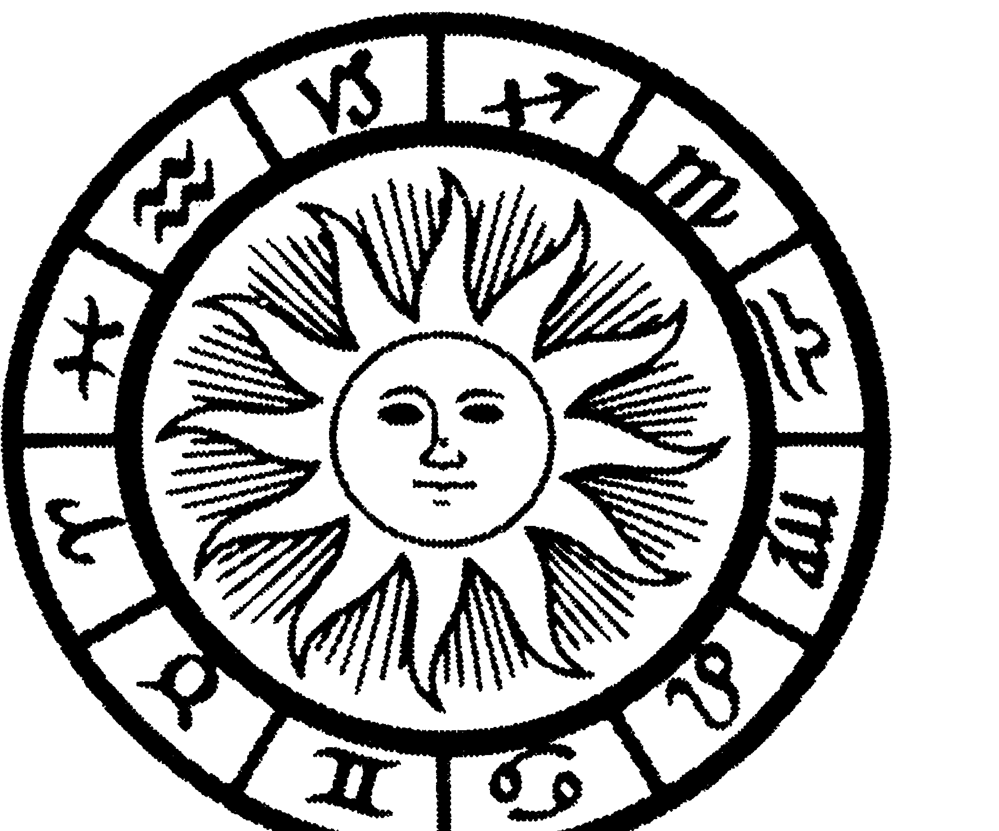

## 第一章 導論

曾經有許多人問我：「如何才能成爲一位星座專家？」我的回答是：「對於星座不但要『知其然』，而且還要『知其所以然』，如此才有資格可以稱得上是一位星座專家。」

「知其然」並不困難，只要購買幾本有關星座的書籍來看，多多少少就可以瞭解到星座所具有的特質。但是，這往往會存在著兩個基本性的問題：一是爲何某一個星座會具有這樣的特質？二是如何判斷書中所寫的星座特質的對錯？這兩個問題的結合，往往造成有興趣研究星座的人，不知道到底應該如何去研究星座，進而時常導致對於星座只是「一知半解」。而接下來的一個問題是：不可能把所有有關星座的說明都全部地記憶下來。再來是，如果真的很用心地去死背星座特質的話，又如何進行消化？又如何理解單一星座之特質所存在的內在一致性？又如何把星座的特質應用在實際的命理論斷上？

總之，所有問題的解決，都必須有賴於針對星座進行一種「知其所以然式」的解讀。而這時常也是占星學家在進入占星學研究領域時，所以必須要面對的第一個重要的課程。因爲唯有在對於星座具有相當充分的認知之後，才有可能奠定心理占星學的論斷基礎，作爲往後與行星進行整合性論斷的入門功夫。

然而，由於目前大部份的人們對於星座的認知，只是停留在太陽星座或月亮星座的相當粗淺（甚至是錯誤）的概念之中，形成只能說是還站在星座的「入門之外」。於是，我認爲有必要就占星學家眼中的星座，來作一種比較專業性質的介紹，以引導讀者進入星座的研究之門，並且讓讀者學習到如何去分辨太陽星座書籍所寫之內容的對錯。

在進入主題的探討之前，我想先就個人時常被問及的幾個有關星座的問題略作回答，以及針對太陽星座所存在的某些錯誤觀念略作說明，以便讀者能夠對於星座先具有一種基本性的認知。

### 談有關星座的十大問題

在此，我所謂的「星座問題」，指的是在專業性占星學研究上所可能會遭遇到的星座問題，以及幾個有關太陽星座的問題，而不是學習太陽星座所可能會面臨的難題。

#### 第一、占星學家眼中的星座，與太陽星座專家眼中的星座，有何異同？

這個問題可以簡單地從三個方面來看。首先，從整個占星學所涉及到的論斷因素來看。太陽星座只能算是所有考量因素之中的一個而已，絕對不是全部。嚴格地說，每一個人都會受到十二星座的影響，因為每一個人的命盤當中皆具有黃道十二宮，每一個人皆具有十二星座的特質。因此，占星學家根本就無法接受太陽星座的草率說法；占星學家所要求的是，盡可能地對於各種因素進行整合與分析，而不是從單一因素來說明個人會是怎樣的一個人。換言之，太陽星座專家所著重的只是單一星座而已，而占星學家所著重的是十二星座彼此之間的互動關係。

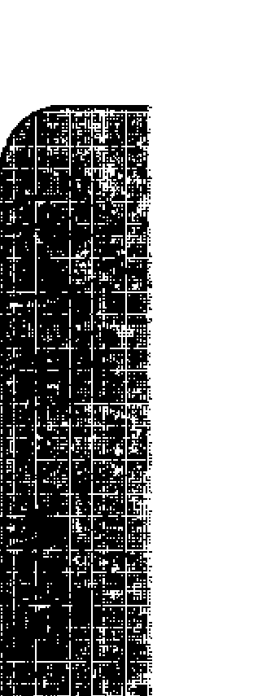

其次，從占星學之實際論斷的角度來看。太陽星座專家時常是以星座來作爲主要的訴求重點，並且把太陽所落入之星座的特質廣泛地擴展到各種層面。然而，占星學家講求的是精密度，訴求的是透過相位、宮位宮頭所在的位置以及廟旺陷弱等，來評估太陽星座的吉凶特質，以及它所最可能會影響到的生活層面，絕對不會把太陽星座的影響力擴展到無所不能的境地，更不會不考慮到太陽星座將會遭遇到其他因素的制約。

其三，從太陽所具有的特質來看。由於占星學家所著重的是行星的功能，所以占星學家眼中的太陽星座，指的是在太陽功能運作下的星座，它不同於月亮功能運作下的星座，也不同於金星功能運作下的星座。因此，當太陽星座專家忽略了太陽本身所具有的特殊功能，轉而把太陽的功能過度地膨脹化，自然會引起占星學家的反感。

此外，從西方國家的占星學研究現況來看，還存在著一種頗為有趣的現象。那就是如果想要在占星學研究領域上取得一定地位的話，就必須確立自己的研究主題，並且針對該研究主題提出自己的研究心得，這也可以說是占星學研究之專業化的走向。然而，太陽星座專家往往無法具備這種條件，因爲太陽星座專家無法具備充分的實際論斷經驗，而只能談一談星座而已。也因此，太陽星座專家時常只能具有「一般會員」的資格，而無法具備「研究會員」的資格（西方國家的占星學會，對於占星學家的資格認定，是具有一定準標的）。

當然，在此我也不可否認有一些西方的占星學家，也會在報紙或雜誌的專欄上，寫作與星座有關的討探。這在商業社會中為了適應某些讀者的要求，是一種很自然的現象。然而，只要是占星學家所執筆的內容，總是會事先明確地界定太陽星座的意義，以及說明太陽星座本身所存在的侷限性，以免誤導讀者。而且，在目前西方的一般民眾已經相當明瞭太陽星座之侷限性和錯誤性的情況下，專欄的寫作內容已經與以前大不相同了，專業性的傾向越來越濃厚，因爲大部份的人都已經可以應用電腦來繪製自己的各種命盤。

#### 第二、星座在整個占星學論斷的過程中，到底扮演著怎樣的角色和地位？

這可以簡單地從「環境」和「天賦特質」來作思索。所謂的環境，指的是星座乃是行星所落入的環境，也可以說就是行星運作的背景。換言之，行星一定會落入某一個星座之中，並且與該星座產生互動，而這種行星與星座彼此之間的互動關係，突顯了星座本身所具有的環境制約的作用，亦即行星只能從它所落入的星座來發揮力量（在此暫時不談論相位和飛星），而無法從其他的星座管道來作發揮。也因此，在實際論斷上，星座時常指示著「部位」（如醫藥占星學上的身體部位）、「基本態度」（如各種生活領域的基本態度）和「基本特質」（如個人的基本人格特質）等。

所謂的天賦特質，指的是星座除了具有個別性的特質以外，也具有綜合性的特質，兩者在實際論斷上都會應用到。以前者來說，針對的是個別性、細微性的論斷，譬如說，與愛情有關的星座論斷，可以從金星所落入的星座，以及第五宮宮頭所在的星座等，來作一種基本性的觀察，因爲透過以上兩者的星座特質，可以看出個人在愛情方面的某些天賦才能。而就後者而言，針對的是整體性、綜合性的論斷，這在心理占星學上是居於最重要的地位，因爲它塑造了個人的基本心理結構。換言之，可以透過每一個人命盤上之十二星座的輕重比例，來決定一個人的意識和潛意識的作用，進而論斷個人對於各種事件可能會採取何種行爲反應，以及可能會發生何種事故。

這種十二星座特質的綜合性論斷，以現代占星學的論斷過程來說，乃是最基本的論斷方法，也可以說就是整個命盤論斷的切入點。如果無法熟悉命盤上十二星座特質的基本整合，也就無法拉出論斷的主軸線，亦即也就無法瞭解個人的基本心理結構，如此一來，也就難以進行比較細微方面的論斷。

以前面所提到的愛情來說，假設某一個人的基本人格特質，受到二個土象星座、一個水象星座和一個風象星座的影響，則很明顯地此人的土象比較重。此時，如果金星是落入火象星座，或者第五宮宮頭是落在火象星座的話，也可能很難發揮愛情的主動性、爆發性，因爲整個人格特質的基本結構是以土象爲主。所以，命盤上十二星座特質的綜合性論斷，乃是研究占星學的入門功夫，無法精通於此，就別想作更深入的研究。也因此，我才會強調太陽星座根本就是還停留在「入門之外」，因爲它連最基本的單一星座的特質都還無法釐清，試問如何進行十二星座的綜合性論斷？

#### 第三、如何才能徹底地瞭解星座？

由於占星學家在進行論斷的時候，對於星座的應用是多元性的，因此占星學家在學習星座的時候，就已經開始在為將來的論斷打基礎了。所以，占星學家對於星座的理解方式，早在學習的過程中就已經與太陽星座專家有所差別了（太陽星座專家大部份並沒有受過專業的占星學課程，所以才會把占星學看得如此簡單）。因此，這裡所謂的徹底瞭解星座，指的是占星學家到底是如何解讀星座的，而且這些解讀方法是可以應用在實際論斷上的。就此而言，星座的解讀涉及到以下的幾個面向：

-   首先，是分析星座的解讀角度，亦即到底可以從那幾個角度來分析星座，同時這些分析的角度也就是進行基本人格論斷的媒介。這是本書的重點所在，也是占星學家在學習星座時的最基本課程內容。
-   其二，是如何結合單一星座的內在機制，亦即如何串連單一星座的全部特質，以避免死記星座的特質，同時可以發揮星座特質的擴展性、聯想性之解釋。這一部份的說明，可參閱我所寫作的《星座關鍵字解讀》。
-   其三，是如何分析相似特質（元素）之星座，彼此之間的細部差異。如此才能對於星座的研究更精密，並區別星座彼此之間的異同。
-   其四，是如何進行綜合性論斷，亦即如何判斷十二星座在個人本命盤上的輕重比例，以及如何劃分十二星座的意識和潛意識的功能，這也就是應用十二星座來作基本人格特質的詮釋。
-   其五，是星座的流年應用，亦即透過流年系統的應用，可以分析個人在一生之中，到底會有何種比較大的心理意識上的變化，又是會在那一年開始逐漸形成，以及個人每年到底會有何種心理意識上的些微變化。這些都受到星座的影響，是屬於實際論斷上的應用。

如果能夠從以上的五個面向來瞭解星座的話，我相信你就足以稱之為是「星座專家」了。

#### 第四、如何才能把星座的特質運用自如，侃侃而談？

我時常告訴朋友，如果想要成為一位很傑出的占星學家的話，則必須具備「哲學家的心靈」、「宗教家的冥想」、「藝術家的技巧」、「科學家的精神」和「政治家的口才」。如果無法全部具備的話，至少也必須擁有前三項的基本條件。

每當朋友聽到我所開出的條件時，總是說句：「這未免太難了吧！」而我的解釋是：占星學所涉及的乃是宇宙與人生的種種問題，如果沒有哲學家的心靈，對於生命的種種問題無法產生激情，試問如何進行命運的詮釋？而如果沒有宗教家的冥想，則很難進入星座和行星特質的感覺過程，試問如何摸索和領悟對方的心理意識？而如果沒有藝術家的技巧，則很難在瞬間統合各種考量因素，試問如何能面對每一個命盤所呈現的各種變化？

我可以接受任何人對於我所開出之條件的反駁，但是我必須強調的是，如果真的想要針對命盤或命盤上的單一因素，達到一種侃侃而談的境界的話，你必須記住如此的不變原則：命盤（星座）的符號是死的，而人是活的；所謂的命盤（星座）之論斷的到達運用自如的地步，指的是可以透過符號來進入符號的心靈之中，用自己的心靈來感覺對方的心靈，進而用自己的語言來描述對方的心靈；以無形的心靈感覺來引導有形文字的訴說，如此才足以稱之為是「運用自如」。

以上的說明印證了為何心理占星學會成為現代占星學的主流，也印證了精神分析心理學在占星學上的地位。總之，現代占星學的從開始學習直到可以進行實際論斷，是依循著以下的步驟：先從意識的層面（也就是占星學知識的吸收）來開始瞭解各種徵象和符號的說明，然後使這些說明內化為自己的潛意識（也就是每當你看到某一個符號的時候，就可以很自然地描述你對於這個符號的感覺，不用經過任何的思索），進而以自己的潛意識來摸索（感覺）對方的潛意識，再來是把自己所摸索出來的對方的潛意識，結合於對方的意識層面，掌握住對方的整體心理結構，然後使用自己意識層面的思維能力，來針對對方所可能產生的行為以及所可能發生的事件，進行口頭或文字上的語言預測。而唯有透過這種意識流論斷方法的實際考驗，才能以反饋的方式來加深對於星座特質的理解，也才能算得上是運用自如。

如果不曉得如何進行占星學的實際論斷，則對於星座的瞭解，只能算是勉強地「記住」星座的特質（這些特質還有可能是錯的）而已，並不能算是能夠「感覺」、「體會」和「內化」星座的特質。而如果又把太陽星座拿來誇言可以很準確地看愛情、人際關係和每年、每月的運氣等的話，這可以說是連占星學的基本認知都有待加強。

#### 第五、如何才能分辨太陽星座書籍之內容的對錯？

我時常碰到許多喜愛星座的年輕朋友們告訴我說，某一 個星座的個性應該是···。而所有這些個性的描述， 大部份都是從太陽星座書籍中得來的，於是我總是會回 問：你怎麼知道書中所寫的就完全是對的？於是，對方總 是反而要求我教他進行分辨錯對的方法。

其實，只要對於星座的基本概念相當清楚的話，就已 經沒有必要去分辨星座特質的對錯了，因爲你已經能夠自 己詮釋星座的特質了，又何需去借助於別人的說詞？當然 不可否認地，在學習星座的過程中，還是有必要去閱讀某 些有關星座的資料；然而我的建議是，與其浪費精神、時 間和金錢去研究太陽星座，倒不如去研究可以用來進行實 際論斷的占星學。因爲你根本就無法透過太陽星座來詳細 地分析個性，以及真實地體會到十二星座的綜合作用；但 是，你卻可以透過學習如何進行論斷來掌握星座的真正特 質。

如果你只是對於太陽星座感到興趣，而不想知道更多 的占星學之個性論斷的話，那麼你只需要特別注意十二星 座的「原型」，也就可以了。而所謂的十二星座的「原 型」，指的是每一個星座的獨特個性，此時就有必要特別 注意太陽星座書籍所寫的內容是否正確。在此，我無法針 對如何判斷對錯進行詳細的說明，僅提供兩點原則給讀者 作參考。

首先，凡是書籍的內容有提到血型的話，這種太陽星 座的書籍不值得看。因爲這表示作者對於占星學缺乏基本 性的瞭解，其內容大部份都是抄襲日本書籍而來的（西方 的太陽星座書籍不會把血型加入，否則會笑掉占星學家的大牙）。所以，如果你只想要瞭解星座之獨特個性的話，我建議你只要閱讀翻譯自西方太陽星座的書籍就可以了，因爲西方的太陽星座專家對於星座的瞭解，至少比日本星座書籍的瞎掰來得正確。

其次，在閱讀的過程中，必須分析是否有矛盾的特質產生。讀者必須記住的是，每一個星座的特質都存在著一致性，絕對不會有互相衝突的特質同時存在於一個星座之中。而如果是經過翻譯的太陽星座書籍，則更有必要注意到譯者的翻譯是否恰當，而你又是否可以理解到原作者的意思。以「時報出版社」所出版的《日月星座》爲例，該書一開頭之白羊座特性的說明，就足以讓讀者滿頭霧水，現在我簡略說明如下。

書中把「激情」和「冷漠」兩種完全相反的特質同時列入白羊座之中，那麼試問：白羊座到底是激情還是冷漠？你能看得出其中的玄奧嗎？再來，書中又把「大膽冒險」和「敏感多慮」同時列爲白羊座的特性，那麼試問：如果以「冒險」爲特性的話，又何來「多慮」？你能看得出其中的關係嗎？而這到底是原作者的錯誤，或者是譯者的用詞不恰當呢？此外，書中還寫著白羊座是「對事物的醒覺」，試問何謂「醒覺」？你能看得出整個有關白羊座特性的描述，都只是在於詮釋「醒覺」兩字嗎？在此，我不願多作說明，希望讀者在看完本書之後，能夠自己進行判斷和分析。

第六、如果想要精通星座的話，是否需要具備某些特殊的條件？
學習任何事物皆存在著深淺的差別，如果是想要「精通」的話，除了持續性的研究，以及透過實際的論斷來感受星座的特質以外，最好是能夠請教於真正瞭解占星學的人，而並不需要有什麼樣的特殊條件。只是由於每一個人的學習能力不同，所以學習速度會有快慢的差別。

第七、有沒有什麼的方法或途徑，可以很快速地精通星座？
我的回答是：沒有！因為星座的特質是無形的，它是需要去感受和體會的，而感受和體會是必須花費某些時間。即使你很詳細地閱讀本書，我也不敢保證你可以很快速地精通星座，因為我無法確定你到底能夠體會多少。在此，我所能提供的最快速的捷徑，就是對於占星學保持高度的興趣，並且不斷地分析自己和別人的命盤和個性，你就可以很快地掌握住星座的無形特質了。

第八、有關於從星座可以看出個人的愛情、婚姻、職業和人際關係等的說法，是否正確？
不能說完全錯誤，因為太陽有它的巨大影響力存在著。但也不能說是正確，因為占星學家在論斷愛情、婚姻、職業和人際關係等，需要評估很多的判斷因素，甚至需要許多特別的論斷技巧，所以絕對不能單憑一顆太陽就斷然地判定一個人的愛情、職業和人際關係等會發生什麼。

第九、有關於從星座可以看出個人運氣之好壞的說法，是否正確？
這可以說是太陽星座錯得最離譜的地方，因為在占星學的論斷上，有關大運、童運、流年、流月和流日等，有其特殊的論斷技巧，根本就不是太陽星座所談的那樣簡單。請參見下面有關太陽星座之錯誤的說明。

第十、如果說太陽星座所談的內容，存在著許多的錯誤的話，那麼它為何會如此地受到歡迎？又為何可以用來說明個性？難道太陽星座真的一點價值也沒有嗎？
錯誤與受到歡迎，兩者不一定是無法共存的。所謂的錯誤，可以把它看成是過度地擴大了太陽星座的影響力，而忽略了人類命運的複雜性。如果能夠單純化地把太陽星座看成：只是在於說明太陽的落入星座所可能產生的影響的話，則它同樣也是影響個人命運的因素之一。而太陽星座的受到歡迎，與它的簡單化有很大的關係，同時這也顯示了大家對於從星座來看個性具有高度的興趣。

由於太陽本身有它的影響力存在著，所以太陽星座是個人的主要人格特質之一，它決定了個人的自我意識，也因此，太陽星座可以用來解釋個性。然而，從占星學家的觀點來看，是有必要分析那些個性才真正是由太陽星座所賦予的，而那些個性是由其他的星座所賦予的，絕對不能全部劃歸於太陽星座的影響。也因此，當有人從你的太陽星座來說明你的個性應該是如何如何的時候，你必須分清楚這些個性特質是否歸屬於你的太陽星座所主宰，否則你可能就會被誤導了。

例如，假設你的人格特質的重要星座是白羊座、金牛座、巨蟹座和射手座，而你的太陽星座是金牛座。此時，如果有人把某些射手座的特質，說成是你的太陽星座的個性，則由於你也具有明顯的射手座特質，於是在你不明瞭你的射手座特質是因為其他行星的作用而產生的，那麼你就可能會誤認為你的太陽星座特質具有某些射手座的特質，導致於混淆了你的太陽星座的真正特質（金牛座）。

最後，從比較客觀的角度來看，並不能完全否認太陽星座的價值。只是，一定要明瞭太陽星座的涵義，以及它所存在的侷限性。當然，如果只是以一種消遣、休閒的態度來看待太陽星座的話，則它的價值是在於娛樂性，也就沒有必要去苛求它的研究性了。而我在本書所談論的觀點，則完全是研究性質的，是為了奠定讀者的實際論斷基礎，所以與一般的太陽星座書籍有所差異，希望讀者不要一概而論。

## 第一章 導論

### 談太陽星座的十項錯誤

西方占星學家總是以「困擾」、「混淆」和「誤導」，甚至使用「痛恨」等字眼，來形容太陽星座專家對於占星學所造成的傷害，而我也一再地強調太陽星座所存在的錯誤概念。我想也許會有許多的讀者不表認同，甚至認為我是在刻意地「醜化」太陽星座。因此，在我說明太陽星座的錯誤之前，先譯出占星學的專業辭典對於太陽星座的描述。以下的整段文字翻譯自《占星學辭典》，本書是頗受歡迎的占星學工具書，我所引用的是一九八〇年的英文版（Larousse Encyclopedia of Astrology, by Helen Weaver and Allan Edmands）。該書對於太陽星座的說明如下：

> 「太陽星座占星學（Sun-Sign Astrology）是一種過於簡單化的占星學形式，僅用來處理太陽星座。雖然在時間層面上具有占星學的依據，但卻對於太陽有所混淆，被嚴謹的占星學家所輕視，被認為是低級的占星學，它可以在一般的普通占星學雜誌專欄和每日新聞的「每日命盤」上看得到。」

> 「太陽星座占星學的應用原則，乃是使用太陽宮位（solar houses）的技巧，這是將本命盤上的太陽星座，當成是第一宮的宮頭，而其他的星座則依此類推。例如，所有太陽在獅子座出生的人，他們的第二個太陽宮位是由處女座所主宰，而他們的第三個太陽宮位是由天秤座所主宰等等。行星的過運（current transits）於這個假設的命盤，被用來作為預測的基礎；當然，對於同一時段內之太陽星座是獅子座的人，都一律等同視之。此技巧的好處是，可以在缺乏出生時間或地點之訊息的情況下來使用，因為它並不需要計算命盤。」

> 「雖然太陽在本命盤上是一個最主要的因素，但是任何企圖僅奠基於太陽星座的位置，而進行人格特質或事件預測的描述，無疑地忽略了個人本命盤上所呈現的複雜性，這通常是一種「不負責任」的作法。這是一種何等粗略的個性描述！因為太陽星座只能代表著包含每一星座在內的人類特質的十二分之一而已。太陽星座在今後仍將繼續存在著，而且還是會相當流行，其最簡單的理由是，它具有最容易普遍化的形式。大部份的人們都知道自己的生日，並且以此來簡單地發現自己是什麼星座。可是，一位足以勝任諮詢服務的占星學家，所需要的是更精緻的占星學；因此，任何的占星學家，都有必要超越長年持續地利用大眾的受騙，而且是普遍流行的太陽占星學之上。」

由上可知，所謂的太陽星座，指的是一種依據個人出生日的太陽位置，來進行個性描述和事件預測的過於簡單化的占星學。它僅能處理太陽星座而已，而且雖然在時間上具有占星學的依據，但是卻對於太陽有所混淆，所以被認為是低級的占星學。以下我就太陽星座所形成的誤導現象，提出最常見到的十個項目來作說明。

第一，從個性的分析來看，太陽星座的影響力未必就會大於命度所在的星座（大部份的占星學家認為命度星座的影響力量大於太陽星座）。雖然太陽星座所代表的個性，比較能夠為個人自己所能認知得到；但是，深具影響力並且會隨著年齡的增長，而更發揮其影響力量的是命度星座。

再者，每一個人都是十二星座的個性皆備，不是只有太陽星座的個性而已。如果從主要人格星座的角度來看，也不是只有太陽星座而已，通常是需要依據三個到四個的主要人格星座，來一起作綜合性的判斷。所以，如果僅從太陽星座就論斷一個人的個性是如何，很容易忽略了其他主要人格星座的特質（有時候其他星座的力量會大於太陽星座）。

第二，太陽星座占星學建構了自己的宮位系統，並且進而以此宮位系統來作每一個月、每一星期或每一天的運氣預測，其誤差率高達十二分之十一，只有十二分之一（太陽與命度在同一宮位的人）的準確率。

再者，太陽星座沒有考量到行星相位的問題，而僅以行星的落入宮位（此宮位指的是太陽宮位）來作判斷，很容易誤判了行星之吉凶運勢的呈現。更何況，占星學上的流年、流月與流日等，是必須配合本命盤來作判斷的，絕非如此地簡單。所以，太陽星座很容易把吉當成是凶，而凶則反論為吉。

第三，一般的太陽星座書籍，總是喜歡談及那一個星座的幸運數字、幸運植物、幸運方向、幸運日期、幸運色彩和幸運寶石等，這在占星學上是有所依據的。但是，太陽星座的嚴重錯誤是發生在完全沒有考慮到相位的問題。例如，太陽星座是白羊座的話，如果你認為東方、紫水晶、紅色和金雀花等，會給你帶來好運的話，那你就錯了！因為萬一你的太陽凶相過多，則那些所謂的幸運之物，反而會帶來不幸，所以絕對不能一概而論。

在占星學的實際運用上，星座的幸運象徵是需要配合最能呈現出你的星座吉兆來作決定的。譬如說，某一顆吉相特多的行星所在的星座，或者是木星所在的星座。因此，太陽星座的不求精細，時常會反而得到反效果，把害人誤解為助人。

第四，一般的太陽星座書籍，也時常談到太陽和月亮對於愛情對象或婚姻對象的影響，亦即以太陽和月亮來判斷對方可能是那個星座的人，甚至以無聊的百分比來作說明。這種說法的依據是，以太陽或月亮所在三方宮來作判斷的標準，然而就如同前面第一點所提及的，每一個人的主要人格星座不只一個，所以看愛情或婚姻的對象的適合度，充滿著太多的可能性，不能僅以單一的太陽或月亮是落入那一個星座來作決定。只要所有主要人格星座的其中之一可以配合的話，都足以構成適合的條件。有時候，男女雙方的婚姻形成，甚至是與太陽和月亮所在的星座無關，而是兩人之間行星相位組合的問題，這時候就必須從男女雙方的合盤來作論斷。

再者，占星學上的愛情與婚姻的論斷是兩回事。愛情是偏重於金星的作用，而以太陽和月亮來論斷婚姻，也是男女有別的：男人以月亮來看太太，女人以太陽來看先生。而往往在實論斷上，與太陽和月亮形成相位的行星，時常會比其所在的星座更能呈現出婚姻對象的特質。同時，結婚之後的家庭狀況，也必須考量到與第四宮和第七宮有關的行星和相位。所以，在一般的占星學論斷上，有所謂的婚姻合盤的分析，它絕對不是只有太陽星座或月亮星座如此簡單而已。

第五，從人際關係的角度來看，太陽星座書籍也時常提到那一個星座遇到那一個星座，會產生什麼樣的互動關係。這與前面所談的愛情與婚姻之判定上的誤導情況一樣，絕對不是如此地簡單化與型式化，它也是充滿著各種可能性。在占星學的實際論斷上，凡是涉及到兩者之間的關係的論斷，都是應用合盤的分析技巧，絕對不是從單一太陽星座來胡言亂語。而如果僅從太陽本身對於人際關係的影響來看，則與太陽形成相位的行星的影響力，應該與太陽所在星座的影響力，是處於同等的地位。

再者，如果僅從個人處理人際關係的角度來看，則涉及到個人面對人際關係時的態度、手腕，以及何人對其有利、何人有必要提防等問題。而所有這些問題的論斷，是與代表著各種不同生活領域的宮位有關，所以絕對不能以廣泛式的「人際關係」來包含所有的一切。例如，工作上的人際關係之處理，除了主要人格星座的考量之外，還必須考量到第六宮、第十宮和第十一宮等的情況；而朋友之間的人際關係的處理，除了主要人格星座的考量之外，還必須考量到第三宮、第七宮和第十一宮等的情況；而親戚方面的人際關係之處理，除了主要人格星座的考量之外，還必須考量到第三宮（兄弟姐妹）、第四宮和第十宮（父母）、第七宮（配偶）等的情況。因此，以太陽星座來談論所謂的人際關係，實在是把太陽星座的影響力過度地膨脹化了。

第六，一般的太陽星座書籍，也時常以太陽星座來判斷一個人的職業與工作。這種說法也是大有問題的，否則同一太陽星座的人們，豈不是都要從事於同一星座特質的職業或工作了（或者說同一太陽星座的人們，都適合於同一星座特質的職業或工作）。其實，如果從太陽的角度來看職業與工作的話，則只能說是此人具有太陽所在星座的特質和才能，並且可以把該星座的天賦才能應用在工作上，它還不足以論斷一個人之工作或職業的類型。在占星學的實際論斷上，職業與工作的判斷，必須配合第六宮和第十宮的情況（宮頭位置、宮內行星和飛星等），或者是看與太陽形成合相的行星，或者是看命盤上的特殊相位格局，或者是看命盤上特別突顯的行星等。因此，除非太陽星座本身是第六宮或第十宮的宮頭位置，否則它的影響力可能會被其他的影響因素所取代。

此外，許多太陽星座書籍所列出的星座所代表的職業和工作之類型，與專業性占星學書籍的內容有所差異。一般而言，太陽星座書籍所列出的單一星座的職業內容比較多，涵蓋的範圍過度地廣泛，大有「統吃」的色彩，此更導致了一般人誤認爲太陽星座所談的內容是對的。

第七，有些太陽星座書籍還提到從太陽星座來看個人的財運，以及一生的運勢。這種說法是屬於比較嚴重性的錯誤講法，它大部份是抄襲自日本式太陽星座書籍而來的。在占星學的論斷上，凡是涉及到「運勢」和「運氣」等的判斷，可分爲靜態和動態兩方面來看：「靜態的運勢」，指的是本命盤上的吉凶徵兆，這是從行星的相位來作判斷；而「動態的運勢」，指的是出生後行星移動所導致的行運，這是從大運、流年、流月和流日等來作判斷。一般來說，所謂的運勢大部份是指後者而言。

因此，僅從太陽星座就可以看出個人之一生運勢的講法，可以說是錯誤得太過於離譜了！而就財運方面來看的話，也同樣是錯誤的說法，因爲在缺乏相位吉凶徵兆的情況下，根本就不足以論斷財運的幸運與否；更何況，每一個人的太陽未必就是落入於第二宮之中（這種比率只有十二分之一），試問如何論斷財運？如果要勉強地把太陽星座與錢財結合在一起的話，則只能說是透過太陽星座的人格特質之呈現，來論斷個人可能會對於錢財的處理採取何種態度（包括花錢和賺錢的態度），它不足以說明錢財的運氣。

第八，太陽星座書籍還時常把單一星座區分成三個區間，也就是 0 度～10 度、11 度～20 度和 21 度～30 度等，並且說明前面的區間帶有前一星座的特質，而後面的區間則帶有後一星座的特質。在專業性的占星學上，並沒有這種講法，因為彼此形成相鄰的星座之間，它們的特質是相當具有明顯差異性的，不可能會有重疊的現象產生。換言之，彼此相鄰的兩個星座之間，它們的特質是完全不相同的。如果要說有重疊現象的話，也只是在過宮的時間上（前一星座的 29 度到後一星座的 1 度之間），存在著大約七、八分鐘的「朦氣差」（這是一種氣質轉變過程中的渾沌狀態）。所以，凡是兩個相鄰的星座（如白羊座和金牛座），彼此之間的特性可以說是截然不同的。

有關星座之區間劃分的作用，在占星學上的說法有兩種：第一種，是這三個區間受到三方宮星座的影響，而不是受到前後星座的影響；例如，白羊座的 11 度～20 度會受到獅子座的影響，21 度～30 度會受到射手座的影響，而 0 度～10 度則是白羊座特質最強烈的位置，它不是受到雙魚座和金牛座的影響。第二種，是把單一星座的 30 度分成十二等分，每一等分為 2.5 度，並且以本宮星座為起始，依照星座的排列次序（逆時針方向）來決定其所受到其他星座的影響；例如，金牛座前面的 0 度到 2.5 度，是金牛座特質最強的度數，而 2.5 度到 5 度則是會受到雙子座的影響，以此類推。在一般的占星學論斷上，第一種應用得相當普遍，而第二種則只是在比較細微的論斷上，才會使用到。

第九，太陽星座書籍的最嚴重錯誤，就是把血型以及其它很奇怪的講法，隨便地加在星座的解釋上。這可以說完全是日本式的無聊、低俗和胡言亂語的說法，希望讀者不要認為西方的星座解釋也是如此地低級。在此，如果說西方太陽星座專家的過於簡單化的說法值得批評，那麼日本式的星座內容則更需要批判，而且要把它批得一文不值！否則別說誤導了占星學，就連星座本身也會被嚴重地誤導。

日本式星座書籍的內容，甚至無聊到從星座來看男人和女人的性器，到底是長得什麼樣子（參見：門馬寬明所著作的《簡易占星術》，鴻文出版社，民國68年5月，書中還介紹說原作者是日本占星術的權威，這简直是丟盡了日本人的臉）。此外，我還看過日本式的太陽星座書籍，把巨蟹座的符號解釋成性姿勢的「69」，然後說巨蟹座的人喜歡口交！暫且不談這是否正確，而僅從占星學所意圖解答的人生課題來看，性器的形狀或者是性交的姿勢，都是屬於一些瑣屑和猥褻的問題，如果把命理論斷的焦點集中在此，豈不讓人覺得占星學是一種相當低級的內容。這與相術中的肛門有毫毛其人必淫亂一樣（參見：《麻衣相法·石室神異賦》），不只是毫無人生哲學意涵，更是一種污辱命理研究的作法。因此，讀者你若是真的有心研究占星學或星座的話，最好是不要看日本式的星座書籍，以免走入低俗的格調，或者是被嚴重地誤導了。

第十，如果說要總結太陽星座占星學所導致的錯誤之根源，則應該把它歸結於缺乏宮位宮頭位置的考量。換言之，太陽星座只能說明太陽本身賜予星座呈現出該星座的整體特質，這是一種天賦才能的表現；然而，它卻缺乏了後天宮位所代表的生活領域的表現管道，於是無法很明顯地界定太陽星座的作用，到底會主要地表現在個人的那一個生活領域方面。

例如，同樣是太陽星座在摩羯座的兩個人，如果其中一個人的太陽星座是第二宮，而另一個人的太陽星座是第三宮，那麼這兩個人在發揮太陽星座的作用上，會呈現出完全不相同的表現途徑：其中一個人是表現在錢財和物質的擁有上，而另一個人則是表現在溝通和思考的層面上。也因此，造成這兩個人的才能表現有所不同，進而呈現出不同的行為模式，以及不同的命運徵象。

總之，太陽星座所造成的誤導，應該歸因於太過於簡單化的原故。然而，它的簡單化也就是它之所以會流行的原因所在，而且這種簡單化的現象還會一直持續下去，因為臺灣目前的電腦使用比率，以及對於占星學的基本認知，還無法與歐美國家相比擬。所以，只能希望有心研究占星學的人，能夠提昇自己的研究層次，而不要停留在太陽星座的庸俗化誤導層次。

## 第二章 陰陽宮

黃道十二宮的最簡單且最基本的劃分，就是陰陽二分法，此即現代占星學上所稱呼的「男性星座」和「女性星座」。這種稱呼方式乃是因為西方文字缺乏陰（yin）和陽（yang）的概念，於是只好以"male"和"female"來作代表。不過，在現代占星學的應用上，西方占星學家已經很普遍地使用中國的陰陽觀念，來作為星座二分法的代表名詞了。這是因為陰陽的觀念遠比男女的觀念，更適合用以詮釋星座的特性，以及避免使星座落入於男女實體的概念之中。

黃道十二宮是以白羊座為起始點，依照奇偶的排列次序：奇數為陽（＋），偶數為陰（－）。形成以下的陰陽配置情況：

| 類型 | 星座列表 |
| :--- | :--- |
| 陽性星座 | 白羊座、雙子座、獅子座、天秤座、射手座、寶瓶座 |
| 陰性星座 | 金牛座、巨蟹座、處女座、天蠍座、摩羯座、雙魚座 |

由上可知，從星座的陰陽性劃分，可以看出十二星座彼此之間至少可以分成兩組，而且可以從這最基本的二分法之中，再進而細分為不同的區別。而凡是同屬於陽性的星座，則會具有某些共同的特質呈現；凡是同屬於陰性的星座，也會具有某些共同的特質呈現。

如果將這種陰陽性的區分，配合著三方宮來看，則很明顯地，陽性星座是火象和風象的組合，而陰性星座是水象和土象的組合。此呈現出星座在特質上的進一步劃分，也突顯了火象星座和風象星座的本質是陽性的，而土象星座和水象星座的本質是陰性的。因此，火象星座和風象星座彼此之間，存在著某些共同的特質，而土象星座和水象星座彼此之間，存在著某些共同的特質。

如果將這種陰陽性的區分，配合著四正宮來看，則很明顯地，每一組四正宮皆包含著二個陽性星座和二個陰性星座，並且彼此互相形成對立而統一的態勢。此呈現出在每一組的四正宮之中，兩對陰陽星座彼此之間是形成互相鬥爭（90度的刑剋關係）、互相對立、互相平衡（180度的對沖關係）的態勢。

### 星座的陰陽性內涵

在占星學的實際論斷上，星座之陰陽性特質的區分，可以與心理占星學來作聯繫，進而把陰陽二分法看成是一種人格特質的簡易觀察途徑。例如：積極與消極、外向與內向、外露與內斂、熱情與沉默等。以下是採用相對列表的方式，把星座的陰陽性分成為：內外和外向、消極和積極、行動和思考、敏感和主見、穩定和變化等五大類型來作簡要的說明。

從內向和外向的區分來看：陽性星座代表著比較熱愛群眾、深濃、鮮豔、自制力比較弱、耐不住孤獨、外顯、外露、比較表面化；而陰性星座則代表著比較可以獨處、清淡、樸素、自制力比較強、耐得住寂寞、壓抑、克制、比較內心化。

從消極和積極的區分來看：陽性星座代表著善於社## 第三章 阴阳宫

交游、易引人注意、主动、比较冲动、风头健、活跃、比较具有支配欲、竞争性较强；而阴性星座则代表着不善于社交、寂静、被动、比较畏缩、不喜欢出风头、比较缺乏支配欲、竞争性较弱。

从行动和思考的区分来看：阳性星座代表着思考比较快速、比较注重表象的成就、好动、健谈、比较开朗和乐观、比较虚荣、反应比较敏捷；而阴性星座则代表着思考比较细腻、比较注重实质的成就、沈默、寡言、比较疑心和悲观、比较慎重、责任感比较重。

从敏感和主见的区分来看：阳性星座代表着比较具有自信心、外显型的独断自我、粗枝大叶、草率、坦率、轻浮、刚性、比较不容易有困惑；而阴性星座则代表着比较缺乏自信、内敛型的自我保护、心思比较细密、多虑、城府较深、柔性、比较容易有所困惑。

从稳定和变化的区分来看：阳性星座代表着比较会关注于外在环境的变化、比较具有目标性、心浮气躁、倾向于带动环境；而阴性星座则代表着稳健、沈着、传统、保守、含蓄、平心静气、倾向于适应环境。

以上所列出的区分，只是概略性的说明，提供给读者作为一种简单性的感觉途径。在实际的论断上，可以把星座的阴阳性特质，简要地落在星座的个性说明上。

例如，如果你的阴性星座特质（如巨蟹座）很强烈，那么在个性上就会比较偏向于不善社交、寂静、传统、保守、慎重、沈默、寡言等。而如果你的阳性星座特质（如射手座）很强烈，那么在个性上就会比较偏向于外露、自信、关注于外在环境的变化、较具目标性、草率、好动等。从实际的论断经验来说，星座的阴阳性特质最好是配合着三方宫来一起合看，如此才能够具有更清楚的体会。

此外，从廿世纪以来，由于女权主义的高涨，对于阴阳性所意涵的男女性别的差异，在西方成为女权主义者攻击的对象，并且以通过星座阴阳性解析的方式，意图取得阴性所具有的正面意义。其实，我认为没有这个必要，因为只要把阴阳的观念抽象化，也就不会有所谓的男女不平等的现象发生。换言之，没有必要把社会文化层面所造成的男女不平等现象，套用在星座之上。当然，这并不排除男女会由于生理上的差别而导致心理上的差异；但这是属于生理学和心理学上的基本认知，只是个性论断上的前提，而不是论断的主要判准。

如果从社会文化塑造的角度来看，则在传统社会中对于男性和女性所具有的先入为主的观念，确实对于女性有着不公平之处。例如，总是认为男人就会比较强壮、主动、积极、理性、冷静和有能力；而女人就会比较柔弱、被动、消极、感性、激动和需要被保护。这种看法如果不谈生理上的差别，而仅从心理占星学的个性分析来看，则女人未必就是属于阴弱（阴性）的特质，男人也未必就是属于阳刚（阳性）的特质，它是必须依据命盘上的行星配置情况来作判断。同时，阴性特质有它本身的功能，它具有调和阳刚之气的作用，这就是所谓的阴阳互济，也是人格特质是否均衡的一种指标。因此，在心理占星学的论断上，强调的是阴阳比例的平衡，以及地水火风四大元素的均衡，这不会因为男女性别的差异而有着不相同的标准。

换句话说，目前对于男人和女人所应该扮演之角色的既定观念，只是对于男女进行实体上的认知；也就是说，是社会上对于男人应该是怎样的形象，以及女人应该是怎样的形象的一种认知，是针对所谓的男人和女人来说的。然而，占星学上的阴阳性则是一种抽象式的描述，其所代表的乃是一种特质的表现，它可能会呈现在男人身上，也可能会呈现在女人身上。例如，具有一个男人的外形，并不能代表他内在的阴阳比例，就一定会是阳性大于阴性。因此，以抽象式的阴阳概念来认知所谓的男性特质和女性特质，相对地会是比较适当的，也比较不会造成男女不平等的现象。

以占星学家所具有的特质来说，我个人就认为阴性特质应该比阳性特质更重要，因为占星学家往往需要更多的敏感度，来体会一个命盘所呈现的特质，也需要阴性特质来把论断的过程艺术化，而不是一种机械式的纯思维之推演。因此，在命理论断上以阴阳性特质来取代男女性特质，才可以使得个人的内在心理特质有着一种比较合理的定位。

再者，通过阴阳性的抽象式描绘，可以更清楚地认知到阴阳平衡的重要性。例如，以星座的阴性和三方宫的结合来看，则土象和水象是阴性、风象和火象是阳性，这形成了贯串于个人的心理机制是：

| 阴 性 | 阳 性 |
|-------|-------|
| 感觉+秩序 ←——→ | 创造+逻辑 |
| 水象+土象 ←——→ | 火象+风象 |

在阴阳性彼此配合的情况下，阳性特质可以通过阴性特质的秩序与感觉，使得创造与逻辑有所步骤或意境的提升；而阴性特质可以通过阳性特质的创造与逻辑，使得感觉与秩序得以付诸行动，如此才会有具体的成果呈现出来。同时，火象的行动力必须要依靠水象的直觉来产生灵感，才有行动可言；而风象的逻辑性必须依靠土象的秩序来产生结构，才有逻辑可言。

总之，星座之阴阳性特质的主要诉求，乃是在于说明个人应该取得内在阳性特质和阴性特质的平衡，也就是阴阳调和与互济。而占星学的个性论断，也可以说就是在看出一个人之内在阴阳性的分配比例，找出不均衡的原因所在，进而寻求取得平衡，来创造一种调和、健康的人生。

## 阴阳性对星座的影响

这里所谓的阴阳性对星座的影响，指的是通过星座本身所具有的阴阳性质，来观察星座的特质呈现，亦即把星座的特质与星座的阴阳性串连在一起。在此，星座的阴阳性乃是一种“原因”的角色，而星座的特质乃是一种“结果”的呈现，并且由“因”来推论“果”。希望借此推演方式，可以使得读者对于星座阴阳性的应用，能够具有更深一层的了解。

为了解释的方便，我把每一星座的阴阳比例，以一种数据的方式来作表达，用以呈现出每一星座所代表的外显和内敛、动态和静态等的区别。而这种比例表列的方式，只是为了容易观察、分析、理解星座而所作的简单划分，因此只能说是一种观察的指标，它是最简单、最容易的理解方式，但却不是唯一的解析途径。主要是在于通过有机的比例说明，来把各星座特质的抽象性尽可能地具体化，使读者能够逐渐掌握住星座的特性，并将其内化为自己的感觉。有此感觉才能真正地体会出各星座的特性，也才能在面对个性论断的时候，可以不断地涌现出灵感。因此，千万不要以“绝对”的方式来看待这种比例分配。

#### 阳性星座
- 白羊座：8分阳·2分阴
- 双子座：7分阳·3分阴
- 狮子座：9分阳·1分阴
- 天秤座：5分阳·5分阴
- 射手座：7分阳·3分阴
- 宝瓶座：6分阳·4分阴

#### 阴性星座
- 金牛座：4分阳·6分阴
- 巨蟹座：3分阳·7分阴
- 处女座：5分阳·5分阴
- 天蝎座：2分阳·8分阴
- 摩羯座：3分阳·7分阴
- 双鱼座：1分阳·9分阴

由上可知，左边阳性星座的阳刚比例大于阴柔的比例；而右边阴性星座的阴柔比例大于阳刚的比例。在实际应用上，可以把星座本身所具有的阴阳性，当成是一种“体”的性质，而上面的星座内在之阴阳比例分配，可以当成是一种“用”的性质。例如，以白羊座来说，它的本体是阳性星座，而它的内在阴阳比例是8分阳和2分阴的组合，所以它的阳刚之性仅次于狮子座。以下就黄道十二宫的每一个星座，用这种方式来作简要的说明。

#### 白羊座·戌宫
由于具有8分阳的成份，所以会展现出热力、热情、积极、主动和外向等阳性特质。而且，如果就精力的爆发性来说，白羊座是所有阳性星座之中最强的。因此，它的热力总数虽然比不上狮子座，但是它的短期爆发力却远甚于狮子座，因为它是基本宫，而且宫主星是火星。

#### 金牛座·酉宫
由于具有6分阴的成份，所以平常看起来会是比较内敛、谨慎、沈着、安静和寡言。然而，由于具有4分的阳性成份，所以活动力也是蛮强的。只是金牛座时常会倾向于把阳性成份储存起来，等到受了刺激或者是受了激励的时候，就会一下子把全部的阳性成份发挥出来。

#### 双子座·申宫
由于具有7分阳的成份，所以其基本特质的展现会是耐不住寂寞、好动、敏捷、活跃和健谈等。可是，由于同时也具有3分阴的成份，所以多少也会呈现出自省的特性。如果就整体的阳刚性来看，它比不上狮子座和白羊座，而与射手座来作比较的话，两者的活跃程度差不多，只是射手座的独断自我色彩比较浓厚。

#### 巨蟹座·未宫
由于具有7分阴的成份，所以会展现出寂静、不喜出风头、朴素、沈默和柔性等阴性特质。然而，由于巨蟹座比较无法承受刺激，所以它的阳性特质时常会有发泄的机会。而与摩羯座来作比较的话，巨蟹座具有拢络的味道，摩羯座则会展现出野心色彩，两者的共同点是把阴阳的组合应用在长久的持续力上。

#### 狮子座·午宫
由于具有9分阳的成份，所以可说是阳性星座的极致表现，不但热力够、精力足，而且亮度更是光芒四射，因此会呈现出喜社交、风头健、引人注意、竞争性强和开朗乐观等特质。与其他的阳性星座来作比较的话，狮子座的阳性最具有普遍化的特性，而且随时都在发挥阳性作用。

#### 处女座·巳宫
由于具有5分阳和5分阴的成份，所以会呈现出一种阴阳有所平衡的态势，导致于着重权衡、分析、细腻、多虑和慎重等。然而，由于处女座本身乃是以阴性星座为体，所以也会具有自省、寂静、抑制、朴素和含蓄等特质。在此，阴阳平衡的特性时常会加强它完美主义的倾向。

#### 天秤座·辰宫
在阴阳成份的比例上，与处女座相同，所以同样具有分析、均衡、评估、调适和合理等特质。然而，由于天秤座本身乃是以阳性星座为体，所以会比处女座更具有活跃、主动、外露、自信心和反应敏捷等特性。而天秤座与处女座的共同特质是皆存在着优柔寡断的特色，这可以说是拜阴阳平衡的特性所赐予。

#### 天蝎座·卯宫
由于具有8分阴的成份，所以平常看起来会是比较可以独处、平心静气、城府较深、敏感和内敛。而天蝎座与其他阴性星座的差别是，它最能够把阴性的特质深度化，造成一种阴沈的感觉。此外，它对于阳性特质也具有储藏的功能，并且也可以在瞬间之内爆发出来。

#### 射手座·寅宫
在阴阳成份的比例上，与双子座相同，所以同样具有活泼、开朗、乐观、自信和出风头的特质。然而，由于射手座属于火象，所以在权威、霸气、冲动、竞争和虚荣等特质上，比双子座来得强烈，而双子座则是反而容易呈现出心浮气躁，这是因为两者存在着浅近与深远之间的差别，双子座比较会关注于周遭环境，而射手座则是比较会关注于远处的事物。

#### 摩羯座·丑宫
在阴阳成份的比例上，与巨蟹座相同，所以同样具有自制力、耐得住孤独、节俭、朴素和疑心等特质。然而，由于摩羯座属于土象，所以在克制、耐力、稳健、传统和保守等特质上，比巨蟹座来得强烈。此外，由于摩羯座的视野比较广、成就感比较重，所以城府会比较深，疑心病也会比巨蟹座较强烈。

#### 宝瓶座·子宫
由于具有 6 分阳的成份，所以其基本特质的展现会是善于社交、喜欢热闹、比较具有目标性、健谈和鼓动等特质。可是，由于同时也具有 4 分阴的成份，所以宝瓶座也会有它静态的一面，这特别会表现在当它有所思索的时候；而且，宝瓶座的阴性特质加强了它的持久力，造成了有所坚持的特性。

#### 双鱼座·亥宫
由于具有 9 分阴的成份，所以可说是阴性星座的极致表现，不但柔性够、无竞争性，而且适应环境的能力更是一流的，因此会呈现出寂静、自省、容易困惑、敏感和多虑等特质。与其他的阴性星座来作比较的话，双鱼座的阴性最具有普遍化的特性，这导致于它最不具有抵抗力、最容易采取牺牲奉献的行为表现。

以上各星座的特质说明，有时候很难仅从阴阳性的观点来作诠释，这是因为阴阳性的特质区分过于简单，因此还是有必要配合各星座所具有的其他特性来作理解。其实，任何一个星座的完整特质，都是许多因素所共同造成的，所以在研究星座的时候，最好是能够把影响单一星座的全部因素进行汇整，如此才能了解得更透彻。而本书基于解说的方便，所以才采取分开说明的方式，希望读者在阅读完全部的相关因素之后，能够自己进行融会贯通。

最后，仅就星座阴阳性特质的说明，再次提示几点注意事项：

第一，单一星座之阴阳性特质的划分，只能说是相对的，而不能说是绝对的，亦即只能说是比较偏向于阳性或阴性，而不能说成是绝对的阳性或阴性。这是因为在整个命盘的特质呈现上，往往会由于各种因素的相互冲击或融和，而导致单一星座的力量有所强化或弱化。所以，在实际论断上，至少必须配合着落入星座的行星，以及整个命盘的星座力量态势等两项因素来作考量。

此外，由于阴阳性的区分过于简化，所以很容易被其他更仔细的星座划分法所取代。因此，星座的阴阳性区分不足以成为解释星座特质的重要指标，它只能是一种附属性的观察方式。因为越是细分的方法，就越足以展现出星座独特性，也才能越明确地看出每一个星座的特质差异。

例如，就以适应环境的观点来看狮子座和双鱼座的差别，则双鱼座由于是9分阴1分阳，所以会导致于柔性太过度，倾向于适应环境的变动，而且它的适应方式会是比较偏向于被动式地去适应；而狮子座是9 分阳1分阴，阳刚之性太重，具有带动、引导环境的味道，所以会是主动地在环境中取得表现。两者在环境适应上所采取的途径具有相当大的差别，这种差别的比较明确的解析，是因为狮子座是火象和固定宫，而双鱼座是水象和变动宫。所以，如果从三方宫和四正宫的角度来看，则两者差异的原因所在会更为明显。

第二，星座基于阴阳性所呈现出来的个性差异，绝对没有所谓的好坏之分，只能说是是有轻重差别而已，这同时也与占星学家的说词具有相当大的关联。例如，处女座具有完美主义的倾向，占星学家可以说成是有耐性、善反省；但也可以说成是苛刻、挑剔。所以，千万不能说阳性星座比较好，或者是阴性星座比较好。在心理学上讲求的是心理的平衡、调适，也可以说是阴阳的平衡、调适，绝对不可以一刀切地论断星座的好坏。如果硬要说的话，只能说是个性上有所偏向，偏向于外向或内向、偏向于主动或被动等。

例如，从职业上来看，有些工作需要阴性特质重的人才会比较适合，而有些工作则是需要阳性特质重的人才会比较适合。因此，绝不能说阳性特质重的人就会比较有所成就，或者是说阴性特质重的人才会比较有所成就，这需要看该项职业所需要的个性特质来作判断。

第三，在实际论断上，占星学家时常是以行星的落入后天宫，来判断一个人之整体特质的外向或内向。如果你的行星大部分是落入于第一宫到第六宫之中，则是属于比较内向的人，而如果你的行星大部分是落入于第七宫到第十二宫之中，则是属于比较外向的人。

当然，你也可以依据行星的落入于星座的情况，来判断一个人之整体特质的外向或内向。如果你的行星大部分是落入于阳性星座之中，则是属于比较外向的人，而如果你的行星大部分是落入于阴性星座之中，则是属于比较内向的人。

有时候，以上的两种观察方式未必可以取得一致性。例如，你的行星可能会大部分落入于阳性星座之中，但却是大部分落入于第一宫到第六宫之中。此时，从星座的角度来看，则是在个性上具备了阳性的活动力，所以基本上会是一位相当活跃的人；然而，由于行星大部分是落入于第一宫到第六宫之中，所以活动的范围有所限制，相对地也就限制了往外发展的可能性。当然，你可以再依据行星的力量之强弱，来作更进一步的细分，只是似乎没有这个必要，因为你可以通过三方宫和四正宫的考量，来厘清星座的特质展现。

第四，占星学论断是一门相当细腻的功夫，它涉及到许多的考量因素。而且，单是以星座一项来说，就绝对不是阴阳性可以说明清楚的。更何况，阴阳性是星座的最粗浅分析方式，往後所提到的分析方式都比阴阳性更为重要，也更加细腻。在基于由浅入深的原则下，诉求带领读者逐渐进入星座的分析境地，所以才会从最简单的谈起，并不是说先说明的就是最重要的。

当你已经学会星座的阴阳性特质时，你就已经进入星座解析的第一步了！

## 第三章 四正宫

从黄道十二宫的划分来看，除了二分法所造成的星座阴阳性之外，更进一步的划分可以是三分法，或者是四分法，形成所谓的星座的三方四正。在此，先说明星座由于三分法所导致的差异，也就是所谓的四正宫的区分。

所谓的四正宫 (THE QUALITIES)，正好是把十二星座分成三类，包括基本宫 (CARDINAL SIGNS)、固定宫 (FIXED SIGNS)和变动宫 (MUTABLE SIGNS)。这种星座的性质分类，正好是同一组的四个星座彼此间隔距离是 90 度；也就是说，凡是落入同一四正宫的行星，彼此之间所可能会形成的相位度数，是90度或180度。而由于每一组的四个星座，正好是形成一个正方形，因此以四正宫来称呼。四正宫的配置情况如下：

- 基本宫：白羊座、巨蟹座、天秤座、摩羯座。
- 固定宫：金牛座、狮子座、天蝎座、宝瓶座。
- 变动宫：双子座、处女座、射手座、双鱼座。

这种四正宫的划分法，在命理的论断上已经具有相当长久的时间了。以中国传统的命理来说，一般所谓的“四墓地”、“四桃花地”和“四马地”等，其实也就是四正宫的意思。其中，四墓地指的是辰、戌、丑、未等四个宫，也就是基本宫；四桃花地指的是子、午、卯、酉等四个宫，也就是固定宫；四马地指的是寅、申、巳、亥等四个宫，也就是变动宫。

在此对于星座之四正宫所作的解说，所采用的名称一律是以现代占星学翻译过来的基本宫、固定宫和变动宫等名词来作代表。而之所以不用中国传统名称的原因，主要有二：

首先，是避免先入为主的观念。中国传统命理对四正宫所采用的一般称呼，是一种与文化背景相关连的习俗代号。它具有简单、易懂、易记，适合古时候一般民众的理解能力等优点。但是，这种称呼从现代的命理观点来看，则似乎带有先验性的主观色彩。

例如，所谓的四桃花地，把子午卯酉等四个宫位，先主观性地认为是具有桃花性质的。如此一来，很容易造成一般民众对于四桃花地有所误解。当然，如果把“桃花”界定为是：具有相当程度的“异性缘”，而“异性缘”又指的是“引起异性来关注”，或者是“相当地关注异性”的话，那么四桃花地与其他的星座比较起来，确实是比较具有桃花性质。然而，到底命理上所谓的桃花指的是什么？男女之间的交往到底要到达何种程度，才可以称之为桃花？这涉及到个人对于桃花这个名词的主观认知，也因此很容易形成占星学家口中的桃花意涵，与顾客所认知的桃花意涵有所差异。

此外，桃花这个名词多少带有一些负面的味道。其实，从现代的人际关系来看，则四桃花地未必是负面性质的。譬如说，一位公众人物，如果是狮子座和宝瓶座的特质比较强烈，以致于具有“引起异性来关注”之本能的话，则从事公众性活动的成功机率会比较高。又如果纯粹从感情的角度来看，则天蝎座和金牛座在十二星座之中，是感情坚持与不变心的代表，这种属于比较专情的星座，如果以桃花来称呼的话，似乎反而会有以“滥”来取代。

## 第三章 四正宫

「专」的误解。因此，为了比较客观性地解析星座，所以用固定宫的名称来代替传统的四桃花地，会是比较符合现代的命理观点。

同样地，一看到四墓地中的「墓地」，给人的感觉就是一股死气沉沉的味道，缺乏基本宫所具有之「动」的意涵。而四马地的称呼，可以说是比较符合于变动宫的意思，但如果又把变动宫分为精神层次的变动与肉体层次的变动来看，则四马地所意味的肉体外形的活动，无法像变动宫一样地涵盖着精神层次的变动。当然，懂得中国传统命理的人，不会对于四正宫的意义不了解。只是就初学占星学的人来说，在对于一个命理名词作初步认知和体会的时候，如何正确地认识到命理名词的意思，是相当重要的。

其次，现代占星学上的四正宫称呼，比较能够符合于星座的心理解析。而由于现代占星学讲求的是以心理占星学为主的论断方法，因此在基于从心理占星学的角度来解析命盘的需要与必然，故采用现代占星学上的称呼。

中国的传统命理由于受制于缺乏心理学的论断内容，所以比较偏重于外在行为上的判定（这是任何古老命理论断所具有的共同现象）。因此，四墓地、四桃花地和四马地等，其所表达的意思偏重于个人之外在行为的呈现。例如，四墓地可以说是代表一个人的外在行为，相对地是比较不具有活跃性；然而，从心理学来看，一个人的外在行为的不活跃，并不能代表着心理层面的不活跃，反而可能是内心充满着波涛汹涌。譬如说，一位艺术家的沉静、不动，可能是正在进行一场内心世界的伟大构思和感触，岂能以四墓地来形容他的内心战场。同理，四桃花地和四马地，也都同样地具有判定外在行为的意思。于是，比较不适合用以诠释四正宫所代表的心理动机。

### 星座的四正宮內涵

在每一组的四正宫之中，四个星座彼此是两两互相对宫的，而且这四个星座正好分别是土、水、火和风等四大元素的组成。因此，如果要判断四正宫彼此之间的差异性，可以从对宫和三方宫的角度来作分析。但是，四正宫彼此之间也存在着共同的特质，而且这种共同特质会互相形成冲突，这是因为凡是落入四正宫之中的行星，很容易发生相克（90度或180度）的情况。以下针对四正宫所作的说明，先就四正宫本身的意涵，来解析三组四正宫彼此之间所存在的共同性和差异性，然后再配合对宫和三方宫的角度，来分别说明四正宫对于每一个星座的影响。

#### （一）基本宮的本質

所谓的「基本宫」，可以设想白羊座、巨蟹座、天秤座和摩羯座等四个星座，都具有往前追寻某一个基地的特性，此导致基本宫具有向前开发、创导、侵蚀和不断地被未知的领域所吸引的特质。
当基本宫特质的人专注于、安稳于某一个基地的时候，会呈现出短期的静态现象，甚至会因此而忽略了外在环境的变化，或者是忽略了各种人际关系的妥善应对。然而，一旦发现新的目标或机会的话（基本宫本身就会不断地去找寻、关注于各种新的目标和机会），就会放弃原来的基地，把重心转移到另一个基地，然后从这个新的基地重新出发。在一连串地追寻着各种基地的历程中，基本宫的人得到了生命的乐趣。但是，却又时时刻刻需要有一个基地（关心的重点）的存在，如此才不至于失去了最基本的依靠，而这最基本的依靠则是基本宫的一种心理安定的泉源。

当基本宫的人往外追寻另一个基地的时候，会呈现出一种动态的现象，此时的心理情境会是新鲜、好奇、想象未来所要到达的未知领域，甚至略带着面对陌生情境时的不安和惧怕等心理反应。换言之，基本宫是在一种似乎无助的心理情境下（这里的「无助」，指的是单独和寂寞的个人），由于受到未知领域的吸引，并且渴望于探知该未知领域的一切，所进行的一场摸索式的历程。这就是为什么基本宫具有追寻的倾向，它不会长久地固定在某一个基地上（定点、目标或成果）。而这种有所追寻的需要和期望，正好可以体现基本宫的生命意义。基本宫往往就是在迈向一个又一个基地的历程中，创造出辉煌的成果，因为前面总有一个基地在等着他。

如果把人生历程比喻为：单独一个人驾驶着汽车，前往自己所未能知晓的人生终点站。此时，个人所掌握的方向盘，意味着个人对于命运的掌控；未来历程中道路的好坏（崎岖或平坦），意味着个人的行运；而个人本命盘所呈现出来的吉凶征兆，则意味着汽车本身的机能和轮胎的优劣。在此，基本宫所指的就是在抵达终点（生命终了）之前，个人在驾驶的过程中，可能会对于沿路所面临的各种情境、现象和景观等付出多少关注之心，又可能会在沿路上停留几个中点站，以及可能会在沿路上有几次的转弯。

于是，凡是本命盘中基本宫特质强烈的人，比较容易停留下来，而停留的原因是为了专心地在某一个中点站上取得某些成果；也会比较容易又重新出发，而重新出发的原因是为了在另一个中点站上又有所获取。所以，基本宫的人生历程是弯曲型的，其弯曲的原因是自己本身并没有既定的目标所在，而是在沿路上才发现新目标的，并且在一旦发现新目标之后，就会很直接地把车子往新目标的方向开去。

基本宫与固定宫、变动宫的最大差异点，是基本宫在人生历程中，会带领着别人一起走，亦即会要求自己走在别人的前面，而不是由别人来带领着他走。换言之，基本宫的最大乐趣是：「我先走，你们跟着我走」，而由于有这种带着别人走的快乐和成就感的存在，导致于基本宫具有克服困难和不断地寻找另一个基地的原动力（所以基本宫的开创动机，并不全然只是为了自己）。直到人生终结时，真的走入四墓地的「基地」时，基本宫的原始开创动力才能算是真正地结束。然而，就在临死的那一刹那，基本宫的人还是会尽力地去影响他周围的子孙或朋友，要带领别人去体验他曾经到达过的每一个基地（中点站），至死不渝！

#### （二）固定宮的本質

所谓的「固定宫」，可以设想金牛座、狮子座、天蝎座和宝瓶座等四个星座，都具有一个立足点（坚持点），并且以此立足点，与它周遭的环境和别人产生互动，在互动的过程中，固定宫突显了它的「坚持」立场，只有以它为焦点才能逐渐地产生妥协性。于是，固定宫所注重的是对于某一个焦点的投入，这个焦点使它投入了一生的精力。相对地，当固定宫本身处在这个焦点的时候，会更坚持于这个焦点的拥有，不容许别人的侵犯，它享受于这个焦点的拥有。而这个焦点的拥有，是固定宫生命安适的所在。

当固定宫在某一个时空中，认知到、看到他所要拥有的焦点时，会很快地走入这个焦点。而接下来，就是在这个焦点上立足，并且尽可能地应用各种方法来扩大这个焦点的影响力。同时，他认为这个立足点是他的，别人抢不走，外在环境也更改不了他的决心和坚持，而这个焦点就是他个人的天下。因此，固定宫的人生精彩处，就是在于他如何去发挥稳坐泰山的力量，使得周遭的人们都能感受到他所拥有的空间界线，不要随便地入侵于他所划定的个人活动空间。而固定宫与基本宫的最大差异是，固定宫可以长期地安享于某一个焦点，并且扩散立足点的影响范围，而不是一再地去追寻另一个基地（请读者自行厘清基地和焦点在意涵上的差别）。

以人类生命的有限时间来说，基本宫所停留在中点站（新目标）上的次数会比较多，因此在每一个中点站上所停留的时间会比较短；而固定宫则是所停留的中点站比较少，因此在每一个中点站上所停留的时间会比较长，甚至只有少数几个中点站而已。所以，凡是固定宫特质强烈的人，大部份都会对于自己的人生走向，比较能够提早地有所认知。而如果说基本宫是弯曲型的开车方式的话，那么固定宫就是直线型的开车方式，它会一路开到底，因为它大部份是在既定的目标指引下来开车。也因此，它不太会关心于沿路上所发现的新目标，它要把时间和精力储藏起来，用在既定的中点站上（如果固定宫很强烈的话，时常会没有中点站而只有终点站，一路通到底地在人生的既定目标上发挥力量，此时全部的精力完全展现在终点之上，直到人生结束，例如有些人很早就立志要当一位政治家或科学家）。

再者，固定宫往往具有影响周遭环境的能力，而不是受到环境的影响。这是因为固定宫一旦锁定某一个目标之后，就会致力于该目标的达成，而且会深化该目标的完美程度，亦即会自我要求达到目标的高标准。同时，当固定宫在完成目标的过程中，如果遭受到外在力量入侵的话，会相当具有抵制的能耐，因为他比较难以忍受别人占据他所划定的自我领域。所以，固定宫的主力表现不像是基本宫一样地要去带动别人，而是要求自我的发挥，这会导致别人去牵就他、注意到他的存在，进而对别人和环境有所影响。只是，他影响别人和环境的表现方式，不会像基本宫一样地走出某一个基地，反而是比较容易僵化在某一个基地（于是这个基地变成是一个固定的焦点），可以说是处于一种既抵制外来力量的入侵，而又意图彻底地达成自己既定目标的人。

当固定宫是处于无人与其争峰的情况时，他所展现的影响力，是人人皆可以感受到的。可是，如果有人与其争峰的话，则整个反应的情况就会有所不同。换言之，固定宫会因为深恐别人占据他的焦点，使他无立足之地，所以会采取相对应的反弹措施，甚至以强烈的方式来打倒入侵者。如果他感觉到他所占据的焦点很稳固的话，就会主动地往四面八方释放影响力，让别人感受到他的存在。而如果固定宫所遭遇的外在力量太大，使得自己无法承受时，会先采取强烈的反弹（反弹是为了测试自己的力量，而反弹的方式可能是具体的行动，也可能是情绪上的很不爽），当反弹无效时，还是固定！这是因为固定宫很难因为外在力量的过大，而承认自己的失败，他所认定的失败原因，是因为自己的力量不够强。于是，他会去加强、补充、培养自己的力量。也就是说，固定宫并没有离开他的焦点，只是认为要拥有这个立足点所应具备的力量，是大于他自己现在所拥有的力量。当他不断地培养实力时，也就是要使自己能更有实力地去立足在焦点上，所以固定宫永远是固定的。

#### （三）變動宮的本質

所谓的「变动宫」，可以设想双子座、处女座、射手座和双鱼座等四个星座，皆具有融入于一种「新情境」的变动态势，而在融入的过程中，突显了所谓「变动」的耐性。也就是说，变动宫是处于一种不断地调适、应变的态势中。当变动宫不断地面临着各种情境时，也就是它发挥应变能力的时候。所以，变动宫的「变」是其能力的印证，也是其生命力的展现。变动宫的一生，似乎也就是由一连串的适应所构成的，而变动宫的适应是在等待着基本宫来开拓新目标，以及缓和固定宫的僵化和坚持。于是，可以把基本宫和固定宫当成是父母的角色，因为它们的特质区分比较明显，而变动宫则可以看成是孩子的角色，因为它是基本宫和固定宫两种特质的混和，也是两者的折衷。

当变动宫面临一种新的情境时（此新情境未必是一种更好或更坏的情境，只能说是与过去有所不同的情境），会很快地感觉到现在的情境已经不同于从前，所以变动宫可以很敏锐地查觉到情境已经有所改变了。接下来，就是与新情境产生交集，这种交集是用来作为变动宫衡量新情境到底是怎样的凭借。也就是说，不管融入新情境的速度是快或者是慢，变动宫可以在衡量新情境是如何的过程中，自然而然地产生适应于新情境的方法和途径。当他有了应对的方法和途径之后，融入只是迟早的事，只是由于人类的外在环境是随时都在变化的；也因此，变动宫是随时都在发挥力量的，以适应于各种新的环境。这可以说是上天赐予人类的一种生存之道。

因此，变动宫的变动意味着在变动的过程中，突显出应变的能耐。换言之，变动宫是以变动、调和的方式来与外在环境产生互动。所以，变动宫与固定宫不同的是，变动宫对于外来力量入侵的抗拒度比较弱，甚至可以说变动宫根本无意去抵抗外来力量的影响。对他来说，外来影响代表着一种刺激，可以让他发挥适应新情境的能耐，进而展现他的应变能力，何需抵抗与反弹呢？但也由于强调应变的能耐，使得他一再地遭受到外来力量的影响，一再地进行变动。

当变动宫完全融入于一种新情境的时候，固然代表着新情境对它有所刺激。然而，事实上却是在变动宫尚未完全融入新情境时，就会发生另一个外来力量的入侵，导致不断地会有新情境的产生，而变动宫也就一直忙于应付一个又一个的新情境。这就好像是，先有一个A的新情境，变动宫在融入于A的情境过程中，又来了个B的新影响，此时变动宫所面临的是「A＋B」的新情境；而当变动宫在融入于「A＋B」的情境时，又来个C的新影响，形成「A＋B＋C」的新情境，如此一直发展下去。变动宫的可贵之处，就是不断地去厘清和应付这些新情境，也从厘清和应付的过程中，发挥了他的才能，并得到了他所想要的体验和成就。

因此，变动宫既不是要去追寻另一个基地，也不是要在某一个焦点上作永久性的停留，所以它的开车方式既不是弯曲型的，也不是直线型的，而是依据基本宫和固定宫的力量强弱，来决定开车的方式和方向。如果基本宫加上变动宫的话，就会偏向于采取弯曲型的方式，也会具有比较多的新目标；而如果固定宫加上变动宫的话，则会偏向于采取直线型的方式，也会比较具有既定的目标。在此，如果把基本宫看成是人生之开车历程中，对于中点站的追寻的话，那么固定宫就是对于终点站的坚持，而变动宫则是享受于开车的乐趣以及欣赏沿路的风光，或者是发挥选择路况的才能。所以变动宫是否会有所停留，以及停留在那里，或者是会停留多久等，都必须依赖基本宫和固定宫的力量之对比来作决定。

总之，变动宫可以说是「以变应变」，它不同于固定宫的「以不变应变」，也不同于基本宫的「以变带变」（ 自己先有所转变，再来带领别人改变）。而变动宫的这种「以变应变」的处世态度，使得它被认为是很容易地与周遭环境融为一体。其实，当变动宫被认为已经是融入于某一环境的时候，也就是他正在心境上开始离开这个环境的时候，因为他已经感受到环境正在改变了，所以他需要作新的调适、新的融入，需要不断地变！

以上的三组四正宫，又可以分成四个阶段，每一个阶段的四正宫，彼此之间正好形成一种循环式的链接。由基本的促动力开始，继之是固定宫之持续力的展现，最后则是变动宫的进行总结以及因环境而作改变。然后，又由基本宫选择了另一个新的目标，再由固定宫来作执行，而后又由变动宫来进行总结和改变。在每一个阶段之中，其所呈现出来的主力性质有所不同，于是形成以下的不同类型：

- 第一阶段：戌宫、酉宫和申宫，偏向于思维和知识。
- 第二阶段：未宫、午宫和巳宫，偏向于情绪和亲切。
- 第三阶段：辰宫、卯宫和寅宫，偏向于再生和提升。
- 第四阶段：丑宫、子宫和亥宫，偏向于服务和奉献。

再者，可以把四正宫与命度、太阳和月亮来作类比，形成以下的配置情况：

- 基本宫类比于命度：是动力的来源，行动的指标。
- 固定宫类比于太阳：是意志力的表达，目标的完成。
- 变动宫类比于月亮：是智力的展现，环境的适应。

#### （四）同一組四正宮的異同

#### 〈白羊座・戌宮〉

戌宫是一种最普遍的基本宫型态，是基本宫的原型代表者。最容易对于外在事物发生关注，进而引发要有所促进和带动的意图，只要是能够引起他感到兴趣和注意，他就会尽其全力地去投入。换言之，当一种高度兴致的心理情境被促动时，会很直接地从一个目标转移到另一个目标，既使没有外来的诱因，也会自己去找寻新目标。于是，在行为表现是引领的特质，要别人跟着他走，而且认为只要跟着他走，就不会错。

他要带着大家（其实时常是自己一个人先走）走入一种前所未有的新天地，要影响别人也具有开创性的做法。如果你不和他一样，他还是会自己先走，走给你看！戌宫的表现范围最广，是一种普遍性的领导特质，会发生在各种生活领域和关系之中，只要这个生活领域或关系，被他认为是处于一种相对落后的情况，而有必要有他这号人物来进行领导，以促使情况有所改观的时候，他就会义不容辞地担任这个角色。所以，戌宫是典型的开拓者、先锋官和领导人物。

#### 〈巨蟹座・未宮〉

未宫的表现范围有所局限，只会表现在与家庭、情绪和感情有关的事物上。因为它是一种对于感情有所需求的心理反应，也是一种对于安全感有所需求的心理反应。他所要促进、领导和改变的，也是属于感情层面的；亦即，会从一个目标（感情的基地）转移到另一个目标，这是一种不断地扩大其感情势力的拉拢手法，如此才能增强自己的安全感。

最明显的行为表现，就是会逐步地以温情、照顾的方式来争取别人对他的信赖，就好像是逐步地把别人吸收为自己的家人一样，使别人进入他的保护范围（未宫所要拉拢的每一个新人，可以说就是它的新目标）。他会以感情的方式来影响别人，促使别人与他采取一致的行动。那是一种看不见，但却是可以感受得到的无形力量，以温暖、亲情和照顾等感情式的影响力，使别人难以拒绝，而在不知不觉之中占据了别人心中的一席之地，并以此一席之地来发挥自己可以影响别人的力量。它要促使别人在感情上表达认同，以确保自己的安全感。

#### 〈天秤座・辰宮〉

辰宫的表现范围也是有所局限的，只会表现在婚姻、亲密的合伙关系以及社交关系，而且它比较偏向于观念上的促进和转移。辰宫需要有一个足以让他发挥平衡力量的基地，一个能赋予他进行调和与衡量的心理环境。也就是说，要在处于思维上有所衡量的过程中，心理才会有所专注与依附，并且把自己的衡量结果提供给别人作参考，希望别人认同它的评估能力。而当平衡已经达成的时候，往往也就是无所适从的时候，于是需要再去寻找另一个可以进行平衡的新目标。

最明显的行为表现，是会把自己的意见、看法和观念提供别人，亦即意图藉由自己评估后所呈现出来的分析结果来影响别人。希望别人认同、听取于它的分析结果，进而从别人的认同中取得领导地位，带领别人一起进入自己的分析结果，而在不知不觉之中成为别人想法上的重要指导者。辰宫的主要表现环境是在合伙关系上，所以它特别会把自己衡量的结果灌输给配偶、亲近的朋友和合夥人等，进而成为合伙关系上的参谋者，并且以此来维系自己与别人之间的和谐关系。

#### 〈摩羯座・丑宮〉

丑宫的表现范围也是有所局限的，只会表现在事业、名望和实质成就之上。它会在实际成果的吸引下（关注于何处有实质成就），引发前进、促动的心理需求，而它也就是在不断地满足于自己对实质成就有所欲求的心理情境下，从一个目标转移到另一个目标。也就是说，每一个目标的前进，代表着可以拥有更多的实质利益，进而以此实质利益的拥有来发挥它足以带领别人的能耐。

丑宫是一种努力地致力于有所成就的行为表现，要以比别人先走一步地来获取比别人更多的东西，再以自己所拥有的成就，回过头来影响别人，成为别人的楷模，也鼓励别人和他一样，争取所应该争取的东西。所以，丑宫偏向于实质性、看得见、摸得着的物质环境，诸如钱财、事业、地位、名声等具有成就感意涵的事物，会追寻自己在某一个组织系统中的领导地位，进而以透过实权之掌握的方式来带动别人。

所有的基本宫都具有要别人与他们走相同的道路、采取相同作法的意涵。然而，由于基本宫本身缺乏持续力，所以有赖于固定宫来作配合，以发挥坚持目标的作用，才能达成目标。同时，也需要变动宫来发挥协调的作用，才能不致于造成一厢情愿，而能多多考量到别人的立场，以及多多考量到客观环境的变化。

## （二）固定宫的彼此差异

#### 〈金牛座・酉宫〉

酉宫是一种最标准的固定宫型态，是固定宫的原型代表者。它最能够享受固定和安稳所带来的安适感，然而却也是最难以改变的星座。酉宫的安适心理，可以带来情绪上的稳定，把精力表现在如何保持现况。这就好像是自己先划一个圆圈，然后坐在这个圆圈当中，而这个圆圈当中有著它的全部财资和一切，它的目标就是享用和应用这一切的资产。它坚持于这个圆圈之中的生活模式，而圆圈范围的大小，是取决于他目光所能到达的利益所在。

当实质利益是位在现有圆圈范围以外时，它会扩大圆圈的范围，或者是走出圆圈之外，这是它有所行动的动力来源；然而，当它取得想要得到的实质利益之后，又会走回圆圈的中间，享用已经有所增加的全部资产。所以，酉宫在行为的表现上，会呈现出规律性，容易墨守成规，除非有所利诱，或者是被激怒，否则宁可不要变动。酉宫在感官和实质事物上的坚持，往往需要有别人或外在事物的促动，他才会走得比较快，否则总是一步一步地慢慢来。而不管别人或外在事物是如何促动、引诱他，他总是在心中划一个圆圈，等到没有外来刺激时，他就会重回那个圆圈，因为这个圆圈是他所熟悉和习惯的一切，会带给他适舒的感觉，没有必要走出去遭受风吹雨打。也因此，酉宫在感情上是忠实和可靠的，在物质上是占有和掌控的，在观念和印象上是一眼定终生的。

##### 《獅子座·午宮》

午宫的表现方向，是展现在娱乐、游戏、戏剧、艺术、政治和创作等方面，所以午宫比较具有「谁敢与我争锋」的倾向，它会固定于自己的表演空间，展现自己的创作才华，可以成为众所注目的焦点。于是，午宫可以说一种个人式的表演心态，是一种「秀」的快感，可以不问作秀的背后动机为何，但却不能没有作秀的舞台。其焦点就是舞台，舞台赋予他立足点，他要在舞台上扮演着国王的角色，而台下的观众也就成为众星拱月，以及他招降、照顾和恩赐的对象。

午宫甚至会展现出「戏烂也不下台」的特质，所以在行为表现上，时常会带给别人一种霸气的感觉，我行我素、自我中心主义，亦即坚持要表现自我。有时候，为了博得群众的掌声，它也会应观众的要求而改变表演内容，但这只是改变表演的外在形式，并没有改变坚持自己作表演的固定宫意涵。此外，它不只是坚持自己的表演空间，而且还相当渴望于观众的热情回馈，掌声越多则越能肯定自己的表现是相当精彩的，也因此而更不愿意下台。由于午宫的表现会偏向于展现以个人为焦点的活动，所以它相当注重气氛的控制，希望四周的气氛能够由于它的带动或加入而活络起来，以此来站稳自己在众人心目中的地位和形象。

## 第三章 四正宫

##### 《天蠍座·卯宮》

卯宫的表现方向，是展现在感情、情绪、神秘和心灵等方面，所以它是一种潜意识的绝对坚持，别人难以捉摸它的意图，而它自己也不甚理解自己的深层欲望，但它却可以感知到别人的内心深处，因此只能以深沈和黑暗的结合，来描绘这种心理意识。卯宫的坚持是一种感情深度的诉求，并且由深度而形成暗度，而不是午宫的亮度。同时，由于深度而产生极度，坚持度达到百分之百，没有折扣和中间值可言。

因此，在行为表现上，是一种沈默寡言式的「暗动」行为，也是一种斗争式的「消灭」行为，绝对不容许敌人可以长期地嚣张；而为了消灭敌人，它可以长期地忍受各种磨练，等待反击时刻的来临。所以，卯宫的焦点是放在情欲的往下扎根，藉由扎根的深度来巩固立足点的居于不败。然而，当往下的力量越深耕的时候，其反弹的力量也就越强，会越来越无法忍受反叛，也越来越缺乏弹性，攻击和报复的力量也就越强化。由于卯宫是偏向于感情方面的作用，所以惹毛了它，一旦引发它的恨意，则这种恨意可能会至死方休。

##### 〈寶瓶座·子宫〉

子宫的表现方向，是展现在观念、理念和概念之上，所以它是会固定于自己的想法，而且具有传播自己之理念的作用。子宫坚持的是一种既要与别人有所不同，而且又不容许别人与它的意见有所不同的立场，它的焦点是放在於自己所独创的见解上，坚持于这个见解的正确性以及时代性。当子宫一旦认为「应该是如此」的时候，别人与外在环境就很难去改变他了。因此，在行为表现上，子宫会给人一种特异、与众不同的感觉，相当具有新鲜感，甚至是叛逆感，不喜欢与别人采取相同的意见和行动，所以具有虽千万人吾往矣的气魄。子宫时常会以新潮的观念或新奇的作法，来成为众所注目的焦点，进而巩固自己在别人想法上的影响力。子宫的表現会偏向于社会层面和群众路线，是一种处于平民之中的关怀心境，会主动地加入群体组织中去发挥影响力，所以相当具有鼓动特性。而当该群体组织无法接纳他的理念时，则可能会离开该群体，或者是仍然奋力不懈地在群体中争取认同者，但绝不会拋棄它原本所具有的理念。

所有的固定宫都具有以某一个焦点为中心，来进行一场相当持久性之奋斗的意涵。而由于固定宫是精力补给最充分，所以往往会达成目标的主要动力来源。然而，固定宫缺乏目标的开拓性，所以需要有基本宫来作带领，引导固定宫的精力往确定的目标前进，而且基本宫可以适时地提供固定宫进行目标上的转移。同时，也需要变动宫来发挥圆滑、融入和调适的作用，如此才不致太顽固、僵化和坚持。

## （三）变动宫的彼此差异

#### 〈雙子座・申宮〉

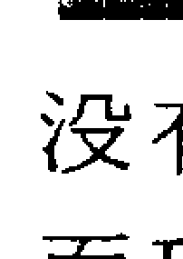

它是无所不变的，而且一变再变，以没有原则为原则，可以说它是机敏、灵巧、反应快、八面玲珑和人人皆可以为友，但也可以说它是狡猾、投机和见人说人话、见鬼说鬼话。这是因为申宫是一种好奇、新鲜的心理反应，是会主动地吸收新知识的表现。

所以，申宫所要融入的情境是一种新奇的情境，而这种新奇的情境可以说成是一种兴致的表现，它的心理意识与外在事物之间的互动关系，是奠基于外在事物的足以吸引他的目光。而且，由于他非常容易地对于任何事物引起兴趣，也因此很容易改变自己的兴趣，再配合上高度的学习能力，使得它的兴趣不断地在变更，亦即会不断地学习新的事物，导致于有多才多艺或者是博而不精的倾向。

于是，申宫的行为表现是一种搜寻的特征，东摸摸西摸摸，跑东跑西，无法安定于某一定点，除非该定点有什么他所想要搜寻的东西。而申宫的搜寻具有找到了、知道了就好的特征，并不会去作更深入的研究，而且每次所要搜寻的东西不止一样，是同时对于多样事物展开搜寻。而它也有能力对于多种事物进行整合，并且把整合后产品变成是自己的东西。所以，他的变动不只是受新奇事物的吸引而已，也会把许多别人的东西整合变成自己的东西。它的表现会偏向于观念性，可以很快地受到别人观念的影响，也会很快地把别人的观念稍作修饰，进而变成自己的观念，并把变动后的观念传达给别人。当别人今日接受他的观念后，会发现他明天又有新的不同观念了，因为他已经又融入于另一个新的情境，接收新的事物和知识了。

申宫可以说是融和了戌宫的好奇、新鲜和知性，以及酉宫的坚持己见、墨守成规，造成了既会追寻于新鲜的事物和知识，又会把别人的观念据为己有。同时，它也会徘徊于自己的见解和别人看法之间，这反而时常使得别人不容易知道它的观念到底为何。

#### 〈處女座・巳宮〉

已宫所对应的环境适应，是属于物质层面的。它最能查觉到外在物质环境的变化，也最能对外在物质环境的变化有所付出。因此，巳宫可以说是一种内心世界之秩序感的需求，它会先认知到「应该是如何」的各种规定，然后对于这种规定进行完整性和完美性的要求，不容许别人破坏，自己也会融入于这种「应该是如何」的情境当中。如果外在环境的秩序遭受到破坏，它就会力图重新回复原来的规定，而由于外在环境是随时都在变动的，所以巳宫也就随时随着外力的干扰，而随时地扰乱了自己的内心秩序，进而随时都在进行复原的工作。

于是，巳宫的行为表现是无法容忍乱象，因为乱会破坏它心中的既定秩序，使得「应该是如何」失去了规定的作用，所以它会对乱做整理，在整理的过程中意图回复原来的秩序或规定，而且会是以默默地付出的态度来进行这项工作。再者，它也会把这种「应该是如何」的规定加诸在别人的身上，要求别人不要破坏规定和秩序，所以它会特别讨厌搅局的人。然而，如果别人的搅局已经成为事实的时候，它往往又会是第一个进行收拾残局的人，因为它会是第一个查觉到乱象的人，同时也是最无法忍受乱象的人。由于巳宫偏向于表现在物质环境上，因此对于各种事物的摆设、例行公事和各种法律或规定等，都会力行于遵守着既定的秩序。

巳宫可以说是融和了未宫的情绪反应，以及午宫的不容许别人对于自己所要求的气氛（或环境）有所干扰，造成了既会以亲切的方式来作付出（或服务），又会坚持于自己所要求的环境标准。同时，它也会徘徊于自己的情绪和别人的感受之间，会感觉到自己的情绪很不爽，但却又会顾虑到别人的情绪反应。

##### 《射手座・寅宮》

寅宫所要对应的环境适应，是属于精神层面的。它最能够感受到精神领域的刺激，也最能够对于精神领域的提升作出贡献。因此，寅宫可以说是要去体验人生历程中的各种精神领域，它会想要去尝试和知道人生到底有什么可贵与稀奇，更会想要从各种体验之中，取得有所成长的不断补充。寅宫在人生历程中的每一种体验，都是他智慧累积的来源，而它的智慧累积是透过情境融入而取得的，是要在融入于情境之后才会产生智慧的升华。

因此，寅宫在行为表现上，会以实际的行动去接触各种足以丰富人生体验的情境。譬如说，出国旅游去感受于异国情调，或者是阅读思想性的书籍，或者是参加宗教性的聚会。所以寅宫的变动方式，是受到各种体验的影响，而且在不断地累积各种体验之后，会一再地改变自己的精神层次。由于寅宫偏向于高远的所在，所以可能会是地点上的变动（如出国），也可能会是定点上的往上发展（如精神层次的提升）。

寅宫可以说是融和了辰宫的理性和知识性，以及卯宫的深层体会和感触，造成了既会拥有评估性的解析能力，又会力求在逻辑推演的过程之中，把知性和理性提升为心灵的感触。同时，它也会徘徊于自己有所克制的理性，以及自己有所欲求的潜意识之间，造成了人性与兽性之间的挣扎和矛盾。

##### 〈雙魚座·亥宫〉

亥宫所对应的环境适应，是属于感情、情绪层面的。它最能够接受感性意境的刺激，也最能够对于外在环境的意境提升作出贡献。因此，亥宫可以说是一种不断地融入于大环境的心理需求，它可以成为大众和大自然的一份子，再进而以大众和大自然的一份子的角色，来体验何谓众生、何谓大自然；并且，在体验的过程中，使自己全神地融入于大众和大自然之中，进而甚至会忘记自己的存在。所以，亥宫的变动方式，会使自己与他人无所差异，顺应于别人和群众，而且是每到一个新的环境时，就会很自然地顺应于新环境的一切。
但是，这种顺应是表面式的，只能说是表面上的附和，所以会给人随和、温顺的感觉。然而，在顺应和随和的表层底下，却是在进行感受的工作，感受于新环境的所有一切变化，包括人物和事物，并且把这种感受的心得潜藏在自己的内心之中。因此，亥宫是十二星座之中最难以理解和捉摸的星座，因为它的外表的行爲表现，并不足以诠释它的内心感触。于是，有些人会倾向于周旋在众人之中，烟没在群体之中；而有些人则是会倾向于走出群体之外，感悟于大自然和神秘气息，或者是沈溺于自我的想象空间之中。

亥宫可以说是融和了丑宫的人世间的现实主义，以及子宫的人世间的理想主义，造成了既会落实于人世间的牺牲和服务，又会感触于人世间的孤独和无奈。同时，它也会徘徊于自己的梦想世界和现实的压力之间，形成了在面对别人和独自一人时的两种截然不同的心境。

所有的变动宫都是在于展现人类的适应环境，并且从环境当中有所学习。然而，由于变动宫缺乏稳定性，很容易随着环境的变化而起舞，所以需要基本宫来作方向上的带领，也需要固定宫来作目标上的坚持。而变动宫的最大作用，就是扮演着基本宫和固定宫之间的和解角色，同时它也游移在基本宫和固定宫之间，不知道应该去进行开拓，或者是去进行坚持！

### 四正宫对星座的影响

在一般的太阳星座书籍当中，往往也会列出星座的四正宫属性，然而却时常没有多作说明，以致于读者根本无法理解四正宫对于星座的特质，到底会带来什么样的影响；同时，对于三方宫的说明也是如此。因此，我时常会问到应该如何对于星座的四正宫和三方宫进行整合，以便能够对于星座的原始特质有更进一步的了解。

以下就针对四正宫和三方宫的结合，来作简要的说明。请读者先务必记住如此的一个基本概念：四正宫是一种「动力」和「精神」的意涵，而三方宫则是一种「落实」和「身体」的意涵。于是，四正宫可以说是为「体」，而三方宫则是为「用」，两者的结合形成了把四正宫的「动力」「落实」在三方宫之上，也可以说是把四正宫的「精神」展现在三方宫的「身体」层面。因此，形成了以下十二星座的基本特性：

基本宫类型：白羊座 巨蟹座 天秤座 摩羯座
三方宫类型：火象 水象 风象 土象
两者的结合：基本宫的促进、带动和引导等动力（精神）特质，展现（落实）在三方宫（身体）的各个层面上。

白羊座→在精力、活力和爆发力的展现上，呈现出促进、带动和引导的动力型态；在直觉和直观的心理功能上，呈现出前进、开拓和领导的精神。

巨蟹座→在感情、情绪和感觉的展现上，呈现出促进、带动和引导的动力型态；在感受和情欲的心理功能上，呈现出前进、开拓和领导的精神。

天秤座→在理性、思考和逻辑的展现上，呈现出促进、带动和引导的动力型态；在思维和理智的心理功能上，呈现出前进、开拓和领导的精神。

摩羯座→在实际、现实和稳重的展现上，呈现出促进、带动和引导的动力型态；在感官和知觉的心理功能上，呈现出前进、开拓和领导的精神。

固定宫类型：金牛座 狮子座 天蝎座 宝瓶座
三方宫类型：土象 火象 水象 风象
两者的结合：固定宫的坚持、稳固和持续等动力（精神）特质，展现（落实）在三方宫（身体）的各个层面上。

金牛座→在实际、现实和稳重的展现上，呈现出坚持、稳固和持续的动力型态；在感官和知觉的心理功能上，呈现出掌控、占有和坚持的精神。

狮子座→在精力、活力和爆发力的展现上，呈现出坚持、稳固和持续的动力型态；在直觉和直观的心理功能上，呈现出掌控、占有和坚持的精神。

天蝎座→在感情、情绪和感觉的展现上，呈现出坚持、稳固和持续的动力型态；在感受和情欲的心理功能上，呈现出掌控、占有和坚持的精神。

宝瓶座→在理性、思考和逻辑的展现上，呈现出坚持、稳固和持续的动力型态；在思维和理智的心理功能上，呈现出掌控、占有和坚持的精神。

变动宫类型：双子座 处女座 射手座 双鱼座
三方宫类型：风象 土象 火象 水象
两者的结合：变动宫的适应、融入和变化等动力（精神）特质，展现（落实）在三方宫（身体）的各个层面上。

双子座→在理性、思考和逻辑的展现上，呈现出适应、融入和受影响的动力型态；在思维和理智的心理功能上，呈现出学习、机敏和调和的精神。

处女座→在实际、现实和稳重的展现上，呈现出适应、融入和受影响的动力型态；在感官和知觉的心理功能上，呈现出学习、机敏和调和的精神。

射手座→在精力、活力和爆发力的展现上，呈现出适应、融入和受影响的动力型态；在直觉和直观的心理功能上，呈现出学习、机敏和调和的精神。

双鱼座→在感情、情绪和感觉的展现上，呈现出适应、融入和受影响的动力型态；在感受和情欲的心理功能上，呈现出学习、机敏和调和的精神。

以下针对黄道十二宫之基本特性所作的说明，是采用四正宫和三方宫的结合方式，来诠释四正宫及三方宫对于星座特质的影响。

#### 〈白羊座・戌宮〉

由于戌宫是基本宫的原型，所以最具有开创、冲锋和前进的特质，它会不断地去追寻各种新鲜的目标；然而，由于戌宫同时也是火象星座，所以更增强了开拓的直觉反应，精力的发挥、消耗和投入会是十二星座之最。也因此，戌宫时常是冲动、急性子和草率的，因为当它一发现新目标的时候，就会直觉式地冲过去。

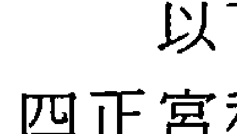

例如，当戌宫认为某项事物颇为新鲜，值得去作研究或探讨（它找到了关注的基地），则即使这项事物与他的生活无关，他也会主动地投入于该项事物的研究，要通过理解该事物的内容，来影响别人也能理解该项事物。但是，当它取得研究成果之后，时常又会很快地把目标转移到另一个新鲜事物了。

#### 〈金牛座・酉宫〉

由于酉宫是固定宫的原型，所以最具有坚持、安定和不动的特质，它会持续地安享于自己的生活空间；然而，由于酉宫同时也是土象星座，所以更增强了实际、踏实和稳重的考量，对于物质性、实质性事物

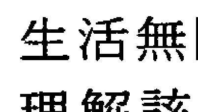

的掌控会是十二星座之最。也因此，酉宫时常是缓慢、谨慎和墨守成规的，因为当它一安定下来之后，就会倾向于安享现有的一切。

例如，一位喜欢欣赏声乐的人，正斜躺在沙发上，享受着声乐之韵律所带来的乐趣，同时也一边喝着高级的咖啡（焦点是在于享受这种舒适的气氛）。此时，如果你要拉着他陪你去做某件事的话，除非你能让他认为做该项事会有某些收获，或者是他可以顺便藉此机会做其他事，否则免谈（他是能不动则不动）。

#### 〈 雙子座・申宮 〉

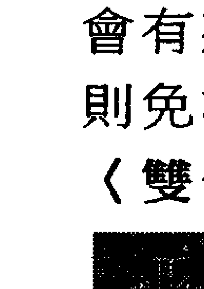

由于申宫是变动宫的原型，所以最具有转变、适应与融和的特质，它会一再地受到外来因素的影响；然而，由于申宫同时也是风象星座，所以更增强了想法和学习方向上的变动性，机敏、反应和狡猾会是十二星座之最。也因此，申宫时常是一方面附和着别人的意见，另一方面又试图把自己的看法融入于别人的看法之中。

例如，新闻记者的采访新闻（采访是一种吸收和学习），在采访的过程中会受到被采访者的影响，进而吸收了被采访者的观念（亦即受到被采访者的影响），改变了自己的某些看法，然后再加上自己的看法，就变成了自己的东西，并且把融和后的想法和观点传达给第三者。而当发现有新奇且值得做采访的事项时，就会马上被它所吸引。

#### 〈巨蟹座·未宮〉

由于未宫是基本宫的本质，所以具有开拓、带领和促动的特质，它会不断地去追寻各种拉拢的目标；然而，由于未宫同时也是水象星座，所以更增强了感情的侵蚀作用（溶化对方的排斥意识），情绪的发挥、消耗和投入会是十二星座之最。也因此，未宫时常是亲切、照顾和关怀的，因为当它一发现新目标的时候，就会以感情来笼罩。

例如，母亲藉由对于孩子的照顾（找到感情开拓和侵蚀的对象），来增加亲密度，使得孩子一步一步地走进母亲的影响范围，溶化了孩子的反抗意识。如此一来，当家庭有事要表决的时候，孩子往往会站在母亲的一方（已经被母亲的感情所渗透了），进而主宰了整个的家庭事务，成为家里实际上的一家之主。

#### 〈獅子座·午宮〉

由于午宫是固定宫的本质，所以具有坚持、顽固和绝对的特质，它会持续地安享于自己的表现空间；然而，由于午宫同时也是火象星座，所以更增强了表演意识的直觉反应，精力的持续度和不服输会是十二星座之最。也因此，午宫时常是热情、慷慨和需要掌声的，因为掌声可以印证自己的存在、印证自己是位居舞台之上。

例如，一位政治人物在讲台上演讲（演讲只是一种传达与沟通的工具，也可以说只是一种手段，而站在讲台上成为注目的焦点，才是坚持的所在），他的演讲情绪是与## 第三章 四正宫

群众的掌声合而为一的，他坚持于要努力地去争取群众的掌声；而群众所回馈的掌声，使得他更坚持于自己是高人一等的，也证明了他适合站在讲台上。

#### 〈处女座·巳宫〉

由于巳宫是变动宫的本质，所以具有适应、协调与融和的特质，它会一再地受到外来因素的影响；然而，由于巳宫同时也是土象星座，所以更增强了实际和对物质环境的适应性，细致、完美和勤劳会是十二星座之最。也因此，巳宫时常是一方面顺应于别人的指挥，另一方面又试图把自己的要求标准融入于别人的命令之中。

例如，一位从事秘书工作的人，当她把所有的东西都整理好时（整理成她自己认为什么东西应该放在什么地方的规定，而且放置东西的位置已经记在脑海之中），如果有人把东西移动了（移动是一种外在物质环境的变化），此时她会立刻发觉（发觉是因为既定的规定被搅乱了），并且把东西再做整理（意图重新回复原来的秩序）。

#### 〈天秤座·辰宫〉

由于辰宫是基本宫的本质，所以具有开创、促动和提供的特质，它会不断地去追寻各种提示的目标；然而，由于辰宫同时也是风象星座，所以更增强了想法、观点和概念上的提示，评估、判断和客观会是十二星座之最。也因此，辰宫时常是中立、公正与和平的，因为当它一发现新目标的时候，就会把衡量的结果提供给别人参考。

例如，当女方问男方（问，代表提供一个进行衡量的基地）：晚上去吃西餐好，还是中餐好？如果男方回答：西餐具有浪漫的气氛，而中餐具有传统风味。此时，重点是要告诉女方他的看法是：西餐比较有气氛，而中餐比较有传统口味。要女方认同于他的这种看法，提示给女方作参考，看女方是要选择气氛或者是选择口味。

#### 〈天蝎座·卯宫〉

由于卯宫是固定宫的本质，所以具有坚持、绝对和占有的特质，它会持续地安享于自己的欲望空间；然而，由于卯宫同时也是水象星座，所以更增强了感情的深化作用，对于感情的掌控和欲望的深化会是十二星座之最。也因此，卯宫时常是洞悉、韧性和养精蓄锐的，因为当它有所欲求的时候，就会想要长期性地独占。

例如，一位深深爱着对方的人（深深是一种坚持的表现，而爱则是情欲的表现），忽然遭遇对方的抛弃，而自己又无法容忍这种背叛的行为（不是占有就是毁灭的完全掌控）。于是，准备采取各种报复的手段，甚至想要置对方于死地，而后再自己自杀，如果有第三者介入的话，可能也会想要连第三者一起做掉（反弹力量的展现）。

#### 〈射手座·寅宫〉

由于寅宫是变动宫的本质，所以具有融入、适应与提升的特质，它会一再地受到外来因素的影响；然而，由于寅宫同时也是火象星座，所以更增强了直觉感触上的变动性，向往远方和精神体验是十二星座之最。也因此，寅宫时常是一方面经历着各种情境，另一方面又试图透过融入于各种情境之中来提升自己的精神层次。

例如，独自一个人踏上国外自助旅行的路途（受到异国情境的吸引而变动），在沿途观看着各种形形色色的人物和事物，体验了人生的百态；而这种体验引发了追寻、探索于人生的意义、目标和目的。当他回国之后，其心境已经有所改变了，对于人生的看法也有所不同了，不会再回到精神层次的原点，只会追寻更多、更远的体会。

#### 〈摩羯座·丑宫〉

由于丑宫是基本宫的本质，所以具有开创、促进和带动的特质，它会不断地去追寻各种有所成就的目标；然而，由于丑宫同时也是土象星座，所以更增强了现实、实际和谨慎的考量，保守、孤独和严肃会是十二星座之最。也因此，丑宫时常是冷漠、沉稳和讲求实际成果的，因为当它一发现新目标的时候，就会尽全力去取得可观的成就。

例如，一位历经千辛万苦而白手成家的企业家，在他的奋斗历程中，不断地从实质成就的累积中去提高他所想要的社会地位和名望（实质成就的累积就是从一个目标迈向于另一个目标的过程）。而当他事业有成的时候，就会促动别人也和他一样地成为一位企业家，同时他自己也会更进一步地致力于在企业界中取得领导地位。

#### 《宝瓶座·子宫》

由于子宫是固定宫的本质，所以具有坚持、绝对和不妥协的特质，它会持续地安享于自己的理念空间；然而，由于子宫同时也是风象星座，所以更增强了想法、观念和创见的独特立场，怪异、前卫和革新意识会是十二星座之最。也因此，子宫时常是反叛、独立自主和令人惊讶的，因为当它一确立理念之后，就会倾向于扫除不同的理念。

例如，一位从事反对运动的人（坚持反对立场是焦点的所在，而其背后则是一种毫不妥协的理念），对于社会所存在的某些不公平现象，认为有必要进行改革的时候，则那怕大部的人是无动于衷，他也会坚持他的革新立场，并且尽全力地向别人宣传他的观念，鼓动别人抛弃旧观念，接受他的新思想，与他一样地站在时代的前端。

#### 《双鱼座·亥宫》

由于亥宫是变动宫的本质，所以具有适应、融入与变化的特质，它会一再地受到外来因素的影响；然而，由于亥宫同时也是水象星座，所以更增强了感情、意境和体悟上的变动性，幻想、仁慈和自怜会是十二星座之最。也因此，亥宫时常是一方面顺应于别人的立场，另一方面又试图透过周旋于各种立场之中来实现自己的幻想。

例如，一位宗教家的传教（传教是必须融入于大众之中），不论贫富或贵贱，都是他所要传教的对象（顺应于各种立场），他可以在融入于大众之中去体会众生生活的苦与乐、喜与悲，并且从感触和体悟众生相之中，提升自己的奉献精神，透过与群体（或大自然）的合而为一而进入无我的意境，进而实现了包容他人的博爱情感。

## 第四章 三方宫

我们最常见到的解析十二星座的方式，就是三方宫（The Elements），也就是四大元素的划分。而不管是从实际论断的应用上来看，或者是从学习星座的最有效方法来看，三方宫可以说是最重要的，甚至可以说如果无法熟悉三方宫的话，那就别谈人格特质的论断了。于是，为了让读者对于三方宫有更进一步的了解，以便奠定往后对于人格特质论断的基础，所以接下来的三章内容，完全是以三方宫为主轴，分别从三方宫的本性、自然属性和气性等三个角度来作说明，希望读者能够发挥高度的想象力，来对于三方宫的无形特质进行体会。

所谓的「三方宫」是将十二星座进行四等分的划分，分成四种类别，每一种类别分别包括了三个星座，构成了所谓的三方宫。由于三方宫是均等地切割了十二星座，所以在三方宫之内的行星，彼此之间的行星位置如果是在同一个度数，或者是在相位容许度以内的话，就会形成 120 度的相位；而由于三方宫的三个星座，彼此之间具有互助的特质，所以 120 度被视为是最主要的吉相位。

三方宫共有四组，分别以地、水、火、风等四象来作代表，也就是佛教所说的四大元素。为了统一名称和论断方便起见，将地象改以土象来称呼。

在中国人的传统命理观念之中，三方宫占据着一定的重要性地位，甚至在日常生活之中也应用得相当普遍。例如，传统式的以男女双方的年龄差距，来作为合婚的考量，就是木星配合上三方宫的应用。简单说明如下：

木星乃是岁星（它每一年的运行正好是接近于走完一个星座的距离），而且木星又是第一吉星。因此，可以简单地透过男女双方的木星的所在星座位置，来看男女双方合盘的木星的相位关系，这就是合婚的最简单原则。

如果男女双方的木星，彼此是位在相同的三方宫的话，很容易形成双方木星是处于120度（三合）的情况，这在合盘上是属于吉相位，可以为彼此带来调和。因此，凡是年龄相差四岁的男女双方，由于彼此的木星可能会是位在120度的位置，形成合盘上的双方的木星是处于吉相位，所以被看成是一种吉利的代表。而如果双方的年龄相差六岁的话，由于彼此的木星可能会是位在180度的位置，形成合盘上的双方的木星是处于对冲的位置，所以被看成是一种不吉的代表。同理，如果双方的年龄相差三岁的话，由于彼此的木星可能会是位在90度的位置，形成合盘上的双方的木星是处于犯刑的位置，所以被看成是一种相克的代表。因此，传统上的合婚，如果男女双方的年龄相差三岁、六岁的话，是属于凶相；而如果是相差四岁、八岁的话，则是属于吉相。这完全是以木星的落入于三方宫，来看男女双方合盘上的木星的吉凶相位，以此来简单地论断双方是否有所刑克。

这种合婚上的简单判断，固然有其占星学上的论断基础。但是，我们必须知道的是，行星之间的相位关系有其容许度的要求，所以绝对不能断然地说：凡是相差三岁、六岁的双方，必然就会是木星位于彼此刑克或相冲的位置，而是要更精确地以两个人的木星的确实位置来作判断。同时，由于木星并不是正好每年走一个星座，而只是接近于每年走一个星座。因此，以时间上的差距来看，木星所在的确实的星座位置，如果单是以年支来作判断的话，其误差率会是颇高的，所以并不能用此来作为刑克的判准。再者，合婚所涉及到的判断考量因素很多，绝非木星和三方宫而已，譬如说太阳和月亮的位置，在合婚上的重要性绝对大于木星。

因此，中国传统上所谓的男女相差几岁的合婚判断，在精确度的要求之下，以及社会形态已经有所改变的情况下，应该有更精确的和更适合于现代社会形态的新合婚诠释。（可参见我所写作的《占星学看爱情与婚姻》）

此外，在一般的太阳星座或月亮星座的书籍当中，时常会提到所谓的某一个星座与另一个星座的相处，可以呈现出多少的适合度，甚至以此来看男女双方的谈恋爱的适合度或感应度，并且自称为是爱情星座占星。这种适合度的判定标准，也是奠基在三方宫之上，亦即认为只要男女双方的太阳和月亮是位在相同的三方宫之上，则彼此之间的适合度或感应度就会加强，彼此之间谈恋爱的成功率就会提高。

其实，从实际的论断经验上来看，当一对恋人正处在谈恋爱的高峰期时，也可以说就是爱情的迷惘期，根本没有必要进行所谓的爱情占星，因为相爱的双方早已经失去价值判断了。这是因为爱情是没有理性可言的，爱情所诉求的完全是感情性，所以除非是风象很重的人，能够在谈恋爱的过程还保持着相当程度的理性思考，或者是摩羯座的基于现实主义的考量，否则没有什么合适与不合适的问题存在。况且，男女双方之所以会互相吸引，绝对会有命盘上的某种契合产生，而这种契合可能会是建构在彼此的其他主要人格特质，或者是某些行星的互动关系上，并不完全只是建构在太阳、月亮或金星而已（虽然这三者的影响力颇大，但是木星和火星所代表的性冲动也相当重要）。因此，正在谈恋爱的双方的太阳或月亮，如果并不是位在相同的三方宫的话，根本没有必要担什么心，双方可能是在其他的契合条件下来，建构起彼此之间的爱情互动。

最常碰到的论断反而是婚姻占星（亦即已经具有正式的法定关系了），尤其是离婚的问题。这凸显了每一个人总是在遭遇问题的时候，而且是在不知道应该如何是好的情况下，才会去请教占星专家，看是否能够提供一些参考意见，或者看是否能够化解婚姻的危机。然而，由于离婚的考量因素，往往也是颇为复杂的，并不是合适与不合适就可以说明了的，它涉及到双方的各种冲突点，而这必须从双方的合盘来作细论，特别是必须从合盘上的行星相位关系来作判断，绝不能仅以单一行星的是否落入于相同的三方宫，来作粗糙的说明。但是，由于太阳和月亮有它们的重要性地位，所以是不可忽视的，因此它们往往成为合盘上相位互动关系的主要观察点。

以上的说明，似乎有点偏离主题。其实，在此我所要提醒读者的是，所谓的爱情和婚姻的占星论断，绝对有必要更精密地考量到其他的各种因素，因为这种亲密的关系，不同于一般的人际关系。而如果是仅从人际关系的角度来看，则由于太阳或月亮足以形成每一个人的主要人格特质，所以可以用粗略地判断任何两个人的人格特质，进而说明这两个人是否存在着共同的个性特征，并且以此来判断这两个人是否可以藉由相同的个性特征，来产生相处上的融洽。

例如，太阳落入双鱼座和巨蟹座的两个人，由于彼此皆具有水象的特征，所以具有某种程度上的个性类似，都会比较注重于情绪和感性。自然而然地，这两个人就会比较容易相处，甚至于两者所感到有兴趣的事物，也可能会是相类似的（因为两者皆拥有水象特质的能耐）。于是，两者彼此之间相处起来的感觉，会是比较轻松和愉快的。

又例如，如果两个人的太阳是分别落入双鱼座和双子座的话，则由于双子座是风象，注重的是知识性、理性和活动性，会比较难以和双鱼座的精神性、幻想性和感情性取得较高程度的共同个性特征，于是除非这两个人的其他主要人格特质可以互相配合，否则彼此之间的个性差异会是比较大的。也因此，这两个人相处起来，可能会比较不具有协调感。不过，由于双子座和双鱼座都是变动宫，所以从两者在心理意识上的变动性来看，还是存在着某些共同的特质，只是由于彼此的三方宫不同，所以它们的变动宫的落实方向有所差异。

三方宫在实际论断上的最大功能，是可以用在本命盘的论断上，作为判定人格特质是否调适的判准。也就是说，可以用三方宫来判定一个人的心理意识功能是否取得平衡，这也可以说就是三方宫之所以在论断上会居于重要原因。就三方宫在本命盘论断上的重要性来说，可以从以下的三个方面来看：

1.  三方宫提供一个人心理意识的基本结构：从一个人的主要人格特质来看，由于大部份的人是拥有三个到五个的主要人格星座，于是就可以从三方宫的角度来对这些星座作分类。例如，假设你的主要人格星座，包括了白羊座（火象）、巨蟹座（水象）、宝瓶座（风象）和处女座（土象）等四个星座，那么你的主要人格特质就会呈现出四大元素皆具备的情况。如此一来，你的基本人格是属于比较平衡的，理性与感性、秩序与行动等，可以取得一定程度上的均衡态势。

因此，可以从主要人格星座所呈现出来的三方宫属性，先简单地看出一个人心理意识的基本结构，然后再来观察比较细微的个性表现。但是，不可忘记的是，由主要人格星座之三方宫属性的互动，所建立起来的基本心理意识结构，是一种大环境的特质，它会对于整个本命盘产生巨大的影响力，永远影响着个人的基本个性。

2.  三方宫提供一个人人格特质的调和途径：前面所举的例子是四大元素皆具备，所以在基本人格特质上，呈现出某种程度的平衡状态。然而，从实际的论断经验上来看，主要人格星座同时具备了四大元素的人并不多。大部份的人的三个到五个主要人格星座，并不是平均地分布在四大元素之中，而是会有所偏向的，于是形成了人格特质的偏向。例如，假设你的主要人格星座是由白羊（火象）、金牛座（土象）、巨蟹座（水象）和狮子座（火象）所组成。如此一来，在人格特质中有一个土象、一个水象和两个火象，显然地火象是居于偏重的地位，但最重要的是你缺乏了风象，造成了在人格特质中的风象是处于弱力的状态。

当然，这并不是说你就因此而缺乏风象（主导理性、思考和逻辑等能力），也许你可以藉由水星的居于重要的位置（如水星在命宫）来弥补风象的弱力。然而，如果你的水星并未能居于重要位置的话，那么就会很明显地呈现出缺乏风象能力的展现。以前例来说，由于风象的运作能力处于弱力态势，而且又有两个火象，因此是属于行动派，但是其行动的促动力时常是属于情绪性的反应，而不是理性思考的结果。虽然有一个土象来限制火象，然而克制的力量还是不够，反而可能会在金牛座和巨蟹座的作用下，一旦被激怒了的话，就会如同火山爆发式地爆发出来。

因此，三方宫所呈现出来的主要人格星座，可以拿来判断一个人会是比较缺乏那一方面的能力。而这种人格特质的判定，在实际论断上至少具有二项重大的功能：一是提醒一个人应该去培养那一方面的能力，以此例来说，就需要多多培养理性和思考方面的能力，以弥补自己先天能力上的不足；二是发觉一个人的特长所在，使工作能够尽量地配合着自己的个性与专长，这是以下所要说明的。

3.  三方宫提供一个人发展趋向的基本动力：既然大部份的人并不是四大元素皆具备，也因此而产生了人格上的偏向。然而，所谓的人格偏向，固然是标志着一个人可能会比较缺乏某一方面的能力；但是，也可以说成是某一方面的能力的特别发达。以前例来说，虽然缺乏了风象，但是火象特别强，所以此人会比较具有行动力，可以从事于开创性的工作。因此，从三方宫可以看出一个人的基本特长，但这种特长指的是心理意识方面的，它可以作为个人在发展趋向上的参考指标。

### 星座的三方宫内涵

针对星座的三方宫来作星座解析，可以透过四大元素的意涵、每一元素中各个星座的特质差异等来作说明。

#### 一、四大元素的意涵

（一）火象 (FIRE SIGNS)：白羊座、狮子座、射手座
火象代表的是一种精力、活力、爆发力的呈现，是一种主动型的动力展现，三个星座皆是阳性星座，三者皆与领导者、冒险家和开拓者等有关。整体火象的特质，就好像是充满电力的发电机，要把整个动力展现出来，寻找电力的发泄管道。于是，最好是能够开拓出一条适当的发泄管道，把精力集中在有用的方向上，以免造成精力的浪费。而在发泄的过程中，也表示着火象的挥发性、燃烧性和爆发性，所以往往火象的负面特质就是由于无法妥善处理精力的发泄所导致的冲突。

因此，从心理层面上来看，火象的人比较具有目标性和理想性，而目标和理想就是他发泄能量的最佳管道。当然，从另一角度来看，所谓的目标和理想也代表着火象的雄心、野心和企图心。同时，也由于火象具有企图心的展现，所以会导致比较无法容忍别人与其争锋，形成具有自私和独断的个性，而自私是为了证明自己的存在。因此，火象在精力的发泄过程中，比较不会考虑到周遭的环境和人事，以致于别人认定他是自私的。

以外在行为来观察火象的人，可以相当容易地看出来，因为火象具有行动力，绝对不是一位静态型的人。他给人的感觉是有冲劲，并且带有侵略性，散发着一股带动气氛的感觉。火象的人会采取行动去达成自己所确立的目标和理想，但是别忘了，火象由于挥发过度，所以容易导致身体的过度消耗。同时，也会由于时常采取独断专横的行为，而容易得罪别人。

火象的人必须相当注意的是：勿过度地消耗精力，否则身体的健康会受到影响；也不可以太过于急躁，要培养耐性；也应该多多考量到别人的立场，才不会被认定为是自私的人，或者是独裁者；也不要太过于向着目标直冲，目标的设定与达成，是有赖于长期性的确切执行，而不是短期性的冲劲，如此才能有所成就，所以火象有赖土象来做补充，才能使得理想和实际相互配合。

#### （二）土象 (EARTH SIGNS)：金牛座、处女座、摩羯座

土象代表的是一种实践的能耐，所以会呈现出谨慎、稳固、不动和可靠的形态，同时也是一种木讷的表现。三者皆是阴性的星座，而且皆具有生产性的意涵。土象就好## 【黄道十二宫的三方宫－土象分配图】

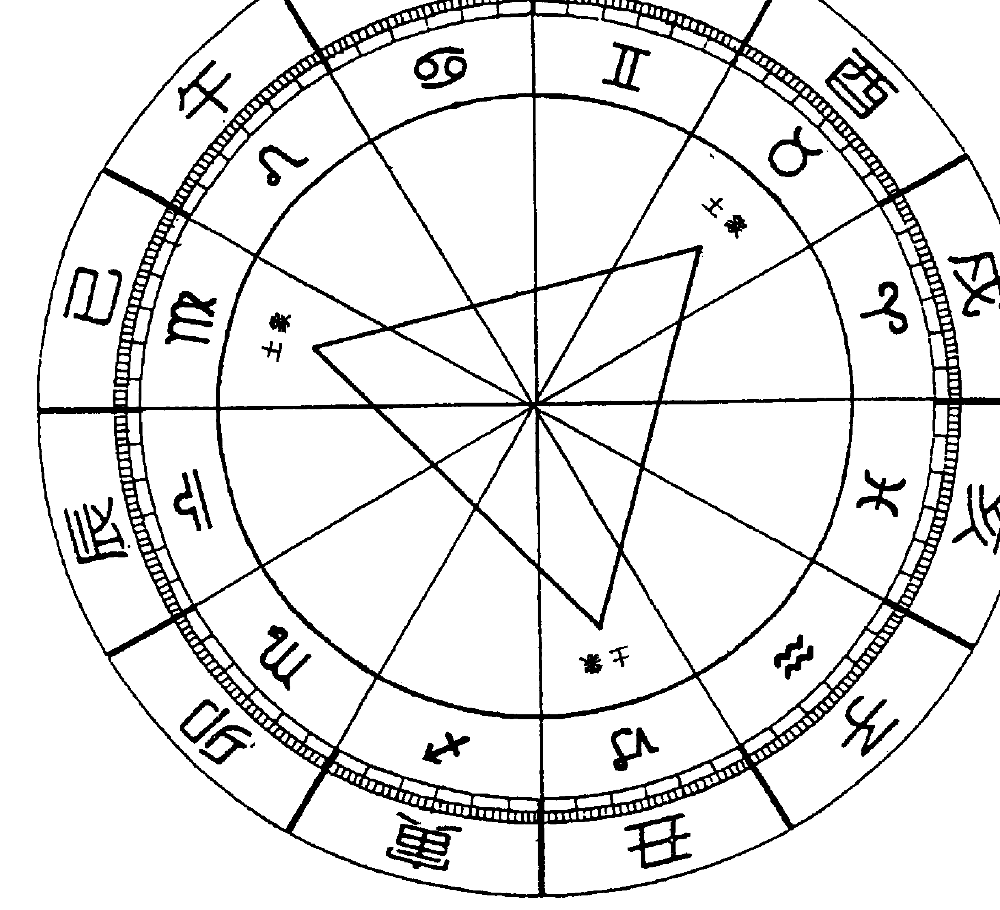

## 第四章 三方位

像是一片富饶的大地，是善养万物的根本所在。因此，绝对不可以小看土象，它所代表的实质产出是人类生活需求的依靠。而土象的最大贡献，也就是在于它的实践性和生产性，以及展现出土象的组织、结构和秩序等能力，进而肯定了存在的价值。

从心理层面上来看土象，可以说是一种情绪波动相当稳定的征兆，甚至给人一种凝固、冷凝的感觉。因为土象的人的内心，就像是一幢结构相当严谨而结实的建筑物一样，期求的是组织性和秩序感，而不是火象的目标性，或者是水象的敏感和风象的逻辑思考。土象的这幢内心建筑物，具有冰冷的感觉，它的冰冷并不是意味着残酷无情，而是因为土象的人比较不晓得如何去表达自己内心的感觉与需求，由于表达不出来，压抑久了，也就干脆不表达算了，或者是以默默耕耘或付出的方式来取代口语上的表达。

因此，土象的人所呈现出来的外在行为，无疑地会表现出严谨、慎重、缓慢、坚忍、努力和实际等行为特征，是属于一步一步地去完成任务的代表，所以比较具有责任感。同时，由于土象是建设性与生产性并重的人，所以它所采取的实际行动的出发点，是倾向于实质性的，而不是理论性、直觉性或理想性，也因此土象的人往往给人一种现实的感觉。其实，土象的现实是由于太注重实际的结果，它希望所有的努力能够有所收获，也因此会去掌握实质的事物与成就。

土象的人必须相当注意的是：不要太过于以实际的考量来衡量一切事物，否则很容易留给别人现实主义的印象。

## 第四章 三方宫

象；也不要太过于坚持既定的作法，虽然土象的坚持是一种稳定和落实的作法，但是却往往会造成动作迟缓或者是一成不变，以致于缺少变通性，所以应该多多培养自己拥有比较快速的应变能力；同时，也要多多掌握自我表达的机会，改善自己的木讷特质，如此才会有更多的机会降临。

#### （三）风象(AIR SIGNS)：双子座、天秤座、宝瓶座

风象代表的是一种思维的运作能力，所以与理性、概念、逻辑和知识等有关，也因此风象特质比较重的人，会是属于比较聪明的人。但是，风象的聪明与所谓的“智慧”是所有差别的，因为风象的聪明是一种知识的吸取、整合及反应的表现，而不是知识运用上的“智慧”之考量。两者的分别就好像是：武器的制造需要聪明的脑袋来完成；但是武器的使用则有赖于智慧来作抉择。所以，风象比较倾向于知识的表面性、表层性，相当有助于考试时的“临时抱佛脚”。同时，风象是一种动态的表现，随风而飘动，比较难以安定，这种飘动可能会表现在心智和思考上，也可能会表现在外在行为的活跃上。

因此，从心理层面上来看风象，最基本的“飘动”表现是无可避免的，这种“飘动”的最明显特征就是喜欢想东想西、喜欢脑袋有所运作。它会随着本身所处的环境，或者是所面对的问题，而展现出思考的能力。也就是说，每当他进入一个新的环境时（此环境也包括知识领域在内），往往可以很容易地从这个新的环境中去吸取新的知识，并且可以用理性的概念来说明这个新环境、看待这个新环境。这就好像是一部电脑一样，你只要把任何新的资料输入，他都可以帮你运作、说明、建档和记忆，而你只要输入任何新的电脑软件，他都可以吸收这套新的电脑软件，并以此电脑软件来做资料分析。

## 【黄道十二宫的三方宫-风象分配图】

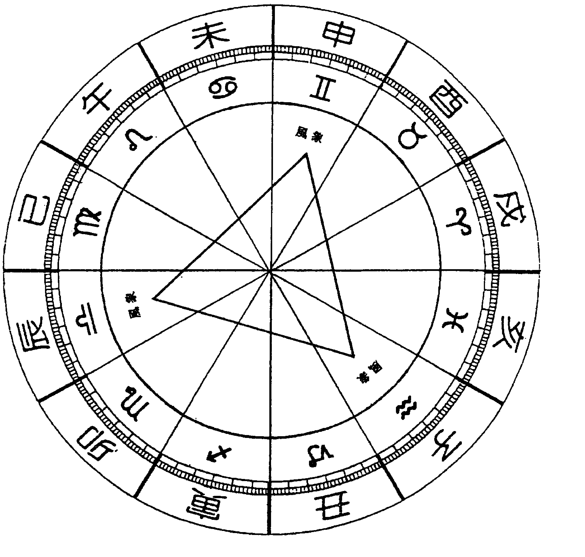

## 第四章 三方宫

以外在行为来观察风象的表现，则是具有三项特征：一是属于身体层次的活动，他无法使自己久居于一个定点，会采取飘动的行为，喜欢跑来跑去，譬如四处串门子、开车四处跑等；二是属于语言层次的表达，相当具有说服力，文字和语言的运用能力相当好，往往可以给人一种“知道蛮多”的感觉，甚至可以无所不谈；三是属于社交层面的圆滑和手腕，可以很容易地成为别人的朋友，这可以说是前二项特征综合下的必然结果（亦即会四处活动又可以谈天说地）。

风象的人必须注意的是：尽量减少飘动，虽然这很难做到，但是风象往往就是因为太过于发挥思考能力，以致于能量消耗过多，有精神衰竭之虑；也不要太过于强调理性，因为有许多的事物并不是完全依靠理性就可以解决的，例如谈恋爱要讲求感性和气氛，而不是谈你对爱情有何看法，如果以知识来说明爱情的话，是与爱情的本质不相符合的；睡觉前应该做少许的散步或休息，最好是不要看书，否则睡梦中仍然会有思维运作的现象产生，比较难以有一个甜蜜的美梦出现。

#### （四）水象 (WATER SIGNS)：巨蟹座、天蝎座、双鱼座

在四大元素之中最难理解的是水象，因为水象与个人的潜意识有相当大的关连，往往可能连自己都难以意识到它的作用。同时，水象也是最难以藉由外在行为的表现来作观察，因为它是属于个人内心深处的。对水象的最直接的描述就是水，以下分别从水的六项特征来作描述。

- 1. 所谓的柔情似水，说明了水的柔性，由柔情而令人感觉甜蜜，进而展现出温暖、温柔和外表上的略带柔弱，

是女人吸引男人展现雄性本质的所在，因此女人如果水象特质重的话，可以引发男人展开追求的欲望。

## 【黄道十二宫的三方宫－水象分配图】

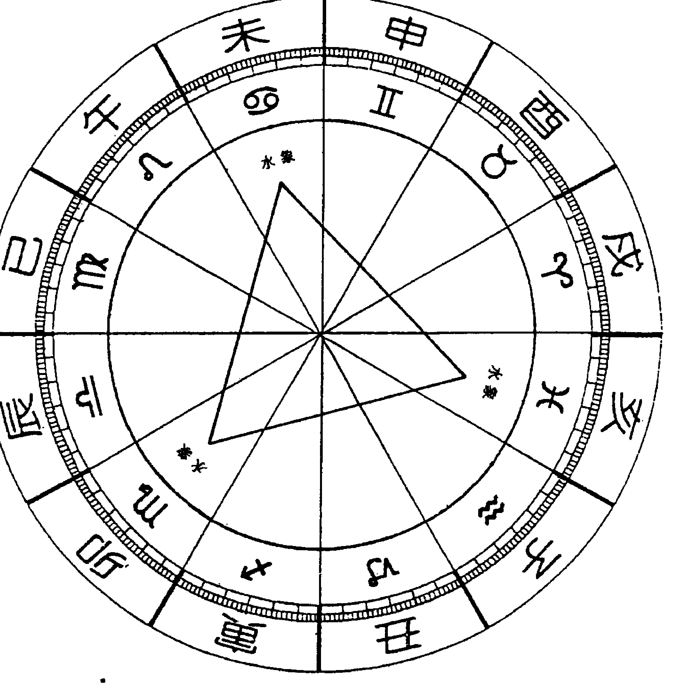

## 第四章 三方宫

- 2. 水可以适应于各种容器，这呈现出水的适应性和依恋性，可以把容器看成是外在环境的变化，所以水象特质重的人，可以因时因地而针对外在环境来作反应，但是水的本质并没有改变。换言之，水象所主宰的情绪和感情特质不会改变，但是却会随着各种不同的环境来展现情绪和感情的反应。
- 3. 任何的东西都可以丢进水里，亦即水可以容纳各种东西，不管是好的或者是坏的，这呈现出水的包容性。这种包容性是一种“捕捉”的写照，说明了水象可以发挥捕捉各种外在意境和内心情境的能力，并且可以把这些意境和情境储存起来，化为一种潜意识的无形力量。
- 4. 水可以滴水穿石，以日积月累的功夫来达到感情目标，这说明了水的持久性。所以水象的运作历程往往会是比较慢的，因为它需要配合着体会和感受，是一种慢慢消化、慢慢侵蚀的方式，以致于别人难以提防水象的感情渗透力，当你发现时，可能已经步入它的感情之网了。
- 5. 水是只要有空隙就可以进行渗透，所以水具有渗透的能力，而这种渗透力是一种深度性的表现。因此，水象的人往往会把许多的事物藏在内心深处，是别人难以捉摸到的，甚至会渗透到潜意识，或者至少会与潜意识产生互动。也因此，如果惹到水象的人，而且是惹到让他恨你的话，这种恨意可能会是一辈子的，因为这种恨意往往会是难以泯灭的。
- 6. 水可以接受各种东西的丢入，但在丢入的时候，水会因为东西的丢入而产生波动，所以水象的人很敏感、敏锐，不耐别人的刺激与挑战。哪怕你只是轻描淡写，或者是采取影射的手法，他仍然会感觉得到。而如果你的挑战是直接的，而且是大石头型的，则丢入水中所激起的波浪就会越大，这表示着情绪的反弹力量就会随着加大。

以上针对水象所作的描述，不难理解到水象主宰着情绪、感情和感性的运作能力。所以，水象的运作重点是在于，水象的人如何与外在环境产生互动，亦即外在环境是如何地赋予水象刺激，而这种刺激对于水象的情绪会有什么样的波动产生，或者是水象如何去接受、感受刺激。

因此，从外在行为上来看水象，则会呈现出一付沉静、沉默和静态的外表。但是在静态的表层底下，却是正在进行观察、直觉、感受和体会，水象的人除了可以透过眼睛来作目视之外，也可以通过身体的其他部位来感知到周遭环境的气氛，而这种感受透视法可以应用在外在环境上，也可以应用在对人的判断上。所以，千万不要小看水象外表上的漫无目的、一切无所谓的态度，其实他是正在进行捕捉的行动，捕捉景物的意象，或者是捕捉别人的企图与内心深处。

水象的人必须注意的是：不要太过于以感性和情绪的反应方式来面对所有的问题与事物，应该多多培养理性和思考的能力，因为感觉有时候可能导致于判断错误；也不要比梦想来取代一切，因为梦想的实现是需要依靠行动，所以应该多多采取实践的方式，以实际的行动来实现梦想，把梦想落实在实际的事物上。

## 第四章 三方宫

### 二、每一元素中各星座的特质差异

针对星座的四大元素来看，每一元素中的三个星座，除了具有以上的共同特质之外，也存在着相当程度上的差异性，所以有必要作更进一步的细分。

#### （一）火象的特质差异

火象的三个星座皆会呈现出充满活力、动力和热力，但是它们的表现方式却有所不同，分别说明如下。

##### 白羊座（戌宫）

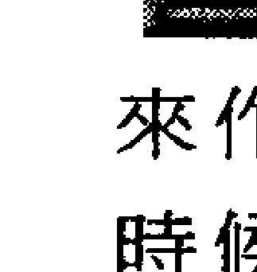

是一种焦点式的热力展现，强调的是对于“点”的集中，也就是说白羊座的热力爆发，会是以点来作为发泄的管道。譬如说，当他专注于某一项事物的时候，也就是他把热力集中在这一事物之上，而这一事物即是一种点的象征。由于是点的集中方式，因此所产生的瞬间力量也就相对地会特别大，爆发力也就特别地强。

再者，白羊座的点的关注是会移动的，所以只能说是在某时某刻正好把注意力集中在某一点，爆发于某一点，而不是永久地把精力集中在此。所以，当此集中点不再足以吸引他去关注的时候，就会转移目标，关注于另一项事物，如此一直不断地以点为中心，继续地探索和开拓下去。

因此，白羊座的人很难针对单一事项具有持续力，除非他所关注的点可以提供不断的变化，吸引他继续做更进一步之广度性或深度性的探索，使他愿意把注意力放在上面，否则会失去耐性。例如，一位研究经济学的学者，刚开始时可能偏重于经济理论方面的研究，但接下来的同一领域的研究，可能会是转移到经济实务方面，或者是可能会转移到经济思想方面的研究，但也可能会在理论方面继续作其他不同理论的研究。总之，必须有各种不同的经济研究领域，来提供他不同的研究关注点，因为白羊座会促使自己去开拓其他的研究领域，甚至会是去研究与经济完全无关的事物。

##### 狮子座（午宫）

是一种向四方炸射的热力展现，光亮、耀眼，无所不在，也没有特定的对象，强调的是要让他能有所表现，让别人都能够看得到他的才华，感受到他的存在。因此，狮子座最具有个人秀的色彩，而既然是个人秀，当然不允许别人与其争光，两头狮子的相遇也就是“王见王”的局面，所以会是最能发挥热力四射的，同时也是最独断自我的。

狮子座的热力四射，可以把它视同为是歌星在作秀一样。当狮子座在舞台上尽情地表演的时候（所谓的舞台，指的是有观众和听众的存在），可以说就是他人生最快乐的时光，他不能没有表演的舞台，而他也会在日常生活当中寻找舞台的所在。

因此，哪怕是平常的一言一行，也总是带着些许的表演色彩。而狮子座的表演是需要观众来回馈的，也就是说他的作秀还渴求于有掌声来助阵，而当掌声越多的时候，越能激发起他秀的热劲。然而，狮子座对于掌声的期待，容易造成潜在的致命伤，因为往往会在别人的掌声所带给

## 第四章 三方宫

## 第四章　三方宫

自己的荣耀感之下，答应了别人所要求的事，这是作为老大所必然要付出的代价，也是狮子座之所以会慨慷付出的背后主要动机，所以狮子座是“耳根软”的星座。

##### 射手座（寅宫）

是一种向上型的热力展现，在火象之中最具有目标性、理想性和向往性，充分地呈现出射手座对于远距离的诉求。换言之，射手座的热力展现是往高处和远处发展的，也因此他会在人生历程上，向往着体验于既定目标之下的各种阶段性层次，亦即当既定目标的低层次达成之后，就会意图去达成既定目标的高层次，而在低层次与高层次之间，存在着向上型的无数间隔距离，他以“人往高处（或远处）爬”的射线走向来经历这些无数的间隔距离。

那么射手座所要到达的目标是否有其终点？可以说是没有。因为在射手座的内心中，会感觉到有一股向上发展的动力在促动着他，使他自己不能停下来，而总是期望着人生体验能够一而再地有所突破，以致于不知道自己的终极目标究竟在那里。

因此，射手座的人在人生历程中，一直在追寻，追寻着那种自己内心所想要去到达的各种体会，顺着这种体会，射手座呈现出高度的精神层次意涵，造成了与哲学、宗教和国外等有所关连。

#### （二）土象的特质差异

土象的三个星座皆呈现出实际、稳定和冷凝，以及具有生产性，但是各自的表现方式却有所不同，分别说明如下。

##### 金牛座（酉宫）

是一种艺术性之感官作品的生产，也由于具有艺术性质，所以在土象之中是比较具有敏感性的。然而，金牛座的艺术性是不同于水象的艺术性，因为两者的感觉器官不同，表达的方式也就有所差异，况且金牛座具有土象的组织与建构的能力。
因此，金牛座的艺术作品会偏向于感官性，是属于看得见、摸得着、听得见的，而且也是属于具有结构性美感的。诸如：音乐（尤其是西方音乐，因为西方音乐是由一连串的节拍结构所组成，是一组庞大的组织艺术）、园艺（对植物与生活空间作一种调和性美感的创作）、陶瓷（以手工来创造和美化日常用品）、建筑师（生活空间的艺术创作）和金融业者（金钱运用的艺术创作）等。
但是，金牛座的这种艺术特质，也相对地带来了讲求享受与舒适，这背后是一种对于生活之美的诉求，也因此而难以忍受粗俗，自己也就不会粗鲁了。所以，金牛座会讲究精致的生活，尤其是会成为美食主义者的代表，而最重要的是，金牛座也是金钱拥有者的代表，因为必须有钱才能有更多的物质享受；相对地，因为想要有更好的生活享受，所以会比较注重金钱的应用。

##### 处女座（巳宫）

是一种服务性之实质利益的生产，比较偏向于身体力行的展现，所以是勤劳的代表。然而，处女座的勤劳是属于“螺丝钉”的性质，可是虽然只是一颗

## 第四章 二方宫

## 第四章 三方宫

小小的螺丝钉，却具有两项相当突出的功能：一是不能没有它，否则生产会发生问题，尤其是它擅长处理细节和微末之事，可以保持整组机器的顺利运转，以确保生产的顺利进行；二是众多螺丝钉的组合，可以创造出一整组的机器，可以发挥很大的生产力，以及发挥可怕的统一力量。

此时如果有一位领导者产生，带领着处女座们进行运作和往前走，则这种处女座的整合所产生的力量，往往会是所向无敌的。所以，处女座是企业生产中不可缺少的基层构成要素（标准的劳动者阶级），不要小看处女座的资料整理或者是倒茶的简单动作。

因此，处女座所具有的贡献，往往会由于太微小而不为人所知，当然也就往往会被别人所忽略。但是，一旦失去了处女座，你就会发现世界上好像失去了什么一样，譬如说，报纸没有人整理、桌子没有人去擦干净，或者是杯子没有人去洗等，会使你的生活失去了一种安适和秩序的感觉。而这一切的秩序感，主要是有赖于处女座来执行的，所以对于处女座的服务一定要给予称赞，因为它间接地使得所有的日常事务顺利地进行下去。

##### 摩羯座（丑宫）

是一种官僚性之企业组织的生产，它与处女座的生产性的最大不同，是在于摩羯座是“主管”，而处女座则是“下属”。因为摩羯座相当注重成就感，所以会很努力地去往上爬，而处女座则相对地比较缺乏自信心，因此在竞争上也就略逊一筹了。摩羯座既然是身为主管级人物，也就先天地带严肃和权威的特质，是十二星座之中官僚气息最重的。

当然，这种官僚主义多多少少也具有照顾部属的意味，只是比较难以表达出亲近的感觉，而往往把关怀之情藏在内心之中。同时，主管在企业组织当中，是属于负责管理并推动企业成长的主脑，所以摩羯座的责任感也就相对地加重了，也由于责任感的太重，以致于所要背负的包袱过重，也就越不太容易笑了。

此外，摩羯座在土象的稳固意涵之中，具有坚持于传统的特质，所以说摩羯座会被赋予传统和保守的评语。其实，所有的土象星座，皆具有坚持于过去的特质，会以过去的一切及标准来作为现在的判准。例如，处女座会以以往的秩序、规定来把现在的东西放回原来的地方；金牛座则是懒得去更改过去的一切，安稳于过去的一切；摩羯座的特质则是坚持于精神与行为的合一，尤其是对于传统精神的坚持，会把传统精神套用在所有的生活之中。

#### （三）风象的特质差异

风象的三个星座皆会呈现出理性、概念和逻辑性等，但是其表现的方式却各有所不同，分别说明如下。

##### 双子座（申宫）

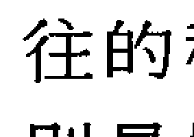

是一种多元化的思考模式，而且这种多元化的思考往往会是同时进行的；也就是说，双子座可以在同一个时间内想很多的事情，或者是同时做多件事情。当然，要能如此的先决条件，就是要具备相当机敏的反应能力，以及快速的思考整合能力。

这种多元化的思考给双子座带来多才多艺的特质，甚至是十八般武艺样样皆会，因为任何新奇的事物都可能会引发他去作思考和学习。而机敏的反应能力，导致于可以很快地就进入学习状况，并且带来手脚的灵巧和活泼的气质，这一切可以说是奠基于聪明的脑袋。同时，再配合上快速的整合能力，以至可以很快就把新的事物，经过脑袋的思考整合运作，转换成另一种新的知识图象，并且将它浮现在自己的脑海中，进而把脑海中的知识图象透过语言的表达来展现他的知识多样化。

因此，双子座的概念和观念会呈现出比较多的变化，因为每当有吸收新知识的时候，总是会再一次地发挥思考整合的能力。而新知识的吸收也就代表着另一种新观念的产生，甚至于另一种新理解方式的诞生，或者是另一种新理智与新理性的呈现。其所反应在外在的言语表达上，会是今天所谈的道理和昨日所谈的道理可能会有所不同，甚至于解释的理由和方式也许有所改变。但是，无论如何其多元化的思考模式则是永远不变的。

##### 天秤座（辰宫）

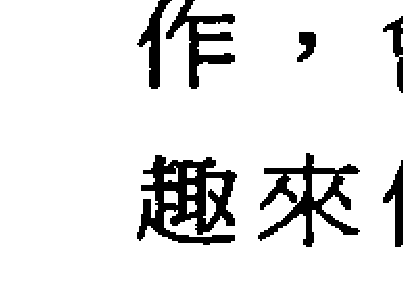

是一种均衡式的思考模式，所以天秤座对于知识的认知，偏重于发挥分析、评估、衡量等方面的特质。与双子座不同的是，双子座是综合式的思考运作，会全部装进去，全部揽在一起，并且是以新奇和兴趣来作为知识吸收的导向；而天秤座则是偏向于归类与划分，亦即会对于那一方面的知识可以应用在那一方面有所区分，而且会以等量的方式地看待各种知识领域，

比较不会有所偏颇。

而与宝瓶座不同的是，天秤座不会要求有奇特的创见产生，因为天秤座所注重的是分析上的合理性，它要以权衡各种态势来作为合理化解释的基础。因此，天秤座在思考运作的速度上，也就会比双子座和宝瓶座慢，因为他必须同时考量到权衡上的合理性。而天秤座所谓的合理性，也就是不可以偏袒任何一方，所以天秤座是公正与公平的代表。

其实，天秤座在知识应用上的最大特质，是在于展现它的分析能力，它可以在分析的过程中，透视任何事物的优缺点，评估所有可能的后果。也因此，天秤座会比双子座和宝瓶座来得踏实一点，飘动性也就因此而比较弱。同时，由于对知识是采取对等式看待的方式，所以不会有极端的现象发生，并且对于同一领域的相关知识的吸取，也会采取两头并用的方式，不会只采取某一方的观点而反对另一方的观点，它往往会认为两者皆有可取之处。

##### 宝瓶座（子宫）

是一种独创性的思考模式，所以宝瓶座对于知识的吸取，强调的是要具有独创、特殊、与众不同等特质，这种深具创见性的特质贯穿于宝瓶座的整个思考过程。也因此，所有的新思潮、新观念、前卫派和革新派等，都是由宝瓶座来做主宰。

宝瓶座的整个思考过程可以分成三个阶段来看：一是知识的吸取：凡是带有改革色彩，或者是与众不同的知识和观念等，才足以引起宝瓶座的注意，进而展开理念上的

## 第四章 三方宫

## 第四章 三方宫

吸收；二是思考的逻辑：会以特殊或怪异的思考逻辑来理解事物，简单地说就是看法上或想法上的与众不同；三是语言的表达：在经过特殊或怪异的思考运作之后，其所呈现于外在上的语言表达也往往是与众不同的，正是所谓的一鸣惊人、突发奇想、语不惊人死不休的写照；也就是说，时常会产生与当时当地的话题有所明显差距的言词（如突然穿插一句无关主题的话），或者是说出来的意见与众人差异太大。

宝瓶座在经年累月的独立思考过程中，除了会不断地涌现出新的观念之外，更重要的是它可以带动时代的巨轮往前走。也许众人会认为宝瓶座的创见简直是异想天开，但也就是因为有了宝瓶座的「天才」特质，才能创造出许多人类现在所能享用到的新产品，所以宝瓶座是给传统注入新血的最佳动力来源。

#### (四) 水象的特质差异

水象的三个星座皆会呈现出敏感、情绪和感性等特质，但其表现的方式却各有所同，分别说明如下。

##### 巨蟹座（未宫）

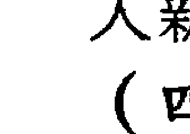

是一种狭隘而浅薄的滥情主义者，狭隘代表着感情范围上的有限性，所以只愿意照顾与自己有亲近关系的人。而浅薄则代表着敏感，以及情绪的反应很容易让别人感受得到，亦即巨蟹座的水象是既不深也不广，所以只要是有一颗小石头丢下去的话（打击或刺激），它就一定会有所反应（亦即会引发内在情绪的波动），而且时常是立刻就起反应。

所以，巨蟹座是十二星座中情绪化星座的代表，这与巨蟹座的心情波动往往很容易让别人感受得到，有很大的关系。它不像双鱼座所象征的广博大海，丢下一颗小石子只能起了个不起眼的小涟漪；也不像天蝎座所象征的深海，石头丢下去所引起的波动，在表面上根本看不出来。然而，也由于巨蟹座的这种浅薄之水，可以很容易让别人感受得到，所以当它发挥感情作用的时候，也同样是可以感受到它的那股滥情的滋润、那种温馨的亲切感。因此，巨蟹座是十二星座之中最具有温暖色彩的星座，就好像是小孩子依偎在母亲的怀抱中，享受着一种亲情、温情、照顾与关怀。

由于巨蟹座是最不耐刺激的，所以每当有人刻意或明显地对它展开攻击或讽刺的话，它的情绪性反应也相对地会是刻意或明显的。不过，只要对方肯向它表示抱歉、悔过或示好的话，巨蟹座还是仍然可以接受对方的。所以，如果你已经刺激到巨蟹座的话，千万别忘记道歉，否则他可能会永远地记得这笔账。而当巨蟹座在心情平和、不起波浪的时候，会是相当温情的，会如同照顾家人一般地对待别人，发挥他的母性光辉，照顾与关怀他周遭的亲友。

因此，在与巨蟹座成为好朋友之后，就可以得到它的照顾的情况下，又何必与它为敌而白白损失帮助呢？

##### 天蝎座（卯宫）

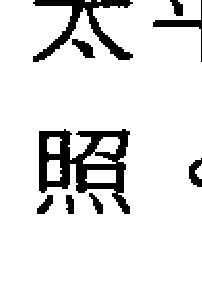

是一种深沈而黑暗的专情主义者，深到难以探测，黑到难以捉摸，专到难以妥协。这就好像是太平洋中的马里亚纳海沟一样，是潜意识作用的最好写照。天蝎座的水象与其说是柔情，倒不如说是致命的性吸引力，它往往是意图要把你吸到它的内心最深处，让你无从摆脱它的感情掌控。

当你被这种深沈的魅力所吸引的时候，也就是你开始往马里亚那海沟下沉的时候了，渐渐地，你会发现你已经被它所困住了，而困住的力量是来自于天蝎座的绝对性占有欲，它绝不容许任何的反叛，也没有任何的感情折扣可言。换言之，天蝎座会把自己的专情（绝对式的感情）套用在别人的身上，要求别人也是如此。这是一种深海之中潜藏着巨大漩涡的写照，这股漩涡具有很强的吸引力，但对被吸引的人来说，恐怕要事先做好跳下去的心理准备，因为一旦跳下去之后，就只能顺着漩涡而动，否则漩涡的反扑可能会导致于两败俱伤的结果。

对于天蝎座的这种深沈而黑暗的水象，第一个跳下去的不会是别人，而是他自己。因此，天蝎座具有探查于黑暗和深邃的能力，喜欢探索于与深沈或黑暗有关联的事物，诸如生死的问题、轮回、魔术、巫术、玄学、深层心理学、性、中医、调查和侦探的工作等，是标准的间谍型人物。

##### 双鱼座（亥宫）

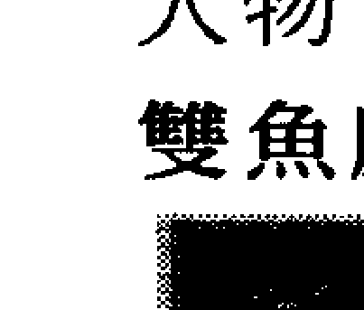

是一种广大而稀薄的泛情主义者，就如同大海一般地可以把柔情带给所有的人，是标准的博爱主义者，是属于宗教情感式的无限付出，最具有仁慈和社会服务的色彩，最有可能去当义工的人。但也因此而使得双鱼座对于自我意识的理解产生了模糊，以致于有点分不清楚别人与自己之间的差异和距离，也比较难以看透事实的真相。

所以，它时常会设身处地为别人想，也比较难以拒绝别人的要求，会随着别人的脚步而起舞，顺应于环境的变迁，具有逆来顺受的特质，也因此而比较容易受骗。由于是大海般的情绪状态，所以丢进一块小石头并不会有太大的作用，因为小石头会被大海所吞食，此意味着双鱼座最容易原谅别人的错误与攻击。换言之，大海的容量是相当大的，它可以容纳各种的打击和刺激，或者是根本无视于打击或刺激的存在。但是相对地，大海是可能会令人窒息的，因为那种尽其所能地为自己所爱的人而付出的行为，甚至是会到达几近于完全牺牲奉献的付出，只有双鱼座的人才会做出来。

因此，如果双鱼座的大海般的情绪，无法以正常的管道（诸如宗教上的修行、艺术的创作、爱情的依恋和社会服务等）来获得精神层次方面的提升的话，则可能就会转而沉溺于精神上的麻痹，诸如喝酒、吸毒和嗑药等。因为双鱼座所要追寻的是那种大海般的感性和想象，它需要有融入于精神之海的感觉。所以，往往就在一线之隔之间，造成了精神层次上的提升与沉沦之间的差别。

#### 四大元素之间的互动关系

以下只是简单说明两元素彼此之间的互动关系，至于比较复杂的互动关系，留待以后再作说明。

火象加风象：强烈的挥发性和爆发性，因为两者都是属于动态的和阳性的。风象的飘动助长了火象的燃烧，可以说是烧得一塌糊涂。因此，不但会具有冲锋的精力，也会具有快速的思考力；但是相对地，也因此而很快地消耗了体能和精神，所以应该尽量多多地休息，避免把精力浪费于无关紧要之事，以及尽量减少冲动的行为。

火象加土象：这是一种相当好的组合，因为火象的目标性与精力性，可以配合于土象的稳固与踏实，而使得目标和理想得以藉由一步一步地实践来实现。同时，火象可以促使土象采取主动和活泼的行为，以避免冷凝和僵化。唯一需要注意的是，如果土象特质过重而压住火象的话，一旦压抑久了，恐怕会有火山爆发的一天。

火象加水象：火象的燃烧会使得水象变成水蒸气，造成是满头雾水的景象，没有理性和逻辑可言，完全凭着感觉和直觉来采取行动，所以情绪会很直接地反应到外在行为上。同时，也会主动地去捕捉感性的意境，投入于感情的追寻，并且由于火象的热度会加强感情上的激情成份，所以是最有可能发生一见钟情的人。

风象加土象：风象是思考，土象是实际，两者结合的最大特征就是：「想法实际」，是现实主义和实践主义的最佳组合，所以也是生产力的代表。土象赋予风象在思考上具有组织性和结构性，而风象赋予土象在行动上呈现出快速和变通。总是会去想一些比较有用的，以及比较实际的事物与问题，只是未免有点太过于缺乏感情成份了。

风象加水象：

两者的特质差异太大，以致于有一种难以调和的感觉。因为风象是理性，而水象是感性，感性加理性容易变成是「一团浆糊」，分不清楚何者为理性，何者为感性。换言之，简直就像是一团云雾一样，脑袋似乎是在半空中飘浮；亦即蛮会思考的，但所想的却又是诗情画意或虚幻的东西，幻想和逻辑交织在一起。

土象加水象：

土和水相拌的结果，就是「泥浆」；亦即会既感性又现实，这就好像是爱情与面包两者都要，缺一不可，你有钱我才会爱你更深，可是我的爱却是真实的。这种组合会使得土象减少了实际性，也会使得水象减少了感情性。然而，在这一团稀泥当中，却也存在着生命力的象征。因为在现实生活中，往往是不能没有面包的，否则无法生存下去；也不能没有感情，否则人何以为人。

以上两元素之间的互动关系，可以扩大地应用在三个或四个元素之间的互动关系上，在此不多作赘述。而针对四大元素所作的论断的最基本原则，就是要讲求整个命盘中所呈现出来的生命力；也就是说，命盘中的四大元素的组合，要具有生气蓬勃的生机，并且要具有实质性的生产特质，如此才能算是一种比较好的元素组合。同时，在人格特质上也相对地会比较具有和谐性，以及减少心理上的冲突与矛盾情况。

## 第五章 自然属性

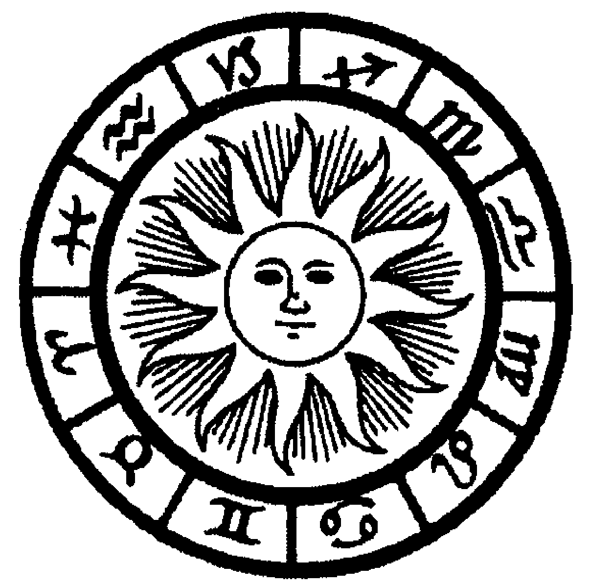

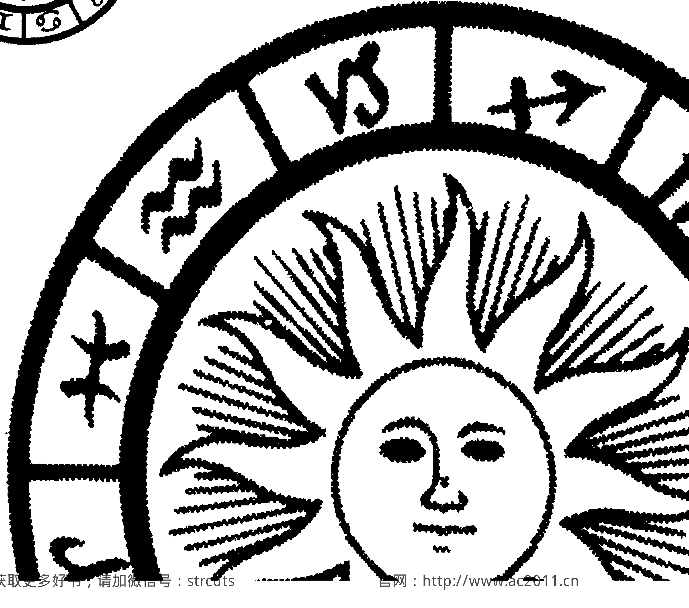

由于占星学的论断所涉及到的是，对于一种无形力量的描述，特别是针对个人之心理意识的捉摸，更是如此。于是，占星学家总是希望透过各种方式，来把抽象符号具体化，以便让想要学习占星学的人，可以领略到抽象符号所代表的意涵，而这同时也有助于初学者，可以比较容易地记住十二星座彼此之间在特质上的差异。

以下针对黄道十二宫所作的自然属性的描述，乃是以四大元素来作为区分的基准。同时，请读者特别注意同一元素的三个星座，彼此之间在自然属性上的差异，因为这在往后讲求细致化的论断过程中，是必须被应用到的区分原则。换言之，读者在讲求更细致化的论断上，有必要区分巨蟹座、天蝎座和双鱼座等彼此之间的特质差异，而不能仅以水象所代表的特质，来概括式地诠释这三个星座的特质。本章和下一章（气性）在诠释上会比较抽象，所以希望读者以略带「想象」的心情来进行感受。我敢保证，如果你能够逐渐品茗出每一个星座的独特味道的话，对于往后的实际论断将可以受益无穷，这是我过来人的经验。

### 星座的自然属性内涵

这里所谓的「自然属性」，指的是藉由四大元素所代表的朴素物性，来对于十二星座进行讲解。换言之，希望从自然界本身之物质在物理性质上的差异，来区别每一个星座的独特性。而在进行星座之自然属性的说明以前，有必要先从以下的两个面向，来观察自然属性的意涵。

首先，从四大元素所代表的自然元素来看，则火象不只是代表着光亮、照耀和燃烧而已，它同时也代表着自然界中的动物，拥有兽性的潜在力，也同时代表着人性中的心灵直觉，拥有灵性的潜在力。土象则不只是代表着踏实、稳健和韧性而已，它同时也代表着自然界中的矿物，拥有生产的潜在力，也同时代表着人性中的肉欲感官，拥有物性的潜在力。风象则不只是代表着飘动、沟通和传达而已，它同时也代表着自然界中的人类，拥有理性的潜在力，也同时代表着人性中的精神思考，拥有知性的潜在力。水象则不只是代表着沈静、内敛和情绪而已，它同时也代表着自然界中的植物，拥有积淀的潜在力，也同时代表着人性中的感情情欲，拥有情性的潜在力。

其次，四大元素的自然属性具有阶层性，而且在每一个自然属性之中，也存在着不同的阶段性。其中，火象和风象是属于上阶层的自然元素，是地表以上的自然现象。而土象和水象是属于下阶层的自然元素，是地表以下的自然现象。此外，从每一个自然元素的不同阶段来看，火象中的白羊座是第一层次、狮子座是第二层次、射手座是第三层次；土象中的金牛座是第一层次、处女座是第二层次、摩羯座是第三层次；风象中的双子座是第一层次、天秤座是第二层次、宝瓶座是第三层次；水象中的巨蟹座是第一层次、天蝎座是第二层次、双鱼座是第三层次。这种层次性可以用來描述同一自然元素中的普遍性、集中性和超越性等之间的层次区别，以便对于星座的特质有更深一层的理解。以上的两个面向完全贯穿于整个自然属性的说明之中。

#### 一、火象的自然属性

自然界中的任何一项元素，都可以被拿來当作是一种手段。换言之，自然元素本身都是中性的，依据于人类到底是如何地去利用它，而决定了它的善和恶。所以，火可以被拿來温暖身体，也可以被拿來烹调食物，但是却也会烧毁我们周遭的一切，甚至包括烧毁人类本身。于是，火不但可以为我们照亮天空、为我们扫除黑暗，也可以让我们倍受煎熬、让我们遭受惩罚。如果我们能够透过命盘来理解我们的内心之火，得知它是如何地对我们产生作用的话，那么我们就可以控制火的大小和温度，使火正好符合于我们的需求，而发挥火的最佳正面功能。

以火的自然属性配合着火象星座的特质来作说明，我采用了以下的两种诠释方式：一是通过火苗来作遐想；二是通过点火的过程来作观察。

首先，以火苗来进行火象的遐想时，白羊座就好像是红色的火焰，强调的是火的热度；狮子座就好像是金黄色的火焰，强调的是火的亮度；射手座就好像是蓝色的火焰，强调的是火的内心。

其次，以点火的过程来看，白羊座就好像是火刚开始被点燃的那一刹那；狮子座就好像是火被点燃之后，迅速地扩展火焰范围的那一刹那；射手座就好像是火焰扩展之后，火焰的顶端向上窜升的那一刹那。以下就分别配合着火象星座的各个特质来作描述。

##### （一）白羊座（戌宫）的自然属性

白羊座是第一层的兽性之火，此意味着它的火和热是具有普遍性的，可以因时因地而随着目标的转移来展现出兽性般的精力。同时，白羊座是火苗点燃之刹那间的引发，此意味着它的快速和直接，而红色的火焰则展现了它的肃杀之气，所以它是战斗之神。

白羊座同时也是第一层的灵性之火，此意味着它扮演了人类灵性要有所发挥时的第一道关卡，唯有透过白羊座的「无所不在的关注」，人类的灵性才得以与外在事物产生共鸣，进而以火苗被点燃刹那间的光明，体悟于任何事物之新生的喜悦，所以它是生命灵性的临机一动。

然而，白羊座的内心挣扎，也就是在于战神般的红色火焰是徘徊于兽性和灵性之间。如果火焰是烧向兽性的话，则会给人带来粗野与无礼；而如果火焰是烧向灵性的话，则会给人带来沈思与专注。所以，白羊座的心灵之火是需要被导向于精神上的有所关注，以此来净化兽性。

##### （二）狮子座（午宫）的自然属性

狮子座是第二层的兽性之火，此意味着它的火和热是具有集中性的，可以因时因地而随着环境的转移来展现出兽性般的威力。同时，狮子座是火苗迅速扩展之刹那间的膨胀，此意味着它的浪费和虚华，而金黄色的火焰则展现了它的尊贵之气，所以它是太阳之神。

狮子座同时也是第二层的灵性之火，此意味着它扮演了人类灵性要有所发挥时的第二道关卡，唯有透过狮子座的「无所不在的创造」，人类的灵性才得以掌握和创造外在事物，进而以火苗扩展时刹那间的光明，体悟于任何事物之创作的喜悦，所以它是生命灵性的光华四射。

然而，狮子座的内心挣扎，也就是在于虚华的金黄色火焰是徘徊于兽性和灵性之间。如果火焰是烧向兽性的话，则会给人带来蛮横与独裁；而如果火焰是烧向灵性的话，则会给人带来高贵与浪漫。所以，狮子座的心灵之火是需要被导向于精神上的有所创新，以此来活化灵性。

##### （三）射手座（寅宫）的自然属性

射手座是第三层的兽性之火，此意味着它的火和热是具有超越性的，可以因时因地而随着情境的转移来展现出兽性般的暴力。同时，射手座是火苗向上窜升之刹那间的直射，此意味着它的刺激和奔放，而蓝色的火焰则展现了它的升华之气，所以它是半兽神。

射手座同时也是第三层的灵性之火，此意味着它扮演了人类灵性要有所发挥时的第三道关卡，唯有透过射手座的「无所不在的超脱」，人类的灵性才得以摆脱外在事物的束缚和牵挂，进而以火苗窜升时刹那间的极致，体悟于任何事物之终极的喜悦，所以它是生命灵性的融为一体。

然而，射手座的内心挣扎，也就是在于内心精神的蓝色火焰是徘徊于兽性和灵性之间。如果火焰是烧向兽性的话，则会给人带来抓狂与放纵；而如果火焰是烧向灵性的话，则会给人带来爽朗与磊落。所以，射手座的心灵之火是需要被导向于精神上的有所超脱，以此来解放人性。

#### 二、土象的自然属性

自然界中的任何一项元素，都可以被拿來当作是一种产品。换言之，自然元素本身都是中性的，依据于人类到底是如何地去改造它，而决定了它的正与邪。所以，土可以被拿來耕种农作物以养育众生，也可以被拿來建构起居室，但是却也会崩塌和地震，甚至摧毁了人类所曾经拥有的一切。于是，土不但可以为我们提供安身之所、为我们提供农产品，也可以让我们倍感艰辛、让我们体验现实。如果我们能够透过命盘来理解我们的内心之土，得知它是如何地对我们产生作用的话，那么我们就可以善用地的地势和矿物质，使土正好符合于我们的需求，而发挥土的最佳正面功能。

以土的自然属性配合着土象星座的特质来作说明，我采用了以下的两种诠释方式：一是通过土地来作遐想；二是通过耕作的难易程度来作观察。

首先，以土地来进行土象的遐想时，金牛座就好像是平原的景象，强调的是土的平坦；处女座就好像是山谷的景象，强调的是土的空谷回音；摩羯座就好像是山丘的景象，强调的是土的崎岖。

其次，以土地的耕作难易度来看，金牛座就好像是一片富饶的农田，可以轻松地进行耕作；处女座就好像是牧场或草地，必须多加施肥和细心照顾，才能免于土地的逐渐干化；摩羯座就好像是沙地或瘠地，寸草不生，必须付出更多的心力，才能有所收获。以下就分别配合着土象星座的各个特质来作描述。

##### (一) 金牛座（酉宫）的自然属性

金牛座是第一层的矿物之土，此意味着它的土质是具有普遍性的，可以因时因地而随着环境的变化来展现出土地的安适力。同时，金牛座是平原上的平坦景象，此意味着它的逍遥和悠闲，而富饶的农田则展现了它的肥沃之象，所以它是收获之神。

金牛座同时也是第一层的物性之土，此意味着它主宰了人类物欲要有所占有时的第一道关卡，唯有透过金牛座的「无所不在的享受」，人类的物欲才得以感受到外在事物所提供的感官刺激，进而以拥有丰富资产的动机，感受于任何事物之充裕的喜悦，所以它是生命物欲的瞬间快感。

然而，金牛座的内心挣扎，也就是在受困于丰富的土地是落置在浪费和开垦之间。如果土地是被闲置而不用的话，则会给人带来懒散和依赖；而如果土地是被有所开垦的话，则会给人带来财富和满足。所以，金牛座的物欲之土是需要被导向于生活上的有所开创，以此来丰富人生。

##### (二) 处女座(巳宫)的自然属性

处女座是第二层的矿物之土，此意味着它的土质是具有中和性的，可以因时因地而随着情境的变化来展现出土地的吸纳力。同时，处女座是山谷中的空虚景象，此意味着它的忧郁和消沈，而一望无际的牧草地则展现了它的朴素之象，所以它是纯洁之神。

处女座同时也是第二层的物性之土，此意味着它主宰了人类物欲要有所占有时的第二道关卡，唯有透过处女座的「无所不在的付出」，人类的物欲才得以感受到如何去抓住对方的内心感激，进而以仔细照料的动机，感受于任何事物之完美的喜悦，所以它是生命物欲的纤细快感。

然而，处女座的内心挣扎，也就是在受困于山谷的虚空和完美的诉求之间。如果是偏向于虚空景象的话，则会给人带来缺乏自信心和悲伤心绪；而如果是偏向于诉求完美的话，则会给人带来真挚和勤劳。所以，处女座的物欲之土是需要被导向于生活上的有所依附，以此来计划人生。

##### （三）摩羯座（丑宫）的自然属性

摩羯座是第三层的矿物之土，此意味着它的土质是具有沉淀性的，可以因时因地而随着目标的变化来展现出土地的深层实力。同时，摩羯座是山丘上的崎岖景象，此意味着它的孤独和奋斗，而寸草不生的瘠地则展现了它的强韧之象，所以它是坚忍之神。

摩羯座同时也是第三层的物性之土，此意味着它主宰了人类物欲要有所占有时的第三道关卡，唯有透过摩羯座的「无所不在的威严」，人类的物欲才得以感受到如何去控制对方的意志，进而以坚忍不拔的务实作为，感受于任何事物之成就的喜悦，所以它是生命物欲的荣耀快感。

然而，摩羯座的内心挣扎，也就是在受困于山丘的孤高和迟来的成就之间。如果是站在山丘之顶而向下看的话，则会给人带来目空一切和轻视他人；而如果是肯耐心地经营一切的话，则会给人带来稳健和踏实。所以，摩羯座的物欲之土是需要被导向于生活上的有所步骤，以此来成就人生。

#### 三、风象的自然属性

自然界中的任何一项元素，都可以被拿來当作是一种启示。换言之，自然元素本身都是中性的，依据于人类到底是如何地去利用它，而决定了它的正与邪。所以，风可以被拿來传递信息，也可以被拿來调节气候，但是却也会带来风暴和灾难，甚至摧毁了人类所辛苦建立的一切。于是，风不但可以为我们带来清新的空气、为我们传播思想，也可以让我们倍感困惑、让我们体验变迁。如果我们能够透过命盘来理解我们的内心之风，得知它是如何地对我们产生作用的话，那么我们就可以善用风的流动与沟通，使风正好符合于我们的需求，而发挥风的最佳正面功能。

以风的自然属性配合着风象星座的特质来作说明，我采用了以下的两种诠释方式：一是通过空气流动来作遐想；二是通过沟通与传达的难易程度来作观察。

首先，以空气流动来进行风象的遐想时，双子座就好像是微风，强调的是风的轻快与多变；天秤座就好像是和风，强调的是风的和谐与平衡；宝瓶座就好像是狂风，强调的是风的革新与颠覆。

其次，以沟通与传达的难易度来看，双子座就好像是无孔不入的空气，可以轻松地进行信息的传递与交换；天秤座就好像是需要调和的气流，必须考虑各方立场与感受，才能达成平衡的沟通；宝瓶座就好像是难以预测的风暴，必须打破常规与传统，才能传达出革命性的思想。以下就分别配合着风象星座的各个特质来作描述。

##### （一）双子座（辰宫）的自然属性

双子座是第一层的理性之风，此意味着它的风和动是具有普遍性的，可以因时因地而随着信息的转移来展现出理性的轻快力。同时，双子座是微风拂面般的轻快，此意味着它的机智和多变，而无孔不入的空气则展现了它的沟通之象，所以它是信息之神。

双子座同时也是第一层的知性之风，此意味着它扮演了人类知性要有所发挥时的第一道关卡，唯有透过双子座的「无所不在的观察」，人类的知性才得以捕捉和分析外在事物的信息，进而以微风拂面般的轻快，体悟于任何事物之新鲜的喜悦，所以它是生命知性的瞬间灵动。

然而，双子座的内心挣扎，也就是在于轻快的空气是徘徊于广博与肤浅之间。如果风是吹向广博的求知，则会给人带来聪明与灵活；而如果风是吹向肤浅的猎奇，则会给人带来浮躁与善变。所以，双子座的知性之风是需要被导向于精神上的有所连结，以此来活络思考。

##### （二）天秤座（戌宫）的自然属性

天秤座是第二层的理性之风，此意味着它的风和动是具有中和性的，可以因时因地而随着关系的转移来展现出理性的平衡力。同时，天秤座是和风徐吹般的和谐，此意味着它的优雅和协调，而需要调和的气流则展现了它的公正之象，所以它是和谐之神。

天秤座同时也是第二层的知性之风，此意味着它扮演了人类知性要有所发挥时的第二道关卡，唯有透过天秤座的「无所不在的权衡」，人类的知性才得以判断和评估外在事物的价值，进而以和风徐吹般的和谐，体悟于任何事物之均衡的喜悦，所以它是生命知性的瞬间判断。

然而，天秤座的内心挣扎，也就是在于和谐的空气是徘徊于公正与妥协之间。如果风是吹向公正的判断，则会给人带来理性与客观；而如果风是吹向妥协的平衡，则会给人带来犹豫与依赖。所以，天秤座的知性之风是需要被导向于精神上的有所抉择，以此来确立价值。

##### （三）宝瓶座（子宫）的自然属性

宝瓶座是第三层的理性之风，此意味着它的风和动是具有超越性的，可以因时因地而随着理念的转移来展现出理性的革新力。同时，宝瓶座是狂风暴雨般的颠覆，此意味着它的独立和叛逆，而难以预测的风暴则展现了它的突破之象，所以它是天才之神。

宝瓶座同时也是第三层的知性之风，此意味着它扮演了人类知性要有所发挥时的第三道关卡，唯有透过宝瓶座的「无所不在的创见」，人类的知性才得以突破和重组外在事物的框架，进而以狂风暴雨般的颠覆，体悟于任何事物之终极的喜悦，所以它是生命知性的瞬间顿悟。

然而，宝瓶座的内心挣扎，也就是在于颠覆的空气是徘徊于理想与疏离之间。如果风是吹向理想的创见，则会给人带来智慧与远见；而如果风是吹向疏离的叛逆，则会给人带来冷漠与固执。所以，宝瓶座的知性之风是需要被导向于精神上的有所连系，以此来启蒙人性。

到底是如何地去看待它，而决定了它的真与假。所以，风可以带来清凉的空气，也可以使窒闷的气氛有所转变，但是强烈的飓风却会吹走我们的一切，甚至使得我们空无一物。于是，风不但可以为我们提供新鲜的空气、为我们扫除鬱闷，也可以让我们遭受吹袭、让我们真假难分。如果我们能够透过命盘来理解我们的内心之风，得知它是如何地对我们产生作用的话，那么我们就可以调整风的强弱和方向，使风正好符合于我们的需求，而发挥风的最佳正面功能。

以风的自然属性配合着风象星座的特质来作说明，我采用了以下的两种诠释方式：一是通过空气来作遐想；二是通过风吹动的形态来作观察。

首先，以空气来进行风象的遐想时，双子座就好象是沙漠之风，强调的是风的干度；天秤座就好象是平原之风，强调的是风的暖度；宝瓶座就好象是高原之风，强调的是风的高度。

其次，以风吹动的形态来看，双子座就好象是飓风，不但是一扫而过，而且是时间短暂；天秤座就好象是和风，不但是徐徐地吹，而且是化解僵局；宝瓶座就好象是龙卷风，不但是席卷全场，而且是改变局面。以下就分别配合着风象星座的各个特质来作描述。

##### （一）双子座（申宫）的自然属性

双子座是第一层的理性之风，此意味着它的风是具有普遍性的，可以因时因地而随着情境的改变来展现出理性的活泼力。同时，双子座是沙漠中的干燥之风，此意味着它是变幻莫测的，而如飓风一般的吹袭则展现了它的迅速之象，所以它是传递之神。

双子座同时也是第一层的知性之风，此意味著它扮演了人类知性要有所发挥时的第一道关卡，唯有透过双子座的“无所不在的好奇”，人类的知性才得以对外在事物产生思考，进而以飓风般一扫而空的态势，领会于学习任何事物的喜悦，所以它是生命知性的随时启示。

然而，双子座的内心挣扎，也就是在左右地摆动于思维的浮面和磨练之间。如果是摆向于浮面的话，则会给人带来肤浅和表面；而如果是摆向于磨练的话，则会给人带来冷静和警觉。所以，双子座的知性之风是需要被导向于理智上的有所磨练，以此来成熟思维。

##### （二）天秤座（辰宫）的自然属性

天秤座是第二层的理性之风，此意味著它的风是具有折衷性的，可以因时因地而随着目标的改变来展现出理性的分析力。同时，天秤座是平原上的暖和之风，此意味著它是温和亲切的，而如和风一般的吹袭则展现了它的优雅之象，所以它是和平之神。

天秤座同时也是第二层的知性之风，此意味著它扮演了人类知性要有所发挥时的第二道关卡，唯有透过天秤座的“无所不在的权衡”，人类的知性才得以对外在事物进行评估，进而以和风般清风徐来的态势，领会于策划任何事物的喜悦，所以它是生命知性的谋略启示。

然而，天秤座的内心挣扎，也就是在左右地摆动于思维的犹豫和裁判之间。如果是摆向于犹豫的话，则会给人带来多虑和不定；而如果是摆向于裁判的话，则会给人带来公平和正义。所以，天秤座的知性之风是需要被导向于理智上的有所抉择，以此来应用思维。

##### （三）宝瓶座（子宫）的自然属性

宝瓶座是第三层的理性之风，此意味著它的风是具有超越性的，可以因时因地而随着环境的改变来展现出理性的诉求力。同时，宝瓶座是高原上的寒冷之风，此意味著它是特立孤高的，而如龙卷风一般的席卷则展现了它的决裂之象，所以它是改造之神。

宝瓶座同时也是第三层的知性之风，此意味著它扮演了人类知性要有所发挥时的第三道关卡，唯有透过宝瓶座的“无所不在的发明”，人类的知性才得以对外在事物进行新的思考，进而以龙卷风般改变局面的态势，领会于创新任何事物的喜悦，所以它是生命知性的灵感启示。

然而，宝瓶座的内心挣扎，也就是在左右地摆动于思维的乖张和创意之间。如果是摆向于乖张的话，则会给人带来异端和任性；而如果是摆向于创意的话，则会给人带来合理和独立。所以，宝瓶座的知性之风是需要被导向于理智上的有所突破，以此来提升思维。

## 第五章 自然属性

#### 四、水象的自然属性

自然界中的任何一项元素，都可以被拿来当作是一种感受。换言之，自然元素本身都是中性的，依据于人类到底是如何去感觉它，而决定了它的美与丑。所以，水可以提供我们饮用，也可以被拿来清洗东西，但是却也会淹没我们周遭的一切，甚至沉溺了人类本身。于是，水不但可以为我们清除污秽、为我们带来挚诚的爱，也可以让我们遭逢逆流、让我们有所沉溺而难以自拔。如果我们能够透过命盘来理解我们的内心之水，得知它是如何地对我们产生作用的话，那么我们就可以疏导水的流向和深浅，使水正好符合于我们的需求，而发挥水的最佳正面功能。

以水的自然属性配合着水象星座的特质来作说明，我采用了以下的两种诠释方式：一是通过海水来作遐想；二是通过水的形态来作观察。

首先，以海水来进行水象的遐想时，巨蟹座就好像是浅海湾之水，强调的是水的浅度；天蝎座就好像是深海沟之水，强调的是水的深度；双鱼座就好像是大海洋之水，强调的是水的广度。

其次，以水的形态来看，巨蟹座就好像是水的液态，是可以四处流动和被激起波浪的；天蝎座就好像是水的固态，是水被冰冻后的僵化状态；双鱼座就好像是水的汽态，是水升华为水蒸气时的空幻状态。以下就分别配合着水象星座的各个特质来作描述。

##### （一）巨蟹座（未宫）的自然属性

巨蟹座是第一层的情性之水，此意味著它的水是具有普遍性的，可以因时因地而随着目标的转变来展现出情性的笼罩力。同时，巨蟹座是浅海湾之水，此意味著它的温情和敏感，而水的液态则展现了它的波动之象，所以它是月亮之神。

巨蟹座同时也是第一层的情性之水，此意味著它扮演了人类情性要有所发挥时的第一道关卡，唯有透过巨蟹座的“无所不在的关怀”，人类的情性才得以对外在事物产生寄情作用，进而以水的液体流动的散布，关爱于任何事物之念旧的喜悦，所以它是生命情性的袒护之心。

然而，巨蟹座的内心挣扎，也就是在徘徊于防卫和依恋之间。如果是倾向于防卫的话，则会给人带来敌意和嫉妒；而如果是倾向于依恋的话，则会给人带来柔顺和顾家。所以，巨蟹座的情性之水是需要被导向于感情上的有所寄托，以此来回忆感情。

##### （二）天蝎座（卯宫）的自然属性

天蝎座是第二层的惰性之水，此意味著它的水是具有集中性的，可以因时因地而随着环境的转变来展现出惰性的掌控力。同时，天蝎座是深海沟之水，此意味著它的深情和难测，而水的固态则展现了它的冷凝之象，所以它是深邃之神。

天蝎座同时也是第二层的惰性之水，此意味著它扮演了人类惰性要有所发挥时的第二道关卡，唯有透过天蝎座的“无所不在的洞察”，人类的惰性才得以对外在事物产生专情作用，进而以水的固态冷冻的坚忍，关爱于任何事物之魅力的喜悦，所以它是生命情性的慑魄之心。

然而，天蝎座的内心挣扎，也就是在徘徊于复仇和重生之间。如果是倾向于复仇的话，则会给人带来凶残和封闭；而如果是倾向于重生的话，则会给人带来转机和新生。所以，天蝎座的情性之水是需要被导向于感情上的有所重生，以此来化解情仇。

##### （三）双鱼座（亥宫）的自然属性

双鱼座是第三层的惰性之水，此意味著它的水是具有超越性的，可以因时因地而随着情境的转变来展现出惰性的深灵力。同时，双鱼座是大洋洋之水，此意味著它的柔情和包容，而水的气态则展现了它的虚幻之象，所以它是梦幻之神。

双鱼座同时也是第三层的情性之水，此意味著它扮演了人类情性要有所发挥时的第三道关卡，唯有透过双鱼座的“无所不在的奉献”，人类的情性才得以对外事物产生怜情作用，进而以水的气态升华的飘散，关爱于任何事物之同情的喜悦，所以它是生命情性的牺牲之心。

然而，双鱼座的内心挣扎，也就是在徘徊于自欺和体恤之间。如果是倾向于自欺的话，则会给人带来谎言和善变；而如果是倾向于体恤的话，则会给人带来善良和仁慈。所以，双鱼座的情性之水是需要被导向于感情上的有所提升，以此来怀抱感情。

### 自然属性对星座的影响

这里所谓的自然属性对星座的影响，指的是透过四大元素所代表的自然属性，来观察星座的特质呈现，亦即把星座的特质与星座的自然属性串连在一起。在此，星座的自然属性乃是一种“原因”的角色，而星座的特质乃是一种“结果”的呈现，并且由“因”来推论“果”，或者是把“因”和“果”拿来进行同步的联想。希望通过这种方式的说明，能够让读者除了对于星座的特质有更深的体会之外，也能够培养读者的想像力，以便逐渐地掌握住星座的无形特质。以下就黄道十二宫的每一个星座来作简单的解说。

#### 〈白羊座·戌宫〉

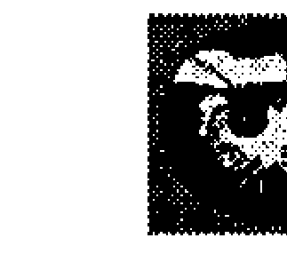

由于白羊座会普遍地去找寻兽性般之精力的发泄管道，所以它充满着冲锋的精神，勇往直前，毫无畏惧。又好像是火苗的点燃一样，热情奔放，炽热非凡。然而，它却是纯真无邪的，似乎不在乎别人的一眼就看穿了它的意图，因为它自信自己的燃烧可以为别人带来光明。

由于白羊座的精力发挥是全面性的，亦即会四处去找寻点亮心中灵性的关注所在，所以它的直觉力会被新奇的事物所吸引住，会探索于自己深感兴趣的事物，甚至会到达废寝忘食的境地。此时，专心一致的白羊座是最可贵的，因为它正在开启人类的灵性之锁。

#### 〈金牛座·酉宫〉

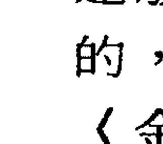

由于金牛座会普遍地去安享于人类物欲的占有，所以在它悠闲的表象背后，却存在着一股不可忽视的顽强之力。也许，就是因为天生具有富饶的优势，所以它总是不急的态度来进行耕耘，似乎不在乎别人可能会抢先它一步，因为它自信自己的条件可以稳坐泰山。

由于金牛座的物欲展现是全面性的，亦即会四处去感触那里可以有实质上的收获，或者是那里可以给它带来安适的感官享受，所以它的感受力会被高级的或高贵的物品所吸引住，会陶醉于自己认为具有品味的气氛之中，甚至于不惜花大钱，就只为了享受短暂的快感。

#### 〈双子座·申宫〉

由于双子座会普遍地去发挥人类知性的机智反应，所以它充满着搜寻的眼神，一方面是搜寻于哪里可以获得讯息，另一方面是搜寻于哪里可以传达讯息。在此，前者总是为后者服务的，亦即时常是因为要在别人的面前展现它的丰富知识，所以才会去吸收各种新知。

由于双子座的思考模式是全面性的，亦即可以同时思考多件事情，也可以同时思考一件事情的各种变化可能性，所以深具触类旁通的本能。然而，在知识表象的背后，不但可能会欠缺深思熟虑，而且也可能会留给别人太过于理智的印象，或者是未免太过于饶舌巧辩了。

#### 〈巨蟹座·未宫〉

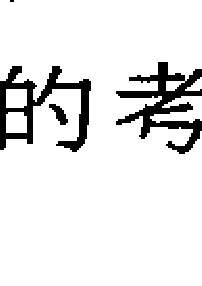

由于巨蟹座会普遍地去投入于人类感情的寻根，并且力求扩大和巩固感情的根基，所以它不但充满着温情和关怀，以此来确保感情的稳固，而且也充满着防卫性和抵抗性，以此来保护自己易受伤害的脆弱感情。于是，它总是会在人情的作祟之下，而忽略了现实的考量。

由于巨蟹座的感情寄托是全面性的，亦即可以同时照顾到许多的人，也可以同时关心于一个人的各种生活事项，所以深具感情笼罩的本能。然而，就在感情逐渐付出的同时，加强了依恋的深度，并且把感情的依恋转化为感情的回忆，所以孩子不但是母亲的寄托，也是母亲的回忆。

#### 《狮子座·午宫》

由于狮子座会把精力集中在如何去展现它的权威性，所以它充满着自我意识，喜欢出风头，喜欢支配的感觉。又好像是火苗的扩展一样，光芒四射，热情大方。然而，它的耳根和心肠却都是软的，承受不了别人的恳求，因为它认为自己的燃烧就是要照顾朋友和大众。

由于狮子座的精力发挥是固定点式的，亦即会去找寻扩展心中灵性的创作点，所以它的直觉力会被可以进行创造的事物所吸引住，会游戏于自己的创作过程，甚至于可以发挥高度的艺术性。此时，展现才华的狮子座是最可贵的，因为它正在应用人类的直觉心灵。

#### 《处女座·巳宫》

由于处女座会把人类的物欲集中地发挥在纤细神经之上，所以在它辛劳的表象背后，是一股要有所安排的促动力，以便透过细节来安置物欲。也许，就是因为特别容易产生空虚感，所以它总是以勤劳的态度来进行耕耘，希望透过身体的劳动来填满空虚，以建立自己的自信心。

由于处女座的物欲展现是变化点式的，亦即会去感触那里必须加强完美性，或者是那里可以给它带来自信心，所以它的感受力会被各种乱象所吸引住，会陶醉于需要自己去作整理的环境之中。然而，由于各种环境总是需要被整理的，所以它一直忙碌于为各种完美的焦点而付出。

#### 《天秤座·辰宫》

由于天秤座会集中地去发挥人类知性的评估能耐，所以它充满着折衷的手腕，一方面是分析于任何外在两者之间的态势，另一方面是分析于自己与他人的关系。在此，前者总是为后者服务的，亦即时常是因为要建立起自己和别人的关系，所以才会去扮演合事佬的角色。

由于天秤座的思考模式是累积点式的，亦即可以同时思考多件事情的利弊得失，也可以同时思考一件事情的各种优缺点，所以深具权衡谋略的本能。然而，在理智分析的背后，不但可能会欠缺明确的立场，而且也可能会太过于在意别人的反应，或者是未免太过于精明圆滑了。

#### 《天蝎座·卯宫》

由于天蝎座会集中地去投入于人类感情的忠贞，并且力求扩大和巩固感情的深层基础，所以它不但充满着专情和极致，以此来确保感情的专一，而且也充满着征服性和报复性，以此来保证自己可以控制对方的感情。于是，它总是会在隐密的作为之下，而一再地去考验对方的忠贞。

由于天蝎座的感情洞察是固定点式的，亦即会针对一个人的各种感情表象和内在进行探索，所以深具感情冷战的本能。然而，就在感情逐渐深化的同时，加强了感情上的权力意志的作用，并且把感情的意志转化为感情的垄断，所以同生共死不但是感情的坚毅，也是感情的垄断。

#### 〈射手座·寅宫〉

由于射手座的精力发泄具有超越的特性，亦即如果不是停留在兽性般的野性狂劲，就是直达人类的最高灵性，超越了人类的身体局限，崇尚于法律的正义和宗教的心灵。于是，它既是充满着直率的胸怀，粗枝大叶，讨厌噜苏；又是向往于人类的善良情操，乐观大方，放眼世界。

由于射手座的精力发挥是垂直性的，亦即会直接往人类灵性的最高点去作探索，所以它的直觉力会被足以刺激心灵的事物所吸引住，会探索于超越自己日常生活范围以外的事物。在身体上而言，是走向于不同的国度；而在精神上而言，是走向于哲学、法律和宗教。

#### 〈摩羯座·丑宫〉

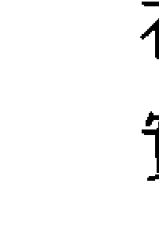

由于摩羯座会把人类的物欲带入有所超越的境界，而不是只停留在一般的物质满足而已，所以在它有所成就的表象背后，存在着一股野心胸怀，具有实现梦想的特性。也许，就是因为天生具有力争上游的意志力，所以它总是以自信的态度来缓慢地达成目标，并且排除竞争者。

由于摩羯座的物欲展现是垂直性的，亦即会直接往人类物欲的最高点去攀升，所以它所需求的价值，不是物质或金钱的表象数字累积，而是数字背后的荣耀和地位象征。因此，它会超越于自己日常生活范围以外的事物，追求于自己存在于社会中的自我价值。

## 第六章 气性

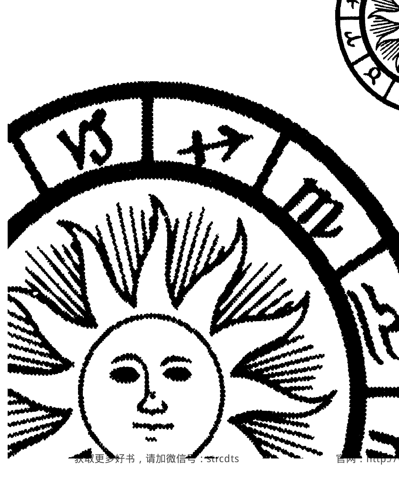

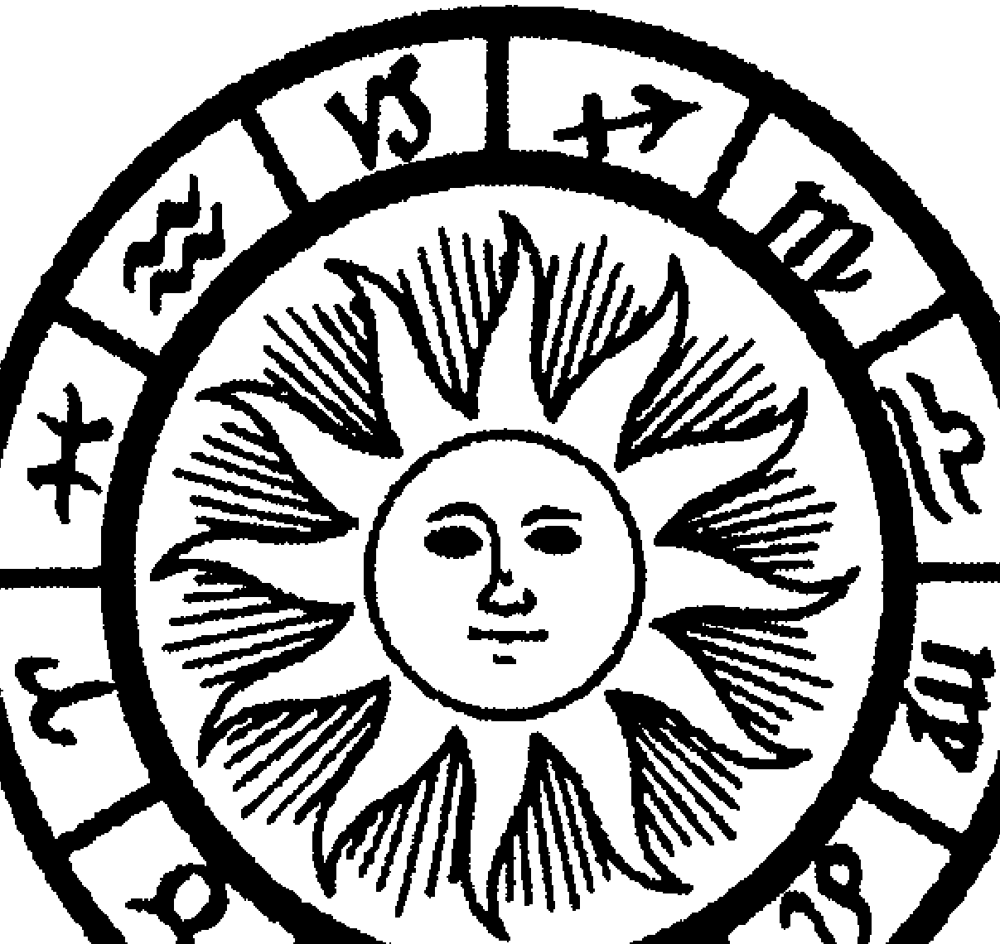

中国人喜欢谈“气”，也最懂得如何去理解和运用“气”，并且把“气”发展成为中国哲学范畴系统中的一个重要范畴，而且与西方哲学范畴相比较，它是中华民族独有而普遍的范畴。在“气”的概念笼罩下，中国的传统命理与它结下了不解之缘，例如所谓的阴阳五行，皆与“气”有着直接和间接的关系。于是，形成了中国人在命理诠释上的独特现象，这应该说是与中国人喜欢作统合有所关连，也因此而导致了所谓的“五术”是合而为一的，并且使得“气”在五术当中，是一种可以贯串其脉络的重要概念。例如，中医讲的气血、养生术中的气功、阴宅中的地气和命理中的运气等。

有关中国自古以来到底是如何去看待这种有形无形而存在的气的问题，并不是本章所要探讨的主题。因此，以下仅就本章所涉及到的内容，简单说明气的属性。

> （参见：《气》，张立文主编，中国人民大学出版社，1990年12月，第一版）

- 第一，气是自然万物的本原或本体，是天地万物统一的基础，这是与中国古代的宇宙生成论相联系的。所以气不具有形体、声音和状态等，气是最高的本体，它是与太虚相结合而成为一个抽象的、一般的范畴。
- 第二，气是客观存在的质料或元素，可能是有形有体的，也可能是无形无体的，是一种细微的物质现象，是形质未具的浑沌，经凝聚而成为有形象的事物，强调的是气的物质性。
- 第三，气是具有动态功能的客观实体，始终处于不断运动变化之中，并以运动变化作为它自己存在的条件或形式。而气之所以能不断运动变化，是由于气自身包含着阴阳对待的矛盾，并且以此来说明世界一切事物的变化。气以运动变化而造作万物，并且以自己的属性来影响万物。
- 第四，气是充塞于宇宙的物质媒介或媒体，它使得宇宙中日月星辰的运转处于和谐的秩序之中，并且使得各种事物能相互存在于一个系统之内，这皆是由气的互相贯通所形成的，是一种吸拒力的表现，也是世界万物相摄相赖的载体。光和声之所以能传播出去，是因为气的作用。
- 第五，气是人生性命，因为人的寿夭、善恶、贫富、贵贱、尊卑等都与气有关。气作为导引神气则可以延年益寿，它乃是人体生命信息的指标。同时，人之禀气而生也导致由于所禀之气的清浊、昏明、贤鄙，而有所谓的资质、寿夭、贵贱的不同。
- 第六，气是道德境界，它充塞于天地之间，与天地相通。它不是具体的血气，而是知气、神气，是属于一种精神、意识或意志，也就是所谓的道德修养。

以上有关气的概念的说明，可能会使得读者觉得枯燥和难懂，但是它却有助于我们在研究占星学的时候注意到这两点：一是如何区别中国传统命理与中国哲学对于气的概念的差异，也就是说在中国的传统术数上，所谓的气到底指的是什么，它又如何地去混淆和利用了中国哲学上的气的概念；二是如何赋予气在现代占星学的翻译名称上，取得一个适当的称呼。

就气在中国传统术数上的概念来说，显然地是偏重于第一、第三和第五项。而其中的第一项则是整个中国传统术数的基础所在，同时也可以说是中国传统术数产生，并且具有独特系统的根源所在，它是一种哲学、宗教和科学的结合体，在此结合体下建构了中国传统的宇宙观，进而影响了中国的传统术数。而第三项则可以视为是中国传统术数诠释法则的根源，因为它建构了中国传统术数当中的相生相克的变化原则，以此来解释万物变化的原则，特别是人的命运的变化。而第五项则是将气的概念落实在人的身上，除了力求突破肉体生命的限制之外，更将其与个人的贵贱相联系，形成了人之贵贱在命理上的合理化解释。

此外，有关阴阳宅的部份则多少具有第四项的意涵，然而它却是在第一项的涵盖范围之内而建构起来的。又其中第六项的概念，如果从道德修养的角度来看，则是比较属于儒家的观念，而如果是从所谓的精神或灵通的观点来看，则是偏向于“五术”中“山”的部份，是成仙成道的基本要求。

反观现代占星学上所运用的气的概念，则是偏重在第二、第四和第六项。这当然与近代西方自然科学和社会科学的发展有关。其中的第二项可以视为是一种物理学上的解释，是一种质量化的形式，同时这种质量也存在着能量，这奠定了在现代占星学上，由于磁场的变化而导致于对人体产生不同的影响，进而建构了何谓命运的基础。第四项是在第二项的观点之下，更进一步地说明了天体磁场的变化和影响，它是行星互动的解释基础，同时这种互动也概括了人生命运之吉凶参半的法则，因为每一个人所感受到的天体影响都是同等的，在每一个人的命盘上皆有先后天宫和行星，只是由于每一个人之行星的吸拒力有了差异，所以导致于每一个人的生命本质有所不同。而第六项## 第六章 氣性

的部份，在現代占星學上則是比較偏向於精神、意識和意志的解釋，這也是現代占星學在十九世紀以來的最大突破，它與精神分析心理學相結合，以致於更能夠透視到個人的潛意識；同時，藉由精神分析學的方法論，使得占星學得以和人文科學與社會科學產生聯繫，讓命運的詮釋因此而大大地突破了原來的格局，但這也標誌著中國傳統術數的遠遠地停留神秘主義的「定數」迷思之中。

其實，就占星學上所使用的氣的概念來說，氣通常是用在氣象占星學上來預測氣候的冷熱乾濕，或者是用在醫藥占星學上來說明體質。其中，有關氣的概念在醫藥占星學上的使用，具有相當久遠的歷史，而且可以與中醫的原理進行結合。這是因為使用氣來對於體質作解釋的時候，氣不只是代表了身體的有形機能而已，而且也代表了無形的情性，可以把生理的和心理的機能結合在一起，透過命盤來作觀察和分析。這種生理和心理結合為一的原理，與中醫的觀念比較接近，而與西方的把生理學和心理學分開差異比較大。以下先簡單介紹中醫和醫藥占星學上的氣的概念，然後再來把這個概念帶入黃道十二宮的特質說明之中。

首先，就中醫方面來看，應該先從《左傳》中「天生六氣」的「六淫」說起。《左傳·昭公元年》：「六氣曰陰、陽、風、雨、晦、明也。分為四時，序為五節，過則為災。陰淫寒疾，陽淫熱疾，風淫末疾，雨淫腹疾，晦淫惑疾，明淫心疾。」其中的「陰」是指寒，「陽」是指熱，「風」是指寒熱，「雨」是指寒濕，「晦」是指陰寒，「明」是指陽暑，這六者皆可以為致病之候（這也就是說就是把氣象占星學和醫藥占星學結合在一起）。其中的「末疾」是指四肢之端，「惑疾」是指心悶亂而氣不舒，「心疾」是指暑氣傷心、嘔吐昏厥。又此處的「五節」後來被引入五行，而成爲五行合五節，構成了中醫的學理。

《黃帝內經》的成書年代大約是在戰國的中後期，比《左傳》來得晚，所以在內容上也就比較完備。其中《內經·靈樞》說：「夫百病之始生者，必起於燥、濕、寒、暑、風、雨，陰陽喜怒，飲食居處。」此承襲了《左傳》的觀點而有所發揮，但仍然不甚完備。到了《內經·素問》則把人體的因氣候變化而致病，重新說明爲：「風、寒、暑、濕、燥、火。」構成了中醫病理的中心理論。

以上的致病原因是屬於外因，它是與內因，也就是「六志」相配合的。《左傳·昭公二十五年》：「民有好、惡、喜、怒、哀、樂，生於六氣，是故審則宜類，以制六志。哀有哭泣，樂有歌舞，喜有施捨，怒有戰鬥。喜生於好，怒生於惡，是故審行信令，禍福賞罰，以制死生。」「好物、樂也；惡物、哀也。哀樂不失，乃能協於天地之性，是以長久。」這說明了人之情性的偏失也是與氣候的失調有關，所以應該「審則宜類」來進行調和，修性養生以合乎「天地之性」，如此才能活得更長久。

到了《內經》論「志」時，則發展成爲「七情」、「九氣」，「七情」指的是：喜、怒、憂、思、悲、恐、驚。而「七情」的致病必然會阻礙了氣機，所以又將其歸納爲「九氣」。《內經·素問》：「百病生於氣也，怒則氣上，喜則氣緩，悲則氣消，恐則氣下，寒則氣收，炅則氣泄，驚則氣亂，勞則氣耗，思則氣結。」將人體的情性致病與寒暑致病結合起來。同時，並提出了「五志」的五臟情性說，配合了五臟五行對五臟情性的相生相剋原理，創造了制勝調節的「五勝」法。至此，完備了氣在中醫學理上所扮演的貫透者角色。

其次，就現代占星學來看，氣的概念成爲是一種中醫原理、現代心理學和生理學，以及佛教四大元素等三大系統組合而成的產物。從現代心理學和生理學以及四大元素的組合來看，則每一個元素皆代表了一種心理上的情性，也代表著一種生理上的機制，所以透過四大元素的組合，可以看出一個人的心理與生理的基本結構，進而論斷其偏失的所在，而後採取中醫式的調和治療法，正是所謂的「致中和」，來使得個人同時具有健康的生理和心理。

以下的關係圖乃是氣的概念在現代占星學上的配置表，它是把冷熱乾濕結合於四大元素和心理上的情性。此圖所顯示的基本概念相當重要，因爲它時常會被占星學家所應用到。所以，如果你曾經在占星學的原文書籍上，看到 cold、hot、dry 和 moist 等字彙的話，指的就是以下的涵義。

從以下的圖表中可以看出，四大元素彼此間的互動關係存在著氣的互動，也就是說每兩個元素可以合成一種氣。例如，風象加水象會產生濕氣，因爲風可以把水份吹走，以此類推。而且，從上表中可以看出，憤怒和憂鬱是乾氣的性質，象徵著火把土烤乾了，也因此而反應在人的體格上，會是屬於苗條型的，讀者可以此類推。

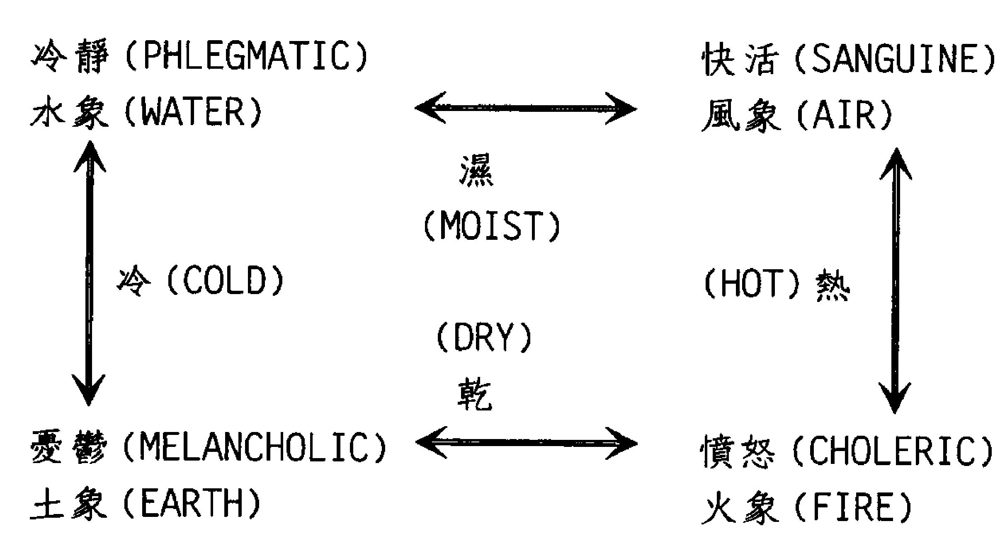

> ※资料来源：Nicholas Campion, THE PRACTICAL ASTRO-LOGER (London: Hamlyn Publish, 1987), p.150.

这种气的概念在实际论断的运用上，非常好用，而且非常重要，因为它至少具有以下的功能：

- 第一，可以把占星学的抽象性转化为一种相对比较具体的直觉体会，以自然的现象来针对无形的命理征象进行朴素的观察和想像。
- 第二，可以与心理学和生理学作结合，尤其是配合上中医的知识，则可以推演出人体的内因和外因之疾病的诊断与治疗。
- 第三，把这种气的概念应用在星座和行星上的话，则可以作为行星落入星座的一种论断的切入点，而且相当好用。如果仅从星座来看的话，也可以藉由命盘中主要人格特质的气的结构，来简单地看出此人的心理和生理状况。
- 第四，把佛教的修行观点和精神分析心理学作结合的话，则可以透过气的概念调和两者的歧见，用来说明如何提昇個人的精神層次，或者是如何取得心理上的平衡。
- 第五，氣的概念不但指出了一條占星學與氣候結合的途徑，亦即星象與節氣是如何地進行統合；也指出了占星學與醫學結合的途徑，亦即星象與氣脈機制是如何地進行統合。此兩者更可以與易學上的八卦進行整合，用來研究環境科學上的方位問題，以及是否風水真的會影響到個人的生理和心理。當然，這還有待於讀者自行作更深一層的研究和實驗，因為這畢竟是目前現代占星學原理所沒有談論到的，是中國人的特產。

### 星座的氣性內涵

本書的主題是在於探討星座，所以在此次是僅就黃道十二宮所意涵的氣的概念來作介紹。以下所談論的觀點乃是呂陽明老師的看法，這是他的創見，在西方的占星學書籍上是看不到的。呂陽明老師原本的解析圖是包括了行星、黃道十二宮、太極圖和十二辟卦，而我為了介紹的簡單化，所以略作修改，僅以星座的氣性比例來作說明。

此外，以下所談的氣性比例的解析方式，是不同於前面所提到過的四大元素與氣的配置情況，因為以下的說明的每一個星座都包含了兩種氣性在內，而不是把四大元素之中的兩種元素組合成爲一種氣。兩者之間在應用上的差異，主要是因爲如果僅針對單一星座來作解析的話，則有必要採用單一星座所包含的兩種不同氣性，來說明每一個星座的獨特性；而如果是針對整個命盤的綜合情況來看的話，則可以借助於兩種星座的氣性互動來作說明。總之，不管是應用那一種說明方式，其目的無非都是為了用有形的文字或比例來描述無形的命理徵象，好讓初學占星學的人，可以逐漸掌握住命盤的特質。因此，希望讀者把所有的這些方法都當成只是一種學習的過程或手段，而不是一種定論。

在進入星座氣性的說明之前，讀者有必要先瞭解以下的幾項應用原則：

- 第一，四大元素和氣性乃是一種類比的概念，例如：火類比於熱、水類比於濕、土類比於冷、風類比於乾。
- 第二，凡是屬於相同元素的星座，都是以該三方宮的元素居於主要地位，並類比於氣性。例如：火象的三個星座，都是以熱居於主要的地位，以此類推。
- 第三，屬於相同元素之中最極致的一個星座，會因為度數的不同而有著氣性上的差異。例如，獅子座是火象的極致，所以是9分熱，但是在與行星產生互動的時候，會因為行星所落入星座之度數的不同，而使得星座所呈現出來的氣性略有變化。其判斷的原則，是以中間值（即該星座的15度）來作為劃分的界限，右邊（0度～15度）是1分濕，左邊（15度～30度）是1分乾。這是因為獅子座的右邊是巨蟹座，略帶濕氣；左邊是處女座，略帶乾氣。於是，假如太陽是落入獅子座20度的話，則此時獅子座針對太陽所反應出來的氣性，會是9分熱1分乾；而如果太陽是落入獅子座10度的話，則反應出來的氣性，會是9分熱1分濕。雙魚座、摩羯座和雙子座等，皆是依據這個原則來作氣性上的區別。
- 第四，氣性所呈現出來的比例值，只是一種參考性的指標，而不是僵硬式的定值，只是在於透過一種比例值的說明，來讓讀者掌握到每一個星座的特質。等到讀者對於星座有比較深入體會的時候，自然就會將這些觀察星座的切入法融合為一。

以下所說明的內容，希望讀者能夠配合四正宮、三方宮和自然屬性等三章來進行融會貫通。如此一來，必然可以對於星座有另一種不同層次的感受，更可以奠定實際論斷的雄厚實力。

#### 一、火象的氣性

火象的氣性是熱氣，它足以讓人聯想到就好像是置身在一團熊熊烈火的旁邊，感受到火在燒燃時所產生的熱氣，令人產生一種溫暖、激情和興奮的感覺，引發人們的熱絡情結，促動人們去採取親熱和熱鬧的行為表現。你可以想像原住民在舉行豐年祭的時候，大家圍著一堆很高的烈火，彼此手牽手，一邊唱著快樂的豐年歌，一邊跳著令人興奮的舞步，並且有酒作伴，享受著不醉不歸的開懷暢飲。此時，你所感受到的周遭環境是一種熱性，它可以激發人類最原始的心靈直覺，而忘了自己的存在。

熱氣是會讓人血液循環加速的，它活烙了我們的身體，也活烙了我們的心理，使我們變得主動和積極，否則就不叫作熱心了。然而，熱氣如果太過於強烈的話，是會讓人受不了的，所以熱情和霸氣是應該有所節制的。

##### （一）白羊座（戌宫）的气性

白羊座是7分热和3分干的组合。这种热气的组合，意味着白羊座除了热气之外，还略带着干气，所以它也具有研究和思考的特质。同时，白羊座的热气展现，似乎是比较偏向于自我陶醉的方式，所以它的亲热度和热心行为比不上狮子座和射手座，反而很容易把热气集中在个人所关心的单一事项之上，甚至于因此而忽视或不在意（外在环境的变化。所以，它是一种直冲个人脑袋的热气，血气翻腾的内心未必可以从外在行为来看出，反而有时候会给人一种沈思的感觉，因为它是热和干的组合。

##### （二）狮子座（午宫）的气性

狮子座是9分热和1分干或1分湿的组合。这种热气的组合，意味着狮子座是热气的极致，所以它本身就是一股充满热气的烈火，热力十足，热情无限，它的热可以传达给周遭所有的人，而所有的人也都可以感受到这股热气流。然而，也就由于是热气的极致，所以往往会浪费颇多的时间和精神在传达热气上，亦即会把太多的精力消耗在散布它的热心之上，甚至于只为获取别人的某种肯定，而慷慨解囊。所以，它是一种恩泽四方的热气，热气直逼四周的人们，热气的作用一眼就可以被人看出来，因为它是热的极致。

##### （三）射手座（寅宫）的气性

射手座是7分热和3分湿的组合。这种热气的组合，意味着射手座除了热气之外，还略带着湿气，所以它也具有感情和情绪的特质。同时，射手座的热气展现，似乎是比较偏向于自我感受的方式，所以当它在表现热心和热情的时候，总是不会忘记对方所带给自己的感受，甚至是依据感受来决定热心的程度，而如果感受是相当恶劣的话，还可能会引发粗暴的行为。所以，它是一种反复无常的热气，热气的强烈程度比较难以控制，因（为它会受到湿气的影响。

#### 二、土象的氣性

土象的氣性是冷氣，它足以讓人感受到一股寒冷之氣。這種感覺，你可以想像在寒冷的冬天時刻，獨自一人漫步地走在冰天雪地之上時的情境和感受。此時，迎面而來的是一股令人顫慄而刺骨的寒氣，一陣陣的冰凍之氣會讓人肌肉僵硬，會凍凝了人的血液循環。

因此，冷與熱是正好相反的，它降低了我們的體溫、降低了我們的活動力，讓我們以一種似乎是「冰人」般的心態來看待這個世界，等待著熱氣來融化。於是，土象以一對「冷眼」的現實態度來面對這個世界，也暗藏著一隻實際的「冷箭」，準備隨時向既定的目標來發射。因此，寒冷之氣是不用表態的，因爲它的沈靜和冷凝就是表態，所以它會以客觀的立場來觀看人生百態，也會以主觀的現實態度來觀看四周存在著那些實質利益。

##### （一）金牛座（酉宮）的氣性

金牛座是7分冷和3分濕的組合。這種冷氣的組合，意味著金牛座除了冷氣之外，還略帶著濕氣，所以它也具有感情和情緒的特質。它就好像是冬天裡大湖結冰的景象，湖面上是一片瞪瞪的光彩，這種情境如果是與心愛的情人一起漫步和觀賞的話，未嘗不是一種令人欽羨的美景，可以讓人產生許多的遐思，雖然有陣陣的寒意來襲，但卻存在著一股美麗的感性。所以，它是一種感性的冷氣，在冷凝的表象底下，情緒和感情的波動未曾停止，因為它是冷和濕的組合。

##### （二）處女座（巳宮）的氣性

處女座是7分冷和3分乾的組合。這種冷氣的組合，意味著處女座除了冷氣之外，還略帶著乾氣，所以它也具有研究和思考的特質。它就好像是沙漠裡的寒冷之氣，既冷又乾，且夾雜著細微的風沙，會讓人難以捉摸到它的心思，也更增添了它的「冷眼」特質，一雙冷峻的眼神似乎要把人看得無微不至，因此會特別注意周遭環境的改變。所以，它是一種理性的冷氣，在冷凝的表象底下，會特別不自主地觀察人們的言行舉止，然後記住對方的特徵並且打上不容易改變的印象，因為它是冷和乾的組合。

##### （三）摩羯座（丑宮）的氣性

摩羯座是9分冷和1分乾或1分濕的組合。這種冷氣的組合，意味著摩羯座是寒冷的極致，所以它是標準的冷酷型人物。它就好像是西馬拉亞山上的冰山，也好像是冬天裡的寒流，嚴厲而無情，往往帶給別人一股打冷顫的感覺。它難得開玩笑，也不打狂語，字字真言，句句實在，外表上展現出一付嚴肅之氣，冷凝的表情刻在臉上，一眼就可以看得出來。所以，它是一隻標準的「冷箭」，此意味著它一方面會以現實和冷靜的態度來達成自己心中的目標，而另一方面卻也可能會為了達到目的而傷人，或者是傷了別人的心，因為它是冷的極致。

#### 三、風象的氣性

風象的氣性是乾氣，它足以讓人感受到一片乾躁之氣。這種乾氣所造成的乾旱景象，會讓人的皮膚表層乾裂、缺乏水質，此象徵風象乃是一種表層性的活動，它缺乏水象的感性和感情，所以它的最大功能是在於引發人們的理智，促動人們對於任何事物進行思索。你可以想像秋天來臨時的蕭瑟之象，此時的紅花綠葉逐漸凋零，提供人們去思考如何面對即將來臨的寒冷冬天，學習如何去保護自己的身體免於遭受乾氣的侵襲。

因此，乾氣不但吹乾了我們的水象，使得我們的內心情感難以呈現在外表之上，缺乏浪漫的情調，也助長了火象的燃燒，喜歡人群和熱鬧，周旋於人群之間，但卻又似乎總是與別人保持著某段距離。所以，乾氣枯萎了我們的情份，也增添了土象的現實與冷酷氣氛。

##### （一）雙子座（申宮）的氣性

雙子座是9分乾和1分冷或1分熱的組合。這種乾氣的組合，意味著雙子座是乾氣的極致，所以它是標準的沙漠型乾氣，理智十足，思維多變。它的乾氣可以傳達給周遭所有的人，似乎意圖要促使別人以理性的態度來處理各種事務，而不要被感情所困。如果是在雙子座的0度～15度之間的話，則實在是太乾了，但也意味著具有聰明的頭腦；而如果是在15度～30度之間的話，則那微弱的1分冷氣，可以給雙子座帶來實踐的可能性，而不是只會空談。所以，它是一種吹襲四方的乾氣，乾氣的作用可以從它那滔滔不絕的喜愛說話來看出，因為它是乾氣的極致。

##### （二）天秤座（辰宮）的氣性

天秤座是7分乾和3分冷的組合。這種乾氣的組合，意味著天秤座除了乾氣之外，還略帶著冷氣，所以它也具有現實和實踐的特質。同時，天秤座的乾氣展現，似乎是比較偏向於協調和折衷，所以它的最大功能是在於使得激怒的雙方冷靜下來，意圖促使爭吵的雙方以理性的態度來解決問題，而它除了會為雙方剖析問題之外，甚至於會還扮演著合事佬的角色，親自化解爭論。所以，它是一種向兩邊直衝的乾氣，乾氣的吹襲有著一定的範圍限制，然而絕對不是口頭上說一說而已，因爲它是乾和冷的組合。

##### （三）寶瓶座（子宮）的氣性

寶瓶座是7分乾和3分熱的組合。這種乾氣的組合，意味著寶瓶座除了乾氣之外，還略帶著熱氣，所以它也具有熱情和霸氣的特質。同時，寶瓶座的乾氣展現，似乎是比較偏向於理想和理念，所以它的最大功能是在於使得周遭友人的理想或理念有所轉變。然而，由於存在著3分的熱氣，所以它會以主動、積極的態度去傳遞自己的理念，也會以霸氣的態度來堅持自己的理念。所以，它是一種變化無常的乾氣，凡是接受或不排斥它的理念的人，都可以接受它的熱情招待；而反對或不接受它的理念的人，則可能會遭受到它的以霸氣相對，因爲它是乾和熱的組合。

#### 四、水象的氣性

水象的氣性是濕氣，它足以讓人感受到一種黏黏的感覺，令人難以忘懷它的存在。這種感覺，你可以想像獨自一人走過沼澤地時的情境和感受。此時，四周的空氣是濕濕黏黏的，濕透了我們的衣服，甚至於濕潤了我們的皮膚，激起我們內心的糾葛情結，讓我們受困於感情的泥沼之中，而難以自拔。

因此，濕和乾是正好相反的，它是表層之下的活動，它滋潤了我們的內心、引發了我們的情份。當它面對火象的強烈陽光來照射的時候，濕氣會上升為一股暖和之氣，不但熱情而且會真實地付出感情。當它面對風象的乾氣來襲的時候，在乾濕相互有所衝突的情況下，反而會無從抉擇。當它面對土象的冷氣來凍結的時候，一尊「冰山美人」浮現在我們的眼前，既感性又現實。

##### （一）巨蟹座（未宮）的氣性

巨蟹座是7分濕和3分熱的組合。這種濕氣的組合，意味著巨蟹座除了濕氣之外，還略帶著熱氣，所以它也具有熱情和霸氣的特質。在濕熱的混合之下，3分熱情激發了人們內在的情份，導致於會主動地去關心別人、照顧別人，一掃悶熱的氣氛，而讓人感受到一股溫柔的暖流。然而，在溫情的背後，卻也存在著不願意妥協的霸氣，特別是如果敵意被激發起來的話，很可能會在毫無理性考量之下，採取反擊的行動，因為它是濕和熱的組合。

##### （二）天蠍座（卯宮）的氣性

天蠍座是7分濕和3分冷的組合。這種濕氣的組合，意味著天蠍座除了濕氣之外，還略帶著冷氣，所以它也具有現實和實踐的特質。在冷濕的混合之下，濕氣被冷氣所凝固，呈現出一股令人有所顫慄的氣氛，導致於外表上看起来是静止不动的。然而，在不动的表象底下，一旦面临了重要的考驗，特別是與生死或感情問題有關的時候，則實踐的特質會引發天蠍座去采取執行的手段，而且手段的採行往往是基於原慾的有所發洩，所以時常會是不惜一切代價、不達目的絕不終止的，於是它時常會導致在人生歷生上的大轉變，因爲它是濕和冷的組合。

##### （三）雙魚座（亥宮）的氣性

雙魚座是9分濕和1分熱或1分冷的組合。這種濕氣的組合，意味著雙魚座是濕氣的極致，所以它是標準的仁慈型人物。在濕氣的極致作用下，情份充溢著全身，內心不但充滿著同情和憐憫，而且甚至會達到自憐和自欺的境地。於是，楚楚可憐的雙魚座是最需要其他氣性來協助的，火象的熱氣可以加強它的主動和專斷；土象的冷氣可以爲它增添現實的考量；風象的乾氣可以給它帶來理性的思考，而不致於整日沈淪於感性的夢想之境。所以，雙魚座是黃道十二宮之中最需要被保護的星座，因爲它是濕的極致。

### 氣性對星座的影響

這裡所謂的氣性對星座的影響，指的是透過四大元素所代表的氣性，來體會星座的特質呈現，亦即把星座的特質與星座的氣性串連在一起。在此，星座的氣性乃是一種「原因」的角色，而星座的特質乃是一種「結果」的呈現，並且由「因」來推論「果」，或者是把「因」和「果」拿來進行同步的連想。以下就黃道十二宮的每一個星座進行說明。

## 第六章 氣性

#### 〈白羊座・戌宮〉
由於是7分熱和3分乾的組合，所以是直覺和理性的組合。因此，在旺盛的活動力背後，仍然存在著思考的成份，所以白羊座並不是純粹的冒險或盲動，在它大膽地採取行動的同時，也多少會對於所要冒險或探查的事項進行研究或思索，只是它的理性由於受到直覺的牽引，所以偏向於個人式的行動，而不重視別人的看法。

### 〈金牛座・酉宮〉
由於是7分冷和3分濕的組合，所以是感官和感情的組合。因此，在冷若冰霜的表象背後，仍然存在著藝術性的美感，所以金牛座並不只是純粹的享受或現實，在它心中的那一片冰湖，也多少潛藏著美與情的波動，只是它的感情成份由於受到感官的克制，所以不太容易表達出來，而需要別人以耐性的態度來對它進行融化。

#### 〈雙子座・申宮〉
由於是9分乾和1分冷或1分熱的組合，所以是乾氣的極致，理性的成份居於主宰的地位。因此，它純粹是一種表象化的活動，不但是言談上的風趣和機智，而且是學習上的多才多藝，也是社交上的善於察言觀色與隨和，以及消息靈通的人士，只是由於它比較缺乏深入思考的特質，所以難免會停留在熱中於事物的表面功夫之上。

#### 〈巨蟹座・未宮〉
由於是7分濕和3分熱的組合，所以是情緒和直覺的組合。因此，在滿懷溫馨的親和力背後，仍然存在著莫名其妙的衝動性，所以巨蟹座並不只是純粹的感情付出，它也多少會對於感情的掌控採取主動和積極的態度，只是它的直覺反應由於受到情緒的影響，所以往往是情緒來帶動直覺，而缺乏理智和現實的考量。

#### 〈獅子座・午宮〉
由於是9分熱和1分乾或1分濕的組合，所以是熱氣的極致，直覺的成份居於主宰的地位。因此，它純粹是一種熱鬧和熱心的活動力，不但是內心的期求於足以服眾，而且是充滿著高度的自信心，以明朗、活潑和大方的言行舉止來成為社交場合上的主角，也具有濟弱扶傾的英雄風格，所以難免會成為許多人崇拜或嫉妒的對象。

#### 〈處女座・巳宮〉
由於是7分冷和3分乾的組合，所以是感官和理性的組合。因此，在實際勞動和執行事項的過程中，仍然存在著理性批判和精細分析的本能，所以處女座並不只是純粹的身體勞動，它也多少具有頭腦清晰和思考縝密的特質，只是它的精神性和思考性必須依附在感官的實際勞動之上，否則會若有所失，所以它是精神緊張的工作者。

#### 〈天秤座・辰宮〉
由於是7分乾和3分冷的組合，所以是理性和感官的組合。因此，在展現客觀思維和均衡評估的時候，仍然存在著實際執行和現實主義的特質，所以天秤座並不只是純粹的分析優缺點而已，它也多少具有靈活的手腕和執行策略的本能，只是它的實際執行能力由於受到理性評估的影響，所以難免會顯得顧前思後和優柔寡斷。

#### 〈天蠍座・卯宮〉
由於是7分濕和3分冷的組合，所以是感性和感官的組合。因此，在情緒的波動和慾望的遂行上，仍然存在著感官的觸覺和物慾的掌控，所以天蠍座並不只是純粹的隱藏情緒和佔有感情而已，它也多少具有靈與肉合而為一的特質，亦即內在的情感和原慾是會透過肉體的感官來作印證的，所以它具有從外表來洞察別人內心的特質。

#### 〈射手座・寅宮〉
由於是7分熱和3分濕的組合，所以是直覺和情慾的組合。因此，在野性般的瀟灑作風背後，仍然存在著情份和敏銳的特質，所以射手座並不只是純粹的崇尚自由或粗枝大葉、不拘小節而已，它也多少具有同情性的慷慨作風和光明磊落的情操，只是它的情緒激動往往與衝動合而為一，所以難免顯得太過於直腸子和令人感到露骨。

#### 〈摩羯座・丑宮〉
由於是9分冷和1分乾或1分濕的組合，所以是冷氣的極致，物慾的成份居於主宰的地位。因此，它純粹是一種現實主義的發揮，不但是言談上的講求實際，而且是外表上的難得一笑，也是社會地位的追求及實質事物的掌握與運用，只是由於它比較缺乏情趣和太過於要求自己有所成就，所以難免會展現出一付唯物主義的形象。

#### 〈寶瓶座・子宮〉
由於是7分乾和3分熱的組合，所以是理性和直覺的組合。因此，在理念和思維的運作之下，仍然存在著莫名其妙的衝動，所以寶瓶座並不只是純粹的擅長於意見的獨特和觀念的創新，它也多少具有熱情的社交活力，以及對於自己的理念採取獨斷的作風，只是它的精力展現是受到理智思維的指引，所以是社會的改革者和前衛派。

#### 〈雙魚座・亥宮〉
由於是9分濕和1分熱或1分冷的組合，所以是濕氣的極致，情感的成份居於主宰的地位。因此，它純粹是一種感情共鳴的飛躍，不但是想像空間上的廣大無際，而且是心靈深處的自怨自艾，以及慈善家的博愛情操，也是藝術家的靈巧和韻味，只是由於它比較缺乏頑強的抗拒力，所以難免會容易隨著情境的變化而展現出彈性和包容性。

## 第七章 宮主星

一般略懂占星學的人，都知道每一個星座各有一顆行星來守護，也就是所謂的「宮主星」。而在解釋星座特質的時候，也多多少少會提到宮主星與星座之間的關係。然而，對於行星與星座之間的關係的說明，卻時常存在著說詞上的混淆不清，以致於宮主星似乎只是被拿來當作裝飾品而已。這個問題之所以會發生，主要是因為一般的太陽星座書籍，並沒有把解釋的重點放在行星之上，反而是把行星與星座的特質完全等同起來，亦即把行星與星座的特質合而為一。如此作法，固然可以使得解釋簡單化，但卻很容易造成讀者根本不知道宮主星有何作用，以致於根本無法在實際論斷上來應用宮主星的作用。

其實，從實際的論斷上來看，行星的重要性遠甚於星座。因為十二星座只是一種背景環境的徵象，所以每一個人的整體命運的最主要差異，是發生在行星所落入的位置的不同。換言之，由於每一個人的行星是落入不同的先後天宮，以及每一個人的行星間的相位有所差異，所以才會導致每一個人的命運有所不同。

如果僅從個性的特質差異來看，則十二星座是以行星的落入所引發的變化，來決定該星座是如何地影響到一個人的人格特質。例如，太陽所落入的星座可以成為一個人的主要人格特質，這是因為有太陽的落入才造成的；同理，月亮所落入的星座也會成為一個人的主要人格特質。然而，同樣是主要人格星座，如果把行星的本質差異列入考量的話，則很明顯地太陽星座和月亮星座是有所差別的。譬如說，某人的太陽與月亮，如果分別落入於白羊座和金牛座，則此人會同時具有白羊座和金牛座的主要人格特質，但是由於太陽與月亮所代表的作用不同，所以對於人格特質的影響也就有所不同，這完全是由於行星的特質差異所導致的。

更明確地說，由於太陽所代表的是一個人的能力、精力和權力的「三力說」之表現，因此可以簡單地將其視為整體個性的表現，並且是比較容易被個人所自知的。如此一來，此人由於太陽落入白羊座，所以對於白羊座所代表的人格特質，會相當明顯地表現在整體的個性上，而且自己也比較容易得知到自己的白羊座個性，甚至此人留給別人的印象也是白羊座的。然而，月亮並沒有太陽的「三力說」，她是屬於比較內在的情緒性感受，在此可以先簡單地把月亮看成是一個人對於情緒的反應；因此，當月亮落入金牛座的話，則代表著此人的情緒反應是屬於金牛座型的。

將以上的兩種人格特質作一個簡單性的結合，則很明顯地此人的主要人格具有白羊座和金牛座的特質，但是金牛座的人格特質卻是會特別地表現在情緒上。如此一來，也就不能因為此人的太陽是落入白羊座，而直接地論斷他一定會相當沒耐性。因為從情緒上的表現來看，由於有月亮落入金牛座的剋制，使得白羊座有了情緒上性急的緩和作用。這就造成了此人在單獨一個人，或者是不說話的時候，看起來並不是白羊座的個性，反而給人一種沈靜不動的感覺；然而，一旦有所行動的時候，卻往往又會是快速的、性急的。這是太陽白羊座和月亮金牛座的共同作用的結果。

因此，在實際論斷上，如果要更進一步地區分人格特質的細微差異，則只能藉助於行星來作考量，而不能一概地只以星座來作論斷。以上只是很簡要的說明，至於有關行星與星座之間的關係的論斷，甚至於整個命盤的整體互動關係的說明，將會在往後所陸續出版的書籍中來作介紹。在此，最主要的目的是讓讀者先了解行星在實際論斷上的重要性。

至於星座與宮主星之間的關係，一般是把它看成是守護、統御和主宰等觀念，這種觀念是可以講得通的，因為宮主星確實對於星座有所主宰，可以把此看成是行星各有自己的星座領域，各個行星分別主宰著不同的星座。但是，在此所論述的宮主星與星座之間的關係，是把宮主星與星座視為是一種「歸屬」和「類比」的觀念，把宮主星當成是歸屬於或類比於各個星座，以此來區別宮主星對於後天十二宮有所「主宰」的觀念。

從歸屬或類比的角度來看宮主星與十二星座，可以很明顯地看出，宮主星與星座之間的歸屬原因，主要是因為宮主星和星座之間，有了某種高度的契合存在。而這種高度的契合性，也就是何以能從各個星座之宮主星的不同，來分析各星座在特質上的差異。換言之，透過宮主星的不同，可以簡單看出各個星座的差異。但是，必須知道這種高度的契合性也存在著「不契合性」，因為行星所代表的徵象是比星座更為豐富的。

例如，以火星與白羊座的關係來說，由於火星和白羊座彼此之間具有相同的特質，它們所代表的徵象也很類似，所以可把火星與白羊座歸屬為同一個類型。其實，十二星座可以簡單地說就是十二種不同的類型，而宮主星也就是依據行星本身的特質，來把星座與行星之特質的相似作一種類型上的統合，把它們合成爲一組，進而把行星劃歸入星座之中，建構起星座與宮主星的關係。

如此一來，行星落入星座也就可以看成是兩種特質類型的互動關係了，並從這兩種類型的相互感應來看其統合後的結果，論斷是吉或是凶。換言之，這兩種類型的互動有著基本上的相助或相剋的關係發生，產生了所謂的吉凶現象，這就是在論斷上有關行星落入星座之廟旺陷弱的基本由來。

當然，宮主星在實際論斷上的作用，絕非是如此而已。如果配合上後天宮來看，則宮主星的主要作用至少包括以下幾項：

- 第一，行星落入星座——這可以說是最基本的論斷思考要素，可從行星與星座的互動關係來看行星是如何賦予星座動力，行星是如何去引發星座的特質；反過來說，星座又是如何去賦予行星活動的空間，同時又是如何去限制行星的運作範圍。
- 第二，行星落入宮位——這是生活領域方面的論斷，可以看出行星是如何在某一個生活領域中展現其作用力，如何表現出對於某一生活領域的基本要求；反過來說，宮位又是如何去賦予行星活動的空間，同時又是如何去限制行星的運作範圍。
- 第三，行星與行星間的相位——這是行星間互動關係的呈現，可以看出兩顆具有相位關係的行星，是如何賦予彼此動力，而這個動力是助力或者是壓力？同時，某一顆行星在與其他行星產生相位之後，行星的特質有了某種程度的轉變以後，又是如何地透過星座與宮位來展現已經轉變了的行星特質。
- 第四，行星與宮位的飛星關係——這可以進一步地看出某一生活領域與另一生活領域之間的關係，透過飛星可以知道後天宮彼此之間更進一步的關聯性。例如，第九宮宮主星飛入第八宮，則可能此人是因為生意的關係而到國外。
- 第五，行星與星座的飛星關係——這可以進一步地看出某一生活領域與星座的關係。例如，第九宮宮主星飛入巨蟹座宮的話，則可能此人在國外所從事的事務是與巨蟹座有關。
- 第六，行星與飛星的關係——這是透過行星的相位關係，來看某一顆宮主星所代表的生活領域，是如何地與和該顆宮主星形成相位關係的行星產生互動。
- 第七，飛星與飛星的關係——這是透過行星的相位關係，來看某一顆宮主星所代表的生活領域，是如何地與和該顆宮主星形成相位關係的行星所代表的生活領域產生互動。

從以上的簡單說明，可以得知藉由行星所具有的宮主星意涵，而推演出許多的論斷訊息。但是，也由於宮主星涉及到如此多的論斷訊息，所以必須依賴於實際論斷經驗的累積，才能夠充分地掌握住宮主星所反映出來的命理徵象。此外，除了以上所提到的歸屬觀念之外，我認為從宮主星來看星座，則至少具有以下的論斷意義：

1.  從宮主星來更明確地得知星座的特質表現；
2.  從宮主星來劃分行星與星座的差異；
3.  從宮主星來看星座與後天宮的差異；
4.  從宮主星來看行星的廟旺陷弱；
5.  從宮主星來看行星的「互容」；
6.  從宮主星來看飛星體系的建構。

本章只有簡單地說明第一項和第四項，至於其他的四項，由於涉及到比較複雜的考量因素，甚至有必要透過實際命例的解說，才能夠說明的比較詳細，所以暫時略而不談，留待以後再來作解釋。

從宮主星來更明確地得知星座的特質表現，就是把宮主星的特質與星座的特質，進行一種特質上的類似的統合，用以加強讀者對於星座特質的理解。但在說明之前，有必要先就所謂的宮主星的劃分，作以下的補充說明。

第一，一般我們所常看到的宮主星的劃分，是以太陽、月亮、水星、金星、火星、木星、土星、天王星、海王星和冥王星等十顆行星來作劃分。而其中的雙魚座、寶瓶座和天蠍座等分別具有兩顆的宮主星，也就是說這三個星座的特質，是具備了兩顆行星之某些特質的綜合。但是，如果從行星的角度來看，則顯然地木星、土星和火星各成為兩個星座的宮主星，也就是說這三顆行星同時具備了兩個星座的某些特質。因此，宮主星與星座只能說是某些特質相似，而不能說是完全相同。

第二，現在的處女座的宮主星，在論斷上是用水星，而雙子座的宮主星也同樣是水星，於是水星就成為這兩個星座的宮主星，而水星也確實是具有這兩個星座的某些特質。然而，如果從三方宮的角度來看，則處女座是土象、雙子座是風象，水星的特質是比較趨向於風象，而不是土象。所以，如果要從宮主星的角度來對雙子座和處女座的特質進行區分的話，可以把介於火星和木星之間的「小行星群」，拿來當作處女座宮主星的補充，如此就能夠把處女座的特質看得更清楚。但是，在一般的實際論斷上，還是以水星作為處女座的宮主星，因為小行星群涉及到更多的考量因素，目前尚未取得看法上的一致性。

第三，同樣地，天秤座與金牛座的宮主星都是金星，這兩個星座也都具有某些相當類似於金星的特質。然而，如果從三方宮來看，則金牛座是土象、天秤座是風象，金星的特質是比較類似於金牛座，尤其是金牛座所具有的金錢意涵，是天秤座所缺乏的特質，但卻是金星的一個重要徵象。因此，如果以「超冥王星」來作為天秤座宮主星的補充，就比較能夠把天秤座的特質突顯出來。但是，由於目前在占星學的論斷上，應用超冥王星的占星學家並不普遍，而且在看法上也存在著許多的爭議，所以在一般的論斷上，還是以金星作為天秤座的宮主星。

如此一來，十二星座的宮主星就增加了小行星群和超冥王星，也使得十二星座各有自己所專屬的宮主星。在此，有必要說明的是，增加小行星群和超冥王星的主要目的有二：一是讓讀者了解超冥王星的存在；二是藉由小行星群和超冥王星的補充說明，讓讀者能夠更明瞭雙子座和處女座、金牛座和天秤座之間的關係和區別。但在實際的論斷上，尤其是在有關於後天宮宮主星的劃分上，目前還是以金星作為天秤座和金牛座的宮主星，水星還是雙子座和處女座的宮主星。但是，如果在未來確認了超冥王星足以取代金星，而成為天秤座的宮主星之後，則可能會改由金星和超冥王星來一起作為天秤座的宮主星，並且由超冥王星來作為天秤座的後天宮位的宮主星。

這就像現代行星（天王星、海王星、冥王星）在尚未被發現的時候，是暫時以土星來作為摩羯座和寶瓶座的宮主星，以木星來作為雙魚座和射手座的宮主星，以火星來作為白羊座和天蠍座的宮主星。等到現代行星發現之後，雖然寶瓶座也具有土星的特質，雙魚座也具有木星的特質，天蠍座也具有火星的特質。但是，在後天宮位宮主星的劃分上，卻已經改由天王星、海王星和冥王星來作為寶瓶座、雙魚座和天蠍座的宮主星了。

以下僅就行星與星座之間的最主要的類似特質，分成十二星座的劃分來作說明，其中前者代表的是行星的特質，後者代表的是星座的特質。這種簡單的類比方式，當然不能包含行星和星座的全部徵象，但是可以藉由這種類比來看出行星與星座之間的類似特質，也可以加深讀者對於行星與星座的印象。

### 星座的宮主星內涵

#### 火星——白羊座
爆發與熱力：火星所具有的熱力、發射性、突發性、衝動、積極、戰神、企圖、冒險、進取、動能、行動力、自作主張、獨斷、自我、打架、暴力事件、刀槍、爆炸、血光、發炎、高溫和精力等特質是與白羊座相類似的，所以火星是白羊座的宮主星。

#### 金星——金牛座
擁有與穩固：金星同時是金牛座和天秤座的宮主星，所以綜合了這兩個星座的特質。而就金星與金牛座的特質類似來看，主要是表現在：金錢、放鬆、舒服、享受、安適、快樂、藝術（主要是指音樂、陶藝、園藝和建築等）、感官、擁有、穩固、多產和喜歡等，所以金星是金牛座的宮主星。

#### 水星——雙子座
溝通與知識：水星是概念和理性之星，它與雙子座的類似，主要是表現在：人際關係的溝通、頭腦好、反應快、東跑西跑、無法安定、聰明、多才多藝、話題多、好奇、喜歡吸收新知識、寫作能力、表達能力、機智、短程旅行、教學、新聞和商業等，所以水星是雙子座的宮主星。

#### 月亮——巨蟹座
保護與情緒：兩者之特質的類似相當多，包括：感情、情緒、週期、直覺、敏感、母性特質、家庭、家人、溫情、暖和、親情、照顧、保護、安全感的需求、想像力、親切、根的感覺、不安定、人情、抵抗、神經質、收集東西和懷舊等，所以月亮是巨蟹座的宮主星。

#### 太阳——狮子座

表现与大方：两者之特质的类似相当多，包括：能力、精力、权力、表演、发光、外射、领导、表现、出名、活力、自信、主动、高贵、自我、尊大和一流等，由于太阳所落入的星座，会把该星座的一般特质呈现出来，所以与狮子座所突显的娱乐和游戏等特质，有着些微的不同。

#### 小行星群、水星——处女座

分析与细节：处女座具有水星之理性和概念的能力，但在发挥上比较偏向于分析的层面，而且处女座的水星运作层次比较深、比较内在，而双子座的水星运作层次是比较浅、比较外在。处女座还具有小行星群的作用，产生了独特的细节性、挑剔、洁癖、敏锐、纯洁和琐碎等特质。

#### 超冥王星、金星——天秤座

平衡与优雅：超冥王星的特质如果暂且不谈，而就金星与天秤座的类似特质来看，主要是表现在：爱情（指喜欢的对象，这里是以人为主，不同于金牛座之以物的喜欢为主）、婚姻、社交、调和、和谐、优雅、和蔼、可亲、合伙、愉悦和俊美等，所以金星是天秤座的宫主星。

#### 冥王星、火星——天蝎座

绝对与深沈：冥王星代表的是：死亡、深沈、黑暗、消灭、绝对、恐怖、霸道和阴谋，是人类深层潜意识的表现，是原欲的遂行，毫无妥协的余地。而天蝎座是冥王星再加上火星，火星所具有的某些特质是与天蝎座相类似的，例如：战斗和斗争。因此，可以把天蝎座看成是，由火星的行动力和冥王星的原欲所组成。

#### 木星——射手座

发展与超脱：木星的最基本特征即是扩张、成长和发展等，与寅宫所具有的远程目标性相类似，特别是寅宫具有人性与兽性统合的征象，所以这种发展可以表现在精神层面，也可以表现在肉体层面。因此，木星与寅宫的特质类似，主要有：乐观、智慧、自信、慷慨、宽大、浪费、任性、宗教、哲学、长途旅行、外国和高等教育等。

#### 土星——摩羯座

限制与现实：两者之特质的类似相当多，几乎是相一致的，包括：组织、结构、传统、保守、规范、秩序、节制、克制、延迟、缓慢、阻碍、限制、压力、困顿、挫折、束缚、训练、压抑、禁制、困难、严肃、拘谨、看不开、掌控和艰难等，所以土星是摩羯座的宫主星。

#### 天王星、土星——宝瓶座

变异与独创：天王星所具有的变异、特殊、自由、独立、突裂、突变、唱反调、与众不同、分离、革新、激进、自主和反动等特质，固然是与宝瓶座的特质相类似。但是，由于宝瓶座的与众不同，是除了“为反而反”之外，也不容许别人不反对，亦即同时也会“要求”别人采取相同的立场，而这种要求是土星的特质，所以宝瓶座除了具有天王星的特质以外，也具有某些土星的特质。

#### 海王星、木星——双鱼座

梦幻与意境：木星所具有的发展性，如果呈现在精神层面则会是精神层次的提升，形成宗教和哲学上的精神诉求。而双鱼座是除了具有木星之精神层次提升的特质以外，也具有海王星的梦幻、想像、朦胧、浪漫、敏感、感受、神秘和预知力等，两者的结合，形成了双鱼座的奉献、牺牲、修行、灵性、仁慈和社会服务等特质。

至于有关行星的庙旺陷弱部份，可以从心理意识方面来作理解。在此，先直接举例来作简要的说明，细节的部份有待读者自行推演，因为毕竟占星学所要探讨的实在太多了，无法一一详述。

例如，以现在所流行的月亮星座来说，如果从庙旺陷弱来看的话，则可以提供某些论断上的讯息。月亮的庙旺陷弱分配如下：

- (1)入垣：月亮落入巨蟹座。由于正好是落入同性质的星座之中，形成一种调和的状态，可以发挥母性、亲情、照顾和关怀等特质。而且这些特质的展现，会使得此人的情绪安定下来，并且具有多产的涵义。
- (2)入庙：月亮落入金牛座。金牛座代表着稳定、安适，所以月亮落入金牛座的话，可以使得情绪表现出稳定、安适的状态，所以是很好的情绪表现方式，而且也同样具有多产的涵义。
- (3)入弱：月亮落入摩羯座。由于摩羯座所代表的是严肃、凝重、压抑，所以当月亮落入摩羯座的时候，情绪会表现出压抑和凝重，不知道那一天会突然爆发出来。再说，如果每天都摆出一张扑克脸的话，又如何能乐观呢？所以月亮落入摩羯座是入弱，是属于比较差的情绪表现方式。
- (4)入陷：月亮落入天蝎座。天蝎座所代表的是深沈与绝对，比摩羯座更严重，感情与情绪的反应是相当绝对的，只要是得罪了他，让他不爽，他可能会恨你或讨厌你一辈子，而且这种印象是深入心底的，这种心理意识能说是健康的吗？因此，如果以心理意识的角度来看行星的庙旺陷弱的话，是可以得到理解的。

## 第七章 宫主星

## 【黄道十二宫的宫主星分配图】

### 宫主星对星座的影响

这里所谓的宫主星对星座的影响，主要是通过占星学上之星座内的区间划分，来应用宫主星以透视单一星座内不同阶段的不同特质。当然，这种区间的划分法并不一定要配合上宫主星来作判断，而只要以单一星座的三方宫来作解释，也就可以了。然而，在基于精细性和推演性的考量下，我认为如果能够把三方宫和宫主星来作结合性应用的话，则可以提供给读者更多的想象空间，有助于彻底地了解每一个星座，所以有很多的西方占星学家也是采取如此的说明方式。

以下是仅就星座的区间(DECAN)来作说明，这是一种星座的三区间法，亦即把每一个星座分成三个区间，第一个区间是由该星座所主宰，而第二个区间则是由该星座与它的下一个三方宫来一起主宰，而第三个区间则是由该星座与它的再下一个三方宫来一起主宰，并以此来配合着宫主星来作解释。

例如，白羊座的第一个区间（0度～10度），是纯粹由白羊座所主宰，它的宫主星是火星，亦即第一区间是白羊座之最明显特征的所在，火星的作用也会是最强的。而白羊座的第二个区间（10度～20度），是由白羊座和狮子座所共同主宰，所以它的宫主星是火星和太阳，亦即狮子座和太阳会对于白羊座的第二区间发生影响，所以白羊座的第二区间除了具有白羊座和火星的特质之外，也略具有狮子座和太阳的特质。再来，白羊座的第三个区间（20度～30度），是由白羊座和射手座所共同主宰，所以它的宫主星是火星和木星，亦即射手座和木星会对于白羊座的第三区间发生影响，所以白羊座的第三区间除了具有白羊座和火星的特质之外，也略具射手座和木星的特质。其他星座的情况也是如此，不多作说明。

然而，读者有必要记住的是：尽管单一星座会受到其三方宫星座的影响，但是该星座的整体特质是居于主要的影响地位。例如，尽管白羊座的第二区间受到狮子座和太阳的影响，但是此影响是在白羊座的整体特质的前提下来作发挥的，绝对不能脱离白羊座的特质范围。

此外，除了星座的三区间划分法之外，星座的阶段划分还有所谓的“区分”法(dwaddy)，这是一种更细微的划分法，请参见本书第十三章的说明。因为这种更细微的划分法，主要是被应用在流年的判断上，所以在此暂不作解释。

#### 白羊座·戌宫

- 第一区间：戌宫、戌宫；火星、火星
  此区间是最足以突显出白羊座之特质的区间，所以它是由火星的特质所主宰。因此，可以展现出白羊座和火星的整体特质，包括：诉求于取得领导权，以开疆辟土的精神向前冲刺，会特别无法忍受于任何的阻扰。

- 第二区间：戌宫、午宫；火星、太阳
  此区间除了白羊座的特质之外，还略带着狮子座的特质。于是，此区间呈现出以火星为主，而太阳为辅的特质。所以，特别容易展现出独断和专横的特性，喜欢去支配别人和下达命令，青春的活力和热情的奔放有所加强。

- 第三区间：戌宫、寅宫；火星、木星
  此区间除了白羊座的特质之外，还略带着射手座的特质。于是，此区间呈现出以火星为主，而木星为辅的特质。所以，会以自信的态度来征服困境，为正义而挺身，会专心地投入于研究某事项，甚至到达忘我的境界。

#### 金牛座·酉宫

- 第一区间：酉宫、酉宫；金星、金星
  此区间是最足以突显出金牛座之特质的区间，所以它是由金星的特质所主宰。因此，可以展现出金牛座和金星的整体特质，拥有天生的审美观以及实用的经济观，在两情相悦之下却充满着高度的自私的爱，并且颇为孝顺。

- 第二区间：酉宫、巳宫；金星、水星
  此区间除了金牛座的特质之外，还略带着处女座的特质。于是，此区间呈现出以金星为主，而水星为辅的特质。所以，也会展现出冷静的思考与判断，然而却也增强了第一眼印象的影响力，金钱的运用也比较灵活。

- 第三区间：酉宫、丑宫；金星、土星
  此区间除了金牛座的特质之外，还略带着摩羯座的特质。于是，此区间呈现出以金星为主，而土星为辅的特质。所以，特别容易展现出感情忠贞的特性，并且经济性的价值观会比较明显，是金牛座最勤劳化的区间。

#### 双子座·申宫

- 第一区间：申宫、申宫；水星、水星
  此区间是最足以突显出双子座之特质的区间，所以它是由水星的特质所主宰。因此，可以展现出双子座和水星的整体特质，包括：相当具有传达的特质，所以话比较多，而且往往可以很快速地学会任何事物的皮毛。

- 第二区间：申宫、辰宫；水星、金星
  此区间除了双子座的特质之外，还略带着天秤座的特质。于是，此区间呈现出以水星为主，而金星为辅的特质。所以，特别容易展现出社交手腕的特性，会四处去结交各种朋友，而且文艺的才华有所加强。

- 第三区间：申宫、子宫；水星、天王星、土星
  此区间除了双子座的特质之外，还略带着宝瓶座的特质。于是，此区间呈现出以水星为主，而天王星和土星为辅的特质。所以，特别会无法忍受索然无味和平凡单调的生活，并且在看法的表达上颇具有自己的创意。

#### 巨蟹座·未宫

- 第一区间：未宫、未宫；月亮、月亮
  此区间是最足以突显出巨蟹座之特质的区间，所以它是由月亮的特质所主宰。因此，可以展现出巨蟹座和月亮的整体特质，想像力和记忆力可以得到颇高的发挥，并且比较容易见景而有所感伤，以及善体人意。

- 第二区间：未宫、卯宫；月亮、冥王星、火星
  此区间除了巨蟹座的特质之外，还略带着天蝎座的特质。于是，此区间呈现出以月亮为主，而冥王星和火星为辅的特质。所以，情绪化的特质会比较明显，而且也比较容易发怒，内心的热情被隐藏起来，性欲能力加强。

- 第三区间：未宫、亥宫；月亮、海王星、木星
  此区间除了巨蟹座的特质之外，还略带着双鱼座的特质。于是，此区间呈现出以月亮为主，而海王星和木星为辅的特质。所以，特别容易展现出幻想和错觉的特性，然而却也是巨蟹座最亲切和温馨的区间，比较不具防卫性。

#### 狮子座·午宫

- 第一区间：午宫、午宫；太阳、太阳
  此区间是最足以突显出狮子座之特质的区间，所以它是由太阳的特质所主宰。因此，可以展现出狮子座和太阳的整体特质，对于荣耀、名声和领导权的追求会比较强烈，而且热情与活泼带来多采多姿的生活及戏剧化的爱情。

- 第二区间：午宫、寅宫；太阳、木星
  此区间除了狮子座的特质之外，还略带着射手座的特质。于是，此区间呈现出以太阳为主，而木星为辅的特质。所以，尊贵、显赫和气派的特质会比较明显，以英雄姿态来面对生活，强烈的自信心可以换得朋友的帮助。

- 第三区间：午宫、戌宫；太阳、火星
  此区间除了狮子座的特质之外，还略带着白羊座的特质。于是，此区间呈现出以太阳为主，而火星为辅的特质。所以，霸道、粗鲁和攻击的特质会比较明显，而且狮子座的艺术和创作的才华很可能会被强烈的性欲所取代。

#### 处女座·巳宫

- 第一区间：巳宫、巳宫；水星、水星
  此区间是最足以突显出处女座之特质的区间，所以它是由水星的特质所主宰。因此，可以展现出处女座和水星的整体特质，记忆力佳，挑剔、批判、评论和讽刺的特质有所突显，然而却也是处女座最神经质的区间。

- 第二区间：巳宫、丑宫；水星、土星
  此区间除了处女座的特质之外，还略带着摩羯座的特质。于是，此区间呈现出以水星为主，而土星为辅的特质。所以，特别会突显出勤快、简朴和规律的特质，然而却也会是比较胆怯和谨慎，以害羞的态度来对爱情。

- 第三区间：巳宫、酉宫；水星、金星
  此区间除了处女座的特质之外，还略带着金牛座的特质。于是，此区间呈现出以水星为主，而金星为辅的特质。所以，特别会展现出同情和牺牲的个性，而且对于细节相当敏感，也是处女座最具有文艺才华的区间。

#### 天秤座·辰宫

- 第一区间：辰宫、辰宫；金星、金星
  此区间是最足以突显出天秤座之特质的区间，所以它是由金星的特质所主宰。因此，可以展现出天秤座和金星的整体特质，包括：诉求“以和为贵”的和平主义，个性温和而不偏激，在社交活动上相当有人缘。

- 第二区间：辰宫、子宫；金星、天王星、土星
  此区间除了天秤座的特质之外，还略带着宝瓶座的特质。于是，此区间呈现出以金星为主，而天王星和土星为辅的特质。所以，也会追寻于独立和自由，并且比较具有决断力，超然的客观立场特别明显。

- 第三区间：辰宫、申宫；金星、水星
  此区间除了天秤座的特质之外，还略带着双子座的特质。于是，此区间呈现出以金星为主，而水星为辅的特质。所以，特别容易展现出圆滑的个性，或者是特别强调理性的均衡分析，并且在社交上的活动力会比较强。

#### 天蝎座·卯宫

- 第一区间：卯宫、卯宫；冥王星、火星、冥王星、火星
  此区间是最足以突显出天蝎座之特质的区间，所以它是由冥王星和火星的特质所主宰。因此，可以展现出天蝎座、冥王星和火星的整体特质，似乎随时都在养精蓄锐，等待决战时刻的来临，是深藏不露和全力以赴的组合。

- 第二区间：卯宫、亥宫；冥王星、火星、海王星、木星
  此区间除了天蝎座的特质之外，还略带着双鱼座的特质。于是，此区间呈现出以冥王星和火星为主，而海王星和木星为辅的特质。所以，神秘和探究的特质会比较明显，感受上的敏锐度以及洞悉别人意图的能耐会特别强。

- 第三区间：卯宫、未宫；冥王星、火星、月亮
  此区间除了天蝎座的特质之外，还略带着巨蟹座的特质。于是，此区间呈现出以冥王星和火星为主，而月亮为辅的特质。所以，特别容易展现出感情掌控的特质，性的需求会比较强烈，而且在言谈上会略带尖酸讽刺。

#### 射手座·寅宫

- 第一区间：寅宫、寅宫；木星、木星
  此区间是最足以突显出射手座之特质的区间，所以它是由木星的特质所主宰。因此，可以展现出射手座和木星的整体特质，包括：以乐观和自信的态度来面对生活，向往于人类的高尚情操，追寻于新鲜的刺激和远大的理想。

- 第二区间：寅宫、戌宫；木星、火星
  此区间除了射手座的特质之外，还略带着白羊座的特质。于是，此区间呈现出以木星为主，而火星为辅的特质。所以，运动和率性特质会比较明显，以自己一时的心情和兴致来处理事务，也比较会追寻于精神上的有所超越。

- 第三区间：寅宫、午宫；木星、太阳
  此区间除了射手座的特质之外，还略带着狮子座的特质。于是，此区间呈现出以木星为主，而太阳为辅的特质。所以，特别容易展现出独断自我和自信自大的特质，在宗教信仰上会诉求高度的道德感，并且难以容忍异教徒。

#### 摩羯座·丑宫

- 第一区间：丑宫、丑宫；土星、土星
  此区间是最足以突显出摩羯座之特质的区间，所以它是由土星的特质所主宰。因此，可以展现出摩羯座和土星的整体特质，包括：以坚定的意志力来达成既定的目标，以自律和自我训练的态度来面对生活，比较严谨和无趣。

- 第二区间：丑宫、酉宫；土星、金星
  此区间除了摩羯座的特质之外，还略带着金牛座的特质。于是，此区间呈现出以土星为主，而金星为辅的特质。所以，特别会突显出摩羯座的手巧特性，并且在追求社会地位的手腕上也比较灵活，也比较会有怜悯之心。

- 第三区间：丑宫、巳宫；土星、水星
  此区间除了摩羯座的特质之外，还略带着处女座的特质。于是，此区间呈现出以土星为主，而水星为辅的特质。所以，特别容易展现出谨慎和辛劳的特质，不会采取轻举妄动的行为，相当诚实和信守诺言，规划的能力加强。

#### 宝瓶座·子宫

- 第一区间：子宫、子宫；天王星、土星、天王星、土星
  此区间是最足以突显出宝瓶座之特质的区间，所以它是由天王星和土星的特质所主宰。因此，可以展现出宝瓶座、天王星和土星的整体特质，除非是专心地投入于思潮的研究或事物的创新和改造，否则难以定下心来。

- 第二区间：子宫、申宫；天王星、土星、水星
  此区间除了宝瓶座的特质之外，还略带着双子座的特质。于是，此区间呈现出以天王星和土星为主，而水星为辅的特质。所以，特别会突显出宝瓶座的新奇想法之特性，并且会热衷于追寻真理，强化了个人的思考力。

- 第三区间：子宫、辰宫；天王星、土星、金星
  此区间除了宝瓶座的特质之外，还略带着天秤座的特质。于是，此区间呈现出以天王星和土星为主，而金星为辅的特质。所以，特别会追寻于新鲜的爱情，而且喜欢与陌生人交往，乐于助人的特质会比较明显。

#### 双鱼座·亥宫

- 第一区间：亥宫、亥宫；海王星、木星、海王星、木星
  此区间是最足以突显出双鱼座之特质的区间，所以它是由海王星和木星的特质所主宰。因此，可以展现出双鱼座、海王星和木星的整体特质，是想像力的高度扩展，也是精神上的自我逃避，或者是追寻于灵性的成长。

- 第二区间：亥宫、未宫；海王星、木星、月亮此區間除了雙魚座的特質之外，還略帶著巨蟹座的特質。於是，此區間呈現出以海王星和木星爲主，而月亮爲輔的特質。所以，會加強了同情憐憫的特性，是雙魚座最感情化的區間，浪漫、靈敏和仁慈等特質有所加強。

## 第三區間：亥宮、卯宮；海王星、木星、冥王星、火星

此區間除了雙魚座的特質之外，還略帶著天蠍座的特質。於是，此區間呈現出以海王星和木星爲主，而冥王星和火星爲輔的特質。所以，特別會追尋於心靈的解脫與探索，是雙魚座最神秘化的區間，是沉淪與重生的關鍵點。

## 第七章 宮主星

## 第八章 對宮

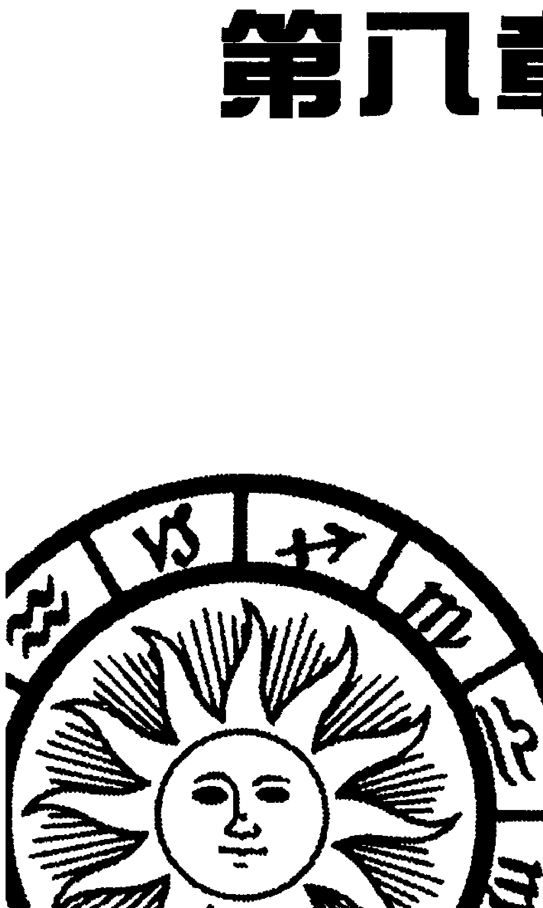

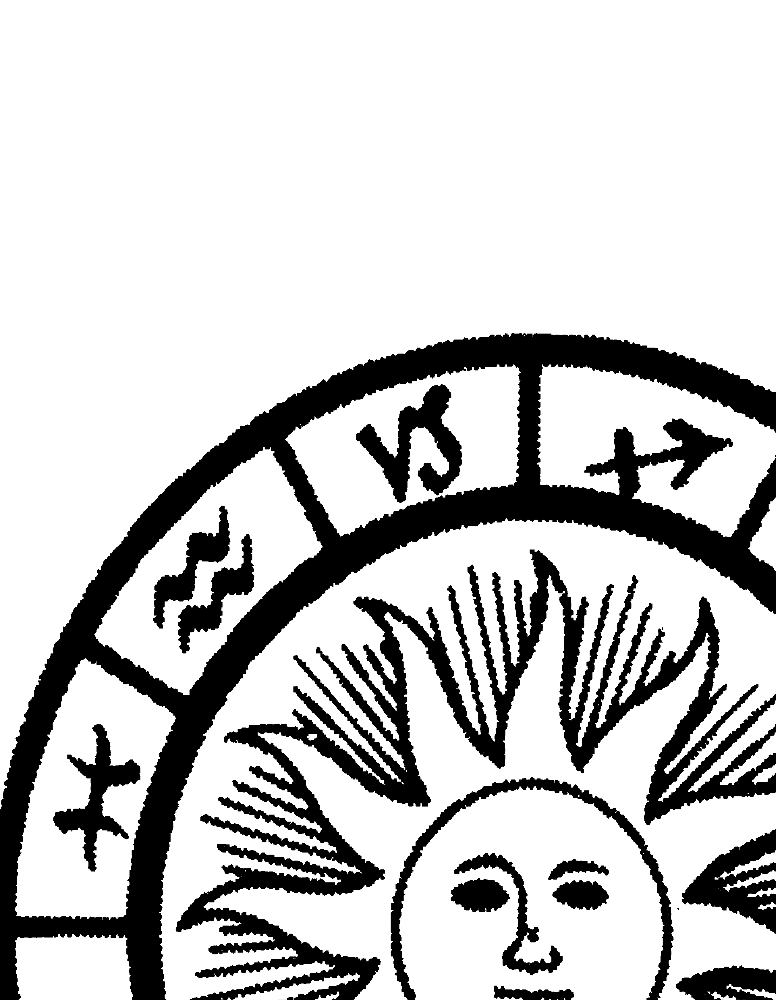

黃道十二宮除了陰陽的二分法、四正宮的三分法、三方宮的四分法以外，還有對宮的六分法，把十二星座分成六組。所謂的對宮 (OPPOSITE SIGNS) 指的是：每一個星座皆可以與它的對面星座共同合為一組。而既然可以合為一組，就表示互為對宮的兩個星座具有共同的特徵。但是，由於對宮在相位上的意涵，指的是對沖（凡是落入對宮的行星，只要是位在相同的度數，或者是在容許度範圍以內，就會形成 180 度的相位），因此互為對宮的一組星座，除了具有共同的特徵以外，也具有衝突、壓力和互補的涵義。

那麼到底應該如何去看待對宮？簡單地說就是「對立而統一」的概念。換言之，作為對宮的兩個星座既存在著對立的成份，也存在統一的成份；對宮之兩個星座的互動關係，既是衝突也是互補。而透過對宮的分析，我們可以更明確地看出每一個星座與它對宮之星座的關係，以及六組對宮星座彼此之間的差異所在。

對宮的概念在實際論斷上，雖然在人格特質的探討上並不能發揮很大的作用，但是它如果配合上後天宮位來應用的話，則可以看出人生之生活領域層面的協和性和衝突性，相當具有人生哲學的意涵。

在進入對宮星座的解釋以前，先就所謂的「對立與統一」的概念稍作說明。這種概念類似於第二章探討星座之陰陽性時的概念，因為陰陽也是一種對立而統一的概念。陰與陽是對立的，但也是統一的，兩者的統一是萬物內在的組合成份，這就是說兩者存在著辯證的關係。但是，陰陽的概念是屬於比較抽象性的，而對宮的概念則是屬於比較具體性的，它是被落實在身心上和人間世來看待的。因此，對宮可以說即是把陰陽辯證的概念落實在人間世。

首先，「對立」指的是互為對宮的兩個星座，具有衝突性存在，而且是「正面」和「公開」的衝突，是一種「相沖」的徵象，也是一種「兩端」的表示。「衝突」代表著對宮的兩個星座，由於在特質上有所差異，所以很容易產生摩擦。而摩擦的原因是在於，每一個星座都會感受到來自於對宮星座的壓力，對宮的壓力會試圖去改變該星座所具有的原來特質，亦即會把該星座往另一個完全不同的方向拉去，於是該星座自然會產生討厭於對宮所賦予的壓力，因為與它的本性並不符合，所以摩擦也就因此而產生了。

但是，由對宮的壓力所造成的摩擦，並不完全是不好的，它反而具有剋制本宮過度發展的作用。從心理調和的角度來看，對宮的兩個星座應該是取得平衡的，所以「相沖」未必就是不好，如果可以藉由「相沖」而使得對宮互相取得均衡的話，對於心理意識來說，標誌著是一種健全與和諧的人格特質。然而，如果調和的不好，也就是說當有一方失去剋制力量的時候，對宮的兩者之一會走向極端，造成人格特質上的極端表現，人生的生活領域也會因此走向極端，偏向於某一個生活領域，而忽略了對宮所主宰的生活領域。

其次，「統一」指的是互為對宮的兩個星座存在著共同性，而這種共同性使得對宮彼此可以發揮出「一致性」的作用。也因為對宮具有一致性的作用，所以在對宮的相沖所造成的抗拒力當中，具有貫串於兩者之間的主力存在著，該主力是對宮的兩個星座皆具有的特質，它是對宮之拉力的產生來源，不同於對宮之對沖所造成的拒力。

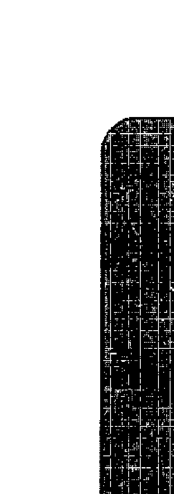

## 【黄道十二宫的对宫分配图】

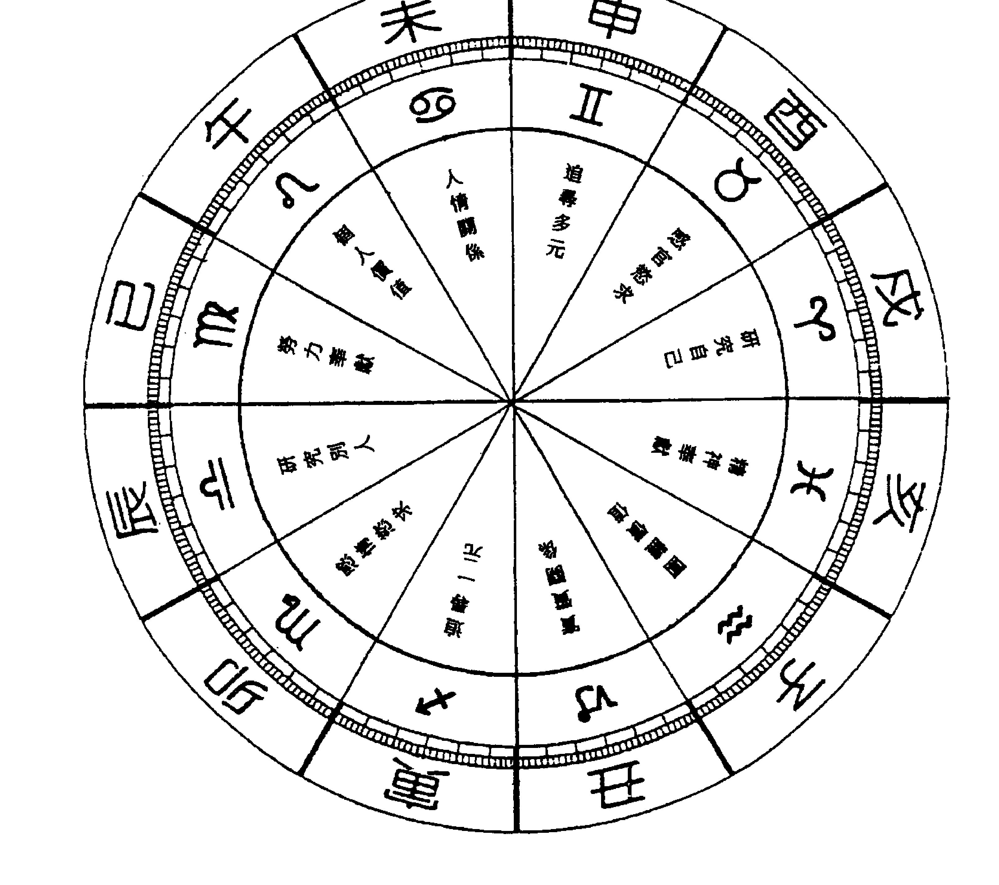

黄道十二宫之中的天秤座，最足以说明对宫的特性。天秤的两端可以说就是代表著互为对宫的两个星座，由于两端重量的不同会使得天秤有所不均，造成高低不平的现象，此象徵著心理意识上的不均衡。所以，天秤的两端是代表著对宫的冲突性和相冲性，而使得两端产生连繫并发挥平衡作用的中间那条横式铁条，也就是象徵著贯串于两个星座之间的拉力主力，透过该主力的拉动，才能够发挥对宫的一致性作用。因此，对宫就好像是一整组的天秤一样，既不能少掉放秤物品的两端，也不能缺乏把两端连结起来的铁条。

针对对宫所作的说明，以下是先从互为对宫的两个星座的特质呈现来作探讨，然后再进而从这些特质当中，分析出其中的对立与统一的关系，以及对宫彼此之间的互动关系。

## 黄道十二宫的对宫特质

对宫共有六组，以下是分别以六组来作归类，并且分成特质本性、对立性、统一性和后天宫属性等来作说明。

### 一、对宫的特质本性

- 〈第一组：白羊座（戌宫）、天秤座（辰宫）〉
白羊座代表著个人角色的突显，是一种自我的行为表现，会导致于注重个人，自己管自己，独断自我，自我意识太过于浓厚。
天秤座代表著合夥關係的突顯，是一種會考慮到別人的行為表現，會導致於強調與別人分享，以別人為重心，合夥意識太過於濃厚。

- 〈第二組：金牛座（酉宮）、天蠍座（卯宮）〉
金牛座代表著感官體驗的堅持，強調肉體感官上的穩固與固執，可以說是一種肉慾的需求，追求於實際事物的掌握。
天蠍座代表著感情體驗的堅持，強調感情神祕上的穩固與固執，可以說是一種情慾的需求，追求於感情上的完全掌控。

- 〈第三組：雙子座（申宮）、射手座（寅宮）〉
雙子座代表著對於知識的追尋，是一種比較表層式的概念運作及反應，以常識為主，強調知識的廣度化及多元化。
射手座代表著對於智慧的追尋，是一種比較深層式的思想運作及反應，以體會為主，強調知識的深度化以及知識運用上的沈思。

- 〈第四組：巨蟹座（未宮）、摩羯座（丑宮）〉
巨蟹座代表著感情世界的成就，以感情的建構來作為人生的目標，並且以情緒來作為與周遭環境產生互動的主體。
摩羯座代表著實質世界的成就，以實質的建構來作為人生的目標，並且以現實來作為與周遭環境產生互動的主體。

- 〈第五組：獅子座（午宮）、寶瓶座（子宮）〉
獅子座代表著個人價值的呈現，是個人主義的象徵，信仰於自己的價值觀，強調個人存在的價值，是存在主義的呈現。
寶瓶座代表著集體價值的呈現，是集體主義的象徵，考慮到如何去帶動群眾，強調團體的價值，是社會主義的展現。

- 〈第六組：處女座（巳宮）、雙魚座（亥宮）〉
處女座代表著身體上的自我犧牲，是屬於肉體上的勞動與服務，表現在外在行為上的勞碌與實踐。
雙魚座代表著精神上的自我犧牲，是屬於精神上的奉獻與服務，表現在精神層面上的提昇與歷練。

#### 二、對宮的對立性

- 〈第一組：白羊座（戌宮）、天秤座（辰宮）〉
兩者的對立特性，簡單地說就是自己與別人之間的不同。白羊座強調的是自己，不管別人的態度及反應是如何，是我行我素的行為，別人的一切在他的眼中是沒有必要多作考慮的因素。而天秤座則是以別人為重心，考慮到別人的立場及反應，會設身處地為別人想，是要與別人共同分享的行為表現，太缺乏自己的立場了。它們兩者之間的差異，可以說是自我世界與外我世界的不同，也是一人世界與兩人世界的不同。

- 〈第二組：金牛座（酉宮）、天蠍座（卯宮）〉
兩者的對立特性，簡單地說就是感官和感情之間的不同。金牛座強調的是自己感官上的舒適及擁有，偏向於對外在實質事物的掌握，從實質事物的掌握來獲得感官上的滿足。而天蠍座則是感情上的絕對與堅持，偏向於對內在情欲的掌控，要從感情的完全掌控來滿足於自己對於感情上的要求，進而遂行自己的原欲。它們兩者之間的差異，可以說是表象世界與內在世界的不同，也是物欲世界與情欲世界的不同。

- 〈第三組：雙子座（申宮）、射手座（寅宮）〉
兩者的對立特性，簡單地說就是多元和一元之間的不同。雙子座所要追尋的是多元化的東西，愈多愈好，可以說是瞭解以後就會放棄的表現，比較缺乏深入探究之心。而射手座則是要追尋於一元化式的昇華，比較具有目標性和理想性，會不斷地往上尋求境界上的提昇，把知識提昇為智慧，思考的程度比雙子座更深更久。它們兩者之間的差異，可以說是多元世界與一元世界的不同，也是知識世界與智慧世界的不同。

- 〈第四組：巨蟹座（未宮）、摩羯座（丑宮）〉
兩者的對立特性，簡單地說就是人情和實利之間的不同。巨蟹座是以人情來作為主要的考量因素，而且需求的也是人情網絡的建構，缺乏現實層面的動機，人情足以壓倒實利。而摩羯座則純粹是現實主義的代表，以實利來作為主要的考量因素，而且需求的也是實質利益網絡的建構，缺乏人情味的感情動機，現實足以壓倒感情。它們兩者之間的差異，可以說是小型世界（家庭）與大型世界（事業）的不同，也是有情世界與無情世界的不同。

- 〈第五組：獅子座（午宮）、寶瓶座（子宮）〉
兩者的對立特性，簡單地說就是個人與團體之間的不同。獅子座是單一的個人，是站在個人的立場來與群眾產生互動，以個人來吸引群眾的關注，考量的重點是個人在群眾之中的地位。而寶瓶座則是團體的，是與群眾站在一起的，考量的重點是如何促進及注意團體的福利與價值性，是群眾之中的一份子，強調每一個人的價值性是一樣的。它們兩者之間的差異，可以說是個人世界與眾人世界的不同，也是台上世界與台下世界的不同。

- 〈第六組：處女座（巳宮）、雙魚座（亥宮）〉
兩者的對立特性，簡單地說就是身體與情操之間的不同。處女座的身體活動是屬於外在的，很容易看得出來的，藉由身體的活動來奉獻於操勞性的工作。而雙魚座的情操活動是屬於內在精神層次的，不容易看得出來的，是要用感受的，藉由情操的訴求來奉獻於仁慈性的工作。它們兩者之間的差異，可以說是狹窄世界與寬廣世界的不同，也是平面世界與高空世界的不同。

#### 三、對宮的統一性

- 〈第一組：白羊座（戌宮）、天秤座（辰宮）〉
兩者的共同性可以用「研究」來作代表。研究具有專注、重心、分析和權衡的涵義。白羊座是射線式的研究，注重的是一種探究的精神，所以會偏向於個人式的、自己玩的研究；而天秤座則是橫線式的研究，注重的是兩端的權衡，研究的是利弊得失的評估，以及自己與別人之間的互動關係，是分析如何使得別人的權益不致於受損。

- 〈第二組：金牛座（酉宮）、天蠍座（卯宮）〉
兩者的共同性可以用「慾求」來作代表。慾求是一種「我要擁有」的意思表示，不容許別人來分享，會盡全力地去掌握住全部。金牛座是表面化的慾求，表面化指的是身體表層的感官享受，以及物質層面之金錢和財務的擁有，是可以看得到、感覺得到的；而天蠍座則是底層化的擁有，底層化指的是內在的心理慾求，是潛意識裡原慾的呈現，是「一定要」的意思。

##### 〈第三組：雙子座（申宮）、射手座（寅宮）〉
兩者的共同性可以用「觸動」來作代表。觸動是由於周遭環境有了某些變化，以致於吸引了關注的眼神，進而有了要一看究竟的動機。雙子座的觸動是普遍化的，它的眼光會時常注意著周遭環境的變化，也隨時在搜尋那裡有著新奇的東西；而射手座的觸動則是高度化和遠處化的，隨時在藉由自己的新體驗，來探知於何處可以累積經歷和智慧。

##### 〈第四組：巨蟹座（未宮）、摩羯座（丑宮）〉
兩者的共同性可以用「關係」來作代表。關係表示著人與人之間是基於什麼樣的因素考慮，來作為彼此的連繫，並結為具有利害共識的共同體。巨蟹座是一種奠基於情感的人際關係，範圍小，親密度高，會與別人建立起情感上的連繫，以情感活動來作為關係建立的基礎；而摩羯座則是一種奠基於以實質利益來作為考量重點的人際關係，範圍大，只要是有利可圖，那怕是覺得很討厭，也會勉為其難地與別人交往，以成大功立大業之成就感心態，來作為關係建立的基礎。

##### 〈第五組：獅子座（午宮）、寶瓶座（子宮）〉
兩者的共同性可以用「舞台」來作代表。舞台表示著一個活動的空間與場所，可以容納許多人在裡面，但是表演者的表演方式卻各有不同。獅子座的表演方式是精彩的個人秀，會讓眾人嘆為觀止，驚訝於它的大膽和才華；而寶瓶座則是屬於帶動唱的表演方式，要讓眾人跟著它一起做動作，帶動整個活動空間內融為一體的氣氛。

- 〈第六組：處女座（巳宮）、雙魚座（亥宮）〉
兩者的共同性可以用「體驗」來作代表。體驗表示著具有一種以身投入的精神，是親身的體驗，而不是透過書本去作理解的。處女座的體驗方式是身體式的，以身體的實際活動來做體驗，在體驗的過程中，感覺於身體存在的價值；而雙魚座的體驗方式則是冥想式的，以精神層次的實際活動來做體驗，在體驗的過程中，感覺於精神存在的價值。

#### 四、對宮的後天宮屬性

- 〈第一組：白羊座（戌宮）、天秤座（辰宮）〉
白羊座具有第一宮的意涵，所以是個人的生命起源，只知道有自己，不知道有別人。就好像是出生的嬰兒一樣，肚子餓了就哭，那管得著媽媽正在做什麼，反正他就是要吃奶，吃不到就一直哭。
天秤座具有第七宮的意涵，是合夥關係的象徵，在此以夫妻關係來作描述。夫妻關係是由兩人同心協力所建立起來的，彼此應該考慮到對方的心理、情緒和立場。夫妻雙方即是天秤上的兩端，沒有誰輕誰重的劃分，唯有取得諧和性的共處，才能維繫一個健全的家庭。

- 〈第二組：金牛座（酉宮）、天蠍座（卯宮）〉
金牛座具有第二宮的意涵，是錢財的象徵，在此以正財來作描述。正財指的是自己辛辛苦苦努力工作所獲得的金錢收入，也是財庫的象徵，是可以守得住、留存得下來的錢財，深具金牛座之「擁有」的涵義。
天蠍座具有第八宮的意涵，是偏財的象徵，而偏財指的是不勞而獲、輕鬆得來的，或者是收入遠大於付出的錢財取得方式。所以，天蠍座與政治權力和生意收入（標準之官商勾結的代表）有關，也與遺產或配偶所帶來的錢財（第八宮正好是第七宮的第二宮，指示著配偶的財務狀況）有關。

- 〈第三組：雙子座（申宮）、射手座（寅宮）〉
雙子座具有第三宮的意涵，是旅行的象徵，旅行是一種移動、外出和新鮮經驗的意思。雙子座的旅行是短程的、國內的旅行，同時也是身體式的旅行，喜歡在短程範圍內跑來跑去。
射手座具有第九宮的意涵，同樣也是旅行，但是射手座卻是長程的、國外的旅行，同時也是屬於精神層次的旅行，喜歡出國去體驗新鮮的環境和經驗，或者是在精神層次上追求於哲學、宗教和思想方面的提昇。

- 〈第四組：巨蟹座（未宮）、摩羯座（丑宮）〉
巨蟹座具有第四宮的意涵，是家庭的象徵，家庭是一種小範圍的感情世界，而且具有保護性，不容許敵人的入侵。同時，巨蟹座也是母親的代表，是慈母的意思，是一個休息和依靠的場所。
摩羯座具有第十宮的意涵，是事業的象徵，事業是一種大範圍的物質世界，而且具有保護性，不容許敵人竊取商業機密，或阻礙了個人的攀升高位。同時，摩羯座也是父親的代表，是嚴父的意思，是一個奮鬥和成就的場所。

- 〈第五組：獅子座（午宮）、寶瓶座（子宮）〉
獅子座具有第五宮的意涵，是遊戲、娛樂和投資的象徵，屬於玩樂的性質比較重，是有所刺激的享樂。同時，也是代表著個人才華的呈現，可以把自己所創作出的東西展現出來，取得別人的認同及讚賞。
寶瓶座具有第十一宮的意涵，是團體內友誼的象徵，具有傳達理念的功能，是團體組織內的社交活動力。同時，也是代表著個人才能的呈現，可以把自己所獨創的見解或所發明的東西拿出來與別人共享，把自己的理念傳達給團體組織中的成員。

- 〈第六組：處女座（巳宮）、雙魚座（亥宮）〉
處女座具有第六宮的意涵，在此以勞動性工作來作描述。勞動性工作代表著體力的付出，而且是職員的象徵，亦即只是大公司之中的一個小份子。同時，也是代表著自己與老闆的相處情況，是勞碌及聽命於人的意思。
雙魚座具有第十二宮的意涵，在此以逃避和隱退來作描述。逃避代表著不負責任、無法面對挑戰，工作的態度只是過一天算一天，看不到人生目標的所在，缺乏強烈的企圖心。同時，逃避也具有隱退的涵義，隱退指的是人在歷經歲月的各種磨練之後，年老體衰退休時的精神修養，所以雙魚座缺乏競爭力。

### 對宮的互動關係

在此，只是提供少許對宮彼此互動關係的描述，讀者可以自行類推，在推敲的過程中，往往也就是深入地體會於星座特質的過程，所以希望讀者能仔細地品味一番。

#### 一、對宮的互援性

這裡所謂的互援性，指的是對宮如何賦予本宮有所發揮的支援力量，亦即對宮是如何地對本宮之特質的發揮產生影響。

##### 〈第一組：白羊座（戌宮）、天秤座（辰宮）〉
天秤座是屬於風象，所以對於符號的運作比較擅長（符號包括了圖片、概念、數字、文字和聲音等印象），而且天秤座的符號運作是偏向於分析、平衡與評估等方面的能力，它可以提供給白羊座的專注性研究具有分析的能力，所以天秤座是白羊座專心研究的背後支援。
白羊座是屬於火象，具有爆發、精力和目標性等特質，而且白羊座的精力爆發是集中式的、焦點式的，它可以提供給天秤座的評估具有專注力和關注點，使得天秤座在作分析的時候，可以比較專心及具有精力，並且可以很快地看出重點的所在，因此白羊座是天秤座分析和權衡的背後支援。

##### 〈第二組：金牛座（酉宮）、天蠍座（卯宮）〉
天蠍座是屬於水象，所以它的感覺性會比較敏銳，而且天蠍座又是深度化的代表，所以對於探查黑暗、沈等方面的事物具有獨到的能耐，它可以提供給金牛座加強觸感的深度化，使得金牛座能夠感受到事物的深層內在，所以天蠍座是金牛座之藝術才能的感受支援。
金牛座是屬於土象，所以對於實質性的事物可以產生良好的觸覺，而且金牛座又是帶有組織結構性的藝術才能，所以它可以提供給天蠍座在作深度探查時的觸感能力，藉由金牛座的敏銳感官作用，可以讓天蠍座知曉經由深層內在所反應出來的外在形態，所以金牛座是天蠍座之探索才能的觸覺支援。

- 〈第三組：雙子座（申宮）、射手座（寅宮）〉
射手座是屬於火象，所以具有精力放射的特質，而且射手座是高遠式的放射表現，所以對於高遠性的事物具有追尋的興趣，它可以提供給雙子座擁有更高的活動空間。同時，射手座的火象也可以助長雙子座的風象，提供雙子座追尋於新奇事物所需要的精力，所以射手座是雙子座四處飄動的精力支援。
雙子座是屬於風象，著重的是理性和概念，而且雙子座是最具有飄動的特性，它可以提供給射手座更多方面的追尋可能性，擴大射手座的平面活動空間，所以雙子座的風象成為射手座追尋於高遠目標時環顧四周的依據，並且助長射手座從事於精神活動時所需要的理性與邏輯能力，所以雙子座是射手座思想運作的理智支援。

- 〈第四組：巨蟹座（未宮）、摩羯座（丑宮）〉
摩羯座是屬於土象，具有實際、物質與穩固的特性，這種特性從後天宮的角度來看是最明顯的，因為摩羯座是事業的代表星座，摩羯座可以提供給家庭物質所需要的支援，讓家庭在物質上不致於匱乏，所以摩羯座是巨蟹座之家庭生活的物質支援。
巨蟹座是屬於水象，具有感情、情緒與保護的特性，這種特性從後天宮的角度來看也是明顯的，因為巨蟹座是家庭的代表星座，巨蟹座可以提供給事業感情上所需要的支援，讓事業在發展上具有歸屬感與安全感，所以巨蟹座是摩羯座之事業發展的情感支援。

## 第八章 對宮

切，也由於有事業上的實質收入，才能使得家庭獲得安定的生活，所以摩羯座就好像是麵包的特質，可以提供給家庭具有穩定的生活，因此摩羯座是巨蟹座的生活支援。

巨蟹座是屬於水象，是感情的世界，而且這種感情是家人般的親情，所以巨蟹座就好像是一個人的溫情窩，當一個人在外發展事業，拖著疲倦的身軀回到家裡的時候，最渴望的就是家人的安慰與親情的關懷。同時，家庭的和樂與融洽是事業發展的最有力支持，可以使得個人無後顧之慮地全力衝刺，所以巨蟹座是摩羯座的親情支援。

##### 〈第五組：獅子座（午宮）、寶瓶座（子宮）〉

寶瓶座是屬於風象，而且具有社交和鼓動的特性，擅長於透過言語的表達，而使人迷惑於新奇和獨創的前衛觀念之中，欣賞於寶瓶座的敢言、言人之所未言，是純群眾主義的。然而，群眾卻正好是獅子座的基礎、掌聲的來源，所以寶瓶座可以提供給獅子座有所觀眾，並且讓獅子座來成為領袖，所以寶瓶座是獅子座的群眾支援。

反過來說，獅子座的個人主義和英雄風采，如果想要獲得更多的掌聲和讚賞的話，就必須考慮到群眾的心理，掌握與控制群眾的情緒，所以獅子座可以提供給寶瓶座作為控制和指揮群眾的能力，因此獅子座是寶瓶座的領導支援。

##### 〈第六組：處女座（巳宮）、雙魚座（亥宮）〉

雙魚座是屬於水象，而且是廣而薄的大海水，是一視同仁、人溺己溺、博愛的精神表現，缺乏選擇性。同時，也比較偏向於想像的層面，是夢想式的代表。然而，這種博愛加想像所造成的自我奉獻，可以提供給處女座的操勞有所精神糧食，使得處女座樂於從事各種服務，無怨無悔、無嘆無怒，所以雙魚座是處女座的精神支援。

處女座是屬於土象，可以產生執行的能耐，可以使得雙魚座的想像與仁慈獲得落實，提供雙魚座有能力去從事於社會服務和藝術創作，如果沒有處女座的實踐動力，則雙魚座可能會只停留在空想和麻醉之中，所以處女座是雙魚座的實踐支援。

#### 二、對宮的突破性

這裡所謂的突破性，指的是對宮彼此之間如何產生拉力，亦即如何藉由對宮的力量來開拓本宮的特質。

- 〈第一組：白羊座（戌宮）、天秤座（辰宮）〉

天秤座由於具有如何使得兩端取得平衡的特質，所以往往會造成優柔寡斷的個性，對於事情總是著重於分析和評估，而不是在於下決定，因此需要白羊座的決斷力，亦即白羊座是突破天秤座優柔寡斷的最佳途徑。

白羊座由於太具有爆發力，所以往往會因為衝動而壞了事情，因此需要天秤座的冷靜、思考和分析，亦即天秤座是突破白羊座之衝動個性的最佳途徑，把白羊座的外在衝動行爲轉化爲天秤座的外在紳士舉止。

- 〈第二組：金牛座（酉宮）、天蠍座（卯宮）〉

天蠍座由於太過於強調感情的深化與絕對，所以往往會不具有理智性的思考，甚至不會去顧慮到現實的狀況，而且由於太過於具有鬥爭性和暗幹性，所以需要金牛座來突破天蠍座的黑暗特質，使得天蠍座能夠比較注重現實層面，並且能夠把深沈的感受轉化為外在的藝術作品。

金牛座的物質性、現實性和表面的感官性，需要天蠍座來做突破，使得金牛座能夠具有感情性，使得藝術的創作能夠不只是結構性的美感而已，而是應該更具有讓人看了就能夠產生共鳴的深層吸引力。

##### 〈第三組：雙子座（申宮）、射手座（寅宮）〉

射手座由於太過於追求高遠的目標，所以往往可能會造成高度的理想化，而且它是比較偏向於直覺式的體會，或者是太過於強調理論和方法論，缺乏幽默的口才和生動的說服力。而雙子座正好可以對此發揮突破的功能，使得射手座的思考和體驗具有常識性和活潑性。

雙子座由於太過於偏向知識的表面，所以時常只是懂得皮毛而已，然後就可以說成好像很懂的樣子，缺乏作更深入研究的動力，所以有賴於射手座來做突破，使得雙子座的知識和思考能夠提昇到思想和理論的層次。

##### 〈第四組：巨蟹座（未宮）、摩羯座（丑宮）〉

摩羯座由於太過於追求外在事物的成就，希望自己能夠在有生之年成為某一領域之中的佼佼者，所以往往會給人一種現實、無情而冷酷的感覺，因此需要巨蟹座的感情和溫情來做突破，使得無情世界變成是有情世界。

巨蟹座狹隘式的情感表現，往往會使人背負著太多的人情壓力和感情包袱，阻礙了事業的發展，養太多沒有必要的人員在公司，所以需要摩羯座的現實力量來做突破，以無情而現實的角度來考量事業的發展，畢竟利潤的提高是事業繼續發展下去的基本要件，雖是無情，但卻是必要的手段。

##### 〈第五組：獅子座（午宮）、寶瓶座（子宮）〉

寶瓶座的人道主義色彩，往往會造成以大家的權益為主，比較缺乏個人權益的突顯，所以是雞婆、嘮叨和多事的代表，做太多沒有必要做的事，因此需要獅子座來做突破，發揮獨斷自我的特性，使得寶瓶座在為眾人謀權益的過程中，也不要忘記自己的利益，說得露骨一點，就是如何在為群眾謀權益的過程中，使得自己能撈到更多的好處，或者是確立自己的權威。

獅子座的太過於自我主義，往往會是難以讓人接受的，所以需要一層防護罩來做掩飾，而寶瓶座就是最好的防護罩，可以藉由寶瓶座的眾人謀權益，來突破獅子座之單打獨鬥的態勢，讓群眾成為獅子座的支援，也讓獅子座的地位能夠處得更高，完全立於不敗之地。

##### 〈第六組：處女座（巳宮）、雙魚座（亥宮）〉

雙魚座的自我奉獻、犧牲太過於沒有選擇性了，往往會留給別人一種好欺負的印象。同時，雙魚座本身也往往會由於太缺乏反抗力，容易導致暗自落淚和自憐情境，所以有必要以處女座來做突破，勇於指責別人的缺點，發揮挑剔、批評和要求的能耐，使得別人不得不另眼相待，以批判別人來保護自己的脆弱心靈。

處女座的完美主義也需要雙魚座來做突破，以雙魚座之容納四海的雅量，來包容別人的小小缺失，不要把一切都看得太清楚、太仔細，如此一來，生活才能夠與雙魚座一樣，享受著夢幻而快樂的浪漫情趣。

## 第八章 對宮

#### 三、對宮的互輔性

這裡所謂的互輔性，指的是對宮彼此之間如何取得調和，亦即如何藉由對宮的力量，來使得本宮的特質取得平衡，以致於能夠有良好的特質展現出來。

- 〈第一組：白羊座（戌宮）、天秤座（辰宮）〉

天秤座的兩端同時進行，很明顯地無法達到重點突破，而白羊座正好可以彌補這項缺失。因此，如果你的主要人格特質同時具有白羊座和天秤座的話，那麼你將可以成爲一位很優秀的專業研究人才，因爲不但具有白羊座之爆發性的專注研究精神，而且具有天秤座的理性和概念運作能力，可以把你所要研究的事物做到很清楚的條理分析，並且提出客觀而合理的評估報告，有許多的學者專家皆具有如此的主要人格星座組合。

- 〈第二組：金牛座（酉宮）、天蠍座（卯宮）〉

天蠍座的非現實性和感情的深度要求性，往往就是造成「恨」意的根源，而金牛座正好可以緩和或發洩這種恨意，亦即金牛座可以把天蠍座的深層力量提升到外表上。因此，如果你的主要人格特質同時具有天蠍座和金牛座的話，你將可以成爲一位很好的醫師（探究於人體的奧秘）、藝術創作者（探究於美感的呈現）、政治人物或成功的商人（探究於官商勾結的管道）等，這種主要人格星座的組合具有多方面才能表現的可能性。

- 〈第三組：雙子座（申宮）、射手座（寅宮）〉

射手座的高遠性質往往會給人一種好高騖遠的感覺，談論的東西似乎偏離了日常生活，只適合於少數志同道合的人。而雙子座則正好相反，它所談的是平常性的知識，大家都很容易懂的，而且說起話來也相當具有趣味性。因此，如果你的主要人格特質同時具有射手座和雙子座的話，你將可以成爲一位很好的思想家、宗教家、哲學家、律師或老師，因爲你不只是具備了知識吸收與傳達的優點，而且能夠深入地思考到問題的根源，並探究其發展的可能性，同時也可以由淺入深地引導別人進入該項知識領域。白羊座和天秤座的組合，比較偏向於專業技術方面；而雙子座和射手座的組合，比較偏向於理論和思想方面。

##### 〈第四組：巨蟹座（未宮）、摩羯座（丑宮）〉

摩羯座的實質利益之生產特質，雖然是家庭生活所必需的，但未免太過於無趣了。這就好像是一個家庭已經有了嚴父，當然需要有慈母來做搭配，軟硬兼施，白臉和黑臉交互運作，才能夠使得小孩具有合理的教育環境，亦即不但要有依戀的對象和疼愛的來源，也要有嚴厲的對象和管教的來源。因此，如果你的主要人格特質當中，同時具備了摩羯座和巨蟹座的話，那麼你在事業的發展過程中，就不會忽略了家庭親情的重要，那怕是事業有成，外遇及離婚的可能性會減少。同時，往往如果這種主要人格星座的組合運用得當的話，可以使得事業具有更好的發展，因爲下屬不但能夠感受到巨蟹座的溫情和照顧，也能夠感受到摩羯座的才幹和嚴格要求。

##### 〈第五組：獅子座（午宮）、寶瓶座（子宮）〉

寶瓶座的社會主義特質，往往會導致於站在貧窮者、無產階級者的立場，以悲天憫人的胸懷來對社會現象展開批判，是革新與革命的最佳星座代表。但是，僅僅是理念的傳遞，或者是付諸於實際行動，最後仍然不能不考量到權力的掌控，有了實際的權力，才能夠真正地把社會主義的理念落實在法律層面。因此，如果你的主要人格特質當中，同時具備了寶瓶座和獅子座的話，那麼這個世界就好像是為你而存在，盡量地去發揮你的權力掌控的特質，並且成為無產階級的喉舌吧。

##### 〈第六組：處女座（巳宮）、雙魚座（亥宮）〉

雙魚座之精神式的無限付出，往往會導致於不知道自己身處何境，為誰而活；而處女座正好可以把雙魚座之已經飛上天的暝想拉下人世間，把雙魚座的精神力量依附在真實的身體上。因此，如果你的主要人格特質當中，同時具備了雙魚座和處女座的話，那麼你將會成為一位到處受歡迎的人（處女座坐命宮的人另當別論），因為你對於為人服務的工作有著高度的熱誠，自願性大於被強迫性。當你忽然消失的時候，每一個人都會懷念你、想到你，因為缺少了你，實在是太不方便了。

以上針對黃道十二宮之對宮所作的說明，潛藏著心理調和的色彩。而在實際論斷上，對宮的最大用處，也往往就是在於發揮人格特質的突破面，也就是說要以對宮的拉力來平衡本宮的過度發展，使得人格特質不致於太過極端。當然，由於對宮只涉及到兩個星座，所以在論斷上還不夠完備，還需要考虑到其他的主要人格星座來一起作論斷，才能夠算是整個主要人格星座的組合。

## 第九章 後天宮

黃道十二宮的每一個星座，除了皆具有各自的獨特性，可以用來作爲人格特質的論斷以外，還可以用來論斷事件以及生活領域。因此，針對星座所作的解析，也有必要就星座在事件和生活領域之論斷上的功能略作說明。換言之，在論斷生活領域上所可能發生之事件的時候，不能只是看後天宮而已，也必須配合著星座來一起合看，特別是在星座與宮位結合的情況下（亦即先後天宮合盤），星座在論斷生活領域上具有兩大重要功能：一是可以透視後天宮之生活領域的基本態度；二是可以透視後天宮之生活領域的天賦才能。而就星座本身所具有後天宮意涵來看，也是具有天賦才能的特質。因此，可以藉由星座本身所具有的後天宮意涵，來觀察個人對於某一項生活領域所擁有的天賦才能。

例如，如果第二宮的宮頭是落入獅子座的話，那麼會影響個人在錢財的運用上是採取獅子座的基本態度，亦即花錢會比較慷慨，也可以說是賺得多、花得也多的人。同時，這也意味著此人對於錢財的運用具有獅子座的天賦才能，亦即對於錢財會有投資和賭博的本性，而且對於錢財的反應相當敏銳（獅子座是火象，是直覺的特質）。而由於錢財與金牛座有著密切的關係，所以金牛座本身所呈現出來的情況（包括金牛座之內的行星，以及這些行星的相位等），也是必須考量到的基本因素。至於第二宮宮內的行星，以及這些行星的相位，還有第二宮宮主星的情況等，也都必須進行評估，但這並不是本章所要說明的主題，所以暫時略而不談。

總之，任何一項有關後天宮生活領域的論斷，都絕對不可以忽略了同樣主宰該生活領域的星座情況，否則可能會產生誤判。例如，如果木星是落入第二宮，而且吉相位相當多；但是，卻同時是土星落入金牛座，而且凶相位相當多的話，那麼絕對不可以因爲第二宮的情況相當好，就直接論斷錢財狀況很好，還必須配合著金牛座的情況來一起合看，才能決定真實的錢財狀況。

此外，在中國傳統的「果老星宗」上，是把黃道十二宮稱之爲是先天宮，而把用來論斷生活領域的十二宮，稱之爲是後天十二宮。而且，中國傳統上對於後天十二宮的排列次序，依序是命宮（第一宮）、財帛宮（第二宮）、兄弟宮（第三宮）、田宅宮（第四宮）、男女宮（第五宮）、奴僕宮（第六宮）、夫妻宮（第七宮）、疾厄宮（第八宮）、遷移宮（第九宮）、官祿宮（第十宮）、福德宮（第十一宮）和相貌宮（第十二宮）等。同時，這種傳統的後天宮劃分是採用等宮制，所以不會有截奪宮的情況發生，然而也因此而比較容易產生宮頭位置上的誤差。

再者，本書所採用之後天十二宮的名稱，是與西方的現代占星學用法相一致，以第一宮、第二宮.... 等來稱呼，之所以如此稱呼的主要理由如下：

首先，占星學上的後天十二宮所涉及到的涵義，主要是與人類的生活領域有關。然而，由於生活領域所涉及到的範圍相當廣泛，並且又會隨著時代的演進，而陸續地擴大了生活領域的涵概事項。如此一來，如果以特定的名稱來稱呼或界定後天宮位的話，則恐怕會有誤導之慮，所以除了第一宮可以用命宮來作稱呼以外，其餘的皆以第二宮、第三宮.... 等來稱呼，比較能夠包含更多的生活事項。

其實，中國傳統占星術的名稱用法，並沒有什麼不妥當之處，只是它所反應的乃是古代農業社會的實際情況。在古代的農業社會之中，人們的生活領域並不廣闊，也並不複雜，因此所要論斷的生活領域事項，也就比較單純。如此一來，以財帛、兄弟、夫妻.... 等，來作爲命理上之生活領域事項的論斷，也就夠用了。舉例而言，以第九宮來說，它包含了法律、思想和國外等生活範圍，而在古代的農業社會之中，由於無法突顯出第九宮的所有意涵，所以只能將它界定在遠程的旅行上，造成了所謂的遷移宮的稱呼，用以論斷出遠門的狀況。

從現代占星學上來看，由於每一個後天宮所包含的生活領域事項，可以說是相當複雜和廣泛。因此，如果說硬要以一個很足以代表那一個後天宮的名稱來稱呼，實在有所困難，所以乾脆以後天宮的排列次序來稱呼，反而是比較簡單，這就像是以十二地支來稱呼黃道十二宮一樣。

其次，從心理分析的角度來看，古代農業社會所呈現出來的命理論斷，偏重於外在事物的論斷，所以用與外在事物有關的名稱來稱呼後天十二宮乃是必然。當然，在占星學的理論斷上，後天十二宮的最主要用途，就是在於論斷生活領域中外在事物的擁有情況。但是，現代占星學在廣泛地應用心理學理論的基礎下，已經使得後天十二宮的論斷不只是外在事物的擁有與否，也包括了論斷到個人對於外在事物擁有時的心理反應，以及面對該生活領域內的外在事物時，所可能呈現出來的應對行爲。

最明顯的例子就是，每一個後天十二宮都會對應於一個星座；也就是說，後天十二宮的每一個宮位的宮頭，都會落在十二星座的其中之一。而除了命宮（第一宮）會影響到主要人格特質，進而影響到所有的生活領域之外，其他的十一宮所各自主宰的生活領域，不管有沒有行星落入，皆可以從其宮頭所在的星座，來決定對於該項生活領域所主宰之事項會採取何種基本態度，亦即可以透過星座來決定個人對於某一項生活領域所主宰之事物的基本心理意識和心理反應，進而論斷某一項生活領域的吉凶趨勢。

因此，基於心理分析的必要性，以第幾宮來稱呼該宮所主宰的生活領域事項，可以意味著只要是該宮所主宰之範圍以內的事物，都會呈現出共同的心理意識傾向，而不是只針對特定的對象，諸如錢財、夫妻、職業和遷移等。

其三，從現代的人際關係角度來看，每一個後天宮皆具有相當程度的人際關係意涵，而絕對不是僅限於單一對象而已。換言之，每一個後天宮位所具有的人際關係意涵，並不能以特定對象來作限定。

例如，第七宮在命理的論斷上，以現代的人際關係來看，除了包括夫妻關係以外，也包括了同居、合夥等關係。又例如，第三宮在命理的論斷上，除了兄弟以外，也包括了比較有親近溝通關係的友人。這種後天宮位所包含之生活領域的擴大，是與時代的變遷有關，同時也與文化背景因素有關。譬喻說，在農業社會之中，當然只有夫妻才能夠同居；而在現代的社會之中，同居關係發生情況相當多，甚至也包括了同性戀的同居關係（不一定要一男一女），以及沒有性關係的異性知己在內。於是，在認定第七宮所具有的生活領域範圍的時候，不能只限定在夫妻關係而已，必須以現代人際關係的角度來作更進廣泛的解釋。所以，用第幾宮來稱呼後天宮，固然是比較抽象，但卻是比較能夠包含更多的主宰事物，也能夠隨著時代和文化背景的不同而作適當的修正。

最後，從與自然科學和社會科學作整合的角度來看，後天宮所代表的意涵會隨著所要研究的專業領域而有所修改。此時，以個人本命論斷爲主的後天宮意涵，就有必要作修正。例如，以政治占星學來說，個人的本命盤變成是國家的本命盤，此時後天十二宮所代表的生活領域，套用在國家本命盤之論斷上的時候，就不能稱之爲是夫妻宮、田宅宮和疾厄宮等，而是要改以適合政治占星學所要使用的名稱。因此，乾脆以第幾宮來稱呼，就可以避免應用上的麻煩。

在談及星座所具有的後天宮意涵時，可以從四個方面來進行說明：一是星座的後天宮生活領域意涵；二是星座之三方四正的後天宮關係性；三是後天宮的六親互動關係；四是星座與生活領域論斷上的關係。其中的第一項和第二項可以合起來談。至於星座與後天宮之互動關係的更進一步說明，除了先後天宮的合盤參見本書第十二章以外，其他的探討由於涉及到行星和相位，所以留待以後陸續出版的書籍當中，再來配合著實例的分析而作比較詳盡的解釋。

### 星座的三方四正與後天宮的關係

現代占星學上的後天宮位之所以要如此地排列，以及之所以具有如此的生活領域涵義，絕對不是沒有道理的，而是有其黃道十二宮之三方和四正的互動關係上的意義。

## 第九章 後天宮

### 一、星座的後天四正宮屬性

先從星座的四正宮來看，以白羊座來作爲第一宮（即命宮），則基本宮（辰戌丑未）應該分別是第一、四、七、十宮，在後天宮位的統一名稱上，是稱之爲「始宮」；固定宮（子午卯酉）應該分別是第二、五、八、十一宮，在後天宮位的統一名稱上，是稱之爲「續宮」；變動宮（寅申巳亥）應該分別是第三、六、九、十二宮，在後天宮位的統一名稱上，是稱之爲「果宮」。

（一）白羊座・巨蟹座・天秤座・摩羯座

始宮所包括的第一、四、七、十宮，可以說是在人類的生活之中，是最基本的領域與基地，而且也具有在人生歷程當中有所改變基地的意涵。

命宮是一個人生命的誕生，展開了人生歷程的第一步，具有從生命創始的那一剎那，開始往前邁進的意義，可以看成是以娘胎爲基地，而要脫離娘胎以尋求成長。

第四宮是一個人的幼年生活環境，奠定了適應於家庭生活的基礎，並且以此來進而邁入於社會環境。因此，可以看成是以家庭來作爲幼年成長的基地，進而要脫離這個基地，去建構另一個比較廣大的基地。

第七宮是社會關係建立的基礎，也就是夫妻、合夥關係的建立，是最基本的社會組織，可以看成是以此基本組織爲基地，進而要去發展更進一步的社會關係。

第十宮是社會成就的認定，是個人在社會當中所建立起來的一切有形與無形的成果，可以看成是以此成果爲基地，進而去確認與體驗生命的意義。

## 第九章 後天宮

此外，第一、四、七、十宮，還可以看成是在人生歷程當中，所必然要面對的難題以及突破的方向。

第一宮所代表的人類的初生，意味著要面對成長的難題。打從娘胎出來就表示著要面臨人世間所有的生老病死，以及個人應該如何去開創和突破生命的意義。況且，許多個人先天上所具有的外表形態和個性等，也大部份已經在出生的時候有所決定了。

第四宮所具有的家庭意涵，固然是個人溫暖親情的所在，但往往也是感情壓力的包袱，有些人就是一輩子在父母的蔭影之下生存，缺乏己見。所以，家庭的感情壓力是每一個爲人子女者所必然要面對的難題，如果能夠突破家庭的壓力和限制的話（這往往是需要父母的配合與支持），才能夠算是真正的個人成長。

第七宮的夫妻關係，雖然是代表著社會基礎的建立，但卻也是生活壓力的開始；尤其是以往的農業社會，是依靠男人的工作來養家活口，必須面對負起生活家計的難題。同時，夫妻關係的建立也就是子女來臨的前兆，一旦有了子女，也就表示突破了夫妻關係的兩人活動空間，而這種突破會更加重了生活的責任與壓力。

第十宮所代表的事業意涵，是人生歷程當中社會成就的所在，而事業的建構往往是最具有困難性質的；尤其是在現代社會之中，如果要白手成家的話，談何容易，是必須付出相當多的心血與努力，才能夠有所成就。但是，也由於是最困難，所以最具有突破的意義，一旦功成名就之後，也就不枉此生了。

將星座和宮位結合起來作對比，則白羊座相當於第一宮，具有開創、誕生和突破的意義，所以白羊座具有後天第一宮的特質。巨蟹座則相當於第四宮，具有家庭、親情和根的意義，所以巨蟹座具有後天第四宮的特質。天秤座則相當於第七宮，具有合夥、夫妻和同居的意義，所以天秤座具有後天第七宮的特質。摩羯座則相當於第十宮，具有事業、成就和名譽的意義，所以摩羯座具有後天第十宮的特質。

#### （二）金牛座・獅子座・天蠍座・寶瓶座

續宮所包括的第二、五、八、十一宮，可以說是在人類的生活之中，是活動力有所展現的所在，也是個人有待發掘之生活焦點的所在。

第二宮是感官享受與物質擁有的代表，這就好像是小孩子抓到東西以後，不願意放手一樣，如果你把他的東西搶過來，則他就會哭，哭的原因是他已經拿在手裡的東西，就是他的了，不容許別人搶走。於是，活動力的展現就是表現在抓住東西，而生活的焦點也就是在於抓住什麼東西。

第五宮是個人才華表現的代表，這就好像是小孩子已經逐漸長大了，他不只是要抓東西而已，也要抓住別人有所注意的眼神，更想要與別人一起玩樂。娛樂遊戲對小孩子來說，是活動力的發洩，也是生活的焦點，因為他還不必工作，不必煩惱一些大人的事，可以盡情地玩樂，盡情地發揮個人的創作才華，而生活的焦點就在於抓住玩的機會。

第八宮雖然是許多生活領域事項的組合，但是其深層的原始動機卻是有著共同的特質，會表現出一種「征服」的共同特性。不管是性（異性的征服）、政治（權力的征服）、生意（偏財的征服）或巫術（神秘力量的征服）等，都是人類潛在力量的展現，同時征服也就是其生活的焦點，比抓住來得更有力。

第十一宮是屬於團體性的生活，是活躍於團體當中去展現社交的能力，會在組織團體之中去展現活動力，所以其生活焦點是放在人群上，藉由人群去體會真實的社會生活，是一個人在步入老年休養之前的生活領域。

此外，第二、五、八、十一宮，還可以看成是在人生歷程當中，最足以表現出個人才藝，以及體驗生命意義的方向。

第二宮是金錢運作能力的表現，足以建立起個人的物質生活水平，也因此而才能擁有更高的物質享受。這種物質的享受也可以說是一種生命的享受，家財萬貫者所過的舒適生活，往往不是無產階級所能體會到的。

第五宮綜合了娛樂、遊戲、投機和冒險等特質，賭博性相當濃厚。這種賭性並不是每一個人都可以擁有的才華，它具有「人生就像一場賭」的涵義，如此一來，才能夠體會到遊戲人間的生命樂趣。

第八宮所代表的涵義更多，但卻都是在於表現出個人對於深層黑暗面之探究與遂行的能耐，這也並不是每一個人都會具有的興趣和才華。而透過各種方式來進行探究或遂行，與其說是對於生命意義的體驗，倒不如說是對於生命意義的探究與征服。

第十一宮主要是表現在社交方面，負有使團體氣氛更為融洽，以及表達團體之訴求的才華。而其生命的意義也就是在於為眾人做點事，爭取團體之成員的權益以及平等地位。

將星座和宮位結合起來作對比，則金牛座相當於第二宮，具有掌握、金錢和物質的意義，所以金牛座具有後天第二宮的特質。獅子座則相當於第五宮，具有娛樂、創作和玩的意義，所以獅子座具有後天第五宮的特質。天蠍座則相當於第八宮，具有性慾、權力和神秘的意義，所以天蠍座具有後天第八宮的特質。寶瓶座則相當於第十一宮，具有團體、組織和社交的意義，所以寶瓶座具有後天第十一宮的特質。

#### （三）雙子座・處女座・射手座・雙魚座

果宮所包括的第三、六、九、十二宮，可以說是在人類的生活之中所必須進入的場所，也可以說成是必須融入的情境，同時也具有擴大個人活動領域的象徵。

第三宮是語言文字的傳達和領悟，與初中級教育有關。這就好像是小孩子開始學說話一樣，東問西問，充滿無限的好奇心，而且可以學得很快；同時，也由於開始學會走路了，所以會喜歡東跑西跑，東抓西抓，根本難以定下心來。這是正式進入於人類生活領域的象徵，不再是躺在母親懷褓或搖籃之中的小寶貝，而是要融入於他視野所及的活動空間之中。

第六宮主要是包括了工作和疾病兩大項目。從工作領域來看，是個人的謀生手段，是每一個人都必須進入的場所，那怕是家庭主婦，也要投入於家務性的工作。同時，這也表示著是個人活動空間的擴大，藉由工作來使得整個人的頭腦和四肢都投入活躍之中。

第九宮所代表的國外、哲學思想和宗教信仰等，可以更進一步地擴大個人的生活領域，促使個人去跑得更遠、想得更多、體會得更深，融入於精神層次的感受之中。

第十二宮是個人生命的終點，但卻是再生前的準備。就好像是一位年近百歲而將死的人一樣，人世間對他來說，可以說是酸甜苦辣皆已嘗過了，現在只是在靜靜地等待著死亡的來臨。所以，它是融入於一種生死交界的處境，由生擴展到死，是人生所必須步入的終極場所。

此外，第三、六、九、十二宮，還可以看成是在人生歷程當中，心境有所轉變的主軸，以及生活品味的變換。

第三宮所代表的初中級教育，是一個人吸收知識的開始；而其溝通的特性，就是透過語言文字來與外在世界產生聯繫的本質。藉由教育與溝通而使得個人的心境有了轉變，開始認知到外在世界的廣闊，也展開了個人的知識品味。

第六宮所代表的工作意涵，是一個人維系生存的手段，也是一個人的價值所在。透過工作來體現出個人勞動的價值性，開始認知到人之所以為人的價值；但是，工作的壓力和環境，往往也會促使個人的心境有所轉變。

第九宮所代表的高遠意涵，是人類有所嚮往和追求於既定目標的動力來源。不管是異國情調的追尋，或者是思想、信仰上的嚮往，都是一種離開原本心境的象徵，尋求於另一種生活品味。

第十二宮所代表的生命之終結，呈現出一種與世無爭的隱退心境。它是一種脫離世俗紛爭的心境上的轉變，也是一種正在品味著寧靜、安詳、冥想和無爭的生活心境。

將星座和宮位結合起來作對比，則雙子座相當於第三宮，具有溝通、知識和教育的意義，所以雙子座具有後天第三宮的特質。處女座則相當於第六宮，具有工作、勞碌和辛苦的意義，所以處女座具有後天第六宮的特質。射手座則相當於第九宮，具有外國、哲學和宗教的意義，所以射手座具有後天第九宮的特質。雙魚座則相當於第十二宮，具有隱退、冥想和生命終結的意義，所以雙魚座具有後天第十二宮的特質。

### 二、星座的後天三方宮屬性

- **(一) 白羊座・獅子座・射手座**
三方宮具有調和、舒適、類似和氣息相通的意思。因此，獅子座的才華展現和射手座的精神提昇，有助於促進白羊座之個人生命意義的開拓得到更整全的發揮。白羊座的生命原創力和射手座的追求理想，有助於豐富獅子座的才華表現。白羊座之生命誕生的喜悅和獅子座戲說人生的幽默，有助於帶動射手座的思想層次和異國情調的品味。這三個星座都偏向於訴求個體生命的存在意義，是屬於個人式的活動空間。

- **(二) 金牛座・處女座・摩羯座**
處女座的工作和摩羯座的事業，有助於金牛座金錢財物的累積，是生活歷經奮鬥之後的果實，是最有形的人生資產。金牛座的錢財擁有和摩羯座的社會成就，可以激發起處女座的工作意願，提高工作的興緻。金牛座的錢財後盾和處女座的努力工作，是摩羯座事業有成的必備條件。這三個星座都是相當有形的、看得見的成果，可以說是個人生命歷程之中的有形成績單。

#### （三）雙子座・天秤座・寶瓶座

天秤座的合夥關係和寶瓶座的團體關係，提供了雙子座發揮溝通能耐的管道，使得雙子座的溝通性有了活動的場所。雙子座的溝通意願和寶瓶座的平等地位，是天秤座的合夥關係和夫妻關係要長久維持下去的基本條件。雙子座的理解和溝通與天秤座的合夥和搭配，是寶瓶座在團體組織當中進行活動的基本要件。這三個星座都是個人的往外發展，都是必須與對象產生互動，所以可看成是人際關係的呈現。

#### （四）巨蟹座・天蠍座・雙魚座

天蠍座的征服慾望和雙魚座的看開一切，在巨蟹座的家庭親情之中，取得了化解與融和之道。巨蟹座之家庭式的狹窄生活空間和雙魚座之天地式的廣闊生活空間，在天蠍座之人間世俗式的生活空間之中，取得了平衡與調適的方向。巨蟹座的家庭親情和天蠍座的征服慾望，在雙魚座的隱退與冥想之中，取得了拋開與短暫的休息。

### 後天宮的六親互動關係

在占星學的實際論斷上，有關六親的論斷主要是屬於後天宮的論斷範圍。然而，星座也具有論斷六親的作用，這主要是因爲先後天宮在特質上有著相類似之處，所以可藉由後天宮所主宰的六親關係，來加強對於星座的認識。

以下的說明只是在於透過後天宮的六親關係，來把星座的特質結合於六親關係來作簡要的說明。然而，隨著時代的演進，六親關係的重要性已經有所改變了，因此以下僅列出五種關係來作說明，讀者不妨把它當成是一種人際關係來看待。

#### (1)夫妻關係

與白羊座和天秤座有關，因爲白羊座和天秤座類似後天宮的第一宮和第七宮。而第一宮是代表著自己，第七宮是代表著配偶。所以，可以將天秤座當成是配偶的角色來看待，而夫妻是共爲一體的，因此天秤座往往需要有夥伴，比較怕寂寞，喜歡小型的社交活動。而白羊座則是代表著自己，所以時常是不需要夥伴，比較喜歡獨來獨往。

#### (2)父母關係

與巨蟹座和摩羯座有關，因爲巨蟹座和摩羯座類似後天宮的第四宮和第十宮。而第四宮是代表著母親，第十宮是代表著父親。同時，第四宮是第十宮的第七宮，第十宮是第四宮的第七宮；亦即母親的配偶是父親，父親的配偶是母親。而巨蟹座就好像是母親的溫暖、關懷、照顧和保護；相對地，摩羯座就好像是父親的嚴肅、拘謹、權威和傳統。

#### (3)兄弟關係

與雙子座有關，因爲雙子座類似後天宮的第三宮，主宰著親近的友誼關係，而最親近的好友應該就是兄弟姐妹了。因爲在一個人的成長過程當中，除了父母以外，最先與自己進行溝通的就是兄弟姐妹。因此，可以把雙子座當成是兄弟姐妹的關係來作理解，而雙子座的人也確實是四海之內皆兄弟的，他可以和每一個人做朋友。

#### (4)子女關係

與獅子座有關，因為獅子座類似後天宮的第五宮，主宰著遊戲和娛樂，是男女遊戲的主宰宮位，所以也被稱之為是男女宮。而男女遊戲之後的結局，當然就是子女的出生了，所以也被稱之為是子女宮。因此，可以把獅子座當成是男女遊戲的關係來看待，而獅子座也確實在這方面相當具有才能，是十二星座之中最會玩的。

#### (5)朋友關係

與寶瓶座有關，因為寶瓶座類似後天宮的第十一宮，主宰著在團體組織當中的人際交往。因此，可以把寶瓶座當成是朋友之間的社交關係，而寶瓶座也確實相當具有帶動團體的活力。在此，所謂的朋友關係指的是同學、同事、會員和團員等具有組織性質的朋友關係，不同於雙子座的無組織性質的朋友關係。

### 星座在生活領域論斷上的應用

這裡所謂的星座在生活領域論斷上的應用，是把前面所談過的星座與後天宮位的關係略作總結，可以包括以下的幾項重點：

第一，後天宮宮頭所在的星座位置，可以用來決定個人對於該後天宮所主宰之生活領域事項的基本態度。

第二，各個星座與本身所類比的後天宮，會共同影響著相同的生活領域。例如，金牛座也和錢財的擁有有關，所以凡是當行星落入金牛座或第二宮的時候，都可以用來作爲錢財方面的論斷參考。又例如，巨蟹座也和田宅有關，所以凡是當行星落入巨蟹座或第四宮的時候，都可以用來作爲個人之不動產方面的論斷參考。

第三，凡是星座已經成爲主要人格星座的時候，由於該星座會影響到一個人的整體心理意識，進而影響到外在行爲的表現，所以主要人格星座會影響到各個生活領域的基本態度。只是依據於構成主要人格星座的原因有所不同，所以會有不同程度的影響力，或者是影響到的年齡階段有所不同。例如，太陽是很明顯的外在行爲表現，很容易被看出來，而月亮卻是內在的情緒反應，比較難以觀察出來。又例如，太陽星座的個性會在三十歲以前比較明顯，而在三十歲以後，命度星座的影響力會是最強的。

第四，凡是有行星落入的星座，如果並不是主要人格星座的話，也還是相當具有影響力，在實際論斷上也是重要線索的所在。

第五，如果某一個後天宮位形成空宮的話（亦即沒有任何的行星落入該宮位），則可以透過飛星來與星座所代表的生活領域產生互動關係。例如，如果第四宮宮主星是落入射手座的話，則由於射手座是代表著國外，所以還是存在著移民的可能。

第六，有些後天宮位所包含的徵象，是與該宮位相比的星座所沒有具備的徵象。例如，第八宮與偏財有關，這是因爲第八宮是第七宮的第二宮（配偶的錢財），並且是與因死亡而獲得遺產有關，同时也和生意、官商勾結等有關。因此，也有必要注意到那些後天宮位所具有的徵象，是與該宮位相類比的星座所不具備的徵象。

由於後天宮還涉及到轉盤和跳盤的問題，所以與星座之間仍然是存在著相當大的差異，這會在以後有關後天宮位的專題探討上來作說明。本章的目的只是在於透過後天宮，來使得讀者能夠對於星座有更深一層的認識。

## 第十章 榮格的精神分析

目前在臺灣有許多人自稱精通西洋占星學，然而只要一看這些人所寫的占星學內容皆充滿著太多的「古代」色彩（脫離不了「果老星宗」的論斷方式），就不免讓人懷疑，這些人到底對於西方占星學家的專業論斷技巧懂得多少？也不免讓人懷疑這些人只是「掛羊頭賣狗肉」，表面上說是懂得西洋占星學，而實際上搞的卻是中國古代的占星學，只是加上一些現代的個性說明而已。

在此，我不想多作批判，也不想細說中國古代占星學的內容，到底有多少已經被淘汰了。我所要強調的是，現代占星學不只是有現代的命運觀，而且也有太多的現代論斷技巧。因此，當你自認為自己很懂得占星學的時候，可能你所知道的占星學內容，早在一百年前就已經被淘汰了。我的這種說法，可能會被許多研究傳統占星學的人所質疑，在此我也不願多作反駁，只希望能夠透過本章的說明，讓真正有心研究現代占星學的人，稍微知道西方占星學家在進行個性論斷時，到底是如何地應用心理學的理論。同時，這種心理占星學的論斷方法，從現代占星學的角度來看，是整個本命占星學的論斷基礎，也是占星學科際整合上的一個很重要方法。

本章僅就榮格的精神分析學在占星學上的應用來作說明，而且是以榮格的心理類型來作爲解析的主軸，這是因爲此心理詮釋方法，在現代占星學的論斷應用上，是最普遍的。如果無法熟練這種論斷方法，或者是根本就不知道這種論斷方法，那麼很可能會看不懂專業占星學書籍所寫的論斷內容。

此外，本章的說明並沒有涉及到榮格所談的集體潛意識，而是一律以意識和潛意識的區分來作論斷上的應用。再者，由於篇幅的限制，所以有關精神分析學在占星學上的應用的整體概念，以及其他心理學理論在占星學上的應用等，必須留待以後再作補充說明，因爲這不只是涉及到星座的問題而已，還必須連同行星的心理功能一起處理。

### 四大元素與榮格之心理功能的組合

現代占星學在進行人格特質論斷時，最廣泛使用的是榮格所提出的精神分析心理學。當然，如果要談精神分析心理學的話，就應該從弗洛依德談起，因爲他是精神分析心理學的理論建構者。然而，由於一來榮格的精神分析心理學涉及到集體潛意識的概念，這是現代占星學的研究內容之一；二來是榮格本身對於古老神話和占星學皆有所涉略，也提出了不少創見，使得古老神話、符號徵象和心理學等，可以與占星學進行整合，並且更進一步地帶動了心理學與超心理學在占星學上的合而爲一，這也是現代占星學的研究課題之一；三來是榮格所提出的心理類型理論，可以與佛教（占星學上）的四大元素作結合，使得個人之意識和潛意識的組合，得到比較適當的說明。於是，榮格的精神分析學成爲心理占星學的主要分析方法，特別是榮格的後繼者（包括榮格的女兒在內），更致力於精神分析學與占星學的結合性應用，突顯了占星學在心理治療上的作用。在進行榮格的精神分析說明之前，有必要先簡單地說明佛教上的「五蘊」概念，以便能夠把榮格的心理功能和佛教的心理意識作結合。這是因為佛教（在此不細分小乘和大乘的差別）所講的四大元素，是屬於物質界而無法概括精神界的，所以四大元素只是五蘊中的一蘊而已（色蘊），而五蘊中的後四蘊才是屬於精神界（請參閱：聖嚴法師所著作的《正信的佛教》）。但是，榮格所提到的心理功能，以及占星學上所應用到的精神分析，其中有關四大元素（土象、水象、火象和風象）的概念，已經不只是物質界而已，更包括了精神界，甚至也包括了因輪迴而來的精神業力。這反而是必須從五蘊的概念來作理解，比較能夠明瞭占星學上的四大元素的真正意涵。

佛教所說的「五蘊」，包括了：色、受、想、行、識。從廣義上來說，五蘊是一切因緣和合的事物的總概括，也就是物質世界（色蘊）和精神世界（受、想、行、識）的總和；從狹義上來說，五蘊是現實人的代稱。而五蘊的具體涵義如下：（請參閱：方立天著，《佛教哲學》，北京：中國人民大學出版社，1991年3月，第二版）

色蘊：相當於物質概念，指的是佔有空間並具有實質形體的。在具體的人身上，就是眼、耳、鼻、舌、身五種感官（「五根」），以及和五根相應的色、聲、香、味、觸等「五境」；此外，還包括「無表色」，指的是由於身口作業而產生在身內的一種無形的、不能表現於外的現象。在心理占星學的論斷上，色蘊指的是土象，是眼、耳、鼻、舌、身等五種感官功能。

受蘊：也就是感受的意思，指的是外界環境作用於## 第十章 榮格的精神分析

眼、耳、鼻、舌、身而產生的感受，也就是領略於外在境界所產生的情緒反應。佛教把它分成樂、苦、舍（不樂不苦）等三種感受。在心理占星學的論斷上，受蘊包括了土象和水象的功能，是個人之感官和感受的組合。

想蘊：指的是理性和概念的活動，是個人對於各種形相和符號的運作功能，佛教通常是把「名」、「想」或「名」、「相」並稱，用以表示事物的表象和概念。在心理占星學的論斷上，想蘊指的是風象，主宰著個人的思維運作。

行蘊：也就是意志活動，是被外在境界所引發的主觀活動，並且經過審慮、決斷，最後形成相應的語言和行爲。佛教也把除了受蘊和想蘊以外的一切心理活動，也總稱之爲行蘊。在此，行蘊無法與心理占星學上的火象，取得一種比較適當的類比，因爲行蘊包括了從水象、火象到風象的一連串心理作用。於是，火象必須從六根中的意根來作理解，亦即如果從六根的角度來看，則前五根（眼、耳、鼻、舌、身）是屬於感官功能，而意根則是屬於前念意識的功能，它具有引發後念意識的功能，而且可以表現出記憶和推理的作用；在此，可以把火象看成只是停留在前念意識而尚未引發後念意識的一種心理作用。

如果從「滅盡定」的角度來看，則更足以說明火象星座的意涵。佛教巴利文《雜部經第四一六章》中，對於滅盡定作了說明：「比丘們啊！我已經講過業的漸次寂滅。凡入初禪正受者，言語寂滅；凡入二禪正受者，覺觀寂滅；凡入三禪正受者，喜心寂滅；凡入四禪正受者，出入息寂滅；入空無邊處正受者，色想寂滅；入識無邊處正受者，空無邊處想寂滅；入無所有處正受者，識無邊處想寂滅；入非想非非想處正受者，無所有處想寂滅；入想受滅正受者，想受寂滅。凡比丘諸漏已盡者，貪已寂滅，瞋已寂滅，癡已寂滅。）（轉引自：顧法嚴法師所譯之《原始佛典選譯》）

在此，所謂的滅盡定，就是心、意、識之一切活動的漸漸止息，以至於完全停頓，也就是說星座四大元素的心理功能完全停止。從步驟上來看，初禪定的言語寂滅，代表著風象作用的停止；而從二禪定到四禪定，代表著火象作用的停止，可以把它看成是「我識」作用的停止，所以火象可以類比於「我識」的功能；而在四禪定之後，就是屬於深層潛意識的部份，是阿賴耶識（識海）的所在，它包括了個人的潛意識（來自於父母的遺傳，以及個人的輪迴）和集體潛意識（來自於種族遺傳、同世代和「共業」等）。

因此，土象、風象和火象的一切心理作用，都會造成水象（潛意識）的積激，進而形成個人之「業力」的累積，而且這種「業」還會透過輪迴而帶到下一世（這就是輪迴占星學所探討的主要課題）。而從階段劃分和步驟上來看，則土象和風象是位居表層的、水象是位居下層的，而火象則正好是位在兩者之間，扮演著兩者之間的溝通者角色。

識蘊：「識」就是認識的功能和結果，它是由「行」所引起的，也就是由意志活動所產生的。識可以使得五蘊結合成爲有生命的個體，所以識被看成是形成生命的精神和形體的直接原因與條件，甚至被認爲是眾生生死的根本。它相當於包括了感性認識和理性認識的內容，也就是土、水、火和風等四大元素的組合。因此，心理占星學的論斷，也可以說就是論斷個人的「識」，讓個人知道自己的識的整體作用，進而透過對於識的認知，來改變自己的命運。

經過以上的簡要說明之後，再來把榮格的心理功能配合著四大元素來作解析，才可以很清楚地理解到心理占星學的高度論斷技巧。以下先簡單介紹榮格的心理功能與四大元素的結合，然後再來介紹榮格的心理類型在實際論斷上的應用。

> 榮格所談的心理功能，包括四種：感官、情感、直覺和思維等，它們分別與土、水、火和風等四大元素產生連結，說明如下：（請參閱：C. S. Hall & V. J. Nordby著，史德海、蔡春輝合譯，《榮格心理學入門》，台北：五洲出版社，民國77年五月，以下所談的內容，大部份是轉引自此書）

-   (1) SENSATION：感官、知覺，主要是由金牛座、處女座和摩羯座等三個星座所主宰，亦即巳酉丑等三個星座的最主要心理意識作用，是在於表達個人的感官和知覺的功能。而所謂的感官，是包括了所有通過感官刺激（聲、色、嗅、味、觸）而產生的意識經驗，以及包括了那些來源於人體內部的感覺（這一部份與水象的功能有些重疊）。
-   (2) FEELING：感受、情慾，主要是由和巨蟹座、天蠍座和雙魚座等三個星座所主宰，亦即亥卯未等三個星座的最主要心理意識作用，是在於表達個人的感受與情慾的功能。而所謂的情慾，是根據一種表象所喚起的愉快的體驗，或者是不愉快的體驗，進而以此來決定是接受，還是排斥這個表象，簡單地說就是爽，或者是不爽，它完全是情緒性的。
-   (3) INTUITION：直覺、直觀，主要是由白羊座、獅子座和射手座等三個星座所主宰，亦即寅午戌等三個星座的最主要心理意識作用，是在於表達個人的直覺和直觀的功能。而所謂的直覺，是一種直接把握到的，而不進行任何思維反應和情緒反應所產生的經驗（體驗），也就是所謂的「無關心的關注」。所以，直覺與感官的差異是，它是個人所不自知的，亦即個人自己並不知道這種自覺是來自於何處，也不知道它是如何產生。而且，直覺會是出其不意地展現出來的，它不同於感官的可以透過指出刺激的來源而獲得解釋，所以直覺有時候又被稱為超感知覺（extra-sensory perception）。
-   (4) THINKING：思考、概念，主要是由雙子座、天秤座和寶瓶座等三個星座所主宰，亦即申子辰等三個星座的最主要心理意識作用，是在於表達個人的思考與概念的功能。而所謂的思維，是由彼此形成聯結的觀念所組成的，進而產生一個總的概念，或者是形成一個解決問題的答案，所以它是一種渴望理解事物的理智功能。

> 榮格曾經針對這四項心理功能，作出簡要的定義：「這四項心理功能符合於四種明顯的意識方式，而意識則是通過這些方式來使得經驗獲得某種方向。感官告訴我們存在著某種東西；思維告訴你它是什麼；情感告訴你它是否令人滿意；而直覺則告訴你它來自何處及去向何方。」

## **【黃道十二宮的榮格心理功能分配圖】**

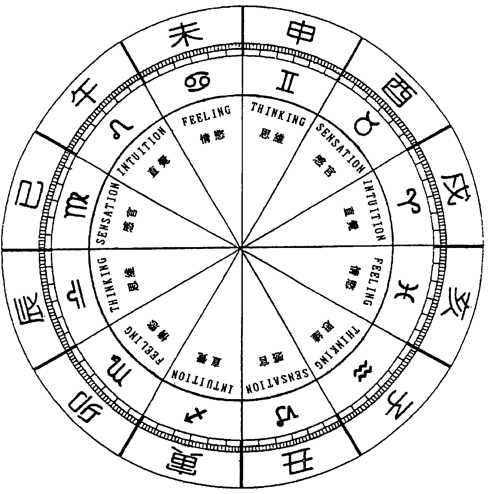

以上榮格所提到的人類四大心理功能，與星座四大元素的結合，被廣泛地運用在現代占星學的論斷上。而在進入下面的心理類型說明之前，讀者先必須具備以下的幾個基本概念。

第一，每一個人的本命盤，都代表著此人的基本心理結構，而由於每一個人的本命盤都具有十二個星座，所以每一個人都具備著感官、情慾、直覺和思考等四項心理功能。

第二，由於每一個人的主要人格特質有所差異，所以每一個人的四項心理功能也就因此而有所不同。有些人可能會是思考能力特別強（如風象特別強），而有些人則可能會是直覺能力特別強（如火象特別強），這就突顯了個人在天賦才能上的差異。

第三，由於同屬於相同元素的三個星座，彼此之間仍然存在著些微的差異，所以會在四項心理功能的反應上有所差別，這是屬於同一心理功能上的細分。

第四，凡是有行星落入的星座，則行星所代表的心理功能會和星座所代表的心理功能產生互動，進而導致了每一個人在心理結構上的差別，這是屬於每一個人在心理結構上的細分，也是每一個人命運有所不同的出發點。

第五，行星與行星之間的相位關係，會導致個人在心理結構上有所變化。

第六，每一個人的心理結構，都會展現於外在行為上，亦即都會反應在某個特定的對象（人）上，或者是某個特定的生活領域上，或者是發生某件特殊的故事，而這就是現代占星學的主要論斷所在。

### 四大元素與榮格的心理類型分析

在進行榮格的心理類型說明之前，必須先處理兩項關鍵因素：一是在占星學的論斷上，到底是如何區分意識和潛意識的，亦即當整個命盤的行星配置情況完全呈現出來的時候，占星學家是如何著手第一步的基本區隔；二是如何把星座的四大元素，結合於榮格所談的外傾型和內傾型的區分。透過以上的兩項基本分析步驟，才有可能進入榮格的心理類型探討之中。

由於在現代占星學的論斷上，仍然對於榮格的精神分析的應用，存在著許多不同的見解。於是，以下的說明只能說是論斷方法之一而已，希望讀者不要認爲這就是唯一的論斷方法。此外，以下的說明與前面所提過的看法略有出入，這除了是因爲占星學家在統合整個命盤的心理論斷上，存在著各種不同的觀察途徑以外，最主要的是我希望能夠透過不同的解析方式，來提供給讀者更多的論斷技巧。

因此，讀者除了可以依照前面所提到過的四項心理功能，來分別針對單一心理功能進行論斷說明以外，也可以依照以下的論斷方法，來作另一種不同的詮釋。例如，可以把行星的落入於水象星座，來作爲個人潛意識之運作的判斷依據，也可以透過下面的論斷方法，來評估個人之水象（感性）和風象（理性）彼此之間的力量對比，進而用以透視個人的整體心理結構。從實際的論斷經驗來看，以下的論斷方法比較偏重於大方向和意識層面，可以用來觀察個人整體性的一般心理狀況，以及比較明顯的行為表現；而前面所提到過的說明，則可以配合著單一行星的落入於星座（可以暫時不涉及行星的相位問題），來作比較細微上的論斷說明。

對於初學者來說，可能不太容易將這兩種方法進行結合性應用，因為這必須透過實際論斷經驗的累積，才有辦法應用得比較純熟。因此，我建議初學者在學習論斷的過程中，可以先應用以下的論斷技巧來作分析，然後再隨著實際論斷經驗的累積，逐步地把其他的論斷方法融和進來，如此才不致於有不知如何著手之感。

#### 一、意識和潛意識的區分

榮格把他所提到的四項心理功能，分成兩種不同的類型：一是思維和情感的組合，這兩者的共同性是它們都必須作出一種判斷，思維是就兩種或多種觀念（表象）之間的有無真實聯繫作出判斷，而情感則是就一種表象（觀念）的愉快或厭惡、美或醜、欣喜或乏味等作出判斷；二是感官和直覺的組合，這兩者的共同性是它們都不需要任何的依據與理由，感官是具有明確刺激來源的，而直覺則是未知的刺激。在此，榮格所認為的感官和直覺只能說是與理智完全無關，而不能說是與理智互相衝突。

在占星學的論斷上，以上兩組之中的兩項心理功能，彼此是處於力量對比的態勢。換言之，前項的風象（思維）和水象（情感），彼此是處於對立的情況；而後項的土象（感官）和火象（直覺），彼此是處於對立的情況。

於是，如果兩組之中的兩項心理功能之一，有所突顯的話，則其中的另一個就必須有所減弱，進而以此來論斷何者位居於意識層面（力量較大的一方）、何者位居於潛意識層面（力量較小的一方）。

因此，如果主要人格星座之中的風象力量大於水象的話，則風象是位居於意識層面，而水象就位居於潛意識層面；與此相對地，如果主要人格星座之中的水象力量大於風象的話，則水象是位居於意識層面，而風象就位居於潛意識層面。同理，土象和火象的彼此關係，也是以此來看待。在此，所謂的意識層面，指的是在上的心理功能，它可以很容易地被個人所表現出來；而所謂的潛意識，指的是在下的心理功能，它是被壓抑的，不容易被個人所表現出來，可以說是潛能，也可以說是積澱。

例如，如果一個人的主要人格星座特質，包括了金牛座、巨蟹座、處女座和寶瓶座，總共是二個土象、一個水象和一個風象。因此，土象會位居於意識層面，而火象則是位居於潛意識層面；而如果此人的巨蟹座力量大於寶瓶座的話（以行星數量的多寡和行星本身的影響力來作判斷），則水象會位居於意識層面，而風象則是位居於潛意識層面。

#### 二、外傾和內傾的心態區分

在說明榮格的外傾心態和內傾心態之前，有必要先就榮格所談到的「主觀的」和「客觀的」意涵來作解釋。榮格所認為的「客觀的」，指的是涉及到一個人身外的、他生活於其中的世界。這是一種人與物的世界，傳統與習俗的世界；政治的、經濟的、社會制度的世界，以及一切物質條件的世界。這個客觀世界被歸結為環境、外界或外部現實。

榮格所認爲的「主觀的」，指的是內在的和個人的精神世界。它是個人的世界，因爲它不能被局外人所直接觀察到。它是十分隱密的，甚至時常不能直接地被自覺意識所接納，而往往只有透過心理治療者的幫助，透過對夢的分析，才能接觸到這些潛意識的心理要素。

榮格認爲外傾型的人，利比多(Libido)會被引導到客觀外部世界的表象之中，它被投入到對客觀對象、人與物、周圍環境條件的知覺、思維和情感之中；而內傾型的人，則是把利比多流向於主體的心理結構和心理過程。而簡單地說，外傾型就是一種客觀的心態，內傾型則是一種主觀的心態。

在占星學的論斷上，是把榮格的外傾型和內傾型，分別劃歸於風象和火象，以及土象和水象所主宰。換言之，風象和火象主宰著「客觀的」，而土象和水象則主宰著「主觀的」。於是，形成以下的兩種組合：

〈客 觀〉          〈主 觀〉
風 象        ←——→        水 象
火 象        ←——→        土 象

在風象和火象的組合之中，又可以分成以下的三種類型：
第一，白羊座和雙子座：這一類型的客觀性，是表現在知識和知性上。雙子座具有普遍性和平面性的特質，而白羊座則具有研究性和專業性的特質。換言之，雙子座會以客觀的態度來面對廣泛的知識，而白羊座會以客觀的態度來面對專業的知識。

第二，獅子座和寶瓶座：這一類型的客觀性，是表現在針對群眾之上。獅子座具有以上對下的普遍性特質，而寶瓶座則具有同輩看待的普遍性特質。換言之，獅子座會以位居高處的一視同仁來面對低下的群眾，而寶瓶座會以位居相同地位的一視同仁來面對周遭的群眾。

第三，天秤座和射手座：這一類型的客觀性，是表現在判裁和公正上。天秤座具有對兩端不偏不倚的特質，而射手座則具有對現實有所超越的特質。換言之，天秤座會以客觀的態度來面對兩端的爭執，而射手座會以客觀的態度來面對事物的真理所在。

## 在土象和水象的組合之中，又可以分成以下的三種類型：

第一，金牛座和雙魚座：這一類型的主觀性，是表現在安適性和感觸性上。金牛座具有實際性和佔有性的特質，而雙魚座則具有幻想性和放棄性的特質。換言之，金牛座會以主觀的態度來面對世俗的物質安享，而雙魚座會以主觀的態度來面對非世俗的靈魂安享。

第二，摩羯座和巨蟹座：這一類型的主觀性，是表現在針對親近的人之上。摩羯座具有以上對下的權威特質，而巨蟹座則具有同輩看待的親切特質。換言之，摩羯座會以位居高位的一廂情願來面對親近的人，而巨蟹座會以位居相同地位的一廂情願來面對親近的人。

第三，處女座和天蠍座：這一類型的主觀性，是表現在要求和批判上。處女座具有對事物講求細膩的特質，而天蠍座則具有對感情講求精緻的特質。換言之，處女座會以主觀的態度來面對完美和純潔，而天蠍座會以主觀的態度來面對完全和深情。

從星座之四大元素的劃分上來看，客觀性是屬於陽性星座的作用，而主觀性則是屬於陰性星座的作用。此外，在占星學的實際論斷上，還必須注意到榮格所提的以下幾項說明：

+   第一，外傾型和内傾型的兩種心態，是不能同時並存在意識之中的，儘管它們可以而且確實是交替地進入於意識之中。換言之，風象和水象只能有一者可以進入意識層面，而另一者則會時常留置在潛意識之中。同理，土象和火象只能有一者可以進入意識層面，而另一者則會留置在潛意識之中。
+   第二，一個人可能會在某些時候是外傾型的，而在另一些時候則是内傾型的。然而，從一個人的整體人生歷程來看，則通常是其中的一種心態位居於優勢。換言之，如果一個人的風象和火象是佔據優勢的話，那麼這個人平常的行為表現，會是傾向於外傾型的；而如果一個人的土象和水象是佔據優勢的話，那麼這個人平常的行為表現，會是傾向於内傾型的。
+   第三，内傾型的人喜歡探究和分析自己的内心世界，他會是内向的、孤僻的、過分地關心於自己的内心體驗，在外表行為上呈現出冷漠、寡言和不擅長社交。而外傾型的人喜歡把注意力集中在和他人的相互交往之中，他總是活躍和開朗的，並且對於周圍的一切都很感興趣。換言之，如果一個人的陽性星座佔據優勢的話，那麼這個人平常的行為表現，會是以陽剛之性為主的；而如果一個人的陰性星座佔據優勢的話，那麼這個人平常的行為表現，會是以陰柔之性為主的。

第四，所謂的一種心態相對於另一種心態的居於優勢，只是程度的差別而已，亦即一個人只會是或多或少地屬於外傾型或內傾型，而不是全部都展現出外傾型，或者是完全呈現出內傾型。換言之，在每一個人皆具有十二星座之特質的前提下，星座四大元素的分配會是呈現出不平均的情況，於是造成了每一個人在心理結構上的大致區分，這同時也就拉出了整個心理論斷的主線。

第五，意識中的外傾正好是潛意識中的內傾，而意識中的內傾則正好是潛意識中的外傾；也就是說，在一個外傾型的人的潛意識之中，卻具有內傾型的特質。這是因為當外傾型的特質在意識領域中發揮作用的時候，他的內傾型特質便會在潛意識之中發揮作用，於是在他的潛意識之中也就有了內傾型的特質。這說明了潛意識在人的心理之中，具有補償性作用。

例如，當風象位居於意識領域的時候，水象就會在潛意識之中發揮作用；而當土象位居於意識領域的時候，火象就會在潛意識之中發揮作用。此外，依據榮格的夢補償理論，則外傾型的人會在他的夢中呈現出內傾型；而內傾型的人則會在他的夢中呈現出外傾型。

第六，自覺意識的外傾或自覺意識的內傾，在經過有意識的作為之後，會直接地表現出一個人的外傾或內傾，而且這種行為可以很容易地被觀察出來，但是補償性的潛意識，卻不能展現出來，因為它總是受到壓抑的。而每一個人也總會有某些時候，短暫性地受到潛意識的控制，進而表現出異於平常的個性。譬如說，一位平常活潑、開朗的人（火象或風象特質強烈的人），有時候會突然變得抑鬱和孤僻（土象或水象在暫時內起作用），這就是潛意識長期被壓抑所導致的結果。而且，由於潛意識的心理過程，並不如意識的心理過程一樣地可以得到適當的發展，於是當被壓抑的潛意識爆發出來的時候，就會呈現出一種原始粗野的行為傾向。例如，一個內傾型的人（土象或水象居於意識領域），可能會毫無理由地突然瘋狂或暴力起來。

#### 三、八種心理類型

以下就榮格所提到的八種心理類型，配合著四大元素的輕重比例，來作一種簡要式的解析。而且，在文字的說明上，是摘要於《榮格心理學入門》，希望藉此突顯榮格的精神分析理論，在占星學人格特質論斷上的應用性和重要性。同時，希望讀者能夠配合著表中的說明，自行推演其他的心理特質，如此才能在個性的論斷上有所進步。而在表中，強力和弱力的區別，也是以四大元素的輕重比例來作判斷，只是強力之組的力量，相對於弱力之組的力量，會更突顯出它的影響力。於是，位居於強力之組，而且又位居於意識層面的元素，對於一個人的個性影響會是最明顯的。

##### ●外傾思維型●

客觀思維支配了此人的生命激情，於是會壓抑自己的情感，甚至會呈現出冷漠和傲慢。在缺乏情感的情況下，思維的表現方式會是枯燥無味的。而如果情感被壓抑過重的話，情感可能會透過迂迴曲折，甚至是病態的方式表現出來。

| 〈外 傾〉 | 〈内 傾〉 |
|----------|----------|
| 強力→意 識：風 象 ←──────→ 水 象：潛意識 | |
| 弱力→意 識：火 象 ←──────→ 土 象：潛意識 | |
| ※風象大於水象，再加上火象。 | |

##### ●内傾思維型●

思維的展現是内向型的，希望理解的是他個人自己的存在。他往往會顯得冷漠無情，因為他並不重視其他人。他容易變得頑固執拗、剛愎自用、不善於體諒別人、拒人於千里之外，如果這種傾向太強的話，就可能會使得情感以變態或狂熱的方式，來對於思維施加壓力。

| 〈外 傾〉 | 〈内 傾〉 |
|----------|----------|
| 強力→意 識：風 象 ←──────→ 水 象：潛意識 | |
| 弱力→潛意識：火 象 ←──────→ 土 象：意 識 | |
| ※風象大於水象，再加上土象。 | |

##### ●外傾情感型●

此人的理智是服從於情感的，於是情緒會隨著外界的變化而不斷地變化，時常呈現出反覆無常的情況。因此，| <外 傾> | <內 傾> |
|---|---|
| 弱力→意識：風象 ←——→ 水象：潛意識 | |
| 強力→潛意識：火象 ←——→ 土象：意識 | |
| ※土象大於火象，再加上風象。 | |

##### ●內傾感官型●

與所有內傾型的人一樣，此人遠離外部的客觀世界，沈浸在自己的主觀感受之中。與自己的內心世界相比，他覺得外部世界是淡乎寡味、了無生趣的。在別人看來，他可能會顯得沈靜、隨和、自制，然而實際上卻往往並不是一個十分有趣的人。

| <外 傾> | <內 傾> |
|---|---|
| 弱力→潛意識：風象 ←——→ 水象：意識 | |
| 強力→潛意識：火象 ←——→ 土象：意識 | |
| ※土象大於火象，再加上水象。 | |

##### ●外傾直覺型●

此人的特徵是異想天開、喜怒無常，他會從一種心境跳躍到另一種心境，借以從外部世界中發現新的可能性。一個問題尚未解決，就又渴望於解決另一個新問題了。他可以成爲新事業的開創者，但卻會由於忍受不了日常事務的繁瑣，以及很難固定從事於某一項工作，所以時常會是一事無成的。往往會是多愁善感、浮誇賣弄、過份殷勤、強烈地依戀於他人（而這種依戀又往往會是短暫式的曇花一現），並且對於愛可以輕而易舉地轉變為恨。

| <外 傾> | <內 傾> |
|---|---|
| 強力→潛意識：風象 | 水象：意識 |
| 弱力→意識：火象 | 土象：潛意識 |
| ※水象大於風象，再加上火象。 | |

##### ●內傾情感型●

此人不會像外傾情感型一樣地炫耀自己的感情，而是把感情深藏在內心。所以，往往會表現出沈默寡言、難以捉摸、態度既隨和又冷淡，並且往往具有一種憂鬱和壓抑的神態；也因此，時常給人一種內心和諧、恬淡寧靜、怡然自足的印象。

| <外 傾> | <內 傾> |
|---|---|
| 強力→潛意識：風象 | 水象：意識 |
| 弱力→潛意識：火象 | 土象：意識 |
| ※水象大於風象，再加上土象。 | |

##### ●外傾感官型●

此人熱衷於積累與外部世界有關的經驗，所以是現實主義者、實用主義者，頭腦清醒但卻又不會對於事物過份地追根究底。感情狀況一般會是淺薄的，而且不會賦予生活以自己的幻想和預見，生活的目標是在於從生活之中獲得一切能夠有所享有的感覺。

## 第十章 榮格的精神分析

| 外傾 | 內傾 |
|---|---|
| 弱力→意識：風象 ←→ | 水象：潛意識 |
| 強力→意識：火象 ←→ | 土象：潛意識 |
| ※火象大於土象，再加上風象。 | |

##### ●内傾直覺型●

最典型的代表就是藝術家，以及夢想家、先知和充滿各種幻覺的人。由於與現實和傳統都不發生任何關係，所以無法有效地與別人進行溝通，甚至會是禁閉在一個充滿原始意像的世界裡，連自己也無法理解這些原始意像。而且，始終透過一個又一個的意像，來尋找各種新的可能。

| 外傾 | 內傾 |
|---|---|
| 弱力→潛意識：風象 ←→ | 水象：意識 |
| 強力→意識：火象 ←→ | 土象：潛意識 |
| ※火象大於土象，再加上水象。 | |

以上的八種心理類型，如果從榮格所說明的解釋來看，則仍然與四大元素的相互配置，彼此存在著某些差異之處。因此，嚴格地說，占星學上的人格特質論斷只是借用於榮格的方法，而不是與榮格的方法完全一致。更何況，榮格所提出的八種心理類型，只是在於描述每一種心理類型的極端模式，而人類個性的處於極端模式的情況並不多見。換言之，除了少數人的心理結構是形成極端的模式以外，大部份的人都還是可以取得一定的心理平衡。

因此，榮格強調他的八種心理類型的作用，是在於要把四項心理功能作一種程度上的區別，成形主導功能和輔助功能兩種，藉以透視一個人的整體心理結構。當然，如果有人可以把四項心理功能和兩種心態，做到同樣適度的發揮的話，那是最好不過的了。然而，實際的情況卻是很難，因為每一個人的各種心理成份，彼此之間始終存在著不平等。也因此，每一個人的精神整體，總是在努力地追求於平衡與和諧。而占星學家的人格特質論斷，就是希望藉由透過對於宇宙的某種認知，來解釋天體對於人格特質所造成的影響，進而解釋每一個人之命運與遭遇的成因。

占星學家與精神分析學家的目標是相一致的，都是希望每一個人可以過著具有一定程 度的人格平衡的生活形態。只是占星學家所應用的方法是命盤的論斷，而精神分析學家則是應用催眠和各種心理諮詢的方法，來獲知顧客的心理結構。而這兩種方法的結合性應用，已經成為現代占星學的研究主流了，所以我才會一再地強調，如果無法精通心理占星學的話，根本就不配稱得上是懂得現代占星學。

本章所談論的內容，只能說是相當粗淺的，因為如果再加上行星的個別心理作用的話，才能夠得到更精緻的論斷訊息，也才能夠把心理結構看得更清晰。然而，由於這涉及到更多的專業理論和技巧，所以只能留待以後專門探討精神分析的時候，再來作更詳細的補充說明。而在本章的最後，我認為有必要作以下的三點提示：

- 第一，榮格在說明心理類型的時候，曾經談到男女性別的問題，譬如說，女性比較容易表現出外傾情感型，而男性則比較容易表現出外傾感官型。這種說法是純粹屬於心理學的，它是奠基於男人和女人在生理和心理上已經有所差異的前提下，所產生的個性偏向。這與占星學上的人格論斷，不能說完全沒有關聯，但絕不是占星學上的論斷主軸。換言之，占星學家與心理醫生一樣，對於顧客由於性別差異所導致的心理上的基本差別，乃是一種最基礎的常識，它是占星學家應該知道的心理學知識，但卻不是占星學上的專業知識。
- 第二，在榮格心理學和占星學的結合性應用之下，每一個人的潛意識可以分成五種層次：一是人類共同的集體潛意識，它是由黃道十二宮所共同組成的，是最低層的所在，與天體上的大年(The Great Year)有關；二是種族的集體潛意識，這與民族性的遺傳基因有關，是以世俗占星學上的民族性格差異來作判斷；三是個人因輪迴而來的潛意識，這與計都有關；四是同世代的集體潛意識，這與現代行星有關；五是由父母所遺傳而來的潛意識，這與太陽、月亮、水星、金星、火星、木星和土星等有關。而這也就說明了每一個人的潛意識都是很多因素的積澱，導致於個人很難去理解自己的潛意識。
- 第三，前面所談到的榮格的心理類型，通常是只能用來分析第五層（最上層）和第四層的潛意識而已，而第三層以下的潛意識分析，則必須透過其他的論斷詮釋來作說明。也因此，本章在前面所談過的佛教的超心理學內容，與後面所談到的榮格的心理學內容，並沒有衝突之處，而只是有點比較難懂。換言之，占星學是意圖透過心理學和超心理學來解開潛意識的神秘性，而由於潛意識本來就是一種相當複雜的組合體，所以占星學家也就試圖透過同樣複雜的論斷方法，來釐清潛意識的結構。因此，佛教的超心理學與榮格的心理學的交叉應用，在占星學上是解開潛意識之謎的一種方法，兩者的組合應用在現階段的占星學研究領域上，是屬於高段的層次，所以對於初學者來說，恐怕會有很多難懂之處。

於是，最後我希望讀者先從榮格的精神分析開始應用起，而不必太急於直接走入高段的層次，以免造成混淆。因此，有關前面佛教的超心理學的說明部份，僅是提供給讀者作參考而已，希望有助於讀者更瞭解潛意識。

## 第十一章 徵象與符號

在一般談論星座的書籍當中，一定會提到星座所具有的神話故事，並且由此神話之中，導出有關星座特質的描述。其實，在古代的神話中所提到的星座故事，是可以很明顯地把每一個星座的主要特質表現出來。而在此，沒有必要探討有關這些星座故事的起源與背景，也沒有必要再對故事的內容多作敘述。讀者要是有興趣研究星座神話故事的話，可以自行參閱有關星座的書籍，其內容只是大同小異而已，或者是更進一步地閱讀有關希臘和羅馬的神話故事，從中去體會古代希臘人和羅馬人對於星座所具有的認知。

本章的最主要的目，是從實際論斷的角度作出發，把星座的神話故事和星座的符號象徵結合在一起，並將其與星座的個性特質作串連，如此將可加強讀者掌握住星座的靈活應用。

這裡所提到的徵象是屬於比較普遍性的講法，讀者也許都已經看過了，也都相當熟悉了。然而，當讀者在閱讀星座的神話和符號的時候，可能就不知道應該如何去釐清星座之神話和符號，與實際論斷之間的思考脈絡。所以，我建議讀者在閱讀任何有關星座的神話故事和符號意義的時候，一定要掌握住以下的兩項要訣。

- 第一，如何從星座的神話故事當中，去抓住每一個星座之特別明顯的特質，並且從這一項明顯特質當中，去進一步地作推演和想像，以獲得與該項明顯特質相類似的特質。這除了有助於訓練推演和想像能力以外，更可以避免在論斷的過程中造成僵化，而不知道如何去形容個性的呈現。
- 第二，如何從星座的符號徵象中，看出符號所代表的特別意義，以及如何將其應用在實際論斷上。同時，也可以從符號所代表的某一項特質，去推演和想像其他的相似特質。

以下針對每一個星座之徵象所作的說明，主要是依據這二個面向來作出發的。當然，有時候難免會有些不太搭配上的情況，所以只能說是盡力而為地為讀者提供另一條理解星座的方式罷了。

在進行星座徵象的說明之前，有必要再次強調以下的兩點原則：

- 第一，所謂的黃道十二宮只是地球相對於天體的空間劃分，而不是天文學上的星座實體。因此，星座的徵象也只是一種代表符號而已，不要簡單地誤認爲每一個星座就是剛好佔據著那一個星座的位置；也千萬不要因爲星座的形狀與它所呈現出來特質，正好是與神話故事一樣，所以就把星座的徵象和星座在天體中的位置等同起來。
- 第二，針對星座來進行徵象的說明，雖然是有助於對星座的理解和記憶。然而，針對某一個星座的特質來作描述的時候，是可以用許多徵象來作表達的，並不一定使用神話中的故事。畢竟，神話徵象的表達也只是在於把星座的無形特質實體化，使人們能夠比較容易瞭解而已。因此，徵象只是一種理解或記憶星座特質的方式，有助於我們體會星座的無形特質。

例如，巨蟹座的徵象是一隻螃蟹，於是我們可以透過對於螃蟹的認知和感覺，來轉而體會出巨蟹座所代表的心理特徵。然而，如果以老母雞來形容巨蟹座的話，則似乎也頗為傳神，因爲老母雞的照顧性、捨命抗抵老鷹（敵人）的攻擊等特質，同樣可以用來說明巨蟹座的本性。因此，我們可以說每一個星座的徵象特質絕對不是唯一的，也絕對不是僅限於神話或符號所代表的徵象而已，完全是看個人如何去體會星座的特質，並且應用各種人物、事物、動物或意象等，來把星座的特質很傳神地表達出來。

例如，我就曾經應用過武俠小說的描述方式來解釋星座和行星，把每一個星座當成是一位武林人物，而星座的特質也就是在於描寫此人的心路歷程，以及此人在練就武功時的特長所在。此時，行星就扮演著一種武功招式的角色，進而透過行星的落入星座，來看此人的特長是否能夠發揮某種武功的優點（如廟旺），或者是此人的特長（星座）根本就無法與武功路數（行星）相配合（如弱陷）。而行星與行星之間的相位，也就是武功招數之間的對打、互助或互剋。

總之，占星學除了有它的天文學基礎和一套推論的原則以外，更需要占星學家去發揮高度的想像力，才能夠真正地捕捉到論斷對象的內心結構。以下先就讀者所熟悉的神話和符號中的徵象，來作簡單的說明，而且每一個星座都只以兩個徵象來作代表。至於可以用來作爲詮釋星座的其他徵象，則有待於讀者自行發揮想像力了。

### （一）白羊座·戌宫：往前跑的羊、植物的嫩芽

首先，白羊座在星座神話中之所以稱爲是白羊座，自然而然地，是以「羊」來作爲神話故事的主角。而從神話故事當中，我們可以得知這是一隻粗心的羊，只知道一直往前跑，而不知道回頭，等到回頭觀看的時候，卻時常是已經太遲了。因此，我們可以從這頭「粗心地往前跑的羊」當中，發掘出白羊座所代表的某些特質。

其實，白羊座的「粗心」與「往前跑」是同一個特質，是因為只顧著往前跑而忽略了其他的細節部份，所以才會被認為是粗心的。「往前跑」表示了白羊座具有衝鋒前線的特質，同時也具備了相當不錯的爆發精力，可以促使它有能力往前跑。此外，也表示了白羊座具有跑的動機，它永遠不可能站在起跑點上不動，在它的背後有著一股促發它去展開行動的充沛力量。而一旦起跑之後，，在它的眼光之中，則只有終點站的存在，無暇顧及其他周圍環境的變化和細節，因為其他的東西對他來說都是多餘的，它只想要儘快地到達終點，甚至有沒有別人來加油或支持都無所謂。反正，白羊座特別擁有「自己幹」的特質，不太去理會別人的看法與觀點，完全以是自己的精力發洩來作為指導原則。

白羊座的往前跑是屬於短時間內的向前衝刺，所以可以把白羊座想像成是短程的賽跑，是屬於一百或二百公尺的賽跑，而不是馬拉松式的長跑，是一種要在短時間內全力衝刺的精力爆發，是很急的、很快的、很專心的，一下子就想要到達終點的，想要很快地知道到達終點時會是什麼樣的感覺。再者，由於精力是在短時間內發洩過度，所以白羊座往往會在到達終點以後（此意味著白羊座在很短的時間內完成某件事情之後），感到特別疲累，而需要相當多的休息，以補充失去的精力，然後再來面對下一場的短程賽跑；也因此，白羊座的睡覺往往是相當熟睡的（火象星座往往會是比較可以熟睡的） 。同時，白羊座在跑完一場比賽之後（此意味著完成某件事情之後），就會對該場比賽失去再探討或再研究的興趣（亦即很難再對該件已經完成的事物具到高度的興趣），它的興趣是集中在下一場比賽（亦即下一件足以引發它去完成的事物）。

其次，白羊座的符號可以把它看成是「植物的嫩芽」，此象徵著白羊座主宰著太陽的回歸到三月份一樣，正好是春天來臨的時刻，大地植物欣欣向榮，呈現出一片無限生機的感覺。在歷經寒冬的洗練之後，所有的植物都期盼著陽光的溫暖能夠再度照耀，使得大地能夠一掃冬天的寒意，為春天揭開序幕。而序幕揭開的最明顯象徵，就是植物嫩芽的冒出，它衝破了冬天冷凝後的土壤，以兩片稚嫩的小葉來開啓萬象更新的大門，並且以稚嫩的小葉來象徵著雙手的開展，來迎接春暖花開的到來。

因此，白羊座意味著具有衝破土壤的能耐，具有不怕困難而勇於冒出頭的勇氣，儘管土壤的壓力是沈重的，但它還是能絲毫不為所阻地冒出頭，因為它有一股堅強的意志力存在心中，這股意志力告訴它：絕對一定能夠打開一片新天地。然而，何以必須這麼努力地要去冒出頭呢？難道只是為了證明自己的能力，或者只是一種精力的發洩而已？我想更好的解釋是：外面的新鮮空氣正在等著它呢！就是因為想要看一看外面的新環境到底是如何，想要去探知自己所未知的領域，所以用盡一切的力量來努力地突破種子的硬殼（此意味著突破重重的困難），以新嫩的小葉來對外面的新奇世界展開探索。

於是，在一探究竟的心理促動下，稚嫩的小葉逐漸地冒出大地，與大地結為一體，成為大自然春天景象中的一員。然而，回想於嫩葉開疆闢土的過程，可以說是相當辛苦和勞累的，但卻又往往是別人所看不到的，或者是所不知道的。因為白羊座喜歡自己一個人去做，而且時常會是關起門來自己做，等到有所成果展現的時候，別人往往是只看到了外在的成果，而忽略了白羊座不知道自己一個人寂寞地渡過了多少日子，好在白羊座的專注精神，可以讓它忘記時間的難握以及寂寞的可怕，專心地投入於探究和開拓的工作之中。然而，在探究和開拓的過程中，也是會有弊端產生的，那就是只為了一探究竟，而忽略了任何的價值判斷、是非判斷，以及世俗間的人情世故，在關注的眼神中看不到周遭環境的變化，也無視於他人的存在，時間和空間已經無關緊要了。這就好像是新嫩的稚葉不管一切地只想要冒出大地一樣，要冒出頭去呼吸新鮮的空氣以及感受陽光的照耀，因為這才是最重要的。

### （二）金牛座・酉宮：金牛、觸角

首先，對於金牛座的認知，可以直接從「金牛」所代表的「金」和「牛」來看出某些徵象。「金」代表的是金錢和財務的意思，是屬於物質生活方面的需求；亦即金牛座對於錢財的擁有的感覺會特別強烈，因為錢財的擁有可以使得金牛座所需求之生活物質上的享受得到滿足。因此，金牛座與個人的錢財運有相當密切的關係，並且它的錢財是屬於擁有和佔有的性質，指的是可以累積留存下來的錢財，也就是所謂的財庫或正財型的錢財。所以，金牛座的「金」才是「真金」，是富翁型的「金」；同時，能夠讓金牛座自願採取行動的最大誘因也是錢財，錢財可以讓一頭躺著的牛站起來活動。

從「牛」的觀點來看金牛座，則第一個最明顯的徵象就是體型，那種略帶圓胖而有肉感的脖子，以及厚實而寬闊的肩膀，是牛外表上的最佳特寫。再者，與牛最有關的就是「牛脾氣」，牛脾氣並不是隨便就會發作的，但是一旦發作起來，往往就是不管一切人情面子的，是很拗的個性。此外，與牛有關的聯想就是「多產」，因爲牛是相當韌性和勤勞的，可以一步一步慢慢地生產。同時，除非牛自己想要加快速度，否則千萬不要催促和要求它加快速度，因爲在牛深感負荷不了或厭煩的時候，是會爆發牛脾氣的。它是比較喜歡以按步就班的方式來做事，這就好像是牛在吃草時一樣，喜歡慢慢地吃、慢慢地消化，於是時常讓急性子的人有點受不了。

從牛的龐大外型到喜歡漫步在大自然的草原中，我們可以想像得到牛是如何地需要一種安適的生活，而爲了追求這種安適的生活，會使得牛不得不動，不得不去努力累積財富。然而，由於爲了追求一種安適的物質生活而進行各種辛勤的工作，是與金牛座自己所期望於能夠自由自在地漫遊在大自然的心理意識構成矛盾，所以這種心理矛盾會由於壓抑太久，無處發洩，而在當有人逼得太急的時候，促發內心的壓抑在瞬時之間不顧一切地爆發出來。這種牛脾氣的爆發，其實是希望能夠脫離世俗對於牛的限制，是一種對於人世間爲什麼一定要有錢才能夠享受安適生活的反抗意識。

其次，金牛座的符號可以把它看成是「長出觸角」，這種觸角是感官上的敏感象徵，所以金牛座雖然是土象星座，但卻也具有敏感的成份。而觸角所意味的敏感，也指示著是藝術氣息的呈現，所以金牛座也具有藝術和美感的特質。但是，金牛座由於受到土象的影響，所以藝術氣質是傾向於落實在工藝之上，藉由工藝的操作來表達自己的藝術理念。同時，也可以把此觸角看成是具有攻擊性的鬥角，它是在牛脾氣發作的時候，可以用來摧毀一切，而引發牛脾氣發作的背後力量，也與敏感有關，因為金牛座也略具情緒性的特質（它是3分濕、7分冷）。

此外，金牛座的觸角是兩端式的，一端是觸及到感官藝術；另一端則是觸及到金錢感覺。如果把感官藝術結合於金牛座所主宰的喉嚨來看，則形成了金牛座的美食主義，會把吃當成是一種藝術，不一定要吃得貴，但卻一定要是具有精緻和特色的口味；在同樣是喉嚨的作用下，金牛座喜歡唱歌，唱歌可以表現出金牛座的感官藝術，所以它特別與聲樂有關。同時，另一端的金錢觸角，可以使得金牛座特別有能力去感覺出金錢的味道，知道那裡有錢可以賺。金牛座所代表的錢財運是依靠著觸角的敏感作用來幫助的，所以它雖然是動作比較緩慢，但卻又往往能夠比別人收穫較多，因為觸角可以讓它感覺到利潤的所在；也由於牛相當信任於自己的金錢敏感功能，所以當觸角發現目標的時候，牛就會開始採取行動。

金牛座的觸角所代表的敏感性，主要是表現在身體的感官功能之上，所以它是不同於水象的感情性的敏感。換言之，金牛座的敏感是顯而易見的，不同於水象的潛藏在内心之中。就以脾气的发作来说，水象的发脾气很可能会只停留在内心的层次，甚至转化为憎恨，有时候甚至会恨一辈子，在外表上比较不容易让别人看出来。可是金牛座的脾气发作是土象式的，所以可从外表和脸部的反应来看出，况且它的牛脾气深具破坏力（可能会摔东西），进而很明显地对现有的实质关系造成伤害（亦即马上就让人知道它正在发脾气）。又如果从艺术的角度来看，则水象的艺术是偏向于想像力的展现，是一种幻想式的空间艺术。而土象的金牛座则是偏向于组织力的展现，是一种结构式的空间艺术，以结构性和组织性来布置空间，所以呈现出来的美感往往是每一个人都可以感受得到的，可以引发每一个人对于该项艺术作品的感官享受，并且金牛座的艺术创作也往往具有实用的价值。所以，金牛座的触角可以被视为是一种触摸的感觉，譬如触摸到金钱、触摸到一件陶艺作品时的那种很爽的感觉。

### （三）双子座・申宫：两人的相对、一到二的推演

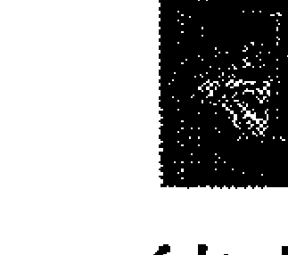

首先，双子座的象征一般都是以两个相对的人来作描述，有人认为这两个相对的人，指的是两位彼此互相观察对方的人，是一种你看我、我看你的意思，并且从此而推演出双子座的双重人格特质，也代表着它可以看得出别人的心思。我认为如果从心理学上来看，则这种象征的描述并不十分恰当，因为每一个人的心理意识都是多种人格特质的组合，绝不是所谓的双重人格特质而已。所谓的双重人格特质，应该指的是一个人的人格特质同时呈现出两种极端不同的情况。譬如说，主要人格特质只有土象和火象，而且两者的力量相当均衡，于是在这两者同时发挥作用的情况下，人格特质就会产生两极化的倾向。

此外，双子座所代表的风象，也不应该说是它可以看出别人的心思，而是应该说双子座可以「推敲」别人的「看法」，可以很快地把别人的所言、所写转化成为自己的东西，这是双子座自己在脑海中所进行的运作，与别人无关。当然，这并不是说双子座就不会去对别人的想法产生好奇，只是你必须先引发它的好奇心，然后双子座才会去推敲你的想法，重点是在于它的好奇心，而不是在於看出别人的心思。因此，单从「双子」的象征来看双子座的话，好像是没有什么太大的关连性，如果有的话，也只能说是一种「多元化」的象征。

双子座确实是十二星座之中最具有多元化特质的星座，它可以同时做多件事，也可以同时想多件事，因为它不但好奇心重，而且学习能力相当不错。基于高度好奇心的驱使，使得双子座无时无刻不在对于周遭的环境进行观察，想发现某些新奇的事物。这些所谓的新奇事物，可能是一本书、一张图，或者是一件东西，反正只要是它没有看过的东西，就很可能就会吸引他的注意，因为它想要知道这件新东西到底是什么。再者，由于双子座的学习能力很快，脑袋的反应相当敏捷，所以在发现新事物的同时，也可以很快地了解到新事物的内容，只是会比较缺乏追根究底的精神。因此，双子座在好奇心和学习力的合而为一之下，可以很快地学到不少新事物，再加上具有相当不错的口才，所以往往给人一种多才多艺、懂得蛮多的印象。

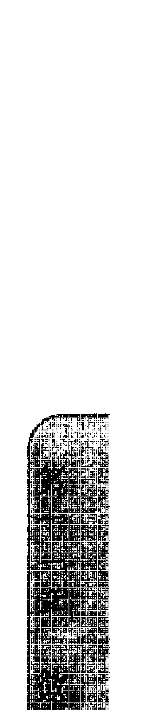

## 第十一章 象征与符号

例如，当双子座看到一本有关宗教的书籍，他觉得蛮好奇的时候，就会拿起来看，但他时常是不会从头看到尾，而只会看他觉得有趣的部分，并且在看过以后，便可以就宗教方面的问题提出自己的某些看法，让人觉得他好像对于宗教也蛮有研究。

其次，双子座的符号其实就是「二」的意思，而这「二」的涵义除了以上所提到的「多元化」之外，更应该强调多元化的动态过程，因为双子座毕竟是属于风象，是一种脑袋思考运作的象征，所以双子座的符号可以被看成是「由一到二的推演过程」。简单地说，就是「举一反三」的意思，这只是一种形容词而已，如果一个人除了双子座的特质颇为强烈以外，还有其他的风象和火象星座来配合的话，则恐怕就不只是举一反三而已，连举一反十都有可能，可以说是一位相当聪明的人。

从「由一到二的推演」来看双子座，则无疑地它深具逻辑上的演绎能力，而且可以把这种演绎能力表现在日常生活上。所以，双子座根本就没有必要，也不会去把书中所谈的内容从头读到尾，因为它可以依靠着自己的演绎能力，逐步地推演出自己对于该书本的理解，虽然可能会与书本作者的某些观点有所出入，但却也可以自圆其说，因为它是依据自己的演绎方式来作推论的，并不是胡乱推论的。因此，双子座尽管有时候会给人一种满篇歪理的感觉，但如果你要发掘他的错误也不太容易，因为他还是有逻辑上的推演过程在支持着他的道理，所以你往往也只能说他是满篇歪理，但却是歪得颇有道理。

然而，双子座也往往由于自己的思考能力过强，而导致于某些缺点，主要的缺点是表现在：神经系统的过度紧张，以及过于好辩、流于空谈。双子座由于随时都在进行「从一到二」的推演，所以脑袋的运作有所过度，时常会想得太多；再加上变动宫的特质，所以实在很难定下心来，也因此很容易造成神经系统发生问题，睡觉的时候比较没办法睡得很甜。此外，也会由于太偏重于脑袋的运作，而造成「头重脚轻」的现象，只会说、只会想，而不会做，所以它特别需要土象星座来配合。其实，双子座的这些特质如果能够得到很好的发挥的话，则可以成为很好的老师、记者和广播员等，于是双子座应该善用自己的思考能力和表达能力来为大众服务。

### （四）巨蟹座·未宫：螃蟹、卵巢

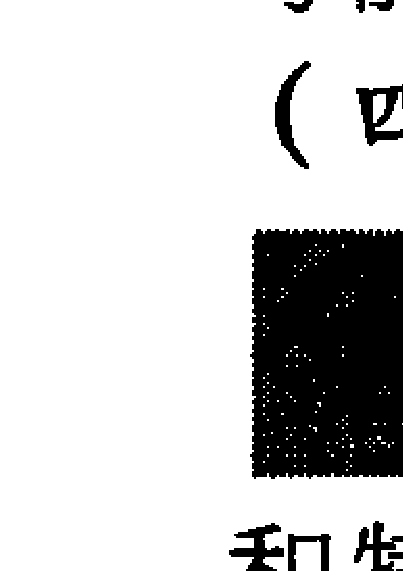

首先，巨蟹座之最一般化的象征就是螃蟹，从螃蟹这个象征当中，可以联想到螃蟹的形状、习性和特征等。螃蟹是属于甲壳类动物，也是水陆两栖型的动物，因此螃蟹有着坚硬的外壳，并且可以同时在水里或陆地上生存。再者，螃蟹怕见生人，一旦看到有其他的动物或人靠近的时候，它的第一个反应就是赶快躲进沙里。此外，螃蟹的最大特征就是有着两只可以攻击别人的大夹子。

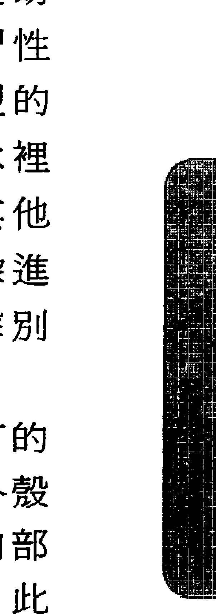

因此，从以上的螃蟹象征可以联想到巨蟹座所具有的某些特质，并且可以把这些特质串连起来。从坚硬的外壳来作联想，它是与内部的柔嫩肉质相对应的，是因为内部的肉质太嫩，所以需要有坚硬的外壳来做掩饰和保护。此意味着巨蟹座在外表行为上，时常会呈现出防卫状态，以保护自己柔弱的内心情感，深恐别人看穿自己具有感情脆弱的特质，这也可以说是巨蟹座的生存之道。而从水陆两栖的特性来看，可以知道巨蟹座的适应能力颇为强韧，既能柔也能刚，同时也表示着巨蟹座与水有相当大的关连。然而，必须注意到的是，巨蟹座在水陆之间来回活动的时候，是抱持着一种谨慎的态度，亦即只要是陆地上有危险情况发生的话，它就会立刻跑回水里；同理，只要是水里有危险情况发生的话，它就会赶快躲到岸上，此意味着巨蟹座具有高度的警觉性。此外，两只大夹子是用来作为攻击敌人的武器，然而巨蟹座是不会随便地就发动攻击，它往往是在被攻击的情况下，而有必要采取抗敌措施以保护自己的时候，才会使出大夹子，所以大夹子时常是在被激怒的时候才会被拿出来当作武器，平常的时候则是用来当作一种警告敌人的标志。

如果要对巨蟹座的螃蟹象征作一种简短式的描述，那最好的说明就是：「一隻一边抵抗一边退的螃蟹」。为何如此？因为它的情绪性最浓厚，很容易受到外在刺激的影响而产生情绪上的变化，这种情绪上的变化会写在脸上。这还只是刺激所造成的第一个反应而已，是一种自卫的准备动作，如果又再次遭受刺激的话，就很可能会对敌人还以颜色。但是，由于巨蟹座毕竟是水象星座，所以攻击力还不够强大，它往往是一边抵抗一边退，以退的方式来自保。因此，与其说巨蟹座具有攻击性，倒不如说只是具有抵抗性，因为攻击是为了抵抗，而不是要消灭对方。然而，当巨蟹座深感已经面临到生存与否的紧要关头时候，这种抵抗力就会立刻加强力度而变成攻击力，甚至会是一种有意致对方于死地的力量。因为它感受得到情势已经发展到你死我亡的地步了，在基於为自己、家人、家族和国家的生存作考量，它的命是可以不要的，所以千万不要把巨蟹座逼到没有退路，否则它是会拼命的。

其次，巨蟹座的符号有人说是卵巢的象征，我觉得这蛮符合巨蟹座的特质。卵巢是代表着生命的源起，它是卵子的诞生之所，如果把卵巢和子宫联合起来作描述的话，则更可以把巨蟹座的母性特质呈现出来。从卵子的诞生到受精卵的形成，并且历经十月怀胎而成长为婴儿，完全是在卵巢和子宫的保护下进行的。因此，巨蟹座具有保护和照顾的涵义，它的主要功能是在于提供一种适合生存与成长的环境，并且又必须是照顾得无微不至、衣食不缺，所以巨蟹座与日常生活上的食衣住行有关，尤其是吃和住更是它的主要特质。不过，巨蟹座的吃与金牛座的吃有所不同，金牛座是吃出喉咙的感觉，是美食主义者，讲求的是质；而巨蟹座是吃出胃的感觉，是吃饱的感觉，讲求的是量。

从卵巢的象征来看，也可以推演出巨蟹座对于生命源头的注重，所以它是十二星座之中最具有乡愁色彩的，会怀念旧有故乡的一切情景，会对于本土、本乡和传统的东西产生一种莫名其妙的情怀，也会怀念老朋友、老同事、老同学等。因此，回忆对于巨蟹座来说，是人生的一大乐事，它会怀念着年少时的轻狂与趣闻，也会念念不忘于壮年时的成就与努力，所以「历史」对它来说具有特别重要的意义，巨蟹座可以依靠着回忆来渡过老年的生涯。巨蟹座由于具有如此浓厚的乡土气息，所以有许多巨蟹座特质重的人，从事于与传统有关的研究，诸如国乐、考古、历史、传统戏剧等，巨蟹座可以说是最标准之乡土情结的星座。

以上的特质如果再加上巨蟹座之对于安全感的需求，就会产生它特独的「垃圾性质」。所谓的「垃圾」并无轻视或否定之意，反而应该说是一种崇高的敬意。巨蟹座由于深具母性的保护意识，所以促使它要尽其可能地照顾别人的日常生活，如此才能称之为是无微不至的照顾。可是，巨蟹座又往往缺乏安全感，深怕别人在它的保护之下无法获得完整的照顾，于是它会以「量」来确保安全，形成购买日常用品往往是一次会买很多，因为害怕不够用，食物的准备也时常会过量，因为怕不够吃。同时，巨蟹座又相当念旧，它会保留历史的痕迹，保存自己之值得回忆的东西，或者是买些古书、古物和古董等过时的东西。总之，它会去储存一大堆东西，而这一大堆东西如果在别人的眼光之中，是属于无用之物的话，也就是所谓的「垃圾」。又例如，如果从食物的准备上来看，则炒菜一炒就是一大盘，吃不完倒掉也算是垃圾；然而，巨蟹座往往会舍不得倒掉，所以会自己尽力而为地把菜吃光，好在巨蟹座的胃是十二星座当中最大的，蛮能吃得下的，可是其最后的结果往往就是身体发胖，所以巨蟹座应该尽量克制自己的垃圾特性。

### （五）狮子座・午宫：狮子、心脏

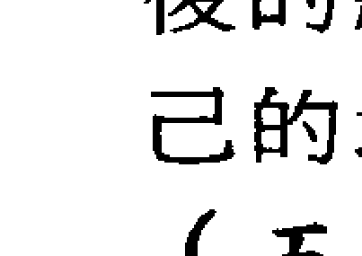

首先，以狮子来形容狮子座可以说是十分恰当的，因为狮子被称之为是万兽之王。于是，我们可以从狮子的外型、气质和力量等来联想狮子座的特质。

狮子的外型无疑是相当突出的，尤其是雄狮子的外型，远远望去就可以看到脖子周围有一环浓密的鬃毛，再配合上原本就已经蛮大了的头，就形成了标准的「大头型」动物。而从狮子的气质上来看，狮子有着一股威严而让人望之却步的王者之威，狮子又往往喜欢站在山头之上，俯看猎物的出现，此更增添了狮子座高高在上的特质。此外，狮子之所以能够被称之为是万兽之王，与它所拥有的力量有关，它是肉食性动物，擅长于捕捉弱小动物来充饥，所以狮子具有捕捉猎物的能耐，可以掌控弱小动物的生死。

从以上有关狮子的描述，我们可以针对狮子座所具有的特质作以下的联想。狮子座的人有着严重的「大头病」，大头病一般是被用来形容政治人物的政治狂热，而且大头病带有无药可救的意思。而在十二星座当中，狮子座的大头病也确实是最严重的，大头病可以被视为是一种可以不惜任何代价，而只求证明自己之存在价值的一种心理反应。而对于自己之存在价值的最佳证明，就是获得别人的肯定，而且越获得更多人的肯定，就越能证明自己的存在价值。因此，狮子座时常就是为了证明自己的存在价值而不惜付出一切，只要是有这种自我之存在价值在暗地里作祟的话，狮子座的人就会变得相当慷慨和大方，因为它可以藉由对别人的施舍来换取别人的支持，进而肯定自己的存在价值，形成一种这个社会如果少了它的话，就会缺乏领导人物的自我意识心理。

狮子座的大头病会反应在气质的呈现上，它是一付唯我独尊的态势，高高地站在山头上俯看一切众生，好像别人都需要他的领导和救助。因此，狮子座比较不喜欢与别人站在同等的地位上，它需要有所突出，要站在最高点来展现它的雄壮和威武。然而吊诡的是，它又无法忍受没有群众的痛苦，所以虽然是有着高贵的气质来足以站在山头之上，但却又难以承受没有掌声的生活。所以，狮子座虽然是十二星座之中站得最高的，但却又往往是最好应付的星座，只要说它好、说它棒、说得让它爽得一塌糊涂，它就会乖乖地任你所求，因为它是王，你是臣，你的几句「大王万岁」足以让狮子有着「众卿平身」的快感，此时你的任何要求，它都会尽可能地为你做到。

如果从狮子捕捉猎物时所展现的力量来看，则狮子由于有力量和权力在握，所以会比较霸道和独断，是标准的大男人主义和大女人主义心理，也颇为骄傲和自负，不太容易驯服，除非你能够让狮子座有所心服口服，否则你永远不可能成为驯狮者。而狮子所拥有的力量特质，表示着狮子座具有追求于权力的欲望，因为它相当知道有了权力之后，才能够掌控一切，才能够成为大王，也才能够有「秀」的空间；更何况，只要是有权力在手，那怕是戏码再烂，观众也没得选择。而从权力的掌控来看，可以知道狮子座相当具有支配欲，喜欢操控一切，而且是明的操控，所以狮子座是标准的领导型人物，可以成为老板、工头和董事长等。

其次，狮子座的符号就好像是一颗心脏，而它也确实是主宰着心脏。所以，凡是狮子座的情况不好，或者是太阳受克太严重的话，与心脏、血压和血液循环等有关的疾病就可能会发生。而从心脏所具有的功能来看，则多少可以提供某些狮子座的特质联想，这可以就心脏的重要性、心脏的循环功能和心脏的动力等特质来作连想。

人死亡的第一个征兆就是心脏的停止跳动，所以心脏可以用来断定人的生机，因此心脏的重要性是无可怀疑的。而从心脏的重要性和唯一性来联想狮子座的特质，可以想像得到狮子座会把自己的「重要性」看得比较重，它几乎无法寂寂无闻地生存下去，它期盼于别人肯定它的重要性，所以狮子座会以出名为人生之一大志，那怕是无法当省长，至少也要当个村长或里长。

从心脏的循环功能来作联想，则最明显的特征就是热心。心脏可以透过心跳而把血液传送到身体各部份，也把身体各部份的血液传回到心脏，所以心脏是不断地在进行着热心的活动。将这种热心的特质用来形容狮子座的话，则意味着狮子座具有两方面的才能：一是社交方面的活跃性；一是艺术上的表现性。前者促使狮子座人具有娱乐游戏的本能，是玩不累的，只要有人找它去郊游、跳舞或烤肉等的话，它赴约的可能性很大，而且只要有它在场，就可以使得整个会场的气氛相当活泼，它的夸张式的社交能力可以博得众人的掌声，但也因此而引发桃花的可能，这是因为太过於吸引异性的注意了，再加上它的可以不分男女地玩成一堆，所以不桃花才怪。而后者则促使狮子座展现出艺术方面的才能，它的艺术才能应该被更广泛性地说成是才华的展现，比较偏向于雅俗共赏的创作类型，尤其是狮子座的色彩感相当强烈，所以它所创作出来的艺术作品，往往也是相当耀眼和亮丽的。

从心脏的动力性来作联想，则意味着狮子座具有外显性和外露性，可以表现出相当积极与主动的行为反应。然而，心脏的动力表现是必须通过血管来作运输，此意味着狮子座的动力表现是有选择性和范围性的，而它的选择和范围标准就是以自己为主。所以，狮子座的动力发挥时常是表现在自我之上，诉求的是自我活力的突显，故以所谓的爱慕虚荣、自私、自恋、英雄主义和个人主义等名词来形容狮子座所具有的特质，也并不是没有道理的。

### （六）处女座・巳宫：处女、肠子

首先，「处女」的概念涉及到人类发展史上的许多问题，尤其是与贞节意识有相当大的关连；而最麻烦的就是，古代人们对于处女的认知与现代有所不同。例如，原始人类认为普通人是不宜接近处女的，因为怕处女的出血会加害到自己，所以只有酋长、君主、祭司等具有所谓「魔力」的人，才可以接近处女。再者，处女所象征的初夜权问题，更因为各民族性的有所差异，而导致了各种千奇百怪的看法和做法的出现。例如，有些初夜权的原始执行者是僧侣祭司，有些是酋长、地主、君主，有些则是亲朋宾客或父兄舅弟，还有些则是奴仆下人或外地宾客等。

因此，如果要以来形容处女座的话，不妨将其看成是中国传统婚姻制度下的大家闺秀，如此似乎可以比较传神。而从中国传统的大家闺秀来作联想，则可以联想到处女座的二项象征：一是未结婚前的处女式生活情境；二是处女破贞时的心理意识。先说前者，中国人习惯以来形容女人，如「水性杨花」、「交际花」或「玫瑰花」等，而少女就称之为是「含苞待放」，这正好可以用来形容处女座。因为处女座可以说是一种少女情怀的心理，一切都是那么地纯洁与善良，含羞脉脉地期盼着自己的未来郎君会是一位白马王子型的人，几乎可以说是生活于单纯之中，大门不出、二门不迈，就好像是一张白纸一样，也正如同花儿的含苞待放而未曾遭受污染。此意味着处女座的生活情况，会是比较单纯和规律的，而且个性上也比较纯真和期待完美，同时它更期望或要求别人与它一样，亦即希望别人能够符合于它心目中的理想标准。所以，处女座在十二星座之中，是对于爱情最挑剔和最纯情的星座。

如果从破贞的心理意识来看，则此涉及到中外皆然的处女癖与童贞迷信的问题，在中国则更加上了采阴补阳的荒谬色彩。而如果仅从心理层面来看，则男人会因为初交而肯定了自我的阳刚之气，促使大丈夫的意识提高，具有征服的快感；女人则会因为「千金之躯，一旦弃之」而诚心事奉破己贞节的男人，产生所谓的「我生是他家人，死是他家鬼」之莫名其妙的臣服心理，是一种托付终身的甘心情结。而处女座正好具备了这样的甘心情结，它可以心甘情愿地从早操劳到晚，所以如果以「下女」来形容处女座的话，也是可以的。处女座由于具有这种甘心情结，所以无法成为冲锋前线的将材，但却可以成为最好的执行秘书、幕僚人才，它可以把事务处理得相当完美与清楚，让老板无后顾之虑。然而，要征服处女座也并不是一件很容易的事情，至少必须先符合于它所要求的标准，如果没九十分的话，也应该要有七十分。

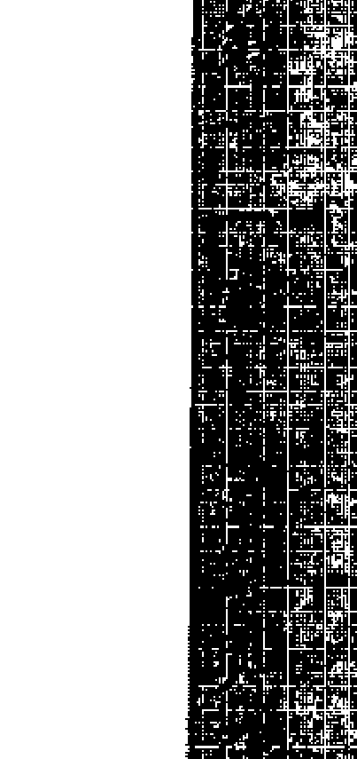## 第十一章 徵象與符號

其次，處女座的符號其实就是處女的意思，有人说那是处女梳发的抽象化，我认为这个意思最好不要用，因为在中国的用词上，所谓的「梳弄」乃是专指青楼女子的初夜失贞，这实在有失处女座之大家闺秀的气质。因此，處女座的符号可以用两种征象来作说明：一是肠子；二是蛇。

處女座确实是主宰着肠子，在此我们可以把肠子转化为「管子」来作联想，以此来联想某些处女座的特质。管子是有范围性的，亦即它的圆周直径相当小，此意味着处女座的视野范围通常是比较狭窄的，可以用「以管窥天」来形容。所以，处女座不会把眼光看得太远，它是属于目光短小型的人，也因此会比较胸无大志，只要当个小职员而生活稳定的话，也就可以颇为满足了。这一来是因为处女座对自己比较缺乏信心；二来则是因为处女座只会把注意力集中在下一步应该如何去做，而不是注意到将来五年、十年或廿年之后的成就。此外，管子可以被用来传送东西，此意味着处女座必须随时地被赋予某个指令，亦即它是指令的接受者或传送者，等待着别人来交代它工作，所以它是先天的第六宫，与工作的劳碌有关。而它之所以会劳碌的原因，乃是因为处女座往往在完成一项工作之后，总是会有一种失落感呈现，不知道接下来应该做什么。于是，最好是能够随时有新的工作等待处女座去完成，否则它会回过头去检验自己曾经做过的工作是否已经做得很完美了。所以，与其让它一再去检查已经做过的工作，倒不如给它一个新的工作任务。

从「蛇」来联想处女座之特质的话，可以从蛇的冬眠，以及蛇的脫皮來作聯想。蛇的冬眠可以象徵著處女座具有孤僻的個性，自己一個人默默地生活在人群當中，使得大部份的人都會遺忘了有它這一號人物。因爲在它的內心之中，總是存在著畏縮的心理，總是害怕事情沒有做得很完美，也害怕別人會攪亂了它的規律的生活秩序。而蛇的脫皮則可以讓我們聯想到處女座具有剖析的能耐，這可以說是處女座的防衛武器，它可以很仔細地分析、觀察和推敲別人的缺點，連小細節也不放過，簡直就好像是讓對方（包括人物和事物）脫一層皮一樣，把對方看得清清楚楚。所以，處女座最引人注意之處，也就是它的吹毛求疵、潔癖和完美主義等特質。

### （七）天秤座・辰宮：天平、日落西山的地平線

首先，天秤的徵象相當符合於天秤座的特質，它代表著平衡，此意味著天秤座無時無刻不在尋求平衡感。當然，也就不會去破壞平衡感。所謂的平衡感指的是如何促使兩端取得一致性和平等性，而不會有偏頗的現象產生。

因此，從平衡感來看天秤座，則可以說天秤座簡直就是一流的軍師和幕僚人才，而天秤座的幕僚型態與處女座有所不同，處女座是屬於後勤部隊，天秤座則是屬於智慧型而略帶機詐的人。況且，天秤座的外表是一付優雅、紳士的風範，足以把師爺的特質很明顯地襯託出來。而由於過度地強調平衡感，所以它相當注重平等性，是一種大家都平等的心理意識，因此它不會去得罪任何一方，是一位濫好人。天秤座的「濫」是屬於鄉愿型的，它不會去拒絕別人，別人的任何請教或拜託對它來說，是一種可以讓它

的平衡感有所發揮的管道。所以，天秤座的平衡感，也包括了與別人之間的友誼關係的維持，於是它會盡可能地幫助朋友，也因此而更增添了天秤座的濫好人色彩。

從平衡感所引申出來的缺點，則是優柔寡斷、難以下決定，亦即天秤座具有猶豫不決的特質，因爲下決定並不是軍師的主要任務，天秤座只是針對實際的情況來作分析和評估，進而提出某些策略與方案，而真正最後做決定的人並不是它。如果真的要天秤座去下決定的話，則它反而時常會不知道應該選擇那一個，於是在歷經左思右想而又無法做抉擇的情況下，它的最後決定往往會是一種隨機變數的選擇方式。換言之，天秤座在歷經痛苦的極度思考和分析之後，根本就已經懶得再爲該項決定而費思了，反而是隨便選一個吧！藉由終於做好決定的放鬆心理，來使得自己的腦袋獲得暫時的休息。

其次，天秤座的符號看起來很像是日落西山時的情景，中間突出的半圓就好像是太陽快要下山了。如果以白羊座當命宮的話，則天秤座正好是第七宮；而由於命宮指的是太陽正好是位在日出東方的地平線上，所以天秤座也就成了太陽正好是處於日落西山的位置，因爲天秤座與白羊座是互爲對宮，兩者正好是處於對沖的位置。

從日落西山的景象來作聯想，可以得知天秤座具有優閒、懶散與平和的特質。它的外形是屬於俊男美女型的，而且在氣質上也頗爲「幼秀」，絕對不同於火象的衝動和率直，所以天秤座給人的第一眼印象的感覺很好，真的是有點讓人聯想到日落西山時的那種寧靜之美。但是，天秤座的優閒特質卻是與懶散結合爲一的。換言之，天秤座由

於在外表的言談舉止上頗為斯文，再加上風象的腦袋思考過多所導致的疲倦，所以時常會顯出一付需要休息的樣子，此時找個東西或地方來依靠的話，不知道該有多好！因此，天秤座走路時的樣子和停在某一定點站著或坐著時的姿態差異頗大，後者總是呈現出一付慵懶的形態，畢竟太陽已經下山了，應該好好地休息了。

此外，日落西山所象徵的平和感，與前面所提到的平衡感是一樣的，只是更增添了幾份美感而已，但這對天秤座來說是相當重要的。因為帶有藝術和美感特質的平和感，足以突顯出天秤座在扮演合事佬時的外交手腕。雖然它時常會基於維持友誼的考量，而隱藏自己的不悅感，不願意破壞自己與別人之間的平衡。然而，它卻往往可以自行化解這種不愉快的感覺，亦即它擅長於透過藝術性的社交手腕，來把自己與別人之間的關係重新做調整。天秤座的這種能耐，也可以應用在當朋友之間有所爭執的時候，讓爭執的雙方重新調整彼此的看法和觀點，而天秤座此時就扮演著一位仲裁者的角色。

### （八）天蠍座·卯宮：蠍子、陰毛

首先，我認為天蠍座是頗難描述的星座之一，因為它除了涉及到深層潛意識之外，也包含了比較複雜的生活領域事項，所以它是有心研究星座的人，必須多花點時間去體會的星座。也由於天蠍座本身的複雜與深層，所以論斷起來是頗有意思的。然而，在進行理解天蠍座的時候，有必要作一番「自我反省」的工作，以一種毫不自欺的方式，來針對自己的潛意識進行探

索，如此才可以逐漸體會到何謂潛意識，也才能感受到天蠍座的主要功能。

以蠍子來形容天蠍座，可以點出天蠍座之複雜特質當中的陰暗面和殘暴面。蠍子是生存在比較陰暗潮濕的地方，而且時常是躲藏起來的，不太容易被找到，但它卻可以很快地察覺到其他動物的入侵。此象徵著天蠍座具有深藏不露的特質，往往令人無法捉摸到它在想什麼，而它卻可以透過高度的神祕透視力來知道你在想什麼。再者，從天蠍座的深藏不露，可以推演出他的暗幹行為和神祕特質。它由於已經習慣了深藏不露，自然而然地，它有很多事情不願意讓別人知道，因為它認為無此必要，於是往往就會造成別人對它有所誤解。同時，如果暗幹的行為表現得有所偏差的話，就很容易採取損人利己的行為。所以，給天蠍座的最佳建議是：「若要人不知，除非己莫為」，天蠍座時常會因為讓朋友覺得不夠坦白和誠實，而因此破壞了友誼的情感。

在深藏不露之行為的背後，其實就是一種喜歡神秘感的心理反應，此展現了天蠍座具有很濃厚的神祕特質。它的神祕特質的表現，是偏重在與生死有關的事項上，亦即天蠍座對於生命之神祕性的探尋頗感興趣。而且，可以從天蠍座的這種探尋於生命之神祕性的特質中，推演出它對於人的透視能力。換言之，天蠍座由於具備了體驗潛意識的特質，因此可以藉由自己的潛意識去探尋對方的潛意識，由探尋對方的潛意識去洞察對方的心理動機，進而探知對方所可能採取的行動。這就好像是蠍子一樣，對於外來敵人的入侵，具有高度的探知能耐。

其次，蝎子所具有的殘暴性，應該與天蠍座所具備的「性」能力合起來作聯想。天蠍座的符號象徵，有人認為是陰毛的抽象化，先不管是否真的是如此，天蠍座確實是與性有很重大的關係。從性來透視潛意識，再進而以潛意識所代表的原慾來看天蠍座所具有的權力慾，才能夠解說天蠍座之所以會殘暴的根源。然而，這種解說方式的突破，是在佛洛依德建立精神分析學之後才形成的，所以在此之前的占星學，是無法針對天蠍座作心理學上的合理解釋。

從精神分析學的角度來看，我們可以藉由「性」來透視個人的潛意識，如果把性再加上戀母情結的話，那就更加精彩了。同時，原慾和戀母情結已經被用來解釋人類的文學、藝術、法律、宗教、民族學、民俗學和整個社會制度等，這間接地使得占星學與整個社會科學產生聯繫，可以用來解釋個人與社會之間的互動關係，包括了正常與病態的所有可能情況。畢竟，精神病並不完全是個人的問題，而應該是整個社會的問題。

以「性」來作為觀察點，可以把天蠍座所具有的權力慾與殘暴性合在一起作解釋。性代表的是一種純個人式的原慾展現，簡單地說，就是：「以自己的爽為原則」。這種「爽」是完全沒有價值判斷的，也沒有是非可言的，只求自己的意志得以履行而已。而問題的發生也就是出在於「不爽」，「不爽」會引發潛意識的激動和積澱，甚至可能會以不正常的管道來作發洩，於是形成所謂的精神病，或者是變態的行為。因此，從「爽」所代表的原慾之得以遂行來看，權力變成是最重要的訴求點，因為有了權力才

能使得原慾得以遂行，同時權力本身也就是一種原慾的象徵，深具征服的涵義。而為了獲取權力，天蠍座可能會不惜一切地採取比較殘暴的行為，特別是當別人的阻礙令天蠍座相當不爽的時候，它可能會以殘暴的方式來掃除令它不爽的阻礙，如此一來，才能履行「爽」的原則。

### （九）射手座・寅宫：半人半獸、飛箭

首先，射手座所代表的徵象，也可以稱之為是人馬座。但是，我發現目前對於射手座之徵象的說明，似乎是偏重在射手的涵義上，強調了「飛躍之箭」的意思，而對於所謂的人馬獸的意義，也就相對地比較缺乏解釋了。同時，對於人馬獸的解釋也並沒有一致性的看法，大部份的描述是說：人馬獸是代表著心智與肌肉的結合，或者是感情與身體的結合。這樣的說法也是可以講得通，但這與我的認知略有差異，以下是我基於實際論斷的考量而作的解釋。

對於人馬獸的最直接觀察，就是「人」與「馬」的結合，人在上、馬在下，它代表著人類的「人性」與馬的「獸性」合為一體。由於這樣的組合相當具有矛盾性和複雜性，所以導致於許多人不瞭解射手座的個性到底是如何，甚至於連射手座自己也都難以瞭解自己的個性。「人」是代表著理性，這種理性是可以進行邏輯思考的意思；從心理學上來看，它是代表著人類可以藉由理性去認識外在事物，並且可以產生自我剋制的行為能力，亦即人類是在社會制度的結構之下，與社會產生互動，並且會有所受制於社會規範的意思。「馬」則是代表著獸性，這種

獸性是很自然的情緒反應；
從心理學上來看，它是一種直覺式的行爲表現，毫無理性可言，因爲它是沒有經過思考的，此代表著在某種社會制度的結構之下，由於無法忍受規範而爆發出來的破壞社會規範的行爲反應，它是不被剋制的，因爲它詮釋了人類也是自然界的動物，所以也具有獸性的本質。
於是，「人在上、馬在下」即代表著人的理性在上、馬的獸性在下。「在上」是代表著表面的、看得見的，所以射手座平常是一付理性的臉孔，蠻講道理的，也很懂得體諒別人的處境，可以說是善體人意。但這往往只是表象而已，因爲射手座的最大特質是在下的那一匹馬。其實，馬平常也是蠻溫和的，可是別忘了一句話：「畜生總歸是畜生」。當馬在發洩情緒的時候，不管是誰去騎它，照樣把他摔下來，甚至於再補上一腳，這完全是馬的獸性在起作用。因此，「在下」所代表的內心之獸性，是射手座的最大特徵，以「抓狂」來形容最爲恰當，所以它絕對不是好惹的，因爲一旦抓起狂來的話，其殺傷力會是蠻強烈的。同時，射手座的抓狂形態與巨蟹座有所不同，巨蟹座時常只是恨在心裡而已，但是射手座卻會造成表面上的明顯破壞力。所以，射手座可能會摔東西，但巨蟹座則不會。況且，巨蟹座的情緒反應可以很容易從臉部表情來看，比較好預防，也比較好勸服；但射手座則是突發性的，沒有預告的，不知道被刺激到何種程度才會抓起狂來，也比較難以勸服，因爲當它正在發飆的時候，根本是誰來說也沒有用，而且它的脾氣又是來得快去得也快，所以在獸性發作之後，很快地就會回復人性，於是時常是當

你正準備進行馴服的時候，他已經飄過而沒有獸性了。

其次，射手座的符號是「一隻往上飛躍的箭」，而從箭的發射，可以聯想到射手座的三項特質：一是箭發射時所需要的推動力；二是箭飛躍的過程；三是箭的目標在何處。

射箭時所需要的推動力，是代表著射手座具有發射的能量，這種能量詮釋了射手座之火象星座的熱力特性。此代表著射手座是相當具有熱度的，亦即它是相當熱情、積極、主動、坦率和直接的。這種熱度會讓人感覺到射手座有著人性溫暖的一面，甚至於會是相當慷慨和大方的。然而，一旦熱度發揮在獸性的時候，熱度也會是不變的，所以往往會因此而得罪了人，因為當它被獸性所宰制的時候，是很難讓自己的熱氣自動降溫。

從箭的飛躍過程來進行聯想，無疑地那是一種直線式的飛躍過程，是沒有阻礙的。此象徵著射手座具有一直往上提昇的特質，這種提昇性質會造成人性與獸性的對立。如果是往人性去作提昇的話，則有助於使得射手座成為一位喜好哲學、思想和宗教的人，喜歡探究於人性的終極價值；而如果是往獸性去作提昇的話，則會使得射手座成為一位脾氣爆躁的人，很難相處。所以，占星學也相當講求行為主義中的學習理論，以透過規範和學習的方式，或者是教育的方式，來促使射手座的獸性得以往人性的方向去作發展。再者，從沒有阻礙的角度來作聯想，此象徵著射手座是一位自由主義者，不喜歡別人的約束、限制和壓力，它要的是可以無拘無束地把箭射上去，任何人的阻礙都可能引發它的獸性。

最後，射手座的飛箭可以說是沒有終極目標可言的，因爲它需要的是一種無止境的飛躍感，需求於不斷地提昇自己的各種體驗。於是，我們只能說射手座的箭靶（亦即目標的所在），是存在於飛躍過程之中，亦即每當射手座射中一個靶的時候（亦即體驗到某一經驗之後），就會站在這個箭靶的位置上，繼續地瞄準另一個更遠、更高的靶，如此地一直往上射去。所以說，在射手座的心中，不存在著一個最後之靶，因爲對射手座來說，人生實在是有著太多的體驗必須去經歷，一輩子也體驗不完。

### （十）摩羯座・丑宫：羊身、魚尾

首先，在黃道十二宮之中，有二隻怪物：一隻是射手座的人馬獸；另一隻是摩羯座的摩羯怪。爲什麼會把摩羯座稱之爲「摩羯」，我到目前還看不到比較合理的解釋。但是，從摩羯座的羊身魚尾造形來看，倒是可以把摩羯座的特質形容得頗爲恰當，尤其是那一條「魚尾」，更是具有深刻的涵義。

在此，我把摩羯座的神話徵象和符號徵象合起來作解釋，因爲摩羯座的符號本身就是摩羯形態的抽象化，兩者都是在於說明同一個特質：羊身和魚尾的組合。並且，對於摩羯這個怪物的說明，也是採用以上射手座之「在上」和「在下」的概念來作詮釋。在上的是羊身，而且是一隻長了齶鬚的老山羊；在下的是魚尾，而且是泡在水裡的魚尾。

先從老山羊來談，「老」象徵著摩羯座的長者之威風；而「山羊」則象徵著摩羯座的心路歷程。摩羯座就好

像是一位年長而且具有權威的人，它是在整個組織團體當中擁有實權的人物。簡單地說，它就是官僚，而且是大官僚，可以掌控局面，這就好像是原住民部落中的長老一樣，一切部落內的重要事務都有賴於它來做決定，是一人之下、萬人之上的人物。再者，由長老可以聯想到摩羯座所承受的心理壓力，它由於身居領導地位，所以一切行止必須相當謹慎。於是，它的外表總是呈現出一付嚴肅、拘謹和權威的表象，如此才足以得到族人的信任，也能夠建立起自己的威嚴。但這同時也很容易造成食古不化、保守和堅持傳統道德，簡直就是觀其顏也厲、聽其言也厲，說起話來總是帶有那麼一點「訓詁」和「道學」的味道。

山羊所代表之摩羯座的心路歷程，象徵著摩羯座的努力向上，因為山羊是不同於一般平地牧場上的綿羊。它必須與大自然搏鬥，此象徵著摩羯座的奮鬥精神，具有努力向上的堅強意志，這是它之所以得以生存下去，並且得以功成名就的原動力。再者，山羊之與大自然搏鬥，也意味著摩羯座除了具有不屈不撓的精神以外，也具備了相當程度的忍耐力和韌性，可以承受得了大自然的風吹雨打，忍受得了為了獲取最後的成果而所必須付出的寂寞和心血，甚至是親情。

其次，在一般的星座書籍當中，很少談到摩羯座的那一條泡在水裡的魚尾，有人把它當成是一種冷淡的象徵，因為摩羯座具有冷酷的特性。但在此，我想提出另一種不同的解釋，把魚尾當成是一種情份的表徵，它代表著在老山羊的嚴肅面孔之下，仍然存在著感情的成份。這種情份賦予摩羯座在嚴父的表象之下，也具有慈愛的精神。這可

以說是上天有好生之德，不願意摩羯座冷酷到極點，因為只要是人，就不可能沒有感情的成份，否則豈不與動物無異，況且動物也是有情的。

然而，摩羯座的魚尾由於受到老山羊的壓制，所以實在很難表達出來，以致於我們很難去感受到摩羯座的關愛。這就好像是長官基於一番好心，而對下屬展開一場訓話，在長官來說，他可能認為這樣對下屬或對公司來說是有利的，但聽訓的人卻不這麼認為，因為摩羯座的訓話，有時候真的會讓人受不了，而人類又總是喜歡聽好話的，所以摩羯座的一番訓話，實在是很難讓人感受到關懷之情。因此，摩羯座應該多多發揮魚尾的特質，練習講一些比較感性而有氣氛的話，如此才能夠使得生活氣氛有所轉變，而不再是刻板的形態，也才能夠有助於人際關係的拓展。

此外，在老山羊和魚尾的結合之下，形成了摩羯座的兩項突出的特質：一是手巧；一是疑心病。摩羯座之所以會手巧，與金牛座的土象特質有點類似，但金牛座是以愉悅的心情來看待藝術，所以金牛座的作品雖然與摩羯座同樣是屬於組織性和結構性的產品，但是金牛座的作品會比較具有浪漫的氣息，而摩羯座的手巧往往是配合著老山羊的特質，形成了鋼金水泥式的形態，比較缺乏情調，所以特別與工藝類有關。而且，由於摩羯座的成就感比較重，所以如果不是自己的滿意之作，往往是不太輕易展現出來的。摩羯座的成就感在結合了感情性的魚尾之後，會呈現出一種情緒性的反應，這是一種保護意識的展現，它造成了摩羯座具有疑心的特質。摩羯座的疑心，時常是起因於

### （十一）寶瓶座•寶瓶：瓶子、水湧出

首先，寶瓶座的圖樣，是一個男人拿著一隻正在倒出水來的大瓶子，其重點不是在於這個男人，所以如果是換成女人來拿的話，也無所謂。寶瓶座的真正特質是展現在瓶子之上，以及正在倒出來的水，而寶瓶座的符號也就是水正在流動的抽象化。在此，先談寶瓶座的那隻瓶子，用瓶子來聯想寶瓶座的某些特質，可以從兩個方面來看：一是瓶子的密封性；一是瓶子的容納性。

瓶子的密封性指的是，從外面根本就看不到瓶子裡面到底裝的是什麼。從這個角度來進行聯想的話，則意味著寶瓶座簡直就是讓人不知道它「葫蘆裡賣的到底是什麼藥」。換言之，要知道寶瓶座到底在想什麼，實在是有所困難，因爲它往往是不按牌理出牌的人，所以很難去預測它的下一步到底可能會採取什麼樣的做法。然而，對寶瓶座本身來說，它自認是一位很好溝通的人，沒有什麼不可以让朋友知道的，而實際上也確實是如此，因爲它是風象星座，具有理性溝通的長處。但問題是出在於別人很難知道在寶瓶座的腦袋裡，到底裝有那些鬼主意，或新奇的點子，所以導致於別人不太容易瞭解寶瓶座的爲人。好在寶瓶座還蠻好相處的，否則時常不按牌理出牌的特性，是很容易得罪人的。

此外，寶瓶座的瓶子是一個容器，這個容器可以把很多的東西都裝進去，此代表著寶瓶座相當具有吸收新知識的能力，尤其是有關於新科技、新發明，或者是時代潮流所趨的新事物，寶瓶座都可以對此展現出它的高度學習能力，所以說它是站在時代尖端的人物，絕對不會落在新時代之後。同時，這個瓶子的容器也可以用來象徵著寶瓶座的容人雅量，因為它是先天第十一宮，與社交有相當大的關連，所以它是不能沒有朋友的，而且它的瓶子所容納的朋友會遍及五湖四海，只要是談得來，就可以與寶瓶座結交為朋友。

其次，寶瓶座的符號是水正在流動時的抽象化，從這個符號意象可以聯想到寶瓶座的「流動性」和「波浪性」等兩大特質。

寶瓶座的流動性應該與瓶子合起來作聯想。在寶瓶座的瓶子裡面所裝的東西，並不是靜態的，亦即寶瓶座不是把東西吸收進去就算了，它還會在瓶子裡面進行攪拌，此意味著寶瓶座不只是依據著自己的興趣來吸收新事物，而且在吸收新事物之後，它還會創生自己的新觀念和新見解，進而以「水流動」的方式，把自己所發明出來的新東西倒出來（亦即傳遞給別人），這是寶瓶座的最大特質之一。因此，有必要特別記住寶瓶座之「水正在流動式地倒出來」的特性，此象徵著寶瓶座不但具有與眾不同的想法、觀念、見解和思考邏輯等，它還會進而透過外在行為上的特立獨行、突發怪言、突發奇想等，來傳達它的理念，有時候甚至還會強迫別人一定要接受它的想法。於是，寶瓶座說得好聽一點，是很具有發明力；說得難聽一點，根本就是在唱反調。

寶瓶座的波浪性並不是意味著水波（亦即與水象無關），它指的是包括了所有與波長和波率等有關的東西，諸如電波、光波、音波等。因此，絕對不要把寶瓶座的水波，當成是四大元素之中的水象，因為它是風象星座。再者，可以把波浪看成是具有頻率的磁場，它是被拿來當作傳遞之用的媒介物質；而反應在人體上的話，也就是腦波的磁場運作。所以，寶瓶座如果呈現出良好情況的話，會是一位很聰明的天才；而如果是呈現出不好情況的話，則會是一位「秀逗型」的白痴。

### （十二）雙魚座・亥宮：魚、雙向

首先，雙魚座的那兩條在海裡游來游去的魚，實在足以讓人苦思多日，不知道應該如何去進行特質上的聯想，於是以下所作的說明可以說是有點勉強的。因為雙魚座與人生的終結有著很大的關係，而這種終結是意味著人類到底應該如何去看待生命、應該如何去與大自然合而為一。同時，雙魚座不只是人生終結而已，它還象徵著為另一個新生命的開始做準備。因此，基於讀者與我在年齡和人生經歷上的侷限，只能盡力而為地來作解釋了。

我們可以先用魚來說明雙魚座。從魚的身上可以產生與雙魚座有關的三個聯想：一是大海水的生活環境；二是魚的鮮美肉質；三是魚兒的游動。這三者互相產生脈絡上的串連。

雙魚座的魚是成長在大海之中的魚，而大海又是如此地廣大到足以讓魚兒自由自在地游來游去。魚兒從小到大海中，此意味著雙魚座頗能體會大自然的神秘與奧妙，它能夠體恤上蒼對於人類的慈悲，產生「天生我才必有用」的關懷心境。再者，魚兒所生存的大海，不但在範圍上相當廣闊，而且水份特別多；廣闊象徵著雙魚座的無限想像空間，可以進行天馬行空式的幻想，而大量的水份象徵著雙魚座的多情和博愛，可以把仁慈之心散佈給需要被關懷的人。

然而，魚兒身體上的鮮美肉質，卻成爲是它的致命之傷。因爲殘忍的人類看上了魚兒的鮮美肉質，於是魚兒就成人類捕捉的對象，而且魚兒的抵抗能力難以與人類的聰明頭腦相抗衡，那怕是鯊魚也難逃人類的捕殺，所以魚兒只能逃，只能盡其可能地躲避人類的捕殺。此象徵著雙魚座的缺乏抵抗力和拒絕力，以及很容易被別人的僞善所欺騙，所以雙魚座的同情憐憫之心，很容易被無情之人視爲是一付可憐相。因爲它實在是太缺乏攻擊性了，所以比較容易引發別人來欺負它，它是沒有抵抗力的星座。

好在魚兒懂得如何去逃避人類的捕殺，這種逃避是一種生存之道。此意味著雙魚座由於缺乏抵抗力，所以只好以逃避來換取生存空間，以自我欺騙的合理化解釋來安慰自己所遭遇的欺負，或者是藉由耽迷於藥物、煙酒和毒品等，來麻痺自己的心靈，以逃避現實而殘酷的人類生活。雙魚座的另一種生存之道，是以「變色龍」的方式來獲取生存空間。此意味著雙魚座時常會以「沒有原則爲原則」，來隨著環境的變動而變動，不管來者是誰，它都可

## 第十一章 徵象與符號

以隨時變換顏色來適應對方，藉由與別人是站在同一陣線的表象，來保護自己、來隱藏自己的弱點。其次，從雙魚座的符號徵象來作聯想的話，則可以說是一種雙向式的象徵。我認為這種雙向式的游動，可以從三方面來作聯想：
- 一是人生的終結和人生的開始；
- 二是融入與超脫；
- 三是世俗與非世俗。

雙魚座的逃避性，如果從比較好的一面來看的話，則逃避可以意味著是已經看破了人世間的險惡，已經知曉了人性的本質。但是，要達到這種境界，往往需要歷經許多的人世滄桑，尤其是必須面臨人生終結之死亡的挑戰，唯有在看透了死亡意義之後，才能夠產生另一種不同的生存哲學。於是，雙魚座的雙向式游動，其第一個走向即是走向於人生的終結，此顯示了雙魚座的退隱心態，是一種無所爭的心境。而第二個走向，則是從無所爭當中，重新認知到生存的意義，建構起新的生存哲學，是從死亡意義當中脫胎出來的生命意義，雙魚座就是具有這樣的神秘特質。

再者，雙魚座所代表之魚兒的游動，如果把它落實在人際關係上來看的話，則第一個游向是一種融入的象徵，此代表著雙魚座相當具有融入於群體的能耐，並且可以在群體當中進行偽裝、欺騙、觀察和適應各種環境的變化，可以讓群體當中的每一個人，都認為它是與他們站在同一陣線上，它會是每一個人的同志，也會是每一個人的朋友。而第二個游向，則是從群體當中游出來，此意味著雙魚座具有個體超脫的特質，正是所謂的「一輪明月映萬川，千江有水千江月」，月亮只有一個，而這一個就是它自己，那怕月影是照在無數的河流上，月影也絕對不是月亮的實體。所以，雙魚座具有與衆同流合污，但卻又是出污泥而不染的特質。我只能言盡於此了，請讀者自行多多體會吧。

雙魚座的另一種世俗與非世俗的走向，乃象徵著雙魚座的不知道何去何從，不知道如何去定位自己。其第一個走向，是走入人間世的世俗面，它可能會是以慈悲的胸懷去做慈善事業，爲社會大衆服務，也可能會是以欺僞的手段去做犯罪的事。這兩者皆是由於不知道自己身居何處所導致的，亦即可以藉由從事慈善事務來爲自己的生存作定位，也可以藉由欺騙來摸索出自己的道路，這兩者的差異是何其大？第二個走向，則是非人間世的非世俗面，可能會是以詩情畫意來陶醉自己的心靈，也可能會是以藥物或煙酒來麻醉自己的神智，也可能會是以坐禪的冥想來達到「圓滿」和「狂悅」的境地，其差別也是何其大？但是這一切，都是在於強調超脫世俗，不願意落入於俗套當中。

## 第十二章 生活領域的基本態度

本章所談的內容，乃是從宮位所落入的星座位置，來判斷個人對於各種生活領域所可能採取的基本態度。在此，讀者必須注意到的是：這種生活領域的基本態度，只是論斷上的一種參考指標而已，並不足以決定所謂的吉凶；因此，有關各種生活領域事項的吉凶趨勢，還是必須配合著行星來作判斷。

此外，由於每一個後天宮位所包含的徵象相當多，根本無法針對各種徵象來作全盤性的解說，因此以下的說明是採取重點解說的方式，並且是從第二宮開始來作說明，而省略了與主要人格特質有關的第一宮。

### 《第二宮：財富和擁有》

| 宮位位置 | 基本態度與描述 |
| :--- | :--- |
| 第二宮宮頭在白羊座（戌宮） | 對於錢財的基本態度是衝動和直接的，會以突然之心血來潮的方式來花錢，而且不喜歡別人過問自己的財務處理。對於錢財應該如何去應用，有自己的一套獨斷想法。 |
| 第二宮宮頭在金牛座（酉宮） | 對於錢財的基本態度是穩重和實際的，特別會把錢花在自己的物質生活享受上，或者是特別喜歡研究如何以錢滾錢。可以為錢而很努力地工作，是屬於很愛錢的人。 |
| 第二宮宮頭在雙子座（申宮） | 對於錢財的基本態度是多元化和隨機應變的，時常會有小額的意外開銷，而且特別會把錢花在朋友交際上。如何去運用錢財的點子相當多，但時常是只會說而不會做。 |
| 第二宮宮頭在巨蟹座（未宮） | 對於錢財的基本態度是累積和情緒性的，是屬於很懂得如何去存錢的人，有點吝嗇，特別喜歡把錢花在購買日常用品上，是一位很懂得量入為出的人。 |
| 第二宮宮頭在獅子座（午宮） | 對於錢財的基本態度是誇張和慷慨的，在金錢的開銷上比較不懂得如何去節制，而且會特別喜歡大把花錢時的那種快感。對於錢財的運用具有賭性的特質。 |
| 第二宮宮頭在處女座（巳宮） | 對於錢財的基本態度是計劃和分析的，會特別注意到金錢之運用上的小細節，很懂得精打細算，而且可以把財務處理得有條不紊。 |
| 第二宮宮頭在天秤座（辰宮） | 對於錢財的基本態度是平衡和策劃的，以理性和客觀的立場來處理財務，所以具有為別人調解財務糾紛的能力，然而考慮的時間往往會比較長。 |
| 第二宮宮頭在天蠍座（卯宮） | 對於錢財的基本態度是隱密和暗幹的，是屬於財不露白的類型，特別會對於地下金融深感興趣，而且具有意圖透過錢財的佔有來掌控感情的可能。 |
| 第二宮宮頭在射手座（寅宮） | 對於錢財的基本態度是自由和樂觀的，亦即比較不會去擔心錢財的問題，具有「船到橋頭自然直」的態度，所以對於錢財的運用是呈現出瀟灑、直爽和乾脆的特性。 |
| 第二宮宮頭在摩羯座（丑宮） | 對於錢財的基本態度是慎重和保守的，會把錢花在比較重要的事物上，所以是屬於不亂花錢的類型。對於金錢的獲取相當具有企圖心，而且對錢財的借貸會信守承諾。 |
| 第二宮宮頭在寶瓶座（子宮） | 對於錢財的基本態度是獨立和特異的，所以對於如何運用金錢，具有自己的一套與眾不同的看法，而且對於別人的干預自己的財務相當反感。 |
| 第二宮宮頭在雙魚座（亥宮） | 對於錢財的基本態度是浪漫和迷惘的，可以說是比較缺乏金錢概念，因此到底自己的錢是花在那裡，可能連自己都不知道，同時也具有藏私房錢的特質。 |

### 《第三宮：溝通和學習》

| 宮位位置 | 基本態度與描述 |
| :--- | :--- |
| 第三宮宮頭在白羊座（戌宮） | 對於溝通和知識的基本態度是急躁和專注的，所以時常會因為太過於坦白和口無遮攔而得罪別人。同時，一旦發現到自己有興趣之事物的時候，會很專注地去研究它。 |
| 第三宮宮頭在金牛座（酉宮） | 對於溝通和知識的基本態度是緩慢和安詳的，所以在學習能力上會略帶遲緩，講求真正的理解。同時，說起話來慢條斯理，會以溫和的態度來對待別人。 |
| 第三宮宮頭在雙子座（申宮） | 對於溝通和知識的基本態度是變動和廣泛的，因此可以說是一位相交滿天下的人，很容易與別人建立友誼的關係，而且會對於各種知識充滿好奇。 |
| 第三宮宮頭在巨蟹座（未宮） | 對於溝通和知識的基本態度是防衛和念舊的，所以在語言的表達上會比較謹慎，而且話語之中總是帶著真摯的情感，與家人的緣份會比較濃厚。 |
| 第三宮宮頭在獅子座（午宮） | 對於溝通和知識的基本態度是大膽和精彩的，說起話來雖然有點誇張，可是卻充滿著戲劇感，所以頗擅長於談情說愛，但也會很堅持自己的意見。 |
| 第三宮宮頭在處女座（巳宮） | 對於溝通和知識的基本態度是膽怯和精細的，而且在表達上總是帶有批判的味道，相當具有分析性的解說能力，也比較喜歡閒聊。 |
| 第三宮宮頭在天秤座（辰宮） | 對於溝通和知識的基本態度是優雅和溫和的，所以說話的語氣比較斯文，而且學習能力相當不錯，常識也頗為豐富，也很喜歡找朋友聊天。 |
| 第三宮宮頭在天蠍座（卯宮） | 對於溝通和知識的基本態度是隱藏和深沈的，比較缺乏侃侃而談的能力，時常反而會是扮演著一位聆聽者角色，並且透過別人談話時的態度，來感受別人的意圖。 |
| 第三宮宮頭在射手座（寅宮） | 對於溝通和知識的基本態度是知性和野性的，如果偏重於前者，則會是一位喜好哲思的人，而如果是偏重於後者的話，則可能會成為一位出言不遜的人。 |
| 第三宮宮頭在摩羯座（丑宮） | 對於溝通和知識的基本態度是嚴肅和凝重的，所以說起話來總是有些不講情面的味道，也不太喜歡談廢話，在學習的態度上會比較嚴謹。 |
| 第三宮宮頭在寶瓶座（子宮） | 對於溝通和知識的基本態度是天才和創作的，比較難以接受傳統式的教育方式，偏好於自己學習和研究，而且可以提出自己的看法和觀點。 |
| 第三宮宮頭在雙魚座（亥宮） | 對於溝通和知識的基本態度是朦朧和散慢的，在學習上會比較難以掌握住重點，說起話來略帶感性，而且總是會贊同別人所說的任何內容和意見。 |

### 《第四宮：家庭和念舊》

| 宮位位置 | 基本態度與描述 |
| :--- | :--- |
| 第四宮宮頭在白羊座（戌宮） | 對於家庭和家人的基本態度是天真和坦率的，所以不會去欺騙或隱瞞家人。同時，也時常可以成為家庭事務之處理的領導者，也會比較注意家人的一舉一動。 |
| 第四宮宮頭在金牛座（酉宮） | 對於家庭和家人的基本態度是安定和踏實的，特別注重於擁有一個生活穩定的家庭環境，所以會為改善家庭的生活而工作努力。 |
| 第四宮宮頭在雙子座（申宮） | 對於家庭和家人的基本態度是多變和新鮮的，如果不是時常搬家的話，也會時常改變家裡的佈置和擺設，希望擁有一個活潑氣氛的家庭環境。 |
| 第四宮宮頭在巨蟹座（未宮） | 對於家庭和家人的基本態度是體貼和溫情的，會比較依戀和眷戀於家庭生活，所以與家人的緣份比較深，並且擅長於處理家務。 |
| 第四宮宮頭在獅子座（午宮） | 對於家庭和家人的基本態度是愉快和亮麗的，不但希望家人能夠彼此很熱鬧地生活在一起，而且家裡的擺設往往會是充滿著強烈的色彩感，或者是充滿著豪華的氣息。 |
| 第四宮宮頭在處女座（巳宮） | 對於家庭和家人的基本態度是細緻和完美的，強調擁有一個窗明几淨的家庭環境，所以會比較勤於打掃和整理，而且也會注意家人穿著上的乾淨和簡樸。 |
| 第四宮宮頭在天秤座（辰宮） | 對於家庭和家人的基本態度是和諧和依戀的，喜歡擁有一個舒適和安祥的家庭環境，所以會特別強調家庭的祥和氣氛，時常會徵求家人提供意見。 |
| 第四宮宮頭在天蠍座（卯宮） | 對於家庭和家人的基本態度是神秘和深切的，雖然對於家人具有深厚的感情，但卻往往難以表達出來，而且也不太願意對別人談及與家庭有關的事情。 |
| 第四宮宮頭在射手座（寅宮） | 對於家庭和家人的基本態度是理想和精神的，所以會特別渴望於家人能夠提供精神上的支持，可以說是對於家庭充滿著高度的理想，或者是家裡充滿著異國情調。 |
| 第四宮宮頭在摩羯座（丑宮） | 對於家庭和家人的基本態度是傳統和保守的，所以在日常的家庭生活上會比較缺乏情趣，但卻會以默默付出的方式來表達自己對於家人的關心。 |
| 第四宮宮頭在寶瓶座（子宮） | 對於家庭和家人的基本態度是獨立和自主的，所以會特別不喜歡家人的束縛，而且停留在家裡的時間不多，時常會往外跑，也能夠接受前衛性的家庭觀念。 |
| 第四宮宮頭在雙魚座（亥宮） | 對於家庭和家人的基本態度是軟弱和夢想的，所以會對於家人充滿著無限的包容力，以宿命緣份的態度來面對家庭的遭遇，同時在家庭的佈置上頗具浪漫風格。 |

### 《第五宮：娛樂和愉悅》

| 宮位位置 | 基本態度與描述 |
| :--- | :--- |
| 第五宮宮頭在白羊座（戌宮） | 對於娛樂和投機的基本態度是充滿高度興趣和行動派的，會對於具有冒險性質的遊戲特別感到興趣。同時，在投機的行動上，會比較缺乏詳細的考慮。 |
| 第五宮宮頭在金牛座（酉宮） | 對於娛樂和投機的基本態度是安全和敏感的，不喜歡冒險性的遊戲，可是如果認為自己已經抓住投機機會的話，也會很大膽地投注下去。 |
| 第五宮宮頭在雙子座（申宮） | 對於娛樂和投機的基本態度是臨機和隨和的，所以會特別喜歡與異性聊天，而在有關投機的事項上，則是會喜歡去打聽一些小道消息。 |
| 第五宮宮頭在巨蟹座（未宮） | 對於娛樂和投機的基本態度是嫺淑和猜疑的，所以對於異性的態度會頗為溫柔和善體人意，而在投機上則是會保持著謹慎的態度，不敢冒險。 |
| 第五宮宮頭在獅子座（午宮） | 對於娛樂和投機的基本態度是熱情和大方的，只要是有玩樂的機會的話，大多數是不會放過的，而且對於投機具有自信，頗敢冒險的。 |
| 第五宮宮頭在處女座（巳宮） | 對於娛樂和投機的基本態度是膽怯和縝密的，所以投機很容易引發神經緊張，而且在與異性的交往過程中，會相當冷靜地分析對方，所以感情的進展會比較遲緩。 |
| 第五宮宮頭在天秤座（辰宮） | 對於娛樂和投機的基本態度是體諒和猶豫的，因此頗具有異性緣，是朋友眼中一位很好的玩伴。對於投機事項，會頗具有策劃和評估的本能，所以下決定會比較慢。 |
| 第五宮宮頭在天蠍座（卯宮） | 對於娛樂和投機的基本態度是敏銳和探測的，會以纖細的洞察力去觀察異性，對於休閒式的遊戲娛樂不太感興趣，而且會比較偏好地下投機。 |
| 第五宮宮頭在射手座（寅宮） | 對於娛樂和投機的基本態度是活躍和樂觀的，在面對異性的時候，可以表現出慷慨和風趣，而且熱情奔放，同時對於自己的投機眼光相當有信心。 |
| 第五宮宮頭在摩羯座（丑宮） | 對於娛樂和投機的基本態度是實際和沈穩的，所以對於異性的態度會比較木訥，時常是採取緘默的方式以對，而且會以慎重和冷靜的態度來處理投機事項。 |
| 第五宮宮頭在寶瓶座（子宮） | 對於娛樂和投機的基本態度是前衛和獨創的，會以新時代的新觀念來處理孩子的教育問題，而且對於投機擁有自己的獨特看法和運用方式。 |
| 第五宮宮頭在雙魚座（亥宮） | 對於娛樂和投機的基本態度是奉獻和靈巧的，所以會以仁慈和依戀的態度來處理愛情和孩子的問題，在投機事項上比較缺乏自己的主見。 |

### 《第六宮：工作和辛勞》

| 宮位位置 | 基本態度與描述 |
| :--- | :--- |
| 第六宮宮頭在白羊座（戌宮） | 對於工作和健康的基本態度是自我和獨斷的，所以比較適合於單獨研究或開創性的行業。在健康的問題上，要注意頭部和臉部的疾病。 |
| 第六宮宮頭在金牛座（酉宮） | 對於工作和健康的基本態度是規律和確實的，所以比較適合於例行性或手巧性的工作。在健康的問題上，要注意喉嚨和頸部的疾病。 |
| 第六宮宮頭在雙子座（申宮） | 對於工作和健康的基本態度是機巧和多變的，所以比較適合於宣傳性或旅行性的工作。在健康的問題上，要注意手臂、肺臟和神經方面的疾病。 |
| 第六宮宮頭在巨蟹座（未宮） | 對於工作和健康的基本態度是照顧和懷舊的，所以比較適合於家政性或看護性的工作。在健康的問題上，要注意胃部和胸部的疾病。 |
| 第六宮宮頭在獅子座（午宮） | 對於工作和健康的基本態度是熱切和傲慢的，所以比較適合於指導性或創作性的工作。在健康的問題上，要注意心臟和脊柱的疾病。 |
| 第六宮宮頭在處女座（巳宮） | 對於工作和健康的基本態度是服務和賣力的，所以比較適合於勞動性或衛生性的工作。在健康的問題上，要注意腹部和腸的疾病。 |
| 第六宮宮頭在天秤座（辰宮） | 對於工作和健康的基本態度是和平和高尚的，所以比較適合於交涉性或時尚性的工作。在健康的問題上，要注意腎臟和腰部的疾病。 |
| 第六宮宮頭在天蠍座（卯宮） | 對於工作和健康的基本態度是探查和專制的，所以比較適合於調查性或鬥爭性的工作。在健康的問題上，要注意生殖器官方面的疾病。 |
| 第六宮宮頭在射手座（寅宮） | 對於工作和健康的基本態度是樂觀和理想的，所以比較適合於國外性或思想性的工作。在健康的問題上，要注意肝臟和坐骨神經的疾病。 |
| 第六宮宮頭在摩羯座（丑宮） | 對於工作和健康的基本態度是效率和官僚的，所以比較適合於監督性或管理性的工作。在健康的問題上，要注意皮膚、骨骼和關節的疾病。 |

## 第十二章 生活領域的基本態度

較適合於領導性或政府性的工作。在健康的問題上，要注意骨格和皮膚的疾病。

#### 第六宮宮頭在寶瓶座（子宮）

對於工作和健康的基本態度是改革和人道的，所以比較適合於群眾性或科技性的工作。在健康的問題上，要注意腳踝和血液循環的疾病。

#### 第六宮宮頭在雙魚座（亥宮）

對於工作和健康的基本態度是同情和秘密的，所以比較適合於慈善性或機密性的工作。在健康的問題上，要注意腳部的疾病。

### 《第七宮：夫妻和合夥》

#### 第七宮宮頭在白羊座（戌宮）

對於婚姻和合夥的基本態度是激情和性急的，會採取主動追求的態度，並且又意圖掌握合夥關係中的主導權，所以反而自己時常是成為拆夥的主角。

#### 第七宮宮頭在金牛座（酉宮）

對於婚姻和合夥的基本態度是悠閒和安穩的，會採取忠誠和踏實的態度，所以在合作關係上會比較穩定，不會有反覆無常的舉動。

#### 第七宮宮頭在雙子座（申宮）

對於婚姻和合夥的基本態度是善變和理智的，在採取見異思遷的行動時，也會配合上一套詭辯的言辭，可以同時與許多人進行合作。

#### 第七宮宮頭在巨蟹座（未宮）

對於婚姻和合伙的基本態度是感情和嫉妒的，所以合作关系是奠基在深厚的感情基础之上，然而也因此而充满了嫉妒的心态，害怕感情的失去。

#### 第七宮宮頭在獅子座（午宮）

對於婚姻和合伙的基本態度是愉快和夸张的，希望合伙人或配偶能够以崇拜的态度对待他，会要求在合作关系上是居于主宰者的地位。

#### 第七宮宮頭在處女座（巳宮）

對於婚姻和合伙的基本態度是认真和纯洁的，虽然会对合伙人或配偶有所挑剔和批评，然而却也会对于合作关系尽其全力地付出。

#### 第七宮宮頭在天秤座（辰宮）

對於婚姻和合伙的基本態度是和諧和中庸的，所以会特别具有处理合作关系的能耐，然而难免有点太过于依赖对方，而缺乏明确的自我立场。

#### 第七宮宮頭在天蠍座（卯宮）

對於婚姻和合伙的基本態度是保密和洞察的，而且具有掌控合作关系的意图。對於秘密性的合作关系感到兴趣，也会去探查合伙人的一切。

#### 第七宮宮頭在射手座（寅宮）

對於婚姻和合伙的基本態度是自由和真诚的，会特别不喜欢受到合作关系的束缚，而且对于合伙人或配偶的态度会是单刀直入的。

#### 第七宮宮頭在摩羯座（丑宮）

對於婚姻和合伙的基本態度是传统和实际的，因此会以現實的態度來處理合作關係，雖然會致力於確保合作關係的穩定，但也意圖主導合作關係。

#### 第七宮宮頭在寶瓶座（子宮）

對於婚姻和合伙的基本態度是理性和特異的，所以固然會以理智的手法來處理合作關係，然而卻也會討厭受制於合作關係，並且會要求對方接受他的想法。

#### 第七宮宮頭在雙魚座（亥宮）

對於婚姻和合伙的基本態度是包容和適應的，會針對合作對象的態度來作自我的調適，而且在合作關係中往往會是居於比較吃虧的一方。

### 《第八宮：死亡和洞察》

#### 第八宮宮頭在白羊座（戌宮）

對於性和神秘事物的基本態度是攻擊和專注的，所以對於性愛具有征服慾，是火辣辣的表現方式，而且對於探查事物的黑暗面，有著勇猛前進的精神。

#### 第八宮宮頭在金牛座（酉宮）

對於性和神秘事物的基本態度是感官和肉慾的，所以在性愛的態度上是靈肉合一的，是肉體佔有的表現方式，會以實際觸摸的方式來感知神秘事物。

#### 第八宮宮頭在雙子座（申宮）

對於性和神秘事物的基本態度是表面和技巧的，喜歡談論有關性愛的話題，但卻是不輕易被性愛所俘虜的人，可能會喜歡談論別人的隱私。

#### 第八宮宮頭在巨蟹座（未宮）

對於性和神秘事物的基本態度是悶騷和想像的，內心的豐富情感會發洩在性愛之上，戀母情結的特質會比較突顯，腦海中的想像和幻想是自己的重要秘密。

#### 第八宮宮頭在獅子座（午宮）

對於性和神秘事物的基本態度是明朗和開放的，因此可以在大眾面前談論與性愛有關的話題，以多采多姿的態度來面對自己的性生活，保密的能耐有待加強。

#### 第八宮宮頭在處女座（巳宮）

對於性和神秘事物的基本態度是純情和潔癖的，性愛的基本態度是建立在純純的愛之上，而且可以很冷靜地分析秘密性的事物。

#### 第八宮宮頭在天秤座（辰宮）

對於性和神秘事物的基本態度是分享和知性的，所以在性愛上會顧慮到對方的感受，同時傾向於以知識性的研究態度來面對神秘性的事物。

#### 第八宮宮頭在天蠍座（卯宮）

對於性和神秘事物的基本態度是深沈和濃郁的，是情與慾合而為一的表現方式，對於性愛頗為敏感，特別具有洞悉別人秘密的能耐。

#### 第八宮宮頭在射手座（寅宮）

對於性和神秘事物的基本態度是直爽和體悟的，具有野性般的性愛熱望，所以會以大膽的方式去追求性愛，特別能夠體悟於宗教的神秘性。

#### 第八宮宮頭在摩羯座（丑宮）

對於性和神秘事物的基本態度是自律和孤獨的，所以在性愛上會比較缺乏情趣，但愛撫的技巧還不差，心中總是存在著一些不為人知的秘密。

#### 第八宮宮頭在寶瓶座（子宮）

對於性和神秘事物的基本態度是奇特和異常的，可能是對於性愛有著異於常人的看法，或者是具有異常的性癖，對於神秘性的事物充滿著好奇心。

#### 第八宮宮頭在雙魚座（亥宮）

對於性和神秘事物的基本態度是融入和敏感的，所以在朦朧的眼神中，可以透露出深邃的性慾，會特別具有預感和通靈的特質。

### 《第九宮：宗教和出國》

#### 第九宮宮頭在白羊座（戌宮）

對於宗教和異國情調的基本態度是主動和研究的，以坦蕩蕩的態度來面對宗教信仰的問題，而且會頗為喜歡到國外去旅遊和冒險。

#### 第九宮宮頭在金牛座（酉宮）

對於宗教和異國情調的基本態度是逍遙和平穩的，不會對於宗教信仰有太高的期待，但卻會相當肯定宗教的價值，在面對外國人的時候態度頗為悠閒。

#### 第九宮宮頭在雙子座（申宮）

對於宗教和異國情調的基本態度是平易和好奇的，可以同時信仰於不同的宗教，所以對於宗教比較難以有深刻的體悟，而且可以和外國人成為好朋友。

#### 第九宮宮頭在巨蟹座（未宮）

對於宗教和異國情調的基本態度是慈愛和安全的，會把宗教信仰當成是一種感傷時的慰藉，因此是以真摯的態度來面對宗教，以防衛的心態來面對初次見面的外國人。

#### 第九宮宮頭在獅子座（午宮）

對於宗教和異國情調的基本態度是尊貴和顯眼的，認為宗教信仰是一件莊嚴神聖之事，可能會透過宗教來表現他的濟弱扶傾，在外國人眼中是一位自尊心強烈的人。

#### 第九宮宮頭在處女座（巳宮）

對於宗教和異國情調的基本態度是完美和畏縮的，所以在宗教信仰的選擇上會比較慎重和挑剔，以忠貞和純潔的心態來看待宗教，在面對外國人的時候比較害羞。

#### 第九宮宮頭在天秤座（辰宮）

對於宗教和異國情調的基本態度是客觀和協調的，因此會以不偏不倚與和平主義的態度來看待宗教，在面對外國人的時候，可以表現出八面玲瓏的手腕。

#### 第九宮宮頭在天蠍座（卯宮）

對於宗教和異國情調的基本態度是深邃和探查的，所以會比較注重宗教所涉及到的神秘特質，同時對於宗教所持的立場往往是相當絕對的，比較難以忍受異教徒。

#### 第九宮宮頭在射手座（寅宮）

對於宗教和異國情調的基本態度是哲思和率直的，所以頗能體會出宗教的思想作用，但也有很多人則是不願意被宗教所約束，會嚮往於外國的生活情趣。

#### 第九宮宮頭在摩羯座（丑宮）

對於宗教和異國情調的基本態度是堅忍和遲緩的，會以現實的角度來看待宗教，所以在決定自己的宗教信仰上會比較慢，而且在面對外國人的時候會感到有所壓力。

#### 第九宮宮頭在寶瓶座（子宮）

對於宗教和異國情調的基本態度是平等和怪異的，如果是傾向於人道主義的話，則可以接納各種不同的宗教信仰，而如果是傾向於怪異的話，則會強烈地排斥異教徒。

#### 第九宮宮頭在雙魚座（亥宮）

對於宗教和異國情調的基本態度是廣闊和因緣的，特別能夠感受到宗教信仰所帶來的心靈安慰，所以頗能體會於心靈解脫的情境，在面對外國人的時候相當隨和。

### 《第十宮：事業和名望》

#### 第十宮宮頭在白羊座（戌宮）

對於事業和社會地位的基本態度是開創和冒險的，希望能夠憑著自己的才能而打開一片新天地，而且也意圖在自己所從事的事業領域範圍內成爲一方之霸。

#### 第十宮宮頭在金牛座（酉宮）

對於事業和社會地位的基本態度是現實和沈著的，認爲事業是必須建立在腳踏實地的基礎上，因此會以井然有序的作法來處理業務，具有掌握財務運作的能力。

#### 第十宮宮頭在雙子座（申宮）

對於事業和社會地位的基本態度是不定和機智的，特別偏好於多角化經營，以多謀善變的手法來處理業務，往往可以擁有多種頭銜。

#### 第十宮宮頭在巨蟹座（未宮）

對於事業和社會地位的基本態度是保護和情緒的，不自覺地強調於如何維持既定的經營模式，所以會比較缺乏開創性的作法，追求社會名望的企圖心並不強烈。

#### 第十宮宮頭在獅子座（午宮）

對於事業和社會地位的基本態度是氣魄和響亮的，特別注重氣派和名聲，所以意圖以旺盛的精力來建立足以讓人另眼相看的事業，也會特別在意自己的社會地位。

#### 第十宮宮頭在處女座（巳宮）

對於事業和社會地位的基本態度是勤勞和乾淨的，會為事業而日夜操勞，而且事必躬親，所以比較勞碌；也相當重視自己的名聲，對於名聲的受損很容易神經緊張。

#### 第十宮宮頭在天秤座（辰宮）

對於事業和社會地位的基本態度是權衡和中庸的，以合作或共享利潤的態度來面對事業的經營，不喜歡獨自一人承擔責任和後果，並且強調社會地位的平起平坐。

#### 第十宮宮頭在天蠍座（卯宮）

對於事業和社會地位的基本態度是堅決和強烈的，會以不屈不撓的奮戰不懈之精神來發展自己的事業，所以不會屈服於挫折，並且對於名聲的受損會採取報復的手段。

#### 第十宮宮頭在射手座（寅宮）

對於事業和社會地位的基本態度是擴展和磊落的，所以特別具有不斷地擴展事業的雄心，很容易造成沒有必要的浪費，而且希望能夠建立起正義和智慧的社會形象。

#### 第十宮宮頭在摩羯座（丑宮）

對於事業和社會地位的基本態度是強韌和孤獨的，以嚴格自我要求的態度來建立屬於自己的事業，而在有所成就的社會形象背後，卻隱藏著孤獨和寂寞。

#### 第十宮宮頭在寶瓶座（子宮）

對於事業和社會地位的基本態度是獨創和革命的，喜歡以不同於傳統的經營手法來開創自己的事業，社會地位的確立是建立在友愛的精神和改革的形象上。

#### 第十宮宮頭在雙魚座（亥宮）

對於事業和社會地位的基本態度是夢想和博愛的，所以會對於事業的經營寄予無限的希望，但卻缺乏足夠的開創力，社會地位可以建立在仁慈的作為之上。

### 《第十一宮：友誼和社交》

#### 第十一宮宮頭在白羊座（戌宮）

對於友誼和人際關係的基本態度是純真和正義的，所以會勇於照顧弱者。然而，由於具有獨來獨往的特質，所以在維持長久的友誼關係上會比較困難。

#### 第十一宮宮頭在金牛座（酉宮）

對於友誼和人際關係的基本態度是寡言和忠實的，所以比較強調一種實實在在的朋友感，而且也希望能夠維持長久的友誼關係，以溫和的態度來處理人際關係。

#### 第十一宮宮頭在雙子座（申宮）

對於友誼和人際關係的基本態度是求變和表面的，會以平易近人的態度來處理人際關係，所以很容易與別人建立友誼關係，然而卻比較缺乏深交的特質。

#### 第十一宮宮頭在巨蟹座（未宮）

對於友誼和人際關係的基本態度是防衛和溫馨的，會給初次見面的人感受到不易親近的氣氛，然而一旦相當熟悉之後，就會主動地去關懷和照顧別人。

#### 第十一宮宮頭在獅子座（午宮）

對於友誼和人際關係的基本態度是熱情和尊大的，會以大哥照顧小弟般的態度來處理人際關係，所以會為朋友而慷慨解囊，但也相對地會要求朋友確定他的領導地位。

#### 第十一宮宮頭在處女座（巳宮）

對於友誼和人際關係的基本態度是細緻和認真的，雖然朋友不是很多，但卻都是經過精挑細選的，可以與朋友無所不聊，甚至盡是談些雞毛蒜皮之事。

#### 第十一宮宮頭在天秤座（辰宮）

對於友誼和人際關係的基本態度是依靠和高雅的，因此對於朋友有著高度的依賴感，頗為擔心得罪別人，而很懂得為朋友設想的態度，可以讓他在社交上相當有人緣。

#### 第十一宮宮頭在天蠍座（卯宮）

對於友誼和人際關係的基本態度是沈默和掌控的，時常會以銳利的眼光來洞察朋友的心事，而且會特別難以忍受朋友的背叛，要求絕對忠誠的友誼關係。

#### 第十一宮宮頭在射手座（寅宮）

對於友誼和人際關係的基本態度是真誠和開朗的，而且會很主動地去結交各種類型的朋友，特別是外國朋友，以光明磊落的態度來處理人際關係。

#### 第十一宮宮頭在摩羯座（丑宮）

對於友誼和人際關係的基本態度是嚴謹和道德的，所以友誼關係可能是建立在現實的考量或嚴格的道德標準之上，心中有著一股期望於指導朋友奮力向上的動機。

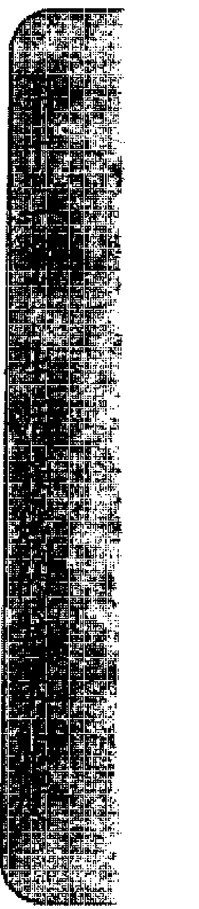

#### 第十一宮宮頭在寶瓶座（子宮）

對於友誼和人際關係的基本態度是人道和獨立的，因此會以一視同仁的態度來處理人際關係，而且也會期望於朋友能夠接受他的觀念，不太喜歡接受朋友的幫助。

#### 第十一宮宮頭在雙魚座（亥宮）

對於友誼和人際關係的基本態度是同情和憐憫的，所以必須儘可能地防止受騙，因爲時常會比較難以拒絕友人的求救，以感性主義的態度來處理人際關係。

### 《第十二宮：憂傷和隱密》

#### 第十二宮宮頭在白羊座（戌宮）

對於隱私和社會服務的基本態度是明快和衝勁的，所以具有獨善其身的特質，仁慈之心的發揮往往會只是短期性的，應該特別小心因衝動而帶來的損失。

#### 第十二宮宮頭在金牛座（酉宮）

對於隱私和社會服務的基本態度是韌性和寧靜的，所以能夠長期性地保守秘密，喜歡享有寧靜和悠閒的私人生活，對於社會服務是以金錢捐獻的方式來處理。

#### 第十二宮宮頭在雙子座（申宮）

對於隱私和社會服務的基本態度是應變和波動的，因此會以顧左右而言他的方式來處理私人隱密，而且具有說服別人多做善事的口才。

#### 第十二宮宮頭在巨蟹座（未宮）

對於隱私和社會服務的基本態度是內斂和感傷的，因此會相當同情於別人的不幸遭遇，然而卻也會暗地裡自憐和自我感傷。

#### 第十二宮宮頭在獅子座（午宮）

對於隱私和社會服務的基本態度是獨斷和慷慨的，所以對於自己的私事會特別不喜歡別人的干預，而且總是以佈施的心態來面對社會服務事項。

#### 第十二宮宮頭在處女座（巳宮）

對於隱私和社會服務的基本態度是瑣碎和執行的，會以細心保護的方式來處理自己的秘密，擔心別人探知自己的秘密，並且會以實際的行動來執行慈善事業。

#### 第十二宮宮頭在天秤座（辰宮）

對於隱私和社會服務的基本態度是懶散和認同的，所以在一人獨處的時候，總是會特別顯得懶洋洋，而對於慈善事業則是以隨緣的心態來處理。

#### 第十二宮宮頭在天蠍座（卯宮）

對於隱私和社會服務的基本態度是透視和沈默的，所以不但能夠察覺到別人的心事，而且也具有探測自己內心深處的本能，對於社會服務則是為善不予人知的。

#### 第十二宮宮頭在射手座（寅宮）

對於隱私和社會服務的基本態度是誇大和爽快的，平常的時候是很少談及個人的隱私，但突然心血來潮時，則會一股腦地吐盡自己的秘密，很能體諒貧困者的處境。

#### 第十二宮宮頭在摩羯座（丑宮）

對於隱私和社會服務的基本態度是憂鬱和無情的，很少談及個人的私事，獨自一人的時候很容易產生憂鬱的心緒，而且會以社會就是相當現實的心境來面對慈善事項。

#### 第十二宮宮頭在寶瓶座（子宮）

對於隱私和社會服務的基本態度是關心和不滿的，所以會以社會主義和人道主義的心態，來面對社會中的各種不平等現象，而在獨自一人的時候會特別有創意產生。

#### 第十二宮宮頭在雙魚座（亥宮）

對於隱私和社會服務的基本態度是冥想和無私的，當獨自一人靜靜地享受於個人之生活小空間的時候，最能夠體會到心靈有所釋放的感覺，關心於社會的不幸和無奈。

以上所提到之各種生活領域的基本態度，只能是作爲一種論斷時的參考而已，它會受到各種主要人格星座，以及落入宮位之中的行星的影響。因此，在實際論斷的時候，是必須先論斷主要人格特質，然後再來把主要人格特質和宮位中的行星，結合於各種基本態度來作論斷，如此才能把握住真確的各種生活領域之基本態度。

## 第十三章 流年的推運

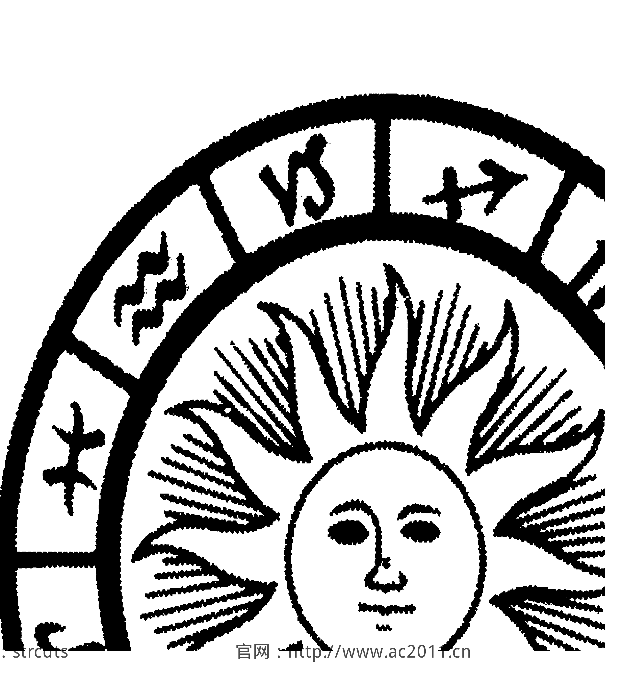

這裡所謂的「流年推運」，指的乃是我们可以依據簡單的流年推運系統（亦即「次要推運」，這是占星學上的流年系統之一），來預測每年所可能會發生的情況。其應用的原則相當容易：出生時間的每往後推一天的行星位置，也就是每年的流年行星位置。例如，如果某人出生於1967年5月17日，早上11:50；於是，此人出生後第二年的流年情況，可以從1967年5月18日的行星位置來作預測；而出生後第三年的流年情況，則是可以從1967年5月19日的行星位置來作預測，以此類推下去。

這種方法有點類似於八字命理的行運，只是占星學上的行星運行是順行和逆行同時進行的，亦即以十顆常用的行星來說，不一定完全都是順行的，逆行的情況也時常會發生。所以，它不同於八字命理之行運的只有順行和逆行的其中之一。同時，在應用這個方法的時候，必須配合著本命盤來使用，亦即必須把行星的每日移動位置落實在本命盤上來看，然後透過行星的每日移動位置之與本命盤上的行星位置的相位關係，來判斷每年的流年行運情況。

例如，同樣以前例來作說明，並且以太陽的位置移動來看。由於出生時之本命盤上的太陽位置是落在獅子座25度34分，所以出生後第二年之流年（隔日）的太陽位置大約是在獅子座26度30分（這裡所謂的「大約」，是把太陽的每日移動位置簡化為1度），如此一來，我們就可以透過太陽的落在獅子座26度30分，來與本命盤上的行星位置作對照，以判斷第二年的流年情況。當然，第二年的流年本盤（亦即依照生後第二天所繪製出來的本命盤），也是很重要的參考線索。請讀者自行使用電腦軟體來進行推運(Progression)命盤的繪製。以下是僅就黃道十二宮的每一個「區分」（2.5度）的特質來作簡要說明，並沒有把行星列入考量之中。於是，讀者可以自行依據單顆行星所代表的特質，來與這些「區分」作整合，以得出行星之落入這些「區分」時所意涵的命理徵象。由於本書只是在於探討有關星座的問題，所以本章的目的也就只是在於說明黃道十二宮的更精細的劃分，以及區別這些劃分所呈現出來的不同特質。於是，有關「推運」的更進一步解釋，將留待專門探討「流年推運」的專門書籍來作介紹。

〈白羊座（戌宮）第一区间〉

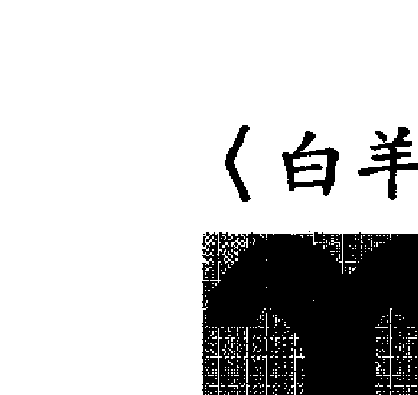

### 白羊座（戌宮）第一区间——第一区分（0～2.5度）

戌宫、戌宫、戌宫；火星、火星、火星。這是一個相當衝動、暴躁和易怒的區分，因爲它充滿著高度的精力。

### 白羊座（戌宮）第一区间——第二区分（2.5～5度）

戌宫、戌宫、酉宫；火星、火星、金星。火星的精力會展現在金星所代表的社交、感官享受和性慾上。

### 白羊座（戌宮）第一区间——第三区分（5～7.5度）

戌宫、戌宫、申宫；火星、火星、水星。火星的衝動會展現在水星所代表的語言溝通和近距離的出外上。

### 白羊座（戌宮）第一区间——第四区分（7.5～10度）

戌宫、戌宫、未宫；火星、火星、月亮。火星的急躁會展現在月亮所代表的情緒上，而且剋制了月亮的內斂。

## 第十三章 流年的推运

### 〈白羊座（戌宫）第二区间〉

- **白羊座（戌宫）第二区间——第五区分（10～12.5度）**  
  戌宫、午宫、午宫；火星、太阳、太阳。火星的精力会发挥在争取领导权，以及赢得名声和地位。

- **白羊座（戌宫）第二区间——第六区分（12.5～15度）**  
  戌宫、午宫、巳宫；火星、太阳、水星。火星的精力被导向于去思考应该如何进行规划，以克服各种阻碍。

- **白羊座（戌宫）第二区间——第七区分（15～17.5度）**  
  戌宫、午宫、辰宫；火星、太阳、金星。火星的热力发挥在对于性爱的强烈需求，以及慷慨地援助别人。

- **白羊座（戌宫）第二区间——第八区分（17.5～20度）**  
  戌宫、午宫、卯宫；火星、太阳、冥王星。火星的热忱发挥在占有和掌控上，相当具有斗争和霸权的特质。

### 〈白羊座（戌宫）第三区间〉

- **白羊座（戌宫）第三区间——第九区分（20～22.5度）**  
  戌宫、寅宫、寅宫；火星、木星、木星。火星的精力冲向于高远的理想和目标，而且有时候会脾气相当暴躁。

- **白羊座（戌宫）第三区间——第十区分（22.5～25度）**  
  戌宫、寅宫、丑宫；火星、木星、土星。火星的瞬间爆发力有所缓和，因为在脾气的发作上相当具有节制性。

- **白羊座（戌宫）第三区间——第十一区分（25～27.5度）**  
  戌宫、寅宫、子宫；火星、木星、天王星。火星的热力被导向于开创和革命，所以会特别排斥和反对传统。

- **白羊座（戌宫）第三区间——第十二区分（27.5～30度）**  
  戌宫、寅宫、亥宫；火星、木星、海王星。火星的精力发挥在理想和精神层面，所以会呈现出精神上的愉悦。

### 《金牛座（酉宫）第一区间》

- **金牛座（酉宫）第一区间——第一区分（0～2.5度）**  
  酉宫、酉宫、酉宫；金星、金星、金星。金星的感官与享乐在此获得突显，所以会注重金钱和物质的占有。

- **金牛座（酉宫）第一区间——第二区分（2.5～5度）**  
  酉宫、酉宫、申宫；金星、金星、水星。金星的和平与友善在此透过语言来展现，所以特别具有社交的才能。

- **金牛座（酉宫）第一区间——第三区分（5～7.5度）**  
  酉宫、酉宫、未宫；金星、金星、月亮。金星的舒适与柔和在此结合于月亮的亲切，所以是相当温和优雅的。

- **金牛座（酉宫）第一区间——第四区分（7.5～10度）**  
  酉宫、酉宫、午宫；金星、金星、太阳。金星的美感与触觉在此得到太阳的支持，所以会追求于艺术的创作。

### 《金牛座（酉宫）第二区间》

- **金牛座（酉宫）第二区间——第五区分（10～12.5度）**  
  酉宫、巳宫、巳宫；金星、水星、水星。在此引发了金星的均衡特质，所以会注重于知识的应用。

- **金牛座（酉宫）第二区间——第六区分（12.5～15度）**  
  酉宫、巳宫、辰宫；金星、水星、金星。在此引发了金星的艺术特质，所以会强调生命中要具有诗意。

- **金牛座（酉宫）第二区间——第七区分（15～17.5度）**  
  酉宫、巳宫、寅宫；金星、水星、木星。在此引发了金星的理想特质，所以会展现于宗教或哲学的热忱。

- **金牛座（酉宫）第二区间——第八区分（17.5～20度）**  
  酉宫、巳宫、卯宫；金星、水星、冥王星。在此引发了金星的敏锐特质，所以特别无法忍受别人的言语刺激。

### 〈金牛座（酉宫）第三区间〉

- **金牛座（酉宫）第三区间——第九区分（20～22.5度）**  
  酉宫、丑宫、丑宫；金星、土星、土星。以实际和谨慎的态度来面对一切，所以总是比较冷漠和迟缓。

- **金牛座（酉宫）第三区间——第十区分（22.5～25度）**  
  酉宫、丑宫、子宫；金星、土星、天王星。以权威和绝对的态度来面对一切，所以会特别突显顽固的特质。

- **金牛座（酉宫）第三区间——第十一区分（25～27.5度）**  
  酉宫、丑宫、亥宫；金星、土星、海王星。以既现实又浪漫的态度来面对一切，所以会落实在艺术的才能上。

- **金牛座（酉宫）第三区间——第十二区分（27.5～30度）**  
  酉宫、丑宫、戌宫；金星、土星、火星。以积极和严谨的态度来面对一切，所以会特别注重实质成就的达成。

### 〈双子座（申宫）第一区间〉

- **双子座（申宫）第一区间——第一区分（0～2.5度）**  
  申宫、申宫、申宫；水星、水星、水星。这一个区分会特别呈现出多元化和表象化，所以会特别具有好奇心。

- **双子座（申宫）第一区间——第二区分（2.5～5度）**  
  申宫、申宫、未宫；水星、水星、月亮。水星的思考受到月亮的支持，所以可强化记忆力及对文字的感受力。

- **双子座（申宫）第一区间——第三区分（5～7.5度）**  
  申宫、申宫、午宫；水星、水星、太阳。水星的沟通受到太阳的强化，所以会特别喜欢说话及四处走动。

- **双子座（申宫）第一区间——第四区分（7.5～10度）**  
  申宫、申宫、巳宫；水星、水星、水星。水星的学习在此得到很好的发挥，所以相当具有分析力和理解力。

### 〈双子座（申宫）第二区间〉

- **双子座（申宫）第二区间——第五区分（10～12.5度）**  
  申宫、辰宫、辰宫；水星、金星、金星。把水星理性沟通的本能发挥在社交上，所以会特别具有交际的手腕。

- **双子座（申宫）第二区间——第六区分（12.5～15度）**  
  申宫、辰宫、卯宫；水星、金星、冥王星。把水星好奇的特质发挥在搜寻于神秘的事物，所以喜欢探知秘密。

- **双子座（申宫）第二区间——第七区分（15～17.5度）**  
  申宫、辰宫、寅宫；水星、金星、木星。把水星学习的特性发挥在知识的追寻上，或者发挥在商业的交际上。

- **双子座（申宫）第二区间——第八区分（17.5～20度）**  
  申宫、辰宫、丑宫；水星、金星、土星。由于受到土星的克制，所以在社交和沟通上会比较严肃和缺乏信心。

### 〈双子座（申宫）第三区间〉

- **双子座（申宫）第三区间——第九区分（20～22.5度）**  
  申宫、子宫、子宫；水星、天王星、天王星。可以突显出思考能力上的创意，建立起自己特异的观点和理念。

- **双子座（申宫）第三区间——第十区分（22.5～25度）**  
  申宫、子宫、亥宫；水星、天王星、海王星。可以突显出思考能力与预感能力的结合，而产生特异的洞察力。

- **双子座（申宫）第三区间——第十一区分（25～27.5度）**  
  申宫、子宫、戌宫；水星、天王星、火星。可以突显出观念的传达能力，只是在沟通上会比较急躁。

- **双子座（申宫）第三区间——第十二区分（27.5～30度）**  
  申宫、子宫、酉宫；水星、天王星、金星。可以突显出爱情看法上的理性态度，所以喜欢与不同的异性交谈。

### 〈巨蟹座（未宫）第一区间〉

- **巨蟹座（未宫）第一区间——第一区分（0～2.5度）**  
  未宫、未宫、未宫；月亮、月亮、月亮。感伤的心境笼罩在这一区分，而情绪写在脸上及关怀表现在行为上。

- **巨蟹座（未宫）第一区间——第二区分（2.5～5度）**  
  未宫、未宫、午宫；月亮、月亮、太阳。情绪受到自我意识的导引，特别容易采取防卫和自我保护的行为。

- **巨蟹座（未宫）第一区间——第三区分（5～7.5度）**  
  未宫、未宫、巳宫；月亮、月亮、水星。同情和感伤的特质转化为记忆的沉淀，所以强化了想像力和回忆力。

- **巨蟹座（未宫）第一区间——第四区分（7.5～10度）**  
  未宫、未宫、辰宫；月亮、月亮、金星。以亲切和关怀的态度来对待别人，对于家人和爱人的依恋感比较重。

### ## 〈巨蟹座（未宫）第二区间〉

- **巨蟹座（未宫）第二区间——第五区分（10～12.5度）**  
  未宫、卯宫、卯宫；月亮、冥王星、冥王星。对于感情的依恋容易转化为强烈的占有，而且特别经不起刺激。

- **巨蟹座（未宫）第二区间——第六区分（12.5～15度）**  
  未宫、卯宫、寅宫；月亮、冥王星、木星。在付出关怀和照顾的同时，也期待着等量的感情回馈。

- **巨蟹座（未宫）第二区间——第七区分（15～17.5度）**  
  未宫、卯宫、丑宫；月亮、冥王星、土星。以有所保留的态度来处理感情，所以总是会慢慢地观察对方。

- **巨蟹座（未宫）第二区间——第八区分（17.5～20度）**  
  未宫、卯宫、子宫；月亮、冥王星、天王星。在遭遇刺激的时候，情绪很容易爆发出来，而且反击力相当强。

### ## 〈巨蟹座（未宫）第三区间〉

- **巨蟹座（未宫）第三区间——第九区分（20～22.5度）**  
  未宫、亥宫、亥宫；月亮、海王星、海王星。以诗意和怜悯的心境来面对生活，所以内心充满着温馨的胸怀。

- **巨蟹座（未宫）第三区间——第十区分（22.5～25度）**  
  未宫、亥宫、戌宫；月亮、海王星、火星。对于感情的付出会是主动的，然而却也会是情绪相当激动的。

- **巨蟹座（未宫）第三区间——第十一区分（25～27.5度）**  
  未宫、亥宫、酉宫；月亮、海王星、金星。以柔情和感性的心境来面对生活，但其中也掺杂着现实的价值观。

- **巨蟹座（未宫）第三区间——第十二区分（27.5～30度）**  
  未宫、亥宫、申宫；月亮、海王星、水星。在思考上会呈现出混淆和朦朧，进而在态度上会表现出暧昧不明。

### 〈狮子座（午宫）第一区间〉

- **狮子座（午宫）第一区间——第一区分（0～2.5度）**  
  午宫、午宫、午宫；太阳、太阳、太阳。以无限的精力去展现自己的才干，热切期望得到别人的赞同和欣赏。

- **狮子座（午宫）第一区间——第二区分（2.5～5度）**  
  午宫、午宫、巳宫；太阳、太阳、水星。往往是透过口才的表现来取得领导地位，因此具有意见领袖的特质。

- **狮子座（午宫）第一区间——第三区分（5～7.5度）**  
  午宫、午宫、辰宫；太阳、太阳、金星。往往是透过社交手腕的展现来取得领导地位，会是异性眼中的焦点。

- **狮子座（午宫）第一区间——第四区分（7.5～10度）**  
  午宫、午宫、卯宫；太阳、太阳、冥王星。相当强调实权的掌控，而且会走向于肉欲的需求，也比较易怒。

### 〈狮子座（午宫）第二区间〉

- **狮子座（午宫）第二区间——第五区分（10～12.5度）**  
  午宫、寅宫、寅宫；太阳、木星、木星。内心充满着乐观和自信，所以会特别需求于尊严和高贵。

- **狮子座（午宫）第二区间——第六区分（12.5～15度）**  
  午宫、寅宫、丑宫；太阳、木星、土星。内心充满着野心和企图，然而却也会怀疑别人将有所阻碍。

- **狮子座（午宫）第二区间——第七区分（15～17.5度）**  
  午宫、寅宫、子宫；太阳、木星、天王星。希望荣耀和名声是建立在自己的知识之上，具有带动群众的特质。

- **狮子座（午宫）第二区间——第八区分（17.5～20度）**  
  午宫、寅宫、亥宫；太阳、木星、海王星。往往会呈现出愉快和气派的特质，可以使得周遭的气氛相当热络。

### 〈狮子座（午宫）第三区间〉

- **狮子座（午宫）第三区间——第九区分（20～22.5度）**  
  午宫、戌宫、戌宫；太阳、火星、火星。在此增强了攻击的特质，所以会以正面冲突的方式来争取领导权。

- **狮子座（午宫）第三区间——第十区分（22.5～25度）**  
  午宫、戌宫、酉宫；太阳、火星、金星。对于爱情和游戏充满着高度的兴趣，然而却往往只是短暂的。

- **狮子座（午宫）第三区间——第十一区分（25～27.5度）**  
  午宫、戌宫、申宫；太阳、火星、水星。在争取领导权的过程中，难免会掺杂着狡猾的计谋在其中。

- **狮子座（午宫）第三区间——第十二区分（27.5～30度）**  
  午宫、戌宫、未宫；太阳、火星、月亮。积极地追寻于个人的表演空间，而且在感情的表达上相当露骨。

### # 《处女座（巳宫）第一区间》

### ## 处女座（巳宫）第一区间——第一区分（0～2.5度）

巳宫、巳宫、巳宫；水星、水星、水星。完美和细致在此达到高峰，所以批判和挑剔会是相当严苛的。

### ## 处女座（巳宫）第一区间——第二区分（2.5～5度）

巳宫、巳宫、辰宫；水星、水星、金星。胆怯的心理可以用和平的外表来作掩饰，强调秩序所带来的安适感。

### ## 处女座（巳宫）第一区间——第三区分（5～7.5度）

巳宫、巳宫、卯宫；水星、水星、冥王星。神经质一旦被激发以后，讲话和文字的批评会是充满着怒气的。

### ## 处女座（巳宫）第一区间——第四区分（7.5～10度）

巳宫、巳宫、寅宫；水星、水星、木星。对于自己的分析能力充满着信心，只是有点过于钻牛角尖。

### # 《处女座（巳宫）第二区间》

### ## 处女座（巳宫）第二区间——第五区分（10～12.5度）

巳宫、丑宫、丑宫；水星、土星、土星。谨慎和羞怯阻碍了机会的争取，也担心自己的分析不够精细。

### ## 处女座（巳宫）第二区间——第六区分（12.5～15度）

巳宫、丑宫、子宫；水星、土星、天王星。在严谨的思考过程中也具有创意，笔端和话语有着人道主义色彩。

### ## 处女座（巳宫）第二区间——第七区分（15～17.5度）

巳宫、丑宫、亥宫；水星、土星、海王星。尖锐的批评转化为适应别人的意见，以实际的行动去付出爱心。

### ## 处女座（巳宫）第二区间——第八区分（17.5～20度）

巳宫、丑宫、戌宫；水星、土星、火星。在分析和思考上不但具有组织性，而且反应的速度也相当快。

### 〈处女座（巳宫）第三区间〉

- **处女座（巳宫）第三区间——第九区分（20～22.5度）**  
  巳宫、酉宫、酉宫；水星、金星、金星。以友善和同情的心理面对生活，所以可在社交上获得别人的欢迎。

- **处女座（巳宫）第三区间——第十区分（22.5～25度）**  
  巳宫、酉宫、申宫；水星、金星、水星。以现实和唯物主义的心理面对生活，所以相当注重利益，而且善辩。

- **处女座（巳宫）第三区间——第十一区分（25～27.5度）**  
  巳宫、酉宫、未宫；水星、金星、月亮。以默默付出的心理面对生活，并在内心中期待着纯洁爱情的降临。

- **处女座（巳宫）第三区间——第十二区分（27.5～30度）**  
  巳宫、酉宫、午宫；水星、金星、太阳。以沉思和明察秋毫的心理面对生活，所以会探察于知识的真相。

### 〈天秤座（辰宫）第一区间〉

- **天秤座（辰宫）第一区间——第一区分（0～2.5度）**  
  辰宫、辰宫、辰宫；金星、金星、金星。这一个区分会特别呈现出均衡性，总是力求于考量到另一方的立场。

- **天秤座（辰宫）第一区间——第二区分（2.5～5度）**  
  辰宫、辰宫、卯宫；金星、金星、冥王星。在友善之交际手腕的背后，存在着征服和压制别人的心理动机。

- **天秤座（辰宫）第一区间——第三区分（5～7.5度）**  
  辰宫、辰宫、寅宫；金星、金星、木星。在此会更加增强了社交上的扩张性，喜欢享受与许多人在一起的感觉。

- **天秤座（辰宫）第一区间——第四区分（7.5～10度）**  
  辰宫、辰宫、丑宫；金星、金星、土星。在此会担心于受到朋友的牵连或伤害，因此在挑选朋友上比较慎重。

### 《天秤座（辰宫）第二区间》

- **天秤座（辰宫）第二区间——第五区分（10～12.5度）**  
  辰宫、子宫、子宫；金星、天王星、天王星。强调知识与真理，喜欢追寻于自由，并在爱人和友人之间徘徊。

- **天秤座（辰宫）第二区间——第六区分（12.5～15度）**  
  辰宫、子宫、亥宫；金星、天王星、海王星。范围狭窄的私情和小团体，在此转化为广博的群众性友谊。

- **天秤座（辰宫）第二区间——第七区分（15～17.5度）**  
  辰宫、子宫、戌宫；金星、天王星、火星。在大胆地追求并获得爱情之后，接下来可能就是意图脱离束缚。

- **天秤座（辰宫）第二区间——第八区分（17.5～20度）**  
  辰宫、子宫、酉宫；金星、天王星、金星。希望获得广大同辈的友谊，所以会热心地去帮助朋友们。

### 《天秤座（辰宫）第三区间》

- **天秤座（辰宫）第三区间——第九区分（20～22.5度）**  
  辰宫、申宫、申宫；金星、水星、水星。在此会以理性思考的方式来处理社交事宜，而且具有利益性的考量。

- **天秤座（辰宫）第三区间——第十区分（22.5～25度）**  
  辰宫、申宫、未宫；金星、水星、月亮。在此会特别突显社交上的话多，所以容易留给别人只说不做的印象。

- **天秤座（辰宫）第三区间——第十一区分（25～27.5度）**  
  辰宫、申宫、午宫；金星、水星、太阳。在主动地与别人进行沟通的背后，存在着要掌握意见主导权的意图。

- **天秤座（辰宫）第三区间——第十二区分（27.5～30度）**  
  辰宫、申宫、巳宫；金星、水星、水星。在友善之脸色的背后，总是存在着斤斤计较的精打细算特质。

### 〈天蝎座（卯宫）第一区间〉

- **天蝎座（卯宫）第一区间——第一区分（0～2.5度）**  
  卯宫、卯宫、卯宫；冥王星、冥王星、冥王星。绝对占有的特质带来了强烈的征服欲，相当具有攻击潜在力。

- **天蝎座（卯宫）第一区间——第二区分（2.5～5度）**  
  卯宫、卯宫、寅宫；冥王星、冥王星、木星。在此会以乐观和自信的态度去追求欲望的实现，精神力特别强。

- **天蝎座（卯宫）第一区间——第三区分（5～7.5度）**  
  卯宫、卯宫、丑宫；冥王星、冥王星、土星。谨慎和小心的外在行为，会使人难以捉摸到真实意图的所在。

- **天蝎座（卯宫）第一区间——第四区分（7.5～10度）**  
  卯宫、卯宫、子宫；冥王星、冥王星、天王星。我行我素的特质会特别强烈，而且不容许别人反对或阻挠。

### 〈天蝎座（卯宫）第二区间〉

- **天蝎座（卯宫）第二区间——第五区分（10～12.5度）**  
  卯宫、亥宫、亥宫；冥王星、海王星、海王星。以深邃的洞察力来面对周遭的环境，凭直觉来认识陌生人。

- **天蝎座（卯宫）第二区间——第六区分（12.5～15度）**  
  卯宫、亥宫、戌宫；冥王星、海王星、火星。强烈的占有欲结合着海王星的敏感，引发疑神疑鬼的特性。

- **天蝎座（卯宫）第二区间——第七区分（15～17.5度）**  
  卯宫、亥宫、酉宫；冥王星、海王星、金星。在随和以及不表示反对的态度背后，存在着好恶分明的区隔。

### 〈天蝎座（卯宫）第三区间〉

- **天蝎座（卯宫）第三区间——第九区分（20～22.5度）**  
  卯宫、未宫、未宫；冥王星、月亮、月亮。在此突显了激动的情绪反应，以及强调了性欲的重要。

- **天蝎座（卯宫）第三区间——第十区分（22.5～25度）**  
  卯宫、未宫、午宫；冥王星、月亮、太阳。情绪徘徊在占有之手法的明暗之间，疑心和深恐失去自己的所爱。

- **天蝎座（卯宫）第三区间——第十一区分（25～27.5度）**  
  卯宫、未宫、巳宫；冥王星、月亮、水星。对于仇恨总是念念不忘，而且擅长以阴谋的方式来夺取利益。

- **天蝎座（卯宫）第三区间——第十二区分（27.5～30度）**  
  卯宫、未宫、辰宫；冥王星、月亮、金星。对于爱的需求会特别强烈，而性欲则很容易在遭受刺激后被挑起。

### 射手座（寅宫）第一区间

### 射手座（寅宫）第一区间——第一区分（0～2.5度）

寅宫、寅宫、寅宫；木星、木星、木星。这一个区分呈现出高度的理想和雄心，并且拥有乐观和愉快的心情。

### 射手座（寅宫）第一区间——第二区分（2.5～5度）

寅宫、寅宫、丑宫；木星、木星、土星。以谨慎的作为来达成自己的目标，而且以实际的态度来面对生活。

### 射手座（寅宫）第一区间——第三区分（5～7.5度）

寅宫、寅宫、子宫；木星、木星、天王星。在此会特别向往于独立自主，而且会对束缚采取反击的态度。

### 射手座（寅宫）第一区间——第四区分（7.5～10度）

寅宫、寅宫、亥宫；木星、木星、海王星。精神层次的高度发挥带来对于宗教的兴趣，以及追寻思想的意义。

### 射手座（寅宫）第二区间

### 射手座（寅宫）第二区间——第五区分（10～12.5度）

寅宫、戌宫、戌宫；木星、火星、火星。充沛的精力一直寻求发泄的管道，所以时常会与别人发生冲突。

### 射手座（寅宫）第二区间——第六区分（12.5～15度）

寅宫、戌宫、酉宫；木星、火星、金星。在满怀信心和充满热情的结合下，可以经历各式各样的爱情浪漫史。

### 射手座（寅宫）第二区间——第七区分（15～17.5度）

寅宫、戌宫、申宫；木星、火星、水星。火爆的脾气发挥在言语上的不客气，但也可能是追寻于高深的知识。

### 射手座（寅宫）第二区间——第八区分（17.5～20度）

寅宫、戌宫、未宫；木星、火星、月亮。情绪的反应不但是激动的，而且是大胆和粗鲁的，会经不起刺激。

### 射手座（寅宫）第三区间

### 射手座（寅宫）第三区间——第九区分（20～22.5度）

寅宫、午宫、午宫；木星、太阳、太阳。高度的自信心固然可以带来成功，但高傲的态度却带来别人的反感。

### 射手座（寅宫）第三区间——第十区分（22.5～25度）

寅宫、午宫、巳宫；木星、太阳、水星。在此强化了思考的逻辑能力以及知识的专业性，瞧不起低俗的作品。

### 射手座（寅宫）第三区间——第十一区分（25～27.5度）

寅宫、午宫、辰宫；木星、太阳、金星。期望在社交场合上扮演着主导者角色，也希望成为异性眼中的英雄。

### 射手座（寅宫）第三区间——第十二区分（27.5～30度）

寅宫、午宫、卯宫；木星、太阳、冥王星。不但会以充沛的精力追求于名声和荣耀，而且也会要求掌控实权。

### 摩羯座（丑宫）第一区间

### 摩羯座（丑宫）第一区间——第一区分（0～2.5度）

丑宫、丑宫、丑宫；土星、土星、土星。高度成就感和野心的促动，会带来严格的自我要求和训练。

### 摩羯座（丑宫）第一区间——第二区分（2.5～5度）

丑宫、丑宫、子宫；土星、土星、天王星。热衷于建立自己的权威性地位，所以相当排斥异己的思想和作法。

### 摩羯座（丑宫）第一区间——第三区分（5～7.5度）

丑宫、丑宫、亥宫；土星、土星、海王星。在难以表达自己的感情的背后，也存在着害怕受到伤害的提防心。

### 摩羯座（丑宫）第一区间——第四区分（7.5～10度）

丑宫、丑宫、戌宫；土星、土星、火星。火星的精力增强了奋斗的本能，因此可以面对高难度之困难的挑战。

### 摩羯座（丑宫）第二区间

### 摩羯座（丑宫）第二区间——第五区分（10～12.5度）

丑宫、酉宫、酉宫；土星、金星、金星。在此可以突显出艺术性的技艺本能，只是会偏重于实用性和价格性。

### 摩羯座（丑宫）第二区间——第六区分（12.5～15度）

丑宫、酉宫、申宫；土星、金星、水星。在此可以突显出社交的手腕，只是会从现实的角度来作交友的考量。

### 摩羯座（丑宫）第二区间——第七区分（15～17.5度）

丑宫、酉宫、未宫；土星、金星、月亮。在此可以突显出情绪的压抑性，一旦爆发则往往会是相当严重的。

### 摩羯座（丑宫）第二区间——第八区分（17.5～20度）

丑宫、酉宫、午宫；土星、金星、太阳。在此可以突显出现实主义的色彩，会追求于实质事物和实际权力。

### 摩羯座（丑宫）第三区间

### 摩羯座（丑宫）第三区间——第九区分（20～22.5度）

丑宫、巳宫、巳宫；土星、水星、水星。以事必躬亲的态度来面对生活，以劳碌换取成就，害怕事情做不好。

### 摩羯座（丑宫）第三区间——第十区分（22.5～25度）

丑宫、巳宫、辰宫；土星、水星、金星。以现实考量的态度来面对生活，相当具有掌握和指挥部属的能力。

### 摩羯座（丑宫）第三区间——第十一区分（25～27.5度）

丑宫、巳宫、卯宫；土星、水星、冥王星。可能会为了夺取权力而施展计谋，经不起别人的刺激和批评。

### 摩羯座（丑宫）第三区间——第十二区分（27.5～30度）

丑宫、巳宫、寅宫；土星、水星、木星。可以享受于辛勤工作的乐趣，因为高兴自己又向着目标迈进一步了。

### 宝瓶座（子宫）第一区间

### 宝瓶座（子宫）第一区间——第一区分（0～2.5度）

子宫、子宫、子宫；天王星、天王星、天王星。这一个区分呈现出诉求自由和反抗的特性，最难以忍受约束。

### 宝瓶座（子宫）第一区间——第二区分（2.5～5度）

子宫、子宫、亥宫；天王星、天王星、海王星。以宽阔的心境来面对人世间，愿意为世人诉说各种不满。

### 宝瓶座（子宫）第一区间——第三区分（5～7.5度）

子宫、子宫、戌宫；天王星、天王星、火星。充沛的精力落实在独来独往之上，也比较容易与别人发生冲突。

### 宝瓶座（子宫）第一区间——第四区分（7.5～10度）

子宫、子宫、酉宫；天王星、天王星、金星。把人道主义的理念发挥在社交之上，希望与每一个人成为朋友。

### 宝瓶座（子宫）第二区间

### 宝瓶座（子宫）第二区间——第五区分（10～12.5度）

子宫、申宫、申宫；天王星、水星、水星。创意的思考特质在此得到发挥，然而却难免有点过于神经质。

### 宝瓶座（子宫）第二区间——第六区分（12.5～15度）

子宫、申宫、未宫；天王星、水星、月亮。对于别人的关怀往往会是通过唠叨来作展现，也相当异想天开。

### 宝瓶座（子宫）第二区间——第七区分（15～17.5度）

子宫、申宫、午宫；天王星、水星、太阳。以独特的煽动性言辞来影响别人，很能掌握住群众的心理。

### 宝瓶座（子宫）第二区间——第八区分（17.5～20度）

子宫、申宫、巳宫；天王星、水星、水星。强调科学性的知识，并要求事实的统计分析，所以相当排斥迷信。

### 宝瓶座（子宫）第三区间

### 宝瓶座（子宫）第三区间——第九区分（20～22.5度）

子宫、辰宫、辰宫；天王星、金星、金星。期望于不断地扩大自己的交际网络，所以会结交各种奇人异士。

### 宝瓶座（子宫）第三区间——第十区分（22.5～25度）

子宫、辰宫、卯宫；天王星、金星、冥王星。在灵活的社交手腕背后，潜藏着不容许别人反对的霸权意识。

### 宝瓶座（子宫）第三区间——第十一区分（25～27.5度）

子宫、辰宫、寅宫；天王星、金星、木星。以慷慨和友善的态度来对待朋友，因此相对地可获得朋友的帮助。

### 宝瓶座（子宫）第三区间——第十二区分（27.5～30度）

子宫、辰宫、丑宫；天王星、金星、土星。在以平等的态度来对待朋友的同时，也存在着有所提防的心理。

### 双鱼座（亥宫）第一区间

- **双鱼座（亥宫）第一区间——第一区分（0～2.5度）**
亥宫、亥宫、亥宫；海王星、海王星、海王星。这一个区分可以表现出高度的同情心，以及追寻于浪漫气氛。

- **双鱼座（亥宫）第一区间——第二区分（2.5～5度）**
亥宫、亥宫、戌宫；海王星、海王星、火星。高度的敏感性结合于直觉力，带来了透视别人和预知的能力。

- **双鱼座（亥宫）第一区间——第三区分（5～7.5度）**
亥宫、亥宫、酉宫；海王星、海王星、金星。梦幻式的意境在此落实在艺术上，可以发挥出艺术上的想象力。

- **双鱼座（亥宫）第一区间——第四区分（7.5～10度）**
亥宫、亥宫、申宫；海王星、海王星、水星。脑海中呈现出一片空白或胡思乱想，难以理出思绪和注重现实。

### 双鱼座（亥宫）第二区间

- **双鱼座（亥宫）第二区间——第五区分（10～12.5度）**
亥宫、未宫、未宫；海王星、月亮、月亮。同情和怜悯会通过亲切的态度来作展现，然而也担心会受到伤害。

- **双鱼座（亥宫）第二区间——第六区分（12.5～15度）**
亥宫、未宫、午宫；海王星、月亮、太阳。在奉献牺牲的背后，却也存在着期待于别人的照顾和赞同。

- **双鱼座（亥宫）第二区间——第七区分（15～17.5度）**
亥宫、未宫、巳宫；海王星、月亮、水星。在此突显了诗意的特质，可以发挥出写作上的想象力。

- **双鱼座（亥宫）第二区间——第八区分（17.5～20度）**
亥宫、未宫、辰宫；海王星、月亮、土星。

## 占星学家谈星座

亥宫、未宫、辰宫；海王星、月亮、金星。以感性的态度来面对生活，并且在待人处事上相当柔顺和体贴。

### 双鱼座（亥宫）第三区间

- **双鱼座（亥宫）第三区间——第九区分（20～22.5度）**
亥宫、卯宫、卯宫；海王星、冥王星、冥王星。以自我剖析的态度来了解自己的欲望，会探索于神秘的事物。

- **双鱼座（亥宫）第三区间——第十区分（22.5～25度）**
亥宫、卯宫、寅宫；海王星、冥王星、木星。强调于精神层次的心灵提升，然而却难以摆脱欲望的纠缠。

- **双鱼座（亥宫）第三区间——第十一区分（25～27.5度）**
亥宫、卯宫、丑宫；海王星、冥王星、土星。在此突显了隐退的特质，对人世间的险恶采取尽量避开的心态。

- **双鱼座（亥宫）第三区间——第十二区分（27.5～30度）**
亥宫、卯宫、子宫；海王星、冥王星、天王星。以科学精神来面对神秘主义，试图解开人类的生死轮回之谜。

## 第十三章 流年的推运

## 第十四章 基本个性的论断提示

在占星学的论断上，基本人格特质的分析时常扮演着论断的切入点，亦即在整个论断的过程中，必须先掌握住个人的基本个性，然后再来逐一地考量细部的特质。换句话说，一个人的心理结构就好像是一张很大的蜘蛛网，而基本人格特质就是这个网的主线，它支撑了整个网的基本架构；而在这网中的其他细线，就是比较细部的心理脉络，它依靠于主线来支撑，但却又拥有自己的线路，它成为主线与主线之间的联系，也串连起细线与细线之间的联系。在全部主线与细线的交互作用下，建构了个人的整体心理结构，也决定了个人的基本命运形态，因为一个人的命运无法与他的心理结构相脱离。

占星学的“看命”，就是“透视”这个心理之网的整体结构；占星学的“论命”，就是“解说”这个心理之网的整体结构，以及“判断（预言）”其所可能会产生的影响；占星学的“改运”，就是让个人通过了解自己的心理之网，来进而“调整”这个网线的乱象，使整个网呈现出一种平衡的状态。

举例来说，假设某一个人的十颗行星，是落入于七个星座之中，而且其中有四个星座的力量特别强。那么这力量特别强的四个星座，就是此人心理之网的主线，其他三个星座则是副线，而行星之间的相位关系则是细线。因此，如果要拉出整个命盘的论断主轴的话，就是必须先看这四个星座，分析它们彼此之间的互动情况，然后再沿着副线和细线，来作更进一步的分析。同时，在整个论断的过程中，必须永远记住这个主线的综合特质，因为主线的力量永远大于副线和细线，也永远影响着副线和细线的一

由于主线的综合分析，与星座具有密切的关系，所以在讨探星座的时候，我认为有必要对此进行说明。这一方面可以让读者知道占星学家是如何透过星座来分析个性，另一方面则可以让读者藉此而学习到如何进行个性的分析。

然而，由于目前的现代占星学，对于以重要的星座作为主线来进性的分析，仍然存在着许多应用方法上的差异；换言之，占星学家对于重要星座的综合方法，以及如何进行诠释，仍然存在着不同的观点，可以说是完全依据占星学家的个人偏好来应用这些论断方法。也因此，我不希望读者就此而认为有关人格特质的论断只有一种方法而已，更希望读者能够建立起自己的新方法。

## 基本人格特质的分析方法

我曾经整理过占星学家对于人格特质的论断，所采取的各种方法，总共可以归类为十七种方法。这十七种方法，也可以说就是专业占星学家对于人格特质进行论断的切入法，每一种方法也都代表着不同的着眼点，以及代表着不同的心理诠释方式。然而，不管是应用那一种方法，读者都必须记住以下的三点共同原则：一是，确立心理的论断是所有论断的基础；二是，凡是有行星落入的星座，都必须加以特别注意；三是，一定都是“由大到小”来进行论断，亦即都是先统合重要的特质，然后再来论断细部

的影响，也可以说，“层层逼进”是占星学家论断人格特质的不变法则。以下简单说明我所归类的十七种有关人格特质的论断方法。

#### 第一种方法：主要人格与次要人格的划分法

这种方法是把十二星座分成主要人格星座、次要人格星座和更次要人格星座，划分的标准是行星的影响力和数量的多寡，以及计都的所在星座。本章后面所说明的就是这种方法的应用。

在实际论断上，是先决定主要人格星座到底有那几个，然后针对主要人格星座来作统合性的论断。此方法除了考量到四正宫和三方宫的统合性质以外，特别强调每一个主要人格星座对于个人所可能产生的影响。这种论断方法比较传统，在英国相当流行。

#### 第二种方法：意识和潜意识的区别法

这种方法是把命盘上的重要星座（有行星落入的星座），分成意识层面和潜意识层面。而区分的标准则是以星座内之行星力量的大小来作判断，力量大的星座个性列为意识层面，而力量小的星座个性列为潜意识层面。

在应用这个方法之前，必须先把三方宫分成两组：一组是风象和水象；另一组是火象和土象。各组中的两个元素，彼此是处于意识层面和潜意识层面对立的态势，配合着重要星座之力量的强弱对比，来论断意识和潜意识的互动情况。

例如，如果重要星座之中的风象星座的力量，大于水象星座，则此人的风象特质（逻辑和思维）居于意识层面，水象特质（感情和情绪）居于潜意识层面。而如果重要星座之中的土象星座的力量，大于火象星座，则此人的土象特质（实际和稳固）居于意识层面，火象特质（冲动和直觉）居于潜意识层面。结果，此人的意识层面是由风象和土象所主宰，而水象和火象则潜伏在潜意识之中。这种论断方法在德国比较普遍。

#### 第三种方法：四正宫和三方宫的交叉法

这种方法也是从行星落入星座的配置情况，来进行个性上的说明，只是它所着重的是四正宫和三方宫的互动关系，而暂时不谈单一重要星座的特质。

在应用这个方法的时候，请记住一个很重要的口诀：“四正为体、三方为用”。例如，假设命盘上的行星配置情况，是以落入基本宫居多数，而且又是以水象和风象居多数，则此人的基本人格特质呈现出以下的情况：
四正为体：充满着基本宫的前进、促进、主动和带动的味道，心理上期求着一种有所突破和引导别人的动机。
三方为用：以上基本宫的特质会被落实在水象和风象之上，所以此人会特别需求于感情的主导权，而且情绪的反应也比较直接；同时，此人也会特别喜欢把自己的观念和想法告诉别人，而且吸收知识的能力和思考反应的能力也都相当好。在这种四正宫和三方宫交叉下的“重点突出”，可以拉出此人的心理之网的主线。这种论断方法在美国比较盛行，它的最大优点是可以与其他的各种论断方法进行结合性的应用。

#### 第四种方法：行星之心理功能的分析法

这种方法完全是以行星来作为论断的主轴，亦即是以行星本身所代表的心理功能来作为切入点。此时，通过行星所落入的星座，以及行星本身的相位，来判断一个人的心理结构，进而论断可能的外在行为表现，以及可能会发生的事件。当然，在诠释的过程中，行星本身的力量大小是一个相当重要的观察基础。
例如，太阳是一个普遍性的人格特质表现，也是自我意识的作用所在，因此太阳所落入的星座会影响到整个心理结构，特别是意识层面。又例如，金星主宰着感官机能，因此金星所落入的星座会影响到个人对于感官方面的反应。于是，在论断某一个人的感官特质的时候，至少必须结合着太阳和金星所落入的星座来作判断，而如果太阳和金星是形成合相的话，则此人的感官机能会特别发达。这种论断方法的应用，在北欧国家比较盛行。

#### 第五种方法：三方宫的阴阳二分法

这种方法是先以阴阳宫的划分来区隔三方宫，把三方宫分成土象和水象、风象和火象两组，然后再来进行力量上对比，进而呈现出心理结构上的调和或冲突。
例如，风象的理性和水象的感性，彼此是两种不同的特质；而土象的感官和火象的直觉，彼此是两种不同的特质。

如果一个人的行星，大部份是落入水象和土象之中，则此人的阴性特质比较明显。于是，此人的外在行为表现会是比较静态的，但是内心却充满着矛盾与挣扎，因为他的主要心理结构徘徊在感性和感官之间，不知道以感情诉求为主，还是以现实考量为主。这种论断方法，在美国也相当流行。

#### 第六种方法：荣格精神分析的应用

这种方法可以分成星座和行星两种类型，来与荣格的精神分析主张进行交叉分析，于是正好可以产生四种观察途径。这种方法的应用相当普遍，而且可以说是心理占星学的入门，如果无法熟悉这种方法，则很难看得懂西方占星学家对于论断所作的诠释，因为这种方法已经渗透到整个现代占星学的分析方法之中，同时这种方法也是现代占星学的主力所在。

以荣格所提出的四大元素的心理功能来看，则土象代表着感官、水象代表着感受、火象代表着直觉、风象代表着思考，这是从星座的角度来看的。而如果是从行星的角度来看，则金星代表着感官、月亮代表着感受、火星代表着直觉、水星代表着思考，其他的行星则分别对这四种心理功能进行影响。譬如说，木星和月亮形成凶相，则木星的扩张特质加强了月亮的情绪、感受功能。又譬如说，金星和火星形成凶相，则火星的直觉赋予金星的感官有所压力，形成在感官享受上特别具有冲动特质。

以荣格所提出的集体潜意识来看，则木星、土星、天王星、海王星和冥王星等所落入的星座，分別代表著各種不同的集體潛意識的呈現，也代表著各種不同世代之間的心理特徵，這是從星座的角度來看的。而如果是從行星的角度來看，則內外行星彼此之間的相位關係，代表著個人的意識、潛意識和集體潛意識之間的互動，此時有必要特別注意到個人的意識層面和集體潛意識之間的衝突。譬如說，當太陽和天王星形成凶相，則代表著個人的意識層面，與天王星所落入的星座的集體潛意識產生衝突，於是當此人在面對天王星所落入之星座（如處女座）特質強烈的人時，就容易引發意識層面上的不爽、討厭和衝突，需要其他的吉相來作化解。

在此，有必要說明的有二點：一是榮格所談的是人類的集體潛意識，它所指涉的是整個黃道十二宮的特質，亦即十二星座的組合就是人類的集體潛意識，所以不同於占星學上所談及的世代的集體潛意識，也不同於占星學上的民族集體潛意識；二是榮格的精神分析只能說是精神分析學派之一，它與弗洛依德的精神分析學有所差異，因此如果是採用弗洛依德的精神分析來作命盤之詮釋的話，則在解析方法上略有不同，特別是會沒有集體潛意識的概念。也有很多西方的占星學家是偏好應用弗洛依德的理論，特別是有關於弗洛依德所提到的幼年生活足以影響到個人的潛意識。所以，讀者絕對不可以認為占星學上的精神分析，只有榮格一派而已。

## 〈第七種方法：發展心理學的觀察法〉

這種方法也可以分別從星座和行星的角度來作說明。從星座的角度來看，則從白羊座開始，沿著金牛座、雙子座等，一直到雙魚座為止，代表著個人的人生歷程，同時也代表著個人的心理發展。於是，凡是力量有所特別突顯的星座，就代表著個人在心理發展的歷程中，會特別突顯這方面的心理功能。

從行星的角度來看，則是透過行星本身所代表的行運年齡（在占星學上，每一顆行星都代表著某一階段的人生歷程），來看個人在心理意識上的轉變情況。於是，由於行星會是落入於不同的星座之中，所以也就代表著在各種不同的年齡階段上，會有不同的心理意識呈現，也就會有不同的心理發展情況。而且，依據幼年的心理發展情況會影響到成年的心理結構來看，則必須特別注意太陽、月亮和內行星所落入的星座及其相位。有關行星所代表的年齡階段之劃分，我會在探討行星和大運的部份來作說明。

## 〈第八種方法：行為主義的行為判斷〉

這種方法完全是以外在行為的說明，來作爲論斷的主軸，比較偏向於事件占星學的論斷方式。從實際的論斷經驗來看，這種方法是很實用的，因爲當一個人已經可以認知到自己的外在行為的時候，往往表示著主宰該行為特質的命理徵象，已經相當明顯了，甚至已經發生過某些事件了，也甚至是已經難以援救了。同時，在論斷時間有所限制的情況下，根本就無法針對

## 〈第九種方法：人本主義心理學的調和法〉

這種方法強調的是人格特質的平衡，亦即在所謂的人格特質均衡的條件下（如何才可以稱得上是一位人格特質平衡的人，請參閱有關人本主義心理學的說明），透過命盤所呈現出來的個性特徵，來說明如何輔助一個人，使他成為一位人格特質健全的人。

換句話說，每一個人的本命盤都是不完美的，都有人格特質上的缺失。於是，就要針對這些缺失來作補強，儘量地使自己的人格特質達到均衡和完美。譬如說，一個人如果火象星座的特質特別強烈，而缺乏水象星座的特質的話，則在實際論斷上，除了點出火象星座的人格特質之外，還必須強調水象星座的重要，希望此人能夠多多發揮水象星座的特質，以此來健全自己的人格特質。
當然，由於每一個人時常是「性難改」的，所以人格特質的平衡只能說是一種理想態；也因此，這種方法具備了「造命」的濃厚色彩，比較偏向於哲學人生觀的詮釋。

## 〈第十種方法：符號象徵行為的透視法〉

這種方法強調的是民族的集體潛意識，所以是配合著種族占星學來應用。在此，「符號象徵行為」指的是某一民族的整體行為模式，亦即每一個種族都會透過該種族的集體遺傳基因，而建構了該種族的社會結構和文化遺產。於是，只要是身為該種族的一員，也就自然而然地會遺傳到該種族的集體潛意識，進而自然而然地採取該種族所習慣的行為模式。也因此，透過這種方法的應用，可以用來論斷個人與他所生存的傳統社會環境，是否能夠取得協調，甚至於可以用來論斷此人是否能夠在傳統的社會環境中，建立起他自己的事業以及其他成就。
例如，在中國人的集體潛意識當中，深具著巨蟹座的特質。於是，中國人的「吃」是一流，是其他民族所難以比擬的。因此，我們可以透過巨蟹座的特質，來更進一步地推演出中國人的其他重要的人格特徵，諸如：特別強調人情關係、特別注重歷史、特別重視家庭和家族，以及特別經不起刺激等。也因此，在我們的命盤當中，如果巨蟹座的特質頗爲強烈的話，則就表示了比較能夠適應於中國人的社會環境，因爲在行爲的表現上比較能夠符合於中國人的行爲模式。所以，這種方法主要是用來判斷個人與社會環境的互動，觀察個人在某個特定的社會結構之中（不一定要是中國社會，也可以套用在外國的社會環境上），個人的行爲模式與這個社會的整體行爲模式，是否能夠取得協調，或者是衝突性相當大。

## 〈第十一種方法：生活基本態度的說明法〉

這種方法是直接以先後天宮的合盤，來作爲論斷的切入點，亦即可以透過這個方法，來很簡單地看出個人對於各種生活領域的基本心理反應。在此，必須特別注意兩項基本原則：一是，凡是有行星落入的後天宮位要特別注意，並且進行比較細部的論斷；二是，要特別注意四個基本點（亦即第一、四、七、十宮的宮頭所在位置），以及與這四個基本點形成相位關係的行星。

一般來說，這種方法應該是屬於比較細微的論斷方法，它不具備拉出心理主線的功能。然而，如果把後天宮位當成是先天宮位來看的話，這種方法同樣可以具有拉出心理主線的作用，只是應用這種方法的占星學家並不多。 換言之，可以把第一、五、九宮視爲是火象星座；第二、六、十宮視爲是土象星座；第三、七、十一宮視爲是風象星座；第四、八、十二宮視爲是水象星座。因此，如果某一個人的行星是集中地落在第一、五、十和十一宮之中的話，則也可以把此人的主要人格星座視為是有二個火象（第一、五宮）、一個土象（第十宮）和一個風象（第十一宮），所以同樣可以用來看出個人的主要心理結構。但是，在應用這個方法的時候，最好是能夠以星座為主，而宮位為輔，因為畢竟人格特質是與星座的關係比較密切。

## 〈第十二種方法：氣性的感覺法〉

這種方法可以分成行星和星座兩方面來看。從行星方面來看，則是可以透過行星所代表的氣性，來與星座的氣性進行組合，然後論斷組合之後的心理意識。此時，沒有必要針對每一顆行星來作論斷，而只要論斷太陽、月亮和命主星，並且配合著命度星座和計都星座來作觀察，如此也就可以拉出心理主線了。例如，太陽是9分熱（以獅子座的氣性比例來看），當太陽落入金牛座的時候（金牛座是7分冷和3分濕），冷與熱的比例會產生抵消的作用，於是結果變成是剩下2分熱和3分濕，所以此人的心理主線之一，是具有2分熱和3分濕的組合之氣，是會把情緒（濕的作用）直接反應在行為上（熱的作用），只是由於熱度還不夠強，所以不致於粗暴。同理，月亮和命主星也可以依照相同的方式來進行論斷。這種方法的優點是可以顧及到行星的氣性，然而只是會比較複雜。

從星座的方面來看，則是可以把主要人格星座的氣性進行加總，分別列出冷熱乾濕所具有的數據比例，此時不可以進行抵消。於是，我們可以透過冷熱乾濕的分配比例，來判斷個人的心理意識功能，到底是何者比較強烈、何者比較弱化，以此來拉出心理之網的主線。同樣地，這種方法的應用，也會是比較複雜，因為必須進行數據的加總。

## 〈第十三種方法：超心理學和前世今生法〉

這種方法是以南交點和北交點來作爲論斷的主軸，並且是以四十歲來作爲分界線，四十歲以前強調南交點的作用，四十歲以後則是強調北交點的作用。此外，還必須配合上佛教所談的超心理學內容，以及強調幸運點和行星逆行的特殊意義。於是，這種方法的應用頗具高難度，是屬於輪迴占星學的研究範圍。

此外，這種方法也意味著個人之精神分析的建構，是可以往前推移的，亦即是可以從今生往前世來作推移的。換句話說，弗洛依德所談到的幼年的生活情況，足以影響到成年之後的潛意識，只能說是個人潛意識的來源之一而已；而個人潛意識的另一個重要的來源，則是前世的心理結構。所以，這種方法是延伸了潛意識的根源，從今生一直延伸到前世；也因此，所有前世的生活情況和心理恐懼（不是只有一世而已，而是累世的總結），以及今生幼年的生活情況和心理恐懼，都是個人成年之後的潛意識基礎。

## 〈第十四種方法：波率泛音盤的共鳴點〉

這種方法的應用更為複雜，它是把命度和天頂，以及每一顆行星（包括小行星群和凱倫星等），都進行波率泛音（有關波率泛音的公式，請參見我所寫作的《擇日占星學》），然後觀察以下的四項指標：一是，依據命度、天頂和每一顆行星所具有的特殊心理功能，來判斷每一個行星點對於個人的心理潛能產生什麼樣的影響；二是，把所有波率泛音出來的行星點，進行統計分析，然後依據波率泛音所規定的某些特定度數，來加總個人的所有行星點落在這些特定度數上的數目，以此來論斷個人的主要心理傾向；三是，統計所有落在臨界點位置上的行星點數目（臨界點指的是29度～1度之間），並且分析是落在四大元素中那一個元素的比例比較高，以此來論斷個人的主要心理傾向；四是，從所有的行星點當中，找出與本命盤之行星形成特殊相位格局的行星點（容許度不得超過1.5度），以此來判斷如何調適自己的心理與行為。

## 〈第十五種方法：遺傳基因詮釋法〉

這種方法主要是以太陽、月亮和內行星來作為論斷的主軸。嚴格地說，這種方法並沒有什麼特殊之處；然而，如果我們能夠把父母的本命盤，拿來與個人的本命盤作對照的話，則除了可以透視我們到底有多少人格特質是遺傳自父母以外，還可以透過父母的本命盤，來觀察在我們的命盤當中有關現代行星的心理作用。譬如說，如果父親具有太陽和海王星合相的特質，那麼在我們的命盤當中，雖然海王星是屬於同世代的行星，可是它的影響力一定會有所加強。

## 〈第十六種方法：對宮的辯證關係法〉

這種方法主要是透過對宮所代表的對立、統一和互補等概念，來對於對宮所代表的相同心理徵象進行說明。例如，金牛座和天蠍座都與佔有的心理意識有關，所以如果某一個人的行星落置情況，是有重要的行星落入於這兩個星座之中的話，則表示著此人的佔有意識頗為強烈。嚴格地說，這種方法還不足以拉出心理主線，所以它是必須配合著其他的方法來一起應用。

## 〈第十七種方法：特殊相位格局點破法〉

這種方法的應用是最簡單的，而且也是最具有實用性的，只是它的應用條件比較有所限制，只能應用於論斷具有特殊相位格局的命盤。也就是說，凡是本命盤具有特殊相位格局的話，則構成相位格局的行星，將足以嚴重地影響到此人的一生，當然也包括心理結構在內。例如，以「三刑會沖」的相位格局來說，位在頂點的行星所代表的心理作用，或者是該行星所象徵的事物，將是此人這一生的生活重點之一，甚至也指示著此人的疾病所在。又例如，以「大三角型」的相位格局來說，由於形成「大三角型」的三顆行星，很可能是落在相同的元素之中，如果真的是如此的話，那麼該元素將扮演著很重要的角色，而這三顆行星的綜合特質也將為此人帶來好運。以上的十七種人格特質論斷方法，可以綜合為只有一個方法：「探照燈法」。因為以上的所有方法，其目的無非只是在於透過各種論斷方法的應用，來觀照整個心理之網的結構。於是，我們可以把以上的每一種方法，當成是一隻照明燈，是被用來觀照心理之網的一項工具。當我們可以同時應用多件工具的時候，也就是表示了我們可以同時注意到心理之網的各個角落，也因此而就可以論斷的更爲仔細。

當然，對於初學者來說，剛開始進行論斷的時候，總是會有點困難，這是難免的。然而，這是研究占星學所必須突破的一個最重要的關卡，如果能夠對於人格特質的論斷相當熟悉的話，那麼對於往後的任何占星學研究，都可以很快地進入狀況。因爲畢竟心理占星學是所有占星學分支系統的入門課題，也是培養論斷功力的根基所在。

在學習的過程上，讀者千萬不要一下子就想要同時應用多種方法來進行論斷。我認爲最好的學習方式，是先找出兩種比較適合自己的論斷方法，把它們應用的滾瓜爛熟，然後再來參考其他的方法。其中，特別是第一、二、三、四、五和六等六種方法，是最常見到的方法，讀者不妨先從這六種方法當中選出兩種來使用。

### 主要人格星座與次要人格星座的解析

以下是用第一種方法來作爲論斷上的應用說明。在此，僅是簡單地解釋此方法的應用要點，以及此方法的優缺點和應該注意的事項。

我在《現代占星學基礎》中，就已經提到過有關如何判斷主要人格星座的問題，其判斷原則如下：

- 第一，命度所在的星座（也就是所謂的上昇星座）；
- 第二，太陽所在的星座（也就是所謂的太陽星座）；
- 第三，月亮所在的星座（也就是所謂的月亮星座）；
- 第四，命主星所在的星座（也就是盤主星星星座）；
- 第五，計都所在的星座；
- 第六，有三顆或三顆以上的行星所叢聚的星座；
- 第七，命宮內的行星。

其中，從第一項到第六項都是與星座有關。因此，如果暫時不考量到第七項的話（並不是每一個人的本命盤上的命宮之中，就一定會有行星落入），則我們可以依據前六項的判斷原則，來找出本命盤之中的全部主要人格星座，然後應用三方四正和四大元素，來拉出心理之網的主線。

一般來說，大部份人的主要人格星座是三個～五個，只有很少数的人會是二個或六個，而四個的情況是比較普遍的。所以，我們可以很快地就列出了所有的主要人格星座。而接下來，就是依據以下的簡單步驟，來判斷主要人格星座所顯示的心理徵象：

- 第一，先看這些主要人格星座，分別是落在那些四正宮之中，以此來觀察基本人格特質的「本體」。例如，如果某一個人的主要人格星座共有四個，分別是落入二個固定宮、一個基本宮和一個變動宮，則很明顯地，此人的固定宮特質比較強烈。所以，此人的人格特質本性，相當具有堅持、穩固、立足和集中的特性。
- 第二，再來是看這些主要人格星座，分别是落在那些三方宮之中，以此來觀察基本人格特質的「落實」。例如，如果某一個人的主要人格星座共有四個，分別是落入二個火象、一個水象和一個土象，則很明顯地，此人的火象特質比較強烈，而且是嚴重地缺乏了風象的特質。所以，此人的人格特質本性，是傾向於直覺的心理功能特別發達；也因此，在個性上會是比較衝動、坦率、直接、急躁和活潑的。同時，如果此人的水星位置不夠突顯，或者是第三宮沒有重要行星落入的話，則此人會很明顯地缺乏了理性思考和概念運作的心理功能；也因此，在個性上會比較難以發揮出閱讀、分析、寫作和語言表達等才能。
- 第三，接下來就是針對每一個主要人格星座的重要特質，進行簡要的說明。例如，如果某一個人的主要人格星座共有四個，分別是金牛座、獅子座、處女座和雙魚座的話，那麼就可以針對這四個星座所具有的個性特徵來作說明。換言之，這四個星座所代表的個性特徵，都會很明顯地呈現在此人的人格特質上。
- 第四，此外還可以依據構成主要人格星座的條件的不同，來進行比較細部的心理描述。例如，以太陽星座和月亮星座來說，由於它們所代表的心理意涵有所不同，所以我們還可以分別從太陽和月亮的角度，來作更詳細的主要人格星座的特質說明。
- 第五，最後則是針對次要人格星座，以及後天宮宮頭所落入的星座位置來作說明。換言之，在說明完主要人格星座的各個特質之後，也有必要針對每一顆行星的落入星座所代表的心理意涵來作解釋；此時，暫時可以不必理會行星相位的問題，而先針對單顆行星的落入星座來作說明，等到逐漸熟悉行星落入星座所呈現出來的特質的時候，再來把行星的相位關係列入考量之中。至於有關後天宮宮頭所在之星座位置所代表的生活領域基本態度，可以在論斷有關生活領域之事項的時候，再來作解說。

此方法的優點是簡單易學，而且也很容易配合其他的方法來使用。同時，此方法也可以突顯出每一個人的主要人格星座的個性特徵；亦即透過此論斷方法，我們可以知道某一個人的個性，到底是由那幾個重要的星座所組成，進而從這幾個重要的星座，來看出一個人的主要個性是如何。

然而，此方法無法突顯出心理之意識層面和潛意識層面的對立性，也無法突顯出四大元素之中兩組元素特質的衝突性。換言之，此方法強調的是所有主要人格星座的特質整合，以及主要人格星座的各別論斷。於是，我們甚至可以說，此方法所強調的是論斷個人的意識層面，而相對地是比較忽略了潛意識層面。因爲任何一個主要人格星座，都表示了該星座的個性特質是比較能夠被個人所認知得到，而且對於個人的個性影響也會是比較強烈的，所以應該是個人自己所可以意識得到的個性特徵，因此應該是屬於意識層面的心理特徵。

最後，讀者在應用這個方法的時候，請務必注意到以下的兩種情況：一是，如果主要人格星座的三方宮屬性是四大元素皆備的話（亦即主要人格星座包括了土象、水象、火象和風象等星座在內，而沒有缺少任何一項元素），則可以直接論斷每一個主要人格星座，而沒有必要論斷三方宮的整體組合情況；二是，如果主要人格星座的數目超過五個（包括五個在內），而元素的分配情況頗爲平均的話（例如，二個土象、二個火象和一個風象），那麼也可以直接論斷每一個主要人格星座，而沒有必要論斷三方宮的整體組合情況。以上這兩種情況，由於人格特質的呈現比較均衡，沒有所謂極端化的情況產生，所以直接從每一個主要人格星座來進行論斷的話，才能夠讓顧客體會到自己的個性特徵，也才能突顯占星學在人格特質論斷上的功能。

本書在完稿之後，我認爲有關星座的部份，除了人格特質的論斷，將會在以後配合著實際的命例解說來陸續作介紹以外，尚有以下的幾個重點沒有說到。如果以後時間許可的話，我會再寫一本《占星學家再談星座》來作補充，或者是盡量在我的其他占星學著作中來作說明，或者是乾脆留給有心研究占星學的人去作探討。

- 第一，有關命度星座、太陽星座、月亮星座、計都星座和命主星星座等，它們彼此之間的特徵和差別到底是如何？亦即它們的主要作用，到底是如何分別地對於個人的人格特質產生那些重要的影響？
- 第二，星座和宮位彼此之間，如何去作更詳細的區分？特別是如果因爲使用不同的宮位系統，而使得宮位的宮頭位置是落在不同的星座之上的時候，如何透過星座來作印證和修正？
- 第三，有那些方法可以直接由行星和星座來論斷後天的生活領域事項，而沒有必要應用到後天宮位系統？而在應用到這些比較特殊的方法的時候，星座是如何從一個背景和環境因素的角色，轉變爲主宰生活領域事項的角色？
- 第四，在流年的推運上，每一顆行星又是如何分別地與星座的每一個「區分」產生互動？再者，黃道十二宮的最精細區分法－每一度數法，又是如何地進行論斷，亦即每一度又是分別代表著什麼樣的涵義？更神秘的是，專業的占星學家又是如何地透過靈修的方式，來洞悉黃道十二宮的每一個度數所代表的特殊意義。
- 第五，在黃道十二宮的360度當中，有所謂的「臨界點」和「危緊點」，它們分別是位在那一個星座的那幾個度數？它們分別代表著那些特殊的涵義？又是分別被應用在那些待殊的專業研究領域之上？
- 第六，一般我們所看到的命盤是二度空間的命盤，如果改由三度空間的命盤來看的話，則由於天體是呈現出立體的形態，所以行星所落入的星座位置也是立體的，此時的星座是否另外具有特殊性的意義？再者，如果改由「太陽中心系統」來看的話，則星座的涵義到底有何改變？
- 第七，從發展心理學來看，黃道十二宮是應該依據著白羊座、金牛座、雙子座 .... 等的一般排列次序來作說明，用以配合著人類的成長過程。然而，吊詭的是，從輪迴占星學和世俗占星學的角度來看，則人類的歷史演進卻是依據著白羊座、雙魚座、寶瓶座 .... 等的次序來排列。兩者的方向正好相反，這到底透露了什麼樣的意義？占星學家又是如何對此進行解釋呢？
- 第八，每一個主要人格星座是如何地對於個人的愛情、婚姻、人際關係、職業、工作.... 等生活領域事項產生影響？

## 第十四章 基本個性的論斷提示生影響？而主要人格星座在整合以後，又是如何地對於個人的愛情、婚姻、人際關係、職業、工作.... 等生活領域事項產生影響？

第九，以中國傳統術數之中的「星命之說」來看的話，透過對於星座的深刻瞭解之後，應該如何去釐清「五行」與星座的關係？避開把「五行」硬套在星座上所造成的嚴重錯誤。此外，還必須透過行星、恆星與星座的關係，來去除某些錯誤的神煞概念，以及修正廟旺陷弱的誤差。

第十，有關風水理論的部份，如何在八宮位系統和十二宮位系統之間取得協調？又如何把現代占星學所開創出來的新技巧應用在風水理論之上？而星座又是如何在其間扮演著重要的角色？再者，除了風水理論以外，卜卦占星學也是涉及到這些相同的探討範圍。

## 第十四章 基本個性的論斷提示

## 附錄一 臺灣地區經緯度表

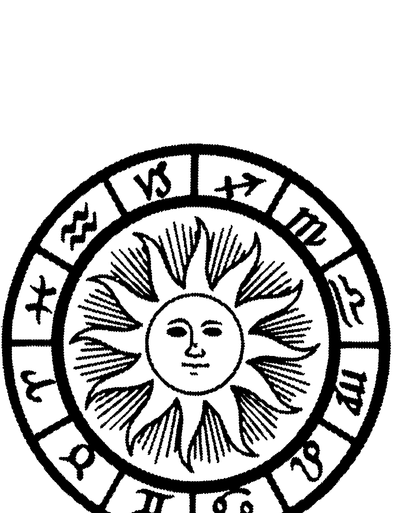

### 《院省轄市部份》

為了方便讀者應用電腦來繪製命盤，在此特別附錄臺灣地區的經緯度表。你只要輸入「-8」(CCT)、出生時間，以及出生地點的經緯度資料，就可以了。

| 地名 | 譯名 | 東經 (E) | 北緯 (N) |
| :--- | :--- | :--- | :--- |
| 台北市 | Taipei | 121度30分 | 25度03分 |
| 北投區 | Peitou | 121度30分 | 25度08分 |
| 士林區 | Shihlin | 121度31分 | 25度06分 |
| 內湖區 | Neihu | 121度35分 | 25度05分 |
| 南港區 | Nanchiang | 121度37分 | 25度03分 |
| 景美區 | Chingmei | 121度32分 | 24度59分 |
| 木柵區 | Mucha | 121度34分 | 24度59分 |
| 高雄市 | Kaohsiung | 120度17分 | 22度38分 |
| 楠梓區 | Nantuzu | 120度20分 | 22度44分 |
| 左營區 | Tsoying | 120度17分 | 22度42分 |
| 鼓山區 | Kushan | 120度16分 | 22度38分 |
| 旗津區 | Chiching | 120度16分 | 22度37分 |
| 前鎮區 | Chienchen | 120度18分 | 22度36分 |
| 小港區 | Hsiao-chiang | 120度20分 | 22度34分 |
| 基隆市 | Keelung | 121度44分 | 25度08分 |
| 新竹市 | Hsinchu | 120度58分 | 24度48分 |
| 香山區 | Hsiangshan | 120度56分 | 24度46分 |
| 台中市 | Taichung | 120度40分 | 24度09分 |
| 西屯區 | Hsitun | 120度37分 | 24度11分 |
| 北屯區 | Peitun | 120度41分 | 24度10分 |
| 南屯區 | Nantun | 120度37分 | 24度08分 |
| 台南市 | Tainan | 120度12分 | 23度00分 |
| 安南區 | Annan | 120度11分 | 23度03分 |
| 安平區 | Anping | 120度09分 | 23度00分 |

### 《臺北縣》 (Taipei Shan)

| 地 名 | 譯 名 | 東 經 (E) | 北 緯 (N) |
| --- | --- | --- | --- |
| 石門鄉 | Shihmen | 121度34分 | 25度18分 |
| 三芝鄉 | Sanchih | 121度30分 | 25度15分 |
| 金山鄉 | Chinshan | 121度38分 | 25度13分 |
| 萬里鄉 | Wanli | 121度41分 | 25度11分 |
| 淡水鎮 | Tanshui | 121度26分 | 25度10分 |
| 八里鄉 | Pali | 121度23分 | 25度07分 |
| 瑞芳鎮 | Juifang | 121度49分 | 25度07分 |
| 林口鄉 | Linkou | 121度23分 | 25度05分 |
| 五股鄉 | Wuku | 121度23分 | 25度05分 |
| 蘆州鄉 | Luchou | 121度28分 | 25度05分 |
| 泰山鄉 | Taishan | 121度25分 | 25度04分 |
| 三重市 | Sanchung | 121度29分 | 25度04分 |
| 汐止鎮 | Hsichih | 121度39分 | 25度04分 |
| 新莊市 | Hsinchuang | 121度27分 | 25度02分 |
| 平溪鄉 | Pingchi | 121度44分 | 25度02分 |
| 雙溪鄉 | Shuangchi | 121度51分 | 25度02分 |
| 貢寮鄉 | Kangliao | 121度55分 | 25度02分 |
| 板橋市 | Panchiao | 121度27分 | 25度01分 |
| 永和市 | Yungho | 121度30分 | 25度01分 |
| 中和市 | Chungho | 121度29分 | 25度00分 |
| 深坑鄉 | Shenkeng | 121度36分 | 25度00分 |
| 樹林鎮 | Shulin | 121度25分 | 24度59分 |
| 石碇鄉 | Shihting | 121度39分 | 24度59分 |
| 土城鄉 | Tucheng | 121度26分 | 24度58分 |
| 鶯歌鎮 | Yingko | 121度21分 | 24度57分 |
| 新店市 | Hsintien | 121度32分 | 24度57分 |
| 三峽鎮 | Sanhsia | 121度22分 | 24度56分 |
| 坪林鄉 | Pinglin | 121度42分 | 24度56分 |
| 烏來鄉 | Wulai | 121度33分 | 24度52分 |

### 《宜蘭縣》 (I-Lan Shan)

| 地名 | 譯名 | 東經(E) | 北緯(N) |
|------|------|---------|---------|
| 頭城鎮 | Toucheng | 121度49分 | 24度52分 |
| 龜山島 | Kueishan | 121度56分 | 24度51分 |
| 礁溪鄉 | Chiaochi | 121度46分 | 24度50分 |
| 宜蘭市 | I-lan | 121度45分 | 24度46分 |
| 員山鄉 | Yuanshan | 121度43分 | 24度45分 |
| 壯圍鄉 | Chuangwei | 121度47分 | 24度45分 |
| 羅東鎮 | Lotung | 121度46分 | 24度41分 |
| 五結鄉 | Wuchieh | 121度47分 | 24度41分 |
| 三星鄉 | Sanhsing | 121度39分 | 24度40分 |
| 冬山鄉 | Tungshan | 121度47分 | 24度38分 |
| 大同鄉 | Tatung | 121度31分 | 24度36分 |
| 南澳鄉 | Nanao | 121度48分 | 24度28分 |

### 《桃園縣》 (Taoyuan Shan)

| 地名 | 譯名 | 東經(E) | 北緯(N) |
|------|------|---------|---------|
| 大園鄉 | Tayuan | 121度11分 | 25度04分 |
| 蘆竹鄉 | Luchu | 121度15分 | 25度03分 |
| 觀音鄉 | Kuangyin | 121度04分 | 25度02分 |
| 龜山鄉 | Kueishan | 121度20分 | 25度00分 |
| 桃園市 | Taoyuan | 121度18分 | 24度59分 |
| 新屋鄉 | Hsinwn | 121度06分 | 24度58分 |
| 平鎮鄉 | Pingchen | 121度12分 | 24度57分 |
| 中壢市 | Chungli | 121度13分 | 24度57分 |
| 八德鄉 | Pate | 121度17分 | 24度56分 |
| 楊梅鎮 | Yangmei | 121度08分 | 24度54分 |
| 大溪鎮 | Tachi | 121度17分 | 24度53分 |
| 龍潭鄉 | Lungtan | 121度12分 | 24度52分 |
| 復興鄉 | Fusing | 121度21分 | 24度49分 |

| 地名 | 譯名 | 東經(E) | 北緯(N) |
|------|------|----------|----------|
| 新豐鄉 | Hsinfen | 120度59分 | 24度54分 |
| 湖口鄉 | Hukou | 121度02分 | 24度54分 |
| 竹北鄉 | Chupei | 121度00分 | 24度50分 |
| 新埔鄉 | Hsinpu | 121度04分 | 24度50分 |
| 關西鄉 | Kuanhsi | 121度10分 | 24度48分 |
| 芳林鄉 | Hsiunglin | 121度04分 | 24度47分 |
| 寶山鄉 | Paoshan | 120度59分 | 24度46分 |
| 竹東鎮 | Chutung | 121度05分 | 24度44分 |
| 橫山鄉 | Hengshan | 121度07分 | 24度43分 |
| 尖石鄉 | Chienshan | 121度12分 | 24度43分 |
| 北埔鄉 | Peipu | 121度03分 | 24度42分 |
| 峨眉鄉 | Omei | 121度01分 | 24度41分 |
| 五峰鄉 | Wufeng | 121度07分 | 24度38分 |

### 《苗栗縣》（Miaoli Shan）

| 地名 | 譯名 | 東經(E) | 北緯(N) |
|------|------|---------|---------|
| 竹東鎮 | Chunan | 120度52分 | 24度41分 |
| 頭份鎮 | Toufen | 120度54分 | 24度41分 |
| 三灣鄉 | Sanwan | 120度57分 | 24度39分 |
| 造橋鄉 | Tsaochiao | 120度51分 | 24度38分 |
| 後龍鎮 | Houlung | 120度47分 | 24度37分 |
| 南莊鄉 | Nanchuang | 121度00分 | 24度36分 |
| 頭屋鄉 | Touwu | 120度51分 | 24度34分 |
| 西湖鄉 | Hsihu | 120度45分 | 24度33分 |
| 苗栗市 | Miaoli | 120度49分 | 24度33分 |
| 獅潭鄉 | Shihtan | 120度55分 | 24度33分 |
| 銅鑼鄉 | Tunglo | 120度47分 | 24度30分 |
| 公館鄉 | Kungkuan | 120度49分 | 24度30分 |
| 通霄鎮 | Tunghsiao | 120度40分 | 24度29分 |
| 泰安鄉 | Taian | 120度55分 | 24度25分 |
| 苑裡鎮 | Yuanli | 120度39分 | 24度27分 |
| 三義鄉 | San-I | 120度46分 | 24度25分 |
| 卓蘭鎮 | Cholan | 120度49分 | 24度19分 |

### 《臺中縣》 (Taichung)

| 地名 | 譯名 | 東經(E) | 北緯(N) |
|------|------|---------|---------|
| 大安鄉 | Taan | 120度35分 | 24度21分 |
| 大甲鄉 | Tachia | 120度31分 | 24度21分 |
| 外埔鄉 | Waipu | 120度39分 | 24度20分 |
| 后里鎮 | Houli | 120度42分 | 24度18分 |
| 石崗鄉 | Shihkang | 120度46分 | 24度17分 |
| 清水鎮 | Chingshui | 120度34分 | 24度16分 |
| 梧棲鎮 | Wuchi | 120度31分 | 24度15分 |
| 神崗鄉 | Shenkang | 120度39分 | 24度15分 |
| 豐原市 | Fengyuan | 120度43分 | 24度15分 |
| 新社鄉 | Hsin she | 120度48分 | 24度15分 |
| 東勢鎮 | Tungshih | 120度49分 | 24度15分 |
| 沙鹿鎮 | Shalu | 120度33分 | 24度14分 |
| 大雅鄉 | Taya | 120度38分 | 24度13分 |
| 潭子鄉 | Tantzu | 120度42分 | 24度13分 |
| 龍井鄉 | Lungching | 120度32分 | 24度12分 |
| 和平鄉 | Hoping | 120度53分 | 24度10分 |
| 大肚鄉 | Tatu | 120度32分 | 24度09分 |
| 太平鄉 | Taiping | 120度42分 | 24度08分 |
| 烏日鄉 | Wujih | 120度37分 | 24度06分 |
| 大里鄉 | Tali | 120度40分 | 24度06分 |
| 霧峰鄉 | Wufeng | 120度41分 | 24度04分 |

### 《彰化縣》（Changhua Shan）

| 地名 | 譯名 | 東經(E) | 北緯(N) |
|------|------|---------|---------|
| 仲港鄉 | Shenchiang | 120度29分 | 24度10分 |
| 線西鄉 | Hsienhsi | 120度27分 | 24度08分 |
| 和美鎮 | Homei | 120度29分 | 24度07分 |
| 鹿港鎮 | Luchiang | 120度26分 | 24度04分 |
| 彰化市 | Changhua | 120度32分 | 24度04分 |
| 秀水鄉 | Hsiushui | 120度30分 | 24度03分 |
| 福興鄉 | Fuhsing | 120度27分 | 24度02分 |
| 花壇鄉 | Huatan | 120度32分 | 24度02分 |
| 芬園鄉 | Fengyuan | 120度37分 | 24度01分 |
| 埔鹽鄉 | Puyen | 120度28分 | 24度00分 |
| 大村鄉 | Tatsun | 120度32分 | 24度00分 |
| 溪湖鄉 | Chihu | 120度28分 | 23度58分 |
| 員林鎮 | Yuanlin | 120度34分 | 23度58分 |
| 埔心鄉 | Puhsin | 120度32分 | 23度57分 |
| 芳苑鄉 | Fangyuan | 120度19分 | 23度56分 |
| 永靖鄉 | Yungching | 120度32分 | 23度55分 |
| 二林鎮 | Erhlin | 120度21分 | 23度54分 |
| 埤頭鄉 | Pitou | 120度28分 | 23度54分 |
| 田尾鄉 | Tienwei | 120度31分 | 23度54分 |
| 社頭鄉 | Shetou | 120度35分 | 23度54分 |
| 北斗鎮 | Peitou | 120度31分 | 23度53分 |
| 竹塘鄉 | Chutang | 120度25分 | 23度52分 |
| 田中鎮 | Tienchung | 120度35分 | 23度52分 |
| 大城鄉 | Tacheng | 120度19分 | 23度51分 |
| 溪州鄉 | Chiohou | 120度29分 | 23度51分 |
| 二水鄉 | Erhshui | 120度37分 | 23度49分 |

### 《南投縣》(Nantou Shan)

| 地名 | 譯名 | 東經(E) | 北緯(N) |
|------|------|---------|---------|
| 國姓鄉 | Kuohsing | 120度51分 | 24度03分 |
| 仁愛鄉 | Jenai | 121度07分 | 24度01分 |
| 草屯鎮 | Tsaotun | 120度41分 | 23度59分 |
| 埔里鎮 | Puli | 120度57分 | 23度58分 |
| 南投市 | Nantou | 120度41分 | 23度54分 |
| 魚池鄉 | Yuchih | 120度56分 | 23度54分 |
| 中寮鄉 | Chungliao | 120度45分 | 23度53分 |
| 名間鄉 | Mingchien | 120度41分 | 23度50分 |
| 集集鎮 | Chichi | 120度45分 | 23度50分 |
| 水裡鄉 | Shuili | 120度51分 | 24度49分 |
| 竹山鎮 | Chushan | 120度40分 | 23度46分 |
| 鹿谷鄉 | Luku | 120度44分 | 23度45分 |
| 信義鄉 | HsinI | 120度51分 | 23度42分 |

### 《雲林縣》（Yunlin Shan）

| 地名 | 譯名 | 東經(E) | 北緯(N) |
| :--- | :--- | :--- | :--- |
| 西螺鎮 | Hsilo | 120度27分 | 23度48分 |
| 崙背鄉 | Lunpei | 120度21分 | 23度46分 |
| 二崙鄉 | Erhlun | 120度24分 | 23度46分 |
| 林內鄉 | Linnei | 120度37分 | 23度46分 |
| 麥寮鄉 | Mailiao | 120度15分 | 23度45分 |
| 荊桐鄉 | Tzutung | 120度29分 | 23度45分 |
| 虎尾鎮 | Huwei | 120度26分 | 23度43分 |
| 台西鄉 | Taisi | 120度11分 | 23度42分 |
| 褒忠鄉 | Paochung | 120度18分 | 23度42分 |
| 斗六市 | Touliu | 120度32分 | 23度42分 |
| 斗南鎮 | Tounan | 120度28分 | 23度41分 |
| 東勢鄉 | Tungshih | 120度15分 | 23度40分 |
| 土庫鎮 | Tuku | 120度23分 | 23度40分 |
| 大埤鄉 | Tapi | 120度15分 | 23度39分 |
| 元長鄉 | Yuanchang | 120度17分 | 23度39分 |
| 古坑鄉 | Kukeng | 120度33分 | 23度39分 |
| 四湖鄉 | Ssuhu | 120度13分 | 23度38分 |
| 口湖鄉 | Kouhu | 120度10分 | 23度35分 |
| 水林鄉 | Shuilin | 120度14分 | 23度34分 |
| 北港鎮 | Peichiang | 120度18分 | 23度34分 |

## 附錄一 臺灣地區經緯度表

### 《嘉義縣》(Chia-Yi Shan)

| 地名 | 譯名 | 東經(E) | 北緯(N) |
|------|------|---------|---------|
| 溪口鄉 | Chikou | 120度23分 | 23度36分 |
| 大林鎮 | Talin | 120度27分 | 23度36分 |
| 梅山鄉 | Meishan | 120度33分 | 23度35分 |
| 新港鄉 | Hsinchiang | 120度20分 | 23度33分 |
| 民雄鄉 | Minhsiung | 120度25分 | 23度33分 |
| 竹崎鄉 | Chuchi | 120度33分 | 23度31分 |
| 六腳鄉 | Liuchiao | 120度15分 | 23度30分 |
| 嘉義市 | Chia-I | 120度27分 | 23度29分 |
| 朴子鎮 | Potzu | 120度14分 | 23度28分 |
| 太保鄉 | Taipao | 120度19分 | 23度28分 |
| 番路鄉 | Fanlu | 120度33分 | 23度28分 |
| 東石鄉 | Tungshih | 120度08分 | 23度27分 |
| 水上鄉 | Shuishang | 120度23分 | 23度26分 |
| 吳鳳鄉 | Wufeng | 120度44分 | 23度26分 |
| 鹿草鄉 | Lutsao | 120度18分 | 23度25分 |
| 中埔鄉 | Chungpu | 120度31分 | 23度25分 |
| 布袋鎮 | Putai | 120度09分 | 23度23分 |
| 義竹鄉 | I-Chu | 120度14分 | 23度20分 |
| 大埔鄉 | Tapu | 120度35分 | 23度18分 |

### 《台南縣》(Tainan Shan)

| 地名 | 譯名 | 東經(E) | 北緯(N) |
|------|------|---------|---------|
| 後壁鄉 | Houpi | 120度21分 | 23度22分 |
| 白河鎮 | Paiho | 120度24分 | 23度21分 |
| 鹽水鎮 | Yenshui | 120度16分 | 23度19分 |
| 新營市 | Hsinying | 120度19分 | 23度19分 |
| 東山鄉 | Tungshan | 120度24分 | 23度19分 |
| 柳營鄉 | Liuying | 120度18分 | 23度17分 |
| 北門鄉 | Peimen | 120度07分 | 23度16分 |
| 學甲鄉 | Hsuehchia | 120度10分 | 23度14分 |
| 下營鄉 | Hsiaying | 120度15分 | 23度14分 |
| 六甲鄉 | Liuchia | 120度21分 | 23度14分 |
| 將軍鄉 | Chiangchun | 120度08分 | 23度13分 |
| 麻豆鎮 | Matou | 120度15分 | 23度11分 |
| 官田鄉 | Kuantien | 120度20分 | 23度11分 |
| 楠西鄉 | Nanhsi | 120度29分 | 23度11分 |
| 佳里鎮 | Chiali | 120度10分 | 23度10分 |
| 七股鄉 | Chiku | 120度07分 | 23度08分 |
| 西港鄉 | Hsichiang | 120度12分 | 23度08分 |
| 善化鎮 | Shanhua | 120度17分 | 23度08分 |
| 玉井鄉 | Yuching | 120度27分 | 23度08分 |
| 安定鄉 | Anting | 120度14分 | 23度07分 |
| 大內鄉 | Tanei | 120度21分 | 23度07分 |
| 山上鄉 | Shanshang | 120度21分 | 23度06分 |
| 新市鄉 | Hsinshih | 120度17分 | 23度05分 |
| 左鎮鄉 | Tsochen | 120度24分 | 23度03分 |
| 南化鄉 | Nanhua | 120度28分 | 23度03分 |
| 永康鄉 | Yungkang | 120度15分 | 23度02分 |
| 新化鎮 | Hsinhua | 120度18分 | 23度02分 |
| 仁德鄉 | Jente | 120度15分 | 22度58分 |
| 歸仁鄉 | Kueijen | 120度17分 | 22度58分 |
| 龍崎鄉 | Lungchi | 120度22分 | 22度58分 |
| 關廟鄉 | Kuanmiao | 120度19分 | 22度58分 |

## 附錄
### 臺灣地區經緯度表

### 《高雄縣》(Kaohsiung Shan)

| 地名 | 譯名 | 東經(E) | 北緯(N) |
|------|------|---------|---------|
| 三民鄉 | Sanmin | 120度42分 | 23度15分 |
| 桃源鄉 | Taoyuan | 120度46分 | 23度10分 |
| 甲仙鄉 | Chiahsien | 120度35分 | 23度05分 |
| 六龜鄉 | Liukuei | 120度27分 | 23度00分 |
| 杉林鄉 | Shanlin | 120度32分 | 22度59分 |
| 內門鄉 | Neimen | 120度27分 | 22度56分 |
| 茄萣鄉 | Chiehting | 120度10分 | 22度54分 |
| 湖內鄉 | Hunei | 120度12分 | 22度54分 |
| 美濃鄉 | Meinung | 120度32分 | 22度54分 |
| 茂林鄉 | Maolin | 120度40分 | 22度54分 |
| 阿蓮鄉 | Alien | 120度19分 | 22度53分 |
| 旗山鎮 | Chishan | 120度28分 | 22度53分 |
| 路竹鄉 | Luchu | 120度15分 | 22度52分 |
| 田寮鄉 | Tienliao | 120度25分 | 22度50分 |
| 永安鄉 | Yungan | 120度13分 | 22度49分 |
| 岡山鎮 | Kangshan | 120度17分 | 22度48分 |
| 燕巢鄉 | Yenchan | 120度21分 | 22度48分 |
| 彌陀鄉 | Mito | 120度14分 | 22度47分 |
| 梓官鄉 | Tzukuan | 120度16分 | 22度46分 |
| 橋頭鄉 | Chiaotou | 120度19分 | 22度46分 |
| 大社鄉 | Tashe | 120度20分 | 22度44分 |
| 仁武鄉 | Jenwu | 120度21分 | 22度42分 |
| 大樹鄉 | Tashu | 120度25分 | 22度42分 |
| 鳥松鄉 | Niaosung | 120度21分 | 22度40分 |
| 鳳山市 | Fengshan | 120度21分 | 22度38分 |
| 大寮鄉 | Taliao | 120度23分 | 22度37分 |
| 林園鄉 | Linyuan | 120度23分 | 22度30分 |

### 《屏東縣》(Pingtung Shan)

| 地名 | 譯名 | 東經(E) | 北緯(N) |
|------|------|---------|---------|
| 高樹鄉 | Kaoshu | 120度35分 | 22度50分 |
| 里港鄉 | Lichiang | 120度29分 | 22度47分 |
| 鹽埔鄉 | Yenpu | 120度34分 | 22度45分 |
| 霧臺鄉 | Wutai | 120度43分 | 22度45分 |
| 九如鄉 | Chiuju | 120度29分 | 22度44分 |
| 三地門鄉 | Santimen | 120度39分 | 22度43分 |
| 長治鄉 | Changchih | 120度31分 | 22度41分 |
| 瑪家鄉 | Machia | 120度37分 | 22度41分 |
| 屏東市 | Pingtung | 120度29分 | 22度40分 |
| 麟洛鄉 | Linlo | 120度31分 | 22度39分 |
| 內埔鄉 | Neipu | 120度34分 | 22度37分 |
| 竹田鄉 | Chutien | 120度22分 | 22度35分 |
| 萬丹鄉 | Wantan | 120度29分 | 22度35分 |
| 泰武鄉 | Taiwu | 120度38分 | 22度36分 |
| 萬巒鄉 | Wanluan | 120度33分 | 22度34分 |
| 潮州鎮 | Chaochou | 120度32分 | 22度33分 |
| 新園鄉 | Hsinyuan | 120度27分 | 22度32分 |
| 坭頂鄉 | Nanding | 120度30分 | 22度31分 |
| 來義鄉 | Laiyi | 120度39分 | 22度31分 |
| 南州鄉 | Nanchou | 120度30分 | 22度30分 |
| 東港鎮 | Tungkang | 120度26分 | 22度28分 |
| 新埤鄉 | Hsinpei | 120度32分 | 22度28分 |
| 林邊鄉 | Linpien | 120度30分 | 22度26分 |
| 佳冬鄉 | Chiatung | 120度32分 | 22度25分 |
| 琉球鄉 | Liuchiu | 120度22分 | 22度22分 |
| 枋寮鄉 | Fangliao | 120度35分 | 22度22分 |
| 春日鄉 | Chunjih | 120度38分 | 22度22分 |
| 枋山鄉 | Fangshan | 120度39分 | 22度16分 |
| 獅子鄉 | Shih-tzu | 120度43分 | 22度12分 |
| 牡丹鄉 | Mutan | 120度46分 | 22度08分 |
| 車城鄉 | Checheng | 120度42分 | 22度04分 |
| 滿州鄉 | Manchou | 120度50分 | 22度02分 |
| 恆春鎮 | Hengchun | 120度44分 | 22度00分 |

### 《澎湖縣》(Penghu Shan)

| 地名 | 譯名 | 東經(E) | 北緯(N) |
|------|------|---------|---------|
| 白沙鄉 | Paisha | 119度35分 | 23度40分 |
| 吉貝嶼 | Chipei Hsu | 119度36分 | 23度45分 |
| 西嶼鄉 | Hsihsu | 119度30分 | 23度36分 |
| 湖西鄉 | Huhsi | 119度39分 | 23度35分 |
| 馬公鎮 | Makung | 119度33分 | 23度34分 |
| 虎井嶼 | Huching Hsu | 119度31分 | 23度29分 |
| 望安鄉 | Wangan | 119度30分 | 23度22分 |
| 花嶼 | Hua Hsu | 119度19分 | 23度24分 |
| 將軍澳嶼 | Chiangchunao | 119度31分 | 23度22分 |
| 西嶼坪嶼 | Hsihsuping | 119度30分 | 23度16分 |
| 東嶼坪嶼 | Tungsuping | 119度31分 | 23度16分 |
| 西吉嶼 | Hsichi Hsu | 119度37分 | 23度15分 |
| 東吉嶼 | Tungchi Hsu | 119度40分 | 23度15分 |
| 七美鄉 | Chimei | 119度25分 | 23度12分 |
| 貓嶼 | Mao Hsu | 119度19分 | 23度20分 |
| 東引鄉 | Tungyin | 120度32分 | 26度19分 |
| 馬祖鄉 | Matsu | 119度53分 | 26度12分 |
| 金門縣 | Chinmen | 118度25分 | 24度30分 |

### 《花蓮縣》(Hualien Shan)

| 地名 | 譯名 | 東經(E) | 北緯(N) |
|------|------|---------|---------|
| 秀林鄉 | Hsiulin | 121度37分 | 24度07分 |
| 新城鄉 | Hsincheng | 121度39分 | 24度02分 |
| 花蓮市 | Hualien | 121度36分 | 23度59分 |
| 吉安鄉 | Chian | 121度34分 | 23度58分 |
| 壽豐鄉 | Shoufeng | 121度30分 | 23度53分 |
| 鳳林鎮 | Fenglin | 121度27分 | 23度45分 |
| 萬榮鄉 | Wanjung | 121度23分 | 23度43分 |
| 光復鄉 | Kuangfu | 121度25分 | 23度39分 |
| 豐濱鄉 | Fengpin | 121度31分 | 23度36分 |
| 瑞穗鄉 | Juisui | 121度22分 | 23度31分 |
| 卓溪鄉 | Chochi | 121度17分 | 23度21分 |
| 玉里鎮 | Yuli | 121度18分 | 23度20分 |
| 富里鄉 | Fuli | 121度14分 | 23度10分 |

### 《臺東縣》(Taitung Shan)

| 地名 | 譯名 | 東經(E) | 北緯(N) |
|------|------|---------|---------|
| 長濱鄉 | Changping | 121度27分 | 23度19分 |
| 池上鄉 | Chihshang | 121度12分 | 23度07分 |
| 成功鎮 | Chengkung | 121度22分 | 23度06分 |
| 海端鄉 | Haituan | 121度10分 | 23度06分 |
| 關山鎮 | Kuanshan | 121度09分 | 23度03分 |
| 東河鄉 | Tungho | 121度18分 | 22度59分 |
| 延平鄉 | Yenping | 121度05分 | 22度54分 |
| 鹿野鄉 | Luyeh | 121度07分 | 22度54分 |
| 卑南鄉 | Peinan | 121度07分 | 22度47分 |
| 臺東市 | Taitung | 121度09分 | 22度45分 |
| 太麻里鄉 | Taimali | 121度00分 | 22度37分 |
| 金峰鄉 | Chinfeng | 121度57分 | 22度36分 |
| 達仁鄉 | Taien | 121度53分 | 22度27分 |
| 大武鄉 | Tawung | 121度54分 | 22度21分 |
| 綠島鄉 | Lutao | 121度28分 | 22度25分 |
| 蘭嶼鄉 | Lanhsu | 121度33分 | 22度25分 |

---

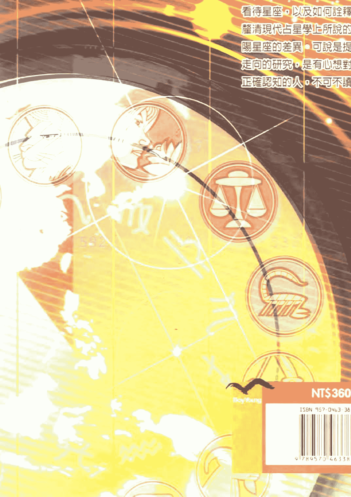

在本書中，除了說明星座的基本概念，以及如何從各種不同的角度來解讀星座之外，還透過各種人格特質的論斷方法，來說明每一個人可能會受到哪幾個重要星座的影響，使讀者可以學到專業性的星座知識。

本書有助於有心研究現代占星學的朋友們，更進一步的了解占星學家如何看待星座，以及如何詮釋星座，也可以釐清現代占星學上所說的星座與一般太陽星座的差異。可說是提供占星學專業走向的研究，是有心想對星座有通盤且正確認知的人，不可不讀的一本書。