# 占星学上

## 序言

從民國72年接觸中國七政四餘占星學，復於76年開始研習西洋占星學(僅是西洋黃道12星座而已)，到78年才真正觸及完整的西洋占星學，算一算跟占星術結緣已20年了。

我之研究占星學是因不滿意四柱八字、紫微斗數等命理學以兩個小時為一個命型，它們根據出生年、月、日、時作排列組合所建構的命型太少，如四柱八字的命型組合僅如下列算式

60 × 12 × 60 × 12 × 2 = 1,036,800 (甲子年)(月)(甲子日)(時辰)(男女命大運不同)

儘管前後60甲子年所演伸的節氣不同，會增加大運起歲的差異，但元命局並未增加。而紫微斗數的命型組合更頂多為

60 × 12 × 30 × 12 × 2 = 518,400 (甲子年)(月)(日)(時辰)(男女命大限不同)

如不考慮天使、天傷這兩顆通常很少論及的小星，那麼紫微斗數更會因同年同月不同日同時辰而將命型組合更為降低。

衡諸全世界有正式記錄的人口數約為48億，若加上未記載的，粗估將逼近60億大關。光以台灣地區來說，已有23,000,000人，純就統計學的觀點，八字與紫微斗數的命型組合，實在不能令理性的人信服。

另外，中國的命理學七政四餘占星學、四柱八字、紫微斗數或多或少建立於陰陽五行學說，而這項學說創建在黃河流域地區，某些內容是否能適用在南半球頗有疑問，如丙火日主生在北半球的午月為旺，但同時在南半球適為冬天，丙火失令，所以中國的所有命理學欲作全球通行，必須深入省思這個問題，地球村的來臨不能故步自封或坐井觀天。

有識之士如已故八字學者宿鄒文耀曾創時空制命式，充分考量60甲子前後周期不同、出生刻分、出生地經度、緯度不同，將古典的四柱八字擴充為十三柱。但一來太過繁複，二因所設定經度、緯度之柱五行人為居多，所以並未引起太多的漣漪，又國內知名禪學大師南懷瑾曾令其徒弟朱文光博士從事南北半球日柱干支互換的研究，以利八字學能適用在南半球，但朱博士英年早逝，未竟其功。近來電腦科技日新月異，就有人將天文學的歲差移行套用在紫微斗數12宮來調整，但12支宮與天體的對應源自何時，都未弄清楚，如何能作歲差調整？然他的精神值得讚賞和鼓勵。

那麼西洋占星學的命型組合到底有多少呢？我們必須認知完整的西洋占星學是根據天空中實際移行的太陽系行星，或部分靠近黃道帶的恆星來推論人世間的事務，包括人類的命運。占星學真正的主角是太陽系的行星，而非報紙娛樂專欄或電視星座節目所談的膚淺星座。假設不考慮恆星，純就太陽系的10顆行星(按地心系統)，即太陽、月亮、水星、金星、火星、木星、土星、天王星、海王星、冥王星，它們的排列組合為10¹⁰，即有100億的組合，如果再考慮太陽系內的小行星如凱龍星，或恆星，或阿拉伯點，中點，那麼幾為恆河沙數，不可勝數。即使同時間出生，因各地區的經度(東西經共360°)、緯度(南北緯共180°)，他們的上升度數(ASC)也將不同。所以單就太陽系10大行星和出生地經度、緯度，理論上就有360×180×10¹⁰的命型組合。

當然讀者也應認知光是命型組合多，並不代表這個命理學就比其他種命理學優異，重點在於詮釋的合理性與準確性。西洋占星學淵遠流長，其生命力相當旺盛，這點應是無庸置疑。但西洋占星學發展的過程中，經歷過幾次重大的轉折演變，尤其是19世紀末20世紀初，英國的亞倫·里歐(Alan Leo)強調「個性即命運」的觀點，將占星學原本以事件預測為主軸的內容，導向個性心理的描述，因而占星學界就將亞倫·里歐之前的西洋占星學統稱為古典占星學，以別他揭櫫的現代占星學。

19世紀中葉西格蒙·佛洛伊德(Sigmund Freud)和其弟子卡爾·容格(Carl Jung)發展出的無意識心理學，逐漸成熟，現代占星學順理成章地與無意識心理學擦撞出許多火花，尤其在1960年代，法裔美籍的但恩·魯迪海爾(Dane Rudhyar)強調人本主義，將現代占星學賦予哲學化，1970年代美國史蒂芬·亞羅(Stephen Arroyo)細膩地描繪四大元素的心理徵象，英國的心理學博士麗茲·格林(Liz Greene)幾將容格的分析心理學的概念套用在現代占星學。因而自1960～1990年代，現代占星學其實就是以心理占星學為主流，獨領風騷。

由於這些人士都是博士、碩士級學有專長，將占星學提升到甚高的學術領域，頗受知識階級人士的欣賞與認同。心理占星學的主要素材是星座，它提供心理分析的背景，星座乃一躍變成談論的主題，卻被無限上綱。

當心理占星學躍為主流後，占星學的論斷乃強調心理背景或過程，不預測事件的吉凶，甚至有人將事件預測視為洪水猛獸，深怕與之為伍，這段期間古典占星學就像小媳婦一樣。但1990年代英國的奧莉維亞·巴克列(Olivia Barclay)慷慨地將家中珍藏的17世紀英國最偉大占星家威廉·里利(William Lilly)的手稿《基督徒占星學》(Christian Astrology)交給好友卡洛·A·威格絲(Carol A. Wiggers)重新打字發行，再加上當代最著名的占星家羅伯·漢德(Rob Hand)掀起占星學古籍整理，有系統地將希臘化時期、阿拉伯時期、拉丁時期等重要典籍重新注釋發行，一般稱之為占星學的復古運動，古典占星學才又重新受到重視。

筆者有幸拜網路無遠弗屆之賜，努力搜購現代占星學、古典占星學及印度占星學的著名書籍，至今已有500多本，遍及本命(Natal)、流年(annual)、卜卦(Horary)、擇日(Electional)、醫療(Medical)(疾運盤Decumbiture)、時事(Mundane)、財務金融(Financial)、氣象(Astro-meteorology)、換置(Location)及A*C*G、主限向運(Primary Direction)、出生時間修正技巧(Rectification)、歷史發展、天文學，也擴及吠陀(Vedic)占星學的各項領域。更不惜花下巨資購買各相關領域的專業軟體，共擁有15套。經過相當艱辛的翻譯、整理，終於匯通西洋占星學的要義及印度占星學的精華，透過教學相長及付諸實証，從客戶的讚譽與回饋，撫慰了10多年來宵衣旰食的努力耙梳。《易經·繫辭傳》「天垂象，見吉凶」深得吾心。

目前國內出版西洋占星學書籍的前輩，可能大都是受現代占星學的洗禮，內容偏重在心理占星學，幾乎未提及古典的技巧，本書希望填補這個空間，期待現代與古典的整合，以利兼顧心理分析與事件預測。所謂的事件預測，說穿了就是算命。古典占星學和印度占星學同樣都強調事件預測，其重點在於行星落於那一後天宮，它為那一後天宮的宮主星，是否與其他吉星凶星產生相位關係，它自己所在之先天位置(星座)和後天位置(後天宮位)的力量如何，另外所欲分析宮位的宮主星又如何飛佈，與其他吉星凶星的相位關係如何...等線索，來分析某宮主管事件的吉凶如何，但這些論斷的技巧在現代占星學都已不復見，殊為可惜。

東西方發展的占星學本質，事實上就是事件預測，不容否認，祇是應再考慮人類的自由意志(Free Will)，不能一昧地訴諸命定論。純研究現代占星學的人，若將心理占星學全盤移植到國內，恐適應不良，畢竟中國術數方技的威名遠播，客戶大多習慣於事件預測的直接論斷。即使在歐美，1990年代後期起，占星心理學也逐漸退潮，東方的印度占星學躍上檯面，意謂著西方世界的一般大衆渴望事件預測。

本書是「實力占星系列」的第一本書，建構西洋占星學的完整基礎，以天宮圖的各種要素如星座、後天宮位、行星、特殊敏感點、中點、阿拉伯點、恆星等的基本要義解說，更進一步談及各種要素間的互相關係。如行星落在星座、後天12宮及行星間彼此形成相位角度等基本要義。讀者若能充分解讀吸收，當可建立研習占星學的紮實基礎，有利於占星學各項領域的深入(包含印度占星學)，由於西洋占星學的內涵豐富，本書無法盡述，僅提供天宮圖的要素分析，但不管現代或古典的法則，內容應已相當完備。至於本命、流年、卜卦、擇日、時事、財經、換置、合盤、氣象、出生時間修正..等領域，則待下一階段逐步撰寫，希望能給讀者一新耳目的認識，充分瞭解西洋占星學的全貌。

必須聲明的是，筆者在自序一開始談論的命型組合，並無詆毀中國命理學之意，自己浸淫中國術數已30幾年，身同感受中華文化的奧妙。本書的著作旨在提供另一種測度命運的方法，希望讀者能以非民族主義，更寬廣的胸懷來看待全球適用的西洋占星學，所謂「他山之石可以攻錯」激勵中國的命理學也能朝全球化目標邁進。更期待國內研習占星學有成的人，不要有門戶之見或傲慢，動不動就號稱天下第一或第二，或處處以學術警察之威亂扣別人帽子，如能以理服人，開放的胸襟當更能贏得尊敬。筆者長期與國外占星名家互相交換心得，頗有感觸。在歐美科學主義凌駕一切，占星學的研究常面臨科學基本教義派的無情打壓，但歐美的占星家頗能團結，組織學會定期發行學術研究或心得經驗的期刊，舉辦年會發表論文豐富占星學的內涵。20世紀後西方占星學開發出許多實用的新技術，如合盤技術、中點理論、換置占星學，A*C*G圖、測定圖、泛音盤，讓人感受到西洋占星學旺盛的生命力。在歷史發展的長河中，幾次被偏見的學院派人士宣稱占星學已死亡，但我們發現它卻像火鳳凰的浴火重生，更為美麗。

最後相當感謝建州兄積極的鼓勵及他所帶領的于天網路印刷有限公司同仁的努力編排，才有本書的出版。學員緒彰、釋瑩、守志常一起聚會討論時事占星、財經金融占星、卜卦占星、本命、流年占星，他們對占星學的理論付之實証的精神值得嘉許，謝謝他們的序言，也感謝拙荊美華辛苦的校對及對編輯的建議，使本書更有看頭。

門生 秦見子

余幼也好五術，研習至今猶覺懵懂未通，頗難釋懷。于占星之學則頗有心得，先前曾受教於汪洋董老師打下占星基礎，復受教於秦瑞生老師，研習西洋古典占星學，至此于占星可謂心領神會，游刃有餘，喜其理緻分明、易學易懂、引用有據、廣而有徵。每於暇餘抑或盛情難卻下為人論命，常發人所未見，舉來者之私，無不切中而為人所津津樂道矣。

秦師者於經濟學素有精專，嘗為外商銀行之高階主管，亦曾為某公司輔導規劃上市，一舉而成功，實為該行業之異數。師于傳統五術早具慧根，得異人指點，輔以現今科學之邏輯辨証、歸納演繹，終成大家，名揚海外。現今隱于江湖論命，不求聞達於名利商場者，不亦造化也，此乃業界之奇葩。蓋通于術者不逆命而行，知命者不為命所拘，隨波順流而不失節志。見今來論命者，格局大者論國事談世運；格之小者談人事、論禍福，綜觀不外乎趨吉避凶矣。嘗言趨吉者，順勢而為，依阻力小者而行；避凶者，發現問題，解決疑惑也。今之學者依資訊、數據模擬檢討過去，研判未來，無異是趨吉避凶也。今之術者以陰陽五行、日明星辰運行察過往、鑑將來，雖玩物不同，目的則一也。

今見老師於傳統五術鑽研之餘，不囿成見，深入西洋古典占星之林，足見心胸之廣，為學之博。其以窮天地致理，盡人生起伏密義為志，實為抱殘守缺，死守門戶之見者惕，故言其君子不器矣。秦師有感於西洋古典占星之準而有據，每每撼動客戶心弦，訝於占星之奇術，特立書著述以揚天之律。秦師教學素以嚴謹、理致見長，編寫講義字字珠璣，集衆家之長無不盡言，實乃後學之福。值此世運將入寶瓶世紀，又逢天王星(占星學之星)駐雙魚座七年，占星學勢將喚起人類潛意識間星學能量，而風行可期。現今台灣占星瑰寶，方興未艾之際，坊間專業書籍本不復多見，充斥著十二星座行遍天下之流，見其膚淺，頗感憂喜參半，喜其帶動流行，憂其恐恐貽誤占星之專業與完整性，而使有心人士望而卻步。今喜秦師素有精專，繼前輩之後發廣長舌相，不吝將平日心得做系統介紹以裨益後進，於書中當可開後學之耳目，啓占星之原貌，使大家能一窺傳統占星學與心理占星學派之差異。心理占星學偏于心理分析、人格特質的詮釋，而忽略人「生而有命」，際遇懸殊，誠如佛家所言定業難轉。雖說心理引導，激勵潛能，於人生確有意義，然就命論命而言，人生際遇脈絡有緻，觀而言之，雖不中亦不遠矣。心理、命理執輕執重，自有公評。試觀芸芸衆生，誰不欲為人巾龍鳳，試問人間龍鳳有幾何？

天星運行，四時不貳，周而復始，其中有序焉。人之生時與生地之經緯，於其時太陽系諸行星，視其相位吉凶、格局旺衰、先後天力星..等尤如人生命運之DNA定序，牽引著人生順逆起伏的大原則，人生旅程之藍本於焉底定，欲求聞達於人世者，豈可置此藍本於不顧。君不見諸天繁星壘壘，運行不息，協調有致，不禁令人感嘆天地森嚴，寓有意於無意間，誰為之哉！其間豈無上意乎。而今為術之士，欲究天人之學以期運轉光明之途，其為時恐晚矣，諸學人於信命畏天之餘，不如敬天順命，知因果善惡為人命之根本，淨業修德乃啓迪智慧之根基，明乎此或可撼生命之一二，不為天地之芻狗矣。

## 占星大觀園

王祥萱

甫入社會即投入談話性廣播節目之製作，曾有來賓以星座之特質微妙地歸納形容紅樓夢十二金釵、滿清十三位皇帝之個性、行為模式與心理特質等等，令人驚異於星座特質竟能與文學家筆下人物可以契合，當時對占星命盤中飛佈的符號、線條產生濃厚興趣，數年間只要坊間出版有關西洋占星方面的書籍莫不瀏覽閱讀，但始終僅識得點而不識其面無法運用。

直至民國89年流年天王星與才華五宮火星會合後，才採取行動跟著汪洋董老師學起占星學，對僅有符號全無文字的星盤——彷如「無字天書」般的薄薄一張紙，如同學習看圖說故事般，對星盤蘊藏的个人個性、流年如何等等打下了基礎。

民國90年流年木星走入本命九宮，幸運地於秦瑞生老師門下更進一步學習占星知識，從古今中外占星學歷史、太陽系十大行星與十二星座之要素本質的由來、到白天出生與夜間出生者的要素差異、相位詮釋、行星所落入星座與宮位對人生事項的影響課程中，秦師開啓了一扇扇通往理解浩瀚天空的門戶，對於日月星辰運轉磁場，與人的人格命運、甚或萬物興衰之間的微妙關係增長更多的領略和收穫。

受過經濟學系所訓練的秦瑞生老師，十幾年來研習占星學就像就讀研究所研究學問一樣，縱覽古今中外數百本書籍，嚴謹地融合古典占星與現代占星理論，加上多年占星論斷之實務經驗，將理論與實例驗證匯整於他的占星著作中，有別於坊間流行、通俗的占星術，單論十二種人、十二種性格、十大行星落入十二宮位與十一二星座的事件與個性菜單，秦師以占星學所立基的天文學為經，占星學哲學基礎為緯，在此經緯軸下將占星學之符號演繹學的多重性面向一一展露。

星象符號既是性格、身體、精神，也是人際關係、生活事件與生命成長歷程，更是季節、氣候、經濟、國運，其興衰循環消長，透過精確的天文計算，依個人出生時間或用事時刻之年月日時分及經緯度，其當十大行星運行時彼此磁場和引力作用以數理天文學及球面三角函數（即弧角天星），計算出地盤十二宮，將天上正在運行的諸星依其對應位置分置在各宮內，因此產生行星星座宮位、相位，構成結構嚴謹的占星科學，不論任何占星系統諸如本命占星、心理占星、卜卦占星、印度占星，星象符號均是入門的基礎，熟悉各種符號要素的意義，才能靈活運用各系列的占星學論斷技巧，對人世人性運轉的密碼予以精確分析推斷個人生命型態、潛能趨向個人易受侷限與易弱化之處、個人正負面能量展現重大事件的可能時間---每個人這小宇宙的独特性與價值均蘊含其中。

花了四年時間終於對此「無字天書」有了較深入了解，但四年所累積的僅僅觸及占星學知識的門檻，欲窺其堂奧解讀其中千變萬化的組合，仍需加强其他學科的理解，如人類學、心理學、神話、甚至於醫學，配合長期整合及驗證才能真正深入其中的一門，難怪曾有占星學家慨嘆終其一生也許無法融貫所有占星相關學科呢！

這是一門有趣且驗證度高的一門學問，莫怪乎國外許多業餘占星家，其本業有的是太空物理學家、財務金融專家、心理學家、生物學家等等紛紛投入嚴肅占星學研究行列，大大提昇運用時的深度與廣度。

學習過程中恰逢全世界世運變化劇烈的時期，如民國88年台灣發生921大地震，同年8月12日土耳其地震事件，凶星呈現大十字刑沖，民國89年木土星交會的科技類股大跌，民國90年美國911事件呼應土星、冥王星之刑沖，92年美伊開戰，及92年交春分點後國運盤的疫病流行徵象等等，均可運用占星技巧加以驗證許多事件發生的可能性。

因此不論您相不相信占星學，在未曾進入此門學問時，請勿遽下結論，占星學僅是算命閒話，或認為坊間流行的十二星座即是占星學，請您藉由本書當基礎試試摘星的滋味吧——彷彿走進「大觀園」般精采呢！

## 序言

史守志

很感謝秦瑞生老師，給我機會，讓我寫有關本書的序言。

在我個人小時候，對基礎天文有點認識，就是太陽系等等，從來不知道這個可以用來算命，後來慢慢長大，對命理產生興趣，想瞭解自己，從農民曆後面的八字秤命，希望能瞭解自己命運，不過那時發現它無法提供很多資料。

後來在求學階段時期，從自己國曆出生日期知道所謂星座，即是後來的太陽星座，當時在民國七十年代，陸續出版一些有關星座的書，當時我個人開始覺得有點小問題，就是如果每本書寫的星座交接日期不一樣，有相差一天左右，還有就是在應證上發現有部分符合，不是完全合理因為只有十二各星座，無法解釋這麼多人。

在民國八十年代裡，台灣出版了田希仁的星座書等等，後來尖端出版社慢慢出版翻自國外一些占星書籍，引進國內，才對占星學瞭解一些，不過當時注重於想知道知道自己正確星盤，還是無法知道。到八十六年以後，透過網路慢慢的可以找到一些軟體跟相關介紹，加上遇到幾位老師，慢慢對占星學有比較深入的瞭解。

從八十六年開始陸續接觸的老師有陳謙之，汪立名老師等，那時跟汪立名老師對當時的占星學（心理占星學）學了一段時間，後來印證了一段時間，發現還是有所不足，不過對整個占星基礎，應用領域有初步瞭解。

在朋友羅緒彰介紹下，參加秦瑞生老師的占星教學的試聽過程中，瞭解有關自己所欠缺的很多關鍵，可以在秦瑞生老師這裡學到，經過一年的學與印證，把之前的不足彌補不少，強化自己的實力許多。

在占星歷史介紹，使我知道占星不僅是西洋獨有，在中國跟世界各地都有，占星學的興起與沒落，中國占星學與西洋占星學交流等，以及中國傳統五術與占星學的淵源。

從命盤的繪製，秦老師詳細把過程介紹得鉅細糜遺使我不必依賴電腦也可以繪製命盤，同時增加對天文學的瞭解。

從本命占星中，對自己的瞭解增加許多，彌補往昔在應證上的不足，相位的凶相沒有呈現等相關問題，得到方向修正及更細膩解析。

透過人際關係的合盤，知道許多人事糾葛的原因及解決方法，進一步提供自己在人際關係上，能更充分的趨吉避凶。

透過卜卦占星應用，為我提供另一個卜卦的工具。在我個人印證上，準確度不差，應用的範圍蠻廣泛，大家可以好好學習與應用。

藉由時事占星學，我可以推敲國家的每年的概況，準確度

## 序言

還不錯。大事及方向也頗為清楚。進一步希望老師有機會能介紹印度占星學、主限向運、及目前最熱門的財經占星學。

希望對占星有興趣的朋友，可以透過此書有更深入的瞭解。

特別感謝美國 Astrolabe公司 允許本書使用其 占星專業軟體 Solar Fire 所創作的天宮圖


## 本書使用案例出生資料一覽表

| 案例 | 姓名 | 出生時間 | 出生地 | 經度 | 緯度 | 頁數 |
|---|---|---|---|---|---|---|
| 一 | 蔡小妹 | 2001.04.24 PM 20:59 | 高雄市 | 120E17 | 22N38 | 128 |
| 二 | 男 | 1984.07.26 AM 09:56 | 高雄市 | 120E17 | 22N38 | 162 |
| 三 | 女 | 1989.11.15 AM 07:38 | 高雄市 | 120E17 | 22N38 | 163 |
| 四 | 郝柏村 | 1919.08.08 AM 03:10 | 江蘇 | 120E06 | 33N18 | 164 |
| 五 | 連戰 | 1936.08.27 PM 20:00 | 陝西 | 108E52 | 34N16 | 165 |
| 六 | 周恩來 | 1898.03.02 AM 02:00 | 江蘇 | 120E06 | 33N18 | 166 |
| 七 | 金鑾 | 1924.01.21 PM 15:40 | 浙江 | 120E42 | 30N30 | 167 |
| 八 | 王永慶 | 1917.01.18 AM 05:45 | 新店市 | 121E32 | 24N57 | 168 |
| 九 | 王先生 | 1950.07.05 AM 03:35 | 台南 | 120E21 | 23N07 | 169 |
| 十 | 馬英九 | 1950.07.13 PM 13:35 | 香港 | 114E10 | 22N18 | 224 |
| 十一 | 許信良 | 1941.05.27 PM 12:48 | 桃園市 | 121E18 | 24N59 | 225 |
| 十二 | 劉德華 | 1961.09.27 AM 09:30 | 香港 | 114E10 | 22N18 | 226 |
| 十三 | 陳水扁 | 1950.10.12 AM 08:00 | 台南縣 | 120E15 | 23N02 | 282 |
| 十四 | 溥儀 | 1906.02.07 AM 04:00 | 北京 | 116E28 | 39N54 | 284 |
| 十五 | 布希總統 | 1946.07.06 AM 06:26 | 德州 | 072W55 | 41N18 | 287 |
| 十六 | 查爾斯王子 | 1948.11.14 PM 21:14 | 倫敦 | 000W08 | 51N30 | 351 |

天人感應模型-星空是大宇宙(macrocosm)，人是小宇宙(microcosm)

## 第一章 占星學的哲學基礎

占星學在全球各地的歷史文化中，幾乎都曾扮演一定的角色，而具有相當強盛的生命力，已成人類社會的共同文化資產。目前在西方世界，因有學養俱佳的占星學家前赴後繼地努力研究，於20世紀已經放出燦爛的光芒，但在東方世界，除印度占星學的特殊地位外，其他地區似乎見不到令人振奮的果實，一般網站或叫座的占星節目，大都停留在膚淺的基本星座解說而已。儘管紫微斗數盛行一時，畢竟它僅是藉由虛星演繹，非屬於真正的占星學，而中國的七政四餘占星學，雖具占星學的內容，卻仍陷於陰陽五行的泥淖，未見大開大闔的格局，流行程度反不及紫微斗數和八字命理學，殊為可惜。

占星學在某種程度係屬類宗教，涉及心靈的討論，在發展過程中摻雜許多宿命論的觀點，常被科學人士所排斥，他們以特定的方式來檢驗占星學，即率爾抨擊占星學的不是，動搖許多想學占星學的人。另外比較沒有科學根基的占星學家，也不敢攖其鋒，而僅一再強調占星學是藝術的、神秘的，甚至自我逃避於心靈的邊陲領域，面對科學衛道人士的攻擊，不敢說出「我是學占星學的」。

心靈、物質孰是孰非，自古希臘以來一直是哲學的重要命題，至今仍爭論不休。本章分節討論占星學是什麼，從而演伸17世紀以來牛頓古典力學的核心觀念，20世紀初期兩大物理理論，即相對論和量子論的發展及隱含觀念，20世紀末期混沌理論，複雜科學的特殊意涵，讓讀者瞭解量子論所揭櫥的宇宙觀是心物合一的，而混沌理論、複雜科學，顯示系統各因子的互相作用，形成非線型動力，似看混亂卻亂中有序，宇宙間有股神秘力量在運作。20世紀科學界的三大發展方向，事實上正搭起心靈與科學的交會。我們將以著名的物理學家大衛·波姆(David Bohm)的觀點說明，心靈或意識與物質是不同層級的一體兩面。碎形幾何結構為典型的天人感應模型，卻無處不在於我們的生活周遭。另外瑞士著名的分析心理學家卡爾·容格(Carl G. Jung)所創立的一些觀念，正是人類心靈重要寫照。上述這些意義，在某種程度上可以融合作為占星學的哲學基礎。

### 第1節 占星學是什麼？

我們可從占星學的英文原名Astrology來瞭解，它源自希臘語的兩個字詞，Astra是星星之意，和Logos是邏輯或理由之意。就字面上的意義，占星學即是由星星或行星來顯示的學說、教義或法則。

1960年代英國著名的女占星學家瑪格麗特·伊·荷恩(Margaret E. Hone)在其所著《The Modern Text-book of Astrology》一書中對占星學的定義，已被學習過占星學的人所廣泛地認知，她說「占星學是解釋行星作用與人類經驗之間關係的一套獨特系統。」對強調心靈的人比較直接體會行星作用的神秘意涵，但對強調物質或過於理性以科學為重的人，就緊抓住行星作用到底是什麼？如何實證？等問題不放，而強悍的科學基本教義派人士甚至搬出宇宙的四種基本物理力，即：

- I. 遠距物體質量間之交互作用所偵測的重力(引力)
- II. 光和帶電粒子的電磁力
- III. 質子和中子凝聚在原子核裡的強核力
- IV. 放射性衰變有關的弱核力

輕率地推論「門對嬰兒的引力效應大於出生時冥王星的引力效應，所以若門對嬰兒的心靈無任何關聯，那麼出生時冥王星如何能關聯到嬰兒呢？」就狹義而言，這種說法是有效的，符合邏輯，但占星學所顯示的並非是由引力運作，也非其他三種物理力的功用。那麼占星學真正的作用力是什麼？坦白說，就目前科學水準仍無法具體地呈現，但從中醫的蓬勃發展及其療效，占星學所揭示的生命藍圖未嘗沒有先驗的天才直覺或潛科學成分。曾幾何時，中醫的草藥、針灸不也是受盡嘲笑，稱之為迷信。

科學精神及功用，確實帶給人類社會莫大的福祉，航太工業延伸人類的生活空間，電子資訊的綿密，縮短了溝通的距離，生化科技的進展促進人類健康與壽命的延長......。但並不能因科學的功績，就一切唯物是從。我們看看今日生態環境的重大破壞與變化，無一不是科學種下的惡因，科學的信仰若不含有心靈、人文的關懷，純唯物思想的科學，只會加速大地之母-地球的毀滅。

今口科學昌盛，它的應用技術帶來龐大的工業利益，令人驚嘆，近代西方文明的甜蜜果實，可說完全歸功於它也不為過。科學的重鎮-歐美，更成為全球的政經中心及知識重地，科學已成為知識的最高型態，社會的最高威信於是科學家無意識地高人一等，20世紀30年代的傑出科學家萊欣巴哈(H. Reichenbach)在《科學的哲學之興起》就語重心長地指出「就大部分人而言，科學信仰已取代了上帝信仰，而科學家也化身為神，他的訓諭必須毫不猶疑地接受」。科學的衛道人士所堅持的信念，即是這種無意識心理作祟。但如果我們冷靜思辨現代科學發展的方向，會發覺科學衛道人士所死執的信仰，仍停留在牛頓的古典力學模式，並以此來攻詰所有心靈、精神或神秘的事物。然而自17世紀所發展的牛頓古典力學模式，難道就真的那麼完美無缺，可作為天下所有事物的典範？

### 第2節 大衛·波姆(David Bohm)的宇宙實相觀點

所謂的牛頓古典力學模式，是一種機械論的宇宙觀。它是絕對的、秩序的、確決的、一致的；可以用數學方法和實證推理來重複驗證的因果關係，絕對的客觀與獨立，絕對的空間與時間。在這種模式下，宇宙被認為是完全可以被預測的，每一個因會產生一個果，而每一個果又都有一個因，所以若知道一個狀態的初始條件，就可以推斷其過去與未來，這個過程可以用數學表達和計算出來的。這種模式是西方科學的樞紐，促使各項科學領域的重大發展，但進入20世紀後，現代物理科學的三大發展方向，相對論和量子論，以及較後期的混沌論(Chaos Theory)和複雜科學(Complexity Science)都已深深擊中古典力學機械論的要害，我們簡單說明於下。

愛因斯坦提出「相對論」，說明「同時」(Simultaneity)的相對性，時間與空間的不可分離性，甚至時間空間與物質的相互依存性，打擊了古典力學絕對時空、運動、質量的觀念。

- 一、玻爾、海森堡、薛丁格掀起「量子論」的粒子物理革命，說明宇宙實相的基本觀念是不確定關係，機率性、主觀化(觀察者參與的影響)、量子跳躍、非因果律，更是徹底衝擊古典物理的學說。
- 二、A. 混沌論說明任何系統存在著非線性(Non-Linear)動力，因果非比例關係，蝴蝶效應(Butterfly effect)一系統達到某種不穩定時，內在微小的變化，往往會導致極其重大的效應，高雄的一隻蝴蝶鼓翼，可能會造成台北汐止淹大水。
- B. 複雜科學進一步提昇混沌論的精髓-亂中有序，各系統中各因子非獨立運作，是互相作用的，經由循環和回饋，各因子能自我組織性地產生適應。系統雖徘徊於混沌和秩序之間，有結構但難以預期，但因各因子的碎形(fractal)型態，能產生自我類似性(Self-similarity)，得以自發產生秩序，此即亂中有序。混沌論和複雜科學闡明非線性動力，無法像1+1=2那麼簡單的決定論，除了古典物理法則外，尚存在著互相作用，非獨立個體的觀念，也打破化約論的邏輯。

從量子論創立後，等同宇宙的實相應有股神秘的力量有了科學的說明，量子論的許多先賢，如玻爾、薛丁格....等都對東方的神秘觀點給予正面的評價。1937年玻爾訪問中國，他發現自以為最得意的科學創見-互補思想，早就由中國的太極圖表露，甚為訝異，他死後的永久紀念碑就雕刻著相當醒目的太極圖。薛丁格則從印度哲學領悟到大自然的每部份，都同它的整體息息相關，在無窮的變化中又保持著永恆。他從東方古代哲學有機論自然觀中發現了智慧光芒，深刻瞭解量子世界就像個有機世界，粒子的運動狀態同觀察者處於互相作用中。擊碎了「與觀察者無關」的客觀世界。自然與人、肉體與靈魂互相結合而為渾然一體，即是典型心物合一的寫照。

混沌論與複雜科學更以自然界無處不在的碎形幾何結構，昭示大宇宙、小宇宙的關係，即「上天如此，地下如此」(As above, As below)。西漢 劉安《淮南子》云「故頭之圓也象天，足之方也象地，天有四時、五行、九解、三百六十日；人亦有四肢、五臟、九竅、三百六十(骨)節，天有風雨寒，人亦有取與喜怒，故膽為雲，肺為氣，腎為雨，脾為雷，而心為之主。」②這種類比法很樸素地顯示出「天人感應」的觀念。有關神秘學、術數的研究，就常以這種類比法，占星學自然不例外。

從以上現代科學的發展，可知死執牛頓力學模式來抨擊一切有關心靈宗教、神秘學、術數或占星學，實不值與之論道的。這些學問也許只是個假設，目前尚未有直接驗證的作用力機制。但美國物理學者亨滋·裴傑斯(Heinz R. Pagels)在《理性之夢》的一段話發人深省值得轉載，「有很多假設是不能被直接驗證的，但從假設推演出的結果，則是可被驗證的，假如結果符合經驗，則假設正確的可能性會被增強」③ 當然我們不是在替這些學問找個護身符，可以擋掉來自質疑者的攻詰，研究者或實務操作者應本著搭起心靈與科學的橋樑，將研究結果作驗證以杜人口實。

### 第3節 混沌論、複雜科學的碎形結構

當量子論闡明宇宙實相為不確定關係、機率性、主觀化、量子跳躍時，愛因斯坦相當不予為然，甚至說出「上帝不玩骰子」反駁量子論機率性的名言，但往後的量子論發展，證明他錯了。愛因斯坦基於對物理理論的完美探索，認為宇宙實相尚有未被發現的變數，它能夠說明事件的機率面向。這些變數稱之為隱藏變數(hidden variables)，如果找到他們，那麼物理學就有個良好的哲學基礎。量子論發展過程一個相當重要的關鍵點，即光既是波，又是粒子，演伸為波是粒子，粒子也是波，物理學界稱之為波粒雙元性(Wave-particle duality)。在古典物理中，波和粒子是不相容的，但量子論的次原子有此特性，且經過實驗，證明確有波粒雙元性的現象，這隱含兩人省思。

I. 科學知識(古典物理)與直接經驗不相符合的事實
II. 波粒雙元性揭示的物我合一，從而物理科學已由觀察者純然獨立於被觀察物體的絕對客觀，走向觀察者參與的主觀化，亦即世界不再外在於我

上述II的現象是因測量一個電子時，只可能知道它的位置(粒子)或動量(波)兩者之一而已，絕對不可能知道它的全貌，只能就所選擇的部份加以測量。美國學者蓋利·祖卡夫(Gary Zukav)在《The Dancing Wu Li Masters》曾生動地描述這種現象「在哲學上，量子論的意義實在令人困惑。依量子論，我們不僅影響了實相，而且在某些程度上我們還真的創造了它。由於事物的本性使然，我們只能認知粒子的位置或動量，而無法同時認知兩者，我們不得不選擇測量這兩項屬性的其中一種。在形而上學，這就等於說，因我們選擇要測量某些屬性，我們就創造了這些屬性。換句話說，很可能正因為我們有意要測量位置，而如果某種東西佔據了一個我們想要測量的位置，我們便無法測量位置，我們才創造了帶有位置某種東西，如粒子。」④

依這種說法，則我們所想要測量的屬性，不僅是我們(觀察者)創造出來的，連帶有這屬性的物體本身也都是我們創造出來的。顯然觀察者參與賦予主觀化，觀測意涵了意識，亦即意識會讓受測體產生變化，這種新的物理科學觀，對仍固守牛頓力學模式的物理學家來說，排斥抗拒不言可喻，但量子論的實証結果，實在是不可承受之重。

另外，1935年愛因斯坦和波多爾斯基(B. Podolsky)、羅森(N. Rosen)設計一個實驗，發現將「零自旋雙粒子系統」(two-particles system of zero spin)的雙個粒子分開，其中一個飛向A區，另一個飛向B區，然後使飛向A區的那個粒子通過磁場 結果在A區的所作所為(改變磁場設定)，總會立即影響到B區的粒子。令人不解的是，B區粒子為什麼那麼快速立即地獲得A區粒子的訊息，即時地調整自己的行為。這種狀況跟一般古典物理，或西方哲學觀念所認知的「每一個個別的事物都自立自足的存在」相抵觸，而且世界上最快的是光速，若靠光的傳遞也需時間，B區的粒子行為不可能立即地受到A區粒子行為改變而改變。愛氏等三人的實驗，即是著名的EPR矛盾。

1964年，美國物理學者貝爾(J.S. Bell),構想了另一個實驗，而由克勞塞(J.Clauser)與傅立曼(S. Freeman)在1972年付之實現，實驗的對象是一對對光子，它是構成光的量子，所以光子的速度即光速。讓光子以光速朝相反方向飛去，排除以光的信號互相傳遞訊息，但結果光子仍始終行動保持一致，更証實了EPR矛盾，表示它們無需任何媒介，即可以有良好的聯繫。想想看心電感應、天眼通等不因空間距離多遠而立即地感應的神秘現象，與EPR矛盾或貝爾定理無甚差異。英國學者賽琳娜·羅芮道格(Serena Roney-Dougal)在《科學與神秘的交叉點》就提供了哲學上的省思，她說「不論是在EPR矛盾還是貝爾定理中，系統都不能分裂成依一般通則之不同部分，而是在整個系統中 其不可見的聯繫中，每個部分都對整體具有一定的意義。就更廣泛的概念而言，至少從物質而大多數反對瞬間同時性、心電感應和天眼通等可能性的哲學思想，如今已被新的物理學徹底地改變」。此即量子論揭示的整體性(Wholeness)，告訴我們在宇宙實相中沒有獨立的事件，每件事都是不可分的而互相聯繫。人類的思想、心靈的過程也具不可分割性。古典的物理學將實相解析為個別的、可描述的部分組合而成，儘管也可能自覺到整體宇宙的相互連接，但研究方法仍是個別的檢驗單獨的事項。

從以上所述的隱藏參數、觀測者參與、整體性，一一地違反古典物理的法則，但要從目前的學理詮釋它，又捉襟見肘，譬如從一般物理原則，實相如果是地域性，那麼資訊的傳遞速度不得大於光速，才符合狹義相對論的觀點，即## 占星學的哲學基礎

在我們三維世界裡，信號不能超過光速，但貝爾定理則指出實相具非地域性。因而要同時包容狹義相對論與實相非地域性，貝爾假設在我們的宇宙之外尚存在另一個更深的層面，方得以解決這個兩難。有心探索實相本質的物理學者，都不可避免涉足心靈領域，常以東方哲學的觀點來切入，至目前為止，比較受人注目的是美裔物理學家大衛·波姆的見解。

波姆（1917-1992）在美國賓州長大，就讀於賓州州立學院，而在加州州立大學柏克萊分校獲得物理學博士學位。1943年參與曼哈頓計劃的短暫工作後，獲聘前往普林斯頓大學任教，而與愛因斯坦為同事，後來在1951年美國興起麥卡錫反共白色恐怖，他拒絕作證，無法繼續獲得普林斯頓大學的聘書，不得不前往巴西，後轉往以色列，最後在英國的布里斯托（Bristol）大學任研究員，1961年被提名為倫敦柏克貝克學院（Birkbeck College）的理論物理學教授。

波姆雖是位頂尖的量子論物理學家，但對心靈的探索並不排斥，且由其中獲得不少寶貴觀點，而能建立他的宇宙實相模式。如他從印度哲學大師克里希那穆提（Jiddu Krishnamurti）的書《論自由》中談論觀者與所觀的概念，體悟到量子論觀察者參與的神奇。

坦白說，波姆的宇宙實相模式不容易瞭解，且無簡捷確切的數學式子來表達，因而不受唯物派的物理學家所認同，但若以開放的心胸，細細體會應可瞭解其模式才能真正合理說明上述量子論的兩難。波姆的主要著作為《Wholeness And The Implicate Order》，和海利（B.J. Hiley）合著《The Undivided Universe》，和皮特（F.D. Peat）合著《Science, Order And Creativity》。

我們整理大衛·波姆的觀點如下：

- 1. 整個宇宙應被視為一個不可分的整體，因此對任何分離和獨立的存在部份的分析，都不具基本依據。
- 2. 宇宙的運作是多面向的，稱之為整體動態，一層又一層的秩序全都融入，類似佛家「萬物一體」為無限維的根源。上一層的秩序綻放（Unfolding）下一層秩序，而下一層秩序又綘藏（enfolding）於上一層秩序中，不斷展開的整體性。
- 3. 不可分的整體為隱秩序（Implicate Order）綻放我們三維的世界，包括物質、時間、空間，稱為顯秩序（Explicate Order），亦即顯秩序參照隱秩序，由其湧現。
- 4. 身義（Soma Significance）的觀念，是指身（即物理的）和它的意義（即心理的）絕非分別存在的，它們是一整體實相的兩面，每一種面向反映且意涵另一面向。

大衛·波姆建立宇宙實相為一不可分割的整體性（Unbroken Wholeness），天地萬物交互融通，彼此並未分離。因而EPR矛盾和貝爾定理的物理學兩難，透過波姆的模式就可迎刃而解，因為粒子本來就融通無礙，隨時立即將訊息傳送給對方，不需任何時間，不可分割的整體性意涵了人類彼此之間以及人類與自然間，都具有密切的關係，說得更明白些，這些都是同一個整體的投射。祖卡夫在前引書也提到「這個支撐我們物質世界的觀念，並非獨立存在的，無可分析的實體所構築而成，而是由各組成分子交織的關係網，它的意義完全來自於整體之間的關係。」在哲學上的省思，不可分割的整體性，讓我們體悟到我們的任何作為，會影響到整體，反過來說宇宙萬事萬物也會影響到我們。占星學的假設認為宇宙星辰會影響到人類，由大衛·波姆的宇宙實相模型，可得到詮釋。

隱秩序綻放顯秩序，而顯秩序綣藏於隱秩序，這種整體動態（Holo movement）過程，不易瞭解。波姆以一滴墨水掉入一杯甘油的實驗來作比喻。如果攪拌甘油，該滴墨水會逐漸融化而消失，也就是墨水折疊綣藏融入了甘油，但如果再倒轉攪拌的動作，如影片倒帶，墨水就會重新綻放。另外電視影集中的所有影像如人物、花木等，就好像渾然一體地被折疊於分布廣大空間的電磁界，當電源打開影像又顯現在螢光幕上。

綻放和綣藏是整體動態的基本特質，會呈現整體包含於每一部分，而每一部分會展開成整體。大衛·波姆以全息攝影（holograph）的概念進一步解說，「希臘語holo的含義是整體，graph的含義是寫，因而全息攝影就是描繪整體。借助于發出高度有序的激光，散漫四射的光波可被聚到一點，而被攝到的僅是光波，而不是物體的形像。值得注意的是，在成像的照片上，它的每一部分都可產生整體物體的形像。與照相機拍攝的照片不同，它與所攝物體不是點與點一一對應的。每一物體的訊息都包含在它的每一部分之中；當這個被包含的信息被展示出來時，一個圖像產生了。因而全息攝影昭示了一種全新的認識和對宇宙的全新理解，那就是整體的信息包含在每一部份之中，世間萬物便是這種信息被展示的結果。」⑤波姆以全息攝影解說宇宙實相得到曾擔任史丹佛大學神經生理研究所所長卡爾·普利布蘭（C. Pribram）的大腦生理學之研究相呼應，即腦部的每個部分都含有整體的所有資訊，人類整個身軀和心智的所有形式和構造被折疊融入腦部的每一區。英雄所見雷同，兩人遂惺惺相惜成為好朋友，為學術界的佳話。

另外，波姆的身一義觀念是從整體動態歸納而得的，我們物理的和心理的世界，都是從隱秩序創造出來的，它代表同一個整體實相，身（物理的）和義（心理的）兩個面向。每一種義都是根據相關的身來的，這種關係波姆以所稱的含義（meaning）來關聯的，含義是身和義的橋樑，是意識的根本特質。如果我們深刻體會大衛·波姆的隱秩序的整個概念是藉由無形經過明顯化或綻放的過程來討論有形的來源的一種方法，那麼就不難領悟身義及含義的關聯了，宇宙就是以這三個互相包藏的層面顯現。索甲仁波切《西藏度亡經》更以含義類比法身，義（能量）類比報身，身（物質）類比化身，闡釋大衛·波姆的物理科學宇宙觀，與西藏神秘的三身心要，如出一轍，令人驚奇。

最後我們歸納大衛·波姆的宇宙實相模型如下：

一個未分割的整體以綣藏與綻放的整體動態過程流動，在其中每一部分折疊融入於整體；這個實體的三個基本顯現為物質（身）、能量（義）和含義，每一個皆綣藏其他兩個，整體告知所有它的部分之行為，而這些部分也回饋至整體的流動。這個流動顯現讓我們感覺得到的，稱之為顯秩序，其他廣大隱藏在上層的，稱之為隱秩序。

大衛·波姆的宇宙觀對占星學提供那些重要啟示呢？

- 1. 從全息攝影的概念，提供小宇宙（人類）和大宇宙之間的關係，即「上天如此，地下如此」。
- 2. 占星學的作用機制，並非建立在某一行星送來射線給我的大腦，使得我有類似該行星的作為，而是行星和人類是一個簡單的動態過程，由含義型態結合在一起，占星家利用天宮圖試圖來描繪這個含義型態，找出隱含的智慧，但因含義無法量化，占星學就難以古典決定論來作科學性的証明。
- 3. 解讀占星學的天宮圖，就如顯現隱秩序的圖，在意義上，占星學是秩序的科學，為精緻秩序和行星物體移動之笛卡兒秩序之間的交互關係。
- 4. 占星學假設某些原型（archetype）的存在，它是隱秩序的先驅顯現而這些展露的循環型態攸關於行星的移行，占星家根據這些充分的循環性與嚴謹性，得以就特定行星的特定原型予以分析。

## 第3節 混沌論 複雜科學的碎形結構

300多年來，西方科學發展一直朝向將萬物解析成分子、原子、核子、夸克等化約的小球，服膺牛頓古典力學的運動定律，在三維空間的碰撞裡，是獨自分離的、客觀的、具決定性可預知的。儘管量子論已打破古典物理的神話，但客觀性的宇宙模型，仍是科學界的最愛，美國相當著名的科學哲學家孔恩（T.S. Khun）所強調的典範轉移（Paradigm Shift）需要經過革命、常態科學、危機的三個階段，古典力學模式即處於危機的階段。

1970年代興起另一波科學革命的思潮，帶動科學界對無規律現象的研究此即混沌論，由於各科學領域各有無序現象，經由跨領域的整合，又促使複雜科學的研究風潮。混沌論與複雜科學的精神其實都是一致的，很實際地研究生活周遭的事務，現實世界中許多不規則的現象，如星雲、海洋浪潮、股票指數、高速公路上阻塞的車陣、水管中的水流....等似乎是沒有秩序、條理的狀態。經過研究發現這些混亂的現象，其實仍存在著某種規律，亦即亂中有序。如擁擠在車站月台的人們，看起來毫無秩序，若廣播說某列車改在某月台上車，這些擁擠的人潮自然會立刻轉向，形成亂中之秩序來。

混沌論一直被譽為是20世紀中繼相對論、量子論後的第三項革命性理論，它的特色及打破古典力學化約論，我們已在第一節敘述過；其中各因子的碎形型態能產生自我類似性，因而得以自我組織性產生適應，經由循環，回饋，系統在開放狀態下，顯現亂中有序，那麼碎形結構是什麼呢？

傳統的歐幾里德幾何學教導我們的，只能描述整齊而規則的圖形，但要描述大自然的許多形狀，如山脈、海岸線、河川、雲朵、血管、樹葉，而它們看起來有些凌亂，但若仔細看，發覺雖然不可能有兩片樹葉完全一模一樣，但它們的形狀卻相當類似，立陶宛裔一位任職IBM公司的電腦專家，畢諾特曼德布洛特（Benoit Mandelbrot），及其同事查德沃思（Richard Voss）提出碎形圖案（一般稱之為曼德布洛特圖案），有力地解釋無處不存在於我們生活週遭的許多碎形結構，竟是那麼有類似性的美妙結構，如樹葉、雪花、股票價格走勢、雲朵形狀、海岸線....比比皆是，這是大自然的奧妙。局部和整體類似，局部的局部也與整體類似，而整體也說明局部的形狀。上節介紹的大衛·波姆的不可分割之整體性思想在曼德布洛特圖案得到相當明確的實証。該圖案在學術界以碎形結構作為代表，碎形結構中的局部，會產生自我類似，因而局部就含有整體性，各系統的因子類似這種機制，而產生自我組織性，適應系統內的運作機制，必然產生循環與回饋，就不致失序。所以混沌論所強調「初始條件的微小變化」會產生結果之鉅大誤差的蝴蝶效應，而無法預測，事實上因自我類似，得以亂中有序，不致如熱力學第二定律所說的，宇宙為獨立的封閉系統，會因熵值增加，且不可逆過程，最終失序、分裂、腐敗，走向熱死的命運，這一天就是世界末日的來臨。

從混沌論到複雜科學就是因發現自我類似性，產生自我組織性，各因子的互動關係，儘管系統介於失序和秩序之間，卻是失序與秩序的平衡。系統內各因子不會固定，但也不會分崩離析，自我組織地循環與反饋，彼此互動，進而能穩定地維繫運作，足夠的創造力呈現豐富的生命力。所謂的自我組織，就是系統內的各因子，會不斷成大的結構，低層次的單元會自動組織成高層次的系統，透過突現（emergence），複雜性會增加，如下二例：

- (I) 細胞===>組織===>器官===>人體
- (II) 員工===>部門===>公司===>企業集團===>國家經濟體===>世界經濟體

突現的意義是自我組織的宏觀性質出現，如人類為了交換所需的物品，而有市場的突現，為了感情需要慰藉，而有家庭、宗教的突現。

另外，混沌論中有個重要名詞奇異引子（Strange Attractor），它源自動力學系統。當我們要確定粒子在任何時刻之位置和運動，並給予這些變量的關係。劃出圖形，稱之為相空間圖形（Phase Space graph），利用它可直接觀察混沌系統的狀況，在相空間圖形中的軌跡，就好像要這個圖形定型，稱之為引子，這種現象表示系統被吸引至一個不可避免的全面性行為，當引子具精緻且十分清晰，稱之為奇異引子。混沌論重要貢獻人，愛德華·勞倫茲（Edward Lorenz）所發現之類似蝴蝶型之勞倫茲奇異引子，最為典型。

本質上，奇異引子具有自我類似性，或碎形結構，經由自我類似之部份呈現整體性。

最後我們分別整理混沌論與複雜科學的特性如下：

#### I. 混沌論

即使極少數很微小的個體所構成的簡單系統，都可能靈敏地感應出最微小的干擾，因而使它以一種隨意且不可預測的方式進行活動。

- 無秩序且無規律的
- 不可預測的結果
- 不規律來主宰
- 未來不能由過去決定
- 非線性動力
- 因果非比例
- 引子或奇異引子存在

#### II. 複雜科學

確定混沌為一種隨機性的非線性型態，但混亂中卻有秩序，即初始值產生微小的誤差，經由非線性的迭代作用（iteration）而迅速擴大，陷入混亂，但系統內除了物理學的規則外，尚存在著碎形結構，各因子自我類似性，產生自我組織，經由循環與回饋，使系統產生更豐富的生命力。

混沌論的現象：

- 系統中各因子互相作用
- 碎形結構
- 自我類似性
- 循環與回饋
- 自我組織
- 適應性

混沌論及複雜科學再一次說明古典力學，絕非科學的唯一典範，那麼它們對占星學有那些重要的啟示呢？

- 1. 碎形結構和自我類似性，揭示小宇宙/大宇宙的對應原理，即天上如此，變成許多個地下如此，每一個較小層次可以較大的層次來瞭解，占星學即是生命的碎形幾何。
- 2. 系統內各因子的互相作用，說明人類與星辰，人類與環境，或地球與天球間的關係，是整體性的呈現。
- 3. 占星學的每一種分類，都有碎形結構的運作，天宮圖即是占星家試圖瞭解，存在於宇宙中動態過程的關係，天宮圖可視為一個奇異引子，為論述事件、個性、婚姻.....等型態的大綱。
- 4. 天宮圖中的要素，星座、宮位、行星，或特殊敏感點，都是引子或奇異引子，都含有自我類似性的多樣性，為已定整體中的混亂，如同海王星代表海洋、船、酒精、中毒、浪漫、藝術.....等多樣性，自然界中的秩序與隨機性並存，亦是此象。
- 5. 占星學使用的時間與空間型態也有碎形結構的自我類似性，如流年系統的各種方法皆是，次限系統（Secondary Progression）的一日代表一年，一日即一年的碎形。主限向運（Primary Direction）的天球自轉約4分鐘代表一年，4分鐘即一年的碎形。後天宮位的產生是黃道星座每日運轉的碎形，而星座則是一年四季的碎形，大年（Great Year）則是因黃道歲差移轉後黃道星座的碎形。

測定圖（Geodetic Map）中，地球設想為黃道的碎形，其中的白羊座0°與格林威治子午經線所在地相對應。相位（Aspect）是黃道360°的碎形，而黃道本身是一個連續的動態，相位為黃道的碎形，漢堡學派與宇宙生物學派的中點理論45°、90°、360°....盤皆是黃道碎形的呈現。另外約翰·艾迪（John Addey）所創的泛音盤亦是。

- 6. 蝴蝶效應讓許多科學人士斷定命運無法預測，但複雜科學卻證明自然界萬事萬物，亂中有序，仍有一定規律可循，對從事占星學或任何術數的人，應有個警惕，命運的預測甚難，不可能100%，「不準免錢」是徒留話柄而已。
- 7. 初始條件的微小差異，會使結果差異甚大，因而占星學中的雙生子，或占星雙生子，困惑占星學或命理的問題，會有比較合理的解釋。

## 第4節 集體無意識 原型 同時性

我們前面二節所談的近代科學發展，說明科學與神秘的交會，占星學的運作機制的哲學基礎，就是「天上如此，地下如此」的天人感應學說，但仍未具體解說，為何天空的星辰，與人類命運有所關聯？這個問題自古以來即是懷疑論者緊捉不放的問題，一直到20世紀初卡爾·容格提出一些深層心理學的觀念，才使上述問題有比較具體的答案。卡爾·容格（1875～1961），是20世紀的思想巨擘，他的學說影響心理學甚遠，稱為分析心理學，就容格的學術內容，則遍及心理學、哲學、自然科學、宗教學、神話學、靈魂學、占星學，當科學理論大放異彩，科技工業帶給人類極亮麗的物質文明，他卻專注於人類靈魂深處的研究，其成就令人景仰，被譽為「發現人類內在的哥倫布」。

容格的學說體系相當繁雜不易解說，我們祇針對比較受占星學家引用的集體無意識（Collective Unconscious）、原型和同時性（Synchronicity）來說明。

無意識（Unconscious）這個名詞國內也有翻譯成潛意識，最早由皮列爾·賓內特（Pierre Jenet, 1859-1947）所提出，但經由容格亦父亦師的精神分析大師西格蒙·佛洛伊德（Sigmund Freud, 1856-1939）的詮釋和運用而大放異彩，成為心理學史上的一項重要發現。人類內在世界的結構，若簡單的區分，可分為兩層，一為日常生活可以知覺感受得到的意識層，另一為更深層難以辨識的無意識層。佛洛伊德認為無意識層儲存著本能的慾望和低等動物的性衝動，自童年期的性創傷與環境，即各種被壓抑的慾望。一切的精神創傷皆源自性慾，但因受意識層的理性壓抑，卻常糾纏於意識層，當壓抑不住時，精神官能疾病即爆發。佛洛伊德將精神官能疾病歸因殘留於無意識層的精神上創傷，一切源自性慾，如慾求不滿，祇要瞭解原因，即能治療，試圖將人類的心理作用或精神糾纏以古典力學的因果決定論來解決。但容格深入探討靈魂學、神話學、人類學、古代藝術象徵、考古學.....等，認為佛洛伊德的無意識性慾論太過簡單，無法全面解釋所有心靈現象。如幾乎所有的人都怕黑暗和蛇，這種經驗是人類共通的，非佛洛伊德的學說可以解釋的，觀點的差異遂造成他們的分道揚鑣。

容格相當認同無意識的存在，但這個層面他將之分為個人無意識和集體無意識，前者的概念約與佛洛伊德的無意識概念契合，但後者則是容格獨創的。他從實際的治療經驗中累積，發現病患反覆在夢中出現的象徵符號和人物象徵，與太古時代的神話、藝術、人物有相當多的雷同，他認為這是人類集體共同的經驗，只不過一代一代地留存於無意識層，經由夢的象徵而觸發，如有一案例，他的一位病患向他説「風是怎麼吹，知道嗎？是因太陽中心突出一個陽具，它動的時候就產生了風」後來容格讀到一本剛出版有關太陽神和風的故事，竟然和該病患所講的內容，相當類似，容格認為這就是集體遺傳的意象，因而提出集體無意識的概念。我們以簡單的圖（1-1）來理解。

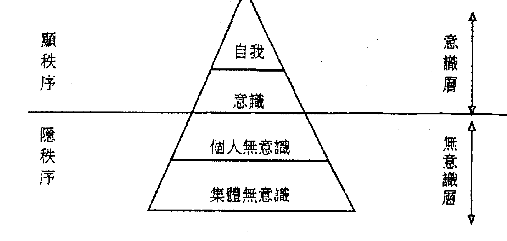

物理學的場（field）是指空間裡的區域具有某種物理特質，通常是不可見又不可觸摸，只是在某種情形下，能夠與物質起作用，依量子論而言，量子場為綣藏的隱秩序，綻放的粒子就是顯秩序，綻放的部份是物質的世界，我們可以感官的經驗。美國心理學家威廉·詹姆斯（William James）曾指出，無意識這個觀念本身可以跟物理學中的「場」概念相比較，就像粒子進入磁場會顯現出一定的秩序，而在無意識的心靈場中，心理內容也會綻放某種特定的規律，當意識與無意識融合，也許就是靈光一現，容格主編的《人及其象徵》中「科學與無意識」章節就曾舉例19世紀德國數學家高斯（K.F. Gauss）靈光一現的經驗，找到算術理論的某種規則。美國約瑟夫·馬爾菲博士（Dr. Joseph Murphy）在《The Power of your Sub-Conscious Mind》更直言無意識的豐富內容，甚或有神性、佛性。若比較佛家的唯識和無意識，可知唯識中的第七識末那識、第八識阿賴耶識類比於無意識層個人無意識，及集體無意識，故心靈淨透，具有強烈## 占星學的哲學基礎

的第六感，詩人或藝術家，或科學家解決問題等靈感，人類具有神通，並不足為奇。

容格在集體無意識中針對各種共通的心靈機能的現象，提出「原型」的概念予以說明。他假設原型是許多意象的表徵，人類深層的意象並非全部隱藏在裡面，他提出幾個重要原型，如人格面具(persona)、陰影(shadow)、阿尼瑪(anima)、阿尼姆斯(animus)、地母(Great Mother)、父親(father)、英雄(hero)、聖童(pure/Divine Child)、貞女(Kore/The Maiden)、惡精靈(Trickster)、智慧老人(wise old man)、本我(self)。這些原型是人類生命中先天就具備的內在型式，一種活生生的心靈力量。每個原型都有光明和黑暗兩面，容格進一步指出集體無意識中的原型是心理成長的源泉，如果能在意識和無意識之間建立合理的關係，對於心靈的健康甚為重要，他將達到心靈平衡的過程稱為個體化(individuation)。並認為這是人類所有的心理活動所遵循的原則和過程，因而就可成為「一個不可分割的整合個人」。

同時性是容格另一項重要發現的心靈現象，他在原型的發展過程中，經驗多次不可思議的巧合事件，試圖從這些巧合經驗裡找出一個理論模式來解說，在1952年，他發表一篇論文：《Synchornicity-An Acausal connecting Principle》正式揭櫫同時性的觀念，即同時性為事件以非因果關係聯繫起來的原理。在同一時間點上發生兩件或更多事件的種巧合現象，這些事件並不具有因果上的關聯，但卻彼此具有相同，或相似的意義。

容格對這些同時發生的有意義的巧合事件，分成三類：

- I. 某種特定的精神內容與其對應的客觀行動，兩者不約而同地相互暗合，而這種契合發生於同時。例：中國人常說的「說曹操，曹操就到」
- II. 某種主觀的精神狀態與某種幻象(夢境或幻想)，兩者不約而同地相互暗合，事件的發生的地點在一段距離之外，卻巧合地發生於同時。例：常發生至親親人逝世時，而有心痛或悵然若失之心電感應。
- III. 現在所察覺之事件，將於未來應驗，而此時刻係以夢境或幻象，其他象徵的方式出現。例：透過手相、面相、星象運勢、水晶球、解夢、天眼通....等。

同時性的現象已在量子論得到驗證，我們在前面談及的EPR矛盾和貝爾定理，發現量子論的非定域性，即是同時性的現象，說明了物理學、神秘學或玄秘學有共通之處，而這些學問的中心思想即是大衛 波姆的整體性，不可分割。在隱秩序裡面，所有的事件都是現在、過去與未來是，連綿的現在，都是隱秩序裡的泛音(harmony)、共振，歷史是綣藏狀態的綻放，過去已經綻放，未來將要綻放，所以同時性的各種類型，得以合理解說。

原型、同時性與集體無意識對占星學的啟示是什麼呢？

1. 占星學天宮圖的各項元素，如行星、星座、敏感點、後天宮位，都具有原型的特質，所以出生時，事件發生時天空的徵象，透過同時性的現象，得以昭示，甚或顯現該原型相對應的人間事件。
2. 占星學的天宮圖就似一張心靈的地圖，由原型的先驗秩序，為人性提供一套普遍而共同的法則，這張地圖描述一個人的內在世界的結構，進而為外在世界的事件。
3. 時事占星學(Mundane Astrology)討論星象與國家、地區城市....等衆人集體的事件，如地震、天災的關聯。當重大災難發生時，人們共同呈現的歇斯底里無異是集體的無意識所致，亦即時事占星學建構於集體無意識。

### 注解

1. http://technovate.org/web/articles/astrology and physics.htm/《Astrology and New physics-part Ⅰ》Integrating Sacred and Secular Science. by william Keepin. PH.D.
2. 《新譯淮南子 精神》P 306. 熊禮匯注譯 三民書局
3. 《理性之夢》by Heinz. R. Pagels，牟中原 梁仲賢譯天下文化出版公司，作者自忖為科學基本教義派，但他的這個觀點，仍是研究心靈科學的人應予以注重的。
4. The Dancing Wu Li Masters. by Gary Zukav. Bantam. Books.1979,P28.
5. http://www.horoscopesnow.Com/articles/Keep-inl.htw/《Astrological Writings》 Astrology as a Sacred Science,the Holographic Universe,and Deeper Reality. Interview with physicist-Astrologer Will Keepin. PH.D
6. 請查看林和譯《混沌》-不測風雲的背後天下文化 P.149 後的彩色頁。

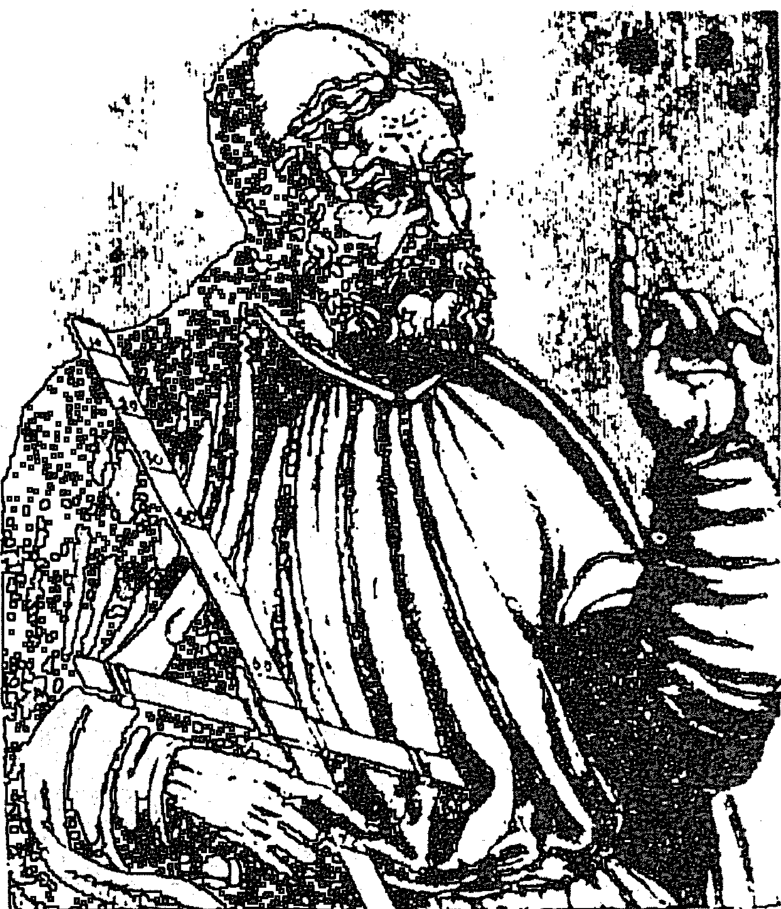

希臘化時期最著名的占星家 托勒密
(C. Ptolemy 約AD.100-170)


根據托勒密地心體系所形成的天球概念，地球在球心中央，天他天體以同心圓軌道，繞地球而行


哥白尼(N. Copernius AD 1473-1543)

日心體系的發現者


### 哥白尼的日心體系示意圖

當時哥白尼仍認為行星運行的軌道是正圓形的
一直到開普勒發現行星實際運行的三大定律，
世人才認知是橢圓形的

## 第二章 占星學的歷史發展沿革

占星學的歷史長河淵源流長，我們在本章繪一簡表，約從B.C.8000年之發韌期一直到公元2000年止，就占星學發展主軸及旁支，按重要轉承來劃分，如它的發展第一次黃金期和第一次死亡期....等。根據這樣的段落，會很容易掌握占星學歷史發展的契機及變化，在這些段落中有關重要的占星學事蹟和占星學家，或對占星學發展有貢獻的人物，儘量予以論列。

本章旨在介紹占星學發展的輪廓，讓初學者有個基本概念而已，我們將在第1節敘述發韌期至第一次死亡，第2節由中世紀阿拉伯人保存，然後重回歐洲，到17世紀最鼎盛，再到第二次死亡，共劃分3期來敘述，第3節是從19世紀末，在英國重新復興至20世紀，另外由於20世紀後的發展，相當有別於19世紀以前，我們特設第4節說明占星學現代發展的趨勢概述，最後第5節簡述中國占星學與西洋占星學的交流。學院派的歷史學者，對占星學向來喜歡揶喻嘲弄，多次聲稱占星學已死亡，如吉姆·帝斯特(Jim Tester)的《A History of Western Astriology》就是一例，但事實上，占星學不僅未死亡，且多次如浴火鳳凰更加茁壯。這些現象絕非如反對占星學之人士所稱的，占星學僅是心理創傷者的精神慰藉。兩千多年來的生命力，其堅韌值得深入觀察。

### 表2-1

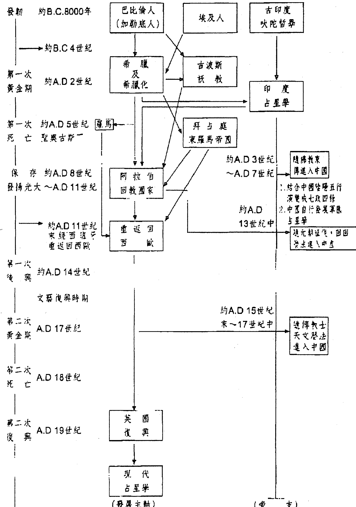

## 第1節 發軔期～第1次死亡

### 占星學的發軔

世界四大古文明之一的埃及，其鄰近區域的兩河流域，底格里斯河和幼發拉底河交會區域，即今之伊拉克，也蘊孕育豐盛的古文明。據比較可靠的歷史考古文獻，約在西元前8000年以前住有蘇美人，這些古先民面對浩瀚的天空，常忐忑不安，天體的異常變化帶來災難，而不知所措，必然敬畏天地，這是各地先民共同的經驗，因為敬畏，而對天空的崇拜，祈求星星指引應可理解，將天上的星星當作神，覺得他們對人世間必然有重大影響。透過先民中智慧較高者，觀察天象，看行星的移行到底有何徵象。這些經驗的累積與傳承，多少可以獲得一些寶貴的訊息，如每年四季的遞變、晝夜日升日落的規律，從而作為先民生活作息的指引，以利農耕。早期先民根據時序推移，也會簡單地算出天上行星的周期，雖僅是觀察經驗，但這是天文學的濫觴，由於跟先民關心的禍福災祥較有關聯，占星學的基本核心意義就這樣形成。

發軔蘊釀過程是粗鄙的，但隨著人類智慧的增長，及掌握天象的更多經驗而建立起一些規則，不管是天文學或占星學，都是先民智慧的結晶；在其他古文明地區，也有這些結晶，祇不過各自傳承不同，保留方式差異，而評價不一。蘇美人的先民經驗因甚早發明數學計算，及以楔形文字記錄在泥板上，得以保存，即使後來受巴比倫人統治，卻因其優異文化，而同化了侵略著，將其文化傳承且發揚光大。

19世紀中葉伊拉克一位留學英國牛津大學的年輕考古學家，荷慕茲德·拉斯南(Hormsuzd.Rassan)不顧當時法國考古學隊的挖掘權利，雇工在他的故鄉挖掘，卻挖出震爍古今的歷史考古大事，荷 拉斯南發現的是B.C.668-627之間巴比倫地區統治者亞述王朝的首都尼尼微的宮廷圖書館，其中藏有25,000泥板，薈集中東古代智慧的精華，其中最令天文學界和占星家振奮的是有70餘塊，約7000餘條的徵兆預言(Omens Prophet)。經整理後發現都跟天象有關，遂揭開了占星學源頭的序幕。後世占星學家稱之為巴比倫徵兆占星學(Babylonian Omens Astrology)。但嚴格地講，這些徵兆預言，尚無占星學的完整體系。

### 巴比倫時期

真正的巴比倫時代開啓，是在B.C.1758年，古巴比倫王朝聲名最顯赫的漢摩拉比(Hammurabi)統一征服了兩河流域，名垂千古的《漢摩拉比法典》使巴比倫的文明倍受尊崇，其名言「以眼還眼，以牙還牙」傳誦一時。

直到B.C.約16世紀，另一族亞述人竄起，成巴比倫地區的統治者，建立將近千年的亞述王朝，約B.C.669年漢尼拔(Ashurbanipal)登位，他是一位相當有作為的國王，為建立功勳，仍四處征戰，這也開啓了巴比倫與埃及、波斯....等地區的文化交流，漢尼拔對占星術(當時尚未具體化)頗為熱衷，就在首都尼尼微興建宮廷圖書館，將征戰各地所得之資料收藏，再加上亞述王朝歷來觀察天象的預言，合計成出土的徵兆結集(Omens Collection)，此即後世所稱之亞奴恩尼勒史詩(Enuma. Anu Enil)，之所以有這史詩名稱係因第一塊泥板鑴有“在亞奴神(Anu)和恩尼勒神(Enil)的時候”而命名，意即稱呼巴比倫地區上天之神，祈求他們保佑，而能瞭解天象之意。

亞奴恩尼勒史詩所記載的徵兆預言，幾乎都圍繞在國家大事上，所以當時巴比倫的徵兆占星學的形式，若以現代占星學的分類，歸屬於時事占星學(Mundane Astrology)之範疇，但為求吉利，也多少具有擇日占星學(Electional Astrology)的基本概念。

亞述王朝的文明雖大放異彩，但於B.C.612年由加勒底人(Chalden)建立起新的巴比倫王朝，才真正奠定現今占星學的基本雛型，加勒底人被譽為與占星家同義，由於B.C.540年加勒底王朝被波斯人滅亡，而納入波斯帝國的一部份，其占星術乃向周圍擴散、結合波斯、埃及之宇宙觀念，而開啓占星學的整合，一般咸信、黃道12宮，每宮30°約在B.C.5世紀左右就已確立。

後來約B.C.4世紀，地中海地區軍事强權馬其頓，亞歷山大大帝(Alexander the Great B.C.356-323)橫掃歐洲、中東、西亞，將希臘文明隨其四處征伐版圖大幅擴展，而形成希臘化時期，影響約800年左右，這段期間是占星學成型後的第一次黃金時期。

### 希臘與希臘化時期

就占星學的發展歷史而言，有關希臘的深遠影響，約可劃分成古希臘，以宇宙哲學建構占星學時期，和以亞歷山大大帝東征擴展版圖，而與各地文化交融而形成泛希臘文化之希臘化時期，這其中也包含其後期的羅馬時代，公元476年西羅馬帝國滅亡為止。

希臘是世界四大古文明之一，B.C.8世紀的荷馬史詩的澎湃激昂，至今仍讓世人難忘，荷馬時期的希臘位處巴爾幹半島，被海洋和許多島嶼所包圍的多山國家，較難發展陸上類似古代東方的集權國家，藉由海上交通而形成經商貿易特色的新型式國家，當時普通平民與貴族對抗取得勝利形成所謂自由公民，以商人、手工業者居多，容易奠定經濟和政治實力，由於這種城邦特色造就貿易、財富、思想自由，而使希臘文明耀眼非凡，他們所建構的哲學觀念，至現今仍一直被稱誦。其中的宇宙哲學觀念及萬物生成源自四大元素，地（土）、水、火 風， 直是占星學的重大支柱。

畢達哥拉斯(Pythagoras 約B.C.580-500)，數學著名的畢氏定理創始人，認為「數學的本原就是萬物的本原」提供宇宙天空的奧妙詩篇，也為占星學數學結構，如陰陽、三方、四正、相位....等提供了堅實的基礎

柏拉圖(Plato B.C.470-347)所著的《泰米亞斯篇(Timaeus)》敘說造物主如何利用四大元素，地（土）、水火、風來創造世界，結合世界靈魂(World-Soul)和每個東西創造時就存在，但又分別為「自同」和「他異」從而解釋，赤道(自同)和黃道(他異)傾斜成約23.5°的「靈魂」，造物主讓他們循環運轉。

亞里斯多德(Aristotle B.C.384-322)，認為世界萬物的基礎是一種「原初物質」，即純質料冷、熱、乾、濕，再由其對立形成四大元素，而世界萬物再由四大元素構成，我們在第三章先從四大元素談起，有較詳細的說明再參考之。

亞氏提出地球是球形的，位於宇宙的中心，地球本身不動，其他天體都圍繞著地球運轉，天體圍繞地球運動分為若干層，如月亮、太陽、水星、金星、火星、木星、土星等依次一層層地排成若干同心圓，宇宙的最外層是不動的推動者，即神是一切天體追求的根本動力和最高目的。

亞氏的宇宙哲學對占星術影響極為深遠，經過托勒密(Claudius.Ptolemy)的整理，形成「地心體系」如下圖。一直是占星學最重要的基礎，即使現代已知是「日心說」，但占星學仍以地球觀察為討論核心。

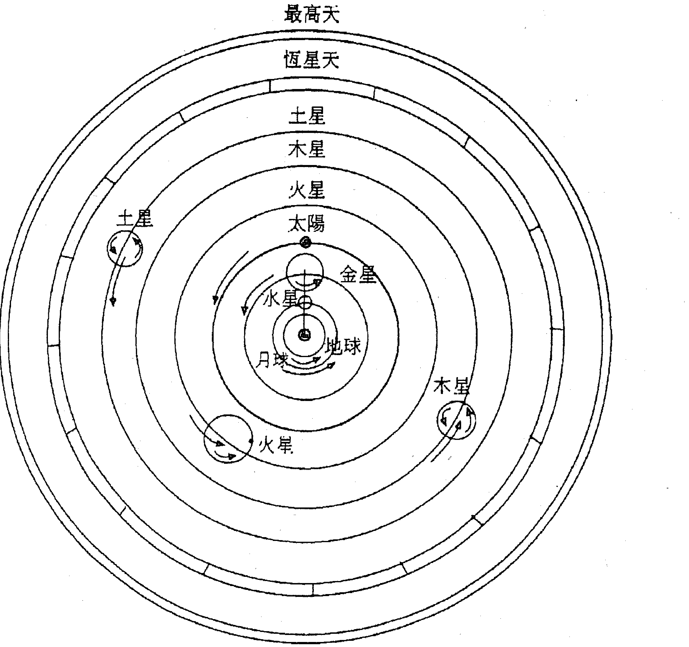

圖2-1 托勒密的地心體系

據考証托勒密約在西元後A.D.100-170之間，無疑是占星學發展歷史中最重要的標竿人物，他學識淵博，有關地理、光學，仍是現今必讀之書，占星學重要著作《四書》(Tetrabiblos)，已將占星學的架構及原理說明得相當詳細，若比對現今占星學讀本，除心理學、分宮、現代技巧外大抵都相通，所以説，占星學在托勒密時代，已奠定基調。

約與托勒密同期或較早的羅馬詩人馬尼利烏斯(M.Manilius)所著的《天文學》(Astronomica)，將斯多亞學派(Stoic)的宿命論和占星學結合，強調「命運控制著世界，萬物都依無可避免的定律......它創造了人們，但也在他們出生時，決定了他們的壽數和命運的變化。」

在希臘化時期，除托勒密和馬尼利烏斯，較著名為人所知尚有二位，即都勒斯(Dorotheus of sidon)和維替斯 瓦倫(Vettius.Velen)在當代都有一定影響。

從上述這些人著作中，可發現天宮圖(Horoscope)已具備了，因此討論本命已不是問題，王朝宮廷所供養的宮廷占星家無時不在地為王公諸侯尋求吉利時刻，從事政治、軍事、經濟的活動。希臘化後期，占星術幾乎是王公貴族必備之知識，羅馬共和國末期，內外交爭的局面，奧古斯都(Octavius)即屋大維，就曾公佈自己的本命天宮圖昭示天下，自己就是天命真子，即將登上大位。

占星學歷史上就從托勒密之年代A.D.2世紀起一直到西羅馬帝國滅亡之前，占星術極為鼎盛的時期，稱為第一次黃金期。

### 占星學的第一次死亡

中國易經的陰陽學說，敘述任何事物是對立又統一，在占星學的發展階段，並非沒有反對者，如公元前B.C.2世紀柏拉圖學派的卡內德斯(Cameades)就提出「同一時刻出生的人，其氣質命運迥然不同。」以及「遭遇相同的人，卻不一定出生於同一時刻。」這些質疑鏗鏘有力，卻未見迴響，一直到A.D.5世紀，基督教聖徒聖 奧古斯丁(St.Augustine, A.D.354-430)以基督教“萬能的主”不能冒瀆，在其名著《懺悔錄》(Confession)大事抨擊占星學。聖 奧古斯丁早歲即研習過占星學，事實上，基督教早期發展中為吸引教徒，並未反對它，因宗教難免藉助神秘主義，尤其是基督的發展到壯大，正是羅馬帝國從興盛到滅亡，以至退居拜占庭(Byzantine)，這種動盪戰亂的年代，人們尋求神秘事物來慰藉，正是人之常情，而占星學中的本命占星學論述命運可填補這項需求，宗教界當然不能忽視，可是占星學的預卜未來和以一切為上帝旨意格格不入，自會引起基督教為維護教義而批判，聖 奧古斯丁即是一例，他找到可以反駁占星學，僅是偶然的驗證而已，並非觀察星辰而得，即孿生兄弟問題，其實這已是老掉牙的問題，他卻宗教式熱情地大力駁斥，這在基督教有一定的影響。隨著西羅馬帝國滅亡，歐洲進入空前未有的文化黑暗時期，占星學的流傳似乎不見蹤影，占星學歷史稱之為第一次死亡。

## 第2節 中世紀時期

何謂中世紀時期甚難定義，我們僅以占星學發展作為劃分以利掌握其脈絡，原則上劃分三期。

- I.黑暗時期-阿拉人繼承
- II.重回西歐時期
- III.文藝復興〜17世紀時期

### ※I.黑暗時期-阿拉伯人繼承

當歐洲邁入黑暗時代，中東沙漠地區的阿拉伯民族卻悄悄興起追求知識的熱潮，當他們知道拜占庭人、波斯人及印度人知道的事而他們卻不知道，甚覺差人一等，特別是拜占庭人；乃邀請有學識的外國人來到伊斯蘭地區-巴格達(Baghdad)，也派密使到其他國家尋找書籍，而民間和政府機構大量將外國書籍翻譯成阿拉伯文。約在西元8世紀開始，有關天文學和占星學的希臘文書籍自然不可避免，也因這樣才得以保存古希臘占星學的原貌。阿拉伯人對占星學的貢獻，實值得大書特書，他們不僅保存原貌且在托勒密的天文學基礎下，做進一步的觀察與研究，更精密編製星曆表，推昇了天文學及占星學的更科學的發展。

阿拉伯天文及占星家人才倍出，我們列舉

1. 阿爾布馬薩(Albumasar A.D.787-886)，是阿拉伯占星家最著名的，他原本是位伊斯蘭教創立者穆罕默德(Muhammad)及其追隨者的研究專家，在30〜40歲才閙始轉向占星學研究，卻得到相當大的成就。在西方，他被尊為占星家之等同

## 占星學的歷史發展沿革

名詞，就如天文學家等同托勒密一樣，想像得到他的崇高地位，他最重要的一本書是《The Great Introduction》由於較龐大，又有濃縮本《The Abbreviation of the Introduction to Astrology》，一直是占星學界的圭臬。

2. 阿爾 比魯尼(Al-Biruni A.D.973-1048)，他是位學者曾花了數年時間在印度研習梵文，並向當地首席天文學家和占星家研習，生前似乎較不為西歐所知，但他的著作《The Book of Introduction in the Elements of the Art of Astrology》含蓋當時的天文學、數學、占星學知識，在20世紀初翻譯成英文才受重視。

## II.重回西歐時期

當阿拉伯人在A.D.800年後其天文、醫學、數學、其他技藝甚為發達之際，歐洲的文化陷入了相當低潮，當然這段期間歐洲並非沒有占星家，但較不顯赫而已。A.D.1066年，英國諾曼公爵即威名遠播的威廉(William)渡海征服英國，由於他篤信占星學，由宮廷占星家為其選擇加冕禮之吉時，即公元1066年聖誕日的中午，這一時刻仍是研究英國國運的重要參考依據，而後占星學在英國大為流行。這些資料都從義大利 西班牙傳入，而義大利、西班牙之所以有這些學識，卻是經由鼎盛的阿拉伯文化輸入的。

原來阿拉伯人早在公元8世紀初就征服了西班牙，曾建立起後倭馬亞王朝，這裡的占星家也追隨阿爾布馬薩，形成所謂西阿拉伯學派，自然就成為阿拉伯通往西方的孔道。因此將阿拉伯保存且發揚光大的希臘占星學及天文學的寶貴文化資產，就轉回西歐，讓歐洲即將進入文藝復興時期前，有個準備及曙光重現。

這段期間有幾個占星家，對整個占星學有極大貢獻。我們列舉如下：

- 1. 古德 波那提(Guido.Bonatti)，確實出生年代未知，應是A.D.13世紀前葉，可推演他是位義大利人，為13世紀最負盛名的占星家，他所寫的《天文書》(Liber Astronomicus)相當重要，彙總阿拉伯占星書的精華，至今仍是不可多得的占星書。波那提曾受雇皇家，與敵軍作戰，親自在城堡上發號施令，按其選定時辰作戰，據載百戰百勝，令人嘖嘖稱奇，他的天文書影響17世紀鼎鼎大名的威廉 里利(William.Lilly)甚遠。現代占星家復古大將Robert.Zollar就以其書作為論斷訣竅，頗受推崇。
- 2. 羅格 培根(Roger.Bacon A.D.1210-)，出生於英國的貴族家庭，是一位相當有才華的方濟會教士。嚴格說來，他是位哲學家，但演繹推理能力極强，被譽為現代科學之父。他對占星學的貢獻是極力擁護占星術，受其老師羅伯特 葛若瑟泰斯特(Robert Grosseteste)對星辰力量的虔信的影響，全盤接受占星術，並聳恿基督教會正面積極使用占星術，認為占星術可用來擊敗不信基督教的韃靼人，培根的勇於辯護、論証，使當時的占星術有所依靠。
- 3. 聖 湯瑪斯 阿奎那斯(St. Thomas.Aguinas)，14世紀，道明會教士，他調和了占星術與基督教神學的衝突，而讓日漸茁壯的基督教不排斥占星術，而有了轉寰空間，因為他加進了自由意志(Free Will)。他認為天上星辰是上帝意志的代行

者，因此會控制人的肉體，但並不控制靈魂(即自由意志)。靈魂是用來與上帝接觸的，他的名言“聰明的人是星星的主人”，適當地排除了占星術之命定論，增加了自由意志，對占星學影響甚深。

## III.文藝復興～17世紀時期

文藝復興(Renaissance)時期如何界定，一直頗有爭論，基本上是以土耳其回教大軍於A.D.1453年5月29日攻佔信奉基督教的東羅馬拜占庭帝國的首都君士坦丁堡(Constantinople)作為劃分。因當時希臘學者將其喜愛的古代手抄本，隨其移往義大利，而重現西歐，豐富滋潤西歐工藝文化，促進歐洲繁榮興盛。但就占星學而言，反而較早流行，隨著歐洲文藝復興，占星學再次綻放光芒，比希臘化時期更加昌榮，因此稱此時期為占星學的第二次黃金時期。其特色有：

- (I)歷史因離現代近且印刷術進步，一些重要典籍容易流傳、保存。
- (II)王公貴族等上流人物趨之若鶩。
- (III)星占曆書大量印行。
- (IV)醫療與占星學結合，部份著名大學開設占星學課程。

我們從(II)開始說明

## (II)王公貴族等上流人物趨之若鶩

義大利的佛羅倫斯是文藝復興時期之重鎮，市政府就有正式任命的占星家。羅馬教皇篤信占星術的，不乏其人，常見占星家為他們選擇加冕的吉日吉時，宮廷裡頻見占星家顧問，作為決策諮詢。

英國女王伊麗莎白一世(Elizabeth I)，就由占星家約翰 迪(John Dee)為其選擇加冕典禮的時間，更聽從他的建議而終身不嫁，也曾應用占星學偵測敵情。

丹麥國王曾資助著名的天文學家兼占星家，泰谷·布洛赫(Tycho Brahe)在哈芬島(Hveen)建立天文觀測站，天文儀器設備精良，馳譽全歐，當然泰谷也為丹麥王室作占星顧問。捷克貴族華倫斯坦(A.E.W.Von.Wallenstein)，曾匿名求教泰谷的學生，著名的開普勒定律創始人約翰 開普勒(John. Kepler)得到相當離奇、曲折的準驗，後來16年後，又再匿名求占，但開普勒拒絕，可是仍資助他住宅及各種方便，專心編製星表。他的名言 「倒洗澡水時，不要將小孩一起倒掉」，即不要為了打倒占星學的迷信糟粕，卻將占星學的功用也放棄。

16世紀末開始，英國政治進入動盪局面，政爭之雙方都會聘請占星家作決策諮詢。17世紀中英國最具盛名的占星家威廉 里利不免介入其中，有趣的是競爭對手都會放出風聲說里利已站在己方，甚至連士兵都會看里利所編曆書之啓示而行動。他在公元1647出版《Christian Astrololgy》至今仍是占星學必讀之書。

這些事蹟不勝枚舉，說明知名占星家在當時之熱絡。

## (III)星占曆書大量印行

星占曆書就如中國的農民曆，每年都有占星家編製，預告今年天象氣候、農作物收成、政治、經濟、軍國大事，頗受歡迎，幾人手一冊。知名的占星家所編製的，常一上市就被購買一空，這種景象當然加速占星術的普及化。開普勒的曆書更是赫赫有名，而里利也不遑多讓。開普勒在1595年更曾準確預測“土耳其入侵奧地利” “今年冬天特別冷”

## (IV)醫療與占星學的結合

在尚未進入新領域之前，醫療與占星學的結合，於中世紀甚為普遍，醫生常是占星家利用占星術診斷病情起因，並擇日開刀，注意放血，擷取藥草也注意時辰或日子，並將草藥依行星之類似性質歸類，取相剋性質來治療，因而發展出特殊的醫療占星學(Medical Astrology)，重視病人第一次臥床時刻 或尿液送至醫生處之時刻取疾運盤(Deccumbiture)來作醫病關係，致病原因，治療方面的判斷，這在當時甚為流行連著名的大學都設有這方面的課程。里利的學生，尼可拉斯 丘勒匹柏(Nicholas.Culpeper)就是個中高手，也是草藥專家。

這段期間，除了上述所提之占星家的貢獻外，尚有：

- 1. 約翰 穆勒(Johann.Muller A.D.1436-76)，他是德國大文學家，為尋求托勒密占星手稿來到義大利，曾擔任教皇的占星顧問，以其數學修養創立了一種分宮制，里利採用這種分宮制，作為卜卦用，此即Regiomontanus分宮制，採穆勒的化名來命名。
- 2. 拿斯特拉達馬斯(Nostradamus A.D.1503-1566)生於法國，至今仍是盛名不衰的預言家。他的預言在幾世紀後應驗異常，雖艱澀難懂，卻頗令人驚嘆。他曾受雇法國宮廷為皇家子弟繪製天宮圖。
- 3. 普拉德西(Placido.de.Titis A.D.1603-1668)他是以天球赤道圈分宮制聞名於世。至今其分宮法仍是占星學界用得最多的方法，當然有其影響。

## 占星學的第二次死亡

17世紀前的黃金時期，其實因文藝復興的昌盛，而蘊含科學思想之追求。這段期間科學人才倍出且光芒萬丈，實驗的精神 執著的態度都為人類開啓了新頁。如哥白尼(Copernicuo)發現日心説，是天文學發展史最重要的轉捩點，卻因當時宗教思想氣氛，衹能在逝世前一年出版《天體運行論》。但是在一世紀後，經義大利的伽利略(Galilea)努力不懈地觀察，才得到合理証明，這種日心説，當然對主張地心説的占星家甚大衝擊，更讓原本反對占星學的人振振有辭，加上牛頓天體力學等，都使得理性主義抬頭，但實際上這祇是將天文學從占星學分離出去，有趣的是哥白尼、伽利略、牛頓等都是占星高手。不可否認天文學發展，使占星學落沒，但非此次占星學第二次死亡的直接原因，應是科學促進知識邏輯的進步，間接地便會對玄虛有所懷疑，於是漸進地使占星學自然地死亡。

## 第3節 英國復興時期～20世紀

18世紀～19世紀，歐洲發生了革命性的變化，英國的工業化革命、法國的大革命、德國的第二次工業革命，都促使科學進步，更使玄虛的占星學加速衰退，曆書比黃金時期較乏人問津。1785年天王星，1846年海王星被發現，而其間又有些小行星陸續被發現，使太陽系僅有7大行星的說法倍受質疑，且自古以來各星座的主星安排之合理性也被懷疑，於是占星學理論，受到空前的挑戰，確實沈寂了一陣子，科學和懷疑主義阻卻了占星學的發展，不容否認。一直到英國布雷瓦斯基夫人(Helena Petrova.Blavatsky)在A.D.1875創立通神會(Theosophy)，強調輪迴、再生的觀念，而提供占星家另種層次的思維。19世紀末通神會成員之一的亞倫·里歐(Alan.Leo)，原本是位縫紉機推銷員，一次因生病從草藥醫生得知占星術，結交占星家朋友，後來與朋友開辦《占星家雜誌》以訂閱可送免費出生天宮圖，大廣招來，而馬上風行。到1895年，刊物歸他所有，改名《現代占星術》，開辦簡易的占星術課程，並且出版占星學書籍，對較難的術語，以深入淺出的說法解釋，頗得好評，而逐漸建立起占星術事業王國。

1914年5月 里歐被控因算命違反當時法律，雖被開釋，但這個事件卻促使他原來強調事件預測，而轉向個性解釋，他的律師建議他說，心理傾向的預測不會被認為是算命，他採納了，從此天宮圖的解釋轉向個性的解說。他的名言 「個性決定一切」。這項轉變卻促使占星學研究重大的變革,乃至有1980年代現代心理占星學的蓬勃發展。

里歐的組織能力,對占星術的熱衷及簡單易懂的敘述,強調實用性,風糜了19世紀末及20世紀初的英國。這股風潮竟讓占星術得以重生,他對占星術的功績歷史上得記上一筆。晚年強調的個性分析,讓占星學較少受攻擊而能立足。當然里歐的接班人查里斯卡特(Charles.Carter)的勤於實証,並將心得筆之於書,嚴謹不偏祖,實事求是的態度,頗贏得敬重。他曾是英國占星學院的第一位院長,在占星學界地位頗崇高,而預測自己似乎可能會死於1968年,屆時也應驗。

自從里歐之後,英國占星學界的嚴謹樸素的風格一直不變,頗為人津津樂道。里歐為20世紀占星學的光芒再綻放,提供堅實的基礎,同時也感染世界其他地區,如德國美國相互輝映。

在里歐於1914年被控訴,美國一位知名女占星家愛文格林亞當斯(Evangeline Adams)也因以占星術算命而被起訴上法庭,她準備了一些書表工具,向法官解釋她是如何推算的,該法官為考驗其真實,出了一份未具名之出生時間,由愛文格林當庭論述,結果頗讓法官訝異,準驗度相當高,乃說是他的兒子,於是就撤銷了控訴,並認為她已「提昇占星學,使之具有準確科學的尊嚴」,這下使原本就已十分出名的她,更加傳神。美國上流社會一直想跟她交往,如美國金融大亨摩根(J.P.Morgan)就是她的座上賓。他說了句耐人尋味的話「百萬富翁是不用找占星家的，但億萬富翁就要。」愛文格林的斷驗，嘖嘖稱奇，頗為膾炙人口。她將算命的經驗寫成幾本書，一直都是占星家積極搜尋的目標，她帶動了美國占星學實用的風潮，在她去世前二年主持電台節目，答詢各種占星問題，相當受歡迎，促進占星術在美國的發展。

第一次世界大戰後，德國戰敗，經濟困頓，占星術反而露出曙光。人們希望從中瞭解未來情況，但德國人做事向來有板有眼，將占星術做為學問研究，在占星學界佔有相當重要的份量。如德國，愛伯丁家族的宇宙生物學派(Cosmobiology)的中點理論(Midpoint Theory)是重要的論斷訣竅。1923年，第一代的艾爾白沙 愛伯丁(Elsbeth.Elbertin)曾預測德國混世大魔王希特勒的未來，也確實如她所言，希特勒曾遭受暗殺且成為德國領袖，因此使艾爾白沙 愛伯丁聲名大躁，開拓其家族在占星學界的影響力。

第一次和第二次世界大戰幾遍及歐、亞、非各地，美國也積極介入，且本土曾歷經經濟大恐慌，這種景況加深未來不確定。當時歐美占星術剛復興且方興未艾，在學理上增進心理因素，提供心靈撫慰的功能，所以研習的人日漸增多，而推廣占星術的人教育程度，人品道德，皆一時之選，更易帶動占星術的推廣。如美國的C.C.Zain，是神秘派學者，他原名愛伯特 班傑明 威廉(Elbert.Benjamin.William)，創立光之教堂(Church of light)大力推廣占星術，舉辦教學函授，他總共寫了21本書，一直都是占星學典範教科書，用字淺顯易懂，實例解析清楚，頗受歡迎。另一位被譽為「美國占星學之父」麥克 艾德蒙 瓊斯博士(Marc.Edmund.Jones)，以嚴謹的學術闡釋占星學原理，提昇占星學的內涵，雖艱澀但促進占星學學術地位，他過世後占星學界以他的名字創立象徵占星學最高榮譽桂冠的獎項，不定期頒給當代對占星學有貢獻的占星家。

麥克 艾德蒙·瓊斯博士的風範也影響另一位法裔美籍占星大師，但恩 魯迪海爾(Dane.Rudhyar)。他原本是音樂家和作曲者，藝術家的靈性、敏感使他在占星學的成就令人聒目相看。他強調人本主義(Humanistic)，重視人本，認為人可以透過自我認知轉換自己的命運，亦即天宮圖是一個人的潛能模型，祇要努力就可使自己想成為怎麼樣的人，這種生命哲學，擺脫占星術徹底宿命論的桎梏，增進人性光明面。頗受知識份子歡迎，也促進80年代現代心理占星學的强力發展。

## 第4節 占星學的現代發展趨勢概述

在第3節我們說明發展背景，在本節則特別說明占星學在現代發展的重要特色，約可歸納為下列：

- (I)新技術的開發
- (II)占星學的科學研究
- (III)占星學與心理學的結合
- (IV)嚴謹的占星學研究組織及占星學期刊
- (V)電腦的廣泛使用 占星學軟體功能齊全、網站林立
- (VI)占星學的復古運動吹起
- (VII)財務金融占星學逐漸獨樹一幟

我們分別簡述於下

## (I)新技術的開發

有別於古典方法，20世紀有不少新的技術開發，使占星學的分析方法呈現多元化，其中較被普遍認同的是中點理論、泛音盤(Harmonic)、換置占星學(Relocation Astrology)、合盤(Synastry)。

中點理論發源於德國，由漢堡學派(Hamburg School)開山祖師爺阿爾菲德·維特(Alfred Witt)所創，他認為黃道中兩個行星或敏感點之中點具有重要性，後來同在德國另一重要的占星學門派-宇宙生物學派，也同樣採用，更賦予理論化及實証，得到全球各地占星學家的尊崇，打響中點理論的名號。

泛音盤為英國約翰 艾迪藉印度占星學(Indian Astrology)的分盤技巧而開發出令人驚奇的新技術，可更細膩了解天宮圖的特殊秉賦，他的研究充分証明星象反映了宇宙周期的現象。

換置占星學是在20世紀中葉才發展出的技術，主要內容是研究命主換到其他地方的吉凶禍福，作為趨吉避凶之道。於1982年美國的吉姆·路易士(Jim Lewis)更發展出Auto Carto Graphy圖(簡稱A*C*G)，將天宮圖4大敏感點Asc. Mc. Dsc. Ic之行星曲線結合全球地圖，生動地描繪，何地為命主的吉凶，有助趨避，經實証A*C*G圖的功用甚强，一度是全球各地占星家的利器。另外知名占星軟體Win*star的創始人麥克艾爾温(Michael Erlewine)強調地平空間(Local Space)的重要，結合中國風水的觀念而開發地平空間占星學，也頗具特色。

合盤技巧更是20世紀重要的新技術，任何六親關係，夫妻、戀愛、合夥或流年與本命的關係，都可透過合盤技巧來處理，已成占星學不可或缺的重要技巧。

## (II)占星學的科學研究

20世紀是科學相當昌明的世紀，一切學問似乎都必須經得起科學的檢驗，才比較會受普羅大衆的接受，占星學也同樣必須面對科學的檢驗，儘管我們不甚同意按牛頓式古典力學模式，但20世紀中占星學的科學研究，仍值得一書。

(i)法國高魁林博士(Dr.Michel Gauguelin 1928-1991)是巴黎大學出身的心理學、統計學博士。他走遍全歐洲各地的市政府與醫院，蒐集許多名人士的出生資料，30多年來共搜集約5萬多個，透過統計實驗，證明占星學天宮圖四大頂點出現的行星與職業有關。高魁林的科學實證無異給占星學打了一劑强心針，但質疑論者卻無所不用其極地否定其發現，如在比利時成立的比利時特異現象科學委員會，簡稱特異委員會(Committee Para)，否定一切特異現象，包括占星學。自1955年起，高魁林一宜寄去他所發現的實証卻得不到該委員會的回應，後來經不起刺激，他們在1965年進行535名運動員重複驗證，結果確有火星效應(Mars Effect)，但該委員會卻決定不發表這項結果，被引為話柄。在美國同樣發生這種糗事，超自然現象科學調查委員會(Committee for the Scientific Investigation of Claims of Paranormal，簡稱CSICOP)，於1976年也重複證明火星效應與運動員的關係，卻修改實証方法，而否定高魁林的發現，令人不齒。

(ii)英國約翰·艾迪(John Addey 1920-)，出身英國劍橋大學，於1955年起進行一系列的占星學的泛音波狀研究，他提出地球上的萬事萬物都依照各種不同的「時計」，來作為行進的原動力。即星象反映了宇宙間的周期分析，他的實証相當有力地為占星學提供堅實的科學基礎。1970年代美國著名的刊物周期(Cycles)，也呼應約翰·艾迪的理論，發行該刊物的周期研究基金會(Foundation Study of Cycles)的總經理，杜威·達肯(Dewey Daiken)，就表示目前的跡象顯示人類行為受到一股强大(或許是宇宙)的力量所左右。杜威

## 占星學的歷史發展沿革

的說法正是占星學的命題。

(iii) 捷克尤根·喬納斯(Eugen Jonas)為婦產科醫學博士，為政府研究防止人口膨脹及避免墮胎。於1968年起，根據占星學的理論，進行一系列的實證，統計出約高達98%準確率的方法，即根據婦女本命天宮圖的太陽、月亮之距離角度，在可受孕的年齡內，安排每年中太陽、月亮相同角度的時刻同房，即很容易受孕，並可根據受孕當時，月亮所在之陰陽星座，而決定女或男孩。喬納斯博士的方法相當簡單易行，自然的生產控制方法，不失為人口學控制的方法之一。

## (III) 占星學與心理學的結合

我們已在第3節敘過，不再贅述。

## (IV) 嚴謹的占星學研究組織及占星學期刊

20世紀以後，占星學發展的另一項特色是有心人士發起學會組織並發行刊物，定期舉辦研討會，互相討論激盪，這些有心人士不乏知名的博士。所發行的刊物，態度嚴謹頗具一般正統學術的論文特色，令人尊敬，而各學會組織間的交流，共相盛舉建立友誼也傳為一時佳話。由於全球幅員廣闊，也不免有良莠不齊的學會組織或刊物。以下我們介紹著名的占星學會組織及期刊。

### 〈一〉占星學會組織

(1) 倫敦占星學分會(The Astrological Lodge of London簡稱A.L.L) 1915.7.13由亞倫·里歐原本為通神協會設立的倫敦分會。剛開始合併研究通神學，第一次世界大戰後，查里斯·卡特在1922被選為主席全力著重於占星學，才與通神協會脫鉤，獨立運作，但仍保留A.L.L名稱。1926年更發行《Astrorogy Quarterly》季刊，一直是占星學界最重要的期刊之一，水準相當高。A.L.L對占星學界貢獻甚鉅，著重於占星學各領域的歷史和哲學，使占星學不再被誤解為算命(fortunetelling)。

A.L.L曾歷經兩次重大分裂：

1. 1948.6.7占星學研究學院(The Faculty of Astrological Studies)成立於倫敦，為占星學標準教育而設，學院畢業的學員授予學位，它的D.F.Astro.S一直是職業占星學家想得到之認證。
2. 1958.6.21英國占星學會(The Astrological Association of Great Britain簡稱A.A)。

設立成員的主要目的是想使占星學能為社會接受，擺脫成為邊緣，因而致力深層心理學、統計數學的研究，朝科學路線走，它的主要領導人都是占星學界主流人物，望重一時。如查里斯·哈維(Charles Harvey)，尼克·卡普恩(Nick Campion)。

(2) 美國占星家協會(American Federation of Astrologers簡稱A.F.A) 1938年成立，全世界最大的占星學組織，其目標鼓勵占星學所有科學性的研究和占星學知識的普及，為占星學研究學員或執業占星家設立分級考試。

(3) 地球宇宙研究全國審議會(National Council for Geocosmic Research INC簡稱NCGR) 1971.3.6在麻州成立，一開始就是全球性的組織，目前已被公認為最嚴謹，最認真的占星學組織，它的定期報告是不可多得的研究材料，值得收藏。其成員都是美國占星學望重士林的人士，如羅伯·漢得(Rob Hand)、阿拉費·勞威(Alphee Lavoie)、李·李荷曼(Lee Lehman)。

### （一）占星期刊

(1) 《University Centre for Astrological Research》，簡稱U.R.A 1999年成立於法國，為線上占星期刊，每兩個月一次，內容著重之三大方向，歷史、認識論、技術，立場客觀中立，深度、廣度皆具，為一不可多得的占星學材料內容，更難得的開放上網閱讀，但因多語文，有些文章須懂得法文、拉丁文方看得懂。

(2) 《The Mountain Astrologer》簡稱TMA,美國著名的占星學期刊，每年發行6次，每兩月一次，內容相當紮實，涉足占星學各領域，占星學書評、國際重大事件、實證資訊...等，發行量甚廣。

(V) 電腦的廣泛使用，占星學軟體功能齊全，網站林立在電腦未普及化之前，學習占星學必須忍受繁雜的製作天宮圖之苦惱，但電腦科技的進步已徹底解決這項問題。1977年，麥克·艾爾溫的Matrix公司創作Win*Star電腦占星軟體，以及羅伯·漢得成立Astro-Graphics公司，創作Astro-Scope，歷經改組，公司更名為Astrolabe，軟體改以Solar-Fire為主打商品，帶動占星學便利學習的風潮，他們的貢獻值得大書特書。這些軟體，功能相當齊全，圖案精美，操作便利。而1996年後網際網路時代來臨，全球各地占星網站林立，更是20世紀占星學的一項特色。占星資訊無遠弗屆，令人目不暇及。

## (VI) 占星學的復古運動吹起

1985年之前，現代心理占星學的發展雖提昇占星學的學術地位，卻與市井小民以事件為主的諮詢有些背離，遂有些占星家重新整理古代占星學典籍及技巧，如美國的卡洛·A·威格絲(Carol.A.Wiggers)，英國的奧莉維亞·巴克列(Olivia Barclay)從卜卦占星學著手，逐漸得到回響。而在1992年，由羅伯·漢得、羅伯·舒密特(Robert Schmidt)及羅伯·遮絡(Robert Zoller)三人發起的ARHAT(Association for the Retrieval of Historic Astrological Textes)，重新整理注釋自希臘化時期以來尚留存於世的占星學書籍。至目前仍在進行中，已發行的資料顯示成果相當豐碩，發現古代某些技巧確有令人驚奇之處，他們為保存占星學文獻的功蹟，值得尊敬。

## (VII) 財務金融占星學逐漸獨樹一幟

財務金融占星學原來歸類為時事占星學的一支，但隨著國際金融市場的全球化趨勢，市場訊息萬變，投資者或投資顧問，莫不想在市場捷足先登。在1980年代之前，運用占星學在股市、期貨雖時有所聞，但畢竟衹是少數。1987年10月美英股市大崩盤，一些市場專家，包括經濟學家、財務金融專家、股市老手皆傻眼之際，美、英的占星家竟然相當明確篤定地預測出10月19日的崩盤，相當不可思議，因而財務金融占星學特有的行星周期遂與股市、期貨之走勢的對應遂成一股風潮，所以，財務金融占星學已脫離時事占星學獨樹一幟。

## 第5節 中國占星學與西洋占星學的交流

全球各地文明較發展的地區或國家，大都跟天文學是否發展得較具體、鮮明有關，如巴比倫、希臘、埃及、印度，而中國也不遑多讓。在先秦時期，中國對天體運行規律與時令季節的變化就掌握得相當好，天空的星區劃分為28宿，用來觀測太陽、月亮和五星的運行變化，各王朝早就設有史官來觀測天象《禮記 月令》 「乃命太史司天、日月、星辰之行。」

中國占星術應在春秋戰國時期就已相當發達，漢朝司馬遷《史記 天官書》及後來出土之帛書《五星占》就可明証，但這時候的占星術係以國家大事為主，加上分野觀念的提出，豐富了各國競爭的占星術話題，大陸江曉原教授《歷史上的星占學》稱中國占星學為軍國星占學，頗為貼切，中國各王朝替代頻繁，但撰述史書者，都保有《天文志》或《五行志》或兩者並列。想像得到皇朝對天象記錄的重視，而持續長期的觀察記錄，在國際天文學界佔有一席之地。

中國的軍國占星學，若以現代占星學的內容來看，幾乎完全歸屬於時事占星學或部份屬於氣象占星學，從中國現存的占星書籍，除前述之外，如《靈台秘苑》 《開元占經》 《乙巳占 》就可知道，而這些書籍都是唐朝當代或以前著述的，應可推論在這之前以占星術論命，比較不普及，若有也稀少，無全面流傳。中國占星術完整的論述個人命運，應屬《果老星宗》，但此書係明朝正式出版，託名唐朝張果老，因證據不全，也難以確定就是唐朝時期之作品，但有趣的是《果老星宗》的後天12宮，名稱及意義與希臘、印度占星學的內含相當雷同，所以兩者當中必有所關聯。

我們根據表2-1，大略可瞭解，中國占星術曾和外來的占星術曾有三次互相會流，衍生出一些小火花，卻未在中國境內產生實質的變化，分別說明於下：

(1) 第一次合流 約在公元5世紀-7世紀，印度占星術於魏晉南北朝，隨唐時期之東傳而進入中國，結合中國陰陽五行及28宿(印度設為27宿)之類似而衍生成中國的七政四餘占星學。唐朝的韓愈曾說「我生之辰，月宿南斗，牛奮其角，箕張其口....。」而大詩人杜牧「我生在角星(命宮所在)」這些術語是七政四餘的內含，所以唐朝士人之間已有占星術論命之風氣。

(2) 第二次合流 公元13世紀，元朝征伐阿拉伯地區，從當地搜集不少天文儀器及相關星占資料。回回曆法進入中國，當時也曾促使元朝的天文學成就達到另一高峰，後來元朝滅亡，朱明登位，朱洪武曾命大臣吳伯宗主持由回回大師們翻譯成一本重要天學書籍，名《天文書》這本書包羅萬象，幾將中世紀阿拉伯時期的重要內容包含在內，如本命、流年、擇日、時事(國運)，但遺憾的是這本書也未在中國流行開來。

(3) 第三次合流:約公元15世紀-17世紀,利瑪寳來華傳教,一直找不到切入點,而當時天文學受明朝禁錮,民間不敢奢談天文學,至明朝後期,中國的天文學知識已趕不上西洋,幾次預測日、月蝕皆偏離太多,而讓利瑪寳找到可以切入傳教之點,即帶當時西洋較進步的天文、曆法知識給想急於吸取知識的飽學之士,利瑪寳寫信給母國教會,請派懂天文、曆法的傳教士來華。穆尼閣就是其中之一,他傳授給薛鳳祚,而撰成《天步真原》一書,內容也相當豐富,為中世紀文藝復興時期約16世紀占星術的內容,但同樣這本書也未能在中國流行。

這三次合流,對中國占星術內容未產生實質的影響,其原因如下：

(i) 沒有較完整的星曆表,輔助計算七政位置,欲推論命運,本就緣木求魚。比起李虛中所創年命納音算命法複雜得多,豈易流通?而《天文書》是回回曆為準,在明朝瞭解的人原本就不多,而子平八字在明朝已有較完整體系,所以天文書難以抗衡。《真步天原》在明末清初之時完成的,當時對天文學的瞭解也是少部人而已,而書中的弧角天星後天12宮算法,即使在今日也莫宰羊,何況當時。

(ii) 涉及民族意識,第一次交流尚未那麼明顯,但第二次交流和第三次交流,情形較嚴重。如清康熙發生的楊光先的曆獄事件,激化當時東西文化碰觸所產生的民族意識,而阻礙其發展。

(iii) 中國的子平八字，起排容易，且有一定準驗性，在比較之下，繁複的西方占星術會被擱置，而對天體的瞭解，沒有歸屬感，所以西方占星術更不易推行。

天宮圖四大頂點與天球，黃道關係示意圖

古代中國七政四餘算命天宮圖格式

遠古以來,若天上發光的太陽或月亮被龍吞噬,視為人世間的危機預兆,此即日蝕和月蝕,一般發生於離月亮交點5.9°內,故月亮北交點又稱龍首,月亮南交點,又稱龍尾

## 第三章 天宮圖的繪製

占星學的分析工具是一張完整的天宮圖(Horoscope)，在希臘化時期，即有它的概念，其希臘原文的意義是「我注意著時辰」，引申為「我注意升起來的是什麼」，即根據出生時刻，注意在東方地平線升起來的是什麼星座，此即上升星座(Ascent Sign)，簡稱ASC，由它開始劃分成12個宮位，論述人生各事項領域，如個性、財帛、婚姻、六親、事業....等。

早期的天宮圖受限於數理天文學尚不夠完整，而有些粗疏，但今日球面三角函數已充分發展，且電腦科技之賜，天宮圖的繪製，透過占星軟體的指令，鍵入必備的出生資料，約1分鐘即可完成一張精美的出生天宮圖。

天宮圖的繪製原理，完全根據天文座標及行星運動來計算的，坦白說，欲充分瞭解及計算相當費時，但為使有心學習占星學的讀者瞭解其過程，在本章我們不辭辛勞地解說天宮圖繪製的原理，以及計算步驟的過程，我們將在第1節天宮圖是什麼，先介紹它的輪廓及要素，第2節說明繪製天宮圖必備的天文座標概念，得以揣摩天宮圖的一些要素，如經度、緯度、黃道、赤道、地平方位....等必備的概念，第3節說明繪製天宮圖所需的幾個重要時間觀念，讀者方不致誤用或能自行校正，第4節說明繪製天宮圖常用的宮位系統(House System)讓讀者在使用占星軟體之宮位系統的選擇有所依循，第5節說明天宮圖後天12宮的繪製過程，在本書我們採用查表法，第6節說明如何安排各行星成敏感點於天宮圖的適當位置，並列出這些要素之間的相位線，而成一張完整的天宮圖。

### 第1節 天宮圖是什麼?

行星符號

MC
天頂

後天宮位
後天宮位
界線

ASC
上升宮始點

DSC
下降宮始點

星座符號

IC
天底

特殊點符號

相位線

1.重要敏感點：ASC.MC.DSC及IC，位於天宮圖的4個尖軸，其中ASC與DSC相對，MC與IC相對，在占星學論斷上，ASC及MC佔著重要的地位。

( I )ASC 上升宮始點，地球自轉時，用事時刻之用事地點的東出地平方位與黃道交叉之星座度數，以這個度數為起點，數至天宮圖的第2個宮始點，稱為第1宮，又稱為命宮，若論本命則是個人秉賦、健康、才能表現、體格長相、個性特徵....等。其英文全名為Ascendant，以晝夜觀點看，此點意謂太陽在黎明上升點。

( II )MC：中天或稱天頂，第10宮宮始點(非等宮系統時)，為用事時刻地點所在之子午經圈與黃道交會在其直接上頭之點，以這個點數至天宮圖第11宮宮始點，稱為第10宮又稱事業宮，若論本命則是個人聲望、成就、社會地位、職業傾向....等，又因是父親相對宮，亦為母親宮。其英文全名為Midheaven，而MC簡稱源自拉丁語Medium Coeli，以晝夜觀點看，此點為午正南天最高點。

( III )DSC 下降宮始點，是ASC相對點，以這個度數為起點，數至天宮圖的第8個宮始點，稱為第7宮，又稱為夫妻宮，若論本命則是夫妻或合夥人、他人明顯的競爭對手....等。其英文全名為Descendant，以晝夜觀點看，此點意謂太陽在黃昏西沈點。

(IV)IC：天底，為第4宮宮始點，是MC的相對點，以這個點數至天宮圖的第5個宮始點，稱為田宅宮，又稱父母宮，若論本命則是個人的血緣、根、與父母的關係、父親的狀況、祖產、土地....等。其拉丁文合名為Immum Coeli簡稱之來源，以晝夜觀點看，此點為子正北天，黃道最低點。

一般上，ASC和DSC連線將天宮圖劃分成兩半，在上為南天，代表白天；在下為北天，代表夜間。而MC和IC連線，則將天宮圖也劃分成兩半，在左為東天，代表自我；在右為西天，代表他人。

2.先天黃道十二宮其命名及符號如下

♈ 白羊
♉ 金牛
♊ 雙子
♋ 巨蟹
♌ 獅子
♍ 室女
♎ 天秤
♏ 天蠍
♐ 人馬
♑ 摩羯
♒ 水瓶
♓ 雙魚

天宮圖周天360°，12個星座，平均每個星座30°，通常以白羊座為春分點星座，代表春天來臨，大地生氣盎然，黃道12星座在天係按上述順序，即白羊、金牛、雙子、巨蟹、獅子、室女、天秤、天蠍、人馬、摩羯、水瓶、雙魚，逆行針運行。

3.行星與特殊點符號：

A.行星

| 符號 | 名稱 |
| :--- | :--- |
| ☉ | 太陽 |
| ☽ | 月亮 |
| ☿ | 水星 |
| ♀ | 金星 |
| ♂ | 火星 |
| ♃ | 木星 |
| ♄ | 土星 |
| ♅ | 天王星 |
| ♆ | 海王星 |
| ♇ | 冥王星 |

B.小行星 ☊ 凱龍

C.特殊點 ☊ 月亮北交點 ☋ 月亮南交點

某些占星家也會視其研究或喜好，而增減行星、小行星及特殊點符號的使用。

行星、小行星及特殊點在黃道的位置，是由太陽帶領而在黃道上逆行針運行著，這是地球公轉帶來季節性效應，但占星學的發展係站在地球觀點來觀察這些行星運轉的相對視運動位置，此即地心系統(Geocentric System)，太陽也被視為行星之一，我們以圖3-1來說明例示，行星在黃道的位置。

地球、太陽和星座的關係

圖3-1

如地球繞太陽公轉，其位置在射手，若以地球觀點，則太陽在黃道的相對視運動位置在雙子，其他行星亦復如此。

天宮圖雖是平面的，但其隱含意義卻是立體的，它有地球公轉和地球自轉之縮影，太陽帶領其他行星在黃道上的運行是季節，春夏秋冬四季交替，可由太陽所在之星座來區分，通常太陽始入春分點，即太陽進入白羊0°時，即春天的開始，金牛、雙子皆屬春季星座，而太陽始入夏至點，即太陽進入巨蟹0°時，即夏天來臨，獅子、處女皆屬夏季星座，當太陽始入秋分點，即太陽進入天秤0°時，即秋季的開始，天蠍、射手皆屬秋季星座，而太陽始入冬至點，即太陽進入摩羯0°時，即冬天來臨，水瓶、雙魚皆屬冬季星座，上述這種劃分，完全符合地球季節的實際，不致脫離。

中國著名的陰陽曆、24節氣與上述二分二至的契合。占星學就是站在地球觀點來看天體運行，自古之農事耕作，春種、夏耘、秋收、冬藏，不致脱序就是其傑作，這種宇宙自然秩序的規律，可作為人生命運之推測「天上如此，地下如此」天人感應，一直深植人心，不得不感佩先民智慧。

上述二分二至的太陽始入所採用之黃道，即是占星學使用之迴歸黃道(Tropical Zodiac)。

至於天宮圖隱含之地球自轉之晝夜效應，已在前説明。

4.後天12宮代表符號為阿拉伯數字

後天12宮是人生生活領域事項的演繹，我國唐代盛行之七政四餘，係由印度東傳，再加上我國陰陽五行學説融合之占星術，其後天12宮之基本架構和希臘流傳至今之後天12宮幾完全相同，我們先臚列後天12宮管轄之生活領域，以後再詳論。

1宮(命宮) 主管個性、身體體型特徵、脾氣特質、才能秉賦、健康本質。

2宮(財帛宮) 主管個人財運、價值觀、賺錢能力、動產如流動性資金、賺錢慾望。

3宮(兄弟宮) 主管兄弟姊妹、親戚、鄰居、短期或短程旅行、交通、基本教育 思考溝通。

4宮(田宅宮) 血緣、根、家庭、位居、祖産、上地、不動産、父母、墓地、晚年。

5宮(男女宮) 子女、戀愛、創作才華、投機、賭運、娛樂、休閒。

## 第 5 節 天宮圖的繪製

6宮(奴僕宮)：勞動、工作崗位、部屬、疾病、服務、寵物。
7宮(夫妻宮)：婚姻或合夥關係、配偶長相、體裁、個性、社交能力、競爭對手、訴訟。
8宮(疾厄宮)：他人(或配偶)的錢財、遺產、偏財、負債、稅務、保險、性慾、死亡。
9宮(遷移宮)：高等教育、出國進修、長程或長期旅行、宗教、精神、法律、國外事務。
10宮(事業宮)：個人聲望、社會地位、名譽、形象、事業才華、職業生涯。
11宮(福德宮)：朋友、同學、同僚、團體組織、公會、公益活動、願望、社會意識、人權。
12宮(相貌宮)：無意識、隱密場所、醫院、養老院、監獄、危險事故、犯罪、禁錮。

以上係以本命占星學(Natal Astrology)為主論列，若是卜卦、擇日、國運、醫療、財經，其各宮意義當有所修正。

## 5. 相位(Aspects)

行星、特殊敏感點在黃道上運行之位置，彼此之間會形成特殊角度(Angle)，經占星家研究証明，這些角度會帶給命主或命盤或多或少之影響，此特殊角度，占星學的術語稱為相位，因影響力不同而分成主要相位(Major Aspects)和次要相位(Minor Aspects)，通常是以主要相位為主，分別如下：

| 相位.符號 | 角度 | 基本意義 |
| :--- | :--- | :--- |
| 會合 Conjunction | 0° | 強調或強化 |
| 半合 Sextile | 60° | 機會 |
| 刑 Square | 90° | 挑戰、刑剋 |
| 三合 Trine | 120° | 順暢、幸運 |
| 沖 Opposition | 180° | 對立、抵抗 |
| 半刑 Quincunx | 150° | 調整 |

這些相位又因吉凶不同而分別稱為調和相位 (Harmonious Aspect)和不調和相位(Inharmonious Aspects)。

調和相位 ☉ △

不調和相位 □ ☿ ♃

而☉之吉凶須視所會合之行星吉凶而定，又行星、特殊敏感點，形成角度有個容許度，在容許度範圍內，都視為相位，相關主題容後詳論。

## 6. 特殊敏感點

A. 羅喉(Ω)、計都(☊)，這兩個點在黃道上是相對的，如羅喉在金牛8°5'，計都就在金牛對宮天蠍的8°5'，(當然還須注意計算標準是以真實的或平均的而定)

這兩個點的產生，是因月亮繞地球的軌道面，一般稱作白道，與地球繞著太陽公轉之黃道面交叉，所產生的如下圖(配合第7章 圖7-1)

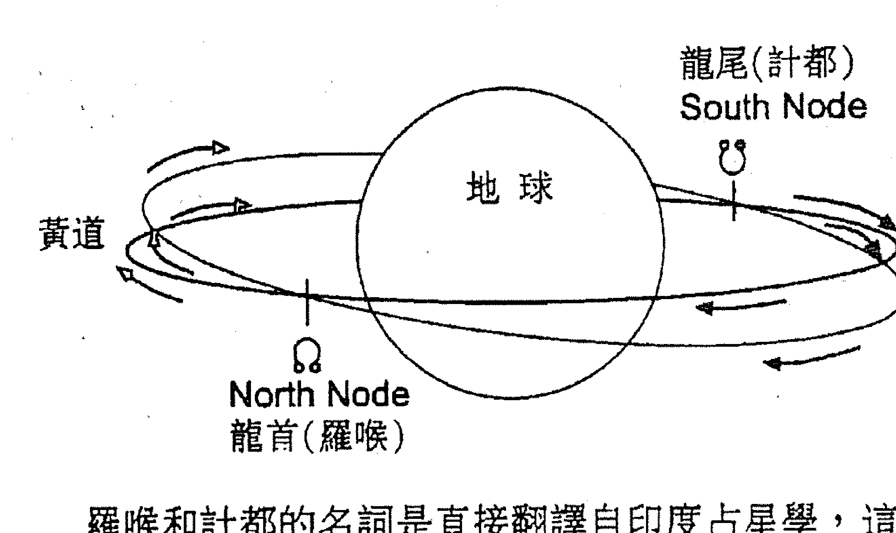

羅喉和計都的名詞是直接翻譯自印度占星學，這兩個月亮交點，前者為North Node北交點，後者為South Node南交點。因日月蝕發生在此兩交點附近，先民想像一隻龍吞噬發光中的太陽或月亮，視為人世間危機的徵兆，北交點為龍首(Dragon Head)，南交點為龍尾(Dragon Tail)，前者被視為等同木星之吉祥，後者等同土星之邪惡。

B. 阿拉伯點(Parts of Arab)

阿拉伯點真正的源頭是希臘占星學中的重要部份，祇不過在歐洲黑暗時代(Dark Age)，阿拉伯回教國家大量翻譯希臘占星學書籍，予以保留並發揚光大，這些點因阿拉伯人甚常使用，而被誤稱為阿拉伯點，我國明朝翻譯的《明譯天文書》則稱為箭，阿拉伯點相當多，最常用的是幸運點⊗。

⊗幸運點，代表財富，須分白天或夜間，其計算會不同，待有關章節再詳論。

## 命宮意義的來源

中國術數論及人生命運，大多設有命宮，如紫微斗數、七政四餘、太乙人道命法、六壬神課、奇門遁甲、四柱八字學，大都尊崇。《三命通會 論坐命宮》的說法 「神無廟，無所歸，人無室，無所棲，命無宮，無所主。故有命宮之法」說明命宮的重要。但其來源則避而不談，或命宮排法截然不同，但各家對命宮之定義幾無二致，那為何差異那麼大，這就有必要探索命宮的意義。

從後天12宮之排列，以1首領數代表命宮，從而按順序列出各宮顯然隱含命宮之意。《果老星宗》云 「人之生也，以身命為主，故曰命宮為第一。」即是此義，該句話中「人之生也」可擴大解釋為人類、萬物之生機，以太陽系而言，因地球繞行公轉產生四季及地球本身自轉產生晝夜，這兩種基本的天體物理運動，恆久以來形成宇宙自然規律，人類、萬物生機之所以由生也，所以命宮的定義，應源自於這種宇宙自然規律，從而預測人類萬物之命運。占星學完整架構形成於希臘化時期，其命宮的概念就是如此，但甚少明析解說。《三命通會 論坐命宮》曾提 「經云 天輪轉出地輪上，卯上分明是命宮」已點出這項觀念，但從未有人深究，直到黃家騁在《星海詞林 渾天大五星寶卷附篇》才完全解析清楚，使占星學命宮意義更加確定，而有所依循，我們引錄於下 「由古經定法即可驗諸術真偽曰 『天輪轉出地輪上，卯上分明是命宮』」，上訣對術家言，並不陌生，卻無人能解，因地球有自轉與公轉，以地為太極(地球不動，地心系統)，則太陽視行黃道，即天輪也。又由地球任何地點作中心，則太陽東起西沒之周天運行即地輪也，故由天輪(節氣值月)與地輪(每日時辰)之運變，即可求算太陽東升(卯)命宮也。因天道地輪皆順天而行，為逆轉者(逆時針方向)，故安命法宜改定為「中氣定月，卯起正月，逆佈生月，逆數生時。」此千金不易之安命真訣，而俗書盡誤，竟相沿千年無人更正，因命宮不確故無法應用，今以新法校正，則命宮之謎終得破解。」上述引句若非行家恐一時也不易懂，黃先生復在《上升星座的第一本書》繼續解說。

天輪是指地球公轉的天上時間，也就是個人出生月日的「太陽星座」

地輪是指地球自轉的地上時間，也就是個人出生時辰的「地方時間」

學過大六壬的人就知道黃氏所說的天輪，即是月將，而月將是以中氣定宮，將天輪化為恆星時間加上地輪，求算子午經圈之中天後，再轉90°就能找到正確的出生命宮，此即「卯上分明是命宮」所以卯是一個直角象限，所得之出生命宮，即所謂「上升星座」

## 出生時間(birth time)或種子時刻(Seed Moment)

欲建立天宮圖，必須有個出生時間和所在地經度、緯度等時間、空間因素，在占星學各分支領域皆同。有關經度、緯度的空間因素，比較單純，我們留待後面說明，至於出生時間會因本命、流年、國運、卜卦、擇日、事件....等取法而有所不同，本處以本命占星學為主，說明有關本命天宮圖的建立，採用之時間，一般是以嬰兒脫離母體後哭聲為第一口空氣吸入肺部為準，當然也有人認為脫離母體時即起算，兩者差異雖不太大，卻有哲學之思辯，大多數占星家採用前者居多。在現代時間已相當準確，但在天宮圖剛形成之希臘時期，事實上尚稱困難，故占星大師托勒密就論及精確的出生時間難以獲得，須用當時的星盤(Astrolabe)和時計輔助推算，他特別提及水鐘(Water clock)。托勒密也論及受孕時刻或分娩時刻都應注意，問題是分娩時刻的準確時間都已相當難得，何況受孕時刻，即使在現代科學這麼昌明，父精母卵受孕的瞬間都無法確定，在希臘化時期更不用説。托勒密認為出生時間雖是次要的源始，但它已賦予嬰兒在那瞬間上天所塑造的特質，容格提出同時性觀念，説明該時刻的時間特質能解釋該嬰兒的命運。

## 第2節 繪製天宮圖必備的天文座標概念

### 天球(Celestial Sphere)

當我們站在沒有光害的夜晚星空下，仰望浩瀚無際的天空，它就像一個半圓形的球體正覆蓋著我們所站的地平面，而這個半圓形球面，鑲著密密麻麻的繁星。我國古代宇宙模型「蓋天説」就是這種樸素直覺，認為大地平整四方，天似穹窿覆蓋，天地在遠處連合。若運用想像力，地平面底下也有相對的半圓球形，兩個半圓球形成一個全圓球形，此即天球。

事實上，天球為一假想球形，可以地球球心作中心，向四周作無限延伸，此無限延伸為天球半徑。天球可作為研究人空星體位置和運動相當良好的輔助工具。在天球球面設定一些點和線，瞭解它們的相互關係，亦即它們形成球面幾何，得以透過球面三角函數或向量矩陣演算，精確地計算出大空各種星體的位置和運動。

我們以圖3-2表示天球的各種點、線、圈，其意義説明於下


1. 子午經圈(Meridian)：是經過地平圈之最高點(Zenith)和最低點(Nadir)，赤道天北極，黃道天北極(黃極)，及地平圈的南點S和北點N的一個大圈。
2. 卯酉經圈(Primary Vertical)：是垂直於子午經圈的一個大圈，它經過地平圈的東點E、西點W。
3. 地平圈(Horizon)：是用事地點，地平面所形成的一個大圈，其頭頂最高點稱為Zenith，穿透地底想像的一個最低點，稱為Nadir。
4. 赤道圈(Equator)：是平分地球為南半球和北半球的一個大圈，其最高點為赤道天北極，最低點相對為赤道天南極(圖中未列出)。
5. 黃道圈(Ecliptic)：是地球繞太陽公轉之一個大圈，亦即從地球看，太陽帶領月亮及五大行星、三王星運行之軌道圈，其最高點為黃極，太陽在春分點為春天的開始。

天宮圖的ASC，就是用事地點之地平圈和黃道圈交會於其東方，以本命占星學而看，此人出生時，其東方地平方位升起什麼星座，就可知道，而其相對是DSC，即西方地平方位下降什麼星座，MC，則是此人出生時所在地子午經圈最高點，而其相對點，即是其所在地子午經圈最低點IC。

6. 黃赤交角(Obliquity of the Ecliptic)：地球因自轉，其軸偏離黃道約23°26'，稱為黃赤交角，此黃赤交角與黃道、赤道之關係，形成球面三角形，故常用來作為座標間轉換的要素。

### 經度與緯度

用事地點的經度和緯度，也是建立天宮圖必備的要素之一。

地球為一個球體，其球心稱為地心(想像的)，地球自轉是以通過地心到地球最高點北極和最低點南極的假想地軸，由西向東旋轉，以赤道圈大圓為中心，劃分南北半球，可分別劃出向上與赤道圈平行而垂直於地軸之圈，此稱為北緯線，而向下與赤道圈平行且垂直於地軸之圈，稱為南緯線，如下圖3-3


一切通過地軸的平面而同地球表面切割而成的圓圈，稱為經圈，一切經圈必然通過地球的南北極，而將地球劃分成兩個180°的半圓，此半圓稱為子午經線，但為地理定位之需要，設有假定最初起算的子午經線，一般稱為本初子午線，為求全世界統一，公元1884年，經國際會議決定以通過英國的格林威治天文台為全世界通用之本初子午線，因而全球各地之經度線，即能明確而不致混淆，由於經度線跟時間有關，因地球自轉一圈360°，共24小時，每1°=15分，若全世界有個統一標準，各地區的定時，就能明確劃分，這對航行於海上之船隻、飛翔於天空的飛機，都具安全定標的作用，所以不能忽略。

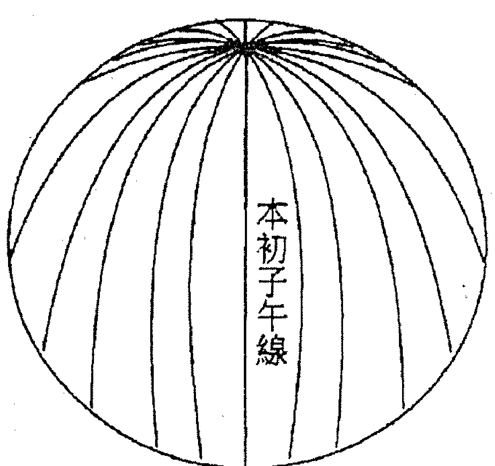

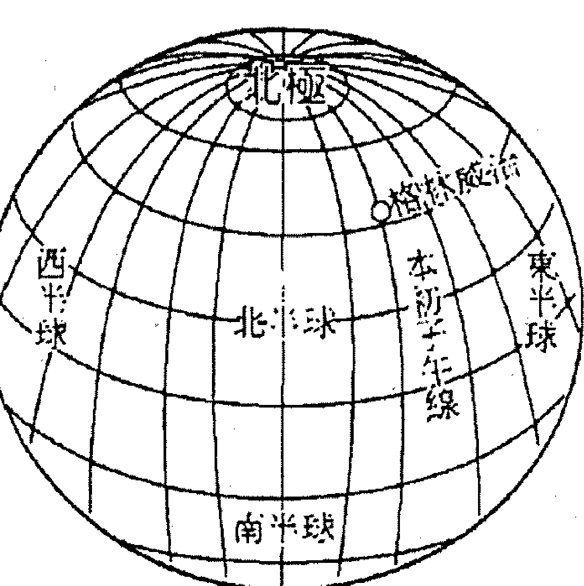

地球上經度和緯度是地理座標，即一定緯度和一定經度的組合，標示著地球表面上一個特定地點的位置，度量全球任何地點的地理座標，需要一個統一制度，如前所述。這個統一制度的基本標準，即赤道、格林威治本初子午線，若假設某地P，可由下圖求出其經度、緯度。圖3-6：


1. 從本地子午線與赤道圈交叉之B，計算至本初子午線，其距離AB即經度數，國際議規定在格林威治以東為東經，在其西，則為西經。
2. 從本地子午線與赤道圈交叉之B起算至P，其距離PB，即緯度數，在赤道以北稱為北緯，在赤道以南稱為南緯。
3. 地球上東經共180°，而西經也180°，總共360°經度。
4. 地球上北緯共90°，而南緯也90°，總共180°緯度。

占星學繪製天宮圖，必需考量用事地點的經度、緯度，比中國的八字學、紫微斗數等命理學純用出生時間，來得精密許多。

## 第3節 繪製天宮圖的幾個重要時間概念

占星學的時間計數，沿自天文學的用法，我們以下表列出占星學使用時間計數概念的區別

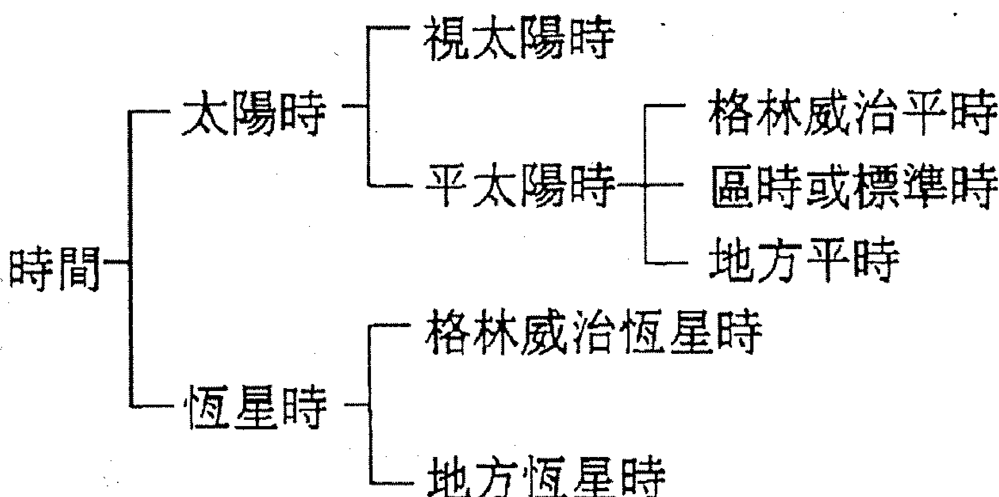

要瞭解太陽時和恆星時的觀念，可藉天球座標的赤道圈說明。圖3-8。為天球第一赤道座標，它的基圈是天球赤道或稱天赤道，以午圈為始圈，其緯度為赤道緯度，稱為赤緯，從午圈與基圈之交點Q，作為始點向西測量天體S所在之時圈，其距離為時角(Hour angle)t，由於地球自轉，天體的時角每小時增長15°，天球的經度0°-360°，可與0°24小時相對應，用天球的第一赤道座標，即可測量任何天體的相對經度與時刻。


因天球第一赤道座標僅能測量天體的相對經度和時刻，無法滿足編製星歷表要求之絕對位置，遂有圖3-9的第二赤道座標，它的基圈同樣是天赤道，但始點定在春分點，由它向東測量天體S所在的位置，其角距離稱之為赤經α(Right Ascension 簡稱R.A)，赤經每15°等於1小時。

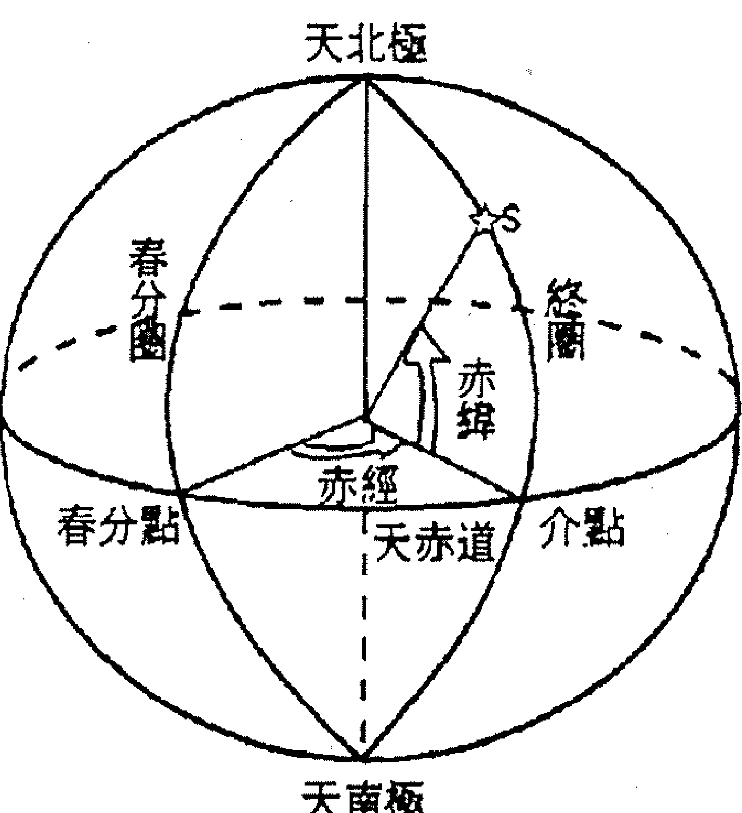

### 太陽時(Solar time)

所謂太陽時，即是根據太陽時角所推算出來的時間，根據天球第一赤道座標，太陽為天體S，從午圈Q點向西測量太陽所在經圈位置，即為太陽時角t⊙因係從午圈起算(即從中午12時)，故太陽時=t⊙+12h，太陽時刻與太陽時角的關係，可由下圖3-10來表示：

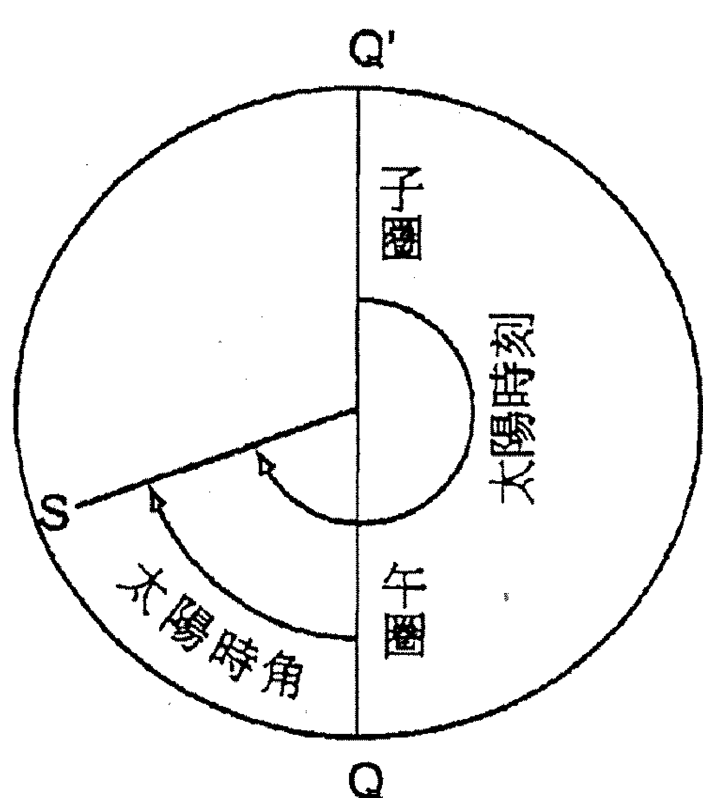

天文學上測量太陽時有兩種，一是視太陽時(Apparent Solar time)或稱真太陽時，是根據實際存在的太陽，即真太陽，因真太陽在黃道運行的速度不勻稱，其每日晝夜運行會出現長短不一，就日常生活或其他科學研究甚為不便，遂假想一個勻速的太陽就其在天赤道運行而測量的時間，稱之為平太陽時(Mean Solar time)。平太陽時事實上是根據視太陽時或恆星時推算的，但使用上甚為方便。

視太陽時和平太陽時，會產生差異，有時正值，有時負值，以平太陽時為標準，一年內出現零值和正負極大值的日期大約如下：

| 日期 | 時差 | 日期 | 時差 |
| :--- | :--- | :--- | :--- |
| 12月25日 | 0 | 6月14日 | 0 |
| 2月12日 | -14.4分 | 7月27日 | -6.3分 |
| 4月16日 | 0 | 9月9日 | 0 |
| 5月15日 | +3.8分 | 11月4日 | +16.4分 |

從表中可知12/25、4/16、6/14、9/1真太陽時與平太陽時，無甚差異，其值為零，但約在2/12及7/27真太陽時比平太陽時慢，而在5/15及11/4則真太陽時比平太陽時為快。

中國傳統的術數，涉及到時間的都以2小時為單位，因而命主生在時頭或時尾，很近分界點時，其出生時刻就會產生爭議，基本上，命理學應根據真太陽時為準，而非人為假想的平太陽時，所以應作調整，有關真太陽時差每月每日的資料可參閱陳品宏《預言命律正解》、鐘義明《天星擇日實務》有詳細的記載。

在占星學的使用上，平太陽時，又分成：

(I) 格林威治平時(Greenwich Mean Time 簡稱GMT)

格林威治平時是以格林威治所在地之經度，所測量的平太陽時。太陽晝夜的周日運動，照射全球各地呈現不同的時間，為求一個統一，國際天文學會IAU以GMT作為基準，得以換算全球各地之時間。

(II) 區時或標準時

由於地球本身自轉一周天為24小時，因太陽照射關係全球各地產生晝夜不同，如在台灣為早上8時，在美國東岸可能是前晚19時，而美國西岸可能是下午16時，這些時間一般稱為理論時區，以格林威治之本初子午線，為當日凌晨0:00Am同時刻，東經地區加、西經地區減這些時間，稱為世界標準時，全球理論時區的劃分如下圖

如台灣位於東八理論時區，查下表H為+8，亦即當格林威治時GMT為Am1:00則台灣為Am9:00，我們聽到廣播稱為中原標準時間。由於國際間編製通用之天文星曆，常以格林威治時間為主，所以必須瞭解這個重要時間觀念。


(III) 地方平時(Local Mean Time 簡稱LMT)

用事地點所在經度測量所得的平太陽時，即是地方平時。

由於理論時區的劃分，致使時區內由西至東15°內之各地方的時間皆為標準時，如台灣和北京皆在東八區的理論時區內，兩地皆為中原標準時間，但台灣大部分地區是在東經120°左右，北京為東經116°19'，根據LMT的定義，當太陽到達台灣地區天空最高點午正12:00時，北京當地的太陽尚未到達其最高點，須在15-16分鐘後。這種差異是因各地經度所造成，為精密嚴謹計算天宮圖，LMT比標準時重要。

### LMT與標準時可以互算

1周天=360°
1日=24小時=1周天
\frac{360}{24}=15°=1時
1時=60分
1°=60'
1'=60''

\frac{60分}{15°}=4分=1°
1分=60秒
4分=240秒
\frac{240}{60'}=4秒=1''

應注意以上之日、時、分、秒為時間測量單位，而360、15°、60'、60''為經度單位。

一般經度差校正，是以理論時區之經度為準，在東經時，若比理論時區的經度多則加，若比理論時區的經度少則減；相對地，在西經時，若比理論時區的經度多則減，若比理論## 天宮圖的繪製

時區的經度少則加，經由這樣校正程序，就可得地方平時，我們舉例說明。

例一：台北縣三芝鄉經度為東經121°30'，中原標準時間為早上8:00，其地方平時為多少？

台北縣三芝鄉之理論時區為東經120°00'，而三芝鄉地方實際經度為121°30'，比前者多1°30'，依前面換算公式：
1° = 4分，1' = 4秒
4分 + 4秒 × 30' = 4分 + 120秒 = 6分（經度差）
因是東經，故三芝鄉當時之地方平時為 8:06 AM。

例二：中國大陸北京，經度為東經116°19'，中原標準時間為早上8:00，其地方平時為多少？

北京之理論時區為東經120°00'，而北京地方實際經度為116°19'，比前者少3°41'，依前面換算公式：
1° = 4分，1' = 4秒
4分 × 3 + 4秒 × 41 = 14分44秒（經度差）
因是東經，故北京當時之地方平時為 7:55:16 AM。

## 恆星時 (Sidereal Time 簡稱 ST)

恆星時是以地球自轉為基礎的時間計量系統，通常以春分點起算向東至觀測地點所在之子午經圈，所測量的赤經距離。因地球自轉，每恆星時增長赤經15°，故恆星時對應至經度，也能換算為角度，即 1恆星時 = 15°，1恆星分 = 15'。由圖3-9可瞭解其意，事實上，恆星時也可定義「觀測所在地子午經圈的春分點時角」。這兩種定義，可將圖3-8和圖3-9等兩種天球赤道座標結合成圖3-11。

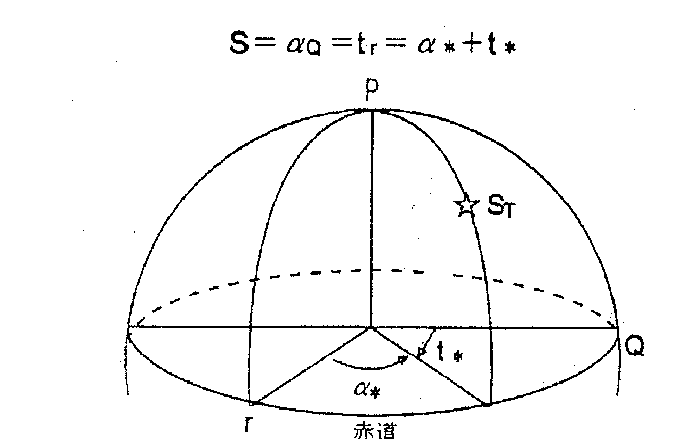

其中 S 為恆星時，而 $\alpha_Q$ 為春分點至 Q 點之赤經，而 $t_T$ 為 Q 點起算的春分點時角，$S_T$ 為任一恆星，Q 點為觀測地點之子午經圈。如果此恆星 $S_T$ 正好在觀測地的子午經圈上，即 $t_* = 0$，那麼 $S = \alpha_*$，即觀測地上中天 MC 的赤經為恆星時。

恆星時分成二種：

(I) 格林威治恆星時 (Greenwich Sidereal Time 簡稱 GST)

以格林威治所在地經度測得之恆星時，因天文學和占星學等重要星曆表編製，常以 GST 為準，因而務必瞭解其意義。

(II) 地方恆星時 (Local Sidereal Time 簡稱 LST)

以用事地點所在地經度測得之恆星時，占星學計算天宮圖即以 LST 為主，一般宮位系統表的編製，以恆星時為主，而天球座標的各種轉換常涉及赤經，故 LST 的計算不能馬虎。

### 平太陽時與恆星時的換算

經測量 1 恆星日的長度為 23 小時 56 分 4 秒，比 1 平太陽日 24 小時少了 3 分 56 秒，故換算平太陽時為恆星時，每小時須較正加上約 (3分56秒 = 236秒) ÷ 24 = 9.83 秒。

這種恆星時加速值校正的計算，可直接透過下表查尋。

## 恆星時加速值校正表

| m. | 0h. | 1h. | 2h. | 3h. | 4h. | 5h. | 6h. | 7h. | 8h. | 9h. | 10h. | 11h. |
| :--- | :--- | :--- | :--- | :--- | :--- | :--- | :--- | :--- | :--- | :--- | :--- | :--- |
| | m.s. | m.s. | m.s. | m.s. | m.s. | m.s. | m.s. | m.s. | m.s. | m.s. | m.s. | m.s. |
| 0 | 0 0.0 | 0 9.9 | 0 29.6 | 0 39.4 | 0 49.3 | 0 59.1 | 0 59.1 | 1 9.0 | 1 18.9 | 1 28.7 | 1 38.6 | 1 48.4 |
| 4 | 0 0.7 | 0 10.5 | 0 30.2 | 0 40.1 | 0 49.9 | 0 59.8 | 0 59.8 | 1 9.7 | 1 19.5 | 1 29.4 | 1 39.2 | 1 49.1 |
| 8 | 0 1.3 | 0 11.2 | 0 30.9 | 0 40.7 | 0 50.6 | 1 0.5 | 1 0.5 | 1 10.3 | 1 20.2 | 1 30.0 | 1 39.9 | 1 49.7 |
| 12 | 0 2.0 | 0 11.8 | 0 31.5 | 0 41.4 | 0 51.3 | 1 1.1 | 1 1.1 | 1 11.0 | 1 20.8 | 1 30.7 | 1 40.5 | 1 50.4 |
| 16 | 0 2.6 | 0 12.5 | 0 32.2 | 0 42.1 | 0 51.9 | 1 1.8 | 1 1.8 | 1 11.6 | 1 21.5 | 1 31.3 | 1 41.2 | 1 51.0 |
| 20 | 0 3.3 | 0 13.1 | 0 32.9 | 0 42.7 | 0 52.6 | 1 2.4 | 1 2.4 | 1 12.3 | 1 22.1 | 1 32.0 | 1 41.9 | 1 51.7 |
| 24 | 0 3.9 | 0 13.8 | 0 33.5 | 0 43.4 | 0 53.2 | 1 3.1 | 1 3.1 | 1 12.9 | 1 22.8 | 1 32.7 | 1 42.5 | 1 52.4 |
| 28 | 0 4.6 | 0 14.5 | 0 34.2 | 0 44.0 | 0 53.9 | 1 3.7 | 1 3.7 | 1 13.6 | 1 23.5 | 1 33.3 | 1 43.2 | 1 53.0 |
| 32 | 0 5.3 | 0 15.1 | 0 34.8 | 0 44.7 | 0 54.5 | 1 4.4 | 1 4.4 | 1 14.3 | 1 24.1 | 1 34.0 | 1 43.8 | 1 53.7 |
| 36 | 0 5.9 | 0 15.8 | 0 35.5 | 0 45.3 | 0 55.2 | 1 5.1 | 1 5.1 | 1 14.9 | 1 24.8 | 1 34.6 | 1 44.5 | 1 54.3 |
| 40 | 0 6.6 | 0 16.4 | 0 36.1 | 0 46.0 | 0 55.9 | 1 5.7 | 1 5.7 | 1 15.6 | 1 25.4 | 1 35.3 | 1 45.1 | 1 55.0 |
| 44 | 0 7.2 | 0 17.1 | 0 36.8 | 0 46.7 | 0 56.5 | 1 6.4 | 1 6.4 | 1 16.2 | 1 26.1 | 1 35.9 | 1 45.8 | 1 55.6 |
| 48 | 0 7.9 | 0 17.7 | 0 37.5 | 0 47.3 | 0 57.2 | 1 7.0 | 1 7.0 | 1 16.9 | 1 26.7 | 1 36.6 | 1 46.4 | 1 56.3 |
| 52 | 0 8.5 | 0 18.4 | 0 38.1 | 0 48.0 | 0 57.8 | 1 7.7 | 1 7.7 | 1 17.6 | 1 27.4 | 1 37.3 | 1 47.1 | 1 57.0 |
| 56 | 0 9.2 | 0 19.1 | 0 38.8 | 0 48.6 | 0 58.5 | 1 8.3 | 1 8.3 | 1 18.2 | 1 28.1 | 1 37.9 | 1 47.8 | 1 57.6 |

| m. | 12h. | 13h. | 14h. | 15h. | 16h. | 17h. | 18h. | 19h. | 20h. | 21h. | 22h. | 23h. |
| :--- | :--- | :--- | :--- | :--- | :--- | :--- | :--- | :--- | :--- | :--- | :--- | :--- |
| | m.s. | m.s. | m.s. | m.s. | m.s. | m.s. | m.s. | m.s. | m.s. | m.s. | m.s. | m.s. |
| 0 | 1 58.3 | 2 8.1 | 2 18.0 | 2 27.8 | 2 37.7 | 2 47.6 | 2 57.4 | 3 7.3 | 3 17.1 | 3 27.0 | 3 36.8 | 3 46.7 |
| 4 | 1 58.9 | 2 8.8 | 2 18.6 | 2 28.5 | 2 38.4 | 2 48.2 | 2 58.1 | 3 7.9 | 3 17.8 | 3 27.6 | 3 37.5 | 3 47.4 |
| 8 | 1 59.6 | 2 9.4 | 2 19.3 | 2 29.2 | 2 39.0 | 2 48.9 | 2 58.7 | 3 8.6 | 3 18.4 | 3 28.3 | 3 38.2 | 3 48.0 |
| 12 | 2 0.2 | 2 10.1 | 2 20.1 | 2 29.8 | 2 39.7 | 2 49.5 | 2 59.4 | 3 9.2 | 3 19.1 | 3 28.9 | 3 38.8 | 3 48.7 |
| 16 | 2 0.9 | 2 10.8 | 2 20.6 | 2 30.5 | 2 40.3 | 2 50.2 | 3 0.0 | 3 9.9 | 3 19.8 | 3 29.6 | 3 39.5 | 3 49.3 |
| 20 | 2 1.6 | 2 11.4 | 2 21.3 | 2 31.1 | 2 41.0 | 2 50.8 | 3 0.7 | 3 10.6 | 3 20.4 | 3 30.3 | 3 40.1 | 3 50.0 |
| 24 | 2 2.2 | 2 12.1 | 2 21.9 | 2 31.8 | 2 41.6 | 2 51.5 | 3 1.4 | 3 11.2 | 3 21.1 | 3 30.9 | 3 40.8 | 3 50.6 |
| 28 | 2 2.9 | 2 12.7 | 2 22.6 | 2 32.4 | 2 42.3 | 2 52.2 | 3 2.0 | 3 11.9 | 3 21.7 | 3 31.6 | 3 41.4 | 3 51.3 |
| 32 | 2 3.5 | 2 13.4 | 2 23.2 | 2 33.1 | 2 43.0 | 2 52.8 | 3 2.7 | 3 12.5 | 3 22.4 | 3 32.2 | 3 42.1 | 3 52.0 |
| 36 | 2 4.2 | 2 14.0 | 2 23.9 | 2 33.8 | 2 43.6 | 2 53.5 | 3 3.3 | 3 13.2 | 3 23.0 | 3 32.9 | 3 42.8 | 3 52.6 |
| 40 | 2 4.8 | 2 14.7 | 2 24.6 | 2 34.4 | 2 44.3 | 2 54.1 | 3 4.0 | 3 13.8 | 3 23.7 | 3 33.6 | 3 43.4 | 3 53.3 |
| 44 | 2 5.5 | 2 15.4 | 2 25.2 | 2 35.1 | 2 44.9 | 2 54.8 | 3 4.6 | 3 14.5 | 3 24.4 | 3 34.2 | 3 44.1 | 3 53.9 |
| 48 | 2 6.2 | 16.0 | 25.9 | 35.7 | 2 45.6 | 2 55.4 | 3 5.3 | 3 15.2 | 3 25.0 | 3 34.9 | 3 44.7 | 3 54.6 |
| 52 | 2 6.8 | 16.7 | 26.5 | 36.4 | 2 46.2 | 2 56.1 | 3 6.0 | 3 15.8 | 3 25.7 | 3 35.5 | 3 45.4 | 3 55.2 |
| 56 | 2 7.5 | 17.3 | 27.2 | 37.0 | 2 46.9 | 2 56.8 | 3 6.6 | 3 16.5 | 3 26.3 | 3 36.2 | 3 46.0 | 3 55.9 |

除了上述之時間觀念，尚須注意政府之一些行政命令，使得真正的出生時間混淆，最常見的有下列兩種：

(I) 日光節約時間 (Daylight Saving Time) 或夏令時間 (Summer Time)

日光節約時間也稱夏令時間，是由英國提倡，其理由為若將時刻提早，則公家機構，如學校、政府機構、私人公司、工廠皆因時間提早而勢必早睡早起，提早上班，早睡可節省電力燈火，早起亦可促進國民健康，一舉數得，而最能利用的時機，是陽光充裕之時，此即夏天時令，因此在此季節將標準時間撥快一小時，分秒不變，待恢復時再撥回來，我國亦曾實施。由於占星學是以自然定律，故人為的日光節約時間必然會混淆推斷之準驗，故必須注意及此，從附表(一)當可得知我國實施年度及其起訖日期，務必予以調整。

(II) 戰時時間 (War Time)

某些國家幅員廣闊，可能跨越數個理論時區，戰爭時，為使號令下達時間明確，全國各區乃統一時間，如第二次世界大戰時，日本殖民統治的台灣，在民國26年～34年期間，日本就曾因台灣較慢於東京1小時，為了使所下達的命令時間，不致混淆，當時台灣就實施類似日光節約時間，將台灣標準時間撥快1小時，這種狀況是戰時時間的一種，如附表(二)。

## 表(一) 夏令時間

| 34年 | 5月1日至9月30日 | 46年 | 4月1日至9月30日 |
| :--- | :--- | :--- | :--- |
| 35年 | " | 47年 | " |
| 36年 | " | 48年 | " |
| 37年 | " | 49年 | 6月1日至10月31日 |
| 38年 | " | 50年 | " |
| 39年 | " | | 中間暫停使用 |
| 40年 | " | 63年 | 4月1日至10月31日 |
| 41年 | 3月1日至10月31日 | 64年 | " |
| 42年 | 4月1日至10月31日 | | 停止日光節約時 |
| 43年 | " | 68年 | 7月1日至9月30日 |
| 44年 | 4月1日至9月30日 | | 以後停止日光節約時 |
| 45年 | " | | |

## 表(二) 台灣地區.日本殖民時期 戰時時間

| 民國 | 陽曆起訖日期 |
| :--- | :--- |
| 26年 | 26年10月1日起 |
| 34年 | 至34年9月30日 |

## 用事日期、時間如何換算為地方恆星時

我們將整個換算過程列成一張表，以免資料誤列或漏列。

| (I) 地方恆星時間換算表 | 姓名 | 時區 | 時 | 時 |
| :--- | :--- | :--- | :--- | :--- |
| 1.出生地： | 省 | 縣市 | 經度 | E W | 緯度 | N S |
| (用事地點) | | | | | | |
| 2.出生日期： | 公元 | 年 | 月 | 日 | 時間 | 時 | 分 | 秒 |
| (用事時間) | | | | | | | | |
| 3.GMT | 公元 | 年 | 月 | 日 | 時間 | 時 | 分 | 秒 |
| (2.東減西加時區) | | | | | | | | |
| (II) | | | | |
| S.子正GST(查3.日期，星曆表所列) | 時間 | 時 | 分 | 秒 |
| T.GMT(查3.時間) | 時間 | 時 | 分 | 秒 |
| A.平太陽時/恆星時校正(查恆星時加速值校正) | 時間 | 時 | 分 | 秒 |
| R.經度差.東加.西減 | 時間 | 時 | 分 | 秒 |
| (III)LST=S+T+A+R | ※時間 | 時 | 分 | 秒 |

舉一實例說明：公元2001年4月24日 8:59:00 PM，高雄市出生之女命。

在 LST 換算表中 (I) 清楚易明，(II) 為整個換算核心，我們逐一解說，首先掌握恆星時在文字上即是星星時間 (STAR Time)，因此記住 S.T.A.R 的口訣，就不致誤算。

S: Sidereal Time，為用事日期的恆星時間，其數值來源根據天文數據，可直接從星曆表尋取，讀者應注意的是，此 ST 為子正或午正，我們習慣採用子正 GST，黃家聘編著《天文七政三王真 躔萬年星曆》為極佳範本。

如本例，從表中可知 4 月 24 日之子正 GST 為 14 時 8 分 21 秒。

## APRIL 2001 LONGITUDE 四月

| DAY | SID. TIME | ○ | ☽ | TRUEΩ | ♀ | ♀ | ♂ |
| :--- | :--- | :--- | :--- | :--- | :--- | :--- | :--- |
| | h m s | o i n | o i n | o i | o i | o o | o i |
| 1 Su | 12 37 40 | 11♏ 19 37 | 5☽ 30 29 | 10☽ R44.5 | 21☽ 6.3 | 8♏ R23.2 | 20♂ 40.3 |
| 2 M | 12 41 37 | 12 18 49 | 19 26 37 | 10 44.6 | 22 43.9 | 7 46.1 | 21 2.0 |
| 3 Tu | 12 45 33 | 13 17 58 | 3☽ 36 51 | 10 43.8 | 24 22.9 | 7 9.8 | 21 23.3 |
| 4 W | 12 49 30 | 14 17 5 | 18 0 9 | 10 40.9 | 26 3.3 | 6 34.4 | 21 44.3 |
| 5 Tu | 12 53 27 | 15 16 10 | 2♏ 33 44 | 10 35.4 | 27 45.2 | 6 0.1 | 22 4.9 |
| 6 F | 12 57 23 | 16 15 13 | 17 12 47 | 10 27.0 | 29 28.5 | 5 27.3 | 22 25.2 |
| 7 Sa | 13 1 20 | 17 14 13 | 1☽ 50 43 | 10 16.4 | ♏ 13.3 | 4 56.1 | 22 45.1 |
| 8 Su | 13 5 16 | 18 13 12 | 16 20 6 | 10 4.7 | 2 59.5 | 4 26.6 | 23 4.6 |
| 9 M | 13 9 13 | 19 12 8 | 0♏ 33 49 | 9 53.0 | 4 47.2 | 3 59.0 | 23 23.7 |
| 10 Tu | 13 13 9 | 20 11 2 | 14 26 19 | 9 42.6 | 6 36.4 | 3 33.5 | 23 42.4 |
| 11 W | 13 17 6 | 21 9 55 | 27 54 23 | 9 34.4 | 8 27.0 | 3 10.1 | 24 0.7 |
| 12 Th | 13 21 2 | 22 8 46 | 10♂ 57 21 | 9 28.8 | 10 19.2 | 2 49.1 | 24 18.6 |
| 13 F | 13 24 59 | 23 7 35 | 23 36 49 | 9 25.8 | 12 12.9 | 2 30.3 | 24 36.1 |
| 14 Sa | 13 28 56 | 24 6 22 | 5☽ 56 15 | 9D 24.7 | 14 8.1 | 2 14.0 | 24 53.1 |
| 15 Su | 13 32 52 | 25 5 8 | 18 0 15 | 9R 24.7 | 16 4.7 | 2 0.1 | 25 9.6 |
| 16 M | 13 36 49 | 26 3 51 | 29 54 4 | 9 24.7 | 18 2.9 | 1 48.7 | 25 25.7 |
| 17 Tu | 13 40 45 | 27 2 33 | 11☽ 43 12 | 9 23.6 | 20 2.5 | 1 39.7 | 25 41.3 |
| 18 W | 13 44 42 | 28 1 14 | 23 32 56 | 9 20.7 | 22 3.5 | 1 33.2 | 25 56.4 |
| 19 Th | 13 48 38 | 28 59 52 | 5☽ 28 6 | 9 15.3 | 24 5.8 | 1 29.1 | 26 11.0 |
| 20 F | 13 52 35 | 29 58 29 | 17 32 49 | 9 7.5 | 26 9.5 | 1D 27.5 | 26 25.0 |
| 21 Sa | 13 56 31 | 0☽ 57 4 | 29 50 13 | 8 57.5 | 28 14.3 | 1 28.2 | 26 38.6 |
| 22 Su | 14 0 28 | 1 55 38 | 12♏ 22 17 | 8 46.1 | 0☽ 20.2 | 1 31.2 | 26 51.6 |
| 23 M | 14 4 25 | 2 54 9 | 25 9 49 | 8 34.2 | 2 27.1 | 1 36.6 | 27 4.0 |
| 24 Tu | 14 8 21 | 3 52 39 | 8☽ 12 28 | 8 23.1 | 4 34.7 | 1 44.2 | 27 15.9 |
| 25 W | 14 12 18 | 4 51 7 | 21 29 0 | 8 13.8 | 6 42.9 | 1 53.9 | 27 27.3 |
| 26 Th | 14 16 14 | 5 49 33 | 4♏ 57 38 | 8 7.0 | 8 51.5 | 2 5.8 | 27 38.0 |
| 27 F | 14 20 11 | 6 47 57 | 18 36 30 | 8 2.9 | 11 0.2 | 2 19.8 | 27 38.1 |
| 28 Sa | 14 24 7 | 7 46 19 | 26☽ 23 57 | 8D 13 | 13 8.7 | 2 35.7 | 27 57.7 |
| 29 Su | 14 28 4 | 8 44 39 | 16 18 45 | 8 1.5 | 15 16.9 | 2 53.5 | 28 6.6 |
| 30 M | 14 32 0 | 9☽ 42 57 | 0☽ 20 3 | 8SR 24 | 17☽ 24.2 | 3♏ 13.3 | 28♂ 14.9 |

## 恆星時加速值校正表

| DAY | SID. TIME | 4 | ち | 氷 | 半 | 巳 |
|---|---|---|---|---|---|---|
| | h m s | o i | o o | o i | o i | o i |
| 1 Su | 12 37 40 | 7(36.9 | 270 47.0 | 23 29.5 | 8 21.0 | 15 R13.4 |
| 2 M | 12 41 37 | 7 47.4 | 27 53.2 | 23 32.1 | 8 22.2 | 15 12.9 |
| 3 Tu | 12 45 33 | 7 58.1 | 27 59.4 | 23 34.6 | 8 23.4 | 15 12.4 |
| 4 W | 12 49 30 | 8 8.8 | 28 5.7 | 23 37.1 | 8 24.6 | 15 11.9 |
| 5 Tu | 12 53 27 | 8 19.7 | 28 12.1 | 23 39.6 | 8 25.8 | 15 11.3 |
| 6 F | 12 57 23 | 8 30.6 | 28 18.5 | 23 42.1 | 8 26.9 | 15 10.7 |
| 7 Sa | 13 1 20 | 8 41.6 | 28 24.0 | 23 44.5 | 8 28.0 | 15 10.1 |
| 8 Su | 13 5 16 | 8 52.7 | 28 31.5 | 23 46.8 | 8 29.1 | 15 9.4 |
| 9 M | 13 9 13 | 9 3.9 | 28 38.0 | 23 49.1 | 8 30.2 | 15 8.7 |
| 10 Tu | 13 13 9 | 8 15.2 | 28 44.7 | 23 51.4 | 8 31.2 | 15 8.0 |
| 11 W | 13 17 6 | 9 26.6 | 28 51.3 | 23 53.7 | 8 32.2 | 15 7.2 |
| 12 Th | 13 21 2 | 9 38.1 | 28 58.0 | 23 55.9 | 8 33.1 | 15 6.5 |
| 13 F | 13 24 59 | 9 49.6 | 29 4.8 | 23 58.1 | 8 34.0 | 15 5.7 |
| 14 Sa | 13 28 56 | 10 1.2 | 29 11.6 | 24 0.2 | 8 34.9 | 15 4.8 |
| 15 Su | 13 32 52 | 10 12.9 | 29 18.5 | 24 2.3 | 8 35.8 | 15 4.0 |
| 16 M | 13 36 49 | 10 24.7 | 29 25.4 | 24 4.4 | 8 36.6 | 15 3.1 |
| 17 Tu | 13 40 45 | 10 36.5 | 29 32.4 | 24 6.4 | 8 37.4 | 15 2.2 |
| 18 W | 13 44 42 | 10 48.4 | 29 39.3 | 24 8.4 | 8 38.2 | 15 1.2 |
| 19 Th | 13 48 38 | 11 0.4 | 29 46.4 | 24 10.3 | 8 38.9 | 15 0.3 |
| 20 F | 13 52 35 | 11 12.5 | 29 53.5 | 24 12.2 | 8 39.6 | 14 59.3 |
| 21 Sa | 13 56 31 | 11 24.6 | 0(0.6 | 24 14.0 | 8 40.3 | 14 58.3 |
| 22 Su | 14 0 28 | 11 36.8 | 0 7.7 | 24 15.9 | 8 41.0 | 14 57.2 |
| 23 M | 14 4 25 | 11 49.1 | 0 14.9 | 24 17.6 | 8 41.6 | 14 56.1 |
| 24 Tu | 14 8 21 | 12 1.4 | 0 22.1 | 24 19.3 | 8 42.1 | 14 55.0 |
| 25 W | 14 12 18 | 12 13.8 | 0 29.4 | 24 21.0 | 8 42.7 | 14 53.9 |
| 26 Th | 14 16 14 | 12 26.3 | 0 36.7 | 24 22.6 | 8 43.2 | 14 52.8 |
| 27 F | 14 20 11 | 12 38.8 | 0 44.0 | 24 24.2 | 8 43.7 | 14 51.6 |
| 28 Sa | 14 24 7 | 12 51.4 | 0 51.4 | 24 25.8 | 8 44.1 | 14 50.5 |
| 29 Su | 14 28 4 | 13 4.0 | 0 58.7 | 24 27.3 | 8 44.5 | 14 49.2 |
| 30 M | 14 32 0 | 13(16.7 | 1(6.2 | 24 28.7 | 8 44.9 | 14 48.0 |

# 天宮圖的繪製

T: 出生時間(Time), 其他非格林威治時區出生的人, 須換算為GMT, 如台灣地區, 以中原標準時間, 東經120°之時區, 比GMT快8時, 本例之GMT為0:59:00Pm, 中午12:59:00

A: Acceleration, 加速值校正, 可查恆星時加速值, 校正表。如本例之GMT12:59:00, 加速值校正約為2分8秒。

R: Refinement, 經度差修正。如本例命主在高雄市120E17'出生, 其經度差修正值為120°÷15°=8時, 17'=1分8秒(1'=4秒, 共68秒)120°17'共80時1分8秒, 因係東經, 故須加。經由上述分析計算, 即可得用事地點之地方恆星時間LST, 若超過24小時, 則減去24小時。

如本例所得結果為下表

# 天宮圖的繪製

| (I) 地方恆星時間換算表 | 姓名: 蔡 | ♆♄ |
| :--- | :--- | :--- |
| | 時區: 8 | 時 |
| 1.出生地: 省高雄縣 鎖 | 經度 120 E 17' | 緯度 22 N 38' |
| (用事地點) 市 鄉 | W | S |
| 2.出生日期: 公元 2001 年 4 月 24 日 時間 20 時 59 分 秒 | | |
| (用事時間) | | |
| 3.GMT : 公元 2001 年 4 月 24 日 時間 12 時 59 分 秒 | | |
| (2.東減西加時區) | | |
| (II) | | |
| S.子正GST(查3.日期,星曆表所列) | 時間 14 時 8 分 21 秒 | |
| T.GMT(查3.時間) | 時間 12 時 59 分 秒 | |
| A.平太陽時/恆星時校正(查恆星時加速值校正) | 時間 時 2 分 8 秒 | |
| R.經度差.東加.西減 | 時間 8 時 1 分 8 秒 | |
| (III)LST=S+T+A+R | ※時間 11 時 10 分 37 秒 | |

## 第4節 繪製天宮圖常用的宮位系統

我們在第1節已簡單介紹後天12宮管轄人類生活領域的各項活動或世俗事件(Mundane events)，而後天12宮的劃分卻非如中國紫微斗數那麼簡單地一個12地支宮圖各宮相等分。占星學的後天12宮是天球座標之黃道圈、赤道圈或地平圈、卯酉圈......等投射而成，需經過球面天文學嚴謹地計算。因用事地點不同而顯現出各宮不同的等距，如何作一個明確的劃分，是2000年來有心占星家一直想要突破解決的問題。儘管今日天文學相當發達，欲以人為而想完美無瑕地分宮，仍是不可得，這也隱含宇宙奧妙浩瀚，非人類區區智力得以克服的。

分宮最早出現於希臘化時期，當時是以上升星座的0°開始作為第1宮，然後按黃道秩序逐步遞移為下1宮。此種宮位劃分是以整個星座為主，算不上真正屬於如現代占星學的分宮形式，因當時球面天文學尚未發展之故，但它總算是分宮制度的一個雛形，西元2世紀托勒密的《四書》提到等宮系統(Egual House)。在阿拉伯保存時代，阿拉伯的天文學家已著手研究分宮，傳回西歐後，促成分宮系統的發揚光大，尤其是在義大利，研究占星學的人士不乏飽學之士，具有醫學、數學、天文學背景，使分宮系統進步甚多，直到現代，仍有許多有心人潛修，想要提出更令人折服的宮位系統。

至目前，各種宮位系統都有死角。如極緯地區，南北極地區之用事地點，其分宮相當扭曲，這是投影的必然結果，但這也讓懷疑論者相當質疑占星學的正確性。這些懷疑論者指責占星學的同時，是否也虔誠謙卑體認，科學昌明的今日，同樣有科學的死角呢?

因分宮系統涉及後天12宮各宮主星，若分宮不清楚就會呈現論斷不一的結果，德國的宇宙生物學派及漢堡學派就不採後天12宮的論法，也沒有分宮系統的選擇問題，這是該學派一家之説。從全世界重要的占星研究報告，或案例研究証明後天12宮是占星學最具重要的因素。儘管分宮系統仍不完美，但在全球大部分地區仍相當具可行性，值得進一步深入研究。美國著名的占星大師，麥克 P 曼卡賽(Michael P Munkasey)就認為有必要瞭解宮位系統的功能及利弊得失，使用時才不致患得患失。

本節簡述全球各占星組織學會常用的幾個宮位系統，說明其名稱、來源、定義及特色，至於各宮位系統的數理公式，本書作者已完全解出，但礙於過度艱澀，不擬在此處臚列。

台灣地區靠近赤道，故分宮系統可以採用赤道圈投射至黃道的系統，尤以普拉西德斯宮位系統最適合，若是卜卦或擇日可以傳統的Regiomontanus宮位系統為主。

有關常用的宮位系統簡述如下

| 名稱 | 來源 | 定義 | 特色 |
|---|---|---|---|
| 1. 整個星座宮位制 (Whole Sign House System) | 約與天宮圖創始之時期B.C.1世紀左右 | 取ASC星座的0°作為第1宮然後沿黃道順序之星座，分別取作後天12宮。 | 1.希臘時期原創的宮位制。<br>2.計算簡單,方便使用.一睢可知。 |
| 2. 等宮位制 (Equal House System) | 約A.D.1世紀左右 | 取ASC作為第1宮的始點，然後沿黃道每隔30°取為各宮。 | 1.MC與第10宮，宮始點幾都不一致，而MC相當重要。<br>2.較符合宮位制原創精神。<br>3.計算簡單，不用較深數學。 |
| 3. Porphyry House System | 約A.D.3世紀普菲力(Porphyry)創作 | 以ASC到MC的黃道距離予以之等分，分別為10.11.12宮，各宮弧度相等。<br>再以ASC到IC的黃道距離予以三等分，形成1.2.3宮，客宮弧度相等。 | 1.取黃道圈為主。<br>2.計算簡單。<br>3.改善了等宮位制中MC與10宮宮始點不一致的缺點。 |
| 4.Campanus House System | 約A.D.1298年坎普納斯(Campanus)創作 | 以卯酉圈(Primary Vertical)從地平東點開始，每30°劃分成均等弧度共12個點，此12點投射到黃道圈，形成各宮宮始點。 | 1.被歸類空間Space系統。<br>2.因係從卯酉圈投射到黃道，分宮頗不均等。<br>3.高緯度地區嚴重扭曲分宮。<br>4.低緯度地區較均勻。 |

| 名稱 | 來源 | 定義 | 特色 |
| :--- | :--- | :--- | :--- |
| **5. Regiomontanus House System** | 約1476由德國約納斯穆勒(Johans. Miller)提出，其拉丁名字為努基歐蒙坦那斯(Regiomontanus)聞名於世 | 以天球赤道圈從戌宮起劃分每30°區間，共12點投射到黃道形成各宮宮始點。 | 1.被歸類空間Space系統。<br>2.使用赤道圈跟地球自轉有關，較貼近地球，因威廉·里利使用，而占有一席之地，常用於卜卦、擇日。<br>3.高緯之分宮扭曲較Campanus輕。<br>4.類似Placidus宮位制，但計算較不複雜。 |
| **6. Morinus House system** | 由法國占星家巴帝斯塔莫林(Jean Baptiste Morin) (1583-1656)提出 | 類似5，以天球赤道從戌宮起劃分每30°區間，共12個點，這些點卻以經由極點之經度圈投射。 | 1.被歸類空間Space系統。<br>2.ASC非零點，而是MC之黃道經度加90°而得。<br>3.黃極為天球固定點，分宮大小跟黃道有關，不受緯度影響，不會發生高緯嚴重扭曲之象。 |
| **7. Placidus House System** | 約1688意大利數學家普拉西德基(Placidus)提出 | 從天球赤道圈戌宮0°開始，以每30°均等劃分12個點，而這些投射到黃道，形成各宮宮始點，但需進一步複雜地收斂至穩定。 | 1.被歸類空間Time系統。<br>2.取MC.ASC於某地，換算為恆星時，MC-ASC恆星時差之等分，再由MC減算到11宮，12宮恆星時，重複算至穩定ASC-IC亦同。<br>3.本命占星學常使用。<br>4.高緯度，亦扭曲。 |

| 名稱 | 來源 | 定義 | 特色 |
|---|---|---|---|
| 8.Koch House System<br>又稱Birth days House System | 約1970德國瓦塞爾、高取(Walther. Koch)提出 | 地平圈和赤道圈交點到子午經圈的D.S.A予以三分，投射至黃道而形成各宮宮始點。 | 1. 被歸類空間Time系統。<br>2. 類似Placidus宮位系統利用半弧(Semi-Arc S.A)的三分法。<br>3. 高緯度，亦扭曲。<br>4. 本命占星學的使用頗受肯定。 |
| 9.Topocentric House System | 約1960年阿根廷占星家A.P尼爾遜配吉(A P Nelson Page)和凡德爾波立許(Vendel. Polish)提出 | 在出生地點或用事地點，劃一軸與地軸平行，每日天體運行繞此軸轉動，每兩小時劃分一黃道宮位。 | 1. 計算簡單。<br>2. 在極區，允許較正確的分宮。 |

## 第5節 天宮圖後天12宮的繪製

在歐美地區，常見專業的編製宮位系統書以利查表之用，但占星電腦軟體興起之後，就已不受注目，在台灣僅王中和《易學正統占星術》附有台灣地區各重要城市之普拉西德斯宮位系統表，可以取用。

當計算完地方恆星時及選用宮位系統後，即可根據宮位系統書，查尋天宮圖後天12宮各宮的宮始點之黃道經度，若所算之LST介於某兩個LST之間，則採用插補法較為精確地計算其天宮圖後天12宮各宮宮始點之黃道經度，我們沿用第3節中之例說明。

## 普拉西德斯制(PLACIDUS)

## 高雄十二宮立成表

## 北緯22° 38' 東經120° 17'

| SID.TIME | MC | 11 | 12 | ASC | 2 | 3 | AV | EP |
|---|---|---|---|---|---|---|---|---|
| 8: 0:0 | 27 Cn 55 | 29 Le 32 | 29 Vi 60 | 27 Li 30 | 26 Sc 40 | 26 Sa 49 | 17 Cp 47 | 2 Sc 11 |
| 8: 4:0 | 28 Cn 52 | 0 Vi 31 | 0 Li 58 | 28 Li 25 | 27 Sc 35 | 27 Sa 44 | 18 Cp 6 | 3 Sc 13 |
| 8: 8:0 | 29 Cn 50 | 1 Vi 31 | 1 Li 57 | 29 Li 19 | 28 Sc 29 | 28 Sa 39 | 18 Cp 27 | 4 Sc 15 |
| 8:12:0 | 0 Le 47 | 2 Vi 31 | 2 Li 55 | 0 Sc 13 | 29 Sc 23 | 29 Sa 34 | 18 Cp 48 | 5 Sc 17 |
| 8:16:0 | 1 Le 45 | 3 Vi 31 | 3 Li 53 | 1 Sc 7 | 0 Sa 17 | 0 Cp 29 | 19 Cp 9 | 6 Sc 19 |
| 8:20:0 | 2 Le 43 | 4 Vi 31 | 4 Li 52 | 2 Sc 1 | 1 Sa 11 | 1 Cp 24 | 19 Cp 31 | 7 Sc 21 |
| 8:24:0 | 3 Le 41 | 5 Vi 31 | 5 Li 50 | 2 Sc 55 | 2 Sa 5 | 2 Cp 20 | 19 Cp 53 | 8 Sc 23 |
| 8:28:0 | 4 Le 40 | 6 Vi 32 | 6 Li 48 | 3 Sc 49 | 2 Sa 59 | 3 Cp 15 | 20 Cp 15 | 9 Sc 24 |
| 8:32:0 | 5 Le 38 | 7 Vi 32 | 7 Li 47 | 4 Sc 43 | 3 Sa 53 | 4 Cp 10 | 20 Cp 38 | 10 Sc 25 |
| 8:36:0 | 6 Le 37 | 8 Vi 33 | 8 Li 45 | 5 Sc 37 | 4 Sa 47 | 5 Cp 6 | 21 Cp 1 | 11 Sc 26 |
| 8:40:0 | 7 Le 35 | 9 Vi 33 | 9 Li 43 | 6 Sc 30 | 5 Sa 41 | 6 Cp 1 | 21 Cp 25 | 12 Sc 27 |
| 8:44:0 | 8 Le 34 | 10 Vi 34 | 10 Li 41 | 7 Sc 24 | 6 Sa 35 | 6 Cp 57 | 21 Cp 48 | 13 Sc 27 |
| 8:48:0 | 9 Le 34 | 11 Vi 35 | 11 Li 39 | 8 Sc 17 | 7 Sa 29 | 7 Cp 52 | 22 Cp 12 | 14 Sc 28 |
| 8:52:0 | 10 Le 33 | 12 Vi 36 | 12 Li 37 | 9 Sc 11 | 8 Sa 23 | 8 Cp 48 | 22 Cp 36 | 15 Sc 28 |
| 8:56:0 | 11 Le 32 | 13 Vi 37 | 12 Li 35 | 10 Sc 4 | 9 Sa 17 | 9 Cp 44 | 23 Cp 0 | 16 Sc 28 |
| 9: 0:0 | 12 Le 32 | 14 Vi 38 | 14 Li 33 | 10 Sc 58 | 10 Sa 10 | 10 Cp 40 | 23 Cp 24 | 17 Sc 28 |
| 9: 4:0 | 13 Le 32 | 15 Vi 39 | 15 Li 31 | 11 Sc 51 | 11 Sa 4 | 11 Cp 36 | 23 Cp 49 | 18 Sc 28 |
| 9: 8:0 | 14 Le 32 | 16 Vi 40 | 16 Li 29 | 12 Sc 44 | 11 Sa 58 | 12 Cp 33 | 24 Cp 14 | 19 Sc 27 |
| 9:12:0 | 15 Le 32 | 17 Vi 41 | 17 Li 27 | 13 Sc 38 | 12 Sa 52 | 13 Cp 29 | 24 Cp 39 | 20 Sc 26 |
| 9:16:0 | 16 Le 33 | 18 Vi 43 | 18 Li 25 | 14 Sc 31 | 13 Sa 46 | 14 Cp 26 | 25 Cp 4 | 21 Sc 26 |
| 9:20:0 | 17 Le 33 | 19 Vi 44 | 19 Li 22 | 15 Sc 24 | 14 Sa 40 | 15 Cp 22 | 25 Cp 29 | 22 Sc 25 |
| 9:24:0 | 18 Le 34 | 20 Vi 46 | 20 Li 20 | 16 Sc 17 | 15 Sa 34 | 16 Cp 19 | 25 Cp 54 | 23 Sc 23 |
| 9:28:0 | 19 Le 35 | 21 Vi 47 | 21 Li 18 | 17 Sc 10 | 16 Sa 28 | 17 Cp 16 | 26 Cp 20 | 24 Sc 22 |
| 9:32:0 | 20 Le 36 | 22 Vi 49 | 22 Li 15 | 18 Sc 3 | 17 Sa 22 | 18 Cp 13 | 26 Cp 46 | 25 Sc 20 |
| 9:36:0 | 21 Le 37 | 23 Vi 50 | 23 Li 12 | 18 Sc 56 | 18 Sa 16 | 19 Cp 11 | 27 Cp 11 | 26 Sc 19 |
| 9:40:0 | 22 Le 39 | 24 Vi 52 | 24 Li 10 | 19 Sc 49 | 19 Sa 10 | 20 Cp 8 | 27 Cp 37 | 27 Sc 17 |
| 9:44:0 | 23 Le 41 | 25 Vi 53 | 25 Li 7 | 20 Sc 41 | 20 Sa 4 | 21 Cp 6 | 28 Cp 3 | 28 Sc 15 |
| 9:48:0 | 24 Le 42 | 26 Vi 55 | 26 Li 4 | 21 Sc 34 | 20 Sa 58 | 22 Cp 4 | 28 Cp 29 | 29 Sc 13 |
| 9:52:0 | 25 Le 45 | 27 Vi 57 | 27 Li 1 | 22 Sc 27 | 21 Sa 52 | 23 Cp 2 | 28 Cp 56 | 0 Sa 10 |
| 9:56:0 | 26 Le 47 | 28 Vi 58 | 27 Li 58 | 23 Sc 20 | 22 Sa 46 | 24 Cp 0 | 29 Cp 22 | 1 Sa 8 |
| 10: 0:0 | 27 Le 49 | 29 Vi 60 | 28 Li 55 | 24 Sc 12 | 23 Sa 41 | 24 Cp 58 | 29 Cp 48 | 2 Sa 5 |
| 10: 4:0 | 28 Le 52 | 1 Li 2 | 29 Li 52 | 25 Sc 5 | 24 Sa 35 | 25 Cp 57 | 0 Aq 15 | 3 Sa 3 |
| 10: 8:0 | 29 Le 54 | 2 Li 3 | 0 Sc 49 | 25 Sc 58 | 25 Sa 30 | 26 Cp 56 | 0 Aq 42 | 4 Sa 0 |
| 10:12:0 | 0 Vi 57 | 3 Li 5 | 1 Sc 45 | 26 Sc 50 | 26 Sa 24 | 27 Cp 55 | 1 Aq 8 | 4 Sa 57 |
| 10:16:0 | 2 Vi 0 | 4 Li 7 | 2 Sc 42 | 27 Sc 43 | 27 Sa 19 | 28 Cp 54 | 1 Aq 35 | 5 Sa 54 |
| 10:20:0 | 3 Vi 3 | 5 Li 8 | 3 Sc 38 | 28 Sc 35 | 28 Sa 14 | 29 Cp 53 | 2 Aq 2 | 6 Sa 50 |
| 10:24:0 | 4 Vi 7 | 6 Li 10 | 4 Sc 35 | 29 Sc 28 | 29 Sa 8 | 0 Aq 53 | 2 Aq 29 | 7 Sa 47 |
| 10:28:0 | 5 Vi 10 | 7 Li 11 | 5 Sc 31 | 0 Sa 20 | 0 Cp 3 | 1 Aq 53 | 2 Aq 56 | 8 Sa 43 |
| 10:32:0 | 6 Vi 14 | 8 Li 13 | 6 Sc 27 | 1 Sa 13 | 0 Cp 59 | 2 Aq 53 | 3 Aq 23 | 9 Sa 40 |
| 10:36:0 | 7 Vi 18 | 9 Li 14 | 7 Sc 23 | 2 Sa 5 | 1 Cp 54 | 3 Aq 53 | 3 Aq 51 | 10 Sa 36 |
| 10:40:0 | 8 Vi 22 | 10 Li 16 | 8 Sc 19 | 2 Sa 58 | 2 Cp 49 | 4 Aq 54 | 4 Aq 18 | 11 Sa 32 |
| 10:44:0 | 9 Vi 26 | 11 Li 17 | 9 Sc 15 | 3 Sa 50 | 3 Cp 45 | 5 Aq 55 | 4 Aq 46 | 12 Sa 28 |

116

## 天宮圖的繪製

| SID.TIME | MC | 11 | 12 | ASC | 2 | 3 | AV | EP |
|---|---|---|---|---|---|---|---|---|
| 10:48:0 | 10 Vi 30 | 12 Li 19 | 10 Sc 11 | 4 Sa 43 | 4 Cp 40 | 6 Aq 56 | 5 Aq 13 | 13 Sa 24 |
| 10:52:0 | 11 Vi 34 | 13 Li 20 | 11 Sc 6 | 5 Sa 36 | 5 Cp 36 | 7 Aq 57 | 5 Aq 41 | 14 Sa 20 |
| 10:56:0 | 12 Vi 39 | 14 Li 21 | 12 Sc 2 | 6 Sa 28 | 6 Cp 32 | 8 Aq 58 | 6 Aq 8 | 15 Sa 16 |
| 11: 0:0 | 13 Vi 43 | 15 Li 22 | 12 Sc 58 | 7 Sa 21 | 7 Cp 28 | 10 Aq 0 | 6 Aq 36 | 16 Sa 11 |
| 11: 4:0 | 14 Vi 48 | 16 Li 23 | 13 Sc 53 | 8 Sa 13 | 8 Cp 24 | 11 Aq 2 | 7 Aq 4 | 17 Sa 7 |
| 11: 8:0 | 15 Vi 53 | 17 Li 24 | 14 Sc 48 | 9 Sa 6 | 9 Cp 21 | 12 Aq 4 | 7 Aq 32 | 18 Sa 2 |
| 11:12:0 | 16 Vi 57 | 18 Li 25 | 15 Sc 44 | 9 Sa 59 | 10 Cp 18 | 13 Aq 7 | 8 Aq 0 | 18 Sa 58 |
| 11:16:0 | 18 Vi 2 | 19 Li 26 | 16 Sc 39 | 10 Sa 51 | 11 Cp 14 | 14 Aq 10 | 8 Aq 28 | 19 Sa 53 |
| 11:20:0 | 19 Vi 7 | 20 Li 27 | 17 Sc 34 | 11 Sa 44 | 12 Cp 11 | 15 Aq 12 | 8 Aq 56 | 20 Sa 49 |
| 11:24:0 | 20 Vi 12 | 21 Li 27 | 18 Sc 29 | 12 Sa 37 | 13 Cp 9 | 16 Aq 16 | 9 Aq 24 | 21 Sa 44 |
| 11:28:0 | 21 Vi 17 | 22 Li 28 | 19 Sc 24 | 13 Sa 30 | 14 Cp 6 | 17 Aq 19 | 9 Aq 52 | 22 Sa 39 |
| 11:32:0 | 22 Vi 23 | 23 Li 28 | 20 Sc 19 | 14 Sa 23 | 15 Cp 4 | 18 Aq 23 | 10 Aq 21 | 23 Sa 34 |
| 11:36:0 | 23 Vi 28 | 24 Li 29 | 21 Sc 13 | 15 Sa 16 | 16 Cp 2 | 19 Aq 27 | 10 Aq 49 | 24 Sa 30 |
| 11:40:0 | 24 Vi 33 | 25 Li 29 | 22 Sc 8 | 16 Sa 9 | 17 Cp 0 | 20 Aq 31 | 11 Aq 17 | 25 Sa 25 |
| 11:44:0 | 25 Vi 38 | 26 Li 29 | 23 Sc 3 | 17 Sa 2 | 17 Cp 58 | 21 Aq 35 | 11 Aq 46 | 26 Sa 20 |
| 11:48:0 | 26 Vi 44 | 27 Li 29 | 23 Sc 57 | 17 Sa 55 | 18 Cp 56 | 22 Aq 40 | 12 Aq 15 | 27 Sa 15 |
| 11:52:0 | 27 Vi 49 | 28 Li 29 | 24 Sc 52 | 18 Sa 48 | 19 Cp 55 | 23 Aq 45 | 12 Aq 43 | 28 Sa 10 |
| 11:56:0 | 28 Vi 55 | 29 Li 29 | 25 Sc 46 | 19 Sa 42 | 20 Cp 54 | 24 Aq 50 | 13 Aq 12 | 29 Sa 5 |
| 12: 0:0 | 29 Vi 60 | 0 Sc 28 | 26 Sc 40 | 20 Sa 35 | 21 Cp 53 | 25 Aq 56 | 13 Aq 41 | 29 Sa 60 |

| SID.Time | MC | 11 | 12 | ASC | 2 | 3 |
|---|---|---|---|---|---|---|
| 11: 8:0 | 15° 巳53' | 17° 辰24' | 14° 卯48' | 9° 寅6' | 9° 丑21' | 12° 子4' |
| 11:12:00 | 16° 巳57' | 18° 辰25' | 15° 卯44' | 9° 寅59' | 10° 丑18' | 13° 子7' |

根據我們的舉例，計算所得的LST為11時10分37秒，正好介於該表11:8:00及11:12:00之間，可透過插補法，較精確地計算該例各宮宮始點之黃道經度。

(I) 計算的LST 11:10:37
- 區間上端LST 11: 8: 0
區間A 2:37 = 157秒

(II) 區間下端LST 11:12: 0
- 區間上端LST 11: 8: 0
區間B 4:00 = 240秒

(III) 區間A = 157" 區間B 240"

(IV) 當LST多走2:37:157秒，在此區多進行 157" 之比例 240"

故MC當為15° 巳53'+ (16° 巳57'-15° 巳53')
157" × 240" =16° 巳35'

11當為17° 辰24'+ (18° 辰25'-17° 辰24')
157" × 240" =18° 辰 4'

12當為14° 卯48'+ (15° 卯44'-14° 卯48')
157" × 240" =15° 卯25'

ASC當為 9° 寅 6'+ ( 9° 寅59'-9° 寅 6')
157" × 240" = 9° 寅41'

2當為 9° 丑21'+ (10° 丑18'-9° 丑21')
157" × 240" = 9° 丑58'

3當為12° 子 4'+ (13° 子 7'-12° 子 4')
157" × 240" =12° 子45'

由於MC與IC相對，11宮與5宮相對，12宮與6宮相對，ASC與DSC相對，2宮與8宮相對，3宮與9宮相對，故(IV)之星座度分求其星座對宮即可得相對宮之黃道經度。

所以 IC 16° 亥35' DSC 9° 申41'
5 18° 戌 4' 8 9° 未58'
6 15° 酉25' 9 12° 午45'

我們將該例演算之後天12宮各宮宮始點黃道經度與Solar Fire占星電腦軟體之結果作一比較如下，可知兩者幾乎完全一樣。

| Solar Fire |
| --- |
| House Cusps: |
| 01 09° ♈ 40' |
| 02 09° ♉ 58' |
| 03 12° ♊ 45' |
| 04 16° ♋ 35' |
| 05 18° ♌ 04' |
| 06 15° ♍ 24' |
| 07 09° ♎ 40' |
| 08 09° ♏ 58' |
| 09 12° ♐ 45' |
| 10 16° ♑ 35' |
| 11 18° ♒ 04' |
| 12 15° ♓ 24' |

| 計算 |
| --- |
| 宮始點 |
| ASC 9° 寅 41' |
| 2 9° 丑 8' |
| 3 12° 子 45' |
| IC 16° 亥 35' |
| 5 18° 戌 4' |
| 6 15° 酉 25' |
| DSC 9° 申 41' |
| 8 9° 未 58' |
| 9 12° 子 45' |
| MC 16° 巳 35' |
| 11 18° 辰 4' |
| 12 15° 卯 25' |

天宮圖後天12宮宮始點黃道經度的求算，原本須由天球座標的轉換計算而得，過程需懂得球面天文學，才得以求解，底下，我們僅列MC及ASC之公式。

### 天宮圖的繪製

(I) MC的黃道經度, 入MC

入MC=tan⁻¹ (tan RAMC / cos ε)

RAMC為MC的赤經

ε 為黃赤交角, 約23° 27'

(II) ASC的黃道經度, 入ASC

入ASC=tan⁻¹ [ cos RAMC / -(tan φ × sin ε + sin RAMC × cos ε) ]

RAMC:MC的赤經

ε 黃赤交角

φ 用事地點的地理緯度

## 第6節 行星、敏感點在天宮圖的位置

行星的黃道經度可直接查尋星曆表，但一般星曆表大多以曆書時(Ephemeris Time 簡稱E.T)的子正或午正編製的，與我們先前計算使用的GMT或稱為世界時(universal Time 簡稱U.T)不同。

星曆表採用曆書時之原因，是世界時依據地球自轉運動建立起來的時間計量系統，其不均勻性為精密度之缺點，而曆書時依據地球公轉運動建立起來的時間系統，可由力學定律確定時間的均勻。星曆表的編製的時間間隔要求就是均勻性，比如每隔一日給出一個位置，其日必須是等長的。

任何瞬間的世界時都有個對應的曆書時，兩者的關係為

```
ET=UT+△T
```

△T可由下表查尋

就占星學的天宮圖計算，此△T可忽略，因為它的影響，甚為些微，頂多影響到度.分.秒之秒而已，所以可略去。

### △T 校正(ET對UT)

| 年 | 秒 | 年 | 秒 | 年 | 秒 | 年 | 秒 | 年 | 秒 | 年 | 秒 | 年 | 秒 |
|---|---|---|---|---|---|---|---|---|---|---|---|---|---|
| 1860 | 8 | 1880 | -5 | 1900 | 3 | 1920 | 21 | 1940 | 24 | 1960 | 33 | 1980 | 51 |
| 1861 | 8 | 1881 | -5 | 1901 | -4 | 1921 | 22 | 1941 | 25 | 1961 | 34 | 1981 | 51 |
| 1862 | 8 | 1882 | -5 | 1902 | -5 | 1922 | 22 | 1942 | 25 | 1962 | 34 | 1982 | 52 |
| 1863 | 7 | 1883 | -5 | 1903 | -5 | 1923 | 23 | 1943 | 26 | 1963 | 34 | 1983 | 43 |
| 1864 | 6 | 1884 | -5 | 1904 | -5 | 1924 | 23 | 1944 | 26 | 1964 | 35 | 1984 | 54 |
| 1865 | 6 | 1885 | 8 | 1905 | -5 | 1925 | 24 | 1945 | 27 | 1965 | 36 | 1985 | 55 |
| 1866 | 5 | 1886 | 8 | 1906 | -5 | 1926 | 24 | 1946 | 27 | 1966 | 37 | 1986 | 55 |
| 1867 | 4 | 1887 | 8 | 1907 | -5 | 1927 | 24 | 1947 | 28 | 1967 | 37 | 1987 | 55 |
| 1867 | 3 | 1888 | 7 | 1908 | -5 | 1928 | 24 | 1948 | 28 | 1968 | 38 | 1988 | 56 |
| 1869 | 2 | 1889 | 6 | 1909 | -5 | 1929 | 24 | 1949 | 29 | 1969 | 39 | 1989 | 56 |
| 1870 | 2 | 1890 | 6 | 1910 | 10 | 1930 | 24 | 1950 | 29 | 1970 | 40 | 1990 | 57 |
| 1871 | 0 | 1891 | 5 | 1911 | 12 | 1931 | 24 | 1951 | 30 | 1971 | 41 | 1991 | 58 |
| 1872 | -1 | 1892 | 4 | 1912 | 13 | 1932 | 24 | 1952 | 30 | 1972 | 42 | 1992 | 58 |
| 1873 | -1 | 1893 | 3 | 1913 | 15 | 1933 | 24 | 1953 | 30 | 1973 | 43 | 1993 | 59 |
| 1874 | 93 | 1894 | 2 | 1914 | 16 | 1934 | 24 | 1954 | 31 | 1974 | 44 | 1994 | 60 |
| 1875 | -3 | 1895 | 2 | 1915 | 17 | 1935 | 24 | 1955 | 31 | 1975 | 45 | 1995 | 61 |
| 1876 | -4 | 1896 | 0 | 1916 | 18 | 1936 | 24 | 1956 | 31 | 1976 | 46 | 1996 | 62 |
| 1877 | -5 | 1897 | -1 | 1917 | 19 | 1937 | 24 | 1957 | 32 | 1977 | 48 | 1997 | 63 |
| 1878 | -5 | 1898 | -1 | 1918 | 20 | 1938 | 24 | 1958 | 32 | 1978 | 49 |  |  |
| 1879 | -5 | 1899 | -4 | 1919 | 21 | 1939 | 24 | 1959 | 33 | 1979 | 50 |  |  |

就第3節所舉之例來計算ET將是

ET = 12時59分+△T

= 12時59分+65秒

= 13時0分 5秒

此ET距離4月24日子正時間為13時5秒,比例約

\frac{13時5秒}{24時}=0.54416....(P)

此△T約65秒(概算)

| (1) | (2) | (3)=(2)-(1) | (4)×P | (5) |
| --- | --- | --- | --- | --- |
| 2001年4月 24日 | 25日 | 位置差異 | 比例差異 | 加到24日 |
| ☉ | 3° 酉52' | 4° 酉51' | 59' | + 32' | 4° 酉24' |
| ☽ | 8° 酉12' | 21° 酉29' | 797' | + 431' | 15° 酉23' |
| 真☊ | 8° 未23' | 8° 未13' | - 10' | 5' | 8° 未18' |
| ☿ | 4° 酉35' | 6° 酉43' | 128' | + 69' | 5° 酉44' |
| ♀ | 1° 戌44' | 1° 戌54' | 13' | + 5' | 1° 戌49' |
| ♂ | 27° 寅16' | 27° 寅27' | 11' | + 6' | 27° 寅22' |
| ♄ | 12° 申 1' | 12° 戌14' | 10' | + 7' | 12° 申 8' |
| ♀ | 0° 申22' | 0° 申29' | 7' | + 4' | 0° 申26' |
| ♃ | 24° 子19' | 24° 子21' | 2' | + 1' | 24° 子20' |
| ♄ | 8° 子42' | 8° 子42' | 0' | + 0' | 8° 子42' |
| ♀ | 14° 寅55' | 14° 寅54' | 1' | + 0' | 14° 寅55' |

將上表所得(5)，與Solar Fire電腦占星軟體之結果對照，可知極為接近。

天宮圖中的四大敏感點ASC、MC、DSC、IC已於上節計算出，尚有☉幸運點需計算，☉的計算在古典占星學中，分成日夜，分別計算，現代占星學，則不管日夜一律以日公式計算，應以古典觀念為是。

| Pl | Geo Lon | R |
|---|---|---|
| ☽ | 15° ♉ 21'41" | |
| ☉ | 04° ♉ 24'20" | |
| ☿ | 05° ♉ 44'06" | |
| ♀ | 01° ♊ 49'11" | |
| ♂ | 27° ♌ 22'09" | |
| ♄ | 12° ♍ 08'09" | |
| ♅ | 00° ♍ 26'05" | |
| ♆ | 24° ♎ 20'19" | |
| ♇ | 08° ♎ 42'11" | |
| ♈ | 14° ♐ 54'28" | R |
| ♉ | 08° ♑ 19'20" | R |
| Mc | 16° ♒ 34'58" | |
| ASC | 09° ♓ 39'58" | |
| ☊ | 28° ♔ 42'37" | |
| ☋ | 28° ♐ 42'28" | R |

☊=ASC+☽ - ☉ (白天盤，☉在地平線上) (I) 公式
☊=ASC+☉ - ☽ (夜間盤，☉在地平線下) (II) 公式
公式中的ASC、☽ 及☉，皆須將星座度數，化成黃道度數，以利計算，兩者關係如下圖3-12)

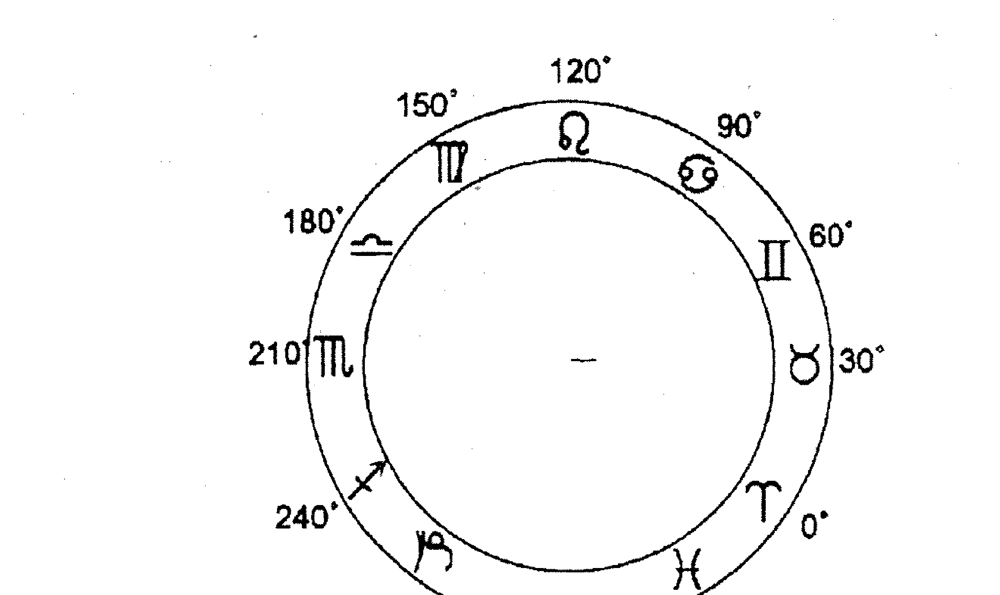

圖3-12

| 戌宮 | 白羊 | 0° | 0° | 辰宮 | 天秤 | 0° | 180° |
|---|---|---|---|---|---|---|---|
| 酉宮 | 金牛 | 0° | 30° | 卯宮 | 天蠍 | 0° | 210° |
| 申宮 | 雙子 | 0° | 60° | 寅宮 | 射手 | 0° | 240° |
| 未宮 | 巨蟹 | 0° | 90° | 丑宮 | 摩羯 | 0° | 270° |
| 午宮 | 獅子 | 0° | 120° | 子宮 | 水瓶 | 0° | 300° |
| 巳宮 | 處女 | 0° | 150° | 亥宮 | 雙魚 | 0° | 330° |

依舉例ASC 9° 寅41', ☽ 15° 酉23', ☉ 4° 酉24', 分別化作黃道度數為, ASC=249° 41'; ☽ =45° 23'; ☉=34° 24', 該例為夜間出生。

```
公式(II) ☉ = 249° 41'+34° 24'-45° 23'
= 238° 42'
= 28° 卯42'
```

## 天宮圖的繪製

### 各行星之間的相位關係

計算各行星之間的相位關係，應考慮容許度(orb)，一般主相位較寬，次相位較緊，本書作者採用之容許度如下：

| | ☉ | ☽ | 其他行星 |
|---|---|---|---|
| ☿ | 8° | 7° | 6° |
| 主相位 | ☊ | 3° | 3° | 3° |
| | □ | 6° | 6° | 6° |
| | △ | 6° | 6° | 6° |
| | ☋ | 8° | 7° | 6° |
| 次相位 | ☌ | 1.5° | 1.5° | 1.5° |
| | ∠ | 1.5° | 1.5° | 1.5° |
| | ☍ | 1.5° | 1.5° | 1.5° |
| | ☊ | 1.5° | 1.5° | 1.5° |

以☉為例，☉在4° 酉24'，在上表之容許度下，能與☉產生相位的計有：

- ☿ 5° 酉44'，與☉形成 ☿，0° 會合
- ☽ 8° 子42'，與☉形成 □，90° 刑

其他結果如Solar Fire之相位表內容

## 天宮圖的繪製

本例經演算所繪製的天宮圖如下

蔡小妹

Natal Chart
Apr 2 2001
8:59PM -8:00
高雄市, Taiwan
22N38 120E17
Geocentric
Tropical
Placidus
True Node

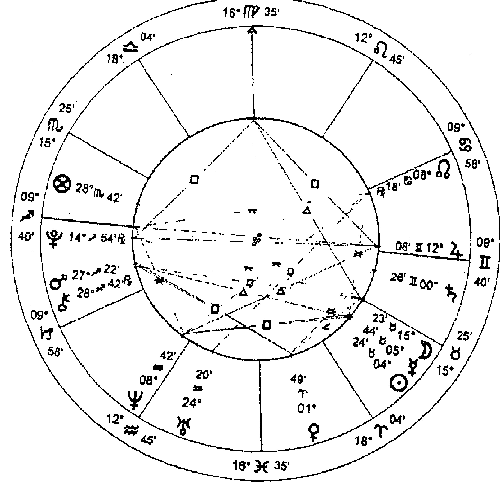

約翰·穆勒 (Johann Muller, 1436-1476)
盛行於15、16、17世紀 Regiomontanus 宮位系統的創始人


阿爾·比魯尼 (Al-Biruni AD 973-1048)

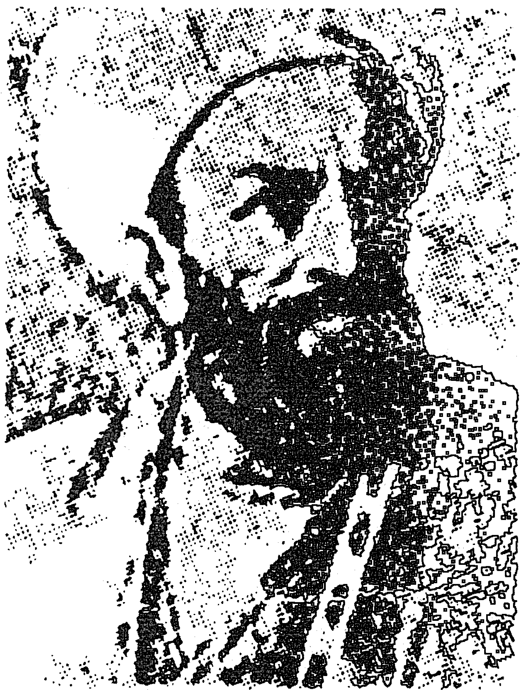

拿斯特拉達馬斯 (Nostradamus A.D 1503-1566)
法國著名的占星預言家，於1555年出版《世紀》，以詩歌形式寫成的預言，已證明甚為應驗，令人嘖嘖稱奇。

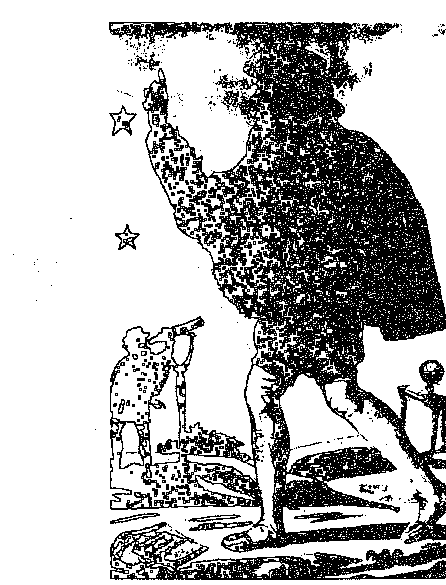

約翰·迪 (John Dee AD 1527-1608)
英國女皇伊麗莎白一世信賴有加的占星家

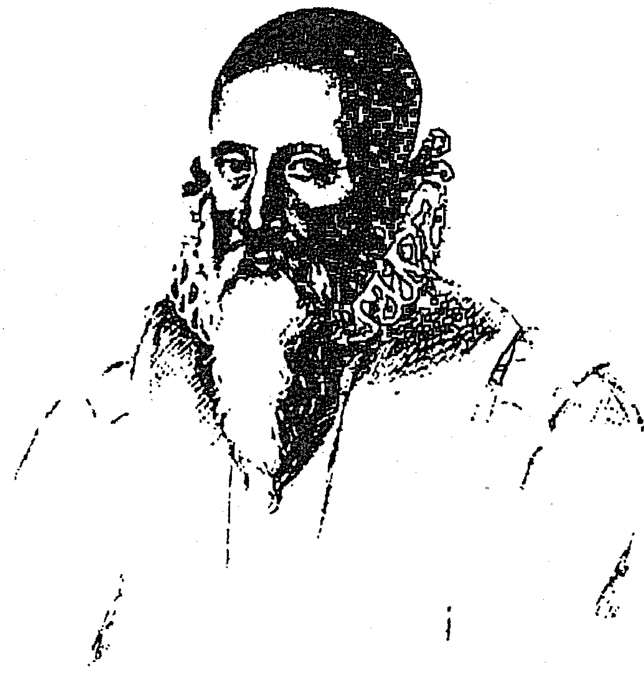

## 第四章 黃道12星座

黃道12星座是天宮圖的重要元素之一，但學習占星學的人，應知道占星學的12星座，在天空星座，確有其名稱，卻非實際星圖所在的星座；它們是以地球為中心太陽繞行相對視運動所經的12等分的宇宙天體的空間劃分，這是占星學與天文學有關星座劃分截然不同之處，故以天文學的觀點來揶揄占星學，實不可道相為謀。

本書採用的占星學黃道12星座，是以迴歸黃道 (Tropical Zodiac) 為主，即太陽每年迴歸至春分點，白羊座0°為一年的開始，不同於印度占星學或某些恆星派學者所使用的恆星黃道 (Sideral Zodiac)，兩者的差異源自歲差移動 (Precession)，這是因地球形狀，太陽月亮附加不平衡引力，地球自轉的慣性作用，而產生分點的進動，造成回歸年與恆星年之差異，此即歲差。流傳於古希臘、阿拉伯、中世紀、文藝復興一直到西方的占星學大多採迴歸黃道為主，其主要原因除了例證豐富外，它與地球四季季節的配合一致，不致於如恆星黃道可能產生的怪異現象，即當太陽入天秤座，卻是春季的開始，有可能須重新定義星座，工程甚為浩大。

我們應充分瞭解黃道12星座的特性，陰陽、三方、四正、星座主星、同族性甚或符號邏輯，這樣才能確切掌握黃道12星座的真正內涵。本章第一節解說四大元素的哲學，可奠定星座的基礎。第二節著重於黃道12星座各種分類的意涵。第三節附記其他的分類。第四節則細論各星座的具體意義。

另外為了書寫方便，有關黃道12星座，我們以中國十二地支代表如下：

| 白羊座 | 戌宮 | 天秤座 | 辰宮 |
| :--- | :--- | :--- | :--- |
| 金牛座 | 酉宮 | 天蠍座 | 卯宮 |
| 雙子座 | 申宮 | 射手座 | 寅宮 |
| 巨蟹座 | 未宮 | 摩羯座 | 丑宮 |
| 獅子座 | 午宮 | 水瓶座 | 子宮 |
| 處女座 | 巳宮 | 雙魚座 | 亥宮 |

### 第1節 先從四大元素談起

#### 四大元素-火、土、風、水-的哲學

占星學的萌芽始自巴比倫時期，但巴比倫占星學以神性為主，將各行星賦予他們所尊崇之神的特殊神性來演繹，在西元前6世紀之後，巴比倫占星學滲透其他地區較完整的天象觀察，如埃及，而得以進一步發展成現今占星學都在使用的黃道12星座之時，鄰近地中海的希臘，因學術較自由、思想開放，而綻放哲學種子，名家輩出，如蘇格拉底、畢達哥拉斯、柏拉圖及亞里斯多德，至今仍影響相當深遠。希臘先賢對宇宙構成相當感興趣，雖是哲學性的宇宙觀卻啓迪後世宇宙科學的進展。

以宇宙構成元素而言，各家觀點雖不同卻可從其中發現，四大元素，火、土、風、水哲學的形成，我們僅臚列而不詳論。

1. 泰勒斯 (Thales 約B.C624-547)
   「水是萬物的本源，萬物都生於水，又復歸於水；世界萬物生滅變化，唯有水不生不滅。」
2. 阿那克西曼德 (Anaximander 約B.C588-524)
   「萬物的始基，是無限的空氣。」 「呼吸現象是生命的延續與否，小宇宙(人存在)既是如此，整個宇宙亦是如此。」強調氣(風)始基説
3. 畢達哥拉斯 (Pythagoras 約B.C580-500)
   「數學的本原就是萬物的本質」 「萬物的始基是一元，從一元產生二元」從而產生四種元素-火、土、風、水。
4. 赫拉克利特斯 (Heraclitus 約B.C540-480)
   「萬物原是火」，「火產生了一切，一切又都後歸於火」 「萬物的生成變化皆是矛盾對立，在萬物鬥爭衝突的過程表現對立物的統一」
5. 齊諾菲尼斯 (Xenophanes 約B.C565-473)
   「一切出生和生長的東西都是土和水」 「一切都從土中生，一切最後都歸於土」
6. 恩培多克勒 (Empedocles 約B.C490-430)
   提出「四根説」認為火、土、風、水是「化生萬物的四個根」，即萬物的本原或根基是由四大元素構成。
   恩培多克勒的四根説提出後，後世的希臘先賢，幾都採用。
7. 柏拉圖 (Plato 約B.C427-347)
   柏氏在泰米亞斯篇 (Timaeus) 敘説造物主如何利用四大元素火、土、風、水來創造世界，但祇是身體部份，還須有理性- 世界靈魂 (World-Soul)，每個東西創造時就「存在」，但又分別「自同」和「他異」，世界靈魂就由這三種混在一起，人類靈魂猶如世界靈魂。
   柏氏的宇宙哲學觀念影響占星學甚距，天球和赤道、黃道創造時就「存在」，赤道運轉是「自同」而黃道運轉為「他異」
8. 亞里斯多德 (Aristotle B.C384-322)
   亞氏進一步分析四大元素是由純質料 (為一種原初物質)，它的内部含有冷、熱、乾、濕兩種對立的特徵。由這些對立特性的相互結合，而形成四種元素，即

熱、濕→風  熱、乾→火
乾、冷→土  冷、濕→水

9. 而世界萬物是由四大元素以不同比例結合完成。

提出人體有四種體液 (Humors)-血液、黃膽汁、黑膽汁、粘液，當它們的混合、力量相互均勻且平衡時，人體是健康的，反之即出現不健康的症狀，同時他也認為四種體液分別與風、火、土、水四元素、四季以及濕、熱、乾、冷四種性質有密切的關係如下圖4-1

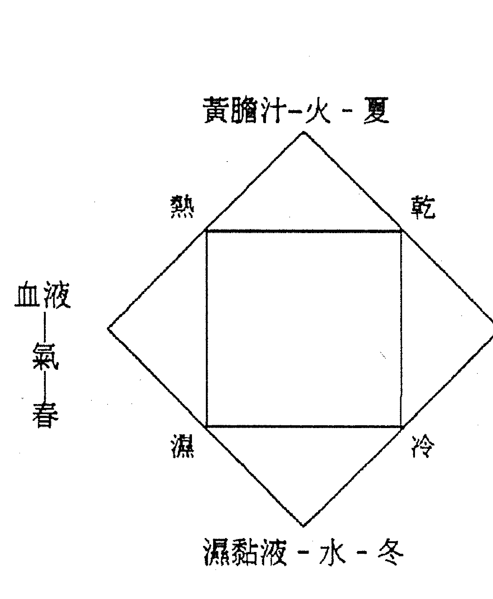

圖4-1

恩培多克勒的四根說，可能是他曾觀察一塊木材燃燒，有些東西崩解，聽到爆裂聲和雜亂的聲音，那是水；有些東西揚升於煙中，那是風。而火，能看得見，當火燒盡，有些東西可能保留住，那是灰燼或土，從而悟出四大元素，這種古典樸素的觀念，一直是占星學的支柱，反對占星學的人，就譏諷現代化學元素已拓展百餘個，四大元素豈能做為物質的基本元素。但若詳細歸納這些化學元素不外乎四種型態，即

輻射態→火
氣態→風
固態→土
液態→水

更加佩服古聖先賢的智慧，事實上，四大元素不能僅從唯物觀點，它含有精神、物質之一體兩面。

我們先以亞里斯多德的純質料逐步分析，從物理、化學的基本作用來瞭解四大元素的轉化涉及純質料，如風(熱和濕)變化成水(冷和濕)，涉及它的特性更換，如“熱”變成相反的“冷”，這種變化標示實體世界的實質改善，古希臘先賢稱之為自然力 (force of nature)。

純質料熱、冷、乾、濕的基本特性，整理如下表4-1

| | 主 | 動 | 被 | 動 |
| :--- | :--- | :--- | :--- | :--- |
| 純質料 | 熱 (Hot) | 冷 (Cold) | 乾 (Dry) | 濕 (Moist) |
| 基本特性 | 輕盈 明亮、稀薄性(稀疏)、敏銳/觀察力 | 沈重 稠密、遲鈍 | 堅固 硬度、乾燥、粗燥、易碎性/容易瓦解 | 柔軟 溫和、光滑、平坦 柔滑 發黏的、濕冷的 |
| 歸納原理 | 熱度、靈活性、伸展性 | 寒冷 黏著、縮回 | 拉緊 僵化、熱度 | 冷易變性、伸展性 |

(1) 熱和冷具備主動特性，因他們能對其他事物發生作用，能量的分散和集合
A. 熱對某些物體，使它乾燥，如太陽的熱蒸發水汽，即使濕蒸乾和分散
B. 冷誘導事物潮濕，甚或凝結成冰，即集合會象。

(2) 乾和濕具備被動特性，較易按照行事，為質量的抵抗和吸收
C. 濕易於適應型式，它是柔軟温和、順從的，如沙混合於水，吸收成液體。
D. 乾是堅硬、緊湊，能將事物凝聚一起，有自己的型式，如堅硬的卵石將抵抗乾硬的沙，兩者無法混合。

這四種純質料互相結合和排斥類似,吸力與斥力的宇宙法則,需有共通性才能組合成某一元素,若完全相斥,則其能量互相抵銷,其排列共有六種。

I. 熱和濕→共同有伸展性
II. 熱和乾→共同有熱度
III. 乾和冷→共同有僵化、黏著性
IV. 冷和濕→共同有寒冷性
V. 熱和冷→相互抵銷
VI. 乾和濕→相互抵銷

所以前四種I、II、III、IV之組合,就易構成元素。

這四種純質料的主動性和被動性,又可因能量特性,而進一步劃分成下列狀況

熱 +.+ 乾 -.+ 冷:+.- 濕 -.-

I. 熱和冷如前述都是主動性,但熱顯示之能量較冷為積極,熱為輻射態係高能量之原生質,如電子、原子。
II. 乾和濕如前述都是被動性,但乾則是凝聚、對抗;而濕是順從、柔軟。

根據純質料這些基本特性及歸納原理，其所組合之四種元素，就能衍生其意義，從而掌握四大元素的特質，我們列表於下：

| 四大元素 | 質料 | 純質料基本特性 | 優點 | 缺點 |
| :--- | :--- | :--- | :--- | :--- |
| 火 | 熱 | 輕盈、明亮稀薄性(稀疏)敏銳 | 熱情.熱心.性急.活潑好動積極.充滿鬥志.行動力强.執行力强.無憂慮.自信.前進.野心.希望.耀眼.目標.企圖.樂觀 | 衝動.脾氣火爆.過於激進.欠思慮.衝突.本性獨裁.獨斷.粗暴.魯莽.競爭.不服輸.爭强.自我.不考慮他人立場.易怒 |
| 火 | 乾 | 堅固、硬度乾燥、粗糙、易碎性/易瓦解 | 謹慎.保守.穩定.持續.耐心.忠誠.務實.勤奮努力.深謀遠慮.安定.安全感.善於使用及管理物質.金錢.秩序.組織.沈穩.堅忍.毅力.嚴謹.儲蓄.不喜浪費 | 倔强.頑固.堅持己見.不知變通過於現實.遲鈍.反應慢.易喪失良機.壓抑.自責.困難.不易表達.守財奴.缺乏自動自發.悲觀 |
| 土 | 乾 | 堅固.硬度乾燥、粗糙、易碎性/易瓦解 | 謹慎.保守.穩定.持續.耐心.忠誠.務實.勤奮努力.深謀遠慮.安定.安全感.善於使用及管理物質.金錢.秩序.組織.沈穩.堅忍.毅力.嚴謹.儲蓄.不喜浪費 | 倔强.頑固.堅持己見.不知變通過於現實.遲鈍.反應慢.易喪失良機.壓抑.自責.困難.不易表達.守財奴.缺乏自動自發.悲觀 |
| 土 | 冷 | 沈重、稠密、遲鈍 | 謹慎.保守.穩定.持續.耐心.忠誠.務實.勤奮努力.深謀遠慮.安定.安全感.善於使用及管理物質.金錢.秩序.組織.沈穩.堅忍.毅力.嚴謹.儲蓄.不喜浪費 | 倔强.頑固.堅持己見.不知變通過於現實.遲鈍.反應慢.易喪失良機.壓抑.自責.困難.不易表達.守財奴.缺乏自動自發.悲觀 |
| 風 | 熱 | 輕盈、明亮稀薄性(稀疏)敏銳 | 理性思維.健談善論.善於表達.語言才能.知識邏輯.思考.説服力.聰明.學習力强.人際溝通.社交關係的聰慧能力.資訊傳播.反應能力快.好奇心重 | 浮誇.不切實際.善變不定.飄動.神經衰弱.過於理性.缺乏人情味.易爭辯.神經崩緊難入眠或緊張 |
| 風 | 濕 | 柔軟、温和光滑、平坦柔滑、發黏濕冷 | | |
| 水 | 濕 | 柔軟、温和光滑、平坦柔滑、發黏濕冷 | 情緒.情感感受深.易感動.直覺力强.慈悲.憐憫.藝術直覺力强.潛意識洞察力.喜研宗教神秘.温情主義.念舊.藝術天份 | 容易受騙.困惑.意志力薄弱.犧牲.自怨自艾.隱密.孤獨.逃避.易自我陶醉.駝鳥心態.過於感性.易沮喪 |
| 水 | 冷 | 沈重、稠密遲鈍 | | |

四大元素所揭藥的心理特徵，是現代占星心理學派努力的結果，其準驗性相當高，古典占星較著重於事件，對個性、心理的著墨較少。我們應當注意上表之敘述，係在極端一單一元素所產生之徵象，事實上，心理特徵是四大元素相互配合的結果。

我們從上述四大元素的優缺點，應可得知

1. 火象最具揮發、燃燒、爆發性、精力旺盛、野心，但衝動欠思量，故若有土象穩定、毅力，風象的理性，水象的內斂互相搭配，就不致顯現其極端缺點之一面，不致過度精力消耗、躁動。
2. 土象雖穩固、實務，卻嫌反應過慢，甚或笨手笨腳，所以需要火象提昇其速度，風象來表達其理念，水象的感性沖淡其冷酷和不知變通。
3. 風象雖理性、點子多，卻嫌其浮誇、坐而言，故需火象的行動力、執行力，提供目標性及企圖心；土象來成就其想法，展現踏實；也需水象增加感性。
4. 水象雖感性，但易憑感覺或感情用事，脱離實際太遠，故需火象提供目標；土象務實，以克服夢幻式想法；風象的理性，得以條理分析，不致僅有水象感性之受騙迷惑。

四大元素可說是命盤主人的主軸，也是個性分析的重點。讀者務必掌握其要義。

現代占星心理學常將四大元素和本世紀分析心理學大師容格所提之四種心靈的功能相結合，由於事涉許多心理學專有名詞需深入解說，方得全面瞭解，此處不擬提出討論。

我們說過古典占星學未曾對四大元素之心理功能作詳細分析，但亞里斯多德時代，天氣變化之氣候分析，借重四大元素之處甚多，在氣象學尚未發展成今日精密科學分析之前，占星學在氣象預測，也扮演些許功用。17世紀中葉耶穌教會傳教士來華傳教就具體介紹四大元素之氣象預測之基本解說收留在《四庫全書、子集、天文算法類》利瑪竇的《乾坤體義·卷上》就曾說明四大元行(素)的概念，與在宇宙中的關係，從而藉以分析氣候變化的原因，頗具邏輯性。

## 第2節 12星座先天宮的分類

早期巴比倫人觀察天體運行，從留下的資料顯示以恆星群為主，尚未有明確黃道12宮的劃分，據考證，應是到B.C5世紀以後加勒底王朝統治巴比倫地區，與鄰近地區之文化交流如埃及，約在B.C5世紀，才確立黃道12宮，直到今日名稱意義都相同，黃道英文原名Zodiac，獸帶之意，即太陽經過之區域(以地球為中心之太陽視運動)，古代先賢以當地能見到之野獸和其他人物來命名，每30°為一區域均等劃分，有助於辨識季節，促進曆法發展，有利農耕。當時將黃道一周天360°劃分成12個星座，原先各星座可能是以不同之星群組合成星座來辨識，後來隨著占星學逐漸成熟，為了邏輯性推理遂有各種分類之解說，我們分別說明於下

### 陰陽 (positive and Negative)

黃道12星座，從白羊起算為1白羊、2金牛、3雙子、4巨蟹、5獅子、6處女、7天秤、8天蠍、9射手、10摩羯、11水瓶、12雙魚，其中奇數代號的星座為陽；偶數代號的星座為陰如下圖4-2

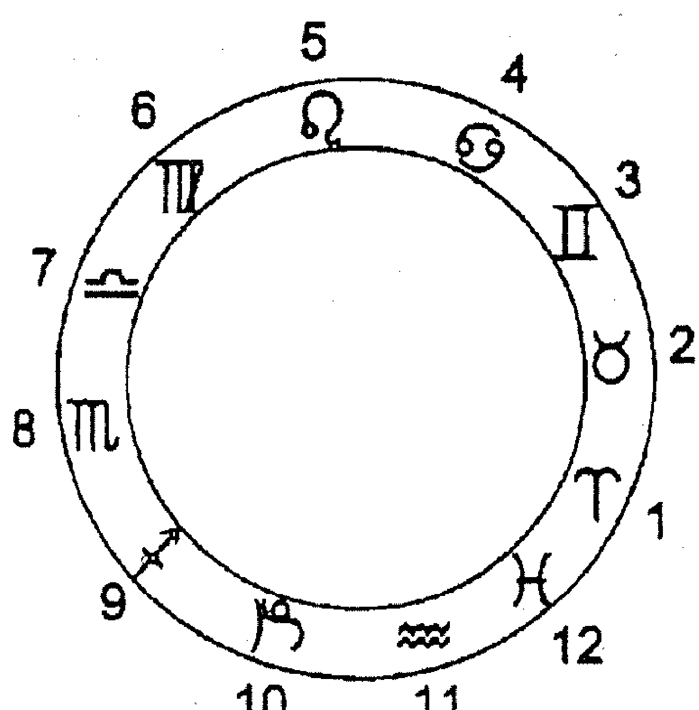

圖4-2

星座二分為陰陽的觀念，在占星學發展歷史中，從古典到現代似乎並不重視，占星家常以+代表陽；-代表陰，後來一些接觸中國易經的占星家，才略有表達星座之陰陽類似易經陰陽的觀念，但並未引起太大注意。

一般陽性代表雄性、男性、外顯、外露、坦白、主動、積極、陽剛、開朗、外向、活潑、好動、敏捷、開創、動態，但也失之草率、魯莽、輕浮、欠思慮...等。

而陰性代表雌性、女性、收斂、隱藏、隱瞞、被動、消極、陰柔、抑鬱、內向、沈著、被動、自制、保守、靜態，但失之悲觀，過於壓抑、忍受、易失良機...等。

星盤中若有關行星落於陽性星座較多，多少具有上述陽性代表的特性，相對落於陰性星座較多，則易見陰性代表之特質。必需注意星座陰陽非個性發展之主軸，故不宜執著於此一標準。

黃道星座的陰陽在古代被用得最多的是將星座劃分成白天 (Diurnal) 和夜間 (Nocturnal)。所謂白天的星座即是陽性星座，而夜間的星座即是陰性星座，但希臘所強調的白天和夜間星座，並非針對上述陽性或陰性的特質來解說，而是若行星為白天的行星落在白天星座，行星為夜間行星落在夜間星座，有其特殊意義；相反地，白天的行星落在夜間星座，夜間的行星落在白天星座，則其行星本質會變化，這項觀念已被現代所遺忘。1990年代占星學在美國的復古運動才又重新顯露其意義，實際定義及吉凶判斷，我們留待討論行星意義時再敘明。

### 三方 (Triplicities)

黃道12星座的三方即所謂三分性，按四大元素的分類，將12星座劃分成四大組，每個星座距離各120°，因是四大元素分類，每一組都有共同的基本特性，如下圖4-3

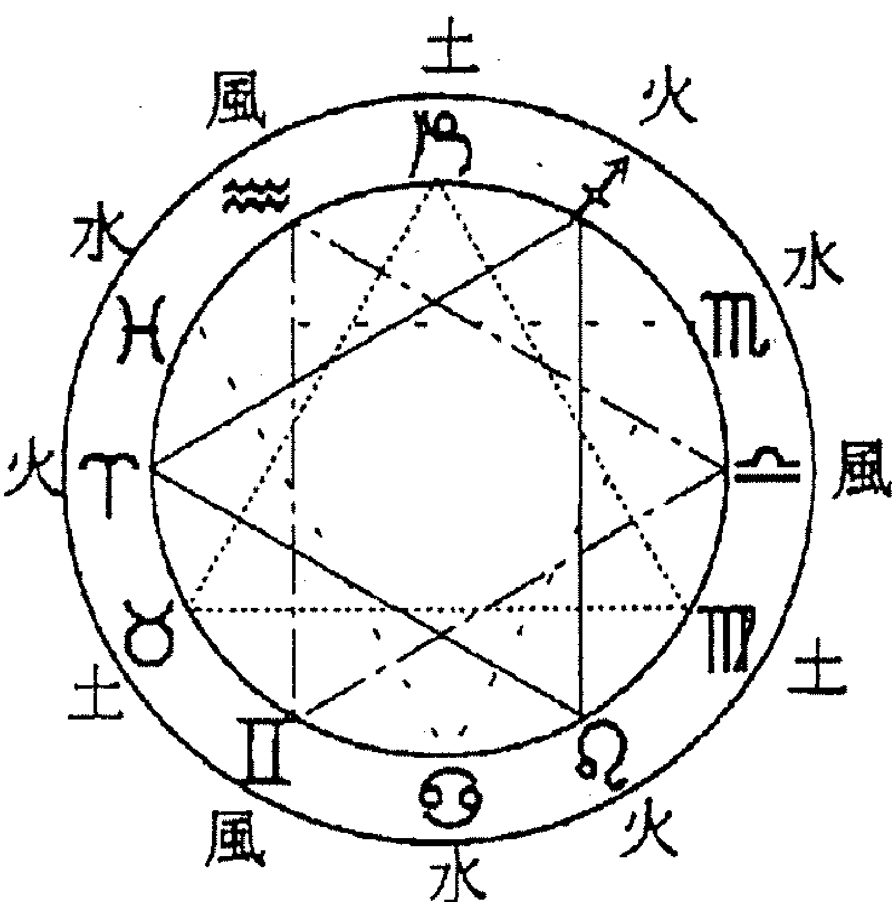

圖4-3

火象星座 白羊、獅子、射手 英文名稱 Fire Signs
土象星座: 金牛、處女、摩羯 英文名稱 Earth Signs
風象星座 雙子、天秤、水瓶 英文名稱 Air Signs
水象星座 巨蟹、天蠍、雙魚 英文名稱 Water Signs

火象星座的共同基本特性,即火元素;土象星座的共同基本特性,即土元素
風象星座的共同基本特性,即風元素;水象星座的共同基本特性,即水元素

若一個人的命盤中,相關行星或點落入某元素星座較多,很容易凸顯該元素特質的個性。我們必須注意僅憑單一元素的多寡論斷必有所偏頗,必須細膩地區分出同屬某元素星座之間的差異,如獅子和射手同屬火象星座,若行星及點落於該兩個星座之數目相同之不同命盤,個性特質是有差異的，我們留待本章稍後詳論。四大元素的分析是命盤的心理主軸，絕不能輕忽。

將黃道星座與四大元素結合一起，應從希臘時代的占星學就有了。但在當時非著重於個性分析，故黃道星座與四大元素的關係描述，並無現代占星心理學的細膩，古典論法因著重於事件預測，故比較重視行星在黃道運行之吉凶，因此除了上述將黃道12星座劃分成白天和夜間星座，也強調三星座一體時，在白天或夜間出生的人，有不同的主星，這是涉及行星必然的尊貴 (Essential Dignity) 之一種，我們也留待後面敘明。

星座的三分性也有陰陽之分，其中火象及風象的星座，都是奇數代號為陽，而土象及水象星座都是偶數代號故為陰。

### 四正 (Quadruplicities)

黃道12星座的四正，即將星座劃分成三大組，每一組內星座不是呈90°，即呈180°對衝，這種分類也其基本特性，如下圖4-4

## 黃道12星座

圖4-4

**啟動星座（Cardinal Signs）**：白羊、巨蟹、天秤、摩羯，也稱基本星座。
**固定星座（Fixed Signs）**：金牛、獅子、天蠍、水瓶，英文名稱 Fixed Signs。
**變動星座（Mutable Signs）**：雙子、處女、射手、雙魚，英文名稱 Mutable Signs。

啓動星座的基本特性為創造性的原動力，原始的創造力，開始的形成，又因是各季節春、夏、秋、冬的起始星座，所以可聯想成新的開始、引領、先驅，不斷追尋目標，可歸納啓動星座的共同特性為行動、驅使、創新、誘因。

固定星座的基本特性為持續已創作的、穩固和持久，因是各季節的中間階段，代表繼續、展現堅持，可聯想到定性、持續、穩固、自恃、目標集中而再拓展、頑強、不讓步或習慣偏好。

變動星座的基本特性為變化、適應已創造的，因是各季節的末段，即將邁入新的季節，代表不會堅持，可聯想到適應、變通、不定、浮動、喜新厭舊，易隨環境變化而改變，前後不一致，以變應變。

命盤中若有凸顯的四正，易顯現出該四正的特質。

三方及四正構成命盤的心理主軸，掌握他們交叉的結果，很容易分析出命盤主人的基本特質，四正可幫助同屬三方星座的個別區分，而三方之元素也可釐清四正顯示之重點領域，我們分析於下：

| 三方 | 星座 | 四正 | 解說 |
| :--- | :--- | :--- | :--- |
| **火象** | 白羊 | 啟動 | 生命、活力、精力、爆發力、容易呈現領先，不斷追尋目標、具體行動向前衝，因而白羊座的人行動力甚強、開拓之先鋒。較無耐心、衝動、草率、易怒、得罪他人、甚具冒險精神、但易消耗精力、性急。 |
| | 獅子 | 固定 | 火的光亮、耀眼、熱力，聚焦於此星座，穩固持久。讓人看得到他的才華，有表演的舞台、揮灑的空間、榮耀加諸於身，但因期待別人注目而虛榮自恃、頑強不讓步，時時想佔據舞台，希望所有焦點在他身上而成習慣。 |
| | 射手 | 變動 | 火的目标性、野心、用於變動不定的人生經歷、企圖達到未知的目標，因此會提出理念、精神、形而上，或與宗教有關等價值觀，樂觀、自信、坦率，卻易揮霍、慷慨、不在乎、體驗新境界、放縱、討厭束縛、隨心所欲，但熱誠、熱心不減。 |
| **土象** | 金牛 | 固定 | 實際、現實、穩健的土象結合持續、固定，隱含安全感之需要，金錢物質持久擁有是種享受、舒適，進而衍生美食、美感(感官的)及理財能力，但因頑強習慣偏好，而使得金牛過於現實物慾取向、不通人情、緩慢、固執。 |
| | 處女 | 變動 | 土象的務實、勤勞結合適應融入，易隨環境而改變因而呈現調和、機敏、盡力作好工作、甚而求完美，土象的秩序以致整潔乾淨，但易工作至上，吹毛求疵、批判、謹慎、過於注重細節、刻苦耐勞。 |
| | 摩羯 | 啟動 | 土的務實、組織、秩序、耐力，會呈現帶動，誘因式的驅使，所以雖表面如土之冷靜或冷漠，卻潛藏著成就感、地位、權威等領先，因而具沈重壓力、責任感重、土的穩固，而呈現傳統、保守。 |
| **風象** | 雙子 | 變動 | 風的傳播、流通、思考、智慧，碰上變動、不定、浮動、喜新厭舊、甚或前後不一致，更加速雙子的浮動性，但機敏反應、快速應變、學習速、卻淺而不深入，雖伶俐、機智、舉一反三，然思慮多變、能書善談、生動、幽默、卻給人輕浮、空談。 |
| | 天秤 | 啟動 | 風的理性、思維、展現引領、先驅、促進合理性的概念，隱含公平、公正、理性客觀等觀念性的促進，因著重公平，故會權衡、人際關係佳，卻易陷於兩難，舉棋不定、優柔寡斷。 |
| | 水瓶 | 固定 | 風的理念、思維、邏輯，結合堅持、持續、頑強、不妥協，很容易形成意識型態、觀念執著的色彩，因而讓人覺得過於自我，甚至與衆不同、特立獨行或新鮮感、標新立異、聚焦於觀念。易走極端、反體制。 |
| **水象** | 巨蟹 | 啟動 | 水的情緒、感情、柔情，伴隨著行動、誘因、驅使、促進、帶領，因而逐漸地形成温情或對他人的照顧來呈現自己的認同，這是種情緒的安全感，不斷地擴大感情基地，使人難以拒絕，雖是付出，卻是自私、狹隘。 |
| | 天蠍 | 固定 | 水的感情、情緒、情慾，結合穩固、持久、頑強、不妥協，必然對感情佔有慾強，强迫征服之潛在慾望，因而頑固、執拗、韌性、不屈不撓，情感放得深且持續，往往容不下背叛，因而嫉妒、猜疑、甚或報復。 |
| | 雙魚 | 變動 | 水的柔情、感性、情緒，結合適應、變動、以變應變，就很容易自我犧牲、同情、慈悲、憐憫、善解人意，雖善良卻懦弱，不懂得拒絕別人，缺乏自信或堅持，感情容易受挫感傷，卻又合理化解嘲，雖浪漫卻迷惘、困惑、無秩序。 |

| 四正 | 星座 | 三方 | 解說 |
| :--- | :--- | :--- | :--- |
| **啟動星座** | 白羊 | 火 | 新的開始、驅使、誘因，最易以活力爆發力來具體行動呈現。 |
| | 巨蟹 | 水 | 引領、先驅、創新、不斷追尋目標，表現在情緒、情感的範圍。 |
| | 天秤 | 風 | 促進、驅使、以帶領理性的觀念溝通，強調和諧、公平、公正。 |
| | 摩羯 | 土 | 引領、帶動、先驅，表現於務實、組織、秩序、建構成就，而影響他人。 |
| **固定星座** | 金牛 | 土 | 穩固、堅持、維持、習慣偏好，表現於金錢、感官、物質享有、規律。 |
| | 獅子 | 火 | 持續、自恃、堅持，表現於燦爛、耀眼、明亮的舞台上。 |
| | 天蠍 | 水 | 堅持、頑強、不屈不撓，表現在情感、情緒上。 |
| | 水瓶 | 風 | 堅持、頑強、持續，表現在觀念、思想上、意識型態濃厚。 |
| **變動星座** | 雙子 | 風 | 活潑、不定、變通、適應，表現在觀念、思想、知識情報之吸收。 |
| | 處女 | 土 | 適應、融入、調和、易變，表現於實際、物質環境、擅長服務。 |
| | 射手 | 火 | 適應、融入、易變、不定，表現於目標性、精神層次的野心。 |
| | 雙魚 | 水 | 適應、融入、易變、以變應變，表現於感情、情緒、感受、情慾上。 |

三方四正的交叉分析是星座分析的重點，所以應細細體會。

但18世紀末葉，1781年天王星被發現後，海王星、冥王星後來也分別被發現，好事者如英國的R.C.Smith(著名的Rapheal)就想像這些發現的新行星也應有主管星座(注意Rapheal僅及天王星、海王星，因在他生前冥王星尚未發現)，他認為摩羯是土星主要主管星座，因而摩羯之後黃道順序的水瓶座為天王星主管星座，而接下來之雙魚則是海王星的主管星座，照道理白羊應是冥王星的主管星座，但冥王星的特性為伏匿、深邃也有類似火星的破壞，因而聯想到天蠍最符合其特性，將它分配為冥王星的主管星座，由於這三顆外行星是世代影響，因他們運行甚慢，所以有部份占星家仍持傳統星座主星觀念，但兼用現代行星的星座主星之觀念。由於星座主星對星座分析也具舉足輕重地位，所以務必要記熟。

占星學的行星有其原理及作用，此處我們先列其關鍵語(Key Words)及正面、負面評價，詳細的討論留待行星相關章節：

| 行星符號 | 心理作用 | 關鍵語 | 正面評價 | 負面評價 |
| :--- | :--- | :--- | :--- | :--- |
| **太陽 ☉** | 自我意識 | 權力、生命力、自我表現 | 尊貴、支配、信心、華麗、權力、心地高尚、良好生機、驕傲、王者氣派、真誠情深、生命力 | 獨斷獨行、虛華奢侈、自大傲慢、獨裁專制、玩心重、反對任何改變、作威作福、揮霍放肆、亂動感情、威脅、浪費、放蕩、愛現 |
| **月亮 ☽** | 情緒反應 | 反應、波動 | 情緒、敏感、念舊、保護、照顧、母性本能、想像力、內向、感受強、直覺力豐富、仁慈、顧家 | 善變、過失合理化、易煩躁、自私、易受刺激、多愁善感、不安、不能信任、反覆無常、害羞、過於積累、影響的過度吸收 |
| **水星 ☿** | 思維方式 | 溝通 (心靈和運輸) | 靈巧、敏捷、聰明、智慧、合理、好奇、知覺敏銳、反應快速、健談、能言善道、多才多藝、變通快、細節 | 狡詐、耍手段、喋喋不休、批評、冗長、愛打聽、好辯、喧噪、神經質、非真心的、花言巧語、陰險 |
| **金星 ♀** | 感官作用 | 和諧、調和、關係 | 調和、藝術美感、友善、人緣佳、文雅、優美、溫文儒雅、和睦、愛情、愛好和平、平靜、交際手腕 | 附庸風雅、優柔寡斷、不確定、濫情、懶散、欲求不滿足、虛弱、淫蕩好色、耽迷、濫好人、魄力不足 |
| **火星 ♂** | 直覺衝動 | 能量、熱度、激勵 | 活躍的先鋒、積極、勇氣、大膽、建設性、講話直接、精力旺盛、強有力、領導者、衝勁、熱情、性能力 | 好鬥、競爭、衝動、易怒、脾氣火爆、侵略、殘忍、意外傷害、火災、手術、毀滅、無耐心、有勇無謀、爭先、好戰、粗暴、野蠻、草率 |
| **木星 ♃** | 擴張精神 | 擴展、保持 | 喜好運動、幸運的、慷慨、豐富肥沃、愉快、展望佳、樂觀、自信、哲思、獲得機會增進 | 鋪張、浪費、過份樂觀、淺見、不注重細節、過份信賴、幸運、庸俗而誇張、揮霍、奢侈 |
| **土星 ♄** | 壓抑情結 | 限制、冷漠 | 渴望、講話小心謹慎、自制、適當、耐性、務實、責任、嚴肅、節儉、組織、紀律、磨練、保守 | 悲觀、沮喪、吝嗇小氣、教條的、遲鈍、害怕畏懼、貪婪、限制、卑賤、苛刻、平凡、不重視美感、拘束、挫折抑鬱、消沈、妨害 |
| **天王星 ♅** | 特立獨行 | 變化 (革命、分裂、專橫) | 發明才智、創新才能、獨創、坦率直言無諱、正面的神秘主義、改革促進、強烈意志、科技才華、聰明 | 專橫、怪癖、叛逆、突然分裂、革命顛覆、極端主義、無政府主義、標新立異、煽動、不喜拘束、突來橫禍、爆炸、地震、痙攣 |
| **海王星 ♆** | 夢幻聯想 | 矇矓曖昧、易受影響的 | 藝術才華、夢想、易受感動、靈感、想像力豐富、靈媒、敏感、韻律感、神秘宗教、慈悲、同情、直覺、內省 | 空中樓閣、易受騙、自我犧牲、迷信、妄想、渾沌、不切實際、逃避、意志薄弱、說謊、毒品、模糊、徘徊、自我毀滅、感情用事、麻醉、溺斃 |
| **冥王星 ♇** | 情慾掌控 | 排除重新再來 | 破壞再建設、深沈內在、潛藏力量、探究、偵察、超心理、排除、再生揭發、掌控、情慾、原動力、魅力 | 大震盪、爆炸、地下活動、犯罪、滅絕、災難、殘酷、強姦、暴力性犯罪、脅迫、恐嚇、陰謀、勒索、懷恨、執拗、報復、無情、罪惡深淵 |

占星學的分析有個同族關係的說法，如雙子座的星座主星為水星，在分析雙子座就有水星的正、負面評價在內，除此雙子座若由白羊起算，為第3宮就有後天宮第3宮的意涵存在，這種雙子座=水星=第3宮的概念，就是同族關係，所以欲掌握占星學符號意義，就須記牢這種關係，我們整理於下：

白羊座=火星=1宮 天秤座=金星=7宮
金牛座=金星=2宮 天蠍座=火星、冥王星=8宮
雙子座=水星=3宮 射手座=木星=9宮
巨蟹座=月亮=4宮 摩羯座=土星=10宮
獅子座=太陽=5宮 水瓶座=土星、天王星=11宮
處女座=水星=6宮 雙魚座=木星、海王星=12宮

同族關係的觀念，是現代占星學的產物，在17世紀之前的古典占星學尚未見到其影子。這項觀念對現代占星學建立比較合理或邏輯的分析，頗有貢獻，但也混淆各元素符號意義之界線。1990年代興起的占星學復古運動，有不少占星家就頗反對，如Lee.Lehman就著書立說反對這項觀念，她認為這種混淆是因未完全解讀古典占星學，各元素所掌管原始字義(Rulership)所致，但這不在我們討論範圍內。

## 符號邏輯

占星學的一支，神秘學派，曾發展出符號來詮釋天宮圖各項因素的意義，雖是臆想比擬卻可掌握其要義，美國占星家曼恩(A.T Man)及亞倫·歐肯(Alan.Oken)皆很努力地詮釋，其要義可用來輔助星座符號及行星符號的了解。曼恩以四個最簡單的幾何符號，即圓、點、半圓和十字，說明其最基本意義。

*   **圓○**：稱為精神(Spirit)的圈或永恆的戒指(Ring of Eternity)，象徵精神或生命力、心靈和宇宙。
*   **點**：象徵焦點或創造者。
*   **半圓 ）、(**：稱為靈魂(Soul)或靈魂的發源地或意識的逐漸增長。
*   **十字+、**：象徵實體或物質世界。

西方占星學中符號圖騰三個根本，象徵精神的圓，靈魂的半圓或新月，物質的十字，依神秘學派的說法，所有生命形態都是由各種比例的精神、靈魂、物質構成的。

我們舉例來說明星座各項分類實証。

基本上計算ASC、MC、☉、☽、♀、♂、☿、♃、♄、♅、♆、♇共13個，各落在那一星座，按其分類性質，即可得各分類性質持性的多寡。

### 案例一：

**男**
Natal Chart
Jul 26 1984
9:56AM -8:00
高雄市, Taiwan
22N38 120E17
Geocentric
Tropical
Placidus
True Node

重點分析：
1. 陽性星座較強，尤其是獅子座。☉、♀、♀在午獅子，ASC、♀在辰天秤，Ψ、♂在寅射手，共8/13。
2. 太陽☉又與ASC形成吉相。
3. 火象星座甚強，☉、♀、♀在午獅子，♂共6/13。

命主自小即展現領導力、主動、積極、陽剛、喜受注目的特性。

### 案例二：

**女**
Natal Chart
Nov 15 1989
7:38 AM-8:00
高雄市, Taiwan
22N38 120E17
Geocentric
Tropical
Placidus
True Node

重點分析：
1. 行星幾多落在陰性星座，尤其是天蠍及摩羯。☉、☽、♂、♀在卯天蠍，☿、♀、♄、☊在丑摩羯，☽在未巨蟹，MC在巳處女，共10/13。
命主消極、退縮卻城府深、被動、陰沈、孤癖卻又想控制他人，嫉妒、報復心強。

本案例與案例一為親兄妹，卻有截然不同的個性，推論時，其母嘖嘖稱奇，相當認同占星的分析，有些自我解嘲地說，同出一娘胎，為何個性差異那麼大。

### 案例三：

**郝柏村**
Natal Chart
Aug 8 1919
3:10 AM -8:00
江蘇, 中國
33N18 120E06
Geocentric
Tropical
Placidus
True Node

重點分析：
1. 火象星座甚強，尤其是獅子座。☉、☿、☽、♀、♂在午獅子，☽在寅射手，MC在戌白羊共7/13。
2. ♂又相當近ASC，♂為MC主星。

前行政院長郝柏村出身軍人，在蔣經國時代擢升參謀總長，掌控三軍，權勢顯赫，頗具霸氣，♀又與MC白羊90°刑，MC主星☿又入命，的確是權貴之命，充分展現火象獅子之重要徵象，自我、領導、堅強、固執、不服輸、不妥協、強勢、主動、積極的軍人本色。

### 案例四：

**連戰**
Natal Chart
Aug 27 1936
8:00 PM -8:00
陝西, 中國
34N16 108E52
Geocentric
Tropical
Placidus
True Node

重點分析：
1. 上象強，且陰性星座亦強。○、Ψ、♀、♀在巳處女，ASC、♃在亥雙魚，♌♀在未巨蟹，♆在西金牛，共9/13。
2. ♃上升於ASC命度。

現任國民黨黨主席連戰，給人的印象，溫文儒雅、被動消極、內斂、服從、穩重、保守，卻無趣、LKK，不討年青人喜歡，有些潔癖、紳士，風象星座甚弱，故口才、語言表達能力，比起其他政治人物遜色。

### 案例五：

**周恩來**
Natal Chart
Mar 2 1898
2:00 AM -8:00
江蘇, 中國
33N18 120E06
Geocentric
Tropical
Placidus
True Node

重點分析：
1. 風象星座甚強。☉、☍、☽在申雙子，ASC、☿在辰天秤，♂、♀在子水瓶，共7/13。
2. 變動星座亦甚強。ASC、☿、☾在寅射手，☉、♀在亥雙魚，☉、☍、☽在申雙子，MC在巳處女。
3. ☉ △ ☽。

已逝前中共國務院總理周恩來，一生憑其機智、口才，在外交戰場上折衝替中共贏得國際同情，在國共內戰期間及後來的諸多外交戰，奠定中共的地位，實為中共功勳卓著之英雄。

### 案例六：

**金鏞**
Natal Chart
Jan 21 1924
3:40 PM -8:00
浙江, 中國
30N30 120E42
Geocentric
Tropical
Placidus
True Node

重點分析：
1. 水象星座甚強。ASC、♀、☽在未巨蟹，☉在卯天蠍，MC、♄、♀、♂在亥雙魚，共8/13。
2. ☽又在命宮與MC△三合吉象。
3. 變動星座也強。♂、☿在寅射手，MC、♄、♀、♂在亥雙魚，共6/13。

金鏞的著作「射雕英雄傳」、「天龍八部」...等結合歷史與武俠風格的小說風靡全球，顯現他敏感細膩、藝術才華、直覺力強、情感豐富等水象星座特色。巨蟹上升，月亮又在命宮，念舊、歷史，而♀在ASC，也有執著、堅毅的一面，MC在亥，雙魚，正是藝術、靈性、編寫天馬行空的特質。

### 案例七：

**王永慶**
Natal Chart
Jan 18 1917
5:45 AM -8:00
新店市, 台灣
24N57 121E32
Geocentric
Tropical
Placidus
True Node

重點分析：
1. 啟動星座甚強，固定星座也強，變動星座甚弱。
    (1) ASC、☉、♀在丑摩羯，MC在辰天秤，♂、☿在未巨蟹，☍在戌白羊，共8/13，在啟動星座內。
    (2) ♀、☽、☄在子水瓶，☊在午獅子，☾在卯天蠍，共5/13，在固定星座內。
2. 所有行星幾乎都在始宮內，增1之(1)象。
3. 天宮圖呈現大十字格局。

王永慶是台灣經濟奇蹟的主要貢獻者，努力、主動、積極、帶領之先驅，企圖心強，開創時勢，且能持續、堅持，贏得台灣經營之神的美號。

## 黃道12星座

案例八
王先生
Natal Chart
Jul 5 1950
3:35 AM -8:00
台南,台灣
23N07 120E21
Geocentric
Tropical
Placidus
True Node

重點分析

1. 啟動星座甚強，但固定星座弱，而變動星座又甚強。
   (1) ♀、☿、☉在未巨蟹，♃、♂、☊在辰天秤，共6/13，在啟動星座。
   (2) ASC、♀ 在申雙子，MC、☽ 在亥雙魚，在巳處女，共6/13，在變動星座。

2. 風象星座及水象星座皆強，而火象星座及土象星座甚弱。
   (1) ASC、♀ 在申雙子，♃、♂、☊在辰天秤，共5/13，在風象星座。
   (2) ♀、☿、☉在未巨蟹，MC、☽、☊在亥雙魚，共6/13，在水象星座。

命主、敏感、直覺力佳、口才、語言表達能力屬佳，但情緒變化大，融入狀況、適應環境的能力甚好，但給人浮誇、不實際、吹牛、耍嘴皮子、變化大。

## 第3節 星座的其他分類

黃道12星座發展至今已歷2500年以上，在歷代占星家使用上各有其他特殊意義。有些是天文、季節的意義，有些是根據命名獸類之特徵而分類，有些是由其特性而衍申為日常生活意義，這些有助釐清黃道12星座的內涵，進而為特殊斷訣使用，我們彙總臚列於下。

### 天文意義的分類

1. 長上升星座(Signs of Long Ascension)和短上升星座(Signs of Short Ascension)

當地球以其軸心自轉，在北極圈之下的北半球，每24小時內，所有星座都能上升於東方地平線上，在北緯地區，從巨蟹到獅子、處女、天秤、天蠍到射手可視作長上升；而從摩羯、水瓶、雙魚、白羊、金牛、雙子可視為短上升。

兩者差異的理由是因所有上升必然平行於天球赤道，因黃道斜交赤道，致某些部份上升於地平線上，會以較快速率上升，此即短上升，其他的則稱為長上升。在南半球南緯地區，長上升星座和短上升星座，適與北緯地區相反。亦應注意在赤道地區及南北極圈永晝、永夜，就無此分類。

2. 分點星座(Equinoctial Signs)

以太陽在黃道視運動之迴歸至春分點時為白羊座，迴歸至秋分點為天秤座。

白羊座和天秤座稱為分點星座。

3. 至點星座(Tropical (Solstitial) Signs)

以太陽在黃道視運動之迴歸至夏至點時為巨蟹座，迴歸至冬至點時為摩羯座。

巨蟹座和摩羯座稱為至點星座。

4. 北方星座(Northern Signs)和南方星座(Southern Signs)

當太陽在北緯時，這些星座如白羊、金牛、雙子、巨蟹、獅子、處女等6個星座，稱為北方星座，而當太陽在南緯時，這些星座如天秤、天蠍、射手、摩羯、水瓶、雙魚等6個星座，稱為南方星座。

### 季節意義的分類

1. 春季星座(Spring Signs) - 白羊、金牛、雙子
2. 夏季星座(Summer Signs) - 巨蟹、獅子、處女
3. 秋季星座(Autumn Signs) - 天秤、天蠍、射手
4. 冬季星座(Winter Signs) - 摩羯、水瓶、雙魚

### 獸類、特徵的分類

1. 人性星座(Human Signs) - 雙子、處女、水瓶、射手(前半段之半人)
2. 獸性星座(Bestial Signs) - 白羊、金牛、獅子、摩羯、射手(後半段半馬)
3. 四足星座(Four-footed Signs) - 白羊、金牛、獅子、射手、摩羯
4. 兩棲類星座(Amphibious Signs) - 水瓶、摩羯(兩者都有水棲和陸地之要素)

### 日常生活使用之分類

1. 雙元或雙體星座(Dual或Double-bodied Signs)

雙子、雙魚、射手和處女(托勒密將之列在內)，這些星座有雙重意涵，如為5宮(男女)宮始點，易有雙胞胎之可能，在10宮(事業)，常有兩種職業，很少從一而終。

2. 沈默星座(Mute Signs)

水象星座巨蟹、天蠍、雙魚皆為無聲，口語表達能力較遜，溝通較弱。

3. 有聲星座(Signs of Voice)

雙子、處女、水瓶、射手(半人)，皆能發聲、講話，故口語表達較強，溝通能力較強。又其他獸性星座，如白羊、金牛、獅子也能發聲，但無法說話，故如同2.沈默星座之特性，但稍佳。

4. 荒地星座(Barren Signs)

雙子、獅子、處女此三個星座稱為荒地星座，較不易生產小孩，故女命5宮宮始點為荒地星座，懷孕機率較小，其次射手、水瓶為半荒地星座。

5. 肥沃星座(Frutiful Signs)

水象星座巨蟹、天蠍、雙魚等稱為肥沃星座，較容易生產小孩，故女命5宮宮始點為肥沃星座，懷孕機率較高，其次金牛、天秤、摩羯稱為半肥沃星座。

6. 命令星座(Commanding Signs)

同〈一〉之4的北方星座。由於太陽在北緯時，其白天的時間比夜間長，陽大於陰具有支配之意，較易掌有實權。

7. 服從星座(Obeying Signs)

同〈一〉之4的南方星座。由於太陽在南緯時，其白天的時間比夜間短，陰大於陽，較為內斂，隱含較易服從之意，較易替人服務。

8. 始入星座(Ingress Signs)

太陽迴歸視運動，每年在剛進入二分二至點星座，如白羊、巨蟹、天秤、巨蟹的0°時，稱為始入，占星家通常按其始入時刻和首都所在地或用事地點的經、緯度起盤，用來論斷國運或時事。

## 第4節 黃道12星座細論

### 白羊座

| 關鍵語：我是(I am) | 白羊座 | 同族宮位：1宮 |
| :--- | :--- | :--- |
| 1. 太陽迴歸期間<br>約國曆3/21~4/20<br>2. 符號：♈<br>3. 純質料：熱、乾<br>4. 白天或夜間 白天星座<br>5. 三方 火象星座<br>6. 四正：啟動星座<br>7. 星座主星 火星♂<br>8. 數字 9、13<br>9. 身體部份<br>頭部、臉、眼睛、腦部 | 10. 金屬：鐵(鋼)<br>11. 顏色：紅色系<br>12. 方向：東方<br>13. 場所 伙房、乾燥地方、磚窯<br>、新開墾地<br>14. 寶石 紅寶石、鑽石、水晶、<br>雞血石、瑪瑙<br>15. 器具 尖銳物品、軍需品、手<br>槍、手工具<br>16. 動物 羊、狼、麋鹿 | |
| 符號象徵 | 白羊座歷史上的符號代表公羊，為羊群的領導者，描述領導能力<br>的性質，符號由公羊的兩個角組成劃成兩個半圓，意識的新月象<br>徵靈魂，兩個半圓由直線聯結太陽的君權代表太陽的權力聯結<br>了生命力，而兩個新月顛倒未成圓，象徵力量釋放，鼓舞了新活<br>動和生活開始，符號也象徵頭、臉、前額之眉毛，向前開拓及攻<br>擊、騷動、鼓動者。 | |
| 內在機制分析 | 1. 火星為主星，熱力、生命力、爆發力强，故具有衝勁、企圖心、<br>爭先競爭、戰鬥、暴燥。<br>2. 陽-火-啟動，代表動態活動，率先、進取心、直接、自信、光明<br>、不喜隱藏、好強說做就做、行動力强、不斷追求新目標不喜單<br>調乏味、性急地自我表現。<br>3. 黃道的第一個星座，春分點，春季草木欣欣向榮，但新芽脆嫩易<br>折，故易折損象徵易發生意外，嫩則意味未經世事磨鍊，太直接<br>而未經思考，而第一個星座也代表率先、開創性。<br>4. 同族宮位為1宮，跟生命力有關。<br>5. 關鍵語 “我是” 就含有自我、獨斷、不聽他人意見、自以為是。 | |

| A:身體特徵 | C:人生態度,改進重點 |
| :--- | :--- |
| 1. 中等身材稍高,瘦而略向前傾、頸長、肩膀寬强、手指薄且短。 | 1. 而要冷靜,不宜躁進,行事前多思量。 |
| 2. 頭圓臉長而頰瘦、上唇略長、下唇薄且短。 | 2. 注意意外傷害,火災。 |
| 3. 髮色紅或黃紅、棕色有時非常黑,硬直或鬆捲而曲。 | 3. 脾氣不宜火躁,四處得罪人。 |
| 4. 眉毛濃密而黑。 | |
| 5. 鼻子薄而彎曲。 | |
| 6. 牙齒白而强壯。 | |

| B 可能疾病 | D 業餘活動 |
| :--- | :--- |
| 所有有關頭部的慢性病,特別是頭痛、偏頭痛、頭部受傷、熱病、發炎、發燒、猩紅熱、天花痘症、粉刺面皰、割傷、燒傷、燙傷、腦炎、腦中風角膜炎、視網膜病變、眼睛發黃、視力受損。 | 1. 戶外運動。<br>2. 有競爭性之體育競賽。<br>3. 動手修理房舍、使用物品。 |

| 其他相關事項 | 正面評價 | 負面評價 |
| :--- | :--- | :--- |
| **人** 軍人、鐵匠、修理技工、鼓動者、喧鬧者、機械製造者、屠夫 冒險家、先驅者、外科醫生、拓荒者、優異者、領導者。<br>**事** 救火、進行外科手術、燒飯作菜、烤麵包...與火有關。與火有關製品,消防器材、<br>**物** 爐灶、壁爐、尖銳修理工具、烤箱、電磁爐、鐵器、外科手術用具、切割利器、瓦斯筒。 | 勇氣膽識、鼓舞他人 熱情幹勁、積極活潑、冒險犯難、直接果斷 驕傲自信、開朗鬥志、光明真誠、正直進取 | 心情不定、缺乏耐心 魯莽無禮、易怒爭吵、專制蠻橫、思慮欠周 挖苦諷刺、强迫鬥氣、三分鐘熱度、虎頭蛇尾 |

### 金牛座

| 關鍵語：我有(I have) | 金牛座 | 同族宮位：2宮 |
| :--- | :--- | :--- |
| 1. 太陽迴歸期間<br>約國曆4/21～5/20<br>2. 符號：♉<br>3. 純質料：乾、冷<br>4. 白天或夜間：夜間星座<br>5. 三方：土象星座<br>6. 四正 固定星座<br>7. 星座主星 金星♀<br>8. 數字：6、14<br>9. 身體部份：頸部、喉嚨、食道<br>、聲帶、甲狀腺 | 10. 金屬 銅<br>11. 顏色 柔和溫潤色調，奶油色<br>、淡黃色<br>12. 方向 南偏東<br>13. 場所：庭院、金融機構、牛舍<br>、田地、地窖<br>14. 寶石 翡翠、玉、瑪瑙<br>15. 器具 樂器、珠寶箱、外在飾物<br>、耳環<br>16. 動物 牛、豬 | |
| 符號象徵 | 金牛座歷史上的符號代表公牛的頭部，由圓(精神的圓、生命力)。<br>覆以一個新月，金牛的新月向上，以保留儲存維護生命力。因象<br>徵公牛的頭和角，意涵著如牛之緩慢，定性，以保護擁有的。 | |
| 內在機制分析 | 1. 金星為主星，強調舒適、美感 感官 金錢、物質、可衍生為財<br>產、享受美食、愛美。<br>2. 陰-土-固定，代表靜態、堅持、務實、穩固、韌性，必然演繹成規<br>律、執著、實際、緩慢步調、物欲取向、習慣偏好溫順、保守、<br>傳統。<br>3. 同族官為2宮，跟金錢財產有關，結合1.2.更易凸顯金牛座強調物<br>質擁有的感受，故經濟的安全感成為基本需求。<br>4. 關鍵語 “我有” 就意味著擁有、感受。 | |

| A：身體特徵 | C：人生態度，改進重點 |
| :--- | :--- |
| 1. 中等身材稍矮，厚重方型、短而強的頸、肩、稍彎背、手腳寬厚。 | 1. 不宜過於貪婪、物慾取向。 |
| 2. 頭圓或方、寬與肩搭配良好，臉方前額較寬，唇厚嘴闊。 | 2. 步調須加快，不宜過於堅持，以致喪失良機。 |
| 3. 髮黑，曲而波狀、茂密。 | 3. 應注意喉嚨、食道之異樣症候。 |
| 4. 眼睛棕或黑，大而圓，眼瞼重、稍低，給人想睡覺之感覺。 | |
| 5. 鼻挺，鼻孔通常較厚。 | |

| B 可能疾病 | D：業餘活動 |
| :--- | :--- |
| 甲狀腺機能亢進或減退，咽喉炎、白喉、扁桃腺腫、發炎、感冒咳嗽、聲音嘶啞、聲帶發炎，頸部不適，口吃、語言障礙。 | 1. 種花、繪畫、刺繡、雕塑。<br>2. 聽音樂、唱歌、彈琴。<br>3. 享受美食、美酒。<br>4. 金錢投資、理財活動。 |

| 其他相關事項 | 正面評價 | 負面評價 |
| :--- | :--- | :--- |
| **人**：畜牧者、資本家、財政管理者、銀行家 會計出納、音樂家 藝術家、歌手演唱者、鋼琴師、皮革藝術家、珠寶商。<br>**事**：藝術、音樂、商業、財產、理財、借貸。<br>**物**：美麗禮物、飾物、保險箱、存摺、支票簿、美食、牛排、証券、金錢、寶石、貴重石頭。 | 實際、忠誠、信賴、耐性、富藝術美感、定性、責任感、喜愛美食 具商業頭腦。 | 頑固、古板、貪婪、佔有慾强、物慾重、缺乏應變能力、緩慢、遲鈍、懶惰、過於堅持。 |

### 雙子座

| 關鍵語：我思(I think) | 雙子座 | 同族宮位：3宮 |
| :--- | :--- | :--- |
| 1. 太陽迴歸期間<br>約國曆5/21～6/20<br>2. 符號：Π<br>3. 純質料：熱和濕<br>4. 白天或夜間 白天星座<br>5. 三方 風象星座<br>6. 四正 變動星座<br>7. 星座主星：水星 ☿<br>8. 數字：5、17<br>9. 身體部份：肩部、手臂、肺部<br>、支氣管、神經系統 | 10. 金屬 水銀<br>11. 顏色 黃色系列<br>12. 方向：西偏南<br>13. 場所：學校、教育機構、電台<br>、停車場、馬路<br>14. 寶石：水晶、綠玉、斑紋石頭<br>15. 器具 各種交通工具、圖書、<br>海報<br>16. 動物 小鳥、猴子 | |
| 符號象徵 | 雙子座歷史上的符號，反映雙胞胎，由兩個十字(物質)構成，代表性質的兩面，衍申為多元化、知識傳播之延伸無遠弗屆，如同體內之神經系統的網路，因而反應快，善於捕捉他人想法，這種網路構成，基本上仍中央和枝節兩部份建構的。 | |
| 內在機制分析 | 1. 水星為主星，好奇、敏銳、聰明、智慧、善談 口才佳、多才多藝。<br>2. 陽·風-變動，代表顯露、浮出、反應快舉一反三、機敏多變、但不牢靠、浮動而表面化，因而雖聰明，但思慮多變，而有浮誇不實之現象。<br>3. 同族宮為3宮，代表溝通、交通、手足、親戚、鄰居。<br>4. 關鍵語：“我思考”具有思考、演繹、變通之特性。 | |

| A：身體特徵 | C 人生態度，改進重點 |
| :--- | :--- |
| 1. 高而直立，單薄細長，手腳長，胸窄，肩有時傾斜，手指藝術型。<br>2. 頭長而窄，臉長，寬而聰明的額頭，耳小，唇薄稍寬。<br>3. 髮直，軟而棕色或黑。<br>4. 眼睛通常明亮富有表情的，視力佳。<br>5. 鼻子直長或如鳥之鉤。 | 1. 應學會穩定，不浮誇，不讓人覺得狡猾。<br>2. 改進隨意批評，光說不練，喋喋不休之惡習。<br>3. 應保護肺部，手臂酸痛，不宜用腦過多。 |

| B 可能疾病 | D 業餘活動 |
| :--- | :--- |
| 肩胛骨傷痛,手臂傷痛,肺結核,肺功能不佳,支氣管炎,百日咳,肺氣腫,哮喘,肺炎,神經失調,失神,失憶,神經緊張或過敏,呼吸系統之諸項疾病。 | 1. 喜廣泛地收集資料,心智活動,上網。<br>2. 喜跟人聊天,天馬行空,動腦之下棋遊戲。 |

| 其他相關事項 | 正面評價 | 負面評價 |
| :--- | :--- | :--- |
| **人** 兄弟姊妹、親戚、鄰人、傳達消息者、知識份子、演說者、旅客、訪問者、寄信人、書店老闆、司機、郵局員工、記者、文人。<br>**事** 廣播 新聞報導、情報資訊、文書檔案、電話、寫作能力、流言蜚語、旅遊、心智活動。<br>**物** 信件、交通工具、出版物、書籍、雜誌與無線電相關之物品。 | 多才多藝、機敏多變、活潑、聰明智慧、寫作、語言才能、健談、善於表達、反應快速。 | 狡猾、多變、不定、浮誇、喋喋不休、愛挑剔、批評、坐而言。 |

### 巨蟹座

| 關鍵語:我感覺(I feel) | 巨蟹座 | 同族宮位:4宮 |
| :--- | :--- | :--- |
| 1. 太陽迴歸期間<br>約國曆6/21~7/20<br>2. 符號:♋<br>3. 純質料:冷和濕<br>4. 白天或夜間:夜間星座<br>5. 三方 水象星座<br>6. 四正 啟動星座<br>7. 星座主星 月亮☽<br>8. 數字:2、18<br>9. 身體部份:胃部、胸腔、<br>消化器官、膽囊、卵巢 | 10. 金屬 白銀<br>11. 顏色:銀藍色、灰藍色<br>12. 方向:北方<br>13. 場所:餐廳、家裡廚房、旅館<br>、水邊、起居室<br>14. 寶石 珍珠、月石、石英<br>15. 器具 家庭日常生活用品、麵包<br>、米食、古董<br>16. 動物 甲殼類動物,螃蟹、蝦子 | |
| 符號象徵 | 巨蟹座歷史上的符號為螃蟹,描述保護和防衛、內心軟之特質,由兩個圓加上一個新月,兩邊反轉,但圓在裡面,保留了生命力,此兩圓類似女性乳房、胸部、卵巢、生命源泉之家,故巨蟹座具有這些特性。 | |
| 內在機制分析 | 1. 月亮為主星,代表情緒、敏感、念舊、照顧、顧家、保護、母性本能、仁慈。<br>2. 陰-水-啟動,容易讓人覺得親切、溫馨,因將水的感情、情緒透過促進、帶領而擴張其影響力,但這是潛移默化的。<br>3. 同族宮為4宮,代表家族、母親、田宅與家庭事務有關。<br>4. 關鍵語“我感覺”意味著,巨蟹者感情豐富,容易感傷懷舊,情緒波動。 | |

| A:身體特徵 | C:人生態度,改進重點 |
| :--- | :--- |
| 1. 兩種型態,高而苗條或短而矮胖,後者居多,身體圓頭重腳輕,水樣外觀,豐胸,手臂可能細長而手掌及手指短而多肉。<br>2. 頭圓,臉長而窄或臉圓,頰下垂,嘴大。<br>3. 髮棕亮,金黃棕或較無色澤。<br>4. 眼睛大而水樣,眼瞼有些下垂<br>5. 鼻子短,牙齒不齊。 | 1. 改掉情緒化,感情或親情不要讓人有壓迫感。<br>2. 心胸宜寬大,不宜自艾自憐,難以取悦。<br>3. 應注意消化系統、乳房、卵巢之病變。 |

| B 可能疾病 | D 業餘活動 |
| :--- | :--- |
| 胃炎、胃病、胃潰瘍、胃黏膜炎,幽門病變、反胃、暈船、消化系統疾病、女性乳房腫痛、乳癌、卵巢病變、膽囊炎、膽汁分泌障礙、膽結石、肋膜炎、横膈膜炎、焦慮症、憂鬱症。 | 1. 居家活動、烹飪、縫紉、編織。<br>2. 搜集古董、探尋家族歷史、集郵<br>3. 水上活動、海邊遊玩。 |

| 其他相關事項 | 正面評價 | 負面評價 |
| :--- | :--- | :--- |
| **人** 母親、奶媽、保護者、房地產經紀人、房屋持有人、旅館所有人、收藏家、餐廳所有人飲食供應商女管家、飲食店業者。<br>**事** 歷史家族記憶、母性光輝、温情記事,與土地、房地產相關之事。<br>**物** 土地、房屋、不動產,與水相關事物、用品、器具,與家庭相關之用品器具。 | 母性本態照顧、記性佳、善良、敏感熱心、保護防衛、家庭觀念重、顧家、愛國心、念舊、尋根歷史。 | 情緒化、過於雞婆、易自憐、心胸狹窄、難以取悦。 |

## 黃道12星座

| 關鍵語：我要(I will) | 獅子座 | 同族宮位：5宮 |
|---|---|---|
| 1.太陽迴歸期間<br>約國曆7/21~8/20<br>2.符號：♌<br>3.純質料：熱和乾<br>4.白天或夜間 白天星座<br>5.三方：火象星座<br>6.四正 固定星座<br>7.星座主星 太陽☉<br>8.數字 1、19<br>9.身體部位：心臟、脊椎、背部<br>、心包絡、血液循環 | 10.金屬 黃金<br>11.顏色：金黃色，耀眼系列之色調<br>12.方向 東偏北<br>13.場所 宴會、舞廳、賭場、<br>娛樂場所、公園<br>14.寶石：紅寶石、琥珀、貓眼石<br>15.器具：賭具、黃金飾品、<br>娛樂器具、值錢物品<br>16.動物 獅子、貓科動物 | |
| 符號象徵 | 獅子座歷史上的符號獅子頗能符合，它是叢林中王者之尊。曲線符號是由圓轉成新月，生命力聯結到靈魂，而其曲線流經類似心臟之冠狀動脈，故主心臟血液循環。 | |
| 內在機制分析 | 1.太陽為主星，代表尊貴、自大、榮譽、領導能力、權力 支配、華麗、耀眼、愛炫。<br>2.陽-火-固定，積極，亮度聚焦於此，榮耀加諸於身，熱力持久而堅固，有表演舞台受人注目，英雄主義虛榮心易引起，頑強而不讓步。<br>3.同族宮為5宮，代表才華創作、男女情感、投機賭博活動，娛樂玩心重、小孩，而有天真之一面。<br>4.關鍵語 “我要”具有獨斷、自我、堅持之特性。 | |

| A 身體特徵 | C 人生態度，改進重點 |
|---|---|
| 1.中高或高，強壯而寬的肩膀，尊貴的容貌，骨頭大肌肉強，背部壯，手大，手指指甲月型。<br>2.頭大而圓，直立，臉圓，嘴唇良好整合。<br>3.髮亮，茶褐，有些波浪若有火星易禿頭。<br>4.眼睛亮而耀眼，偶而側視。<br>5.不留空隙，鼻子小較直挺，鼻翼大，牙齒大而強。 | 1.學習懂得尊重別人，不宜英雄主義，作威作福。<br>2.應謙虛，不宜虛榮，熱衷權勢。<br>3.應注意心臟血管疾病。 |
| B 可能疾病 | D：業餘活動 |
| 心律不整、心臟病、心絞痛、心臟衰竭、心悸，背部酸痛、脊椎硬化、佝僂彎曲，中風血液循環疾病、高血壓、膽固醇偏高、血管阻礙。 | 1.舉行宴會、派對<br>2.賭博、投機<br>3.才藝創作<br>4.參加政治活動 |
| 其他相關事項 | 正面評價 | 負面評價 |
| 人 主席、監督者、元首、總理、父親 董事長、政治家、泰斗、願要、馴獸師、電影創作者、証券交易商賭徒、投機音、享樂者。<br>事 証券交易 娛樂活動 賭博、運動、王權父權、創作才華。<br>物 王冠、寶座、火爐、紙牌、遊戲機、打火機、珠寶。 | 領導能力、創作力、表演天才、熱誠、開朗、樂觀大方、慷慨雄心、豪邁。 | 仗勢欺人、作威作福 自大勢利、熱衷權勢、自以為是、排除異己。 |

## 黃道12星座

| 關鍵語：我分析(I analyze) | 處女座 | 同族宮位：6宮 |
| :--- | :--- | :--- |
| 1.太陽迴歸期間<br>約國曆8/21～9/20<br>2.符號：♍<br>3.純質料：乾和冷<br>4.白天或夜間 夜間星座<br>5.三方 土象星座<br>6.四正 變動星座<br>7.星座主星 水星 ♀<br>8.數字 5、2<br>9.身體部份：大腸、小腸、十二指腸、腹部、交感神經系統 | 10.金屬 水銀、鎳<br>11.顏色：綠、暗棕色<br>12.方向 西偏南<br>13.場所：工作場所、服務機構、衛生所、乾淨整潔地方、圖書館<br>14.寶石 藍寶石、黃玉、打火石<br>15.器具：衛生設備、營養品、文件檔案、清潔品<br>16.動物 寵物式動物 |
| **符號象徵** | 處女座的歷史符號與時值夏末穀物成熟但尚未經農夫收割之季節有關，意涵純真、純潔，符號描述了髮捲所蘊含的處女本質，尚未完全放開，由一個緊密的圈扣住，代表原封不動的處女膜。 |
| **內在機制分析** | 1.水星為主星，細膩分析、批評、挑剔、嘮叨。<br>2.陰-+-變動，默默耕耘，努力工作，組織秩序感，謹慎務實，因而衍生整潔、不喜髒亂，細膩分析以致過於著重細節，土象的憂慮而不安，因變動得以調適。<br>3.同族宮為6宮，代表工作、健康，部屬 易產生耐勞 注重養生、寵物飼養。<br>4.關鍵語 “我分析”強調條理分明，秩序整齊，因而評估、批判、嘮叨。 |

| A：身體特徵 | C：人生態度，改進重點 |
|---|---|
| 1.中高而稍單薄通常瘦、整潔、清爽，肩膀常是寬的。<br>2.頭不大，臉稍圓，前額較高，嘴唇薄、小巧，有時下唇稍凸。<br>3.髮黑亮。<br>4.眼睛黑而清澈。<br>5.鼻子薄而直，鼻翼易動。 | 1.學習自我放鬆，解除緊張及放心不下之毛病。<br>2.不要太小題大作或吹毛求疵、古板。<br>3.應注意胃腸疾病。 |
| B 可能疾病<br>腸阻塞、腸中風、腹部絞痛、十二指腸潰瘍、胃腸乳糜系統疾病、盲腸炎、腹膜炎、痢疾腹瀉、秘結、疝氣，營養失調及不良，憂鬱症、神經緊張、手冒汗。 | D：業餘活動<br>1.忙碌不得閒<br>2.飼養寵物<br>3.服務義工 |
| 其他相關事項 | 正面評價 | 負面評價 |
| 人 護士、服務員、勞動、與政府服務有關人員、醫生、衛生人員、獸醫、批評者、吹毛求疵者、佣人、部屬、處女、秘書、侍者。<br>事 衛生事務 營養學、速記學、編輯、勞工事務、慈善事務、失業救濟。<br>物 營養品、滋養品、菜單、寵物、木廚櫃傢俱、衛生設備用品、急救用品、乾酪、奶製品。 | 明辨是非、努力工作 分析能力、小心謹慎、謙虛節儉、整潔秩序。 | 吹毛求疵、小題大作 墨守成規、古板、小心眼、過於潔癖、緊張壓力。 |

## 黃道12星座

| 關鍵語：我衡量(I balance) | 天秤座 | 同族宮位：7宮 |
| --- | --- | --- |
| 1.太陽迴歸期間：<br>約國曆9/21～10/20<br>2.符號：<br>3.純質料：熱和濕<br>4.白天或夜間 白天星座<br>5.三方 風象星座<br>6.四正 啓動星座<br>7.星座主星 金星♀<br>8.數字 6、3<br>9.身體部份 腎臟、腎上腺、<br>膀胱、輸尿管、腰部脊椎 | 10.金屬：銅<br>11.顏色：綠色、淡藍色<br>12.方向 西方<br>13.場所 美術館、法院、戀愛場所<br>、清新舒適地方<br>14.寶石：鑽石、珊瑚<br>15.器具 合同、契約、美容用品<br>、流行服飾<br>16.動物：鴿子 | |
| 符號象徵 | 天秤座的歷史上符號代表平等，因值秋分，白犬與夜間等長，因而是公正、平衡的象徵，符號是以一個覆蓋的新月(靈魂)旁邊各有<br>一直線(權力)結合，因而有兩邊力量之均衡的意涵，又因在一直線(權力)之上，代表以權威的公正靈魂在權力之上。 | |
| 內在機制分析 | 1.金星為主星，代表藝術、美感和諧、愛情、金錢、優雅、高尚。<br>2.陽-風-啓動，風的理性思維，帶領合理性、概念，因而公平、公正、客觀，這就是仲裁、衡量、調解，顧及雙方平衡，而展現交際圓滑，但不免優柔寡斷，立場白失。<br>3.同族宮為7宮，代表夫妻、合夥、條約、契約簽訂、法院仲裁審判。<br>4.關鍵語 “我衡量”具有評估、調和、權衡之特性。 | |

| A：身體特徵 | C：人生態度，改進重點 |
| :--- | :--- |
| 1.高大、薄而輕盈，但晚年則結實，常讓人感覺美麗或均勻，手腳小但圓，手指短但指甲型狀漂亮。<br>2.頭小，稍圓，比例均勻，臉圓，唇型狀美、優雅，頰型狀佳。<br>3.髮常棕黑、平滑。<br>4.眼睛型態看起來敏銳的。<br>5.鼻子挺而直，牙齒整齊、小。 | 1.要改進優柔寡斷，魄力不足之譏評。<br>2.過於享受，卻故附風雅，懶散不振。<br>3.應注意腎臟、膀胱...等泌尿系統之疾。 |
| B 可能疾病 |
| 腰痛，腎臟功能失調，膀胱結石、腎結石、尿蛋白失衡、腎盂炎、腎衰竭、糖尿病、尿毒症，腎上腺功能亢進，腰部脊椎病變、扭傷、腰不直。 |
| D 業餘活動 |
| 1.觀賞美感事物，流行趨勢。<br>2.日光浴，舒適而懶散的享受。<br>3.唱歌、跳舞、繪畫。 |
| 其他相關事項 | 正面評價 | 負面評價 |
| :--- | :--- | :--- |
| 人 斡旋者、談判者、法官、仲裁者、和平主義者、藝術設計家、合夥人、配偶、美容化妝師、美髮設計者、來賓、外交官。<br>事 公關事務、婚姻、商業合夥、社交活動、交涉、折衝、訴訟、藝術事務同盟、契約、愛情。<br>物 藝術品、鋼琴、化妝品、磅秤、圖畫、花卉、時尚用品、室內外裝潢設計用品、珠寶盒。 | 平易近人、和諧愉悅、迷人高雅、富藝術美感、理想主義、羅曼蒂克、擅長交際、手腕圓滑。 | 優柔寡斷、沒有主見、猶疑不定、難以決定、賣弄風情、附庸風雅。 |

## 黃道12星座

| 關鍵語:我渴望(I desire) | 天蠍座 | 同族宮位:8宮 |
|---|---|---|
| 1.太陽迴歸期間:<br>約國曆10/21~11/20<br>2.符號: ♏<br>3.純質料:冷和濕<br>4.白天或夜間夜間星座<br>5.三方水象星座<br>6.四正:固定星座<br>7.星座主星火星♂、冥王星♇<br>8.數字0、9、4<br>9.身體部份生殖器官、子宮、<br>卵巢、攝護腺、肛門、直腸 | 10.金屬:鋼、鐵<br>11.顏色:深紅、茶色<br>12.方向:北偏東<br>13.場所:廢墟、垃圾場、性交易<br>場所、喪葬公司、惡臭淤塞池塘<br>14.寶石:雞血石、碧玉、天然磁石<br>15.器具保險套、廢棄物、<br>秘密文件<br>16.動物爬蟲類動物 |

符號象徵天蠍座歷史上的符號由蠍子代表,有毒的尾針,含有懷恨惡毒之意,♏的符號中的m是北歐古代神秘文字與死亡有關,而整個符號代表女性生殖器,其尾部是開放的,意涵性交活動。

內在機制分析1.火星及冥王星為王星,火星代表熱力、生命力、爆發力,而冥王星代表破壞、建設、深沈內在、偵察、情慾、掌控,因而易呈現陰狠、報復、性慾强、魅力之特質。
2.陰-水-固定,情感或情緒,默默地沈澱固守著,堅持而不妥協甚或頑固,情感放得深且持續因而容不得背叛,所以猜忌、嫉妒,甚至毀滅式的報復,深沈的慾望,而有探索之象,因此水象的直覺引動洞察力。
3.同族宮為8宮,代表死亡、遺產、他人錢財、稅務、保險、神秘學、潛意識心理學。
4.關鍵語“我渴望”具有強迫、征服之意涵。

## 黃道12星座

| A：身體特徵 | C：人生態度，改進重點 |
|---|---|
| 1.中高或稍低、厚重、方型結實，若較高時，背會略為彎曲，手骨頭强，手指頭方而略尖。<br>2.頭方面寬嘴大，前額較低，太陽穴厚。<br>3.髮黑波狀而曲、粗鄙。<br>4.眼睛黑而凝視，甚而逼人，眉毛較亂。<br>5.鼻子彎曲，牙齒强。 | 1.要學習容忍，過於執著反害自己。<br>2.心胸開放，有助解開心鎖。<br>3.應注意生殖器官，子宮、卵巢、直腸病變。 |
| B 可能疾病 | D：業餘活動 |
|---|---|
| 任何生殖器官病變，性病、子宮頸癌、子宮肌瘤、卵巢、月經不順、睾丸炎、攝護腺腫大、排尿不順，肛門直腸病變，痔瘡、痔疾。 | 1.神秘學、靈異、心理學研究。<br>2.所有水上活動、具刺激性競賽。<br>3.探究、偵察他人隱私。 |
| 其他相關事項 | 正面評價 | 負面評價 |
|---|---|---|
| 人 心理學家、間諜、偵察員婦產科 花柳科醫生、保險、稅務人員、犯罪者、強姦犯 靈媒與喪葬有關人員、陰謀者、驗屍官。<br>事 生死事務、保險、稅務事務、秘密陰謀事、債務、遺產、合夥金錢事務或配偶財產事務、性、地下經濟組織。<br>物 卜水道、污物、排泄物、廢物垃圾、秘密資料。 | 意志堅定、不屈不撓 洞悉力强 謀略 掌控、情感豐富。 | 城府過深、頑固倔强 多疑猜忌、嫉妒吃醋、冷酷報復。 |

## 黃道12星座

| 關鍵語:我看(I see) | 射手座 | 同族宮位:9宮 |
|---|---|---|
| 1.太陽迴歸期間<br>約國曆11/21~12/20<br>2.符號:♐<br>3.純質料:熱和乾<br>4.白天或夜間:白天星座<br>5.三方 火象星座<br>6.四正 變動星座<br>7.星座主星:木星 ♃<br>8.數字 3、7<br>9.身體部位:肝臟、尾部脊椎、<br>坐骨神經、臀部 | 10.金屬:錫<br>11.顏色:寶藍色、紫色<br>12.方向 東偏南<br>13.場所 運動場射箭場、賽馬地<br>、教堂、法院<br>14.寶石 紫玉、紫水晶<br>15.器具 泊來品、外國書籍、<br>運動器材、哲學刊物<br>16.動物 馬 | |
| 符號象徵 | 射手座的歷史上符號代表半人半馬,拿著箭欲射向遠方,代表多元化、想多學習,朝向較高精神層次的遠方,而♐瞄向天堂,象徵較高層次事務,十為物質昇華為精神。 | |
| 內在機制分析 | 1.木星為主星,代表擴張、樂觀、自信 仁慈、幸運、喜好運動、<br>坦率。<br>2.陽-火-變動,積極活動的熱力、生命力、爆發力,隨時隨環境變化而變化,木星的高遠,促進此星座提昇精神層次,而朝哲學、<br>宗教、道德規範,這都屬高等教育的精神內容。<br>3.同族宮為9宮,代表遷移、國外文化及事務、較高層次的內涵。<br>4.關鍵語 “我看”意味著射手座向遠眺望之意。 | |
| A:身體特徵<br>1.高大,稍瘦,但尚均勻,運動型、活潑,手腳皆長、頸長、<br>肩寬。<br>2.頭寬闊,臉橢圓,但長、窄,<br>前額稍寬。<br>3.髮棕黑或茶色,有些曲。<br>4.眼睛明亮,眉毛搭配佳。<br>5.鼻子長而薄直,有時有些彎曲 | C 人生態度,改進重點<br>1.不宜過於樂觀自信,應停、聽、<br>看。<br>2.不宜奢華、不知節制。<br>3.應注意肝膽、臀部、坐骨神經之疾。 | |

| B：可能疾病<br>肝功能失調，肝臟疾病、肝昏迷，骨刺、坐骨神經病變，臀部酸痛。 | D：業餘活動<br>1.喜好運動。<br>2.喜好哲思。<br>3.多元學習。 |
| --- | --- |
| 其他相關事項<br>人 教育家、哲學家、學問淵博者、宗教家、四處旅遊者、國外代理人、機長、空中運輸有關人員、運動員、博愛主義者、探險者。<br>事 與教育、宗教、哲學相關事務，國外、長程旅遊事務、探險事務、法律、知識出版品、國外廣告。<br>物 運動設備、器具、箭矢、馬、出版品、哲學、宗教書籍、關稅表。 | 正面評價<br>樂觀好動、坦白正直 喜好自由、思想開明、擅長哲思。 | 負面評價<br>誇大、奢侈、浪費、盲目樂觀、不安份、浪跡天涯、無責任感。 |

## 黃道12星座

| 關鍵語：我用(I use) | 摩羯座 | 同族宮位：10宮 |
|---|---|---|
| 1.太陽迴歸期間<br>約國曆12/21~1/20<br>2.符號：♑<br>3.純質料：乾和冷<br>4.白天或夜間 夜間星座<br>5.三方：土象星座<br>6.四正 啓動星座<br>7.星座主星 土星<br>8.數字：8<br>9.身體部份：骨骼系統、膝蓋、<br>牙齒、皮膚、關節 | 10.金屬：鉛<br>11.顏色 暗綠、深褐色、灰黑色<br>12.方向 南方<br>13.場所：公司、地下室、礦場、<br>墓地、建築工地<br>14.寶石 花崗石、土耳其玉、<br>石灰石<br>15.器具 老舊物品、皮革製品、<br>農具、礦物<br>16.動物 有趾蹄動物 | |
| 符號象徵 | 摩羯座歷史上的符號是羊頭魚尾，但羊頭出現較多，意謂羊爬上山頭，其過程是崎嶇難行，象徵刻苦耐勞，得以出人頭地，而其符號像膝蓋、骨骼關節，圓圈(精神)在上 而時值冬至，太陽在白天又會慢慢增長，但寒冬也有一番澈骨寒冷。 | |
| 內在機制分析 | 1.土星為主星，代表謹慎、傳統、保守、務實、組織、紀律、秩序、責任、嚴肅、節儉、自制。<br>2.陰-土-啓動，冷靜地企圖追尋成就的實現，因而容易挑戰現實生活的困難、窘境；沈著、自制、講求組織秩序、負責地完成艱鉅任務，得以成功。<br>3.同族宮為10宮，代表聲望、地位、名譽、成就。<br>4.關鍵語 “我用” 具有應用、實用、實踐之意。 | |
| A：身體特徵<br>1.中高或稍低，骨骼強而明顯或薄而硬，胸部弱，肩傾斜，頸弱手足皆弱。<br>2.頭小，臉薄，常愛慮樣，薄而固定的唇。<br>3.髮黑而暗。<br>4.鼻子長，但內部彎曲，牙齒不佳。 | | C 人生態度，改進重點<br>1.應樂觀面對人生，而非冷漠嚴肅<br>2.不宜過於吝嗇守財，一毛不拔。<br>3.應注意骨骼系統，皮膚之疾病。 | |

| B:可能疾病 | D 業餘活動 |
| :--- | :--- |
| 骨骼系統病變、痛風、風濕症、硬化症、脫臼、小兒麻痺、癱瘓、牙齒痛、牙齒神經痛，濕症、白癬、乾癬...等皮膚病變，膝蓋酸痛、破碎，悲觀論、憂鬱症。 | 1.喜歡孤獨自處。<br>2.喜讀較嚴肅、刻板之作品。<br>3.喜具實用性之活動。 |
| 其他相關事項 | 正面評價 | 負面評價 |
| 人 企業主、實業家、政治家、土地交易商、泥水匠、建築師及工人、煤礦業主及工人、節儉的人、老人、墓園有關人員、陶藝有關人員。<br>事 政治運作、不動產事務、企業經營與組織、礦採、水泥等事務、墓園事項。<br>物 房地產、園藝、墓園工具挖礦工具、磚瓦、水泥、陶器、骨灰、棺材。 | 有抱負、勤勉、刻苦耐勞、守秩序、組織紀律、謹慎、企圖心、擇善固執。 | 冷漠 無同情心 吝嗇、守財、一絲不苟、愛殺風景、悲觀沮喪 不易親近。 |

## 黃道12星座

| 關鍵語：我知道(I know) | 水瓶座 | 同族宮位：11宮 |
|---|---|---|
| 1. 太陽迴歸期間：<br>約國曆1/21～2/20<br>2. 符號：≈<br>3. 純質料：熱和濕<br>4. 白天或夜間 白天星座<br>5. 三方：風象星座<br>6. 四正：固定星座<br>7 星座主星 土星♄、天王星♅<br>8. 數字：4、8、9<br>9. 身體部份 小腿、腳踝、脛骨<br>、下半身血液循環 | 10.金屬：鋁<br>11.顏色：水藍色、天藍色<br>12.方向 西偏北<br>13.場所：電腦公司、演講聚眾、<br>交誼廳、國會、爆炸場所、<br>革命叛變地區<br>14.寶石 藍寶石、黑珍珠<br>15.器具 照相器材、電子產品<br>16.動物 會飛大鳥、群體移動之鳥 | |
| 符號象徵 | 水瓶座歷史上的符號，由人倒著水，象徵傳佈觀念，聰明創意多，<br>≈水波的流動，其實也頗像電波、電子波動，故易與電子相關科技<br>聯想。 | |
| 內在機制分析 | 1. 土星、天王星為土星，具有土星冷漠、渴望、不圓滑，也具有天<br>下星的獨立、聰明才華、創新、強烈意志、科技才華、改革理念<br>，故水瓶座最適合數理、科技、科學的研究，兼具土星之耐性、<br>勤苦和天王星的創新。<br>2. 陽-風-固定，風的理性思維邏輯結合、堅持、持續、頑強、不妥<br>協，很容易形成意識型態、意志堅定，理念過於執著的色彩，讓<br>人覺得過於自我、標新立異、與衆不同、改革甚或叛逆，過於前<br>衛。<br>3. 同族宮為11宮，代表人道主義、社會意識、強調人類福祉、組織<br>團體、社團、朋友。<br>4. 關鍵語 “我知道” 具有創新發明，難以接受他人之意涵。<br>※註：水瓶座的解析，因星座主星，在古代為♄，現代為♅，衍申之<br>解釋差異甚大，故宜辨明。 | |

## 黃道12星座

| A: 身體特徵 | C: 人生態度, 改進重點 |
|---|---|
| 1. 中高或較高, 看起來剛毅, 方型樣式。<br>2. 頭有些低垂, 臉圓或長, 有些肌肉, 嘴大, 笑時露牙齒。<br>3. 髮黑但易灰白, 微曲。<br>4. 鼻子直, 但常有些彎曲。<br>5. 牙齒不佳。 | 1. 不要標新立異, 自以為是, 應採合作態度。<br>2. 不宜偏激、叛逆, 聰明反被聰明誤。<br>3. 應注意腳踝, 下半身血液循環疾病。 |
| B 可能疾病<br>腳踝、脛骨傷痛, 小腿抽筋、痙攣、靜脈瘤, 下半身血液循環不佳, 腳尾手尾冰冷, 怕冷, 神經兮兮甚至短路, 神經錯亂。 | D 業餘活動<br>1. 環保、社福義工。<br>2. 發明、研究、創新活動。<br>3. 電子、電腦之裝配。 |
| 其他相關事項 | 正面評價 | 負面評價 |
| 人 理想主義者、占星家、電子科技業者、革命家、天文學家、國會議員、朋友、團體會員、同事、神經專家、環保專家。<br>事 發明創新事務、科技研究、電子 電腦相關事務 天文、占星學事務、社會福利事務、環保社會意識事務。<br>物 電磁波、電力、X光、無線電、立體音響、相關電子、電腦等科技產品、創新發明品。 | 獨立 意志堅定、有創意、思想改革精神、智慧、人道主義、社會意識 博愛。 | 偏激、叛逆、標新立異 不圓滑、革命暴動、過於執著、過於前衛與社會脱序、突然分裂。 |

## 黃道12星座

| 關鍵語:我相信(I believe) | 雙魚座 | 同族宮位:12宮 |
|---|---|---|
| 1.太陽迴歸期間:約國曆2/21~3/20 | 10.金屬:鉑 | |
| 2.符號: | 11.顏色柔和的海洋綠、略為陰暗色度 | |
| 3.純質料:冷和濕 | 12.方向:北偏西 | |
| 4.白天或夜間夜間星座 | 13.場所醫院、監獄、救濟院、水族館、油井、水邊、沼澤地 | |
| 5.三方水象星座 | 14.寶石象牙、水晶、綠玉 | |
| 6.四正變動星座 | 15.器具鎮定劑、酒、石油製品、漁具 | |
| 7星座主星:木星、海王星 | 16.動物:水中動物、魚 | |
| 8.數字:7、12 | |
| 9.身體部份:腳趾、淋巴腺系統、體內各種組織液 | | |
| 符號象徵 | 雙魚座歷史上的符號是由雙條不同方向的魚構成,代表目標不定和混淆,符號由兩個新月(靈魂)卻背向,也意謂著各朝不同方向,必然混淆不清,由中間直線(物質)串在一起,物質與精神的不協調,僅想逃避。 | |
| 內在機制分析 | 1.木星、海王星為主星,木星代表仁慈寬大,而海王星代表迷惑直覺,因而容易形成悲憫、自憐、自我犧牲、欺騙、意志薄弱之象。2.陰-水-變動,消極被動讓水的感情、情緒以變應變,就很容易不定多變,雖替人著想、善解人意,不懂拒絕他人,卻換來缺乏自信和堅持,容易受騙受挫感傷,麻醉自己卻又合理化解釋自己的行為舉動,不敢真正地面對。3.同族宮為12宮,代表隱遁、藏形、逃避、監禁、隔絕...等。4.關鍵語“我相信”具有宗教信仰、自我說服之特性。 | |

泰谷.布洛赫(Tycho Brahe AD 1546-1601)

著名的天文學家兼占星家

泰谷在哈芬島(Hveen)建立的天文觀測站全貌

約翰.開普勒(John.Kepler 1571-1630)

天文學史上重要的開普勒之定律的發現者

## Horoscopium gestellet durch
Ioannem Keplerum
1608.

開普勒為捷克貴族華倫斯坦(A.E.W.Von.
Wallenstein)所繪的本命天宮圖

## 第五章 後天12宮

後天12宮在占星學的專有名詞稱為House，它源自出生者或用事地點地平東出與黃道交接，定命宮後起12宮作為人生事項各生活領域的一種區分，我們在分宮系統談過，由於至今尚無一種分宮制度可以完美無瑕地劃分出12宮位，所以後天12宮位就必須更謹慎以對，若以台灣地區緯度分佈約22°～26°之間，算是比較靠近赤道地區，在分宮制度選擇，以普拉德西宮位系統，較為適當，因該制係以天球赤道圈作為劃分大圈之基礎，在黃道投射上較為均勻。

後天12宮在黃道秩序逆行，係因地球本身自轉，逆行於黃道之故，這樣會產生後天12宮與先天黃道12星座的結合，而有不同象徵，共計12×12=144組合即有些人的命宮始點在天蠍，有些命宮始點在天秤，如果在細較各星座30°，變化就更多，當然他們所衍申之敏感點就更不同，後天12宮在12星座的始點，有相當重要的意義，如5宮代表男女，若始點在水象星座，巨蟹、天蠍 雙魚等肥沃星座，懷孕、生產就會比其他始點在荒地星座，雙子、獅子、處女多，其象意並不祇有如此，若考慮與子女的關係對待，上述之肥沃星座，通常會較寵愛，呵護子女，荒地星座中除獅子外，雙子為知識交流，尋求理性溝通而處女則會要求較高，嘮叨放心不下，不似水象之心靈交通，後天12宮之始點在12星座的基本象徵是切入本命各生活領域分析的一項重要資訊。

地球本身自轉產生晝夜24小時，若以天宮圖而言，ASC上

## 後天12宮

昇始點就如日出東方, 而MC天頂就如日正當中, 而DSC就如太陽西沈之地, IC天底就是子夜凌晨零時, ASC、MC、DSC、IC, 標示著一天最重要的4個階段, 而天宮圖中的人生事項或生活領域, 也以這四個點開始之1、10、7、4宮最為重要, 自古以來, 稱為始宮, 其象徵意義, 在前之符號認識約略談及, 本章更會詳細推演其意不能忽視。

為進一步瞭解後天12宮的內容, 占星家亦比照先天黃道12宮的分類法

(1)始宮、續宮、果宮

(2)半球與象限

(3)比照四大元素, 而有個人、實際、社交、無意識之分類

(4)對宮特質比對, 等這些分類法, 都值得探索, 而建立後天12宮理則性的內容。

占星學發展超過2000年以上, 雖在希臘化時代即已建構現代占星學的架構, 先天黃道12宮因屬天象, 基本意義在古代和現代無甚大差異, 但後天12宮因古代, 中世紀, 現代生活差異或各國風俗習慣不同, 對後天12宮所管轄之人生事項的體認不同, 故名詞定義, 主管事項內容不同, 甚或矛盾, 故有必要瞭解其古典意義, 事實上，羅伯 舒密特就認為古典意義頗具合理性, 我們強調古典與現代的融合, 希臘的托勒密較為現代所認知, 我們會以其名稱作為討論, 以豐富後天12宮的核心意義。

## 後天12宮

後天12宮始點所在黃道星座，產生基本對待關係，就以始點星座管轄之主星作為後天12宮的宮主星，但因該宮主星會飛臨到其他星座之其他後天宮，而產生另一種象意，占星學名稱稱為飛星，在占星學各領域，都佔有重要徵象的意義。在古代或中世紀卜卦占星學一直是占星學的主流，這種飛星徵象是卜卦分析的重要線索，引申至本命、流年也同具重要角色。

另外，卜卦占星學因以問事為主，涉及事項多重，而藉活盤轉化衍生更為活潑，這是所謂活盤衍生宮技巧，這項技巧也豐富了本命、流年的論斷內容，值得探討。

又後天12宮的名稱及順序，古今中外占星學較少論及，尤其是順序，中國的果老星宗的說法，倒值一讀

針對以上說明，我們在第1節說明後天12宮的名稱和順序，第2節解說後天12宮的各種分類，第3節就後天12宮的古典意義詮釋，可瞭解其沿革及各宮的核心意義，第4節說後天12宮衍生宮的活盤技巧。

## 後天12宮

## 第1節 後天12宮的名稱與順序

翻遍中西占星學的書，甚少談論到後天12宮為何如此排列的理由，倒是據稱出自唐玄宗時期之張果老《果老星宗》談到後天12宮的名稱與順序之理由，頗為可取，錄之於下

> 「星命之説，固云有理。然所以推星與命者，則吾未之喻也。敢問何以先排12宮 一命宮，二財帛，三兄弟，四田宅，五男女，六奴僕，七妻妾，八疾厄，九遷移，十官祿，十一福德，十二相貌。
>
> 其名次序，無乃牽强也與？答曰 人之生也，以身命為主，故日命宮為第一，財為養命之源，故次二。分我之財者，獨兄弟，故次三。田宅所以安命藏而居兄弟，故次四。既有財帛 兄弟 田宅而男女，所以承田與財者，故次五。奴僕所以輔男女，故次六。妻妾敵體與命宮對沖，故次七。夫自命宮而至妻宮，其敘自不亂，疾厄，人命之所不能無者，故次八。遷移，人命之所不能免者，故次九。官祿，天之所序，係於命最要，故次十。福德，人之所享，係於天而難得，故次十一。相貌所以成身，故十二。」

《果老星宗》後天12宮的名稱與順序與希臘、印度、波斯、阿拉伯及中世紀之占星學，幾完全一樣，除了第12宮相貌之外。根據英國劍橋李約瑟研究所何丙郁教授在《「紫微斗數」與星占學的淵源》文章裡提到，果老星宗的星盤圖式，可能係我國魏晉南北朝佛教東傳中土，結合中國原有占星學說而形成的，因此其後天12宮，名稱順序(除12宮相貌宮)都與印度占星學一樣，而印度占星學係在馬其頓亞歷山大大帝東征時，希臘占星學也隨著流傳於印度，東西文化交流，而仍保有原來形式，並不足為奇，何教授曾整理出這些流傳過程及至中國的影響。由於以占星學為主，故表中有關現代紫微斗數12宮及太乙人道命法12宮，就不列出其他的，整理如下表(表5-1)

(表5-1)西洋.印度.波斯和中國黃道十二宮對照表

| 宮次序 | 西洋 | 印度 | 波斯 |
|---|---|---|---|
| 第1宮 | 生命身體 | 身體 | 命 |
| 第2宮 | 富 | 富 | 財 |
| 第3宮 | 兄弟 | 兄弟 | 兄弟 |
| 第4宮 | 雙親 | 母親 | 住居 |
| 第5宮 | 兒女 | 兒女 | 子孫 |
| 第6宮 | 奴僕.病.敵人 | 敵人 | 病人 |
| 第7宮 | 婚姻 | 妻 | 結婚(者) |
| 第8宮 | 死 | 死 | 死(人) |
| 第9宮 | 友情.旅行 | 法 | 旅行(者) |
| 第10宮 | 名譽.地位 | 行為.權威 | 天中央 |
| 第11宮 | 友.福利 | 所獲 | 幸福 |
| 第12宮 | 損失 | 不幸 | 不幸 |

| 宮次序 | 《七曜攘災決》 | 《道藏·紫微斗數》 | 《張果星宗》 |
|---|---|---|---|
| 第1宮 | 命宮 | 命宮 | 命宮 |
| 第2宮 | 財宮 | 財帛宮 | 財帛 |
| 第3宮 | 兄弟宮 | 兄弟宮 | 兄弟 |
| 第4宮 | 田宅宮 | 田宅宮 | 田宅 |
| 第5宮 | 男女宮 | 男女宮 | 男女 |
| 第6宮 | 僮僕宮 | 奴僕宮 | 奴僕 |
| 第7宮 | 妻妾宮 | 妻妾宮 | 妻亡 |
| 第8宮 | 病厄宮 | 疾厄宮 | 疾厄 |
| 第9宮 | 遷移宮 | 遷移宮 | 遷移 |
| 第10宮 | 官位宮 | 官祿宮 | 官祿 |
| 第11宮 | 福相宮 | 福德宮 | 福德 |
| 第12宮 | 困窮(禍害)宮 | 相貌宮 | 相貌 |

由上表當可得知《果老星宗》與希臘 印度占星學一定有相當淵源，至於它為何改12宮為相貌宮，尚無確切證據說明其源由。

儘管我們取《果老星宗》的說明，但讀者務必注意，我們討論的是西洋占星術，有關後天12宮的基本特性，已在天宮圖符號認識一章中已提到不再贅述。

## 第2節 占星學後天宮位的分類

始宮 (Angular)、續宮 (Succedent)、果宮 (Cadent)

自古以來占星學將後天12宮的1、4、7、10宮，歸於一類稱為始宮，將2、5、8、11宮歸為一類稱為續宮，將3、6、9、12宮歸為一類稱為果宮，這種後天宮分類法最後重要，如下圖5-1

一般上，行星在黃道先天宮，代表行星本身能量之先天秉賦、强弱，而後天12宮則是行星表現它自己能力的舞台，其中以1宮、10宮最强。

I.行星在始宮,不管它先天如何,都有能力表現它自己,成為觀點主流,

若(i)先天條件良好,如水星在雙子或處女,此時該行星必能有效地、强有力地、有能力地展現出它先天黃道的特質

(ii)先天條件不佳,如水星在射手或雙魚,此時該行星也能有所表現,但受囿於本身能力而有所牽絆。

始宮含有開創、促進之意,1990年代占星學復古運動大將之一的羅伯舒密特將始宮譯成尖軸點(Pivot Point),因始宮在希臘占星學佔有相當地位,類比於正式儀典中,設定東、西、南、北方向是重要的一步。

II 行星在續宮,類似在邊廂等待,無法充分掌握其能力,其發揮效力僅及始宮時之約50%左右,其中以11宮最强,因它在古代係代表希望和幸福之宮,其次是2宮,而8宮最差,因它代表死亡、性。

羅伯舒密特將續宮譯成Post-ascending,代表中性性質、承繼。澳洲著名女占星家Bernadette Brady在其《Study Guide for Mediedval and Ancient Astrology》稱續宮較强的人,宜以團隊合作方式,藉由他人合作而得以成就。

III.行星在果宮,則較無力量表現自己,儘管黃道先天條件佳,但似乎總是他人獲益,容易為人作嫁,無法有效地將行星的能量表現在實際世界,其中12宮最弱,6宮次弱。

羅伯·舒密特將果宮譯成declines(傾斜、衰退)，所以果宮若沒有來自其他地方之幫助，如吉星金星、木星的吉相，則該行星無法揮灑，古代及中世紀占星學認為果宮是負面的，但事實上如果它有良好的黃道先天條件，從另一種角度，若從事社工、心理諮商者，不以自己名字或不太計較名利，並未妨礙其實力的。

以上行星在始宮、續宮、果宮的基本特性，會受到其主星飛佈之影響而有所調整這必須注意的，原則上主星以古典星座主星為主。

- A.若始宮主星4個，飛佈落在果宮或較多，則原先之始宮促進、開創之能力表現會大大地減低，可能較不會那麼自我驅使，而缺乏生產力。
- B.若始宮主星4個，飛佈落在始宮或較多，則更加積極、活潑，將知道如何獲得最佳成果，頗具生產力。
- C.若始宮主星4個，飛佈落在續宮或較多，可能會藉由他人協助或團隊合作，而得最佳成果，有時是促進者，有時是被促進者。
- D.大多數命盤，不可能純粹落在始宮、續宮或果宮上，視其組合而予以分析，配合其黃道先天條件，後天12宮模式應可掌握此人能力及希望達成之目標為何。

後天宮的這種分類法，對始宮之重視，已是占星家長期注意天宮圖尖軸為力量最大的論証之一，但是一直到1950年代法國心理統計學家-高魁林系統化地研究才得到支持，但高魁林原本是想以統計資料來反駁占星學的說法，結果卻出現令他頗為訝異的結果，反而讓玄虛占星學理論得以驗證，他走遍全歐洲各地的市政府及醫院蒐集許多知名人士的出生資料，他將這些資料按職業分類，看看是否與傳統占星學行星有關,結果發現的確有相關，出版《Cosmic Influences of Human Behavior》，將研究成果予以公布，我們分別列出其幾個統計曲線，顯示行星近於尖軸對職業有强的決定作用如火星對運動員，木星對演員、記者和政治家。

圖一 運動員出生火星統計曲線
......717位普通運動員
——2088位得獎運動員

圖三 出生木星統計曲線
......3647位科學家
——1409位演員

圖二 出生木星統計曲線
內 1409位演員
中 903位記者
外 1003位政治家

圖四 出生土星統計曲線
3647位科學家
——5100位藝術家

高魁林的統計實證，雖說明職業和行星的尖軸性有關，但細究之，顯著點卻與果宮有關，跟傳統占星學所強調始宮似乎完全相反，一般的解釋是高魁林的資料中之出生時間，有可能稍晚，另也有人提出，在希臘托勒密即認為各宮之起點應以前一宮之7.5度起算，若是如此，倒頗符合高魁林的實證結果；又印度占星學(Vedic Astrology)的宮位起始點曾以前一宮的中點起算(應是希臘占星學早期之遺風)，因此也符合傳統的說法，另外，若這些解釋成立，那麼從高魁林的統計實證，可知始宮中之1宮、10宮較4宮、7宮重要，很明顯地凸顯出來。

在筆者的實證中，若出生時間相當精準，則傳統的說法，確有其事。以筆者為例，太陽、水星及羅喉皆在6宮，果宮，水瓶，雖任職大集團之重要幹部，但都是為人作嫁，目前從事五術執業，也的確是類似心理諮詢工作。

### 半球(Hemispheres)與象限(Quadrants)

- I .南半球和北半球
以ASC和DSC聯結劃成一直線將天宮圖劃分成上下兩個半圓，在上稱為南半球，在下稱為北半球。

- II .東半球和西半球
以MC和IC聯結劃成一直線，將天宮圖劃分成左右兩個半圓，在以ASC為主的半圓稱為東半球，而以DSC為主的半圓稱為西半球。

## 後天12宮

## III. I、II、III、IV象限

由東、西、南、北四個半球，互相交叉而劃分成四個象限。

- 第I象限：ASC-IC
- 第II象限：IC-DSC
- 第III象限：DSC-MC
- 第IV象限：MC-ASC

上述半球與象限，可以美國占星家夫婦厄尼斯特（Ernest A.）及卡薩琳·T·格蘭特（Catharine T. Grant）合著《Grant Textbook Series Vol III. Synthesis of The Horoscope》的圖表完整來呈現，如下圖5-2。


A. 行星在南半球領域，是看得見的，而在北半球則看不見，因此以ASC-DSC劃分，意謂著外在和內在，客觀和主觀的區別，以心理層面言，意識和無意識的分別。

(i) 行星在南半球較多甚至全部，將比較著重外面世界，非私人的，因而會注意外界評價，較客觀強調未來、服務、利他、生活空間較廣闊、注意社會脈動。

(ii) 行星在北半球較多甚或全部，將比較著重私人事務或自家事務，不關心外界，因而較主觀、懷念過去、自我本位或自私、生活領域較狹窄。

B. 行星在東半球，象徵行星將從地平線上升於地平線上，這意謂著行星能量將從低處脫離，從較多的個人角色往較高處，較多的社會角色邁進，意即按照內在的自我行事，不管成功與否，外界領會了這個自我，可以視作較主動積極，自己可以掌控。

行星在西半球，象徵行星將從地平線上下降於地平線下，意謂著行星能量將從較高處的社會角色往較低處個人角色走，是一種經驗，被動的，且較難自己掌控。

(i) 行星在東半球較多甚至全部，將傾向較為獨立自主，是一位行動者，常能掌控自己的命運，並無缺乏自信的困擾。

(ii) 行星在西半球較多甚至全部，將傾向在行動之前先觀察，因此常依賴或缺乏自信，注重別人感受，而有從屬的感覺。

以上有關半球的分析，僅是基調而已，尚須考量行星之特性，及象限意涵。如以東半球為例，行星在1宮和12宮，能力的表現就不同，在1宮為始宮，最能發揮，在12宮則隱藏。又同樣在1宮始宮，如果是土星、海王星，會抵消東半球的自信獨立特性，因土星易挫敗、受限，除非它先天黃道條件佳，又為白天盤或其他吉星形成吉相；因海王星易混淆、自欺，都不利東半球的特性。較符合的是太陽、火星、木星、天王星、冥王星，卻比較適合在1宮、10宮或2宮、11宮，不宜在3宮、12宮，其他半球之權衡亦同此論。

## C. 以象限言

(i) 第1象限：係東半球和北半球交會區，若行星大多數落於此，強調個人式行動，較為率真，不等待別人，為東半球的自我表現和北半球主觀感受之結合，相當個人化。

(ii) 第2象限：係北半球和西半球交會區，若行星大多數落於此，強調個人式的感情，關心他人反應，類似母性，為北半球的主觀感受和西半球的被動、順從、注重別人的結合，具同夥化。

(iii) 第3象限：係西半球和南半球交會區，若行星大多數落於此，強調個人的昇華，一種等待與轉機，為西半球行動之前先觀察、順從被動和南半球客觀，強調未來之結合，為同夥的個人化。

(iv) 第4象限：係南半球和東半球交會區，若行星大多數落於此，強調個人表現在團體、社會，非個人事務上，為南半球注意外界評價、客觀、服務利他，和東半球獨立自主、自我表現之結合，為個人的同夥化。

以上象限的概念也是基調，需考量所落行星為何，及各種狀況方能真正整合出其意義，但掌握其基調有利分析。

有關象限的意義，羅絲·萊曼（Rose Lineman）和珍·波丕·樂卡（Jan Popclka）合著的《Compendium Astrology》曾頗精闢的解說，我們整理如下作補充：

1. 第1象限（1宮到3宮），是我（me）或我的（mine）象限，焦點擺在自我需求。第1宮關於“我”，第2宮是我的財產，第3宮是我的環境學習如何溝通，以利實現自我需求。這個象限代表一個人發現他或她的需要之第一個階段，是個人自我發展邁向整體發展的開始階段，意謂著未來發展嚴重地受私心影響。
2. 第2象限（4宮到6宮），強調發展的第2個階段，結合自我需求和家人和家族（4宮）其他人的需求，經由孩子和創作才華（5宮）和工作、服務（6宮）。儘管同第1象限都是在地平線下，但因屬於西半球，因此較缺乏率先進取，而在發展過程中較依賴他人，係一種整合智慧、情緒和身體需要於內在水平，來準備外的發展。
3. 第3象限（7宮到9宮），強調從自我到人際關係和社會接觸的發展，經由社會擴展（7宮），能量的再生（8宮）和智慧或精神的成長（9宮）的歷程。
4. 第4象限（10宮到12宮），整個人生發展的最後階段，經由生涯目標（10宮）、朋友和社會識（11宮），和精神促進（12宮），這個階段是最難處理的，因個人的自然傾向結束此發展過程。

個人宮位（Individual Houses 或稱 Personal Houses），實際宮位（Practical Houses），社交宮位（Social Houses），無意識宮位（Unconscious Houses）

I. 個人宮位-1宮、5宮、9宮，這種宮位關聯到個人自我。
- 1宮象徵個人能量在外在世界的釋放
- 5宮繼續個人能量釋放的節奏，但傾向消遣和娛樂
- 9宮象徵個人理解外界是什麼的能力
這個三分性類比於火象星座。

II. 實際宮位-2宮、6宮、10宮，這種宮位涉及到實質的資產。
- 2宮象徵個人金錢、財產或價值觀。為社會定義的資產概念。
- 6宮象徵為他人工作或為自己工作，都具社會性。
- 10宮象徵社會地位、聲望、角色為社會指標。
這個三分性類比於土象星座。

III. 社交宮位-3宮、7宮、11宮，依慣常意識具人際社交關係。
- 3宮象徵與親戚、鄰居、手足的人際關係。
- 7宮處理個人與他人之關係，如夫妻、配偶、合夥、契約簽訂。
- 11宮象徵個人和團體、社團之關係。
這個三分性類比於風象星座。

IV. 無意識宮位-4宮、8宮、12宮，這3宮都與無意識心理過程和情感有關。
- 4宮是深層地關聯到一個人的根。
- 8宮象徵深層的情感、無意識地掌控或神秘事務、死亡。
- 12宮關聯到命運意識和深思、隱遁、逃避。
這個三分性，類比於水象星座。

以上這種後天宮位分類，僅進一步地有助各後天宮位的重點，至於類比於四大元素的說法，是美國知名女心理占星家姬波拉·杜賓恩斯（Zipporah Dobyns）極力提倡的。

我們舉案例一～八來說明後天宮、半球、象限的實証。

案例一：群星很明顯地幾乎都聚集在東半球。命主更增強、獨立自主的傾向，不求於人，自行解決問題。

案例二：群星也聚集在東半球居多。命主雖受星座陰性強烈影響，但仍會流露出些許的獨立、自主。

案例三：前行政院院長郝柏村後天宮最凸顯的是第一象限，故較為率真，不等待別人，相當自我、主觀。

案例四：現任國民黨黨主席，群星聚集在西半球居多，尤以第二象限，尊重他人、順從、被動、具同夥化。

案例五：前中共總理周恩來，群星聚集在北半球。深諳老二哲學，內斂、不張揚，有內在主觀的世界。

案例六：武俠名作家金庸，西半球星群較多，尤以第三象限稍強，會強調個人精神的昇華、關心他人。

案例七：台灣經營之神王永慶，東半球群星較多，尤以第一象限第1宮居多。率真，不等待別人，相當自我主觀、獨立、自主、不妥協。

案例八：群星較集中在東半球。命主雖受星座三方、四正影響，不穩定，但仍具獨立自我的特質。我們另舉其他命盤說明。

## 案例九：馬英九

Natal Chart
Jul 13 1950
1:35 PM -8:00
香港，中國
22N18 114E10
Geocentric
Tropical
Placidus
True Node

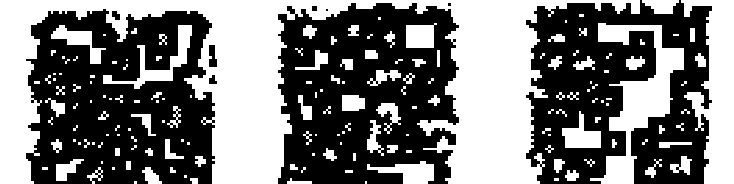

### 重點分析

1. 群星聚集南半球，9宮巨蟹。
2. 命主星入官祿（立命卯天蠍，♂、♀為命主，♀在10宮內）。
3. ASC△☍△⚹（大三角吉相）。

現任台北市長馬英九，是國民黨中生代中最有人望的政治明星，其行星群聚南半球，客觀、重視外界評價，事業心重、強調道德、精神（9宮），命主 ♀ 與 ♀ 在8宮形成60° ☍ 吉相，英俊、魅力強，為全國女性性幻想對象第一名，不虛此象，而大三角吉象，更使他親和力強。

## 案例十：許信良

Natal Chart
May 27 1941
12:48 PM -8:00
桃園市，台灣
24N59 121E18
Geocentric
Tropical
Placidus
True Node


### 重點分析

1. 星盤群星集中於南半球，尤其是9宮雙子座。
2. 命主星♀入10宮官祿為廟，卻與Ψ 90°刑。

前民進黨黨主席許信良，一生是理念先行的人物，尚屬客觀，重視外界評價，反應快、點子多，卻不免幻想多於實際（♀□Ψ），聰明卻也變化太快為政治變色龍，由國民黨栽培，卻帶領民進黨對抗國民黨，當其看法不被黨內同志認同時，憤而離黨，大罵自己曾帶領的黨，故飽受譏評，又♀（口才、語言）□Ψ（模糊），也影響其口齒不清。

## 案例十一：劉德華

Natal Chart
Sep 27 1961
9:30 AM -8:00
香港, 中國
22N18 114E10
Geocentric
Tropical
Placidus
True Node

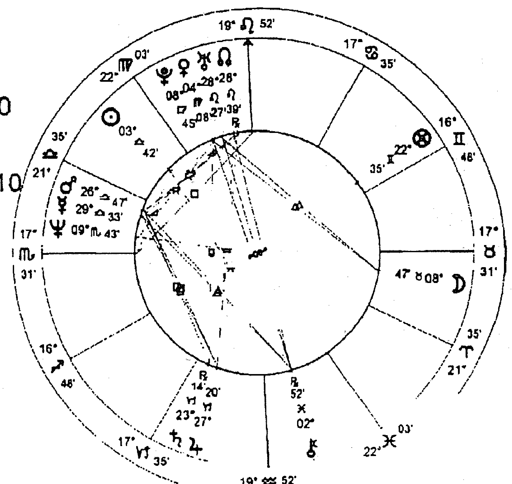

### 重點分析

1. 星盤群星聚集南半東半球，尤其是第四象限，此即個人同夥化。
2. 命主♀入10宮官祿與☽ 120°三合，另一命主♂入辰，天秤與8宮之⊗幸運點 120°三合。
3. 月亮入酉，金牛為旺與♀在10宮 120°三合，且受金星容納。

香港巨星劉德華自出道來頗受歡迎，甚具魅力（命主♀☽♀），尤其是女性影迷、歌迷（♀☽♀）△☽，重視外界評價、客觀，公益活動常見他的回饋。

## 第3節 後天12宮的古典意義

現代占星學後天12宮的意義約在中世紀A.D. 11、12世紀即已定調，我們從13世紀義大利著名占星家古德·波那提所著《Liber Astronomiae》Books 2所敘述的後天12宮可看出端倪，後天12宮是人生的各種生活領域，為本命或卜卦問事之重點。在17世紀，英國威廉·里利的威名盛極一時，但仍沿續古德·波那提的說法，僅稍加修飾，即使至現代仍適用，衹不過現代心理占星學對後天宮，強調心理層面，如2宮，一般定義為金錢、財產，但心理占星學強調2宮係個人價值觀取向。

其實在希臘時代對後天宮的詮釋有些不同，現代占星學所稱宮位，希臘標準的字語是topos，簡單具體的意思為“地方（place）”，在希臘化時代已引用了主題的某些意義，意即宮位代表了個人的生活領域。

從現存資料的研究，希臘對後天宮強調之重點約可分為下面三類：

I. 生活領域，世俗問題或主題，稱之為議題系統（Topical System）。希臘占星家使用不同系統來劃分黃道成12宮，其目的之一即是用來觀察命主的生活特定領域，如兄弟、姊妹、父母、職業...等。

II. 觀察行星的相對力量，稱之為動態系統（Dynamical System）。希臘占星家認為天宮圖的4個尖軸，即ASC、MC、DSC、IC可劃分成四個象限，可三等分，而共有12宮，這12宮的分類，如前述之始宮、續宮、果宮，行星在始宮，能力最容易發揮而最強，續宮次之，果宮最弱。

III. 決定各宮的好與壞。

各宮的好與壞，真正的意涵是發揮能力多少而言，其觀念類似II，但其意義卻以所謂傳統相位觀點來看，原則上以ASC之宮為主，其他11宮與其產生60°（*）、90°（□）、120°（△）、180°（♂）皆可謂為好宮，因此形成60°（*）-3宮、11宮（3宮，有其他占星家不認為是好的）形成90°（□）-4宮、10宮形成120°（△）-5宮、9宮形成180°（♂）-7宮。

而不與ASC宮產生上述角度則為壞，如2宮、12宮、6宮、8宮，其中6宮、8宮最差，因他們與ASC宮為不合意（Aversion），以現代而言即150°。希臘占星家也以天宮圖四個尖軸作為人生四個階段，從ASC始點開始順時鐘（而非如黃道秩序之逆時針方向），1宮是生命的第1期、10宮為生命的主要期間、7宮生命休養期，即老年、而4宮生命死亡及其身後事。

### (五) 後天12宮各宮的核心意義

**1宮（命宮）**：個性、給別人外在印象、身材、外表、秉賦、體質、生命力、脾氣。

1宮就好像舵柄，位於看不見的地平線下，但即將上升於看得見地平線上，正如處於母親的子宮中看不見外界，而將出世看見外界，標示著生命的起初或開端，因為這個理由所以1宮代表身體，特別是臉及外貌，不必然代表有形的的身體外觀，但是為命主進入外界的生命能量，所以出生時，若1宮主星或稱命主星（中世紀以命宮支配星）受損嚴重，古人說，嬰兒難以養育或出生後不久即死亡；相對地，若命主星或命宮支配星與吉星（木星、金星）形成吉相，或為必然的尊貴，他們的生命力較為旺盛。

舵柄是船的操縱舵輪所在，掌管這個地方的是舵手，若他不在崗位上，船會擱淺或沈沒，這類比命主若缺乏明確的方向將遭遇困難，在占星學上這可由命主星落於1宮不合意星座如2宮、12宮、6宮、8宮來呈現，其中以6宮、8宮較為嚴重，可能意謂著命主對人生悲觀，但相對地舵手盡職於其崗位上，船順利航行，如命主星具必然尊貴或偶然尊貴。

水星♀在此宮為喜樂，這是因水星正好為晝夜區分之中間，如同命宮臨於地平線上下間之性質，水星很容易從不同觀點改變好與壞的意圖，這是人性。

**2宮（財帛宮）**：金錢和動產，對財富和財產的價值觀，正財、個人物質生活。

2宮為出生後的下一宮，代表出生嬰兒如何掌握周遭，必須學習客觀的永恆，即自我評價演伸為價值觀，該堅持的是什麼；財為養命之源，出生嬰兒需要物質來養育，故意謂著金錢、物質或財產，若2宮主星或其支配星受刑剋，尤其是凶星，則境遇不佳，僅能糊口度日，更糟的則流浪街頭或被父母遺棄，相對地，若2宮主星或其支配星，宮內行星係良好配置，個人所得較多，能抬頭挺胸。

托勒密稱此宮為陰間之門，意即墮落之淵源，就人性而言，財為物質易淪為物慾為財富不計手段時有所聞，淹滅人性以求個人財富，當然另外一種觀點當太陽西沈後，2宮也是慢慢地從陰間走出，但仍尚在地平線下，有其陰暗之一面。

**3宮（兄弟宮）**：與他人溝通的正常心態、資訊、短期旅行、兄弟姊妹、鄰居、親戚；基本教育、自我、語言表達能力、非正統宗教。

3宮為4宮（父母）田宅宮之前一宮，具有“鄰近的環境”之基本觀念，因而可引申為鄰居或除了父母之外的同血緣親戚，如兄弟姊妹、堂、表等親戚，以較廣泛意識包含鄰近或周圍環境，人們脫離不了（正常而言）周圍，故會產生交流溝通或有媒介物，如信件、汽車、火車、船，當然也包含心靈溝通，故教育、知識、資訊、短期旅行..等。

另外有趣的是9宮，為正統宗教，古希臘稱之為太陽神宮，而3宮則稱月亮女神宮，意涵著3宮也有宗教之影子，但非正統或異教的，如以現代占星學，3宮類比雙子，其質疑特質就常與正統宗教之不容侵犯違背，古代教堂將月亮比做女人，因夏娃帶給亞當罪惡。古代認為在3宮為喜樂，若又是夜間出生，月亮能量將發揮得較好。

**4宮（田宅宮）**：家，最個人和私密的生活，家族、父母、祖先、家鄉、不動產、土地、生命結束，一個人的過去和與傳統的關係，身後事、老年生活。

4宮是天宮圖中最接近地球，故很容易聯想休息或象徵埋葬、身後事務，也象徵老年、祖先家譜、血統關係（特別是父母）和我們源自何處。它代表我們安全感的基礎及歸屬感，因為是最隱藏的地方，所以托勒密稱之為隱匿宮，故也象徵為何許多人很難完全地認識他們自己。在西方此宮被視作世襲的地方，現代占星學以同族觀念，即巨蟹=4宮，而認作此宮為母親宮，但威廉·里利則以此宮為父親，兩種說法差異甚大，羅伯·施密特則統稱之為父母宮，依筆者經驗，威廉·里利說法較為正確，但須參考白天盤時太陽為父親自然主星，而夜間盤土星為父親自然主星，此宮具世襲傳承的觀念。

就物質而言，4宮代表所站地面，故為家、基礎、房地產和不動產，若幸運點在此宮，原則上會擁有土地，包含隱藏的財富或寶藏。

**5宮（男女宮）**：自我表現和創作才華、遊戲和娛樂、愛情、分娩和小孩、賭博、投機和投資。

5宮為生命力強度的結果，所以首先是男女情愛、性愛而得的結果，分娩而小孩誕生，這是熱情、愛情的結晶，因此宮與ASC宮為120°三合，為順暢、歡愉、性交的致命吸引力特性，被指出和激烈的慾望一致，如愛情、賭博遊戲、賭注、賽馬、股票投機，其過程即生產力，如同來自興奮知覺的敏銳過程。

5宮在地平線下和西半球，代表從殼（4宮）釋放出來，涉及回饋如愛情表達，投資我們自己於別人身上；就物質而言，是一種投資、投機，而釋放也是一種創作力的表現。古希臘稱此宮為好運，前面提到它與ASC宮三合，金星在此宮為喜樂，所以性享受娛樂歡愉氣氛。

**6宮（奴僕宮）**：服務、工作、部屬、奴僕、受雇、疾病、營養、衛生保健、小動物。

6宮為果宮，且傳統相位上與ASC宮不合意，古代認為這是不幸，稱之為惡運，一般認為疾病、受傷，故6宮為健康宮。而6宮亦與天頂MC三合120°，而有服務工作，甚至部屬之意，若凶象多，則為人使喚之奴僕，現代則是受雇。

6宮在地平線下，前一宮5宮為個人產出，而7宮為地平線上，可看得見代表與公衆（7宮）初次交際時，如何預習接受別人回饋時（西半球）之態度，這需要許多工作、評判、精煉，是自我改進，如何面對危機和變化。

火星為夜間區分，兩個凶星中較不凶的，在古代火星在6宮為喜樂，可能是因6宮為果宮可能會弱化火星的凶性，應是合理的。

**7宮（夫妻宮）**：婚姻、合夥、公開敵人、公開衝突、訴訟案件、顧問關係。

7宮正好為1宮的對宮，意謂著比較、對抗，每件事都會遭遇命主，所以成為公開敵人、奮戰或控訴命主，因合約或婚約發生災難。

另外7宮也因自我和他人之關係，而具備合約的參與的性質，而婚姻是最典型的，同盟的其他型式、合夥、同居。

法裔美籍著名占星家Dane Rudhyar曾說明ASC/DSC地平線是意識、知覺之轉換，因在7宮，古希臘稱之為下降地方，正屬於地平線上下，即部份知道（在地平線上）部份未知（地平線下），這類比於有關合夥人或對手之已知或未知。若ASC星座看得見愈多，則DSC星座愈看不見，所以對命主而言，對手秘密可能更多。

在中世紀卜卦占星學相當盛行，此宮被視為戰爭的指示，和公開敵人，這是因7宮的對抗性質，但若這種對抗能## 後天12宮

和平地解決，它可能變成友誼如合夥甚至婚姻。而心理占星家則將此宮視為心理投射之處，有些人甚至稱之為我們的陰影(Shadow)，而醫療占星學中疾運盤，此宮常代表醫生。

8宮(疾厄宮) 死亡、遺產繼承、他人錢財、神秘事物、超心理學、性慾、稅務、保險、金融貸款、商業活動

8宮在古希臘稱之為懶惰、不動，因它與ASC宮無傳統相位，而為不合意，故含有衰敗、退化、身體的剝蝕、生命和呼吸停止或生命功能喪失，意即死亡，攸關死亡諸事當然就包含在內，遺產繼承(特別以衍生宮言，8宮又為7宮(他人)之2宮，即他人錢財)，簡短碑文、遺囑、遺產稅。

8宮適為7宮之2宮，他人錢財，故金融貸款、保險、合夥錢財、妻子嫁妝甚或稅繳，都由本宮主事，中國俗稱偏財是非常動機而獲利，與2宮正財、5宮投機或投資財比較，2宮正財較具挑戰，5宮需先花費，而8宮係不勞而獲，另外11宮為企業財，古稱收獲地方(place of acquisition)，故從10宮(政府)起算至第11宮，正好為8宮，政府的收獲地方為稅收，可點明此宮稅務之意，也因這項理由，必須謹慎處置資源，將金銀珠寶或貴重物品放在保險櫃以防止失竊，投保險以防災難甚或信用操作以維持個人信用。

死亡雖是人生終點，但相信靈魂不死的占星神秘學派，認為人類善惡觀念會隨著亡者進入另一種不可思議的次元，它是最神秘隱藏、奧妙，所以8宮也跟這些有關，由於隱藏之原慾，佛洛伊德將它直指為性慾，認為人類許多心理問題都因慾求不滿有關。

### 9宮(遷移宮)：較高心靈、哲學、宗教、法律、長期旅行、外國、遠地文化或事物、高等教育、道德精神。

9宮是在8宮(死亡)之後，古代稱為太陽神宮，代表一種精神的昇華，較高的心靈，因此是生命力強度的智慧，為洗鍊這種精神必然需有哲學思想、宗教薰陶、法律約束、高等教育訓練、道德精神之提倡。太陽是整個太陽系之核心，為知性、理性代表教化、啓蒙，經過努力奮鬥之後的澄澈透明或墜道之後的光明，所以毫無疑問太陽在9宮為喜樂。

9宮也代表外國、遠地、觀光和探險，這可能是經過8宮之騷亂，需要逃避到陌生環境可緩和下心境，而事實上在古代若遭遇法律麻煩(9宮也代表法律)常發配流放邊疆、異地。

9宮的學習是一種經過內省後的洗鍊，故有一定水平的精神意義，層次較高，而宗教也屬正統，但3宮則是粗糙，基本的水平，故教育僅止於一般基礎教育，宗教則易傾向異教。

### 10宮(官祿宮):經歷或職業、社會地位、名譽和榮耀、母親、老板、主管、雇用者、政府官員、政治權力、社會責任。

10宮稱為天頂,古代亦此稱號,是個人所在地之黃道最高點,代表權威、高高在上,外界看得到的榮譽、耀眼,當然也跟個人與權威之關係,如老板、主管或政府官員,若論國運,常涉及王朝、元首、總統,由於MC的權威最頂峰,意謂著個人的成就,因此聯想到經歷或職業,企業經營,但高處不勝寒,孤獨的心境,社會甚或企業責任感之束縛,油然而生。

10宮在9宮之後,當9宮的精神昇華再教育,其夢想就可實現在10宮(成就)。

10宮是生命的頂點,奮鬥的目標,需要努力不懈,自古常類比於摩羯及其主星的刻苦自勵。

10宮是4宮(父親)的夫妻宮,故也代表母親,論及母親尚須考量白天盤時,配合金星;夜間盤時,配合月亮。

### 11宮(福德宮) 朋友、社團、希望、願景、同志、同事、收獲

11宮因與ASC宮位60°※吉相,古稱為好精神,代表希望、願景,跟5宮比較,11宮屬於精神、文化層次,而5則屬肉體、感官、物質層次，此宮古時也稱收獲地方，因5宮為投資、投機之支出，而11宮為7宮之5宮，即別人之投資、投機支出，而為我所得，而11宮亦為5宮之對宮，也含有投資、投機支出之返回，若擴充解釋，11宮並非僅財務所得，而是外界對努力的整個回報。

木星在11宮為喜樂，因木星也屬精神層次，如宗教、法律、教育等光明面，而11宮在地平線上，與太陽性質並聯，而木星屬血液質且風象性質如藍天光明所蘊含之信賴、信心，所以與人相處信賴對方，11宮屬於非很深入的交往，因而很易衍生為朋友、同志、同事之概念，聚集一起而成社團、組織。

### 12宮(相貌宮) 自我毀滅、犧牲、因果報應、神秘、秘密敵人醫院、監獄或精神病院、遺世獨居、逃避。

12宮古稱壞精神，與心靈上之痛苦有關，因精神問題引發之折磨，在古代將土星最大凶星配於12宮中，但土星若是在白天盤時則為喜樂，較不會引發12宮之問題，若是夜間盤，若沒其他吉相，同樣會引發，由於土星陰鬱悲觀灰色，故易帶來自我毀滅、墮落、犧牲、悲觀、自我封閉，所以會聯結到醫院、監獄、精神病院，衍申為遁世、退休、逃避現實，較嚴重者，精神不正常、瘋狂，常犯小人(秘密敵人)，心思混亂認為鬼魂索命。

12宮在地平面上，即剛從黑暗到光明，卻常萎縮退回陰暗而禁錮，易受無意識的控制，而不自覺退縮，又12宮與1宮也沒有傳統相位，也是不合意，1宮常被立即地注意到，在旁之12宮則忽視延宕，若再從黃道順序，12宮剛好在最後，類似廢物遺棄，而它也在11宮之後，代表不適應，容易被遺忘，自我毀滅。

玄奧占星學派(Karmic Astrology)相當重視12宮，常根據月亮和南北交點軸，這三個因素來分析前世可能之業障，而這一世及未來如何修鍊，從而解放前世禁錮之心靈非在本章議題，不予討論。

又各行星在希臘的後天宮，各有其喜樂之處，如水星在1宮，月亮在3宮，金星在5宮，火星在6宮，太陽在9宮，木星在11宮，土星在12宮，這種喜樂宮，英文稱為Joy，這種觀念在17世紀前，仍相當盛行，但在現代已不復留存，且相當分歧，由於現代占星學發展同族關係的論斷，如命宮=白羊座，故火星應是現代占星學命宮之自然主星，而2宮=金牛座，則金星為2宮自然主星，因此和古典1宮之喜樂星為水星和現代的火星，根本風馬牛不相及，現代人未想到火星之破壞性，將它作為1宮自然主星。

希臘化時期對後天12宮之定義及內涵，與現代的大致相同，但略有差異，基本上，托勒密的名稱在當時較為普遍，分別如下

- 1宮 上升時刻(The Horoscope)
- 2宮 陰間之門(Gate of Hades)
- 3宮 月亮女神(Moon Goddess)
- 4宮：隱匿的(Subterraneous)
- 5宮 好運(Good Fortune)
- 6宮 惡運(Bad Fortune)
- 7宮 下降地方(Setting place)
- 8宮 懶惰不動(Idle)
- 9宮 太陽神(Sun God)
- 10宮 天頂(Midheaven)
- 11宮 好精神(Good Spirit)
- 12宮 壞精神(Bad Spirit)

上述相關內容可以約瑟夫 卡運(Joseph Crane)《A Practical Guide to Traditional Astrology》中的一個圖呈現，圖5-3


圖5-3

## 第4節 後天12宮的衍生宮意義

後天12宮的核心意義雖是命主生活領域的基本項目，但事實上，命主面對外界各種人事物，實非區區12宮就可含蓋，如親戚方面，堂、表一大堆，雖不見得親，但總有些關係，其他事、物亦同，因此在卜卦占星學就善用後天的活盤衍生宮，而得以論述各種人事物，活化了占星學，卜卦占星學的這項技巧淵源甚長，如與托勒密大師約同期的另一位著名占星家Vettius Vellen就常以希臘點(後誤稱阿拉伯點)的落宮，算其主星落於何宮來論述一個人的成就、名望，甚至其他災難，這種算法就是中世紀卜卦占星學盛行之活盤衍生宮的濫觴，該技巧適度地解決了問事者的各種疑難雜症，有其準驗及實用而得以盛行不衰，後來也引用到本命及流年占星學中，由於活盤衍生宮的過度濫用，常讓人宿命論之感覺，因而本命占星學甚多人不以為然，時有爭辯。

20世紀初期，法國占星家歐帝斯 皮卡德(Eudes Picard A.D1867-1932)，寫了篇有關衍生宮的論文 Judicial Astrology” 頗為詳細說明衍生宮各種用法，得到20世紀較早期英國著名占星家Vivian.E.Robson的讚賞，但之後紛爭不斷，尤其後來現代心理占星學興盛以後，這種技巧逐漸不受重視，因它被歸類為命定與心理占星學強調人本(Person-Central)或自由意志(Free Will)有所違反。另外又因過度濫用，頗受譏評，如兄弟宮藉由衍生可分別產生3宮本身為第1個手足，3宮之3宮為5宮，為第2個手足，若論其父母或祖父母，當然不可能同宮，在邏輯上站不住腳。當然使用這項技巧的占星學家不會笨到這樣使用，依筆者的經驗，活盤衍生宮，有其不可思議的奧妙，但不宜濫用，應以第一級衍生即可。

以下所列衍生宮徵象是一般常推論的，須知各宮管轄事物甚多，故衍生徵象將不止於此。

### 本命1宮

| 衍生徵象 | 說明 |
| :--- | :--- |
| 2宮之12 | 個人財產、財物之可能損失 |
| 3宮之11 | 第1個手足的朋友、同事或社團 |
| 4宮之10 | 外祖母、配偶的內祖母 |
| 5宮之9 | 第5個小孩，第一個孩子的宗教觀、高等教育及國外運勢 |
| 6宮之8 | 部屬、員工、寵物之死亡 |
| 7宮之7 | 訴訟中的被告、配偶的合作夥伴；配偶手足之兒女運、愛情運、投機運(5宮之3之5) |
| 8宮之6 | 性生活的健康問題，寵物的繁殖能力 |
| 9宮之5 | 國外或長途旅行中的娛樂、風流韻事、賭博 |
| 10宮之4 | 母親方面的家運、繼父的家族運 |
| 11宮之3 | 社團組織的交流或短期旅行 |
| 12宮之2 | 隱藏敵人的財產、財物 |

### 本命2宮

| 衍生徵象 | 說明 |
| :--- | :--- |
| 3宮之12 | 第一個手足的悲傷和隱晦之事，隱藏敵人 |
| 4宮之11 | 父親的朋友、社團、同事、父親手足的宗教觀和國外運勢、高等教育 |
| 5宮之10 | 個人才能、遊戲、運動之名聲地位，第一個子女的聲望成就 |
| 6宮之9 | 工作的再教育、進修 |
| 7宮之8 | 配偶之死亡、遺產及神秘內在，配偶手足的健康或工作，與部屬之關係，外甥、姪兒死亡 |
| 8宮之7 | 配偶的負債、稅務、保險、及性能力 |
| 9宮之6 | 外國朋友的健康，孩子的疾病 |
| 10宮之5 | 繼父在外所生之子女，母親手足之智力、短期旅行、基本教育、岳父母的投機運 |
| 11宮之4 | 繼子之家庭，個人社會人脈的基礎，朋友的父母 |
| 12宮之3 | 隱藏敵人的手足 |

### 本命3宮

| 衍生徵象 | 說明 |
| :--- | :--- |
| 4宮之12 | 父親或家族的隱藏敵人，田宅不動產之可能損失 |
| 5宮之11 | 第1個孩子的朋友、同事和社團活動運勢，配偶外遇所生子女之投機運 |
| 6宮之10 | 部屬、僕人的名譽、地位、信用，父親手足的事業和社會地位 |
| 7宮之9 | 配偶的宗教觀、高等教育、國外、長途旅行之運勢 |
| 8宮之8 | |
| 9宮之7 | 宗教人員的配偶或合夥人 |
| 10宮之6 | 母親的健康、個人事業上雇用的職員、母親手足之不動產 |
| 11宮之5 | 朋友的孩子 |
| 12宮之4 | 秘密敵人的家族、田宅 |
| 2宮之2 | |

### 本命4宮

| 衍生徵象 | 說明 |
| :--- | :--- |
| 5宮之12 | 孩子的隱藏敵人、投機或投資的可能損失 |
| 6宮之11 | 部屬的願望、朋友、同事，租金收入、租用者 |
| 7宮之10 | 配偶的事業(假設他/她自行經營)、社會地位、名望、配偶母親，祖父之地位 |
| 8宮之9 | 死亡者(無親戚、朋友關係)的宗教觀 |
| 9宮之8 | 宗教人員的死亡、遺囑、遺產、配偶手足之死亡與遺產 |
| 10宮之7 | 父親、事業的競爭者 |
| 11宮之6 | 朋友的健康、工作，繼子的健康和部屬 |
| 12宮之5 | 隱藏敵人的孩子或投機運 |
| 2宮之3 | 財務合同 |
| 3宮之2 | 手足的財運、寫作所得 |

### 本命5宮

| 衍生徵象 | 說明 |
| :--- | :--- |
| 6宮之12 | 部屬、員工的隱藏敵人，父親手足的悲傷和損失 |
| 7宮之11 | 配偶或合夥人之朋友或社團 |
| 8宮之10 | 死亡者(非親戚、朋友關係)的名望、地位，對死亡者之評價 |
| 9宮之9 | 宗教人員的長途旅行，配偶手足的長途旅行或國外運勢 |
| 10宮之8 | 老板、主管的死亡和遺產，個人信用、名譽的衰敗、母親的死亡 |
| 11宮之7 | 朋友、同事的配偶 |
| 12宮之6 | 隱藏敵人的健康、母親手足的疾病、工作運，較大型動物的疾病 |
| 2宮之4 | |
| 3宮之3 | 第2個手足 |
| 4宮之2 | 父親的流動資產，不動產買賣的收入 |

### 本命6宮

| 衍生徵象 | 說明 |
| :--- | :--- |
| 7宮之12 | 配偶、合夥人的隱藏敵人、婚姻造成之損失、悲哀 |
| 8宮之11 | 死亡者(非親戚朋友關係)的朋友、社團 |
| 9宮之10 | 宗教人員的社會評價、配偶手足的事業、社會地位、名望、孫子的職業、名望 |
| 10宮之9 | 老闆、主管的宗教觀、長途旅行、母親的宗教觀、國外旅行運勢、與事業有關之長途旅行 |
| 11宮之8 | 朋友、同事的死亡、子女配偶的死亡與遺產、配偶前次婚姻所生子女之 |
| 12宮之7 | 隱藏敵人的配偶或合夥人 |
| 2宮之5 | |
| 3宮之4 | 手足獨立後的家居、契約保存的所在 |
| 4宮之3 | 不動產、契約 |
| 5宮之2 | 孩子的流動資產、運動收入、投機收入(另一種看法) |
| 6宮 | 父親的手足 |

### 本命7宮

| 衍生徵象 | 說明 |
| :--- | :--- |
| 8宮之12 | 死亡者(非親戚、朋友關係)的隱藏敵人、悲傷及損失 |
| 9宮之11 | 宗教人員的朋友、同事、配偶手足的朋友、同事、社團、外國友人之朋友 |
| 10宮之10 | 個人事業的名聲、地位、老板主管的評價 |
| 11宮之9 | 朋友、同事的宗教觀、長途旅行、非婚生子女的宗教觀、國外運勢、朋友的孫子 |
| 12宮之8 | 隱藏敵人的死亡、較大型動物的死亡、母親手足的死亡 |
| 2宮之6 | |
| 3宮之5 | 手足的孩子、休閒、投機運勢 |
| 4宮之4 | 祖父 |
| 5宮之3 | 第2個孩子、孩子的基本教育、短程旅行及心智 |
| 6宮之2 | 部屬、員工的收入，父親手足的財運 |

### 本命8宮

| 衍生徵象 | 說明 |
| :--- | :--- |
| 9宮之12 | 宗教觀的悲傷及損失,配偶手足的悲哀、損失,外國人或國外所造成之損失 |
| 10宮之11 | 母親的朋友、事業上的朋友,老板、主管的朋友、社團 |
| 11宮之10 | 朋友的事業或朋友、社團的評價、名望,子女配偶的事業、聲望、地位 |
| 12宮之9 | 隱藏敵人的長途旅行、宗教觀,母親手足的宗教觀、國外運勢 |
| 2宮之7 | 債務、稅務、擔保債務 |
| 3宮之6 | 手足的健康、工作、小寵物 |
| 4宮之5 | 父親的娛樂、投機運 |
| 5宮之4 | 孩子獨立後的家庭、房地產 |
| 6宮之3 | 部屬、員工的手足,父親手足的契約,短期旅行 |
| 7宮之2 | 配偶的錢財,合夥商業的資金,姪子女,男(女)之收入 |

### 本命9宮

| 衍生徵象 | 說明 |
| :--- | :--- |
| 10宮之12 | 事業、社會地位的隱藏敵人、悲傷及損失 |
| 11宮之11 | 朋友的朋友或同事、社團，繼子或非婚生子女的朋友、社團...子女配偶的朋友、社團 |
| 12宮之10 | 母親手足的事業、社會地位、隱藏敵人的事業、職業或社會評價 |
| 2宮之8 | |
| 3宮之7 | 第一個手足的婚姻、配偶和合夥 |
| 4宮之6 | 父親的疾病、工作、部屬、家庭的衛生設施 |
| 5宮之5 | 孩子(尤其是第一個)的娛樂及投機運 |
| 6宮之4 | 父親手足的家庭或不動產運勢 |
| 7宮之3 | 配偶手足(尤其是第一個)的個性、外貌、身材，配偶的心智、契約、基本教育 |
| 8宮之2 | 遺產孳息 替人理財之所得 |

### 本命10宮

| 衍生徵象 | 說明 |
| :--- | :--- |
| 11宮之12 | 朋友所造成之悲傷、損失、繼子或非婚生子女之悲傷及損失 |
| 12宮之11 | 隱藏敵人的朋友、社團，母親手足的朋友、同事、社團 |
| 2宮之9 | |
| 3宮之8 | 手足(尤其是第一位)的死亡、遺產 |
| 4宮之7 | 父親的合夥人、競爭對手、母親，房地產的訴訟 |
| 5宮之6 | 子女(尤其是第一位)的健康、工作、小寵物 |
| 6宮之5 | 部屬、員工的子女、娛樂、投機運，父親手足子女即堂表兄弟姊妹之娛樂、投機運 |
| 7宮之4 | 配偶的父親(岳父、公公) |
| 8宮之3 | 隱藏敵人的手足、契約、基礎教育，與死亡有關之文件、契約 |
| 9宮之2 | 宗教人員的收入，國外有關的收入，孫子的金錢、財務 |

### 本命11宮

| 衍生徵象 | 說明 |
| :--- | :--- |
| 12宮之12 | 隱藏敵人本身自己的隱藏敵人 |
| 2宮之10 | |
| 3宮之9 | 手足的宗教觀，高等教育，長途旅行，國外運 |
| 4宮之8 | 父親的死亡 |
| 5宮之7 | 子女的配偶、夥伴、訴訟、競爭對手 |
| 6宮之6 | 部屬、員工、小寵物的健康、父親手足之子女的健康及工作 |
| 7宮之5 | 配偶之前次婚姻子女或非婚生子女，配偶或合夥人之娛樂或投機運 |
| 8宮之4 | 死亡者(非親戚、朋友)的家庭、父親 |
| 9宮之3 | 宗教人員的手足，配偶手足子女的心智、基本教育 |
| 10宮之2 | 企業所得、老板、主管的收入、財務 |

### 本命12宮

| 衍生徵象 | 說明 |
| :--- | :--- |
| 2宮之11 | |
| 3宮之10 | 手足(尤其是第一位)的職業、事業、地位名聲 |
| 4宮之9 | 父親的宗教觀、國外、長途旅行運勢 |
| 5宮之8 | 小孩(尤其是第一位)的死亡 |
| 6宮之7 | 部屬、員工的配偶 |
| 7宮之6 | 配偶、合夥人的健康、小寵物 |
| 8宮之5 | 死亡者(非親戚朋友關係)的子女 |
| 9宮之4 | 宗教人員、外國友人的父親，在國外的房地產，配偶手足之子女的家庭，國外旅館 |
| 10宮之3 | 母親的手足其個性、外貌、身材、才能，與事業有關的短期旅行，事業之契約文件 |
| 11宮之2 | 朋友、同事的財產、收入、資源，組統團體的收入獲利，子女配偶的收入 |

# 2023年11月1日

今天，我參加了公司組織的年度總結會議。會上，各部門負責人匯報了各自的工作成果和存在的問題。我所在的部門在上半年取得了不錯的成績，但也面臨著一些挑戰。

下午，我和團隊成員一起討論了下半年的工作計劃。我們確定了幾個關鍵項目，並分配了相應的責任人。

晚上，我花了一些時間學習了新的技術知識，為未來的工作做準備。

伽利略 (G. Galilei AD. 1564-1642)

科學史上最重要的實驗天文物理學家，為支持哥白尼理論，卻蒙受羅馬教會的禁錮。

伽利略為其女兒 Virginia 所繪的天宮圖，因年代久遠難以辨識其內容。

## 第六章 行星的原理與特性

行星是天宮圖中最重要的角色，古代占星先賢就是從浩瀚夜空，繁星點點中，某些行星的移動，體悟到徵兆的象徵，更將這些行星賦予神名形成神話故事流傳於世。古典占星學相當重視行星的作用，是判斷事件吉凶的主要根據。而現代占星學強調的心理，排斥事件吉凶的預測，無形中忽視行星真正的功能，殊為可惜，本書著重古典與現代的融合，因而將有不少篇幅討論行星古典的原貌，尤其是行星力量強弱，是相當重要的一環。

我們將在第1節說明行星作用的經驗傳承，敘述古典學說中行星的一些概念。第2節解釋行星在黃道的位置，衍生出來的固有強弱，古典占星學稱之為必然的尊貴，和必然的無力。第3節解釋行星在後天宮位，衍生出來的強弱，以及其他因素，統稱之為偶然的尊重，和偶然的無力。第4節詳列行星的原理和特性。第5節討論已失傳的行星晝夜區分。

# 行星的原理與特性

## 第1節 行星作用的經驗傳承

太陽系的行星在天空中運行，一直是早期先民觀察天體最主要的目標，經與世俗事件結合，長期下來歸納出它的作用。早期先民敬畏天地，常將天體視為天上神祇而加以膜拜，更加深對其作用的印象，一代一代的累積就形成後世集體無意識。早期較具體記載行星的作用，應屬巴比倫時期，他們所傳承下來的與現代占星學各行星作用原理，無甚大差別，我們整理於後：

太陽 為撒馬許神 (Shamash)，正義的化身，公正之神，一些君王常引用它標榜自己是公正無私的，如漢摩拉比王就在著名法典的緒言中提到，『我漢摩拉比，虔誠敬神的君王，為使國中正義、邪惡消亡，強不凌弱，我像太陽一樣升起，給國家帶來光明。』

月亮 月神辛 (Sin)，為創造我的神，在黑暗之中帶給大地光明，壓倒群星。

水星 為尼布神 (Nebo)，愛跑常跳，常隨太陽出沒，讓人摸不著，是智慧之神，狡滑。

金星 為伊撒塔神 (Ishtar)，明亮、美麗、魅力 (妖魔曾為她的姿色所迷倒)，又具戰爭之象，所以金星兼及愛情與戰爭。

(註: 現代占星學僅保留金星的愛情、美麗之作用，戰爭完全歸於火星)

火星：為戰神努爾格 (Nergel)，發出惡毒的紅光，是死亡和破壞的先驅。

木星：為眾神之王模德克 (Marduk)，非常明亮的行星，雍容大度，聲名顯赫，大權在握，但也會發動風暴和大洪水。

土星 為尼努他神 (Ninurta)，遙遠、行動、緩慢的行星，它那閃爍的蒼白光芒，代表光陰已逝、老年和學術研究，因緩慢而讓人覺得穩重。

巴比倫先民將行星與神的比擬，實際上是觀察這些行星的自然景象的感受，現代占星學仍絕大部份沿用，由於太陽、月亮及五大行星 (當時尚未發現三王星)，都被視為神，所以每日在天空運行的情況，就顯得特別有意義，尤其是這些行星升起於地平線上，或即將下降於地平線，更須注意，巴比倫的徵兆占星學，常見這種記載，如下載“如果金星於二月 (Airu月) 出現于東方，大、小雙子星環繞著它，且此四星連同金星皆晦暗不明亮，則Elans將患病死亡”

行星的作用，在古代也常以神話故事流傳，除上述巴比倫的神話外，希臘.羅馬的神話更不遑多讓，現代占星學中行星的英文名稱，更直接取自羅馬神話中的人物 (除太陽、月亮外)，我們分別列出，希臘、羅馬神話之名稱 意義以供參考。

| 行星 | 現代英文名稱 | 希臘神話 | | 羅馬神話 | |
| :--- | :--- | :--- | :--- | :--- | :--- |
| | | 英文名稱 | 意義 | 英文名稱 | 意義 |
| 太陽 | Sun | Helios | | Apollo | |
| 月亮 | moon | | | Diana | 婦女及小孩的守護神 |
| 水星 | mercury | Hermes | 司學藝、聰明、善言、做生意傳達信息 | Mercury | 商業之神.其神廟為穀物的交換中心，穀物商人都敬拜它 |
| 金星 | Venus | Aphrodite | 享樂、快樂、美麗、和平、戰爭中的勝利，友誼、藝術 | Venus | 美和繁殖之神、主宰、繁殖愛及家庭生活 |
| 火星 | Mars | Ares | 戰神、忿怒、好爭吵、抱怨 | Mars | 脱胎自希臘之戰神，主要功能是保護國土 |

| 行星 | 現代英文名稱 | 希臘神話 | | 羅馬神話 | |
| :--- | :--- | :--- | :--- | :--- | :--- |
| | | 英文名稱 | 意義 | 英文名稱 | 意義 |
| 木星 | Jupiter | Zeus | 宙斯、諸神之王、法律制定者仁慈及保護、創造機會、好運、生畏 | Jupiter | 羅馬主神、掌管、誓言、結盟、酒,父親形象的原型 |
| 土星 | Saturn | Kronos | 主宰命運及時間、過去、極限及界限、結構骨架、冷冰老邁、保守 | Saturn | 土地之神、掌管、播種、和穀種 |
| 天王星 | Uranus | | | Uranus | 毀了土星的傳統及權威而得解放 |
| 海王星 | Neptune | | | Neptune | 將事物吞沒到無盡、模糊之中 |
| 冥王星 | Pluto | | | Pluto | 地府之王、生性冷酷、無情、是死亡之神、但也是財神 |

※ 天王星、海王星、冥王星，為近代或現代發現的行星，雖沒有其作用之流傳故事，但卻有人根據發現時代背景意義，將他們比較於羅馬神話故事中的人物。

# 行星的原理與特性

## 太陽系的結構

太陽系的範圍甚廣，除了太陽、月亮、行星之外，尚有其他星體，例如大行星的衛星，在他們之間的小行星，Asteroids，如西利絲 (ceres)，凱龍星....之類，以及彗星、流星。太陽在天文學上，實際是最近地球的一顆恆星，其光體甚大，而一般恆星出現在天空，距離地球都相當遙遠，僅能看到光點而已。太陽系的行星在天空中運行，若仔細觀測，可看得到他們的移行，而恆星幾乎是靜止固定不動，行星與恆星都是占星學重要的要素，然行星更是重要，行星間的小行星陸續被發現，也有部份占星學，特別強調其重要，並編有小行星的星曆表，美國心理占星家姬波拉 杜賓博士就相當用心於小行星的使用，筆者個人保留凱龍星，其他不用，因增添繁瑣，且實證尚未完整，若以後相關實證資料得到認同，再予以補論。

# 行星的原理與特性

太陽為太陽系之中心，諸行星或彗星環繞於外，除冥王星外，大致呈橢圓形，冥王星的例外，更賦予其深邃，不可測，陰險的印象。

18 世紀科學文明帶給歐洲工業革命，豐碩的物質發達，使占星學沈倫，因此有部份占星家鑑於此，遂努力欲使占星學沾上科學之邊。相信占星理論必須有實際上的根據，亦即行星對地球的氣候，動、植物有實質的影響力，經過他們的努力，終於有了相當令人振奮的成果，我們臚列幾個著名研究個案，這些個案的研究者，或許非占星家，但結果卻符合行星的實質影響力。

1. 高田 (Maki Takata) 博士證明人體血液的成分隨11年太陽黑子週期而變化。

太陽黑子也常用在經濟循環的研究當中，台灣在民國78年79年，國民黨內主流與非主流鬥爭激烈，及股票加權指數從12500左右，下降到不足3000，當時正值太陽黑子高峰期；事隔11年，民國89年、90年年又是太陽黑子週期高峰台灣發生，政黨輪替之巨變，股票指數也從11000左右下降至4500左右，百業蕭條。

2. 美國著名的「週期研究基金會」出版「週期」(Cycles)，致力於各種統計數字來作科學報導，說明人類的行為，受到一股強大的力量所左右，這股強大力量，或許就是宇宙行星的力量。「這些力量左右著興盛和衰退、富裕和蕭條。它們控制了多數產品的產量、不僅限於農產品，連工業產品和礦產品都包含在內，除了控制總額的多寡外，也控制了單價漲跌，它們無所不在地左右著利率和證券價格，也控制了個人收益，它們還影響了人對各種疾病的感染與否，並改變人的情緒，使人從開放漸趨保守，或是由保守又回歸開放、自由」。該基金總經理.杜威博士Dr.Dewey .Daiken是位嚴謹的學者，其説明使更多的科學家相信週期確實存在，小至個體，大至社會及歷史事件，都見其影響的蹤影。1980年代趨近成熟的財務金融占星學，就證明各種不同組合行星的會合周期，和股市、商品或期貨、經濟情勢，確有令人乍舌的吻合。

3. 德國的托馬司克博士 (Dr.Thomaschek)，曾研究歷史上的134個大地震和當時的星象，他發現平均每六次大地震，有五次天王星正好發現在地方的上中天，最相關的行星是木星、天王星、冥王星，所謂相關，即是形成不調和相位。托馬司克博士的研究，後來證之其他地區地震也頗應驗，如民國89年日蝕後的土耳其大地震，台灣921大地震，公元2001年印度大地震，都符合其理論，尤其涉及天王星。

4. 英國的約翰 艾迪博士 (Dr.John.Addey) 曾研究1000名小兒麻痺和人瑞，發現有相當一致的波浪曲線，係因宇宙間週期現象所致，説明宇宙萬物，不管是大宇宙或小宇宙都具有高低起伏的特質，週期也許很快，也許相當長久，但一般傳統物理學或天文學都無法解釋，卻可在占星學中所強調的行星週期得到答案。

這些科學化的占星研究，確實豐富占星學的認知，也可改正古典先驗性的占星學説法，發展至今，古典占星學似乎仍經得起考驗，以下我們就開始詳細介紹行星的各項特性及原理。

# 行星的原理與特性

## 行星的純質料和體液的關係

| 行星 | 特徵 | 相關的體液 | 主要特徵 |
| :--- | :--- | :--- | :--- |
| 太陽 ☉ | 熱和乾 | 黃膽汁 | 氣 (Pneuma)、固有熱、生命的<br>功能和精神 |
| 月亮 ☽ | 冷和濕 | 黏液 | 根本濕、聚在一起的體液 |
| 水星 ☿ | 中性 | 中性 | 野性的功能.精神.心智 |
| 金星 ♀ | 冷和濕 | 黏液 | 生殖器之尿液系統、排出功能 |
| 火星 ♂ | 熱和乾 | 黃膽汁 | 膽汁質體液,膽囊,吸引性 |
| 木星 ♃ | 熱和濕 | 血液 | 自然的功能與精神.消化 |
| 土星 ♄ | 冷和乾 | 黑膽汁 | 憂鬱質體液.脾臟.保持力 |

以上所列是古希臘、阿拉伯及中世紀占星學常見的內容，雖然在現代似已不被提起，但這些內容有助認識行星的原理及特性，對欲深入瞭解個性及醫療占星學有甚大助益，可依據第4章第1節所述純質料的基本特性及組合，掌握某行星的原理，從而縝繹其特性及功能，詳細的內容可看《行星的原理及特性》表當可理解。

至於現代所發現的三王星，也有占星家賦予他們純質料的基本特性，但相關體液則付之闕如。

- 天王星 非常熱和極為乾 (尚有其他人持不同看法)
- 海王星 非常冷和極為濕
- 冥王星 熱和乾之傾向，但很難界定

## 行星的陰陽性

行星的陰陽性分類，基本上可以純質料來作界定。我們談過濕的力量，特別的陰性，含有濕的行星共有月亮、金星、木星、海王星四個，但木星也有熱的純質料不似前三者都共有冷和濕，因此月亮、金星、海王星，歸類為陰性行星。水星和冥王星之純質料較難界定，可歸類為中性行星，但冥王星因熱和乾之傾向，應屬中性偏陽。至於太陽、火星、天王星都具熱和乾，而木星也具熱，故歸類為陽性行星，而土星雖具冷和乾，給人陰鬱的感覺，但因具壓制性，自古以來都將它歸類為陽性行星。有關行星的陰陽性，我們再彙總於下

| 陽性 | 中性 | 陰性 |
| :--- | :--- | :--- |
| 太陽 | 水星 | 月亮 |
| 火星 | 冥王星 | 金星 |
| 木星 | | 海王星 |
| 土星 | | |
| 天王星 | | |

一般上，陽性行星較主動、積極、外向，陰性行星較被動消極、內向，而中性行星性質不顯，視與會合之行星而定，若無會合，則保持中性。

托勒密曾提及行星陰陽性的分類之另一種方法，係根據行星和太陽相態的關係而推論，如當行星為晨星，先太陽而出地平線他們變成陽性，而當行星為昏星，在太陽之後西沈，他們變成陰性，托勒密的這種觀念在古代及中世紀一直是個重要課題，這須專題討論，一般稱之為行星的相態，涉及行星東方性或西方性，此處我們暫且不表。

## 行星的吉凶

行星有其吉星、凶星之性質，除太陽、月亮發光體外，第一吉星為木星，第二吉星為金星，水星為中性，無吉無凶，視所會合之行星而定，第一凶星為土星，第二凶星為火星。從巴比倫行星神性的說明，就可知道行星的吉凶性質早就形成。在希腊化時期，以托勒密相位 (ptolemy Aspects) 予以理論化，所謂托勒密相位，即托勒密在《四書》提到相位，係以整個星座，非如現代是以星座內度數，而且他也僅提到0°會合 (☉) 60°半合 (✚)，90°刑 (□)、120°三合 (△)、180°沖 (♂) 這五個相位而已，如獅子座與天秤座，就成60°半合，托勒密以星座主星和相位，定出傳統行星的吉凶，如下圖


圖6-2行星的吉凶

說明

1. 獅子座、巨蟹座是赤緯最高的星座，其主星分別由太陽、月亮主管。
2. 分別從獅子座和巨蟹座起，各逆行針、順行針方向。
A. 由獅子座起算天秤座60°半合 (※)，吉；天蠍座90°刑 (□)，凶；射手座120°三合 (△)，吉；水瓶座180°沖，(♂)，凶。
B. 由巨蟹座起算，金牛座60°半合 (※)，吉；白羊座90°刑 (♂)，凶 雙魚座120°三合，吉，摩羯座180°沖 (□)，凶。
C. 由A.B可歸納出，金星主管的星座為吉，火星主管的星座為凶，木星所主管星座為吉，土星所主管的星座為凶，而120°的吉大於60°的吉，故木星的吉大於金星；相對地，180°的凶大於90°的凶，故土星的凶大於火星的凶。
D. 水星所主管的星座處女及雙子，因無托勒密相位，故無吉無凶，為中性。至於三王星的吉凶性質，仍可按其現代所主管星座來論，冥王主管天蠍為凶，天王星主管水瓶亦為凶，海王主管雙魚似吉，但強調其負面，亦屬凶。

以上所述行星的吉凶，僅是最基本的特性之一，不能死執這種基本觀代因為行星最具體的吉凶，是須根據其在黃道的先天條件，而演繹出必然的尊貴和必然的無力，以及其在後天12宮的後天狀況所顯示的偶然的尊貴和偶然的無力。

# 行星的原理與特性

## 第2節必然的尊貴 (Essential Dignity) 和必然的無力 (Essential Debility)

行星或敏感點在黃道先天位置上所形成的固有本質，可用來評估行星的相對力量強弱，從而評估其影響力，占星學的術語稱為必然的尊貴，和必然的無力。這項評估技術在18世紀前一直被廣泛使用，且是主流技術，地位相當重要，但18世紀後，主星的意義已被誤解甚深，甚或曲解，古典的五種必然尊貴，僅留存星座主星及旺宮主星，而三分性主星、界主星，及外觀主星，則消失無蹤。

公元2世紀希腊 托勒密在《四書》就已建立必然尊貴的概念，後世流傳雖有增添或桀誤，但至17世紀英國里利根據托勒密的觀念，給予分數，作為判斷依據，一直被奉為主臬，我們分別列出，行星必然尊貴和無力的托勒密表及里利評價分數表。

〈表6-1〉行星必然尊貴和無力的托勒密表 (度數從星座1°起算)

| 星座 | 廟 | 旺 | 三分性<br>晝 | 三分性<br>夜 | 界 | 界 | 界 | 界 | 界 | 外觀 | 外觀 | 外觀 | 外觀 | 陷 | 弱 |
| :--- | :--- | :--- | :--- | :--- | :--- | :--- | :--- | :--- | :--- | :--- | :--- | :--- | :--- | :--- | :--- |
| ♈ | ♂ D. | ○ 19 | ○ | ♀ | ♀ 6 | ♀ 14 | ♀ 21 | ♂ 26 | ♂ 30 | ♂ 10 | ○ 20 | ♀ 30 | ♀ | ♀ | ♀ |
| ♉ | ♀ N. | ♃ 3 | ♀ | ♃ | ♀ 8 | ♀ 15 | ♀ 22 | ♀ 26 | ♀ 30 | ♀ 10 | ♃ 20 | ♀ 30 | ♀ | ♀ | ♀ |
| ♊ | ♀ D. | ♃ 3 | ♀ | ♀ | ♀ 7 | ♀ 14 | ♀ 21 | ♀ 25 | ♀ 30 | ♀ 10 | ♀ 20 | ♀ 30 | ♀ | ♀ | ♀ |
| ♋ | ♃ D. | ♀ 15 | ♀ | ♀ | ♀ 13 | ♀ 20 | ♀ 27 | ♀ 30 | ♀ 10 | ♀ 20 | ♃ 30 | ♀ | ♀ | ♀ | ♀ |
| ♌ | ♃ N. | ♀ | ♀ | ♀ | ♀ 13 | ♀ 19 | ♀ 25 | ♀ 30 | ♀ 10 | ♀ 20 | ♀ 30 | ♀ | ♀ | ♀ | ♀ |
| ♍ | ♀ N. | ♀ 15 | ♀ | ♀ | ♀ 13 | ♀ 13 | ♀ 24 | ♀ 30 | ♀ 10 | ♀ 20 | ♀ 30 | ♀ | ♀ | ♀ | ♀ |
| ♎ | ♀ D. | ♀ 21 | ♀ | ♀ | ♀ 11 | ♀ 19 | ♀ 24 | ♀ 30 | ♀ 10 | ♀ 20 | ♀ 30 | ♀ | ♀ | ♀ | ♀ |
| ♏ | ♀ N. | ♀ | ♀ | ♀ | ♀ 14 | ♀ 21 | ♀ 27 | ♀ 30 | ♀ 10 | ♀ 20 | ♀ 30 | ♀ | ♀ | ♀ | ♀ |
| ♐ | ♀ D. | ♀ 3 | ♀ | ♀ | ♀ 8 | ♀ 14 | ♀ 19 | ♀ 25 | ♀ 30 | ♀ 10 | ♀ 20 | ♀ 30 | ♀ | ♀ | ♀ |
| ♑ | ♀ N. | ♀ 28 | ♀ | ♀ | ♀ 12 | ♀ 19 | ♀ 25 | ♀ 30 | ♀ 10 | ♀ 20 | ♀ 30 | ♀ | ♀ | ♀ | ♀ |
| ♒ | ♀ D. | ♀ | ♀ | ♀ | ♀ 12 | ♀ 20 | ♀ 25 | ♀ 30 | ♀ 10 | ♀ 20 | ♀ 30 | ♀ | ♀ | ♀ | ♀ |
| ♓ | ♀ N. | ♀ 27 | ♀ | ♀ | ♀ 14 | ♀ 20 | ♀ 26 | ♀ 30 | ♀ 10 | ♀ 20 | ♀ 30 | ♀ | ♀ | ♀ | ♀ |

廟 □ 旺 | 陷 ■ 弱 ■

## 行星的原理與特性

### <表6-2> 里利 必然尊貴和無力評價表

| 必然的尊貴 | 無力 |
| --- | --- |
| +5，行星在它自己的星座，或與其他行星就星座主星互容。<br>+4，行星在它自己的旺宮，或與其他行星就旺宮主星互容。<br>+3，行星在它自己，白天或夜晚的三分性。<br>+2，行星在它自己的界。<br>+1，行星在它自己Chaldean decanate或外觀 | -5，行星在陷宮(Detriment)<br>-4，行星在弱宮(Fall)<br>-5，行星是外來的(Peregrine) |

### A. 廟 (Rulership)

行星在自己的星座，最能發揮主人權威地位，能量最充裕，如太陽在獅子；月亮在巨蟹；水星白天在雙子，夜間在處女；金星白天在天秤，夜間在金牛；火星白天在白羊，夜晚在天蠍；土星白天在水瓶，夜間在摩羯。我們從前面圖6-2可看出。

根據托勒密的解釋，以地心系統太陽視運動繞行黃道12星座，在夏至到達最北赤緯，此時之星座比其他時節之星座最能產生光和熱、温暖，即巨蟹和獅子就其陰陽分別被派予最大和最有力的星體，那就是發光體，獅子座為陽，由太陽掌管，巨蟹座為陰，由月亮掌管，而其他行星就按太陽系行星排列順序 ♀, ☿, ♂, ☉, ♃, ♄，分別按半弧圈，主管一個星座，除太陽月亮外，每個行星共主管二個星座，雖主管二個星座，其中一個會比另一個較强，17世紀的拉米西(Ramesey)就以較强的星座，稱為行星的喜樂(JOY)，類似行星在後天宮喜樂之意義，拉米西列表於下：

- ♄ - 水瓶
- ♃ - 射手
- ♂ - 天蠍
- ☉ - 獅子
- ♀ - 金牛
- ☽ - 處女
- ☿ - 巨蟹

土星在水瓶喜樂，而非在摩羯？為何是這樣呢？因為從<表6-1>，土星在水瓶同時擁有白天的廟及三分性；同樣木星在寅喜樂，而非在亥？因為木星在寅同時擁有白天的廟及三分性，而在亥僅有廟而已；火星在天蠍比白羊有力，因它在天蠍同時擁有白天的廟及三分性；金星在金牛比天秤有力，也是同樣的理由，具有白天的廟及三分性；水星在處女比在雙子有力，是因它同時具有夜間的廟及旺。

拉米西的喜樂宮觀念，目前在現代占星學已見不到，此處提出，可作為參考。

### B. 旺 (Exaltation)

旺是根據地心系統的天文特性衍申及季節時令的體會而得的概念，以迴歸黃道而言，太陽於巨蟹座，揚升於黃道最高點。事實上，從白羊座到天秤座，太陽上升在北的範圍，而從天秤座到白羊座，則是在南的範圍，因此兩個分點星座可代表類似羅盤的方向，兩個至點星座代表其方向的極點，即最高點或最低點。

1. 太陽是地球生命的源泉，取他的旺在白羊，為春季，使所有生物活動華麗且產生良好的、溫暖的氣候，白天較長。太陽在北方的範圍上升；相對地，太陽在天秤為弱，白晝開始慢慢減少，進入秋季，萬物蕭索，淒涼景象，太陽的威力發揮不出。
2. 月亮反射太陽光，假設太陽、月亮會合白羊，它被我們看見的第一個星座將是金牛，且金牛也是月亮第一個三分性之星座，故月亮旺於金牛。
3. 水星旺於處女，係由金星旺於雙魚推論而得。
4. 金星是自然的濕，特別在雙魚座之季節，正處於潮濕，所以金星自然地旺於雙魚。
5. 火星是自然的熱和乾，因它的影響和效应在摩羯最有力量，因此最南赤緯星座值冬季季節，火星的本性可溫暖它，因這個理由，故火星旺於摩羯。
6. 木星在巨蟹較為愉快，鼓動北方的風，增進了肥沃和生長，木星在巨蟹是它的最高赤緯。
7. 土星在3個近代行星(三王星)未發現之前，是太陽系最遠的行星，與太陽、月亮相對，代表寒冷，太陽的熱，旺於白羊，故土星旺於其對宮天秤。

行星在它的旺宮，其能量强且狀況良好，雖比廟稍弱，但也能發揮，凶星若是在旺宮，凶性減少，傳統的旺和廟有一重大差異，即沒有重複的旺，即所有星座並非都有旺的行星，如獅子、天蠍、水瓶，就無旺的行星。

在古代，基本的極性(或磁性)是太陽和土星，以旺而言，太陽在白羊對沖土星在天秤；水星在處女對沖金星於雙魚；木星旺於巨蟹對沖火星於摩羯。

在醫療占星學這種行星極性或磁性是草藥特性相剋的依據。

### C. 三分性 (Triplicity)

托勒密和古代占星學先輩，將星座予以分類，其中按四大之素分類的星座，分別有白天和夜間的主星，這就是三分性主星的由來，從<表6-1>，可整理出：

#### <表6-3> 三分性主星

| 元素 | 星座 | 白天 | 夜間 |
|---|---|---|---|
| 火 | 白羊.獅子.射手 | ☉ | ☽ |
| 土 | 金牛.處女.摩羯 | ♀ | ☽ |
| 風 | 雙子.天秤.水瓶 | ☿ | ♀ |
| 水 | 巨蟹.天蠍.雙魚 | ♂ | ♂ |

三分性主星在傳承上也有些不同，上表為里利的觀點，托勒密對水象的三分性主星則認為白天為金星，夜間為月亮，同土象一樣。由於里利威名遠播，有使用三分性主星的占星家，大多採用里利的說法，同期的拉米西也據其說法，演繹其意義如下：

1. 太陽、木星支配火象之三分性，白天為太陽，夜間為木星，係因太陽之熱、乾，適合火象性質，而木星則因它是溫和的，能調整其極端，木星的濕配合夜間，故為夜間主星。
2. 金星、月亮支配土象之三分性，白天為金星，夜間為月亮，因土象星座為陰性星座，故東南風的濕符合金星、月亮濕的特性。
3. 土星、水星支配風象之三分性，白天為土星，夜間為水星，前者在天秤為旺，水瓶為廟且喜樂，而後者雙子是水星的廟。
4. 火星支配水象的三分性，白天、夜間皆同，會委派為水象之主星，可能是為冷卻其大膽凶惡之性。

行星若得三分性主星可視為好運，但非因他們的卓越表現，而是誤打誤撞所致。

三分性主星在古典占星學中佔有重要地位，常依ASC、太陽或月亮落宮星座及度數查出三分性主星，而論斷一生的三個階段之大略狀況，也可應用至各後天12宮，分別論斷各宮的三個階段，此項技巧已失傳，且較簡略，故不受重視。

### D. 界 (Terms)

〈表6-1〉所列的界，托勒密稱為迦勒底界(Chaldean Terms)，里利採用之，後世占星家使用界，也以此為準，現代研究界較有成就的為李、李荷曼博士，也同樣使用它。迦勒底界為何如此排列，已很難追蹤，但從表中所列，約可看出：

I. 一星座中，廟、旺、三分性等主星，較多的，常將之委派到前面第一個，如金牛座，廟主星及三分性主星，皆為金星，故金星安排金牛座界的最前面0°~7°(注意表中所列，係以星座第1度為1°，通常是以0°為第1度)。
II. 火星、土星，自古被認為凶星，若非I，則常被排在星座後面。必須注意I.II規律並不完整，僅供參考而已。

行星的界主星，指示命主或行星參與了行星的事務，並非真正獲得其所在黃道位置的力量，該行星的事徵雖重要，但結果無法確定，如卜卦占星學中ASC命度的界主星可以用來描述詢問者的身體特徵，假設ASC的界主星是土星，則詢問者可能是嚴肅的人、老人、認真、或醜陋的人...等任何有關土星特性的描述，但不能說其結果就是凶的。

在本命占星學的運用，界主星代表一種傾向，並非有能力帶到那個方向，如金星的界主星為木星，可能有樂觀但浪費奢侈的傾向。

### E. 外觀 (Face)

〈表6-1〉所列的外觀是必然的尊貴之最後一種，將黃道圈360°，劃分成每10°一個單位從白羊座起，按迦勒底秩序 (Chaldean Order)，即 ♂→☉→♀→☽→☿→☊→☋，周而復始地排列，就形成〈表6-1〉之外觀內容。迦勒底秩序，即是古代常使用之行星時間 (Planetary Hours)。

又在外觀表中之直行裡的順序，恰好即是一星期中每天的行星代表。

- 星期日：☉
- 星期一：☽
- 星期二：♂
- 星期三：☿
- 星期四：☊
- 星期五：♀
- 星期六：☋

星期的每一天黎明後(即日出)的第一個時辰，由所代表的行星主管，如星期日，由太陽主管，故星期日日出後的第一個小時，由太陽主管，然後按迦勒底順序到第8個小時，又由太陽主管，日落後的第3個小時及第10個小時亦同。

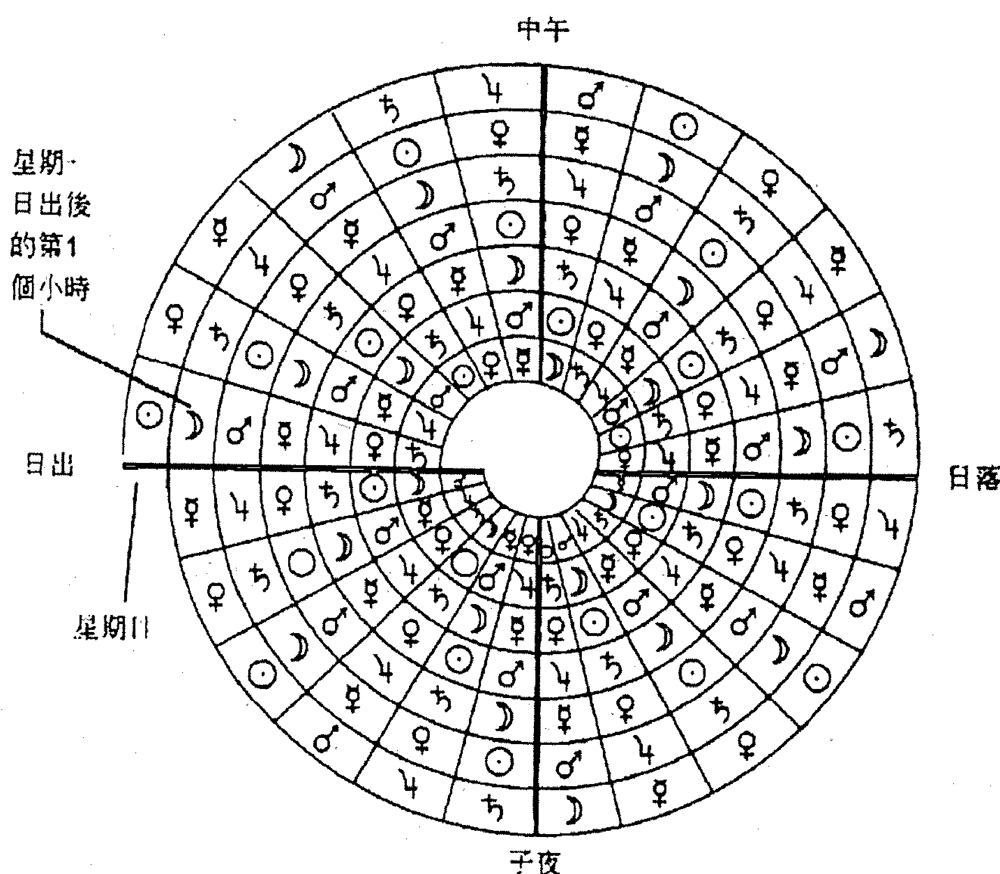

行星時間在古代常被使用，如17世紀著名的醫療占星家丘勒匹柏就認為採集草藥的時間應配合行星時間才最有效，如時間值 ♀，利於採集水星性質的草藥，其效果最佳。又在卜卦占星學中，常用行星時間來判定所建立的卜卦盤，是否為根本的 (Radical)，里利相當注意此法，即一個卜卦盤是否有效，該行星時間的主星，應有三種方式符合卜卦盤的ASC：

1. 同一行星主管行星時間和卜卦盤的ASC。
2. 同一行星主管行星時間和卜卦盤ASC的三分性。
3. 行星時間的主星其要素特性應和ASC特性相同。

外觀表中每星座劃分成3個部份區間，同為10°，在古代系統，也有稱之為 decans，印度占星學仍保有該種說法，但順序和迦勒底秩序不同，李·李荷曼博士認為每個星座的3個段落，事實上是代表星群，或群星的部份組合，作為時間標誌而得以測量行星的位置至度數或分數。

行星的外觀主星，基本上應用較少，5種必然的尊貴中，外觀其實算不上尊貴，反而需時時警惕、擔憂，表現上係以遮掩方式而非直接地害怕，拉米西說行星的外觀主星為"最後的喘息 (at the last gasp)"，頗為傳神，就如一個人即將踏出門檻，隨即有人將門關上，而不得再入。

## 定位星 (dispositor)，容納 (reception)，互容 (Mutual Reception)

### A. 定位星

所謂定位星是指行星所落黃道星座，其主星即是該行星的定位星，如太陽落於雙子座，水星為雙子座上星，故水星為太陽的定位星，太陽就含有水星的意涵，水星多少指導了太陽，這也是各行星在黃道12宮，在現代解釋上感覺都圍繞在星座的意涵之原因，我們論到其章節，再詳述。

定位星對落其主管星座的行星有直接的影響，也會產生間接的影響到落入該行星所主管星座之行星，如太陽落入天秤座，天秤座之主星金星為太陽的定位星，因此金星會對太陽產生直接影響，而也會對落入獅子座的行星，產生間接影響，因這些行星的定位星為太陽。這種直接和間接的關係會產生以下數種狀況：

(i) 某行星位於其本身所主管的星座，並且是天宮圖中其他行星的最終定位星，它將變成整個天宮圖極為重要的顆行星，具有主導作用，亦即這顆最終定位星常是他生命中的重點，可依其行星原理、特性和後天宮代表之人事物予以解析。

我們以陳水扁總統命盤為例說明 (案例十二)

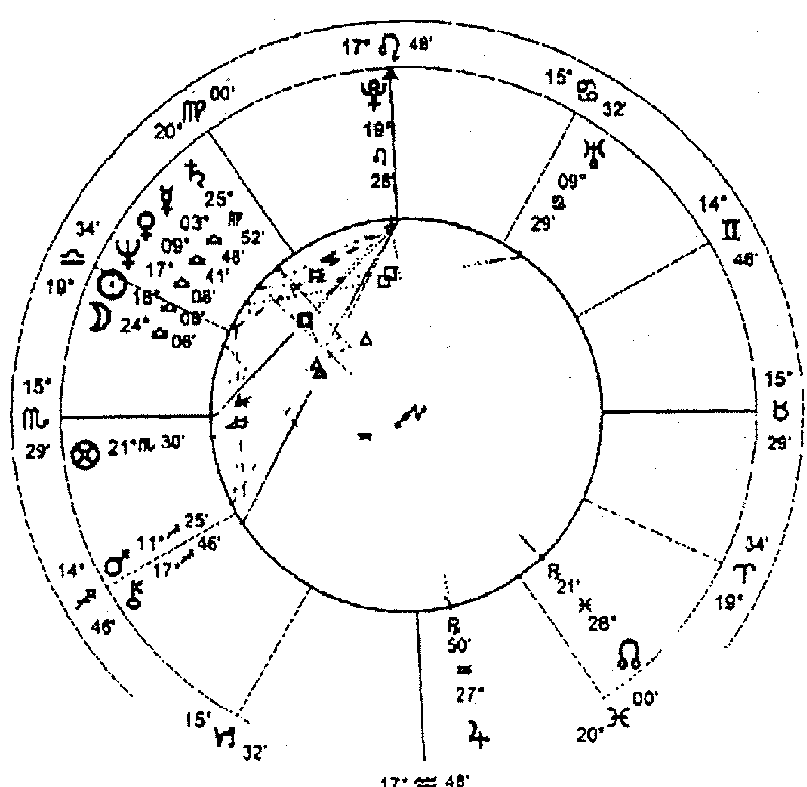

陳水扁
Oct 12, 1950
台南縣
08:00:00 AM CCT
ZONE: -08:00
120E 15"00"
23N 02"00"

陳總統命盤中，有5顆行星 ♀、♀、♄、☉、☽，皆落在天秤座，其主星為金星，所以 ♀ 是 ♀、♄、☉、☽ 的定位星，直接地影響這些行星。♃在處女，由 ♀ 定位，而 ♀ 由 ♀ 定位，故 ♃ 受 ♀ 間接定位的影響；♂在獅子，由 ☉ 定位，而 ☉ 由 ♀ 定位，故 ♂ 亦受 ♀ 間接定位的影響；♄在巨蟹，由 ☽ 定位，而 ☽ 由 ♀ 定位，故 ♄ 亦受 ♀ 間接定位的影響；♄在水瓶，由 ♃、♄ 定位，由上述知 ♃、♄ 已間接受 ♀ 定位，所以 ♄ 的最終定位星也是 ♀；♂在射手，由 ♄ 定位，而已知由 ♀ 間接定位，故 ♂ 的最終定位星就是 ♀，所以 ♀ 是陳水扁總統命盤的最終定位星，就具有關鍵主導作用，是其夫妻宮主星，顯然陳水扁總統一生受其妻子，吳淑珍夫人影響相當大，我們舉幾個事實驗證。

1. 受吳淑珍激勵，參與美麗島叛亂事件的辯護律師，從此開啓了政治生涯。
2. 參與台南縣失利，在關廟謝票，妻子遭動機不明之車輛無情衝撞，意外橫禍，吳淑珍癱瘓 (注意: 命盤中，♀□僅12'些微之正相位刑剋)。
3. 從政生涯中，對手惡意攻詰之風流桃花事件，吳淑珍樂觀開朗的四兩撥千金，化解幾次不利流言。
4. 競選總統時，獨排衆議，選擇頗受非議的呂秀蓮搭檔，增加不少婦女選票，又興票案疑雲，吳淑珍强力主張「高山觀虎鬥」，結果國民黨與宋楚瑜互咬，而讓陳水扁得利。

前行政院長郝柏村命盤 (案例三) 的最終定位星是太陽，故追求名聲、權力、領導力的慾望甚强。

(ii) 命盤中出現循環式的定位星，這種情況較易出現在命盤中行星分散之型態，由於有最終的定位星，容易原地打轉，無所依循。

我們以中國皇朝最後一位皇帝溥儀的命盤來說明 (案例十三)

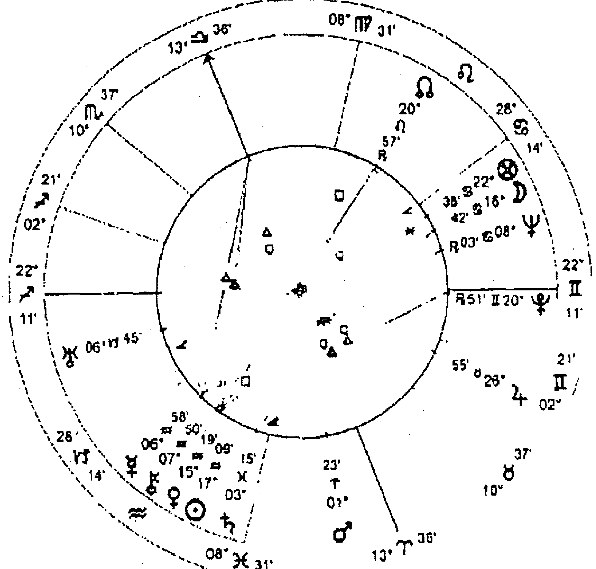

| | 行星 | | 定位星 | 間接定位星 | | | |
|---|---|---|---|---|---|---|---|
| 傳 | ⊙ | 子 17°9″ | ♀ | ♄ | ♀ | ♀ | |
| | ☽ | 未 16°41″ | ☽ | | | | |
| | ☿ | 子 6°58″ | ♀ | ♄ | ♀ | ♀ | |
| 統 | ♀ | 子 15°18″ | ♀ | ♄ | ♀ | ♀ | |
| | ♂ | 戌 1°23″ | ♂ | | | | |
| | ♄ | 酉 26°54″ | ♀ | ♀ | ♄ | ♀ | ♀ |
| | ♃ | 亥 3°14″ | ♄ | ♀ | ♀ | | |
| 現代三王星 | ♅ | 丑 6°44″ | ♀ | ♄ | ♀ | ♀ | |
| | ♆ | 未 8°3 | ☽ | | | | |
| | ♇ | 申 20°50″ | ♇ | ♀ | ♄ | ♀ | ♀ |

從溥儀命盤中可發現，若依傳統星座主星不加入現代之三王星主管，除了月亮、火星有自己的星座為廟之外，其餘5顆行星，都涉及循環定位星的間題，證之溥儀一生，雖貴為皇家，卻渾渾噩噩，甚至當日本關東軍所建立滿洲國兒皇帝，受人操控，任人擺佈，誠可悲也，此即循環定位星之典型寫照！此處有個問題，若加入三王星主管星座，卻出現循環定位星和最終定位星之矛盾，因加入三王星主管後土星落於雙魚會有海王定位星，而得月亮為許多行星的最終定位星，月亮為情緒、女人、8宮遺產之主星，溥儀成長過程，也有這些影子，但似不及循環定位來得寫實逼真。

### B. 容納

所謂容納是指一行星與其定位星，或落宮旺星，三分性，界，外觀等主星形成相位，他們容納該一行星，就如給予禮物一樣，如金星在雙魚與木星形成相位，木星容納金星給予金星禮物，讓金星充份帶有木星的吉祥、福運。

容納雖與五種必然尊貴的主星有關，但大多數祇著重於廟、旺主星，有關三分性，界與外觀僅參考，甚或不論，在中世紀文藝復興之前，這項觀念相當重要，是吉凶判斷的關鍵，但在現代占星學卻失傳，殊為可惜。

有關容納的吉凶關鍵，有好幾個出處，我們綜合歸納成以下法則：

(1) 容納相關的兩個行星皆為吉星，且為吉相位，會大大增强吉祥程度；若是凶相位，仍可提高吉祥，唯隱藏一些凶象。

(2) 容納相關的兩個行星，一吉一凶，原則上，凶星宜在吉星之廟或旺宮，此時有吉相位，會降低凶星之性，而提高吉祥，雖是凶相位，仍比一般無容納時吉祥，相對地，若吉星是在凶星之廟或旺，此時有吉相位，仍屬佳，若是凶相位，則仍呈現凶象，惟比一般無容納時稍減凶。

(3) 容納相關的兩個行星，皆是凶星，若是吉相位，仍不致全凶，隱藏吉象，若是凶相位，則仍為凶，但比一般無容納時稍減凶。

上述法則碰到被容納的行星，若是逆行或在果宮，尤其是6、12宮，會減低其收受禮物之能力。

我們以新當選美國這一任總統的布希命盤為例。(案例十四)

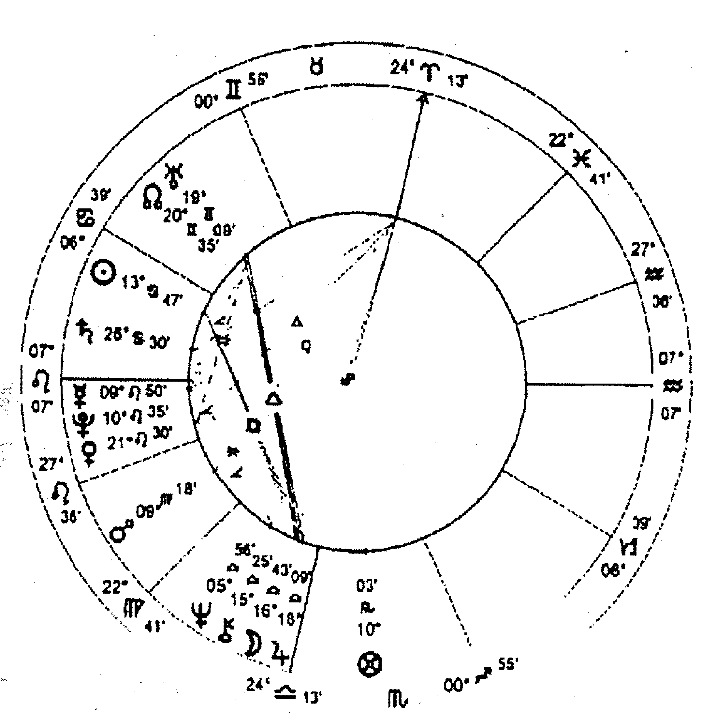

布希總統
Jul 06, 1946
New Haven CT
06:26:00 AM EST
ZONE: +05:00
072W 55'00"
41N 18'00"

布希總統的太陽為命盤主星，其ASC在獅子座，而太陽入12宮，果宮，一般認為12宮的太陽力量最難發揮，為偶然的無力，而且太陽又與月亮、木星形成90°刑之凶相位，這些因素都讓現代占星家們推論布希難當選的原因，殊不知古法重要的容納觀念，卻不這麼認為，因太陽在巨蟹，其廟、旺主星，分別是月亮及木星，而月亮與木星形成頗緊密的會合相位，雖與太陽形成凶相位，但事實上是給予太陽甚大的禮物，太陽為命主星，代表領導、權力、而讓它得予發揮，祇可惜太陽在果宮，減低其吉祥度，但已頗為難得。

台灣現任國民黨主席連戰命盤 (案例四)，其土星近ASC於雙魚，也遭逢木星在寅90°刑，一般認為這是凶相格局，但土星正是與其落宮星座廟主星木星形成相位，收到木星之禮物，而木星又在射手，其力道必然尊貴，土星所收禮物更吉祥。

### C. 互容

所謂互容是指兩個行星各落於該兩行星所主管之五種必然尊貴的黃道位置，如太陽在末宮，月亮在午宮，太陽和月亮稱為是以廟互容，如金星在申，水星在亥，金星在水星的廟，水星在金星的旺，也可稱互容。里利在〈表6-2〉僅列出廟旺的互容而已，其他三分性、界、外觀就不採用，也代表廟旺的互容較為重要。

互容的作用，會給相關的兩個行星帶來額外的力量，等於彼此支持對方的功能，就如我邀請你到我家，你邀請我到你家，互展誠意而沒有敵意，當然是吉祥的。

如中共前總理周恩來命盤（案例五），其木星在天秤，而其金星在雙魚，就形成廟互容，木星、金星皆是吉星，更增加彼此的功能，木星為先天射手主星，代表國外外交事務，金星為先天天秤，和諧調鼎，周恩來的外交成就有目共睹，應多少受此木星、金星廟互容的影響。

有關定位星、容納、互容這三個觀念，定位、互容較為現代占星學所熟知，但甚少應用，由於定位星的應用，並非那麼穩，所以也漸漸退出流行，但因其偶而有增強作用，所以可做參考，至於容納，古希臘，阿拉伯，文藝復興之前是相當重要的觀念，絕不能忽視，比較可惜的是古籍的說法，呈現版本不一。大體上可先依上述整理的法則來使用，後續若有較統一的吉凶判斷關鍵，再校正。

## 必然的無力 (Essential Debility)

當行星落於陷宮 (Detriment) 和弱宮 (Falls)，且無必然的尊貴和互容時，此時行星的力量難以發揮，有所失憑，稱為必然的無力。

所謂陷宮，即當行星落於其主管星座之對宮時，如太陽主管獅子，而它卻落於獅子座之對宮水瓶，太陽落陷，此時太陽很難發揮其正面力量。

弱宮，則是當行星落於其旺宮之對宮時，如太陽旺於白羊座，而它卻落於白羊座之對宮天秤，太陽落入弱宮，此時的太陽威力減弱甚多。

一般上入陷比入弱較凶，更難發揮該行星的特性，不管陷宮或弱宮，命主皆須盡力克服其困難，若無其他吉祥狀況，而因循苟且，會成為命主生活領域之障礙。

## 外來的 (peregrine)

當一行星所落星座，沒有五種必然的尊貴，且無廟及旺主星之互容時，此時該行星稱為外來的 (註：若全無五種必然尊貴的互容，則為徹底的外來)。

# 行星的原理與特性

Peregrine 係拉丁語，其意是「超出領域的邊界 (beyond the borders of field)」，此領域即自己的領土，因此超出自己領土的邊界，意謂著在外流浪，難以像在家得心應手。

傳統上，這 3 種必然的無力，以陷宮和弱宮較凶，行星落於此，代表該行星是不舒服的，放逐的，呈現違反其本性的傾向，而行星若是外來的，僅是缺乏必然的尊貴，但非對立，凶象較輕。

若凶星處於必然的無力，其象更凶，如火星、土星若無力，必然增添凶象，而吉星若無力，如金星、木星處於無力，吉象難顯。

應注意單憑無力，不必然無法成功，祇是更須努力克服，激發鬥志，雖艱辛，仍可成功。

我們以陳水扁總統命盤來說明必然的尊貴和必然的無力。

| 行星位置 | 廟 | 旺 | 三分性 | 界 | 外觀 | 無力 |
| :--- | :--- | :--- | :--- | :--- | :--- | :--- |
| ☉ 辰 18° 5″ | ♀ | ち | ち | 4 | ち | P |
| ☽ 辰 24° 6″ | ♀ | ち | ち | ♂ | 4 | P |
| ☿ 辰 3° 48″ | ♀ | ち * | ち | ち | ☽ | |
| ♀ 辰 9° 40″ | ♀ | ち | ち | ♀ | ち | |
| ♂ 寅 11° 25″ | 4 | | ☉ | ♀ | ☽ | |
| ♄ 子 27° 50″ | ち | ♀ | ち | ♂ | ☽ | |
| ♃ 巳 25° 51″ | ♀ | ♀ * | ♀ | ♂ | 4 | |
| ♀ち 旺宮互容 | | | P:peregrine.外來的 | | | |

陳水扁總統的太陽及月亮為徹底的外來。

(1) 太陽為白天行星，在白天盤，且在白天星座，是區分內(請閱本章第5節)，為吉，但太陽落於辰宮，入弱宮，而無其他尊貴之互容，徹底外來，兩者一吉、一凶，而太陽正好是陳水扁總統的事業 10 宮主星，太陽與 MC 及冥王 60° 半合，獅子座古時候常是論斷王候之根據，但太陽的吉凶參半，象徵其政治事業毀譽參半，風波不斷，難以順遂，雖貴為總統，心境轉折、衝突必常見到。又太陽為父親的自然主星，其父親辛苦、早逝，也事有可徵。

(2) 月亮在 12 宮(偶然的無力)，但入相位於木星在 4 宮為吉，稍可減低月亮之不利，能顧家，母親行事低調，出生家境雖貧窮，卻能和諧，而月亮又與恆星，吉的角宿 -1° 內會合，會增強月亮吉象(見偶然的尊貴)

## 第3節偶然的尊貴(Accidental Dignity)和偶然的無力(Accidental Debility)

偶然的尊貴和無力是天宮圖內星體或點所在位置，發生幸運吉祥或不利凶惡的配置。偶然的意謂著短暫用事時刻附屬於天宮圖之性質，不同於必然的尊貴在黃道之固有性質。

偶然的尊貴和無力也是用來評估行星或點，在用事時刻的相對力量，里利在其名著《Christian Astrology》曾列出偶然的尊貴和無力的分數計算表

<表6-4>偶然的尊貴和無力

| 偶然的尊貴 | 偶然的無力 |
| :--- | :--- |
| +5 在 MC 或 ASC | -5 在 12 宮 |
| +4 在 7 宮、4 宮、11 宮 | -2 在 8 宮和 6 宮 |
| +3 在 3 宮、5 宮 | |
| +2 在 9 宮 | |
| +1 在 3 宮 | |
| +4 順行(除了○、☽之外) | -5 逆行 |
| +2 運行比平時快速 | -2 運行比平時慢速 |
| +2 的東出 | -2 的西入 |
| +2 的西入 | -2 的東出 |
| +2 增光或西入 | -2 減光 |
| +5 沒有焦傷及在太陽光束下 | -5 焦傷 |
| +5 在太陽核心 | -4 在太陽光束下 |
| +5 與☿或♀的等分相位 | -5 與☿或♀的等分相位 |
| +4 與北交點☊的等分相位♂ | -4 與南交點☊的等分相位♂ |
| +4 與☿或♀的等分相位△ | -5 受☿、♂之間圍攻 |
| +3 與☿或♀的等分相位☆ | -4 與☿或♂的等分相位♂ |
| +6 與軒轅十四♂ | -3 與☿或♂的等分相位♂ |
| +5 與角宿一♂ | -5 與大陵五♂或 5° 內 |

里利所列之偶然尊貴和無力，就其項目，約可歸類為下列型態

A. 宮位位置(始宮、續宮、果宮)
B. 運行速度及狀況(快速.慢速.順行或逆行)
C. 月亮的增光或減光
D. 接近太陽的狀況
E. 與吉星和凶星的相位
F. 與恆星的會合☊
G. 行星的相態(東出和西入)

我們針對以上歸類型態一一解說

A. 宮位位置

經天文弧角天星計算後產生十二宮，其中始宮、續宮、果宮的分類最為重要，而又以始宮賦予較高分到低，始宮中之 1 宮及 10 宮，即 ASC 和 MC，里利給予較高分到低，有關其要義，我們已在後天 12 宮詳細説明過，不再贅述，其分數評等，自古各占星家看法不一，但里利的威名顯赫，故後世皆採用其說，幾成定論。

## 行星的原理與特性

由於逆行是不進則退，象徵退縮或反省、檢討，就一般意義而言，它是凶的，因此自古以來，占星名家皆對逆行現象，賦予凶的注解。

基本上，逆行行星(天宮圖以R代號)會有下列干擾：

- 1. 帶來混亂
- 2. 不一致和矛盾
- 3. 帶來遲延
- 4. 可能帶來突然的結果
- 5. 失物可能尋回
- 6. 可能帶來驚訝的結果

在卜卦占星學中，若問題中的代表因子之行星逆行，象徵返回去，或回到原先狀況，詢問者或主要人物可能背信，或改變他的心意，因此逆行行星是無力的，一個逆行的代表因子是被動的，但若是反省自躬，返回再思考，重新再來，倒是一個好時機，1950-60年代，美國著名的女占星家，艾薇·格德史坦·傑可布森(Ivy.M.Goldstein-Jacobson)認為逆行是"返回去再重新試試看"(go back and try again)，就是最好的寫照。

里利給予逆行行星最凶的分數-5，所以在卜卦上，若1宮內有土星逆行，象徵某些不幸，7宮內行星或其主星逆行，可能意謂著解答問題的占星家容易"凸槌"，無法將正確的判斷提供給詢問者；但有關失物問題，失物之代表因子逆行，則失物將返回，即有可能尋回。

## 行星的原理與特性

在本命占星學中，行星逆行也象徵退縮、反省，如吉星無法顯現其吉象，凶星更加惡化，詳細的判斷請參考《行星的原理及特性》表中逆行意義。

逆行被歸類為凶，順行為吉，事實上，若產生逆行，其整個過程，分成四個階段。

- I. 順行
- II. 停滯(轉成逆行)
- III. 逆行
- IV. 停滯(轉成順行)

| 階段 | 吉凶 |
| :--- | :--- |
| I. 順行 | 吉 |
| II. 停滯(轉成逆行) | 稍為不吉 |
| III. 逆行 | 不吉 |
| IV. 停滯(轉成順行) | 稍為吉 |

古德 波那提認為III，逆行和II順行後的停滯，都代表著危害和妨礙，而II不如III之危害，而IV雖被認為走出陰霾轉為吉，不如I之吉，但他也認為IV，如一個人剛患完病，不可能那麼快地馬上變好。

就地心系統，行星在黃道運行，會因各行星之個別速率不同，而產生外觀上的逆行現象(Retrograde)，這可分成內行星和外行星的情形，所謂內行星，就是地球和太陽之間的行星、水星、金星，而外行星則是太陽系中地球軌道之外的火星、木星、土星和現代三王星，天王星、海王星，及冥王星。

## 行星的原理與特性

圖6-4為太陽、地球內外行星的相互位置關係圖

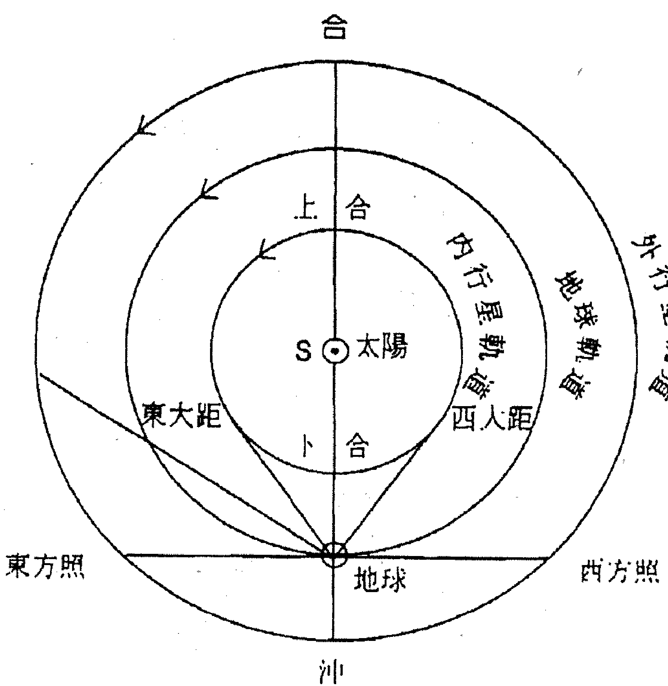

## 行星的原理與特性

圖6-5以火星為例在天空中移動的路線，即可看出逆行現象


## 行星的原理與特性

### C. 月亮的增光和減光

在古代傳統占星學中，月亮的相態(Lunar phase)被認為比月亮所在的星座更有意義，早期巴比倫人觀察天象，月亮是重點項目之一，所謂月亮的相態，一般俗稱月相，是月亮繞著地球運行，而與太陽、地球產生關係而出現的樣子，通常係以月亮和太陽0°會合起算，稱為新月(New Moon)，約7天後，月亮形成半圓，此時稱為最初四分相(First Quarter)，然後再約7天，月亮形成滿月(Full Moon)，因藉由太陽光反射，而圓滿無缺，此時與太陽是相對的即☽☉，從新月到滿月這段期間約14天，月亮的光漸增(Waxing)或漸增光(increasing light)。從滿月開始約7天後，月亮又形成半圓，與太陽形成90° 刑，此時稱為最後的四分相(Last Quarter)，再從此刻約7天，月亮又回到與太陽會合，月亮不見了又形成新月月亮從滿月到新月這段期間，其光漸減(Waning)，或減光(decreasing light)。月亮就這樣周而復始地運行，其在一周期循環所呈現的樣子，稱為月相，如下圖圖6-6所示

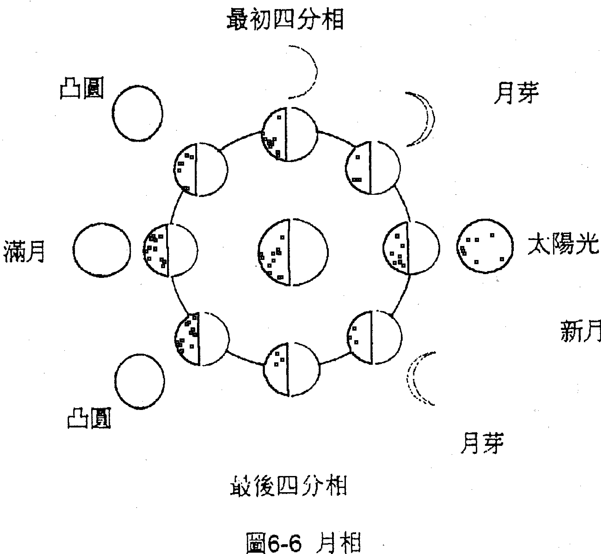

月相的四種基本型態，類似一年四季循環，遂有占星家將之比擬為春、夏、秋、冬，所以月相的四種型態就如春(風象)、夏(火象)、秋(土象)、冬(水象)之基本特性，文藝復興時期的高爾加斯(Garcaeus)和加德貝利(Gadbury)，就整理出下表〈表6-5〉

| 新月到最初四分相 | 濕和熱 |
| :--- | :--- |
| 最初四分相到滿月 | 熱和乾 |
| 滿月到最後四分相 | 乾和冷 |
| 最後四分相到新月 | 冷和濕 |

從上表可感受到月亮增光時，月亮隱喻性的漸熱，意謂著較活潑，或較具生產力，而月亮減光時，相對地隱喻漸冷，較為消極，生產力較弱，月相在占星學的應用相當廣，尤其是擇日占星學，如《明譯天文書》第四類第2門，細分選擇條件，曾提到「若國家祭旗之日，選太陰(即月亮)在吉位上，又要本位宮主星有力順行，又要比太陽先東出，又取太陰增光，行疾升上時......」，又該書第三類，第十四門，說婚姻，也提到「若命宮內，在太陰生光時，則其人早婚，若太陰減光時，則婚遲，或取年長者為妻」，後者係屬本命占星學範圍。

在醫療占星學中，月相的這種類比季節性質，常被引用，英國醫療草藥占星家丘勒匹柏就依這種特性列入計算一個人的體液，再和其他評量合計，而推算一個人的外觀、體裁、髮毛色澤、脾氣習性、健康狀態....等。

### D. 接近太陽的狀況

自古以來，太陽和月亮一直被視為天空中的國王與皇后，行星的運行只是執行他們的命令而已，尤以太陽更具權威，行星是其朝臣，由於君威難測，行星接見太陽時，戰戰兢兢，其光芒被掩蓋，而難以發揮力量，中國古占星學書籍《天學洞機》稱這種現象「伏見」，即行星伏於太陽之下。

行星接近太陽時，因距離度數不同，而有不一樣的效應，故需審慎計算，基本上有三種狀況，是自古以來所認同的，如下圖圖6-7

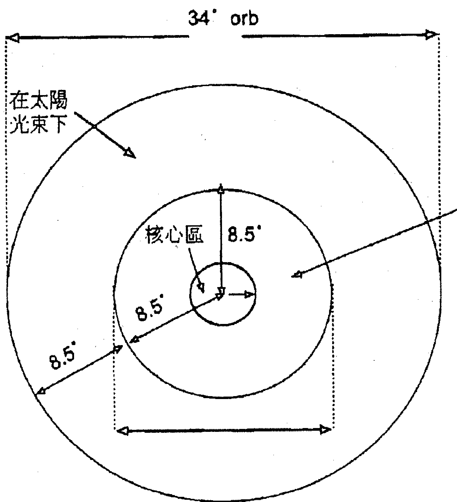

1. **在太陽光束下(Under the Sun's Beams)**
   行星與太陽會合，從8°30'到17°之間，稱為行星在太陽光束下，亦即行星可能受太陽光或所謂射線(Rays)的光芒所掩蓋，其威力會減弱，但因這種情況離太陽稍遠，有時該行星尚能看得見，或因天候或因行星本身亮度關係，所以尚不致最艱難，但里利也將之列入偶然的無力評估項目中之。

   為何是這種度數?這跟行星傳統的容許度有關，里利曾列有行星的兩套容許度，其中太陽的傳統容許度是15°～17°或其一半(moiety)是7.5°～8.5°。請看〈表6-6〉

2. **焦傷(Combust)**
   行星與太陽會合，從17'～8° 30'，行星受太陽焦傷，里利認為該行星必須與太陽在同一黃道星座時，方稱為焦傷，這種狀況是偶然無力中最壞項目之一，而月亮若遇此種情況，在卜卦上是最糟的，因月亮在卜卦占星學中為共同主星，常意謂著詢問者，害怕或面臨偉大人物的壓力。

3. **核心(Cazimi)**
   行星與太陽會合，從0°-17'，此時稱為行星在太陽的核心，實體地參與太陽，因而大大地增强其力量，里利視之為最大吉祥，給予+5評價。

有關行星接近太陽的狀況，自古以來就常受矚目，這可能源自巴比倫人觀察天象，累積經驗所致，他們樸素地認為，行星看不見或雖看得見但減弱，都無法發揮它最大的實力，至希臘化時期，已將太陽、月亮視為天空的國王皇后，需有隨員侍從，而行星就是其隨員，若太陽、月亮無隨員，代表孤單，易有疾病，健康不良的象徵，希臘的托勒密將隨員觀念衍申成與太陽月亮同一星座，因為同星座，較有同心之意，這也是里利認為焦傷須同一星座條件的源頭，焦傷是最糟的情況，然太陽無隨員，父親易生病之矛盾實肇因於此。

由於焦傷的行星失去力量，故可善用其特徵，應用在不同的占星學領域。因焦傷，不見行星之光，在擇日占星學上，可用於強調秘密的事件上。

- 在卜卦占星學中，若問題的代表因子之行星焦傷，可能帶來疾病和死亡。
- 在本命占星學中，焦傷的代表因子，可能帶來疾病，或意外災難，是非、危害。

另外，在太陽的光束下，事件判斷可聯想成曖昧不明。

我們以陳水扁總統命盤中的金星為例說明，其金星在天秤9°40'，而太陽也落天秤18°5'，兩者在同一星座，距離度數為8°25'金星受太陽焦傷，而金星為夫妻宮主星，幸金星在天秤為旺，係必然的尊貴，但焦傷，代表危害災難、意外，若以古典技巧，吳淑珍有此慘禍，似有跡可尋，而現代行星中代表突然分裂之天王星又與金星形成90°刑凶象，更添此象。

又中共前總理周恩來命盤中的金星，落於雙魚14°35'為旺，而太陽也在雙魚11°12'，同一星座，距離度數3°23'，金星受太陽焦傷，金星為其5宮主星，代表子女，儘管金星得木星之容納，但也有其缺憾，中國人注意子息承繼，周恩來雖豐功偉業，在外交史上為一典範，卻無子女為繼。

### E. 與吉星、凶星的相位

我們已在前面談到行星吉凶，即傳統7顆行星中，以木星、金星為吉星，而木星最吉，金星次吉；以土星、火星為凶星，土星為最凶，火星次凶，這項傳統的行星吉凶觀念甚為重要，里利在<表6-4>中，就列出天宮圖中代表因子能與吉星、木星、金星產生0°會合☉，60半合✶，及120°△三合等吉相位，會增強該代表因子行星之吉象，給予加分，相對地，若與土星、火星等產生0°會合☉，90°刑□，180°♄沖，等凶相位，會產生代表因子之凶象，予以扣分，又里利也視月亮北交點☊為吉星，而月亮南交點☋為凶星，若代表因子之行星與之產生上述吉、凶星之相位，也分別予以加減分，但略低於上述之分數。

應特別注意的是，傳統的相位觀念與現代相位不太一樣，本節先討論傳統的相位觀念，有關現代相位觀念留待後面再詳論。

希臘化時期的相位計算，是以行星所落的整個星座，而非以其度數計算，如太陽在射手9°，而金星在獅子28°因射手與獅子在黃道上是三合，所以太陽與金星，就是三合，若依現代較小之容許度，此時太陽與金星是不能構成三合的，中國擇日至寶弧角天星擇日，也是以行星落宮的整個星座來計算。

到17世紀占星學大放光芒之際，普遍使用行星容許度的相位，即容許度是屬於行星本身，非現代相位所屬的，因為行星互相產生感應，是以行星為中心，其放射線有效範圍為半徑，這就是行星的容許度，故而形成一個以行星為中心的圈圈，容許度"orb"其拉丁語orbis就是圈子的意思。

傳統的行星相位容許度，里利列出兩套，一為正常的容許度，二為容許度的一半，稱為moiety，即一半之意，里利自豪地說“有時使用這一個，有時使用另一個，就我的記憶所及，他們甚佳，尚無錯誤”。

〈表6-6〉里利的行星容許度表

| 行星 | 容許度 | 一半的容許度 |
| :--- | :--- | :--- |
| ☉ | 15° 或17° | 7.5° 或8.5° |
| ☽ | 12° 或12.5° | 6° 或6.25° |
| ☿ | 7° | 3.5° |
| ♀ | 7° 或8° | 3.5° 或4° |
| ♂ | 7° 或7.5° | 3.5° 或3.75° |
| ♄ | 9° 或12° | 4.5° 或6° |
| ♅ | 9° 或10° | 4.5° 或5° |

由於各行星有一定的容許度，行星配對形成相位，就有一定標準通常是採用其各一半的容許度相加，作為配對行星的最大相位容許度，如<表6-7>

〈表6-7〉行星配對組合相位容許度

| 行星及其容許度 | ☉(15-17°) | ☽(12-12.5°) | ☿(7°) | ♀(7-8°) | ♂(7-7.5°) | ♄(9-12°) | ♅(9-10°) |
| :--- | :--- | :--- | :--- | :--- | :--- | :--- | :--- |
| ☉(15-17°) | | | | | | | |
| ☽(12-12.5°) | 13.5-14.75 | | | | | | |
| ☿(7°) | 11-12 | 9.5-9.75 | | | | | |
| ♀(7-8°) | 11-12.5 | 9.5-10.25 | 7.7.5 | | | | |
| ♂(7-7.5°) | 11-12.25 | 9.5-10 | 7-7.25 | 7-7.5 | | | |
| ♄(9-12°) | 12-14.5 | 10.5-12.25 | 8-9.5 | 8-10 | 8-9.75 | | |
| ♅(9-10°) | 12-13.5 | 10.5-11.75 | 8-8.5 | | 8-8.75 | 8-11 | |

<表6-7>所列，係就選定之行星容許度1/2來組合其最大相位容許度，如金星和土星其各別容許度之一半分別是3.5°或4°及4.5°或5°，加總而得8°～9°。

傳統的行星相位觀念頗為合理，它設定每一行星為一光圈的中心，半徑即其容許度的一半，意謂著行星在此光圈或其射線是有力的，足以影響天空中之其他星體，若它與其他星體接觸，其他星體亦同樣以其光圈或射線與它接觸，這就形成了傳統的行星相位，其釋意如下二圖，圖6-8 圖6-9

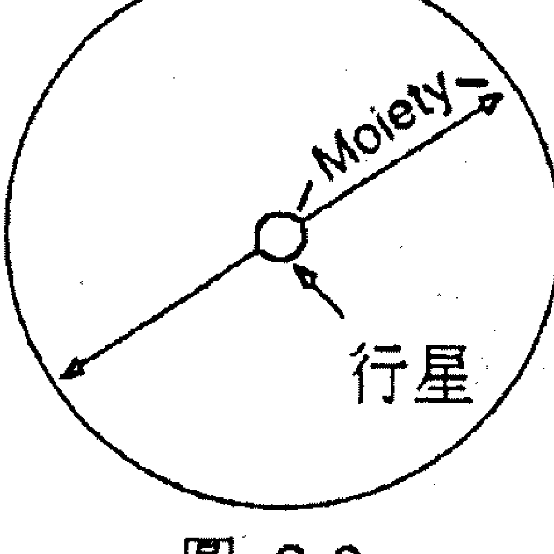

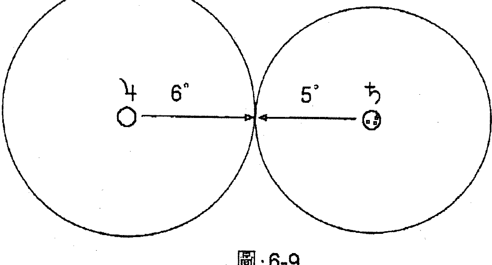

## 行星的原理與特性

在此種概念下，有幾個重要觀念須說明

1. **正相位(Exact Aspect)**
   當兩個形成相位的星體，他們的中心，無須臾之分離，即相同的度數分、秒皆精確無異，此即正相位，如金星在獅子9°25'17"，火星在射手9°25'17"，金星與火星，即形成120°之三合正相位。

2. **完美相位(Perfect Aspect)**
   當兩個形成相位的星體，他們的中心度數相同，但分秒可以不同，此即完美相位，里利認為一般行星最多僅能有3'的容許度，而發光體(即☉、☽)，有17'之容許度於完美相位中，故一般行星的完美相位頂多離6'，而一般行星與太陽、月亮之完美相位，頂多能有20'的容許度，如金星在獅子9°28'，而木星在白羊9°23'，兩者相差6'內，故可稱金星和木星形成120°三合的完美相位，又月亮在射手9°47'，月亮與金星可形成120°三合之完美相位，因兩星體僅差12'內。但月亮與木星則無法構成120°三合之完美相位，因兩者雖三合已離24'，超過所允許之容許度。

3. **等分相位(Partile Aspect)**
   等分partile源自拉丁文，即將黃道劃分成每星座30°之等分。
   等分相位的定義是當兩個形成相位的星體，在相位相關的星座同一度數，不必分、秒相同或容許度的限制，此即等分相位，它比完美相位稍放寬，如金星在白羊9°1'，而木星在獅子9°57'，金星和木星即形成120°三合之等分相位，此處應特別注意，相同度數的條件，若火星在獅子8°57'，兩者雖形合120三合，僅離4'，卻非等分相位。

4. **寬廣相位(platic Aspect)**
   寬廣(platic)源自希臘語，platys，意謂著寬廣或平淡。
   寬廣相位的定義是當兩個形成相位之星體是在〈表6-7〉之接觸範圍內，此即寬廣相位，如金星在獅子9°1'，而木星在白羊1°59'從〈表6-7〉查其容許度最大範圍為8°-10°金星和木星符合此要件，他們形成120°三合之寬廣相位。

相位愈緊密，其力量愈强，故正相位、完美相位、等分相位，都頗具影響力，里利將他們列為偶然尊貴，或無力之一種，但羅喉，計都里利僅考慮0°會合之等分相位而已。

又順便一提，卜卦占星學、擇日占星學或醫療占星學中的疾運盤，相當重要的入相位(Applying Aspects)和離相位(Separating Aspects)，應特別注意，我們留待相關章節再說明。

### F. 與恆星(Fixed Stars)之會合

自古以來，占星家對天空現象的觀察，除太陽系外，也注意到遙遠的恆星，但恆星無數，古代先賢乃選擇亮度較强的恆星為主，經長期觀察，實證認為確有影響的，就剩不多，里利在〈表6-4〉偶然的尊貴表中，僅列三顆，即軒轅十四(Regulus)，角宿一(Spica)和大陵五(Algol)前二者為吉，後一為凶，因軒轅十四具有皇室王權之象徵，是所有偶然尊貴表中最高的，而角宿一次高，至於凶星大陵五，也給予負面評價中最高的。由於恆星因歲差現象，在黃道區會移動,以下依公元2000年,這三顆恆星在黃道位置及其特性:

- 1. **軒轅十四**: 獅子座29°50',獅子的心臟(Cor Leonis)在宇宙中是吉祥的恆星,因獅子是百獸之王,為皇家的星星,代表事情狀態有利,領導力,最大權力,具有火星和木星的特性。里利說軒轅十四提供榮譽、財富、甚高尊榮、軍事地位之榮耀。
- 2. **角宿一**: 天秤座23°50',好運、幸運、富有、具有金星、火星、木星、水星之性質。
- 3. **大陵五**: 金牛座26°10',天上最凶的恆星,妖魔頭、易遭凶災,喉疾、落齒、骨折、身體傷殘,具有土星和火星的特質,最應注意頭部之撞傷,甚或人頭落地。

當天宮圖的行星或敏感點,若與軒轅十四及角宿一,形成0°會合(1°容許度內),給予正面評價,若與大陵五形成0°會合或5°內之容許度,給予負面評價。(註:里利所認為大陵五5°之容許度太粗疏,仍以1°內容許度為主),注意里利並未提到,恆星會合須用等分相位。

有關恆星更詳細內容,我們在下一章再詳論。

### G. 行星的相態(東出和西入)

所謂行星的相態,係指行星如何及何時出現在天空,這涉及到行星本身的運轉方向(順行或逆行)和速率,因太陽是太陽系的中心，行星的相態與太陽關聯甚强。

古代傳統占星學相當重視行星的相態與太陽的關係，其中所謂的東出(Oriental)和西入(Occidental)，一直在古典占星學書籍被廣泛地討論，東出和西入的概念源自簡單的實際天象觀察，當你在清晨尚未黎明之前，看東邊，太陽即將升起之處有行星，此行星先太陽升起，而可看得見，稱為東出；相對地，在黃昏時太陽下山後，天色漸暗，西邊太陽西沈之處，尚有行星可看得見，此行星在太陽之後西降，稱為西入，原則上陽性行星如♂、☊、☽宜東出，陰性行星☽、☿、♀宜西入。

里利的偶然尊貴表中，對太陽以後之行星的東出、西入分別給予正面、負面評價。

1. ☽、☿若西入，給予正面評價，若☿、♀東出，給予負面評價，☽不計。由於水星金星是所謂的内行星，距離太陽不可能超過90°以上，若假設以太陽作為ASC點，水星、金星基本上，不是在ASC之上的12宮或11宮，就是在ASC之下的1宮或2宮，前者即是東出，後者即為西入。

當水星、金星在晨間先太陽而東出，此時的水星、金星運行會較慢，前面B節論及行星的運行速度與狀況有談及，行星運行速度比平均慢，是不好的，所以水星、金星的東出是不好的，而予以負面評價，又水星和金星逆行時也可能發生近日地東出，因水星和金星運行速度比太陽快，故水

## 行星的原理與特性

水星和金星逆行會很容易趨近太陽，故易近日地東出，逆行也是不好的評價。

相對地，當水星、金星在太陽之後西沈，此時的水星、金星運行會較快，故為吉，又因是內行星，其順行，且速度較太陽快，都是正面評價，故其西入為佳。

2. ♂、☿、☽若東出，給予正面評價，若♂、☿、☽西入，則給予負面評價。

火星、木星、土星的運行速度通常較太陽慢，一般稱為外行星，當太陽較快地脫離，火星、木星、土星不受焦傷，其能量較能發揮，此即想像外行星東出時之現象，相對地，若火星、木星、土星西入，太陽因運行較快，會趨近該外行星，產生焦傷，或在太陽光束下之凶象，因此外行星的西入為凶象。

行星的東出 西入概念，因傳承關係，在定義上也呈現不同，如希臘時期托勒密就以太陽在黃道之經度，作為ASC東升點和其相對點，兩者聯線形成假想地平線，當任何行星落在ASC至MC象限，或從DSC到IC，象限中，稱為東出，而若是落於MC到DSC，及IC至ASC象限，稱為西入，如下圖圖6-10


托勒密的說法，曾被廣泛地引用，但中世紀後，則逐漸根據東出 西入的概念，訂出另一種座標來表達，更直接了當，即同樣以⊙的黃道經度為東升點其相對點為西降點，兩者連線形成假想地平線，當任何行星在12宮、11宮、10宮、9宮、8宮、7宮者，就是東出，相對地若是在1宮、2宮、3宮、4宮、5宮、6宮，就是西入，這種座標表示行星的東出、西入較為後世遵循，里利的偶然尊貴即按定義計算的。

行星的東出西入，應用於天宮圖的分析，里利提供了不少線索，如本命占星學中代表因子之行星東出，可能代表早或快，曾提到命主何時可獲得財富？如財富的代表因子先太陽東出，財富來得較快，若西入，則財富可能來得較慢。在卜卦占星學里利曾有個案例，斷竊賊是年青，因代表竊賊的行星東出；若論疾病，東出的代表因子指示新疾病，若是西出，則是慢性疾病。

又古代醫療占星學論命主的脾氣習性(也可用於本命占星學)以行星的東出和西入來計算體液，從而分析命主的月脾氣習性，文藝復興時期的高爾加斯曾列出。

| | 東出 | 西入 |
|---|---|---|
| ☿ | 熱 | 乾 |
| ♀ | 熱和濕 | 濕 |
| ♂ | 熱和乾 | 乾 |
| ♄ | 熱和濕 | 濕 |
| ♃ | 冷和乾 | 乾 |

註:一般情況，♀的純質料為冷和濕，故高爾加斯的說法，僅供參考。

## 第四節 行星的原理與特性細論

### 行星:太陽 符號:☉ 行星的原理及特性 性質:吉

| 純質料:熱.乾 | 喜樂宮:9宮 | 星期代表:星期日 |
|---|---|---|
| 白天或夜間:白天行星 | 體 液:膽汁質 | 行星時間:星期日日升後第1及第8個時辰，和以下晚上的第3和第10個時辰 |
| 陰或陽:陽性行星 | | 行星期間:實歲23-41歲共19年 |

| 廟 Ruler | 旺 Exaltation | 三分性 Triplicity | 界 Terms | 外觀 Faces | 陷 Detriment | 弱 Fall | 外來的 peregrine |
|---|---|---|---|---|---|---|---|
| 獅子 | 白羊 尤其19° | D.火象星座 白羊 獅子 射手 | | 白羊 10° 19' 雙子 20' 29' 處女 0° 9' 天蠍 10° - 19° 摩羯 20° - 29° | 水瓶 | 天秤 | 白羊 金牛 0°-29° 雙子 0°-19° 巨蟹 0°-29° 獅子 處女 10°-29° 天秤 弱 0° - 9° 天蠍 20° - 29° 射手 N 摩羯 0° - 19° 水瓶 陷 雙魚 0°-29° |

| 符號演繹 | ⊙由一個圓加上圓心的一點，即太陽符號，圓是完整、圓滿的象徵，代表宇宙和心靈，是純粹的精神，而圓心點為焦點，聚光，因此容易受注目、才華、創造，經由此點而流露出生命力，潛在的專制的創造能量浮現。 |

### 主要的原理

- 發光或向外推進、浪費(奢侈)，太陽所在之效應傾向受到注目，聚光燈的發亮，這個理由完全顯而易見，在天空中，它是最亮的目標，太陽系的中心，根據亞里斯多德說法，它是熱和乾，膽汁質的熱產生活動力，乾產生區別，這是非常陽性的行星，為精神、專注和堅決的象徵。
- 天宮圖中的意義：
    1. 太陽在盤中建構個人的主要性格之一，可由其所在星座詮釋。
    2. 個人的才華、意志、精力、權力、企圖心的追求，由所落後天宮位，看其表現在何種生活領域，此即太陽二力說:能力、精力、權力。
    3. 男命命盤中的父親，女命命盤中父親或丈夫，由其先後天配置，視其必然的尊貴或無力、偶然的尊貴或無力來參考。
    4. 太陽為生命的能量，所在先後天宮，受刑沖，能量易燃燒過其，形成所代表之器官受損，疾病發生。
    5. 就容格心理學，太陽是英雄的原型，心靈運轉的原動力，此即容格之libido而受注目，常是論斷個人外貌形象特徵的重要因素，尤其是其合相行星，因反射其光而凸顯。
    6. 父系遺傳之推測。

※影響:心臟、背部、視力、精力、能力、權力 父親、創造才華。

### 每日運行速率:0° 59' 8" | 黃道周期:一年繞行黃道一周 | 關鍵語:權力、生命力、自我表現、創造力

| 逆行意義(Retrogradation) | 太陽無逆行現象 |
|---|---|
| **人:** 國王、元首、總統、父親、丈夫、尊貴的人、雇主、老板、領導者、演員、導演 | **地點:** 舞台、政府機構、宴會廳、娛樂場所、賭場 |
| **事:** 英雄事蹟、娛樂事務、政治 | **顏色:** 金黃色、鍍金色、紅、紫 |
| **物:** 勳章、褒揚令 | **金屬:** 黃金、鑽石、黃玉、紅寶石 |
| **器官:** 背部、心臟、男性右眼、女性左眼、血液、循環系統、動脈、身體右側 | **動物:** 獅子、老鷹、隼、公雞、孔雀 |
| **疾病:** 心臟病、高低血壓、背部疼痛、視力差、眼病、發燒發炎、視力不佳 | **植物:** 稻米、向日葵、番紅花 甘菊、肉桂、杜松屬、金盞草、芳香植物 |

| 正面評價 | 負面評價 |
|---|---|
| 創造力、領導能力、慷慨、尊貴、熱愛生命、喜愛孩子、勇氣 | 傲慢、自負、專制、誇大、揮霍浪費、強人所難、缺乏耐力、虛榮、自我本位、獨裁、賭性、玩心重、放蕩、作威作福、桃花 |

### 行星:月亮 符號:☽ 行星的原理及特性 性質 吉

| 純質料:冷.濕 | 喜樂宮:3宮 | 星期代表:星期一 |
|---|---|---|
| 白天或夜間:夜間行星 | 體液:黏液質 | 行星時間:星期一日升後第1及第8個時辰，及以下夜晚的第3個和第10個時辰 |
| 陰或陽:陰性行星 | | 行星期間:實歲4歲前(含) |

| 廟 Ruler | 旺 Exaltation | 三分性 Triplicity | 界 Terms | 外觀 Faces | 陷 Detriment | 弱 Fall | 外來的 peregrine |
|---|---|---|---|---|---|---|---|
| 巨蟹 | 金牛尤其3° | N.金牛處女摩羯 | | 金牛10°-19°<br>巨蟹20°-29°<br>天秤0°-9°<br>射手10°-19°<br>水瓶20°-29° | 摩羯 | 天蠍 | 白羊0°-29°<br>金牛<br>雙子0°-29°<br>巨蟹<br>獅子0°-29°<br>處女 D<br>天秤10°-29°<br>天蠍弱0°-9°<br>射手20°-29°<br>摩羯 D<br>水瓶0°-19°<br>雙魚0°-29° |

| 符號演繹 | 月亮係由符號半圓形成，代表靈魂、陰性、被動、為太陽光源之反光，但也隱含另半圓的無明，亦即人類的本性之感受性如無意識、情感、行為本能、而這些常具光明面及隱晦面。 |

### 主要的原理

吸收、引起心靈感動，集合磁性，產生真空(空虛)，月亮為冷和濕，意謂著它傾向和諧而沒有區別，冷降低了活動力和產生平靜，它是非常陰性的行星，為所有精神投入的吸收者，所以它無法形成物質型式。

### 天宮圖中的意義:

1. 月亮在黃道12星座，代表個人人格一部份為感情直接反應方式，它顯示植根源於早期經驗的影響，決定了個人與家庭生活事務，母親、女性之關係。
2. 月亮因主宰一般的情緒反應，也代表個人面對陌生環境或一般環境時之情緒反應，也形成個人精神負擔所在。
3. 男命的母親、女性，女命的母親，或男女命的母系遺傳，感覺母親對自己的態度。
4. 月亮的位置，是飲食習慣或食物或是家居佈置，偏好的指標。
5. 月亮在後天宮，可以瞭解其生活領域的情感表現方式。
6. 月亮距離地球近且移動速度快，影響明顯，所以是卜卦、擇日及醫療占星學重要決定因子。

※影響:出生、母親、消化系統、胃、乳房、子宮卵巢、交感神經系統、營養、情緒、個人習慣、家庭、祖先、記憶。

### 每日運行速率:13° 10'36" | 黃道周期:27.32日 | 關鍵語:反應、直覺、變動

| 逆行意義(Retrogradation) | 月亮無逆行現象 |
|---|---|
| **人:** 人民 母親、妻子、女主人、助產士 | **地點:** 住家、田園、水族館、旅舍、餐廳、近水、船泊 |
| **事:** 食慾、大衆之事、繁殖力、懷孕、生產 | **顏色:** 銀灰色、白色、淡青籃、乳白色 |
| **物:** 土地、不動產、[]常家居用品、食品雜貨 | **金屬:** 貓眼石 月長石、珍珠、水晶、銀鋁、透明石膏 |
| **器官:** 胃、腹部、胸部、身體左側、子宮卵巢、周期性、月經、男性左眼、女性右眼 | **動物:** 青蛙、大兔夜鶯、鸚鵡、天鵝、螃蟹甲殼類水中物 |
| **疾病:** 上述器官之病變、精神不正常、食慾不振貧血症 視力不佳 | **植物:** 甘藍菜 甜瓜、胡瓜、南瓜藤、菊高苣、香菇、水田芥、百合花 |

| 正面評價 | 負面評價 |
|---|---|
| 母性 富同情心、聽從 具包容性、想像力豐富、念舊、敏感、記憶力佳 | 情緒化、防衛過度、容易記恨、心胸狹窄難取悦、易受到刺激 |

### 行星:水星 符號:☿ 行星的原理及特性 性質:中

| 純質料: | 喜樂宮:1宮 | 星期代表:星期三 |
|---|---|---|
| 白天或夜間: | 體 液: | 行星時間:星期三日升後第1及第8個時辰,以後晚上的第3個時辰和第10個時辰 |
| 陰或陽:陰性行星 | | 行星期間:實歲5-14歲,共10年 |

| 廟 Ruler | 旺 Exaltation | 三分性 Triplicity | 界 Terms | 外觀 Faces | 陷 Detriment | 弱 Fall | 外來的 peregrine |
|---|---|---|---|---|---|---|---|
| 雙子 處女 | 水瓶 | N.雙子 天秤 水瓶 | 白羊 14° - 20° 金牛 8° -14° 雙子 0° -6° 巨蟹 13° -19° 獅子 6° -12° 處女 0° -6° 天秤 19° -23° 天蠍 21° -26° 射手 14° -18° 摩羯 6° -11° 水瓶 6° -11° 雙魚 13° -20° | 金牛 0° 9° 巨蟹 10° - 19° 處女 20° - 29° 射手 0° 9° 水瓶 0° 19° | 射手 雙魚 | 獅子 | 白羊 0° - 13° 21° - 29° 金牛 15° -29° 雙子 0° - 9° 巨蟹 20° - 29° 獅子 0° - 5° 13° - 29° 處女 0° - 18° 天秤 D24° - 29° 天蠍 0° - 20° 27° - 29° 射手 10° - 19° 20° - 29° 摩羯 0° - 5° 0° - 5° 水瓶 D20° - 29° 雙魚 0° - 13° 20° - 29° |

| 符號演繹 | 水星由半圓、圓及十字,共三個部份組成,十字代表物質在底下,中間圓為精神,上面半圓為靈魂,亦即水星正是由物質經由精神通往靈魂,蘊含水星為物質界和較高層次之精神界之媒介,地與天、人與神之交界。 |

### 主要的原理

分裂和加速(善變性)雙重性、理念,水星主要的目的是扮演所有雙重性,和對立型態的調停。諸如熱和冷、濕和乾、光明和黑暗、硬和軟,因為這個理由它本身非這些原理(雖然它輕微地乾),而是仿效最有可能實現的原理,它象徵傳達、溝通、語言、智商、性別是中性的。

### 天宮圖中的意義:

1. 水星在黃道12星座,代表命主的思維方式的運作,如在風象反應快速;在火象亦同;在土象則遲鈍;在水象,會以感覺取代邏輯。
2. 水星代表溝通、方式和態度,可以所落黃道星座,來推論其立場,而影響人際關係的互動。
3. 水星在後天12宮,常是命主思考之生活領域和話題。
4. 水星帶有精神與物質之雙重性,除了世俗之智能活動,如教育、通訊、溝通、語言,也有自我覺醒的非世俗智慧。
5. 在器官,水星代表神經系統,「手臂、肺......等

※影響:智力、頭腦、神經系統的協調、呼吸系統與每日的交通

### 每日運行速率：0° 59'8"(地心系統) | 黃道周期：87.97日 | 關鍵語：溝通(心靈和交通)

| 逆行意義(Retrogradation) | 命主會減少與外界溝通，說話保留、反應慢或較深思熟慮才出口，以一般社會標準，若受刑剋，將不喜表達，甚或有些遲鈍。 |
|---|---|
| **人：** 作家、編輯者、演說家、教師、思想家、出版商、郵政人員、發言人、推銷員、手足、鄰居 | **地點：** 學校、郵局、圖書館、出版社 |
| **事：** 智力測驗、出版、演講、廣播、初中級教育、短期旅行、信息、溝通、運輸 | **顏色：** 金屬藍、海藍色、鉛色 多色 |
| **物：** 書籍、出版刊物、郵票、契約、文書、交通工具、海報 | **金屬：** 瑪瑙 大理石、海藍色寶石、水銀、玻璃 |
| **器官：** 手臂、肺部、支氣管、右腦、耳朵、語言器官、神經系統 | **動物：** 無尾猿 狐狸、大蛇、蜜蜂 |
| **疾病：** 神經質或衰弱、肺部相關疾病、支氣管炎、手臂傷痛、失眠、耳疾 | **植物：** 薰衣草、杜鵑花、桃金孃、茴香、胡蘿蔔、香菜、荷雨芹 |

| 正面評價 | 負面評價 |
|---|---|
| 渴求知識、知覺力、多才多藝、辯才無礙聰明智慧、反應力快、理解力强、表達力住 | 前後不一，吹毛求疵、漫無目標、好辯奸詐、言語刻薄、神經兮兮、狡猾多變 |

### 行星:金星 符號:♀ 行星的原理及特性 性質 吉

| 純質料:冷、濕 | 喜樂宮:5宮 | 星期代表:星期五 |
|---|---|---|
| 白天或夜間:夜間行星 | 體 液:黏液質 | 行星時間:星期五日升之後的第1及第8個時辰，以後晚上的第3個時辰和第10個時辰 |
| 陰或陽:陰性行星 | | 行星期間:實歲15-22歲，共8年 |

| 廟 Ruler | 旺 Exaltation | 三分性 Triplicity | 界 Terms | 外觀 Faces | 陷 Detriment | 弱 Fall | 外來的 peregrine |
|---|---|---|---|---|---|---|---|
| 金牛 天秤 | 雙 魚 | N.金牛 處女 摩羯 | 白羊 5°-13° 金牛 0°-7° 雙子 13°-21° 巨蟹 19°-26° 獅子 13°-18° 處女 7°-12° 天秤 6°-10° 天蠍 14°-20° 射手 8°-13° 摩羯 6°-12° 水瓶 12°-19° 雙魚 0°-7° | 白羊 20°-29° 巨蟹 0° 9° 處女 10°-19° 天蠍 20°-29° 水瓶 0° 9° | 天蠍 白羊 | 處女 | 白羊 0°-5° 14°-19° 金牛 0°-12° 雙子 22°-29° 巨蟹 10°-18° 27°-29° 獅子 0°-12° 19°-29° 處女 N 0°-6° 20°-29° 天秤 天蠍 0° 13° 0°-7° 射手 14°-29° 摩羯 N 0°-5° 13°-29° 水瓶 10°-11° 20°-29° 雙魚 |

| 符號演繹 | 金星由圓和十字構成，代表精神的圓凌駕於代表物質的十字，象徵精神壓過物質，因而產生愛情與和諧，向上提昇則精神昇華，向下沈淪則物慾橫流。 |

### 主要的原理

和諧、平和及因水平力而成的斑污，金星本質上是冷和濕，濕帶給人們聚在一起共同的和諧，但也使區別無法劃分清楚，且差異會使他們分離；因冷解除任何可能，不和諧產生的爭論..故增加了社會和諧。金星為陰性行星，吉星。

### 天宮圖中的意義：

1. 金星在黃道12星座，表示命主如何在私人關係中表達感情，尤其是愛情與婚姻，另外也可了解命主對金錢、財產、生理舒適度:社交及美學的態度。
2. 金星在後天12宮，表示命主如何在各生活領域中呈現藝術、美感、浪漫、柔性、協調..等金星特質。
3. 在男命命盤中，金星常是代表所喜歡之類型，而在女命命盤，則是自己喜歡成為什麼類型。
4. 金星為感官的享受，金錢與物質的指標，財富的象徵之一。
5. 金星主管靜脈系統，腎藏、膀胱、泌尿系統以及喉嚨、頸部，可輔助明瞭命主這些方面器官的强弱。

※影響:愛情、情感、腰部、泌尿系統、喉嚨、甲狀腺、女性的影響力、資產、金錢、社交生活、藝術、美學、時尚流行及舒適。

### 每日運行速率：0° 59'8"(地心系統) | 黃道周期:224.7日 | 關鍵語：和諧.一致.關係

| 逆行意義(Retrogradation) | 不喜表達情感，戀愛易挫敗，或出現疏離遁世，社交本能較少外向性，評估愛情、美感、合夥關係，可能較主觀或內在、抽象 |
|---|---|
| **人:** 資本家、銀行員、金主、藝術美術家、美食家、音樂家 | **地點:** 銀行、美術館、音樂廳、服飾店 |
| **事:** 跳舞、唱歌、美食、娛樂、歡愉、愛情、慶典、婚姻、合夥、韻事、協調、金錢借貸 | **顏色:** 淡褐色、和所有清淡顏色 綠、淡黃 |
| **物:** 圖畫、藝術品、珠寶、玩具、服飾、化妝品、園藝、銅幣、支票、借據 | **金屬:** 紅寶石、珍珠、銅 青玉 硫磺、琥珀、翡翠 |
| **器官:** 喉嚨、腎、膀胱、靜脈、頸部 | **動物:** 松雞 火雞、鷓鴣、鴿 |
| **疾病:** 扁桃腺腫、甲狀線機能病變、腎、膀胱等分泌系統諸疾 | **植物:** 玫瑰、芳香植物、醋栗樹、薄荷、杏樹、水仙花、櫻桃 |

| 正面評價 | 負面評價 |
|---|---|
| 友善 祥和、氣質高雅、藝術美感、適應力强 社交能力强、協調佳 | 濫情、懶散 依賴、猶疑不決、意志薄弱、過度 浪漫 奢求享受 附庸風雅、 |

## 行星的原理與特性

行星：水星
符號：♂
性質：凶

| 純質料 | 喜樂宮 | 星期代表 |
| :--- | :--- | :--- |
| 熱、乾 | 6宮 | 星期二 |
| **白天或夜間** | **體液** | **行星時間** |
| 夜間行星 | 膽汁質 | 星期二日升之後的第1及第8個時辰，和以後晚上第3個時辰和第8個時辰 |
| **陰或陽** | **行星期間** | |
| 陽性行星 | 實歲42-56歲，共15年 | |

| 廟 (Ruler) | 旺 (Exaltation) | 三分性 (Triplicity) | 界 (Terms) | 外觀 (Faces) | 陷 (Detriment) | 弱 (Fall) | 外來的 (peregrine) |
| :--- | :--- | :--- | :--- | :--- | :--- | :--- | :--- |
| 白羊、天蠍 | 摩羯 | D. 巨蟹、N. 天蠍、雙魚 | 白羊 21°-25°、金牛 26°-29°、雙子 26°-29°、巨蟹 0°-5°、獅子 25°-29°、處女 25°-29°、天秤 25°-29°、天蠍 0°-5°、射手 25°-29°、摩羯 19°-24°、水瓶 25°-29°、雙魚 20°-25° | 白羊 0°-9°、雙子 10°-19°、獅子 20°-29°、天蠍 0°-9°、摩羯 10°-19°、雙魚 20°-29° | 天秤、金牛 | 巨蟹 | 白羊、金牛 0°-25°、雙子 23°-29°、巨蟹 陷、獅子 0°-19°、處女 0°-24°、天秤 0°-9°、20°-25°、天蠍 0°-19°、射手 0°-24°、摩羯、水瓶 0°-24°、雙魚 |

**符號演繹**
火星由十字（∕和+同義）和圓構成，代表物質的十字凌駕於代表精神的圓，象徵物質壓過精神，易產生慾望和衝動，物慾的正面功能會促進勇於任事，但其負面則有戰爭毀滅之危險。

### 主要的原理
貫注精力，生動和直接。火星是非常熱和乾（膽汁質），性質上歸為凶星。熱產生騷動不安、憤怒，及乾產生區別，因意識知覺能進一步地怨恨、憎惡而使兩邊對立。火星是非常陽性的行星，它的主要目的是存活的本能，它象徵戰爭、暴力、危險、衝動、和決定。

### 天宮圖中的意義
1. 火星在黃道12星座，表示命主行為的表達方式、個人慾望、性慾強弱、野心企圖的行為模式，發脾氣時之樣子。
2. 火星在後天12宮，代表命主表現在何種生活領域的企圖心，或精力貫注，若相位不佳，發生意外災禍在那一事項上。
3. 火星在男命命盤中，是其崇拜類型；在女命命盤中，則是所喜歡男人類型。
4. 火星主管頭部、紅血球、肌肉、生殖系統，輔助說明上述組織或器官的強弱。

**影響：**
火星影響肌肉、生殖系統、性腺、腎上腺素、頭部、紅血球、發炎、發燒、燙傷、意外傷害、男性的影響力、精力、行動、企圖、野心。

### 每日運行速率與關鍵語
每日運行速率：0° 31' 27"
黃道周期：687日
關鍵語：積極主動、精力充沛

**逆行意義 (Retrogradation)**
滅弱外在積極的推力，甚至提不起勁、精力減弱、受剋嚴重甚或性無能（男命），女命則性冷感，或無由地排斥男性。

**相關對應**
- **人：** 軍人、外科醫生、修理匠、冶金人、屠夫、工程師、凶手、田徑運動員、理髮師
- **事：** 屠殺事件、戰爭、性慾、火災、意外災難、犯罪、外科手術
- **物：** 鐵器、武器、尖銳工具、火製品、切割用具
- **器官：** 頭部、肌肉、紅血球、膽汁、生殖系統
- **疾病：** 發炎、發燒、手術開刀、溢血、出血、燒傷、燙傷
- **地點：** 外科醫院、修理工具屋、爐冶、爐灶、戰區、火災區
- **顏色：** 紅色、深紅色、紫紅色、深紫色、胭脂紅
- **金屬：** 雞血石、鋼、鐵、孔雀石、打火石、天然磁石
- **動物：** 公羊、野豬、馬、老虎、野狼
- **植物：** 胡椒末、生薑、蘿蔔、洋蔥、大蒜、芥末、胡妥、九層塔、雪茄薊
- **正面評價：** 果斷、直接了當、勇敢、活潑、積極、精力、熱心、熱情、領導、衝勁十足、運動能力強
- **負面評價：** 魯莽、衝動、意外危險、爭鋒、強出頭、欠思慮、侵略性強、急躁、殘酷、猛烈

## 行星的原理與特性

行星：木星
符號：♃
性質：最吉

| 純質料 | 喜樂宮 | 星期代表 |
| :--- | :--- | :--- |
| 熱、濕 | 11宮 | 星期四 |
| **白天或夜間** | **體液** | **行星時間** |
| 白天行星 | 血液質 | 星期四日升後的第1及第8個時辰和以後晚上的第3組和第8個時辰 |
| **陰或陽** | **行星期間** | |
| 陽性行星 | 實歲57-68歲，共12年 | |

| 廟 (Ruler) | 旺 (Exaltation) | 三分性 (Triplicity) | 界 (Terms) | 外觀 (Faces) | 陷 (Detriment) | 弱 (Fall) | 外來的 (peregrine) |
| :--- | :--- | :--- | :--- | :--- | :--- | :--- | :--- |
| 射手、雙魚 | 巨蟹 | N. 白羊、獅子、射手 | 白羊 0°-5°、金牛 15°-21°、雙子 7°-13°、巨蟹 6°-12°、獅子 19°-24°、處女 13°-17°、天秤 11°-19°、天蠍 6°-13°、射手 0°-7°、摩羯 19°-24°、水瓶 25°-29°、雙魚 8°-13° | 白羊 0°-9°、雙子 10°-19°、獅子 20°-29°、摩羯 0°-9°、雙魚 10°-19° | 雙子、處女 | 摩羯 | 白羊 6°-29°、金牛 0°-14°、22°-29°、雙子 13°-19°、巨蟹、獅子 0°-18°、25°-29°、處女 0°-12°、17°-29°、天秤 0°-10°、天蠍 0°-5°、14°-29°、射手、摩羯 0°-11°、19°-29°、水瓶 0°-19°、25°-29°、雙魚 |

**符號演繹**
木星由半圓和十字構成，代表靈魂的半圓在上面，而代表物質的十字在下，象徵靈魂可以駕馭物質，生命可透過靈魂的覺醒，而向上提升生命的智慧，而拓展視野。

### 主要的原理
成長、擴展、同時蔓延和增加。木星本質上是熱和濕，意謂著木星有增加活動的效果，且濕產生諧因而擴大效果，這種血液質的特性，是非常具有成長的生產力，如植物在此種環境下，生長得非常快，於命盤中，它顯示何處最有可能繁榮，木星是陽性行星。

### 天宮圖中的意義
1. 木星在黃道12宮，代表命主所持道德、宗教、哲學的信念如何？以及他持續性發展或擴展的行為模式，表現樂觀或寬大氣度的方式。
2. 木星占星學第一大吉星，在後天12宮，往往表示何種生活領域最易獲得幸運，或易有發展，持續擴展，但若先後天不佳，則是浪費，耗損所在或法律糾紛之處。
3. 木星為高等教育，可輔助觀察命主的學歷高低或個人信仰。
4. 木星也是富裕之象徵，可作為判斷成就或財富的一個重要指標。
5. 木星主管肝臟、動脈、肋骨、坐骨神經、胰臟、臀部，可輔助判斷上述疾病的吉凶。

**影響：**
大學教育、精神道德、外國、幸運、宗教、法律、肝、動脈、坐骨神經、胰臟

### 每日運行速率與關鍵語
每日運行速率：0° 4' 59"
黃道周期：11.9年
關鍵語：擴展、維護

**逆行意義 (Retrogradation)**
減少擴展的機會及方向，不夠務實，甚或虛幻，較易放縱、浪費，不易尋找出世俗事務的充足富裕之潛力。

**相關對應**
- **人：** 聖人、哲學家、大學教授、法官、律師、金融財政首長、外交官、主教、愛國者
- **事：** 高等教育、精神道德、智慧、宗教、國外、旅遊、異國文化、信仰、幸運、擴展、愛國
- **物：** 箭、國外物品
- **器官：** 肋骨、肝藏、動脈、臀部、坐骨神經、胰藏
- **疾病：** 代謝功能不佳，上述器官諸疾
- **地點：** 教堂、大學、法律事務所、法庭
- **顏色：** 深紫色、深藍、藍紫色、紫靛色
- **金屬：** 紫水晶、黃玉、綠松石、錫
- **動物：** 大象、鹿、公牛
- **植物：** 蘆筍、栗、丁香、荳寇樹、葡葡乾、法國菊、橡樹、甜菜、草莓
- **正面評價：** 樂觀大方、具同情心、宗教情懷、精神道德、多元化運動能力
- **負面評價：** 盲目樂觀、奢侈浪費、目無法紀、自負放縱、煽動庸俗誇耀

## 行星的原理與特性

行星：土星
符號：♄
性質：最凶

| 純質料 | 喜樂宮 | 星期代表 |
| :--- | :--- | :--- |
| 冷、乾 | 12宮 | 星期六 |
| **白天或夜間** | **體液** | **行星時間** |
| 白天行星 | 憂鬱質 | 星期六日升後第1和第8個時辰，和以後晚上之第3個和第8個時辰 |
| **陰或陽** | **行星期間** | |
| 陰性行星 | 實歲69歲-壽終 | |

| 廟 (Ruler) | 旺 (Exaltation) | 三分性 (Triplicity) | 界 (Terms) | 外觀 (Faces) | 陷 (Detriment) | 弱 (Fall) | 外來的 (peregrine) |
| :--- | :--- | :--- | :--- | :--- | :--- | :--- | :--- |
| 魔羯、水瓶 | 天秤 | D. 雙子、天秤、水瓶 | 白羊 26°-29°、金牛 22°-25°、雙子 21°-24°、巨蟹 27°-29°、獅子 0°-6°、處女 18°-23°、天秤 0°-5°、天蠍 27°-29°、射手 19°-24°、摩羯 25°-29°、水瓶 0°-5°、雙魚 26°-29° | 金牛 20°-29°、獅子 0°-9°、天秤 10°-19°、射手 20°-29°、水瓶 0°-9° | 巨蟹、獅子 | 白羊 | 白羊 0°-25°、金牛 0°-19°、雙子 0°-20°、25°-29°、巨蟹 0°-26°、獅子 10°-29°、處女 0°-12°、17°-29°、天秤、天蠍 0°-26°、射手 0°-18°、摩羯、水瓶、雙魚 10°-25° |

**符號演繹**
土星由十字和半圓構成，但代表物質的十字在上面，代表靈魂的半圓在下面，象徵靈魂會受制於物質，因而物質現實折磨了靈魂，顯現退縮。

### 主要的原理
收縮，固定（結晶化），形成或組織化，無知。土星極為冷和乾，其性質為凶，乾使區別明確，如泥土乾了裂開，冷使無意義或活動力慢和凝固，這可能產生悲觀，缺乏理解而無知，冷讓微分子（或觀念）聯結，且乾給予它結構的型式，它象徵責任、成就和紀律。

### 天宮圖中的意義
1. 土星在黃道12星座，代表命主面對各種責任、壓力、限制、困難，所需學習的課題，往往是悲觀陰影的態度，或畏懼、壓力的傾向。
2. 土星在後天12宮，是命主感覺受限制、困難、壓力所在的生活領域，或是畏懼，缺乏信心之來源，但不得不扛負任，若受剋嚴重，是其心理陰影。
3. 土星是凶星，延遲過慮，喪失良機，悲觀、孤獨，易有心理壓抑，夜間出生，又在6、8、12宮，且受剋嚴重，可作為切入論斷的重要線索。
4. 土星組織性，務實，若得吉星吉照，易擔負責任，事業之企圖心。
5. 土星主管骨骼系統、關節皮膚、脾臟，可輔助參考上述器官之疾病。

**影響：**
皮膚、牙齒、骨骼、脾臟、膽囊、關節、老年、堅忍、毅力、嚴肅、限制

### 每日運行速率與關鍵語
每日運行速率：0° 2' 11"
黃道周期：29.5年
關鍵語：限制、冷漠

**逆行意義 (Retrogradation)**
無意識地保持一定受限的心理模式，若受剋嚴重，則過度僵化、頑固、自我懷疑、矮化、悲觀、過於自責自我否定，甚或自我毀滅。

**相關對應**
- **人：** 建築師、實業家、泥水匠、土地仲介者、老人、陶藝人員、守墓人、採煤工
- **事：** 不動產事務、政治、死葬
- **物：** 磚瓦、泥製品、陶器、挖礦工具、骨灰、棺材
- **器官：** 關節、骨骼系統、牙齒、脾臟、腳、皮膚、外表組織
- **疾病：** 關節疼痛、骨折、牙齒痛、腳踝傷痛、各種結石、風濕、小兒痲痺、皮膚差
- **地點：** 礦坑、墳地、地下室、建築工地
- **顏色：** 灰、黑、暗棕、褐色
- **金屬：** 一般礦物、黑曜石、煤、鉛
- **動物：** 熊、駱駝、夜間動物、蒼鷺、鴕鳥、甲蟲
- **植物：** 毒胡蘿蔔、龍葵、旃那葉、大麻、菠菜、榆樹
- **正面評價：** 實際、謹慎、紀律、節儉、忠誠、組織、耐性、忍受、負責任、自律
- **負面評價：** 冷漠、嚴峻、貪婪、無情、自私、沮喪、悲觀、艱苦、愁苦、卑鄙、心胸狹窄、劃地自限

## 行星的原理與特性

行星：天王星
符號：♅
性質：

| 純質料 | 喜樂宮 | 星期代表 |
| :--- | :--- | :--- |
| | | |
| **白天或夜間** | **體液** | **行星時間** |
| | | |
| **陰或陽** | **行星期間** | |
| | | |

| 廟 (Ruler) | 旺 (Exaltation) | 三分性 (Triplicity) | 界 (Terms) | 外觀 (Faces) | 陷 (Detriment) | 弱 (Fall) | 外來的 (peregrine) |
| :--- | :--- | :--- | :--- | :--- | :--- | :--- | :--- |
| 水瓶 | | | | | 獅子 | | |

**符號演繹**
天王星由左右兩個半圓，中間的「字」及下面的圓構成，代表物質的十字凌駕了代表精神的力量，也穿越代表靈魂的半圓，而半圓背對，象徵人類結合神性可引導物質世界較大的革命。

### 主要的原理
推翻、駁倒、破裂或分裂。天王星非常熱，極為乾，它是電力的象徵，為土星外的第一個行星（所以該行星是如此之乾以致它裂開），代表突破、瞬間的洞察力。它是在歐洲啓蒙運動開始時及第一次產業（工業）革命時被發現，賦予時代意義，如產業革命、法國革命、和自由的理想，如美國獨立戰爭。

### 天宮圖中的意義
1. 天王星是世代星，影響個人較些微，但論時事頗重要。
2. 天王星在命盤若與太陽、月亮、水星、金星、火星、木星、土星等形成相位，具有意義，應加以分析。
3. 天王星在後天12宮，具有一定影響力，不宜在六親宮，易見突然分離、分裂，與六親無緣之象，或出古怪，特立獨行之六親，若受剋嚴重，更加凸顯。

### 每日運行速率與關鍵語
每日運行速率：0°
黃道周期：84年
關鍵語：分裂、突然、改革

**逆行意義 (Retrogradation)**
命主潛在之聰明、特立獨行行為會退縮，傾向較深層之自我意志，若受剋嚴重，甚或有難以控制之危難，或不可預期之事件出現。

**相關對應**
- **人：** 天才、科學家、判逆份子、革命家、國會議員、理想主義者、發明家
- **事：** 發明創新、革命、科技、社會福利、天文占星、社會意識
- **物：** 電子相關產品、電腦、發明物品
- **器官：** 腳踝、脛骨、小腿、下半身血液循環、腦神經
- **疾病：** 腳踝脛骨傷痛、小腿抽筋、下半身血液循環不良、腦水腫、神經短路
- **地點：** 電腦公司、演講聚會場、交誼廳、爆炸或革命地區
- **顏色：** 水藍色、天藍色
- **金屬：** 藍寶石、黑珍珠
- **動物：** 會飛大鳥、群體移動之鳥
- **植物：**
- **正面評價：** 聰明、知識、人道、獨立、自由、創意、發明、意志堅定、厭惡受限、坦率、直言無諱、促進、不因循慣例
- **負面評價：** 古怪、叛逆、自以為是、乖戾、與衆不同、不合群、孤傲、危險、離怪癖、造反、難以預期

## 行星的原理與特性

行星：海王星
符號：♆
性質：凶

| 純質料 | 喜樂宮 | 星期代表 |
| :--- | :--- | :--- |
| 冷、濕 | | |
| **白天或夜間** | **體液** | **行星時間** |
| | | |
| **陰或陽** | **行星期間** | |
| 陰性行星 | | |

| 廟 (Ruler) | 旺 (Exaltation) | 三分性 (Triplicity) | 界 (Terms) | 外觀 (Faces) | 陷 (Detriment) | 弱 (Fall) | 外來的 (peregrine) |
| :--- | :--- | :--- | :--- | :--- | :--- | :--- | :--- |
| 雙魚 | | | | | 處女 | | |

**符號演繹**
海王星由半圓和十字構成，代表靈魂的半圓，雖在上，卻被下面代表物質的十字所刺穿，象徵人類雖有心提昇較高層次的靈魂淨潔，卻受制於物質的經驗，易模糊不清，墮落、自欺，但若昇華境界相對也會較高。

### 主要的原理
無增益的擴展，消散、釋放、放鬆，因塗污界限，而矇朧、蔓延，形成傾瀉和滲透。海王星是非常冷和濕的行星，因此傾向模糊了區分，然和諧，這顆行星的凶性，使濕性和區別之模糊，更加極端。海王星所落的宮位，正是需要我們看得更清楚一點，對於理想主義，形成幻想，是海王星的特色，甚少實際。本質上海王星是陰性行星，在海王星被發現同時，達爾文進化論，席斯特心靈論，而陸續出現電影、麻醉、眼術。

### 天宮圖中的意義
1. 海王星是世代星，影響個人較些微，但在疾病上，它所落星座主管身體的部位，常會弱化，或過敏所在部位。
2. 海王星，論時事也須注意。
3. 海王星在後天12宮，常是命主幻想，夢想之生活領域，不宜與太陽，月亮、水星、金星、火星、木星、土星等形成凶相位。

### 每日運行速率與關鍵語
每日運行速率：0°
黃道周期：164.8年
關鍵語：陰暗、矇朧

**逆行意義 (Retrogradation)**
滋養了過去的經驗且負面特性增加，強化遁世逃避的傾向，自我欺瞞，內在混亂，若受封嚴重，無法自我把持，麻醉自己，漸漸走上自我毀滅之途。

**相關對應**
- **人：** 化學工程師、醫院人員、石油人員、海洋相關人員、獄政或犯人、中毒者、麻醉者
- **事：** 秘密事項、走私毒品、偵察間諜、隱居、囚禁
- **物：** 石油、酒精、毒品、鴉片、魚網魚、和水相關物品
- **器官：** 腳趾、淋巴腺系統、體內各種組織液
- **疾病：** 腳氣病、雞眼、淋巴腺病變，難以診斷之疾病
- **地點：** 醫院、監獄、救濟院、水族館、油井、水邊、沼澤地
- **顏色：** 柔和的海洋綠、略為陰暗色
- **金屬：** 象牙、水晶綠玉
- **動物：** 水中動物
- **植物：**
- **正面評價：** 理想主義、藝術心靈、重精神、敏銳第六感、靈巧、悲天憫人宗教、韻律感佳、通靈、靈感力強
- **負面評價：** 幻想、漫無目標、自欺、受騙、大而化之、不計較、犧牲、麻痹、不切實際、酒精中毒過敏、迷糊、無秩序、無組織、弱化

## 行星的原理與特性

### 冥王星

| 純質料: | 喜樂宮:1宮 | 星期代表: |
| --- | --- | --- |
| 白天或夜間: | 體液: | 行星時間: |
| 陰或陽: | 行星期間: | |

| 廟 Ruler | 旺 Exaltation | 三分性 Triplicity | 界 Terms | 外觀 Faces | 陷 Detriment | 弱 Fall | 外來的 peregrine |
| --- | --- | --- | --- | --- | --- | --- | --- |
| 天蠍 | | | | | 金牛 | | |

### 主要的原理

轉換、破壞再建設、死亡再生、型態轉變，它似乎代表反感，不合意，且它熱和乾的性質，很難界定，就如水星，它是在1930年被發現，大約是相對論和宇宙黑洞的假設，和原子分裂之原子能反應之時代，故象徵、破壞再建設，深邃神秘、組織犯罪和變態心理，另外法西斯主義，史達林的極權與殘酷，國際恐怖主義，都形成冥王星之人類的集體意識經驗。

天宮圖中的意義：
1. 冥王星是世代星，在黃道12星座的意義，影響個人較小。
2. 冥王星在後天12宮，代表命主無意識裡想要掌控之生活事項，不宜與太陽、月亮、水星金星、火星、木星、土星等形成凶相。
3. 冥王星論時事，應予以注意。

### 每日運行速率: 0° | 黃道周期: 249.9年 | 關鍵語:

| 逆行意義(Retrogradation) | 破壞再建設.死亡再生 |
| --- | --- |
| 類似天王星、海王星之逆行，自我轉換能力降低，而傾向破壞，內在之陰暗致使其負面、特性、無意識地流露，常有破壞情結，不尋常的恐懼，易走上毀滅。 | |

| 人 | 地點 | 正面評價 | 負面評價 |
| --- | --- | --- | --- |
| 心理學家、間諜、保險、稅務人員、犯罪者、靈媒、陰謀者、與喪葬有關人員 | 廢墟、垃圾場、性交易場所、惡臭淤塞池塘 | 大事業天賦、理財強、開創新局、投入、深入、揭發 | 陰險、有犯罪傾向殘忍、獸性、變態心理、虐待狂、幕後操控、地下活動爆發、大震盪 |
| 事 | 顏色 | | |
| 生、死事、遺產、保險、秘密、陰謀、性、金錢、地下經濟活動 | 深紅、茶色 | | |
| 物 | 金屬 | | |
| 下水道污物、排泄物、垃圾、秘密、資料 | 雞血石、碧玉、天然磁石 | | |
| 器官 | 動物 | | |
| 生殖器官、子宮卵巢、攝護腺、肛門、直腸 | 爬蟲類、毒蠍 | | |
| 疾病 | 植物 | | |
| 上述各部位之病變。 | | | |

## 第5節 行星的晝夜區分(Sect)

在古代因無電力，一到晚上整片漆黑，雖有煤油、蠟燭，但總是不方便，這給占星家一個啓示，命主生在白天或夜間，即太陽在地平線上，或地平線下，其解釋當有所不同，因行星在白天和在夜間，其潛能不同，經長年累月的驗證，遂得出行星白天和夜間的區分。

英文的Sect來自拉丁文seco，切割或劃分之意，所以區分就是劃分，以行星來說，有兩種劃分，所有的行星不是與太陽有關係的(即白天區分)，就是與月亮有關係(即夜間區分)。

下表顯示，行星按區分的順序，從最白天的，到最夜間的。

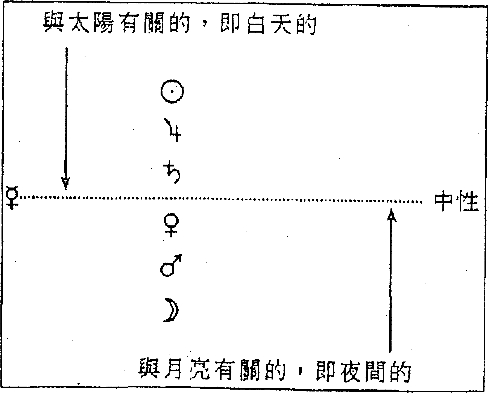

行星的晝夜區分，大抵上和行星的陰陽性質類似，但火星為陽性，卻是夜間行星，這是因火星的熱、乾純質料，在夜間可稍為抑制，而適當地溫暖夜，故賦予它為夜間行星。

由於傳承出現不同解讀，有關行星的晝夜區分，尚有其他說法，如以行星所落星座決定，即星座亦有白天或夜間的性質，若行星落入白天的星座，即稱白天的行星，若落入夜間的星座，則稱為夜間的行星，而星座的白天或夜間性質，完全與星座的陰陽性質相同。

- 白天的星座：白羊、雙子、獅子、天秤、射手、水瓶等陽性星座
- 夜間的星座：金牛、巨蟹、處女、天蠍、摩羯、雙魚等陰性星座

另一種說法則是視命盤是白天或夜間而定，即：
1. 任何行星，在白天命盤中，位於地平線上；任何行星，在夜間命盤中，位於地平線下 > 稱為白天配置
2. 任何行星，在白天命盤中，位於地平線下；任何行星，在夜間命盤中，位於地平線上 > 稱為夜間配置

所以討論行星的晝夜區分，共有3種：
A. 命盤本身為白天的或夜間的，來定行星的白天或夜間性質
B. 配置的特性，即行星為白天配置，或夜間配置
C. 按星座的晝夜區分而定行星的白天或夜間性質

後來就將這3種標準予以統一。

因此，白天的行星，當它是在白天的命盤，白天配置在白天的星座，是最吉祥的，相同地，夜間的行星，當它是在夜間的命盤，夜間配置在夜間的星座，是最吉祥的，這兩種情形，在占星學的術語，稱之為區分內(Hayz)。

相對地，若行星完全沒有符合上述之晝夜區分，稱之為區分外(Out of sect)，吉星顯現不出其吉象，而凶星更凸顯其凶象。

上述兩種狀況，我們整理於下：〈表6-8〉

| 行狀分星況 | 區分內 Hayz | 區分外 Out of sect |
| :--- | :--- | :--- |
| 白天行星 ☉ ☿ ♃ | 1. 命盤為白天盤，太陽在地平線上。<br>2. 所落星座為陽性星座之一。<br>3. 白天配置，在地平線上，位於後天12宮-7宮之間。 | 1. 命盤為夜間盤，太陽在地平線下。<br>2. 所落星座為陰性星座之一<br>3. 夜間配置，在地平線上，位於後天12宮-7宮之間。 |
| 夜間行星 ☽ ♀ ♂ | 1. 命盤為夜間盤，太陽在地平線下。<br>2. 所落星座為陰性星座之一。<br>3. 夜間配置，在地平線上，位於後天12宮-7宮之間。 | 1. 命盤為白天盤，太陽在地平線上。<br>2. 所落星座為陽性星座之一<br>3. 白天配置，在地平線上，位於後天12宮-7宮之間。 |

行星的晝夜區分，並非行星強弱的依據，而應視作行星能量的流動是否順暢，或阻礙，若是為Hayz，行星能量的流動順暢，相對地，若是處於區分外，則有所阻礙，有關行星處於區分內或區分外之特性，我們整理於下（表6-9）

| 狀況行星 | 區分內 | 區分外 |
| :--- | :--- | :--- |
| ☉ | 太陽是唯一在白天盤且是白天配置的行星，它是白天的原理，有最大的能量(除了8宮、12宮之外)太陽的成功是自己的。 | 會干擾到太陽的特色，即原本希望於外在世界中獲得卓越，會受到某些阻礙。 |
| ☽ | 對命主是強力資源(假設不受其他凶星刑剋)，能符合他人的渴望，月亮的成功迎合他人需求。 | 較明顯不利，無力抵抗來自不同管道的阻礙，即使是在強的宮位，如1.4.7.10都隱含著問題。 |
| ☿ | | |
| ♀ | 女命傾向傳統的美德，溫柔、婉約，男命有此金星配置，將喜歡較溫柔的女性。 | 古代觀點，金星在此種狀況，女命傾向不道德，性慾強，男命可能軟弱，優柔，或性偏差。在現代觀念，女命較難接受傳統角色，男命可能喜歡自主性強的女性。 |
| ♂ | 火星的乾，配合夜間的濕，得以聯繫，感覺、感情、滋養是一種防衛、支撐的力量，就如軍人並不願意主動攻擊他國，僅希望看到自己國家和人民、生命財產的安全。 | 易呈現火星的凶性，白天的光雖使火星活躍，但也加速乾，而較少情感，故係野蠻地活躍，感情有所挫折，產生傷害不幸和惡運。 |
| ♃ | 易呈現木星最佳的一面，成功、權力、財富雖有凶星刑剋，其吉象未完全消失，白天的光，配合木星的知識和覺醒，增強木星能量的流動，白天的木星，如同射手。 | 雖未完全喪失木星其吉象，較少能量(溫暖)抵抗凶星，反而呈現濕(因夜間)而更敏感、同情心，較易呈現雙魚之特質，若刑剋嚴重。 |
| ♄ | 顯示土星吉祥的一面，紀律、秩序、和尊重，甚至能指示偉大的成功和社會地位，因白天的光是意識會消除土星的負面，且白天的熱有利於土星的冷。 | 顯現土星本質上之不幸，邪惡，產生惡運和災難，因晚間無光，讓命主無法意識到事情真相，因而常處於無知，而走向毀滅。 |

現代行星三王星，並未論及，在古代這三顆星尚未被發現，即使在現代，一般人肉眼也很難觀察得到，有關他們的晝夜區分，尚無具體驗證資料，故不予論列。

行星的晝夜區分，是希臘化時期相當重視的一項論斷技巧，這時期重要的占星學書籍都曾談及它，經過阿拉伯時期的保存，再傳回歐洲，於中世紀較早期時，還看得到它的蹤影，如13世紀的古德·波那提《天文書》都還專章討論它，但到中世紀後期之文藝復興時期，占星學第二次黃金時期，行星的晝夜區分似乎消失了，一直到20世紀末1990年代占星學的復古運動，才又重見天日。

現代占星學忽視命盤為白天或夜間之特性，一律視作白天盤，有可能冒著50%之風險，因若常態分配，白天出生和晚上出生，應各佔50%，會將晚上出生之夜間盤特色予以忽略，所以應謹慎看待之!

我們舉一實例，英國的查爾斯王子(Prince Charles)，來說明。(案例十五)

### 查爾斯王子

**Natal Chart**
- 時間：9:14 PM +0:00
- 地點：倫敦，英國
- 座標：51N30 000W08
- 系統：Geocentric, Tropical, Placidus, True Node


| 行星 | 晝夜區分 | 配置 | 星座 | 評論 |
| :--- | :--- | :--- | :--- | :--- |
| ☉ | 白天 | 夜間4宮 | 夜間天蠍 | 區分外 |
| ☽ | 夜間 | 夜間10宮 | 夜間金牛 | 區分內 Hayz |
| ♀ | 中性 | 白天4宮 | 夜間天蠍 | |
| ♀ | 夜間 | 白天4宮 | 白天天秤 | |
| ♂ | 夜間 | 白天5宮 | 白天射手 | |
| ♃ | 白天 | 白天5宮 | 白天射手 | |
| ♀ | 白天 | 白天2宮/夜間處女 | | |

從上表可看出，英國王儲查爾斯王子命盤中的月亮正是區分內，月亮能量的流動甚為順暢，而月亮揚升於天頂，且又入旺於金牛10宮，先後天宮，都符合必然的尊貴和偶然的尊貴，故他有位全球注目的母親，占星學似透露了這項訊息，應注意月亮的區分內，更增添先後天宮之吉象。

再看看他的太陽正好是查爾斯王子的命主星為區分外，以他個人而言，原本希望於外在世界中獲得卓越，似乎受到了阻礙，畢竟晚上的太陽發不了光，若太陽為父親形象，他的父親的確較為暗淡，比起母親，差別甚大。

由本例，就可嗅出行星晝夜區分特性，確有值得注意之處。