# 占星学下


## 本書使用案例出生資料一覽表

| 案例 | 姓名 | 出生時間 | 出生地 | 經度 | 緯度 | 頁數 |
|---|---|---|---|---|---|---|
| 十六 | 希特勒 | 1889.04.20 PM 18:30 | Braunau | 013E03 | 48N15 | 016 |
| 十七 | 集集 | 1999.08.11 PM 19:09 | 集集 | 120E45 | 23N50 | 017 |
| 十八 | 李遠哲 | 1936.11.19 PM 23:30 | 新竹 | 120E58 | 24N48 | 018 |
| 十九 | Bill Gates | 1955.10.28 PM 21:15 | Seattle | 121W19 | 47N36 | 025 |
| 二十 | 蔣經國 | 1910.04.27 AM 11:30 | 奉化 | 121E23 | 29N39 | 032 |
| 十一 | 李小龍 | 1940.11.27 AM 07:06 | 舊金山 | 122W26 | 37N47 | 201 |
| 二十一 | 尹清楓 | 1946.03.31 PM 23:00 | 蘭州 | 103E27 | 36N01 | 202 |
| 二十三 | 戴安娜 | 1961.07.01 PM 18:45 | 英國 | 000W30 | 52N05 | 203 |
| 二十四 | 瑪麗蓮夢露 | 1926.06.01 AM 09:30 | 洛杉機 | 118W15 | 34N04 | 204 |
| 二十五 | 星雲法師 | 1927.08.19 PM 22:00 | 江蘇 | 119E30 | 32N24 | 205 |
| 二十六 | 辜振甫 | 1918.01.25 AM 04:00 | 彰化市 | 120E32 | 24N04 | 206 |
| 二十七 | 施振榮 | 1944.12.18 PM 16:00 | 鹿港 | 120E26 | 24N04 | 207 |
| 二十八 | 成龍 | 1954.05.09 AM 00:15 | 香港 | 114E10 | 22N18 | 208 |

## 本書使用實例出生資料一覽表

| 實例 | 姓名 | 出生時間 | 出生地 | 經度 | 緯度 | 頁數 |
|---|---|---|---|---|---|---|
| 一 | 証嚴法師 | 1937.05.04 AM 02:40 | 清水 | 120E34 | 24N16 | 253 |
| 二 | 張國榮 | 1956.09.12 AM 11:50 | 香港 | 114E10 | 22N18 | 266 |
| 三 | 璩美鳳 | 1966.08.03 PM 02:48 | 台北 | 121E30 | 25N03 | 277 |
| 四 | 黃任中 | 1941.01.08 PM 04:08 | 湖南南縣 | 112E36 | 26N48 | 287 |
| 五 | 鄧麗君 | 1953.01.29 AM 08:20 | 雲林褒忠 | 120E18 | 23N42 | 298 |

威廉 里利(William Lilly AD1602~1681)

17世紀英國最負盛名的占星家，1647年出版的基督徒占星學《Christian Astrology》影響極深遠。

## 第七章 天宮圖中的其他特殊點和星體

我們在前4.5.6章分別介紹天宮圖中最重要的成員，星座、後天宮、行星，但除了他們之外，尚有一些要素需要討論，這樣才能充分而不遺漏地掌握每一要素。在第1節介紹月亮交點、小行星及假設行星，第2節說明點的應用，包含漢堡學派或宇宙生物學派的中點理論，映點和反映點，古傳的希臘點或阿拉伯點，第3節介紹恆星。

## 第1節 月亮交點、小行星、假設行星

## 月亮交點(Lunar Nodes)

月亮交點指的是北交點和南交點，我們在「天宮圖符號認識」一章裡已簡單說明。月亮交點並非實際的星體，他們是因月亮繞著地球的白道面和地球繞太陽公轉的黃道面，所形成的兩個交點，北交點為上升交點，距離北極較近，而南交點為下降交點，距離南極較近，他們永遠呈現相對180°對沖，白道面與黃道面傾斜約5.9°

月亮交點雖非實際星體，卻有股神祕的意涵，故頗受占星家重視，因自古以來日蝕(Solar Eclipse)和月蝕(Lunar Eclipse)發生時之天空特異景象，一直是人類深刻記憶的，甚而形成「集體無意識」日蝕和月蝕與月亮交點有甚人關聯，因此認為其具有神祕意涵也就不足為奇了，我們以下圖來說明日月蝕和月亮交點之關連。一般上，當太陽與月亮交點和地球連成一線時發生日月蝕

[圖片]

1. 我們從月相知道，就地球觀點，當月亮與太陽會合在一起時為新月，曆法上稱為朔，而當月亮與太陽分別在地球之兩方時為滿月，曆法上稱為望。
2. 月亮繞著地球而運行，其軌跡稱為白道面，地球繞著太陽運行，其軌跡稱為黃道面。由於月亮每個月就繞行地球一圈，故白道面與黃道面之交叉，因月亮的運行一年將有約12.36次(通過北交點和南交點算一次)通過黃道面。
3. 假想地球不動，太陽視運動繞行黃道面，由於太陽運行每日約1°不足，所以太陽繞行到交叉點，頂多只有二次。
4. 通盤考量1.2.3項，要符合太陽、地球與月亮交點連成一直線只有二次(頂多三次)之日全蝕和月全蝕，前者在新月時發生，後者在滿月時發生。

從圖7-1可看出北交點為月亮運行白道面，由黃道面下向上交叉於黃道面上，而南交點則是月亮運行白道面，由黃道面上向下交叉於黃道面下。因太陽是生命力、意識、力量、目的之代表，在生命中如何成為英雄的一種象徵，其所運行的黃道面，就是行為模式的表達，自我表現的方式；而月亮反射太陽光，被動、吸收、反應、陰性、產生情感和情緒，所以為記憶、經驗的容器，更深層地為靈魂的記憶，很容易成為無意識或潛意識。瞭解這層意義後，當可體會月亮交點，正好是太陽的意識和月亮的無意識的交會。北交點，代表過去的灵魂旅程進入到新的意識知覺領域，可以讓我們如何以全新的方法來觀察過去，相對地，南交點，則是從目前的意識知覺旅程轉到過去的記憶。

就玄奧占星學或輪迴占星學，南交點與我們的過去、前世或我們業(Karma)相關，而北交點，則與未來或戒條(Dharma)開始有意義相關。就心理層面，南交點代表應放棄的心理意識，而北交點則是應開發的心理意識，故在天宮圖中，月亮交點指示如何得，如何捨。

1. 北交點所落星座，意味著命主個性需要開發的心理意識，而北交點所在之後天宮位，顯示命主需要獲得新心理意識的生活領域。
2. 南交點所落星座，意味著命主無意識的習性，應予以揚棄，而所在之後天宮位，表示命主需要調整的生活領域。

基本上，論斷月亮交點，星座較後天宮為重。

天宮圖呈現的交點常以平均交點(Mean Node)，也有使用真交點(True Node)，(將月亮軌道的實際搖動計入)。兩者位置之距離不會超過1° 45'

月亮交點在黃道移動的方向，係順時針逆黃道秩序運行，繞行黃道一圈約18.6年。財務金融占星學中，月亮交點的周期運動，在美國的經濟循環中，佔有相當重要的地位。

## 小行星(Asteroids)

小行星是指在太陽系各主要行星軌道之間所發現的一些星體甚小的行星，在AD1801-1807年，4個小行星第一次被發現。他們是穀神Ceres、維塔Vesta、帕拉斯Pallas和朱諾Juno，在當時並未引起太多的注意。19世紀初，編纂占星學辭典的傑姆 威爾遜(James Wilson)就提到 「也有4顆小行星，在火星和木星之間被發現，他們是帕拉斯、穀神、朱諾和維塔，但他們的效應可以忽視，因他們的星體太小，幾乎可以不考慮」。事實上直到170年後，小行星才逐漸被重視，由於天文望眼鏡的長足進步，且電腦星曆之編纂快速，小行星已由當初之四顆變成現今4000顆以上，且已有小行星的星曆表。

對小行星的效果開始感到興趣，始於1970年由美國的Zipporah.p.Dobyns博士領軍和Eleanor Bach*Emma Belle Donath編小行星的星曆表，解說小行星在星座和後天宮位的意義。1977年又發現凱龍星Chiron，將小行星推進到較高峰。

儘管這些占星家相當熱心推廣小行星的功用，但並未引起太多回響，因為僅用七政三王星，就足以論斷許多徵象，不必畫蛇添足，自找麻煩。但公平地說，小行星中的凱龍星，準驗性高，倒可以使用，我們說明於下。

凱龍(Chiron)，是在1977年，由天文學家查爾斯 高華樂(Charles.T.Kowal)所發現。當時正值人類性心理學，和超個人心理學研究盛行，代表人類如何尋求治療精神創傷，因此就賦予凱龍星具有醫療、治病或神秘預知心理創傷的能力，如心理學家 占星家都可包含在內，其名取自希臘神話凱龍神的名字，他發揮優異的醫療及治病能力，就現在而言，人一出生就背著傷痕，它來自內心無意識或精神方面，唯有透過深層心理和宗教，才得以解脱，所以凱龍星就有隱藏的傷痕或所謂的心理情緒，亦即所謂的精神創傷。

由於凱龍剛發現，其在星座的影響尚未完全確知，故目前著重其所落後天宮的意義。應特別注意與凱龍星形成相位之行星，以主要相位為主，有關這些內容待相關章節再說明。

## 假設的行星(Hypothetical Planets)

有許多占星家喜歡突發異想地使用一些天文學上尚未發現的行星，而當作行星在使用，一般稱這些行星為假設的行星，始作俑者當屬德國阿爾菲烈德 威特(Alfred Witte)，所創立之漢堡學派占星學(Hamburg School of Astrology)，及後繼者所創立的最為典型。我們直接以英文列出這些假設性行星。

- Alged Witte提出Cupido,Hades,Zeus,Kronos.
- Friedrich Sieggwen提出Apollon,Admetos,Vukeanus,Poseido-n
- Charles A Jayne Jr提出Rex,Sigma,Jason,Isis,Pan,Morya,Hermes,Midas,Athena和Lion
- Ivy Goldstein Jacobsen提出LiLith和LuLu
- Theodor Landscheidt 及Ebertin家族鼓吹超冥王Transplut,Vuclan

這些林林總總徒增紛擾，已發現的小行星都已大多數不被使用，更何況這些假設的行星。此處提出，僅讓讀者知道，有假設性行星這碼事，並不鼓勵湊熱鬧。

## 第2節 點的應用

天宮圖中有許多敏感點相當重要，除前面已說明過之 ASC、MC、DSC、IC外，尚有根據行星或敏感點，特殊點 (如二分二至點)計算而得的點，如何拉伯點，至點(Solistic point)或稱映點，此兩者自古以來，希臘、阿拉伯、中世紀文藝復興皆受相當注視，即使到現在，阿拉伯點中的幸運點(part of fortune)仍普遍應用在天宮圖中，後者則失傳。又德國兩個重要學派，漢堡學派及宇宙生物學派，都對中點(Midpoints)賦予重要角色，也為現今各學派的占星學家接受。這些點的解釋可以漢堡學派所歸納的簡單數學公式A+B-C=D來解說 漢堡學派稱之為行星的圖形(planetary pictures)。我們一一說明於後

## 行星的圖形

漢堡學派及其追隨者認為天宮圖中，行星或其假設行星，可與其他行星、假設行星和敏感點、特殊點，按A+B-C=D組成許多點D，這些點有其意義。其中A、B、C即是行星，假設行星或敏感點、特殊點在黃道上的位置，經上述公式計算即可得D點，當可清楚。

[圖片]

圖 7-2

A在摩羯1° =271 B在天秤1° =181° C在水瓶1° =301° A+B-C=271° +181° -301° =151°

有關計算式的星座度數換算成黃道度數，可以白羊始點 0° 起算，金牛0° 即黃道30°，雙子0° 即黃道60°，巨蟹 0° 即黃道90°，獅子0° 即黃道120°，處女0° 即黃道150 ，天秤0° 即黃道180°，天蠍0° 即黃道210°，射手0° 即黃道240°，摩羯0° 即黃道270°，水瓶0° 即黃道300 ，雙魚0° 即黃道330°，如下圖

10

[圖片]

圖 7-3

這種換算以後會常應用到，應熟記。獅子1°即120°+1為121°，其他依此類推，巨蟹座1°為91°

漢堡學派創立的這種行星圖形理論，是該派學說的重心，但因涉及假設行星及太複雜，並未引起太多回響，倒是此種公式的特殊型態，形成所謂的中點，頗受國際占星學界的注目，宇宙生物學派的艾柏汀家族以較簡單的中點理論，揚名於世。

當漢堡學派的A+B-C=D公式，簡化成A+B-C=C時，就是中點理論以下圖說明

[圖片]

其實所謂A+B-C=C，A+B=2C，即1/2(A+B)=C
如A在摩羯1°，即黃道271°，B在天秤1°即黃道181°
，所以A+B=271°+181°=452°
1/2(A+B)=226°即星座天蠍16°=C

此C點即是A點和B點星體對稱中間之點，代表A星體和B星體各有能量在此。成為天宮圖中的一個敏感點，會提供某些訊息，此敏感點若會合其他行星或特殊點，敏感點(指ASC、MC、DSC、IC、月亮交點)等，更具意義。有興趣可研讀宇宙生物學派重要著作《The Combination of Stellar Influenice》

## 映點(Antiscion)和反映點(Contrascions)

常漢堡學派的A+B-C=D簡化成A+B-C=C，而C點以至點巨蟹0°或摩羯0°代替時，即呈現A+B-90°=90°或A+B-270°=270°

就天文學觀點，每年太陽視運動到達最北赤緯時為夏至日,白晝時間最長,夜間時間最短;而反之,當太陽視運動到達最南赤緯時為冬至日,白晝時間最短,夜間時間最長,若以中國太極觀念,夏至點後,陽消陰長,而冬至點後,則陰消陽長,所謂夏至一陰生,冬至一陽生的陰陽消長道理,古希臘人認為這是一種轉捩點,因此相當重視,與中國易經學説不謀而合。

所謂映點,就是上述概念的引伸,如某行星在巨蟹3°、,距離夏至點3°,在另一方雙子27°也距離夏至點3°,所以稱雙子27°為巨蟹3°之映點,反之巨蟹3°也是雙子27°的映點;又如某行星在摩羯5°,距離冬至點5°,在另一方射手25°也距離冬至點5°,所以稱射手25°為摩羯5°之映點,反之摩羯5°也是射手25°的映點。

所謂反映點,即映點之對沖點,如上述巨蟹3°的映點為雙子27°,其反映點為射手27°

能成為映點的星座,係固定的,由下圖可得知,

[圖片]

- 摩羯/射手
- 水瓶/天蠍
- 雙魚/天秤
- 白羊/處女
- 金牛/獅子
- 雙子/巨蟹

反映點的圖解如下

[圖片]

由於映點的計算跟一般黃道度數之算法不同,為求方便瞭解及應用,列出下表有助理解,對照圖7-5及下表,即能找出相關映點星座及度數、分數,進而得反映點星座度數、分數。

《表 7-1》

| 度數 | 分數 |
| --- | --- |
| 1=29 | 1=59 16=44 |
| 2=28 | 2=58 17=43 |
| 3=27 | 3=57 18=42 |
| 4=26 | 4=56 19=41 |
| 5=25 | 5=55 20=40 |
| 6=24 | 6=54 21=39 |
| 7=23 | 7=53 22=38 |
| 8=22 | 8=52 23=37 |
| 9=21 | 9=51 24=36 |
| 10=20 | 10=50 25=35 |
| 11=19 | 11=49 26=34 |
| 12=18 | 12=48 27=33 |
| 13=17 | 13=47 28=32 |
| 14=16 | 14=46 29=31 |
| 15=15 | 15=45 30=30 |

## 天宮圖中的其他特殊點和星體

映點和反映點在卜卦占星學和本命占星學，有其重要性。我們前面談到冬至、夏至代表轉捩，在使用上，映點如同60°次吉的調和相位，若相關行星為吉星則映點會帶來吉象的轉捩；但若是凶星，相對增強凶象之轉捩，而反映點一般作用類似90°刑，甚或180°沖等凶的作用，若是吉星、吉象減尚無礙，若是凶星更不利，其原因可以這樣體會，即與映點0°會合，意謂著兩個行星在黃道上的兩個點，太陽在此有相同的赤緯，因此若是吉星（或）的映點，0°會合代表因子懷有赤緯平行（parallel of declination）的作用，結果是正面的，相對地，與反映點0°會合，意謂著兩顆行星在黃道上的兩個位置，太陽在此有相同但對沖的赤緯，若是凶星的映點（）對沖代表因子，（本即代表因子0°會合凶星的反映點），這種關係類似赤緯的反平行（Contraparallel of declination）的作用，其結果是凶。有關赤緯的平行及赤緯反平行，留待相位一章再討論。

里利在觀察卜卦盤時，常會尋求映點與反映點會合的行星，依上述吉凶法則判斷。

## 天宮圖中的其他特殊點和星體

我們以德國混世魔王希特勒天宮圖來說明

## 案例十六：希特勒

**Natal Chart**
Apr 20 1889
6:30 PM -1:00
Braunau, 德國
48N51 013E03
Geocentric
Tropical
Placidus.
True Node

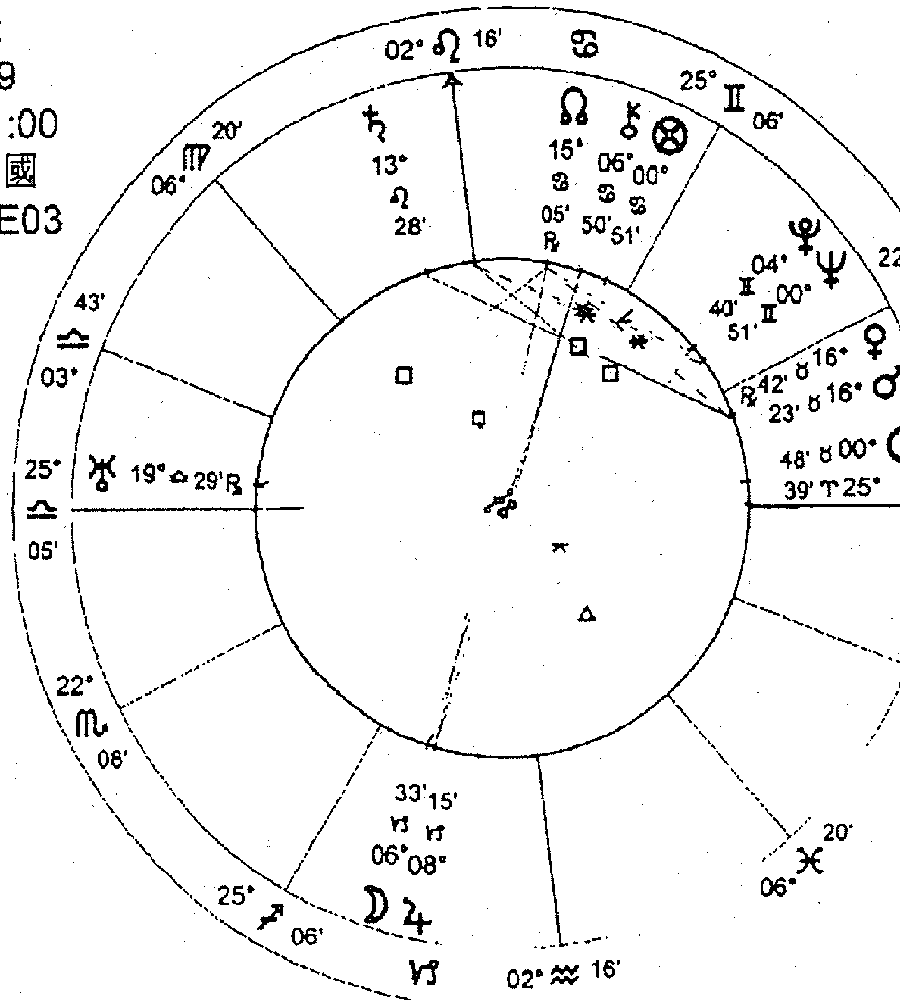

希特勒的土星揚升於天頂獅子13° 27'，與火星、金星分別位於金牛16° 22' 和金牛16° 41'，形成90° 刑凶相，又是互為映點，更加深火土原本之凶惡。金星為命主星，且為入廟，卻也捲入火土之映點，火土皆各入陷宮。
♃午13° 27' // ♂.♀酉16° 22' ，16° 41'
希特勒被稱為混世魔王，由此徵象可証之。

又例1999年8月11日7:09pm，日蝕時刻盤，天王星在水瓶14° 40'，而火星在天蠍14° 40'，正是互為映點，而加上土星在金牛16° 52'，土星為天王星之反映點。

## 第七章 天宮圖中的其他特殊點和星體

三顆大凶星以天王星為主，牽涉到火星映點、土星反映點之三刑會沖，復加上天王星對沖之太陽，形成大四角十字凶相排列，在這日蝕，全球史無前例地連續發生大地震，土耳其、台灣921大地震...等震驚世人，令人不寒而慄。該日蝕時刻若以台灣之集集鎮為地點，排出天宮圖，可發現所有行星幾在果宮，尤以6、12宮居多，而冥王星竟與集集鎮之中天MC幾為0°會合，故以占星學而言，台灣921大地震的震央在南投集集，有以致之！

## 案例十七

**chart**
**Natal Chart**
Aug 11 1999
7:09 PM -8:00
集集，台灣
23N50 120E45
Geocentric
Tropical
Placidus
True Node

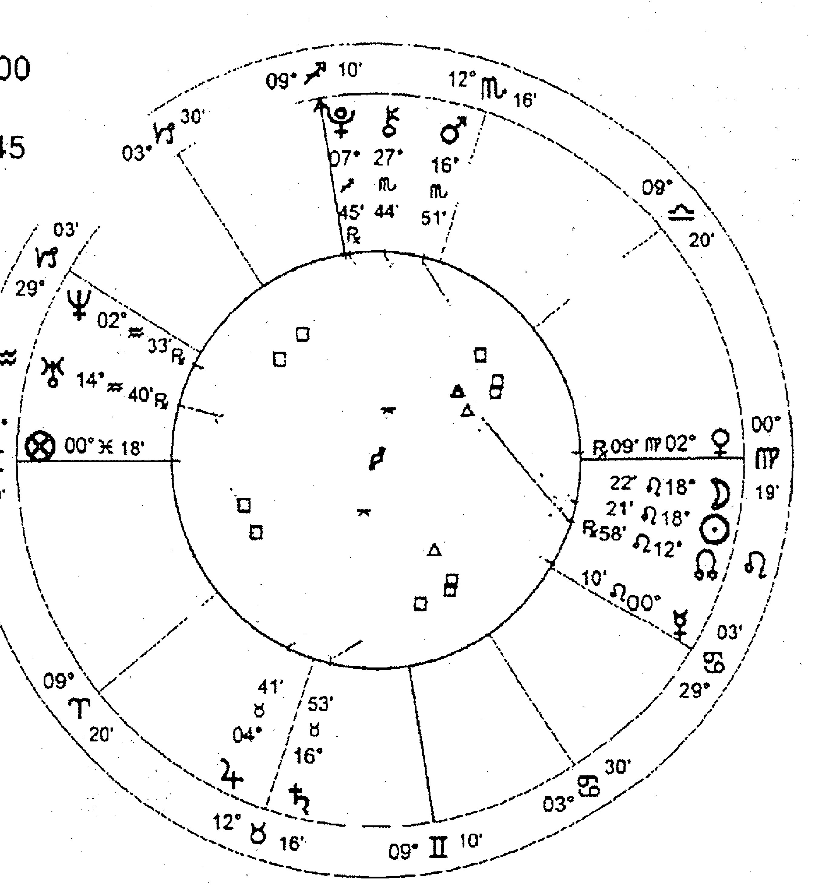

## 天宮圖中的其他特殊點和星體

又中央研究院現任院長李遠哲博士，其木星在射手27°13'，而金星在摩羯3°29'，兩顆吉星互相為映點，而木星入廟於射手120°三合命度，且金星與9宮之天王120°三合，天王又容納金星，其先後天9宮皆呈吉相，獲得諾貝爾化學獎，蜚聲國際，望重士林，由其命盤木、金映點，可看出端倪。

## 案例十八：李遠哲

**Natal Chart**
Nov 19 1936
11:30 PM -8:00
新竹，台灣
48N51 013E03
Geocentric
Tropical
Placidus
True Node

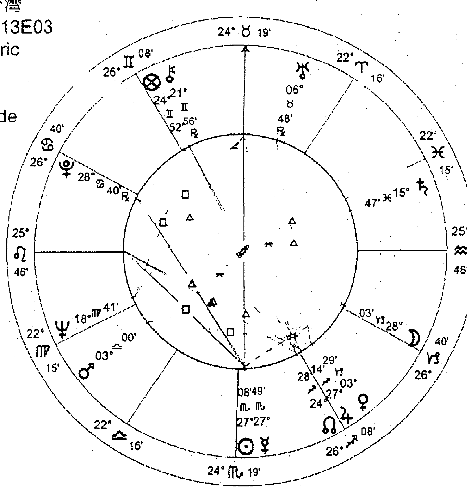

## 天宮圖中的其他特殊點和星體

## 阿拉伯點 (Arabian Parts)

當漢堡學派的A+B-C=D公式中因子以特定行星來計算，就是所謂的阿拉伯點，如白天出生的人，其幸點⊗ (parts of fortune) 的公式就是 ASC+☉-☽=⊗，這種型式，就是漢堡學派公式的一個特殊例型，該學派導出公式應是從阿拉伯點公式引申的。

阿拉伯點確實的名稱應是希臘點，我們已在天宮圖符號認識一章談過，後世因阿拉伯人繼承且大量使用而誤解為阿拉伯人創設的，其實希臘的托勒密在《四書》就已將它列為討論生命區 (Hyleg) 的因子之一，而與托勒密同期的維替斯·瓦倫更將幸運點和其他相關點之定位星的飛佈論斷個人財富或格局高低的一種法則。

《譯天文書》是一本重要的阿拉伯占星學著作，將阿拉伯點稱為箭，該書主要以各宮論其箭，故共15個箭，各與各宮生活領域之人、事、物有關。其實阿拉伯點相當繁多，安東尼·路易士整理後在其書《Horary Astrology plain & Simple》的附錄中就列有130種之多，含蓋生活中必備的事項，想像得到它的繁複，因此飽受譏評說它類似自由心証，在相關天宮圖的因素找不到理由，就由阿拉伯點來搪塞。這些批評者若能細細體會阿拉伯點的意義，當不致如此攻擊。根據公式得知希臘點或阿拉伯點，是以出生時之行星位置和ASC (很少例外) 所構成之命盤的敏感點，理論上，天空中的行星象徵任何既定時刻之世界上及時之一般環境，這些行星獨特地於命主出生時與他產生關係，而存在他的意識中。但恩·魯迪海爾說「我們存在於意識之中，ASC-DSC之平面上，所以取能應用到我們的 (即由兩個行星的位置關係來代表全能的神-天意)，和依我們的性格使用它 (從ASC，即從我們自己起算)」。本章僅先介紹重要的阿拉伯點，其他留待相關議題再說明。

## I. 幸運點 (國內有以福點或天福點命名，《譯天文書》稱福德箭)

```
⊗ = ASC + ☽ - ☉ (白天盤) .... ①
⊗ = ASC + ☉ - ☽ (夜間盤) .... ②
```

公式中的ASC之因子，係黃道經度，有關點的計算皆同。

**例：陳水扁總統命盤為白天盤適用①**

```
ASC在天蠍15° 29' 黃道經度225° 29'
☽在天秤24° 6' 黃道經度204° 6'
☉在天秤18° 5' 黃道經度198° 5'
```

故陳水扁總統的幸運點在天蠍21° 30'

```
⊗ = 225° 29' + 204° 6' - 198° 5'
= 231° 30' → 星座為天蠍21° 30'
```

**又例：世界首富比爾·蓋茲 (Bill Gates) 命盤，夜間盤適用②**

```
ASC在巨蟹19° 1' 黃道經度109° 1'
☉在天蠍5° 0' 黃道經度215° 0'
☽在白羊7° 48' 黃道經度7° 48'
```

故比爾·蓋茲的幸運點⊗在水瓶16° 13'

```
⊗ = 109° 1' + 215° 0' - 7° 48'
= 316° 13' → 星座為水瓶16° 13'
```

由於幸運點結合天宮圖中最重要的三個因子，ASC、☽、☉，故組合特別具有意義，幸運點代表了實體的身體和物質，等同於金錢和財富。羅馬時期Paul of Alexandria就稱「幸運點象徵有關身體的每一件事和貫穿人生課程之事，它變為財富、聲望和恩典。」

## II. 精神點 (Part of Spirit) 《譯天文書》稱一等聰明遠識出衆之箭

```
Ψ = ASC + ☉ - ☽ (白天盤) .... ③
Ψ = ASC + ☽ - ☉ (夜間盤) .... ④
```

精神點的公式取用與幸運點的公式不同，在於晝夜區分，即白天的幸運點公式等於精神點夜間公式，而夜間的幸運點公式等於精神點白天公式。

**例：陳水扁總統的精神點在天蠍9° 28'**

```
Ψ = 225° 29' + 198° 5' - 204° 6'
= 219° 28' → 星座為天蠍9° 28'
```

**又例：比爾·蓋茲的精神點在射手21° 49'**

```
Ψ = 109° 1' + 7° 48' - 215° (不夠減，則加360°)
= 261° 49' → 星座為射手21° 49'
```

天空中的太陽、月亮，一直被視為等同地球的父親和母親，而父親常是人生精神、行為、聲望的模仿者，母親則照顧個人健康和哺乳物質需要，所以從太陽到月亮的計算，就是從精神切入，故又稱太陽點 (Part of Sun)，強調心靈、內涵、宗教、信心等精神層次。

### ### 天宮圖中的其他特殊點和星體

現代占星學使用幸運點並未區分白天、夜間，將使古代所重視的區分失色，而且幸運點與精神點也無法分辨。這是因19世紀英國的拉斐爾一世缺乏瞭解古代地心系統天文學及占星學所致，應導正回歸中世紀文藝復興時期及之前的使用方法，才能顯現其真髓。

### ### III. 基礎點 (Part of Basis)

```
β = ASC + ☉ - ☽ (或)
β = ASC + ☽ - ☉
```

基礎點是以☉-☽之間最短的距離，再加到ASC，它總是落在地平線下，就像基礎一樣，故命名為基礎點。

從幸運點⊗和精神點的公式，可發現該兩點，事實上就是以ASC-DSC線，作為類似映點的對稱。基礎點甚少被使用，瞭解其意義即可。

**例：陳水扁總統命盤的基礎點。**

```
β = 225° 29' + 231° 30' - 219° 28'
= 237° 31' → 星座為天蠍27° 31'
```

### ### IV. 旺點 (Part of Exaltation)

```
Exalt = ASC + 白羊19° - ☉ (白天盤)
Exalt = ASC + 金牛3° - ☽ (夜間盤)
```

**例：陳水扁總統命盤中的旺點為金牛16° 24'**

```
Exalt = 225° 29' + 19° - 198° 5'
= 46° 24' → 星座為金牛16° 24'
```

**又例：比爾·蓋茲命盤中的旺點為**

## 天宮圖中的其他特殊點和星體

```
Exalt = 109° 1' + 33° 48'
= 134° 13' → 星座為獅子14° 13'
```

旺點是根據晝夜，取☉或☽和他們旺宮的度數，用來表示命主的卓越，當它落於果宮，無法顯示命主的卓越才能時，也顯示命主快樂地做事。

瓦倫斯根據上述四個點，即幸運點，精神點，基礎點，旺點，來論述命主卓越才能或地位高低，他提出數個指示，說明於後：

- 1. 幸運點⊗、精神點Ψ、基礎點β或旺點Exalt，或他們的落宮主星，落在命盤的軸心宮即始宮。
- 2. 這四個點之一的主星，位於以它自己起算的第10宮，指示尊榮。
- 3. 這四個點之一的主星，位於以它自己起算的其他軸心宮 (特別是在1宮) 將帶來某種程度的卓越。
- 4. 當這四個點的主星，落於這四個點任何一宮，如☉主星在Ψ之宮，Ψ主星在Exalt之宮，而Exalt主星落在β之宮等也是卓越的一種指示。
- 5. 這四個點之一，或其主星與明亮的恆星會合 (特別是4個皇冠恆星，軒轅十四 (Regulus)、畢宿五 (Aldebaran)、心宿二 (Antares) 和北落師門 (Fomalhaut))。

須注意的是瓦倫斯的指示，是以整個星座宮位系統計算，若符合上述法則愈多愈能凸顯其尊崇，原則上，以傳統主星論即可，再參酌現代行星。又應再加上ASC主星，若落於10宮或多具必然尊貴和偶然尊貴，也是格局高低之一的判斷。

## 天宮圖中的其他特殊點和星體

我們以陳水扁總統的命盤為例說明

| 點 | 所在星座 | 所在宮位 | 主星 | 主星位點起算之宮位 |
|---|---|---|---|---|
| ⊗ | 天蠍21° 30' | 1宮 | ♂ 寅11° 25' | 2宮 |
| Ψ | 天蠍 9° 28' | 1宮 | ♂ 寅11° 25' | 2宮 |
| β | 天蠍27° 31' | 1宮 | ♂ 寅11° 25' | 2宮 |
| Exalt | 金牛16° 24' | 7宮 | ♀ 寅11° 25' | 6宮 |

陳總統的這四個點，皆落於始宮，符合瓦倫斯法則的第一個，故他能一介貧民躍居中華民國的總統，是占星學原理指示的典型。

## 天宮圖中的其他特殊點和星體

又例創設微軟公司的世界首富比爾·蓋茲的命盤

## 案例十九：Bill Gates

**Natal Chart**
Oct 28 1955
9:15 PM +8:00
Seattle, 美國
47N36 121W19
Geocentric
Tropical
Placidus
True Node

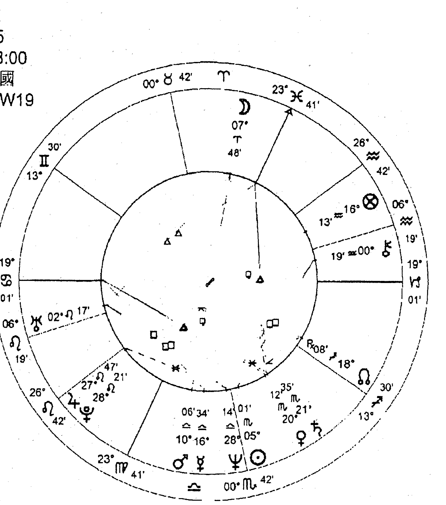

| 點 | 所在星座 | 所在宮位 | 主星 | 主星位點起算之宮位 |
|---|---|---|---|---|
| ⊗ | 水瓶16° 13' | 8宮 | ♄ 卯21° 35' | 10宮 |
| Ψ | 射手21° 49' | 6宮 | ☿ 午27° 46' | 9宮 |
| β | 處女12° 0' | 3宮 | ♀ 辰16° 34' | 2宮 |
| Exalt | 獅子14° 13' | 2宮 | ☉ 卯 5° 0' | 4宮 |

## 說明

- 1. ⊗在水瓶16° 13'，其主星 ♄ 在卯21° 35'，適在⊗起算的第10宮，符合瓦倫斯法則的第2條。
- 2. Ψ在射手21° 49'，其主星 ☿ 在午27° 46'，與 ♀ 0° 會合，而 ♀ 正好與軒轅十四1度內會合，因而也參與在內，符合瓦倫斯法則第5條。
- 3. Ψ 的主星 ☿ 在獅子座，而 Exalt 在獅子14° 13'，符合瓦倫斯法則的第4條。
- 4. 又 Exalt 主星 ☉ 落於卯宮5° 0'，為 ⊗ 起算的第10宮，增添1之吉象，也是旺點本身之4宮，軸心始宮，符合瓦倫斯法則第3條。

又他的命宮在巨蟹，主星月亮為夜間盤區分的管理者，位於地平線上，符合夜間配置，祇是在陽性星座，但揚升於天頂10宮是聲望，獲得世人認同的重要指標。而他生性害羞、內向 (群星會聚北天)，也得以驗證。最妙的是 ⊗ 落在子水瓶，依現代解釋，正是以科技產業為其幸運所在，而現代主星天王又與命主月亮120° 三合，也說明其創新精神，科技革命帶動風潮的成就，絕對有占星學原理的影子。

阿拉伯點的用法除上述瓦倫斯法則，應特別注意其落宮及主星。17世紀時里利及其同時代的亨利·柯列 (Henry Coley) 都曾對幸運點列出必然的尊貴和偶然的尊貴評價分數表，來評估幸運點的力量強弱，可用來說明幸運點真正的力量如何，可作為參考。

<表7-2> Lilly 幸運點尊貴和無力評價表

| 尊 | 貴 | 無 | 力 |
|---|---|---|---|
| +5 | 在金牛或雙魚 | -5 | 在天蠍.摩羯.水瓶 |
| +4 | 在天秤.射手.獅子.巨蟹 | 0 | 在白羊 |
| +3 | 在雙子 | | |
| +2 | 在處女 | | |
| +5 | 在ASC或MC | -5 | 在12宮 |
| +4 | 在7宮.4宮或11宮 | -4 | 在8宮或6宮 |
| +3 | 在2宮或5宮 | | |
| +2 | 在9宮 | | |
| +1 | 在3宮 | | |
| +5 | 與♀或♂等分相位☉ | -5 | 與☽或☿等分相位☉ |
| +4 | 與♀或♂等分相位△ | -4 | 與☽或☿等分相位☉ |
| +3 | 與♀或♂等分相位* | -3 | 與☽或☿等分相位☉ |
| | | -2 | 與☽或☿之界 |
| +6 | 與軒轅十四☉ | -4 | 與大陵五☉ |
| +5 | 與角宿--☉ | | |
| +5 | 無焦傷或在太陽光束下 | -5 | 焦傷 |

## 第3節 恆星 (Fixed Star)

我們曾在偶然的尊貴一節中提到里利使用恆星。世界上各民族利用恆星作為判斷的歷史，淵源甚久，如中國占星學中 (注意非一般之七政四餘占星學) 有關星官、星經、星圖，就是記載恆星的命名。由於天空寬廣，恆星衆多，中國古代先人乃將若干相近的恆星，想像聯繫在一起，組成星官，予以命名，如此觀察天象就有個座標，知道一切天象的背景，這種方法類似巴比倫、埃及傳下之星座概念，衹不過，中國的星官無明確的邊界劃分，而西洋的星座，則邊界較為明確。中國的星官組建及命名，早在先秦即已開始，現今後世流傳之古代星官系統，漢司馬遷《史記天官書》就有年代確切可考，後來演變成著名的三垣二十八宿，每宿就有明確的經度邊界。

恆星衆多，在占星學的選擇，基本上是以黃道面附近，最亮恆星為主，但自古以來各占星家取捨不一，造成許多紛擾，取世界各地區觀察之恆星，當時無全球統一的名稱，其命名相當不同，也造成後世欲引用或統一歸納之困擾，譬如《譯天文書》第一類第八門，說雜星性情，即為一例，共稱雜星共30顆，雖已將各恆星特性列出，類似行星之性質，在黃道經度、亮度等級等重要資料，但描述之恆星形象，很難與現今恆星名稱對號入座，尤其因歲差春分點後退，各恆星在黃道度數也跟著移動，要比對更難上加難。這些問題，直到1923年國際天文協會特設委員會討論，後來1930年英國劍橋大學出版《科學的星座區劃整理》，將恆星作統一命名，我國於民國26年，出版中西星名對照表才將中西方差異作個統合，黃家騁《星海詞林 渾天大五星寶卷·附篇》有詳細的相關資料，可以對照。

占星學的恆星使用很簡單，特別注意ASC、MC、太陽、月亮等為重，查其是否與重要的恆星形成0°會合之相位，因恆星無射線 (Rays)，故不考慮其他相位，如60°、90°、120°、180°等。當然可進而查其他行星，水星、金星、火星、木星、土星、天王星、海王星、冥王星、幸運點等是否與重要恆星形成0°會合，我們將在附表中整理重要的恆星，列出其中、西恆星名稱，黃道2000年經度，類似行星性質，相關吉凶象徵。在查表時，需特別注意，所列黃道經座係以2000年為基準，須換算成用事時刻之年度黃經，歲差每年約50.2893'秒，就其年度差異予以增減，方不致誤用。

恆星在占星學各領域都佔有一定角色，不能忽略，判斷原則以容許度1°內會合為主：

- I. 恆星若是在ASC和MC，肯定會帶給命主極大的影響
- II. 非常邪惡的恆星，若剛好與非常吉祥有力的木星、金星會合，將不會竊取木星、金星的正面意義，但確實會有修飾效果，應予注意。
- III. 非常吉祥的恆星，若剛好與非常凶惡之土星、火星會合，將不會改變土星、火星的負面意義，但會調整其凶象，不致於完全惡化。
- IV. 非常吉祥的恆星與非常吉祥有力的金星、木星會合，將加乘

## 天宮圖中的其他特殊點和星體

正面效果。

非常邪惡的恆星與非常凶惡有力的土星、火星會合，將加乘負面效果。

恆星類似行星之性質，如織女星(Vega)，有金星、水星、海王星的性質，該織女星就有該三顆會合性質，藝術、敏感、想像、科學性的自我表現，此傾向會呈現，可以這種方式掌握恆星的特性。

我們例舉幾個命盤說明恆星的應用。

## A. 陳水扁總統

1. 月亮辰24°6'♂角宿一(Spica)辰23°9'，好運、幸運、富有、勝利
2. 月亮♂大角(Arcturus)辰23°32'，類似角宿一，經由耐心工作而成功
3. 羅睺亥28°20'♂室宿二(Scheat)，亥28°42'，主謀殺、自殺、溺水、拘留

陳水扁的母親由一個農婦，躍居國母，而他曾判刑入獄，由恆星徵象，可略知一二。

## B. 希特勒命盤

1. ☽丑6°33'♂人馬座球形星團(Facies)丑6°45'，凶星，目盲、暴戾的死亡、領導能力、戰爭、冷酷、分裂、完美主義、不親近任何人、地震
2. ☿午13°28'♂Dubhe午13°38'凶星，自大、傲慢、破壞希特勒一生際遇及屠殺猶太人，發動戰爭由①②及前述之映點應可體會。

## 三個恆星缺點度數(Three nebular Spots)

所謂三個恆星缺點度數是指三個跟眼睛有關易導致目盲的黃道度數，分別是金牛29°、獅子6°、射手8°。查其原由，這三個度數分別是由三個恆星昴宿星團(Pleiades)、鬼宿三(North Asellus)以及心宿二(Antares)，約在1880年左右所計算的黃道經度。這三個恆星都跟目盲有關，因此遂有占星家特別提醒這3個度數，但以訛傳訛遂變成固定式不變的黃道度數，若以2000年為準，這三個恆星都已不在上述的黃道度數，故應特別注意，仍應以歲差較正。

已故總統蔣經國生前因糖尿病惡疾導致晚年目盲，為國人所衆知，其本命ASC在獅子6°46'，與鬼宿三0°會合，其羅睺在金牛28°12'也與畢宿星團0°會合。

## 案例二十

蔣經國
Natal Chart
Apr 27 1910
11:30 AM -8:00
泰化，中國
29N39 121E23
Geocentric
Tropical
Placidus
True Node

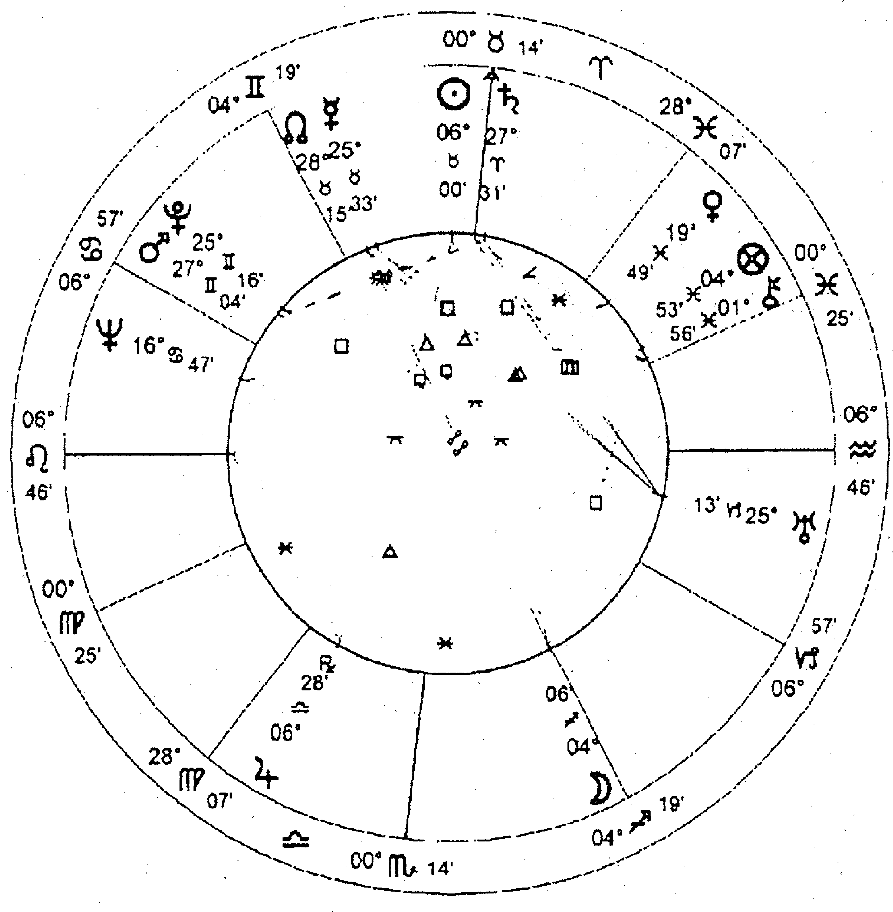

## 【附錄一】重要的阿拉伯點一覽表

| 中文名稱 | 阿拉伯點 | 公式 |
| :--- | :--- | :--- |
| 幸運點(白天) | Fortune(D) | ASC+☽-☉ |
| 幸運點(夜間) | Fortune(N) | ASC+☉-☽ |
| 精神點(白天) | Spirit(D) | ASC+☉-☽ |
| 精神點(夜間) | Spirit(N) | ASC+☽-☉ |
| 基礎點 | Basis | ASC+幸運點-精神點 |
| 旺點(白天) | Exaltion(D) | ASC+白羊19°-☉ |
| 旺點(夜間) | Exaltion(N) | ASC+金牛3°-☽ |
| 成就點 | Accomplishment | ASC+☉-♆ |
| 前進點 | Advancement | ASC+☉-♅ |
| 占星術點 | Astrology | ASC+♀-♆ |
| 暗殺點(I) | Assassination I | ASC+12宮始點-♆ |
| 暗殺點(II) | Assassination II | ♂+♆-♆ |
| 賞識點 | Appreciation | ASC+♀-☉ |
| 喪失點 | Bereavement | 12宮始點+12宮主星-♆ |
| 手足點(白天) | Brothers,Sister(D) | ASC+♆-♅ |
| 手足點(夜間) | Brothers,Sisters(N) | ASC+♅-♆ |
| 癌及毒瘤點 | Cancer &Malignancy | ASC+♆-♆ |
| 大災難點 | Catastrophe | ASC+♆-☉ |
| 大災難及放逐點 | Catastrophe.Exile | ASC+♆-♅ |
| 變化點 | Change | ASC+♆-♀ |
| 孩子點 | Children | ASC+♆-♂ |
| 商業,溝通點 | Commerce.Communication | ASC+♀-☉ |
| 合作點 | Cooperation | 7宮始點+☽-☉ |
| 黃瓜,甜瓜點 | Cucumber, Melons | ASC+♅-♀ |
| 卻除外科手術點 | Cutting Surgery | ASC+ち-♂ |
| 損害點 | Damage | ASC+Ψ-♂ |
| 危險.暴力.負債點 | Danger.Violence.Debt | ASC+♀-ち |
| 女兒點 | Doughters | ASC+♀-) |
| 死亡.災禍點 | Death.Disaster | ASC+8宮始點-) |
| ※ 死亡點(中世紀) | Death(medieval) | 8宮始點 +ち-) |
| 父母死亡點 | Death of Parents | ASC+☽-ち |
| 兄弟死亡點 | Death of Siblings | ASC+雙子10° -☉ |
| 斬首殺頭點 | Decapitation | ASC+♂-Ψ |
| 欺騙點 | Deceit | ASC+♀-Ψ |
| 失望點 | Disappointment | ASC+♂-Ψ |
| 訴訟點(白天) | Lawsuits(D) | ASC+☽-♂ |
| 訴訟點(夜間) | Lawsuits(N) | ASC+♂-☽ |
| 爭論點 | Disputes | ASC+♀-♂ |
| 苦惱點 | Distress | ASC+♂-ち |
| 離婚點(Ⅰ) | Divorce(Ⅰ) | ASC+♀-7宮始點 |
| 離婚點(Ⅱ) | Divorce(Ⅱ) | ♀+180° |
| 荒謬的愛點 | False Love | ASC+Ψ-♀ |
| 名望點(白天) | Fame(D) | ASC+☽-☉ |
| 名望點(夜間) | Fame(N) | ASC+☉-☽ |
| 不幸點 | Fatality | ASC+ち-☉ |
| 父親點(白天) | Faher(D) | ASC+☉-ち |
| 父親點(夜間) | Faher(N) | ASC+ち-☉ |
| 找出失物點 | Finding Lost Objects | )+4宮始點-ASC主星 |
| 騙子點 | Fraud | ASC+Ψ-♀ |
| 朋友點 | Friends | ASC+☽-♓ |
| 閒聊點 | Gossip | ASC+♀-Ψ |
| 高等教育點 | Higher Education | ASC+9宮始點-♀ |
| 疾病點 | Illness | ASC+♂-♆ |
| 監禁點 | Imprisonment | ASC+⊗-ASC主星 |
| 個性點 | Individuality | ASC+☉-♆ |
| 消息點 | Information | ASC+☽-♀ |
| 遺傳點 | Inheritance | ASC+☽-♆ |
| 傷害生意點 | Injury to Business | ASC+⊗-ASC主星 |
| 不誠實點 | Insincerity | ASC+☽-Ψ |
| 謀殺行星點(白天) | Killing Planet(D) | ASC+☽-ASC主星 |
| 謀殺行星點(夜間) | Killing Planet(N) | ASC+ASC主星-☽ |
| 合法化點 | Legalizing | 9宮始點+3宮始點-♀ |
| 走失動物點(亮色) | Lost Animal(light) | ASC+♂-☉ |
| 走失動物點(暗色) | Lost Animal(dark) | ASC+♂-♆ |
| 愛情點 | Love | ASC+☿-♀ |
| 運氣點 | Luck | ASC+☽-☿ |
| 婚姻.合夥點 | Marriage & Partners | ASC+7宮始點-♀ |
| 母親點(白天) | Mother(D) | ASC+☽-♀ |
| 母親點(夜間) | Mother(N) | ASC+♀-☽ |
| 障礙點 | Obstruction | ASC+Ψ-♆ |
| 神秘主義點 | Occultism | ASC+Ψ-♆ |
| 熱愛點 | Passion | ASC+♂-☉ |
| 危險點(白天) | Peril(D) | ASC+8宮始點-ち |
| 危險點(夜間) | Peril(N) | ASC+ち-8宮始點 |
| 死亡點 | Point of Death | ☍+ ち- Mc |
| 魅力點 | Popularity | ASC+♀-♄ |
| 流動資產點(白天) | Property(Movable)(D) | ASC+2宮始點-2宮主星 |
| 流動資產點(夜間) | Property(Movable)(N) | ASC+2宮主星-2宮始點 |
| 根本變動點 | Radical Change | ASC+♀-♄ |
| 不遠產點(白天) | Real Estate(D) | ASC+♄-ち |
| 不遠產點(夜間) | Real Estate(N) | ASC+ち-♄ |
| 悲觀觀點 | Repression | ASC+ち-♀ |
| 報應點(白天) | Retribution(D) | ASC+☉-♂ |
| 報應點(夜間) | Retribution(N) | ASC+♂-☉ |
| 辭職(免職)點 | Resigning(Dismissal) | ち+4-☉ |
| 秘密敵人點 | Secret Enemies | ASC+12宮始點-12宮主星 |
| 自我毀滅點 | Self-Undoing | ASC+12宮始點-♄ |
| 秘密點 | Secrets | ASC+12宮始點-ASC主星 |
| 性愛點 | Sex & Love | ASC+♀-☉ |
| 性衝動點 | Sex Drive & Libido | ASC+♀ -♀ |
| 疾病點 | Sickness | ASC+♂-ち |
| 中傷點 | Slander | ASC+ち ♄ |
| 狡猾點 | Slyness | ASC+♄-♀ |
| 兒子點 | Sons | ASC+4-♄ |
| 投機點(白天) | Speculation(D) | ASC+5宮始點-4 |
| 投機點(夜間) | Speculation(N) | ASC+4-5宮始點 |
| 成功點(白天) | Success(D) | ASC+☽-☉ |
| 成功點(夜間) | Success(N) | ASC+☉-☽ |
| 突然的幸運 | Sudden Luck | ASC+☽-♆ |
| 突然的離別 | Sudden Parting | ASC+♃-♆ |
| 自殺點 | Suicide | ASC+♂-♆ |
| 甜食物點 | Sweet Foods | ASC+♀-☽ |
| 折磨點 | Torture | MC +♃-♄ |
| 悲劇點 | Tragedy | ASC+♃-☽ |
| 背叛點 | Treachery | ASC+Ψ -☽ |
| 寶藏點 | Treasure | ASC+♀-♂ |
| 欺騙點 | Trickery | ASC+♂-♄ |
| 異常事件點 | Unusual Events | ASC+♆-♄ |
| 寡婦點 | Widowhood | ASC+東次將(恆星)-Ψ |

## 【附錄二】以公元2000年為準，恆星黃道經度特性解說

| 中文名稱 | 英文名稱 | 黃道經度 | 類似行星 | 吉凶 | 特性釋意 |
| :--- | :--- | :--- | :--- | :--- | :--- |
| 壁宿二 | Alpheratz | 白羊14° 18' | ♀, ☿, ♂ | ○ | 榮譽，財富，順景，可能橫死，自殺 |
| 天倉四 | Batenkaitos | 白羊21° 57' | ☽ | × | 孤立，不景氣，意外，移居，性的問題，博學，海難 |
| 婁宿一 | Sharatan | 金牛3° 58' | ♂, ☽ | × | 暴力，擊敗，意外傷害危險，榮耀，順景 |
| 婁宿三 | Hamal | 金牛7° 40' | ♂, ☽ | × | 不幸，暴力，殘忍 頭部傷害，愛情受難 |
|  | Schedir | 金牛7° 47' | ♀, ☽ | ○ | 有益於占星學，神秘，寫作 |
| 天大將 | Almach | 金牛14° 14' | ♀, ♂, ☿ | ○ | 藝術的成功，順景，聲望 |
| 大陵五 | Caputalgol | 金牛26° 10' | ☽, ♂, ♀, ☿ | × | 有害的，斬首，損害到脖子及喉嚨，火災，病，暴力，謀殺，恐怖(恆星中最凶的) |

※代表較為重要的恆星，應特別注意

| 中文名稱 | 英文名稱 | 黃道經度 | 類似行星 | 吉中凶<br>O△X | 特性釋意 |
| :--- | :--- | :--- | :--- | :--- | :--- |
| ※ 昴宿六 | Alcyone | 雙子0° 0' | ♄, ☿<br>♂, ☉ | × | 為某些事而哭泣，<br>悲傷，“哭泣的姊妹”之一個，不幸的，放逐，受難 |
| ※ 畢宿四 | Hyades | 雙子5° 48' | ☿, ♀, ♂<br>⚷, ♆ | × | 醜聞，暴力，污辱，監禁，邪惡，憤怒，謀殺，心理不平衡，極端，海難 |
| 畢宿五 | Aldebaran | 雙子9° 47' | ♂, ♀, ☿ | ∧ | 4個皇冠恆星之一，勇氣，戰爭，商販，兵權，暴力的危險或疾病 |
| 參宿七 | Riegel | 雙子16° 50' | ☿, ☿, ♂ | ○ | 技術的成功，藝術的本領，發明，野心，幸運 |
| 參宿五 | Bellatrix | 雙子20° 57' | ♂, ♀ | × | 突然的不名譽，喜歡，供給動力，健談，桃花的麻煩，妒忌，不幸 |

※代表較為重要的恆星，應特別注意

| 中文名稱 | 英文名稱 | 黃道經度 | 類似行星 | 吉中凶<br>○△× | 特性釋意 |
| :--- | :--- | :--- | :--- | :--- | :--- |
| 五車二 | Capella | 雙子21° 51' | ♂, ♀ | ○ | 流行，成功，喜歡學問，一個好的研究者，健談，孤癖，法律上或國內的問題 |
| 丈人一 | Phact | 雙子22° 10' | ♀, ♀, ♆ | ○ | 好運，希望，藝術，科學的天份 |
| 五車五 | Elnath | 雙子22° 35' | ♂, ♀ | △ | 運氣，財富，成功，吵嘴，頑固 |
| 參宿二 | Alnilan | 雙子23° 28' | ♄, ♃, ♂ | △ | 簡短的名聲，快的調節 醜聞 橫死，有益於軍事、運動 法律 教會、科學、用功 |
| 天關 | Alhecka | 雙子24° 47' | ♂, ♀, ♃ | × | 意外，吵架，性情壞，墮落，肺病，榮譽，財富 力量，侵略，貪心，病弱的夥伴 |

※代表較為重要的恆星，應特別注意

| 中文名稱 | 英文名稱 | 黃道經度 | 類似行星 | 吉中凶<br>O△X | 特性釋意 |
| :--- | :--- | :--- | :--- | :--- | :--- |
| ※參宿四 | Betelgeuze | 雙子28° 45' | ♂, ♀<br>ち, 4 | ○ | 成功, 田糧, 名聲, 敏捷, 冒失, 發明, 叛徒, 熱和尖銳的病 |
| ※天狼 | Sirius | 巨蟹14° 5' | 4, ♂, ☽ | ○ | 運氣, 驕傲, 財富 野心, 好名譽, 名聲, 榮耀, 神秘的興趣, 狗咬 |
| ※南極老人 | Canopus | 巨蟹14° 58' | ち, 4<br>☽, ♂ | X | 航行, 虔誠, 醜聞, 暴力, 因父親的麻煩, 火氣, 不景氣, 自殺, 頑固 |
| 北河二 | Castor | 巨蟹 20° 14' | ♀, 4, ♂<br>♀, ち, ☽, ♆ | ○<br>X | 手足的殘廢, 精神病, 突然的名譽或損失 |
| 北河三 | Pollux | 巨蟹23° 13' | ♂, ☽, ♆ | ∧ | 有益於占星學和神秘學, 醜名, 謀殺, 强暴, 殘忍<br>來自大動物, 婦女之毒害 |

※代表較為重要的恆星，應特別注意

| 中文名稱 | 英文名稱 | 黃道經度 | 類似行星 | 吉中凶<br>○△× | 特性釋意 |
| :--- | :--- | :--- | :--- | :--- | :--- |
| ※南河三 | Procyon | 巨蟹25° 47' | ♀, ♂, ♀<br>☽, ☿, ☿ | △ | 好運，但突然從高位跌落，神秘的興趣，暴力所得之財富 |
| ※積屍氣 | Praesaepe | 獅子7° 20' | ♂, ♀, ♄ | × | 內在動機，隱遁，盲目 屍體的堆疊，傷害，悲劇，謀殺，火災 |
| ※鬼宿三 | North Asellus | 獅子7° 32' | ○, ♂ | △ | 軍事昇遷，目盲，眼睛問題，海灘 |
| 鬼宿四 | South Asellus | 獅子8° 43' | ○, ♂ | × | 同鬼宿三，但增加大量謀殺和恐怖 |
| 柳宿增三 | Acubens | 獅子13° 38' | ♄, ♀, ♂ | △ | 有益於占星學及寫作，毅力，國內的問題，毒藥，說謊的人 |
| ※星宿一 | Alphard | 獅子27° 17' | ♄, ♀, ♄<br>○, ☿ | × | 因毒藥沈溺而突然的障礙，法律上的問題，桃花麻煩，吸毒 |

> ※代表較為重要的恆星，應特別注意

## 天宮圖中的其他特殊點和星體

| 中文名稱 | 英文名稱 | 黃道經度 | 類似行星 | 吉中凶 | 特性釋意 |
|---|---|---|---|---|---|
| 軒轅十三 | Jabhah | 獅子27° 54' | ♃, ♀ | △ | 財富，好的判斷，聰明巧妙，暴力傾向，利己主義，危險，損失，醜聞，兵變 |
| ※軒轅十四 | Regulus | 獅子29° 50' | ♂, ♄ | ○, △ | 4個皇冠恆星之一，高的地位，強大力量，領導力，幸運狀態，突然衰落，意外，暴力 |
| 西上相 | Zosma | 處女11° 19' | ♃, ♀ | X | 敏銳的智力，不景氣，可怕，不高興，中毒，意外，感覺受限，腸病，童年不幸 |
| ※五帝座一 | Denebola | 處女21° 37' | ♃, ♀, ♄, ♂ | △ | 榮耀，想要聯結，苦惱，幸福轉成不幸，懷恨，精神病，疾病，自然災害，大災難 |

※代表較為重要的恆星，應特別注意

| 中文名稱 | 英文名稱 | 黃道經度 | 類似行星 | 吉中凶 | 特性釋意 |
|---|---|---|---|---|---|
| 翼宿七 | Labrum | 處女26° 41' | ♀, ♀ | ○ | 榮譽, 財富, 野心, 心靈的, 老病, 不誠實的收入 |
| ※東次將 | Vindemiatrix | 天秤9° 56' | ♀, ♀, ♀ | × | 守寡, 不景氣, 獵殺女巫, 神秘與玄學 |
| 軫宿三 | Algorab | 天秤13° 27' | ♂, ♀ | × | 損失, 謊言, 意外, 自殺, 傷害, 貪心 |
| ※角宿一 | Spica | 天秤23° 50' | ♀, ♂, ♀, ♀ | ○ | 順景, 運氣, 財富, 勝利 |
| ※大角 | Arcturus | 天秤24° 14' | ♀, ♂, ♀, ♀ | ○ | 像Spica, 因病人工作而成功 |
| 七公七 | Princeps | 天蠍3° 9' | ♀, ♀ | ○ | 有手段, 深遠的, 好的研究者, 有益於商業, 政府, 法律, 科學, 藝術, 衝動, 說謊 |
| 貫索四 | Alphecca | 天蠍12° 18' | ♀, ♀, ♂ | △ | 榮譽, 尊嚴, 文學家, 發明, 燦爛, 詩意, 醜聞, 孩提的悲傷, 法律問題, 懶惰 |

※代表較為重要的恆星，應特別注意

| 中文名稱 | 英文名稱 | 黃道經度 | 類似行星 | 吉凶 | 特性釋意 |
|---|---|---|---|---|---|
| 氐宿一 | South Scale | 天蠍15° 5' | ♃, ♀, ♂, ♀ | × | 損失, 竊盜, 背叛, 濫用, 性病, 毒害, 溺殺, 苦悶, 報復, 犯罪 |
| ※氐宿四 | North Scale | 天蠍19° 22' | ♄, ♀, ♂ | × | 榮耀, 財富, 區別, 智高, 話急引起問題, 悲劇, 暴力, 組織者運動, 法律的成功 |
| 蜀 | Unukalhai | 天蠍22° 5' | ♃, ♂, ♀ | × | 成功但也隨著失敗, 法律問題, 自殺, 瘋狂, 意外, 慢性病, 戰爭勝利, 海難 |
| 馬腹一 | Agena | 天蠍23° 48' | ♀, ♄, ♂, ♀ | ○ | 榮耀, 地位高, 組織, 好色, 醜聞, 聰明, 巧妙經由大衆而成功, 閒聊 |

※代表較為重要的恆星，應特別注意

| 中文名稱 | 英文名稱 | 黃道經度 | 類似行星 | 吉中凶 | 特性釋意 |
|---|---|---|---|---|---|
| ※南門二 | Bungula | 天蠍29° 37' | ♀, ☿, ♂, ☽, ♆ | ○ | 神秘的興趣，自我分析，榮譽，頑固，靈敏，殘酷 |
| 梁 | Yed prior | 射手2° 18' | ♃, ♀, ♂ | △ | 成功於占星學和9宮事務，敏捷，默許，刺激性的 |
| ※心宿二 | Antares | 射手9° 46' | ♂, ☿, ♀, ♃ | △, × | 4個皇冠恆星之一，榮耀及財富，但突然的損失，有益於戰爭，法律上的問題，火災 |
| 大培三 | Rastaban | 射手11° 58' | ♃, ♂, ☿, ☉ | ∧ | 衝動，正直，有影響力的，有益於占星學，政府，寫作，金融，運動，意外，傷害，犯罪 |
| 天蠍座疏散星團 | Aculeus | 射手25° 44' | ♂, ☽ | × | 目盲，統御力 |
| 燕 | Sinistra | 射手29° 54' | ♃, ♀ | × | 統御力本領，損失，中毒，冷酷，擅權，自我破壞 |

※代表較為重要的恆星，應特別注意

| 中文名稱 | 英文名稱 | 黃道經度 | 類似行星 | 吉中凶 | 特性釋意 |
|---|---|---|---|---|---|
| 人馬座球形星團 | Facies | 摩羯8° 18' | ☉, ♂ | X | 目盲, 橫死, 統御力本質, 戰爭, 冷漠, 分裂不接近任何人, 地震 |
| 斗宿六 | Ascella | 摩羯13° 38' | ♄, ♀ | ○ | 獲得, 良好判斷, 幸福, 有影響力的朋友 |
| 建一 | Manubrium | 摩羯15° | ☉, ♂ | ∧ | 英雄氣概, 勇氣, 目盲, 法律問題, 過於自信, 有益於運動及政治, 火災, 爆炸 |
| 織女 | Vega | 摩羯15° 19' | ♀, ♀, Ψ, ♄, ♃ | ○ | 政治的幸運, 與政府交涉的財富, 藝術或音樂的天份, 與母親的問題短暫名聲 |
| 吳越 | Deneb | 摩羯19° 48' | ○, ♄ | △ | 順景, 成功, 脾氣易起, 驕傲, 法律上的糾紛, 牽扯 |

※代表較為重要的恆星, 應特別注意

| 中文名稱 | 英文名稱 | 黃道經度 | 類似行星 | 吉中凶 | 特性釋意 |
|---|---|---|---|---|---|
| 狗國一 | Terebellum | 摩羯25° 51' | ♀, ♄ | ∧ | 領導力, 野心, 成功, 政治或宗教佳, 懷疑, 絕望, 後悔, 恐怖統治, 暴力, 偏見, 種族主義 |
| ※河鼓二 | Altair | 水瓶1° 47' | ♂, ♄, ♄, ♀, ☉ | △ | 敏感, 情感不穩, 無能力, 勇氣, 野心, 有益於占星學, 寫作, 突然而短暫的財富 |
| 牛宿四 | Alshain | 水瓶4° 43' | ♄, ♀ | ○ | 得到朋友幫助, 獲益, 聰明 |
| 壘壁陣三 | Nashira | 水瓶21° 47' | ♄, ♄ | ∧ | 有益於寫作, 政府, 宗教, 法律顧問, 創造力, 成功, 虛偽, 來自野獸的危險, 克服邪惡 |
| 壘壁陣四 | Deneb algedi | 水瓶23° 33' | ♄, ♄, ☉, ♀ | △ | 名聲, 財富, 統御力, 悲傷, 錯誤的朋友, 心靈, 不景氣, 橫死 |

※代表較為重要的恆星, 應特別注意

## 第七講 天宮圖中的其他特殊點和星體

| 中文名稱 | 英文名稱 | 黃道經度 | 類似行星 | 吉中凶 | 特性釋意 |
|---|---|---|---|---|---|
| ※虛宿一 | Sadalsuud | 水瓶23° 49' | ♄, ♀, ☿, ☉ | ○ | 有益於占星學及神秘學，政府，運動，寫作，商業，幻想，心靈，統御力，醜聞，污辱 |
| ※北落師門 | Fomalhaut | 雙魚3° 52' | ♀, ♀, ♄, ♄, ♄ | △ | 4個皇冠恆星之一，繼承病，先天的缺陷，魔術，玄學的名聲，極好或極壞 |
| ※天津四 | Deneb | 雙魚5° 20' | ♀, ♀ | ○ | 聰明，創造力，天真爛漫，有助於占星學，寫作，靈魂，聰明，不定，狗咬 |
| 水委一 | Achernar | 雙魚15° 19' | ♄, ♂, ☿ | ○ | 成功，人情味，病人，宗教，哲學 |
| 室宿一 | Markab | 雙魚23° 29' | ♂, ♀, ♄, ♄, ♀ | △ | 悲傷的恆星，情感的傷痕，愛情悲劇，文學的本領，法律問題，意外傾向 |
| 室宿二 | Scheat | 雙魚29° 22' | ♂, ♀, ♄, ♄, ☿ | × | 不幸，謀殺，自殺，溺斃，被譴責到死亡或監禁，惡意受難，極為不幸，藝術 |

※代表較為重要的恆星，應特別注意

威廉·里利於1651年出版的曆書，預測英國將有重災，結果1665年，確實應驗發生。

威廉·里利於1651年曆書，同樣預測倫敦，將會發生大火，結果1666年9月2日果應驗，國會還懷疑是他縱火的。

## 第八章 行星在黃道12星座的意義

了解四種純質料四大元素，先天黃道12星座，後天12宮及行星原理的基本特性後，就可開始討論上述占星學基本要素間的互相關聯及所產生之現象，如行星落於星座，行星落於後天宮及行星間的相位，如何詮釋就是接下來的課題。

本章先從行星落於星座的意義開始，現代占星學的教科書對行星落於星座的意涵，都有相當精彩的解說，但受限於現代占星心理學的影響，都著墨在心理層次衍生之行為，未充分掌握四種純質料組合四大元素演繹黃道12宮及行星的原理，因而他們彼此互動關係的邏輯性被忽略，且吉凶象解說，也僅以調和相位、不調和相位作為依據，未考慮行星本身的吉凶及所落星座之必然尊貴和無力的吉凶基本特質。又完全無視命盤白天和夜間出生之重大差異，若其中又涉及區分內或區分外，必定誤判。本書著重於古典與現代技巧的融合，讀者應以下列要點邏輯推演行星落於星座的意義。

1. 就心理層面，黃道天先12宮提供了心理機制，意即行星會受星座之制約，而使該行星的能量呈現該星座特質形成命主人格的一部份，如火星的原理為貫注精力、生動和直接，若落於金牛座，金牛的穩定、緩慢、韌性....等特性就會限制火星的橫衝直撞，其基本意涵，即未考慮吉凶象，命主的行動會緩慢下來、不激進。

## 行星在黃道12星座的意義

2. 行星落於星座也須考慮該行星本身的純質料，和該星座純質料之間的協調性，若吉星金星、木星難調和該星座，其吉象銳減，甚至常出現於負面徵象，如金星落於白羊座，金星的濕冷純質料無法調和於白羊熱、乾純質料，兩者對抵金星的和諧、平和、愛情、美感的原理，容易出現負面，如色慾、性慾高、愛情易乾柴烈火，卻無法持久。由於四大元素是由四種純質料構成，故考慮行星和所落星座的純質料調和關係，事實上也就隱含行星落於四大元素星座的關係。

3. 行星落於星座，應注意到星座之四正特性，可更細膩觀察分辨行星在同一元素之間的差異，如木星的成長、擴展原理在水象(巨蟹、天蠍、雙魚)感情精神的制約下，會發揮愛心、慈悲、同情心、憐憫。

- 巨蟹：加强主動、照顧性、温情的籠絡
- 天蠍：加强集中、執著性、信仰的堅持
- 雙魚：加强變動、廣泛性、憐憫的感受

4. 行星落於星座，也可以定位星的制約來說明。在現代占星學因星座=星座主星=後天宮位之同族關係，常混淆定位星的意義，且現代三顆行星之主管星座尚有爭論，因此以定位星詮釋應小心。

5. 命主出生於白天或夜間，其行星個別影響力略有差異，基本上，如先前所分析的，白天行星較適於白天命盤，夜間行星較適於夜間命盤，若其中又涉及區分內或區分外，吉凶象會顯現些許差異。

若能掌握上述要點，對行星落於星座的分析，不致誤差太大，至於行星的吉凶象，大致上是按行星的必然尊貴和無力和來自其他行星之刑剋（即⊕、□或♂）綜合說明，再加上白天盤、夜間盤區分內、外，當更能細分之。我們將整理出上述相關要點，但仍特別聲明，無法全面性地加上偶然尊貴和無力等因素。無論如何，行星落於星座，屬占星學基本元素的進一步互動，欲完整地詮釋天宮圖，須先將這項互動關係瞭然於胸，作為詮釋的基石。

近代發現的三王星，由羅伯舒密特所領導的Project Hindsight發揚希臘化占星學中，也賦予三王星的行星原理，而寇提斯 曼瓦寧(Curtis Manwaring)所寫的《行星在黃道12星座》(Planets in the 12 Zodiac Signs)有精彩的解說且頗為合理，但畢竟這僅是一家之言，所以本文不繼續討論三王星，不按傳統7顆行星在黃道12星座的詮釋方法，而改以歷史事件契合三王星與星座關聯的解說。

又囉喉計都，涉及前世業力，目前也僅以現有資料整理作為參酌之用。

## 行星在黃道12星座的意義

## 行星名稱：太陽

| 星座 | 意義詮釋 |
|---|---|
| 白羊 | **尊貴或無力** ⊙在白羊為旺，尤其是19°。 |
| 白羊 | **四大元素** ⊙為膽汁質，而白羊亦是，易顯現積極進取，大膽直接、坦率，表現自我，熱情。 |
| 白羊 | **定位星** 由♂定位，高度競爭，尋求卓越、認同、名聲、權威，自發性行為。 |
| 白羊 | **吉象** 積極、勇敢、領導力、開創、熱情、外向。 |
| 白羊 | **凶象** 衝動、不聽人勸、自負、傲慢、頭部易受傷、發燒。 |
| 白羊 | **白天盤** 熱淨化領導力、甚具威嚴，特別是在10宮或9宮，但潛在著自大、傲慢。乾產生區別⊙的自我表現，容易意識到個人能力、衝動、創新，但後續不足。 |
| 白羊 | **夜間盤** 冷抑制⊙的熱，較為自省，⊙的能量看不到，因屬旺地，較有權謀策略。濕模糊了界限，威嚴較不足，但也與人合得來，民主作風，動機較隱晦。 |
| 金牛 | **尊貴或無力** ⊙在金牛，外來的，但金牛為⊙主管星座獅子的第10宮，類似獲得尊敬、認同。 |
| 金牛 | **四大元素** 金牛的乾增加⊙的乾，但其冷抑制⊙的熱，因而溫煦、穩定、寧靜、務實，為安全感而區隔，過於堅持、保守，但忠誠，值得信賴。 |
| 金牛 | **定位星** 由♀定位，美感、價值、金錢、物質或物慾會強調。 |
| 金牛 | **吉象** 堅持、保守、務實、藝術鑑賞 忠誠、穩定、重視安全感。 |
| 金牛 | **凶象** 固執不通、物慾、過於現實、緩慢，喉部易受傷、病變。 |
| 金牛 | **白天盤** 熱激發活力，不致那麼緩慢，會參與外界事務。乾增加⊙的乾，使命主更頑固、執著，堅持其觀念。 |
| 金牛 | **夜間盤** 冷抑制⊙的熱，活動力減少，較易滿足或內向。濕會模糊界限，比白天盤的人較有情感、藝術氣息，但也易物慾的放縱。 |
| 雙子 | **尊貴或無力** ⊙在雙子僅20°-29°外觀主星。 |
| 雙子 | **四大元素** 雙子的風象，使⊙表現出命主的智力，非常喜歡交談、熱心、活潑、反應力佳。 |
| 雙子 | **定位星** 由♀定位，多才多藝、理性、溝通、學習、求知慾、思考、機智。 |
| 雙子 | **吉象** 聰明、反應力佳、智力、口才、擅於表達、溝通。 |
| 雙子 | **凶象** 膚淺、多變、前後不一、藉口、合理化、話多，肺經或神經系統、手臂疾病。 |
| 雙子 | **白天盤** 熱強化活動力，提昇敏捷度，不喜僵硬、威權、官僚，能多角度分析。乾產生區別，命主的分析明確、細膩。 |
| 雙子 | **夜間盤** 冷結合似和不似，思想過程變成較有關聯性，分析力較弱。濕模糊了界限，缺乏自我認同、評價，因而會畏懼權威。 |
| 巨蟹 | **尊貴或無力** ⊙在巨蟹，外來的，⊙進入夏至點星座，北半球的白天長度慢慢遞減。 |
| 巨蟹 | **四大元素** ⊙在巨蟹的冷、濕會呈現多愁善感，外硬心軟，具防衛性、懷舊、顧家。 |
| 巨蟹 | **定位星** ☽定位，生命的目的來自家的認同，母性本能、敏感、內省。 |
| 巨蟹 | **吉象** 溫情、親切、母性本能、顧家、保護、念舊。 |
| 巨蟹 | **凶象** 過於敏感、害羞、防衛意識、易退縮，胃部、胸部、乳房、卵巢易有病變。 |
| 巨蟹 | **白天盤** 熱增加活力使命主較陽剛，不那麼害羞。乾產生區別，命主會較具安全感，不致過於敏感，而防衛過當。 |
| 巨蟹 | **夜間盤** 冷結合似與不似，無從區分，命主的防衛意識較易出現。濕模糊了界限，增加情緒感染力，敏感性，命主以家為重，較無安全感。 |
| 獅子 | **尊貴或無力** ⊙在獅子，入廟，⊙的個別性和獨特性會特別凸顯。 |
| 獅子 | **四大元素定位星** ⊙的熱、乾與獅子純質料調和，具領導力為卓越努力，極有自信，專注於工作，力求表現，喜受注目，成為肯定的一種認同，若在10宮或9宮更易成功，適合表演、政治等衆人注目行業。 |
| 獅子 | **吉象** 領導力、慷慨、高貴大方、創作才華、耀眼、自信熱情、赤子之心、權勢。 |
| 獅子 | **凶象** 傲慢、自負、誇大、愛炫、好賭、虛榮、專制、獨裁、作威作福、心臟血管之疾。 |
| 獅子 | **白天盤** 熱增加⊙的活躍，為區分內，若非在6.8.12等弱宮，命主具貴族氣勢，領導。乾產生區別而有優越感，吉則王者之風，凶則專斷獨裁。 |
| 獅子 | **夜間盤** 冷降低⊙的熱，活動力減少，不會那麼追求卓越。濕模糊了界限，H4 為三分性主星，命主較和藹，愛情較幸福。 |
| 處女 | **尊貴或無力** ⊙在處女，僅0° -9° 外觀。 |
| 處女 | **四大元素定位星** ⊙在處女冷、乾的制約，呈現嚴謹、保守、刻苦耐勞、工作、服務、秩序感。受♀的定位，強調理解，分析細膩來表現自我，要求完美。 |
| 處女 | **吉象** 勤勞、努力、擅於掌握細節，服務、整潔、秩序、保守、謹慎、完美主義。 |
| 處女 | **凶象** 放心不下，批評、挑剔、視野狹窄、潔癖，工作過度胃腸分泌及神經性疾病。 |
| 處女 | **白天盤** 熱純化了工作意識，命主動奮努力。乾增加⊙的乾，更著重於細節，日常事務更喜秩序，然過慮、神經質地、放心不下。 |
| 處女 | **夜間盤** 冷降低⊙的熱，使命主活動力減弱，工作、服務比白天盤的人較弱，倒退。濕模糊了界限，命主的分析較有關聯性，較無秩序，但不致那麼過慮神經質。 |
| 天秤 | **尊貴或無力** ⊙在天秤入弱，⊙的認同，自我表現，意志力，難以發揮。 |
| 天秤 | **四大元素** ⊙的乾受天秤的濕制約，不再自私、優越，呈現理性、美感、和諧、優雅魅力，人際關係的互動，民主作風、公平、公正。 |
| 天秤 | **定位星** 受♀定位，注重和諧、美感、藝術才華、音樂。 |
| 天秤 | **吉象** 舉止優雅和諧，重視公平、公正、平衡、客觀、藝術美感、社交靈活、溝通。 |
| 天秤 | **凶象** 優柔寡斷，過於考慮他人立場，濫好人，腎臟、膀胱、泌尿系統之病變。 |
| 天秤 | **白天盤** 熱淨化客觀，社交活躍，提昇社會地位，魅力、民主作風。乾產生區別，命主易結黨形成集團，不需太妥協，即能獲得其想要的。 |
| 天秤 | **夜間盤** 冷結合似和不似，且冷抑制⊙的熱，易接觸各階層之人，同情他人。濕模糊了區別，命主較無法堅持立場，允諾妥協太多，而被評為優柔寡斷。 |
| 天蠍 | **尊貴或無力** ⊙在天蠍，僅10°-19°外觀主星。 |
| 天蠍 | **四大元素** 卯為冷濕且為⊙主管獅子之第4宮，⊙的能量、本質易隱藏，又是其旺宮成的第8宮，不合意， |

## 行星在黃道12星座的意義

## 太陽

## 天蠍
*   **尊貴或無力**：象徵著神秘、生死，不易被看見而被低估，其實意志力堅定。☉的定位，內心潛藏熾烈的心，卻易呈報復、佔有慾強，權力掌握、執拗。
*   **吉象**：神秘的洞察力，意志力强，權力掌控，生命再生力强，建設力强。
*   **凶象**：破壞、毀滅、嫉妒、報復、執拗、不輕信他人，生殖系統、直腸、肛門病變。
*   **白天盤**：熱純化意圖，較易洞察到自我和他人動機，較為直接公開處理事情。乾產生區別，意志力更堅定，但更苛刻，以對抗方式解決矛盾，甚或玉石俱焚。
*   **夜間盤**：冷結合似和不似，企圖心不明，命主意志力較弱，感覺較無安全感。濕模糊了界限，傾向直覺和潛意識，不會公開地解決矛盾，而是秘密性報復。

## 射手
*   **尊貴或無力**：☉在寅，為白天的三分性主星。
*   **四大元素**：☉在同為火性的寅，呈現樂觀、自信、知生、自我，不喜受形式的拘束。
*   **定位星**：受☌定位，提昇精神、道德、遠方、出國、留學、旅行、宗教事務、法律裁決淨化、道德之願景，溫和、博愛、高等教育。
*   **吉象**：誠實、坦率、熱愛自由、積極樂觀，直來直往，慷慨、熱誠、理想主義。
*   **凶象**：放縱、隨性，不考慮他人立場，浪費，肝膽系統、坐骨神經、臀部之病變。
*   **白天盤**：熱純化☉的自我表現，使命主有貴族氣息、自信心，容易掌握所追求之真理。乾產生區分、公平正直、透明、清澈，雖較乏同情心，但智慧、自信、願景明晰。
*   **夜間盤**：冷抑制☉的熱，降低其活躍，但也相對減少其潛在的自大、傲慢。濕模糊了界限，命主較有同情心，體諒他人，比白天盤的人內省。

## 摩羯
*   **尊貴或無力**：☉在摩羯，僅20°-29°外觀主星。
*   **四大元素**：摩羯為☉主管獅子之第6宮，不合意，☉的自我表現看不到，反而保守、冷漠。
*   **定位星**：受☉定位，組織、紀律、工作至上、刻苦耐勞，很難輕鬆，不苟言笑、嚴肅。
*   **占象**：穩重、謹慎、務實、企圖心暗藏、上進、不屈不撓，組織力强，重視世俗名利成就。
*   **凶象**：貪婪、吝嗇、悲觀意識，沮喪、官僚，過於保守，喪失良機，骨骼系統、牙齒、關節病變。
*   **白天盤**：熱淨化了動機、成就、企圖心，除非落於6、8宮或受剋，命主有成功機會、責任。乾釐清區別，使目標明確，命主嚴謹，責任感重，以工作為重，較無情趣。
*   **夜間盤**：冷限制了☉的熱，命主不活躍，且冷結合似和不似，企圖心、目的意識不明確。濕模糊了界限，奮鬥上進心弱或過勞，卻無法得到認同，悲觀、沮喪、陰晦。

## 水瓶
*   **尊貴或無力**：☉在水瓶入陷，☉的權威、尊貴、自我表現難以發揮。
*   **四大元素**：水瓶是先天11宮，與社團、朋友、同儕有關，☉的自我表現較易呈現社會意識，關懷社會，義工情懷與他人分享經驗。
*   **定位星**：受☉定位，生活矛盾，正當性受到挑戰，☉的無知，使命主較為孤傲、不合群。
*   **吉象**：吸收新知、發明、改革，不媚俗，不喜受拘束，創新精神，關懷社會，正義感。
*   **凶象**：古怪叛逆，特立獨行，前衛，精神錯亂，下半身血液循環不良，腳踝傷痛。
*   **白天盤**：熱增加☉的本質，命主的洞察力、創新，有獨特的慧黠，長於政治分析。乾產生區別，對真理的認識較明，分析力較强，意識型較濃。
*   **夜間盤**：冷結合似和不似，☉的獨特性較難呈現，易隱藏自己的觀點，別人誤為自私。濕模糊界限，較為關懷社會，卻非理性，分析力弱甚或無理取鬧。

## 雙魚
*   **尊貴或無力**：☉在雙魚，外來的。
*   **四大元素**：雙魚為☉主管獅子之不合意，代表看不清，且其冷、濕和☉的純質料完全相反，☉的自我表現，追求卓越的動機較弱，較同情他人，體恤退讓，自失立場。
*   **定位星**：受☉定位，博愛、同情心、擴大、舉止不像自我，僅會合理化，自我解嘲。
*   **吉象**：感性、藝術靈感、善良、敏感、慈悲、宗教觀、直覺力强。
*   **凶象**：意志力薄弱，自我欺騙、犧牲、沈迷、自限、優柔寡斷，淋巴腺系統之病變。
*   **白天盤**：熱純化使☉活動力較强，不會衹有退讓。乾產生明確的區隔，命主較能客觀瞭解經驗，而非僅靠直覺。
*   **夜間盤**：冷結合似和不似，命主更無法分辨個人的目的，不知人生方向，衹有逃避。濕模糊了區隔，太具同情心，敏感於他人而求更自失立場，易受挫。

## 月亮

## 白羊
*   **尊貴或無力**：☽在白羊，外來的。
*   **四大元素**：☽的本質和白羊格格不入，情緒易激發，感覺母親較強勢或獨立，情感上以自己的立場考慮，較自私，小孩時期，與家人相處較難同情他人需要。
*   **定位星**：受☽定位，急燥、性急、感情表達直接、坦白，但衹顧自己立場，較無耐性。
*   **吉象**：快速反應，奮發，決斷力强，不喜拖泥帶水。
*   **凶象**：行事輕率，情緒易爆發，但過不久即沒事，魯莽。
*   **白天盤**：熱抑制的濕，情緒較易反覆無常，熱的活力使命主浮動、沒耐性、坐不住易興奮，輕率舉止。乾產生區別，與女人母親之關係易不佳或私生活傾向困難。
*   **夜間盤**：冷結合似和不似，情感輕豐富，活動力雖較弱，不會輕率，能適當控制方向。濕模糊了界限，卻比較敏感於他人的需求，迅速體會他人心情，而體諒他人。

## 金牛
*   **尊貴或無力**：☽在金牛入旺，尤其是3°，且為夜間的三分性主星。
*   **四大元素**：☽的情感受金牛制約，會產生財務、物質、堅實的安全感，若無其他刑剋，命主的財務狀況佳。若也在金牛或在2宮、10宮，主星有力，易擁有財富生活過得好。
*   **定位星**：受☽定位，情緒得以調和，金錢、物質、美食或藝術水平較高。
*   **吉象**：情緒反應傾向穩定、沈著、耐性、冷靜。
*   **凶象**：緩慢，需要他人刺激，易肥胖，懶惰、迷戀物慾。
*   **白天盤**：熱抵消的冷，部份的內在滿足，但能輕鬆保持活力，體重也較能控制。乾產生區別，情感有清楚的界線，較能冷靜。
*   **夜間盤**：冷增強☽的本質，直覺力增強，靈性高，易表現出情感甚或有通靈的天賦才能。濕模糊了界限，新陳代謝較慢，有時反無安全感，幸土象的乾可減緩。

## 雙子
*   **尊貴或無力**：☽在雙子，外來的。
*   **四大元素**：☽的家庭和情緒，受風象的制約，更易飄動，因而住所常變更或常旅行國內各地，而居無定所，對環境的變化雖能適應，卻易神經質，情緒易起。
*   **定位星**：受♀定位，反應快速，不安靜。
*   **吉象**：訴諸理性分析，喜交談，不怕生，與陌生人交談，機會主義者，多才多藝。
*   **凶象**：情緒變化大，浮動不定，話多、表面膚淺。
*   **白天盤**：熱壓制☽的冷，會壓抑命主的情感、情緒。乾產生區別，會試圖以邏輯方法來分析情感，若吉象多，具心理分析、解夢才能。
*   **夜間盤**：冷增加☽的雙元矛盾，命主可能非常聰明，有見識，但無法以言語表達清楚。濕模糊了界限，使家庭及女人之關係模糊，又想要理性處理，卻愈見紛亂。

## 巨蟹
*   **尊貴或無力**：☽在巨蟹入廟，☽的情緒、情感容易發揮其感染力。
*   **四大元素**：☽的本質和巨蟹的純質料調和，命主易藉由情緒、情感的表達，而引領大衆，人際關係佳，母性本能强，能照顧他人，直覺力强，有良好、舒適的家庭生活，也喜歡親近海洋。
*   **定位星**：受☽定位，母性本能，出生自良好家庭背景，善於照顧他人，念舊，記憶力佳。
*   **吉象**：溫馨、親和力佳，母性本能，出生自良好家庭背景，善於照顧他人，念舊，記憶力佳。
*   **凶象**：令所愛的人窒息，防衛過當，佔有慾强，容易記恨，易受刺激。
*   **白天盤**：熱限制☽的自然本質和敏感特性，情感較從容不迫，烹調才華，擅長旅館餐飲。乾產生區隔，較有紀律。
*   **夜間盤**：冷增加☽的本質，若又是區分內，易得強有力的女性貴人幫助，若☽在始宮，命主也易成領導人物。濕模糊界限，命主不分彼我，善於照顧他人，對他人需求敏感，贏得敬重。

## 獅子
*   **尊貴或無力**：☽在獅子，外來的。
*   **四大元素**：☽的冷、濕和獅子純質料不調和，☽的情感、情緒，私人家居生活難以保持隱私，被迫地公開，獅子為主管的巨蟹之第2宮，依戀其所有物。
*   **定位星**：受☽定位，會顯現自己的情緒而令人不舒服，常令人為難。
*   **吉象**：慷慨、愉悅、温暖、領導力、熱情、自信、疼愛小孩、交際才華。
*   **凶象**：情緒反應誇張，自然流露愛炫、奢侈、傲氣、自我中心。
*   **白天盤**：熱壓抑☽的冷，命主的敏感性和情感表達會受限。乾產生區別，命主的情感、公、私會分別，卻被迫公開私生活，而顯得格格不入。
*   **夜間盤**：冷增加☽的本質，結合似和不似，強化了命主的自發性的情緒表達。濕模糊了界限，命主較羅曼蒂克，勇於表達和具創造力，受母親影響大。

## 處女
*   **尊貴或無力**：☽在處女，為夜間三分性主星。
*   **四大元素**：☽受處女土象制約，☽的情感本質會傾向嚴謹至絲毫不差，因而挑剔、吹毛求疵，不易取悅，但善於結束。
*   **定位星**：受♀定位，情感傾向理性分析，不具感性，重視細節，精打細算。
*   **吉象**：嫺靜、純潔、努力、務實、秩序與整齊。
*   **凶象**：鑽牛角尖，尖酸刻薄的批評、挑剔，易患緊張、神經性消化系統之疾。
*   **白天盤**：熱限制☽的冷，情感受壓抑難以表達，顯得較無情、挑剔。乾產生區別，命主細察，試圖剖析，但缺乏深入瞭解他人的感情。
*   **夜間盤**：冷增加☽的冷，結合似和不似，☽的本質較能發揮，且為夜間三分性主星，與人相處，以情感優先。濕模糊了區別，雖具備心理分析才能，但較感性，不致那麼挑剔。

## 天秤
*   **尊貴或無力**：☽在天秤，僅0°-9°為外觀主星。
*   **四大元素**：☽在天秤風象，會重視和諧、情緒、情感，易表現在人際關係上，敏感於他人的需求，依賴他人讚美，而使自己情緒得以安頓。
*   **定位星**：受♀定位，優雅、不喜粗俗，禮貌、親切，但易受他人影響。
*   **吉象**：情緒反應祥和，尊重他人，禮貌、寧靜、和諧，魅力迷人，藝術直覺敏銳。
*   **凶象**：易為不和諧關係而情緒波動，太依賴他人，附庸風雅。
*   **白天盤**：熱壓抑了☽的冷，命主不願公開表示自己的情感。乾產生區隔，若又是區分外，命主害怕被拒絕，或不受讚賞，人際關係疏離。
*   **夜間盤**：冷使☽的本質增強，較願公開自己的情感，但需防巴結，太依賴他人。濕模糊了界限，人際關係較和諧，需防太多的糾葛。

## 天蠍
*   **尊貴或無力**：☽在天蠍入弱，☽的情緒、情感，難以正面發揮。
*   **四大元素**：☽的本質，雖符合天蠍的純質料，易感受人類深層的本性，敏銳地瞭解情感。
*   **定位星**：但受☽定位，極端、報復、善妒、不易忘懷過去所受侮辱，佔有慾强，情緒反應激烈，頑固倔强。
*   **吉象**：直覺力强，敏銳的洞察力，深沈令人摸不著，卻有吸引力。
*   **凶象**：偏執，有仇必報，情緒反應極端、激烈、善妒、心機甚重。
*   **白天盤**：熱壓抑了☽的冷，情緒流露，就非順暢，而是壓抑、害羞、害怕真正的感情。乾產生區別，命主較有自信釐清情感，但外人很難瞭解他/她。
*   **夜間盤**：冷增強☽的本質，較缺乏區分和隔離，容易顯露個人的情感。濕模糊區別，因而情感較依賴，或依戀較深，反易受傷害，以致情緒低落。

## 射手
*   **尊貴或無力**：☽在射手僅10°-19°外觀主星。
*   **四大元素**：射手為☽主管巨蟹之不合意，代表無法對家庭事務、情感看得清，情緒不穩定，僅為理想主義，不免誇大，需要自由，卻較無歸屬感，喜愛戶外及自然。
*   **定位星**：受☽定位，命主熱心卻很難停留在一地方安定下來，雖鼓舞勇氣，經歷豐富卻漂泊。
*   **吉象**：自由樂觀、熱情，理想主義、多元化，自由發展，目標遠大，依戀傳統及哲學觀念。
*   **凶象**：不切實際、漂泊，情緒反應，非理性，抓狂型，自私，情緒性支持其社會價值。
*   **白天盤**：熱純化了☽的情感，命主對目標較理想化，而與現實脫節，自覺熱心，卻得不到回報。乾產生區別，命主的敏感度降低，情緒可能不會那麼高低起伏。
*   **夜間盤**：冷增加了☽的本質，命主敏感度增加，但不安也增加，且集合似和不似，心境轉折起伏較大。濕模糊了界限，使命主直覺的心靈力量增加，非常有同情心，熱心幫助他人，仁慈。

## 摩羯
*   **尊貴或無力**：☽在摩羯，入陷，☽的溫情、情感、母性本能無法發揮。
*   **四大元素**：☽在摩羯制約下，壓抑情感，不會欣賞愛情和溫馨，害羞無趣，可能出生自傳統保守的家庭，女命身體不佳，男命與母親女性關係不佳，悲觀、愁苦、病態。
*   **定位星**：受☽定位，冷漠、無知、壓抑情感，命主認為工作、責任重於情感。
*   **吉象**：節儉、樸素、嚴肅、守紀律、工作勤奮，藉由社會地位及財富滿足自己的安全感。
*   **凶象**：悲觀、凝重、冷漠，以個人私慾為重，愁苦，過於壓抑。
*   **白天盤**：熱限制了☽的冷，命主比較重視責任，心態保守但務實，純化母性，嚴肅管教。乾產生區別，較壓抑情感，以工作為先。
*   **夜間盤**：冷增加了☽的冷本質，情緒較易自然流露，但似和不似更聚集，對人生目的較無法釐清。濕模糊了區別，比白天盤的人較感性，但情感的責任卻加重，家易成風暴。

## 水瓶
*   **尊貴或無力**：☽在水瓶僅20°-29°外觀主星。
*   **四大元素**：水瓶為☽主管星座巨蟹的不合意，☽的情感、私人家居生活會看不清，命主尋求朋友、團體、同儕支持以得到安全感。
*   **定位星**：受☽定位，易因早歲家庭變遷，而有疏離感，情緒不安，以拒絕呈現自我防衛，其實內心害怕孤獨。
*   **吉象**：包容，體會人性的需求，直覺頓悟的知識，尋求情緒表達的自由、人道。
*   **凶象**：不尋常的家庭關係，憤世嫉俗、前衛、改革、特立獨行。
*   **白天盤**：熱使命主較有活力，參加組織性活動。乾產生區別，命主並無真正的歸屬，增添疏離感。
*   **夜間盤**：冷限制了活力，命主會較少涉入團體活動。濕模糊了界限，命主較滿意於其朋友同儕，比白天盤的人不會那麼擯拒。

## 雙魚
*   **尊貴或無力**：☽在雙魚，外來的。
*   **四大元素**：☽的冷、濕調和於雙魚的本質，心境不穩定，喜怒無常，相當敏感於別人的需求，直覺力甚强、慈悲、感傷、優柔、自我退縮。
*   **定位星**：受☽定位，擴展，因而更泛濫，模糊不明。
*   **吉象**：替人著想，慈悲，同情，相當敏感，真情，能適應環境。
*   **凶象**：自我退縮，逃避，無理性，感傷，迷糊，混亂，孤僻，神經錯亂，犧牲。
*   **白天盤**：熱限制了冷的冷，可減少情感的不穩定，較能克制。乾產生區別，因而不會泛濫成濫好人。
*   **夜間盤**：冷增加了☽的本質，且是區分內，命主的直覺，靈感特別强。濕模糊了界限，相當敏感於他人需求，也太依賴他人。

## 水星

## 白羊
*   **尊貴或無力**：☿在白羊僅14°-20°界主星。
*   **四大元素**：☿在白羊火象制約下，常衝動地下決策，突然的靈感和見識，白羊過度的乾產生區別，容易形成觀點的不同，時常喜歡爭辯和抬槓、批評或喜歡高談闊論，以自己的觀點看待任何事物，甚或剛愎自用，通常講話急、快，藏不住秘密。
*   **定位星**：受☿定位，應變力強，能產生創意，思考決策果斷，肢體語言表達靈活。
*   **吉象**：應變力強，能產生創意，思考決策果斷，肢體語言表達靈活。
*   **凶象**：譏諷、批評、談話溝通霸氣，不耐煩愛辯，若受剋嚴重腦神經易受損、病變。
*   **白天盤**：熱增加爭論和粗鄙語言，若☿又與之形成☿，命主更難控制其脾氣。乾產生區隔，更易剛愎自用，以自己的觀點為是。
*   **夜間盤**：冷壓制火象的熱，命主較能控制語言安靜，但若☿在啓動星座☿(或)☿，則可能言語障礙，溝通困難，極端時甚至為啞吧。濕撫平火象的乾，較能計劃或策劃，話出口之前會思及後果。

## 金牛
*   **尊貴或無力**：☿在金牛，僅8°-14°界主星，0°-9°外觀主星。
*   **四大元素**：☿在金牛土象，冷、乾集中，思考和決策實際，精明幹練的生意頭腦，管理才能，決策雖緩慢，但一旦形成很難改變，頑固和堅持己見。
*   **定位星**：受♄定位，思維會以金錢、物質為重，強調實用性的知識，商業經濟觀念或藝術鑑賞。
*   **吉象**：組織結構性的理解力條理，堅持立場，保守，實用性知識，藝術鑑賞才能。
*   **凶象**：反應慢，不擅長文字應用，頑固重視物慾，不知謀求改變，說話慢條斯理。
*   **白天盤**：熱淨化立場，堅持己見，保守。乾產生區別，命主的明智使區別能力增加，防止一致性，故較務實。
*   **夜間盤**：冷集中似和不似，較高程度的混淆，故容忍性較高，長期堅持的理念，因幻滅而改變。濕模糊了區隔，較難分辨自己的立場，故需智慧的理性。

## 雙子
*   **尊貴或無力**：☿在雙子入廟，且為夜間三分性主星，0°-6°為界主星。
*   **四大元素**：☿的純質料在雙子調和，命主天生有邏輯的想法，能說善道，精準的語言表達，有說服力，知識豐富(吉象多)，容易溝通，詞彙靈活，身體上有高敏捷的神經系統，多才多藝，強烈的好奇心，有利於寫作，教育，傳播，數理科學，講演。
*   **定位星**：受☿定位，聰明才智，推理能力，表達能力，語言口才，談笑風生，腦筋靈活，一點就通。
*   **吉象**：聰明才智，推理能力，表達能力，語言口才，談笑風生，腦筋靈活，一點就通。
*   **凶象**：瑣碎、膚淺，易流於表面，常改變立場，學無專精，耍嘴皮子，狡猾，鬼計多端。
*   **白天盤**：熱純化思維，使命主的分析思維增強。乾產生區別，分辨細膩，有利於工程師科學家、數學家等需要複雜邏輯的人。
*   **夜間盤**：冷集中似和不似，較為瑣碎。(因)為夜間三分性主星，智力會比白天盤的人高。濕模糊區別，決策較有問題。

## 巨蟹
*   **尊貴或無力**：☿在巨蟹僅13°-20°界主星，10°-19°外觀主星。
*   **四大元素**：☿的理性，受巨蟹制約，思考模式會受情感影響，防衛，產生個人偏見，話題多以家庭事務為主，文字運用參雜感情，詩意、懷舊、鄉愁。

## 行星在黃道12星座的意義

## 行星名稱：水星

## 巨蟹
**意義詮釋：**
肢體語言體貼。定位星受定位，記憶力佳，決策受情緒影響，不易訓練成邏輯性思考。
吉象：記憶力佳，豐富的想像力，和氣，體貼。喜詩詞歌賦，節奏感。
凶象：為賦新詞強說愁、虛偽、偽善、對周遭言語過分敏感，心胸狹窄，記恨。
白天盤：熱純化思維，減少命主的決策受情感支配的影響，減少偏見。乾產生區別，命主較有邏輯分析的智力。
夜間盤：冷集似和不似，命主易感情用事，記憶力增加。濕模糊了界限，難理性地分析事情，較為主觀的思維。

## 獅子
**意義詮釋：**
尊貴或無力：在獅子，僅6°-12°界主星。
四大元素：在獅子，火象的制約，思維宏觀，易忽略細節，言語誇張，肢體語言動作大，武斷地採取一種觀念，未注意到其他可能性，以致他人誤以為專斷。
定位星：受定位，喜被奉為某領域的權威，具有藝術、音樂、寫作的才華，擅長股票分析。
吉象：文字運用有創意，詞彙華麗，有信心，思考模式大方向，講話鏗鏘有力。
凶象：忽略細節，溝通上唯我獨尊、霸道，投機、嗜賭。
白天盤：熱純化思維，卻使命主僅看見一面，形成偏見，雖權威卻武斷。產生區別，使命主思維有階層之辨，溝通上，更易自我、獨斷。
夜間盤：冷集合了似與不似，命主較具創造力，減少頑固。濕模糊了界限，命主不致那麼堅持，獨斷，具有寫作才華。

## 處女
**意義詮釋：**
尊貴或無力：♀在處女，廟且旺，非常有力，很强的心靈思維能量。
四大元素定位星：♀在處女，能説善道，且分析能力甚强，因處女土象的乾，產生區別，精確，井然有序，有效率的程序及方法、務實，可發展成需精細的科學分析學者，若逢焦傷，雖降低實務面的能力，但抽象思考和解決問題的能力，尚不致影響太大。
吉象：學習能力强，實務操作，科學推理及執行能力，效率，井然有序。
凶象：挑剔，過於注重細節、瑣碎，賣弄學問不顧大局，易罹患神經性消化系統之疾。
白天盤：熱純化思維，命主較活躍。乾產生區別，分析更細膩，卻易放心不下，神經質傾向。
夜間盤：冷集中似與不似，紛雜但較平靜。濕模糊界限，傾向以較抽象的解決方法，適合研究或幕後工作。

## 天秤
**意義詮釋：**
尊貴或無力：♀在天秤，夜間的三分性主星，19° -23° 界主星。
四大元素定位星：♀在天秤，風象能調和，擅長與人溝通，對他人思考及行為模式有興趣，具民主素養，友善、公平、彬彬有禮，能看到事情正負兩面，予以仲裁，適合心理諮詢、顧問。受♀定位，强调和諧、公正、平衡，但缺乏堅持性，易附和他人意見。
吉象：良好的溝通，人際關係和諧，講話四平八穩，溫和、文雅，符合公平正義原則。
凶象：猶疑不決，為顧平衡，自失立場，容易分心，諂媚迎合他人。
白天盤：熱純化了爭論的議題。乾產生區別，使事情比較清晰，有利於法律業務，契約文件的細節。
夜間盤：冷集合似與不似，較無階層想法，多方面溝通，因♀又是夜間三分性主星，易贏得友誼。濕模糊了界限，有助心靈溝通，較具同情心，使人寬心，有助諮詢。

## 天蠍
**意義詮釋：**
尊貴或無力：♀在天蠍，僅21°-26°界主星。
四大元素：♀的思維受天蠍水象的制約，話反而不多，卻能洞察深奧的神秘事物，深入了解人性的潛意識，心思活潑卻沈默不語，易形成算計、城府深。直覺力强。
定位星：受☉定位，言語刻薄，懷疑他人動機，譏諷的機智。
吉象：洞察力强，能窺探他人心思，直覺力强能瞭解深奧的事物，或潛意識心理。
凶象：令人摸不著頭緒，機謀深，不太容易相信他人，嘲諷批評，無寬容的心。
白天盤：熱純化思維，更易嘲諷他人。乾產生區別，尖銳地分析條理，天生的質疑者。
夜間盤：冷集合似和不似，較不會反叛或質疑，但若受剋重，則易有妄想症或偏執狂。濕模糊了區別，較不會反叛或質疑，但若受剋重，則易有妄想症或偏執狂。

## 射手
**意義詮釋：**
尊貴或無力：♀在射手，入陷，僅14°-18°界主星，0°-9°外觀主星，♀的正面功能難發揮。
四大元素：♀在射手的制約下，偏重事情的表象，而非事實真相，思想較難脫離傳統觀念和當今社會道德。
定位星：渴望高等教育，具哲學思考。受\4定位，好高騖遠，喜歡以道德訓誡他人，賣弄學問。
吉象：外語能力，文字運用著重哲學性，重視高等教育、道德、宗教、法律。
凶象：好高騖遠、偽善、忽略真理、賣弄學問。
白天盤：熱純化思維，心思快，但無耐心。乾產生區別，命主很快地根據訊息下決定。
夜間盤：冷集合似和不似，命主的預感，直覺可能很强，但難以通澈，因聚集太多資訊難以區別，較為混亂，命主很難下決策。濕模糊了區別，命主的預感，直覺可能很强，但很難因之而獲益，不易下決定，容易混淆。

## 摩羯
**意義詮釋：**
尊貴或無力：♀在摩羯僅6°-11°界主星。
四大元素定位星：♀的靈活，受摩羯土象制約，以實際的方式來達成口標，但想法可能嚴肅紀律，而變得保守、頑固、缺乏幽默感，思考過程有良好的組織力，支持既定的社會秩序、規範。
吉象：思想保守、嚴謹，注重實用價值，組織結構化，權威，耐性研究，專注學問。
凶象：悲觀，過於保守、頑固，缺乏幽默感、消極、頹廢，言語有障礙，不擅表達。
白天盤：熱純化了思維，心思較集中於相關議題。乾產生區別，命主有分析解決問題的能力，擁有較多常識，能合理，系統說明。
夜間盤：冷聚集似和不似，使問題切割不易，而迂迴地浪費心力。濕模糊了界限，命主處理問題時，較易脫離不出泥沼，思想過程是抽象式的。

## 水瓶
**意義詮釋：**
尊貴或無力：♀在水瓶，夜間三分性主星，6° -11° 界主星，10° -19° 外觀主星。
四大元素：♀ 在水瓶風象，能發揮出思維，反應溝通的能力，喜歡新奇，穩定專注的智力。
定位星：受♂定位，將觀念智識作組織性整合，有利科學、數理的研究。
吉象：喜歡學習占星，精神感應，能接多元不同思想，文字運用創意、人道主義，人性精神面。
凶象：思維雜亂，偏狹，意識型態强，叛逆，聰明反被聰明誤，腦神經病變。
白天盤：熱純化思維有助智力更敏銳，能做精確的區隔分辨，但命主持懷疑論。乾產生區別，有助智力更敏銳，能做精確的區隔分辨，但命上持懷疑論。
夜間盤：冷聚集似和不似，雖模糊了思維的分辨，但增加親和力。濕模糊界限，雖模糊了思維的分辨，但增加親和力。

## 雙魚
**意義詮釋：**
尊貴或無力：♀在雙魚，入陷且入弱，♀的正面功能無法發揮。
四大元素：♀受到雙魚水象制約，智力受到混淆，命主難以理性邏輯地來解析事情，動機不明、困惑，但直覺感受强，想像力豐富，卻雜亂無章。
定位星：受♂定位，會擴展其雜亂，具同情心，卻更理不出頭緒，雖慈悲卻犧牲自己。
吉象：生動想像力，編劇才華，豐富想像力，詩情話意。
凶象：推理能力弱，沈溺，愛幻想，象牙塔內，敏感於外界批評而更萎縮。
白天盤：熱純化思維，命主較能分析，較有活力，不致那麼退縮。乾產生區別，能記住及注意細節，但相對直覺較弱。
夜間盤：冷和濕的性質無法限制，命主的思維傾向抽象式，整體性的想法，較少個別的分析力，直覺力較强，很敏銳，但若受剋，易退縮、合理化。

## 行星名稱：金星

## 白羊
**意義詮釋：**
尊貴或無力：♀在戌，入陷。
四大元素：♀在白羊，火象的制約，♀原本不活躍的社交，接觸位於創新的白羊，會產生興奮，會使命主好交際，追求愛情時，不會沈默，女命主動追求，男命易成花花公子。
定位星：受♂定位，愛情衝動不穩定，藝術方面，利手工藝術的創作。
吉象：喜愛冒險，手工藝術的創作才華，熱愛理想。
凶象：區分外，色慾、性衝動、要求別人、愛情不穩定，炫耀愛情。
白天盤：熱、乾。更增加火象之本質，若♀東出，命主自我沈溺於色慾、娛樂中且態度粗鄙，特別是當♂與之形成□、♂，可能涉及醜聞，社交窘困，儘管是容納，凶象不免。
夜間盤：冷、濕。增加♀的本質，若♀又西入，命主較能考慮他人的感情，能保持沈默、謹慎以防止醜聞，除非來自♂之刑剋，此種配置強調維持較長的私人關係。

## 金牛
**意義詮釋：**
尊貴或無力：♀在金牛入廟，且為白天的三分性主星，0°-7°界主星，♀的能量充分發揮。
四大元素定位星：♀在西同純質料，相當有能力處理愛情、金錢、藝術鑑賞方面的事物，愉悦，物質享受，且較為長久、持續 忠誠、堅貞，雖佔有慾强，難免嫉妒，但頗具安全感，環境舒適，富裕，美食，豐富，悅耳的聲音，防物質化傾向。
吉象：對物質的價值，具有本能的直覺，情感穩定、忠誠、富裕、感官享受、藝術鑑賞。
凶象：物質化傾向，物慾重，嫉妒，佔有慾强。
白天盤：熱、乾。抵消♀的冷濕，命主較活潑，傾向主動尋找享樂和增強安全感，追求金錢...而成為享樂主義，若♀東出，會較浮華奢侈，以致衰頹，遭社會鄙視，若♀在子、午、卯、酉形成凶相，更有可能。
夜間盤：冷、濕。增加♀的冷濕，若♀又西入，且區分內，會加乘♀的吉象，除非在子、午、卯、酉的刑剋，一般上命主財運頗佳，具安全感、快樂，其婚姻、財務、藝術才華皆佳，若金牛又是始宮更添吉象，雖依賴，但幸運總追隨著他。

## 雙子
**意義詮釋：**
尊貴或無力：♀在雙子，僅14°-20°界主星。
四大元素：♀在雙子制約下，愛情較為浮動，若婚姻點在雙子且在7宮，愛情、婚姻易波動，喜愛社交，羅曼蒂克，獵艷高手，很難安定。
定位星：受♀定位，易花言巧語，認為聰明就是性感，喜說笑話、幽默感。
吉象：愛情、社交、多采多姿 幽默，與手足、鄰居關係和善，談吐佳。
凶象：愛情輕浮、不成熟，喜耍嘴皮。
白天盤：熱產生活力，抑制♀的冷，社交較活躍。乾產生區別，對人際關係會有適當界限，不會那麼深入。
夜間盤：冷、濕。降低了活動力，但增加♀本質，社交圈雖較小，但聯繫較深入、較安定。

## 巨蟹
**意義詮釋：**
尊貴或無力：♀在巨蟹，僅20°-26°界主星。
四大元素：♀受巨蟹制約，同質料，傾向私人性的社交環境，如邀請朋友到家，與家人關係良好和善，從人際關係中尋求情感支持和安全感，對他人需求敏感。
定位星：受定位，喜愛家居溫馨，愛的表現傾向母性，具同情心，包容，但恐依賴。
吉象：真情流露，慈祥，同情心，從家庭生活中尋找樂趣，與父母關係和善、溫馨。
凶象：易出現感傷情緒，不穩定的情感，鬧彆扭，令人窒息的愛。
白天盤：熱增加活力，社交開銷增加。乾產生區別，命主的情感依賴較少，但仍瞭解他人需求。
夜間盤：冷、濕。增加的本質，擴大本性，喜歡一些緊密的私人盟約，在家聚會或家庭佈置裝飾，具藝術美感格調，享受家庭溫馨，若區分內，更佳。

## 獅子
**意義詮釋：**
尊貴或無力：在獅子，僅13° -18° 界主星。
四大元素：受獅子的制約下，具有吸引異性注目的魅力，而優雅的社交氣氛，也吸引他/她，喜歡大型派對、模特兒、劇場演員、電影藝術表演等美感、藝術受人注目行業。
定位星：受定位，熱情、渴望受人注目，誇張、浪貴、喜歡小孩，天生浪漫，佔有和嫉妒。
吉象：表演才華，天生的情人，藝術感受力强，社交高手，喜愛小孩，人際關係多采多姿。
凶象：過度驕奢，輕蔑他人，自私，性慾複雜，桃花重，浪費，好賭，投機損失。
白天盤：熱、乾。淨化命主的社交氛圍，有助於接觸重要人物，活潑、外向，甚至頗受歡迎或成名，但若是區分外，或受刑剋，易有性醜聞，敗壞道德之徵。
夜間盤：冷、濕。增加♀的本質，支持♀原本輕鬆自在的本質，命主自我意識較少，較優雅，有氣質，具有模特兒特質，比白天盤的人，較無意於社交生活，寧可喜歡安定的羅曼蒂克的愛情。

## 處女
**意義詮釋：**
尊貴或無力：♀在處女，入弱，但為白天的三分性主星。
四大元素：♀在處女，土象的制約，美麗、愛情的背後有著功利的色彩，不會浪漫，較無魅力，在社交場合，害羞、保守，甚至不合潮流，處女為人性星座，外表長相不差，卻感覺不出其內涵氣質。
定位星：受♀定位，愛挑剔，不夠感性，嚕嗦，愛情的完美主義。
吉象：謹慎、保守 愛乾淨 認真、冷靜 誠實 喜愛小動物。
凶象：太過挑剔，愛批評愛人，人際關係侷促，不擅表達、害羞、寂寞、挫折感。
白天盤：熱、乾。增加活力及區別，命主會較活潑，不那麼保守，但對愛情、社交較挑剔。
夜間盤：冷抑制了活力且使似和不似聚集，因而使命主較保守且害羞。濕模糊了界限，使命主在社交場合，會出現令人為難或不舒服之情況，若區分內，則較能應付。

## 天秤
**意義詮釋：**
尊貴或無力：♀在天秤入廟，且6°-10°界主星，♀的正面功能充分發揮。
四大元素：♀受天秤風象制約，♀的美麗、愛情、藝術美感、合夥，能呈現正面評價，擅於交際，人際關係的處理，優雅魅力，能吸引異性，社交手腕佳，但害怕孤獨。圓融、和諧，女命氣質高雅，男命俊逸，品味高尚，具藝術天份。
吉象：重視婚姻、愛情的和諧，態度優雅迷人，喜歡音樂、美術，人際關係圓融。
凶象：優柔寡斷，害怕孤獨，失序，為避免衝突，陷於服從、奢華、附庸風雅。
白天盤：熱純化、乾區隔。在社交圈顯得幹練，卻可能有階級、地位的區別意識，較為活潑外向，追求流行風潮，不免流於附庸風雅，若早東出，易接近異性。
夜間盤：冷聚集似與不似，使命主認識各階層的人，友善、彬彬有禮，贏得朋友敬重濕模糊界限，更易擴大社交圈，藝術靈感，音樂才華會凸顯。

## 天蠍
**意義詮釋：**
尊貴或無力：早在天蠍，入陷，僅14°-20°界主星，20°-29°外觀主星，早的正面功能難發揮。
四大元素：早的純質料在天蠍水象似能調和，卻一昧地非理性訴求，強烈的情感也希望對方同樣付出，佔有慾甚强，若愛情幻滅，則憎恨、痛苦、秘密報復，想主宰、控制緊密的私人關係，愛情、婚姻。
定位星：受♀定位，愛與恨常在一線之間，性慾旺盛，常是致命的吸引力。
吉象：熱情、豐富的感情，喜愛玄學及神秘事物，對他人內心的高度敏感。
凶象：愛情上敢愛敢恨，缺乏理性，佔有慾及報復心强，善於以性操控他人，女命妖婦型。
白天盤：熱、乾。抵制♀的冷、濕，命主較不可能性雜亂，但若♀東出，命主難有羅曼蒂克的情懷。
夜間盤：冷、濕。增加♀的本質，命主有較大的性魅力，因模糊了區別，若受剋，則性雜亂傾向相對提高，若區分內，則又降低，尚懂得拒絕，不致泛濫。

## 射手
**意義詮釋：**
尊貴或無力：♀在射手，僅8° -13° 界主星。
四大元素：♀在射手，火象的制約下，♀的美麗、愛情、和諧，顯得外向，社交圈擴大，對愛情關係不會定下來，感情雖熱烈，卻又無預警地消褪，不喜受約束。
定位星：受⊕定位，擴展，喜愛外國文化，較理想化、抽象化，感情率直，易有二次婚姻。
吉象：喜好遠地旅行，外國文化 冒險，感情坦白率直，遵守宗教、道德之法則。
凶象：愛情易燃起卻又不喜受束縛，過於理想化，藝術品味浪漫，賣弄風情。
白天盤：熱提升活力、乾產生區別。雖社交活動增加，但有距離，親密性較少，命主活潑，外向，喜歡人際關係上的探險，甚至賣弄風情，炫耀其感情。
夜間盤：冷、濕。增加♀的本質，人際關係上的親密性和允諾較容易，較易結識外地文化之人事物，若♀受刑剋，會有異國文化衝擊之陰影。

## 摩羯
**意義詮釋：**
尊貴或無力：♀在摩羯，為白天三分性主星，0° -5° 為界主星。
四大元素定位星：♀在摩羯，土象的制約下，呈現以務實的觀點看待人際關係、愛情，因而浪漫不起來，不喜公開談論情感,壓抑自己的感情、性慾,重視感情的責任,易晚婚或與年紀輕之人結婚,偏好古典音樂,雖忠實但無趣。
吉象：古典美,組合結構藝術美,對感情執著,忠實,堅貞,財富佳。
凶象：情感冷漠,壓抑感情,性慾,缺乏情趣,拘謹。
白天盤：熱純化愛情、乾產生區隔。因而對愛情或人際關係會吹毛求疵,愛情不順遂,若又來刑剋,則流於淫蕩,性醜聞,而又東出更易。
夜間盤：冷、濕。增加的本質,命主較不活潑、外向,對感情事務較被動,特別是西入,若又是區分內,則財富、物質則佳。

## 水瓶
**意義詮釋：**
尊貴或無力：早在水瓶12°-19°界主星,0°-9°外觀主星。
四大元素：早在水瓶,風象的愛情、美麗、和諧,會呈現理性或理想主義,會想創造,但有落差,感情易來易散,雖善良而博愛,但人際關係,卻較淡。
定位星：受定位,會壓抑感情或較淡,或有疏離感,若凶相多,性觀念不尋常或雜亂。
吉象：理想主義的愛情,客觀、不自私,注重社會的大愛,人道主義,善良、博愛。
凶象：愛情易來易散,疏離感,性觀念異常,性雜亂,壓抑感情。
白天盤：熱增加活力,抑制的冷,使命主較活潑、外向,團體社交活躍。乾產生區隔,恐有知交有幾人之嘆。
夜間盤：冷結合似和不似,人際關係更緊密,但受凶星刑剋,則易雜亂,不倫之戀。

## 行星在黃道12星座的意義

行星名稱：金星

## 行星在星座的意義

| 星座 | 意義詮釋 |
|---|---|
| 水瓶 | 濕模糊了區別，易有曖昧不明之關係。 |
| 雙魚 | 尊貴或無力：♀在雙魚入旺。0°-7°界主星。 |
| | 四大元素：♀在雙魚為同純質料易調和，愛情、美麗、藝術、美感，會增加敏感度、感受力及靈感、同情、慈悲，體恤他人，但怕孤獨，易有秘密戀情。 |
| | 定位星：受♃定位，擴大愛情感染力、博愛、仁慈，對金錢無所謂，喜歡浪漫。 |
| | 吉象：深刻憐憫、同情心、愛情浪漫、敏感、藝術、詩詞歌賦，音樂天份，瞭解他人立場。 |
| | 凶象：多愁善感、自艾自憐，不食人間煙火，過分依賴、受騙、沮喪、犧牲。 |
| | 白天盤：熱、乾。抑制♀的冷、濕，會稍微調整其敏感度，同情心，但較為外向。 |
| | 夜間盤：冷、濕。增加♀的冷、濕，命主敏感度高，特別有利於藝術，創作音樂才華，屬區分內，藝術才華會受肯定。 |

## 行星在黃道12星座的意義

行星名稱：火星

## 行星在星座的意義

| 星座 | 意義詮釋 |
|---|---|
| 白羊 | 尊貴或無力：♃在白羊，入廟，21°-25°界主星，0°-9°外觀主星，♃的正面功能充分發揮。 |
| | 四大元素：♃的純質料和白羊調和，非常個人化，在群衆中凸顯出來，乾促使分離，獨立自主、衝動、勇氣和開創精神，而熱更增加乾，故更純化、精細化，其行為直接、坦白，且有高貴的意識，一馬當先，但無組織力，後續力恐不足。 |
| | 定位星：受♃定位。 |
| | 吉象：活力、精力充沛，領導才能，器械高手，大膽、勇氣、開創精神，喜好運動，自我驅力。 |
| | 凶象：魯莽、侵略性，脾氣暴燥，缺乏耐心，虎頭蛇尾，難以忍受反對，易發燒，頭部受傷。 |
| | 白天盤：熱增加♃的熱，會使命主專制霸氣，不能容忍反對者，或他人干預，沒有耐性，很難至始至終完成項計劃，能量充足，有利於身體運動、競賽，頭部易受傷、發燒，暴力。乾產生區別，因而坦白直接，較無心機，脾氣易發，但短暫後即無事。 |
| | 夜間盤：冷壓制♃的熱，故♃的凶性稍緩和，但會藏於心，比白天盤的人較會記恨。個人化、獨立、大膽、勇氣，但行事前，較能思索。濕降低♃的乾，故命主比白天盤的人，不致那麼乾脆、坦白。 |
| 金牛 | 尊貴或無力：♃在金牛入陷，僅26°-29°界主星，♃的正面功能難發揮，除非有♀的容納。 |
| | 四大元素：♃在金牛，土象的制約，行動力會緩慢、施展不開，感覺限制或受挫，精力較易投注入金錢，實用，因而貪婪、佔有慾強，喜好感官性慾之樂，頑固。 |
| | 定位星：受♀定位，流於依戀金錢、物質、色慾，因而嫉妒，產生暴力，但手工藝術，實用價值能力佳。 |
| | 吉象：行動上務實，手工藝術，實用價值，追求金錢，物質的慾望強。 |
| | 凶象：貪婪、色慾、頑固、性嫉妒引起暴力，注重感官享受，喉嚨易不適，扁桃腺發炎。 |
| | 白天盤：熱增加♂的性質，命主較難控制慾望，較任性地反對不同意見，女命易發生與男人之困難問題，男命則感覺無所發揮。乾產生區別，比夜間盤的人較乾脆，不會那麼記恨。 |
| | 夜間盤：冷、濕。會降低♂的本質，命主會較為平穩安靜，能控制其行為，行事前比白天盤的人較能思索，異性關係較佳。若♂在子、午、卯、酉刑剋，則凶象易呈現，但仍有音樂、手工藝才華。 |
| 雙子 | 尊貴或無力：♀在雙子，僅25°-29°界主星，10°-19°外觀主星。 |
| | 四大元素：♀在雙子風象制約下，活躍及善批判，好辯、浮躁、好奇心重，若♀在始宮，具運動、田徑之輕快速度特性。與手足關係恐不佳，若手足點與♀刑沖，更驗。 |
| | 定位星：受♀定位，♂腦筋轉得快，但無耐性，偏好爭辯和智識競爭，適合當評論家。 |
| | 吉象：聰穎多聞，反應變化快速，善於辯論，活潑，會將理念付諸行動。 |
| | 凶象：無耐性、浮躁，言談諷刺又辛辣，舉止粗魯，肺經系統，手臂、腦神經病變。 |
| | 白天盤：熱增加♂的熱，較有活力，若有效管理能量，也能獲得成就，若刑剋多，犯罪傾向。乾產生區別，直接、坦率更明顯，喜歡刺激、冒險，行徑大膽，或易受傷。 |
| | 夜間盤：冷、濕。降低了♊的本質，命主比白天盤的人，較能冷靜，行動之前較能思索，有利於軍事指揮官的計劃攻擊行動。 |
| 巨蟹 | 尊貴或無力：♊在巨蟹入弱，但也是晝夜的三分性主星，♊的功能較難發揮，除非☽容納。 |
| | 四大元素：♊在巨蟹水象，格格不入，心境及情感易受挫，易與家人不和，尤其是父母，因壓抑憤怒，易形成心理問題或造成胃疾或胃潰瘍。 |
| | 定位星：受☽定位，♊的侵略性，不適合在家呈現，但若動手修理、維護、自家，則可發揮。 |
| | 吉象：善於修理自家設備，感情取向，重視家庭。 |
| | 凶象：心情抑悶、易怒、防衛，脾氣情緒性地發作，胃部、胸部不適，胃潰瘍。 |
| | 白天盤：熱、乾。增加♊的凶性，很難控制衝動，常陷於自信和尋求別人掌聲之間的矛盾，與父母關係緊張，時起爭執。 |
| | 夜間盤：冷、濕。會抑制♊的本質，故比白天盤的人稍為緩和，若又是區分內，則有領導力，在家是個發號司令的人，而在0°-5°界主星，地位又稍提高。 |
| 獅子 | 尊貴或無力：♊在獅子，僅25°-29°的界主星，及20°-29°外觀主星。 |
| | 四大元素：♊在獅子火象，為同質料，♊的勇氣、大膽行為，積極進取增加且持續較長，因獅子為固定星座，極具競爭心，男命易凸顯，希望受到英雄式歡呼及注目。 |
| | 定位星：受◎定位，面對非常狀況，會以英勇行徑，勳勳尊榮的心態去面對，在壓力下，能鎮靜地處理危機，充分自信，且有意志力、毅力，但受剋重，易成極端失敗者。 |
| | 吉象：積極的開創性、毅力、堅決、領導力、魄力十足、精力旺盛、創作才華。 |
| | 凶象：賭博、投機，過於霸道、蠻橫，脾氣火爆，心臟血管之病變。 |
| | 白天盤：熱純化行為，使命主的獨特性更凸顯，若☽在區分外，易受傷，擴人☽的凶性。乾產生區隔，過度的乾，使命主更不顧一切，易脆受傷、蠻橫，不聽人勸。 |
| | 夜間盤：冷、濕。抵消☽的熱、乾，比白天盤的人命主不致那麼衝動，但並非就能免於災難，祇是較能自我控制而已。 |
| 處女 | 尊貴或無力：☽在處女，僅24°-29°界主星。 |
| | 四大元素：☽在處女，土象的制約，細心地計劃自己的行動，且系統地實行，有利軍事策略、計劃，心計攻防或外科手術，加護病房，緊急處理及執行危險任務。 |
| | 定位星：受♀定位，喋喋不休，熱烈批評他人，特別關心細節及精準度。 |
| | 吉象：完美主義地執行工作，堅持秩序，組織良好的工作環境，技藝高超的工藝家。 |
| | 凶象：過於勞碌，喋喋不休，愛管閒事，批判他人，胃腸不良，憂慮而焦燥，工作場合中爭吵。 |
| | 白天盤：熱、乾。增加☽的本質，使命主的批判力增強，若區分外或受剋，命主的行為欠考慮，愛批評，譏諷，常起口角爭執。 |
| | 夜間盤：冷、濕。壓制☆的凶性，命主會較冷靜，有策略，較不易發怒、較能控制衝動，若又屬區分內，較少對立，且能發展為外科手術，及軍事策略家。 |
| 天秤 | 尊貴或無力：在天秤入陷，僅24°-29°為界主星，能量較難正面發揮，除非合容納。 |
| | 四大元素：在天秤，風象制約下，的行動常受制於他人的贊同，及合作與否，結果難下決策，也會涉及個人主張的矛盾，撤回自己的意見，缺乏自信，因而懶惰。 |
| | 定位星：受合定位，積極追求愛情，婚姻卻呈現魯莽、行為高尚、優雅、熱情。 |
| | 吉象：行為高尚、優雅、熱情。 |
| | 凶象：社交或合夥關係緊張，衝突，壓迫式的感情，侵略式，泌尿系統感染病變。 |
| | 白天盤：熱、乾，增加☆的本質，使命主較有自信，但輕率、急促，若是區分外，更不易取得兩邊平衡。 |
| | 夜間盤：冷、濕。降低☆的凶性，命主較有說服力，較易獲得反對方之妥協，行動上較白天盤的人聰明、巧計。 |
| 天蠍 | 尊貴或無力：在天蠍，入廟，且為晝夜三分性主星，0°-5°界主星，0°-9°外觀主星。 |
| | 四大元素：在天蠍，水象，似不協調，且天蠍為☆主管白羊之不合意，傾向暗中，內心潛藏熾烈的慾望，堅定、不屈不撓，使☆原本較輕率，在此固定星座，形成強烈的意志力，自信、有效率，很難探知其動機，鐵石心腸，有利軍事、外科危險任務，絕不妥協。若受剋，報復，玉石俱焚，憤怒，憎恨。 |
| | 定位星：受定位。 |
| | 吉象：意志堅定、不屈不撓、不畏懼死亡、果敢、堅持到最後。 |
| | 凶象：潛藏暴力、嫉妒、憎恨、報復、強烈性慾望，生殖系統、直腸病變，難妥協。 |
| | 白天盤：熱、乾。增加♀本質，純化行為與意圖，相當執著，狂熱、報復心強烈，體會不出對他人的影響，不可能妥協以順從他人需要。 |
| | 夜間盤：冷、濕。壓抑♀的本質，命主比白天盤的人，較能敏感他人的需求或感受，會考慮不同的策略，若又是區分內，軍事才能，執行危險任務，成功機會大增。 |
| 射手 | 尊貴或無力：♀在寅，僅25°-29°界主星。 |
| | 四大元素：♀在射手火象，同純質料，大膽、衝擊、積極使命主強烈地相信做的是對的，因而厚顏易引起爭論，無節制，最有利於運動事業，體能充分展現以贏得勝利。 |
| | 定位星：受⊕定位，會出於理想化動機而採取行動，探險或投注精力於宗教、法律、道德。 |
| | 吉象：心胸寬廣，運動才能，有理想、抱負，熱衷於宗教、道德，愛國情操。 |
| | 凶象：狂熱反而破壞正義，抓狂，脾氣易發作，肝火旺，坐骨神經傷痛，性急。 |
| | 白天盤：熱、乾。純化♀的行動，命主較狂熱，著迷於他的信仰，若區分外，以致脅迫、殘忍行為出現。若♀受剋且在果宮，易被控告和意外災禍在國外或旅遊時發生，比夜間盤的人易引起爭論、反感。 |
| | 夜間盤：冷、濕。緩和♂的本質，命主在行動之前比白天盤的人，較能思索後果，尊重他人較不致引起爭論，喜愛探險，田徑競賽，充滿體力，競逐運動比賽。 |
| 摩羯 | 尊貴或無力：♂在摩羯入旺，且19°-24°界主星，10°-19°外觀主星，火星能量適當發揮。 |
| | 四大元素定位星：♂在摩羯，土象制約，摩羯是其主管星座白羊的第10宮，代表榮耀，命主的行動積極、進取，呈現自律、自我控制的統治領導力，且務實，努力不懈，長期持續地奮鬥，嚴肅和專注是良好配置。 |
| | 吉象：轉化成事業的雄心，組織良好，務實，偏向實質的目的，貫徹執行，自制自律。 |
| | 凶象：冷酷、自私、算計他人，物慾過重，不擇手段，骨折、牙痛、風濕、脾氣執拗。 |
| | 白天盤：熱、乾，增加♂的火性，純化行動，且乾產生區別，企圖明顯，自我控制稍差，進行過程較易遭逢阻礙、反對，但命主還是能克服。 |
| | 夜間盤：冷、濕。和緩♂的本質，若又是區分內，命主頗為精明幹練，靈巧有計謀，運作進行較無阻礙，有利於軍事，發號施令，商業成功，易有成就。 |
| 水瓶 | 尊貴或無力：♂在水瓶，僅25°-29°界主星。 |
| | 四大元素定位星：♂在水瓶，風象的制約，♂的行動，朝向社會改革或朋友、團體間的活動，或改良一些做事的方法，為團體、社會世俗爭辯。受⊕定位，會感覺施展不開，改革慾望或推翻現有秩序，結合黨派組織。 |
| | 吉象：改革，改良的舉動，烏托邦的情懷，熱衷人道主義。 |
| | 凶象：革命，推翻現有秩序，團體中與人不和諧，下半身血液循環不良，腳踝傷痛。 |
| | 白天盤：熱、乾。增加♂的本質，使命主更輕率，生活的目標因區隔更明確，命主獨來獨往，行事風格較特立獨行，具改革意識，若凶象或區分外則革命，與人不知。 |
| | 夜間盤：冷、濕。壓抑♂的本質，命主比白天盤的人，較不會輕率，命主耐性較有，但對人生目標模糊，不明確，在某些場合，命主渾沌。 |
| 雙魚 | 尊貴或無力：♀在雙魚，為晝、夜三分性主星，20°-25°界主星，20°-29°外觀主星。 |
| | 四大元素：♀在雙魚，水象制約，且雙魚為♂主管白羊的12宮，不合意，會自發性地抑制動機的坦白、直率，行動力減緩或不明，很難了解自己的動力何在。 |
| | 定位星：受⊕定位，不重視金錢或無所謂，對別人多付出，仁慈，博愛。 |
| | 吉象：隱密行動，利心理諮商，能付出，不計較。 |
| | 凶象：無意識中累積憎恨，神經質傾向或精神官能疾病，腳趾、淋巴腺疾病。 |
| | 白天盤：熱、乾。增加♂的本質，會比夜間盤的人較衝動，缺乏動機意識，會因情緒刺激而過當，若受剋嚴重易犯罪被囚，搞地下活動，非法幫派。 |
| | 夜間盤：冷、濕。壓抑♂的本質，命主較不會衝動，若又是區分內，且吉象多，仍有卓越成就，若受剋則懶惰，冷漠，自囚。 |

## 行星在黃道12星座的意義

行星名稱：木星

## 行星在星座的意義

| 星座 | 意義詮釋 |
|---|---|
| 白羊 | 尊貴或無力：在白羊，夜間三分性主星，0°-5°界主星。 |
| | 四大元素：在白羊，火象的制約下，積極主動，具有宗教、哲學的領導才能，常欲領導一個團體鼓舞他人或與他人分享信仰的喜悅，雖自信，難免自負。 |
| | 定位星：受定位，積極創造精神層面事務，有時過火、浪費、失敗。 |
| | 吉象：有勇氣開拓別人不敢做的事，慷慨、熱心、自信，能在哲學、宗教，力圖創新。 |
| | 凶象：粗心大意，過份自信，奢侈，浪費，過度樂觀而自滿，不夠謹慎，投資易失敗。 |
| | 白天盤：熱增加的本質，過度自信，而濕碰到乾，產生迷霧，以致無法看清熱情的迷茫，因而狂信或輕忽。乾降低的濕，若是區分內，則命主會克服盲目，而成為領導者。 |
| | 夜間盤：冷、濕。為白羊夜間三分性主星，夜間的濕增加濕本質且冷降低活力，命主不致那麼自信，較能內省，而冷集合似和不似，區別力較弱，其領導力會比白天盤的人較弱。 |
| 金牛 | 尊貴或無力：在金牛，僅15°-22°界主星。 |
| | 四大元素：的本質在金牛土象制約下，似格格不入，擴展朝向物質面，擅於管理金錢物質，財運吉，有較高品味，享受美食及奢華事物，甚至貪婪。 |
| | 定位星：受定位，財運佳，能將金錢用於建設性及效率上，但防物慾重，浪費奢侈。 |
| | 吉象：財務狀況佳，不動產運吉，利園藝投資獲利，品味高尚。 |
| | 凶象：浪費奢侈，發胖，因財富而自傲，揮霍無度以致負債累累。 |
| | 白天盤：熱增加\4的本質，投資、財富快速成長的潛力，若\4受\8、\5之一的\square、\male，特別\8在卯，命主過於放縱而失敗。乾產生區別，較易有階級意識，受人嫉妒，若\4受\8、\5之一的\square、\male，特別\8在卯，命主過於放縱而失敗。 |
| | 夜間盤：冷降低\4的熱，減緩投資獲利，且冷集合似和不似，較少貴族化。濕模糊了界限，能同情他人，若區分外，且受刑剋，恐負債不免。 |
| 雙子 | 尊貴或無力：\4在雙子入陷，僅7°-13°界主星，0°-9°外觀主星，\4能量較難發揮。 |
| | 四大元素：\4在雙子，風象同質料，但入陷，易陷於事實與信仰之間的矛盾，為願景掙扎奮鬥，卻格格不入，廣泛卻膚淺，象牙塔裡的學者。 |
| | 定位星：受\female定位，啓發心智，天性喜好哲學，宗教之思想。 |
| | 吉象：多才多藝，興趣廣泛，天性喜好哲學、道德、旅遊。 |
| | 凶象：善變，一知半解，不夠深入，流於膚淺，輕信他人。 |
| | 白天盤：熱增加\4的本質，命主的信心奠基在理性分析上。乾產生區別，較能分辨，比夜間盤的人處境稍佳，若區分內，凶象減。 |
| | 夜間盤：冷集合似和不似，命主較無信心。濕模糊了界限，廣泛較膚淺。 |
| 巨蟹 | 尊貴或無力：在巨蟹入旺，6°-12°界主星，能發揮其正面功能。 |
| | 四大元素：在巨蟹水象，命主易受家人，尤其父母之支持，家運佳，感受家庭溫馨，愛國心精神、道德之薰陶，喜愛美食、房地產，財運佳，尤其是在始宮，父母資助。 |
| | 定位星：受定位，延展母性本能，溫情、友善、同情心慈悲，家庭價值觀濃厚。 |
| | 吉象：財富、吉祥、溫和、友善，相當有同情心，擁有良好家世，寬容，愛國情操。 |
| | 凶象：流於濫好人，發胖，新陳代謝慢，多愁善感，不切實際，沈溺於物質環境。 |
| | 白天盤：熱純化的仁慈，朋友之間忠誠，家人支持，易得信賴，較少棘手或令人為難。乾產生界線，朋友之間忠誠，家人支持，易得信賴，較少棘手或令人為難。 |
| | 夜間盤：冷集合似和不似、濕模糊了界限命主較易成為濫好人，分辨能力減弱。 |
| 獅子 | 尊貴或無力：在獅子，夜間三分性主星，19°-24°界主星，10°-19°外觀主星。 |
| | 四大元素：在獅子，火象的制約，講究儀式，熱忱、自信心，但會自我膨脹，驕傲自負。積極慷慨，希望別人讚揚及受到注目，喜愛小孩，涉足投資投機市場。 |
| | 定位星：受定位，領導才能，熱誠、自豪，喜愛豪華的宴會及社交場合。 |
| | 吉象：心胸寬廣，積極、自信、精力充沛，慷慨，有傑出孩子，投機獲利。 |
| | 凶象：驕奢、傲慢、好賭成性、投機不利。 |

## 行星在黃道12星座的意義

行星名稱：木星

## 行星在星座的意義

| 星座 | 盤面/屬性 | 意義詮釋 |
| :--- | :--- | :--- |
| 獅子 | 白天盤 | 熱純化木星的擴展、乾產生區別。<br>命主更有信心，樂觀，比夜間盤的人更易冒險、投機，若吉象多或區分內，有助命主貴族氣勢，利於政治、道德宗教之領導。 |
|  | 夜間盤 | 冷降低活動力、濕模糊了界限。<br>木星為三分性主星，使命主不致過於驕奢，但也因似和不似集合在一起，較少貴族氣勢。 |
| 處女 | 尊貴或無力 | 木星在處女，入陷，僅13° -18° 界主星，木星的能量，難正面發揮，除非金星容納。 |
|  | 四大元素 | 木星在處女，土象的制約，其擴展遠景受到束縛，拘泥細節，因而格格不入缺乏宏觀，易一事無成，無法分辨優先順序。 |
|  | 定位星 | 受金星定位，細節上易處理不當。 |
|  | 占象 | 與工作夥伴或員工有默契，工作環境愉快，哲學，道德強調實用性。 |
|  | 凶象 | 工作不穩定，態度傲慢、自大，大而化之不留意細節，以致損失，愛作夢。 |
|  | 白天盤 | 熱增加木星的本质、乾產生區別。<br>雖有哲學思辨的才華，卻受囿於紛雜的細節，易一事無成。 |
|  | 夜間盤 | 冷集合似和不似、濕模糊了界限。<br>木星可能無法等比例的發揮功能，若是區分外或受刑剋，命主愛作夢，不切實際，浪費時間、心思。 |
| 天秤 | 尊貴或無力 | 木星在天秤，11° -18° 為界主星，20° -29° 外觀主星。 |
|  | 四大元素 | 木星在天秤，風象，隨流行風潮，受人歡迎，利合夥工作，公共關係，婚姻，善與人溝通，給人利益好處，待人和善，注意人際關係中的道德或價值認同。 |
|  | 定位星 | 受金星定位，對婚姻、合夥、親密人際關係重視道德原則，為人設想。 |
|  | 吉象 | 為人設想，重視人際關係的道德原則，處理公共事務的能力。 |
|  | 凶象 | 易有雙重標準，商業合夥、婚姻之法律訴訟，懶惰。 |
|  | 白天盤 | 熱增加太陽的熱，使命主的社交圈更擴大，有助命主威望。乾產生區別，命主有更明晰的道德訴求，若是區分內，易贏得衆人信賴。 |
|  | 夜間盤 | 冷結合似和不似，命主會結識各種階層人士。濕模糊了界限，在社交上不那麼主動或外向，仍喜與較親近之人合作。 |
| 天蠍 | 尊貴或無力 | 太陽在天蠍，僅6°-13°界主星 |
|  | 四大元素 | 太陽在天蠍，水象的制約，對宗教生死問題，無意識心理，神秘玄奧事物有興趣，注意到隱私權，秘密性的倫理，固執自己的哲學、宗教道德觀念。 |
|  | 定位星 | 受水星定位，熱衷於探索未知。 |
|  | 吉象 | 堅守個人宗教、哲學觀念，遺產繼承，商業合夥利益，得妻嫁妝。 |
|  | 凶象 | 探尋他人隱私，著迷於宗教，神秘，易因遺產、合夥財務、稅務吃上官司。 |
|  | 白天盤 | 熱、乾。純化太陽的本質，命主的哲學觀點路線較清晰，善於掌握別人的資源或幸運地得到遺產，或因別人鹵莽、錯誤行為獲益，有興趣考古，發現隱藏寶藏。 |
|  | 夜間盤 | 冷集合似和不似、濕模糊了界限。使命主的神秘哲學觀複雜，無法分辨對與錯，因木星的定位，若受剋，命主可能放棄道德、倫理，區分外更甚。 |
| 射手 | 尊貴或無力 | 木星在射手入廟，且為夜間三分性主星，木星的能量容易正面發揮。 |
|  | 四大元素定位星 | 木星在射手，火象，最易發揮樂觀進取，且吉祥幸運，忠誠於哲學、倫理、道德等，精神層面贏得別人敬重、信賴，嫺熟於外國文化、事物，旅行獲得幸運，鼓舞、激勵他人，遠大，形而上的思想。 |
|  | 吉象 | 熱愛哲學、宗教高等教育，外國文化易贏得他人讚揚。 |
|  | 凶象 | 強出風頭，偏執的價值體系，或過於迷信，鋪張浪費。 |
|  | 白天盤 | 熱純化木星的願景 乾產生區隔。<br>若又是區分內，命主人格高貴，充滿信心，熱誠，易逢貴人很少悲觀能激勵、鼓舞他人，正信宗教觀，贏得他人敬重。 |
|  | 夜間盤 | 冷使似和不似集合、濕模糊了區隔。<br>願景不純，命主偶然對信仰、價值觀有些曖昧，若受凶星刑剋，更易呈現，幸為夜間三分性主星，會稍減緩。 |
| 摩羯 | 尊貴或無力 | 木星在摩羯，入弱，12° -18° 界主星，0° -9° 外觀主星，木星的能量不易發揮正面功能。 |
|  | 四大元素定位星 | 木星在摩羯，土象的制約，樂觀、活躍，希望受到保守阻礙，非必要的過度小心，拘泥於道德法律的僵硬，忽略最終精神，實質的不公平，偽善。<br>受木星定位，對政治、教育、道德，抱著保守、傳統的價值觀。 |
|  | 吉象 | 尊重傳統的價值觀，有利事業企圖心，財富擴大，農產、房地產、礦物。 |
|  | 凶象 | 缺乏想像力、創造力、改革能力，冷酷，隱藏孤獨，情感挫折，偽善。 |
|  | 白天盤 | 熱增加木星的本质、乾產生區隔。純化木星的信仰，命主較務實，持續他的目標。 |
|  | 夜間盤 | 冷壓制木星的熱、濕模糊了區隔。木星的擴展能力會受限，因過於小心、謹慎，致失良機，甚或財務困頓，若是區分外或受剋更甚，因而命主甚少成功。 |
| 水瓶 | 尊貴或無力四大元素 | 木星在水瓶，僅20°-24°界主星。木星在水瓶風象，會傳播宣導人道關懷、社會和諧的理念，贏得大衆團體、朋友之敬重，較無階級、種族、宗教的差異，宗教社會概念的先驅者。定位星 受木星定位，容忍、尊重成為美德，自律，較有責任。 |
|  | 吉象 | 寬廣心胸，接納新奇思想，容忍、尊重，強調人道關懷，社會和諧的理念。 |
|  | 凶象 | 太隨意行事，忽略自己的責任、義務，以先進不成熟的概念，耗費精力。 |
|  | 白天盤 | 熱增加木星的本质、乾產生區隔。會使命主團體活動增加，較活潑，風行，若又是區分內，受人敬仰，贏得衆人信賴，有利政治、宗教家。 |
|  | 夜間盤 | 冷降低了活力、濕產生模糊。聚集似和不似，命主可能較喜小團體活動，但不見得活躍，較無階級意識。 |
| 雙魚 | 尊貴或無力 | 在雙魚入廟,且8°-13°界主星,10°-19°外觀主星,能量容易發揮。 |
|  | 四大元素定位星 | 在雙魚,水象的制約,擴展了同情心、慈悲、幸運,很容易同情不幸的人,相信宗教神秘力量,未知玄奧的世界,愛惜動物,相當重感情,心靈能夠進化,發揮直覺的智慧。 |
|  | 吉象 | 仁慈、深具同情心,能體恤他人,擁護劣勢者,直覺力佳。 |
|  | 凶象 | 易濫情,受人利用其憐憫心,自我放縱,無可救藥著迷賭博、藥癮。 |
|  | 白天盤 | 熱壓制的濕、乾產生區隔。較能實際地觀察圍繞在周圍的人,有所區隔,比夜間盤的人較少同情他人。 |
|  | 夜間盤 | 冷集合似和不似、濕模糊了界限。很容易地同情他人,受他人情緒感染,相當寬厚待人。冷可能降低了新陳代謝,命主的體重易增加。 |

## 行星在黃道12星座的意義

行星名稱：土星

## 行星在星座的意義

| 星座 | 盤面/屬性 | 意義詮釋 |
| :--- | :--- | :--- |
| 白羊 | 尊貴或無力 | 在白羊入弱,僅26°-29°界主星。 |
|  | 四大元素 | 和白羊純質料難調和,易陷於矛盾,白羊的源源不絕精力,被延緩壓抑,而又受其制約,又須跟得上,若經訓練,則仍可有結果。 |
|  | 定位星 | 受定位,自我防衛的衝動,忽略他人需求,願望,無法與人合作。 |
|  | 吉象 | 擁有源源不絕的能力,若經訓練,可找到新經驗,利機械工程。 |
|  | 凶象 | 矛盾、對立、衝突,很難與人合作,孤癖、寂寞,頭部血液受阻,過度憂慮。 |
|  | 白天盤 | 熱抑制了冷、乾產生分離。命主較活躍,但孤獨,比白天盤的人較能按計劃進行,但仍屬粗糙。 |
|  | 夜間盤 | 冷增加了的冷、濕抵制了的乾。使命主同時有朋友和敵人,加重內心矛盾衝突,命主常缺乏自我認同。 |
| 金牛 | 尊貴或無力 | 在金牛,僅22°-25°界主星,20°-29°外觀主星。 |
|  | 四大元素 | 在金牛,土象同質料,欲獲得物質、成功,必須相當艱辛努力地工作,通常會較保守、務實、謹慎,缺乏安全感,會傾向唯物,有存錢習慣,長期投資。 |
|  | 定位星 | 受定位,財務困頓,若吉象,堅定信念及企業管理能力。 |
|  | 吉象 | 務實、謹慎、信念堅定、企業管理組織能力、儲蓄習慣、節儉。 |
|  | 凶象 | 貪婪、吝嗇、物慾過重、缺乏安全感、財務困頓、愛情受阻、喉嚨不適。 |
|  | 白天盤 | 熱蒸發了冷、乾產生區別。驅散無知,較有信心作決策,若吉相,仍可成功<br>但若有之凶相，易疏忽或為攤平損失，反而莽撞，導致更大損失。 |
|  | 夜間盤 | 冷增加土星的冷、濕抵消土星的乾。<br>增加對立，決策不定和不明，導致猜疑，且缺乏安全感而冷將似和不似聚集，命主更無法區別，若又是區分外或凶象，投資蒙受損失，除非有金星容納，可減少其凶。 |
| 双子 | 尊貴或無力 | 土星在雙子，白天三分性主星，21°-24°界主星。<br>四大元素 土星在雙子，風象制約，土星的乾能區別，增加實際訓練，系統性邏輯思想，能自己親身體驗且實際，有利於數學科學實用之研究。<br>定位星 受金星定位，心智能力更有組織性、系統性。<br>吉象 系統性邏輯思考、實際、喜歡明確的定義，心智成熟穩重、專業研究。<br>凶象 猜忌、害羞、言語表達差、反應緩慢、肺經、支氣管炎、手臂、肩胛傷痛。<br>白天盤 熱壓制土星的冷、乾產生區別。<br>土星為白天三分性主星，命主較鎮定，分析明確，強調實用性，若又是區分內，則命主實力又提升。 |
|  | 夜間盤 | 冷增加土星的冷、濕模糊了界限。<br>導致問題的解決，難以界定，而夜晚的冷，使悲觀、無活力或懶惰不免，或過度勞碌而不知。 |
| 巨蟹 | 尊貴或無力 | 土星在巨蟹入陷，27°-29°界主星，土星的正面功能難發揮，除非吉相容納。<br>四大元素 土星在巨蟹、水象制約，土星的責任感、義務被模糊、情緒、情感壓抑，與家人冷戰，尤其是母親，易覺孤立，被遺棄的感覺，而過度防衛自己。<br>定位星 受火星定位，害羞、憂鬱，很難整合私人和工作，結果疲於奔命。<br>吉象 對家庭盡職、忍耐。<br>凶象 與家人冷戰、疏離、壓抑、悲觀、新陳代謝慢、胃腸機能差,被遺棄的感覺。<br>白天盤 熱溫暖的冷、乾產生區別。命主較能釐清私人和工作之各別責任,比夜間盤的人,家庭關係較少困難。<br>夜間盤 冷增添的冷、濕模糊了界限。命主無法確定個人的自我認同,抑鬱、悲觀色彩,與家人疏離感更重,若又是區分外更甚,凶星刑剋在8宮有自殺傾向。 |
| 獅子 | 尊貴或無力 | 在獅子入陷,僅0°-5°界主星,0°-9°外觀主星,能量難發揮,除非太陽吉相容納。<br>四大元素 在獅子、火象難調和,缺乏瞭解、意志力、品格、認同和自我表現自發性創造力,導致自我懷疑,缺乏自信,自私自利,有時過於保守。<br>定位星 受太陽定位,以獨裁、權威來尋求個人的安全感,被權力慾所扭曲。<br>吉象 經營娛樂、投機,尚具組織運作能力。<br>凶象 性無能、嚴厲管教小孩、投機損失、權力慾扭曲、品格差、心臟、血液病變。<br>白天盤 熱減少土星的冷、乾增加區別。命主比夜間盤的人較能意識到自我和人生目的,若是區分內,或太陽容納,有助行政組織的紀律性,尚有領導力。<br>夜間盤 冷、濕。惡化了土星的無知,更難區別似和不似,因而缺乏自信,難獲得上級信賴,若又逢凶星刑剋,投機易重大損失。 |
| 處女 | 尊貴或無力 | 土星在處女，僅18°-23°界主星。<br>四大元素：土星在處女，土象，純質料調和，更實際、嚴厲、勤奮工作、重視、正確、精準及工作效率，要求部屬較嚴，難與工作同事相處，過於重視細節，呆板。<br>定位星：受金星定位，務實地注意到細節、分析細膩。<br>吉象：勤奮工作、耐勞、精準細節、效率。<br>凶象：節制、無趣、悶悶不樂、自我壓抑、過度緊張、消化系統、十二指腸病變、呆板。<br>白天盤：熱、乾。降低土星的凶性，更能區別，有助命主分析和觀察，分辨何者有用、無用，看清真相，較不會悲觀。<br>夜間盤：冷集合似和不似、濕模糊了界限。使命主難以區別何者較重要，所以更費力地想釐清混亂狀況，卻過度小心憂慮，若又是區分外，難以負荷。 |
| 天秤 | 尊貴或無力 | 土星在天秤入旺，且是白天的三分性主星，土星的正面功能易發揮。<br>四大元素：土星在天秤、風象，土星的務實、耐勞、責任可透過與人合作，得以持續、成就，贏得他人敬重，有利仲裁，合夥企業、婚姻穩定、法律。<br>定位星：受金星定位，社交適應良好，能與人合作，重視和諧的穩定性。<br>吉象：社交手腕成熟穩定、受他人敬重、以合作代替競爭。<br>凶象：離婚或晚婚，對法律作狹隘解釋、協調時焦慮，泌尿系統病變。<br>白天盤：熱壓抑了土星的冷、乾產生區別。產生正面的評價，命主較能產生公共政策和法律<br>夜間盤：，若又是區分內，易進陞，贏得他人敬重。<br>冷、濕。<br>增強的凶性，會制訂出不合政策精神的法令，而固執於政策，嚴峻地難以體諒踰越界限的人。 |
| 天蠍 | 尊貴或無力 | 土星在天蠍，僅25°-29°界主星。<br>四大元素定位星：在天蠍，水象的制約下，會深化對生死間問題、神秘、玄奧事物的固執觀念、情感深層而隱藏耐久。<br>定位星：受獅子定位，性壓抑、曲解、受迫地承擔責任。<br>吉象：穩定地處理共同資源、金融管理、稅務、保險、毅力堅強。<br>凶象：策劃陰謀、報復、記恨 嚴苛、不通人情、生殖器官、肛門直腸病變。<br>白天盤：熱抵消土星的冷、乾產生區隔。<br>命主的目標或野心尚能穩定，釐清責任和義務，比夜間盤的人較有成功機會。<br>夜間盤：冷、濕。<br>增加凶性，命主對責任的界限不清楚，可能相當負責任，也可能完全推脫。 |
| 射手 | 尊貴或無力 | 土星在射手僅19°-24°界主星、20°-29°外觀主星。<br>四大元素定位星：在射手、火象，不調和，土星的悲觀無知，很難掌握機會，內心衝突加劇，往往呈現悲觀、心胸狹窄，常懷疑宗教而成為無神論者。<br>定位星：受木星定位，悲觀與樂觀交錯，對個人信念、價值觀有專注的態度，切實執行。<br>吉象：追求哲學、宗教、高等教育的認真態度，為道德的訓誡作辯護。<br>凶象：無神論者，遭逢法律法問題，或不當判決受屈，自以為正義化身，肝臟、坐骨神經病變。<br>白天盤：熱蒸乾了冷，在某種程度上，純化了信仰，去除疑惑。<br>乾產生區別，而有所堅持，若區分內，易克服障礙，有利成為科學家。<br>夜間盤：冷聚集似和不似、濕模糊了界限。<br>比白天盤的人，常面臨倫理道德的掙扎，很難維持一貫信仰，因而沮喪、悲觀，若刑剋重，旅行時，常充滿驚懼。 |
| 摩羯 | 尊貴或無力 | 土星在摩羯入廟且25° -29° 界主星的正面功能最易發揮。<br>四大元素定位星：在摩羯土象，純質料調和，嚴謹、責任，建立權威感、榮耀、組織力强，有利地位提升，成功持續久，事業成就、步步為營、注重實用、講求效率、擅長組織運作、管理能力佳。<br>吉象：對權力、地位、强烈企圖心 重視實際 組織運作管理能力佳。<br>凶象：嚴厲 冷峻，為達目的不擇手段 骨骼系統、關節風濕病變，卑劣不當得利。<br>白天盤：熱降低土星的冷、乾產生區別。<br>命主較能有效地運用組織，目標設定較明確，命主易達權力頂峰、誠實正直、威望聲譽。<br>夜間盤：冷增加土星的冷、濕模糊了界限。<br>命主可能踰越紀律、倫理的底線，以求實現超越他人的野心，若受刑剋，不名譽之事發生。 |
| 水瓶 | 尊貴或無力 | 土星在水瓶入廟，且為白天三分性主星，0° -5° 界主星，正面能量能發揮。<br>四大元素定位星：在水瓶風象，心智專注及組織有利實用，頭腦冷靜有利數學、科學家、電腦，易晉升到團體之領導階層，具人道關懷，及民生利用，能綜觀宇宙法則的運行，有利占星家，團體組織的責任感。<br>吉象：數學能力佳，科學研究、占星學，對朋友忠實、真理關注、心智專注、組織力佳。<br>凶象：團體中冷漠、孤傲，限制了創意及改革，下半身血液循環不佳、腳趾傷痛。<br>白天盤：熱袪除土星的冷、乾產生區別。<br>土星為三分性主星，若又是區分內，且在始宮，命主的政治權力、地位提高、商業成功，重要團體領導人，因政策明哲、極佳立法者。<br>夜間盤：冷增加了土星的冷、濕模糊了界限。<br>聚集似和不似，政策不明，有些難解，影響其地位提昇，若受剋嚴重，心態憎恨。 |
| 雙魚 | 尊貴或無力 | 土星在雙魚，僅26°-29°界主星，0°-9°外觀主星。<br>四大元素：土星在雙魚水象，傾向陷溺於過去的回憶中，莫名的擔憂、霉運，無意識中易殘存累世的記憶，情感受制。<br>定位星受土星定位，同情與無情之間的掙扎矛盾，易犯法。<br>吉象：責任感、務實、不虛幻。<br>凶象：憂鬱症、精神分裂、逃避、退縮，甚或入獄服刑，腳氣病、淋巴腺之疾。<br>白天盤：熱降低土星的冷、乾產生區別。<br>命主能釐清責任，減少負擔，有利於醫院、監獄、療養院之工作。<br>夜間盤：冷、濕。<br>增加土星凶性，命主甚難區分責任，若又是區分外，或受剋嚴重，疑惑、悲觀、過度擔憂、甚或精神分裂、入獄服刑。 |

## 行星在黃道12星座的意義

行星名稱：天王星

## 行星在星座的意義

| 星座 | 意義詮釋 |
| :--- | :--- |
| 白羊 | 公元1927-1934年<br>1. 1927年，美國林白駕駛飛機橫渡大西洋，開創歷史先河<br>2. 1930年，美國天文學家發現冥王星。<br>3. 1931年，英國物理學家發現微中子。<br>4. 1933年，德國納粹黨，登上政治舞台。<br>5. 1934年，中國毛澤東率領共產黨開始長征。<br><br>隱含意義：發揚科學、社會改革、勇氣、大膽、創造、高於才智但衝動、極端個人主義，期望獨立自主。 |
| 金牛 | 公元1934-1942年<br>1. 1934年起，蘇聯史達林掌握大權，施行極權統治。<br>2. 1937年，日本藉口蘆溝橋事變，大舉入侵中國。<br>3. 1939年，義大利墨索里尼侵略阿爾巴尼亞，德國入侵捷克、波蘭，蘇聯入侵芬蘭，美國宣佈加入戰爭。<br><br>隱含意義：<br>1. 秩序、穩定被破壞而失衡。<br>2. 喜歡追求商業、經濟之改革，受囿於物質的障礙。 |
| 雙子 | 公元1942-1949年<br>1. 1943年，科學家發現人體DNA密碼。<br>2. 1945年，同盟國舉行雅爾達會談。<br>3. 1949年，南北韓宣告分離，中國共產黨和國民黨，各自據守大陸和台灣，德國也一分為二，由柏林圍牆為界。<br><br>隱含意義：<br>1. 新思維、聰明，原始又直覺，科學、文學、教育、大眾傳播媒體新觀念的發鋒。<br>2. 溝通、協調及分裂。<br>3. 不安定、好動，若受困，思想雜亂，旅行易有危險，與手足、鄰居不和。 |
| 巨蟹 | 公元1949-1955年<br>1. 1950年，美國麥卡錫主義橫掃全美，反共愛國盛極一時，卻人心惶惶，南北韓開戰，家園被毀，兩地人民流離失所。<br>2. 1951年，冷戰時期形成，北約與華沙公約，不同的國際家庭對抗。<br><br>隱含意義：<br>1. 獨特的愛國心、古怪、行徑叛離、冷戰。<br>2. 把父母當作同輩，而非權威，易叛逆，家中問題人物。<br>3. 家中佈置與人不同、前衛、科技。 |
| 獅子 | 公元1955-1962年<br>1. 1955年，人造鑽石出現，摩洛哥、蘇丹、突尼西亞、加納、古巴宣告獨立，巴西黑珍珠的足球才華風靡全球。美國瑪莉蓮夢露紅透半邊天，音樂劇「西城故事」大受歡迎。<br><br>隱含意義：<br>1. 追求獨立自主，英雄主義，難以妥協。<br>2. 堅信自由戀愛(突破傳統)，堅強意志力及創造力，尤其是藝術和科學之結合。<br>3. 音樂、戲劇、運動、電影華麗的創造才能。 |
| 處女 | 公元1962-1968年<br>1. 1963年，迷你電腦，電子計算機設計完成。美、英分別禁售迷幻藥LSD。<br>2. 1966年，心臟移植手術完成、醫學的大躍進。英國通過備受爭議的墮胎法案。<br><br>隱含意義：<br>1. 工作理論的實際運作有新的觀念，尤其是健康、科技實用。<br>2. 關心勞工福利、工作環境。 |
| 天秤 | 公元1968-1975年<br>1. 1968年，人類首度登上了月球且漫步。<br>2. 1971年，中國大陸加入聯合國，兩岸問題蘊釀。以色列和阿拉伯戰爭，對立緊張，且使國際油價大幅攀升，全世界經濟歷經兩次石油危機。<br>3. 1974年水門事件，促使美國尼克森總統下台。<br><br>隱含意義：<br>1. 社會正義有新的觀念。<br>2. 婚姻、合夥易追求個別獨立，分離或合夥，婚姻易形成對立緊張。 |
| 天蠍 | 公元1975-1981年<br>1. 1975年，中國大陸唐山大地震，約有20萬人死亡。世界第一個試管嬰兒在英國誕生。<br>2. 1980年，愛滋病首度被發現。<br><br>隱含意義：<br>1. 探索生死、未知、神秘、玄奧予以科學化研究，生命之驚奇。<br>2. 突然的分裂與死亡。<br>3. 性與死亡的結合。 |
| 射手 | 公元1981-1988年<br>1. 法國高速子彈列車讓旅行更快速。<br>2. 雅痞年代的泡沫經濟於1987年崩盤。<br>3. 蘇聯哥巴契夫提出改革、開放。<br><br>隱含意義：<br>1. 冒險犯難突然的長途旅行，傾心外國文化。<br>2. 財富的突然變化，樂觀的變數。<br>3. 改革與開放結合。 |
| 摩羯 | 公元1988-1995年<br>1. 保守體制逐漸瓦解，蘇聯的波羅的海三小國宣佈獨立。<br>2. 1989年，中國大陸發生舉世震驚的天安門事件，台灣也開放黨禁報禁，主流與非主流爭鬥，柏林圍牆倒下。<br>3. 東歐國家陸續舉行民主選舉。<br>4. 英國保守勢力代表柴契爾夫人下台。<br><br>隱含意義：<br>1. 追求建設性的改變，保守改變，朝向自由開放。<br>2. 緊張、不安、衝突、過度野心。 |
| 水瓶 | 公元1995-2003年<br>公元1912-1919年<br>愛因斯坦開啓物理革命，相對論問世。<br><br>1. DNA生物科技複制成功，卻也引起倫理道德之爭議。<br>2. 網際網路成為社會的神經網路。<br>3. 電子科技股、基金在全球股市飆漲，卻也泡沫化。<br><br>隱含意義：<br>1. 對科學神秘的真相，有敏銳及直覺性的洞察力，科學發明的天份。<br>2. 改革想法的阻礙，突然的成功與失敗。<br>3. 社會人道關懷的助益。 |
| 雙魚 | 公元1919-1927年<br>1. 1920年，美國禁酒令反造成私酒泛濫。<br>2. 1922年，探討無意識心理的小說及漫畫逐漸興起。<br>3. 德國物理學家提出「測不準定理」揭示宇宙運行法則。<br><br>隱含意義：<br>1. 理想主義的內省(包括宗教、哲學、道德)，宇宙法則的探討。<br>2. 不切實際、緣起緣滅、妄想、意識混亂。<br>3. 中毒、酒癮。 |

## 行星在黃道12星座的意義

行星名稱：海王星

## 行星在星座的意義

| 星座 | 意義詮釋 |
| :--- | :--- |
| 白羊 | 公元1861-1874年<br>1. 達爾文「優勝劣敗，適者生存」的信仰支配當時的生物學界。<br>2. 德國首相俾斯麥「鐵與血」政策的夢想完成德意志聯邦的統一。<br><br>隱含意義：<br>1. 創新改造之精神事務含有自大、自我的強勢觀念。<br>2. 夢想透過行動可完成，但也須付出代價。 |
| 金牛 | 公元1874-1887年<br>1. 近代史上第一宗金融災難，英國的傑庫克公司倒閉，導致當時經濟大恐慌。<br>2. 「印象主義」的美術運動興起。<br><br>隱含意義：<br>1. 沈迷於物慾，易造成收支不平衡，金錢、物質欲作理想中的最佳利用將不可得，常幻滅。<br>2. 感官的夢想表現在藝術領域中。 |
| 雙子 | 公元1887-1901年<br>1. 交通大突破，汽車開始使用。<br>2. 廣播使人際溝通踏出一大步。<br>3. 1887年，美國成立國際貿易協會。<br><br>隱含意義：<br>1. 理念的變革與發展，發揮心靈的想像力及感受力，有利文學、詩歌創作。<br>2. 容易被夢想的世界及表面價值所蒙蔽。 |
| 巨蟹 | 公元1901-1915年<br>1. 強烈的愛國情操與防衛性的國家主義，愚昧使世界陷入紛爭。<br>2. 心理分析大師佛洛依德解構內心的虛幻。<br><br>隱含意義：<br>1. 對家、土地依賴，具同情心，防衛，敏感、情緒化。<br>2. 常逃避現實，家庭易混亂，漏水，陰暗。 |
| 獅子 | 公元1915-1929年<br>1. 自我意識膨脹，第一次世界大戰爆發。<br>2. 1920年代爵士樂興起，自由即興、放任不羈。<br>3. 達達主義，類似小孩子遊戲的美術風格。<br>4. 1920年代經濟大風暴，紐約證交所股市大崩盤，進入蕭條期。<br><br>隱含意義：<br>1. 藝術高度創造，但誇張、炫耀、理想化，反造成混亂。<br>2. 自我欺騙、缺乏實際、投機幻滅、慘敗。<br>3. 不切實際的自我意識膨脹。 |
| 處女 | 公元1929-1942年<br>1. 1929年美國股市大崩潰之後遺症，造成全球經濟大衰退人們憂慮未來。<br>2. 各國政府強調社會服務、勞動價值。<br>3. 羅斯福總統提出「新政」主張。<br>4. 加工食品、化學添加物，首先在食物中出現。<br><br>隱含意義：<br>1. 心緒常被瑣碎之事煩擾。<br>2. 受苦於不良的飲食習慣、勞動條件、健康概念。<br>3. 理想主義和靈感受批評之阻礙。 |
| 天秤 | 公元1942-1956年<br>1. 第2次世界大戰，德、義、日結盟與美、英、法、中、蘇同盟之對抗，戰爭使得婚姻關係受到破壞，人際關係及價值觀也混亂。<br>2. 戰後聯合國成立，在確保世界和平。<br>3. 美國吹起嬉皮、幻想、迷幻、玄思文化現象。<br><br>隱含意義：<br>1. 婚姻、合夥之幻滅而受到傷害。<br>2. 若吉象則和諧愛好和平之理想，若凶象則迷幻、退出社會、懶散。<br>3. 易被他人魅力所迷惑。 |
| 天蠍 | 公元1956-1970年<br>1. 人類正處於發展原慾時期，性解放或以性為手段，性病傳染，嗑藥。<br>2. 黑人民權運動，學生運動，反戰，如火如荼地展開。<br>3. 冷戰下，各國的情報活動暗地進行。<br>4. 古巴危機引發之核戰恐慌。<br><br>隱含意義：<br>1. 通靈能力、洞察人性、卻常迷惑的矛盾。<br>2. 陰謀、算計、自欺欺人，或合理化其隱晦不明的動機。 |
| 射手 | 公元1970-1984年<br>1. 探究真理為重要主題，越戰真相，水門事件真相。<br>2. 新興宗教在世界掀起新的信仰狂潮。<br>3. 健身室外運動，國際觀光旅遊，不同文化思想交流。<br><br>隱含意義：<br>1. 崇尚宗教及精神，神秘學感興趣，但易流於漫無目的之漂泊。<br>2. 輕信預言，迷惑於宗教，神秘學。 |
| 摩羯 | 公元1984-1998年<br>1. 回歸傳統，提倡本土價值、精神靈性與現實生活的整合。<br>2. 中央集權體制消溶、混亂，蘇聯解體，南斯拉夫亦同。<br>3. 地域、本土文化興起。<br><br>隱含意義：<br>1. 理想與現實的互容、整合及可能出現價值觀之混淆。<br>2. 組織運作能力的弱化。 |
| 水瓶 | 公元1998-2011年<br>公元1834-1848年<br>1. 烏托邦思想席捲全世界，無政府主義盛行。<br>2. 馬克斯《資本論》問世。<br>3. 1839-1842年，英國強行通商中國，販賣鴉片。<br>4. 1846年海王星被發現。<br><br>隱含意義：<br>1. 具社會哲學、人道關懷與傳統觀念之改革理想，但易流於追求夢想，導致思想與行動之混亂。<br>2. 退縮、迷幻、合理化動機。<br>3. 科學、藝術之研究能力。 |
| 雙魚 | 公元2011-2025年<br>公元1848-1861年<br>1. 抒情主義盛行，英國詩人歌頌田園的浪漫文學。<br>2. 李斯特，蕭邦浪漫音樂風靡一時。<br>3. 1858年，大西洋海底電纜成立。<br>4. 1859年，第一口油井在賓州被挖掘。<br><br>隱含意義：<br>1. 敏感而具詩情畫意，靈性清澈、崇尚精神生活、愛好音樂詩歌。<br>2. 優柔、迷惑、自欺、精神分裂，通靈之靈媒。 |

## 行星在黃道12星座的意義

行星名稱：冥王星

## 行星在星座的意義

| 星座 | 意義詮釋 |
| :--- | :--- |
| 白羊 | 公元1823-1851年<br>1. 美國開國先鋒開拓廣大處女地之黃金時代，克服困難、勇氣、冒險、暴力。<br>2. 歐洲革命運動展開，推翻傳統的君王政體。<br>3. 宣傳人民的自由，獨立平等。<br>4. 冒險家、先驅的世紀，帝國主義及傳教士四處各佔據點。<br><br>隱含意義：<br>1. 力量、勇氣、創新、冒險犯難的精神。<br>2. 以革命性的行動克服過去。 |
| 金牛 | 公元1851-1883年<br>1. 英國維多利亞末期常見之社會型態<br>(1) 極為不平等的時代，貧富懸殊。<br>(2) 理想與情緒的對立<br>2. 工業革命正值顛峰，經濟活動擴張。<br><br>隱含意義：<br>1. 忍耐、頑強、物質化、物慾的傾向。<br>2. 財富擴充。 |
| 雙子 | 公元1883-1912年<br>1. 不斷有重要發明及科學新發現時代，愛迪生，貝爾....電能、電話、摩托車、無線電報。<br>2. 萊特兄弟第一架飛機升空，福特T型車問世。<br>3. 1912年，鐵達尼號沈沒。<br><br>隱含意義：<br>1. 發明、智慧的潛力，溝通加速進展。<br>2. 心理、不安定、潛藏著危機。 |
| 巨蟹 | 公元1913-1937年<br>1. 經濟困窘的時代，第一次世界大戰，一般家庭生活混亂及變化。<br>2. 新的國家觀念出現，新經濟政策。<br>3. 法西斯主義，共產主義。<br><br>隱含意義：<br>1. 家庭變化與混亂，破壞再建設，家園重建。<br>2. 出現憤怒、憎恨的心理情結。 |
| 獅子 | 公元1938-1957年<br>1. 原子能被發現，首枚原子彈爆炸，科技成就無法想像，人類文明輕易被毀滅(第二次世界發生與結束)。<br>2. 資本主義和共產主義的強烈對立。<br>3. 戰後經濟復甦、建設。<br><br>隱含意義：<br>1. 不擇手段來獲取成功，潛藏著毀滅之危機。<br>2. 掌權者獨裁、專斷、權力慾甚強。<br>3. 從商才能，先破壞再建設。 |
| 處女 | 公元1958-1971年<br>1. 就業、醫藥、工業發展，面臨革命性變化，如電腦、勞工組織，加工食品機械化。<br>2. 新的性道德意識。<br>3. 批判意識。<br><br>隱含意義：<br>1. 分析、謹慎、精算。<br>2. 工作程序方法的變革。<br>3. 健康觀念的改變。 |
| 天秤 | 公元1971-1984年<br>1. 有關婚姻、法律、公義的新主張不斷被提出。<br>2. 常見法律、仲裁方式解決國內、國際之紛爭。<br>3. 大財團併購或合併模式出現。<br><br>隱含意義：<br>1. 易經驗相反意見之困擾。<br>2. 仲裁的才能。<br>3. 合夥的擴大。 |
| 天蠍 | 公元1984-1996年<br>1. 強化死亡、財務債務、權力、性的力量、全球經濟擴張。<br>2. 1985年，日本為世界最大債權國，卻也1990年股市崩盤，隨後經濟泡沫化。<br>3. 1991年，美國國債世界第一。<br>4. 1991年，世界大銀行BCCI倒閉。<br>5. 1988年，亞美尼亞大地震，10萬人集體死亡。<br>6. 世紀黑死病AIDS肆虐。<br><br>隱含意義：<br>1. 經營才能，偏財旺。<br>2. 商業變革大，成功與失敗的更迭，橫發橫敗。<br>3. 性與死亡的聯結。 |
| 射手 | 公元1996-2008年<br>公元1749-1762年<br>1. 1752年，法國出版第一套百科全書，室外運動。<br>2. 高爾夫球運動在蘇格蘭成立。<br>3. 英國清教徒乘五月花號前往美國，尋找宗教信仰自由。<br>4. 強調哲學的時代，思想家倍出。<br><br>隱含意義：<br>1. 強烈需要個人自由，也尋求宗教信仰的自由。<br>2. 運動才能，或興趣、嗜好室外運動。<br>3. 道德哲學的潛質。 |
| 摩羯 | 公元2008-2024年<br>公元1762-1778年<br>1. 1762年，法國盧梭《民約論》強調人民權利。<br>2. 1776年，美國宣告獨立，要求脫離英國殖民統治。<br>3. 1778年，美國獨立戰爭爆發。<br><br>隱含意義：<br>1. 不屈不撓的意志，對傳統的挑戰。<br>2. 有效的組織運作和管理能力。 |
| 水瓶 | 公元2024-2043年<br>公元1778-1798年<br>1. 天王星被發現。<br>2. 德國康德出版《純粹理性批判》對人類心智探討既深且原創。<br>3. 1789年，法國大革命主張自由、平等、博愛，法皇路易十六被處決。<br><br>隱含意義：<br>1. 知性的，非因循慣例，追尋真理。<br>2. 主張自由、平等、博愛。<br>3. 革命、叛逆、集體的行動。 |
| 雙魚 | 公元2043-2067年<br>公元1798-1822年<br>1. 1799年，拿破崙擔任法國大統領，1804自封為法國人皇帝。<br>2. 貝多芬，歌德《浮士德》。<br>3. 1815年，滑鐵盧戰役，拿破崙流放外島。<br><br>隱含意義：<br>1. 痴心與妄想、幻滅、失望、悲觀、放逐、囚禁。<br>2. 敏感、想像、戲劇創造才華。 |

## 行星在黃道12星座的意義

行星名稱：計都、羅喉

### 過去與成長

| 星座 | 意義詮釋 |
| :--- | :--- |
| 白羊 | 過去：過於依靠別人的認同，存在著與人合作、討好他人、合夥意識濃。<br>成長：學習、獨立自主、衝勁、果斷、自己決定一切、凸顯個人角色。 |
| 金牛 | 過去：過於情慾化、操縱佔有慾強，易深沈、城府、報復、不夠寬容。<br>成長：學習穩定而實際的生活，把無意識的佔有慾，提昇成感官、物質、財務之需求。 |
| 雙子 | 過去：過於嚮往長遠目標，海闊天空，不喜被拘束套牢，不切實際的理想主義。<br>成長：學習溝通，吸收新知識，多才多藝、機智，配合短期目標作文化之探險。 |
| 巨蟹 | 過去：過於心計、冷酷、佔有慾、掌控慾、深沈、令人猜不透、固執。<br>成長：學習、溫情、家庭之重要、照顧他人、同情心，與人分享情緒。 |
| 獅子 | 過去：過於特立獨行、怪異，雖有人道精神，卻叛逆、厭惡權威。<br>成長：學習集中，焦點表現自我，走入人群，贏得讚賞、敬重，自信樂觀。 |

## 行星在黃道12星座的意義

行星名稱：
計都 過去
羅喉 成長

## 行星在星座的意義

| 星座 | 意義詮釋 |
|---|---|
| 處女 | **過去** 過於同情、憐憫、沒有立場、夢幻空想，生活散漫，逃避現實，毫無秩序。<br>**成長** 學習服務工作，強調秩序、節制、效率、批判，運用健康資訊，服務他人。 |
| 天秤 | **過去** 過於自我、暴燥、野心，沒有耐性，利己，很少考慮他人立場，行事鹵莽。<br>**成長** 學習尊重他人，和諧、平衡、公正、優雅、不粗魯、中立、溝通合作。 |
| 天蠍 | **過去** 過於注重感官享受，物慾強，個性固執、僵化、現實、緩慢、貪婪。<br>**成長** 學習提升感情層次，意志力掌控，神秘事物的洞察力，接納情緒的黑暗面。 |
| 射手 | **過去** 過於多元化，流於膚淺，徒費聰明才智、善變，耍嘴皮，僅及知識表層。<br>**成長** 學習設定長遠目標，拓展視野，將知識表層提昇成智慧，宗教信仰、精神道德的重視。 |
| 摩羯 | **過去** 過於温情，耽溺自憐、情緒化，生活狹窄，活在過去，做事拖延。<br>**成長** 學習實際現實，激發上進心、企圖心，自律，承擔責任，過有組織的生活。 |
| 處女 | **過去** 過於權威自負、傲慢而忽視人道精神，生活奢侈，不能接受他人意見。<br>**成長** 學習利他之博愛精神，追求知識，在思想觀念上帶領他人。 |
| 天秤 | **過去** 過於注重微末細節，緊張、憂慮，放心不下，過於完美主義批判他人。<br>**成長** 學習禪的精神放鬆，慈悲待人，相信直覺，宇宙自有秩序，淨化心靈。 |

※本表以羅喉所落的黃道星座為主，連帶敘述計都落於其相對的黃道星座如在白羊，則在天秤。

普拉德西 (Placidus de Titis AD1603-1668) 占星学分宫制最被普遍使用的普拉德西宫住制創始人

尼可拉斯 丘勒匹柏 (Nicholas Culpeper A.D. 1616-1654)

威廉 里利的學生，醫療占星學及草藥應用的重要人物。

## 亞倫 里歐 (Alan Leo A.D. 1860-1917)

西洋占星學於英國復興時期的重要舵手，帶領占星學走向新領域，稱為現代占星學，有別於以事件預測為主的古典占星學。

## 第九章 行星在後天12宮的意義

行星在後天12宮的論斷，強調它們在命主各項生活領域的影響。是吉凶事件的重要徵兆，古典占星學將之視為相當重要的訊息，但現代占星學強調心理層面，淡化了預測的敏感，分析上有時不著邊際，就東方一般民衆的算命經驗，似乎欠缺了什麼，欲學習占星學的人在資訊不足的情況，誤認西洋占星學不及中國的命理學，如紫微斗數、八字四柱，殊不知古典占星學於17世紀第二次黃金時期曾盛極一時，里利《Christian Astrology》中的本命篇相當具體地敘述本命的預測，其斷訣不因時代變化，而有重大差異，仍相當準驗令人咋舌。里利本命預測的主要內容，就是行星在後天12宮的意義。

我們必須聲明的是，行星在後天12宮的意義，除了考量行星性質與後天12宮生活領域互相結合之外，尚須顧及該行星為那一後天宮主星，是否與天宮圖之任何行星，敏感點產生吉凶相位，該行星的力量如何 (即它的必然尊貴或無力、偶然尊貴或無力)，與之形成吉凶相位落在何宮，為那一後天宮主星，又討論某件事主管該件事之後天宮，其宮主星的飛佈到那一後天宮，與天宮圖那一行星形成吉凶相位，等這些錯綜的因素交織構成事件吉凶的徵象，若能抽絲剝繭，定能掌握真相，須知命運本就是錯綜複雜的。

限於篇幅及本書要旨，有關上述錯綜關係無法在此詳述，我們僅列各行星在後天12宮的詮釋意義。

## 行星在後天12宮的意義

## 在第1宮的詮釋意義

| 行星 | 類型 | 詮釋意義 |
|---|---|---|
| ☉ | 基本意義 | 強烈自我、領導力、統御力强、易表現、傲慢自大、不體恤他人、自私、浮華。 |
| ☉ | 吉相位 | 明確的自我意識、意志力、天生權威、精力、能力、權力之結合、雄心萬丈。 |
| ☉ | 凶相位 | 自命不凡、傲慢、慣以意志凌人、行事風格相當自我。 |
| ☽ | 基本意義 | 母性本能、自我防衛、情緒起伏、感受力深刻、念舊、記憶力佳。 |
| ☽ | 吉相位 | 敏感，與母親關係良好，0° 會合命度、戀母情結、富直覺力、念舊但防衛。 |
| ☽ | 凶相位 | 很情緒化、性情善變、渴望獲得他人認同、自私、防衛過當。 |
| ☿ | 基本意義 | 邏輯思考能力强、語言表達、話多喜寫作。 |
| ☿ | 吉相位 | 中上智商、邏輯、語言表達能力强、喜收集資訊愛說話。 |
| ☿ | 凶相位 | 前後不一、善變、好辯狡詐、多憂慮、若受剋嚴重則神經質。 |
| ♀ | 基本意義 | 俊男美女居多 社交場合易受青睞、重視感官美學藝術的天份。 |
| ♀ | 吉相位 | 態度優雅、禮貌合宜、舉止友善、社交能力佳、美術、藝術音樂的才華。 |
| ♀ | 凶相位 | 懶惰、自戀、耽迷於感官享受、色慾。 |
| ♂ | 基本意義 | 豐富活力、侵略性、競爭、粗獷、易衝動、急性。 |
| ♂ | 吉相位 | 運動天份、外形强健有力、男子氣慨、自信、勇氣、積極、進取、衝勁 |
| ♂ | 凶相位 | 魯莽、好戰、暴力傾向、不顧及他人感受、自我中心、任性、爭鋒、易開刀、受傷。 |
| ♃ | 基本意義 | 樂觀、自信、同情心、大而化之、道德精神、宗教心。 |
| ♃ | 吉相位 | 樂觀幽默、善與人為伍、運氣佳、誠實、值得信賴、具教育、宗教之領導力。 |
| ♃ | 凶相位 | 誇大、奢侈浪費、自我放縱、晚年易發胖臃腫、承諾多而做不到。 |
| ♄ | 基本意義 | 沈重責任、自我壓抑、節儉、謹慎耐勞。 |
| ♄ | 吉相位 | 保守、嚴肅、負責、勤奮、忠誠、實際、耐勞、擔憂。 |
| ♄ | 凶相位 | 退縮、易悲觀、挫折感重、笨拙不安、自小貧苦、痛苦、災難。 |
| ♅ | 基本意義 | 特立獨行、崇尚自由、反權威、反體制、不受傳統束縛、有發明才能。 |
| ♅ | 吉相位 | 超凡智力 直覺、科技研發才能、崇尚自由 占星學研究。 |
| ♅ | 凶相位 | 無理倔强、特立獨明、標新立異 個人行為難以預測、叛逆、占怪。 |
| ♆ | 基本意義 | 個性軟弱、心地善良、敏感、第六感直覺、藝術自我欺騙、迷惘。 |
| ♆ | 吉相位 | 浪漫主義、慈悲、溫和 富想像力、藝術美學、神秘事務感受强。 |
| ♆ | 凶相位 | 不切實際、容易受騙或自欺、麻醉、病態、受邪靈控制、精神疾病、迷失方向。 |
| ♇ | 基本意義 | 强烈意志、權力慾、佔有慾强、顽强、破壞與建設兼具 自我警覺。 |
| ♇ | 吉相位 | 謀略、才幹、具洞察力、能掌握重點與 ☉、☽ 吉相，易有成就。 |
| ♇ | 凶相位 | 根深蒂固的心理問題、執著、頑固、破壞、獨裁、難以控制、猜忌、拒絕溝通。 |

## 在第2宮的詮釋意義

| 行星 | 類型 | 詮釋意義 |
|---|---|---|
| ☉ | 基本意義 | 追求金融財務的成功、金錢為權力來，物質佔有慾強，易奢侈浪費。 |
| ☉ | 吉相位 | 財務管理能力佳，追求金錢、財產成為社會地位的象徵。 |
| ☉ | 凶相位 | 認為只有透過財富，才能得到尊嚴，自私、浪費、奢華、賭博、投機、虛榮。 |
| ☽ | 基本意義 | 渴望獲得經濟安全，以穩固自己的家庭生活，金錢運不穩定。 |
| ☽ | 吉相位 | 創業能力佳，利餐飲、古董、房地產、女性與水、海有關的行業。 |
| ☽ | 凶相位 | 錢財波動起伏大，理財方式情緒化 自私。 |
| ☿ | 基本意義 | 重視金錢有關的商業資訊，學習是為了提昇賺錢能力。 |
| ☿ | 吉相位 | 常有賺錢之新點子。 |
| ☿ | 凶相位 | 財務不穩定，為錢苦惱。 |
| ♀ | 基本意義 | 喜好財富或富有價值的藝術品或珠寶，以財富衡量感情。 |
| ♀ | 吉相位 | 財運佳、順暢，喜歡追求財富、藝術品、飾品。 |
| ♀ | 凶相位 | 物質化、奢侈、浪漫、揮霍、懶散、祇懂享受。 |
| ♂ | 基本意義 | 賺錢動機强烈、努力賺錢，也拼命花錢，易為錢財爭鬥。 |
| ♂ | 吉相位 | 積極追求金錢、物質的强烈慾望、商業冒險心、賺錢能力佳，但花費亦大。 |
| ♂ | 凶相位 | 為錢爭鬥、財務虧損、不誠實、現實拜金、過於關心物質、物慾重。 |
| ♃ | 基本意義 | 財運佳,但易慷慨、揮霍、散財捐獻。 |
| ♃ | 吉相位 | 財運甚佳具有實際理財能力、教育、國外旅行有助錢財。 |
| ♃ | 凶相位 | 浪費、奢侈、對財物輕忽,反招致債務。 |
| ♄ | 基本意義 | 對金錢焦慮感、成功緩慢、克制、小氣、理財嚴謹,卻付出多,報酬少,害怕貧窮。 |
| ♄ | 吉相位 | 節儉、有利房地產(晚發)、工程承包、採礦、建築、持續價值的土地及財物。 |
| ♄ | 凶相位 | 自私、吝嗇、慾求不滿、用錢小心、害怕貧窮、財務壓力、付出多,收入少,短絀。 |
| ♅ | 基本意義 | 金錢運用方式獨特與衆不同,財務狀況易突起變化。 |
| ♅ | 吉相位 | 賺錢有不尋常的天份,利電子、科技、發明...等生意賺錢。 |
| ♅ | 凶相位 | 財務不穩定、債務有衝突、錢財意外之損失。 |
| ♆ | 基本意義 | 不善理財,有時依賴他人金錢資助,常對來源不穩之收入存著幻想。 |
| ♆ | 吉相位 | 可由藝術、海運、醫院、石油化學獲利,為人道而慷慨犧牲錢財。 |
| ♆ | 凶相位 | 一生財利多屬幻想,好高騖遠,認識不清,造成損失、受騙,錢財運用一蹋糊塗。 |
| ♇ | 基本意義 | 金錢、物質的强烈佔有慾、操控。 |
| ♇ | 吉相位 | 生意才能、財務管理佳、不擇手段之金權主義者、地下金融、錢莊。 |
| ♇ | 凶相位 | 貪婪、因財致禍,驚人損失、違法、黑道、走私。 |

## 在第3宮的詮釋意義

| 行星 | 類型 | 詮釋意義 |
|---|---|---|
| ☉ | 基本意義 | 關心手足、短期旅行、智識表現、溝通能力。 |
| ☉ | 吉相位 | 與手足、鄰居、親戚易溝通，智識、心智易有成就，短期旅行。 |
| ☉ | 凶相位 | 溝通時較霸道，難接受他人意見、傲慢對待手足，威權自以為是 |
| ☽ | 基本意義 | 照顧手足、好奇心重、好動、厭煩例行性工作，喜歡旅行、常換學校。 |
| ☽ | 吉相位 | 記憶力佳、與手足、鄰居相處和善，往來頻繁、運用文字、言語表達能力佳。 |
| ☽ | 凶相位 | 與手足、鄰居常起情緒性的爭吵、心情不定、基礎教育常變動，經不起言語刺激。 |
| ♃ | 基本意義 | 手足間往來頻繁、高度智慧、溝通能力佳、短期旅行活動多。 |
| ♃ | 吉相位 | 與手足、親戚、鄰居溝通良好、反應敏捷、聰明才智、活潑、寫作、演說之傑出表現。 |
| ♃ | 凶相位 | 與手足、親戚、溝通不良 言語輕浮、契約簽訂常見謬誤若受剋嚴重、防交通意外 |
| ♀ | 基本意義 | 與手足感情融洽、愉快的短期旅行、擅於應用文字 言語表達感情。 |
| ♀ | 吉相位 | 與手足、鄰居、親戚和善，喜歡 旅行、有艷遇 |
| ♀ | 凶相位 | 與手足感情平平，易流膚淺、輕薄。 |
| ♂ | 基本意義 | 與手足易起爭執、講話急、無法忍受他人反對意見、譏諷 溝通常出問題。 |
| ♂ | 吉相位 | 與手足關係尚可，但仍有爭論、思維直條式、主觀，易魯莽下結論。 |
| ♂ | 凶相位 | 與手足有刑傷、交通易出意外，小學教育出錯，好譏諷爭論之傾向。 |
| ♃ | 基本意義 | 與手足互有助益、常識豐富、心智能力活躍。 |
| ♃ | 吉相位 | 得自手足資助、樂觀自信、誇張的溝通能力、熱愛旅行，豐富閱歷。 |
| ♃ | 凶相位 | 與手足關係尚可，未經深思即輕率發言，易見著作權糾紛，不謹慎、誇大。 |
| ♄ | 基本意義 | 承擔撫育手足之重責、言語較謹慎，但也可能反應慢。 |
| ♄ | 吉相位 | 科學組織能力受到肯定、思緒過程耐心，與手足關係穩定。 |
| ♄ | 凶相位 | 所受教育有限，手足成為負擔，或不和，受到批評易沮喪，反應慢、悲觀。 |
| ♅ | 基本意義 | 與手足各自獨立，思考方式與衆不同，語言表達突發奇言，有利神秘論、占星學之寫作。 |
| ♅ | 吉相位 | 與手足關係獨立自主，心智健全，有利發明、創意、文章獨特。 |
| ♅ | 凶相位 | 手足之一叛逆、桀傲不馴 浮躁 不切實際，常改變主義，交通意外頻見。 |
| ♆ | 基本意義 | 包容手足、親戚、鄰居，學習心不在焉，短期旅行常不順暢，思考以直覺為主。 |
| ♆ | 吉相位 | 與手足關係犧牲、奉獻、依賴，想像力佳，喜神秘性讀物，對文字、語言擅長浪漫。 |
| ♆ | 凶相位 | 與手足關係迷糊、注意力不集中，易隨波逐流，基礎教育不佳，理智薄弱，不能勤奮。 |
| ♇ | 基本意義 | 與手足關係較具掌控，有感情不擅表達，喜歡在溝通中掌控，有強烈意見。 |
| ♇ | 吉相位 | 若相位强，注意力强，在乎周圍人之意見，手足關係尚濃。 |
| ♇ | 凶相位 | 手足中有人涉及黑道，不輕易與人溝通，霸氣。 |

## 在第4宮的詮釋意義

| 行星 | 類型 | 詮釋意義 |
|---|---|---|
| ☉ | 基本意義 | 與家族關係密切，有利房地產業，通常有遺蔭，在家中較能展現威權。 |
| ☉ | 吉相位 | 出身佳，父母遺蔭，有利土地、房地產、礦產、建築、建立安全家庭之意志。 |
| ☉ | 凶相位 | 若受凶星嚴重剋划，家族名譽不佳，與父母關係難溝通，在家中倔傲。 |
| ☽ | 基本意義 | 母性本能，照顧家中成員，喜追尋家族根源。 |
| ☽ | 吉相位 | 非常重視家庭觀念，女命擅家務，愛國愛家情懷，有興趣尋根、家族史。 |
| ☽ | 凶相位 | 住家常變動，家庭關係影響情緒，讓自己封閉過度防衛，與現實隔離。 |
| ☿ | 基本意義 | 家庭是教育成長、學習場所，易在家打電話、聊天邊吃邊看資訊之習慣。 |
| ☿ | 吉相位 | 父母教育良好，與命主溝通佳，喜收集圖畫 資訊。 |
| ☿ | 凶相位 | 常會變更住所，與家庭成員話不投機，不利房地產建築、礦產。 |
| ♀ | 基本意義 | 家庭關係和諧，喜出園鄉村之美，重視家庭佈置。 |
| ♀ | 吉相位 | 居住環境優雅，重感情，家庭和諧，裝飾藝術美，可繼承父母遺蔭。 |
| ♀ | 凶相位 | 經濟狀況失衡，晚景不佳，溺於奢侈。 |
| ♂ | 基本意義 | 投注精力於家庭，在家中較霸道或不睦，不符自己期許，即易引發憤怒。 |
| ♂ | 吉相位 | 家務DIY之高手，關心環境生態，統御家務。 |
| ♂ | 凶相位 | 易與家人爭吵、不安寧、專橫，土地房產的損失，火災、竊盜。 |
| ♃ | 基本意義 | 家庭祥和，受父母遺蔭，尊貴易浪費。 |
| ♃ | 吉相位 | 出身尊貴，舒適幸福的家庭或大家庭，繼承父母遺產，老年安逸享受。 |
| ♃ | 凶相位 | 家中易鋪張浪費，以致家道中落，不動產之麻煩及法律糾紛。 |
| ♄ | 基本意義 | 對家庭負有重任，父母嚴格保守，家常是壓力來源，消化系統不佳，情緒孤立。 |
| ♄ | 吉相位 | 擅長管理家庭，財物繼承，有利房地產、建築、土地開發、礦產。 |
| ♄ | 凶相位 | 家運甚差，易背負家庭重責，父母束縛為日後之負擔，早年喪失雙親之一 |
| ♅ | 基本意義 | 搬家次數多，不喜受家人約束，家居佈置奇特或以電子科技佈置。 |
| ♅ | 吉相位 | 在家中易展現思維、創意之能力，發明才能，有意外突然驚喜之事。 |
| ♅ | 凶相位 | 與家人相處困難，家庭分裂，父母之一舉止奇特、異常。 |
| ♆ | 基本意義 | 無意識中依賴家人，家中易有宗教信仰，近IC，易為養子，或家近水邊、海邊。 |
| ♆ | 吉相位 | 在家中易有特殊感召，對家人犧牲奉獻，不計較。 |
| ♆ | 凶相位 | 家務混亂無序，父母之一有精神疾病(若與水星90°更甚)，漏水 低窪，不可告人之事。 |
| ♇ | 基本意義 | 私人關係或家庭中的主控者。 |
| ♇ | 吉相位 | 與4.♀入廟旺，成吉相，常有橫發之田產，防因遺產之糾紛。 |
| ♇ | 凶相位 | 父母之一易因災難而亡，與♀刑沖，與父母誤會而離家，不講道理，霸氣。 |

## 在第5宮的詮釋意義

| 行星 | 類型 | 詮釋意義 |
|---|---|---|
| ☉ | 基本意義 | 有創作才華，戀愛韻事，玩樂，赤子之心與小孩子緣厚，投機，偏財。 |
| ☉ | 吉相位 | 孩子緣，若力量强，有位出類拔萃的孩子，愛情韻事多，創作才華、投機、賭運佳。 |
| ☉ | 凶相位 | 盲目自信，不成熟，風流債一堆，投機財務虧損大，喧囂，自命風流。 |
| ☽ | 基本意義 | 浪漫戀情但善變，喜愛小孩，投機運起伏大，創作才華的直覺和靈感。 |
| ☽ | 吉相位 | 愛情甜蜜、溫馨如沐春風，喜愛小孩，若又在水象星座，養育小孩多，創作想像力佳。 |
| ☽ | 凶相位 | 男命易有婚外情，與子女相處，情緒多變化，反有距離，投機賭運變化起伏大。 |
| ♃ | 基本意義 | 對愛情較理性、冷靜，重視子女教育，投資會收集資訊。 |
| ♃ | 吉相位 | 愛情運理智 平淡，利股市分析，說話技巧，劇情寫作常有妙喻，子女教育佳。 |
| ♃ | 凶相位 | 不智的投機行為，聰明反被聰明誤，欺瞞行為，子女教育混過。 |
| ♄ | 基本意義 | 浪漫本質，對異性有吸引力，愛情機會多，疼愛子女，賭運。 |
| ♄ | 吉相位 | 快樂、浪漫、愛情運佳，喜愛小孩，藝術創作才華，賭運佳。 |
| ♄ | 凶相位 | 多情反致薄倖，投機運差，與子女關係不良。 |
| ♅ | 基本意義 | 性魅力、熱情，對愛情具侵略性，嫉妒而憤怒，對子女關心卻無耐性，不利賭博。 |
| ♅ | 吉相位 | 戶外競賽，運動佳(在火象更甚)，愛情熱烈，對小孩熱心，賭運開始尚佳但有危機。 |
| ♅ | 凶相位 | 性驅力導致泛濫，易因脾氣不佳愛情破裂，孩子意外夭折，投資急切而損失。 |
| ♆ | 基本意義 | 談情說愛、娛樂、投資、投機機會多,子女多,女命盤易受孕。 |
| ♆ | 吉相位 | 愛情順利、賭運佳,喜愛小孩,具藝術創作力,子女優秀(若力量强旺)。 |
| ♆ | 凶相位 | 過於自信,浪費鋪張,泛濫以致愛情不順,盲目樂觀投機之重大損失,子女浪費。 |
| ♇ | 基本意義 | 愛情遭拒,與子女間關係冷漠嚴肅,賭運差。 |
| ♇ | 吉相位 | 與成熟或年長之人談戀愛,穩重的投資者,需長期努力,對子女敎育較嚴格。 |
| ♇ | 凶相位 | 性壓抑、冷感、缺乏浪漫、愛情失望,投機賭運差,造成損失,對子女過於嚴苛。 |
| ♃ | 基本意義 | 突然戀情也易突然分手,愛情觀與眾不同,不合人倫,創作藝術前衛。 |
| ♃ | 吉相位 | 愛情奇特、創意,孩子有天份,對孩子敎育較放任,賭運佳,不穩定。 |
| ♃ | 凶相位 | 戀情來去甚快,追求性享樂,甚至駭俗,孩子心智差不正常,賭運差。 |
| ♄ | 基本意義 | 愛情迷糊,易有秘密戀情,有藝術才華,疼孩子,易領或有非婚生子女。 |
| ♄ | 吉相位 | 對藝術創作具直覺力,浪漫不食人間煙火的愛情,賭運靠直覺。 |
| ♄ | 凶相位 | 不欲人知的秘密戀情,愛情中的受害者,對孩子有嚴重的心理障礙,投機迷糊。 |
| ♅ | 基本意義 | 隱藏在深層內心的性激情,喜歡掌控情人、子女、賭運。 |
| ♅ | 吉相位 | 愛情的力量不斷自我重生,子女有强烈的意志、天分、才智。 |
| ♅ | 凶相位 | 性泛濫(與♀刑沖)佔有慾甚强,報復、怨恨對方,對子女管教不理性,賭運差。 |

## 行星在後天12宮的意義

## 在第6宮的詮釋意義

| 基本意義 | 透過工作、服務展現自我，工作中的領導地位，易過勞，對健康不利。 |
| :--- | :--- |
| 吉相位 | 工作努力，易成主管，與部屬關係佳，需要外界之讚賞，關心健康。 |
| 凶相位 | 過勞而身體虛弱，心臟無力，對部屬跋扈，厭惡感，自以為是。 |
| 基本意義 | 情緒變化影響工作，照顧愛護小動物，健康易受情緒影響。 |
| 吉相位 | 喜愛寵物、小動物，會擔心工作、健康，喜照顧部屬，但流動率大。 |
| 凶相位 | 健康情況受情緒起伏甚大，工作不穩定，憂鬱症，心理性疾病。 |
| 基本意義 | 有效率處理工作流程，進修為了提昇工作成效，關心身心健康，煩瑣。 |
| 吉相位 | 心思用在工作上，完美主義傾向，注意細節，關心健康、衛生。 |
| 凶相位 | 神經質，多擔憂工作、健康不良、批評他人、嘮叨。 |
| 基本意義 | 透過工作展現，社交才能，態度合作，友善。 |
| 吉相位 | 與工作夥伴、雇主或部屬關係佳，喜愛小動物、寵物，喜歡工作環境優美氣氛。 |
| 凶相位 | 工作環境不適，或與同事相處不佳，或難以適應內部爭鬥。 |
| 基本意義 | 工作有活力，易看不慣他人工作之態度，爭吵、摩擦、工作意外、勞資關係差。 |
| 吉相位 | 使用器械之高手，辛勤、活力的工作者。 |
| 凶相位 | 易與工作同仁爭吵、摩擦，過度工作或意外外傷、身體健康有損。 |

## 行星在後天12宮的意義

| | 基本意義 | 工作擴展力佳，工作崗位、環境通常舒適，相處良好。 |
| :--- | :--- | :--- |
| ☉ | 吉相位 | 工作機會和運氣比別人好，部屬運佳、關心動物，與同事相處愉快。 |
| | 凶相位 | 懶散推諉工作，血脈、肝臟受損，易肥胖，與部屬相處不良。 |
| ☽ | 基本意義 | 工作負荷重，易長期疲勞，有礙健康，與部屬、同事相處不悅。 |
| | 吉相位 | 努力工作，懂得運用組織力，認真看待工作。 |
| | 凶相位 | 過度勞動或工作造成慢性疾病，易失業，與同事相處冷漠，工作壓力大。 |
| ☿ | 基本意義 | 適合自由業，無法忍受無聊單調工作，喜歡工作中採新奇方法。 |
| | 吉相位 | 具工作改革之動力，畏懼緊密監督。 |
| | 凶相位 | 工作變遷，不穩定的勞資關係，身體不適，神經緊繃，易怒，不合群，癲癇致病。 |
| ♃ | 基本意義 | 工作迷糊，較適慈善、博愛性質之工作，利精神治療之醫院。 |
| | 吉相位 | 工作環境尚佳，健康食品及第三類醫學、藥物治療。 |
| | 凶相位 | 工作及健康承受極大折磨，失業，工作心力不集中，心因性的精神疾病，酒癮，中毒。 |
| ♄ | 基本意義 | 工作上易掌握、執著，易造成共事壓力，身體器官出現閉塞。 |
| | 吉相位 | 堅強信念，改善工作現況及技巧的能力。 |
| | 凶相位 | 不合群，過於頑固，易過勞致健康有損，便秘，膽道閉塞。 |

## 在第7宮的詮釋意義

| | 基本意義 | 在婚姻、合夥、人際關係中展現自我。 |
| :--- | :--- | :--- |
| | 吉相位 | 重視合夥及婚姻、人際關係，配偶能力受肯定、耀眼。 |
| | 凶相位 | 受支配、牽制、喪失獨立的自我認同，以配偶的意見為意見，婚姻、合夥關係不良。 |
| | 基本意義 | 尋求情感及家庭安全感而結婚，但易變動，配偶情緒起伏大。 |
| | 吉相位 | 易與配偶共鳴，婚姻伴侶類似母性，擅長公關。 |
| | 凶相位 | 合夥人或配偶情緒不穩定，婚姻、合夥關係易起變化、騷動。 |
| | 基本意義 | 重視別人想法主動溝通，婚姻對象可能是合作夥伴或親戚、屬下職員。 |
| | 吉相位 | 注重與他人溝通，傾向心智上契合之伴侶，喜歡與人聊天。 |
| | 凶相位 | 與他人溝通不良，婚姻受挫，同伴發生誤會，無法信守合約，伴侶不忠實，不穩定。 |
| | 基本意義 | 早婚，易擁有良好婚姻，社交關係，處理人際的方式，較被人認同。 |
| | 吉相位 | 婚姻和諧美滿，體貼配偶，社交能力，處理公衆事務手腕佳。 |
| | 凶相位 | 為求和諧駝鳥心態，對愛的理想而飽受折磨。 |
| | 基本意義 | 對配偶、合夥熱情、坦白，但易干涉，以致分離不睦。 |
| | 吉相位 | 熱情但具侵略性，熱愛配偶，積極參與合夥事務，但隱藏衝突因了。 |
| | 凶相位 | 婚姻、合夥易爭吵而分離，法律糾紛的損失。 |
| | 基本意義 | 婚姻合夥關係幸福，資源豐富，配偶、合夥人較樂觀、自信。 |
| ♄ | 吉相位 | 婚姻、合夥、社交運佳，易與社會地位高貴之人結婚，合夥順遂，溝通談判力佳。 |
| | 凶相位 | 易把事情看得太理所當然而不在乎，易在婚姻、合夥關係中浪費。 |
| ♅ | 基本意義 | 晚婚或配偶較年長成熟，缺乏情趣，容易為婚姻合夥關係背負重擔，懼內。 |
| | 吉相位 | 婚姻雖晚，但穩定持續，婚姻、合夥負責任，訂定契約的可靠工作者。 |
| | 凶相位 | 婚姻、合夥或人際關係過度壓抑，婚姻對象冷漠無愛意，背叛通敵，訴訟不服。 |
| ♆ | 基本意義 | 婚姻、合夥之伴侶的不尋常才華或特立獨行、古怪、不喜受約束，離異突變之傾向。 |
| | 吉相位 | 獲福慧雙修，戀愛速成，突然結婚，天作之合的傳奇。 |
| | 凶相位 | 離異傾向，不願受婚姻、合夥束縛，關係不穩定，訴訟常見，不良的人際關係。 |
| ♇ | 基本意義 | 易與宗教、心靈神秘有關人員結婚，對配偶依賴，合夥關係迷糊，易犧牲。 |
| | 吉相位 | 對人持有無私的大愛，精神心靈完美結合的婚姻，藝術靈性的夥伴。 |
| | 凶相位 | 對婚姻、合夥存在著不切實際的幻想，混亂、失望易受合夥人欺騙，為愛犧牲。 |
| | 基本意義 | 佔有慾強，配偶較强悍，易吃醋、掌控。 |
| | 吉相位 | 能洞悉他人內心及動機，婚姻之性關係易協調。 |
| | 凶相位 | 報復心強，配偶不忠貞，仇恨，不容許夫或妻出軌，有仇必報，性關係複雜。 |

## 在第8宮的詮釋意義

| | 基本意義 | 對神秘學、深層心理、生死玄奧有興趣，易與金錢、遺產、稅務產生糾葛。 |
| :--- | :--- | :--- |
| ☉ | 吉相位 | 商業能力，傾向追求金錢、權力、性，生死玄奧較為達觀，可繼承遺產。 |
| | 凶相位 | 女命丈夫，浪費資源，繼承遺產之訴訟，經營不善而擔債，刑剋嚴重易死亡，不利男命。 |
| ☽ | 基本意義 | 對性敏感，隱藏性需求，比較關心性及死亡，夫妻共同財產。 |
| | 吉相位 | 婚後可能藉由性愛表達感情，生意頭腦，繼承或獲取他人錢財之運。 |
| | 凶相位 | 好色、淫蕩、誤用性，神秘直覺卻犯錯，受剋嚴重，不利女命，易見凶災以致死亡。 |
| ☿ | 基本意義 | 對生死神秘事務有興趣，喜好探索人類行為，隱藏之動機。 |
| | 吉相位 | 心智思維能力充滿神秘性，理性與非理性的結合，喜閱讀情報、偵探小說。 |
| | 凶相位 | 暗中謀劃，怨恨他人，言語中尖酸刻薄，受剋嚴重易死亡。 |
| ♀ | 基本意義 | 情慾較強，透過婚姻、合夥獲益，繼承遺產 享受性。 |
| | 吉相位 | 透過婚姻、合夥、社交獲得財務利益，繼承，性慾強支配感情。 |
| | 凶相位 | 重視感官刺激，出現嫉妒，若凶星嚴重刑剋，易因情感招惹凶機。 |
| ♂ | 基本意義 | 強烈的性慾，以强悍態度處理性、權力 金錢，嚴重受剋，易有債務負擔，意外死亡。 |
| | 吉相位 | 精力展現在性慾、商業、財務、神秘事務，貫徹目標。 |
| | 凶相位 | 意外激烈的死亡，報復及犯罪傾向，商業財務、遺產稅之損失。 |
| ♄ | 基本意義 | 繼承遺產的可能，配偶帶來財富，合夥事業賺錢，深層心理學的興趣。 |
| | 吉相位 | 繼承、合夥財務、妻財、保險的利益，商業才幹，性能力佳。 |
| | 凶相位 | 繼承、租稅、貸款負債之法律糾紛，性放縱泛濫。 |
| ♃ | 基本意義 | 婚姻、合夥之財務壓力，性壓抑，法律訴訟，無意識糾纏，自殺傾向。 |
| | 吉相位 | 懂得保存，負擔金融、稅務或繼承之責任，管理績效佳。 |
| | 凶相位 | 與貧困對象結婚、離婚贍養費之負擔，長期臥病、死亡之恐懼，被倒債，性壓抑，自殺。 |
| ♅ | 基本意義 | 合夥財務或繼承關係之突然變化，特殊性癖好，反傳統的性觀念、生死觀念。 |
| | 吉相位 | 超自然、宇宙運行、深奧心理學研究之能力，意外偏財，奇特的財路。 |
| | 凶相位 | 捲入配偶、合夥之金錢糾紛，奇特的性癖好，同性戀，性變態，天災意外死亡。 |
| ♆ | 基本意義 | 強烈直覺，性幻想，生死問題的迷惑，受他人財務牽連，溺斃。 |
| | 吉相位 | 對奇異神秘的生死問題有獨特的直覺，婚姻關係中受益。 |
| | 凶相位 | 性墮落，妖術、巫術的迷惑，逃稅，詐取保險金，涉及死亡，溺斃。 |
| ♇ | 基本意義 | 性驅力，暗中操控，共同財產，適合保險、投顧、理財、性虐待。 |
| | 吉相位 | 對商業很敏銳，理財代客操作能力强，性富魅力，有巨額遺產。 |
| | 凶相位 | 傾向橫禍，容易陷入死亡之危急狀態，謀己害人，與人合夥易有糾紛。 |

## 在第9宮的詮釋意義

| | 基本意義 | 喜高等教育、宗教、道德、哲學之心智探索，或喜異國文化，國外旅行。 |
| :--- | :--- | :--- |
| ☉ | 吉相位 | 高學歷，喜教育、宗教、道德、法律、哲學之心智探索、智慧成長。 |
| | 凶相位 | 偽善，強將宗教道德加諸他人身上，狂熱的信仰者，反而狹隘。 |
| ☽ | 基本意義 | 經常旅行或移居國外，重視生命哲理和精神道德，在家研修宗教。 |
| | 吉相位 | 透過潛移默化方式研習新知識，喜愛旅行，精神道德的價值。 |
| | 凶相位 | 易受父母偏差態度之影響，致有偏狹之宗教觀，非理性之直覺而誤事。 |
| ☿ | 基本意義 | 高度智慧，對高等教育、旅行、國外文化有興趣。 |
| | 吉相位 | 追求知識成長，擴展成知識價值，對哲學、宗教有興趣，喜好旅行。 |
| | 凶相位 | 智識方面的自大傾向及自負，甚或獨斷的學閥心態。 |
| ♀ | 基本意義 | 重視法律、宗教、哲學、高等教育，異國情調或與外國人戀愛、結婚。 |
| | 吉相位 | 喜愛異國情調，長途旅行，高等教育之人結婚，理想式戀愛或出國定居。 |
| | 凶相位 | 浪費於旅行，花錢，若凶星刑剋，易有傷心的異國戀情。 |
| ♂ | 基本意義 | 熱心宗教、哲學、社會主義、國外旅行，易發生意外，過於狂熱。 |
| | 吉相位 | 積極追求自己之理想，行動體驗出國旅遊，高層次宗教、哲學之意涵。 |
| | 凶相位 | 對精神層次可能過於自我、主觀，出國旅行易發生意外。 |
| ♄ | 基本意義 | 思考，心智能力佳，有遠見，見識不凡，出國旅遊機會多。 |
| | 吉相位 | 高級智識份子，發揮哲學，宗教之思想，學術研究，喜外國文化，增長智識。 |
| | 凶相位 | 受剋嚴重則與高等教育無緣，法律訴訟常見，自欺，出國旅遊有危險。 |
| ♅ | 基本意義 | 高等教育求學過程辛苦(半工半讀)或受限，宗教、哲學、嚴肅、保守。 |
| | 吉相位 | 關心自己之道德、宗教標準，保守且傳統，於傳統機構尋求高等教育。 |
| | 凶相位 | 對宗教、道德持狹隘觀點，高等教育受限，淪落他鄉。 |
| ♆ | 基本意義 | 偏離正統的宗教觀點，對占星學有興趣，新式教育，烏托邦理想，突然旅行。 |
| | 吉相位 | 促進人道、社會秩序的改革，對哲學、宗教、教育有先進的思想。 |
| | 凶相位 | 捲入宗教 法律之怪異糾紛，遠地旅遊突遭危險，思想詭異，紙上談兵。 |
| ♇ | 基本意義 | 對哲學、宗教、神秘學有極大的興趣，耽迷於宗教儀式，追隨宗教領袖。 |
| | 吉相位 | 令人訝異的直覺能力，未來的預知能力，喜歡異國情境之感受。 |
| | 凶相位 | 自我迷戀之神棍，對實用教育不屑，易有法律糾紛，易浪跡天涯。 |
| ♃ | 基本意義 | 執著、法律、宗教、哲學，對宗教信仰易堅持。 |
| | 吉相位 | 了解整個社會秩序問題的洞察力，藉高學位、外國事務而有非凡成就。 |
| | 凶相位 | 欺世盜名，與社會對抗，革命，對宗教信仰過於堅持執著。 |

## 在第10宮的詮釋意義

| | 基本意義 | 易獲得名譽、地位，事業順暢，社會形象，野心勃勃，權威。 |
| :--- | :--- | :--- |
| ☉ | 吉相位 | 追求成功的強烈意志，權力、地位之野心，利從政、事業經營。 |
| | 凶相位 | 獨裁、過度迷戀，權力，為求成功不擇手段，地位貶降，忽視家庭。 |
| ☽ | 基本意義 | 母親影響大，重視事業成就，易成敗不一，利政治，卻較無私生活。 |
| | 吉相位 | 事業有女性貴人，渴望有傑出表現，獲得聲望，有利公衆事務，政治。 |
| | 凶相位 | 事業、聲望成敗不一，較無個人私生活而情緒不穩，受剋嚴重則因女人之醜聞。 |
| ♀ | 基本意義 | 常想到的是事業、名譽地位，目標取向。 |
| | 吉相位 | 會為了成就自己事業而努力求新知，良好的組織力，能與權威者溝通。 |
| | 凶相位 | 流於野心過人，詭計多端、自私、冷酷、不誠實。 |
| ♃ | 基本意義 | 社會形象予人舒適，能與權勢地位之人建立友誼。 |
| | 吉相位 | 傾向於與可以提升地位、財富之對象結婚，事業易成功，易得父母、主管幫助。 |
| | 凶相位 | 汲汲於功利，權謀重，私心，重視物慾，事業易有財務危機。 |
| ♂ | 基本意義 | 積極地追求社會地位，具有事業雄心，目標取向，權力慾，常不擇手段。 |
| | 吉相位 | 追求名望，經營事業非常積極，高度競爭力，名譽、聲望能達高峰。 |
| | 凶相位 | 為求成功，不擇手段，醜事爆發，聲名大壞，惡運來臨。 |
| ♄ | 基本意義 | 老闆命，事業經營有自信，若又得必然尊貴，晚年易富有。 |
| | 吉相位 | 對自己事業有極大信心，良好名聲，社會棟樑，超凡卓越表現，高貴風度。 |
| | 凶相位 | 偽善、自負、不名譽，過於樂觀，膨脹浪費，擴大信用以致不可收拾。 |
| ♅ | 基本意義 | 易為事業承擔責任，內心孤寂，但有毅力、耐勞。 |
| | 吉相位 | 事業經營，辛勤努力，組織管理能力佳，逐步克服困難而成功。 |
| | 凶相位 | 事業經營困難、失敗，名望、地位有損，為實現野心而殘忍無情。 |
| ♆ | 基本意義 | 前衛的經營理念，事業改革，但事業運及社會形象不穩定。 |
| | 吉相位 | 科技、人道主義、神秘論的領導者，能自行規劃事業，堅強意志力，地位突昇。 |
| | 凶相位 | 事業突起變化，不願循常例，地位突降，激進頑固。 |
| ♇ | 基本意義 | 心靈直覺、精神分析、宗教界之事業，可因音樂、藝術造詣與神秘結合而獲聲名。 |
| | 吉相位 | 因藝術、靈感、宗教信仰而獲得獨特的評價，理想主義帶來聲望。 |
| | 凶相位 | 事業經營不踏實，受人謗誹，為名位自欺欺人，母親不太尋常。 |
| ♃ | 基本意義 | 群衆魅力，旺盛企圖心，與權力情結，獨裁專斷。 |
| | 吉相位 | 事業經營長才，追求成功的强烈意志，適合政界發展，優秀的領導人物。 |
| | 凶相位 | 獨裁自私的傾向非常嚴重，為求名位不擇手段，顛覆之危機。 |

## 在第11宮的詮釋意義

| | 基本意義 | 在友誼、團體組織展現自我，關心人道精神，團體中的領導人物。 |
| :--- | :--- | :--- |
| ☉ | 吉相位 | 重視友誼及團體活動、人類福祉、尊嚴，團體中的領導人物。 |
| | 凶相位 | 統御朋友、團體之傾向，係出於自私，也會被利用而貶低。 |
| ☽ | 基本意義 | 渴望友誼及團體活動，但朋友間之友誼不穩定。 |
| | 吉相位 | 常有女性朋友、貴人、溫馨團體或以家庭作為交誼場所，而獲得擁戴。 |
| | 凶相位 | 社交圈、朋友圈較窄不穩定，易被女性朋友利用。 |
| ☿ | 基本意義 | 對知性的團體活動有興趣，團體中不甘寂寞或話多。 |
| | 吉相位 | 朋友間、團體組織的溝通良好，教學相長，客觀角度思考事情。 |
| | 凶相位 | 利用朋友 團體活動進行私利，想法不切實際或陰謀詭計。 |
| ♀ | 基本意義 | 喜歡參與藝術、美感團體，重視朋友，人道關懷社會之心。 |
| | 吉相位 | 易在團體活動中建立起人際關係 友誼，對朋友友善，而能達到願望 |
| | 凶相位 | 交友不慎，讓朋友帶壞，惹風情。 |
| ♂ | 基本意義 | 喜歡參加冒險刺激的團體，熱心，但易與團體成員摩擦。 |
| | 吉相位 | 將精力投注於友誼、團體活動中，擔任先鋒行動力之成員。 |
| | 凶相位 | 參加的團體具破壞傾向，朋友間或團體組織中成員意見不一致，激烈爭吵。 |
| ♄ | 基本意義 | 交遊廣闊，社交圈擴展，宗教、教育、學術、國外旅遊團體獲益。 |
| | 吉相位 | 可藉由友誼或團體達成自己成就，對朋友好，廣受歡迎，注重他人福利。 |
| | 凶相位 | 會過度依賴朋友，且視為理所當然，但相識滿天下，知音有幾人，舖張浪費。 |
| ♅ | 基本意義 | 在社團中承擔責任，與年長、權威之人建立友誼，但受剋則易受利用。 |
| | 吉相位 | 可由年長朋友或過去結識之人獲益，對友誼、團體負責任。 |
| | 凶相位 | 缺乏真正友誼，難以跟團體中成員親近，願望受阻，為友所誤。 |
| ♆ | 基本意義 | 喜參加反體制及反傳統之社團、組織，交往之朋友有些奇特、怪異，友誼不穩定。 |
| | 吉相位 | 社團中獲得樂趣，人道主義者，關心真理事實，友誼不尋常。 |
| | 凶相位 | 友誼不穩定，反覆無常，不負責任，不切實際的社會理想。 |
| ♇ | 基本意義 | 易被藝術、靈修團體吸引，相位凶，易受朋友誤導而迷失。 |
| | 吉相位 | 經常參加社會福利、慈善團體、宗教團體，對朋友和善或精神依賴。 |
| | 凶相位 | 朋友關係出現互不信賴、欺騙，受友拖累，吸毒、嗑藥、酒癮。 |
| ♃ | 基本意義 | 喜歡參與神秘組織、社團成為掌控者，友誼易變化。 |
| | 吉相位 | 可吸引有權力之朋友，團體中的掌控者。 |
| | 凶相位 | 與朋友關係不友善，參與地下組織，逞强縱慾，揮霍無度。 |

## 行星在後天12宮的意義

| | | 在第12宮的詮釋意義 |
| :--- | :--- | :--- |
| ☉ | 基本意義 | 從事幕僚或幕後工作，經常內省，適合宗教、醫院、療養院工作。 |
| | 吉相位 | 隱退，自我放鬆或隱居幕後，服務他人，取得認同。 |
| | 凶相位 | 神經質傾向，過於羞怯，喜歡以私密手法控制他人，有秘密敵人，墮落。 |
| ☽ | 基本意義 | 隱居、隔離、宗教、靈修，直覺力佳卻易退縮，受傷害、挫折、倒退。 |
| | 吉相位 | 內向、情緒內藏、害羞，但想像力豐富，利寫作、編劇。 |
| | 凶相位 | 神經過敏、孤癖，若受剋嚴重，易住進精神治療院所。 |
| ☿ | 基本意義 | 個人思考易受無意識、習慣所影響，隱藏自己想法。 |
| | 吉相位 | 邏輯推理能力較弱，思考層面傾向靜態。 |
| | 凶相位 | 心理障礙、害羞、內向、難以表達、自閉與環境互動弱。 |
| ♀ | 基本意義 | 無意識具有藝術靈感，喜獨處，容易沈溺情慾，秘密戀情，隱藏自己的感情。 |
| | 吉相位 | 喜好寧靜或孤獨，藝術靈感甚佳，情感甚敏感。 |
| | 凶相位 | 多愁善感、羞怯、寂寞，為情犧牲，挫折，隱密的情事感傷。 |
| ♂ | 基本意義 | 為隱密性目標努力，易有秘密敵人或密謀害人。 |
| | 吉相位 | 對自己目標、慾望善於隱藏，私下或隱密性的行動。 |
| | 凶相位 | 陰謀傾向，私下憎惡他人，有秘密敵人，被禁閉於醫院，監獄或心理自囚，自虐。 |
| ♄ | 基本意義 | 透過冥想及內省，探索內在心靈，藝術感受力强，相位吉，暗中有貴人。 |
| | 吉相位 | 豐富的同情心，真誠，人性化，提高心靈契合，內省式修行，有助精神層次之提昇。 |
| | 凶相位 | 逃避現實，沈浸幻想之傾向，神經質，忽視自己創造的潛能，隱退或法律糾紛。 |
| ♃ | 基本意義 | 情緒苦悶，飽經滄桑，內心孤獨或長期獨居，有秘密敵人，寂寞、恐懼、犯陰。 |
| | 吉相位 | 在大型機構、醫療院所從事幕後工作或心理研究，慈善機構。 |
| | 凶相位 | 孤獨、沮喪、嚴重的心理問題，或受到醫院、監獄之監禁拘留，有秘密敵人。 |
| ♆ | 基本意義 | 以不尋常的方式探索靈修或特殊方式探知無意識，挖掘別人之內心秘密。 |
| | 吉相位 | 高度直覺、洞察力成為他人傾訴秘密之對象，人道科學之幕後工作。 |
| | 凶相位 | 古怪、背黑鍋、意外災害死亡或住院，精神痼疾，感化入獄，劣性難除。 |
| ♇ | 基本意義 | 直覺力强，對神秘宗教有興趣，隱居生活甚或不修邊幅、懶散。 |
| | 吉相位 | 通靈能力，分析人的心理，精神治療能力，詩、音樂、藝術的高度靈感。 |
| | 凶相位 | 受前世影響而有精神壓力，沈迷冥想，混亂，遠離現實生活，受困於無意識的恐懼。 |
| ♀ | 基本意義 | 喜歡暗中掌控，易有秘密敵人，參與地下組織。 |
| | 吉相位 | 深刻的洞悉力與透視力，從事精神靈療。 |
| | 凶相位 | 秘密敵人，精神疾病、住院、染上毒癮、犯罪，根深蒂固的心理失調。 |

黃道12星座與人體部位的對應

16世紀木版畫，占星家與臨盆的產婦

占星家一面畫天宮圖，一面手指天空向男主人解說

## 第十章 天宮圖中的相位

我們在討論偶然的尊貴與無力已略為敘述古典占星學相位概念, 但不夠完整, 在本章予以充分討論, 讓讀者具體地暸解相位理論發展的沿革。

現代的相位觀念雖承續自古典占星學, 但卻有甚大差異, 自19世紀英國的亞倫 里歐揭櫫現代占星學, 提倡新世紀(New Age)占星學, 急欲擺脫古典占星學以事件吉凶為主的論斷, 採個性心理分析為主, 儘量不涉及吉凶結果, 而以事件形成過程中心理變化為要, 強調命主應如何轉化提升, 倡導人性光明面, 面對挫折時如何擺脫陰影, 丹魯迪海爾即是個中翹楚, 且影響現代占星學甚遠, 由於涉及心理變化, 相位理論的主旨即為要素間的內在聯繫加上黃道星座的行為模式及後天人事領域, 確實活靈活現地很細膩地分析出命主的行為動機及可能之事件演變, 因此相位理論在現代占星學具有舉足輕重的地位, 一點也不為過, 現代占星學教科書, 無可倖免必然會列出行星間相位之調和及不調和時之菜單式解說。

公元1990年後, 占星學界吹起復古風, 重新整理翻譯占星學重要古籍, 如希臘、阿拉伯、拉丁以及16、17世紀法國 英國的作品, 其中發現有關相位的觀念, 傳統占星學與現代占星學差異甚大, 故有必要予以釐清, 這樣才能真 正掌握相位的精髓。

## 天宮圖中的相位

第1節介紹現代相位的觀念；第2節說明傳統占星學和現代占星學有關相位觀念的差異比較；第3節著重在相位型態的種類；第4節各行星間相位之解釋菜單。

## 第1節 現代相位觀念的介紹

我們已在前面幾章談過，天宮圖中所有要素皆投射在黃道上，以黃道經度表示其特定的度.分.秒數，就地心系統，這些要素若彼此形成特定的角度(Angular)關係，在一允許的容許度(orb)下，稱之為相位(Aspect)。

相位的形成影響要素間的互動關係，會呈現命運徵象，這種內在聯繫關係是現代占星學最重要的討論項目之，欲瞭解相位，必須掌握下列要件

+   (1)天宮圖中能形成相位的要素，係指十大行星.小行星或假設行星，特殊點或敏感點，皆可彼此形成。
(2)這些要素彼此以某一特定度數距離，如0度、30度、40度、60度. 等，一般上較常用的相位度數，分為主相位(major Aspects)和次相位(minor Aspects)。

主相位 就是所謂的托勒密相位，即

☉(合相，0° 會合)，✸（六分相，60° 半合），⊓(四分相，90° 刑)
△(三分相，120° 三合)，♄ (二分相，180° 對沖)

次相位：

⊥(十二分相，30°)，∠(半四分相，45° 半刑)，⌐ (八分之三相，135° 半刑)
⌘(十二分之五相，150° )

其他尚有小相位，較不被重視，如

+   - ☆五分相，72°
- ☆七分相，51° 25'
- 3☆補七分相二，154° 25'
- ▽九分相，40°
- D十分相，36°

+   - 2☆補五分相，144°
- 2☆補七分相102° 50'
- 4▽補九分相二，160°
- 2▽補九分相，80°
- 3D補十分相，108°

(3)在某一特定度數距離形成後，依一般慣例及使用者習慣，在其前後允許某些寬容度數，此即容許度，例如♀在白羊27° 而♂在獅子23° ,♀和♂形成120° 三合相位，但兩者離精確度數27° 或23° 約4° ，假若依一般慣例，主相位的容許度為8° ，故♀和♂所形成的三合相位，就可成立。

一般占星軟體對相位容許度的設計，大都依一般慣例設計居多，即主相位8° ，次相位4° ，小相位2° ，但允許使用者自由更改設定，筆者個人傾向使用較窄的容許度，可查閱第3章所列，應注意涉及☉、☽ 的♂、♀之容許度分別為8° 或7°

現代占星學以個性或心理分析為主，遺忘或忽略古典技巧中的行星力量解析，因此有關天宮圖中的吉凶象解讀，幾乎完全倚賴行星相位所產生的徵象來研判，一般上認為主相位中的 ☌、△ 為吉，而 □、♂ 為凶，而 ☽ 則視行星性質而定，次相位中 ☍ 的為吉，其他如 ∠ ☍ ☍，皆屬凶，但力量不及主相位。

我們將現代占星學中有關相位的各種特質整理如下表(表 10-1)

## 表 10-1 相位特性表

| | 相位名稱 | 符號 | 距離度數 | 容許度 | 度數範圍 | 屬性 | 特徵 |
|---|---|---|---|---|---|---|---|
| 主相位 | 合相 | ☌ | 0度 | 6度 | 0° -6° | 視行星而定 | 最有力的相位，獨特 |
| | 六分相 | ☌ | 60度 | 3度 | 57° -63° | 吉 | 機會、和諧 |
| | 四分相 | □ | 90度 | 6度 | 84° -96° | 凶 | 不和、傾軋、困難挑戰、摩擦 |
| | 三分相 | △ | 120度 | 6度 | 114° -126° | 吉 | 順暢、擴展、協助、逢貴人 |
| | 二分相 | ♂ | 180度 | 6度 | 174° -186° | 凶 | 衝突、交戰、鬥爭、爭吵 |
| 次相位 | 十二分相 | ☍ | 30度 | 1.5度 | 28.5° -31.5° | 吉 | 和諧、反應 |
| | 半四分相 | ∠ | 45度 | 1.5度 | 44.5° -46.5° | 凶 | 激怒 |
| | 八分之二相 | ☍ | 135度 | 1.5度 | 133.5° -136.5° | 凶 | 剝蝕 |
| | 十二分之五相 | ☍ | 150度 | 1.5度 | 148.5° -151.5° | 凶 | 調整，疾厄 |

## 第2節 傳統相位與現代相位的比較

| | | 重點項目 | 特色 |
| :--- | :--- | :--- | :--- |
| **傳統占星學** | **希臘化時期** | 1.整個星座論相位<br>2.托勒密相位<br>3.不合意相位<br>4.相位的右旋和左旋<br>5.映點 | 1.以陰陽、三方、四正、對立極性論相位吉凶。<br>2.相位功能的詮釋是以形成相位的行星為主角，相位為配角。<br>3.以行星來論容許度。 |
| | **中世紀時期** | 1.行星的容許度<br>2.容納和互容<br>3.入相位和離相位<br>4.光線傳遞和光線集中<br>5.圍攻<br>6.挫敗.禁止和 Refranation<br>7.刻卜勒的次要相位 | |
| **現代占星學** | **現代時期** | 1.任何行星和特殊點.敏感點，皆可形成相位<br>2.發揚刻卜勒的次要相位<br>3.中點理論的特殊應用<br>4.平行相位的應用<br>5.相位型態的強調 | 1.未顧及行星所落星座。<br>2.以相位的調和和不調和論吉凶，即以相位為主，行星為輔。<br>3.以相位來論容許度。 |

( I )所謂傳統占星學，我們係以19世紀末亞倫 里歐揭櫫新世紀占星學之前發展的占星學，基本上劃分為希臘化時期及中世紀時期（如第2章之劃分，含阿拉伯返回歐洲時期.文藝復興時期)

(II)希臘化時期，有關相位的觀念，我們一一說明如下

1.整個星座論相位

希臘化時期的先民觀察天象時，當時尚未發展較精密的球面天文學，因此對行星在天空中的運行有可能較粗疏的觀察，行星在黃道位置的記載誤差大，但如守著黃道星座的12個劃分，基本上，誤差不致太大，且若奠基於行星和黃道星座的純質料，或四大元素的關聯，即能合理地解說行星在黃道上與其他行星的互動意義，因而這種互動尊基於以整個星座來討論，如♀在獅子座，而♂在白羊座，因獅子和白羊同屬三分性火象星座為120°三合星座，因而♀和♂為三合，這種整個星座論相位，並無後世所謂的容許度問題。

2.托勒密相位

所謂托勒密相位，即是0°會合(☌)、60°半合(✶)、90°刑(□)、120°三合(△)等角度，但係基於整個星座計算的，這是托勒密在《四書》當中解釋黃道12星座主星所傳承下來的，後世就將這些特定角度稱之為托勒密相位而忽視其整個星座基礎，基本上0°會合，等於是自己的星座無角度關係，其他各種特定角度，按星座而言，都與純質料四大元素或陰陽性產生關係，我們整理成下表

### 天宫圖中的相位

| | 陰陽性 | | 四正 | | 三方 | | 極性 | 不合意 | | |
|---|---|---|---|---|---|---|---|---|---|---|
| | | | | | | | | 30° | 150° |
| 戌 | 申 | 子 | 未 | 丑 | 午 | 寅 | 辰 | 酉 | 亥 | 巳 | 卯 |
| 酉 | 未 | 亥 | 午 | 子 | 巳 | 丑 | 卯 | 申 | 戌 | 辰 | 寅 |
| 申 | 午 | 戌 | 巳 | 亥 | 辰 | 子 | 寅 | 未 | 酉 | 卯 | 丑 |
| 未 | 巳 | 酉 | 辰 | 戌 | 卯 | 亥 | 丑 | 午 | 申 | 寅 | 子 |
| 午 | 辰 | 申 | 卯 | 酉 | 寅 | 戌 | 子 | 巳 | 未 | 丑 | 亥 |
| 巳 | 卯 | 未 | 寅 | 申 | 丑 | 酉 | 亥 | 辰 | 午 | 子 | 戌 |
| 辰 | 寅 | 午 | 丑 | 未 | 子 | 申 | 戌 | 卯 | 巳 | 亥 | 酉 |
| 卯 | 丑 | 巳 | 子 | 午 | 亥 | 未 | 酉 | 寅 | 辰 | 戌 | 申 |
| 寅 | 子 | 辰 | 亥 | 巳 | 戌 | 午 | 申 | 丑 | 卯 | 酉 | 未 |
| 丑 | 亥 | 卯 | 戌 | 辰 | 酉 | 巳 | 未 | 子 | 寅 | 申 | 午 |
| 子 | 戌 | 寅 | 酉 | 卯 | 申 | 辰 | 午 | 亥 | 丑 | 未 | 巳 |
| 亥 | 酉 | 丑 | 申 | 寅 | 未 | 卯 | 巳 | 戌 | 子 | 午 | 辰 |

A.從表中可看到，形成60°相位之星座都同具陰性或陽性，如以白羊戌為例，它 與雙子申、水瓶子呈60° 相位，白羊為陽性.火象.啓動，而雙子陽性 風象 變動，水瓶陽性、風象 固定，此三者之共同交集為陽性，其他也可如此類推，60° 相位因僅具陰陽性故其吉象較少。

B.形成90° 刑(□)的星座都同具四正特性，如金牛酉為陰性、土象、固定，而獅子午陽性、火象、固定，水瓶子陽性、風象、固定，其共同特性為固定星座，其他星座可依此類推。
90° 刑雖具有固定特性，然按季節特性已屬不同，故通常歸類為凶

C.形成120° 三合(△)的星座都同具陰陽、三方的特性，因而元素都相同如雙子申陽性、風象、變動，而天秤辰陽性、風象、啓動，水瓶子陽性、風象、固定都同具陽性及風象元素，其他星座可依此類推。
120° 三合性質最為緊密相似，故列為最吉。

D.形成180° 對沖(♍)的星座都同具陰陽、四正的特性，如巨蟹未陰性、水象、啓動，而摩羯丑陰性 土象、啓動其他星座可依此類推。
180° 對沖，雖同具陰陽及四正，但就古人觀察，卻屬對立極性，元素性質差異甚大，故通常歸類為凶。

E.形成30° (⚹)或150° (✡)，不具陰陽、三方、四正等特性，如白羊戌陽性、火象、啓動，而其30° 星座金牛酉陰性、土象 固定及雙魚亥陰性、水象、啓動都不相同，又其150° 星座處女巳陰性 土象、變動及天蠍卯、陰性、水象、固定也都不同。30° 及150° 也歸類為凶，也稱之為不合意，這項觀念在希臘化時期，常以ASC星座做為第1宮，若其主星飛到其30° 或150° 星座，通常判斷該宮主星無力，其他應用在幸運點等計算，若幸運點落宮主星飛到其30°或150°星座，亦屬不吉。
30°（⊥），在現代占星學歸為吉，而150°歸為疾病相位。

F.相位的英文名Aspect，源自拉丁文aspicio，第一次出現是在中世紀。在希臘化時期，行星與行星之互動關係，是以注意(regard)、注視(behold)、觀看(View)、觀察(look at)、目擊(witness)、彼此觀看(see each other)代表兩行星之間的關聯。因這種說法，一些傳統的占星書，就認為在同一星座的行星並無法互相觀看，而認為0°會合並非相位，當然這有些滑稽，不必當真，原則上0°會合也是相位的一種，其吉凶性質，需視涉及之行星而定。

G.由於希臘化時期相位觀念是以整個星座論相位，故所謂0°會合（☉），是指兩個行星同在一星座內，才能算，例如，♀在巨蟹5°，♂在巨蟹28°都算為0°會合，若按中世紀及現代的容許度觀念，這有點不可思議 又如♀在巨蟹2°，♂在申29°，兩者相距僅3°而已，卻不能視作0°會合，我們在談論行星與太陽接近的狀況就說明了，不再贅述。

又應注意一項，所謂偏離星座的相位(Aspect out of signs)，例如，♀在獅子5°，♂在天蠍29°，兩者距離120°三合僅3°而已，但星座卻是90°刑，在現代占星學，不管星座距離，僅考慮特定角度，而認為是120°三合，但依希臘化時期，仍為♀和♂係90°刑，這種矛盾後世就稱之為偏離星座的相位，在討論相位型態時，必需加以確認，否則無從著手，我們後面再述。

H.有關此時期的相位吉凶性質，就留傳後世的作品來看頗為不一，如瓦倫·維替斯，就主張以行星性質為主，論相位吉凶，亦即土星.火星性質為凶，即使形成60°半合、120°三合，亦不改其凶性，祇是稍減緩，而木星.金星性質為吉，即使90°刑.180°沖，也不致將其吉性完全排除。托勒密則較強調相位的調和及不調和。但較早期的Dorotheus，則採取較充分的考量，即認為相位的好壞須同時就行星的性質和行星必然尊貴無力和偶然尊貴、無力，再考量相位性質，Dorotheus較全面性考量，故較為後世採用。

I.希臘化時期的整個星座論相位及托勒密相位，也合理導出行星吉凶性質以及後天宮位吉凶的性質，我們已在前面說明過，不再贅述。

## 3.相位的右旋Dexter和左旋Sinister

當觀察天象時，有兩顆行星會合後再離開，則較快速的行星若射出其光芒(cast its rays)到它的右方，因此形成一個向右旋的相位，在這種狀況較快的行星與較慢行星的關係是漸增的。而當較快的行星是射出其光芒到它的左方，形成相位，此稱之為向左旋相位，在這種狀況較快的行星與較慢行星的關係是漸減的。

我們以英國黛安娜王妃的例子(請查案例二十三)說明，她的♀在西24°25'△ち在丑27°49'R，♀的運行速度比快，就黃道秩序，♀在ち的前頭，故♀射出其光芒到ち，♀→ち的相位為右旋相位，假設上述例子改成ち在西24°25'，而♀在丑27°49'，那麼運行較快的♀，就黃道秩序是在ち的後面，故其與ち形成相位，此時稱之左旋相位。

由於相位的右旋、左旋涉及許多爭論，如南半球、北半球.黃道秩序前後，都使其定義有所不同，儘管一般認為右旋相位比左旋相位為佳，但並無具體明確證據，又因定義不明，故這項觀念並不常用，徒增瑣碎。其實希臘化時期有關此項定義較簡單，非以行星快慢，而是以黃道秩序前後來論，如前例(黛安娜王妃)。

+   1.♀→ち的△相位，稱之為射出光芒(Hurling Rays)
2.ち→♀的△相位，稱之為向前看(Lookikng Head)
其中，1.即為右旋相位，2.即是左旋相位，吉凶意義如同前述

+   3.映點已在第7章說明過。

(Ⅲ)中世紀時期，有關相位的觀念，又發展出幾個重點項目，我們說明於後

1.行星的容許度如偶然的尊貴一章所述，強調相位的形成是以行星本身射線或其半徑為主，與現代占星學是以## 天宮圖中的相位

  相位本身來考慮容許度，有甚大差異，就合理性而言，傳統占星學較值得推崇，而現代占星學不考慮天象觀察的實證經驗，犯下相當大的爭議，如天宮圖的特殊點及敏感點，僅是黃道上的點，並非如行星有其磁場射線，但也賦予容許度，不甚合理。

  2. 容納和互容，在某些條件下，可以改變相位的吉凶。以上1.2兩點，已在前面談過，不再贅述。

  3. 入相位(Applying Aspect)和離相位(Separating Aspect)。所謂入相位，是指兩個行星在形成相位過程中，其中一個向另一個趨近以達成完美相位，稱之為入相位，這有兩種可能性。

  ① 運行速度較快的行星順行，比慢速行星的星座度數較早。

  如♀在白羊22° 15'，☿在獅子26° 22'，♀的運行速度較☿快，且星座度數比☿的早，因此♀→☿為入三合相位△。

  ② 快速行星逆行，可能會以較後的星座度數倒退而入相位於慢速行星，如♀在白羊27° 15'逆行，而♂在獅子26° 22'，♀的運行速度較♂快，雖逆行，但其星座度較後面，♀逆行倒退仍可與♂形成完美相位，因此♀R→可成入相位△。

  所謂離相位是兩個行星形成相位後，其中較快速度的行星，已離開其完美相位，稱之離相位，如♀在白羊27° 15'，而♂在獅子26° 22'，♀的運行速度較♂快，會先一步離開，♀與♂的三合相位，此種情況稱為離相位。

  > 「入相位和離相位是中世紀發展出最重要的相位觀點，阿拉伯時代即有而在返回歐洲後大放異彩，它是卜卦、擇日及醫療占星學的支柱。文藝復興時期(含)之前的中世紀，占星學就以這三項最為凸出，所以入相位和離相位就特別重要。」

  在卜卦上，入相位象徵未來事件，而離相位則代表過去，或可用於想知道問題的原由，擇日占星學則特別指出，需代表因子形成吉祥的入相位，在本命占星學中，入相位也比離相位重要，就心理而言，入相位象徵一種引力的促進，而離相位則象徵引力逐漸衰退，因此在論斷上應特別著重入相位。

## 4. 光線傳遞(Translation of Light)和光線集中(Collection of Light)

  所謂光線傳遞是指若有三顆行星，其中運行速度最快的行星，與某一星會合後離去向前追及另一星，它將原先離相位之行星的光，傳遞給入相位的行星，此即光線傳遞。這種情況，運行速度最快的行星扮演撮合或仲裁角色，若其他兩行星即將形成入相位之□或♂，則可解決或和緩其凶象，但光線傳遞也可能將凶象撮合在一起。

  這項概念不易體會，我們以14世紀古德波那提的釋例作說明。

  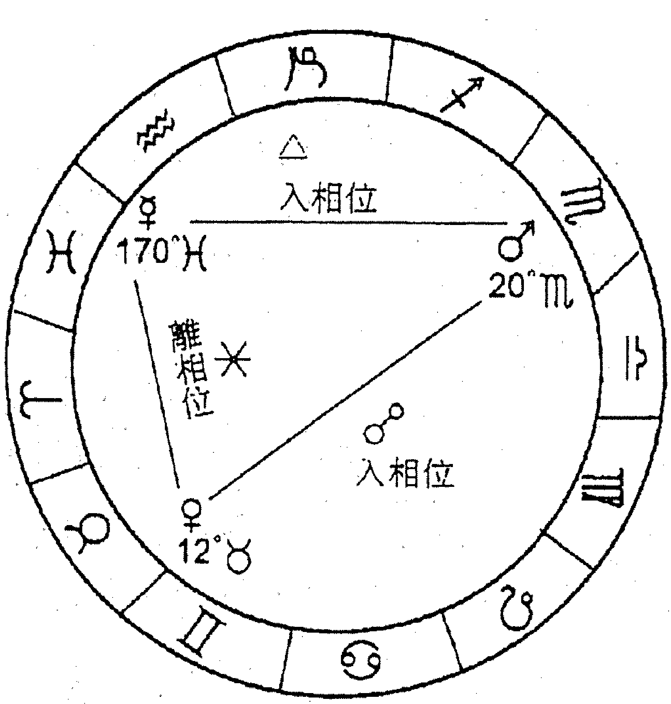

  **說明**
  1. 圖中 ♀ 在亥17°，♀ 在酉12°，兩者形成離相位 ✕，意即 ♀ 與 ♀ 已先會合再離去，♀ 的運行速度比 ♀ 快。
  2. ♀ 在酉12° 與 ♂ 在卯20° 為入相位 ☌，假設其他條件不變，代表由 ♀ 和 ♂ 所代表之宮位，將有不良事件發生。
  3. 幸好，♀ 在亥17° 入相位 △ 於 ♂ 在卯20°，♀ 將 ♀ 的光傳遞至 ♂，故原本 ♀ ☌ ♂ 之凶象，得以解除或減緩。
  4. ♀ 扮演著橋樑、和事佬，它是三者中運行速度最快的，才有此傳遞功能，本例的 ♀ 可解決 ♀ ☌ ♂ 的凶象。

  《明譯天文書》第一類第十九門，說七曜相照p63頁最後一行「若二星相會後，一星前去追及一星，即將先會星光，移向後相會之星」即是光線傳遞之意。

  古德波那提特別強調光線傳遞的行星應被容納，其功能才會真正顯現。如上例，♀在亥雙魚，適為♀的旺宮，♀容納了♀，故♀就能將♀的光傳遞給♂，這項觀點在中世紀文藝復興時期被一直遵守著，但現代未提及，即使《明譯天文書》的釋例也未提及。

  所謂光線集中，是指有三顆行星，其中運行速率最慢的行星，能將其他另二個行星原本未呈現之相位或凶相而無法完成之事，將之聚攏，而得以完成，亦即最慢的行星，將其他兩行星的光線聚集以完成事項，此稱之為光線集中，這項概念同樣不易體會，我們也以古德波那提的釋例作說明。

  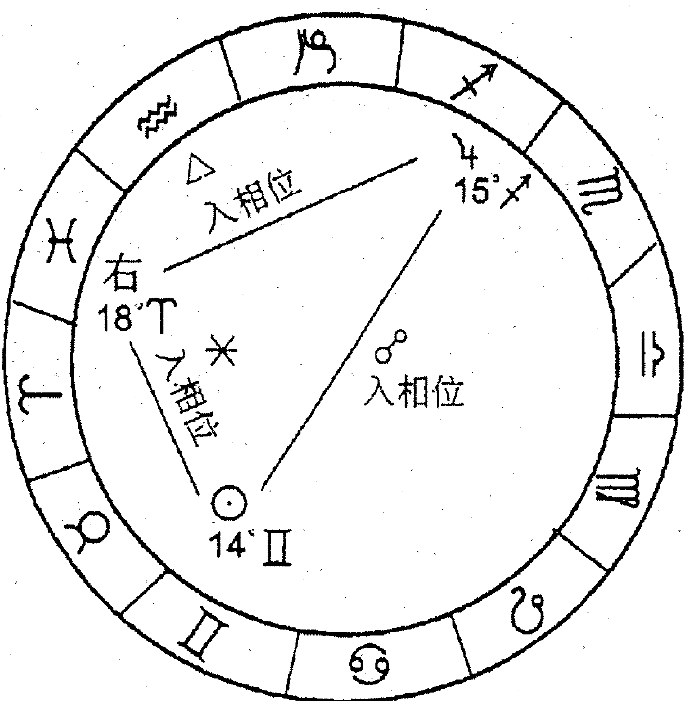

  **圖 10-2**

  **說明**
  1. 圖中，ち在戌18°，υ在寅15°，○在申14° 三者中，ち的運行速率最慢。
  2. ○入相位♂υ，為不吉之象，但○入相位※ち，且υ也入相位△ち。
  3. ち可聚集 ○及 υ之光，而使 ○與 υ之♂相得以化解。
  4. ち扮演著母雞帶小雞之功能，將 ○和 υ之衝突，化解於無形，ち代表第三者能使事情由凶轉吉的關鍵。

  《明譯天文書》在上引句的釋例提及光線集中的觀念。同樣古德波那提特別強調，光線集中的行星應被容納，其功能才能真正顯現。如上例係夜間盤，ち在戌，入弱，但被○容納，且戌為火象，夜間三分性主星為υ，故亦被υ容納，所以ち即能發揮這項功能。

  有關光線傳遞和光線集中，在現代占星學中幾乎被忽視，若不仔細觀察往往會漏掉這項訊息，即使是卜卦、擇日醫療占星學也會忽略，而往往這兩個觀念常在這些占星學分支領域的結果判斷，扮演著相當重要的角色，故須仔細省察。

  我們以現任美國總統布希的命盤為例說明(案例十四)。

  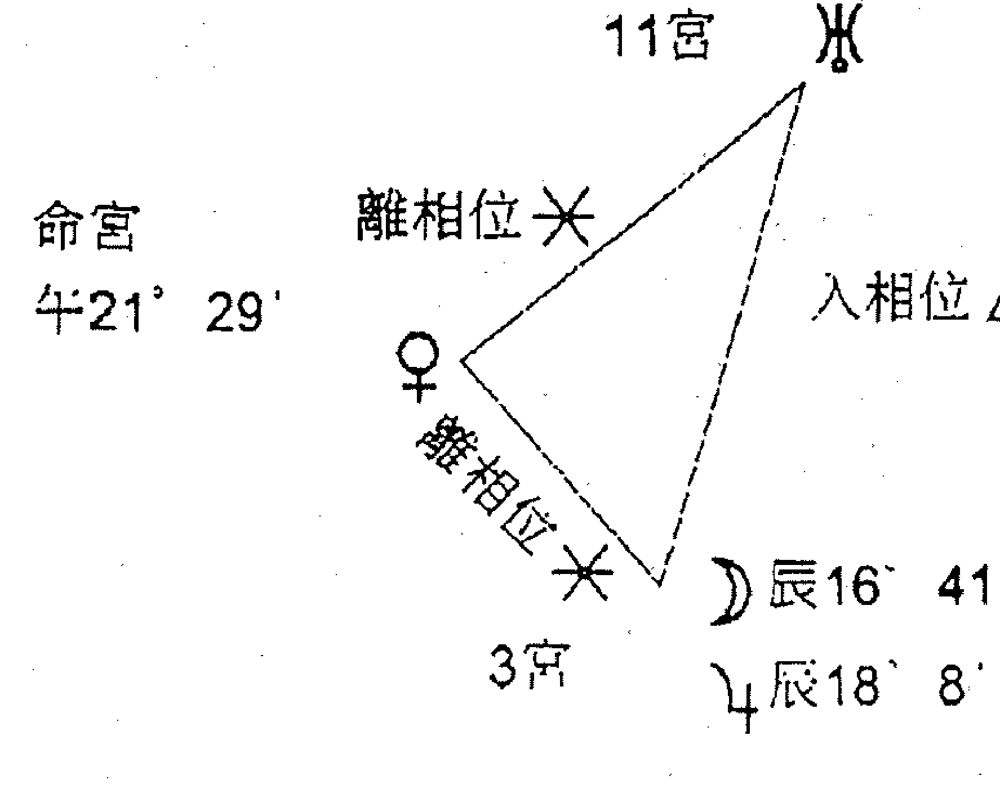

  **說明:**
  1. 在辰16° 41' 離相位☉♀，即☽為快速行星與♀會合後離開。
  2. ♀在命宮離相位 ☉☽在11宮申19° 9'。
  3. ☽也在3宮入相位 ☉☽在申19° 9'。
  4. 這三顆行星，☽運行最快速，故將♀的光傳遞至 ☽，意外的驚喜，由於三者皆呈吉相位，喜上加喜，但更凸顯♀☉☽的效果。

  證之本屆美國總統選舉，布希總選票輸給高爾，但州選舉人票卻贏，實有意外之徵。

## 5. 圍攻(Besiegement)

  在偶然的尊貴及無力一節的<表6-4>，曾列有在 ☉、☽ 之間圍攻一項，尚未解說，里利給予-5。

  依照里利的說法，所謂圍攻是指當任何行星位於兩凶星♂☍ 之間，在此種情況受圍攻之行星不管順行或逆行，都會碰及 ☊、☍ 之一，落於敵人之手，例如若 ♀在午9° 23' ☐☊酉8° 21' ，且 ♀♂☍ 在子11° 10' ，♀ 受 ☊☍ 之圍攻，因 ♀ 都與 ☊、☍ 形成相位，除非 ♀ 與 ☊☍ 之相位都是離相位，順行時較無礙 ，但逆行則又有事。現代占星學對此項觀念也漠視，僅卜卦、擇日用及，也有人將現代三王星都歸為凶星，故圍攻狀況增多。

## 6. 挫敗(Frustration)、禁止(Prohibition)及Refranation

  所謂挫敗是指當兩顆行星欲形成相位時，其中運行較慢的行星卻先與其他較慢形成相位，而使原本運行較快的行星欲形成相位之希望落空，此稱之為挫敗，如 ☿ 在酉10° ， ☊ 在西12° ， ☍ 在西13° ， ☿ 運行較快，本想與 0° 會合，但 ☊ 卻先與 ☍ 0° 會合，而使 ☿ 的希望落空，事件難以達成。

  所謂禁止是指當兩顆行星即將形成形成相位時，卻有第三者介入，因而妨礙了原本期待之相位，如前例， ☿ 本欲與 ☍ 形成相位，當他欲完成完美相位之前，卻突然有 ☊ 介入，先與 ☍ 形成相位，這種情況稱為禁止，亦即第三者 ☊ 切斷了 ☿ 與 ☍ 之會合，即台語俗稱"斬稻仔尾"，英語名詞為abscission of light。

  挫敗和禁止，兩者意義有些類似，但有些微差異，在卜卦、擇日、醫療占星學上都頗為重要，往往象徵即將完成之期待事項，卻遭人破壞，在本命占星學也可如此論述，但這兩個觀念，在現代占星學已不復見，且甚為差異，因如上例，都在相位容許度內，但詳查入相位的關係就可知傳統和現代卻有不同見解。

  所謂Refranation是指一行星趨近另一行星，在即將完成完美相位時，卻突然逆行而使該相位從未完成，此稱之為Refranation。如 在戌5° 在戌10° 入相位趨近於 ，在欲完成完美相位時， 卻突然逆行，使得 之完美相位從未實現。

  有關Refranation的應用，僅適用於卜卦、擇日、醫療，觀察應期的變化，上述之禁止也有這項動態進行的問題，故應小心分辨。

## 7. 托勒密相位

  托勒密以希臘的音樂音階比率，而創立所謂的托勒密相位，如：
  - 1:1 對應於一直線的兩端
  - 1:2 相對於
  - 1:3 相對於
  - 2:3 相對於

  托勒密提及天體的音樂(music of sphere)，如同數學的和諧，而建構出占星學相位的基礎。

  無獨有偶地，17世紀偉大的占星家兼天文學家也發現天體的音樂，而另創次相位的角度，他常説“上帝要求人們傾聽天文學的音樂”，他在幾何學、音樂和天文學這三個差異相當大的領域發展了他的和諧思想，認為幾何、音樂、天體運動同屬於一個秩序、法則和和諧的基礎。

  他發明許多新的相位如18°、24°、30°、36°、45°、72°、108°、135°、144°和150°其中30°、45°、135°、150°已被現代占星學廣泛使用。

## IV. 現代時期於亞倫 里歐吹起新世紀占星學後，形成相位使用的觀念上與傳統的觀念差異甚大

  重點項目中的1.2.3一看即知不再說明，我們從第4項平行相位說起。

  1. 所謂平行相位(parallels)，即兩個行星的赤緯(declinations)是相同之時，他們即構成平行相位。

  當地球繞太陽公轉，若以地球為中心，其相對視運動為太陽繞著地球繞行，其所經路線稱為黃道，與地球自轉的平面、赤道形成23°26'的角度，稱之為黃赤交角，而黃道與赤道的距離稱為赤緯，兩者最大距離頂多23°26'。假設用事當日，☉的赤緯為+10，而☽的赤緯也為+10，☉和☽就稱為具有平行相位，通常以☉IP☽表示，平行相位具有☉0°會合的效果，相對的，若☉的赤緯為+10，而☽為的赤緯為-10，則稱為反平行相位(Contra parallels)類似之意義。

  歸納如下：
  - 平行相位：當兩顆行星同緯北，或緯南度數時
  - 反平行相位：當兩顆行星同赤緯度數，一在緯北，一在緯南，通常其容許度為1°

  平行相位和反平行相位源自天文學，筆者個人不採用，有興趣的讀者可自行採用，由於計算不易甚少被採用，可查Win * Star或Solar Fire天文表內容。

  2. 現代占星學對相位理論的最大貢獻在於相位型態的整理與歸納，我們留待下一節詳細說明之。

## (V). 可從傳統占星學和現代占星學之相位特色的對比欄掌握兩者差異

## A. 相位的吉凶應根據行星的性質論吉凶

  1. 充分計算行星的力量，以它作為分析相位吉凶的基礎。
  2. ☉、♀ ☽ 歸為吉星， ♂ ♃ ♄ 歸為凶星，☿中性，視與☿形成相位之行星而定。
  3. 同屬吉星所形成的吉相位，原則上論吉，應注意若兩者之力量皆甚弱，也無甚助益。
  4. 同屬吉星所形成之凶相位，不必然為凶，除非力量甚弱，且無容納或互容，則雖屬吉星，亦難辭其咎。
  5. 若一為吉星一為凶星所形成的吉相位，原則上可論吉，但若凶星力量甚弱，而無支援，如互容、容納則為凶，如果吉星之力量也甚弱，此吉相位並無作用且藏凶。
  6. 若一為吉星一為凶星所形成的凶相位，原則上論凶，但若凶星力量甚强，則凶星不凶，此凶相位僅是表象而已。
  7. 同屬凶星的吉相位，原則上屬吉藏凶，若兩個凶星力量强，皆得必然尊貴、偶然尊貴，其力量增加，努力奮鬥，雖艱辛，則有所成就，但兩者無力，雖屬吉相位，僅表象和平，卻暗潮洶湧。
  8. 同屬凶星的凶相位，大致上論凶，除非兩者力量皆强，命主更努力掙扎，過程衝突不斷，但仍有成就；如果兩者皆無力，必然為凶，其所在後天宮位或所主管宮位，必然為一生之痛處，尤其是 ♀、☽ 應注意入相位和離相位的區別。

## B. 應注意入相位和離相位的區別。

## C. 相位愈密，吉凶象愈大，因此完美相位最强，等分相位次之，寬廣相位次之。

## D. 使用之特定角度以托勒密相位為主，次相位為輔。

以上A-D為傳統和現代相位觀念整合，以供論相位吉凶時之參考。

## 第3節 相位型態的種類

  所謂相位型態，係指天宮圖中的各種相位匯集而形成一種特殊型態容易一眼瞧出，占星家賦予它論斷的影響力，一般上頗為準驗。傳統占星學因採更嚴謹的相位如完美或等分相位，故未注意相位的組合，但現代占星學採寬廣相位，且允許特殊點，也參與相位，故組合成的相位較多，較易形成特殊型態組合，經過驗證，確實豐富了占星學的論斷。

  一般上較常注意到的型態有下列：

## I. 行星集中(stellium)

  所謂行星集中，是指天宮圖中，有三個(含)以上的行星聚集在一起且在同一星座，彼此形成0°會合，稱之為行星集中型態，如圖10-3。

  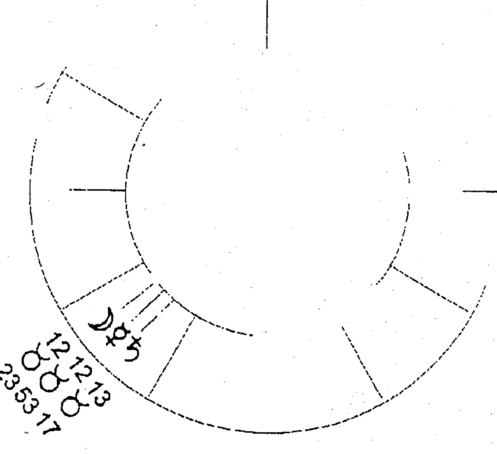

  西 12° 23'
  ♀ 西 12° 53'
  ☽ 西 13° 17'

  三顆行星聚集在金牛同一星座內，且彼此形成0° 會合。這種相位型態強調行星聚集在同一星座，這些行星功能雖各自不同，但行為模式卻相同，很容易顯現該星座所代表的心理動機，這種型態也擴充至多顆行星4顆以上(含)在同一星座，儘管非如上述定義之需彼此形成0° 會合，但因都屬該星座，力量也會顯現，又假如三顆行星僅有二顆彼此☉，但另一顆僅與該二顆之一顆☉，也可視為三顆行星集中。

  國內政壇人物中，較典型之行星集中相位型態為(1)陳水扁總統(案例十二)。

  ♀ 辰 3° 48'
  ♀ 辰 9° 40'
  ☽ 辰 17° 7'
  ☉ 辰 18° 5'
  ☽ 辰 24° 6'

  共有5顆行星聚集在天秤座，尤其太陽、月亮兩個發光體也在內，故他當美麗島辯護律師追求公平、正義，正是天秤的重要能量象徵。

  (2)許信良前民進黨黨主席，MC在雙子(案例十)。

  - 申0°9'
  - 申5°30'
  - ♀申15°31'
  - ☽申16°21'
  - ♀申26°18'

  共有5顆行星聚集在雙子，且揚升天頂太陽、月亮兩個發光體也在內，許氏一生政治敏感多變，反應力佳，卻漂浮不定，聰明、機敏，正是他給予外界的印象。

## II. 三刑會沖(T-Square)

  所謂三刑會沖，是指有一行星同時與另二顆行星形成90°刑□，而該另二顆行星又形成180°沖，稱之為三刑會沖，原則上，這三個相位非為星座外之相位，如圖10-4。

  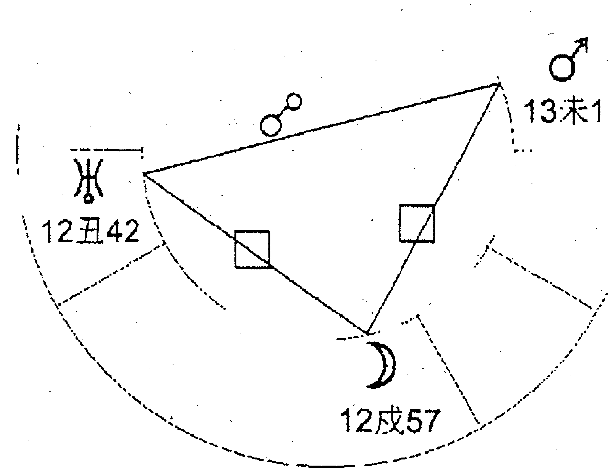

  **圖:10-4**

  這種相位組合型態，因都由凶相位組成，故充分代表著困難、掙扎、衝突、緊張和壓力，若頂點為凶星，常是命主生命中必須克服的問題，若三顆行星皆屬凶星，災禍不免，頂點最不宜在6、8、12宮，是非、疾病、遭人暗害，甚至死亡，準驗性甚高，不可輕忽。

  我們舉國內外幾個著名人物的天宮圖來說明：

  (1)李小龍(案例二十一)。

  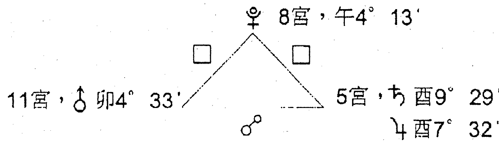

  1. 分別與及90°刑□，而，三者皆為凶星。
  2. 為頂點在8宮死亡宮，而在卯先天8宮。

  李小龍在如日中天之際，卻死於香港豔星丁珮香閨之內，由1、2徵象可觀察出，子午卯酉桃花位、先後天性及死亡宮皆涉及凶星。

  (2)尹清楓(案例二十二)。

  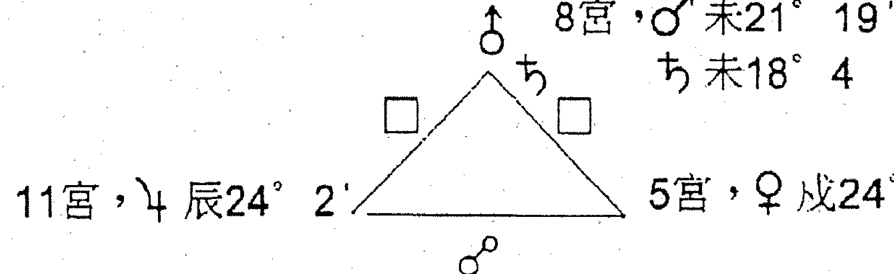

  1. 分別與及刑，而，而又與，、在未弱及陷。
  2. 為頂點在8宮死亡宮。

  尹清楓被人謀殺事件，涉及國內最大宗拉法葉軍購醜聞，、在未水象，死於海中，似有跡可尋。

  (3)英國黛安娜王妃(案例二十三)。

  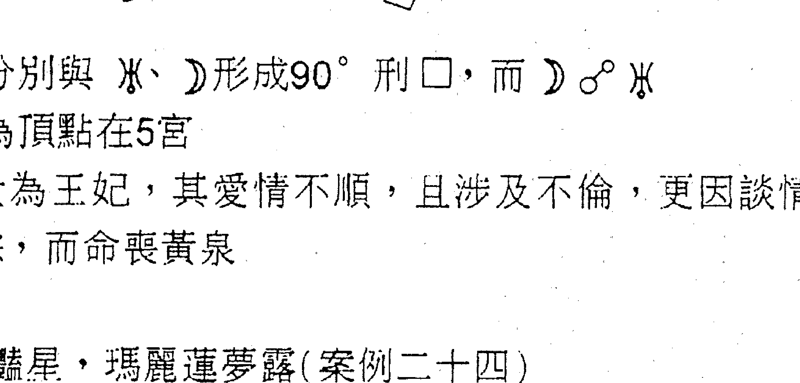

  1. 分別與、形成90°刑，而。
  2. 為頂點在5宮。

  戴安娜貴為王妃，其愛情不順，且涉及不倫，更因談情被狗仔追蹤，而命喪黃泉。

  (4)美國豔星，瑪麗蓮夢露(案例二十四)。

  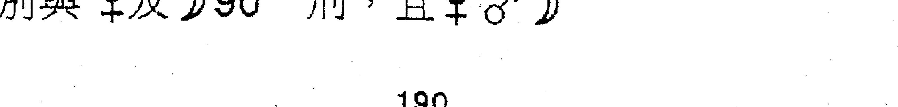

  1. 分別與及90°刑，且。
  2. ち在4宮,先天8宮頂點,ち/Ψ為吸毒、中毒、麻醉，)為心情，美國一代豔星瑪麗蓮夢露服毒自殺，震驚全世界，由此三刑會沖相當明顯的星象來顯示。

## III. 大三角(Grand Trine)

  所謂大三角是指天宮圖中，三顆行星在同一元素的星座，各自形成三個120°三合相位△，此稱之為大三角，如圖:10-5。

  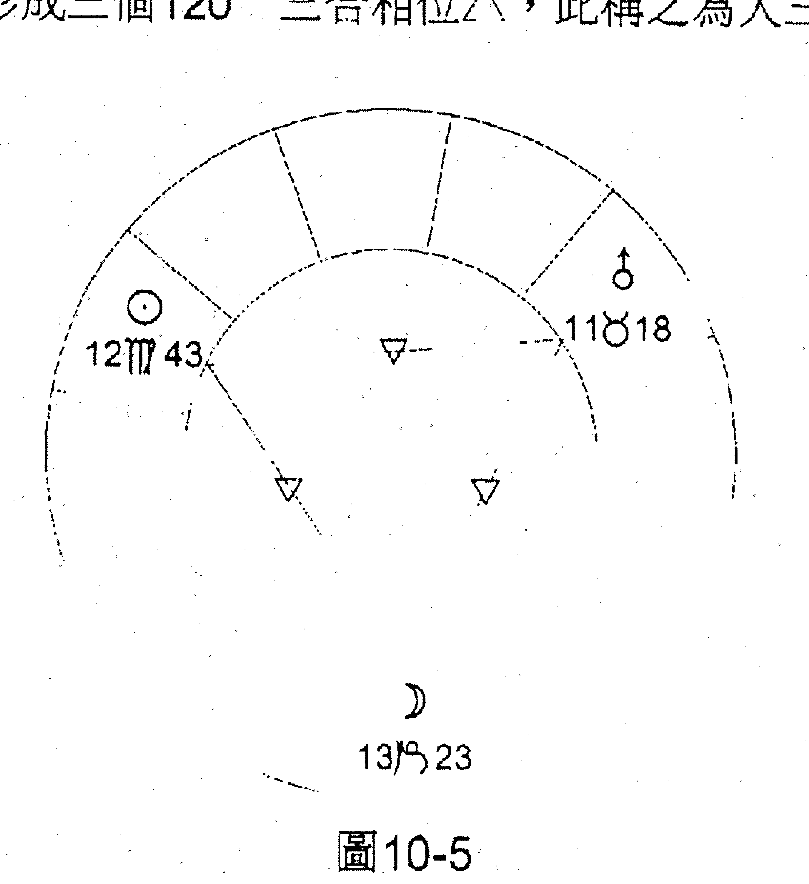

  **圖10-5**

  由於皆在同一元素的星座，且各自形成三個120°三合相位，代表順暢幸運，外緣佳，比別人擁有較順暢的人生旅程，個性較隨和，處事態度平和。

  可再依其元素性質，進一步分析其元素屬性，強調命主三方的特質，國內知名人物具大三角，較典型的有：

  (1)馬英九(案例九)。

  ASC卯 5° 12' 1宮
  ↔ 亥 7° 1' 5宮始點
  未 6° 8' 9宮始點

  形成大三角吉相，難怪小馬哥頗得人緣，道德要求標準較高，擁有國際知名的哈佛法學博士學位。

  (2) 星雲法師(案例二十五)。

  MC丑24° 30' 10宮
  ↔ 酉22° 22' 1宮
  ♀ 丑24° 28' 6宮始點

  形成大三角吉相，土象，此三個相位相當緊密，且都為吉星，星雲法師開創佛光山名聞遐邇。

## IV. 風箏型(Kite)

  所謂風箏型是指天宮圖中已具有一個大三角相位型態，再加上其他另一行星，與大三角行星的二個形成兩個，此另一行星※構成此型態的頂點，類似風箏型態，故稱之為風箏型。

  如圖:10-6。

  

  **圖:10-6**

  1. ☉、♂、☽ 構成大三角。
  2. ㄅ為第4顆行星與♂、☽ 構成兩個✖。
  3. 這四顆星組合成類似風箏型態，而以ㄅ為頂點。
  4. ㄅ與☉形成♂。

  此種型態由三個大三角相位及兩個✖吉相位，和一個♂組合，吉相較多，故歷來占星家通常視之為吉相，而以頂點所在為關鍵，由於此沖相會被二個△相位，及二個✖相位緩和，而不認為凶，這是現代占星學僅考慮相位之可能結果，其實若頂點行星力量甚弱，反難振作，因循苟且，故不要一看到風箏型即視為吉。

  我們舉例說明：

  (1)辜振甫(案例二十六)。

  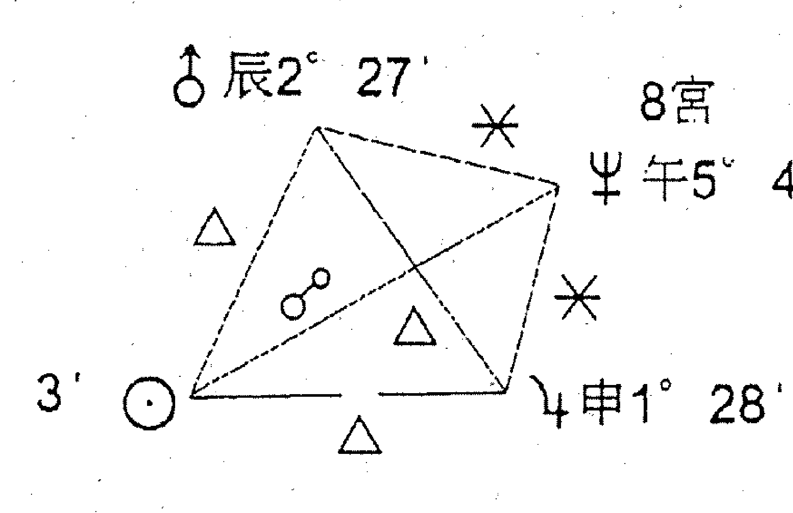

  1. ☉、♂、ㄣ 形成大三角。
  2. ♄與♂、ㄣ 各形成✖，而♄♂☉。
  3. 頂點♄在8宮，受☉容納。

  辜振甫出身台灣五大家族。

## 天宮圖中的相位

(2) 施振榮 (案例二十七)

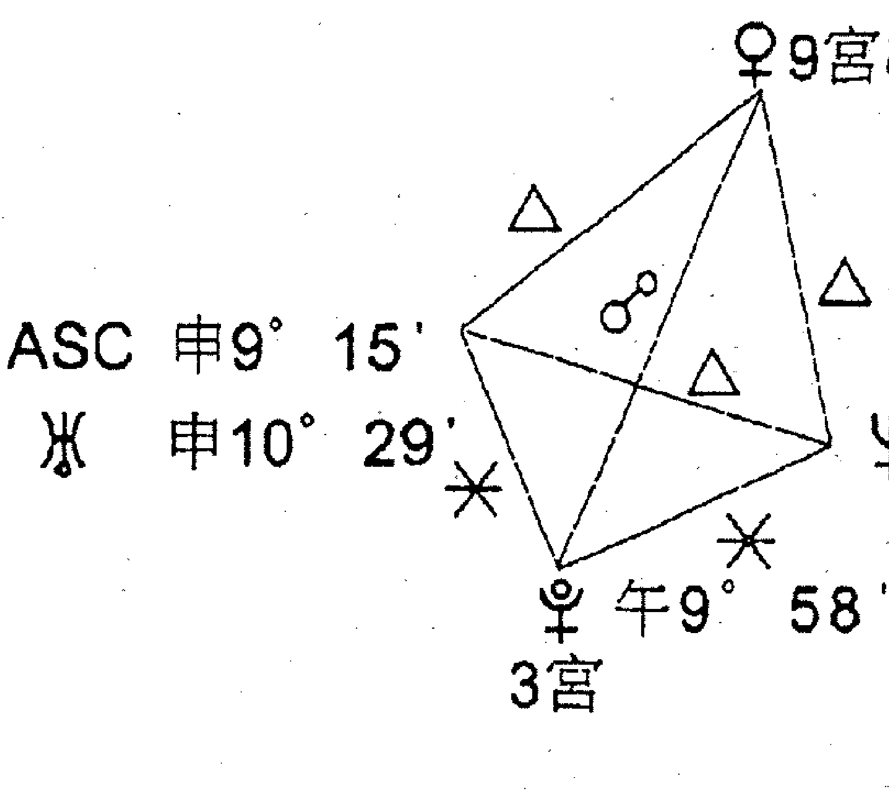

1. (ASC, ☉, ♆) 與 ♀, Ψ 形成大三角，且甚為緊密，尤其 ♆ 與 ASC, ☉
2. (ASC, ☉, ♆) 與 ♀, Ψ 形成 ✳
3. ♀ 在 3 宮頂點，♂, ♀，3 宮代表資訊。

施振榮出身彰化鹿港窮之人家，母親守寡含辛茹苦，靠賣香紙錢培養，而能創造台灣電腦自創品牌的先鋒，且在國際佔有一席之地，從其風箏型相位及 ♆ 與 ASC, ☉ 來看似乎頗符合其事跡。

## V. 大十字型 (Grand Cross)

所謂大十字型，是指天宮圖中有四顆行星或點，互相形成 90° 刑，且其中有兩組行星或點各形成 180° 沖的型態，此稱之為大十字型，如圖:10-7

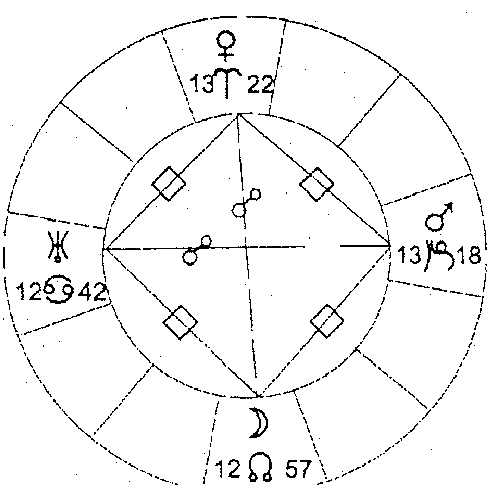

這種型態分開來講，各形成 4 個三刑會沖，因都屬凶相，命主不免動態、衝突、不安、橫逆，但由於互相對抗拉拒反成平衡，若能適當平衡，反而是大開大闔之格局，類似中國八字學所談的「不刑不衝則不發」，這種格局大抵是「大好」或大壞，它不像三刑會沖之凶相，僅有頂點的壓力，十字型則四個頂點可形成平衡，但必須注意，其分析顯得複雜化。

大十字型成立常以四正來配合，故可依其落宮，如啓動星座、固定星座或變動星座深入討論，其四個頂點最好有其他吉星之吉相位，在激盪中較能和緩，就筆者經驗，大十字型常遭橫逆，一般意志力不强之人，容易一生動盪。

## 天宮圖中的相位

我們舉例說明

台灣最大財團台塑領導人，王永慶的命盤 (案例七)

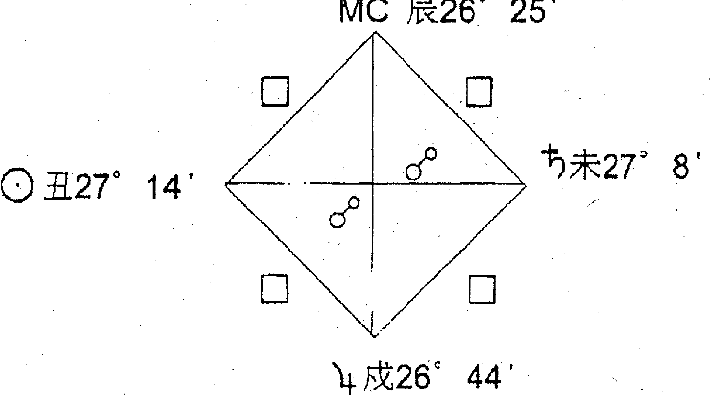

1. ☉, ☍, ☊, MC，各自形成四個 90° 刑，而 ☉, ♂, ☊, MC，兩個對沖
2. 大十字型落於啓動星座，且都在始宮

王永慶也出身貧寒，但開創力十足，台灣的經濟奇蹟，無疑是他的縮影，領導的企業財團一直領先國內其他企業，從其結構，實不虛也。

## VI. 神秘的長方型 (Mystic Rectangle)

所謂神秘的長方型，是指天宮圖中有四顆行星或點，組成兩個對沖，兩個三合 △，及兩個半合 ✖，看起來像個長方形，如圖:10-8

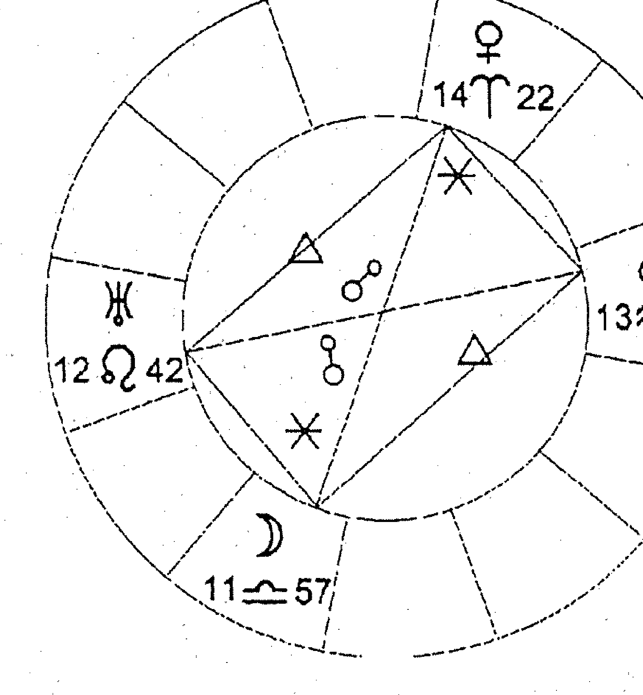

圖:10-8

這種型態也是吉凶皆備，也隱含動態平衡，吉相亦多，不似大四角那麼大的衝擊，而是平順當中，應注意潛藏的危機，其四顆行星或點，最怕又有其他凶星凶相來激發其凶相

我們以國際巨星成龍案例二十八作說明

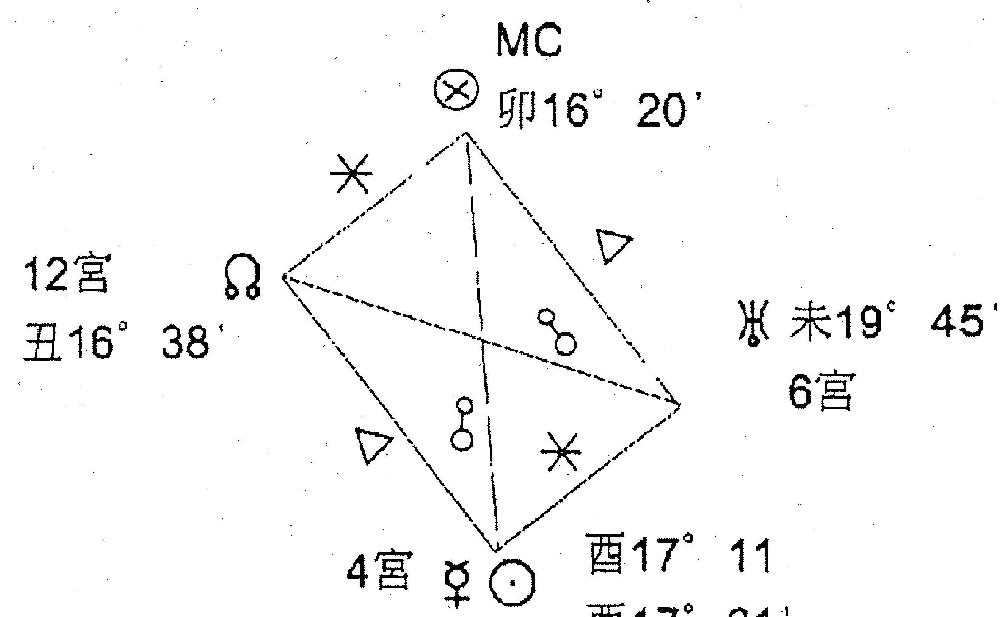

## 天宮圖中的相位

1. Ω △ (♀, ⊙, ○) 及 (⊗, ⊙, MC) △ ※，⊗, ⊙, MC ※ Ω ♂ (♀, ⊙, ○)，以及 (Ω, ♂, ※)，(♀, ⊙, ○) ※ ※ 成為典型之神秘長方型。
2. (⊗, ⊙, MC) ※ Ω。

成龍以一介武打特技人員，躍昇全球矚目之國際巨星，⊗, ⊙, MC，但潛在 6、12 宮 ※, ♂, Ω，時常意外受傷住院，似可得証。

## VII. 手指型 (YOD)

所謂手指型，是指天宮圖中有一行星或點，分別與其不合意星座的兩個行星形成 150° 相位，而這兩個行星又形成 60° ※ 相位，此稱之為手指型，如圖:10-9


圖:10-9

198

## 天宮圖中的相位

這種型態國外占星家常稱之為「上帝的手指」，意即命運的手指，在圖中就以分別與兩顆行星形成 150 相位之行星作為關鍵，如圖 10-9 中的，它類似一股神秘力量引導命主活動。

我們以星雲法師的天宮圖為例說明（案例二十五）

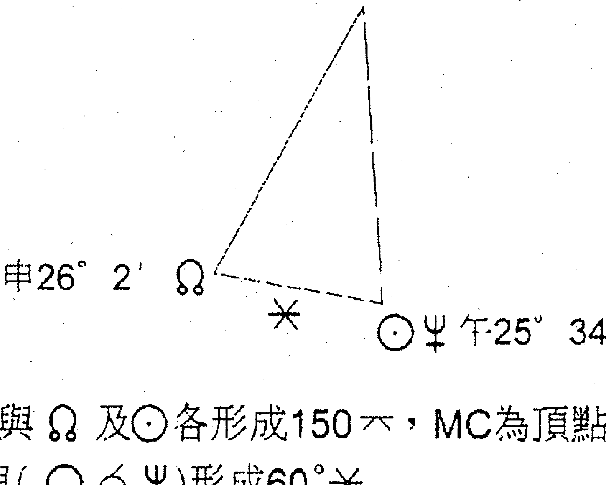

1. MC 與各形成 150，MC 為頂點
2. 與 ( ) 形成 60°

星雲法師開創佛光山，成為著名佛教勝地，甚至遠至美國西來寺都相當有名，妙的是此結構中涉及羅喉、海王等與前世、神秘、宗教有關的行星或點。

1. 相位型態使用上，應注意之處
   並非形成吉相位就一定格局高或非常吉祥，事實上一個人的天宮圖中，若都是呈現吉相位，反而安於現狀，較無憂慮、衝突，但相對衝勁就減少，易喪失企圖心。

2. 並非凶相位就呈現凶象，只是較有競爭、對立，若能適當妥善處理，往往是一種動力來源，或契機、轉機所在。
3. 就經驗，三刑會沖的頂點較易呈現命主困頓之處，尤其又是凶星且無力時，特別凸顯。
4. 要完全評估相位型態吉凶，仍須掌握行星力量，才能作較精確的論斷。
5. 相位型態，可當作格局高低的一種輔助，但絕非喧賓奪主，被誤為主導角色。
6. 其他尚有回力棒型，大六角型，因實用性低，故不擬討論。

## 天宮圖中的相位

## 案例二十一

李小龍
Nov 27, 1940
舊金山
07:06:00 AM PST
ZONE: +08:00
122W26'00"
37N47'00"

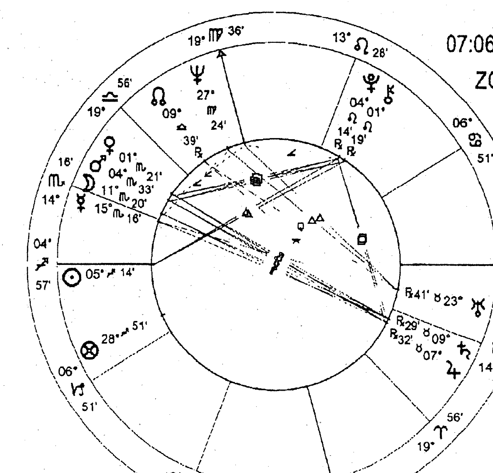

1. 群星聚集南天，尤其第四象現，且東半球較多星
2. 太陽與 ASC 0° 會合，與 ♂ △
3. ♀ 在 8 宮與 11 宮之 (♀, ♂, ♀) 及 5 宮之 (♂, ♂, ♂) 三刑會沖
4. ♄ 揚升於天頂

個人的同夥化，注意外界評價，獨主自主，運動神經强，易成名，但佔有慾、不服輸、桃色事件致死 (三刑會沖於性、死亡、桃花之位，且凶星居多)，藝術揚名。

## 天宮圖中的相位

案例二十二

尹清楓

Mar 31, 1946

蘭州

11:00:00 PM SST

ZONE: -07:00

103E27'00"

36N01'00"

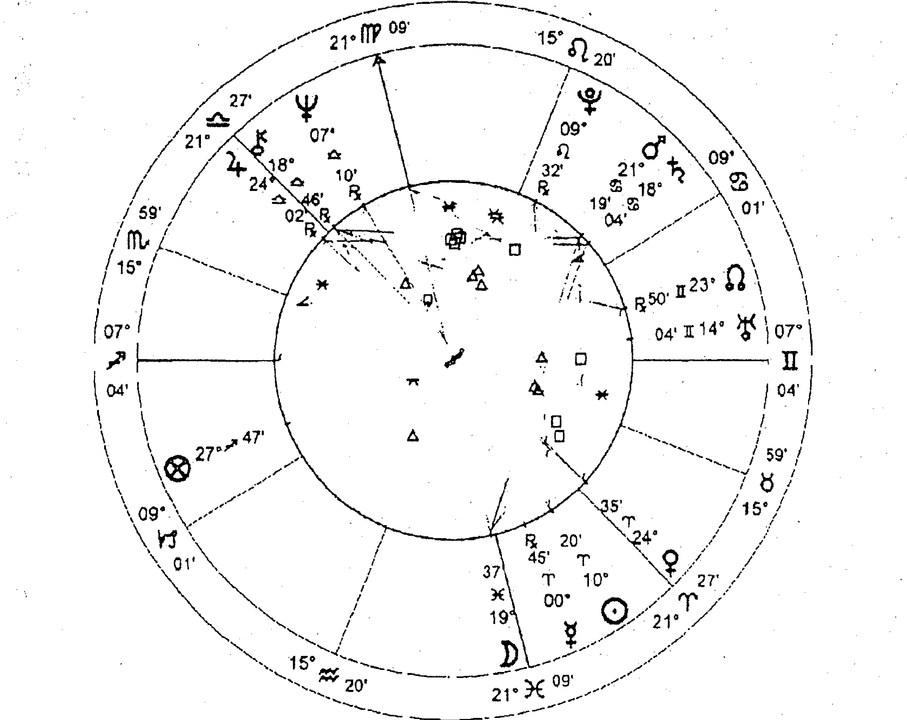

## 案例二十三

## 天宮圖中的相位

戴安娜
Jul 01, 1961
英國
06:45:00 PM GMT
ZONE: +00:00
000W30'00"
52N05'00"

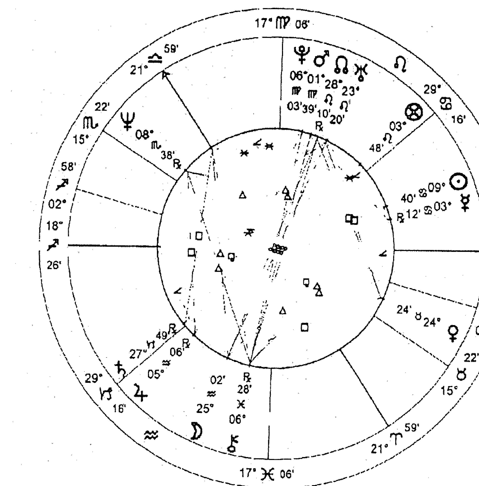

## 天宮圖中的相位

案例二十四

瑪麗蓮夢露

Jun 01, 1926

洛杉磯

09:30:00 AM PST

ZONE: +08:00

118W15'00"

34N04'00"

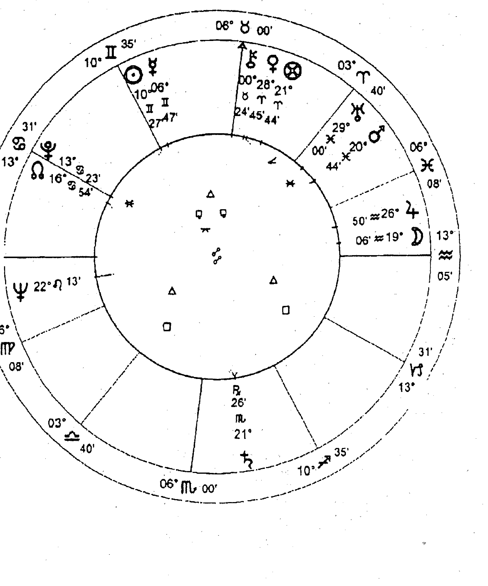

## 案例二十五

## 天宮圖中的相位

星雲法師

Aug 19, 1927

江蘇省

10:00:00 PM CCT

ZONE: -08:00

119E30'00''

32N24'00''

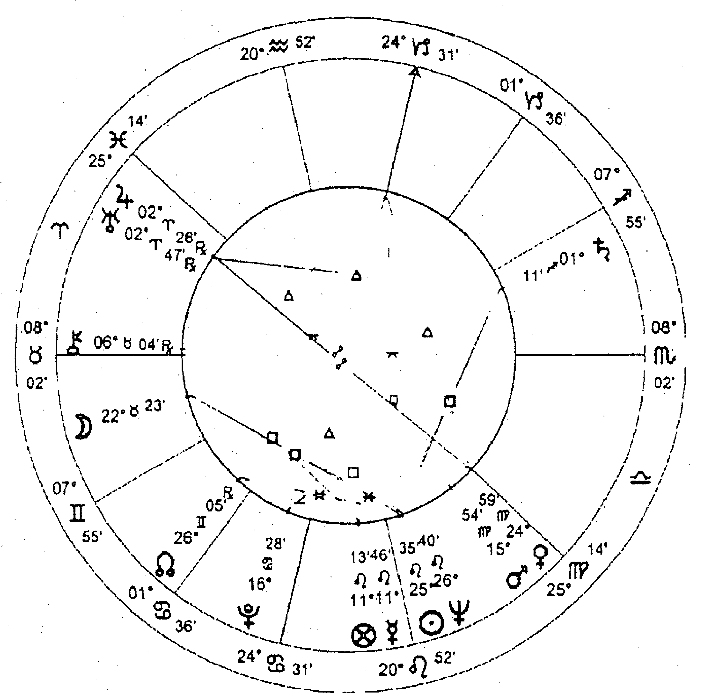

## 天宮圖中的相位

案例二十六

辜振甫
Jan 25, 1918
彰化市
04:00:00 AM CCT
ZONE: -08:00
120E32'00"
24N04'00"

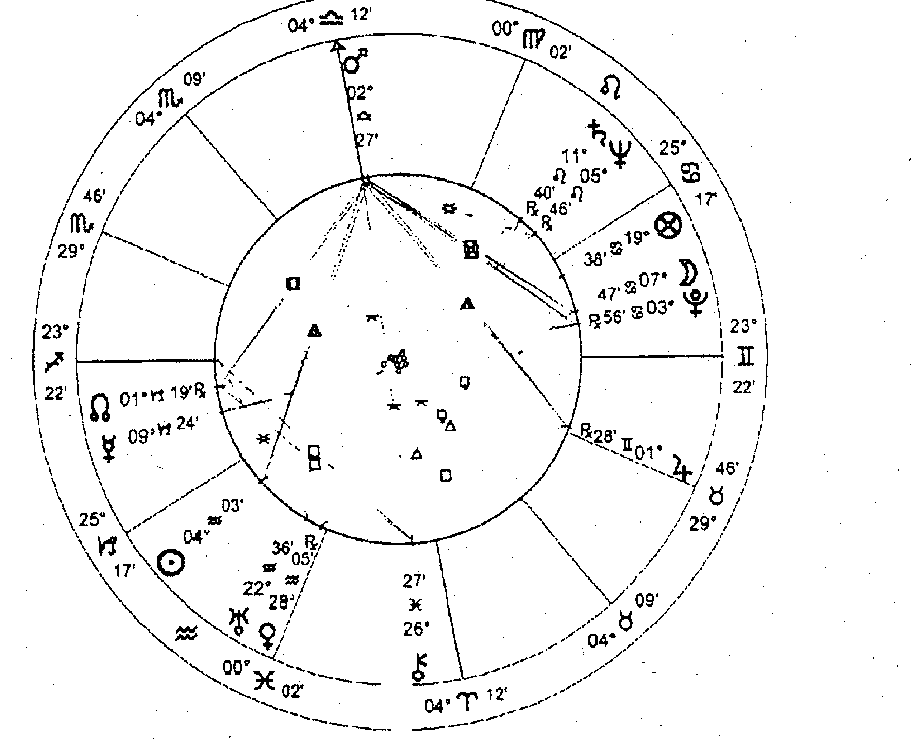

## 案例二十七

## 天宮圖中的相位

施振榮

Dec 18, 1944

鹿港

04:00:00 PM CCT

ZONE: -08:00

120E26'00"

24N04'00"

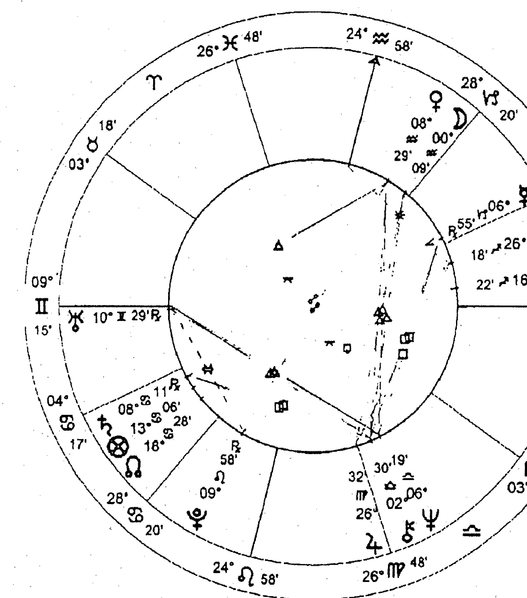

## 天宮圖中的相位

案例二十八

成龍
May 09, 1954
香港
00:15:00 AM CCT
ZONE: -08:00
114E10'00"
22N18'00"


208

## 第4節 相位的基本意義

| 相位 | 基本意義的詮釋 |
| :--- | :--- |
| ☉ ♂ ☽ | 強調太陽所在星座，且水、金可能同臨，故頑固或根深蒂固，眼界較狹窄，缺乏適應力，須其他相位平衡，易與家人、配偶、小孩連在一起 |
| ☉ ♂ ♀ | 頑固、專斷，缺乏客觀<br>合相若在申、巳、子、辰，則心靈較活潑 |
| ☉ ♂ ♀ | 熱忱、慷慨、迷人、品味高雅，有藝術傾向，自戀、喜社交第五宮及第二宮不刑沖，則開朗樂觀，浪漫情懷，孩子緣 |
| ☉ ♂ ♂ | 積極又果斷，活力、才能、意志力强<br>程度則視合相所在的宮位和形式而定 |
| ☉ ♂ ♄ | 樂觀、慷慨，心智發展良好，教養佳，贏得信賴<br>視合相所在宮位之特性發展 |
| ☉ ♂ ♅ | 辛勤、受限、挫折，但自律 穩定、安全、缺乏樂趣視合相所在宮位可看出努力的方向 |
| ☉ ♂ ♆ | 具科學、人類知識先驅的研究，但變化莫測、古怪，只要能克制不安，也許是可觀的才能 |
| ☉ ♂ ♇ | 藝術才華，神秘主義者，靈媒、先知<br>需要水星、土星和天王星的成熟心智輔助 |
| ☉ ♂ ♃ | 權力情結，掌握事物主因，可以改變自己和周遭<br>易形成極端或獨裁，尤其在獅子座 |

## 天宮圖中的相位

| 相位 | 基本意義的詮釋 |
| :--- | :--- |
| ☉♂ ASC | 強調自我，擁有強壯身體和直覺<br>第六宮和第十二宮刑沖，表示太陽能量失去和諧，自己受害 |
| ☉♂ MC | 需要別人認同，專注事業，工作狂，聲望佳 |
| ☉♂ DSC | 能幹的妻子，合夥關係佳，公共關係良好<br>太陽及第七宮不宜各被受剋 |
| ☉♂ IC | 善於家事和家庭內表現意志和權威，喜討好重要人物利晚年，第四宮、太陽不宜受剋 |
| ☉♂ ♈ | 好運，自我實現，有機會擴張領導才能<br>不宜極端，消耗精力 不惜犧牲他人 |
| ☉♂ ♉ | 壞運，領導才能及天賦易受限，自毀前途 |
| ☽♂ ♍ | 聰明才智，高敏感性及想像力，對家事和家人關心<br>合相若受剋，則情感凌駕理智，在意他人批評 |
| ☽♂ ♎ | 美感、和諧、喜愛藝術、魅力、敏感機智、多情、<br>選憚衣飾及食物有創意若合相受剋，容易任性，感情受騙 |
| ☽♂ ♐ | 精力充沛、喜愛冒險、活潑、健康<br>受剋則好妒嫉、感情受挫、忿怒、易樹敵<br>須有水星及土星良好相位平衡 |

## 天宮圖中的相位

| 相位 | 基本意義的詮釋 |
| :--- | :--- |
| ☽ ♂ ♄ | 同情心、慷慨，希望能為他人帶來好運，關心社會福利，贏得別人信賴和合作，正直，商業能力若受剋，則浪費和自大、貪吃 |
| ☽ ♂ ♅ | 自我犧牲、節儉、穩定、責任感重、溫吞易陷於過去回憶，吝於稱讚他人若受剋，母親或妻子身體健康不佳 |
| ☽ ♂ ♆ | 直覺、原創力，突如其來的情感衝動，情緒變化快，喜歡追求新奇、不尋常事物。若受剋，憎恨、因襲傳統、情緒化、性變態 |
| ☽ ♂ ♇ | 富同情心、體諒他人，容易受感動，靈媒預言合相在十二宮，喜歡隱遁，逃避現實，在水象星座則第六感佳 |
| ☽ ♂ ⚷ | 容易衝動，對周遭的環境有強烈的支配慾究竟是表現出創造力的天賦或情感的毀滅，視其他相位平衡與否而定 |
| ☽ ♂ ASC | 充滿感情、正圓形臉、富同情心、母子關係佳 (或女性化)、戀母情結、認同家人和家庭，記憶力強 |
| ☽ ♂ MC | 很難固定在某一事業上，具烹飪、宴席、旅館工作的天賦，可仰賴女人獲取財富和地位，也利不動產和家配合之事業 |
| ☽ ♂ DSC | 與配偶、合夥人關係好，利女命，因對丈夫、家庭有貢獻 |
| ☽ ♂ IC | 與父母情感佳，依賴母親，園藝、農耕 |

## 天宮圖中的相位

| 相位 | 基本意義的詮釋 |
| :--- | :--- |
| ☽ ♂ ♉ | 女人緣，公共事務有斬獲，非常敏感與當代潮流和諧並行，帶來好運 |
| ☽ ♂ ♋ | 資源有限，被迫自立自强，情感孤獨，易沮喪，就宿命觀點，前世可能濫用財富、地位、人緣 |
| ☿ ♂ ♌ | 言談迷人，聲調柔和，韻律感，樂與人相處，文字詩賦才華金水若落申巳、辰酉，則更佳，利時裝設計、美容、手工藝、音樂，若受剋，則遊手好閒和浮躁不安，桃花事件 |
| ☿ ♂ ♍ | 喜愛辯論，準確地表達所要說的，政治演說<br>若受剋，則尖銳嘲諷 口角<br>在申巳合相最佳 |
| ☿ ♂ ♎ | 聰明才智，致力於人道主義，贏得尊敬、認同、權威、聲譽，對哲學、宗教、高等教育有興趣 |
| ☿ ♂ ♏ | 耐心、有條不紊，數字概念，精細計劃，利研究者、設計者、繪圖師、工程師。<br>在巳丑合相最佳，若受剋，挑剔、過慮懷疑、疑惑、遲頓 |
| ☿ ♂ ♐ | 近乎天才的才氣，快速的領悟力，研究占星術、科學，找出問題原始解答的能力，<br>若受剋，則變得古怪、浮躁，難以相處 |
| ☿ ♂ ♑ | 善良、和氣，富想像力，神秘靈異之洞察力<br>未-想像力、敏感性。午-藝術表演才華。巳-寫作能力<br>辰-趨簡避繁。受困則逃避、受騙、不真誠 |
| ☿ ♂ ♒ | 敏銳、足智多謀，追根究底的能力，偵察者<br>午-煽動文章。巳-憂慮、健康受損 |

## 天宮圖中的相位

| 相位 | 基本意義的詮釋 |
| :--- | :--- |
| ♀ ♂ ASC | 聰明才智，想法比行動快，具邏輯推理能力，表達能力佳若受剋，嘮叨多言 |
| ♀ ♂ MC | 事業屢有變動，利新聞、傳播、評論、寫作良好的說寫能力 |
| ♀ ♂ DSC | 社交智慧及談吐能力佳，配偶聰慧 |
| ♀ ♂ IC | 出身於知識份子的環境，父母聰明或受過良好教育 |
| ♀ ♂ ♍ | 想法不是落後就是超前所處的時代，跳脫一般觀點受剋則想法無法獲得支持，挫折感，心靈孤獨 |
| ♀ ♂ ♎ | 導致心靈惰性，少有原創性思考 |
| ♀ ♂ ♂ | 熱情但具侵略性，性生活活潑，易陷熱戀花錢衝動，慷慨外向，享樂 |
| ♀ ♂ ♄ | 迷人大方，感情豐富，頗得人緣，適合與異性合夥懶散，若有土星合相或三分相，則無妨解囊救濟，仲裁 |
| ♀ ♂ ♆ | 抑制感情，晚婚傾向，或年齡差距大 (耐心，因責任感而擔誤) 正義感，公平、忠誠、金錢企圖心，若受剋，則意志消沈，不被關愛 |

## 天宮圖中的相位

| 相位 | 基本意義的詮釋 |
| :--- | :--- |
| ♀ ♂ ♄ | 原創造，個人主義的風格，愛情友誼會混淆，社交喜新潮藝術，不可能匆促結婚，博愛宜土星平衡 |
| ♀ ♂ ♃ | 和善、緊張、敏感、唯美派，對受苦者同情，幻想，不切實際，喜愛寵物，浪漫易受騙、受虐 |
| ♀ ♂ ♂ | 財務管理能力佳，受壓抑，突然或偷戀某人，愛情佔有慾強 |
| ♀ ♂ ASC | 美麗外貌，和諧美觀，自戀若火星又合，則有進取心 |
| ♀ ♂ MC | 女性藉吸引上司或權勢升遷，藝術性美感專業，時裝、美容、寶石珠玉、裝潢設計，不宜獨資，地位可由婚姻提昇，尤其在丑、辰 |
| ♀ ♂ DSC | 婚姻和諧，喜好外交，公關、娛樂，受歡迎，個性隨和，機智和外交能力佳 |
| ♀ ♂ IC | 家庭和諧，家庭佈置藝術氣息美觀，重視家庭品質 |
| ♀ ♂ ♋ | 社交接觸，適於賺錢，羅曼史、合夥、婚姻的好運，源自前世業力 (親切與寬大) 防時間浪費在無用的社交活動 |
| ♀ ♂ ♈ | 寂寞，遺世獨立，不懂得時機掌握，自卑情結，壞運源自前世業力 (缺乏愛) |

## 天宮圖中的相位

| 相位 | 基本意義的詮釋 |
| :--- | :--- |
| ♂ ♄ 4 | 活力與熱忱，追求知識，自信，專注於目標，狂熱的，適合軍職，軍火生意，爽快寅、戌星座强，則凡事不在乎，貪婪，好戰，炫燿，偏激 |
| ♀ ♄ 4 | 辛苦工作，耐力，不會隨機應變，不畏艱難危險慣恨、暴力 (源自挫折感)，斯巴達式特質適合軍人合相遭困，易骨折，皮膚病，肌肉僵硬，牙齒 |
| ♀ ♄ 4 | 喜歡刺激的活動，反對束縛，革命家，難忍受枯燥，勇氣、果斷、缺乏耐性，喜水、土、金會合先入為王的偏見為意外之因，受困則精神易崩潰 |
| ♀ ♄ 4 | 熱情有餘，卻漫無目標，不夠現實，太過浪漫，詭計秘密，吸毒或傳染病等影響健康 |
| ♀ ♄ 4 | 活動力很強，面對危險有充足的勇氣意志力克服，偏重個人性慾貪婪，自負，具有潛藏的危險及破壞，殘忍，脾氣暴燥 |
| ♀ ♄ ASC | 侵略，壓迫感，自私，易出意外，外觀肌肉發達，體格強健，喜支配，干涉他人 |
| ♀ ♄ MC | 天生有極高的抱負，高度競爭性質的事業，利工程、軍人、專業、機械 |
| ♀ ♄ DSC | 公衆前表現具進取心，不易表達個人情感，尤其是婚姻 |
| ♀ ♄ IC | 喜愛家庭生活卻以激烈的行動表達，利建築、挖礦、在家動手DIY |

215

## 天宮圖中的相位

| 相位 | 基本意義的詮釋 |
| :--- | :--- |
| ♂ ☽ ♋ | 傾向在環境下和人們和諧相處，因而得到支持及合作機會，熱心行為過份反會導致自我毀滅 |
| ♂ ☽ ♌ | 喜歡爭論軍事行動的價值或群體行為，有時會獨善其身 |
| ♄ ☽ ♍ | 保守又實際，沈重的責任感而外表較嚴肅，潛力深厚，專心一致，堅忍不拔，須克服嚴厲的障礙<br>太早急於努力，反而暗藏危機、挫敗 |
| ♄ ☽ ♎ | 創造不平凡的機會與成功、利益來自新理論，新穎富智慧，不喜遵循固定程序，鼓勵別人做不平凡事 |
| ♄ ☽ ♏ | 理想主義、理解力與直覺均强，喜歡動物，通常具藝術、音樂才能，宗教、神秘領域的感應 |
| ♄ ☽ ♐ | 達到目標的決心，另創新局<br>未宮-緬懷過去，難以割捨。在午宮、第十宮-沈迷權力，具領袖特質 |
| ♄ ☽ ASC | 外觀俊挺高大，樂觀、自信，喜愛哲學、宗教、愛好旅行 (在子午卯酉則不會) |
| ♄ ☽ MC | 對生活目標及事業抱持正確而積極的態度，利文化教育、法律、宗教 |
| ♄ ☽ DSC | 因婚姻、友情帶來好運，人際關係的能力，仁慈且真誠，若合相受困則自私而偽善 |

## 天宮圖中的相位

| 相位 | 基本意義的詮釋 |
| :--- | :--- |
| 4 ♂ IC | 喜愛從事房地產與建築，也傾向農業和種值，老運佳，家通常與宗教、教育活動一起 |
| 4 ♂ ♒ | 可以和流行的社會文化、宗教態度協調，受歡迎又幸運 |
| 4 ♂ ♈ | 努力會受阻，和社會觀念不一致 |
| ♋ ♂ ♆ | 自信、大志、決心、有時會神經緊張<br>受困時，則倔強、獨裁、突發的意外，惡兆 |
| ♋ ♂ ♅ | 愛好藝術與音樂，適合幕後活動，穩重、專心冥想<br>合相受困涉及詐欺事件，沮喪、焦慮、病態的幻想，若第十二宮混亂，會進精神醫院，或吸毒 |
| ♋ ♂ ♄ | 努力，辛苦，會有深遠持久環境的影響<br>合相受困，受制於自私動機，神秘的敵人 |
| ♋ ♂ ASC | 實際可靠，強烈的責任感，嚴肅、保守、內斂，不善交際，刻板，注重個人隱私<br>體型極端，不是高，即較矮 |
| ♋ ♂ MC | 苦幹，吃苦耐勞拼事業，擅行政，組織管理，依循舊規，服從紀律，態度嚴肅，孤獨而負重責 |
| ♋ ♂ DSC | 穩定不變的合作關係，傾向法定的專職，負責協調與民衆間的問題婚姻不美滿，或晚婚，為自身地位、名利以婚姻為手段 |

## 天宮圖中的相位

| 相位 | 基本意義的詮釋 |
| :--- | :--- |
| ♄ ♂ IC | 在家冷淡拘謹，背負家庭責任或壓力，親子疏離，家庭與工作難兼顧 |
| ♄ ♂ ♉ | 保守、小心地順應社會流行 |
| ♄ ♂ ♊ | 自我嚴格要求，固定難以變更個人的習慣，藉著自身努力，絕少依賴外力，達到自己設定的目標 |
| ♆ ♂ ♃ | 世代影響(個人影響較小) |
| ♆ ♂ ♄ | 世代影響(個人影響較小) |
| ♆ ♂ ASC | 通常擁有異於一般人的體格相當高，崇尚個人式的英雄主義，對科學、天文占星有探索興趣，喜歡冒險、新鮮、自大、特立獨行 |
| ♆ ♂ MC | 可藉由創造力、新技術獲得名位，利科學、電子學、物理或占星術，合相受剋，則不能忍受一成不變的工作、抗命 |
| ♆ ♂ DSC | 極端的個人主義特質，渴求婚姻自由，易離婚 |
| ♆ ♂ IC | 家庭關係不穩定，或不斷變化，突然遷居合相受困，易引起家庭紛爭、分裂、父母失和 |
| ♆ ♂ ♍ | 機運，往往很有可能因為自身周圍某些社會狀態突然變遷而獲利，能適應外界環境的變化 |
| ♆ ♂ ♄ | 不但無法由變遷的環境得利，反而會因為社會或科技某些改變而受傷害 |
| ♆ ♂ ♆ | 世代影響(個人影響較小) |
| ♆ ♂ ASC | 注重心靈修養的崇高素質，生活在自己建築的夢幻國度，豐富的想像力有一雙深邃而矇朧的眼睛 |
| ♆ ♂ MC | 事業多次改變，利具有啟發想像力的軟性工作<br>受困則醜聞，不名譽，酒精中毒、藥物、毒品上癮 |
| ♆ ♂ DSC | 婚姻、合夥關係有極端矛盾的結果，不喜受法令束縛，相信互信互賴 |
| ♆ ♂ IC | 居家不舒適、隱晦、陰暗、漏水、鬧鬼<br>若受困易在慈善機構、療養院、精神醫院度餘生，或犯法入獄 |
| ♆ ♂ ♍ | 具直覺能力，不斷調整自己行為能夠被社會接受，易疏忽而陷溺太深，致酒精中毒，走向罪惡深淵 |
| ♆ ♂ ♄ | 總是和目前的社會趨勢格格不入，好運失之交臂<br>尚能保持清晰的識別力<br>辛勤成果被陰謀剽竊 |
| ♀ ♂ ASC | 意志力、持久力、具洞察力，強烈、直率，改變生活型態，重新開始<br>受困則任性、固執己見 |
| ♀ ♂ MC | 精明的生意人，有實現野心的力量，獲得名聲或惡名昭彰之兩極端，利科學或神秘領域 |
| ♀ ♂ DSC | 主導改造合夥關係更親密，或合夥人、配偶企圖心強 |
| ♀ ♂ IC | 家居可能出現不尋常的畫面，探堪專家改造家居或家庭關係 |
| ♀ ♂ ♏ | 精密的洞察力，看透社會的流行趨勢，藉由潮流變化而從中獲利過度利用能力，可能適得其反，陷入危機而不能自拔 |
| ♀ ♂ ♈ | 無法改變他們的意念來配合目前的社會趨勢，易引發誤解遭受衆怨，面臨危機反助長獨立自由，困境中求生存的能力 |
| ♏ ♂ ASC | 外表身材高，手腳瘦長，趨向光明，開朗爽快、活潑<br>可以根據社會流行改變個人特質 |
| ♏ ♂ MC | 事業機運能遇貴人，大多具有調和適應社會趨勢的能力，幸運的象徵 |
| ♏ ♂ DSC | 經由合夥、公共關係得到好運(婚姻亦同)，若南交點與ASC合相，則須保持清醒 |
| ♋︎♂ IC | 藉由家庭幫助，獲得幸運 |
| ♉︎♂ ASC | 不會為了順應社會趨勢而改變既有的生活方式<br>身材大多是矮小，與社會價值觀顯然不同 |
| ♉︎♂ MC | 工作不順遂，不能把握事業良機，錯失與貴人相遇<br>為人作嫁，成果被接收 |
| ♉︎♂ DSC | 合夥關係及人際關係不好，不受認同，不願與命主<br>深交 |
| ♉︎♂ IC | 承受相當沈重的家庭壓力，為家庭負擔所侷限 |
| ☉︎⊓︎ ☾ | 衝突，和舊習慣不和諧，早年家境影響難與人相處<br>，情緒不安 |
| ☉︎⊓︎ ♂ | 過份好動、任性、性急自大、惹人厭、爭執，不斷<br>將精力浪費在毫無意義的活動上 |
| ☉︎⊓︎ ♄ | 放肆的言行，急於在短時間內完成許多目標，卻缺<br>乏周詳的計劃及有效方法，誇大、虛偽 |
| ☉︎ □︎ ♃ | 阻隔，艱困而單調，威脅到工作及愛情，挫折、悲<br>觀、自卑感作遂其子女身心狀況可能不佳，如生病<br>、骨折、慢性疾病 |
| ☉ □ ☿ | 奇異古怪的行為，和愚蠢的舉動，想法有創意，卻不切實際，會因緊張的情緒而不夠理性 |
| ☉ □ ♄ | 性格軟弱或逃避現實，沈迷於自我毀滅的舉動中，易涉入假藉神意的詐欺活動，財務決策常自欺欺人 |
| ☉ □ ♀ | 強迫、主宰他人，霸氣、暴力傾向 |
| ☉ ⌐ ♈♉ | 需要積極時反退縮，或應該保守時反而太過衝動 |
| ☉ ⌐ ASC DSC | 與群衆、配偶、工作伙伴之間產生許多麻煩 |
| ☉ ⌐ MC IC | 易與上司起衝突或阻撓對峙，為實現自己的野心，私人問題往往使職務問題更加惡化 |
| ☽ □ ♀ | 太過執著於過去記憶，缺乏客觀，心胸不夠開闊無謂的瑣事紛擾，對待朋友佳，卻常被誤解、毀謗神經及消化系統，內分泌及中樞神經失調 |
| ☽ □ ♀ | 太過信任以致處處受欺壓、被佔便宜，不明智的戀情，不利愛情及婚姻，不愉快及情緒通常與童年經驗及家庭生活有關，財運不佳 |
| ☽ □ ♂ | 情緒化且善變，情緒化爆發脾氣、衝動、暴力，不易與女人相處，酒精中毒，腸胃疾病 |
|  | 慷慨大方卻受騙，縱容子女，猶疑不決，意念動搖，飲食過量，家庭開支不知節制，誇大、奢侈 |
|  | 憂鬱，令人不愉快，悲觀受挫、灰暗，不幸與孤獨的惡性循環，尖酸嚴苛，殉教，胃腸疾病；母親或妻子身體不佳 |
|  | 不可理喻的固執，情緒變化令人捉摸不定，外在環境常出現不幸，常搬家 |
|  | 迷惑、沈溺幻想，脫離現實、混亂、毒品、酒精中毒，精神異常，凡事不在乎 |
|  | 強烈的情緒，希望忘掉過去，強迫他人，喜歡以激烈的手段解決問題 |
|  | 排斥社會的潮流走向，易扯上女人關係的事件，招來旁人的排斥 |
|  | 與同事、配偶的人際關係弱，舊習慣阻礙行動，缺乏果斷，困擾家人或同事 |
|  | 與父母、家庭發生情緒上的問題，阻礙工作表現 |
|  | 充滿活力卻易怒，好爭鬥，好結黨羽，輕率下判斷，爭吵、辯論神經系統、頭痛、精神崩潰 |
| ♀ □ 4 | 想法豐富不切實際、慷慨，太急於成就而輕諾，自傲、自我吹噓誇大 |
| ♀ □ ち | 太依賴傳統的思考、缺乏想像力，壓抑、心胸狹窄、害怕改變、悲觀 |
| ♀ □ 水 | 活潑的心智，因為怪異而不切實際，緊張、輕率、倔强，不接受別人的意見 |
| ♀ 7 ♀ | 精神恍忽，不著邊際、缺乏組織力、不能信賴，對神秘不可知的事物產生興趣，過分順從 |
| ♀ 门 ♀ | 敏銳的透析力，極端、多疑、狡黠 |
| ♀ □ ♈♉ | 社會潮流與個人自我表達溝通的衝突，不得當的談話多持否定的觀點 |
| ♀ □ ASC DSC | 個人與同事、友伴及社會的溝通發生困難，婚姻及工作、社交關係帶來阻礙 |
| ♀ □ MC IC | 與家人、父母、房東 上司的溝通形成阻礙，易造成工作的困擾 |
| ♀ □ ♂ | 慾望强烈、放縱激情、粗魯舉止、侮辱女人 言行缺乏技巧及品味 |
| ♀ □ ⚹ | 沈溺個人享受、奢侈、懶惰、掩飾、損失金錢、離婚、墮落、背叛道德 |
| ♀ □ ♃ | 羞怯、拘謹、失望挫折、晚婚、情感干擾(年齡差距大)艱困、不安、憂鬱 |
| ♀ ⚹ ♆ | 短暫，突如其來的吸引力(迷戀)，情緒不穩定、善變、離婚，不會為了婚姻犧牲個人自由 |
| ♀ ⚹ ♆ | 宿命，逃避現實，酒精、毒品上癮，曖昧、金錢醜聞、秘密戀情，性放縱、墮落，同性戀，錢財受騙，怪異的宗教信仰 |
| ♀ ⚹ ♃ | 被強烈的性慾操縱、激情、愛情，以性關係作為追逐財富的手段，秘密戀情 |
| ♀ □ ♆ | 情感的特質或表達方式不能符合社會價值，約束和規範，違背倫常 |
| ♀ ⚹ ASC DSC | 離婚，婚姻危機，男人娘娘腔，不懂社會禮節，輕率魯莽 |
| ♀ ⚹ MC IC | 與父母衝突，居家沒有品味，家庭工作皆有莫名的負擔 |
| ♂ ⚹ ⚹ | 好戰、暴力傾向，利用團體，滿足個人誇大的私慾，資源浪費及濫用，企圖破壞，暴力賺錢，爭議性的社會政治事件、偽善(宗教) |
| ♂ □ ♄ | 艱苦、苛刻、屢屢受挫、悲觀、怨恨、嚴苛、健康受損，意外事件、骨折、艱苦、髒亂 |
| ♂ □ ♅ | 衝動，不顧後果，反對朋友意見的癖好，任性，自我中心，沒有耐性，開快車，危險的運動、遊樂、易見不幸災難 |
| ♂ □ ♆ | 若壓抑則心理焦躁、不安、幻覺、酒癮、毒癮、性濫交、叛逆、欺騙 |
| ♂ □ ♇ | 個性強烈，寧死不屈的固執，易怒、暴力、殘酷、犯罪、獨裁 |
| ♂ ⋔ ♈ | 個人的行動與興趣所在，會與當前的社會標準格格不入，壞運、挫折、困惑 |
| ♂ ⋔ ASC DSC | 在私人或公衆場合會衝動，故不受歡迎因而憤怒好逞威風、暴力手段 |
| ♂ ⋔ MC IC | 不會和父母、家人、房東、上司、老闆和平相處，充滿紛爭，易與軍事結合 |
| ♄ □ ♄ | 缺乏機運，財務困擾，不能隨機應變，憂鬱、挫敗，強調正統性、保守，單調無聊 |
| ♄ □ ♅ | 過分衝動，不切實際的理想主義，不會深思熟慮，會沈迷於怪異的宗教信仰(天師、聖者) |
| ☍ □ ☿ | 虛華，無秩序，沈溺於不可知的事物，徬徨、情感脆弱，提不起勁，輕諾 |
| ☍ □ ♀ | 反叛當前的社會秩序及規範，自傲與固執，故不受歡迎 |
| ☍ ⊥ ⚹⚹ | 不和諧，很難適應社會制度的規範 |
| ☍ ⊥ ASC DSC | 社會生活處處受阻，自我表達技巧拙劣，辛勤卻得不到成果 |
| ☍ □ MC IC | 誇大描述未來工作上可能的成就或家庭美滿，家庭花費開銷大，負荷沉重 |
| ☍ ⊥ ☿ | 保守與激進的衝突，獨裁、擾亂、意外、缺乏常識及普遍的適應力 |
| ☍ ⊥ ☿ | 病態、恐懼、焦慮、精神衰弱、恐怖、自我封閉，導致精神病幻覺遇鬼、逃避責任，宗教信仰怪異(殉教) |
| ☍ □ ♀ | 陰謀、城府深、心機重、嚴苛、權力慾望重 |
| ☍ □ ⚹⚹ | 野心及上進心受到社會主流力量的阻礙，保守畏懼，被社會孤立或獨自隱居 |
| ☌ □ ASC DSC | 處境艱困與社會缺乏互動，冷酷，不易找到對象或婚姻出現危機 |
| ☌ □ MC IC | 破壞事業的發展、家庭幸福及各方面運氣，沈重負擔來自父母或嚴厲的父母因而辛勤 |
| ♆ □ ♄ | 世代影響(個人影響較小) |
| ♆ □ ♅ | 世代影響(個人影響較小) |
| ♆ ☌ ♅ | 對自由的嚮往，不願輕諾，但與社會價值衝突，喜好世俗以外的新事務，運氣不佳 |
| ♆ ☌ ASC DSC | 怪異的言行阻礙人際關係的發展，離婚傾向 |
| ♆ □ MC IC | 缺乏完成例行公事的能力，對權威抱有敵意(父母上司、政府)對家庭責任感到厭倦 |
| ♄ □ ♅ | 世代影響(個人影響較小) |
| ♄ □ ♅ | 神秘主義的傾向，與社會上世俗實際的習慣及社會既有的組織發生衝突，遭誤解、孤獨 |
| ☍ □ ASC DSC | 處處受到壓抑、逃避、不可信賴、不坦誠也可能受騙 |
| ☍ □ MC IC | 工作職責表現不被信賴，家居髒亂，生活也毫無秩序，飲酒、吸毒、惰性、白日夢、逃避家庭及工作責任 |
| ☊ □ ♍ ♏ | 企圖改革社會、文化規範及組織的期盼，敵意，危險的革命分子 |
| ☊ □ ASC DSC | 具侵略性、厭倦各種社會關係、離婚、官訟，強烈的控制慾望、爭辯 |
| ☊ MC IC | 企圖改變現在秩序的慾望，與上司、父母、家人、政府官員發生衝突，革命、獨斷、獨裁 |
| ☉ ☽ | 好體力、精力充沛、內在和諧能吸引異性，積極樂觀、自信與家人、父母相處融洽，喜歡小孩子。若第四宮、第七宮受困則關係較複雜 |
| ☉ ♂ | 勇氣、意志力、領導才能、決策、強健體能、運動、爭鬥、競爭，喜向高難度工作挑戰 |
| ☉ △ ♄ | 恆心、樂觀、自信、利他主義、好運、誠實、以道德、宗教為標準 |
| ☉ △ ♃ | 誠實、實際、謹慎、保守、不輕易冒險、歷經辛苦的磨練 |
| ⊙ △ ☿ | 個人魅力、靈魂的透析力、創造力、領導力、科學、奇幻、喜嘗試各種新經驗、改革、博愛主義 |
| ⊙ △ ♄ | 直覺力表現在藝術、宗教、音樂等精神心靈事物神秘主義、夢想家 |
| ⊙ △ ♀ | 積極、熱情的領導者，重組反省、改造、專注力能有效運用 |
| ⊙ ∧ Ω ☉ ♃ | 領導力、受衆人歡迎及喜愛、政治人物、公衆人物、與社會普偏的價值觀、文化相互配合、協調 |
| ⊙ ∧ ASC ☉ DSC | 自信心、積極樂觀 寬宏大量、和諧的人際關係 |
| ⊙ △ MC ☉ IC | 領導才能、職務表現受肯定，事業成功受權貴人幫助 |
| ☽ △ ♀ | 記憶力佳，對一般事物的常識豐富，經商能力與人充分溝通，有利食品、家庭日用品之經營 |
| ☽ ∧ ♀ | 溫和可愛、討人喜歡、傳統女性美德、同情、愛護、聲音悦耳與海王結合正面相位，則是卓越音樂藝術家 |
| ☽ ∧ ♂ | 情緒化，強烈的進取心，為真理奮鬥，強健體魄及精力 |
| 利他主義, 為宗教奉獻, 寬大、仁慈, 為家庭、親人奉獻, 帶來財富(繼承遺產或努力而得) |
| 謹慎、保守, 對一般事物的理解力、組織力, 能在既成或繼承的事業再創高峰, 利土地、建築、房地產, 有時嚴厲, 重紀律、責任義務 |
| 原創及主動的想像力, 新奇點子無法忍受永遠處於舊習慣、舊制度之中, 對宇宙星象有興趣 |
| 強烈的神經質及靈異傾向, 對未來有預知能力, 與金星正相位, 則藝術才華佳, 與土、火、水配合, 則較實際 |
| 強烈的意志力、勇氣足以克服困難, 對隱藏在表面現象背後的因素, 有特別的直覺力 |
| 情緒調和, 知道如何反應社會潮流的轉變, 能掌握機會 |
| 想像力活躍, 有正面的助益, 能兼顧家庭及工作 |
| 事業成功, 具有公衆協調的能力, 能容忍上司 主管情緒化反應, 對安全感需求、努力建立和諧的家庭 |
| 能激勵心智、常識豐富、寫作能力、善辯, 希望成為公衆意見領袖 |

## 天宮圖中的相位

| 相位 | 基本意義的詮釋 |
|---|---|
| ♀ ∧ 4 | 高等教育、誠實正直、樂觀、愛好旅遊，能把想法具體化，藏書豐 |
| ♀ △ ち | 組織力强、精巧手藝、政策規劃、耐心、思慮深邃、注意力集中、自律嚴、言詞直接、嚴肅、實際 |
| ♀ △ 氷 | 新思想的探究和理解有過人之處，天才型不會被傳統限制，自恃、記憶力絕佳 |
| ♀ ∧ ♀ | 直覺力及讀出別人心事的能力，具藝術及音樂才能作曲 |
| ♀ ♀ | 專注力强，利作家(神秘、懸疑小說)透過宇宙能量之交互作用來理解現實現象的心智，科學、玄異 |
| ♀ △ Ω × ♀ | 了解社會潮流觀念及制度規範的天分，利傳播或新事物的倡導人 |
| ♀ 、 ASC × DSC | 感性、敏感、聰慧機智、辯才無礙，與配合度佳，工作伙伴及朋友關係非常融洽 |
| ♀ △ MC × IC | 能與上司充分溝通，私生活及事業發展得以和諧並行 |
| ♀ △ ♂ | 熱誠、熱情、性方面特別吸引人、婚姻、受情美滿，藝術音樂、戲劇的創造才華 |
| ♀ △ 4 | 樂觀、樂天、喜好交遊、同情心、優雅儀態，可能浪費，若受困則隱忍困苦，外表和樂 |
| ♀ △ ち | 平衡感、秩序、晚婚(或夫妻年齡差距大)社交弱、冷漠，合夥則有建設性的影響，利建築師、設計師 |
| ♀ △ 水 | 好動、喜愛玩樂，適合表演藝術，常有新戀情或婚姻，突如其來的財運 |
| ♀ 土 | 羅曼蒂克的天性，不食人間煙火，同情心，但不切實際美感，不尋常的戀情，有點憂鬱、懶散 |
| ♀ 金 | 理財能力，性慾強烈，能洞察現實的根源及愛的力量 |
| ♀ ♈ ♉ ♊ | 良好的社交能力，言行能與情境配合，頗受歡迎 |
| ♀ △ ASC × DSC | 優雅的言行舉止，貌美具吸引力，討人喜愛，溫文有禮，重視藝術品的價值 |
| ♀ △ MC × IC | 會運用自己的美貌、吸引力、社交能力贏得上司或主管喜愛，家庭和樂 |
| ♂ △ 4 | 樂觀、充滿精力、積極主動、熱愛運動、冒險、旅行 |
| ♂ △ ♄ | 從事艱難、嚴肅、有目的的工作，機械才華，講求精準與運作步驟，有野心及耐勞之精神以完成不平凡的任務 |
| ♂ ∧ ♆ | 要求獨立及個人自由，喜好冒險，迅速決定，會遠離生活常軌，精神緊張，難以接受紀律<br>若有凶星刑剋，易有突然的車禍意外或災難 |
| ♂ △ ♃ | 敏銳的感受力可以洞悉旁人虛偽的動機，堅決不動聲色地做他們想做的事，有藝術天份，瑜珈體能 |
| ♂ ♀ | 成熟的意志力 反省自己，權力慾、不畏懼面對危險，強健的體格旺盛的精力 |
| ♂ ∧ ♃ ☉ ♃ | 能在恰當時機作出恰當的行動以符合價值觀，受歡迎的領袖人物 |
| ♂ ∧ ASC ☉ DSC | 強健的體格，意志力及決斷力、堅定，受到信任，企圖心 |
| ♂ △ MC ☉ IC | 更大的野心及決斷力，利職位的晉升、事業發展，工作辛勤、獲得上司長信賴 |
| ♄ △ ♄ | 負責任，誠實、正直，具經商、財務及管理的才幹、嚴肅、尊嚴 |
| ♄ △ ♆ | 創作力與熱情、好運，會對宗教性的事物有興趣，樂觀、直覺、靈感、崇尚個人自由、厭惡一切限制 |

## 天宮圖中的相位

| 相位 | 基本意義的詮釋 |
| :--- | :--- |
| 4 △ ♄ | 強烈神秘主義，易沈醉、迷失在宗教氛圍，濟弱扶貧、慈善活動，不自覺流於惰性，自我放縱 |
| 4 △ ♀ | 開創新局的能力與渴望，會為更好的理想改變自己的生活及周遭環境 |
| 4 △ Ω ✠ ♃ | 所具有的道德、宗教觀與生存的社會價值能夠配合，順應社會潮流 |
| 4 ASC ✠ DSC | 積極、勤勉、有建設性的生活態度，自信、親切、美滿的婚姻，工作和諧、良好的公衆形象 |
| 4 MC ✠ IC | 工作態度積極，有建設性，工作受肯定，誠實誠懇令上司產生好感，亦能顧家 |
| ち ♒ | 強烈的意志力能將理想轉換為改革現實的能力，組織的天份，清晰的見解及洞察力 |
| ち △ ♄ | 挖掘旁人的秘密有一套，參與秘密社團，具自衛性不喜他人贏過自己 |
| ち △ ♀ | 能了解宇宙中神秘的力量並善加運用，組織才能朝目標邁進，工作穩健而紮實，具使命感 |
| ち △ Ω ✠ ♃ | 謹慎保守，卻能受到肯定而有所成就，傾向將自己安頓在安全有保障的社會機構 |
| ☉ △ ASC ✕ DSC | 誠實正直，但冷漠無情，責任感，值得信賴、踏實 |
| ☉ △ MC ✕ IC | 發展事業的抱負心，持續辛勤的工作，組織及管理能力，能受到上司、主管的肯定，並獲得晉升 |
| ☿ △ ♄ | 世代影響(個人影響較小) |
| ☿ | 世代影響(個人影響較小) |
| ☿ Ω ✕ ♃ | 有能力在社會價值及制度改變中隨時掌握有利的機會，自由主義 |
| ☿ 、 ASC ✕ DSC | 高大身材給人深刻印象，天生領袖人物，以原始、強烈堅定的形式表達自我 |
| ☿ △ MC ✕ IC | 事業成功，名聲隨之而來，聰明而富創意 |
| ♄ △ ♀ | 世代影響(個人影響較小) |
| ♄ △ Ω ✕ ♃ | 靈敏於主流的社會價值觀及引發轉變的過程 |
| $\Psi \wedge ASC \times DSC$ | 對生活有敏銳的感受力，雙眼具魅力、神秘吸引人 |
| $\Psi \triangle MC \times IC$ | 特別的直覺，有效運用在工作中解決問題，探知上司主管的情緒、心事 |
| $\Psi \triangle \Omega \times \infty$ | 能夠在改變中的社會及政治體制中擔任領導人，影響群眾的想法，利政治家、社會改革者 |
| $\Psi \triangle ASC \times DSC$ | 強大的專注力敏銳的注意力，能鼓勵人心，開創新事物的能力 |
| $\Psi \cdot MC \times IC$ | 追求事業成功及領導人地位的強烈慾望，也知道如何應付具有權力的人，強烈地想要成功 |
| $\odot \quad \sigma \quad \rangle$ | 衝突，與異性想處會有壓力，婚姻、家庭、愛情、財務皆有問題，宜有其他三合相位緩和，若再有衝突相位，則為問題來源 |
| $\odot \quad \sigma \quad \male$ | 爭鬥、肢體衝突、侵略性、權力慾高引起爭論，高壓統治、粗魯、野蠻，易有心血管疾病 |
| $\odot \quad \sigma \quad \Upsilon$ | 盲目樂觀、輕易承諾，誇大虛浮、自大、傲慢 |
| $\odot \quad \sigma \quad \daleth$ | 自我表達弱、冷漠、保守、固執、交友戀愛受到挫折，不合群，晚婚，牙齒不好 |
| ☉ ♂ ♆ | 過度敏感及獨立性，不易與人相處，容易緊張、挑剔，而且易怒、特立獨行、缺乏耐性，反抗權威 |
| ☉ ♂ ♅ | 看法扭曲，過去經驗產生情緒上的困擾，因而偏見、容易受騙或被不明的神秘力量所誘惑 |
| ☉ ♂ ♄ | 自我壓抑，對環境抱怨或挑剔、壓迫性令人恐懼及困擾，過度衝動 |
| ☽ ♂ ♃ | 嘮嘮叨叨、瑣碎、主觀、緊張、無謂的浪費、裝飾可能過度，關心反造成他人困擾 |
| ☽ ♂ ♀ | 敏感而自尊，自我幻想，性生活放縱，飲食也不知節制，家庭生活受到姻親影響，如婆媳、丈母娘及女婿間之間的不和 |
| ☽ ♂ ♂ | 情緒失控任意發怒，男命對女性粗魯，女命則缺乏溫柔婉約，飲酒後好鬥，與父母不和，尤其是母親，火災，若再受困則有犯罪傾向 |
| ☽ ♂ ♄ | 付出愛心卻缺乏判斷力及分辨力，衝突源自受騙或承諾太多，懶惰，自我迷戀、揮霍、宗教爭辯 |
| ☽ ♂ ♅ | 被父母牽制而感到沮喪、悲觀、僵硬、會因家庭、父母的責任而受挫 |
| ☽ ♂ ♆ | 孤癖、不穩定，經常改變心情及態度，很快與人熟識卻不持久，男命缺乏對婚姻、家庭的責任 |
| ☽ ♂ ♄ | 交友不慎而吸毒，誇大的發財夢，生活充滿困惑及無秩序感，原因可能來自懶惰及不負責任，精神失調、寄生蟲 |
| ☽ ♂ ♀ | 不斷重組家庭、朋友，與他人相處會表現強烈的憤怒，會為金錢及共有財務、遺產與家人爭吵 |
| ♀ ♂ ♂ | 易與人衝突，言語爭辯，愛挑毛病、尖銳、好批評、主觀，自以為是，缺乏教養 |
| ♀ ♂ ♄ | 承諾太多引起困擾，迷戀傳統教派，缺乏生活所需要的現實技能，避世傾向、壓力下健忘 |
| ♀ ♂ ♃ | 傾向自我防衛及多疑，詭計多端、卑鄙，傾向負面黑暗，心胸狹窄呼吸及神經系統的疾病，抽煙多不利肺經系統 |
| ♀ ♂ ♆ | 極端又怪異、固執堅持自己的意見，很難在團體中與人相處、笨拙、不夠機智或聰明反被聰明誤 |
| ♀ ♂ ♄ | 虛偽、謀略、欺騙、憂慮、缺乏信心、以迂迴手段達到目的 |
| ♀ ♂ ♀ | 嚴厲又極端，高度緊張，利間諜工作 |
| ♀ ♂ ♂ | 性問題引發情緒、離婚、夫妻情緒及性方面不協調 |
| ♀ ♂ ♄ | 懶惰、自我迷戀、重享受、鋪張浮華、女命會幻想，自以為受人喜愛，不懂自我節制，浪費 |
| ♀ ♂ ♅ | 艱困的經濟狀況，冷酷而無希望，龐大負擔，婚姻生活非常不快樂(配偶不負責任，年齡差距大)晚婚或不結婚，父母貧窮帶給命主肩負責任 |
| ♀ ♂ ♆ | 不穩定，異國風情，不顧一切追求各種慾望的滿足，數次婚姻，不懂得妥善花用金錢，孤獨，遠離人群，性變態，驚世駭俗的戀情 |
| ♀ ♂ ♇ | 沈迷於病態而又不正常的享樂中，酒精、藥品、懶惰，秘密戀情形成醜聞 |
| ♀ ♂ ♃ | 介入一些反道德的性關係，不可控制的激情，會因稅務保險和合夥生意、遺產可能產生問題 |
| ♂ ♂ ♄ | 浪費他人錢財，主動熱情宣傳哲學及宗教，惹人厭煩，欺騙、貪婪、吹噓強調自己的重要 |
| ♂ ♂ ♅ | 忿恨、沈重常感到挫折，暴力、激烈、噩運，與父母關係不好，尤其是父親，追求地位會採取破壞手段，利軍事，殘暴、犯罪 |
| ♂ ♂ ♆ | 易與人爭吵、暴燥易怒，反抗一切例行化，缺乏節制力，暴力致死，慾求個人自由，但走向危險及動盪不安，生活會有猛烈突然的轉變，突然的車禍意外或災難 |
| ♂ ♂ ♇ | 情緒化，秘密進行，極端情況出現狡猾、欺騙、不正常的病態，性慾望或過度壓抑自己導致精神疾病、身心失調，或入獄服刑 |
| ♂ ♅ ♀ | 極端出現暴力傾向的專制人物，犧牲他人暴力與犯罪 |
| ♄ ♅ ♅ | 看不清自己的能力極限，缺乏想像力，嚴肅保守，常面臨壓力，對不同的信仰充滿敵意 |
| ♄ ♅ ♅ | 缺乏計劃及遠見使投資失敗，反對傳統宗教、教育，喜四處遊歷，粗魯、輕率，易與人衝突 |
| ♄ ♅ ♅ | 心不在焉，對宗教暗示有誇大不實的幻想，多愁喜感，不利與金錢扯上關係，易因瓦斯、煙毒引發危機，法律糾紛 |
| ♄ ♅ ♅ | 獨裁、驕傲、受人排斥、財富及權力有強的慾望，企圖強迫別人認同他們的宗教或哲學信仰 |
| ♅ ♅ ♅ | 想法不斷改變、不可預測、缺乏安全與保障，不懂謙虛，缺乏計劃及一般常識，持久力，不願遵守紀律，性情暴燥又易怒 |
| ♅ ♅ ♅ | 不輕易相信人、病態、愁眉苦臉、狡猾不誠實或受害被犧牲 |
| ♅ ♅ ♅ | 不幸的際遇，對人施以壓制，嚴酷暴行，惡運，離奇死亡 |
| ♅ ♅ ♅ | 世代影響(個人影響較小) |
| ♆ ♂ ♀ | 世代影響(個人影響較小) |
| ♅ ♂ ♀ | 世代影響(個人影響較小) |

## 第十一章 實例解說

我們在前面十章詳細解說天宮圖內的各項要素及他們之間的互動關係等意義，但仍需進一步作整合(Synthesis)，才得以完整演繹天宮圖的各種垂象事徵。就本命占星學而言，即解說命主的人生事項。當知道命主潛藏的人生事項吉凶，再配合大運、流年的方法，點出應驗的年、月、日等時間，這是事件預測的完整範疇。

有關完整的整合分析及大運、流年等技巧非本書所能盡述，但我們期盼讀者能先就目前的內容發展個人的分析模式，若能熟能生巧必將登堂入室，深入占星學的核心。讀者應瞭解欲精通任何學問，必需紮下馬步，占星學也不例外。本書已提供有關占星學的基本功夫，面對天宮圖滿天星斗、特殊敏感點、阿拉伯點、恆星等如何提綱挈領，則有賴各位讀者自行模擬。

為了免讓有心者曠日廢時地發展個人的整合分析模式，此處提供幾本比較著名的整合分析綱要，讀者可自行購買以供參考，但切記不宜刻舟求劍。

| 書名 | 作者 |
| :--- | :--- |
| 1.Horoscope Interpretation Outlined | Charles Jayne |
| 2.The Art of Chart Interpretation | Tracy Marks |
| 3.Chart Interpretation Handbook | Stephen Arroyo |
| 4.General Principles of Judgement (A Student's Textbook of Astrology) | V.E.Robson |
| 5.Christian Astrology Book 3 | William Lilly |
| 6.Key to the Whole Art of Astrology | Henry Coley |

以上前四本，尤其是前三本著重在現代占星學，而後二本著重在古典傳統的占星學，第4本則介於兩者之間，讀者若能熟讀必有所獲。

另外為使對英文原著較不熟悉的讀者，有個整合概念，筆者願提供多年的解盤經驗，僅就本書宗旨，針對天宮圖的要素，來說明實例中命主的特徵，有關重點如下

## 天宮圖解釋綱要

+   I. 三方、四正
    1. 四大元素中何者最強或何者最弱?
    2. 四正當中何者最強或何者最弱?
    根據1、2的交叉分析，及ASC星座、ASC主星飛臨之星座、宮位，太陽星座，判斷命主的心理主軸。

II. 半球與象限
群星在天宮圖的分佈情形。

III. 相位型態

IV. 行星力量的強弱評價
應注意各行星力量的背景因素及意義。

V 重要行星的掌握
1. ASC主星(若分析其他各宮，則需注意其他各宮宮主星)。
2. 四大尖軸ASC、MC、DSC及IC前2.5°～後5°內行星。
3. 行星力量最強或最弱的行星。
4. 相位型態的頂點行星。
5. 多重相位的行星。
6. 最終定位星(若有的話)。

VI. 阿拉伯點、映點與反映點、恆星
※恆星的使用，特別著重ASC，MC，☉，☽。
若論及各宮則著重各宮宮始點及宮主星。

VII. 行星在星座的意義(含晝夜區分)

VIII. 行星在後天宮的意義
※應注意容納、互容的影響。

## 實例解說

我們將舉5個實例除VII&VIII內容過於冗長，不擬討論，其它項目都將充分演繹，讓讀者能對現階段的內容，有個核心理解與掌握。

實例資料的選用，一直讓筆者很頭痛，因不想冠上套用之譏諷，但名人的事跡易凸顯占星學的學理，故予以援用。問題是名人的生辰資料和出生地點是否屬實可信，頗令人質疑，必須檢視相當多資料，如傳記、個人檔案、新聞報導予以核驗。

國內術數研究各自為政，也沒有專責單位收集相關資訊出版，這不禁令人想起今年6月份剛逝世的美國露易絲M 羅丹(Lois.M.Rodden)，她相當盡心盡力收集全球名人的出生資料和相關事跡，共出版5大冊名《Astro-Data》，更成立網站ASTRODATABANK，以利使用者查詢，造福占星學研究者，令人感佩。

露易絲 M 羅丹將資料分成5個等級，以示可靠性的程度高低，分別為

+   - AA有出生證明，州政府、教堂受洗或家庭確實記載的。
- A 來自個人、家族成員或朋友之確實資料。
- B 出版傳記或自傳記載。
- C 需小心使用，無源頭出處。
- DD骯髒的資料(Dirty Data)，資料中的出生時間、地點多重不一。

按這些等級，比較能放心使用所篩選的資料。

我國國人向來忌諱出生資料外洩，所以欲做搜集本就不易，另外，60年代之前，在台灣多數人由產婆接生，且當時認知及習慣，出生時辰者以二個小時為一時辰記載，不符占星學所要求的，需計算到分。即使出生時間正確，國人習慣性的慢報戶口，也攪亂真實時間的記載。這些都使占星學在台灣的發展增加難度，幸好60年代以後，大多在醫院生產，有醫院開出的出生證明。

以下我們列舉援用實例之生辰資料來源。

+   1. 證嚴法師
    ① 網站鷹飛小組(http://eaglefai.hypermart.net)名人命譜。
    ② 鐘義明《現代破譯滴天髓》
    ③ 沈平山《中國當代名人譜》
    三者記載皆相同。
2. 張國榮
    ① 網站命運網(Destiny)。
    ② 張國榮紀念網站。
    二者記載之出生日期相同，時辰採①。
3. 璩美鳳
    ① 記者朋友的個人記載資料。
    ② 星座情緣網站。
    二者記載之出生日期差二天，即前者為8月3日，後者8月5日，以①為主。
4. 黃任中
    ① 沈平山《中國當代名人譜》
    ② 東森TV開運鑑定團，2002/10/27節目對談。
    ② 之分析天宮圖以①換算大抵相同。
5. 鄧麗君
    她的生辰資料較為紛歧，國內一些名家的記載如下
    ① 沈平山《紫微命譜 下》
    ② 天乙上人《三百例紫微斗數命例真解 下》
    ③ 鐘義明《命理準繩評註 下》 《古今名人命運鑑賞》
    ④ 潘文欽《實証占星論命》
    上述5本記載為農曆42年11月20日丑時，即國曆42年12月25日丑時，但經查証她的弟弟出生於國曆43年5月，姊弟出生日期相差不到5個月不合理，且鄧麗君文教基金會網站www.teresa-teng.org.tw記錄是1953年1月29日，另鷹飛小組網站也記載相同的日期，辰時，經以占星學理核驗頗符合乃採用之。

以上資料的時辰，筆者再以時間修正技巧(Technique of Rectification)予以訂出，必然有所不足，因上述資料來源，以露易絲 M 羅丹的分級標準，頂多到B而已，若讀者有更真確的出生資料能惠賜，當銘感五內，經核驗屬實，當於再版時重新更改。

## 實例一 人間菩薩-証嚴法師

証嚴法師俗家本名王錦雲，民國26年出生於台中縣清水鎮。親生父母家中子女衆多，生活困苦，於11個月大時即過繼給叔叔嬸嬸為長女，後隨養父母遷居豐原鎮。養父母古道熱腸，與人為善，經營戲院有成。王錦雲國小畢業後，即參與父母的繁碌事業，雖靜默卻打理得有條不紊，對父母孝順，照顧弟妹，被當時地方人士稱為孝女。

15歲那年(民國41年)，母親的一場急病讓她有了人生無常的感慨。民國49年23歲時，父親猝然中風死亡，因自責未妥善照顧，而交織著內疚與悲慟 更體驗到人生的生離死別，逐漸開始接近佛法。那年秋天，奔赴台北汐止的靜修院，第一次出家。然三天後，母親聞風而來，她不忍拂逆衹好跟著回家，但投身佛門的意念已屹立不搖。隔年隨著慈雲寺法師前往台東鹿野出家，民國51年自行落髮，法號「修參」 民國52年在台北臨濟寺受戒，拜印順長老為師，法名「証嚴」，法號「慧璋」，開始在花蓮縣秀林卿的普明寺修行。她一心清淨苦修，不受供養，做到「不日不作，一日不食」，過著極端艱苦日子，卻與弟子們從不趕經懺，不做法會，不化緣，相當令人起敬。

民國55年因探訪生病的信徒，在一家私人醫院外面門口水泥地見了一灘血跡，得知係一位小產山地婦人繳不起住院保證金被拒收，被抬出去留下的。証嚴法師甚感悲戚，乃發願效法「法華經」千手千眼觀世音菩薩聞聲救苦的精神，成立「佛教克難慈濟功德會」於普明寺，當時僅有4名弟子，30幾位信衆而已，卻開啓慈濟的志業。

慈濟的筚路藍縷，犧牲奉獻，終於得到廣泛的迴響。民國65年獲當時省主席謝東閔表揚；民國69年蔣經國總統更親訪靜思精舍，對慈濟精神深表嘉許；民國70年「佛教慈濟綜合醫院籌建委員會」正式成立；而民國75年慈濟綜合醫院落成啓用，給台灣東部帶來現代設備的大型綜合醫院。

當慈濟在台灣的基础逐漸穩固之後，更不忘將大愛精神擴及到其他國家，諸如赴泰北、柬埔寨、非洲、美國、大陸…等地賑災，贏得國際尊敬，民國80年獲菲律賓麥格塞塞社會領導獎，為華人之光 民國82年獲美國國會「對人類具貢獻終身成就獎」，更幾次被推薦角逐諾貝爾和平獎。

証嚴法師自小就有心臟宿疾，身體瘦弱，遵循印順長老的教誨「為佛教，為衆生」，艱苦卓絕地開創慈濟世界，已成為台灣內部的安定力量。當台灣被外國媒體貼上「貪婪之島」時，慈濟推出淨化心靈，預約人間淨土。向外國人展現「愛心存底」，慈濟的志工充分展現效率，大體同悲的精神做起環保，以佛心為已心，關懷照顧弱勢，落實佛陀的慈悲，這才是真正的大愛。

我們就其天宮圖來解說其事徵。

証嚴法師
Natal Chart
May 4 1937
2:40 AM CCT -8:00
清水，台灣
24N16 120E34
Geocentric
Tropical
Placidus
True Node

## I. 三方、四正

| | 4 | 4 | 5 |
|---|---|---|---|
| | 啟動 | 固定 | 變動 |
| 4 火 | 2 | 0 | 2 |
| 5 地 | 1 | 3 | 1 |
| 2 風 | 0 | 1 | 1 |
| 2 水 | 1 | 0 | 1 |

1. 四大元素中以土象較重，共5/13，而命主星(亥宮雙魚之主星)又入摩羯，更增强土象元素，命宮内又見ち，必然會呈現謹慎、保守、務實、勤奮、深謀遠慮、組織、沈穩、堅忍、毅力、儲蓄、不喜浪費、不苟言笑。

2. 四正當中，啓動、固定、變動頗為均匀，創新領導、持續堅持、適應變化兼具不致偏頗、失衡。

3. 立命在亥宮雙魚，個性本質易呈現仁慈寬宏、悲憫、謙虛、脱俗、接近宗教或靈異直覺力强自我犧牲、善解人意、替人著想、敏感、同情心…等宗教情懷。命主星入11宮，命主關心社會，團體、公益活動、有願景，因11宮上管這些事項。希臘占星學視11宮為好精神、希望、願景之宮。在11宮為喜樂，為寬容仁慈、博愛、同情的行星在摩羯，刻苦自勵、嚴謹實際、組織力。

另一命主星Ψ，也是宗教心靈的行星，飛臨近DSC，顯現替人著想的慈悲心腸，因DSC代表他人，且Ψ又與、ASC及Ω呈現大四角刑沖，背負宗教撫慰的十字架甚## 實例解說

為明顯。
「上人千手千眼，救苦救難，且入世擔當，風骨嶙峋。」

4. 為生命力、權力、精力位於金牛，土象星座，上述1之土象性質再次加強，故表現的外在形象為堅持、不屈不撓、毅力實際、負責任，而⊙在西12° 54' △ Ψ 巳16° 20'，更是宗教精神、心靈事物的發揚。
上人帶領慈濟功德會「以慈悲喜捨之心，起救苦救難之行，與樂拔苦，締造清新潔淨之慈濟世界」，確實身體力行，發揚佛陀精神，令人感動。

## II. 半球與象限

1. 群星較集中於東半球，呈現獨立、自主、主動、不依賴他人或從屬。
2. 北半球也頗集中，故內斂不喜張揚。

## III. 相位型態

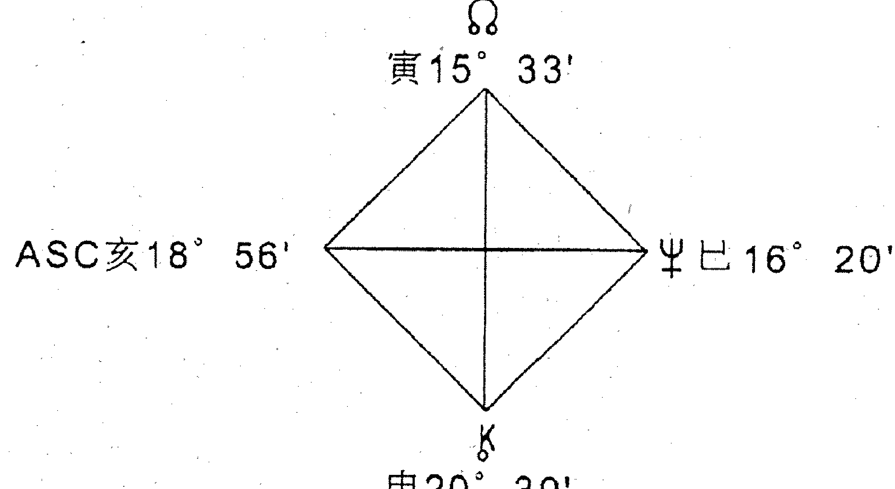

## 實例解說

1. 証嚴法師的命盤呈現一個大四角刑沖，四個頂點分別是 ASC，⊙，Ψ 及 K。
2. ⊙係前世累業的善果，揚升於天頂附近，位於射手座，9宮，先後天宮都屬宗教、精神、道德、形而上之事務；Ψ 已如前述，K 為精神、心理創傷之撫慰。這三者與 ASC 形成頗緊密的大四角刑沖，顯示宗教情懷的十字架，帶天命而來，感應強烈。

黃絹智小姐在《証嚴法師 一百個故事》曾記載上人於15歲時，母親王沈月桂急病，罹患胃穿孔的惡疾，為免除開刀痛苦及危險，她虔心發願減壽使母親增壽，並願意開始吃素。發願之後，一連三天她都做了一個相同的奇夢。在夢裡，有一座小佛寺，中間是大門，兩邊各有小門，寺殿中有一尊佛像，母親就睡在佛像旁邊的竹床上，而她則在母親身旁煎藥。突然間，一陣風聲從小門傳進寺裡，然後飄入一朵白雲，雲上面坐著一位美女，錦雲(上人俗名)不由自主地抬頭看那美女，只見美女白瓶中倒出一包藥交給她，無言的片響，跪在地上接下藥包的錦雲，注視著美女幽然消失。然後她趕忙把藥放到碗中，餵給母親吃…。後來奇蹟真的發生，母親的病不必開刀就痊癒了。

3. 十字架是沈重的，擔負的業太重了。但証嚴法師仍陸續完成四大志業-慈善、文化、教育、醫療，簡直又是一項台灣奇蹟。筆者常在想，如果多一點慈濟，少一點「台灣霹靂火」；多一點志工，少一點藍綠口水；多一點關懷，少一點統獨對立，我們的社會將會是多麼祥和。

## 實例解說

4. 大四角型沖中幸有 ○△Ψ，♀△Ω 及 ♀※K，和緩它的沈重與衝突。

## IV. 行星强弱评价

## 行星强弱评价表

| | 日 | 月 | 水 | 金 | 火 | 木 | 土 | |
|---|---|---|---|---|---|---|---|---|
| **必然的尊贵** | | | | | | | | **必然的无力** |
| 在庙宫或以庙宫互容+5 | +5 | | | | | | | 在陷宫-5 |
| 在旺宫或以旺宫互容+4 | +4 | | | | | | | 在弱宫-4 |
| 三分性主星+3 | +3 | -5 | -5 | -5 | | -5 | | 外来的-5 |
| 界主星+2 | | | | +2 | | | | |
| 外观主星+1 | | | | | | | | |
| **偶然的尊贵** | | | | | | | | **偶然的无力** |
| 在MC或ASC+5 | +5 | | | +5 | | | +5 | 在12宫-5 |
| 在7宫,4宫或11宫+4 | | +4 | | +4 | | | | 在8宫或6宫-2 |
| 在2宫或5宫+3 | +3 | +3 | | | | | | |
| 在9宫+2 | | | | | +2 | | | |
| 在3宫+1 | | | | | | | | |
| 顺行除日月之外+4 | | | -5 | -5 | -5 | | | 逆行-5 |
| 运行比平时快速+2 | -2 | -2 | -2 | -2 | -2 | -2 | +2 | 运行比平时慢速-2 |
| 土木火的东出+2 | | | | | +2 | +2 | +2 | 土木火的西入-2 |
| 金水的西入+2 | | | +2 | -2 | | | | 金水的东出-2 |
| 月增光+2 | | -2 | | | | | | 月减光-2 |
| 没有焦伤及太阳光束下+5 | +5 | -4 | +5 | +5 | +5 | +5 | | 焦伤-5在太阳光束下-4 |
| 在太阳核心+5 | | | | | | | | 与土或火的等分相位合相-5 |
| 与木或金的等分相位合相+5 | | | | | | | | 与土或火的等分相位180°-5 |
| 与北交点的等分相位合相+4 | | | | | | | | 与南交点的等分相位合相-4 |
| 与木或金的等分相位120°+4 | | | | | | | | 在土火之间受围攻-4 |
| 与木或金的等分相位60°+3 | | | | | | | | 与土或火的等分相位90°-3 |
| 与轩辕十四合相+6 | | | -5 | | | | | 与大陵五合相或5°内-5 |
| 与角宿一合相+5 | | | | | | | | |
| **总和** | **-4** | **+5** | **-16** | **-2** | **-3** | **+5** | **+10** | |

## 實例解說

1. 從行星强弱評價表的計算，可知最强的行星為 ⊙，而最弱的行星為 ♀。
2. 整個評價表中僅有 ⊙ 為正，⊙ 為11宮(丑)及12宮(子)主星，而 ⊙ 又位於命宮內，証嚴法師的全部重心皆為佛教宏法。
3. ♀ 最弱為4宮(申)主管父母、田宅、家，及7宮(巳)主管夫妻、合夥，而其他六親宮位，如3宮(酉)主管兄弟姊妹，主星 ♀ 亦為負數；5宮(未)主管子女，主星 ☽ 力量為+5，亦即証嚴法師的六親無緣，奠定出家的信念。她因符合本書第七章所敘述的維替斯 瓦倫斯的尊貴法則(容後再敘)，故能捨小愛而就大愛，若不符合該法則，恐如一般人孤苦無依或默默承擔苦難。全球各地信衆及慈濟、慈誠委員們受上人感召，發揮人性至上的光輝，上人是不寂寞的。
4. 命主星 ☿ 尚為正數，但力量不强，☿ 在丑摩羯，弱，故身體瘦弱，健康不佳。

## V. 重要行星的掌握

1. ASC主星 ☿ 及 Ψ，分別飛臨11宮及 DSC 西降點，已如I之3分析。
2. 四大尖軸的 DSC 前2.5°～後5°內，逢命主星 Ψ，其特色如前之分析。
3. 行星力量最强的行星為 ⊙，最弱的行星為 ♀，其意義已如IV之説明。
4. 相位型態的頂點行星 ⊙、Ψ 及 ♆，其意義如III之説明。
5. 天宮圖具多重相位的行星為 ☽，落於11宮共有4個相位。

## 實例解說

子12°55' 酉12°54'
酉9°47'
寅15°33'
申18°54'

① 在11宮，依希臘占星學，屬精神、文化層次，主管感受、情緒、情感…等且又為5宮主星，5宮依希臘占星學屬肉體、物質層次飛臨11宮，代表已將肉體、物質昇華為精神、文化，但因逢 (⊙☽☿) 之刑，早年家境影響讓她感受「無常」，而 ☽☿Ω，前世累積的善業，情感在宗教(9宮，寅射手)終有寄託。又女命重 ☽，上人的 ☽☽⊙ 相當緊密的刑剋，⊙ 為6宮午健康宮之主星，午宮獅子主管心臟部位，⊙ 主管心臟功能，故上人必有心臟疾病。美國C.C.Zain《Stellar Healing》P174提到 ⊙ 受嚴重刑剋，易有心臟疾病，上人的案例正符合此象，幸有 Ψ△⊙ 之化解，尚無礙。

② 位於子水瓶，是外來的，力量弱，受定位易因早歲家庭變遷而有疏離感，情緒不安，內心孤獨；逢 Ω 在9宮之吉象，包容、體會人性的需求，直覺頓悟，得以化解 (⊙☽☿) 之刑。

6. 本案例未見最終定位星。

## VI. 阿拉伯點、映點與反映點、恆星

## A. 阿拉伯點

1. 經計算，幸運點 ☊，精神點 Φ，旺點 Exalt，基礎點 β，分別如下：

申18° 54'
寅18° 58'
Exalt 申 9° 0'
巳18° 59'

根據維替斯 瓦倫斯的尊貴法則。

① 立命亥宮雙魚，依希臘占星學整個星座宮位系統，⊙，Φ，β，Exalt 全部落在命盤的軸心宮，即始宮，符合尊貴第1法則。
② 除 Exalt 外，其他三個點皆與 ASC 命度形成緊密相位。

2. 証嚴法師生於夜間，其父親點，母親點分別如下：

父親點 西 0° 56'
母親點 西26° 1

根據希臘化時期的 Dorotheus of Sidon 所著《Carmin Astro-logicum》中論父母，提到若父親點和母親點同宮(即同星座)，命主自小與父母分離，本例符合此象，配合其他徵象：
① 4宮主星力量最弱
② 她自小即離開親生父母，過繼給叔叔嬸嬸，有跡可尋。

## B. 映點與反映點

1. 丑27° 6' 與寅3° 15' 互為映點，為命主星，為9宮主星，9宮主管宗教、道德、形而上、高等精神層次、高等教育，顯現命主對宗教之虔誠，發揮至高至上的精神價值，強調道德形而上的觀念。

## 實例解說

2. ♀ 未26°37' 與 ♂ 寅3°15' 互為反映點，而 ♂、♀ 都是9宮主星，有關9宮事務必然艱困異常，辛苦煎熬。

## C. 恆星

1. ☉ 酉12°54' 天大將 Almach 酉13°21'，主藝術的成功、順利、聲望。

## VII & VIII. 行星在星座、後天宮的意義(以命宮為例可查相關資料之說明)

1. 命宮內見 ⊙

① ⊙ 在戌0°54'，弱，但得偶然尊貴，沈重責任、自我壓抑、節儉、謹慎耐勞。
② ⊙ 的行星力量最強，且多吉相，保守嚴肅、負責、勤奮、忠誠、實際、耐勞、擔憂。
③ ⊙ 在戌°54' △ ♂ 寅3°15'，⊙ 逢 ♂ 容納，而 ♂ 為9宮主星，為宗教努力不懈。♂△⊙，從事艱難、嚴肅、有目的工作、講求精準與運作步驟、以耐勞的精神完成不平凡的任務。
④ ⊙ 在戌°54' ✴︎ 丑27°6'，✴︎ 逢 ⊙ 容納，✴︎ 為命主星，⊙ 為11宮(丑)及12宮(子)之主星，發下宏願為社會團體、公益活動。
✴︎✴︎⊙ (類比 ✴︎△⊙)，負責任、誠實、正直、管理才幹、嚴肅、尊嚴。
⑤ ⊙ 在戌°54' △ ♀ 未26°37'，能了解宇宙中神秘的力量並善加運用、組織才能、朝目標邁進、工作穩健而紮實、具使命感。

260

## 實例解說

2. 命宮內另見 ♀

① ♀ 在戌20° 2'，弱且逆行R，♀ 代表舒適、優美、享受；其行星力量弱為負數，根本不可能享受。
② ♀ 戌20° 2' ☍ K 申20° 39'，甚為緊密相位，能撫慰他人心靈創傷。
③ ♀ 戌20° 2' △ MC 寅20° 28'，能贏得社會地位、名望。

## 實例解說

## 實例二 巨星隕落-張國榮

香港巨星張國榮本名張發忠，出生於小康家庭，父親經營西服店頗有成。1976年踏入歌壇，參加前亞視即麗的電視台主辦亞洲區業餘歌唱比賽，勇奪香港區亞軍，成為「麗的」的基本演員。1980年代歌、演佳，逐漸走紅，幾部影片如《烈火青春》《英雄本色》《胭脂扣》《倩女幽魂》皆相當膾炙人口。而1987-1990歌唱更是火紅，趕上譚詠麟成為香港一哥，卻在歌唱最輝煌之時，驟然退出歌壇，專心在演藝發展。

儘管長相俊美卻給人感覺稚氣未脫，演技雖佳，好像只有當老，如《英雄本色》的角色吃力不討好，掌聲留給狄龍 周潤發，多少在他內心裡面埋下情緒障礙。1991年演活《阿飛正傳》男主角頹廢詩人的角色，於當年度獲得第十屆香港電影金像獎最佳男主角，從此奠定香港影壇地位。1993年大陸導演陳凱歌執導之《霸王別姬》，張國榮男扮女裝飾演程蝶衣，更令人為之驚艷，演技倍受肯定，相當受國際注目。1997年主演的《春光乍洩》將壓抑多年的情慾完全宣洩，讓人窺視到真實的他。

歌、演雙棲皆獲肯定，風頭甚健，與人和善，且相貌佳，出道以後，身邊不乏紅粉知己，正式交往的有四位毛舜筠、倪詩蓓、楊諾思及一位鄧姓電台主持人，另外尚傳聞許多人，可說艷事頻傳。香港傳媒一直渲染他是

## 實例解說

同性戀，原本他都堅決否認，但在一次演唱會，他勇敢出櫃，正式介紹密友唐鶴德，承認與他交往同居，頗讓愛好他的歌、影迷震驚，但也接納他的坦白，他自承雙性戀，但感情的歸宿一直沒有著落。

2003年4月1日，他選擇跳樓自殺，令人不解的是歌、演事業如日中天，為何會走上這條絕路？有人說他拍《異度空間》過於投入而撞邪，其實他患有嚴重的憂鬱症，容易悲傷，痛苦，非常絕望，據傳已有20年歷史。另外胃液倒流也令他痛苦不堪。其密友就聲稱絕非為情而自殺，有個人隱私不便公開，國內唯恐天下不亂的李敖稱「合理的懷疑」張國榮係患了愛滋病，才走上絕路。

死者為大，我們不便妄加揣測，僅就天宮圖來核驗其內心世界及其他事徵。

## ## 實例解說

## 張國榮

Natal Chart

Sep 12 1956

11:50 AM CCT-8:00

香港,中國

22N18 114E10

Geocentric

Tropical

Placidus

True Node

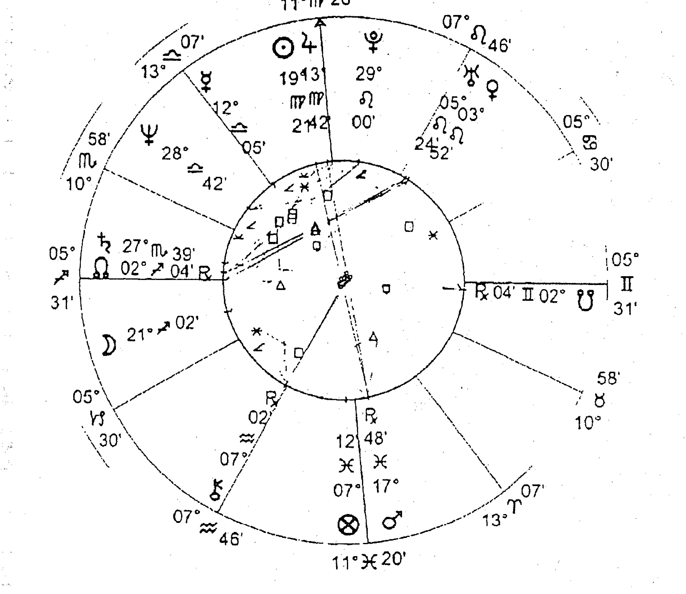

264

## 實例解說

## 1. 三方、四正

| | 2 | 4 | 7 |
|---|---|---|---|
| | 啟動 | 固定 | 變動 |
| 5 火 | 0 | 3 | 2 |
| 3 地 | 0 | 0 | 3 |
| 3 風 | 2 | 0 | 1 |
| 2 水 | 0 | 1 | 1 |

1. 四大元素以火象較重，其5/13，會呈現積極、鬥志、執行力及行動力强，目標有野心、耀眼，而火象元素中又以固定星座即獅子座較强，更易呈現野心、聚焦。其他元素尚均匀分配，土象及固定星座不弱，能穩固其目標。
2. 四正當中以變動星座較强，為7/13，多元、變化、浮動喜新厭舊。幸以土象處女較多，不致變動過甚，尤其命主星入處女，應是具原則性的變動，而非隨波逐流。
3. 立命寅宮射手，命主星飛臨10宮官祿於處女座揚升，事業態度必然會追求完美，較為潔癖，甚或有些擔憂，這跟ASC星座格格不入，易呈現內心矛盾，不暢快之象。因ASC星座為射手，會追求較高精神層次、道德、宗教、形而上、哲學的理念，較多元、樂觀、不喜受拘束。今命主星卻陷於事業之煩瑣、細膩，反而灑脱不起來。

1998年張國榮接受時報周刊專訪時，曾談到「以前，

## 實例解說

很多東西都太在乎了，現在自己想通了。人畢竟要為自己而活，能夠擺脫過去無謂的束縛，對我是非常痛快的事」。儘管他言之鑿鑿要擺脫，但談何容易。

4. ☉ 為生命力、權力、精力位於處女，事業宮揚升，與命主星 ☿ 會合，更凸顯事業工作的完美、潔癖、擔憂、但努力工作、細膩。
☉ 在巳19° 21' 與 ☽ 寅21° 2' 90° 刑，更與 ♂ 亥17° 48' 180° 沖，心緒難以平靜。

## II. 半球與象限

沒有很凸顯的星群集中，基本上，以南半球較為集中，應屬客觀，重視外界評價，生活空間較廣闊、服務、利他。

## III. 半球與象限

張國榮的命盤有兩個三刑會沖的相位型態，分別敘述於下：
1.

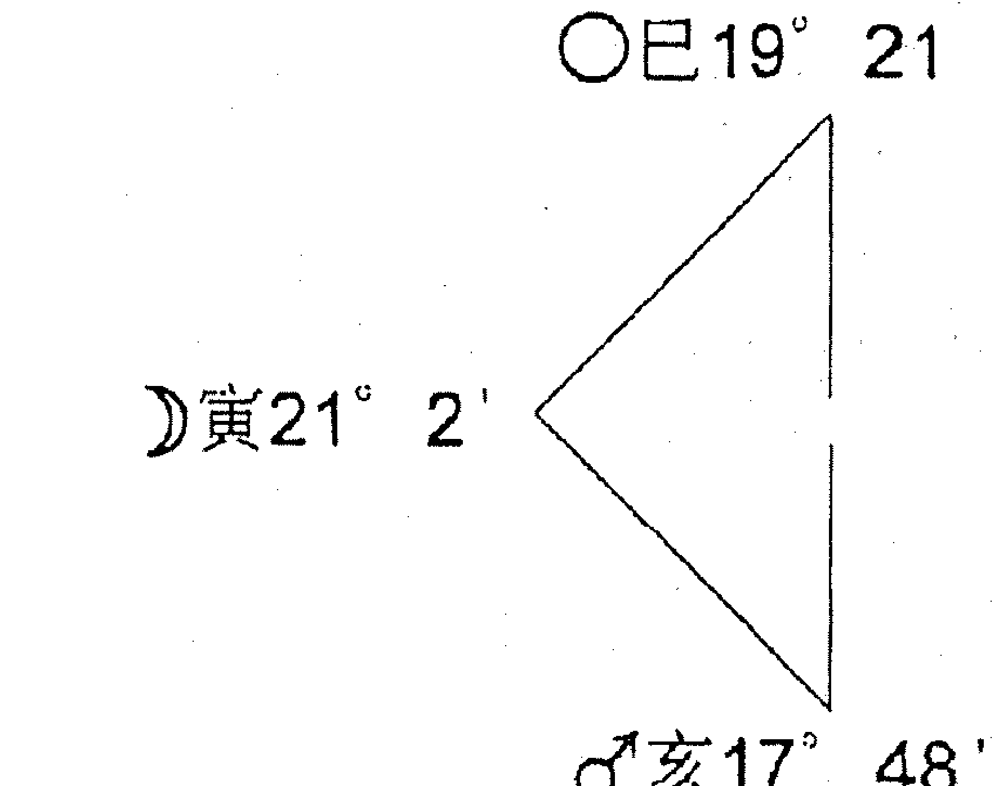

## 實例解說

① 在命宮分別與10宮的及90°刑，而再與180°沖，刑沖相位皆頗緊密，個人情緒易因事業起波動。也主管胃部，胃液倒流，胃酸過多，有跡可尋。
② 也是本命8宮(主管死亡)的主星。
③ 為本命5宮(主管藝術、才華、電影、娛樂)的主星。
④ 這項三刑會沖型態似乎點出其內心情緒的掙扎，在於追求更高層次的精神，無法在藝術事業中得到安頓所致，同時心因性也導致胃病。

根據美國著名占星學派，教堂之光的研究，如Doris Chase Doane 《Astrology 30 years research》 P151提到胃炎常是因嚴重受剋，特別是涉及 ☉ 或巨蟹座內的行星嚴重受剋所致。

張國榮的 ☉ 嚴重受剋就符合該研究之象。

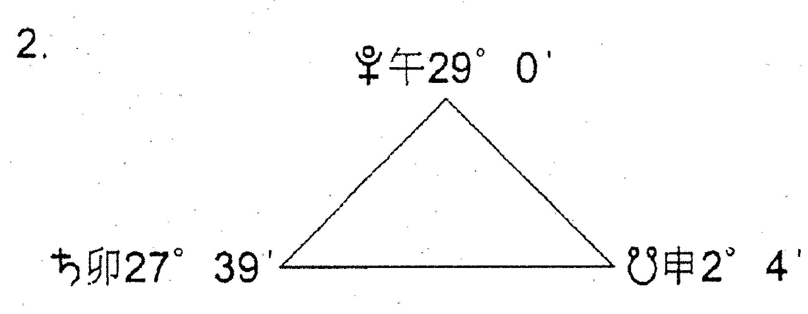

① 三刑會沖的頂點為 ☿，代表破壞再建設、死亡、頑固、內在無明，位於9宮，分別與12宮之 ☽ 及6宮之 ♂ 90°刑，而又與 ☿ 180°沖。
② ☽ 位於12宮(災難、凶禍)逢凶相位，易呈現孤獨、沮喪、嚴重的心理問題。韓良露《生命歷程全占星》

## 實例解說

一書雖是談流年，但提到 ☿ 在12宮之徵象「遇到的問題常很獨特，奇怪，迷離，有的人表現在強烈的精神不安。」仍可適用於本命占星學，張國榮的嚴重憂鬱症，應與 ☿ 在12宮逢 ♀ 凶相有關，再加上 ☽ 之三刑會沖而凸顯。而12宮另名玄秘宮，有因果輪迴之意，又與業力惡星 ♃ 180°沖，外傳張國榮碰上靈異事件，頗有可能。

③ ☿ 位於卯天蠍，威廉·里利在《Christian Astrology》一書稱它為暴戾星座，12宮逢暴戾星座又見大凶星 ☿ 之刑會沖，易惡死。而12宮主星 ♂ 又與命宮內 ☽ 刑，而 ☽ 為8宮主星，亦即先天8宮卯，後天8宮未之主星皆見刑沖。
④ ☿ 刑 ♀，♀ 為先天8宮卯之另一主星。
⑤ 英國占星家 V.E.Robson在《A Students' Text-book of Astrology》稱 ☿ 的死亡方式為崩落，即從高處跌落，完全符合其象，令人不寒而慄。

## IV. 行星强弱评价

## 行星强弱评价表

| | 日 | 月 | 水 | 金 | 火 | 木 | 土 | |
|---|---|---|---|---|---|---|---|---|
| **必然的尊贵** | | | | | | | | **必然的无力** |
| 在庙宫或以庙宫互容+5 | | | | | | -5 | | 在陷宫-5 |
| 在旺宫或以旺宫互容+4 | | | | | | | | 在弱宫-4 |
| 三分性主星+3 | -5 | -5 | -5 | -5 | +3 | | | 外来的-5 |
| 界主星+2 | | | | | | +2 | +2 | |
| 外观主星+1 | | | | | | | | |
| **偶然的尊贵** | | | | | | | | **偶然的无力** |
| 在MC或ASC+5 | +5 | +5 | +5 | | | +5 | -5 | 在12宫-5 |
| 在7宫，4宫或11宫+4 | | | | -2 | +4 | | | 在8宫或6宫-2 |
| 在2宫或5宫+3 | | | | | | | | |
| 在9宫+2 | | | | | | | | |
| 在3宫+1 | | | | | | | | |
| 顺行除日月之外+4 | | | +4 | +4 | -5 | +4 | +4 | 逆行-5 |
| 运行比平时快速+2 | -2 | -2 | -2 | +2 | -2 | +2 | +2 | 运行比平时慢速-2 |
| 土木火的东出+2 | | | | +2 | -2 | +2 | -2 | 土木火的西入-2 |
| 金水的西入+2 | | | +2 | | | | | 金水的东出-2 |
| 月增光+2 | | | +2 | | | | | 月减光-2 |
| 没有焦伤及太阳光束下+5 | +5 | +5 | +5 | +5 | -5 | +5 | | 焦伤-5在太阳光束下-4 |
| 在太阳核心+5 | | | | | | | | 与土或火的等分相位合相-5 |
| 与木或金的等分相位合相+5 | | | | | | | | 与土或火的等分相位180° -5 |
| 与北交点的等分相位合相+4 | | | | | | | | 与南交点的等分相位合相-4 |
| 与木或金的等分相位120° +4 | | | | | | | | 在土火之间受围攻-4 |
| 与木或金的等分相位60° +3 | | | | | | | | 与土或火的等分相位90° -3 |
| 与轩辕十四合相+6 | | | | | | | | 与大陵五合相或5°内-5 |
| 与角宿一合相+5 | | | | | | | | |
| **总和** | **-2** | **+5** | **+9** | **+6** | **+3** | **+5** | **+6** | |

## 實例解說

1. 從行星強弱評價表中，可知最強的行星為♀，最弱的行星為☉。

2. 整個評價表中行星力量所得數值大多為正，其中♀最強為10宮事業宮主星，位於10宮內得偶然尊貴，最妙的是♀在辰12°5'與♂在亥17°48'互為映點，而♂為5宮戌及12宮卯之主星，其藝術才華的成功造就事業發展、名望、地位，卻也潛藏著災難、凶禍，所謂「成也蕭何，敗也蕭何」。

張國榮從事歌、影才華創造的事業，可由♀，♂互映確認。

3. ☉在10宮亦得偶然尊貴，卻刑沖☽及♂，事業追求完美的特性，卻蘊釀成不快樂，情緒起伏大，甚至胃腸不適。

4. 命主星☿尚強，入10宮，七政四餘占星學稱之為「命入官祿」，易有名望，惜☿逢焦傷且又與♂180°沖，幸☿容納♂不致全凶，能發揮電影藝術才華(♂為本命5宮主星)，不免潛藏災難(♂亦為12宮主星)。

## V.重要行星的掌握

1. ASC主星☿飛臨10宮，已如Ⅰ之3及Ⅳ之4分析。

2. 四大尖軸的MC前2.5°～後5°逢ASC主星☿，同1。

3. 行星力量最強的行星♀，最弱的行星☉，其意義如Ⅳ之說明。

4. 相位型態有兩個三刑會沖，其各別之頂點行星為☽及♀，詳細已如Ⅱ之說明。

5. 天宮圖中具多重相位的行星是♀、☿，落於8宮，性、死亡、金錢。

## 實例解說

① ♀在午3°52'☽☿午5°24'相當緊密會合在8宮，♀代表愛情，☿代表特立獨行，不顧世俗，震驚。國內占星家韓良露《愛情全占星》就直指此種組合為同性戀，在8宮其性愛態度更顯露此種傾向，美國李荷曼博士的長期研究，同樣有此結論。

② (♀☽☿)△ASC，長相俊美，亦屬數定。

③ (♀☽☿)□Ψ，愛情混亂、迷惘、幻想、不切實際。

④ (♀☽☿)♂♋，愛情生活必有心靈創傷。

⑤ (♀☽☿)△Ω☉☿，恐有前世業力的影響。

⑥ (♀☽☿)分別與☽及♂形成半刑+相位，更增複雜的感受。

張國榮的♀☽☿之多重相位，正好凸顯他的感情世界多變，撲朔，迷離。

6. 本案例形成循環定位的現象，所以內心情緒難以找到出口。

## VI.阿拉伯點、映點及反映點、恆星

## A.阿拉伯點

經計算幸運點☉，精神點Φ，旺點Exalt，基礎點β，分別如下

| 點位 | 位置 | 定位星 |
| :--- | :--- | :--- |
| ☉ | 亥 7° 12' | ☿ |
| Φ | 巳 3° 51' | ♀ |
| Exalt | 未 5° 10' | ☽ |
| β | 申 8° 52' | ♀ |

根據維替斯瓦倫斯的尊貴法則

① 立命寅宮，依希臘占星學整個星座宮位系統，除Exalt外，其他的☉，Φ，β皆位於以亥起算的軸心宮，而定位星☽也落於寅始宮，完全符合第1尊貴法則。

② 命主星☿位於寅自己起算的第10宮巳，指示尊榮，符合第2尊貴法則。

③ 四個點之一的主星，位於以它自己起算的其他軸心宮，將帶來某種程度的卓越。☉在亥，其主星(即定位星)☿，位於它自己起算的7宮，亦為軸心宮，符合尊貴第3法則。

張國榮出道以後得獎無數，尤以《霸王別姬》《春光乍洩》最受好評。

## B.映點與反映點

♀辰12°5'與♂亥17°48'，互為映點，其意義已如前述，展現藝術才華的聲望，卻也潛藏著災難。

## C.恆星

本案例的ASC，MC，☉及☽，無1°內會合到恆星。

VII及VIII.行星在星座、後天宮的意義不擬討論，請讀者按前例自行推演。

IX.公元2003年4月1日張國榮實歲46歲，值小限天秤11宮，小限宮內☽□(☿☽♀)，而小限主星♀又飛臨本命8宮，死亡。流年♄在寅19°59'過運(Transit)命宮90°刑本命☉，引動三刑會沖，定數難逃，一代巨星竟選擇跳樓方式結束生命，震驚全球。

## 實例三 愛慾情仇-璩美鳳

璩美鳳出生於眷村老兵的家庭，自小即懂得上進，讀書尚佳，政大中文系畢業後，隨即進入中國晨報及自立晚報擔任新聞記者，1990年考入台視新聞部，主跑台視新聞世界報導，並且擔任晨間新聞的主播，常以一襲白色套裝出現，並加上年輕貌美，聲音有點嗲，迅速在新聞界佔有一席之地。

1994年璩美鳳受新黨徵召，投入台北市市議員選舉，在松山.信義區以第一高票當選，問政時亦以白色套裝形象被稱為白雪公主，三千寵愛集一身，外表溫柔，問政準備功夫下得頗深，相當犀利。於市議員期間，揭發宋七力事件，使民進黨明星謝長廷難堪，幾至萬劫不復，因媒體而聚焦在自己身上，令人印象深刻。

她的感情世界一直令人好奇，擔任新聞記者即不斷傳出追求者，擔任市議員期間，更不乏仰慕者，但真正的白馬王子並未現身。1998年宣佈退出新黨立委初選，淡出政壇卻在此刻傳出她與民進黨的蔡仁堅過從甚密，外界好奇的是兩個人意識型態差異兩極，卻可牽在一起，不得不讚嘆愛情的偉大。兩人早已同居，但蔡仁堅一直沒有給她承諾，覺得不受重視，沒有安全感，且同居期間，蔡仁堅仍同時腳踏幾條船，遂使她情緒崩潰鬧過二次的自殺，幸都挽回生命。在磨合不順下遂宣告分離，但蔡仁堅當時是新竹市長，可能基於補償心理任命她擔任新竹市文化局長。由於情緒壓力，經林正杰介紹，加入阿梵達靈修組織與郭玉玲認識，卻種下日後愛慾情仇的戲碼。

擔任文化局長期間，因經常舉辦活動，認識了光碟事件的男主角曾仲銘。璩美鳳不知提防地與其精神導師郭玉鈴有過金錢糾紛，甚至涉及三角戀情，致使郭玉玲報復，偷錄她與不同男性的性愛光碟，2001年12月18日獨家報導強調讀者有知的權利，隨刊附贈性愛光碟，喧騰一時，為當年國內十大新聞事件。

然更精彩的是她主導記者會假裝昏迷，更令人發噱，過不久又出書《璩美鳳懺情錄》大爆她與六個男人之間的故事，更充分利用新聞價值，主持中天電視的《女人秘密花園》，不久隨即下檔，又赴新加坡開演唱會。

當她強調‘經營生命’時，又傳出訂婚，退婚及介入他人家庭，一連串的新聞實在令人唏噓，這是所謂的經營生命？讓民衆感受到的是她利用新聞驟光大飽私囊，所提告訴的被告人紛紛提出和解，真的是經營有成了，反諷的是《獨家報導》的沈野利用宋七力事件，使她成為媒體寵兒，曾幾何時她的這位政大中文系學長，又將她推入萬劫不復，比給她一支番仔火，一桶汽油更勁爆。因果循環，可見一般，靠傳媒起家，該傳媒也讓她身敗名裂。

璩美鳳
Natal Chart
Aug 3 1966
2:48 PM CCT-8:00
台北, 台灣
25N03 121E30
Geocentric
Tropical
Placidus
True Node

## 實例解說

## 1. 三方.四正

| | 3 | 4 | 6 |
| :--- | :--- | :--- | :--- |
| | 啟動 | 固定 | 變動 |
| 3 火 | 0 | 2 | 1 |
| 3 地 | 0 | 0 | 3 |
| 0 風 | 0 | 0 | 0 |
| 7 水 | 3 | 2 | 2 |

1. 四大元素以水象最強,佔7/13,會呈現情感感受深、易感動、温情主義、念舊,但相對地易困惑、意志力薄弱、鴕鳥心態、沮喪。風象星甚弱,無法理性思考 火.地(+)尚具,不致完全隨波逐流。

2. 四正當中,以變動星座較強6/13,故多元、變化、適應力强,幸以土象處女較多,不致變化過甚,且命主星入巨蟹,能念舊、喜歡家的温馨、能熱心照顧他人。

3. 立命寅射手,命主星☉飛臨8宮巨蟹,旺宮,得必然尊貴,卻為偶然無力。8宮掌管性、死亡、他人錢財,會合到(♂☽♀),性慾或情慾較重。ASC在射手,本質上會強調多元、精神道德,形而上,追求新奇,但卻入不合意宮位,且水象元素强,♀享受、愛情,具多重相位也在8宮始點處,故陷入情慾泥沼而無法自拔。

4. ☉為生命、權力、精力,位於獅子座,120° 三合ASC,命主喜受到注目,希望成為鎂光燈焦點,易逢貴人相助,有政治舞台。☉在8宮午10° 29' ASC寅14° 58',他人錢財資助,賠償。據報導璩美鳳向所有被告提出民事索賠，璩的律師鍾永盛指出，全部索賠數字"絕對超過一億元新台幣"

## II. 半球與象限

命盤中群星較集中於南天，尚屬客觀，重視外界的評價，生活空間較寬廣，注意社會脈動。

## III. 相位型態

本案例並無特殊的相位型態。

## IV.行星强弱評價

| | 日 | 月 | 水 | 金 | 火 | 木 | 土 |
| :--- | :--- | :--- | :--- | :--- | :--- | :--- | :--- |
| 必然的尊貴 | +5 | +5 | | | | +5 | | 必然的無力 |
| 在廟宮或以廟宮互容 | +5 | | | | | | | 在陷宮 -5 |
| 在旺宮或以旺宮互容 | +4 | | | | | -4 | +4 | 在弱宮 -4 |
| 三分性主星 | +3 | +3 | | -5 | -5 | +3 | | 外來的 -5 |
| 界主星 | +2 | | | | | | +2 | |
| 外觀主星 | +1 | | | | | | | |
| 偶然的尊貴 | | | | | | | | 偶然的無力 |
| 在MC或ASC | +5 | | | | | | | 在12宮 -5 |
| 在7宮,4宮或11宮 | +4 | -2 | | -2 | -2 | -2 | -2 | +4 | 在8宮或6宮 -2 |
| 在2宮或5宮 | +3 | | | | | | | |
| 在9宮 | +2 | | | | | | | |
| 在3宮 | +1 | | +1 | | | | | |
| 順行除日月之外 | +4 | | | -5 | +4 | +4 | +4 | -5 | 逆行 -5 |
| 運行比平時快速 | +2 | -2 | -2 | -2 | +2 | +2 | +2 | +2 | 運行比平時慢速 -2 |
| 土木火的東出 | +2 | | | | | +2 | +2 | +2 | 土木火的西入 -2 |
| 金水的西入 | +2 | | | -2 | -2 | | | | 金水的東出 -2 |
| 月增光 | +2 | | -2 | | | | | | 月減光 -2 |
| 沒有焦傷及太陽光束下 | +5 | | +5 | -4 | +5 | +5 | +5 | +5 | 焦傷 -5 在太陽光束下 -4 |
| 在太陽核心 | +5 | | | -5 | | | | | 與土或火的等分相位合相 -5 |
| 與木或金的等分相位合相 | +5 | | | | +5 | | | | 與土或火的等分相位180° -5 |
| 與北交點的等分相位合相 | +4 | | | | | | | | 與南交點的等分相位合相 -4 |
| 與木或金的等分相位120° | +4 | | | | | | | | 在上火之間受圍攻 -4 |
| 與木或金的等分相位60° | +3 | | | | | | | | 與土或火的等分相位90° -3 |
| 與軒轅十四合相 | +6 | | | | | | | | 與大陵五合相或5°內 -5 |
| 與角宿一合相 | +5 | | | | | | | | |
| **總和** | **+4** | **+7** | **-20** | **-3** | **+15** | **+20** | **+10** | |

1. 從行星強弱評價表的計算可知，最強的行星為 ☉，而最弱的行星為 ♀。

2. ☉ 為命主星及田宅宮主星，有助個人能力的展現及享受，☉ 在巨蟹，口福佳，也有利置產，孝順父母。☉ 在未 19° 30' ☉ (♀ 巳 16° 55' ♀ ☽ ☉ 巳 17° 35')，必然具備開創新局的能力及渴望，會為更好的理想改變自己的生活及周遭環境，且運氣屬佳。

3. ♀ 為 7 宮夫妻及 10 宮官祿主星，其定位星 ☉ △ ASC，論及婚嫁之對象和個人的事業易逢貴人，但 ♀ 的力量太弱，致使夫妻緣份及社會地位、名望貶落，令人不勝唏噓！

## V. 重要行星的掌握

1. ASC 主星 ☉ 飛臨 8 宮，已如 I 之 3 及 IV 之 2 分析。

2. 四大尖軸的 IC 前 2.5° ～ 後 5° 逢 ☊ ，將有心靈創傷，幸有 ☊ 的 60° 半合，若懂得修行，尚能緩和。

3. 行星力量最強的行星為 ☉，最弱的行星為 ♀，已如 V 之 2, 3 分析。

4. 本案例無顯著的相位型態。

5. 天宮圖中具多重相位的行星為 ♀，位於 8 宮宮始點，共有

♀ 未 15° 8' ☽ ☉ 未 15° 27'
☽ ☉ 未 19° 30'
☊ ♀ 巳 16° 55'
☊ ☉ 巳 17° 35'
△ ☊ 卯 19° 24'

① ♀ ☽ ☉ ，熱情但具侵略性，性生活活潑，易陷熱戀，花錢衝動，慷慨外向，享樂，因 ☉ 在未為弱，易引起負面影響，致使懶惰，過分浪漫，不切實際....等 ♀ 不利情形。

② ♀⚹☿已如I之3的說明。

③ ♀☉♀，性慾強烈，具理財能力♂。

④ ♀☉☿不顧世俗的愛情，常有新戀情或婚姻，突如其來的財運。

⑤ ♀△☿羅曼蒂克的天性，不食人間的煙火，同情心，但不切實際，不尋常的戀情，混亂。

由於本案例的♀位於8宮，故演出的戲碼，呈現在性·金錢·死亡。璩美鳳和TVBS周刊三位記者合撰《璩美鳳懺情錄》談論她對性愛情和金錢的看法，也說出自從光碟事件爆發後，自己如何面對群衆偷窺她身體的煎熬和掙扎。

另外該書也提到與蔡仁堅的磨合不順，而二次自殺。

國內占星名家韓良露《愛情全占星》描述

> "最驚心動魄的愛情是天王星的，最刻苦銘心的愛情是冥王星的，海王星的愛情卻是最魂牽夢縈的"

本例的♀都涉及這三個外行星，命主懂得享受愛情及性的歡愉，有些激情，浪漫，不顧世俗，但因♂在未巨蟹為弱，會合到♀，上述同書也描述為"火星在巨蟹的人，....他們太容易傷害，他們雖也有激烈的慾望，但總是把和別人「發生關係」當成交換，他們交出自己的身體，目的是換成安全感及保護.

儘管♂的負面影響，但最終仍有金錢方面的獲益，因本例♂的多重相位，除♂外，其他皆是吉相位，♀也是金錢之代表因子，故雖歷經性愛光碟的全面發行，名譽、社會地位相當受損，但仍有錢財進帳，她提起訴訟的幾位被告，紛紛和解，貼償了事。

## VI.阿拉伯點·映點與反映點·恆星

## A.阿拉伯點

經計算幸運點⊗，精神點Φ，量點Exalt，基礎點β分別如下

| 點位 | 位置 | 定位星 |
| :--- | :--- | :--- |
| 未6° 5' | | ) |
| 酉23° 52' | | ♀ |
| Exalt 午23° 29' | | ☉ |
| β 丑27° 11' | | ♃ |

根據維替斯·瓦倫斯的尊貴法則，本案例有第3尊貴法則，即旺點 Exalt的主星☉，位於以它自己(午)起算的軸心宮，尤其是第1宮，故具社會知名度，但其10宮主星♀太弱且☉逢♄為反映點(後面敘述)，故終究名譽、聲望受損。

## B.映點與反映點

☉午10° 29'，其反映點為卯19° 31'，正逢♄卯19° 24' 1°內會合，其象意如同☉♂♄，看法扭曲，過去經驗產生情緒上之困擾，因而偏見，容易受騙，或被不明神秘力量所誘惑。

☉為9宮午之主星，9宮代表精神道德，形而上，其主星入8宮，8宮代表性，而♄為迷惑、混亂、醜聞，顯然易關聯道德、性、醜聞之事件。

## C.恆星

1. ♀未15° 8'☿♂未15° 27'，1°內會合恆星南極老人 Canopus未14° 58'此恆星在西洋占星學視為凶星，攸關麻煩，醜聞。

2. ⚷為命主星，未19° 30'，1°內會合北河二Castor未20° 14，此恆星為精神疾病，突然的名譽和損失

3. ♆亥29° 16'在4宮內，1°內會合凶恆星室宿二scheat亥 29° 22'，不幸、被譴責自殺，此象意加上♄、⚷都為 ⚷宮主星，命主的醜聞，連累父母，其母曾對媒體表示想自殺。

VII & VIII.行星在星座、後天宮的意義，不擬討論，讀者自行演繹解讀。

IX.民國90年12月15日，實歲35歲，小限值12宮卯，♂宮主星入未為弱，逢小人秘密偷錄性愛光碟，在12月15日突然爆發，係適逢過運☽在子21°26'，90°刑12宮內之☽卯21°45'，且過運寅15°2'正好1°內會合ASC寅14°58'，引發本命(♀ ♀ ☽)□ASC，致使命主陷入生死交關。

## 實例四:花心富豪-黃任中

黃任中於1941年1月8日誕生於湖南省南縣，上有二位姊姊，因係家中獨子，自小即倍受呵護。8歲時母親為避共產黨南下，帶他先往香港，再與隨國民黨播遷來台的父親會合。他自小就不喜歡讀書，就讀建中夜間部，結黨成群滋事打架頻傳，狂狷不羈頗令位居要津的父親黃少谷傷腦筋。他在接受康津專訪時，自承15歲時即被紅牌酒家女包養，浸淫於性愛樂趣。

民國49年，父親外放西班牙大使，成為他生命的轉捩點，他選擇前往美國，由其父親門生葉公超，時任駐美大使安排就讀於美國名校普渡大學。大一時即風頭甚健，帶領右派學生與左派學生對抗，而被退學。再安排至賓州軍事大學，課業及體力的操練，使他領悟到意志力的重要。畢業後復申請紐約大學數學研究所碩士班就讀，被學校破格升博士班，但因與美籍猶太裔女孩夢娜結婚，生有一位男孩，卻因各自不能妥協而離異，且學業未能完成。

從美返國後又結第二次婚，卻因申請入軍中服務，而又離異。不習慣軍中生活，退役後約27歲立下大志希望成為真正的花花公子，以享樂為目的，乃開始拼命賺錢。由於大姊夫的介紹得知美國橡樹(OAK)電子公司需要調頻器，乃以家庭代工方式生產交貨給OAK，後又再逢大姊夫資助參與OAK的投資，並進入經營階層，因績效佳得以出任OAK遠東區副總裁，約在1984年出清所有股份退出經營，轉而投資他的同學吳禮淦所經營的楠梓電子，專營印刷電路版。當時該公司因經營不善，由於黃任中的義助得以起死回生，可見他的眼光精準獨到，商業嗅覺靈敏。

1984年，他的大姊夫所經營的遠東航空公司，以每股17.5元賣給他2500萬股。這件事市場傳言不一，曾引起甥兒，甥女及他之間的糾紛。拜1986年以後台灣股市榮景之賜遠航未市股狂飆，在1995年以每股225元賣給中華開發及美商AIG，總市值達56億，讓他榮登當年度最會賺錢的男人，但賣出遠航股票為了節稅操作，卻種下往後拒繳稅而遭管收之難堪!

台灣股市榮景時期，他參與甚深，也造就他的財富，其至成為股市炒家的幕後丙種資金供應者，一般衹要控制得宜，多空兩頭利。市場都知道長億、凱聚、昱成建設、台鳳 東隆五金....等投機哄抬及擐壓，獲利最豐碩的就是黃大少，接受雜誌採訪也不諱言

他與父親屬於完全不同典型的人，黃少谷先生為人謹慎，學識淵博，閱歷廣，很得國民黨黨政軍各界人士的敬重，就連蔣經國也時常向他請益，官場甚順。但黃任中卻在錢堆，醇酒，美人中周旋，喜收集奇珍異寶，美味佳肴，古玩字畫自認鍾魁再世，喜掛他的畫像，時常大宴賓客，豪賭，衆契女圍繞服待。恨不能天下之美女，供我一時之興趣，與衆多女明星扯上緋聞，如張瓊姿、鄧麗君、馬世莉、徐貴櫻、鄭艷麗、彭丹、其中尤與陳寶蓮相關的新聞鬧的最大。

2002年10月底左右，欠稅風波喧騰一時，曾揚言：「寧可坐牢，也不繳一毛錢」但遭管收後，於2003年5月拿出93筆土地作為擔保品，表示誠意。

因家族遺傳，他自30歲出頭就患有糖尿病，至今頗嚴重。目前身體處處亮紅燈，併發多種疾病，如氣喘、心血管疾病....等慢性病。

我們就黃任中的天宮圖來分析其特徵。

黃任中
Natal Chart
Jan 8 1941
4:08 PM CCT -8:00
湖南，中國
26N48 112E36
Geocentric
Tropical
Placidus
True Node

## 1. 三方.四正

| | 3 | 5 | 5 |
|---|---|---|---|
| | 啟動 | 固定 | 變動 |
| 4 火 | 1 | 1 | 2 |
| 7 地 | 2 | 4 | 1 |
| 1 風 | 0 | 0 | 1 |
| 1 水 | 0 | 0 | 1 |

1. 四大元素中以上象最強，7/13，其中又以金牛最強，故會呈現實際、現實；穩健的土象結合持續、固定，隱含安全感之需要，金錢物質持久，擁有是種享受，舒適，進而衍生美食，美感(感官的)及理財能力，但因頑強習慣偏好，而顯得過於現實的物慾取向。
2. 四正當中，啟動稍弱但固定及變動尚強，是以持續、適應。
3. 立命申雙子，浮動、不定，聰明反應屬佳。命主星♀飛臨丑摩羯，實際、企圖心強、組織力，因與○會合，不免頑固、專斷、物慾較重，逢⊙焦傷，自持力弱。♀在丑15° 47' △ ☽酉17° 38'，金錢運用才能甚高明，因☽為2宮未，財帛主星，而☽在西為廟，力量甚強，財運甚佳。
4. ⊙為生命力、權力、精力，位於丑摩羯，更會增加命主星在摩羯之企圖心及組織力，而⊙在8宮始點，丑17° 40' △ ☽酉17° 38'為三合的完美相位，更賦予命主的理財天賦能力，殊屬難得，但8宮亦屬，性、死亡、稅。

## 實例解說

另外⊙△※酉22° 21'，個人具魅力、創造力，命主喜嘗試各種新經驗，改革，博愛主義或叛逆，特立獨行，不喜愛約束，科技。

## II. 半球與象限

本案例，各半球較均勻，無明顯特色。

## III. 相位型態

本天宮圖有兩個明顯的相位型態

## 1.三刑會沖

①♀在西降點90° 刑Ψ，易酒精、藥物上癮、金錢醜聞、性放縱或錢財受騙。Ψ為10宮官祿主星，必然會因上述現象致使聲望貶低，形象受損。又♀在射手，感情生活不斷地在追求新鮮，腳踏兩條船。

②Ψ為三刑會沖之頂點行星90° 刑ASC，逃避、虛幻、受騙，幸本命盤的土象元素甚強，不致完全陷入迷幻，但內心不免追求虛無飄渺的愛情。

## 實例解說

黃任中對外界封他為「花花公子」並不以為意，事實上圍繞在他身邊的鶯鶯燕燕令人目不暇及，不少風流事件常牽扯到他，另外股市金主的名號，及歷經拒繳稅款而被管收事件，都轟動一時，且都是負面形象。

## 2.大三角

① ☿ △ ♀，開創新局的能力，自信且充滿鬥志，工作積極且努力。
② ☿，♀ 皆會合到10宮之 ☿，手段較特殊，有謀略，敢別人所不敢。♀ 屬大商業星位於2宮獅子會在賺錢方面展現雄壯的企圖心。

## IV. 行星强弱评价

## 行星强弱评价表

| 必然的尊贵 | 日 | 月 | 水 | 金 | 火 | 木 | 土 | 必然的无力 |
|---|---|---|---|---|---|---|---|---|
| 在庙宫或以庙宫互容+5 | | | | +5 | | +5 | | 在陷宫-5 |
| 在旺宫或以旺宫互容+4 | | +4 | | | | | | 在弱宫-4 |
| 三分性主星+3 | -5 | | -5 | | -5 | | -5 | 外来的-5 |
| 界主星+2 | | | | | | | | |
| 外观主星+1 | | +1 | | | | | | |
| 偶然的尊贵 | | | | | | | | 偶然的无力 |
| 在MC或ASC+5 | | | | | | | | 在12宫-5 |
| 在7宫，4宫或11宫+4 | +4 | +4 | +4 | -2 | -2 | +4 | +4 | 在8宫或6宫-2 |
| 在2宫或5宫+3 | | | | | | | | |
| 在9宫+2 | | | | | | | | |
| 在3宫+1 | | | | | | | | |
| 顺行除日月之外+4 | | | +4 | +4 | +4 | +4 | -5 | 逆行-5 |
| 运行比平时快速+2 | +2 | -2 | +2 | +2 | +2 | -2 | -2 | 运行比平时慢速-2 |
| 土木火的东出+2 | | | | | +2 | -2 | -2 | 上木火的西入-2 |
| 金水的西入+2 | | | -2 | -2 | | | | 金水的东出-2 |
| 月增光+2 | | +2 | | | | | | 月减光-2 |
| 没有焦伤及太阳光束下+5 | +5 | -5 | +5 | +5 | +5 | +5 | | 焦伤-5在太阳光束下-4 |
| 在太阳核心+5 | | | | | | | | 与土或火的等分相位合相-5 |
| 与木或金的等分相位合相+5 | | | | | | | | 与土或火的等分相位180° -5 |
| 与北交点的等分相位合相+4 | | | | | | | | 与南交点的等分相位合相-4 |
| 与木或金的等分相位120° +4 | | | | | | | | 在土火之间受围攻-4 |
| 与木或金的等分相位60° +3 | | | | | | | | 与上或火的等分相位90° -3 |
| 与轩辕十四合相+6 | | | | | | | | 与大陵五合相或5° 内-5 |
| 与角宿一合相+5 | | | | | | | | |
| 总和 | +1 | +14 | -2 | +12 | +6 | +14 | -5 | |

## 實例解說

1. 從行星强弱評價表的計算,可知最强的行星為⊕、⊥,最弱的行星為ち。
2. ⊕為2宮未,財帛主星,入旺於酉,且△⊙完美相位,甚吉;又與命主♀△,威廉 里利《Christian Astrology》稱這是富有的徵象,誠不虛也。
3. ⊥為財富的自然代表因子,其力量强且與♀互容,兩者皆為吉星,更添吉象。但(⊥酉5°48'○ち西7°54')在11宮□2宮♀午3°32',其錢財也會遭會受朋友倒帳,ち的力量弱逢刑,其損失也將不少。
4. 1930年代,美國著名的占星學派教堂之光,對疾病的研究中,認為⊥和ち較為凸顯且受刑剋,易有糖尿病之現象,該派的Doris Chase Doane在《Astrology 30years research》P148就載有此項研究結果。本案例(⊥○ち)□♀,正符合此象,命主必有嚴重糖尿病,須防其他併發症。又⊥及⊕在西金牛,享有美食,易肥胖,這是糖尿病患的大忌,若不節制食習慣,恐致命於此,因ち亦為8宮丑,死亡之主星。
5. (⊥○ち)※MC,也指示事業有成,而⊥又為10宮亥主星且力量甚强,有助事業運;但另一10宮主星Ψ之刑會沖,其象意如III敘述。兩者綜合起來,不免令人聯想到財大氣粗。

## V. 重要行星的掌握

1. ASC主星♀飛臨7宮與⊙會合在8宮始點,如I之3分析。
2. 四大尖軸的DSC前2.5°~後5°內逢♀,♀為5宮內幸運點⊗辰25°9'之定位星,且與⊥互容,而⊥為10宮主星,指示命主事業成功,股市投機(5宮)大利,醇酒美人一生艷遇多，不慮匱乏，然♀與ASC、♄之三刑會沖，也使命主沈溺於虛幻的愛情，婚姻一再地破裂。他共結4次婚，但都離異收場。
3. 行星力量最強的行星為♄，最弱的行星為♃，其意義已如IV說明。
4. 相位型態有兩個，其頂點行星之意義已如III之說明。
5. 天宮圖中具多重相位的行星不明顯，不擬討論。
6. 本例未見最終定位星。

## VI. 阿拉伯點 映點與反映點 恆星

## A. 阿拉伯點

1. 經計算幸運☉，精神點☿，旺點Exalt，基礎點β，分別如F

| ☉ | 辰25° 9' | 定位星 ♀ |
|---|---|---|
| ☿ | 子25° 6' | 定位星 ♃ |
| Exalt | 巳26° 27' | 定位星 ♀ |
| β | 子25° 6' | 定位星 ♃ |

根據維替斯 瓦倫斯尊貴法則，這4個點皆未落於軸心，且其他尊貴也都不符合，雖出身權貴家庭，命主本身並未掙得正面形象的社會地位。

2. 父親點亥4° 54' 與幸運點☉辰25° 9' 互為映點，而父親點的定位星♄× MC，他父親的地位對他的事業、金錢，必然有相當大的助益，而最妙的是☉的定位星♀，又跟♄互容，其福份甚大。又☉位於5宮，投機、娛樂、戀愛皆相當有成就，命主股市的大金主，昱成建設、長億、東隆五金、台鳳、凱聚等的炒作皆見其身影，因係金主關係，大獲全勝，獲利頗豐。

遠航係家族企業，為操作節稅，卻不盡合法，而被判須繳稅19億可是他們仍抗繳聲稱：「寧可坐牢，也不繳一分錢」，遭管收才乖乖提出93筆土地抵押，給人為富不仁的印象，這是⊗定位星♀□♆所致。憑心而論，他也頗有愛心，對其家鄉湖南南縣就回饋不少。♀與♆的互容，是有愛心的。

## B. 映點與反映點

本例無行星的映點與反映點

## C. 恆星

本例ASC.MC. ☉☽無1°內會合恆星

## VII&VIII. 行星在星座 後天宮的意義，不擬討論

## 實例五 天籟絕唱-鄧麗君

鄧麗君本名鄧麗筠，1953年1月29日誕生於雲林縣褒忠鄉一個老兵家庭，上有三個哥哥。母親懷她時原本與無子嗣的鄰居約好，若又是男孩則過繼給他們，結果是位女娃，父親視為掌上明珠。當年父親從部隊退役下來，並遷往台東池上，於營區附近擺麵攤。1954年5月弟弟出生後，當年度搬往屏東眷村。

住在屏東時，她常到隔壁鄰家乾媽處，隨著收音機的音樂哼哼唱唱，回到家將過耳不忘的歌曲在家人面前表演，展現歌唱才華。1959年鄧家又舉家遷往台北縣蘆洲，開始在蘆洲國小求學，學校附近適逢空軍的93康樂隊駐紮，父親當年的袍友在康樂隊拉二胡，知道鄧麗君歌唱得不錯，帶她隨著康樂隊到處勞軍表演，鄧麗君年紀雖小，卻頗有大將之風。

1963年8月中華電視台舉辦黃梅調歌唱比賽，她報名參加，初試啼聲即以"訪英台"曲目一鳴驚人，勇奪冠軍 1965年進入私立金陵女中就學，利用課餘時間參加正聲歌唱訓練班，以三個月時間學習歌唱技巧，並以優異成績結業。經過訓練後的鄧麗君實力大增，1966年參加金馬唱片公司舉辦的歌唱大賽以"採紅菱"奪冠，而逐漸打開名氣。同年度一個偶然機會，台北東方歌廳老板聽到了她的歌聲，邀請她課後在歌廳客串，受到相當熱烈歡迎。後來第一酒店、夜巴黎、七重天等歌廳紛紛開張，爭相聘請鄧麗君駐唱，她的名字等於票房保證。

1969年10月台灣史上第一部連續劇「晶晶」，其主題曲由鄧麗君主唱，相當轟動，從此奠定相當紮實的歌壇基礎。1971年2月開始在東南亞巡迴演唱，所到之處無不人潮湧現，在未到東南亞演唱之前已到過香港，而於1972年，1973年達到高峰。日本寶麗多公司鑑於當時在日本相當走紅的台灣歌星歐陽菲菲及香港陳美齡表現出亞州歌星的實力，乃在香港物色到鄧麗君，她鼓起勇氣前往。1974年春末推出第一張專輯並未成功，唱片公司重新調整策略及市場行銷，同年6月推出「空港」大為暢銷，並獲得當年度「新人賞」，之後到1977年，她在日本的每張專輯都進入「50圈」殊屬難得，在日本相當風光，也同時在香港發光發熱。

鄧麗君的感情世界也相當撲朔迷離，跟她扯上緋聞的如秦祥林、成龍、黃任中、鍾鎮濤，但情路坎坷，終其一生，不能開花結果。1981年4月遇到馬來西亞糖業大王的公子，香港香格里拉集團總裁郭孔丞，卻因郭氏家族對拋頭露面認有損家風，設下條件。鄧麗君認為受辱乃取消婚禮，自此之後不再言及婚嫁。

1995年5月8日與法籍小男友在泰國清邁渡假，卻不幸氣喘宿疾發作，未及時搶救送醫遂與世長惜，年僅42歲。

鄧麗君的歌唱最大特色在於音色甜美，字正腔圓，且音亮夠宏，音幅夠寬、深厚，溫柔婉約，待人和藹有禮貌，臉上常掛著甜美笑容。這些特色及成就，不幸意外我們可從她的天宮圖窺知一.二。

鄧麗君
Natal Chart
Jan 29 1953
8:20 AM CCT -8:00
褒忠鄉，台灣
23N42 120E18
Geocentric
Tropical
Placidus
True Node

## ####

| | 4 | 5 | 4 |
|---|---|---|---|
| | 啓動 | 固定 | 變動 |
| 3 火 | 0 | 2 | 1 |
| 1 地 | 0 | 1 | 0 |
| 4 風 | 2 | 2 | 0 |
| 5 水 | 2 | 0 | 3 |

1. 四大元素中以水象較強，5/13，會呈現情感感受深、易感動、直覺力强、温情主義、藝術氣息或天份、念舊，但相對地易受騙、困惑、犧牲、孤獨。水象當中又以亥雙魚較強，ASC在亥，增強雙魚的特性。水的柔情、感性、情緒、結合適應變動，易善解人意、感情受挫感傷，雖浪漫卻迷惘。風象次強，與水象性質差異大，但會合變成常詩情畫意的想法。
2. 四正當中，啓動、固定、變動均勻，故兼具創新、持續適應。
3. 另一命主星 ♀ 入8宮辰23° 53'，90° 刑5宮的☽未28° 7'，男女感情不能順遂，因5官亦主男女感情。
4. ☉為生命力、權力、精力，在子水瓶，陷且在12宮，生命力較弱，又與命主星 ☿ 90° 刑，與 ☽ 180° 沖在6宮(其象意容後解說)。☉在子水瓶，不免有些不喜約束，因在12宮，不會表露或潛藏。據報導她曾在法國參加天體營，曾引起嘩然，但畢竟這不是重大事件，並未引起太多的討論。

## II. 半球與象限

本案例的半球與象限並不凸顯，不擬討論。

## III. 相位型態 - 三刑會沖

1. ☿ 為頂點行星，分別與(♀ ☽ ☉)及 ☽ 90° 刑，而後二者 180° 沖。
2. ♀ 為7宮巳夫妻及4宮申田宅之主星，因在12宮且受焦傷，又外來的，其力量甚弱(請看行星强弱評價表)，故夫妻緣份及家庭、根較弱。命主孝順父母卻長年奔波在外，亦屬此象。

又♀與申雙子，向來是醫療占星學討論氣喘病(Asthma)的代表因子，申主管肺部，♀為其守護星故也主管肺部，支氣管的運作功能，本例的♀力量甚弱，就潛藏著這些器官的疾病凶象，而♀在12宮災難宮，180°沖6宮健康宮內的☉，應有因果業力的現象。

3. ☿為命主，主管先天秉賦，☿位於酉11°56'，根據莫里斯 威密史(Maurice.Wemyss)在《The Wheel of Life of Scientific Astrology》曾對醫療占星學作出貢獻，以實際案例作統計，提到各星座的每一度數有病理學的對應，德國的珍 萊德-派翠克(Jane Ridder-Patrick)的《A Handbook of medical Astrology》P102將之整理列出，酉金牛/卯天蠍11°易患氣喘，本例的命主星正符合此象。應注意的是☿的力量尚强，同時具有♀的宮主星互容及與☽在未之旺宮互宮，但仍脫離不了先天宿疾之危難。據網路河南報業網報導，鄧麗君1994年在日本仙台演唱，感冒未癒引起氣喘，自此氣喘噴劑藥不離身。鑑於香港及台灣的氣候較潮濕，家人乃建議往較乾燥地區居住，故前往法國。1995年5月要回法國，先往她喜歡的泰國清邁渡假，卻突然氣喘病發而辭世，令全球華人喜愛她的歌迷震驚傷心不已。

## IV. 行星强弱評價

## 行星强弱評價表

| 必然的尊貴 | 日 | 月 | 水 | 金 | 火 | 木 | 土 | 必然的無力 |
|---|---|---|---|---|---|---|---|---|
| 在廟宮或以廟宮互容+5 | +5 | | +5 | | +5 | | | 在陷宮-5 |
| 在旺宮或以旺宮互容+4 | +4 | | +4 | | +4 | +4 | | 在弱宮-4 |
| 三分性主星+3 | -5 | | -5 | | +3 | -5 | +3 | 外來的-5 |
| 界主星+2 | | | | | +2 | | | |
| 外觀主星+1 | | | | | +1 | | | |
| 偶然的尊貴 | | | | | | | | 偶然的無力 |
| 在MC或ASC+5 | -5 | | -5 | +5 | +5 | | | 在12宮-5 |
| 在7宮, 4宮或11宮+4 | | | | | | | -2 | 在8宮或6宮-2 |
| 在2宮或5宮+3 | | +3 | | | | +3 | | |
| 在9宮+2 | | | | | | | | |
| 在3宮+1 | | | | | | | | |
| 順行除日月之外+4 | | | +4 | +4 | +4 | +4 | +4 | 逆行-5 |
| 運行比平時快速+2 | +2 | -2 | +2 | -2 | +2 | +2 | -2 | 運行比平時慢速-2 |
| 土木火的東出+2 | | | | | -2 | -2 | +2 | 土木火的西入-2 |
| 金水的西入+2 | | | -2 | +2 | | | | 金水的東出-2 |
| 月增光+2 | | +2 | | | | | | 月減光-2 |
| 沒有焦傷及太陽光束下+5 | +5 | -5 | +5 | +5 | +5 | +5 | | 焦傷-5在太陽光束下-4 |
| 在太陽核心+5 | | | | | | | | 與土或火的等分相位合相-5 |
| 與木或金的等分相位合相+5 | | | | | | | | 與土或火的等分相位180° -5 |
| 與北交點的等分相位合相+4 | | | | | | | | 與南交點的等分相位合相-4 |
| 與木或金的等分相位120° +4 | | | | | | | | 在土火之間受圍攻-4 |
| 與木或金的等分相位60° +3 | | | | | | | | 與土或火的等分相位90° -3 |
| 與軒轅十四合相+6 | | | | | | | | 與大陵五合相或5° 內-5 |
| 與角宿一合相+5 | | | | | | | | |
| 總和 | -8 | +17 | -11 | +23 | +20 | +16 | +14 | |

## 實例解說

1. 從行星强弱評價表的計算，可知最强的行星是♀，而最弱的行星是♀。
2. 整個評價表中，除☉，♀弱以外，其他行星的力量都甚强。

♀最弱，其因素及象意已如III之2説明，不再贅述。
♀最强，位於亥宮雙魚25°42'△☽未28°7'在5宮，温和可愛、討人喜歡、傳統女性美德、同情、愛護、聲音悦耳，最妙的是☽為5宮才華、藝術之宮主星，☽的行星力量也强，且☽又主大衆，與♀在命宮亥形成120°吉象，即敏感、藝術、詩詞歌賦、音樂天份相結合。她可說是華人世界中最受歡迎的演唱者，至今仍令人懷念不已。
♂次强，但其力量甚强超過+20以上，天宮圖中的火象元素雖非最强，但♂位於命宮且力量强，指示勇敢無懼，行動力甚强。從其傳記中可體會此象，小時候參加演講比賽不怯場，勇奪第一，參加歌唱比賽應付自如。

## V. 重要行星的掌握

1. ASC主星☿、♀，前者飛臨2宮財帛與♀互容，以歌藝賺錢，♀又是3宮酉兄弟宮上星，與兄弟感情甚佳，且恩澤及於兄弟。

☿又與☽形成旺宮互容，☿亦為10宮官祿宮主星，主管事業、名望、地位，而☽為5宮，藝術才華，顯然以藝術才華建立事業、名望及社會地位。
上述及IV之4可知☿.♀.☽互相關連
但☿逢之刑會沖如III之説明

## 實例解說

另一主星Ψ入8宮辰23°53'☽ち辰27°15'雖愛好藝術、音樂，內心裡也會呈現孤獨、沮喪，Ψ☽ち易見成癮性藥物，另外8宮也主管稅務，會有稅務困擾。鄧麗君於民國70年代曾因稅務問題，回不得國。Ψ也90°刑⊃，根據珍萊德-派翠克前引書P55，提到Ψ與⊃的主相位，命主很容易因食物或環境因素引起過敏或氣喘。又⊃為5宮也管男女愛情，她的韻事雖多，卻都空留遺恨，感情世界一直無法順利，這必然讓她十分困惑，分不清真正的愛情。

2. 四大尖軸前2.5°～後5°沒有行星，不擬討論。
3. 行星力量最強的行星為♀，最弱的行星為♀，♂⊃也甚强，如IV之3.4.5說明。
4. 相位刑態的頂點行星☍，如III之説明。
5. 天宮圖中最具多重相的行星為⊃，為5宮主星，落於5宮。

⊃未28°7'△♂亥22°22'
△♀亥25°42'
□Ψ辰23°53'
□ち辰27°15'

① ⊃△♂會呈現積極的進取心，有膽識。
② ⊃□ち會呈現悲觀或沮喪內心裡，8宮主管深層內心。⊃最怕刑剋，尤其是女命，身體不佳，本例因⊃甚强當可任剋。

6. 本例無最終定位星或循環定位星

## VI. 阿拉伯點 映點與反映點·恆星

## A. 阿拉伯點

1. 經過計算，幸運點☉，精神點Φ，旺點Exalt，及基礎點β，分別如下：

| 點位 | 位置 | 定位星 |
|---|---|---|
| ☉ | 午27° 3' | ☉ |
| Φ | 巳18° 26' | ♀ |
| Exalt | 酉17° 56' | ♀ |
| β | 子16° 21' | ♃ |

根據維替斯 瓦倫斯的尊貴法則，尚符合第4尊貴法則，如☉的主星☉，位於β所在星座，Φ的主星也位於β所在星座，雖非全部，但仍有一定名望。

## 2. 死亡點(point of Death)

公式: ♂ + ♃ - MC
即 亥22° 52'+辰27° 15'-14° 34'
= 子5° 3'

♀子5° 21'☉死亡點子5° 3'，前述♀最弱，更易形成致命死亡之處。

## B. 映點與反映點

本例無映點與反映點

## C. 恆星

♂亥22° 22'在命宮，1° 內☉室宿-(markab)亥22° 50'該恆星主管情感的傷痕，愛情悲劇，法律問題，文學本領，這些項目命主皆曾碰及。室宿 - 稱為悲傷的恆星。

## VII & VIII 行星在星座 後天宮的意義不擬討論

## IX: 公元1995年5月8日，過運的 ♉ 西5° 34' 90° 刑本命子5° 21'，且引動本命 ♀ 的三刑會沖凶象，而且正值實歲42歲小限走巳宮處女，小限主星 ♀ 入本命12宮災難，適為小限6宮健康；另外次限(secondary progression)的 ♀p 也正好位於申7° 47' 90° 刑本命ASC亥7° 45'，數之巧妙，令人驚嘆!天籟從此絕唱。