# 占星看天下

## 圆方立极

「天圆地方」是传统中国的宇宙观，象征着天地万物，及其背后任运自然、生生不息、无穷无尽之大道。早在魏晋南北朝时代，何晏、王弼等名士更开创了清谈玄学之先河，主旨在于透过思辨及辩论以探求天地万物之道，当时是以《老子》、《庄子》、《易经》这三部著作为主，号称「三玄」。东晋以后因为佛学的流行，佛法便也融汇在玄学中。故知，古代玄学实在是探索人生智慧及天地万物之道的大学问。

可惜，近代之所谓玄学，却被误认为只局限于「山医卜命相」五术、及民间对鬼神的迷信，故坊间便泛滥着各式各样导人迷信之玄学书籍，而原来玄学作为探索人生智慧及天地万物之道的本质便完全被遗忘了。

有见及此，我们成立了「圆方出版社」（简称「圆方」）。《孟子》曰：「不以规矩、不成方圆」。所以，「圆方」的宗旨，是以「破除迷信、重人生智慧」为规，藉以拨乱反正，回复玄学作为智慧之学的光芒；以「重理性、重科学精神」为矩，希望能带领玄学进入一个新纪元。「破除迷信、重人生智慧」即「圆而神」，「重理性、重科学精神」即「方以智」，既圆且方，故名「圆方」。

出版方面，「圆方」拟定四个系列如下：

1. 「智慧经典系列」：让经典因智慧而传世；让智慧因经典而普传。
2. 「生活智慧系列」：藉生活智慧，破除迷信；藉破除迷信，活出生活智慧。
3. 「五术研究系列」：用理性及科学精神研究玄学；以研究玄学体验理性、科学精神。
4. 「流年运程系列」：「不离日夜寻常用，方为无上妙法门。」不带迷信的流年运程书，能导人向善、积极乐观、得失随顺，即是以智慧趋吉避凶之大道理。

在未来，「圆方」将会成立「正玄会」，藉以集结一群热爱「破除迷信、重人生智慧」及「重理性、重科学精神」这种新玄学的有识之士，并效法古人「清谈玄学」之风，藉以把玄学带进理性及科学化的研究态度，更可广纳新的玄学研究家，集思广益，使玄学有另一突破。

## 序

与楚楚认识，乃廿年前事。斯时，楚楚刚开始于香港电台任电视财经节目主持人，我则与友人创办《香港经济日报》不久。可能是人夹人缘吧，我与楚楚一见如故，很快便惺惺相识，成为好友。当时，绝大部分朋友都对我参与创办的《香港经济日报》没有信心，皆因财经报纸市场已有一个老大哥，我们这些初生之犊要挑战这个庞然大物，无异以卵击石也，然而，楚楚独具慧眼，非常肯定的对我说：「你们《经济日报》最终将会胜利，取代对方成为市场一哥」。往后历史的发展，证明楚楚的预言非虚，我们报纸的成功验证了她如先知般的眼光。由此，我总觉得楚楚是一个既拥睿智又先知先觉的人。

其后，楚楚嫁往台湾，但我跟她友情不变，不时保持联络，从而得悉她还如婚前一样的好学，且涉猎甚广，由中国经贸至环保，由佛学到她最近探索的新课题 — 占星学。

我对星相堪舆产生兴趣，始于30多年前我还是当记者的时候，时为1976年3月，某日下午中国吉林地区的上空坠落一颗巨型陨石并发生爆炸，大量碎陨石以幅射状向四面散落，成为一次世界罕见的陨石雨。其时，民间即流传一个说法，谓根据中国数千年的历史，遇有巨型陨石下坠，即显示会有帝王驾崩，故此次吉林坠下巨型陨石，会否预示已在病中的毛泽东可能快将离世？我当时还按报社的工作分派，就陨石下坠此题目，往访香港的天文馆馆长，以科学的角度，撰写了一篇叫人不要迷信的专访文章。

不知世事是否如此巧合，结果，同年中国三大领导人先后辞世，先是周恩来，继而是朱德，最后是毛泽东，同年7月更发生唐山大地震，死亡人数多达20多万。自此之后，我再不敢斩钉截铁的説星相堪舆是导人迷信而不科学的了。

最近，得知楚楚探索占星学有成，并把钻研心得著书，正为好友有此成就而欣喜之余，更获她邀为这书写序言，因而得以把她尚未付梓的稿件先睹为快，令我获益良多。

其实，古先民仰望苍穹，观察天象变化，结合实际生活经验，再经过世代传承，反复验证，形成了完整而有系统的法则，发展成占星学，也孕育成珍贵的文化资产。这套学问实际结合了天文学和哲学的天理理论，故此当运用于生活之中，便能与大自然的四时寒暑互相协调、适应，日常活动、作息，无往不利。

司马迁在《史记》提出「究天人之际，通古今之变，成一家之言」，认为要了解古今变化、历史发展，必须先研究天人之间的关系。这观念正好与占星学透视未来，为人趋吉避凶的意义相同。

根据本书所言，每个人生下来便有一个完全属于自己、独一无二的星盘，人生吉凶自可此中寻。我从不迷信天命，但却同意占星学说中所强调的，人有既定命局，但却可以凭着个人的主动或消极态度去扭转劣势或继续沉沦苦海。前者正是占星学的优胜之处 — 突破单纯算命的界限，以知命造运为终极。

除了可以展示一个人的一生走向，占星更可以宏观世界趋势。善用这门学问，便能及早了解天文所要传达的信息，掌握环球局势，早触先机，做好应对个人命运及周遭环境变化的准备。

当前全球各国首脑正苦思金融海啸的对策，小市民人人自危，楚楚出版这部《占星看天下》，正好提醒大家 — 知命造运，只在于「了解生命」与「掌握机会」，特别是处于当今世界风云变色之际，我们更加要为达到圆满的人生作出努力。

麦华章
香港经济日报社长

## 序

初与楚楚认识之时正值香港回归过渡期，因香港杰出青年协会积极为顺利过渡展开不同的社会活动之故，与她时有往还。从月旦国事中，早已得知英姿焕发、爽朗热情的她，不但触觉敏锐，才情练达，更有着非一般记者的见地与胸怀。后来她弃文从戎，与刘家杰先生主持首个电视财经节目，一创电视节目的先河 — 一对非财经界的电视新丁及资深司仪，携手主持财经节目脍炙人口，大受欢迎。期间楚楚竟能从节目中领悟投资之道，身体力行、活学活用，掘得她的第一桶金，更成为财经专家，撰写财经专栏及出版投资指南，一纸风行，叫人啧啧称奇。

当去年底她找我替她的占星堪舆新书写序时，叫我最感意外的，不单是近年她启动了与佛法深厚的缘份，或是情迷占星堪舆，学有所成，著书立说，与人分享；而是她找我这个专业技术的占星门外汉写序。

我唯一跟星空沾上丁点儿关系的，是我任职之香港理工大学工业中心曾应欧洲太空署邀请，参与一项名为「火星快车」的计划，并于该项目中采用由工业中心研发的仪器，前往火星寻找生命的踪迹。难道远至台湾的她也闻知这个被誉为「解开太阳系生命之谜的最关键工具」，有机会在宇宙太空大放异彩？

下笔写序，不是对占星疑中留情，只是我不像一些科技界人士对占星持着抗拒甚至否定的态度，而是以最基本的科学精神、求真的观点，或更客观的态度，对一切存疑，包括科学的能力，把堪天舆地看作是科学仍未能解释的「事情」吧了。

正如温家宝总理，亦曾于仰望星空找到生命真理，发诸为诗：

### 《仰望星空》

我仰望星空，
它是那样寥廓而深邃；
那无穷的真理，
让我苦苦地求索、追随。
我仰望星空，
它是那样庄严而圣洁；
那凛然的正义，
让我充满热爱、感到敬畏。
我仰望星空，
它是那样自由而宁静；
那博大的胸怀，
让我的心灵栖息、依偎。
我仰望星空，
它是那样壮丽而光辉；
那永恒的炽热，
让我心中燃起希望的烈焰、响起春雷。

如温总理诗中所言，星空蕴藏着的真理，确能让心灵得到栖息，亦能启动人类智慧无尽，燃起永无止息的希望。

在细阅楚楚的文字时，令我视野大开，亦明白为何她会找我写序 — 原来，占星学本身就是科学，它蕴藏着人间的奥秘，人只要能够了解、掌握到它的启示，就能够超越自我，把握机会，创造最美好的一生。我十分庆幸有此机会接触占星学，惊叹于它的奥妙，令我倍加谦虚；相对于占星学所蕴含的人类未能运用的能量与智慧，人，实在十分渺小。若我们能掌握占星学问，知道自己生命中的限制、机遇（知命）积极掌握机会的，便能主宰自己的生命（造运）。楚楚书中的名人例子，正正告诉我们，命运没有一定的必然结局，只要愿意努力，生命中便充满生机，烂命也可变成好命；但不知命的，即使命再好，也只能以遗憾告终。

在全球金融海啸下，世人心灵将遭受强大的冲击。楚楚于此时推出此书，实在是一场功德；千言万语，皆是希望大家能知命、造运。生命不可以重来，也没有命中注定这回事，只有愿意改变，调整自己脚步，一切都会有所不同，我们也可以成为自己生命的主宰。我们每个人都要让自己精彩、坚强地活着，潜能的门是用血汗激发出来的，只要能够改变，明天一定会更好。正如圣严法师所说：「知福、惜福、培福、种福」。 「面对它、接受它、处理它、放下它。」随缘而尽心，便是完满的生活态度。

今天，大家有机会看到《占星看天下》一书，已是有缘去知命，能否造运，就是看大家能否尽心努力改变，掌握机会，主宰自己的生命了!

黄河清
美国工业工程师学会院士
中国西安交通大学工学博士
香港科技协进会前会长

## 自序

追求美好是人性的本质。在每一个阶段起始点时，我们都会以为一切都是美的，但真的走过后，才会知道那是梦想，还是真实。

对每个人来说，某些事，某些人，一辈子就是个遗憾。但是人生的痛苦，只在你抱着遗憾不放而已。其实，选择快乐的方法，首先就是要接受「遗憾」，这有点像投资失利，愿赌服输时壮士断臂的心态，但这就是活得自在和快乐的方法。幸福没有标准，只有在认同和接受现况下找到内心的和谐，才是最美丽。童话故事的美满给予世人千年的错误印象。

我们不可能在一生中，没有做过错误的决定。只是如果在重大的事情上做错了，痛 — 便可能是一辈子的。

很多找我占星的人，都是在人生陷入困境时，才会想到要找算命师指点人生的出口。我总是告诉他们，不要因为一个遗憾而抱憾终生。其实星盘中交错的星体、相位及宇宙分秒的运转，每一刹那都可以是人生另一个起点，只是你又重新做了什么选择而已。

每次当我开始要为各个不同阶层人士提供星象咨询时，我都会告诉他们：「如果你是相信宿命论的话，请你就不要花钱找我解盘了，因为当你认为一切都是注定的，那还有什么好算？」

我认为占星师没有权利论定一个人的人生格局，他只是在某个程度上为人提供更好的选择。若是要趋吉避凶，一切的决定权还是在在于命主，他要顺势而行呢？还是要依然故我？这都是各人对未来的决定。

占星学是一门科学，它和天文学理有关，应该算是目前世界上最精密的论命学问。自古以来，它一直影响人类的文明演进，只是自唐朝以后，只限为帝王所用，民间禁学，以致后来世人不懂寻根究底，才让后世产生许多误解而已。

当我们仰望浩瀚星空，天际无边；天球是人类自限的假设，但也足以限制了我们的知识。人类应该知道自己有多渺小。我们对宇宙的一切认知太少，目光也受空间的限制，所看到的只是极小的部分。我经常提醒自己，应该要用「谦卑」，来作为我人生的态度，学习如何让生命变得更加美好。我相信幸福跟健康一样，是需要主动追求得来的；再好的体魄，如果不懂珍惜，也会生病；就如人生的幸福，若不懂得把握，机会就会错失。同样的道理，一个人为什么要占卜算命？动机应该很单纯，就是希望明天会比今天过得更好。人生无可避免地会遇到瓶颈与挫折，很多人都选择在人生不如意的时候，求神问卜，我觉得这是可以理解的，因为我们要寻求不同的角度和逻辑思考的方式，打破僵局，开创未来。

迷信与科学的分际决定于我们对结果的形成有多少认知。古占星学起源于人类发展出历史之前，所以可以说它也主导了人类文明的发展，但可惜世人甚少以科学的验证方式，寻求所以然的答案，所以现代人对占星学的理解甚少。

其实我们应该深思的是，中国古代帝王将天文占星视为治理朝政的参考资料，历代也都设立职司天文观测和占侯官吏，以佐国事；天文官吏观测星象，预言人间祸福，是影响王朝兴衰的王官之学。如果我们认为五术只是迷信，那么我们就真的遗缺了太多可探究的内涵了。我们可以试着去理解3000年前的老祖先，他们是不是拥有比我们现代人更开阔的宇宙观？他们对天文的认识的确有不同于现代人的体会。中国的古星学早在两千多年前就有完整的系统，古人由敬畏天地的自然力量，到积极寻求生存之道，他们就想到仰观天象，占卜吉凶。在物竞天择之前，先要有人类容身之所，能够与天地和谐共生，就可以繁衍生命，永续经营，所以才有《系辞》所云：「古者伏羲氏之王天下也，仰则观象于天，俯则观法于地……始作八卦」，这是古人对天文的认知后，所作出对天地的定义。然而人类也在此找到了立足的依据。

许多历史学家都能证明，占星学与天文科学有着密不可分的关系，人类所栖身的太阳系就是被涵盖其中的一部分，月亮的阴晴圆缺影响着我们的起心动念，潮涨潮退与我们的生活密不可分。也许我们可以用科学的态度在占星学上找到人生的解码，还原占星学的本来面貌；也许我们可以仿师自然，再将占星学运用到不同的领域上。让占星学存在的价值，藉以建立在用来解决人生所面临各种的问题的层面上。当我们发现了太阳星座之后，如果只是用她来论性格，好像不太厉害！所以大家就不太重视，充其量只能作为日常生活茶余饭后的聊天话题而已。

其实，真正的占星学应该是可以用来论断生命的吉凶，以及从星盘上星体与星体的交错关系里，发现对未来事件的暗示才对。世界上有六十多亿人口，如果只看太阳星座，就只能区分为12种个性、12种才华、12种幸运或倒霉，那么，即使让你知道你有某方面的才华，但是却不能论断此发展的成败。我们要知道单纯具备才华是不会让生命更幸运的。

我编写这本书的目的，是希望介绍一套好的学问，它是可以运用在生活上，与我们的生活结合。星盘就像一幅人生的地图，我们可以看见红线与蓝线的全貌，选择吉相位发展，为自己的人生加分，也许人生有无数的可能，但是我们相信天星运行的法则，是人类生命流程变化的原因，只有懂得把握的人，才能掌握到机会。我们要记住，成功只会站在做好准备的人这一边。孔老夫子在《论语》终篇云：「不知命，无以为君子」，也就是说，能应变命运变化的人，就会成为社会的上等人（君子）。可想而知，上等人衣食无缺，生活会过得比较优渥。孔夫子所讲的知命，就是为人生作出对的选择，所以后来才会有五术常讲的：「知命造运」是论命的最高指导原则。

古人的智慧累积是人类繁衍后代的珍宝，如果我们

## 关于黄楚楚

我从小就不是一个勤奋乖巧的女孩，但却对世界上的人事物始终保持着热情。也许就是这个缘故，让我一直能坚持自己在生命中的各个不同阶段，不断追求新知识，与时并进。

大学毕业后，由初出茅庐开始，我选择了领着微薄的2100元薪资，投身香港报业工作。金钱价值掩盖不了我对社会的关怀。再者，当年的香港正逢回归中国的历史转折点，记者工作让我倍感荣耀。在那段时间，我服务过：《工商日报》、《星报》、《天天日报》、《快报》。

后来，在因缘际会下，我参加了「城市论坛」，之后应香港电台之邀，与刘家杰先生一起主持财经节目「雄财伟略」。这是我从事文字记者多年后所接受的全新挑战。

「雄财伟略」在当时带领了香港财经节目的风潮，一句「10年黄金变烂铜」，成为了全新的理财概念。在此期间，适逢波斯湾战争爆发，我凭着主持财经节目所累积的财经投资智慧，希望牛刀小试一下，大胆尝试学者所说的逆向操作原理，心态与当时的专家之言，背道而驰。

战幕一拉开，我看准了这将是一场速战速决的战役，便向父亲借了10万元港币，作为订金，趁楼价下调时买下九龙观塘区丽港城一个单位。3个月后，战争结束，我将房子卖出，从而赚到人生中第一笔小财，50万元现金平安入袋。

后来，我因为对理财投资渐有心得，在《星岛日报》、《大公报》、《经济日报》当了专栏作家，撰写理财分析、投资指南等文章，其后来更由博益出版社集结出版成《经济相思》、《乱世投资术》二书。

1911年，「雄财伟略」远赴台湾拍摄，我在台湾中正机场相遇了生命中的白马王子。一年后，我离开了家乡—香港，放弃了热爱的新闻工作，嫁到台湾，挑战为人妻、为人母的角色。虽然王子与公主从此过着幸福美满的生活，但是那根牵动我不断学习的神经，始终不曾改变。有大约十几年的时间，我因为一次与先生的欧洲艺术之旅的启发，回台后激发起对艺术、绘画的热情，于是，拜师于张志成老师门下学习绘画。在此同时，也因佛学因缘，我又向江晓航老师学绘工笔佛像，期间更与江老师在台湾举办过多次师生佛像联展。在这段美好的时光中，我一直得到亲友的鼓励和支持，让我樂在其中。這也算是對自己交了成績單了。

近年來，我將心思全情投注在研習占星堪輿之學，此乃緣起於與胡因夢的一次心靈交流。她以占星推論我的過去與未來，並一再用堅定的口吻勸勉我一定要學習占星學，並說這幾年就是我學習占星學的最好年份，要我千萬不可錯過時機。後來，在我學成以後，我查證自己的星盤，驗證了胡因夢所言正確，原來我的本命天王星純凶，但在前兩年因與木星呈吉相位，所以只要有心，便會將這門學問學得很不錯的。

我常常自嘲，自己一生中最能保持勤學不倦和認真學習的精神，大概就是這段學習占星堪輿的日子了。在這段時間裏，連女兒亭亭都被我的態度所感動，帶動了她的勤學細胞。

跟胡因夢深談後不久，我更幸運地遇上了占星大師丁長青老師。感謝丁老師不藏私地將一生的天地時空之學的研究心得，傾囊相授，開啟了我人生過去前所未知的天地宇宙另一個世界觀。這也讓我產生了不得不與更多人分享學習心得的衝動，然後我在好友戴寶圓的穿針引線下，認識了梁美媚編輯，成就了這本書的誕生。

在2008年金融海嘯之後，出書已成了一件很不容易的事。因此，這本書能順利面世，我必須感謝圓方出版社的支持。其實，我與圓方都有一個共同的心願，就是在此紛亂的世界裏，希望《占星看天下》能為大家帶來人生新希望。

黃楚楚

# 前言

遠古人類為了生存而掌握天時變化，開始了人類的歷史，從而開始了具備科學元素的占星學。

很多人一直以為占星學是源自西方的學問，其實是錯誤的。法國著名占星家伊麗莎白·泰西埃在她的《大預測》一書中就記載着，西方在西元12-14世紀，才吸收了中國的宮位制度，為西方占星學增添了新的基本元素，相對中國早在6世紀就建立了宮位制度，遲了好幾個世紀。

中國歷代王朝，由秦、漢至唐、宋、五代，在考慮祭祀、國政、軍事、農耕、天災等等的問題時，都會先參考天星的呈相，所以這套學問最早乃被視為帝王之學。在漫長的歷史歲月中，帝王之家驗證了天文與人文的關係，作為統治國家的決策方向。

歷史發展至21世紀的今天，占星學的運用，要能論斷吉凶，對人生才會有實質的幫助。實際上，人生故事的悲歡離合，的確可以在星盤上找到答案，同時可以給我們趨吉避凶的啟示，所以，占星學是一套可以開闊我們人生視野的學問。不過，世事沒有絕對，因此我們必須打破宿命論，希望從星盤中找到讓自己成功的方法，重新了解和認識自己，幫助自己活出更快樂的人生。

人類生存在宇宙之中，雖然渺小，但對個人的一生管理，既是考驗也是責任。人處於天地之間，仿如小宇宙置身於無垠無邊的大宇宙之中，空間無限，發揮也無限。只要善用占星，從星盤上找出正確的目標和方向，然後努力實踐，則任何惡劣的命運也可以被改寫為璀璨的人生。

## Chapter 1
### 古代帝王之術

## 01 占星學的起源

### 令生命延續下去

21世紀的生存之道，是人與人之間的激烈競爭，我們必須重視趨勢和要懂得掌握潮流，才可以在商業化的環境生存。從母親孕育新生命開始，講究的人，甚至認為胎教就是人類競爭的起點，所謂不可以輸在起跑點上的戰戰兢兢。可想而知，今日的文明，並沒有為我們帶來比較輕鬆的生活。時空推到上古時期，物種的存活要經過物競天擇的天演之道。達爾文的「進化論」說明了生物的存活，是依照「適者生存，弱肉強食」的自然生存法則。這種殘酷的競爭，即使在現在的文明世界依然存在，我們真的要承認，要活下來，本身就是不容易的事。我們要尊敬生命，她的偉大在於我們要有為生命奮鬥不懈的精神。

### 歷史的開端

但是，遠古人類未進入物競天擇之前，是與天競，也就是說，他們先要了解天時運行，才能適應四時的變化，他們要靠天吃飯，所以敬畏天。任何學問的開端，就是掌握四季的變化，要能適應天氣的變幻莫測，才能生存下來。先民要掌握的是預測天機，與天地融合，順應天時，讓生命代代延續，這不止在中國如此，世界四大文明古國的發展之初，同樣是要靠智者觀測天象、揣測星辰轉移的涵義來治國安民。先民在這種不斷的經驗累積中找到一些規則和定律，再將經驗傳承，而這些寶貴的經驗，也就成為了日後人類生活的時序。

依此時序的掌握，神農氏才能順應天時，教民春耕、夏耘、秋收、冬藏，為人類創造了物質的文明。根據《尚書·堯典》的記載，到了堯、舜的時候，就設有天文官羲和，負責敬順天地四時的變化，觀察日月星辰的運行，然後據此創制曆法。有了曆法，就有了時間的觀念，以及後來人類產生了歷史。天地四時的變化，受制於日月星辰的轉移，也影響著人民的生活節奏，於是帝堯頒布曆法，告訴人民要如何應對四時寒暑變化，何時要栽種蔬果稻米、什麼季節可以狩獵捕魚、何時添衣、何時避暑……目的很單純,當時的人,只求四時温飽,衣食無缺,帝王只要做到風調雨順,就能國泰民安,百姓就容易教化。由於太平盛世是朝代興衰的關鍵,這種治國理念,在不同年代,都應該是一國之君共同的治國願望。但無論如何,對於並非生於農業社會的我們,很難體會曆法對先民的利益存亡有多重要。

### 最古老的天星學著作

《易經・緊辭傳》:「仰則觀象於天,俯則觀法於地,觀鳥獸之文與地之宜,近取諸身,遠取諸物,於是始作八卦,以通神明之德,以類萬物之情」,正說明了天象、星辰就是中國天文發展的起源。《易經》是中國最古老的天星學著作,八卦也就是古代的天文座標圖。我們再將眼光放回今天。無論在哪一個國家,對於當政者,民生問題也一定是施政的大前提,民生要安定,才會有穩定的政局。過去在老天最大的年代,堪天是治國的重要參考;今日在工業文明的年代,市民對於政府的表現,可以反映在施政滿意度之上。現代人活於21世紀,時代背景改變了,面對的生存發展條件不同了,也就很難想像堪天輿地對治國的功能有多重要。古代視觀測天象為治國的科學,有別於現代人純粹將它視為玄學的偏頗觀念。

### 九五之尊的統治術

中國歷代王朝,秦、漢、南北朝、唐、五代等君主,都將中國古占星學全面地運用,甚至可以説是相當的仰賴,無論在祭祀、國政、軍事、農耕和應災等方面,都會先參考天星的呈相。這套學問亦被視為皇帝禁臠,所以《尚書・堯典》所記的官制,一定都設制天文官吏常居帝王之側,堪天輿地,實錄天文,順應天象的變化,建立制度,以占星學為帝王之學。這在《天文志》中有詳細的説明。司馬遷的《史記・天官書》更實錄了帝王重視占卜問事,只須觀測星體呈相,就知道國家有沒有內亂,要何時出兵;遇木星、土星相會,就是國家有危機出現;火星呈凶有旱災,勿動,水則變謀而更事……就是所謂「以紀吉凶之象,聖王所以參政」。整本《天官書》詳細記載了觀測星相以供帝王領導統御之用，這也是人類歷史的一部分。以此觀之，占星學一開始的發展就具備科學元素，可見古人也具有科學精神；因為科學最基本的原則，就是掌握自然的定律，一切有迹可尋，再用統計學作取捨依據，得出來的學理才具有説服力。

中國的帝王稱為天子。星辰的變化，被視為天象要傳達天命的訊號，只有九五之尊才可以與天地溝通。古代帝王要有「通天」的本領，那絕對是嚴肅的事情，因為天子的一個決策將關乎國家的興亡，這也是引動我對三千多年前占卜的好奇：巫師將占卜的結果刻在甲骨文上，有沒有可能也是科學的行為，只是後人不明其中學理而已？這方面希望將來有更突破的解答。

世人視這套天文學理和占卜學問為「玄學」，但史實證明了這套學問與朝代更替種種歷史大事息息相關，所以我們不應隨便地將它單純看成為一種迷信。因為古代天文官的職司除了觀測星象，發現了時間，編制曆法外，更重要的職責是：占卜祭祀，預言人間禍福變化，批算帝王流年運勢，匡正朝廷施政，提供軍事謀略建言，故天文占星之術與當時的政治決策有着密不可分的關係。正因如此，天文官在朝廷中地位很高。

在古代，天文曆法足以影響一個朝代的興衰，所以歷代的帝王身邊都有一位可倚重的國師建言獻策，甚至輔佐帝王得到天下。著名的例子有：二千多年前的西周姜子牙；一千三百多年前的唐太宗依靠著名的天象家袁天罡推算大唐的國運；以至三國時的諸葛孔明、漢朝的張良、明朝朱元璋仰賴的劉伯温等，都是為開國之君運籌帷幄以得天下的功臣。這是不是可以解釋為君者知時令，洞悉天文，掌握先機，就知道如何順天者昌？

歷代帝王帶領着人民經歷了無數次的巨大轉變，他們的領導決斷、多少的偉大決策與施政，正是出自天星給他們的指引！縱然我們不盡知道，但許多事實的呈現，卻不能被後世否認。

## 02 占星學的發展

占星學在中國唐朝是一個全盛時期。占星學最偉大的創制和突破，是我們早在6-8世紀就建立了宮位制度，這對後來的西洋占星學影響很深。依據《天官書》的內容，雖然當時所用的28星宿名稱有別於今天的用語，但占卜論斷的依據，與今日的西洋占星卻沒有分別。

### 占星學與天文學的關係

天文學與占星學，很少人知道它們是本為一體兩面的兄弟，占星學的學理流着的是天文科學的血脈，只是在17世紀時理性主義抬頭，才將它們一拆為二。天文科學崇尚於天象實錄的觀察與紀錄，而占星學則走向人生哲學的研究，所以它們是在相同的學理和架構下各自發展。天文研究是專注於詳細實錄星空的純科學，而占星學則是依照天文科學呈現的內容，在真實的太陽系中，觀察太陽、月亮、水星、金星、火星、木星、天王星、海王星、冥王星，依據星體的運行，以及星度的纏、合、刑、衝、會的相互影響，推算人事的吉凶變化。

在一切文明誕生之前，原始人類甚至還沒發展語言，要在荒野生存，只好仰望星空。慢慢地，人類從累積的經驗印證出，當星體出現某種呈象，人事就會有吉凶的感應——這是先民在與大自然搏鬥中，可以仰賴的所在。於是他們結繩記錄，統計星體與人間的變化，從而找到生命的答案。他們深信「天垂象，見吉凶」，就能對人類的無知有所提示。如果我們從科學角度上理解，乃因星體具有引力，兩星間彼此會產生力量的干擾。

講到科學是什麼？就是數量化的思考。科學家都是先假設，經過實驗，統計到一定的數量，才會產生真理；如果中途發現數量累積不起來，就必須重新再假設，再驗證，累積到一定的數量，才會被當時認可，這也是科學精神。事實上，我們現在所看到的占卜問事的古人案例，也是經過千千萬萬的案例統計後的結果。而占星學發展到了近代，因為天文知識的發達、科技的進步，已經可以更精準計算星度到度、分、秒，當然就更豐富了占星學的內容，所以現在有各式各樣的新學問、新領域誕生，例如工商占星學、愛情占星學、心理占星學、夢占星、卜卦占星、時盤占星等。

人類一直對無垠的宇宙存有好奇，才會有文化的產生，可以説它是開啟人類智慧的根源；而星相正是宇宙中極重要的一部分。

### 中國占星學的全盛時期

話說回來，中國占星學的發展，到了唐代是最鼎盛的時期，因為在魏晉南北朝之際，印度占星學的東傳與中國的相結合。當時觀星就像全民運動一樣，上至王侯貴族，下至文人雅士，都在瘋占星，占星學於是成為當時很時髦的學術研究。在唐朝之初，皇帝還沒想到要在民間禁學，所以也有點鼓勵發展的意思，在皇宮內院和城交區域都廣建了天文台，天文官吏的編制也增編至千餘人，是歷代最多的。我們從大詩人杜牧自作的墓誌銘可看出端倪：「余生于角，星昴畢于角為第八宮，曰疾厄宮，亦曰八殺宮，土星在焉，火星繼木……」足以證明，中國的占星學早在唐朝（約為6-8世紀）就有了宮位制度。唐代的杜牧26歲就中進士，是出身世代官宦之家的才子，也是當時一位很具影響力的詩人政治家，所以他在唐文宗時，歷任監察御史，這是何其重要的官職。如果連杜牧都參與占星學的研究，我想我們可不可以被說服用更客觀的態度，來了解過往中國在占星的發展上所創造過的輝煌一頁？實際上，唐代的占星觀念比較正確，而且已經走向一套可依循的制度，例如宮位制度的建立、吉凶的論斷法則。

法國著名占星家伊麗莎白·泰西埃在她所著的《大預測》一書中的第4章「星辰的起源、形成與發展」中就記載，西方在西元12-14世紀，才吸收了中國的宮位制度，為西方占星學增添了新的基本元素。故此，現代人一直以為占星學是由西方傳入東方，實在是一種誤解。

### 中國占星學由盛轉衰

我們知道中國的五術存在着許多偽學，但我覺得，真偽的分別，其實只是思維方式不一樣，得出來的推論自然不同而已。然而占星學的發展，一開始就屬於天文科學，所以只要立基點正確，就能經得起驗證和考驗。正因如此，當歷代王朝在史料中記載國家的占星實例，發現天與地的感應竟然異常吻合時，便開始警覺這套學問，絕對不能讓民間研學，以免危害國家安全；為保社稷，只好實施民間禁學，因為一個能救世的學問，同樣也可以用來進行破壞、顛覆。結果，天子這一念之間，便為中國日後占星學埋下由盛轉衰的伏筆。

《舊唐書》有一段敕令：「司天台占候災祥，理宜秘密……自今已後，監司官吏不得更與朝官及諸色人等交通往來，委御史台察訪」。由這段記載就知道，在唐代，任職天文官的官吏是被禁止和其他朝中大臣來往的，而設置監督查報的系統，怕的就是洩露天機，會有密謀造反的事發生。原來古代的國防機密是藏在天象裏，有關這類的敕令在史書中的記載還不少。

有了前朝的警語，到了宋代，天文學禁於民間，就更加嚴厲。在《宋史。太宗本紀》有這樣一段內容：「試諸州所送天文術士，隸司天台，無取者鯨配海島」。可見在宋太宗的時候，占星學是科舉考試的必考科目，所以各地的父母官要掌握其管轄地區內的科舉考生，凡有懂得天文占星的，一定要送往中央應試，如果被錄取了，就隸司天文官，享有種種特權。這和清朝一樣，在大清律例明文規定，欽天監（清朝天文官的稱號）的官員，如果犯法，是可以得以輕判。不過，如果這些應考的考生，沒有金榜題名而名落孫山的話，下場可就悽慘：宋太宗為了讓天文只限於帝王所用，便在落榜者臉上刺青，然後將他們永遠發配邊疆，不得再回中原，以確保占星學不會流傳到民間。

在這裏讓我先講一個小插曲：各位知道為什麼少數民族都喜歡在臉上刺青嗎？原來，那些飽讀詩書的落榜生，流落到了蠻荒之地，就像「神」一樣了。因為他們上知天文，下知地理，各方面都比當地的族人強。他們並傳授了族人各式各樣的知識，所以族人對他們的崇拜之情油然而生。族人都疑惑，這些不知從哪裏來的人，為什麼這麼厲害，是因為他們的臉上有特殊的標誌嗎？所以便爭相模仿起來，也在自己的臉上、身上刺青，覺得那是神聖和智慧的象徵。

聰明的人都會想到，宋人為什麼要那麼老實呢？宋朝文人會占星學，隱瞞不說不就行了嗎？只要不讓人知道，不考取功名總可以吧！可是，要蒙騙地方官員，並不是那麼容易的。諸朝天子都有完備的監控系統，自宋太宗起，好像個個都精明縝密，在當時的封建制度下，一切權利在君王手裏，所以遊戲規則是：天子的命令就是法律；為了防止有漏網之魚，於是頒布一項嚴厲的規定，那就是「召天下伎術，有能明天文者，隸司天台……匿不聞者，罪論死」。所以懂得天文占星者，也就不會有人敢冒生命危險隱瞞着不去應考，若被發現了，那可是會被砍頭的；如果按照規定去應試，好歹考上了也就一生榮華富貴，這是值得去放手一搏的。所以宋朝以後，天文學就真正成為王家所獨有，民間已近絕迹。

由於天文占星之學，確實具有特殊的治世功能，在歷代的帝王之家已驗證了它的參考價值，所以由唐而後的各朝天子，繼續將天文視為王家禁臠的學問，而種種禁令，每當改朝換代，只有更變本加厲地限制民間學習。到了明朝，國家實行中央集權統治，明太祖朱元璋認為，如果占星學掌握在反對者手中，國家就沒有機密可言，也有隨時讓國家處於被顛覆的可能，所以他更加嚴厲禁止民間學習占星學，將占星學只限於世襲，於是明朝而後，占星學在民間就真的完全絕迹了。

### 中西占星學一體化

我們沿用已久的《黃曆》，正確的名稱應該叫《皇曆》，原來它是一部明朝的曆法書，包括有關占星學的學術記載。對此朱元璋也不放過，下令凡一切與星學有關的資料，都只限朝廷可以頒布，版權為國家所有。我們只要翻開當時的《皇曆》，就會看到書後備註着：「版權所有，翻印必究，偽造者依斬」的字樣。由此可見，明朝是多重視占星學，而且認為那是家天下的獨門治國秘密武器。

占星學成為世襲之後，就變成是小圈子的遊戲了。一旦特權階級出現不知長進之人，就會串通作弊，官官相護，做學問不認真，尸位素餐，只佔職位而不做事，荒廢測天之職，彼此互相抄襲糊弄上級，自然測天的技巧逐漸退步，所以，中國的占星學也就由明朝之後開始落後於西方的發展。到了清朝，在一次國際測天的賽事中，中國淪落到最後名次。自此，中國的占星學便改為以西洋新法為主體，這也是中西占星學融為一體應用的開始，也是一個新時代的產生。

中國的古占星學有了西洋新法的傳播和校正，就有新的火花出現，特別是清初樸學的盛行，興起了重新考證古典書籍的學風，可以說文風鼎盛，學術研究活躍於世，加上在占星天文的比賽中，清廷慘敗，為了要迎頭趕上西方，於是反而採取了開放的態度，解除了民間禁學的規定，同時廣納人才，在新舊學問上重新定義，以求全新起步，於是將正統的星學書冊收錄在《四庫全書》中，諸如：《星宗大全》（又名《果老星宗》、《天步真原》、《乾象典》、《天學動機》、《中西星要》等等，官方重新將書冊發行於民間。此舉措一開，也才讓世人看到，中國的天文書籍原來是如此發達與完備。

### 中國占星學的斷層

可惜，到了滿清末年，朝廷腐敗，國力積弱，列強入侵，國家正處於內憂外患、民不聊生的境況，所以有識之士，一定以救亡圖存、國家安危為優先考量，如太平天國的崛起、百日維新的實施、孫中山先生的推翻滿清，建立民國；而後至近代史中，民間致志於五四運動的倡導，國共爆發內戰，海峽兩岸分治。近百年的中國在板蕩中度過，面對政治、經濟、民生的種種挑戰，國家可以說是疲憊不堪了。哪還有人看重屬於精神文明的占星學的發展？因為那只是緩不濟急，不能立桿見影的選項。這也是占星學自清廷積弱後造成了斷層的原因。

## 觀星學

天文發展要重新起動，一定要先有正確態度和科學驗證精神，有了準確測量的星度，敬授人時，才能依此運行推論。清末之時，占星學落後西方，也是因為鎖國政策，沒搭上第一次工業革命的列車所致，當西方都已經運用望遠鏡觀星了，中國還停留在肉眼觀相、計算推步的階段，所以輸就輸在起跑點。

星度不準，前3度、後3度都是有爭議的範圍，所以不用（一個星座30度，即是一個宮位有6度不能論定），加上中國人慣用木星計算干支，而木星並不是每年都用相同速度行進，只要是每隔多少年，就會超神引氣一次，讓星度用推步法產生誤差。所以，我建議現在有心要研究占星學的人，可以借用西方的天文資料，取得精準的星曆表，有了正確的天文觀念和資訊，再加強相關的天文知識後，再一一驗證中國的天文古書中的典範實例記事，便能從中找到值得參考的經驗與智慧。

## 03 占星學的存在價值

占星學要能論斷吉凶，對人生才有幫助；解讀星盤的目的是要能趨吉避凶，這是一套可以開闊我們人生視野的學問。

人類生存在宇宙之中，雖然渺小，但對個人的一生管理，應該是需要學習的課題。人處於天地之間，我很好奇，那是一種什麼關係？

占星學也許會為我們解開這個疑難，也會為我們帶來更快樂的人生。

人生需要學習的課題

# 從星盤看世界

# Chapter 2

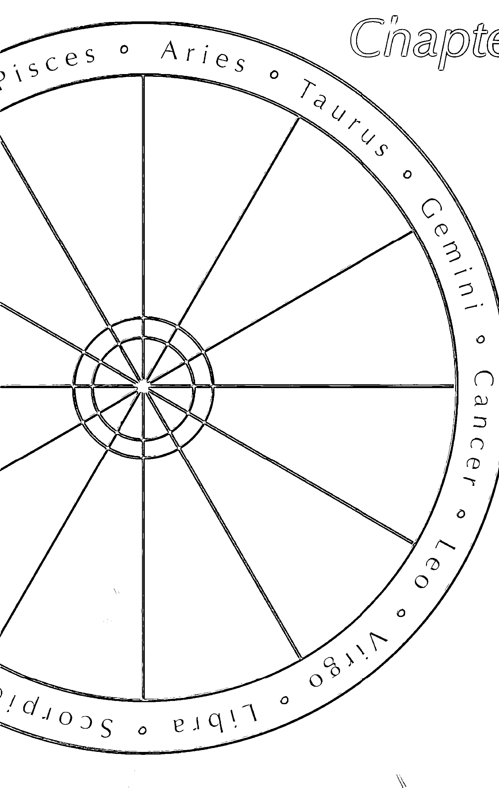

# 世運為我所用

從星盤探索未來

美國在飽受全球金融海嘯衝擊之後，是否會步入長期的衰退，牽動著全球的經濟脈動？美元是否會貶值？這都是投資人關注的重要議題。專家之言，都認為美元適合長空短握，也許這也是對美國未來經濟感到悲觀的另一種說法。

## 美元作為國際貨幣領導地位的挑戰

以目前現實環境而論，美元作為國際貨幣交易單位，短期內是無法被取代的。

究竟所謂的「長」，是多長？所謂的「短」，又是多短？每個人對「長」、「短」的定義都不一樣。但是，如果透過美國國運星盤（見圖1）的美元之星作觀測，會否找到星空的暗示？

目前的美元之星（水星）落在寶瓶座，與美國國運本命木星、太陽相會，以流年木星三合*關係來看，美元位於三合土星的位置，以土星兩年半走30度計算，美元在2009年仍會保持強勢貨幣的幸運位置，特別是在2009年9月之後，美元之星直接與土星呈120度，再加上美國國運的股市之星（太陽）呈吉，美國的失業問題之星也呈現不再惡化之勢，所以，2009年年底的美國確實符合經濟學家所預測的，屆時美國經濟將會透出一線曙光。而且，按照星度推算，一直到2010年11月，美元都會有良好的表現，即使到了2010年12月，土星已不再與美元之星呈任何相位，但美元也只是處於無吉凶之狀態，所以情況應該不會太糟。

反而，我們要注意的是，2011年6月，流年木星位於牧羊座，與美元之星刑衝，美元的升勢屆時將會受到影響，而且，由2011年11月至2012年3月期間，美元之星將受刑於土星（主宰流年運勢的兩類最重要星體——木星、土星，都對美元之星不利）。所以，現

*星之會、合、刑、衝詳見第49-51頁。

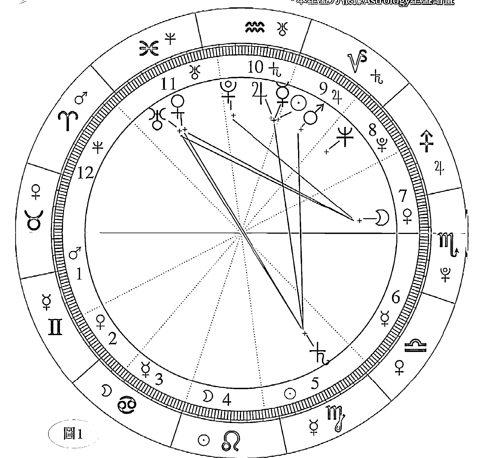

代表美元之星的水星，與木星、太陽相會，以流年木星三合來看，美元在2009年仍能保持強勢。

| 十二星座 | 牡羊 | 金牛 | 雙子 | 巨蟹 | 獅子 | 室女 | 天秤 | 天蠍 | 人馬 | 摩羯 | 寶瓶 | 雙魚 |
| :--- | :--- | :--- | :--- | :--- | :--- | :--- | :--- | :--- | :--- | :--- | :--- | :--- |
| | ♈ | ♉ | ♊ | ♋ | ♌ | ♍ | ♎ | ♏ | ♐ | ♑ | ♒ | ♓ |
| 守護星 | 火星 | 金星 | 水星 | 月亮 | 太陽 | 水星 | 金星 | 冥王星 | 木星 | 土星 | 天王星 | 海王星 |
| | ♂ | ♀ | ☿ | ☽ | ☉ | ☿ | ♀ | ♇ | ♃ | ♄ | ♅ | ♆ |

在對美元分析的長期要放空的時間點，會不會是指這個時候呢？且拭目以待。

## 石油價格創高峰？

另一個影響全球經濟因素的是石油價格。它在2008年大起大落，異常波動，但年初的一副扶搖直上之勢，卻被金融海嘯的巨浪吞噬了一半。面對未來10年的長期全球經濟發展的前景，各派的專家眾說紛紜，沒有一致的定論。但是，假如我們用冥王的動向來預測，是否能夠找出值得參考的地方？

冥王在2008年年底進入摩羯座。冥王代表石油，摩羯座是消耗殆盡之意，冥王也代表中國之星、共產主義國家之星，那麼，在這裏是否已暗示，在未來10年至30年的世界趨勢大運，石油的供需關係，將會是需求大於供應？故此，石油的原先預測會漲到200美元一桶的分析，是否表示會有實現的一天？

## 藝術與宗教抬頭的世代

一直以來，三王星——海王星、天王星、冥王星都主宰着世界的趨勢走向。2009年的全球環境，在金融海嘯過後，將開創新局，而冥王進入摩羯座，將是一個重要的星象警訊。海王星的未來動向，就是她也將在2013年回歸到雙魚座。

換言之，2013年至2025年間，將會是進入雙魚座的時代，世間將會受到雙魚座的深刻影響。

海納百川、溫柔多情、隨波逐流，雙魚座的夢幻與豐富的情感，會激發人類更多的創意與藝術氣質。所以，可以預測，在雙魚座的年代，藝術、純文學、宗教等領域的事物將會大放異彩。但另一方面，這個世代的危險，卻因為海王星有好幾年與土星相衝，表示夢想的實踐會遇到阻礙，而藝術、文學和宗教的發展，都必須通過毅力與實踐力的考驗，才成大器。

土星是實踐的能力。創意的呈現必須靠純熟的技巧具體化，而海王星本身就如一顆藝術之星，她體積龐大，距離遙遠，令人感覺她朦朧又曖昧不清地遙不可及。所以，占星學將她代表空想與理想。其實，空想與理想只有一線之隔，兩者的分別在於創意的實踐，如何將精神層次的抽象、意象，經過邏輯思考的過濾，再用藝術手段作為媒介呈現出來。

可想而知，在雙魚座的世代，由於人類重視心靈的成就，因此**藝術這個行業將會成為未來商業運用的包裝趨勢之一**。幾年前由歐洲帶動的文化創意產業，其實已為這個全新的世代預早作好了準備。

雙魚座是水象星座，她是人類豐富情感的收藏處，但過於重視感情，也表示容易迷失方向，造成生活混亂和失序。從雙魚座的神話故事中，我們得到一個啟示，就是我們不能只沉醉在自己的理想之中，否則將導致身處險境而不自知。引伸而言，在這個時期，也讓我們擔心騙術將會大行其道，追求心靈的成就之時，必需要提防別有用心的人藉着宗教行騙。

回顧1846年海王星被發現時，剛好是煤氣燈、招魂術與催眠術面世的時候，麻醉劑也開始被運用在外科手術上，正好反映出海王星具有創新的力量。故此，要預測未來時，雖然面對全球經濟低迷，但酒業市場仍會有一番蓬勃之象。可以説，海王與人世的牽動關係，不得不讓人拍案叫絕，人類要「沉醉」自我，酒精就是催化幻想、創造力的燃料。

世運為我所用

# 從天王星看全球經濟趨勢

# Chapter 3

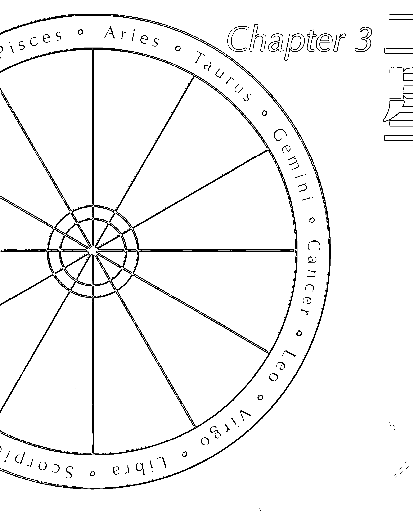

## 天王星

天王星被發現的時候，正值是18世紀末期，當時的世界像是受到了她的「感召」：英國經歷了工業革命，法國爆發了法國大革命，美國宣佈獨立。那是因為天王星具有代表革命、創新、前衛、科學的能量。

當一顆世代之星進入另一個星座時，天地與星辰間互相相惜呼應，她們對人世間的影響都是那麼的驚天動地。這也難怪早在5000年前，自巴比倫時代開始，人類就知道要仰望星象，研究一套星度的推算法則，作為預測命運的依據。漸漸地，我們從經驗當中，開始明白了宇宙的運行規律，換作人世間的生命，就是無盡頭的周期。佛教的輪迴之說，是否也是因為了解到這一點，才肯定生死本來就沒有起點也沒有終點？每一次生命的開始，都能在南交角與北交角處得到要如何延續的提示，她們分別代表過去世的努力，換作為今生可享有的福報，以及今生所要承受的考驗，這些都會在業力宮位*出現，並藉由今生的障礙，推動我們必須要自我超越。當代許多西方占星大師如：容格（Carl Jung）、史蒂芬・阿若優（Stephen Arroyo）等，以及一些心理學占星大師都非常重視這部分的研究。

天王星是太陽系第7顆行星，她守護寶瓶座，代表一切與電波、光波及科學的事物有關，原因是，「7」這個數字剛好是在循環的位置，無論我們用1、2、3、4、5、6除以7，得出來的答案都會是0.142857的循環：

- 1除以7 = 0.142857
- 2除以7 = 0.285714
- 3除以7 = 0.428571
- 4除以7 = 0.571428
- 5除以7 = 0.714285
- 6除以7 = 0.857142

*有關宮位的解釋，見第154-155頁。

天王星在2004年進入雙魚座，她也將會直到2011年才離開雙魚座進入牡羊座。在這樣的星度中，是巧合還是驗證了天地間的感應一致？世間發生的重大事件，星辰相對人事的詮釋可以說是完全吻合占星學的星度解釋。

## 《海角七號》創奇迹

2008年，一部耗資只有一千二百多萬港元的華語電影《海角七號》，只是透過BBC網站及部落格的口耳宣傳，便奇迹地在台灣爆紅，播映了1個月，竟然創造了近1億港元的票房成績，而後還引起了香港及其他東南亞地區的注意。甚至海協會會長陳雲林歷史性首次訪台期間，也要在緊湊的行程中一賭她的風采，事後陳會長還承諾會安排這部電影在中國上映。

導演魏德聖對這一切的讚賞只能用意外和受寵若驚來形容，因為他自己也很難解釋，一部只用了二線演員的「台灣鄉土劇」，竟能為低迷多年的華語片再造風潮。

## 當時得令的電影名字

論到這部電影的成功，與天象顯示的時運，有絕對巧合之處——雙魚座的守護星是海王星，可以代表「海角」；天王星則正好符合「七號」這個數字。這個誤打誤撞的當時得令的片名，與現在的天象——天王星落在雙魚座、海王星落在寶瓶座，寶瓶座也代表7，可以説是完全吻合。

我不知道姓名學的推算原理，但是用占星學的科學解釋就是這樣，名字取得對也是很重要的。

## 三王星透視未來世界的趨勢

人類對未來、對神秘的未知部分，有着人性本能的好奇。無論在東方或西方，玄學總有不能抗拒的吸引力。

在占星學中要預知未來，本命命盤並不是重點，而是要能推算流年星體對本命的引動，會有哪些影響，才能找出趨吉避凶的方法。對於個人的運勢掌握，運用流年木星與流年土星推算已很足夠，因為木星代表未來展望，土星代表過去到現在，而她們的影響是一年，但是如果要更細緻知道重要日子的吉凶，如嫁娶、開業、動土等，月亮與太陽與相關星體的吉凶就很重要；至於吉時良辰在度分秒間的拿捏，則是占星學的最高秘笈——天星擇日，她屬於一門創造「天時地利」的時空之學。這一套學問必須將星盤的時間與羅盤的方位空間一起配合運用，但是假若要對未來世界的趨勢潮流作出預測，觀測三王星，即天王星、海王星和冥王星的變動則是重要的依據，她們被稱為世代之星，是因為她們影響的時間長，由7年至30年不等。

## 經濟體制備受質疑

就目前來說，冥王星已經進入2009年位移入摩羯座，爆發了全球金融風暴。人馬座所代表的過度樂觀開放、自由經濟體制信仰、全球化的策略、個人主義抬頭等，都受到金融海嘯波濤衝擊後而被質疑，全球的政治經濟政策的信仰也因此而充滿了山雨欲來風滿樓天王星的味道。2008年年底的經濟萎縮，就如冥王進入摩羯座的壓抑之象，而且人世間還提早做了「準備」。南懷瑾大師就說過，政治沒有對錯，只有因果。其實是不是基於這個原因，她也讓歷史有了輪迴的機會？

資本主義意氣風發了半個世紀以上，到了今天，有學者開始檢討是不是有重新思考的必要，馬克思主義用在此時此刻會否有新的詮釋？歐美各國政府為了挽救國內經濟，必須積極干預金融市場，在經濟市場上扮演重要角色，並開始把銀行國有化，以便更有效規範與監督。

冥王在人馬座時，推崇自由放任一直相安無事，也創造了全球的榮景，但是為何在她即將要進入摩羯座時，「放任」、「過度的自由」就會出問題？原來，摩羯座的特質講的就是「責任」，呼應解決當今的全球經濟衰退，要重新建立新的政治思潮。20世紀以來代表保守與進步的鐘擺，一直是在遇到困境時交替使用，到了21世紀，馬克思主義會否「鹹魚翻生」？在往後的十幾二十年間可以一起來驗證。不論她會不會踢走資本主義的主流認知，但可以肯定的是，馬克思主義將會受到更大重視。

## 海嘯後的中國經濟

中國自1978年實施改革開放以來，從來沒離開過全球關注的眼光。「21世紀是中國人的世紀」被高喊了多年，這一天究竟會在何時來臨？

中國在天上的位置可以用冥王作為代表，冥王進入代表「責任」的摩羯座，是不是也意味着她將肩負更多的世界責任與義務？正當世界經濟進入衰退的黑暗期，中國的內需市場逐漸建立，在未來可見的日子裏，將以保守經濟形勢主導，中國將4兆人民幣擴大內需措施，方向是完全正確的。一般占星師將摩羯座只解釋為「壓抑」的意思，所以，如果沒有金融海嘯，中國的宏觀調控，用天象作預測，應該還有10年推行的光景，中國的經濟政策仍會堅持適度的控管，以避免中國經濟過熱。放在今日的時空背景下，國務院的刺激經濟方案，進行的是農村的基礎建設、興建鐵路、公路、機場……等等，與摩羯座的大地、營建、基礎，不無關係。摩羯的守護星——土星，本身負責掌管大地，雖有延緩之意，但是一步一腳印是她邁向成功的法門，衍生宮位的含意，第10宮是領導統禦的位置所在。中國要站在世界的舞台，扮演舉足輕重的角色，未來10年是關鍵期。

如果我們用中國國運盤作預測，2009年會是艱困的一年，對於幫助美國舒困的方案也許真的要三思而後行；2010年，上海世界博覽會對刺激經濟成長可以帶來正面影響，但期望不要太高，原因是，國家本身的經濟之星受到流年刑衝，中國未來的經濟要到2011年中才開始收割現在的耕耘成果；2012與2013年將會是中國經濟起飛的年代，她將作好一切準確，迎接未來。世紀之星在跨越不同世代時，社會必然會有一番新的思潮，這股新思潮更會逐漸成為社會的新主流價值。

## 新世紀的新寵行業

冥王三合金牛座與室女座，可以洞見有些行業是會受到歡迎的，雖然大部分的人財富縮水，但是務實的財富理財管理銀行，反而打開了可以擴充發展的契機；此外，人類壽命在得到延長的同時，罹患慢性疾病的人口卻有所增加，相關醫療、健康、藥品、農業、糧食的行業將成為主流，我甚至看好未來中醫概念的醫學治療與研究（包括草本療效）會被世界接納。以上是未來進行式的新寵，不妨多用心觀察她們的後續發展。

如果你現在正值是十多歲的年齡，要面對未來人生的規劃，大學要讀什麼科系，才會搭上当红的行业？我会建议你选读医学系的牙科、土木工程科系针对大地工程类别，例如挖掘隧道，一些须要长期作业的基础建设技能、农业科技化的研究，特别是地球在未来持续暖化下，饮水资源及粮食会愈来愈短缺，未来的国力一较高下的决战点在粮食的主控权，大国之争在于谁掌握了足够的粮食，谁便将是新的世界霸主。

另一種奇妙的現象，就是人們雖然面對經濟衰退，但也許是人類的心靈太空虛吧！飼養寵物的熱潮依然不會降溫。

## 受刑、衝的行業

另一方面，由於受到冥王壓抑，某些行業的成長將受到阻礙，包括工業、生產、製造、房地產、零售、百貨、成衣、精品、美容等，她們都處於受刑的位置，所以在未來的日子裏，這些項目的經營將會比較辛苦。

## 追求心靈的成就

此外，值得一提的是，海王星將會在2012年回歸到雙魚座，因此，在2012至2025這段期間，人類會被引發更多的內心不安情緒，物化價值過度被操作後，更不能滿足快樂的需求，到時候罹患身心疾病，如憂鬱症、恐慌症、失眠的人口會更多，故此海王靈性的動力將推動更多的人追求心靈成就，特別是藉由宗教尋求身心靈的平衡。不過，大家一定要留意，選擇心靈的導師時要非常小心，因為這是一個宗教亂世的年代，宗教信仰的混亂無章，新興宗教百花齊放，也良莠不齊，箇中陷阱很多，信眾容易受騙上當。

雙魚座本身衍生為12宮，是屬於業力的宮位，她與修行、前世因果有關，也許亂世的魔考就是為修行者營造的歷煉環境，希望大家能用慈悲、智慧跨越生命的考驗，但並不是每個人都能通過考驗。

冥王星在宇宙巨人的身體部位是生殖器官，所以她也代表了性愛。愛滋病快速蔓延的年代也正是冥王星在人馬座的不受約束表現，所以過去一二十年是一個性開放、自由、放任、不負責任的世代，但是隨着冥王星進入屬於壓抑、責任的摩羯座，人類的濫交和不正當性行為將會有所收斂，男女交往也顯得較為謹慎。

## 新工業革命拉開序幕

80年代中期，世界產業結構出現轉變，當時製造業萎縮，電子業成為當紅炸子雞，這是受到天王星位於人馬座的影響，所以代表電子科技的天王星在人馬座可以快速發展。到了90年代，天王星進入摩羯座，全球電子科技更是處於發展的高峰期，但是，一個潮流的生滅，必然是與行星引力作用相關。於是2003年，當天王星離開了寶瓶座，電子業的高峰年代可以説已宣告接近尾聲。隨之而來的2011年，可以讓人期待的是第三次工業革命即將拉開序幕，屆時電子與工業的結合，會突破和創造一些新的生產技術與概念，為我們的生活帶來更多的驚喜。

## 生化科技年代的來臨

也許有人會問，電子科技之後的世代，將由哪一個行業接棒？以海王星回歸到雙魚座，等於宣佈了生化科技年代的來臨，她除了結合養生、自然療法、中醫本草綱目粹煉，更講求身心靈並重的整合治療。也許屆時的科學已可以證明，有健康的心靈才會有健康的身體，醫學的一些觀念將會有新的定義，而普通人也會漸漸被説服，相信生活的哲學在於「心」的開發，而不是「大腦」的運動。因此，若你想要做下一波的社會新貴，如果還來得及的話，應該朝這方面思維。

## 占星的意義

天象最原始的解释来自神话故事的想像，但是经过人类漫长历史经验的累积，我们不能确定世界上是否有一个公平正义的天神，可以来主持和排解人世间的纷纷扰扰，但是我们应该要相信，每个人星盘上的错综複杂和千丝万缕，无论吉凶如何安排，星辰的按步漫游天际，目的是公平地为每个人製造机会。所以，当你失意时，请不要怀疑自己，怀才不遇也绝对不是失败的藉口，也许问题只在于你根本不了解自己。

## 从星盘了解个人的吉凶星相

我看过两个很特别的星盘。一位是他的命盘完全没有代表吉相位的蓝色线（见图2），最吉的两颗星是冥王与太阳，是无吉凶，并无红、蓝色线。像这样的命格，藉由占星学可以为他带来什麽希望？这时候，我们也许可以利用流年星与本命星的引动关係，在三合的时候给他建议，尤其是大运星影响的时间长达7-## 走出宿命論主義

我相信占星學是一門可以帶給人類希望的學問，她不完全是玄學，她有絕大部分是經過長時間驗證為科學的理論，也許這本書只能敘述其中千言萬語的萬分之一，但我衷心希望那萬分之一已足以成為擊潰宿命人生觀的力量。

祝福大家，更希望——每一個人都會珍惜自己。

天王星

# 知命造運

## Chapter 4

### 借鏡名人的經驗

#### 在吉相位上努力

對於生命是如何創造出來的，尚未有確實的答案，但那絕對不是偶然。

我們對於自己是如何來到這個世界，不曾放棄過好奇。科學家循考古途徑去追尋線索，發現人類經過了300萬年的進化，由非洲南猿，進化到巧人，到直立人，到早期的人類，才到現在的現代人類。也許，大家會覺得，為什麼到了現代人類，進化過程就停止了？其實，人類進化的重要部分，是我們頭頂上的那顆腦袋。科學家也是用人類的腦容量增長的趨勢，決定人類的進程。

#### 尋求改變，以圖存活

在學術上，大腦的定義是泛論智慧。我們應該要試着去理解，任何一種生物，甚至小如細菌，也能存活了幾十億年，那絕對不是靠運氣，而必須要努力才能達到生存的目的。現在的商業文明，成功的訣竅在於創意、創新的特質，其實，任何並非來自基因的能力，都可以稱為創新，而這種成功之道，不是現在獨有的。生物學家證實，生物在生命受到威脅的時候，就會尋求改變，以圖存活。這跟以占星學觀察人性是一樣的。

在星盤上有四大相位——會、合、刑、衝，這是星盤論定吉凶的重要依據。每一個星座和宮位，都有30度。

#### 會——0度的吉凶

0度是會，就是兩顆星在8度之間，星星相會，代表一件事被這兩顆星融合加強了它的力量，也就是說，吉者更吉，凶者就是在痛處灑鹽。

#### 刑——90度的妥協

90度是長痛，但可以忍受，那是在不對等的環境下的妥協忍耐，如父母、長官的責難，因為身份不對等，所以不敢起正面的衝突，大部分的人處理方式都是敢怒不敢言，相對也是因為對方是父母，是長官，他們要對我們不利，也不至於會做到趕盡殺絕的地步。所以，如果星盤上的刑相位縱使是長痛，也只是小痛，而不至於有太大的傷害。大多數的人生處於這樣的相位上，只會發揮惰性，只要可以忍下便任由問題潛伏，能用積極態度面對解決問題的人並不多。我的占星經驗也是這樣告訴我，要在90度的相位給人建言，願意主動去改變的機率低到幾乎是零。也許在這裏就可以顯示出人性的弱點了。但是，我要奉勸大家，山不轉，路轉，是比較好的處理方式。

#### 衝——180度的衝突

180度是衝的相位。在中國人的文化中，講犯沖，就是這樣的相位。直接的衝撞，是一時的短痛，但也是重大傷害的大痛，例如夫妻、合作夥伴的關係，因為雙方是對等的地位，所以一旦出現衝突，一言不合，是可以大打出手傷人，不會有太多顧忌。在這樣的相位所代表的意義是，事情已經發生了，如果是生病的情況，那是立即呈現病徵；換句話說，當事情發生在180度的時候，就表示已經到了一定要處理的生死存亡時刻，所以人生的重大轉折也是在這裏被推動着，逼着我們去改變。危機就是轉機，也是這個意思。

在佛學的角度，《金剛經》裏的不思善，不思惡，也同樣希望勸勉打開我們的心胸，有容為大。世界上沒有絕對的好，也沒有絕對的壞，每一個相遇都是因緣促成，是福是禍沒有定見。所以，人生在遇到正衝的時候，也不要心生恐懼，重要的是，要有改變自己的勇氣。其實，如果可以從星盤預知可能發生的災難，我們便可以趨吉避凶，避免遭受苦難，不是可以讓人生更加美好嗎？預知未來，調整自己的腳步，只要你願意改變，一切都會有所不同。

#### 合——120度的吉相

120度是吉相位，例如，在星盤上的宮位位置是子女與高等教育的宮位。試想想，如果父母有難，子女是義不容辭、自動自覺會幫忙的。這是不請自來的幸運。古時中國人深信：一命，二運，三風水，四積陰德，五讀書。前四種因素是屬於先天的部分，但後天的努力，就要靠考取功名，才有改變命運的機會，所以這也是鼓勵人只要有上進心，機會就比別人多。

#### 先天注定，後天努力

自我們來到這個世界上，就被教育要做一個成功的人。從小父母的栽培也是為着我們將來能夠出人頭地做準備。人人渴望成功，但卻很少人知道成功的重要關鍵，乃在於找到正確的努力的方向。究竟是誰決定了你一生的命運？那一定不是你生在富裕的家庭，可以少奮鬥30年的事；或者生長在匱乏的環境，就表示完全沒有機會了。若用星盤剖析，一定可以找到一條康莊大道，也就是你人生最容易成功的道路，這也是占星學存在最大的意義。每個人都有屬於個人獨一無二的星盤，觀察星盤，你可以更客觀認識自己。我們不應像原始生物，要受到外在的力量推擠，才去主動改變。

生物學家證實，人類的進化是受環境所逼。話說200萬年前，我們的老祖先面臨如現在地球暖化一樣的大自然氣候改變的危機，當時環境突然惡化，變得比較乾燥，森林減少，糧食也不足，人類必須要設法改進生存的技巧，適應新的環境，所以發明了石器，用粗糙的石頭磨成鋒利的工具，獵殺動物，取得肉食；也用石刀切下動物的皮毛，製成皮裘，用作冬天保暖身體。這些都可以被視為當時社會的創意文化。據說大象變得聰明，也是在受到獵人的槍擊之苦後，才慢慢改變基因，懂得如何逃避威脅。但是，我們是萬物之靈，生活在高度文明的社會中，以我們的聰明才智，不應該要等到生命受到威脅的時候才作改變。創新是受環境所逼的生存之道，但更聰明的做法，就是透過觀察，將別人的經驗當成自己的人生的經歷。事實上，人類的進化歷程，也是這樣演進的。

#### 借鏡名人，增益自我

我經常告訴自己，要堅強地活着，堅強也代表積極面對人生。在現今高度競爭的商業社會，生活壓力是讓人最沮喪的地方，但是我希望大家可以彼此鼓勵。也許你並不富有，生活也不如意，甚至長期受到委屈，或是根本沒有人了解你，但我們仍然應該珍惜我們可以來到這個世界的機會，就憑這一點，就值得我們為自己奮鬥。

一直以來，成功人士在我心中的定義，絕對不是財富的擁有者，而是可以超越自我的許多感人的故事裏的主角。因為我們每個人都要讓自己精采，人類相對於宇宙的浩瀚，也許就如同細菌般的渺小，要用放大鏡才找得到自己。但是細菌可是存活在這地球上最原始的生物，由數十億年前就出現，牠們生生世世生活在惡劣的環境之中，但是牠們卻懂得要隨着環境的變遷而要創新求變，好像大腸桿菌不斷努力地與環境搏鬥，為的是不對生命放棄。我們是自稱為高等生物的人類，自然更加要積極面對人生。

以下列舉一些名人案例，希望可以藉此啟發我們有更多的生存創意。我們也可以由此發覺當中一些知名人士，他們的人生命盤是凶多吉少，但卻因為他們能夠堅持在唯一的吉相位上做努力，所以有了很大的成就。

## 奧巴馬

Barack Hussein Obama

### 令歷史性的一刻誕生

命宮落在寶瓶座的他

2008年11月4日，巴拉克·奧巴馬（Barack Hussein Obama）當選為美國歷史上首位黑人總統，他樂觀進取的特質，造成了風靡全美的奧巴馬現象。

奧巴馬在2009年1月20日就任為美國第44任總統。他能否帶領美國走過金融海嘯後的新局面？在這裏，我們可以用占星學預知多少他的未來。

當今現實世界的規則是以結果論英雄，所以奧巴馬的當選絕對只是挑戰的開始，全世界都在期望他的辯才無礙不只是在競選時讓人驚艷，而是作為世界經濟火車頭的舵手，他真的能為當前的國內外經濟困局帶來改變。

奧巴馬簡而有力的競選口號——Change（改變）真的實踐了他的「夢想之路」。用他的星盤解讀（見圖4），應該是他天生命落於寶瓶座的命宮及受着天王星的影響，令奧巴馬實踐了他的夢想。

| 十二星座 | 牡羊 | 金牛 | 雙子 | 巨蟹 | 獅子 | 室女 | 天秤 | 天蠍 | 人馬 | 摩羯 | 寶瓶 | 雙魚 |
| --- | --- | --- | --- | --- | --- | --- | --- | --- | --- | --- | --- | --- |
| 守護星 | 火星 | 金星 | 水星 | 月亮 | 太陽 | 水星 | 金星 | 冥王星 | 木星 | 土星 | 天王星 | 海王星 |

宮落於寶瓶座的改革，以及代表天王星勇於實現理想的特性，讓他有別於一般人，從小立志改變世界。

由於受天王星特質的影響，因此他會認真地將小時候的「我的志願」當成一回事；他將從小立志要改變這個世界的渴望，用在2008年的美國總統大選上，選民真的被他的熱情感動，而讓歷史性的一刻誕生了。美國人打破了233年來美國人黑白種族間的藩籬，把票投給了他，這是150年前林肯打贏南北戰爭，解放黑奴後，直至現在，奧巴馬才是真正將黑白膚色的優越符號融合一體的時代開始。

奧巴馬的天王星落在獅子座，獅子是王者，太陽是她的守護星，所以奧巴馬的理想能在政治舞台上發光發熱。這個特質在他的星盤中是可以預見的。但是因為他的太陽純凶只有紅線，他在競選時最讓他發揮迷人風采的演講魅力，用在日後的施政執行力上，也許「做」會比「説」遜色。再加上2009年的流年木星也直衝他星盤上代表領導能力的太陽。這將會使得他在選舉時所主張的三大主軸：美軍自伊拉克撤軍、降低能源依賴、實行全面健保，都將會讓他遇到嚴重的困難，特別是撤軍問題。

### 亂世總統

由於奧巴馬本命星盤的太陽純凶，故此他個人的行事作風，容易因為他過於樂觀的性格而錯估形勢。他的命盤告訴我們，他天生就不是當太平官的命，這也許正是他會在美國國力大為衰退的時候當選，也正好吻合他本身的星盤呈相。至於他的個人運勢，則要到流年木星三合本命時的2011年才會步入順遂。但他身為美國總統、世界重要的領袖，他的個人運氣必然會牽動國運，繼而影響全世界。正如後來從政治占星學衍生的工商占星學也套用此理——公司星盤也可以用老板的命盤，用轉盤方式推論公司運勢。

根據星度，冥王星在2009年進入摩羯座，這代表一個劃時代的意義。人馬座是奔放、自由、開放的年代。所以在1980年代，冥王進入人馬座時，當時的美國總統是列根（Ronald Reagan），他在當政時的開放主張就完全吻合人馬座的自由市場導向。但是，無限擴充自由的定義，就如冥王是代表絕對的一百，人馬是完全不受約束，結果我們看到了，在信仰絕對放任的意識形態下，美國的金融秩序終於在2008年栽了個大筋斗，這也同時連累全球一起為30兆美元的市值消失而買單。於是到了2009年大運進入摩羯座的時代，象徵收斂、保守、有秩序的管理、一個必須腳踏實地的世代便順勢踏着「衰退」的腳步悄悄到來。正因如此，美國人才會選擇了傾向社會主義的奧巴馬作為領導者。

仔細閱讀奧巴馬的財經政策，其實只有一個宗旨，那就是扶貧濟弱；他會落實向那百分之五的富人徵重税，有可能會否定前朝布殊所要簽署的自由貿易協定。奧巴馬的振興美國經濟方案，也與中國英雄所見略同，同樣是用擴大內需、着手大型基礎建設為手段，這與摩羯座所代表的土木工程、大地經營、壓縮內心需求、大政府的展現等等不無關係。

### 艱辛的總統之路

夾持着高達百分之八十二的支持度，奧巴馬在競選演說中一再強調，他會用「速度」與「膽識」去解決嚴峻的經濟難題，他贊成凱因斯（John Maynard Keynes）的論點，當經濟蕭條時，單靠貨幣政策是發揮不了效用的，政府必須採取的救亡行動，就是要以大規模的赤字支出政策，用來對抗失業危機。比照美國國運星盤（見圖5），雖然流年木星三合國家本運，但國家宮位，即是第一宮卻受刑於行走速度比較慢的土星，以土星2.5年走30度計算，美國國運要到2009年10月，土星離開了室女座後，一切才可能從土星的壓制鬆綁出來。在這之前，美國的壓力主要來自外交的挫敗、國會的不予配合，繼而影響到領導人的施政產生變數，所以星盤呈象，天王星與金星相衝土星，奧巴馬的困難在於國會與他不同步調，這表示總統空有正確的觀點，國會如果延宕通過法案，將會是阻礙美國快速復元的主要原因之一。

對於投資者來說，也許你會因為美國股市止跌而對市場重新產生信心，但是我在這裏要提醒大家，2011年年底之後的美國股市風險會增加，銀行融資收緊，直到2012年年中前，市場都潛在大幅波動之危機。以美國整體國運的起伏來看，2013年年底至2014年會是三合之年，流年土星與流年木星都在加持金星與天王星相會，如果與奧巴馬的星盤比對，則表示他在未來4年的任期內，會是一位辛苦的總統，即使美國國運在他即將卸任時好轉，但是他並沒有比較輕鬆，事實上可以説他的總統之路走得十分艱辛。

無論如何，美國現正處於經濟大蕭條的艱困年代，難得的是，從星盤看奧巴馬，雖然他對輿論的評價十分在意，但慶幸他的抗壓力沒有問題，只要他能妥當處理好自己的情緒，他是具備在這一刻擔當美國總統的必要條件。因為他的夢想之星土星同時也是他的實踐之星，只要他保持行動力與親民的作風，再配合服從性高的團隊組合，便能落實執行他所主張的正確和務實的政策。

#### 全球經濟重新洗牌

2008年，冥王星終於離開了過度虛浮擴張的年代，人馬座的自由化、市場化、全球化，到現在全球泡沫化，終於在這場驚天動地的繁華夢碎後，由摩羯座把人類拉回現實之中。土星代表全球經濟結構性崩解後，也要從結構重新建構，人馬座的一場長達二十餘年的多頭市場，在冥王進入摩羯座後，全球財富的徹底重新洗牌，必然是會從基本結構、意識形態、遊戲規則、有效控制管理等方向重新出發。此外，目前這場金融風暴是在人馬座累積了20年的能量才爆發的，而冥王也將在摩羯座停留10至30年不等的時間才會離開。由此推斷，雖然大眾期望全球經濟可以在未來兩三年內得到好轉，但從星度的合理性去判斷，這是不是已暗示了這個可能性很低？

生命是一個過程，但常被人類忽略。想要跳過過程，從一個結果直接到達另一個結果，那是不可能的事。用天文科學解釋人事變化的合理性，是不是同時也可以驗證真理？

## 比爾蓋茲

Bill Gates

### 成就世界首富之路

撰寫此文時，比爾蓋茲（Bill Gates）已連續蟬聯了13年世界首富。

讓我們來看一下他的星盤（見圖6）。你會發現，他的命其實不太好，因為他的命盤裏除了只有一條吉相位（藍線）外，其餘都是凶相位（紅線）。但是這樣的爛命一條，為何會如此成功？

一般來說，許多大老板的培養，都需要有到處碰壁的命運，因為他們到處求職不順遂，才會逼於無奈，興起創業的決心。事實上，當人生沒有太多選擇的時候，我們反而會好好掌握一個得來不易的機會。當然，蓋茲不屬於這類的代表人物，他在創業的路上是幸運的。

### 發揮自我潛能

比爾蓋茲的成功，他之所以有今天的地位，比爾蓋茲的星盤中，是「凶（線）多吉（線）少」，但他卻能掌握唯一的吉相位於電腦科技行業中創立王國。

| 十二星座 | 牡羊 | 金牛 | 雙子 | 巨蟹 | 獅子 | 室女 | 天秤 | 天蠍 | 人馬 | 摩羯 | 寶瓶 | 雙魚 |
| --- | --- | --- | --- | --- | --- | --- | --- | --- | --- | --- | --- | --- |
| 守護星 | 火星 | 金星 | 水星 | 月亮 | 太陽 | 水星 | 金星 | 冥王星 | 木星 | 土星 | 天王星 | 海王星 |

據他自己說，並不是因為他是天才，而是他發掘了自己的潛能。但是，如果我們相信偉大的科學家愛迪生的名言——「天才是百分之一的靈感，加上百分之九十九的努力」，那麼也只有像比爾蓋茲這樣的人，潛能的門是用血汗激發出來。

從比爾蓋茲的星盤上唯一的吉相位來看，是天王星與月亮形成120度造就了他。天王星在占星學代表創意、科技，在行業中代表電子、科技、航天工業。而天王星又落在他的命宮中，所以由此看出他確實是與生俱來就擁有電腦科技天分。他說自己不是天才，這只是謙虛之詞罷了！事實上，他天生就有比別人較多的創造電腦科技程式的天分，只是他較人幸運的地方，是剛好他的興趣所在也是他人生路上的最佳選擇。他13歲立志要開創個人電腦軟體和設計電腦程式作為其人生職業，加上他的執着堅持，成功的機率因而大增。

吉相位的解釋，並不表示個人不須付出努力，就能不勞而獲，而是指循吉相位的方向發展，會是助力大於阻力，亦即是一分努力，會有兩分收穫的意思。

天王星也代表堅持理念和理想，具有與眾不同的獨立性意思。所以，小時候的比爾蓋茲應該是比較喜歡自己獨處，與一般孩子並不太一樣吧！因為他會執着於自己的理想，做事講求原則。

這種人如果沒有當上老板的話，就會很容易為了理念不合跟老板起爭執的，所以他不會是一個很聽話的員工。不過，人才不都是讓老板難以駕馭的嗎？

論工作行業，除了電子業外，比爾蓋茲也適合從事餐飲業，因為月亮代表飲食，如果可以給他一點建議，電腦科技結合飲食王國，是他可以考慮整合的計劃。

## 冥王星的影響

對於這位擁有世界一級財富的富豪來說，一切的物質生活對他來說，都應該不會欠缺，但是他可是要多注意自己的身體健康，因為他先天的體質並不能説好，必須要靠後天的保養，特別是他腹部、小腸的部位，而後牽動到大腸也是他身體最弱的部分。如果流年土星和流年木星相刑衝，那是要更加要特別小心的年份，例如在2009年，我會建議他為身體幾個器官做一些檢查。以他的體質，他的小腸會較容易長出軟性的腫瘤，如果不予理會，日子久了，也許就會變化成惡性的硬塊。但是對他健康最不利的是冥王星，她會為他帶來健康上的困擾和疑慮，尤其最易衝擊他的腹部健康。

冥王星代表的是再生能力。我們都會有類似的經驗，就是有時候生病了，拖了幾天不去看醫生，病就好了。這就是冥王星的再生能力對我們的正面影響，但是重大疾病也是因為這個原因形成的。因為當你感覺不舒服的時候，正是星體與相關的器官呈180度的時候，你馬上就會有身體不適的感覺，但是當我們拖延到星度都移開了，那種不適的感覺就會消失，但這並不表示問題就消失了，反而是將毛病隱藏了起來，但是如果我們可以知道自己的弱點，就可以防患於未然。

相對來說，比爾蓋茲的太太梅琳達的先天體質就比他健康些。不過她比較需要特別注意內分泌系統相關的疾病，由星盤中看出，這也是讓她擔心的地方。在管教子女方面，比爾蓋茲是絕對的放任自由，但梅琳則是適度的嚴厲。作為他們的子女，壓力不算小，壓力會讓他們有太多的想法，不過，孩子最好學着做自己，才會得到快樂。

## 星盤涵蓋生命的一切

在一個星盤中，不僅可以看本命，也可以用轉盤觀看身邊的任何一個人，因為星盤就是涵蓋生命的一切，所以藉由比爾蓋茲的命盤，也可以用來推算他的妻子、子女、父母、岳父母、孫子、媳婦、朋友、同學、叔伯阿姨、同事、下屬、長官、合作夥伴等；再遠一點，也可以推算出父母的朋友、兄弟姐妹、妻子的上司、兒子的女朋友、老板的妻子……舉不完的例子。總之，只要是人際關係上和你有關的人物，星盤都有一顆是屬於他們的星體。

轉盤是解盤的最高階學問，但並不是很多占星師會採用，因為轉盤有它一定的複雜性，在這裏提出來，只是想告訴讀者：我們的一切都可以在星盤中找到答案。

## 退休的巨人

比爾蓋茲打造了一個前無古人的電腦王國，在20世紀稱霸一時。現在的他，則是以慈善事業為重，他與妻子成立了一個超過210億美元的基金會，用作資助全球健康及學習範疇的慈善活動。但是，在觀察了他的星盤後，我會建議他，他雖然擁有龐大財產，也慷慨樂施，支持公益慈善事業，但是對於他個人的財富部分，其實最佳的管理者是他自己，因為他擁有很好的理財能力，所以如果金錢捐出去以後，他若能多參與相關的財務運作，是比較理想的做法。也許他也洞悉到將財產留給子孫不是最好的安排，所以他對自我財產的樂善好施，對他的子女來說確實是一件好事。

也許大家會好奇，世界級的超級富豪，五十多歲這麼年輕就退休了，他的生活會如何安排呢？其實，他最喜歡的就是呆在家裏，把最多的時間留給他的孩子。

# 李嘉誠、王永慶

Li Ka-shing ○ Wang Yung-ching

# 03
打造事業王國的力量

當我要寫這篇文章的時候，電視每天傳來的消息，是接二連三地全球股市像吃了瀉藥一樣，兵敗如山倒地一洩千里。踏入2008年，從自然災害到人禍拖累，中國的那場極冰凍雪，似乎預告了全球將要面臨整年的寒冬刺骨，這讓華爾街上再驕傲的人也失去了信心。

人類穿越了18、19世紀的工業革命，發展到現在21世紀，人性的貪婪讓世界繁華富足，但與此同時，經濟的發展也對地球的生態環境造成難以修復的傷害，其破壞力上山下海，甚至衝破了大氣層。現在的北極熊必須要長泳60英里覓食，地球愈來愈熱，但諷刺的是，人類的經濟則在炎夏中過着寒冬。

歷史，一直以來都是在漸變中走過，但生命的無常卻讓每個人有所體會，是人類的麻木不仁嗎？或是先知真的少之又少！美國科羅拉多州博爾德市的國家冰雪資料中心幾年前就提出警告，如果人類再不認真面對全球暖化的問題，北極的融冰將會在2050至2100年發生，到時候會有20個沿海城市受到水位上升的威脅，但在2008年年初，他們卻將發生年份修正為2030年，屆時北極將會由冰天雪地變成為汪洋一片。在此刻人類依然故我的同時，北極的冰架崩解了，2050年的預言超乎人類的想像提早到來。

我觀看着正在播放的電視新聞，一連7天道瓊斯工業指數都在跌……跌……剛開市6分鐘便跌了678點，跌破8000大關，這不再單純是金融危機，而是信心崩潰的危機，恐慌會讓人由理性跌入情緒失控的漩渦。

# 當前的危機

讓我們整理一下當前要面對的問題：全球暖化問題持續升溫、資源過度開發、物種快速滅絕、全球人口激增、生活環境全面受到污染、油價波動、物價上漲、失業人口增加、自然環境的變遷——海洋溫度升高，帶來無法抵擋的海嘯、洪水、乾旱，各地災難頻傳，海水淹沒了美國的紐奧良，美國次按風暴也摧毀了全球的經濟，世界正在失控中。人類走到這一步，是不是已經到了歷史的轉捩點？這讓我們不得不在此時此刻認真思考如何面對未來，想想我們的子孫，他們未來要面對的是一個怎麼樣的世界，我們留給他們的又是什麼？

二次世界大戰後，經濟發展是全球的主軸，大家都把精力放在掙錢上，想要白手起家，一夜致富是許多人的夢想……於是我們看到近二三十年來的社會價值，可以在一大堆的創業、理財、管理的書籍中找到。直至2008年10月，全球金融海嘯爆發，過去所建立的一切經濟榮景似乎在摧毀中，但樂觀一點想，相對地，是不是也意味著摧毀後的再造也在同時進行呢？

# 掌握巨變，創造福果

現在的天象，冥王逆行到人馬座，在2009年即將順行進入摩羯座，並一直要到2025年才會離開。在這段時間裏，我們的世界將會來一場巨變。面對處於困境的未來，人人顯得平等，這個世界的公平，也告訴了我們每個人都有相同的責任，無論貧富貴賤，地球的問題是每個人都要去面對的。這次的全球金融大海嘯幾乎波及每一個人，現在也許是我們一起要反省的時刻。全球化的另一個定義，就是全球人類同坐在一條船上，若非如此，美國加州的房市泡沫化，為何會影響到冰島的貨幣崩潰？美國作為全球金融帝國的地位，這次真正飽嘗到過度追逐利益的苦果。處於當下，時代的轉變是禍也是福，問題在於我們是否懂得掌握。

# 亂世出英雄

在華人的社會裏，有兩位備受推崇的超級企業家。他們同時處於非凡的年代，卻創造了超級的企業版圖，一位是被尊稱為「超人」的李嘉誠，另一位是被譽為「經營之神」的王永慶，他們都只有小學畢業，幼時家境困頓，卻可以白手起家，成為超級富豪。在這世界變革的年代，他們奮鬥的故事，的確值得我們借鏡。解析他們的星盤，也許成功人士的先天特質和後天努力，與天象有着相互呼應的默契。

1950年，李嘉誠用敏銳的直覺判斷二次世界大戰結束後，新一波的經濟即將復甦，人口增加，勢必會對塑膠製品需求大增，他認為塑膠時代已來臨，所以他在這個時間點上，當大家還裹足不前的時候，他成立了「長江塑膠廠」，為未來龐大的事業紮下基礎，事實上，他在此階段已然成功登上了「塑膠大王」的位置，而現在更是統領市值超過2700億港元的企業帝國總舵手。

無獨有偶，台塑集團創辦人王永慶也具有同樣的眼光，他在1953年也投資了台灣的PVC塑膠業，成立「台塑高雄塑膠廠」。台塑經歷了半個世紀後，現在已銳變成全球PVC的龍頭，並打造了全亞洲最大的石化王國，營收突破2兆台幣，是台灣最大的製造業。

Li Ka-shing。Wang Yung-ching

# 李嘉誠

李嘉誠自創業以來，經過了五十多個年頭，經歷過二次石油危機、文化大革命、亞洲金融風暴等的衝擊，他的企業橫跨55個國家，從未有投資虧損紀錄。他的投資訣竅是：掌握了消息，機會來的時候就能馬上行動。

先看一下李嘉誠的命盤（見圖7），是不是兩個三合相位很棒地將他的本命與工作、財富、家庭形成一股能量？其中貴人相助之星、業務能力之星、領導統御之星、擴展與創造力之星，都成三合互相加持，所以他能在14歲投身商界，當時月薪只有20港元，後來因為工作能力高，19歲被晉升為總經理，22歲自行創業。現在財富超過2700億港元。

# 創業能力極高

大家要知道，在做生意的領域上，營業能力好，就等於賺錢的能力強，李嘉誠的天王星與太陽、金星、土星，呈三合相，表示他創造業績的能力極高，原因是他用理想、創新的想法（就是那顆天王星），結合知識，發揮所長，這同時也符合他相信知識可以改變命運的理念，這些在當時屬於創意的構想，都因為他有天王星純吉（全藍線）的關係，而被引動的太陽代表領導能力，以及理念得以實現。在這裏要説明一下，一個人是否適合當老板，要看本命星盤的太陽是不是吉相位，而土星可以代表房地產、建築業，以及企業管理，所以驗證了他後來成為地產大亨。李嘉誠重視公司的組織管理，這使他日後能夠擴大經營；金星在某一派的説法代表幸運之星，所以亦同時加強了他事業發展的順利。如果要問先天命格很好的人，他的星盤會是什麼樣子，那麼李嘉誠的星盤可稱為典範。無論他是不是出身豪門，主要是日後必定會因為大三角的三合引力，加強了成功的力量。

圖7
李嘉誠命盤中的兩個三合相位。標示出他擁有成為一代富豪的潛質。

| 十二星座 | 守護星 |
| :--- | :--- |
| 牡羊 | 火星 |
| 金牛 | 金星 |
| 雙子 | 水星 |
| 巨蟹 | 月亮 |
| 獅子 | 太陽 |
| 室女 | 水星 |
| 天秤 | 金星 |
| 天蠍 | 冥王星 |
| 人馬 | 木星 |
| 摩羯 | 土星 |
| 寶瓶 | 天王星 |
| 雙魚 | 海王星 |

# 時代變遷造就開創機遇

時勢造就的英雄，應該有什麼星體呈相呢？在李嘉誠的星盤上就顯得有迹可尋，他的冥王與水星相會在他的財富宮位。

冥王就是大時代變遷的星體，水星是他的事業，解讀得出的答案剛好吻合李嘉誠具開創時代財富的敏銳度，以及時代的變遷也為他開創了發展的機會。他的冥王與水星無吉凶，同時説明，李嘉誠能有今天的成就，並不完全靠幸運，而是要經過個人努力才會有所收穫。再看看他的大財來自他的事業，但開始時卻步步維艱，1950年在他創業的時候，流年木星與流年土星都刑衝到本命的土星及事業的宮位，由此可知他在創業初期的辛苦，但是後來他可以在多個領域拓展事業的版圖，這跟他命中多星純吉與吉多有關。

不過，要找出對他最有利發展的項目，就要用星體在他星盤的吉相位解讀，星盤的吉星都落在營建、土地開發、基建、地產、衛星、無線電通訊、高科技、電力等所代表的星體上，其次是金融、娛樂、廣播電視、餐飲、百貨超市、酒店業。看起來，是不是包含了各行各業？原因是李嘉誠的幸運是吉星多，又呈三合架構出互助的能量，但在星盤中仍見有凶相位的行業，是較不宜從事的，如製造業、文化出版；至於他近年有意要發展的石油產業，如果以星體相位論斷，石油之星也是他財富的幸運之星，因為相關的星體直接落在他的財富宮位，而代表他事業的星體也正是石油之星，所以可以預見他的未來計劃，與他成功的方向將會一致。

# 流年運勢備受刑衝

不過，我在前文提過，這個世界是公平的，再好的命，也會受流年運勢的影響。李嘉誠在過去五十多年的投資經驗中，能保持東方不敗的紀錄，主要是他的冥王星屬吉，代表他在一生的事業經營上能有效地作好風險管理，那是因為他本命的幸運給他的保佑。例如在1974年石油危機發生時，流年木星在雙魚座，與他的事業之星與財富之星三合，所以三合的力量讓他安然度過世界性的危機。但是以他星盤上十星的位置分佈，相對2008年的流年木星，則對他的事業發展不利，星度走到年中，大環境的改變，也許讓他感到錯愕。但無論如何，要他多費心思的年份卻是2009年，原因是，流年木星在寶瓶座刑衝他星盤的木星、火星、太陽、金星、海王星，當中包括他的本命星；如果將星空的語言換成人世間的事物，也就是說，李嘉誠要注意的事情包括：外國運勢、投資、事業盈利、工作運程、交友、感情生活等。可以預測，李嘉誠的煩惱不是在2008年風雲正起之時，而是在2009年全球金融海嘯發生後的第二年，他因為本命事業星體受刑流年木星，而在流年三合位置又沒有吉星分佈，所以據他的星盤推算他的運勢起伏的話，極有可能他會在2009年深深感受到事業上的壓力，而他希望進軍的石油工業，2009年就不是很適合的年份了。

在前文之中，我一再強調，占星學存在的最大的意義是能為生命預早作準備，若能預知問題將會發生，就能有充裕的時間提早防患於未然，那麼到了受刑的年份與事件，就能安然度過。占星學的趨吉避凶是一門科學，因為洞悉天象而對未來更加了解。成就大事要天時、地利、人和的配合，用在這裏作為全新的理解，那代表歷史的成功並非偶然，而是要在出擊之前做好萬全準備。

## 王永慶

文章寫到這裏，已是台北清晨，正準備要介紹王永慶的星盤，卻聽見收音機傳來新聞，王永慶在2008年10月15日，上午9點38分，因心肺衰竭，病逝於美國新澤西州，享壽92歲。這個突如其來的消息，好讓人覺得人生無常，我趕快翻查這一刻的時盤，天上會有人事的感應嗎？

## 守護星與美國相刑

王永慶的命宮在室女座（見圖8），其守護星是水星純凶，在占星學中，水星守護著室女座與雙子座兩個星座，然而此時盤的雙子剛好走到代表死亡的疾厄宮，水星與代表美國的木星相刑，是不是與王永慶在他鄉逝世相吻合？再回到他本命的疾厄宮中，木星純凶，也代表他在國外，尤其在美國會多出意外。雖然比對他的本命星盤，流年木星在10月份並沒有對他造成不好的影響，但是如果用日月與他本命的守護星計算星度，則日月是對他不利的，因此，如果他在這段時間留在台灣，沒有出國，或是去了他原先準備要去的越南，則水星與木星就不會被引動與世間人事形成關係，也許王永慶就不會過身了。而且以他本命而論，他應該還會帶領台塑集團與其家族再走一程。以他的身體狀況，據他們的友人説，王永慶本身很重視養生，除了日常生活的飲食由三太太（三娘寶珠）細心照顧外，他經營的長庚醫院、長庚生技公司，都給予他最佳的醫療保健建議；他每三個月會進行一次體檢，所以以他的身體狀況，根據科學數據估計，是有可能活到120歲的壽命，但人世間的一切似乎又再一次的證明不是人為可以掌控的。

命盤中的水星顯示王永慶會在外國生意外。若能知命的，一切便會有扭轉的機會。

| 十二星座 | 牡羊 | 金牛 | 雙子 | 巨蟹 | 獅子 | 室女 | 天秤 | 天蠍 | 人馬 | 摩羯 | 寶瓶 | 雙魚 |
|---|---|---|---|---|---|---|---|---|---|---|---|---|
| 守護星 | 火星 | 金星 | 水星 | 月亮 | 太陽 | 水星 | 金星 | 冥王星 | 木星 | 土星 | 天王星 | 海王星 |

# 華路藍縷的創業之路

王永慶的創業經過，是累積了一連串的失敗才有日後的輝煌成就。連他自己都形容那是一條華路藍縷的道路。要比較王永慶與李嘉誠的星盤，王永慶的大三角也是兩個，但卻是代表凶相位的紅色，所以在他的經商過程中，可以看到一路的失敗：1941年，他開辦的碾米廠首嘗敗績，終於要關門大吉；次年開設磚廠也不成功；又過了一年，他轉行做木材生意，因為缺乏經驗,結果血本無歸;直到1953年,他投資了PVC塑膠業,才改變了他的一生。

王永慶發迹在台灣最艱困的年代,由賣米開始白手起家,「台塑」在他54年的執掌下,創造了橫跨塑膠、石化、煉油、紡織、電子、生化科技、運輸的事業王國,領導10萬員工,每年營收超過2兆台幣。在他的星盤上,天王星的改革開創,與他的太陽、火星相遇,三合他的冥王星,代表毅力的堅持將理想付於行動,依循他事業發展的軌迹;當海王星進入寶瓶座的時候,他回應世界潮流,發展電子業;當天王星在雙魚座的時候,他已先人一步,嗅到現代人對健康養生的需求,成立「長庚生技」,開創生化科技的新趨勢。雖然目前這個項目的投資仍在長年虧損中,但是他卻有所堅持,也許這就是成功企業家用魄力實現自信的過人之處。

# 經濟成長的代價

王永慶在全球石化工業的發展相當成功。他在台灣整個六輕計劃，將沙州變成了陸地；他在麥寮進行填海造鎮，打造石化工業的王國。他為工業發展所作的貢獻，實在功不可沒，但在此同時，以六輕一年排放6700萬公噸的二氧化碳量，石化業在促進經濟成長的背後，同時對環境造成了嚴重的污染，這卻是每個人要共同承擔的代價。

面對全球暖化、環境污染的問題，我們應該要察覺到，那是比追逐財富更迫切要處理的課題。冥王星在人馬座數十年，那是一個樂觀進取的年代，所以講求的是全球化的概念，數大便是美，木星的涵意是擴張發展，但是過度開發的另一面也代表地球的過度被人類消耗；到了冥王星進入摩羯座的世代，一切都應放慢腳步了，重新一步一腳印地思索未來，而且在未來十幾二十年的發展，也意味著將會有新思維來領導。「慢」的步伐將會是領導新潮流的重要概念。

王永慶的生命也許與他所代表的世代一起畫下句號了。未來的企業要能永續經營，必定要掌握新世代來臨的新規則。

## 企業舵手的共通處

王永慶與李嘉誠的共同特質是，兩人的事業宮有關的星體都有一顆純吉的冥王星，那代表他們具有對大環境的高強創造力，以及大環境的變遷也會為他們的事業帶來機會；冥王也代表石油，證明這兩位企業家對事業的成功方向，有着與生俱來的敏銳嗅覺；冥王星本身對時代的演變有着重要的影響力，因為影響時間長，所以她是世代之星，以她現在的位置來看，她將在2009年進入摩羯座，所以可以預見即將會有一個全新世代的來臨，同時也代表企業改革年代到來。

摩羯座的守護星是土星，土星的涵意是秩序與責任，暗示着企業家對土地，甚至對地球的責任，是他們想要永續經營業時必須要思考的重點。當前面對2008年的全球金融海嘯，為什麼最受衝擊的是已開發的國家，是有錢人，是百年老店的業績下滑？一場全球性的經濟危機，沒有一個國家可以倖免，這似乎應驗了經濟被壓抑的天象。樂觀的經濟學家分析，經濟要到2009年年底才會回春，但觀看冥王進入的是摩羯座來看，也許會悲觀一點，不過，經濟的重新洗牌，是不是也表示世界歸零後，也有了新的機會？

無論是李嘉誠，或是王永慶，在這裏要強調的並不是他們的財富，而是他們創造了對世界的影響力，例如他們的投資眼光帶動經濟的發展，以及他們在開發生產的背後，對環境生態造成的影響，是更值得讓人深思的課題。

## 李小龍
### Bruce Lee

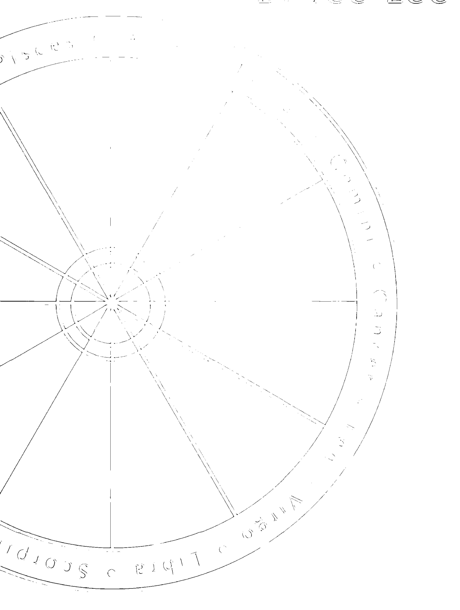

### 啟示了成功與落幕

李小龍，一個自稱絕不會說自己是天下第一，但也絕不會承認是第二的強者，閃耀在世界的舞台，他活了32年的短暫生命，對武術與電影的影響，一直至今未曾泯滅。李小龍是崇拜者心中的偶像，他也是唯一入選為《時代》雜誌評選為20世紀英雄與偶像的華人。可是，這樣的少年得志，他快樂嗎？

我們來看一下他的星盤（見圖9）。不用專業的解盤分析，大家首先試着用感覺去看，第一眼的感受是什麼？是不是不太舒服，有一種說不出來的壓力、撕裂、殺氣、混亂？重疊又重疊的紅色大三角相位，刺眼非常？

### 不易調適的內心恐懼

李小龍自許要成為天下第一。從他的12宮就可以看到，他內心的壓力有多大，這樣的壓力，驗證了他在離世前幾年，朋友發現他有精神失常的狀況，原因是，只要引動了火星，萬箭齊發，則金星、冥王星、木星、土星就會被牽動著，從而落井下石，加強火星帶來的不幸。假如他不能自我調適，就會心生恐懼。除此之外，他的12宮內都是凶星，水星代表他會借助藥物緩和情緒，但是他依然被死亡的恐懼弄得難以入眠。

有一派學説，將12宮視為福報與前世的宮位，而且從這裏可以看見一個人的前世因果與神明的因緣。不過，我傾向於用科學的角度去分析，將12宮當做是一個人儲存潛意識的地方，而所謂的過去，也就包括今天之前的任何時間，當然也可以包含前世。

*本星盤乃根據Astrology星盤繪畫

李小龍星盤中的凶相位構成重疊的大三角，顯示出他內心強大的壓力感。

| 十二星座 | 牡羊 | 金牛 | 雙子 | 巨蟹 | 獅子 | 室女 | 天秤 | 天蠍 | 人馬 | 摩羯 | 寶瓶 | 雙魚 |
| :--- | :--- | :--- | :--- | :--- | :--- | :--- | :--- | :--- | :--- | :--- | :--- | :--- |
| 守護星 | 火星 | 金星 | 水星 | 月亮 | 太陽 | 水星 | 金星 | 冥王星 | 木星 | 土星 | 天王星 | 海王星 |

### 飽受前生記憶的干擾

做夢是人在不須面對真實生活的發洩管道。所謂「日有所思，夜有所夢」，一些白天被壓抑下來的行為和思想，會伴隨着我們入夢，因此，心理學的研究，也就發展出夢占星的學説。我們看過許多名人的星盤，他們的12宮都不好，也許名人都要犧牲享受睡眠去成就大業。但從李小龍的星盤去看，他多夢，而且還會夢到很多奇奇怪怪的景象，由此可以窺視到他前世的記憶一直在他腦海裏揮之不去。有些人的星盤是12宮純吉或無星或簡單，這樣的人內心牽絆的雜音干擾較少，所以會比較快樂；人有煩惱，是因為有記憶，屬於記憶的星體是月亮，凶相位是負面的記憶承載著痛苦生命的痕跡，吉相位則表示這個人的感情豐富。李小龍的月亮在他潛意識的宮位，又是凶相位，這代表他內心的不愉快記憶令他精神層面的生活並不快樂。

### 生命中最大的負擔

李小龍英年早世，也許是他在潛意識裏的預感。他一直很害怕死亡，尤其是意外死亡，他的擔憂是千絲萬縷的瓜藤效應，牽一髮而動全身，就像是連續劇一樣，一幕接一幕地加強恐懼的效應，這也是因為他受到前世不愉快的經驗所影響，所以當一個挑戰掀起，其餘的就會一浪接一浪地衝擊着他。李小龍生命中最大的負擔是他的內心情緒，這種負擔轉變成壓力，有了壓力後心生恐懼、不安……是自然而然的事。現代的預防醫學在探討人類的健康時，發現身、心、靈是一體的，也就是說，身體要健康，先要有健康的內心，有了身心的健康，才能具備對靈性層次追求的能力。由這樣的邏輯推論，李小龍的內心並不健康，也許就是導致他身體出狀況的原因。假如他當年懂得尋求心理治療師的協助，他的壽命應該不止於此。

觀察李小龍的星盤時，讓人不舒服的地方是，180度的相位相纏又互相重疊，再與90度成三角相位，表示外來的衝擊，讓他亂了陣腳。雖然他的外在形象是強者，但從他的12宮的凶相可以看出他內心的脆弱，也許由他的背景可以理解他的自大來自於自悲。他從小體弱多病，173公分，不算高的身材，體重只有64公斤，他有一雙長短腿，1000度大近視，也許是因為本身先天條件不足，所以他要下定決心練就登峰造極的功夫，也只有這樣才能讓他感到安心，才能消除他心中的恐懼。

翻查李小龍的資料，他的嗜好是練武、閱讀、哲學研究、冥想、跳恰恰舞。從星盤中看，有關他的喜好，也與12宮有關。李小龍的內心混亂，冥想可以讓他安定，而且由於受到前世記憶干擾，他一直想要探討人生的哲理，閱讀自然是一種尋找答案的方式。代表武術的星體是火星，冥王星代表死亡，他的火星與工作的宮位有關，故此，他因為工作練武而死亡，應該就是將星體呈象直接翻譯成人世之事最精準、最直接的解釋。

### 離奇的死亡

1973年7月20日晚上10點後，他被發現死在女星丁佩的家中。對於他的離奇死亡，大家一直想要把神秘的面紗揭開。雖然香港政府簽發的死亡原因是「死因不明」，但在2006年2月，美國芝加哥驗屍官James Filkins在西雅圖舉行的美國科學院周年會議上，正式宣佈有關李小龍的死因報告，在這之前的各種傳聞，例如説他是因為藥物過敏致死、服用大麻、不當的練武方式、被下毒謀害、患有腦瘤……都是錯誤的，因為美國醫學界在1995年就確認李小龍實際死於癲癇猝死症（Sudden Unexpected Death in Epilepsy）。

其實，占星學對於癲癇症，或者是對於哪一種疾病的成因或致死的可能性，都有一套標準化的統計要求。如果以李小龍先天有沒有癲癇症來看，木星與天王星相差了可容許度的8度之外，所以在占星的領域上，並不能認定他有癲癇症，因為他的星盤不符合癲癇症的基本構成要件。他的遺體被驗出含有大麻，雖然我們找到代表沈醉於事物上的海王星，但那是呈吉的，這表示他也許有吸食大麻的習慣，但並未成癮，所以不至於對他產生什麼後遺症；傳聞中他有腦瘤，這也吻合占星學的標準答案，而且他的腦瘤有可能是惡性腫瘤。至於在醫學上的理論，患有腦瘤的人是否會引發癲癇，那就是屬於醫學研究的領域了。

### 生命之根本結

讓我們將時光倒流，回到1973年3月李小龍的星盤和流年木星的關係上（見圖10）。當年流年木星的位置在寶瓶座8度，驟眼看去，不用解盤，也能感受到天象仿如一支利箭，引動了主管死亡的冥王星，星盤上的工作事業以及本命同時受到最嚴重的刑衝，所以這個月份他將要面對人生中的意外關卡，若能過關，就能繼續存活。他的死亡可以說是因為流年不利引動的，但是每一件事都必定有其過程，所以，當我們仔細去看，就知道其實由當年4月開始，他就處於凶險之中，我們再看他在同年8月（圖11）、11月（圖12）的星盤，就可以發現流年木星對他的不利，一直要到1974年1月才遠離他，他的不幸之處，在於流年凶相位的影響時間很長。從星盤分析，他是死於意外，也就是非本命的壽命；而造成這樣的意外死亡，與他的工作事業有關，但最根本的死結，卻是他長期的內心壓力。所以，我相信香港政府當年在他的死亡證明文件寫上「死因不明」是有原因的，而並非刻意要隱瞞什麼。

體弱多病的李小龍自創截拳道，成為一代宗師，揚名國際，一生為武術與電影作出卓越貢獻，尤其他將中國武術搬上國際舞台，為中國人爭光，功不可沒，但是盛名也對他造成傷害。他的許多圈中好友透露，他在死前的幾年，精神就有些異常，時常無法調適自己，這就是他快速成名的壓力，他的體力和精力透支過度，所以便要依賴藥物提神。從星盤分析，李小龍為成名承受了太大的壓力（見第12宮），他並不因為成名而快樂，相反，盛名甚至成為他的負擔。

*本星盤乃根據Astrology星盤繪畫

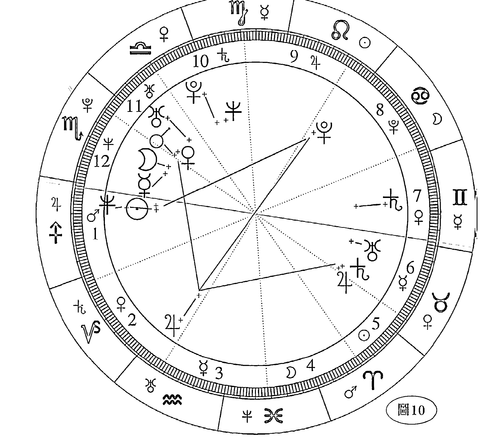

李小龍的1973年3月星盤。

| 十二星座 | 牡羊 | 金牛 | 雙子 | 巨蟹 | 獅子 | 室女 | 天秤 | 天蠍 | 人馬 | 摩羯 | 寶瓶 | 雙魚 |
| :--- | :--- | :--- | :--- | :--- | :--- | :--- | :--- | :--- | :--- | :--- | :--- | :--- |
| 守護星 | 火星 | 金星 | 水星 | 月亮 | 太陽 | 水星 | 金星 | 冥王星 | 木星 | 土星 | 天王星 | 海王星 |

*本星盤乃根據Astrology星盤繪畫

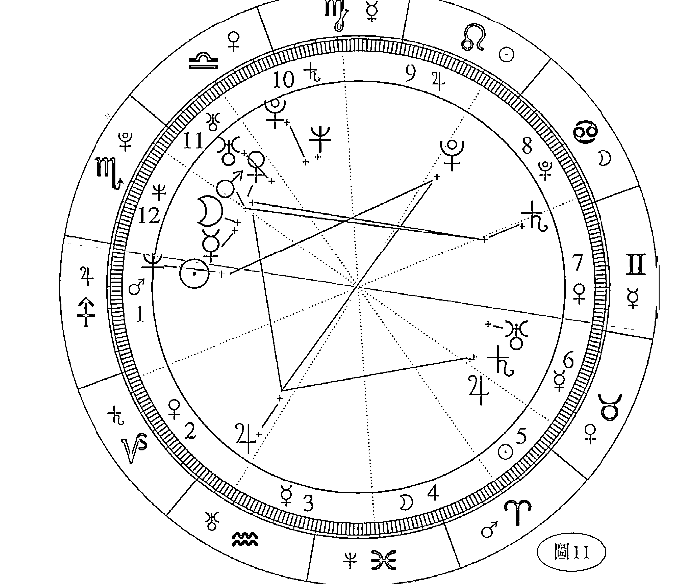

李小龍的1973年8月星盤。

| 十二星座 | 牡羊 | 金牛 | 雙子 | 巨蟹 | 獅子 | 室女 | 天秤 | 天蠍 | 人馬 | 摩羯 | 寶瓶 | 雙魚 |
| :--- | :--- | :--- | :--- | :--- | :--- | :--- | :--- | :--- | :--- | :--- | :--- | :--- |
| 守護星 | 火星 | 金星 | 水星 | 月亮 | 太陽 | 水星 | 金星 | 冥王星 | 木星 | 土星 | 天王星 | 海王星 |

### 超越金錢價值的成就

在李小龍的生命中有兩條吉相位，太陽代表電影事業、領導魅力，剛好落在他的命宮中，表示他選擇電影作為終身事業是正確的方向，因為太陽和冥王呈120度吉相位，就是說他工作時會全力以赴的意思。冥王是極端的0與100，凶相位是0，也就是說，凶相位是零的發揮，吉相位則做到最好。因此，李小龍做到100分的淋漓盡致，他在當時華人社會低迷的電影環境中，主演了幾部功夫片，便振興了整個電影市場。另一顆海王星所代表的意義，是他對自己的事業並不在意於功利層面，而在於發展個人理想。也許就是這種做事精神，感動了我們，也讓他超越了金錢價值的成就。

*本星盤乃根據Astrology星盤繪畫

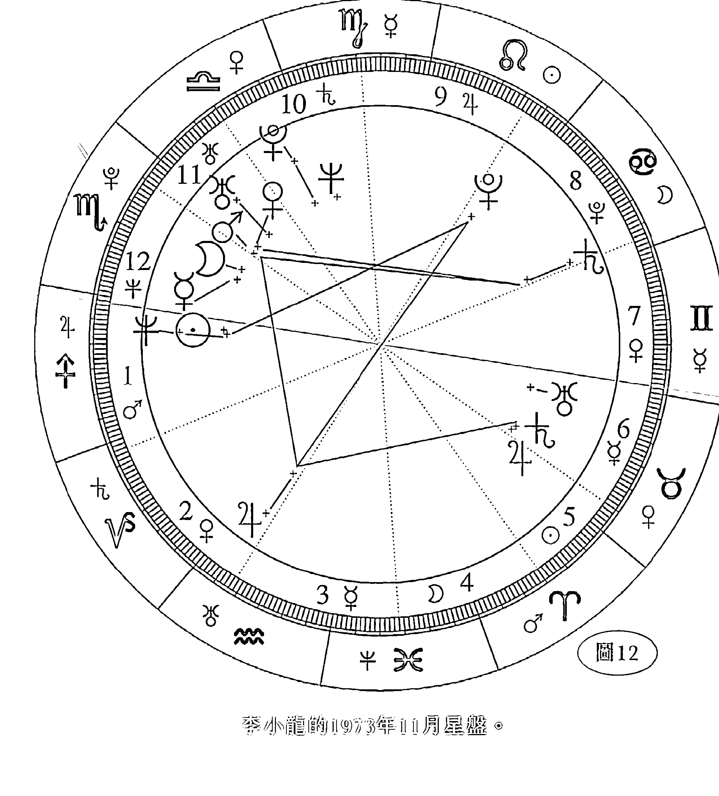

李小龍的1973年11月星盤。

| 十二星座 | 牡羊 | 金牛 | 雙子 | 巨蟹 | 獅子 | 室女 | 天秤 | 天蠍 | 人馬 | 摩羯 | 寶瓶 | 雙魚 |
| :--- | :--- | :--- | :--- | :--- | :--- | :--- | :--- | :--- | :--- | :--- | :--- | :--- |
| 守護星 | 火星 | 金星 | 水星 | 月亮 | 太陽 | 水星 | 金星 | 冥王星 | 木星 | 土星 | 天王星 | 海王星 |

### 為生命加油

我們用名人的案例，目地不是歌功頌德，而是希望我們可以學習站於不同角度上，了解別人的故事背後還有些什麼是我們可以借鏡的地方，為自己的生命加油打氣，因為只有拿開光鮮亮麗的外表看待事物，才能發現生命的真正內涵。

Bruce Lee

## 成龙
### Jackie Chan

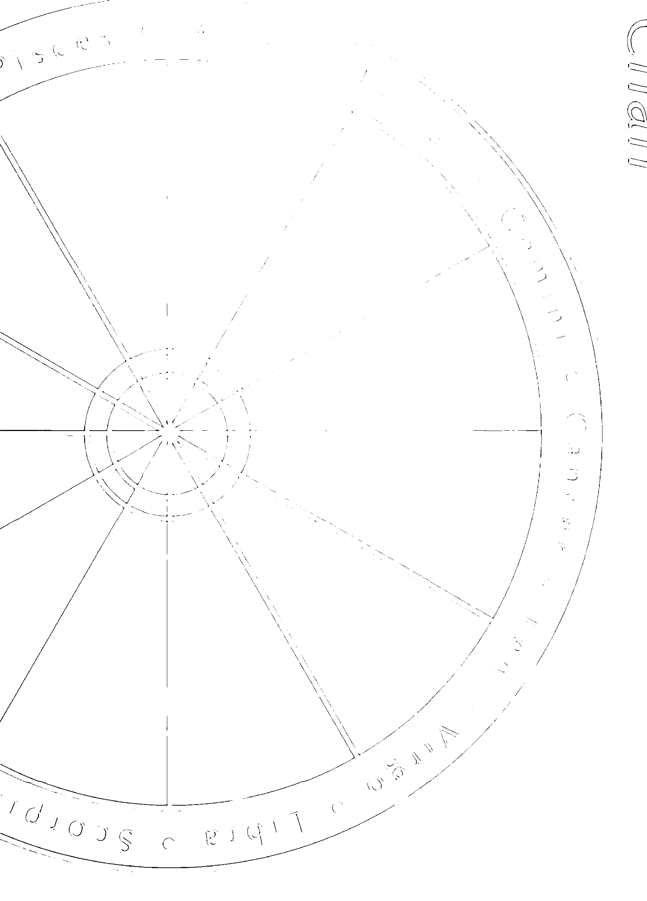

### 05 被上天寵愛的孩子
#### 一直受大運星保護的

70年代，李小龍用一身敏捷的身手，將「功夫」這個概念，承載着中國文化的思潮，成功偷運到西方的世界。他立志要為自己編織一個舉世知名的明星夢，讓他的故事璀璨而令人難忘。可惜，英雄的生命卻是如此短暫，整個故事在1973年走向最淒美處，然後畫下句號，讓每個人感到心痛。

跟李小龍有着相同的夢想者，就是現在擁有着無數中外頭銜的成龍。他在李小龍猝然過世後，崛起而成為了另一顆閃爍星星。由80年代開始，成龍用他個人創新的詮釋方式，付予「功夫」一個嶄新的內涵，奠定他日後成為「電影皇帝」的地位。

兩個不同年代的英雄形象，同樣耀眼於世界舞台，但彼此卻有着不同的人生際遇。李小龍的不幸人生與成龍的幸運際遇，同樣是要經過千錘百煉的意志與決心。但人生起伏的時來運轉與挑戰衝擊，一樣離不開天星在度移時必然產生的影響，只是李小龍他可以戰勝意志，以及挑戰身體的極限，但卻疏忽防範生命的重要關卡，這讓強者如他也要倒下來。

### 上天的寵兒

相較之下，成龍則像是被上天寵愛的孩子，自他生下來的那一刻開始，他的命宮與事業宮的守護星已在他星盤上為他作好安排，在冥冥之中，他有着比別人更多的幸運。自1978年開始，他一直受到大運星——天王星、海王星、冥王星輪流保護着，當其中一顆大運星離開了會合的相位時，另一顆大運星又會隨之而來，或者相繼一定會有流年木星與土星助長他的事業與本命的運程，這應該算是天生幸運，再加上他本人的後天努力，於是造就了他今日的成就。（見圖13）

在一般算命中，很多命理師都會為人批算大運。而在占星的領域，所指的大運就是用三王星論述。三王星運行的時間很長：天王星繞一周天需要7年，海王星繞一周天需要13.7年，冥王星繞一周天是20.7年至30年不等。換言之，如果三王星對一顆星體有好的影響，好運的時間會很長，就是一般大家所說的「行大運」，但相對來說，若三王星會帶來負面影響，則受刑衝的時間也會很久。

事實上，占星師很少會用大運星去為人占卜命運，原因是，當說到倒楣的事，因為時間太長，會讓命主失去了希望；試問有多少人聽到自己會走10年、20年衰運，仍會積極地面對以後的日子？

況且，如果是牽涉重大災難，便可以用流年木星，在可能發生災害的某些年份內，計算星度的吉凶，而由於時間的範圍縮小了，也就加強了它的精準度。例如，運用大運星的相位，計算出某人在7年內會有車禍關卡，命主豈不是要提心吊膽7年？但假如我們運用流年木星推算，就可以比較準確計算出在哪一年、哪一個月份要特別小心車禍事件。

如果要更準確些，還可以用月亮和太陽的相位推算出，在哪一年的哪一個月份中的哪一天，尤須格外小心。我想這是比較人性化的算命方式。

因此，除非是遇到在星盤上十星全凶的人（全紅線），我們才會用大運星為他做人生的規劃，目的是希望他掌握了大環境對他有利的大運年，把握到有利的時機，就可以趁勢而起。原因是，大運星的時間長，能影響10年、20年，於是如果對一件事可以堅持一段長時間的努力，則一分的幸運，加上九十九分的努力，一樣會有機會成功。

即使十星全凶，那也只能說是屬於大起大落的運勢，並不能斷定一個人一生注定失敗，只要運用大運星的相位關係，一樣可以為他找到人生的機遇。這個世界上只有兩種人，一種是懂得掌握機會，另一種是錯失機會的人。

在占星的領域，人生的格局有先天與後天之別。先天的是命格，這是最常見的算命內容，但後天是選擇，這也是生命最有趣的地方。

知命造運，就是找到星盤上最吉的地方，然後依循這個方向去努力，這也是命運掌握手中的意義所在。占星學的發展一直能夠與時並進，也是來自於這種生存的精神。人類處在不同的時代中，存活於無邊際的星空之下，領悟到自己應該用更開闊的心胸、更靈活的思維去進化生命，那是在超越自我障礙的勇氣後，才會產生的成功價值。

### 走對了的人生起點

成龍從影三十多年，少年不讀書，也不在乎自己不識字。6歲被父親送到于占元中國戲劇學院學藝，這是改變他一生的地方。這樣的人生起步，正符合他少年學藝的吉相位（見圖14），因為火星代表技術，與他的事業三合，也就是說，他要事業有成，就要靠技能，而非靠學識，所以小時不讀書並不影響他長大後的發展，只要他能具備技能，尤其是武術的才能，就能成就個人的事業。

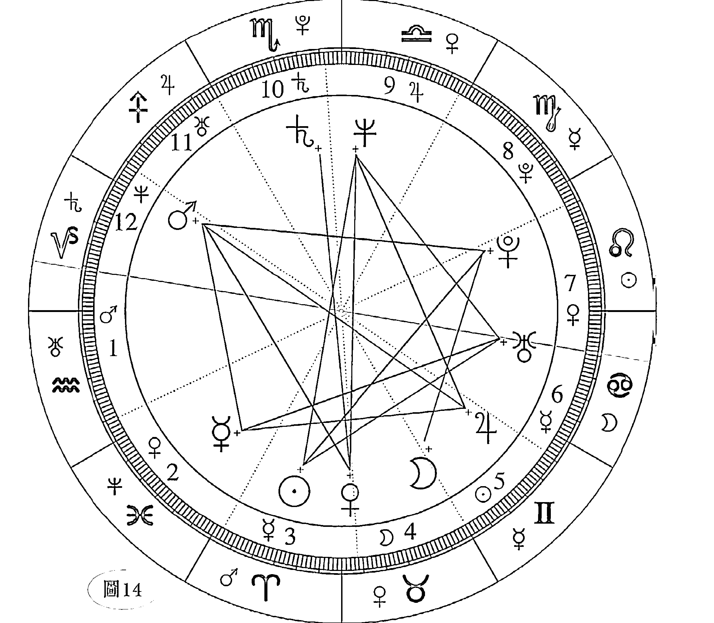

成龍星盤可見他以技藝起家、以武打成名。

| 十二星座 | 牡羊 | 金牛 | 雙子 | 巨蟹 | 獅子 | 室女 | 天秤 | 天蠍 | 人馬 | 摩羯 | 寶瓶 | 雙魚 |
| :--- | :--- | :--- | :--- | :--- | :--- | :--- | :--- | :--- | :--- | :--- | :--- | :--- |
| 守護星 | 火星 | 金星 | 水星 | 月亮 | 太陽 | 水星 | 金星 | 冥王星 | 木星 | 土星 | 天王星 | 海王星 |

### 大環境造就事業發展

成龍跟李小龍一樣，有著相同的先決條件，事業的發展是大環境所造就的機會。他們同樣適合從事將電影與武術結合為一的工作。冥日火三合，讓成龍佔盡了日後事業的優勢，當然這也是在他名成利就後，要分析他的成功條件時，回首往事才會有的領悟，他的成就是建立在他艱苦的童年，當時物質匱乏是大前提，他父親不得已地讓他到戲劇學院學藝。可是，當時誰會想到，這樣的人生安排，對他來說原來才是最好的培育方式。

冥王是成龍一生中最吉的一顆星，它同時守護他的事業與朋友的宮位。其實，占星師在解盤的運用中，對星盤上的十星要作如何解釋，並不是自由心證，憑空想像而來的，而是根據西方的占星字義匯集——《The Rulership Book》，在一定的依據下，將星體與宮位、星座、相位的關係加以解釋。所以，同樣是冥王，在不同的星度，會有不同的解讀，而占星學解盤的難度也在這裏，因為論斷吉凶的判斷，是星體的分析，而不僅是性格的描述而已。就像成龍，他的成就是誤打誤撞，因為家境清寒，自己又不喜歡讀書，父親也只能依他喜歡的武術為他安排去處，但假如他生長在富裕之家，大家覺得他有可能被栽培成為國際巨星嗎？也許太好命，反而是他生命中的障礙。

## 警察故事掀電影熱潮

成龍從影三十多年，也不是一開始就一帆風順。1975年，他主演新天地公司的兩部片子，票房收入慘淡。直到1983年執導《龍少爺》之後，才掀起電影史上的另一波熱潮，之後連串的警察故事一路順遂，到1990年的《飛鷹計劃》，都是3000萬以上的票房紀錄。

原來，他喜歡拍攝警察的故事，跟他與冥王相應有關。冥王在神話故事的解釋是蠍子藏身在暗處，在弱肉強食的世界裏，牠會一直忍耐，一旦不能再忍，牠會全力反擊而獲取勝利，而當牠躲在暗處的時候，暗中觀察的行為，與情報員、警察的調查、偵察工作十分相近，所以冥王在占星學上有代表警察的意思。

在成龍的星盤中，冥王與太陽有關，表示他的電影題材喜歡採用警察故事為主要的元素，吉相位表示這樣做會成功，冥王又與火星呈120度，亦表示電影中的武打動作會受到觀眾喜愛。

演藝事業的舞台是最殘酷的，因為觀眾一直都是喜新厭舊，難以討好的對象，要在演藝界大紅大紫很難，要紅個十年八年更難。論時間與空間的競賽，成龍能在過去30年間，攻佔了國際電影版圖，並能在時間的淘汰賽中屹立不搖，成為電影界的楷模，地位舉足輕重，這與他努力不懈固然有關，但是在他本命中，他運勢中大運接連地帶給他幸運，也是原因之一。

## 終身不棄的慈善事業

近幾年，成龍很重視慈善事業的推廣，這跟他事業宮前有一顆代表慈悲、奉獻的海王星有關。他自己也說，年少輕狂時賺到錢就是玩樂，但是當他步入中年，他開始反省自己。他能有這樣的轉變，是因為受到海王星的影響。三王星對我們的感應是，分別觸碰我們人生不同的身心靈的領域。天王星是一種理想的實現，有了這顆星的激勵，我們內心會很想作出方向性的重大改變，所以有些人會突然放棄一切，做了180度的調整，這是由外而內的反省。海王星則是剛好相反，那是由內而外的自省後，想要徹底改變自己。冥王星則是受大環境的變動，逼使我們不得不改變，有被動的時不予我的意味，以及在逼於無奈下，我們才要面對變動；但如果冥王與星體呈吉相位，那就是時來運轉的時候了，例如某些人能發上一筆國難財，就是類似的意思。

成龍的星盤，三合的位置剛好是他事業的宮位。1983年開始，是他要在電影事業往上爬升的時候，而三王星的運行狀態，是天王星在人馬座將要進入摩羯座之時，恰好與他的事業呈吉相位；接下來的幸運是海王星、冥王星，兩者仿如跑接力賽般加持着他在事業上的幸運；隨之，在2000年後又是另一個良性循環開始，直到2030年，這樣的循環還在。2030年以後，因為他會一直被三王星引動它生命中的海王星，所以慈善工作應該會是他直到老年都不會放棄的事業。

我們不難預測，世界上能終身享有輝煌成就的人，是萬中無一，我們必須要有一點幸運，才能展現長才。相對來說，也是只有俱備才華、才能，將機會牢牢地抓住，才能創造成功。成龍的幸運是，他的機運造就了他成功的環境，但是他個人的努力也珍惜了這份上天給予他的厚愛。

## 善待自己，延續光輝

不過，在這裏還是要從星盤的呈相給予他最客觀的建議：他先天的體質，骨骼、牙齒和皮膚是他最脆弱的部分，但是最需要保健的卻是他的大腦，將來的腦部退化有可能會為他帶來困擾，但若有事先的預防保健，就能將情況改善。

古代帝王積極尋求長生不老的仙丹，那是因為當他們擁有全世界之後，就會眷戀現實中美好的事物。我不知道名成利就的人是不是每個人都有帝王的心態，若真如此，就必須要「善待」自己的身體了。

從星盤上看，成龍並不十分注重自己的健康，對於身體，他甚至採取放任、傷害的態度，那是因為他對健康的看法有別於一般人，也許是他身體的先天自我修護能力太好吧！這也是讓他沒有養成養生觀念的原因。但是隨著年齡的增長，他那大而化之的性情便要改變一下了，有些意外的受傷其實是可以避免的，但因為他的不在乎，所以才會令自己受到傷害。

他的獨子房祖明在成龍的星盤上，證實了他的音樂才華。不過，如果祖明堅持要走自己奮鬥的路，那就辛苦了，建議他不如與父親的事業結合，會更有效地展現他的理想。其實，若果人生可以有更好的選擇，為什麼要固執己見呢？善加利用身邊的資源，會讓自己少艱苦奮鬥20年，這也算是惜福吧！

## 一生中的最佳情人

事業與家庭都得意的成龍，多年來時有聽聞他的花邊新聞，但也許他並不知道，這類負面傳聞，對他的事業只有傷害。

他一生中最好的情人，就是他的元配妻子林鳳嬌；他與太太的遠距離夫妻關係，讓孩子與母親更緊密相連，這可以從他子女宮的月亮得到了證明，過去如此，現在如此，將來也是如此。他要能發現這點，才能創造和諧美滿的家庭生活；他天生將事業放第一位的價值觀，也讓他錯失了太多家庭生活。

名利與親情也許無法放在同一個天秤上測量，但是在歲月中錯失的東西往往最令人遺憾，因為無法用物質彌補的心靈損失，才是最讓人痛苦的所在。

成龍自己承認，他曾經犯過全天下男人都會犯的錯誤。究竟這樣的錯誤能不能被原諒？因為他天生就喜歡美女，美對他是一種強烈的吸引力，也許因為他的身分和地位，這樣的錯誤終於被社會接納了。可是，在占星學上應作如何解釋？那可是科學得多。

星盤的吉凶原則，是有既定的依據的。所謂的吉事，就是做了一件事後，無論對錯，沒有後遺症者，謂之吉；如果一件事，即使是好事，事後會產生後遺症的話，則占星學便會論斷這件事就是凶相。因此，如果客觀地從星盤論述此事，成龍並沒有小老婆的命，因為大老婆用深厚的感情，限制了他小老婆長期的發展，所以，成龍若有花心的時候，最明智的處理方式，就是維持一段短暫的關係；以此推論，如果有一個女人甘願做他的小老婆，在他身邊苦苦守候，終究是會失望收場的。

## 小女兒的人生挑戰

在子女方面，如果不是人為的控制，成龍是可以有兒女成群的，但是土星的壓抑，就讓他在生兒育女上呈現只有一個兒子而已。至於他在婚外情所生的女兒，在他命盤上也早有她的代表位置——他命盤上的海王星就是代表這位小女孩。她遺傳了父親的明星氣質，但有些叛逆，在管教的過程中，母親必須多花心思教導，但叛逆的正面解釋是具有與眾不同的才華，所以，如果這個叛逆孩子可以獲得適當的引導，她的獨特潛質便會被激發出來，讓她散發出極度迷人的吸引力。成龍多了一個女兒，對他來說，並不是壞事，但對這個孩子來說，卻是比較辛苦。其實，對孩子比較好的自我認知方法，就要讓她主動多些關懷親生父親；相反，物質的獲得反而要隨緣些。此外，母親最好能夠讓她從小明白汲取知識的重要，讓她努力地培養學問，這也是對她的人生發展最實際和最正確的建議。人生在世，每個人都有自己必須要面對的挑戰，這就是人生有趣的地方。

## 回饋社會延續大愛

驕傲是幸運的人最大的天敵。我們知道感恩上天所賜的機緣，是因為我們擁有謙卑的內心。近幾年來，許多成功人士在退休以後以回饋社會為事業，中外皆然，蔚然成為潮流，這種情況都是受到海王星現在位於寶瓶座26度有關。

寶瓶座代表電腦科技產業；在過去十多年中，電腦科技成為世界經濟的主流，也是與天王星和海王星陸續進入寶瓶座有關。海王星處於目前的位置，讓這些科技業的龍頭心生退休與奉獻的想法，這是可以理解的。大運星除了影響一個人的大運運勢外，同時也主宰着世界的流行趨勢，所以，可以預測到了2011年，當海王星完全進入雙魚座後，這種慈悲風潮將會更明顯地成為主流的社會價值。

2011年，慈悲的星體進入了奉獻、犧牲象徵的星座，環保意識抬頭，人類將對過度的物質化生活開始反思，不僅純粹追求生存，而是要求高素質的生活環境，而環保本身就是一種大愛精神的延伸，所以，若用星體預測未來社會的發展，電腦科技的年代將會在2010後正式告別，取而代之的新世代，就是生化科技時代的來臨。

人類達到長壽的目的之後，進一步追求的就是以科學研究讓青春留住，這是醫學進步到現階段必然的發展。

成龍的人生與普遍人士一樣，都受到身邊事物的影響。20世紀90年代，由電腦科技龍頭人物主導着世界的潮流，到了21世紀，比爾蓋茲等鉅子提早退休，投入慈善事業，奉獻個人經驗，與人分享個人的財富，感動人心，也影響了後者效法，成龍是其中之一。這是很好的事，有了這樣的感召，雙魚座的年代會讓人類過得更好。

# 林黛

## Linda Lin Dai

## 06 一念之差的悲劇結局

中國五術有着五千多年的傳承，有所謂「一命，二運，三風水，四積陰德，五讀書」的老生常談的五種改變命運的方法。

一命要作何解釋？指的就是命運。老天爺從天上扔下一盤棋，考驗我們要如何下這盤棋，它的公平在於人人在同一個起點上，沒有人有絕對優勢，各人各憑本事，運籌人生的佈局，只要願意努力，在生命中便可以發生任何可能。占星學的發揮，在這裏的意義，便是讓我們掌握了流年運勢的起伏，懂得對運勢趨吉避凶後，就可以為自己增加些幸運，減少些傷害，以致可以決勝到終點。正因為人生的起點不圓滿，生命的過程才有了追求圓滿的企圖心。

## 改變命運的方法

五種改變命運的方法，為何將五術之法擺在前面，可見其重要性是有優先順序的。積陰德和讀書都是要用上較長的時間經營才有的成果，積陰德其實就是要廣結善緣，中國人都相信好心有好報的因果定律，所以一個人一生中有沒有貴人相助，可以用來驗證自己過去是否樂善好施。講到讀書，自古至今，眾多的成功案例已累積為經驗法則；經驗告訴我們，這是最有效改變命運的方法之一，所謂「十年寒窗無人問，一舉功名天下知」。一個明顯的例子，就是可舉當今台灣的前總統陳水扁，他出身於三級貧戶，因為很會讀書，考上台灣大學法律系，再以優異成績畢業後積極從政，從此改變了自己的命運，也改變了他上一代和下一代的命運。雖然現在看來這也許不是好事，因為終了他的8年總統行事作風與個人價值觀的偏差，最後淪落到成為階下囚，不過那是屬於另一個討論的議題了。

風水之說，可以說是五種方法中最偷懶、最短線的操作，它利用無形的運作模式，在空間上定出太極，吸元運，收天光來氣，配合天星的觀測，使時空結合，創造好運，所以整套堪輿的內涵就是時空的科學。利用這樣的吉凶轉換的風水法，可以改變一個人的運氣，用對了就是最有效的知命造運之法，不過，這些都必須要經得起成效的驗證，以辨真偽。改變了風水之後，如果沒有為人生帶來幸運，這就是失敗的「作品」，風水如同醫學一般科學，操作後只有兩個結果：有效或無效，這是每位風水師必須要面對的考驗。

## 勿讓今天變成明天的遺憾

中國人將整個五術架構在趨吉避凶的原則之上。這點為什麼這麼重要，讓中國人強調了超過5000年？究其原因，生命不能重來，我們每天都在決策當中度過，這是每個人所要接受的挑戰，一念之間，可以讓我們掌握到機會，也可以讓我們錯失機緣。更重要的是，我們不要讓今天做的事，成為明天的遺憾與後悔，但是，誰沒有迷惑的時候呢？這時候，占星學的運用就可以讓我們站在一個最高點透視全局，這是在我們遇到迷惑、無助、混亂的時刻可以借助的力量，因為只有當我們擁有清晰的頭腦，才會有智慧的判斷。我們要懂得如何選擇在對的時間做對的事，避免讓人生的憾事發生，才有可能達到自我設定的人生目標。

在這裏想要跟大家分享一首歌的歌詞，歌詞的內容應該可以代表以下我要介紹的人物的遺憾心情。讓我們也試着揣摩體會，他的遺憾究竟有多痛與無助！

這是由洪淑觀作詞的《你離去》：

> 你離去的那一天，全世界都關了燈
> 我的心開始流浪，帶着你給的創傷
> 你離去的那一天，天空也紅了眼
> 該怎麼告訴你，你還在我心裏
> 再多時間不能抹去
> 全世界的悲傷，都落在我肩上
> 就算用一輩子也不能遺忘
> 能不能再回到從前，再從頭好好愛一遍
> 不管多久，不管多遠，我要你再一次回到身邊
> 能不能再回到從前，擁有你最美麗的靈魂
> 我只要能夠，我只要能夠，再一次將你擁入懷中
> 為何無法挽回，才懂你對我的好
> 為何到了最後才知道
> 所有走過的路，不管痛苦與煎熬
> 只要是你給的一切我都想要

我想，這首歌的歌詞應該可以作為已故一代影后林黛的丈夫龍繩勳對愛妻的深情寫照，以及他對失去林黛的終生遺憾。

## 非凡的事業，美麗的愛情

林黛在電影事業的成就非凡，她能在短短幾年的時間贏得無人可以超越的閃爍光華，她曾獲4屆亞洲影后的頭銜。

感情上，林黛在1958年於美國哥倫比亞大學邂逅了眾人心中的白馬王子——前雲南省省長龍雲的兒子龍繩勳。1961年，這對讓人稱羨的金童玉女締結連理。1963年，她在紐約誕下兒子龍宗瀚。林黛的經歷有如童話故事一般的幸福，故事發展到此，對於林黛來說，應該是讓她感覺到人生一切美好的事物都眷顧着她吧！

這位在事業、愛情、婚姻都讓人羨慕到無以復加的巨星，為何會選擇在1964年7月17日，在跑馬地的家中打開煤氣及服食安眠藥自殺身亡，讓自己美麗的生命結束，讓深愛她的丈夫頓時掉進黑暗的世界，讓可愛的兒子失去母愛的權利，還有讓成千上萬的影迷心痛不捨？若林黛能夠看到這樣的結局，若生命可以重來，讓時間倒流到當時，她也許不會讓此悲劇發生。但千金難買早知道，一點都沒錯，很多讓人後悔的事，就是在做的時候不會想到後果。前文說過，生命不能重來，這是我們要謹記在心的事。

## 180度的人生大事

在這個世界上，沒有一個人跟自己是百分百相同的。在星盤上，1宮代表自己，7宮代表夫妻宮，它們是180度的關係。在占星學上，180度是衝的相位，可以解釋為合作夥伴，但也可以解釋為敵人，這決定於彼此是否會發生衝突；若在和諧的狀態下，那是資源共享的關係宮位，但一旦發生爭端，它不會像90度的「刑」，對立時的下手還會留有情面；180度的不和諧是直接撕殺的凶相位。所以，大家必須切記，婚姻絕對不可兒戲，它是人生的大事。

## 互補不足的吸引力

對於這一點，老祖宗說得一點都沒錯。許多中國的传统智慧流傳下來的，都只是結論，而缺少了對過程的分析，讓後人難以理解，以至令我們疏於重視。從談戀愛説起，男女之所以會發展成為親密關係，是因為遇到與自己截然不同的吸引力，才會認為對方魅力無窮；一個人面對異性而激發了觸電的感覺，就是因為找到自我人格特質互補的滿足，簡單的説法就是被新鮮感所吸引，但這只是在戀愛階段才會被認為是最重要的因素。一旦婚姻成立，新鮮感就不再是幸福的关键，因為彼此必須要學習適應對方，要放棄自己的某部分，挪出空間來接納對方成為自己生命的一部分，所以要成就幸福婚姻，單純有愛是不足夠的，更要懂得去經營兩人的關係。

在這前提下，學會妥協是十分重要的，所以中國傳統的習俗，男女雙方要結婚，兩人是否相愛並不是首先要考慮的條件，因為他們認為夫妻日後若能和諧相處，必然可以日久生情，所以先合八字才是最重要，而在合八字的過程中，也可以從兩人的命盤中找出未來的夫妻相處之道；此外，媒人要在事先作一個提點，讓雙方注意彼此個性上的禁忌，才不會踩到婚姻的地雷，這也許正可以為古時候的婚姻多能白頭偕老作最好的解釋。將這樣的經驗用於現代，婚前男女雙方用占星合盤，找到婚姻經營的方法，確實是可以為幸福加分；夫妻合盤並不代表兩個十星相同的人結婚才是好姻緣，而實際上這樣的機率也微乎其微，況且，根據統計，十星相同的兩人成為死黨知己的比例比較高，這是基於物以類聚的原理，但男女間的化學作用就偏偏是互補不足的吸引力，所以當他們走到婚姻的階段，相處的磨合才是愛情真正的考驗。

## 一念之差

林黛自殺，她結束的不止是自己的生命，同時是他丈夫、兒子一輩子的幸福。這對活着的親人來說，是最殘酷的折磨，而且在她過逝後，她的丈夫龍繩勳成為千夫所指的罪人。責備與悲傷整整壓在他心口43個年頭，但儘管眾多不利於他的傳言，說他花心、疏忽，都暗指他要為林黛的死負起責任，但他卻選擇在自己有生之年，一直保持沉默，將一切的指責都全盤承受，直到他在2007年離開人世。龍繩勳用他的一生說明了一切：他深愛着妻子，在43個斯人獨憔悴的歲月裏，他將兩人的愛巢原封不動地保持在林黛生前的模樣，甚至當年他為了要進入臥房搶救林黛被他踢破的房門，也讓它43年來保持着原貌，這裏是不是也透露了他的內心其實多想將時空凍結在當時的重要時刻，以見證他對愛妻一直以來的情深不變？

我想，如果當年林黛對丈夫的愛曾經因針鋒相對而存有懷疑，那麼時間已經為她作了最好的愛的見證。事實在林黛過世後，龍繩勳一直住在舊居，獨自養大兒子，終生未娶，這可以在林黛星盤上的夫妻轉盤，看出龍繩勳對她的愛是專一認真、忠誠不二的，他們的婚姻本身不可能有第三者，只可惜林黛本人並不知道，遺憾的是她還將一家人的幸福帶到悲劇的命運去，她當年的一念之差，竟然改變了整個故事的結局。

## 命中注定的天賜良緣

在林黛的星盤中（見圖15），7宮夫妻宮落在獅子座，代表她有嫁入豪門的機會，太陽的位置在她的心靈宮位，這可以解讀成，龍繩勳是她心目中的理想對象，這也是前世注定的因緣。但是因為林黛的12宮純凶，土星是壓抑，月亮是情感與情緒，所以關鍵是林黛的先天性格，她的心靈容易因敏感而被傷害，這也許與她有過顛沛流離的童年生活有關，但是她與龍繩勳的婚姻卻能給她一生中最缺乏的安全感。日與月是三合相位，但前提是，他們必須多些溝通，讓彼此的互信更堅定，讓他們之間的聚少離多，變得更甜蜜，因為太陽與天王星也是三合相位上。可惜，他們的婚姻並沒有走到這條吉相位，所以，命中注定的天賜良緣，卻因為兩人不懂得經營的重點，以致當他們在面對彼此的信任不足時，同時又處於新婚初期需要彼此學習適應與了解的時候，常常會因口角磨擦，破壞了原本的濃情蜜意。婚前兩人一點一滴所建立的愛的記憶，也會因為婚後磨擦增加，繼而對對方的愛產生懷疑，讓兩個原本相愛的人因誤解而不停爭執。

*本星盤乃根據Astrology星盤繪畫

圖15

| 十二星座 | 牡羊 | 金牛 | 雙子 | 巨蟹 | 獅子 | 室女 | 天秤 | 天蠍 | 人馬 | 摩羯 | 寶瓶 | 雙魚 |
| :--- | :--- | :--- | :--- | :--- | :--- | :--- | :--- | :--- | :--- | :--- | :--- | :--- |
| 守護星 | 火星 | 金星 | 水星 | 月亮 | 太陽 | 水星 | 金星 | 冥王星 | 木星 | 土星 | 天王星 | 海王星 |

## 錯失了的婚姻吉相位

以林黛的星盤分析，她的婚姻是幸福美滿的吉多於凶，但為何她卻為了與丈夫的一個爭吵而走上了絕路？那是因為他們走到婚姻中唯一的一條凶相位。土星代表林黛先天的脆弱心靈，與7宮中的月亮刑衝，也就是說她因為太愛對方，這反而成為她生命的死穴。她先天性格的情緒化，讓她比較容易陷於悲觀思想和鑽牛角尖，所以她的土星純凶，在她命格上就容易帶有厭世的想法。婚姻是她的最大的依靠及安全感的來源，但致命傷也在這裏，一旦這個部分潰堤，她會徹底被打倒，完全沒有招架能力。所以，如果林黛及龍繩勳在婚前可以多了解這點，他們的婚姻就能避免觸碰到一些危險禁忌，也許他們就可以走到婚姻的吉相位上，那絕對肯定是一段美滿幸福的姻緣。事實上，這也是全天下的有情人在終成眷屬後要引以為鑒的地方。

## 火星純凶的自誤誤他

我們看過許多讓人惋惜的人生故事，他們個人成就非凡，但並不代表他們的生命活得成功，原因是，名成利就靠的是意志力、毅力、才華、機運，但是生命的經營要運用的是人生的智慧。林黛的一生，最大的缺點是她缺乏溝通能力，尤其是與丈夫的語言暴力，是火星純凶，這說明了她的表達是直接、不加修飾地傷害對方，星盤也透露了引發他們夫妻爭端的一方是林黛自己，而她的12宮金星、太陽、水星都與火星相刑，代表她會因為對丈夫不滿、家庭關係、子女管教、個人事業發展、家庭經濟錢財管理等問題，而與丈夫爭吵，所以一顆星凶，牽一髮也可以動全身，而這些星都與12宮代表自殺的宮位有關，所以林黛很容易就會牽動起輕生的念頭。

占星學讓人可以趨吉避凶，方法是點出了命主的缺點，然後建議他要作出改變。以林黛的命盤，只要告訴她要改變說話的方式，要三思而言，言詞儘量溫柔婉轉，那麼，當她不再用言語傷害別人時，自己也就不會受到傷害了。

## 自我超越改變命運

人生可以從不同的角度去解讀，也會因為對生命態度的不同，而產生截然不同的結果。宿命論的人會跟着天性的路走，看見自己的星盤的命宮純凶，婚姻不好、事業凶險、子女宮有冥王相伴，就認命放棄；其實這樣的生活態度，不用算命也知道一定是命苦一輩子。但是，所有能讓人動容的成功、奇迹、自我超越，都是因為態度改變了命運。

我認為，就是因為人生要努力，我們才要借助占星了解自己，讓自己坦然面對生命不足的部分。只要願意改變，我們的人生就會有不一樣的天空；天生好命之人也不一定都是一帆風順，而不用面對挑戰的。

總之，每個人各有屬於自己的生命棋盤，雖然所遇到的障礙各有不同，但幸運之星必定會在每個人的星盤上閃爍光芒，只等着你去自我發掘。當然，趨吉避凶後，我們也可以選擇從星盤上的凶相位迂迴而行。

## 讓自己主宰生命

我們看林黛的星盤，她可以說是天生的好命之人，但是她因一念的偏激行為，讓自己成了悲劇人物。

所以，我們一定要相信，自己才是生命的主宰，命運並沒有命中注定這回事，星盤如果可以轉動心念，我們的世界將會不同。

Linda Lin Dai

144

# 附錄

Chapter 5

解說星盤前必需熟讀

# 解説占星学

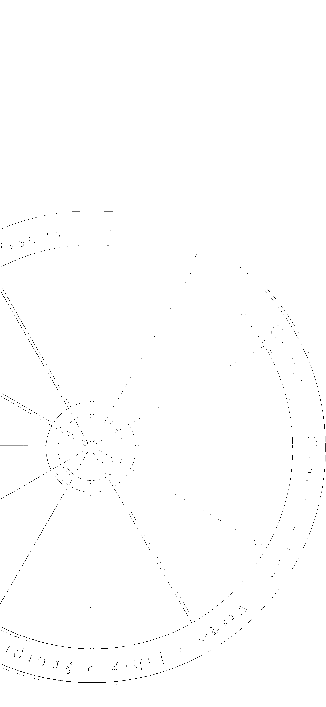

# 星盤的含意

掌握命運必須了解

對於占星學是一門科學的論述，中西方都有詳細的典章書籍的記載。影響中國占星學甚鉅的是司馬遷的《史記·天官書》，書中十分完整地将歷史上重要的天文觀測記載下來。自堯、舜、禹時代開始，將中國占星學發展的歷程蒐錄其中，由原本的只重視農耕，到後來被天象的神秘所吸引，資料豐富，引人入勝。西方在第一次世界大戰之後，著名的倫敦占星學分會（The Astrological Lodge of London，簡稱ALL）成立，1926年發行《Astrology Quarterly》季刊，它一直是西方占星界的重要刊物之一，是一本獲得高度評價，對占星學貢獻甚鉅的期刊。也因為這本刊物的誕生，使得占星學不再被誤解為純算命（fortune telling）的學問，而是經過多方學術的研究後，讓占星學發展到哲學、心理學、人類學的範疇。

② 1958年6月21日英國占星學會（The Astrological Association of Great Britain）成立，更刻意地將占星學朝向科學的路線發展，致力於統計學、深層心理學方面研究。

③ 目前最大的占星組織是1938年成立的美國占星家協會（American Federation of Astrologers），目的是鼓勵占星學所有科學性的研究，以及推廣和普及占星知識。

④ 堪輿之學的最高秘笈是天星擇日，正確應該是擇「時」。那是源自13世紀，元朝征伐阿拉伯地區，戰勝後在當地搜羅了不少天文儀器和占星書籍，影響中國採用回歸年制的曆法計算。朱元璋滅元後，任命吳伯宗對阿拉伯占星學進行翻譯，所以建立了一套完整的學問，內容涵蓋本命的論述、時事的分析、天星擇日，結合天地引動的選擇吉時出兵，對後世占星學的概念，有着深遠的影響。

⑤ 星盤結構：包括最外圈的12星座、第2圈的12宮位，以及10顆星體間的關係，再與流年10星做比較，便能就三方四正的概念推算運程起伏，是為完整的占星學。而太陽星座（坊間的12星座占星學）只是完整占星學的一小部分，其功能也有限，在占星學的理論中，吉凶判斷的依據是星與星之間的關係比較，以及以「會」、「合」、「刑」、「衝」為論斷吉凶原則。

⑥ 如果人生如戲，戲如人生，相位是引動吉凶判斷的重要依據，如同《The Only Way to Learn Astrology》所比喻，把行星當做是演員；星座如同是行星要扮演的角色，代表先天性格；宮位則是角色演出的情景，代表後天環境；星體猶如在星座與星體所扮演的演員角色；而相位是演員演繹戲中角色的方式。故此整個星盤結構是環環相扣的關係，就成為我們人生大戲的劇本。

⑦ 占星學與天文學500年前是一家，占星學要以天文學的學理為發展的基礎。其分別在於，研究天文是採用以太陽為中心的日心系統，而占星學則是採用以地球為中心的地心系統作為觀測點。

不同的占星學派對相位的採取角度都不同。本書所採用的是強勢的大相位，指的是000度（會）、090度（刑）、120度（合）、180度（衝）四種，俗稱三方四正。「合」是吉相位，以藍線表示；「刑」與「衝」是凶相位，以紅線表示；「會」是遇吉則吉，遇凶則凶，有加強的意思。本書所採的度數容許度是加減8度，在占星的世界中，星體本身無吉凶，吉凶的產生乃是來自星體與星體的相位比較。

太陽星座之所以盛行，是因為只有太陽星座不需查星曆表，也不需具備天文知識，可以輕鬆自學，也因為在學習上沒有負擔，所以普遍會將太陽星座視為占星學的入門知識。

星座是宇宙方位的代名詞，與東南西北的定位同義，再則她距離地球實在太過遙遠，以致她的引力對地球而言，可以很肯定的說是完全毫無感應，因此黃道12星座方位是：牡羊座（戌）、金牛座（西方酉）、雙子座（申）、巨蟹座（未）、獅子座（南方午）、室女座（巳）、天秤座（辰）、天蠍座（東方卯）、人馬座（寅）、摩羯座（丑）、寶瓶座（北方子）、雙魚座（亥）。

只有太陽系的星體，因為距離地球較近，當星體位移時，會與地球方位產生變化，科學上也證明了，星體的引力作用會對地球人類產生影響，如月亮運行影響潮汐漲退；狼人之説，乃是因為體內血液變化與月圓有關，當人變得亢奮衝動時，便會容易犯罪；太陽黑子會干擾地球電波傳導；地震的發生與木星、天王星與冥王互成90度角有關，歷史上有134次這樣的紀錄。

星盤的含意

①②星座屬性有二分法、三分法和四分法。

# 二分法：

陽性星座：牡羊座、雙子座、獅子座、天秤座、人馬座、寶瓶座

陰性星座：金牛座、巨蟹座、室女座、天蠍座、摩羯座、雙魚座

# 三分法：

基本星座：牡羊座、巨蟹座、天秤座、摩羯座

固定星座：金牛座、獅子座、天蠍座、寶瓶座

變動星座：雙子座、室女座、人馬座、雙魚座

# 四分法：

根據自然元素：火、地、風、水四象分類。

火象：牡羊座、獅子座、人馬座

地象：金牛座、室女座、摩羯座

風象：雙子座、天秤座、寶瓶座

水象：巨蟹座、天蠍座、雙魚座

星盤的含意

154

# 十二宮位

- (1) 命宮：第1宮代表個性、外表氣質、身材外型、人格特質。
- (2) 財帛宮：第2宮代表價值觀、收入、感情善惡、欲望、理財方向。
- (3) 兄弟宮：第3宮代表基礎教育、短期訓練課程、交通、表達能力、兄弟、平輩、心智。
- (4) 田宅宮：第4宮代表飲食習慣、家庭生活、不動產、父母、私人領域。
- (5) 子女宮：第5宮代表子女、娛樂、休閒、創意、戀愛運、投資。
- (6) 奴僕宮：第6宮代表工作、醫療、可醫治的疾病、職業、寵物、部屬。
- (7) 夫妻宮：第7宮代表合作夥伴、夫妻、婚姻狀況、競爭對手、敵人、人際關係、親密關係。
- (8) 疾厄宮：第8宮代表死亡、遺產、稅務、鬼神、性欲、命理。
- (9) 遷移宮：第9宮代表法律、高等教育、國外運勢、哲學、旅遊。
- (10) 官祿宮：第10宮代表創業、老板、長輩、終身成就、社會地位、名譽、父母、事業。
- (11) 福德宮：第11宮代表社團、朋友、應酬、政黨、選舉、願望。
- (12) 相貌宮：第12宮代表潛意識、夢境、宗教、內心世界、犧牲奉獻、退休、業力。

# 各星座司職的範圍

- (1) 太陽星座：外在的表現。
- (2) 月亮星座：情感的歸屬所在。
- (3) 木星星座：持續力的展現。
- (4) 土星星座：責任感的代表。
- (5) 天王星星座：對真理的認知。
- (6) 海王星星座：追求理想的渴望。
- (7) 冥王星星座：感情執着在乎的堅持。
- (8) 水星星座：影響思維表達能力。
- (9) 火星星座：行動力反應敏捷的判斷。
- (10) 金星星座：表達愛好情感的方式。

星盤的含意

156

15 占星師在解盤的運用中，對星盤上的十星要作如何解釋，並不是自由心證，憑空想像而來的，而是根據西方的占星字義匯集——《The Rulership Book》，在一定的依據下，將星體與宮位、星座、相位的關係加以解釋。所以，同一星在不同的星度，會有不同的解讀，故《The Rulership Book》對於解盤時了解星體的含義是很重要的工具書。《占星看天下》重點不在教大家解盤，日後另有專書詳述此部分。

16 運用占星學推算人生，區分是12宮位與12星座在10星運行下的144的10次方的可能，得出的精細度是計算機都無法計出來，因為4分鐘會是一個區別，再加上地理位置不同，更可以再進一步細分下去。紫微斗數大致只能區分51萬8400種變化。

# 星座的故事

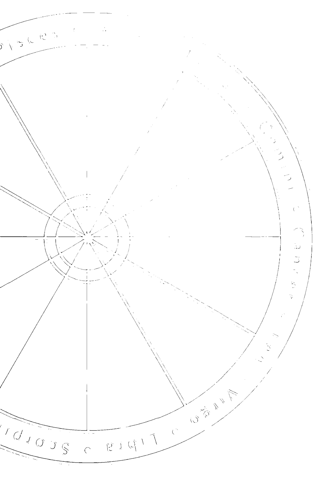

## 解讀星盤中的啟示

了解神話故事的含意

人類在沒有文字之前，幾千年的思維要如何流傳？東西方的文明，都是由神話故事承載着先人的事迹。也許我們對在童年裏聽到的「女媧補天」有過懷疑，但神話傳説確實是聯繫古今價值傳承的媒介。

遙不可及的天文、星辰，如何化成五術學理，運用到人事的趨吉避凶上？天與地之間的連結起源，無可否認，很多都是來自一則則的神奇傳説與神話故事。因此，21世紀的人類價值觀與文化思想，其實與愛神的恩賜、太陽神的威嚴都不可分割。

一個不可否認的事實是，神話是一個民族文化原始的意象，而其深層的結構，是一種代代相傳的價值觀與倫理規範。遠古人類沒有文字，靠的是口耳相傳地將生命智慧延續。於是神話故事、歌謠、詩歌，便成為了記載文明歷史的最佳工具。

我們談到占星學與人類文明不可分割。占星學的發展基礎，一直以來是以天文科學的學理為架構的基礎。科學與文化的結合，是先人在占星學中，運用智慧最好的示範。在占星學結構中，星座解釋就源自神話故事的聯想，不過，要在每一則動人故事的背後，或者在一個美麗傳説中，我們要找到解答生命的啟示，卻沒有既定準則。但經驗是由錯誤中累積而來的。

下文是12星座神話故事的概述，希望可以幫助讀者自我領悟解讀星盤的靈感。

# 牧羊座

牧羊座的神話故事是在說，賴波特之子菲立瑟詩蒙受了不白之冤，被判死刑。臨行刑前，有一隻金色的公羊將他和他的妹妹救出。但公羊卻因為疏忽大意而將菲立瑟詩的妹妹摔到大海淹死了，結果只有菲立瑟詩安然獲救。菲立瑟詩為了表達對公羊的感謝，便將公羊獻給宙斯當祭品（在神權時代，能成為祭品是神聖的榮耀）。宙斯於是將公羊化成天上的星座。

牧羊座由神話故事所衍生的含意，包括：主動、積極和行動力的正義象徵。牧羊座是行動的星座，但是具有衝動的特性，致使她熱心助人的優點，往往因為她的粗心大意而將事情搞砸，甚至傷害自己與別人。因此，在星座含義中，牧羊座也有被犧牲的特質，「烈士」是對他最好的形容。

所以牧羊座的基本意義包括：開創者、勇敢、熱忱、處事果斷明快、態度積極、具有旺盛的企圖心。缺點是：虎頭蛇尾、粗魯莽撞、爭先草率、自私自大。

# 金牛座

金牛座的神話故事是，素有風流見稱的眾神之王宙斯愛上了歐羅巴（後來化身為歐洲），他為了隱瞞天后海拉的耳目，便將自己化身為白牛背馱着歐羅巴偷情，宙斯回復原形後，則將化身的大公牛放在天上，成為金牛座。

因為這個神話故事的緣故，金牛座常常被人誤解為好色之徒。其實，金牛是風流，但會堅守本分。

金牛座象徵的意義，是來自「牛」的特性，所以她是忍耐力、堅持保守、圓融穩定的代表。由於她屬於陰性星座，她也受被動、消極特性的影響。

金牛座的人會因為過於實事求是，而容易錯失良機。在投資理財上，有一種說法，如果投資氣氛已濃厚到連金牛座的人都入市了，那就表示到了全民皆股的情況，換言之，就是預警市場已到了拋售的時機。

Taurus

161

# 雙子座

雙子座的神話故事是，全能的神宙斯，他被斯巴達王后的美貌深深吸引，於是化成天鵝與她約會，不久，王后生下了雙胞胎兄弟，兄長波個克斯擅長劍術與騎術；而弟弟卡斯托則擅長拳擊，兩人在戰場上是合作無間的親密戰友。當弟弟死後，兄長傷心不已，宙斯便將他們的形象掛在天上，成為雙子星座。

星座神話故事衍生的象徵含意是：多才多藝、雙重性格、多變不穩定，但也是才智雙全，是一個人的心智能力、記憶力的代表。

解讀星盤中的啟示

162

# 巨蟹座

巨蟹座的神話故事是，宙斯的風流終於讓天后海拉無法忍受。她的猜忌與焦慮，使她禁不住要對宙斯與人類所生的私生子海力克斯施加詛咒，令他失去理性地弒殺妻子，犯下重罪。海力克斯為了彌補自己的罪行，便接受天后海拉提出的12道難題考驗。其中一項是，他必須殺死亞密莫涅水湖中的大水蛇，天后一心要海力克斯戰敗，便派遣巨蟹幫忙，但巨蟹卻在打鬥中被海力克斯踩死。於是，天后便將巨蟹化為天上的星座。

故此，巨蟹座也代表海拉的焦慮、猜忌、向丈夫的情婦報復的負面情緒，也就是說，巨蟹座與情感、感情的事物有關，而一個人充沛的情感也蘊藏在此。

由此引伸，巨蟹座性格強烈的人，並不是一個容易被取悦的人。其主要特性是，內心情感豐富，但不輕易接近陌生人，不過，一旦認定對方是自己人，便會傾向積極付出。所以，她也是多愁善感、家庭觀念重及母性的象徵。

Cancer

# 獅子座

獅子座的神話故事是，天后海拉一直不滿宙斯的風流，一再向其私生子海克力斯施加報復，一共出了12道難題要海克力斯接受考驗。第一道難題便是要他與森林中的人獅激戰，但結果獅子被勒死，宙斯便將獅子化為天上星座。

獅子座的含意，來自獅子乃是萬獸之王、具有王者風範的代表。獅子不時會大聲吼叫，是因為要消耗飽食後的過剩精力，這也是獅子座的人會用嘶吼宣洩鬱悶情緒的原因。

太陽是獅子座的守護星，太陽的萬丈光芒，也代表誇張特質。由於本身條件優越，有時難免會表現過於樂觀、浮誇。不過，在神話中的太陽神阿波羅，其地位僅次於宙斯，亮麗耀眼的外表是他的最佳武器，他不僅是美男子，也是奧林匹克的勝利者。因此，阿波羅代表光、力量、聖潔。

解讀星盤中的啟示

164

# 室女座

室女座的神話故事是，農神之女被冥王捉走而使大地枯萎。於是，眾神懇請宙斯與冥王協商，釋放農神之女回到人間，讓大地回復生機。冥王答應了宙斯的要求，農神之女得以重返家園，而她往返冥界與人間的寒暑變化，便產生了四季。

室女座的特性是一個追求完美、至真、至善的心靈，她受時序的感應，成為一位務實的默默耕耘者。故此，有關勤奮、貞潔、細心、服務等形容詞，都可以與室女座連上關係。但是，也有可能因為她的心思如秀髮般纖細的特質，而給人難以捉摸的感覺。

# 天秤座

天秤座的神話故事是，正義女神手持天秤，來到人間肩負法官的職責，為人間做善惡的裁決。但當時人類的慾望高漲，罪案不斷。慈悲的女神為了挽救人類免於墮落罪惡深淵，一再與眾神爭執，但依然得不到人類的覺悟悔改，於是正義女神在絕望中決定重返天上。

由神話故事衍生的星座含意，便是有正義女神化身的意思。她同時具備美麗女神維納斯的特質，以及仲裁者的象徵。公平、公正、中庸等相關的字眼，都可以用來代表天秤座。

解讀星盤中的啟示

166

# 天蠍座

天蠍座的神話故事是，海神與亞馬遜女王生了一名兒子——歐力昂。歐力昂是一個自大粗魯的巨人，常自誇是天下最強的強者，因而引發奧林匹克諸神的憤怒與忌恨。於是天后海拉便派遣毒蠍子埋伏在石洞中，最後毒蠍成功暗刺歐力昂致死。毒蠍受到諸神稱讚而成為天上星座，而獵人歐力昂死後也成為獵戶星座，位置剛好在天蠍座的正反面，也就是說，天蠍座與獵戶座兩者處在一個永遠老死不相往來的敵對狀態，當天蠍升起，獵戶便西沉。

在整個故事裏，天蠍能夠毒死世上最強的人，乃在於天蠍的埋伏與計謀。所以，天蠍代表的是強者的剋星，也標示着為達目的，不擇手段的城府。可以説，天蠍座是一個令人難以理解與洞悉的星座。

天蠍所代表的個性是沉着、專情又無情，但卻執着於感情的善惡，所以，當天蠍的愛人是最幸福的情人，也是最危險的失戀者。天蠍的強烈佔有慾，是愛之欲其生，恨之欲其死的極端態度，得不到便是容易走向玉石俱焚的報復。

Scorpio

168

天蠍的優點是無人可比的一針見血的洞察力，所以她是一個具有神秘氣息的星座。她所象徵的情緒包括：熱情、力量、專制、妒忌、憎恨與復仇。

解讀星盤中的啟示

# 人馬座

人馬座的神話故事是，相傳象徵不朽與高貴的人馬獸——凱倫，是一位文武雙全的大學者，他博學多才，飽讀各類知識，又擅長狩獵，更是精研醫術與預言，亦不吝於將所學傳承他人，於是深受人類尊敬。但不幸地，凱倫在一次戰役中被毒箭刺傷大腿而死亡，全能的神宙斯為了痛惜凱倫之死，將他化為天上星座。

這個神話故事啟發了我們對人馬座的認識，有關凱倫的特性——高貴、博學、哲學、學習、允文允武、腳傷、崇尚自由、人與獸的半獸半人的獸性與人性，都是正確的聯想。

人馬座最大缺點是，具有如野馬奔馳草原的野性，過度追求大自然無拘無束的生活，而給人不負責任的感覺。神話中，凱倫因自大而輕忽細節，被暗箭刺傷大腿致死，這正好提醒了人馬座的人，失敗大多來自於過度自信。她也是12星座中，失敗次數最多的星座。人馬座象徵著哲學、道德、理想、教養高等特質。

## Capricorn 摩羯座

摩羯座的神話故事是，相傳牧羊神潘恩擅長演奏橫笛。在一次音樂饗宴中，潘恩為諸神演奏時，引來了怪獸前來聆聽，這突如其來的打擾，嚇得諸神倉皇逃跑，只剩潘恩繼續沉醉在自己的樂聲之中。當諸神都已經化魚逃入河中，潘恩才驚覺不妥。但是，由於他在情急中逃走，因而誤入淺水，以致他上半身還保留着羊身，只有下半身浸入水中的部分化為魚身；宙斯看見這怪模樣覺得有趣，便將摩羯座化為天上星座。

由這則故事可以得知，埋首苦幹、專注認真，可以是摩羯座的特質。所以，摩羯座是代表責任、使命、秩序的星座。但是沉醉於自我的旋律，延伸至過度埋首於工作之中，便是他不了解大環境變化的最大弱點。

## 解讀星盤中的啟示

摩羯座的正面象徵是：穩重、辦事能力高、責任心重、可信賴、專注、秩序；但負面的解釋，也代表了頑固、憂傷、冷漠、墮落、遲緩與困難。

## 寶瓶座 Aquarius

寶瓶座的神話故事是，傑尼梅特斯是諸神公認的美男子，在一次天神酒宴中，因侍女未能參加，宙斯便邀傑尼梅特斯代替，自此以後，傑尼梅特斯便長待宙斯身邊，成為天上星座。

由於傑尼梅特斯所斟的酒是代表眾神的睿智之源，因此寶瓶座的含意是，代表神的預知力（推理）和發明（科學）的智慧，配合寶瓶座本身屬於風象元素，風為氣，也同時象徵人類的智慧與思維，所以他也代表人類的智能。

寶瓶座特性強的人，一生都會致力於為理想而奮鬥，擇善固執，所以容易給人離經叛道、異於常人的感覺。他可能是一位天才，但不一定具備在商業社會中成為人才的條件，因為他的價值不在於商業利益的考量，而只是忠於個人理念的實踐。

寶瓶座的象徵意義是：科技、新知、發明、改革、個人的希望、人類的天性。但自我矛盾時，也會產生背叛、反叛、謀反、革命的行動。

## 解讀星盤中的啟示

## 雙魚座

雙魚座的神話故事是，維納斯與邱比特兩人，有一次被巨人泰風追逐，兩人為了逃生，雙雙跳入幼發拉底河中，化為魚身逃走；兩人為了免於被河水沖散，便以皮帶互相綁在一齊。後來宙斯為了記念這件事，便將這兩條魚化為天上星座。

維納斯是美神，邱比特是愛神，這則神話所暗喻的意義，就是雙魚座代表了美與愛的象徵，同時也代表藝術與感情並重。但是，兩神的逃離行徑，反映出雙魚座的逃避本性，願意隨波逐流的隨緣性格。

故此，由神話推演的雙魚座象徵，包括：藝術、舞蹈、同情心、慈悲關懷、慈善事業、逃避、內心最深處的感情、混亂、捕魚、海洋、宗教信仰。

占星學的存在價值，在於它能從每個人的星盤中找出吉凶星相 — 知命。當我們掌握到趨吉避凶的啟示，便可以打破宿命的觀念，重新認識自己，擴闊人生視野，為自己找到成功的方向，讓自己活得更充實、更燦爛、更有創意 — 造運。

作者黃楚楚是資深傳媒人，她在書中引用了不少名人案例，當中包括全球矚目的美國新總統奧巴馬、電腦巨人比爾蓋茲、港台商界超人李嘉誠及王永慶、影壇傳奇人物李小龍、國際超級巨星成龍等等，他們的成功背後，不一定是吉的星盤呈相，但他們卻能憑着個人的努力扭轉命運，成為舉足輕重的知名人士。這多少能給我們帶來一些啟發。

作者對現代人未能知命，或是知命而不能造運感到惋惜和不捨，撰寫本書的主要目的，乃是希望透過占星學問，與讀者一起探討如何追求更美好的人生。
