# 占星芳疗

## 推荐序

这本书展现了「由上往下」和「由下往上」的双重路径；不但从行星律动来爬梳自身的生命脉络，也透过微型的药草精油仪式，让个人能量不断进化，拓展到大宇宙层次，可说把芳香疗法和神秘学间的「共时性」发挥到极致。

—— 芳疗天后 Gina 许怡兰

《占星芳疗》将占星魔法与精油魔法完全整合，也对于古典及现代占星因年代演进所产生的历史性差异做出细腻剖析，再将医疗占星与各种药草结合女巫配方，统整出十二星座、十二宫位各自所适用的魔法秘方；尤其将十二星座最容易遇到的心境难题，搭配掌管情绪的月亮星座魔法精油，完全可以让读者轻松地使用配方自行调油，引领大家运用占星芳疗来面对人生的各种酸甜苦辣，值得推荐给喜欢占星及香气疗愈身心的你！

—— So Good 塔罗牌馆 Ricky Otis

行星属性是药草学的重要主题之一，透过《占星芳疗》的介绍，对照个人星盘调配药草香气便有所本。

—— 芳疗与香草生活保健作家 女巫阿娥

不得不佩服植物系女巫—— Claudia 老师，能精巧的融合两大知识结构，占星学与芳香疗法。以浅显易懂的方式，结合行星、星座、宫位和精油特性，描述人类最感兴趣的恋爱运、财运，以及情绪心境难题。书中的十二星座女巫手作配方也相当实用喔！

—— 御养生企业，药师、芳疗师、占星师 石明立

## 作者序

神祕學除了為人們解開宇宙的奧秘，也能成為療癒人心的工具。一開始成為占卜師的我一直在思考，有什麼方式可以讓個案在離開工作室後，還能把諮詢過程中的美好感受一起帶走，甚至讓效果延續更久，於是便開始尋找除了諮詢以外的實質方式，當時想起自學生時期就療癒我至今的愛好——花草茶與料理。由於料理在塔羅占卜的場合中難以實現，我轉向尋找其他更方便、又能運用植物能量的療癒方式，直到與芳香療法相遇。

芳香療法顧名思義即是以氣味帶來效果的療癒方式，不僅美好浪漫，也是最能吸引女性的植物療法，且運用廣泛，加上近年取得精油愈來愈容易，我便一頭栽進了精油療癒與魔法結合的研究之路。

僅單純學習精油，似乎太可惜，畢竟能量與身體效果無法分開來看，擁有基礎知識才能在運用上更踏實、更安全，在思考配方時也有更多線索，為此我打從精油學習之初就從證書之路下手。

過去精油的學習書籍以身體與情緒效果居多，近年出版的類型開始愈發多元。精油愛好者對精油的使用方式不再僅關注情緒與身體效果，有愈來愈多關於魔法與能量運用的書籍上市，市面上已有不少著作記載著不同星座連結不同的精油，不同元素連結個別的精油也不乏國外大師的作品。這些表單成為讀者調油時的速成參照。但不少學生閱讀的同時也開始疑惑，「為什麼射手座對應到的是佛手柑？」、「每個星座相關的精油這麼多種，該如何挑選」、「作者當初連結星座與精油時依據的是什麼」等種種困惑，就和我自己初入精油魔法的世界一樣。這些都是配方書沒加以解釋的部分，卻是可以創造配方，以及帶來更多驅動能量的關鍵。

如同料理，我們可以依據食譜的配方作出美味的菜餚，卻不容易再去創造新配方。想精進只好收集各種配方，不斷試行錯誤，這時若有老師剖析箇中原由，便可更快掌握關鍵。魔法與單純料理二者截然不同，「意念」是關鍵元素，調配者若清楚意識到每個單方在配方中扮演的角色與其發揮的作用，能更有效的驅動魔法顯化，並為各個單方帶來更好的協同效果。

本書中的各項星座、魔法與精油連結，皆是我自學習精油以來反覆嘗試與研究的結果，希望為讀者解開精油能量使用的秘密，引領入門讀者運用精油顯化財富、愛情的願望，並依據星座需求調整情緒，同時也能帶給進階讀者未來閱讀相關精油配方書時，有更多的理解與感受。

## Part 占星、魔法與芳療

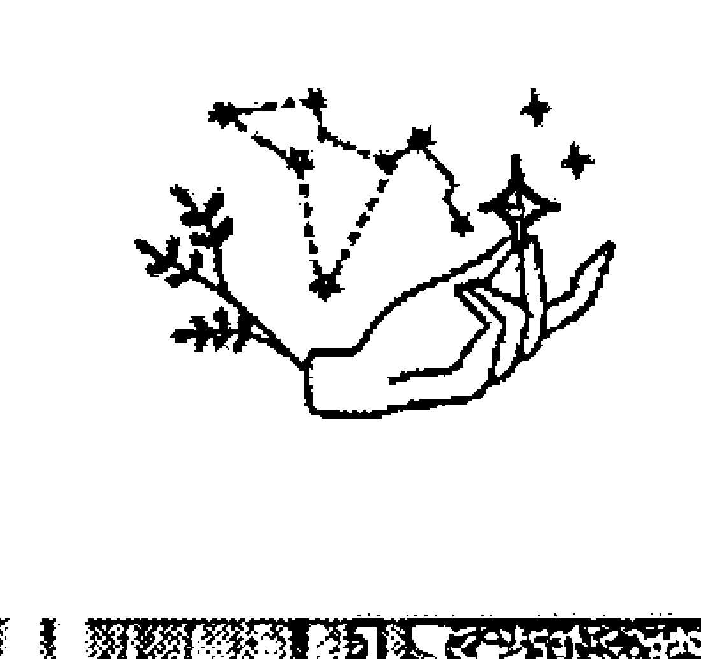

## 星座與植物的連結——淺談醫藥占星

現代化學醫藥出現前，無論東西方都是以草藥治病。東方講五行——金木水火土，搭配經絡理解身體的運行並解釋疾病；而西方則是主張構成世界的四大元素——地水火風，並在大小宇宙相互輝映的哲學觀之下，立定七大行星與十二星座掌管人體各個系統與器官。東西方各用著不同切入點去理解世界的運作。我們非常幸運地活在一個能同時吸收東西方知識的年代，除了為台灣人熟悉的中醫藥體系外，目前芳療所用的精油仍是以西方常見植物為大宗，藉由這些精油植物，讓我們能一窺西方自然療法的面貌。

眾所周知，古代相信疾病來自鬼神的影響，在那遙遠的年代巫術、魔法與醫療尚未分家。雖然現代魔法歸魔法、科學歸科學、醫療歸醫療，但是在當時，人們以植物治療身心靈，甚至施法祈願。

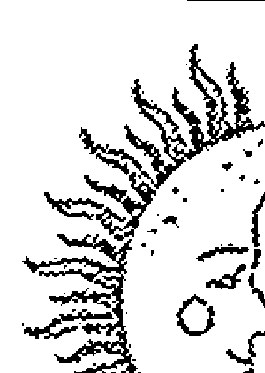

人類何時開始以系統化的方式觀星已不可考，但我們現在看到的占星術雛形早在西元前1650年左右就已產生。而將占星術與醫療結合竟是有著「醫學之父」之稱的希波克拉底。他根據占星論理將人的體質區分為「膽汁質」、「多血質」、「黏液質」與「黑膽汁質」四種類別，其所提出的四體液學在近代醫學理論發展之前，曾在西方醫學中佔有主導地位。換言之，過去的醫生除了依據病症外，還會藉由占星術來判定病因、病程與用藥的類型，這絕對是現在難以想像的事。而當時開出的處方除了藥草植物，甚至還有水晶、礦石等等魔法道具。

物換星移，古希臘、羅馬時期的知識隨著亞歷山大大帝的征戰進入中亞，六世紀之後阿拉伯文明的黃金時代繼承這些智慧，並使之發揚光大。因此若要談占星與芳療的關係，就不可不提到阿拉伯學者伊本·西那（Avicenna），他是位優秀的醫師、占星師及煉金術士。他改良古代煉金術所用的蒸餾器，利用蒸餾的方式提煉玫瑰等精油，形成後來芳香療法的基礎。

現代的芳香療法除了以科學的方式應證精油所帶來的肉體療效，其香氣與能量對情緒與心靈帶來的效果也是許多人感興趣的範疇。一個完整的人無法將身、心、靈切割開來看待，因此在精油使用上若將肉體效果、情緒影響與靈性能量完全分開來看各別效果，不但可惜也不完整。因為三者一直是交互影響彼此。

大多數的芳療書籍載明身體與心理兩大效果，而靈性與能量層次的功效在台灣出版的書籍則較少出現。偶爾會出現小小的欄位裡簡略介紹精油所連結的行星，也讓讀者摸不著頭緒。其實這些行星連結便是來自過去醫藥占星對植物、礦物的分類。而這些分類脈絡大多參考自十七世紀英國藥劑師兼藥草學家——尼可拉斯·卡爾培柏（Nicholas Culpeper）的著作。他將一般民眾難以理解的拉丁文醫書翻譯成大眾皆懂的英文，書中也清楚標示各種藥草的行星屬性分類。然而植物會因使用部位、使用方式產生不同的效果，將藥草植物當成茶湯內服或濕敷外用，甚至是萃取成精油所產生的個別變化，導致現代芳療師在界定植物行星屬行時各有見解。一部分植物依循尼可拉斯·卡爾培柏的分類；一部分自行歸類。這些差異在我剛開始學習占星芳療時十分困擾，然而更深入了解占星中各行星的特質以及實踐後，對植物的能量分類便愈來愈有心得。

在科學至上的年代，魔法甚至是能量被當成過時的迷信。現代醫療理論稱霸學界後，希洛克拉底的四體液學說完全被取代而沉寂。直到二十世紀後半才因整體療法（Holistic therapy）出現而被看見。有人說諸如芳香療法與順勢療法這些替代療法開始受到歡迎跟小行星凱龍星被發現有關。現代占星師不再像過去崇尚宿命論，而是著眼於心理層次，並參考及出版更多研究心理占星的書籍。心理與情緒的療癒正是芳香療法的魅力所在，對精油使用者或芳療師而言，占星能幫助你理解世人的內心，並找出脈絡。反之，我們也可以依據個人的星座命盤找到幫助我們調整情緒和實現願望的植物。

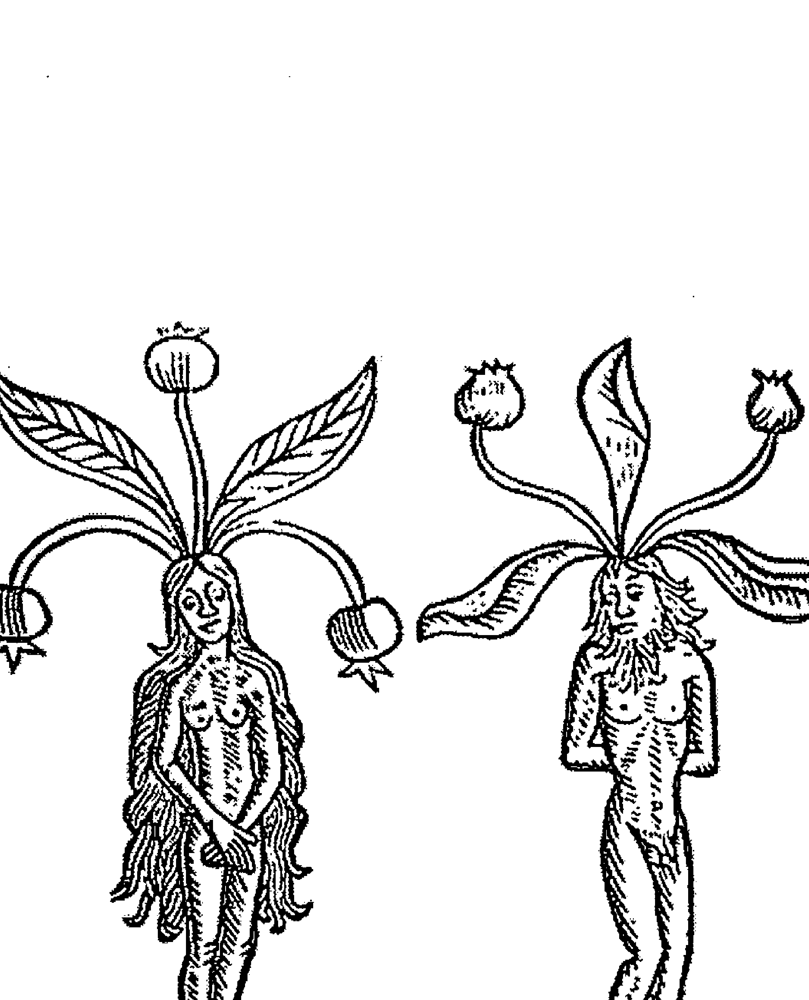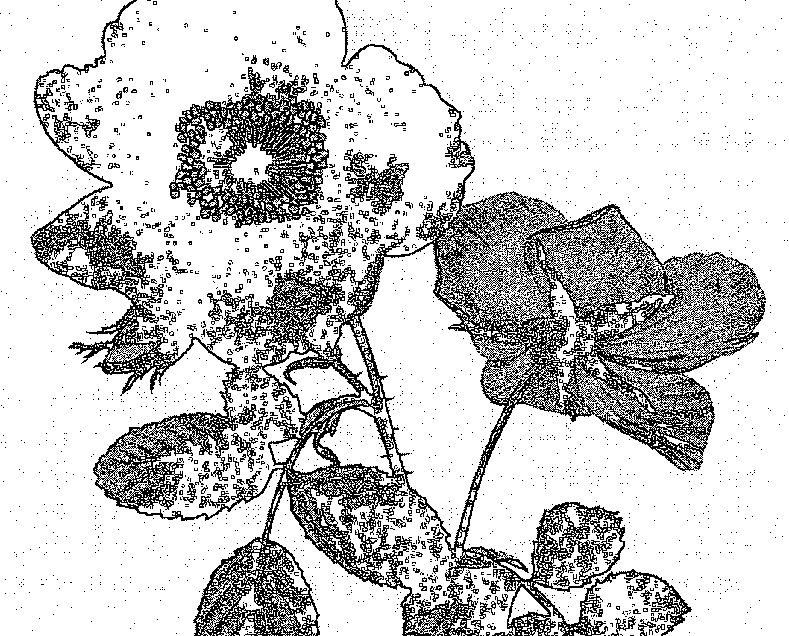

Fig. 1.

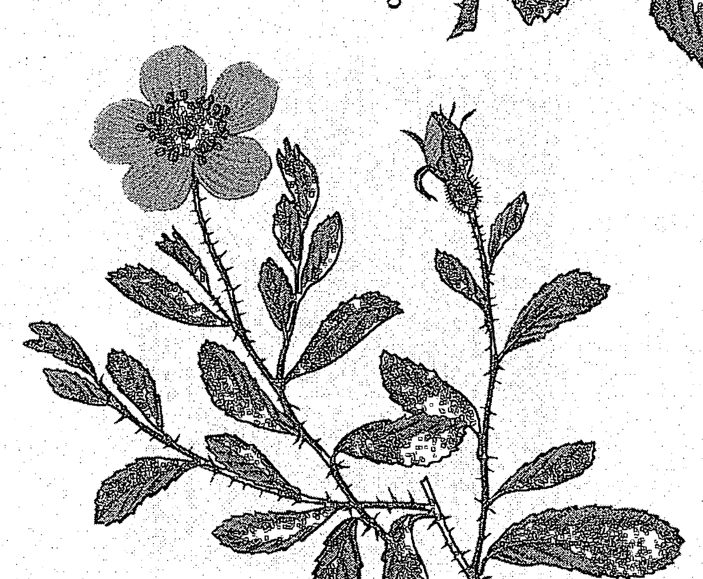

Fig. 2.

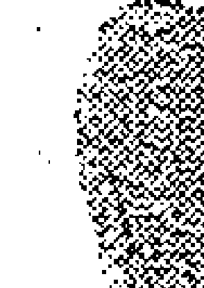

A

绢红蔷薇

## 七大行星的主要意义

由于医药占星发展的主要时期天王、海王与冥王星尚未被发现，因此过去植物的行星分类多半以七大行星为主。占星学里的行星又和现代不同，会将太阳与月亮列入其中。虽然近代的部分芳疗师、研究医药占星的占星师会将天王星、海王星与冥王星一起列入，但是本书暂且将焦点放在古典占星的惯用的七大行星上。在占星学习中，理解七大行星在大小宇宙中扮演的角色、主宰范围和代表意义，是占星学习之基础。而在医药占星的范畴中，这七大行星代表的意义虽然与一般性格与流年解读有些许差异，但基本的特质都是共通的。

是否在星盘中纳入天王、海王与冥王星来解读可说是古典占星与现代占星最大的差异，同时也影响到各星座链接到不同的守护星。简单来说每个星座的守护星就像星座的老板一样，他们有相连的特质。古典占星中七大行星对上十二星座，形成除了太阳与月亮外，包括水星、金星、火星、木星、土星各与二个星座链接，换言之每两个星座会有共同的守护星。但天王星、海王星与冥王星被发现后，现代占星便将水瓶座、双鱼座及天蝎座重新配给这三个行星，形成了这三个星座在古典与现代占星中链接到不同守护星的状况。

最早医药占星不只把行星、星座与身体系统、器官作链接，也以行星的特质为植物和矿物分类。而现代芳疗书里神秘、却又让人摸不着头绪的行星链接，例如：欧白芷行星属性为太阳，其脉络便是来自过去医药占星对植物的分类。当然不少植物因为古代与现代占星师与芳疗师的见解不同，被分类在不同行星属性的情形也是非常普遍的现象。

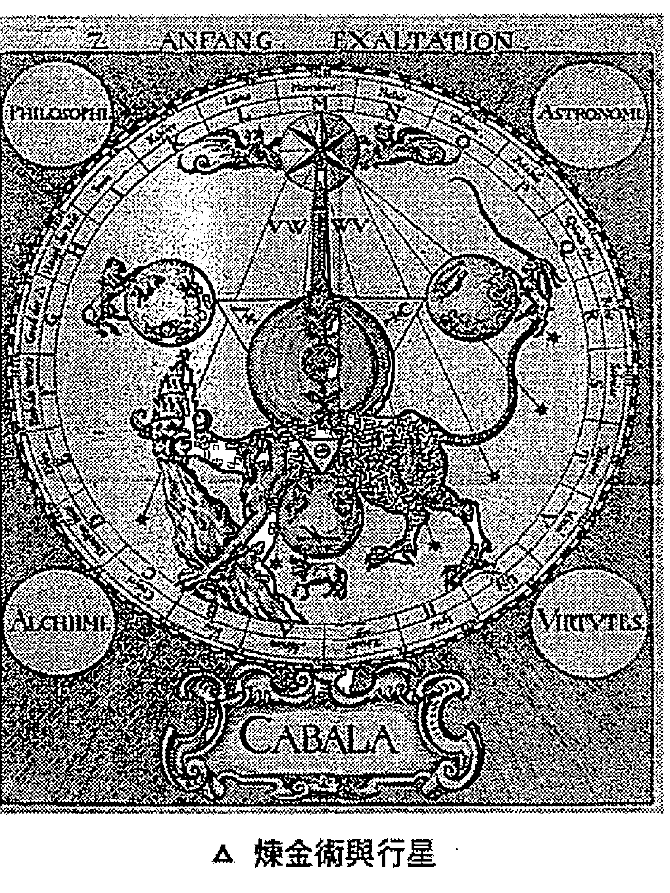

| 星座 | 古典占星守护星 | 现代占星守护星 |
|---|---|---|
| ♈ 牡羊座 | ♂ 火星 |  |
| ♉ 金牛座 | ♀ 金星 |  |
| ♊ 双子座 | ☿ 水星 |  |
| ♋ 巨蟹座 | ☽ 月亮 |  |
| ♌ 狮子座 | ☉ 太阳 |  |
| ♍ 处女座 | ☿ 水星 |  |
| ♎ 天秤座 | ♀ 金星 |  |
| ♏ 天蝎座 | ♂ 火星 | ♇ 冥王星 |
| ♐ 射手座 | ♃ 木星 |  |
| ♑ 摩羯座 | ♄ 土星 |  |
| ♒ 水瓶座 | ♄ 土星 | ♅ 天王星 |
| ♓ 双鱼座 | ♃ 木星 | ♆ 海王星 |

古典占星与现代占星星与守护星对照表

## 七大行星属性植物

### ☉ 太阳

欧白芷、安息香、佛手柑

太阳所发出的光与热为地球万物带来生命力，因此占星学中太阳在星盘上扮演着核心地位。古代占星师认为太阳为干与热的行星，它与月亮有别与其他行星，是代表光的存在，发挥的影响力也特别大。当我们回答自己的星座时会以太阳星座作为代表，其表现当事人的公众样貌、原始自我，甚至是存在的核心。在儿时我们会接近月亮星座的面貌，随着成长与性格上的独立，会逐渐靠近太阳星座所显示的特质。

著名芳疗师同时也是国际芳香疗法师联盟 IFA 的发起人——派翠西亚·戴维斯 (Patricia Davis) 在著作中，将欧白芷、安息香、佛手柑、金盏花、肉桂、乳香、葡萄柚与迷迭香等归类在太阳属性当中，而这类的植物都符合温热特质。

### ☽ 月亮

香蜂草、柠檬、德国洋甘菊

现代天文中作为地球卫星的月亮，在占星术中扮演着仅次于太阳的重要角色，纳于行星之列。多数文化中认为月亮相对太阳的阳性能量，其在中文里的别称“太阴”，则显示出作为阴性能量之代表。简而言之月亮星座拥有女性特质，又代表一个人的母亲与童年时期，以及阴性层面、无意识、情绪与感性面。月亮甚至可以看出一个人的安全感来源和情绪模式。对芳疗师或想运用精油作情绪疗愈的人来说，月亮星座是十分重要的参考项目。

由于月亮被古代占星师认为具有“湿、冷”的特质，因此与月亮链接的植物多数有镇静的特性，例如：香蜂草、柠檬与德国洋甘菊等，其中也有包含儿童适用的精油。这完全突显出月亮宛如母亲般的呵护性。

### ☿ 水星

芹菜、甜茴香、薰衣草

行星的英文名称多半来自希腊神话的神祇，由神祇掌管之部位便可看出该行星掌管的项目。以水星的英文“Mercury”来说，墨丘利为天神的信使，脚上有一双长了翅膀的凉鞋，行动飞快，代表永远的少年面貌。由此可见水星在占星中与讯息传递有关。水星掌管思考、学习、沟通、理解能力、知性以及旅行。而网络上最常提到的“水星逆位”，并不是水星真的逆转，而是星盘视觉上误差产生的结果。但在占星中多会提醒人们逆行期间需注意讯息的正确性，个人星盘上若有水星逆位，有时也会造成学习上的困难与挑战。

当水星落在双子与处女座时，古典占星中会认为是显贵的位置，意指这两种星座更能让水星发挥出其特质。水星的属性植物多半与刺激知性有关，例如：芹菜、甜茴香、薰衣草、欧薄荷与百里香等等。

### ♀ 金星

玫瑰、天竺葵、玫瑰草

金星是个能在日出与日落时分看到的行星，古代人因此认定其具有双性的特质。而希腊罗马神话则将之归为女性，以罗马神话闻名的维纳斯女神，是家喻户晓的人物。这位掌管爱与美的女神经常被忽略其对感官享受的追求，尤其是性爱的部分。有些说法提到金星女神追求性爱的特质，其实反映出性爱中的阴阳整合。金星在占星学上代表美与艺术、情爱、感官的享受，其中有包括吃、性爱与金钱花用，此外也与社交有关。从一个人的金星星座可看出他的感情模式与喜好类型。

由于金星掌管金牛座与天秤座，因此金星落在这二个星座在古典占星上是显贵的位置。金星与月亮一样被划分为“湿、冷”的行星。对应金星的管辖与特质，隶属金星的植物多与美容以及有利女性生殖系统有关，例如：玫瑰、天竺葵、玫瑰草、西洋蓍草及伊兰伊兰等。

### ♂ 火星

黑胡椒、丁香、芫荽

火星为太阳系第四颗行星，因其红色外观，自古多与战争脱不了关系。在罗马神话中玛尔斯为战神，亦是男性力的象征，同时代表原始的生命力，神话中与金星维纳斯女神为一对恋人，象征着阴阳相对的肉体特征。因此火星在占星学中代表一个人灵魂中的阳性能量，与勇气、行动力、挑战与斗争有关。看流年星盘时，火星有时不太受欢迎，被称为小凶星，便是因为其与纷争有关。

火星守护牡羊，过去天蝎座也是他守护的行星，直到冥王星被发现后，天蝎座的守护星才由火星转移至冥王星。但在古典占星的解读仍旧保持他与天蝎座的链接。火星与太阳一样是阳性能量的代表行星，特质也一样是“干、热”，与火星链接的植物多半具有强壮身体的功效或刺激性，例如：黑胡椒、丁香、芫荽、姜及赤松等。

### ♃ 木星

肉豆蔻、甜马郁兰、花梨木

木星是太阳系中最大的行星，与罗马神话的众神之王朱比特作链接。朱比特的名字来自“jovial”，也就是外放快活之意，正如他的个性那般任情所动，快活自在。另一方面朱比特由于神王的身份又代表全能、公正、智慧与律法。现代占星术里保留了木星的两面特质，他一方面代表幸运与扩张，另一方面也链接哲学与高层次的学问。我们可以从星盘中看出一个人在哪一个领域能乐观且自信，并且是其幸运所在。

木星是射手座的守护星，古典占星中也包括双鱼座。他的特质是“湿、热”，因此与该行星链接的精油植物也多半有温暖的特性，再者对应木星的松散与扩张，能够带来放松的精油也常与木星作链接，例如：肉豆蔻及甜马郁兰；此外宗教感强烈的花梨木、穗甘松有时也会归类在木星属性的精油中。

### ♄ 土星

雪松、杜松、茶树

在三王星尚未被发现时，土星曾是离地球最远的行星，因此象征限制。现代星期六为假日，不工作的模式与希伯来人视土星日为安息日有关。而古希腊人称土星为“Cronos”，同时也是时间之神，被宙斯击败的巨人。他常被描绘成白胡且带着镰刀的老人，也形成后世死神的形象。在占星术中他与木星的特质正好相反，代表收缩、限制，也是象征人生课题的行星，他带来压力、责任与试炼。

土星在古典占星中同时代表摩羯座与水瓶座的守护星，其特质为“干、冷”，如同人在死亡后会失去体温并干枯，也因土星在过去被视为凶星，因此鲜少药草植物与土星作链接。而现代则会链接一些生命周期长的树木类、以及具有净化、解毒作用的植物为主，例如：雪松、杜松、茶树、尤加利等。

## 七大行星与身体系统对应

之所以能在一个人的星盘上看出个人的身体特质，主要根据医药占星将身体的系统和器官分配给七大行星与十二星座。再次重申，这个配置成立时，天王星、海王星与冥王星尚未被发现，因此会以七大行星来看。而七大行星能驱动与修正事物，人的身体也会区分成七股力量，分别在不同的器官形成具体形状，行星的能量可以体现出器官的功能。古人认为天体的大宇宙与人体的小宇宙会相互呼应，便将两者链接。过去对人体系统的认识与分类与现代医学的逻辑稍有不同，请以开放的心与想象力来看待古典医学分类。

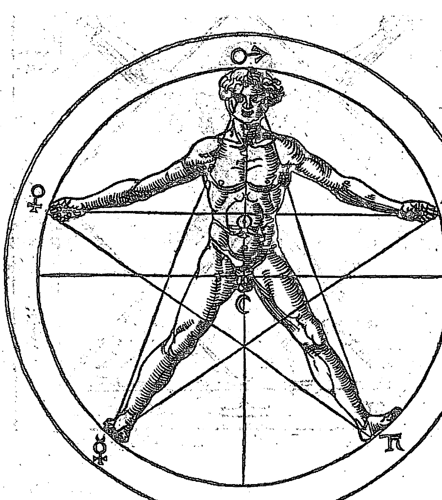

### ☉ 太阳

太阳链接人的心脏、动脉等循环系统，以及灵魂之窗的眼睛。古人认为心脏是灵魂寄居之地，也是人体核心，它是循环系统的帮浦，让血液流通身体各处带来热能，如同太阳为地球带来热量那般。同时象征灵魂、生气、生命热能与精气。

### ☾ 月亮

月亮链接脑（处理理性以外的部分）、肠胃、膀胱与眼睛。月亮的盈亏牵动地球的潮汐变化，也为人體的水分带来影响。月亮与太阳的炙热相对，代表一股冷却的能量，另外也为女性的生殖系统带来影响。其象征身体的湿气与所有体液相关。

### ☿ 水星

水星链接神经与感官系统。公转周期仅次与月亮，是七大行星中快速移动的行星。由于水星掌管知性，其对身体中讯息、感官处理的器官有巨大的影响，如：大脑与神经系统，其他还包括感官与表达的器官：舌头、手与脚。

### ♀ 金星

与月亮同为阴性行星的金星，与女性生殖系统、肾脏、喉咙与乳房具更直接的链接。金星是爱与美的女神掌管的行星，也对应到与美相关的身体部位，例如：内分泌调整、皮脂分泌及皮肤细胞的修复等。金星之神与火星之神在神话中是对恋人，也象征能抗衡火星的相对能量。

### ♂ 火星

血液、肌肉

火星是战争之神，一切与行动、战争相关的身体部位都由火星掌管，如血液与肌肉，运动神经以及性能量，以及与金星相对的男性生殖系统。若说太阳与月亮象征阳与阴，金星则代表女性肉体力量，而火星代表男性肉体力量。此外火星还链接胆汁质的体液、胆囊以及内在吸引力。

### ♃ 木星

肝脏、肺

木星对所有事物都带来扩张与松弛的影响，其支配人体中的肝脏、肝脏拥有的解毒机能和胆汁分泌。另外，左右发胖的脂肪也是木星管辖，其他影响的器官还包括：肺、肋骨与静脉。消化系统也属木星管理。

### ♄ 土星

骨骼、皮肤

由于土星代表界限与架构，因此其掌管人体的骨架与对外边界，也就是骨骼与皮肤，包括肌腱、指甲、头发与关节，同时也主掌能确保人体与外界有区隔的免疫系统。此外较细节之处还包括了脾脏、右耳。土星同时象征黑胆汁质的体液与保持力。

## 十二星座身体对应

前面提到每个星座都有各自的守护星，而这些星座不但继承了行星的部分特质，代表的身体部位也与自己的守护星有关。医药占星中行星、星座以及宫位都有链接的身体部分，而实际上我们比较常用宫位来检查身体各部分的状况。

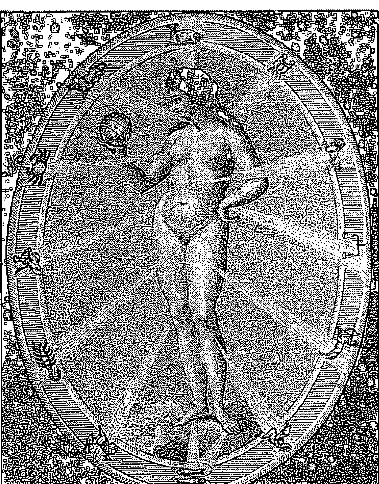

### ♈ 牡羊座

头部

牡羊座是黄道周期的第一个星座，特别强调个人，自我意识很强。而头部支配着一个人对世界的看法，以及在人世间的地位，所以牡羊座对应部位为头部及脊椎第一节以上之处，也包含脑、头盖骨、脸、上颚与外耳。若以身体部分来配置牡羊座的精油，我们会以与头有关的精油为主，如迷迭香，让人活在当下，有助记忆，同时对头皮的毛囊有益，增进身心活力的效用与牡羊座十分贴近；而火星是牡羊座的守护星，拥有其守护星属性的精油也可以使用在牡羊座上，如具有火星爆发力的辛辣黑胡椒。

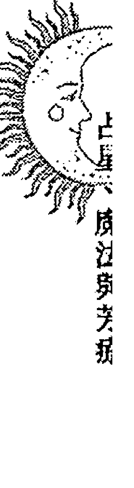

### ♉ 金牛座

颈部、甲状腺

金牛座是紧接在牡羊座之后的第二星座，带有强烈自我意识，同时藉由敏锐的感官觉察世界。象征公牛的金牛座，颈部粗大，对应的身体部位为颈部、喉及脊柱第七节以上，其中有声带、舌头、中耳、下颚、嘴巴与甲状腺。金牛座本身很重视身体感官，涂抹精油本来就能提升身体感觉，因此可选择擅长连接肉体与感官的精油，包括玫瑰与广藿香。金牛座的守护星是金星，玫瑰本身是典型的金星属性植物，能帮助提升自信并散发魅力，令人愉快地享受身体带来的乐趣，包含吃与性的逸乐。

### ♊ 双子座

肩膀、手

双子座有别于牡羊及金牛，从重视“自我”转为更大的“我们”，又很擅长于社交、分享自己的聪明才智，所以其对应部位为肩膀、肩胛骨、手腕、手与手指，更细节的部分还包括气管和支气管，易于与别人链接的部位。双子座也是唯一与两个肌肉部位对应的星座。手与手指能加强人的沟通表达能力，气管与支气管则是与“风”能量的处理有关。双子座的特质是反应灵敏，善于沟通表现，可以搭配活络神经系统、思考的精油，如薄荷。薄荷不但提神醒脑，也让人深呼吸更顺畅。可舒缓肩颈僵硬，强化神经系统的柠檬香茅也是好选择。

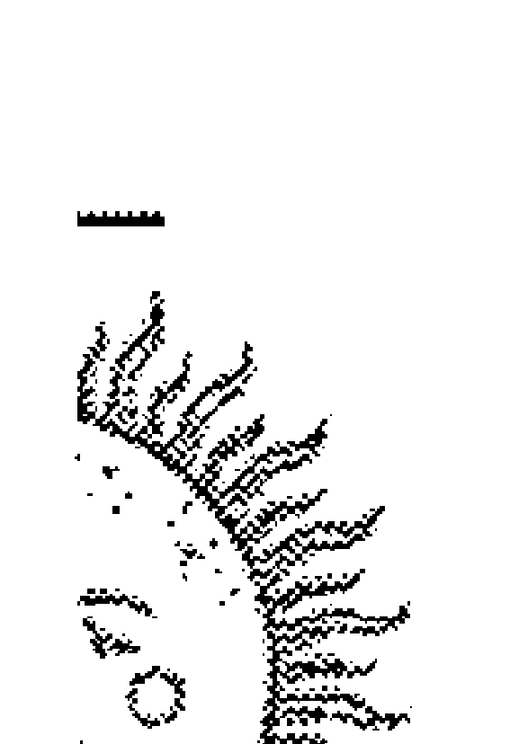

### ♋ 巨蟹座

胸部、胃

处于黄道周期夏季之首的是巨蟹座，若双子座是与他人衔接，巨蟹则更爱温暖的人际互动，也是爱家、代表着抚育和滋养的母亲形象，所以其身体对应胸部、肋骨与胃，细节的部分还包含心膜、横膈膜、胸膜与骨髓，以及与其守护星月亮所管理的子宫和体液。其中胸及胃部是巨蟹座较敏感的部位，可以搭配帮助消化、同时也对子宫有益的植物如柑橘类精油。洋甘菊除了可安抚巨蟹座敏感的心，对消化也有益处，除了外用精油，饮用洋甘菊茶也是很好的选择。

### ♌ 狮子座

心脏、上背

狮子是由天上最明亮的太阳守护，对应心脏、背部与胸椎。狮子座代表着勇气、奉献及深刻的爱，恰好与人最重要的“心”对应，细节的部分还包括：心筋、动脉及冠状动脉。以心脏为核心运行的心血管系统都与狮子座有关，而上背部与心脏是狮子座最具代表性部位。适合狮子座的精油可以选择带有强烈太阳能量的欧白芷、柑橘类。欧白芷如太阳般带给人精神与气力，温暖的特性还可舒缓局部的肌肉疼痛。

### ♍ 处女座

腹部、小肠

处女座重视目标、固守核心，是努力追求理想、非常需要能量的星座，所以其身体对应为腹部、小肠、肚脐、脾脏、胃及躯干中段的部分。胃部有时归处女座、有时归巨蟹座，可视为对两个星座都有影响。整体来说消化系统问题与处女座的特质较相关，心思细腻容易紧张的个性，多半会反应在肠胃问题上。处女座适合舒缓敏感情绪，又有益消化系统的精油，如薰衣草能放松心情与镇痛，甜茴香对应消化不良。

### ♎ 天秤座

肾脏、下背

天秤掌管平衡，与能够支持自己又能支持他人的下背部最为对应，下背部是帮助全身平衡的一个重要核心，细部还包含肾脏、膀胱与屁股。靠近腰部左右双边成一对的肾脏，如同天秤座的形象一样。此外因为守护星为金星的原故，也能使用与金星相关，具美容保养之效的植物作为天秤座精油，如天竺葵有着玫瑰的香气，但更清新，也有“平衡”水分的作用。

### ♏ 天蝎座

膀胱、生殖系统

为黄道周期第八位的天蝎充满着灵性与重生的力量，其对应部位为生殖器官、膀胱、肛门与屁股，代表生命种子及情绪活动之部位。细节的器官包括粪便所在大肠与直肠。天蝎座可链接对生殖泌尿系统有益的精油，如大西洋雪松等，或是让内心压抑情绪可获得释放的精油，如檀香及花梨木。檀香擅长升华各种负面能量让心情平静，花梨木能疗愈深层创伤。

### ♐ 射手座

大腿、尾椎

射手座的形象——人马有一双强健的马腿，热爱自由的射手也以他的大腿行遍天下、活动范围非常广大，所以身体对应为大腿与尾椎。守护星为木星的射手座，天生就比他人幸运，也是占星学中认为较不容易生病的星座。由于木星与肝脏有关，射手座需要比较注意饮酒所带来的肝脏负担，可使用养肝排毒的精油，如葡萄柚；同样对排水、排毒有效的杜松也是很好的选择。

### ♑ 摩羯座

骨骼、膝盖

身为土象星座的摩羯爱好稳定、实际与持久，比起射手座的自由奔放，摩羯座偏好脚踏实地地往前走，所以其身体对应为膝盖与腿后腱。其他与土星相关的骨骼、关节、头发、指甲及牙齿也与摩羯座有关。相对射手座，守护星为土星的摩羯座在占星认定上属于身体较虚弱的一群。摩羯座链接的精油可以选择丝柏或没药，丝柏排毒，没药则可修复皮肤伤口。

### ♒ 水瓶座

小腿、胫骨

水瓶座爱好新的目标，其热爱社群、能唤醒大家的意识，所以比对实际运动的大腿及膝盖部位，水瓶更对应到小腿、胫骨与腓骨这些决定行走方向的部位。此外静脉、心脏瓣膜、角膜及视网膜也与水瓶座有关。水瓶座适合的精油会从帮助他们回复前瞻视野有关，如加强灵感的橙花，以及带来新观点的苦橙叶等。虽然古典占星水瓶座的守护星为土星，但以实际经验来说，土星特质的精油较不适合水瓶座。

### ♓ 双鱼座

脚掌、淋巴系统

身为黄道周期最后一个星座，双鱼座代表着循环的终结与开始。其双鱼符号为两尾相对方向的鱼形成一个圈，也代表着灵性与物质相合。双鱼座身体对应为末端的脚掌与脚指。此外淋巴系统及免疫系统也与双鱼座有关。情绪很容易带给免疫系统影响，多愁善感、容易受伤的双鱼座非常需要疗愈情绪和伤创的精油，如花梨木，能帮助双鱼在付出与被付出之间达到平衡；玫瑰草则能用于按摩脚掌去水肿。

## 十二星座的基础用油——太阳星座魔法精油

当我们问一个人是什么星座时，对方多半会回答他的太阳星座。太阳是主宰，在占星中代表一个人的公众面貌、外显性格，也代表着自我意识与中心思想，因此我们可从一个人的太阳星座了解此人轮廓，可说是一种个性的指标。即使一个人的星座命盘里还有包括月亮、水星、金星、火星、木星、土星、天王星、海王星与冥王星相互对此人产生影响，但太阳乃是最主要的判断标的。

因此改善总体运势时不可不参考太阳星座精油。对于没有占星基础又想调一瓶适合自己的精油，可以从最基础的太阳星座开始寻找，如上述，太阳是一个人性格的指标，无论是工作、感情等任何面象或多或少都有着太阳星座所带来的影响，即使完全不知道自己星盘中的其他行星，光是使用太阳星座精油，便能带来提升效果。

此外下一个章节提升恋爱运势的配方中，除了参考金星，太阳星座精油也是不可缺少的重要配方。毕竟在爱情中我们总是抛头露面地被打量。太阳与金星的星座特质交织出我们在恋爱市场上别人所看到的样子。依此类推，希望改善在职场的状况或个人工作状态，太阳星座绝对也是必要考量。

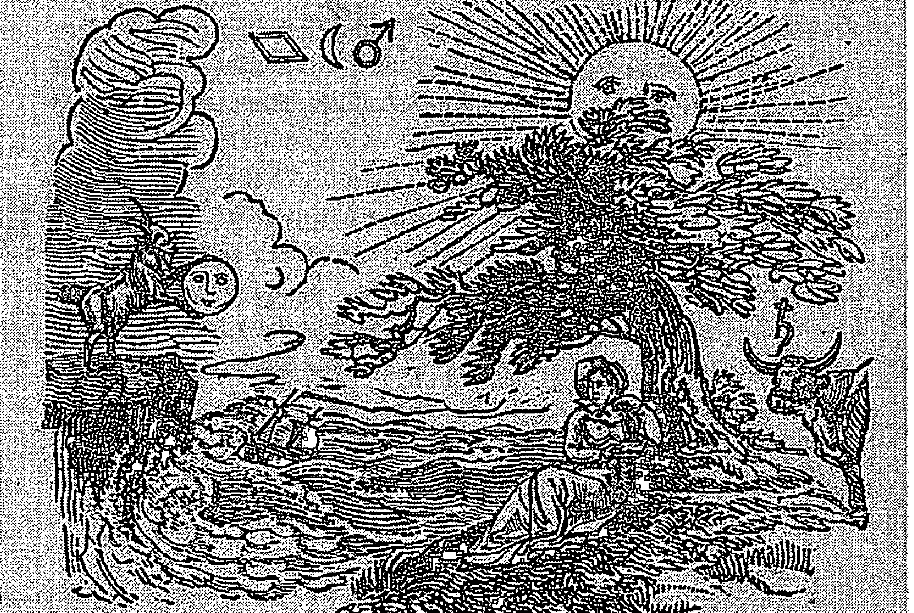

▲ 19世纪的占星家# 像孩子一樣的 ♈ 太陽牡羊座

## 桉油醇迷迭香與黑胡椒

身為黃道首發星座的牡羊座，被認為擁有年輕的靈魂，如同孩童般對世界充滿好奇，又因其守護星為火星的原故，擁有衝動、活力、活在當下以及勇敢無畏的特質。能突顯牡羊座能量的精油為迷迭香與黑胡椒。

眾多種類的迷迭香中選擇桉油醇迷迭香精油較溫和。隸屬太陽植物的迷迭香，長久以來與「記憶」、「淨化」兩個關鍵字相連。相傳迷迭香能讓記憶加強，因富含氧化物能暢通呼吸道，使頭腦清醒。迷迭香也被稱為平民的乳香，過去無法取得高貴乳香的歐洲平民會燃燒唾手可得的迷迭香作為空間淨化之用。桉油醇迷迭香的淨化作用符合牡羊座純粹的特質，而能夠加強呼吸的功效則讓牡羊座能夠活在當下。

辛香料中最熟悉的黑胡椒，則是符合牡羊座特質的另一個選項。新鮮黑胡椒帶有香辣味與淡淡果香，它使人突破既有框架、燃起熱情並勇往直前，正符合牡羊座如同孩童般蠢蠢欲動的心。隸屬火星植物的黑胡椒，來自黑胡椒樹的未熟果實，正如同牡羊座一般充滿青春活力，總是像孩子一樣地看待世界。

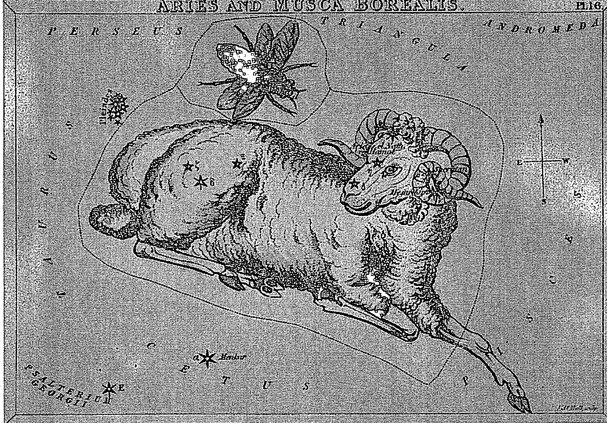

不虧待自己吃好穿好的

# ♉ 太陽金牛座

## 玫瑰與廣藿香

由金星守護的金牛座為黃道十二宮的第二個星座。雖然給人一種固執的刻板印象，對他們而言卻是種擇善固執，也擅長判斷人事務的品質與價值，因金星守護的關係，對物質或肉體的享受相當重視，能實際拿在手與吃進嘴裡的東西才是真的。突顯金牛座特質的精油有玫瑰與廣藿香。

隸屬金星植物的玫瑰是百花之后，也是金星的代表花卉。它帶來愛與療癒，幫助人與身體連結並了解自身的需求，價位之高亦突顯其為精油中的貴族。玫瑰符合金牛座重視身體與享受的性格，他們喜歡慢慢醞釀一切，讓最後的作品如同百花之后般高貴。

與金牛座連結的另一種精油是廣藿香。氣味屬於東方調的廣藿香帶有泥土般的氣味，低沉卻讓人無法忽視，與金牛座喜愛低調奢華的特質相符。能量與魔法用途上，廣藿香經常加入財富與慾望相關的魔法配方當中，這兩者都是金牛座極為重視之事。西洋魔法中根部植物或泥土氣味重的植物多半與財富相關，如同「有土斯有財」的道理一樣，土元素通常與物質、財富連結。因此廣藿香讓金牛座身心合一，能使之展現出沉著穩重卻不失魅力的面貌。

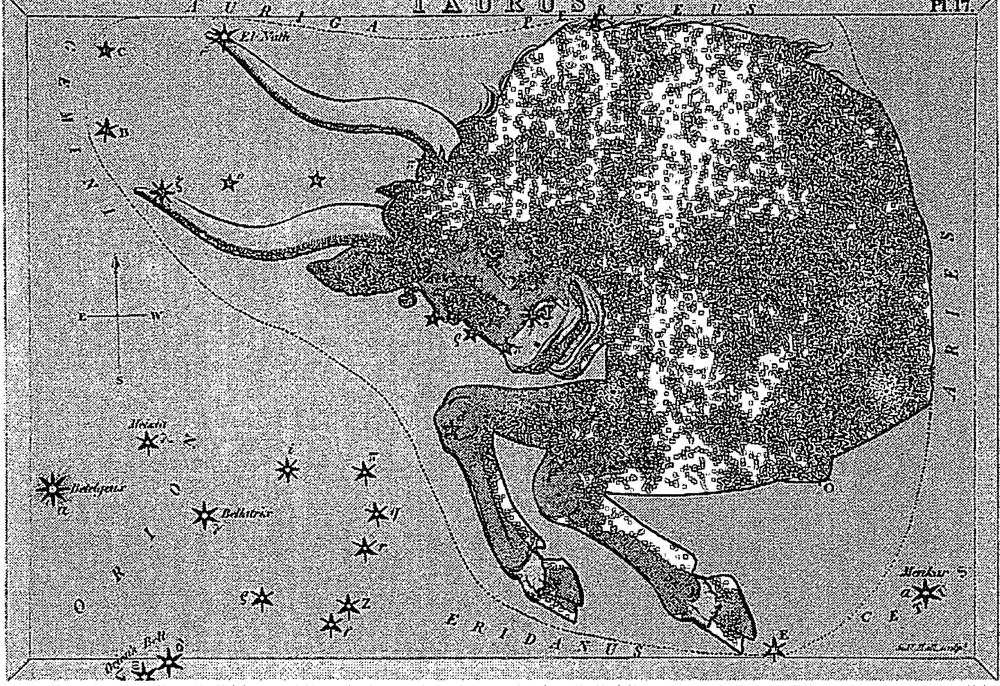

▲ 金牛座，Urania's Mirror; or, a view of the Heavens

# 思慮過快需要提神醒腦的

# Ⅱ 太陽雙子座

## 薄荷與檸檬

由水星守護的雙子座為黃道十二宮的第三個星座。能言善道，反應力快，腦袋無時無刻都在多工使用，如同水星之神赫密士般敏捷，經常跳躍式思考讓人摸不著頭緒。雙子座是資訊爆炸時代最能享受其中的星座，多才多藝並且擅長交際。突顯雙子座特質的精油有薄荷與檸檬。

薄荷精油能迅速使微血管擴張，因此嗅吸它可達到提神醒腦的作用，氣味揮發快速，如同雙子座快速運作的腦袋，它讓雙子座思緒清晰，提出更多點子與創意。薄荷精油常見的種類有歐薄荷與綠薄荷，其中歐薄荷作用較溫和，其能量帶有延展性。正因為如此，魔法配方的使用中，歐薄荷也於增加金錢和招財有關；綠薄荷則有化開能量堵塞的效果。

另一適合雙子座的精油為檸檬。酸甜的香氣能瞬間讓人轉換心情，比起其他柑橘類，檸檬更有能量潔淨的效果，卻不是以侵略性的方式發揮效用。當能量停滯時，檸檬能輕盈地轉化氣場，如此的運作方式正符合雙子座幽默、放鬆的星座特質。當雙子座在各種選擇中徘徊，猶豫不決時，檸檬也能有助於快速下決策，離開膠著的狀態。

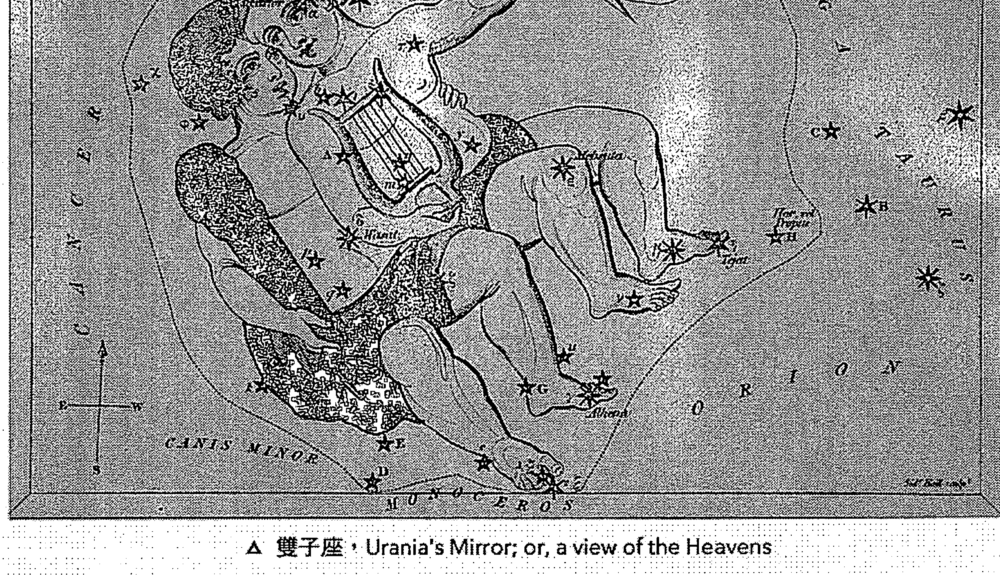

# 羅馬洋甘菊與真正薰衣草

由月亮守護的巨蟹座為黃道十二宮第四個星座，開始於夏至時分。重視安全感，因此帶有敏感、念舊及戀家性格。擁有如母親般的包容與喜愛照顧人的特質，並且情感豐富容易受傷，這些特質都與它的守護星月亮有關。突顯巨蟹座特質的精油有羅馬洋甘菊與真正薰衣草。

與花草茶常見的德國洋甘菊不同，羅馬洋甘菊的氣味更圓潤甜美，是著名的兒童精油之一，亦能安撫內在小孩（Inner Child），有助於心思細膩，神經敏感的巨蟹座能安心自在，面對各種狀況時不流於情緒化。洋甘菊在藥草系統因它的外貌與消炎特性歸屬太陽植物，萃取成精油後，因其色澤與溫和的效果，許多人便將其畫分為月亮植物範疇。羅馬洋甘菊在魔法運用上能保護居家能量安全，能與巨蟹座作為「天底」的第四宮相對應。

另一種連結巨蟹座的精油為真正薰衣草。相對於台灣居家常備的薄荷油，真正薰衣草可說是歐美精油愛好者的常備良藥。同樣適合兒童使用的薰衣草，有多元的化學分子讓它能運用在各種身體的微恙狀況，如跌打損傷或頭暈目眩。而魔法的運用上亦是包山包海，從招桃花到長壽健康、與守護居家皆適用。如此全方位的照顧就像雞婆的巨蟹座對待自己人那般無微不至。

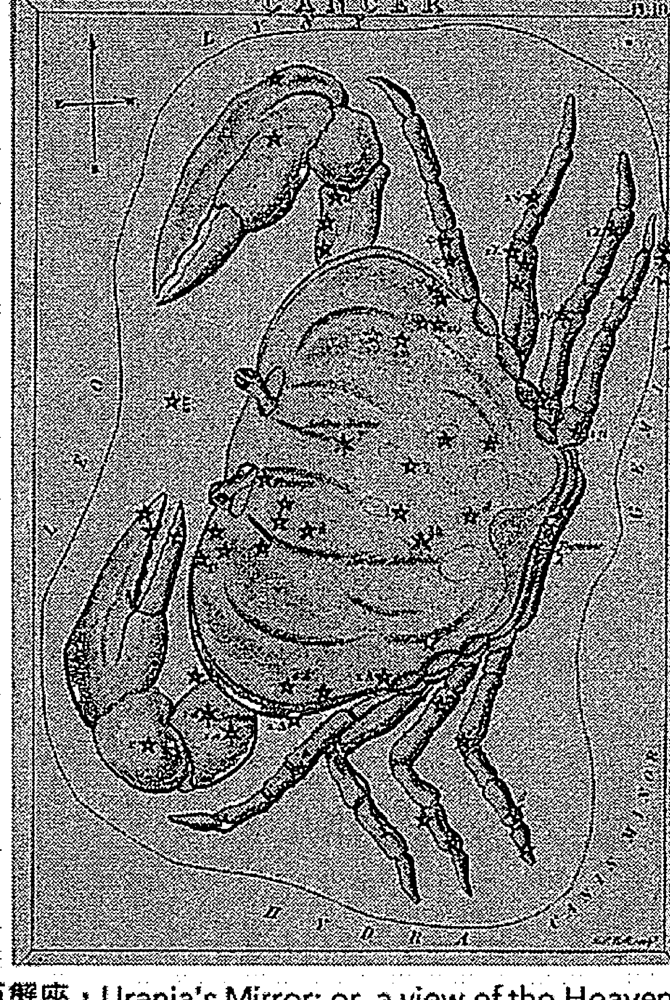

# 無法忽視的搶眼卻溫暖至極的

# ♌ 太陽獅子座

## 甜橙與歐白芷

黃道十二宮中第五宮的獅子座，由太陽作為它的守護星。在人群中有絕對存在感，喜愛受到關注，也不吝於展現自我。對於保護屬於自己的群體有著熱情與執著，在華麗的外表下有著藏也藏不住的領導能力。突顯獅子座的兩種精油為甜橙與歐白芷。

隸屬太陽植物的甜橙是最具代表性的柑橘類精油，令人聯想起小時候糖果裡的橘子口味，那般愉快、純真並且能激發使用者的創造力。看似好大喜功的獅子座往往動機單純，就像甜橙那般香甜而直接。在華夏文化中柑橘經常與豐盛、財富連結，也符合獅子座奢華的特質。

另一種精油「歐白芷」則有強烈特殊的氣味，英文名「angelica」來自大天使米迦勒，自古被認為有治癒和預防疫病的功效，它能強化人的氣場。特別是根部萃取的精油使人有穩固的基礎後壯大，進而產生積極的信念。隸屬太陽植物的歐白芷與獅子座屬性相仿，氣味強烈讓人無法忽視卻又十分溫暖可靠，如同獅子座保護群體那般驅避災厄。獅子座使用歐白芷更能彰顯其領導與保護友伴的特質。

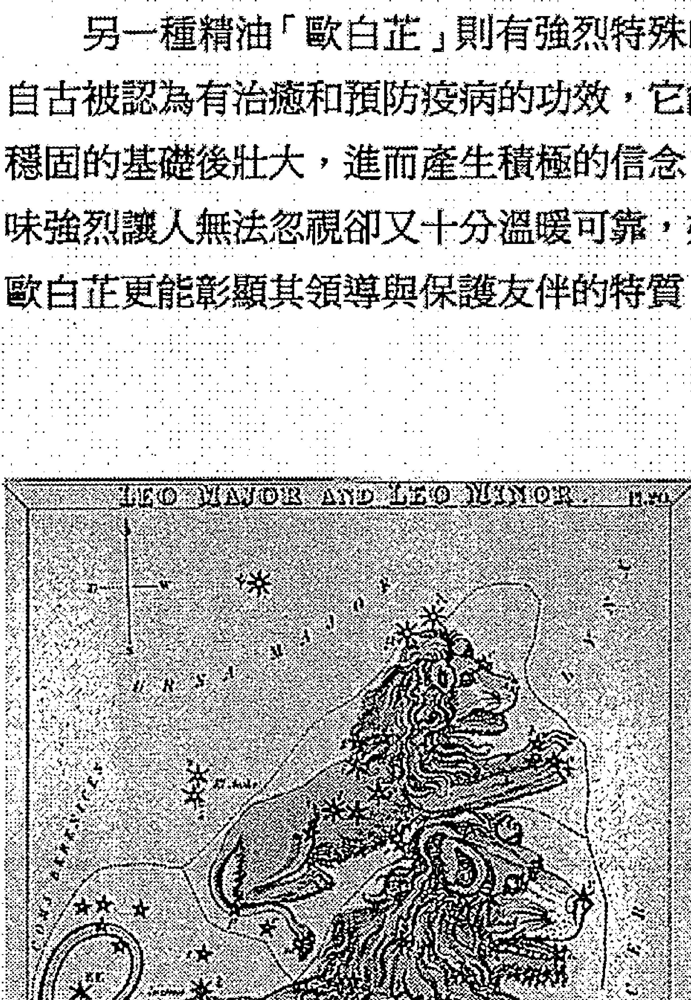

▲ 獅子座，Urania's Mirror; or, a view of the Heavens

# 嚴謹又偏好乾淨整潔的

# ♏ 太陽處女座

## 真正薰衣草與甜茴香

由水星守護的處女座位於黃道十二宮的第六個宮位。有條有理一絲不苟，注重細節且具完美主義傾向。嚴謹的處女座擅於歸納與整理，堅持原則且帶有批判精神。能將紊亂事物理出規則、找出重點是處女座的強項。突顯處女座特質的精油為真正薰衣草與甜茴香。

拉丁學名為「清洗」的真正薰衣草能帶來潔淨的能量，給與使用者乾淨整齊的舒適感，非常適合身處混亂狀況的處女座，為他們帶來平和的心情而不焦躁。而薰衣草最著名的功效安眠，它能使處女座停下腦中的思緒全面放鬆，試著用薰衣草緩和因緊張帶來的身心問題。

甜茴香則是另一種對應處女座特質的精油，作為香料植物的甜茴香有助消化，也能幫助產婦分泌乳汁，是歐洲發乳茶常用配方之一。過去酪農會在飼料中加入茴香以增加牛奶產量，因此甜茴香本身有著使能量流通的特質，它讓處女座表達內心想法時更加順暢、不羞澀、清楚且明確。

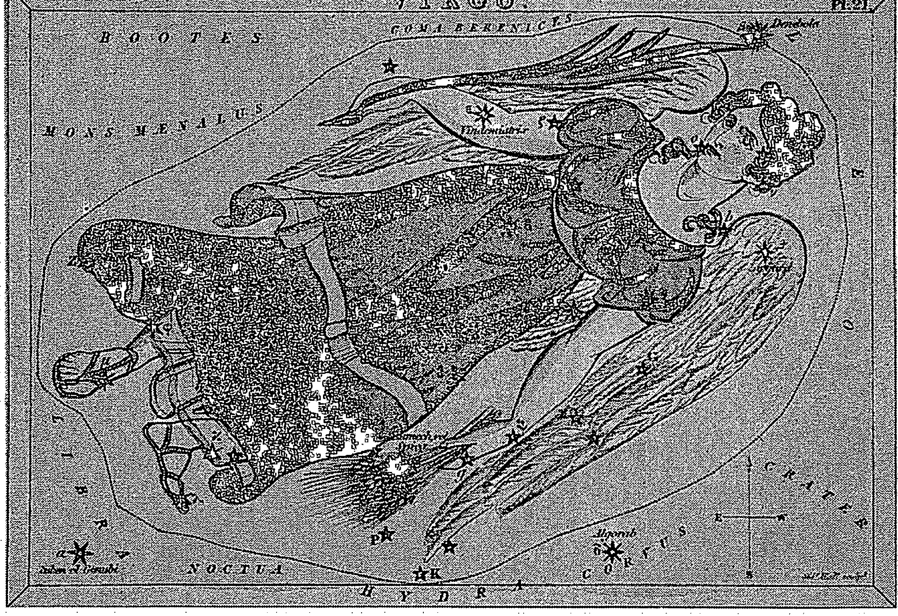

▲ 處女座，Urania's Mirror; or, a view of the Heavens

# 太陽天秤座

## 天竺葵與香桃木

由金星守護的天秤座位於黃道十二宮的第七宮。如同該星座的象徵物，天秤座重視對等、和諧，而且非常擅長換位思考。他們擁有優雅的品味，絕不會讓自己落入俗套。對待人事 物喜愛中庸之道，不喜歡撕破臉，同時與不同的小圈圈往來，造就他們良好的人際關係。突顯天秤座特質的精油有天竺葵與香桃木。

常見的玫瑰天竺葵與波旁天竺葵皆可使用。天竺葵擁有玫瑰氣味卻沒有玫瑰花的厚重感，非常適合亮麗輕盈的天秤座，天竺葵與玫瑰一同被歸類在金星管轄的植物當中，魔法用途多半與愛情相關，給使用者帶來好人緣，而天秤座使用則可突顯人際關係的優勢。再者天竺葵有助身體水分的「平衡」，這也是天秤座最重視的事。

另一款精油香桃木，是另一種金星女神阿芙羅黛蒂的代表花卉，因此在魔法效果上與愛情有關，亦能帶來家庭和諧。對呼吸系統功效卓越，帶給使用者順暢的呼吸。心理效果中能為天秤座帶來正視問題的勇氣，擅長換位思考的天秤座往往優柔寡斷，陷入猶豫不決的狀態，桃香木給予他們面對棘手問題的能量。

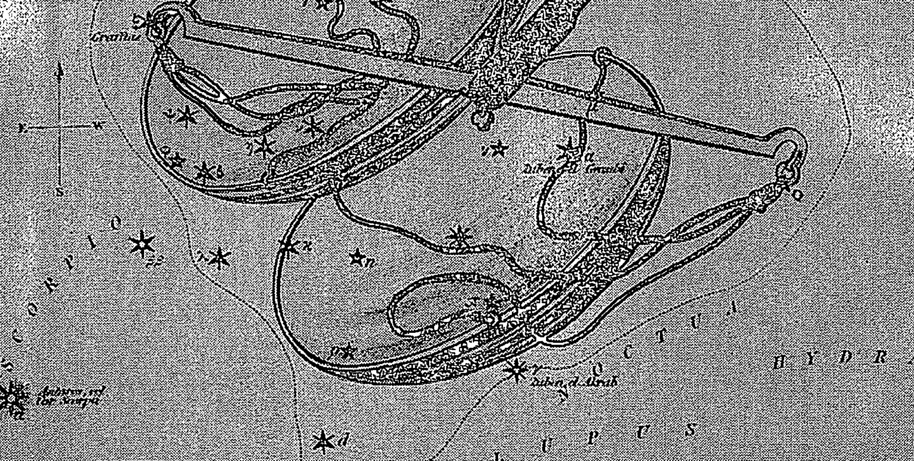

△ 天秤座，Urania's Mirror; or, a view of the Heavens

# 記仇的同時感情極為濃厚的

# ♏ 太陽天蠍座

## 廣藿香與大西洋雪松

在古典與現代占星中擁有不同守護星的天蠍座同時是火星與冥王星的子民。由於二者皆是代表考驗的行星，而造就了天蠍座堅毅的特質。敢愛敢恨是外界對他們的刻板印象。記仇與愛恨強烈的特性其實是天蠍座壓抑情緒後最終爆發的結果。而不擅情緒表達的天蠍們也給人一股神秘感。突顯天蠍座特質的二款精油分別是廣藿香與大西洋雪松。

廣藿香能帶來身心合一的效果，魔法用途則可分為招財與催情二大類。在醫藥占星中天蠍座掌管生殖器官，因此即使天蠍座抑壓情緒，對身體的感官則卻是相對強烈。廣藿香使天蠍們展露出性感的魅力，對身體更有自信。

另一款精油大西洋雪松，則是突顯天蠍座的心靈特質。魔法效果方面，能淨化並消除惡夢的雪松，可安撫天蠍多慮的情緒，並在蠱性的世界中引導他們不被負面能量持續糾纏。而粗大厚實的雪松亦有沉著穩定的能量特質，這部分則符合天蠍座耐力與堅毅。

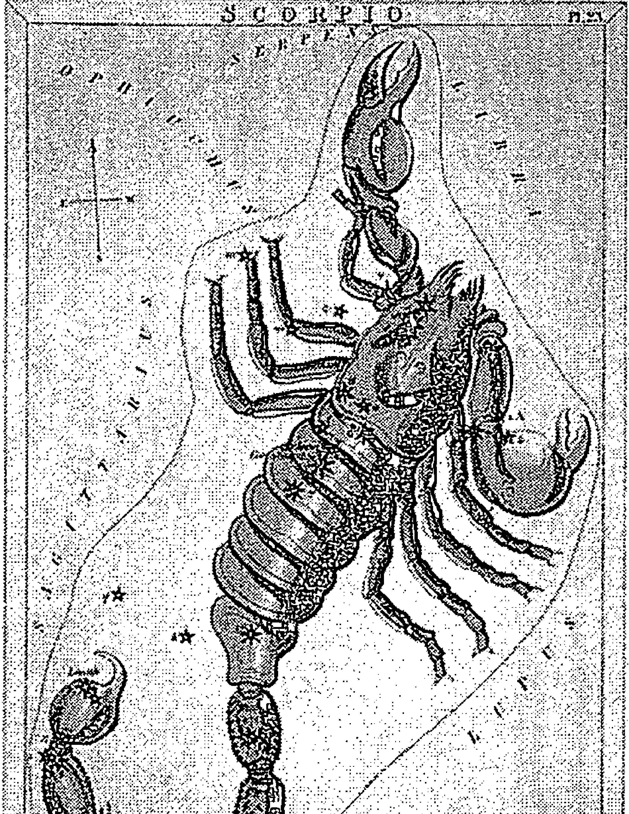

▲ 天蠍座，Urania's Mirror; or, a view of the Heavens

# 目標崇高且勇敢冒險的

# 太陽射手座

## 黑胡椒與佛手柑

守護星為木星的射手座位於黃道十二宮的第九宮。自由奔放是他們的代名詞，人馬是該星座的象徵，同時顯示出上半身為人下半身為馬的雙重特質，他們無法被限制在既定的規範，需要不斷挑戰並開展新視野，追求崇高目標的他們時常不拘小節。冒險是他們生活與生命的一大樂趣。突顯射手座的兩款精油包括黑胡椒與佛手柑。

黑胡椒的辛辣與爆發力，使它在消災解厄上有良好的效果，也對應射手座那股無法被禁閉的放蕩不羈，幫助他們不斷突破向未知的領域探索，給與他們行動力與活力。作為辛香料之首的黑胡椒能使料理的滋味活潑有變化，正符合射手座的幽默特質。

適合射手座的另一款精油為佛手柑。佛手柑能增加使用者的血清素改善憂鬱，擁有撥雲見日的積極能量。柑橘類都有的明亮特質，符合射手座樂天的性格。此外佛手柑也是諮商師的好夥伴，不但能有效使個案打開心防，同時可維持空間光明的能量。

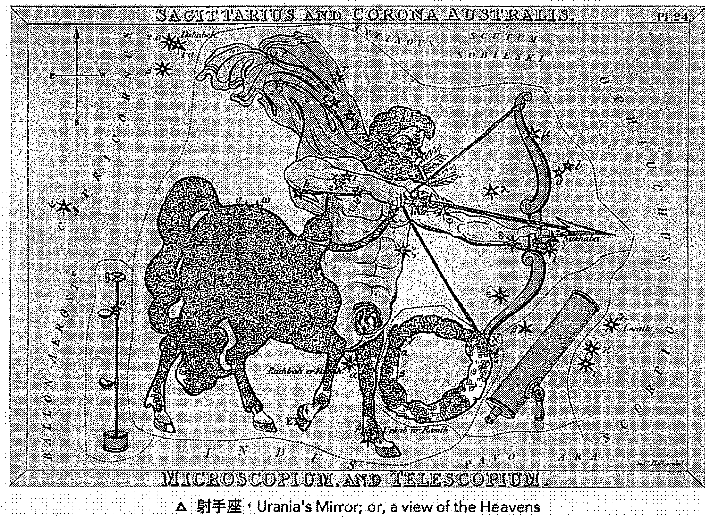

# 精打細算又善於實踐目標的

# 太陽摩羯座

## 絲柏與茶樹

在秋分開始的摩羯座的位於黃道十二宮的「天頂」，也就是第十個宮位。吃苦耐勞，天生帶有使命感是摩羯座的最大特色。務實是他們座右銘，精打細算是他們生活的樂趣。摩羯座對個人訂定的目標有極高的耐性，總是將眼光放得很長遠，不愛冒險也懂得避險。突顯摩羯座的精油為絲柏與茶樹。

絲柏與摩羯座相同，皆與土星連結，自古絲柏也與死亡、重生有關，身體效果上它能幫助多餘的水分排出體外，有效緩解水腫問題；而能量效果上也能協助淤塞的能量代謝。摩羯座個性堅持，不擅長卸下別人加諸於他們的負擔，絲柏幫助他們排解那些該流動的能量，試著讓輕盈的氛圍流入他們的生命。魔法配方上絲柏能緩和別離的悲痛，並守護居家安全。

另一種適合摩羯座的精油為茶樹，以提升免疫力與抗痘聞名的茶樹，在能量效果上能給使用者與外界抗擊的力量，簡單來說便是提高抗壓力，這正符合擁有超強抗壓性的摩羯座。無時無刻不為任務和人生目標打拼的摩羯座非常需要茶樹為他們提振精神。

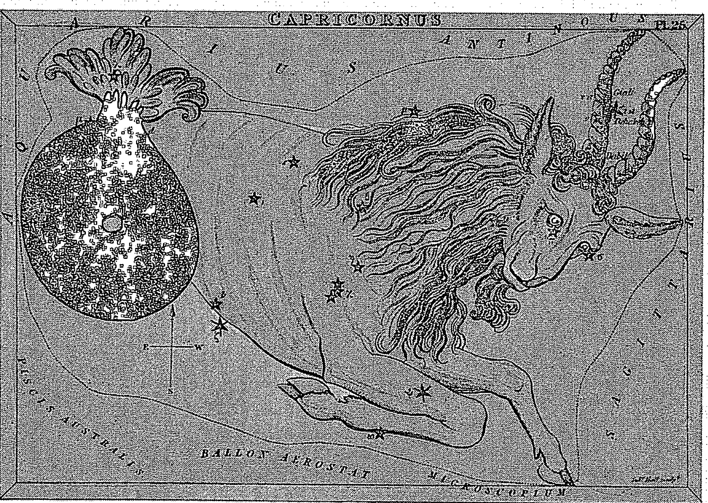

▲ 摩羯座，Urania's Mirror; or, a view of the Heavens

# 聰明與靈性兼具的

# ☀️ 太陽水瓶座

## 橙花與葡萄柚

位於黃道十二宮第十一個宮位的水瓶座，人生中總嘗試跳脫世俗從獨特的觀點看世界，他們是普世價值的捍衛者，也重視人道主義。水瓶座往往被外界視為外星人，也像外星人的高度一般以清晰視角視人，因此看人相當準確，亦具有很強邏輯與理性思維。突顯水瓶座的精油為橙花與葡萄柚，連結水瓶座的二種精油都是柑橘類。

橙花擁有花朵類精油中相對清輕淡雅的氣味，它讓人從潛意識的海洋中汲取靈感，不被眼前的事物或成見所束縛，重新找回靈魂的自由。它讓身心靈合一，並找回純粹的感受，對緩和緊張有效，並能為世人帶來希望，這也正是水瓶座的理念。

另一款為葡萄柚。葡萄柚如同其他柑橘類精油一般給人明亮愉快的感覺，理性的水瓶座較少讓自己陷入情緒漩渦，時常會一派輕鬆地去看待各種問題，完全不受傳統價值所拘束，而葡萄柚能為水瓶座消弭與他人的代溝，保持人際和諧，同時讓水瓶座有保有自我的快活感。

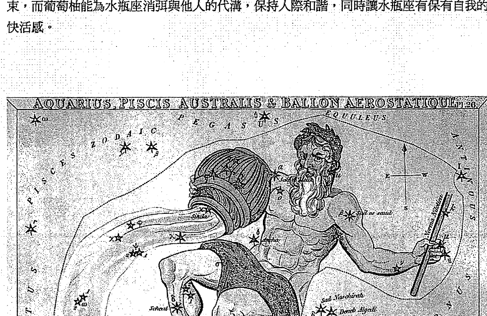

Δ 水瓶座，Urania's Mirror; or, a view of the Heavens

# 香蜂草與花梨木

位於黃道十二宮裡最後一個宮位的雙魚座，時常被認為擁有老靈魂或活在夢的世界當中。正因為是黃道十二宮最後的宮位，對世俗的人事物沒有強烈的執著，他們直覺極佳，浪漫而感性，還是典型的利他主義者。心思細膩更甚於巨蟹座，因此同情心強，很容易感受他人的情緒和需求，有時會成為自己的情緒負擔。適合雙魚座的兩款精油包括香蜂草與花梨木。

帶有檸檬香氣的香蜂草，自古對解憂鬱與其情緒困擾有助益，它能讓心情清明，注入陽氣，並強化生命力。煉金術士甚至稱香蜂草為「生命的萬靈藥」。它對應了雙魚座強烈的直覺，同時也能為同情心氾濫的他們分憂。

另一款適合雙魚座的精油為花梨木，則有療癒創傷與平衡付出之用。花梨木精油有甜美的香氣，同時也擁有樹木類精油的沉穩，能穩定核心的能量。它支持雙魚座擁有更踏實的核心，一方面療癒過去創傷所留下的千千萬萬個結。當深層的糾結被化解，並能帶來更輕鬆愉快的人際關係，不再只是雙魚座單方面的付出。

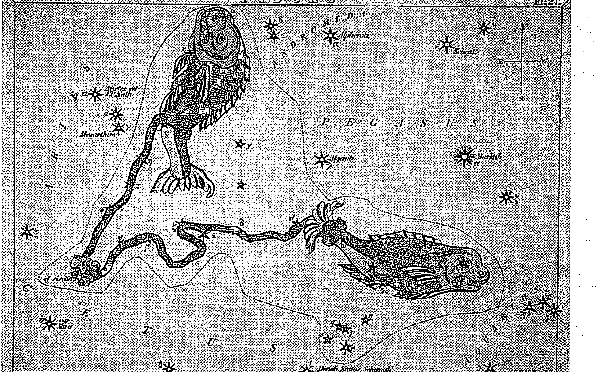

# Part 2 提升愛情運的星座魔法精油

# 十二星座愛情觀與搭配精油

## 金星星座魔法精油

我們能在一個人的星座命盤看到太陽、月亮、水星、金星、火星、木星、土星、天王星、海王星、冥王星十個行星在黃道宮位上運行。他們各別掌管人生中不同的面相，如同赫密士主義著名的格言「如其上，如其下」，古人認為大宇宙中的天體星晨呼應著人體的小宇宙以及人的性格與命運。當我們要製作出好的魔法精油配方，可依據星座命盤給的線索找到適合的精油。

一個人的主要特質可從太陽看出來。而我們往往會發現許多人談起戀愛似乎變了一個人，跟他的太陽星座有很大的出入。像是職場上的商業女強人，碰上愛情可能變得手足無措，或是渴望小鳥依人；明明看起柔柔弱弱沒什麼主見的朋友，感情觀卻意外大膽。這些落差來自於掌管愛情觀的金星與太陽星座坐落在差異性極大的位置。

金星的英文名為「Venus」，為古羅馬掌管愛與美之神，主掌戀愛、美與享樂。因此要觀察一個人的愛情觀、戀愛模式或喜好往往和金星所坐落的星座脫不了關係。調一瓶提升戀愛運的魔法精油，除了太陽星座外，必須一同參考金星星座才能更到位。

為十二星座選定的二款精油都是符合該星座的戀愛特質，有些是作用在於強化優點，有些則是修補缺點之用。

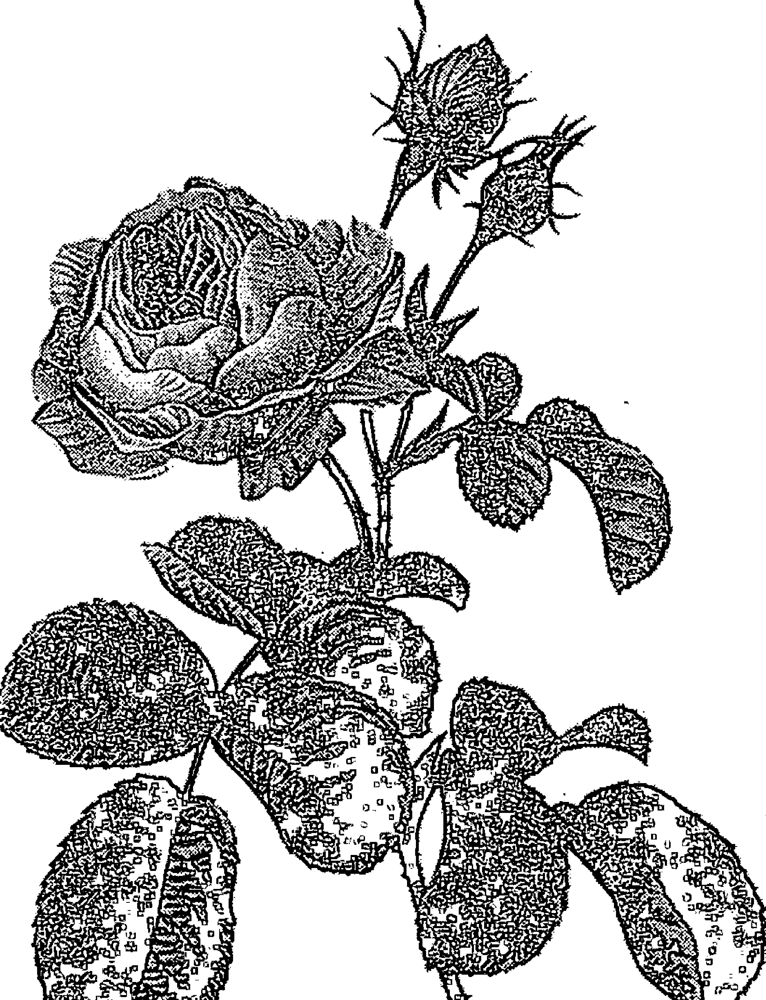

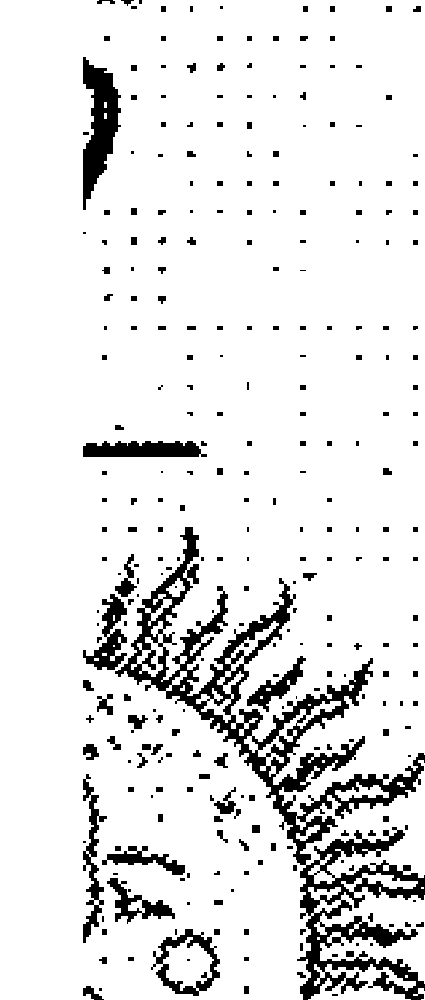

# 一股腦陷入戀愛的 ♈ 金星牡羊座

太陽星座牡羊的主要性格是活潑、熱情與活在當下。而金星牡羊座則是在戀愛模式與喜好上展現出這股熱力。他們容易一股腦陷入戀愛，也樂於主動追求，如戲劇中火山爆發般無法自控的熱愛，便是金星牡羊的戀愛態度。不過熱度無法持續太久，對世界充滿好奇心的牡羊們很容易被其他目標激起新的熱情。與金星牡羊連結的精油有沉香醇百里香和甜橙。

百里香自古與「勇氣」這個關鍵字連結，中世紀國王賜與騎士百里香表彰其勇氣。無論是藥草或精油都有防腐抗菌的功效，能量頻率與牡羊座相仿，同樣是熱情勇敢不怕挑戰，正符合牡羊們追求愛情的行動力。

另一款精油甜橙則有助於牡羊座在面對感情能常保新鮮，火熱與快樂的戀愛是牡羊座所追求的，而甜橙多汁且甜美，讓他們不會太快對戀愛目標產生倦怠感。

# 慢熱卻佔有慾強的 ♉ 金星金牛座

金星金牛座對待愛情相當務實，多數感情觀較傳統，對待認定的對象不吝給與物質照顧，喜愛細火慢燉感情，進入戀愛速度慢，對牡羊座那般的暴衝型追愛方式敬謝不敏，會以實際的角度評估對象是否有交往價值。而戀愛中的金牛具較強的佔有慾。適合金星金牛提升戀愛運的精油有快樂鼠尾草與伊蘭伊蘭，兩者都使人與身體有更強的連結並打開感官。

快樂鼠尾草有非常好的放鬆效果，有助女性生殖系統與調經，在能量效果上能滋養靈魂中的陰性能量，並開啟使用者的感官。戀愛中身體契合是金牛非常重視的要素，快樂鼠尾草能使金牛座展現出身體魅力。

另一款精油為伊蘭伊蘭，同樣有催情與滋養陰性能量的效果，對舒緩焦慮亦有功效。伊蘭為花朵萃取精油，擁有飽滿和開放的能量，能讓使用者愉快自在地敞開自己享受關係。與金牛座相同都屬於金星所管轄，讓人愉快地享受感官帶來的各種快樂。

需要換口氣再繼續狂聊的

# ♊ 金星雙子座

## 尤加利與香桃木

金星雙子無法與話不投機的對象往來，口語交流以及保持戀愛時的新鮮與趣味性十分重要。他們看待愛情相對理性，以遊戲的方式享受戀愛，並且崇尚自由，無法忍耐過於黏膩的交往模式，即使熱戀也很需要個人空間。金星雙子重視彼此想法的契合、以及相處是否開心快樂，一成不變會讓他們逃之夭夭。

適合金星雙子的精油為尤加利與香桃木，兩款精油都有助於呼吸系統，是讓人能深呼吸的氧化物類精油。其中尤加利精油有多種可選擇，一般可用藍膠尤加利或澳洲尤加利，其中以澳洲尤加利較為溫和。尤加利能帶來樂觀的思緒，亦能平息爭論。

另一款金星雙子適用精油為香桃木，在精油化學分類中屬於氧化物類，氣味清涼，能加強風元素能量的流動，如腦袋運轉與溝通表達。雖然兩者同是氧化物類精油，卻比尤加利更柔和，夜間使用也不會造成睡眠問題。二款精油都為金星雙子在溝通上帶來更多樂趣。

拿得起放不下的

# ♋ 金星巨蟹座

## 玫瑰草與真正薰衣草

金星巨蟹的感情觀相對保守，他們渴望讓自己有安全感的對象，感情中心細膩，不輕易提起也放不下，較無法大膽追愛，暗戀是常態。對喜歡的對象無微不至的照顧如同母親，也有強大的責任感，相對的在分手後也無法輕易忘記舊情人。適合金星巨蟹的二款精油為玫瑰草與真正薰衣草。

玫瑰草與香茅一樣是禾本科植物，擁有長劍般的葉片，外形有雜草感十分接地氣。名為玫瑰草便是因為它的玫瑰香氣，但卻不像玫瑰那般厚重，而是脫俗爽快。玫瑰草在魔法中有時與天竺葵一樣會作為玫瑰精油的替代品，不過它本身的能量形態是更直接的，能幫助巨蟹在追愛時不再鑽牛角尖、裹足不前，著眼在重點上。也能讓巨蟹更拿得起放得下。

另一款精油真正薰衣草則是突顯巨蟹照顧人的特質，以及帶來安全感。薰衣草著名的特長是讓人一夜好眠，讓腦袋轉不停的人，中斷紛亂的思緒進入安定狀態。薰衣草如同療癒者和母親，能接住各種狀態，雖然它對於重症效果不彰，卻能一網打盡眾多輕症，如同母親溫暖治百病的手。

## 容易自我感覺良好的 ♌ 金星獅子座

### 伊蘭伊蘭與苦橙葉

金星獅子的愛情相當地戲劇性，他們喜愛佔主導地位又熱情洋溢，對情感的表達毫不羞澀，會大方展現自己的光彩以吸引他們所喜歡的人接近，不總是主動追求。對待情人和巨蟹座一樣喜歡照料他們，但會依照自己的方式，有股唯我獨尊的感覺。

金星獅子適合的精油有伊蘭伊蘭和苦橙葉。伊蘭伊蘭來自南亞，帶有波浪狀金黃色的美麗花朵，亮麗迷人，在原產地常被用來祝福新婚夫婦，也是現代香水工業中的寵兒。伊蘭伊蘭的能量使人開啟感官，感受熱情，十分適合愛情中熱力四射的金星獅子。

另一款適合金星獅子的精油為苦橙葉。苦橙葉與薰衣草相同為所謂多分子精油，化學成分多元，什麼都有一點，這讓它成為調油救星，失敗的味道加一點苦橙葉就能變美好。這是一種「中介」的特質，金星獅子渴望在戀愛中為王者，卻會不小心地落入自我感覺良好的狀態，而錯過良緣。苦橙葉調整那過高或過低的能量狀態，也就是金獅子的過分自大與自卑，讓他們好好戀愛。

## 總是過度付出自我的 ♍ 金星處女座

### 花梨木與羅文莎葉

金星處女往往對戀愛設有條件，有完美主義傾向，不容易戀愛，一但戀愛則可持久。進入戀愛前他們會理性分析並保持距離，戀愛後則是精打細算，有時會帶來壓力。他們在戀愛中有憂慮的特質，不容易單純享樂其中。處女的服務特質進入金星，讓他們善於照料其伴侶，有時則會過度付出。適合金星處女的精油有花梨木與羅文莎葉。

花梨木是另一種帶有玫瑰香氣的木材，能量運用上有兩大特質，一是平衡付出，二是療癒過去傷痛。古典占星中金星在處女座並不是個好的位置，處女的本質在戀情中容易感受到矛盾，花梨木能撫平處女在過去情感經驗中的受傷回憶，同時讓他們不過分付出。

另一款精油為羅文莎葉。羅文莎葉有益呼吸系統，並對部分空氣傳染病有抑制的效果。能量狀態上羅文莎葉同時對應阿育吠陀醫學脈輪中的海底輪與喉輪，分別掌管身體的脊椎底部與喉嚨之能量中心，它讓使用者先站穩腳步再為自己發聲，消除使用者本人所設下的心防。

> 「眼睛是靈魂之窗」

重視對等付出的

## Ω 金星天秤座

### 橙花與芫荽籽

金星天秤重視戀愛中相互平等的付出，喜愛高雅有品味的對象。過於黏膩而沉重的戀愛不是他們的喜好，當一段感情走不下去，會先放手的是金星天秤，因為他們希望好聚好散，不真的撕破臉。金星天秤需要戀愛也樂於走入婚姻，在戀愛有許多好運氣。適合金星天秤的精油為橙花與芫荽籽。

橙花的英文名「Neroli」來自一位義大利的尼羅利郡主，郡主因時常以橙花為香水因此得名。過去的歐洲會在婚禮使用橙花以象徵純真與愛情永久。橙花讓金星天秤即使戀愛也保持如皇族般的優雅氣度。

芫荽就是俗稱的香菜。台灣習慣使用它的葉片入菜，但精油多半萃取自它的種子。魔法用途中，芫荽常加入激起慾望的配方當中，而精油則是為使用者作能量充電。它能為空間帶來輕鬆愉快的氛圍，鼓舞冷漠的情緒，為金星天秤打造更容易社交的狀態。

不受傷又佔有慾強的

## 𝕄 金星天蠍座

### 肉豆蔻與沉香醇百里香

金星天蠍的戀愛是深刻而強烈的，他們要求百分之百的愛，一旦投入也要求自己付出一切，有強烈的佔有慾，同時認為性在感情中是重要元素。投入戀愛前金星天蠍有較高的心防保護自己，會對追求設下種種試煉，甚至帶來傷害，唯有經過重重難關才能讓他們敞開。若是感情受挫時，不是傷害自己就是傷害對方。適合金星天蠍有精油有肉豆蔻和沉香醇百里香。

肉豆蔻是南洋盛產的重要香料，也是打開大航海時代與帝國主義殖民的關鍵香料。它的香氣甜美又魅惑，能溫暖與使身體放鬆，但卻不能過多，劑量過高將帶來刺激。當肉豆蔻作為香料使用時，食用過量也有中毒的危險，種種都與金星天蠍所代表肉體與毀滅性相連。魔法用途中肉豆蔻能保持愛人的忠誠，以安撫金星天蠍多疑的心。

沉香醇百里香則是另一款適合金星天蠍的精油。在古典占星中，天蠍座的守護星為火星，金星天蠍連結的兩款精油都帶著小小的刺激性，需使用得當。百里香能提振挫敗與沮喪感，並釋放禁錮的心靈和撫慰心靈創傷。

## 熱愛挑戰高難度情人的 ↗ 金星射手座

### 檸檬香茅與玫瑰草

金星射手座喜愛自由奔放的戀愛，不受世俗拘束，想愛就愛，同時享受追求的感覺，也喜歡挑戰難度高的對象，困難絲毫不會減少他們的熱情。即使進入戀愛也是停不下來的個性，會大方地表達情感，但非常需要個人空間，無法忍受被管控。適合金星射手座的精油有檸檬香茅與玫瑰草。

檸檬香茅擁有長劍般的葉片，是禾本科植物。氣味帶有檸檬氣息，強烈卻直爽。它使人振作，並產生行動力，讓腦袋中的想法化為具體行動去實踐。身體效果上能幫助消化，也是東南亞媽媽的發乳配方之一。金星射手在追求感情上是隨心所欲的類型，這也對應了檸檬香茅「實踐」的特質。

另一款適合金星射手座的精油為玫瑰草，與檸檬香茅同屬禾本科植物，即使擁有玫瑰氣味也不失奔放的特質，它對應金星射手對感情的直率與活潑，擁有不拘小節的特質。玫瑰草因其玫瑰氣味在魔法運用中有時會成為玫瑰替代品，都能為愛情帶來好運，但玫瑰草比玫瑰多了更多行動與接地的能量，像人馬一般奔放。

## 擅長談一場世俗戀愛的 ♑ 金星摩羯座

### 沒藥與岩蘭草

金星摩羯座的愛情觀相對傳統，選擇戀愛對象或戀愛模式會十分注重他人看法與社會觀感。他們會以實在的角度去評估對象，非常在意投資報酬率。一旦進入戀愛會相當專一和穩定，多數時候他們會預先作最壞打算。戀愛模式十分務實，較不擅長華而不實的浪漫行動。適合金星摩羯座的精油有沒藥與岩蘭草。二款精油都屬於較沉穩而不張揚的氣味。

沒藥與乳香一樣是著名的樹脂類精油。當樹皮被割破後所流出的樹汁凝結顆粒便成為樹脂，因此樹脂是樹木自我修復的方式之一。沒藥對應金星摩羯在感情中的悲觀主義，修復他們，並在關鍵時刻推他們一把。而沒藥的能量特質可讓人看見事物的本質與自我的本質，亦能讓金星摩羯在感情的評估中看到核心價值。

另一款適合金星摩羯座的精油為岩蘭草。它擁有細而長的根，能延伸到土壤之中，這款精油對應金星摩羯固守傳統與社會觀感的特質。岩蘭草在能量運用上適合光說不練的夢想家與靈性課程中毒者，協助回歸根本與平靜，同時安撫急躁與好大喜功的心。這些特質都與謹慎的金星摩羯不謀而合。

## 感情中不按牌理出牌的 ♒ 金星水瓶座

### 橘與苦橙葉

金星水瓶對感情的態度理性而相對冷靜，對待情人與朋友不會有太大差別。在愛情上有前衛的想法，完全不在乎世俗並且收放自如。喜歡不按牌理出牌，輕鬆自在的感覺，特別欣賞機智、冷靜有創造力的對象。與金星射手座一樣，即使在戀愛中也非常需要空間與自由，十分重視與戀愛對象精神層次、理想的契合。適合金星水瓶的兩款精油為橘與苦橙葉。

同為柑橘類精油的橘與苦橙葉分別萃取自果實與葉片，但二者皆擁有柑橘類的活躍、快活與自在，對應金星水瓶所需要的特質。萃取自果皮的橘子精油，比起甜橙多了一分微酸，因此能為思路帶來更多刺激與樂趣。此外橘子與羅馬洋甘菊一樣能安撫內在小孩，它讓使用者感受到與家族、團體的連結性，使金星水瓶不過分脫離。

另一款精油為苦橙葉。苦橙葉同時擁有葉片類精油的清新與柑橘類的活躍。它支持金星水瓶的多元觀點與跳躍的想法，也創造他們與他人的連結性，並看見更多的可能性。

## ♓ 金星雙魚座

### 小花茉莉與真正薰衣草

金星雙魚擁有浪漫情懷，感情豐富，並在戀愛中抱著犧牲奉獻的精神。他們跟著感覺走，容易陷入戀愛，會一無反顧並傾其所有。因極有同理心，容易愛上需要自己照顧的對象，並對他呵護備至。金星雙魚大概是唯一在功利社會中還相信至死不渝愛情的類型。適合金星雙魚的精油有小花茉莉與真正薰衣草。

茉莉精油中包括兩種氣味、能量相異的大花茉莉與小花茉莉。大花茉莉的身體感較強烈，而小花茉莉則淡雅而輕盈，常被用來泡成茉莉花茶。小花茉莉能撫慰創傷，帶來生意志，氣味感性而帶著柔美的氛圍。

另一款適合金星雙魚的精油為真正薰衣草。金星雙魚與金星巨蟹一樣都會為喜歡的對象付出奉獻，而金星雙魚的方式又更加夢幻。他們容易被甜言蜜語所惑，也很擅長浪漫舉動，只為了讓對方感受到愛。真正薰衣草的能量便是溫柔的關愛與支持，它彰顯金星雙魚溫柔體貼的一面。

## 基礎愛情魔法精油配方

跳脫星座特質的框架，其實還有不少精油可為愛情加分。它們隸屬不同行星管轄，擁有該行星的能量特質，除了參考星座特質找出適合個人需求的精油外，以行星屬性來挑選也是非常好的參考。你可以尋找與個人太陽星座對應的行星，例如牡羊座找火星植物，金牛座的守護星為金星，就找金星植物，以此類推。不知道自己太陽星座守護星的話，可以在第一章（第13頁）找到對照表。

再者，我們也可以單純就行星能量作考量。希望能受到關注的人可以選擇太陽或火星植物以帶來外顯和立即性的能量；而希望更有自信與魅力可以用金星植物；希望名聲遠播或有更好的溝通力則可以挑選水星植物。

▲ 流浪的彗星

| 行星 | 植物 | 功能 |
|------|------|------|
| ⊙太陽 | 橙花 | 愛與喜悅，提升魅力。 |
| ⊙太陽 | 羅馬洋甘菊 | 增加吸引力，為配方加強效力。 |
| ⊙太陽 | 肉桂 | 提高身體能量與身體的吸引力。 |
| ⊙太陽 | 迷迭香 | 提高愛情與慾望魔法的效果。 |
| ☾月亮 | 茉莉 | 招桃花。增加身體感官，也帶來更深的精神交流。 |
| ☾月亮 | 橄欖 | 提高戀人的忠誠，祈求感情持久。 |
| ☾月亮 | 香蜂草 | 促進曖昧成功，發現真命天子。 |
| ☿水星 | 檸檬馬鞭草 | 增加個人魅力。 |
| ☿水星 | 甜馬纓丹 | 增加愛情的深度。 |
| ☿水星 | 薰衣草 | 招桃花。增加與戀人的精神交流，專一與守貞。 |
| ☿水星 | 詩蔥 | 帶來幸福感，刺激性慾。 |
| ♀金星 | 百里香 | 提升魅力，招桃花。 |
| ♀金星 | 玫瑰 | 愛情保鮮，提升魅力。 |
| ♀金星 | 天竺葵 | 在愛中帶來交流與平衡，提高生育。 |
| ♀金星 | 香草 | 激起慾望，與愛情活力。 |
| ♀金星 | 岩蘭草 | 提升魅力。 |
| ♀金星 | 甜紫羅蘭 | 改變命運，與薰衣草搭配是強力的媚藥。提升性慾。 |
| ♀金星 | 西洋蒔草 | 延續與維持愛情。招桃花，使久未聯絡的朋友主動與你聯絡。 |
| ♀金星 | 伊蘭伊蘭 | 提高自信與魅力。 |
| ♀金星 | 肉豆蔻 | 精力劑，保持愛情的熱度。 |
| ♂火星 | 芫荽 | 串起二人的連結，精力劑，古老愛情魔法用藥草。 |
| ♂火星 | 羅勒 | 增加情人間的共識，了解對方的心情。呼喚愛。 |
| ♂火星 | 小茴香 | 提高愛人對你的忠誠心。 |
| ♂火星 | 薑 | 為愛情升溫，與維持力。 |
| ♃木星 | 丁香 | 增加個人魅力。 |

## 行星植物與愛情功效

## 愛情精油調製程序

- 瓶內吹一口氣。

- 滴入2滴太陽星座用油。

- 滴入3滴金星星座用油。

- 加入10ml 基底油。

- 觀想願望。

- 點燃紅色或粉色蠟燭放於魔法精油瓶前。

- 靜心祈願。

- 靜待蠟燭燒盡。

## 植物變形的魔法

## Part 3 增加財富力的星座魔法精油

在本篇的財富魔法精油中，我們會以更進階的方式尋找適合個人財運的精油。也會介紹一些基礎占星知識，以便大家理解為何要參考這些星座或宮位。首先十二星座各有特質，發揮在理財上也會顯現差異頗大的價值觀。我必須先說明，所謂十二星座指的是十二種不同的特質，不會有一個人僅符合單一一種極端的星座特質，由於個人星盤上還有不同行星作用且因行星中有各種相位的連結，而相位則會突顯出該星座是發展負面或正面的特質。

本篇星座理財觀可參考個人的太陽星座、金星星座以及二宮宮頭星座。太陽星座顯示一個人的外在與主要性格；金星除了顯露個人喜好類型，也可看出價值感與用錢方式；而二宮則代表個人價值觀與理財之運勢狀況。

## 十二宮各宮位意義

這個部分為大家稍微介紹星座命盤的基礎結構。當你拿到自己的星座命盤，會看到圓盤猶如蛋糕一般被畫分為十二份，裡面又有好幾層的圓環。你可以從圓盤對切線的左邊看到第一塊蛋糕標有牡羊座的星座符號，接下來便以逆時鐘的順序為金牛座、雙子座、巨蟹座、獅子座、處女座、天秤座、天蠍座、射手座、摩羯座、水瓶座，最後回到牡羊座隔壁的雙魚座。這是黃道十二宮不變的順序，在每個人星盤上都一樣。這十二個區塊在占星上稱為「宮位」，泛指人生中十二個不同的領域，包括樣貌、價值觀、學習能力、家庭狀況、創造力、工作、健康、配偶、潛能、教育狀況、名聲、朋友與秘密。第一宮由牡羊座管轄因此又稱為牡羊宮，以此類推第十二宮為雙魚宮。

串連的行星

▲ 十二星座与十二宫位

## 十二宮位掌管項目

我們能依據該宮位是否有行星進駐或是該宮位宮頭所在的星座看出星盤主人在該領域遇到的事、特質及運勢。調製財富魔法精油時我們最關心第二宮的狀況。以下粗略讓大家了解各宮位掌管項目。

| 宮位 | 星座 | 掌管範圍 |
|---|---|---|
| 1宮 | ♈ 牡羊座 | 命運、身體狀況、外貌、生命力、自我 |
| 2宮 | ♉ 金牛座 | 擁有的資源、理財能力、價值觀、感官、追求物質的能力 |
| 3宮 | ♊ 雙子座 | 手足、鄰居、智慧、短程旅行、早期學習環境、語言文字與學習能力 |
| 4宮 | ♋ 巨蟹座 | 家庭、生活環境、童年生活、不動產、家世 |
| 5宮 | ♌ 獅子座 | 子女、創造能力、表現力、娛樂、戀愛運、禮物、休閒活動 |
| 6宮 | ♍ 處女座 | 健康運、部屬關係、寵物、勞動服務、工作運、疾病 |
| 7宮 | ♎ 天秤座 | 婚姻、合夥人、股東、人際關係、密友、公開的敵人、合約、法律、訴訟 |
| 8宮 | ♏ 天蠍座 | 黑暗面、共有的資源、他人或配偶的錢、性、死亡、意外、保險、遺產、潛能 |
| 9宮 | ♐ 射手座 | 長途旅行、國外、高等教育、哲學、社會福利、宗教道德 |
| 10宮 | ♑ 摩羯座 | 社會地位、名聲、榮譽、職業、外在形象、人生的頂點、政治野心、父母、老闆 |
| 11宮 | ♒ 水瓶座 | 朋友、志同道合者、社團、理想、社會意識、共同嗜好 |
| 12宮 | ♓ 雙魚座 | 精神面、小人、自我限制、人生的總結、隱密面、犧牲、秘密 |

## 二宮宮頭星座魔法精油

當我們觀察自己的星盤，會發現並非所有宮位裡都有行星進駐，行星有時候只分布在少數宮位當中，剩餘沒有行星的宮位在占星學中稱為「空宮」，即便是空宮依舊能判斷該宮位的運勢狀況。這時需要先找出該宮位的「宮頭」落在哪一個星座之中。所謂「宮頭」是指每個宮位區塊的起始點所在的位置，而第一宮的宮頭即為上升點。下圖的星盤為例，二宮的宮頭為摩羯座。三宮的宮頭在水瓶座，以此類推。

通常在判斷一個人的財富運勢我們會同時看二宮與八宮。二宮可看出此人的價值觀、理財能力等，換而言之便是自己賺錢與花錢的方式與狀況。而八宮則可看出來自他人的資源。本書所調製的財富魔法精油，以個人為出發點，藉由展現個人星座特質與消弭弱點來選擇精油，因此以二宮作為主要選油參考項目。每個星座挑選二種精油，一則展現星座特質，另一為補強弱點。調製時可選擇其一，亦可都使用。

▲ 以2022年2月2日，凌晨2點出生為例。此人的二宮宮頭星座為摩羯座。

## 暴富或慘賠乃常態的 ♈ 二宮牡羊座

### 桉油醇迷迭香與甜馬鬱蘭

牡羊座的活力與衝動性格會反應在他們花錢的態度，因此要牡羊座存錢容易卡關，暴露在誘惑之下很容易衝動地砸下巨款。因為勇於冒險，有投資習慣的牡羊很能接受較高風險的投資方式與標的，可能暴富或慘賠，同時在財務出現狀況時又能快速作出反應去挽救頹勢。對於工作，早年較容易頻繁更換公司，非常需要一份忙碌的工作去消耗他們源源不絕的幹勁。討厭束縛喜歡主導，有好的生意頭腦，也夠大膽的牡羊座很適合創業當老闆，只是需要一位冷靜心思縝密的軍師來輔佐。

二宮牡羊座的人自我意識相當強，以自己為中心，任何起心動念都為了滿足個人意志。通常以目標為本不怕挑戰，花錢直接。會以積極方式賺錢，同時也捨得花錢。

可選擇桉油醇迷迭香或甜馬鬱蘭作加分與補強用精油。迷迭香的能量特質讓人活在當下，看到眼前的機會，讓牡羊座展現其特質中的行動力，掌握時機大膽行動。甜馬鬱蘭則為補強用油。能量特質讓人冷靜並降低慾望，可幫助牡羊座減少衝動購買和行事機會。

## 出手便高貴的 ♉ 二宮金牛座

### 安息香與印蒿

用錢謹慎且深思熟慮的金牛座十分有耐心，容易在同一職場待數年不輕易更變。天生有累積財富的智慧，非常善於存款，看到帳戶數字增加使他們感到安全與自己的價值。他們能忍住不花小錢，出手購入高貴而保值的東西。金牛座擅用個人的深思熟慮從事長期型理財計畫，因為他們有耐心並在評估風險與獲利上有精準眼光，但有時過度保守反被自己困住。

二宮金牛座的人非常重視「擁有」，是在愛情與麵包二擇一中，鮮少選擇愛情的那方。因為他們認為沒有麵包就沒什麼好談，他們喜歡累積財富帶來的安全感。消費型式偏好買保值商品。目標明確，慢慢累積財富，財不露白，無論賺錢或花錢都屬穩健型。

可選擇的精油有安息香與印蒿。氣味甜美的安息香又有東南亞的乳香之稱，它的能量溫暖穩定，讓唯物主義傾向的二宮金牛座獲得滿足。帶有美酒香氣的印蒿能量特質讓人忘卻憂慮，放掉執著，協助固執的金牛座有更活躍的空間，屬於補強型精油。

## 適合操作短線的 ♊ 二宮雙子座

### 橘子與檸檬香茅

擁有精打細算的聰明腦袋，若有理財習慣則善於收集與運用各種理財資訊。無法忍受乏味工作的雙子座比較適合變化性高或訊息產業工作。而多才多藝的他們可以運用用人脈拓展事業，同時兼多份差賺取金錢。與金牛座相對較沒有耐心，腦子動得快，計畫常趕不上變化，適合短線型或具流動性的投資標的，如股市或避險性貨幣。

二宮雙子座的人有靈活的理財頭腦，手上的資金快速周轉不停，有來來去去的傾向，鮮少固定留住。他們有一百種賺錢的方式，可身兼多個職位當斜槓一族。因此能看到別人身上的價值而成為成功的生意人。

雙子座可選擇的精油有橘子或檸檬香茅。與同是柑橘類的甜橙相比，橘子精油帶有微微的酸味，更具變化性與創意，它能讓二宮雙子座的人快速動腦，靈活運用在各項工作上。檸檬香茅則屬於補強精油，禾本科的檸檬香茅給人踏實感，氣味直接爽快，讓腦袋總是快於行動的雙子座擁有更多實踐力而非空想。

## 擅長穩定又保守理財的 ♋ 二宮巨蟹座

### 廣藿香與橘子

自我保護意識使二宮巨蟹座在理財方面偏於保守，他們需要透過存款與實質儲蓄才能帶來安全感，不喜歡高風險與不確定性高的投資方式，即使有好的投資機會也往往會因猶豫不決而錯過，甚至不予理會。工作方面為了家人可以忍耐，不喜歡離開舒適圈。較少衝動購物，花費大多與家人或住家相關，這些是他們安全感的來源，如此才有可能砸下大錢。對巨蟹而言往往會以直覺來決定投資方式。

二宮巨蟹座的人特別需要財務方面的安全感，很容易擔心錢不夠用。他們以直覺理財，較沒有金錢野心，偏向依靠老實工作的主動收入。擅長存錢，但因投資策略保守以及判斷力不佳，較不容易獲利。

可選擇的精油有廣藿香和橘子。廣藿香是財富魔法中經常使用的精油，帶有土壤氣味，能量特質有安定感，使二宮巨蟹座的人確切掌握需求，踏實安定。台灣人熟悉的橘子擁有太陽般的溫暖靈活的能量，在華夏文化中是經典的好運勢象徵。它為保守的二宮巨蟹座在理財上帶來活躍的思考與好運。

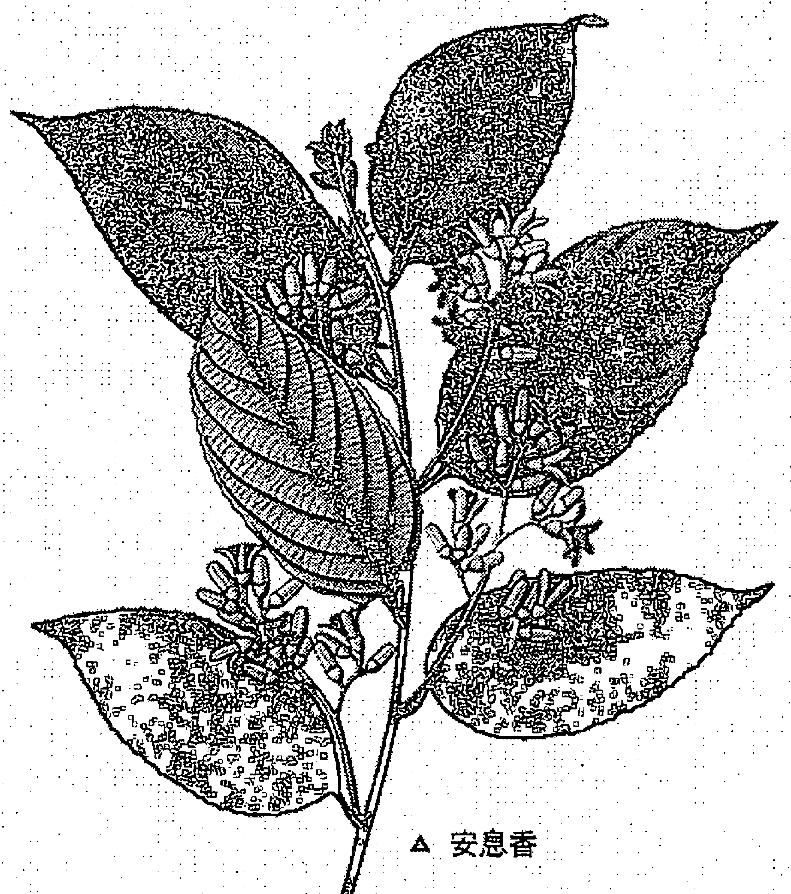

## 如大老闆出手闊綽的 ♌ 二宮獅子座

### 佛手柑與沉香醇百里香

具有開創性的能力，無論投資或創業都能獨當一面，也對賺錢充滿熱情。二宮獅子座無論是小主管或是老闆都會毫不吝嗇地照顧下屬和員工，出錢出力，而且喜好奢華物品，花錢大器，身上不容易留住現金。屬於有野心賺大錢也花大錢，導致財富累積不如預期。不過獅子座在工作上相當有能力且有當擔，容易在職場顯露頭角，晉升快收入豐。有收集名牌、珠寶等奢華品的眼光，可以作為保值性投資。

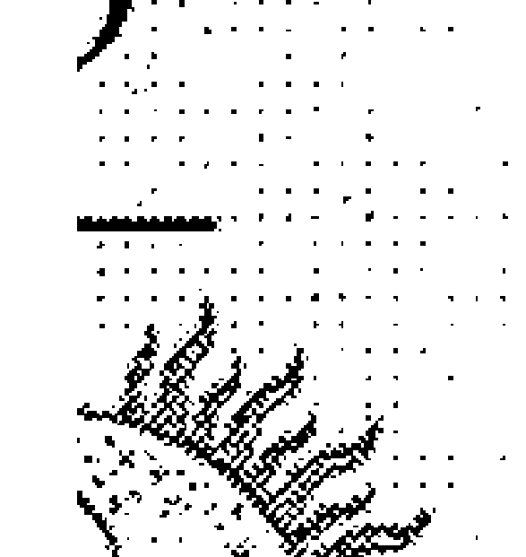

二宮獅子座的人不屑小錢，想賺大錢懷抱美好的發財夢與事業野心。錢是表現自我力量的工具，他們能以自身的名聲或權力來獲得利益。並將所賺取的金錢投入使自己更受人注目的花費上。喜愛主導的獅子座也容易將錢花在宴客或照顧部屬上。

可選擇的精油有佛手柑與沉香醇百里香。佛手柑能使心情愉快並打開心防，展現獅子座太陽般的明亮氣場，並拓展可能性。沉香醇百里香則有積極與勇敢的能量特質，能支持二宮獅子大膽前瞻的理財計畫。

## 擅長精細數據分析的 ♍ 二宮處女座

### 桉油醇迷迭香與檸檬

天生細心謹慎的處女座對數字相當敏感，擅長梳理複雜而多如牛毛的理財訊息，他們會分析數據作好規劃。不論是工作或理財都會自己訂定高標準以及確實的目標，並督促自己按步就班完成，連退休計畫也早早布局。他們在投資方面小心翼翼，是十足的理性派，絕不會衝動追逐熱門項目，而是依據個人精準的評估才下手。購買東西也先列購物清單，比較各通路差價，再加上各種信用卡或點數優惠，最後才用最優惠的價格入手。

二宮處女座的人以精打細算著稱，他們相信魔鬼藏在細節裡，會小心每一分錢的使用方式，作出完整的理財規劃，喜歡凡事作分析比較，十分有實踐力，但賺錢較勞心勞力。

可選擇的精油有桉油醇迷迭香與檸檬。迷迭香讓人深呼吸帶來清晰感，展現二宮處女座對數字的敏銳並馬上展開行動。檸檬精油有淨化與轉換心情的效果，可讓平日勞心勞力，錙銖必較的二宮處女減輕心裡負擔變得輕快，同時不失清新暢快。

## 思慮過多無法看準時機的二宮天秤座

### 天竺葵與葡萄柚

擁有優雅品味的天秤座對美的事物一擲千金，即使手頭資金不足也不想降低生活水準，不太會虧待自己。太多的金錢都投注在朋友與高檔的花費。擅長換位思考的天秤面對選擇經常猶豫不決，三心二意的性格使他們在理財上偏好多元化規畫。即使遇到好的投資機會，也往往會因為思慮過多無法下決定最後錯失良機。工作方面與人合作會有好運，適合團隊工作或與人合夥，但因想與說比實際做來得多，身邊有協助執行的夥伴才更有效率。在投資上他們很怕麻煩但有獨到的眼光，可交給理專代為操作。

二宮天秤座的人財運好，容易透過與配偶或他人合作賺取金錢，對財富的態度相當隨性，但重視平衡，較少以高風險的方式賺錢。而賺來的錢大多花費在交際或提升生活品味的事物上。

可選擇的精油有天竺葵與葡萄柚。天竺葵散發玫瑰的香氣，能突顯天秤的優雅品味，並符合他們重視交流的特質，讓交際費轉為財富，取得有效連結。葡萄柚能解開人心束縛，自由對待他人與自己，協助使用者斡旋於成熟自在的人際關係，為二宮天秤的人輕巧推動財務周轉。

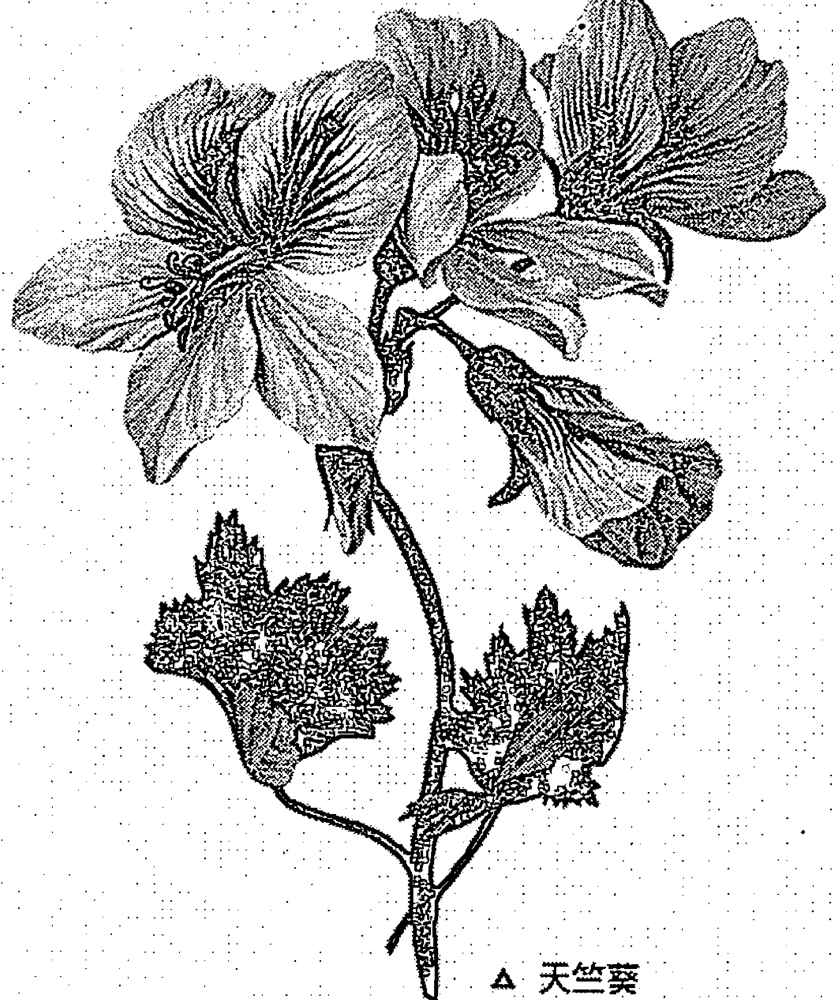

## 膽大心細懂出手的♏ 二宮天蠍座

### 丁香與香草

二宮天蠍座的財運天生比較好，加上性格中的競爭心以及強烈的直覺，賺錢對他們而言並不難。此外，未雨綢繆的性格讓他們對風險敏感，投資上往往能避免追高而慘跌。他們擁有耐心，等待好的時機才出手，總是預先作最壞打算並規劃好未來的路。金錢本身不是天蠍座的最愛，賺錢才是。金錢可說是他們達成其他目標的手段，他們不會隨便投入心力，只對看準的事項投入大筆金錢。而他們也喜愛神秘感，往往有一筆連家人都不知道私房錢或小金庫。天蠍座不愛改變，偏好保守的投資選擇。

二宮天蠍的人有種神秘性及耐力，即使在投資上獲利，仍會未雨綢繆乖乖上班，慢慢累積財富。他們相當有理財頭腦，平日節省，真正消費時則會一口氣花一大筆錢。擁有危機意識的天蠍也善於處理財務上的問題。

可選擇的精油有丁香與香草。屬於香料類植物的丁香，來自丁香樹的花苞，因此帶有綻放的能量，乾燥後尖刺如釘而得名，可讓二宮天蠍座快狠準地賺錢；甜美的香草精油給人吃甜點般的幸福感，它能讓二宮天蠍滿足並享受成果，為賺錢感到喜悅。

## 賺得快也花得快的♐ 二宮射手座

### 薄荷與岩蘭草

由木星守護的射手座除了有好的財運外，也十分樂天，較少擔心金錢，這使他們在投資理財上較不務實。工作若讓他們一直有追逐的感覺，便能激發其行動力與活力，快速獲得財富，但賺得快也花得快，加上他們願意承擔風險，不時會有賭一把的心態出現。投資理財也會因一時的興起而追求高風險高報酬的項目，即便有了損失，依射手座的樂觀性格也能很快從低潮中自我修復，依舊故我。畢竟木星為他們帶來的好運使需要錢的時候總有金錢入帳，進而使射手座在消費方面有享樂主義的傾向。

十二星座中財運最好的星座，需要錢就會有錢入帳，使二宮射手較無理財規劃，容易成為月光族。這不代表射手完全沒有理財腦，若認真學習會比他人更快上手，並充滿探索精神。有時他們追逐財富不全然為了物質上的好處，而是追求背後的精神獲利。

可選擇的精油有薄荷與岩蘭草。薄荷能瞬間擴張血管，使人感到清涼，並提神醒腦，可為二宮射手座的衝動購買收心；岩蘭草有綿長的根吸收土地能量，十分接地氣，護錢牢牢留下生根穩定。

## 儉儉存大錢而低調奢華的 二宮摩羯座

### 薑與佛手柑

性格實際的二宮摩羯座對個人事業極具野心，即使是一般公司的僱員也是努力踏實的類型，可說是老闆眼中最有責任感的優良員工。他們為了得到更高的收入會拼命努力，積極向上爬，並持續累積財富，這使多數摩羯座到晚年都有良好的財務狀況。消費習慣也展現出他們務實的特質，鮮少衝動購買，省錢才是最重要的事。若要花費較大筆的金錢，勢必會投資在讓自己看起來成功的標的型商品，如低調奢華的名車等。喜愛有長期穩定收益的投資項目，投資策略保守，會迴避高風險高報酬的類型。

二宮在摩羯座屬於天生資源較少的類型，需要透過個人汲汲營營地累積財富，賺錢的路並不輕鬆，生活雖然樸實要求不高，同時也很怕沒錢。偏好作中長期的理財規劃，不喜歡風險與意外狀況，通常中老年財運較佳。

可選擇的精油有薑與佛手柑。薑精油來自該植物的球根，能量強而持久，給人強力的支持，讓二宮摩羯座在財富之路上規劃更踏實、收益更穩定；佛手柑本身有排去憂鬱與焦慮，使人看到希望的明亮特質，幫努力的二宮摩羯掃去對金錢的不安。

## 眼光獨到擁有前瞻性的≈ 二宮水瓶座

### 苦橙葉與檸檬

二宮水瓶座獨特的思考模式能為他們帶來與眾不同的投資策略，他們對新興產業特別感興趣，並擁有前瞻的眼光，偶爾會讓旁人為他們擔心是否風險過高。但水瓶座是最能跌破眾人眼鏡的一群，事後往往證明他們是對的。他們會為擁有共同理念的人事物付出金錢，部分水瓶座認為與公眾分享財富很正常，對累積個人財富沒有太重的執著，理財上有時相當隨性。由於眼光獨到，能嗅到未來趨勢，很適合與人合資創業或投資新興產業。不過必須小心運勢中的意外事件影響財務狀況，偶爾聽取他人意見不是壞事。

二宮水瓶座的人對金錢有超然的態度，完全是「錢財乃身外之物」的體現者。他們擁有一套自己才懂的獨特理財模式，很常在理財上作實驗或賭一把，錢會花在世人覺得奇怪的地方或是與他人分享。

精油可選擇苦橙葉與檸檬。苦橙葉有柑橘果實的光亮與跳動性，又同時有葉片的清新，支持二宮水瓶在理財上的多元觀點，看到各種可能性。檸檬精油讓水瓶對財務上的意外坦然面對，並有各種靈活的理財想法。

## 憑感覺理財或消費的♓ 二宮雙魚座

### 膠冷杉與岩蘭草

對金錢相對看淡的二宮雙魚座，其實有非常好的直覺，只是容易受到外界各種理財訊息而影響判斷。同樣的，當雙魚座所處的是容易賺錢的環境，他們也會因融入團體變得更努力於賺錢。然而他們賺錢多數是為了愛或是為了他人，而非自己所用。若是雙魚座將錢花在自己身上，那必定是購買各種感受與體驗型的商品，追求浪漫體驗或感覺型的消費。無論是理財或消費都憑感覺，感覺來了就不會計較金額高低，情緒對他們的財運有重大的影響。

模糊邊界是雙魚的特質，因此二宮雙魚的人在金錢上人我分界感受低，加上同情心強，容易借錢給他人或捐款。對於世俗事物較不在意的特質使他們對數字概念較為迷糊。不是完全不在乎金錢，就是一股腦猛烈追逐。適合以心靈事業賺錢或從事個人喜好工作。

可選擇的精油有膠冷杉與岩蘭草。膠冷杉的氣味讓人彷彿身在寒帶森林，讓二宮雙魚清楚分界，獨立自主並客觀理性。岩蘭草的能量非常接地氣，讓迷糊飄飄然的二宮雙魚踏實作好理財。

T.5.№83

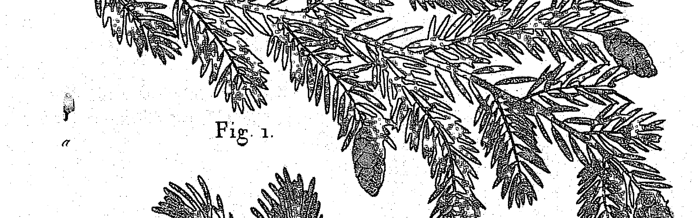

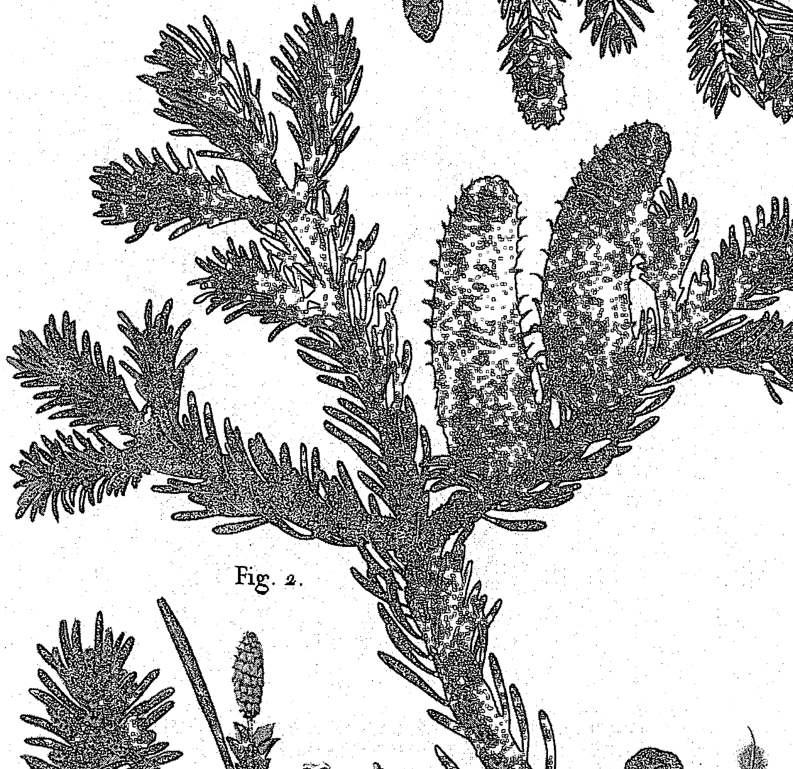

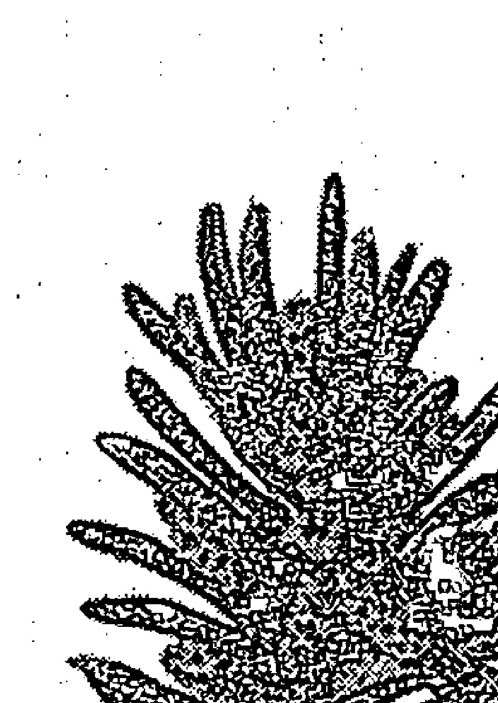

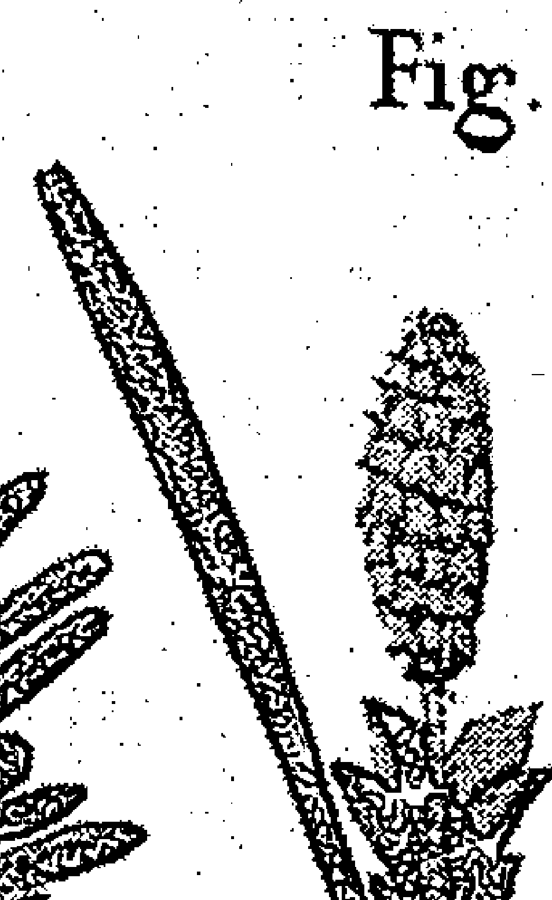

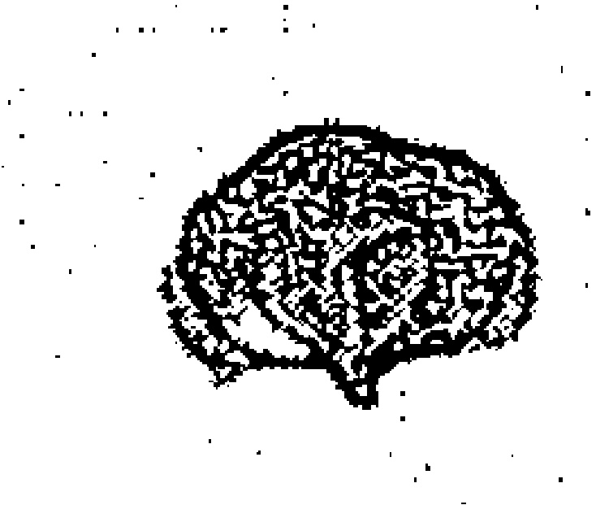

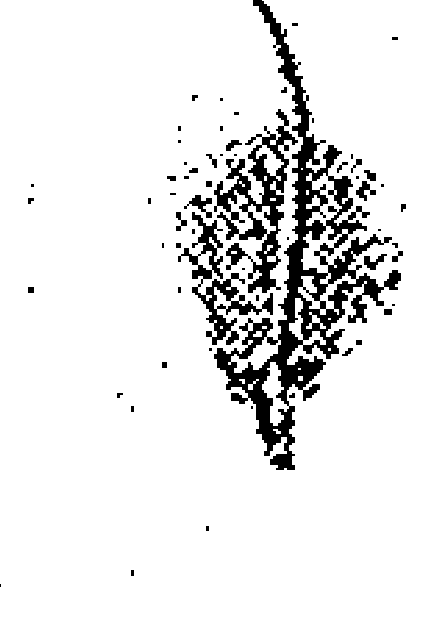

△ 膠冷杉

## 二宫内星魔法精油

所谓宫内星系指星盘中十二个宫位内所落入的行星。每个人的星盘皆有十二个宫位与十大行星，虽然宫位的顺序相同，但会因出生时间而变化一宫宫头，也就是上一章所提的上升点会在不同的星座，而十大行星则会落入各个宫位当中，每个人分布的位置皆不相同，有人的十大行星会散落在不同宫位，有一些人则有集中在某几个宫位的倾向。

若二宫中有行星进驻，可依据所进驻的行星自本节挑选需要的财富用油，若二宫没有行星进驻，称为空宫，则无需在这里挑选。只需依据〈二宫宫头星座魔法精油〉和〈基础财富魔法精油配方〉章节找出自己需要的精油即可。

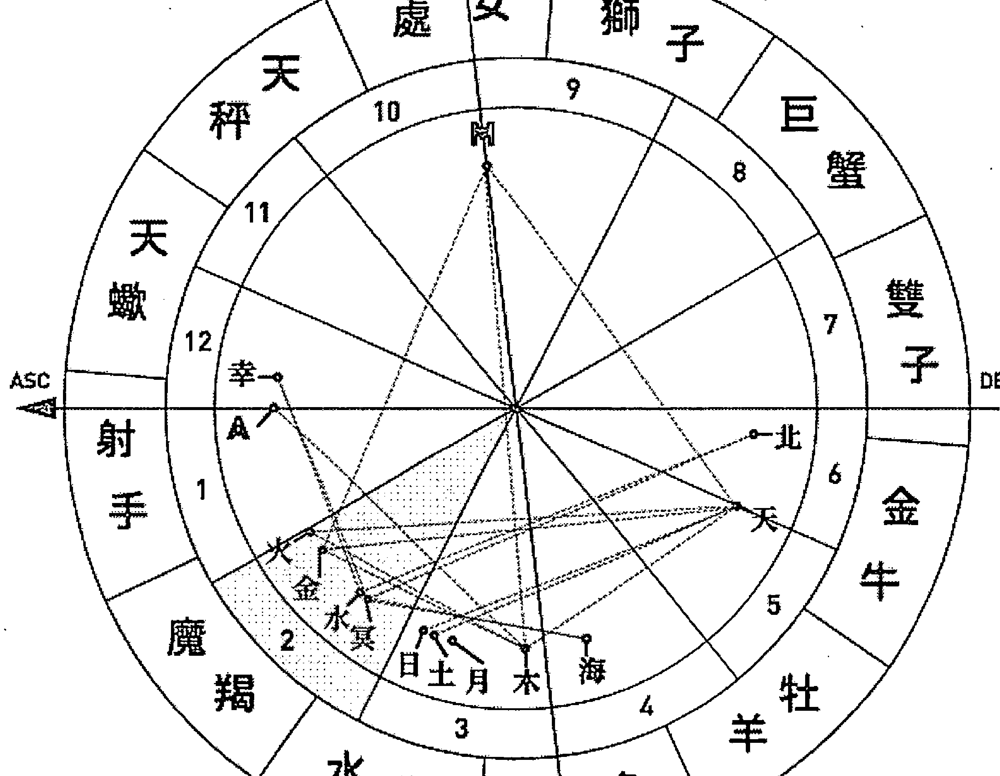

> ▲ 以2022年2月2日，凌晨2点出生为例。此人的二宫内星分别为水星、金星、火星与冥王星，除了可参考二宫摩羯座搭配精油之外，也可参考该章节的二宫内星搭配精油以提升财运。

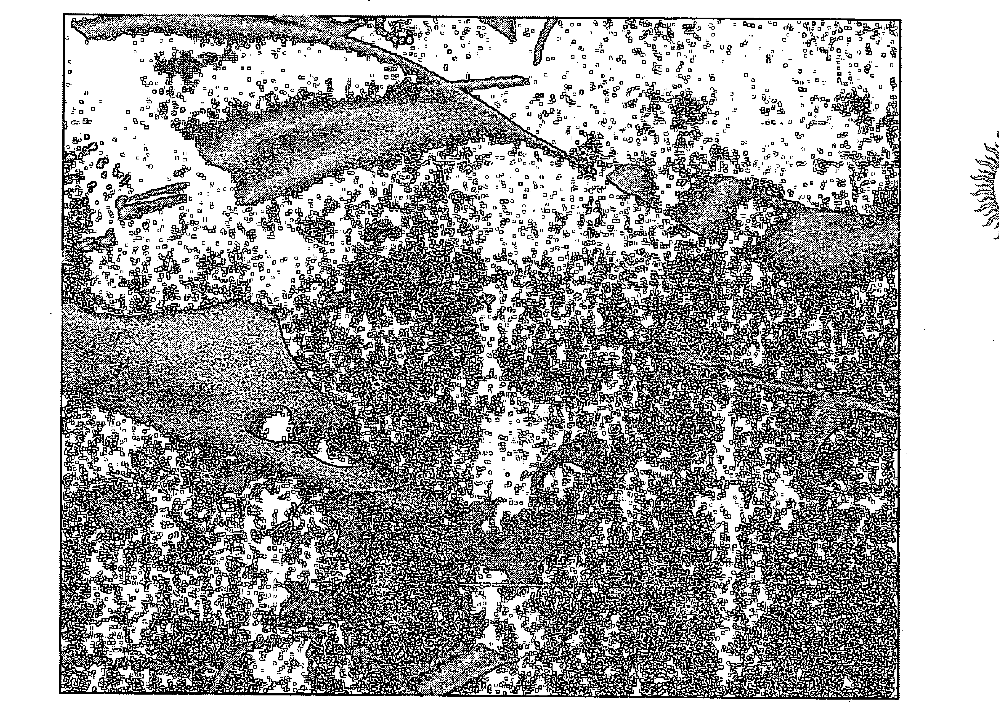

## 二宮內星座落

### ◎ 太陽

- 甜橙
- 佛手柑
- 乳香

太陽代表一個人的自我意識與中心思想，當它落入二宮則代表此人認為財富可證明身分與地位，會以增加財富的方式增加自我價值。佔有慾強烈，理財以自我中心，一切為了自己，財運佳也愛錢，並關心物質生活。

太陽在此宮位可使用甜橙、佛手柑或乳香，這三種精油都屬於太陽屬性植物，以同屬性植物增加太陽的能量。甜橙本身為常見財富用油，身體效果有幫助消化與帶來開心的情緒，它能給予創意、活躍的能量。佛手柑與甜橙有相同的身体效果，能幫助消化、解除憂鬱；而佛手柑多了一份展現自我的能量特質；氣味甜美的乳香是魔法儀式中的常客，有幫魔法觀想具象化的效能，在此的配方中則能提升視野，讓目標更明確。

### 🌙 月亮

甜馬鬱蘭、天竺葵、檸檬

月亮代表一個人的情緒反應、安全感與潛意識，當它落入二宮，代表此人以金錢獲得安全感，物質生活直接影響情緒好懷，相反地情緒與家庭狀況也直接影響財務。由於月亮與家庭、母親與女性相關，因此容易在這些方面花錢。加上月亮不穩定的週期性特質，收入容易有波動性。月亮在此宮位可使用甜馬鬱蘭、天竺葵或檸檬。

這三種精油皆為月亮屬性的精油，在此處幫助月亮展現它的正面特質。甜馬鬱蘭的身體效果能讓人溫暖並對自律神經失調有幫助，它為不穩定的月亮帶來安定感，讓人有被保護的感覺；天竺葵擁有玫瑰香氣，能代謝身體水分與排毒，帶來平衡的能量，減少過大的波動；檸檬有淨化的功能，帶來輕盈的能量與靈感。

### ☿ 水星

薄荷、甜茴香、苦橙葉

水星代表一個人的言語表達和邏輯思考，當它落入二宮代表此人金錢多半花在學習與獲取知識，可從事寫作、教學講課或交通運輸業以及財務管理。他們對數字非常敏銳，能靠好的腦袋與口才賺錢，可能有多元的收入來源。水星在此宮位可使用薄荷、甜茴香與苦橙葉。

這三種精油皆為水星屬性的精油，能彰顯水星能量的流動特質。薄荷能打通堵塞的能量，讓人思緒清晰與深呼吸，產生理性與清醒的能量；甜茴香的身體效用能幫助消化、排毒甚至增加產婦泌乳，促使能量快速流動；苦橙葉兼具柑橘類的活躍與葉片類的清新，帶來連結的能量。

<!-- no content -->

## 二宮內星座落 ♀ 金星

### 香桃木、綠豆蔻、零陵香豆

金星代表一個人的愛情觀，審美觀甚至是消費與享樂方式。當它入二宮代表此人重視物質享受，有天生的美感，也十分擅長累積財富。可在社交圈、藝術活動等獲利，因此很適合從事公關產業，藝術品、美妝保養品的買賣。金星在此宮位可使用香桃木、豆蔻或零陵香豆。

這三種精油皆為金星屬性的精油，讓金星發揮正面的特質，氣味也都與金星連結，具優雅、甜美的味道。香桃木在傳說中是金星女神的花朵，身體效用上能調理肌膚與抗菌，能量特質方面能可替人際交流加分；綠豆蔻是印度咖哩中的常見香料，也常加在印度奶製品的甜點當中。精油的身體效果能改善胃食道逆流，並作為抑菌的體香劑。它讓人自我肯定，並獲得他人的青睞；即使沒聽過零陵香豆也必定對其氣味並不陌生，擁有如香草般的甜美氣味，過去用在甜點調味上。精油的身體效果能放鬆神經，對心臟或血液流動有益。能量效果上能彰顯金星二宮享受人生的特質。

## 二宮內星座落 ♂ 火星

### 沉香醇百里香、茶樹、甜羅勒

火星代表一個人的脾氣、行動力以及性取向。當它進駐二宮代表此人會為生存而拼命賺錢，積極追逐金錢。在購物上也有衝動傾向。火星帶有競爭與戰鬥的特質，因此在工作方面可承擔高風險、高競爭性或高壓的工作，如業務。因他們充沛的行動力與進取心得到相對較高的收入。火星在此宮位可使用沉香醇百里香、茶樹或甜羅勒。

這三種精油都帶有火星的爆發性特質，同時有助於財富，能將火星的正面特質充分展現。百里香的身體效果能緩解肌肉痠痛與尿道感染，在過去是贈與騎士表彰其「勇氣」的植物，能帶來突破，並使人勇敢承擔；茶樹是知名的抗痘精油，亦能提升免疫力，同時提升使用者的抗壓力；甜羅勒在身體效用上，可調理油性肌膚、促進經血排出並幫助消化。魔法效果上，它對人際與感情關係有幫助，同時也能帶來好的名聲與勝利。

# 增加附着力的星座魔法秘法

## 24 木星

### 香草、肉豆蔻、丁香

木星代表人的樂觀、自信及為人處世，有鬆弛與膨脹的特質。當它進駐二宮代表此人財運極佳，不那麼在意金錢，因此有揮霍傾向，用錢十分大方。能從事貿易或業務拓展，同時也容易在信仰投入金錢。木星在此宮位可使用香草、肉豆蔻或丁香。

這三種精油擁有鬆弛或擴張的特質，能突顯木星的能量。香草是最為人熟悉的甜點調味品，給人甜美幸福的感覺，帶來輕鬆且愉快的能量。肉豆蔻原產與東南亞，間接開啟大航海時代與帝國主義時代的歷史性植物，歐美常用於甜點料理。精油則讓人放鬆、舒緩局部疼痛，讓木星二宮的人享受他們的財富好運；丁香是熱力四射的香料植物，它有強力的消炎止痛作用，外形如釘的丁香可以釘住財富，讓人抓緊金錢。

### ♄ 土星

### 薑、沒藥、芳樟

土星代表一個人的悲觀、責任和行事態度，有緊縮和限制的特質。當它進駐二宮代表此人的理財觀較保守穩健，也可能較節儉，這多半和小時候得不到資源，甚至是貧窮有關。他們非常在意收入多寡，對金錢不安，賺錢可能也較辛苦，不過對事業十分堅持。土星在此宮位可使用薑、沒藥或芳樟。

這三種精油有土星的特質，可能展現出土星正面的能量。薑是台灣人最常使用的根部植物，補氣暖身且止吐，舒緩肌肉痠痛效果好。給人溫暖且持續性支持的能量，增加慢慢耕耘之底氣；沒藥為樹脂類精油，傷口修復極佳，心靈效果方面能給人突破難關的堅持與勇氣；芳樟則是帶有樹木類精油的穩定性，讓使用者有毅立不搖的堅定，同時有欲少欲望的功能。

## 二宮內星座落 ♅ 天王星

### 山雞椒、萊姆、安息香

天王星代表外在環境帶給當事人的意外與事件，可好可壞，與靈感、原創力、革新甚至是批判相關。當它落入二宮代表錢財可能來匆匆去匆匆，有許多突發狀況或劇烈變化。當事人有特殊的理財方式或收入管道。天王星在此宮位可使用山雞椒、萊姆或安息香。

這三種精油分別彰顯出天王星的特質所在。山雞椒又稱為馬告，精油對呼吸系統有幫助，作為佐肉香料時它的檸檬香能去油解膩，同時擁有種子類的希望與檸檬氣味所帶來的輕快，讓人在新環境或新領域快速適應；萊姆則象徵新想法以及不受拘束的自由自在；安息香是一種與香草氣味類似的樹脂類，能安撫打擊或創傷後的心靈，帶來巨變後的心理安定，很適合災後重建。

## 二宮內星座落 ♆ 海王星

### 薰衣草、赤松、膠冷杉

海王星代表直覺、聯想力，有消融框架的特質，帶有神秘感、美感與藝術感。當它落入二宮代表當事人具豐富的想像力，能從事藝術領域工作。若相位不佳可能對公私財務不分，或突然捐出大筆金錢給宗教團體等。理財相信直覺，常有疏忽。海王星在此宮位可使用薰衣草、赤松或膠冷杉。

這三種精油分別展現海王星的正面特質，或減低海王星帶來的負面影響。薰衣草以安眠的效果聞名，對皮膚或感冒輕症有不錯的效果，能量特質方面能突顯海王星的放鬆與安逸；赤松樹木精油中帶有較溫暖陽剛的特質，也能幫助人冷靜，掙開枷鎖，並為二宮海王星突破盲點；膠冷杉讓人置身略帶潮濕的溫帶森林之中，給人冷靜的思緒，協助二宮海王在面對財務問題時理性冷靜。

## 二宫内星座落 ♆ 冥王星

## 岩兰草、广藿香、白千层

冥王星有再生与疗愈力，同时代表欲望、压抑与潜能。当它落入二宫代表当事人对理财相当有潜力，一生都在寻找自我价值，并相信金钱等于权力。但对与金钱有深层匮乏感，会比其他人更努力赚钱。对财富有强烈欲望并且非常爱计较。冥王星在此宫位可使用岩兰草、广藿香或白千层。

这三种精油能为冥王星在二宫发挥正面特质。岩兰草本身为常见的财富用精油，有细而绵长的根吸取大地的精华，它能安抚二宫冥王星带来的匮乏感，使人与大地之母重新连结；与岩兰草同样拥有浓厚大地气息的广藿香促使身心合一，觉察内在核心，得到蜕变的力量；白千层在身体效果上能抗菌，处理呼吸道与尿道的感染，也是可舒缓头痛与肌肉疼痛的天然止痛剂。能量特质则如同它一层层的外皮，支持脱皮蜕变，消解心理上的疲惫。

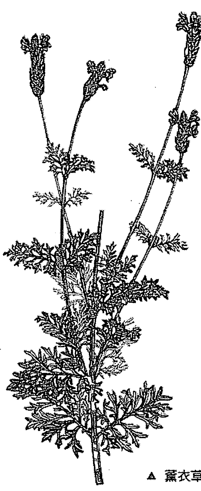

## 基础财富魔法精油配方

当我们无法取得个人星盘，也可以单纯使用具招财与提升财运效果的精油。每支精油都有他们所属的行星属性及魔法能量。我们可以参考魔法效果来挑选所要的配方，或是以行星属性去搭配。太阳属性精油能量多半对工作、名声有帮助，能提升整体运势；水星属性精油有利于讯息的传播；金星属性则与个人吸引力有关；火星则有爆炸性的效果；木星能量则是增加与拓展；土星则给人踏实与安定感。

**表：财富精油身体效用与财运魔法**

| 行星属性 | 财富精油 | 身体效用 | 财运魔法 |
| :--- | :--- | :--- | :--- |
| ☉太阳 | 洋甘菊 | (德国) 消炎、抗敏 (罗马) 安抚中枢神经 | 召唤财富，为成功祈福。 |
|  | 肉桂 | 抗菌、促进血液循环 | 增强磁场，招来财富。 |
|  | 甜橙 | 镇静神经 促进循环与助消化 | 提升业绩，特别是益于店家。 |
| ☿水星 | 欧薄荷 | 利肝胆、消化不良胀气 止痒、缓解头痛 | 带来好运、达成愿望与带来成功， 薄荷叶放入钱包能增加财富。 |
|  | 赤松 | 呼吸道问题、激励肾上腺 | 提升财运，可置于门口。 |
| ♀金星 | 茉莉 | 强化子宫、助产 性功能障碍 | 提升个人魅力，吸引财富。 |
|  | 岩兰草 | 失眠、调节雌激素 改善风湿关节炎 | 为店家带来客源与财富， 并招来好运，亦可防盗。 |
| ♂火星 | 甜罗勒 | 心因性消化问题 高血压与循环问题 | 放置店门口或收银台旁招来客人。 |
|  | 薑 | 健胃、止呕 纾解风湿与关节炎 | 撒在钱上使其生根与增加， 另可祈求成功。 |
| ♃木星 | 丁香 | 消炎、镇痛 | 吸引财富，让眼光精准。 |
|  | 肉豆蔻 | 止泻、消炎 激励神经 | 带来财运与好生意，商业发展用。 |
| ♄土星 | 广藿香 | 消浮肿、解便秘 促进皮肤组织再生 | 具大地香气，对财富提升、 商业发展、业绩增加等财富有助益。 |

## 财富精油调制程序

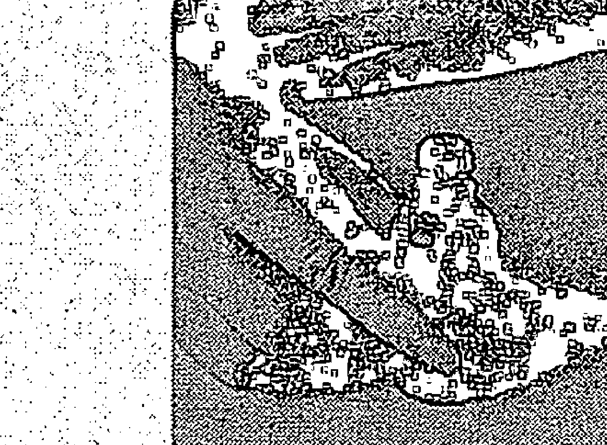

1.  瓶内吹一口气。

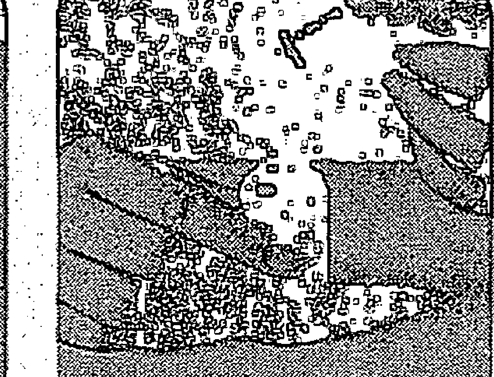

2.  滴入2滴二宫星座油，与1滴二宫内星用油。

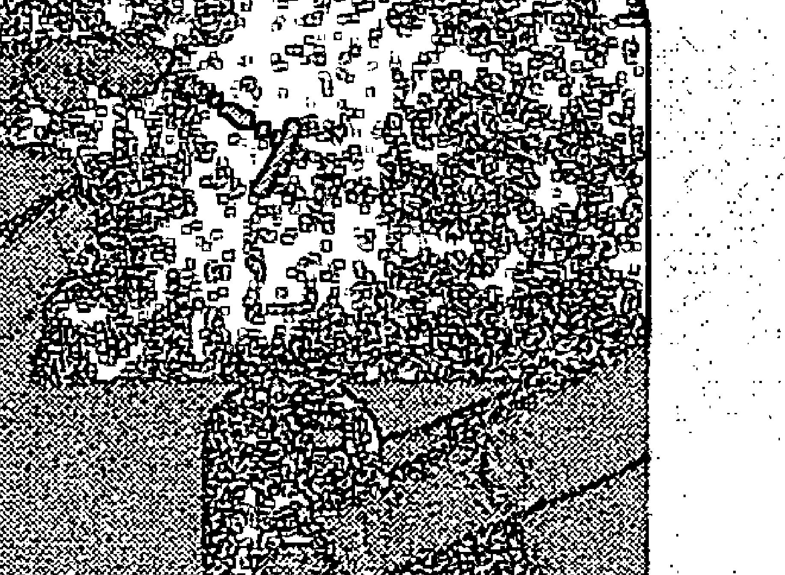

3.  滴入2滴基础财富用油。

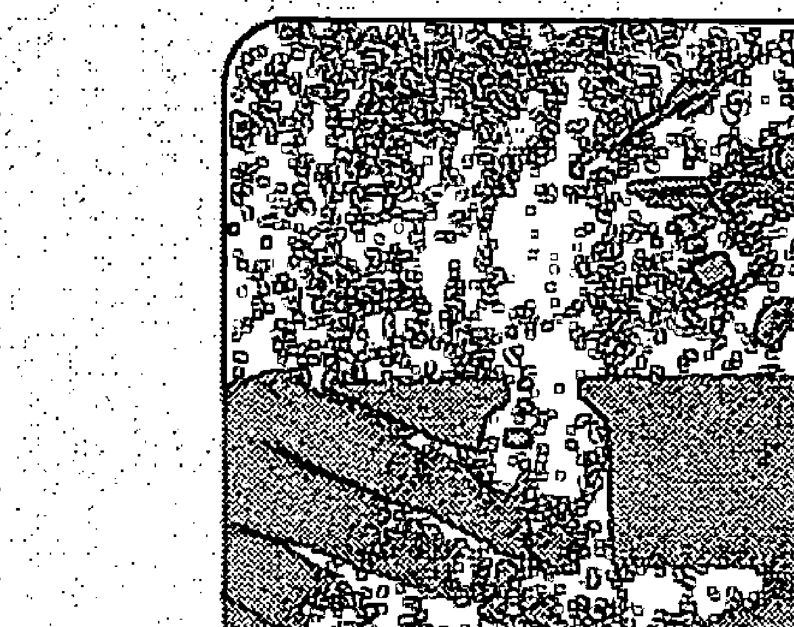

4.  加入10ml基底油。

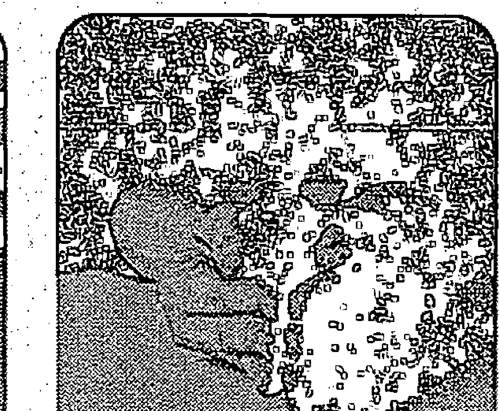

5.  观想愿望。

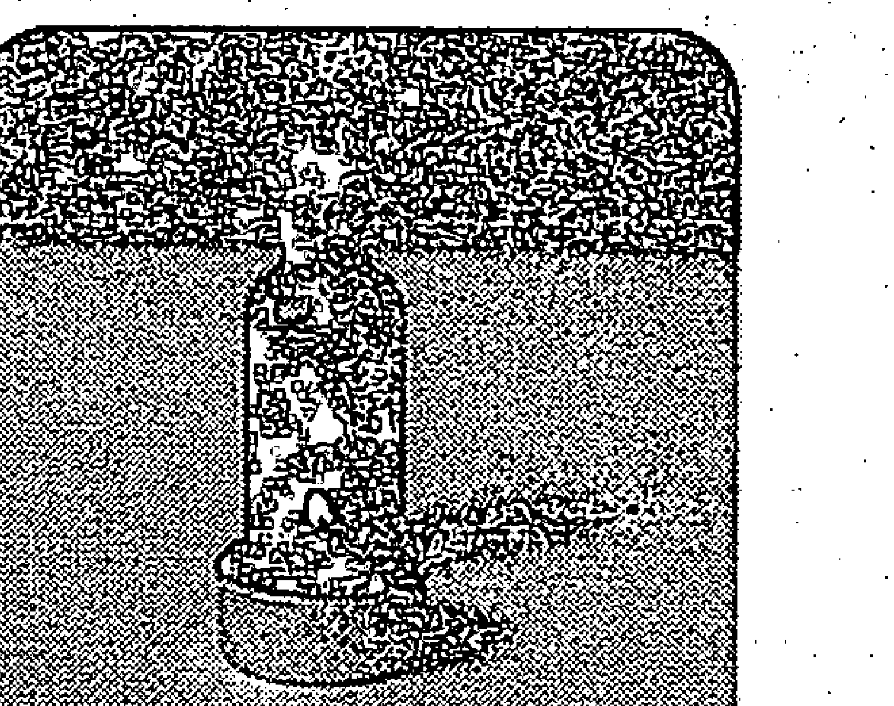

6.  点燃蜡烛放于精油瓶前，财富魔法建议使用绿色蜡烛，此为示意图。

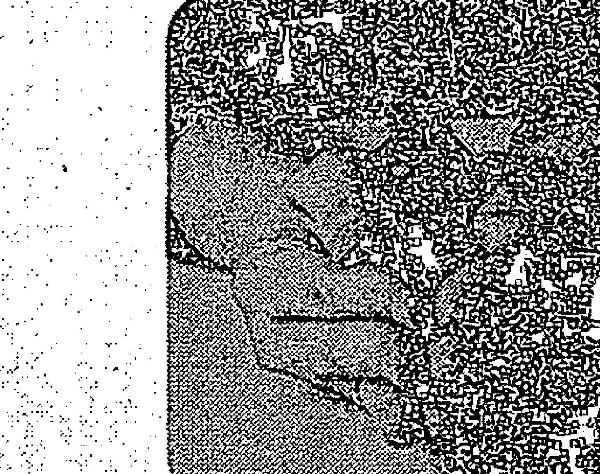

7.  静心祈愿。

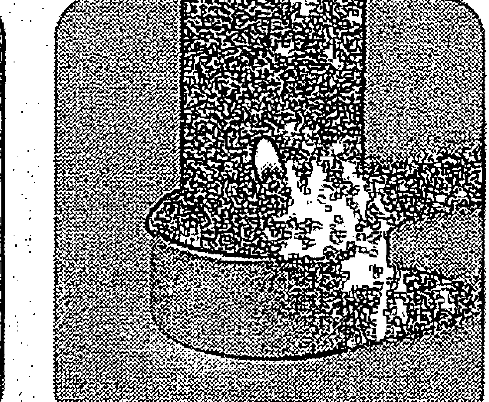

8.  在心中具体地想像愿望实现的情景，并想像力量与愿望灌入魔法精油瓶中。

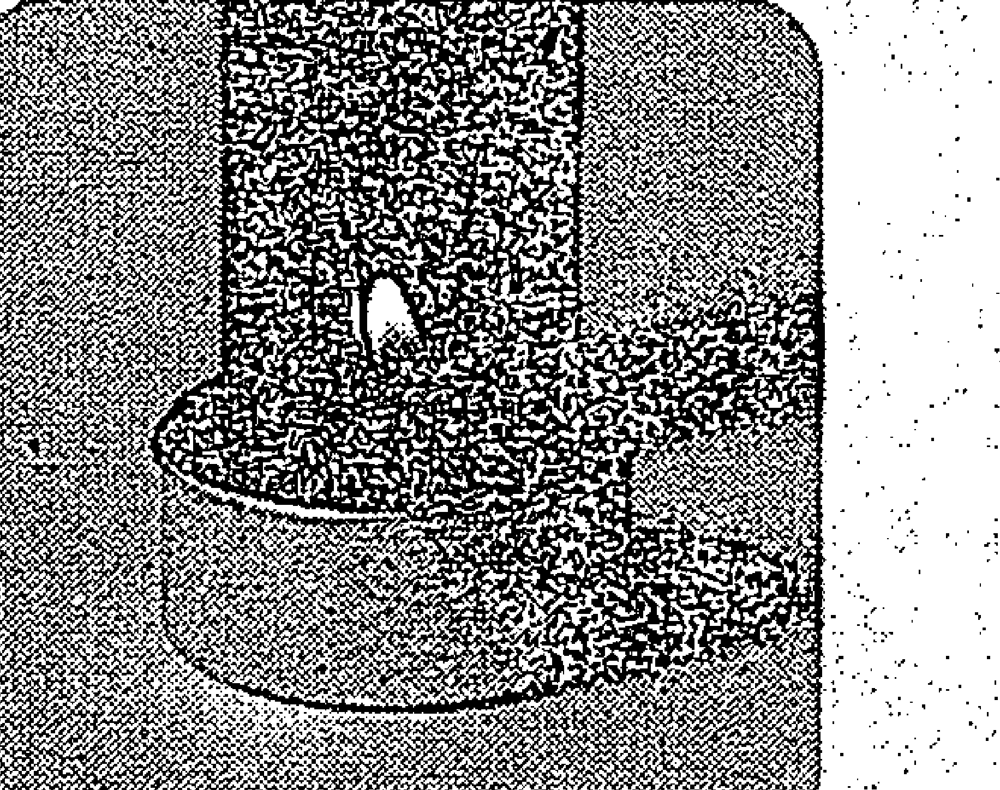

9.  静待蜡烛烧尽。

## Part 4 稳定情绪的星座魔法精油

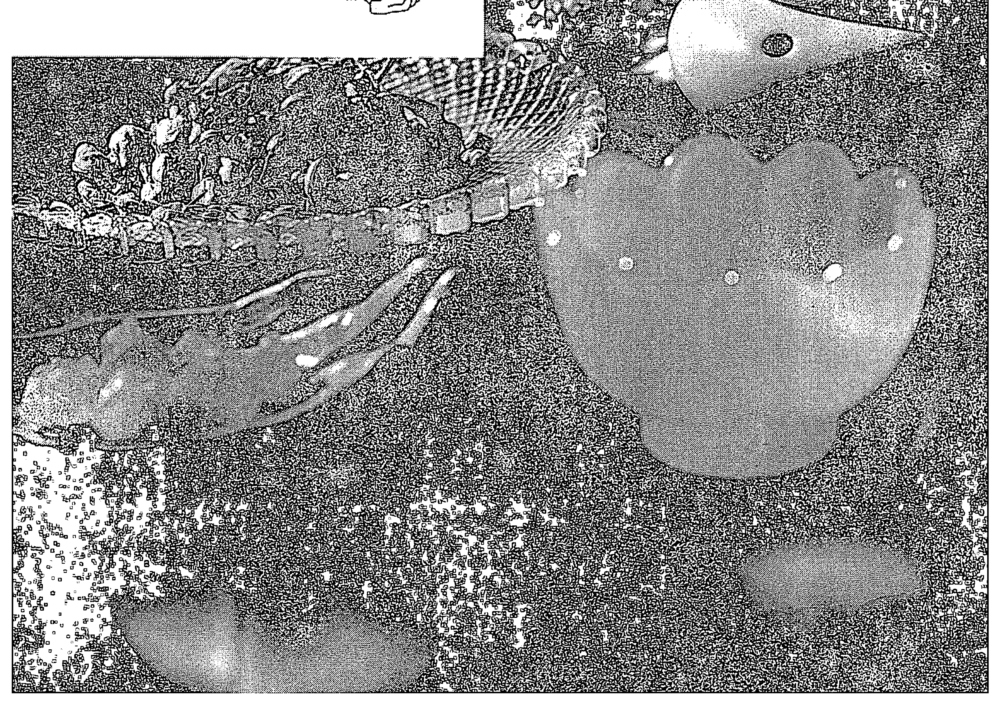

## 十二星座的心境难题——月亮星座魔法精油

上几章我们理解太阳星座与金星星座在爱情与财运中所带来的影响，本章节将单纯处理情绪问题。

芳香疗法对调整人的情绪问题之效果最显而易见。相信大家一定会有自己熟悉的气味，某些气味会让人想起特定的事、特定的感觉，进而引起特定的情绪，若以科学角度解释，这全是因为气味在人脑管理的位置与记忆相近的原故。当然气味的好坏定义也相当个人化，全与成长经验、文化，甚至是国族背景有关。精油所带来的魔法效果、心灵、情绪效果无法拆开来单一讨论，它们往往相互作用，就像一个完整的人一定同时拥有肉体、心智与灵魂那般缺一不可，并且在绝大部分的状况下同时运作。当我们使用一支植物精油，它的化学分子影响我们的身体，它的气味引起我们的情绪，它的能量与我们的灵魂共振，这就是魔法效果、情绪、身体效果很难拆开来解释的原因。如同西洋炼金术的真谛，不在单纯将劣金属炼成黄金这麽表面，炼金术士藉由物质的转变，同时带来能量与灵性层次的蜕变。

因此调配一瓶复方魔法精油时若能同时考虑魔法能量、情绪效果并不忘身体效果才是最佳作法，三者调合是一门我们永远无法停止探索的学问，也是艺术。

一个人的外在形象可以从他的太阳看出；金星可以理解他的爱情观与价值观；若想了解一个人情绪运作的模式以及安全感的来源，则是观察他的月亮星座。有些人的公众形象与私下样貌大相径庭，全是因为太阳与月亮星座有巨大差异，这些差异让周遭的人吃惊，有时也会造成当事人的困扰。因此若想了解一个人的「真面目」，不得不看他的月亮星座在哪个位置。同样的道理，若要了解自己或他人的情绪运作模式，参考月亮星座准没错。然而月亮在星盘上是变动速度相当快的行星，出生时间需要十分精确才能减少误差，查询自己的月亮星座时务必确定出生时间。

## 情绪来得快也去得快的 ♈ 月亮牡羊座

柠檬、罗马洋甘菊、欧薄荷

月亮牡羊座是典型将情绪表现在脸上，说发作就发作，但来得快去得也快。他们希望用打直球的方式呈现自己，无论是好坏情绪。私生活中牡羊直接且主动，以行动去学习和品尝人生百味，即使跌倒也能快速恢复，是十分相信原始生命动能的一群。他们有时相当自我，时时刻刻都是为了自己而活，总是以热情驱策自己获取想要的东西，绝不会被动地等待。如果无法做自己，生活时时刻刻拐弯抹角，甚至得一直配合他人，会让他们感到受困与愤怒。

愤怒以及难以承认个人柔弱面是月亮牡羊座的课题。针对这些课程可以试试柠檬、罗马洋甘菊与欧薄荷，三种精油都能让人冷静下来。柠檬用轻松的方式转换气氛，像按下重新设定的按键一般使身心恢复清爽的状态；罗马洋甘菊一般用来安抚内在小孩，如孩童般直接又冲动的月牡羊使用罗马洋甘菊能使他们安静放松下来，同时不会有被剥夺自由的感觉；最后是欧薄荷，让人想起薄荷巧克力的圆融甜美，是月牡羊的紧急用油，觉得快要控制不住情绪暴怒之时，来点欧薄荷能马上冷静下来，让人找回理性和逻辑思考的能力。

## 只爱舒适圈且依赖物质的 ♉ 月亮金牛座

甜橙、穗甘松、橙花

月亮金牛座很需要不急不徐的个人生活步调，安全舒适，没有恼人的催促。在他们感觉对的时间点做感觉对的事，无法被他人强迫。这种缓慢且规律的步调需要相当的时间去形成。私生活中他们很享受感官带来的乐趣，像是吃美食，穿好的衣服等，也重视「拥有」，会有一些收集嗜好，对物质的占有欲强烈。他们需要透过抓住身边的物品打造一个舒适圈，并将自己跟外界的纷扰隔开。所有的改变都在冲击他们的舒适圈，当事情超出负荷他们会本能的以拒绝、停滞，甚至是过度依赖物质的方式来回应一切。

因此拒绝与人交流、过度的占有欲，与物质依赖是月亮金牛的课题。针对这些课题可以试试甜橙、穗甘松与橙花。甜橙让人满足愉快，对于物质占有颇有执着的月金牛而言，可降低对物质的依赖，对现有的东西感到愉悦；穗甘松亦能放下执着的心，沉稳的气味对应金牛的土元素，就像稳坐在自己的堡垒那般有安全感，对周遭的人抱持爱与感谢；若月金牛因环境变化感到不安，可以尝试橙花，它能温暖月金牛的心，让他用柔软的方式面对外界。

## 罹患知识焦虑症的 ♊ 月亮双子座

薑、柠檬香茅、甜马鬱兰

月亮双子座非常怕无聊，他们需要靠不断的学习新知、收集资讯甚至是八卦来创造生活乐趣，换言之是有知识恐慌症的一群人。他们渴望发现世上所有的事情，比起知识的深度更注重广度，拥有如孩童般的好奇心。天生喜爱发问或对权威提出质疑，并热衷于辩论与笔战，因为交流想法令他们愉悦。因此私生活中谈得来的朋友才能为月亮双子带来安全感。此外好奇心旺盛使他们不断追求崭新的体验，过气陈旧的事物留不住他们。

月亮双子的问题是难以专注和坚持到底，承诺对他们而言是人生课题。针对这些课题可以试试薑、柠檬香茅、甜马鬱兰。薑与柠檬香茅都是让人有底气的植物，由根部萃取精油的薑让人有耐心且带来行动力，对应月双子没耐心与行动力不佳的问题，也能增加成熟稳定感；柠檬香茅如长剑般的叶子带出它俐落的气味，和月双子一样不爱拖泥带水，让双子的脑袋与脚连秸动起来；习惯随时随地收发讯息的月双子容易陷入停不下来的焦虑感，甜马鬱兰对自律神经相关问题有很好的效果，并舒缓焦虑。

## 情感纤细脆弱的 ♋ 月亮巨蟹座

白千层、肉桂、檀香

月亮巨蟹座在古典占星来说是很好的位置。象征母亲的月亮正好落在月亮所守护的巨蟹座能发挥彼此的正面特质。巨蟹座既强大又脆弱，思绪细腻又敏感的部分如同螃蟹壳内的嫩肉，而他们对待「自己人」则会展现无微不至的关照与保护，透过如同母亲般的爱与付出，以及团体的归属来建构安全感。巨蟹一族对他人的情绪和需求很敏锐，记性极佳，但真正对他人敞开内心却需要在没有压力的状况下慢慢来。

照顾他人的同时展现自己的柔弱对巨蟹来说很困难。此外记性极佳的巨蟹要放下过去的事和情绪对他们而言是一大挑战，不过度陷入情绪泥沼是巨蟹的人生课题。针对这些课题可以试试白千层、肉桂或檀香三种树木类精油。树木类精油多半都有扎根与稳固的特性，其中白千层由于外皮能层层脱下，能为巨蟹卸下累积在身上的沉重情绪，加快能量的新陈代谢；肉桂热切且带爆发性，能快速填满能量，让他们感到安全，进而向外敞开心胸；檀香擅长梳理情绪纠结，当人心烦意乱时可使用檀香升华内心的忧思，让自己平静下来。

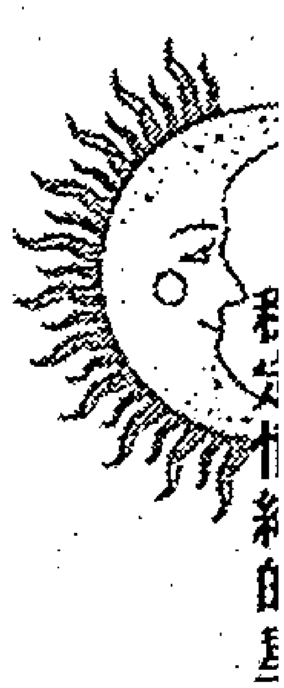

## 乐观外放还是需要鼓励陪伴的 ♌ 月亮狮子座 ♌

苦橙叶、香蜂草、丁香

月亮狮子座既是领袖也有慷慨的特质，他们不喜欢轻视别人，更讨厌被别人看扁。即使不在工作场域，也希望尽情地表现自我，任何的情绪和想法都喜欢以戏剧化的方式表露。尽力展现美好的自我并获得他人掌声使他们感到幸福与雀跃，但当他们没有安全感时，月亮狮子也有可能会隐藏自己。在私生活也拥有领袖特质他们需要群众，因此能一起「玩」的朋友或情人对月亮狮子十分重要。看似乐观外放其实害怕孤独，没有伙伴给予鼓励就会失去勇气。

当月亮狮子没有安全感的时候，会出现两种极端的情形，一则是自大、傲慢，一则是完全隐藏自己，看见与被看见是月亮狮子的课题，一个是看见他人的需求，二则是在自己不被看见时也能做对的事。针对这些课题可以试试苦橙叶、香蜂草或丁香。即使是叶片精油仍透露出橙类的明亮气息，苦橙叶带来客观的视野，能为月狮子突破盲点，当月狮子觉得事事不顺遂时可以来点苦橙叶；香蜂草除排解忧郁外，也有冷静与清爽特质。月狮子喜欢受人关注，为了展现出美好自我的同时不免会有紧张的心情，此时可试试用香蜂草来平抚紧张焦虑的心情；丁香无论身体效果或气味都相当强烈，但细细品味能嗅到一丝花朵的香甜。它让人无法忽略，强烈展现自我，热情又亮丽，月亮狮子座的人使用一点点就能成为主角。

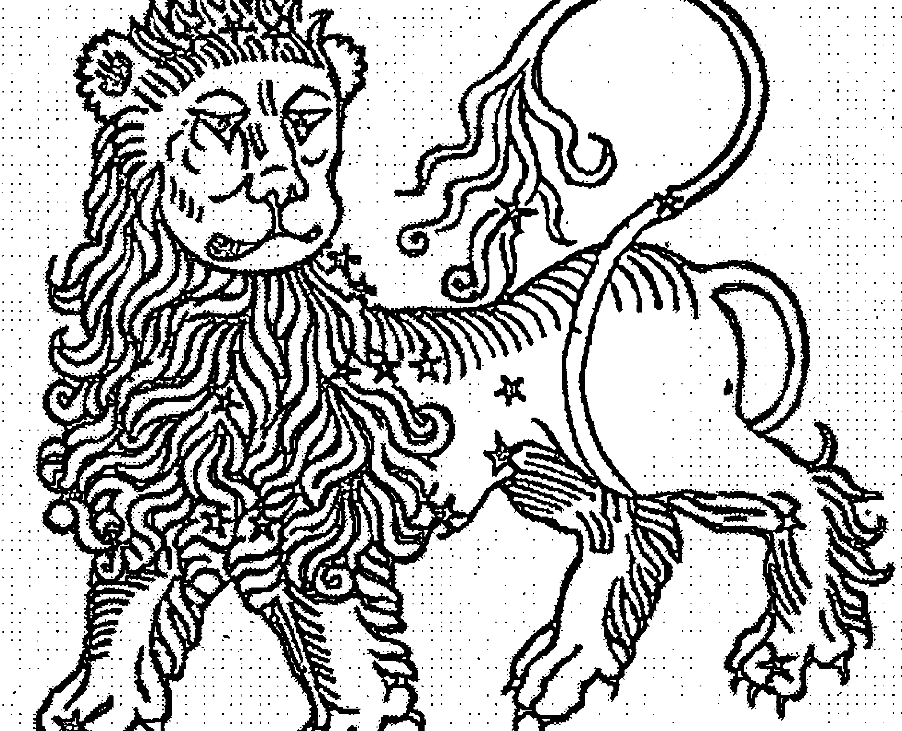

## 力求可预期可控制的完美主义 ♍ 月亮处女座

缬草、香草、佛手柑

对月亮处女座而言整洁与秩序是他们的安全感来源。一切井然有序、可预期和可控制才是他们渴望的状况，这使月亮处女感到心情平静，因此他们时时刻刻都在努力让混乱的外部局面更有条理。不只对外，月亮处女对自己的要求让他们时时都督促自己进步，造就完美主义的倾向。由于渴望被需求，月亮处女会不断学习对他人有所贡献的技能，对世界带来贡献可以让月亮处女座非常开心。月亮处女很能看到细节并点出问题，有时会让人觉得带有攻击性，即使是分析也使人觉得有弦外之音，要留意自己所言可能使人受伤。

即使在他人看不到的私领域也对自己十分严格的月亮处女座，会在没有自觉的状况下反省过去的失败与错误，这美其名是自省，但过度自我批判会使人变得胆小而不敢尝试新事物。针对这些课题可以试试缬草、香草与佛手柑。当完美主义演变为无尽的自我批判，甚至影响到睡眠时，月亮处女座可试用缬草，气味浓郁如同臭袜子的缬草只要稀释后少量调配，会转变为优雅高尚的墨水气味，让人停止思考安心入眠；香草的气味虽然令人熟悉，但配方中浓度太高会让人头痛，淡淡的好了。香草的能量状态如棉花糖一般香甜蓬鬆温暖，让月亮处女座的人如同享受一客甜点般，得到自我犒赏的满足感；佛手柑的明亮激励，如冬日阳光般带来希望，温和不强烈，为月亮处女的人带来自信，并让外界的一切看起来明亮而有秩序。

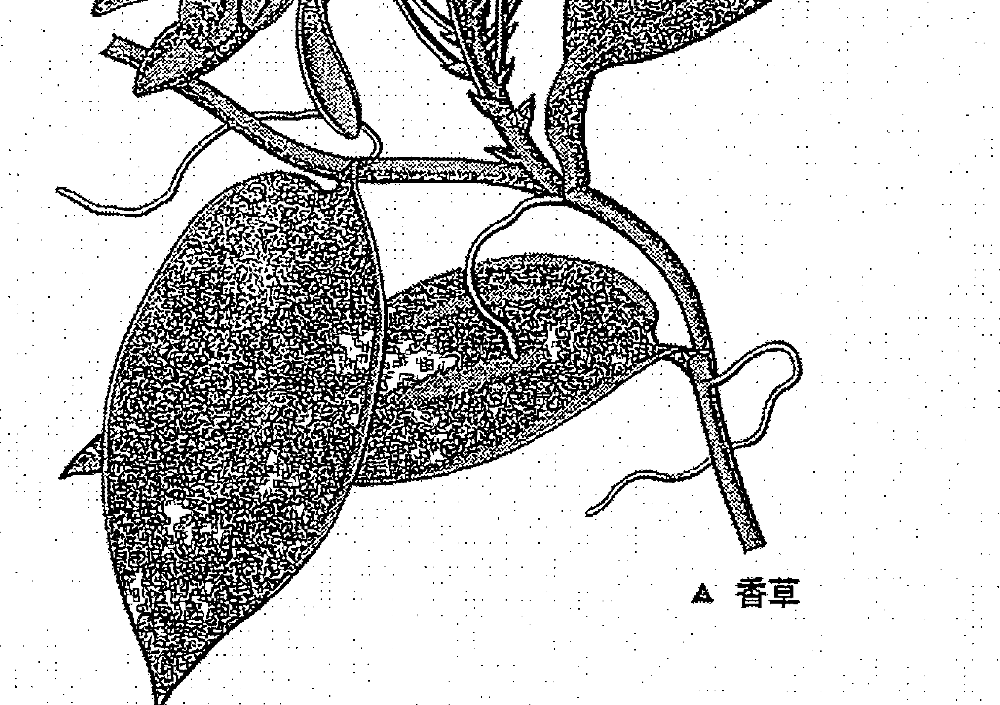

## 月亮天秤座

### 广藿香、杜松、柠檬

平衡与关系是天秤座最在乎的两件事。而月亮代表一个人安全感的来源，使得月亮落在天秤座时，在私人领域很需要伙伴，不管是一同体验生活或分享情绪，无法与他人对话会使天秤座感到不安，交流才能让他们得到滋养。由于情感的幸福建立在找到自然的平衡，使他们极力想调解外在不平衡，甚至是不公正的状况，这时他们会化身纠察队或是调解委员，另一种月亮天秤则会成为不沾锅，演变成回避处理棘手问题的情形。月亮天秤座须面对犹豫不决，拿不起放下的课题。学习表达个人立场，并在作出选择后欣然放下另一边。

广藿香、杜松与柠檬是月亮天秤的人可以发挥正面特质的三种精油。广藿香有着浓厚的土地气味，它让心灵与身体紧密连结，风象星座中最举棋不定的天秤座可藉由广藿香接地的能量，在需放手的情况下，彻底放手不再回头；杜松是著名的净化植物，无论是枝叶或果实都可作为能量净化之用，精油多来自果实萃取。当月亮天秤想化身纠察队与人争论时，可利用杜松排除尖锐的能量；当月天秤时时留意他人的脸色过得喘不过气时，柠檬能降低这种焦虑感。月天秤天生在意他人对自己的看法，很多时候犹豫不决有选择障碍，柠檬给他们当机立断的能量。

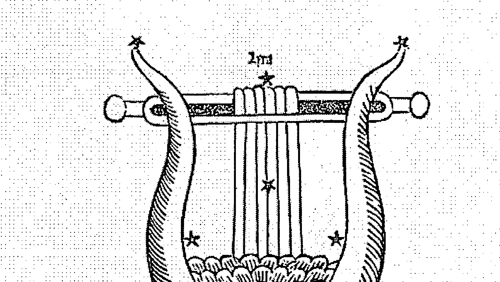

## 生性多疑易陷于负面漩涡的 ♏ 月亮天蝎座

永久花、乳香、穗甘松

月亮天蝎座渴望看见隐藏在事物背后的真相，无论它是美是丑，他们认为生命的完美包含不完美之处，例如黑暗与丑恶之事。拥有不被打扰的私人生活使月亮天蝎座感到安全，他们内心潜藏着强烈的情绪波动，却不善于表达出来，很会察言观色。只有完全坦诚的态度才可能取得月亮天蝎的信任，并让他们感到舒适自在，稍有隐瞒便很容易被他们察觉，他们也会马上关闭心房。月亮天蝎的强烈情感会促使他们全心全意投入一件事之中，对这个人或这件事作出承诺，并强烈着迷。他们观察入微，任何蛛丝马迹都不放过，加上不轻易相信的特质使得怀疑加深，又容易负面思考，毕竟他们天生相信黑暗与光明并存，总是做好最坏打算，因此常常陷负面不安与恐惧之中。

月亮天蝎座需要注意的人生功课是面对恐惧，以及对背叛者的复仇心理，对他人作出强烈反击后往往会感到后悔。面对这些课题，可以试试永久花、乳香及穗甘松。永久花在身体效果上以化瘀闻名，它能化身体的瘀亦能化解心灵的瘀血。月天蝎内在情绪暗潮汹涌，有太多的沈淀物需要疏通，适时给与情绪抒发的出口才能避免日后猛烈爆发；乳香能净化且圣化空间，让那些如烂泥般沈积已久的黑暗能量如同晒到太阳般慢慢蒸散；穗甘松的能量效果与「谅解」有关，月天蝎比较极端的形容是报复心强爱记仇，这其实与他们难以在事发当下展现出情绪有关，那些过去无法展现出的情绪可以透过穗甘松转化，解套。

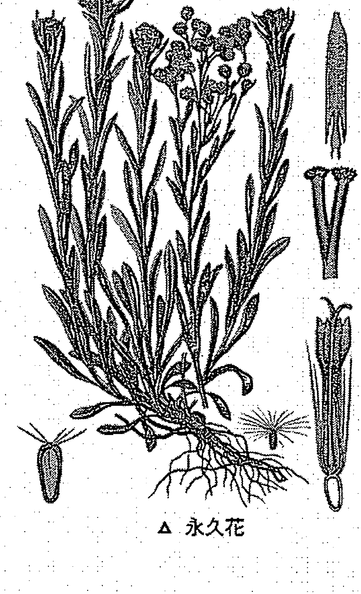

## 不擅于面对沉重话题的 ♐ 月亮射手座

山鸡椒、葡萄柚、没药

月亮射手座的心无法被关住，需要自由自在的体验，跟随自己的心去冒险，会使他们快乐无比。他们天生乐观，可以看到他人看不到的可能性与潜力。月亮射手有好的直觉，通常依照直觉行事都能把事情做好，由于不拘小节，他们总是规划出一个粗略的目标就行，以边做边学的方式完成事情。射手座的自由自在也展现在想法上，他们喜欢哲学和不同的理念。他们会直接的表达感受，但对生命中的沉重议题会下意识闪躲。关系里也需要开放性才能留住他们，不喜欢承诺所带来的枷锁。

月亮射手座的人生课题在于过度自信导致失败，以及对某件事很笃定时会无法维持开放性的学习。针对这些课题可以试试山鸡椒、葡萄柚及没药。山鸡椒在台湾又称为马告，与肉类料理结合能带来柠檬般的清新与黑胡椒般的呛感，就像月射手的人那样跳脱且不受限制；葡萄柚拥有柑橘类的阳光特质，对应月射手的乐观积极，而它能让使用者看到潜藏在体内的可能性；月射手对哲学或各种宗教观点都感兴趣，不断求精神面的成长，没药给予精神层次的支持，在成长关卡前给月射手冲出关卡的勇气与动力。

## 鲜少表现出真正情绪的 ♑ 月亮摩羯座

岩玫瑰、甜马鬱兰、罗马洋甘菊

月亮魔蝎座的人非常有自制力，不会轻易显露出情绪，他们认为比起哭哭啼啼和浪费时间发脾气，不如先把事情做好。因此即使内在很受伤也不会轻易表现出来。由于擅长评估现实，是很好的管理者和规划者，让他们最快乐的就是觉得自己有能力并受人敬重。因此被他人看轻使月亮魔羯的人很受伤。月亮魔羯自小就相对其他同年的人成熟独立，他们喜欢规划自己的道路与决定命运。这类的人拥有超高自制力，鲜少依靠他人也很少露出软弱的一面，因此给人一种距离感。比起情绪，更擅长处理事情的月亮魔羯若长期逆来顺受，一直负担着责任，最终将导致心力交瘁。

他们的人生课题是接受他人的帮助，试着放下加诸在自身的责任，信任自己的能力，进而与他人建立亲密关系。针对这些课题可以试试岩玫瑰、甜马鬱兰、罗马洋甘菊。岩玫瑰对严重的外伤有显著效果，能量状态稳重且收敛，它能快速让问题被控制，正符合摩羯座成熟实务的特质；甜马鬱兰则是让月摩羯感受来自伙伴的支持，同时意识到与他人建立关系的重要；罗马洋甘菊适合疗愈内在小孩，总是为他人操心和打点大小事的月摩羯也需要正视个人需求，让内在小孩被呵护，希望稍微放下责任为自己而活可使用罗马洋甘菊。

月亮水瓶座
岩蘭草、薰衣草、萊姆

抽離、獨立及自由是水瓶座的三大特點，月亮水瓶會讓們在私生活中更需要個人空間獨處，也相對理性，他們不希望真實的自我受到任何一方的強烈影響，雖然交友廣泛跟誰都可以聊，同時擁有各種知識，願意聽也願意說，但每隔一段時間就需要獨處，將自己抽離出來才能回歸最真實的自己。月亮水瓶覺得對某件事涉入過多情緒會影響客觀判斷而無法看到全貌，因此喜歡以超然甚至以旁觀者的角度，冷淡地看待事情。

他們不愛傳統的事物來自反骨性格，希望自己是獨特的存在，有時為反對而反對才能使月水瓶感到公正客觀。月亮水瓶座的人生功課是過度疏離以及害怕失去獨立的自我，他們必須學習即使有所妥協也不會影響自我的完整性。針對這些課題可以試試岩蘭草、薰衣草、絲柏。岩蘭草擁有細而綿長的根，吸收飽滿的土地能量，使它的氣味十分沉穩，它讓月水瓶更接地氣，若他們發現自己難以與他人建立穩固的長期關係，可用岩蘭草讓能量紮根；薰衣草的溫柔氣味給人包容的能量，也使月水瓶更有溫度且平易近人，但又不失個人原則；萊姆則與薰衣草相反，可帶來清爽又放鬆的能量，讓人際關係有美好的距離又不會拒人於千里之外。

月亮雙魚座
赤松、芳樟、永久花

月亮雙魚座的人情緒上極為包容、敏感，擁有浪漫情懷也信賴他人。打從心底希望世界被愛充滿，和平才能讓人與人創造一個更好世界，因為雙魚對神秘事物的直覺敏銳，他們知道人與人的連結其實比眼睛所見還要緊密得多。月亮雙魚座為了促使世界的融合，很願意從自身做起對他人付出愛與包容，也因為同情與同理心是他們的長處，能把周遭的人照顧得很好，成為被依賴的對象。但是信任與容易原諒他人的性格，讓月亮雙魚不斷為他人毫無保留地付出，最終心力交瘁，因此建立人我的界線對月亮雙魚而言顯得十分重要。此外學習處理不愉快的現實問題也很重要。

針對這些課題可以試試赤松、芳樟、永久花。赤松與劃清界線有關，溫暖又帶有陽剛氣息的樹木類精油，讓月亮雙魚的人在該拒絕他人時能生出勇氣，為自己劃下底線；芳樟的能量堅定穩固，卻不帶攻擊性，清香爽朗。它給月雙魚的人堅定的能量，降低外界帶來的干擾，為月雙魚保有核心；永久花則有舒通的效果，雙魚與巨蟹、天蠍同為水象星座，豐沛的情感是其他星座所不及。情緒如水，無論好壞皆需要流動，永久花有助情緒流動與代換。

月亮與其他行星有相位

「相位」是星盤解讀另一個重要項目。而所謂「相位」若要粗略的解釋，是指星盤中各個行星坐落在不同位置時，二顆星正好在特定的角度上，星盤中會將兩顆行星連線在一起，比較常用的角度包括0度、60度、90度、120度和180度。當兩顆行星形成相位時，代表兩顆行星的能量會相互影響，發揮出好壞不同的特質，至於好是壞則由度數來判斷。為了使占星知識較少的初學者更容易理解，本書暫不詳論各度數所產生的狀況及其各別用油，而是單純看月亮是否有跟以下這些行星有連結，因此無論你的星盤上呈現何種角度都可以作為參考。

而本章將只專注在月亮與其他行星是否有相位之上。在星盤中有可能一顆行星跟多顆行星產生連線，也有可能完全沒有產生連線，端看角度是否有對上。若使用者星盤中月亮沒有任何相位，在這種狀況下你可以不用參考本段落，直接看月亮星座的位置來選擇精油即可。因此搭配情緒用油時，月亮相位對應的精油並非絕對必要的元素。

太陽與月亮的相位在星盤中非常重要，需要用較多的篇幅仔細分析困難相位與柔和相位，甚至是合相的巨大差異。我們很難找出日月各種相位會發生的共同問題。因此，這個章節並沒有適合日月相位的通用精油，畢竟相位好壞差異過大。

一般來說太陽代表個人的公眾形象、意識、未來或父親，而月亮則是私人面相、安全感、潛意識、過去或母親。相位和諧與否則可看出一個人內外在是否協調，是否容易陷入自我評判，抑或家庭父母的教養方式的一致或反差。日月合相的人可能比較主觀，不容易妥協，與家庭關係緊密或不易脫離；困難相位的人，不容易集中注意力，較沒有安全感需要被人關注，有時想要與需要會互相衝突；而柔和相位的人，雙親關係較穩定，能自在表達自己，較不易陷入自我批判之中。

▲ 以2001年1月1日，凌晨1點出生為例。此人的月亮與太陽、冥王星與水星有連線，即產生相位，此人可參考此三個行星相位適用精油。

月亮與 ♀ 水星 有相位
桉油醇迷迭香、茶樹、檸檬

月亮與水星產生相位，讓人可以結合過去的經驗和感受，融會貫通各種意見。他們擅於觀察日常的一切，並化為聊天的主題。由於快速吸收新知，情緒和想法也跟著快速變化。雖然他們的特質為友善、敏感，有同情心，但有時過於敏銳的感覺造成他們無法專注，過多資訊使他們消化不良。

有這些特質的月水相位，可以試試桉油醇迷迭香、茶樹和檸檬，來發揮相位帶來的正面特質。水星與訊息處理有關，當其與月亮產生連結我們會選用與訊息處理，以及專注有關的精油來突顯。迷迭香向來與「記憶」、「活在當下」有關，它讓人專注且清楚知道自己想表達的東西，有助月水相位的人消化與吸引資訊；茶樹的氣味特質與迷迭香相近，讓人能快速且妥善處理外界刺激，甚至對外來壓力有更好的耐受性；檸檬清爽使人心情愉悅，能轉換環境氣氛，與月水相位的特質相近。

伊蘭伊蘭、快樂鼠尾草、天竺葵

月亮金星相位的人通常溫和、喜歡與人合作，容易適應環境，有時甚至會為了適應而過於害怕被排擠，或無法接受被批評而盡全力取悅他人。他們小時候可能被父母照顧得很好，母親也相當有魅力，使他們長大後擅於社交。當月亮金星在具挑戰性的「困難相位」時，當事人常會覺得自己不被愛，童年有被拋棄的經驗或母親給得照顧不夠多，也可能出現相反狀況，母親無法對小孩放手，會過分以物質和食物寵愛小孩，這造成當事人的性格不是慷慨大方就是很會享受物質生活。若是女性，她們會被傳統女性角色所束縛。月金相位的人大多浪漫而感性，卻相對被動，對於困難的問題有逃避傾向。希望發揮月金的正面特質可試試伊蘭伊蘭、快樂鼠尾草、天竺葵精油。

伊蘭伊蘭與快樂鼠尾草屬於連結身體感受的精油。金星除了與愛情相關外，也掌管感官享受。當月亮與金星產生連結，當事人獲得安全感的方式勢必會與身體感受相關，深化與身體的連結可發揮月金相位的正面特質。伊蘭伊蘭有利社交與自信、個人魅力；快樂鼠尾草讓人放鬆並享受身體感官；而天竺葵帶來的作用較偏心靈而非身體，因其玫瑰香氣而與金星連結，給人優雅高尚的感受，也讓使用者能以正面角度看待個人陰性特質。

西洋蓍草、羅馬洋甘菊、永久花

月亮與火星產生相位時行動快速，會馬上把想做的事付諸行動，在家裡忙進忙出，居家對他們而言反而更消耗體力。火星為月亮所代表的情緒帶來矛盾與衝突的元素，他們敏銳地感受到威脅，有時甚至過度敏感。有些月火相位的人較易怒，並難以表達自己的憤怒情緒。他們有同情心也希望幫助與照料他人，但缺乏安全感，常預想衝突將發生。部分月火相位的人與母親的關係緊張，或是強烈地想保護家人，甚至為家族抗爭。不過這型人不喜歡模稜兩可的情緒，會誠實直接的表達自己的感受。

希望發揮月火相位的正面特質可以試試西洋蓍草、羅馬洋甘菊、永久花。火星在傳統占星上代表行動與衝突，其與代表情緒的月亮產生關連，勢必也會在情緒上帶來上述影響，因此這個相位的人可用精油來處理憤怒及欲求不滿的問題。深藍色的西洋蓍草精油帶鎮靜的效果，它在身體效果上能治療外傷與發炎等醫藥占星中火星帶來的症狀，清理身心躁動；羅馬洋甘菊則是鬆弛和舒緩過度反應，對威脅敏感的月火相位，可使用羅馬洋甘菊安撫自己；永久花則有舒通的效果，擁有強大生命力的永久花能深層撫慰火星帶來的焦慮感。

月亮与 ♃ 木星 有相位
甜橙、沉香醇百里香、欧薄荷

月亮与木星有相位的人都有颗善良的心，私下情绪起伏大而夸张，个性大方，也像妈妈一般关怀他人。他们很热衷与人分享信念与内心想法，有时甚至爱炫耀所学。乐观与哲学倾向是木星带来的特质，这类的人会将某种宗教、价值观或哲学理念当作生活依归，如此能为他们带来安全感。月木相位的人一部分人因小时候需求未被满足而使得成人后对事物有贪婪倾向或是浪费。他们在性格上很随性，不拘小节，无论心灵或身体都希望不被束缚，有时比较感情用事，或是夸张过度。但原则上周围的人都会对他们很包容。

希望发挥月亮木星相位的正面特质，可以使用甜橙、沉香醇百里香或欧薄荷。甜橙是柑橘类中最常见的精油，有阳光能量，让人快乐地想起童年的纯真时光，友情与分享的快乐，充分展现月木相位的特质；百里香精油中沉香醇百里香是最温和的选择，气味也因醇类而带有些许甘甜。由于木星在占星中代表松弛与扩张，当他与月亮连结也会为此人带来轻松甚至是散漫的感觉，若月木相位的人希望自己可以上紧发条，百里香会是不错的选择，它能激励能量，带来行动力；欧薄荷则是支持月木相位者在哲学、宗教与法律上的探索，让思绪清晰，接受各种论点与思想系统。

月亮与 ♄ 土星 有相位
丝柏、花梨木、玫瑰

月亮与土星有相位的人童年时期缺乏无条件的爱，感觉到父母的爱都带有条件，造成他们有强烈的防卫心理，个性上谨慎小心。小时候家庭气氛可能较阴郁，使得长大后十分脆弱敏感，害怕受伤害。在社交上表现出低调小心或是完全相反的过度迎合，他们害怕表现出真实的情绪，也可能害怕独自生活。对家庭的早期创伤可以在有自己小孩后得到疗愈，补充安全感的需求。月亮与土星相位的人需要面对隐藏在情感需求后的的恐惧，才能踏上情绪成熟之路。

希望发挥月亮与土星相位的正面特质，可以使用丝柏、花梨木、玫瑰。当传统占星上代表限制、压缩的土星与代表情绪的月亮产生连结时，会造成当事人有情绪压抑的问题，而这些问题会与童年家庭教育有关。因此月土相位的建议精油多半与疗愈早年创伤相关。丝柏带来流动感，自古常与死亡及冥界神祇连结，它能让悲伤的情绪流逝，带来重生与蜕变，协助月土相位者面对情感需求的恐惧；花梨木则是疗愈早年创伤，它让使用者有节度地付出，当人为了获得外在认同不断讨好时，花梨木可以为被掏空的心带来平衡；玫瑰与爱自己有关，能建立起自信，确认自己有被爱的价值，提升自我认同与魅力。

## 月亮與 ♅ 天王星 有相位
黑胡椒、甜馬鬱蘭、橙花

月亮與天王星相位的人比月亮木星相位者更需要自由與個人空間。他們討厭被束縛，在各方面都需要自主權，不斷改變的生活方式會讓他們感到愉快。若是月天處於困難相位的人在小時候可能遭逢變故，經驗情感上的「切割」，因此變得比較早熟，也較不擅長向人求助。當他們受到傷害時會把感覺隔離起來。另一部分的月天相位則正好相反，因為早年遭逢變故變得特別渴望被照顧。他們對家的概念比較寬廣，不喜歡傳統家庭結構，容易四海為家。渴望擺脫一切並有叛逆傾向，喜歡不斷改變環境或搬家。月天相位的人習慣切割情感，一旦他們察覺內心感受，卻能比其他人更誠實地揭露，對他人的感覺也能敏銳地洞察。能結交各種朋友。

希望發揮月亮天王星相位的正面特質，可以試試看黑胡椒、甜馬鬱蘭、橙花。黑胡椒無疑是帶來熱能的香料植物，它與肉類加在一起能解油膩並來躍動的滋味。能量運用上它能突破框架，也能驅逐負面能量。黑胡椒協助當事人運用天王打破與革新的特質，同時補足行動力、勇氣與熱力；甜馬鬱蘭則比黑胡椒溫和許多，對於慢性疲勞長期精神緊繃和焦慮有效，一方面療癒過去的傷，一方面為使用者帶來溫暖的支持，保有個人的同時與他人連結；橙花則支持天王星帶來的各種靈感與躍動性。

## 月亮與 ♆ 海王星 有相位
大西洋雪松、杜松、茉莉

當月亮與海王星產生相位，當事人會極度敏感，很容易受到外界影響，他們會全盤接收他人的情緒和感受而變得情緒化，同時難以區別這些情緒是來自他人或是自己。他們的性格變幻莫測，又讓人著迷，在私生活中很不喜歡涉入困難的議題，會強烈的逃避，更不會具體說出自己的感受。這類的人對他人很有同理心和慈悲心，同時也擅於自憐。幼年時候父母可能情緒較不穩定，導致其強烈藝術家特質。對現實中不美好的事有強烈的逃避傾向，不想面對或處理而逃進自己的小世界自我安慰。月亮海王星的相位很容易使人汲取內心世界的資源，因此往往能表現出很有創意的一面。他們情緒化、感性、非常渴望他人的關懷。

希望發揮月亮海王星的正面特質，可以試試大西洋雪松、杜松或茉莉精油。海王星代表界限的消融，當這種特質發揮在情感上會導致當時人在感受上很容易受人影響，針對這點月海相位的人很適合淨化類的精油，以釐清各種感覺，而大西洋雪松與杜松則是常見的淨化用油。大西洋雪松的淨化作用並不會完全切割月海相位的豐沛感受，它有時甚至會引起發一起靈感，最重要的是讓人關注自我核心，站得更穩而減少過多外在訊息的衝擊力。杜松使人辨別幻想與現實，帶來冷靜、理性的思考能力；而茉莉對應月海相位的浪漫情懷，帶來安慰，同時從幻想世界回歸現實，真切地活在身體之中。

# 月亮與 ☿ 冥王星 有相位
穗甘松、薰衣草、沒藥

月亮與冥王星相位的人若要感到安全，得有私人的空間以及與他人在感情上深刻交流。他們的內心世界十分激烈，想深入探究又想完全抹煞，十分矛盾。呈現困難相位的人幼年容易有家庭創傷，並在非自願的狀況下去承擔部分責任。他們容易把周遭的負面能量吸引進來，並不斷的累積在心裡，因此月冥相位的人能敏銳地察覺他人的負面情緒或創傷，當別人求助他們，他們很願意提供協助與保護。由於早年的負面經驗影響，這類人更渴望強烈的情感連結，但是對私生活和個人情緒則非常保密，不會輕易透露。他們的母親可能是控制欲強的人。月亮冥王星相位的人最大的課題是放下那些強烈感受，擁抱平靜。

希望發揮月亮冥王星的正面特質，可以試試穗甘松、薰衣草或沒藥。冥王星在占星象徵人生課題，可使當事人蛻變的關卡，當它與月亮連結，勢必形成責任與重擔。因此月冥相位用油會以療癒、舒壓與堅持有關；穗甘松能使人放下糾結，獲得自我解套的能力；薰衣草則是著名的放鬆用油，溫暖和包容的能量，讓穿著盔甲的人感受暫時的放鬆，感覺被承接住；沒藥則協助當事人在面臨人生挑戰，甚至是關卡時有足夠的勇氣邁出堅定的步伐。

▲ 没药

# Part 5   给十二星座的女巫配方

自我意識強的 牡羊座
洋甘菊面膜
（材料）
- 精油1滴（羅馬洋甘菊1滴）
- 玫瑰純露 20ml
- 蜂蜜 2g
- 膨潤土 7g
- 有蓋容器與攪拌棒
（作法）
在容器中混合膨潤土、純露、蜂蜜後，再加入精油充分攪拌，放置一會兒再使用。

獻給
重視身體本身的
♉ 金牛座
橙花香膏
- 《材料》
- 精油4滴（甜橙2滴、橙花1滴、乳香1滴）
- 乳油木果脂 3g
- 蜂蠟 4g
- 荷荷巴油 10ml
- 甜杏仁油 10ml
- 容器 30ml
《作法》
融化蜂蠟，加入乳油木果脂、荷荷巴油、甜杏仁油和精油，充分混合後倒入容器。

献给
与人连结交流的
双子座
柠檬护手霜
《材料》
- 精油8滴（甜马郁兰3滴、薰衣草2滴、柠檬2滴、柠檬香茅1滴）
- 荷荷巴油15ml
- 可可脂3g
- 蜂蜡3g
- 乳化蜡7g
- 纯露30ml
- 甘油3g
《作法》
将荷荷巴油、可可脂、蜂蜡和乳化蜡放入耐热容器隔水加热溶化成液体。纯露加热至70°加入甘油后，将刚刚溶好的蜡与油加入纯露和甘油中，以电动搅拌器打到均匀。倒入消毒过的密封瓶后放凉。

献给像母亲一样的巨蟹座
天竺葵泡澡球
【材料】
- 精油11滴 (檀香3滴、白千层4滴、天竺葵4滴)
- 小苏打 100g
- 柠檬酸 50g
- 甘油 10g
- 橡胶手套
- 硅胶模具
【作法】
戴好橡胶手套混合小苏打与柠檬酸，再加入甘油与精油充分混合，将材料押入模具，置于阴凉处干燥二天。

献给
富有核心能量的
♌️ 狮子座
佛手柑背部按摩油
（材料）
- 精油 18滴（丁香1滴、苦橙葉7滴、安息香4滴、橙花4滴、佛手柑2滴）
- 甜杏仁油 30ml
（作法）
在甜杏仁油中加入精油充分混合後使用。一星期內使用完畢較佳。

獻給
整潔有紀律的
♍ 處女座
小蘇打清潔劑
迷迭香
《材料》
- 精油4滴（佛手柑3滴、桉油醇迷迭香1滴）
- 無香粉狀清潔皂 30g
- 小蘇打粉 15g
- 密封容器
《作法》
混合粉狀清潔皂、小蘇打粉與精油後，放入密封容器中保存。需要時可用倒出少許，加一點點熱水以海綿沾浸後清潔廚房或浴室。

献给重视质感美的天秤座
茉莉香水
材料
- 精油8滴（广藿香1滴、杜松2滴、大西洋雪松3滴、茉莉2滴）
- 75%酒精5ml
- 香水喷瓶5ml
- 烧杯、玻璃搅拌棒
作法
将酒精倒入烧杯中，再加入精油后充分搅拌，最后将成品倒入香水喷瓶。

献给需要释放情绪的天蝎座

## 穗甘松沐浴盐

### 材料

- 精油3滴（穗甘松1滴、乳香2滴）
- 粗盐30g

### 作法

将精油滴入精油盐充分混合，可用来泡澡或半身浴时使用。

献给玩累需要沉稳的射手座

## 没药蜡烛

### 材料

- 精油40滴（葡萄柚25滴、没药5滴、黑胡椒5滴、姜5滴）
- 大豆蜡 65g
- 茶烛用铝壳 4个
- 蜡烛芯 4个
- 不锈钢杯

### 作法

将大豆蜡放入不锈钢杯加热溶化，加入精油充分混合后倒入铝壳，再置入芯，等待凝固。

献给自我要求高需要疗愈的摩羯座

## 雪松扩香石

### 材料

- 精油3滴（甜马郁兰2滴、雪松1滴）
- 小型石膏模具
- 石膏90g
- 蒸馏水30ml

### 作法

混合石膏粉与蒸馏水。最后倒进模具，为了减少气泡残留，须轻敲模具。最后将模具置于阴凉处等待石膏干燥一天再脱模。滴上摩羯座需要精油后可以随身携带，或放在办公桌上，香气散去可再补充。

献给走在大家前面的领导

## 水瓶座

## 薰衣草牛奶足浴

### 材料

- 精油4滴（岩兰草1滴、薰衣草3滴）
- 海盐 20g
- 奶粉 30g
- 热水与热水盆

### 作法

将海盐、奶粉加入精油混合，在足浴盆内倒入热水，再加入调制好的牛奶足浴粉，享受温热的足浴。

献给需要净化自我的双鱼座

## 芳樟去角质霜

### 材料

- 精油15滴（芳樟5滴、薰衣草5滴、柠檬2滴、岩兰草3滴）
- 高岭土 15g
- 甜杏仁油 25ml
- 磨碎的谷物，如碎米。

### 作法

将高岭土、甜杏仁油、磨碎的谷物混合，太干加油，太湿加高岭土来调整软硬。最后加入精油充分搅拌后使用。按摩脚底后彻底清洗。

△ 女巫调药

## Part 6

## 简易择日

## 择日系统介绍

中文里有所谓“天时地利人合”的说法，意指事情要成功得有时间、地点与人各方配合。愿望达成也需要人事时地物的配合。当我们许下愿望，找一个对的时间，整理好个人的状态，挑选好最佳配方，接着就是施作。使用这些魔法产品仍旧得配上身体力行，才能让愿望显化。

其实无论东西方都有所谓良辰吉时的概念，所以择日系统有千千百百种。光是西洋的择日方式，便能以占星、太阳历、月相、女巫节日及星期来找出适合的时间。若是读者本身熟悉各种择日系统综合起来运用也无妨，但一般而言我们只要选一种来运用就好。因为不同的择日系统必定有冲突之处，要兼顾各种系统找出最佳的吉时固然很好，但这会造成可选择的时间过少，或是施作时的心理压力。去相信一个你觉得可行的择日方式，让身心状态保持舒服愉快，比起参考各种系统不知道哪种好，施作时充满不确定和压力来得理想。

## 满月择日

我们都知道月亮的引力影响着地球的潮汐变化，在满月涨潮时，地球的能量状态也会相对高涨。选择满月制作魔法用品，来自月相与占星理论的结合。一般我们能从生日当天的月相看出个人特质，是因为上弦月、满月与下弦月等不同月相有着不同的能量表现。由于新月到满月亮逐渐变大变圆，能量呈现生长与扩张的状态，直到满月达到顶点。满月过后到下个新月力量则逐渐消灭与收缩。

我们可以利用满月能量最高涨的时刻制作能量精油。此章节可参考《十二星座身体对应》（第21页）与《太阳星座魔法精油》（第26页），针对不同星座所掌管的身体部位已达疗愈效果，如胸口有所不适时，可于巨蟹座满月时，使用太阳星座狮子的罗马洋甘菊及真正薰衣草精油；也可针对需要改善的特质，在该星座特质满月之时使用太阳精油，如需要更多勇气的时刻，可以在牡羊座满月时使用太阳牡羊的桉油醇迷迭香与黑胡椒精油。

看着自己倒影的月亮

### ♈ 牡羊座满月
9/24-10/23之间

沉香醇百里香、欧白芷、肉桂

牡羊座的特质是行动力、活力、生命力与爆发力。当满月在牡羊的日子里，我们可以增进健康、增加自信、勇气与行动力为目的制作能量用品。比方说近期感到虚弱，对事情犹豫不决，或总是附和他人的意见没有主见和自信，便可借用牡羊满月的能量，增强自我能量和改善问题。

与自信、行动力、勇气相关的精油有沉香醇百里香、欧白芷与桉油醇迷迭香；可选择香料类精油提升热能并强化爆发力，如少量的肉桂或黑胡椒。

### ♉ 金牛座满月
10/24-11/22之间

茉莉、玫瑰、岩兰草

金牛座的特质与安定、耐心、意志力、感官及金钱价值有关。因此当满月在金牛座时我们更容易看到事物的真正价值所在，由于占星中金牛座掌管与金钱价值相关的二宫，因此金牛座满月也可制作财富相关的能量用品，只是金牛的特质是稳定而缓慢，所以对努力赚取的财富较有用。若觉得近期生活不安定或想与自己的身体有更多连接，金牛座满月也能让能量稳定，提升感官敏锐度。

提升感官敏锐度可用快乐鼠尾草以及少量花朵类精油如：茉莉、玫瑰与伊兰伊兰。希望有财富作用则选择根部类精油，如岩兰草、姜；而广藿香让你回归与身体连接，也有增加财富作用。

### ♊ 双子座满月
11/23-12/21之间

薄荷、尤加利、葛缕子

双子座的特质是活跃多变、传播、思考及快速讯息处理。这让满月落在双子座时有着轻快活跃的能量感。这个时间点很适合制作有利讯息传播、获得情报、沟通谈判或是与考运相关的能量用品。由于双子座所掌管的三宫与交通相关，若希望出入平安，双子满月的能量也派得上用场。当我们觉得脑袋不灵光、沟通不顺利、生活无趣没变化时，可藉由双子座满月的能量作改变。

希望沟通顺利可用甜茴香，脑袋思绪清醒则选择氧化物类精油，如薄荷、尤加利等；祈求出入平安、旅行顺利则可以魔法效果的观点切入，加入葛缕子精油或极少量的艾草。

### ♋ 巨蟹座满月
12/22-1/20之间

天竺葵、穗甘松、甜马郁兰

巨蟹座与家庭、母亲、安全感有关，具有包容、照顾、想像力、记忆性以及同理等等特质。当满月落在巨蟹座时，我们可以制作保护家人、朋友的护身符，或是祈求母亲和家庭平安的物品。如果近期有童年的创伤议题要面对，或感到焦躁不安，可以尝试在巨蟹满月这天寻找问题根源，并试着给自己安全感。

针对创伤议题需要自我接纳用油，如天竺葵、花梨木等；与家人和解则可选择穗甘松；父母亲祈求阖家平安则可用甜马郁兰与葛缕子、薰衣草等。

### ♌ 狮子座满月
1/21-2/18之间

月桂、柑橘、柠檬香茅

狮子座的能量特质是外显、戏剧化、领导力、创造力、勇气与行动。当满月在狮子座的这天，我们可以制作与事业成功、工作名声的提升相关的魔法物品。狮子座的能量会让人看见你的付出与行动，并增强领导力与群众魅力。如果需要勇气与行动力大刀阔斧展开某些计划，甚至是缺乏创意时也可以利用这天的能量来改善。

工作与事业成功可加入代表高贵与胜利的肉桂以及月桂；渴望提升创造力可加入柑橘类精油，同时亦能带来象征五宫的愉快感；而行动力的提升试试柠檬香茅等禾本科的植物，让人逐梦踏实。

### ♍ 处女座满月
2/19-3/20之间

芜荽、香蜂草、绿薄荷

处女座以仔细、逻辑、理性著名。满月落在处女座时我们借助其能量规划未来，或是厘清一些事情的细节，作整理与归纳。如果你想看清真相，这天利用满月魔法会很有帮助。此外，处女座掌管与工作、健康相关的六宫，希望工作规划顺利进行，脑袋更有条理，或是因焦虑引起的健康问题，都可以在满月获得帮助和解决问题的办法。

着眼于提升健康运可加入芫荽、香蜂草、薰衣草与尤加利。希望自己可以看清事相、思绪清晰同样可加入尤加利，另外还可选择绿薄荷。

### ♎ 天秤座满月
3/21-4/20之间

- 绿豆蔻
- 甜罗勒
- 芸香

天秤座让人想起平衡、公正与人际交流等关键字，因为其守护星为金星的缘故让天秤的能量带有优雅的特质。满月落在天秤的这天可用來制作与社交、公平正义、合作顺利，甚至是法律、契约相关的魔法用品。这天的能量可以让你如天秤座般有优雅的气质，在人际关系上更顺利，或是找到工作上好的合作对象。

魔法效果放在提升社交运的话，可加入绿豆蔻、天竺葵或橙花，这些植物的能量都让你更有气质且有助人际合作；若想解决法律相关问题则可使用甜罗勒或芸香。

### ♏ 天蝎座满月
4/21-5/21之间

- 没药
- 伊兰伊兰
- 香蜂草

天蝎座满月很适合处理一些深层的问题，甚至是危机。由于天蝎座拥有不屈不挠意志力，自帶策略脑，又带有神秘特质，同时与性和蜕变有关。满月落在天蝎座时很容易翻搅出各种深层的情绪或是过去创伤。这些情绪冲击是危机也是转机。因此这时间点可以施行蜕变的魔法，或做自我净化。比较特别的是，如果希望提升自己的性魅力，天蝎座满月的力量也很有帮助。

希望带来蜕变能量可用没药或丝柏等；处理创伤与深层情绪则使用花梨木、伊兰伊兰、玫瑰草与香蜂草。其中伊兰伊兰同时也对应天蝎座相关的性魅力，可作两方面使用。

### ♐ 射手座满月
5/22-6/21之间

- 艾草
- 甜茴香
- 黑胡椒

射手座自由、直率，追求真理与知识，也喜爱旅行和探险。当满月落在射手座时可以施行让国外旅行运势变好，外语学习顺利的魔法。若平常觉得自己太胆小，没有冒险的勇气，射手座满月的力量也能让人跨出第一步。此外，射手座与宗教、哲学、教育和法律相关，希望在这些方面获得好运，可利用满月来灌注能量。

与射手座相关的几个领域用油需要分开看待，与旅行相关可用少量艾草和葛缕子；语言学习则使用帮助记忆的迷迭香；沟通表达则使用甜茴香，此外与太阳射手座连接的佛手柑与黑胡椒也很合适。

### ♑ 摩羯座满月
6/22-7/22之间

- 雪松
- 赤松
- 檜木

摩羯座务实且吃苦耐劳，责任感强，行事谨慎小心，重秩序且自我管理强。当满月落在摩羯座很适合落实过去的计划。当我们有计划迟迟没有执行，太天马行空，可利用摩羯的能量让自己更脚踏实地，因此摩羯满月对做生意或是想发展个人事业的人非常有帮助，包括让生意变好，大型计划顺利的能量产品，都可以在这个时间点制作。

要落实计划多半会选择根部或树木类精油，如岩兰草、雪松或赤松等；根带来底气，可以让计划生根稳定下来，树木有开展的意义存在，适合摩羯满月的树木选择气味稳重的更好，如喜马拉雅雪松或桧木。

### ♒ 水瓶座满月
7/23-8/22之间

- 柠檬
- 橙花
- 欧薄荷

水瓶与射手座一样自由奔放，同时拥有如双子座般的聪明脑袋。他们拥有革新的特质，不受旧事物细绑。反权威并支持人道主义。当满月落在水瓶座，能让我们跳脱框架以客观的角度或更高的层次看事情。如果缺乏灵感，或是想找到志同道合的朋友，都可以利用这个时间的能量来达成愿望。

希望自己跳脱框架可以选择轻松转换气氛的柠檬；想打破成规的人则选用黑胡椒，缺乏灵感的话则加入橙花或欧薄荷。

### ♓ 双鱼座满月
8/23-9/23之间

- 大西洋雪松
- 乳香
- 鸢尾草

双鱼座的特质是感性、直觉、爱与包容。当满月落在双鱼座，我们可以试着展开灵感的天线与神秘的力量连接，或是探索梦与潜意识。因此希望自己占卜可以更准确、直觉更强，感受性更好，很适合利用双鱼座满月的能量。此外艺术工作者若需要灵感也可以藉由双鱼满月获得更多力量来创作。

相对于金牛满月强调身体的感受，双鱼满月的灵性感受适合加入大西洋雪松、橙花、檀香或乳香。檀香和乳香适合冥想和仪式；若需要进行与梦相关的工作，可选择大西洋雪松与鸢尾草。

## 女巫节气择日

在欧洲的女巫信仰中，一年中有八个重要节日。其中的春分、夏至、秋分与冬至标示了四个季节的起始点，而四季的划分则是以白昼与黑夜的长短来界定。例如春分与秋分白昼与黑夜等长，阴阳能量呈现平衡状态。而夏至则是阳性能量的顶峰，反之冬至则是阴性能量达到顶峰。夹在四季中间的五朔节、收获节、萨温节、圣烛节与年中收获作息相关。八个节日形成女巫们的生活韵律。

△ 女巫节气

### 3/21 春分 Ostara
天竺葵、欧白芷、尤加利

春天的开始，大地苏醒万物滋长。春分的英文“Ostara”来自北欧的月亮女神，传统上这时节与受孕、丰盛相关。春分时白昼与黑夜等长，是阴阳达到平衡的日子，从这天开始太阳的能量逐步增强，白昼拉长。人们会献上蛋、巧克力等点心给月亮女神。这个时期适合健康、幸福、身心平衡、丰盛、以及与美相关的魔法。

由于昼夜平衡，可选择平衡相关的精油如天竺葵；而健康与美丽相关则可选择欧白芷、尤加利、薰衣草、绿豆蔻。

### 4/30 五朔节 Baltane
玫瑰、伊兰伊兰、快乐鼠尾草

“Baltane”有光明的火焰之意。在五朔节这天会举办社交聚会，并在聚会上点燃火炬象征燃起人们内心之火。因此五月开始适合恋爱、社交、结婚等与人连接的活动。同时也与肉体的健康、欲望、力量有关。这天可以施行爱情、结婚和与身体欲望相关的魔法。

加强恋爱运最直接可找玫瑰气味的精油，如玫瑰、天竺葵与玫瑰草。增进热情与欲望可选用伊兰伊兰、快乐鼠尾草或少许的肉桂。

### 6/21 夏至 Litha
佛手柑、葡萄柚、圣约翰草

太阳的力量达到顶巅，白昼最长的一天。大家熟悉的仲夏夜或白昼之夜就发生在这天。相传仲夏夜是妖精们的庆典，代表欢乐、喜悦与祝福。在这天适合从事具有创造性、增进身体强健、友谊与提升能量的活动，以快乐的心情享受夏日时光。

对应太阳的强烈能量与欢乐气息，可选用柑橘类精油，如佛手柑、葡萄柚、甜橙，或是加入少量的圣约翰草浸泡油。

### 8/2 收穫节 Lughnasadh
罗勒、月桂、沉香醇百里香

日照逐渐缩短，黑夜慢慢变长，迎接收穫的时期到来。人们感谢大地的赠与以及个人辛劳的付出。这个节日是歌颂古凯尔特太阳神“Lugh”而得名的日子。人们在享受成果的同时与他人分享所得，并试着解决纷争。这时期女巫们会向神祉们献上面包，并施行与成长、收穫、展开计划与修复人际关系相关的魔法。

希望在工作有所收穫或祈求计划顺利，可利用罗勒、月桂、沉香醇百里香、芸香或柠檬马鞭草等。

### 9/21 秋分 Mabon
广藿香、岩兰草、姜

收成的季节进入尾声也迎来高潮，面对即将到来的冬天，人们开始储蓄精神与肉体的能量。女巫会在祭坛上献上各类种子与果实以期下个年度的丰收，并为过冬作准备。这时期适合的魔法有奉献、独立、自我提升、成长与获得。

此刻适合使用与财富与丰盛相关的精油，如广藿香、岩兰草、姜、甜橙、薄荷等。

### 10/31 萨温节 Samhain
檀香、乳香、艾草

西方传统中的巫师新年，也是一般大众所熟悉的万圣节。相传这天是阳阴两界交会的时期，因此适合做蜡烛魔法与水晶占卜等，预测新的一年流年运势，此外降灵或连结祖先也可以在这天进行仪式。女巫会在这天向先人奉上感谢，为接下来的漫长冬日做准备。

占卜或与先人连结时很适合使用檀香、乳香或艾草，能让冥想更专注，与先人连结的品质更好。

### 12/21 冬至 Yule
杜松、丝柏

一年中黑夜最长，白昼最短的日子。在北方的寒冷冬日里万物潜伏进入冬眠状态，等待春天到来的重生时刻。这个时期适合向内探索，做自我净化和重生相关的魔法。如果对生活感到空虚无力，正在低潮可以利用这个冬至净化负能量，为展开新的可能做准备。

内省净化相关的精油包括杜松、丝柏等各种树木类精油。藉由树的能量与土地连接同时稳固核心，同时也能藉由树木感觉时间的流动。

### 2/2 圣烛节 Imbolc
香草、安息香、茉莉

圣烛节的名称来自基督教用法。“Imbolc”这个字则在古凯尔特语意指“羊奶”，代表这个时期有新生命诞生，与万物的孕育、成长有关。这时的能量如孩童般纯粹美好与乐观，适合梦想、希望、展开新生活、疗愈相关的愿望。

想带来美好与幸福愉快的能量，可选择气味甜美的精油，如香草、安息香，以及花朵类精油如橙花、茉莉等。

## 星期择日

一星期七天分别由不同的行星掌管，带有不同的能量状态，是最容易运用的择日方式。由于中文已将一星期的每天以数字作标示，让人无法直接联想，但若学习过日语或熟悉北欧神话就能一眼看出一星期中每一天是由什么行星掌管，甚至与什么神祉连结。我们可以选择与愿望目的相符的日子来制作魔法精油。

欲添加星期相关的精油，直接采用与该日连结的精油即可，如日曜日用与太阳连结的精油，月曜日则用与月亮连结的精油，以此类推。

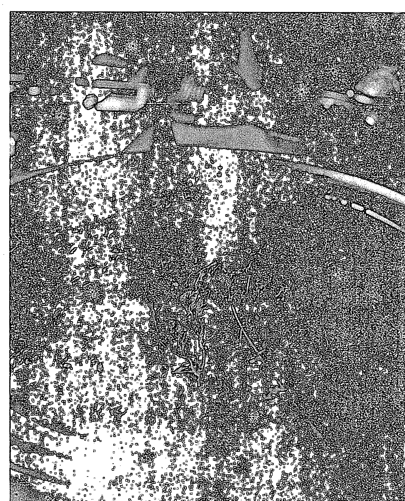

▲ 蕁麻、薄荷與月桂

### 日曜日 ○ 星期天

### 歐白芷、安息香、佛手柑

太阳所掌管的日子，一星期中的第一天。太阳在占星中代表社会名望、公众生活以及与父亲的关系，因此太阳日可施作与工作、名声、成功、胜利、希望与健康，甚至是法律相关之愿望的魔法。太阳相关的精油包括歐白芷、安息香、佛手柑、桉油醇迷迭香、肉桂、乳香、葡萄柚與金盞花浸泡油。

### 月曜日 ○ 星期一

### 香蜂草、檸檬、德國洋甘菊

月亮所掌管的日子，由于月亮在占星与母亲、情绪、安全感、灵性与潜意识相关。因此这天做占卜或冥想会得到相当好的效果，适合做安定心神或提升灵性的活动。在探索潜意识、梦境和灵性层次的问题也会有收获，可以许与家庭、怀孕、睡眠与情绪安定有关的愿望。月亮属性的精油包括香蜂草、檸檬與德國洋甘菊。

### 火曜日 ○ 星期二

### 黑胡椒、丁香、芫荽

由火星所掌管的日子。占星中火星代表力量、竞争与战斗。因此火星日很适合展开行动、执行工作以及运动。也可以在这天施展与竞争、胜利、勇气、性及政治相关的魔法，包括祈求在比赛中胜出，或让自己更有行动力与勇气等等。火星属性的精油有黑胡椒、丁香、芫荽、薑、赤松。

### 水曜日 ○ 星期三

### 芹菜、甜茴香、薰衣草

由水星掌管的日子。占星中水星与讯息、思考、沟通、交通与智慧有关。因此水星日适合消息的传播、讯息的获取、整合，沟通与会议的进行。因此这天可以许愿加强考运、读书学习运势，甚至是灵感。此外交通顺利与旅游运势有关的魔法也可以选择这天进行。与水星连结的精油有芹菜、甜茴香、薰衣草、欧薄荷与沉香醇百里香。

### 木曜日 ○ 星期四

### 肉豆蔻、甜馬鬱蘭、花梨木

由木星掌管的日子。占星中木星代表众神之父——朱比特，能量与扩张、松弛及膨胀有关，因此这天是许多人祈求好运，或是增加财富的日子。由于朱比特为天界的主宰，其他像是健康、名誉、法律相关的魔法也可以藉由木星日的能量达成。木星属性的精油包括肉豆蔻、甜馬鬱蘭；此外宗教感强烈的花梨木、穗甘松也适用。

### 金曜日 ○ 星期五

### 玫瑰、天竺葵、玫瑰草

由金星掌管的日子。著名的金星女神维纳斯是爱情与美丽的神祇，同时也和感官的享受有关。因此金星日适合从事与艺术、美与社交有关的活动。祈愿方面，只要与爱情如招桃花、维持恋爱的热度相关，都可以在星期五执行。另外希望自己变美，变得有自信也可利用这天。金星属性的精油可选择玫瑰、天竺葵、玫瑰草、西洋蓍草与伊兰伊兰。

### 土曜日 ○ 星期六

### 雪松、杜松、茶樹

由土星掌管日子。虽然在占星中土星与压力、限缩有关，不过同时也代表人生中的挑战与课题。但土星日有让人回归本质，以及更踏实的能量。这天适合调养生息，祈求获得庇护，排除负能量和净化。因此可以设立结界保护空间，也可以净化自己。土星属性的精油包括雪松、杜松、茶樹與尤加利。

## 附录

| 星座与对应古典行星 | 魔法精油：总论（太阳星座） | 魔法精油：爱情（金星星座） | 魔法精油：财运（二宫宫头星座） | 魔法精油：疗愈（月亮星座） |
| :--- | :--- | :--- | :--- | :--- |
| ♈ 牡羊座 ♂ 火星 | 桉油醇迷迭香 黑胡椒 | 沉香醇百里香 甜橙 | 桉油醇迷迭香 甜马郁兰 | 柠檬 罗马洋甘菊 欧薄荷 |
| ♉ 金牛座 ♀ 金星 | 玫瑰 广藿香 | 快乐鼠尾草 伊兰伊兰 | 安息香 印蒿 | 甜橙 穗甘松 橙花 |
| ♊ 双子座 ☿ 水星 | 薄荷 柠檬 | 尤加利 香桃木 | 橘子 柠檬香茅 | 姜 柠檬香茅 甜马郁兰 |
| ♋ 巨蟹座 ☽ 月亮 | 罗马洋甘菊 真正薰衣草 | 玫瑰草 真正薰衣草 | 广藿香 橘子 | 白千层 肉桂 檀香 |
| ♌ 狮子座 ☉ 太阳 | 甜橙 欧白芷 | 伊兰伊兰 苦橙叶 | 佛手柑 沉香醇百里香 | 苦橙叶 香蜂草 丁香 |
| ♍ 处女座 ☿ 水星 | 真正薰衣草 甜茴香 | 花梨木 罗文莎叶 | 桉油醇迷迭香 柠檬 | 芫荽 香草 佛手柑 |
| ♎ 天秤座 ♀ 金星 | 天竺葵 香桃木 | 橙花 芫荽籽 | 天竺葵 葡萄柚 | 广藿香 杜松 柠檬 |
| ♏ 天蝎座 ♂ 火星 | 广藿香 大西洋雪松 | 肉豆蔻 沉香醇百里香 | 丁香 香草 | 永久花 乳香 穗甘松 |
| ♐ 射手座 ♃ 木星 | 黑胡椒 佛手柑 | 柠檬香茅 玫瑰草 | 薄荷 岩兰草 | 山鸡椒 葡萄柚 没药 |
| ♑ 摩羯座 ♄ 土星 | 丝柏 茶树 | 没药 岩兰草 | 姜 佛手柑 | 岩玫瑰 甜马郁兰 罗马洋甘菊 |
| ♒ 水瓶座 ♄ 土星 | 橙花 葡萄柚 | 橘 苦橙叶 | 苦橙叶 柠檬 | 岩兰草 薰衣草 莱姆 |
| ♓ 双鱼座 ♃ 木星 | 香蜂草 花梨木 | 小花茉莉 真正薰衣草 | 胶冷杉 岩兰草 | 赤松 芳樟 永久花 |

△ 十二星座对应魔法精油

| 行星 | 身体对应 | 座落二宫内星魔法精油 | 月亮与其他行星有相应魔法精油 |
| :--- | :--- | :--- | :--- |
| ☉ 太阳 | 心脏、动脉 循环系统 眼睛 | 甜橙 佛手柑 乳香 | / |
| ☽ 月亮 | 脑、肠胃 膀胱 眼睛 | 甜马郁兰 天竺葵 柠檬 | / |
| ☿ 水星 | 神经、感官系统 舌头 手与脚 | 薄荷 甜茴香 苦橙叶 | 桉油醇迷迭香 茶树 柠檬 |
| ♀ 金星 | 女性生殖系统 肾脏、喉咙 乳房 | 香桃木 绿豆蔻 零陵香豆 | 伊兰伊兰 快乐鼠尾草 天竺葵 |
| ♂ 火星 | 血液、肌肉 运动神经、性能量 男性生殖系统 | 沉香醇百里香 茶树 甜罗勒 | 西洋蓍草 罗马洋甘菊 永久花 |
| ♃ 木星 | 肝脏、肺 肋骨、静脉 消化系统 | 香草 肉豆蔻 丁香 | 甜橙 沉香醇百里香 欧薄荷 |
| ♄ 土星 | 骨骼、皮肤、肌腱 指甲、头发、关节 脾脏、右耳 | 岩兰草 没药 芳樟 | 丝柏 花梨木 玫瑰 |
| ♅ 天王星 | 神经系统 | 山鸡椒 莱姆 安息香 | 黑胡椒 甜马郁兰 橙花 |
| ♆ 海王星 | 脊椎神经系统 | 薰衣草 赤松 胶冷杉 | 大西洋雪松 杜松 茉莉 |
| ♇ 冥王星 | 性腺 潜意识 | 岩兰草 广藿香 白千层 | 穗甘松 薰衣草 没药 |

▲ 十大行星对应魔法精油

## 附录

| 满月择日 | 魔法精油 |
| :--- | :--- |
| ♈ 牡羊座满月 (9/24-10/23之间) | 沉香醇百里香、欧白芷、桉油醇迷迭香、肉桂、黑胡椒 |
| ♉ 金牛座满月 (10/24-11/22之间) | 茉莉、玫瑰、伊兰伊兰、岩蔷薇、姜、广藿香 |
| ♊ 双子座满月 (11/23-12/21之间) | 甜茴香、薄荷、尤加利、葛缕子、艾草 |
| ♋ 巨蟹座满月 (12/22-1/20之间) | 天竺葵、花梨木、穗甘松、甜马郁兰、葛缕子、薰衣草 |
| ♌ 狮子座满月 (1/21-2/18之间) | 肉桂、月桂、柑橘、柠檬香茅 |
| ♍ 处女座满月 (2/19-3/20之间) | 芫荽、香蜂草、薰衣草、尤加利、绿薄荷 |
| ♎ 天秤座满月 (3/21-4/20之间) | 绿豆蔻、天竺葵、橙花、甜罗勒、芸香 |
| ♏ 天蝎座满月 (4/21-5/21之间) | 没药、丝柏、花梨木、伊兰伊兰、玫瑰草、香蜂草 |
| ♐ 射手座满月 (5/22-6/21之间) | 艾草、葛缕子、迷迭香、甜茴香、佛手柑、黑胡椒 |
| ♑ 摩羯座满月 (6/22-7/22之间) | 岩蔷薇、雪松、赤松、喜马拉雅雪松、桧木 |
| ♒ 水瓶座满月 (7/23-8/22之间) | 柠檬、黑胡椒、橙花、欧薄荷 |
| ♓ 双鱼座满月 (8/23-9/23之间) | 大西洋雪松、橙花、檀香、乳香、鸢尾草 |

▲ 满月择日魔法精油

| 女巫节气日 | 日期 | 魔法精油 |
| :--- | :--- | :--- |
| 春分 (Ostara) | 3/21 | 天竺葵、欧白芷、尤加利、薰衣草、绿豆蔻 |
| 五朔节 (Baltane) | 4/30 | 玫瑰、天竺葵、玫瑰草、伊兰伊兰、快乐鼠尾草、肉桂 |
| 夏至 (Litha) | 6/21 | 佛手柑、葡萄柚、甜橙、圣约翰草浸泡油 |
| 收获节 (Lughnasadh) | 8/2 | 罗勒、月桂、沉香醇百里香、芸香、柠檬马鞭草 |
| 秋分 (Mabon) | 9/21 | 广藿香、岩兰草、罗勒、甜橙、薄荷 |
| 萨温节 (Samhain) | 10/31 | 檀香、乳香、艾草 |
| 冬至 (Yule) | 12/21 | 杜松、丝柏 |
| 圣烛节 (Imbolc) | 2/2 | 香草、安息香、橙花、茉莉 |

▲ 女巫节气日魔法精油

## 附录

| 星期择日 | 魔法精油 |
|----------|----------|
| 星期天 日曜日 | 歐白芷、安息香、佛手柑、桉油醇迷迭香、肉桂、乳香、葡萄柚、金盞花浸泡油 |
| 星期一 月曜日 | 香蜂草、檸檬、德國洋甘菊 |
| 星期二 火曜日 | 黑胡椒、丁香、芫荽、薑、赤松 |
| 星期三 水曜日 | 芹菜、甜茴香、薰衣草、歐薄荷、沉香醇百里香 |
| 星期四 木曜日 | 肉豆蔻、甜馬鬱蘭、花梨木、穗甘松 |
| 星期五 金曜日 | 玫瑰、天竺葵、玫瑰草、西洋蓍草、伊蘭伊蘭 |
| 星期六 土曜日 | 雪松、杜松、茶樹、尤加利 |

△ 星期择日魔法精油

## 圖片資料來源

- p.10. Mandragora dibujo, wikipedia
- p.11. Traité des Arbres et Arbustes, 1. Sweetbriar rose (Rosa eglanteria) 2. Hulthemia rose (Rosa berberifolia), rawpixel.com.
- p.12. Raphael Custos, Beginning of the Ascension, The Public Domain Review
- p.17. Heinrich Cornelius Agrippa, Libri tres de occulta philosophia, Pentagram and human body (Agrippa), wikipedia
- p.20. Nicholas Culpeper, Celestial influx on . . woman; illustration Wellcome L0016673, wikipedia
- p.25. Raphael, The Astrologer of the Nineteenth Century: Or the Master Key of Futurity, being a Complete System of Astrology, Geomancy & Occult Science, The Public Domain Review
- p.26-p.37. Urania's Mirror; or, a View of the Heavens (circa 1825), The Public Domain Review
- p.39. Traité des Arbres et Arbustes, Cabbage rose (Rosa centifolia), rawpixel.com.
- p.42. Traité des Arbres et Arbustes, Bitter orange (Citrus bigaradia sinensis), rawpixel.com.
- p.45. Franz Eugen Köhler in Köhler's Medizinal-Pflanzen, Myristica fragrans - Köhler–s Medizinal-Pflanzen-097, wikipedia
- p47. Traité des Arbres et Arbustes, Jasmine flowers, rawpixel.com.
- p.48. J. J. Grandville, Un autre monde; transformations, visions, incarnations ... et autre choses, Wanderings of a Comet, The Public Domain Review
- p.51. J. J. Grandville, Un autre monde; transformations, visions, incarnations ... et autre choses, The Metamorphosis of Sleep, The Public Domain Review
- p.53. J. J. Grandville, Un autre monde; transformations, visions, incarnations ... et autre choses, A Bridge Leads from One World to the Next, The Public Domain Review
- p.54. Scott Foresman, fomhá:Zodiac (PSF), wikipedia
- p.57. Franz Eugen Köhler in Köhler's Medizinal-Pflanzen, Rosmarinus officinalis - Köhler–s Medizinal-Pflanzen-258, wikipedia
- p.59. Franz Eugen Köhler in Köhler's Medizinal-Pflanzen, Styrax benzoin - Köhler–s Medizinal-Pflanzen-133, wikipedia
- p.61. The Rijksmuseum, Pelargonium album bicolor by M. de Gijselaar(1830), rawpixel.com.
- p.65. Traité des Arbres et Arbustes, 1. Eastern hemlock (Abies Canadensis) 2. Balsam fir (Abies balsamea), rawpixel.com.
- p.75. Traité des Arbres et Arbustes, Spanish lavender (Lavandula stoechas), rawpixel.com.
- p.82. The Hyginus Star Atlas (1482), The Public Domain Review
- p.83. Franz Eugen Köhler in Köhler's Medizinal-Pflanzen, n572_w1150, biodiversitylibrary.org
- p.84. The Hyginus Star Atlas (1482), The Public Domain Review
- p.85. Illustration Helichrysum arenariumo, Prof. Dr. Otto Wilhelm Thomé Flora von Deutschland, Österreich und der Schweiz, wikipedia
- p.97. Franz Eugen Köhler in Köhler's Medizinal-Pflanzen, Commiphora myrrha - Köhler–s Medizinal-Pflanzen-019, Wikipedia
- p.111. William Harrison Ainsworth, The Lancashire Witches, The Lancashire Witches 07, Wikipedia
- p.113. Sara W. Duke, Loco Foco Witches Laying a Spell Over the Country, Library of Congress
- p.114. J. J. Grandville, La Lune Peinte Par Elle-Meme, Un autre monde; transformations, visions, incarnations ... et autre choses, The Public Domain Review
- p.124. Franz Eugen Köhler in Köhler's Medizinal-Pflanzen, n238_w1150, biodiversitylibrary.org

## 后序

当初写书的动机很单纯，本来只是希望能将几年来精油教学与使用心得，整理并与大家分享。发想之初带着天真的心情以为可以很快搞定，不过整个计划在与编辑讨论后变得愈来愈复杂，增加的章节愈来愈多，就变成现在大家看到的这个目录。就像几年来办过的个展与邀请展一样，开始想得很单纯，实际执行下去后变得愈来愈多元，纳入的想法也愈来愈多，最后规模变得比当初想得还大许多，这似乎变成某种模式。但无论是过去的个展、邀请展或今年出版的《占星芳疗》，过程中每每都有数不清的贵人与朋友协助我达成这一切，也都能在成果端出来前交到几个新朋友。非常谢谢编辑们在过程中专业的协助。

2021年台湾疫情最严重的时期也正是这本书的撰写期，一个人在工作室查阅各种资料与过去的调油记录，想起小学的时候超讨厌写作文，万万没想到二十多年后居然在写自己的书，人生真的很不可思议。从学生时期开始接触神秘学与植物，从没想过未来会以此为业，但冥冥之中命运似乎将我牵引到这条路，让我将过去所有的喜好与学习全绑在一起，变成今天这个模样。非常感谢植物对我的潜移默化。

2020年生产后有半年时间做全职妈妈，直到2021年孩子满一岁才增加工作时间，并开始为过去的精油使用做经验整理。2020开始的疫情为全球带来转变，也为我带来转变。外界的一切看似遭受冲击与重整，对我而言则是多产期，幸运地连生了三个「孩子」，包括我家的双胞胎姊弟，与我的新书。作为「孕育者」的这个角色，我很庆幸一直有植物同行。

这本书献给喜爱植物的你
与我的双胞胎宝贝

Claudia
2022/2/21Claudia老师×拾峪香研 联名
