# 占星财富手册

> 最大的财富是智慧

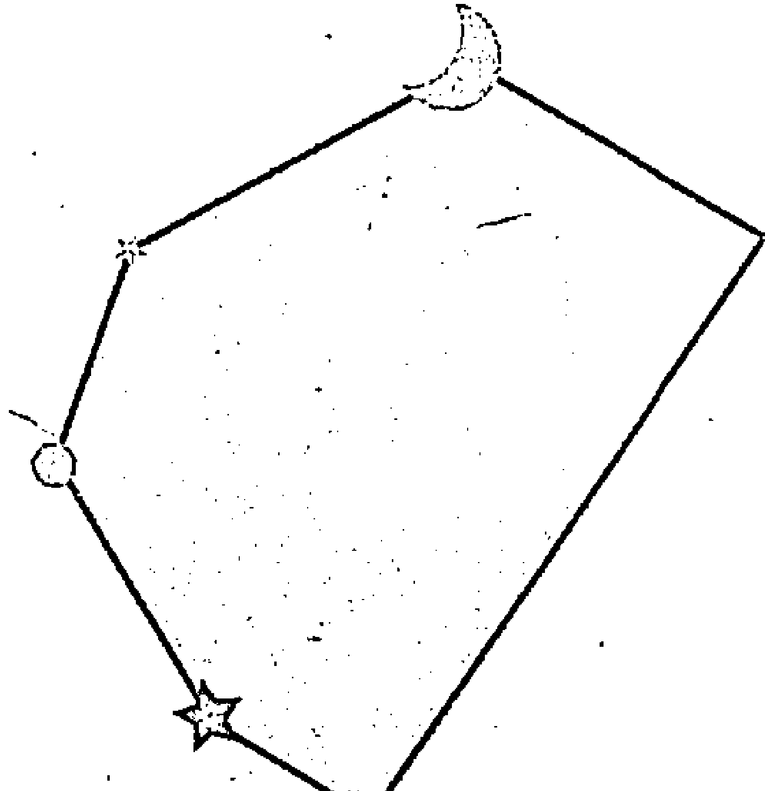

## 出版缘起

兴趣广泛、身份多元的知名文化人韩良露，除了大家熟知的作家、媒体人及文化推动者身分之外，她也是艺文圈中最受重视的占星学大师。二〇〇三年起她在金石堂金石书院（现龙颜讲堂）开设占星课程，由于口耳相传、好评不断，课程一直持续到二〇一〇年才划下休止符。南瓜国际从二〇一六年起，陆续将多年来数量庞大的上课录音及相关资料，整理成为系列书籍。随着占星越来越受到大众重视，查询本命星图早已不再是难事，针对占星初学者，南瓜国际推出「Handbook」书系，从如何打出一张本命星图开始，一步一步教大家进入占星学的美妙世界。


### 序 别人拿不走的永恒财富

很多人对占星学感兴趣，而现在大家都能轻松上网打出一张星图，问题是打出星图之后却眼花缭乱，不知道从何下手。这个时候针对单一议题，找出相关的行星与宫位，不失为一个快速入门的好方法。即使不知道出生时间，不妨以中午十二点为基准，也可以打出一张八九不离十（但必须忽略宫位）的星图。

在占星学中，跟财富最相关的行星是月亮、金星与木星，最相关的宫位就是二宫（金钱宫）与八宫（他人资源宫）。

在十颗主要行星中，太阳、月亮、水星、金星、火星这五颗星是个人星，它们分别组成了个人性格的一部分；木星、土星、天王星、海王星、冥王星这五颗星是社会与宇宙星，它们走的速度很慢，带来的是社会潮流与世代潮流的影响。

让我们先来认识月亮、金星与木星，这三颗星都跟财富相关，它们分别代表了保命财、才艺财与社会财。从太阳未必看得出一个人小不小气，但月亮可以看出我们对安全感的需求，月亮的钱是我们维持生活的固定的必要支出，当我们得不到月亮的保命财，就会没有安全感，坐立难安，金星的钱是一种奢侈消费，它是我们想要宠爱自己一下所花的钱，它也是我们经由才艺、讨人喜欢的性格、美貌（后面两者也可说是一种才艺）获得的金钱；木星是社会资源，它代表的不只是金钱，还包含了人脉、名声、学历等等，而这些事情都相互关联，当一个人拥有了木星的金钱，就可能有余裕去追求更高的学历，有了更高的学历，就有机会能够赚取更多的金钱。

除此之外，每个人在本命星图中都有十二个宫位，十二个宫位分别代表十二个不同的情境，其中二宫代表的是当事人这辈子会用什么方式赚取个人资源，八宫则是一个从他人那边获取资源，其中包含了募款、集资与借贷能力。并不是每个人二宫或八宫都有行星，很多人遇到自己的二宫、八宫没有行星，最担心的问题是『这是不是代表我这辈子没有金钱运』，事实并非如此。二宫、八宫没有行星，代表当事人这辈子的主要功课不在二宫的个人资源与八宫的他人资源，但不表示他们这辈子没有钱或不会遇到金钱问题，毕竟本命星图会随着行运而启动，即使本命星图的二宫、八宫没有行星，但也会遇到行运的行星进入二宫、八宫的时候(1)，当事人也还是得要面对许多跟金钱相关的议题。

这也就是学习占星学的重要。一个人不可能永远幸运，也不可能永远倒楣，如果能够懂得在霉运时保守一点，虽然不可能转霉运为好运，但至少可以赔得少一点。在遇到破财运到来时，即使是不投资、不借钱，就算什么事情都不做，都不免会破一些财，但总比这个时候去开一间大公司，或者跑去借很多钱投资结果赔光要好得多。

> > (1) 请参考《行运宫位圣经：掌握行运的生命节奏》

一个人如果命中注定会破财，这件事情是改不了的，但学习占星学，可以让我们有能力控管赔掉的是小钱还是大钱。我认识一个很大的电子公司老板，他的本命木星有克相，而他在行运克相时并购了一家外国的手机公司，结果并购失败，导致自己原来的公司也濒临财务危机。从这个故事来看，他当时如果买的不是这么大的手机公司，虽然还是会赔钱，但不会赔这么多，也不会危及自己原来的公司。

我们在生活中往往会将「财富」局限于「金钱」这件事情上，但其实财富有着各式各样的面向。真正懂得运用财富的人，并不会只是死盯着户头里的金额，而是懂得善用金钱，适时的将具体的金钱换成抽象的资源，例如安全感（月亮）、技艺（金星）、人脉与名声（木星），而这些抽象的资源又可以回过头来变成实际的金钱，因而这辈子的财富有如活水一般，源源不绝。

物质的财富如流水，永远来来去去，但如果可以用物质的资源来换取精神的财富，这会是别人拿不走的永恒财富。很多人误以为财富的目的是为了让我们有更好的生活，换取更大的财富，但这其实是倒果为因。财富的目的是为了让我们有更…

生活，让我们能够有余裕追求灵性的成长。智慧才是最大的财富，这就是财富的秘密。

> 注：本文依据二〇〇七年相关课程整理而成。

## 文档编辑助手功能说明

本工具旨在从扫描或拍摄的文档图片中提取结构化的文本与布局信息。它能够智能识别页面中的各种元素，并将其转换为便于后续处理与编辑的格式。

- **标题识别**：自动检测文档中的各级标题。
- **段落提取**：准确提取正文段落文本。
- **列表解析**：识别有序与无序列表结构。
- **表格重构**：将图片中的表格转换为可编辑的格式。
- **图像定位**：标注插图、图表的位置。
- **代码块处理**：识别并保留代码片段的格式。

| 功能模块 | 描述 | 输出格式 |
| :--- | :--- | :--- |
| 文本检测 | 定位所有文本行及区域 | Bounding Box |
| 版面分析 | 分析段落、标题、列表等布局关系 | 结构化树 |
| OCR识别 | 将图像文字转换为可编辑文本 | 文本字符串 |

> > 核心原则：保持原始文档的语义结构与视觉层次，忽略页眉、脚、页码等装饰性元素。

系统输出的JSON格式包含了每个元素的类型、内容（Markdown格式）以及在原图中的相对位置坐标（BBOX），方便下游应用进行渲染、分析或进一步处理。

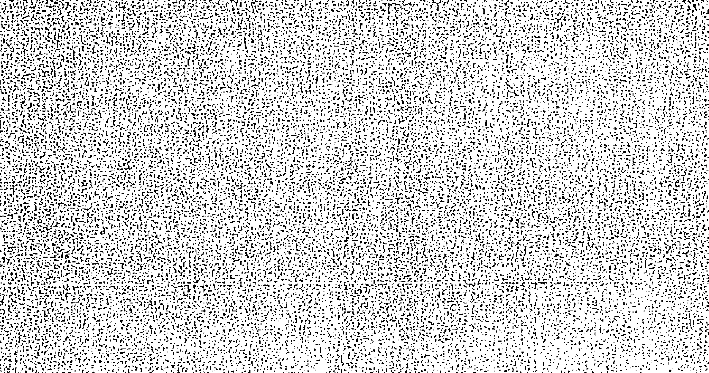

欧姆定律适用范围：直流、低频、线性、相位。

## 占星之门查询说明

1.  请搜寻「占星之门」，或直接以网址「astrodoor.cc」进入首页。

    在首页右上角
    登录 微信 脸书 选单▼
    点选「选单▼」

2.  进入输入出生资料页面

    STEP1 请输入国历出生时间
    西元 ____ 年 ____ 月 ____ 日

    STEP2 请设定出生地点
    ex. 台湾 台北

3.  将出生资料填妥之后，再点选下方「辛苦了！请按我送出查询」按钮。

4.  就会进入本命星图页面选单：

    - 星盘图片
    - 行星位置
    - 上升星座
    - 星座比例

    点开「星盘图片」的蓝色 bar，就可以看到本命星盘。

```
2020/01/01 10:00
121E30 25N03
GMT +8
```

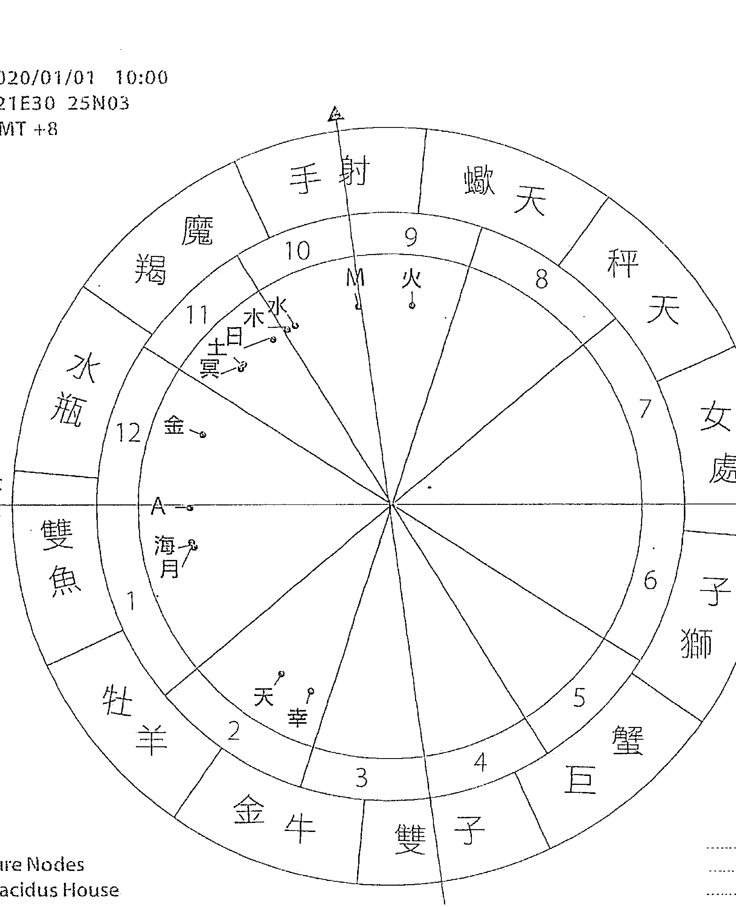

- True Nodes
- Placidus House
- Tropical, Geocentric

- 120°
- 60°
- 180°
- 90°

## 本命星图中的宫位

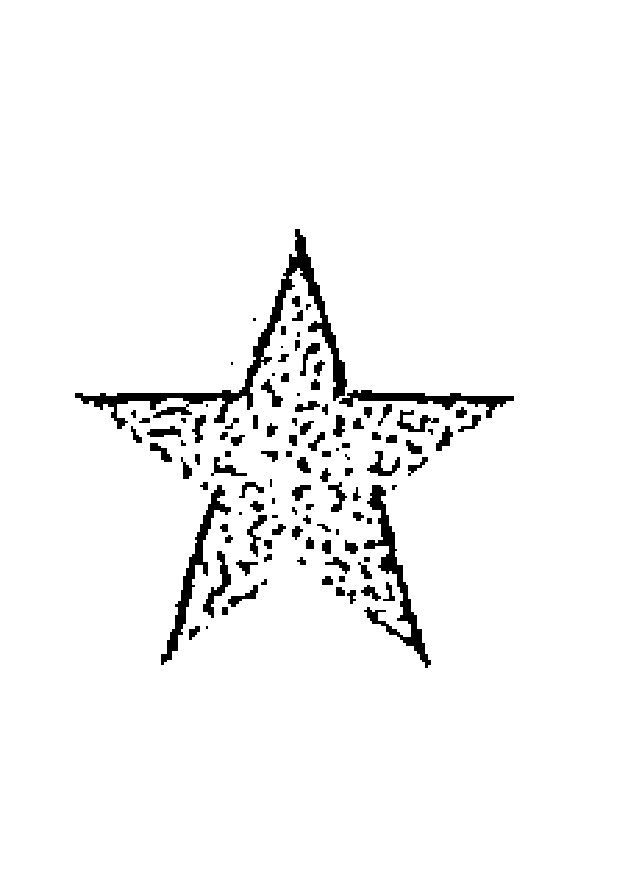

每一张本命星图都包含了星座、宫位、相位。
星座是行星展现能量的本质，宫位是行星会在怎样的领域展现能量，而相位是哪些行星之间会互相形成特定角度，进而有了对手戏，演出生命的情节。
如果用烧菜做比喻，行星落入星座就像是食材，食材是豆腐或是猪肉，这就是本质上的不同。宫位就像是烹调方式，要煮一个川味料理，或是糖醋口味，就会有不同的发挥。相位则是两个行星互相产生关联，香菇跟鸡一起煮成香菇鸡汤，或是凤梨跟虾做成凤梨虾球，这些都是不同的行星一起演出的情节。
当我们要看行星落在什么星座，可先不看宫位与相位的红绿蓝线，看看「日」、「月」、「水」、「金」、「火」、「木」、「土」、「天」、「海」、「冥」对应到「牡羊」、「金牛」、「双子」……十二个星座中的哪一个星座。
十二星座的名称会随着各家翻译而略有不同，本书统一将「射手」统称为「人马」，「魔羯」统称为「摩羯」，「水瓶」统称为「宝瓶」。

本命盘中的十二星座是一个三百六十度的圆周，例如太阳在摩羯座十度，水星在宝瓶四度，这些都是每颗行星在黄道坐标的位置。

想要直接看行星落在哪个星座，如果行星落在两个星座交界处，看不清楚到底落在哪个星座时，需要往下查，会有每颗行星落在哪个星座几度、几分的位置列表。

水星、木星、太阳、土星、冥王星在摩羯

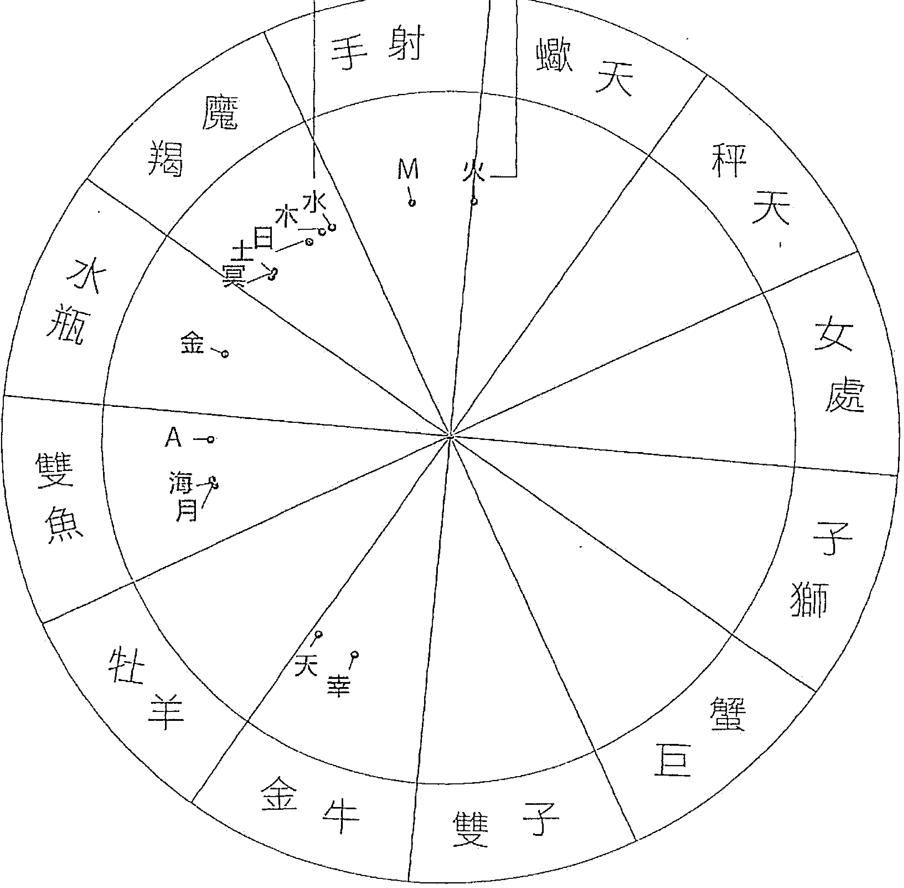

## 本命星图中的宫位

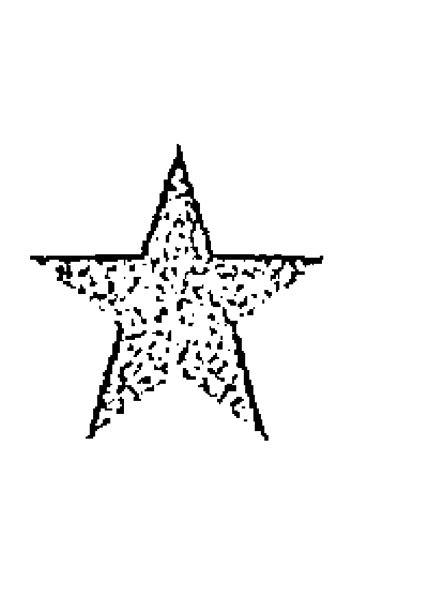

所谓的「本命星图」，就是我们出生的时刻，从出生地点看到的星空。出生时往东方的地平线看过去的黄道坐标，称为「上升点」，俗称为「上升星座」。在出生之前，我们都是在宇宙中遨游的灵魂，当每个人诞生在地球上，出生时吸进地球的第一口气时，我们的灵魂就藉由上升点被钉在地球，展开了这辈子的生命旅程。

上升点是一宫的起点，它代表的是每一个人来到这个世界的初始状态，它涵盖了一个人先天从父母接收到的基因，以及早年环境形塑出跟环境互动的基本态度，也就是这个人在最自然、放松状态时，会「像」什么样子。

从上升星座开始画出十二个宫位，十二个宫位分别代表了十二个不同的生命情境。

十二个宫位中有没有行星，代表这辈子当事人是否有缘去做相关的事。一个二宫金钱宫有很多行星的人，这辈子一定会有很多跟金钱有关的缘分；一个四宫家庭宫很多行星的人，这辈子一定会有很多跟家庭有关的缘分。

2020/01/01 10:00
121E30 25N03
GMT +8

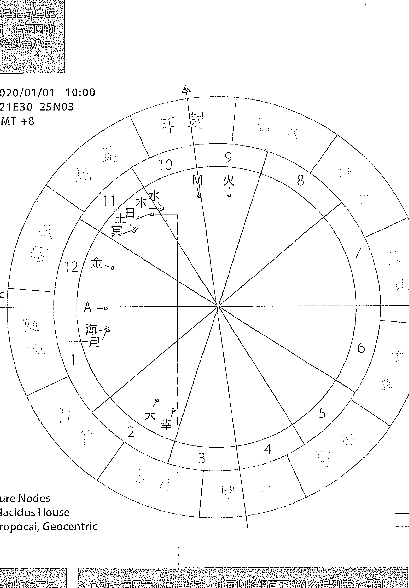

True Nodes
Placidus House
Tropical, Geocentric

- 120°
- 60°
- 180°
- 90°

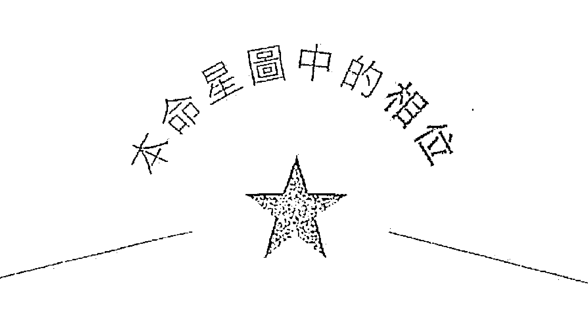

所谓的相位，就是两颗（或两颗以上）的行星形成特定角度，最重要的四个相位为合相、九十度、一百二十度与一百八十度。当两颗行星产生相位时，这两颗行星的能量就会产生交互影响。合相会使这两颗行星力道加大。一百二十度是和谐相，这个相位会让两颗行星的能量用和谐的方式互相帮助，容易激发出彼此的正面能量。九十度跟一百八十度是负面相位。九十度带来冲突，一百八十度带来对立，这两个相位会引发出两颗行星彼此的负面能量，因此在本书中被称为「克相」。在占星之门中，一百二十度和谐相用绿线标示，九十度克相用红线标示，一百八十度克相用蓝线标示。在本书中，如果提到「好相位」，指的就是占星之门中的绿线，如果提到「坏相位」，指的就是占星之门的红线与蓝线。占星之门中将六十度画为浅蓝线，但六十度的力量比一百二十度小很多，因此在书中不予讨论，初学者亦可先暂时忽略浅蓝线，以免眼花撩乱。

> 这张图的水星跟木星合相，又跟冥王星有一条红线（虚线表示），这条红线就是刑相位，也就是说这张图的水星跟天王星之间有刑相位，木星跟天王星之间也有刑相位。

2020/01/01 10:00
121E30 25N03
GMT +8

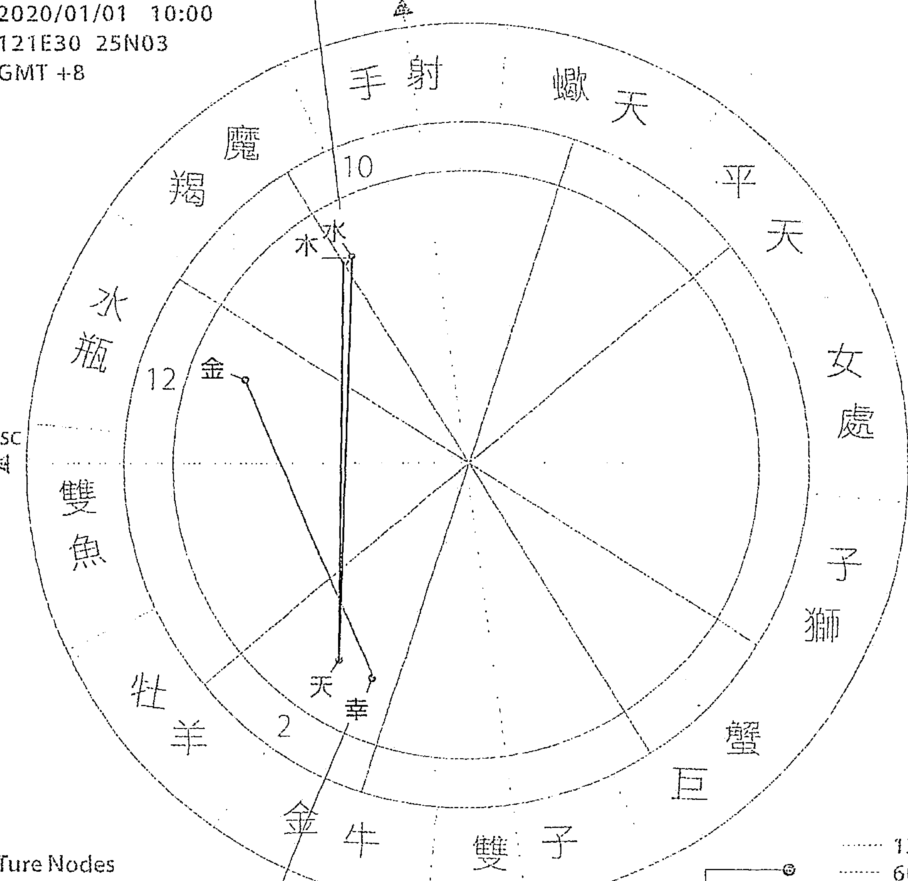

120°
60°
180°
90°

> 这张图的金星跟土星之间有一条红线（虚线表示），这条红线就是刑相位，也就是说这张图的金星跟冥王星之间有刑相位，土星跟冥王星之间也有刑相位。

很多人从大众媒体得到「牡羊座如何如何」、「摩羯座如何如何」的资讯，说的都是「太阳星座」。但每个人的本命星图都不是只有一颗太阳，它还包括了月亮、水星、金星、火星、木星、土星、天王星、海王星、冥王星。

大众媒体的「十二星座说」虽然简明易懂，问题是过于简化，会让人误以为全世界只有十二种人。但大家稍微用逻辑想一下，地球有七十亿人口，你的命运怎么可能跟其他十二分之一的人一样？大家利用网站或各种软体，输入出生时间、地点而画出的星图，称为「本命星图」。

每个人的本命星图中，都有太阳、月亮、水星、金星、火星、木星、土星、天王星、海王星、冥王星这十颗主要行星。这十颗行星代表的是一个完整的太阳系。每个人一出生时，天上的星图分布，构成了这个人的本命星图，而这也意味着每个人一出生时，就拥有了专属于自己的太阳系。

当一个新生儿从妈妈肚子裡生出来，都是一个全新的太阳系来到这个世界。

你的太阳在什么星座几度、月亮在什么星座几度、水星在什么星座几度……

你的太阳在几宫、月亮在几宫、水星在几宫……

你的太阳、月亮有没有其他行星形成特定角度（也就是星图中各种颜色的连线），因而一起演出生命情节？

天上的星辰不断的移动，天上的太阳系每分每秒都不同，因此每个人的本命星图都不一样。也因此，每一个人都是独特的，每个人拥有的本命星图，就是每一个人独特的星空。

在研究星图前，让我们先了解十颗主要行星在占星学中的意义是什么。

## 太阳

太阳是一个人的主观自我意识，它是一个人认可的自我形象。一个人的太阳会随年龄而成熟，随着年龄发展，自我意识也会逐渐发展完成。很多妈妈常常觉得小孩到了青春期就像变了个人似的，原因在于一个人的自我意识通常是在青少年时期开始发展，也因为刚开始发展的自我意识不够圆融，所以青少年的太阳意识最为横冲直撞。太阳是一种来自父亲形象的价值观认同。虽然每个的父亲都不同，每个父亲也都有著很多面向，但子女会随着自己太阳的状况而展现不同差异。例如一个太阳牡羊的人眼中的父亲会是一个勇敢、有冲劲的父亲，或一个太阳双子眼中的父亲，会是一个很幽默风趣、很聪明的父亲，等到当事人长大以后，也会期许自己成为这样的人。

## 月亮

月亮代表一个人内在情绪的运作，它跟安全感有关，而这种安全感来自于童年时期母亲对待当事人的模式。也就是一个人眼中的妈妈是什么形像，将来长大以后，他就会对这种情感模式产生安全感，当他遇到了可以满足他们月亮安全感的人事物，就会感到内在情绪很安稳，其中包含了家庭观念、居家生活、金钱带来的安全感、理财方式。

月亮的内在情绪是一种很强大的驱动力，但也因为它是一种隐藏的情绪，它不像太阳这么可以从理性来分析。一个人也许在太阳的理性层面上想要这么走，但月亮的情绪未必也想要这么走。如果不从月亮来切入的话，就无法理解为何明明理智上觉得应该这么做，情绪上却会来扯后腿。

## 水星

水星代表的是心智思考与沟通能力，它跟太阳的不同，在于太阳是自我意识的呈现，而水星纯粹是一种客观的心智思考，并不包含主观的自我意识。一个人的数学能力、文字能力、口语表达，甚至抽象的哲学思考能力，这些都跟水星有关。

## 金星

很多人会将金星视为感情，火星视为性爱，但其实金星代表的是一个人的美学价值，它是一种用来讨人欢心的能量。从金星可以看得出一个人的美感品味，甚至一个人长得漂不漂亮，以及对感情与金钱的态度，都可以从金星看得出来。

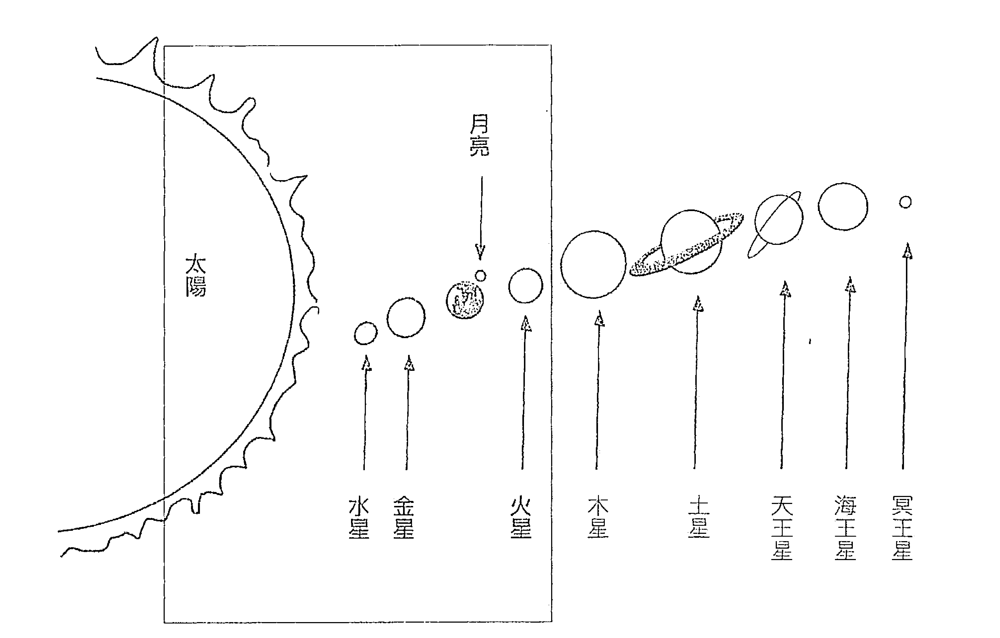

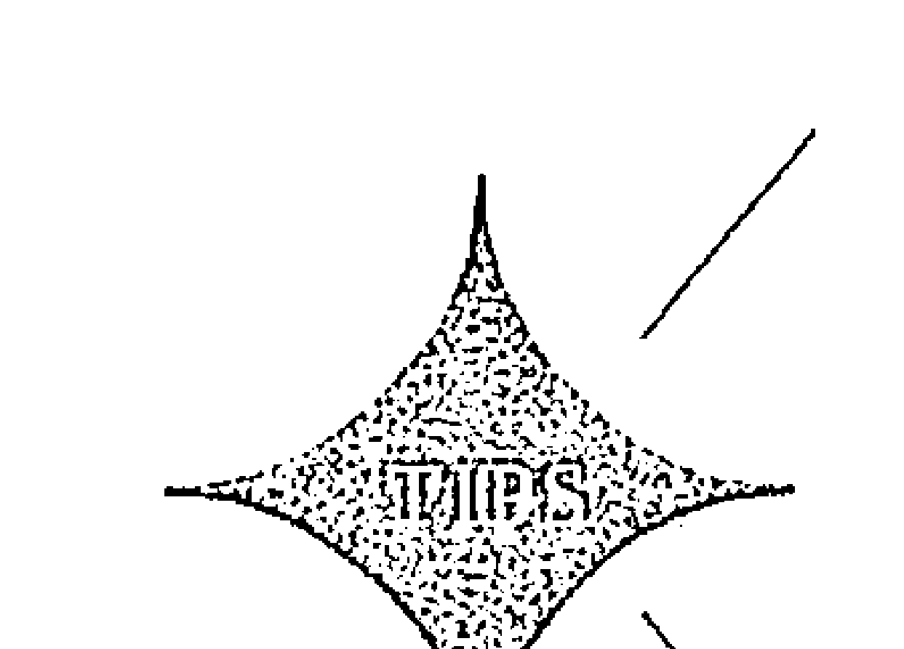

太阳、月亮、水星、金星、火星，这五颗星在占星学中被称为「内行星」，也被称为「个人行星」，因为它们都跟个人的性格有关，也就是说，不管在任何国家或社会，都会有这些不同性格的人存在。

## 火星

火星代表肉体活力，它是一种不经思考的本能反应，它是一种性能量。火星的性能量不只是性爱，它是一种求生存的基本欲望。

## 木星

木星是一颗吉星，一般人说的财运如何，可从星图中的木星看出端倪。木星代表的是社会资源，它不只是金钱，它还包含了学历、名气与贵人，这些都比单纯的金钱更让人受益。

## 土星

土星跟木星都是社会星，这两颗行星都代表社会价值观。木星带来社会资源，土星带来社会制约，一个人会因为哪些社会价值观而感到约束与压力，都跟土星有关。

## 天王星

天王星会带来巨大的改变，也带来巨大的突破。从本命星图中的天王星可以看出当事人在哪些地方具有与众不同的本领，有什么特立独行之处。

## 海王星

海王星是一颗灵性星，它是梦想，也可能只是幻想。从本命星图中的海王星也可以看出一个人怎么样的艺术、灵性。

海王星也代表消融与迷离，在星图中，如果海王星跟其他行星形成相位，海王星就会消融这颗行星的现实力量，并且朝向灵性或自欺之路前进。

## 冥王星

冥王星是巨大的占有欲，占有欲的激情带来毁灭与重生。

## 个人资源的获得

### 二节

二宫是金钱宫，它代表的是一个人自己赚取，自己累积的资源。所有二宫中有行星的人，他们都会是喜欢赚钱的人，即使是看起来对赚钱不积极的天王星二宫或海王星二宫，他们骨子里依然是喜欢赚钱的人。对二宫有行星而八宫没有人星的人来说，他们的钱都是一分努力一分收获，因为二宫的核心意涵是自我价值，所以不管他们原先有没有钱，他们都会很努力去赚钱、去理财。就算他们中了大奖，也不会躺在家里不去理财。

在星图中两两相对的宫位，都是一个铜板的两面。二宫跟八宫互为一百八十度，这两个宫位要探讨的都是资源，但二宫要讲的是个人之财，八宫要讲的是他人之财。二宫代表的是独资、自力更生赚来的钱，而八宫代表的是集资，是股份有限公司。二宫的钱一定是一分努力一分收获——这跟赚大钱或赚小钱无关。一个二宫中有行星的建筑师，他可能收费很贵，但是他还是设计一个建筑收一个建筑的钱；一个二宫中有行星的画家，他可能一张画很贵，但他还是一张画卖一张画的钱。这些就是二宫所谓的自力更生，一分努力一分收获，他们不会是那种炒股票而赚很多钱的人。

我遇过很多人的二宫没有行星，他们最常有的直觉反应，就是『我这辈子是不是没有金钱运』？事实并非如此，每个人的本命星图都是一种灵魂的选课，二宫中有行星，代表当事人的灵魂在投胎时，选择了二宫的灵魂功课。二宫有行星代表当事人这辈子有很多金钱的功课，但不见得很有钱，他们也可能是因为某些原因而终生为钱奔忙、烦恼。一个人二宫中没有行星，不意谓着这个人跟金钱没有缘分，只说明了当事人的二宫个人之财不是他们这辈子的主修课，但每个人都一定有木星（社会财）、月亮（保命财）与金星（才艺财）。如果二宫没有行星的话，不妨观察一下木星、月亮、金星，这三颗星也可以描述当事人这辈子的金钱缘分。

### 太阳二宫

太阳是一个人的面子所在，二宫是金钱宫，太阳二宫的人很在乎金钱带来的面子，不管是车子、包包、名牌，或者是请客，赚钱跟花钱能让太阳二宫的人很有面子，让他们可以从中展现生命的光与热。太阳二宫跟太阳金牛不同，不花钱，太阳二宫的人就没办法感受到金钱带来的面子，但太阳金牛的人不需要。太阳金牛的人即使有钱，也未必会想要买名牌、名车，因为对他们来讲，他们的太阳认同的是金牛的价值观，他们不需要再靠着拥有物来展现自己的面子。

太阳二宫的人都很喜欢赚钱，太阳金牛未必。太阳金牛虽然喜欢钱，但每个太阳都会对金钱很谨慎，具有积少成多的天性，但不见得每个太阳金牛的人都会很努力去赚钱。一个人只要太阳落在二宫，他们都会喜欢赚钱，至于会用什么方式来赚钱，则会随着太阳在什么星座而有不同。例如太阳二宫落在牡羊；他们会用很打拼的方式去赚钱，太阳二宫落在双子，他们喜欢用三寸不烂之舌去赚钱；

太阳二宫落在双鱼，他们就会用很有想像力的方式去赚钱。
太阳代表生命中的重要男性，太阳二宫也意味着当事人赚的钱大多跟男性有关，有人发女性财，而太阳二宫的人通常发的是男性财。同样是卖车，有的人的客户大部分是男生，有的人的客户大部分是女生，这就是发男性财跟发女性财的差别。
太阳在二宫也可能会跟其他行星形成不好的相位，受到坏相位的影响，当事人有可能常常赚钱也常常赔钱。我认识一个富过好几代的政治人物，他的太阳就在二宫——由此可见，喜欢赚钱跟家里本来有没有钱是两回事，一个家里原本就很有钱、不愁吃穿的人，也可以因为太阳落在二宫而将赚钱能力视为有面子。这个政治人物的第一桶金是由他父亲而来，当事人有三个女儿、两个儿子，后来他的财富也因为几个儿子的经营不善而大缩水，而非女儿，因为太阳跟生命中的重要男性有关，跟女儿无关。

### 月亮二宫

在二宫的金钱领域，月亮二宫的人跟太阳二宫有很大的不同。月亮二宫的人虽然也很喜欢金钱，但他们喜欢的是金钱带来的安全感，以及各式各样金钱可以带来的跟月亮相关的事物，例如房子或其他跟食衣住行有关的事情。

太阳二宫的人不会隐藏自己爱钱、爱赚钱、爱花钱的那一面，他们对金钱的态度很直接。而月亮二宫不会这么直接。月亮二宫的人虽然喜欢有钱，但不喜欢管钱，也不喜欢赚钱。月亮二宫的人最希望的是有人把钱送过来，就像是妈妈帮小孩喂奶一样，别人直接把钱送给他们。

月亮跟女性有关，月亮二宫跟钱的缘分，都会是一种女性财——太阳二宫的人也可以赚女性财，但太阳二宫赚的女性财一定是他们自己去赚来的，而月亮二宫的女性财却往往是对方不由自主会把钱送上门。不过月亮二宫的钱跟八宫不同，八宫的钱跟继承有关，而月亮二宫则是赠与。

俄国音乐家柴可夫斯基（Tchaikovsky）的月亮就在二宫，虽然他的《悲怆》、《天鹅湖》脍炙人口，但他在世时却过得十分拮据，还好有一个热

音乐的富孀梅克夫人长期资助他，他才得以继续创作，但他们终身没有见面，也就是说，富孀纯粹是资助他，并没有要他做什么事，他也没有真的为富孀做什么事，顶多就是互通了很多类似情书的信，以及写了不少作品献给神秘的富孀。诗人拜伦（Lord Byron）也是，他是个穷贵族，也是靠着贵妇们支持才能过活。不过当然不是每个月亮二宫都是柴可夫斯基或拜伦，我有个朋友的月亮在二宫，多年来她担任一对在台湾开公司的美国夫妻的秘书，她从高中毕业就在这间公司上班，在这间公司做了二三十年，老板娘非常疼爱她，将她视为自己的女儿。后来这对夫妻退休回美国，当时台北的房价还没起飞，这对夫妻就把台北办公室留给她当退休金。结果两三年后台湾的房地产大涨，这个朋友也因此变成了有钱人。

### 水星二宫

水星跟心智与沟通有关，水星二宫的人跟金钱的关系，都会建立在他们的教育、学历上，他们往往能够从知识产业之类的工作中赚取金钱。也就是说，水星二宫的人通常会透过知识或教育来赚钱，而不是利用搬砖头之类的体力活来赚钱。他们即使最后靠着卖房子、开餐厅赚钱，往往也都会是教别人如何卖房子或教别人如何开餐厅来赚钱，他们比较会是出一张嘴，而不是自己跳下去赚辛苦钱的人。

所有二宫中有行星的人，就算是坏相位，都代表他们这辈子对自己赚自己的钱这件事很感兴趣，而他们这辈子会有比较多这方面的缘分。世界上有很多有钱人这辈子没有自己赚过钱，但只要二宫中有行星（除了天王星、海王星二宫之外，天王星、海王星二宫的议题比较复杂），当事人都会想要用自己的各种能力去赚钱。就算他们可能家里已经很有钱了，他们还是对自己赚钱很感兴趣。对二宫中有星的人来说，金钱并不只是金钱，透过金钱而获得自我价值，才是真正驱动二宫中有行星的人去赚钱的动力。他们都会很

肯定自我实践跟工作跟赚钱之间的关系，他们都不会是喜欢不劳而获的人，不会喜欢靠别人养的人。即使是现实能量最弱的海王星二宫，他们也只是现实执行能力不强，他们还是很喜欢钱，也还是想要为了赚钱去做些什么事。

水星落在二宫，如果相位不错，会是一个特别会管钱的位置，尤其适合去从事用知识或用沟通去赚钱的工作。我认识很多水星二宫的人会去从事杂志、大众媒体、音乐工作，或成为财经记者。如果水星二宫的相位不好，他们还是会很有金钱意识，但金钱意识比较偏执，因此容易跟别人在金钱上产生争执。

不管水星二宫相位好坏，他们都会对金钱很有兴趣，很有金钱意识，也很有理财头脑，所以很适合从事跟理财相关的工作，例如理财顾问或经济学家。如果他们当记者，他们会比较倾向于当个财经记者，如果当秘书，他们也会比较倾向于做一个具有一些会计功能的秘书。

### 金星二宫

金星跟艺术、美感、社交有关，金星落入二宫，意谓着当事人可以靠着美感来赚钱。我认识一个人在做精品的品牌经理，她的金星就在二宫。不过金星属于日常生活的实用艺术，严格来说，它应该算是美术，诸如化妆品、香水、精品、美容、服饰、时尚、音乐，这些都会是金星的范畴，它并不包含纯艺术。纯艺术属于海王星范畴。

水星二宫的人靠才智赚钱，而金星二宫的人靠才艺赚钱。如果你的小孩金星在二宫，他们如果想要学音乐、舞蹈、美术，请尽量让他们学，因为他们长大以后，这就会是让他们赚钱的一技之长。知名的音乐家布拉姆斯(Johannes Brahms)、知名女高音卡拉丝(Maria Callas)，他们的金星都在二宫。

金星是美感，水星是声音，一个人如果水星与金星距离很近，就会形成合相，力量会变很大。水星与金星合相特别利于从事音乐工作。录音师杜笃之的水星在二宫，他的金星也在二宫，难怪可以靠着敏锐的听觉与声音的

美感而成为知名录音师。

金星代表的是美感，金星二宫靠的也是美感赚钱，有一些纯艺术并不能归类于一般认定的美的范围内，例如贫穷艺术，这种就不会是金星二宫喜欢的艺术。我认识一个金星二宫的政界名人，他私下非常喜欢昆曲，也组织了一个昆曲团，昆曲或歌剧这种被大众认定为高雅的、有品味的事物，才会是金星二宫喜欢的艺术。

金星二宫的人喜欢美美的东西，他们会是很喜欢逛艺廊、欣赏古典音乐的人，也适合从事相关工作。

二宫是赚钱之宫，也是花钱之宫，金星二宫的人有能力用美感赚钱，他们也愿意为了物质世界之美而花钱。金星二宫的人是最舍得买好衣服、好化妆品与好珠宝的人。有的人收藏古董是为了赚钱，而金星二宫的人收藏古董则是因为古董很美。

### 火星二宫

火星二宫的人很喜欢赚钱，他们对赚钱的态度很冲，但要小心的是他们的钱来得快，去得也快，他们在赚钱的过程中也容易产生不愉快。我有个亲戚，原本在一间很大的国际性石油公司当高阶主管，各种加给的钱非常多，住的房子、车子、司机也都由公司负责。如果这个人是太阳二宫或水星二宫，他一定会对这样的安排很满意，但他还是常常不满意，常常跟公司吵架，想要更多的薪水、福利，这个人的火星就在二宫。我身边火星二宫的人多半都有类似的状况，他们永远很计较，永远觉得公司给他们的酬劳不够多。像他们这种外国公司的高阶主管做到五十几岁时，一方面薪水已经升到了天花板，一方面实际工作表现不如更年轻的人，所以公司都会鼓励他们退休。他拿到的退休金当然也很惊人，晚年绝对生活无虞。原本应该要在家安心养老，但退休了一两年就深感无聊，在家经常跟太太吵架，太太巴不得他出去上班。这类高薪族最大的问题，是他们这辈子都很少在过家庭生活，他们终年都在世界各地飞来飞去，而他们的太太往往就会像是标准的日本太太，结婚后就

不上班，专心在家持家小孩——也就是说，太太等于是把婚姻当成一种工作，先生回家她就上班，先生出国她就休假。先生退休在家，天天在家啰哩八嗦，她简直跟奴隶一样，压力很大。一方面先生在家闲不住，一方面太太也很鼓励先生再重出江湖，于是开始积极寻找工作。后来谈到一间在新加坡的公司，公司开的条件不错，但他觉得很不高兴，因为在旧公司他一个月可以领五十几万，新公司只肯开三十几万。不过先生去新加坡长住让太太很高兴，太太又可以在家自己过轻松生活了。可惜新工作做了不到半年他就辞职，因为公司给的薪资与福利一直无法符合他的要求——从这里可以看到火星的冲动与不理性。火星二宫常常会很不理智的在工作上跟别人闹不愉快，因为他们往往只想到自己少拿了多少，但没想到如果失去了这个工作会失去多少。

### 木星二宫

木星是一颗吉星，就算木星本身相位不好，当它落在二宫，都会有足够的资源落在二宫金钱宫。即使木星相位不好会展现出木星的负面特质，也就是过度大胆、过度浪费，但这些事情的前提，都是先有了钱，才能够过度大胆、过度浪费。木星二宫如果相位不好，代表他们守不住金钱上的好运，但所谓的守不住，意谓著他们有金钱好运，而不是一开始就没有金钱好运。一个人得要先有钱，才能把钱赔掉。如果以同样都是好相位而言，木星二宫的好相位，会比太阳二宫、水星二宫或金星二宫好相位的钱很多，因为木星是社会缘，木星带来的是社会资源，他们赚钱靠的并不只是自己，他们有可能因为社会的主流价值观或朋友而得利，也就是说，他们在金钱上的好运有可能也包含了社会地位与贵人。相较于金星二宫，金星二宫如果是当演员，他们有可能演得很好，演出的价码很高，但都会是演一齣戏赚一齣戏的钱。但如果是木星二宫的演员，他们可能不但演戏，还出资当老板，到后来当老板这件事让他们赚到了更多

的钱。例如知名艺人张小燕的木星就在二宫，她一开始是一个非常知名的主持人，但后来她的主要财富来自于投资唱片公司与广播电台，这些都跟木星的社会资源、投资与经营管理能力有关。

知名小说家白先勇的木星也在二宫。白先勇固然是非常出色的小说家，他的作品数十年如一日的深受读者欢迎，但大家不晓得的是他最脍炙人口的小说《台北人》，一开始的时候是由他跟他弟弟合办的晨钟出版社发行的，早年他们一票台大帮作者，在这间出版社里出了不少畅销书。也就是说，白先勇不但是个畅销书作家，他也是一个成功的生意人，木星二宫让他有能力也有机缘可以藉由木星的社会资源来赚钱。白先勇非常喜欢昆曲，对昆曲的传承不遗余力，但昆曲在现代社会中的经营非常不容易，而白先勇多年来可以持续推广昆曲，靠的也是木星二宫的社会资源。

### 土星二宫

木星二宫的人对金钱都不会太计较，他们勇于为自己花钱，对他人也很慷慨。他们在财富与资产方面都会有木星带来的社会性的好运。土星二宫则相反，有的土星二宫从小出生于经济较困苦的家庭，尤其土星在二宫相位又不好，他们小时候就很有机会尝到贫穷的滋味，即使土星二宫相位好，他们家中可能经济环境不错，家庭却对金钱很计较，对子女的约束也很严格，让子女没有挥霍的机会，长大以后就会对金钱很谨慎，他们一辈子都对金钱没有安全感，因而很不愿意花钱。他们一辈子都会只肯让钱进来，不肯让钱出去。如果土星二宫的人相位不错，他们就会是大家常说「小富由俭」、「大俭成小富」的那种人。

我有个长辈的土星就在二宫，多年来他家中不订报，但他每天要看报纸，所以都会去社区中心或公家机关看免费的报纸。后来他移居美国，索性看隔天的免费报纸——因为反正台湾的报纸送到美国本来就已经晚了，何妨干脆隔一天看免费报纸？尽管这个亲戚是高等公务员，甚至是夫妻双薪家庭，但

婚后多年来从来没有带小孩去餐厅外食，因为不肯花钱。

土星二宫的节俭是一视同仁的，他们对别人很节俭，对自己也很悭吝，并不是对别人小气、对自己大方的那种人。

土星是业力星，它往往会带来一些倒霉事。土星二宫的人虽然节俭，不管他们多小心、多小气，却还是会在人生中遇到一些金钱上的霉运。他们破财都不会是因为大胆或轻忽，而往往是因为一些难以解释的倒霉而破财。前面提到的亲戚多年来都住在一间老房子，老房子旁边都是空地，常常有一些邻居小孩来空地玩，他跟这些邻居小孩处得很不好。有一年过年时，小孩在隔壁玩冲天炮、水鸳鸯之类的炮竹，老先生过来骂人，双方都闹得很不高兴，小孩索性把炮竹扔到老先生家，没想到引发火灾，把老先生的房子烧掉了。

### 天王星二宫

天王星二宫的人这辈子会在自我价值与金钱方面遇到激烈、巨大的改变，他们常常会因为巨大的金钱波动而影响到当事人的自我价值。

二宫金钱宫跟八宫共财宫彼此之间形成一百八十度对立，二宫的钱通常是自己赚来的钱，而八宫是他人带来的钱，也因此八宫的钱常常会跟继承有关。但天王星二宫是一个例外，天王星落在任何宫位，往往都会跟宫位的原始定义不太相同，所以天王星二宫的人有可能是因为继承、婚姻、合伙而获得了巨大的财富——也可能是失去很多钱，如果天王星相位不好的话。二宫与八宫的差别，在于一个人如果因为离婚而得到高额的赡养费，这是天王星八宫，而一个人如果因为嫁给有钱人而立即得到很多财富，这就是天王星二宫。

英国女王伊丽莎白二世的先生菲利普亲王（Philip Mountbatten），他的天王星就在二宫。天王星二宫意谓著当事人会透过不寻常的方式来赚取金钱，而社会大众会觉得这种方式不能称作是靠自己努力而赚到钱。相较之下，木

星二宫是靠自己投资或开公司赚到钱，土星是因为不花钱而省出一笔钱，冥王星是天天跟别人明争暗斗来赚到钱，而天王星二宫则是从天上掉下来一笔钱。菲利普亲王因为跟伊丽莎白二世结婚而得到很多钱，但大概没有人会说这些钱是菲利普亲王赚来的。天王星二宫既不是一分耕耘一分收获，也不是白手成家。此外，八宫的共财有可能跟家族或血缘有关，而二宫跟家族、血缘无关。一个人从爸爸那边得到很多钱，这种钱属于八宫，因为这笔钱属于你跟你父亲之间的共财，这笔钱是你从父亲之间继承而来。可是如果这笔钱是从先生或太太那边获得，夫妻之间原先并没有亲属关系，这笔钱等于是从天上掉下来的钱，所以属于二宫。但离婚之后的赡养费则属于八宫，因为夫妻结婚之后就形成了一种联盟关系，有了联盟关系之后，就有了继承的权利，这也就是赡养费的观念，因而赡养费属于八宫范畴。

### 海王星二宫

海王星二宫是一个比较麻烦的位置。当没有边界的海王星落在二宫，就
会让当事人在金钱方面很不理性，非常感情用事。他们在金钱方面会是一个
梦想家，海王星二宫的人也想要有钱，但他们不会像其他行星落在二宫这么
努力去赚钱，甚至平常不会承认自己是个爱钱的人。
在希腊神话中，弗里吉亚的国王迈达斯很爱钱，他有一次帮助了酒神狄
俄倪索斯，酒神愿意给迈达斯一个愿望来回报，而迈达斯立刻许愿，希望他
的手碰到的任何东西都变成黄金，结果不但吃的食物喝的水都变成黄金，连
女儿都因此而变成了黄金，后来只好请酒神收回这个愿望。这显示出海王星
二宫的困境，他们明明很爱钱，却又不想要努力去赚钱，而当他们拥有了金
钱时，也可能反而是悲剧一场。
二宫金钱宫是一个很实际的宫位，而海王星是最不切实际的行星，因此
海王星很不适合落在二宫。相较之下，虽然前面说了土星二宫不少坏话，但
土星二宫省吃俭用一辈子，到老还有可能小富由俭，海王星二宫到最后则可

能一无所有。他们跟天王星二宫也有所不同，天王星二宫的人在金钱方面并不是梦想家，他们是投机客。天王星二宫是否赚钱，得看他们的相位好坏，相位好则运气好、技术好，相位差则运气坏、技术差，但他们终究都是投机客。海王星二宫的人终生都会对金钱有着很奇怪的看法与想法，一方面他们在金钱方面会是一个最大的梦想家，但梦想越大可能就越赚不到钱。我认识一个海王星二宫的人，台湾曾经有过几年高尔夫球证的价码被炒得很高，他去买了一个、两个高尔夫球证时都有赚到钱，于是他跟太太把多年积蓄拿去一口气买了十张高尔夫球证，没想到忽然热潮退去，十张球证变得一文不值。海王星二宫的人对钱很慷慨但很没有金钱概念，不过话说回来，他们本来就不懂得金钱算计，所以很可能外人看来的慷慨，事实上只是他们没有意识到花掉多少钱。

### 冥王星二宫

在所有行星落入二宫中，冥王星二宫最爱钱、最贪心，但他们也是最不肯承认自己爱钱的人，因为他们爱的并不是金钱本身。严格来说，行星落入

二宫都不完全是爱金钱本身，太阳二宫爱的是赚钱带来的面子，月亮二宫爱的是金钱带来的安全感，金星二宫爱的是金钱可以拿去买漂亮东西……但冥王星二宫跟以上都不一样，冥王星二宫的人爱的不是存摺里的数字，也不是

是金钱可以换到的东西，而是金钱带来的强烈自我价值。

冥王星二宫的人往往年轻时自我价值曾遭受过非常剧烈的毁灭，他们的自我价值极其卑微，因而需要透过巨大的金钱关系来获得巨大的自我价值转换。对冥王星二宫的人来说，金钱常常会是让他们证明自己脱胎换骨的途径。

如果冥王星相位不错，冥王星二宫是一个可以白手起家进而成为巨富的人，即使冥王星二宫相位不好，他们也还是有机会白手起家成为巨富，只是受到坏相位影响，他们可能会因为跟人在金钱上起纠纷、打官司，因而在金錢上有一些大起大落。也就是說，儘管冥王星二宮到最後未必能把錢留下來，但在所有行星落入二宮中，冥王星二宮是最有能力賺大錢的人。

冥王星二宮在賺大錢的過程中，不只會跟別人產生很大的糾紛，也會跟自己的內在產生很大的糾紛，他們跟金錢的關係從來不是平淡安穩。冥王星是一種激情的佔有欲，冥王星二宮意味著當事人會想要用賺錢的能力，來證明自己的性魅力與存在的價值，透過賺錢，他們才會覺得自己戰勝了人生。

冥王星二宮的人在金錢上很小氣、很計較，但情況跟土星二宮不同。土星二宮的人很單純就是吝嗇，他們對別人吝嗇，對自己也吝嗇。而冥王星二宮則會將金錢當成操縱別人的工具，只能他主動給別人錢，別人不能主動跟他要錢，他可以給你一百萬，你不能跟他要一萬。因為他給別人錢並不是出於大方，而是一種權力的展現。

### 集資與共享財富的他人資源——八宮

二宮跟八宮都跟錢有關，差別在於二宮是自己賺自己的錢，而八宮是共財。二宮是一份一份、一個月一個月賺來的錢，而八宮的概念則類似於股份有限公司。二宮也可能是自己開一家公司、開一間工廠，但只要不是跟別人募款、集資，不是用別人的錢來錢滾錢，都屬於二宮範疇。也就是說，盈虧自負的是二宮，而跟他人之間有很強糾葛的是八宮。例如股票就屬於一種八宮型的共財，股票的投資很複雜，並不是一間公司賺錢股票就會漲，股票的投資中有很多不為人知的秘密，一間虧損連連公司的股價有可能被炒作得很高，它不像二宮的盈虧這麼容易估算。而這些檯面下的、不公開的、黑暗的權力運作，是八宮最有興趣的領域。

八宮有星的人都會跟他人的錢有緣分，他們很容易得到他人的錢，尤其如果八宮中行星的相位很好，經常會是別人會主動把錢給他們，如果相位不好，他們也比較有機會透過強取豪奪來得到他人的錢。不管是主動或被動，只要一個人八宮中有行星，他們在某一種程度上，都對別人的錢有興趣，這一種意識就會吸引到相關的情境發生在生命中。

例如太陽八宮的人往往拿得到很多獎助金資源，我先生在大學教書，他有個太陽八宮的同事經常申請到各種獎助金，他常常羨慕這個同事的財運，但事實上這個同事一天到晚在網路上搜尋各式各樣的獎助金資訊，而我的先生根本就沒有花時間去找這些訊息，由此可見，太陽八宮的金錢運並不是天上掉下來的好運，而是他們在意識層面中就很注重這件事。一個人之所以有資源，原因來自於他們對資源這件事很認真，腦中有資源概念的人才會有資源，腦中連想都沒想過資源的人，就不會有資源。

二宮有行星的人可以管理自己的錢，八宮有行星的人可以管理大家的錢，因此八宮也跟大錢有關。太陽八宮的人會給別人一種很能管大錢的形象，我認識一個很大的電子公司的總經理，他的太陽就在八宮。他原先是工程師出身，電子公司中有這麼多工程師，唯獨他很明顯的展現出管錢的長才，於是很快就老闆一路拔升，之後又去著名的管理學院進修，後來變成很大的大老闆。

也因為八宮是他人之財，所以雖然八宮有星的人對他人的錢很敏銳，但未必對自己的錢很敏銳，原因是自己的錢屬於二宮。我認識一些朋友，他們未必對自己的錢很敏銳，原因是自己的錢屬於二宮。我認識一些朋友，他們宣稱自己只管一百萬或一千萬以上的錢，卻對日常生活收支毫無概念。我有個大老闆朋友，有一天他赫然發現，他家樓下的咖啡一杯要一百二十元，他覺得太貴，回家跟太太抱怨，太太回以「你不知道我每天喝的咖啡要兩百元嗎？」

這個朋友的太陽就在八宮。

由此可見，八宮有行星的人對大錢有概念，但未必對小錢有概念。八宮有星的人如果從事金錢行業，也一定會是跟一群人的共資有關，而不會悶著頭自己賺自己的錢。簡單來說，同樣是做出出版社，一個太陽二宮的人會想辦法獨資，自做自銷，而一個太陽八宮的人會想辦法集資，用大家的錢來開出版社。太陽二宮的人不想要跟別人報帳，也不喜歡跟別人交代錢的來去，相較之下，太陽八宮的人不介意跟別人報帳，甚至可以說他們很擅長做這類的事情。

不過不是每一個人的八宮中都會有行星，例如下一頁的圖中，八宮中就沒有行星，我們稱呼它為「空宮」。八宮空宮並不表示這個人這輩子沒有財運，只是當事人的財運並不是他人之財。也因為八宮是他人之財，它往往會跟性、金錢、權力的糾葛有關，如果八宮是空宮，當事人也會少了一些相關困擾。

2020/01/01 10:00
121E30 25N03
GMT +8

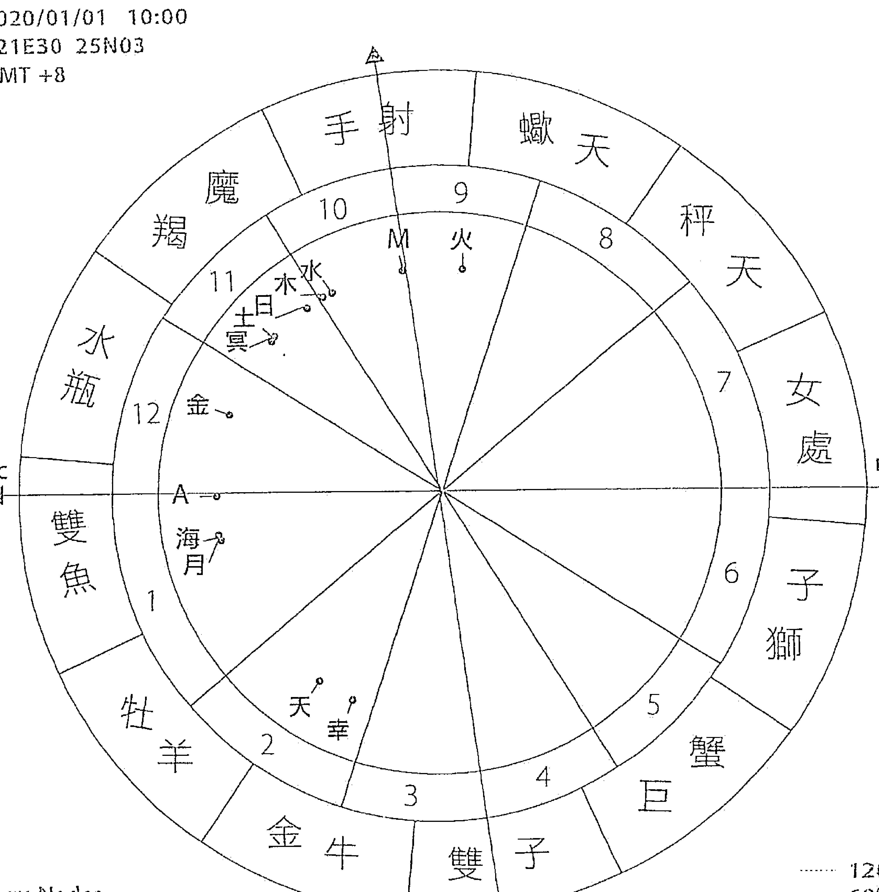

True Nodes
Placidus House
Tropical, Geocentric

+   120°
60°
180°
90°

## 太陽八宮

太陽八宮的人都會是具有神祕感的人。很多星座具有單純的本質，例如太陽牡羊、太陽獅子在本質上都複雜不到哪裡，尤其又落在一宮、二宮、五宮這類相對單純的宮位，你會覺得這些人很容易被了解。但如果太陽落在八宮，即使是單純如太陽牡羊、太陽獅子，你都會覺得這個人沒有那么容易被了解。因為太陽八宮的人一定有一部分是隱藏的，他們有很多事情是藏在潛意識深處，甚至可能連自己都不明瞭。也因為八宮是生命中隱藏事物的累積點，因此太陽八宮的人會是能量很強的人。太陽八宮的人，不管太陽是在什麼星座，他們都容易對他人的潛意識造成影響。他們都會想要知道生命中所有隱藏的事物，所以都會或多或少對玄學有興趣，其他也包含社會的黑暗面、人性的黑暗面、金錢與性的黑暗面。人與人之間最隱藏、最私密的事就是性，太陽八宮的人往往從小就對性有很高的敏感度。這並不意謂著太陽八宮的人很喜歡跟別人上床，他們感興趣的是人與人之間能夠透過性而產生的高度連結。太陽八宮的人如果太陽相位不好，他們就容易被別人認為他們很色，或者是認為他們對激烈的性或扭曲的性很有興致——他們的確對這類事情很感興趣，因為這些都比一般的男歡女愛更私密，而他們對私密的事物難以抗拒。他們感興趣的其實是私密的部分，但大家往往會以為他們很色。對太陽八宮的人來說，色情都不只是性行為本身，它背後都具有一定程度的權力意識。

八宮是慾望之宮，人類的慾望不外乎性、金錢、權力，從而產生了貪嗔癡慢疑五毒。太陽八宮的人既然對這些事情有興趣，也就會特別花時間精力去研究這些事情，因而會比一般人更有機會遇到這類事情，比如內線交易。

一個人如果根本完全不懂這些事就不可能做，而一個懂得這類事情的人，要決定是不是自己也要跳下去做，這就需要很高的道德智慧來判斷了。也因此，八宮也是一個犯罪之宮，原因在於八宮跟檯面下的交易有關，當事人有機會接觸到很多檯面下的交易，如果把持不住，就會變成犯罪。

### 月亮八宮

太陽是星圖中最重要的陽性能量，月亮是星圖中最重要的陰性能量，所以太陽對男性的影響特別大，月亮對女性的影響特別大。太陽八宮意謂著當事人的父親會反映出太陽八宮的特質，月亮八宮則意謂著當事人的母親會反映出月亮八宮的特質，我認識好幾個太陽八宮的人的父親，剛好都在從事跟保險、殯葬或心理學等跟八宮有關的工作。

月亮是一種被動的能量，太陽八宮的人會很直接的表現出自己對性、金錢、權力的渴望，月亮八宮的人則否。月亮八宮的人對性、金錢、權力同樣很敏感，可是月亮八宮是一種在情緒上對性、金錢、權力的敏感，他們自己未必了解，而且也不會直接、主動的去追求。

月亮八宮的人的母親在當事人童年時，往往會經歷性、金錢、權力方面的困擾，基於這樣的隱藏的童年記憶，性、金錢、權力就會藉由潛意識來干擾他們的情緒。而透過這種情緒的敏銳度，月亮八宮的人往往會想要從他人的性、金錢、權力中得到自己的安全感。相較於月亮二宮的人會希望透過自己的金錢帶來安全感，月亮八宮的人會尋求他人，藉由他人的金錢或權力來讓自己得到安全感，因而月亮八宮的女性特別容易受到有錢、有權男人的吸引。假設有兩個男性，一個有錢有權卻殘障，另一個四肢健全卻沒錢沒權，月亮八宮的女性傾向於選擇雖然殘障但有錢有權的那個男人，並不是說她們特別愛錢、愛權，而是錢跟權能在情緒中帶給她們安全感，而這種安全感的需求，又來自於童年時期的母親影響。月亮八宮如果有剋相，代表他們童年期間母親有很多來自金錢或性的糾紛，因而引發了很多不快樂，這種不快樂的情緒被壓抑進入了潛意識，以致於當事人長大以後，容易被大錢、大權給吸引。

八宮跟性有關，月亮八宮的人很了解性，但他們自己卻不會是很需要性的人。月亮要的是親密感，對月亮八宮的人來說，金錢跟權力能帶來的安全感，遠勝於性。對月亮八宮來說，性太過於不可控制。

## 水星八宮

水星八宮的人都會對別人的性、金錢、權力很好奇。只要有機會，他們一定會想要去研究股票市場、期貨或各式各樣的投資。此外，他們從小也會對性很好奇。水星八宮的好奇讓他們很適合從事調查工作或研究神秘學的工作。我認識一個水星八宮的人，他大學念的是心理學，碩士念商業管理，後來又去研究靈魂，一般不了解的人會覺得這個人一直在改行，一路走來都在學不相干的東西，但事實上這些全部都是水星八宮有興趣的領域，水星八宮對人世間所有隱而不宣的性、金錢、權力意識很感興趣。

水星八宮的人也很適合念物理、化學，原因在於物理、化學也是一種隱藏在生活中的科學，而電機或工程之類的學科就跟八宮無關，因為那些都涉及了實際的生活應用。水星八宮的人也很適合念生物基因。

水星也跟近親有關，而八宮跟性有關，水星八宮的人如果有剋相的話，他們小時候就有可能會跟親戚，例如表哥表姊之類的人，有一些性的互動，有一些性能量的困擾，而這件事有可能來自於他們跟親戚往來的時間太多。

不過水星八宮的近親性困擾，還得要有其他的相位配合，並不是每個水星八宮的人都有這種問題。也由於水星跟近親，尤其是手足有關，一個人如果水星落在十二宮輪迴宮，有可能意指當事人的手足曾經在過去世跟當事人有關係，而水星八宮的人則是小時候跟手足之間有一些紛爭，長大以後忘記了，但當時的情緒成為了某些情結，潛入了潛意識之中。八宮跟十二宮的差別，在於八宮是這輩子曾經發生過的事，只是你不記得了，而十二宮則是這輩子根本沒有發生過，是過去世發生的事，卻對這輩子造成的影響。我認識一個水星八宮的人，他跟他姊姊小時候長得非常像，這也是一種屬於水星八宮的一種跟手足有關的性困擾。水星八宮的性困擾未必是一件壞事，這個朋友小時候遇到的這個問題，讓他對心理學產生了很大的興趣，長大以後走上了心理學的學術之路。

## 金星八宮

八宮中有行星的人，他們這輩子不管是跟伴侶之間或情人之間的關係，都會比較深，也比較複雜。金星八宮的人會很有魅力，因為他們是用金星的美感、情感與親和力來展現八宮的人類集體潛意識的性能量。

二宮是自己的資源，八宮是共有的資源，因此八宮代表的是別人的錢。金星代表一個人本能上喜歡的事物，一個人如果金星落在九宮，代表他們喜歡九宮領域的異國、宗教、哲學，落在五宮的人喜歡玩、喜歡被別人喜歡，落在十一宮的人喜歡社交活動，而金星在八宮的人最常會被批評的地方，在於金星八宮是少數可以出售自己的美與愛，來換取他人資源的人——當然出賣自己的程度不一，並不是說他們真的會去從事性交易的工作，而是說他們可以在精神上不反對這件事。

我有一個金星在八宮的長輩，她長得很美卻家裡很窮，她嫁給一個很有錢的人，從某個角度來看，也可以說是她父母是在賣女兒，但從占星理論上來說，女兒本身也不算很抗拒這件事，因為金星八宮的人覺得把自己的美麗與情感換成金錢是可行的。這個長輩告訴我，她在長長的婚姻生活中，先生很有錢時，他們的感情就很不錯，先生破產時，他們的感情就不好，後來先生又有錢時，他們的感情又沒問題。他們的婚姻基礎，可說是建立在先生有沒有錢上。

從好的方面來看，金星八宮的人容易因為他們的美麗、親和力而從他人那邊獲得金錢，不管他們是男是女，他們都常會是在情感關係中獲利的一方。

我認識一對男同志伴侶，其中一個人的金星在八宮，而他的另一半非常有錢，所以金星八宮這個人不必工作，過著很優渥的生活。金星八宮這個人中間有兩年外遇，偷偷跟另一個年輕的窮小子在一起，腳踏兩條船讓他感覺壓力很大，於是認真的考慮是否要離開有錢的男友，考慮了兩年之後，他還是決定要跟有錢人在一起，於是跟窮小子分手。這種結果一點都不意外，因為對金星八宮的人來說，一個人長得再好看，沒有錢、沒有權就很難引起他們的興趣。

### 火星八宮

八宮的性、金錢、權力三者息息相關，不能分開看待。當我們在探討一個人因為八宮而跟別人有性的糾葛時，他們往往在金錢方面也會出問題，而金錢與性的問題背後，都是權力的操作。儘管我們一輩子不見得會跟每一個跟我們產生八宮糾葛的人上床，但這並不代表兩人之間沒有性的糾葛，兩個人之間的性張力與佔有慾依然存在，只是沒有藉由上床來表現出來罷了。而在種種的八宮糾葛中，以火星與冥王星這兩顆行星落入八宮引發的問題最為嚴重。

在性、金錢、權力領域中，最容易動粗、大出手的就是火星八宮。火星很容易讓人撕破臉，金星絕不會。金星八宮就算是知道愛的是錢而不是人，但至少表面上會做得很周到，不會跟對方處不好。水星八宮也不會跟別人處不好，頂多容易跟別人為了錢吵架；月亮八宮就算不爽，也只是各懷鬼胎；太陽八宮的算計很深，但也只是私下明爭暗鬥，不會真正端上檯面大鬧。

一個人如果火星在八宮，就會很容易跟別人起衝突，尤其牽涉到性、金錢、權力都不會是很容易解決的問題，當火星落在八宮，代表一個人的原欲，會用最粗魯的形式橫衝直撞的展現出來。一方面他們這輩子很容易遇到性、金錢、權力的糾紛，另一方面是他們遇到這類糾紛時，會用很直接、粗暴的方式來處理。
火星八宮或冥王星八宮，隨著火星或冥王星的相位，以及落入星座的不同，有些人會遇到性虐待或精神虐待的問題，他們有可能是受虐者，也有可能是施虐者。我認識一個火星在八宮但有負面相位的人，她的家世非常好，她的父親是一個大官，可是在家卻很懦弱，因而從小她就發誓將來長大以後絕對不嫁懦弱的男人。長大以後她也的確嫁了很大男人的男人，但大男人酷歸酷，賺錢能力卻不佳，結婚多年來都靠著太太娘家來供養，結果夫妻倆每次吵架，丈夫都以「別仗著娘家有錢」來罵她，後來越來越嚴重，這個太太就經常得要承受先生施加的性暴力，還好後來兩人以離婚收場，才總算脫離苦海。

### 木星八宮

木星是一顆吉星，它一定會帶來一定程度的好運，即使木星的相位不好，它也會反映在當事人會因為過度樂觀、過度放縱而出現紕漏，也可能因為期待過高而失望，但不會因為木星相位不好就變成沒有好運。

木星八宮代表當事人在木星的社會參與、社會資源上，會跟八宮的集體潛在資源，包含了性、金錢、權力與死亡等相關事物有緣。當一個人的木星落在八宮，代表木星的好運，會藉由性或死亡等途徑，讓當事人可以獲得他人的資源，最粗淺、最大眾的說法，就是木星八宮的人會有遺產，其中包含了有形與無形集體資產的饋贈，木星的資產除了錢之外，也涵蓋了跟文學、歷史、宗教、哲學、文化有關的人類智慧的精神資產。

我認識一個藝文線記者，她在二十幾歲很年輕時找我算過命，她的木星就在八宮。身為藝文線記者的她對文學、歷史、文化當然很有興趣，這就是一種文化（木星）的遺產（八宮），我提起木星常會物質遺產與精神遺產皆有，當時她對此感到很疑惑，因為她自己的娘家並沒有什麼遺產，而她的男友也並不是有錢人，所以她想不出來木星八宮的遺產會從何而來，「我男朋友比我還窮，與其期待他給我遺產，不如我自己賺還比較快。」木土天冥是社會、宇宙行星，它們都得要等到時間到了，才會顯現出它們的力量。這個藝文記者不久後跟男友分手，又過了幾年跟一個世界級漢學家交往，後來也嫁給了這個漢學家。木星的物質性遺產自不待言，更重要的是這個記者本身學的就是文學，本來就對文學很有興趣，本身的文字功力極佳，嫁給了一個漢學大師，等於是繼承了他在漢學方面的遺產，其中不只包含了物質層面、精神層面，也包含了等人脈等社會資源，光是幾十年來累積的藏書，就已經是一個無法估計的寶藏。原本她以為自己會嫁給論及婚嫁的男友，沒想到多年以後卻嫁給享譽全球的漢學家。從這個故事，我們也可以發現，木土天海冥落入宮位，有時候要等到機緣出現，事後才發現原來真的是這樣，事前可能當事人根本沒想到。

## 土星八宮

八宮是性、金錢、權力之宮，很多土星八宮的人跟別人容易發生財務上的衝突。我認識一個做金融的女生，她的土星在八宮，她跟她先生之間發生過很激烈的財務衝突。在八宮的領域中，性、金錢、權力總是三者並存，一個人之所以會跟他人激烈的財務衝突，往往不是只為了錢，很可能彼此之間也有性的不滿，而這兩件事的背後，則是權力的運作。

土星八宮在理論上會造成一定程度的性冷感，而性冷感則會讓當事人更為看重金錢利益。土星八宮的人要修的是放手，唯有懂得對利益與佔有欲放手，才能對土星的功課釋懷。

八宮的他人之財，也有可能會反映在稅務糾紛上。土星八宮的人有可能會遇到稅務糾紛，是因為他們對他人的錢，甚至對國家的錢都有強烈的佔有欲，想要將別人的錢當成自己的錢來用——更麻煩的是土星代表業力，土星八宮的人在運用他人的錢時並不太幸運。把別人的錢當自己的錢來用的人很多，土星八宮的問題是他們常常會在用別人的錢時遇到倒楣事，因此土星八宮的人特別不適合去玩股票，也不適合鑽漏洞節稅。土星八宮的人也容易會在贍養費或保險費上吃虧。我認識一個公務員，她的土星在八宮，她原本在省政府下擔任教職，後來調任到另一個單位，做著性質很類似的工作，卻沒有想到在調任時，由於承辦人員的疏失，將她的職位由「教師」錯植為「雇員」，也就是一年一聘的非正式人員，多年下來也沒有人發覺。一直到她退休那一天，才發現她幾十年來的僱任都發生錯誤，導致原先應有的幾十年退休金全部都無法請領。土星跟日月水金火的不同，在於日月水金火的問題，多半是因為當事人的性格而造成的結果，但土星的問題往往不能歸咎於當事人做錯了什麼，而是他們遇到了一些倒楣事——土星所謂的「業力」，就來自於當事人遇到的倒楣事並不是他們做錯了什麼，但是卻如此倒楣，不禁令人懷疑到底上輩子做錯了什麼。

### 天王星八宮

土星要的是保守、恆定、不變，而天王星相反，天王星帶來無常與改變。

天王星八宮的人從小就對性、金錢、權力的相關事物沒有一般人會有的框架、界限，很多天王星八宮的人從年紀很小時就有可能因此惹出不少麻煩——反而土星八宮不會，因為土星八宮的人在這方面為自己設下重重界限，他們的問題是對性賦予太大的道德價值或責任，因而常會裹足不前，卻反而不容易惹出麻煩。天王星八宮則相反，天王星八宮會是那種在性方面比較早熟的小孩，他們從很年輕時，就對性很感興趣。

天王星八宮跟木星八宮的人都很容易拿到他人的資源，尤其容易突然拿到社會的集體資源。木星八宮比較常拿到的是遺產（不管是個人的遺產或是精神的遺產）之類的偏向社會性質的資源，而天王星八宮則容易意外拿到跟高等心智相關的資產，很多有重大突破的科學家的天王星在八宮，他們不太會是實驗室型的科學家，而是忽然想出一個獨創學理的科學家，他們對不可見的宇宙法則有著透視力，例如以鑽研黑洞理論享譽全球的科學家史蒂芬霍金（Stephen Hawking），他的天王星就在八宫。

天王星八宫跟其他行星是否形成相位，也会将天王星的能量藉由跟不同行星的互动，而有不同的展现。我的天王星在八宫，跟十二宫的水星（跟心智、沟通有关）有一百二十度和谐相，当年我在伦敦学占星时，就有明显感觉到比一起学的其他同学学得更快。而如果一个人天王星八宫，天王星又跟金星（跟才艺、金钱、享乐有关）或木星（社会资源）有一百二十度和谐相的话，当事人就很容易获得巨大金钱财富。

即使不跟其他行星形成相位，天王星八宫的人也常会在人生中获得突如其来的财富。天王星是一种宇宙级的电波，天王星八宫的人都很容易接受到宇宙级的高等智慧，所以他们特别适合去学高等科学、神秘学或哲学等学问。

### 海王星八宫

天王星八宫与海王星八宫的人都不看重金钱，而海王星八宫与其说是不看重金钱，他们甚至有可能已经到了视金钱如粪土，觉得金钱很肮脏的地步，受到这种心态的影响，他们往往会很不理性地把很多钱捐出去，常常会是金钱方面的理想主义者。海王星八宫的人必须对财务问题格外谨慎，海王星没有边界，海王星八宫的人对财务缺乏边界概念，尤其如果海王星有克相的话，他们常常会不把别人的钱当钱，也不把自己的钱当钱，因而很容易去骗别人的钱——但要解释一下，海王星八宫的骗钱都不是出于恶意，他们都是因为自己搞不清楚状况而害到别人或害到自己，如果你被海王星八宫的人骗了钱，你会很难去苛责他们，因为他们真的不是有心想要骗人。如果要选择生意伙伴的话，最好避开海王星八宫的人，因为他们对金钱少根筋。他们不晓得有的钱不能借给别人，也不晓得有的钱万万动不得。八宫是他人资源之宫，八宫有行星的人（除了土星之外）都比较愿意跟别人借钱，其中又以海王星八宫最为明显。海王星八宫的人不管是向别人借钱，或者别人向他们借钱，这些都是没什么大不了的小事。我有个海王星八宫的朋友，有一次向我借钱要做生意被我拒绝，因为借钱给海王星八宫有可能反而害了他们。但海王星八宫的人很容易从他人借到钱，虽然我没有借他，他也很快地跟别人借到了钱，于是开了一间佛具店——佛具也是一种充满海王星特质的行业。海王星八宫的人会全心拥抱佛具、法器、佛珠、画符，认为可以增进灵性，而天王星八宫往往对此抱持批判态度。结果店开了不到半年，合伙人跑了，店也垮了，欠了几百万的债，让他接下来几年都很可怜地努力赚钱来清偿债务。海王星具有牺牲的特质，海王星八宫的人很容易遇到必须为了金钱而牺牲的情境。主动地因为自己乱花钱而牺牲也就罢了，但八宫是他人金钱之宫，海王星八宫很不划算的地方，是在他们往往是受到他人牵连，为了他人的金钱而牺牲。

### 冥王星八宫

八宫是灵性转化的重要宫位，只要有行星落在八宫，都会是不容易做的功课，而冥王星八宫又是其中最困难的功课之一。

八宫是人与人之间最深的欲望纠葛，冥王星代表的是毁灭与重生，当冥王星落入八宫，当事人一生中，势必要经历八宫所有最深、最复杂的议题。

当事人必须走过死荫幽谷，从中得到转化，透过痛苦而得来的转化，虽然过程艰辛，但效果可能最直接而立即，大破往往能带来大立，大痛往往可以带来大觉悟。

冥王星八宫的人在一定年纪之后，会有很高的机会可以悟道，因为他们人生中会遇到很多奇怪的教训，足以让他们去深思背后到底意味着什么。并不是有行星在八宫就能悟道，举例来说，火星八宫这辈子也遇到很多性、金钱、权力有关的冲突与教训，但他们未必晚年会领悟到这些事情是要让他们学到什么道理。原因在于冥王星具有很强烈的转化特质，而其他行星未必有。冥王星八宫的人一生都会在性、金钱、权力方面，跟他人产生很大的纠葛。我认识一个很美丽的电视制作人，她的冥王星在八宫，她很年轻就嫁给一个香港的知名律师，但婚后才一年，丈夫就过世了，她也得到了一笔很丰厚的遗产。死亡与遗产，都是很标准的八宫课题。丈夫过世之后，她来台湾当电视制作人，事业很成功，桃花也不断。她在婚前曾经跟一个人交往，隔了二十几年后两人重逢、相恋、结婚，重逢结婚这种事，也很符合冥王星死后重生的特质，但结婚才不到一年，丈夫又过世了。对她来说，挚爱的死亡，是她这辈子必须要面对与学习的主旋律。当然这个朋友的本命星图中，冥王星跟火星有九十度克相，才会遇到这么困难的议题，一般冥王星八宫的问题并不会这么严重。

## Chapter 4

## 社会管理原本自何方

## ——一本书里藏

木星与土星都是社会星，根据一个人的木星与土星，可以看出这个人在社会资源的状态，从木星可以看出我们这辈子有哪些社会资源可以被我们所用，从土星可以看出有哪些社会上的制约，会对我们要成生命中的限制。

木星是一个人与生俱来的社会资源，它跟太阳的个人意识有很大的差别。

举例来说，太阳金牛的人渴望有钱，但他们未必会有钱，真正容易有钱的是木星金牛。原因在于木星代表社会资源，当一个人的木星落在最为丰饶的金牛，他们这辈子就会享有很丰饶的物质资源。

也因此，当我们要检视一个人这辈子是否有钱，他的社会资源要从何而来，就要观察他的木星落在什么星座、什么宫位。木星的社会资源永远不会只局限于金钱，它还包含了人脉与名声，木星之妙，如果懂得掌握木星的正面能量，人脉可以创造金钱，好名声也可以创造金钱。

每一个人都必然有一个木星，木星必然会落在某一个星座。以左页图为例，这张图的木星在摩羯座。赶快来查一下你的木星在什么星座，看看它代表了什么意义。

2020/01/01 10:00
121E30 25N03
GMT +8

| 节点与宫位系统 | 相位角度 |
| :--- | :--- |
| + - True Nodes | + - 120° |
| - Placidus House | - 60° |
| - Tropical, Geocentric | - 180° |
| | - 90° |

### 木星牡羊

牡羊擅长做自己，而木星代表的是社会资源，木星牡羊的人越能特立独行，他们就越容易在社会舞台上展现光芒，也越容易因此得到社会资源。

虽然木星是一颗吉星，但它也会随着木星跟其他行星形成相位好坏而有差异，好相位往往能为他们带来巨大的成功，坏相位会让他们没那么成功，但不管木星带来的成功是大是小，都会跟他们勇于做自己有关。

占星学优于励志书的原因，在于占星学是一门量身订做的学问。有的人会因为特立独行、努力做自己成功，有的人会因为自谦而成功，有的人会因为小心翼翼而成功。木星牡羊就会是那种致力于做自己而成功的人。

木星牡羊的成功来自于有自信，当他们相信自己，无视于社会观感时，反而容易得到社会资源。尤其适合从事凸显个人独特性与冒险性的领域，越敢忠实做自己，越敢表达自我，越敢领先潮流，就越容易受惠。

木星是社会星，它跟日月水金火的差别，在于日月水金火是个人特质的一部分，而木星不是。……一个木星牡羊的人可能在媒体或公开场合上很敢于自我宣传，很敢自我暴露，常常会因为无视社会观感而闹上版面，但这是一种社会缘，当事人私下的个性可能低调而害羞也说不定。他们可能私底下是个不爱讲话的人，可是一遇到媒体，却变得很敢言。

超现实主义画家达利（Salvador Dalí）就是木星牡羊，达利其实是个很胆小的人，日常生活跟太太的沟通都靠太太帮忙，而且很惧内。但世人在媒体上认识的达利，是一个吹胡子瞪眼，每次出现都穿着奇怪衣服、戴着奇怪帽子，非常勇于挑战世俗价值的艺术家。他可以说是一个以吹嘘自己是一个了不起的艺术家，而成为了一个很了不起的艺术家。并不是每个艺术家都很长于吹捧自己，例如木星在金牛的毕卡索就不太吹捧自己。达利在艺术上的实力当然不容小觑，可是他的成功，跟他的怪诞与擅长吹捧自己也有很大的关联。

### 木星金牛

金牛星座代表了世界上的物质资源，木星金牛的人这辈子在物质资源上都会是比较幸运的人。即使木星跟其他行星形成了不好的相位，意谓着当事人这辈子有可能钱来了之后又会失去，但他们都会拥有一种程度的资源，而不会因为是克相就都没有资源。如果木星金牛有好相位，例如木星金牛跟土星、冥王星或天王星合相或有一百二十度和谐相，就更容易展现出实际生活物质资源的好运。例如曾经是世界首富的希腊船王欧纳西斯（Aristotle Onassis），他的木星就在金牛，又跟太阳、金星有一百二十度和谐相。由于金牛特别跟物质资源有关，如果以同样相同的相位来看，对于木星同样有好相位但木星不在金牛的人来说，他们的好相位可能展现在他们有贵人，或他们有名声，但木星金牛的好相位，则一定会或多或少带来金钱上的好运。从另一个角度来看，通常艺术家大多赚不了多少钱，但如果一个艺术家木星的相位不错，木星又落在金牛的话，他就有可能赚到很多钱。所以如果你有一个还没成名的画家朋友，他的木星在金牛的话，他的画会很值得收藏，因为不久之后，他的作品可能会变得很值钱。一个画家能不能赚大钱跟他的画作好不好是无关的，梵谷跟高更一辈子都很穷，塞尚一辈子也没有赚到什么钱——这些画家活着的时候都很穷，虽然画作后来都非常值钱，但都是让画商赚走，他们自己都没有享受到。但也有一些画家生前赚到钱，例如毕卡索、马蒂斯、米罗，而这几个画家的木星都在金牛。我有个画家朋友的木星在金牛，我在十八九岁时就认识他，他这辈子只上过一天班，之后就决定这辈子再也不要当上班族，有十几年的时间都只在家里画画，过着穷画家的生活。行运木星每十二年走一圈，这个朋友在大约三十六岁时忽然大为走红，一直到现在，虽然有起有落，但他每一年都可以因为画画而赚到很多钱。

### 木星双子

木星在什么星座，代表当事人在此星座相关的领域中容易出头。双子跟日常生活沟通有关，包含了大众媒体、手机、网路。双子座跟人马座代表的学院派相反，它是一般生活上的资讯式甚至八卦式的沟通。如果纯以小说来看，双子型的小说会是比较大众取向的小说，而不会是深涩难懂的小说。例如《福尔摩斯》的作者柯南道尔（Conan Doyle），就是太阳双子，而很受欢迎的法国小说家巴尔札克（Honoré de Balzac）则是木星双子。

双子代表的是大众领域，它会是普罗大众可以接受的水准，而不会是高不可攀的象牙塔。木星的社会资源也包括得奖，木星双子的人很容易在大众传播媒体上获得成功，在美国被誉为新闻界的奥斯卡的普立兹奖，创办人约瑟夫普立兹（Joseph Pulitzer）的木星就刚好在双子。

木星双子的人很喜欢求知，他们往往会是终身学习者。他们的兴趣广泛但不会太深入钻研，他们往往对成为学者没兴趣。木星双子的人在早年求学、生活也会比较顺利，长大以后也会很适合在媒体发展，也适合从事教育、文化的相关工作。

木星也跟宗教有关，木星双子的人喜欢亲近宗教，也容易因此而受益。双子代表的是平易近人的资讯沟通，木星双子的人喜欢的宗教，也都是很大众化、很常见、很受欢迎的宗教，他们不会把信仰宗教这件事搞得很累人。木星双子喜欢将宗教视为一种社交活动，不管是自己对别人或是别人对自己，他们不喜欢咄咄逼人的传教，去深山苦修或严守戒律都不是他们喜欢的型态。将木星的宗教观延到日常生活中，木星喜欢社交活动，他们在社交活动中，容易因为他们的平易近人而受益。

### 木星巨蟹

巨蟹跟家庭有关，木星巨蟹的人通常都会出身于还不错的家庭。所谓还不错的家庭，未必是很有钱的家庭，但他们的家庭都很愿意将资源投注于当事人身上。即使木星巨蟹跟其他行星形成克相，也不代表家庭不提供资源，但有可能会是原先家境不错，只是后来出了一点问题，因而无法提供当事人很好的资源，但至少家庭环境还是具有一定的经济条件，家庭也很安全，当事人会在社会上被视为好人家的子女。

对木星巨蟹的人来说，家庭会对他们提供资源，但他们不太需要为家庭尽责任——一方面没什么责任可尽，即使家庭中有责任，也往往会有更适合扛责任的其他家人去扛。并不是说木星巨蟹的人对家庭冷漠或跟家人不好，而是家中的事情通常轮不到木星巨蟹的人扛。

木星巨蟹意谓著当事人的家庭可以滋养、抚育他们，为他们带来安全感，他们会成长于支持性的环境中。巨蟹代表的不只是家庭，更是广义的家国主义，因而木星巨蟹的人往往会在他们自己的国家受益。很多人觉得自己跟自己出生的地方格格不入，木星巨蟹不会。巨蟹的家国主义也反映在木星巨蟹的人会有一些保守，他们会有一种保守的爱国主义倾向，具有一定程度的乡土主义意识。

木星的社会资源不仅于金钱，还包含了文化、教育，木星巨蟹的人通常家教都很好，即使木星巨蟹跟其他行星形成克相，也不代表家教不好，而是代表他们的家庭可能过度保守，例如家庭具有强烈的政党倾向，或者因为宗教信仰而过度保守。他们可能出身于深蓝或深绿家庭，也可能出身于基督教基本教义派的家庭，因而会在保守价值上显露出自以为是的问题。

木星巨蟹的人也有机会在房地产上受益，他们在买房子时，常常能够得到家庭资助，父母有可能会帮他们负担一部分买房的钱，因而木星巨蟹的人很适合及早规划买房子，因为买房对他们来说，并不会是遥不可及的目标。

### 木星狮子

狮子的能量在于展现自我，不管是什么行星落在狮子，当事人都会希望用一种吸引大众目光，希望受大众欢迎的方式表现出来，其中又以木星落在狮子最为幸运，因此木星狮子出了很多各行各业中的明星。因为木星是社会星，木星狮子意谓著当事人的社会缘，容易让当事人成为众人注目的焦点。

一个人的太阳有可能位于保守的星座，例如太阳巨蟹、太阳金牛，但如果木星落在狮子，尤其木星如果又跟其他行星合相或形成一百二十度和谐相，当事人就很有机会成为各行各业的明星，而太阳狮子的人可能努力一辈子想要被人瞩目但未必做得到，所以太阳狮子应该会很羡慕木星狮子。

木星狮子的人不管他们从事的是什么领域，最好都跟彰显自己、表现自己有关，这样也会对他们很有利。不管他们从事什么行业，都容易在这个行业中脱颖而出。但也因此，木星狮子旁边的人很有可能会不喜欢跟木星狮子合作，因为他们不太有办法跟别人团队合作。

我有个木星狮子的朋友，多年来他不断地换工作，不管是在唱片圈、电影圈、企业圈，甚至跨足电脑领域，他都很容易受到重用与重视，大家都觉得他很杰出。大家可能会以为这个人是因为很懂得抢镁光灯，很懂得如何吸引大家的目光，事实却刚好相反。这个人的太阳在双鱼，所以他不但不喜欢抢镁光灯，还经常想要避开众人的目光，甚至连手机都不太用，大家常常找不到人。但虽然他行事低调，可是很多人都不喜欢跟他一起合作，因为别人的风头很容易被他抢走。举例来说，今天办一个座谈会，邀请好几个同等級的人来对谈，很多人听到他也是与谈人就不想来了，因为到时候整场的镁光灯焦点，都会只在他身上。他未必会是全场讲得最好或最有名的与谈人，但他都会是最容易被众人看到的人。也因此，木星狮子适合从事强调个人英雄式的工作，而不适合必须隐姓埋名的团队合作，因为他们太容易被凸显出来，反而破坏了团队合作的和谐。

### 木星处女

当事人这辈子会因为跟处女有关的领域中得利，其中包含了行政、助理、人资、后勤补给、服务、会计等等，也就是不包含上前线作战的所有后勤业务，都属于处女座擅长的领域。

木星处女如果可以帮大公司做事，一直做到超级总管，他们会感到很快乐。

木星处女会在他们的工作领域中很认真尽责，很多木星处女的人长于数字、资料、会计、管理、法规。要注意的是木星处女擅长的是法规而非法律，因为法律涉及较大范围的法则与逻辑，而法规则是已经被规定好了的小范围的执行面。木星处女喜欢工作上与生活上的事情有实际结果，尤其喜欢可以用数字或其他方式被评量的成功。

他们很热爱工作，他们会用自己在工作上是否很有效率、工作是否成功来评断自己的人生是否有价值。他们往往会是即使本来就很赚钱或命很好却不爱玩的人，也就是说，他们工作并不是为了要养活自己，他们是为了工作而工作的人，工作本身就能为他们带来乐趣。

我问过一个木星处女的朋友，如果今天给她两个选择，一个是给她一千万，但是一年都不可以工作只能去玩，另一个是给她一千万，而这一千万必须要用在工作上的用途，不可以拿去玩。木星处女一定会选择后者，因为他们觉得纯粹去玩根本是浪费人生，投资于工作，才是最好的选择。

木星处女会是那种有假也不太想休，如果当真给他一年假，他可能会真的不知道要怎么办的人。

### 木星天秤

木星天秤的人这辈子在社会的人际关系中很幸运，他们很容易在社交领域中建立起良好的联盟，很容易跟别人建立起良好的合作关系。尤其木星跟商业关系有关，木星天秤往往这辈子在商业合伙关系中十分有利。木星天秤的人不管是跟同性或异性都会处得不错，不过都会是一种社交关系，而不是深入的情感关系，也不表示他们很适合当情人。木星是一种社交缘，木星天秤特别会显现在当人人脉、社交有关的领域，如果你跟木星天秤只是兄弟姊妹或情人的话，未必会感受得到他们在社会缘上的长处。木星天秤往往能够遇到贵人，这些贵人能在对的时间点让他们得到帮助。而木星天秤的人往往也会因为受到比较高的教育、行事作风比较正面，因而有机会遇到很多贵人，而他们终其一生都不缺乏社会仰慕者。木星天秤的人特别适合从事协调、行政、公关这类的工作，天秤星座本身具有均衡的美感能力，这种美感不仅限于美学上、音乐上、绘画上的美感，也包含了生活上的、人际关系上的均衡美感，他们追求各式各样的黄金比例，跟别人的亲疏远近要怎么拿捏，这也是木星天秤的强项。从古典乐来看，莫扎特、巴哈的木星在天秤；从现代音乐来看，盖希文的木星在天秤；从美术来看，塞尚的木星在天秤；从雕刻来看，亨利摩尔的木星在天秤，这些都是会让人心平气和的艺术家。木星天秤的幸运，在于他们一生中经常会遇到贵人，而这些贵人又往往会伴随着生意上的连接——并不是贵人多的人就会伴随着生意上的连接。像我的贵人运也很强，我很容易认识很多有名、有地位的人，但我从来没有跟这些人在生意上或事业上产生连接，因为我的木星不在天秤。很多人会误以为木星天秤代表当事人的人脉很广或很喜欢交朋友，事实上并不需要。天秤是一种一对一关系，木星天秤只要在对的时间遇到对的人，哪怕只有一个贵人，都能够为他们的人生带来很大的帮助，所以并不需要认识很多贵人。

### 木星天蝎

天蝎跟隐藏性的事物有关，木星天蝎的人这辈子对隐藏性的神秘事物很有天分，有很多玄学家、占星学家、催眠大师的木星都在天蝎。木星天蝎的人也对人类的黑暗事物有兴趣，其中也包含了控制他人的手段，曾任美国国务卿的国际政治学均势大师季辛吉（Henry Kissinger）与蒋介石总统的木星都在天蝎。木星天蝎的人很适合去当调查记者，因为他们对他人隐藏的秘密很感兴趣，而且很容易因此而受益，如果他们去做调查记者，或许有机会可以拿到普立兹奖也说不定。

天蝎座具有强大的性能量，木星天蝎的人往往可以展现强大的潜藏性能量而吸引大众目光，例如猫王艾维斯普利斯莱（Elvis Presley）的木星就在天蝎。其实猫王并不能说是很帅的男人，但是他身上散发出一种难以形容的性感能量，这种性感的能量让他的人生得到很大的好处。被誉为「悬疑电影大师」的导演希区考克（Alfred Hitchcock）木星也在天蝎，他的电影充满悬疑、死亡，又喜欢选用金发女郎，这些都很具有天蝎特质。

木星天蠍的人對神秘學都很有興趣，曾經有人爆料，美國總統雷根（Ronald Reagan）常聽信占星師來做決策，雷根的木星就在天蠍。如果當事人的木星能量發展的位階較高，木星天蠍的人有可能會得到人類集體智慧的遺產，包含靈性、宗教、玄學。

## 木星人馬

木星是一顆吉星，而木星本來就主管人馬星座，所以木星人馬的人很幸運，他們這輩子都會不斷的探索新奇經驗，而他們也經常會因此而受益。人馬代表的是對未知的新奇事物的探索，所以它經常會與異國文化有關。我認識一個木星人馬的老太太，很多人年紀大了就不會想出國，而她到了七十五歲還移民去美國。占星學有時候不蓋棺難以論定，這個老太太一輩子幾乎沒什麼機會出國，不太看得出來她的木星在人馬，但她七十五歲移民美國，而且住得很習慣，很快就落地生根，甚至還在美國買好了墳地，打算以後就葬在美國，不回來臺灣了。

木星人馬的人喜歡高深的知識、異國文化，也喜歡宗教，尤其是異國而非本土的宗教。也就是說，一個木星人馬的臺灣人，他會對基督教有興趣，而一個木星人馬的德國人，他有可能會喜歡佛教。例如《流浪者之歌》的作者，曾經得過諾貝爾文學獎的德國作家赫曼赫塞（Hermann Hesse）的木星就在人馬，他不但對佛教很有興趣，作品也深受老莊哲學影響。木星人馬的人跟宗教有緣，喀爾文教派的創始人約翰喀爾文 (Jean Calvin) 就是木星人馬。

木星人馬也因為具有強烈的傳道者傾向，因而很適合從事教書、演講、出版、哲學等相關產業，他們也很適合當推銷員，因為他們會用傳道者般的熱情，把商品推銷給消費者。木星人馬的人適合開拓性的工作，出國工作就具有開拓性質，我有個朋友長期派駐國外，當新聞通訊員，這也是一種很大的幸運。適合木星人馬的工作。而他們的木星社會緣，也會在相關領域讓他們遇到很大的幸運。

人馬也跟運動有關，如果木星人馬當事人的整體星圖適合當運動員的話 (比如火星相位不錯，又落在適合的位置例如十宮)，就會很容易得到木星的社會緣，成為很受歡迎的運動員。尤其人馬跟腳有關，很多籃球員、溜冰選手、芭蕾舞者的木星都在人馬。

### 木星摩羯

摩羯在乎的是功成名就，木星摩羯的人這輩子從事跟老謀深算的事物有關的領域會很有利，尤其是利於從事政治與企業。

木星摩羯的人受益於主流價值，也相信主流價值，他們有能力在主流的權威體制中得到好處。木星摩羯天生具有管理能力，做事小心謹慎可靠，社會地位對他們來說很重要，他們也容易得到社會主流權威的認可，比較容易得到權力與榮耀。不過也因為木星摩羯的人太想要成功，所以也有可能會為了追求成功而過度的不擇手段、過度權謀，或過度展現他們的企圖心。

摩羯代表的是傳統價值，木星摩羯的人往往會因為他們尊重傳統，因而得到傳統價值的認可，進而比較容易取得成功，而且隨著年紀增長，越老越成功。木星摩羯的人通常會得到穩定性的成功，而非爆發性的成功。很多政治人物的木星都在摩羯，例如英國首相柴契爾夫人（Margaret Thatcher）、美國總統尼克森（Richard Nixon）、伊拉克總統海珊（Saddam Hussein），連希特勒（Adolf Hitler）都是木星摩羯。從這裡也可以看到，木星摩羯的人很容易在相對年輕的時候就得到摩羯的政治利益，而不是得要等到六七十歲才終於得到大位。

如果木星摩羯的人去做生意，他們會是很懂得打點政商關係的人。就連我認識的文藝工作者，只要是木星摩羯，他們都很懂得如何跟政治、商業打交道，不會只是悶著頭做創作的創作者。由此可見，木星摩羯的人不可能完全對政治沒興趣，不管從事的是哪個領域，他們都會對政治很敏感，對政治資源也很敏感，因而有能力從跟政治有關的領域中得到資源。

木星摩羯的人重視工作，他們很願意勤奮工作，對自我的要求很高，而土星摩羯的人相反，土星摩羯的人一輩子也對政治很感興趣，也追求主流社會認定的主流價值，可是他們一輩子會受制於主流價值。木星摩羯的人這輩子可以在主流價值中如魚得水，而土星摩羯的人則會受制於權威，在權威的壓力下動彈不得。

## 木星寶瓶

木星寶瓶的社會機緣與利益，都會在跟寶瓶能量相關的事物中顯現，適合從事跟發明、科學、電子工程，或占星學這類領導時代潮流的領域，他們很適合在相關領域中尋求知識的理解與實踐。

木星寶瓶的人不受傳統限制，適合去發展各種前衛的關係，因為他們看待事情的角度與看法與眾不同。如果木星寶瓶中的配置不錯，而且本命星圖中顯示為不是保守的人的話，他們就有機會在各種領域中做出新發明。

木星寶瓶的幸運來自於獨特的事物，固然他們可能生命中有其他的倒楣處，但他們的幸運必然來自創新、來自發明，來自於不拘泥傳統——相較之下，木星摩羯的幸運來自於拘泥傳統、拘泥禮教，由此可以看到每個人的幸運，會隨著木星落在不同的位置而有很大的差異。發現鐳的諾貝爾得主瑪麗居禮（Marie Curie），發明小兒麻痺疫苗的沙克（Jonas Salk），提出相對論的愛因斯坦（Albert Einstein）他們的木星就在寶瓶。由此可見，如果一個人的木星落在寶瓶，他們這輩子最好別去從事太保守的工作。否則木星的社會能量比較無法順利地發揮出來。

木星寶瓶的人在選擇學業、事業時，最好不要人云亦云，不要跟隨大眾或主流價值，這樣會更有利。我認識一個木星寶瓶的朋友，他在選系時，當年最流行的就是選化工系，但他決定選擇核子物理——當年核子物理還是很新的領域，結果後來他就成為了這個領域的專家，而他出生的這一年，有很多人長大以後成為了台灣的第一波電子業的先驅。又如通神學會的創辦人布拉瓦茨基夫人（Helena Blavatsky），她的木星也在寶瓶。

由此可見，木星寶瓶的人會受益於社會集體的變遷，容易從前衛的事物中得利。如果木星有負面相位，木星寶瓶的人容易過度自以為是，覺得自己都是對的，覺得別人都過度保守。木星寶瓶的問題，是他們雖然不拘泥於傳統，卻很拘泥於自己的想法，他們對自己的創新想法很獨裁，不容他人反對。

## 木星雙魚

木星雙魚的人往往會在跟雙魚相關的藝術、音樂、宗教、靈性領域中受益。木星雙魚的藝術家非常多，例如達文西（Leonardo da Vinci）、詩人愛倫坡（Edgar Allan Poe）、音樂家比莉哈樂黛（Billie Holiday），以及心理學家佛洛伊德（Sigmund Freud）、哲學家尼采（Friedrich Nietzsche）。

達文西的本命星圖配置非常巧妙，他的月亮（情緒）與木星（社會利益）在雙魚，而他的水星（溝通思考能力）在牡羊，所以很敢言，很敢表現自我，太陽跟金星則在最懂得物質世界之美的金牛。如果沒有月亮雙魚，達文西的內在情緒不會充滿感性；如果不是水星牡羊，達文西不會永遠將自己的情感表達出來；而木星雙魚則讓他的美學（太陽、金星金牛）、情感（月亮雙魚）得以獲得社會的認可，進而因為雙魚代表的藝術與靈性，得到社會利益。

我有一個木星雙魚的朋友，他是一間出版社的總編輯，他們這間出版社出了一本非常雙魚的書，就是《西藏欲經》，木星雙魚會因為從事雙魚相關的事物而受益，《西藏欲經》的暢銷，讓這間出版社得以在書市屹立不搖。

既然《西藏欲經》賺了很多錢，這個朋友當然就一系列的開始出其他類似的性愛經，但其他的性愛經都沒有賺到什麼錢。原因就在於只有《西藏欲經》跟宗教有關，而宗教跟雙魚有關，而其他的性愛經跟宗教無關，所以他就無法得到木星雙魚之利。也就是說，讓他賺錢的並不是性愛，而是宗教。《西藏欲經》裡面探討了密宗的性愛，讓他賺錢的其實是密宗的部分，而不是性愛。

相較於木星雙魚的幸運，土星雙魚雖然也對所有跟靈性有關的事物很感興趣，但他們很容易在靈性、藝術世界中受到干擾，也比較容易在接觸相關事物時感到悲觀，比較容易看到事情的黑暗面。他們常常會覺得自己是犧牲者，很多人在找他們的麻煩。

## Chapter 1

## 社會貢獻的節慶活動

## —木屋節慶

木星是社會星，木星帶來的是社會財，而社會財包含的絕對不止金錢，還包含了人脈、名聲，甚至學歷、資歷之類的社會資源。它不像月亮要的是安全感、金星要的是享樂，木星帶動的是社會資源，它是一種更大的財富。當木星落入不同的宮位，代表這個人的社會資源會在嶄露在這個宮位的相關領域，其中包含了當事人會在相關領域得到木星之惠，也願意在這個領域把錢花出去——木星的美妙，在於如果運用得當，木星花出去的錢可以讓當事人獲得更多的人脈與好名聲、高學歷，而這些又會回流到金錢領域，讓當事人得到更多的金錢。每一個人都必然有一個木星，木星必然會落在某一個宮位。以左頁圖為例，這張圖的木星落在十宮。趕快來查一下你的木星在什麼宮位，看看它代表了什麼意義。

2020/01/01 10:00
121E30 25N03
GMT +8

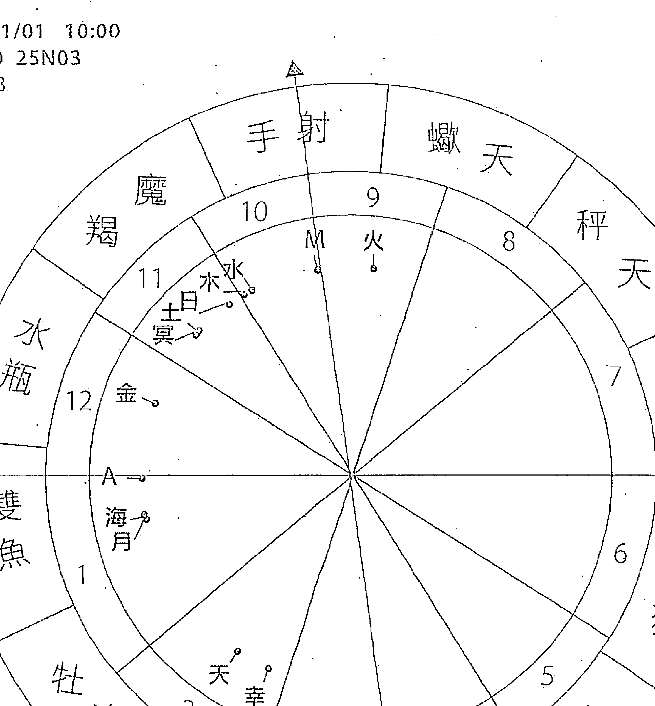

+   - Ture Nodes
- Placidus House
- Tropical, Geocentric

+   - 120°
- 60°
- 180°
- 90°

## 木星一宮

木星一宮意謂著當事人童年容易誕生在較為優渥的環境，他們有可能是獨生子，也有可能是家中最受寵的小孩，甚至有可能住在很大的房子裡或家中很有錢，從小家庭的資源與全家的注意力都在他們身上。

我認識一個木星一宮的朋友，她有好幾個兄弟姊妹，但只有她一個人被祖父母接去同住，獨享祖父母家的大房子與優渥的環境，大房子中只住了祖父母與一個未婚的姑姑，三個人一起來寵這個木星一宮的小孩。

木星落在一宮也會隨著木星落在什麼星座而有差異。木星一宮的人如果木星在獅子，獅子跟自我表達有關，木星獅子的人會因為自我表達而受益，而木星一宮的人從小就會被鼓勵自我表達，他們很可能小時候得很多獎狀，長大以後也同樣會用得獎狀的心態來驅使自己爭取好表現；木星一宮的人如果木星在人馬，他們小時候同樣很受寵，但不會有得獎狀的壓力，他們日子過得比較放任。但不管一個人木星落在哪一個星座，他們小時候都會是一個比較受寵、擁有比較多資源的小孩。只不過受寵有各式各樣的可能性，有的人因為很乖而受寵（木星巨蟹），有的人因為很會拿獎狀而受寵（木星獅子），有的人因為很天真而受寵（木星牡羊）。木星代表的是社會資源，木星一宮的人童年都會享有豐厚的社會資源，至於是什么性質的資源，則會隨著木星落在什么星座而有不同。

木星是社會星，木星在一宮代表當事人小時候的環境中有很多社會資源，不管他們是由父母帶大或祖父母帶大，他們童年的家庭一定不會是一座孤伶伶的孤島，他們家一定會有很多朋友、家人或相關的資源。也因為童年環境中，父母有很多朋友往來，所以當事人從小就習慣在童年環境中接受很多新奇的刺激，認識很多新朋友。

受到這樣的童年環境養成，木星一宮的人終生看起來都會很有自信，他們的一宮自我形象，因為木星而被放大，他們看起來都很樂觀。木星是一顆幸運星，沒有人會一輩子都不遇到失敗，但木星一宮的人即使遇到失敗，他們也比較容易爬起來。

## 木星二宮

二宮的人很適合從這些領域中獲利。木星具有擴張特質，木星二宮的人要小心賺來的錢別因為賭博或錯誤的投資而花掉。所以木星二宮的人必須謹記的是不要過度借貸，不要過度擴張信用。不過即使木星二宮的人把錢賠光，他們對金錢的態度還是很樂觀，也容易在下次運氣好的時候把錢賺回來。

木星是吉星，土星是業力星，木星在二宮會有金錢的好運，土星在二宮則常會在金錢上吃苦頭，大家常常感到困惑的是如果木星跟土星都在二宮要怎麼解釋。答案是兩者皆有，他們會有木星二宮的金錢好運，也有土星二宮的金錢困境，兩者皆有，不會互相抵消。而木星在前面或土星在前面也會有不同的影響，我有個朋友的木星土星都在二宮而木星在前，他一生財運很好，公司越開越大，但因為木星在前，所以他會先遇到好運就先擴張、膨脹，不久後就會遇到土星的考驗，問題變得很難收拾——不擴張其實還不會出問題。另一個朋友則是土星在前木星在後，他一輩子都對金錢異常謹慎，雖然花錢很不痛快，但是卻讓他把錢都留了下來。也因為木星是社會星，靠的不是單打獨鬥，木星二宮如果相位好，特別適合跟別人一起合夥做生意，他們很容易在錢財方面遇到貴人。木星是正面的社會價值觀，所以木星二宮越朝正面方向就越賺到錢。很多以為人無橫財不富，這句話在木星二宮的人身上不適用。這也是我一向鼓勵大家的事——如果星圖狀況好，無論如何都會賺得到錢，何必為了貪心而去走偏鋒？反之亦然，如果星圖狀況不好，金錢不容易守住，那更應該行得正坐得端，否則用非法的方式取財，到時候一定會因此而出大問題。這個法則適用於所有二宮相關事物。例如火星二宮，火星二宮的人對賺錢很積極，如果當業務員，他們會非常努力的去賣自己的商品，這個時候就應該要慎選好的商品來賣才行。因為他們如果拿到壞商品，他們同樣會很積極的賣，這就會讓他們惹上很大的麻煩。

## 木星三宮

如果木星三宮的人相位不錯，他們這輩子念書都會念得很順，但如果木星跟其他行星形成剋相，他們就有可能小時候了，大未必佳。不過不論木星三宮的相位好壞，當事人在受基礎教育階段時都很有利。

三宮也是手足宮，當一個人的木星落在三宮，也意謂著當事人的手足會是他們的貴人，他們的手足會提供他們很多幫助。一般來說，父母出錢讓女兒出國念書不稀奇，我認識一個朋友出國念書的錢是哥哥出的，他的木星就在三宮。木星三宮除了表示手足是貴人，也可能顯示出手足是社會名流，導演李崗的木星在三宮，他的貴人當然就是他的哥哥李安。兩個人都是導演，而李安的名氣比李崗大了許多，大家看到李崗就一定會想到他哥哥，讓李崗常常有一種被哥哥比下去的感覺，儘管李崗自己也是一個很不錯的導演，也拿過不少獎。但他也因此而得到了很多社會資源——木星的社會資源不僅限於錢，還包含了人脈與名望，木星三宮的人往往會因為手足有名望而受益。

木星三宮的李崗小時候讀書也讀得很好，功課遠比哥哥李安好得多。也因為木星三宮的人基礎教育受得好，長大以後會很適合從事文化、傳播等相關工作，但他們適合的是偏向大眾傳播的領域，而不是深入研究的領域，因為深入研究屬於九宮而不屬於三宮。我認識不少木星三宮的人，他們在大眾傳播領域中都很吃香，但我也遇到一些木星三宮卻在大學教書，甚至當上校長的人，三宮基礎教育跟九宮高等教育一百八十度對立，這些人就過得比較辛苦，因為他們往往會是經常上媒體，很有知名度的人，但是在大學中，卻常被其他人覺得他們程度很差。因為木星三宮的人很懂大眾傳播，但大眾傳播的�輯卻常常跟做學問相反，例如通俗，木星三宮的人會致力於將學問做得很通俗，希望自己能夠受觀眾歡迎，甚至為了通俗而花很多精力去搞一些引人注意的花樣，結果淪為花拳繡腿。

## 木星四宮

木星四宮的人往往成長在地方上有影響力的家族。他們的父親也會是被地方看重，具有社會影響力的人。木星四宮意味著當事人出生於名門世家，父親對小孩都會寵愛、寬大。即使木星跟其他的行星形成負面相位，當事人的父親可能很溺愛小孩，但即使是吉相，木星四宮的父親都不會不寵愛小孩。

木星四宮與太陽四宮的不同，在於太陽四宮的人，他們的父親會給小孩壓力，他們的父親很傑出，因而也會希望小孩能夠像他們一樣閃閃發光。而木星四宮的人的父親純粹提供當事人資源，他們並沒有要小孩一定要達成什麼目標。

木星也代表社會的正面價值觀。木星四宮的人，他們的父親很重視當事人是否養成正向態度，很鼓勵當事人做個有道德的人。不過木星是一顆社會星，而社會價值是會改變的，木星跟道德有關，而道德就是一種社會價值，社會價值每十年二十年都會有不少改變，木星四宮的人如果太執著於小時候在家中建立起的道德觀，長大以後就會變得有一點落伍。

我有個親戚的木星在四宮，她的父親是一個大法官，她從小過著很優渥的生活，長大以後也靠著父親的人脈而找到很輕鬆的工作——父親是高官，家中提供優渥資源，正是標準的木星四宮情境。她的父親雖然是大法官，但從小灌輸給她的都是很過時的道德觀，讓她在社會上反而格格不入。這也是木星四宮的問題，當一個人的家庭給予很多資源時，當事人就不需要太努力在社會上打拼，以致於即使跟社會脫節，他們也不太能發現出了問題。

木星四宮的人也經常會在房地產方面受益，並不是說他們很適合從事房地產工作，而是說他們比較容易從家庭中取得房地產。我有個木星四宮的朋友，他雖然沒什麼錢，但他們家因為早年買在很好的地段，所以一直住在很昂貴的區域。而如果木星相位不錯，當事人就很有機會繼承房產，尤其四宮跟父親有關，木星四宮的人很有機會從父親那邊拿到房地產。

## 木星五宮

五宮是桃花之宮，它跟戀愛、子女、創作與賭博有關。五宮的核心概念就是「玩」，五宮有行星的人都喜歡玩，例如我的火星在五宮，我的火星在金牛，代表我喜歡吃東西也喜歡煮東西，但我即使愛吃愛煮也經常煮，卻不太可能成為職業廚師，原因就在於我的火星是在五宮而不是六宮，我煮東西是為了好玩，而一個職業廚師得要天天煮出一樣的東西，所以不能光靠著好玩來工作。五宮也是戀愛宮，七宮才是婚姻宮，大家常說「婚姻是戀愛的墳墓」，原因也在於婚姻是一種長期的平等關係，它需要婚姻雙方長期努力經營，它並不是一時好玩就能做得好的事。戀愛好玩，但結婚不好玩，如果很單純的抱著好玩的心態走入婚姻，婚後一定會覺得戀愛已經結束了。

火星這五顆個人行星落入五宮時，當事人的桃花都有一定程度的主觀意識的參與，也就是說，他們都會是自己也喜歡玩，自己也喜歡談戀愛，因而有桃花緣。相比之下，木星、土星、天王星、海王星、冥王星這五顆社會行星、宇宙行星，當他們落入五宮，當事人雖然也很有桃花，但未必會是當事人主觀意識中喜歡談愛造成的。對木星五宮的人來說，他們的桃花其實是一種社會緣。木星五宮的人在意識中並不像金星五宮、火星五宮這麼想談戀愛，但木星會帶來很大的社會資源，讓他們對一起出去的人很大方、很慷慨、很和善，以至於大家都喜歡跟他一起出去玩，因此而帶動了桃花。

五宮會顯現出一個人在青少年期間怎麼樣被看待，長大以後成為這樣的人。木星五宮代表當事人在青少年期間，是很受尊重，大家都當他們是小大人，他們也因為擁有很豐厚的資源而很容易跟別人相處。雖然大家會自然而然地喜歡跟木星五宮的人一起玩，但大家不太容易察覺這其實也是一種喜歡，但事實上它也是一種桃花，久而久之也會讓人愛上他們。

五宮也是賭博之宮，木星五宮的人都會有一點好賭的天性，因為他們從小在賭博上面都會有一些小小的好運。但如果木星有剋相的話，就得要特別小心，不能在財務上過於冒險，因為木星剋相會讓當事人過度大膽，結果一口氣賠掉之前所有的錢。

## 木星六宮

六宮是工作宮、健康宮，只要六宮有行星，當事人都會在乎工作。木星是社會資源，木星六宮的人相信透過工作方面的服務，可以找到生命的意義與智慧。

木星六宮的人很看重工作，因而都會去從事他們認為的重要工作，他們希望自己做的工作本身是有意義的，而不會去做純粹只是賺一份薪水的工作。

木星六宮的人會慎選自己的工作，對自己的工作很自傲，他們沒辦法去做一份講出來會覺得自己丟人的工作。木星六宮的人會在工作中得到自我進化，可以學習並調整自我，他們會很喜歡工作帶來的挑戰，喜歡藉由工作來跟社會產生連結。他們對「自助」、「勵志」特別有興趣，其中包含了生活、工作與健康。

六宮是健康宮，木星跟其他行星形成克相如果又落在六宮，當事人就有可能容易產生跟木星有關的疾病。木星代表的是膨脹，木星六宮克相有可能代表良性腫瘤的發生。木星本身是吉星，是膨脹與擴張，膨脹與擴張在很多宮位都是好事，例如木星落在二宮金錢宮，金錢的膨脹很高興，如果落在九宮異國宮，去異國增廣見聞也是好事。但六宮健康宮追求的是秩序，它增一分不行，減一分也不行，所以木星的膨脹反而對健康不是好事，但也好木星是吉星，所以往往都會是良性腫瘤，而不是癌症。此外，他們也很容易得脂肪肝或糖尿病這類跟擴張有關的疾病。

木星六宮的人通常重視健康，他們往往會是各種飲食療法、健康療法的熱愛者。木星的本質是傳教士，木星六宮的人不但重視自己的健康，還喜歡跟別人傳「健康教」，他們喜歡跟別人分享健康新知。我有個木星六宮的朋友，她很喜歡教別人怎麼吃最健康。不過木星本身並不適合落在六宮，因為六宮是一個多一分也不行，減一分也不行的宮位，對健康來說，再好的東西吃多了都有可能會出問題。我這個木星六宮的朋友，她有一陣子就因為吃太多健康食品而變得不健康。

## 木星七宮

七宮是伴侶宮，木星落在七宮是一個一般人都覺得不錯的位置，因為木星是吉星，不管木星的相位好壞，木星落在七宮，都意味著當事人會遇到一個貴人伴侶，差別在於如果木星相位好，伴侶提供的幫助會很實際；如果木星相位不好，當事人還是會遇到一個對自己很好的伴侶，只是對方能夠提供的好處，可能會不如預期，這個伴侶可能有心要對當事人好，卻能力不及，導致當事人空歡喜一場。木星七宮的問題，在於當事人很有可能因為另一半可以充分提供社會資源，結果一切都想靠著另一半，自己就不需要努力了。

木星七宮也可能會反映在工作夥伴上，當事人很可能會遇到一個很好的合作夥伴，對方能夠提供充足的社會資源，其中包含了金錢、人脈與名聲，由此可見，木星七宮如果拿去用在工作夥伴上，它會比找個有錢人結婚更好。

原因在於事業夥伴來幫忙，成功之後，成功還是屬於當事人的，但如果只是嫁個成功的人，那些成功其實是對方的。

木星七宮會在夥伴關係中遇到貴人，而這些貴人最重要的意義，其實是讓當事人這輩子可以藉由夥伴之利來提升自己，而不是靠著一個貴人，自己這輩子就完全不需要努力，這樣就浪費了木星七宮帶來的好運了。我認識一個木星七宮的人，他娶了很有錢的太太，而他在事業不順時賦閒在家，靠太太養，而於此同時努力的研究學問，最後成為了一個知名學者。也就是說，木星七宮的人一定會娶得好、嫁得好，另一半一定會是貴人。但如果因為另一半是貴人，所以天天懶散度日，每天只買名牌、買包包，雖然也不是不行，但這樣就浪費了這輩子木星七宮的好運了。木星是社會資源也是智慧，木星雖然可以拿來吃喝玩樂，但木星七宮最重要的意義，在於智慧的累積與學習，當事人透過另一半提供的良好資源，如果用來求知、獲得智慧的話，這才是真正屬於自己，別人拿不走的資產。

## 木星八宮

八宮是他人資源之宮，木星八宮的人這輩子會很容易得到他人之財，其中包含了遺產、股票、中獎。八宮只要有行星，當事人都會對他人之財有興趣也有緣分，但木星八宮又比太陽、月亮、水星、金星、火星在八宮好，原因在於木星是社會星，木星八宮得到的他人之財，往往是因為社會脈動而讓當事人得利，相較之下，太陽、月亮、水星、金星、火星在八宮的他人之財，都需要靠著當事人很積極、很努力才能獲得。問題在於八宮的他人之財很容易引起紛爭，如果太積極、太渴望的話，就很容易會惹出問題，尤其是火星落在八宮又相位不好，當事人就有可能會在八宮的性、金錢、權力領域跟他人產生很大的紛爭，甚至有可能大打出手或對簿公堂。而這些事情都比較不太會發生在木星八宮身上。
遺產也是一種他人之財，八宮的遺產之財，會隨著不同行星而有不同。
太陽八宮的人往往會從父親那邊拿到遺產（意味著母親可能先過世），月亮八宮的人可能從母親那邊拿到遺產（意味著父親可能先過世），而木星八宮則往往父親、母親都沒有過世，父母就已經開始贈與當事人一定程度的家產。

八宮的他人資產，也包含集資、募款、借貸，如果說二宮是自己的錢自己賺，八宮就是跟別人借錢或跟別人集資，用他人的錢來錢滾錢，大家一起賺。但問題是沒有人能保證永遠賺錢，每個人都會遇到賠錢的時候，如果是二宮就比較簡單，自己的錢自己賠，即使賠錢，勒緊腰帶忍一忍，可能也就忍過了，但八宮是他人的錢，如果處理得不好，合夥人或債主上門討債，日子就不好過。而木星八宮在這方面受到的影響會比較小，因為木星是吉星，木星八宮的人在募集他人之財時，通常會用比較樂觀、開放、正向的態度來吸引他人之財，因此即使遇到虧錢的時候，大家也比較願意包容他們，願意給他們較多時間來度過危機。

## 木星九宮

九宮是異國、高等教育與哲學之宮，木星與土星都是社會星，當它們進入九宮時，情況會跟太陽、月亮、水星、金星、火星等個人行星進入九宮很不同，因為個人行星都是個人意識可以到達的範圍，太陽、月亮、水星、金星、火星在九宮的人，他們都是因為自己喜歡九宮而有異國緣。但木星九宮未必，木星是社會資源，木星九宮的人本身未必很嚮往異國，也未必感覺到自己真的跟異國很有緣，但他們可能因為一些社會性的原因——例如他們公司因為一些原因將當事人外派到外國——結果去國外住了一陣子。由此可見，木星九宮的人最適合多多去考留學考試，適合去申請外調國外，前總統李登輝的木星就在九宮。
我有一個學生的女朋友木星在九宮，於是他鼓勵她去考一個很難考的留學考，後來她果然考上了。我認識一個女孩，她大學的時候跟著朋友一起去學日文，而且只是去很普通的補習班學了一年日文會話，後來她朋友想要考公費留學，考上的話不但可以去日本念大學，每個月還會有很多的獎學金，於是拉著她一起去考考看，結果這個女孩考上了，她朋友沒考上。這個女孩的木星也在九宮，她考上之後才發現這個考試原來很難考，絕對不是她這種學過一年日文會話，平常看看日劇、看看漫畫的人可以考上的考試，她真的考運好，當天的題目剛好都是她會的題目，但她的日文真的沒那麼好，所以可以去到日本時念得很辛苦。可是因為她的木星在九宮，後來她還是順利的待在國外把書念完。

木星的社會資源也包含人脈，木星九宮的人容易在異國遇到貴人。我先生的木星也在九宮，他在國外念書時，經常遇到貴人與好運，相較之下，他以前在台灣念書時就很不幸運，考運很差。

木星九宮不但考留學時很幸運，在國外念完書，如果想要繼續待在國外，也會很幸運。我認識一個東海大學畢業的人，他後來考上劍橋大學的研究所——這件事已經夠難的了——他念完博士之後，劍橋大學還請他留下來教書。

## 木星十宮

太陽、月亮、水星、金星、火星這五顆行星為個人行星，木星、土星是社會行星，而天王星、海王星、冥王星是世代行星。十宮是事業舞台，當太陽、月亮、水星、金星、火星落在十宮，當事人都會強烈的感覺到自己希望在社會上出人頭地的野心，而他們的確比較容易站上社會地位上比較高的位置。相較之下，木星十宮就比較幸運，因為他們可能不需要這麼努力，就能站上社會高位。當然有的人可能同時太陽跟木星都在十宮，這個人就會很努力又很幸運，讓人分不清楚他到底是因為努力還是因為幸運而站上社會重要位置——答案是兩者皆是、兩者皆有。

木星十宮的幸運，在於當事人在登上權力高峰時，並不需要他們的意志力、安全感、口才、美貌或行動力，他們就是有一種社會緣，能夠讓他們爬上社會較高的地位。不過木星十宮的人能爬上社會高位，或多或少都會因為他們具有木星的社會背景，例如他們可能受過比較好的教育、具有比較好的名聲——世界上受過好教育的人何其多，但木星十宮的人受過的好教育，會直接對他們的社會地位造成正面幫助。

此外，很多人有名無利，也有很多人有利無名，而木星十宮的人則往往會名利雙收，而且通常會是先有名，後有名，名會帶動利，越有名就越有利。

十宮跟母親有關，木星十宮的人的母親從小就會努力開拓小孩的視野，當事人長大以後也會很自然的想要拓展自己的社會舞台，他們這輩子也容易遇到好運跟貴人，讓他們可以比較容易獲得名聲。而他們如果從事教育、文化、人道主義等鼓舞人心、帶來他人樂觀與正向思考的工作，會讓他們更有名，進而帶動讓他們更有利。

木星十宮的人對社會投注以樂觀、正向的想法，社會也會回報以樂觀、正向。不管木星十宮的人原本從事的是什麼行業，通常到了一定年紀之後，都會或多或少投身於文化、教育、哲學、人道色彩的工作。

## 木星十一宮

木星代表的文化、教育、開放思想，以及相應的正面名聲與人脈，放在十一宮很能發揮它的效應，也因此，木星十一宮的人在社會上也很容易出名，很容易得到社會的認可，他們不需要費力，就能成為眾人心中的好人。

十宮與十一宮都是社會舞台，木星十宮跟木星十一宮都容易讓當事人成為名人，兩者的不同，在於十一宮的舞台比十宮還大。十宮的事業宮是人在其位時很重要，一旦離開了十宮的職場，這個人很快的就會被大眾遺忘。可是十一宮奠基於志同道合，木星十一宮的人是對社會公益有興趣而非權勢，所以即使不在其位，他們的好名聲依然會讓世人難忘。

十一宮是非主流之宮，木星十一宮的人適合從事非主流的社會文化、哲學、教育性的工作。貓王艾維斯普雷斯萊與英國知名歌手艾爾頓強（Elton John）的木星都在十一宮，意味著他們在更大的十一宮同道領域中，很容易受到世人的支持。

木星的社會資源也包含了人脈，木星十一宮的人容易認識具有影響力的人，而這些人會給當事人需要的資源，讓當事人比較容易成功，因此自己也成為了一個有影響力的人，當事人自己也變成了一個可以去支持其他人的貴人。我們在生活中都有機會認識各式各樣的人，而木星十一宮的特殊，在於木星十一宮在生活認識的人，往往都會是具有一定水準的名人或貴人。古人說「談笑有鴻儒，往來無白丁」，就是木星十一宮的寫照。木星十一宮的人的朋友圈的文化水準都不差，或者更確切的說，他們在朋友圈中比較不會遇到壞人——很多被人為文化水準較高的人，例如法官、學者，其中也有不少是壞人，但木星十一宮的人比較不容易遇到壞人，木星十宮則未必。木星十宮也會遇到很多社會地位很高的人，但這些社會地位高的人也包含了許多心術不正的壞人，木星十一宮之所以比較不容易遇到壞人，原因在於十一宮本來就是一個志同道合的公益宮，它的性質本來就是非營利的奉獻，所以當然不像十宮這麼容易遇到壞人。

## 木星十二宮

十二宮是輪迴業力之宮，木星十二宮代表當事人過去世在靈性、智慧的學習上有達到一定程度，因而這輩子願意將木星的社會資源放下，不求名（十宮）、不求利（二宮），追求十二宮的靈性發展。木星放在十二宮之外的任何一宮，都有其現實的好處，唯有落在十二宮，它帶來的不是現實利益，而是靈性方面的資源。

尤其木星如果跟其他行星形成一百二十度和諧相或跟其他行星合相，當事人就容易遇到宿命的好運。

也就是說，木星十二宮的人經常會在生活中遇到一些突發的好運，而這些好運未必是他們努力爭取才有的，而是一種天上掉下來的好運。之所以會有宿命的好運，來自於他們過去世積了很多靈性之德，而這些德讓他們這輩子比較有餘裕去完成靈性功課。

木星十二宮代表當事人過去世曾經做過跟木星相關的工作，例如牧師或學者，他們有學問，但未必在靈性上有進展，所以這輩子決定要透過木星十二宮的情境，讓自己在靈性上有更多的進展。如果木星有剋相，就意味著當事人過去世中在靈性方面過度驕傲，因為他們的信仰而傷害到別人，所以這輩子會遇到一些莫名其妙的法律或社會資源方面的問題，也可能跟當代的人有信仰上的衝突，或者有受教育的困難，導致得不到很多本來應該有的利益。木星十二宮剋相在現實當中遇到的現實受損，其實是要提醒當事人過去世別人利益受損之苦，他們可能曾經佔了別人利益，這輩子就得要遇到被別人佔便宜這類的事情，來平衡輪迴業力。

# Chapter 5

## 安全感的财务自由
——月亮星座宫位

從本命星圖的月亮，可以看出一個人會在什麼地方感到親密與安全感，這就是最終極的安全感議題——面對保命錢的態度。月亮的安全感會投射到一個人的固定支出上，諸如房租、基本飲食費用、水電費用，這些都是生活必需的開銷——如果一個人的收入不足以支付基本開銷的話，他當然會沒有安全感，於是當事人會基於安全感的需求，努力賺取這方面的資源。月亮落在不同的星座，當事人就會有不同的安全感需求，例如月亮如果落在金牛、處女、摩羯等土象星座，當事人的銀行帳戶裡面要有足夠的金錢，他們才會有安全感。當月亮落在不同的宮位，代表當事人會需要從這個宮位的相關領域中得到安全感，如果沒有得到，當事人就會很不安。例如月亮落在四宮家庭宮，當事人必須要從家庭中得到安全感，因此會致力於將家庭經濟維持在一定的水準上。每一個人都必然有一個月亮，月亮必然會落在某一個星座、某一個宮位。以左頁圖為例，這張圖的月亮就在雙魚座、一宮。趕快來查一下你的月亮在什麼星座、什麼宮位，看看它代表了什麼意義。

| 項目 | 說明 |
| :--- | :--- |
| Ture Nodes | 真交點 |
| Placidus House | 普拉西德制 |
| Tropocal, Geocentric | 回歸制，地心說 |
| +   - 120° | 三分相（和諧） |
| - 60° | 六分相（和諧） |
| - 180° | 對沖相（緊張） |
| - 90° | 四分相（緊張） |

### 月亮牡羊

月亮牡羊跟太陽牡羊的不同，在於太陽牡羊的人雖然愛生氣，但他們不生悶氣，太陽牡羊的人有氣會直接發出來，就算是得罪別人也不在乎。但月亮牡羊比一般人更容易生氣，他們卻不見得會直接把氣發出來，長期把氣悶在心裡，情緒經常在大起大落，這樣就會造成身體問題。對女性來說，情緒起伏會造成荷爾蒙的起伏，有可能會引發卵巢、子宮等相關問題，對男性來說，就很可能會造成胃潰瘍之類的問題。

月亮牡羊的人情緒經常騷動、不安，他們通常都不會是花前月下、羅曼蒂克的人。月亮牡羊往往對越親密的人越兇，他們搞不好在外面都很和善，但回到家之後卻很容易對家人發脾氣。

月亮牡羊的不耐煩也會顯現在理財上，我認識一個月亮牡羊，她常常收到支票以後就往抽屜裡一放，甚至夾在書裡面。月亮牡羊連支票都會忘記兌現，要他們好好的去記帳或做財務規劃，當然不太可能。

### 月亮金牛

月亮金牛的人都會有一定程度的財運。金牛星座代表的是物質世界的資源，月亮金牛的人從小就比較能從母親那邊得到大地之母的資源，長大以後也比較不容易遇到太過貧困的生活。
月亮金牛的人很喜歡舒適的居家環境，他們只要一回到家就會變得懶懶的，因此月亮金牛的人會特別願意花錢來增進居家舒適。月亮金牛的人不管是在居家、寢具或衣著風格上，都會特別喜歡古典式的奢華，不管是絲質或毛茸茸質感，都能帶給他們內在的安全感。月亮金牛的人也很喜歡房子，他們不管是從事房地產或是跟居家生活有關的廣告、宣傳或銷售，都會很能引起消費者共鳴。
月亮金牛跟月亮人馬都是很有金錢緣分的位置，兩者的不同，在於金牛帶來的是大地之母的豐饒，而人馬帶來的是好運。月亮金牛的人會謹慎而務實的去處理資源，因而可以長期持有財富，而月亮人馬的人則相信財去財會再來，兩者對金錢的態度並不相同。

## 月亮雙子

月亮雙子的人童年的母親經驗，都會是一種比較理性、比較知性的親子關係。月亮雙子的人都會覺得母親好聰明、懂好多東西，他們長大以後也會跟聰明的對象在一起——對雙子來說，有問有答、快問快答就是聰明，如果跟月亮雙子的人聊天時搭話很慢，月亮雙子不會考慮跟這種人交往。

月亮雙子雖然一定要找談得來的對象，卻討厭太黏的伴侶關係，他們喜歡跟另一半之間最好好像是談得來的室友，每天晚上可以在一起看電視、一起聊電視，其他深入的情感議題都不碰，這會是月亮雙子最喜歡的親密關係。

月亮雙子不喜歡太黏的性格也延伸到他們對房地產的態度上，動輒十幾二十年的房貸，也是一種月亮雙子討厭的責任，而且月亮雙子討厭居家生活一成不變，搬家對他們來說，不但不煩人，而且是一件開心事。也就是說，除非月亮雙子是很需要居家安全感的人在一起，否則他們即使很有錢也都會喜歡租房子住。由此可見，月亮雙子會用一種比較理性但多變的方式來面對資產。他們寧可採取小而變化多端的理財，也不會想要把錢拿去付房貸。

### 月亮巨蟹

巨蟹代表的是家庭的保護，月亮又跟家人與親密關係有關，月亮巨蟹的人最重視的就是老東西、老家具、老古董跟老朋友，他們很依戀各式各樣的老東西。

月亮巨蟹的安全感來源是家庭，但家人未必真的能帶給月亮巨蟹親密感，因而他們都很重視老朋友。

月亮巨蟹的安全感來自於戀舊，月亮巨蟹會為了老東西、老朋友、家庭而付錢，他們願意將錢投資在跟家有關的事物上，對他們來說，把錢放在維持既有的關係、環境、資產，是他們維護安全感的方式。

也因為他們對老東西有著無法割捨的情感，他們往往捨不得把老房子賣掉、捨不得搬家，即使老房子或老東西可能有很多問題，但他們會不想面對、不想處理，遮著眼睛假裝沒看見，就算是得要為此付出很多不必要的支出也甘願。但如果月亮的相位很好，這種懷舊與捨不得放手的態度，就有可能為他們累積出一筆財富。

## 月亮獅子

月亮跟母親的養育方式有關，一個人月亮如果落在獅子，代表當事人的母親很強勢，如果當事人是女性，長大以後她們自己也會成為比較強勢的女性，而如果當事人是男性，他們就會受到強勢女性的吸引——也有一部分的人會強烈排斥強勢女性——因為在他們的認知中，只有強勢的女性才是女性，不強勢的女性會在潛意識中自動被他們排除。

月亮獅子的人很喜歡花錢，而且很愛玩，很喜歡看戲、唱卡拉OK、享受聲光娛樂，但他們花這些錢都只是為了要自己開心，不是為了要掌聲。太陽獅子終生渴求大家的掌聲，其實是一種自信心不足的象徵，而月亮獅子根本不需要別人給他們掌聲，因為月亮獅子的人有著強烈的自信心，他們發自內心覺得自己很棒。這種強勢的內心狀態也會延伸到理財觀，他們對自己很有自信，覺得該花的錢就會花，投資時也很大膽而強勢。

## 月亮處女

月亮處女的人都會有一點怕媽媽，對他們來說，媽媽就像是女教官或舍監一樣，他們覺得媽媽一眼就能看到他們的缺點，常常會批評他們，而他們也對媽媽的批評很介意。

月亮處女比太陽處女更辛苦，太陽處女雖然也很神經質，但太陽是顯意識的目標，太陽處女的人雖然過度實際與過度目標導向，卻不會像月亮處女有這麼強烈的自我批判習慣。月亮處女也因為長期的壓抑情緒，為了掩飾內在的脆弱而難以表達真正的情感，造成親密關係之間的情感障礙。

月亮處女的人通常都會是孝順的人，他們不敢跟母親疏遠，但是當他們跟母親親近時，母親又容易挑剔他們，以致於他們感到壓力很大，卻又不敢遠離母親。這就造成了他們內在情緒緊張的基調，進而影響到他們的理財觀，月亮處女的人對錢財謹慎而保守，他們比較節制，甚至可以說是嚴以律己、絕不浪費，他們會用持久的努力來獲取錢財，不會好高騖遠。

### 月亮天秤

月亮天秤的人的母親通常很淑女，他們的媽媽不會很兇、很粗魯，以致於月亮天秤的人長大以後也會習慣於很有教養、很和善，更重要的是他們在情緒上很體貼，也喜歡跟彬彬有禮的人往來。

月亮天秤很害怕爭論、衝突，他們很會妥協、忍氣吞聲，他們在一段關係中很可能會當好好先生、好好小姐很久，但一旦翻臉就完全無法回頭，很可能就由此決裂，再也無法跟對方當朋友。由此可見，跟月亮天秤相處時，頂多只能就知性議題做討論——聲音還不可以提高，否則他們的情緒會受傷。

不過雖然月亮天秤無法打抱不平，但可以協調再協調，被稱為國際均勢大師的前美國國務卿季辛吉就是月亮天秤。

也因為月亮天秤具有協調的天性，月亮天秤很可以從溝通協調中獲益，他們可以將和諧的天分當成潤滑劑，有利於生活上的溝通。他們在理財上也很注重平衡，可以算是理財上的「均勢大師」。

### 月亮天蝎

月亮天蝎的童年母亲经验往往有一点不愉快的激情，如果月亮相位很不好的话，有可能会遇到母亲早逝或因为其他情感因素而母亲不在身边。即使月亮相位不错，当事人也会觉得母亲是一个有秘密的人，甚至有可能担心母亲会跟父亲离婚。

在这种情感浓烈的童年生活养成下，月亮天蝎长大以后都会变成第六感很强的人，他们有办法直接去感觉出别人在想什么。月亮天蝎的人会有一种情绪上的占有欲，他们虽然不会在行动上控制别人，却有一种通灵般的感知能力，就算他们未必能完全猜出实情，但绝对可以分辨你是不是在骗他。

这种情绪上的直觉也会延伸到财务处理，月亮天蝎的人用钱很小心，他们很讨厌被别人骗，尤其痛恨被人骗钱，因为被人骗钱就等于是代表他们的直觉失灵，所以他们的防人之心很重——这是一件好事，所以月亮天蝎的人非常能够守财而不随便乱花。

### 月亮人马

月亮人马的母亲都不会太女性化或太娇弱，她们都会是比較独立自主，而且开朗、活泼，带有一点幽默的母亲。当月亮人马的人长大以后，月亮人马的男性会很喜欢乐观、大方的女生，月亮人马的女性则会自己成为这样的女性。月亮人马的人个性有一点大咧咧，他们不会很温柔细致或善解人意，可是他们个性都不会很别扭，跟他们在一起总会觉得开开心心。

月亮人马的人在财务上非常幸运，他们从小都有机会从母亲那边得到不少资助，这养成了他们在财务上非常乐观的心态，看在外人眼里，往往觉得月亮人马的人花钱有如没有明天。月亮金牛跟月亮人马都很有财运，月亮金牛的财运来自于物质资源的丰裕，而且务实谨慎，量入为出，而月亮人马的财运来自于乐观，他们即使一时遇到挫折，也永远相信明天会更好，这种对财富乐观、正向的态度，反而让他们在理财上不会真正的失败。

### 月亮摩羯

月亮摩羯的童年很辛苦，而来源通常来自于他们的母亲。月亮摩羯的人有可能童年时期母亲经常不在家，或者因为某些因素而去别的地方工作——摩羯是一个很现实的星座，月亮摩羯的人如果小时候母亲不在身边，往往是一些实际上的因素，尤其可能是跟政治、经济有关的原因，而不太会是因为父母有一方外遇、离婚这类的情感因素而不在身边。我有一个很熟的朋友，月亮摩羯的他童年刚好遇到了文化大革命，他的母亲被下放到青海去劳改，因此不在他身边陪他长大。

也因为月亮摩羯小时候缺乏母爱，所以他们对理财很保守，经常觉得钱不够用，必须要很谨慎的把钱留下来，并且把钱用在有用的地方——摩羯的关键字就是“有用”。摩羯是最为社会化的一个星座，摩羯要探讨的是功成名就，月亮摩羯的安全感，也必须来自于实际的存折上的帐面数字，或者是否拥有房地产。

### 月亮宝瓶

月亮宝瓶的人在情绪上不按牌理出牌——因为他们从一开始就不知道牌理是什么。月亮宝瓶的人往往有个特立独行的母亲，当事人从小在情绪上就会比较冷淡而疏离，藉由这种方式在情感上自给自足。这并不意味着他们没有爱心或过于冷淡，他们还是会跟别人有很多情感互动，尤其是涉及公众议题时，他们很能发挥正义感，但他们没有办法跟单独的个人有很深的情感牵连。

月亮宝瓶对财务的逻辑跟一般人不同，他们不是不理财或者不擅长理财，而是用一种不按牌理出牌的方式来理财。比如他们有可能会跑去买地点奇怪的房地产，或者忽然把原本做了十几年的工作辞掉，跑去新开的公司上班，或者是一个人跑到人生地不熟的异国工作……月亮宝瓶意味着他们的理财观会跳出框架，如果月亮相位不错，他们反而会因此而累积到一笔不小的财富。

### 月亮双鱼

月亮双鱼的母亲常常是一个受苦的女人，他们从小就能感受到母亲的苦处，因而特别有同情心。他们的母亲是个梦想家，但不会是精明干练的女性，甚至有可能想要逃避为人妻、为人母的职务，所以月亮双鱼的人都不太擅长于家务。

但月亮双鱼的人很有同情心，他们很容易被感动，心思很细腻。月亮双鱼虽然不擅长实际的服务，可是很能够提供情绪的抚慰，他们往往会全盘接受对方，让人什么心事都愿意跟他们讲。也因此月亮双鱼很容易被骗，因为他们异常心软，而且常常会自欺欺人，如果说别人骗他们三分，他们自己倒骗了自己七分。所以月亮双鱼的人必须要谨慎理财，不能因为情感用事而去乱投资。

还好月亮双鱼虽然喜欢捐钱、同情心过度泛滥，却不见得会出大纰漏，因为捐钱本来就不求回报，即使对方是在骗人，也不过是把钱捐给了不需要的人，只要能量力而为，其实不会带来太大的危机。

### 月亮一宫

一宫代表的是外在形象，它代表了一个人跟外在环境如何产生互动。月亮是星图中最大的阴性能量，月亮一宫的人不管男性或女性，他们看起来都会比较温柔、比较细腻、比较感性。

月亮一宫是用一种小婴儿的方式在跟环境互动。月亮一宫的人很怕饿，因为饿对他们来说，就像是妈妈不理他们了，他们既没有能力也没有意愿忍耐饥饿，因为饥饿对他们来说，不只是生理反应，更是一种情绪议题。而月亮一宫面对饥饿的方式，也会延伸到各式各样跟安全感相关的议题上，其中包含了面对基本开销的态度。月亮一宫的人很不能忍受饥饿，但他们饿了的时候往往不会直接去买东西吃，而是跟周围的人抱怨自己很饿，用一种近似撒娇的方式得到食物。

月亮一宫的人在处理金钱议题时情况也类似，虽然看起来不情不愿而且很被动，但他们会用强大的情绪力量，使用被动、依赖的方式，来获得他们所需要的金钱资源。

### 月亮二宫

二宫是金钱宫，月亮在二宫的人很重视金钱带来的安全感，他们可能是最重视金钱的人之一，或许他们不见得要让自己很有钱，但他们万万不能没钱，因此虽然他们不见得对金钱有很大的需求，也未必会汲汲营营于赚钱，但他们必须要赚到足够的金钱，让他们能够满足安全感。

月亮二宫的人也会将金钱花在跟月亮相关的事物上，例如饮食或布置家庭上，如果能力可及，月亮二宫会很努力的存钱买房子，因为买房子可以获得很大的安全感。也因为月亮二宫很热衷于这类事物，他们有能力了解大众对安全感的想法，因而特别适合从事跟大众沟通或跟情感需求有关的工作，例如保险、房地产、旅馆、托育与餐饮。

月亮也跟女性有关，如果月亮的相位不错，月亮二宫的人会很容易赚到女性财，我有两个月亮二宫的朋友，一个是电视谈话节目主持人，一个是图文作家，他们的观众或读者绝大多数都是女性。

### 月亮三宫

三宫代表了近距离的沟通，通常会显现在基础教育、邻里关系与大众媒体相关事物上。

月亮三宫代表当事人会在三宫领域的相关事物上有着情绪上的渴求，他们可以从中感动别人，进而可以从中获得他们需要的金钱与资源。举例来说，作家就是一个很适合月亮三宫去做的工作。三宫跟大众传播有关，月亮三宫的人特别有能力在情感上去说服别人，它比太阳三宫更为有利。太阳三宫的人会有理性去说服大众，而月亮三宫的人会用情感去感动大众，月亮诉诸于非理性的情绪，从很多层面来看，月亮的影响力绝对不输给太阳。月亮三宫的人理解别人时，往往不是用眼睛看或用耳朵听，他们是用内心在感受别人，虽然他们常常没有专心在听别人讲话，却能感受到别人内心真正想要说的话。

### 月亮四宫

四宫是家庭宫，月亮四宫的人很容易获得家庭的资助，他们的安全感来自家庭，这意谓着他们从小就很容易获得家庭的资助，其中包含了金钱资源与情绪抚慰，他们会是喜欢常常待在家里的人。

月亮四宫的人往往跟原生家庭有着情感上的纽带，通常月亮四宫在童年经验中，父亲都会经常待在家中，全家一起吃晚饭，会是他们重要的童年经验。

很多月亮四宫的人即使嫁人，也会住在离娘家不远的地方，或者三天两头回娘家串门子，因为家庭是他们最大、最熟悉的避风港。

月亮四宫的人小时候经常会有亲戚来家里吃饭、应酬，从小就会跟亲戚有很多的互动，因此他们很重视家人跟祖先的关系，跟家人在一起吃吃喝喝这件事，对他们来说很重要。

### 月亮五宫

五宫是恋爱宫也是子女宫，月亮五宫的人都很有桃花，他们很容易散发出一种讨人喜欢的气息，制造出一种恋爱的氛围。五宫也是创作宫，月亮五宫的人很适合从事创作工作，月亮会引动他人的情绪，月亮五宫的桃花也会显现在他们的作品上，让他们的作品很容易受到大家注意。在谈恋爱、子女、创作这些跟五宫相关的事物中，月亮五宫会得到安全感。

月亮是一种隐性、被动的能量，太阳五宫跟月亮五宫的桃花都很强，差别在于太阳五宫桃花强是因为他们会主动去追求别人，而月亮虽然被动，但他们往往会强烈的散发出“来追我吧！”的氛围，他们会用一种隐性的方式放电。

此外，由于月亮跟生育有关，五宫又是子女宫，所以月亮五宫的人很容易怀孕，如果不想生小孩，月亮五宫就必须好好做好避孕。

### 月亮六宫

六宫是工作宫也是健康宫，月亮六宫的人的安全感来自于职场，他们也会在职场中得到他们的基本资源。月亮六宫的人往往会担负起职场生活中的母亲角色，他们喜欢在同事面前展现他们的母爱，简单来说，他们喜欢把同事当家人，大家如果生病想要请假，有可能会想要先打电话给月亮六宫，而月亮六宫也很有可能是会带汤、带水果去探病的人。

不过月亮六宫的人也常常会受同事的气，因为虽然他们把同事当家人，同事却不见得也没必要把他们也当成家人，以至于他们觉得自己白白付出爱心。因此月亮六宫的人很适合养宠物，在六宫的职场生活中，月亮六宫的爱心往往得不到回报，但养宠物就不会有这种问题，因此很多月亮六宫的人对宠物可能比对家人还好。

### 月亮七宫

七宫是伴侣宫，它包含了婚姻伴侣，也包含了事业伙伴，它代表的是一对一平等合作关系。月亮代表的是有如亲人般的情绪，月亮七宫的人不管在婚姻伴侣或在事业伙伴关系中，他们都经常会担负起母亲的角色，而他们往往也会寻找比較温柔、比較像亲人的当伙伴。尽管一般人都将七宫视为婚姻宫，但很多工作领域中的人际关系都属于七宫领域。举凡不属于同事关系（六宫）、老板下属关系（十宫），很多关系都是七宫关系，例如记者（采访者跟受访者是平等的一对一关系）或咨询师（咨询师跟被咨询的人是平等的一对一关系）。月亮七宫的人可以在一对一关系中运用情绪的力量去感染别人，如果从事相关行业，就会很容易受到欢迎。

### 月亮八宫

八宫是他人资源之宫，它跟性、金钱、权力有关，八宫跟二宫有行星的人都很在乎金钱，差别在于二宫是自己赚的钱，它自赚自得，不需要跟别人交代，而八宫是他人的金钱，是一种集资，也因为它是他人的钱，所以八宫有行星的人愿意跟他人分享、交流财务状况。

月亮八宫意谓着当事人会从他人的资产中得到安全感，他们虽然不会很积极、主动的去追求他人资源，但是会用一种被动、情绪感染的方式来获得他人资源。月亮八宫的人很可能母亲曾经遭遇过一些情绪挫折，虽然母亲并没有明说，但是这些情绪伤痕在日常生活中渗入当事人的潜意识中，所以他们长大以后对他人的情绪会有很强的感应。

月亮八宫的他人资源也包含遗产，而月亮又跟生命中的重要女性有关，所以月亮八宫的人有机会从母亲或太太那里得到遗产或赡养费。

### 月亮九宫

九宫跟异国、信仰、哲学、高等教育有关。对月亮九宫来说，跟异国有关的事情能带给他们安全感。太阳、月亮、水星、金星、火星这五颗行星如果落在九宫，当事人都会很想要住在国外，但如果单就个人意愿来看，月亮九宫的人会是最想住在国外的人。原因在于月亮跟前世有关，月亮九宫的人很可能过去世曾经住在外国，所以他们会对特定的异国有着无法言传的乡愁。
很多喜欢异国的人喜欢的是周游世界，喜欢去各式各样的国家玩，而月亮九宫则往往会对特定的国家情有独钟，因为这个异国可能在过去世是他们的家乡。
月亮九宫也意味着当事人的资源可能就在国外，尤其月亮跟女性有关，如果当事人是男性的话，有可能他们会在国外结婚。
九宫也是信仰之宫，月亮九宫的人在宗教信仰上特别容易受到家庭影响，如果月亮相位不错的话，延续着家庭的信仰，会为他们带来精神上的安全感，也带来物质资源。

### 月亮十宫

十宫是事业宫，它跟童年时母亲的对待有关，因为母亲是一个人最早的事业舞台，月亮十宫的人非常容易成功，因为他们渴求社会上的认可，一如他们童年时期渴求母亲的青睐。

月亮代表的是私生活，十宫是大众舞台，当一个人月亮落在十宫，意谓着社会大众对这个人的隐私特别感兴趣——社会大众并不会对所有人的隐私都感兴趣，例如太阳十宫，大家就对这些人的私生活没兴趣。

月亮十宫意味着他们会用月亮的情绪来感染社会大众，因而社会大众会对他们的私生活很感兴趣。但社会大众对他们隐私感兴趣是一把双面刃，虽然能很快的让他们受到大众瞩目，但也很容易就会让他们的私生活被窥伺而感到不安，甚至闹出丑闻——但丑闻也是一种出名。

月亮十宫的人内心当中都是需要母爱的小男孩、小女孩，即使闹出丑闻，月亮十宫的人也会用一种撒娇的方式面对世界，藉由这种方式跟社会大众产生情感的连结。

### 月亮十一宫

十一宫是志同道合的公益舞台，十一宫有行星的人通常都会具有比較强的理想性，他们往往会跟一群志同道合的人组成某一类型的圈子，例如社运圈、文学圈、艺术圈、摄影圈……而月亮十一宫通常会是这个圈子里面担任母亲角色的人。月亮是安全感也是资源，月亮十一宫的人往往会认定一个理念，就把这个圈子里面的人当家人，在这个圈子里面，他们会得到安全感与资源，因而会将情绪投注进去，想要尽力维持这个圈子的安定。但月亮十一宫也常遇到他把朋友圈当家人，而朋友不把他们当家人的困境。在各式各样的圈子中，人员来来去去本来是稀松平常的事，但月亮十一宫的人特別不能接受，对月亮十一宫的人来说，如果有人要离开，就像是要离开他们的家庭一样，他们会感觉到自己的付出的情感不被领情，因而备受打击。

### 月亮十二宫

十二宫是业力轮回之宫，当月亮的安全感落在十二宫，代表当事人要在跟现实无关的灵魂领域，得到他们的灵性之财。不过这也意谓着他们对世间众人有着强烈的情绪同理心，却很难将他们的月亮能量拿来追求世间的资产安稳。也就是说，月亮十二宫的人比较不在乎金钱安全感。

月亮十二宫的人在母亲的子宫时，就跟母亲有很强的情绪连结，他们从胎儿时就能感知母亲的情绪，长大以后也会具有感知周遭人——不只是周遭的熟人，还包括周遭的陌生人——的情绪。这件事对他们未必是件好事，因为只要身边的人情绪很差，或者做了什么伤心事，月亮十二宫的人就会立即感受到负面能量，因而毫无来由的情绪很低落，甚至感到身体不舒服，很容易被情绪所淹没。

月亮十二宫的人必须能够认知到自己有吸收别人负面情绪的问题，当自己感到不舒服时，最好离开人群，而不是勉强自己留在现场。

## Chapter 7

## 坚持自己的信仰并为之奋斗——金斯伯格

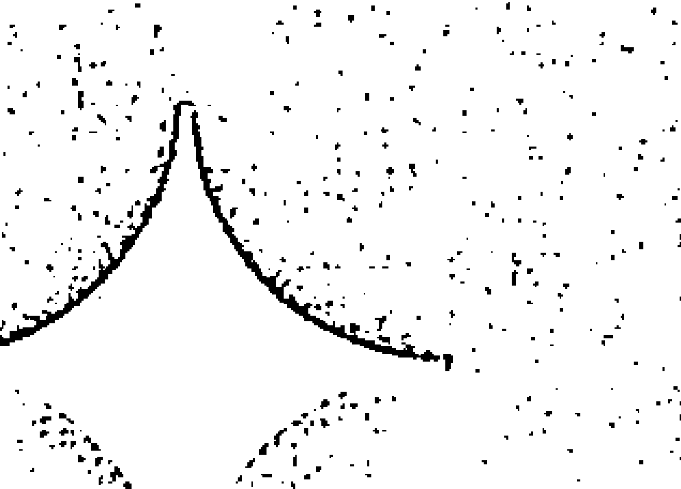

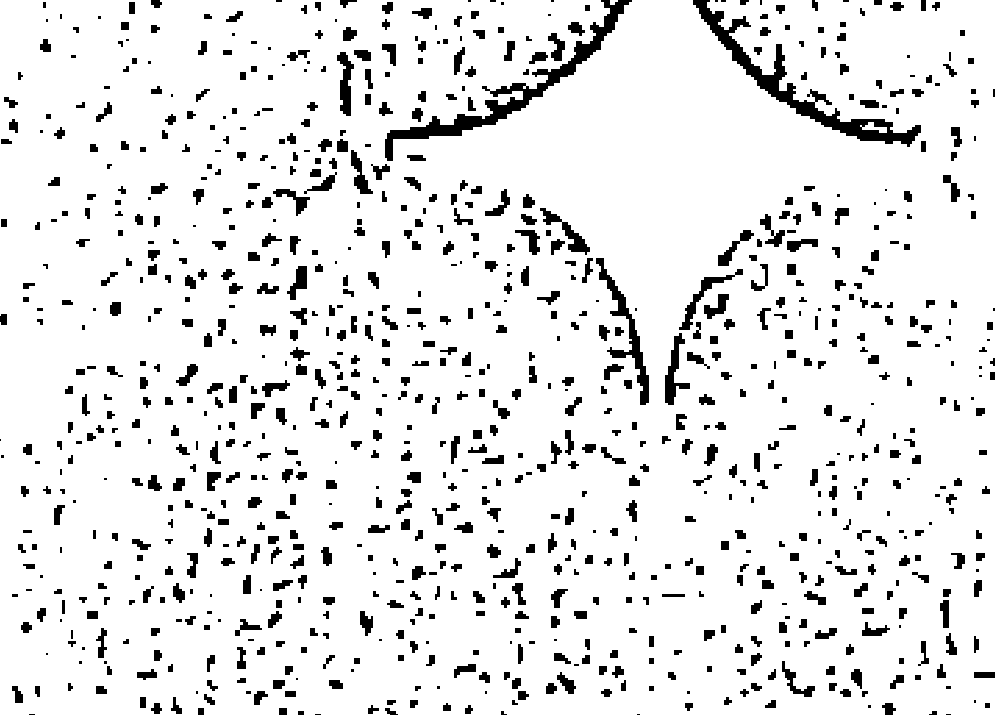

太阳、月亮、水星、金星、火星是个人行星，它们各自代表的是个人特质的一部分。
在本命星图中，金星代表的是一个人讨人喜欢的技艺，它是一个人的审美观。金星是一颗带来喜悦的行星，从本命星图中的金星，我们可以看出一个人容易在什么样的地方放纵自己享乐一下，会想要用什么方式来宠爱自己一下。从金星我们也可以看出，一个人藉由手藝、技巧等美學品味中賺來金錢。
金星會隨著落入不同的星座而展现出不同的特质，例如金星在牡羊的人在审美观与花钱观上很大胆，金星在金牛的人在审美观与花钱观上注重丰饶之美。金星会随着落入不同的宫位，而显现出当事人会把金星之才与金星之财用在什么样的领域，例如金星在四宫家庭宫的人，他们很愿意把钱花在居家布置，也很乐于找人来家里娱乐、社交。
每一个人都必然有一颗金星，金星必然会落在某一个星座、某一个宫位。以左页图为例，这张图的金星就在宝瓶座、十二宫。赶快来查一下你的金星在什么星座、什么宫位，看看它代表了什么意义。

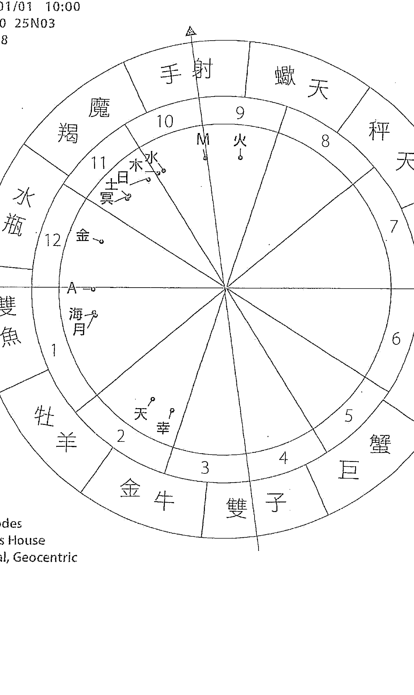

| 符号 | 含义 |
| :--- | :--- |
| + | Ture Nodes |
| - | Placidus House |
| + | Tropocal, Geocentric |
| + | 120° |
| - | 60° |
| + | 180° |
| - | 90° |

### 金星牡羊

牡羊是黄道十二星座之首，身为领头羊的牡羊，它最注重的是开创、与众不同，最讨厌跟别人一样。金星牡羊的美学观最讨厌庸俗，它必须具有一定程度的挑衅，英国的庞克教母薇薇安维斯伍德 (Vivienne Westwood) 的金星就在牡羊。金星牡羊的人不管在美学观或爱情观中都具有野心勃勃的特质，他们具有敢去做别人不敢做的倾向，如果说水星牡羊是一语不惊人死不休，金星牡羊就是在爱情与美学，甚至在花钱方面，很敢去花别人不敢花的钱，去买别人不敢买的东西，并随着金星相位好坏，如果相位好的话，他们会因为大胆、前卫而受益，如果相位不好的话，他们就有可能会乱花、乱买一些根本用不到的奢侈品了。牡羊的反抗特质跟宝瓶的疏离不同，金星宝瓶的人根本不在乎别人怎么想，但金星牡羊的人会刻意的想要挑战社会大众的美学观。

### 金星金牛

黄道的第二个星座金牛，代表了物质世界的资源。金星落在金牛是一个很好的位置，因为金星是一颗爱与美的行星，当它落在丰饶的金牛星座，当事人对物质世界的色声香味触之美会特别敏锐，而且不会流于空想，他们会想要用具体的方式，将他们心中的美学品味展现出来。

金星金牛在金钱观上也同样具有金牛的务实精神，金星金牛如果从事美学相关工作时，他们会秉持一分钱一分钱的原则，精雕细琢的将自己的作品完成，而且每一分钱都花在刀口上。

金星金牛的人具有美食与其他生活之美的品味能力，即使他们不富裕，也会愿意尽可能的在居家生活中过着具有美感的生活，他们很愿意将钱花在有质感的美学领域。

金星金牛也很注重钱有没有收到，如果你跟金星金牛合作，务必要将每一项费用都付给对方，即使金额很小也要算给他们，绝对不能请他们顺便做一下就不计费，这种事情会让他们翻脸。

### 金星双子

双子是第一个风象星座，风象星座注重的是资讯的沟通，而双子的沟通是一种乒乓式的沟通，它永远有来有往，它不会是一言堂，即使他不同意你的意见，也会用一种愉悦的拌嘴的方式，让双方永远可以保持对话的余裕。

金星双子的人不喜欢沉重的事物，他们会将沉重视为沉闷，他们的美学观轻快、俏皮，而且具有一种双面性。

如果金星双子从事美学工作，他们的作品会具有一定程度的幽默感，而且大家一看往往能够会心一笑。

金星双子的人也具有多才多艺的倾向，他们可能不见得有耐心去深究某一种才艺，可是浓厚的好奇心，会让他们乐于多样性的接触不同领域，而且金星双子的人通常非常喜欢跟别人聊天，这种能量特别适合从事大众传播领域。

### 金星巨蟹

巨蟹是一个非常保守的星座，它代表的是家庭的保护，因而金星巨蟹的人对古典、传统、老式的美学特别擅长，对温暖、甜美的事物很有感受力，尤其具有布置家庭的才华。至于前卫或极简主义则不适合他们。金星巨蟹在花钱方面很保守，但有家的感觉，他们喜欢舒适，喜欢有家的味道，也很愿意将钱花在这个领域。
金星巨蟹在情感上具有保守主义倾向，如果金星相位不错的话，保守主义倾向可以为他们赚到钱或享有大名，让他们很讨众人喜欢，如果金星相位不好，他们就有可能会被人视为过时。不过金星是一颗讨人喜欢的行星，即使相位不好，大家可能会觉得他们太保守或太过家国主义，但也不致于太讨人厌。

### 金星狮子

金星狮子喜欢华丽、有昂贵感的美，他们喜欢看起来很贵的东西，不喜欢走低调路线。他们如果从事美学相关领域的话，就很容易去从事比较昂贵的商品相关行业，并因此受益。

对狮子座来说，最重要的既不是名，也不是利，而是得到掌声。他们要的东西很单纯，表达的形式也很简单，说穿了就像是拿一张椅子站上去，大喊“看我！看我！”，想要吸引大家的注意。金星狮子是最喜欢名牌的人之一，他们不但很懂得名牌的质感，还会认定只有自己配得上这些名牌，而且他们不喜欢买打折货。对他们来说，打折货等同于次货。他们会在这些方面花掉很多钱。

金星狮子的人不走低调路线，他们喜欢名牌的高尚、奢华，又带有一点戏剧性的感觉。不过金星狮子喜欢名牌还是基于爱漂亮，他们不会像金星摩羯是为了名牌而名牌。

### 金星处女

处女星座代表的是工匠美学，因为他们很有耐心，很愿意慢慢的将所有细节做得很完美，尤其适合从事珠宝、裁缝之类的工作。金星处女喜欢干干净净、整整齐齐，他们讨厌装模作样，更讨厌不按牌理出牌。金星处女不管在情感上、美学上、财务上，都很讨厌意外状况。他们不会喜欢将头发染成狂野的颜色，或穿着很夸张的服饰。金星处女喜欢精致的东西，他们会喜欢追求精益求精，喜欢干净、漂亮的环境。他们虽然开创能力不足，不见得能够做出惊世骇俗的创举，也未必能够化丑为美，但他们有办法把原先普通的东西变漂亮，把原先美的东西雕琢得更美，而且很愿意花时间精力去将作品完成。如果他们从事的是这类工作，就能够做得很顺手。

### 金星天秤

金牛与天秤这两个星座都跟美有关，但两者要描述的是美的不同面向。金牛探讨的是资源，它代表的是丰饶之美，擅长的是物质世界的色声香味触之美；天秤探讨的是平衡，擅长的是画面的平衡、人际的平衡、金钱的平衡。不管是理财观或审美观，金星天秤在乎的都是平衡，讨厌冒进与惊世骇俗。金星天秤的人喜欢人事务都很追求平衡，他们喜欢艺术之美、音乐之美、人际情感之美，他们通常是品味很好的人。他们很难接受脏兮兮或丑陋的环境，喜欢的都会是优雅、平衡的事物，这也意谓着他们不喜欢没有品味的恶趣味，没品味或坏品味对他们来说都是不可接受之恶。举例来说，如果你在他们生日时，送一个情趣玩具当生日礼物，他们也许表面上保持风度微笑接受，但心里绝对大不以为然，也许会碰都不碰的偷偷把它扔掉。

### 金星天蝎

天蝎是一个深刻的星座，他们很讨厌肤浅的人事物。金星天蝎的深刻，也会显现在他们的审美观与理财观上。金星天蝎最讨厌庸俗的观光客式的美学，无法忍受太过大众化品味。

他们对情感与金钱往往具有强烈的掌控欲，而且具有一定程度的心电感应的直觉。首先，他们会知道对方喜不喜欢他们，他们不会浪费时间在不对的对象上。而且如果你欺骗他们，他们也会很快的察觉到自己被骗，进而马上采取反制甚至报复的举动。

天蝎的敏锐来自于他们最恨被背叛，因为他们在选择情感对象与金钱财务相关事务时，都经过一番精挑细选。如果对方背叛他们，等于是证明了他们自己一开始就看走了眼，这件事情尤其令人难受。

也因为情感跟理财对金星天蝎是一个必须要谨慎以待的秘密，所以他们也不喜欢公开谈论相关事宜，因而显得特别神秘。

### 金星人马

物。如果有机会的话，他们不反对跟外国人谈场小恋爱，而平常他们也很喜欢看看国外流行什么，不管是衣着风格或居家风格，都很喜欢异国风情而非本土化的风格。

不管什么行星，只要落在人马，都会带来一定程度的幸运。金星人马的人在情感关系跟金钱方面都会有一定程度的好运。人马的幸运来自乐观、正面的想法，他们不会执着于付出一定要得到回报，就算被人辜负，也不会花时间精力想要去报复对方——他们很可能根本不觉得这有什么了不起的，就直接头也不回的往前走。也因为他们一直保有这种向前看的天性，所以与其说他们容易遇到好人、好事，不如说他们不会在坏人、坏事上浪费时间，所以生命更加开阔。

### 金星摩羯

摩羯是一种越陈越香的星座，金星摩羯的人有一个优势——他们年纪越大就越有吸引力。年轻时他们往往显得过度老气、呆板，但是等到他们到了一定的年纪之后，就会展现出成熟的魅力，让人刮目相看。金星摩羯喜欢的是一种被社会认可的品味，他们的美学品味比较保守，倾向于偏好男人就应该要打扮成男人的样子，女人就应该要打扮成女人的样子。保守主义并不是一定要包得紧紧的才叫保守主义，金星摩羯是一种美学上的保守，他们也可以接受晚礼服式的露胸露背，但无法接受有破洞的牛仔裤。摩羯是一头永远往山顶爬的羊，金星摩羯在美学与理财方面也有著名牌情节，当他们有一百万身价，就会穿一百万身价的衣服，有一千万身价，就会穿一千万身价的衣服。这也是金星摩羯让自己不断脱胎换骨，不断的攀越顶峰的秘诀。

### 金星宝瓶

金星宝瓶的人在美学上很特立独行，即使一般人感到难以接受，甚至被别人说很丑，他们也完全不在乎。这种倾向也会呈现在情感生活与理财观上，金星宝瓶的人会用一种不顾大众眼光的方式来经营自己的情感生活与获取金钱。也许看在很多人眼中，觉得他们太不务实，太大胆，太过不传统而且没有算计，但这些都是他们不在乎的事。

宝瓶具有反传统、敢作敢为的特质。金星宝瓶的人在情感上、技艺上或财务上如果有所收获，也是因为敢作敢为——事实上他们本来就很难做到谨慎保守，所以不如干脆展现反传统的能量，反而比较容易成功。

金星宝瓶跟金星牡羊都有敢作敢为的一面，两者的不同，在于金星牡羊喜欢当领头羊，他们永远想要领先潮流，而金星宝瓶不是。金星宝瓶要的是我行我素，社会大众赞同也罢，讨厌也罢，他们完全不在乎。

### 金星双鱼

双鱼是黄道十二星座的最后一个，它的能量最为迷离，是最难理解的一个星座，因为连双鱼自己都不了解自己。双鱼具有广泛的同情心，他们崇尚脆弱之美。金星双鱼的审美观是一种瓷娃娃的美感，非常娇弱，仿佛一捏就会碎裂，必须捧在手掌中呵护，这就是金星双鱼的同情之美。但双鱼的广泛同情心也会在情感生活跟金钱理财上遇到很多问题。金星双鱼很容易被骗，因为他们一开始就先自己骗过了自己。他们在情感跟理财上常常会一厢情愿，只看到自己想看到的部分，旁边人再怎么劝阻也没用。所以金星双鱼最需要认知的是双鱼能量拿来用在艺术创作非常好，因为双鱼最能唤起大众广泛的爱与同情。但面对情感与金钱，最好还是务实一点，遮着眼睛过生活，只会为自己带来许多灾难。

### 金星一宫

一宫跟身体的外表形象有关，就像是把这颗行星挂在额头上，让外人一看就觉得这个人很有这颗行星的样子。金星是爱与美之星，金星一宫的人通常都会是个美人，而且他们不只是天生五官长得比较均衡，也很勤于保养、美化自己的外貌。

金星是奢侈消费，当它落在不同宫位，代表当事人会在该宫位的相关领域中特别有一技之长，也会想要在这个领域中宠爱自己一下。金星一宫的人等于是额头上挂了一颗金星，他们很喜欢自己漂漂亮亮的样子，所以他们也喜欢把钱乱花在这个地方。他们可能会乱买很多用不到的保养品，或者买了很多衣服，结果忘在衣柜里头没穿。

### 金星二宫

二宫是金钱宫，金星二宫的人会用金星的技艺（包含美术、美感、美丽的事物、愉快的服务）来赚取二宫的金钱。

金星的美术跟海王星的艺术并不相同，金星属于生活上的技艺，举凡插花、美术设计、卖化妆品、卖香水这些美丽的、让人愉悦的事物，都属于金星。而海王星则是纯艺术，海王星虽然有可能会引起全人类的共鸣，可是它不像金星这么可以在生活中被实际运用。

金星二宫的人都会用愉悦的方式来赚取金钱。大家不难想象，金星二宫的相关工作，不管是做美术或卖化妆品，通常至少在表面都是客客气气，不会很粗鲁或很不优雅。

二宫不但是赚钱的方式，也是花钱的方式。金星二宫的人都会不吝于把钱花在用漂亮的东西上，也很舍得去吃好东西。他们是会愿意买质料好而贵的衣服，买很漂亮的餐具来天天用的人。

### 金星三宫

三宫是手足之宫，兄弟姊妹之间的相处，是一个人最贴身的近距离沟通。三宫有行星的人小时候都会跟手足关系密切，长大以后就会知道怎么跟周遭的环境打交道，所以特别适合从事大众媒体相关工作。金星三宫的人小时候会跟兄弟姊妹相处得特别好，他们会觉得自己的兄弟姊妹很可爱，甚至连谈恋爱时，都会倾向找跟自己的兄弟姊妹们同类型的人。而他们在学校时，都会跟同学处得很好，有很多姊妹淘同进同出，乃至于长大以后，他们也会跟邻居处得很好。有的人会烤蛋糕分送给邻居吃，或者烤蛋糕分送给同学吃，这就是金星三宫的人会做的事。三宫是大众媒体之宫，三宫有行星的人都很适合从事跟大众媒体相关的工作，尤其金星跟美丽有关，金星三宫的人最适合做主播或者网络名人，因为大家看到他们，都会觉得赏心悦目。

### 金星四宫

四宫是家庭宫，金星四宫的人从小家里就舍得在居家舒适、美观上花钱，他们家都会被大家认为是漂亮的家。也因为他们家很舒适、很漂亮，所以他们愿意花很多时间待在家里面。四宫是原生家庭，也是长大以后的家庭。金星四宫的人小时候成长在舒适、漂亮的家庭，长大、结婚以后也会将自己的家庭布置得很漂亮。此外，也因为他们的原生家庭很舒服，所以他们即使结婚以后，也会是那种很喜欢往娘家跑的人。

金星落在的宫位，代表当事人很乐于将钱花在这个地方，而且是开开心心的为了享受而花钱。金星四宫把钱花在家庭是为了享乐，如果是因为家庭成员生病而花很多钱，这种就不算金星四宫，而是土星四宫了。把家弄得很漂亮，找朋友来家里面唱卡拉OK、吃饭、打麻将，这才是金星四宫会有的情境。

### 金星五宫

五宫是恋爱宫，它源自于当事人在青少年的小大人期间是怎么被人对待的，长大以后当事人就会用这种类似青少年谈恋爱的方式来面对生活。

金星五宫的人从小会被视为小美人，他们从小就会因为可爱、漂亮而受到大家称赞，而他们也会用表现得可爱来赢得大家的喜爱。

金星五宫是很喜欢花钱打扮自己的人，他们喜欢花钱在打扮自己，让自己变得更漂亮，让别人更喜欢自己。金星五宫跟金星一宫的不同，在于金星一宫代表当事人的五官均匀美丽，而金星五宫的人是从小被视为小美人，所以金星五宫会具有一种美人的自觉。金星五宫的人是为“悦己者”容，而金星一宫是为了自己高兴来打扮自己。所以金星五宫是桃花很强的发电机，金星一宫未必。

五宫也是子女宫，金星五宫的人也容易生出漂亮的小孩。既然生出漂亮的小孩，他们也顺理成章的花很多钱去打扮小孩。

### 金星六宫

六宫是工作宫，金星六宫的人会是喜欢谈办公室恋情的人。当然不见得每一个金星六宫的人都有机会或意愿谈办公室恋情，这件事的逻辑，来自于六宫最追求效率——办公室恋情等于是一边上班的一边谈了恋爱，当然是很有效率。

金星六宫是很愿意花钱、花心思将办公室打点得漂漂亮亮的人，他们认为既然每天都要花这么多时间上班，当然应该要把工作场合弄得漂亮些。

金星六宫也是比较愿意将钱花在同事身上的人。依循着六宫喜欢有效率的逻辑，常常我们跟同事在一起的时间比跟家人还长，所以他们会很有意愿好好的对待同事，不管是乐于跟同事应酬，或者是逢年过节买礼物送同事，这些都是让金星六宫心甘情愿掏钱出来的时机。

此外六宫也跟健康有关，金星六宫的人很愿意把钱花在医美之类的事物上——事实上他们最适合从事这类工作，因为他们是真心相信它们的功效，因此特别有说服力。

### 金星七宫

七宫是伴侣宫，金星七宫的人喜欢漂亮的伴侣，他们也愿意为了让伴侣高兴而花钱。金星如果本身相位不错，代表当事人找到的伴侣不但长得漂亮，还能为当事人带来舒适、愉悦的生活，也能带来实际的金钱方面的助益。

金星代表的是奢华与逸乐，金星七宫代表当事人会很想要花钱让另一半过得光鲜亮丽。对方开心，自己也觉得有面子。金星七宫会是那种结婚很多年的老夫老妻，还是会经常盛装跟另一半出去约会的人。平常遇到各式各样的纪念日，也会想要奢侈一下，会想要送花、买昂贵的礼物送对方，也不忘出门吃昂贵的大餐。

金星七宫喜欢伴侣是美人，但喜欢美人的人很多，竞争很激烈。而就算顺利打败众多对手抱得美人归，美人的日常维修成本也不低。因而金星如果相位不好，当事人就有可能会因为另一半不知节制而入不敷出。

### 金星八宫

八宫是他人钱财之宫，金星八宫的人很容易透过金星的方式从他人得到钱财。就传统的想法来看，金星八宫是一个有利的位置，因为金星八宫的人可以运用金星的情感与愉悦的方式来获得八宫的他人金钱。这并不意味着金星八宫会去做跟性有关的行业，也不意味着他们一定会嫁或娶有钱人——虽然他们的确或多或少觉得为了钱结婚并不是一件坏事。金星是一种讨人喜欢的愉悦的能量，金星八宫的人不介意花别人的钱。金星八宫最厉害的是他们有很强的募款、集资能力，德蕾莎修女（Mère Teresa）、甘迺迪总统（John Fitzgerald Kennedy）的金星就在八宫。更重要的是别人在他们身上花钱，也花得很愉快。他们不会为了钱跟人闹得面目狰狞，而别人也会开开心心的把钱双手奉上，原因在于金星八宫意味着他人的金钱，可以换到他们的爱。

### 金星九宫

九宫是异国之宫，金星九宫的人特别容易在出国的时候有异国桃花。之所以他们会有异国桃花，有一部分的原因在于他们不喜欢大众的品味，他们在品味这件事上眼界比较广，不会以一般品味为满足，他们的品味高人一等。他们喜欢品味比较高的人事物，也特别擅长高人一等的品味。如果他们从事跟美术、设计等跟金星相关工作，就很能够因为跟异国有关的高品味而受到大众欢迎。

也因为金星九宫的人喜欢异国，也喜欢高品味的东西，所以他们愿意在这类事情上花钱来犒赏自己。最想要出国玩一趟（而不是出国学点东西）来宠爱自己一下的，就是金星九宫。

金星九宫愿意为了高尚的品味花很多钱，而他们高人一等的品味，也会是别人愿意付钱买单的强项。但他们也很可能因为品味太高，让自己成为摆在象牙塔里面，高处不胜寒的金丝雀。

### 金星十宫

十宫是事业宫，金星十宫的人会将自己讨人喜欢的能量，运用在社会舞台上，他们会在公众领域中表现得很讨人喜欢，并且因此而受益。十宫跟母亲有关，因为母亲是每个人最初的事业舞台，一个人小时候怎么跟母亲相处，长大以后就会想要用同样的方式，得到社会大众的青睐。金星十宫的人多半从小被母亲打扮得漂漂亮亮，并且被教养成要随时保持着漂亮的样子才会受人喜欢。金星十宫也意味着当事人的美、品味、和善的态度，会让他们受到社会大众的喜爱，进而心甘情愿的把钱奉上。所以他们很适合从事媒体、流行时尚、外交、艺术或类似的工作。金星十宫与金星一宫的不同，在于金星一宫的人都会五官端正，而金星十宫则是在大众媒体上特别耀眼，但私底下未必。金星十宫的本质是大众情人，他们很容易成为社会集体的恋爱对象，例如名模林志玲的金星就在十宫。

### 金星十一宫

十一宫是社交之宫，金星十一宫的人一辈子都会很受朋友圈的欢迎，他们往往会是社交活动的核心人物。

金星十一宫与跟艺术、享乐有关的社交活动有关，他们往往也多才多艺，很能够在这类的场合中受欢迎。更重要的是大家都很想要请他们来参加这类活动，因为他们很能带动现场的气氛，而且能够带动人气，让很多原先未必想来参加的人，因为听到金星十一宫会来而决定参加这场活动。

金星十一宫的人会花很多时间、精力在社交活动中，也很喜欢为了参加社交活动而花钱打扮自己。他们在社交活动中花的金钱与时间可以获得回报，因为金星十一宫意味着当事人能够因为擅长应酬而受益。他们可说是一人公关公司，如果他们从事的工作，刚好就是跟社交、艺术、公关、广告相关的工作，金星十一宫就会让他们工作起来格外事半功倍。

### 金星十二宫

十二宫是轮回业力之宫，当任何行星落入十二宫，都不太能发挥在现实世界的实际功能，都必须要有一定程度的退位给灵性。

金星的爱与美，放在其他各宫都能发挥实际用处。金星一宫的人长得漂亮，金星四宫的人居家生活很美，金星七宫的人容易嫁帅哥娶美女，金星十宫的人容易在事业上得到人和...但只有金星落在十二宫，金星必须要将金星的享乐、社交、应酬、奢华的功能，转向奉献于十二宫的灵性成长。

金星十二宫源自于当事人可能过去世在金星的爱与美方面对他人有所亏欠，所以这辈子必须要在这方面被人辜负，这样才能平衡；也有可能是在过去世金星的爱与美充分被满足，所以发愿在这一世将金星能量用于灵性追求。

但不管是哪一种，都意谓着当事人在爱与美方面无法得到现实的利益。

也因此，金星十二宫的人如果能将自己的爱与艺术才华，不求回报的投入于灵性，反而可以获得心灵上的平静与满足。
