## 占星魔法


> 謹以此書，獻給我親愛的母親。因為她，我才會走上占星與魔法這條路，也謝謝她多年來一直支持我、鼓勵我。還要謝謝保羅，要不是你告訴我：「為什麼不乾脆自己寫一本占星書？」或許就不會有這本書。

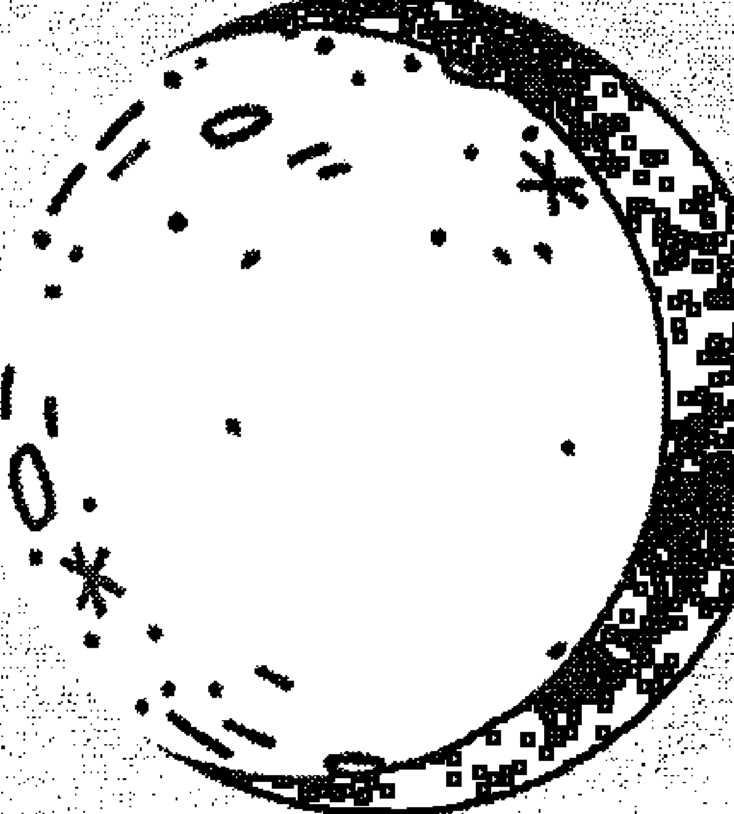

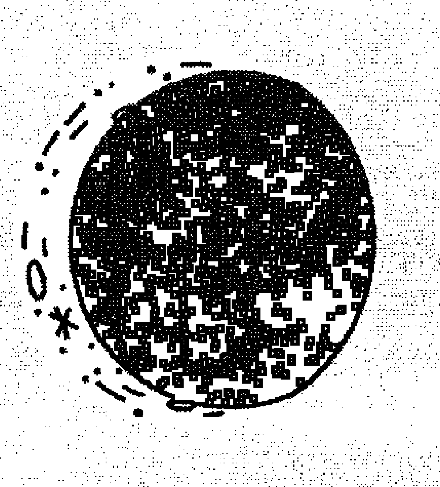

### 前言

### 平易近人，可活用的占星魔法

这是一本占星书，专为魔法与魔法师而写。市面上有成百上千册的占星书，教导读者认识占星符号代表什么意思，又或者让你了解，你的弟弟明明就是一个，为什么人缘比你还要好；又或者偶尔你希望来点刺激的性爱，但为什么另一半在床上却像条死鱼。虽然市面上的占星书琳琅满目，却没有一本告诉我们如何运用占星术来提升魔法、咒术和各种施法仪式的效力。还好随着本书问世，状况总算有所改变了。

在这一行，大多数的传承、老师和书籍都强调，想要把法术学好，对占星要有相当程度的认识。有的要求比较基本，只要知道太阳星座就行了；有的则要求非常严格，像雷蒙德·巴克兰（Raymond Buckland）就规定学生要能自己排盘、解盘，并根据行运（transit）和推运（progression）做出精准的预测。最好是啦，少作梦了，巴克兰！

我写这本书，就是为了消弭这两者之间的鸿沟。本来我想将本书书名定为《为非专业占星的魔法师所写的卜卦与择日占星学》，但这样肯定卖不出去，因为听到书名，一般人不是觉得莫测高深（啥！卜卦？择日），要不就觉得无聊透顶（听起来像是硕士论文）。

或阿萊斯特·克勞利某個不成才的弟子寫出來的）。可是請容我誠實告訴你，本書要談的的確就是這些，希望你不要太驚訝。還有既然你都已讀到這裡，希望你已經買入手，要不然我會慫恿你忘掉上一段所講的，買書就對了。本書書名聽起來雖然平淡無奇，但絕對比你想像中更有用，也更好玩。我說真的，我保證！更好玩？真的假的！沒錯，更好玩！我愛占星，更何況，占星學要是不好玩，我應該就不會這麼愛了。

本書的讀者群，包括對占星學一竅不通、只會問：「你是什麼星座」的人，也包括業餘占星玩家、占星研究者，以及對占星學已有基本認識、知道占星術對於魔法的運用有什麼加乘效果的人。但無論如何，請記住占星學上很重要的格言：

「魔法有時有效，有時無效，所以莫強求。」

> ——契夫·丹·喬治（Chief Dan George）
在電影《小巨人》（Little Big Man）裡的對白

讀到這裡，有些讀者可能會想起「天上如是，地上亦然」（As above, so below）這句陳腔濫調。其實這句話講得很好，只不過本書寫得比較實用，希望大家可以立即應用。更何況，占星學還有別的用途。總之，我既然允許了，大家就不妨試試吧「說到這裡，容我向美國第一任桂冠詩人勞勃·潘·華倫（Robert Penn Warren）致歉」！不過沒有一件事是可以百分之百確定的，尤其當你召喚男神或女神時。既然有學過魔法的人，想必應該都知道這一點（什麼！你說魔法老師沒有告訴你這件事？喔，抱歉，我洩露了商業機密！但這個商業機密你只花六百六十九元就買到手，你說值不值得。）不僅如此，我還要再洩露一個天大秘密。那就是本書所介紹的技法，不僅可以運用在魔法上，也可以運用在日常生活中。不管是想買車、跟老闆要求加薪、準備和心儀對象第一次約會，占星術都可以派上用場。換句話說，不管你想要什麼，都可以利用占星術來提高成功機率。我說真的。但要小心，不要讓自己的生活完全被左右了。總之，大原則就是——重要的大事才運用占星術，雞毛蒜皮的小事就順其自然吧！

> 1 譯注：阿萊斯特·克勞利（Aleister Crowley）是二十世紀初英國著名神秘主義者、法師、詩人、畫家兼小說家。

## # 作者序
### 提升魔法，靈性成長的占星學

大家好，我叫艾絲黛兒·丹尼爾斯（Estelle Daniels）。我先自我介紹。畢竟作者序不就是為了介紹自己嗎？我是個占星師，也是個執業的巫師。但我最早接觸的是占星術，約在一九六七年春天。當時，我母親在讀一本占星書——《占星術：太空時代的科學》¹，作者是約瑟夫·古塔瓦基（Joseph F. Goodavage），她覺得我應該會喜歡，所以就推薦我看。我讀了的確蠻喜歡的。接著，我們母女倆就開始閱讀更多占星書，對占星學的興趣也日益濃厚。從一九六〇年代末到一九七〇年代初，我們在芝加哥地區一起上了不少的占星課。之後，我大多改為自學，還不定時參加相關的研討會、座談與演講。後來，我開始把占星當成事業，以收費的方式幫人解盤，但沒把它當成主業，比較像是副業。雖然我媽媽希望我當個專業的占星師，但考量到收入較不穩定的關係，我還是選擇了另一個收入比較穩定的工作，但儘管如此，我從未停止對占星學的鑽研與練习。

而且还有个好处，就是工作方式变得比较弹性，当有人找我解盘时，我可以决定要不要接，要是比较懒，也可以暂时休息，做别的事。我擅长的领域包括：本命占星、合盘、卜卦占星和择日占星。此外，我还是某异教组织的顾问，提供卜卦和择日占星服务。至于巫术部分，我的正式学习历程就比较短了。但如果把非正式学习也算在内，其实我从小就已经开始接触神话学、密教和神秘主义等事物了。大概从一九六一年起，我开始阅读和收藏各式各样的漫画书（很多都跟当代神话学及原型有关），也大量阅读不同文化的童话故事和民间传说。科幻小说和奇幻故事，一直是我的最爱。此外，各种占卜术或神秘法门，我几乎都接触过。总之，为了满足我旺盛的好奇心，我读过很多书。一九八九年夏天，我重新联络几位老朋友，也开始对另类宗教感兴趣，并积极参与相关活动。在那之前，我已经在爱德加凯西基金会（Edgar Cayce Foundation）待过几年，但老实说，我对他们的教法并不是很满意，尤其是强烈的基督教色彩。但我并不是反基督，事实上，我从小就受了不少基督教教义的薰陶（至少看起来是如此），只是我内心深深觉得，有很多灵性议题在那里并没有谈论。我那些朋友里，有几位是威卡派（Wicca）的巫师，透过他们，我接触到威卡巫术和萨满，并且发现自己一直在寻寻觅觅的东西。那种感觉就像回到了家，相信很多威卡巫师或异教徒都应该有过类似的体验。后来，我进入一折衷派威卡巫術傳統（Eclectic Wiccan Tradition）接受啟蒙（折衷派傳統？聽起來是不是很矛盾），並成為當地某異教教會的成員，在當地教授巫術和占星學，每年參加好幾次異教徒的節慶。現在你對我應該有些認識了，接下來就為大家導讀本書吧。近年來，本命占星學（natal astrology）主要探討一個人的人格、個性和命運，是最普遍、大眾也最熟悉的。「你是什麼星座？」這句話如今已成了閒話家常，在美國，約有九六％的人都知道自己的星座。很多人都曾經找人排盤、解盤，有公司還推出占星服務，讓客戶只要花少少的錢，就可以拿到精美命盤。如果想知道命盤上的兩百五十顆小行星坐落在哪個位置，或想知道赤緯等稀奇古怪的元素，一定都找得到人幫你服務。前述種種，都可以讓占星這門藝術發揮其美好與實用性。如今不少占星師就是靠這類服務餬口。但這些都不是本書要談的重點，畢竟跟這些主題有關的占星書，市面上已有很大品質不錯的書籍可以參考。我認為（我強調，這是個人淺見），一個人要是對既有議題想不出新創見，就不要用新手法重新包裝，再拿出去招搖撞騙，因為那隻不過是新瓶裝舊酒而已。這不是說，本命占星學已經沒有什麼新鮮事可以探討了，我只是還沒有任何新想法可以分享而已。其實我從來沒想過要寫占星書，更別說跟魔法有關的占星書了。但既然要寫，就一定要找個還沒有被人炒作到爛或相對新穎的主題才行，當然要是能找到從沒有人寫過的題材，那就更棒了。不過這個想法聽起來太天馬行空，甚至有點目中無人。唉呀！可別忘了女神的殷殷告誡：切忌傲慢。但話說回來，我只是在做自己想做的事情，而且要不是因為讀了巴克蘭那本藍色的大作《巫術完整指南》2 對占星學的介紹，我可能根本不會走入占星領域。老實說，他的書我相當喜歡，而且讀得津津有味。可是有一天，在讀了整整五頁占星的內容後，我忽然火大了起來，把書往牆上一摔，那本書彈到房間另一頭的地板上（當然不是書本自動在房間裡飛來飛去，我的法力還沒那麼高強）。之所以火大，是因為我不滿意巴克蘭對占星學的介紹；書中，他除了建議學生學會自己排盤、解盤，並根據行運和推運來預測事件外，對於如何將占星運用在法術上，居然隻字未提！我下功夫鑽研後發現，讀到的每本占星書作者或每個和我談過相關話題的人都告訴我：「對，占星學對魔法而言很重要，所以把它搞熟就對了。」但沒有人告訴我，然後呢，該如何運用？後來我才發現，占星術除了用來解讀一個人的性格外（這點相信大家都非常清楚），在日常生活中還有許多用途，絕對不只是解讀命盤而已。在占星學裡，很多方法有助於提升魔法威力（對日常生活也很有幫助），譬如：時主星（planetary hour）、植物栽種指南、威力特強的神秘時刻等。當時就我所知，至少有八、九種占星技法對於提高法力都有助益（包括什麼事該做或不該做），都是簡明易學，不需要用到數學運算就可以上手。我很早就明白了這點，只可惜，市面上似乎沒有任何一本書把種種技巧和訣竅詳加介紹。於是我星書，也許可以從中找到我想要的，但我失望地發現，這些書大部分都是專為高階執業占星師所寫，要不就是已絕版，再不然就是需要運用到數學運算，又或者用深奧難解的文言文。

這件事我想了好幾天，發現自己越來越接近抓狂邊緣。因為這麼簡單、基礎、容易上手的事，居然沒人寫？這有點像是童話「國王的新衣」裡那個小孩無心脫口而出：「國王根本就沒穿衣服啊！難道沒人看出來？」在這個小孩眼裡，這是再明顯不過的事實，但世上其他人卻都視而不見。其實這種現象隨處可見，絕大多數人都對人生的基本課題感到迷惘、困惑，不是嗎？忽然間，我彷彿被宇宙當頭棒喝：「傻瓜！既然你覺得這件事如此基本又簡單，你也了解得非常透徹，為什麼不乾脆自己寫出來呢？」就這樣，老天爺丟了一項任務給我——一份宇宙的家庭作業。

然而當我從這種震驚狀態回神過來，我心想，最好是啦！我區區一個無名小卒，哪有能力寫什麼占星書？不不不，我相信，市面上一定出版過跟這個主題有關的書，只是我還沒找到。於是我開始尋尋覓覓，不然就是到處問人，並閱讀更多占星書，從中我發現到很多很棒的想法，也學會更多技巧，但就是找不到任何一本書探討我念念不忘的主題（就算在古書裡也遍尋不著）。

經過多年的努力，有一天，我終於放棄，不再尋尋覓覓，我寧願接受那個我無法逃避的宿命——動手寫這本書。然而就在我下定決心後，我發現，自己好幸運，因為這個價值連城的主題，從來沒有人完整地闡述，而我居然有機會做這件事，這不是幸運是什麼？有時想到這點，我覺得自己比別人幸運許多。自一九六七年起，占星學成了我生命裡的重要夥伴。我愛占星，而且很愛很愛，因為占星簡潔優雅，可以普遍運用在生活各層面，恰當的占星詮釋可以給人慰藉，且面向很廣，可以再細分許多學門，更重要的，可以為靈性追求者帶來神祕的奧義與無窮的驚喜。好好好，我知道這樣的表達聽起來有點濫情，但我是巨蟹座，難免嘛！暫且撇開濫情的話語不談，老實說，在我的生命裡，占星學的確給了我很多寶貴的禮物，現在該我回饋的時候了，而這本書就是我回饋給占星學的獻禮。

這本書的有些內容，一開始只是雛形。寫書過程中，為尋找資料和靈感，我研讀大量文獻，也大量引用卜卦占星與擇日占星的原理和技巧，譬如：時主星、月亮在十二星座的影響，也運用本命占星學的解讀方法，或運用密義占星學的原理來解讀本命盤，及其他奇怪的元素。我喜歡用新方法重新詮釋古老技巧（雖然有人可能認為方法很變態）。

不過本書也有部分內容在剛誕生時就完全成形，或許是因為我腦袋裡那部榨汁機早已將我學會的碾碎並攪拌在一起，所以才能夠一開始就以嶄新的樣貌呈現出來。此外，這本書也探討本命盤與魔法能力的關聯。嚴格來講，部分內容屬於本命占星的領域，只是在觀點上做了調整，專為有興趣學魔法或從事靈性成長的讀者所寫，告訴他們可以從命盤的哪些地方看出一個人有這方面的潛力。不過這方面的資料散落各處，對想學占星卻又無意成為專業占星師的人而言並不容易取得。而魔法與星座或宮位間的關係，更從來沒有占星師用完整的方式加以介紹。所以我這方面寫的內容，有部分是全新的，有部分是我透過直覺揣測出來的，有些則借鑑自古老文獻。本書第四卷針對魔法、靈性與占星的關係，蒐羅了不少奇怪又有趣的主題。如此編排的部分原因是別人問過我類似的問題，部分原因跟魔法界對占星術的觀感有關，部分原因則是為了教育不懂占星的普羅大眾，還有些只是因為內容不錯，但一般人不容易知道，所以我就寫進去了。譬如：我一直覺得朔望（syzygy）的占星觀念很迷人。建議你們一定要閱讀這部分的內容，讓你可以在朋友面前炫耀一番，又或者最起碼你可以讓他們知道，這個看起來稀奇古怪的字眼到底是什麼意思。總之，本書探討的是占星研究的新領域，而且是相當專門的領域。因此我想，這本書應該永遠不會成為暢銷書。但沒關係，反正我討厭脫口秀。既然是新領域，就代表還有很多東西仍有待探討。這是好事。但要是你讀完本書後，或運用其中某些技巧並發現那樣做靈驗或不靈驗時，麻煩告訴我一聲。書中的種種靈感或想法，我都親身試過，而且有其他人也正在進行，但沒有人敢聲稱自己是這方面的專家（至少我認識且還活著的人裡頭，沒人如此聲稱）。閱讀本書，嘗試書中的種種技巧，其實就是在參與一場占星與魔法實驗。如果你願意，不妨做筆記，把心得寫下來。放心，我不會對你的心得報告打分數。畢竟只有你自己才有資格這麼做不是嗎？更何況，本書寫得好不好，最終的檢驗在於書中的技巧對你有幫助嗎？在運用這些技巧後狀況有變更好嗎？施法的功力有沒有提高？如果答案是肯定的，那本書應該就有所貢獻。又或者你的狀況沒有變得比以前更糟，或功力跟以前一樣好或一樣爛？那也沒關係。最起碼，我沒有造成傷害就好。

# 占星骰子

## 第二卷

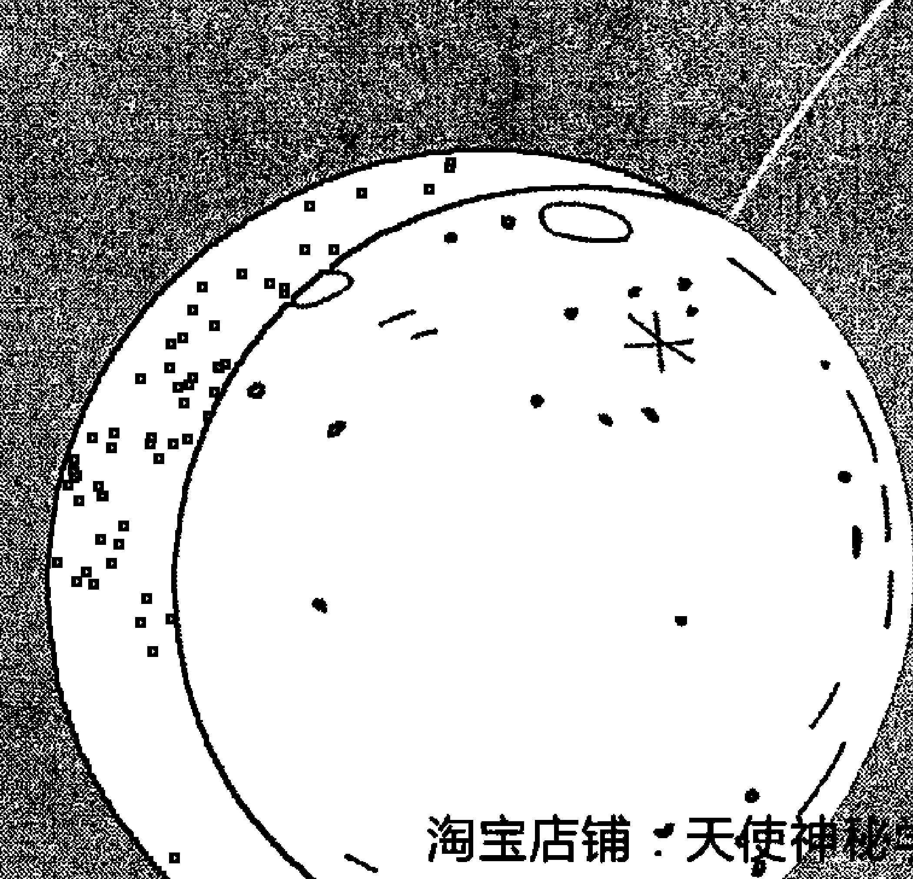

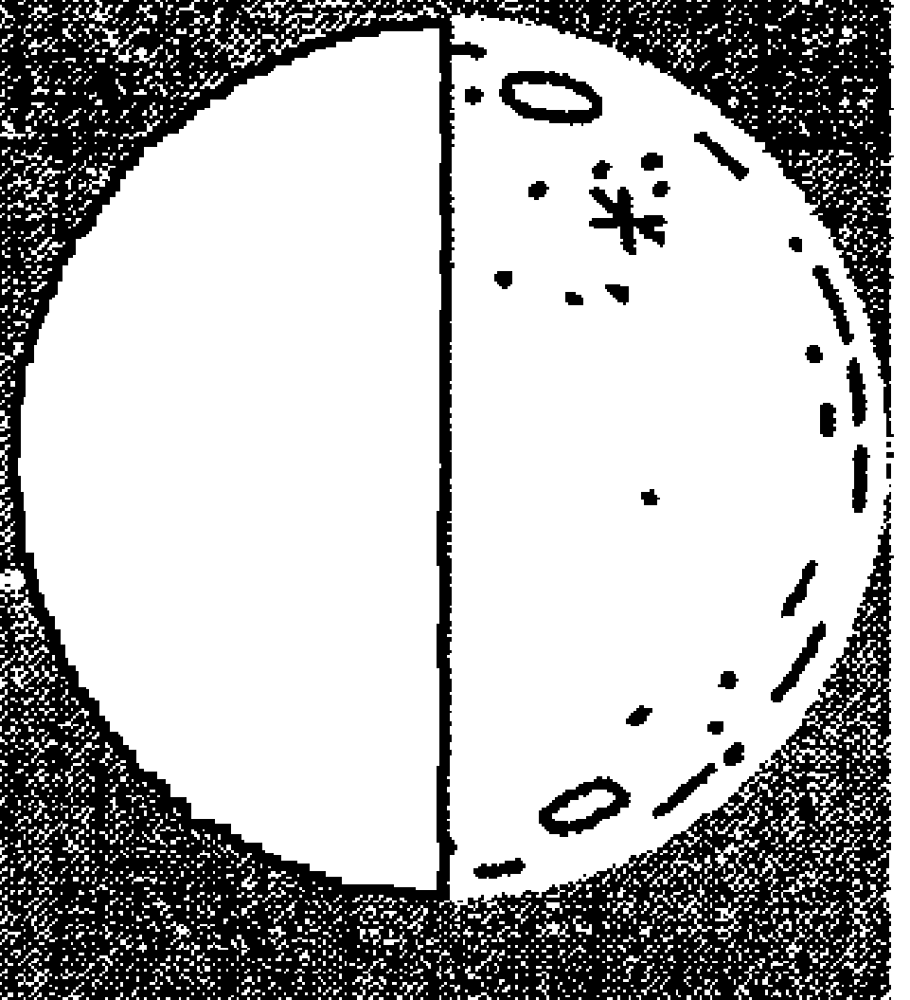

### 占星入門

在魔法界，占星術一向被認為是『高階魔法』。學習威卡巫術者通常會鼓勵去學占星、熟悉占星，並了解自己的命盤。但市面上卻幾乎找不到一本像樣的『入門書』教導威卡巫師如何學習跟法術有關的占星術。儘管許多著名的巫術、魔法老師或作家都大力推薦學生要學習占星這門藝術，好像不懂占星，尤其是本命占星、卜卦占星和擇日占星，要是懂世運占星學就更好了，就不是合格的魔法師。我之所以寫這本書，就是為了填補這個漏洞，好讓那些有意學占星但並不打算成為占星師的人有機會接觸這方面的知識。有了本書，讀者只要再買本占星用的天文曆或星曆表（通常附在天文曆裡），就可以根據本書所教導的原則來決定施法時間，好讓施法的效果發揮到最大。因此嚴格來講，這是本專為非占星魔法師所寫的卜卦及擇日占星秘笈。

不過要提醒你，現在市面上有不少江湖郎中會使用一堆奇怪的術語胡謅一通，然後就自稱是星座專家。其實一般占星師使用的本命占星學，即使很多人的功力還不到家，就拿著本命占星學的名義出來招搖撞騙（而且還以為這就是占星學的全部內涵了）。在本書裡，我會討論到一點本命占星學，希望對你有所幫助。如果你想知道自己的命盤長什麼樣子，可以透過軟體幫你排出來，也可以找個占星師幫你排盤、解盤。總之，選擇權在自己手上。

儘管如此，要讀懂這本書，很多時候就算沒有命盤也沒關係。但我不會教大家如何自己排盤、解盤。關於這些，市面上已有很多書籍可以參考了。但我希望，你對占星最好還是有點基本認識，所以我還是會在書裡針對各星座的意涵做簡單的介紹，而且從魔法的觀點加以介紹，畢竟關於各星座的一般詮釋，市面上有太多書可以參考，我何必多此一舉？更何況，本書要探討的面向已經夠多了，不可能慢慢從頭教起。如果擔心自己基本知識不足而無法從本書獲益，放心，書裡的技巧，有大約一半都不需要任何數學運算，而且有大約三分之一的內容並不會要求你必須有自己的命盤才能使用。

本書要介紹的是很古老的占星術。自無始以來，世界各地的許多智者都使用過，不但成為神聖教誨的一部分，還流傳了許多世紀。農民曆裡的預言，使用的就是這種占星術；「住在山丘上的古拐老阿嬤所教導的「民俗智慧」，也是運用這種占星術。但由於背後的原理太基本也太簡單了，所以講求科技進步的現代社會不屑一顧，它的部分內容也一直被美國醫學學會（AMA）視為異端邪說，欲除之而後快。但由於這些占星原理如此簡明易懂，因此歷來有不少美國總統私底下都會偷偷使用，卻在公開場合矢口否認（尤其是某位總統，在討論月亮空亡時會提到他）。

本書所使用的概念和原理，有許多來自卜卦占星學和其分支擇日占星學（前者是占卜用的，後者是為未來事件擇定良辰吉時）。因此本書所採用的某些原理和行星星座守護關係，會不同於一般占星師所使用的原理和守護關係（他們用的多半是本命占星學的理論）。換言之，工具雖然一樣——不外乎行星、星座、宮位和相位，使用方法卻有些不同，但更精準也更講求時間的準確度。相較於本命占星學，卜卦占星學和擇日占星學較為保守，涵蓋層面和背後所反映的世界觀也比較古老，因此一般占星師會告訴你的某些東西，在本書裡頭可能找不到，畢竟本書主要是依據卜卦和擇日占星學的原理所寫成。譬如：本書對於凱龍星和小行星（如榖神星、智神星、婚神星和灶神星這四大小行星，還有成百上千顆更小的小行星）就著墨不多。這些星曜在本命占星學上的確有影響力，但在卜卦占星學上，影響力是否存在，由於還沒有廣泛的研究與認定，因此通常會被忽略，甚至有些占星師在卜卦時不但不使用天、海、冥這三顆星，而且連考慮都不考慮。儘管如此，卜卦占星學依舊行得通，還相當靈驗，可見某些老派的東西依舊是正確的。譬如：本書會談到雙守護關係、互容（mutual reception）、恆星和某些更晦澀古老的占星概念。但只要你遵循這些原理，你施法的效力與功力都將更上一層樓。真的，我沒騙你。雖然凱龍星、榖神星、智神星、婚神星和灶神星等小行星沒有用在卜卦占星學上，但它們的象徵意義，跟魔法這門技藝所探討的許多議題和原型息息相關，所以我還是為它們寫點什麼。至於占星上所對應的人事物（該主題仍有許多爭議），譬如：哪個行星掌管什麼，或關係到什麼原型，書中也會有簡短的探討，但多半是從魔法的角度加以論述。這些許多占星師在解讀命盤時都會用到，市面上也找得到還不錯的參考資料（儘管為數不多），但由於這些資料多半不是從魔法的角度加以探討，所以我希望透過本書來彌補此缺缺。

本書探討的主要是卜卦占星學及其「邪惡」的孿生兄弟：擇日占星學。其實擇日占星學並不邪惡，只不過如果想把這方面的功力練到爐火純青，必須帶點瘋狂和自虐的傾向，持之以恆地練習才行。而且不管是卜卦占星還是擇日占星，功力進展到一定程度後，都會遇到瓶頸，就是為了求得最圓滿的結果而瘋狂地想排出一張完美無缺的星盤，讓星盤上的每顆星都處在最吉利的位置。但我要警告你：千萬不要在家裡幹這種傻事！因為連最專業的占星師都不會這麼做，原因有三：

- 1. 十全十美的星盤並不存在，無論星盤上出現多少吉兆。
- 2. 這樣做是不對的，而且會對別的占星師造成不好的干擾。
- 3. 只要有人這麼做，其他人也會跟著效法，那麼宇宙秩序將會大亂。想想看，這對宇宙而言將是多麼大的災難？

總之，我想說的是：每顆星都有利弊，請接受星盤的局限，然後盡人事聽天命吧。

### 占星軼聞與傳說

占星學有多古老呢？非常非常古老。有證據顯示，早在西元前五千年，最原始的占星學就已在美索不達米亞平原發展出來。此外，如果你相信亞特蘭提斯（Atlantis）傳說，那時間恐怕還要更早，據說亞特蘭提斯人大量使用占星術。在神秘學上，很多專家學者都認為占星學是亞特蘭提斯文明的遺跡，也是亞特蘭提斯在遭到洪水淹沒後，唯一流傳下來的「高等」學問。但諸如此類的說法既無法證明，也無法否證。但不可否認的是，這樣的傳說，讓占星學聽起來非常古老，也多了點浪漫色彩和「新時代」的味道。

然而歷經多個世紀的演變與發展，占星學的著墨焦點與發展方向已產生不少變化，過程中也衍生出不少子學科。很多讀者以為，占星學是一門一致性很高的學問，其實不是。魔法不也一樣？要是你把加德納派（Gardnerian）和新德魯伊派（New Reformed Druidic）的巫術拿來相提並論，只因為他們都會施行巫術，就以為他們做的事不管在內容或方法上都一模一樣，那可就大錯特錯。占星學也一樣。要是你膽敢在回歸派、恆星派或日心派占星師面前要這種幽默，肯定會被痛扁一頓。

回顧歷史，從古代、中古時期一直到文藝復興時期，最常見也最流行的占星學，其實是卜卦、擇日和世運占星學（世運占星學探討的是國家運勢和世界大事），也就是諾斯德拉達姆士（Nostradamus）、帕拉塞爾蘇斯（Paracelsus）、約翰·迪伊（John Dee）、三重偉大的赫密士（Hermes Trismegistus）等算命或預言大師所使用的占星術。

至於如今廣為流行的本命占星學，在當時反而不怎麼盛行，因為在全球時區標準化以前（大約就在人類開始興建洲際鐵路那個時候），絕大多數人並不知道自己的出生時間，要排出正確的命盤並不容易。即使像莎士比亞這樣的名人，其出生日期也是臆測出來的（雖然他自己可能不這麼認為）。因此諾斯德拉達姆士提出的預言，運用的其實就是世運占星學的原理，只不過用花俏繁複、深奧難解的古文加以包裝罷了。

占星學基本上可分成兩大類：密義（esoteric）與顯義（exoteric）。所謂密義，指的是隱藏或靈性；顯義則意指公開或世俗。其中，密義占星學探討的是業力與輪迴轉世（如果你相信這類說法）、靈魂如何經由各星座而發展進化等種種無法實證的內容。密義占星學的內容是秘密且鮮為人知的，是占星學裡更神秘的奧義，就像塔羅牌中的大牌一樣（這些大牌也有占星學上的意義與用途）。至於顯義占星學，則跟日常生活息息相關，通常用來決定什麼時候要買新車、該不該跟某人結婚、或瞭解喬治表弟為什麼老是找不到約會對象。然而近幾年在某些占星界人士的鼓吹下，顯義占星學一直努力想要把自己變得更科學，以為這樣一來自己的地位就會變得更崇高。但你可不要愚弄了，顯義占星學其實和密義占星學系出同源，只不過如今開始盛裝打扮，穿上西裝打上領帶，所以看起來比較體面而已。然而顯義占星學居然對自己的怪咖親戚感到羞恥。別忘了，我們無法選擇自己的親戚，與其對他們感到羞恥，不如與他們和平共存，愛他們的獨一無二，愛他們的各項優點。

密義占星學在性質上是比較屬靈的，跟卡巴拉（Kabbalah）或其他神秘學教義也有較深的關聯。密義占星學較不注重個人命盤解析，而比較強調背後反映的整體哲學思想。從密義的角度來解析命盤時，通常為了確認當事人的靈魂此生在世上應該遵循什麼樣的靈性道路。不過更重要的，各行星和星座所象徵的意義和角色是什麼，和靈性進化之間又存在什麼樣的關係（即靈魂如何從這個星座進化到下一個星座）。此外，密義占星學也很重視分點歲差（precession of the equinoxes）、地球時代（譬如：現在正邁向水瓶座時代）。

阿弗列·維特（Alfred Witte）所創立的漢堡學派占星學（Uranian Astrology），由於運用到「虛星」（hypothetical planet），而且是從靈魂的成長、善業與惡業等角度來解讀命盤，所以被認為是密義占星學的分支。漢堡學派所使用的命盤，又稱「行星圖象」（planetary picture），其計算與排盤需要用到中點（midpoint）、方位基點（cardinal point）、九十度盤分析（dial analysis）和映點（antiscion）等概念。相較於一般占星師，該派別的占星師比較不注重相位的使用，對於沒有接觸過該學派的人而言，他們的命盤看起來像是無字天書。

在很多方面，占星和魔法的密切關聯，只有在密義占星學裡才找得到。許多占星師使用的占星技法與密義占星學幾乎沒有半點關係。畢竟密義占星學所採用的行星星座守護關係相當與眾不同，很強調行星與星座符號所象徵的意義，而且這是艾麗絲·貝利（Alice Bailey）發明的，但她寫的書根本沒幾個人看得懂。更何況，在今天這個時代，榮格的原型理論和根據統計分析所推論出來的「高格林區」（Gauquelin zone）正大行其道，魔法在占星學裡哪還有容身之處？在目前的占星界，很多人都希望占星學能夠像精神分析或筆跡學（graphology）一樣被視為真正的科學，但要達成這個目標，占星學和神秘學及魔法的關聯就像燙手山芋一樣，一定得廢除殆盡才行，因為這樣才符合現實世界的「政治正確」。

至於顯義占星學，就是一般人比較熟悉的「星座」。顯義占星學同樣有許多分支，有些比較受到敬重，有些則比較受到鄙夷，但就算再怎麼古怪或詭異，跟密義占星學相比絕對是小巫見大巫。此外，這些子學門有難有易，有些很快就學會，有些則要花比較多的時間和練習才能精通。

本命占星學：本命占星學針對的是個人。這也是大多數人在最初接觸占星時所學習的。本命占星學雖然已存在一段時間，但真正開始盛行起來，卻是過去一百多年。近年來，占星界幾位「大老們」為了讓占星學得到科學上的認可，提倡的也是這套占星學。

市面上出版的星座書，無論形式如何，談的多半都是本命占星學。也難怪，畢竟誰不關心自己呢？更何況，這是個「以我為尊」的年代，自我成長與自我實現對很多人而言，都是生命中的大事。本命占星學教你如何排出命盤、如何解讀，並根據命盤和占星學的原理看出一個人的個性、人格、稟賦或預測事情的未來走向。許多談論太陽星座的星座書、報紙上的專欄和一般的占星課程，談的基本上也是這套占星學。但本命占星學還可以再細分成幾個子類別，比方說，職涯占星學或地運占星學（Astrocartography）——前者是根據命盤來推測一個人在事業上的性向與能力，後者則是將具有影響力的行星線在全球的分佈情形畫出來，並根據這些線條來預測一個人搬到哪裡住是凶是吉。

一九五〇年代，高格林夫婦（Michel and Françoise Gauquelin）蒐集許多各行各業各功成名就者的命盤，進行統計分析後發現，行星在宮位上的配置（或「高格林區」），與一個人的性格特質和從事的職業，具明顯的關聯。從那時起，許多占星師為了讓占星學獲得科學界的認可就開始拼命地做這方面的研究。當然這本身並非壞事，畢竟占星術被很多人認為是偽科學，因此這類科學分析的確贏得一點敬重。不過有些本來就無法經由科學研究加以證明，只能選擇相信。譬如：占星學裡有些內容就屬於這一類。這些的確靈驗，卻無法用統計分析或科學方法來加以證明。可是既然靈驗，為什麼非得用科學方法找出原因並解釋清楚不可呢？對某些人來說（例如我），結果靈不靈驗比較重要。

合盤（Synastry）：此占星學探索的對象是「關係」，方法是把關係當事人的命盤加以結合或比對，以預測一段關係發展得是否順遂。合盤可以探討關係，並沒有任何形式上的局限，可以是戀愛關係、婚姻關係、伴侶關係、也可以是事業關係、親子關係、室友關係或同事關係，只要關係中的兩人或更多人在相當長的時間內有密切互動即可，雖然大多用來探討戀愛或人際關係。譬如：「我和女友（或男友）想結婚，但我是射手座，他是金牛座，所有星座書都說這兩個星座在感情上絕對不合，那該怎麼辦？（這個時候個案應該會不斷嘆氣）其實合盤的結果不管好壞，兩人的關係走不走得下去，最後還是要看當事人如何面對，以及是否有足夠的意願努力，讓彼此的關係修成正果。但這樣的忠告很少人聽得進去，所以市面上才會有那麼多探討感情的占星書大賣。但說實在，兩人為什麼會愛上彼此，根本無法用星座預測（這是占星學的另一條金科玉律）。

卜卦占星學：顧名思義，這套占星學是卜卦用的。基本方法是：占星師根據問事者提出問題的時間和地點排出星盤，再依據特定原理加以解讀，從中找出問題的答案。這套占星學比本命占星學更古老，在很多方面的要求也嚴格許多，還有許多奇怪的規則和古老的專業術語，但只要掌握箇中訣竅，這套方法還真的有效。不過要學習卜卦占星學，對本命占星學一定要有相當功力才行，就算開始學了，可能還得浸淫好幾年才能運用自如。如果你是喜歡規則、愛好鑽研細節的人，那麼卜卦占星學應該很適合你。而且用占星學來卜卦，通常不用詳細解讀整張命盤，只要針對兩、三顆行星或兩、三個宮位尋找蛛絲馬跡，就可以下出問題的答案了。卜卦占星學為什麼靈驗，找不到合理的科學根據解釋，但很靈驗就是了。這一點，想必會讓大力推崇統計分析的人大為抓狂（哈哈）！而榮格學派的人則會說這是共時性（synchronicity）的緣故，但也不會再進一步深究。這套占星技法，甚至可以用來賭賽馬，讓人輕鬆就能挑中「黑馬」，因此就賭博而言，卜卦占星學可說是最好的策略，雖然這套策略有時會把人搞得一頭霧水。

醫藥占星學：顧名思義，醫藥占星學關注的是健康，方法是透過命盤推測一個人可能得到什麼疾病、病因何在、用什麼方法來加以緩解或治療等。許多醫藥占星師本身也從事醫療相關行業。關於疾病的成因和如何促進身心健康，醫藥占星學背後的哲學觀迥異於正統醫學。有時醫藥占星師也會藉助卜卦盤來確定疾病的成因，或哪個生理系統出狀況。對於醫藥占星學如何應用，目前的主流看法是要用這套方法行醫，占星師本身最好具備某些醫學背景。畢竟現代人的疾病比一百年前更復雜，也更多樣化（那時候的占星術和醫學都比現在要單純許多）。更何況，在現今這個時代，誤診是很嚴重的事，因此大多數醫療專業人士就算使用占星術，應該也不會大方承認。另外，有些心理治療師或精神科醫師也會用占星學來做為診斷工具，以快速找出心理失調的根源所在，不像傳統心理治療可能要花上好幾年的時間才能挖出情緒問題的源頭。畢竟榮格就承認占星術有利於精神分析，因此最起碼在榮格派，占星術是得到被認可的。本點請務必記住，稍後會再談到。

擇日占星學：擇日占星是用來規劃事情的時間點，有點像是卜卦占星的反向操作，因此兩者常常相提並論。原理是占星師根據個案對某事件的期望結果挑選良辰吉時，如果在該特定時間點做這件事，事情應該就可以如願進行。所以房屋買賣何時成交、男女朋友何時結婚、公司行號何時開幕、合約何時簽訂、履歷何時寄出，都可以透過這套方法來擇定良辰吉時。如果你認為卜卦占星學已經夠詭異了，那這套占星學恐怕會叫你發瘋，因為你可能會發展出強烈的執著，就是每件事都要找出最理想的黃道吉日。但相信我，這樣做行不通。要成為厲害的擇日占星師，對卜卦占星學一定要有相當的功力。而讓客戶覺得物超所值的擇日師，並不會對星盤上的每顆星或每個點都斤斤計較，但可以排出事事順遂的擇日盤。至於其他時候，只能設法屈就，找出盡可能好的黃道吉日。更何況，擇日占星的預測靈不靈驗，最後還是取決於當事人。畢竟就算占星師排出一張大吉大利的擇日盤，但當事人根本不努力，最後還是得不到什麼好結果。擇日占星的目的，是設法透過良辰吉時湊足盡可能理想的因緣條件，但不能彌補先天缺陷或人為過失。這一點很重要。

世運占星學（Mundane Astrology）：這套占星學很特別的地方在於算命的對象不是人，而是企業、國家、事件（例如：春分點（ingress）、分點、日月蝕、災難等）。這套占星學主要透過天上行星的運行狀態和國家或國家領導人的命盤來判斷國家的吉凶禍福、可能會發生什麼大事、整個社會的氛圍和趨勢走向。但世運占星學還可以再細分成幾個子分類，比方說財金占星學（用企業命盤和占星原理來做投資決策）、氣象占星學（根據流年行星來預測氣象和天氣）、自然占星學（用來預測地震和其他天然災害）和農業占星學（根據月亮的狀態來從事農耕活動）等。

其中，氣象占星學的研究，主要是為了預測地震。據說，多年前，曾經有個人以世運占星學做為工具，準確預測到幾次地震。那時距離人類發展出衛星技術還有好幾十年的時間，所以無法進行跨國通訊，而這個在美國電話電報公司（AT&T）工作的傳奇人物，據說就是利用氣象占星學的原理準確預測出電纜破裂、電磁干擾（magnetic interference）及太陽黑子活動等現象。由於結果相當成功，他便把自己的方法及心得撰寫成文章，甚至發表在科學期刊上，只可惜完全遭到漠視。

至於財金占星學，有許多商業大亨或千萬富翁已使用一世紀或更久。但他們通常對外否認自己這麼做，要不就是真的太有錢了，雖然根本不在乎別人知道。名占星師伊凡潔琳·亞當斯（Evangeline Adams）的許多客戶就屬於這一類。不過要成為財金占星學的高手，不代表非得精通企管、金融或股市的知識不可。但奇怪的是，就追求財富這件事而言，只要行得通，不管用什麼方法都無所謂（就算很怪力亂神也一樣）。畢竟賺不賺到錢才最重要，不管用什麼方法來做出財務決策，賺錢才是衡量成功或失敗的最終指標。

### 回归派、恒星派及日心派占星学

严格来讲，回归派（tropical astrology）、恒星派（sidereal astrology）或日心派占星学（heliocentric astrology），并不是占星学的分支，只是背后的哲学基础不同。

先讲回归派占星学。这套占星学是目前市面上最常见的，来自欧美。是把春分点当作白羊座零度，也就是十二星座的起点。不过由于地球自转及分点岁差的关系，现在星座已经和天上的实际星座（constellation）失去对应关系；尽管如此，这套占星学依然灵验，因此大多数人并不在乎这两者之间的差异。

至于恒星派占星学，主要是印度人在用的，跟回归派占星学最不同的地方，在于恒星派占星学使用的星座及度数，仍对应于天上的实际星座。因此回归派占星学的白羊座零度，在恒星派占星学里相当于双鱼座六度。尽管如此，对使用恒星派占星学的人来说，这套占星学同样灵验。

至于日心派占星学，则认为星盘应该要以太阳为中心才对。毕竟不管是回归派还是恒星派占星学，排出来的星盘都以地球为中心。不过既然我们生活在地球上，以地球为中心而定），同样的道理，为何不能套用在占星学上？中心好像也说得通。只不过有部分占星师认为，既然人类已经发现地球并非太阳系的中心，因此以地球为中心的占星学一定是错的，日心派占星学才应运而生。那么这套占星学灵不灵验呢？老实说，也挺灵的。更何况，人类现在已有能力离开地球，探索太阳系里的外太空了，所以有人觉得，日心派占星学或许比较符合未来人类的需求。或许吧。不过要是人类哪一天有能力探索太阳系以外的宇宙，到时候该怎么办？放心，已经有占星师开始从事相关研究了。

前面所述，是占星学最常见的分类方式，从这里就不难看出，占星学是多么丰富且多样化的领域。由于研究结果或资料不断推陈出新，因此就算花一辈子的时间研究也研究不完。

### 占星简史

对古时候的人来说，要知道自己正确的出生时辰并不容易，因此本命占星学对大部分而言并没有太大意义，毕竟有些人可能连自己的生日是在哪一天都不知道。因此古代的占星师多半是用卜卦或择日占星学来服务平民百姓，为他们解答疑惑或规划生活大事。但如果要预测国家大事甚至全球大事，则必须用上世运占星学。预言家诺查丹马斯在提出著名的预言时，就是根据世运占星学的原理。此外，像约翰·迪伊、帕拉塞尔苏斯、三重伟大的赫密斯等著名预言家，在帮人算命时，通常也会用到前述三种占星术。不过到了维多利亚时代，当人类开始兴建铁路，世界各地的时区也开始标准化以后，有越来越多人开始在出生证明上记载出生时间，因此本命占星学才得以流传开来，成为日益盛行的算命工具。

在十九与二十世纪之交，透过神智学会（Theosophist）、黄金黎明协会（Golden Dawn）、银星修道会（Astrum Argentum）、玫瑰十字会（Rosicrucian）等秘密社团的努力，本命占星学变得更蓬勃发展。在这段期间，不但有许多古老的占星书籍重新出版发行，也有不少新著作问世（这些作者通常是新一代的占星师，也是前述秘密社团的成员）。不过自一九六〇年代（或更早）起，占星界就有不少人努力想把占星学跟巫术或求神问卜等“怪力乱神”的东西划清界限（尽管系出同源）。因此现在的占星师喜欢探讨星座对个性的影响、荣格的原型、生命自决，把命盘上的各种相位或经由统计分析出“高格林区”的潜能发挥到极致。但这样做有好有坏。好处是传统占星学里的宿命思想被剔除了大半，坏处则是有许多占星师因此对巫术或神秘主义都抱持着反对态度。

但要知道，占星学能发展成现在这个样子，根源绝对与神秘学或巫术断绝不了关系，因此我衷心期盼，占星学在发展出新观点的同时，从事相关研究或工作者都应该要对占星学抱持足够的信心，并能够重新寻回它在神秘学或巫术上的根，并向这些古老传承致敬。

### 占星的语言与词汇

对很多人而言，占星语言简直跟火星文没什么两样，譬如以下这段话：

问事者的共同象征之一，较弱的光处于游走状态、遭夹、落止宫、无互容、落陷、遭灼伤、位于哀伤宫、位于火星管辖之界，前述诸象暗示了问事者所问的事将经历极大波折，且不会带给问事者任何益处。

老实说，这么稀奇古怪的文字，鬼才看得懂咧（最起码我当初是这么认为的）！事实上，这段话中有好几个词都是卜卦占星学上的专业术语（现在知道为什么会有人用“诡异”一词来形容了吧），不过我们先不加以深究。这段文字，其实是我自己掰出来的，意思大概是月亮运行于天蝎座零度到五十九分之间，落入十二宫，距离太阳不到十七度，介于火星和土星之间，而且火星不在巨蟹座。有时候，我的确会使用看似深奥的占星语言，尽管程度还不到运用自如，但我已经研究卜卦占星学许多年，相关书籍也读了不少，因此这种晦涩艰深、读起来像文言文的文字，我使用起来还算流利。道行高深的仪式魔法师，对于这种风格应该不陌生，只是使用的专业术语不一样。语言的基础是词汇，占星学也不例外。而且占星学的词汇，基本上就只有星座、行星、宫位等基本架构而已，而并不像我举的例子那么稀奇古怪。占星学里的“单字”并不多，特别的是同一个词汇往往可以代表多种不同意思，至于实际的意思为何，则要看整体的脉络、使用者想表达的观点或想要如何表达而定。事实上，占星学的词汇比较像是观念而不是单字。只要掌握了每个观念的基本意涵，要用这些单字来造句就会比较容易。占星学的基本词汇，基本上可分成五大类：

1. 七种元素和属性。
2. 十二星座。
3. 十颗行星（如果把凯龙星和四大小行星也算在内，则共有十五颗）。
4. 十二宫位（宫位与星座间有相当程度的对应关系）。
5. 十一种相位（但只有五个主要相位，其他都是次要相位，当然喜欢的话，你还可以使用更多相位）。

加总起来，占星学的基本词汇只有五十二个。

世上还有什么语言只有五十二个基本词汇？连西班牙语都没这么简单了（更何况如果你已经知道自己的太阳星座，至少有一个单字是你熟悉的，所以只要再学五十一个单字就行。看到了没？占星学的语言比你想像的还简单）。

#### 单字

占星学最主要的十二个单字，也就是星座的名称，其实是从另外七个字衍生出来的，这七个字是占星学里的四大元素（element）和三种属性（quality）。其中，四大元素分别是火、土、风、水，相信很多人都听说过了。四大元素在占星学里的定义，跟在主流魔法里的定义差不多。例如：

1. 火元素：象征灵性、火、灵感、热忱、动物、灵。
2. 土元素：象征石头、水晶、扎根、物质、当下、此刻、身体。
3. 风元素：象征香、心智活动、语言与沟通、智性、未来、灵界、人性、心智。
4. 水元素：象征油、液体、情绪、通灵、过去、植物、灵魂。

三种属性则分别是：

1. 基本（Cardinal）：主动的、开创的、动的、难以抗拒的力量、领导力、目标导向的。
2. 固定（Fixed）：固定的、脚踏实地的、顽固的、稳定的、不变的、结束的、结果导向的。
3. 变动（Mutable）：善变的、随顺的、适应力强的、追随的、难以捉摸的、风向球、辅助的、过程导向的。

将四大元素和三种属性相结合（或三种属性和四大元素相结合），就可以得出十二星座，而每个星座都有各自的元素和属性。没错，星座就是这样推导出来的。每个星座都是由特定的元素和属性界定而成，而元素或属性相同的星座，彼此间就存在着特定的相似性或亲和度。再者：

*   火元素和风元素的关系是融洽且互补的；
*   土元素和水元素的关系是融洽且互补的。

然而属性相同的星座，运作方式虽然类似，但彼此的关系却不见得融洽，因为运作方式（属性）虽然类似，风格（元素）却可能南辕北辙。前述几个简单的概念就占了占星学内涵的三成。我说真的。有时候，人很容易把事情复杂化，却忘了只要掌握最基本的概念就行了。把火、土、风、水四大元素，和基本、固定、变动三种属性相结合，就可以得出下列几种组合：

| 符号 | 星座 | 属性 |
|:---:|:---:|:---:|
| ♈ | 白羊座 | 基本的火 |
| ♉ | 金牛座 | 固定的土 |
| ♊ | 双子座 | 变动的风 |
| ♋ | 巨蟹座 | 基本的水 |
| ♌ | 狮子座 | 固定的火 |
| ♍ | 处女座 | 变动的土 |
| ♎ | 天秤座 | 基本的风 |
| ♏ | 天蝎座 | 固定的水 |
| ♐ | 射手座 | 变动的火 |
| ♑ | 摩羯座 | 基本的土 |
| ♒ | 水瓶座 | 固定的风 |
| ♓ | 双鱼座 | 变动的水 |

#### 行星

在没有人知道地球是绕着太阳运转以前，占星术就已经发展出来了（除非你不相信曾经有亚特兰提斯文明存在），因此所有占星用的星盘都是以地球为中心，并假定其他行星（包括日月在内）都是绕着地球在旋转（日心派占星学是个例外，但这套理论是个烫手山芋，恐怕只会把情况搞得更复杂，所以就略而不谈）。占星学以地球为中心的观点，造成了一些奇怪的现象，比方说行星逆行（见图表1-1）。

没错，这些行星实际上并不会真的往回走，只是看起来如此而已，但很多人还是被这种现象愚弄了很久，所以请不要因为这些想法很“老派”就随便取笑。而且尽管这种以地球为中心的观点并非正确，但占星学还是很灵验。还有占星学也并没有因为人类发现到了新行星就失去了可信度，甚至占星界还有部分占星师，喜欢把某些尚未发现到的星曜放进星盘（这些“假设性”的虚星可以在某些历书上找到，并放在星盘里进行解读）。至于行星逆行，的确会对行星、本命盘、流年和卜卦盘造成影响，至于影响为何，后面会再谈到，请拭目以待。

占星上会用到的行星，共有太阳（⊙）、月亮（☽）、水星（☿）、金星（♀）、火星（♂）、木星（♃）、土星（♄）、天王星（♅）、海王星（♆）和冥王星（♇）这几颗星。严格来讲，太阳和月亮并不是行星，而是“光”，因为它们分别会发光（太阳）与反光（月亮），而且亮度都远远超过其他几颗星曜。尽管如此，为了方便起见，占星学上还是把它们统称为“行星”（毕竟讲“行星”要比讲“光与行星”简便多了）。

从太阳到土星这几颗星，在占星学上被称为古典行星或古行星。天气晴朗时，这几颗星基本上都可以在夜空中看到（但不是绝对，因为看不看得到，还要看它们位在黄道上的哪个位置而定）。至于天、海、冥三颗星，则称为现代行星或土星外行星，因为这三颗星都是透过望远镜、重力变异或其他现代科技而发现到的。

有趣的是，天王星有时候可以在夜空中看到（亮度属于五等星），而且在不少古代文明的星图上都曾经出现过。不过由于这颗星不是每天都可以看得到，而且移动速度极慢，所以在一七八一年以前，人类一直以为它是颗恒星，而没有料到它原来是颗行星。现代行星所掌管的事物，原本是由古典行星守护，然而当现代行星被发现后，某些事物与行星的隶属或守护关系只好重新洗牌（行星与星座、宫位或人事务的双重守护关系，就是这样来的）。不过有些东西的确是现代行星被发现后才问世的，例如：电视。电视机是由天王星掌管，看看天王星的占星符号，再想想电视的天线形状，有没有觉得很像？当然，如果你家用的是电缆，或年纪太轻，没机会看到家家户户屋顶上都插着电视天线的壮观景象，这时候你只好向你的父母求证或直接相信我说的话啰。这几颗行星被发现时，每位发现者都有机会被当作命名的依据。你或许以为为这些行星命名的科学家，大概不会太在乎这些行星叫什么名字吧，但或许是共时性原则的作用使然，这几颗星最后都得到了恰当的命名。而且巧合的是谁发现到哪颗星，这颗星在这个命盘上往往力度特别强旺。这彷佛意味着，这些人之所以会发现到这些星，是因为他们特别能感应到这些行星的振动频率。所谓道法自然，宇宙天地的运作似乎有一定的规律，一颗星如果命名不当，这些名称往往很快就夭折，最后以“更贴切”的名称取而代之（例如：天王星曾先后被命名为赫歇尔星（Herschel），这是根据发现者弗里德里希·威廉·赫歇尔（Frederick William Herschel）的名字来命名的，和乔治之星（George III）的居住地来命名（Sidum Georgius，这是根据发现者之一英王乔治三世（George III）的居住地来命名的），但最后都不了了之。不过当行星的名称确定后，另一场“争夺赛”才正要展开，那就是占星师开始为了这些星具备哪些特质及掌管哪个星座进行激辩。最终结果往往要一段时间后才会揭晓，而且过程中可能会出现一些有趣的失误。譬如：占星学家最早指派给冥王星掌管的星座是白羊座（什么！很难置信对不对），但经过了近十年的观察（透过冥王星在本命盘和流年上的影响），冥王星掌管的星座才终于尘埃落定，那就是天蝎座。但你知道吗？关于冥王星的失势（detriment）及落陷（fall）位置，占星界至今可尚未达成共识。

结果这些现代行星的命名，跟古典行星一样，仍沿用古罗马神祇的名字；尽管如此，与这些古罗马神相对应的古希神，其原型意义还是可以用在这些行星上（反正这些神本来就是古罗马人从古希神话里复刻来的）。不过在父权兴起以前，这些神祇原本都是母系社会里崇拜的女神，因此也可以用这些古神的特征来解读行星的意义，像四大大小行星就是个很好的例子。事实上，如果四大大小行星的象征意义用大女神（Great Goddess）的形象与特征来诠释，会比那些意义遭缩水的古希或古罗马女神更加贴切。

要理解或表达占星学的意义，最好透过譬喻。比方说，我们可以把行星比喻成一齣戏里的演员或演员所扮演的角色，星座是演员身上的服装，宫位是演员在舞台上演出的场景，相位则象征演员与演员间的互动关系。又或者可以换个方式说，行星代表“人事物”（what），星座代表这些人事物的“特征”（how），宫位代表这些人事物“在哪里”（where）活动，相位则代表这些人事物之间“用什么样的方式”（in what way）互动。

#### 先天十二宫

每颗行星各自落在守护星座与宫位内的星盘（见图表1-2）。但从天文学的角度而言，这种情况是不可能发生的。譬如：水星和金星在这张盘上各出现了两次，但除非外太空出现了什么重大变故，否则这种现象绝对不可能发生。现在某些行星仍同时掌管两个星座，但希望有一天，太阳系的行星凑足十二颗，让每个星座和每个宫位都有各自的守护星，这样看起来也比较干净俐落。即使到了今天，仍有为数不少的占星师在大力鼓吹要把凯龙星指派为处女座的守护星。没错，凯龙星和处女座是有不少相似处啦，但这一点尚未获得共识（占星师并不会聚在一起针对这类事投票表决），因此处女座目前仍归水星掌管（水星同时也掌管双子座）。盘中用括弧标示者，代表的是传统的守护关系，在现代行星被发现以前，这些古老的守护关系是灵验的，如今也依然灵验，尤其在卜卦占星和择日占星上更是如此。我猜想，这大概跟一个人的心态有关。要读懂这张图，不妨把它想像成是钟表。九点钟方向是这张盘的起点，也就是俗称的上升星座，即第一宫的宫头。从九点钟到八点钟这个区块，则是所谓第一宫，坎普顿称为“派块”²。其实你想要怎么称呼它都行，只要别人知道你指的是“宫位”就好，不过既然古人已经决定叫它“宫位”，而如今也成了标准称呼，我们就干脆沿用吧。阅读这张盘，要按照逆时钟的方向看；也就是说，八点钟方向到七点钟方向那个区块，是第二宫，八点钟那条线则是此宫的宫头。以此类推，最后会来到十点钟方向到九点钟方向这个区块，也就是第十二宫，而十点那条线则是此宫的宫头。

> ² 原注：出自黛比·坎普顿-史密斯（Debbi Kempton-Smith）所著之《观星笔记本里的秘密》（Secrets from a Stargazer's Notebook）（New York: Bantam, 1982）。

在命盘上，各宫宫头都会标示符号与数字，以代表该宫所坐落的星座与度数，而且一个宫位落入哪个星座，便代表被那个星座所掌管（但可不要把这个守护关系和先天的守护关系给搞混了）。可以把先天十二宫看成是无任何装潢的基本车架，而各行星的坐落位置、上升点和各宫宫头的所在星座，则好比车体表面的烤漆或加装在标准车身上的特殊配备。它依然是一辆车，只不过是专门为你客制化的车，也就是你的出生盘。

上升点或第一宫宫头落入的星座（这两个名词可以交替使用），就是“上升星座”，也是在绘制命盘时，出现在东方地平线上的那个星座（注意，这里的星座指的是黄道十二宫上的星座，而非天文学上的星团）。这个点，在占星学上非常重要。此外，第十宫宫头所落入的星座，通常称为天顶（midheaven），但并非绝对（譬如：使用等宫制（Equal House System）时，第十宫宫头就不见得等于天顶）。尽管如此，对大多数占星师而言，这两个名词是可以交替使用的（除非你碰到的占星师很龟毛）。但俗话说得好，入境随俗，所以我也建议你这么做。

不过谈到了宫位制，就好比打开了潘朵拉的盒子，所以这里有必要说明一下。简单来讲就是，由于地球自转轴倾斜了二十三点五度，所以上升点和天顶之间的角度不见得总是垂直相交（除非地球的自转轴没有半点倾斜）。但总之，住的地方越靠近赤道，这两者的角度就越接近九十度；离赤道越远（不管往北还是往南），这两者的角度就越偏离九十度。但还好，地球上的人，绝大多数都住在南、北纬零度到四十五度之间。在各式各样的宫位制里（连等宫制也不例外），上升点与天顶所落入的星座与度数都一样。但在等宫制里，天顶和第十宫宫头的所在位置不见得相同，所以天顶会另外标示出来，并且像其他星曜或虚点一样，按照其坐落的星座与宫位加以解读。但其他的宫位制（数目大概多达二十个），排出来的上升点和天顶位置都一模一样。至于不同的宫位制会对命盘造成什么影响，只要看看第五十一页到第五十三页的图表1-3到图1-5就知道了。为什么会有这么多不同的宫位制呢？原因是占星学上有多种不同方法，决定其他宫位的宫头落在什么星座和度数，而这些差异，又跟它们所依据的球面三角学（spherical trigonometry）、时间坐标，以及种种古怪或深奥的时间或空间概念有关。每一位占星师都有自己偏爱的宫位制，而且他们每个人都信誓旦旦地表示，该系统是“唯一正确且精准的宫位制”（换句话说，就是别的宫位制都是错的）。而奇怪的是，不管采用哪种宫位制，似乎每种都行得通。但拜人性之赐，再加上宫位制是来自书上（或...等宫制的宫位分割与整宫制很类似，也是一种纯以黄道均分的思考逻辑，但不同的是整宫制的命宫宫头并不一定是第一宫的宫头，且它的宫界就是星座的宫界。電腦軟體）而不是長在樹上，因此要同時採用好幾種宮位制既費時又傷荷包（更別說會造成多大混淆了），因此絕大多數占星師都會選擇某種看起來可能靈驗的宮位制，並從一而終地使用。最後由於越來越熟悉這套系統，他們就開始將它視為終身伴侶，相信這套系統是最好的，其他系統則全都是謬誤的。但其實每一種宮位制都是有效的。

至於我自己，慣用的是柯赫宮位制（Koch House System），而且我深信，這套宮位制比其他系統都還要優越許多，任何腦袋清楚的占星師應該都認同這一點，除非他們被其他天生有瑕疵、錯誤且不準確的宮位制給蒙蔽了心智（但請忽略我前面這句話及話裡頭的攻訐之意，畢竟所有占星師都難免有這種偏見，所以請你通融一下）。

拜不同的宮位制之賜，上升點和天頂間所形成的角度，最小可能低於六十度，最大可能超過一百二十度，這使得星盤有時候會出現一種現象，就是兩宮宮頭落在同一星座，而某些星座卻不在任何宮位的宮頭，這時候，會說這個星座和它的對面星座，及該星座內的星曜遭到了截奪（interception）。截奪現象，在本命占星學和卜卦占星學裡相當重要，但這兩者並非本書的重點，所以這裡只會稍微帶過。

先天十二宮除了做為教學輔助外，還有許多用途。譬如：在解讀命盤時，每一宮的先天守護星對於該宮位還是有相當程度的影響，無論該宮位究竟落在哪個星座。換言之，不管牡羊座或射手座到底落在何宮宮頭。火星一定跟第一宮所象徵的人事物有關，木星一定跟第九宮所象徵的人事物有關如此一來，在解讀星盤或尋找星座和宮位間的關聯時，就可以獲得另一層次的理解。只要記得行星、星座與宮位間的對應關係就行了。這些對應關係極為重要，因為它們就像膠水一樣，可以把星盤上的各種徵象或影響力結合起來。同一個人事物，有時候可以透過行星、有時候可以透過星座、有時候則可以透過宮位解析出來。總之，方式有很多種。對占星師而言，只要能達成目的，用什麼方法都好。於是當某顆行星落入某星座和某宮位時，就可以把該星座與宮位的象徵意義加以結合，得出恰當的詮釋。舉例來說，假設你鑄造了一把儀式劍，想要選個黃道吉日來供奉。你可以用火星來代表這把劍，用處女座來代表工藝，用第九宮來代表儀式。但除此之外，你可以選用的組合還包括了牡羊座、第六宮和木星，或第一宮、水星和射手座（可能的組合共有六種，在此不一一列出，但不妨透過這樣的練習，鍛鍊自己的占星能力）。同一個問題，可透過不同的宮位、星座與行星配置，加以處理或化解。因此藉由不同的組合，一定可以找到辦法，讓你用最短的時間等到你想要的星盤配置。譬如：木星繞行黃道一圈要花上大約十二年。因此如果木星現在在天秤座，但你希望木星出現在牡羊座，那麼你很可能要再等六年（現在你應該曉得，為什麼占星師會有那種希望能夠憑自己意志移動行星位置的執念了吧）。儘管如此，要知道，木星每天都會行經每個宮位一次，因此如果你希望木星落入第一宮，頂多只要等二十四小時。明白這箇中的訣竅了嗎？要知道，宮位、星座與行星間的對應關係之所以如此重要，部分原因就在此。

## 宮位與星座

命盤十二宮代表一個循環，也代表人生經驗的演化與發展。根據影響力與活動性質的不同，宮位有好幾種分類方式。譬如：命盤下半部的宮位（即第一到六宮）屬於個人宮位，上半部的宮位（即第七到十二宮）則屬於「他者」宮位，其本質與個人宮位並無不同，只不過是從外在的角度去體驗，或個人經驗投射到他人身上的結果。換言之下半部的宮位是個人、私密的；上半部的宮位則是以他人為導向、公開的。也可以把命盤切成左右兩半。左半部通常代表主動、可以自己決定的；右半部則象徵被動、隨順的。

另一種分類方式是對宮，對宮在意義上通常是直接相關的。一宮代表自我，七宮代表他者；二宮代表財產與價值觀，八宮則是他人的財產與價值觀；三宮象徵鄰居、低等心智活動、短程旅行，九宮則代表世界、異國他鄉、高等心智活動、長途旅行；四宮是家庭與母親，十宮則代表事業與父親；五宮代表子女、情人、投機活動，十一宮則代表他人的子女、朋友、團體、人脈；六宮象徵健康、工作、僕役，十二宮則象徵住院、失去工作能力、貢獻全人類等。這些是每一宮所象徵的主要課題。

此外，也可以用屬性來分類，分成角宮（angular，又稱本位宮、基本宮、開創宮）、續宮（succedent，又稱固定宮）和止宮（cadent，又稱變動宮）。其中，位在基本點上的四個宮位，一、四、七、十宮，就是角宮，這些宮位力量最強、主動進取、喜歡開創與領導，而且跟事物的開始有關。緊接在後的是續宮，也就是二、五、八、十一宮，這些宮位力度較弱，但卻也最穩重、穩定、善於守成及發展。最後是止宮，也就是三、六、九、十二宮，力度最弱，具有過度的、調整的、折衷的、適應力強的、開花結果的意味。止宮就像橋樑，是這個階段到下個階段的過渡。角宮代表開始，能量的初步形成，到了續宮，能量的表現則顯得最穩固也最強而有力，續宮之後是止宮，代表事情要告一段落，並為下一個循環做準備。由此看來，可以發現：

- 角宮對應於基本星座
- 續宮對應於固定星座
- 止宮對應於變動星座

基於兩者間的相似性，也可以說：角宮類似基本星座 續宮類似固定星座 止宮類似變動星座

基於前述宮位與星座間的相似性，前面那段文字可以改寫成：基本星座代表開始，能量的初形成；固定星座則將前述能量，以最穩固也最強而有力的方式表現出來；變動星座則負責將事情結尾，並為下一次的循環做準備。

- 十二個宮位還有另一種分類方式，以三個宮位為一組，共有四組：第一組是生命宮，包括一、五、九宮，對應火象星座。第二組是財產宮，也就是二、六、十宮，對應土象星座。第三組是溝通宮，即三、七、十一宮，對應風象星座。第四組是結束宮，即四、八、十二宮，對應水象星座。從前述的對應關係中可以看出，星座的元素與宮位的類型，牽涉到的課題其實差不多。因此可以總結出星座與宮位間的另一種對應關係：

- 牡羊座就像第一宮
- 金牛座就像第二宮
- 雙子座就像第三宮
- 巨蟹座就像第四宮
- 獅子座就像第五宮
- 處女座就像第六宮
- 天秤座就像第七宮
- 天蠍座就像第八宮
- 射手座就像第九宮
- 摩羯座就像第十宮
- 水瓶座就像第十一宮
- 雙魚座就像第十二宮

看到這裡，有沒有更清楚星座與宮位間的對應關係了？但請注意，我用的字眼是「對應」和「很像」，而不是「等於」。畢竟星座和類似的宮位間還是有差異存在的，只不過這些差異很細微，大概只有大師級的占星家才有辦法解釋得清楚明白。就本書的宗旨而言，知道星座與宮位間存在類似，卻又不完全相同的對應關係就夠了，甚至要把它們交替使用也不是什麼大問題。相信我。總的來看，十二個宮位其實就是生命的循環：出生、長大、成熟、衰老、死亡。但這個循環也可以從別的角度加以解讀，譬如：從純粹的自我導向，進化到純粹的他人導向，最後與無限合一，然後準備再次誕生，進入下一個新的循環。這個循環，可以從字面的意義解讀之，也可以從隱喻的角度加以詮釋。當各星曜在命盤上不斷推進時，各種長短不一的週期也會以各種不同的方式，顯現在我們的生活裡，其中最短的週期只要一天就完成一次循環（即日出到日落），費時最長的週期則是冥王星，繞完黃道一圈大約兩百四十八年，遠超過現在人類的平均壽命。當一張星盤被劃分成十二個宮位後，人類就開始為這些宮位賦予象徵意義。於是一個宮位（及相對應的星座）就「掌管」了許多不同的人事物，比方說，車子、兄弟姊妹、鄰居、日常生活、初等教育、語言文字、書籍、父親或母親的健康狀態、子女參加的社團或機構、配偶的長途旅行等。這些人事物之間看似毫無關聯，但從占星的角度而言，有充分的證據與數百年的實證觀察顯示，這些人事物的確是彼此相關的，而且都隸屬於特定的宮位與星座，那就是第三宮與雙子座。不過占星學有一個很麻煩的地方，那就是有時候一個字可以代表很多意思，有時候不同的字卻又代表同一個意思，常常把人搞得一頭霧水。這讓人不禁納悶，占星師在解讀命盤時，究竟怎麼決定要用哪個意思詮釋某種天象。因為這個原因，所以占星術比較不像科學，而比較像是藝術。高明的占星師，通常是用占星的語言在進行思考的，所有的人事物，都可以用占星的語言來加以剖析和描述。譬如：「他們可能會說：『這個人好摩羯』、『剛剛那個運將開起車來真像火星人』、『我今天覺得好空亡』等。但真正厲害的占星師因為太熟悉占星的語言了，所以往往可以輕鬆自如地把看似深奧難解的術語轉換成大白話。比方說，前面三句話就可以分別詮釋成：『他這個人真是死腦筋又自以為是』、『剛剛坐的那趟計程車真是又快又驚險』、『我今天覺得自己好像漂浮在外太空，完全跟現實世界脫節了』。不過要養成如此流利的占星語言能力，方法只有一個，就是不斷練習，沒有捷徑可循。

### 再論行星

行星就像是一張命盤的膠水。星座與宮位，只能為命盤提供基本架構，但整張命盤會如何呈現，則要透過行星才能看出端倪。如果說命盤是一齣戲，那麼行星就像是這齣戲的演員，這齣戲演得如何，要看各行星落入什麼星座、什麼宮位與其他行星，因守護關係或相位關係而產生什麼樣的交流互動，以及在流年的牽引下會產生什麼影響或變化。如果沒有行星，只能根據上升星座將人格分成十二種基本類型；但行星的存在，則讓命盤的意義變得更豐富、更微妙、更有層次，也讓我們每個人都得以成為獨一無二的個體。

如果把行星的所有可能配置和上升星座的度數（一度一種），則共有三百六十種可能，全都考慮在內，則命盤的星曜配置總有五百種（即5×1026）以上的可能性，這是多麼龐大的天文數字啊！就算縮小範圍，將外行星剔除在外（因為這三顆星繞完黃道一圈最起碼都要四十年），可能的星盤配置仍有十五·九種（即15.9×1026）之多——數目還是很大。而且前面所說的，還沒有涵蓋上升點與天頂的多種不同組合（即使出生時間相同，上升點與天頂的度數也會因出生地經緯度的不同而有所差異）。由此可見，行星的存在，可以把星座與宮位所象徵的基本人格類型，再細分成更多樣貌。

嚴格來講，太陽與月亮不是行星，而是光體，但占星上仍習慣稱為行星。一般來說，占星上會用到的行星有十顆，即日、月、水、金、火、木、土、天、海、冥。除非占星師很傳統，或使用印度占星學，否則用到的星曜應該不會少於這十顆。有些占星師則會用到更多星曜，譬如：把凱龍星和四大小行星（即穀神星、智神星、婚神星和灶神星）也加進去，有些甚至會使用虛星（如超冥王星等）或其他小行星（市面上，買得到這類天文曆，而且裡頭的小行星多達近千個，也有公司專門提供這類服務，定期追蹤兩百五十顆小行星，並寄送流年報告給客戶，而且收費不高）。不過就本書的宗旨，最基本的十顆星就已經很夠用了。但為了滿足某些讀者的好奇心，我還是會在本書第四卷簡單介紹凱龍星和四大行星，畢竟不少占星師在論命時都會用到這幾顆星。不過卜卦占星或擇日占星只會用到最基本的十顆星。每顆行星都負責掌管一到兩個星座，再搭配十二宮，所以每顆行星還會連帶掌管一到兩個宮位。上升點和天頂的位置，會決定各宮落在什麼星座，所以掌管這些宮位的行星也會跟著改變。此外，如果上升點落在牡羊座，而每一宮都剛好是三十度的話，那麼每顆星還會存在間接守護關係。以上升天秤為例，由於天秤座的守護星是金星，所以金星就掌管了此人的上升星座，但也間接掌管第七宮和第二宮（因為就先天十二宮而言，第七宮和第二宮分別落在天秤座和金牛座）。透過行星與星座和宮位的守護關係、相位等因素，星盤就成了一張複雜的互動關係網絡。假如三顆星彼此間有相位關係存在，它們就會成為連動體，當其中一個受到拉扯，其他兩個也會受到影響，正所謂「牽一髮而動全身」。如此緊密的交互關係，讓我們很難將自己的人生切割開來。舉例來說，假設你命盤上第二宮的宮內星和第五宮的宮內星之間存在三分相位，那麼對你來說，金錢與愛情往往會牽扯在一塊兒（譬如：沒有錢，你就沒辦法出門和你的情人約會）。

每顆行星都有其獨特的本質及若干顯著的屬性。譬如冷熱，指的是能量的移動速度——屬性為熱的，移動速度慢。而濕與乾，則是用來形容可塑性的高低——屬性為濕的，通常可塑性高、改變容易；屬性為乾的，則傾向於靜止不動、改變不易。將這幾種屬性的排列組合，就可以得出四種元素：乾熱屬火、濕熱屬風、濕冷屬水、乾冷屬土。至於「第五元素」，也就是靈性，則是純粹的熱，可以引發改變，本身卻無法被改變。像地球就是最難被改變的，它可以終止改變，本身卻無法被改變。前述都源於古希臘的奧義哲學，但也是現代占星學在發展上的哲學依據。

拉拉雜雜扯了這麼多，主要是為了說明，占星上的十二星座，是用元素和屬性來界定的，行星也一樣。透過元素和屬性，我們可以看出某顆星為什麼會掌管某星座或某兩個星座，雖然這其中的關連性不見得絕對成立。譬如：性質熱、乾的火星，在傳統上是天蠍座的守護星，但天蠍座卻是固定星座，而且屬於水元素（也就是性質冷、濕）。儘管如此，各行星的特質與屬性等對應關係，歷經了上千年的檢驗，也一直證實是有效的，因此這份對應關係是正確的（見圖表1-6）。不過如果是天、海、冥這三顆外行星，其特質和屬性就比較有爭議了。此外，「暖」的特質相當於「半熱」。至於水星為什麼是「可變的」，是因為當水星落入哪個星座或與哪顆行星形成相位，就會沾染上該星座或行星的特質；反之，冥王星之所以「具轉化力」，是因為會改變它所落入或形成相位的行星特質，甚至讓這些特質產生一百八十度的大轉彎。至於性別，指的是行星在能量運作上比較像男性還是女性；在這一點上，水星由於男女兩性特質兼具，所以稱為雙性。此外，一般還認為天王星是水星的高八度星，海王星是金星的高八度星，冥王星則是火星的高八度星。其實就了解行星的象徵意義而言，前述的特質並不是那麼重要，雖然能顯示出每顆行星是如何被界定出來的。相較之下，更重要的是各行星所掌管的星座（又稱做入廟星座），可見圖表1-7，表中用括弧標示者，是現代行星被發現以前所使用的古典守護關係。傳統上，占星界一直相信，人類日後應該還會再發現兩顆行星，分別掌管金牛座與處女座，如此一來，行星與星座和宮位間在數字上就能完美對應，十二個星座與十二個宮位就都各有自己的守護星了。

**圖表 1-3 用普拉西迪宮位制（Placidus Houses System）排出克勞利的命盤**

閱讀本章時，不妨參考這張命盤，看看「克勞利叔叔」從占星的角度，有多少魔法或通靈的潛能。克勞利本人，採用的就是普拉西迪宮位制。出生時間：1875 年 10 月 12 日晚上 10:57（格林威治時間）。出生地：英國利明頓溫泉（Leamington Spa）。（資料來源：Samuel Weiser 出版社於 1994 年再版的 Magick 一書，第 289、717 頁）。

**圖表 1-4 用柯赫宮位制 排出克勞利的命盤**

從這個例子裡可以看出，使用不同的宮位制，命盤的配置會出現什麼樣的變化。出生時間：1875年10月12日晚上10:57（格林威治時間）。出生地：英國利明頓溫泉。

**圖表 1-5 用等宮制排出克勞利的命盤**

出生時間：1875年10月12日晚上10:57（格林威治時間）。出生地：英國利明頓溫泉。

**圖表 1-6  行星特質、屬性等對應關係表**

| 行星 | 特質 | 屬性 | 星期 | 本質 | 表現 | 性別 |
|------|------|------|------|------|------|------|
| ⊙ 太陽 | 熱、乾 | 陽 | 星期日 | 意志 | 生命力 | 男性 |
| ☽ 月亮 | 冷、溼 | 陰 | 星期一 | 情緒 | 本能 | 女性 |
| ☿ 水星 | 可變的 | 中性 | 星期三 | 思想 | 心智 | 雙性 |
| ♀ 金星 | 暖、溼 | 陰 | 星期五 | 吸引 | 愛 | 女性 |
| ♂ 火星 | 熱、乾 | 陽 | 星期二 | 行動 | 自我 | 男性 |
| ♃ 木星 | 熱、溼 | 陽 | 星期四 | 增加 | 樂觀 |  |
| ♄ 土星 | 冷、乾 | 陽 | 星期六 | 減少 | 界限 |  |
| ♅ 天王星 | 熱、乾 | 陽 |  | 變化 | 電力 |  |
| ♆ 海王星 | 冷、溼 | 陰 |  | 靈性 | 無形無相 |  |
| ♇ 冥王星 | 具轉化力 | 中性 |  | 騷動 | 蛻變 |  |

**圖表 1-7 行星特質、屬性等對應關係表**

| 行星 | 掌管的星座 | 行星 | 掌管的星座 |
| :--- | :--- | :--- | :--- |
| 太陽 ⊙ | 獅子座 ♌ | 月亮 ☽ | 巨蟹座 ♋ |
| 水星 ☿ | 雙子座、處女座 ♊ ♍ | 金星 ♀ | 金牛座、天秤座 ♉ ♎ |
| 火星 ♂ | 牡羊座、（天蠍座）♈ ♏ | 木星 ♃ | 射手座、（雙魚座）♐ ♓ |
| 土星 ♄ | 摩羯座、（水瓶座）♑ ♒ | 天王星 ♅ | 水瓶座 ♒ |
| 海王星 ♆ | 雙魚座 ♓ | 冥王星 ♇ | 天蠍座 ♏ |

### 相位

相位（Aspect），指的是行星和行星间（或点与点之间）的角度关系，影响到的是这些行星或点之间的能量，会以什么样的方式产生交互作用。大多数的相位，都是将三百六十度（即一个圆圈，也就是整张命盘）加以整除得出来的。一般来说，以二或二的倍数为除数所得的相位，性质上比较主动积极，也比较具有挑战性；以三或三的倍数为除数所得的相位，性质上则比较和谐融洽，也比较轻松自在。当然也可以用其他质数来得出其他相位，但这些相位比较罕见（例如：以五或五的倍数为除数所得的相位，通常跟心智或创造力有关）。在这里，只会用到传统的五大相位，和另外六种还算常见的次要相位。

其中，传统相位包括：合相、六分相、四分相、三分相和对分相。非传统相位则包括十二分相、补十二分相、同度相、反同度相、八分相和补八分相。

我会教大家几个诀窍，让大家在看盘时可以很快地找出相位（尽管有些相位还是得透过推算或占星软件的帮忙才看得出来）。如果你必须动用手指头或顺着十二宫一宫一宫地去找，不用不好意思，只要你能正确辨识出相位就好。更何况，魔法本来就应该关起门来在自己家里做，没有外人在场。（就算你在巫师团工作，你的师兄师姐们对你应该也已经有足够的了解，所以你不用担心自己的形象会在他们眼中破灭。）

不过只要谈到相位，有个问题就一定躲不掉，那就是容许度（orb）。相位的容许度是指一个相位是否成立或会不会产生作用力，误差值的范围是多少。这是占星上另一个很容易引发争议的话题。一般来说，容许度设在五度内到八度内都是可接受的（但这句话在后面的章节里可能会数度加以修正）。不过无论容许度怎么设，有几个基本原则是不变的。譬如：相位的度数越紧密，影响力就越大。入相位（applying aspect）的影响力通常大于出相位（separating aspect），这个概念在卜卦或择日占星上尤其重要。

基本上，除了准相位（exact aspect），一个相位要不是入相位（也就是离准相位越来越近），要不就是出相位（也就是离准相位越来越远）。在卜卦和择日占星上，只有入相位和准相位才算数。关于这一点，后面的章节会再谈到。至于这里所指的容许度，则是本命占星学上公认的容许度。

介紹完了古典相位，再來看看其他幾個或許也能派上用場的次要相位：

- ◇ 合相：即零度，也就是同一星座。在占星上象徵能量的融合、會聚、合一，但吉凶不定。容許度最大八度。
- * 六分相位：即六十度，也就是間隔一個星座（元素互補）。有機會達成和諧或溝通，但不保證一定能夠成功。容許度最大六度。
- □ 四分相位：即九十度，也就是間隔兩個星座（屬性相同）。在占星上象徵摩擦、行動力被激發、現狀受到擾動，有阻礙需要克服。容許度最大八度。
- △ 三分相位：即一百二十度，也就是間隔三個星座（元素相同）。在占星上象徵和諧、容易成功，但也可能代表沒有被開發的天賦，或者懶散。容許度最大八度。
- ∞ 對分相位：即一百八十度，也就是間隔五個星座（元素互補、屬性相同）。在占星上象徵衝突、分離、相反相成、自他對立、非此即彼、蹺蹺板效應。容許度最大八度。
- ∨ 十二分相位：即三十度，也就是隔壁星座（在元素上和屬性上都沒有半點關係）。在占星上，象徵成長、自然的發展、過程、助力，但過程不見得是方便或舒服的。容許度最大一度。
- ∠ 八分相位：即四十五度，也就是半個四分相位（在元素上或屬性上可能有關係，也可能沒有關係）。在占星上，象徵激動、心智活動、輕微的不適、叫人抓狂的小摩擦。
- □ 補八分相位：即一百三十五度，也就是一個半的四分相位（在元素上或屬性上沒有特定關係）。在占星上，象徵更頻繁的心智活動、更多的摩擦、可能會讓人感到不舒服的靈視或靈感。容許度最大兩度。
- ∨ 補十二分相位：即一百五十度，也就是間隔四個或六個星座（在元素上或屬性上沒有任何關係）。在占星上，象徵調整、妥協、適應、折衷，是個跟健康有關的相位。容許度最大三度。

接下來要介紹的相位，跟前面的相位不太一樣，因為這類相位是由赤緯（declination）來決定的，跟星座沒有半點關係，而且必須經由推算或查表才能得知，主要用在卜卦和擇日占星上。

- ∥ 同度相（parallel）：即赤緯度數相同，作用類似合相。容許度最大一度。
- ∥ 反同度相（contra-parallel）：即赤緯度數相反，作用類似對分相。容許度最大一度。

有時兩顆行星間形成何種相位並不重要，比較重要的是有相位關係存在，因為這樣兩顆星的能量才能產生交流互動。譬如：在印度占星學裡，相位的性質如何並不重要，重要的是有無相位關係存在，以及成相的行星之間在能量上是協調還是衝突的。此外，一顆星要是跟星盤上的其他行星沒有任何相位，這顆星就會變得特別突出，甚至成為整張星盤的焦點所在；而且一個人的命盤上要是有「無相位行星」（unaspected planet），通常代表這個人在該行星所象徵的能量、該行星落入的宮位或掌管的宮位方面會遇到障礙或困難。還記得嗎？行星象徵的是人事，相位則代表這些人事之間如何交流互動。因此一顆星要是沒有任何相位，就代表這顆星與其他星曜之間沒有任何互動，彷彿在「真空」中運作。在本命占星學上，有相位存在，比該相位屬於和諧相位或緊張相位來得重要。對卜卦或擇日占星而言，相位的性質就很重要了，因為會影響到事情發展順利與否，以及最終的結果是吉是凶。而這也是本命占星學與卜卦或擇日占星學，很不一樣的差異所在。

到這裡，占星學的基本詞彙已經全部介紹完畢。如果你依然覺得這些文字看起來像火星文，別急。後面在練習各種占星技法的過程中，會再三運用到這些觀念，因此這些知識會自然而然滲透到你腦海裡。不過並不是所有占星技巧都會用到全部的占星詞彙，而且在我介紹的這些技巧裡，有些非常簡單，有些則相對複雜。所以請拿出冒險精神，努力挺進到下一段落吧。放心，我會一步一步慢慢來的。

## 魔法與占星

在介紹完占星學的基本原理和五十二個基本詞彙後，接下來就要更進一步地詳細探討本書的主題，也就是占星與魔法，或魔法與占星。既然占星學的基本詞彙只有五十二個，那麼這每一個詞彙和魔法之間存在了什麼關係？有沒有哪些詞彙比別的詞彙更具魔法意味？在解析一個人的魔法潛能時，要從命盤上的哪些地方著手？關於這些問題，後面將一一解答。但在進入正題以前，我有幾句話要說。占星上的對應關係，多半源於推論、相關度或「占星邏輯」（這幾個字在此不是雙關語，至少一開始不是）。但如果想在占星書裡查到「魔法」這個關鍵字，或找到與魔法相對應的星座與宮位，恐怕會大失所望，因為相關資料實在少得可憐。雖然雷克斯·比爾斯（Rex E. Bills）在他的大作《占星對應關係全書》（Rulership Book）4 裡列出了「魔法」與「黑魔法」這兩個條目，也提出了相對應的星曜供讀者參考，但區區兩段文字對於占星研究沒有太大幫助。名占星家威廉·里利（William Lilly）也將第十二宮歸類為「巫術宮」5。就這樣，沒有別的了。

雖然不少占星書上會談到通靈、第六感等相關議題，但說到魔法（更別說巫術了），卻連一本專書也找不到。有被迫害妄想症的人可能會說，這背後一定是有什麼看不見的手在搞鬼，但我倒覺得，這在相當程度上反映出了占星學界的現況：為了洗刷迷信色彩而頻頻討好實證主義者。畢竟魔法不是什麼可度量或可驗證的事物，所以認為它一定不存在。不過我猜想，會這麼想的人應該不會讀這本書吧。總之，我想說的是，占星學裡有很多面向，在主流占星界裡是沒有得到支持或認可的。當然只要找一本占星書來查查「水元素」，應該就會發現該元素跟情緒、情感、直覺或通靈有關。但我覺得這樣還不夠，所以才更進一步，想把占星和魔法的關係整理得更清楚詳細一點。有時，你要是覺得我的邏輯跳得太快，那可能是因為我在這個主題上已經研究了許多年，所以才會下意識省略掉中間的推論過程。其實該主題已經有不少占星師思考過或研究過，但深度與廣度畢竟有限。但傳遞這方面的訊息是我的天命，因為我沒多少美國時間可以進行相關研究，或蒐集上千張命盤來進行統計分析。所謂天命，借用電影《福祿雙霸天》(Blues Brothers)裡的臺詞：「上蒼指派的任務。」講得更正式一點，則是天命是上天賦予的功課或任務，而且非得在這輩子完成不可，不管你有沒有人生使命或理想抱負。除非使命完成了，否則它就會一直糾纏你。你手中的這本書，就是我實踐這份天命的成果。說到底，魔法怎麼可能有辦法進行統計分析呢？更何況魔法有那麼多的派別、風格與法門。

在本書的第三卷，也就是探討本命盤的部分，我會詳細列出哪些占星象徵代表一個人對魔法感興趣或有相關天賦。然而命盤上有這些象徵存在，不代表一個人就一定會把魔法當成工作。畢竟一個人會不會成為魔法師，會受到很多因素影響。譬如：家庭背景很排斥或禁止這些「怪力亂神」的東西；又或者當事人雖然有興趣，卻沒有管道取得相關資料進行研究或修練，要不然就是時間被其他興趣或嗜好給佔去了；還有一種可能，即當事人是道地的拜金主義者，儘管不知道自己擁有「魔法」天分，卻透過其他方式在日常生活裡將自己在這方面的天分給表現出來，譬如：根據直覺在股市裡殺進殺出，本能或第六感特別強。前述其實都跟魔法有關，只不過用這樣的語言來表達比較平易近人，也能比較能被一般人所接受罷了。

那魔法到底是什麼呢？關於這一點，我相信你一定有自己的看法。對某些人而言，魔法可能代表有意識地去操控能量，以影響事情的發展結果。對某些人而言，魔法則代表有能力感應到大自然的能量，並順著這股能量流用更輕鬆的方式過生活。有些人則認為魔法是有能力去讀取宇宙的知識庫，並從中獲得種種關於過去、現在或未來的訊息（而且這些訊息是無法藉由一般物質途徑得知的）。但也有人認為，魔法是深入自己的內在，進而培養出所謂超自然能力或神通力。對某些人而言，魔法意味著追尋傳說中可以將基本化學元素轉變成黃金的「賢者之石」（Philosopher's Stone）。還有人認為魔法是去研究某些深奧、秘傳的，甚至已經軼失的學問，但這些學問可能非常危險，所以最好留給少數特異人士去研究就好。

其實無論怎麼定義，幾乎每一種定義都包含了一個共同的要素，那就是魔法存在於平凡世界之外。但這樣的理解實在令人惋惜，因為魔法師真正做的，其實是去汲取那些原本就存在於宇宙中的自然能量，再將它們運用在個別的用途上。這些能量，目前雖然無法加以度量或量化，卻不代表它們並不存在。

那麼魔法跟占星又有什麼關聯呢？道行高深的魔法師，一定都知道宇宙中存有火、土、風、水四大元素，而且應該還知道第五元素，也就是將這四大元素整合起來的靈性，或者說是乙太（ether，引力的傳導）。占星學探討的，其實就是四大元素。至於乙太，在占星學上則被認為是媒介，透過此媒介，各星曜和星座的影響力，才有辦法傳送到地球和地球上的每個人。至於靈性，在這裡的意思跟「自由意志」差不多；也就是說，一個人有權決定要用什麼方式來體驗各行星的能量，而不是只能被動地接受行星的影響。屬性加元素，就推導出了星座。將星座與天體的空間地圖相結合，則產生了宮位。行星是獨立的星曜，在各自的星座和宮位內發揮作用。相位則是星曜與星曜間（或點與點之間）的夾角，暗示了這些星曜或虛點間的互動關係。占星學的運作機制，目前仍無法度量或量化，但或許可以從重力波當中找到一點線索。不過老實說，我們也不需要那麼在乎占星學的運作機制，畢竟靈不靈驗才最重要。魔法也是一樣。魔法注重的是「結果」，而不是裡頭牽涉到什麼物理能、化學能、電子能，或使用什麼操控方法來促成這些結果發生。說到這裡，必須再回頭談談元素。火元素代表靈性、能量、熱情；土元素象徵物質，性質是穩重且具體的；風元素跟智性、抽象的事物及溝通有關；水元素則跟情緒、無意識與直覺有關。從魔法的角度，一個人的命盤火元素旺盛，此人很可能成為「能量工作者」，喜歡創造能量、控制能量、玩火、從事脈輪工作、創造保護盾。講得更抽象一點，火元素與靈性有關，因此火元素豐富的人，可能會深入研究魔法背後的哲學思想與靈性修練，接觸跟魔法有關的宗教，喜歡透過魔法進行創造與自我表達，享受魔法帶來的樂趣，可能具備預知能力，而且可以透過自身散發出的豐沛能量與熱情，對別人產生激勵作用。

### 6 譚崔是修行的技巧

將性當成工具，性是人類最深的枷鎖，卻也是達到極端自由的工具，它是能量，能夠改變人，能夠給人超越的狀態，所以不需要替譚崔定罪也不需要抗拒任何事情，沒有什麼對，也沒有什麼錯。

- 種花
- 種菜
- 種藥草等

不過在施法過程所出現的能量或感受，他們可能就不那麼敏銳了。這類人通常很重視『結果』，甚至會針對結果進行追蹤紀錄，不排斥使用性魔法或譚崔（tantra），而且可能會透過魔法來改善自己的經濟狀況或社會地位。這些人通常滿擅長交感巫術（sympathic magick），而且往往能從一而終地採用特定的法門或傳統。此外，由於性格務實，擅長透過實際行動來達成目標，這類人也很適合學習接觸感應（psychometry）。土元素旺盛者通常很能坐得住，可以感應到大地的頻率，而且能透過音樂或靜默來加強法術的功效。他們寫的內容是書籍、儀式文，還是咒語，有天眼通與天耳通的潛能，喜歡結合不同的工作門或儀軌進行實驗。工作上，比較喜歡團隊合作而非單打獨鬥，擅長人際關係，喜歡閒話家常、與巫術社團交流互動（當然也免不了喝咖啡聊是非），而且可能同時隸屬於好幾個不同的團體或法門，通常對心電感應很感興趣；施法時，喜歡大量使用氣場或顏色，也需要說話或表達，再不然就是使用生動的意象或畫面來協助施法。個性比較抽象、智性，工作上喜歡有變化。

最後談水元素，也就是魔法的基本象徵。水元素與情感和情緒有關，因此水元素旺盛的魔法師，通常很有同理心，細膩敏感，有靈媒體質，喜歡神秘主義，擅長用液體、油與香水來施法，對於魔法中的感受與細微差異有很敏銳的感受。熱愛靜坐冥想、探索內心世界、探討前世今生或輪迴轉世之類的話題，也喜歡研究魔法（尤其是歷史悠久的古老傳統），有潛力成為魔法方面的歷史學家，重視歷史傳承。能敏銳感知到周遭人的情緒，喜歡透過獨處來得到休息、充電與恢復活力。想像力豐富，擅長透過觀想來施法，有水晶球靈視的天賦。若能在湖泊、河流、小溪、海洋等有水的地方施法，效果往往出奇地好。此外，這些人往往也特別渴望深刻的內在轉化與重生。

此外，我們也可以透過星座的屬性一窺魔法師的施法風格。

基本星座旺盛的人，喜歡領導、開創，而且往往魅力無法擋，樂於創新與實驗，在乎意向，在節氣上，對應於春分、仲夏、秋分與耶魯節7。容易體驗到「高峰經驗」，常有不錯的靈感，也樂於嘗試，以了解它們實踐起來效果如何。基本上，屬於行動派。固定的星座偏多的魔法師，喜歡規律的生活；同樣的儀式，他們可以每一次都做得一模一樣。個性固執，行動與思想都很保守。行動力不強，但不做則已，做了就一定要做到底。在節慶上對應於五朔節8、收穫節9、薩溫節10與聖燭節11。做事腳踏實地，有主體性，重視結果，但人生態度有點騎驢找馬。意志過人，喜歡把事情做完。但容易安於現狀，除非現狀已經到了無法忍受的地步。除非改變的意願強烈，否則不輕易改變。變動星座旺盛的魔法師，適應力強，很能夠隨著外在環境靈活變通，善於協調與折衷，而且老愛動個不停。對他們而言，魔法的目的或結果並不如旅程本身來得重要。

上一個計畫還沒完成，他們往往就已經開始尋找下一個計畫。具有改革者的特質，富有團隊合作精神，喜歡讓世界變得更美好（至於行動方式可以從該星座的所屬元素看出端倪）。重視過程勝於結果。沒有人是前述能量的純粹表達。每一個星座、行星和宮位，都存在於每個人的命盤上。只要肯努力，這些星座、行星和宮位的表達方式我們都能學會，只不過某些方式對某些人來說比較容易、對某些人來說比較困難罷了。

### 跟魔法有關的宮位、星座與星曜

在占星上，與魔法最直接相關的宮位有四個，再加上宮位與星座有相當程度的對應，因此與魔法相關的星座也有四個。這四個宮位與星座分別是止宮（即四、八、十二宮），與其相對應的水象星座（即巨蟹、天蠍、雙魚），及六／十二宮和相對應的處女座和雙魚座。六／十二宮這條對軸，分別象徵工作與服務、健康與住院、個別魔法與集體魔法、低階魔法與高階魔法等。名占星家里利就特別將第十二宮指定為巫術宮（見圖表1-8）。

另外還有兩個宮位可以跟魔法沾上一點邊，就是第三宮和第九宮，相對應的星座則是雙子和射手（跟前面提到過的處女和雙魚一樣，這兩個也屬於變動星座）。變動星座有個共通特質，就是特別能「順應時勢或環境」，也就是能夠隨外在環境的變化來調整自己、改變自己，從這個角度來看，這不就是魔法嗎？魔法要不是調整自己以適應外在世界，要不就是改變外在世界來滿足自己的需要或需求。不過三、九宮與魔法的關係並不像前面提到的那四個宮位那麼密切。這兩宮屬於心智宮，對魔法師而言，當然有一定的重要性，但其重要性跟另外六個尚未提及的「非」魔法宮並不會高出太多（不妨看看這些宮位在你命盤上的影響，再來檢驗我的說法是對是錯。我不是神，不敢宣稱自己全知全能或完美無缺）。其實命盤上的每一個宮位和星座，都可以透過守護關係、衍生宮位（derivational house）或其他占星技法來找出它們和魔法的關聯。不過根據我多年來的研究心得，我發現，第四、八、十二宮與水象星座（即巨蟹、天蠍、雙魚），經常能反映出一個人的內在性格、天生的魔法潛能與施法風格，而六／十二宮和處女／雙魚這條對軸，則可以反映出一個人在魔法上的實際表現、使用法門、修練方式和施法目的。其他星座和宮位雖然多少還是跟魔法有些關聯，但重要性畢竟不及這四個主要宮位和星座。

#### 先談談第四宮。

第四宮是魔法的基礎，可以反映出一個人在魔法方面的稟賦與傾向，及使用魔法的方式。此外，第四宮也反映了一個人可能具備的靈通力，無論這份天賦是與生俱來的，還是後天培養出來的。第四宮宮頭落入的星座（看它屬於什麼元素），該星座守護星落入的星座（同樣看它屬於什麼元素），以及月亮星座，都反映出此靈通力天賦的類型或特質。從第四宮坐落的星座，可以看出一個人在魔法上的表現風格，而該星座守護星所落入的星座與宮位，則可以提供額外的訊息。第四宮內有行星落入時，一定會對當事人的施法風格造成某種影響。月亮落入的星座與宮位（月亮是第四宮的先天守護星），則可提供更細膩的解讀線索。總之，綜合這些指標，可以看出一個人大概是以什麼管道接觸到魔法的。譬如：張三的第四宮落在射手座，那麼他可能會先接觸到武術（射手座與運動有關，而武術又是運動的一種），再透過武術背後的哲學理念接觸到魔法。再假設，李四的第四宮落在水瓶座，那麼他可能是先接觸占星，再透過朋友的介紹而接觸到魔法。這樣講，你應該了解我的意思吧！

再來談第六宮。此宮跟魔法在日常生活中的表現有關，譬如：運用這方面的天賦或習得的技巧與觀念，讓日常生活過得更舒適或更順利，或為了施法會「動手」做什麼東西，像是施法用的工具、道具或法器。此外，第六宮也象徵一個人的花園（如果有花園的話）、慣用的藥草、喜歡的塔羅牌風格。總之，所有跟魔法有關的「道具」，都是第六宮在掌管的。此外，它也跟協助靈、魔法界的同儕、共事的夥伴有關係。第六宮也掌管乞靈，也就是召喚神靈或其他外力來協助法事能順利進行。魔法在物質次元的展現（如果現在物質次元的話），也屬於第六宮所管轄。第八宮也掌管薩滿（shamanism），薩滿類似傳統的巫術，但又不完全相同。

當第六宮的支配星與第四、八、十二宮的支配星有相位關係存在時，通常代表當事人在施法時會運用薩滿的技巧或道具。此外，第六宮的力度如果強過第十二宮，此人的施法風格可能比較偏向薩滿式而非通靈式的。簡言之，第六宮象徵的法術通常比較偏向現實世界，第十二宮所象徵的法術則比較偏向靈界。

至於第八宮，則代表一個人如何使用魔法，也就是一個人最後會選擇哪種風格或法門。從根本上來說，它代表一個人在魔法上如何有創意地表達自己、會享受到什麼樂趣、可能經歷到什麼樣的啟蒙經驗等。同樣地，在進行這方面的解讀時，各方面因素都應該考量進去，包括第八宮落在什麼星座、八宮內有什麼星曜、第八宮宮主星落在什麼星座和宮位，冥王星落在什麼星座和宮位（冥王星是八宮的先天守護星）等。結合前述種種，就能夠解讀得比較精準，也能夠從中找到合適的法門、風格、占卜體系或研究領域，雖然這些領域可能無法全部精通，但至少能從中找到比較適合的法門來用在魔法生涯上，或深入研究與學習時應側重的主題。

最後談談第十二宮，代表魔法在靈性或宗教上的表現（如果當事人有宗教信仰的話），以及一個人對於施法所抱持的理念或心態。還有跟第四和第八宮一樣，此宮也魔法表達上的極致表現。一個人在施法時所召喚出來的魔法能量，及其對靈界產生的影響，也與此宮有關。此外，第十二宮也象徵請神（invocation），也就是祈請神靈降駕到自己身上，讓自己成為神祇在物質世界的直接代言人。與「無限」融合，本來就是第十二宮的重要主題。此外，第十二宮也代表一個人在魔法界、在當地社區、在整個國家，甚至全世界所扮演的角色。因此第十二宮也可以看成是魔法上的「上升星座」，也就是把第十二宮當成「新的」上升星座，再依此重新定義其他宮位，如此一來，或許可以從魔法的角度對自己的人格得到更多洞見。

---
4原注：美國占星師協會（American Federation of Astrologers）曾於一九九三年將此書再版發行。
5原注：出自里利的名著《基督占星》（Christian Astrology）（Issaquah, WA: Just Us & Associates, 1986）。
7. Yule：由古代日耳曼民族所慶祝的宗教節日，後來接受基督教化後改為慶祝更為著名的聖誕節，所以可以說耶魯節是聖誕節的前身。
8. Beltane：五月一日的五朔節對於許多北半球的文化而言，是春季的傳統節日，時間點約落在春分與夏至中間。
9. Lughnasadh：收穫節又稱為麵包節。立秋，秋者禾火，是該收割並且準備整理田地的季節；在巫術慶典之中，這是一個充滿信心並且希望到年底之前都可以滿滿收穫的節日。
10. Samhain：在古凱爾特人的信仰裡，新的一年於十一月一日開始，時間點約落在秋分與冬至中間。
11. Imbolc：是一個塞爾特節日，以慶祝春天的到來。北半球通常在二月一日或二日，南半球則在八月一日。這一天大致在冬至與春分的中間。

### 十二宮的魔法意涵

第一宮：魔法師的自我、魔法工作作者、火、個人風格、一對一互動時的自我表達方式、施法風格、展現在世人面前的樣子、施法時的人格面具、童年或幼年、春分、東方。

其實這些宮位還可以用其他方法來詮釋。譬如：第四宮是魔法上的初階體驗，第八宮是中階體驗，第十二宮是高階體驗；第四宮是與生俱來的魔法天賦，第八宮是後天習得的魔法技能，第十二宮則代表一個人如何運用及發揮這些天賦或技能。但前述只是兩個簡單的範例而已，你還可以用其他方法來解讀。

此外，第六宮是日常魔法，第十二宮是正規的、儀式性的魔法。第六宮象徵施法時使用的道具、工具和咒語，第十二宮則象徵施法過程中創造出來的能量與思想。第十二宮象徵魔法工作本身，第六宮象徵魔法工作顯化在物質次元的結果。

第四、第八和第十二宮，暗示了一個人在魔法上的潛能、興趣與專長，及施法時會運用到的能量型態，第六宮則暗示這些興趣與能量會以什麼方式、透過什麼途徑落實在物質層次。以上說法雖然簡略了點，但對於這四個宮位的異同之處和交互關係，這樣的描述還算得上簡潔明白。

#### 第二宮：
- 物品
- 財產
- 工具
- 自尊
- 音樂
- 歌曲
- 吟唱
- 性需求
- 能撫慰自己的東西
- 金錢咒
- 母親原型
- 蓋亞（12）
- 重視的東西（包括物質層面和非物質層面）
- 倫理
- 五朔節

#### 第三宮：
- 說出口的話
- 符紙
- 機械式的背誦
- 魔法上的短程旅行
- 交通工具
- 低階奧秘
- 書籍
- 寫作
- 教學
- 日常生活
- 法術方面的同儕
- 各種形式的溝通

#### 第四宮：
- 魔法界
- 水
- 祭壇
- 施法基地
- 法術的內在表現
- 氣象魔法
- 女神或母親原型
- 家族傳統
- 家庭或種族的傳承
- 食物魔法
- 盛宴
- 墳墓
- 洞穴
- 地底
- 事物的結局
- 性格與心理特徵
- 土地與房產
- 仲夏
- 北方

#### 第五宮：
- 符咒本身的創造力
- 愛情魔法
- 太陽神
- 歡慶法術
- 子女
- 占卜
- 賭博與投機
- 嗜好
- 創造性的自我表達
- 施法時發揮的創意
- 劇場式的施法儀式
- 收穫節

#### 第六宮：
- 學生
- 徒弟
- 施法助手
- 動物靈
- 小型動物
- 待字閨中的姑娘
- 烈士或殉道者
- 斷食
- 特殊飲食
- 乞靈（無論召喚的是男神還是女神）
- 法器
- 服飾或儀式袍
- 藥草
- 食物魔法
- 手工藝
- 處女神
- 疾病與健康
- 低階魔法

#### 第七宮：
- 他者
- 空氣
- 期望的結果
- 婚禮
- 握手婚
- 公開的敵人
- 戰爭與和平
- 精緻藝術
- 外交
- 斡旋
- 盟友
- 支持者
- 秋分（Mabon）
- 西方

#### 第八宮：
- 性魔法
- 性行為中給對方的東西
- 儀式性法術
- 死亡與重生
- 啟蒙
- 債務
- 與冥界有關的事物
- 驅逐
- 清除
- 靈性發展
- 靈魂出竅
- 靜坐冥想
- 他人的自尊
- 他人的財產
- 團體的資源（包括財務資源及其他）
- 道德觀
- 薩溫節

#### 第九宮：
- 說話時的弦外之音
- 靈界
- 與法術有關的宗教
- 魔法上的長程旅行
- 高階奧秘
- 倫理道德
- 法律
- 審判
- 出版及出版品
- 對法術的認識（包括它如何運作及靈驗的原因）
- 朝聖
- 夢
- 廣告
- 牧師團或僧團
- 大型儀式

#### 第十宮：
- 大地
- 魔法在外在世界的顯化
- 極力想達成的目標
- 男神或父親原型
- 老嫗神（13）
- 階級制度
- 法術方面的前輩
- 祭司長
- 榮耀與成就
- 在團體或大環境裡表現自己的方式
- 名聲
- 耶魯期
- 南方

#### 第十一宮：
- 天使
- 巫術界
- 巫屋聚會
- 社區教會
- 社交圈
- 理想或抱負
- 占星學
- 實驗性事物
- 心願
- 別人的子女
- 別人的創意性自我表達
- 團體
- 社團
- 聖燭節

#### 第十二宮：
- 法術
- 召喚女神
- 靈性結合
- 災難或不幸的倖存者
- 慈善機構與慈善活動
- 香、油、香水
- 集體魔法
- 通靈
- 舞蹈
- 潛在的敵人
- 牢獄
- 藥物、酒精飲料
- 醫院與住院
- 治療
- 大型動物
- 指導靈
- 暗地的幫助或支持
- 秘密社團
- 高階魔法

（12 是希臘神話中的大地女神，擁有非常顯赫且德高望重的地位。）

（13 Cronus，教會所崇拜的七神之一，代表著智慧，人們常向她祈求指引。老嫗拿著一盞提燈。）

讀到這裡，眼尖的你可能會發現，某些人事物，可以用來做為象徵的宮卻不只一個。沒辦法，占星學就是這樣。畢竟，世界上的事物百百種，但能用來做為象徵的字眼卻只有區區數十個。如果要吹毛求疵的話，還是可以把前述的對應關係區分得再詳細一點，但這張表畢竟只是概述而已，裡頭所講的對應關係，沒有一個是死板僵化的。當然，行星、星座與宮位所代表的能量，基本上是固定不變的，但當它們展現在真實世界時，每個人對它們的感受卻可能不盡相同。講得再極端一點，甚至可以說，每個星座、每個宮位和每顆行星，都可以和世界上的任何人事物沾上邊，但這跟「精神上的自慰」有什麼不同？市面上，討論星座關鍵字或對應關係的書籍已經多如牛毛，所以我想在這裡給點不一樣的，就是從魔法的角度談占星上的對應關係，雖然這裡頭也涵蓋了一般的對應關係，但沒辦法，魔法面對的畢竟是現實世界（真的假的？我說真的！相信我。）前述的詮釋，主要是透過衍生宮位法（derivational house）創造出來的。但這套方法有點複雜，在此就不詳加介紹了。只要知道一件事就好，僅僅使用五十二個最基本的占星詞彙，就可以推導出存在於世界上的萬事萬物。很神奇是吧？一般來說，一事物只由單一的特定宮位、星座或行星在負責掌管。舉例來說，魔法是十二宮、雙魚座和海王星在負責掌管的，但是當魔法延伸到生活中的其他領域，別的宮位、星座和行星也就會被牽扯進來，比方說四宮、巨蟹座和月亮；六宮、處女座和水星；八宮、天蠍座和冥王星等。當同一個能量的表現發展得更仔細、更分化時，幾乎所有宮位、星座和行星都會被涵蓋進來。透過行星的坐落位置（包括星座與宮位）、行星與行星間的相位關係（不管是本命盤還是流年盤），不同的能量表現方式和生活領域就會彼此牽扯在一起——這就構成了我們的生活。所以占星學可以說很簡單，也可以說很複雜。說它簡單是因為，它把萬事萬物粗分成五十二大類，再透過星座、宮位及相位等將不同的象徵意義相結合，進而將生活中大大小小的人事物都涵納進去。

### 十二星座的魔法意涵

從魔法的角度講，十二星座都各有其獨到的表現方式。以下是各星座的簡單定義，以及它們在魔法上的運作風格。

牡羊座（♈）：天生的領導者或獨行俠。喜歡展開各種計畫，但往往一開始熱情十足，最後卻虎頭蛇尾，無法貫徹始終地把事情做完。很容易受到新的想法、計畫或人事物吸引而分心，因此所屬星座比較成熟穩重者可能會覺得他們有點討厭。在十二星座裡，牡羊座的孩子可能是「最難搞的」。牡羊座的人雖然勇氣十足，但可能有勇無謀，無法三思而後行，畢竟耐心從來就不是牡羊座的強項。適合從事能量工作（尤其是跟火有關的能量），也可能成為靈性戰士。

金牛座（♉）：性格沉穩、踏實。重視美、舒適、感官享受、歌唱和音樂。安靜沉默。對於看不見、摸不著的玄祕事物或能量，他們通常不容易感應得到。重視價值觀及倫理道德。愛好收藏，譬如：法器，或其他有價值的收藏品。對於魔法或所謂玄祕事物，他們在乎的是「它可以帶給我什麼好處？」，因為「結果」對金牛座來說非常重要。

雙子座（♊）：雙子座是十二星座裡最擅長整合與折衷的。擅長處理瑣碎的細節，喜歡閱讀、溝通、建立人脈、與人相處，但偶爾也喜歡調皮搗蛋。文字與寫作，是他們最擅長的工具。不喜歡一成不變，喜歡將不同的技巧進行混搭與重組。對社交與意見交流的熱愛，不下於魔法本身，還具備心電感應潛力。

巨蟹座（♋）：黃道十二宮的靈媒代表。畢竟豐富的感受力是巨蟹座最顯著的特質，而且他們往往需要發展出一層「保護殼」，好將那些他們不想要或不需要的影響力隔絕在外。同理心與水晶球靈視能力，是許多巨蟹座與生俱來的天賦。此外，他們通常十分重視家庭、家族和傳統（不管是什麼傳統，只要能帶給他們心理上的慰藉都好）。

### 獅子座
雖然表面上看起來害羞內向，但只要突破安全感的心理關卡，充分表現出自己的天賦與能力，他們往往能成為魅力十足的領導人。對巨蟹座的人來說，安全感非常重要，只要安全感受到威脅，他們絕對會挺身而出、抗爭到底。獅子座類型的魔法師，喜歡戲劇化、華麗盛大的儀式。愛現、愛表演，是獅子座的基本特質。個性活潑外向、富有個人魅力，但除非透過修行提升靈性，否則很可能流於任性驕縱。可以成為稱職的女巫皇后。但千萬別傷害他們的自尊心，否則他們永遠不會再信任你了。愛情與浪漫，是獅子座掌管的領域；施愛情咒時（不管這個愛情咒是用在自己身上或他人身上），要花再多力氣他們都在所不惜。來自觀眾熱烈的掌聲與喝采，是他們在施法時很需要的東西。

### 處女座
黃道十二宮裡最務實的廚房女巫。草藥與醫療，是他們的強項。喜歡把事情做好，而且態度務實。不喜歡雜亂無章的他們，可能會為別人清理心理上的垃圾。注重細節，喜歡那種只要做對了就一定有效的符咒。但要是結果不夠完美，他們往往會自責不已。為應付任何突發狀況，他們喜歡未雨綢繆、做好事前規劃。

### 天秤座
社交名媛及和事佬的代表。喜歡平衡，重視公平，希望每件事的每個環節都能顧到，所以也可能成為「魔鬼的代言人」。工作上喜歡與別人共事，領導時則喜歡以身作則，或採取集體領導的方式。雖然有時看起來優柔寡斷，但這通常是因為

#### 天蠍座（♏）
：情緒強烈、愛恨分明。喜歡追求魔法所能帶來的深刻轉化，認為探索得越深，靈性就能提升得更高。熱愛玄妙、深奧、密傳的事物，但這往往是由於某種「自己懂得比別人還多」的心理上的優越感。天生就懂得性愛。人際關係上傾向於獨來獨往，再不然就是跟單一夥伴或緊密的小團體共事。喜歡挖掘別人的秘密，卻不喜歡自己的秘密洩漏出去。

#### 射手座（♐）
：射手座喜歡宗教、大型儀式、高深的學問、研究，以及魔法背後的哲學。學外語對他們來說通常很容易，而且擅長靈魂出竅、夢的解析和占卜。但缺點是容易自命不凡、恃才傲物，雖然出發點通常是良善的。此外，他們很容易因為嘴巴而惹禍上身，譬如有不小心說錯話，或讚美不當而讓人覺得是在明褒暗貶。射手座是典型的哲學家，熱愛學習與研究，也有機會成為深刻的思想家。

#### 摩羯座（♑）
：摩羯座象徵隱士，也象徵長老或老嫗。尊重階級與學歷，魔法上偏愛正規的、儀式性的法術。工作勤奮，重視結果，但可能會讓人覺得他們待人嚴格甚至苛刻，但這往往是因為他們對自己還要更嚴格、更苛刻。摩羯座的人往往很尊重傳統、古老的事物，或其他能通過時間考驗的東西，並致力於追求智慧與成熟。

水瓶座（♒）：水瓶座是樂於嘗鮮、喜歡變化的星座。畢竟創新本來就是他們的強項，只是有可能淪為「光為了改變而改變」。水瓶座的人喜歡成為團體的一份子，不管團體的規模是大（如全國性的組織）是小（如女巫聚會）。自由與平等，是水瓶座深信的價值，如果要幫他人爭取權益，他們可能不惜抗爭到底。喜歡新奇的人事物，而且越古靈精怪、越天馬行空越好。因此科幻小說、占星術、電力方面的玩意兒，往往很能吸引水瓶座的注意。

雙魚座（♓）：雙魚座象徵神秘主義者、夢想家和理想主義者。在心靈上，這些人像海綿一樣很容易吸收別人的能量，所以做好防護很重要。從理論上講，雙魚座是最理想的魔法師，因為他們天生就很容易感應到異次元的世界，但也因為如此，他們往往不怎麼擅長應付日常瑣事。由於很容易迷失在星星的世界裡走不出來，因此工作上最好找個踏實的人當夥伴，好適時將他們拉回現實。對於輪迴轉世、占卜、出體經驗、香水、香、舞蹈、音樂等事物，雙魚座的人往往很拿手。

讀到這裡，可能已經發現，星座與宮位，彼此間存在了相當程度的對應，這也是占星學好玩的地方。此外，同一個人事物，可能由不只一個星座負責掌管，這很正常；反之，同一個星座也可能同時守護兩種看似矛盾的人事物（譬如金牛座掌管音樂與歌唱，卻又象徵沉默，就是個很好的例子）。這是因為，每個星座的能量都可能極為不同，甚至完全相反的方式展現出來。但每個星座的象徵意義，已經通過數個世紀的考驗，占星師也老早就習慣了這些看似矛盾的現象。一個星座的能量，可能以正面的方式，也可能以負面的方式表現出來。當占星師觀察到一個人在某星座方面有表達障礙時，可以告訴當事人能夠用哪些方式來展現該星座的能量，好讓自己活得更舒服自在，這時候占星師就功德無量了。說到底，每個人身上都帶有十二星座的能量，只是某些星座的特質表現得比其他星座突出罷了。可是就算是同一星座，在不同人身上，表現方式也可能大異其趣。找到自己覺得自在、又不會對大環境造成傷害的方式來表現各星座的特質，才是重點所在，也是每個人都要面臨的挑戰。

### 魔法星

占星上與魔法最密切相關的幾顆星，就是掌管魔法宮的行星，即月亮、水星、冥王星、海王星，再加上天王星。當這幾顆星落入魔法宮或魔法星座，或在整張命盤上顯得特別突出，譬如：落在上升點或天頂附近、和多顆星形成相位，就暗示了魔法天賦。此外，太陽、月亮、上升或上升星座的守護星落入前述宮位或星座，或掌管魔法的星座或宮位內有三顆以上的行星同時並存時（這時候就不限於魔法星了），也代表有此類傾向。總之，將帶有魔法意味的星座、宮位和行星全都考量在內，再進行加權計算，就可以推斷出一個人的魔法潛能。雖然還可以用其他方法來進行這方面的判斷，但前述幾個準則就已經很夠用了。要是你發現自己命盤上沒有前述任何象徵，別傷心，你還是有辦法成為魔法師的，只不過你在這條路上，可能要比別人更加賣力。再不然，你也可以另闢蹊徑，選擇比較另類或非傳統的法門來修練。畢竟靈不靈驗比較重要，不是嗎？本書第三卷，會針對每顆行星的特質進行更深入的探討。現在只要知道月、水、天、海、冥是最主要的魔法星就夠了。不過說到底，每顆行星其實都有某種程度的魔法性質，運作方式也各自不同，只是某些星曜比其他星曜更具「魔力」就是了。

### 淺談解盤

在判斷一張星盤是否具備靈通潛力或興趣時，一開始我會先看太陽、月亮和上升落在什麼星座，再看看這三者的守護星分別落在哪些宮位，有沒有行星落在上升或天頂附近，接著再看看有哪些行星與太陽的守護星、月亮的守護星或上升星座的守護星形成相位，尤其是合相。然後再看看有哪些行星落入第四、六、八、十二宮。這些宮位間有呈現任何行星組態（planetary pattern）嗎？有沒有多少行星聚集在第四、六、八、十二宮，或巨蟹、處女、天蠍和雙魚座內？第四、六、八、十二宮的宮主星分別落在哪裡？力道強旺與否？相位是吉是凶？此外，我還會考慮月、水、冥、海、天的位置，譬如有沒有相位或互容關係存在？還有我也會看凱龍星，包括它落入的星座、宮位、與其他行星形成何種相位等。看完了這些，我對該命盤具備多少靈通潛能就有七、八成的把握了。

接下來，我會跟案主聊天，看看他對靈異事物感不感興趣，有沒有機會或興趣接觸？有沒有靈修傾向，或者對那些虛無飄渺、靈性或形而上的東西完全不感興趣？對於玄妙或未知的東西好不好奇、鐵不鐵齒、幽不幽默、想像力豐不豐富？有沒有過通靈或靈異方面的經驗？當事人在當下的生命階段，有沒有餘裕或能力進行這方面的研究？如何看待通靈研究，是可以容忍，還是覺得無關痛癢？當事人有足夠的時間和資源鑽研這方面的學問嗎？這些問題，我通常不會直截了當地問，而會在解盤時與案主的對話過程中尋找線索，要是我覺得他是塊料，才會更單刀直入地問。

如果案主表示感興趣，我會告訴他，他的命盤上顯示出他具備哪方面的天賦、興趣或潛力，並建議他做哪方面的研究或尋找哪些相關的書籍或老師。但我頂多只能做到這裡，接下來，就要看案主自己怎麼決定囉。

有時候，一張命盤雖然暗示了靈通天賦，當事人卻沒有半點興趣，甚至覺得反感（無論原因為何），這時我通常會直接放棄。但如果案主本身就是個執業的魔法師，我會一開始就切入正題。但一般來說，除非案主很感興趣，否則我在談這類主題時，通常會輕描淡寫地帶過。雖然現代人比較能接受，也比較有興趣了解魔法或通靈，但還是有不少人因為各種原因而反對到底。

譬如：我念中學時，遇見過一位很妙的化學老師，雖然我該科的平均成績是A，他卻威脅我，除非我不再接觸占星，否則就要把我當掉，理由是占星學毫無科學根據，只有愚蠢無知的人才會輕易相信。但我 是個天資聰穎、用功上進的學生，怎麼會相信這些怪力亂神的東西呢？但還好，我知道這位老師是金牛座，固執得要死（但除了這點，他其實還滿有趣也滿有魅力的），跟他吵這件事沒有用，所以我只是笑笑地回答：「你說得對。」然後就不再提這類話題了。儘管如此，我私底下還是繼續接觸占星，學習占星。要知道，有些爭執終究是沒有意義的，沒有贏家也沒有輸家，只有令人不悅的對立衝突。俗話說得好：退一步海闊天空。

本書第三卷，談的就是如何解讀宮位、星座與行星，及它們跟魔法之間的關係。本卷只是針對與魔法有關的占星要素做簡介而已。在占星界，一直有人在進行不同的研究，占星的派別也不只一種，譬如：有些會將四大行星、次小行星、密義占星、漢堡學派的技法都用上去，但這些都不在本書的涵蓋範圍內。但為了滿足你的好奇心，本書在最後會列出一份延伸閱讀清單，讓有心的你可以根據自己感興趣的主題，尋找相關書籍做進一步的研究。

## 第二卷 择日方法

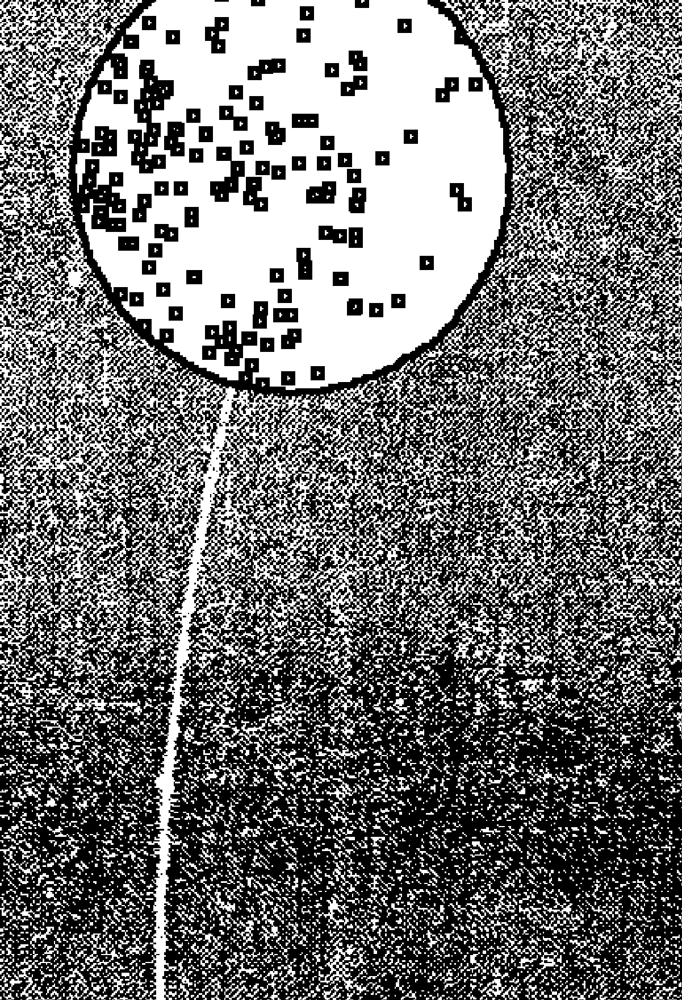

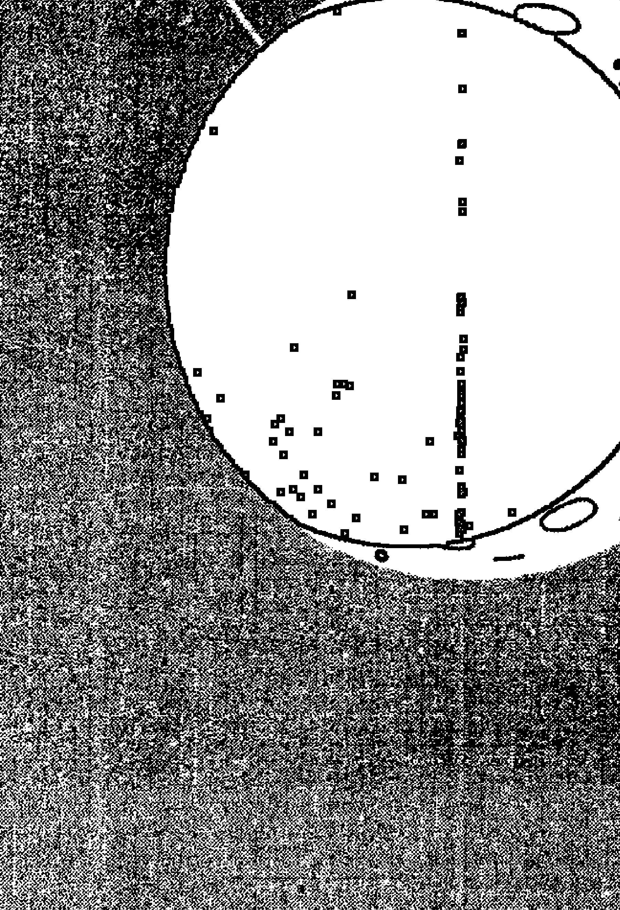

### 如何透過占星術來選擇黃道吉日

本卷的宗旨，要讓你了解擇日占星的背景知識和工具，好運用占星術來為自己施行的法術或儀式增強效力。在這裡，你不需要懂什麼高深的數學原理，甚至不需要知道如何排出命盤（雖然懂這些對擇日很有幫助），只需要適當的工具，也就是一本好的占星曆或天文曆，例如：吉姆·梅納德（Jim Maynard）編纂的《占星指南》（Celestial Guide）、美國鹿林月亮出版社（Llewellyn）發行的《占星師日曆》（Astrologers Daily Almanac）、戴爾出版社（Dell）發行的《星盤》（Horoscope）雜誌等。這類出版品會將月亮落入的星座、形成的相位、時間、進入下一個星座的時間及月亮空亡的時間等重要資訊都詳細列出。擇日時，有自己的本命盤固然有幫助，但並非必要條件。只要具備這些工具，並對月亮在各星座和各宮位的影響有基本認識，你的魔法功力就能更加精進。

有些占星月曆（可以掛在牆上的那種），裡頭雖然涵蓋了前述的資訊，但在購買時還是應該謹慎一點，不要因為看起來像占星曆，就以為裡面一定涵蓋了你需要知道的一切。怎麼說呢？因為有些月曆雖然會列出相位，卻不會標示出這些相位形成的時間；有些月曆會列出月亮在何時轉換星座，卻沒有標示出月亮空亡的時間點；有些月曆甚至只列出月亮的相位，其他行星間形成的相位則完全忽略。此外，不同的占星曆，準確度也有所差異。在挑選這類工具時，月曆上的照片精美並不重要，甚至可以說可有可無。

月亮是卜卦占星和擇日占星上，最主要的計時器和引爆器，因為它移動速度最快，所以會依序和其他行星形成相位。其他行星也會和別的行星成相。嚴格來講，月亮其實不是行星，而是「光體」（另一光體則是太陽）。但為了方便稱呼起見，占星上一般都把日、月統稱為「行星」。相位的形成，有其特定的先後順序，那就是月、水、金、日、火、木、土、天、海、冥。這個順序，是依據每顆星的日平均移動速度排序出來的。相位的形成，一定是走得較快的行星與走得較慢的行星成相，而非相反。目前冥王星的運行軌道，其實比海王星的運行軌道還要更接近太陽，所以照理來說，應該是冥王星與海王星形成相位，而不是海王星與冥王星形成相位。但其實兩者都說得通，不妨追蹤紀錄一下，看看何者比較靈驗。實際上，由於行星有所謂逆行現象（這點稍後再談到），所以有時候走得比較快，有時候則走得比較慢，但儘管如此，這個有關相位的先後排序還是固定不變的，並不會因為某顆星某一天走得比較快而有所改變。

月亮在占星上的表現，會受到它落入的星座、它成相的行星，以及該相位的性質所影響。因此可以說月亮決定了「占星氣象」，但由於月亮走得很快，會迅速從這個星座移動到下一個星座，並先後與不同的行星成相，所以這個占星氣象也會變化得很快。

择日占星学主张，应该要根据最强势的占星气象来决定施法时间；换句话说，就是要按照月亮及其他行星的状态来决定要做什么、怎么做、什么时候做，而不是随时随地想做什么就做什么。举例来说，如果想办一场户外的烤肉会，在时间的安排上，晴朗温暖的艳阳天，应该会比下着暴风雪的午夜时分要好得多。虽然这两个时间都可以把食物煮熟，但前者毕竟比较舒适适宜人，烤出来的食物也会美味许多。

在卜卦和择日占星上，相位的影响力只有在它准确形成（exactitude）时才会发挥作用，当相位准到时（也就是容许度变成零时），它的影响力会达到最大，但时间过去后，影响力就开始消退。这就像等公车，你在候车站等候，当公车到站时，你只有两种选择：上车或不上车。一旦车子开走了，就不会掉过头来接你，你也不可能追得上公车，这时候你只能乖乖等下一班。因此你最好在准相位形成前，准备好你想做的事，以预防可能发生的突发状况，但要是拖拖拉拉，错过了准相位的时间点，你就不可能再回头了。当准相位过去后，其影响力就不复存在，会影响你的反而是下一个要形成的相位。因此如果在准相位形成前，开始着手某件事，该相位的影响力就会被铭印上去，成为该事件的「命盘」的一部分；但如果是在相位离开后才开始做这件事，这个相位你就已经错过，只能等下一次。这个原则，是择日占星的铁律！请切莫忽视！要不然你可能会错过最吉利的月亮相位。

关于择日占星，要是你什么都不记得的话，至少要记得这一点。在魔法圈，不管是巫师的半夜拜鬼仪式（Sabbat），还是一般的巫师聚会，通常是在占星事件发生后才举行的。这一点，跟占星师的做法恰好相反。占星师（尤其是熟悉卜卦占星或择日占星者）在进行重大事情时，通常会选择在重要相位（例如：新月）准确形成的当下或之前没多久开始进行，而绝不会在准相位形成后才开始做。对行走江湖已久的巫师或法师们（不管他们用的是威卡巫术还是其他派别的法术）而言，要在这方面转换观念或许有点困难，但绝对是值得的。毕竟就算到头来，你发现这样做对你来说没什么效果，你还是可以回头采用旧的方法，而且效果应该不会变差（希望如此）。择日占星上的时间点，就是你开始做某件事的时间，不管这里的「开始」是如何定义的。譬如：你可能在建立魔法圈、净化魔法圈、召请四方后才开始施行法术，那么你就可以将这个时间点当作起起点。又或者你也可以把起始点拉到更早，譬如：点燃蜡烛的时间、描述魔法圈的时间、或召请四方的时间。重点是一旦决定好某特定活动的起点如何定义后，请持之以恒，不要再任意更改。当然你还是可以在施行不同法术时尝试不同方法，看看什么时间点对你来说最合理。不过对你而言最合理的方法，对别人来说不见得行得通。而这套择日占星的一个好处，就是你可以透过它为自己的魔法增添个人风格。总之，我鼓励你用游戏的态度来进行，展现自己的个人风格，并充分发挥实验精神。

至于我自己，我是用点燃蜡烛那一刻当起起点的。但我知道，有些人是用开始施法的时间来当起起点的，而且也同样灵验。

这套系统有最简单、最基本的择日技巧，也有较复杂、较精准的方法。你可以根据自己的需要来决定使用哪种方式。但一般来说，你可以根据一个很简单的通则来做判断，那就是这件事对你来说有多重要？如果只是单纯的巫师聚会，用简单的方法就行了，但如果是缔结握手婚（而且你希望该婚姻可以长长久久）、为即将入住的房屋祈福、替刚出生的小宝宝命名等，那么不妨发挥巧思，采用比较复杂的方法来择日。如果愿意，你甚至可以找个专业的择日占星师来帮你排出完整的星盘，好将择日占星的影响力发挥到极致。我还要附上免责声明，那就是这套系统并不能取代专业的择日占星师，而是要供你私底下使用，在自己家里或施法的地方使用。但如果你想精通择日占星的话，不妨去上几堂占星课。后面我会依复杂度将择日占星可能用到的方法一一列出：

- 渐盈月和渐亏月；
- 避开月亮空亡；
- 避开水星逆行；
- 月亮在十二星座；
- 时主星：
- 月亮在本命盘的各宫位：
- 择日秘技：
    - 月亮的最后一个相位；
    - 月亮的下一个相位（和最后一个相位）；
    - 入庙、擢升、失势、落陷；
    - 互容；
    - 其他行星间的相位（并利用月亮的相位进行微调）；
    - 上升点和天顶的度数；
    - 月亮在行运盘上落入的宫位；
    - 完整的择日盘。

前述这些方法，运用得越多，得出来的结果往往越灵验。当然你也可以为了追求完美而用上一切方法，但如此一来，你可能会抓狂。总之，要是有任何疑惑，请记住KISS原则，也就是「简单扼要」（Keep It Simple, Stupid！）。毕竟在学习这些方法以前，你本来就好好的，所以你现在绝对不会因为忽视这些择日原则，而让你在魔法上功力尽失。这一点我可以挂保证！你的法力，绝对不会变得比以前更糟的。如果你原本的功力只有三脚猫的程度，这些择日技巧并不能让你变得多厉害，但要是你原本功力就已经不错，这些技巧才真能发挥功效，让你变成法力高强，甚至能呼风唤雨的大法师。

记住，准相位一旦过去了，你就错过了你原本想搭的公车，只能再等下一班。所以如果不想错过良辰时机，请早一点到达候车站牌（或早一点开始施法）。

### 如何阅读占星历

左页就是占星历长的样子，虽然前面的内容是虚构的。事实上，大多数日子很少会像这一天星象活动如此频繁，但就讲解的目的而言，这倒是个很好的例子。首先，我们在左栏最上方看到的是有关月亮的资讯：月亮在早上六点十四分进入空亡。在同一栏更下方处看到，在同一时间，月亮会跟金星成对分相（MO opposite VE）。要知道，在月亮进入空亡时，同时时间一定会有某个月亮的相位形成。别忘了，月亮在进入空亡前，形成的最后一个相位，决定了该月空亡的基本状态。要是历书上列出了月亮空亡，但同一时间并没有任何月亮的相位，这地方肯定有错。继续看下去，下一行是这么写的：月亮进入双子 8:24 A.M.，这表示，月亮会在早上八点二十四分进入双子座；也就是说，这次的月亮空亡，起迄时间是早上六点十四分到八点二十四分。月亮空亡，有时候会持续一整天，一直到隔天，甚至隔天的隔天才走到下一星座；也就是说，在这段期间内，也许一天或两天，月亮会一直处于空亡状态。就算日期变了，只要月亮还没进到下一星座（无论它发生在何时），月亮就依然处于空亡状态。

月空的时间可长可短，最短可能只有一分钟，最长则可能长达两天半。在这张表的最上方，还可以看到「满月 10:59 A.M.」，在相位栏的部分则可以看到「月亮与太阳在上午十点五十九分成对分相」，就是这个相位，决定了满月是在什么时候形成。当历书上标示了新月、弦月或满月，在相位栏的地方却没有列出任何相对应的月日相位时（不管是合相、四分相还是对分相），就代表该历书在这地方出错了。这听起来好像有点在鸡蛋里挑骨头，但这些「小细节」的确可以显示出一份占星历精确到什么程度。同样的道理也可以用在其他地方，比方历书上写说：二月底有日月蚀出现在双子座。要知道，二月底时，太阳一定在双鱼座，因此如果发生日蚀，那月亮肯定也落在双鱼座；如果发生月蚀，月亮的位置则一定落在处女座。因此从天文学的角度讲，二月底是绝对不可能有日月蚀出现在双子座。换句话说，在购买历书前，要是没办法先翻阅里头的内容，千万别说该历书一定符合你的需求。

| English / Symbol | 中文 / Symbol |
| :--- | :--- |
| ○ Full Moon 10:59 A.M. | 满月 10:59 A.M. |
| ☽ v/c 6:14 A.M. | 月空亡 6:14 A.M. |
| ☽→♊ 8:24 A.M. | 月入双子 8:24 A.M. |
| ☿ ☍ ♇ 12:01 A.M. | 水对分冥 12:01 A.M. |
| ☿ ☍ ♀ 2:12 A.M. | 水对分金 2:12 A.M. |
| ☿→♊ 3:42 A.M. | 水入双子 3:42 A.M. |
| ☽ ☍ ♀ 6:14 A.M. | 月对分金 6:14 A.M. |
| ♀ ☌ ♇ 7:58 A.M. | 金合冥 7:58 A.M. |
| ☽ ☌ ☿ 8:26 A.M. | 月合水 8:26 A.M. |
| ☽ ☍ ☉ 10:59 A.M. | 月对分日 10:59 A.M. |
| ☽ ✶ ♃ 11:45 A.M. | 月六分木 11:45 A.M. |
| ☽ ☌ ♂ 4:47 P.M. | 月合火 4:47 P.M. |
| ♄ SR 7:03 P.M. | 土止逆 7:03 P.M. |
| ♅ SD 8:02 P.M. | 天止顺 8:02 P.M. |
| ☉ △ ♃ 11:27 P.M. | 日三分木 11:27 P.M. |
| ☽ □ ♆ 11:53 P.M. | 月四分海 11:53 P.M. |

接下来的栏位，是依据时间先后顺序显示，当日的星象活动真是格外繁忙。但相反地，有时候历书上会写道：「无任何准相位。」意思是，这一天没有任何准相位形成。当然这一天的月亮一定会落在某星座，只是不可能在当天进入空亡，因为空亡的要件之一，是在某星座内形成相位，然后离开。尽管如此，就算没有任何准相位形成，月亮在那一天可能处于空亡状态，也可能不是。以前面所举的这个假设性状况为例，头一个列出的相位是水星与冥王星在凌晨零点四十分成对分相，然后是水星与金星在半夜两点十二分成对分相。这些与月亮无关的相位虽然列在占星历上，却不会对月亮的状态造成影响。下一个出现在占星历表上的是水入双子 3:42 A.M.，意思是说，水星会在半夜三点四十二分进入双子座。再下去是月亮在早晨六点十四分与金星成对分相，这也是月亮在进入空亡前形成的最后一个相位。下一个相位是金星在上午七点五十八分与冥王星合相。前述暗示了几件事。原本金星的度数在冥王星之前（因为水星先与冥王星成对分相，再与金星成对分相，然后才进入双子座），但现在却与冥王星合相了。这意味着，金星正在往回走，事实上的确如此。在这个例子里，金星正处于逆行状态。但你要知道，虽然天文历上会标示出金星开始逆行的日期与时间，却不会在每一天的星历表上都提醒读者，某行星目前处于顺行或逆行状态（除非你自己记得）。在天文历上，会在金星从顺行转为逆行那一天在金星旁标上Rx或R的符号（但要是金星在进入该月以前就已经逆行了，天文历就会在当月的头一天标示出来）。换句话说，这是得知行星是否逆行的另一指标。要是某行星在某月的头一天就已经标上R的记号，而在当月稍后又出现D的记号，则代表这颗星在月初之前就已经进入逆行状态，并在标示D的那一天从逆行转为顺行。

此外，历书上应该还会另外标示出，该行星是在哪一天的几点几分转为顺行的。在这个例子里，金星与冥王星合相，虽然发生在月亮空亡期间，却不会对月亮的状态造成任何影响（无论月亮是否空亡），因为这个相位跟月亮没有半点关系。此观念非常重要，有些人以为，月空期间要是有其他行星形成相位，月空的影响力就会消失不见。但这是错误的想法。月亮空亡成立与否，决定因素只有两个，那就是月亮所形成的相位和落入的星座。

继续看下去，下一个月亮的相位是月亮在上午八点二十六分与水星合相。注意，月亮进入双子座的时间，并不会出现在相位栏里，但这是例外，因为其他行星转换星座的日期和时间都会列在相位栏里。再看下去，月亮在上午十点五十九分与太阳成对分相，也就是满月，在上午十一点四十五分与木星成六分相，然后在下午四点四十七分与火星合相。注意，这里的合相记号，圆圈内是涂黑的，但并非误植，而是另有特殊意涵。这样的合相，在占星上又叫月掩（occultation），意思是月亮不仅在度数上与某行星同度，而且也真的从该行星前面经过，以致将它给遮蔽住（相对于观察者而言）。如果月亮遮蔽的是太阳，这时候就会出现日蚀，但月亮也能遮掩其他行星。这样的合相，在占星上有个特殊称呼，为「纬照同度兼合相」（conjunct parallel），作用相当于「超级合相」。月掩的情况虽然罕见，力量却十分强大。再看下去发现，列在相位栏里的并非相位，而是静止（stationary）：晚上七点零三分，土星先是静止不动，然后开始由顺转逆。这是因为行星从顺行转为逆行前，速度会先慢慢减弱，然后静止，接着再往回走。不过由于这时候的行星移动速度极为缓慢，从地球上根本观察不出来，只能透过数学公式来推算之。在这之前，土星的运行方向是顺的，但现在却开始逆行，这表示，在这段期间，土星能量的展现方式会是比较主观和内在的，而比较不是客观与外在的。但要注意，包括天、海、冥在内的三颗外行星（尤其冥王星），其静止时间在不同天文历上可能会有所出入，这是因为不同历书的编纂者不见得会使用相同的数学公式来推算行星的静止时间，外行星间的相位也一样，不同天文历上所记载的时间也可能不尽相同。以一九九三年的天海合相为例，不同历书上的记载时间，差异最大居然多达十二个钟头。但不必大惊小怪，反正择日占星本就不常用到外行星间相位，所以只要日期够精准就行。再看下去，下一格记载的是天王星在晚上八点零二分先静止，然后顺行。这表示，在此之前，天王星处于逆行状态，但逆行的速度越来越慢，最后停下来，然后开始往前顺行。这个地方同样要用到数学公式，所以记载时间会因为不同的天文历而有所差异。查阅天文历时，会看到这一天的土星旁写着「R」，天王星旁则标示着「D」。让我们继续看下去。下一个相位是太阳与木星在晚间十一点二十七分成三分相。容我再次强调，跟月亮无关的相位并不会影响月亮空亡与否。接下来是最后一个相位：月亮在晚间十一点五十三分与海王星成四分相位。前述就是这一天会形成的所有相位，好忙碌对吧！我希望，透过前面的介绍，你可以自己读懂占星历或天文历，并透过择日技巧来规划日常生活或施法仪式。总的来看，这一天有两个良辰吉时可以用來施法。一是金冥合相，二是日木三分相。其中，金冥合相很适合用來施束缚咒（binding spell），譬如：让两个人的性关系变得更火热（但不适用于正式的婚礼或握手婚，因为金星落天蝎座对婚姻盘而言并非吉兆），或用來为长期投资祈福。但是请注意，这些仪式一定要在早上七点五十八分以前开始做。至于日木三分相，则很适合入庙祭祀、供奉神像、施发财咒，但一定要在晚上十一点二十七分前开始做才会有效。不过前面这些相位，还可以用别的方式加以呈现：

☿ ♇ 28 ♏ 「水对分冥28度金牛天蝎 12:01 A.M.」这时候最好闭上嘴巴，以免说出让自己后悔的气话。
☿ ♀ 28 ♏ 「水对分金28度金牛天蝎 2:12 A.M.」放首疗愈系的情歌来听听，顺便放松一下。
☿ → ♊ 「水入双子 3:42 A.M.」
♄ ∥ ♆ 「土同度相海 4:37 A.M.」你不可能老是成功愚弄所有人。
☽ ♀ 「月对分金 6:14 A.M.」懒散一下又何妨，这时候不妨出门去和朋友吃喝玩耍或坐在沙发上当个懒骨头。
☽ ♆ 「月反同度相天 7:27 A.M.」平时看似疯狂的点子，这时候可能会显得再正常不过，所以最好三思而后行。
♀ ♂ ♇ 28 ♏ 「金合冥28天蝎 7:58 A.M.」在这情欲高涨的时刻，把那件若隐若现的性感内衣给穿上吧。
〔月八分相天 8:10 A.M.〕很可能遇见怪咖。
〔月入双子 8:24 A.M.〕
〔月合水 8:26 A.M.〕脑袋和嘴巴都动得很快，前者可能每分钟四十五下，后者可能高达每分钟七十八下。
〔月对分日 10:59 A.M.〕长程旅行或短程旅行是每个人都要面对的两难困境。
〔月六分木 11:45 A.M.〕开心得不得了，是这时候最主要的情绪状态。
〔月同度相火 4:10 A.M.〕你可能觉得裤管里有蚂蚁在爬。
〔月合火 4:47 P.M.〕情绪高涨到白热化的地步。
〔月补八分土 4:47 P.M.〕有障碍会出现而导致事情延宕。
〔土逆 7:03 P.M.〕
〔天顺 8:02 P.M.〕
+   - ⊙ △ 21 1 ♐ ♑ 〔日三分木 1 射手 牡羊 11:27 P.M〕放胆去做，是此时的最佳座右铭。
+   - ☽ □ ψ 〔月四分海 11:53 P.M.〕留意扒手和诈骗集团。
+   - ☽ ∥ 21 〔月同度木 11:59 P.M.〕过度乐观可能会导致乐极生悲。

这份相位表，由于还列出了非古典相位，所以跟前面那份天文历长得不大一样。记住，月亮空亡，取决于月亮在星座内形成的最后一个古典相位（即合相、六分相、四分相、三分相和对分相）。从前表可以看出，月亮和金星成对分相后，又陆续与其他行星形成反同度相和八分相，但这两个相位并非古典相位，所以并不影响月亮空亡与否。此外，表上并没有列出月亮进入空亡的时间，要不然就是列在其他地方。但尽管如此，还是可以通过这张表推算出月亮空亡的起迄时间。因为表中列有月亮进入双子座的时间，也有月亮在进入双子座前形成最后一个古典相位的时间，那正是月亮空亡的起始点，这无法自动算出，得花点脑筋查对一下。不过这样的相位表其实也不是没有好处，因为非古典相位也可以用在魔法上，例如：土同度相就是吉兆，可以将虚无飘渺的东西变得更具体明确，比方说为魔法杖注入灵力，但记得要在凌晨四点三十七分以前开始施行仪式。同度相的意义基本上就像合相，反度相的影响力则类似对分相。由于外行星间形成古典相位的机率较低，使用次要相位会有机会汲取外行星的能量；再者，这些次要相位的出现频率也不是那么频繁，因此运用次要相位会更有机率找到那些行进速度较慢的行星之间的关联。至于右栏里的解读文字，虽然幽默逗趣，但别忘了，每个行星、星座与相位都含有多重意义，所以在解读相位时千万不要被表中的那些诠释局限住了。

### 渐盈月和渐亏月

当月亮从新月发展成满月，且亮度逐渐增强时，这样的月亮就叫做渐盈月（waxing moon）；反之，当月亮从满月发展成新月，且亮度逐渐减低时，这样的月亮则叫做渐亏月（waning moon）。当月亮形成满月时，“盈”的程度最强；也就是说，其渐盈的影响力是最大的。新月时的月亮，“亏”的程度则最大；也就是说，其渐亏的影响力也最大。当新月形成后，就开始往“盈”的方向发展；当满月形成后，则开始往“亏”的方向发展（更详细的月相请见图表2-1）。

这听起来好像很简单，但里头有些细微差异非常重要。择日占星的思维跟本命占星学不太一样，而且有一些原则必须严格遵守，因此最好一开始就使用正确的方式。
那渐盈月和渐亏月各代表什么意思呢？
在占星上，渐盈月象征开展新计划、接触新事物（不管是经验、想法、人事时地物还是具体到物品都行）、成长、发展、种植、播种地上农作物、展开旅程（出发）、将事物摊在阳光下、团聚、建造、结合、集结、召唤、行动、诞生与成长、活力昂扬。
反之，渐亏月则象征为事情收尾、减少、枯萎、凋谢、节食、收成、播种地下农作物（即根茎作物）、隐密、驱逐、丧失、去除、结束旅程（回家）、回应、亏损、放下、捐赠、死亡与凋零、活力减弱。
这就是择日占星的第一种技巧。很简单吧？真的没有你想象中那么难。

## 图表 2-1 月相

> 了解月亮在各星座和各宫位的影响，可以让魔法功力更上一层楼（节录米尔娜·洛夫修斯之《灵魂占星学》）。

+   - Δ = 从地球上看得到的月亮部位。
- Δ = 月亮的运行路径通常不是高于地球就是低于地球。

### 避開月亮空亡

當月亮從A星座移動到B星座時，會陸續和其他行星形成相位。但到了某個時間點，當最後一個相位形成後，月亮在進入下一個星座前就不會再形成任何相位了，換句話說，月亮在該星座內仍有一段距離要走，但這段期間內不會再有任何相位形成（注意，這裡的相位僅指五大古典相位：合相、六分相、四分相、三分相和對分相）。這時候會說，月亮進入了「空亡」（void-of-course）。意思是說，月亮在這個星座的任務已經告一段落，在進入下一個星座並執行該星座的任務以前，只剩下「標示時間」的作用而已。月亮空亡（簡稱月空）的時間可長可短（短則數分鐘，長則兩天左右），要看其他行星落在星座的哪個位置而定。要是大多數行星都落在星座前段，月空期間則可能拖得很長。在天文曆上，月亮空亡會以v/c的記號來標示。這代表月亮要暫時休息一下，直到進入下一個星座，才會再度發揮作用。

在判斷月空時，有些占星師會把非傳統的主相位也算在內，比方說同度相、反同度相、十二分相、補十二分相、甚至八分相或補八分相等。至於這樣算準不準確，你可以自己實驗看看。但最穩健的辦法是，只用傳統的主相位，畢竟這也是所有天文曆採取的判定標準。

附帶一提，當月亮進入空亡時，其他行星之間還是有可能形成相位，但由於月亮相當於擇日占星上的計時器，因此重要的是月亮相位，所以空亡概念基本上只適用於月亮。

儘管如此，還是有人會把空亡概念用在其他星曜上，譬如太陽空亡、本命盤上有哪些星處於空亡狀態等稀奇古怪的觀念。之所以指出這一點，是因為不希望有所遺漏。

沒錯，其他行星也有所謂空亡，但如果要把每顆行星的空亡時間都找出來，應該要花上不少時間，更何況，一個人如果要根據占星的預測來過生活，可能會把多半時間都花在占星上，反而沒多少時間從事日常事務。依據占星象徵來趨吉避凶不是壞事，但每件事都是有限度的（對占星師而言也一樣），到了某種程度，你只能選擇放下，其他的就交給老天爺。這些技巧，其實也可以用在現實世界（喔喔，我又不小心洩漏了一個占星秘密），但如果生活中的一切都要靠占星來做決定，恐怕會抓狂。与其把时间全都埋首于天文历中预测吉凶祸福，还不如把时间花在重要的事情上，譬如：参加求职面试、投稿、对心爱的人求婚、办理房子过户等。别忘了，就算月亮进入了空亡，麦当劳还是会照常提供汉堡，所以如果是芝麻小事就别瞎操心了。

接下来，要谈谈月亮空亡的意义。在月亮空亡期间，比较适合进行主观、灵性、非世俗的事务，例如：祈祷、练瑜伽、玩乐、参加派对、接受心理治疗、睡觉、静坐冥想等。这段期间做出的决定，最后通常证实是不切实际的；脑海内浮现的创意，则容易发生意外的改变或转折，错误与纷乱也很容易发生，而且容易判断失误。习惯或例行性事务通常能顺利进行，但事后恐怕要再调整（当月亮离开空亡期后）。第六感通常比较敏锐（虽然不见得准确），而且有利于从事意识扩张的活动，例如：喝酒喝到茫、嗑药嗑到嗨、从事喜剧创作等。这段期间就像是小周末，每隔几天就出现一次，让宇宙可以稍微放松和休息一下。

在月空期间占卜，占星师大概都会告诉你：「放心，一切都会没事的。」虽然这样，最好有心理准备，因为旅游计划可能发生变动，旅游行程表可能不翼而飞，要不就是会遇到什么新鲜事或怪事，或者遭遇意想不到的障碍。

对商务旅行而言则是坏事。在这段期间做生意，通常「稳赔不赚」，不然就是会遇到实际拿到的货品跟原本的期待有很大的出入。拖延与挫折，发生频率会比平常来得高。

但神经质的倾向或坏习惯，这时候反而比较容易改变。历史性的事件可能会对演化造成无法预期的、超乎想像的冲击，但也可能什么影响都没有。在月空期间如果一定要工作，最好按惯例行事，不要尝试任何新鲜或奇怪的做法。此外，在月空期间，签订合同或成交生意都是大忌，因为这些契约或生意很可能会发生变化，不然就是整个遭到取消或「落空」（这不是语带双关，「空亡」一词或许就是这样来的）。总之，如果你希望施法能有具体成效，最好避开月空。但如果要静心冥想、扩张意识，休息、放松或玩乐，月空倒是个好时机。但是要小心，在月空期间，人很容易「迷失在群星之间」，因为这时候，一切事物都会变得比较虚幻、比较不切实际。毕竟就连守旧传统的老顽固也可能在这时候放下矜持，纵情地放肆一下，更何况是个性原本就不切实际的人，这时候可能会变得更不食人间烟火。不过这时候施法如果只是为了庆祝或巫师聚会之用，或纯粹为了崇拜而不寄望得到任何具体成果，月亮空亡倒可能相当有利。总之，你可以自己实验看看，再判断怎样做对你最好。

谈到这里，让我想起我个人观察到的某个与月空有关的现象。还记得，美国前总统雷根执政期间，每个月会在电视上发表两、三场记者会，而我也经常收看。但我发现，很多时候，官方虽然宣布记者会将在晚上八点召开，但当我在电视机前准时守候，却常常发现雷根总统不会准时现身，而会在比如说八点零七分或八点二十二分才正式亮相。新闻播报员只好在总统现身前针对总统当天要谈的主题做些讨论，甚至东扯西扯地讲一些不相干的事情来填补空档。

我还发现，类似的情况发生时，雷根总统在该次记者会上所谈的内容往往是具争议性的主题或不利于他执政团队的东西，而且几乎毫无例外。由于我习惯随身携带天文历，这时候我会把它从皮包里掏出来。一查，果不其然，就在雷根总统现身前三、四分钟，月亮才刚进入空亡期。显然，雷根总统是想透过月空来避免他在记者会上宣布的内容产生长期效应。因此就算他在记者会上宣布的消息有多么令人震惊，或记者在提问时情绪有多么激动，一、两天后，雷根在记者会上讲的东西（更多时候是没有讲的事情）往往已经没人记得或在乎了。

深谙占星者，看到这个现象几乎可以立下断言：雷根总统当然有使用占星术，而且还把它当成「金钟罩」在使用：月空期间，发布令民众不悦的消息；「非」月空期间（且月亮在空亡前的最后一个相位往往是吉利的），则发布具漂白性质或其他冠冕堂皇的消息。至于这么做道不道德，可能要看每个人对雷根总统的好恶而定。我自己的感觉是，用这样的方式来运用占星，虽然称不上不道德，但要是透过欺瞒手段，让民众难以充分了解政府的所作所为，就难免有操控他人或图利自我之嫌了。而且这也显示了雷根的执政团队有多么缺乏自信，所以才需要这样大费周章地用占星手段去阻止美国民众充分了解某些议题。

但很多事虽然可隐瞒一时，却无法隐瞒一世，到头来总会东窗事发，除非该事件本身是在月空期间发生的。像现在，共和党失去白宫执政权后，很多以前见不得光的秘密开始一件件地浮上台面。有趣的是一九八八年，前总统夫人南希·雷根在共和党全国代表大会上透过电视公开承认，的确有使用占星术，但该次的声明也是在月空期间发表的，可见她多么仰赖占星了。

### 水星逆行

除了太阳和月亮外，天上的每颗行星偶尔都会逆行。这个现象是指从地球上看出过去，天上的行星有时候会忽然停下来，在黄道上往回走，走了一段时间又停下来，再回头往前顺行。在天文历上，逆行的行星旁通常会标上 R 或 Rx 的符号来表示之（见图表 1-1 行星逆行）。

不过虽然叫逆行，并不代表这些行星真的会往回走，只是看起来如此而已。要了解这个现象，你要知道，宇宙中的天体虽然看起来好像在绕着地球旋转，但事实上是地球在绕着太阳旋转。太阳系的所有行星，都是以太阳为中心在进行公转（月亮则绕着地球旋转）。但由于我们置身在地球上，从我们的角度看出去，会觉得是各行星、太阳和月亮在绕着地球旋转。想了解行星的逆行现象，想想在高速公路上开车的经验就行了。在公路上，你的车子在移动，别的车子也在移动，只是快慢不一。要是你加快速度，超前别的车子，就会觉得别的车子在后退；但要是别的车子超前你，那辆车里的乘客就会觉得你在倒退。公路上的车子，行驶速度虽然大致相同，但毕竟快慢不一，所以就会出现顺行、逆行的相对现象。

在九大行星中，最常发生逆行现象的是水星（但时间也最短），频率最低的则是金星，而就持续时间而言，逆行最久的往往是冥王星。

由于水星象征沟通与日常生活，因此水星逆行时，日常生活中多半会出现一些状况或麻烦。水星逆行，一年大约发生三次，每次为期大约三周。好玩的是，水星逆行时，人类世界通常会变得比较混乱或失序，譬如：塞车塞得更严重、政坛上闹出更多笑话、广电讯号传送不稳等。这是真的，你只要多留意一下就知道了。不管是哪颗星，逆行都代表该行星的能量会往内发展。换句话说，行星逆行时，我们通常会用比较内在和主观的角度（而非外在和客观的角度）去体验该行星所象征的人事物。这个通则，适用于所有行星，而且在流年盘和本命盘上都一样。

讲得更详细一点，水星逆行时，很容易发生沟通障碍（无论是何种形式的沟通），譬如：延迟、出现杂讯、误会、传错对象、莫名其妙搞丢、遭到夸大、被轻忽或视而不见等。总之，最后通常会搞砸。再不然就是旅游计划被迫延期、更改路线、机票超卖、绕道、航班无缘无故被取消等。总之，通常不是什么好事。还有它也可能代表你在这段期间内买到的东西（尤其日常用品）有瑕疵、效果不如广告上说得那么好、或根本不适用，而且可能的理由不一而足。此外，水逆期间最好不要签订合约，因为这时候签订的合约到头来很可能必须重新修改，要不然就是对方无法履约。拖延、延宕，无法如期交稿，也是水逆期间很容易发生的事，而且就算把成品交出去了，对方也可能要求你修改甚至直接退件。

尽管如此，水星逆行也不是没有好处的，譬如：这段期间就很适合用来「清理」—— 这里指的是广义的「清理」，如清理橱柜、清理抽屉，完成悬宕已久的事，甚至清理自己的人生。此外，这段时间也很适合用来沉思、内省、回顾、完成未竟之事、寻找失联已久的老友、进行拖延已久的「未雨绸缪」计划、耽溺于过往、重温宿怨、怀念、回味「美好的往日时光」、完成老早就放弃的计划、寻找再出发的机会等。此外，「不食人间烟火」一类的事，也很适合在水逆期间进行。悬而未决的老问题，这时候可能浮上台面，让你用新的角度重新看待；日常性的、例行性的事务也是如此。要推展新计划，最好避开水逆期间，因为这些计划多半不会有结果，要不然就是花费很大力气却必须从头来过，或最后徒劳无功。

總之，在水逆期間，做事情的態度最好輕鬆點，有心就好，不用太賣力，因為這段期間很容易判斷失誤，所以倒不如去交際應酬。如果你希望自己的努力能產生具體成果，最好等水星順行後再說。不過追蹤性質的工作、回顧或回溯活動，倒很適合在這個時間點進行，而且可能會得到某些有趣的體驗或理想的結果。此外，任何與回顧有關的通靈活動，譬如：接觸感應或通靈考古（psychic archaeology）、從事歷史研究，也很適合在水逆期間進行。如果有什麼事想再做一次，水星逆行也是不錯的時機，尤其如果那件事一開始不太順利的話（譬如：重考、重新粉刷臥室、再次驅靈，把家裡那老愛偷藏鑰匙的搗蛋鬼給趕出去等）。前述有很多地方可能會讓人覺得跟月亮空亡的意思很像；的確，這兩者在占星上是有不少相似之處。簡單來說，水逆好比宇宙的清理時段，月空則像是宇宙的放鬆時段。這兩者都代表主觀的、內省的、回應的、超越世俗的，也都代表暫時放下例行事務，放鬆一下，做點不一樣的、有趣的事情。不過如果要展開新計畫、從事有長遠影響力的活動、購物、進行重大決定等，最好避開這兩個時段。

### 月亮在十二星座

每個月，月亮會把十二星座都走過一遍，所以在每個星座會待上大約兩天半左右，但由於行進速度時快時慢，或多或少還是會有時間上的落差，因此有時候會在同一星座待上三天，有時候則只有兩天，但平均而言每天會移動個十一到十五度。每進入不同星座，月亮就會受到該星座的影響。在不同星座，月亮所象徵的吉凶禍福也各自不同，這在占星學上已經歷史悠久。不過同一件事，有時候可能對應到兩個以上的星座，只是對應方式不同而已。但無論如何，事情越明確具體，它和星座間的對應就越精準。不過讓我再次強調，下面的介紹，主要為了讓你大致了解各星座所對應的人事物，這些詮釋不是固定死板的，也沒辦法涵蓋所有可能性。要是你感興趣的東西沒出現在下面的清單上，沒關係，你還是可以透過相似度去找出占星上的對應。總之，試就對了，學占星就應該秉持這種態度。

- 月亮在牡羊座：象徵開始、推動新計畫、披荊斬棘、戰爭、衝突、能量、自我（ego）、主體性、我的東西、武器、槍械、刀、鋒利物、切割工具、動手術、炫技、沒耐心、冷嘲熱諷、迅速出現的結果、製造麻煩、對陷入麻煩的人伸出援手、英雄氣概、天真無邪、靜不下來、自我中心、勇氣、能夠捍衛自己。

月亮牡羊的成功之道在於自信有主見、主動出擊、用「自己」的方式做事，但是要小心失去耐性、過度自信、或太過自我中心。

- 月亮在金牛座：象徵金錢、財產、價值、感官主義、舞蹈、音樂、靜默、蓋亞、大地之母、種植穀物、肥沃、大地、富有、安全、貪婪、謹慎保守、放鬆舒緩、穩固、不動如山、擁抱、探索或解釋自己的性需求、處變不驚、可靠、刻苦耐勞、緩慢但穩定的進展、母親原型、珍貴的珠寶首飾、價值觀與道德觀。

月亮金牛的人，主要是透過耐心、溫和或堅毅不拔的精神而成功的。他們製造的東西往往堅固耐用，但是要避免流於冥頑不靈或突發的暴怒。

- 月亮在雙子座：象徵雙重性的人事物、買賣、語言文字、寫作、溝通、車輛、電話、交通運輸、樣樣通樣樣鬆、雙重的結果、雜耍、偷竊、基礎教育、初階神秘、教學、說故事、建立人脈、短程旅行、實地考察、兄弟姊妹、親戚（廣義的）、鄰居與社區、機械式學習、用輕鬆的態度看事情、閱讀、無線電、活到老學到老、移動、瑣碎事物、靈性的價值觀、流言八卦、弦外之音、模仿、電腦。

廣結善緣、公開演說、公正客觀，是月亮雙子成功的重要關鍵。擅長一心二用。但也可能代表有事情必須修正。容易搖擺不定、做太多事讓自己分身乏術，可以在一個儀式裡同時做好幾件不相干的事。

- 月亮在巨蟹座：象徵家庭、食物、安全、房地產、通靈、占卜、神話與原型、母親、母親原型、照顧者、回顧往事、傳統、家族（廣義的）、烹飪與飲食、種植、捕魚、家與家居生活、供奉祭壇、餐館、善於傾聽、樂於助人、情感用事、保守秘密、在家工作、做家事、根源、正直、墳墓、地底、遺傳來的特徵、天氣與氣候、做法用的祭壇、含蓄的幽默、乩身、土地與房產。

月亮巨蟹的人，成功之道往往在於懂得訴諸情感、情緒、像媽媽一樣照顧別人（譬如：烤蘋果派請別人吃）、回顧往事與童年等。家是月亮巨蟹者的堡壘，在這裡他們最能感到安全。但是要小心別感情用事、沉溺在過去的傷痛中走不出來。相較於其他星座，月亮巨蟹力度最強，所以幾乎無往不利。

- 月亮在獅子座：象徵創造力與自我表達、嬉戲玩耍、精緻藝術、子女、為孩子命名、劇場、宴客、派對、慶祝、浪漫與愛情、嗜好、遊戲、情人、賭博等投機性活動、炫耀、親切溫暖、自尊、騎士精神、扮小丑、娛樂、展現自我風格、冒險、投資、股票與債券。

月亮獅子的人，常能透過誇大的表現、適當的授權而成功，可能因為別人的授權而得到權力，但也可能因為逾越權限而導致失敗。切勿變成獨裁者。雖有赤子之心，但容易流於幼稚。

- 月亮在處女座：象徵天氣對健康的影響、武裝部隊、處女、陶藝、工匠、打獵、工具、寵物、小型動物、協助靈、環保、資源回收、衣服、工作、工作場所、同事、種植藥草、電腦、打掃、淨化、運動健身、治療、重視細節的工作、雞蛋裡挑骨頭、工作倫理、罪惡感、樂於助人、義務、發明、社群的需求、魔法、乞靈、集體施法、低階魔法。

月亮處女者，成功秘訣在於事必躬親、龜毛挑剔，對他們而言，只要把細節顧好了，大方向自然會出現。這類人善於利用官僚體系，追求完美也要求完美。但是要小心別變成苛刻的批評者或犧牲得沒有價值的烈士。可以從服務他人中受益。

- 月亮在天秤座：象徵婚姻或伴侶關係、種植裝飾性植物、戰爭與和平、外交、折衝斡旋、首飾與裝飾、正義、平衡、美與和諧、辯論與討論、有禮貌、禮節與禮儀、公開的敵人、社交、結識新朋友、應酬、懶散、白吃白喝、弱者暴政（tyranny of the weak）、浪漫主義、鄉愿、用圓滑的手段利用別人、梳妝打扮、師傅、契約、法律事務、他者、牽涉到兩個人的法術、另一半。

月亮天秤者，工作上如果能與人合作，通常比較容易成功。懂得禮讓別人，看事情時會同時考量到正反兩方。謙恭有禮是他們的一大優點。但是要小心太認同另一半而失去了自我。

- 月亮在天蠍座：象徵死亡、性、通靈天賦、與他人結合、情感的真誠、潛在的天賦、稅、保險、魔法儀式、禁忌、手術、轉化經驗、重生、偏執、強烈、研究、獨處、單人施法、雙人施法、高尚的動機、迂迴戰略、極端、自我控制、意志力、勇氣、保密、因應危機、被迫害妄想症、直截了當、神秘主義（廣義的）、邪術、魔法、秘密社團、接納自己（包括優點和缺點）、剛正不阿、靈魂伴侶、黃色笑話、啟蒙、發現秘密。

偷偷摸摸、走後門、利用內線消息、認識「有力人士」、保守秘密，是月亮天蠍的成功秘訣，但也因而容易誤入歧途。情感強烈、意志力堅決、說話一針見血，是月亮天蠍的蠍應該好好善用的長處。

- 月亮在射手座：象徵宗教與哲學、法律與法官、道德與原則、派對與玩樂、長途旅行、夢與夢的解析、高階奧秘、典禮式的魔法、高等學習與高等教學、體育活動、善行、善意、名聲、慷慨、官司、頹廢墮落、樂天知命、韌性、合理化、以未來為導向、移動、搞笑、意識擴張、上師、靈性體驗、是非判斷能力、信仰、電視、進出口貿易、語言、法律事務、無厘頭式的幽默、占卜、教堂、出版與出版商。

但是月亮射手的人要成功，最好成為某領域的專家或尋求專家的協助。擅長一心二用。但不要過於天真或樂觀。月亮射手也象徵「大儀式」。

- 月亮在摩羯座：象徵職業、功成名就、遺傳來的特徵、責任感、公眾輿論、宣傳、隱士、隱居、社會地位、學歷、升官、父親原型、老闆、體制、山嶺、礦石、勤奮工作、力爭上游、正經八百、抑鬱、時間與鐘錶、冷血無情、利用或剝削他人、為達目的不擇手段、極端強烈的渴望、道德良知、深刻、智慧、老嫗、被迫害妄想、冷笑話式的幽默、長期耕耘後的收穫、尊敬。

月亮摩羯的成功秘訣，在於授權、運用權力（包括自己的權力和他人的權力）、從事「內線交易」、「走後門」、建立人脈。但是要小心別被權力沖昏了頭、操控他人、或樹敵眾多。月亮摩羯，有殘忍的傾向。「準時」是他們的一大優點。

- 月亮在水瓶座：象徵朋友與同儕、意外或驚喜、幸運、非自己能控制的狀況、團體、會動盪、造福人群、立法機關、電力、能量與能量工作、結識新朋友、團體施法、巫師、理想抱負、自由、偏見、天才、理想主義、同儕壓力、理想、誠實、客觀不帶感情、值得信賴、公平、理性、直接、新奇的玩意兒、電腦、電視。

獻身公眾利益，而不只是追求私利，往往能讓月亮水瓶者大放異彩。做事方式可以離經叛道一點，而且越古怪越激進越好。但不要只是為了改變而任意搞破壞或導致社會失序，也不要因為過於特立獨行而忘記初衷。當腦海裡冒出怪誕或荒唐的想法時，不妨拿筆寫下來，因為這些靈感終究並不荒唐也說不定。

- 月亮在雙魚座：象徵業力與輪迴轉世、暗地裡的敵人、逃避、陳腔濫調、靈療、捕魚、種植、隱居、魔法、被神靈附身、間諜、秘密社團、秘密、藏起來的東西、遺失物、與神合一、酒精、過去、寂靜之聲、舞蹈、占卜、乞靈、大型機構、油與香水、毒、藥物、靈丹妙藥、監牢與囚禁、靈性、慈善團體、人道關懷、大型動物、發瘋、信仰、音樂、保密、深刻的靈性經驗、脆弱、面對恐懼及克服恐懼、面對過去及超越過去、神聖的瘋狂、結束、孤獨、高階魔法。

月亮雙魚的成功秘訣在於：讓別人覺得「虧欠」你，一心二用，善用魔法與酒精。要小心別受騙上當，尤其是那些承諾能讓人一夕致富的騙局。在探索宇宙的同時，記得要腳踏實地，以免迷失自我。讓宇宙的愛充滿你。

### 時主星

時主星，是占星術始祖迦勒底人發展出來的一套古老的命理系統。但當時的迦勒底人並沒有多少哲學概念或符號象徵來為占星學奠定基礎，因此這套系統跟現代的占星邏輯不見得能完全對應。但數千年以來，這套系統一直都很靈驗。從某些角度而言，這是最簡便也最容易上手的命理系統。但時代變了，現代人有所謂標準時區，而人類也散居世界各地，因此時主星的推算已經不再像以前那麼容易了。不同的時主星，象徵不同的人事物、行為或心情等，所以可根據特定時辰的主要狀態來決定要做什麼，或等候良辰吉時到了才去做某件事，以提高成功的機率。這套系統，跟天上運行的行星、月空或占星學的其他東西沒有半點關係，但還是可以跟其他占星技巧相結合，以提高成功的機率。

時主星系統，是卡巴拉秘法中用來判斷吉凶禍福的方法之一。它把一天分成兩半：白晝與黑夜，白晝的起點是日出，黑夜的起點是日落。白晝與黑夜又各自劃分成十二等分，也就是一天共有二十四等分。白晝的十二等分，時間長度是彼此相同的，黑夜也一樣，不過除非在春分或秋分，否則白晝與黑夜的時間總長度並不一樣。再者由於日出與日落時間會隨著季節更迭、白晝與黑夜時間的長短不同而有所差異，所以時主星的確切時間會每天改變，而非固定不變。但年度的影響則不大；也就是說，在同一地點，一九九三年薩溫節那一天的時主星起迄時間，跟一九九一年或一八九一年應該差不多。

不過日出與日落時間也會隨著地點的不同而有所差異（看它離赤道多遠），因此在芝加哥，薩溫節的時主星起迄時間絕對不同於紐奧良。換句話說，這是套根據日期和距離赤道遠近來決定的命理系統。

前面說的這些，你要是覺得太玄或太難懂的話，沒關係，我後面會附上一張時主星表當範例，幫助你了解如何使用。要使用這張表，你只要知道兩件事，一是你所在地的緯度（也就是距離赤道多遠，但緯度又有南、北緯之分），二是地方均時差（local mean time variation；不知道的話請洽詢你家附近的占星師）。

時主星的意思是某個時辰是由哪顆星輪值當班的，而且輪值順序是按照各行星的行星從慢到快來排定的，也就是土（♄）、木（♃）、火（♂）、日（☉）、金（♀）、水（☿）、月（☽）。每一天，太陽出來後，值第一個小時的一定是該日的日主星（日主星就好比當天的值日生）。至於每週七天的日主星各為哪些，參看下表就知道了。

- 星期日：太陽
- 星期一：月亮
- 星期二：火星
- 星期三：水星
- 星期四：木星
- 星期五：金星
- 星期六：土星

不管從一週的哪一天開始算起，頭一個輪班的行星一定是當天的日主星，而接下去的時主星，則按照上面所述的次序下去輸，輸到當天最後一個鐘頭，下一個輪班的行星一定剛好是隔日的值日星。這就是卡巴拉體系的奧妙之處。 如果知道自己的日出和日落時間，你可以自己推算出行星時。要是不知道，可參考鹿林月亮出版社發行的《月亮星座指南》（Moon Sign Book）（裡頭附有每一天的時主星表）或其他出版社發行的類似出版品。不過有件事務必記得：表上記載的行星時，都是根據當地的平均時間來推算的，但當地的平均時間與時鐘時間（clock time）可能會出現落差，而這個落差，在某些地方可能多達三十五分鐘。再者一個地方要是有實施日光節約時間（daylight saving time），這個因素也要考量進去並加以校正。 若要知道自己所在的地方平均時間校正值，可請教你附近的占星師，再不然也可以上當地的圖書館查找，只不過這方面的資料可能要到「天文學」的藏書區才找得到。此外，你當地的氣象預報員應該也有辦法取得這類資訊。從這裡我們不難看出，時主星系統為什麼比其他命理方法還要複雜了，因為這東西沒辦法自行算出。 每一天的「日主星」，當天都會輪班四次（或者說四個小時），時間分別是清晨（即日出）、午後不久、傍晚中期和深夜，但這些都只是概略性的說法。此外，當某個時段的時主星同時又是日主星時，施法效果將會加倍，因此可以善加利用。

## 圖表2-2 11月1日到7日（或5月1日到7日）的時主星表

任一年的11月1日到7日（北緯）

日出到日落—地方平均時間

| 時間 | 緯度 27 度 | 緯度 31 度 | 緯度 35 度 | 緯度 39 度 | 週日 | 週一 | 週二 | 週三 | 週四 | 週五 | 週六 | 緯度 43 度 | 緯度 47 度 | 緯度 51 度 |
| :---: | :---: | :---: | :---: | :---: | :---: | :---: | :---: | :---: | :---: | :---: | :---: | :---: | :---: | :---: |
| 日出 | 06:10 | 06:14 | 06:20 | 06:27 | ⊙ | ☽ | ♂ | ☿ | ♃ | ♀ | ♄ | 06:34 | 06:42 | 06:51 |
| | 07:06 | 07:09 | 07:14 | 07:20 | ♀ | ♄ | ⊙ | ☽ | ♂ | ☿ | ♃ | 07:26 | 07:32 | 07:40 |
| | 08:01 | 08:04 | 08:08 | 08:13 | ☿ | ♃ | ♀ | ♄ | ⊙ | ☽ | ♂ | 08:17 | 08:23 | 08:28 |
| | 08:57 | 08:59 | 09:02 | 09:05 | ☽ | ♂ | ☿ | ♃ | ♀ | ♄ | ⊙ | 09:09 | 09:13 | 09:17 |
| | 09:53 | 09:54 | 09:56 | 09:58 | ♄ | ⊙ | ☽ | ♂ | ☿ | ♃ | ♀ | 10:00 | 10:03 | 10:06 |
| | 10:48 | 10:49 | 10:50 | 10:51 | ♃ | ♀ | ♄ | ⊙ | ☽ | ♂ | ☿ | 10:52 | 10:53 | 10:54 |
| | 11:44 | 11:44 | 11:44 | 11:44 | ♂ | ☿ | ♃ | ♀ | ♄ | ⊙ | ☽ | 11:44 | 11:44 | 11:44 |
| | 12:40 | 12:38 | 12:37 | 12:36 | ⊙ | ☽ | ♂ | ☿ | ♃ | ♀ | ♄ | 12:35 | 12:34 | 12:32 |
| | 01:35 | 01:33 | 01:31 | 01:29 | ♀ | ♄ | ⊙ | ☽ | ♂ | ☿ | ♃ | 01:27 | 01:24 | 01:20 |
| | 02:31 | 02:28 | 02:25 | 02:22 | ☿ | ♃ | ♀ | ♄ | ⊙ | ☽ | ♂ | 02:18 | 02:14 | 02:09 |
| | 03:27 | 03:23 | 03:19 | 03:15 | ☽ | ♂ | ☿ | ♃ | ♀ | ♄ | ⊙ | 03:10 | 03:05 | 02:58 |
| 日落 | 04:22 | 04:18 | 04:13 | 04:07 | ♄ | ⊙ | ☽ | ♂ | ☿ | ♃ | ♀ | 04:01 | 03:55 | 03:46 |

日落到日出—地方平均時間

| 時間 | 緯度 27 度 | 緯度 31 度 | 緯度 35 度 | 緯度 39 度 | 週日 | 週一 | 週二 | 週三 | 週四 | 週五 | 週六 | 緯度 43 度 | 緯度 47 度 | 緯度 51 度 |
| :---: | :---: | :---: | :---: | :---: | :---: | :---: | :---: | :---: | :---: | :---: | :---: | :---: | :---: | :---: |
| 日落 | 05:18 | 05:13 | 05:07 | 05:00 | ♃ | ♀ | ♄ | ⊙ | ☽ | ♂ | ☿ | 04:53 | 04:45 | 04:35 |
| | 06:22 | 06:18 | 06:13 | 06:07 | ♂ | ☿ | ♃ | ♀ | ♄ | ⊙ | ☽ | 06:02 | 05:55 | 05:47 |
| | 07:27 | 07:23 | 07:19 | 07:15 | ⊙ | ☽ | ♂ | ☿ | ♃ | ♀ | ♄ | 07:10 | 07:05 | 06:58 |
| | 08:31 | 08:29 | 08:26 | 08:22 | ♀ | ♄ | ⊙ | ☽ | ♂ | ☿ | ♃ | 08:19 | 08:15 | 08:10 |
| | 09:35 | 09:34 | 09:32 | 09:29 | ☿ | ♃ | ♀ | ♄ | ⊙ | ☽ | ♂ | 09:27 | 09:24 | 09:21 |
| | 10:40 | 10:39 | 10:38 | 10:37 | ☽ | ♂ | ☿ | ♃ | ♀ | ♄ | ⊙ | 10:36 | 10:34 | 10:33 |
| | 11:44 | 11:44 | 11:44 | 11:44 | ♄ | ⊙ | ☽ | ♂ | ☿ | ♃ | ♀ | 11:44 | 11:44 | 11:44 |
| | 12:48 | 12:49 | 12:50 | 12:51 | ♃ | ♀ | ♄ | ⊙ | ☽ | ♂ | ☿ | 12:53 | 12:54 | 12:56 |
| | 01:53 | 01:54 | 01:56 | 01:59 | ♂ | ☿ | ♃ | ♀ | ♄ | ⊙ | ☽ | 02:01 | 02:04 | 02:07 |
| | 02:57 | 03:00 | 03:03 | 03:06 | ⊙ | ☽ | ♂ | ☿ | ♃ | ♀ | ♄ | 03:10 | 03:14 | 03:19 |
| | 04:01 | 04:05 | 04:09 | 04:13 | ♀ | ♄ | ⊙ | ☽ | ♂ | ☿ | ♃ | 04:18 | 04:23 | 04:30 |
| 日出 | 05:06 | 05:10 | 05:15 | 05:21 | ☿ | ♃ | ♀ | ♄ | ⊙ | ☽ | ♂ | 05:27 | 05:33 | 05:42 |

任一年的5月1日到7日（南緯）但是又等不及靠其他择日原则来择定良辰吉时的魔法师而言，时主星系统是个很好用的方法。毕竟每颗星每天都会轮班三到四次，因此要等到合适的施法时间会相对容易得多（只要时主星的象征意义与想要的结果相对应即可）。当然要是能结合更多择日原则来挑选黄道吉日和良辰吉时，施法功效一定更高。图表2-2，就是时主星表的范例。表的上方与下方，分别列出了两段日期，代表在这些日期里，各时辰的时主星大概落在哪些时段内。不过由于时间涵盖了整整一周，因此把每一天的行星时都个别推算出来，但其实对一般人而言，这样的表就已经很够用了。更何况，这里头还牵涉到一个问题：日出或日落时间究竟如何定义？大多数的天文历，都是根据日出后的第一道光芒和日落前的最后一道光芒（也就是日光真正出现在地平线上或真正从地平线上消失）来决定日出和日落时间的。但是有观赏过日出或日落的人都知道，日出或日落，大概要费时五分钟才会真正落幕；也就是说，要经过大约五分钟，圆圆的太阳才会真正从地平线下完全浮出来或从地平线上完全沉下去。那么在这大约五分钟的时段内，到底哪个时间点才是正确的日出时间或日落时间呢？务实上，每当我看到星盘上的太阳与上升点或下降点合相时，往往不禁好奇，这时候的太阳到底位在地平线上还是地平线下呢？每一天，这种“暧昧不明”的时段都会出现两次。有没有可能这两个时段既非白天也非夜晚，所以意义格外独特呢？总之，不管你要如何决定日出或日落时间，过度追求精确其实并不值得。如果你喜欢，还可以把隔天的行星时往前或往后挪个一、两分钟（甚至五分钟），这套系统还是会有效的。

图表2-2的最上方与最下方，分别标示了不同日期，而值班时段则共有四十八个。日期之所以不同，跟一个人的所在位置有关。一个人如果置身于北半球，就要依北纬和上方所显示的日期来查找行星时；置身于南半球者，则要依南纬与下方所显示的日期来查找行星时。但问题来了？那要是位置恰恰好落在赤道上怎么办？毕竟这类表并不会列出纬度零度的行星时。关于这个问题，恐怕只有住在厄瓜多基多市（Quito）的占星师才能告诉我们答案了。此外，要正确推算出行星时，还得知道自己所在地的地方均时差。这方面的资讯可以请教占星师、天文学家、气象学家或电视上的气象播报员。至于计算方法，由于我前面说过，要教大家即使不懂数学也能运用择日技巧，所以相关的计算公式在这里就略而不谈。至于地方均时差，指的是时钟时间与当地真正时间的时问差。举例来说，就标准化时区的角度而言，包括纽约、迈阿密、印第安纳波利斯、诺克斯维（Knoxville）、亚特兰大、多伦多和蒙特娄在内等许多城市，都属于北美东部时区（Eastern Time Zone），因此钟表上显示的正午全都发生在同一刻，但如果仔细观察，会发现在这些地方，太阳出现在头顶正上方的时间（也就是当地的真实正午时间）其实仍有些微差异。因此要推算出精确的行星时，必须知道钟表上所显示的时间领先或落后了当地的真正时间多久，也必须知道该地有没有实施日光节约时间，要是有，就必须把时钟时间扣掉一个小时才能推算出正确的结果。

举例来说，某城市若位在北纬四十三度，要推算出该城在星期日的时主星，必须先找出该地的均时差。以缅因州约克海滩（York Beach）为例，该地的均时差为+17:34，所以要推算出当地的地方真时，必须将时钟时间再加上十七分三十四秒；但是在密西根州的伊斯顿（Easton），当地均时差为19:32，所以要推算出当地的地方真时，必须将时钟时间扣除掉十九分三十二秒。推算出地方真时后，拿出时主星表，找到纬度四十三度那一栏，就可以查出某时段的时主星为何。以正午来说，十一月一号到七号那期间的星期日，约克海滩的当地真正时间是下午十二点十七分三十四秒，正午时段的时主星为火星。至于伊斯顿，正午时分的当地真正时间是上午十一点四十分二十八秒，则查表可以得知，该时段的主星为木星。这个例子告诉我们，约克海滩和伊斯顿的时钟时间虽然相同，两地的真正时间和“时主星”却不一样。一般来说，在计算时间时，我们可以用四舍五入法将秒进位到分，毕竟这世上没有多少人拥有那种精密到可正确显示“一秒”的钟表。前面说过，决定时主星时，可赋予五分钟的弹性，部分原因也在于此。此外，要是你所在地的纬度为偶数，则可将前后两个奇数纬度的时间加以平均，必要时四舍五入，并赋予五分钟的弹性。再举一例。假设你人在佛罗里达州迈阿密，该地位于北纬二十五分四十六度，均时差为：20:47。那么当时钟时间显示为晚上十点四十五分时，该地的地方真时则是晚上十点二十四分（先用四舍五入法将：20:47 进位到：21分，再以晚上十点四十五分加以扣除）。在十一月四号星期三这一天，查阅该表，我们看到，迈阿密晚上十点二十四分（也就是当地的真正时间）的时主星为土星，之后要等到晚上十点四十分才轮到木星值班。不过我这里是根据纬度二十七度那一栏来查看的，因为时主星表所列的纬度最低只到二十七度，再低的纬度就查不到了。当然如果你希望算得更精确一点，可以从地方报纸上查阅当地的日出和日落时间，再自行推算时主星。但这样一来就要用到数学运算，所以我才在这里提供这个例子。但有一个地方请务必小心，就时主星而言，日期的变换，是根据日出时间来划分的；也就是说，我们一般所说的星期一凌晨三点，就推算时主星而言，这时间仍属于星期日。所以在查阅时主星表时，我们要看的是星期日那一栏而非星期一那一栏。这是个很常见的错误，但只要够小心应该就能避免，毕竟这东西其实没那么复杂。总结而言，推算时主星要知道几件事：当地的纬度和均时差（用四舍五入法将秒进位到分）、该日是几月几号星期几、有没有实施日光节约时间（有的话就要先扣除一个小时再进行推算)。有了这些资讯，就可以透过时主星表查出任何日期和任何时间的时主星。这听起来虽然有点复杂，但只要多练几次就能生巧了。

运用这个方法时，请依据行星守护关系，仔细思考你想做的事或你希望得到的结果是哪颗星在掌管的。找出了这颗星后，再查阅时主星表，看看这颗星轮班的时段有哪些，借此找出合适的时间来做你想做的事。因此在研判什么星掌管什么事件时，应该尽量明确具体，效果会更灵验。但是切记，使用这个方法时，日期的轮替是依据日出时间在决定的（日出一般在清晨六点左右，但实际时间还是会因为季节的更迭而有所不同）；也就是说，星期日凌晨两点，对卡巴拉神秘术而言仍算是星期六。这一点，跟电视节目表还满像的，电视节目表在划分日期时，通常是以早上六点为分界点，早上六点以前播放的节目，通常会被归在前一天。这一点很重要，毕竟要看错日子，你可能会查错时主星，结果不但可能把事情搞砸，也会让你的心血付诸东流。我不是个爱唠叨的人，但既然要择日，就用对的方式去做，否则就不必白费力气了。

戴尔出版社发行的《星盘》杂志，每个月会针对不同的纬度刊载时主星表，是很好的占星辅助工具。

接下来让我简单介绍一下各时主星所象征的人事物。

**太阳**：狮子座的守护星，对应的金属为黄金，对应的颜色包括金色、黄色和橘色。掌管星期日。此外也象征领导者、掌权者、活力、生命、男性、男神、自我表达、行政权力、整个身体。相关特质包括：强悍、赋予生命的、有节奏的、强壮、日间的、主动、开放、慷慨、火一样的。

**月亮**：巨蟹座的守护星，对应的金属为银，对应的颜色为珍珠白、绿色和彩虹色。掌管星期一。此外也象征公众（广义的）、饮食、水与液体、家庭事务、家、家庭、国、家、短程旅行、母亲原型、暂订的计划、女性、情绪、潜意识、过去、母亲、女神、记忆、灵魂。相关特质包括：善变、有消融力、繁殖力旺盛、成果丰硕、周期性的、敏感、有灵视力、流浪漂泊、有想象力、易受暗示、本能的、夜间的、被动的。

**水星**：双子座与处女座的守护星，对应的金属为水银，对应的颜色为蓝与灰。掌管星期三。此外也象征沟通、写作、文字、巫师、教育、邻居、亲戚、商人、生意人、信差、心智、心理状态、魔法、书本、旅游、窃贼、手脚灵活、意识、说话、协调、双重性、收音机、电视机、说谎、紧张、推理、低阶魔法、低阶奥秘。相关特质包括：机智、容易焦虑、双重个性、冲动、敏捷、不理性、聪明伶俐、紧张、理性、讲理、静不下来、好动。

**金星**：金牛座与天秤座的守护星，对应的金属为铜，对应的颜色则为蓝色与素雅的颜色。掌管星期五。此外也掌管爱情与恋爱、艺术、音乐、社交、婚姻、美、装饰物与珠宝首饰、精致生活、感官、女性、和平、闺女、折衷、协商、好吃懒做、享乐、可抚慰身心的人事物。相关特质包括：懒散、耽溺、好色、有艺术气质、开朗、颓废、性欲旺盛、生殖力肥沃、优雅、败德、有音乐性的、放松、舒缓、柔软。

**火星**：牡羊座与天蝎座的守护星，对应的金属为铁与铜，对应的颜色包括红色、深红与紫红色。掌管星期二。此外也掌管体力劳动、自我、有自见、能量、行动、性、男性、暴力、警察。相关特质包括：好色、催情、浪漫、好战、残忍、危险、刺激、爆炸性的、无畏、强悍、粗鲁、尖锐、暴力的、会造成伤害的。

**木星**：射手座与双鱼座的守护星，对应的金属为锡，对应的颜色为紫色与蓝紫色。掌管星期四。此外也象征法律、判官、医生、宗教、哲学、扩张、慈善行为、得到与增加、仪式、上师、自由、乐趣与欢笑、喜悦、自信、乐观、运动、高等教育、高阶魔法、高阶奥秘、恩惠、购买、借贷、展开新计划、仁慈、法（dharma）。相关特质包括：浮夸、乐天、开心、善良、活泼、有自信、丰腴、丰盛、慷慨、公平、乐观、尊敬的、天真的、富饶的。

**土星**：摩羯座与水瓶座的守护星，对应的金属为铅，对应的颜色包括褐色、深绿、深蓝与黑色。掌管星期五。此外也象征限制、时间与钟表、收割者、严厉、收缩、企业、父亲、业力、隐士、老妪、父亲原型、控制、山丘、悲观、忧郁、需要耐心与毅力才能做到的事、长期的收获与目标、泥水匠、减少、灵性、老师、岩石、责任与义务、工作。相关特质包括：好掌控、限制的、悲观的、半途而废、贫瘠或不孕的、持久、节俭、令人癫痫的、自私、严肃、多疑、得体、准时、节制。

前述是传统占星学在论及时主星会用到的几颗星，其意义在其他方面（如相位等）并无不同。不过既然谈到了这几颗星的象征意义与对应关系，我想干脆把另外三颗『现代』行星也放进来一并讨论（不过占星家对于这三颗星对应的颜色并未达成共识，所以颜色的部分在下面的介绍中就略过不谈。

## 天王星
水瓶座的守护星，对应的金属为铀或其他具彩虹般光泽的金属。掌管电力、形上学、神秘学、革命、动荡、天赐的灵感、电视机、天才、理智上的疯狂、独特的事物、未来、占星术、自由、民主、混沌。相关特质包括：原创的、不规律的、不寻常的、特异的、不敬的、半途而废的、混乱的、独立的、反传统、无政府状态。

## 海王星
双鱼座的守护星，对应的金属为镓与惰性气体。象征迷雾、幻相、欺瞒、情感上的疯狂、特殊的影像与声音、魔法、万物皆有灵论、精灵、与神合一、灵性主义、殉道精神、同理心、地震、油、毒药、香水、秘密、上瘾、酒精、毒品、海洋、理想主义、圣人、骗子、大型机构、梦与想象力。相关特质包括：精微的、抽象的、通灵的、与魔法有关的、与音乐有关的、容易受暗示、只愿意看到好的一面、遭到囚禁或限制、不幸的、住院、残障、灵性的、理想的、有魅力的、敏感的。

## 冥王星
天蝎座的守护星，对应的金属为饰及其他放射性元素。象征火山爆发、地壳变动、死而复活、死亡与重生、偏执、原型、研究、骚动及蜕变、强暴、变形、暴民与暴动、黑道、混乱、炼金术、第六感、邪术、力量与意志力、凤凰、深度与高度、性、与伴侣结合。相关特质包括：暴力的、再生的、轮回的、混沌的、强而有力的、极度暴力的、改革、重建、救赎、启蒙、最核心的、爆炸性的、精微的、深刻的、不可知的、非知不可、核子的、独裁的、善于操控他人心灵、骇人的。

不过时主星是一套很古老的命理系统，但当时并没有天、海、冥这三颗现代行星，那么这三颗星要如何运用呢？方法有好几种，你可以实验看看，再找出最适合自己的。

先介绍第一种方法。天王星是水星的高八度星，海王星是金星的高八度星，冥王星是火星的高八度星。高八度星的意思是这些行星的象征意义或议题，跟相对应的古典行星很像，只是威力更强、更深。因此我们可以把水星的值班时段指派给天王星，把金星的值班时段指派给海王星，把火星的值班时段指派给冥王星，只不过要记得，这么做是为了测试现代行星运用在时主星系统上究竟有何影响。

再来是第二种方法。现代行星被发现后，占星学家先花了一段时间进行研究，再把三个原本由古典行星守护的星座指派给这三颗现代行星掌管。当一颗行星同时掌管两个星座时，我们会说这颗星拥有昼座（day house）与夜座（night house），意思是一张星盘的时间若属于白天时段，则昼座的影响力较大，但要是星盘的时间属于黑夜时段，则夜座的影响力较大。换言之，我们可以用天王星来取代土星的昼座，也就是水瓶座；用海王星来取代木星的夜座，也就是双鱼座；用冥王星来取代火星的夜座，也就是天蝎座。依此类推，我们可以把土星值班的白天时段交给天王星负责，把木星值班的夜间时段交给海王星负责，把火星值班的夜间时段交给冥王星负责。

最后介绍第三种方法。现代行星被发现后，占星家把原本由古典行星掌管的第二个星座转交给现代行星负责，因此我们可以把这三颗古典行星值班的第二个时段（如果该行星当天轮班四次的话，则把第四时段也涵盖进去）分别交给相对应的现代行星负责。也就是说，土星值班的第二和第四时段改由天王星负责，木星值班的第二和第四时段改由海王星负责，火星值班的第二和第四时段则改由冥王星负责。我个人是比较偏好第一种方法啦，但你不妨把三种方法都拿来玩玩看，再找出最适合自己的。

一天的起始点如何定义，行星时如何推算，是个没有标准答案的问题。前述是传统派的做法，但其实还有别的方法，每一种方法都有支持者，而且似乎也都灵验。重点是持之以恒。选定了方法后，请贯彻到底，不要变来变去，更不要因为自己想要什么时主星就投机取巧地改用别的方法，毕竟不同的系统，推算出来的时主星也不一样。当然如果你想知道别的方法效果如何，可以亲自实验看看。可是千万别因为你惯用的方法没办法让你挑到合适的时主星来为你的法术加持，而改用别的方法。这叫作弊。老天有眼，祂一定会知道的。

不过不管用哪种方法来决定行星时，行星的轮值顺序倒是统统一致，就是土、木、火、日、金、水、月。不同的方法，差别主要在于时间的起点如何决定、时间如何推算、轮班的时间长短。

## 以下我要简单介绍一下行星时的几种不同推算方法：

1.  从早上六点（也就是平均日出时间）开始起算，并于隔天早上六点结束，中间的二十四小时，则平均划分成二十四个时段。所以这套方法只需要时钟，不需要进行任何计算（除非有实施日光节约时间才需要调整），因为每转换一个小时就由下一颗时主星负责值班。
2.  以午夜十二点为时间起点，并于隔天午夜结束，中间的二十四小时同样平均划分成二十四个时段。使用这个方法，同样不需要数学运算。这套方法会诞生，主要是为了迁就现代人所使用的“民用日”（civil day），也就是以午夜十二点做为日期的分界点。
3.  从正午开始算起，并以一个小时为一个时段算至隔日正午。这同样不需要数学运算。而选择正午的理由则是，有占星师认为这是行星影响力最强的时候。
4.  以当地午夜为日期的起算点，且同样使用二十四小时平均制。使用这套方法，需要就地方均时差进行调整（这是唯一需要用到数学运算的地方），此外当然还要注意有没有实施日光节约时间。
5.  以当地正午为日期的起算点，且同样使用二十四小时平均制。跟上一套方法一样，这套方法需要就地方均时差进行调整，并注意有没有实施日光节约时间。

前述几种方法，都各有其论证依据。譬如：要知道当地正午出现在什么时候，对古人来说相当容易，只要看看日晷长度（即阳光投射在地上的阴影）什么时候最短就对了。但午夜就不同了，因为这时候看不到阳光，所以必须用数学方法推算之，再不然，也可以把日晷的观念「倒过来」用，知道太阳落在什么度数、该度数的相反度数为何、落在黄道上的哪个位置，再观察该度数会于何时落在天顶。但是这样做未免太复杂了吧！看

但是今天，许多魔法师或巫师都住在都市里，被柏油、混凝土、钢筋水泥和玻璃等各式人造物给包围住。因此除了某些显而易见的自然现象外，我们几乎和大自然及自然界的循环完全脱节了。甚至，我们连自家庭院和花园要如何安排布置、要栽种哪些花草树木，都无法自己决定，而要遵守地方法规。土地的使用，也受到都市计划法规的规范。难怪人类和大自然的关系会变得越来越疏离了。但占星术原本就是一套根据自然定律发展出来的「宗教」。那么对居住在都市里的现代人而言，要如何在城市生活所提供的便利与对大自然的崇拜间做出取舍呢？我们可以选择完全走向科技化（譬如：以标准时区的午夜为日期的起始点，并使用二十四小时平均制），也可以尽可能保留我们对大自然的敬仰（譬如：遵循古法，以当地的日出及日落时间为准，并将昼夜平均划分成十二个时段）。当然最后要怎么做，决定权还是在你自己手上。

### 月亮在十二宫位

要为法术挑选黄道吉日，还有一个方法，就是看流年月亮走到个人本命盘的哪个宫位，因此运用这个方法有几个必要条件，包括知道自己的命盘、知道哪个宫位象征什么意思、具备基本运算能力以推算月亮会在何时运行到哪个宫位。一般来说，月亮大概每两个小时移动一度。要是有能力阅读天文历，只要看到月亮在某时间点与某行星形成相位，就可以得知月亮在什么度数（比方说，月亮与水星成三分相位，水星在狮子座十四度，那么月亮一定在牡羊座十四度或射手座十四度）。接着通过时间的加减，就能够推算出月亮的约略度数。在这里，某种程度的弹性是必要的，毕竟月亮走得时快时慢。当然计算得越精密，效果自然越灵验。运用这套方法时，先想想你希望得到的结果对应到哪个宫位，再根据上述原则推算出月亮会在何时行经该宫位。当然如果能把星座也考虑在内，效果应该会更好。

由于这本书是写给不懂占星的人读的，因此在解读星座或宫位时，两者的意义有时候可以互通。虽然星座毕竟不等同于宫位，但由于两者对应或象征的人事物有许多共通处，所以在不讲究高复杂度或准确度的情况下，这套方法也可以用来择日。

至于月亮在各宫位的意义要怎么解读呢？很简单：

- 月亮在一宫相当于月亮在牡羊座
- 月亮在二宫相当于月亮在金牛座
- 月亮在三宫相当于月亮在双子座
- 月亮在四宫相当于月亮在巨蟹座
- 月亮在五宫相当于月亮在狮子座
- 月亮在六宫相当于月亮在处女座
- 月亮在七宫相当于月亮在天秤座
- 月亮在八宫相当于月亮在天蝎座
- 月亮在九宫相当于月亮在射手座
- 月亮在十宫相当于月亮在摩羯座
- 月亮在十一宫相当于月亮在水瓶座
- 月亮在十二宫相当于月亮在双鱼座

### 择日秘技

魔法师在筹划法事时，也可以挑选对自己比较“有利”的日子或时辰来做。比方说，要是你有自己的命盘，应该会知道自己的太阳、月亮和上升落在什么星座。那么当流年月亮走到你本命盘的太阳星座、月亮星座或上升星座时，事情通常会比较如你的意，因为当月亮走到这些星座时，等于是为你的太阳、月亮或上升提供能量加持；反之，当流年月亮走到你本命太阳、月亮或上升的对面星座时，这时候你最好别人的颜色行事，毕竟形势比人强，这时候你的能量通常比较低落，也很容易受到推销员的煽动而买东西。所以如果你打算做某件事，而这件事会耗费你能量或需要你展现较强势的一面的话，最好避开这些日子。但问题来了，要是本命盘的太阳、月亮或上升之间本来就有冲对立的话，怎么办？这代表当月亮走到这些星座时，你的能量会同时处于高涨和低落的状态；另一种解读则是你这辈子常常会遇到自他对立的问题要处理，因此最好找出个恰当的因应策略，否则这套简单的择日技巧对你来说可能没有太大助益，顶多就像个OK绷而已。

另一个择日秘技是看看你想追求的东西或想达成的目标符合哪个宫位的象征意义，再看看该宫位落在你本命盘上的哪个星座（依宫头位置来看），然后再等到流年月亮走牡羊座與天秤座對沖
金牛座與天蠍座對沖
到該星座時去做那件事。譬如：假設你想搬家或找地方住，就要看你本命盤的第四宮落在哪個星座，再在月亮走到該星座時去找房子；要是你正在求職，就要看第六宮或第十宮落在哪個星座（這兩宮都跟工作有關，但第六宮比較偏向工作性質或職場環境，第十宮則比較偏向職涯方向或社會地位）；如果想談戀愛，就要看第五宮落在什麼星座。這個方法，在擇日時可以幫忙進行微調，以增加成功的機率或靈驗度。

注意，上一段所講的，跟本命盤的太陽星座、月亮星座或上升星座並不一樣，這個東西比較有針對性，讓我們可以根據想要的結果更仔細地來挑選黃道吉日或找到更多良辰吉時。譬如：你想貸款，月亮又剛好走到你本命盤的上升星座，但好死不死，這一天是週末，銀行沒開門營業，但還好，接下去那幾天，也就是週間的時候，月亮會走到你命盤的第二宮，或第二宮所落入的星座。由於二宮主財帛，因此當流年月亮走到第二宮時向銀行申請貸款，通常會比較容易成功。所以大家要搞清楚上面講的是兩種不同的觀念，一個是當月亮走到你本命盤的太陽星座、月亮星座或上升星座時，由於你這時候能量旺盛，因此幾乎無往不利；另一個則比較有針對性，講的是當月亮走到本命盤的特定宮位時，你在該宮位所象徵的人事物方面會比較順遂。總結下來，我們可以發現：

### 最終相位及下一個相位
接下來幾個星座，相信你可以自行類推。 在現實生活裡，這的確成立，而且有時候靈驗到讓人覺得發毛。你仔細去觀察會發現，當月亮走到對你吉利的位置時，別人對待你的態度通常會比較客氣或殷勤，但是當月亮走到對你比較不利的位置時，別人對待你的態度通常會比較不客氣甚至敵對。其實占星學靈不靈驗，從這些小事中就可以看出，根本不用管科學家或統計分析怎麼說。

- 雙子座與射手座對沖
- 巨蟹座與摩羯座對沖
- 獅子座與水瓶座對沖
- 處女座與雙魚座對沖

流年月亮走到哪個星座，就會「沾染」上該星座的色彩。此外，流年月亮與其他流年行星所形成的相位，也就是所謂流年相位（transiting aspect），也會對月亮產生額外的影響。在月亮行經十二星座的過程中，會陸續與你本命盤上的行星或虛點形成相位（每個人都一樣），如此一來，流年相位的影響力就會因人而異，甚至會左右我們的日

### 最終相位
所謂最終相位，顧名思義，指的是月亮在進入空亡前形成的最後一個相位。

在占星裡，占星師們要判斷月亮空亡或最終相位時，通常只考慮合相、六分相、四分相、三分相與對分相這幾個主要的相位。

有些占星師則會把同度相與反同度相也算在內。但我發現，十二分相與補八分相似乎也可以考慮進去。有些占星師甚至會用到八分相與補八分相。可是對初學者而言，為了保險起見，一開始最好只用傳統的主相位，熟練後再慢慢把其他相位也拿來實驗看看。

不同的占星工具書，在這方面的處理方式不盡相同，《占星指南》與《占星師日曆》（Astrologers Daily Guide）只列出傳統的主相位，戴爾公司出版的《星盤》雜誌則會列出所有相位，但在論月空時還是只考慮傳統相位。

月亮的最終相位，在相當程度上會決定一個人在月亮離開該星座前主要的心情或狀態。如果是和諧相位（如六分相和三分相），我們在這段期間內通常會覺得舒服愉悅；如果是不和諧相位（如四分相或對分相），我們在這段期間內則會比較主動積極或神經緊繃。至於合相，由於象徵不同能量的結合，因此其效應究竟是舒服還是緊張，要視合相的兩顆星彼此間關係融洽與否而定。

講得更仔細一點，如果你希望事情圓滿收場，請選擇三分相位做為最終相位；如果期待分道揚鑣，則選擇對分相；如果希望顛覆現狀，刺激人採取行動，請選擇四分相；如果希望遇到良機或改善溝通狀況，則選擇六分相；如果想促成團結合作，則選擇合相。只考慮相位的性質而不考慮月亮和哪顆星成相位，是最最基本的方法。施法時間與準相位形成的時間越接近，結果就會越快發生；但如果希望相位的影響力持續得久一點或結果晚一點發生，就把擇日的時間點往前挪。但是在月亮形成最終相位前，可能會有其他相位形成，這代表過程中可能會遇到哪些狀況或波折。如果最終相位是和諧相位，但該相位形成前會出現困難相位，代表一路上可能阻礙重重，最後卻圓滿收場；如果最終相位是衝突相位，但該相位形成前卻出現和諧相位，則代表原本進行順遂的事情最後會以失敗告終。

實務上，我們可以根據擇日事件的本質找出與之對應的行星，再等到月亮與該行星形成吉相位時才開始做我們想做的事。這一點，乍聽之下好像不難，但其實沒那麼容易，尤其如果符合擇日事件的行星是移動速度較慢的星，但同一星座還有速度更慢的星落在更後面的度數上，那你可能要等上好幾年才能等到吉利的天象形成。

### 下一個相位
介紹完上面這套方法，另一個與之密切相關的技巧就不得不順道一提，那就是「下一個相位法」。這個方法簡單來說，就是根據擇日事件或我們希望得到的結果找出我們要的行星與相位，再設法讓它與月亮形成的上一個相位能相輔相成（原本的努力才不會在最後毀於一旦）。找出了合適的下一個相位後，再決定何時開始做你想做的事。如此一來，月亮的最後一個相位（也就是上一個相位）和下一個相位就可以同時為擇日事件產生加持效果。雖然這中間可能還會出現其他相位，但這些都不會對事情的結果造成太大影響，畢竟對於整件事最具決定性影響的還是最後一個相位。在使用「下一個相位法」來擇日時，必須根據擇日事件的性質來決定月亮要和哪顆行星形成下一個相位，這時候，月亮先前和哪顆行星形成最後相位就不是那麼重要了，當然要是該行星與擇日事件有某種程度的對應關係，擇日效果會更靈驗。

這個辦法，或多或少可以解決前面提到的問題，就是可能要等上好幾週、好幾年，甚至更久的時間才會等到我們想要的行星與月亮形成最後一個相位。這時候，我們可以改挑別的行星或相位，只要月亮的上一個相位與我們希望得到的結果有某種程度的對應即可（不必完全對應）。

每個月，月亮幾乎都會每一顆行星陸續形成相位，但由於水、金二星都走得比太陽還快，所以要和這兩顆星形成相位，有時候可能要等超過一個月。但一般只要等上一個月到八週，月亮就一定會和每顆星都形成相位。當然這時候我們還是會希望月亮所形成的上一個相位是吉利的。如果是六分相、四分相和三分相，每顆星都各有兩次機會與月亮成相，所以機率較高，但合相和對分相則每個月（也就是月亮走完一圈）只有一次機會，因此等到的機率較低。不過如果擇日事件夠重要，這樣的等待絕對值得。反之，在非緊急的情況下，如果你覺得等一個月或等六週太久，那麼這件事可能根本不是那麼重要。我自己在擇日時，通常會給自己幾個月的寬限期，畢竟寬限期越長，就越有機會等到最理想的時間點。換句話說，寬限期如果延長為一年，甚至十年，可以做為黃道吉日的時間點當然越多。這樣你懂了吧。

用這套方法進行擇日時，需要知道擇日事件對應到哪顆星、希望形成何種相位，再根據這些資訊來決定合適的月亮星座和最終相位，再去做你想做的事。但有時候，我們可能會為了讓月亮形成的最終相位是有利的，而必須等上一、兩個月，好讓某顆星能進入到你想要的星座、行進方向從逆轉順或從順轉逆。至於擇日到底該考慮多少因素，則取決於你有多少耐心，或你有多麼希望某個行星或相位能對你產生助力。但無論如何，月亮的上一個相位與下一個相位能相輔相成，絕對比月亮落入吉利的星座來得重要。畢竟吉利的月亮星座（或月亮落入的宮位）對擇日占星而言只是「錦上添花」罷了。

### 相位
- δ 合相或同度相：象徵融合、結合、聚集、牽繫、被迫結合、開始、聚焦、強烈、統一、同心協力以達成共同目標。是所有相位中強度最強的。
- * 六分相：象徵機會、生產力、有機會合作或創造和諧的關係（雖然不保證一定會實現）、創造力、溝通、人際關係、合作案。
- □ 四分相：象徵摩擦、競爭、阻礙（但只要努力就能克服）、顛覆現狀、把事情完成、衝勁、挑戰、頑固、沒有哪一方願意妥協、目標不一致。
- △ 三分相：象徵和諧、善意、容易達成目標、把結果視為理所當然，但也可能代表懶散、耽溺、不勞而獲、天賦、與生俱來的才能、和平相處。
- ○（🪝）對分相或反同度相：象徵覺知、對立、分道揚鑣、非此即彼，有利於割捨、分離、清除、與他人對峙（這裡的他人可能指事業夥伴、另一半、公開的敵人或競爭對手），但也可能代表事情變得明朗化、事情劃上句點（雖然過程可能不太愉快）、成功或失敗、啟示、背道而馳。

再看看次要相位：
- × 補十二分相：代表調整、遷就、會帶來小麻煩的貴人運、吉凶相伴（但可能凶大於吉）、徒勞無功、白費心血、妥協、無法事事順心。
- √ 十二分相：象徵小幸運、事情自然進展、得到意料之外的結果、隱私或秘密曝光（但吉凶不定）、成長。
- < 或 > 八分相或補八分相：象徵摩擦、焦躁、爭執、激動、得到靈感或看見靈視（但當事人不見得會覺得舒服自在）、衝動、創造力、狂熱。總之，這兩個相位的意義很類似四分相，但力量較弱。

### 入廟、擢升、失勢、落陷
談到了相位，就不得不談談行星的入廟、擢升、失勢與落陷位置。這是擇日占星的另一種微調技巧，而且可以和月亮的最終相位與下一個相位結合。星盤上的每顆星，都有比較力量和比較弱勢的位置；也就是說，落在某些星座時力度較強，落在某些星座時力度較弱。入廟、擢升、失勢、落陷，都各有其對應的象徵意義，星盤上若有行星落在這些位置，就可以幫助我們進行更精確的擇日。下面讓我們逐一介紹這幾個位置在占星上的象徵意義。

先講入廟（rulership）。入廟代表掌權，有權力待在這裡、有權力採取行動等等。

再講擢升（exaltation）。擢升代表被抬舉到更高的位置；也就是說，落在擢升星座時，行星的能量可以得到強化，讓作用力發揮到極致。

接著講失勢（detriment）。當行星失勢時，代表它正在做不該做的事，或走到不該去的地方或不被歡迎的地方。行星的失勢星座，一定與其入廟星座相對望，因此能量是最受到壓抑的。

最後講落陷（fall）。一顆星的落陷位置，一定與其擢升位置相對望。行星落陷可以用一句俗話來形容，就是「虎落平陽被犬欺」；也就是說，這顆星的能量表達會比平常遭到更多阻礙或挑戰。因此落陷的行星，力度通常是最弱也最不利的。

但這些只是通則。實務上，有時候可能還是需要透過月亮摩羯來達成我們想要的結果。這樣的話就可以用它，但要記得，這個位置對月亮而言是不舒服的，而且力度絕對遠遜於月亮金牛（這只是舉例而已）。但一顆星要是既不入廟，也沒有落在擢升、失勢或落陷的位置，並不代表這顆星就失去了作用，只代表該位置對這顆星而言是中性的，既無助力也不會造成阻礙。至於外行星，某些占星師所認定的失勢或落陷位置跟我們在這裡所寫的並不一致。你要採用哪一套系統都沒關係，你高興就好。但基本上，占星界目前對於各行星的入廟、擢升、失勢與落陷位置已經達成了共識，本書列出的也是最普及的。你要是有機會讀到一九三〇年代出版的占星書，可能會發現裡頭所寫的冥王星入廟位置是牡羊座，但那樣的看法已經過時了。各行星的入廟、擢升、失勢與落陷位置詳見圖表2-3。

一如前面所說，擇日時，應該盡量讓對應擇日事件的行星落在入廟或擢升位置，以加強該行星的力度，而失勢或落陷位置則應該盡量避免，除非你希望該行星及其象徵的人事物處於不利位置。總之，擇日時能微調得越詳細越好。還有請記住 K I S S 原則（也就是簡單扼要），並盡早把時間安排好，以免錯過你想搭的那班公車。

## 圖表 2-3 各行星的入廟、擢升、失勢與落陷位置

| 行星 | 入廟 | 失勢 | 擢升 | 落陷 |
| :--- | :--- | :--- | :--- | :--- |
| 太陽 ☉ | 獅子座 | 水瓶座 | 牡羊座 | 天秤座 |
| 月亮 ☽ | 巨蟹座 | 摩羯座 | 金牛座 | 天蠍座 |
| 水星 ♄ | 雙子座、處女座 | 射手座、雙魚座 | 水瓶座、處女座 | 獅子座、雙魚座 |
| 金星 ♀ | 金牛座、天秤座 | 天蠍座、牡羊座 | 雙魚座 | 處女座 |
| 火星 ♂ | 牡羊座、天蠍座 | 天秤座、金牛座 | 摩羯座 | 巨蟹座 |
| 木星 ♃ | 射手座、雙魚座 | 雙子座、處女座 | 巨蟹座 | 摩羯座 |
| 土星 ♄ | 摩羯座、水瓶座 | 巨蟹座、獅子座 | 天秤座 | 牡羊座 |
| 天王星 ♅ | 水瓶座 | 獅子座 | 天蠍座 | 金牛座 |
| 海王星 ♆ | 雙魚座 | 處女座 | 巨蟹座 | 處女座 |
| 冥王星 ♇ | 天蠍座 | 金牛座 | 獅子座 | 獅子座 |

注：在括弧內的星座，是發現外行星前所使用的「傳統守護星」。傳統守護關係如今依然適用，在卜卦和擇日占星上尤其靈驗。

### 互容
互容（mutual reception），是卜卦和擇日占星上經常用到的觀念，也是汲取行星能量的另一管道。所謂互容，指的是兩顆星各自落在對方所掌管的星座裡。比方說，火星在巨蟹，而巨蟹座是月亮掌管的，所以月亮會對火星造成影響；月亮在牡羊，而牡羊座是火星掌管的，所以火星也會對月亮造成影響。既然月亮會影響火星，火星也會影響月亮，所以它們對彼此的影響就會無止境地循環下去。在占星上，通常認為互容的兩顆星會彼此扶持。因此互容可抵消落陷的影響力，甚至增強這兩顆星的力度。

當兩顆星互容時，由於各坐落在彼此掌管的星座裡，因此會形成某種緊密的連結，即使兩者間沒有相位關係存在，此關係仍不容小覷。有些占星師認為，當兩顆星互容時，可以把它們看成是同時置身兩地，一是自己坐落的位置，二是對方坐落的位置。如此一來，這兩顆星就各自有兩組星座位置、宮位位置與相位關係，接下來舉例說明之：

例一：月亮牡羊，火星巨蟹，兩者成四分相位。在互容的影響下，原本緊張的四分相位就可以得到抒解，所以可不視為壓力相位。如果該相位是最終相位或下一個相位，則可解讀成三分相位或六分相位。

例二：天王摩羯，土星水瓶，互容關係成立，就一定會和天王星形成四分相位。擇日時若希望月亮和這兩顆星的其中之一形成三分相位，就可以把土星和天王星的位置對調，那麼當月亮和土星形成三分相位時，就可以視之為月天三分相。當然月亮和土星之間的三分相位還是成立的，因此這好比一箭雙鵰，兩邊的好處都享受得到。那麼可不可以倒過來看呢？就是月亮同時與土星和天王星成四分相位。答案是不行。互容的作用一定是良性的，所以只會讓狀況變得更好，而不會帶來不幸或造成壓力。所以互容在占星上可以說是一『大吉大利』之象。

例三：水星落雙魚、海王星落雙子（或處女），兩者間就形成了互容關係。若月亮在天蠍座，不久後就會和水星形成三分相位。擇日時若希望月、海之間有相位（古典相位）形成，但由於月亮在天蠍座，所以這種情況絕對不可能發生。不過透過互容，就可以把海王星視為落在雙魚座，那麼兩者間的三分相位就能成立。

例四：土星天蠍、火星摩羯，由於火星是天蠍座的傳統守護星，所以互容關係依然成立。如果月亮在金牛座，不久後就會和天蠍座的土星成對分相，但由於土、火互容，位置可以對調，所以月、土間的對分相就可以解讀成三分相位。

讀到這裡，希望你已經大概了解互容是怎麼回事了。要是兩顆星很難成相，可以看兩者有沒有互容。尤其當流年月亮快要與互容的行星形成『入相位』時，這個方法特別管用。比方說例四，流年月亮在金牛座，而且即將與天蠍座的土星成對分相，這時候就可以透過互容，讓兩者間的相位變成三分相。不過這只有在行進速度較慢的行星與行星形成入相位時才成立。再以例四為例，假設位在金牛座的是木星，由於火星一定走得比木星快，所以無法透過互容形成相位。容我再次提醒你，相位形成與否，一定取決於速度較快的行星，而各行星的平均移動速度從快到慢依序為：月、水、金、日、火、木、土、天、海、冥。

如果兩顆星之間原本就已經成相了（如火星巨蟹、月亮牡羊，且火成四分相），互容就具有消災解厄的作用，能緩和緊張相位，讓和諧相位變得更加吉利。

除此之外，互容還有一個作用，就是當某顆星和月亮（或對應擇日事件的行星）並不成相時，還是可以透過互容關係去吸取該行星的能量。這是卜卦占星學裡另一個很奇怪的原則（卜卦占星學本來就有很多這類奇奇怪怪的東西），但它的確靈驗。不過要運用這個原則，對每顆行星的入廟、擢升、失勢和落陷位置（包括古典的和現代的）一定要很熟才行，以免出錯。由於互容的兩顆星位置可以「對調」，所以可以透過這種方式讓原本的凶相位變成吉相位，再推算流年月亮何時會與之成相。

當我們希望兩個人彼此合作，也可以採用這個方法，找出與這兩個人相對應的行星，再透過互容關係推算出合適的時間讓他們共事。不過這是更高階的應用，沒有完整的擇日盤很難推算出來，但要是你辦得到，記得，最好讓月亮的最終相位與其他因素都處在吉利狀態，那麼效果一定會很靈驗。讀到這裡，要是你對互容的了解僅止於當兩顆星各落在對方掌管的星座時，這兩顆星之間會形成某種反饋迴路，所以位置可以對調，那其實也就夠了，因為你已經可以運用這個原則來擇日了。

這一節，我不想說太多廢話。總之，擇日的基本原則，就是先想想你希望透過法術達成什麼目的，再找出掌管該人事務的行星，然後看看相關的行星間有沒有機會形成吉利相位，再根據該相位的形成時間來擇日；此外，還要特別注意月亮落在什麼星座、形成的最終相位為何，以及對應擇日事件的行星各落在什麼星座、大概就沒問題了。

### 其他行星間相位
但月亮之外的其他行星，彼此間成相的機率非常低，譬如：木土合相大約每二十年才發生一次。有些相位，對某些行星而言，彼此間成相的時間通常會拖得比較久。對某些行星而言，但這兩顆星要再度合相，要再等大約四百多年。至於太陽，平均每年都會和每顆星形成相位，至於多久發生一次，則要看另一顆星的移動速度而定。

實務上可以這麼做，在查閱天文曆或占星曆時，先翻到下個月、下一季或下一年，看看會出現哪些相位，再看看有沒有什麼主相位有利於你想施行的法術，再根據該相位來決定施法時間。舉例來說，天、海二星在一九九三年的二月、八月和十月，都會形成合相，由於這兩顆星原本就威力強大，也都與魔法有關，因此當這兩顆星相結合時，能量自然倍增許多，所以在這些時間點施法，效果當然無比靈驗。不過由於能量強大，施法時請務必謹慎。

大部分的占星曆，都會在每一年的開始處標示該年的重大相位、日月蝕，及行星由順轉逆或由逆轉順的時間點，也會每日列出月亮形成的相位。雖然重大相位準確到位的時間很短，為期只有一天，但是其影響力可能早在一個月前或更久前就開始「發酵」了。

如果能在準相位形成前開始施法，而且半路上沒有其他行星跑進來干擾、與成相的那兩顆星形成相位，是最理想的狀況。不過這裡的所謂其他行星，並不包括月亮（除非你極度要求精準，並希望相位的能量能以最純粹的方式展現出來）。但如果你希望流年月亮落在特定星座或形成特定的最終相位（月亮的最終相位是擇日時絕不能忽視的一重大點），你不見得會如願。不過那也沒關係，因為這不過意味著兩種狀況，一是你期待的結果可能要等更久才會發生、二是其他人或其他影響力可能會對結果的顯現產生助力。

如果一件事够重要，也值得你等，那么就请你耐心等，并容许那些半路杀出来的程咬金来干扰你。

以第一〇三页的星历表为例，我们看到，那天有三个重大相位；早上七点五十八金冥合相、晚上十一点二十七分日木三分相、凌晨四点三十七分土海同度相。如果要运用这些相位来为你想做的事祈福，这件事一定要在该相位形成当天开始进行，不然也可以提早个一、两天，但有个先决条件，就是该期间内不能有其他行星（月亮除外）与对应择日事件的行星成相。以金冥合相为例，施法的开始时间不能早于凌晨两点十三分，因为那时水、金成对分相。换句话说，可以利用的「空窗期」是凌晨两点十三分之后到早上七点五十八分之前，而且这段时间特别有利于床笫之事。如果有合适的时主星（火星优先，金星次之）落在这五个半小时的时段内，那就更棒了。

再以日木三分相为例。虽然月亮与太阳和木星都各有相位形成，但月亮相位在此影响不大，所以可以在早上十点五十九分之前开始施发财咒。再加上此时的月亮属于有利于事物增长的渐盈阶段，所以对发财咒而言有加分作用。此外，在日木三分相形成以前，如果没有其他行星与太阳或木星成相，甚至可以将施法时间提早一个礼拜。至于要不要考虑次要相位，你可以自行决定。但是在理论上，只有古典相位（即合相、六分相、四分相、三分相和对分相）才算数。

至于土海同度相，由于四天前有水海六分相形成（晚上十点零五分），因此从这个时间点一直到土海同度相精准到位（凌晨四点三十七分）以前，都是可以利用的一个「空窗期」。在这为期四天的「空窗期」内，任何时间点都可以用来施行与土海同度相相关的魔法，如为魔法杖注入能量。当然如果要细看，我们还是可以根据月亮牡羊或月亮金牛，以及合适的主星时段做出更好的选择。如果月亮在牡羊，其最终相位是月天三分相，如果月亮在金牛，则月亮的最终相位是月金对分相，那么在我看来，月亮牡羊加月天三分相是最佳选择，毕竟天王星本身就与魔法息息相关，且三分相又是吉相位。相较之下，金星跟魔法的关联不大，且对分相又代表分离，自然不利于我们在此想做的事，为物体注入能量。

此外，在时主星的选择上，由于水星掌管工具（广义的工具），我会优先考虑水星时，尤其是星期三的水星时（因为水星也是星期三的值日星），这样就可以得到水星的双重加持。再者这时候的月亮处于渐盈阶段，有利于事物增长（我们在此想做的就是加强魔法杖的能量不是吗）。不过在这个例子里，由于同度相本身属于次要相位，所以在此为期四天的「空窗期」内，要是某天晚上八点四十二分出现了火土八分相，原本的空窗期就会缩短，变成从该日晚上八点四十三分到隔天凌晨四点三十七分为止。但这样一来，由于月亮已经离开牡羊座，就享受不到月亮在该星座最后形成的吉相位所带来的好处了。

不过前一天是星期三，又选到了水星值班的时段，那么就可以得到水星的双重加持，而得以抵消掉月金对分相（这也是月亮在金牛座的最终相位）所造成的不利影响。这个状况还不算太坏，但还可以更好，尤其如果火土二星没有形成补八分相的话。这就是占星师的择日方式。但择日有时候灵验，有时候却不怎么灵验。

容我再强调一次，准相位形成时力量最大，但要是准相位过去了，你就错过了你要搭的那班公车，只能等下一班，甚至不再有机会了，因为有些公车班次很少。这些班次极少的公车，就像行程特殊的旅游团，必须提早订才订得到。尤其是移动速度极慢的外行星，时间上的弹性就要订大一点，以免无法应付临时发生的紧急状况。如果是月亮，要等到最恰当的最终相位、所落星座和宫位出现，通常不会太难。但如果择日时会用到速度缓慢的行星，一定要提早准备，就像旅行时最好提早订位，提早付机票钱，并在飞机起飞前一个小时抵达登机门一样。还有牙刷别忘了带。总之，只要提早计划，就可以把每件事都设想到周到，你的旅程应该就万无一失了。计划大事时，更应该考虑得这么周详。

某些小说或电影中虚构的魔法师，有时候也必须等待，为的就是等待这类重大相位形成，好在时机最恰当时施行死灵术（Necronomicon），来打开阻隔不同次元间的那

### 其他择日方法

除了前述，其实还有别的办法可以帮我们在择日进行时间上的微调。只是这些办法都需要用到本命盘（或至少能透过电脑占星软件来排出命盘）。这些方法，我在下面会简单介绍一下，有兴趣的读者可以参考看看。但要是觉得这些方法太复杂，大可以忽略不看。

### 上升或天顶的度数

这个方法指的是魔法师可依据黄道的某度数落在本命盘上升点或天顶的时间点来决定施法时间。如果自己推算，必须懂得如何从宫位表倒推回去，以求出特定度数出现的时间。虽然这样做很麻烦，但它的确能够为择日带来些微影响，而且这样的影响力是无法透过其他方法获得的。我发现，当上升或天顶落在某些度数时，也会有类似的影响。严格来说，上升点若落在某度数，你对该度数的影响力会有更切身的感受，它对你日常生活的影响也会更深；但要是天顶落在该度数，这个度数的影响力就会以比较公开、比较外显，或与外在环境比较有关系的方式表现出来，不然就是对你的事业造成影响。不过时代变了，对现代人而言，公领域与私领域间的界线几乎快消失不见了。

择日时之所以希望某度数落在命盘上的显著位置，可能的原因有几个。例如：

- 1. 当本命盘的某颗星或某个点与流年的上升点或天顶合相时，这颗星或这个点的影响力就会大增。
- 2. 当流年行星与流年的上升或天顶相合时，也有类似的效果。
- 3. 因为某种或某些理由希望突显某度数的影响力。譬如：有些度数是所谓「强旺」一度数或重大度数，要不就是想透过萨比恩象征（Sabian Symbol）来得到特定度数的加持。萨比恩象征，是占星家丹恩·鲁伊尔（Dane Rudhyar）于十九、二十世纪之交透过灵媒的指引发展出来的一套命理系统；在这个系统里，每个度数都有其相对应的图画与文字，用以暗示其象征意义（详见鲁迪亚所著之《占星曼陀罗》（An Astrological Mandala））。有人将它比喻为占星塔罗牌，因为不管涵盖范畴还是象征意义，这套系统都很像塔罗牌，只不过这副「塔罗牌」一共有三百六十则。但诸如此类用图文来比喻各度数之象征意义的系统还有很多，萨比恩象征只不过是其中最流行也最浅显易懂的，要是你有机会接触别的系统，愿意的话不妨实验看看。
- 4. 有些人这么做是因为希望某恒星或某天体落在上升或天顶上，以强化该恒星或天体的影响力。关于恒星或其他天体的占星意义，我在本书的第四卷「进阶研究」里会谈到。古代占星师在实务上会大量运用恒星，显然，恒星的影响力应该真的不小，所以为什么我们不效法一下呢？
- 5. 一年当中，有些日子对我们来说很特别，所以我们希望该日的太阳落在上升或天顶上，以彰显太阳的影响力。譬如：生日时的太阳度数（也就是太阳在本命盘上的度数），或重要节气或节庆的度数（古典度数），比方说，春分在牡羊座零度，五朔节在金牛座十五度，仲夏在巨蟹座零度，收获节在狮子座十五度，秋分在天秤座零度，萨温节在天蝎座十五度，耶鲁节在摩羯座零度，圣烛节在水瓶座十五度。
- 6. 你也可以因为任何理由让某度数落在上升或天顶以强化该度数的影响力。不过这么做的时候，请务必留意流年月亮走到了哪里，好让两者能相辅相成。毕竟上升或天顶落在特定度数的机会每天各有一次，但是对月亮而言，每个月则只有一次，所以如果要让月亮也走到同一度数，需要等待的时间就更久。尽管如此，月亮在同一度数会停留大约两个钟头，不像上升或天顶，在同一度数只停留短短四分钟而已。还有在考量度数时，前面介绍过的几个原则也要尽量兼顾，尤其是月亮空亡、月亮星座及月亮的最终相位。因此要把各种因素面面俱到地照顾到，并不如表面上看起来那么容易。所以择日前先想想你要做的事情有多重要，值得花多少心血，权衡轻重之后，再考虑择日要仔细到什么程度。

### 月亮在流年盘上的宫位

接下来要谈的是如何让月亮落在恰当的宫位，好让它为你期待的结果产生助力。要知道月亮落在什么星座相当容易，只要查天文历就行了，但是要知道月亮会在何时走到流年盘的哪个宫位，就需要自行推算（或者让电脑帮你推算）。每一天月亮都会把十二宫走过一遍，因此择日时若希望得到月亮在某星座的加持力，却又等不及月亮走到该星座，最起码你还是有机会让月亮走到相对应的宫位（月亮每天都会在每一宫待上两个钟头）。但是这一点必须透过计算才能得知（所以说它是进阶技巧，因为会用到数学运算）。虽然宫位的象征意义与星座的指涉意涵不见得能完全对应，但是就本书所介绍的择日复杂度而言，用月亮十二宫来比拟月亮双鱼，已经绰绰有余了。

在此，有个字眼要稍微说明一下，就是行运或流年（transit）。在占星上，一行运「词有几个不同的用法。譬如：流日（daily transit），指的是地球自转时，各行星和星座在天上的移动变化；日出与日落就是一例。此外，我们也可以用流日一词来表示运行中的行星正走到本命盘或其他固定盘上的哪个位置，以及与该星盘上的哪些行星或虚点形成相位；像太阳回归盘（solar return）就是一例。要对照本命盘或其他盘来推算流年运势还有好几种不同方法，如主限推运（primary progression）、次限推运（secondary progression）、反向推运（contra-progression）、太阳弧推运（solar arc progression）等不一而足。不过大家只要知道这一节谈的是流日（也就是地球自转所造成的星座与行星的每日移动变化）就够了。

- 流日（daily transit）
- 主限推运（primary progression）
- 次限推运（secondary progression）
- 反向推运（contra-progression）
- 太阳弧推运（solar arc progression）

记住，不管使用多高深的择日技巧，最基本的原则一定要顾到，比方说月亮空亡、月亮星座（可能的话，尽量不要让月亮在择日盘上的宫位与星座相互冲突）、月亮的最终相位与下一个相位等（听到这里，你会不会开始觉得这东西好像是一张会跳针的唱片？没办法，择日占星是一套渐进式系统，不同的原则可能会相互影响。毕竟要是一个

### 完整的择日盘

不小心，很可能会因为用了高阶技巧而顾此失彼，以致最后排出来的择日盘因为月亮空亡或月亮的最终相位不利于择日事件而让原本的努力毁于一旦。所以老实说，要当择日占星师，可能要有相当程度的被虐心态才行，否则谁会想为了一张择日盘就把自己搞的半死）。

### 案例分享

拉拉杂杂扯了这么多，现在应该来谈谈择日盘了。要排出完整的择日盘，前面提到过的各项技巧都要详加注意。择日原则这么多，不太可能全部派上用场，所以适当的取舍是必要的。如果你没有能力自己排盘，不妨找个值得信赖的择日占星师，告诉他你想要针对什么事情择日，希望的日期或时间落在哪个范围，接下来的事交给占星师去伤脑筋就好了。要知道，没有一张星盘是完美无缺的，对专业的占星师而言也一样。我们只能根据既有条件找出尽可能完美的黄道吉日或良辰吉时。至于要花多心血或时间在上面，则要看你认为这件事有多重要或你希望借重哪种能量而定。

接下来的案例，是我自己在一九九二年四月份排出的择日盘。希望你可以透过这个例子更了解前面谈过的许多重点，以及我采用这张择日盘的原因。
一九九二年三月，我决定重新摆设居家环境，把仪式空间从楼上移到客厅。但这样一来，仪式空间及某些道具（尤其是一把新的仪式刀）就得重新供奉。这么重要的事，我当然希望挑个良辰吉时，但我又没有太多时间可以等。我希望在放假时做这件事，再加上还有其他考量，最后就挑了四月二号这一天（见图表 2-4）。
在这张择日盘上，第一个最醒目的天象是月亮在牡羊座九宫，而且即将与同在牡羊座九宫的太阳合相真巧，九宫原本就代表宫庙、宗教组织或诸如此类的空间。另一个巧合是，象征魔法的第十二宫，宫头落在巨蟹座；而象征个体（也就是我）的第一宫，宫头则落在狮子座。上述种种象征，刚刚好对应到这个择日事件：供奉祭坛。再者牡羊座象征开始，而重新供奉祭坛，在某种程度上也代表我的魔法师生涯将重新展开。此外，我在择日时也喜欢运用恒星，所以就挑了一个会让第四宫宫头落在天秤座二十三度（恒星「角宿一」就落在这个位置）的时间点。第四宫一方面象征魔法师的祭坛，一方面又象征事情的结果（此象征意义是择日占星的进阶技巧），所以这个仪式最后应该会圆满收场。但要是注意到月亮形成的最终相位是月海四分相，你可能会觉得诧异，为什么要挑个凶相位呢？其实四分相不完全是坏事，它也代表做事的冲劲，所以我一定自己把这一切全部搞定。我常常戏称四分相是「挨打才会动」的相位。

另外，在这张星盘里，海王星掌管启蒙仪式或其他灵异事物的第八宫，所以应该不是坏事。八宫内的金星，没有与其他行星成相，擢升于双鱼座，并由六宫内的海王星所掌管，应该也是好兆头。土天互容，所以月天四分相就可以透过互容关系转变成六分相（因为月土六分相）——这在占星上有个专业术语，叫做光的传导（translation of light），是择日占星的另一进阶概念。天、海二星同样落在掌管工具的第六宫，很适合用以进行魔法能量的加持，并有月亮与之成相，而且都属于吉相位。

此外，象征仪式刀的火星落在八宫，并与二宫的木星（逆行于处女座）成对分相。

这个相位看似不吉，但既然我要做的是移动祭坛位置，而对分相又象征分离，所以应该不是坏事，更何况木星是落在与工具有关的处女座，虽然木星逆行，又处在木星的落陷位置：处女座。不过既然这件事是再次供奉祭坛，所以木星和水星的逆行应该不是坏事（逆行有再一次的意思）。再者位在牡羊座的流年月亮正要走到我本命盘上的某宫位，而该宫位的象征意义也恰好与此择日事件相呼应。即将于牡羊座十四度形成的新月，对此择日事件也能产生助力。水星在牡羊，而水星又是牡羊座的密义守护星，且数日后又将在双鱼座二十九度——上一星座的最终度数，与金星合相，对此择日事件又多了点加分作用。
严格来说，水星是在转换星座后才与金星合相的，所以这个相位基本上没有太大作用，但是在进阶的择日里，这样的相位还是有某种程度的影响。水星掌管第二宫财帛宫，并落在象征宗教与供奉仪式的第九宫。至于福点（Part of Fortune），落在掌管魔法的第十二宫，则有锦上添花的作用。这时候的月亮处于渐亏状态，而且是暗月（Dark Moon），但这是因为我在仪式中用了冥王、冥后和月阴女神⁴当守护神的缘故。这样的月亮，有些人会刻意避开，但我用它是有道理的。别忘了，择日占星这套系统，是

> ⁴ 译注：冥后佩儿西凤（Persephone）对应于小行星三九九号，月阴女神黑卡蒂（Hecate）则对应于小行星一〇〇号（又名权神星）。

可以让自己量身订做的。
只可惜，星盘上的土、冥二星将形成四分相，还好，在该相位准确形成以前，中间还会出现不少其他相位，因此这个四分相的影响力或许不如表面上看起来那么严重。而这张盘的盘主星（即上升星座的守护星）是太阳，而太阳又擢升于牡羊座，可加强整张盘的力度。此外，太阳将与土星成六分相，而土星又掌管跟工具具有关的第六宫，就供奉法器而言是个吉兆。再者土天互容，所以日土六分相就可以解读成是日天六分相，而这当然也是吉兆，因为可以为盘主星注入更多灵力。
此外，象征祭坛的四宫，内有冥王星，劫夺于天蝎座，但这其实是好事。因为我虽然把祭坛位置移到了客厅，但我并没有打算把它「公诸于世」，因此遭劫夺的冥王星对于这种「隐藏在光天化日之下」的祭坛反而成了吉象，冥王星逆行也一样。共同掌管四宫的金、火二星（因为宫头落天秤座，天蝎座则在此宫遭到劫夺），也都落在与魔法息息相关的八宫与双鱼座。另一个锦上添花的象征是金牛座在十宫内遭劫夺，由于十宫象征公众形象，因此该劫夺也带有「隐藏在光天化日之下」的意味。
透过前述的讲解，希望大家能够更明白择日盘是如何将各种择日原理相结合，以透过不同方式来汲取星象能量的。我在择日时经常碰到一种情况，就是在某个时刻，我会突然发现，许多有利于择日事件的因素居然统统到齐了。一开始，我心里想到的也许只有几个重点，譬如：日月合相于九宫、四宫宫头落在天秤座二十三度而已，但一旦择定了时间，我往往会发现星盘上还有很多出乎我意料之外的好兆头来帮我达成心愿。这样的时候，正是占星这门技艺显得神乎其技之时。这或许就是所谓共时性原则吧，所以这些择日盘能够与宇宙的能量相呼应，让我们得以汲取宇宙能量，并借力使力，提高我们达成目标或愿望的机率。

### 结语

如果想透过占星术来提高施法的灵验度，请记住三件事。第一，时机的掌握非常重要，千万别错过你想搭的那班车，而且最好预留充裕的时间提早到公车站牌报到。第二，绝对完美的黄道吉日并不存在，只要尽了力、挑到你觉得够满意的日期和时间就好，其他的就交给老天爷去安排吧，追求百分之百的完美只会让人抓狂。第三，记住KISS原则，也就是简单扼要；如果择日能力还不纯熟，就不要勉强自己用太深奥或太复杂的方法。当然你还是可以把进阶技巧拿来实验看看，但要是发现这东西超出自己能力范围所及，或不确定某天象所代表的能量是不是你要的，那就放弃吧。要是有人为了择日而不小心搞到恶灵缠身，我一定会很难过，所以前前述的忠告请你铭记在心。我的哭点很低，

你应该不希望我因为你们玩择日玩出悲剧而悲痛万分吧。对了！请你用游戏的心态去享受这件事，玩得开心点。你可以把择日占星想成是某种新的魔法道具，或施法时的另一样武器。总之，请拿出实验精神，好好地玩一玩吧！

# 第11卷

## 魔法与生命盘

### 卷序

我们要从更广义的角度来探讨各星座、各宫位和各行星与魔法的事物的关系，以及如何从魔法的观点看待人生。这时候，你一定要有自己的命盘才行。要是不确定自己的每一宫落在何处，还有一大堆奇形怪状的符号各代表什么星座或宫位，麻烦再回头读读第一卷。掌握了这些基本信息和这一节要介绍的内容后，你对自己的命盘就可以得到一定程度的了解，对自己的魔法潜能也能略知一二。不过我在这里使用的定义和一般的定义不太一样。一般的定义，市面上已经有不少很棒的相关书籍可以参考，我不想在此赘述。我在这里所使用的定义，是特地为那些有志于追求灵性成长，想运用法术、灵通力或其他神秘学技能来协助他人追求灵性成长的人所写的。

这些定义，基本上都是一些短语、关键字或对应关系，目的是为了描绘每个星座和宫位的基本意义，好让你对各星座和宫位的意义能有初步的认识，甚至进一步创造出自己的定义来。我给的定义并不是标准答案，你不妨发挥想象力将这些定义发展得更完整、更丰富。再者由于每张命盘的星座和宫位配置不同，这些短语和关键字可以进一步重组，进而对命盘的象征意义获得更深入的了解。

### 各星座与宫位的魔法特质

所以请拿出你的命盘来看看吧，看看自己在魔法上具备哪些潜能。这一卷的内容，你不妨把它看成是搞笑杂志的填空游戏，请尽情发挥创意，将不同的关键字用各种古怪荒唐的方式加以组合，并从中享受点乐趣吧。

在这一卷，我们会先从星座和宫位的定义开始谈起。在此，你不必深究每颗行星的象征意义，只要针对这些行星落入的星座和宫位去阅读相关段落，尤其是太阳、月亮、上升和上升星座守护星的所在星座和宫位，再将它们的意义融会贯通就行。每个人的命盘都有十二个星座、十颗星曜，不多也不少，只不过某些星座或星曜的力度会比其他星座和星曜还要强旺，也因此造就了不同的魔法风格和展现方式。

一个人能不能发光发热，要看他太阳落在什么星座和宫位；一个人快不快乐，什么样的魔法风格对他来说最自然，要看他月亮落在什么星座和宫位；一个人能不能实现自我，则要看他上升星座的守护星落在什么星座和宫位。上升星座，象征一个人在公开场合或与不熟识的人相处时习惯戴上的“人格面具”。一个人的上升星座如果与太阳星座互补，那么这个人投射出去的外在形象跟他的真实自我通常能相互协调。但要是两者不互补，那么他投射在外的形象跟他的真实自我则会有所落差。这里的互不互补，是指两个星座是否属于同一元素或互补元素（火元素和风元素互补，土元素和水元素互补）。

那如果属性相同但元素并不互补呢？那么这两个星座间的协调性会比较差，但至少还有共同的主题存在，只是能量的表现方式会彼此打架就是了。那要是属性既不相同元素也不互补呢？那这些星座间的协调性就更差了，而且要将它们统合起来会更加困难。碰到这种状况，当事人只能尽量发挥创意，将星座的象征意义进行融合，并透过恰当的表现方式让两个星座的需求都能得到满足。

这样说来，解读命盘好像很复杂，但其实只要把它拆解开来就不会那么难了。比方说，我们可以先从命主星开始分析起，一旦掌握了七、八分，就可以接着分析太阳或其他星曜坐落的星座和宫位。很多时候你会发现，其实你早就在运用某些恰当的方式来表达这些星曜的能量了。这很正常。因为这所有的一切，你的本能都已经知道，而命盘只是把它们更明确地指出来，并让你看到你已经“明白”的事情而已，此外，它还暗示你还可以用什么别的方式让你的命盘得到更充分的发挥。

你可能会发现，有些星曜的能量表现方式彼此是格格不入的，但这并不罕见。想想你周遭的朋友，行事风格总是前后一致而且能够精准预期的人有多少？应该不多吧。事实上，正因为有这些彼此迥异和不协调的力量，每个人的性格才会有特色。而且命盘上带有不协调能量的人往往比较有趣。虽然要将性质迥异的能量适当地相结合，听起来是件很难的差事，而且需要有相当的创意、毅力、耐心，及乐于从过去的错误中学习的意愿。但只要能走完全程，你必能得到赏赐，那就是智慧。更何况，要是我们真那么完美，老天爷早就赋予我们什么重大责任啰。

在此，我又将星座和宫位混为一谈。说到底，星座和宫位并不相同，但由于象征意义与表现方式相当接近，所以可以替换使用。毕竟我们的主要身份是魔法师，而不是地道的占星师。因此星座和宫位的细微差异，就留给专业的占星师去处理吧，我们只要专注于魔法工作就好了。毕竟这本书的宗旨是要介绍魔法师认识占星术，并将它用在实务上。别忘了，让灵魂得到成长、体会到自己的灵性潜能，是魔法工作的目标之一，而且正是这个章节的重点所在。

举例来说，假设有个个人的上升星座是摩羯座，而上升星座的守护星土星则落在射手座和第十二宫。那么这个人在魔法上的表现有几种可能性：一、他担任宗教团体的领导人，而且会在宗教仪式中使用法术；二、他私底下会施行传统的高阶魔法或炼金术；三，他接收到高灵传递的讯息，并藉此建立起一套新的魔法传统或法门。前述种种，都结合了摩羯座、射手座和十二宫的象征意义。

总之，宇宙的能量可以用多种方式融合与汇聚，前述只是其中几种可能性而已。

## 最终印记

一张命盘如果有最终印记（final signature），它在命盘的解读上便可能具备相当的重要性。所谓最终印记，是根据行星（和上升点）所在星座和宫位的元素和属性综合计算得来的。下面我会用六张已故名人的命盘为例来说明如何找出命盘的最终印记（如果你愿意，也可以翻回第五三页到第五五页，把克劳利叔叔的命盘找出来研究研究）。此外，你也可以用这几张命盘来练习如何解读一个人的灵通潜能。阅读本章的时候，记得要经常回头去研究那些命盘，因为这几张命盘都是很好的范例，而且这几位已故人士不管在世俗面还是灵性面都是很有趣的个案。透过对他们的研究，你可以亲自看到，这些人是如何面对或运用自己的灵通力。为了方便计算起见，我设计了几个简单的代码供你参考：

-   M（变动）
-   F（固定）
-   C（基本）
-   W（水元素）
-   A（风元素）
-   E（土元素）
-   F（火元素）
-   C（止宫）
-   S（续宫）
-   A（角宫）
-   E（结束宫）
-   C（沟通宫）
-   P（财产宫）
-   L（生命宫）

括弧里的字眼，是每个字母所代表的关键字。读到这里，你不妨回头再看看第一卷里的图表1-1和先天十二宫（图表1-2）。你可以看到，每个星座都是某元素和某属性的组合，而每个宫位都可以用位置（角、续、止）和类型（生命、财产、沟通和结束）来加以定义。所谓最终印记，就是将这些成分一个个加总，最后再根据比重多寡确立。最终印记的计算，只考虑十颗传统行星和上升星座，顶多再加上凯龙星或四大行星。

在星座部分，有些人会把天顶的所在星座也算在内。有些人会采用加权计分法，太阳和月亮各占两分，其他行星则各得一分。要是最后算出来发现有两个以上的类别得分相同，你可以置之不理，也可以加重日、月或上升的权重，或降低凯龙星和小行星的权重（比方说，只算零点五分），以打破僵局。其实不管怎么计算，只要合理就行。至于我自己，我在判断最终印记时是不会把月亮的南北交和福点考虑在内的。

命盘的最终印记，主要有两种计算方式。一种方式比较保守，只考虑十大传统行星和上升星座，而且各计一分；另一种方式则是太阳和月亮各计两分，其他行星（包含凯龙星在内）和天顶（即十宫宫头的所在位置）则各计一分。前者称为一般计分法，后者称为加权计分法。在计算星座的最终印记（即CFM和FEAW）时，我会把上升星座包含在内（若采加权计分法则加计天顶）。在判断宫位的最终印记（即ASC和LPCE）时，不管有无加权，上升和天顶则都剔除在外，只考虑行星的坐落宫位。这是因为，上升和天顶本来就对应一宫和十宫，所以在判断宫位的最终印记时不需要将它们重复计算在内。另外，为了确认没有计算错误，算完时最好将每一栏的得分加总。

以一般计分法为例，每一星座栏（CFM和FEAW）的总分应为十一分，每一宫位栏（ASC和LPCE）的总分应为十分。如果采加权计分法，每一星座栏（CFM和FEAW）的总分应为十五分，每一宫位栏（ASC和LPCE）的总分则应为十三分。

如果有某一栏的总分跟上面所讲的不一致，那一定有哪个环节出错了，请回头检查看看。我自己在进行这类计算时会设计一些检查机制，以降低出错率。要知道，连电脑排出来的星盘都可能出错，更何况是人手动计算的（其实就算使用电脑，还是需要“人”手动输入资料，而且电脑占星软件也是“人”设计出来的），所以除非仔细检查过，我不会随便相信任何一张星盘的正确性。

接下来，让我们从梅·蕙丝（Mae West）的命盘开始看起（见图表3-1）。她的命盘上有一颗星（土星）落在基本星座（天秤座），六个点落在固定星座（上升金牛、木星金牛、水星狮子、太阳狮子、天王天蝎、月亮天蝎），四颗星落在变动星座（冥王双子、海王双子、火星处女、金星处女），两颗星落在火象星座（水星狮子、太阳狮子）；四个点落在土象星座（上升金牛、木星金牛、火星处女、金星处女），三颗星落在风象星座（冥王双子、海王双子、土星天秤），两颗星落在水象星座（天王天蝎、月亮天蝎）。在宫位方面，她的命盘有五颗星落在角宫（木星一宫、冥王一宫、海王一宫、水星四宫、太阳四宫），两颗星落在续宫（火星五宫、金星五宫），三颗星落在止宫（土星六宫、天王星六宫、月亮六宫）；五颗星落在生命宫（木星一宫、冥王一宫、海王一宫、水星四宫、太阳四宫），三颗星落在财产宫（土星六宫、天王星六宫、月亮六宫），零颗星落在沟通宫（即三、七、十一宫），两颗星落在结束宫（水星四宫、太阳四宫）。综合而言，固定属性、土元素、角宫和生命宫在这张星盘上比重特强，刚好处应于金牛座（固定星座、土元素）和第一宫（角宫、生命宫）。

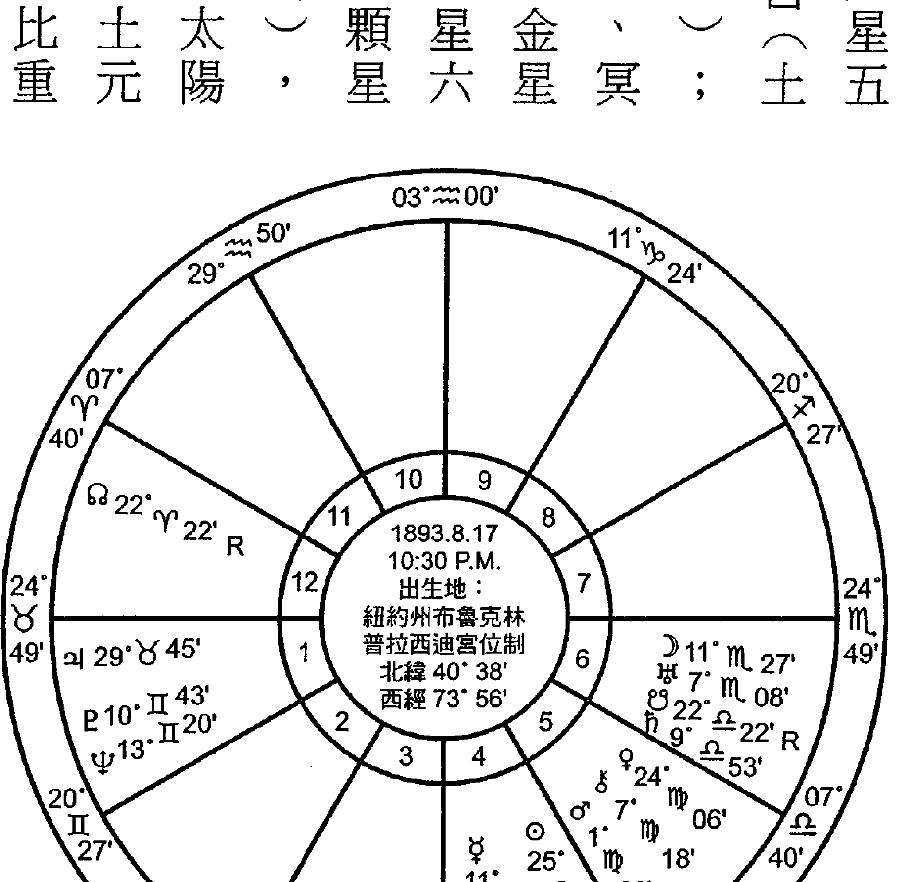

### 图表3-1
梅·蕙丝。出生时间：1893年8月17日下午10:30。出生地：纽约州布鲁克林。普拉西迪宫位制。资料来源：坎普顿史密斯所著之《观星笔记本里的秘密》（New York: Bantam, 1982）p.224。

| Plain | Weighted |
| :--- | :--- |
| √/1st | √/1st |
| C1 F2 A5 L5 | C1 F3 A6 L6 |
| F6 E4 S2 P3 | F9 E5 S3 P4 |
| M4 A3 C3 C0 | M5 A4 C4 C0 |

仔细想想，梅·蕙丝给人的印象不就像个活生生的大地之母吗？她丰满的胸脯、丰腴的体态、撩人的性感和黄色幽默，都女人味十足，而她自己也很乐在其中并引以为傲。

太阳狮子，带给她出众的容貌、金黄色的头发和亮丽的风格，但她的性感气质绝对是很金牛的。上升金牛（也就是一个人格面具），为她的土象能量提供了很好的抒发管道。太阳狮子，让她在演艺事业上如鱼得水，但这股能量其实也可以透过其他方式展现，譬如：务农、当应召女、当音乐家（别忘了她当过歌手）、整天宅在沙发上等。但最终印记的能量会以什么样的方式展现，还要看命盘的其他部分而定，也许会受到强化，但也可能受到削弱、修正或微调。

那如果采加权计分制，也就是把凯龙星和天顶也算在内，太阳月亮各计两分，算出来的最终印记会不会有所改变呢？算算看就知道了。这张命盘的固定星座一分（土星天秤），固定星座九分（天顶水瓶、上升金牛、木星金牛、水星狮子、太阳狮子、火星处女、凯龙处女、金星处女）；火象星座三分（水星狮子、太阳狮子、火星处女），风象星座四分（冥王双子、土星天秤、天顶水瓶、月亮天蝎（两分）），土象星座五分（上升金牛、木星金牛、火星处女、凯龙处女、金星处女）；水象星座三分（天王天蝎、月亮天蝎（两分）），变动星座五分（冥王双子、海王双子、太阳狮子、火星处女、凯龙处女），基本星座一分（土星天秤）。

在宫位方面，角宫六分（木星一宫、冥王一宫、海王一宫、水星四宫、太阳四宫（两分）），续宫三分（火星五宫、凯龙五宫、金星五宫），止宫四分（土星六宫、天王六宫、月亮六宫（两分））；生命宫六分（木星一宫、冥王一宫、海王一宫、火星五宫、凯龙五宫、金星五宫），财产宫四分（土星六宫、天王六宫、月亮六宫（两分）），沟通宫零分（三、七、十一宫都没有星曜落入其中），结束宫三分（水星四宫、太阳四宫（两分））。

在梅·蕙丝这个例子里，不管采用一般计分制还是加权计分制，算出来的最终印记都一样，但并非所有的命盘都是如此，像居礼夫人的命盘（图表3-2）。如果用一般计分制来计算（也就是不看天顶和凯龙），得出结果如下：

### 图表 3-2
居礼夫人。出生时间：1867年11月7日下午1:30分。出生地：波兰华沙。普拉西迪宫位制。资料来源：Lois M. Rodden 所著之《Profiles of Women》(Tempe, AZ: American Federation of Astrologers, 1979) p.226。

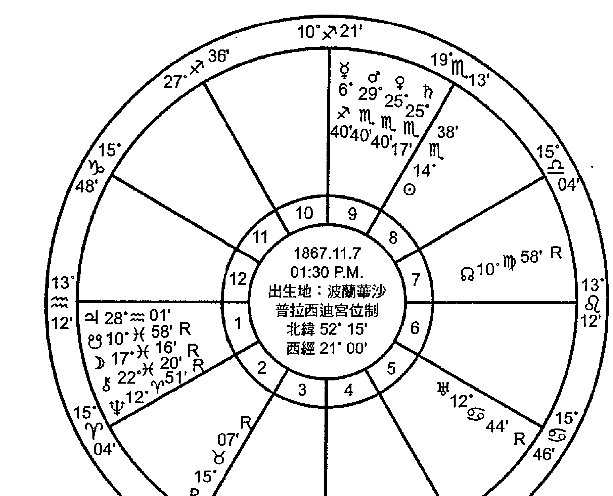

```
Plain:    m/9st
C2 F2 A3 L8
F7 E1 S3 P1
M2 A2 C4 C0

Weighted:  m/1st
C2 F3 A5 L10
F8 E1 S4 P1
M5 A2 C4 C0
```

火星天蝎：

-   基本星座两分（海王牡羊、天王巨蟹）。
-   固定星座七分（上升水瓶、木星水瓶、冥王金牛、太阳天蝎、土星天蝎、金星天蝎、火星天蝎）。
-   变动星座两分（月亮双鱼、水星射手）。
-   火象星座两分（海王牡羊、水星射手）。
-   土象星座一分（冥王金牛）。
-   风象星座两分（上升水瓶、木星水瓶）。
-   水象星座六分（月亮双鱼、天王巨蟹、太阳天蝎、土星天蝎、金星天蝎、火星天蝎）。
-   角宫三分（木星一宫、月亮一宫、海王一宫）。
-   续宫三分（冥王二宫、天王五宫、太阳八宫）。
-   止宫四分（土星九宫、金星九宫、火星九宫、水星九宫）。
-   生命宫八分（木星一宫、月亮一宫、海王一宫、天王五宫、土星九宫、金星九宫、火星九宫、水星九宫）。
-   财产宫一分（冥王二宫）。
-   沟通宫零分。
-   结束宫一分（太阳八宫）。

综合来看，这张盘的固定属性、水元素、止宫和生命宫比重较强，对应到的最终印记是天蝎座九宫。这样的最终印记象征一个人喜欢钻研学问，深入研究抽象事物。这样看来，居礼夫人会发现镭元素和其他化学元素的存在，并担任索邦大学物理系系主任，也就不令人感到意外了。但如果采加权计分制，把天顶和凯龙星也算进去，且日月各加权两分，那结果会不会有所不同呢？

-   基本星座两分（海王牡羊、天王巨蟹）。
-   固定星座八分（上升水瓶、木星水瓶、冥王金牛、太阳天蝎（两分）、土星天蝎、金星天蝎、火星天蝎）。
-   变动星座五分（月亮双鱼（两分）、凯龙双鱼、水星射手、天顶射手）。
-   火象星座三分（海王牡羊、水星射手、天顶射手）。
-   土象星座一分（冥王金牛）。
-   风象星座两分（上升水瓶、木星水瓶）。
-   水象星座九分（月亮双鱼（两分）、凯龙双鱼、天王巨蟹、太阳天蝎（两分）、土星天蝎、金星天蝎、火星天蝎）。
-   角宫五分（木星一宫、月亮一宫（两分）、凯龙一宫、海王一宫）。
-   续宫四分（冥王二宫、天王五宫、太阳八宫（两分））。
-   止宫四分（土星九宫、金星九宫、火星九宫、水星九宫）。
-   生命宫十分（木星一宫、月亮一宫（两分）、凯龙一宫、海王一宫、天王五宫、土星九宫、金星九宫、火星九宫、水星九宫）。
-   财产宫一分（冥王二宫）。
-   沟通宫零分。
-   结束宫两分（太阳八宫（两分））。

如此一来，这张星盘的最终印记就成了：固定、水元素、角宫、生命宫；换言之，就是天蝎座一宫。注意，星座部分的比重并没有改变，但宫位的比重却变了。这种情况并不罕见。我自己在判断最终印记时，会固定使用同一种方法解读所有星盘。我建议你也这么做，挑一个自己喜欢的，然后一以贯之就好了。再来看另一个例子。这是玛丽·贝克·艾迪 (Mary Baker Eddy)，又称艾迪夫人的命盘（见图表 3-3）。先用一般计分法来算算看：

-   基本星座五分（天王摩羯、海王摩羯、土星牡羊、木星牡羊、太阳巨蟹）。
-   固定星座三分（月亮水瓶、金星狮子、水星狮子）。
-   变动星座三分（上升射手、冥王双鱼、火星双子）。
-   火象星座五分（上升射手、土星牡羊、木星牡羊、金星狮子、水星狮子）。
-   土象星座两分（天王摩羯、海王摩羯）。
-   风象星座两分（月亮水瓶、火星双子）。
-   水象星座两分（冥王双鱼、太阳巨蟹）。
-   角宫五分（天王一宫、海王一宫、土星四宫、木星四宫、太阳七宫）。
-   续宫三分（月亮二宫、金星八宫、水星八宫）。
-   止宫两分（冥王三宫、火星六宫）。
-   生命宫两分（天王一宫、海王一宫）。
-   财产宫两分（月亮二宫、火星六宫）。
-   沟通宫两分（冥王三宫、太阳七宫）。
-   结束宫四分（土星四宫、木星四宫、金星八宫、水星八宫）。

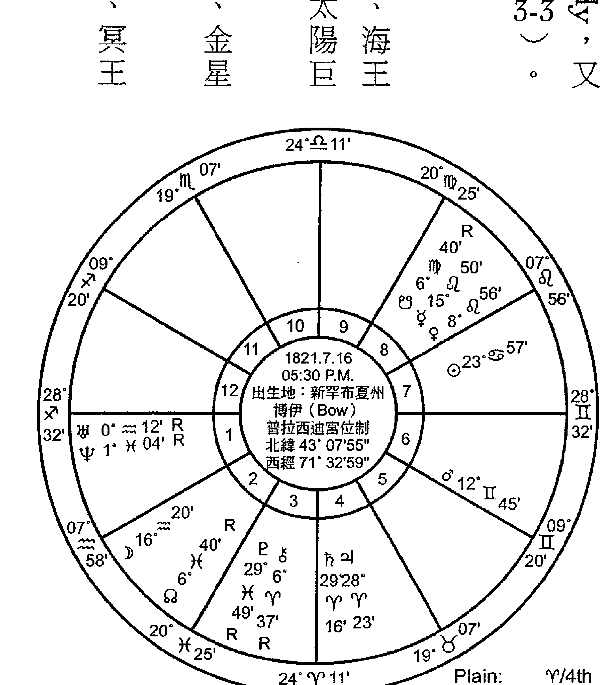

### 图表 3-3
艾迪夫人。出生时间：1821年7月16日下午5:30。出生地：新罕布夏州博伊（Bow）。普拉西迪宫位制。资料来源：Lois M. Rodden 所著之《Profiles of Women》（Tempe, AZ: American Federation of Astrologers, 1979）p.120。

| Plain: ♈/4th | Weighted: ♈/4th/7st |
| :--- | :--- |
| C5 F5 A5 L2 | C8 F6 A6 L2 |
| F3 E2 S3 P2 | F4 E2 S4 P3 |
| M3 A2 C2 C2 | M3 A4 C3 C4 |
| W2 E4 | W3 E4 |

综合来看，这张盘的基本星座、火元素、角宫和结束宫比重较强，所以最终印记是牡羊座四宫。艾迪夫人是基督教科学派（Christian Science）的创始人，而这也刚好符合牡羊座四宫的意义：建立新的传统。但如果采加权计分法，最后得出来的结果可就大不相同啰。

加总来看，这张盘的基本属性、火元素（再一次对应到牡羊座）和角宫的比重较重，但沟通宫和结束宫均得四分。这种情形相当常见，碰到这种情况，我的处理方式有两种。一是我会看看哪个加权后的类别里包括太阳、月亮或上升。如果一宫有，另一宫没有，那我会选用前者。以艾迪夫人的命盘为例，她的沟通宫里有冥王、凯龙和太阳（两分），结束宫有土星、木星、金星和水星。沟通宫有主星太阳，但结束宫没有主星月亮，所以我会用沟通宫来判定这张盘的最终印记：牡羊座七宫。这样说来也没错，对艾迪夫人而言，她的创见的确很需要被听见不是吗？另一种方式是兼看两组星座或宫位，以这个例子而言，是兼看牡羊座四宫和牡羊座七宫，并承认这两组星座和宫位对案主的生命拥有同样大的影响力。有时候，甚至还有三个类别加权得分相同的情况。碰到这种情况，我通常就不标示最终印记了，又或者只强调其中某个类别，例如：只强调固定、风元素、只强调止宫或财产宫等（就看哪个类别的比重特重）。有些命盘，甚至没有特别凸显的星座或宫位（譬如：固定星座与生命宫）。没有最终印记，通常代表当事人的人生发展没什么特别明显的趋向。这种人可能很多才多艺，也可能因为可能性太多反而难以抉择。至于当通才或专才，哪一种比较好？这没有标准答案，得视个别状况而定。没有哪个星座或宫位分量特重，本身既不好也不坏（星盘上的任何徵兆都一樣)，重點在於當事人選擇用什麼方式加以面對。態度，才是決定星象徵兆是吉是凶的關鍵所在。記住，占星學上的每個關鍵字及其內涵，都蘊含了許多可能性，至於最好的表現方式為何，則要看當事人的生活方式、居住國家和社經地位而定。

占星學上一個很著名的星象孿生子 (astro-twin) 的案例。所謂星象孿生子，指的是出生在同一時間、同一城市，因此命盤也長得一模一樣的兩個人。馬克·吐溫 (Mark Twain) 的名作《乞丐王子》(Prince and the Pauper) 就是這樣的例子，儘管這個故事是虛構的，但現實生活中的確有這種情形存在，譬如：英王喬治三世（也就是美國革命抗爭的對象），和某個住在倫敦、地位顯赫的中產階級銀行家，就是對星象孿生子。這兩人儘管社經地位懸殊，但人生的轉折和境遇都極為類似，包括在同一天結婚，同一個月從父親身上繼承了家族事業，子女數一樣，也都在同一個月身亡，也都在各自的圈子裡功成名就，而且地位崇高。類似的例子多不勝數，但我要講的重點是同一張命盤，會如何因為外在處境的差異而展现出不同的樣貌。

再來看最後一個例子：班傑明·富蘭克林 (Ben Franklin) 的命盤 (見圖表 3-4)。

先用一般計分法來計算：

基本星座五分（海王牡羊、上升牡羊、木星巨蟹、金星摩羯、太陽摩羯）。

固定星座四分（土星金牛、天王獅子、冥王獅子、水星水瓶）。
變動星座兩分（火星射手、月亮雙魚）。
火象星座五分（海王牡羊、上升牡羊、天王獅子、冥王獅子、火星射手）。
土象星座三分（土星金牛、金星摩羯、太陽摩羯）。
風象星座一分（水星水瓶）。
水象星座兩分（木星巨蟹、月亮雙魚）。
角宮三分（土星一宮、木星四宮、太陽十宮）。
續宮三分（天王五宮、冥王五宮、水星十一宮）。

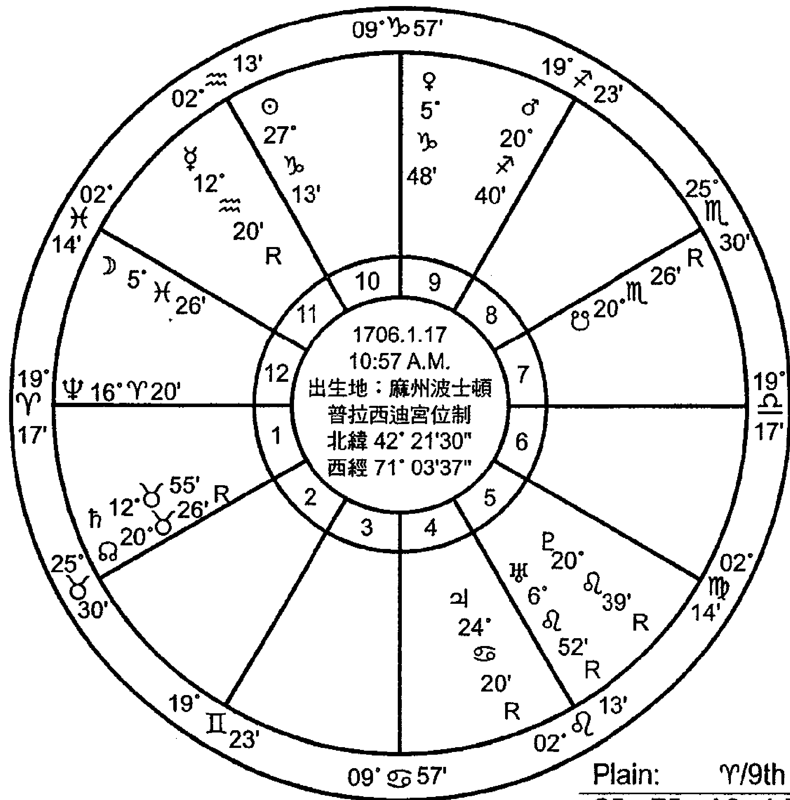

圖表 3-4
班傑明·富蘭克林。出生時間：西元1706年1月17日上午10:57。出生地：麻州波士頓。普拉西迪宮位制。
資料來源：坎普頓史密斯所著之《觀星筆記本裡的秘密》（New York: Bantam, 1982）p.126。

| Plain: | ♈/9th | | | Weighted: | ♈/♉/9th | | |
| --- | --- | --- | --- | --- | --- | --- | --- |
| C5 | F5 | A3 | L5 | C7 | F5 | A4 | L5 |
| F4 | E3 | S4 | P1 | F5 | E5 | S4 | P2 |
| M2 | A1 | C4 | C1 | M3 | A2 | C5 | C2 |
| | W2 | | E3 | | W3 | | E4 |

止宮四分（火星九宮、金星九宮、月亮十二宮、海王十二宮）。
- 生命宮五分（土星一宮、天王五宮、冥王五宮、火星九宮、金星九宮）。
- 財產宮一分（太陽十宮）。
- 溝通宮（水星十一宮）。
- 結束宮三分（木星四宮、月亮十二宮、海王十二宮）。

綜合來看，這張命盤的最終印記應該是牡羊座九宮。但如果採加權計分法，結果又是如何呢？

基本星座七分（海王牡羊、上升牡羊、木星巨蟹、金星摩羯、天頂摩羯、太陽摩羯（兩分））。

固定星座五分（土星金牛、天王獅子、冥王獅子、凱龍水瓶、水星水瓶）。

變動星座三分（火星射手、月亮雙魚（兩分））。

火象星座五分（海王牡羊、上升牡羊、天王獅子、冥王獅子、火星射手）。

土象星座五分（土星金牛、金星摩羯、天頂摩羯、太陽摩羯（兩分））。

風象星座兩分（凱龍水瓶、水星水瓶）。

水象星座三分（木星巨蟹、月亮雙魚（兩分））。
- 角宮四分（土星一宮、木星四宮、太陽十宮（兩分））。
- 續宮四分（天王五宮、冥王五宮、凱龍十一宮、水星十一宮）。
- 止宮五分（火星九宮、金星九宮、月亮十二宮（兩分）、海王十二宮）。
- 生命宮五分（土星一宮、天王五宮、冥王五宮、火星九宮、金星九宮）。
- 財產宮兩分（太陽十宮（兩分））。
- 溝通宮兩分（凱龍十一宮、水星十一宮）。
- 結束宮四分（木星四宮、月亮十二宮（兩分）、海王十二宮）。

如此一來，這張星盤的最終印記就變成了牡羊座兼摩羯座九宮。好錯綜複雜對嗎？ 我們看到，星座的比重從原本的牡羊座獨大變成牡羊和摩羯平分秋色。雖然還可以再設法細分下去，但由於這張盤的太陽在土象星座，上升在火象星座，沒有再加權計算的空間了，因此只好兩個星座兼看。根據歷史紀錄，富蘭克林出版過一本書叫《窮理查的年鑑》（Poor Richard's Almanac），是該類書籍的第一部，而這恰好也符合了占星學的象徵：第九宮掌管出版，牡羊座則象徵新的觀念。富蘭克林的博學多聞，同樣也是九宮強旺的象徵。值得注意的，他的月亮落在雙魚座十二宮，象徵靈異方面的秉賦；據說，富蘭克林在世時也的確接觸過法術。此外，他著名的「圍婦政治」策略，或許跟他的火、金二星都落在第九宮有關；的確，他有很多政治人脈，都是透過有影響力的情婦牽線而認識的。沒辦法，金星和月亮雙魚成六分相，火星和海冥皆成本來三分相，本來就魅力無法擋。有人謠傳，他的私生子總共有一百多個，這樣看來，「美國國父」這個稱號對他來說可真是當之無愧呢！此外，他的科學天賦，或許可以從他的水星（逆行）合凱龍、對分天王、四分相土星中看出端倪。至於他為什麼那麼幸運，做了許多科學實驗都沒有意外喪命，或許可歸功於他的火星吧。火星是他的命主星，

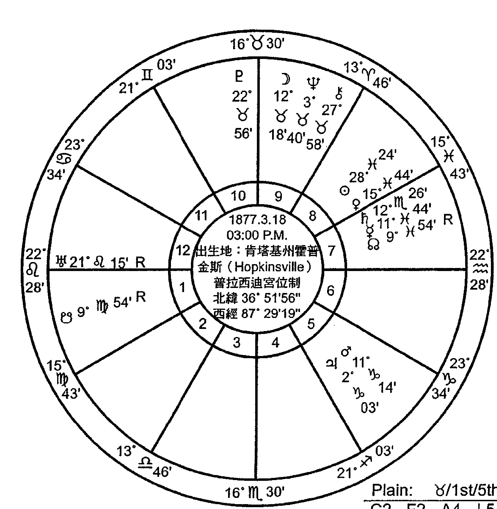

圖表 3-5 愛德加・凱西。出生時間：1877年3月18日下午3:00。出生地：肯塔基州霍普金斯（Hopkinsville）。普拉西迪宮位制。資料來源：坎普頓史密斯所著之《觀星筆記本裡的秘密》（New York: Bantam, 1982）p.123。

| Plain: | ♉/1st/5th | Weighted: | ♉/9th |
| :--- | :--- | :--- | :--- |
| C2 F2 A4 L5 | C3 F3 A4 L7 |
| F5 E5 S4 P1 | F7 E7 S5 P1 |
| M4 A0 C2 C2 | M5 A0 C4 C2 |
| W4 E2 | W5 E3 |

坐落在射手座九宮，而九宮的守護星又擢升於巨蟹座。要不幸運也難！一般而言，最終印記代表整張星盤最強勢的星座與宮位，是星盤的整體「風格」。一個人在別人眼中的樣子，往往會反映在最終印記中，尤其當最終印記迴異於太陽、月亮、上升和命主星的所屬星座和宮位時，更是如此。這可能預示當事人是個迷失的靈魂，找不到適當的管道來表現自我。但要是懂得根據最終印記的星座和宮位進行潛能開發，或許就能碰觸到真正的自我，活出更圓滿的人生。接下來兩張命盤，這裡就不做講解了，而要留給大家練習。其中一是「睡著的預言家」(the Sleeping Prophet）愛德加·凱西（Edgar Cayce）的命盤（圖表 3-5）；教育程度不高的他，成年後以攝影為生。據說，入定時，他有辦法調閱阿卡夏紀錄（Akashic record），為成千上萬人進行前世回溯，連當時一些最卓越的醫療專業人士都無法解決的健康問題，他都能診斷出來並開立處方。相關的紀錄，如今被收藏在位於維吉尼亞海灘（Virginia Beach）的明德研究協會（Association for Research and Enlightenment）。另一張命盤的主人，是美國最偉大的作家之一馬克·吐溫（圖表 3-6），但他的身分不僅止於此。好奇心超強的他（從水星天蠍合上升可以看出），對幾乎任何事物都保持開放的心態。他不但探討過通靈與超自然現象，而且敢說敢言，會透過作品批判迂腐的體制，或經由小說中的角色講出一些在當時那個講究禮儀的社會無法接受的話。

## 圖表 3-6

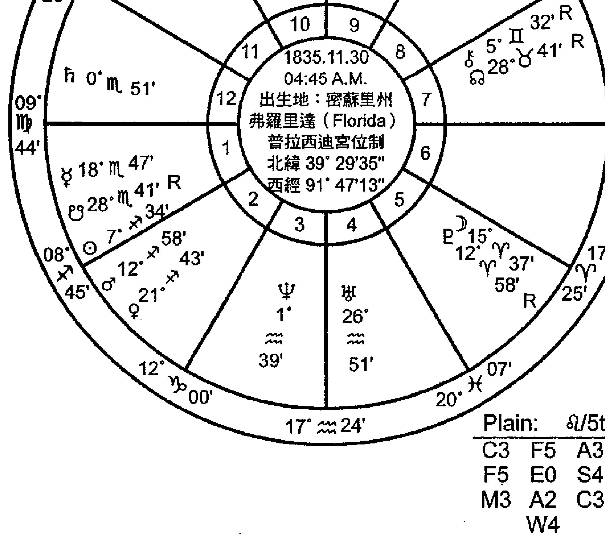

馬克·吐溫。出生時間：1835 年 11 月 30 日凌晨 4:45（地方平均時）。出生地：密蘇里州弗羅里達（Florida）。普拉西迪宮位制。資料來源：Lois M. Rodden 所著之《Astro-Data II》（Tempe, AZ: American Federation of Astrologers, 1980）p.380。

| Plain: ♀/5th | Weighted: ♀/5th/1st |
|--------------|---------------------|
| C3 F5 A3 L5  | C4 F8 A5 L7        |
| F5 E0 S4 P2  | F6 E0 S5 P2        |
| M3 A2 C3 C1  | M5 A3 C3 C2        |
| W4 E2        | W4 E2              |

### 各星座與宮位的定義

#### 牡羊座或第一宮風格的魔法師

這些人喜歡當先鋒、創新、搶第一。擅長能量工作。喜歡展開許多新計畫，但往往虎頭蛇尾，很難貫徹始終。有潛力成為靈性戰士，喜歡行動勝於交際應酬或折衝樽俎。比較喜歡獨力工作，或擔任團體的領導人。做事情很容易就感到無聊，因此工作上很需要人家加油打氣。對他們逢迎拍馬，他們通常就願意為你做任何事，但他們不會也做對自己沒有任何好處的事。這類型的魔法師可能會收藏一些有趣的儀式刀、法劍或其他法器。穿著上，他們喜歡穿戴紅色的衣物，甚至可能喜歡玩火。脾氣來得快也去得快。缺點是缺乏耐心，可能會因為耐不住性子而沒有做好該做的防護措施，甚至主動跳入火坑，讓自己身陷危險之中。但還好，遇到危險時，這些人往往能處變不驚，全身而退，但他們喜歡先做再說，很難三思而後行。這類人還有個優點，就是勇氣十足。但他們喜歡當第一，即使在老派的團體裡，往往也能提出自己的創見或新的方法，而且往往非常有效。

#### 金牛座或第二宮風格的魔法師

這些人是感官主義者，也是大地之母的崇拜者。喜歡音樂和舞蹈，很有耐心，懂得欣賞美麗與和諧的事物。但也因為如此，這些人有懶散的傾向，可能成天閒散度日，但只要有強烈的動機，他們行動起來往往銳不可當。喜愛收藏，手頭上擁有的法器可能不少。飲食對他們來說很重要，所以他們在這方面挑剔得很，光能吃還不夠，還要好吃，而且最好是他們愛吃的東西，尤其是甜食，以滿足他們的大胃口。這類型的魔法師還喜歡花花草草，而且植物不但要美麗，最好還能吃，或用來當作藥草、提煉香水，或提供令人愉悅的感官享受。天生有副綠手指，經由他們的手栽種的植物，往往都能長得蓬勃茂盛。喜歡穩定的他們，個性往往相當傳統，因為傳統能帶給他們安全感。重視倫理道德，會自己訂製一套道德準則，但個性固執的他們，可能會讓這些道德準則變成僵化的教條。喜歡家居生活，待在自己熟悉的環境裡享受物質生活。除非受到強烈的挑釁，否則不太容易動怒，但一旦發起脾氣，往往一發不可收拾，這時的他們就像俗話所說的「闖入陶瓷店裡的公牛」，衝動莽撞，一定要等到氣消了才會恢復緩慢的步調。擅長金錢咒。喜歡享受感官之美，因為這些東西可以讓他們內、外在都感到愉悅。

#### 雙子座或第三宮風格的魔法師

樣樣通樣樣鬆的三腳貓，擅長很多事情，腦袋裡裝有數量龐大的資訊，而且類別不限，各種千奇百怪的事物都有。擅長語言文字，興趣廣泛，而且信奉這個信條：「我只剽竊最好的」。很能夠因應變化，生活中不管是哪個領域，只要潮流變了，他們很快就能跟上。為了學會更多魔法，他們可能會同時加入好幾個團體或同時學習好幾個法門。經常擔任社群裡的溝通橋樑，但也可能是最糟糕的八卦中心。容易發展出心電感應能力。喜歡透過書寫或其他溝通管道與人分享自己的魔法體驗，也喜歡到世界各地旅遊，以感受不同的魔法風格。由於嗜好閱讀，往往擁有令人艷羨的豐富藏書。不喜歡獨處，所以通常安靜坐著，要是雙手被反綁在背後，他們簡直就失去了說話能力。不喜歡獨處，所以通常有好幾個伴侶或共事的團體。而且往往只有他們自己知道所有的聯絡人到底有哪一些。生活中要是沒有電話或書信往來，這些人絕對會無所適從。

#### 巨蟹座或第四宮風格的魔法師

敏感有同理心，能輕易猜中別人心裡在想什麼。有「嘮嘍媽咪」的傾向，看到別人深陷於痛苦或麻煩中，同情心往往油然而生。喜愛烹飪，可煮出一大桌飽含魔法風味的豐盛大餐跟大家分享。尊敬歷史與傳統，有潛力成為社群裡的歷史學家。天生就具備深厚的通靈天賦，擅長占卜與水晶球靈視。喜歡在自己家裡施法，且家中往往收藏有許多法力強大的寶物來提供防護。這些人也許害羞內向，但因為喜歡辦活動，所以也可能成為出色的團體領導人。獨處對他們來說很重要，因為這是他們的充電方式，但是在通靈時又像個變色龍，很容易吸納周遭環境的能量頻率，因此要懂得學習自我防護與抽離，要不然很容易被所處團體的其他成員的心情給影響。在法術上，喜歡為房屋招祥納福，也喜歡收藏東西。會把自己所屬的魔法團體看成自己的家。在生活中，他們往往很擅長某些事物，在其他地方卻像個生活白痴。擁抱與呵護，是他們很需要的東西。

#### 獅子座或第五宮風格的魔法師

愛炫耀，喜歡成為注意力的焦點。對他們來說，成就與能力得到讚許，甚至被封為『巫術女皇』，大概是他們最開心的事。喜歡派對，喜歡玩樂，有藝術天分，喜歡用獨特有創意的方式來展現自我。喜歡小孩，跟小孩也相處得很融洽，但不見得會自己生小孩，因為其實他們自己就是小朋友，只不過是年紀較大的小朋友。在魔法上，他們特別擅長帶有戲劇風格的魔法儀式和儀式圈，也擅長命名和威卡巫術，在桃花咒方面特別有天分。常常是魔法圈裡最愛出風頭的人或丑角型人物，但要是自己的貢獻沒有得到認可，他們可能會感到憤恨不平，而成為麻煩製造者。但也可能慷慨無比，甚至為了維護慷慨的形象而不惜『打腫臉充胖子』。熱愛玩遊戲，魔法對他們而言就是遊戲的一種。自我意志強大。施法時，他們可能會揉合藝術的元素，透過儀式性的繪畫或雕塑來表達自我。為人正直、忠誠，但要是傷了他們的自尊心，他們可能這輩子都不會再相信你了。

#### 處女座或第六宮風格的魔法師

這些人是天生的手工藝家，喜歡手作。也擅長園藝，喜歡種植香草、藥草，和各種有益身心的植物。喜歡製作工具，和其他雜七雜八的東西，不管這些東西賣不賣得出去。生性追求完美，有自我貶抑的傾向，對於自己的作品，他們總是會看到各式各樣的缺點或不完美，不管這些缺點或不完美再怎麼微不足道都一樣。細心到不行，對於細節和數字非常拿手，但也因為如此，他們往往喜歡東管西管。停不下來，要不然你就會成為他下一個要整頓的目標。處女座的挑剔與龜毛，是眾所知的事，面對任何計畫或案子，他們都可以舉出千百個理由告訴你哪裡不可行或不切實際，說他們雞蛋裡挑骨頭一點兒都不為過。

日常魔法是他們的強項，他們喜歡將魔法運用在日常生活中每天都用得到的地方。是天生的薩滿，很容易跟動物親近，甚至有守護靈或指導靈來協助他們。關心健康與飲食，有可能吃素。喜歡淨化儀式，也可能透過斷食來淨化身心或追求靈性開悟。

#### 天秤座或第七宮風格的魔法師

天生的和平使者及外交家。喜歡與人共事，不喜歡單槍匹馬。喜歡締結連理。愛好真理、美，及其他能令人愉悅的抽象事物。重視平衡與和諧，不喜歡衝突。在魔法上擅長破除魔咒。是道道地地的「魔鬼代言人」，辯論時，為了讓各方立場都有機會發聲，即使他們自己並不認同的立場他們也樂意出面，為那些沒有意願或能力為自己發聲的人代言。舉行儀式時，他們會希望男女雙方的代表人數是平衡的。在他們看來，男神與女神是彼此需要的，因此兩者都應當予以尊敬。他們相信人性本善，也有能力成為慈愛或光的本身。他們喜歡音樂與舞蹈，而且最好是協奏或合奏形式的演出。他們也喜歡穿戴美麗的事物，如漂漂亮亮的儀式袍或首飾。對他們而言，一件事一旦做出了決定或承諾，就代表覆水難收，因此優柔寡斷的他們，在做出決定或承諾前往往拖延再三。此外，他們喜歡擁抱人、呵護人，也喜歡被擁抱、被呵護。

#### 天蠍座或第八宮風格的魔法師

喜歡進行深入的探究。對於性、死亡與轉化等議題極感興趣。熱愛探索性愛魔法與譚崔。可能經歷到很強烈或很有趣的啟蒙體驗，而且這些體驗可能非比尋常。儀式用的武器，是這些人會感興趣的東西，而且這方面的收藏品可能還不少。擅長金錢咒與發財咒（不管施咒對象是自己還是別人）。對於「黑暗面」極感興趣，不但肯主動地去擁抱自己的黑暗面，也經常鼓勵別人這麼做。對他們而言，壞蛋比英雄還要有趣，因為壞蛋的性格比較複雜，也更令人好奇。工作上，這些人要不是有合作的夥伴，要不就獨來獨往。具有強大的意志力與勇氣，是那種最有可能召喚出「克蘇魯神」的人，雖然他們即使他們自己並不認同的立場他們也樂意出面，為那些沒有意願或能力為自己發聲的人代言。舉行儀式時，他們會希望男女雙方的代表人數是平衡的。在他們看來，男神與女神是彼此需要的，因此兩者都應當予以尊敬。他們相信人性本善，也有能力成為慈愛或光的本身。他們喜歡音樂與舞蹈，而且最好是協奏或合奏形式的演出。他們也喜歡穿戴美麗的事物，如漂漂亮亮的儀式袍或首飾。對他們而言，一件事一旦做出了決定或承諾，就代表覆水難收，因此優柔寡斷的他們，在做出決定或承諾前往往拖延再三。此外，他們喜歡擁抱人、呵護人，也喜歡被擁抱、被呵護。

#### 射手座或第九宮風格的魔法師

這類魔法師在施法時，喜歡盛大的場面，而且最好把各種道具和法器都派上用場。是天生的哲學家，喜歡從事比較研究或涉獵冷門的學科。擅長預測未來，也很有占卜的天分，解夢之類的工作，他們做起來往往得心應手。通常很有語言天分，施法時喜歡用一點外國語或來自異國文化或異國傳統的語言。有可能成為正式的神職人員。喜愛旅行，也喜歡到世界各地去參加各種節慶，以了解不同的風俗民情。活到老學到老，是這類人的最佳寫照，而且往往學完了某種傳統或法門就再學習另一種傳統或法門，或者同時學習多種傳統或法門。他們可能驕傲自大、目中無人，極端一點甚至可能成為愛教訓人、迂腐八股的傳教士。有靈魂出竅的潛能。對他們而言，魔法，甚至人生，其實都是場冒險。此外，他們多半喜歡武術之類的身體鍛鍊，或其他能同時修練身心的法門。

#### 摩羯座或第十宮風格的魔法師

1 譯注：克蘇魯（Cthulhu）是美國小說家霍華德·洛夫克拉夫特（Howard P. Lovecraft, 1890-1937）所創造的克蘇魯神話中的一個惡靈。

典型的「長老」人格，可能擁有超齡的智慧。擅長組織運作，會仔細注意宗教團體的運作方式，因此是處理世俗事務的最佳人選。對他們來說，成就得到認可很重要，因此可能會為了證明自己有深厚的學問或紮實的訓練而刻意追求學歷。但心智夠成熟的人都知道，對貨真價實的高手而言，經驗與智慧才是「真學歷」。這些人喜歡儀式性的法術，也就是一切都必須照規矩來、每個字都不能念錯、每個步驟都不能出紕漏的那種儀式。有可能成為團體裡的祭司長。獨處對他們而言有療癒作用，因此可能每隔一段時間就必須閉關一下。這些人喜歡山，也喜歡將石頭或水晶運用在法術中。他們相信努力的重要性，認為只要誠懇踏實、一步一步地去做，最後必然會得到豐碩的成果。這些人可能會將法術運用在事業當中，甚至將法術當事業來做。但有可能為達目的而不擇手段，總之是非常結果導向的人；對他們而言，有善意但缺乏實質效用之舉，一點屁用都沒有。他們也可能成為團體裡的「智者」。

#### 水瓶座或第十一宮風格的魔法師

十二星座裡的搗蛋鬼，喜歡擾動現狀、引發改變、製造混亂、顛覆架構、引領革命。腦海裡時常會冒出非凡脫俗的洞見，但往往來得快去得快，所以最好把這些想法給寫下來。這類人很關心社群，但要是一個不小心，他們可能會因為過於關心大我而犧牲掉小我的需求。工作上，他們比較喜歡在團體內和一群人共事，而比較不喜歡一對一的方式，雖然他們偶爾也會自己一個人工作。喜歡新奇、天馬行空式的想法、儀式和技術，可能會運用占星術，而且特別能洞見真相，儘管他們傳達真理的方式可能會讓人覺得不舒服，或不那麼合乎潮流。可能會成為曠野之聲，想法或做法往往領先時代。這些人就算原本很傳統或僵化，但總有一天會擺脫傳統的束縛，變得特立獨行，甚至自成一家。他們喜歡可以被證明的事物，但他們對「證明」的定義，跟科學上的定義往往不一樣。

關於規則，他們喜歡一邊做一邊加以修正。極重視自由，因此會極力反抗任何可能會限制行動自由或表達自由、教條式的傳統。

#### 雙魚座或第十二宮風格的魔法師

這類型的人，結合了其他所有類型的人格特質。他們相信魔法，而信仰正是他們施法能成功的關鍵所在。這些人有可能成為乩身，也可能成為靈媒，要不然就是幾乎具備所有的靈通力。有迷失在魔法裡的傾向，因此要是沒做好預防措施，說不定會遭到附身。可藉由藥物或其他能改變心智狀態的物質來達成不錯的通靈效果，但可以的話，最好還是透過純粹的靜坐冥想或其他改變心智狀態的技巧來進行通靈，而不要仰賴外力。這些人天生就懂得製造與使用精油、香或香水，缺點是不夠腳踏實地或歸於中心，因此施法或通靈時最好有人在一旁護身，好在必要時可以帶領他們的靈魂回家。要是能選擇的話，他們大概會希望完全脫離現實世界，永遠活在魔法的天地裡。有能力寫出美麗動人的詩篇，在舞蹈或歌唱方面往往也有傑出表現。能窺透物質，直達精神層面，也可能發展出「自由穿梭於不同世界之間」的能力，而且是有效的靈通力測定器。

星座和宮位，就像是人生這齣戲的道具和服裝，而星曜則是演員。演員會四處走動，會與別人互動，並突顯他所在的宮位。星座則決定了演員的行事風格。沒有星曜，每個人都會一模一樣。拜星曜及其所在星座及宮位之賜，我們每個人才會如此獨一無二。本命盤，基本上就是一個人出生時從該地看到的太陽系的「瞬間快照」。出生時間要是變了，上升星座的度數及各宮位的所在位置也會跟著改變。但要是時間不變，地點變了，不管地點是往東、往西、往南還是往北移動，本命盤同樣會跟著改變。至於改變的幅度是大是小，則取決於兩個出生地之間的距離遠近。而所謂「出生地」，基本上指的就是一個人出生時的所在城鎮。有了這方面的資料，出生地的經緯度就可以掌握得極為精準，包括幾度、幾分和幾秒，但出生時間通常就沒辦法掌握得這麼精準了（我是指精準到幾秒，而且時鐘的時間顯示還得非常精確才行），這是因為占星界對於「誕生」的定義，看法相當分歧。所謂出生，指的是嬰兒的頭從產道裡冒出那一刻呢（但要是嬰兒的腳或屁股先出來怎麼辦？還是寶寶出生後的第一聲嚎啕大哭？抑或是臍帶剪斷的那一刻？因此要精確衡量出生時辰，基本上辦不到。數學上有一個「有效數字極小化」（fewest significant digits）的概念，意思是說，「進行任何測量，得出來的最好結果往往是最不精確的那一個，不管其他的測量方式有多精確。」總之，只要知道出生城鎮的經緯度，這樣的計算就已經足夠精確了。至於出生時間，我通常是用寶寶出生後開始嚎啕大哭那一刻為準，因為這第一聲哭泣，同時也代表了寶寶的第一口呼吸。命盤雖然是太陽系在一個人出生時的瞬間快照，但天上的星曜並沒有停止移動，而會不斷運行，進而影響我們的日常生活，造成人生的跌宕起伏。理論上，要是把分點歲差和其他為期更長的循環也算在內，那麼不管在地球上還是太陽系的其他角落，任何生命的消長變化都可以從星象上得到解釋。事實上，已經有人開始研究將銀河系沿著銀河系中心旋轉這個因素考量在內，發展出一門叫做「銀河系占星學」的新興學科。可能的話，人類說不定還可以將視野跨出我們的銀河系，把整個宇宙都囊括在內，發展出「宇宙占星學」（universal astrology）。

星曜在命盤上的配置，暗示了整張命盤的能量潛能。星曜與星曜之間，會因為相位、落入的星座和宮位，以及該星座或宮位的守護星而產生交互作用。至於這裡頭所暗示的潛能會如何展現，最終還是要看命主本人如何加以運用。每顆星曜的能量表現，有正面的也有負面的，有些人會從負面的能量表現方式中得到教訓，而改用較正向的方式運用這些能量。有些人則非常有創造力（或根本毫無條理），可以隨機應變，針對不同的情境用不同的方式加以回應，但也有人選擇完全不回應（無論理由為何），這是許多占星師經常在個案身上觀察到的現象。這或許是因為他們還沒有做好準備，不曉得要如何運用這些星曜的能量（尤其是天、海、冥這三顆超個人行星），畢竟這些星曜的頻率太高，他們可能不曉得要如何落實在日常生活當中。沒有展現出來的星曜能量如果屬於個人星曜，那或許是因為這些人在過去已經處理過該星曜的課題了（如果你相信輪迴轉世的話），所以這輩子不需要再做同樣的功課。但還有一種可能性是他這輩子的生命重點在於別處，所以該星曜的能量對他而言是多餘的。

說到這裡，我要附帶一提，流年的運作方式和本命盤的星曜配置十分類似。兩者都會形成某種能量態勢，需透過特定的行為模式加以表達。只不過本命盤的星曜配置是固定的，其象徵主題會存在一輩子。流年的影響力，則比較像是在這些本命盤的基本主題上做變化。流年所象徵的，是外在環境日復一日的變化，它會對本命盤上的能量運作造成影響，譬如：強化或者削弱。總之，占星學就像一張地圖，它可以告訴我們，一個人的基本能量如何運作，會在何時產生什麼變化，而我們又可以如何透過變化所帶來的契機擘畫未來、洞燭機先。一旦能洞燭機先，機會來臨時我們就能善加利用，或降低負面事件的衝擊。此外，了解自己的命盤，也可以讓我們對特定能量有更深刻的了解，進而加以改變，學會用比較舒服、比較沒有壓力的方式來加以表達。

在接下來的討論裡，我談到星曜時，指的可能是本命盤的星曜也可能是流年的星曜。兩者在能量的表現上，理論上是一致的。唯一的差別只在於本命盤的能量配置型態始終存在，流年星曜的影響力則是暫時性的。換句話說，流年的影響是針對本命盤的能量表現方式進行調整或修改，而且只維持一段時間而已。有一派占星家認為，當流年星曜和本命盤的星曜成相時，除非這兩顆星在本命盤原本就已經有相位關係存在，否則該流年星曜不會對本命盤產生影響。例如：流年火星與本命金星成對分相，根據這派看法，除非本命金星和本命火星有相位關係存在，或落在火星掌管的星座或宮位，或落在一宮或八宮（火星掌管的先天宮位），否則這個流年的對分相不會產生任何影響。但我也並不認同這個看法。的確，由於本命盤的金、火二星沒有任何相位關係，所以當事人可能沒有機會發展出處理金、火能量的因應機制，因此當這兩顆星因為流年而產生對分相時，當事人可能會覺得不知所措。

由於缺乏天生的因應機制，這個流年相位可能會讓當事人覺得很「負面」，但事實不見得一定如此。只要當事人能意識到自己本命盤上的金星和火星，知道它們如何運作，或許就能想出辦法結合這兩股能量，只不過這方面的努力必須要更有意識就是了。

這聽起來好像在自我安慰，但的確有效。而且這正是自由意志在占星學中仍有發揮空間的原因所在。一個人可以糊糊塗塗地過日子，就算沒有特別去注意流年什麼的，生命的得失與起伏照樣會發生。而且就算有特別注意流年，也並不保證生命中不會發生什麼令我們措手不及的事情。關於生命，沒有什麼是可以得到保證的。占星學或許萬無一失，但占星師就不是了。要是有人宣稱自己的占星功力百分之百準確，那他絕對在扯謊。

天上的行星不斷地運行，當它們和本命盤上的星曜產生相位關係時，人生就會出現改變，至於會經歷到什麼樣的改變或能量變化，則要視行星的本質、相位的類型、坐落的星座和宮位，以及星曜和星座間的守護關係而定。這就是所謂占星預測。藉由辨識哪個流年星曜會與本命盤上的星曜產生相位關係（以及是何種相位關係），再將所有相關的星曜、相位、星座和宮位的意義相結合，占星師就可以大概預測出當事人會以什麼樣的方式回應流年事件所象徵的能量表現。

這當中有難有易，譬如：要看出哪顆流年星曜會與命盤星曜產生相位關係很簡單，要看出其中牽涉到哪些宮位與星座也不難，但要統合不同的能量並做出有意義的詮釋就困難許多，而要精準地預言個案會以什麼樣的方式回應更是難上加難。有些占星師因此拒絕進行占星預測，有個派別甚至認為進行預測是不道德的，因為這樣做會引導個案選擇某種行動或行為模式，因此等於在操控別人的生命。

當然時代已經改變，現在的占星師在看到火、天成四分相時，多半不會再鐵口直斷地說這暗示當事人會遭逢意外而受傷。自由意志的概念，讓人有權選擇自己要用什麼方式來表現某星象所暗示的能量，但要是當事人拒絕選擇甚至矢口否認，那他的確有可能遭遇意外而受傷，但這一點沒有人可以百分之百保證。但一般來說，預測精準的占星師通常具備三項特質（除了深諳占星學以外）：

1.  通達世事，了解人性；
2.  對個案有充分的了解，知道他以往對特定狀況會做何反應；
3.  直覺（或感應力）

如今，除非占星師有事先說明會憑直覺來做預測，否則個案可能會對占星師的預測能力有所質疑。其實實務上，這三項特質在進行占星預測時都經常會用到，而且比例相當。畢竟每顆星曜、每個星座和每個宮位，都有許多可能的象徵意義，而且多到連占星師自己都可能感到無所適從，不曉得該從何下手。占星師不管做出什麼預測，一定都可以在命盤上找出合理的線索來佐證，只是為何會在眾多的可能性當中挑中這一個而不是那一個，最終通常還是直覺在決定的。理論上，直覺式的預測好像要靠「乍現的靈光」，但占星師通常還是可以為他的預測找到合理的依據。這不是說，占星師在預測時可以胡扯一通，硬要把黑的說成白的（雖然有時看起來好像如此），但不可否認，每一種星曜、星座或宮位配置都有太多種可能的表現方式了，所以占星預測才會如此困難。我自己在進行占星預測時是這麼做的：我會讓個案知道，當下是針對他命盤上的哪些能量進行探討，然後先就這些能量進行一般性的、中性的描述（既不特別正面也不特別負面，僅就其純粹的表現方式進行描述），接著再針對這些能量表現方式指出幾種可能性，其中有正面的、有負面的，也有荒謬的（我自己是特別喜歡荒謬的，因為適當的幽默感可以讓我們改變看事情的角度）。在我看來，本命盤的行星配置與流年，其實是一種能量的累積，就像用腳摩擦地毯一樣。一直要等到特定的星曜被引動了，點燃了火花，能量才會真正展現出來。然而在火花爆發開以前，能量其實就已經存在了，只不過延宕得越久、摩擦得越久，最後爆發出來的火花就會越大。你可以累積充分的能量、久久地才爆發一次大火花，也可以經常性地點燃一些小火花。至於要怎麼做，選擇權還是在你自己手上。如果你是個魔法師，想體驗一下命盤上的星曜配置和流年星曜各對應到什麼能量，不妨這麼做：排個魔法陣，直接去體驗看看！你可以召喚各星曜所代表的神祇，與祂們對話，承認祂們的力量以及祂們對你生命的影響，問祂們希望你用什麼方式加以回應。祂們的建議，你不一定照單全收，但至少可以為你提供另一種觀點。本書的第五卷，就介紹了一套這樣的占星魔法陣；這個魔法陣是我自己發明的，我會在快要出現威力特強的日月蝕之前使用它，而且我發現，光是針對星曜及其原型進行冥想，就可以獲得洞見。使用塔羅牌的大牌（每張大牌都有其相對應的星座與星曜），也是種聚焦的方式。總之，盡情發揮創意，好好地玩一玩（還記得我前面也這麼說過嗎），想什麼就去做吧，而這正是占星學的精神所在。希望你在讀完這個章節後，對於自己想做什麼或可以做什麼，可以激盪出一些新的靈感。要成長，就必須有所改變。為自己的生命騰出空間，多嘗試點新事物吧！

### 解析行星

本書不想用寫食譜的方式條列出各種靈通力的占星象徵，而會簡單介紹各行星的定義和關鍵字，並說明每一顆行星在魔法上如何發揮作用。我鼓勵你仔細去研究自己的本命盤，看看有哪些行星落在第四、六、八或十二宮，這些行星之間又如何互動（其互動關係可能是輕鬆自在的，也可能是緊張有壓力的，或和諧融洽的）。其次，你可以再檢視命盤上第一、四、六、八、十二宮的宮主星狀態，以及這些宮的先天宮主星——也就是火、月、水、冥、海。因為這些星都跟魔法有關。學占星，我建議用玩遊戲的心態。譬如：你可以找個日子「扮演」一下火星，用各種你想得到的方式將火星的特質展現出來。這種體驗式的占星教學，會透過角色扮演讓學生去體驗每個行星和相位所代表的能量及表現方式。總之，只要你感覺對了，什麼方法都可以試試看。上升星座，象徵一個人以什麼樣的方式將自己的能量投射出去，或習慣戴上什麼樣的人格面具。要是有行星落在上升星座（也就是第一宮），上升星座的表現方式就會受到該行星的影響，而且距離上升點越近，影響力越大。落在十二宮的行星，如果距離上升點不到七、八度，也會對上升星座造成影響。如果你的命盤有行星落在此處，在解讀星盤時務必將這些行星也考量進去，但是要記得，相較於一宮的行星，十二宮的行星對上升星座的影響力比較屬於潛意識層面。儘管它（或它們）可能會影響別人看待你的方式，但是你自己卻可能沒意識到。如果你對這一點有所懷疑，不妨問問身旁的幾個知心好友，看他們是怎麼看待你的，答案可能會讓你跌破眼鏡。

命主星（Chart Ruler）也很重要。所謂命主星，指的是上升點所在星座的守護星。看看這顆星的狀態和它的運作模式，落在什麼星座、宮位，把它們象徵的能量結合，再設法找出恰當的方式讓命盤上的靈通力能以最輕鬆自在的方式展現出來。上升星座如果落在水瓶、雙魚或天蠍，解讀時請把古典守護星也考量在內，看古典守護星和現代守護星（包括其所在星座和宮位）的能量如何能巧妙地相結合。如果可以，也不妨看看上升星座的密義守護星落在什麼星座和宮位，或許能從中發現另類但也更具靈性的表現途徑也說不定。

這樣看來，學占星是需要花很多心力解盤、思考，並透過行動將行星所代表的能量表現出來的。沒關係，先一顆星一顆星慢慢來，之後再試著將兩顆星或更多星的能量相結合。這是一輩子的功課。處理和表達自己的命盤，是一輩子都要做的事。你當初會選擇在某時某地誕生在這個世界上，一定是有原因的。透過藏在命盤裡的線索，你可以把握最好的時機去做你應該做的事。當你體認到這一點並且也嫻熟了某種表現方式後，老天爺會交給你新的功課去處理、去思索。隨著能力和洞見不斷增長及成熟，老天爺交付給你的任務也會更複雜、更辛苦。然而當你又掌握了另一種新的表達方式後，隨著能力的精進，老天爺會再交付給你更艱難的任務，如此週而復始，不斷地持續下去，直到你斷氣為止。這時候，你總算可以安息了，這就是人生。

# 第三卷 魔法與本命盤

### 太陽

太陽代表意志（包括想要的意志、想知道的意志、想做什麼的意志，甚至想沉默的意志），也代表生命力，它是太陽系的中心，也是命盤上最個人化的星曜。太陽在本命盤上的所在星座和宮位，代表一個人會在哪方面「發光發熱」。講得更詳細一點則是太陽的所在宮位，表示你會在哪個場域展露光芒，太陽的所在星座則表示你會以什麼樣的風格去完成該宮位所象徵的事物。知道自己可以在哪些領域發光發熱嗎（換句話說，就是做哪些事會讓你覺得更能實現自我）？不妨把前面介紹過的星座及宮位關鍵字加以排列組合，從中尋找線索。這不代表你非得轉換職涯跑道或改變生活方式不可，但也許代表你可以培養什麼新的興趣、嗜好或休閒。太陽反映人格的基調，而命盤上的其他行星則會在這個基調上進行調整或者著色。太陽和整張命盤的關係，會反映出一個人是不是很容易「做自己」或很難「做自己」。從太陽的所在星座、宮位，及太陽與其他行星間的相位，可以看出一個人的意志是強是弱。

太陽強旺者（強旺與否要看太陽的所在星座、宮位、與其他行星是否有許多緊密的重要相位而定），通常象徵一個人意志強烈、自我認同鮮明。太陽有緊張相位（challenging aspect）者，譬如：四分相、對分相，或者與火、土、天、冥、凱等凶星合相，則預示此人的一生經常在挑戰自我。有困難相位，代表一個人必須為了自己的主體性和自我表達而奮鬥，所以會培養出強烈的意志；而三分相、六分相，或與其他星曜合相，則代表一個人有某方面的特殊技能或天賦來協助他發展自我意志。但如果沒有任何相位（這種狀況極為罕見），則代表一個人在自我意志的表達上可能有障礙，因為太陽和命盤上的其他部位沒有任何連結，所以能量找不到出口。但如果與其他行星互容，這個互容關係可就意義重大了，因為它可以協助這個無相位太陽找到能量的出口。太陽，是整張星盤最主要的陽性星曜，它象徵一個人會在哪方面展現自主性，甚至功成名就。近年來，其重要性更因為媒體的渲染而凌駕於其他占星元素之上。當有人問「你是什麼星座」時，他問的可不是月亮星座、上升星座或土星座，而是太陽星座。太陽星座不僅界定了一個人的基本性格，也跟我們所處的社會有關，畢竟人類社會重視的多半是陽性事物，譬如有主見、意志力、自我認同、自我表達、主體性、獨立自主等。然而陽性事物固然重要，其重要性卻不該超越陰性事物，而是同等重要。此外，太陽也代表男神之首、天界的領袖、世界的光源、諸女神（如月亮）的夫君等。一年四季，也是太陽在決定的。

### 月亮

月亮象徵記憶、潛意識、情緒、習氣、本能和靈魂。相較於太陽星座和宮位反映出一個人會在哪方面發光發熱，月亮星座和宮位則告訴我們，一個人要怎麼樣才會感到快樂。一如前面所述，這不代表你非得改變生活方式或轉換職涯跑道不可，但你可以用星座和宮位的關鍵字來腦力激盪一下，看能否從中發現什麼抒發能量的管道。如果能在生活中多培養一項與月亮星座或月亮宮位相關的嗜好或興趣，你應該會過得更快樂、更滿足。

月亮也是靈通力的主要象徵。透過月亮的所在星座、宮位、月亮和其他行星的相位關係，就可以大略得知一個人具有哪方面的靈通天賦。只要月亮和魔法宮位（即四、六、八、十二宮）有所連結，不管這個連結是透過月亮的所在位置、守護關係（即巨蟹座落在這幾個宮位），或月亮和這些宮的宮內星或守護星的相位關係，都象徵著通靈或法術潛能。至於這份潛能會如何展現，則要看星座、宮位和牽涉到的行星而定。此外，整個大環境如何看待靈異之事，對此也有重大影響。大環境如果對靈異現象抱持鄙夷的態度，這份能力可能會遭到壓抑或埋沒。由於現代社會相當歧視這類稟賦，所以有能力者可能沒機會去探索或開發自己的潛能。還好我們可以透過月亮的所在星座、宮位和相位的象徵意義去試著接觸自己的潛意識，探索自己的情緒、通靈能力和陰性能量。月亮星座的重要性不下於太陽星座，其中太陽星座象徵魔法和通靈工作本身，月亮星座則象徵通靈人的施法風格。月亮如果有困難相位、對分相、四分相，或與能量強烈騷動的行星（如日、火、木、土、天、海、冥、凱）合相，代表一個人的魔法生活可能非常忙碌或混亂，也象徵一個人在魔法生活上可能遭遇困難或陷阱（至於困難或陷阱為何，則視行星的本質而定），儘管如此，要是能勇敢面對这其中所象徵的挑戰，魔法師的功力就會變得更高強，經驗豐富，也能用更有智慧的態度去從事魔法工作（希望如此）。但如果月亮有柔順相位，## 上升

则暗示当事人可能拥有某种不需要刻意培养就具备的天赋，与月亮成相的行星，则象征潜在的贵人或盟友。此外，月亮还象征女神（而且意义涵盖各个层面），尤其是天后、夜后，及透过月相展现的三位一体女神（Triple Goddess）。其实金星也代表女神，只不过形象不同。一个人会如何服侍他心目中的女神，可以从命盘上的月亮看出端倪。月亮也象征祭坛，也就是法师自己布置的施法基地。一个人如何施法，在很多方面都反映出他命盘上月亮的状态。一个人在施法时表现出来的样子，如果跟他平时展现在外人面前的形象很不一样，那我们几乎可以确定，这个人的月亮星座和太阳星座一定性质迥异。月亮强旺者，通常很有同理心。通灵与水晶球占卜（scrying），都属于月亮掌管的技艺。月亮也代表小孩和怀孕生子，所以也掌管生殖力（金星在这方面也有一定的重要性）。月亮还象征助产、接生及相关技能、月经，以及女性的奥秘（Women's Mystery）。此外，潮起潮落、情绪、心情、天气和气候日复一日的变化，也是月亮在掌管的。

上升点并非星曜，而是个经由特定公式计算出来的点。尽管如此，上升星座对于确认通灵能力、了解自我，具有极大的重要性。太阳代表自我，月亮象征灵魂，上升星座则是我们的“人格面具”，是我们呈现给外界看的“公开形象”，是我们在日常社交中展现的样貌。不晓得你有没有过这样的经验？你在某派对或其他场合上认识了某个人，对他有些印象，后来，在因缘际会之下，你和此人有了更长时间也更深入的接触，结果你发现，这个人怎么跟我原本想像的差异那么大？碰到这种情况时，很有可能，这个人的太阳和上升是落在风格大不相同的星座。你在派对上看到的那个他，是他的人格面具，也就是上升星座。后来当你对他认识更深，对方就比较可能卸下面具，让自己的太阳毫无遮掩地显露出来。但这通常需要一点时间。有些人可能很担心被发现自己“表里不一”，于是就小心翼翼地进行自我防卫，不让任何人看穿自己的人格面具。他们以为自己的底细别人知道得越多，就有越多把柄落在别人手中。这样的人，心中通常怀有恐惧，譬如：害怕失控，尽管别人根本不在乎，他自己却耿耿于怀。一个人是用什么样的运作模式活着，从太阳、月亮和上升星座就能略知一二。当然其他行星也很重要，只不过透过太阳、月亮和上升星座，就可以对一个人的性格掌握三到五成。此外，如果有行星落在距离上升点八度以内，这颗星（或多颗星）也会对人格面具造成影响。就法力或灵通力而言，在上升点附近的行星如果属于我所谓的魔法星（即月、水、天、海、冥、凯），会加强此人在这方面的潜能。此外，就算没有合相，但是有行星与上升点形成其他相位，这些行星也会对命主的人格面具产生强化或削弱等作用，只是影响力较小罢了。此外，上升点落入的星座，本身也具备一定的的重要性，尤其如果该星座是属于我所谓的魔法星座（即巨蟹、处女、天蝎、双鱼四个星座）的话，更暗示当事人可能具备某种程度的法术或通灵天赋。即使上升不在这些星座，但该星座的守护星（也就是命主星）落在特定星座或宫位时，也可能暗示当事人有这方面的天赋或潜能。

### 水星 ☿

水星是巫师之神梅格斯（Magus）。其属性非阴非阳，而是纯中性的。水星落在什么星座，和哪些行星成相，其能量表现方式就会随着这些星座和行星的特质而改变。水星在本质上是双性的（甚至是多性的）。它就像变色龙，会调整自己去适应外在环境。水星掌管智力与心智，也掌管说话及各类形式的沟通。一个人手灵不灵巧、机不机智、听不聪明，身体灵不灵活，都跟水星有关。如果说太阳是意志，那么水星就是知识。此外，水星也掌管工具和达成目标所采用的手段。从水星的状态可以看出，施法者透过法术表达自我时，会使用什么样的工具、道具或语言文字（如果有的话）。此外它也反映出一个人喜欢读什么书、写什么书。相位良好的水星，施法通常很容易成功，即使灵通力不怎么敏锐，但只要遵照指令，按部就班地去做，通常不会失败。水月成相，则代表有心电感应潜能。

但水星也象征江湖郎中和小偷。水星有压力相位者（尤其和海王星成压力相位），代表当事人有自欺倾向，不愿面对现实，容易受骗上当。但要是能克服这些负面的能量表现方式，就能加以升华，变得有能力轻易触及异次元的能量。但这些人一定要脚踏实地，才能在每一次探险后都安全地回到这个“现实世界”来。

水冥成相者，脑袋通常犀利无比，凡事都要追根究底，渴望发现生命的奥秘，但也可能极端固执。水天成相者，有当占星师的潜能，这些人的脑袋与众不同，会无来由地冒出一些很天马行空的想法或奇特的灵感；他们的思考是非线性的，不会乖乖地从A到B到C这样推论下去，而会直接从A跳到Z。水凯成相者，有可能成为老师或师父，但也可能特立独行，不按牌理出牌。此外他们也可能天生就具备疗愈能力，尤其是徒手治疗。水星也象征纸牌和学习塔罗牌的潜能。手相学也跟水星有关，因为水星掌管手。本命盘水星强旺者，通常好奇心旺盛，能用赞叹的心情看待周遭世界。他们的脑袋总是动个不停，可以一心多用。但相对也有潜在的缺点，就是过度理性，或习惯把事情过度合理化。机智与伶牙俐齿则是他们的强项。由于水星是众行星里运行速度最快的，所以有令事物加速的倾向；此外，它跟太阳的关系可说是形影不离，时而在前，时而在后，但总之不会相隔太远。水星的所在星座和宫位，反映出一个人对哪些事物最好奇。当流年水星逆行时，命盘中水星强旺之人，往往会受到强烈的影响，彷佛车子忽然换档似的。

要是本命盘的水星逆行，代表一个人既可以顺向思考，也可以逆向思考，而且这两种思考方式可以同时进行。水星逆行者，数学能力往往特别优异。但这些人可能要花上好几年的时间才能真正体认到自己在这些方面的特质。此外，水星逆行者可能有沟通障碍，对于不感兴趣的科目通常连理都懒得理，所以教养这类小孩可能会有点棘手。

当本命盘的太阳、月亮、上升或水星和外行星（即天、海、冥三颗星及凯龙星）成相时，代表此人具备与天地沟通、触及集体潜意识、探索原型、甚至成为神的通道的潜能。至于这些能力会以什么样的方式展现，则要看成相的行星而定，譬如：这些星落在什么星座、什么宫位，相位的本质如何，但无论如何，有相位总比没相位要来得好。不过由于这类能力在现代社会并没有得到适度的理解，具备这类能力者反而还可能被贴上怪胎、共依附（co-dependent），甚至精神失常（这是最极端的状况）等标籤，因为这些人可能会表现出某些一般人认为不正常甚至“走火入魔”的行为，而被认为可能危害社会。学会承认甚至尊重这类非凡的能力，可以让当事人更能接纳自己、尊重自己。

这样的人或许看似“不正常”，但绝非精神错乱。酗酒、药物滥用、共依附行为和某些精神疾病，也许只是这类能力遭压抑的表徵而已，事情的真相也许是：这些人有能力接收来自天地或灵界的讯息，但由于害怕或不晓得要如何因应，所以才开始酗酒、嗑药，因为菸草或某些药物会让感官变得迟钝，可以帮他们把这些“莫名其妙的声音”暂时关闭或阻挡在外。当然我不是说所有酗酒、药物滥用或精神疾病的案例，都是因为灵通力遭压抑所致。只不过在这个“听到奇怪声音”的人（不管这个讯息的用意多么有益或良善），社会，一个有能力接收天地或灵界讯息的人（不管这个讯息的用意多么有益或良善），自然很可能因为这个社会的异样眼光而受伤。

还好，有个方法可以带给这些人很大的安慰，那就是让他们知道，他们并不孤单，外面还有不少人跟他们一样，有过这类非比寻常的体验，只要找到妥善的因应之道，就能过著正常或近乎正常的生活，而不会被看成“疯子”。因此学会控制与善用这类经验和能力，对这些人非常重要，因为这样做可以帮助他们摆脱过往的恐惧与疏离感，发现自己是有用的、有使命要完成的。

### 金星 ♀

另一颗女神之星是维纳斯，也就是金星。它象征阴性或女性的能量。尽管金星本身并不特别带有通灵意味，但要是跟任何带有通灵性质的行星成相，或坐在与魔法相关的星座或宫位，此人的法师形象就会多点亮丽或女性化的气质与魅力。金星喜欢美好的、漂亮的、温文尔雅的、和谐融洽的事物。也喜欢财产和财富，因此命盘中带有金星相位的法师，手中应该会有几件华美的宝贝，祭坛装饰得美美的，或拥有价值不斐的仪式刀等施法道具。金星也喜欢园艺，因此可能会有个漂亮的花园，里头种有香草、蔬菜，或灿烂夺目的花，用来妆点居家环境或提炼芳香的精油。

金星也代表爱神，因此爱、爱情、魅力和伴侣关系都是金星的展现。不管是对家人的爱、柏拉图式的爱、感官之爱、性爱、单恋、对社会的爱，甚至对天地宇宙之爱，都在金星的管辖范围内，甚至连恨，也就是受扭曲的爱，也属于金星所管辖（至于一个人如何表现他的恨，则要看他的火星而定）。

金星是很感官的，因此按摩或各类形式的抚触，也都归金星掌管。性爱，是金星能量与火星能量的结合，其中金星代表魅力与肉欲，火星则象征性行为本身。谭崔，就是一种结合金星与火星能量的修行法门，因为感官的享受与碰触，跟实际的性行为本身一样重要；但修练谭崔也需要土星的参与，因为土星象征控制与节制，而谭崔修法本来就要求修练者必须控制自己的性高潮，将其延后，好将性能量导向特定之处。金星所象征的维纳斯，是个魅力十足、生育力强的女性，她懂得享受身体感官所带来的快感，也很乐意将这份愉悦与他人分享。金星既象征处女（初意识到自己的性需求与身体变化、并开始学习取悦自己与取悦他人的女性），也象征母亲（对性需求和生育力已经有充分的认识，熟稔相关技巧，并将这些技巧分享或传授下去），此外也象征怀孕中的妇女（月亮也有此象征意义），浑圆的身体里怀有生机勃发的新生命与生之奥秘。金星也象征古希腊艺妓（Hetaera），她们是性技巧高超的妓女，有独立生活的能力，将自己的一生奉献于表达身体的愉悦，并将相关技巧分享和传递出去。至于老媪，由于美貌不再，也丧失了生育力，恐怕不在金星的象征范围内。

### 火星 ♂

火星是太阳之外另一颗主要的阳性行星，代表能量、行动、自我。相对于水星象征感知与智力，火星则代表“我”、“我是”。对火星而言，我，永远摆在第一位，它只在乎我要什么，所以是很自我中心的，是极度的自我。这听起来很自私没错，但没办法，火星的主要作用就是求生存。虽然求生存是需要明辨与慎思的，因为活下去可能需要别人帮忙，克制住当下的冲动，未来反而更有机会活下去，但明辨与慎思并非火星的强项。火星本身并不特别带有灵性意味，但可以为行动提供动力、能量与冲劲。太阳代表意志，水星代表知识，火星则象征行动。当火星的能量受阻时，它就会受到扭曲或压抑，最后以愤怒的形式展现出来。愤怒本身并非坏事，当愤怒得到适度的控制与纾解时，反而可以刺激一个人展开伟大的行动。但控制与谨慎，并非火星的长处，因此需要其他行星来帮忙，比方说，土星就是个好帮手。

火星象征冲突、战争、敌对。命盘中的火星如果没有任何相位，通常会是个棘手的问题。因为无相位火星代表一个人缺乏行动力，不知道如何激励自己，让事情动起来，生气时也找不到发泄的管道。受克的火星，可能会表现为挫折感。当我们生气或郁卒时，动，因此主动去做点什么，通常会让心情舒坦许多，就是这个缘故。火星代表具体的行动，因此能消解愤怒或挫折感。

此外，由于火星是天蝎座的共同守护星，而天蝎座又对应于八宫，因此和法术或通灵力还是有间接的关连的。更何况，所谓法术，说到底就是透过控制良好的观想进行能量的操控，所以火星和法术并非完全无关，因为火星代表能量，而其他行星则可以为法术的施行提供控制良好的观想。当火星和灵性行星有相位关系存在时，代表施法者可能具备强大的勇气，天不怕地不怕，但也可能代表个性冲动，喜欢做了再说，而未在事前做好万全的准备或调查，甚至忘记做好充分的防护措施。三思而后行，对火星而言简直是不可能的任务。火星也暗示一个人可能成为“能量工作者”或“蹈火者”（fire walker）。颅相学（phrenology）也是火星所掌管的。从火星坐落的星座和宫位可以看出，一个人在哪方面拥有丰沛的能量，喜欢将能量用在哪些地方，哪些事情最容易让他动怒，及习惯用什么方式来表达愤怒。火星也象征性行为，而且是与爱或感官愉悦无关的性交。火星是阳具之神，即那股象征生殖与繁衍的原始驱力。火星也是战神，更广义来说则是行动与能量之神。

### 木星

木星这颗主吉星，象征扩张与增长，同时也跟哲学和深刻的思考有关。相比之下，水星指的是思想或念头本身，和心智的运作方式，木星则象征心智的内涵。木星也象征宗教及神职人员，法律、法庭和法官。坎普顿说，木星是“仁慈的胖子”（mercurial fatso），形容得真是贴切，因为简单几个字就将木星的意义几乎全部涵盖了进去。一般认为木星的本质是男性或阳性的，却不像太阳或火星一样专指男性。木星或许和男性的奥秘有关，但同样的说法也可以用在太阳和火星身上。因此倒不如说，木星掌管了男性奥秘的哲学与研究。任何的星座、宫位或行星，只要被木星扫过或与之成相，都会因为木星的影响而扩张或增加。这一点，在财富方面自然是吉兆，但是对腰围而言就不是什么好消息了。当流年木星经过上升星座时，体重可能会增加。此外，木星还带有浮夸的特质和自我优越感，喜欢豪华阔绰，什么东西都要用最高级的，因此有奢侈浪费的倾向，但也可能乐善好施。传统上，木星也象征医生和制度化医疗。由于是双鱼座的共同守护星之一，木星多少也带点魔法性质。木星喜欢盛大的仪式、隆重的典礼、教会组织的阶层体系和地位。当它和魔法星成相时，会放大这颗星的表现力，只不过影响力吉凶未定。木星天性乐观，容易信赖别人。命盘上木星强旺的魔法师，在学习上往往能钻研得很深入，而且满腹经纶；再不然就是阅读和学习了很多关于法术的书，对于法术的概念和哲学也有相当程度的认识，却不见得会进行实际操作。木星喜欢学习，而且是为了学习而学习，但不见得会把学到的东西实际加以运用。信仰、信任、希望和慈善事业，也都属于木星管辖的范围。木星也象征创造之神，想研究什么都可以钻研到精通的程度，也是物质财富的施予者，而且慷慨大方。但由于木星掌管的是制度化宗教，因此在异教徒圈子里可能无法充分发挥。总之，木星代表宗教、信仰、恩典，但真正象征灵性的却是海王星。因此木星在宗教方面的表现，比较接近现代基督徒在宗教上的追寻，而不是异教徒的那种灵性追求。许多传教士的命盘，木星的力度都相当强旺。此外木星也掌管语言、异国文化及异国旅行。就灵性意义而言，木星强旺象征一个人可能具备解读神秘符号、易经占卜、灵魂出窍、解梦、建立起属于自己的传统（但需要土星来帮忙）、说灵语的天赋。

### 土星♄

木星代表扩张与增加，土星则代表消灭与限制（在神话学上，土星象征的萨顿神，恰好又是木星神朱比特之父）。相较于木星的慈祥和蔼，土星则显得严厉冷酷。木星象征法律的精神，土星则象征法律的条文。在身体上，土星掌管皮肤——皮肤是人体最大的器官，也是将我们与外界隔离的那道墙。皮肤是我们的界限，它裹住我们、包覆我们、保护我们，让外界的东西无法随便侵入。恰好，土星象征广义的界限与限制，而界限与限制，本身并不是坏事。土星虽然可能消极悲观、抑郁哀伤，但它同时也是务实的、脚踏实地的、负责任的、可靠的。土星是伟大的老师，它会指派艰难的人生功课给我们，这些功课如果不全力以赴，最后可能会以失败或失去收场。但只要肯认真学习，学会它交付的功课，接受自己的失败，下决心不再重蹈覆辙，我们的努力终将获得丰厚的赏赐。相较于木星的赏赐来得平白无故，土星的赏赐一定要通过极大的努力才能获得，但也因为如此，土星的赏赐会让人觉得更加值得。此外，土星也象征恐惧、限制、缺陷、怀疑、缺乏自信。透过土星的所在星座和宫位，可得知一个人恐惧什么，及应该用什么态度来加以因应。恐惧一旦克服了，我们就会变得更有自信、更有智慧、更加成熟；而这些，都是土星能带给我们的礼物。

相较于月亮象征母亲，土星则象征父亲。土星是男性的、阳性的，但是和木星一样，它并不专指男性。土星虽然是男神，但它有许多象征意义却对应到女神的老妪面向。土星象征年长，也象征一个人在辛苦工作与人生历练中学到的智慧。到了那时，土星就回过头来，将自己辛苦学来的功课传授给比自己更没经验也更不成熟的年轻人。土星跟老妪神一样，由于年华老去，已失去生育能力，无法再繁衍子嗣，但还是可以透过知识或智慧的传递“传宗接代”，土星之所以象征老师，原因就在于此。在宗教上，耶和华这位圣父，既严格又严厉，会用各种痛苦与磨难来考验他们。他制订各种规矩，并要求门徒一字不差地加以遵守。他会奖赏诚心奉献与努力工作的人，但也可能无来由地就把奖赏收回，并要求追随者继续奉献下去，并恪遵仪式与传统。许多世纪以来，这个根深蒂固的形象让可怜的土星一直恶名昭彰。此外，土星也跟撒旦密切相关，但它象征的是冷血、邪恶、诱拐人类出卖自己灵魂的撒旦，而不是暴躁、性急、冲动、一直指使人们作恶使坏的撒旦，后面这个撒旦用火星来做为象征可能比较恰当。

在占星学上，土星与魔法或通灵能力虽然没有直接相关，但它所象征的许多原则却都跟施法成功与否息息相关。我们知道，太阳代表意志，水星象征知识，火星代表行动，土星则象征沉默、自律、勤劳、物质世界、岩石、能量的结晶、力量的落实，以及念咒时的收尾词：但愿如此（so mote it be）。要是没有土星，我们的能量和欲望就无法显化在物质世界；要是没有土星，我们可能一整天都像在做白日梦一样喃喃念咒，却缺乏足够的自律将这些咒语亲手写下或付诸执行。命盘上的土星如果和魔法星有相位关系，可能代表这个人必须努力学习才能精通某种法术，但一旦学会，这些技能一辈子都忘不了。此外，土星也可能象征一个人很晚才开始接触法术，或服务的对象是比自己年长许多或年轻许多的人。土星型的魔法师，对于卡巴拉或犹太埃及系统的修行法门可能特别感兴趣。这种人喜欢固定的仪式、背诵咒语和扎实的准备工作，而较不喜欢即兴的施法方式。土星也象征大祭司或长老人格。此外，跟金星一样，土星在施法时也喜欢使用石头或水晶类的矿石。近几年拜占星学流行之赐，很多人都听过“土星回归”（Saturn return）一词，但真正了解其意涵的人却很少，甚至因为对它一知半解，一听到土星回归就觉得毛骨悚然，实在可惜。土星绕行一圈费时约二十九年；也就是说，它每二十九年会绕行太阳一圈并回到二十九年前的所在位置上。换句话说，当土星走完黄道一圈，并回到一个人出生时土星的所在星座与度数时，就是土星回归。土星回归在本命占星学上对每个人而言都意义重大。但由于土星的运行有所谓逆行现象，因此这个周期的长短并不一致，二十九年只是平均值，实际上短则二十八年，长则三十一。土星回归会迫使一个人去仔细检视自己从过去到当下这一刻的人生，譬加：这段期间内出现过什么机会？自己是用什么样的态度面对？有没有努力学习必要的功课去追求身心灵的成长与发展？有没有学习到老天爷指派的人生功课？人犯错难免，但自己有勇气承担吗？有没有从错误中学到教训，还是一再地重蹈覆辙？有勇气承担事情的后果吗（不管后果是好还是坏）？还是习惯怪罪他人，甚至抢他人功劳？工作上，有善尽职责吗，还是老期待别人帮自己做事？是否认为老天爷本来就应该给你一个丰衣足食的生活，还是愿意胼手胝足，为自己开拓出一条尽可能美满的人生道路？账单有没有按时缴，生活开销有没有控制在负担得起的范围内，还是因为花钱不知节制以至于债台高筑？究竟而言，你比较像是只游戏人间的蚱蜢还是辛勤工作的蚂蚁？换句话说，土星回归象征“宇宙的清算时间”。如果你一直孜孜不倦，把土星象征的所有功課（負責、努力、工作等等）全都努力學好，那麼你過去的努力就會在這段時間開花結果，而你也能從中享受豐美的果實。但要是你過去成天只想玩樂，飯來張口、茶來伸手，而沒有為自己的生命負起責任或腳踏實地地面對真實的世界，那麼到了土星回歸時，肯定會遭到報應，被迫吞下自己因為奢侈浪費、浪擲青春所造成的苦果。老實說，這滋味可不好受。現代社會由於太重視玩樂，認為青春無敵，導致許多年輕人任意擴張信用，於是當許多人接近土星回歸時，都還沒有能力應付上述課題。結果只好重新來過，至於他們在第二回合能否真正學會該學的功課，只能樂觀其成囉。

土星回歸之所以讓許多人憂心忡忡，原因就在於此。土星雖然也象徵延遲，但一個人的靈性有沒有成長，終究是要受到土星檢驗的，這一點每個人都躲不了。看來，印度人之所以認為土星是最具靈性意義的行星，並非沒有道理。用功精進，真的可以讓人開悟。命盤上土星強旺之人，在土星回歸之前，日子可能會過得很苦，但只要肯腳踏實地，認真努力，勇於負責，按時繳帳單，等到土星回歸時，過去的努力往往會在這時候開花結果，讓他們得以享受豐美的果實，並覺得感恩惜福。

我的一個朋友，就是在土星回歸期間達成夢想，在朋友的資助下買下了一棟房子。為了這個夢想，她投注了很多心血，但事實證明，這些努力是值得的。

但還好，土星回歸不是只有一次；五十八歲左右，土星會出現第二次回歸，第三次則發生在八十七歲左右。不管是哪一次土星回歸，要處理的課題都差不多。第一次土星回歸要是成功過關，或第一次雖未成功但當事人能痛定思痛，那麼之後的幾次土星回歸通常都象徵著一個人因為努力學習人生功課而得到社會聲望或物質上的獎賞。每一次土星回歸，要不是功成名就或得到精神上的高度成長，要不就是因為過去的奢侈浪費而付出慘痛的代價。

當然，我們希望，每一次土星回歸，都會為我們帶來新的人生功課和議題，或標示另一個人生階段的開展。只可惜，有些人似乎怎麼樣都學不會，因此每逢土星回歸，過去的一切失敗與錯誤就再度浮現，於是他們只好重新學習同樣的功課，直到真正學會為止。但是別忘了，五十八歲時重新來過，可要比二十九歲時重新來過困難許多。古希臘人認為，一個人的年紀除非已經過了第一輪土星回歸，否則便不算成年。土星回歸這個課題，清楚彰顯了木星與土星的對比——木星象徵玩樂、嬉戲、揮霍，土星象徵辛勤工作、負責任、繳帳單。所以究竟而言，木星和土星到底哪誰比較重要？又或者到底誰是比較好的朋友或盟友？

### 外行星

外行星，又叫做現代行星，在本質上比較具通靈或神秘學傾向。這些星是超世俗也是超個人的。但它們的能量，不是每個人都感應得到。而且這些星的能量比較容易遭到誤解，因為其影響層面不是只有個體而已，而是整個社會，而且其影響力巨大，用排山倒海四個字來形容都不為過。命盤中如果有個人行星與這些外行星成相，會強化一個人的通靈能力。這些人往往天生就具有相當程度的通靈天賦，很容易就可以超越物質世界，但也可能被困在強大的外來能量裡脫不了身（這股能量可能強大到不但他自己一個人無法對付，連一群人也拿它沒輒）。因此命盤上有此類特徵者，最好學一點防護術，如防護盾（shielding）、接地（grounding）和歸於中心（centering）等，都會很有幫助。本命盤上，這幾顆外行星如果受剋，代表一個人有「被附身」的可能。但附身現象的發生，可能是自發性也可能是非自發性的。這三顆外行星都代表騷動與混亂，只是表現方式不同。而且它們分別是其他三顆星的高八度星，並且與這三顆星有著強烈的共振關係，所以就像這三顆星的超級充電版，而且影響力巨大無比。在流年上，這三顆外行星的影響力往往是持久的、能徹底翻轉人生的。尤其如果和本命盤的太陽、月亮或上升成相，可能暗示當事人的性格產生永久性的改變，或生命出現重大轉折，至於這些改變或轉折究竟為何，則要視行星與相位的本質而定。但當事人如果感應不到行星的能量，也可能什麼都不會發生。這三顆外行星的運轉週期分別為八十四年、一百八十六年和兩百四十八年，比一般人的平均壽命都還要長，因此這三顆星在行運上所造成的影響，大多數人不可能全部碰到。儘管如此，下面幾種狀況大多數人都還是有機會碰到，那就是流年冥王與本命冥王成四分相、流年海王與本命海王成四分相、流年天王與本命天王成對分相。依出生年的不同，流年冥王與本命冥王成四分相，可能發生在三十七歲到五十八歲之間（甚至更老）（時間點這麼不規則是因為冥王星的運行軌道是橢圓形的）。流年天王與本命天王成四分相，及流年海王與本命海王成四分相，則通常發生在四十二歲左右。但出生於一九五〇到一九五六年之間者，這三個流年事件卻幾乎在同一時間點發生。很有趣對嗎（還是我的幽默感比較另類）？我這樣說不是想嚇人，而是要讓你更明瞭這三顆外行星的能量展現方式。總之，這每一顆外行星都像一座發電廠那樣威力強大。

### 天王星 ♂

天王星是水星的高八度星，因此所有與水星相關的事物，其實也跟天王星間接相關。但不同於水星的是天王星是帶電的，這不僅僅是比喻之詞，而是要貨真價實的描述。

天王星掌管電與電磁溝通。天王星所象徵的混沌，是最純粹的混沌，是全然的隨機所造成的。因此天王星也代表爆炸、無政府狀態、革命、新奇或激進的觀念。天王星也象徵天外飛來的靈感或洞見，而且不見得可以用線性邏輯加以證明。在塔羅牌上，天王星對應的是第十六張大牌：塔牌。天王星雖然並不特別掌管哪個與通靈或法術相關的宮位或星座（它掌管水瓶座和第十一宮），但它會透過能量的傳導與釋放，展現在法師的意志和法術的威力上。但天王星的能量是抽象的，不像火星的能量那樣具體（總之帶有火的意味）。它就像天打雷劈，來無影去無蹤，而且往往來得出其不意。

天王星所在的宮位，和任何與天王星成相的行星，都會受天王星的影響而「通電」。

從行運的角度而言，天王星通常代表突如起来、意料之外的變動，但不管奪走什麼，它都會加倍奉還。天王星的能量，強度雖然很難控制，但其釋放方式是可以形塑與疏導的。

而且能量一旦釋放，它就會馬上充電，好將強度回復到足以釋放出去的狀態。除了前述，天王星也象徵宿慧的開啟，可能讓整個大環境陷入無政府狀態的社會改革，民主與人民之聲，社運團體的政治力量，法師在集體施法時所召喚出來的能量，工業革命及其帶來的進步，科幻小說與未來。

### 海王星 Ψ

海王星是所有行星中最有靈性也最虛無縹緲的。由於掌管雙魚座和第十二宮，因此是名副其實的魔法星。但是在古典占星學上，水星才是魔法的象徵，它不像海王星那樣虛無飄渺、難以捉摸。的確，海王星象徵迷霧、幻覺、舞蹈、精油、香水、毒藥、酗酒和靈性。任何東西被海王星碰觸到，都會遭到消融，但也有可能因而與神性接上頭（無論其表現形式為何）。我們知道，木星象徵宗教，而且是制度化的宗教，裡頭有許多硬梆梆的教條和一絲不苟的行為準則，並強調信仰必須堅定。但海王星不同，海王星象徵的是靈性的追求，以及那筆墨難以形容的天人合一。海王星與業力及輪迴轉世有關，業力和輪迴轉世，聽起來雖然美好，卻無法用任何具體的方式加以證實。從上面的描述可以看出，海王星所象徵的靈性其實迥異於木星所象徵的宗教。根據海王星所象徵的靈修觀，每個人都可以直接接觸神性，但這和許多制度化的宗教教義是扦格不入，甚至相抵觸的。濫觴於十九世紀靈性運動的新時代運動，就極富海王星色彩，恰巧，十九世紀的靈性運動在性質上也很有海王星的味道。火星象徵自我與生存，但海王星會消融自我，讓小我得以與大梵合一。因此海王星也代表犧牲自我，將自己奉獻給神性。本命盤海王星強旺的人，在現代這個以物質成就為導向的社會往往會覺得難以融入。耶穌基督就是個極富海王星色彩的代表人物，他對物質世界不感興趣，畢生都在致力於追求神性。海王星也象徵混沌，而且是那種沒有形式的混沌，因為海王星會消融結構和所有堅固的事物，將它們轉化成看不見的靈。
在法術的領域，海王星象徵看不見的次元、靈界、神明（只有法力高強者才意識得到），施法時所造成的細微的、虛無飄渺的變化和覺受，以及長期施法所造成的精微但深刻的轉化。海王星所象徵的事物雖然是無形無相的、難以捉摸的，甚至不屬於這個塵世的，但卻也是魔法工作的精髓所在。但它所象徵的微妙的、難以捉摸的靈性體悟，卻可以從藝術、音樂或舞蹈中展現出來。此外，海王星是金星的高八度星，可以讓金星所象徵的男歡女愛得到昇華，轉化成大愛。

### 冥王星 ♇

冥王星象徵的混亂，是騷亂暴動、具有蛻變力的改革。都市更新，就是個很有代表性的例子。冥王星會拆解和摧毀舊有的形式及架構，再從廢墟裡重建起一個新世界。
浴火鳳凰，就是個極符合冥王星意涵的象徵。冥王星所象徵的再生，一定始於毀滅，但有些人只看到毀滅的一面，卻沒有看到重生的那一面；但其實毀滅與重生，兩者缺一不可。出生、死亡、休眠與再生，也是個很符合冥王星意涵的意象。希臘女神佩兒西鳳（Persephone），每年都必須下地獄一段時間，化身為冥后，這個意象，用來象徵冥王星同樣非常貼切。

相比之下，海王星的作用方式是消融，而且往往發生於不知不覺之間，引發的改變非常細微，讓人幾乎無法察覺，但冥王星所引發的騷亂或暴動卻絕對是引人注目，甚至觸目驚心的。當流年冥王星對命盤造成影響時，日子通常不會怎麼好過，更別說樂在其中了，不過當流年事件過去後，轉化成功的當事人往往會感到慶幸，一方面慶幸它發生了，一方面又慶幸它結束了。冥王星的作用好比排毒，是身心靈的清理，過程中當然不會太舒服，甚至覺得噁心想吐，但一旦毒素全都清理完畢，你又會覺得神清氣爽。冥王星是火星的高八度星，既然火星代表能量，那麼冥王星所象徵的能量應該就威力超強囉。沒錯，核能，就是冥王星能量的一種展現。
冥王星的運作，通常發生在地底下，隨著改變不斷增加和壓力不斷增強，壓力的強度最後會來到一個臨界點，讓這股能量再一次向外、在意識的世界裡爆發開來。冥王星的另一個絕佳的代表意象是火山。儘管火山裡的岩漿不斷增加，其造成的壓力也不斷增強，但我們看不到也感受不到，等到火山終於爆發，我們這才驚訝地倉皇逃離。
八宮，在法術中則象徵啟蒙儀式所造成的徹底轉化。法力高強者，雖然有能力召喚和運用冥王星的力量，但這股能量實在太強，運用時務必戒慎恐懼，以免到頭來被冥王星的力量反噬，最後落得玩火自焚的下場。冥王星跟大自然的神秘力量息息相關，其威力之強大，用「山崩地裂」這樣的眼力來形容都不為過，但同時也具有淨化作用。

### 互容

互容，是卜卦占星和择日占星上另一個常用的概念，它對於詮釋星盤能量提供了另一種解讀方式。在本命占星學上，互容的概念也可以用來解讀行星的影響力。什麼叫互容呢？就是兩顆星互相落入對方所守護的星座，例如：火星落巨蟹，月亮落牡羊。這樣的行星配置，會構成能量的反饋迴路。由於月亮掌管巨蟹座，因此當月亮落在牡羊座時，它也會受到火星的影響。同理，由於火星掌管牡羊座，所以月亮會影響火星，火星再影響月亮，就這樣一來一往、反覆循環，最後形成一個永無止境的循環。一般認為當兩顆星落在彼此守護的星座時，兩者會互相支持，因此可以增強彼此的力度，或讓失勢落陷的行星可以稍微挽回頹勢（譬如：火星落陷於巨蟹座）。

互容關係存在與否，會影響到一張命盤有沒有「最終定位星」（final dispositor）。

因為命盤上只要有兩顆星彼此互容，就不可能有最終定位星。所謂最終定位星是指這顆星落在自己守護的星座，而星盤上的其他星都會透過環環相扣的星座守護關係指向這顆星。這種情形相當罕見，但若存在，這顆星就會成為左右整張命盤的關鍵所在，其影響力甚至大過命主星（即上升星座的守護星）。關於這點，下個段落會有更詳盡的討論。

當兩顆星彼此互容時，由於坐落在對方守護的星座，這個彼此守護的關係會令兩顆星關係變得特別密切。因此即使這兩顆星沒有相位關係存在，仍然會因為互容而在能量上產生交互作用。有些占星師將互容的兩顆星視為同時存在於兩個地方，一個是本身坐落的星座和宮位，另一個是對方坐落的星座和宮位。如此一來，這兩顆星的星座、宮位和相位就同時有兩組配置存在。再者如果互容的兩顆星原本就有相位關係（譬喻：火星巨蟹和月亮牡羊可能成四分相），那麼此互容關係就可以解讀為良性的，讓原本的緊張相位變得柔和，或者讓原本的柔和相位變得更加順暢。還有一派占星師甚至將互容解讀成兩顆星的位置可以彼此對調，把互容的兩顆星分別放回它們各自守護的星座（以及相關的宮位和相位）來解讀。

本命盤上的互容還有一種解讀方式。就是把互容的兩顆星視為彼此有「吉相位」存在，不管兩者實際上到底成不成相。根據這派看法，只要有互容關係，就一定是吉利的。就算你不認同上述看法，互容的兩顆星的確密切關係，而且影響力會持續一輩子，這一點倒是無庸置疑。幾年前，市面上出現過一本書，則將互容的概念進一步擴大解釋，不但用上了星座守護關係，還用上了宮位守護關係，甚至將兩者交叉混用。譬如：把落在天蠍座的土星跟落在十宮的冥王星視為互容，原因是冥王星掌管天蠍座，而土星則掌管十宮；又或者把落在三宮的火星和落在一宮的水星視為互容，原因是火星掌管一宮而水星掌管三宮，但這樣一來，整套解讀系統會變得過度複雜，反而讓人無所適從。

至此，如果你已經了解，當兩顆星互容時，代表兩者的能量會形成某種反饋迴路，所以可以把它們的位置對調來看，那麼你對互容就已經有了相當程度的了解。值得注意的是，互容可以將行星失勢或落陷的不利影響降到最低，例如：

- 太陽水瓶，天王獅子。
- 月亮天蠍，火星巨蟹（古典觀點：火星守護天蠍座）。
- 月亮摩羯，土星巨蟹。
- 水星射手或雙魚，木星雙子或處女（古典觀點：木星同時守護射手座和雙魚座；現代觀點：木星單純守護射手座）。
- 水星雙魚，海王處女。
- 金星牡羊或天蠍，火星金牛或天秤（古典觀點：火星同時守護牡羊座和天蠍座；現代觀點：火星單純守護牡羊座）。

### 最終定位星

談到了互容，另一個相關的概念就必須順帶一提，那就是「最終定位星」。當一顆星落在自己守護的星座，而其他行星都透過環環相扣的星座守護關係指向這顆星時，這顆星就是所謂最終定位星。星盤上如果有互容關係存在，就不可能有最終定位星，因為互容的兩顆星彼此間會形成封閉且無止境的反饋循環。但如果沒有任何一顆星入廟（即坐在自己守護的星座），這張星盤也不可能有最終定位星。反之，如果有兩顆以上的行星入廟，同樣不可能有最終定位星，因為兩顆以上的行星入廟就代表一張星盤至少有兩個最終參照點。

前述提供了另一種角度來看待行星的影響力，也為行星位置不佳的情況提供了化解之道。不過其中有些組合十分罕見（譬如：海王處女只在一九二九到一九四二年間出現過），有些則相當常見，譬如：金火互容。總之，有的話就善加利用吧。

由於坐落在自己掌管的星座，最終定位星本就力度強旺，再加上其他行星都會因為行星星座守護關係而必須直接或間接聽令於它，所以最終定位星就像軍隊的總司令，或大企業的執行長。畢竟在任何權力連鎖關係中，一定有一個最大的頭頭。一張星盤如果有最終定位星，無論這張盤是本命盤、占卜盤還是擇日盤，該星的力度就會特別強旺，在星盤上佔據強勢地位，其力量甚至超過命主星（即上升星座的守護星）。由於行星星座守護關係是環環相扣的，星盤上的每一顆星最後都會指向最終定位星，所以它就像是地位最大的大老闆，每個人都要聽他的，因此你大可跳過中間人，直接聽他發號施令。
最終定位星的重要性，在擇日盤上尤其突出，因為它會成為整張盤的焦點所在，你不管做什麼事或怎麼做，都一定會受到這顆星的影響。即使與這顆星沒有相位關係存在，它依然是最終的主宰，只不過它的角色會變得比較像是幕後的操縱者罷了。換句話說，無論有沒有相位關係存在，最終定位星對星盤的影響力是全面性的。
只可惜，從一九九一年二月七日到一九九六年四月七日，任何星盤都不可能有最終定位星存在。這是因為土星會先後與天、海二星互容。由於這幾顆星都走得很慢，要好幾年才走完一個星座，所以它們彼此之間的互容關係就會持續許久。而且這個現象還會持續到二十一世紀，因為這幾顆外行星在二十一世紀都會運行到十二星座的最後五個，而這五個星座又剛好都是運行速度緩慢的外行星在掌管的。以下就是二十一世紀出現長期互容現象的時段：

- 二〇〇三年三月十一日到二〇〇三年九月十二日；
- 二〇〇三年十二月三十一日到二〇一〇年五月二十八日；
- 二〇一〇年八月十五日到二〇一一年三月十二日（天王雙魚、海王水瓶）；
- 二〇一二年十月六日到二〇一四年九月二十三日；
- 二〇一五年六月十六日到二〇一五年九月十八日（土星天蠍、冥王摩羯）；
- 二〇〇五年十月二十七日到二〇〇六年十一月二十四日（木星天蠍、冥王射手）；

此同時，天、海二星也形成互容關係。

在長達二十四年內，居然有大約六成的時間都存在著互容現象，實在非比尋常。最終定位星的概念也可以用在本命盤上。其解讀方式為它會成為整張命盤的總司令，並奪走命主星（即上升星座的守護星）的權力。但如果最終定位星和命主星是同一顆，這顆星的力量則會大大倍增。總之，最終定位星是命盤上地位最重要的星，它落入的星座和宮位，會反映出一個人這輩子最關注的生命課題；也就是說，這個人會將他大部分的能量都花在這顆星、它坐落的星座和宮位所象徵的人事物上，而且當事人所做的每一件事，最終都可以追溯到這顆星的所在星座和宮位。這種人可能專注力超強，但也可能有偏執或心胸狹窄的傾向。至於實際的展現方式為何，則要看當事人是以什麼樣的心態面對該行星所在星座和宮位所象徵的能量，以及這顆星與命盤上的其他部分協調而定。如果命盤上的其他部分和最終定位星扦格不入，那麼當事人很可能會常常覺得進退兩難，畢竟最終定位星的影響力最大，所以當命盤上的其他部分不能為這顆星提供助力時，當事人會覺得不曉得要如何因應最終定位星的需要或需求。

接下來，讓我舉三個例子來說明如何找出最終定位星，以及最終定位星的影響力如何表現在命盤上。

## 例一

在檢查一張命盤有沒有最終定位星時，我通常會逐一檢視每顆星落在哪個星座，再看看該星座的守護星落在何處。譬如，假設有一張命盤的行星配置如下：

- 太陽牡羊
- 月亮處女
- 水星雙魚
- 金星牡羊
- 火星獅子
- 木星摩羯
- 土星雙魚
- 天王水瓶
- 海王摩羯
- 冥王射手

那麼這張命盤有沒有最終定位星呢？有的話是哪一顆呢（見圖表3-7，但這張命盤事實上並不存在，而是我虛構出來的）？

首先，我注意到天王星落水瓶座，也就是它自己掌管的星座，因此有可能成為最終定位星，意識到這一點後，讓我們繼續看下去。太陽落牡羊，由於火星管牡羊，太陽管獅子，因此如果火星落獅子、太陽落牡羊，則兩者必定互容。檢查一下，的確如此，所以日火互容成立。如此一來，天王星就不可能成為最終定位星了，因為沒有互容存在是最終定位星的必要條件。好，我們接著看看還有沒有其他互容現象存在。我們看到，月亮落處女，處女座的守護星是水星，所以月亮和水星要互容的話，那麼水星一定要落在月亮掌管的巨蟹座才行。但事實並非如此，因為水星落雙魚。那麼雙魚座的守護星呢，有沒有可能和水星互容？由於雙魚座有兩顆守護星，一是古典的守護星木星，二是現代的守護星海王星，那麼這兩顆星至少要有一顆落在水星所掌管的處女座或雙子座才行，於是我們進一步檢查，發現海王星和木星都落在摩羯座，所以兩者並不互容。再看下去。我們發現金星落牡羊，所以要形成互容關係的話，那麼牡羊座的守護星火星非得落在金星掌管的星座（也就是金牛座或天秤座）不可，但事實並非如此，因為火星落獅子，而前面已經看到，日火互容，所以金星和火星不可能互容。至於火星，剛剛已經透過太陽檢視過了。再看下去。木星落摩羯，所以互容關係要存在，那麼摩羯座的守護星土星非得落在射手座或雙魚座不可。我們發現，土星落雙魚，所以木土互容成立。再來，土星落雙魚，所以互容關係要成立，則雙魚座的守護星海王星或共同守護星木星一定要落在土星掌管的星座（也就是摩羯座或水瓶座）才行，我們發現海王星和木星都落在摩羯座，所以海王星或木星和土星互容成立。

如此一來，我們找到了三組互容關係：日火互容、木土互容、以及土星和海王星（或木星）互容。既然有互容關係存在，這張星盤就不可能有最終定位星。

## 圖表 3-7 最終定位星例一

的摩羯座或水瓶座不可。結果我們發現，海王星和木星雙雙落摩羯；也就是說，土、木二星與海王星皆成互容關係（木、海二星要互容關係，讓這三顆星緊密相連，因此在整張星盤（不管是本命盤還是擇日盤）上會顯得特別突出、特別有分量。而且它們的關係可以說「牽一髮而動全身」，只要其中任何一顆星受到引動，另外兩顆星的能量也會跟著被引動。再來是天王星，這顆星我們一開始就檢視過了，它落在自己守護的星座，所以不可能有互容現象存在。接下來是海王星，這顆星剛剛已經透過土星檢視過了（當然為了謹慎起見，我們可以再檢查一次，看到海王星落在摩羯座，土星落在雙魚座，所以彼此互容）。其實不管從哪顆星開始看起，只要有互容關係存在，它們一定會指向彼此，不然就代表你在哪個環節出錯了。最後看冥王星。冥王星落射手，但木星不在天蠍座，所以兩者並不互容。

把剛剛的發現總結如下：天王星落在它自己守護的星座水瓶座。太陽和火星互容。木星和土星互容，土星又和海王星互容，因此木、土、海三顆星會因為雙重互容關係而形成緊密的連結。至於星盤上的其他星，則沒有入廟或互容現象存在。再者互容關係的存在，讓天王星無法成為最終定位星。然而，如天王星（或其他行星）是最終定位星，這表示整張星盤的能量都會受到該行星的牽制，所以這顆星會成為整張星盤的能量樞紐。由於所有行星都會導向最終定位星，所以最終定位星對於整張星盤的能量調性具有決定性的影響力。

### 例二

再來看另外一個例子：太陽金牛、月亮雙魚、水星牡羊、金星雙子、火星水瓶、木星牡羊、土星天蠍、天王水瓶、海王摩羯、冥王射手（見圖表 3-8）。

我們發現，在所有行星裡頭，只有天王星落在它自己守護的星座，所以有成為最終定位星的可能。記住這一點後，我們再逐一檢視各星。我們看到，太陽金牛，那金星是不是落在獅子座呢？不是。月亮雙魚，那海王星或木星是不是落在巨蟹呢？也不是。水星牡羊，那火星是不是落在雙子或處女呢？不是。金星雙子，那水星是不是落在金牛或天秤呢？也不是。火星水瓶，而天王星則落在它自己守護的星座，所以兩者並不互容。木星牡羊，但火星並不在射手座或雙魚座。土星天蠍，但火星並不在摩羯座，而是在水瓶座，因此火、土二星有可能互容。不過由於天蠍座同時被冥王星所掌管，但冥王星並不在摩羯座也不在水瓶座，這樣一來，狀況就變得有點模棱兩可了。在確認最終定位星時，我個人比較傾向使用現代守護關係，而不用古典的系統。當然這樣的做法並不是每個占星師都贊同，甚至有人認為這是在瞎掰。然而就土星天蠍和火星水瓶而言，互容關係要成立，那麼這兩個星座就必須同時都用次守護關係來看待（土星是水瓶座的次守護星，火星是天蠍座的次守護星）。不過我認為這樣做還是太牽強了點。但與其太早妄下定論，不如等檢視完星盤上的每一顆行星再說。讓我們繼續看下去，天王星落在它自己的星座。海王摩羯，但土星並不在雙魚座。冥王射手，但木星並不在天蠍座。逐一檢視下來，我們發現這張星盤有一顆星落在自己掌管的星座，還有一個可能的、微弱的互容關係存在。在進一步確認時，我們可以反向操作，看是不是條條大路通羅馬（我是說每顆行星通天王啦）？首先看太陽，太陽金牛，所以會透過守護關係指向金星；金星雙子，所以又間接指向水星；水星牡羊，所以又指向火星；火星水瓶，所以又指向天王星；由於天王星落在自己守護的星座，所以這條連鎖關係就在筆劃下句點。透過一連串的行星星座守護關係，我們發現，日、金、水、火、天五顆星，最終都指向落在水瓶座的天王星。好，這五顆星沒問題了，再看下去。木星牡羊，因此指向火星，但我們已經知道火星最後會指向天王星，所以不用再追蹤下去了（但如果想增加練習機會的話，還是不妨試試，木星牡羊，所以指向火星；火星水瓶，所以指向天王星，而天王星又落在自己的星座水瓶座）。再看下去，土星天蠍。這時候問題來了。有雙守護星的星座，該怎麼處理才好？關於這一點，我個人傾向使用現代守護關係來決定最終定位星。因為現代守護關係對於能量展現方式的描述比較純粹，也比較不模稜兩可。但這樣一來，就可能出現一張星盤既有最終定位星又有互容存在的狀況。這種做法，有人認為是異端邪說，有人認為是胡說八道，想要魚與熊掌兼得。但至少在我的經驗裡，這樣做是可行的。

### 例三

回到正題，既然土星落天蠍，那麼它就會指向落射手座的冥王星，再指向落牡羊座的木星（繼而指向落水瓶座的火星，最後再指向落水瓶座的天王星）。月亮雙魚，所以指向落摩羯座的海王星，然後指向落天蠍座的土星，再指向落射手座的冥王星，再指向落牡羊座的木星，然後指向落水瓶座的火星，最後再指向落水瓶座的天王星。這樣看來，這十顆星的每一顆最後都指向落水瓶座的天王星，所以把天王星視為這張星盤的最終定位星，應該合情合理。因為不管怎麼看，這張星盤的能量樞紐都非天王星莫屬。

儘管有個可能的互容關係存在，但既然找出了最終定位星，這個影響力微弱的互容關係大可視而不見，直接把天王星視為最終主宰即可。但這是我自己的看法啦，你如果見解不同也沒關係。總之，我想說的是在確認定位星的連鎖關係時，我一定使用現代版的守護關係。

蟹、木星獅子、土星巨蟹、天王雙魚、海王牡羊、冥王射手（見圖表3-9）。我們看到，金星落在自己掌管的星座天秤座，所以這顆星有成為最終定位星的可能。繼續看下去，我們發現，太陽天蠍，但冥王星和火星都不在獅子座。月亮金牛，但金星不在巨蟹。水星天秤，但金星不在雙子或處女。至於火星，我們剛才已經討論過了。再看下去。火星巨蟹，但月亮並不在牡羊或天蠍。木星獅子，但太陽並不在射手或雙魚。土星巨蟹，但月亮並不在摩羯或水瓶。天王雙魚，但海王星和木星並不在水瓶。冥王射手，但木星並不在天蠍。到目前為止，情況還算順利，沒看到任何互容關係存在。接下來，我們要反向操作，看是不是每顆星最後都會透過守護關係（或指涉關係）指向位在天秤座的金星。月亮和水星分別落在金星守護的金牛座和天秤座，所以都會指向落在天秤座的金星。火、土二星雙雙落在巨蟹座，所以會先指向月亮，再指向金星。落在牡羊座的海王星，會先指向火星，然後依序指向火星、月亮，再來金星。太陽天蠍，所以會指向落在天蠍座的太陽，然後又回頭指向落在射手座的冥王星，再指向落在天蠍座的太陽，然後又回頭指向落在射手座的冥王星。哇！這下子該怎麼辦？這三顆星彼此雖然沒有互容，卻同樣形成了一個封閉的迴路，也就是三者間的能量會永無止境地彼此反饋。就算用現代版的行星星座守護關係來看，這個迴圈也無法打破。這張星盤雖然符合了最終定位星的基本要件：有一顆星落在自己掌管的星座，且沒有互容關係存在，但由於出現了上述的封閉迴路，所以找不出最終定位星。這種情形其實相當常見，所以才需要進行反向回溯，以確認到底有沒有最終定位星。透過前面幾個例子，希望你可以明白互容和最終定位星是如何運作的。最後總結一下：星盤上要是沒有任何行星入廟，就不可能有最終定位星；但要是有兩顆以上的行星入廟，也不可能有最終定位星（但會有兩個以上的能量中樞或能量參照點）；此外，如果有行星互容，也不可能會有最終定位星。最後，建議你回頭看看編號五到編號十的星盤（這些都是已故名人的命盤，圖表3-1～3-6），裡頭只有一張命盤有最終定位星，你找得出來嗎？
檢視星盤上有沒有互容關係和最終定位星存在，其實還滿好玩的。透過這樣的練習，最起碼可以對行星的廟旺弱陷關係更加熟悉。而且我們還可以從中看到每顆行星的能量表現方式有多麼豐富多樣，而這些都是我們可以運用在魔法工作上的。要是你的本命盤有最終定位星，建議你最好學會如何跟它好好相處，並根據這顆星的所在星座和宮位，摸索出幾種有助於表達其能量的合適管道。

### 月亮的南北交點

月亮的南北交點（the Moon’s Nodes），是一種天文學上的點，在占星學上相當重要，不管在本命占星、卜卦占星，還是擇日占星上都是如此，而且用途有好幾種。
天上的太陽，年復一年都沿著同樣的軌道在運行，這個軌道叫黃道。而黃道的英文ecliptic，源於eclipse這個字（意指日、月蝕），而且這兩者是密切相關的。相對於黃道，月亮在天上的運行軌道，搖擺幅度就比較大了，它有時在黃道以北，有時在黃道以南，但最多不會超過二十四度。其實所有行星都有這個現象，而這也為二維的星盤增加了另一向度：垂直的向度。

當兩顆行星在這個垂直的向度上相差不到一度時（同時在北或同時在南），占星學會認為這兩顆星在赤緯（declination）上形成了同度相（parallel），其影響力相當於合相；但要是兩顆星的赤緯相差不到一度，但一顆在北一顆在南，在占星上會被當作反同度相（contra-parallel），影響力相當於對分相。但這兩種相位在一般星盤上不太容易看得出來。一般的星盤會標示出每個星曜的所在星座和宮位，卻不會顯示它們是在赤緯幾度或有沒有形成同度相或反同度相，但有些星盤會把星曜的赤緯另外列在相位表或其他欄位裡（見圖表3-8）。兩顆行星間就算沒有「正式的」相位關係，卻也可能形成同度相或反同度相。但在實務上，許多占星師並不會使用同度相和反同度相，因為這需要額外的計算，而且不是那麼顯而易見。但這兩個相位的確是有影響力的，而且可以將原本沒有互動關係的兩顆星的能量結合起來。

月亮的南北交點是天文學上的點，代表月亮與黃道的交點，而且兩者剛好正面相對。南北交點的重要性何在呢？當月亮穿越黃道，與太陽成合相或對分相時，就會發生日蝕或月蝕。事實上，只要新月或滿月發生時，位置是在地球自轉軸的十八點五度內（並大於十二度），日月蝕就會發生。不過日月蝕發生時，不代表我們一定看得到，也不代表它一定是日全蝕或月全蝕。譬如：日蝕發生在夜晚時，就不可能看得到。而且就算日蝕發生在大白天，不同地點看到的景象也不盡相同，譬如：有些地方看到的可能是日偏蝕，有些地方則完全看不到。至於日月蝕到底看不看得見，需要更精密的數學運算才有辦法確定。巨石陣（stonehenge）或類似的建構物當初之所以被建造出來，就是為了預測日月蝕。這些東西就像是超大的計算機，目的是為了度量太陽、月亮及其他占星或天文學上的天體的所在位置。

月亮的南北交點（或簡稱交點），在天空中的運行速度是固定的，大約每十八點六年走完一圈。但由於運行方向是逆行的，所以一般來說，與其相對應的日月蝕會出現在更早的度數或前一個星座。每一個曆年可能出現的日月蝕，最多可能高達七次，最少可能只有兩次。這裡所指的蝕包括日蝕和月蝕。一般來說，日月蝕會接連出現兩、三次，譬如：先發生月蝕，兩週後發生日蝕，之後再出現月蝕，也可能先出現日蝕，接著月蝕，然後再發生日蝕，或先日蝕後月蝕，或先月蝕後日蝕，或單單只發生日蝕或月蝕（但這種狀況極為罕見）。這可能只有兩次。平均而言，一年內發生日月蝕的頻率為四次，譬如：先日蝕後月蝕，或先月蝕後日蝕，或單單只發生日蝕或月蝕（但這種狀況極為罕見）。而且中間大概間隔六個月（這裡指的是陰曆月）。

想知道何時會發生日月蝕，查閱天文曆即可。天文曆上會顯示新月和滿月的出現時間和位置，如果其星座度數與南北交點成合相或對分相，而且相差不到十二度（或十八度），就表示當時會發生日蝕或月蝕。這也是另一套占星魔法。

## 圖表 3-8 克勞利的命盤

| ◯ | ☾ | ☿ | ♀ | ♂ | ♃ | ♄ | ♅ | ♆ | ♇ | ⚳ | ⚴ | ⚵ | ⚶ | ⚷ | ⚸ |
|---|---|---|---|---|---|---|---|---|---|---|---|---|---|---|---|
| ◯ | | | | | | | | | | | | | | | |
| ☾ | ◯ | | | | | | | | | | | | | | |
| ☿ | ◯ | ☾ | | | | | | | | | | | | | |
| ♀ | ☾ | ☿ | ◯ | | | | | | | | | | | | |
| ♂ | ☿ | ♀ | ☾ | ◯ | | | | | | | | | | | |
| ♃ | ♀ | ♂ | ☿ | ☾ | ◯ | | | | | | | | | | |
| ♄ | ♂ | ♃ | ♀ | ☿ | ☾ | ◯ | | | | | | | | | |
| ♅ | ♃ | ♄ | ♂ | ♀ | ☿ | ☾ | ◯ | | | | | | | | |
| ♆ | ♄ | ♅ | ♃ | ♂ | ♀ | ☿ | ☾ | ◯ | | | | | | | |
| ♇ | ♅ | ♆ | ♄ | ♃ | ♂ | ♀ | ☿ | ☾ | ◯ | | | | | | |
| ⚳ | ♆ | ♇ | ♅ | ♄ | ♃ | ♂ | ♀ | ☿ | ☾ | ◯ | | | | | |
| ⚴ | ♇ | ⚳ | ♆ | ♅ | ♄ | ♃ | ♂ | ♀ | ☿ | ☾ | ◯ | | | | |
| ⚵ | ⚳ | ⚴ | ♇ | ♆ | ♅ | ♄ | ♃ | ♂ | ♀ | ☿ | ☾ | ◯ | | | |
| ⚶ | ⚴ | ⚵ | ⚳ | ♇ | ♆ | ♅ | ♄ | ♃ | ♂ | ♀ | ☿ | ☾ | ◯ | | |
| ⚷ | ⚵ | ⚶ | ⚴ | ⚳ | ♇ | ♆ | ♅ | ♄ | ♃ | ♂ | ♀ | ☿ | ☾ | ◯ | |
| ⚸ | ⚶ | ⚷ | ⚵ | ⚴ | ⚳ | ♇ | ♆ | ♅ | ♄ | ♃ | ♂ | ♀ | ☿ | ☾ | ◯ |

**Aspect Glyphs**

| 符号 | 相位 |
|------|------|
| ⚹ | Conjunction (合相) |
| ⚺ | Opposition (对相) |
| ϟ | Quincunx (梅花相) |
| ⊼ | Sesquiquadrate (补八分相) |
| △ | Trine (三分相) |
| □ | Square (四分相) |
| ✻ | Sextile (六分相) |
| ∠ | Semisquare (半四分相) |
| ∠ | Semisextile (半六分相) |

**P1. Decl.**

| 行星 | 赤纬 |
|------|------|
| ☉ | - 7°31' |
| ☽ | - 4°23' |
| ☿ | -18°57' |
| ♀ | - 8°32' |
| ♂ | -24°09' |
| ♃ | -13°00' |
| ♄ | -16°18' |
| ♅ | +15°44' |
| ♆ | +10°28' |
| ♇ | + 4°26' |
| ⚳ | + 3°01' |
| ⚴ | +20°09' |
| ⚵ | + 1°41' |
| ⚶ | + 8°23' |
| ⚷ | - 3°13' |
| ⚸ | + 2°33' |
| ᛧ | +11°55' |
| ᚲ | +10°00' |

```
行星与虚点分布统计标尺 (0.0 至 30.0)

| A5 | ♃ | Mᶜ | ⚶ | ♇ | ☿ | ⚹ | ♅ | ♄ | ♀ | ♂ | ☾ | ♆ | ⚳ | ⚵ | ? |
|----|----|----|----|----|----|----|----|----|----|----|----|----|----|----|----|
| 0.0|    | 5.0|    |    |10.0|    |    |    |15.0|    |    |20.0|    |25.0|3.0 |
```

裡頭還列出了相位表、赤緯、各行星與宮位的度數、元素和屬性的統計，及各行星、星座與相位的符號供初學者參考。

# 第三卷 魔法與本命盤

| Category       | Symbols       | Total Weighted Scores       |
|----------------|---------------|-----------------------------|
| Fire           | ♈ ♐ ♑ ♒       | Total = 5 Weighted Scor = 8 |
| Earth          | ♉ ♌ ♍ ♎       | Total = 7 Weighted Scor = 8 |
| Air            | ♊ ♐ ♑         | Total = 3 Weighted Scor = 6 |
| Water          | ♋ ♓           | Total = 3 Weighted Scor = 6 |
| Cardinal       | ♈ ♌ ♐ ♑       | Total = 6 Weighted Scor = 11 |
| Fixed          | ♉ ♍ ♎ ♓       | Total = 7 Weighted Scor = 10 |
| Mutable        | ♊ ♋ ♐ ♑       | Total = 5 Weighted Scor = 7 |
| Weights Used:  | ☉=3, ☽=3, ♄=2, ♃=2, ♂=2, ♀=1, ♅=1, ♆=1, ♆=1, ☊=0, A_s=3, M_c=3 |  |

| Planets in Rulerships   | Symbols |
|-------------------------|---------|
| Planets in Rulerships   | ♄       |
| Planets in Exaltations  | ☉       |
| Planets in Exaltations  | ♃       |
| Planets in Exaltations  | ♄       |
| Planets in Exaltations  | ☉       |
| Note: There are no Mutual Receptions. |  |

| Planet       | Sym | Geo. Lang. | G. Trav. | Geo. Lat. | Antiacia | Rt. Acc. | Decl.  | Hel. Long. | Hel. Lat. |
|--------------|-----|------------|----------|-----------|----------|----------|--------|------------|-----------|
| Sun-Earth    | ☉   | 19°∠121'7  | + 0'59"  | + 0'00'   | 10'∠46'  | 197°43'  | -7°31' | 19°∠12'   | + 0'00'   |
| Moon         | ☽   | 22°∠221'5  | +14'01"  | -1'25'    | 7°∠36'   | 353°35'  | -4°23' | 19°∠12'   | + 0'00'   |
| Mercury      | ♄   | 13°∠211    | +0'36"   | -3'14'    | 16°∠39'  | 219°51'  | -18°57' | 16°∠43'   | -7°00'    |
| Venus        | ♀   | 24°∠231    | +1'15"   | +1'00'    | 5°∠37'   | 202°57'  | -6°32' | 1°∠32'    | +2°22'    |
| Mars         | ♂   | 22°∠531    | +0'38"   | -2'41'    | 7°∠08'   | 205°11'  | -24°09' | 6°∠58'    | -1°44'    |
| Jupiter      | ♃   | 7°∠061     | +0'13"   | +0'57'    | 22°∠52'  | 215°06'  | -13°00' | 10°∠23'   | +1°07'    |
| Saturn       | ♄   | 19°∠31'R   | -0'01"   | -1'24'    | 10°∠29'  | 322°24'  | -16°18' | 24°∠33'   | -1°19'    |
| Uranus       | ♅   | 19°∠081    | +0'02"   | +0'40'    | 10°∠52'  | 141°47'  | +15°44' | 16°∠27'   | +0°41'    |
| Neptune      | ♆   | 2°∠121'7   | -0'02"   | -1'49'    | 28°∠00'  | 30°27'   | +10°26' | 1°∠34'    | -1°46'    |
| Pluto        | ♆   | 23°∠141'R  | -0'01"   | -14'36'   | 6°∠46'   | 54°29'   | +4°26' | 22°∠34'   | -14°21'   |
| N. Node      | ☊   | 7°∠351'R   | -0'03"   | +0'00'    | 22°∠25'  | 6°58'    | +3°01' | 10°∠12'   | +0°00'    |
| Ascendant    | A_s | 0°∠031     |          | +0'00'    | 29°∠57'  | 122°14'  | +20°09' |            |           |
| Midheaven    | M_c | 4°∠141     |          | +0'00'    | 25°∠48'  | 3°53'    | +1°41' |            |           |
| Ceres        | ?   | 27°∠041    | +0'27"   | +7'52'    | 2°∠56'   | 160°26'  | +3°23' | 16°∠30'   | +10°37'   |
| Pallas       | ♇   | 20°∠101    | +0'29"   | -7'44'    | 9°∠50'   | 167°56'  | -3°13' | 7°∠04'    | -10°37'   |
| Juno         | ♆   | 17°∠201    | +0'24"   | -2'40'    | 12°∠40'  | 167°19'  | +2°33' | 6°∠41'    | -3°26'    |
| Moon         | ☉   | 7°∠421     | +0'26"   | +3'29'    | 22°∠18'  | 160°43'  | +11°55' | 21°∠45'   | +4°28'    |
| Moon         | ☉   | 24°∠161'R  | -0'03"   | +0'33'    | 5°∠44'   | 22°14'   | +10°00' | 23°∠59'   | +0°38'    |

# Aleister Crowley – Midpoints in Planetary Order – Modules = 300.00 – Geo

| Aries       | Taurus       | Gemini       | Cancer       | Leo          | Virgo        | Libra        | Scorpio      | Sagittarius  | Capricorn    | Aquarius     | Pisces       |
|-------------|--------------|--------------|--------------|--------------|--------------|--------------|--------------|--------------|--------------|--------------|--------------|
| ♈ 00°∠00'  | ☉/♈ 06°∠13' | ♄/♈ 16°∠07' | ♃/♈ 24°∠20' | ♄ 10°∠31'   | ♃/♈ 14°∠32' | A_s/♈ 12°∠10' | ♈/♈ 09°∠36' | ☉/♈ 13°∠24' | ♄/♈ 10°∠14' | ♄ 22°∠53'   | ♄/♈ 19°∠20' |
| ♈/♈ 26°∠11' | ☉/♈ 09°∠35' | ♃/♈ 01°∠20' | ♄/🇦/🇦 06°∠12' | ♄/🇦/🇦 25°∠45' | ♃/🇦/🇦 00°∠40' | M_c/🇦/🇦 00°∠30' | ♈/🇦/🇦 21°∠40' | ☉/🇦/🇦 11°∠43' | ♄/🇦/🇦 01°∠14' | ♄/🇦/🇦 04°∠00' | ♄/🇦/🇦 06°∠23' |
| ♈/🇦/🇦 12°∠12' | ☉/🇦/🇦 00°∠06' | ♄/🇦/🇦 07°∠40' | ♄/🇦/🇦 12°∠26' | ♄/🇦/🇦 13°∠33' | ♃/🇦/🇦 28°∠06' | M_c/🇦/🇦 25°∠47' | ♈/🇦/🇦 26°∠26' | ☉/🇦/🇦 04°∠41' | ♄/🇦/🇦 16°∠18' | ♄/🇦/🇦 23°∠03' | ♄/🇦/🇦 11°∠53' |
| ♈/🇦/🇦 18°∠34' | ☉/🇦/🇦 03°∠13' | ♃/🇦/🇦 25°∠26' | ♄/🇦/🇦 23°∠03' | ♄/🇦/🇦 08°∠15' | ♃/🇦/🇦 21°∠30' | M_c/🇦/🇦 20°∠30' | ♈/🇦/🇦 09°∠46' | ☉/🇦/🇦 28°∠27' | ♄/🇦/🇦 21°∠42' | ♄/🇦/🇦 00°∠14' | ♄/🇦/🇦 04°∠31' |
| ♈/🇦/🇦 09°∠34' | ☉/🇦/🇦 21°∠44' | ♄/🇦/🇦 23°∠47' | ♄/🇦/🇦 26°∠33' | ♄/🇦/🇦 03°∠26' | ♃/🇦/🇦 25°∠08' | M_c/🇦/🇦 23°∠37' | ♈/🇦/🇦 16°∠00' | ☉/🇦/🇦 22°∠22' | ♄/🇦/🇦 20°∠12' | ♄/🇦/🇦 24°∠56' | ♄/🇦/🇦 20°∠37' |
| ♈/🇦/🇦 26°∠37' | ☉/🇦/🇦 17°∠51' | ♄/🇦/🇦 16°∠45' | ♄/🇦/🇦 21°∠31' | ♄/🇦/🇦 21°∠54' | ♃/🇦/🇦 21°∠17' | M_c/🇦/🇦 20°∠17' | ♈/🇦/🇦 03°∠48' | ☉/🇦/🇦 05°∠23' | ♄/🇦/🇦 15°∠20' | ♄/🇦/🇦 20°∠06' | ♄/🇦/🇦 19°∠06' |
| ♈/🇦/🇦 03°∠48' | ☉/🇦/🇦 05°∠23' | ♄/🇦/🇦 15°∠20' | ♄/🇦/🇦 20°∠06' | ♄/🇦/🇦 19°∠06' | ♃/🇦/🇦 21°∠42' | M_c/🇦/🇦 20°∠17' | ♈/🇦/🇦 22°∠27' | ☉/🇦/🇦 22°∠27' | ♄/🇦/🇦 10°∠31' | ♄/🇦/🇦 03°∠48' | ♄/🇦/🇦 20°∠31' |
| ♈/🇦/🇦 00°∠02' | ☉/🇦/🇦 22°∠27' | ♄/🇦/🇦 10°∠31' | ♄/🇦/🇦 03°∠48' | ♄/🇦/🇦 20°∠31' | ♃/🇦/🇦 21°∠31' | M_c/🇦/🇦 13°∠56' | ♈/🇦/🇦 02°∠20' | ☉/🇦/🇦 22°∠27' | ♄/🇦/🇦 10°∠31' | ♄/🇦/🇦 03°∠48' | ♄/🇦/🇦 20°∠31' |

# Symbols of the Planets and Signs

| Symbol | Name       | Symbol | Name       | Symbol | Name       |
|--------|------------|--------|------------|--------|------------|
| ☉      | Sun        | ♅      | Uranus     | ♇      | Pallas     |
| ☽      | Moon       | ♆      | Neptune    | ♆      | Juno       |
| ♄      | Mercury    | ♆      | Pluto      | ♆      | Vesta      |
| ♀      | Venus      | ☊      | N. Node    | ♆      | Chiron     |
| ♂      | Mars       | A_s    | Ascendant  | ♆      | Retrograde |
| ♃      | Jupiter    | M_c    | Midheaven  | ♆      |            |
| ♄      | Saturn     | ?      | Ceres      | ♆      |            |
| ♃      | Taurus     | II     | Gemini     | ♆      | Cancer     |
| ♆      | Leo        | ♍      | Virgo      | ♆      | Libra      |
| ♏      | Scorpio    | ♐      | Sagittarius| ♆      | Capricorn  |
| ♑      | Aquarius   | ♓      | Pisces     | ♆      |            |## 日月蝕與月亮南北交點詳解

蝕可分成好幾種。譬如：日蝕有日偏蝕、日全蝕和日環蝕三種。日偏蝕是指太陽、月亮和地球的排列很接近一直線，但月亮的位置有點偏離，而且偏離的度數超過十度，所以不會完全遮蔽住太陽（但這只是約略數字，想知道更正確更完整的資訊，可參考羅伯・卡爾・楊斯基（Robert Carl Jansky）所著之《解析日月蝕》（Interpreting the Eclipses））。要是月亮完全遮蔽住太陽，就是所謂日全蝕，日全蝕發生時，在地球上的某處，即使是大白天，天空也會完全變暗（但偏離度數必須在十度以內）。
至於日環蝕，只有在月亮距離地球較遙遠時才會發生，因為此時月亮的表面直徑看起來比太陽的表面直徑還小，所以即使它通過太陽的正前方，也不會完全遮蔽住太陽，所以月亮邊緣外的陽光仍看得見，且形成一道光環，這時候天空不會完全暗下來，只是日光的強度減弱而已。至於月蝕，同樣有三種，即月偏蝕、月全蝕（又稱本影月蝕）和半影月蝕。當月亮只有一部分被地球的本影給遮蔽時，會形成月偏蝕；但要是完全被地球的本影給遮蔽住，則會形成月全蝕。然而當月亮運行到距離地球較遠處時，由於未進入地球的本影區，只掠過地球的半影區，所以月球的亮度只會部分減弱。你若想更進一步了解日月蝕，可以找基礎的天文學教科書來參考，裡頭會以圖表呈現太陽、相關星體的位置及其投影，也能更完整地說明上述的各種日月蝕現象。

因此在占星學上，月亮的南北交點是黃道的標記。但除了太陽以外，所有行星其實都有南北交點，只是這些行星的南北交點和月亮的南北交點移動方式不同：它們都是固定的點，因此通常不會被當作占星學上的解讀工具。不管是本命占星、卜卦占星還是擇日占星，月亮的南北交都是重要的解讀依據。在卜卦和擇日占星學裡，月亮的南北交被認為具有削弱的作用，任何星曜的所在度數只要和月交點的度數相同（不管在哪個星座），這顆行星的力度或影響力就會減弱。此外它也是不祥之徵，至於哪方面的不祥，則要看行星的本質、坐落的位置，以及它掌管的星座和間接影響的宮位而定。如果還有其他凶象來攪局，相關的人事物很可能會受到阻礙或無法順利完成。在本命占星學上，月交點可以用好幾種方式加以詮釋。譬如：有人認為它象徵業力，從月交點坐落的星座和宮位可以看出一個人這輩子的業力使命為何，而其他星曜與月交點的相位關係則反映出要完成這些使命是困難還是容易。據說，月交點也象徵生命中會出現什麼樣的老師來教導這些業力功課，而其他星曜與月交點的相位關係則反映出生命主會以什麼樣的態度面對這些老師，譬如：樂意學習或置之不理。從月交點坐落的星座和宮位，則可看出這些老師具備什麼特質，會在命主的哪個生命領域中出現。至於這些老師會在什麼時候出現，則可以從行運的月交點與本命盤的星曜形成重要相位的時間點看出端倪。

對關切靈性成長或業力議題的人而言，月交點或許有用，但它們所象徵的生命課題畢竟難以用科學方法加以驗證。而且不是所有占星師在解盤時都會考慮月交點，畢竟它在整張星盤上的重要性相對較弱，但還是可以增加解盤的深度或印證星盤上的其他象徵。反正，解盤時看看月交點絕對沒有壞處啦。但有些占星師甚至認為，誤用或忽略月交點對生命的影響力，等於是在拒絕幸福與圓滿。至於月交點到底靈不靈驗，你自己試試看就知道囉！

月亮的南北交點還有別的名稱，例如：北交點也叫做 Caput Draconis（簡稱 Caput），南交點則叫做 Cauda Draconis（簡稱 Cauda），這兩個字是拉丁文，分別意指龍首和龍尾。這樣的名稱或許源自於古老的傳說，認為日月蝕現象是巨龍吞下了太陽或月亮所造成的（但不同文化會用不同的動物來象徵它）。古人注意到南北交點時，或許就是根據它們的影響力，也就是造成日月蝕，或用來標記日月蝕發生的時間，來命名的。畢竟預測日月蝕，是古人最初發展出占星學的主因之一；用它來解讀個人性格或預測事件，則是後來才衍生出來的。

在印度占星學裡，月亮的南北交，地位與其他星曜相當，解讀方式也並無二致。北交點在印度占星學裡叫做羅睺（Rahu），南交點則叫計都（Ketu），兩者與其他星曜一樣會顯示在星盤上，而且永遠正面對望。這兩者各自有其擢升和落陷的位置，有對應的寶石，也有其他「真正」行星所具備的一切。西方占星學會使用南北交，或許就是源於印度占星學的這項傳統。

一般星盤通常只顯示北交點，因為南交點一定和北交點正面對望，所以不必再刻意標出。但在解讀時，南北交落入的星座和宮位都必須考量在內，所以會牽涉到兩組星座和宮位。

一般認為，月北交是個幸運點，它落入的星座和宮位暗示了一個人這輩子應該要怎麼走才會順遂，也象徵了業力所在。一個人只要根據月北交的所在星座和宮位規劃人生，這輩子就容易功成名就，甚至過得幸福美滿。但是月北交所暗示的課題是需要努力學習的，而且不可能完全學會，一旦在某個層次上有所成就，命運就會祭出新功課讓當事人進行更深入的學習。總之，你只要記住一點，北交點就像一部個人指南，它象徵了我們的靈魂這一世要學習什麼功課。

反之，月南交常常被看成是霉運的象徵，代表哪個領域會遭遇困難或麻煩，但這樣的說法其實有誤導之嫌。講得更精確一點，月南交象徵前世的努力讓我們在這輩子具備什麼天賦，簡單講就是前世種下的福報。從月南交的位置可以看出，一個人在什麼領域最能夠自在順暢地展現能量。問題是一個人如果始終使用月南交的慣用模式來表現自己，那麼可能會落入「安於現狀」的窠臼。根據業力的概念，靈魂必須歷經一世又一世的輪迴，透過不斷修練以成就圓滿的境界，但如果安於現狀，靈魂的進化就不可能發生。

因此用月南交的模式來展現自我固然會讓當事人覺得舒服自在，但這樣反而會阻礙靈魂的成長，因為當事人將沒有機會去探索自己的月北交，也就是靈魂該去的地方。

其實月北交與月南交的能量，大多數人都會同時展現出來，只是比例不同而已。當然前世修來的福報應該要善加利用，但這輩子的功課也應該用功學習。最理想的狀況是用月南交帶來的天賦協助我們發展月北交的潛能。至於南北交點的表現方式，可能很偉大也可能很平凡。

以我為例，我的月北交落在三宮，而我對汽車維修的確一竅不通，沒有什麼事會比車子拋錨更容易令我抓狂。為了彌補這一點，我總是很謹慎地把我的車子盡可能維持在最佳狀態（我是指機械部分，車體損毀或生鏽不算在內）。我總是定期更換機油，出遠門之前一定會特別撥空花錢進行必要的維修，以免車子半路拋錨。雖然這樣做並非萬無一失，但我的車子出現問題的機率的確比我那些不那麼注重維修的朋友要低很多。

相對地，我出遊時要是搭乘大眾交通工具，不管是公車、火車還是飛機，幾乎都不會遇到問題。譬如：我通常可以挑到我想要的位置，行李從來沒丟失過，從未錯過任何班機，也從來沒有被拒搭過（尤其當我很需要它的時候）。而且就算是遇到暴風雪之類的突發狀況，我也從來沒遇到過班機停飛，只是旅程稍微延誤了點。這就是月南交在第九宮所帶來的幸運。

前述好像都只是些雞毛蒜皮的小事，聽起來沒什麼大不了的，但這的確是南北交所預示的象徵。當然南北交還有更深刻的意義，譬如在靈性層次，學占星或其他深奧的哲學（九宮）對我來說一向很容易。但如果要把我的想法寫下來，甚至寫成一本書（三宮），對我來說則是天大的挑戰，恐怕只有請老天爺保佑才行。你只要好好思考一下各宮位和星座的意義，就會從中發現到許多方法來展現或彌補你的南北交能量。下面我會簡單介紹一下南北交在十二個宮位或星座的象徵意義，希望對你有所幫助。

| 符號 | 名稱 | 象徵意義 |
| :--- | :--- | :--- |
| ☊ | 月北交 | 象徵業力、此生的使命（看星座和宮位而定）、要學習的功課。這些功課學起來可能不容易，但絕對可以促進靈性發展。 |
| ☋ | 月南交 | 象徵福報、做來容易但不利於靈性發展的事、自己沒意識到的天賦、慣有的習氣（但自己可能沒察覺到）。 |

跟往常一樣，在解讀南北交時，我習慣把星座和宮位的意義相結合，這樣做比較有效率，但不要太吹毛求疵就是了。

## ♉ 月北交在牡羊座或第一宮
## ♎ 月南交在天秤座或第七宮

這些人需要把重心放在自己身上，學會更有主見，靠自己的力量把事情完成，用自己的方式表達自我，而不是根據別人的期待來過活。這些人天生就傾向於讓別人來幫他們做決定，習慣附和伴侶或同儕的意見，自己的利益若可能導致人際間的摩擦，他們寧願按兵不動，以免破壞現狀。這些人是天生的外交家及和平使者，很擅長讓別人覺得舒服自在。但是在隨和、客氣和光鮮亮麗的外表下，他們的內心可能是不快樂的。表達自己的意志，說出自己的需要和需求，對他們非常重要。

雖然光是能表達出自己的喜好可能就已經不錯了，但要是能透過折衷協調的方式找到令當事人雙方都感到滿意的解決之道，對這些人或許更好，因為這樣能同時滿足自己和別人的需求。這些人需要在某個領域拿第一，也需要時間與自己獨處，花點錢寵愛自己（譬如：買個自己並不需要的玩具），展開新計畫，試試新點子。在追求自我利益的同時，能否對別人也帶來好處，是個很值得這些人探討的課題。生存本能可能較弱。

在魔法上，北交點落在這個位置可能代表當事人需要自己獨力工作，自己施行法術，而不要依賴夥伴或別人來幫忙。施法時，這些人最好使用法劍、儀式刀或其他法器來護身。

這些人有潛能成為靈性戰士，從事能量工作也會很有幫助。這些人有能力在自己所屬的魔法社群裡做一些沒人做過的事，或用不同的、新奇的方法來做事。

## ☊ ♄ 月北交在金牛座或第二宮
## ♃ ♆ 月南交在天蠍座或第八宮

價值觀與自尊，是這些人需要努力的功課。不斷地累積財產和有形資產，並獨斷地加以控制，是這種南北交配置比較不成熟的表達方式。對這些人而言，建立一套自己的價值觀非常重要，而且根據這套價值觀來過活就是他們的任務所在。得到性方面的滿足，是北交點落在這個位置的另一種表達方式，但是要注意，千萬不要為了取悅對方而犧牲自己的快感，最起碼，自己在性方面得到的享受不應該少於對方。這些人天生還有

- 樂於和別人分享所有的資源
- 很容易接受另一半的價值觀，無論它們符合不符合自己原本的價值觀
- 習慣把伴侶的需求看得比自己的需求更重要
- 為了取悅另一半或維持關係的和諧而棄守自己的道德觀或是非對錯

這些人需要學會放鬆，偶爾偷個懶，因為這個世界絕不會因為他們偶爾打混摸魚而停止轉動。

培養耐心與控制脾氣，也是這些人該學習的課題。價值觀是這些人最重要的課題，總之，他們應該學會堅守自己的原則，無論這樣做會帶來多大的不舒服或不方便，當然能適度妥協以維持關係的和諧就更好了。在魔法上，這些人需要注重倫理道德，可以的話，最好能發展出一套自己的倫理標準，並堅持到底。施法時，這些人最好使用自己的法器，而不要向別人借用或慷他人之慨。音樂和舞蹈，是他們接觸自己內在需求的絕佳管道。

## 月北交在雙子座或第三宮
## ♃月南交在射手座或第九宮

有這種南北交配置的人很需要與人溝通，而且是一對一的溝通，而不是整日關在象牙塔內進行深奧的哲學研究或思索。要做到這一點有一個方式，即親自去處理日常生活中的瑣事，而不是僱用別人來做那些他們認為不重要的芝麻小事。由於這些人傾向於投入於研究高深的學問，而輕忽日常瑣事，因此學習一些可以用在日常生活中的實用技能，對他們相當有益。這類人多半一輩子都在學習，不然就是以優異的成績大學畢業，但取得的學位對於在現實世界中求職卻幾無啥助益。如何將高深的學問應用在日常生活，讓兩者得以平衡，是這些人很需要學習的課題。畢竟世俗的技能與工作，其價值並不下於高深的學問。

這類人很喜歡關注整個國家或世界，卻忽略了在地人民，譬如：積極投入解決非洲飢荒的工作，卻完全忽略了自己國家還有很多人無家可歸，因此積極參與在地社群或在地社區的活動，可以促進這些人的身心健康，比方說，在自己居住的城市好好旅遊一番，一定會發現原來自己的城市有那麼多有趣的人事物。

至於在魔法方面，這些人最好自己動手書寫咒語或儀式內容，而不要從魔法書上直接照抄。純粹為了學習而學習，對這些人沒有半點用處，除非能夠將學習到的東西應用在日常生活中；魔法也一樣，魔法的知識應該能夠被運用在實際的用途上。相較於盛大的儀式，非正規的日常小魔法對這些人反而比較有益。與其關注規模龐大、區域級或國家級的異教組織，而忽略了在地問題，這些人最好積極參與在地社群，並運用人文技巧去結交志同道合的夥伴，進行資訊的交流。這些人也可能有興趣撰寫或發行電子報。

## ☊ ♋ 月北交在巨蟹座或第四宮
## ♋ ♑ 月南交在摩羯座或第十宮

家庭、家族和祖先，是這些人需要探索和敬仰的課題。白手起家者，往往是以自己的出身感到羞恥，就是在逃避這方面的功課。與親戚保持聯繫，研究家族歷史，以自己的根源為榮，都是這類人應該要學習的事物。在家工作，對這些人可能相當有利。近年來，有些人決定跳脫社會常規，選擇在家裡帶小孩，並為自己在外面工作的另一半建立溫暖的愛巢，儘管這樣的選擇在現今的社會並沒有得到應有的尊重，但我們其實更應該加以嘉許才對。這樣的南北交配置，暗示一個人可能會當「家庭主夫」或在家工作。傳統上，家雖然不算是工作場所，但如果能善用現代科技，在家工作其實也是不錯的選擇，而且可以讓這股能量得到很好的抒發。

對於有這種南交點的人而言，擁有一個自己的家，把它保持得乾乾淨淨、舒適宜人，其實就很令人滿足了。這類型魔法師很重視家族傳統和諧系傳承。相較於在公共場合進行盛大儀式，他們寧願在家施法。呵護別人、照顧別人的需求，比掌握權力或呼風喚雨更能夠帶給這些人滿足；盲目地追逐頭銜或學歷反而是死路一條。研究過去，好好維護歷史傳承未來的魔法師效法學習，是這類人的使命。此外他們可能有接觸感應的天賦，也很能夠同理他人。

## ♃ 月北交在獅子座或第五宮
## ♒ 月南交在水瓶座或第十一宮

生養子女，是表達這方面能量的絕佳管道。但是要注意，請允許孩子做自己，而不要把他們教育成自己的翻版。允許自我表達，是這個南北交配置的一個更大課題。因為這類人天生有個傾向，就是把社會或整個大環境看得比自我表達或自己的需求還重要。

參加戲劇團體或管理自己的投資，可以讓這方面的能量得到很好的抒發，因為在這些狀況下，整體需求的重要性並不會凌駕在少數人或個體的需求之上。這其中有個訣竅，就是要知道什麼時候可以表達自己的需求又不會對大環境造成巨大衝擊。前衛攝影家羅伯特·梅普爾索普（Robert Mapplethorpe），就是這種星盤配置的代表人物，但可以的話，你在表達自我時最好不要像他那麼「驚世駭俗」，重點是透過各種媒介來表達自己的靈魂是健康且有益的，因為這類人天生傾向於效法同儕團體、追隨潮流、隨波逐流，而忽略了自己的需求。因此勇於與眾不同，對這些人而言是個很健康的座右銘，只不過表達自我的方法最好不要大招搖或太嚇人。 在施行魔法時，不妨採用戲劇味十足的陣法，而且就算是再怎麼小的法術，也要盡量注入你自己的個人風格，因為這樣對你會很有幫助。此外，跟少數幾個人共事，會比跟一大群人一起工作要來得有利。在教育孩子的過程中不妨教他們一些魔法知識，讓這門藝術得以流傳後世，只不過當他們年紀夠大時，請允許孩子選擇自己的人生道路，並尊重他們的決定。為他人進行占星解讀，可以帶來不少收穫，也可以讓你的才華被看見。

## 月北交在處女座或第六宮
## 月南交在雙魚座或第十二宮

對這樣的南北交配置而言，不服務就受苦簡直就像反射動作。要因應这方面的能力，最好的方式就是努力改善現狀，但當事人可能會透過無助或依賴來逃避必要的成長。為自己的健康、工作環境和各種義務負起責任，是這類人必須處理的課題，不然這類人很容易生病，或成為刻板冰冷的健保體系的受害者。要避免成為這樣的人，有幾個辦法，譬如：保持身體健康、注意飲食，或積極照顧自己的健康。與其自暴自棄，淪落到必須領社會福利金過活，不如好好找份工作（什麼工作都行），積極改善自己的生活狀況。

有這種南北交配置的人需要學會一件很重要的功課，就是體會到只要正正當當地工作，不管這份工作在一般人眼中是高貴還是低賤，都值得尊敬。總之，做什麼事都好，就是不要光埋怨自己有多麼不幸。與其淪為制度的犧牲者，不如設法改變現狀，只要能力所及，不管一件事再怎麼微不足道，都儘管去做。不要怕弄髒手，因為這其實是很好的治療。努力把自己的窩維持得乾乾淨淨、整整齊齊，就學習這項功課而言就已經是很大的進步。

在魔法上，這些人比較適合初階魔法與薩滿，而不是高深的法術或盛大的儀式。食物魔法、草藥魔法，或透過協助靈幫助施法，都能夠讓這方面的能量得到很好的抒解。做一些日常瑣事讓自己所屬的社群可以順暢運作，對你來說十分順手，你甚至應該把這些「瑣事」擺在第一位。對很多人而言，要把自己讀到過、做過或嘗試過的任何東西都寫下來或記下來，可能會讓他們抓狂，但你不同，你喜歡處理細節，而且這樣做可以帶給你安慰，甚至可以幫你面對對你覺得難以負荷的大事。善於揪錯的你，很容易就可以發現事情的問題點，然後加以更正。種植香草花園，可以讓你在魔法方面的努力得到豐盛的收穫。

## ☽ ♀ 月北交在天秤座或第七宮
## ♂ ♌ 月南交在牡羊座或第一宮

這種人需要學習與他人協調合作，培養禮貌的態度和圓滑的交際手腕，在表達自己的意見以前先聽聽別人怎麼說。十次裡起碼有五次，要讓別人有機會照他的意思做。你很擅長表達自己的主張，也會清楚讓人知道自己的需要和意願為何。你是個天生的鬥士，但需要將這股能量導向於為他人而戰，尤其是為那些沒有能力或沒有意願為自己挺身而出的人而戰。因此這樣的南北交配置對於捍衛他人權利而言十分有利。「甜言蜜語比冷嘲熱諷更管用」這句話，很適適當這類人的座右銘。

這種配置暗示著靈魂有採取行動、開創和表現強烈自我意志的古老本能。他們常是勇敢、獨立且精力充沛的靈魂。

## ♏ 月北交在天蠍座或第八宮
## ♉ 月南交在金牛座或第二宮

對這些人而言，婚姻通常是個挑戰，因為要追求關係的和諧就必須學會妥協，在堅持自我主張和尊重他人意願之間找到適當的平衡點；要做到這一點，一個很有效的方式是想清楚孰輕孰重，而不是一味地堅持己見。要戰鬥就要做有意義的戰鬥，才不會流於只是為了反對而反對。在魔法上，你需要有個工作的夥伴。透過能量的平衡，你可以學習如何分享權力或以不同的方式讓表達變得更有效率。你也應該學會體認到一件事：很多時候，別人就是比你厲害。在召喚神祇時，男神和女神最好輪流召喚，以體驗相反的能量如何流動。不管是畫符咒語或進行其他儀式，都可以找人合作。將魔法的美好分享出去，並學習與人共事。

有此種南北交配置的人，需要學會分享，不管是分享資源、分享財富，還是「分享自己」。擁有財富對你來說相當容易，所以要學習把它們分享出去，看看這樣做可以為你的伴侶帶來什麼樂趣。學習從別人角度看事情，也是你該學習的功課。你的道德意識相當強烈，但可能過於主觀，畢竟你以為對的事，在別人眼中不見得是對的，因此最好學會因應不同的狀況調整道德標準，才不會成為道德信念僵化的人。要知道，關於道德，每個人都有自己的標準，就算你不認同，也應該學會加以尊重（又或者正因為你不認同，才更應該學會加以尊重）。對你而言，信任是個重大課題，把自己的命運交付在他人手上雖然困難，卻是你應該學會的功課，畢竟從許多角度而言，我們每個人的命運都是交織在一起的。重視性愛的你，需要學會一件事：你的另一半在性愛過程中如果沒有得到滿足，你自己的享受也會大打折扣，因此要更懂得體貼對方的需要，你從性愛中得到的快感也會更強。懂得放鬆與隨緣，是你天生的長處，但有的時候，為了另一半和你自己，你應該要表現得更有主見或更強勢。在表達自己的主張時，必要的話，你可以更直截了當一點。有這種南北交配置的人，很適合從事能量工作，可以讓你得到很大的釋放。要得到魔法的啟蒙，對你來說可能有點困難，畢竟要全然地信任別人，讓自己處在相對無助的狀態下，對你而言的確不容易，但要是能夠做到，你會發現自己的世界打開了很多扇新的窗。替別人施法或為了共同利益而施法（即使這樣做會讓你自己的利益受損），對你也會很有幫助。但是要小心，不要做過頭或太執著於黑暗面的探索，以免走火入魔。做研究是你與生俱來的天賦，請好好善用。

## ♋♎ 月北交在摩羯座或第十宮 ♌♋ 月南交在巨蟹座或第四宮

有這種南北交配置的人，往往需要透過辛勤的奮鬥，才能建立起自己的事業或專業，而且最好不要在家工作。生性害羞的他們，要學習的功課包括：勇於面對群眾、維護自尊、不輕易答應自己辦不到的事。學會獨立自主，也是他們要面對的重大課題；一件事只要自己辦得到，就應該親自去做，而不要因為不想做就找別人幫忙，甚至靠別人來養活自己。面對不喜歡做的事，應該要告訴自己：與其拖拖拉拉，不如早點完成，才不會因為事情沒完成而痛苦不堪，甚至麻煩別人來幫忙，結果耗費更多心力，反而得不償失。培養專業的態度，表現專業的行為，遵守相關的規定、規則或協定，也是這類人要學習的功課。

對這些人而言，處理人生的艱難課題，體會「天下沒有白吃的午餐」、「要怎麼收穫就怎麼栽」等道理，雖然困難，但畢竟百利而無一害。自己的名聲要好好維護。拿到學歷或功成名就雖然寶貴，卻不應該成為最終的目標。在魔法上，這些人很適合學習擁有悠久傳統、強調階層架構的法門。但不太可能生長在富貴之家，而必須自己辛辛苦苦去爭取社會地位。咒語冗長複雜、一個字都不能出錯的儀式或典禮，倒是很適合這類魔法師。此外，這些人往往要花上很多年的時間學習和努力，才能得到真正的智慧。在魔法組織裡從事行政工作，對這些人會很有幫助。礦石和水晶則是不錯的輔助工具。

## ☊ ♒ 月北交在水瓶座或第十一宮

## ☋ ♌ 月南交在獅子座或第五宮

有這種南北交配置的人，應該學會把朋友當成家人，並體認到人類的共通點與家族血緣一樣重要。不自己生小孩，而去領養別人的孩子或當個寄養父母，都可以滿足這種南北交配置的能量需求。一個孩子無論和自己有無血緣關係，都是需要被愛也值得被愛的。把社會的需求擺在自己的需求之前，也是這些人必須學習的功課。畢竟出於自私的需求，可能會在當下或在未來對別人造成傷害，因此應該仔細加以檢討，進而放下。與其抱怨社會現狀，不如做一些利益社會的行為，譬如：進行資源回收、避免奢侈浪費、或積極參與政治。可以的話，允許別人表現自我，讓他們有展現光芒的機會。關注公眾利益，致力於重要的社會議題，而不要在乎自己的付出會不會得到肯定。

在魔法上，這樣的人很適合參加巫師團或大型組織。和一群志同道合的朋友為了共同的目標一起努力，對這些人會很有幫助。與其過一天算一天，這些人也應該學會規劃未來，不追求立即的酬賞，而放眼於未來更大的回報。學習占星或其他助人工具，是抒解這類能量的絕佳管道；在社區裡參與選舉、服務公眾，也是個不錯的方式。參與團體工作以滿足團體的需求，也可以讓這樣的南北交配置學到必要的功課。此外，預知能力。

## ☊ 月北交在雙魚座或第十一宮
☋ 月南交在處女座或第六宮

這種南北交配置要學習的課題是信賴，包括信賴上帝、信賴宇宙的內在秩序、信賴社群、信賴人性的本質、信賴宇宙的運作方式等等。總有一天，這些人會體認到：與其做再多努力，不如放下，順其自然，相信事情會朝它們該走的方向發展。如果連枝微末節都要管到底（不管是自己的生活還是別人的生活），這股能量就會遭到誤用。這樣做的結果只有兩種，一是為了盯緊別人的工作進度而加重自己的工作量，二是因為不容許別人照自己的意思做事而心生埋怨。畢竟一個人要成長，一定要從做事中學習，而且要允許他們事情做得不夠完美（或做得沒有你好），或在過程中犯錯，他們才有機會進步。學習用圓融的態度面對自己和別人的不完美，不要只看到錯誤與缺陷，而應該把整個人都看進心坎裡。

培養對上帝和宇宙的覺知，偶爾輕鬆一下，放寬眼界，你會發現自己和法界創造出的其他事物相比是何等渺小。要是因為某件事發生了或沒有發生而懊惱，不妨想想，一百年後，這件事對世界的影響還有那麼大嗎？可以的話，偶爾做做善事，或自願奉獻點時間和精力去幫助那些比自己不幸的人。把關注的焦點放在福佑上而不是缺陷上。

就魔法而言，有這種南北交配置者其實是最有潛力成為最上乘的魔法師的。只要能信任上帝，施法時注入盡可能純粹的信仰與觀想，施法的效果可能極為強大。只要盡力了就放下，也是這類人在魔法上需要學會的功課。運用能改變心智狀態的技巧或物質可能有助於施法，但如果完全依賴這些東西，或使用的態度不夠尊重或謹慎，這些技巧或物質反而會變成障礙。適時調整自己的觀點，而不要完全仰賴外來的刺激。對這些人而言，靜坐冥想或創造性觀想會很有幫助，舞蹈則可以讓靈魂得到釋放。

## 密義守護星

關於行星與星座的守護關係，著名占星家艾莉絲·貝里（Alice Bailey）曾提出過一套迥異於主流觀點的體系。她認為這些密義守護星（esoteric ruler）與每個星座的靈性或形而上意義關係密切，而且可以將這些星座的象徵意涵從世俗層次（只為了活著）提升到靈性層次及深度。密義守護星就好像一把鑰匙，可以幫我們開拓出自己與生俱來的靈性或靈通潛能，而這也正好是魔法關心的課題。因此解盤時除了用正統守護星，不妨也參考一下密義守護星的意義，或許可以為占星詮釋開發出新的層次？

運用密義守護星的一種方式是找出命盤上的日月中點（Sun/Moon midpoint）。所謂日月中點，指的是太陽所在的星座度數與月亮所在的星座度數的中間點。然後把這個中點當成上升點排出新命盤（但如果你目前不是住在原出生地，則應該依現居地來決定上升點），再把本命盤的各星曜放入該命盤中，你的「靈性」命盤就排出來了。這張靈性命盤會顯示出一個人在靈性和通靈層次上可能面臨的議題，雖然其意涵可能不如一般命盤那麼明顯。可以的話，在解讀命盤時不妨將傳統守護星和密義守護星都考量在內。在靈性命盤中，各星曜的所在星座和度數跟原有的命盤並無二致，只是宮位會產生變化。此外，行星與行星間的相位關係不會改變，但它們和上升及天頂的相位關係則可能改變有所改變，而根據上升或天頂推算出來的點「阿拉伯點（Arabic Parts）」也會跟著改變。

還有一種方法是解盤時特別注意上升、太陽和月亮星座的密義守護星。由於命盤的密義守護星很可能不同原本的命主星，所以如果能針對密義守護星的所在星座和宮位進行修煉，當事人或許可以得到更多靈性上的收穫。此外，它也可以點出傳統命主星忽略的課題。當一個人被某種莫名其妙的渴望糾纏不休，或覺得自己的人生彷彿少了什麼（雖然表面上看起來可能功成名就），或許能透過這個方法滿足更深的靈性渴望。這不代表當事人一定會轉換生涯或遷移居所，而可能僅僅是在生活裡增加一項與密義守護星相關的嗜好或消遣。用這種方法來解讀太陽的密義守護星，可以讓一個人的靈性追求更上層樓，而月亮的密義守護星則可以幫助當事人開發新的魔法或靈通潛能。

太陽在占星上象徵現在，也就是一個人此時此地必須做的功課或努力；月亮象徵過去，譬喻：我們在過去是什麼樣的人、做過什麼事、種下了什麼福報；上升星座則象徵未來，也就是我們這輩子必須投入大量心血去達成的目標。當太陽、月亮和上升都在同一星座時，通常代表此人在過去沒學好該做的功課，所以這輩子得重來一次。

此外，如果第十二宮宮頭落在和上升同樣的星座，也就是所謂截奪（interception），同樣代表上輩子有不及格的學分要重修。不過一個宮位有沒有遭到截奪，要看這張命盤採用什麼宮位制，因為同一張星盤，用A宮位制，十二宮可能遭到截奪，用B宮位制卻沒有，因此這個方法的可靠度不如前者。當然更重要的，前述的一切，終究要看你信不信輪迴轉世。如果你信，這就是個可供你把玩的新遊戲；如果不信，那你大可完全跳過這整個段落。畢竟輪迴之說是否屬實，證據少得可憐，但它畢竟是個有趣且可供參考的觀點。從這個觀點進行思索，或許能激盪出一些有意思的靈性課題。再者就占星解讀而言，一套方法靈不靈驗才是最重要的。靈驗就用，不靈驗就另尋他法吧。雜七雜八談了這麼多，主要是為了拋磚引玉，刺激你的好奇心，讓你願意去嘗試看看我介紹的占星技法。不過選擇權畢竟在你自己手上。有些東西你現在不喜歡沒關係，暫且不要理它，但说不定哪一天你會愛上它也不一定。或許球芽甘藍（Brussels Sprouts）不管怎麼煮你就是不喜歡，但千萬不要因為沒吃過綠色火腿蛋就把它三振出局，品嚐過味道再決定也不遲。在為法事進行擇日時，我們通常會很注意流年月亮的所在星座，以及該星座的傳統守護星，但如果把該星座的密義守護星也加上去，整張星盤或其象徵的法事會變得更有深度，並額外多出其他流年相位或月亮星座不具備的影響力。換句話說，當我們沒有時間等或不想等的時候，也可以用這種方式來汲取星曜的能量。

使用密義守護星，可以讓每個星座在能量的表達上變得更完整、更有靈性。換句話說，這樣做是在汲取每個星座更高次元的能量。傳統的守護星，在形而下的物質世界、在日復一日的日常生活中雖然運作得很好，但密義守護星則可以讓每個星座都有機會以更有靈性的方式展現自己，讓生活裡不是只有柴米油鹽醬醋茶等瑣碎小事而已。

每一個星座，都有特定的課題要處理，也象徵了特定的天分或稟賦。但要是發展得太過，這些特定的傾向可能會變得太狹隘，或無法在其他領域裡發揮功能。從心理的角度而言，這可能會導致一個人只專精於某些領域，在這些領域以外則幾乎完全失能，或對日常生活的某些議題幾乎毫無因應能力，或甚至選擇不去面對。因此當這些議題浮現時，當事人就會覺得無能為力，不曉得該如何處理，或處理起來異常吃力。

這不是說，沒有一個星座能夠有效地因應現實世界，而是說，使用密義守護星可以增加解盤時的深度或廣度，尤其如果當事人要處理的是靈性或魔法方面的能量時。換個方式來說，則是使用密義守護星可以幫我們將現代社會並不特別崇敬或加以表達的女性能量或陰性能量整合起來。

在這裡，有幾個地方要特別說明一下。本書列出的密義守護星，裡頭有兩顆星是一般占星學不會用到的。其中一顆是地球。這裡的地球，指的就是我們天天生活在其上的地球。在一般的星盤裡，地球已經隱含在其中，也就是星盤的正中央，畢竟目前最流行的占星學是以地球為中心的。然而在日心派占星學裡，地球是行星之一，所以會在星盤上標示出來，但由於此派占星學不是本書要討論的重點，所以可以略而不談。再不然，我們還可以用一種方式來找出地球的位置，那就是一般的星盤裡其實都「暗示」了地球的位置，它恰好與太陽正對相望。換言之，要是在你的命盤上，太陽在天秤座十宮，那麼地球就在牡羊座四宮。這個方法，你可以自己嘗試一下，看看是否靈驗。或者我們也可以把地球想成是土元素，並以土象星座（即金牛、處女和摩羯）及土星（土星的象徵意義與土象星座的議題有許多共通之處）做為解讀的依據。

另一個一般占星學裡不會用到的密義守護星是祝融星（Vulcan），相對應的神話人物則是伏爾坎或赫菲斯托斯（Hephaestus）。但祝融星是顆假設行星（hypothetical Planet），運行軌道據說介在水星與太陽之間，這顆星雖然也有天文曆可以參考，但我們在這裡不會用到，因為我們可以用好幾種方法推出它的位置。一個方法是看命盤上的處女座落在哪裡，再將該宮位（及相關宮位）依祝融星的意義加以詮釋；畢竟祝融星終究應該會成為處女座的密義守護星。另一個方法是參看另一顆類行星：凱龍星。相較之下，凱龍星的位置比較容易找出來，也有比較多天文曆會列出凱龍星的位置，使用電腦軟體排盤通常也能順利排出。不過凱龍星究竟掌管哪個星座，占星界仍爭議不斷（相關研究也很多），但是有越來越多證據顯示，凱龍星掌管的應該是處女座，而處女座所象正不會有壞處的。在希臘或羅馬神話裡，伏爾坎或赫菲斯托斯是奧林帕斯山的十二眾神之一，也是朱諾或赫拉之子。至於他的父親是誰，有兩種說法。一個說法認為他是宙斯與赫拉所生；另一種說法則主張他是赫拉自己透過單性生殖的方式產下來的。總之，長大成人以後，他娶了阿芙羅黛蒂（Aphrodite）為妻，但兩人的婚姻生活並不美滿。因為赫菲斯托斯長得既醜，又身懷殘疾，對於自己嫁了一個如此沒吸引力又身懷缺陷的男子為夫，阿芙羅黛蒂感到相當悔恨（「美女與野獸」的故事恐怕就源自於此）。儘管如此，赫菲斯托斯可是鍛冶之神，宙斯的雷鞭是他親手打造的，奧林帕斯山諸神所用的珠寶首飾或刀劍武器，也是他鍛造出來的。據說，他甚至發明了一種金色的女機器人（這應該是機器人的鼻祖），來幫助他從事鍛冶工作。不僅如此，相傳他還發明過一種有輪子和三隻腳的機器，可幫忙搬運；只要主人一聲令下，這個機器就會按照主人的指示把東西從甲地載到乙地。而且有位神話作者說得好，赫菲斯托斯可是奧林帕斯山諸神當中唯一一個會為了謀生而工作的神，其他神祇都好吃懶做，成天無所事事。神話學者格雷夫斯（Graves）則認為，在更早以前，赫菲斯托斯其實是當時的太陽神，與月亮女神雅典娜共同掌管鍛冶和各種機械工藝。

要知道，在古代，工匠的地位有點像是法師或巫師，可以為他們自己鍛造出來的武器注入法力或靈能。不過當人類鍛冶技術日益進步，開始大量使用鋼或鐵來製造武器後，工匠的這份法師般的特質也逐漸消失。至於古代的工匠之所以會遭到截肢，有幾種可能。第一個可能的原因是，古代的部族為了防止部落內的工匠出逃，投誠於其他部落，所以將他們斷手斷腳；第二個可能的原因是，古代的工匠傳說會在特定時候舉行性狂歡派對，並在派對上跳某種會讓腿受傷的舞蹈。

在神話裡，掌管工藝的赫菲斯托斯同樣兩度身受重殘，第一次是他剛出生時，赫拉看到他面貌奇醜無比，狠心將他扔下奧林帕斯山，第二次是因為赫拉反抗宙斯而遭到宙斯羞辱，孝順的赫菲斯托斯看不過去，大膽頂撞宙斯，氣得宙斯怒火中燒，再一次將他扔下奧林帕斯山。但由於擁有不死之身，赫菲斯托斯並未摔死，只是因為腿傷得太嚴重，他只好打造出金色的義肢讓自己能再度走路。

密義占星學，探討的是比較虛無縹渺的靈性世界，因此不像顯義占星學（也就是一般的占星學）那樣清楚明確。因此在使用密義占星學時，多一點模糊或曖昧的空間其實沒有關係，畢竟密義占星學探討的東西本來就都是假設或臆測，因此把假設或臆測的空間再放得更寬一點又何妨。更何況，靈性之類的東西本來就這樣，必須用本能、用直覺去感受才體會得到。

要是你覺得前面講的這些東西都太稀奇古怪或荒誕不經，大可以完全忽略。畢竟 KISS 原則在這裡同樣適用。在此段落，我主要是想介紹一些不同的工具或技法，讓你自己嘗試看看是否適用，要是你使用後覺得不順手，或效果不明顯，就乾脆別用。因為少了這些東西，對你來說並沒有損失。這些占星上的古老傳說，探討的都是些高深的哲學奧義，拿來玩玩看或許很有趣，但畢竟不是占星學的精髓所在，而且這些東西有點像是占星上的卡巴拉秘術，針對的是較高的精神層次，在那裡，所謂的真理或實相，跟形而下世界的真理或實相是不太一樣的。更何況，我在這裡之所以介紹這些，主要是為了那些好奇心較強、較有冒險精神，或無論學什麼都要學完整的讀者所寫的。在此，我為十二星座的密義守護星列出了一份清單（圖表 3-11），裡頭除了列出各星座的密義守護星，也談到了如何運用密義守護的能量，讓各星座的潛能在發揮到極致，並以更妥善的方式來因應現實世界。通常，當一個人的年紀到了中年，思想變得成熟穩重後，這個過程就會自然發生，但這是最理想的狀況，實際狀況不見得如此。中年危機，一般發生在流年天王對分本命天王時，也就是四十二歲左右，要不然的話可能發生在流年冥王四分相本命冥王時，不過後者的發生時間點就比較不一定了，早的話可能三十七歲就發生了，晚的話可能要等到五十二歲，甚至更老。而這主要看出生時冥王星落在哪個星座而定，譬如：出生時冥王星落獅子座者，會最早經歷到流年冥王四分相本命冥王，而且多半在四十歲以前就遇到了；相對的，出生時冥王星落水瓶座的人，則要到七十歲以後才會經歷到這個流年事件。

上一次冥王星行經水瓶座，是在一七八〇年代，而它下一次走到水瓶座，則要等到二〇二五年左右，因此我們現在根本不用擔心。落差之所以這麼大，是因為冥王星的運行軌道是橢圓的，所以在某些星座走得很快（在天蠍座走得最快），在某些星座則走得很慢（在金牛座走得最慢）。總之，大部分占星師在判斷中年危機時，主要是用流年天王對分本命天王做為時間的參考點，其次則是流年冥王四分相本命冥王。

## 圖表 3-11 各星座的密義守護星

| 星座 | 行星 |
|---|---|
| 白羊座 ♈ | 水星 ☿ |
| 金牛座 ♉ | 祝融星（並參考地球、土星、處女座和凱龍星） |
| 雙子座 ♊ | 金星 ♀ |
| 巨蟹座 ♋ | 海王星 ♆ |
| 獅子座 ♌ | 太陽 ☉ |
| 處女座 ♍ | 月亮 ☽ |
| 天秤座 ♎ | 天王星 ♅ |
| 天蠍座 ♏ | 火星 ♂ |
| 射手座 ♐ | 地球 ⊕ |
| 摩羯座 ♑ | 土星 ♄ |
| 水瓶座 ♒ | 木星 ♃ |
| 雙魚座 ♓ | 冥王星 ♇ |

### 牡羊座

牡羊座的密義守護星水星，可以讓幹勁十足但衝動率性的牡羊座多點思考與觀照能力，讓他們更懂得設身處地，站在別人的立場看事情，進而降低其自以為是、妄自尊大的傾向。水星也可以為牡羊座提供更多靈感，加強他們的調適力與辦事效率，讓習慣用本能回應周遭人事物的牡羊座更懂得三思而後行。在水星的加持下，牡羊座的人可以學會事前做好周全計畫，據此調整步調，而不至於在事情完成前就精疲力竭，而能貫徹始終地把事情完成。水星這顆密義守護星，讓牡羊座在勇敢、自信、充滿靈感和行動力之外還能多點智慧。

### 金牛座

金牛座的密義守護星祝融星，讓金牛座的人可以將工作、創造力和工藝技術發揮在物質層次上，運用他們天生就具備的藝術天賦與美感來進行創造，而不至於終日閒散度日，或沉迷在感官享樂當中。一旦懂得透過物質層面表達自我與創意，金牛座的做事態度就會變得比較不那麼僵化或一成不變。透過實際的創造，金牛座可以體驗到成長，甚至鼓勵他人跳脫原有的窠臼、成就不同的格局，並從自己用努力創造出來的實質物中得到滿足。祝融星能夠讓金牛座的人培養出創新精神，學會用不同的方式做事，甚至創造出自己的行事風格，而不再總是一成不變的固定模式來做事。透過創造、創新、培養靈感、將這些靈感和創造與他人分享，金牛座也可以從中建立起更穩固的自尊。

### 雙子座

雙子座的世界，往往充滿大量的概念與語言文字，它的密義守護星金星，能幫助他們建立起個人的價值觀與道德觀。由於金星對於美感和宇宙的和諧特別敏銳，能看見萬事萬物的真、善、美，因此可以讓原本就擁有源源不絕的靈感與可能性的雙子座增加深度。金星能幫助雙子座培養整合的能力，學會在數不清的可能方案中選出最好也最有利的，如此一來，他們眼中的世界不再只有冰冷僵硬的事實，而能培養出「整體大於個別的總合一」的創造力，也能讓他們在純粹的概念與心智之外，投入情緒與情感的世界裡，讓生命變得更有厚度。

### 巨蟹座

巨蟹座的密義守護星是海王星，它要教導給巨蟹座的功課是：信任自己的本能與直覺，放下恐懼與防衛。這項功課一日學會，巨蟹座的人將能培養出這樣的信心：不管做什麼，他們都可以從中得到自己渴求的安全感；就算處境再怎麼艱難，只要已經盡力，然後放下，聽從海王星賜予的直覺，巨蟹族就能放鬆下來，用隨緣自在的心態去看待事情的發展。學會信任，是海王星帶給巨蟹座的禮物，相信自己能主導自己的命運，並將與生俱來的直覺力發揮得淋漓盡致。

### 獅子座

獅子座的密義守護星是太陽，而且是光芒萬丈的太陽。這樣的太陽，讓獅子座的人能夠放下自私的小我，允許別人也能散發光采。在太陽的加持下，獅子座的人會肯定和尊重別人身上的神性光輝，將別人的價值看得跟自己同等重要。每個人表達神性光輝的方式都不一樣，但並不會因為方式不同就比獅子座更沒價值或更不重要。一般的獅子座，行事風格都相當浮誇耀眼，因而可能會把其他比較沒自信（或比較不那麼自我陶醉）的星座的人給嚇跑，所以最好學會低調點。儘管如此，透過堅定的自我認同與滿滿的自信，獅子座的人也能幫助他人學會看重自己，勇於站在鎂光燈下（放心，獅子座在這方面很慷慨）。

### 處女座

處女座的密義守護星是月亮。處女座的人喜歡從事冷門的專業與縝密的分析，待在自己的窩裡，避開眾人的目光，做自己想做的事，以感到舒服自在。月亮可以幫助處女座學會將生命經驗的點點滴滴加以內化吸收，進而踏出舒適圈，在平時覺得舒適或習慣的領域之外也能有不錯的表現。月亮的隨緣態度，正是處女座要學習的功課，以免總是在雞蛋裡挑骨頭，碰到任何人事物都想要糾正或整治一番。有了月亮這顆密義守護星的加處，處女座能培養出對情緒、情感、潛意識與創造力更敏銳的感受，然後再配合傳統守護星水星的能量進行更高層次的創造。如果只有水星，處女座通常只能當個工匠，但如果再加上月亮的能量，處女座就能從工匠昇華成創造者、發明家或藝術家，將出眾的才華表現出來，並以盡可能卓越的方式落實其偉大的願景。

### 天秤座

天秤座的密義守護星是天王星。由於天秤座的傳統守護星金星是感性而且『以他人為導向的』，所以天秤座是所有風象星座裡是最不客觀的。天秤座的人很容易流於極端，譬如：絕對理性或絕對感性，要不然就是經常在兩個極端之間擺盪。天王星可以讓天秤座用比較客觀的角度看度自己的情緒。此外，天秤座的人有個特質，就是能直言不諱，在必要時將冷酷的真相以毫不修飾的方式說出口，而完全不顧別人的感受。還好天王星能平衡這項特質，讓他們在感性和理性之間找到適當的平衡點，而不至於時常在兩個極端之間擺盪。這讓天秤座既能做出突然且激進的改革，又能在改革後恢復平衡，回歸中心（如果必要的話）。總之，天王星能夠讓天秤座融合理性與感性，在兩者間找到中道，也就是適當的平衡點。

### 天蠍座

天蠍座的密義守護星火星，可以讓冥王星所象徵的無意識得到有意識的引導。因為天蠍座的人要是沒有足夠的自覺，可能會下意識地利用自己的意志來操控他人，而火星則可以幫助他們覺察到這一點，並發揮果斷的行動力來終止這種行為。此外，火星也可以帶給天蠍座命中問題癒結的能力。一旦有了這樣的能力，天蠍座或許可以成為靈性方面的手術醫生、治療師或薩滿，有意識地運用自己的意志來鼓舞他人同樣發揮一己的意志，為自己挺身而出，甚至轉化自我。只要懂得善加運用，火星的能量將能化為具體的成果，讓自己得到蛻變，甚至促成他人的轉化，成為別人浴火重生的觸媒。

### 射手座

射手座的密義守護星地球，可以讓射手座變得比較腳踏實地，讓他們遠大的想法或理想得以落實。地球的加持可以帶給射手座的人毅力與決心，矯正拖延的習性，將已經起了頭的工作加以完成。天生熱愛冒險、習慣將注意力放在外頭的射手座，也可能因為地球的影響而學會把注意力轉向內，並學會耐心和做事情按步就班的能力。在地球的加持下，愛做大夢的射手座，眼光雖然可能還是高掛雲端，但至少會變得比較踏實一點。
如此一來，射手座的人便能夠將自己的想法落實，用凡夫俗子的人生觀來經營日常生活，為世俗的事物賦予神聖的光輝，將滿腦子的學問運用在生活中，或將自己的哲學觀實際表現出來。

### 摩羯座

摩羯座的密義守護星跟傳統守護星一樣，都是土星。一旦明白土星的密義，摩羯座的人便能夠學會放鬆、隨緣，而不再強迫自己按表操課、用嚴謹十足的態度過日子。一旦生活中可能遭遇的試煉反而會生起更深刻的同理與慈悲，並學會擁抱逆境，在逆境下求生存，甚至功成名就。一旦明白土星的密義，摩羯座的人就不會再要求自己務必負起全部的責任，而能夠偶爾讓法界也來分擔一下重擔，用輕鬆的態度面對人生，不再把自己看得那麼重要，甚至學會用土星式的幽默來減壓，用更樂觀的態度面對困境。一旦學會這些功課，摩羯座對己、對人，就不會再那麼挑剔嚴苛，而懂得開始在生活中找樂子，隨時隨地都能夠嬉戲、歡笑、靜心。

### 水瓶座

水瓶座的密義守護星木星，可以讓水瓶座的純人道主義多點仁慈或悲憫。人，很容易只是為了改革而改革，木星式的幽默可以在他們的改革理想中注入點溫暖、關懷與遠見。水瓶座對人類的愛，是大我式的、概念式的，但木星的愛，則多了點人性與溫暖，他們不僅愛整體，也愛其中的每一個個體（包括好的和壞的）。有了木星的加持，水瓶座看到的不再只是團體、社群或社會，也包括這些團體、社群或社會的所有組成分子，並進而了解到，要幫助整個社會，的確應該要從幫助每一個個體開始做起。在木星的影響下，水瓶座的人能夠和他們想要幫助的個體產生互動，卻又不會讓更客觀的目標或更偉大的願景（即建立一個更美好的社會）遭到犧牲。如此一來，水瓶座便能夠在夢想更美好未來的同時，也能在當下享受種種努力帶來的果實。

### 雙魚座

雙魚座的密義守護星冥王星，可以協助雙魚座培養意志力、設定界限，並學會從自己和別人的錯誤中學到教訓。天生就富有同理心的雙魚座，很容易界限不清，而冥王星可以幫他們劃清界限，得到適當的防護。此外，冥王星也可以幫助雙魚座做靈性上的「檢傷分類」，讓他們在已經付出夠多的時候懂得放手，又不至於感到內疚。從冥王星身上，雙魚座也可以學會適時表達立場，並勇敢獨立。冥王星雖然可能把雙魚座推入深淵，但只要通過試煉，雙魚座也能浴火重生，變得更加堅強。根據貝里的說法，冥王星會消融雙魚之間那條銀色的帶子，孵化出靈性之魚。冥王星的力量讓雙魚座能夠在自己與外界之間設定適當的界限，也讓他們有充分的時間休息、再生，因此當他們再一次浮現時，就能以活力飽滿、朝氣蓬勃的姿態重新出發，為大我做出更多貢獻，並帶著慈悲與愛，奮發向前。

## 第四卷

## 進階研究及其他占星技法

### 卷序

這一卷的宗旨是介紹一些不同的觀念和技巧，讓你知道占星、魔法和非正統宗教之間還有些什麼關聯。其中，有些主題和占星直接相關，也是你可以料想到的（譬如下：誕生石和星座的對應關係），有些是新的研究領域（如凱龍星和小行星），還有一些則是非主流、但其實相當有意思的主題「比方說，占星大年（The Great Astrological Year）、星座時代（world age）、八種月相等」，甚至有些根本跟占星學八竿子打不著，比方說明望（syzygy）和占星儀式。
這一卷之所以命名為「進階研究」，一方面是為了向麗林月亮·喬治（Llewellyn George）致敬，因為在他所寫的《按部就班占星》（A to Z Horoscope Maker and Delineator）裡，有一個章節就叫做《進階研究》（不過該章節只在舊版裡才找得到，新版則刪掉了該章節及某些內容，實在可惜）。想當初，在我剛接觸占星那個年代，市面上的占星書並不多，更況我本來就很窮（所以就算占星書很多我也不見得買得起），我只好把喬治寫的這本書拿來一讀再讀，尤其是《進階研究》那個章節。在該章裡，喬治介紹了種種稀奇古怪的占星概念或對應關係，讓我得以一窺占星學背後的哲學基礎及某些更深刻的真理，而且這些東西在所謂「正統」占星學書籍或文本裡是看不到的。

但其實這裡頭的內容相當深刻，每一次重新再讀，我都有新的領悟或體會，進而產生新的想法或靈感。只可惜，出版商為了趕上時代潮流而將這本書改版發行，以致原來的版本被比較現代化、比較淺顯易懂的版本給取代了。即便如此，我時常在鬱悶或落寞時把這本書的舊版找出來看，翻著翻著，我依然能從中找到某些深具啟發性或很有意思的東西。

我不敢自諛這本書的深度能媲美喬治，但為了向他致敬，所以才把這一卷命名為進階研究。裡頭的內容，有些可能會讓你覺得稀奇古怪，有些可能會激怒你，有些甚至看起來好像明明是錯的，但這都沒關係，畢竟我這樣做只是為了拋磚引玉，讓你能產生新的想法或體會。所以閱讀前不妨吞幾顆胃藥，再勉為其難把它給讀完吧。

## 誕生石

誕生石與星座或行星間的對應關係，可能會因為來源不同而大相逕庭。的確，占星學和某些礦石及其用途間可能有某種程度的對應，但究竟哪種誕生石屬於哪個星座或哪顆行星，各界並未達成共識。更何況，誕生石的概念或許如此類的對照表，其實是一九九〇年代初期的產物，當時珠寶業者為了賺錢，想出了這個辦法來刺激買氣。但這些對照表，常常會因為寶石或礦物的價格、取得容易與否及受歡迎的程度而改變。換句話說，這些對照表是以營利為目的，而沒有實質的靈學或魔法根據。雖然有些較老舊的對照表比較不是以賺錢為目的，但它們在編制上同樣受到了寶石的取得性、有效性與耐用度所影響。

另一個重要的考量因素是某些寶石，古今稱呼可能不同。以 Lapis Lazuli 為例，在古代，一件寶石或礦物只要是藍色的，幾乎都可以用這個名字來稱呼它；但如今，這些藍色的寶石（不管是透明的還是不透明的），已經紛紛被冠上不同的名稱，比方說，青金石（lapis lazuli；又名天青石）、藍銅礦（azurite；又名石青）、綠松石（turquoise；又名土耳其玉或甸子）、藍寶石（blue sapphire）、藍鋯石（blue zircon）、海藍寶石（aquamarine），又名綠柱石）等。此外，有時候人們可能因為某種礦石取得不易，而用同一個名字來指稱不同的礦石，又或者明明是同一材質，卻因為時空的不同而被冠上不同的稱號，譬如：在甲地叫 XX 石，在乙地叫 YY 石，在丙地叫 ZZ 石等。

因此絕大多數的寶石星座對照表，不管是古代的還是現代的，正確度都有待商榷。
可以的話，最好自己先配戴一下，再看看哪些礦石跟你比較有緣，或能量比較相應。
因此，與其在這裡附上不同來源所編制的寶石星座對照表，害你無所適從，還不如不附。以我自己為例，我通常不在乎這類對照表怎麼說，而是按照自己配戴後的感覺來決定要使用哪些寶石或礦石，及如何加以使用。儘管如此，市面上還是有一些不錯的相關書籍可以參考，譬如：史考特·康寧漢（Scott Cunningham）所寫的《魔力水晶與魔力金屬指南》（Cunningham's Book of Crystal Gem and Metal Magic），和芭芭拉·沃克（Barbara Walker）所寫的《聖石之書》（The Book of Sacred Stoned），就是我最愛的兩本。這兩本書探討的雖然是同一主題，看法卻不盡相同。

## 雙蛇杖

荷米斯神（Hermes）手中的法杖，也就是墨丘利神（Mercury）的印記或象徵，原本的長相是一條三頭蛇，後來卻變成了兩條蟒蛇交纏在同一條棍子上，並且被賦予神秘的奧義，認為這象徵了人的脊柱和昆達里尼能量（kundalini energy）。如果說墨丘利是魔法師，那麼雙蛇杖（caduceus）就具備了兩層意涵，一是魔法師用來召喚和傳遞魔法能量的法杖，二是魔法師在施法時體內產生的魔法能量。但到了現代，醫療界卻剽竊了這東西，把它當成醫療的標誌，除此之外就沒有任何其他世俗意義了。這或許是因為在古代，醫療是法師或巫師在負責的，而現代那些講求科學的醫療從業人員，為了展現自己也有治好病人的「魔力」，所以才盜用了這個標誌。

的確，回顧過去幾世紀以來的醫療發展可以發現，講求科學證據的正統醫療界一直很積極地想把巫術和迷信的成分從醫學裡給『驅逐出境』。

## 三大命理系统

目前，世界上有三大占星體系，即印度的、中國的和西方的。不管是哪一種體系，應該都是奠基在某種更古老、更純粹的基礎上。傳統的看法認為印度的占星學跟原始的社會的價值觀和世界觀。

先談談印度占星學。這一派占星學非常著重預測未來，因此宿命意味濃厚，也就是說，一個人根本無力改變自己的命運或業力，想改善自己在社會中的階級或地位，絕對不可能發生，出生時是什麼種姓，一輩子就都屬於那個種姓，到死都不可能翻身。

再看看中國的占星學。中國的命理系統，基本上是建立在儒家思想上的。在儒家思想裡，家族最重要，個體則相對渺小，維持整個家族或社會的和諧，是受到高度讚揚的。在中華文化裡，離婚根本不是個選項，每一個少男少女，從小就被賦予這樣的期待：長大後要成家立業，傳宗接代（這一點尤其重要）。一個人應當努力設法改善整個家族的地位，而且家族中的每個成員都應該為此貢獻心力，以光耀門楣，改善整個家族的社經地位。然而社經地位的改善，通常無法一蹴可幾，而要花上幾十年、好幾個世紀，甚至好幾個朝代的時間。在考量要不要做一件事時，中國人往往著眼於這件事在幾十年或幾個世紀後會造成什麼影響。一件事如果可以帶來短期利益，但是對長久的未來沒有益處，他們往往寧願放棄這個短期利益。

至於西方的占星學則比較強調個人，個人的動機和行為。「天上星象雖暗示了某種趨勢，但不代表一切都命中注定」（the stars impel, they do not compel），是西方占星學裡流傳已久的老諺語；從這裡就不難看出西洋占星學所反映的人生觀：當一個人的本命盤或流年盤透露出壓力之象時，一個人可以用積極正面的方法來疏導能量，以避開壓力事件所可能造成的負面影響。當然一個人也可以選擇完全視而不見，但該星象所象徵的壓力就可能會充分顯現在這個人的生命裡。換句話說，西洋占星學鼓勵一個人用積極的心態面對人生，追求自我成長，並「充分利用本命盤或流年星象所暗示的機會（不管這個機會是成長發展還是迎接挑戰），以提升自身的社經地位。至於已經過時或過度發展的東西，不管是行為模式、壞習慣，還是不良的關係或心態，則應該設法淘汰。

那麼到底哪一套命理系統最靈驗呢？老實說，都靈，只不過一旦決定了要使用哪套命理系統，就應該從一而終地根據該系統所反映的價值觀來做人處事（這是代價），施法的功效才會發揮到最大。譬如：印度占星學非常講求時間和預測的精確度，但是該系統並沒有提供任何趨吉避凶的辦法，而這一點，對於在西方社會中長大的人而言可能會覺得格格不入（因為西方文化認為自己的生命可以自己決定）。 相對地，西洋占星學對於人格或心理特質的描繪十分精準，但要是一張命盤顯示出此人可能有關係上的障礙，而這個人碰巧是在強調成家立業、傳宗接代的社會裡長大的，那麼知道了這一點反而只會讓當事人變得更快樂，因為他將無法充分實現社會對他的期待。儘管如此，最起碼我們還是可以遵守一個底線：不同的占星體系雖然有共通點，而且可以彼此借鑑，但是在實務上，一個人最好選擇跟自己身處的社會文化最契合的命理系統來使用，接受它的一切優缺點，並貫徹到底。

## 食譜式占星學

在占星界，有一個相當流行的用語叫食譜式占星學（cookbook astrology），指的是那種將各行星在各星座、各宮位的象徵意義用條列方式一一列出的占星書（譬如：土星在一宮、在二宮、在三宮……各代表什麼意思，每個相位各代表什麼意思，上升星座代表什麼意思，天頂又代表什麼意思等）。因此你只要按圖索驥，根據星盤上的星象，在書上查找相關段落，就可以自己解讀星盤了。說到底，這類占星書其實沒那麼糟糕，只不過要完整地解讀一張星盤從來不是件簡單的事；不是將星盤上的所有要素拆開來獨立解讀，再把個別的解讀結果拼湊起來就行了。因為星盤上的每顆星，都可能會因為相互、行星和星座的守護關係或行星和宮位的守護關係而產生關聯，這是占星學的三大原則；當某象徵在這三方面都出現了，就代表其象徵的人事物很可能真的會發生，但也僅只是可能而已。

也因為如此，占星學才稱得上是一門「藝術」。因為只有活生生的人腦才有辦法將星盤上的所有要素整合起來，衡量各要素的輕重與影響力，以及這些要素如何發揮作用，再將這樣的體會回饋給當事人。因此占星師在解盤時最好以對話方式進行，透過當事人的回饋，占星師就能進一步掌握個案是以什麼方式在發揮星盤能量的，之後再據此修正或調整對星盤的解讀。占星師對未來的精準預測，就是透過這樣不斷來回對話而達成的。

占星家伊凡喬林·亞當斯，就是因為正確預測到紐約某飯店會失火而名留青史的；她之所以能做出正確的預測，是因為她在批流年時注意到了某特殊星象，翻閱天文曆，找到上一次出現類似星象的時間，再問當事人當時發生了什麼事。當事人告訴她，那時候飯店失火了，所以伊凡喬林才敢大膽預言，同樣的事情可能會再度發生。沒想到，事情果然被她給料中了。聽到這裡，有些人可能會對占星師感到幻滅，原來傳說中的神算能力是這樣來的，但我得告訴你，的確，有時候預測就是這麼簡單。同樣是批流年，批類似的流年事件我們一生中會經歷過許多相對而言容易得多，因為如果是流年太陽經過本命土星時會對當事人造成什麼影響，相對而言容易得多，因為類似的流年事件我們一生中會經歷過許多相對而言，土星外行星（即天、海、冥三顆星）的流年就比較難批了，因為這些行星走完黃道一圈，時間就遠遠超過人的一生（冥王星走完黃道一圈費時約兩百四十八年）。所以占星預測，比表面上看起來的還要弔詭。你說，占星術是不是很好玩啊？

- 如何慫恿占星師打起架來？關於這個問題，我的答案是：方法多得不得了。因為占星學上有不少主題不但沒有標準答案，答案甚至還有很多種，或可以用不同方式達成同一目標。總之，有些主題是幾乎一定會引起爭爭議的，比方說：
- 哪一種宮位制最好（宮位制共約二十種）？

## 第四卷 進階研究及其他占星技法

相位容許度應該訂多少才對「有人可能會告訴你，容許度最大為零（也就是不能有半點容許度），但有人會告訴你，容許度最大可以到十七度」？據說就是這樣來的？

以色列祭司長的護胸甲上，每顆寶石各代表什麼意義（寶石與星座間的對應關係，

哪些行星（或小行星）對於解讀星盤有舉足輕重的影響？中點（midpoint）到底重不重要或該不該用？占星學為什麼靈驗？又是怎麼個靈驗法？兩個人之間會不會產生「真愛」，占星上有沒有任何確切的指標？

哪些相位對解讀命盤而言最有效？能不能透過占星命盤預測出一個人日後會成為混蛋還是書呆子？虛星到底有沒有用（但這類東西多得不得了——我猜啦）？電腦排出來的命盤到底準不準？到底哪一張星盤才是美國真正的本命盤？

水瓶座時代從何時開始起算？

假設你今天參加一場派對，但氣氛無聊得要死，恰巧，你得知在場有幾位來賓是占星師，這時候，如果想炒熱現場氣氛的話，不妨把下面這幾句話大聲說出來：「對本命占星學而言，普拉西迪分宮制是唯一正確的分宮制」；「四分相位的容許度最大只有五度，毫無商量餘地」；「只有生性懶散、懶得自己推算宮頭位置的人才會用等宮制」；「不管電腦再怎麼準確，一個人要是無法自己推算、自己排盤，根本不配叫占星師。」講完了這些，你就可以退到一旁，等著看好戲了。幸運的話，你說不定可以看到一群占星師在你面前上演全武行。畢竟這些話題在占星界都很具爭議性，而且不少占星師對這些主題都很有主張（又或者要是對這些主題沒有主見，這種人根本只是半吊子的占星師，這樣說同樣可以把占星師搞得怒火中燒）。只不過請記得，千萬別讓任何人你這些想法是怎麼來的。

另一種結合魔法與占星的方式，是當流年、行星靜止或日月蝕將對你的本命盤造成重大衝擊時，不妨做個魔法儀式來向該天象致敬。以我自己為例，一九九二年夏天的一場日月蝕，對我造成了近乎毀滅性的巨大衝擊，因此後來當我看到類似的日月蝕快要再度發生時，由於擔心舊事重演，我感到憂心忡忡。最後我想出了一個因應之道：畫一個占星儀式圈，根據該日月蝕的度數及其沙羅週期的度數，找出相對應的薩比恩象徵來進行引導式靜心。我會這麼做是因為，我猜想，如果我能夠對該日月蝕可能產生的威力及影響力表達敬意，最起碼對於即將發生或可能發生的事，我會比較有心理準備，甚至我或許可透過這個方式直接去面對該日月蝕所象徵的能量，進而把我可能感受到的痛苦或哀傷降到最低。最後我真的這麼做了。就在該日月蝕發生前兩天，我把幾個平常會與我定期聚會的魔法夥伴都邀來我家，一起加入這個儀式圈，在裡頭進行引導式靜心，結果大家都玩得很愉快。如今回想起來，我發現，在策劃和執行這件事的過程中，我原本的焦慮和不安感就已消失大半。而且結果證實，那次日月蝕的影響力，並不如我原本擔心的那麼恐怖。當然我可能永遠無法得知，這是因為儀式圈生效了？還是我原本就太過杞人憂天？但重點是這次日月蝕的影響力，的確不如先前兩次來得嚴重，這樣看來，我應該真的做對了些什麼。

1 譯注：沙羅週期（Saros Cycle）為天文術語，指的是時間長度共約六千五百八十日的時間間隔，每過這段時間間隔，地球、太陽和月球的相對位置又會與原先基本相同，因而前一週期內的日、月蝕又會重新陸續出現。

拉拉雜雜說了這麼多，我想強調的重點（先撇開宿命式的傳統命理觀不談）：當本命盤的能量被運行在天上的行星給引動時，我們不是只能被動地等著遭殃，而是可以主動地去加以面對。當然行星的能量我們不可能視而不見，因為不管你願不願意，要發生的還是會發生。儘管如此，我們還是可以決定要如何面對。畢竟壞流年或可能遭遇波折的流年，我們不可能完全避開，但要是能夠對這些星象表達敬意，並勇於面對，或許就能降低壞流年所帶來的負面影響力。學占星或學魔法，不就是為了趨吉避凶嗎？當知道有暴風雨來襲時，最好的辦法是做好預防措施，而不是不知所措地倉皇逃竄或呼天搶地。因為暴風雨如果真的會來，我們阻止不了，但我們還是可以用什麼心態或方式來面對它。這一節要講的就是這個。真的。先談談流年。當流年行星與本命盤上既有的合相或對分相形成相位時，等於是三種作用力同時發生，影響力自然不容小覷，尤其如果流年行星是外行星更是如此（即火星到冥王星之間的幾顆星），此外，如果流年行星是現代行星（也就是天、海、冥三顆星），其影響力則可能遍及社會或超越個人。此外，流年行星待的時間越久，影響力就越大。另一種類似但並不完全相同的現象是，流年行星之間形成合相或對分相，再與本命盤上的星曜配置形成相位關係，這時候，流年的影響力也相當強大。移動速度較慢的行星，彼此間如果有相位形成，其影響力通常遍及整個世代或時代。譬如：一九六四到一九六七年間的天冥合相，就是個很好的例子。子，一九九三年的天海合相則是另一個絕佳的例子。天海合相，大約每一百七十四年發生一次，因此如果該合相剛好與本命盤上的某顆星或某個重要的點形成合相或對分相，就代表這個人可能會在某方面得到特殊的靈感或靈性啟發，至於究竟發生在哪方面，則要視被引動的星落在哪個宮位、該宮位由哪顆星掌管而定；此外，也要參考天海二星先天掌管的宮位（即十一和十二宮）及這兩顆星各落在本命盤上的哪個宮位來定奪。這時候，我們就要善用關鍵字將不同行星、星座和宮位的象徵意義加以結合，以得出恰當的解讀；老實說，這可不容易喔。

再舉個例子。你正在讀的這本書，是流年天海合相與我本命盤的水、天二星成對分相的成果。其實光從書名《占星魔法》就不難看出它和天海合相的關聯性，在占星上，天王星掌管占星學，海王星則掌管魔法。

再來談行星靜止。這也是行星威力強大的時間點。行星在改變方向向前（不管是從順轉逆或由逆轉順），都會先暫停一下再順行或逆行，這時候，行星的力量似乎會倍增許多。靜止的行星，如果剛好與本命盤上的某顆星或某個點形成合相或對分相，其能量就會被灌注到該星或該點上，於是該相位就會變成超級合相或超級對分相。至於其影響力會以什麼方式表現出來，只要看看靜止的這顆星掌管哪個宮位（包括本命盤上的宮位和最後談日月蝕。當日月蝕與本命盤上的某顆星或某個點形成合相或對分相時，往往會擾動現狀。至於哪方面受到擾動，只要看看受引動的那顆星掌管什麼宮位（包括本命盤的宮位和先天宮位）就知道了。日蝕的有效期限，大約是半年到一年左右，而且往往在日蝕形成前一個月就開始醞釀了；月蝕的有效期則大概只有一到六個月，並於月蝕形成前大約一、兩週開始發揮作用。至於作用究竟如何，只要將受引動的行星與宮位的象徵意義放在一起解讀就能得知。不過解讀日月蝕時，我對相位容許度的要求相當嚴格，最多只容許三度。

講了這麼多，主要是想提醒大家留意星象的影響力，並儘量『順天而行』。可以的話，找個你覺得自在的方式來抒發星象的能量，或透過儀式和那些會影響你的行星『溝通』，承認它們會對你造成影響，甚至祈求行星賜給你靈感或想法。在思考要用什麼方法來表達行星的能量，而且這個方法是你覺得舒服或不排斥時，不妨想想行星所對應的關鍵字或象徵意義。譬如：流年火星可能以下列幾種方式表現出來：不小心割傷自己、開車超速、與別人起爭執、在健身房揮汗運動、瘋狂做愛、生病發燒、堅持己見、自己打扮得鮮紅亮麗、生意外、把住家附近的地痞流氓痛打一頓、燒營火、煮飯煮到燒焦。儘管方式不同，但這些都是火星能量的表達，只不過有些是愉悅或可接受的，有些會帶來輕微的不適，有些則可能讓人覺得很不舒服甚至釀成災害。重點是舉這個例子是想讓大家了解，同一顆星的能量，其表現方式真的很多很多，而且彼此間可能天差地遠。

## 朔望

話說，朔望（syzygy）一詞的英文，在拼字遊戲（scrabble）上還滿受歡迎的，在三個字的格子裡填入這個詞，應該可以拿到不少分數。儘管如此，真正了解朔望是什麼意思的人卻少之又少。朔望雖然是個天文術語，卻也能用在占星上。當兩顆行星形成合相或對分相，且相差不到五度時，就是所謂朔望。每個月，天空中都會出現至少兩次朔望現象，其中一次是新月（朔），另一次是滿月（望）。但是從天文學的角度講，朔望是指三顆星連成一線，例如：新月和滿月時，太陽、月亮和地球會連成一線；占星上之所以講兩顆星成合相或對分相，是因為星盤已經將地球隱含在內了。因此天上要是有三顆星或更多星形成合相或對分相（不包括地球），這樣的朔望現象就越發重要。而且合相對分相的度數越緊密，威力就越強大。

一般來說，朔望現象出現時，太陽或月亮通常涵蓋在其中。尤其月亮，由於月亮移動速度極快，因此很可能在其他行星形成合相或對分相消失以前加入陣局。世運占星學就很喜歡用朔望來預測世界大事。譬如：占星師可能在新月或滿月時排出星盤，再看看星盤上有沒有其他行星與太陰月（lunation）的度數形成合相或對分相。其實太陰月本身已經意義重大，因此如果再和其他行星「尤其是火、土、天、冥這幾顆象徵改變的行星（部分占星師會把海王星也算進去）」形成合相或對分相，這個太陰月的影響力就會大大增加，並形成星盤上的敏感點或「引爆點」。而這個引爆點的度數及其對面度數，就會成為星盤上非常非常重要的指標，可以用來預測事情將在何時發生。因為當流年行星通過這個點（或它對面的點）時，就會產生引爆作用，令事件發生。因為接下來大約二十四小時內，該朔望現象所蓄積的能量就會釋放出來。換句話說，朔望就像一條橡皮筋，而且是一條已經伸展開來、隨時都準備好要發射出去的橡皮筋。流年行星，則好比「放掉」橡皮筋，讓原本蓄滿能量的橡皮筋發射出去，把能量消耗完再掉落在地。新月時排出的星盤，通常象徵有事要發生，而且影響力可維持一到三個月；滿月時排出的星盤，則象徵事情的發展將告一段落或結果水落石出，影響力則維持兩週到一個月左右。新月或滿月時如果又發生日月蝕，影響力更倍增許多。因此占星研究者多半很喜歡做一件有趣的事，就是翻閱天文曆，看看這類威力強大的星象何時會出現，引爆點在何時，再看看這些能量釋放的同时發生了什麼世界大事。

那麼世運占星學家是如何判斷這些星象的能量會以什麼方式表現出來和發生在什麼地方呢？有幾個基本指標可以參考。譬如：看看該星象與哪個國家或哪個地區的上升／下降軸或天頂／天底軸交會，就代表該星象的能量很可能會在該地區表現出來。舉例來說：一九九二年一月八日時形成的滿月，位於摩羯座十八度，與美國首都華盛頓的上升／下降軸僅僅相差一度。由於這裡是美國首都，因此要是有任何星象與該地的上升／下降軸或天頂／天底軸交會，都會對美國政府及美國人民造成影響。不只如此，還有三顆星跑進來攪局，而且度數相差不到一度，讓這個太陰月變得更具威力。哪三顆星呢？分別是火星（巨蟹座十七度、逆行、合相月亮）、天王星與海王星（這兩顆星剛好把太陽夾在中間），也就是說，這次滿月（滿月本身就已經足以讓人瘋狂了），除了太陽與月亮外，還多了天王星、海王星與火星的能量，其中，天王星象徵突發事件，海王星象徵曖昧不明、隱匿的事物或石油，火星則象徵行動力、自我意識、暴力、戰爭，還好因為方向逆行，所以這些能量可能會往內發展、重新來過，甚至得到昇華。因此這讓摩羯座和巨蟹座十八度這道軸成了威力強大的引爆點。果不然，一月十二日星期二，當水星運行到摩羯座十七度，與火星成對分相後，不到十二個小時，美國就開始轟炸伊拉克，以摧毀伊拉克的核武軍備（該行動有得到聯合國的核可）。這項軍事行動的時間點，恰巧符合上述朔望現象形成的爆發點，你說巧不巧？

如今回過頭看，我們會發現，美國出兵攻擊伊拉克這件事，的確相當符合這個太陰月所象徵的意義。

當然在事情發生前，世運占星師雖然可以大概預測到可能有暴力或危險事件發生，問題是要如何縮小範圍，以得出更精準的預測呢？

一個方法是找出各國、各大城或各大領導人的命盤，看看他們星盤上是否有哪些星受到該朔望現象引動（譬如：與之合相或成對分相），如果有，就代表這些國家、城市或領導人會受到該星象能量的影響。

另一個方法是看看該朔望現象會落在世界上哪個地方的上升／下降軸上，那麼該地區就可能有大事發生。

因此世運占星師如果希望自己做出的預測盡可能準確，平時就要多關心全世界的政治局勢、地理概況和地質型態。

再舉一例，當朔望出現在地震區時，就代表該地區有可能發生地震。之所以說可能，是因為影響地震發生的因素還有很多，像氣候就是個關鍵因素。有研究人員發現，低氣壓和地震的發生有相當程度的關聯性；當地震區上空出現高氣壓帶時，地震的發生頻率就會降低許多。這時候，我們或許應該看看鄰近地區的星盤，看會不會受到朔望能量的影響。如果一個地方本來就很少發生地震，這時候預測地震的準確度就會提高。

該地區會發生地震並非明智之舉。讀到這裡，你應該可以清楚看到，占星學不是一門簡單的學問，而且不可能做到百分之百準確，但也正是它好玩且充滿挑戰的地方。日月以外的其他行星，彼此間如果形成合相或對分相，也可以視為朔望。因此移動速度較慢，形成朔望的機率較低，至於這類朔望會產生什麼樣的影響力，則要看行星的性質而定。在占星學上，一般把日、月、水、金、火這五顆星視為「個人行星」；也就是說，它們的影響範圍僅止於個人。木、土二星則是「社會行星」，因此當這兩顆星成相時，影響的範圍通常是整個社會。

至於天、海、冥這三顆星，則是所謂「超個人行星」，當它們成相時，影響的是整體人類。由於這三顆星彼此成相的機率極低，而且象徵的又是超個人能量，難怪會有占星師為這些外行星特地撰寫專書進行探討。這類行星成相時，以合相的威力最為強大，但對分相也不容小覷。合相，通常代表一個循環的開始，因此好比兩顆星之間形成了「宇宙的新月」，對分相則像是兩顆星形成了「宇宙的滿月」。當兩顆星合相時，代表這兩顆星的能量匯聚在一起，並啟動某種新趨勢，而這個趨勢會在兩顆星形成「滿月」時開花結果，然後影響力逐漸消退，直到兩顆星再次合相，並啟動另一個新的循環為止。

至於新的循環是好是壞，則要看全人類在上一輪循環中是否有學到該學的功課而定。而這正是名預言家諾斯德拉達姆斯當初在預言未來時所使用的占星術。有人猜測，諾斯德拉達姆斯當初就已預知，人類日後將發現天王星、海王星，甚至冥王星等現代行星的存在。當然如果你相信地球上真的出現過所謂亞特蘭提斯文明的話，那麼應該見怪不怪；因為根據傳說，亞特蘭提斯時代的占星學家，早就知道有這幾顆行星的存在，也知道它們各自代表什麼意思，而且還把這個知識代代相傳了下來，所以後來的天文學家其實只是把亞特蘭提斯人早就知道的東西重新挖掘出來而已。

至於諾斯德拉達姆斯究竟知不知道這些行星的存在，其實並不重要；重要的是他的確是個厲害的預言家。但是在那個時代，占星術被視為邪魔歪道，更何況他提出的部分預言並不見容於當時的社會文化或掌權者，因此他只好用花俏繁複、晦澀深奧的語言將這些預言包裝起來。所以一個人至少必須精通現代法語、古法語和占星學，才能夠正確解讀諾斯德拉達姆斯當初用四行詩寫下的這些預言。但還好，這些四行詩終究保留下來，而且往往證明是正確的。我們知道，同一個天象，可能的表現方式有很多種，要從種種可能性當中找出最恰當的詮釋來預測未來，當然需要具備相當程度的預知能力和通靈能力，不過，充分的實務經驗也能夠提高預測的正確度。

這一節講這些主要是想說明，占星學不僅對個人有用（包括一己的生命和人際關係），也適用於全人類甚至整個地球。每個人在剛接觸占星時，關心的通常都是：「這東西會如何影響我？？但是當靈魂進化到某種程度，他還會再問：『這東西會如何影響我的社會、我的國家、地球，甚至全人類？』從古至今，似乎每個時代都會出現幾個卓越非凡的人物，針對時代問題提出和平有建設性的解決之道，儘管他們在世時，他們提出的諄諄教誨往往被視為耳邊風，很少人聽得進去，直到幾個世代後，人類才發現他們說的話是真知灼見，並將其視為新思維或新的生活方式加以奉行。」

有趣的是如果把這些精神導師的命盤找出來看，我們會發現，幾乎毫無例外，這些人的命盤都恰巧與當時的重要天象緊密相連，彷彿他們被這些能量給附身似的，所以能夠為當時的重大問題提出適當的解決之道。這樣的人，常常被認為領先時代，但他們的靈魂和精神的確是全人類需要的，這樣我們才有辦法朝更健全的方向發展，找出更純粹、更和平也更有效的方法來展現所有行星的能量。二十世紀過後，人類如果想繼續存活下去，一定要學會從地球的觀點來思考與行動，把全人類的需要與福祉放在個人利益、社群利益甚至國家利益之前。而這也是占星學能帶給全人類最寶貴的貢獻之一。

## 天海合相及其他外行星的週期

這一節要談的是天、海王星在一九九三年形成的合相，及該合相可能造成的影響。此外，自一八九二年起，天、海、冥這三顆外行星之間會陸續形成合相或對分相等重要相位，因此這些相位所造成的流年效應，這一節也會談到。換句話說，我們在這裡會稍微提到一點世運占星學的東西，也希望這些討論可以帶給你若干啟發或領悟。至於我在這裡提出的預言，究竟會不會一語成讖，抑或只是徒勞無功的猜測，只能等時間來驗證了。外行星與外行星之間形成合相或對分相，由於發生頻率較低，因此往往象徵時代的指標。在占星學上，外行星間的相位通常意味著新思維的誕生，不然就是有人對既有問題或存在已久、影響力遍及整個社會的老問題提出新的解決之道。譬如，天、冥二星在一九六六年六月三十日形成的合相，影響時間就長達五年之久，從一九六三年夏末開始，直到一九六八年秋天才告一段落。這次的天冥合相，影響層面極為廣泛，如嬉皮運動、反戰示威、健康食品蔚為風潮、嗑藥文化興起並快速蔓延開來，某位美國總統決定不尋求連任，甚至未來的政黨輪替等。此外值得注意的是，在此同時，海王星也與這兩顆星成六分相位。事實上，從二次大戰結束開始，直到二十一世紀初為止，有大約六十幾年的時間，海、冥之間一直都維持著六分相位的關係。這是好事，因為這代表我們可以用更輕鬆自在的心態或更平和的手段去整合這些行星的能量。又或者最起碼這代表我們有機會用比較平心靜氣的態度接受改變，而不是被迫改變。

如今，也就是一九九三年，天海二星之間已經出現過三次合相。這兩顆星的合相，開始時間大概是一九八八年十二月，結束時間則大概在一九九七年一月左右，前後大約八年。跟一九六〇年代的天冥合相一樣，這個相位也象徵巨大的改變，但因為海王星的能量特質是比較微妙難以捉摸的，因此天海合相的影響，頭幾年或許不是那麼顯而易見。但起碼有個徵兆已經浮現，就是民主黨重新入主白宮，而且這個狀況應該還會維持好幾年。

此外，美國的政治生態似乎也發生了某種巨大的變革，例如：政府結構的再造及制衡隱微的變化）。再者天王星也象徵人民、自由、民主。因此，未來或許會發生政治體相較於一九六〇年代暴動頻繁或群情激昂的社會革命，這次的革命應該會比較平靜，同時也比較帶有夢幻色彩。但可預見的是在這波改革中，醫療保健應該會是最重要的議題，而監獄制度改革也會成為熱門話題。此外，中產階級可能會出現反動，但同樣也是比較平靜的，譬如：採用非抗爭手段或消極手段來達訴求。不納稅的人會越來越多，但他們同樣不會大聲嚷嚷，只是默默地拒絕繳稅。一九六〇年代復興起來的神秘學，應該會繼續發展下去，而新時代運動更將百花齊放，吸引更多人開始接觸各種不同的教義或修行。相反的，宗教組織則將發生天翻地覆的大改變，尤其是思想僵化的基本教義派分子，這段時間應該會很不好過。總之，任何陳舊的、僵固的，或講究權威的社會結構，這段期間內應該都會因為天海合相的影響而遭受挑戰，甚至被迫做出改變。

另一個很可能從內部發生變革的，是天主教會。以教宗為首的教廷結構，可能會發生巨大變動，教宗的發言也將不再被視為聖旨。其次，天主教也許會分裂成好幾個不同的教會，不同的教會領袖雖然還會尊敬教宗和他的發言，但應該都是表面功夫而已，私下底，這些分裂的教會可能會各自為政，針對原本的教義進行篩選，各自發展出不同的教義來。到時候，天主教可能會分裂成美洲天主教（又或者北美、南美各一）、歐洲天主教等。這一點，只要看看現今南法主教的所作所為就可略知一二了：他根據較傳統的天主教教義建立了自己的天主教「品牌」。

2 譯注：這裡指的應該是美國第三十六任總統詹森（Lyndon Baines Johnson）。一九六三年甘迺迪遇刺身亡後，原先擔任副總統的他接任總統一職，隔年於總統選舉中大勝。至於一九六八年的總統大選，他之所以放棄競選連任，據推測應該跟他支持越戰、而當時反戰聲浪日益高漲有關。

## 第四卷 進階研究及其他占星技法

此外，讀過歐洲史的人應該都知道，西元十四世紀左右，有一段時間是兩個教宗同時並存的；這兩位教宗，一個在羅馬，一個在亞維儂（Avignon）；剛好跟今天這位南法教宗的所在位置很接近），那次的天主教分裂，維持了將近百年之久。有沒有可能，在不久後的將來，類似的劇情會再度上演？現在的這位南法主教，跟羅馬的教宗成了死對頭，彼此互不承認。因此在這次分裂後，天主教要維持內部的團結與一致恐怕難上加難。

在美國，我們或許可望見到「真民主」的誕生。一直以來，美國實施的所謂民主制度，事實上並不是真民主，而是代議民主（representative democracy）。在這樣的制度下，真正決定誰當選美國總統的，是選舉人團（electoral college）而不是全民投票（popular vote）；這就是為什麼，有時候某候選人得到的總票數明明較多，結果反而落敗。要知道，前人之所以制訂出「選舉人團」制度，是為了維護人口較少的州的代表性，以免犯下愚蠢的過失。但是隨著電視等大眾傳播媒體日益流行，這樣的時代早已成為過去式，一個人就算再怎麼無知，多多少少也會透過媒體得知該次選舉最熱門或最夯的議題是什麼。

在天海合相這段期間，醫療保健也一定會成為熱門話題。現在的美國民多認定為，一套值得信賴、價格合理的健保制度，應該是每個公民都能享有的權利。因此我相信，未來幾年，政府應該會慢慢將各種醫療服務納入健保制度加以管理，就算步調緩慢，但這是個無法逆轉的趨勢。此外，愛滋病已經成為流行全球的重大疾病，但相關研究能申請到經費補助卻少得可憐。而且隨著愛滋疫情逐漸升高，其他性病也變得日益猖獗。相信在天海合相這段期間，政府和民間都會付出更多心力來對抗這些疾病。不過未來會成為新聞焦點的「殺手」恐怕不是只有愛滋而已，因為有很多以前我們以為已經掃除殆盡的疾病，如今都陸續捲土重來，而且病原體多半已經突變，以更新、更毒的面貌洶洶來襲。像愛滋病毒就已經突變出好幾種不同的類型。但愛滋病到底是怎麼產生的，答案至今仍未水落石出。有謠傳說，愛滋病毒是有心人士為發動生化戰爭所製造出來的人造病毒，卻在實驗過程中因為人為疏失或失控使得病毒擴散出去，而造成後來的大規模感染，關於這一點，我們或許可以在天海合相這段期間內找到更多線索也說不定。生化戰爭，也可能在這段期間改變方向，但最好能從此消失無蹤。化學汙染及有毒廢料，也將成為熱門問題，而且可望得到應有的重視。此外，石油漏油或其他化工意外，在過去幾年事故頻傳，也值得我們注意。臭氧層破洞的情形，到時候則可能演變成我們不得不正視的嚴重問題。該合相的另一重大效應，是出生在這段期間的人，會受到這股能量的強烈影響，等到他們成年時，將成為天海合相所暗示的變化的推手。而且就像一九六〇年代天冥合相時出生的某些人一樣，這時代出生的人多半也有點特立獨行甚至「迷失自我」，畢竟天海合相和天冥合相都是威力強大的天象。這群後嬰兒潮世代的人（也就是一九六四到一九七〇年間出生者），有人稱他們為「嬰兒潮剋星」（baby-buster），也有人叫他們「X世代」或「迷失的世代」。

但不管怎麼稱呼，似乎都與天冥合相的意義有相當程度的對應。相較於人數較多、積極參與社會運動的嬰兒潮世代（他們出生時天海成四分相），X世代的人似乎一直活在他們的陰影下，也難怪會被認為是「失落的一代」了，因為不是每個人都有能力應付天、冥二星的強大能量的。尤其一個人的命盤上要是有個人行星與天冥合相成合相、對分相或四分相，受到的影響就更大，日後甚至可能在重要的世界大事上扮演舉足輕重的角色。而且天冥合相期間出生的這群人，如今多半已經長大成人，也能夠獨立自主了，因此原本被視為「失落」的這些人，現在應該能夠開始以嶄新且非比尋常的方式發揮自己的影響力了。

更何況，到了一九九三年時，該天冥合相將會與流年的天海合相成三分相（距離準相位只差一度），到時候，他們應該能找到發揮的舞台，為自己發聲，甚至將「嬰兒潮世代」一直把持的權力搶奪過來。

另一個會受到影響的世代是一九五〇年中到一九五八年初時出生的人，因為這些人的命盤上幾乎都會出現天海四分相。因此上述天海合相發生的時間點，正好也是這群人經歷中年危機的時候，不僅如此，這些人還會同時碰到流年天王對分本命天王，及流年冥王四分相本命冥王。一般來說，流年冥王與本命冥王成四分相不會發生得這麼早，但由於冥王星的運行軌道特別橢圓，所以在某些星座走得特別快；這些人的情況恰好屬於後者，所以有些人可能提早在三十七歲就碰到流年冥王四分相本命冥王了。不僅如此，這些人的命盤還會同時受到流年行星的強大衝擊，如流年天王對分本命天王、流年海王四分相本命海王，和流年冥王四分相本命冥王。從古至今，大概沒有哪個世代像他們一樣受到這麼強烈的流年能量影響了。正巧，這群人也是在嬰兒潮世代達到最高峰時出生的，一九五四年時出生的美國人，比之前或之後出生的人口都要來得多。我們知道，在眾多相位裡頭，力度最強的是合相與對分相，其次就是四分相了。而且四分相具有擾動現狀、引發改變的效果，雖然這些改變不見得是和平寧靜或輕鬆愉快的。因此中產階級革命要是真的發生，揭竿起義的應該就是這群人了。再者要是把凱龍星也算在內，從一九五三年到一九五五年，凱龍星會同時與天王星成對分相、與海王星成四分相。凱龍星在占星上象徵特立獨行，因此這顆星在命盤上力度強旺者，通常會對一些奇奇怪怪或非主流的東西很感興趣，比方說，另類療法、非傳統的教學法或學習法等。可是要如何確定自己跟前面講的這些事有關聯呢？首先你可以看看自己是不是出生在前述提到的年度內，如果是，那麼你很可能會成為這場遊戲的要角之一。尤其命盤主要是有個人行星與其中任何一個敏感度數很接近的話，這些星象的影響力就會以更突出的方式表現在你身上。所謂敏感度數是指哪些呢？最主要的有巨蟹座十九度或摩羯座十九度，以及牡羊座十九度或天秤座十九度（相差不超過六度都算在內）；其次是金牛座十九度、處女座十九度、天蠍座十九度或雙魚座十九度，及其左右兩側三度以內，但對後者而言，星象的影響力會比較不那麼迫切，又或者當事人會覺得比較有自主權。

反之，就算你出生在一九五〇年中到一九五八年初這段期間，但命盤上並沒有個人行星與這些重要的點成合相、對分相或四分相，上述星象的影響力在你身上可能就不會表現得那麼明顯。當然這些外行星間的相位在你命盤上還是存在的，但因為個人行星沒有受到牽連，所以這些外行星的能量並不會灌注到你的精神裡，但你也沒有辦法主動去汲取這些能量。但這其實不是壞事，畢竟那些能夠一與神接通能量的人，可能會覺得身不由己，或無法控制那些能量，甚至他們可能會覺得自己是被逼著去做一些他們並不想做的事或說一些他們並不想說的話，或者被逼著去參與某些社會運動或針對某些議題發聲，但是對於這些運動或議題的內涵，他們自己或許並不是真的那麼了解。

說到這裡，你可能要問了：個人行星有哪些呢？個人行星包括日、月、水、金、火這五顆星。

不過就算你沒有個人行星牽涉其中，卻有木星或土星與上述敏感點形成重要相位，你終究還是無法置身事外，只不過這些外行星對你的影響力會比較表現在社會層面，或你所屬的社團或社群；也就是說，這些外行星比較不會影響到你的私生活，或你要付出的個人代價會比較小。不過如果你命盤上的凱龍星有跟這些敏感點形成重要相位的話，現在你或許會成為這類社會運動的領導人，因為凱龍星的運行軌道介於外行星和內行星之間，所以在占星上也象徵溝通橋樑。

現在我們正置身在一個很有趣的時代，一個充滿巨大變化及動盪不安的時代。相信一段時間過後，這個世界將變得截然不同，至於如何不同，我們現在還無法得知。再者還有一個很重要的星象因素將發揮作用，就是冥王星將走到它自己掌管的星座：天蠍座。回顧歷史可以發現，每當冥王星走到天蠍座時，這個世界都會發生極巨大的變化，而且是無法回頭的變化。譬如：宗教改革（Protestant Reformation）和工業革命，都是在冥王星進入天蠍座時展開的，而這兩項改革的重要人物（也就是把這些改革推展到世界各地的主要領導人），也恰巧都是在冥王星進入天蠍座時誕生的。

說到這裡，我不禁感嘆，難怪近年來有那麼多神經病老愛嚷嚷世界末日快來了。包括諾斯德拉達姆斯、愛德加·凱西和太陽熊（Sun Bear）在內，許多預言家都預言二十世紀最後十年是世界發生重大變化的關鍵時刻。從占星的角度來看也是如此，二十世紀最後十年的星象，的確預示了許多重大改變和新氣象。譬如有幾顆威力強大的外行星將在摩羯座形成大合相，該期間內也會有幾次日月蝕與這些能量相結合，再加上其他流年行星會陸續與該合相成四分相、對分相或合相，引動這些合相所累積的能量。事實上，這其中有一個重大合相我們很多人已經歷過了，那就是天冥合相。

再說在一八九二年間，海王星與冥王星曾合相於雙子座，但這兩顆星要再次合相，最起碼要再等上四百年（海冥合相大約每四百九十五年發生一次）。如果說海冥二星的那次大合相（這是目前所知發生頻率最低、但影響也最深遠的合相）是這個過程中的兩次高潮，似乎言之成理，畢竟放眼未來，二十一世紀的地球應該會變得相當熱鬧精采，一點兒都不枯燥乏味。事實上，從一八九〇年代左右開始，人類的生活步調就已經開始加速。

人類的學習，如今正以指數型的方式快速成長，而日新月異的科技，也已經發展到前人難以想像的境界。想想看，一八九〇年代出生的人，多半過著鄉村生活，以馬車為交通工具，但是短短不過一百年後，今天的人類卻多半過著都會生活，並以汽車為代步工具，這是多麼急遽且巨大的變化啊！如此快速的發展，絕對是前所未見的。

另一個很有意思的地方是由於行星有逆行現象，前兩次的大合相，也就是海冥合相及天冥合相，形成準相位的次數有三次，而流年天王與流年海王形成準四分相位的次數更多達五次。至於目前的這個合相，也就是天海合相，形成準相位的次數則有三次。此外，同樣因為逆行的關係，外行星與本命盤的星曜形成準合相或準對分相的次數多半為三次，有時候甚至多達五次以上。

回顧歷史，類似的現象也到處可見。譬如：在一九〇一到一九〇二年間，天冥二星形成過五次的準對分相；一九〇六年三月到一九一〇年十月間，天海二星成準對分相的次數更多達十一次，實在誇張。占星家克勞利在他的著作《占星術》（Astrology）裡曾大膽宣稱，救世主（Grand Master of the Temple）將在天海成對分相期間內降生。不過這個說法忽略了一個更關鍵的因素，就是本命盤上應該還要有其他星曜，尤其是個人行星，與天海對分相形成重要相位，才能讓這個重大的對分相充分發揮影響力。畢竟該為救世主吧！所以個人行星應該要考量進去，而且有更多個人行星與該天海對分相成重要相位，就代表此人更能與天海對分相的能量產生共鳴。

如今天王星已經快要繞完黃道一圈，而且即將與另外兩顆外行星形成最後一次合相。看來本世紀果然是人類歷史上的關鍵時刻。當然我們希望這次的星象影響不會只是曇花一現，而能夠讓世界各地的對立衝突得到和解，讓創傷得到療癒，並以平衡的態度運用各種資源與機會。因此我相信，要成立世界政府應該不是完全不可能。畢竟聯合國已經越來越有公信力與影響力。而且我們每個人都應該開始學習從整個地球的角度來思考與行動，而不要被自己國家或區域的利益給蒙蔽雙眼。祈禱與信仰，勢必會在這場寧靜的革命中發揮舉足輕重的力量。行星的匯聚，比方說「和諧匯聚」，雖然會有所幫助，但一定要持續下去才行。這個世界未來會發展成什麼樣子，只要有足夠多的人抱持著同樣的遠景，應該就能創造出實質的改變。而且到頭來說不定會發現，這次的改變要告訴我們的就是這一點。祈禱與創造性的觀想，在這次的改變中將扮演關鍵性的角色，而正好，這兩者也都對應到海王星的象徵意義。未來我們會看到，「心想事成」這句話是真的；思想的力量非常強大，且強大到足以改變世界。要是我們每個人都試著這麼做，為了世界和平與全球統一而誠心祈禱，那麼當這些改變發生時，我們將可以自豪地說，自己是改變的觸媒，而且每個人都是以他自己的獨特方式促成改變發生的。要促成巨大的改變發生，一個人或許辦不到，但眾志成城，只要大家同心協力，把我們對未來的願景與期望結合在一起，改變一定會發生。

我們知道，占星學上共有十二個星座（sign），而且也都各自對應到天文學上的星座（constellation）。不過要是翻開現代天文學上所使用的天文曆，我們會發現，黃道上居然有十四個星座；儘管如此，現在的占星師依然堅稱星座只有十二個。這到底怎麼回事？究竟哪一種說法才是對的？

古人對星座的劃分，不像現在這麼精確。天上的星星會形成某種圖案或形象，古人再用透過神話加以穿鑿附會，為這些圖案或形象賦予神話般的意義。於是天空就成了相關簿，或用來幫助記憶的教學輔助工具。由於天上的星星可以被劃分成若干星群，所以古人就為它們冠上了星座的稱號。在古代，有些星星因為位處兩個相鄰的星座中間，因此既屬於星座A又屬於星座B，像壁宿二就是如此，它一方面屬於飛馬座，一方面又被看成是仙女座的一部分。

西元十八世紀左右，人類發明了望遠鏡，並認為它是有效的科學工具，於是將它運用在天文學上，將天上的星座沿著赤經（Right Ascension）與赤緯（Declination）進行精確的劃分。因此今天的星座，界限就像楚河漢界一樣非常清楚；根據國際天文學協會（International Astronomical Union; IAU）制訂的標準，現今的星座共有十四個，沿著黃道排列開來，寬度各約三十度，但有的多一點，有的少一點。有些自稱「占星學家」的人認為，既然現在的天文學家規定，天上的星座共有十四個，那麼古人所使用的十二星座（而且每個星座的總度數都剛剛好是三十度）便不再成立，而且恆星派占星學根據天上星座位置來標定星座位置的作法根本大錯特錯。但事實並非如此。

> 5 譯注：現行的天球座標系統主要有三種：地平座標、赤道座標和黃道座標。其中，赤道座標是將地球的經緯線向外太空投射出去，在天球上形成「赤經」及「赤緯」。赤經是以春分點為基準，向東測量出春分點與天體間的角度；赤緯則以天球赤道為基準，測量恆星與赤道面的夾角，北天球為正，南天球為負，各劃分成九十度。

都是三十度，不多也不少。只不過這些星座的起點與終點，全都比回歸派占星學的星座度數落後了二十四度；除此之外，這兩派占星學在其他方面並無太大差異。遺憾的，有些人就是死腦筋，非得遵守國際天文學協會制訂的星座標準不可，一些奇奇怪怪的現象也應運而生。譬如：有個叫史蒂芬·許密德（Steven Schmidt）的傢伙，就寫了一本叫《十四星座》（Astrology 14）的書。作者在書中揚言，既有的占星學不符合國際天文學協會所制訂的標準，所以徹頭徹尾全錯了；為此，該書作者還無中生有地發明了兩個占星上的星座來對應天文學上的星座，分別是蛇夫座（Ophiuchus）和鯨魚座（Cetus）。既然星座多出了兩個，所以每個太陽星座的起訖日期和象徵意義也必須跟著改變。老實說，《十四星座》這本書寫得還挺不錯的，它不但一舉推翻了市面上的每一本星座書，還證明了古典占星學根本是錯的。只可惜，這本書的立論依據，是兩套根本完全不同的世界觀，由於它的邏輯自相矛盾，所以並不值得採信。要知道，占星上使用的星座，是好幾千年以前就發明出來的，而不是國際天文學協會或其他任何科學機構制訂出來的；再者國際天文學協會在劃定十四星座時，雖然會參考古代的星座，但根本不會考虑到占星上的需要或期待。因此想根據這種科學界定來找黃道與占星學之間的關聯，根本是在浪費時間。沒錯，恆星黃道、回歸黃道與天文學上的星座是有某種程度的重疊性，而且也的確系出同源，但是到了今天，這三者間已經沒有太大對應關係了。占星學上的星座之所以不同於天文學上的星座，還有一個很重要的因素，就是分點歲差；正因為分點歲差，春分點或秋分點的實際位置才會逐漸偏離天上星座的實際位置。

我們知道，在北半球，春分這一天，白晝與黑夜是等長的。由於地球比較以北半球為重，且發展出占星學的文明也都幾乎處於赤道以北，因此春分這一天就成了占星學上用來界定時間或星座的重要標記。所謂春分點是指，當太陽出現在黃道上牡羊座零度（這裡指的是回歸派占星學上的牡羊座零度）時的所在位置。什麼？光一個點而已就要花這麼多力氣來界定！沒辦法，因為這個點在占星學上非常重要，所以必須嚴格界定。

換言之，我這裡所談的占星學，是以北半球春分點為依據的回歸派占星學。牡羊座零度，是一切星座的基礎，也是回歸派占星學的起點；要是少了這個基礎或起點，我們就沒有適當的座標系統來為我們眼中所看到的行星定位。

此外，我們知道，地球本身還會自轉。但這條自轉軸是傾斜的，並與地球繞行太陽的平面形成二十三度半的夾角；但也正因為這條軸是傾斜的，所以地球上才會出現四季更迭，及晝夜長短隨著季節變換而消長的現象。此外，這個自轉軸本身也會慢慢旋轉。

目前這個自轉軸的北端，正指向勾陳一，也就是俗稱的北極星；但北極星的位置，並非一直都指向勾陳一的，不僅過去如此，未來也一樣。不過地球自轉軸的旋轉速度極為緩慢，大約每七十二年移動一度。需要花上大約兩萬五千四百年才會繞完一圈。過程中，分點在黃道上的位置也會逐漸往後推移，所以每個星座都有機會成為牡羊座零度（也就是春分點）的所在位置。

有人說，地球目前正處於雙魚座時代的尾聲，但也有人說地球已經進入了水瓶座時代；其實這兩種說法都對，就看你以誰的說法為準。跟許多占星現象一樣，一個舊時代的結束和一個新時代的開始，並沒有確切的衡量標準。占星學家知道整個週期有多長，也知道每一個時代大概維持多久，卻不曉得每一個時代究竟是什麼時候開始或什麼時候結束的，畢竟確切的時間標記並不存在。比方說，我們知道，牡羊座時代的結束與雙魚座時代的開始，大概與耶穌誕生的時間相去不遠，但到底是發生在耶穌誕生前一百年？兩百年？還是發生在耶穌誕生後一百年？兩百年？甚至更久以後？我們其實並不知道。我們能確定的只有一件事，而這也是各方都公認的，那就是一個時代不會突然結束，也不會突然開始。時代的交替，一定是從舊時代慢慢過渡到新時代的，因為這中間會有一段時間同時受到兩個時代的影響，只不過舊時代的影響會慢慢消褪，新時代的影響則逐漸彰顯或壯大起來。

每一個時代都會與該時代所屬的星座及其對面星座產生強大的共鳴。也就是說，雙魚座時代會同時與雙魚座和處女座起共鳴；水瓶座時代則會同時與水瓶座及獅子座起共鳴（正如《水瓶座時代》這首同名歌曲在歌詞裡所唱的那樣）。時代交替之時，往往也特別引人入勝；這時候，地球上往往會發生許多重大變化，如氣候或地形上的變化，而人類的生活步調往往也會加快腳步，並發生許多對人類產生重大影響的變化。

當星座時代全部輪完一遍，就是所謂「大年」，而這方面的討論，當然屬於密義占星學的範疇。雖然，市面上有許多言論太過浮誇，把水瓶座時代、和諧匯聚或其他與千禧年有關的東西講得天花亂墜，但我還是決定把這方面的資訊放到書裡頭，以滿足部分讀者的好奇心。下面我會就各星座時代做點簡單的介紹，包括這些時代的約略起迄時間及可能發生的重大事件，希望能夠對你有所啟發。

## 獅子座時代（公元前一〇〇〇年到公元前八七四〇年）

這是個勝利輝煌及自我表達充分發揮的黃金時代，也是亞特蘭提斯文明發展到顛峰的時代。由於受到水瓶座的影響，這時代的人在科技上取得了許多傑出成就，並運用「大水晶」（Great Crystal）來吸收更多力量及開發靈通力。許多宏偉的城市陸續建立起來。

該時代的人覺得力量是源於自身，而不是來自外在宇宙，並致力於傳播知識與學問，發展航空技術，但是當亞特蘭提斯文明開始分崩離析時，這個時代便劃上了句點。

## 巨蟹座時代（公元前八七四〇年到公元前六五八〇年）

這個時代起於亞特蘭提斯文明的崩壞與毀滅，終於「大洪水」的發生。此外也是一「黑暗之子」（Sons of Belial）的時代，這群人在人類和動物身上做了許多實驗，結果創出許多半人半獸的怪物來。根據後人推測，這些怪物應該具備思考能力，而且是活生生的生物，但是卻少了靈魂。換言之，這個時代的人彷彿故意要和亞特蘭提斯文明作對似的，所以他們做的事全都只著眼於短期利益，而不是為了全人類的長期福祉而努力。亞特蘭提斯文明沉沒在海底後，地球上發生了許多巨大的改變，而且動盪與騷亂頻傳。想當初，亞特蘭提斯文明的人類真正需要的，是開明有遠見、真能帶領人類進步的領導人，而不是暴君。這個時代的交通技術也倒退了，變成以航海為主。

## 雙子座時代（公元前六五八〇年到公元前四四二〇年）

這也是游牧民族或游牧部落的時代。當時的人崇拜二元對立（譬如陰陽對立），從事大量的旅行、貿易和探險。亞特蘭提斯文明毀滅後，由於地球上變得滿目瘡痍，人類也開始漂泊各地，四處流浪，以尋找最適合安居樂業的地方。這時期的人類只有小團體式的部落或部族，而沒有大一統的國家。有人設法將亞特蘭提斯文明毀滅後失散的知識與科學找回來。另一方面，人類也開始重新發明或創造新的語言與書寫方式，許多不同的語言相繼誕生，讓不同的部落或種族之間變得更難溝通，而造就了傳說中的巴別塔（Tower of Babel）。經過某些人的努力，終於尋獲亞特蘭提斯文明的部分蛛絲馬跡，並重新發展出占星學。

## 金牛座時代（公元前四四二〇年到公元前一二六〇年）

人類再度回到陸地上生活，因此農業大興，對牛的崇拜也因而誕生。這也是大地之母的輝煌時代，許多古老帝國都在這個階段發展到顛峰，比方說，古埃及、古巴比倫、古中國、古中南美洲和古印度。社會結構以母系社會為主，因此生殖能力極受崇拜。許多大金字塔、大型古城，或其他象徵財富和權勢的偉大建築相繼興建起來。釋迦牟尼佛出世。這個時代最後因為聖托里尼島（Santorini）爆炸而劃下句點。

> 譯注：Belial在希伯來語中意指無價值、無賴、破滅等一切諸「惡」。《新約聖經》《哥林多後書》

> 譯注：聖托里尼島曾於三千六百年前發生一次極猛烈的火山爆發，留下一個大火山口和幾百公尺厚的火山灰，可能間接促成克里特島米諾斯文明滅亡。

## 牡羊座時代（公元前一二六〇年到公元後一〇〇年）

母系社會逐漸沒落，被父系社會取而代之。這也是「大戰爭」的時代，許多大型的徵戰、討伐或血腥屠殺都在這時期同時發生或陸續發生。亞利安（Aryan）部族開始進軍歐洲與中東地區，許多原住民族因此遭到奴役、壓迫或被迫遷徙。雅典文明發展到巔峰，羅馬人建立羅馬帝國，古印度文明則瀕臨衰敗。人類在祭祀或供奉神明時不再拿牛來獻祭，而改以綿羊為祭品。世界各國陸續建立起自己的法律及司法制度，以為平民百姓爭取公平正義。一夫一妻制逐漸成為主流。傳說中的摩西出埃及和回到以色列，就發生在這個時期。這也是舊約聖經盛行的時代。

## 雙魚座時代（公元後一〇〇年到公元後二一六〇年）

耶穌誕生，並透過自己的生命體現慈悲為懷與四海一家的精神，基督教的發展也因此達到頂峰。能否在海上取得強權，成為國力的重大指標。這時期的人類雖然宣示了許多理想，但多半未能實現。基督教和伊斯蘭教開始大力傳教，並以強迫手段脅迫異教徒改信自己的宗教。性慾和性行為遭到壓抑，有許多甚至被貼上禁忌的標籤。許多國家開始透過海路交通到異國進行探險與殖民，其中又以大不列顛（Britannia）勢力最為龐大。主流宗教都強調人必須無比虔誠才能獲得救贖，不符合主流宗教信仰的法術和神秘學則遭到打壓。這個時代，將在地極轉移、亞特蘭提斯文明復興時進入尾聲。

## 水瓶座時代（公元後二〇六〇年到公元後四四二〇年）

政治型態將轉型為世界政府，四海一家的理想也終於實現。人類開始朝外太空發展，並重新挖掘出亞特蘭提斯文明的科學知識。通靈研究或超能力研究逐漸興盛，並成為人人都有機會接觸的知識。心電感應能力越趨成熟，感應能力甚至能穿遍全球。人類也將發現外星種族的存在，開始與他們溝通、向他們學習，並開始探索和殖民外太空。

## 摩羯座時代（公元後四四二〇年到公元後六二八〇年）

在地球所屬的銀河系這一側，不同星球間開始建立聯盟或殖民地。政治型態朝星際政府邁進。但人類也將逐漸忘卻自己和地球的連結，最後甚至不曉得地球才是人類的搖籃。人類開始採掘或剝削其他星球或星系的資源。
當然前述全都是臆測之詞。畢竟能找到文獻記載的歷史，涵蓋時間不過五千年而已，其他的都是傳說或寓言。儘管如此，這裡頭好像呈現了某種軌跡，而且這個軌跡有其內在的一致性。所以現在我們只能拭目以待，至於上面的預言正不正確，只有幾十年、幾百年或幾千年後的人才有辦法驗證囉。

## 恆星

占星上，很多時候我們會把行星統稱為「星星」。但嚴格來說，星星（star）一詞，指的是「恆星」而不是繞著恆星運轉的「行星」。行星（planet）在古希臘文裡是「流浪者」之意。除了星群外，大部分占星師在解讀星盤時很少會針對單顆恆星來解讀。儘管如此，還是有部分占星師會根據個別的恆星及其影響力來解讀個人的本命盤或集體的世運盤。恆星之所以叫做恆星（fixed star），是因為它們不像行星一樣會繞著其他天體運轉。天氣晴朗時，夜空中可以看見大約八千顆恆星。但這些星不會全都用在占星上，只有特別明亮、特別耀眼或特別不尋常的恆星才會成為預測吉凶禍福的指標。從古至今，人類研究過並解析出其意義的恆星，共有大概一百二十五顆，但我們只需要關注其中最顯著的，也就是三十四顆左右。占星上，恆星通常被解讀為不祥之兆。儘管有部分恆星屬於吉兆，但多半還是被視為凶兆，可能造成天災人禍或令人聲名狼藉。而且這類恆星的影響力，不管在個人的本命盤還是象徵意外事故或天災人禍的事件盤上，似乎都看得到。但這是傳統的看法。比較現代的觀點則認為當恆星和星盤上的某些重要的點合相時，會強化這些點的重要性，讓這些點的象徵意義（不管是優點還是缺點）以特別誇張的方式表現出來。一個人的命盤上要是有恆星發揮影響力，此人的人生肯定相當精采有看頭。至於當事人感受如何，則要看他自己的人生觀而定。但我們幾乎可以肯定地說，一個人的命盤只要受到恆星影響，他的一生肯定不會無聊乏味，因為恆星的影響力會透過個人的行為或外在的情境表現出來。

其實人類對恆星的研究，從很久以前就開始了，最早可上溯至原始占星學發展成熟、開始用黃道十二宮或十二星座將其系統化以前。在卜卦占星學上，某些恆星被認為威力強大，進而能翻轉整張星盤的格局，甚至黃道上還有一段地帶，即天秤座十五度到天秤座二十五度這段區間，因為有太多凶星坐落其間，因此被稱為焦傷路徑（Vie Combusta）。卜卦盤上的月亮如果落在這些凶星的位置上，通常代表這張盤無法解讀，唯一的例外是月亮剛好落在天秤座二十三度。因為天秤座二十三度是吉星角宿一的所在位置，當月亮與角宿一合相，就能夠解除無法解讀的限制，而且反而是大吉之兆。

古人對恆星的觀察與研究，有部分也沿用至今，成為我們了解恆星之意義的基礎。但你要知道，占星上使用的恆星，有時候並不是單顆星，而是一整個星群甚至星雲（Nebula）。但無論如何，有沿用至今的恆星，在占星上一定都有相當程度的重要性與影響力。

不過將恆星運用在本命盤上時，相位的容許度很小，左右各一度半，而且毫無商量餘地。但這些恆星絕對是意義重大且深具影響力的，譬如：讓命主成為一代偉人等。你也可以用來加強施法功效，或選擇一顆能夠與月亮星座產生互補作用的恆星來幫忙。如此一來，就算擇日時挑不到合適的時辰來獲取某顆行星或某些行星的能量，但還是可以透過恆星的幫忙來取得類似的影響力（不同的恆星對應到不同的行星），以強化既有行星的影響力，或透過恆星本身或恆星所在星座對應的神祇來為我們的法術進行加持。

如今人類使用的星座名，多半是沿用古希臘人取的名字；而這些名字都源自古希臘神祇，因此星座的影響力也多半跟這些神祇的象徵意義有關。至於恆星名，則多半沿用古阿拉伯人取的名字，所以我們會看到很多恆星名都是以「Al」開頭，Al這個字根，在阿拉伯文裡相當於英文裡的定冠詞「the」。

整體而言，占星上最重要的恆星有四顆：畢宿五、軒轅十四、心宿二與北落師門。這四顆星的星等（magnitude）都屬於第一級，而且彼此間大約等距。古波斯人稱之為「四大王者之星」（Four Royal Stars）或「天空的四大守衛」（Four Watchers）。公元前一千五百年左右，這四顆星也被用來標記四季開始時太陽的所在位置。其中畢宿五是東方的守衛，軒轅十四是北方的守衛，心宿二是西方的守衛，北落師門是南方的守衛。由於這四顆星威力強大，在魔法上能提供相當大的助力。擇日時如果能善用這一點，應該相當有看頭。譬如：一張星盤的天頂如果落在雙魚座四度左右，那麼這四顆星很可能會剛好與這張盤的上升-下降軸及天頂-天底軸相會合。但這個說法只有在北緯三十五度以南的地方才成立。要是超過這個緯度，星盤的上升點就會跑到雙子座內，下降點則會跑到射手座內，以致偏離畢宿五和心宿二太遠，超出容許度的範圍。

但是要把恆星運用在魔法上，你必須有能力推算出星盤上四大交角的正確度數，或根據天頂或上升的度數倒推回去，找出你所在地與該度數相對應的時間點。

下面我會介紹幾顆亮度最亮或最惡名昭彰的恆星。由於篇幅有限，我不得不做出取捨，所以下面這張清單並不是絕對標準或絕對完整的。你要是有興趣進一步研究，可以在市面上找到幾本還不錯的書籍來參考，裡面應該有更完整、更詳盡的介紹。
此外，幾顆最醒目的恆星，名稱可能不只一個，碰到這種情況時，我會盡量把其他名稱也標示出來。

你如果繼續讀下去，會發現每一顆恆星都有它們各自對應的行星，這是因為每一顆恆星的作用不同，而這些作用或許可以和行星的影響力相呼應，但是關於這一點，各家有各家的說法，我說的不見得正確。所以我鼓勵你拿不同的版本來參考參考，看看哪一種說法比較靈驗。不過就算恆星與行星的對應關係不一致，但恆星本身的影響力似乎從來沒改變過，尤其在吉凶禍福的暗示上。這些詮釋全都源自於更古老的占星學，而當初的占星學比現在流行的占星學更宿命，也更非黑即白。其中有些描述雖然古老，但現代的人應該不至於難以理解。下列就是我整理出來的恆星介紹。

### 壁宿二 (Alpheratz; Sirrah)
又名仙女座 α 星 (alpha Andromedae)，位於牡羊座十四度零五分，有「仙女頭」之稱。其拉丁文原名意指馬的肚臍。原本一直被認為是飛馬座 (Pegasus) 的一部分，後來才發現它其實屬於仙女座。在占星上象徵財富、顯貴、獨立、心思細密。由於性質和諧，若與命盤上的重要行星相合，通常代表人際關係良好，受歡迎，甚至備受愛戴。

### 奎宿九 (Mirach)
又名仙女座 β 星 (beta Andromedae)，位於金牛座零度十五分，意指仙女的側面。在占星上象徵美、顧家、聰慧、婚姻美滿、樂善好施，容易獲得藝術上的靈感或啟發、人緣好，可帶給別人正面的激勵。影響力相當於金星、金海成相或火月成相。

### 天大將軍一 (Almach; Almak)
又名仙女座 γ 星（gamma Andromedae），位於金牛座十四度二十分，意指仙女的腳。在占星上象徵聲望、藝術才華、樂觀、愛好消遣娛樂，可透過知名度得到貴人相助。影響力相當於金星或木星（但木星的影響力較弱）。

### 大陵五 (Algol)
又名英仙座 β 星（beta Persei），位於金牛座二十六度十一分，其阿拉伯文原名意指魔鬼或惡靈。屬於變星（variable star）。據說這顆星象徵蛇妖梅杜莎（Medusa）被柏修斯（Perseus）砍下的頭。是凶力最強的幾顆星之一。其亮度之所以會產生變異，是因為它屬於某雙星系統的其中一顆，當兩顆星互相繞行時，會對彼此造成部分掩食，且時間長達九小時，亮度變化大約以六十九個小時為一個週期。占星學上認為，大陵五的亮度最暗時，凶力便越大。在占星上象徵生性暴戾，有可能殘殺他人或聚眾行凶，造成悲劇性的結局，不然就是容易發生意外。若與日、月、木合相，則象徵戰場上能凱旋而歸。這顆星的意義已經有不少人進行過許多研究，發現這顆星跟意外或災難有關，而且往往傷亡慘重。影響力相當於土火成相或土火天冥合相。

### 昴宿六 (Alcyone)
又名金牛座 η 星 (eta Tauri)，位於金牛座二十九度五十四分，是昴宿星團中最亮的一顆星（昴宿星團又名七姊妹星團「Seven sisters」，也象徵女神的聖鴿）。從字根來看，它的意思是這顆星在天空中升起時，是最適合揚帆出航的時間。也有人稱該星團為「相擁對泣的姊妹」（Weeping sisters），因為該星團在天空中升起的時間，往往相當於地中海地區的雨季。在神話學上，這七姊妹是擎天神亞特拉斯（Atlas）之女，恰巧，古人認為，與擎天神相對應的土衛十五這顆星，就是全宇宙的中心。昴宿六在占星上象徵聲望、熱愛大自然、企圖心強、但可能會臉部受傷或失明。歷史上不少案例顯示視力問題與昴宿六有某種程度的關聯。也可能代表命主會因為特定事件而傷心垂淚一輩子。影響力相當於火月成相。

### 畢宿四 (Hyades)
又名金牛座 γ 星 (gamma Tauri)，位於雙子座五度三十八分，是另一組七顆星星團的第一顆；在神話學上，這組星團被認為是一群小豬，而且對女神而言有神聖的意義。這組星團同時和太陽在天空中升起或降落時，通常會下雨，因此也有人稱該星團為「哭泣者」（Weepers）。在占星上象徵命運大起大落、頭部或眼睛受傷、活力充沛、性能量或性慾過度旺盛、有利於或剝削別人的傾向，但可能有軍事上的長才。影響力相當於土水成相、水火成相，或火海天合相。

### 畢宿五 (Aldebaran)
又名金牛座α星（alpha Tauri），位於雙子座九度三十七分，意指東方的守衛、公牛的眼睛，或「昴宿星團的追隨著」，是畢宿星團裡最亮的一顆星。在占星上掌管手指，也象徵容易得到肺炎，或不得好死。能量充沛、精力旺盛，但往往因為野心勃勃而結下許多樑子。此外，由於和心宿二正對相望，因此一般認為它凶大於吉。影響力相當於火星，或水火木齊聚。

### 參宿七 (Rigel)
又名獵戶座β星（beta Orionis），位於雙子座十六度二十二分，意指獵戶的左腳或左膝。在占星上象徵高官厚祿、榮華富貴、名聲顯赫甚至名留青史。若落在天頂，代表有機會成為軍事高官或宗教大老，而且只要努力不懈，名望往往能維持不墜。影響力相當於木火成相。

### 參宿五（Bellatrix）
又名獵戶座γ星（gamma Orionis），位在雙子座二十一度四十分，意指「女戰士」（The Amazon）。在占星上象徵戰功顯赫，但最後往往以悲劇收場。也象徵失明、行事果斷、思想大膽，但也可能流於逞兇好鬥或鋌而走險。落在天頂者，有從事偽造或詐騙的傾向。影響力相當於火水成相。

### 五車二（Capella）
又名御夫座α星（alpha Aurigae），位在雙子座二十一度四十分，意指山羊（Hircus）。在占星上象徵軍事或宗教方面的顯貴與財富，但往往會因為奢侈或放蕩的行徑而散盡家產。好奇心強烈、思想敏銳，熱愛學習與研究，有特立獨行的傾向。影響力相當於水火成相。

### 參宿二（Alnilam）
又名獵戶座ε星（epsilon Orionis），位在雙子座二十三度十五分，是獵戶座腰帶上三顆星最中間那一顆。據說這幾顆星若落在天頂，可帶給人顯赫的聲望。影響力相當於木土成相或水土成相。

### 勾陳一（Polaris）
又名小熊座α星（alpha Ursae Minoris），意指小熊的尾巴，也就是俗稱的北極星。在占星上象徵生病、受苦，因為祖先造下的惡業而遭逢不幸。它也能帶給人靈通力，並藉此建立聲譽。本能敏銳，能自己找到出路。影響力相當於土金成相或土日金合相。由於分點歲差的關係，千萬年來，北極星的位置其實已經變換過好幾次。譬如：公元前一萬兩千年，北極星的位置在今天的織女星[Lyra]附近，公元前四千五百年時移動到左樞[Ed Asich；即天琴座ι星（iota Draconis）]，公元前兩千七百年時移動到右樞[Thuban；即天龍座α星（alpha Draconis）]，公元前一千年左右進入勾陳一，也就是現在的位置上；但它之後仍會繼續變動。公元後四千五百年，北極星的位置將移動到少衛增八[Er Rai；即仙王座γ星（gamma Cephei）]，公元七千五百年時移動到天鉤五[Alderamin；即仙王座α星（alpha Cephei）]，公元一萬一千三百年時移位到天津二[delta Cygni；即天鵝座δ星]，並在公元一萬兩千五百年時再度回到織女星的位置上。

### 參宿四（Betelgeuse）
又名獵戶座α星（alpha Orionis），位在雙子座二十八度三十四分，意指獵戶的

### 天狼星（Sirius）
又名大犬座 α 星（alpha Canis Majoris），位於巨蟹座十三度五十四分，相當於獵戶座的大狗，所以又稱為「大犬星」（the Dog star）。許多神話都把這顆星和神祇聯想在一起，比方說月陰女神（Bitch Goddess）黑卡蒂，洛基的烙印或洛基之火，及皇家之星（The Royal One）（但不是波斯人口中的四大王者之星）等。是北半球星。在占星上象徵榮耀、名望、監護人、守護者、博物館館長、政府高官，地位顯赫，但也代表容易遭到狗咬。在神話學上和魔法的召喚上都有很重要的地位。影響力相當於木火成相或月木火合相。

### 北河二（Castor）
又名雙子座 α 星（alpha Geminorum），位於巨蟹座二十度五十分。與阿波羅（Apollo）神話有關，是希臘神話中雙胞胎兄弟裡會死的那個。在占星上象徵暴力、一夕成名、先顯貴後潦倒或遭囚禁；亦象徵身體虛弱、失明，或臉部受傷。個性溫和好相處，道德意識強烈，禮貌周到，喜歡擔任社會運動的鼓吹者或提倡者。影響力相當於水星、水木成相、火金土成相或月火天成相。

### 北河三（Pollux）
又名雙子座β星（beta Geminorum），位在巨蟹座二十三度零三分，命名來由與海格力士（Heracles）或「邪惡的少年」（The Wicked Boy）有關，是希臘神話中雙胞胎兄弟裡長生不死的那個（immortal twin）。在占星上象徵毒藥、防身術、狡詐、工於心計、衝動、殘忍、先顯貴後潦倒，可能發生視力虛弱、失明、臉部受傷、其他外傷，或遭到囚禁。影響力相當於火星或月火天成相。

北河二與北河三，兩者間關係緊密，常常被視為同一組星來看待。譬如：古希臘神話將這組星視為兄弟姊妹，巴比倫神話將其視為「牧羊人與戰士」（Herdsman and Warrior），北歐神話將其視為夏基神的雙眼，腓尼基人（Phoenician）則將其視為

> 譯注：洛基（Loki）是北歐神話的神祇，其母為巨人族。
> 譯注：夏基神（Thiassi）是北歐神話中的一名山巨人，為歐爾瓦第（Alvaldi）之子，絲卡蒂（Skadi）之父。

### 南河三（Procyon）

又名小犬座α星（alpha Canis Minoris），位在巨蟹座二十五度三十五分，意指猎户座的小狗（而且是前面的那只）。在占星上象征透过一己之力平步青云，只可惜往往下场落魄；同时也象征遭人以液体、气体或其他毒药毒害，被狗咬伤，但也可能代表特别爱狗。意志力坚强，能够将想法和计划付诸实践，但容易吃醋嫉妒或逞凶好斗。影响力相当于水火成相或月木天成相。

### 鬼宿星团（Praesepe）

又名巨蟹座44 M星团（44M Cancri），位在狮子座七度零七分，为星云团。代表酒神巴克斯（Bacchus）的饲料槽（Manger of the Ascelli），即奥林帕斯诸神与泰坦神（Titan）作战时，用来冲锋陷阵的坐骑。其亮度虽然微弱，在占星上却十分重要。象征冒险犯难、放浪形骸、残忍无情，易逢贵人，却也可能因为他人而破财；此外亦象征刻苦耐劳、守秩序、多子多孙、大企业，但也可能因故失明、罹患眼疾、脸部受伤、发烧、遭逢外伤或横生、发生丑闻、容易上瘾。若与月...

对遭逢海难者出手相救的贵人。

亮合相，则代表喜好修行，或者有能力与祖先的亡灵沟通。影响力相当于火月成相或月火海成相。

### 星宿一（Alphard）

又名长蛇座α星（Alpha Hydrae），位在狮子座二十七度零一分，意指九头蛇（Hydra）的心脏。其阿拉伯原文El Ferd-One则意指独自站立者。在占星上象征智慧、有艺术鉴赏力、洞悉人性、败德、缺乏自制力、易遭逢悲剧。亦象征遭到毒害，可透过刻苦修行获得开悟。影响力相当于土金成相、日木三分相，或土金海成相。

### 轩辕十四（Regulus）

又名狮子座α星（alpha Leonis），位在狮子座二十九度四十分，意指狮子的心脏，有「北方的守卫」之称。在西元左右，这颗星的位置刚好对应到夏至。在占星上象征毁灭，在沙场上可望立下汗马功劳，但最后往往功败垂成，胸襟广阔、心胸开放、慷慨大方、独立自主、斗志高昂、可享有高官厚爵与荣华富贵，但健康上通常会出问题。与外行星合相时，地球上通常会发生惊天动地的大事。影响力相当于火星、火木成相或日天三分相。

### 五帝座一 (Denebola)

又名狮子座 β 星 (beta Leonis)，位在处女座二十一度二十三分，意指狮子的尾巴。在占星上象征荣华富贵，但下场往往落魄潦倒，处事态度明快果断，但也容易心生绝望、懊悔，或遭逢天灾；吉凶相伴，且容易因为一时的过失或愚行而心生焦虑。影响力相当于土金成相或水天火成相。

### 轸宿二 (Algorab)

又名乌鸦座 δ 星 (delta Corvi)，位在天秤座十三度十四分，为乌鸦之意。在占星上主个性带毁灭性、侵略性、掠食性、邪恶，爱撒谎；有机会经营大企业或在公家机关担任高官；个性自私自利、有魅力、聪明伶俐，但也可能喜欢搞破坏或说谎造假。影响力相当于火土成相或土火成相。

### 角宿一 (Spica)

又名室女座 α 星 (alpha Virginis)，位在天秤座二十三度三十八分，为麦穗之意，是众恒星中最吉祥的。象征荣华富贵、声望远播、温柔体贴；亦主荣耀与名气，有利于科学家、艺术家、作家、音乐家及其他类型的创作者；也代表擅长社交。任何行星或虚...

### 大角星 (Arcturus)

又名牧夫座 α 星 (alpha Bootis)，位在天秤座二十三度五十六分，意指熊的看守者。圣经《约伯记》(Book of Job) 里就提到过这颗星。在占星上象征透过坚毅不拔的精神获得名望，透过探险或航海取得荣华富贵，透过权力伸张正义，冒险犯难，可创下持久的丰功伟业，但也象征个性傲慢或好辩。影响力相当于火木成相或金水合相。

### 贯索四 (Alphecca; Gemma)

又名北冕座 α 星 (alpha Corona Borealis)，位在天蝎座十一度五十四分，意指北方冠冕上的珠宝。在占星上象征尊严、艺术才华、写诗的天分，从事商业或贸易工作易有成就，可能具备神秘学能力、治疗天赋、领导力，但个性通常独来独往，也可能象...方冠冕上的珠宝。在占星上象征尊严、艺术才华、写诗的天分，从事商业或贸易工作易有成就，可能具备神秘学能力、治疗天赋、领导力，但个性通常独来独往，也可能象...

### 心宿二（Antares）

又名天蝎座 α 星，位在射手座九度四十一分，意指「蝎子的心脏」，有西方的守卫、火星的副官、火星的敌人等称号。在占星上象征心怀不轨、有毁灭性、慷慨大方、容易预见即将发生的悲剧、鲁莽冲动、极端顽固，但也象征荣华富贵、高官显爵和幸运。也象征心思细密、勇气十足、事情变化莫测、自我毁灭、人生起伏不定，但十分有利于军职。影响力相当于火木成相、火星、水星、或木土成相。

### 织女星

又名天琴座 α 星，位在摩羯座十五度十分，意指「俯冲而下的猎鹰」或「生命皇后之星」（Star of the Queen of Life）。在占星上象征善良、有抱负、乐观、温文儒雅、善变、严肃、外表正经八百实则淫荡好色；具备艺术才华，重视感官享受，有灵通潜能，一生可坐享财富与名声；具领导能力，关怀社会，属理想主义者。影响力相当于金水成相或土象星座。

### 天市左垣六（Deneb）

又名吴越或天鹰座ζ星（zeta Aquilae），位在摩羯座十九度三十九分，意指猎鹰的尾巴。在占星上象征善良宽厚、慷慨大方、有指挥能力、骁勇善战，是成功的吉兆。影响力相当于火木成相。

### 河鼓二（Altair）

又名牛郎星或天鹰座α星（alpha Aquilae），位在水瓶座一度二十五分，意指遨翔的猎鹰。在占星上象征大胆、有自信、不屈不挠、乐善好施、英勇、有横财运（但来得快去得也快），有机会担任领导者，但容易受到爬虫类动物的攻击，个性倔强、勇敢、大方，想做什么就会放胆去做。影响力相当于火木成相，或是水天二星同时与太阳成三分相。

### 壁壁阵四（Deneb Algedi，Nashira I）

又名摩羯座δ星（delta Capricorni），位在水瓶座二十三度二十三分，意指山羊背。在占星上象征喜悦与哀伤、诞生与死亡、总在追求平衡，适合从事需要具备可靠、正直、有正义感、洞悉人性等特质的职位。影响力相当于土木成相。

读到这里，你或许已经发现，很多恒星的名字都出现了「Deneb」这个词，这是因为，天上有很多星座都是根据动物的形象来命名的，而 Deneb 在阿拉伯文里意指「尾巴」，所以你在看到这个词出现时，务必要察看仔细，以免跟其他恒星的名字搞混了。

### 北落师门（Fomalhaut）

又名南鱼座 α 星（alpha Piscis Austrinus），位在双鱼座三度四十二分，意指南方的守卫或鲸鱼的嘴。在占星上象征崇高的恶意（也就是容易在形而下与形而上的追求之间摇摆不定），一生多幸运、大权在握，有强烈的求知欲，有机会流芳百世，但吉凶不定，与哪颗行星合相，该星所象征的人事物就会变得更大或更多。影响力相当于金水成相或木星有四分相位（且木星落在双鱼座或射手座）。

### 天津四（Deneb Adige）

又名天鹅座 α 星（alpha Cygni），位在双鱼座四十九分，意指天鹅的尾巴。在占星上象征聪明才智，有艺术或科学天分，而且可透过这类工作获得财富；天生具通灵潜能，为理想主义者，人缘佳。影响力相当于金水成相。

### 水委一 (Acherar)

又名波江座 α 星 (alpha Eridani)，位在双鱼座十五度零四分，意指持剑的小天使或波江的尽头。在占星上象征王室级的显贵，从事公职容易有所成就；喜好哲学、沉稳有耐心、喜欢接触宗教、讲求道德，坚守个人信念。影响力相当于木星或木火天成相。

### 室宿一 (Markab)

又名飞马座 α 星 (alpha Pegasi)，位在双鱼座二十三度十四分，意指马鞍。在占星上象征显贵，但容易遭逢火灾、发烧、被利器割伤或遭人殴打；基本上为吉兆，但也可能象征坏运或有志难伸，心性聪颖，喜欢灵修，擅长政治宣传。影响力相当于火水成相。

## 小行星

在占星界，小行星的研究还算满新颖的。谷神星，是人类最早发现的小行星，时间在一八〇一年，而它也是当时所有小行星中体积最大的。之后人类又陆续发现了其他小行星。如今发现小行星或追踪小行星的动向，甚至成了天文学研究所研究生必备功课之一。目前天文学界有在注意或追踪的天体，总数多达好几千，有人还甚至特地为这些天体编制天文历以记载其移动变化情形。

原本学者以为小行星是「行星崩解后」变化而来，但后来却发现事实恰恰相反，小行星其实是本来要发展成行星却没有发展成功的星体。而这一切主要都是拜木星的重力之赐；受到木星的重力影响，其他天体上会出现潮汐效应（tidal effect），让小行星得以成形，但也因为木星的重力影响，小行星与小行星之间才无法相结合，所以就无法形成体积更大，称得上「行星」的天体。在木星的重力影响下，不同的小行星会落在不同的轨道上进行公转，于是质量类似的小行星往往会成群结队地一起出现。

至于小行星的命名，方法有很多种。发现者通常握有命名权，只要不与既有的小行星或其他天体的名字重复，爱叫它什么都没关系，唯一的例外是，他们不能用自己的名字来称呼它，这是天文学界的惯例。于是很多天文学家只好用古希腊或古罗马神话的神祇来替这些小行星命名，等到这些神祇名字几乎快被用完后，再改从其他神话里寻找灵感，比方说，古北欧神话、印度神话、中国神话、阿兹特克神话、印加神话或玛雅神话，甚至还有天文学家把脑筋动到了亚瑟传说上，用传说中的几个主角来为某组小行星命名。此外，有些小行星的名字则颇富巧思或创意，譬如：根据地球上的城市来命名，根据人名来命名（通常是小行星发现者另一半的名字），甚至根据电视影集《星际争霸战》（Star Trek）中的主角来命名。但不管命名的由来为何，当小行星被发现后，天文学者...

就会开始记录和追踪其动向。有业者甚至推出一种服务，使用者只要付少许费用，就可以拿到自己的小行星命盘。听起来很酷对吧？像我自己就使用过这样的服务，结果发现，小行星史巴克先生（Mr. Spock）居然落在我命盘的上升点上；在知道这件事以前，有很多年时间，不少人都爱把我的外表拿来跟祝融星相提并论，直到发现小行星史巴克先生与我的上升点合相后，我这才豁然开朗。但这样的巧合也未免太诡异了吧，你说是不是？

尽管人类已经发现了这么多小行星，但最常用在主流占星学的小行星只有四个，也就是最大的那四个，即谷神星、智神星、婚神星和灶神星。这四颗小行星除了体积最大，也是最早被发现的，而且都是根据古希腊神话的重要女神来命名的。

主流占星学会用到的行星只有「十颗」，而且光这十颗似乎就很够用了。不过你仔细去看会发现，在这十颗星里头，只有两颗星是以女神来命名的（也就是月亮和金星，冥王星或许也可以算在内），其他几颗则都是以男神为命名依据。在这个女性意识抬头的时代，这个占星上阳盛阴衰的现象大概不符合时代需求，无法充分处理现代人会碰到的问题，尤其跟女性有关的议题。这时候，小行星刚好可以派上用场，随着相关天文历陆续问世，也开始有越来越多占星师把小行星放到命盘里进行解读。

人类在十九世纪初发现到小行星后，便开始有人追踪和记录这些小行星的运行，并...

编纂出天文历，有一小群占星师也开始试着将它们放进命盘里加以解读，以解析出这些小行星在占星上的象征意义。这在占星界是标准做法，每当有新的天体被发现后，先是有天文学家针对它编纂天文历，然后占星师再试着将它放入命盘上，设法解析出该星曜在本命盘、流年上或推运上的影响。累积了足够多的命盘和实务经验后，就可以将该星曜的影响力加以标准化，甚至有占星师会针对该星曜撰写专书，其他人于是纷纷跟进，开始在实务上使用该星曜来进行占星解读。不过这方面的研究往往很难持之以恒，不久后就被主流占星界给淡忘。

还好，一九七〇年代左右，随着女性主义运动兴起，占星学家琪柏拉·达宾斯（Zipporah Dobyns）决定要深入研究这四大小行星，好让它们能重获占星界的重视。达宾斯编纂的《小行星天文历》（Asteroid Ephemeris），是目前市面上品质最佳也最完整的小行星天文历；迪米特拉·乔治（Demetra George）在一九八〇年代所写的《小行星女神》（Asteroid Goddesses），则是目前市面上探讨小行星最好的参考书，书中对四大小行星的影响力及占星象征意义都做了详尽的探讨。10

自一九八三年起，我开始把小行星放到本命盘中试着加以解读，到了一九八七年左右，我使用小行星的频率变得更加频繁。虽然要习惯小行星的运作方式和能量表达，并让它们成为自己占星语汇的一部分，可能要花上一段时间。但我发现，小行星不仅关乎...

女性议题，似乎也跟手工艺和异教信仰的议题有关，由于这类议题通常不在一般行星的管辖范围内，因此有了小行星，这方面的议题就可以得到更完整、更细腻的解读。此外，加上了小行星，有些原本差一点就能成形的行星组态就得以拼凑成功，再者要是小行星在命盘上的位置特别强势，往往象征一个人在异教信仰、手工艺或魔法方面有特殊天赋。

换句话说，某些原本可能不见容于主流社会的才能或天赋，或许可透过小行星找到另类的抒发管道，而且这些能量在手工艺或异教信仰的世界或许可以表现得淋漓尽致。

除此之外，像性、亲密关系或养儿育女等议题，往往也可以透过小行星找到非主流的另类表现方式。

在这一节，我要带领你认识这四大小行星，包括它们的影响范围、占星上的象征意义，对应到哪些手工艺或异教思想。不过不是每个人都有机会运用或体现这些小行星的...

> 10 原注：其他参考书籍还包括爱玛·贝尔·达纳斯（Emma Bell Donath）所写的《如何解读命盘上的小行星》（Asteroids in the Birth Chart）、艾莲娜·巴赫（Eleanor Bach）所写的《敏感度数占星历》（A Graphic Ephemeris of Sensitive Degrees）及李·雷曼（Lee Lehman）所写的《小行星秘笈》（The Ultimate Asteroid Book），前两本书主要着重于探讨四大小行星，第三本书则对其他小行星也有所着墨。

影响力，毕竟这会受到个人生活环境的影响。有些环境或文化可能比较容许或鼓励一个人表达这些能量，有些环境或文化则否；但无论如何，相关的潜能还是在的。根据我的观察，一个人在灵性上要是已经有相当程度的领悟，或比较能用开放的心态看待非主流的想法与生活方式，这样的人往往比较容易跟自己命盘上的小行星起共鸣。此外，女性主义运动参与者通常也觉得特别能够跟这些小行星所象征的原型相呼应。

这四大行星所对应的女神，原本都是自成一格的「大女神」，但由于母系社会逐渐没落，这些女神也就一一遭到「变性」，从女神变成了男神，且力量也遭到削弱。虽然女神的部分特质依旧存在，但往往因为「变了性」而遭到稀释或扭曲。

### 谷神星？

谷神星（Ceres）的原文，是古罗马人为希腊神话中的大地女神迪米特（Demeter）所取的名字。两者名称虽然不同，但其所象征的力量与影响范围却大同小异，在神话中的样貌也很类似。

不同的版本，我先从「正统」的版本说起：据说，迪米特是大地女神，地球和人间的种种生物之所以能欣欣向荣，顺利地繁衍后代，就是因为受到她的庇护。她也象征丰收与...

富饶。她和女儿佩儿西凤相亲相爱，而且她们都觉得自己是完整的，不需要另一个人来让自己变得完整或幸福。在这对母女的庇佑下，地球上永远只有春夏两季，各式各样的花草树木也永远都处在欣欣向荣、结硕累累的状态，而动物也都能顺利地繁衍后代。换句话说，当时的人间恒常处于肥沃、丰收与富饶的状态下。但不幸地，有一天，冥王看上了佩儿西凤，希望娶她为妻。他前去求见宙斯，希望宙斯能成全这门婚事，而宙斯也一口答应了，尽管佩儿西凤自己并不是那么想成亲。有一天，佩儿西凤在草地上散步，看到了一朵很漂亮的水仙花，走过去想细闻这朵花浓郁的香气，不料，花香才闻了一口，佩儿西凤就晕倒在地。原来这是冥王设下的诡计，他趁着佩儿西凤被花香迷倒之际，号令大地裂开，将佩儿西凤吞噬到地底下，趁机加以强暴，再驾着马车将佩儿西凤挟持到地府里去。原本裂开的大地再度合上，仿佛什么事都没有发生过。

不久后，迪米特便发现她亲爱的女儿失踪了，她四处寻找，却怎么都找不到。也难怪，迪米特只在人间寻找，但佩儿西凤已经不在人间，所以怎么找都找不到。在求救无门之下，迪米特来到奥林帕斯山，问有没有谁看到过她女儿或知道她女儿的下落，但大家都表示不知情。迪米特黯然神伤地回到人间，开始哀悼她失踪的女儿。后来她想到了老妪女神黑卡蒂（Hecate），便前去找她帮忙。黑卡蒂建议迪米特去问问太阳神希里奥斯（Helios），因为希里奥斯的眼睛从不闭上，发生在人世间的一切种种他全都看在...

眼里。果不其然，听到希里奥斯的描述，迪米特终于知晓事情的来龙去脉，便前去找宙斯理论，要他把女儿还给他，但宙斯断然拒绝。迪米特一气之下，便决定不再行使职责，要让人间失去生机。过没多久，地球上的花草树木开始枯萎凋谢，动物也陆续失去生育能力，最后连人类也无法传宗接代。宙斯为了让迪米特回心转意，派出好几位神祇前去说服，或动之以情、或诱之以利、或胁之以力，但迪米特都毅然决然地表示，除非女儿回到身边，否则她绝不会让地球恢复生机。宙斯心知肚明，要是人类灭绝了，以后就再没有人会去供奉奥林帕斯山诸神了，于是只好让步，但有个条件：除非佩儿西凤在冥府不吃不喝，她才能回到母亲身边。至于冥府这边呢，佩儿西凤也因为再也见不到母亲一面而伤心落泪，什么东西都吃不下也喝不下。冥王在得知宙斯的决定后，过去告诉佩儿西凤，不久后她就可以回到母亲身边，并递上一颗石榴，要她别饿坏身子。想到终于可以再见到母亲一面，佩儿西凤便不疑有他地吃下了一些石榴籽。但这样一来，宙斯对迪米特做出的承诺便失效了，冥王也藉故拒绝交出佩儿西凤。左右为难的宙斯，最后终于想出了一个折衷之道：每一年，佩儿西凤可以在人间待上几个月与母亲相伴，但由于吃下了冥王给她的番石榴，所以每一年也必须有部分时间待在冥府，当冥王的新娘。因此每当佩儿西凤与母亲...

迪米特一起在人间时，大地就会欣欣向荣、开花结果；但是当她回到冥府，人世间就会变得冰冷凄清、萧条贫瘠，仿佛进入沉睡状态，直到来年春天，当佩儿西凤再度与母亲重逢，大地才会重现生机。

前述是「正统」的古典神话，但相关的神话还有更古老的版本，而且这个版本是在人类社会被父权体制宰制前就存在的。在这个版本里，整个故事几乎完全走了样。

在这个更古老的传说里，冥王普鲁托原本是个女神，但后来因为社会体制从母系社会转变成父系社会，这位神祇的性别才遭到改头换面，从女神变成了男神，尽管如此，普鲁托的影响力与属性并没有产生太大改变。身为女神的普鲁托，是地底母亲女神的老妪面向，她掌管地底的财富、矿藏、魔法、深刻的奥义、死亡、亡灵、灵性的启蒙与转化。至于佩儿西凤，则是该女神的少女形象，也是大地之母迪米特的女儿，掌管生育、土地、农作物及农业。从这个角度来看，佩儿西凤之所以离开母亲前往冥府，是出于自己的自由意志，目的是为了向老妪学习自己不知道的事物，比方说魔法。

经过老妪的启蒙，她开始接触神秘的奥义，也在精神上产生蜕变。从这个角度看，佩儿西凤吃下番石榴，每年都得在阴间待上一段时间，其实就是在象征这个精神上的蜕变。获得了启蒙后，佩儿西凤就必须对自己学到的一切致敬，并花时间对这些事物进行更深入的钻研，以得到更多启发，以期在学问与领悟能与老妪并驾齐驱。虽然迪米特...曾因为女儿的离别而饱受孤独折磨，但也能从佩儿西凤在冥府里学到的神灵转化中受益。这一点似乎也为地球上为什么会出现冬天提供了最好的解释，冬天，正是最适合从事研究，深入内在，仔细探究生命、死亡、季节更迭、汰旧换新等神秘现象的好时机。春天一到，少女神就会回到人间，让地球上的生命得以自我更新，但这时候的少女已经不再是之前那个少女了。经过了冥府的洗礼，学会了老妪所传授的神秘学问，现在的她变得更有智慧了。因此说到底，少女、母亲与老妪，三者间并无差异，因为她们全都是同一个大女神的不同面向。而这也是最深刻的神秘奥义之一。古代的艾卢西斯神秘仪式（Eleusinian Mystery），其仪式与教诲如今已经失传。这一方面是因为这些教诲当初是透过口头方式代代相传，而且每一个接受启蒙的学生都必须发下重誓，不随便把自己学到或体验到的东西泄漏出去。因此我们现在只能从最原始的神话或传说里去寻找这些伟大教诲的蛛丝马迹。不过只要我们从中发现到的东西对我们有用，就算只是蛛丝马迹，就算不符合原始教诲又有什么关系？毕竟一套魔法好不好，最重要的判准在于它的效果，效果灵验就是好，效果不灵验就是不好。如果我们能够从这些蛛丝马迹里得到精神上的转化或对真理有更深的体悟，那么这些蛛丝马迹对这个时代里的我们来说，其实就是神秘的奥义本身。

### 智神星

根据传说，智神帕拉斯（Pallas），原本是一位天空女神，但后来由于大家改信雅典娜（Athena），所以就慢慢被取代，最后雅典娜甚至把帕拉斯这个名字占为己用，成了帕拉斯·雅典娜（Pallas Athena）。在神话里，帕拉斯·雅典娜同样是一位天空女神，而且也是个大女神。她原本也是个处女神，但这里的所谓“处女”，意指拥有性方面的自主权；而且在不少古老的神话里，雅典娜曾经生下象征智慧的蛇子，而该蛇子同样具备神祇的身份。不过由于母系社会式微，父权兴起，雅典娜的特质也因而遭到更动，但还好改变不大。在较新版本的神话里，雅典娜成了宙斯神与泰坦女神美狄丝（Metis，象征智慧）的女儿，但她的出生方式却非常与众不同。据说，宙斯对美狄丝一见钟情，对她穷追不舍，最后终于得到美人芳心，与她共度良宵，美狄丝不久后便怀有身孕。

不过宙斯后来听到某位先知预言，说美狄丝生下的儿子一定会青出于蓝，比自己的亲生父亲还要伟大，但宙斯不想被自己的儿子给比下去，便设谋将美狄丝给吞下肚，以防美狄丝腹中的宝宝呱呱坠地。没想到，人算不如天算，美狄丝腹中的宝宝终究还是长大成熟。有一天，宙斯神感到头痛欲裂，且疼痛挥之不去，最后只好找上匠神赫菲斯托斯帮忙，请他拿起手中的斧头猛敲自己的前额，以消除疼痛。赫菲斯托斯照做了，没想到，斧头一敲下去，宙斯的脑袋居然迸出了一个孩子，而且这个孩子已经长大成人，还全副武装。这个孩子是谁？就是雅典娜。

从这个神话里可以再次看到，人类对女神的崇拜，是如何因为父权的兴起而遭到抹灭。还好，这次的抹灭没有那么全面，因为除了性自主与生育能力外，雅典娜的其他特征几乎都保留了下来。身为处女神的雅典娜，同时也是战神，但她掌管的战争，目的不是为了侵略他人或征服天下，而是那种为了争取长久和平、保家卫国，并懂得运筹帷幄、善用谋略的战争。雅典娜也掌管法律、智慧、逻辑与学习。纺织与手工藝，也在她守护的范围内，因此她也是一切艺术与工艺之神。她同时也是雅典这个城邦的守护神。再者，家庭、炉灶、女性和生育，也在雅典娜的管辖范围内，只是功能比较次要。雅典娜的另一个分身是智神海姬雅（Hygieia），从这个角度看，奇迹般的疗愈，也在雅典娜的掌管范围内。

### 婚神星

婚神星朱诺，原本具备三重身份，即处女／新娘、母亲／妻子、老妪／法律的制订者／审判者。但后来，由于母系社会被父系社会所取代，众女神原本具备的许多特征或能力便一一被夺走或抹除，到最后，除了法律制订者和母亲／妻子的身份外，朱诺的其他面向几乎都已消失无踪，但还好依旧拥有人类未卜先知的能力。在古罗马社会，朱诺神主掌女性的怀孕与生育能力，也就是女性版的“精液”。此外朱诺神还具备其他几种面向，如朱诺·卢克蕾西亚（Juno Lucretia；意为天之荣光女神），朱诺·卢西娜（Juno Lucina；意为生育女神，负责引导妇女子宫内的胎儿走向明光）。朱诺神也是新娘、婚姻及已婚妇女的守护神，即使到了今天，许多西方女性还是喜欢在六月份结婚（六月的英文 June，与 Juno 语出同源），是因为希望得到婚神的祝福。朱诺也掌管历书和时间的推移变化、生育的周期、女性的月经来潮等。身为天空女神的她，自然也掌管气候。朱诺·莫涅塔（Juno Moneta）是她的另一分身，掌管铸币、金钱，金钱的铸造与保管等。

朱比特（Jupiter）与朱诺的神圣联姻，其实也象征了人类社会的一大转变，就是母系社会的，原本相当幸福美满，但后来却开始走下坡，拌嘴吵架、争风吃醋、批评怒骂等情事，在两人间不断上演；最后朱比特虽然表面上占上风，朱诺却在他背后要尽各种手段来破坏他和其他女神或女人间的好事，而且还找了许多神来帮忙。关于朱比特与朱诺的故事，有许多不同的版本，有个版本是说，朱比特与朱诺虽然各自生了不少子女，却没有共同的子女；另一个版本则说，这两个神虽共同生下了一个孩子，却是面目丑陋、生来就带有许多缺陷的火神伏尔坎。

不管哪一个版本才是正确的，我们几乎都可以断定，这两人的婚姻是不被祝福的。此外，朱诺在婚前虽然具备许多能力，婚后却成了另一半的附属品，不但地位遭到降级，原本具备的许多能力或特质也从此消失不见。显然，朱诺是奥林帕斯诸神里最不快乐的。

### 灶神星

灶神薇丝塔（Vesta），原本是个大女神，是自愿当庙妓（sacred harlot）者供奉的对象。所有的处女，都由她负责掌管，在此，处女指的不见得是性方面的贞洁，而是指能够主宰自己人生、不需要听令于任何男人的女人。在远古的某些文化里，女性必须到庙里献身，成为庙妓，为远游在外、无法从自家老婆身上得到性满足的男人提供性服务。直到为庙宇生下孩子，证明了自己具备生育能力，熟谙各种性技巧，知道如何在性方面取悦自己、取悦伴侣后，当庙妓的义务才告一段落。这时候，一个女人才有资格结婚，或选择保持处女之“心”，同时结交多个性伴侣，为他们怀孕生子。由此可见，古时候的灶神其实具备三种面向，分别是：

- 少女：在庙里学会性技巧是此阶段的任务。
- 母亲：为庙宇生下孩子、证明自己具备生育能力，是此阶段的任务。
- 老妪：成为有智慧的奶奶、灶的守护者或庙宇的长老。

但父权社会兴起后，灶神的力量和相关仪式就遭到窜改。处女的意思变成了保持“性贞洁”，至于庙妓，当然更不见容于当时的社会文化。这时候的女性，变成了受男性控制的财产，想逃离控制就牺牲自己在性方面的自主权。但要知道，在古罗马时期，神处女（Vestal Virgin）的地位是非常崇高的；她们负责看管城邦的社稷，换言之，就是精神的食粮。当城邦与城邦间发生冲突或纠纷时，如果想避免战乱发生，就必须请她们帮忙斡旋调停。任何神圣的文件（如遗嘱或其他契约），如果不想遭到有心人窥探，也必须请她们帮忙保管。而且神处女的身体是不容侵犯的，任何人要是加以侵犯，不管是出于处女自愿还是遭到强暴，侵犯者和被侵犯者一律会遭火刑处死。

不过想要进灶神庙（Vestal Temple）服务可没那么容易呢！因为只有初经还没来的少女才有资格参选，而且一旦成为庙妓后，就必须服务三十年才能退休。庙妓的服务结束后，这些神处女会拿到政府发给的养老金，过自己想要的生活或选择嫁人，只可惜，这时候的她们往往已经过了更年期，早就失去生育能力了。

### 小行星的运用

上述种种传说，让我们对四大行星所象征的女神及其特质和管辖领域有了大致的了解。不过许多世纪以来，这些特质或对应关系或多或少都产生了改变，譬如：最初这几位大女神基本上都和繁殖、出生与死亡有关，但随着时代的演进和文化所带来的影响，这些女神或小行星的特质和象征意义很多已经偏离原义了。

如今这四大行星似乎各掌管了我们女性生活的某些面向，喔不，与其说是女性生活，不如说是我们每个人身上都具备的被动的、磁性的、阴性的能量。至于一个人会如何展现这些能量，要看象征该能量的星曜或女神在命盘上与其他星曜的相位关系而定。一个人如果因为自己的性别而完全被动地接受社会赋予他的角色（早在他出生以前），那他感应到的可能是遭父权体制压抑的、比较僵化的女神形象；相反的，要是我们懂得尊重另类的生活方式（这些另类生活方式越来越多样化也越来越被接受），那我们在决定要如何表达自己的这些能量时就会有更多选择，你还是可以选择这个父权社会为我们所安排的角色，但这不是你唯一的选项，你还有很多其他的路可以走。

下文，我会介绍每颗小行星的运作方式。你会发现，这些小行星可能会和传统的守护星共同守护某些星座，这是因为我们并不打算让小行星取代正统行星的地位，只是要让星座的象征意义变得更丰富，让占星师在解盘时可以获得另一层次的理解。不过要注意，小行星只用在本命占星和合盘里，而不会用在卜卦或择日占星上。每颗小行星都有它自己独特的魔法或灵性特质，因此只要看这些星落在什么星座、宫位，和其他星曜形成什么相位，大概就能推断出一个人在魔法上可能具备什么潜能。此外，值得注意的，有时候，一张星盘上可能差一点就构成了某种相位组态（aspect pattern），而在加入小行星后，就补足了该相位组态的缺角，如此一来，主流占星学无法解释的现象往往能够从中得到完备的解释。

谈到小行星的守护关系，基本上有两派看法。一派认为这四大小行星共同掌管处女座。这样的看法似乎不无道理。毕竟这四颗小行星的象征意义都跟工作、服务及性有关。更何况，处女座是土象星座，本来就跟土地和感官享受有关。只不过处女座对于这份土元素的能量如何表达比较龟毛挑剔而已。更何况，天空中的处女座星群，原本就是用来为天空中的大女神赋予拟人化的形象表现而已。当然这四大小行星本身都是自成一格的大女神；她们都从事创造活动，生育力旺盛、也常常要处理人际关系（虽然处理的方式或风格不一）。

另一派看法则认为哪颗小行星掌管哪个星座，要看小行星和星座的能量表达方式是否一致或和谐而定。根据这派看法，谷神星共同掌管巨蟹座、金牛座、天蝎座和处女座；智神星掌管天秤座、狮子座和水瓶座；婚神星掌管天秤座和天蝎座；灶神星则掌管处女座和天蝎座。从逻辑上讲，这些共同守护关系倒也言之成理。

不过哪颗星掌管哪个星座或许不是重点所在，比较重要的应该是每颗小行星表达的是什么样的能量，我们每个人又是如何处理这些小行星在自己命盘上的能量。因此这里虽然列出了好多种守护关系，对每颗小行星的特质也都做了相当详细的介绍，你可以根据自己的感觉或经验来决定，哪种守护关系对自己而言才是正确的。更重要的，这四大行星为我们的生命开展了新的层面，也就是它们所代表的阴性能量和另类生活方式，你不妨仔细研究一下自己的本命盘，看看这些小行星所象征的能量与生活方式跟你自己原本习惯的能量和生活方式协不协调，这样就很值得了。

下面让我简单介绍一下四大大小行星在占星上的象征意义。

♀ 谷神星：象征母亲、土元素、无条件的爱；抛弃、滋养、成长与孕育、不孕与荒芜、丰收、年轻人的社交活动、出生、生命、死亡与重生、放下、另类教养、单亲教养、收养、保姆、女家庭教师、养家、生产力、分享或无私、有力量的、教化、家养动物、环保的、尊重地球的、流产与堕胎、初经与停经、女性的奥秘、子女、生存与适应、农业、畜牧、慈悲与愤怒。

♀ 智神星：象征女儿、风元素、创造性智慧；知性的、工艺、心理上的链接、智力相匹配、战争与和平（需要运筹帷幄的那种战争）、学习、疗愈、知觉障碍、艺术与工艺、手作、正义、参与政治或社会运动、外交斡旋、使命、女性主义、智慧、技巧高超的、策略或战略、理性的、有素养的、职业军人、武术、好胜心强、技术性的、身为人民保姆的警察与消防人员、民兵。

※ 婚神星：象征妻子、水元素、结偶（但两人的地位可能平等也可能不平等）、天后、立法者、法官、融洽与信任、典礼与仪式、弱势或受压迫者、接纳他人、社交活动及礼仪、女性议题、伴侣的支持、妥协、信赖、性关系、天气或气候、钱财、共享的资源、另类关系、诱惑与强暴、以性为手段、受虐者。

⇓ 灶神星：象征姊妹、火元素、神圣的性与性服务；圣妓、神圣的贞操、以性为圣礼、侍奉神祇（包括男神和女神）、工作狂、把性升华为服务与工作、家庭与炉灶、生儿育女、圣火、祭坛、处女（包括传统意义与现代意义的处女）、虔诚修行、自律、健康、运动、静心冥想、神龛、仪式、秘密社团、保守秘密、保管财物、好客、传统、卖淫、为理想而献身、圣战士、公务人员。

谷神星与智神星都跟生育有关；其中谷神星象征物质层面，智神星则属于智性层面，象征想法或灵感的孕育。而婚神星与灶神星则都跟性的表达有关，但婚神星的性表达通常都牵涉到另一半，灶神星的性表达则纯属自我，可用任何它喜欢的方式来表达自己的性能量。

由于能量属性不同，每一颗小行星对应到的魔法也不尽相同。

### ♀ 谷神星

与转化、死亡或重生有关的仪式；女性的经血奥秘、初经、月经来潮、停经；养儿育女、跟子女有关的仪式；在子女长大后学着放手；因为死亡、流产或堕胎而失去子女；生育力与怀孕；种植与收获；大地欣欣向荣；环保；大地之母；通过妥协疗愈愤怒。

### ♢ 智神星

创造性观想，典礼与仪式；保护性仪式；盾牌与屏障；灵性战士；发展通灵能力；透过写作、表演或其他创造性活动进行的仪式；女性担任社群领袖；社区的守护者；制造仪式用的工具、道具或其他配备；为战士、军人或社区的保护者举行的仪式；宗教自由；和平仪式；祈求疗愈奇迹所进行的仪式。

### ※ 婚神星

坦崔仪式；庆祝男神与女神结合的大仪式；通过握手仪式结婚或离婚；将男女祭司长视为神圣伴侣的代言人；治疗暴力受害者；气象法术；金钱法术；驱除仪式；加持仪式；为另类伴侣关系（如男女同性恋、多夫多妻、一妻多夫等）所举行的仪式。

### ☽ 灶神星

把性当作能量来源；圣灶；社区的灵性中心；灵性圣殿；献身于男神或女神；事奉男神或女神；灵性的发展；创造性观想；为魔法社群工作或服务；为了神圣目的而守贞；将性能量内化以获得内在的灵性结合；静心冥想；秘密的魔法社团；修道院；仪式与典礼；恪遵教义；遵守规定；为了仪式或魔法而改变生活方式；固定的仪轨或日常作息；圣火；供奉祭坛。

## 凯龙星 ⚷

凯龙星属于何种天体，至今仍有不少争议。凯龙星的体积，跟月亮差不多，可见不怎么大。但它的运行轨道很不规则，最远点快逼近天王星的运行轨道，最近点甚至跑进土星的运行轨道内。公转一圈费时约四十九年。但凯龙星究竟是一颗快燃烧殆尽的彗星，还是一颗小行星，或者是类行星，科学界仍未做出定论。尽管如此，有一点倒是每一位科学家都同意的，那就是凯龙星并非太阳系的原生天体，而是数亿年前在阴错阳差的情况下不小心跑进我们太阳系里的，而数亿年后，它也会再度离开。数亿年看似很久，但相较于天文时间，这不过等于一眨眼而已。

占星学家认为凯龙星漂泊不定的特质象征了独行侠或社会的边缘人，而它不规则的运行轨道则象征了土星内能量（土星是古典宇宙的最外围）与天王星外能量（天王星是天、海、冥这三颗超个人行星的第一颗）的沟通桥梁。

从神话学的角度讲，凯龙星对应的是半人马（Centaur）里最尊贵的神。他受过高等教育，内涵佳，修养高，还是许多年轻英雄的老师，教导他们和平与战争的艺术，提供他们完备的古典教育。凯龙还身兼占星家、哲学家、医者、诗人，堪称全方位的文艺复兴代表人物。唯一美中不足的是，身为医者，他虽然医术精湛，对病人却缺乏同理心。

有一天，海格力士拿起沾了九头蛇海德拉毒血的箭来练习，却不小心射中凯龙的膝盖。但凯龙是神，拥有不死之身，怎么样都不会死，但体内的毒却让他痛苦不堪。也因此凯龙身上的这个伤口永远不会愈合，他受到的折磨也就永远不会休止。尽管他用尽各种方法想治好自己，但九头蛇血里的魔法威力实在太强了，连医术精湛如凯龙者，也无法将它治好。然而这份如影随形、怎么样都挥之不去的痛楚，却让凯龙变成了更好的医者，因为他现在总算能体会那些来找他求诊的病患的心情了。凯龙在医术上作育无数英才，希腊医神阿斯克勒庇俄斯（Asclepius）就是其中的佼佼者。

受了伤的凯龙，依然孜孜不倦地教导和训练门徒，但是最后，他终于累了，只渴望一死。但宙斯不答应，毕竟长生不死是多么可贵啊，平凡人可是怎么求都求不到的。后来经过海格力士的协助，凯龙才终于达成目的，就是和普罗米修斯交换条件。怎么说呢？原来普罗米修斯曾经违背宙斯的意愿，盗火给人类使用，因而遭到惩罚，被铁链绑在一块大石头上，每一天，都会有秃鹰飞来啃食普罗米修斯的肝，但黑夜过去后，普罗米修斯的肝又会奇迹似地长回来，而且完好如初。对此，宙斯曾经承诺，若有哪尊神愿意放弃自己的长生不死之命，普罗米修斯就可以跳脱这个永无止境的痛苦轮回。凯龙在得知此事后，便去找宙斯要他履行诺言，无可奈何之下，宙斯只好答应。于是普罗米修斯从痛苦的轮回解脱而出，凯龙也终于毒发身亡，得到了永久的安息。后人为了纪念凯龙的善行，便把它投射成天上的射手座或半人马座（有人认为凯龙神掌管射手座，也有人认为祂掌管半人马座，但两种说法似乎都成立）。

凯龙星在现代占星学上的地位相当独特。科学家在一九七七年发现到凯龙星之初，原本以为它是彗星，后来才发现不是，而且由于这颗星的运行轨道极为独特，完全不像太阳系里的其他天体，天文学家因此认定它是来自其他星系的造访者。在人类发现这颗星并加以命名后没多久，占星师就开始把它放进星盘里，以解析出它在占星上的象征意义。但是没多久，问题来了，这颗星该看成是另一颗行星还是小行星呢？还是根本不用理它（老实说，持最后这种看法的占星师还不少）？

这颗星被发现至今，已经有好几位占星师为它写了专书。至于我自己，最早将凯龙星放到星盘上是在一九八二年，一九八六年时才开始用它来解读本命盘。我认为凯龙星所对应的议题，有许多是其他行星无法触及的，而且经过这么多年的观察，我发现凯龙星在流年上的影响力的确可以跟行星相提并论。太棒了！只可惜，凯龙星到底掌管哪个星座，占星界目前仍莫衷一是。

有一派占星师认为凯龙星应该跟木星共同掌管射手座，至于原因，从前面介绍的神话故事里应该不难看出。但还有另一派占星师认为凯龙星掌管的应该是处女座；我自己也满认同这种看法的。毕竟凯龙星所对应的议题，有许多都跟处女座息息相关，而处女座也应该要有自己专属的守护星才对（而不是水星同时掌管双子座和处女座）。但还有一派看法认为凯龙星不该掌管任何星座，毕竟它来自别的星系，而且总有一天会离开我们的太阳系；既然只是过客，不是归人，为什么要指派星座给它掌管呢？这种讲法，老实说也满有道理的。不过跟小行星的情况一样，凯龙星究竟掌管哪个星座，并不是重点所在。凯龙星所对应的议题，有不少都是现代社会特有的，这一点才应该是我们关注的焦点所在。所以，不妨看看自己命盘上的凯龙星落在哪个星座、哪个宫位、和哪些行星形成何种相位？凯龙星若同时与古典及现代行星都有相位关系存在，那么很有可能，这颗星会成为你生命里统合个人能量与超个人能量的重要关键。接下来，让我简单介绍一下凯龙星在占星上的象征意义。

凯龙星：凯龙星就像一把钥匙，可以打开觉知的门，让个人的能量与超个人能量得以结合。凯龙星也跟“教”和“学”有关，而且掌管医药与治疗，包括正规医疗和另类疗法；它象征不方便的幸运，它会关上旧有的门，好打开另一道门，以带来新的契机。凯龙星象征一个人的弱点，却也暗示了治疗成功的关键所在。此外像环保与资源回收；安乐死、有尊严地死去、死亡的权利；用“非常”的手段拯救生命；当疾病已经恶化到无法扭转的地步，能开始学着接受真相，而不是一再与之对抗；另类疗法治疗师；叛逆或特立獨行者；整體療法、草藥學、巴哈花精、同類療法、整脊治療，也都跟凱龍星有關。當本命盤受到流年凱龍星的引動時，通常代表一個人開始懂得照顧自己的健康，而且往往可以得到奇蹟般的療效。

薩滿或巫術，也跟凱龍星有關。天生具療癒能力者，凱龍星在命盤上往往力度強旺，但反過來，凱龍星力度強旺者；往往會罹患慢性疼痛，但可以透過他們在醫療上的天賦加以克服或轉化；如果說凱龍星象徵疾病，罹病者最好能與其他病患或傷者有所接觸，並在慈悲對待他人的過程中轉化自我。

凱龍星也象徵完整的全人教育，其方式可以是正規的也可以是自學的。像器官捐贈（讓自己死後還能造福別人），接觸來自其他星系的外星人，占星學的地位開始得到正視、瘋狂的想法或發明（儘管這些想法或發明可能並非主流甚至不合邏輯，但確實行得通），透過適當的飲食、運動和健康的生活方式來追求健康及預防疾病，環保戰士，愛滋病，以及一個人面對愛滋病的態度（不管這個病是發生在自己身上還是別人身上），也都跟凱龍星有關。

### 八種月相

不管在魔法、巫術，還是異教思想裡，月亮都具有舉足輕重的影響力。像艾絲巴特（Esbat），通常都訂在滿月時舉行（為的是慶祝女神及日常生活的週期）。不過每年的八個薩巴特（Sabbat），則是根據太陽的位置來決定的，跟月亮沒有半點關係。

乍看之下，這兩個週期好像沒有關聯。巫術上膜拜的女神，擁有三個面向，即少女、母親和老嫗，諸如此類的三個面向在世界各地的許多古文明裡都看得到。

但每年的八個薩巴特，其實反映了女神與男神間的關係。女神與男神的關係，會出現消長變化，而這個消長變化的週期被薩巴特這個系統壓縮在一年內，並永無止境地重複下去。這是個包含誕生、聯姻、生育、死亡與重生的週期，並根據太陽的位置來決定，而且是在每年的夏至、冬至、春分、秋分及四分點日（cross-quarter of the year）時慶祝的。

因此魔法上既有太陽週期也有月亮週期，但這兩個週期在時間上似乎並不一致。

近幾年占星研究發展出的一個新領域，就跟「月週期」有關。這個「月週期」，是以每個月的新月為起點，跟星盤上的十二宮有點像，只不過它只有八等分而已。這個週期叫做月相（moon phase），從出生盤上的月相，可以看出靈魂此生的使命所在（見圖表4-1）。此外，我們也可以透過這個週期描繪出日常生活中的起伏與波動。根據月相理論，每個月的新月，就像是一個新的開始，前一個月發生的一切，此時都會被擦乾淨，不管在工作上還是財務上，一個為期約一個月的新循環將重新展開；也就是說，隨著月亮的漸盈與漸虧，我們會經歷到事情的開展，然後逐漸開花結果，付諸實踐，最後結束；接著另一個全新的月週期又重新展開。但是要知道，在現實生活裡，比方說此刻，有許多週期正在同時發生，上述週期只是其中之一而已，因此要辨識出月相週期的影響為何，可能要花上一點時間，儘管如此，我仍然鼓勵你花大約一年左右的時間去追蹤紀錄，看看現實生活是否真如月相理論所說，會在新月時展開新計畫，到了滿月左右側準備好付諸實踐，並在下一個新月出現前將該計畫一段落，並透過反省與分析，從該次的循環裡學到教訓，並將這個教訓運用在下一個循環裡。

之所以在這裡介紹這套理論，是因為這個週期剛好跟每年的薩巴特週期相呼應，但它屬於月亮週期，而且它的每一次開始與結束幾乎都能對應到某個薩巴特。如此一來，我們就可以將薩巴特與艾絲巴特相結合，也因此每個月就像是個「迷你年」，且每個月當中的起伏變化也與一年當中的起伏變化相類似。結合這兩者是占星上的新觀念，因此可能會引發不少爭議，但這樣做的確可以把生活當中的不同週期相結合。我們也可以透過這個方法來慶祝大約每個月發生一次的薩巴特，讓我們在七月份也能過薩溫節。

如果前述說法成立，那麼「一年週期」就有兩種，一是以新月和春分為起點的週期，二是以新月和耶魯節為起點的週期，而且，兩個週期似乎都說得通也言之成理。那麼到底該使用哪個週期才對呢？有些人可能會覺得不知所措。在我看來，既然兩種週期都行得通，要用哪一種都行。只不過，兩個週期在性質上有些許差異；以春分為起點的週期，跟女神和女神的生命循環比較有關係。當兩個週期結合在一起，則代表男神的生命循環裡也有男神存在。再不然，我們也可以根據性別來決定：女性使用以春分為起點的週期，男性則使用以耶魯節為起點的週期。不管怎麼用，只要行得通就行。畢竟除了前面所述，用来划分年周期的方法还有很多。很重要的一点，四个最主要的萨巴特，也就是圣烛节、五朔节、收穫节和萨温节，刚好与四个固定星座的第十五度对应；占星学上认为这四个点力度特强，因为它们刚好落在四大方位基点（即至点与分点）的中点。虽然我们不知道，这四个固定星座的第十五度，跟大年的分点岁差有无关联，但起码有一点可以确定，那就是现在的牡羊座零度，在人类历史一诞生之初，也就是美索不达米亚文明兴起、迦勒底人即将把当时的命理系统发展成现代占星学之时，其实是当时的金牛座十五度。然而几个世纪以前，萨巴特的时间就固定了下来，至今一直没改变过，这四个日期分别是：二月一日、五月一日、八月一日和十月三十一日。然而如今与这四个重要度数相对应的日期，实际上要比上述日期晚了几天，分别是二月五日、五月六日、八月八日和十一月八日。在莎士比亚的名著《仲夏夜之梦》（Midsummer Night's Dream）里，仲夏的时间是六月二十四日，但到了今天，仲夏的时间已经提前到六月二十日或二十一日了。换句话说，过了大约四百年，仲夏的时间点已经提前了三、四天。月亮的八个月相，是将黄道的三百六十度切成八等分，每一等分共四十五度。其中零度、九十度、一百八十度和两百七十度这四个点，恰好对应到春分、夏至、秋分、冬至；另外的四个点，则刚好对应到四个固定星座的第十五度。还记得前面说过吗？将整个圆的度数（也就是三百六十度）除以二或二的整倍数时，会创造出象徵危机、冲突或冲动等紧张相位；这些相位可能会让人觉得不舒服，却可以扰动现状，刺激人采取行动。同样地，每一个萨巴特也象徵了女神或男神生命里的「危机时刻」；在这些时刻，女神、男神，或我们这些平凡人，通常必须采取特定行动来处理发生在生命里的危机；而每年当中，多多少少会发生几次这样的危机时刻。因此每一个萨巴特其实也象徵了，随着日常生活的起伏波动，我们也必须跟着转移注意力，将焦点放在生活中的重要议题上。要知道，这些时间点，最初都是根据农历的年周期来制订的。总之，将至点与分点的中间点视为四个分点日，再将这个年周期与八个月相结合，应该还满合理的。

### 以耶魯節為起點的週期（男神週期）

在耶魯節，一年當中最黑暗的時刻（此時的月亮也是最暗的），男神誕生了。剛出生的男神血氣方剛、色欲旺盛，充滿了各種潛能，但是還無法獨立自主，無法憑自己的意志行事。雖然誕生了，但就跟許多剛出生的小動物一樣，能不能活下去還是個未知數。身為人類的我們也同樣在等待著，想看看大地會不會重現光明。儘管萬物都充滿了蓬勃的生機，但沒有一件事情是確定的。我們腦海中可能有各式各樣的靈感、想法或計畫，但是還沒有決定好要如何加以執行。

到了聖燭節，男神已長成兒童，隨著年紀漸長，白晝與光明也越來越長。這時候我們已經知道，上一年的存糧是否多到足以讓我們存活下去，直到春天來臨；也知道男神的身體是否足夠強健，可以安然度過幼兒期。而且這時候可以看到，大地有機會再一次變得欣欣向榮，因此我們眼中的大地不再是貧瘠或荒蕪，而只是處於睡眠狀態。這時候我們也會更清楚看到，耶魯節時誕生的靈感或潛能，哪些是最有可能實現的，於是我们總算可以做出決定，要執行那個計畫、如何加以執行、可以用哪些想法來支持這個計畫，或應該將哪些想法先擱置一旁，等到下一個週期再來執行。

到了春分節，大地總算從漫長的冬眠中甦醒過來。男神也長成青少年，即將長大成人，充滿了蓬勃的生機與潛能。地上的植物開始發芽，遷徙性動物也回到家，開始佔據地盤，為交配及創造新生命做準備。身為人類的我們，則準備好要執行原訂的計畫，並且可預見到這些計畫日後將以什麼方式呈現出來。儘管這些計畫在執行時可能遇到障礙，但我們不輕言放棄，因為已經許下承諾，要在這次的循環裡將這個計畫貫徹到底。

到了五朔節，女神與男神成親了，大地一片欣欣向榮，動植物都忙著交配繁殖和養育下一代。這時候的女神魅力無窮，白晝持續加長，相較於冬天的蕭條與匱乏，這時候的生活是愜意舒適的。而男神在與女神交配的過程中，則完成了繁衍下一代的任務。耶魯節時醞釀的計畫，這時候日漸成熟，但由於外在條件可能有所改變，我們也必須做出適當的調整來加以因應。

接下來的仲夏節，是一年當中最明亮的時刻。女神展現出雍容華貴的風采，並懷了男神的孩子，欣欣向榮的大地，與女神的生育能力相互輝映。我們先前開展的計畫，在經過一連串必要的修正與改良後，現在已經能充分發揮功能。此外我們也可以看到，別對於我們採取的行動有何反應。這時候的我們，就像置身在鎂光燈下。

接下來是收割節，週期展開後的第一次收成，也是女神主導期間對男神的慶祝。地上的萬物雖然依舊生氣蓬勃，但我們已經開始意識到，這次的收成不可能用之不竭，所以一定要把部分的收成收藏起來，好讓自己能安然度過陰暗的冬日。另一方面，我們之前執行的計畫，現在已完全展現在世人眼前，而他人給我們的回饋，也讓我們可以趁此最後機會進行必要的修正。

秋分節是第二次收成，也是整個週期裡最主要的收成。偉大的女神已經示現了奇蹟，讓我們充分目睹到她的肥沃與豐盛。但男神卻成了獻祭的供品，有了男神的血的滋養（這次的收穫便是男神血的展現），我們才得以存活下去。我們也開始意識到，冬天即將來臨，黑夜變得比白晝還長，植物紛紛枯萎凋謝，為冬日的漫漫長眠做準備。另一方面，我們的計畫也終於開花結果，讓我們得以評估先前運用資源或採取行動的方式。

### 以春分節為起點的週期（女神週期）

在春分節，隨著春神來到，地上的萬物開始生長，而且生機蓬勃。我們也隨著大地重生，並開始為來年安排新計畫。女神生下男神，對於這個新生命的到來，我們充滿期待，期盼他趕快長大成熟。到了五朔節時，女神與男神成親，萬物的繁殖力發展達到巔峰，對於來年的新計畫，我們也終於做出決定。我們在土地裡播下種子，許多新生命正等著被滋養和孕育。仲夏節，是播種與收成間的一段安靜時刻。懷了身孕的女神，全身散發出母性的光輝。稻穀的種子已經播下，我們也已經展開新計畫，並決定貫徹到底，隨著新生命不斷長大與成熟，我們也得趁機休息一下。隨著收穫節的到來，我們進行第一次的收成，這次的收成結果，讓我們得以評估原先的農耕計畫理不理想，並決定要留下多少糧食以備將來的不時之需。然而逐漸縮短的白晝，彷彿在豐收上灑下陰影，讓我們意識到不久後冬天就要來臨。接下來是秋分節，也是最主要的收成期，先前付出的心血與努力，這時候終於開花結果，無論結果是好是壞，我們都得接受。在這個豐收期，我們也必須記得，冬天終將來到，所以必須保留部分的收成以度過陰冷的寒冬。然而男神卻在這個時候被當成獻祭的供品，我們對祂的犧牲充滿感激，並希望能夠活到來年春天，以看到男神重生。薩溫節來臨時，初霜開始降下。我們完成了秋收與冬藏的工作，並決定要宰殺和留下多少牲畜，以備來年春天之用。留下的牲畜要是太多，可能沒辦法全部養活；留下的牲畜要是太少，將來可能沒有多的牲畜為我們提供食物。女神開始悼念男神，人類也悼念逝去的親友。大地開始進入漫長的冬眠，直到來年春天才會再度甦醒。接下來是耶魯節，一年當中最黑暗的時刻。由於存糧越來越少，要是我們在薩溫節時判斷失準，這時候恐怕就得犧牲更多牲畜來餵飽自己。這段期間適合休養生息，也適合檢討反省，反省自己在過去做出的種種決定，不管那些決定是明智還是愚蠢，我們都得面對後果、負起責任。孑然一身的女神，則渴望著孩子與伴侶的誕生。當聖燭節來臨時，存糧逐漸用盡，我們總算知道自己能不能度過寒冬，撐到下一個春天。另一方面，看到光明重現大地，我們心中也充滿期待。我們從先前的成功與失敗中得到教訓，並用這些教訓來安排未來、規劃下一輪的週期。這是個等待的時刻，也是充滿希望的時刻。女神開始隱居待產，等待男神的重生。當春分節再一次來到，我們知道自己度過了上一個週期，並準備迎接下一輪週期。這個「一年週期」，時間的起點可以是耶魯節，也可以是春分節，甚至只要運用一點巧思，任何薩巴特都可以用來當成起點。更何況，重點其實不在於用哪個薩巴特當作起點，而在於你有沒有把它看成是一個週而復始的循環。在經歷不同的週期時，我們的反應可能不盡相同，但我們無法叫當下的週期暫停，也無法回到上一次的週期；我們只能認命，老老實實地去經歷每一個週期，至於一個週期過得輕鬆還是辛苦，則要看我們用什麼態度去面對。如果把每次的週期都看成是學習的歷程，是一個能累積知識、增長見聞、讓身心靈日益成熟的歷程，人生就會過得比較舒服自在，也比較有安全感；反之，要是不斷重複同樣的錯誤、不願為自己的行為負責，我們就會在同樣的輪迴裡不斷打轉，直到學會教訓，能邁開新步伐為止。有時候我們可能會納悶，為什麼事情總是不順遂，但除非我們體認到，只有自己才能創造改變，否則就會在同樣的宿命裡不斷打滾。

想了解八種月相在命盤上的影響力為何，可參考圖表4-2。一個人出生時的月相，具有某種決定性的力量，彷彿為出生時的行星能量蓋下戳記。如果再搭配前世今生的輪迴理論，我們就能知道，就更長的生命循環來看，自己正處在哪個階段，是起始階段？成就階段？還是收尾階段？這個理論雖然無法得到具體的驗證，但是很有意思，也可以為我們的靜心冥想提供另一種切入的角度。

要推算出生時的月相不難，只要找出本命盤上太陽的度數，用三十減去該度數（也就是太陽還差幾度才會走完該星座），再加上月亮的度數，就可以得知該度數屬於何種月相。舉例來說，假設太陽在摩羯座十七度，月亮在處女座三十（每個星座各三十度），先用三十減去十七，得出十三（太陽還差十三度才會走完摩羯座），接著由於摩羯座到處女座之間相隔七個星座（水瓶、雙魚、牡羊、金牛、雙子、巨蟹、獅子），所以就用七乘以三十，再加上十二（也就是月亮在處女座的度數），最後得出二三五（13+210+12=235），屬於虧凸月（disseminating moon）。不過別忘了星座這東西是永無止境的循環，當行星離開了雙魚座，接下來會走到牡羊座，然後金牛座，然後接著下去……再舉一例。假設太陽在射手座二度，月亮在雙子座二十五度（見圖表4-4）。我們先以三十減二，得出二八，然後五乘以三十（射手和雙子間隔五個星座，每個星座各三十度），得出一五○，最後加上二十五（月亮在雙子座二十五度），最後得出來的數字是二○三（28+150+25=203），所以月相屬於滿月。

再來看另一個例子。太陽在巨蟹座零度，月亮在獅子座二十八度（見圖表 4-5）。三十減零得出三十。然後零乘以三十（巨蟹座與獅子座相鄰，中間未間隔其他星座），然後加上二十八，最後得出五十八（30 + 0 + 28 = 58），月相為蛾眉月（crescent moon）。 那如果月亮和太陽落在同一星座呢？這時候要看哪顆星走在前面，如果月亮走在前面，譬如：太陽在天秤座三度，月亮在天秤座二十一度（見圖十二），這時候只要用月亮的度數減去太陽的度數就行，換言之就是 21 - 3 = 18，月相為新月。但其實，當日、月落在同一星座時，只要月亮走在前面，這時候其實不需要計算就可以確定月相屬於新月。 那麼要是日、月同星座，但月亮的位置落後太陽呢？這時候不用計算，就能夠確定它屬於虧凸月。

## 圖表 4-2 八種月相

| 月相範圍與名稱 | 特性描述 |
| :--- | :--- |
| (0-44 度) 新月 | 週期的開始；剛起步；魅力；自發的；開啟新的循環；人格的形成；在表達自我時可能會不顧他人感受；根據本能行事；衝動地嘗試新經驗；有利於開展新計畫，但也很容易遭到新計畫或新想法的干擾而分心。 |
| (45-89 度) 蛾眉月 | 過去的業報；努力想打破舊有的生活型態，創造新的生活方式；可能感到怠惰或依賴過去；動員各種資源來展現新的自我；已經決定好要在這個新的循環裡走什麼道路。 |
| (90-134 度) 上弦月 | 具備良好的管理能力；愛主導；改革舊有的架構；捨棄已經不再需要的事物；企圖改變別人；主動的、積極的；懂得善用危機時釋放出來的能量，但也可能主動創造出危機以引發改變；有能力建立新的結構。 |
| (135-179 度) 盈凸月 | 透過研究與分析尋找目標；渴望靈魂得到成長；能連結不同的經驗；預知能力；在技術或形式上精益求精；內省的；尋求啟示；準備好要進入公領域。 |
| (180-224 度) 滿月 | 週期發展到巔峰；個人魅力；有人提出問題以尋求解決之道；關係上遭遇障礙；尋找完美的另一半；有避世或守貞的傾向；將意義與內涵融合到生活裡；進入公領域；客觀；啟明。 |
| (225-269 度) 虧凸月 | 將自己覺得有意義的東西與他人分享；擅長為他人或他人的理念進行宣傳；將自己學到並覺得有價值的經驗推廣出去；可能成為宗教、哲學、理念或思想方面的提倡者；傳播思想或資源。 |
| (270-314度) 下弦月 | 經歷危機與改變以調整思維；意識危機；堅守原則；很容易受到水星的影響（尤其是水星逆行一本命盤的水星是順行或逆行會決定一個人的世界觀是朝外看還是朝內看）；揚棄舊有的表達方式，並尋找新的靈感；承認自己的行為與決定（無論這個行為或決定的結果是好是壞）。 |
| (315-359 度) 殘月 | 週期的結束；從個人意識轉向集體意識；出現新事物（而且這個東西可以幫助他人）；被命運所主宰；參與社會運動、人道關懷或形而上活動；反省過去並思考人生的意義；預知能力；為未來許下承諾；從已經完成的循環中汲取教訓，並將其中的智慧傳給下一代；業報成熟；為新的循環做準備；從過去的錯誤與成功中學到教訓，以利益未來。 |

一定屬於蛾眉月（balsamic moon），當然，如果不放心，還是可以實際動手計算。譬如：太陽在金牛座二十八度，月亮在金牛座五度（見圖表 4-6），30-28=2，然後三十乘以十一（從太陽到月亮，中間共同隔十一個星座：雙子、巨蟹、獅子、處女、天秤、天蠍、射手、摩羯、水瓶、雙魚、牡羊），得出三三〇，最後加上五（月亮在金牛座五度），得出三三七（2+330+5=337），所以月相為蛾眉月。推算出月相後，只要見圖表 4-2，就可以得知該月相所代表的意思了。

至於月相和女神間的對應關係，有好幾種不同的說法。一種說法是新月到第一個三分相位之間，對應於女神的少女面向；第一個三分相位到第二個三分相位之間（包括滿月在內），對應於女神的母親面向，第二個三分相位到新月之間，則對應於女神的老嫗面向。

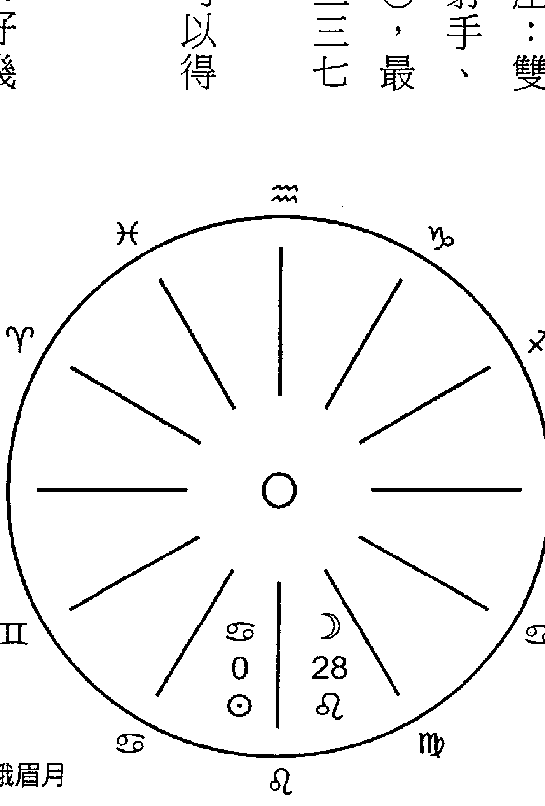

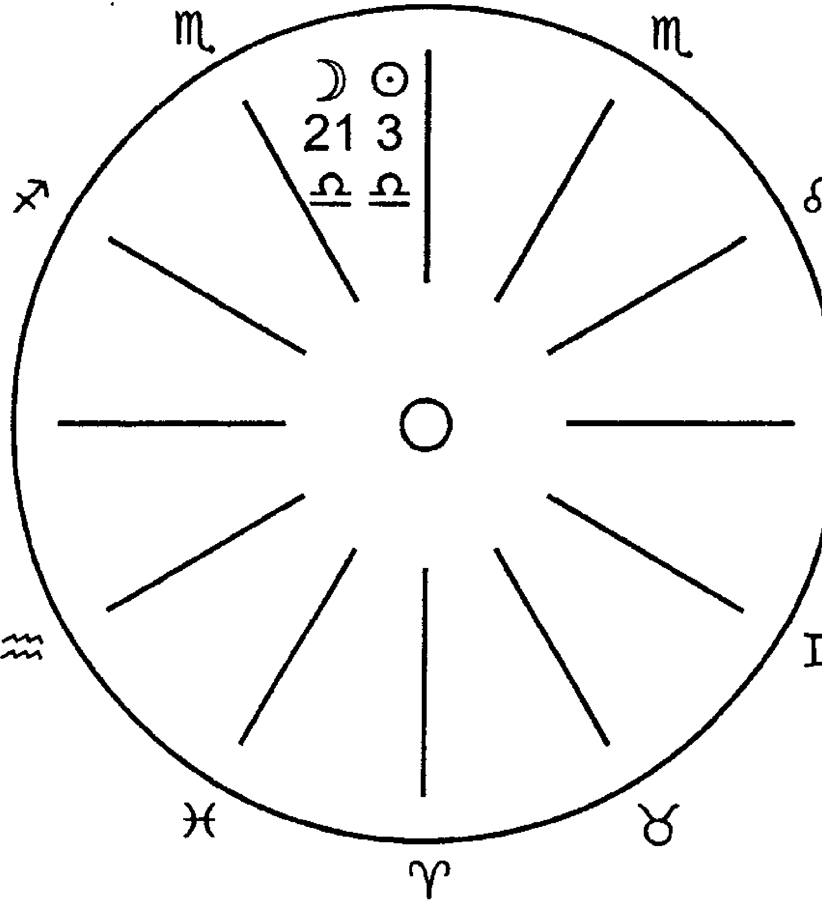

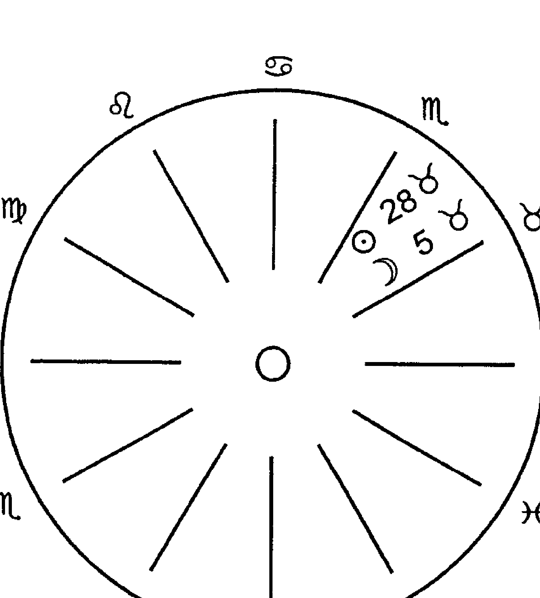

圖表 4-6 新月

另一個據說源自凱爾特傳統的說法則認為女神的少女階段始於蛾眉月剛出現時（也就是真正的新月形成後一天半左右），結束於上弦月出現時；母親階段始於上弦月出現時，結束於下弦月出現時（中間會歷經滿月）；老嫗階段則始於下弦月出現時，結束於蛾眉月剛露臉時（即真正的新月形成前一天半左右）。根據這個傳統，女神其實還有一個面向，就是黑暗女神（Darkness Goddess），她負責掌管月亮的暗月期（dark of the Moon），也就是天上完全看不到月亮的那段時間（包括新月真正形成的時間在內）。由於真正的新月我們是看不到的，因此古人只能用數學方式推算之，有些文化甚至乾脆把蛾眉月（而不是天文學上真正的新月）當成新月循環的起點。至於用黑暗女神來象徵月亮消長變化的第四階段，倒也相當貼切，因為這個階段跟死亡、腐壞、重生，及所有隱藏起來、無法輕易看見的事物有關，也跟巫術有關（這些其實也都是冥王的特徵，而且從神話學的角度看，冥王最初可能源自黑暗女神）。在某些文化裡，這些特徵則和老嫗的特徵混為一談，因而構成了三重面向的女神週期。不過如果用四個面向的角度來看待女神週期，就可以把佩兒西鳳視為少女，把迪米特視為母親，把黑卡蒂視為老嫗，把冥王視為黑暗女神。但有些文化將月亮的暗月期看成是存在於女神內的男神能量。

## 占星與魔法的對應關係

占星與擇日占星上更是如此。畢竟占星學主要是人類為了趨吉避凶或解答疑惑所發明出來的，因此要的是排出了星盤，卻不知道該著眼於星盤上的哪個地方，要如何找出問題的答案或得出正確的預測呢？自古以來，有許多占星師撰寫過相關的文章，而且內容往往寫得鉅細靡遺。譬如：我曾經在一篇文章上看到過，『乾瀑』是第三宮在掌管的，加以指涉，所以每個詞只好盡可能廣納各種意涵，以致於最後多到數不清了。此外，市面上也有針對不同領域或不同主題所編纂的占星對應表。譬如：郝爾德·萊斯里·柯內爾（Howard Leslie Cornell）所寫的《醫藥占星百科》（The Encyclopedia of Medical Astrology）就是這方面的經典之一；雖然這本書側重的是醫學和解剖學，但也針對醫學以外的主題提供了許多有趣的資訊。

而像畢爾斯所寫的《占星對應關係全書》，涵蓋層面則較廣泛，它就像一本參考書，裡頭把每個星座、每個宮位和每顆行星所對應的關鍵字或人事物都詳列出來。同理，既然這本書探討的是占星與魔法，我想我也應該針對魔法方面的人事物，提供一份占星對應表。不過由於這在占星研究上還是個很新的領域，因此這裡頭有很多對應關係都是我根據自己的經驗或臆測寫下來的。在編制這張表時，我不希望定義得太死，而希望它能夠活一點、廣一點，以方便你使用，或更能夠感應到他需要的能量，因此我在定義上並不會做很嚴格或很仔細的區分。再者這份占星關係對應表並不是專為占星師所寫的，而是為了那些可能懂占星也可能不懂占星的魔法師所寫的，所以在體例和風格上也不同於一般的占星關係對應表。

這張表有好幾種使用方式。舉例來說，假設你想要製作或啟動某個施法用的人偶，你只要查閱這張表，找到「施法人偶」這個關鍵字，就會發現相關的占星象徵：天秤座、七宮、金星、雙子座、三宮、水星。接著，你就可以根據這些占星象徵，翻開天文曆，找出恰當的時間來為你的施法人偶進行能量加持，譬如：你可以選定的時間包括：流年月亮進入天秤座或雙子座時、流年月亮通過本命盤第七宮或第三宮時，或流年月亮與流年金星或水星形成適當相位時（至於什麼是適當相位，則要看該人偶的用途而定）。另外幾個可能的時機還包括：流年月亮與你本命金星或水星成相，流年金星或水星進入天秤座或雙子座，且流年月亮的狀態與施法用途相對應、形成的最終相位也能對其產生助力時。讀到這裡，你應該不難理解，占星對應關係有很多使用方式。至於如何使用，取決於許多因素，譬如時間上的限制、數學運算能力、行星與行星間的關係是融洽和諧還是對立衝突等。當然考量的因素越多，往往越能精準掌握到你希望運用的能量。

KISS原則，在此同樣派得上用場。尤其是，當時很倉促時，更需要透過這個原則來進行擇日。這時候，只要盡了力，就把一切交給宇宙，讓行星的能量來為你效力吧。

在這份占星對應表裡，我把某些看似「負面」或「不好」的東西也放了進去。這麼做有幾個原因。第一，一個人如果想跟所謂負面或邪惡的勢力對抗，就可以用對應雙魚來斬斷該符咒的力量）。再者這些主題本來就是魔法或巫術的一部分，給它們貼上「邪惡」或「恐怖」的標籤，或乾脆視而不見，並不這些負面的東西就此消失不見。但我相信，巫師規章（The Wiccan Rede）或三倍報應律（Law of Three）自然會制裁這些心懷不軌者，因此不用擔心別人會刻意用巫術或邪術來傷害你。儘管如此，我承認自己並不是百分之百的好人。我願意正視自己的黑暗面，也會設法加以面對。譬如：用誠實和開放的態度來面對它，就是處理黑暗面的一個很好的方式。要知道，當光明照亮了黑暗，黑暗裡的事物就會自動現形，其力量也會跟著喪失，因為這些東西只有在黑暗中才能發揮作用，而鬼祟與恐懼則能滋長其力量。

不過請注意，這份占星對應表的排序是有意義的。基本上，排序越前面的，影響力越大，反之亦然。因此請盡可能使用排在最前面的行星、星座或宮位來擇日或施法，如果排序較優先者派不上用場，或可能造成反效果，這時候才使用排序較後面的。用斜體字標示者，儘管派得上用場，但影響力通常較弱。如果要破解負面的影響力，請盡可能讓流年月亮落在對你有利的位置（也就是你本命盤的上升、太陽或月亮星座），這樣你會更有力量去對抗負面的影響力。如果做不到，最起碼不要讓流年月亮落在對你特別不利的位置（也就是與你本命盤的上升、太陽或月亮對沖的星座）。一般來說，當流年月亮落在對自己有利的位置時，事情會進行得比較順利；反之，則比較不順。當然啦，如果你希望對方比你強勢，選擇後者倒是明智之舉。仔細想想你希望達成什麼目標，目標越具體明確越好。必要的話，甚至可以列出清單，再按圖索驥，從下面的占星對應表中找出你需要的行星、星座、宮位或相位，再把它們結合起來。當然事前別忘了先評估一下，這件事對你來說有多重要？重要的事，才值得你投入較多的時間與心力。

### 按筆畫排序

### 二畫

太陽、獅子座、五宮、冥王星、天蠍座、八宮、天王星、十一宮、水瓶座、火星。

### 力量／權力

太陽、獅子座、五宮、冥王星、天蠍座、八宮、天王星、十一宮、水瓶座、火星。

### 大型儀式

金牛座、處女座、摩羯座、金星、水星、土星、穀神星、二宮、六宮、十宮。

### 女性／陰性

月亮、金星、穀神星、智神星、婚神星、灶神星、冥王星、土星、土元素、水元素。

### 女神（廣義的）

月亮、金星、穀神星、智神星、婚神星、灶神星、冥王星、土星、土元素、水元素。

### 子女／兒童（狹義的）

- 嬰兒：月亮、巨蟹座。
- 幼兒：雙子座、三宮、水星。
- 青少年：金星、火星、太陽、獅子座、五宮。
- 養子／養女／別人的孩子：水瓶座、十一宮、天王星。

### 工作／職業

摩羯座、十宮、土星、處女座、六宮、水星、灶神星、智神星、凱龍星。

### 子女／兒童（廣義的）

獅子座、五宮、太陽、雙子座、三宮、水星、穀神星、凱龍星、智神星。

| 條目 | 列表 |
|------|------|
| 父觀 | 十宮、摩羯座、土星、四宮、巨蟹座、太陽、天王星。 |
| 火元素 | 火星、太陽、牡羊座、獅子座、射手座、一宮、五宮、九宮、灶神星、木星。 |
| 水元素 | 巨蟹座、天蠍座、雙魚座、四宮、八宮、十二宮、月亮、冥王星、海王星、婚神星。 |
| 比賽／彩券 | 五宮、獅子座、太陽、天王星、水星、七宮、火星、十一宮、水瓶座。 |
| 日常魔法 | 六宮、處女座、水星、三宮、雙子座、月亮。 |
| 手足／兄弟姊妹 | 雙子座、三宮、水星、六分相。 |
| 天氣／氣象 | 月亮、四宮、巨蟹座、水星、天王星、海王星、婚神星。 |
| 友誼／朋友 | 十一宮、水瓶座、天王星、土星、水星、六分相。 |
| 厄運 | 土星、火星、天王星、冥王星、十二宮、雙魚座、海王星、對分相、四分相。 |
| 切除／割捨 | 牡羊座、一宮、火星、對分相、天秤座、七宮、金星、婚神星、灶神星。 |
| 分手／離婚 | 天秤座、七宮、金星、牡羊座、一宮、火星、對分相、四分相、月亮天蠍、月亮摩羯、漸虧月、婚神星、八分相、補八分相。 |
| 中斷／半途而廢／墮胎 | 火星、冥王星、八宮、天蠍座、水瓶座、對分相、四分相。 |
| 中獎／贏 | 木星、九宮、射手座、太陽、獅子座、五宮、三分相。 |
| 四畫 | |
| 三畫 | 處女座、六宮、水星、雙子座、三宮、智神星、婚神星、凱龍星、六分相、補十二分相。 |

| 條目 | 列表 |
|------|------|
| 五畫 | |
| 六畫 | |
| 仙子／仙女 | 海王星、十二宮、雙魚座、水星、雙子座、三宮。 |
| 光／光明 | 太陽、月亮、十宮、一宮、木星、金星、九宮、射手座、牡羊座、天秤座、灶神星。 |
| 占卜 | 巨蟹座、四宮、月亮、射手座、九宮、木星、冥王星、水瓶座、十一宮、天王星、土星。 |
| 吉利 | 木星、太陽、金星、三分相、六分相、合相。 |
| 召喚 | 婚神星、智神星、六分相、三分相、八分相、補八分相。 |
| 同輩／同儕 | 處女座、六宮、水星、水瓶座、十一宮、天王星、太陽、獅子座、五宮、九宮、射手座、木星、滿月。 |
| 奴隸／奴役制度 | 六宮、七宮、天秤座、二宮、金牛座、木星、合相。 |
| 名聲 | 十一宮、水瓶座、天王星、太陽、獅子座、五宮、九宮、射手座、木星、滿月。 |
| 母親 | 巨蟹座、四宮、月亮、金星、二宮、穀神星、滿月、十宮、摩羯座、土星。 |
| 回憶／記憶 | 月亮、水星、三宮、九宮、雙子座、射手座、巨蟹座、木星、處女座、凱龍星。 |
| 生命 | 太陽、獅子座、五宮、一宮、牡羊座、火星、木星、金星、凱龍星。 |
| 生殖力／肥沃（廣義的） | 金牛座、二宮、金星、巨蟹座、四宮、月亮、天蠍座、八宮、冥王星、雙魚座、十二宮、海王星、火星、天秤座、七宮、四宮、穀神星、灶神星。 |

| 條目 | 列表 |
|------|------|
| 六畫 | |
| 七畫 | |
| 安全（感） | 木星、九宮、射手座、巨蟹座、四宮、月亮、二宮、金牛座、金星。 |
| 安樂死 | 凱龍星、天蠍座、冥王星、八宮、火星、巨蟹座、四宮、月亮、漸虧月。 |
| 尖銳物 | 火星、牡羊座、一宮、天蠍座、八宮、智神星。 |
| 成功／成就 | 十宮、摩羯座、土星、木星、太陽、金星。 |
| 死亡 | 八宮、天蠍座、冥王星、火星、四宮、凱龍星、巨蟹座、月亮、十二宮、雙魚座、海王星。 |
| 死靈術／觀落陰 | 海王星、十二宮、雙魚座、冥王星、八宮、天蠍座、土星。 |
| 自由 | 十一宮、水瓶座、天王星、木星。 |
| 吸引 | 合相、木星、金星、一宮、二宮、金牛座、漸盈月。 |
| 吸血鬼 | 冥王星、天蠍座、八宮、海王星、十二宮、雙魚座。 |
| 巫毒（教） | 天蠍座、冥王星、八宮、十二宮、雙魚座、海王星。 |
| 巫師／法師 | 海王星、十二宮、雙魚座、天王星、十一宮、水瓶座、冥王星、八宮、天蠍座。 |
| 巫師聚會 | 處女座、六宮、水星、水瓶座、十一宮、天王星、土星。 |
| 改變／變化 | 月亮、冥王星、水星、凱龍星、天王星、火星、變動星座、穀神星、四分相。 |
| 男性／陽性 | 太陽、火星、木星、土星、凱龍星、火元素、風元素。 |

| 條目 | 列表 |
|------|------|
| 男神（廣義的） | 九宮、木星、射手座、太陽、土星、天王星、火星。 |
| 邪教／密教 | 十二宮、雙魚座、海王星、土星、冥王星、六宮、處女座、水星、木星、合相。 |
| 邪眼／邪視 | 十二宮、雙魚座、海王星、冥王星、天蠍座、八宮、土星、摩羯座。 |
| 邪術／黑魔法 | 十二宮、雙魚座、海王星、冥王星、天蠍座、八宮、土星、摩羯座。 |
| 邪惡 | 冥王星、土星、火星、四分相、對分相。 |
| 私訂終身／結婚 | 天秤座、七宮、金星、月亮金牛、月亮巨蟹、月亮七宮、漸盈月、合相、三分相、六分相、婚神星。 |
| 防護 | 土星、摩羯座、十宮、天蠍座、八宮、冥王星、智神星、牡羊座、一宮、火星。 |
| 八畫 | |
| 事業／職涯 | 十宮、摩羯座、土星、太陽、凱龍星、六宮、處女座、水星。 |
| 供奉法器 | 處女座、六宮、水星、火星（專指儀式刀）、智神星、灶神星、合相。 |
| 供奉祭壇 | 巨蟹座、四宮、灶神星、月亮、木星、九宮、射手座、合相。 |
| 初階魔法 | 六宮、處女座、水星、三宮、雙子座、婚神星。 |
| 協助靈 | 六宮、處女座、水星、灶神星。 |
| 命名 | 牡羊座、一宮、火星、獅子座、五宮、太陽、合相。 |
| 和平 | 天秤座、七宮、金星、雙魚座、十二宮、海王星、智神星。 |

| 條目 | 列表 |
|------|------|
| 八書 | |
| 奉獻／獻身 | 巨蟹座、四宮、月亮、雙魚座、十二宮、海王星、木星、土星、穀神星、灶神星、合相。 |
| 宗教 | 九宮、木星、射手座、十二宮、海王星、雙魚座、灶神星。 |
| 幸運 | 木星、金星、九宮、射手座、十一宮、水瓶座、天王星、太陽、獅子座、五宮、三分相、六分相。 |
| 性魔法 | 天蠍座、八宮、冥王星、火星、金牛座、二宮、金星、合相、灶神星、婚神星。 |
| 油／仙丹妙藥 | 海王星、雙魚座、十二宮、木星。 |
| 治療 | 處女座、水星、六宮、凱龍星、雙魚座、十二宮、海王星、智神星、灶神星、四宮、九宮、射手座、木星。 |
| 法杖 | 水星、天王星、三宮、雙子座、十一宮、水瓶座、智神星。 |
| 法律 | 土星、射手座、九宮、木星、天秤座、七宮、金星、智神星。 |
| 法術（廣義的） | 雙魚座、十一宮、海王星、巨蟹座、四宮、月亮、處女座、六宮、水星、天蠍座、八宮、冥王星、火星、木星、穀神星。 |
| 物質財富 | 二宮、金牛座、金星、木星、冥王星、天蠍座、八宮、穀神星。 |
| 金屬（廣義的） | 火星、土星。 |

### 八畫

金屬（狹義的）

- 黃金：太陽。
- 白銀、鋁：月亮。
- 水銀／汞、磷：水星。
- 銅、黃銅、青銅：金星。
- 鐵、鋼、砷／砒霜、磁石、硫：火星。
- 錫、鋅：木星。
- 鉛、銻、炭、鹽、岩、石、皮革、硫、鋅：土星。
- 鈾、磁石、黃色炸藥、氮、鋅、放射性物質、多彩金屬：天王星。
- 鐸、油、石化物質、碘、鉀、橡膠、惰性氣體：海王星。
- 飾、熔岩、鋅、鎘、鎳、磷、火山岩：冥王星。

### 九畫

- 附身：十二宮、海王星、雙魚座、冥王星、天王星。
- 保守秘密：土星、摩羯座、十宮、冥王星、天蠍座、八宮、太陽、獅子座、五宮、處女座、六宮、水星、智神星。
- 保護：土星、摩羯座、十宮、冥王星、天蠍座、八宮、太陽、獅子座、五宮、處女座、六宮、水星、智神星。
- 拯救者：雙魚座、十二宮、海王星、木星、三分相、六分相。
- 指導靈：海王星、十二宮、雙魚座、水星、處女座、六宮、月亮、天王星、十一宮、水瓶座、六分相。
- 施法人偶：天秤座、七宮、金星、雙子座、三宮、水星、合相。

### 九畫

- 毒藥：海王星、十二宮、雙魚座、冥王星。
- 研究：八宮、天蠍座、冥王星、巨蟹座、四宮、月亮、土星、摩羯座、十宮。
- 祈禱：九宮、木星、射手座、灶神星。
- 美：金星、天秤座、七宮、金牛座、二宮、穀神星、智神星、婚神星、灶神星、木星。
- 音樂／歌曲：金牛座、二宮、金星、天秤座、七宮、雙魚座、十二宮、海王星。
- 風元素：雙子座、天秤座、水瓶座、水星、金星、天王星、智神星、三宮、七宮、十一宮。
- 食物：月亮、巨蟹座、四宮、處女座、六宮、水星。
- 香：海王星、水星、雙魚座、處女座、十二宮、六宮、灶神星、火星。

| 條目 | 列表 |
|------|------|
| 神祇 | 九宮、射手座、十二宮、雙魚座、木星、太陽、月亮、海王星、天王星、智神星。 |
| 神秘學 | 雙魚座、海王星、十二宮、八宮、冥王星、天蠍座、天王星、十一宮、水瓶座。 |
| 秘密 | 十二宮、雙魚座、海王星、冥王星、八宮、天蠍座、四宮、月亮、巨蟹座。 |
| 秘密曝光 | 漸盈月、一宮、牡羊座、對分相、火星、太陽、木星。 |
| 秩序 | 土星、太陽、木星、金星、固定星座、非空亡月、智神星、灶神星、合相、三分相、六分相。 |
| 能量工作 | 凱龍星、火星、天王星、水星、合相、四分相、八分相、補八分相。 |
| 脈輪 | 海王星、天蠍座、八宮、冥王星、水瓶座、十一宮、天王星、水星、火星、土星、婚神星、灶神星、凱龍星。 |
| 草藥/植物 | 處女座、六宮、水星、金牛座、二宮、金星、天秤座、七宮、穀神星。 |
| 財帛 | 金牛座、二宮、金星、木星、天蠍座、八宮、冥王星、三分相、婚神星。 |
| 配偶 | 七宮、天秤座、金星、八宮、天蠍座、冥王星、火星、合相、對分相。 |
| 高階魔法 | 雙魚座、十二宮、海王星、木星、九宮、射手座、灶神星。 |
| 十一畫 | |
| 動物 | 小型或家養動物：處女座、六宮、水星。大型動物：雙魚座、十二宮、木星、海王星、凱龍星。 |

## 十一画

| 啟蒙 | 婚姻 | 情人 | 控制／掌控 | 教導 | 混沌／動盪 | 清潔／淨化 | 現狀 | 異教（徒） | 硫磺 | 祭司長 | 通靈 |
|------|------|------|------------|------|------------|------------|------|------------|------|--------|------|
| 天蠍座、八宮、冥王星、摩羯座、十宮、土星、雙魚座、十二宮、海王星、火星、木星、穀神星。 | 天秤座、七宮、金星、月亮金牛、月亮巨蟹、月亮七宮、漸盈月、合相、三分相、六分相、婚神星。 | 五宮、獅子座、太陽、金星（女性）、火星（男性）、水星（雙性或同性）。 | 天蠍座、冥王星、摩羯座、土星、合相。 | 凱龍星、摩羯座、十宮、土星、處女座、六宮、水星、雙子座、三宮、巨蟹座、四宮、月亮、智神星、九宮、射手座、木星、六分相。 | 天王星、海王星、冥王星、火星、水瓶座、雙魚座、天蠍座、凱龍星、四分相、八分相、補八分相。 | 處女座、水星、六宮、月亮、凱龍星、灶神星。 | 土星、木星、太陽、金星、土元素、固定星座。 | 天王星、十一宮、水瓶座、海王星、十二宮、雙魚座。 | 牡羊座、火星、冥王星、摩羯座。 | 摩羯座、十宮、土星、射手座、九宮、木星、獅子座、五宮、太陽、灶神星。 | 巨蟹座、四宮、月亮、雙魚座、十二宮、海王星、木星、六分相、八分相、補八分相。 |

## 十二画

- 黑暗／深處: 穀神星、天蠍座、八宮、冥王星、摩羯座、土星、十宮、四宮、巨蟹座、月亮、對分相
- 雇用／聘請: 六宮、處女座、水星、十宮、摩羯座、土星、智神星、凱龍星
- 開始／起點: 牡羊座、火星、一宮、天王星、合相、新月、漸盈月
- 開工／動土／建: 穀神星、土星、土元素、金牛座、處女座、摩羯座、二宮、六宮、十宮、火星、金星、水星
- 結果: 四宮、巨蟹座、月亮、土星、摩羯座、十宮
- 結束／收尾: 土星、四宮、雙魚座、十二宮、海王星、天蠍座、八宮、冥王星、漸虧月、虧眉月
- 發誓／誓言: 土星、十宮、摩羯座、冥王星、八宮、天蠍座、灶神星
- 智力: 三宮、雙子座、水星、九宮、射手座、木星、天王星、月亮
- 惡魔／魔鬼: 冥王星、天王星、水星、土星、六宮、處女座、十二宮、雙魚座
- 單獨工作: 土星、摩羯座、十宮、天蠍座、八宮、冥王星、雙魚座、十二宮、海王星、牡羊座
- 勝利: 木星、九宮、射手座、十宮、摩羯座、土星、金星、火星

- 十二宫
- 意志（力）
  金牛座、獅子座、天蝎座（特强）、水瓶座、固定星座、冥王星、太陽、土星、天王星、一宮。
- 意志（力）
  雙魚座、十二宮、海王星、天蠍座、八宮、冥王星、射手座、九宮、木星、水瓶座、十一宮、天王星、火星、土星、月空、水逆。
- 意識轉換狀態
  土星、十二宮、雙魚座、海王星、月亮南北交。
- 業（力）
  天王星、冥王星、土星、火星、八宮、天蠍座、十二宮、雙魚座、海王星、四分相、對分相、八分相、補八分相。
- 滅亡／毀滅
  天蠍座、八宮、冥王星、雙魚座、十二宮、海王星、水瓶座、十一宮、天王星、補八分相、四分相。
- 煉金術
  天蠍座、八宮、冥王星、雙魚座、十二宮、海王星、水瓶座、十一宮、天王星、火星、土星、木星、穀神星、凱龍星。
  處女座、六宮、水星、凱龍星、灶神星。
  海王星、十二宮、雙魚座。
- 腳踏實地
  金牛座、二宮、金星、處女座、六宮、水星、摩羯座、十宮、土星（力度最強）、巨蟹座、四宮、月亮、天底（象徵家與根）、穀神星、凱龍星。
- 萬物皆有靈論
  海王星、十二宮、雙魚座、天王星、冥王星、八宮、天蠍座、月亮、九宮、六分相、八分相、補八分相。
- 葬禮／紀念碑
  天蠍座、八宮、冥王星、巨蟹座、四宮、月亮、火星。
- 解夢
  射手座、九宮、木星、海王星、水瓶座、十一宮、天王星、土星、月空、水逆、智神星、凱龍星。

| 畫數 | 條目 | 描述 |
|------|------|------|
| 十三畫 | 運氣、道袍／巫師袍、道德觀、預言、鼓／打鼓 | 木星、金星、太陽、九宮、射手座、天王星、十一宮、水瓶座、三分相、六分相、合相。 |
| 十四畫 | 團隊合作、監獄、舞蹈、雌雄同體 | 處女座、六宮、水星、水瓶座、十一宮、天王星、雙子座、三宮、射手座、九宮、木星。 |
| 十五畫 | 價值（觀）、寫下符咒備日後使用 | 金牛座、二宮、金星、木星、射手座、九宮、穀神星、婚神星。 |

| 畫數 | 條目 | 描述 |
|------|------|------|
| 十五畫 | 慶祝／派對 | 獅子座、五宮、太陽、射手座、九宮、木星、金星、十一宮、月空、水逆、三分相、六分相。 |
| | 撒旦 | 土星、冥王星、天蠍座、八宮、十二宮、雙魚座、對分相、四分相、八分相、補八分相。 |
| | 請神降駕 | 十二宮、雙魚座、海王星、四宮、合相。 |
| | 賭博／博弈 | 五宮、太陽、獅子座、木星、金星、天王星、水星、月亮、冥王星。 |
| | 魅力／幻相 | 雙魚座、十二宮、海王星、水星、雙子座、三宮、木星、六分相、三分相。 |
| 十六畫 | 盧恩文字／神秘 | 處女座、六宮、水星、雙子座、三宮、六分相、智神星、凱龍星。 |
| | 符號 | 雙子座、三宮、水星、六宮、處女座、凱龍星。 |
| | 學生／學徒 | 三宮、雙子座、水星、九宮、射手座、木星、六宮、處女座、智神星、凱龍星。 |
| | 學習 | 牡羊座、火星、一宮、天秤座、七宮、金星、智神星。 |
| | 戰爭 | 巨蟹座、四宮、月亮、土星、水星。 |
| | 歷史 | 三宮、雙子座、水星、智神星、凱龍星、六分相。 |
| | 靜電印刷 | 土星、摩羯座、十宮、四宮、金牛座、二宮。 |
| | 靜默 | 土星、摩羯座、十宮、四宮、金牛座、二宮。 |

| 十七畫 | 十八畫 | 十九畫 |
|--------|--------|--------|
| 殭屍、濫好人、繁榮／興盛 | 轉世／回溯、雙性 | 雙極（雌雄同體）、離婚、薩滿 |
| 天蠍座、八宮、冥王星、雙魚座、十二宮、海王星、土星、摩羯座、十宮。 | 巨蟹座、四宮、月亮、天蠍座、八宮、冥王星、雙魚座、十二宮、海王星、水逆、穀神星。 | 水星、雙子座、天王星、雙魚座、變動星座、雙子座、水星、三宮、射手座、九宮、雙魚座、十二宮、處女座、六宮、凱龍星、變動星座、天王星。 |

| 二十畫 | 二十一畫 | 二十二畫 | 二十四畫 | 二十五畫 |
| :--- | :--- | :--- | :--- | :--- |
| 議會／部落 | 驅逐 | 體重減少 | 體重增加 | 靈魂出竅 |
| 射手座、九宮、木星、天秤座、七宮、金星、水瓶座、十一宮、天王星、處女座、六宮、水星、智神星、婚神星。 | 對分相、土星、摩羯座、十宮、漸虧月、水逆、八宮、天蠍座、冥王星。 | 漸虧月、土星、摩羯座、十宮、處女座、六宮、水星、雙子座、三宮、四分相、對分相、八分相、補八分相。 | 漸盈月、木星、射手座、九宮、巨蟹座、四宮、月亮、金牛座、金星、二宮、合相。 | 海王星、十二宮、雙魚座、冥王星、八宮、天蠍座、九宮、射手座、木星、巨蟹座、月亮、太陽、五宮、獅子座、八宮、天蠍座、冥王星、灶神星。 |
| | | | | 射手座、九宮、木星、水瓶座、十一宮、天王星、雙子座、三宮、水星、雙魚座、十二宮、海王星、土星、智神星。 |
| | | | | 靈性 | 靈魂 |
| | | | | 鑰匙 | 凱龍星、水星、雙子座、三宮。 |

## 第五卷

## 烏星儀軌

### 卷序

這裡要介紹的儀式，是我在一九九二年夏天時發明的，當時一個威力強大的日月蝕正要發生，而且會影響到我的本命盤，所以我才想出這個儀式來向該日月蝕的能量致敬。你可以用一般魔法圈的流程運作這套儀式，但我會特別建議那些正面臨或即將面臨壓力流年，或命盤上有其他地方即將遭受壓力的人來進行這個儀式。透過這個儀式，你可以向那些正在發揮作用的能量致意，讓自己跟這些能量產生更深的連結，甚至可以在魔法圈裡靜心冥想，以找出較不具破壞性或比較具建設性的方式來因應這些流年。不過你也可以把這套儀式當成一般的魔法圈儀式，並根據你喜歡的方式來加以運用。

這個魔法圈，可以用來對即將出現在命盤上的困難流年祈福，也可以用來引導自己去感應某特定流年所代表的能量。此外，若能在儀式中運用薩比恩象徵做為觀想引導工具，效果會更好。每一個薩比恩象徵的圖文與意義，在魯迪亞的著作《占星曼陀羅》都有詳盡的探討。簡單來說，薩比恩象徵就像是一套占星塔羅牌或易經卦象。這套系統為黃道上的所有度數（也就是三百六十度）都設計了相對應的圖文與詮釋。使用時，你可以針對特定度數或某幾個度數，也可以針對流年行星行經的度數進行觀想，以從中獲得啟示，找出比較有效的方式來處理或因應流年所引動的能量。也可以針對本命盤上

的行星或虛點進行觀想，藉此尋求指引或洞見，好讓自己能將本命盤上的潛能發揮到極致。不過如果要這麼做，我建議你慢慢來，一次只針對幾顆星或幾個點進行觀想，而別想一次就把整張命盤上每顆星或每個點所對應的薩比恩象徵全部觀想完畢；一來，這樣做很花時間；二來，你可能會身心俱疲。不過身心靈成長這件事，本來就要花上一年或更久的時間，因此這樣做肯定值得。尤其如果能夠在這麼做的同時學占星，更是事半功倍。

如今薩比恩象徵是占星師經常使用的神秘工具之一。其實類似的系統還有很多，而且都比薩比恩象徵還要古老（換句話說，薩比恩象徵只是眾多星座度數象徵系統之一），但這些系統都有幾個缺點。第一，它們多半都很宿命，譬如把某些度數認定是墮落的或邪惡的，尤其如果一個人的太陽（或其他任何行星）落在這些位置，那肯定十惡不赦！此外，這些系統之間並沒有太多共通處，而且這些系統為各星座度數賦予的意義，多半是根據大合相、恆星的位置、行星的擢升位置、微星座和月宿（lunar mansion）等天象推算出來的。但薩比恩象徵不同，它是某位靈媒在靜坐時觀想出來的；這套體系把

1 譯註：在印度占星學裡，十二星座可以再各自劃分成十二個區間，即微星座（dwar），每個區間各佔二點五度，並與原來的十二星座相對應，各區間可再依其對應的星座找出其次守護星。

黃道看成是一個循環、一個演化的過程，所以每個度數的象徵意義都與上一個度數、下一個度數以及對面的度數息息相關。話說，薩比恩象徵的誕生，主要是拜馬克·埃德蒙·瓊斯（Marc Edmund Jones）之賜，他在一九二五年時找來靈媒艾爾希·惠勒（Elsie Wheeler）幫忙，透過靜坐冥想為每個星座度數都觀想出某些畫面或徵象，瓊斯再賦予自己的詮釋，並寫下不少相關文章和著作加以介紹<sup>2</sup>；不過這套系統最後能流傳下來，主要是因為魯伊爾的大力提倡，而且薩比恩象徵的意義也經過多次的修正與更新。我必須說，這套系統的確是個很棒的工具，可以讓我們對日月蝕、大合相或自己命盤的上升點所象徵的意義得到更深刻的理解。不過，要知道，這套系統雖然是靈性的，卻不屬於任何宗教。你如果想對黃道十二宮這整個循環有更完整、更深刻的體會，我非常建議你把薩比恩象徵拿來實驗看看。
至於這個儀式應該找誰來參加，我並沒有特別指定，而且我這樣做是故意的。因為這個占星儀式，我曾經自己一個人單獨做，也曾經找別人一起做（他們可能只是在一旁默默觀察，也可能加入靜坐的行列）。換句話說，在這個儀式的設計上，我希望它是很隨性的、可以自由發揮的。因此要是你不想或無法召請烏拉諾斯（Ouranos）和蓋亞，也可以改召請男祭司長和女祭司長。
你的東西南北四方，可以各找一位代表來幫忙召喚，而且，這些召喚者的命盤，最

> 2原注：《占星學上的薩比恩象徵》（The Sabian Symbols in Astrology）一書，就是瓊斯在這方面的力作，該書在一九九三年曾再版發行，不過我個人還是比較偏愛魯伊爾所寫的《占星曼陀羅》。有興趣的讀者，不妨把兩本書都找來看看，比較兩者的異同。但一般認為，魯伊爾的著作比較完整也比較深刻。

好能夠與他們所召喚的方向在星座上有加成或互補的作用。前者指的是代表者所召喚的方向，其象徵的元素剛好是自己命盤上最旺的元素；後者指的是代表者所召喚的方向，其象徵的元素剛好是自己命盤上最缺乏的元素，這樣做有個好處，就是讓召喚者有機會進一步了解或親近自己所缺乏的元素。跟大部分的儀式圈一樣，這個儀式圈的進行方式，在很多方面都是可以修改或調整的。重點是應該拿出實驗精神，用不同方法進行這個儀式，讓自己樂在其中。我可以向你保證，做完了這些儀式，你身心靈的能量一定會大大提升，而且這個儀式用在占星上更是管用。不過這裡有幾個地方我想有必要進一步說明。這個儀式圈，是根據占星的先天十二宮來設計的，儀式圈的四方及相對應的元素也一樣，因此可能不同於一般魔法圈的做法。再者這個儀式圈是根據月亮的行進方向，也就是逆時針方向來開啟的，這一點也不同於魔法界的一般做法；一般認為只有驅逐性儀式才會用逆時針方向來開啟，但根據

我的親身體驗，這樣做的效果並不會比所謂「正常」的儀式圈來得差。身為一個折衷主義者，我認為對儀式而言，表面的繁文縟節不見得重要，重要的是意圖與觀想。上面這段話，在某些圈子裡可能會引發不小的爭議，但這是我個人的想法，你可以不認同，就像你有權不認同我設計的這個儀式圈一樣。我是個占星師，先天十二宮對我來說意義重大，其重要性甚至超過魔法界所認定的這個準則：用逆時針方向開啟儀式圈只能用於驅逐性儀式。在我看來，不管是誰，一個方法對他而言只要管用，別人就無權置喙。至於這個儀式中會用到的道具，基本上都屬於基本款，譬如：四方、祭壇、長明蠟燭（presence candle）。至於蠟燭要用什麼顏色的，我不會硬性規定，你高興就好，不過如果是我自己，我會用黃色代表風元素、用紅色代表火元素、用藍色代表水元素、用綠色代表土元素、用白色或天然蜂蠟作為長明蠟燭或祭壇用的蠟燭。我還會用到清水、鹽巴、火、香（當然還包括插香用的香座）、儀式刀、魔法杖、聖杯、祭酒（其實不一定要是酒啦，只要你喜歡，用其他液體代替也行，重點是這東西必須是「有生命的」），以及一個可以用來擺放上面所有東西的櫃子或架子（其實就是祭壇啦，移動式或固定式的都行）。至於祭壇該擺在哪個方位，並沒有絕對的標準，只要你覺得舒服順眼就行；至於我自己，我是把它擺在北方，因為這樣最符合我屋內的布置，再者由於我命盤的上升點合

土星，所以我可能比較容易感應到土元素的能量（土元素一般代表北方），也讓我在個性上比較務實。當然你也可以把祭壇擺在別的方位。譬如：要是你覺得上升星座的象徵意義比較重要，可以把祭壇擺在東方；要是你覺得「命盤的主人」才是重點所在，不妨把祭壇擺在屋子的中央；要是你希望強調魔法的根源，不妨把它擺在北方。總之，只要我覺得順眼或言之成理，怎麼擺都行。

我不是個講究儀軌的人，所以對於什麼東西該用什麼顏色、祭壇該擺在哪個方位或巫術也一樣。如果同一個儀式我每次都一模一樣，肯定會無聊得要死。因此對於下面介紹的儀式流程，你如果想增添或修改某些文字或道具，請放心去做吧。

## 儀式流程

首先按照一般方式畫出儀式圈，也就是用儀式刀畫出一道光圈，再順著月亮的方向前進。接著同樣按照一般方法淨化儀式圈，用清水、鹽巴、火與香來淨化，其實用掃把也行。只是要記得，一定要順著月亮的行進方向前進。

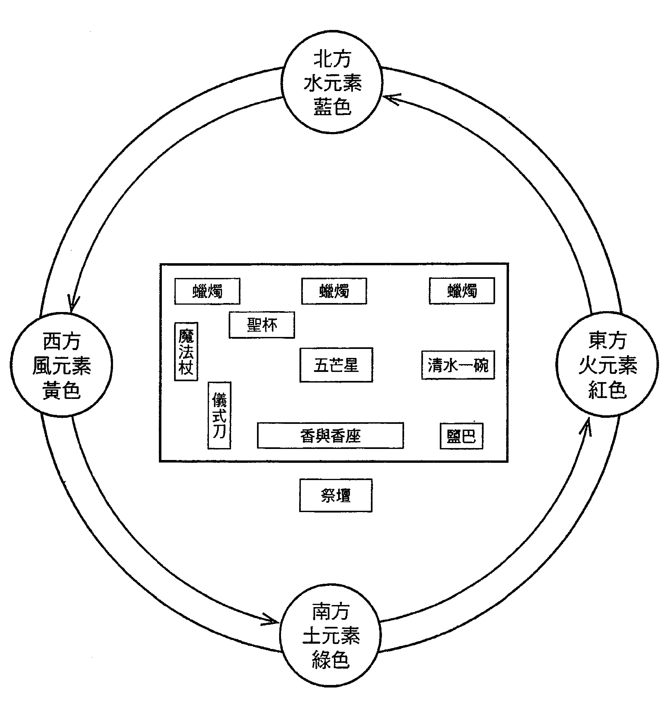

## 圖表 5-1 儀式圈和祭壇的布置

圖中的箭頭，指的是儀式進行時應遵循的方向，也就是月亮運行的方向或所謂逆時鐘方向。至於祭壇上要放哪些東西，放在哪個位置，這張圖只是供參考之用，你不是非得照我的方式來安放不可。只要你喜歡，想多放些什麼、少放些什麼、或改變安放的位置，都好。如果效果好就恭喜你，如果效果不好就調整成原來的方式，也就是基本款。此外，很多人可能會希望在裡頭再放上男神或女神的神像，那當然也可以，只要是你平常慣用而且有加持作用的神明都行，不然的話，也可以嘗試放入烏拉諾斯和蓋亞的神像。總之，這不是什麼偉大或高深的儀式或法術，所以沒什麼規定是絕對要遵守或絕對禁止的。因此任何改變都是可以接受的，重點是只要你扮演好自己的角色，你的儀式一定會生效的。

走到東方，舉起儀式刀，畫一個召喚用的五芒星，並念誦下面文字：「東方為上升點，即自我表達之處。先天起始於牡羊座，所有屬於火元素的生物和靈體都會出現在牡羊座、獅子座或射手座。我在這裏歡迎祢，並請祢見證這個儀式、保護這個儀式圈及圈內的一切。再一遍誠摯地歡迎祢！

走到北方，舉起儀式刀，畫一個召喚用的五芒星，並念誦下面文字：「北方為天底，即自我的基地與根源。先天起始於巨蟹座，所有屬於水元素的生物和靈體都會出現在巨蟹座、天蠍座或雙魚座。我在這裏歡迎祢，並請祢見證這個儀式、保護這個儀式圈及圈內的一切。再一遍誠摯地歡迎祢！

走到西方，舉起儀式刀，畫一個召喚用的五芒星，並念誦下面文字：「西方為下降點，即自我與他者相會之處。先天起始於天秤座，所有屬於風元素的生物和靈體都會出現在天秤座、水瓶座或雙子座。我在這裏歡迎祢，並請祢見證這個儀式、保護這個儀式圈及圈內的一切。再一遍誠摯地歡迎祢！

走到南方，舉起儀式刀，畫一個召喚用的五芒星，並念誦下面文字：「南方為天頂，即自我與大環境相會之處。先天起始於摩羯座，所有屬於土元素的生物和靈體都會出現在摩羯座、金牛座或處女座。我在這裏歡迎祢，並請祢見證這個儀式、保護這個儀式圈及圈內的一切。再一遍誠摯地歡迎祢！

走到儀式圈中央，舉起儀式刀，畫一個召喚用的五芒星，並念誦下面文字：「上方為穹蒼，為眾星匯集之處。我召請天空之神烏拉諾斯見證這個儀式、保護這個儀式圈及圈內的一切。誠摯地歡迎你！」

繼續待在儀式圈中央，將儀式刀指向地面，畫一個召喚用的五芒星，並念誦下面文字：「下方為大地，為占星宇宙的家園和中心。我召請大地之母蓋亞見證這個儀式、保護這個儀式圈及圈內的一切。誠摯地歡迎你！」

舉起魔法杖，揮個幾圈，再順著月亮的方向逆時鐘前進，將剛剛召喚到的能量混合在一起，為儀式圈進行能量加持。

回到儀式圈中央，說：「儀式圈已順利完成。天上如是，地上亦然，願天地交相感應。」

之後你就可以在儀式圈中進行任何你想做的事了。如果有使用薩比恩象徵的話，這也是最適合靜心冥想的時刻。

如果是為了日月蝕進行這個儀式，不妨在儀式中念誦下面文字：「從古至今，有許多文明都相信，日月蝕是某種巨型動物所造成的，譬如：有巨蛙或巨龍想要把太陽或月亮給吞噬掉。的確，在日蝕或月蝕發生時，常常可以看到太陽或月亮的圓形輪廓有部分像被啃食掉了一樣。當這種情形發生時（尤其當日光或月光變得全暗時），世界各地的

人類往往會不約而同地用類似的方法來加以因應，譬如：點燃營火、施放爆竹、敲鑼打鼓，或製造其他各式各樣強烈的噪音或聲響，以嚇跑那個巨型動物，逼牠把太陽或月亮給吐出來，將光明還給我們。毫無例外，這樣做從來沒失效過。大地果然重獲光明，而一旦也都恢復正常。現在，讓我們效法古人，用煙火和噪音來慶祝這次的日月蝕吧！

（此儀式的進行時間如果正逢日全蝕或月全蝕，效果會更靈驗；不過就算無法恭逢其時，提前一個禮拜做或延後一個禮拜做也相當有效。如果你居住的地區要是看不到日月蝕，時間點就不是那麼重要了；但要是看得到的話，時間點的選擇就重要許多，尤其如果能正好在日全蝕或月全蝕發生時進行這個儀式，效果會更加顯著。）

當儀式圈的引導者覺得時機恰當時（或太陽月亮已經恢復正常後），參與儀式的每個人都應該大聲歡呼，再慢慢靜下來，將剛剛感應到的能量安穩地收回到身心靈裡。

## 大儀式

舉起聖杯，說：「大地之母蓋亞，感謝妳一直與我們同在，從過去到現在到未來，用妳的富饒與肥沃滋養我們，讓我們得以踩在妳神聖的土壤上。」

接著拿起儀式刀，舉在聖杯上方，說：「天空之父烏拉諾斯，感謝妳化身為穹蒼裡祂的眾星，一直看顧我們，與我們同在，祢的種子是一切創造的根源。」

「聖杯為陰，儀式刀為陽，此刻陰陽將合而為一。」

接著將儀式刀和聖杯放在一起，感受男神和女神的力量同時進到杯子裡的酒中。將聖杯裡的酒傳給儀式參與者飲用，最後將剩餘幾滴灑在地上獻給男神和女神。

然後進行送神儀式。

念誦這段文字：「蓋亞與烏拉諾斯，我們的天父與地母，感謝二位參加這場儀式。二位在這個世界的臨在我們會一直銘記在心，也祈請二位能一直看顧我們、保護我們，引導我們用正確的方式過每一天、每個月和每一年。二位敬愛的神與祢們的子女月神和太陽神，為我們標記了時間的變化與推移。願祢們永遠與我們同在。現在要暫時與祢們道別，恭請二位回駕！」

打開結界，將能量灌注在儀式圈內。

接著撤除四方。

走到東方，舉起儀式刀，畫一個驅逐用的五芒星，再念誦下面文字：「出現在牡羊座、獅子座及射手座等一切屬於火元素的生物和靈體，感謝祢們大駕光臨，參與這場儀式，保護儀式圈及圈內的一切。祢灌注在我們身上的能量，我們會銘記在心，現在請祢回駕，並敬祝你順心如意！」

然後走到北方，舉起儀式刀，畫一個驅逐用的五芒星，再念誦下面文字：

「出現在巨蟹座、天蠍座及雙魚座等一切屬於水元素的生物和靈體，感謝妳們大駕光臨，參與這場儀式，保護儀式圈及圈內的一切。妳灌注在我們身上的能量，我們會銘記在心，現在請妳回駕，並敬祝妳順心如意！」

走到西方，舉起儀式刀，畫一個驅逐用的五芒星，再念誦下面文字：

「出現在天秤座、水瓶座及雙子座等一切屬於風元素的生物和靈體，感謝妳們大駕光臨，參與這場儀式，保護儀式圈及圈內的一切。妳灌注在我們身上的能量，我們會銘記在心，現在請妳回駕，並敬祝妳順心如意！」

最後走到南方，舉起儀式刀，畫一個驅逐用的五芒星，再念誦下面文字：

「出現在摩羯座、金牛座及處女座等一切屬於土元素的生物和靈體，感謝妳們大駕光臨，參與這場儀式，保護儀式圈及圈內的一切。妳灌注在我們身上的能量，我們會銘記在心，現在請妳回駕，並敬祝妳順心如意！」

然後切開儀式圈，說：「儀式圈如今已經打開，但並未破裂。讓我們歡喜相逢、歡喜分離，並期待再一次歡喜相逢。」就這樣，整個儀式就大功告成、功德圓滿了。

## 結語
### 把占星運用在魔法與靈性成長

哇！這本書總算大功告成了。裡頭的資料還真多對嗎？沒辦法，我希望這本書能夠盡量觸及夠多的主題，但又不希望你必須學會複雜的數學運算才能排出命盤，或進行複雜的解盤，所以才寫出了這樣一本書來。要是你讀完後覺得意猶未盡，想再多找幾本占星書來讀，不妨參考我在這裡列出的推薦書單。首先要介紹的是黛比·坎普頓—史密斯（Debbi Kempton-Smith）所寫的《觀星筆記本裡的秘密》（Secrets from a Stargazer's Notebook），對初學占星者而言，這是本非常棒的入門書，不但取得容易，而且讀起來趣味橫生；書中還提供了行星安放表，引導你學習自己排出星盤。對有心想學占星的朋友，我大力推薦瑪麗安·馬奇（Marion March）與瓊安·麥凱維斯（Joan McEvers）合著的《占星入門唯一指南》（The Only Way to Learn Astrology），這套書共有五冊，用來做為學占星的入門教材可以說再適合不過了。道格拉斯·布拉赫（Douglas Bloch）與迪米特拉·喬治合著的《學占星自己來》（Astrology for Yourself），則可以教你學會如何自己解讀自己的命盤。星盤公司（Astrolabe）與ＡＣＳ公司，則提供了電腦排盤和命盤解析服務，讓不想學習複雜數學運算的人也能一窺自己命盤的堂奧。此外，ACS公司除了提供電腦排盤和解盤服務外，也發行了不少占星書、天文曆與宮位表，在業界，他們的電腦天文曆的精確度可說是赫赫有名。

其他值得一讀的占星書還包括，魯伊爾所寫的《占星曼陀羅》，裡頭對於有「占星塔羅牌」之稱的薩比恩象徵做了深入淺出的探討。

在幾本探討恆星的占星書裡，我最喜歡的是喬瑟夫·瑞格 (Joseph Rigor) 所寫的《恆星的力量》(The Power of Fixed Stars)。你要是夠瘋狂，或是對卜卦占星學懷有極強烈的興趣，想要深入地去鑽研這門學問，我強力推薦安東尼·路易士 (Anthony Louis) 所寫的《卜卦占星學》(Horary Astrology)，因為它是該領域最新而且寫得最棒的一本書。柯內爾所寫的《醫藥占星》(Medical Astrology)，是目前最全面的占星百科全書，儘管書名叫「醫藥占星」，但該書對醫藥領域以外的占星知識其實也著墨甚多，裡頭甚至還包含許多古老或深奧的占星觀念。

關於四大小行星，寫得最好的是迪米特拉·喬治的《小行星女神》；至於探討凱龍星的占星書，我最喜歡的是芭芭拉·韓德·克羅 (Barbara Hand Clow) 所寫的《凱龍星：溝通行星與外行星的彩虹橋梁》(Chiron, Rainbow Bridge Between the Inner & Outer Planets)（只要你不要把書中所談的尼比魯星 [Nibiru] 太當一回事就好）。斯蒂芬·弗里斯特 (Steven Forrest) 所寫的《內在的天空》(The Inner Sky)、《變幻莫測的天空》(The Changing Sky)，以及他和茱蒂·弗里斯特（Jodie Forrest）合著的《從占星的角度探討靈魂伴侶》（Skymates），也是值得拜讀的佳作。如果你真心想學占星，我相信，讀完了上面幾本書，你的占星基本功應該就打好底子了，而且，就我所知，這幾本書目前在書市上都還找得到。希望透過本書的介紹，你對占星學已經有了相當程度的了解，也掌握了某些基本技巧和解讀方法，知道如何將占星運用在魔法及靈性成長上。譬如：你要是已經了解，月亮運行到不同星座時會帶來哪些不同的影響，可以運用哪些占星技法來加強自己的施法功效，而且每個人多多少少都擁有魔法方面的潛能，那這本書就功德無量了。要是你覺得本書的內容太多太難，沒關係，請耐心點，一步一步慢慢來，先掌握你能了解的東西，再進一步學習較艱深的技巧。我自己學占星也是學了好幾年才慢慢融會貫通的，現在我已經很難回想起剛開始學占星是怎麼回事了，我只記得，這一路上我不曾放棄，不斷大量閱讀，不斷練習解盤，直到我總算了解占星學到底是怎麼一回事為止。這個過程，老實說，的確有點令人望而生畏，但其實也滿振奮人心的，而我的力量也從中成長了許多。

最後，要謝謝你願意把這本書從頭讀到完，而沒有中途放棄。希望你在閱讀這本書的過程中有一丁點樂趣，就像我當初在寫作過程中享受的樂趣一樣。如果你知道你住家附近有占星師，請多多給他支持鼓勵，也祝你的魔法工作能順利圓滿、鴻圖大展。

## 占星資源

訂購星盤：要是你不知道如何自己排出星盤，可洽詢占星服務公司，讓電腦幫你排出星盤。如果要排的是本命盤，需要提供的資料包括：出生年月日、出生時間（越詳細越好，並註明是上午還是下午）、出生地點（包括州名與城市名；出生地非美國者，請註明出生國家與城市）。有提供這類服務的公司，名氣較響亮且較值得信賴者，有Astrolabe和ACS兩家，其網址如下：

- Astrolabe: https://www.astrologes.org/
- ACS: http://astrocom.com/

線上排盤：如今有不少網站提供免費排盤服務，基本上只要在搜尋網站鍵入星座、占星、astrology、horoscope 等關鍵字，就可以查到不少此類網站。如：

- http://astrodoor.cc/horoscope.jsp （中文介面）
- http://alabe.com/freechart/default.asp （英文介面）
- http://astro.cafeastrology.com/natal.php （英文介面）
- http://www.astro.com/cgi/chart.cgi （英文介面）

占星軟體：想深入研究占星的讀者，光靠線上排盤服務可能不夠用，這時候就可以考慮購買較專業的占星軟體或使用免費的占星軟體。譯者自己使用過的占星軟體包括 Solar Fire、Win*Star、Janus，功能都十分齊全，排出來的星盤畫面也都簡潔漂亮。不想破費的讀者，可以下載功能較陽春但也還算齊全的免費軟體 Astrolog 來使用。

- Solar Fire (https://alabe.com/solargold.html)
- Win*Star (https://www.astrologysoftware.com/pro/winstar/index.aspx)
- Janus (https://www.astrology-house.com/)
- Astrolog (http://www.astrolog.org/astrolog.htm)

### 星盤格式：

是根據不同宮位的涵蓋度數將它們等比例顯示出來。你可以根據自己的喜好做選擇。不過對初學者而言，傳統的星盤格式（也就是每一宮看起來一樣大那種）可能比較合適。

### 宮位制：

宮位制有很多種。本書列出的星盤，多半使用普拉西迪分宮制，但有人或許會比較喜歡柯赫分宮制也說不定。不同的宮位制，畫出來的星盤也不一樣。

### 後見之明計畫（Project Hindsight）：

對於古占星學有興趣的朋友，不妨到後見之明計畫裡頭挖寶，因為這個計畫的宗旨是要復興「古占星學」，也就是占星學、科學和巫術還沒有分道揚鑣以前的樣貌，並將古代、中世紀和文藝復興時期的占星學文獻翻譯（或再翻譯）成現代文字。這方面的文獻，有很多都還沒翻譯成英文。由於這些文字都相當古老，在閱讀上有相當的難度，也不是一般讀者所能理解，但裡頭有許多關於占星術、巫術、哲學和煉金術的寶貴資料。該計畫出版的專書，可以單本購買，也可以定期訂閱。該計畫從展開至今，已經翻譯了不少用希臘文、羅馬文或希伯來文寫成的文獻，聽說不久後也要開始翻譯某些阿拉伯文獻。想知道該計畫出版了哪些著作或更進一步了解，可透過下列方式與他們聯絡：

Project Hindsight
http://www.projecthindsight.com/

這趟占星上的尋根之旅，對現代占星學而言具有劃時代的意義，因為它可以讓我們用比較現代化的脈絡去理解古代的占星知識，甚至將之出版成書。勞勃·韓德（Rob Hand）、勞勃·索勒（Robert Zoller）和勞勃·施密德（Robert Schmidt），是這項計畫最主要的三位占星師兼譯者。

國家圖書館出版品預行編目資料

占星魔法：用星星的能量，助你心想事成 / 艾絲黛兒·丹尼爾斯 (Estelle Daniels) 著；許晉福譯. -- 臺中市：一中心，2018.03
464面；14.8×21公分. --
譯自：Astrologickal Magick
ISBN 978-986-95686-7-8（平裝）

1. 占星術
292.22 106023727

# 占星魔法：用星星的能量，助你心想事成
Astrologickal Magick

系列書號EX18000-1

- 作者：艾絲黛兒·丹尼爾斯 (Estelle Daniels)
- 譯者：許晉福
- 發行人：蔣聖光、宋彬如
- 銷售總監：阮祥運
- 主編：李瓊絲、王澤民
- 翻譯總監：蔡孟璇
- 責任編輯：林俊安
- 校對：張秀雲
- 美術設計：陳伃如

出版者：一中心有限公司
臺中市西屯區市政北二路 236 號 14 樓之 3（七期鼎盛大樓）
公司電話 (04)22533388
傳真 (04)22540038
客服專線 0800-383800
客服專員 宋翊瑄 0909-808-686
客服信箱 info@lcenter.com
官網 www.lcenter.com
郵政劃撥帳號 22808968（戶名：一中心有限公司）

法律顧問：群展國際法律事務所
經銷商：聯合發行股份有限公司
電話 (02)29178022
香港總代理：一代匯集
九龍旺角塘尾道 64 號龍駒企業大廈 10B&D 室
電話 852-2783-8102
傳真 852-2396-0050
印刷製版：釉川印刷有限公司

定價：新台幣 669 元／港幣 223 元
ISBN：978-986-95686-7-8
初版一刷：2018 年 3 月

Astrologickal Magick
Text Copyright © 1995 by Estelle Daniels
Traditional Chinese edition copyright © 2018 1 Center Ltd.
This edition published by arrangement with Red Wheel Weiser, LLC.
through Andrew Nurnberg Associates International Limited
本書如有缺頁、破損、裝訂錯誤，請寄回本公司調換
版權所有 . 翻印必究
All rights reserved.

不管你是想買車、跟老闆要求加薪、準備和心儀的對象頭一次約會，本書所介紹的占星術都可以派上用場，不僅可以用在魔法上，也可以用在日常生活當中。換句話說，不管你想要什麼，都可以利用占星魔法來提高成功的機率。

實務經驗超過45年的專業占星師艾絲黛兒・丹尼爾斯（Estelle Daniels）詳細介紹占星術語、象徵與技法，其中有簡單的也有複雜的，但都不需要艱深的數學公式，甚至連本命盤都不需要，只要有一本天文曆就夠了，讓你運用於日常生活或施行魔法都可以帶來加分效果。

如果你想藉由命盤了解自己的魔法潛能，或你是個魔法師，想為施法時間選個黃道吉日，本書絕對是簡單又實用的工具。

本書內容包括：

- 魔法與本命盤的關係——一個人有沒有魔法的潛能，可以從星盤上哪些地方看出？
- 關鍵字清單、行星星座守護關係表——幫助學習者更快掌握占星要領。
- 占星儀式——學會召喚與感應本命盤或流年的行星能量。
- 教你如何藉由占星的指引與星星的能量，為重大的事件或儀式擇定良辰吉時。

無論你是專業的占星師、業餘占星玩家、占星研究者、對占星學已經有基本認識、或對占星學一竅不通、只會問「你是什麼星座的？」的人，只要你對占星或魔法有興趣，都該必備這本書。