# 印度占星學

## 作者序 天啟的占星學

印度位處南亞次大陸，與埃及、希臘、中國並列世界四大文明古國。約莫在西元前 1,500 年以後，亞利安人 (Aryans) 移入征服且統治，他們帶來的原始神，大都是自然界獨特的魔魅力量，例如風、雷、雨、電等衍化而成的神格，結合祭祀冥思而發展出吠陀文化，而大量的吠陀經典也指導著印度子民的生活。

為顯示這些白種人的優越，並加強社會控制，藉由《原人歌》的傳播，硬生生地將人種分為上、為潔淨，為下、為污穢的區分，於是進一步形成特有的種姓制度，婆羅門、剎帝利、吠舍等三種姓為上，而首陀羅為下，累世累代世襲不替，另尚有因違反種姓規定，被驅逐在外的不可接觸者……。

為上者享有各種社會資源，受人敬仰；為下者幾被剝奪一切。會有這樣的命運，各教派或哲學學說都傾向以業力解釋，無法擺脫因果輪迴所致，因而大都主張需禁欲苦修，或是透過瑜伽等精神訓練，而這些觀念也影響甚深。

印度占星學 (Indian Astrology，簡稱印占)，較正確的名稱應為「Jyotish Astrology」。「Jyotish」即光之科學，由「Jyoti」和「sh」兩個梵文組成，前者的字義是「蠟燭的火焰」，後者則是「最具智慧」，喻意天空照射給地球的光，經由人類眼睛而洞見人生的微妙，得以驅逐無知，引導走向人生正確的道路，它的整個精神和思想，都建構自天啟的、神聖的吠陀經典，因而又被稱為吠陀占星學 (Vedic Astrology)。

在希臘天空圖形式占星學傳入印度之前，印度早期的占星學主要是以月亮運行在天空的二十八星宿為主的型態。印度是宗教意識濃厚的國度，祭祀祈禱為生活所不可或缺，月亮的光華賦予次大陸人民的心靈精神昇華，因而月亮的週期相態就成為重要慶典的擇日指標。當時的月亮被視為陽性男神，每晚住宿於不同星宿的妻子，後世的天文學稱之為月站，在施行純陰曆的猶太、阿拉伯、中國等地區國家，都見得到這二十八星宿的使用或稱謂。因二十八星宿的重要，印度先賢將之賦予神性，以神話流傳。

爾後，希臘馬其頓的亞歷山大大帝東征北印度，雖戰敗離開，卻留下一位部將統領一個說希臘語的小王國，因而常與希臘及羅馬貿易往來，約在二世紀中葉，一本希臘占星學的書籍被譯成梵文，此即著名的《Yavanajataka》，由該王國的「Sphujidhvaja」所譯。剛逝世不久的哈佛大學著名科學史學者大衛·潘格利（David Pingree），博士論文便是研究這本書，仔細地編譯該書內容，比對與希臘占星學的關係並加以評論，幾乎能確診現今印占的天宮圖形式，除了少部分發源自本土，其他大多數來自希臘占星學。

「Yavanas」的梵文意譯是「希臘」，因而《Yavanajataka》即是「希臘人說法的占星書」，國際知名占星學泰斗羅伯特·漢德（Robert Hand），在《History of Astrology》一文曾整理潘格利的內容，證實該書的部分梵文專有名詞，幾乎都是希臘占星學獨有而予以意譯的，甚或增添原本沒有的梵文字義。希臘占星學初期發展的整個星座宮位制、三方四正、根據始宮／續宮／果宮的吉凶能量，以及光學視覺角度衍生的不合意凶象而導出六宮、八宮、十二宮為三凶宮，印占都可見到這些內容，且將之視為核心內容。另外，受希臘占星學影響，月亮也轉變成陰柔的女性角色，更可證明潘格利的觀點正確。

印占發展至今約可分成三大系統，間或有其他外來文化，如與波斯、阿拉伯交流所形成的「Tajika Jyotish」，主要用於流年預測，是西方熟稔的太陽迴歸，但並非主流。又二十世紀後，印度占星家克里希那穆提（K. S. Krishnamurty）建構一套有別於三大系統的「K.P. Jyotish」，僅屬於小眾市場。所謂的三大系統分別是：

- 1. 帕拉薩拉系統 (Parasara)：印度占星先賢帕拉薩拉所著《Brihat Parasara Hora Sastra》，通常簡稱為《BPHS》，流行於全印度。
- 2. 賈密尼系統 (Jaimini)：賈密尼所著《Upadesa Sutras》，比較流行於南印度，近十年來逐漸受到矚目。
- 3. 納迪系統 (Nadi)：這個系統頗為龐雜，其中的納迪葉解讀最為神祕奇趣，全球各地常有人揪團前往南印，尋找自己的葉子。

我在研習任何學問，向來重視完整歷史淵源及發展脈絡，關於西方占星學，自認相當了然於胸，但在印占部分卻頗感挫折，主因是全印度語言繁多，不易學習，另一原因是印度向來不注重歷史，他們認為現實生活的一切，不過是一剎那，追求的是永恆的最高境界，因此不重視確切的歷史年代記載。上述三大系統的占星書籍，對作者描述常見神話式的傳奇，卻不知其出生年代，而其傳布脈絡更不知所云，故要追蹤這三大系統的歷史發展，確實不易。

本書的編寫主要是根據帕拉薩拉系統，重要的基礎內容應都已涵蓋在內，甚至擴及中級程度，讀者只要循著整本書的篇章努力研習，掌握要點再加以整合，要登堂入室並不難。為增加學習印象，盡量附予實例驗證。

儘管本書主要以印占的本命為主，但如能奠定紮實基礎，也能延伸研習卜卦、擇日、時事、醫療等領域，當然，這些延伸領域皆有各自的使用規則及判斷法訣。

由於印占採用恆星黃道，而西方占星學不論現代心理占星學 (簡稱現占) 或古典占星學 (簡稱古占)，都採用迴歸黃道，那麼，這兩種黃道用法係因歲差所致，同一出生時間的人，會因行星和各敏感點所在黃道位置而大為不同。印占和古占都強調行星吉凶力量強弱，可能呈現不同的情況，如此一來，將以何者為驗呢？這真是大哉問，其實這也是國際占星學界至今仍爭論不休的議題。

我從事現占、古占已三十年，而印占也有二十年資歷，對此議題，個人持平而論的心得是，印占論格局高低、富貴貧賤、六親緣厚緣薄及大運趨勢走向較為準驗，如排名世界首富多次的微軟創辦人比爾·蓋茲、國內知名歌手周杰倫、香港影歌雙棲皆甚有成就的張國榮等等，從他們的印占命盤，能輕易一眼看出屬於人生勝利組、具社會影響力的富貴格局。

古占也論及格局，只是較為隱晦，不若印占明確，但古希臘有一套大運系統，名稱為「黃道釋放」（Zodical Releasing，簡稱 ZR），這套結構有點類似印占的大運系統，對運勢轉折往往令人驚訝，在人生取向目標、各宮事務吉凶評斷頗精細，又主限向運和流年小限等推論較小時間單位的預測，確為古占的獨到之處。至於現占，避談事件預測，不論行星的力量強弱導致吉凶，強調人本主義或榮格動力心理學，因而圍繞行星在黃道及與其他行星之間的相位，討論案主的心理素質，排斥印占、古占的宿命論說法，卻顯得空泛，難以切入人生各事項領域的主題，然心理描述或許為其一大特色。

最後要感謝豐雯的促成、美欽的用心，得以讓本書面世，「豐富文化」的全員努力都令人感動，尤其是韋毅的鍥而不捨、精美的編輯，讓我相當銘感於內，也謝謝芳誼、課震的序文增添光輝。

秦瑞生

## 推薦序 在巨人肩上看見宇宙真理

秦瑞生老師的印度占星學（簡稱印占）書籍，在我們的千呼萬喚之下，終於出版了！

師從秦老師的古典占星學（簡稱古占）、印占，每次上課時，我總是萬分佩服秦老師的占星學問如此根底深厚。老師畢生沉浸在浩瀚占星學書海中，他看過的占星學書籍，真的比我吃過的鹽還多！而且幾乎都是原文書，更顯示出秦老師所下的苦功。在台灣，甚至華人圈，應該難有占星學家能望其項背，我很有福氣，能跟隨這樣認真的老師從事占星學的研究。

近幾十年來，古占的浪潮在歐美興起，漸漸擴及到台灣，許多當年抨擊古占是「算命的」那些現代占星學派（簡稱現占）人士，有不少人後來也默默學起古占來，可見古占那種顛撲不破的內涵，才是王道。至於印占，就更像「算命的」了，印占與印度傳統神話、哲學、文化關連密切，尤其是「業」、「輪迴」這些概念。印占對一個人出生格局的斷定、大運流年的預測、二十七星宿（原為二十八星宿）、後天十二宮的分類（三方宮、困難宮、成長宮等等）、各種分宮圖、賦予行星功能吉／凶星的性質、行星之間的相映、行星之間的連結（各種行星組合）、行星之間的友誼與敵意等等，在在顯示出印占迥異於古占獨特的神秘魅力，所以自1990年代起，印占逐漸獲得歐美占星學界的注目，如今在占星學界已有一席之地。

我練習正統瑜伽多年，所以跟隨秦老師學習古占、印占時，深深感受到瑜伽理論說的對：「我們都是宇宙的孩子，星星的射線影響著我們。」不論是古占或印占，都充滿深奧的學問，無窮無盡，從事這些占星學的研究者，

> 「孩子出生時，天體的射線與他個人的業力恰當地交織計算一致於該時刻，他的天宮圖是一張深具挑戰性的素描，揭示他不可改變的過去（業力）及未來可能發生的結果……在出生時刻，跨越在天空顯示的訊息，並不意謂強調命定，而是喚醒人的意志來避開業力的束縛。曾經做過的行為，現在可以不做，自己正是現在生活狀態的始作俑者，不是別人。人能克服任何業力的限制，因為這一切都是自己過去的行為創造的結果，而人因為具有靈性，所以可以鍛鍊自己不受制於行星。

As above, so below.

人在做，天真的在看，並確實記錄著，一切都有脈絡可循，無法改變的是過去（前世的業），可以展望的是未來，這才是占星學的功用所在——好好認清自己的主客觀環境，才能好好揮灑自己的人生藍圖。

印占在台灣的發展及知名度，仍屬於萌芽階段，這個領域的中文書很少，而秦老師這本書的出版，實是有志學習者的一大福音。秦老師在此書中不藏私的分享，使我們能站在巨人的肩膀上，一窺印度占星學的奧妙。

宇宙的真理，一直在那裡，不管你信或不信。

陳芳誼

## 推薦序 探索不同的人生面向

欣聞秦老師出印度占星學（簡稱印占）書籍，邀請我這個老學生寫序，高興又惶恐！

回憶起跟秦老師的結緣，是在 2003 年了。當時透過報紙得知老師要舉辦西洋占星的招生發表會，因而好奇前去聆聽，隔天又找老師算西洋星盤，結果老師言簡意賅，說了我的家境與我的痛苦根源。先前的八字老師都說我是乞丐命，讓我很不服氣，也因此走向研究五術之路，但秦老師竟然從星盤直接命中我的核心，讓我驚訝不已！當下向老師詢問了學費以及如何付費？從此開始了我跟秦老師的緣分。後來的大六壬、玄空陽宅學、印占，我都跟是秦老師學習的，唯因家裡事業緣故，回去故鄉彰化發展，與老師的緣分暫時告個段落。

爾後因為小孩緣故，我又回到高雄，也在當地置產生根。當時向老師學習印占，老師曾論及我的命格與政治有緣，適合宗教修行的道路，但感情婚姻不順利。這十年來，一一印證，所以最近讓我決定與老師再續前緣，重新複習印占及其他卜卦、合盤、A*C*G*等古典占星的課程。

印占是源自印度古老的吠陀學問，採用整宮制，而且只用日、月、水、金、火、木、土、羅喉、計都這些行星，並沒有使用現代的天王星、海王星、冥王星等三大行星，而且不用什麼相位角度，反而是以行星來照映星體或宮位，例如火星照映它起算第四、七、八的宮位，而太陽月亮只能照映對面的第七宮，這部分與西洋占星的合相、三分相、對分相比對，就有不同的看法了。

而且，印占在論斷格局高低，或者是否適合功名利祿上，更為精準，例如第一、五、九宮為三方宮，與第一、四、七、十宮為始宮（或稱四正宮）組成的格局，我們稱「Raja Yoga」，主貴格、社會地位、名望；第二、十一宮這部分的組合，或其與三方宮／四正宮的組合，我們稱「Dhana Yoga」，主財富賺錢格局。

還有異路功名的第六、八、十二宮組合，或其與三方宮／四正宮的組合，利宗教修行，印占讓我們用更多元的方式看到不同的人生面向，而且它特殊的「Dasa」大運法，比起西洋占星的諸多大運法更為準確，另外，尚能參考D₂、D₄、D₉等不同分盤，可以精準論斷各個不同人生事務領域，是其他祿命法所沒有的，讓人驚嘆不已，絕對值得去體驗、研究這個寶庫。

秦老師也是我見過最博學、最認真的老師，教室及工作室滿滿的中文命理書籍，以及西洋占星與印占的原文書籍，每次去找老師聊天，都看到他在讀書、整理資料，好學精神幾無人可及，我們這些學生的用功程度可能還沒有他的十分之一，令人汗顔。

秦老師也多次在課堂上精準預測國內外大事，例如十年前看小布希命盤，就斷言小布希會攻打阿富汗跟伊拉克；四年前預測柯文哲會當選台北市長……讓人震撼連連。

今天欣逢老師的印占書籍上市，承蒙老師厚愛，不嫌筆陋，寫此序言，也可以說是個人十多年來跟老師學習的一點感言感想，希望有緣人得此寶書，可以入寶山而不空手回，猶如得葵花寶典，增加一甲子的功力。

業餘命理風水師　林課震（阿政哥）

## 重要字詞釋義

| 中文 | 梵文 | 符號 |
|---|---|---|
| 行星 | Graha | |
| 太陽 | Ravi | ☉ |
| 月亮 | Chandra | ☽ |
| 火星 | Kuja | ♂ |
| 水星 | Buddha | ☿ |
| 木星 | Guru | ♃ |
| 金星 | Sukra | ♀ |
| 土星 | Sani | ♄ |
| 北交點（羅喉） | Rahu | ☊ |
| 南交點（計都） | Ketu | ☋ |
| 徵象星 | Karaka | |
| 星座 | Rasi | |

| 中文 | 梵文 | 符號 |
|---|---|---|
| 白羊座 | Mesha | ♈ |
| 金牛座 | Vrishabh | ♉ |
| 雙子座 | Mithuna | ♊ |
| 巨蟹座 | Kataka | ♋ |
| 獅子座 | Simha | ♌ |
| 處女座 | Kanya | ♍ |
| 天秤座 | Thula | ♎ |
| 天蠍座 | Vrischik | ♏ |
| 人馬座 | Dhanus | ♐ |
| 摩羯座 | Makara | ♑ |
| 水瓶座 | Kumbha | ♒ |
| 雙魚座 | Meena | ♓ |

### 分宮圖

| 分宮圖 | Varga |
|---|---|
| D₁ | Rasi |
| D₂ | Hora |
| D₃ | Drekkana |
| D₄ | Chaturtamsa |
| D₇ | Saptamsa |
| D₉ | Navamsa |
| D₁₀ | Dashamsa |
| D₁₂ | Dwadashamsa |
| D₁₆ | Shodashamsa |
| D₂₀ | Vimsamsa |
| D₂₄ | Chaturvimsamsa |
| D₂₇ | Bhamsa |
| D₃₀ | Trimsamsa |
| D₄₀ | Chatvarimsamsa |
| D₄₅ | Akshavedamsa |
| D₆₀ | Shastiamsa |

## 宮位與行星狀態

| 中文 | 梵文 |
|---|---|
| 宮位 | Bhava |
| 上升星座、上升點 (ASC) | Lagna |
| 始宮 | Kendras |
| 三方宮 | Trikonas |
| 成長宮 | Upachaya |
| 困難宮 | Dusthanas |
| 死亡殺手宮 | Marakas |
| 第一宮 | Tanur |
| 第二宮 | Dhana |
| 第三宮 | Sahaja |
| 第四宮 | Sulha |
| 第五宮 | Putra |
| 第六宮 | Satru |
| 第七宮 | Jaya |
| 第八宮 | Mrityu |
| 第九宮 | Bhagya |
| 第十宮 | Karma |
| 第十一宮 | Ayaya |
| 第十二宮 | Vyaya |
| 相映 | Drishtis |

| 中文 | 梵文 |
|---|---|
| 旺 | Uchcha |
| 弱 | Neecha |
| 三方旺宮 | Moolatrikona |
| 自己的星座 | Swakshetra |
| 行星的狀態 | Graha Avasthes |
| 行星逆行 | Cheshta |
| 行星停滯 | Stambana |
| 行星逢太陽焦傷 | Astangatha |
| 行星戰爭 | Graha Yudha |
| 行星的六種力量 | Shad Bala |
| 行星的八個吉點力量 | Ashtaka Varga |
| 行星組合 | Yogas |
| 吉點 | Bhindus |
| 總共吉點 | Sarav Ashtaka Varga |
| 個別行星的吉點 | Bhinn Ashtaka Varga |
| 貴格 | Raja Yogas |
| 富格 | Dhana Yoga |
| 主要期間、大運 | Dasa |
| 次要期間 | Bhukti |
| 過運 | Gochar |

## 第一章 印度占星學與吠陀文化

印度 (Hindu) 一詞，源自古波斯語。古代波斯人經商到達南亞次大陸第一大河印度河下游地區時，因感嘆水勢雄大而命名為「信度」（Sindu，水或海之意），讀作「Hindu」。原僅稱呼印度河流域，後演變為全印度的通稱。西元前四世紀，馬其頓王國的亞歷山大大帝東征印度的信度地區，以希臘語稱呼「Indu」，遂成為印度的國名，一直沿用至今。我國在漢代即與印度有往來，《史記》、《漢書》稱其為「身毒」；唐代高僧玄奘前往天竺取經，天竺即唐朝對印度的稱呼。

大約西元前 1,500 年，印歐民族的亞利安人遷徙到印度西北部，進行征伐統治之前，當地曾有相當發達的哈拉帕 (Harapa) 文明，可惜不知何故，文明突然消失。亞利安人帶來他們信仰的神祇、風俗習慣與文化，經過世代變遷，與當地土著融合，開啟了印度的吠陀文明 (Vedic Civilzation)。

有關吠陀文明的發展，〈圖 1-1〉引用重繪日本高楠順次郎與木村泰賢的名著《印度哲學宗教史》所繪古代印度，配合保羅・杜森 (Paul Deussen) 的文明史角度，可一窺吠陀文明發展概況。

保羅・杜森將印度分為三個區域，也是印度文明的三大中心：西方印度河為中心的五河地方、東南恆河平原地方、頻闍耶山 (Vindhya，現稱溫迪亞山脈) 以南的半島地方。印度文明初期興起於五河地方，之後東漸移入恆河地方，最終發展至半島地方。

以注入阿拉伯海的印度河河口為起點，向注入孟加拉灣的恆河河口畫一直線，將印度分成南北兩個三角形，北方為興都斯坦平原地方，南方為由德干高原至科末林岬（Kanyakumari，現稱科摩林角）的半島地方。再於上方三角形頂點的興都克什山，往下畫一條垂直線貫穿馬爾斯他拿沙漠，在此沙漠的西方，即為五河地方。

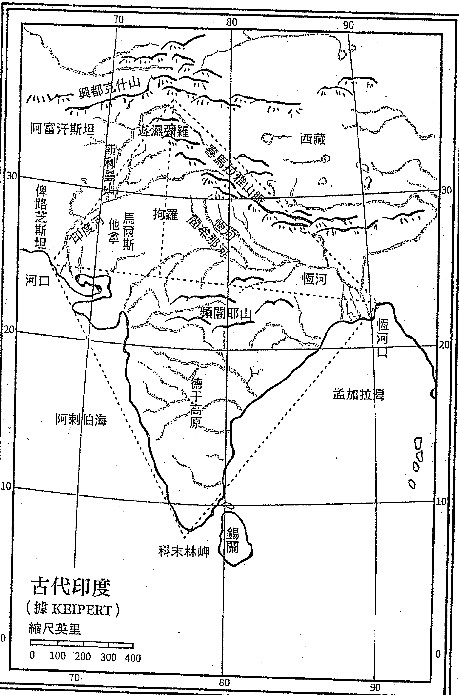

### 〈圖1-1〉古代印度 (據 KEIPERT)

印度是全世界宗教意識最濃厚的國家，在吠陀思想文化的薰陶下，有近83%的印度子民信仰印度教。印度教就是吠陀教歷經了婆羅門教的洗禮後，再加以精煉的宗教。

印度的整個社會風俗、人生目標取向，都長期浸淫於吠陀經典的啟迪。「印度占星學」（Jyotish）為吠陀六大知識系統之一，其受吠陀思想文化的影響，不言可喻。

以下將分節說明印度占星學與吠陀文化的關係，以便讀者充分理解印度占星學特有的吠陀文化之內涵。

### 第一節 印度占星學的意義

「印度占星學」（Hindu Astrology 或 Jyotish Astrology）是流行全印度的占星學的統稱，現今有極大部分受「希臘占星學」（Hellenistic Astrology）的影響，如黃道十二星座的使用、行星及後天宮的管轄意義，以及宮位系統的採用。西元 270 年的《Yavanajataka》一書內容，就是典型的希臘－印度占星學整合的形式。

如今，印度占星學已不復見早期二十七星宿體系的完整論述，但在精神與思想上，仍相當著重吠陀哲學的特色，所以又稱為「吠陀占星學」（Vedic Astrology）。「吠陀」（Veda），是從梵文中「知」的動詞「Vid」演變而來的，即「知識」或「智識」之意。信奉者認為，這是神聖、天啟的知識，由天神傳授給祭司和聖賢，據說當時傳給七個家族，再以口傳方式留給後世，因此稱之為「Sruti」，意指「所聞」之意。

這些知識原為讚誦神明或祭祀的儀規，經由亞利安學者整理後再創作，賦予哲學思維而形成《吠陀經》。因其主張祭祀萬能，因此，主司祭祀的婆羅門掌握且壟斷了這門知識；而由吠陀精神衍生的宗教活動，則稱為婆羅門教。後來，信奉者根據天啟聖典，並秉持著吠陀精神，由聖人著作來例示或擴充天啟聖典，稱之為「傳承聖典」（Smriti）。期間，婆羅門僧侶因過於驕縱奢華，在遭逢清新宗教如佛教、耆那教挑戰時，曾一度沒落。但在印度子民勤誦與吠陀相關的經典，苦修和體悟吠陀的要義後，婆羅門教又得以復興，且更為茁壯發展，因而蛻變成現今的印度教。

「Jyotish」是「吠陀占星學」的全名。其中，「Jyoti」的意義是「蠟燭的火焰」，即來自天空，照射給地球人類的光；意指光經由我們的眼睛，使我們有能力看清事物，洞見人生的微妙；而「sh」的意義是「最佳的，最具智慧的」，所以「Jyotish」被譯為「光之科學」。光驅散黑暗，驅除人生的無明或無知，導引我們走向正確的道路。意謂吠陀的知識是宇宙的知識，是清淨意識的狀態。

絕大多數的印度人相信，一切的學問都從《吠陀經》演化而來。宗教是知識之源，占星學亦不例外。《吠陀經》中可獨立分支出來的經書（Sutra），有一部稱為《吠陀分明論支節錄》（Vedangas），便提及吠陀的六大知識，意義略述如下：

**一、音韻學（Śikṣa），代表吠陀的鼻子**
有關語言的著作。因吠陀文獻乃口耳相傳保留下來的，為了避免在口傳過程中走樣，需對吠陀經典的讀音聲調做完整詳細的研究和記錄。由於抑揚頓挫與鼻音有關，故代表吠陀的鼻子。

**二、語言學或稱文法學（Vyakarana），代表吠陀的嘴**
研究吠陀文獻的方法。若不具備文法的知識，便無法了解吠陀文獻，屬吠陀分支中最重要的部分。在印度，教導吠陀文法的地點都位於濕婆神廟。吠陀的營養吸收需經由嘴，故代表吠陀的嘴。

**三、格律學（Chandah），代表吠陀的腳**
有關吠陀韻律的研究。唸誦吠陀經典有一定的韻律，如同吟詩。印度占星學的改運方法常涉及真言念咒（Mantras），與格律學密切相關，是吠陀經典的基礎，類比為腳，故代表吠陀的腳。

**四、語源學（Nirukta），代表吠陀的耳朵**
主要針對吠陀文獻中難字的注釋。《吠陀經》是以梵文撰寫，需對字詞或字源做根本的詮釋，才能通徹文獻真正的內涵，這是因梵文屬觀念性語言，非定義式的，因而類比耳聽八方，多重的詮釋，故代表吠陀的耳朵。

**五、天文占星學（Jyotisa），代表吠陀的眼睛**
如前所述，相關分類參讀本章第四節「印度占星學的分類」。

**六、方法學（Kalpa），代表吠陀的手**
此為出現較晚的吠陀分支，內容十分龐雜，主要分成三類：

- 1. 天啟經：解釋祭司執掌的大祭。
- 2. 家庭經：敘述家庭中由家長主持進行的祭祀。
- 3. 法經：社會職責、種姓的行為規範，相當具體的維繫婆羅門教的社會秩序及倫理道德，最著名的是《摩奴法論》。

方法學是從吠陀的分支中再區分出來的，類似手掌分開的樣子，故又稱「吠陀之手」。

### 第二節 吠陀思想文化形成概述

印度占星學深受吠陀文化影響，因此，了解吠陀思想文化形成的過程與演變，以及相關神話學、哲學思想等深烙在社會風俗民情的現象，較能掌握印度占星學的精神，有助深入體悟其來龍去脈及論斷精髓，也更能分辨西洋占星學和印度占星學內涵的差異。

吠陀思想文化的形成是以吠陀文獻為中心，經由世代累積特有的宗教哲學所匯集而成的東方文化。因時間久遠，加上印度人不重視歷史記載，《吠陀經》的構成年代已無從查考確認，某些作品的口傳可追溯至西元前2,500年。目前學者普遍認為，《吠陀經》的構成時期約為西元前1,500至500年，基本上又分成吠陀前期、吠陀後期、史詩形成時期，爾後直到笈多王朝，此時相當於遵奉吠陀文獻的印度六大哲學宗派經書形成時期。中世紀以後，則是印度各哲學宗派思想體系完備時期，而這些吠陀思想文化也一直延續至今。

#### 吠陀思想文化形成時期概述

| 吠陀前期 BC1500 - 800 | 吠陀後期 BC800 - 500 | 史詩形成時期 BC500 - 300 | 經書形成時期 BC300 - AD400 | 六大哲學體系完備 AD400 - 1600 |
|---|---|---|---|---|
| 《梨俱吠陀》 | 《梵書》 | 《摩訶婆羅多》 | 佛教 | 正理派 |
| 《夜柔吠陀》 | 《森林書》 | 《羅摩衍那》 | 正理教 | 勝論派 |
| 《沙摩吠陀》 | 《奧義書》 | 《往世書》 | 《勝論經》 | 數論派 |
| 《阿闥婆吠陀》 | | 耆那教 | 《數論經》 | 瑜伽派 |
| | | 佛教 | 《瑜伽經》 | 彌曼差派 |
| | | | 《彌曼差經》 | 吠檀多派 |
| | | | 《梵經》，又名 《吠檀多經》 | |

吠陀前期至後期的《梵書》（Brahmana）、《森林書》（Arayaka），屬於五河地方所發展的神話時期；而吠陀後期的《奧義書》（Upanisad），則為開始向東南恆河平原發展的哲學期；經書形成時期後，為向南發展的百家爭鳴期。

#### 一、吠陀前期（B.C.1,500-800）

##### （一）文獻架構

在介紹吠陀思想文化形成之前，我們先整理吠陀文獻，也就是天啟聖典的分類。《吠陀經》基本上分成《本集》（Samhita）、《梵書》、《森林書》和《奧義書》。本集的形成過程歸在吠陀前期，後三者則歸在吠陀後期。

###### 吠陀文獻的架構

天啟聖典

|《梨俱吠陀》|《夜柔吠陀》|《沙摩吠陀》|《阿闥婆吠陀》|
|---|---|---|---|
|《本集》|《本集》|《本集》|《本集》|
|《梵書》|《梵書》|《梵書》|《梵書》|
|《森林書》|《森林書》|《森林書》|《森林書》|
|《奧義書》|《奧義書》|《奧義書》|《奧義書》|

〈表1-2〉

所謂本集是指狹義的吠陀，乃吠陀文獻的基礎，共有四部本集，分別是《梨俱吠陀》、《夜柔吠陀》、《沙摩吠陀》、《阿闥婆吠陀》，其中又以《梨俱吠陀》最為古老。

##### 《梨俱吠陀》（Rig Veda）

又名《讚頌明論本集》（10 卷，1,017 詩篇，10,580 頌），或稱《讚嘆吠陀》，明解脫的方法。「Rig」的語音，是由「rc」（唸誦讚歌）而來，乃由祭司勸請諸神駕臨祭壇唸誦的讚歌集結而成，是古印度最早的宗教聖典，內容偏向自然界的諸神祇，以及印歐民族原先的神祇崇拜和敬禮。

##### 《夜柔吠陀》（Yajur Veda）

又名《祭祀明論本集》，純然祭祀開明經典，《梵書》之前驅，表現「祭祀萬能」的風格，祭祀祈禱，明善道的方法。梵文「Yajur」乃「祭祀」之意。此集為婆羅門祭祀時唸誦的詩詞，及如何祭祀的散詩。

##### 《沙摩吠陀》（Sama Veda）

又名《歌詠明論本集》（2卷，1,549頌），為研究印度樂律史上獨一無二的寶典，並無獨立存在的價值；因其構成的詩節除七十五頌外，其餘都來自《梨俱吠陀》，意即在誦詩上譜上曲調，以便婆羅門在祭祀時，以固定的音律吟唱。

##### 《阿闍婆吠陀》（Atharva Veda）

又名《禳災明論》（20卷，730詩，6,000頌），以禳災咒語為主，宗教色彩濃厚；為術論、異能技術、梵咒醫方之書，說明咒術算術之法，對神明的讚歌比例較低。其內容多為祈禳消災解厄、對怨敵的咒語，充滿著低下階層人民的信仰，與前三本集的內容明顯不同。

##### （二）此時期對印度占星學的影響

###### 1. 神話學／多神信仰

印度先民將宇宙分成「天」、「空」、「地」之界，就其神力及職能，各有天神（devas）和女神（devis）。根據《梨俱吠陀》記載如下：

- （1）天界：律法神婆樓那（Varuna）曾是天界最有勢力的神，掌管大自然的秩序，並使人們遵守道德法律。黎明神烏莎（Ushas）、太陽神是天界最重要的神，因其處所相異而有不同稱呼，如密特羅（Mitra）、蘇里亞（Surya）……。
- （2）空界：雷神因陀羅（Indra）、風神（Vayu）以及暴風神魯陀羅（Rudra）……。
- （3）地界：火神阿耆尼（Agni）、酒神蘇摩（Soma）。後者後來轉變成月神、動物神、庶物神、低級群神、植物神魔……。

其中又以因陀羅最受重視，祂曾是印歐民族的神，整部《梨俱吠陀》約四分之一的頌歌都在歌頌祂。因陀羅手執金剛杵，是印度的雄偉戰鬥之神，也是國民精神的守護者。

吠陀前期，印度先民對大自然現象的驚惶與震懼，呈現單純信賴的本性，風、雨、雷、電因而成為膜拜的對象，加上亞利安人入侵南亞次大陸前就已敬奉的神，以及原次大陸住民敬拜的神、祖先英靈等等，構成龐大的神靈世界。這些神靈隨著時代遞變，在進入吠陀後忽然不見或淪為次要地位，而原本次要地位之神卻一躍成為主神。此時期的儀式崇拜是印度先民與神明溝通的主要模式，主其事的祭司擔任與神溝通者，地位崇高，不言可喻。

印度占星學使用的要素，如行星、二十七星宿、分宮圖，常涉及神話故事的演繹。吠陀文化中神靈的特質功能，就扮演詮釋的關鍵。改運時，須對相應的守護神靈誠心祈禱，然後進行真言念咒或戴寶石祛除厄運、增強能量，或舉行雅那（Yanra）祭祀、譚崔（Tantra，又稱坦陀羅）等等。

###### 2. 業、輪迴的觀念萌芽

此期著重的儀式崇拜日益精細，祭祀過程中的每個細節，都可能影響祭祀成效，經由正確舉行複雜且相互關聯的儀式來完成獻祭，報酬回饋也因此產生。因此，獻祭被視為具有神秘的潛在力量，在當時是唯一的職責，是行為活動（Karma）及不變的法則。英國學者麥克唐納（A. A. Macdonell）認為，這是業力法則的出處。《梨俱吠陀》頌歌中的「rta」（規律）即為「事物的秩序」、「擴大及於自然界的規律」及「人間的道德秩序」。儀式風行下，「rta」等同「祭祀」的同義詞。因此，「rta」及祭祀這兩個概念的預示行為活動，都暗示行為活動帶有其本身的報應。

另外，《梨俱吠陀》的許多頌歌都提到死後存在著另一世界，凡正確舉行祭祀儀式者，死後可在此世界獲得無上快樂；而那些未依正確儀式舉行祭祀者，死後將受懲罰、墮入黑暗世界。這項觀念說明靈魂和身體各自獨立，進而可輪迴轉世，是輪迴思想的最初萌芽，但尚未具體論述。至於業力法則與印度占星學的關係，留待後述。

###### 3. 种姓制度

印度社会特有的种姓制度在吠陀前期应已存在，且是逐渐演变而成的。雅利安人在入侵印度后，便以胜利者之姿压迫当地原住民。雅利安人肤色较白，印度原住民肤色较黑，起初可能是以颜色来区分，后随着《吠陀经》形成，仪式主义盛行，主其事的祭司为巩固地位，在《吠陀经》里加入种姓区分，是相当有可能的。

种姓制度将社会分成四大阶级，由上而下分别为婆罗门、刹帝利、吠舍和首陀罗。婆罗门为祭司，阶级最高；刹帝利为武士、治理国家的王族，排名第二；吠舍为商人，阶级第三；最后是属于低贱下民的首陀罗。以上仅为基本分类，各阶级中若因违犯阶级禁忌或规定被逐出，则成为更低阶之贱民、游民，甚或被隔离而不可接触，地位相当卑微。一些社会文化研究专家集毕生之力研究此特有的社会现象，仍未形成共识。种姓制度在某些程度上因宗教而生，再加上业与轮回思想的灌输，使得印度子民颇宿命论的以此机制生活，却也维持一定的社会秩序。

有关种姓制度，在《梨俱吠陀》的〈原人歌〉中有明确的记载。但一般咸信，这是祭司阶级婆罗门为了巩固其地位而添加进来的，将「原人」（Purusa）比喻为宇宙万物的原理，如同能生产胎儿的母亲。经典记载如下：

> 当众神把原人分割，
他们分割了多少份？
他的嘴是什么？
他的手臂叫什么？
他的腿和脚又被赋予什么名称？
他的口是婆罗门，
他的双臂变成王族，
他的腿成为吠舍，
而从他的脚上生出首陀罗，
月亮从他心中生成，
太阳则产自他的眼睛，
从他的口中生出因陀罗和阿耆尼，
他的气息变成了风，
从他的肚脐生出空间，
他的头则化成天界，
地界生自他的脚，
方位生自他的耳朵，
而这一切就构成了世界。

杨惠南教授在其著作《印度哲学史》中，将《原人歌》整理成下表，即明确掌握《梨俱吠陀》中宇宙生成的概念。原人身体的各部分生出四大种姓，以及「天」、「空」、「地」之界，和隶属其中的诸神。

| 原人 | 头面部 | 头部 | 天界 |
| :--- | :--- | :--- | :--- |
| | | 面部 | 眼：太阳 耳：方位 鼻（呼吸）：浬尤（风） 口：因陀罗（雷）、阿耆尼（火）、婆罗门族 |
| | 躯干部 | | 心脏（心识）：月亮 双臂：王族（刹帝利族） 肚脐：空界 |
| | 肢足部 | | 腿部：吠舍族 足部：地界、首陀罗族 |
| | 其他（膏脂等等）：《四吠陀》、马、（家）羊、野羊等牲类 | | |

〈表1-3〉

种姓中的婆罗门、刹帝利、吠舍为再生族，可读吠陀文献，而首陀罗为非再生族，不能接触吠陀文献。印度占星学中的天宫图要素，如行星、星座、宫位及二十七星宿，都与种姓制度的分类相对应。

###### 4. 荐灾咒语

《阿闼婆吠陀》跟后来发展的密教有关，印度占星学的改运方法，包含持咒念诵真言、谭崔，很多内容就出自于此。

#### 二、吠陀后期（B.C.800-500）

##### （一）文献架构

〈表 1-2〉说明了天启圣典的架构，除四部吠陀的《本集》形成归为吠陀前期，而《梵书》、《森林书》以及《奥义书》的形成，则归为吠陀后期，以下分别说明此三书的要义：

###### 《梵书》

音译为《婆罗门书》，也称为《净行书》，主要用来解释《吠陀经》，指导不熟悉祭祀仪式者，使其了解不同仪式所具有的神圣意义。《梵书》是部成熟的宗教经典，以教条式的观点、仪规、象征主义及对祭祀的细节，作出自由无拘的想像、思索，体现婆罗门祭司的深思熟虑，涵盖了后世印度教的精神核心。

###### 《森林书》

系《梵书》的进一步发展，音译为《阿兰若书》，这些文献有可能是主持祭祀的婆罗门老人实行人生四期：梵行期、家居期、林栖期、遁世期，在林栖期隐退至森林所撰写。由于森林中无法随时取得供品作为精致化仪式之用，因此，必然会将祭祀万能的观点，慢慢转向冥思的特定象征。如原本具体出现的「马祭」，改为冥思太阳为「马眼」，空气为马的生命。这种超越祭祀至上，朝向冥思的演变，是吠陀文化的一大进步，也为后来出现的《奥义书》预先铺路。

###### 《奥义书》

梵文的“Upanisad”，是由“Upa”＋“ni”＋“sad”组合而成，为“近坐”的合成语，意为弟子侍坐于师父旁侧，师父将秘传奥义给他。原为《森林书》的附属书，内容相当庞杂，但以哲学思考为首。

##### （二）对印度占星学的影响

###### 1. 神话学

吠陀前期的一些主要神祇，像是因陀罗或婆罗那，都逐渐退为次要神祇。《梵书》创造出梵天（Brahma），与《梨俱吠陀》的次要神祇——毗湿奴（Vishnu）和湿婆神（Shiva）三神合为一体，位阶最高，为众神之主，影响后世印度崇拜神明的方向。

- （1）梵天：原形是《梨俱吠陀》的祈祷神，但在《梵书》、《奥义书》中，已成为世界之主，具有面向东南西北的四个头，及分别拿着《吠陀经》、莲花、匙形权杖、念珠的四隻手；坐在莲花座或七隻天鹅拉的车上，泰国的四面佛便源自于此。
- （2）毗湿奴：在《梨俱吠陀》中仅是跟随太阳神的助手，但在吠陀后期，地位仅次于梵天，具有保护万物和降服妖魔的神力。祂的皮肤是深蓝色的，也长着四隻手，分别拿着莲花、法轮、法杖、法螺，端坐于莲花座上或卧于七头巨蛇上，拥有不同化身，变化多端。
- （3）湿婆神：拥有不同化身，以单脚着地的舞姿形象显现，后来成了舞蹈之神，也成了毁灭之神，多出两隻手臂，法力更加巨大，额头长出第三隻眼，欲行毁灭之事时，就由第三隻眼发出神火毁灭一切。

吠陀后期的这三位神祇形成三位一体。梵天创造宇宙，毗湿奴保护宇宙，而湿婆神则毁灭宇宙，这个观念常用于印度占星学后天宫的诠释上。三大神也有人性的一面，如毗湿奴与妻子吉祥天女（Lakshmi）恩爱非常，为印度教信徒尊崇的婚姻典范。此时期产生的神话故事，也在二十七星宿和分宫图中占有一席之地。

###### 2. 「梵我不二」哲学形成

《奥义书》时期，印度哲学最重要的「梵我不二」思想已然形成，留待第三节「印度占星学中的吠陀哲学思想」再做说明。

###### 3. 对神的敬仰与尊崇上师的特有文化

从《奥义书》的字义，以及再生族施行人生四期的梵行期，即可得知，上师的训诫和指引极为重要。因此，在印度学习任何知识，上师的引导几为必备，而研习深奥的天文占星学，亦不例外。

#### 三、史诗形成时期 (约 B.C.500-300)

##### （一）文献架构

因两大史诗《摩诃婆罗多》（Mahabharata）以及《罗摩衍那》（Rama Yana）在此时形成而得名。内容融合部分史实、神话、传奇，建构庞大的英雄事迹，将人性的愤怒、嫉妒、正义、是非以及最终邪不胜正的法（Dharma）原理描述得淋漓尽致，深烙在印度子民心中。

###### 《摩诃婆罗多》

世上最长的史诗，共约十万颂，叙述两个家族之间的冲突故事，即般度王（Pandu）死后，由其瞎眼的兄长持国（Dhritarashtra）继承王位，持国让般度王的五个儿子般度瓦（Pandaua）兄弟与自己的一百个儿子一起受教育。般度瓦兄弟表现得相当争气，勇敢诚信，相较之下，持国的儿子们却无能且善妒，处处陷害般度瓦兄弟，逼得他们离开国土、流放森林。当期间届满，他们返国展开王权争夺战。故事的立场站在般度瓦兄弟这一边，也代表着正义，而持国的儿子们，尤其是老大，则代表邪恶一方。双方展开十八天的浴血之战，最后正义终于战胜邪恶。但般度瓦兄弟战胜后，却隐退于圣山喜马拉雅山沉思。

###### 《薄伽梵歌》（Bhagavad Gita）

叙述上述大战前，般度瓦兄弟中最神勇的老三有修（Arjuna），与其驭者黑天神克里希那（Krishna）之间的对话。鉴于大战双方都是自己的亲人、师友，有修遂思索着到底此战意义为何，以致行动有所迟疑。克里希那适时予以开导。长达七百颂的训话，充分显示大法的精神。内容主要训示正义的行为，应克尽职责而不重结果。

###### 《罗摩衍那》

印度第二部史诗，共两千四百颂，文长约为《摩诃婆罗多》的四分之一，叙述阿逾陀国王（Dasharatha）娶妻三人，共生下罗摩（Rama）、拉克须马那（Lakshmana）、夏都古那（Shatrughuna）及婆罗多（Bharata）四个儿子。罗摩为长子，本应继承王位，但国王最年轻的妃子想促成自己的亲生儿子婆罗多继位，遂重提旧事——她救过国王一命，国王答应回报她。为信守承诺，国王无奈顺其要求，并将罗摩放逐十四年。罗摩不以为意，认为国王的决定是正确的，便带着妻子悉达（Sita）和弟弟拉克须马那一齐流放。后来楞伽（Lanka，今斯里兰卡）的魔王拉瓦那（Ravana）趁机绑走悉达。罗摩乃号召熊兵猴将前往营救，猴王哈努曼（Hanuman）探寻到她的囚禁处，罗摩克服万难，终于打败魔王，救出悉达。她被救出后，赤足安然走在火焰上，证明被掳期间并未遭受污辱。之后，罗摩带着妻子返国，其弟婆罗多归还王权，而国家也在罗摩的努力治理下，造就黄金时代。

###### 《往世书》（Puranas）

主要是透过神话及故事、传奇和史事来宣扬宗教及情操，共有十八部。其中最流行的是《薄伽梵往世书》（Bhagavata Purana），叙述毗湿奴神十次化身拯救天界、地界的記事，相当脍炙人口。《往世书》连同两大史诗，合称为「第五吠陀」。

##### （二）此时期对印度占星学的影响

###### 1. 神话学

受到两大史诗及《薄伽梵歌》流传的影响，加上《往世书》描述毗湿奴十种化身，拯救或维护世界的英雄事迹，使得毗湿奴成为全印度最受尊崇的神灵，罗摩及克里希那亦同。《往世书》也描述象头神被尊为除障者，印度人求职或上任，莫不祈求祂保佑，象头神成为印度占星学祈福的神灵，能除障以利心灵通彻。

###### 2. 强调「法」的精神

这两部史诗都着重「法」。这里的「法」，是指印度教依循的大法（行为准则），也是唯一且鲜明的主题。《摩诃婆罗多》描述当「法」和我们对善恶行为预期相冲突时，所引发的难题。其中穿插愤怒、嫉妒、道德训示、孝道、兄友弟恭，而正义最后终于战胜邪恶的主题。《薄伽梵歌》故事的重点在于如何化解「法」的矛盾，以及将之应用于日常生活。克里希那神教导有修：「真实的我是永恒的我，是恒常不灭的。」并提及轮回转世是生生不息的，如何解脱呢？克里希那神定出三条解脱之道，即：

- (1) 知识瑜伽 (Jnana-Yoga)：获知知识来了解自我的真实。
- (2) 行动瑜伽 (Karma-Yoga)：个人行事应单纯秉持「法」、职责的理念，不应以畏惧惩罚和期望报酬来行事。
- (3) 虔信瑜伽 (Bhakti-Yoga)：虔信信奉将使个人变得良善，引导他走向永恒的平和道路。

《罗摩衍那》则透过故事人物所代表的美德，如罗摩的诚恳真挚、爱与尊敬众人、坚决履行义务，是「法」的理想人格典型代表。悉达的坚贞，是女性的理想典范，加上哈奴曼的奉献、罗摩与弟弟之间的兄友弟恭，最后，良善与正义终于战胜了邪恶。

###### 3. 莎蒂制度（Sati）的流传——寡妇殉夫

《摩诃婆罗多》记载般度老王因误射仙人变成的鹿，遭受诅咒而死。他的妻子玛德利（Madri）悲痛欲绝，把自己的一对双胞胎托付给般度王首任妻子珮利妲（Pritha）后，纵身跳下火堆殉葬。她的贞节行为被人们歌颂，遂开始了莎蒂制度。由于寡妇地位受《摩奴法典》规范，甚为低落悲惨，因此长期影响印度为人父母者，常请占星家观察其女儿是否会成为寡妇，进而衍生出莎蒂年（Sade Sati）、“Kuja Dosha”（火星对婚姻程度较重的损害）等令人害怕的灾难、不幸或不利婚姻的星象。

由于此时期的婆罗门祭司过于骄奢，遂引发宗教革命，出现如耆那教和佛教，这些令人耳目一新的发展。不过这段历史与印度占星学之间，并无实质相关性，其形成及发展，便不在此论述。

#### 四、经书形成时期及两大哲学体系完备

一般而言，印度哲学的派别大致分为正统与外道两派，分别说明如下：

- **正统**
  1. 正理派（Nyaya）
  2. 胜论派（Vasesilka）
  3. 数论派（Sankhya）
  4. 瑜伽派（Yoga）
  5. 弥曼差派（Mimamsa）
  6. 吠檀多派（Vedanta）
- **外道**
  7. 耆那派（Jaina）
  8. 佛教（Buddha）
  9. 顺世派（Carvakas）

所谓正统，是指接受《吠陀经》的权威性，但其中只有弥曼差派和吠檀多派，可说是《吠陀经》思想的直接继承者，毫无保留的证成吠陀思想。而正理派、胜论派、数论派、瑜伽派，都是建立在一般经验及推理上，试图指出吠陀经文与其据理推论的理论，完全协和一致，并未挑战吠陀权威。其中某些派别因理论或实证形成表里之象，又被划分成三派，即正理／胜论、数论／瑜伽、弥曼差／吠檀多等等。

所谓「外道」，或称「六师外道」，即耆那教、佛教、顺世派，都完全否定吠陀的权威。

我们在〈表1-1〉所列的经书形成时期，是指西元前300至西元400年间，除了顺世派外的印度正统和外道哲学的主要经典，都在这段期间撰述完成或诠释评註；甚至，已评註的再经评註。这些经书的形成，构成各大哲学教派的底质。表中所列经书名称与各派名称，可逐一对应。

与印度占星学直接相关的，是吠檀多派的「梵我不二」哲学以及数论派的「神我、自性二十五谛学说」。由于事涉较深奥的印度哲学内容，在此不拟细述。

### 第三节 印度占星学中的吠陀哲学思想

吠陀哲学思想博大精深，在印度占星学中应用甚为广泛，在此罗列几个要点如下：

#### 一、「梵我不二」哲学

印度哲学的「梵」（Brahman），是抽象的宇宙灵魂或终极实在，将宇宙起源归于太一，既不是神，也非物质，是相当抽象的存在，意谓着宇宙不能用现实予以范畴，需要以抽象的概念来诠释。至于「我」，则以「阿特曼」（Atman）命名，译作个体灵或神我，具有双重意义，一个体灵魂，一万物内在的神秘力量及宇宙统一原理。

《奥义书》时代广泛绕着「梵」、「我」两个概念，探讨宇宙灵魂和个体灵魂的关系，作为外在宇宙终极实在的「梵」，和作为内在个人灵魂的「我」，两者在本质上是一致的，此即「梵我不二」哲学。人们只要摒弃世俗眷恋，抑制七情六欲，即能解脱业力束缚，亲证梵我如一的境界。

「梵我不二」哲学类似中国哲学的「天人合一」，也隐含西方奥秘术法共同的主要哲学基础：「上天如是，地下亦然」（as above, so below）。印度占星学认为，天体的秩序和地球的世俗事件相呼应，因而描述了宇宙链接所有现象的互相作用，这种智慧正是「梵我不二」哲学的体现，是圣人受吠陀文献的启迪，探索至高无上的知识和真理，破除迷妄而得。

#### 二、业／轮回／解脱

「业」（Karma，同第二节提到的行为活动）与「轮回」的观念在吠陀前期即形成，在《奥义书》时代成为讨论重心，更在史诗时期成为全印度各宗教的共同信仰。

「业」、「轮回」的思想与「梵我不二」的理论相辅相成，构成印度宗教和哲学相当重要的核心思想。

印度各大哲学宗派除顺世派外，都主张业力法则、轮回再生、如何拯救及解脱的观念，如恰特吉（Chatterjee）与达塔（Datta）合著、伍先林等译的《印度哲学概论》，就提及它们「相信世界上有一种永恒的道德秩序」，指的即是业力法则；「愚昧是束缚之根源，知识是解脱之要件」，其中愚昧指的是生死轮回及由此而来的个人痛苦过程，而解脱就是这种过程的终结，是一种完美的境界，如佛教的证入涅槃。

只要仔细观察，就会知道世界上每件事物不可能同时发生，受到时间、空间和因果关系的限制。如铁矿和钢铁成品不可能同时存在，后者需经铁矿提炼制造，有时间顺序先后。空间移易的情况，在宇宙中事件的发生，就是一系列的时间表，由业力法则排定。

业力的作用如同牛顿第三定律：「任何作用力都有相等的反作用力」，亦即有因就有果，「想就怎么收穫，就怎么栽」。「业」是一种行为，建立在以「动」为本质的根源力上，人类生命和其他万物一样，都在不停的流转，「轮回」的概念因而产生。「业」与「轮回」的结合，相当巧妙的解释了人生不平等、苦乐的缘由。为了脱离轮回，人类必须进行禁欲、苦修、瑜伽的精神训练。印度占星学就根据「业、轮回、解脱」三合一的观念，认为「人是自己命运的建筑师」。印度著名精神导师圣尤地斯瓦尔（Swami Sri Yukteswar）的一席话，一直为印度占星学界竞相引用，解释占星学与「业」、「轮回」的关系。

「孩子出生时，天体的射线与他个人的业力，恰当的交织计算，一致于该时刻。他的天宫图是一张深具挑战性的素描，显露出他不可改变的过去（前世），及未来可能发生的结果……”

在出生时刻，跨越天际所显示的讯息，并不意谓强调命定（过去善恶行为的结果），而是唤醒命主之意志，来避开普遍性束缚。他曾做过的行为，可以不做，除了他本人，没有任何其他人是生命中因果的鼓动者。他能克服任何限制，因为首先他以自己的行为创造它，且因他具备精神锻鍊，因而不受制于行星的引力。」

这个说法是印度占星学界普遍认同的观点。许多占星家都在进行瑜伽、静坐等解脱法的精神锻鍊，裨能看清命之业力所在，以便作出最适当的建议，帮助命主祛除厄运或增强福报。

按照圣尤地斯瓦尔的说法，可知命主虽受前世业力的束缚，但在这一世，他可以透过自由意志从事活动，以期创造来世的幸福。这就涉及「业」、「命运」、「自由意志」的讨论。台湾有许多研究西洋占星学的人士，尤其是留学英美，研习现代占星学的心理学者，常不明就裡，一股脑排斥西洋古典占星学或印度占星学，认定是宿命论。殊不知，全世界心灵精神成就最高的国家就是印度，惟印度人懂得业力理论、轮回再生，了解宿命根底，进而努力寻求解脱；乍看之下，似为悲观主义，然最终是乐观的呈现真实自我，此即真正的心灵解放，而非无病呻吟的唱高调。

#### 三、强调精神心灵至上

从「梵我不二」哲学、宇宙生成三德自性，到「业」、「轮回」、「解脱」的叙述，当可了解印度哲学强调，人的愚昧在于无明，因而堕入生死轮回的痛苦深渊。唯有懂得真知、梵我合一，才能解脱灵魂的束缚。因此，印度哲学崇尚精神心灵至上，宣扬苦行禁欲，以企求心灵昇华和精神解脱。

印度占星学将这种精神归由第八、十二宫管辖，但以十二宫为主，攸关精神启迪、冥想、静坐、修鍊。

另外，因强调宗教、精神、心灵至上，且尊重上师，因此，在印度占星学中管辖这些内容的第九宫，被视为最大吉宫。而有关利、欲的宫位，除第十宫为始宫，管辖名望、社会地位、事业，被视为吉宫外，其他宫位则以凶宫居多。如第十一宫管辖大财，印度占星圣者（Maharishi）帕拉萨拉（Parasara）将其宫主星视为功能凶星；而第九宫的宫主星，则视为最吉的功能吉星。此即印度占星学重精神、轻物质的典型写照。

#### 四、对神的敬仰／尊崇上师

印度是世界上宗教色彩最浓厚的国家，虽然曾遭遇几次异族入侵，但其宗教仪式照旧，神明未变；不像欧洲在中世纪时，即改由基督教统辖，而中东地区也改信伊斯兰教。印度人除少部分因伊斯兰教国家入侵，而改信奉阿拉伯外，大多数的印度人仍保留原先的神祇，虔诚信仰的精神一贯。印度占星学也承袭了这项特色。当代占星大师罗曼先生（Dr. B. V. Raman）译自梵文的《Prasna Marga》，在祈祷章第一节中记载着：

> 「我向毗湿奴诚挚的祈祷，让我的心灵变得更开明、广阔与完全。」

即梵文的研究者着手研读，都会祈求神赐福，开启智慧。印度占星学的早期文献都以梵文撰述，研究占星学的人必然也敬拜神明，此惯例一直传承至今。

印度占星学是吠陀的六大知识之一，吠陀是天启的，印度占星学自然也是天启的。大约西元十世纪时，重要的印度占星典籍——卡利亚纳·维尔马（Kalyana Varma）所著的《Saravali》——就提及：占星学的知识是由太阳神传给 Danavos，毗湿奴传给婆私吒（Vasistha），再由苏摩神传给帕拉萨拉；是以流传至今的印度占星学，便以帕拉萨拉的说法为主流。

占星学的发展过程中，常将行星视若神明，对之恭敬如仪。印度人更广泛的相信：若未向神诚挚的祈祷、尊崇上师，仅仅单独的学习，是无法全然掌握印度占星学精髓的。罗曼先生著作《Prasna Marga》同一章第二节载录：

> 「我向上师和行星敬礼，让他们可以赐福我的言谈纯真与实在。」

《奥义书》即点出上师的重要性。上师为精神或宗教的导师，在一个强调精神或宗教的国度，自然有其崇高地位。而在印度占星学中，上师归由第九宫管辖，因此，第九宫是管辖幸运、宗教、高等学识，且最重要的宫位。

#### 五、人生四大目的

经由上述说明，即可了解印度人重视宗教，以精神、心灵为上的民族性。

## 第一章

印度教的前身——婆羅門教，由祭祀的「rta」演變成「業」的理論，在印度人的行、住、坐、臥中，都可見其蹤影；再搭配「輪迴」的觀念，幾乎成為印度各宗教的共同看法。「業」與「輪迴」雖適當撫平種姓階級不平等的哀怨，卻也易形成宿命論。因此，印度教的有心人士即提倡解脫之道，以期脫離無止盡的輪迴，認為「業」是幫助願求解脫者，而非阻礙之。

印度教的特色，在於強調行為甚於信仰。儘管印度的經典豐富，哲學思想深奧，神祇繁多，解脫之道亦多，然而這一切，無不在要求教徒信守某些行為。而這些行為，是生活的實踐、正確的行為，符合宗教義務和社會責任，亦即「法」，為法律、責任、正義和德性，比起西方所訂的「法」更為廣汎，含有宗教的意涵，亦即自然界、社會秩序以及家庭生活，都與神性息息相關。

- 由於印度教對於「法」的道德標準甚為堅持及重視，於是發展出「人生四大目的」的概念：
1. 法（Dharma）：即上述所談的「法」，涵蓋宗教、種姓的規範。
2. 利（Artha）：世俗的名利、財富。
3. 欲（Kama）：歡愉及性欲。
4. 解脫（Moksha）：掙脫無止盡的輪迴轉世。

先從欲談起，印度古代神話有位愛神伽摩（Kama）掌管愛欲，在《梨俱吠陀》中便提到：有了伽摩，原始萬物才得以產生。造物主依據最原始的衝動，創造了萬物，也賦予人類欲、怒、愛、憎、飢、渴、憂、惑。人世間的苦樂，就建立在這個層面上。欲是一種本能，如能適當駕馭，納入正確軌道，會帶來無限歡愉。但若濫用，便會成為罪惡之淵源。

利是獲取地上財富和知識的行為，能讓我們的生活快樂，是目標取向的。欲和利，都僅提供感官上的歡愉，都非實質的善。印度教認為：只有使人們過著正義的生活，它們才是善，亦即須在法的制約下，利和欲才有真正的意義，否則若成為歡愉的奴隸，易成獸性之人。

解脫為人生最上層的目的，勝於其他三者。法雖重要，但履行法並不能真正帶來幸福，唯有從不斷的輪迴轉世中脫離出來，才能真正的幸福，亦即解脫，使我們脫離「業」所造成的輪迴旋渦。那麼，如何才能解脫呢？如前述的《薄伽梵歌》，即提供了三個解決之道：知識瑜伽、行動瑜伽、虔信瑜伽。所謂「瑜伽」（yoga），其字源相當於英語的「yoke」（軛、結合），意指與上帝結合，以及達到與上帝結合的方法。三種瑜伽都是精神的鍛鍊。佛教強調當下的覺悟、棄絕俗世；耆那教主張苦行、禁欲，如此才能使靈魂從「業」中解脫出來。

印度占星學將人生四大目的與後天宮結合，而欲對後天十二宮作適當的詮釋，尚需對人生四大目的充分了解。

1. 法：第一、五、九宮
2. 利：第二、六、十宮
3. 欲：第三、七、十一宮
4. 解脫：第四、八、十二宮

### 第四節 印度占星學的分類

全世界任何國家早期的天文學，都與占星活動、宗教祭祀或慶典儀式脫離不了關係，印度也不例外。早期的天文觀察也許粗略，但隨著時代推演，變得越來越精密，甚至引進數理技巧、球面天文學；而上述活動所需預知的曆表編製方法，也更加精確。這種發展歷程，涉及了星象徵兆、氣候、地震、洪水、災變等占星預言，甚至其他神靈媒介、物候徵兆的預示，種類繁多。在占星學方面，為了爭取先機，或進行擇日，或解答心理疑惑，或以下卦尋找失物，或論及命主生活境況和一生大運流年，也都有不同解讀方式。印度占星學將這些活動分門別類，以利區分。根據重要印度占星典籍《Prasna Marga》第一章第五節到第九節所述，分為三大類及六分支：

#### 三大類

1. Ganita : 天文學與占星學的計算。
2. Samhita : 本集。日管的觀測，包含徵兆、氣象、農作物的豐碩與歉收、地震、洪水、大量人口的財富變化、經濟循環、房屋建築、流星及所有的自然現象。
3. Hora : 命盤的解釋。

其中「Ganita」攸關天文學，如球面天文學、天文觀測記錄、行星位置的計算、順行、逆行、停滯、比太陽先出或後入、星體的顏色與大小、恆星位置等所有天文活動，尤其是與占星學有關的部分。「Samhita」精細的處理自然現象的徵兆（Nimitta）。「Hora」針對用事時刻、地點製作天宮圖（Horoscope），包括本命（Jataka）、擇日（Muhurta）和卜卦（Prasna）。

#### 六大支

1. Gola : 球面天文學，直接觀測天文現象與記錄。
2. Ganita : 天文學與占星學的計算。
3. Jataka : 本命占星學。
4. Prasna : 卜卦占星學，就尋問事項解答，不用本命天宮圖的內容。
5. Muhurta : 選擇吉祥的天象時刻從事活動。
6. Nimitta : 徵兆的解釋。

六大支其實就是三大類的細分，很容易明白，因此不必細述。印度占星學又因與希臘占星學、波斯／阿拉伯占星學交流，本土吠陀文化發展的真言念咒、火供（Homa，護摩）、雅卻、譚雀、戴寶石、其他改善或增進命運的方法，以及1960年代獨特的K.P.系統、民間秘傳守口如瓶的納迪（Nadi）等等，都依附占星學的內容，而有不同的使用形態，分別簡述如下：

##### 一、帕拉薩拉占星系統

帕拉薩拉占星系統（Parasara Jyotish）以印度占星先賢帕拉薩拉的偉大名著《Brihat Parasara Hora Sastra》（簡稱《BPHS》）作為核心內容，全書共九十七章，超過兩千節，體系頗為龐大。

印度人向來不重視歷史，有關帕拉薩拉出生於何時、家世背景、有何其他著作、師承何人或門下弟子有誰，皆無信史可考，有的僅是近乎神話的傳奇，實無法深入介紹之。同樣的，《BPHS》博得「印度占星學聖經」的美名，也頗為神奇。因為追蹤其歷史，在二十世紀以前，竟無完整版本；而二十世紀初期，才有少量印文流通。

1984 年，印度占星學者桑塔納姆（R. Santhanam）首次以英文翻譯並加以評論，隨即成功地攻占市場，蘭詹出版社（Ranjan）更將之譽為印度占星學的福音書且是神聖的主要關鍵。爾後 1994 年，沙瑪（G. C. Sharma）也以英文翻譯且評論，更加優化其內涵，擴大奠定其影響力，幾乎是研習印度占星學必備的書籍。

在《BPHS》風行前，印度最重要的占星典籍，應屬六世紀天文學家伐羅訶密希羅（Varahamihira）出版的《Brihat Jataka》，簡稱《BJ》。《BJ》一直都有信史記載，只因在書中直接引用以 Saktripurva 之名的帕拉薩拉說法，才有後世引人注目的《BPHS》。無論如何，現今的《BPHS》內容幾已涵蓋《BJ》，成為印度占星學的主流。本書即以《BPHS》作為主要依據，涵蓋許多重要的基礎議題。

##### 二、賈密尼占星系統

賈密尼占星系統（Jaimini Jyotish）以印度占星學先賢賈密尼（Jaimini）所著《Upadesa Sutras》（又稱《Jaimini Sutras》，簡稱《JS》）作為主要內容。全書共四章，各章又以四個編次敘述，內容較少。此書雖非印度占星學主流，但部分重要占星家如羅曼、雷歐（K. N. Rao）、桑賈伊·銳斯（Sanjay Rath）都曾專著介紹。尤其是銳斯，更將帕拉薩拉系統和賈密尼系統加以整合，形成有別於傳統主流的論斷。經由他的推廣，本系統如今在全印度已逐漸受到重視。

同樣的，賈密尼是何許人也，至今已不可考。儘管有人提及，他是約莫西元前五世紀末、四世紀初，印度吠陀六大哲學之一彌曼差派的創始人，然也可能只是同名而已。

###### 賈密尼占星系統與帕拉薩拉占星系統最大的差異在於：

1. 賈密尼系統以特定規則論及星座和相位；而帕拉薩拉則系統則以行星論相映。
2. 前者使用「Padas」論生活事項；而後者則以宮位主星的分布作為重點。
3. 前者充分利用徵象星（Karaka），選用上有其特定規則；而後者則分一般徵象星和宮位徵象星，所得的結果可能南轅北轍。
4. 賈密尼系統的大運（Dasa），開始於上升星座（ASC），而後按黃道秩序排列；而帕拉薩拉系統主流的「Vimsottari」，則視月亮的所在位置，再按二十七星宿主星排列。另外，兩者的管轄年數也不相同，前者有特定的規則，後者則採固定制。
5. 賈密尼系統和帕拉薩拉系統都有行星的組合（Yogas），然而兩者詮釋差異頗大。

請注意，帕拉薩拉系統的《BPHS》曾論及賈密尼系統以星座論相位的特殊規則，以及七個最重要徵象星的導出和意義，然並未見如賈密尼系統的完整論述。

##### 三、Tantric Jyotish

梵文「Tantra」的字義，是宣揚救護與真實真言的大智慧。印度宗教各派林立，遂有不同解釋方式。它其實源自印度宗教中在塲苦修的一種次文化，注重儀式，採用令人匪夷所思的道具，如以往生者的顱骨作為象徵性的法術運用。這種信仰，又跟前篇介紹的《阿闍婆吠陀》息息相關，如充滿神秘的真言念咒、魔力的符咒、火供護摩、雅卻等結合占星學後，廣泛用於改運、禳災祈福、三世因果的解讀、靈修以利控制自然，統稱為「Tantric Jyotish」。

這個型態的占星學主張「小宇宙與大宇宙之間的對應原理」，亦即整個宇宙最微粒的原子，到巨大銀河，無論看得見或看不見的，都是神無限擴展的意識。「Tantric Jyotish」向我們揭示：宇宙的律動，乃至行星的運行，都影響著每個人的生命。行星的組合結構能揭露我們的幸與不幸。因此，同屬宇宙律動的譚崔，其各種應用方式都可用來增強幸運和祛除不幸。由於這些譚崔內容，有些過於光怪陸離，因此常遭責難，並淪為不肖占星家的斂財工具。

##### 四、Tajika Jyotish

梵文「Tajika」是「阿拉伯」或「波斯」之意。印度西北方興都庫什山的缺口，常是印度與西北方國家，如波斯、阿拉伯、亞美尼亞作為通商貿易或侵略的入口。因此，波斯／阿拉伯占星也曾傳至印度。直到1544年，印度學者尼歐昆達（Neelkantha）以梵文寫成的《Tajika Neelakanthi》，才見到完整的「Tajika Jyotish」。

這種型態的占星學，即西方占星家所熟悉的「太陽迴歸」（Solar Return），主要用於預測流年，印度占星家稱之為「Varsa Phala」，梵文字義是「年的結果」。儘管此用法已相當印度化，但仍舊保有了獨特的阿拉伯特色：

1. 以太陽回到本命太陽位置的時刻起盤，論一年的流年。
2. 不同於帕拉薩拉的相映，相位保留希臘、羅馬一脈相傳的類似概念，有容許度的概念，同中世紀以行星論容許度。
3. 行星組合僅十六個，有別於印度占星系統，直接命名自波斯／阿拉伯的特殊相位概念。
4. 行星性別除水星、土星是陰性，其他行星同帕拉薩拉定義。
5. 結合小限法（Profection），印度稱「Muntha」，以及小限主星。
6. 年主星（Lord of Year），根據五個主星選出一個。
7. 敏感點（Saham），即阿拉伯點。
8. 其他。

##### 五、K.P. Jyotish

由近代印度占星家克里希那穆提（K. S. Krishnamurthy）所發展出的，另一種型態的印度占星學。他根據「Vimsottari」大運系統和二十七星宿的關係，將每一星宿就九顆行星管轄大運的比例，予以細分區間度數。因此，任一行星位於黃道星宿度數，就有三個主星，分別是：

1. 星座主星。
2. 所在二十七星宿的主星。
3. 細分的區間主星 (Sub lord)。

根據第3點，假設木星位於巨蟹座 12°8'30''，其三個主星是：

1. 巨蟹座的主星是月亮。
2. 所在二十七星宿的「Pushya」，介於巨蟹座 3°20' 至 16°40' 的星宿主星為土星。
3. 細分區間，介於巨蟹座 12°6'40'' 至 12°53'20'' 的主星為火星，亦即木星此時受月亮、土星、火星的影響，尤以區間主星火星最為緊要。

K.P. 系統的後繼者，又將區間主星再細分成九個細小區間，認為如此一來，即可解決雙胞胎出生命盤的問題，並在人生各領域，作更細微的區別；然而在實務上，卻甚少採用。

K.P. 系統採用西方占星學象限宮位制中的「普拉西德宮位制」（Placidus House System），但仍以恆星黃道作為座標系統，有別於其他系統普遍使用的整個星座宮位制。因此，K.P. 系統的宮位有宮始點，而該點的三個主星須特別注意，常是卜卦問事以及論及本命各宮事項時，不容忽視的要點。

##### 六、納迪葉

納迪葉（Nadi Leaf）是相當特殊的流派，且種類繁多，令人目不暇給；許多內容在古書上並無記載，係由家傳秘訣，或長期經驗累積形成。獨特的納迪葉解讀，約涵蓋天宮圖的要素或分宮圖，甚至二十七星宿，都有特別的用法。因其隠口深藏，外人欲一窺堂奧，絕非易事。大抵可說，除上述各種型態的印度占星學外，其餘都附屬於納迪葉。其中，在南印度盛行、受國家政策保護的納迪葉，更是傳奇。探索頻道（Discovery）曾以兩集節目專題報導，吸引全球目光。當地常有外國旅行團特地前往求算，也有納迪葉解讀者，主動前往全球各地替人服務。在台灣，商周出版社曾於2014年出版《印度納迪葉 Nadi Leaf》專書。

梵文「Nadi」是「脈搏」之意；而納迪葉的解讀，則是「尋找」之意，意即透過尋尋覓覓，才能找到個人真理。通常男性是以右大拇指指紋，女性是以左大拇指指紋，找出對應的棕櫚葉，印度聖哲預先記載的個人命運和人生軌跡，已然在內；如能找到該葉片，那麼命主一生事蹟、六親名字及各種生活境況，甚至三世因果，都會顯現在葉片的記載上。儘管當事人未提供出生時辰和出生地，然解讀的上師亦能無誤道出天宮圖的星象結構，讓具有印度占星學背景的尋找者詫異不已！

從事納迪葉的工作者一再宣稱：所有人的命運及人生軌跡，都由印度聖哲約莫在西元五千多年前記載下來。倘若此說為真，那麼人的命運似已前定，這讓信奉基督教的歐美人士難以接受，因為如此一來，人們幾無自由意志可言。當然，一切尚無定論，許多學者已競相投入納迪葉的研究，盼有朝一日能揭開其神秘面紗。全球有六十多億人口，倘若所有人的人生檔案，都被記載在棕櫚葉上，如此龐大的資料庫，在實務操作上，業者實難完整收藏。

印度的術數領域發展，尚有其他項目極為盛行，且各領風騷；如手相學、數字學，有些占星家精熟此兩項，並參酌在星盤論斷中。阿育吠陀醫學（Ayurveda）也相當突出，印度醫療占星學常將之納入，作為提供客戶養生保健之道。另外，風水學（Vastu）也逐漸受到矚目，有心研讀印度占星學的讀者，應了解相關訊息。

## 第二章

### 天宮圖的建立

印度占星學的論斷工具同西方占星學一樣，以用事時刻和用事地點的經緯度，創立一張天宮圖，再根據天宮圖內的要素，諸如行星、星座、宮位、二十七星宿／二十八星宿或敏感點，就印度占星學本身發展出來的獨特原理來進行分析。

印度天宮圖的創立過程和西方占星學的計算如出一轍，但需理解的是，前者採用恆星黃道（Sidereal Zodiac），不同於自希臘化時代托勒密（C. Ptolemy）所採用的迴歸黃道（Tropic Zodiac），後來成為西方占星學一脈相傳，兩者所得相關要素的黃道經度明顯不同，若讀者有興趣，可參考筆者著作《實用占星學》（P45-53），當能比較出其差異的源由。本書第三章將列出印度占星學特有的二十七星宿。

受希臘天宮圖占星學傳承的影響，印度占星學所採用的宮位系統，仍保留當時希臘的模式，即「整個星座宮位制」（Whole Sign House System）。印度子民思想深受吠陀天啟觀念的烙印，不敢更改而沿用至今，其中雖有某些印度占家採用其他分宮制，但也僅是輔助應用，後面將說明其流派或衍生。

至於天宮圖最重要的上升點（ASC）度數如何計算而得，涉及球面天文學座標轉換，不適合在此介紹，幸而現今電腦軟體普及，算出命主的上升點已非難事，更可以列出天宮圖的後天十二宮。

南亞次大陸的印度幅員廣闊，普遍對占星學都甚為敬仰推崇。印度各地區的天宮圖皆採直方圖形式，卻又有不同的面貌，本章也將在第三節介紹不同地區的差異。

### 第一節 採用恆星黃道的印度占星學

有別於西方占星學，印度占星學採用分宮圖（Divisional Chart）輔助判斷人生各領域事項，因此，了解其由來及意義就相當重要。本書將會詳細解說整個製作過程，而功能較完備的印度占星軟體，亦可以完整列出需要的分宮圖。然而，儘管電腦操作起來非常便利，仍建議讀者不要輕忽分宮圖的計算與來源，唯有了解其操作，才能體會在印度占星學裡使用分宮圖的奧祕。
除本命盤及各種分宮圖外，尚有其他輔助命盤，也各有特殊用途，我們就常用的月亮身宮盤（Chandra Chart）介紹之。

根據早期的吠陀文獻，即可看出古印度人相當重視祭祀功能。慶典常在月光較明顯時舉行，遂出現月亮在天上運行週期變化的觀察記錄。
在與希臘占星文化交流前，印度本土的占星學早期觀測到月亮在天上繞行一週約需二十八天；想像月亮每日一宿，稱為「月站」（Lunar Mansion）；二十八宿命名為「Nakshatras」，每宿都有對應的精彩神話故事。而每宿的劃分點，都以天上較亮的恆星作為標記，如第一個星宿「Ashwini」，就以婁宿二（Mesarthim，γ Ari）、婁宿一（Al Sharatan，β Ari）作為辨識標準。經過了長時間的世代相傳，印度占星學自然也相當重視恆星。
後來，希臘天宮圖占星學傳進印度，以太陽在天上視運動繞行一圈為中心，上下各約9°寬的距離，稱之為「黃道帶」；且以每30°劃分成十二等分，統稱為「黃道十二星座」。印度先賢將二十八星宿與黃道十二星座結合，遂成為印度占星學的特色之一。後因二十八星宿在黃道上難以均分，於是改為二十七星宿，均分成13°20′。
由於地球是橢圓形球體，並在赤道隆起；加上太陽、月亮的引力，以及因地球繞行太陽公轉的黃道面與地球本身的赤道面，形成黃赤交角約二十三度二十五分（23°25′），使得上述所說的引力產生不平衡狀態；而地球本身自轉的慣性作用，欲將不平衡轉為平衡，於是地球的旋轉就像陀螺運動，稱為「地軸進動」。

由於地軸進動，如以太陽通過天上某顆遙遠的恆星作為標準，當太陽再次通過該恆星時，測量其時間長度，稱之為「恆星年」。而根據太陽通過天文曆法規定的春分點（白羊座 0°），再次通過春分點，測量其時間長度，稱之為「迴歸年」。

每年恆星年的時間長度，約比迴歸年多出五十點二九秒（50.29"），天文學界稱之為「歲差」。恆星年的測量採用「恆星黃道」，迴歸年則採用「迴歸黃道」。

天文學史上第一位發現歲差現象的人，是西元前二世紀的希臘天文學家希帕恰斯（Hipparchus）。西元二世紀時，托勒密將白羊座 0° 定為迴歸春分點，即採用「迴歸黃道」。後世一脈相傳的西方占星學，都以迴歸黃道作為計算行星、敏感點等要素的黃道經度。由於迴歸黃道依據的是地球和太陽間穩定的曆法季節關係，因此多為西方占星家遵循使用。

印度占星學與希臘占星學交流後，前者仍堅持採用恆星黃道，至今約莫兩千年之久，猜測其主要原因：

1. 交流當時，恆星黃道和迴歸黃道幾無差異，雙方也就不以為意。
2. 受古代印度二十八星宿觀察，以恆星為主的影響。
3. 印度子民受吠陀文獻影響甚深，他們認為占星學是天啟的學問，不能任意更改。

儘管知道恆星黃道和迴歸黃道間的差異，但差異起算到底在哪一年卻相當重要。托勒密採用迴歸黃道，然而實務應用開始於何時，卻無文獻記載。東西方占星家對此也始終爭論不休，後來，印度占星學界由政府出面，邀集有識之士共商議論，定出結果再由政府頒布，才獲得較普遍的共識。〈表 2-1〉則列出印度占星學電腦程式常採用的關於歲差移行的資料。

# 印度常見歲差值使用表

| 名稱 | 最近起算基準年 | 歲差速率 |
| :--- | :--- | :--- |
| Lahiri¹（印度政府頒布） | 285 | 50.29" |
| Raman² | 397 | 50.33" |
| Krishnamurti³ | 291 | 50.2388475" |
| Yukteswar⁴ | 499 | 53.9906" |
| Fagan/ Bradley⁵ | 221 | 50.25" |

¹ 作者註：N. C. Lahiri 為印度著名天文曆表編著者。
² 作者註：羅曼先生，印度當代占星大師，參閱本書四十頁。
³ 作者註：克里希那穆提，印度近代占星學家，參閱本書四十七頁。
⁴ 作者註：聖尤地斯瓦爾，印度著名精神導師，參閱本書三十八頁。
⁵ 作者註：前者為愛爾蘭裔知名占星學家費根，向來提倡應採用恆星黃道；後者為其徒弟布萊德利。

根據上述資料，可推算出恆星黃道和迴歸黃道在第一年度的差異度數。對於慣用西方占星學黃道經度的讀者，只要就某一標準減去該度數，即可得出恆星黃道經度。以下的《表 2-2》僅列出較常用者。

恆星黃道經度 = 迴歸黃道經度 - 歲差值

| 年份 | Lahiri | Krishnamurti | Raman |
|------|--------|--------------|-------|
| 1900 | 22°28′ | 22°22′ | 21°01′ |
| 1910 | 22°36′ | 22°30′ | 21°09′ |
| 1920 | 22°45′ | 22°38′ | 21°18′ |
| 1930 | 22°53′ | 22°47′ | 21°26′ |
| 1940 | 23°01′ | 22°55′ | 21°34′ |
| 1950 | 23°10′ | 23°04′ | 21°43′ |
| 1960 | 23°18′ | 23°12′ | 21°51′ |
| 1970 | 23°26′ | 23°20′ | 22°00′ |
| 1980 | 23°35′ | 23°29′ | 22°08′ |
| 1990 | 23°42′ | 23°37′ | 22°16′ |
| 2000 | 23°51′ | 23°45′ | 22°24′ |

（表 2-2）

在求算上升點或天頂（MC）的黃道經度時，西方占星學和印度占星學的計算方式相同；只不過，前者採用的是迴歸黃道的度數，而後者採用的是恆星黃道的度數。這裡以張國榮的命盤示範推演：

## 【案例一】

張國榮

1956 年 9 月 12 日 11:50

香港 114E20, 22N38

假設以西方占星學的迴歸黃道求算，得到上升點位於人馬座 5°31′，迴歸黃道經度為 245°31′。若取 Lahiri 的歲差值標準，他在 1950 至 1960 年間出生，即歲差值介於 23°10′ 和 23°18′ 之間。經插補調整，得到 23°15′23″，將之減去，即可得出他的上升點的恆星黃道度數為 222°15′37′，亦即天蠍座 12°15′37″。

張國榮命盤中的上升點與行星的迴歸黃道經度，以及恆星黃道經度對照如下：

| | 迴歸黃道 | 黃道經度 | 恆星黃道 | 黃道經度 |
|---|---|---|---|---|
| ASC | ♐ 5°31' | 245°31' | ♏ 12°8' | 222°16' |
| ☉ | ♍ 19°21' | 169°21' | ♌ 26°5' | 146°6' |
| ☽ | ♐ 21°2' | 261°2' | ♏ 27°46' | 237°46' |
| ♂ | ♊ 17°48' | 347°48' | ♒ 24°32' | 324°32' |
| ☿ | ♎ 12°5' | 192°5' | ♍ 18°49' | 168°48' |
| ♃ | ♍ 13°42' | 163°42' | ♌ 20°27' | 140°27' |
| ♀ | ♌ 3°52' | 123°52' | ♋ 10°36' | 100°16' |
| ♄ | ♏ 27°39' | 237°39' | ♏ 4°23' | 214°13' |
| ☊ | ♐ 2°4' | 242°4' | ♏ 8°48' | 218°48' |
| ♅ | ♊ 2°4' | 62°4' | ♉ 8°48' | 38°48' |

（表2-3）

前文論及印度占星學在與希臘占星學採用的黃道十二星座交流前，是以二十八星宿或二十七星宿劃分周天。兩者交流後，前者仍以二十七星宿的恆星作為劃分重點，沿用的黃道座標不同於希臘占星學的迴歸黃道。〈表2-4〉列出二十七星宿與黃道十二星座的對照關係、星宿主管行星及聯絡星。

印度占星學曾隨佛教東傳至中國，並有相關文獻《文殊師利菩薩及諸仙所說吉凶時日善惡宿曜經》，簡稱為《宿曜經》，內容涵蓋二十八星宿。經翻譯比對二十八星宿的名稱，與印度占星學二十七星宿的主要聯絡恆星，也一同整理於〈表2-4〉。由於二十七星宿是印度占星學的核心內涵之一，因此讀者須熟悉其內容。

（表2-4）

| 恒星黄道 | 序号 | 印度二十七星宿名称 | 宿曜经 | 恒星主星 | 黄道经度范围 | 联络星 |
| :--- | :--- | :--- | :--- | :--- | :--- | :--- |
| 白羊座 | 1 | Ashwini | 婁 | ♀ | ♈0°0' - 13°20' | α Ari |
|  | 2 | Bharani | 胃 | ♀ | 13°20' - 26°40' | 41 Ari |
| 金牛座 | 3 | Krittika | 昴 | ☉ | 26°40' - ♉10°0' | η Tau |
|  | 4 | Rohini | 畢 | ☽ | ♉10°0' - 23°20' | α Tau |
|  | 5 | Mrigasira | 嘴 | ♂ | 23°20' - ♊6°40' | λ Ori |
| 雙子座 | 6 | Ardra | 參 | ♆ | ♊6°40' - 20°0' | α Ori |
|  | 7 | Punarvasu | 井 | ♃ | 20°0' - ♋3°20' | β Gem |
| 巨蟹座 | 8 | Pushya | 鬼 | ♄ | ♋3°20' - 16°40' | δ Cnc |
|  | 9 | Ashlesha | 柳 | ☿ | 16°40' - 30°0' | ε Hya |
| 獅子座 | 10 | Magha | 星 | ♀ | ♌0°0' - 13°20' | α Leo |
|  | 11 | Purva Phalguni | 張 | ♀ | 13°20' - 26°40' | δ Leo |
|  | 12 | Uttara Phalguni | 翼 | ☉ | 26°40' - ♍10°0' | β Leo |
| 處女座 | 13 | Hasta | 軫 | ☽ | ♍10°0' - 23°20' | δ Crv |
|  | 14 | Chitra | 角 | ♂ | 23°20' - ♎6°40' | α Vir |
| 天秤座 | 15 | Swati | 亢 | ♆ | ♎6°40' - 20°0' | α Boo |
|  | 16 | Vishakha | 氐 | ♃ | 20°0' - ♏3°20' | α Lib |
| 天蠍座 | 17 | Anuradha | 房 | ♄ | ♏3°20' - 16°40' | δ Sco |
|  | 18 | Jyeshtha | 心 | ☿ | 16°40' - 30°0' | α Sco |
| 人馬座 | 19 | Mula | 尾 | ♀ | ♐0°0' - 13°20' | λ Sco |
|  | 20 | Purva Ashadha | 箕 | ♀ | 13°20' - 26°40' | δ Sgr |
|  | 21 | Uttara Ashadha | 斗 | ☉ | 26°40' - ♑10°0' | σ Sgr |
| 摩羯座 | 22 | Shravana | 女 | ☽ | ♑10°0' - 23°20' | α Agl |
|  | 23 | Dhanishtha | 虛 | ♂ | 23°20' - ♒6°40' | β Del |
| 水瓶座 | 24 | Shatabhisha | 危 | ♆ | ♒6°40' - 20°0' | γ Aqr |
|  | 25 | Purva Bhadrapada | 室 | ♃ | 20°0' - ♓3°20' | β Peg |
| 雙魚座 | 26 | Uttara Bhadrapada | 壁 | ♄ | ♓3°20' - 16°40' | γ Peg |
|  | 27 | Revati | 奎 | ☿ | 16°40' - 30°0' | ζ Psc |

## 第二節 宮位制的使用

印度占星學以預測事件為主，側重後天宮意義的吉凶詮釋。依此而言，會隨著數理天文學的進展，注重後天各宮位的分界，然就其歷史發展來看，並未在分宮制的使用上多所著墨，不像西方占星學的分宮制相關論述，相當熱鬧分歧。究其原因，可歸納如下：

-   1. 傳統的宮位制確已達到一定效果，值得信賴，無須畫蛇添足。
-   2. 印度占星學是天啟的知識，無須假借後天的人為處理。
-   3. 印度的數理天文學或球面天文學，發展較西方為晚，反而省去摻雜天文座標中各種標準圈的繁複。

### 一、整個星座宮位制

整個星座宮位制（Whole Sign House System）的使用，證實印度占星學曾與希臘占星學交流過，其特色為：當上升點的星座確定後，即作為第一宮的起始星座；接續的星座，作為第二宮的起始星座；爾後再按照黃道十二星座的順序，以此規律作為其他各宮的起始星座。

如用事時刻，注視當時用事地點的地平線，倘若升起的星座為雙子座，那麼就以雙子座作為命宮；接續的巨蟹座，即作為第二宮；獅子座作為第三宮；處女座作為第四宮；天秤座作為第五宮；天蠍座作為第六宮；人馬座作為第七宮；摩羯座作為第八宮；水瓶座作為第九宮；雙魚座作為第十宮；白羊座作為第十一宮；金牛座作為第十二宮。

「整個星座宮位制」各宮的劃分，即以星座為主，十分簡單。
當上升點落於某個星座時，無論其度數為何，該星座即作為第一宮，而落於該星座內的行星，則一律作為命宮內的行星（宮內星）；其他星座內的行星，也依次對應成為第幾宮內的行星。這種方法相當簡便，傳承至今，至少超過兩千年。

論述後天宮時，須強調宮內行星及宮主星的影響力。由於印度占星學界至今仍相當堅持不使用現代占星學常出現的三顆外行星（天王星、海王星、冥王星）或小行星，因此，各星座的守護星（或稱為宮主星），仍然以傳統行星為主。請參見〈圖 2-3〉：

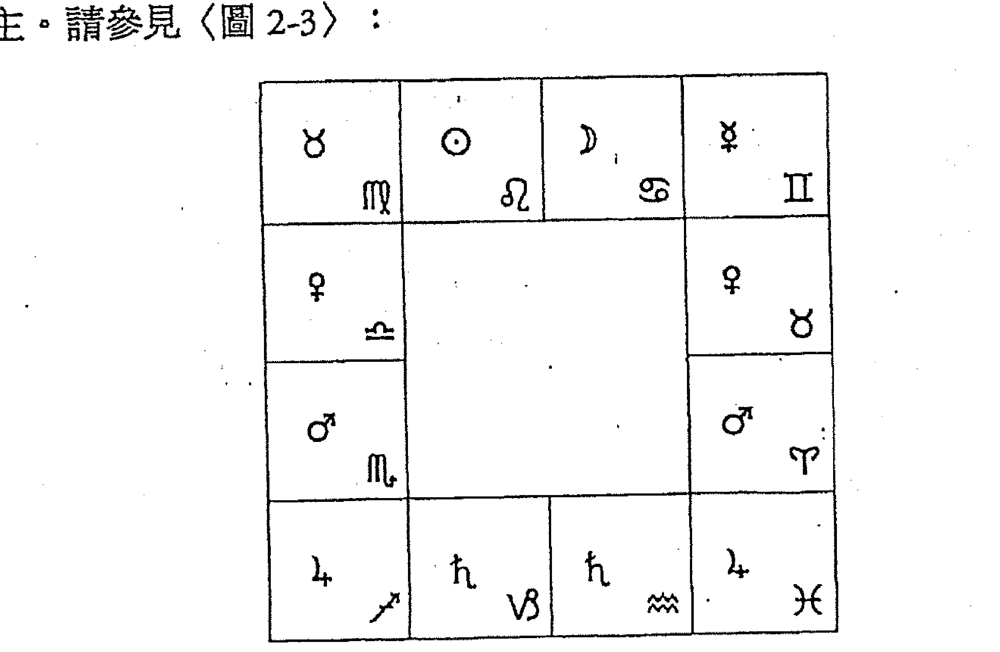

由上圖可清楚得知各宮分別屬於哪個星座，也可輕易了解與掌握各宮主星為哪顆行星。以上圖為例，當上升點位於雙子座時，即可推敲出其他各宮及宮主星如下表：

| 宮位 | 名稱 | 星座 | 主星 |
|------|------|------|------|
| 一宮 | 命宮 | Ⅱ | ♃ |
| 二宮 | 財帛 | ♋ | ☽ |
| 三宮 | 兄弟 | ♌ | ☉ |
| 四宮 | 田宅 | ♍ | ♃ |
| 五宮 | 子女 | ♎ | ♀ |
| 六宮 | 奴僕 | ♏ | ♂ |
| 七宮 | 夫妻 | ♐ | ♃ |
| 八宮 | 疾厄 | ♑ | ♄ |
| 九宮 | 遷移 | ♒ | ♄ |
| 十宮 | 官祿 | ♓ | ♃ |
| 十一宮 | 福德 | ♈ | ♂ |
| 十二宮 | 災難 | ♉ | ♀ |

由於這種宮位制強調宮位的吉凶，因此相當注意各行星原本的自然吉凶性質，以及因宮位所衍生的功能性，可能使原本的自然吉星轉為功能性凶星。如上例的第七宮人馬座和第十宮雙魚座，皆為始宮，當以其主星木星論斷時，即帶有功能性凶星的性質。行星的自然性質與功能性質交互辯證的技法，是印度占星學論斷的特色與訣竅，其脈絡便是由「整個星座宮位制」衍生而來的，所以請務必了解其特性。

「整個星座宮位制」可能是占星史上最古老的分宮制，目前沒有任何證據證明，在托勒密之前尚有其他分宮制。由於其星座與宮位重疊，因此並沒有西方占星學中的截奪宮（Intercepted House）問題，也沒有宮始點當以何者為準的困擾。但其缺點是：天頂所坐落的星座，可能不同於第十宮的起始星座。然而，就西方占星學而言，天頂是極其重要的敏感點，如此一來，可能會產生論斷上的誤差。不過，印度占星學界似乎不以為意，因為長期傳承下來的經驗，即可作為支持的佐證，因此，「整個星座宮位制」至今仍是印度占星學界的主流。

希臘化時期的占星學，對相位的看法是以整個星座來論述之，不同於現代占星學所論述的相位觀念。印度占星學的相位觀念，亦從傳統的整個星座來看，稱之為「相映」。本書將於後文詳述其用法。

### 二、斯里帕蒂宮位制

印度占星學中的宮位制，除了上述「整個星座宮位制」，最常使用的就屬「斯里帕蒂宮位制」（Sripati House System），其方法跟西元三世紀希臘哲學家波菲利（Porphyry）所提倡的分宮制有些類似，因實務中甚少應用，我們不擬詳述。

### 三、普拉西德宮位制

「普拉西德宮位制」（Placidus House System），是西方占星學中最重要的分宮制。何以此宮位制亦被印度占星學界所採用，主因在於印度於二十世紀中竄起的「K.P. 占星系統」。

「K.P. 占星系统」即采用「普拉西德宫位制」。由于此系统逐渐获得印度占星学界的重视，因此连带让「普拉西德宫位制」亦在印度备受瞩目。

## 第三節 天宮圖的形式

印度占星學所使用的天宮圖形式，一律採用直方形圖，又依各地區所使用形式分為：北印度占星命盤、南印度占星命盤、東印度占星命盤。其中，又以前兩者較為盛行。

### 一、北印度占星命盤

北印度占星命盤的形式，主要是將由上升點起始的命宮定在命盤的最上方，然後，如西方占星學的後天宮順序，以逆行針方向推算出各後天宮。由於後天宮是固定的，一般電腦程式不會特別列出，慣用此形式的占星家都默記心中。而星座則是以數字對應的星座順序列出。如左下〈圖 2-4〉上升點

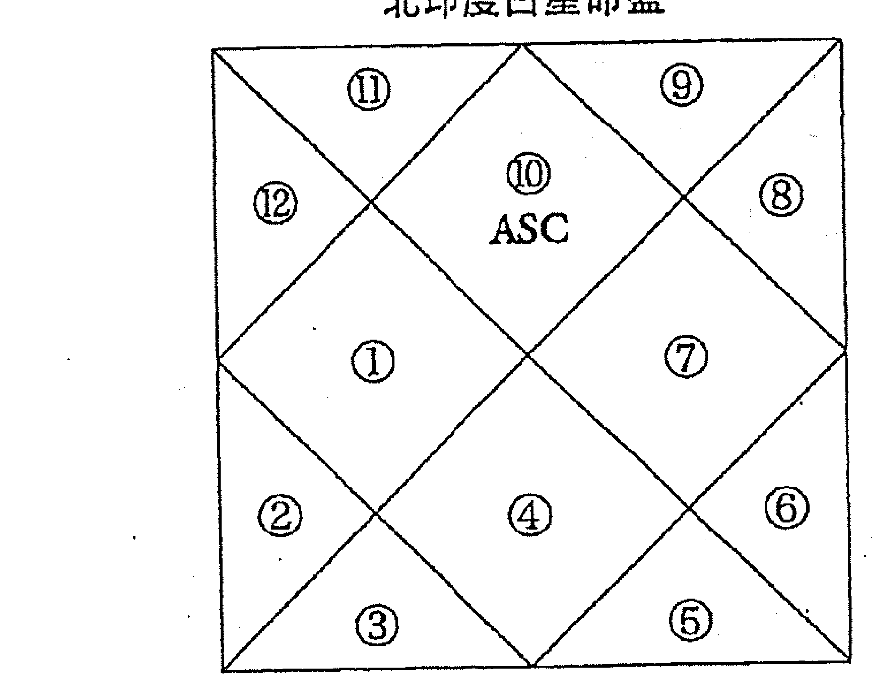

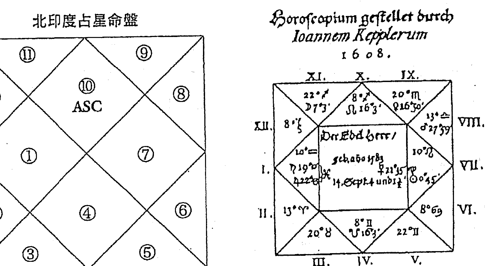

起始的命宮內的⑩，即代表黃道星座先天第十宮的摩羯座，其他數字也都是星座的代號，並非後天宮的宮號，讀者須區分清楚。也有軟體不以數字代表星座，而是直接將星座符號列出，更加一目瞭然。

印度占星學在印度境內的發展分布，係由北到南，故北印度占星命盤較為普及；就連中世紀的阿拉伯及西方部分占星家，都曾使用此形式，如十六世紀的天文學家約翰尼斯·克卜勒（Johannes Kepler），為捷克貴族華倫斯坦（A. E. W. Von. Wallenstein）所繪的天宮圖〈圖2-5〉即是。只是西方系統一律將上升點定在東地平，而北印度天宮圖則將上升點定在最上頭。以張國榮的命盤為例，其北印度占星命盤如下：

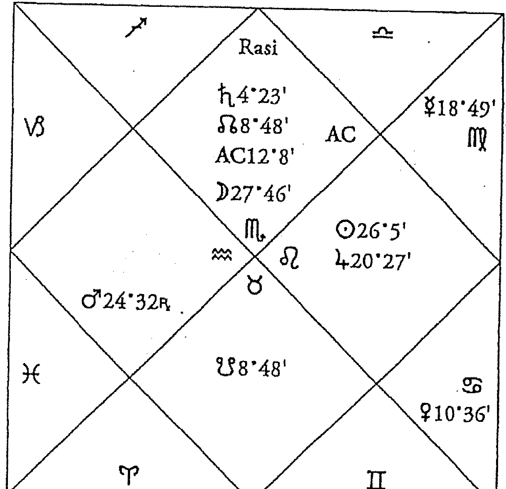

### 二、南印度占星命盤

南印度占星命盤的星座位置是固定的，後天宮的上升點則根據位於哪一星座，以「//」標示出來；其他各後天宮則按順時針方向起出。〈圖2-7〉的上升點位於天蠍座，即為第一宮；第二宮為人馬座；第三宮為摩羯座；第四宮為水瓶座；第五宮為雙魚座；第六宮為白羊座；第七宮為金牛座；第八宮為雙子座；第九宮為巨蟹座；第十宮為獅子座；第十一宮為處女座；第十二宮為天秤座。

南印度占星命盤形似紫微斗數命盤，只要知道命宮所在，便可知道其他各宮位置。以張國榮的命盤為例，其南印度占星命盤為〈圖2-8〉：

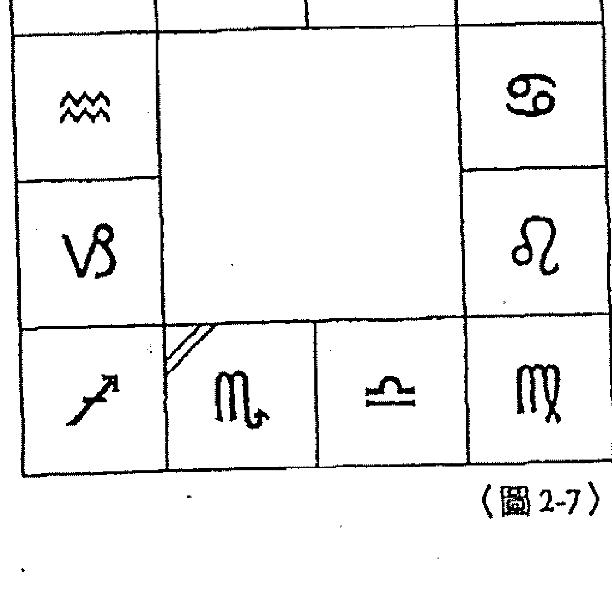

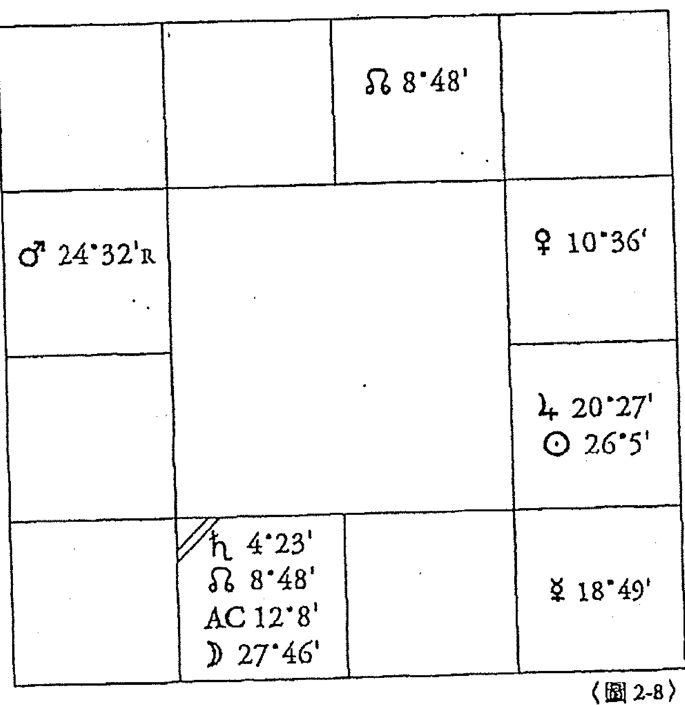

### 三、東印度占星命盤

東印度占星命盤也是將星座位置固定的形式。如〈圖2-9〉將白羊座定在四正中的右邊，然後按黃道十二星座排序。原則上將啟動星座，如白羊、巨蟹、天秤及摩羯，定在四正；而其他星座則兩兩排在偶宮。上升星座定出後，再按逆時針方向排列各宮。如〈圖2-9〉的上升點落在天蠍座，即為第一宮命宮；第二宮為人馬座，其他宮位依此類推。由於東印度占星命盤的使用者較少，遂不擬在此詳述。

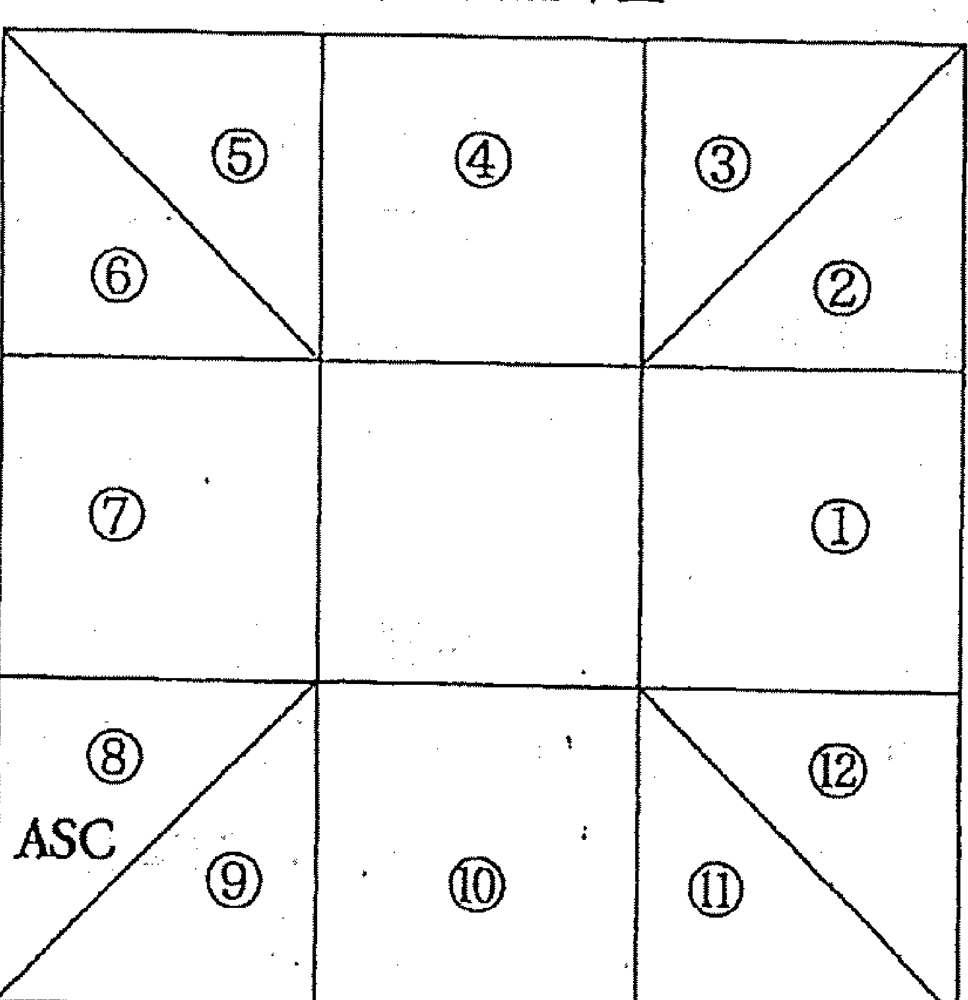

## 第四節　分宮圖的產生與基本意義

「分宮圖」是印度占星學特有的形式，在論斷人生各個事項時，都會再參酌相關領域的分宮圖。如論及職業，歸第十宮管轄，占星家會參考 D10 來研判。分宮圖的種類繁多，幾乎每種人生事項都有對應的分宮圖，然在實務上，並非每個分宮圖都會被使用，依占星家個人喜好及經驗，而有不同搭配。印度常用的組合如下：

-   六種分宮圖（Shad Vargas）： D₁、D₂、D₃、D₉、D₁₂、D₃₀
-   七種分宮圖（Sapta Vargas）： D₁、D₂、D₃、D₇、D₉、D₁₂、D₃₀
-   十種分宮圖（Dasa Vargas）： D₁、D₂、D₃、D₇、D₉、D₁₀、D₁₂、D₁₆、D₃₀、D₆₀
-   十六種分宮圖（Shodasa Vargas）： D₁、D₂、D₃、D₄、D₇、D₉、D₁₀、D₁₂、D₁₆、D₂₀、D₂₄、D₂₇、D₃₀、D₄₀、D₄₅、D₆₀

「分宮圖」的梵文名稱為「Vargas」，意指「區間」；由來是將星座以特定數分割而成。上述分類中的分宮圖代號，即為該定數。如 D9，即將星座除以九，每個區間為 3°20′，每個星座都有九個區間，整個黃道十二星座，共有一百零八個區間。同樣的，D12 即將星座除以十二，每個區間為 2°30′，每個星座都有十二個區間，整個黃道十二星座，共有一百四十四個區間。依此類推，其中，D1 即為本命盤。

由於星座經由特定數的切割，對出生時間的精確度要求也就較高，否則製作分宮圖便毫無意義可言。以 D9 為例，每個區間為 3°20′，以經度 1° 等於四分鐘來換算時間，每 13°20′，D9 的上升區間將有所變化。以此類推，以 D60 為例，每兩分鐘就會產生 D60 的上升區間變化，可以想見其精密度。因此，若能將印度占星學的分宮圖研究透徹，即可用來校正出生時間，或許也能合理解釋雙胞胎出生命盤的差異。

台灣在 1950 年代以前，新生兒大多在家由產婆接生，且囿於傳統習慣，以時辰（每兩小時）為標準，記載出生時間。倘若知道出生時間落在時辰頭、時辰中或時辰尾的哪個段區內，誤差還不致太大，尚可校正。倘若不知，即便使用分宮圖校正也頗費時。幸好 1960 年代以後，新生兒多在醫院出生，有較明確的出生證明。如此一來，製作分宮圖才較具意義。

在尚未介紹分宮圖的製作過程前，〈表 2-6〉先將各種分宮圖的代號、梵文名稱、區間的時間差異及基本意義稍作介紹。由於聖人帕拉萨拉在《BPHS》裡提倡十六種分宮圖的組合，此即成為印度占星學界的主流；因此，本章也以介紹十六種分宮圖的組合為主。

## 第二章

這些分宮圖中，尤以 D9 最為重要，南印度的職業占星家通常會將本命盤與 D9 並列。D9 分宮圖的星座區分，恰與印度占星學中，依二十七星宿劃分出的每個星宿的管轄度數相同，因此應特別留意之。

以下介紹上述十六個分宮圖的製作方式，並以張國榮的命盤為例：

（表2-6）

| 代號 | 梵文名稱 | 星座區分 | 區間度數 | 時間 | 意義 |
| :--- | :--- | :--- | :--- | :--- | :--- |
| D₁ | Rasi | 1/1 | 30' | 120分 | 本命盤、健康、身體結構、自我、膚色、脾氣、習性、人格 |
| D₂ | Hora | 1/2 | 15' | 60分 | 財富、財產、貧窮 |
| D₃ | Drekana | 1/3 | 10' | 40分 | 兄弟姊妹、勇氣、膽量、冒險精神 |
| D₄ | Chaturtamsa | 1/4 | 7°30' | 30分 | 擁有財產的能力、土地、建物、不動產 |
| D₇ | Saptamsa | 1/7 | 4°17'8.57" | 17分8.57秒 | 孩子 |
| D₉ | Navamsa | 1/9 | 3°20' | 13分20秒 | 配偶、婚姻生活、運氣、幸運、所有生活層面 |
| D₁₀ | Dashamsa | 1/10 | 3° | 12分 | 職業、位階、地位、名望、權力 |
| D₁₂ | Dwadashamsa | 1/12 | 2°30' | 10分 | 父母 |
| D₁₆ | Shodashamsa | 1/16 | 1°52'30" | 7分30秒 | 運輸交通工具、汽車、奢侈、內心愉悅 |
| D₂₀ | Vimsamsa | 1/20 | 1°30' | 6分 | 靜坐、冥想、精神訓練、奉獻 |
| D₂₄ | Chaturvimsamsa | 1/24 | 1°15' | 5分 | 學術成就、教育、知識、學習 |
| D₂₇ | Bhamsa | 1/27 | 1°6'40" | 4分26.4秒 | 強弱、力量、勇敢、膽量 |
| D₃₀ | Trimsamsa | 1/30 | 1° | 4分 | 逆境、不幸、災難、困難、阻礙、專論女命德行 |
| D₄₀ | Chatvarimsamsa | 1/40 | 0°45' | 3分 | 吉凶效應（行星期間之星）、母系遺產 |
| D₄₅ | Akshavedamsa | 1/45 | 0°40' | 2分39.6秒 | 一般指示父系遺產 |
| D₆₀ | Shastiamsa | 1/60 | 0°30' | 2分 | 一般指示過去的業力 |

| 左列 | 右列 |
|------|------|
| ⊙ ♌ 26°5' | ♀ ♋ 10°36' |
| ☽ ♏ 27°46' | ♄ ♏ 4°23' |
| ♂ ♒ 24°32'R | ♋ ♏ 8°48' |
| ☿ ♍ 18°49' | ♉ 8°48' |
| ♃ ♌ 20°27' | ASC ♏ 12°8' |

### 一、D₂ Hora

將每個星座劃分為二。奇數星座的前半 15° 由太陽主宰，後半 15° 由月亮主宰；偶數星座的前半 15° 由月亮主管，後半 15° 由太陽主管；依此劃分，即形成 D₂ Hora。「Hora」即「一小時」之意，每個星座包含兩個「Hora」。資料整理如下：

| 星座 | 星座奇偶 | 前15° | 后15° |
|------|----------|-------|-------|
| 白羊座 | 奇數星座 | ⊙ 獅子座 | ☽ 巨蟹座 |
| 金牛座 | 偶數星座 | ☽ 巨蟹座 | ⊙ 獅子座 |
| 雙子座 | 奇數星座 | ⊙ 獅子座 | ☽ 巨蟹座 |
| 巨蟹座 | 偶數星座 | ☽ 巨蟹座 | ⊙ 獅子座 |
| 獅子座 | 奇數星座 | ⊙ 獅子座 | ☽ 巨蟹座 |
| 處女座 | 偶數星座 | ☽ 巨蟹座 | ⊙ 獅子座 |
| 天秤座 | 奇數星座 | ⊙ 獅子座 | ☽ 巨蟹座 |
| 天蠍座 | 偶數星座 | ☽ 巨蟹座 | ⊙ 獅子座 |
| 人馬座 | 奇數星座 | ⊙ 獅子座 | ☽ 巨蟹座 |
| 摩羯座 | 偶数星座 | ☾ 巨蟹座 | ☉ 狮子座 |
| 水瓶座 | 奇数星座 | ☉ 狮子座 | ☾ 巨蟹座 |
| 双鱼座 | 偶数星座 | ☾ 巨蟹座 | ☉ 狮子座 |

#### 張國榮本命行星所在 D₂ 分宮圖位置

| 行星 | 恒星黃道經度 | 區間 | 主管行星 | 所在星座 |
| :--- | :--- | :--- | :--- | :--- |
| ASC | 天蠍座 12°8' | 前 | ☾ | 巨蟹座 |
| ☉ | 獅子座 26°5' | 後 | ☾ | 巨蟹座 |
| ☾ | 天蠍座 27°46' | 後 | ☉ | 獅子座 |
| ♂ | 水瓶座 24°32' Rx | 後 | ☾ | 巨蟹座 |
| ☿ | 處女座 18°49' | 後 | ☉ | 獅子座 |
| ♃ | 獅子座 20°27' | 後 | ☾ | 巨蟹座 |
| ♀ | 巨蟹座 10°36' | 前 | ☾ | 巨蟹座 |
| ♄ | 天蠍座 4°23' | 前 | ☾ | 巨蟹座 |

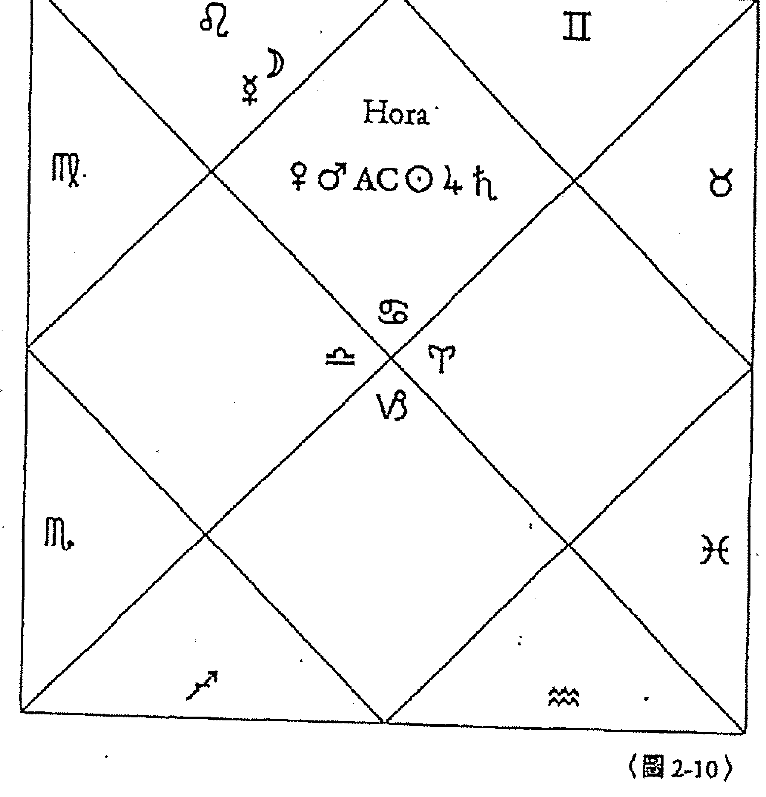

### 二、D₃ Drekana

將每個星座劃分為三等分，每等分區間各10°，整個黃道十二星座，共有三十六個區間，類似埃及占星學的三十六個黃道區間。

每個星座的第一個區間，由該星座主星主管；第二個區間，由該星座起算的第五個星座主星主管；第三個星座，則由該星座起算的第九個星座主星主管。依此規則，可畫出 D₃ 分宮圖；具有兄弟姊妹的徵象。

| 星座   | 第一區間 0°-10° | 第二區間 10°-20° | 第三區間 20°-30° |
|--------|----------------|----------------|----------------|
| 白羊座 | ♈              | ♌              | ♐              |
| 金牛座 | ♉              | ♍              | ♑              |
| 雙子座 | ♊              | ♎              | ♒              |
| 巨蟹座 | ♋              | ♏              | ♓              |
| 獅子座 | ♌              | ♐              | ♈              |
| 處女座 | ♍              | ♑              | ♉              |
| 天秤座 | ♎              | ♒              | ♊              |
| 天蠍座 | ♏              | ♓              | ♋              |
| 人馬座 | ♐              | ♈              | ♌              |
| 摩羯座 | ♑              | ♉              | ♍              |
| 水瓶座 | ♒              | ♊              | ♎              |
| 雙魚座 | ♓              | ♋              | ♏              |

（表2-10）

#### 張國榮本命行星所在 D₃ 分宮圖位置

| 行星 | 恆星黃道經度 | 區間 | 主管行星 | 所在星座 |
|---|---|---|---|---|
| ASC | 天蠍座 12°8' | 2 | ♃ | 雙魚座 |
| ☉ | 獅子座 26°5' | 3 | ♂ | 白羊座 |
| ☽ | 天蠍座 27°46' | 3 | ☽ | 巨蟹座 |
| ♂ | 水瓶座 24°32' Rx | 3 | ♀ | 天秤座 |
| ☿ | 處女座 18°49' | 2 | ♄ | 摩羯座 |
| ♃ | 獅子座 20°27' | 3 | ♂ | 白羊座 |
| ♀ | 巨蟹座 10°36' | 2 | ♂ | 天蠍座 |
| ♄ | 天蠍座 4°23' | 1 | ♂ | 天蠍座 |

（表 2-11）

D₃ Drekkana

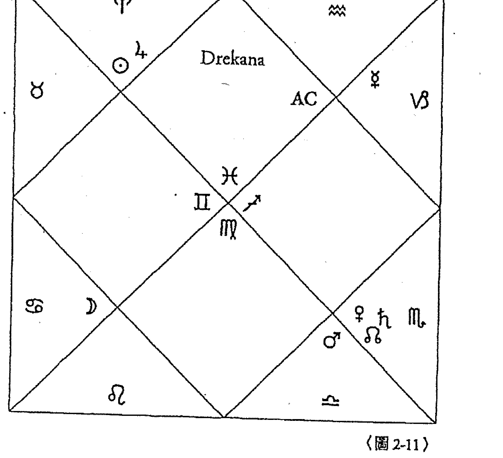

（圖 2-11）

### 三、D₄ Chaturtamsa

将每个星座划分成四等分，每个区间 7°30‘，整个黄道十二星座共有四十八个区间。每个星座的第一个区间，由该星座主星主管；第二个区间，由该星座起算的第四个星座主星主管；第三个区间，由该星座起算的第七个星座主星主管；第四个区间，则由该星座起算的第十个星座主星主管；依此规则，即可画出 D₄ 分宫图，各个区间的星座如下：

| 星座 | 第一区间 0°-7°30' | 第二区间 7°30'-15° | 第三区间 15°-22°30' | 第四区间 22°30'-30° |
| :--- | :---: | :---: | :---: | :---: |
| 白羊座 | ♈ | ♋ | ♎ | ♑ |
| 金牛座 | ♉ | ♌ | ♏ | ♒ |
| 双子座 | ♊ | ♍ | ♐ | ♓ |
| 巨蟹座 | ♋ | ♎ | ♑ | ♈ |
| 狮子座 | ♌ | ♏ | ♒ | ♉ |
| 处女座 | ♍ | ♐ | ♓ | ♊ |
| 天秤座 | ♎ | ♑ | ♈ | ♋ |
| 天蝎座 | ♏ | ♒ | ♉ | ♌ |
| 人马座 | ♐ | ♓ | ♊ | ♍ |
| 摩羯座 | ♑ | ♈ | ♋ | ♎ |
| 水瓶座 | ♒ | ♉ | ♌ | ♏ |
| 双鱼座 | ♓ | ♊ | ♍ | ♐ |

（表2-12）

#### 張國榮本命行星所在 D₄ 分宮圖位置

| 行星 | 恆星黃道經度 | 區間 | 主管行星 | 所在星座 |
|------|--------------|------|----------|----------|
| ASC  | 天蠍座 12°8' | 2    | ♄        | 水瓶座   |
| ☉    | 獅子座 26°5' | 4    | ♀        | 金牛座   |
| ☽    | 天蠍座 27°46'| 4    | ☉        | 獅子座   |
| ♂    | 水瓶座 24°32' Rx | 4 | ♂        | 天蠍座   |
| ☿    | 處女座 18°49'| 3    | ♃        | 雙魚座   |
| ♃    | 獅子座 20°27'| 3    | ♄        | 水瓶座   |
| ♀    | 巨蟹座 10°36'| 2    | ♀        | 天秤座   |
| ♄    | 天蠍座 4°23' | 1    | ♂        | 天蠍座   |

（表2-13）

D₄ Chaturtamsa

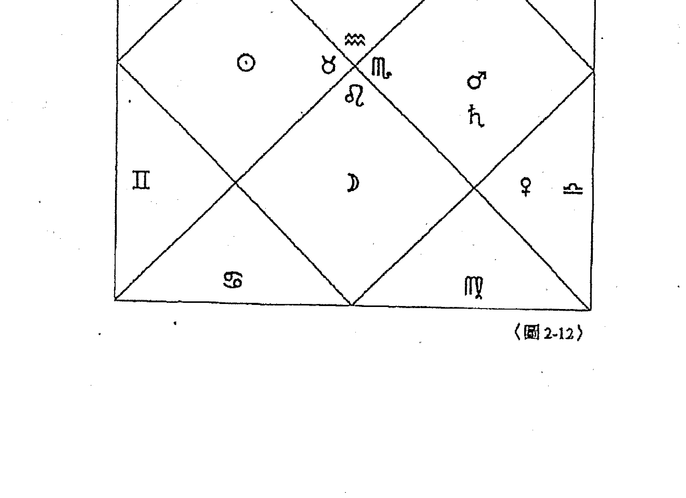

（圖2-12）

### 四、D₇ Saptamsa

將每個星座劃分成七等分，每個區間 4°17′8.57″，位於奇數星座，從該星座起算，連續七個星座主星主管七個區間；而偶數星座，其最後區間由該星座主星主管，然遞算連續七個星座主星主管七個區間。依此規則，可排出 D₇ 分宮圖；顯現當事人與孩子間種種關係的徵象。相關星座主管區間如下：

| 星座 | 白羊座 | 金牛座 | 雙子座 | 巨蟹座 | 獅子座 | 處女座 | 天秤座 | 天蠍座 | 人馬座 | 摩羯座 | 水瓶座 | 雙魚座 |
|---|---|---|---|---|---|---|---|---|---|---|---|---|
| 第一區間 4°17′8.57″ | ♈ | ♉ | ♊ | ♋ | ♌ | ♍ | ♎ | ♏ | ♐ | ♑ | ♒ | ♓ |
| 第二區間 8°34′17.14″ | ♉ | ♐ | ♋ | ♒ | ♍ | ♈ | ♉ | ♊ | ♋ | ♌ | ♓ | ♎ |
| 第三區間 12°51′25.71″ | ♊ | ♋ | ♌ | ♓ | ♎ | ♉ | ♐ | ♋ | ♒ | ♍ | ♈ | ♉ |
| 第四區間 17°08′34.28″ | ♋ | ♒ | ♍ | ♈ | ♉ | ♊ | ♋ | ♌ | ♓ | ♎ | ♉ | ♐ |
| 第五區間 21°25′42.18″ | ♌ | ♓ | ♎ | ♉ | ♐ | ♋ | ♒ | ♍ | ♈ | ♉ | ♊ | ♋ |
| 第六區間 25°42′51.42″ | ♍ | ♈ | ♉ | ♊ | ♋ | ♌ | ♓ | ♎ | ♉ | ♐ | ♋ | ♒ |
| 第七區間 30° | ♎ | ♉ | ♐ | ♋ | ♒ | ♍ | ♈ | ♉ | ♊ | ♋ | ♌ | ♓ |
（表2-14）

※D₇ 分宮圖特別關注性活動及其結果——孩子。一般而言，孩子的論斷要看第五宮（它是第七宮〔配偶〕的第十一宮〔收穫〕），特別是第一位配偶（第七宮）的孩子。

#### 張國榮本命行星所在 D₇ 分宮圖位置

| 行星 | 恆星黃道經度 | 區間 | 主管行星 | 所在星座 |
| :--- | :--- | :--- | :--- | :--- |
| ASC | 天蠍座 12°8' | 3 | ☽ | 巨蟹座 |
| ☉ | 獅子座 26°5' | 7 | ♄ | 水瓶座 |
| ☽ | 天蠍座 27°46' | 7 | ♂ | 天蠍座 |
| ♂ | 水瓶座 24°32' Rx | 6 | ☽ | 巨蟹座 |
| ☿ | 處女座 18°49' | 5 | ☽ | 巨蟹座 |
| ♃ | 獅子座 20°27' | 5 | ♃ | 人馬座 |
| ♀ | 巨蟹座 10°36' | 3 | ♃ | 雙魚座 |
| ♄ | 天蠍座 4°23' | 2 | ☿ | 雙子座 |
（表2-15）

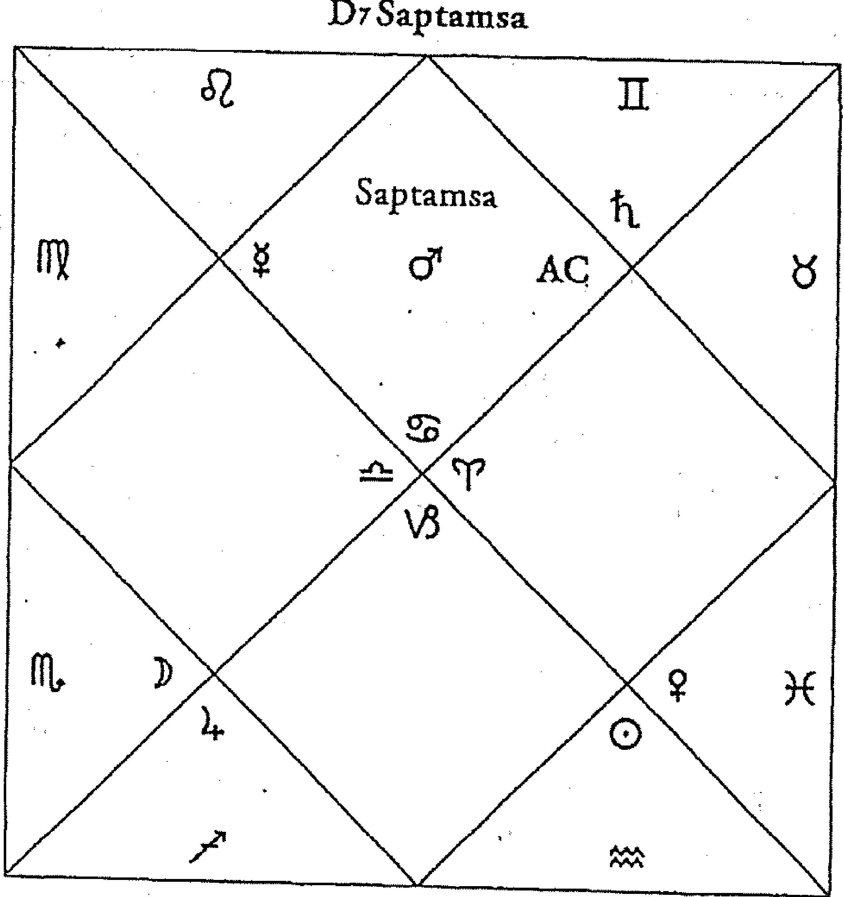

### 五、D₉ Navamsa

將每個星座劃分成九等分，每個區間3°20′，整個黃道十二星座共有一百零八個區間。火象星座（白羊座、獅子座、人馬座）的第一個區間，由白羊座主星火星主管；而第二至第八個區間，則按照白羊座之後的黃道星座順序，分別排列。土象星座（金牛座、處女座、摩羯座）的第一個區間，由摩羯座主星土星主管，再依黃道星座順序，分別排出第二至第八個區間。風象星座（雙子座、天秤座、水瓶座）的第一個區間，由天秤座主星金星主管，再依黃道星座順序，分別排出第二至第八個區間。水象星座（巨蟹座、天蠍座、雙魚座）的第一個區間，由巨蟹座主星月亮主管，再依黃道星座順序，分別排出第二至第八個區間。依此規則，即可製作出D₉分宮圖；具有配偶、婚姻、幸運吉祥的象徵，在所有分宮圖中最為重要。

| 星座 | 白羊座 | 金牛座 | 雙子座 | 巨蟹座 | 獅子座 | 處女座 | 天秤座 | 天蠍座 | 人馬座 | 摩羯座 | 水瓶座 | 雙魚座 |
| :--- | :---: | :---: | :---: | :---: | :---: | :---: | :---: | :---: | :---: | :---: | :---: | :---: |
| 第一區間 3°20′ | ♈ | ♉ | ♊ | ♋ | ♈ | ♉ | ♊ | ♋ | ♈ | ♉ | ♊ | ♋ |
| 第二區間 6°40′ | ♉ | ♊ | ♋ | ♌ | ♉ | ♊ | ♋ | ♌ | ♉ | ♊ | ♋ | ♌ |
| 第三區間 10° | ♊ | ♋ | ♌ | ♍ | ♊ | ♋ | ♌ | ♍ | ♊ | ♋ | ♌ | ♍ |
| 第四區間 13°20′ | ♋ | ♌ | ♍ | ♎ | ♋ | ♌ | ♍ | ♎ | ♋ | ♌ | ♍ | ♎ |
| 第五區間 16°40′ | ♌ | ♍ | ♎ | ♏ | ♌ | ♍ | ♎ | ♏ | ♌ | ♍ | ♎ | ♏ |
| 第六區間 20° | ♍ | ♎ | ♏ | ♐ | ♍ | ♎ | ♏ | ♐ | ♍ | ♎ | ♏ | ♐ |
| 第七區間 23°20′ | ♎ | ♏ | ♐ | ♑ | ♎ | ♏ | ♐ | ♑ | ♎ | ♏ | ♐ | ♑ |
| 第八區間 26°40′ | ♏ | ♐ | ♑ | ♒ | ♏ | ♐ | ♑ | ♒ | ♏ | ♐ | ♑ | ♒ |
| 第九區間 30° | ♈ | ♉ | ♊ | ♋ | ♌ | ♍ | ♎ | ♏ | ♐ | ♑ | ♒ | ♓ |

（表 2-16）

#### 張國榮本命行星所在 D₉ 分宮圖位置

| 行星 | 恆星黃道經度 | 區間 | 主管行星 | 所在星座 |
|------|--------------|------|----------|----------|
| ASC | 天蠍座 12°8′ | 4 | ♀ | 天秤座 |
| ⊙ | 獅子座 26°5′ | 8 | ♂ | 天蠍座 |
| ☽ | 天蠍座 27°46′ | 9 | ♃ | 雙魚座 |
| ♂ | 水瓶座 24°32′ Rx | 8 | ♀ | 金牛座 |
| ☿ | 處女座 18°49′ | 6 | ☿ | 雙子座 |
| ♃ | 獅子座 20°27′ | 7 | ♀ | 天秤座 |
| ♀ | 巨蟹座 10°36′ | 4 | ♀ | 天秤座 |
| ♄ | 天蠍座 4°23′ | 2 | ⊙ | 獅子座 |

（表 2-17）

D₉ Navamsa

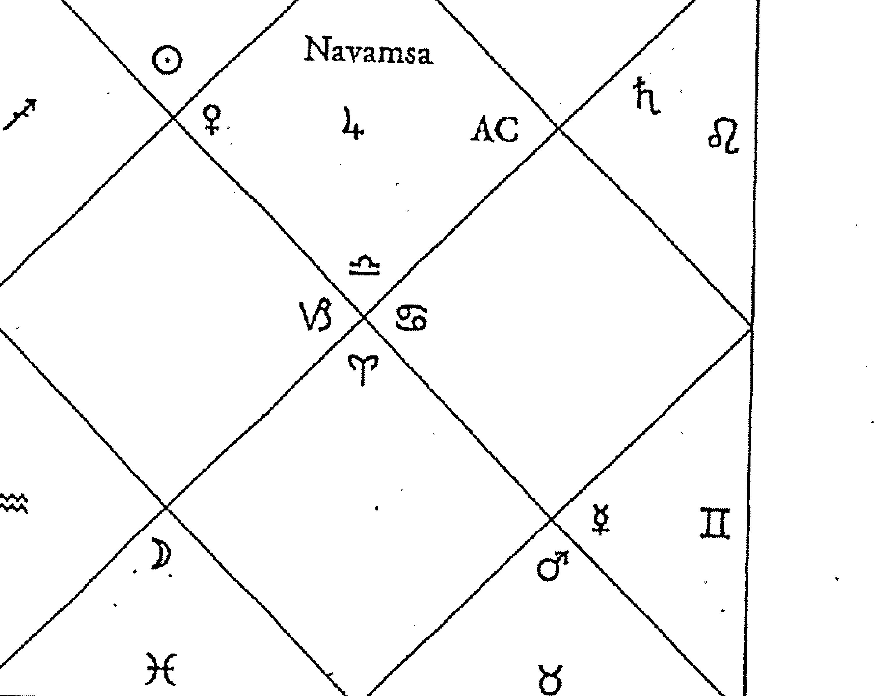

（圖 2-14）

### 六、D₁₀ Dashamsa

将每个星座划分成十等分，每个区间 3°，整个黄道十二星座共有一百二十个区间。奇数星座从该星座起算，接续的十个星座分别主管十个区间；而偶数星座则从该星座起算的第九个星座开始，接续的十个星座分别主管十个区间。依此规则，可制作出 D₁₀ 分宫图；呈现职业、社会地位、名望的徵象。

| 星座 | 白羊座 | 金牛座 | 双子座 | 巨蟹座 | 狮子座 | 处女座 | 天秤座 | 天蝎座 | 人马座 | 摩羯座 | 水瓶座 | 双鱼座 |
| :--- | :---: | :---: | :---: | :---: | :---: | :---: | :---: | :---: | :---: | :---: | :---: | :---: |
| 第一区间 3° | ♈ | ♉ | ♊ | ♋ | ♌ | ♍ | ♎ | ♏ | ♐ | ♑ | ♒ | ♓ |
| 第二区间 6° | ♉ | ♊ | ♋ | ♌ | ♍ | ♎ | ♏ | ♐ | ♑ | ♒ | ♓ | ♈ |
| 第三区间 9° | ♊ | ♋ | ♌ | ♍ | ♎ | ♏ | ♐ | ♑ | ♒ | ♓ | ♈ | ♉ |
| 第四区间 12° | ♋ | ♌ | ♍ | ♎ | ♏ | ♐ | ♑ | ♒ | ♓ | ♈ | ♉ | ♊ |
| 第五区间 15° | ♌ | ♍ | ♎ | ♏ | ♐ | ♑ | ♒ | ♓ | ♈ | ♉ | ♊ | ♋ |
| 第六区间 18° | ♍ | ♎ | ♏ | ♐ | ♑ | ♒ | ♓ | ♈ | ♉ | ♊ | ♋ | ♌ |
| 第七区间 21° | ♎ | ♏ | ♐ | ♑ | ♒ | ♓ | ♈ | ♉ | ♊ | ♋ | ♌ | ♍ |
| 第八区间 24° | ♏ | ♐ | ♑ | ♒ | ♓ | ♈ | ♉ | ♊ | ♋ | ♌ | ♍ | ♎ |
| 第九区间 27° | ♐ | ♑ | ♒ | ♓ | ♈ | ♉ | ♊ | ♋ | ♌ | ♍ | ♎ | ♏ |
| 第十区间 30° | ♑ | ♒ | ♓ | ♈ | ♉ | ♊ | ♋ | ♌ | ♍ | ♎ | ♏ | ♐ |

<表2-18>## 張國榮本命行星所在 D10 分宮圖位置

| 行星 | 恆星黃道經度 | 區間 | 主管行星 | 所在星座 |
|------|--------------|------|----------|----------|
| ASC | 天蠍座 12°8' | 5 | ♂ | 天蠍座 |
| ☉ | 獅子座 26°5' | 9 | ♂ | 白羊座 |
| ☽ | 天蠍座 27°46' | 10 | ♂ | 白羊座 |
| ♂ | 水瓶座 24°32' Rₓ | 9 | ♀ | 天秤座 |
| ☿ | 處女座 18°49' | 7 | ♂ | 天蠍座 |
| ♃ | 獅子座 20°27' | 7 | ♄ | 水瓶座 |
| ♀ | 巨蟹座 10°36' | 5 | ☽ | 巨蟹座 |
| ♄ | 天蠍座 4°23' | 2 | ☉ | 獅子座 |

> 〈表2-19〉

#### D10 Dashamsa

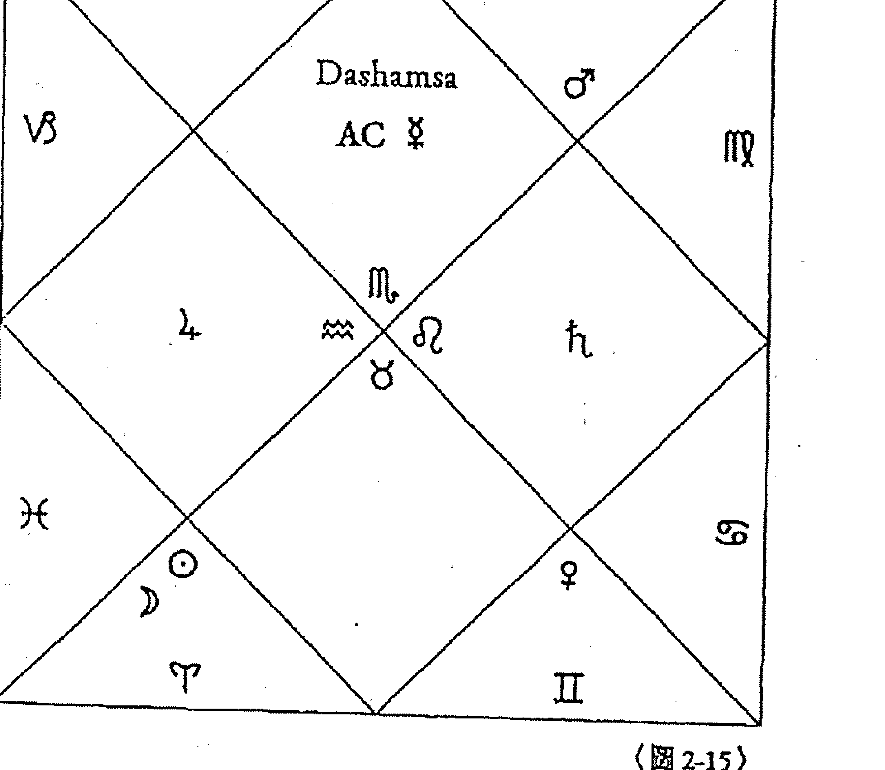

> 〈圖2-15〉

### 七、D12 Dwadashamsa

将星座划分成十二等分，每个区间 2°30′，整个黄道十二星座共有一百四十四个区间。第一个区间由该星座主星主管，再依黄道星座的顺序排列。依此规则，即可制作出 D12 分宫图；具有与父母相关的徵象。相关星座主管区间如下：

| 星座 | 白羊座 | 金牛座 | 双子座 | 巨蟹座 | 狮子座 | 处女座 | 天秤座 | 天蝎座 | 人马座 | 摩羯座 | 水瓶座 | 双鱼座 |
| :--- | :---: | :---: | :---: | :---: | :---: | :---: | :---: | :---: | :---: | :---: | :---: | :---: |
| 第一区间 2°30′ | ♈ | ♉ | ♊ | ♋ | ♌ | ♍ | ♎ | ♏ | ♐ | ♑ | ♒ | ♓ |
| 第二区间 5° | ♉ | ♊ | ♋ | ♌ | ♍ | ♎ | ♏ | ♐ | ♑ | ♒ | ♓ | ♈ |
| 第三区间 7°30′ | ♊ | ♋ | ♌ | ♍ | ♎ | ♏ | ♐ | ♑ | ♒ | ♓ | ♈ | ♉ |
| 第四区间 10° | ♋ | ♌ | ♍ | ♎ | ♏ | ♐ | ♑ | ♒ | ♓ | ♈ | ♉ | ♊ |
| 第五区间 12°30′ | ♌ | ♍ | ♎ | ♏ | ♐ | ♑ | ♒ | ♓ | ♈ | ♉ | ♊ | ♋ |
| 第六区间 15° | ♍ | ♎ | ♏ | ♐ | ♑ | ♒ | ♓ | ♈ | ♉ | ♊ | ♋ | ♌ |
| 第七区间 17°30′ | ♎ | ♏ | ♐ | ♑ | ♒ | ♓ | ♈ | ♉ | ♊ | ♋ | ♌ | ♍ |
| 第八区间 20° | ♏ | ♐ | ♑ | ♒ | ♓ | ♈ | ♉ | ♊ | ♋ | ♌ | ♍ | ♎ |
| 第九区间 22°30′ | ♐ | ♑ | ♒ | ♓ | ♈ | ♉ | ♊ | ♋ | ♌ | ♍ | ♎ | ♏ |
| 第十区间 25° | ♑ | ♒ | ♓ | ♈ | ♉ | ♊ | ♋ | ♌ | ♍ | ♎ | ♏ | ♐ |
| 第十一区间 27°30′ | ♒ | ♓ | ♈ | ♉ | ♊ | ♋ | ♌ | ♍ | ♎ | ♏ | ♐ | ♑ |
| 第十二区间 30° | ♓ | ♈ | ♉ | ♊ | ♋ | ♌ | ♍ | ♎ | ♏ | ♐ | ♑ | ♒ |

(表2-20)

#### 张国荣本命行星所在 D12 分宫图位置

| 行星 | 恒星黄道经度 | 区间 | 主管行星 | 所在星座 |
|---|---|---|---|---|
| ASC | 天蝎座 12°8' | 5 | ♃ | 双鱼座 |
| ☉ | 狮子座 26°5' | 11 | ♆ | 双子座 |
| ☽ | 天蝎座 27°46' | 12 | ♀ | 天秤座 |
| ♂ | 水瓶座 24°32' R | 10 | ♂ | 天蝎座 |
| ☿ | 处女座 18°49' | 8 | ♂ | 白羊座 |
| ♃ | 狮子座 20°27' | 9 | ♂ | 白羊座 |
| ♀ | 巨蟹座 10°36' | 5 | ♂ | 天蝎座 |
| ♄ | 天蝎座 4°23' | 2 | ♃ | 人马座 |

(表2-21)

#### D12 Dwadashamsa

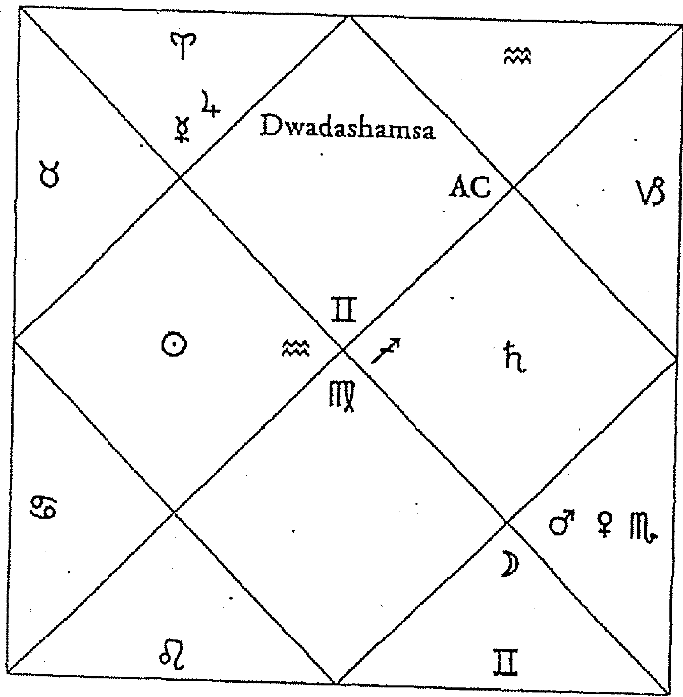

(图2-16)

### 八、D16 Shodashamsa

将星座划分成十六等分，每个区间1°52‘30"，整个黄道十二星座共有一百九十二个区间。启动星座（白羊座、巨蟹座、天秤座、摩羯座）的第一个区间，由白羊座主管，再依黄道星座的顺序，排出第二至第十六个区间；固定星座（金牛座、狮子座、天蝎座、水瓶座）的第一个区间，由狮子座主管，再依黄道星座的顺序，排出第二至第十六个区间；变动星座（双子座、处女座、人马座、双鱼座）的第一个区间，由人马座主管，再依黄道星座的顺序，排出第二至第十六个区间。依此规则，即可制作出D16分宫图；具有运输工具、汽车等享受生活、舒适的徵象。

| 区间 | 白羊座 | 金牛座 | 双子座 | 巨蟹座 | 狮子座 | 处女座 | 天秤座 | 天蝎座 | 人马座 | 摩羯座 | 水瓶座 | 双鱼座 |
| :--- | :---: | :---: | :---: | :---: | :---: | :---: | :---: | :---: | :---: | :---: | :---: | :---: |
| 第一区间 1°52‘30" | ♈ | ♉ | ♊ | ♋ | ♌ | ♍ | ♎ | ♏ | ♐ | ♑ | ♒ | ♓ |
| 第二区间 3°45' | ♉ | ♍ | ♑ | ♉ | ♍ | ♑ | ♉ | ♍ | ♑ | ♉ | ♍ | ♑ |
| 第三区间 5°37‘30" | ♊ | ♎ | ♒ | ♊ | ♎ | ♒ | ♊ | ♎ | ♒ | ♊ | ♎ | ♒ |
| 第四区间 7°30' | ♋ | ♏ | ♓ | ♋ | ♏ | ♓ | ♋ | ♏ | ♓ | ♋ | ♏ | ♓ |
| 第五区间 9°22’30" | ♌ | ♐ | ♈ | ♌ | ♐ | ♈ | ♌ | ♐ | ♈ | ♌ | ♐ | ♈ |
| 第六区间 11°15' | ♍ | ♑ | ♉ | ♍ | ♑ | ♉ | ♍ | ♑ | ♉ | ♍ | ♑ | ♉ |
| 第七区间 13°7‘30" | ♎ | ♒ | ♊ | ♎ | ♒ | ♊ | ♎ | ♒ | ♊ | ♎ | ♒ | ♊ |
| 第八区间 15° | ♏ | ♓ | ♋ | ♏ | ♓ | ♋ | ♏ | ♓ | ♋ | ♏ | ♓ | ♋ |
| 第九区间 16°52'30" | ♐ | ♈ | ♎ | ♐ | ♈ | ♎ | ♐ | ♈ | ♎ | ♐ | ♈ | ♎ |
| 第十区间 18°45' | ♑ | ♉ | ♍ | ♑ | ♉ | ♍ | ♑ | ♉ | ♍ | ♑ | ♉ | ♍ |
| 第十一区间 20°37'30" | ♒ | ♊ | ♌ | ♒ | ♊ | ♌ | ♒ | ♊ | ♌ | ♒ | ♊ | ♌ |
| 第十二区间 22°30" | ♓ | ♋ | ♏ | ♓ | ♋ | ♏ | ♓ | ♋ | ♏ | ♓ | ♋ | ♏ |
| 第十三区间 24°22'30" | ♈ | ♎ | ♐ | ♈ | ♎ | ♐ | ♈ | ♎ | ♐ | ♈ | ♎ | ♐ |
| 第十四区间 26°15" | ♉ | ♍ | ♑ | ♉ | ♍ | ♑ | ♉ | ♍ | ♑ | ♉ | ♍ | ♑ |
| 第十五区间 28°7'30" | ♊ | ♌ | ♒ | ♊ | ♌ | ♒ | ♊ | ♌ | ♒ | ♊ | ♌ | ♒ |
| 第十六区间 30° | ♋ | ♏ | ♓ | ♋ | ♏ | ♓ | ♋ | ♏ | ♓ | ♋ | ♏ | ♓ |

## 第二章

#### 張國榮本命行星所在 D16 分宮圖位置

| 行星 | 恆星黃道經度 | 區間 | 主管行星 | 所在星座 |
| :---: | :---: | :---: | :---: | :---: |
| ASC | 天蠍座 12°8' | 7 | ♄ | 水瓶座 |
| ☉ | 獅子座 26°5' | 14 | ☿ | 處女座 |
| ☽ | 天蠍座 27°46' | 15 | ♀ | 天秤座 |
| ♂ | 水瓶座 24°32' Rx | 14 | ☿ | 處女座 |
| ☿ | 處女座 18°49' | 11 | ♀ | 天秤座 |
| ♃ | 獅子座 20°27' | 11 | ☿ | 雙子座 |
| ♀ | 巨蟹座 10°36' | 6 | ☿ | 處女座 |
| ♄ | 天蠍座 4°23' | 3 | ♀ | 天秤座 |

#### D16 Shodashamsa

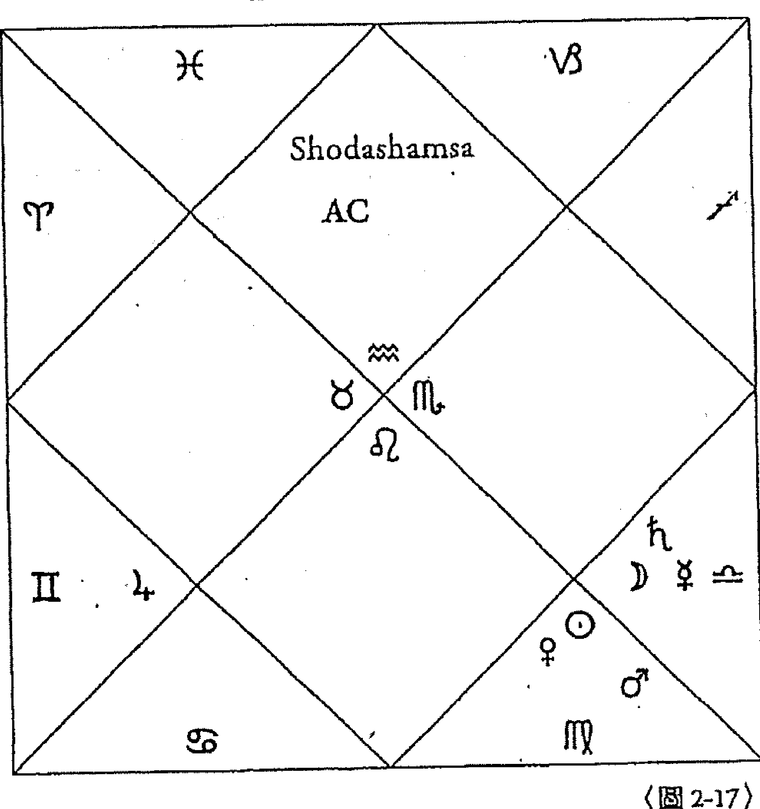

(表2-23)

(圖2-17)

### 九、D20 Vimsamsa

將每個星座劃分成二十等分，每個區間 1°30'，整個黃道十二星座共有兩百四十個區間。啟動星座的第一個區間，由白羊座主管；而第二至第二十個區間，則依黃道星座的順序，分別排出。固定星座的第一個區間，由人馬座主管；而第二至第二十個區間，則依黃道星座的順序，分別排出。變動星座的第一個區間，由獅子座主管；而第二至第二十個區間，則依黃道星座的順序，分別排出。依此規則，即可製作 D20 分宮圖；具有靜坐、冥想、精神訓練、奉獻的徵象。

| 星座 | 白羊座 | 金牛座 | 雙子座 | 巨蟹座 | 獅子座 | 處女座 | 天秤座 | 天蠍座 | 人馬座 | 摩羯座 | 水瓶座 | 雙魚座 |
| :--- | :--- | :--- | :--- | :--- | :--- | :--- | :--- | :--- | :--- | :--- | :--- | :--- |
| 第一區間 1°30' | ♈ | ♐ | ♌ | ♈ | ♐ | ♌ | ♈ | ♐ | ♌ | ♈ | ♐ | ♌ |
| 第二區間 3° | ♉ | ♑ | ♍ | ♉ | ♑ | ♍ | ♉ | ♑ | ♍ | ♉ | ♑ | ♍ |
| 第三區間 4°30' | ♊ | ♒ | ♎ | ♊ | ♒ | ♎ | ♊ | ♒ | ♎ | ♊ | ♒ | ♎ |
| 第四區間 6° | ♋ | ♓ | ♏ | ♋ | ♓ | ♏ | ♋ | ♓ | ♏ | ♋ | ♓ | ♏ |
| 第五區間 7°30' | ♌ | ♈ | ♐ | ♌ | ♈ | ♐ | ♌ | ♈ | ♐ | ♌ | ♈ | ♐ |
| 第六區間 9° | ♍ | ♉ | ♑ | ♍ | ♉ | ♑ | ♍ | ♉ | ♑ | ♍ | ♉ | ♑ |
| 第七區間 10°30' | ♎ | ♊ | ♒ | ♎ | ♊ | ♒ | ♎ | ♊ | ♒ | ♎ | ♊ | ♒ |
| 第八區間 12° | ♏ | ♋ | ♓ | ♏ | ♋ | ♓ | ♏ | ♋ | ♓ | ♏ | ♋ | ♓ |
| 第九區間 13°30' | ♐ | ♌ | ♈ | ♐ | ♌ | ♈ | ♐ | ♌ | ♈ | ♐ | ♌ | ♈ |
| 第十區間 15° | ♑ | ♍ | ♉ | ♑ | ♍ | ♉ | ♑ | ♍ | ♉ | ♑ | ♍ | ♉ |
| 第十一區間 16°30' | ♒ | ♉ | ♊ | ♋ | ♌ | ♍ | ♎ | ♏ | ♐ | ♑ | ♒ | ♊ |
| 第十二區間 18° | ♓ | ♏ | ♋ | ♓ | ♏ | ♋ | ♓ | ♏ | ♋ | ♓ | ♏ | ♋ |
| 第十三區間 19°30' | ♈ | ♐ | ♎ | ♈ | ♐ | ♎ | ♈ | ♐ | ♎ | ♈ | ♐ | ♎ |
| 第十四區間 21° | ♉ | ♑ | ♍ | ♉ | ♑ | ♍ | ♉ | ♑ | ♍ | ♉ | ♑ | ♍ |
| 第十五區間 22°30' | ♊ | ♒ | ♊ | ♊ | ♒ | ♊ | ♊ | ♒ | ♊ | ♊ | ♒ | ♊ |
| 第十六區間 24° | ♋ | ♓ | ♏ | ♋ | ♓ | ♏ | ♋ | ♓ | ♏ | ♋ | ♓ | ♏ |
| 第十七區間 25°30' | ♎ | ♈ | ♐ | ♎ | ♈ | ♐ | ♎ | ♈ | ♐ | ♎ | ♈ | ♐ |
| 第十八區間 27° | ♍ | ♉ | ♑ | ♍ | ♉ | ♑ | ♍ | ♉ | ♑ | ♍ | ♉ | ♑ |
| 第十九區間 28°30' | ♊ | ♊ | ♒ | ♊ | ♊ | ♒ | ♊ | ♊ | ♒ | ♊ | ♊ | ♒ |
| 第二十區間 30° | ♏ | ♋ | ♓ | ♏ | ♋ | ♓ | ♏ | ♋ | ♓ | ♏ | ♋ | ♓ |

〈表2-24〉

#### 張國榮本命行星所在 D20 分宮圖位置

| 行星 | 恆星黃道經度 | 區間 | 主管行星 | 所在星座 |
|------|--------------|------|----------|----------|
| ASC  | 天蠍座 12°8' | 9    | ⊙        | 獅子座   |
| ⊙    | 獅子座 26°5' | 18   | ♀        | 金牛座   |
| ☽    | 天蠍座 27°46' | 19   | ☿        | 雙子座   |
| ♂    | 水瓶座 24°32' Rₓ | 17   | ♂        | 白羊座   |
| ☿    | 處女座 18°49' | 13   | ⊙        | 獅子座   |
| ♃    | 獅子座 20°27' | 14   | ♄        | 摩羯座   |
| ♀    | 巨蟹座 10°36' | 8    | ♂        | 天蠍座   |
| ♄    | 天蠍座 4°23' | 3    | ♄        | 水瓶座   |

> (表2-25)

#### D20 Vimsamsa

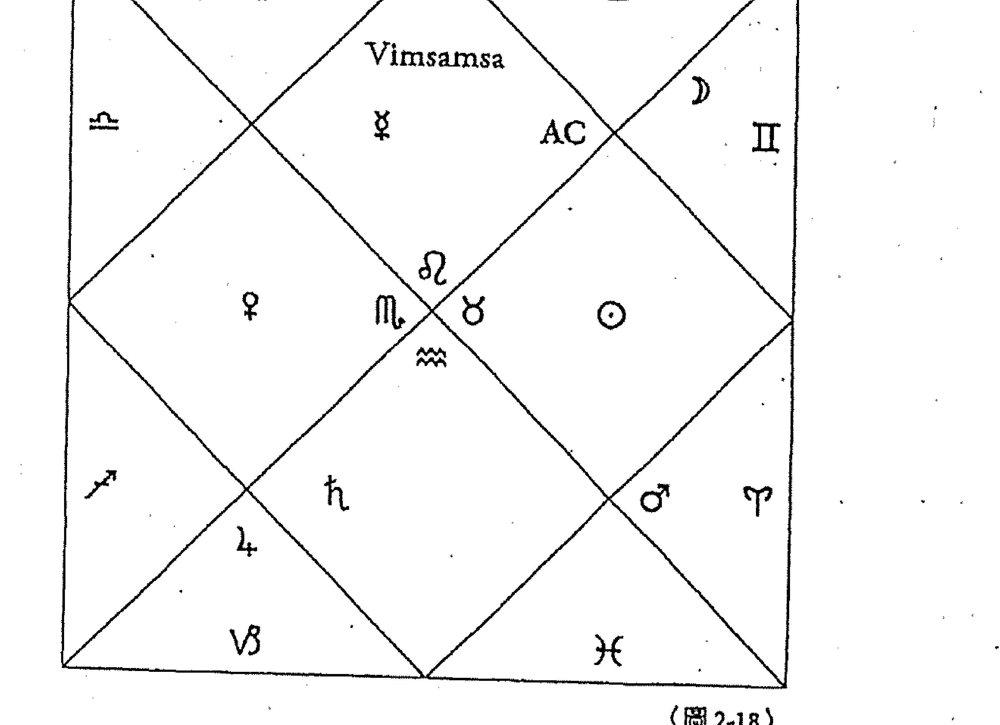

> (圖2-18)

### 十、D24 Chaturvimsamsa

将每个星座划分成二十四等分，每个区间1°15'，整个黄道十二星座共有二百八十八个区间。奇数星座的第一个区间，从狮子座主管起算，再依黄道星座的顺序排列，重覆两次；偶数星座的第一个区间，从巨蟹座主管起算，依黄道星座的顺序排列，重覆两次。依此规则，即可制作出D24分宫图；具有学术成就、教育、知识、学习的象征。

| 星座 | 白羊座 | 金牛座 | 双子座 | 巨蟹座 | 狮子座 | 处女座 | 天秤座 | 天蝎座 | 人马座 | 摩羯座 | 水瓶座 | 双鱼座 |
| :--- | :--- | :--- | :--- | :--- | :--- | :--- | :--- | :--- | :--- | :--- | :--- | :--- |
| 第一区间 1°15' | ♈ | ♉ | ♊ | ♋ | ♌ | ♍ | ♎ | ♏ | ♐ | ♑ | ♒ | ♓ |
| 第二区间 2°30' | ♍ | ♈ | ♍ | ♈ | ♍ | ♈ | ♍ | ♈ | ♍ | ♈ | ♍ | ♈ |
| 第三区间 3°45' | ♎ | ♍ | ♎ | ♍ | ♎ | ♍ | ♎ | ♍ | ♎ | ♍ | ♎ | ♍ |
| 第四区间 5° | ♏ | ♎ | ♏ | ♎ | ♏ | ♎ | ♏ | ♎ | ♏ | ♎ | ♏ | ♎ |
| 第五区间 6°15' | ♐ | ♏ | ♐ | ♏ | ♐ | ♏ | ♐ | ♏ | ♐ | ♏ | ♐ | ♏ |
| 第六区间 7°30' | ♑ | ♐ | ♑ | ♐ | ♑ | ♐ | ♑ | ♐ | ♑ | ♐ | ♑ | ♐ |
| 第七区间 8°45' | ♒ | ♑ | ♒ | ♑ | ♒ | ♑ | ♒ | ♑ | ♒ | ♑ | ♒ | ♑ |
| 第八区间 10° | ♓ | ♒ | ♓ | ♒ | ♓ | ♒ | ♓ | ♒ | ♓ | ♒ | ♓ | ♒ |
| 第九区间 11°15' | ♈ | ♓ | ♈ | ♓ | ♈ | ♓ | ♈ | ♓ | ♈ | ♓ | ♈ | ♓ |
| 第十区间 12°30' | ♉ | ♈ | ♉ | ♈ | ♉ | ♈ | ♉ | ♈ | ♉ | ♈ | ♉ | ♈ |
| 第十一区间 13°30' | ♊ | ♉ | ♊ | ♉ | ♊ | ♉ | ♊ | ♉ | ♊ | ♉ | ♊ | ♉ |
| 第十二区间 15° | ♈ | ♉ | ♊ | ♋ | ♌ | ♍ | ♎ | ♏ | ♐ | ♑ | ♒ | ♓ |
| 第十三区间 16°15' | ♈ | ♉ | ♊ | ♋ | ♌ | ♍ | ♎ | ♏ | ♐ | ♑ | ♒ | ♓ |
| 第十四区间 17°30' | ♈ | ♉ | ♊ | ♋ | ♌ | ♍ | ♎ | ♏ | ♐ | ♑ | ♒ | ♓ |
| 第十五区间 18°45' | ♈ | ♉ | ♊ | ♋ | ♌ | ♍ | ♎ | ♏ | ♐ | ♑ | ♒ | ♓ |
| 第十六区间 20° | ♈ | ♉ | ♊ | ♋ | ♌ | ♍ | ♎ | ♏ | ♐ | ♑ | ♒ | ♓ |
| 第十七区间 21°15' | ♈ | ♉ | ♊ | ♋ | ♌ | ♍ | ♎ | ♏ | ♐ | ♑ | ♒ | ♓ |
| 第十八区间 22°30' | ♈ | ♉ | ♊ | ♋ | ♌ | ♍ | ♎ | ♏ | ♐ | ♑ | ♒ | ♓ |
| 第十九区间 23°45' | ♈ | ♉ | ♊ | ♋ | ♌ | ♍ | ♎ | ♏ | ♐ | ♑ | ♒ | ♓ |
| 第二十区间 25° | ♈ | ♉ | ♊ | ♋ | ♌ | ♍ | ♎ | ♏ | ♐ | ♑ | ♒ | ♓ |
| 第二十一区间 26°15' | ♈ | ♉ | ♊ | ♋ | ♌ | ♍ | ♎ | ♏ | ♐ | ♑ | ♒ | ♓ |
| 第二十二区间 27°30' | ♈ | ♉ | ♊ | ♋ | ♌ | ♍ | ♎ | ♏ | ♐ | ♑ | ♒ | ♓ |
| 第二十三区间 28°45' | ♈ | ♉ | ♊ | ♋ | ♌ | ♍ | ♎ | ♏ | ♐ | ♑ | ♒ | ♓ |
| 第二十四区间 30° | ♈ | ♉ | ♊ | ♋ | ♌ | ♍ | ♎ | ♏ | ♐ | ♑ | ♒ | ♓ |## 張國榮本命行星所在 D24 分宮圖位置

| 行星 | 恆星黃道經度 | 區間 | 主管行星 | 所在星座 |
|------|----------------|------|------------|----------|
| ASC | 天蠍座 12°8' | 10 | ♂ | 白羊座 |
| ☉ | 獅子座 26°5' | 21 | ♂ | 白羊座 |
| ☽ | 天蠍座 27°46' | 23 | ♀ | 金牛座 |
| ♂ | 水瓶座 24°32' Rx | 20 | ♃ | 雙魚座 |
| ☿ | 處女座 18°49' | 16 | ♀ | 天秤座 |
| ♃ | 獅子座 20°27' | 21 | ♃ | 人馬座 |
| ♀ | 巨蟹座 10°36' | 9 | ♃ | 雙魚座 |
| ♄ | 天蠍座 4°23' | 4 | ♀ | 天秤座 |

（表2-27）

#### D24 Chaturvimsamsa

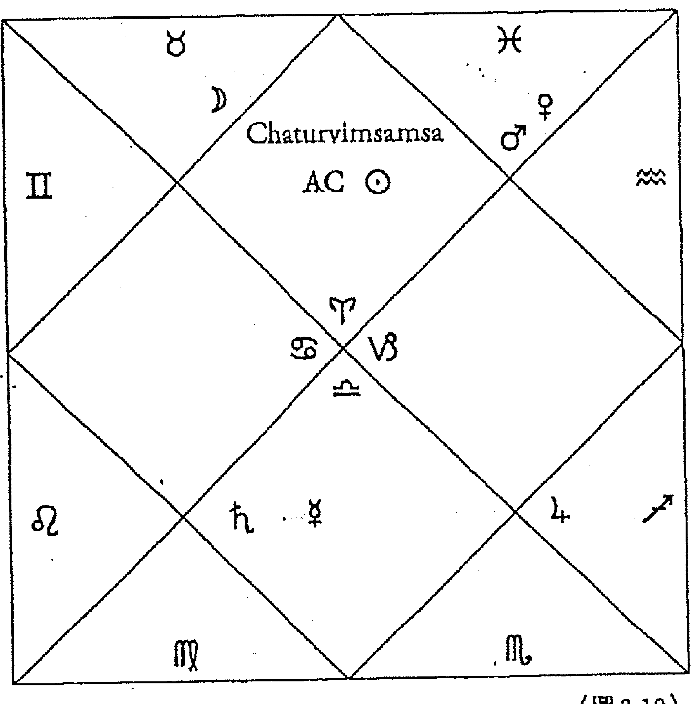

### 十一、D27 Bhamsa

將每個星座劃分成二十七等分，每個區間 1°6'40"，整個黃道十二星座共有三百二十四個區間。

火象星座的第一個區間，由白羊座主管，而第二至第二十七個區間，則依黃道星座的順序排出；

土象星座的第一個區間，由巨蟹座主管，而第二至第二十七個區間，則依黃道星座的順序排出；

風象星座的第一個區間，由天秤座主管，而第二至第二十七個區間，則依黃道星座的順序排出；

水象星座的第一個區間，由摩羯座主管，而第二至第二十七個區間，則依黃道星座的順序排出。

依此規則，即可製作出 D27 分宮圖；具有強弱、力量、勇敢、膽量的象徵。

| 星座 | 白羊座 | 金牛座 | 雙子座 | 巨蟹座 | 獅子座 | 處女座 | 天秤座 | 天蠍座 | 人馬座 | 摩羯座 | 水瓶座 | 雙魚座 |
|------|--------|--------|--------|--------|--------|--------|--------|--------|--------|--------|--------|--------|
| 第一區間 1°6'40" | ♈ | ♊ | ♊ | ♋ | ♌ | ♍ | ♎ | ♏ | ♐ | ♑ | ♒ | ♓ |
| 第二區間 2°13'20" | ♉ | ♋ | ♏ | ♒ | ♉ | ♋ | ♏ | ♒ | ♉ | ♋ | ♏ | ♒ |
| 第三區間 3°20' | ♊ | ♌ | ♐ | ♓ | ♊ | ♌ | ♐ | ♓ | ♊ | ♌ | ♐ | ♓ |
| 第四區間 4°26'40" | ♋ | ♍ | ♑ | ♈ | ♋ | ♍ | ♑ | ♈ | ♋ | ♍ | ♑ | ♈ |
| 第五區間 5°33' | ♌ | ♎ | ♒ | ♉ | ♌ | ♎ | ♒ | ♉ | ♌ | ♎ | ♒ | ♉ |
| 第六區間 6°40' | ♍ | ♏ | ♓ | ♊ | ♍ | ♏ | ♓ | ♊ | ♍ | ♏ | ♓ | ♊ |
| 第七區間 7°46'40" | ♎ | ♐ | ♈ | ♋ | ♎ | ♐ | ♈ | ♋ | ♎ | ♐ | ♈ | ♋ |
| 第八區間 8°53'20" | ♏ | ♑ | ♉ | ♌ | ♏ | ♑ | ♉ | ♌ | ♏ | ♑ | ♉ | ♌ |
| 第九區間 10° | ♐ | ♒ | ♊ | ♍ | ♐ | ♒ | ♊ | ♍ | ♐ | ♒ | ♊ | ♍ |
| 第十區間 11°6'40" | ♑ | ♓ | ♋ | ♎ | ♑ | ♓ | ♋ | ♎ | ♑ | ♓ | ♋ | ♎ |
| 第十一區間 12°13'20" | ♒ | ♉ | ♊ | ♋ | ♌ | ♍ | ♎ | ♏ | ♐ | ♑ | ♒ | ♋ |
| 第十二區間 13°20' | ♓ | ♊ | ♌ | ♐ | ♓ | ♊ | ♌ | ♐ | ♓ | ♊ | ♌ | ♐ |
| 第十三區間 14°26' | ♈ | ♋ | ♎ | ♑ | ♈ | ♋ | ♎ | ♑ | ♈ | ♋ | ♎ | ♑ |
| 第十四區間 15°33'20" | ♉ | ♌ | ♏ | ♒ | ♉ | ♌ | ♏ | ♒ | ♉ | ♌ | ♏ | ♒ |
| 第十五區間 16°40'40" | ♊ | ♍ | ♐ | ♓ | ♊ | ♍ | ♐ | ♓ | ♊ | ♍ | ♐ | ♓ |
| 第十六區間 17°46' | ♋ | ♎ | ♑ | ♈ | ♋ | ♎ | ♑ | ♈ | ♋ | ♎ | ♑ | ♈ |
| 第十七區間 18°53' | ♌ | ♏ | ♒ | ♉ | ♌ | ♏ | ♒ | ♉ | ♌ | ♏ | ♒ | ♉ |
| 第十八區間 20° | ♍ | ♐ | ♓ | ♊ | ♍ | ♐ | ♓ | ♊ | ♍ | ♐ | ♓ | ♊ |
| 第十九區間 21°6'40" | ♎ | ♑ | ♈ | ♋ | ♎ | ♑ | ♈ | ♋ | ♎ | ♑ | ♈ | ♋ |
| 第二十區間 22°13'20" | ♏ | ♒ | ♉ | ♌ | ♏ | ♒ | ♉ | ♌ | ♏ | ♒ | ♉ | ♌ |
| 第二十一區間 23°20' | ♐ | ♓ | ♊ | ♍ | ♐ | ♓ | ♊ | ♍ | ♐ | ♓ | ♊ | ♍ |
| 第二十二區間 24°26'40" | ♑ | ♈ | ♋ | ♎ | ♑ | ♈ | ♋ | ♎ | ♑ | ♈ | ♋ | ♎ |
| 第二十三區間 25°33'20" | ♒ | ♉ | ♌ | ♏ | ♒ | ♉ | ♌ | ♏ | ♒ | ♉ | ♌ | ♏ |
| 第二十四區間 26°40' | ♓ | ♊ | ♍ | ♐ | ♓ | ♊ | ♍ | ♐ | ♓ | ♊ | ♍ | ♐ |
| 第二十五區間 27°46'40" | ♈ | ♋ | ♎ | ♑ | ♈ | ♋ | ♎ | ♑ | ♈ | ♋ | ♎ | ♑ |
| 第二十六區間 28°53'20" | ♉ | ♌ | ♏ | ♒ | ♉ | ♌ | ♏ | ♒ | ♉ | ♌ | ♏ | ♒ |
| 第二十七區間 30° | ♊ | ♉ | ♊ | ♋ | ♊ | ♍ | ♎ | ♏ | ♊ | ♑ | ♒ | ♓ |

(表2-28)

#### 張國榮本命行星所在 D27 分宮圖位置

| 行星 | 恆星黃道經度 | 區間 | 主管行星 | 所在星座 |
| :--- | :--- | :---: | :--- | :--- |
| ASC | 天蠍座 12°8' | 11 | ♂ | 天蠍座 |
| ☉ | 獅子座 26°5' | 24 | ♃ | 雙魚座 |
| ☽ | 天蠍座 27°46' | 26 | ♄ | 水瓶座 |
| ♂ | 水瓶座 24°32' Rx | 23 | ☉ | 獅子座 |
| ☿ | 處女座 18°49' | 17 | ♂ | 天蠍座 |
| ♃ | 獅子座 20°27' | 19 | ♀ | 天秤座 |
| ♀ | 巨蟹座 10°36' | 10 | ♀ | 天秤座 |
| ♄ | 天蠍座 4°23' | 4 | ♂ | 白羊座 |

(表2-29)

#### D27 Bhamsa

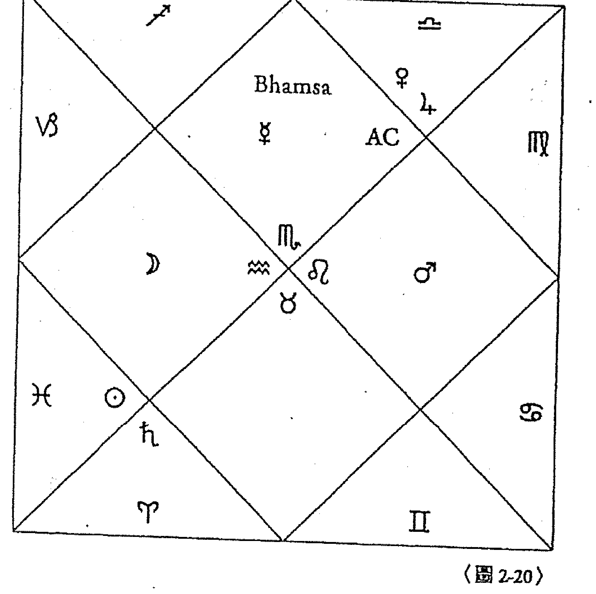

(圖2-20)

### 十二、D30 Trimsamsa

將每個星座劃分成三十等分，每個區間1°，整個黃道十二星座共有三百六十個區間。

奇數星座0°至5°區間，由白羊座主管；5°至10°，由水瓶座主管；10°至18°，由人馬座主管；18°至25°，由雙子座主管；25°至30°，由天秤座主管。

偶數星座0°至5°區間，由金牛座主管；5°至12°，由處女座主管；12°至20°，由雙魚座主管；20°至25°，由摩羯座主管；25°至30°，由天蠍座主管。

依此規則，即可製作出D30分宮圖；具有不良影響、逆境、不幸、災難、困難、阻礙，和專論女命貞潔與德行的決定性徵象。

| 奇數星座 | 0°-5° | 5°-10° | 10°-18° | 18°-25° | 25°-30° |
|----------|-------|--------|---------|---------|---------|
| 白羊座   | ♈    | ♒      | ♐       | ♎       | ♊       |
| 雙子座   | ♈    | ♒      | ♐       | ♎       | ♊       |
| 獅子座   | ♈    | ♒      | ♐       | ♎       | ♊       |
| 天秤座   | ♈    | ♒      | ♐       | ♎       | ♊       |
| 人馬座   | ♈    | ♒      | ♐       | ♎       | ♊       |
| 水瓶座   | ♈    | ♒      | ♐       | ♎       | ♊       |

(表2-30)

| 偶數星座 | 0°-5° | 5°-10° | 10°-18° | 18°-25° | 25°-30° |
|----------|-------|--------|---------|---------|---------|
| 金牛座   | ♉    | ♍      | ♓       | ♑       | ♏       |
| 巨蟹座   | ♉    | ♍      | ♓       | ♑       | ♏       |
| 處女座   | ♉    | ♍      | ♓       | ♑       | ♏       |
| 天蠍座   | ♉    | ♍      | ♓       | ♑       | ♏       |
| 摩羯座   | ♉    | ♍      | ♓       | ♑       | ♏       |
| 雙魚座   | ♉    | ♍      | ♓       | ♑       | ♏       |

(表2-31)

#### 張國榮本命行星所在 D30 分宮圖位置

| 行星 | 恆星黃道經度 | 區間 | 主管行星 | 所在星座 |
|------|--------------|------|----------|----------|
| ASC  | 天蠍座 12°8' | 3    | ♃        | 雙魚座   |
| ☉   | 獅子座 26°5' | 5    | ♀        | 天秤座   |
| ☽   | 天蠍座 27°46'| 5    | ♂        | 天蠍座   |
| ♂   | 水瓶座 24°32' Rx| 4   | ☿        | 雙子座   |
| ☿   | 處女座 18°49'| 3    | ♃        | 雙魚座   |
| ♃   | 獅子座 20°27'| 4    | ☿        | 雙子座   |
| ♀   | 巨蟹座 10°36'| 2    | ☿        | 處女座   |
| ♄   | 天蠍座 4°23' | 1    | ♀        | 金牛座   |

（表2-32）

#### D30 Trimsamsa

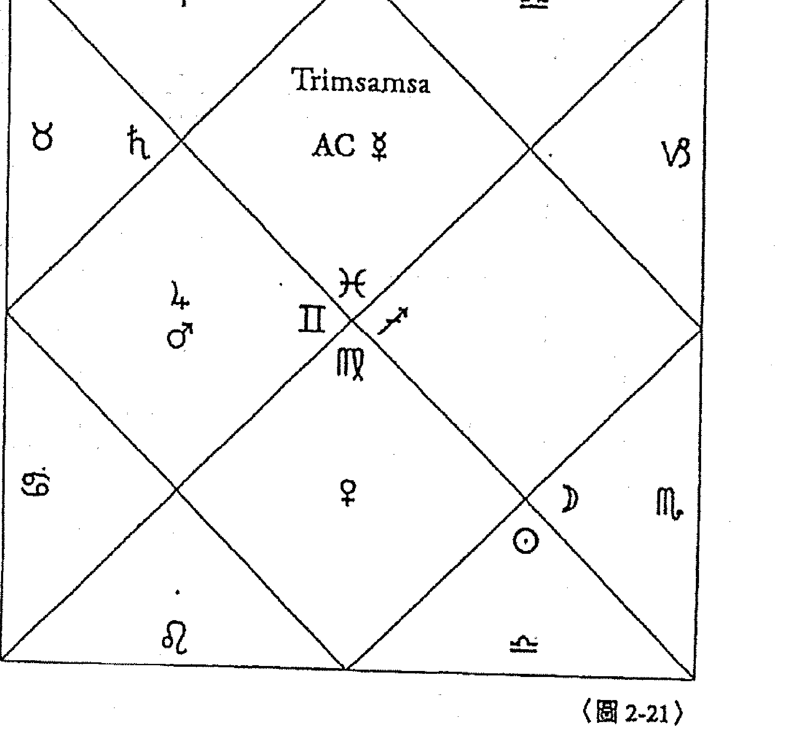

### 十三、D40 Chatvarimsamsa

將每個星座劃分成四十等分，每個區間 45'，整個黃道十二星座共有四百八十個區間。

奇數星座的第一個區間，由白羊座主管，再依黃道星座的順序，排出其他區間；偶數星座的第一個區間，由天秤座主管，再依黃道星座的順序，排出其他區間。

依此規則，即可製作 D40 天宮圖；具有行星期間主星吉凶效應的徵象。

| 區間 | 度數範圍 | 奇數星座 | 偶數星座 | 區間 | 度數範圍 | 奇數星座 | 偶數星座 |
|------|----------|----------|----------|------|----------|----------|----------|
| 1 | 0°45' | ♈ | ♎ | 21 | 15°45' | ♐ | ♊ |
| 2 | 1°30' | ♉ | ♏ | 22 | 16°30' | ♑ | ♋ |
| 3 | 2°15' | ♊ | ♐ | 23 | 17°15' | ♒ | ♌ |
| 4 | 3° | ♋ | ♑ | 24 | 18° | ♓ | ♍ |
| 5 | 3°45' | ♌ | ♒ | 25 | 18°45' | ♈ | ♎ |
| 6 | 4°30' | ♍ | ♓ | 26 | 19°30' | ♉ | ♏ |
| 7 | 5°15' | ♎ | ♈ | 27 | 20°15' | ♊ | ♐ |
| 8 | 6° | ♏ | ♉ | 28 | 21° | ♋ | ♑ |
| 9 | 6°45' | ♐ | ♊ | 29 | 21°45' | ♌ | ♒ |
| 10 | 7°30' | ♑ | ♋ | 30 | 22°30' | ♍ | ♓ |
| 11 | 8°15' | ♒ | ♌ | 31 | 23°15' | ♎ | ♈ |
| 12 | 9° | ♓ | ♍ | 32 | 24° | ♏ | ♉ |
| 13 | 9°45' | ♈ | ♎ | 33 | 24°45' | ♐ | ♊ |
| 14 | 10°30' | ♉ | ♏ | 34 | 25°30' | ♑ | ♋ |
| 15 | 11°15' | ♊ | ♐ | 35 | 26°15' | ♒ | ♌ |
| 16 | 12° | ♋ | ♑ | 36 | 27° | ♓ | ♍ |
| 17 | 12°45' | ♌ | ♒ | 37 | 27°45' | ♈ | ♎ |
| 18 | 13°30' | ♍ | ♓ | 38 | 28°30' | ♉ | ♏ |
| 19 | 14°15' | ♎ | ♈ | 39 | 29°15' | ♊ | ♐ |
| 20 | 15° | ♏ | ♉ | 40 | 30° | ♋ | ♑ |

（表 2-33）

#### 張國榮本命行星所在 D40 分宮圖位置

| 行星 | 恆星黃道經度 | 區間 | 主管行星 | 所在星座 |
| :--- | :--- | :--- | :--- | :--- |
| ASC | 天蠍座 12°8' | 17 | ♂ | 水瓶座 |
| ☉ (太陽) | 獅子座 26°5' | 35 | ☉ | 水瓶座 |
| ☽ (月亮) | 天蠍座 27°46' | 38 | ♂ | 天蠍座 |
| ♂ (火星) | 水瓶座 24°32' Rx | 33 | ♃ | 人馬座 |
| ☿ (水星) | 處女座 18°49' | 26 | ♂ | 天蠍座 |
| ♃ (木星) | 獅子座 20°27' | 28 | ☽ | 巨蟹座 |
| ♀ (金星) | 巨蟹座 10°36' | 15 | ♃ | 人馬座 |
| ♄ (土星) | 天蠍座 4°23' | 6 | ♃ | 雙魚座 |

（表2-34）

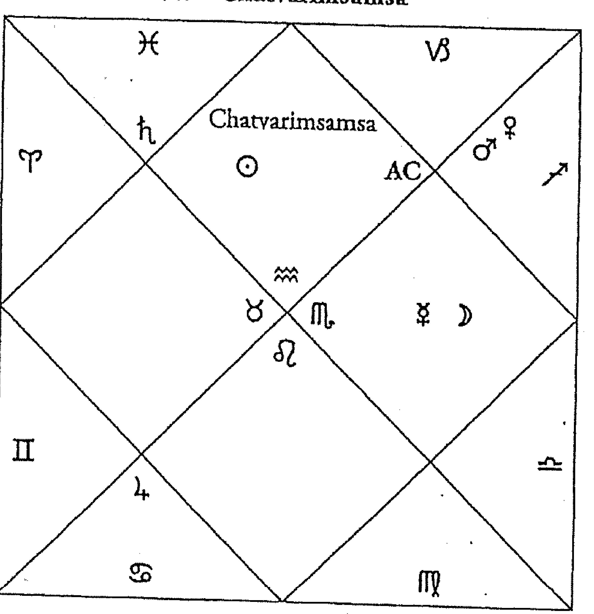

（圖2-22）

### 十四、D45 Akshavedamsa

將每個星座分割成四十五等分，每個區間40'，整個黃道十二星座共有五百四十個區間。

啟動星座的第一個區間，由白羊座主管，再依黃道星座的順序，分別排出其他區間。

固定星座的第一個區間，由獅子座主管，再依黃道星座的順序，分別排出其他區間；變動星座的第一個區間，由人馬座主管，再依黃道星座的順序，分別排出其他區間。

依此規則，即可製作出D45分宮圖；具有一般指示、描述宮位和行星的力量。

| 區間 | 度數範圍 | 啟動 | 固定 | 變動 | 區間 | 度數範圍 | 啟動 | 固定 | 變動 |
|:---:|:---:|:---:|:---:|:---:|:---:|:---:|:---:|:---:|:---:|
| 1 | 0°40' | ♈ | ♌ | ♐ | 21 | 14° | ♐ | ♈ | ♌ |
| 2 | 1°20' | ♉ | ♍ | ♑ | 22 | 14°40' | ♑ | ♉ | ♍ |
| 3 | 2° | ♊ | ♎ | ♒ | 23 | 15°20' | ♒ | ♊ | ♎ |
| 4 | 2°40' | ♋ | ♏ | ♓ | 24 | 16° | ♓ | ♋ | ♏ |
| 5 | 3°20' | ♌ | ♐ | ♈ | 25 | 16°40' | ♈ | ♌ | ♐ |
| 6 | 4° | ♍ | ♑ | ♉ | 26 | 17°20' | ♉ | ♍ | ♑ |
| 7 | 4°40' | ♎ | ♒ | ♊ | 27 | 18° | ♊ | ♎ | ♒ |
| 8 | 5°20' | ♏ | ♓ | ♋ | 28 | 18°40' | ♋ | ♏ | ♓ |
| 9 | 6° | ♐ | ♈ | ♌ | 29 | 19°20' | ♌ | ♐ | ♈ |
| 10 | 6°40' | ♑ | ♉ | ♍ | 30 | 20° | ♍ | ♑ | ♉ |
| 11 | 7°20' | ♒ | ♊ | ♎ | 31 | 20°40' | ♎ | ♒ | ♊ |
| 12 | 8° | ♓ | ♋ | ♏ | 32 | 21°20' | ♏ | ♓ | ♋ |
| 13 | 8°40' | ♈ | ♌ | ♐ | 33 | 22° | ♐ | ♈ | ♌ |
| 14 | 9°20' | ♉ | ♍ | ♑ | 34 | 22°40' | ♑ | ♉ | ♍ |
| 15 | 10° | ♊ | ♎ | ♒ | 35 | 23°20' | ♒ | ♊ | ♎ |
| 16 | 10°40' | ♋ | ♏ | ♓ | 36 | 24° | ♓ | ♋ | ♏ |
| 17 | 11°20' | ♌ | ♐ | ♈ | 37 | 24°40' | ♈ | ♌ | ♐ |
| 18 | 12° | ♍ | ♑ | ♉ | 38 | 25°20' | ♉ | ♍ | ♑ |
| 19 | 12°40' | ♎ | ♒ | ♊ | 39 | 26° | ♊ | ♎ | ♒ |
| 20 | 13°20' | ♏ | ♓ | ♋ | 40 | 26°40' | ♋ | ♏ | ♓ |
| 21 | 14° | ♐ | ♈ | ♌ | 41 | 27°20' | ♐ | ♈ | ♌ |
| 22 | 14°40' | ♑ | ♉ | ♍ | 42 | 28° | ♑ | ♉ | ♍ |
| 23 | 15°20' | ♒ | ♊ | ♎ | 43 | 28°40' | ♒ | ♊ | ♎ |
| 24 | 16° | ♓ | ♋ | ♏ | 44 | 29°20' | ♓ | ♋ | ♏ |
| 25 | 16°40' | ♈ | ♌ | ♐ | 45 | 30° | ♈ | ♌ | ♐ |## 天宮圖的建立

| 區間 | 度數範圍 | 啟動 | 固定 | 變動 | 區間 | 度數範圍 | 啟動 | 固定 | 變動 |
|------|----------|------|------|------|------|----------|------|------|------|
| 41 | 27°20' | ♌ | ♐ | ♈ | 44 | 29°20' | ♏ | ♓ | ♋ |
| 42 | 28° | ♍ | ♑ | ♉ | 45 | 30° | ♐ | ♈ | ♌ |
| 43 | 28°40' | ♎ | ♒ | ♊ | | | | | |

（表2-35）

#### 張國榮本命行星所在 D45 分宮圖位置

| 行星 | 恆星黃道經度 | 區間 | 主管行星 | 所在星座 |
|------|--------------|------|----------|----------|
| ASC | 天蠍座 12°8' | 19 | ♄ | 水瓶座 |
| ☉ | 獅子座 26°5' | 40 | ♂ | 天蠍座 |
| ☽ | 天蠍座 27°46' | 42 | ♄ | 摩羯座 |
| ♂ | 水瓶座 24°32' Rx | 37 | ☉ | 獅子座 |
| ☿ | 處女座 18°49' | 29 | ♂ | 白羊座 |
| ♃ | 獅子座 20°27' | 31 | ♄ | 水瓶座 |
| ♀ | 巨蟹座 10°36' | 16 | ☽ | 巨蟹座 |
| ♄ | 天蠍座 4°23' | 7 | ♄ | 水瓶座 |

（表2-36）

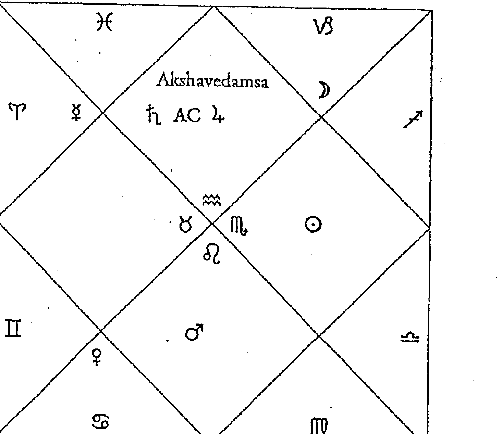

### 十五、D60 Shastiamsa

將每個星座劃分成六十等分，每個區間 30'，整個黃道十星座共七百二十個區間。一般而言，印度在 D60 的應用上，都只列出各區間主宰的神祇，各有其吉凶涵義。這些神祇在奇數星座主管的區間順數，但在偶數星座主管的區間則逆數。星座區間對應的神祇、吉凶屬性及涵義如下：

| 奇数星座 | 序号 | 名称 | 吉凶属性 | 涵义 | 偶数星座 |
| :--- | :--- | :--- | :--- | :--- | :--- |
| 0'-0°30' | 1 | Ghora | 凶 | 恐怖邪恶 | 30'-29°30' |
| 1' | 2 | Rakshasa | 凶 | 恶魔 | 29°30' |
| 1°30' | 3 | Deva | 吉 | 神圣高贵、天神 | 29° |
| 2° | 4 | Kubera | 吉 | 司库神 | 28°30' |
| 2°30' | 5 | Yaksha | 吉 | 天国的歌者 | 28° |
| 3° | 6 | Kinnara | 吉 | 人头马身 | 27°30' |
| 3°30' | 7 | Bhrashta | 凶 | 堕落、荒谬 | 27° |
| 4° | 8 | Kulagnana | 凶 | 毁灭家庭 | 26°30' |
| 4°30' | 9 | Garala | 凶 | 毒物 | 26° |
| 5° | 10 | Vahni | 凶 | 火 | 25°30' |
| 5°30' | 11 | Mayamsa | 凶 | 欺骗 | 25° |
| 6° | 12 | Purishaka | 凶 | 污秽 | 24°30' |
| 6°30' | 13 | Apampathy | 吉 | 雨神 | 24° |
| 7° | 14 | Marut | 吉 | 风神 | 23°30' |
| 7°30' | 15 | Kala | 凶 | 破坏 | 23° |
| 8° | 16 | Sarpa | 凶 | 蛇 | 22°30' |
| 8°30' | 17 | Amritha | 吉 | 甘露 | 22° |
| 9° | 18 | Indu | 吉 | 月亮、滋养 | 21°30' |
| 9°30' | 19 | Mridwamsa | 吉 | 轻柔、温和 | 21° |
| 10° | 20 | Komalamsa | 吉 | 亲切 | 20°30' |
| 10°30' | 21 | Heramba | 吉 | 象头神 | 20° |
| 11° | 22 | Brahma | 吉 | 梵天 | 19°30' |
| 11°30' | 23 | Vageesa | 吉 | 毗濕奴 | 19° |
| 12° | 24 | Mahesvara | 吉 | 濕婆神 | 18°30' |
| 12°30' | 25 | Deva | 吉 | 神聖高貴、天神（同3） | 18° |
| 13° | 26 | Ardra | 吉 | 濕潤 | 17°30' |
| 13°30' | 27 | Kalinasa | 凶 | 戰爭毀滅 | 17° |
| 14° | 28 | Kshitiswara | 吉 | 大地之王 | 16°30' |
| 14°30' | 29 | Kamalkara | 吉 | 忘憂湖 | 16° |
| 15° | 30 | Gulika | 凶 | 土星之子、懶散 | 15°30' |
| 15°30' | 31 | Mrityu | 凶 | 火星之子、死亡 | 15° |
| 16° | 32 | Kala | 凶 | 破壞（同15） | 14°30' |
| 16°30' | 33 | Davagani | 凶 | 森林大火 | 14° |
| 17° | 34 | Ghora | 凶 | 恐怖邪惡（同1） | 13°30' |
| 17°30' | 35 | Yama | 凶 | 死神 | 13° |
| 18° | 36 | Kantaka | 凶 | 麻煩、棘手 | 12°30' |
| 18°30' | 37 | Sudha | 吉 | 純潔 | 12° |
| 19° | 38 | Amrita | 吉 | 甘露（同17） | 11°30' |
| 19°30' | 39 | Poorna Chandra | 吉 | 滿月 | 11° |
| 20° | 40 | Vishadagdha | 凶 | 毒害 | 10°30' |
| 20°30' | 41 | Kulanasa | 凶 | 毀滅家庭（同8） | 10° |
| 21° | 42 | Vamsakshaya | 凶 | 家族斷絕 | 9°30' |
| 21°30' | 43 | Utpatha | 凶 | 災難 | 9° |
| 22° | 44 | Kala | 凶 | 破壞（同15） | 8°30' |
| 22°30' | 45 | Saumya | 吉 | 吉祥、天堂 | 8° |
| 23° | 46 | Komalamsa | 吉 | 親切（同20） | 7°30' |
| 23°30' | 47 | Seetala | 吉 | 冷靜 | 7° |
| 24° | 48 | Karaladamshtra | 凶 | 牙顫 | 6°30' |
| 24°30' | 49 | Chandramulchi | 吉 | 如月光般美麗 | 6° |
| 25° | 50 | Praveena | 吉 | 聰明 | 5°30' |
| 25°30' | 51 | Kalapavaka | 凶 | 毀滅之火 | 5° |
| 26° | 52 | Dandayudha | 凶 | 破滅 | 4°30' |
| 26°30' | 53 | Nirmala | 吉 | 無罪 | 4° |
| 27° | 54 | Saumya | 吉 | 吉祥、天堂 (同45) | 3°30' |
| 27°30' | 55 | Kroora | 凶 | 無情 | 3° |
| 28° | 56 | Atiseetala | 吉 | 冷酷 | 2°30' |
| 28°30' | 57 | Amrita | 吉 | 甘露 (同17) | 2° |
| 29° | 58 | Payodhi | 吉 | 海洋 | 1°30' |
| 29°30' | 59 | Bhraman | 凶 | 流浪 | 1° |
| 29°30'-30° | 60 | Indurekha | 吉 | 月光 | 0°30'-0° |

（表2-37）

#### 計算本命行星落入 D60 星座的步驟

- 1. 特定行星的度數、分數乘二（所得分數、餘數省略）。如上升點位於天蠍座 12°8' :
   12°8'×2 = 24°16' (16'省略)
- 2. 以「步驟1」得出之數除以十二。24÷12 = 2，餘數 0
- 3. 餘數加一，即該特定行星所在星座起算的 D60 星座。0 + 1 = 1，上升點即位於天蠍座起算的第一個星座。
- 4. 以「步驟1」得出的度數加一，即特定行星所在的星座區間；奇數星座順數，偶數星座逆數。24 + 1 = 25。上升點位於 D60 的天蠍座，逆數第二十五個區間為「Kantaka」，凶性，涵義為麻煩、棘手。

#### 張國榮本命行星所在 D60 分宮圖位置

| 行星 | 恆星黃道經度 | 區間 | 主管行星 | 所在星座 |
|------|--------------|------|----------|----------|
| ASC | 天蠍座 12°8' | 逆25 | ♂ | 天蠍座 |
| ☉ | 獅子座 26°5' | 順53 | ♃ | 人馬座 |
| ☽ | 天蠍座 27°46' | 逆56 | ☿ | 雙子座 |
| ♂ | 水瓶座 24°32' R | | ♄ | 摩羯座 |
| ☿ | 處女座 18°49' | 逆50 | ♀ | 天秤座 |
| ♃ | 獅子座 20°27' | 順41 | ♃ | 人馬座 |
| ♀ | 巨蟹座 10°36' | 逆21 | ♂ | 白羊座 |
| ♄ | 天蠍座 4°23' | 逆9 | ☽ | 巨蟹座 |

(表 2-38)

#### D60 Shastiamsa

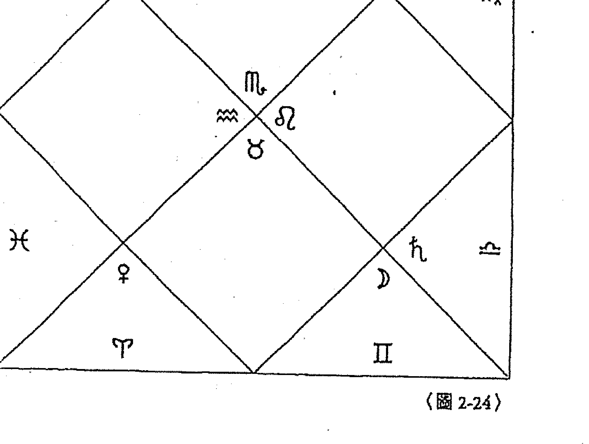

(圖 2-24)

## 第五節 其他輔助命盤

在印度占星學中，除了本命盤及各種分宮盤，還有其他輔助命盤，通常會用來配合本命盤的論斷，例如月亮身宮盤、星座移轉盤（Arudha Chart）、徵象星變盤（Karakamsa Chart）、幸運點轉盤（Punya Saham Chart），尤其以月亮身宮盤最為重要。印度本土占星家在解盤時，幾乎都會列出本命盤、D9 Navamsa 及月亮身宮盤三種命盤，足見其重要性。而本節僅探討月亮身宮盤。

月亮是印度人相當重視的行星，自古以來，便常以月亮的相態，作為慶典擇日的依據。印度占星學中特有的「大運（Dasa）系統」，其中的「Vimsottari Dasa」，就是以命主出生時，月亮在二十七星宿的位置起算大運（Dasa）起始，以及相關行星分配管轄年、月、日；此外，在計算流年的「過運法」（Transit）中，也會根據命主出生時的月亮星座所在位置起算。另外，印度占星學中獨有的二十八宿或二十七宿，即以月亮行經黃道的長期觀測經驗而歸納出來的。

印度人之所以如此重視月亮，其實是受到吠陀經典影響，普遍認為月亮代表梵天的心思。印度知名占星雜誌《The Time of Astrology》編輯瑞金斯瓦里·香卡爾（Rajeshwari Shankar），在帕達喀（K. K. Pathak）所著《Hindu Dasha System》的推薦文中提及：「梵天欲創造宇宙，整個創造源自他的左思右想，這種沉思發自他的偉大心靈，沉思的同時，月亮也被創造出來。」

根據上述說法，足見月亮在印度文化裡何其重要，幾乎已等同於宇宙創造者梵天的心思。印度占星學一向遵循著「梵我不二」哲學的義理，遂發展出以月亮為主，當作「Lagna」（上升星座）起算的身宮圖，以及大運（Dasa）系統中的「Vimsottari」、「Gochar」（即過運）。對於月亮的重視程度，由此可見一斑。

「月亮身宮盤」的計算方式很簡單，即將本命盤中月亮所在星座當作上升星座；由於印度占星學採用「整個星座宮位制」，因此其他各宮，即依月亮星座之後的星座順序，依次排出。以張國榮的命盤〈圖2-25〉為例，月亮🌙落在天蠍座♏，恰巧與上升星座相同，因此他的「月亮身宮盤」跟本命天宮圖完全一樣。

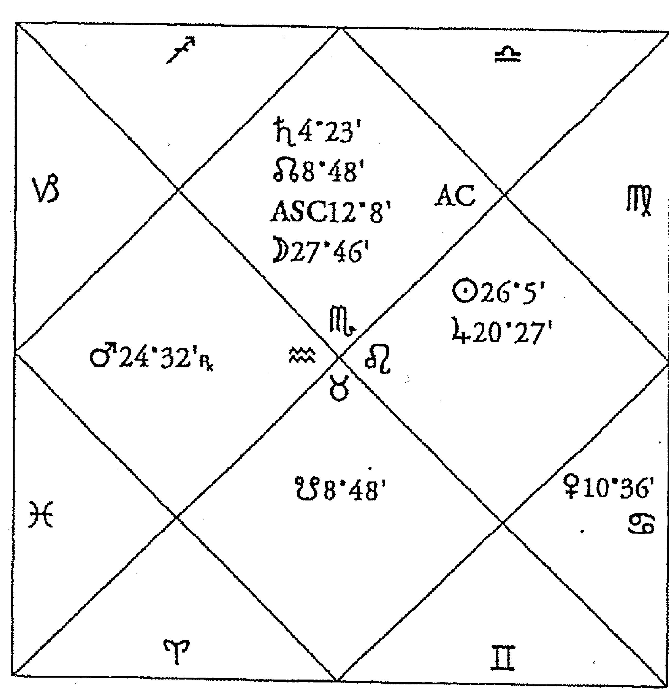

接著，再以台灣知名占星家韓良露的命盤為例。

#### 【案例二】

韓良露
1958年11月19日
08:35:00 Zone 8,00
Wednesday 23:17:2 Lahiri
高雄市 20E17, 22N38

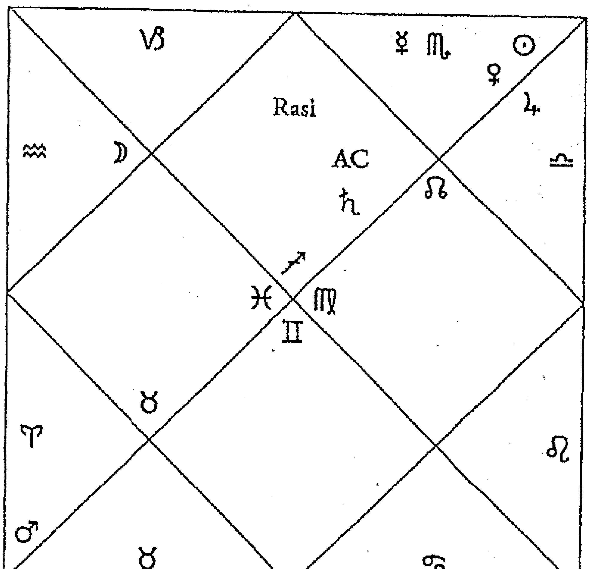

她的「月亮身宫盘」如下：

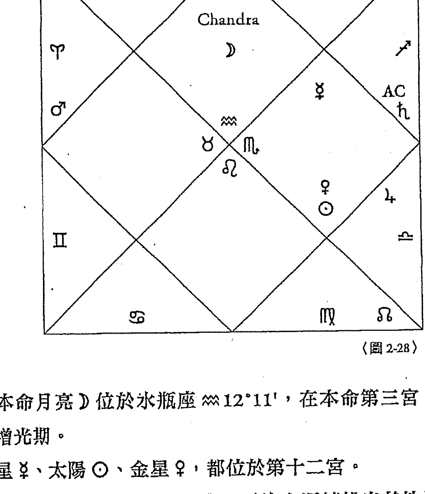

- 1. 韓良露本命月亮)d位於水瓶座~12°11'，在本命第三宮；月亮為吉星，處於漸增光期。
- 2. 本命水星)、太陽)、金星)，都位於第十二宮。
- 3. 以月亮)d所在星座當作上升星座，再依次順轉排出其他星座，即為「月亮身宮盤」。
- 4. 寫作的徵象星——水星)，位於身宮盤的第十宮（事業）；吉星金星)也位於第十宮，映至自己主管的星座金牛座；同時，掌管名名的太陽)也位於第十宮內。
- 5. 第九宮內的木星)，映至上升星座——人馬座。
- 6. 火星)d位於第三宮自己主管的星座——白羊座，戲劇、音樂才華洋溢，且相映至第十宮的天蠍座，甚吉。

※ 中國古代的「七政四餘占星術」和「紫微斗數」中所採用的身宮，其概念完全出自印度占星學的「月亮身宮盤」。

## 第三章 天宮圖的要素Ⅰ：星座

「星座」的梵文是「Rasi」。由於印度占星學曾與希臘占星學交流，因此，其使用的黃道十二星座，除了象徵摩羯座的山羊形象，在某些地區被鱷魚代替以外，其他都與現今的西方占星學相同。

古時的印度占星學經典對黃道十二星座較少著墨，或僅以簡單的方式帶過；不過，受到西方占星學的影響，現代印度占星學書籍開始對星座的特性有較詳細的敘述。

印度古典占星學並不重視黃道十二星座，這應與慣用二十七星宿有關。印度古典占星學在導入黃道十二星座的概念後，卻因沿襲希臘占星學的「整個星座宮位制」，著重於事件預測；因此將所有的星座，都化成後天十二宮的生活事項，作為星盤解讀的分析重點，反而較少論述星座本身的特性。如論疾病，西方占星學會以黃道十二星座來對應身體的部位；而印度占星學則是以後天宮來對應身體的部位，其星座運用只著重星座主星，以及行星在星座中，廟、旺、弱、陷的力量表現。

三方旺宮（Moolatrikona）區間；行星與星座的友誼、敵意或中立等關係；上升於某星座，會衍生出功能吉星或功能凶星。以上這些內容，都是讀者需要理解的關鍵。

本章第一節將黃道十二星座列表分類，說明相關的二十七星宿名稱、所在區間、星宿主星等資料。

第一區塊：星座名稱、符號和主星等等。

第二區塊：星座的基本特性，如陰陽、元素、四正、方向、顏色、對應的身體部位、金屬、寶石、動物、植物等等。

第三區塊：身體特徵及外觀、可能疾病、人物、職業（十宮）、場所、器具，以及正面評價和負面評價。

第四區塊：旺宮度數、三方旺宮區間、弱宮度數、友誼與敵意行星。

除印度本土占星學特有的內容，其他絕大部分都近似西洋占星學的黃道十二宮概念。第二節則分列印度二十七星宿資料，說明其對應屬性，以及使用於印度占星學裡的各種資料。

此處先將黃道十二星座最基本的特性列於下表，並於接下來的第一節與第二節詳述。

## 黃道十二星座基本特性

| 序號 | 星座 | 符號 | 梵文名稱 | 陰陽 | 元素 | 四正 | 星座主星 |
|---|---|---|---|---|---|---|---|
| 1 | 白羊座 | ♈ | Mesha | 陽 | 火 | 啟動 | 火星 |
| 2 | 金牛座 | ♉ | Vrishabh | 陰 | 土 | 固定 | 金星 |
| 3 | 雙子座 | ♊ | Mithuna | 陽 | 風 | 變動 | 水星 |
| 4 | 巨蟹座 | ♋ | Kataka | 陰 | 水 | 啟動 | 月亮 |
| 5 | 獅子座 | ♌ | Simha | 陽 | 火 | 固定 | 太陽 |
| 6 | 處女座 | ♍ | Kanya | 陰 | 土 | 變動 | 水星 |
| 7 | 天秤座 | ♎ | Thula | 陽 | 風 | 啟動 | 金星 |
| 8 | 天蠍座 | ♏ | Vrischik | 陰 | 水 | 固定 | 火星 |
| 9 | 人馬座 | ♐ | Dhanus | 陽 | 火 | 變動 | 木星 |
| 10 | 摩羯座 | ♑ | Makara | 陰 | 土 | 啟動 | 土星 |
| 11 | 水瓶座 | ♒ | Kumbha | 陽 | 風 | 固定 | 土星 |
| 12 | 雙魚座 | ♓ | Meena | 陰 | 水 | 變動 | 木星 |

（表3-1）

### 第一節 黃道十二星座

**白羊座** 符號：♈ 主星：♂ Ashwini ♄ ♈0°-♈13°20' Bharani ♀ ♈13°20'-♈26°40' Krittika ☉ ♈26°40'-♈30°0'

**陰陽：陽 元素：火象 四正：啟動 方向：東方 顏色：紅色系**

身體部位：頭部、眼睛、臉、腦部 金屬：鐵（鋼） 寶石：紅寶石、鑽石、水晶、雞血石、瑪瑙 動物：羊、狼、麋鹿 植物：羊蹄植物、罌粟、蘆薈、大蒜、大麻、芥菜、洋蔥、辣椒、有刺植物

- 1. 中等身材稍高、瘦而前傾、頸長肩寬、手指薄且短
- 2. 頭圓臉長、面頰瘦、上唇略長、下唇薄且短
- 3. 髮色紅或黃紅、棕色、有時非常黑、硬直或捲曲
- 4. 眉毛濃密而黑、鼻子薄而彎曲、牙齒白而牢固有力

- 1. 所有與頭部相關的慢性病，特別是頭痛、偏頭痛、頭部受傷、熱病、發炎、發燒、猩紅熱、天花症狀、粉刺面皰、出疹
- 2. 割傷、燒傷、燙傷、火災意外
- 3. 腦炎、腦中風、失眠、癲癇、昏眩
- 4. 角膜炎、視網膜病變、眼睛發炎、視力受損

軍人、鐵匠、外科醫生、拓荒者、屠夫、冒險家、先驅、侵略者、技工、鼓動者、領導者

新墾地、伙房、砂礫岩層、偏僻危險的地方、屋頂、火爐邊、生熱地方、丘陵、乾燥地方、磚窯、天花板

尖銳物品、手槍、手工工具、外科器械、消防器材、烤箱、鐵器、切割利器、瓦斯爐

勇氣膽識、鼓舞他人、熱情幹勁、積極活潑、冒險犯難、直接果斷、驕傲自信、開朗鬥志、光明真誠、正直進取、野心勃勃、計畫能力

心情不定、缺乏耐心、魯莽無禮、易怒爭吵、專制蠻橫、思慮欠周、挖苦諷刺、強迫鬥氣、容易激動、自私自利、虎頭蛇尾、三分鐘熱度

| 旺宮度數 | 三方旺宮區間 | 弱宮度數 | 友誼行星 | 敵意行星 |
| --- | --- | --- | --- | --- |
| ☉ ♈10° | ♂ ♈0°-12° | ♄ ♈20° | ♃、♄、☉ | ♄、☊ |## 金牛座

符号：♉
主星：♀

Krittika ☉ ♉ 0°0' - ♉ 10°0'
Rohini ☽ ♉ 10°0' - ♉ 23°20'
Mrigasira ♂ ♉ 23°20' - ♉ 30°0'

1. 阴阳：阴
2. 元素：土象
3. 四正：固定
4. 方向：南偏东
5. 颜色：柔和温润、奶油色、淡黄色

1. 身体部位：颈部、喉咙、食道、声带、甲状腺、扁桃腺
2. 金属：铜（铁）
3. 宝石：翡翠、玉、玛瑙、琉璃
4. 动物：牛、猪
5. 植物：玫瑰、雏菊、紫罗兰、百合花、苹果树、菠菜

#### 身体特征及外观
1. 中等身材稍矮、厚重方型、短而强壮的颈肩、背稍弯、手脚宽厚
2. 头圆或方、宽与肩搭配良好、脸方、前额较宽、唇厚、嘴阔
3. 发黑密、卷曲而呈现波状
4. 眼睛棕或黑、大而圆、眼睑重、稍低，给人想睡觉的感觉
5. 鼻挺、鼻翼通常较厚

## 可能疾病
1. 甲状腺机能亢进或低下
2. 咽喉炎、白喉、扁桃腺肿胀、发炎、感冒、咳嗽、声音嘶哑、声带发炎、颈部不适
3. 口吃、语言障碍

#### 人物、职业（十宫）
畜牧者、资本家、银行家、财政管理者、会计出纳、音乐家、艺术家、演唱者、钢琴师、珠宝商

#### 场所
庭院、牛舍、猪舍、田地、麦田、地窖、储藏室、牛排馆、银行、金融机构、证券公司

## 器具
乐器、戒指耳环、珠宝、外在饰物、皮包、胸针、金属饰品、手镯、纸币、铜钱、贵重石头、存折、保险箱、支票簿

#### 正面评价
实际、忠诚、信赖、耐性、富艺术美感、有定性、责任感、喜爱美食、具商业与理财头脑

#### 负面评价
顽固、古板、贪婪、占有欲强、物欲重、缺乏应变能力、缓慢、迟钝、懒惰、过于坚持

| 旺宫度数 | 三方旺宫区间 | 弱宫度数 | 友谊行星 | 敌意行星 |
|---|---|---|---|---|
| ♉ 3°、☋ | ♈ 3°-30° | | ♊、☿、♄ | ♃、♏、☉ |

### 雙子座

符號：II
主星：☿

Mrigasira ♂ II 0°0' - II 6°40'
Ardra ♃ II 6°40' - II 20°0'
Punarvasu ☉ II 20°0' - II 30°0'

阴阳：阳
元素：风象
四正：变动
方向：西偏南
颜色：黄色系

身体部位：肩部、手臂、肺部、支气管、神经系统
金属：水银
宝石：水晶、绿玉、斑纹石头
动物：小鸟、猴子
植物：薰衣草、桦树、胡桃、产坚果的植物、艾菊、西洋蓍草

#### 身体特征及外观
1. 高而直立、单薄细长、手脚长、胸窄、肩有时倾斜、手指艺术型
2. 头长而窄、脸长、宽而明亮的额头、耳小、唇薄稍宽
3. 发直、软而棕色或黑
4. 眼睛通常明亮、富有表情、视力佳
5. 鼻子直长或如鸟喙

## 可能疾病
1. 肩胛骨伤痛、手臂伤痛
2. 肺结核、肺功能不佳、支气管炎、百日咳、肺气肿、哮喘、肺炎
3. 神经失调、失神、失忆、神经紧张或过敏
4. 呼吸系统之诸项疾病

#### 人物、职业（十宫）
兄弟姊妹、亲戚、邻人、知识分子、传达信息者、司机、记者、文人、旅客、教育家、演讲者、书店老板、邮局员工

#### 场所
学校、教育机构、电台、停车场、马路、走廊、游戏场

## 器具
信件、图书、海报、各种国内交通工具、出版品、杂志、与无线电相关物品、电话、文书档案

#### 正面评价
多才多艺、机敏多变、活泼、聪明、智慧、写作、语言才能、健谈、善于表达、沟通、反应快、学习力佳

#### 负面评价
狡猾、多变、不定、浮夸、喋喋不休、挑剔、批评

| 旺宫度数 | 三方旺宫区间 | 弱宫度数 | 友谊行星 | 敌意行星 |
|---|---|---|---|---|
| | ☿ 16°-20° | | ♄、☽、♀ | ♃、♂ |

### 巨蟹座

| 星宿 | 符号 | 范围 |
|---|---|---|
| Punarvasu | 4 | ♋ 0°0' - ♋ 3°20' |
| Pushya | h | ♋ 3°20' - ♋ 16°40' |
| Ashlesha | ☿ | ♋ 16°40' - ♋ 30°0' |

阴阳:阴
元素:水象
四正:启动
方向:北方
颜色:银蓝色、灰蓝色

身体部位:胃部、胸腔、消化器官、卵巢、胆囊
金属:白银
宝石:珍珠、月长石、石英
动物:甲壳类动物、螃蟹、虾子
植物:甘蓝菜、胡瓜、黄瓜、水生植物、一般蔬菜、汁液多的植物

#### 身体特征及外观
1. 两种型态:高而苗条或短而矮胖，以后者居多。身体圆、头重脚轻、水样外观、丰胸、手掌及手指短而多肉
2. 头圆、脸长而窄；或脸圆、颊下垂、嘴大
3. 发色棕、金黄棕或较无色泽
4. 眼睛大而水样，眼睑有些下垂
5. 鼻子短、牙齿不整

## 可能疾病
1. 胃炎、胃病、胃溃疡、胃黏膜炎、幽门病变、反胃晕船、消化系统疾病、女性乳房肿痛、乳癌、卵巢病变
2. 胆囊炎、胆汁分泌障碍、胆结石
3. 肋膜炎、横膈膜炎
4. 焦虑症、忧郁症

#### 人物、职业（十宫）
母亲、奶妈、保护者、房地产经纪人、收藏家、屋主、旅馆主人、餐饮业者、女管家、水族馆经营者、粮食供应商

#### 场所
餐厅、家里、厨房、起居室、旅馆、水边、河边、海边、厕所

## 器具
家庭日常生活用品、面包、米食、古董、与水相关之物品

#### 正面评价
母性本能、照顾、记性佳、善良、敏感、热心、保护、防卫、家庭观念重、顾家、爱国、念旧、喜寻根、重家族历史

#### 负面评价
情绪化、过于鸡婆、易自怜、心胸狭窄、嫉妒、装可怜、难以取悦

| 旺宫度数 | 三方旺宫区间 | 弱宫度数 | 友谊行星 | 敌意行星 |
|---|---|---|---|---|
| 4 ♋ 5° | | ♂ ♋ 28° | 4,♂,⊙ | h,♀,☿,♄ |

### 狮子座

符号：♌
主星：☉

Magha ♌ 0°0' - ♌ 13°20'
Purva Phalguni ♀ ♌ 13°20' - ♌ 26°40'
Uttara Phalguni ☉ ♌ 26°40' - ♌ 30°0'

阴阳：阳
元素：火象
四正：固定
方向：东偏北
颜色：金黄色、耀眼的色调

身体部位：心脏、脊椎、背部、心包络、血液循环
金属：黄金
宝石：红宝石、琥珀、猫眼石
动物：狮子、猫科动物
植物：向日葵、甘菊、芸香科植物、柠檬树、番红花、月桂树、棕榈植物

#### 身体特征及外观
1. 中高或高、强壮而宽的肩膀、尊贵的容貌、骨头大、肌肉强、背部壮、手大、手指、指甲月型
2. 头大而圆、直立、脸圆、嘴唇良好整合（唇形佳）
3. 发亮、茶褐、微卷，若有火星易秃头
4. 眼睛亮而耀眼、偶尔侧视
5. 鼻子小较直挺、鼻翼大
6. 牙齿大而强

## 可能疾病
1. 心律不整、心脏病、心绞痛、心脏衰竭、心悸、有木星刑冲易心房肿大
2. 背部酸痛、脊椎硬化、佝偻、弯曲
3. 中风、血液循环疾病、高血压、胆固醇偏高、血管阻塞等心血管疾病

#### 人物、职业（十宫）
主席、监督者、父亲、总理、政治家、董事长、泰斗、显要、驯兽师、电影创作者、证券交易商、投机者、享乐者、赌徒

#### 场所
宴会厅、舞厅、赌场、娱乐场所、舞台、要塞、城堡、公园、森林

## 器具
赌具、黄金饰品、娱乐器具、值钱物品、游戏机、打火机、火炉、王冠、纸牌

#### 正面评价
领导能力、创作才华、表演天才、诚、热心、开朗、豪气、乐观大方、勇敢无畏、慷慨、雄心万丈、英雄气概、尊贵雍容

#### 负面评价
仗势欺人、作威作福、自大势利、热衷权势、自以为是、专横霸道、顽固不通、不讲人情、排除异己、虚荣心作祟

| 旺宫度数 | 三方旺宫区间 | 弱宫度数 | 友谊行星 | 敌意行星 |
|---|---|---|---|---|
| | ☉ ♌ 0°-20° | | ⚹、☽、♂、☿ | ♀、♄、♃ |

### 处女座

符号：♍
主星：☿

Uttara Phalguni ⊙ ♍ 0°0' - ♍ 10°0'
Hasta ☽ ♍ 10°0' - ♍ 23°30'
Chitra ♂ ♍ 23°20' - ♍ 30°0'

阴阳：阴
元素：土象
四正：变动
方向：西偏南
颜色：绿色、暗绿色

身体部位：大肠、小肠、十二指肠、腹部、交感神经系统
金属：水银、镍
宝石：蓝宝石、黄玉、打火石
动物：宠物型动物、狗、家禽
植物：牧草、燕麦、药用植物、裸麦、产坚果的植物

#### 身体特征及外观
1. 中高稍单薄、通常瘦、整洁、清爽、肩膀常是宽的
2. 头不大、脸稍圆、前额稍高、嘴唇薄而小巧、有时下唇稍凸
3. 发黑亮
4. 眼睛黑而清澈
5. 鼻子薄而直、鼻翼易动

## 可能疾病
1. 肠阻塞、肠中风、腹部绞痛、十二指肠溃疡、胃肠孔糜系统疾病、便秘、盲肠炎、腹膜炎、痢疾腹泻、疝气
2. 营养失调及不良
3. 忧郁症、神经紧张、手汗

#### 人物、职业（十宫）
服务业、护士、医生、卫生人员、兽医、政府机构、服务人员、邻居、处女、批评者、佣人、侍者、劳动者、秘书、吹毛求疵者

#### 场所
工作场所、卫生所、干净整洁之地、图书馆、诊疗室、药房、衣橱、花园、干草堆

## 器具
卫生设备、营养品、文件档案、清洁品、菜单、急救用品、干酪、乳制品、橱柜家俱

#### 正面评价
明辨是非、努力工作、吃苦耐劳、分析能力甚强、小心谨慎、谦虚节俭、整洁秩序、完美主义

#### 负面评价
吹毛求疵、易小题大作、墨守成规、杞人忧天、古板、小心眼、龟毛、碎碎念、紧张压力、过于洁癖

| 旺宫度数 | 三方旺宫区间 | 弱宫度数 | 友谊行星 | 敌意行星 |
| :--- | :--- | :--- | :--- | :--- |
| ☿♍ 15° | ☿♍ 16°-20° | ♀♍ 27° | ☽、♄、♀ | ♃、♂ |

### 天秤座

符号：♎️
主星：♀

Chitra ♂️ ♎️ 0°0' - ♎️ 6°40'
Swati ♀️ ♎️ 6°40' - ♎️ 20°0'
Vishakha ♃ ♎️ 20°0' - ♎️ 30°0'

阴阳：阳
元素：风象
四正：启动
方向：西方
颜色：绿色、淡蓝色

身体部位：肾脏、肾上腺、膀胱、输尿管、腰部脊椎
金属：铜
宝石：钻石、珊瑚
动物：鸽子
植物：香水薄荷、三色紫罗兰、草莓、白杨树、白蔷薇、百合花、盛开玫瑰

#### 身体特征及外观
1. 高大、薄而轻盈、但晚年则结实、美丽有气质、手脚小而圆、手指短但指甲形状漂亮
2. 头小、稍圆、比例均匀、脸圆、唇型美、颊型匀称
3. 发常棕黑、滑顺
4. 眼睛形状看起来敏锐
5. 鼻子挺而直
6. 牙齿整齐而小

## 可能疾病
1. 腰痛、肾脏功能失调、膀胱结石、肾结石、肾盂炎、肾衰竭、糖尿病、尿毒症、尿蛋白失衡
2. 肾上腺功能亢进
3. 腰部脊椎病变、扭伤、腰不直

#### 人物、职业（十宫）
斡旋者、谈判者、法官、仲裁者、和平主义者、艺术设计家、合夥人、配偶、美容美髮化妆师、设计师、来宾、外交官

#### 场所
美术馆、法院、约会地点、清新舒适之地点

## 器具
合同契约、美容用品、流行服饰、艺术品、花卉、时尚用品、磅秤、平衡杆、化妆品、钢琴、装潢设计用品

#### 正面评价
平易近人、和谐愉悦、迷人高雅、艺术美感、理想主义、罗曼蒂克、擅长交际、手腕圆滑

#### 负面评价
优柔寡断、没有主见、犹豫不决、难以决定、卖弄风情、附庸风雅、懒惰散漫、沉溺嗜好

| 旺宫度数 | 三方旺宫区间 | 弱宫度数 | 友谊行星 | 敌意行星 |
|---|---|---|---|---|
| ♂️ ♎️ 20° | ♀️ ♎️ 0°-20° | ☉️ ♎️ 10° | ♃、☿、♄ | ♃、♄、♇ |

### 天蝎座

符号：♏
主星：♂

| 名称 | 度数 |
|---|---|
| Vishakha | ♏ 0°0' - ♏ 3°20' |
| Anuradha | ♏ 3°20' - ♏ 16°40' |
| Jyeshta | ♏ 16°40' - ♏ 30°0' |

| 属性 | 值 |
|---|---|
| 阴阳 | 阴 |
| 元素 | 水象 |
| 四正 | 固定 |
| 方向 | 北偏东 |
| 颜色 | 深红色、茶褐色 |
| 身体部位 | 生殖器官、子宫、卵巢、肛门、直肠、摄护腺 |
| 金属 | 钢、铁 |
| 宝石 | 鸡血石、碧玉、天然磁石 |
| 动物 | 爬虫类、蝎子 |
| 植物 | 韭菜、蓟、山楂、苦薄荷、菘蓝、杜鹃属植物 |

#### 身体特征及外观
1. 中等稍矮、厚重、方形、结实；若较高时，背会略弯曲、手骨强健、手指头方而略尖
2. 头方而宽、嘴大、前额较低、太阳穴较厚
3. 髮黑、波状而捲、髮质粗劣
4. 眼睛黑而凝视、甚而逼人、眉毛较乱
5. 鼻子弯曲
6. 牙齿强

## 可能疾病
1. 任何生殖器官病变、性病、子宫颈癌、子宫肌瘤、卵巢病变、月经周期不顺
2. 睾丸炎、摄护腺肿大、排尿不顺
3. 肛门、直肠病变、痔疮、痔瘘、疟疾

#### 人物、职业（十宫）
心理学家、间谍、侦察员、妇产科或花柳科医生、犯罪者、强奸犯、殡葬业及相关人员、验尸官、阴谋者、保险公司及人员、税务人员、灵媒

#### 场所
下水道、废墟、垃圾场、殡葬公司、淤塞池塘、性交易场所

## 器具
保险套、秘密文件、废弃物、垃圾、下水道污物

#### 正面评价
意志坚定、不屈不挠、洞悉力强、谋略机深、掌控确实、情感丰富

#### 负面评价
城府过深、顽固倔强、多疑猜忌、嫉妒吃醋、冷酷报复

| 旺宫度数 | 三方旺宫区间 | 弱宫度数 | 友谊行星 | 敌意行星 |
|---|---|---|---|---|
| | | ♏ 3° | ♃ ♀ ☉ | ♄ ♆ |

### 人馬座

符号：♐
主星：♃

Mula ♐ 0°-13°20'
Purva Ashadha ♀ 13°20'-26°40'
Uttara Ashadha ☉ 26°40'-30°0'

阴阳：阳
元素：火象
四正：变动
方向：东偏南
颜色：宝蓝色、紫色

身体部位：肝脏、脊椎末端、坐骨神经、臀部
金属：锡
宝石：红玉、紫水晶
动物：马、麋鹿
植物：蒲公英、桑树、白杨树、番茄、石竹、桦树、菩提树

#### 身体特征及外观
1. 高大稍瘦，但尚属匀称的运动型、活泼、手脚皆长、颈长、肩宽
2. 颈宽阔、脸椭圆而长窄、前额稍宽
3. 发棕黑或茶色、微卷
4. 眼睛明亮，与眉毛搭配佳
5. 鼻子长而鼻翼薄直，有时有鹰勾鼻

## 可能疾病
1. 肝功能失调、肝胆疾病、肝昏迷
2. 骨刺、坐骨神经病变
3. 臀部酸痛

#### 人物、职业（十宫）
教育家、哲学家、大学教授、宗教家、代理人、机长、运动员、空中运输人员、探险家、喜爱国外旅游者、学问渊博者

#### 场所
运动场、射箭场、赛马场、教堂、法院、高地

## 器具
舶来品、外国书籍、运动器材、哲学刊物、箭矢、出版品、哲学、宗教书籍、关税表

#### 正面评价
乐观好动、新鲜好奇、坦白正直、喜好自由、尊崇道德、擅长哲思、思想开明、精神为奉

#### 负面评价
夸大奢侈、盲目乐观、浪费浮夸、不负责任、浪迹天涯、不安分

| 旺宫度数 | 三方旺宫区间 | 弱宫度数 | 友谊行星 | 敌意行星 |
|---|---|---|---|---|
| | ♐ 0°-5° | | ♂、☉ | |

### 摩羯座

符号：♄
主星：♃

Uttara Ashadha ⊙ ♄ 0°0' - ♄ 10°0'
Shravana ☽ ♄ 10°0' - ♄ 23°20'
Dhanishtha ♂ ♄ 23°20' - ♄ 30°0'

阴阳：阴
元素：土象
四正：启动
方向：南方
颜色：暗绿色、深褐色、灰黑色

身体部位：骨骼系统、膝盖、牙齿、皮肤关节
金属：铅
宝石：花岗石、土耳其石（绿松石）、石灰石
动物：有蹄动物
植物：亚麻子、榆树、车前草、黑罂粟、松属植物、荷兰芹

#### 身体特征及外观
1. 中高或稍矮，骨骼强而明显，或薄而硬、胸部单薄、肩斜颈弱、手脚瘦弱
2. 头小、脸薄、常忧虑样、薄唇
3. 发黑而无光泽
4. 鼻子长且呈鹰勾形
5. 牙齿不佳

## 可能疾病
1. 骨骼系统病变、痛风、风湿症、硬化症、脱臼、小儿麻痺、瘫痪
2. 牙齿痛、牙齿神经痛
3. 湿疹、白癣、乾癣等皮肤病变
4. 膝盖酸痛、破碎
5. 悲观论、忧郁症

#### 人物、职业（十宫）
企业主、实业家、政治家、土地交易商、泥水匠、建筑师、煤矿业主及工人、老人、墓园相关人员、节俭的人、陶艺相关人员

#### 场所
公司、地下室、矿场、基地建筑工、水泥厂、洞穴、采石场

## 器具
园艺、墓园工具、砖瓦、水泥、陶器、骨灰、棺材、挖矿工具、矿物、老旧物品、农具、皮革制品

#### 正面评价
有抱负、勤奋、刻苦耐劳、守秩序、组织纪律、谨慎、节俭、企图心强、择善固执、忠诚

#### 负面评价
冷漠、无同情心、吝啬守财、一丝不苟、杀风景、过于严肃、悲观、沮丧、忧郁、不易亲近

| 旺宫度数 | 三方旺宫区间 | 弱宫度数 | 友谊行星 | 敌意行星 |
|---|---|---|---|---|
| ♂ ♄ 28° | | ♃ ♄ 5° | ♀、☽ | ⊙、♅ |

### 水瓶座

符号：♒
主星：♄

- Dhanishtha：♂ ♒ 0°0' - ♒ 6°40'
- Shatabhisha：☊ ♒ 4°40' - ♒ 20°0'
- Purva Bhadra：♃ ♒ 20°0' - ♒ 30°0'

阴阳：阳
元素：风象
四正：固定
方向：西偏北
颜色：水蓝色、天蓝色

身体部位：小腿、脚踝、胫骨、下半身、血液循环
金属：铝
宝石：蓝宝石、黑珍珠
动物：会飞的大鸟、群体移动的鸟类
植物：兰花、甘松、果树、乳香树

#### 身体特征及外观
1. 中高或较高、看起来刚毅
2. 头有些低垂、脸圆或长、有些肌肉、嘴大、笑时露齿
3. 发黑、但易夹白、微卷
4. 鼻子长而略微呈鹰勾形
5. 牙齿不佳

## 可能疾病
1. 脚踝、胫骨伤痛、小腿抽筋、痉挛、静脉瘤
2. 下半身血液循环不佳、手脚末端冰冷、怕冷
3. 神经兮兮甚或短路、精神错乱

#### 人物、职业（十宫）
理想主义者、占星家、电子科技业者、社团会员、环保专家、同事、朋友、议员、革命家、天文学家、神经专家

#### 场所
电脑公司或展览、交谊厅、国会、爆炸场所、革命叛变地区

## 器具
电脑、电磁波设备、无线电、X光设备、立体音响、创新发明品

#### 正面评价
独立、自主意识、意志坚定、有创意、思想、改革精神、智慧、人道主义、社会意识、义工情怀、关心社会

#### 负面评价
偏激、叛逆、标新立异、不圆滑、革命暴动、过于执著、意识形态浓厚、过于前卫、与社会脱序、不顾世俗、突然分裂

| 旺宫度数 | 三方旺宫区间 | 弱宫度数 | 友谊行星 | 敌意行星 |
| :--- | :--- | :--- | :--- | :--- |
| | ♄ ♒ 0°-20° | | ♀、☊ | ☉、☋ |# 雙魚座

符號： ♓ (Pisces)
主星： ♃ (Jupiter)
Purva Bhadrapada: ♃ ♓ 0°0'- ♓ 3°20'
Uttara Bhadrapada: ♄ ♓ 3°20'- ♓ 16°40'
Revati: ☿ ♓ 16°40'- ♓ 30°0'

- 陰陽：陰
- 元素：水象
- 四正：變動
- 方向：北偏西
- 顏色：柔和的海洋綠，略微陰暗

- 身體部位：腳趾、淋巴系統、體內各種組織液
- 金屬：鉑
- 寶石：象牙、水晶、綠玉
- 動物：大型動物、水生動物、魚、水鳥
- 植物：水生羊齒植物（蕨類）、水生植物、睡蓮、楊柳、海底植物

## 身體特徵及外觀

1. 中等或稍矮、笨重有些肌肉、骨頭弱、胸窄、肩厚而圓、背骨有些彎
2. 頭大而寬向前垂、臉圓而多肉、嘴大唇滿、低而寬的前額
3. 髮黑柔軟、髮質好而茂密
4. 眼皮薄
5. 鼻子短而寬、牙齒小、有些像貝殼或不整

## 可能疾病

1. 腳趾傷痛、變形、腳氣病
2. 體內組織液病變、淋巴腺病變
3. 酒精中毒、夢遊症、妄想症、酗酒、吸毒
4. 難以診斷的疾病
5. 藥物過敏
6. 鬼神附身、走火入魔

## 人物、職業（十宮）

- 化學工程師、醫院工作者、監獄工作者、開採石油人員、海洋漁業相關人員、秘密敵人、醉漢、吸毒者、囚犯、藝術家、神祕靈媒、預言家、宗教家

## 場所

- 醫院、監獄、救濟院、水族館、水邊、沼澤地、油井

## 器具

- 鎮定劑、酒、藥品、漁具、石油製品、鴉片、麻醉藥物

## 正面評價

謙虛悲憫、慈悲為懷、同情心、敏感、脫俗、仁慈、直覺力強、藝術、宗教觀、情感豐富、善解人意

## 負面評價

曖昧、意志薄弱、優柔寡斷、舉棋不定、迷糊、犧牲、散漫、不切實際、天馬行空、隱晦、逃避、酒精中毒、吸毒、難以自拔

| 旺宮度數 | 三方旺宮區間 | 弱宮度數 | 友誼行星 | 敵意行星 |
|----------|--------------|----------|----------|----------|
| ♀ ♓ 27° |              | ☿ ♓ 15° | ☉、♂     |          |

# 第二節 印度二十七星宿

## 1 星宿名稱 : Ashwini / 婁宿

所在範圍 : ♈ 0°0′ - 13°20′ / 主星 : υ

| 活動性 | 種姓 | 方向 / 風向 | 三種性質 (Gunas) | 主要動機 |
| :--- | :--- | :--- | :--- | :--- |
| 被動 | 吠舍 | 水平 / 南 | RRR | 法 (Dharma) |
| 五行元素 | 陰陽性 | 神人鬼 | 身體部位 |
| 地 | 陽 | 神 | 膝、腳上半部 |

### 一、星空形態

> 《宿曜經》記載 : 「婁三星，形如馬頭」，即以 α Ari ( 婁宿三，Hamal) 、β Ari ( 婁宿一，Shartan) 和 γ Ari ( 婁宿二，Mesartim) 構成。《摩登伽經》 : 「婁宿二星形如馬首」。但《舍頭諫經》則稱 : 「有三要星，形類馬鞍」。

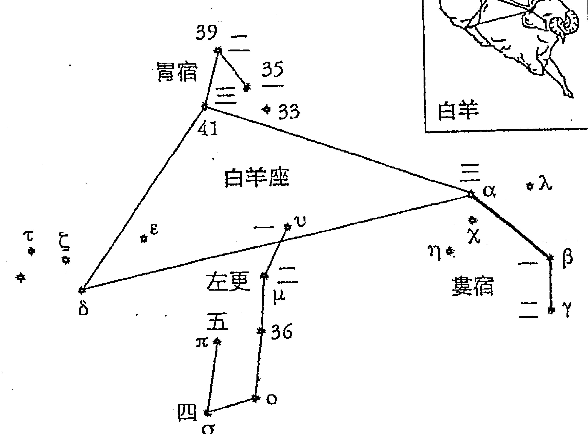

「Ashwini」位於英仙座西南方，雙魚座的東方，金牛座的西方，鯨魚座的西北方，屬於白羊座的二等星；完全對應中國二十八星宿的「婁宿」。唐代楊景風云：「唐國天文婁之星，今此經同」，即為此意。

### 二、主要恆星

γ Ari（婁宿二，Mesartim）、β Ari（婁宿一，Shartan）

### 三、星宿名稱及符號

（一）「Ashwini」中的「Ashwin」，意為擁有馬匹者、駕馭馬匹者、女騎師；它的另一名字「Asvayuj」，即為「她駕馭馬」。

#### （二）象徵符號與意義

1. 梵文「Aswa」與數字「七」有關。「七」在印度哲學中為吉祥數字，人體內有七個脈輪、產生七種能量。七種智慧狀態為七種燃燒的永恆之火。
2. 馬是能量與活力的象徵，上述不同的生命能量，需要類似馬的活力來創造成功。
3. 馬也是運送貨物的重要工具，有利於快速移動，隱含心思敏捷、理解力強，表示有能力進行啟蒙，或有關馬的一切活動，古稱之「運輸之星」。

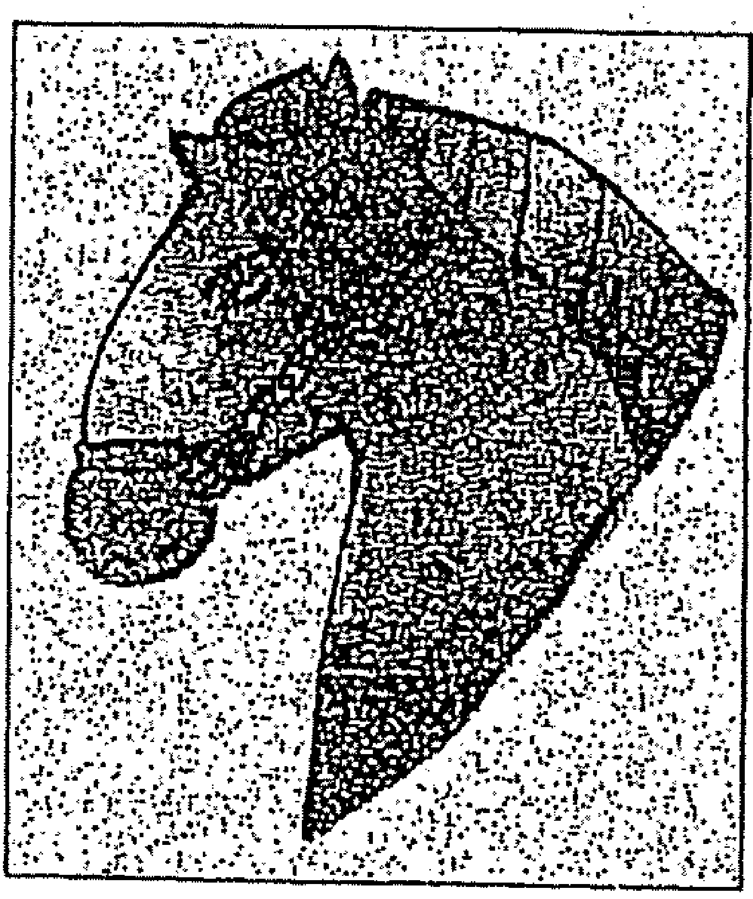

## 2 星宿名稱：Bharani / 胃宿

所在範圍：♈ 13°20' - 26°40' / 主星：♀

| 活動性 | 種姓 | 方向/風向 | 三種性質 | 主要動機 |
|--------|------|------------|----------|----------|
| 平衡 | 種姓外 | 向下/西 | RRT | 利（Artha） |
| 五行元素 | 陰陽性 | 神人鬼 | 身體部位 |          |
| 地 | 陰 | 人 | 頭、腳底 |          |

### 一、星空形態

《宿曜經》記載：「胃三星形如三角」，即以 41 Ari（胃宿三）、39 Ari（胃宿二）、35 Ari（胃宿一）構成如女性性器官的三角形。《摩登伽經》：「胃有三星形如鼎足」，而《舍頭諫經》的記載則稱：「有五要星，其五要星其形類軛（車的接軸）」。「Bharani」三星較暗弱，對應中國二十八星宿的「胃宿」，位於「婁宿」的東北方。

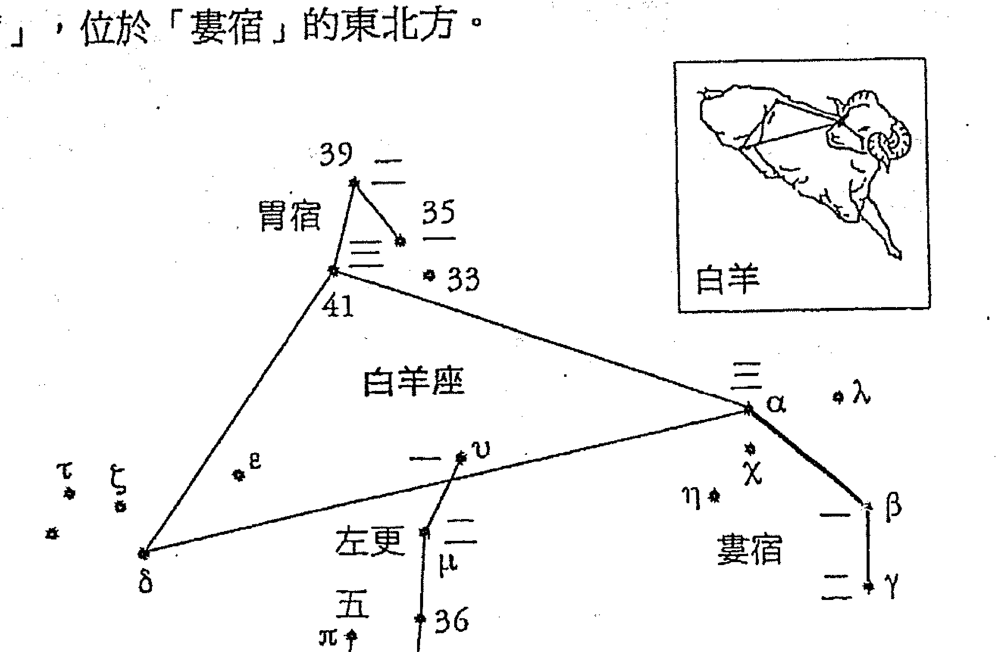

### 二、主要恆星

41 Ari (胃宿三)

### 三、星宿名稱及符號

（一）「Bharani」意謂承載或她承載，不僅僅是生產之意。

#### （二）符號象徵及意義

1. 女性性器官「Yoni」，說明其為創造的管道，不管是經由性行為或是其他形式創造的能量；扮演從精神性顯現的靈魂到物質形成的通道。
2. 子宮透過月經完成自我潔淨。「Bharani」主管類似的過程，包含潔淨的最後呈現，如個人的崇高道德或烏托邦社會；擁有建設性的毅力，可以克服許多困難，如疾病。
3. 子宮的內在變化，代表了微細的成長，直至它們被生出來、擁有自己的生命；此亦說明了這個過程有所限制，需忍耐，先經奮鬥、自我控制、意志力來培育。
4. 「Bharani」為生產的象徵，表示生命維持需要養分，因此主食物、醫院；又因細微成長，故主增量。

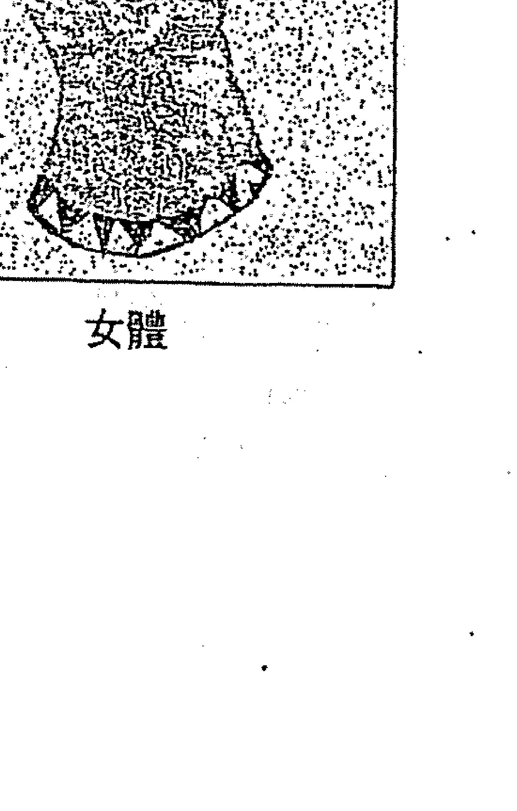

女體

## 3 星宿名稱：Krittika／昴宿

所在範圍：♈ 26°40'－♉ 10°0'／主星：⊙

| 活動性 | 種姓 | 方向／風向 | 三種性質 | 主要動機 |
|--------|------|------------|----------|----------|
| 主動 | 婆羅門 | 向下／北 | RRS | 欲 (Kama) |
| 五行元素 | 陰陽性 | 神人鬼 | 身體部位 |  |
| 地 | 陰 | 魔 | 臀、腰、頭上半（後） |  |

### 一、星空形態

《宿曜經》：「即之星形如剃刀」。即以 η Tau（昴宿六，Alcyone）、16 Tau（昴宿增九，Celaeno）、17 Tau（昴宿一，Electra）、19 Tau（昴宿二，Taygeta）、20 Tau（昴宿四，Maia）、21 Tau（昴宿三，Asterope）等六顆「昴宿星團」組成。《摩登伽經》：「昂有六星，形如散花」，頗符合實際星象。《舍頭諫經》：「有六要星其形象」。
「Krittika」大致對應中國二十八星宿的「昴宿」，但後者包含七顆星，西方稱之為「七姊妹」；其中有顆較暗沉、模糊，類比淚珠，西方稱之為

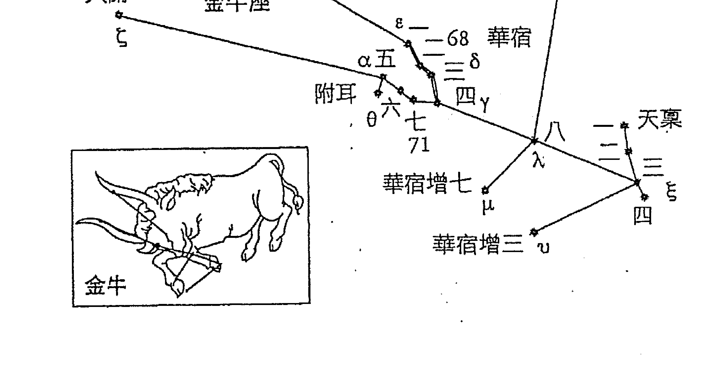

「哭泣的姊妹」；而在印度古代神話裡，則將之類比為六位仙人的妻子，受到火神的誘拐。

「Krittika」屬於金牛座中的「昴宿星團」（Pleiades），大約位於金牛座的肩部。昴的字義是「髦頭」或「旌頭」；後者則是「戰爭」和「行刑」的標誌。

### 二、主要恆星

η Tau（昴宿六，Alcyone）

### 三、星宿名稱及符號

#### （一）「Krittika」意謂切除者，被稱為「火之星」。

#### （二）符號象徵及意義

1. 剃刀的使用，兼具破壞性與建設性，正面和負面的力量；「Krittika」無情的切除積弊，如醫生割除壞死組織和器官。
2. 「Krittika」，尖銳，代表頑強、堅決，是戰鬥者、精神武士；也是剃刀、斧或其他尖銳武器，有力量切除負面，以追求最深層的真實；一切尖銳的意象皆由它主管，包含戰爭、軍隊、打鬥、爭吵、屠宰。
3. 隱含敏銳、直接、不囉嗦、清晰、明快。

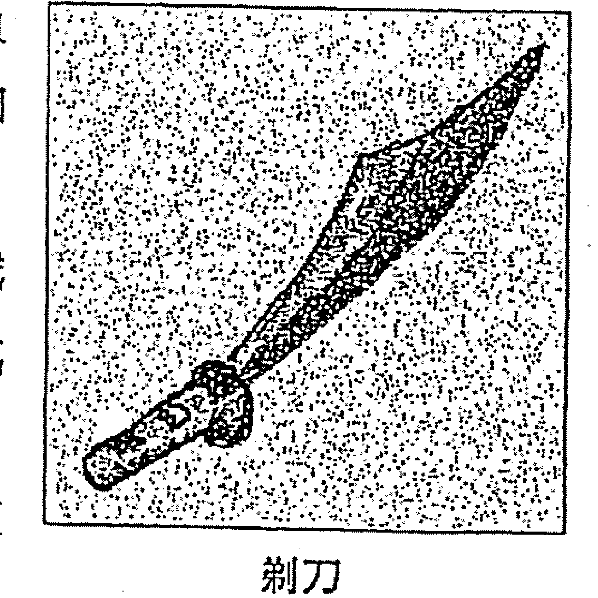

## 4 星宿名稱：Rohini／畢宿

所在範圍：♉10°0'-23°20'／主星：☽

| 活動性 | 種姓 | 方向／風向 | 三種性質 | 主要動機 |
|--------|------|------------|----------|----------|
| 平衡   | 首陀羅 | 向上／東 | RTR      | 解脫（Moksha） |

| 五行元素 | 陰陽性 | 神人鬼 | 身體部位 |
|----------|--------|--------|----------|
| 地       | 陰     | 人     | 腰、腿、肚、踝 |

### 一、星空形態

> > 《宿曜經》記載：「畢五星形如車」。《摩登伽經》：「畢有五星形如飛雁」。而《舍頭諫經》記載同《宿曜經》。

「Rohini」位於西方金牛座臉龐上的「畢宿星團」，主要組成為 α Tau（畢宿五，Aldebaran）、θ1 Tau（畢宿六，Hyades）、γ Tau（畢宿四，Prima Hyadum）、δ Tau（畢宿三，Hyadum II ）、ε Tau（畢宿一，Ain Hyades），大致對應中國二十八星宿的「畢宿」；但中國的「畢宿」，除上述五顆星外，還包括其他三顆星，共計八顆。

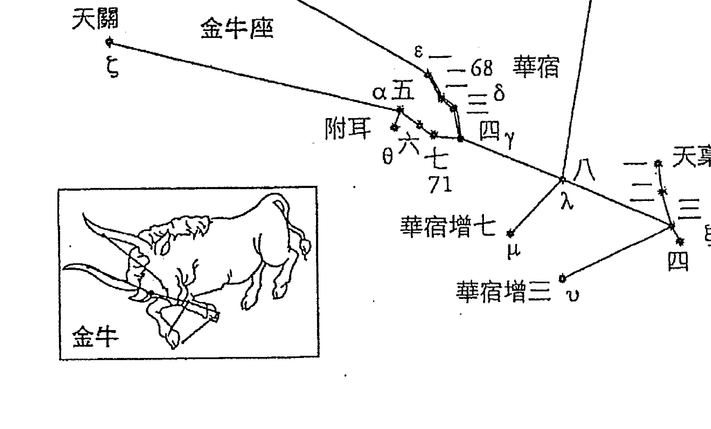

### 二、主要恆星

α Tau（畢宿五，Aldebaran），為天空中的一等星；在西方被稱作「公牛的紅眼睛」。

### 三、星宿名稱及符號

（一）「Rohini」譯為紅色的一顆或增長的一顆；另也被稱為「上升的星星」，賦予優秀和社會影響力，隱含熱情、性欲。

#### （二）符號象徵及意義

1. 傳統上為奢華的車輛。皇家使用的交通工具，所有舒適、奢華、有格調的生活，還有享受肉慾本性，都攸關「Rohini」。
2. 在印度傳說中，「Rohini」由公牛拖引，隱含所有創造成果的運輸，如農產收獲、牛隻養育；在二十七星宿中也是最物質化的一顆。又因公牛之故，所以具備穩定、固執、務實、物質安全感、累積、改良、洗鍊、奢侈享受、愛美等特性。

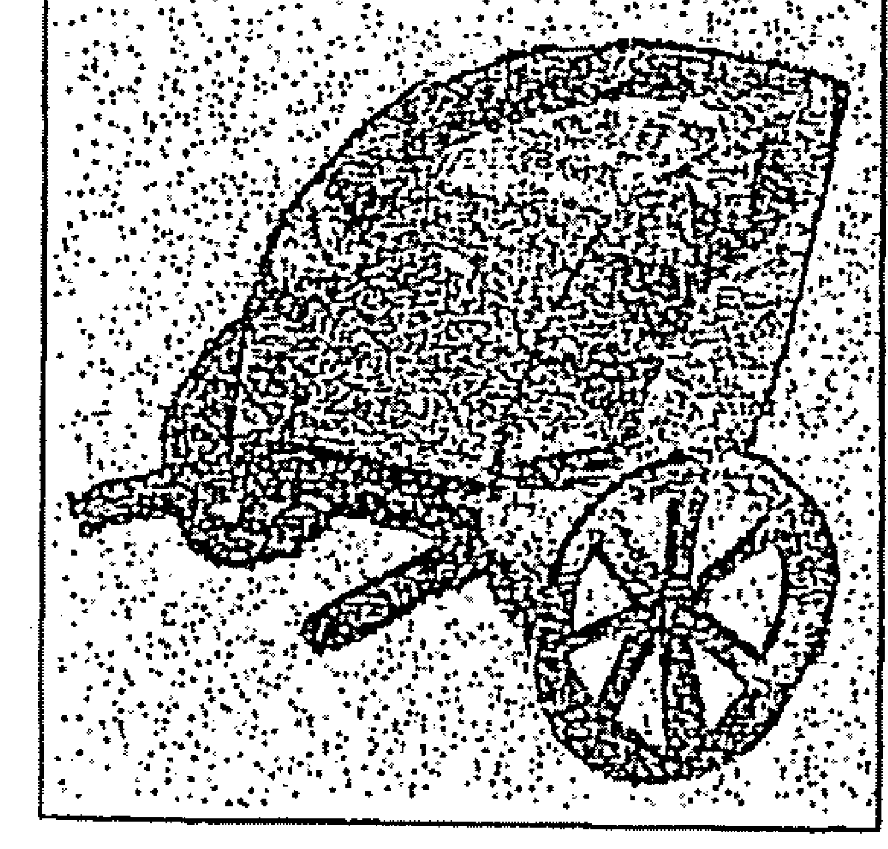

皇室座車

3. 譯為「增長的一顆」，表示有能力創造或發展其觀念或計畫；在過程中，常獲得好的技術和知識。

## 5 星宿名稱：Mrigasira／觜宿

所在範圍：♉23°20′-♊6°40′／主星：♂

| 活動性 | 種姓 | 方向／風向 | 三種性質 | 主要動機 |
| :--- | :--- | :--- | :--- | :--- |
| 被動 | 奴僕 | 水平／南 | RTT | 解脫 |
| 五行元素 | 陰陽性 | 神人鬼 | 身體部位 |
| 地 | 中 | 神 | 眼睛、眉毛 |

### 一、星空形態

《宿曜經》：「三星形如鹿頭」。《摩登伽經》與《舍頭諫經》記載相同：由λ Ori（觜宿一，Meissa）、φ¹ Ori（觜宿二）、φ² Ori（觜宿三）組成鹿頭。

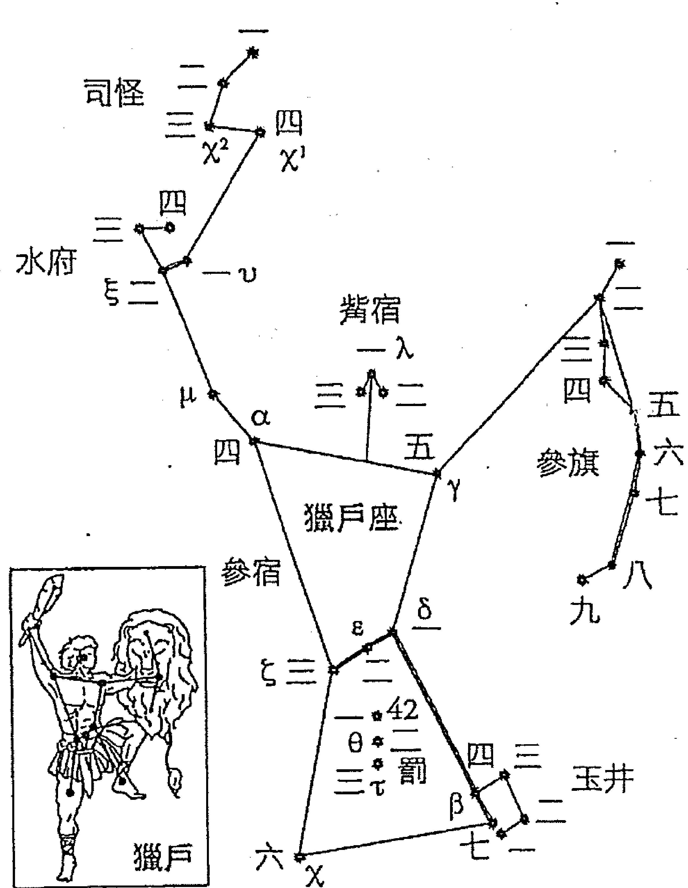

「Mrigasira」位於金牛座，「畢宿星團」東稍南，完全對應中國二十八星宿中的「觜宿」；三顆星均為四等星，較陰暗。

### 二、主要恆星

λ Ori（觜宿一，Meissa）

### 三、星宿名稱及符號

（一）「Mrigasira」的字義是鹿頭，也被稱為「搜尋的星星」；表示開始搜尋，即經常不斷尋找某些事情；其坐落宮位是命主尋找的目標。

#### （二）符號象徵及意義

1. 鹿是膽小、害羞、敏銳的動物，不斷的尋找食物和安全庇護，會快速、煩燥的移動；因此，尋找和發現是其主要特性，也代表了它的脆弱。
2. 「Mrigasira」與狩獵有關，也是尋找的一種形式；鹿徘徊於可預知的路徑，與路、途徑、旅行、移動有關。
3. 在印度史詩《羅摩衍那》中，由阿修羅扮演鹿，誘使悉達注意，最後導致她跟羅摩分離，因而隱含婚姻問題，由錯覺、不恰當懷疑、明顯的誤解引起。

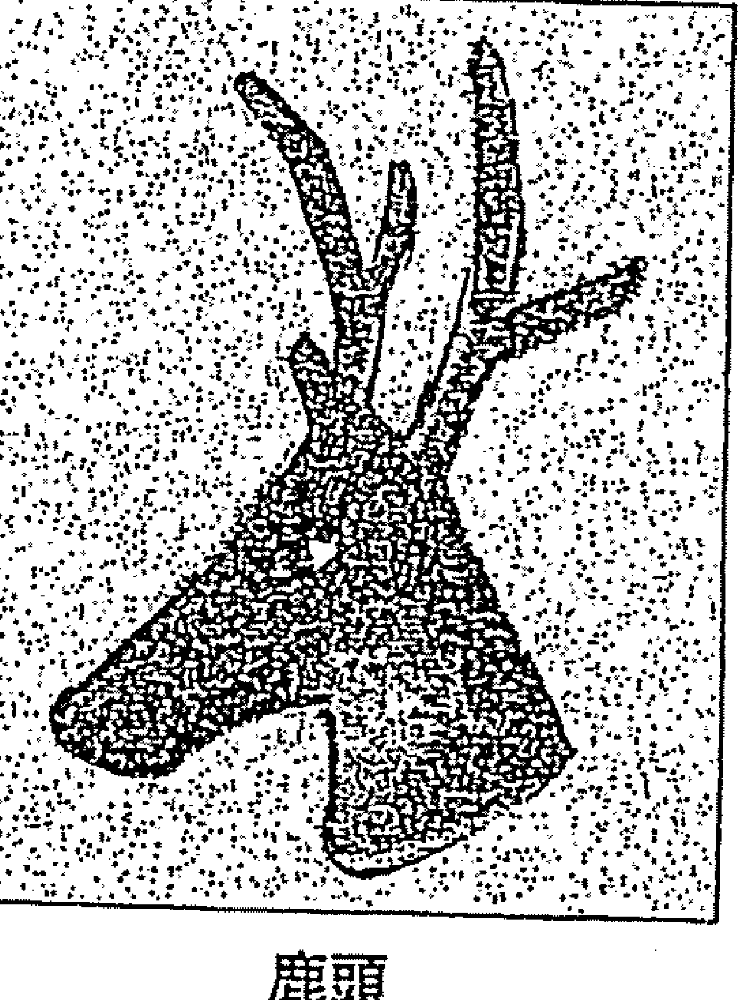

## 6 星宿名稱：Ardra／參宿

所在範圍：♊ 6°40′-20°0′／主星：♂

| 活動性 | 種姓 | 方向／風向 | 三種性質 | 主要動機 |
| :---: | :---: | :---: | :---: | :---: |
| 平衡 | 屠夫 | 向上／西 | RTS | 欲 |
| 五行元素 | 陰陽性 | 神人鬼 | 身體部位 |
| 水 | 陰 | 人 | 頸後半部上端、眼睛 |

### 一、星空形態

> 《宿曜經》：「參二星形如額上點」。《舍頭諫經》：「有一要星其形類圓，光色則黃」。根據辛克利·艾倫（R. Hinckley Allen）所著《Star Names》一書的說法，僅以 α Ori（參宿四，Betelgeuze）一顆獨自作為「參宿」。

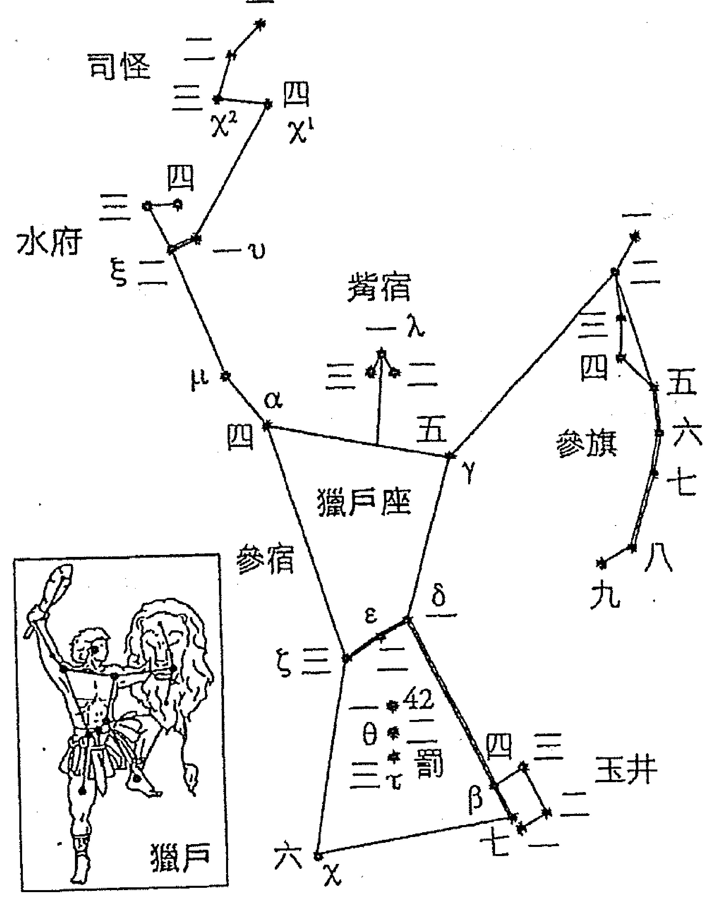

「Ardra」屬於西方獵戶座裡最亮的一等星，位於其肩部；雖對應了中國二十八星宿的「參宿」，但中國的「參宿」是由十顆恆星所組成，也包含參宿四。

### 二、主要恆星

α Ori（參宿四，Betelgeuze）

### 三、星宿名稱及符號

（一）「Ardra」意謂潮濕的一顆，通常被描述成一滴淚珠，或明亮得像顆寶石。

#### （二）符號象徵及意義

1. 鑽石象徵有能力吸收來自太陽的、活力的、神秘的精神能量，再轉換給穿戴者；但這些能量，有可能用在好事或壞事上。鑽石的多面、光澤不一，加上尖頭、尖銳，故本性好批評、殘忍、剛愎、自我中心。
2. 另一符號是淚珠，隱含悲傷、不滿意，與露珠、潮濕、濕氣、煙霧、淚腺、液體流動有關。宮主星位於「Ardra」，常是命主悲傷、不滿意之處。
3. 傳統上，這個星宿缺乏感激且有些邪惡；在商業或金融領域裡，會有不忠和欺瞞的行為；另外，也易見情緒化，動不動就流淚，時而因不義而憤怒，時而又殘酷自私；其憤怒的表現為咆哮。
4. 淚珠也代表淨化和純化、風暴後的黎明，故得以解放。

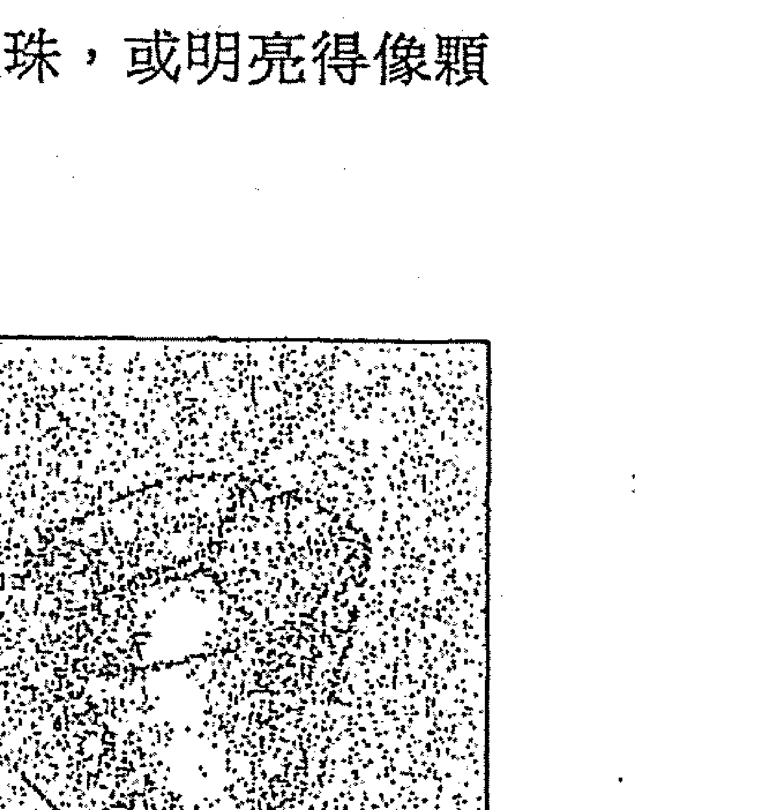

鑽石

## 7 星宿名稱：Punarvasu / 井宿

所在範圍：♊ 20°0' - ♊ 3°20' / 主星：♃

| 活動性 | 種姓 | 方向／風向 | 三種性質 | 主要動機 |
| :---: | :---: | :---: | :---: | :---: |
| 被動 | 吠舍 | 水平／北 | RSR | 利 |
| 五行元素 | 陰陽性 | 神人鬼 | 身體部位 |  |
| 水 | 陽 | 神 | 手指、鼻子 |  |

### 一、星空形態

> > 《宿曜經》記載：「井二星形如屋状」。即由 α Gem（北河二，Castor）
> 和 β Gem（北河三，Pollux）組成。《摩登伽經》：「井有二星形如人步。」
> 《舍頭諫經》：「有二要星其對應」。

「Punarvasu」屬於西方的雙子座，並未對應中國二十八星宿的「井宿」。
中國的「井宿」共有八顆星；而印度的「Punarvasu」則位於「井宿」東北方。

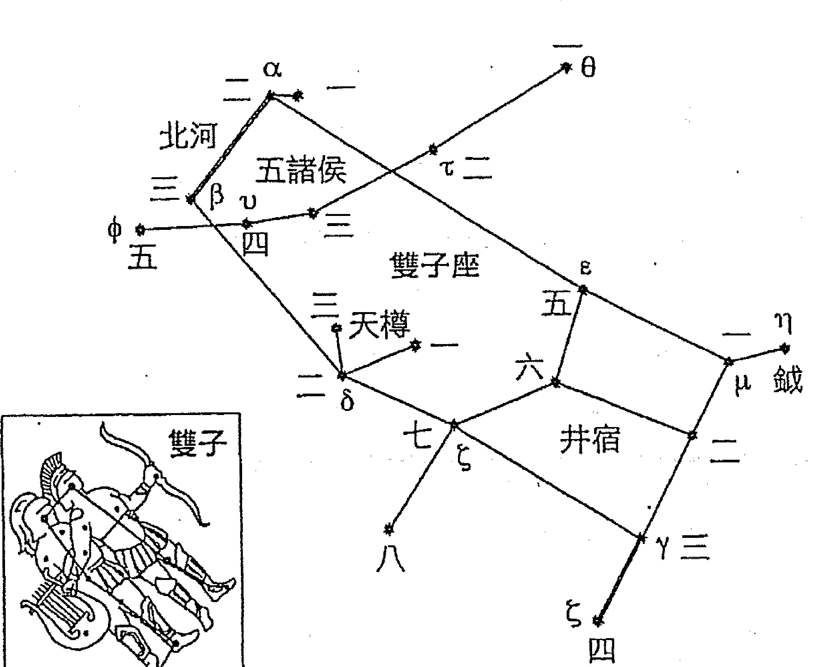

### 二、主要恆星

β Gem (北河三，Pollux)

### 三、星宿名稱及符號

（一）「Punarvasu」由梵文「Punar」和「Vasu」所組成。「Punar」字義為重複或一再；而「Vasu」字義為光的射線、寶石或珍珠，也可譯成繁榮的或美好的。由於「Punarvasu」連結到雙子星，因此完整的意義為繁榮或美好的兩個。

#### （二）符號象徵及意義

1. 弓表示人馬與其目標之間的連結（精神或物質）；此星宿創造契機，讓人馬有機會完成理想，但重點在於採取行動。
2. 象徵潛在能量和資源的準備，以待運用。因弓是箭的支架，說明安住在適當的地方，代表一個人歸家的感覺。但又因如弓上箭欲射出，故也意指想要旅行。箭有「重複循環」之意，如喪失後又獲得使用。
3. 因有「重複循環」之意，故此星宿也被稱為「再生之星」。代表自我的純化、人格的改變，如同光的返回；類比為吸收他人觀念再孕育出新觀念，或是離婚後再與同一人結婚。

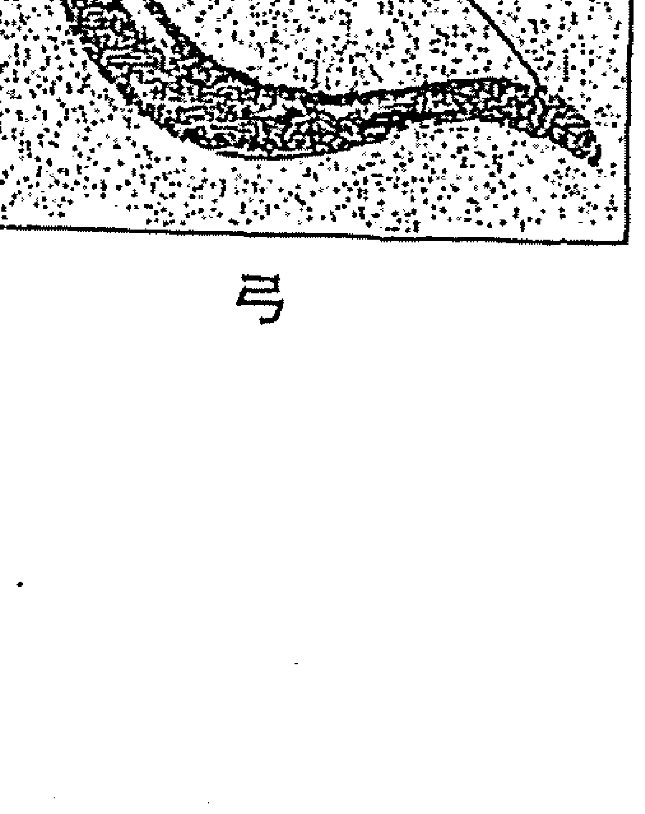

## 8 星宿名稱：Pushya／鬼宿

所在範圍：♊3°20'-16°40'／主星：♄

| 活動性 | 種姓 | 方向／風向 | 三種性質 | 主要動機 |
| :--- | :--- | :--- | :--- | :--- |
| 被動 | 刹帝利 | 向上／東 | RST | 法 |
| 五行元素 | 陰陽性 | 神人鬼 | 身體部位 |
| 水 | 陽 | 神 | 嘴、臉 |

### 一、星空形態

《宿曜經》：「鬼五星形如瓶」。《摩登伽經》：「鬼有三星形如畫瓶」。《舍頭諫經》：「其熾盛宿有三要星，形像鉤尺」。一般印度占星書籍，都以γ Cnc（鬼宿三，Asellus Borealis）、δ Cnc（鬼宿四，Asellus Australis）、θ Cnc（鬼宿一）代表之。

「Pushya」位於西方巨蟹座內，對應中國二十八星宿的「鬼宿」。中國的「鬼宿」包含四顆恆星，其中三顆即構成印度「Pushya」的三恆星。

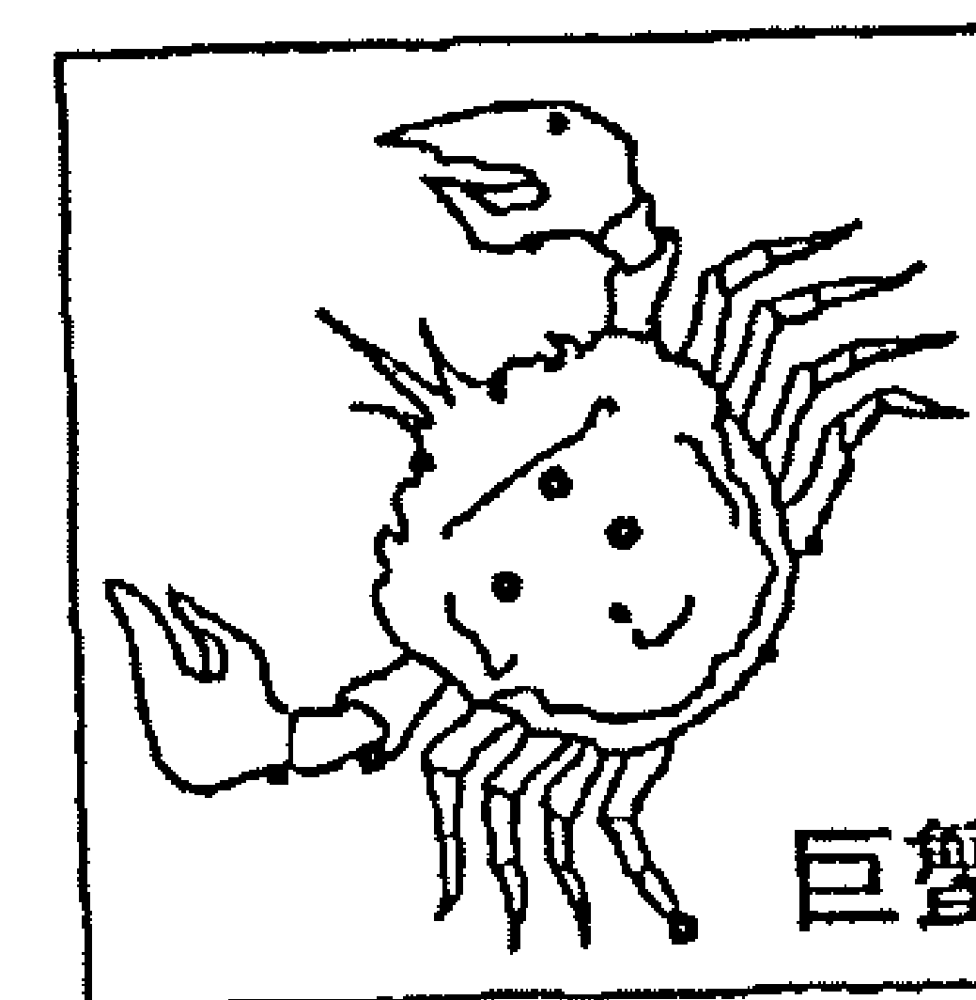

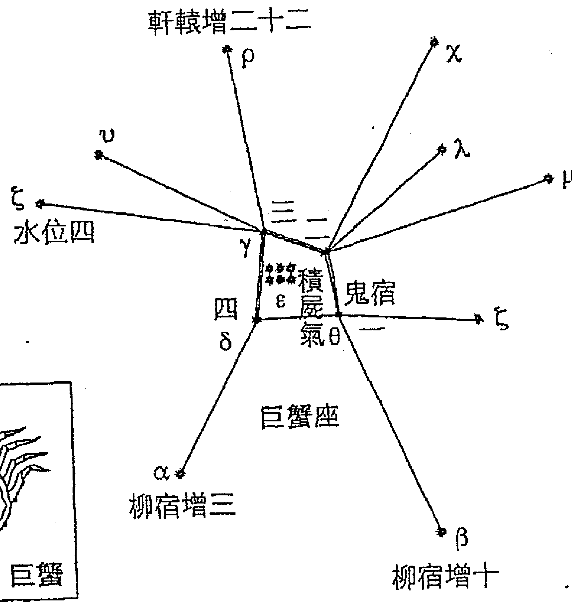## 二、主要恒星

δ Cnc（鬼宿四，Asellus Australis）

### 三、星宿名称及符号

- （一）「Pushya」意谓养育；其三星意象类似乳牛的乳房，故有养育之意。为最吉祥的星宿之一。

- （二）符号象征与意义
1. 表示隐含的功能（即内在理念）呈现在外。花为他人开，不承认自己的美丽；箭显示野心和直率的行动；圆代表完满的生活，没有结束或开端，与富足、成长、丰富、美好相关，也表示圆胖或肥胖。
2. 「Pushya」的滋养之意涵盖身心灵，是物质与精神的滋养。「Pushy」的古名是「Tishya」，有吉祥之意；另一名称为「Sidhya」，则有繁荣之意。
3. 「Pushya」如乳牛般，无私地提供牛乳；隐含博爱、大众化之意，促进成长或名望。

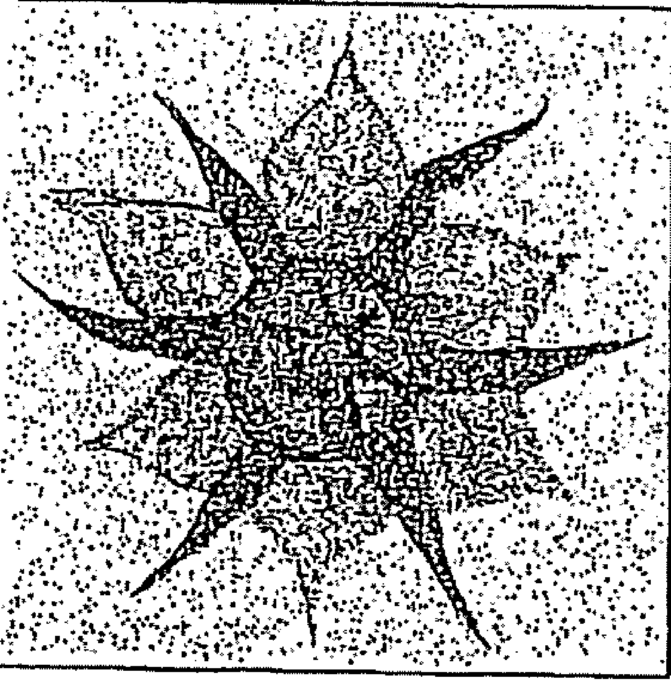

## 9 星宿名称：Ashlesha／柳宿
所在范围：♊ 16°40'-♊ 30°0'／主星：☿

| 活动性 | 种姓 | 方向／风向 | 三种性质 | 主要动机 |
|--------|------|------------|----------|----------|
| 主动   | 种姓外 | 向下／南 | RSS      | 法       |
| 五行元素 | 阴阳性 | 神人鬼 | 身体部位 |          |
| 水     | 阴   | 魔        | 关节、指甲、耳朵 |          |

### 一、星空形态

> 《宿曜经》：「柳六星形如蛇头」。即以δ Hya（柳宿一）、ε Hya（柳宿五）、ζ Hya（柳宿六）、ρ Hya（柳宿四）、σ Hya（柳宿二）、η Hya（柳宿三）组成类似蛇头之形。《舍头谏经》：「有五要星形如曲钩」。《摩登伽经》：「柳宿一星」。

「Ashlesha」位于西方长蛇座的蛇头，巨蟹座南方；大致对应中国二十八星宿的「柳宿」。中国的「柳宿」共有八颗星，而印度的「Ashlesha」则全部含括在内。

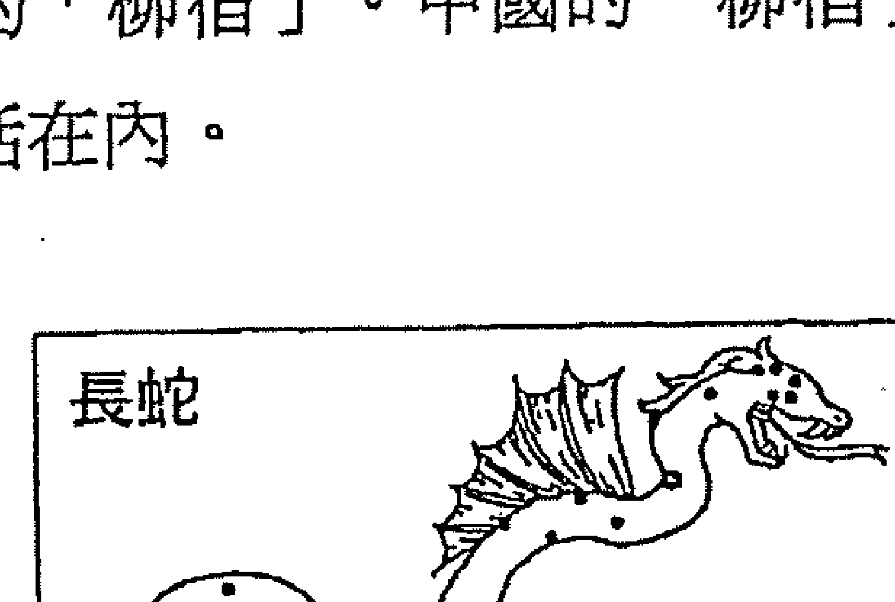

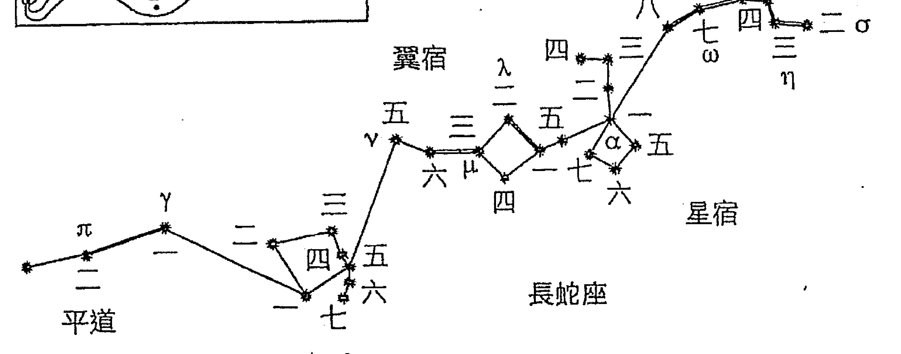

### 二、主要恒星

ε Hya（柳宿五）

### 三、星宿名称及符号

（一）「Ashlesha」意谓缠绕者，被称为「黏着的星星」，欲拥抱或纠缠而设定的标的物。

#### （二）符号象征及意义

- 1. 在《吠陀经》中，所有的神祇都尊崇蛇。蛇的蜕变是再生和转换的过程，类比人类心思的变化，如情感、智能和意识的改变。

- 2. 「Ashlesha」跟蛇有关。印度人认为，蛇是诡计多端的，在捕食其猎物前，会移动、盘绕、蠕动至目标物。蛇有秘密，常被误解为不真诚。也指冷血、欺骗、贪婪、有毒的牙、集中的力量、原始的能量、特别的性能力。

- 3. 蛇眼能洞察深层的底蕴，揭开灵魂深处的迷雾；神性的智、生殖力、危险、突击；乾枯的困扰；有能力施毒，也有能力阻止敌人迷惑与催眠。

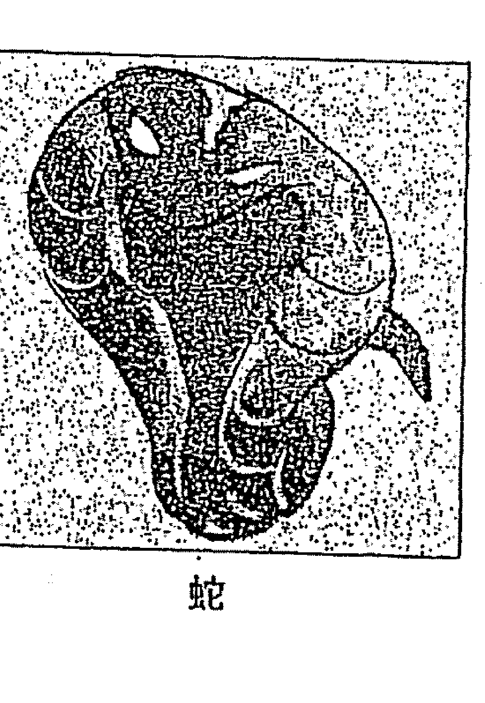

## 10 星宿名称：Magha／星宿
所在范围：♌︎ 0°0'-13°20'／主星：♌︎

| 活动性 | 种姓 | 方向／风向 | 三种性质 | 主要动机 |
| :--- | :--- | :--- | :--- | :--- |
| 主动 | 首陀罗 | 向下／西 | TRR | 利 |
| 五行元素 | 阴阳性 | 神人鬼 | 身体部位 |
| 水 | 阴 | 魔 | 脚、身体左侧 |

### 一、星空形态

《宿曜经》：「星六星形如墙」。即以 α Leo（轩辕十四，Regulus）、η Leo（轩辕十三，Al Jabhan）、γ Leo（轩辕十二，Algieba）、ζ Leo（轩辕十一，Adhafera）、μ Leo（轩辕十，Raselas）、ε Leo（轩辕九，Algenubi）组成。《摩登伽经》：「其七星者，五则显现，二星隐没，形如河曲」。
《舍头谏经》：「有五要星，其形之类犹如曲河」。
「Magha」位于西方狮子座的前半部，其中轩辕十四是一等星，轩辕十二是二等星。印度的「Magha」并没有对应中国的二十八星宿。中国的「星宿」共有七颗恒星，位于西方长蛇座的前中段。

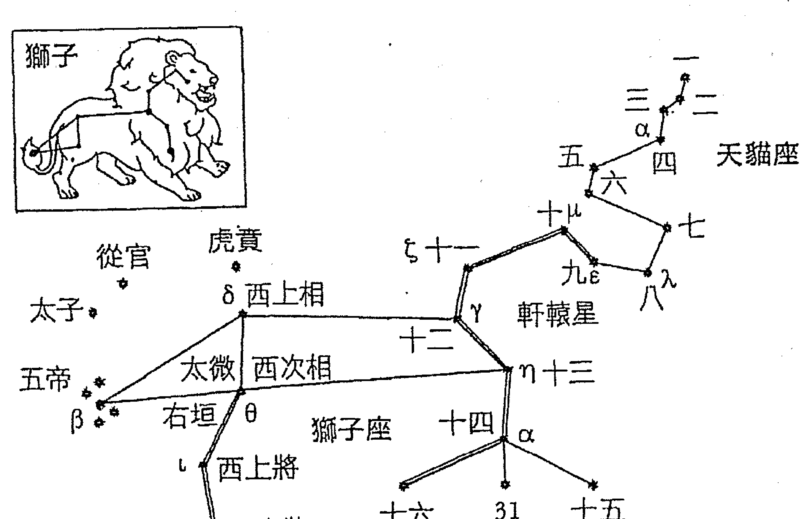

### 二、主要恒星

α Leo（轩辕十四，Regulus）

### 三、星宿名称及符号

（一）「Magha」意谓强大的一颗或巨大的一颗，源自主要恒星 α Leo（轩辕十四）的至高无上。

（二）符号象征及意义

- 1. 乘坐高贵，赋予「Magha」至高无上的意象。轿子中间由直竿做成，类比脊椎，是人体中一种神圣的连结，即由外在力量与内在精神结合成伟大的人类。
2. 「Magha」类比皇权、威权。皇宫是议政与举办典礼的场所，显赫壮观；王权的重要人物，野心、领导力的展现。
3. 「Magha」与传统有关，类比人类的祖先。我们站在祖先的肩膀上，祖先赋予我们生命，却不求回报；借以暗喻「Magha」自由的赋予才能，却不求回报。「Magha」所在后天宫位，表示良机的领域。
4. 「Magha」是王权，有利太阳、月亮、火星，却不利仆人行星，如土星、南北交点。

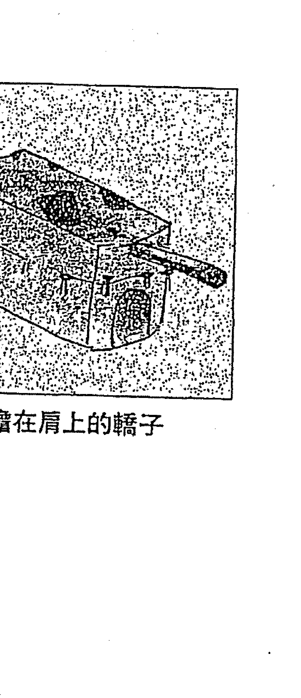

## 11 星宿名称：Purva Phalguni／张宿
所在范围：ℒ 13°20′-26°40′／主星：♀

| 活动性 | 种姓 | 方向／风向 | 三种性质 | 主要动机 |
| :--- | :--- | :--- | :--- | :--- |
| 平衡 | 婆罗门 | 向上／北 | TRT | 欲 |
| 五行元素 | 阴阳性 | 神人鬼 | 身体部位 | |
| 水 | 阴 | 人 | 性器官 | |

### 一、星空形态

《宿曜经》记载：「张六星形如杵」。但《摩登伽经》则称：「张星二星亦如人步」，目前一般印度占星书籍，多以床的前两脚来形容之，亦即 δ Leo (西上相，Zosma)、θ Leo (西次相，Chertan)。印度的「张宿」位于西方狮子座的臀部，并不对应中国二十八星宿的「张宿」；中国的「张宿」包含六星，位于西方长蛇座的中段。《宿曜经》的说法，类比中国的「张宿」。

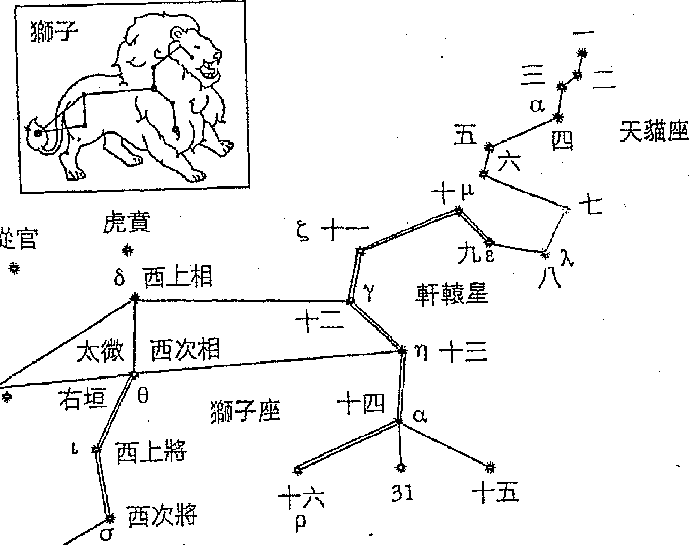

### 二、主要恒星

δ Leo（西上相，Zosma）

### 三、星宿的名称及符号

（一）「Purva Phalguni」意谓树的果实，符号以床代表之。此星宿的两颗恒星，即为床的前两脚；整个星宿被称为「带红色的前一个」（the former reddish one）。「Purva」的梵文字义即为前面的。

（二）符号象征及意义

- 1. 床予人休息、放松、享受性生活的感觉，主要动机是欲、性愉悦、热情、爱情等等，包含了生殖、人际关系的和谐、婚姻美好。若方式不当，也会带来负面影响。
2. 「Purva Phalguni」是床的前脚，意谓着放松过程的开始。虽然休息不工作，但大脑仍在活动，或许会灵光乍现。
3. 树的果实，连结至「Purva Phalguni」，隐含财运佳，因继承而获致成功。若此星宿见凶星，则承继有困难或易有纠纷，难以公平享有。若金钱代表因子木星，或二宫、十一宫主星落在此星宿，则财运通常佳。

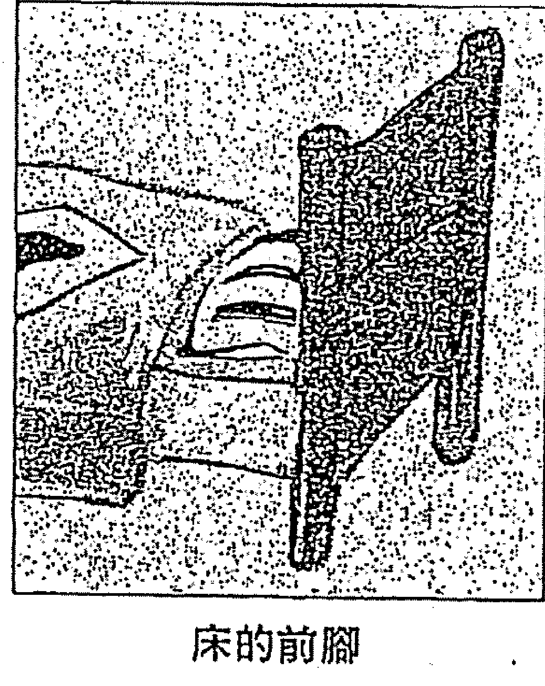

## 12 星宿名称：Uttara Phalguni / 翼宿
所在范围：♌26°40'-♍10°0' / 主星：☉

| 活动性 | 种姓 | 方向 / 风向 | 三种性质 | 主要动机 |
|---|---|---|---|---|
| 平衡 | 刹帝利 | 向下 / 东 | TRS | 解脱 |
| 五行元素 | 阴阳性 | 神人鬼 | 身体部位 |
| 火 | 阴 | 人 | 性器官、左手 |

### 一、星空形态

> 《宿曜经》：「翼二星如踟跌¹」。即以β Leo（五帝座一，Denebola）和93 Leo（太子）构成床的后二脚。《摩登伽经》：「翼有二星形如人步」。《舍头谏经》：「有二要星南北对立」。
「Uttara Phalguni」位于西方狮子座的尾巴和其上方，并不对应中国二十八星宿的「翼宿」；而中国的「翼宿」，事实上共包含二十二颗恒星，位于西方巨爵座。

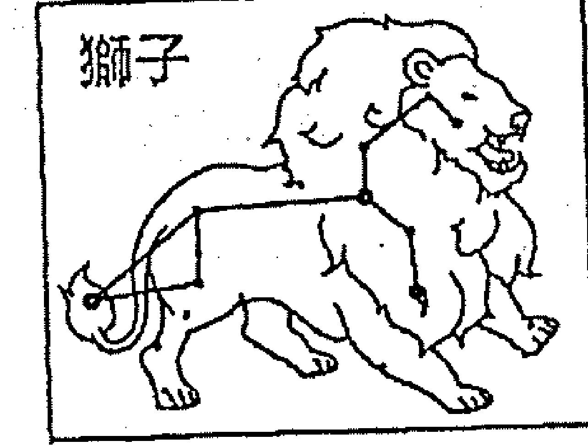

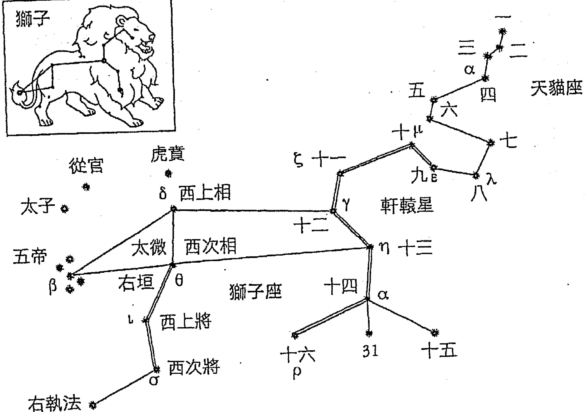

### 二、主要恒星

β Leo (五帝座一，Denebola)

### 三、星宿名称及符号

（一）「Uttara Phalguani」相对于「Purva Phalguni」，被称为「带红色的后一个」；「Uttara」的梵文字义，即后面的。这两个星宿组合成一张床，也被称为「援助的星星」，代表对人仁慈与同情。

（二）符号象征及意义

- 1. 其意义与前一个星宿有诸多雷同之处，但仍有些许不同。
2. 「Uttara Phalguni」指的是「床的后脚」；倾向非睡觉、非性生活，而是白天午后小憩，并非全然放松，尚需准备工作，故较前一星宿更具生产力。
3. 当凶星在此星宿，易见爱情或婚姻丑闻；若见吉星，则相对有利于爱情、婚姻及人际关系的和谐，会因婚姻而获得财富。

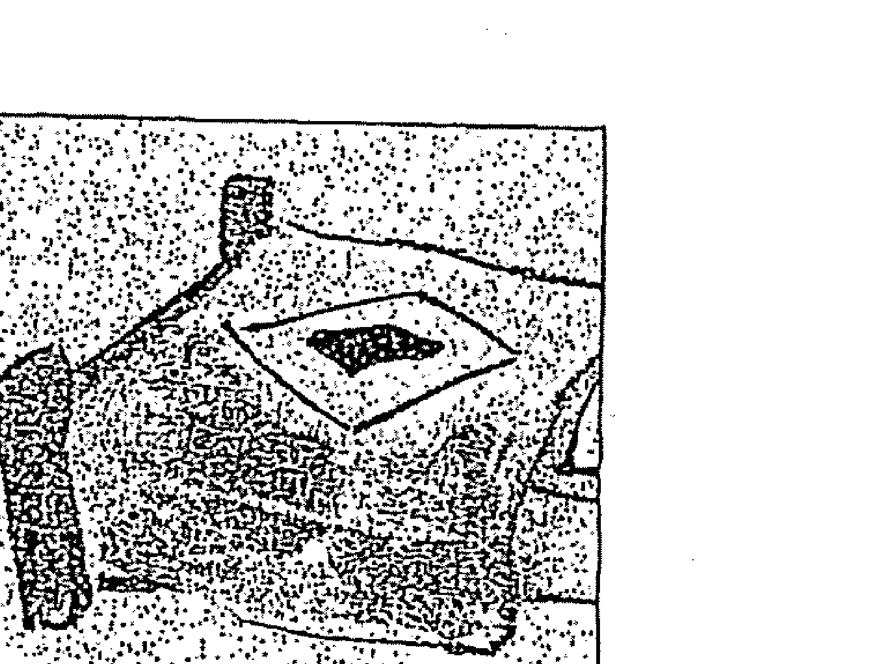

## 13 星宿名称：Hasta / 轸宿
所在范围：♍ 10°0' - 23°20' / 主星：☽

| 活动性 | 种姓 | 方向／风向 | 三种性质 | 主要动机 |
| :--- | :--- | :--- | :--- | :--- |
| 被动 | 吠舍 | 水平／南 | TTR | 解脱 |
| 五行元素 | 阴阳性 | 神人鬼 | 身体部位 |
| 火 | 阳 | 神 | 手、手指头 |

### 一、星空形态

> 《宿曜经》：「轸五星形如牛」。即以 α Crv（右辖，Alchiba）、β Crv（轸宿四，Kraz）、ε Crv（轸宿二，Minkar）、γ Crv（轸宿一，Gienah）、δ Crv（轸宿三，Algorab）。《摩登伽经》：「其星有五形如人手」。《舍头谏经》：「有五要星其形类象」。

「Hasta」位于西方乌鸦座上，对应中国二十八星宿的「轸宿」；中国的「轸宿」仅有四颗星，不包含上述印度五颗恒星中的右辖。

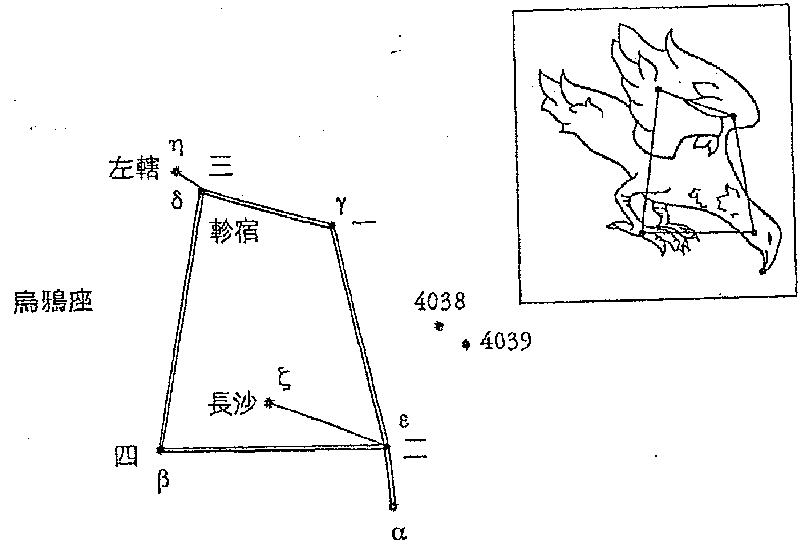

### 二、主要恒星：

δ Crv（轸宿三，Algorab）

### 三、星宿名称及符号

#### （一）「Hasta」翻译成手。

#### （二）符号象征及意义

- 1. 手赋予人完整的命运，左右手分别代表正面和负面、男性和女性的能量；手的四个指头，表示人生四大目的：法、利、欲、解脱；手指头的三个方阵是三种性质（Gunas），即变性（Rajas）、惰性（Tamas）及悦性（Sattva），和三个体质（Doshas），即风型（Vata）、火型（Pitta）、土型（Kapha）；四个指头也是指四个方向：北、南、西、东；手指和大拇指表示五觉（看、听、舌、嗅、触）及五种元素（地、水、火、风、乙太）；手指的方阵代表十二黄道星座；而拇指和手指则是太阳月的三十天。
2. 「Hasta」说明技术性的活动，也意谓着掌握的本性，有能力抓住和掌握所有的事情——无论精神、物质、身、心或灵等等。
3. 「Hasta」，当拇指和手指紧握时，也象征了坚决，以及经由各种方法的控制倾向，无论名誉或不名誉的行为。
4. 因手涵盖手工、技术之意，所以隐含早年生活的困顿、限制、妨碍。

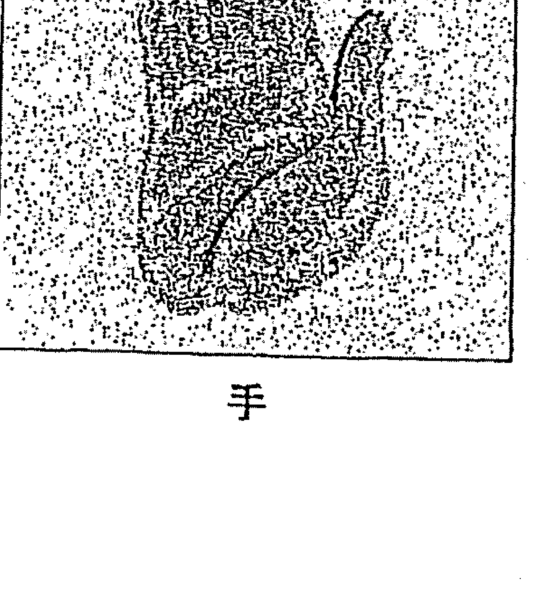

## 14 星宿名称：Chitra／角宿
所在范围：♍23°20'-♎6°40′／主星：♂

| 活动性 | 种姓 | 方向／风向 | 三种性质 | 主要动机 |
| :--- | :--- | :--- | :--- | :--- |
| 主动 | 奴仆 | 水平／西 | TTT | 欲 |
| 五行元素 | 阴阳性 | 神人鬼 | 身体部位 |  |
| 火 | 阴 | 魔 | 颈、前额 |  |

### 一、星空形态

《宿曜经》记载：「角二星形如长布」。但《摩登伽经》则称：「角有一星」。《舍头谏经》亦同：「有一要星形圆色黄」。目前一般的印度占星书籍，皆以一星代表，即为 α Vir（角宿一，Spica），是星空中的一等亮星，排名甚前。

「Chitra」位于西方的处女座，对应中国二十八星宿的「角宿」；中国的「角宿」包含两星，除 α Vir 以外，尚有 ζ Vir（角宿二）。《宿曜经》的记载，应该是受了中国的影响。

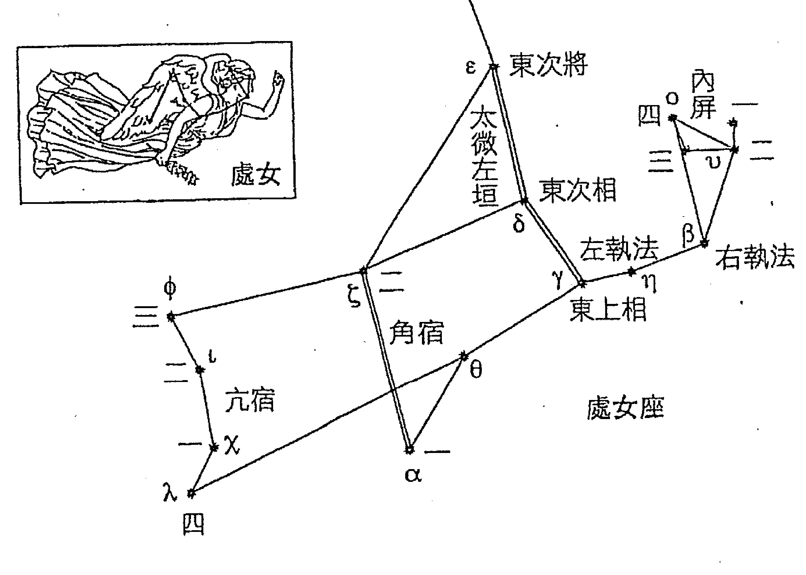

### 二、主要恒星

α Vir（角宿一，Spica）

### 三、星宿名称及符号

（一）「Chitra」意谓辉煌的、明亮的或美丽的，反映出「Spica」周围的颜色看起来五彩缤纷，同时也被称为「机会之星」。「Chitra」亦可译为美丽的图画。

#### （二）符号象征及意义

- 1. 珍珠藏于坚硬的贝壳内，在贝壳破开之前，未能显现。珍珠还得历时多年才能逐渐长成；经过生命周期的生死严格考验，破壳之前都是艰辛的过程；意谓着个人必须经历极大的变化，才能有所进展。

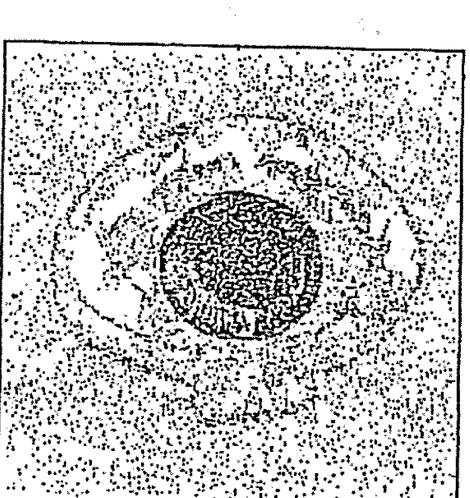

- 2. 「Chitra」以珍珠作为象征，令人神魂颠倒，且极具价值；故与优美、魅力、气质、迷人、亮丽、色彩缤纷、新奇有关。也是吉祥的、突显的、生命的光彩。

珍珠

- 3. 「Chitra」是耀眼的、口才便给、故事叙述（组织）能力佳、生动、不屈不挠。

## 15 星宿名称: Swati / 亢宿
所在范围: ≅ 6°40'- 20°0' / 主星: ω

| 活动性 | 种姓 | 方向/风向 | 三种性质 | 主要动机 |
| :---: | :---: | :---: | :---: | :---: |
| 被动 | 屠夫 | 水平/北 | TTS | 利 |
| 五行元素 | 阴阳性 | 神人鬼 | | 身体部位 |
| 火 | 阴 | 神 | | 胸部、肠 |

### 一、星空形态

《宿曜经》记载：「亢一星形如火珠」。即以 α Boo (大角，Arcturus) 为要。《摩登伽经》则称：「亢宿一星」。《舍头谏经》：「有一要星形圆色黄」。

「Swati」位于西方的牧夫座，并不对应中国二十八星宿的「亢宿」；中国的「亢宿」共有四颗恒星，位于「Swati」的正下方。

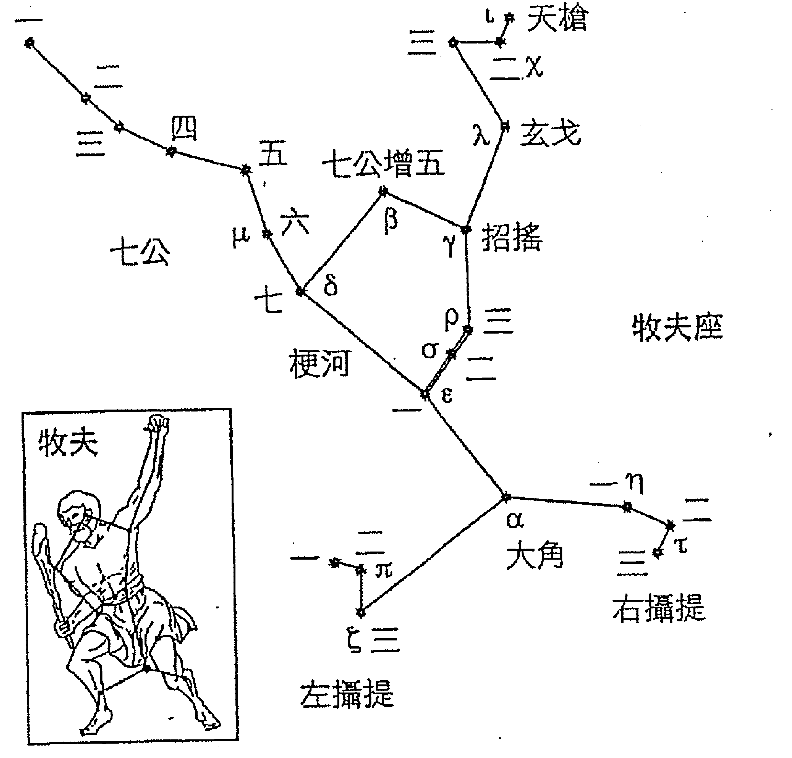

### 二、主要恒星

α Boo（大角，Arcturus），全天最亮的恒星之一，属零等亮星。

### 三、星宿名称及符号

（一）「Swati」意谓着剑（Sword），想要独立的强烈欲望，自我前进。

（二）符号象征及意义

- 1. 珊瑚在海中受水流影响而摇摆，如同嫩枝受风吹摇曳，故易以「风中摇曳的嫩枝」来形容。亦可说明适应环境的能力，不管如何脆弱，都会增进其成熟性；以自己的方式自我个别化，或独立成长而存活下来；想要独立的欲望，如同剑一样。

- 2. 「Swati」也象征纯化、无休止、摇摆适应的倾向而显得不稳定，故它所在后天宫位或有关行星主管宫位，易见不稳定。

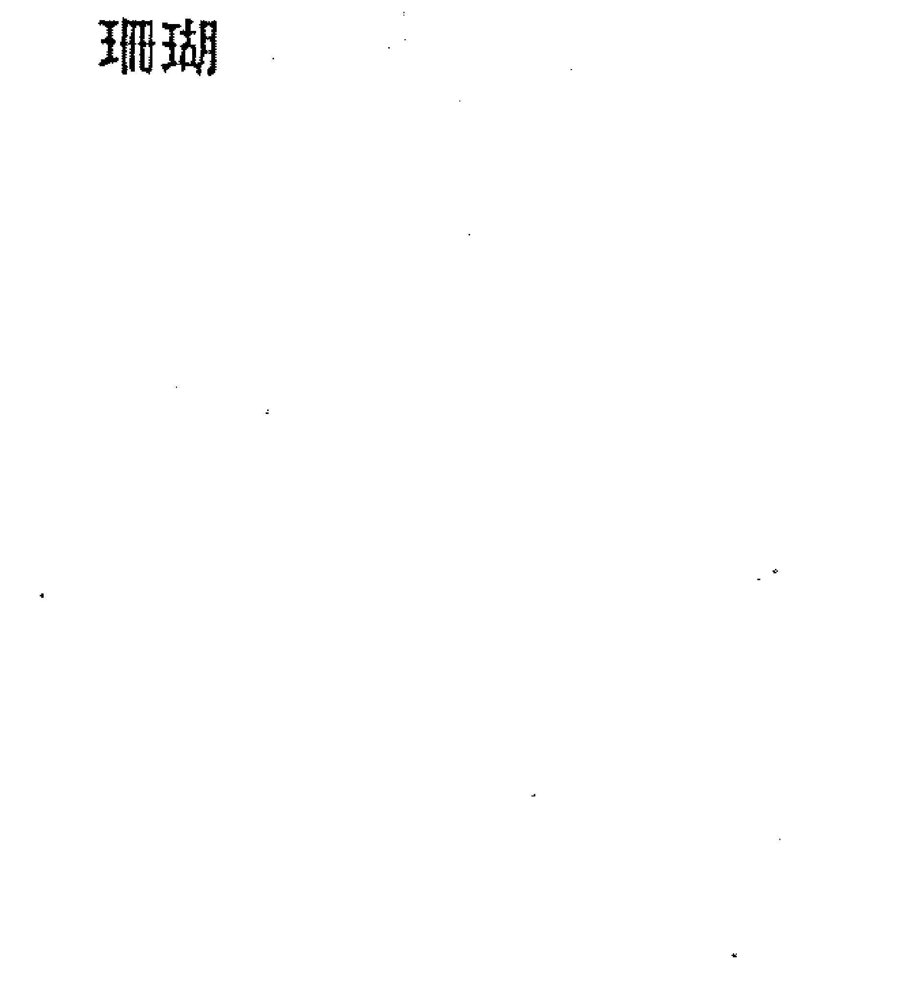

## 16. 星宿名称：Vishalcha／氐宿 所在范围：≃ 20°0'- ♏ 3°20'／主星：♃

| 活动性 | 种姓 | 方向／风向 | 三种性质 | 主要动机 |
| :--- | :--- | :--- | :--- | :--- |
| 主动 | 种姓外 | 向下／东 | TSR | 法 |
| 五行元素 | 阴阳性 | 神人鬼 | 身体部位 |
| 火 | 阴 | 魔 | 手臂、乳房 |

### 一、星空形态

《宿曜经》：「氐四星形如角」。即以 α Lib（氐宿一，El Gennbi）、β Lib（氐宿四，Ziben Elshem）、γ Lib（氐宿三，Zuben El Akrab）、氐宿二（ι Lib），构成一个斜四角形。《摩登伽经》：「氐宿二星形如羊角」。《舍头谏经》：「有二要星形像牛角」。一般印度占星书籍，都以《宿曜经》的说法为准。

「Vishakha」位于西方的天秤座内，完全对应中国二十八星宿的「氐宿」；

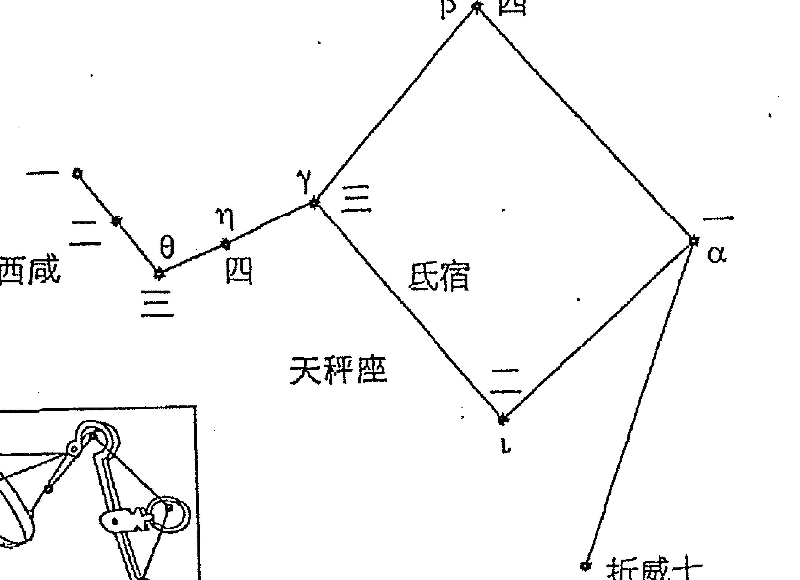

而中国「氐宿」包含的四颗恒星，与印度的「Vishakha」完全相同。

### 二、主要恒星

α Lib（氐宿一，El Gennbi）

### 三、星宿名称及符号

（一）「Vishakha」意谓着叉状的或两个枝状。它的另一名称「Radha」，是印度神话中，黑天众多妻子中最爱的一个，也被命名为「目的之星」。

#### （二）符号象征及意义

- 1. 显示内在的核心，沉浸于外在虚幻的演出。它们被陶工塑成人类的模型，被命运之神捏成不同的形状，有助生命经验的成熟。
2. 有时，「Vishakha」会被想像成一棵枝叶繁茂的大树，对他人提供保护；也意谓人会随着年纪成熟而逐渐茁壮，孕育鲜美的果实。
3. 陶艺术家有耐心的坐在转盘前，代表坚持、毅力，以完成艺术工作。
4. 它的另一个符号，是饰以树叶的胜利拱门，意谓能胜利、获得成功和伟大成就，但可能导致专制、强迫他人，为目的而用尽一切方法、手段。

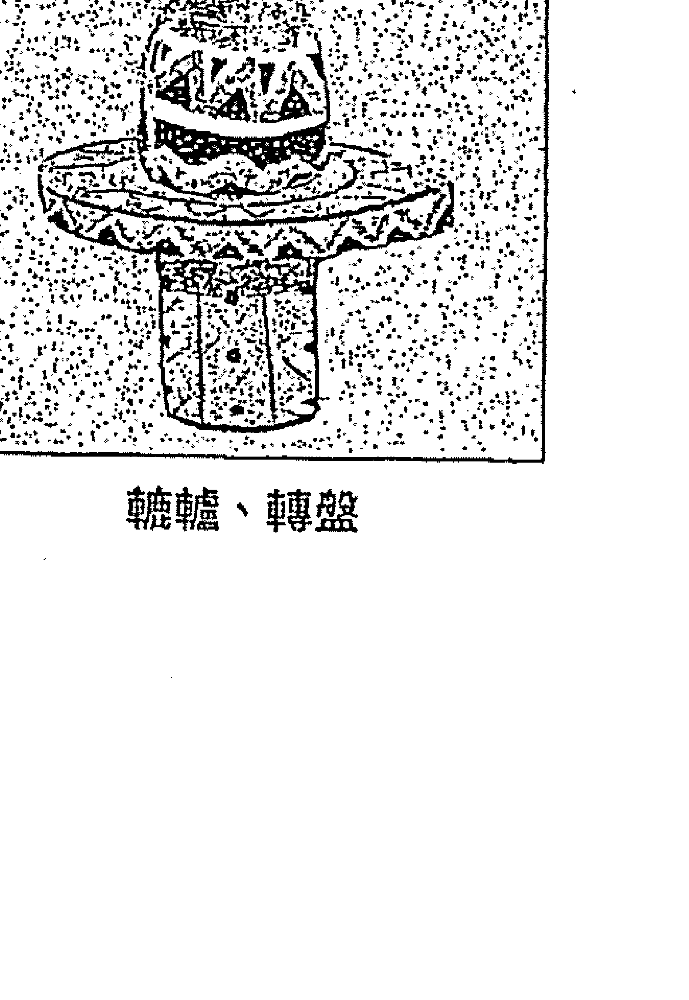

## 17 星宿名称：Anuradha / 房宿 所在范围：♏ 3°20'-16°40' / 主星：♄

| 活动性 | 种姓 | 方向／风向 | 三种性质 | 主要动机 |
|--------|------|------------|----------|----------|
| 被动   | 首陀罗 | 水平／南   | TST      | 法       |
| 五行元素 | 阴阳性 | 神人鬼     | 身体部位 |          |
| 火     | 阳   | 神         | 乳房、胃、子宫、肠子 |          |

### 一、星空形态

> 《宿曜经》记载：「房四星形如长布」。《摩登伽经》：「房宿四星形类珠玑」。但根据一般印度占星书籍所记载，「Anuradha」仅有三颗恒星，即 β Sco（房宿四，Acrab）、δ Sco（房宿三，Isidis）以及 π Sco（房宿一，Al Jabhah）。

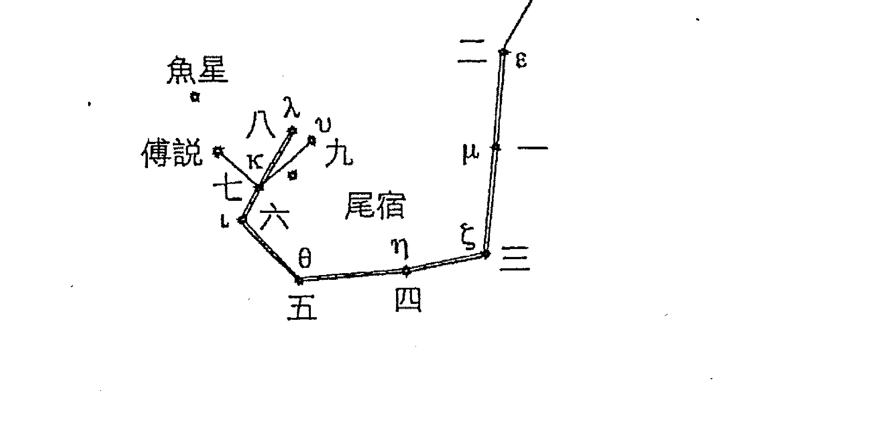

### 二、主要恆星

δ Sco（房宿三，Isidis）

### 三、星宿名稱及符號

（一）「Anuradha」簡單的譯作「另一個『Radha』」，或「在『Radha』之後」；另一字義是隨後的成功。

（二）符號象徵及意義

-   1. 蓮花出淤泥而不染，在印度是用來供奉神明的神聖之花，象徵吉祥、純潔、知識和啟迪。印度知識女神（Saraswati）和吉祥天女座下都是蓮花，意謂著即使處於惡劣環境，也能不屈不撓；或當心思雜亂時，亦能一一釐清思緒。
    2. 它的另一符號雷同「Vishakha」（飾以樹葉的勝利拱門），因此也具有目的，而隨後能成功，較「Vishakha」平順。
    3. 蓮花供奉在神明腳下，重然諾；即「我所說的話，就是我的責任」，故可成為能夠被他人信賴的朋友。
    4. 此星宿也跟財富（Laxmi）有關，但非投機；易遠離家鄉，到各地旅遊。

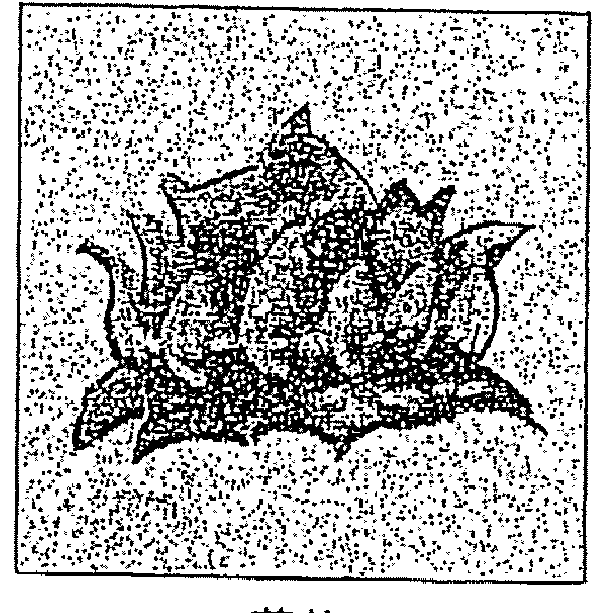

# 18 星宿名稱：Jyeshata／心宿
所在範圍：♏ 16°40'-30°0′／主星：♃

| 活動性 | 種姓 | 方向／風向 | 三種性質 | 主要動機 |
| :---: | :---: | :---: | :---: | :---: |
| 主動 | 奴僕 | 水平／西 | TSS | 利 |
| 五行元素 | 陰陽性 | 神人鬼 | 身體部位 |
| 風 | 陰 | 魔 | 頭、身體右側 |

### 一、星空形態

> 《宿曜經》記載：「心三星形如階」。即以 α Sco（心宿二，Antares）、σ Sco（心宿一，Alniyat）、τ Sco（心宿三，Alsen）。《摩登伽經》：「心宿三星，其形如鳥」。《舍頭諫經》：「有三要星其形類麥」。這三顆恆星較明亮，尤以 α Sco 為天空中的一等亮星，中國古時稱之為「大火星」。

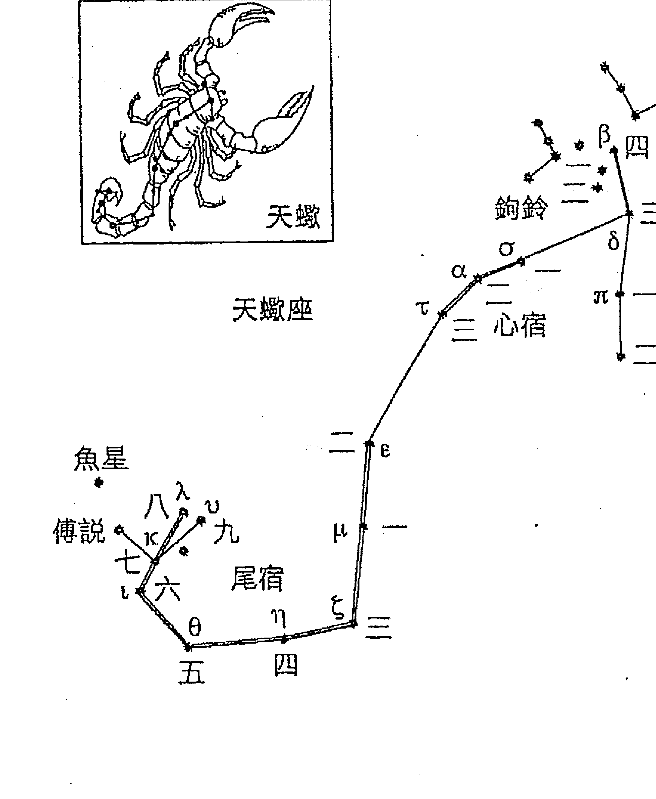

「Jyeshta」位於西方天蠍座的心臟部位，完全對應中國二十八星宿的「心宿」。

### 二、主要恆星

α Sco (心宿二，Antares)

### 三、星宿名稱及符號

（一）「Jyeshta」譯作最年長的或主要的，因它以 α Sco 作為主要恆星，剛好與月亮最疼愛的妻子（Rohini）相對，故亦被稱為「最年長的皇后」。

（二）符號象徵及意義

-   1. 由原先境界層次不高的國王所配戴，可提升其境界；耳墜已活化昆達里尼（Kundalini），一旦適當的完成訓練，就能獲得神秘力量，統治物質世界，並與精神力溝通。

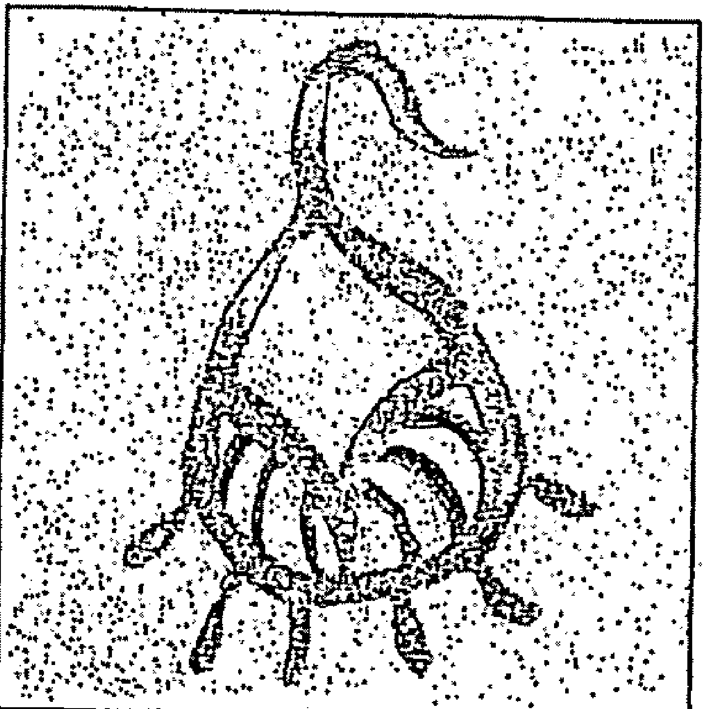

-   2. 「Jyeshta」的另一符號，是圓形的護身符；了解神秘力量的具體呈現，使人在危險時，能夠得到保護。

-   3. 「Jyeshta」又被稱為「年長的」，代表權威、地位，賦予最大的政治力量和精神力量；當七宮主星位於此星宿，易嫁娶較年長之人，其他宮主星依此類推。

# 19 星宿名稱：Mula / 尾宿
所在範圍：♈ 0°0'-13°20' / 主星：♉

| 活動性 | 種姓 | 方向／風向 | 三種性質 | 主要動機 |
| :--- | :--- | :--- | :--- | :--- |
| 主動 | 屠夫 | 向下／北 | SRR | 欲 |
| 五行元素 | 陰陽性 | 神人鬼 | 身體部位 |
| 風 | 中 | 魔 | 腳、身體左側 |

### 一、星空形態

> 《宿曜經》：「尾九星形如獅子項毛」。即以 ε Sco（尾宿二，Alkab）、μ Sco（尾宿一，Priere）、ζ Sco（尾宿三，Graffies）、η Sco（尾宿四，Visabik）、θ Sco（尾宿五，Al wei）、ι Sco（尾宿六）、κ Sco（尾宿七，Weil）、λ Sco（尾宿八，Schaula）、υ Sco（尾宿九，Lesath）為主。《摩登伽經》：「尾有的星形如蝎尾」。《舍頭諫經》：「有三要星，其形類蝎低頭舉尾」。一般印度占星書籍所載，均與《宿曜經》相同，被形容為「獅子的尾巴」。

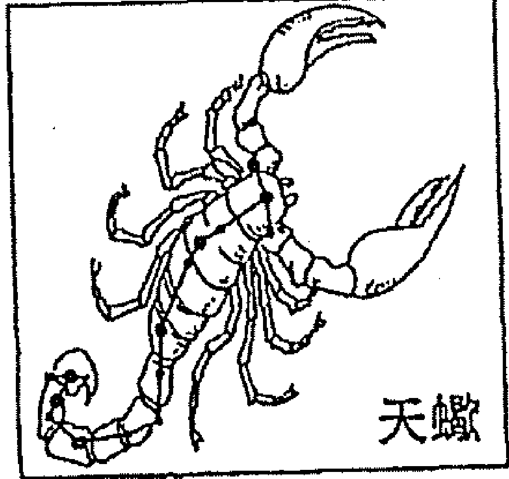

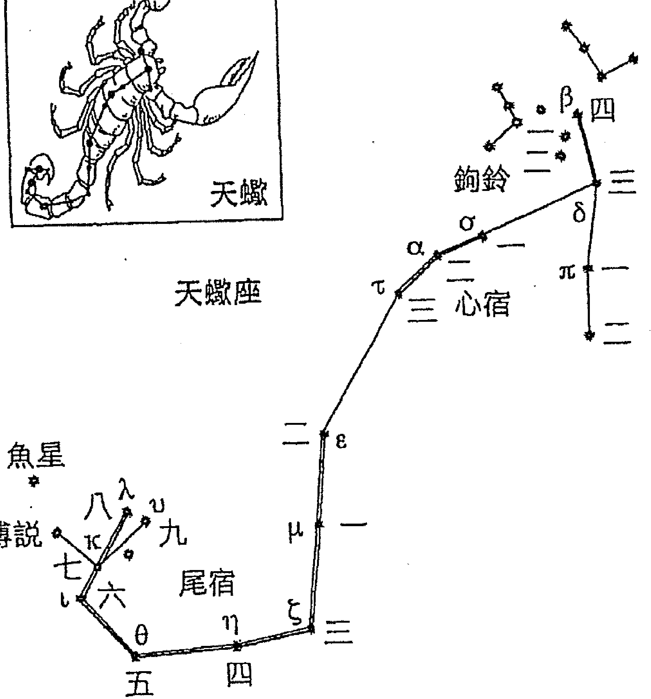

「Mula」位於西方天蝎座的蝎尾，完全對應中國二十八星宿的「尾宿」。

### 二、主要恆星

λ Sco（尾宿八，Schaula）

### 三、星宿名稱及符號

(一)「Mula」譯成根，也被命名為「基礎之星」。

(二) 符號象徵及意義

-   1. 獅子翹起的尾巴，代表憤怒、至高無上、權力的象徵。當憤怒指向他人，代表專制、跋扈，導致權力濫用。
    2. 「Mula」的恆星類似綁在一起的植物之根，因此隱含滲入無形的領域，以及某些事情底蘊的根，可比喻為科學或哲學的深層探索。此外，也須注意，細菌是疾病的根源。植物之根，可作醫學用途。
    3. 植物的根綁在一起，類似趕象棒，用來指引大象走在正確的方向；類比人尋求探討精神途徑，常不斷的呈現痛苦，需要正確的指引。又因為綁在一起，增加了某些限制性，因而難以移動。

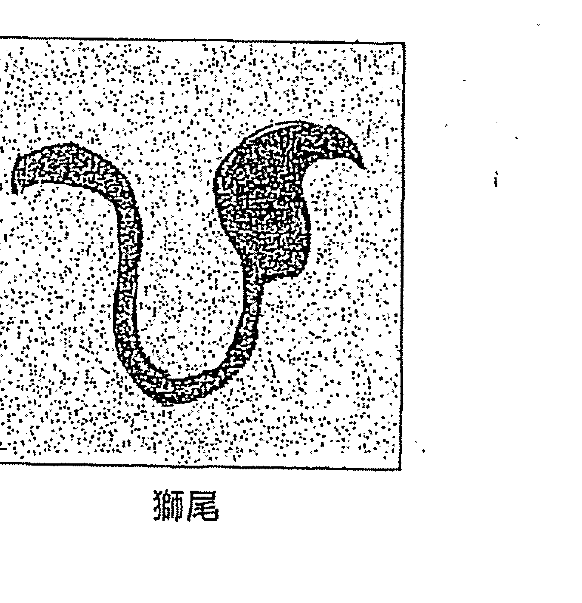

# 20 星宿名稱：Purva Ashadha／箕宿
所在範圍：♐ 13°20'-26°40'／主星：♀

| 活動性 | 種姓 | 方向／風向 | 三種性質 | 主要動機 |
|--------|------|------------|----------|----------|
| 平衡   | 婆羅門 | 向下／東 | SRT      | 解脫     |
| 五行元素 | 陰陽性 | 神人鬼 | 身體部位 |          |
| 風     | 陰   | 人       | 大腿骨、背部 |          |

### 一、星空形態

> 《宿曜經》記載：「箕四星形如牛步」。《摩登伽經》：「箕四星形如牛角」。《舍頭諫經》：「有四要星其形類象，南廣北狹」。但一般印度占星書籍，僅以δ Sgr（箕宿二，Kaus Medius）和ε Sgr（箕宿三，Kaus Australis）構成位於西方人馬座的弓部，並不完全對應中國二十八星宿的「箕宿」；中國的「箕宿」共有四顆恆星，除了上述印度「Purva Ashadha」的 δ Sgr 和 ε Sgr，尚包含 ζ Sgr（箕宿一）和 η sgr（箕宿四）。

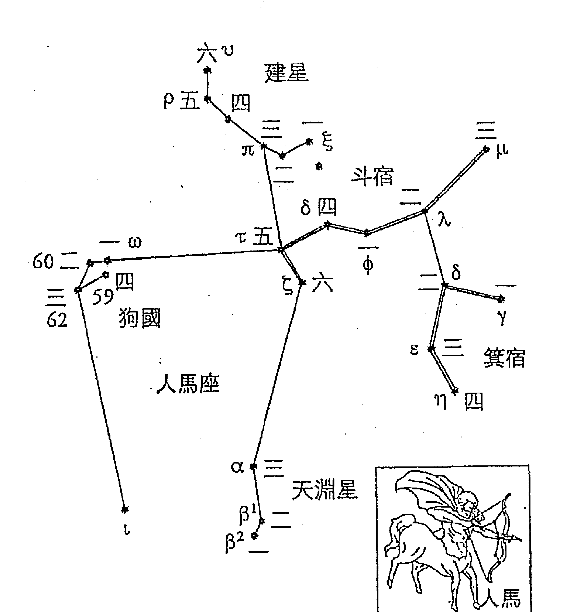

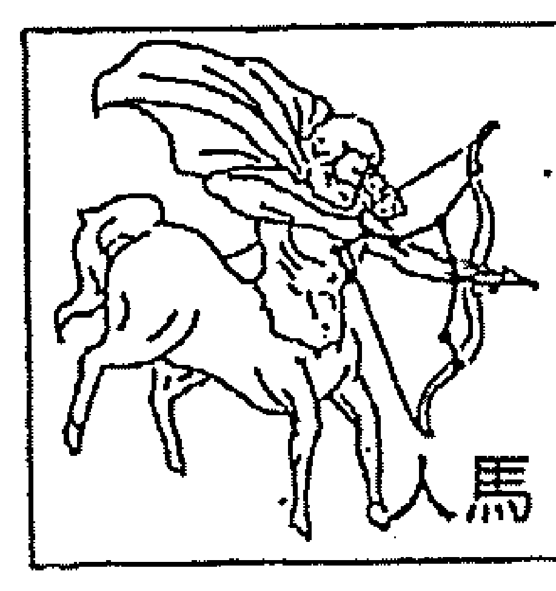

### 二、主要恆星

δ Sgr（箕宿二，Kaus Medius）

### 三、星宿名稱及符號

（一）「Purva Ashadha」譯作無法征服的前面一個或未被擊敗的；亦可譯作早期的勝利。

（二）符號象徵及意義

-   1. 象牙是大象身上最昂貴的部位，擁有美麗的質感；然而，取得象牙必須先殺死大象，類比以邪惡的方式取得有價的物品。
    2. 「Purva Ashadha」被想像成一台風扇，或是用來篩選糠皮的編製品，其過程猶如戰爭、衝突。此星宿象徵以激烈的想法改進生活；一旦受剋，易自我放縱。另外，篩選亦可類比為精煉，能顯露深層的哲學和精神本質。
    3. 「Purva Ashadha」的另一名稱為「Aparajita」，譯作無法被打敗的，代表對抗和奮鬥後的勝利，也意謂使人有耐性等待，但往往處於不愉快或困厄的環境中。

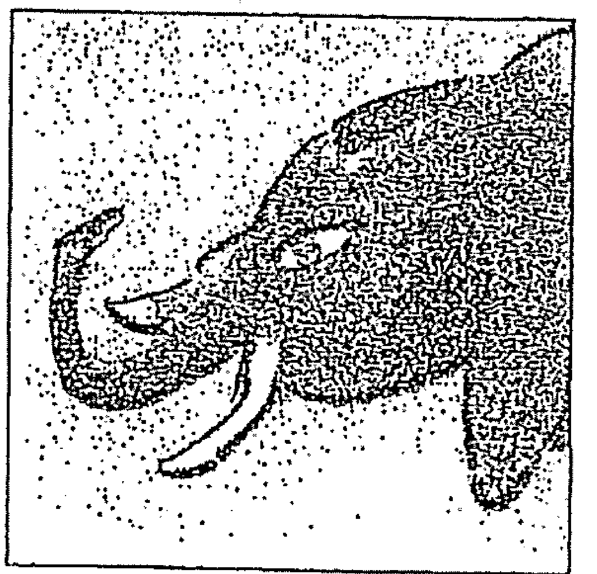

# 第三章

**21** 星宿名稱：Uttara Ashadha／斗宿
所在範圍：♐ 26°40' - ♑ 10°0'／主星：☉

| 活動性 | 種姓 | 方向／風向 | 三種性質 | 主要動機 |
|---|---|---|---|---|
| 平衡 | 刹帝利 | 向上／南 | SR | 解脫 |
| 五行元素 | 陰陽性 | 神人鬼 | | 身體部位 |
| 風 | 陰 | 人 | | 腰、大腿 |

### 一、星空形態

《宿曜經》記載：「斗四星形象如象步」（與《摩登伽經》同）。《舍頭諫經》：「有四要星其形類象，南狹北廣」。但一般印度占星書籍所載，僅以兩顆恆星構成，即 σ Sgr（斗宿四，Ascella）和 ζ Sgr（斗宿六，Pelagus）。 「Uttara Ashadha」位於西方人馬座以手拉弓弦之處，並不完全對應中國二十八星宿的「斗宿」，而是含括在中國「斗宿」的六顆恆星內。

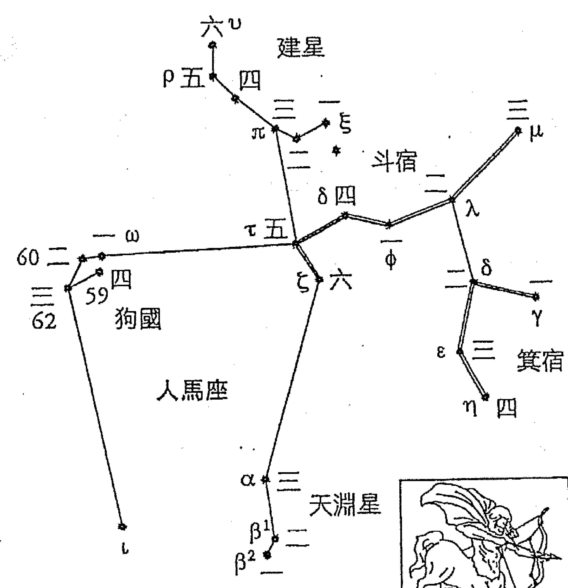

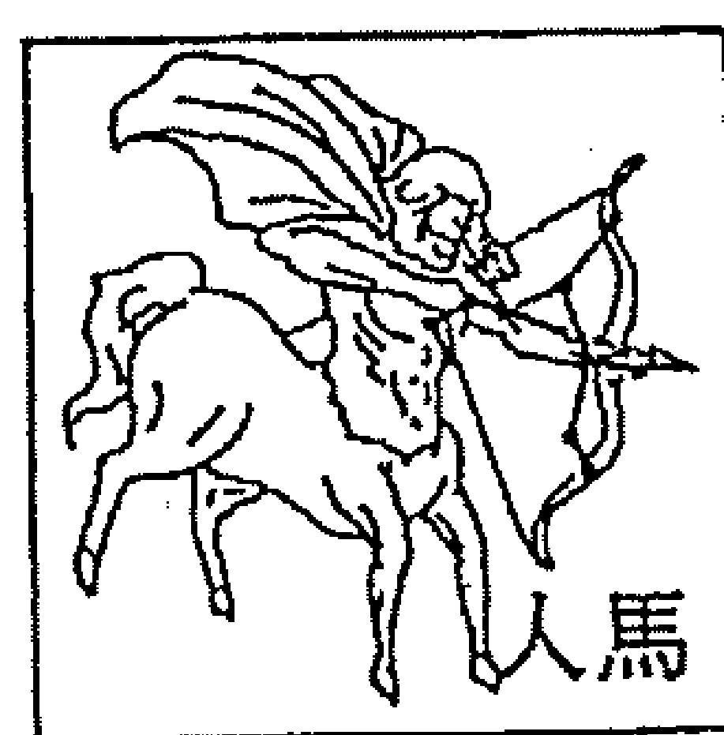

### 二、主要恆星

σ Sgr（斗宿四，Ascella）

### 三、星宿名稱及符號

（一）「Uttara Ashadha」譯作無法征服的後面一個，也被稱為「宇宙之星」，另又譯作後來的勝利。

（二）符號象徵及意義

-   1. 並非只是簡單的睡覺而已。瑜伽中的休息，是放鬆肌肉，以利完成體位法。此星宿創造了心思，能放鬆，開啟進一步的智慧與體悟。
    2. 「Uttara Ashadha」是「後來的勝利」，與前一星宿同樣具有對抗和奮戰的內涵，但較和緩，不那麼激進；而且更具內省，擁有較強的永恆性與持續性。
    3. 「Uttara Ashadha」是「宇宙之星」，反映真正的人道關懷，公平的對待所有種族，有強大的意志力和耐心。

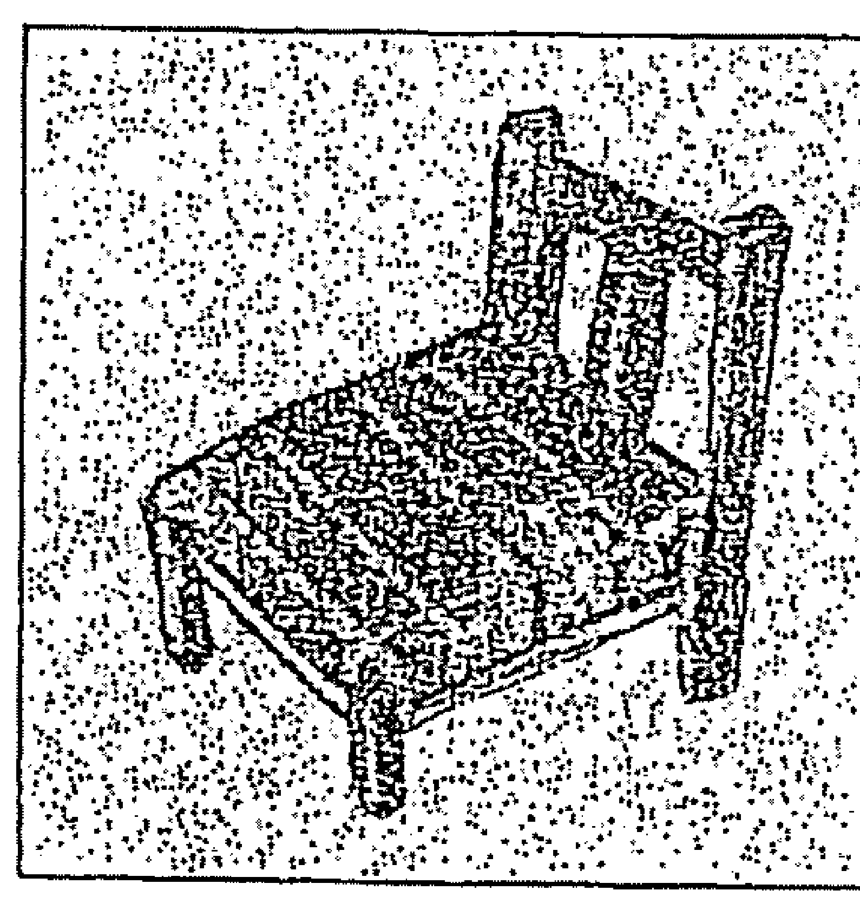

# 22 星宿名稱: Shravana /牛宿
所在範圍: ♒ 10°0'-23°20' /主星: ♃

| 活動性 | 種姓 | 方向／風向 | 三種性質 | 主要動機 |
|--------|------|------------|----------|----------|
| 被動   | 種姓外 | 向上／北 | STR      | 利       |
| 五行元素 | 陰陽性 | 神人鬼 | 身體部位 |          |
| 風     | 陰   | 神       | 耳朵、性器官 |      |

### 一、星空形態

《宿曜經》記載：「女三星形如犁格」。即以 α Aql (河鼓二，Altair)、β Aql (河鼓一，Alshain)、γ Aql (河鼓三，Tarazed)等三顆恆星構成。《摩登伽經》：「女有三星，形如積麥」。《舍頭諫經》：「有三要星，其形類麥邊小中大」。

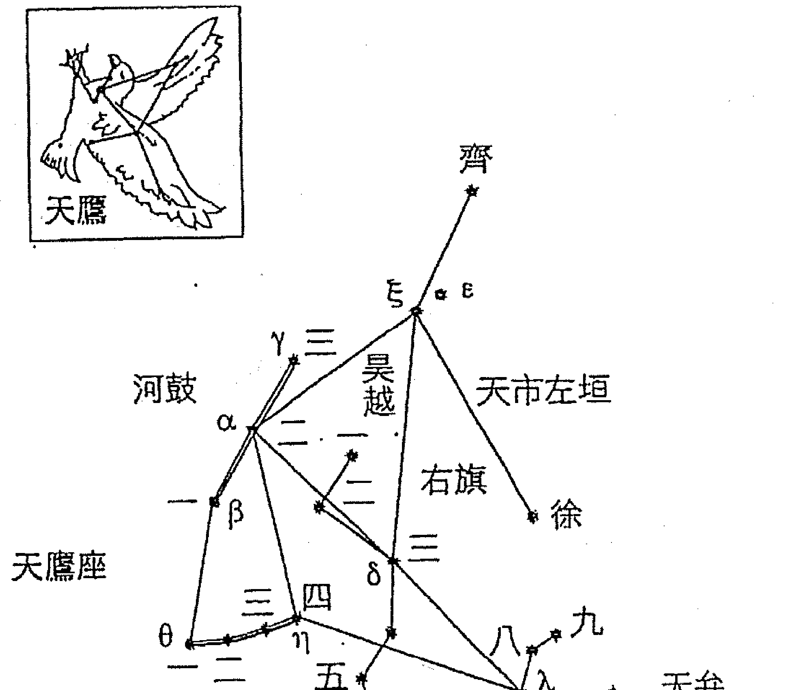

「Shravana」位於西方天鵝座的頸部至頭部，完全沒對應中國二十八星宿的「女宿」；中國的「女宿」包含四顆恆星，位於西方水瓶座的前方。

### 二、主要恆星

α Aql (河鼓二，Altair)，是天空中的一等星。

### 三、星宿名稱及符號

（一）「Shravana」可譯作兩個不相關的字義：一是聽，另一則是躑躅的。亦被稱為「學問之星」。

（二）符號象徵及意義

-   1. 耳朵進一步強化了「傾聽」的特性。在《奧義書》中，有位祈禱者祈求適當的傾聽能力，當人們學習到聲音的真正意識，就能超越談話的實質內涵。
    2. 「Shravana」的梵文意指「傾聽」，從語源學和象徵意涵，都暗示為「知識女神」（Saraswati）；她是學習和智慧的守護神。故此星宿具備博學、睿智的特質，特別是口傳知識（聽），包括話語語言研究。
    3. 「Shravana」的另一名稱為「Asvattha」，符號為「印度菩提樹」，意指佛陀證道之處。
    4. 另一符號為「三腳步」，代表走路，喜歡到處旅行；與毗濕奴化身侏儒三步的典故有關，故隱含維持正統秩序。

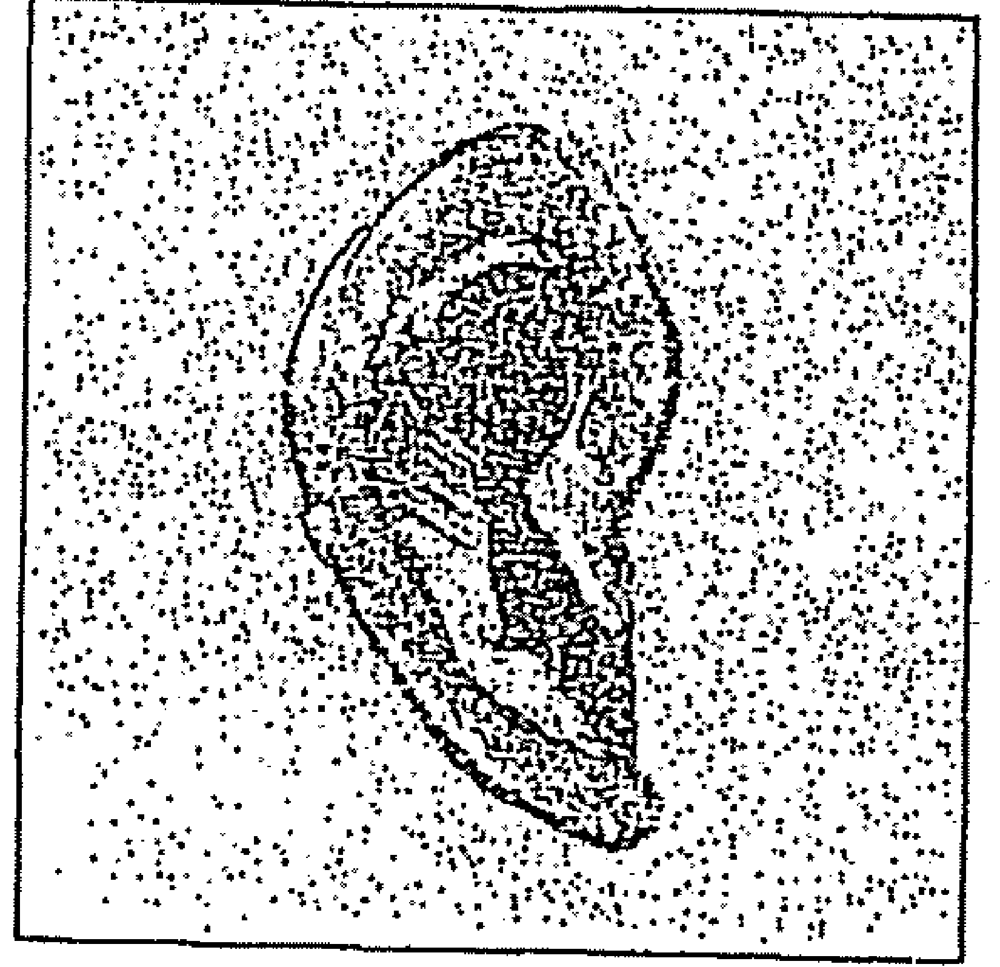

# 23 星宿名稱：Dhanishta／虚宿
所在範圍：♉ 23°20'-♊ 6°40'／主星：♂

| 活動性 | 種姓 | 方向／風向 | 三種性質 | 主要動機 |
| :--- | :--- | :--- | :--- | :--- |
| 主動 | 奴僕 | 向上／東 | STT | 法 |
| 五行元素 | 陰陽性 | 神人鬼 | 身體部位 |
| 乙太 | 陰 | 魔 | 背部、肛門 |

### 一、星空形態

《宿曜經》記載：「虛四星形如訶黎勒」。即以α Del（瓠瓜一，Svalocin）、β Del（瓠瓜四，Rotaner）、γ Del（瓠瓜二）、δ Del（瓠瓜三）組成。《摩登伽經》：「虛有四星形如飛鳥」。《舍頭諫經》：「有四要星，其形象調脫之珠」。

「Dhanishta」位於西方的海豚座，完全沒有對應中國二十八星宿的「虛宿」；中國的「虛宿」僅有兩顆恆星，位於西方水瓶座的前半部。

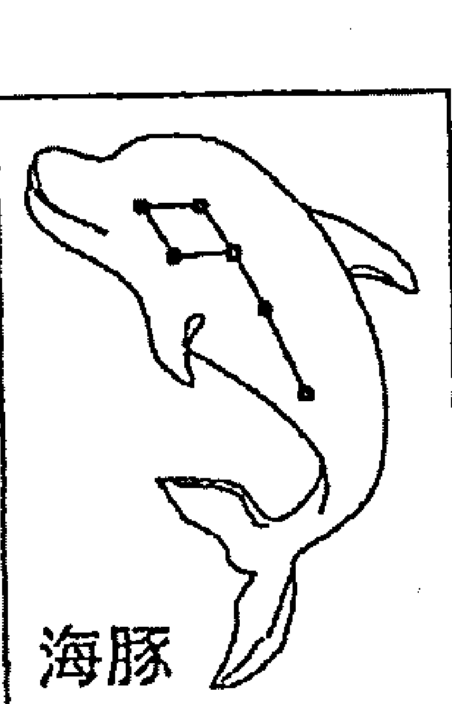

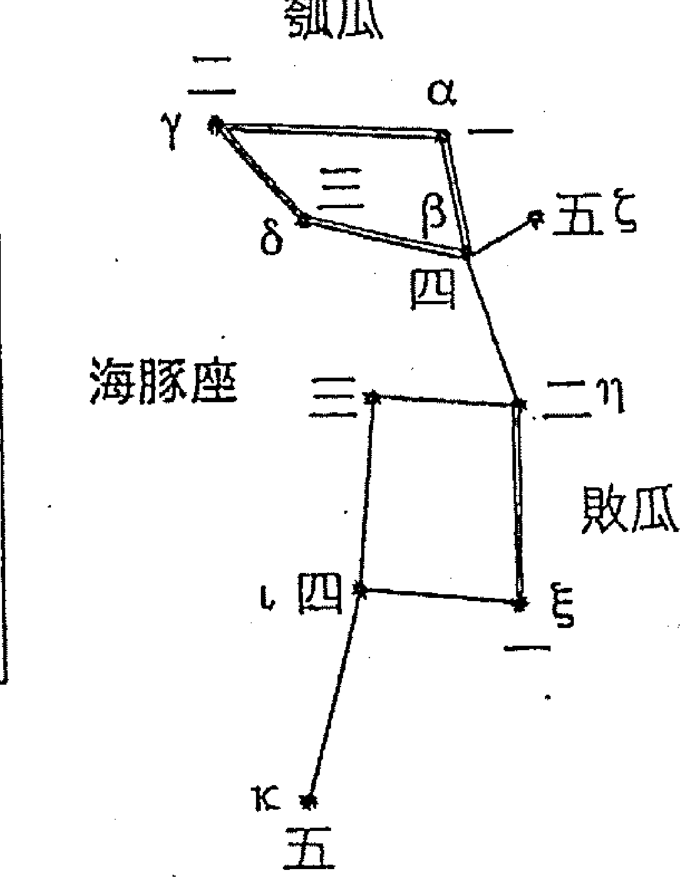

### 二、主要恆星

β Del（瓠瓜四，Rotaner）

### 三、星宿名稱及符號

（一）「Dhanishta」譯作最富有的，亦被稱為「調和之星」；它的另一個名稱「Sravistha」，字義為最著名的，由一支鼓來代表。

（二）符號象徵及意義

-   1. 「鼓／笛」是印度神話中濕婆的鼓，或黑天的長笛；隱含正擊出節奏，而他人根據這支鼓所擊出的節奏來彈奏歌曲。「鼓／笛」的內部中空，意謂此星宿的人虛而不實，暗示夢想難以成真，但「鼓／笛」具備音樂才能。

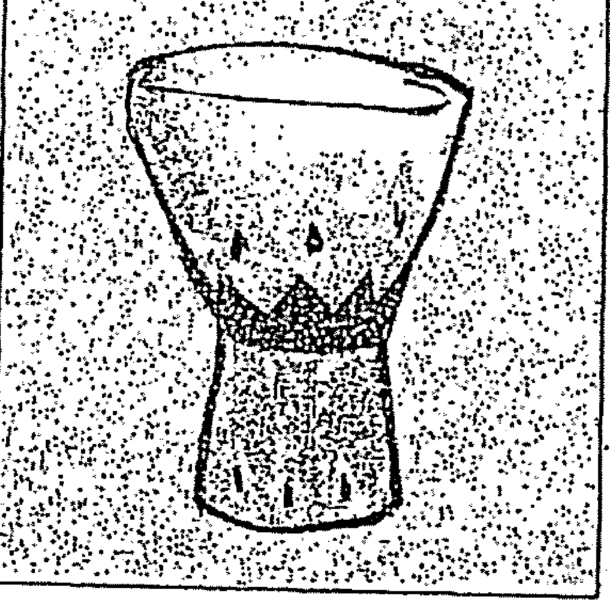

-   2. 「Dhanishta」中的「Dhani」意謂著財富，而「Ishta」意謂完全，即合為「完全的財富」。就精神層面而言，代表擁有良好性格、思想、行為的精神財富。

-   3. 「Dhanishta」擁有洞見，以及傾聽、理解真實的天賦才能；深層的精神及神秘的知識，能體驗宇宙的和諧。

# 24 星宿名稱：Shatabhisha／危宿
所在範圍：♒ 6°40'-♒ 20°0'／主星：♄

| 活動性 | 種姓 | 方向／風向 | 三種性質 | 主要動機 |
| :--- | :--- | :--- | :--- | :--- |
| 主動 | 屠夫 | 向上／南 | STS | 法 |
| 五行元素 | 陰陽性 | 神人鬼 | 身體部位 | |
| 乙太 | 中 | 魔 | 頷骨、右大腿 | |

### 一、星空形態

《宿曜經》：「危一星形如花穗」。即以 γ Aqr（墳墓二，Sadachbia）為主，統領一百顆恆星。《摩登伽經》：「危宿一星」。《舍頭諫經》：「有一要星形圓色黃」。

「Shatabhisha」位於西方的水瓶座中間，並不對應中國二十八星宿的「危宿」；中國的「危宿」共有三星，位於印度「Shatabhisha」的西方。

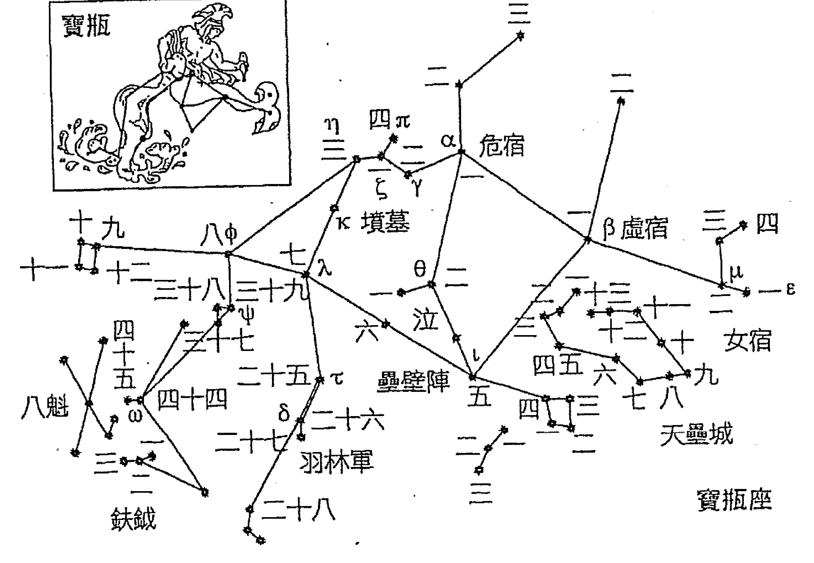

### 二、主要恆星

γ Aqr (墳墓二，Sadachbia)

### 三、星宿名稱及符號

(一)「Shata」譯成（擁有）一百位醫生。它的另一個著名名字「Satatara」，即「（擁有）一百顆星星」，而梵文字典稱為「需要一百位醫生」，說明與此星宿有關的疾病，將非常難判斷和治療。

(二) 符號象徵及意義

-   1. 類比千朵花辨、華麗皇冠。百顆星星顯示宇宙與過去業力的緊密連結，星星可以假設成人生百態的低調觀察者，而千片花辨表示內在完美的完整呈現，花可以愉悅他人。
    2. 百顆星星圍成的圓圈是個空圈，類比分離與封鎖，將所處環境分成內外，圓圈同時保護內在免受外在的危險，也如水平面上的人體，浮在上，或沉在下，所以此星宿也隱含遮掩某些秘密之意，古稱「面紗之星」。
    3. 身心靈領域的多才多藝。

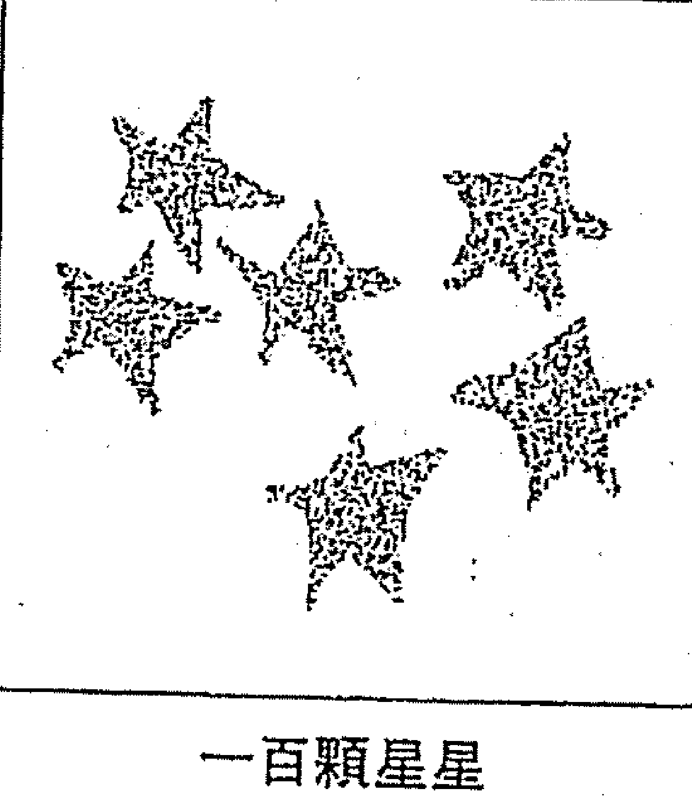

# 25 星宿名稱：Purva Bhadra／室宿
所在範圍 ≈ ♒ 20°0′-♓ 3°20′／主星：♃

| 活動性 | 種姓 | 方向／風向 | 三種性質 | 主要動機 |
|---|---|---|---|---|
| 被動 | 婆羅門 | 向下／西 | SSR | 利 |
| 五行元素 | 陰陽性 | 神人鬼 | 身體部位 |
| 乙太 | 陽 | 人 | 腳掌、左大腿股、身體側邊 |

### 一、星空形態

> 《宿曜經》：「室二星形如車轅」。即以 α Peg (室宿一，Markab)、β peg (室宿二，Scheat) 構成。《摩登伽經》：「室有二星形如人步」。《舍頭諫經》：「有二要星相遠對立」。

「Purva Bhadra」位於西方的飛馬座，與 γ Peg (壁宿一，Algenib)、仙女座的一等亮星 α And (壁宿二，Alpheratz) 構成一只板凳，「室宿」二星為板凳前兩腳，「壁宿」二星為後兩腳；印度占星的「室宿」，完全對應中國二十八星宿的「室宿」。

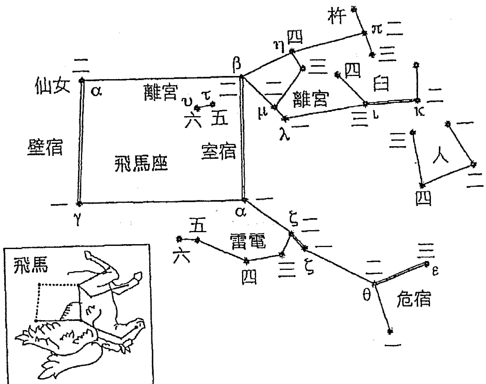

### 二、主要恆星

β peg（室宿二，Scheat）

### 三、星宿名稱及符號

（一）「Purva Bhadra」譯成前面幸運的腳或凳子或長凳的腳；結合下一個星宿「Uttara Bhadra」，形成燃燒般的一對。這兩個星宿都會產生火性脾氣。

（二）符號象徵及意義

-   1. 用來戰爭和防衛的武器，可打破（切除）任何限制或障礙；其象徵不僅在許多宗教和精神等層面被取用，也用於邪惡途徑；暗指人們具有運用刀劍的殘忍力量，但也能防止無知；刀劍是進化的理想工具。

-   2. 「Purva Bhadra」另一符號是「板凳的前腳」，象徵前後不同的兩面人；代表此星宿的人可能擁有一個不為人所知的面貌，只是沒有表現出來。

-   3. 在傳統上，「Purva Bhadra」都與火和熱連結，故顯示焦熱、分解代謝作用。

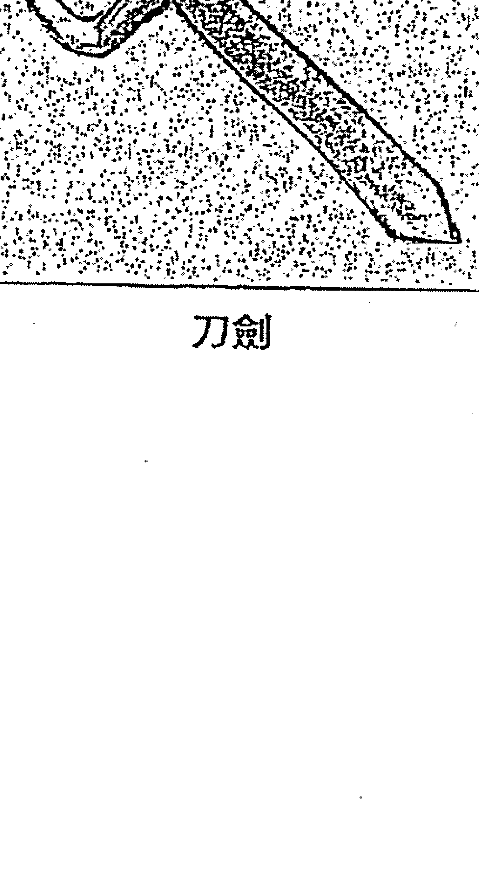

## 第四章 天宮圖的要素 II：行星

行星是天宮圖中最重要的要素，扮演著靈魂人物的角色。印度占星學認為，行星控制了物質界、氣、心靈等元素，是業力的工具。至高無上的神靈以諸多不同的形式呈現，以行星賦予人類自身行為的結果；行星設定為業力的正本演出，故經由行星業力法則，得以顯現。毗濕奴的使命是保護這個存在面，大法得以維持。

梵文「Graha」的行星意義，具有「抓住」、「掌握」或「影響」之意，也意謂著有「神聖的意義」。

印度占星學僅採用太陽、月亮、水星、金星、火星、木星、土星等人類肉眼看見的行星，以及月亮交點（北交點〔羅喉〕、南交點〔計都〕）。至於近代發現的三王星（天王星、海王星、冥王星），多數本土印度占星家都不予採用，他們認為，占星學是天啟的，不必人為添加。但部分深入研究印度占星學的人士，鑑於現代三王星的影響深遠，呼籲應將之納入，強調應以科學的態度來看待其效應。占星學的發展初期雖未發現三王星，但並不代表它們沒有作用。

本書以古典印度占星學的七大行星，以及兩個月亮交點（北交點、南交點亦被視為行星）等九大行星為主，不擬列入三王星；欲充分了解印度占星學行星的內涵及影響力，以下議題應精熟之：

1.  行星排列的順序：印度占星學的順序排列，不同於西方占星學，源自古巴比倫的「迦勒底秩序」（Chaldean order）。
2.  行星的自然吉凶性質：說明行星的先天本質為吉或凶，是判斷事件預測最根本的基礎。
3.  行星的功能吉凶性質：印度占星學自行發展出來的論述，根據立命上升星座，從而根據特殊宮位特性，衍生出功能性的吉或凶，據以掌握行星組合的吉凶。
4.  行星的相映：類比希臘占星學「整個星座宮位制」的相位。但印度占星學則是依據神話意義，導出不同行星的特殊相映，也是判斷事件吉凶的重要關鍵。
5.  行星的力量：相當近似西方占星學的內容。根據行星所在星座、廟、旺、弱、三方旺宮、行星之間的友誼與敵意（暫時或永久）、行星戰爭、行星包圍、行星自己本身的順序是否逢太陽焦傷、特殊的行星狀態等項目來評估。
6.  行星的六種力量 (Shad Bala)：印度人善長微積分，這六種力量的計算過程，就是典型的微分與積分，因過於繁複，且實用性有待驗證，我們僅概談而已。
7.  行星的原理與特性。

上述議題在本章將分為七節敘述，即可掌握行星的本質、作用及意義。由於印度占星學的流年運勢預測，主要採用「行星期間大運（Dasa）系統」——由每個行星主管一段期間；因此，這些行星在本命的所有狀態及影響事項，會在大運（Dasa）期間出現。而行星在本命的所有狀態，本章將詳述之。

### 第一節 行星排列的順序

印度占星學對於行星順序的排列，不像西方占星學是依據太陽系行星軌道的遠近而定，而是按照太陽、月亮、火星、水星、木星、金星、土星、北交點（羅喉）、南交點（計都）來排列。而前面七顆人類肉眼看得到的行星（以地心系統來論，太陽也當作行星）排列，正好和一星期的七天對應：

- 星期日：太陽
- 星期一：月亮
- 星期二：火星
- 星期三：水星
- 星期四：木星
- 星期五：金星
- 星期六：土星

這種星期與行星的對應，幾乎已成為全球目前通用的慣例，雖然已難考究其真正源由，但印度占星學及西方古典占星學相當重視之，如擇日、卜卦，以及施行魔法的實務應用，常必須考量此對應。儘管西方現代占星學已不復見其蹤影，但從事上述實務的古典占星家仍予以援用；而印度占星學的各個領域，至今也相當重視之，在計算「行星的六種力量」中的「暫時的力量」（Kaala Bala）時，就必須計算用事時間「星期主星的力量」（Dina Bala），因此，我們應了解箇中關係。

一星期七日的來由，應源自古巴比倫的漢摩拉比王（Hammurabi）統治的時代。當時規定，月亮週期的每個七日月相的第一天，一切活動被視為禁忌。以這一天為休息日的規定，流傳到其他文化，就演變成猶太教的「安息日」，以及後來基督教的「禮拜日」，至今更成為全球通用的「星期日」。

西方占星學的發展，在西元前七世紀迦勒底王朝建立，曾有過短暫的鋒芒。迦勒底人曾是占星學家的同義詞，後來波斯人入侵，占星術文化遂四處交流。一般咸信，約莫西元前五世紀時，黃道十二宮每宮30°的系統應已建立，迦勒底人的行星秩序觀念也融合在內。希臘化時期相當重視行星在黃道上的力量，分別有五種「必然的尊貴」（Essential Dignities）；其中的「外觀」（Face），就是以「迦勒底秩序」構成，即由白羊座0°起，按火星→太陽→金星→水星→月亮→土星→木星，周而復始，排列星座內的區間。其結果如〈表4-1〉，若詳細查看，從0°至10°、10°至20°或20°至30°的個別星座，按黃道十二星座順序，即可看出係按上述的星期對應的順序，應是希臘占星學與印度占星學結合後，才被援用於內。

| 星座   | 0°-10° | 10°-20° | 20°-30° |
|--------|--------|---------|---------|
| 白羊座 | ♂      | ☉       | ♀       |
| 金牛座 | ☿      | ☽       | ♄       |
| 雙子座 | ♃      | ♂       | ☉       |
| 巨蟹座 | ♀      | ☿       | ☽       |
| 獅子座 | ♄      | ♃       | ♂       |
| 處女座 | ☉      | ♀       | ☿       |
| 天秤座 | ☽      | ♄       | ♃       |
| 天蠍座 | ♂      | ☉       | ♀       |
| 人馬座 | ☿      | ☽       | ♄       |
| 摩羯座 | ♃      | ♂       | ☉       |
| 水瓶座 | ♀      | ☿       | ☽       |
| 雙魚座 | ♄      | ♃       | ♂       |

「迦勒底秩序」適當地說明了行星與星期對應的秩序。另外，大衛·弗勞利（David Frawley）在著作《The Astrology of Seers》中提及，這種對應剛好是太陽系內行星（月亮、水星、金星）和外行星（火星、木星、土星）交互順序所產生的，也相當巧合地說明其對應關係，〈表4-2〉可供讀者參考。

| 星期 | 日 | 一 | 二 | 三 | 四 | 五 | 六 |
|------|----|----|----|----|----|----|----|
|      | ⊙  | ·  | ♂  | ·  | ♃  | ·  | ♄  |
|      | ☽  | ·  | ☿  | ·  | ♀  |    |    |

### 第二節 行星的自然吉凶性質

印度占星學著重預測，認為行星是宇宙的代表因子，貫徹支配人類生命所有領域和意識的進化。我們大多數的行為，受到支配我們的行星本質所影響，而人類的命運有吉有凶，自然歸因行星的吉凶之故。

行星的吉凶，應是早期先民長年累月的經驗累積出的結論。希臘占星學根據「托勒密相位」(Ptolemaic Aspects) 的吉星和星座主星，從天體中兩大主角太陽、月亮主管的獅子座及巨蟹座，各從左方、右方，分別按整個星座的相位，推論出木星為最大吉星，金星為次吉吉星，土星為最凶凶星，火星為次凶凶星，水星為中立行星。

但印度先賢認為，占星學是天啟的，所以行星的吉凶也是天啟的，不用追溯其來源。若從東西方系統使用的行星吉凶來看，其實如出一轍。除了太陽的熱，讓印度子民因身處南亞次大陸的實質感受（太陽臨空的燠熱造成傷害），將它歸類為凶星，而太陽的權威、尊貴、王權的概念，仍與西方系統一樣。

另外，北交點在西方系統中被視為吉星，為前世業力的未來吉祥顯現；但印度占星學將之視為等同土星的凶星。而上述所談東西方的行星吉凶性質，是指自然性質。

有關印度占星學行星的自然吉凶性質如下：

- 最大吉星：木星
- 次吉吉星：金星
- 一般吉星：月亮、水星
- 最大凶星：土星、北交點
- 次凶凶星：火星、南交點
- 一般凶星：太陽

吉星的梵文為「Shubha」，為「敬神」之意；凶星則為「Papi」，「罪人」之意。凶星稱為罪人，是因它們鼓勵人們的心思蔑視自然及其法則，必然會遭受不幸；唯有尊敬神明、崇奉自然法則，才會受到保佑、平安無事，甚至享有福報與榮華富貴。

一般而言，吉星會促進成長、擴展、維護或保存；而凶星則導致腐敗、衰頹、限制、破壞、毀滅。接下來將分別針對自然吉星與自然凶星作說明。

#### 一、自然吉星

##### (一) 最大吉星——木星

為太陽系中最大的行星，代表樂觀、擴充、富裕、幸福和較高等的教育。梵文名稱為「Brihaspati」，在吠陀經典中指示為「神的教師」，以其知識和高度發展的意識，從外在虛幻的海市蜃樓到內在光明來指導人類，傳授精神啟蒙的知識。木星另一梵文名稱為「Guru」，由此示意，木星賦予物質的利益給虔誠獻身者，意即將前世好的業力，轉賜福給今世。而印度占星家相信，木星能帶來面對任何問題的解決能力。

##### (二) 次吉吉星——金星

為太陽系中最美麗的行星，代表美麗、歡愉、精緻、人類欲望、生殖、生之喜悅。梵文名稱為「Shukra」，在吠陀神話中是魔神（Rakshashas）的老師。魔神意謂喪失人生目的的靈魂，人類的魔性只會追求名利，因而自私自利。金星可作為精神導師，勸回迷失的羔羊，但無法避開業力，也意指在某些方面仍會有過多的欲望，所以是次吉吉星。

##### (三) 一般吉星——月亮

月亮反射太陽光。印度人相信，太陽給予整個宇宙生命，而月亮則賦予地球生命。從吠陀神話的內容來看，印度占星學特有的二十七星宿是月神的二十七個妻子，祂一天跟一位妻子在一起，周而復始。月亮是印度占星學心思的代表因子，上述神話顯示心思變化很快的本質，也代表想法、情緒的變化；反映人類心靈的敏銳與遲鈍，使我們有能力克服世俗欲望，但也可能陷於無知，突顯獸性本能。

月亮是印度占星學中相當重要的行星，等同於上升點。這可從印度占星學特別強調身宮盤得知：即以月亮所在宮位當作第一宮，然後再起算十二宮位，分別觀察各宮主管事項的吉凶。

一般而言，月亮是吉星，但印度人對月相的觀察頗為詳細，認為月相如在漸增光期間，即日月合朔後，從新月到滿月的這段期間，月亮的能量漸增，梵文稱為「Shukla Paksha」。許多印度占星學書籍稱，漸增光明期的月亮為吉星，而漸減光時期的月亮為凶星。但另有一種說法，在計算「行星的六種力量」時，新月時為零，滿月時最高分。因而，從第一四分相經滿月，至最後四分相的月亮為吉；而最後四分相經新月，至第一四分相的月亮為凶。如〈圖4-1〉，這種說法較合理。

##### （四）一般吉星——水星

原則上屬中立行星，配置佳時才為吉星。入自己星座、旺宮、與吉星會合或相映時，為吉星；反之，則為凶星。

水星是太陽系中距離太陽最近的行星，類似天空君王太陽的傳令，與太陽、月亮構成星命的基礎。太陽為靈魂（Atma）、月亮為情感（Manas）、水星為智識（Buddhi）。根據吠陀神話，水星是月亮和木星的妻子塔拉（Tara）所生的孩子——傳說月亮作為蘇摩神（又稱月神）時誘拐塔拉，塔拉因不滿木星的過於純真，因而與月神出軌，懷有月神的孩子，意謂即使純真，也需要體驗本性的感官快樂。

水星的來到，代表純真的靈魂觸及外在的世界，因而出現理解力。水星是月亮的孩子，是知覺意識中理性和智慧的部分；月亮則代表潛意識。水星的梵文名稱為「Buddhi」，意即覺者。

#### 二、自然凶星

##### (一) 最大凶星——土星

土星是人類肉眼能看得見的太陽系中最遠的行星，代表冷漠、悲觀、老邁、挫敗、不快樂、幻滅、限制，甚至死亡。梵文名稱為「Shani」，在吠陀神話中，土星是太陽和陰影妻子（Chayya）所生的兒子，也由於土星射出陰影，掩蓋太陽的光輝，因此，太陽和土星的關係是困難的。土星帶有業力的性質是無可迴避的，它使我們深入挖掘內在，藉以面對人生的不愉快和困難，遂產生許多的心理問題。面對此狀況如能轉換心境，倒能堅定心志，但芸芸眾生中，真能轉換者又有多少？

##### (二) 次凶凶星——火星

為太陽系中呈現紅色的行星，代表剛猛、炎熱、勇氣、活力、破壞、精力、強壯、大膽、無禮。梵文名稱為「Mangala」。在吠陀神話中，曾經有魔神（Taraka）恐嚇宇宙，當時眾神無人敢攖其鋒。幸有濕婆神七天大的兒子卡帝卡（Kartika，同Mangala，即火星）將魔神消滅。寓意初生之犢不畏虎之意，勇猛無比，不怕危險，有能力達成所設定的目標，但必須面對許多險難。

##### (三) 一般凶星——太陽

太陽系的君王、領導者，代表尊貴、威嚴、王權、權威，但也相對霸道、獨裁或專制。梵文名稱為「Surya」。吠陀神話認為，太陽是宇宙的統治者，是生命力的源頭，因而又稱「Prana」。若無太陽光線的照射，萬物均無法生長茁壯，也無法生存。太陽與引力作用，使眾行星能按其軌道運行。人類內在不朽的靈魂和自我，也是整個身體的重心；人類的行為活動，更是其意志的表現。

印度地處南亞次大陸，一到夏季便相當燠熱，烈日當空，令人非常不適。可能因為這種深刻感受，因此，雖然太陽在印度占星學中的管轄事項同西方占星學，但因其乾、熱及破壞性而傾向凶性，與西方系統截然不同。

##### （四）北交點（羅喉）與南交點（計都）

其實只是天空軌道面的兩個點，稱不上行星，但在印度占星學中卻扮演著相當重要的角色，且其概念及吉凶性質也不同於西方系統中的南北交點，可參考下圖來理解其天文意義：

1.  就地球觀點來觀測月相，當月亮與太陽會合時，此時為新月，曆法上稱為「朔」；而當月亮與太陽分別位於地球的兩側時，則為滿月，曆法上稱為「望」。
2.  月亮繞著地球運行，其軌跡稱為「白道面」；地球繞著太陽運行，其軌跡稱為「黃道面」。由於月亮每個月繞行地球一圈，故「白道面」與「黃道面」的交叉，因月亮運行之故，一年將通過「黃道面」約十二點三六次（通過北交點和南交點算一次）。
3.  假設地球不動，太陽視運動繞行「黃道面」。由於太陽每日運行約不到 1°，所以太陽繞行到交叉點，頂多只有兩次。
4.  通盤考量第1、2、3點，要符合太陽、地球與月亮交點連成一直線，一年之中，只會發生兩次（頂多三次），即日全蝕和月全蝕；前者在新月時發生，後者在滿月時發生。

從〈圖4-2〉可看出，北交點為月亮運行「白道面」，由「黃道面」下方，向上交叉於「黃道面」上；而南交點則是月亮運行「白道面」，由「黃道面」上方，向下交叉於「黃道面」下。

北交點即是羅喉，南交點即是計都，兩者在印度占星學中都是陰影行星，沒有實體。但強調輪迴與業力觀念的印度人卻賦予其重要的精神意義，不能等閑視之。日蝕、月蝕的發生都與月亮交點有關，故將之視為凶星。

吠陀神話中，相傳正神和邪神為了控制宇宙而相爭，誰得了長生甘露（Amrita），將更具神力。當時，屬於邪神之一的婆蘇吉（Vasuki），站在正神一方幫助尋找長生甘露，但當祂發現後卻私自喝下。太陽和月亮看到了蘇婆吉的作為後，向宇宙的創造主毗濕奴抱怨。創造主對於婆蘇吉的欺騙行徑感到震怒，遂將祂砍成兩段。但因蘇婆吉已經喝下長生甘露，無法被殺死，所以天空中留下兩截，頭部為羅喉，尾部為計都，成為其他神祇（行星）的陰暗面。

上述故事隱含了以下幾種寓意：若沒有蘇婆吉（羅喉、計都）的幫助，正神無法發現不朽的秘密；就人類而言，若不了解羅喉和計都，就無法探尋較高層次的自我。它們是我們生命的陰暗面，因此必須克服，使之昇華；而故事中的長生甘露，即不朽的精神和真正的幸福。

羅喉在印度占星學中被類比為土星，甚凶；剛從黃道面下方向上躍出，帶有強烈的世俗欲望、貪婪、不知足、無知。但若形成正面意義，則有利物欲追求、名望、政治權力的掌握；然而，人們對世俗名利的貪戀，卻很可能永遠不自知。

計都在印度占星學中，被類比為次凶凶星火星；緊張、壓迫、無意識的行為、害怕、惡夢、恐懼、虛幻、欺騙、混亂、發狂、中毒、沉溺、惡習不改、盜竊、寄生蟲、巫術。但若形成正面意義，則是「解脫的徵象星」（Moksha Karaka），具有心靈能力、智慧、分辨知識，所以也是「智慧的星曜」（Gnana Karaka）；儘管將它歸為次凶凶星，但若配置不佳，往往以非比尋常和迂迴的方式，嚴重傷害管轄的事項。

### 第三節 行星的功能吉凶性質

探討行星的功能性的吉凶性質，為印度占星學的一大特色。由於承襲自希臘占星學的「整個星座宮位制」，當上升星座確定後，接下來的第二至十二宮各占據一個星座；各宮的宮主星相當確定，不至於發生如西方系統的某些宮位制將會產生「宮位截奪」的現象。

由於各宮歸屬哪個星座相當明確，因此會出現自然吉星主管凶宮，或是自然凶星主管吉宮的情形。此外，除了太陽、月亮，每個行星都主管兩個星座，因而有可能同時主管吉宮和凶宮。針對這些狀況，如何分辨行星的吉凶性質，頗令人費神。

上述狀況係因上升星座確定後，所衍生的宮主星吉凶性質，每張命盤各自不同，稱為「暫時性吉凶性質」或「功能性吉凶性質」。

在印度占星學中，行星的特性分析交織著「自然吉凶性質」和「功能性吉凶性質」，因此常令初學者或老手困惑，所以讀者務必充分了解兩種性質如何交叉解讀，否則論斷命盤必有誤差。在正式分析前，先將自然吉凶星及宮位類別整理如下：

#### 自然吉凶星性質

- 自然吉星：木星、金星、配置佳的水星、第一上弦月至第三下弦月
- 自然凶星：土星、火星、太陽、配置差的水星、第三下弦月至第一上弦月、北交點、南交點

#### 宮位類別

- 始宫（一、四、七、十），吉宫
- 三方宫（一、五、九），吉宫
- 成长宫（三、六、十、十一），凶宫，十宫除外
- 困难宫（六、八、十二），凶宫

接下來的重點，將條列出根據上升星座而來的功能性吉凶星的判斷準則：

#### 【原則一】

(一) 自然吉星若作為始宫（四、七、十宫）的宫主星，則會暫時隱去它們的自然吉象。

(二) 自然凶星若作為始宫（四、七、十宫）的宫主星，則會暫時隱去它們的自然凶象。

- 始宫主星對行星的原本性質，會產生中性的影響，即自然吉星暫時喪失提供吉祥的效果；而自然凶星也暫時喪失傷害的能力。
- 應注意始宫主星並沒有將自然吉星轉換成凶星，若其產生凶象，係因其他條件所致，如入弱宫、逢焦傷、受凶星會合或相映等等；相對的，始宫主星也沒有將自然凶星轉換為吉星，若其產生吉象，係因入廟旺宫，受吉星會合或相映等等。

(三) 即使原來是自然凶星，任何主管三方宫（一、五、九宫）的宫主星，都能提供吉祥的結果；但若同時主管困難宫（六、八、十二宫），則吉象會打折。上升星座主星（即第一宫主星），兼具始宫及三方宫主星，必然為吉星，不論其自然吉凶性質如何。

（四）主管成長宮（三、六、十一宮）的宮主星，必然是凶的，即使原本是自然吉星。但隨著年歲增長，若及時努力，會促進改善。

（五）帕拉薩拉將主管第二、八和十二宮的宮主星列為中性性質，尚需根據落宮及會合情形而定。一般而言，視其為凶性，但功能為中性，端看主管的另一宮吉凶而定。第八宮主星傾向凶性，但不適用於太陽及月亮；第二、八、十二宮的宮主星，較為敏感，易受影響。

（六）任何主管困難宮（六、八、十二宮）的宮主星，都會帶來負面影響，即使原本是自然吉星；但若同時又主管三方宮（一、五、九宮），則可減其凶性。

#### 【原則二】

在其他條件相同的情況下，行星力量大小評估：

- 始宮分類：十宮主星 > 七宮主星 > 四宮主星 > 一宮主星
- 三方宮分類：九宮主星 > 五宮主星 > 一宮主星
- 成長宮分類：十一宮主星 > 六宮主星 > 三宮主星
- 中性行星分類：八宮主星 > 十二宮主星 > 二宮主星
- 困難宮分類：八宮主星 > 十二宮主星 > 六宮主星

#### 【原則三】

當行星同時是始宮及三方宮的宮主星，就會變得特別有用，稱為「貴格徵象星」（Raja-Yoga Karaka），最為吉利。如又入廟、旺，且逢自然吉星相映，易顯現所在宮位或主管宮位事項的興旺。

- 金牛座上升，土星主管三方宮第九宮摩羯座，同時主管始宮十宮水瓶座。
- 雙子座上升，水星主管三方宮第一宮雙子座，同時主管始宮四宮處女座。
- 巨蟹座上升，火星主管三方宮第五宮天蠍座，同時主管始宮十宮白羊座。
- 獅子座上升，火星主管始宮第四宮天蠍座，同時主管三方宮九宮白羊座。
- 處女座上升，水星主管三方宮第一宮處女座，同時主管始宮十宮雙子座。
- 天秤座上升，土星主管始宮第四宮摩羯座，同時主管三方宮五宮水瓶座。
- 人馬座上升，木星主管三方宮第一宮人馬座，同時主管始宮四宮雙魚座。
- 摩羯座上升，金星主管三方宮第五宮金牛座，同時主管始宮十宮天秤座。
- 水瓶座上升，金星主管始宮第四宮金牛座，同時主管三方宮九宮天秤座。
- 雙魚座上升，木星主管三方宮第一宮雙魚座，同時主管始宮十宮人馬座。

#### 【原則四】

（一）所有行星當中，除了太陽和月亮各主管一個星座外，火星、水星、木星、金星、土星皆各主管兩個星座。
上述後五個行星的功能性吉凶性質，必須同時考量兩個宮位的意義。行星若同時為吉宮和凶宮的宮主星，那麼其影響會是混雜的；即行星在上升星座確立後，吉凶性將有所不同，須予以釐清；這種情形對吉宮的管轄事項有利，對凶宮的管轄事項不利。
如上升處女座，土星為第五宮摩羯座及第六宮水瓶座的宮主星；若其他條件不變，那麼土星有利於孩子、創造力、聰明和投機獲益等五宮事項，但不利於健康或敵意等六宮事項。

（二）當行星主管兩個宮位，一吉一凶時，較強的宮位將決定該行星的全面效應，主要為有益或有害。

（三）必須考量行星主管的兩個星座，何者為三方旺宮，其所在宮位的管轄事項將較為突顯。
1. 如上升雙子座，土星為第八宮摩羯座及第九宮水瓶座的宮主星。由於水瓶座為三方旺宮，故第九宮的管轄事項將較為突顯；它的全面效應傾向：正面（九宮）大於負面（八宮）。
2. 又如上升處女座，土星為第五宮摩羯座及第六宮水瓶座的宮主星。由於水瓶座為土星的三方旺宮，故主管的第六宮較為突顯；它的全面效應傾向負面（六宮）大於正面（五宮）。

（四）任何行星主管某宮及第十二宮時，當某宮吉，則行星的全面性效應較吉；某宮凶，則其全面效應較凶。

1. 如上升雙子座，金星為第五宮天秤座及第十二宮金牛座的宮主星。十二宮外的另一宮為第五宮吉宮，此時金星的全面性效應較吉，傾向以五宮管轄事項的吉象為主。
2. 如上升雙魚座，土星為第十一宮摩羯座及第十二宮水瓶座的宮主星。十二宮外的另一宮為第十一宮凶宮，此時土星的全面性效應較凶，傾向以第十一宮管轄事項的凶象為主。

（五）第九宮是所有宮位中最吉祥的幸運之宮；第十二宮是消耗損失，第八宮為九宮之十二，代表幸運的損失。就世俗層面而言，第八宮主星的功能雖被帕拉薩拉列為中性，但本質仍是邪惡的。所以當它同時主管另一宮時，應仔細評估其特性。

1. 當第八宮主星也是上升星座主星時，屬功能吉星。
   (1) 如上升白羊座，火星是第八宮天蠍座，同時也是上升白羊座的主星。因白羊座為火星的三方旺宮，且上升星座主星屬三方宮兼始宮，故能賦予吉祥。但不宜配置不佳，又受其他凶星刑剋。
   (2) 如上升天秤座，金星是第八宮金牛座宮主星，同時為上升天秤座的主星，亦同。

2. 當第八宮主星同時管轄第三、六、十一宮等成長宮時，則屬功能凶星。
   (1) 如金星為上升金牛座主星，木星同時管轄第八宮人馬座，以及第十一宮雙魚座。
   (2) 上升處女座，火星同時管轄第八宮白羊座，以及第三宮天蠍座。
   (3) 上升天蠍座，水星同時管轄第八宮雙子座，以及第三宮處女座。
   (4) 上升雙魚座，金星同時管轄第八宮天秤座，以及第三宮金牛座。

3. 當第八宮主星同時也主管三方宮，屬功能吉星。
除第1點所述情況，尚有：
   (1) 上升水瓶座，水星同時主管第八宮處女座，以及第五宮雙子座。
   (2) 上升獅子座，木星同時主管第八宮雙魚座，以及第五宮人馬座。
   (3) 上升獅子座，土星同時主管第四宮摩羯座，以及第五宮水瓶座。

#### 【原則五】

當行星主管某特定宮位時，該行星就賦予某特定宮位管轄事項的意義。如第十一宮主星雖然一般歸屬功能凶星，賦予利己主義或衝動的意義，但也管轄收穫，因此，如配置佳，將有利物質取得，能在團體中與人合作、建立友誼、擴大市場資訊、大有利得，惟健康宜防。

掌握上述五個原則，即能掌握行星的功能吉凶性質，但須切記，評估行星的全部吉凶效應，非僅如第二節與第三節所談的自然吉凶和功能吉凶性質而已，尚需考量行星所在星座、宮位、與其他行星同宮會合或相映，或行星的狀態是否逢焦傷、逆行、行星戰爭、行星包圍等狀況，才能充分掌握行星的力量，推演出主管事項的吉凶。

當上升星座完成定位，導引出各個行星的功能吉凶狀況後，對行星組合的判斷則會產生一定作用，此即彙通印度占星學論斷的金鑰，請讀者務必掌握其要義。

以張國榮的命盤（P192）為例，說明諸行星的功能吉凶性質（立命於天蠍座12°8'）：

- 太陽：自然凶星，主管始宮第十宮獅子座，故屬功能吉星。
- 月亮：自然吉星（他的農曆生日為八月八日，屬第一個四分月至滿月），主管三方宮第九宮獅子座，故屬功能吉星。
- 火星：自然凶星，同時主管上升星座天蠍座及第六宮白羊座。因第一宮為始宮及三方宮，第六宮為成長宮，白羊座為火星的三方旺宮，兩相比較，屬功能中性。
- 水星：自然吉星，同時主管第八宮雙子座，中性，和第十一宮處女座成長宮；故此時的水星屬功能凶星。
- 木星：自然吉星，同時主管第二宮人馬座，中性，和第五宮雙魚座三方宮；故此時的木星屬功能吉星。
- 金星：自然吉星，同時主管第七宮金牛座，始宮，為功能性凶星，和第十二宮天秤座，中性；故此時的金星屬功能凶星。
- 土星：自然凶星，同時主管第三宮摩羯座，成長宮，為功能凶星，和第四宮水瓶座始宮，為功能吉星。但因水瓶座為土星的三方旺宮，第四宮較能突顯；故此時的土星功能，吉星比功能中性偏多。
- 上升星座天蠍座，並無貴格徵象星行星。
- 死亡殺手宮：第二宮人馬座的主星木星和第七宮金牛座的主星金星，是死亡殺手行星。

### 第四節 行星的相映

東西方占星學都以行星間的關係、行星所在星座、行星所在宮位等關係，來判斷命主的人生，尤以行星間的關係最為關鍵——它會產生質變，呈現明顯的吉凶效應。當 A、B 兩個行星遇到下列情形時，即表示它們之間有某種關係。

1. A 和 B 會合在同一星座（距離越小，關係越緊密）。
2. A 對 B，或 B 對 A，或 A、B 兩者同時以特定的方式相映。
3. A 和 B 以星座互容（即 A 在 B 主管的星座，B 在 A 主管的星座）。

西方系統以「相位」（Aspect）來命名這種關係；而印度占星學則是以「相映」（Drishtis）來命名。兩者的觀念類似，但使用方式不盡相同。先將東、西方系統有關相位理論的概念整理如下，再比較其相似及差異性。

| 特色 | 印度占星學 | 西方占星學 (傳統) | 西方占星學 (現代) |
|------|------------|------------------|------------------|
| 比較 | 1. 以「整個星座宮位制」（即宮位）論相映。除行星間論相映，行星對宮位，也可論相映，即使是空宮。 2. 所有行星皆相映至對宮；而火星、木星、土星、南北交點，各有特定的相映宮位。 3. 互容（Sambaudha）的觀念。相映分成「全部相映」、「部分相映」、「相互相映」以及「單方相映」。 4. 相映功能的詮釋，以相關行星的吉凶來論。 5. 無容許度的觀念。但受西方系統的影響，強調距離越小，關係越緊密。 6. 相映計算依照黃道星座順序的方向計算，不同於西方的系統。 | 1. 希臘化時期，以「整個星座宮位制」論相位；但中世紀後，改採容許度較嚴謹的方式論述相位。 2. 主要以主相位合相、四分相、三分相、對分相，而克卜勒的次要相位並不普及。 3. 中世紀後，改用容納、互容、入相位與離相位、光線傳遞和光線集中、圍攻、挫敗、禁止、反挫（Refranation）等類似相位觀念的特殊用法。 4. 相位功能的詮釋，是以形成相位的行星為主角，相位為配角。 5. 以行星本身來論容許度。 6. 任何行星皆可以順、逆方向計算相位。但希臘化時期則會強調「左旋」、「右旋」意義的不同。 | 1. 任何行星和特殊點、敏感點，在特殊容許度內，皆可互成相位，並不考量行星所在星座。 2. 主相位和次要相位並行。 3. 不復見中世紀類似相位觀念的特殊用法，但有「中點理論」的特殊用法及「平行相位」的應用；更重要的是相位形態的強調。 4. 以相位的調和及不調和論吉凶，即以相位為主，行星為輔。 5. 以相位論容許度。 6. 任何行星、特殊點、敏感點，皆可以順、逆方向計算相位。 |

#### （表4-3）

有關西方占星學的相位觀念及特色，不擬在此說明。接下來僅就印度占星學的相映內容詳述之：

一、印度占星學承襲希臘占星學，以「整個星座宮位制」（即宮位）來論「相映」。任何落入同星座的行星，都稱作「會合」。如金星落入白羊座25°3′，火星落入白羊座2°3′，由於兩星位於同一星座，因此，金星和火星的關係，即為「會合」狀態。要注意的是：若會合行星的距離越近，彼此之間的影響便越緊密；若該行星與太陽會合在8°內，則稱作「逢焦傷」（下節將會討論），該行星的力量會減弱。行星的會合並沒有明顯的容許度觀念。我們以張國榮的命盤〈圖 4-3〉說明之：

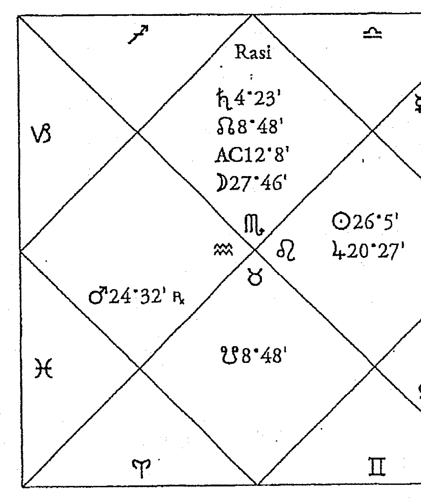

- 上升點與命宮中的其他三星：土星♄天蠍座♏4°23′、北交點☊天蠍座♏8°48′、月亮☽天蠍座♏27°46′，屬「會合」狀態。其中，又以土星♄和北交點☊形成緊密會合；尤其上升點位於天蠍座♏12°8′，與北交點☊僅距離3°48′。
- 十宮事業宮內，木星♃位於獅子座♌20°27′、太陽☉位於獅子座♌26°5′，兩星屬「會合」狀態；然距離僅5°38′，因此木星逢太陽焦傷。

二、印度占星學規定的行星相映宮位如〈表4-4〉：

- 太陽、月亮、水星、金星相映至對宮，即所在位置起算的第七宮。以〈圖4-4〉為例，假設太陽 ☉ 位於金牛座 ♉，相映至天蠍座 ♏；月亮 ☽ 位於雙魚座 ♓，相映至處女座 ♍；水星 ☿ 位於摩羯座 ♑，相映至巨蟹座 ♋；金星 ♀ 位於獅子座 ♌，相映至水瓶座 ♒。

- 火星相映至其所在位置起算的第四、七、八宮。以〈圖4-5〉為例，假設火星 ♂ 位於獅子座 ♌，則分別相映至天蠍座 ♏、水瓶座 ♒、雙魚座 ♓。

| 行星 | 相映至行星起算的宮位 |
|------|----------------------|
| 太陽、月亮、水星、金星 | 七宮 |
| 火星 | 四、七、八宮 |
| 木星、北交點、南交點 | 五、七、九宮 |
| 土星 | 三、七、十宮 |

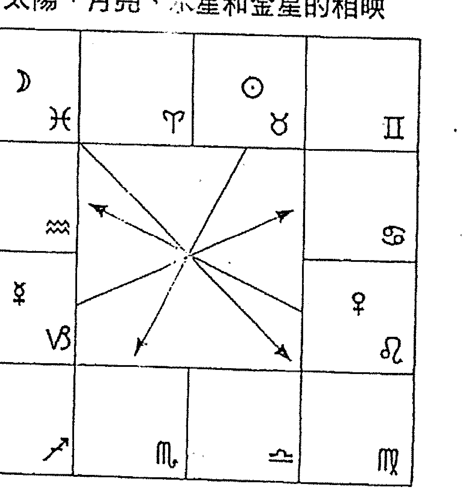

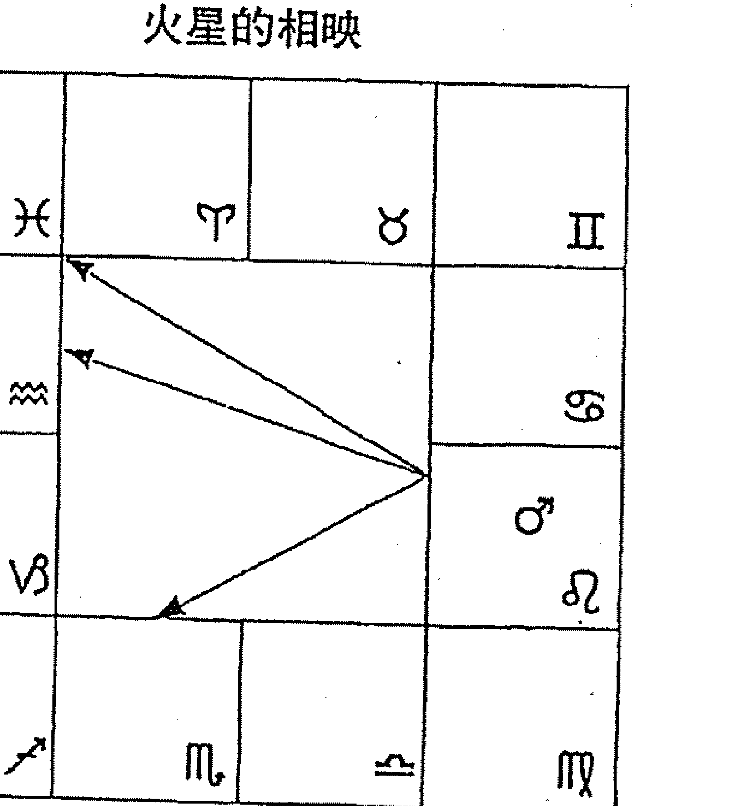

- 木星、北交点或南交点皆相映至其个别所在位置起算的第五、七、九宫。以<图 4-6>为例，假设木星♃、北交点☊或南交点☋落入摩羯座♑，则分别相映至金牛座♉、巨蟹座♋和处女座♍。

- 土星相映至其所在位置起算的第三、七、十宫。以<图 4-7>为例，假设土星♄位于狮子座♌，则分别相映至天秤座♎、水瓶座♒和金牛座♉。

上述虽以行星所在星座举例，但因为采用「整个星座宫位制」，因此能对照以其所在后天宫起算。

> 《BPHS》一书中并未说明行星的相映为何依循上述规定。印度占星学者维尔马（O. P. Verma）所著《Laghuparasari》的第二十三页中，依据外行星（土星、木星、火星）的本质，解说其相映原理。本书将相关资料整理如下，以期读者了解整个相映系统的来由：

- 太阳、月亮、水星、金星皆为内行星，只相映至对宫，即第七宫。
- 土星、木星、火星为外行星，皆有三个相映宫位；北交点、南交点皆与业力有关，故与木星同。
    (1) 土星：代表劳碌、手工、艰辛、刻苦耐劳，故相映至第三宫的勇
气、手工，以及第十宫的职业、持续努力等成长宫，表示成长中的困难；但第六、十一宫也是成长宫，为何不被土星相映？由以下第4点的第（2）、（3）点叙述，即可得知。
    (2) 木星：代表幸运、宗教，也有业力之意；第五宫代表子女、前世行为佳；第九宫代表宗教、正义、道德，故木星相映至第五和九宫。
    (3) 火星：代表战争、死亡；第四宫代表坟墓，第八宫代表死亡，故火星相映至第四、八宫，代表刑克、生命威胁。
    (4) 南北交点：同木星，与前世业力有关，故也相映至第五和九宫。
※ 以上这些外行星也都同内行星，个别相映至第七宫。

- 第一宫和第七宫互相对映，最为普遍。
- 除上述的第一、三、四、五、七、八、九、十宫外，第二、六、十一、十二宫，皆无行星相映之。
    (1) 第二、十二宫在希腊占星学的整个星座宫位制中，属“不合意” (Aversion)关系。以行星所在位置作为假设的上升星座，与其起算的第二宫和第十二宫，都无注视 (Look at)关系。
    (2) 第六宫也属“不合意”，是“敌人”之意，惩罚或威胁，故所有行星都不会与之相映。
    (3) 第十一宫为成长宫。第十一宫的宫主星是所有成长宫主星中，最具力量者；故行星相映至第十一宫，类似从宇宙物质界中移除，因此，所有行星都不愿相映至第十一宫。

再次以张国荣命盘（P192）为例，说明所有行星的相映状况：

- 太阳 ○：位于第十宫，相映至由其起算的第七宫，即本命的第四宫。
- 月亮 ☽：位于第一宫，相映至由其起算的第七宫，即本命的第七宫。
- 水星 ☿：位于第十一宫，相映至由其起算的第七宫，即本命的第五宫。
- 金星 ♀：位于第九宫，相映至由其起算的第七宫，即本命的第三宫。
- 火星 ♂：位于第四宫，相映至由其起算的第四、七、八宫，即本命的第七、十、十一宫。

### 第五節 行星的力量

印度占星學的判斷法則，與西方古典占星學的判斷法則相當類似，即欲推論命主生活某個事項，以管轄事項的宮位為主，觀察它與其他宮位的互相關係。如欲論子女，以第五宮為主，看宮內有無行星，第五宮有無來自其他行星的吉凶相映，宮主星飛臨何宮，該宮內有無吉凶星的會合，以及第五宮主星有無來自其他行星的吉凶相映，再考慮第五宮徵象星木星的狀況；而其中的關鍵，就是行星的力量，因此，確切掌握其原理，是深入印度占星學殿堂的不二法門。

印度占星學先賢以相當細膩的方式，演繹行星在天空運行的種種狀況，並賦予聯想，衍生出六種主要的力量，由於內容相當繁瑣，將留待第七節介紹。本節先作暖身，針對務必了解的部分作解說，如此循序漸進，將有助讀者全面理解。切記，絕不能輕忽本節內容。

#### 一、旺宮度數、弱宮度數、主管星座（自己的星座）、三方旺宮

行星在黃道十二星座上的特定位置，東西方占星家皆賦予其特定的力量。印度占星學中的行星力量，分類如下：

| 行星 | 旺宮度數 | 弱宮度數 | 三方旺宮 | 主管星座 |
|------|----------|----------|----------|----------|
| ☉ | ♈ 10° | ♎ 10° | ♌ 0°-20° | ♌ 20°-30° |
| ☽ | ♉ 3° | ♏ 3° | ♉ 3°-30° | ♋ 0°-30° |
| ♂ | ♑ 28° | ♋ 28° | ♈ 0°-12° | ♈ 12°-30°   ♏ 0°-30° |
| ☿ | ♍ 15° | ♓ 15° | ♍ 16°-20° | ♍ 20°-30°   ♊ 0°-30° |
| ♃ | ♋ 5° | ♑ 5° | ♐ 0°-5° | ♐ 5°-30°   ♓ 0°-30° |
| ♀ | ♓ 27° | ♍ 27° | ♎ 0°-20° | ♎ 20°-30°   ♉ 0°-30° |
| ♄ | ♎ 20° | ♈ 20° | ♒ 0°-20° | ♒ 20°-30°   ♑ 0°-30° |
| ♌ | ♉ |  |  |  |
| ♏ | ♏ |  |  |  |

〈表4-5〉

（一）行星如落入旺宮的旺宮度數前後，仍具有旺的力量，但不如旺宮度數強。同樣的，行星如落入弱宮的弱宮度數前後，力量仍弱，但不如弱宮度數來得弱。

印度占星學強調行星落入旺宮、弱宮，認為其影響力比落入廟宮、陷宮來得大。這個看法不同於西方占星學的觀點，而且，印度占星學並無陷宮之說，即行星位於主管星座的對宮，對此並無特殊看法。如火星落入白羊座，為自己主管的星座，為廟；但火星落入白羊座的對宮天秤座，不稱為陷，這點必須注意。

（二）須考量行星位於所謂的「三方旺宮」，這是行星主管星座的一部分。印度占星先賢發現，行星位於此區域能發揮其功能。例如金星主管天秤座及金牛座兩個星座，金星落入天秤座0°至20°區域，能發揮的作用最佳。

（三）北交點和南交點到底有沒有這種力量分類，一直頗具爭議，且各家看法不一。

目前大多採用印度占星先賢帕拉薩拉的說法，以金牛座作為北交點的旺宮，天蠍座作為南交點的旺宮。除此之外，並無其他分類。附和這種看法的人認為，月亮交點與月亮運行的軌道相關，既然月亮的旺宮為金牛座，那麼北交點和南交點的旺宮，也應分別位於金牛—天蠍這條軸線上。

#### 二、友誼與敵意（永久與暫時）

印度占星學認為，行星間有所謂的友誼、中立、敵意關係。這種認定有助於分辨吉凶、力道，以及順利、挫折這種關係；且又分為自然的（或稱永久的）以及暫時的。

所謂永久的友誼、中立、敵意的行星間關係，可參見〈表 4-6〉。本書以杜格（S. K. Duggel）與尼賈·塔尼賈（Neerja Taneja）合著的《Planetary Streugths: Calculation & Application》內容為主，原則上分為兩部分：

+   1. 太陽、月亮、火星、木星為永久的友誼，均主管火象及水象星座。
    2. 水星、金星、土星為永久的友誼，均主管風象及土象星座。

由於水星靠近太陽，將之定為太陽的「中立行星」；而太陽則成為水星的「友誼行星」。

| 關係 | 行星 | ☉ | ☽ | ♂ | ☿ | ♃ | ♀ | ♄ | ♆ | ♅ |
| :--- | :--- | :--- | :--- | :--- | :--- | :--- | :--- | :--- | :--- | :--- |
| 友誼 | | ☽ ♂ ♃ | ☉ ☿ | ☉ ☽ ♃ ♅ | ☉ ♀ | ☉ ☽ ♂ ♆ | ☿ ♄ ♆ ♅ | ☿ ♀ ♆ | ♀ ♄ | ♂ |
| 中立 | | | ♂ ♃ ♀ ♄ | ♀ ♄ | ♂ ♃ ♄ ♆ ♅ | ♄ ♆ | ♂ ♃ | ♃ | ♆ ♃ |
| 敵意 | | ♀ ♄ ♆ ♅ | ♆ ♅ | ♀ ♆ | ♂ | ♀ | ☉ ♂ ♄ ♆ | ☉ ♂ ♄ ♆ | ☉ ♀ ♄ ♆ |

在進一步說明〈表4-6〉前，先解釋行星的友誼與敵意的原由，可參見〈表4-7〉：

| 行星 | 旺宮星座 | 三方旺宮 | 三 | 六 | 七 | 十 | 十一 | 二 | 四 | 五 | 八 | 九 | 十二 |
|------|----------|----------|---|---|---|---|---|---|---|---|---|---|---|
| ☉ | ♈ | ♌ | ♎ | ♑ | ♒ | ♉ | ♊ | ♍ | ♌ | ♐ | ♓ | ♈ | ♋ |
| ♂ | ☉ | ♀ | ♄ | ♀ | ☿ | ☿ | ♂ | ♃ | ♃ | ♂ | ♄ |
| ☽ | ♉ | ♉ | ♋ | ♎ | ♍ | ♒ | ♓ | ♊ | ♌ | ♍ | ♐ | ♑ | ♈ |
| ♀ | ♀ | ☽ | ♀ | ♂ | ♄ | ♃ | ☿ | ☉ | ☿ | ♃ | ♄ | ♂ |
| ♂ | ♑ | ♈ | ♊ | ♍ | ♎ | ♑ | ♒ | ♉ | ♋ | ♌ | ♍ | ♐ | ♓ |
| ♄ | ♂ | ☿ | ☿ | ♀ | ♄ | ♄ | ♀ | ☽ | ☉ | ♂ | ♃ | ♃ |
| ☿ | ♍ | ♍ | ♍ | ♒ | ♓ | ♊ | ♋ | ♎ | ♐ | ♑ | ♈ | ♉ | ♌ |
| ☿ | ☿ | ♂ | ♄ | ♃ | ☽ | ♀ | ♃ | ♄ | ♂ | ♀ | ☉ |
| ♃ | ♋ | ♐ | ♒ | ♉ | ♊ | ♍ | ♎ | ♑ | ♓ | ♈ | ♌ | ♍ | ♍ |
| ♃ | ☽ | ♄ | ♀ | ☿ | ☿ | ♀ | ♄ | ♃ | ♂ | ☽ | ☉ | ♂ |
| ♀ | ♓ | ♎ | ♐ | ♊ | ♈ | ♋ | ♌ | ♍ | ♑ | ♒ | ♉ | ♊ | ♍ |
| ♃ | ♀ | ♃ | ♃ | ♂ | ☽ | ☉ | ♂ | ♄ | ♄ | ♀ | ☿ | ☿ |
| ♄ | ♎ | ♒ | ♈ | ♋ | ♌ | ♍ | ♐ | ♓ | ♉ | ♊ | ♍ | ♎ | ♑ |
| ♀ | ♄ | ♂ | ☽ | ☉ | ♂ | ♃ | ♃ | ♀ | ☿ | ☿ | ♀ |

根據〈表4-7〉，可看出敵意與友誼行星，並以此來作說明：

+   A. 由任何行星的三方旺宮星座起算的第三、六、十、十一和七宮，都是具敵意的星座，其星座主星為該行星的敵意行星；其餘星座則為友誼星座，其星座主星便為該行星的友誼行星。另外，在推演的過程中，如果涉及該行星本身的星座，則不視為友誼或敵意星座。印度占星學將後天宮的第三、六、十宮、十一宮歸類為「成長宮」，意謂須歷經艱辛努力，並隨著年歲與成長，才會有所成果。另外，第七宮是對立宮，對立宮的宮主星便隱含著敵意。

+   B. 由於除太陽、月亮分別主管單一星座（獅子座和巨蟹座），其他五顆行星包括火星、水星、木星、金星、土星，都各自主管兩個星座，因此，有可能同時為友誼和敵意行星。當有這種狀況發生時，就歸為中立關係。另外，當敵意星座也同時為旺宮星座時，其主星也歸為中立行星。

根據上述A、B原則，可導出任何行星的敵意、中立、友誼等三種性質的行星。

+   （一）太陽的三方旺宮星座為獅子座，由它起算為第三宮天秤座（金星主管）、第六宮摩羯座（土星主管）、第七宮水瓶座（土星主管）、第十宮金牛座（金星主管）、第十一宮雙子座（水星主管）。因此，金星、土星、水星為敵意行星；但水星主管的處女座，也為友誼星座，故而得出水星為中立行星。而火星主管的天蠍座為第四宮，木星主管的人馬座為第五宮、雙魚座為第八宮，月亮主管的巨蟹座為第十二宮，皆為太陽的友誼星座，故火星、木星、月亮為太陽的友誼行星。

+   （二）月亮的三方旺宮星座為金牛座，由它起算為第三宮巨蟹座（月亮主管）、第六宮天秤座（金星主管）、第七宮天蠍座（火星主管）、第十宮摩羯座（土星主管）、第十一宮雙魚座（木星主管），除月亮為自身，不計友誼或敵意，金星、火星、土星、木星皆屬敵意；但因為這些行星主管旺宮金牛座（金星主管）、第十二宮白羊座（火星主管）、第九宮摩羯座（土星主管）、第八宮人馬座（木星主管），所以金星、火星、土星、木星為中立行星。另外，第二宮雙子座（水星主管）、第五宮處女座（水星主管）和第四宮獅子座（太陽主管）為友誼星座，所以水星、太陽為月亮的友誼行星。由此可知，月亮並無敵意行星。

+   （三）火星的三方旺宮星座為白羊座，由它起算為第三宮雙子座（水星主管）、第六宮處女座（水星主管）、第七宮天秤座（金星主管）、第十宮摩羯座（土星主管）、第十一宮水瓶座（土星主管）。顯然，金星為火星唯一的敵意行星。土星主管的兩個星座：摩羯座、水瓶座，雖是敵意星座，但其中摩羯座為火星的旺宮星座，故土星不列為火星的敵意行星。金星因主管的第二宮金牛座為友誼星座，故並為中立行星。其他包括第四宮巨蟹座（月亮主管）、第五宮獅子座（太陽主管）、第九宮人馬座（木星主管）、第十二宮雙魚座（木星主管），皆為友誼星座，故月亮、太陽、木星均為火星的友誼行星。

+   （四）水星的三方旺宮星座為處女座，由它起算為第三宮天蠍座（火星主管）、第六宮水瓶座（土星主管）、第七宮雙魚座（土星主管）、第十一宮巨蟹座（月亮主管），除月亮為水星唯一的敵意行星外，其他如火星，也主管第八宮白羊座，土星主管第五宮摩羯座，木星主管第四宮人馬座，皆為友誼星座，故火星、土星、木星三者並為中立行星。另外，第二宮天秤座（金星主管）及第九宮金牛座（金星主管）、第十二宮獅子座（太陽主管），均為純粹的友誼星座，故金星、太陽為水星的友誼行星。

+   （五）木星的三方旺宮星座為人馬座，由它起算為第三宮水瓶座（土星主管）、第六宮金牛座（金星主管）、第七宮雙子座（水星主管）、第十宮處女座（水星主管）、第十一宮天秤座（金星主管）。顯然，水星、金星為木星純粹的敵意行星；土星因主管第二宮摩羯座，為友誼星座，故土星併為中立行星。其他如火星，主管第五宮白羊座及第十二宮天蠍座，月亮主管第八宮巨蟹座，太陽主管第九宮獅子座，皆為友誼星座，故火星、月亮、太陽皆為木星的友誼行星。

+   （六）金星的三方旺宮星座為天秤座，由它起算為第三宮人馬座（木星主管）、第六宮雙魚座（木星主管）、第七宮白羊座（火星主管）、第十宮巨蟹座（月亮主管）、第十一宮獅子座（太陽主管），除月亮、太陽為純粹的敵意行星外，雙魚座因是金星的旺宮，故木星變成中立行星；火星主管第二宮天蠍座友誼星座，因此火星也併為中立行星。其他如土星，主管第四宮摩羯座及第五宮水瓶座，水星主管第九宮雙子座及第十二宮處女座，皆為金星的友誼星座，故水星、土星為金星的友誼行星。

+   （七）土星的三方旺宮星座為水瓶座，由它起算為第三宮白羊座（火星主管）、第六宮巨蟹座（月亮主管）、第七宮獅子座（太陽主管）、第十宮天蠍座（火星主管）、第十一宮人馬座（木星主管），皆為敵意星座；但其中木星也主管第二宮友誼星座，故除了它是中立行星，其他包括火星、月亮、太陽，皆為土星純粹的敵意行星。而金星主管第四宮金牛座及第九宮天秤座，水星主管第五宮雙子座及第八宮處女座等友誼星座，故水星、金星均為土星的友誼行星。

+   （八）〈表 4-6〉除了北交點、南交點跟其他行星間的友誼與敵意尚不明確外，其他七個行星間的敵對關係，已能闡明。

以上八點提及的狀態，一般稱作「永久的友誼」與「永久的敵意」；此外，尚有「暫時的友誼」與「暫時的敵意」。所謂暫時的敵友關係，是以每個行星的所在宮位起算，位於它的第二、三、四、十、十一、十二宮的行星，具有「暫時的友誼」關係；相對的，位於它的第一、五、六、七、八、九宮的行星，則具有「暫時的敵意」關係。前者距離該行星較近，因而比喻為友誼關係；後者距離該行星較遠，遂比喻為敵意關係。當永久的敵友關係和暫時的敵友關係互相組合，就有五種分類，參考如下：

+   1. 永久的友誼 + 暫時的友誼 = 知己朋友
    2. 永久的中立 + 暫時的友誼 = 友誼
    3. 永久的友誼 + 暫時的敵意 = 中立
       永久的敵意 + 暫時的友誼 = 中立
    4. 永久的中立 + 暫時的敵意 = 敵意
    5. 永久的敵意 + 暫時的敵意 = 嚴酷敵意

以張國榮的命盤（P192）說明這五種關係，以太陽 ☉ 為例。太陽位於第十宮：

+   1. 月亮 ☽：位於本命第一宮，亦即由太陽 ☉ 起算的第四宮，具有暫時的友誼；因月亮也是太陽的永久友誼，故月亮為太陽的知己朋友。
    2. 火星 ♂：位於本命第四宮，亦即由太陽 ☉ 起算的第七宮，具有暫時的敵意；因火星也是太陽的永久友誼，故火星為太陽的中立。
    3. 水星 ☿：位於本命第十一宮，亦即由太陽 ☉ 起算的第二宮，具有暫時的友誼；水星是太陽的永久中立，故水星為太陽的友誼。
    4. 木星 ♃：位於本命第一宮，亦即由太陽 ☉ 起算的第一宮，具有暫時的敵意；木星是太陽的永久友誼，故木星為太陽的中立。
    5. 金星 ♀：位於本命第九宮，亦即由太陽 ☉ 起算的第十二宮，具有暫時的友誼；金星是太陽的永久敵意，故金星為太陽的中立。
    6. 土星 ♄：位於本命第一宮，亦即由太陽 ☉ 起算的第四宮，具有暫時的友誼；土星是太陽的永久敵意，故土星為太陽的中立。
    7. 北交點 ☊：位於本命第一宮，亦即由太陽 ☉ 起算的第四宮，具有暫時的友誼；北交點是太陽的永久敵意，故北交點為太陽的中立。
    8. 南交點 ☋：位於本命第七宮，亦即由太陽 ☉ 起算的第十宮，具有暫時的友誼；南交點是太陽的永久敵意，故南交點為太陽的中立。

※ 其他行星的五種關係，依此推論，即可得知。

上述行星間的五種關係，在計算行星的位置力量時，也要考量七種分盤；若無透過電腦處理，會相當費時。一般而言，很少有印度占星家會作如此仔細的手算論命，一是因為繁複，二是因為行星間的敵友關係並非判斷的重要關鍵。

美國著名印度占星學者詹姆士·布拉赫（James T. Braha）在其著作《The Art and Practice of Ancient Hindu Astrology》中，以較為客觀的實證經驗說明：行星的友誼與敵意並不會抵消行星原本的性質。例如儘管金星和土星為永久的友誼關係，然而當它們緊密會合時，金星主管的愛情關係，仍會受到土星沮喪、悲觀的特性影響。

另外，行星間的永久關係，也會導致行星在友誼行星主管的星座中受到歡迎，稱為「友誼星座」；相對的，行星在敵意行星主管的星座中不受歡迎，稱為「敵意星座」；除此之外的狀況，稱為「中立星座」。

行星在友誼星座一覽圖

| ♀ ♂ | ♃ ☊ ☉ | ♀ ♆ ♄ | ♄ ☽ ♀ |
|-----|-------|-------|-------|
| ♈   |       |       | ♋     |
| ♀ ☊ |       |       | ♃ ♂ ☉ |
| ♑   |       |       | ♌     |
| ♀ ☊ |       |       | ♃ ☽ ♀ |
| ♐   | ♏    | ♎    | ♍     |
| ♂ ☉ | ♃ ☊ ☉ | ♀ ♆ ♄ | ☽ ♄ ♀ |

行星在敵意星座一覽圖

| ♀ ♂ | ♃ ☊ ☉ | ♀ ♆ ♄ | ♄ ☽ ♀ |
|-----|-------|-------|-------|
| ♈   |       |       | ♋     |
| ♀ ☊ |       |       | ♃ ♂ ☉ |
| ♑   |       |       | ♌     |
| ♀ ☊ |       |       | ♃ ☽ ♀ |
| ♐   | ♏    | ♎    | ♍     |
| ♂ ☉ | ♃ ☊ ☉ | ♀ ♆ ♄ | ☽ ♄ ♀ |

+   6. 木星♃：位於第十宮，相映至由其起算的第五、七、九宮，即本命的第二、四、六宮。
    7. 土星♄：位於第一宮，相映至由其起算的第三、七、十宮，即本命的第三、七、十宮。
    8. 北交點☊：位於第一宮，相映至由其起算的第五、七、九宮，即本命的第五、七、九宮。
    9. 南交點☋：位於第七宮，相映至由其起算的第五、七、九宮，即本命的第十一、一、三宮。

#### 三、特定行星對行星的相映

特定行星相映至的宮位內行星，即連帶受其相映。這點不同於西方系統，後者是以該特定行星所在星座，與其他行星或特殊點、敏感點落入的星座，彼此間形成相位關係。因此，在印度占星學中，即使是空宮，特定行星的特定相映亦可形成。

例如張國榮命盤中的第二宮內行星，木星♃位於第十宮，仍可相映至本命的第二宮。此外，第六宮內行星，木星♃位於第十宮，仍可相映至本命的第六宮。

#### 四、行星與行星間的相映

行星與行星間的相映，可分為「相互相映」和「單方相映」。

+   1. 相互相映，即兩行星互相相映對方。以張國榮的命盤（P192）為例：
    (1) 太陽☉：位於第十宮，相映至第四宮的火星♂；而火星♂位於第四宮，也相映至第十宮的太陽☉。
    (2) 木星♃：位於第十宮，相映至第四宮的火星♂；而火星♂位於第四宮，也相映至第十宮的木星♃。
    (3) 土星♄：位於第一宮，相映至第七宮的南交點☋；而南交點☋位於第七宮，也相映至第一宮的土星♄。
    (4) 月亮☽：位於第一宮，相映至第七宮的南交點☋；而南交點☋位於第七宮，也相映至第一宮的月亮☽。

+   2. 單方相映，即 A 對 B 相映，但 B 對 A 並無相映。
    +   1. 土星 ♄：位於第一宮，相映至第十宮的太陽 ☉、木星 ♃；但太陽 ☉、木星 ♃ 對土星 ♄ 並無相映。
    +   2. 火星 ♂：位於第四宮，相映至第七宮的南交點 ☋；但南交點 ☋ 對火星 ♂ 並無相映。
    +   3. 火星 ♂：位於第四宮，相映至第八宮的水星 ☿；但水星 ☿ 對火星 ♂ 並無相映。
    +   4. 北交點 ☊：位於第一宮，相映至第九宮的金星 ♀；但金星 ♀ 對北交點 ☊ 並無相映。
    +   5. 南交點 ☋：位於第七宮，相映至第十一宮的水星 ☿；但水星 ☿ 對南交點 ☋ 並無相映。

#### 五、部分相映

印度占星學的古代文獻中，也設有「部分相映」（Partial Aspects），意即除上述第二、三、四點的相映為「全相映」（Full Aspects）外，尚有：

+   1. 所有行星相映至由其起算的第三宮和第十宮，給予 25% 的效應（除土星外）。
    2. 所有行星相映至由其起算的第四宮和第八宮，給予 75% 的效應（除火星外）。
    3. 所有行星相映至由其起算的第五宮和第九宮，給予 50% 的效應（除木星、南北交點）。
    4. 第五點在實務上甚少被採用。

#### 六、相映計算方向

特定行星所相映至的宮位，是按照黃道星座的順序計算，並無逆向計算相同宮位數的作法。這點與西方系統的現代相位計算方式相當不同。

#### 七、相映功能的詮釋

印度占星學對於相映功能的詮釋，以相關行星的吉凶性質來論。這點也不同於西方現代占星學，後者是以相位吉凶為主，行星為輔的方式論述。所謂相關行星的吉凶性質，必須充分考量所有的狀況，才能真正分辨。

#### 八、行星互換星座（Sambandha）

印度占星學強調行星彼此互換星座，梵文稱為「Sambandha」，意思是完整的聯結。例如木星落入白羊座，而火星落入人馬座，意即木星位於火星主管的星座，火星位於木星主管的星座，這個觀念與西方古典占星學的「互容」相同，但印度占星學採用的名詞，原指「相互完全相映」，而衍生為「星座互容」。

以上八點所說明的印度占星學「相映」觀念，是主流理論帕拉薩拉的觀念。其他支流如賈密尼的相映觀念，則是以星座間的關係來論相映，在此則不擬討論。

根據〈圖4-8〉來看，太陽 ☉ 的友誼行星為月亮 ☽、火星 ♂、木星 ♃，故太陽的友誼星座分別為巨蟹座 ♋、白羊座 ♈、天蠍座 ♏、人馬座 ♐、雙魚座 ♓；而其他行星則依此類推。

根據〈圖4-9〉來看，太陽 ☉ 的敵意行星為金星 ♀、土星 ♄、北交點 ☊ 和南交點 ☋（後兩者暫不論），故太陽的敵意星座分別為金牛座 ♉、天秤座 ♎、水瓶座 ♒、摩羯座 ♑。

## 三、行星的狀態

廣義的行星狀態是指行星在命盤中的所有狀況，包括行星本身的基本狀況，例如位於黃道星座的旺弱、後天宮的位置，是否逢焦傷？逆行或停滯？有無來自其他行星的會合、相映、包圍？行星間的關係等等。但這裡所要探討的是狹義的行星狀態，亦即行星位於每個星座的初、中、末端，以此類比人生階段來論述其力量。這種行星狀態，梵文稱為「Graha Avasthas」，共分五種，請參考下表：

|  | 奇數星座 ♈♊♎♐♒ | 偶數星座 ♉♋♏♑♓ |
| :--- | :--- | :--- |
| 嬰兒狀態（Bala） | 0°-6° | 30°-24° |
| 兒童狀態（Kumara） | 6°-12° | 24°-18° |
| 青壯狀態（Yuva） | 12°-18° | 18°-12° |
| 老年狀態（Vriddha） | 18°-24° | 12°-6° |
| 死亡狀態（Mrita） | 24°-30° | 6°-0° |

行星位於奇數星座，是按照 0° 起算，分成五種狀態；位於偶數星座，則從末端逆算起。儘管印度占星學非常細膩的強調這種星座內的各種狀態，但在計算「行星的六種力量」時，並未將之納入。因此在實務上，通常僅會注意位於星座前端 3° 內和末端 3° 內的行星，其能量較小，宜吉星扶持，忌凶星刑剋。

## | 第四章 |

以張國榮的命盤（P192）為例，月亮位於天蠍座 27°46'。由於天蠍座是偶數星座，參見〈表4-8〉，月亮處於嬰兒狀態，能量較弱；就實務觀點來看，處於星座末端 3° 內。由此即可推斷，當事人容易感傷，內在世界易感挫敗。

### 四、行星逢太陽焦傷

梵文「Astangatha」，即行星逢太陽焦傷，是指行星接近太陽，在一定度數內無法被看見，因而影響力驟降，就像沒有能量一樣。印度占星古典文獻針對個別行星，定有個別度數的焦傷範圍，且又因行星在順逆時，產生個別的差異如〈表4-9〉。

|       | 順行時逢焦傷度數 | 逆行時逢焦傷度數 |
|-------|------------------|------------------|
| ☿     | 14'              | 12'              |
| ♀     | 10'              | 8'               |
| ♂     | 17'              | 17'              |
| ♃     | 11'              | 11'              |
| ♄     | 15'              | 15'              |

由〈表4-9〉可以得知，水星順行時，當它位於太陽的兩側距離14'內，即逢焦傷；而逆行時，若位於太陽兩側12'內，亦同逢焦傷。而其他行星依此類推。

古巴比倫人在觀察諸行星與太陽會合周期的視運動過程時，發現行星與太陽偕升或偕降之中，常出現行星脫離強烈陽光而被看見的情況，因而將之視為吉祥的徵兆。相對的，與太陽太過接近的會合，行星會隱藏不見，即逢太陽焦傷，則被視為凶兆。因為行星是神，如果無法被看見，神威便減弱。

西元十七世紀時，英國威廉·里利（William Lilly）出版的《Christian Astrology》定「焦傷」度數為±8.5'；介於±8.5'與±17'間，為「在太陽光束下」（Under Sunbeam）；而在±17'內，為「在太陽核心」（Cazimi）。前兩者行星能量甚弱，逢焦傷傷害程度大於在太陽光束下；但在太陽核心，反倒為吉，這跟印度占星學的說法截然不同。應注意的是，現代西方占星學根本不提行星逢焦傷的觀念。

現代印度占星學可能受到西方古典系統的影響，行星逢焦傷的距離度數，不再為古典文獻記載的方式，實務上一律採用 ±8.5° 內，越緊密，刑傷越大。

行星逢焦傷，它的射線整個被掩蓋（類似日蝕或月蝕），導致看不見該行星，其影響力降低甚或消失。

印度占星先賢認為，逢焦傷的行星變得非常弱，其主管宮位的管轄事項，易呈現負面影響。例如水星逢焦傷，水星代表理解、反應、學習；若主管第二宮財帛宮，命主的理財能力就易見瑕疵，以致虧損，留不住錢財。

詮釋行星逢焦傷，應記住這項法則：逢焦傷行星主管宮位的外顯事項，包括相關宮位主管的身體部位，常會出現不適；但若主管宮位屬內在事項，例如心靈、精神功能，通常不受損傷。這是因為行星接觸到代表靈魂的太陽，因此，能使其內在變得明亮、光輝。例如水星逢太陽焦傷，命主內在其實很聰明、有智慧，但表現在外卻有些笨拙。當然，我們應當明白，行星主管宮位的外在事項，因人而異，不能以偏概全。

自然吉星逢焦傷，會減弱其吉象；自然凶星逢焦傷，則增添凶象。然逢焦傷的行星如位於自己的星座、入旺宮或三方旺宮、友誼星座，當然會比入陷、入弱宮或敵意星座來得好些；自然吉星仍有吉象，而自然凶星則不至於那麽兇。

然而，當太陽為繁榮、興盛、成功的主星時，即太陽位於第十宮或主管第十宮時，這個詮釋法則應予以修正。哈特博士（Hart Defouw）和羅伯特博士（Robert Svoboda）合著的《Light of Life: An Introduction to the Astrology of India》，就特別指出這項例外。

以張國榮的命盤（P192）為例，他的木星 ♃ 位於獅子座 ♌ 20°27'，而太陽 ☉ 位於獅子座 ♌ 26°5'，兩者距離 5°38'，符合逢焦傷的條件，意即木星逢太陽焦傷。如按照一般的詮釋，木星主管的第二宮人馬座 ♐（口才、家庭、財運），以及第五宮的雙魚座 ♓（藝術才華、子女、智能），都會受傷害；但因為木星為三方宮（第五宮）及中性宮（第二宮）的主星，且又入始宮（第十宮），因此其力量增強。而太陽為第十宮獅子座 ♌ 的主星，代表

### 五、行星逆行與停滯

印度占星學相當重視行星的「逆行」（Retrogression）現象。由於這是天體異象之一，故觀察得非常仔細。梵文「Cheshta」，即意指「逆行」。就地心系統而言，除太陽、月亮外，所有行星其相對視運動，都會有逆行現象。印度占星學觀察這種天文現象，與特殊的徵象意涵作聯想，認為當行星逆行時，與太陽的某種距離，有各自的力量，稱作「Cheshta Bala」，並將之分成八種不同的移行，各賦予不同數值的力量，相較於西方占星學的相同項目來得更細膩。在此不擬盡述。

有關行星逆行的效應，根據印度占星學的古典文獻，大多記載為吉象；相對於行星逢焦傷，無法被看見，被類比為離地球很遠。而行星逆行就好像再度返回般，被類比為離地球很近，反而具有力量。這個觀念與西方古典占星學將行星逆行一律視為凶象的觀念大異其趣。逆行的行星都被視為業力行星，帶有前世的因果關連。本章一開始即已說明，行星是業力工具，當它逆行時，更是特別有力的業力之星。自然吉星逆行時，有能力帶來吉象；自然凶星逆行時，也有能力帶來凶象。但要注意的是，這裡的說法是指「有能力」，行星逆行不必然等同於吉象，也正因為如此，行星逆行效應常被誤解甚深。

曼崔斯瓦拉（Mantreswara）撰寫的印度占星學重要古籍《Phala Deepika》，曾記載「入弱且逆行的行星，等同入旺宮」。這裡的陳述，應是片面解讀逆行行星為吉象的主因；然而，其實應該如此解讀：三方宮吉宮主星入弱宮且逆行時，則仍有能力帶來吉象。不過，理論歸理論，實務歸實務，詹姆斯・布拉赫在其著作《The Art and Practice of Ancient Hindu Astrology》中，便單純就經驗來談，因此值得引錄，本書整理如下：

- 1. 即使在計算六種力量，考慮逆行的力量是強的，逆行行星仍不如順行行星的力量強。
- 2. 逆行行星具有一些額外的力量，因為當它逆行時會較接近地球，使得行星逆行的能量，撼動到命主整個生命的個人覺醒和思想過程，因而具有基本的優勢力量。
- 3. 逆行行星確實會影響該行星的基本能量。
- 4. 逆行行星的能量，是命主意識和內在過程的張力，會產生一種明確的心理面；至於外在和呈現水準，並不如古典文獻所敘述的那麼誇張。
- 5. 行星逆行不會導致傷害，因為行星並非受剋，因此只是象徵較內省化。

另外，前文談及行星移行時，會有「停滯情況」（Stationary），梵文為「Stambana」；在計算「移行的力量」時雖有計入，但一般印度占星學書籍並未刻意突顯停滯現象。詹姆士・布拉赫從案例研究發現，停滯的行星確有令人驚奇之處，所謂的「停滯」分成兩種：

- 1. 停滯後逆行：當行星由順行轉為逆行前，會先慢下來數天或數星期，而在逆行前會完全停下，然後再逆行。
- 2. 停滯後順行：當行星逆行數星期或數月後，會再慢下來，完全停下後，接著重新順行。

上述兩種情況，所要強調的是停滯現象，此時行星特別令人注目。一般電腦程式並未列出停滯時間，必須查星曆表是否註記「D」字樣，即是停滯。另外，應注意「D」日前後行星的移行，才能確定是否完全停滯。

## 【案例一】

約翰·甘迺迪 (John F Kennedy)

1917 年 05 月 29 日 15:00

美國·布魯克萊恩 42N19,71W12

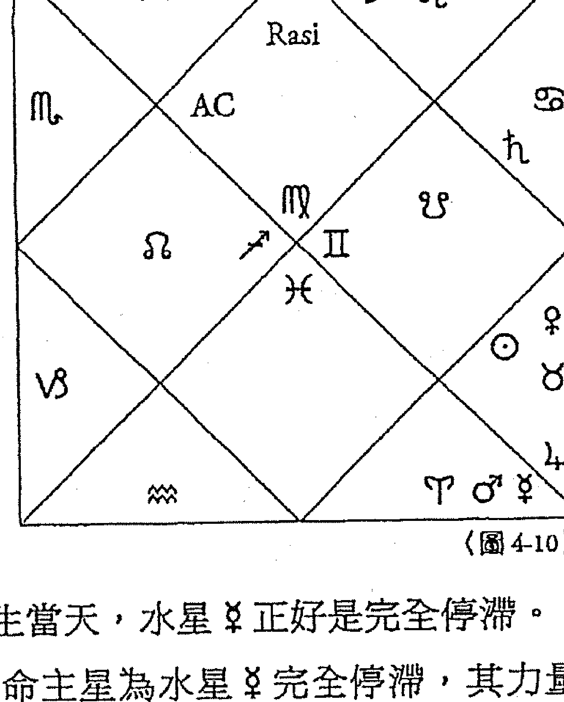

<圖4-10>

- 1. 約翰·甘迺迪出生當天，水星 ☿ 正好是完全停滯。
- 2. 立命處女座 ♍，命主星為水星 ☿ 完全停滯，其力量甚強；賦予自信、反應佳、辯才無礙、能力倍受肯定。
- 3. 水星 ☿ 正好也是第十宮雙子座 ♊ 的主星，故也賦予輝煌的生涯、社會地位、名望、尊崇。
- 4. 約翰·甘乃迪的演講充滿智慧，一直深印在美國民眾的心中。
- 5. 水星 ☿ 嚴重受剋。水星與自然凶星火星 ♂，會合在凶宮第八宮（死亡），且受土星 ♄ 入弱巨蟹座 ♋ 的相映；火星又為第八宮白羊座 ♈ 及第三宮天蠍座 ♏ 的主星，皆是死亡宮。要不是水星停滯，否則同時受到凶星的會合、刑剋，根本無法承受。

再以張國榮的命盤 (P192) 來看行星逆行。盤中只有火星 ♂ 位於水瓶座 ♒ 24°32'，逆行。火星適為上升星座，天蠍座 ♏ 及第六宮白羊座 ♈ 的主星飛臨第四宮。詹姆斯・布拉赫在書中指出：當上升星座主星逆行時，命主個性較為內向或內省，一生中會有段時期較難獲得認同；當上升星座主星或第十宮主星受刑傷，命主較慢展現其能力或外在力量。張國榮本人有些害羞，雖出道甚早，卻到1980年代才逐漸嶄露頭角。火星為第六宮主星，較不利疾病治療；且火星位於第四宮，主管胃，因此他一直為胃食道逆流（胃酸過多）所苦，亦有跡可循。

### 六、行星戰爭

所謂的「行星戰爭」（Planetary War），是指兩行星的黃道經度會合在1°內時，即處於「行星戰爭」狀態，梵文稱為「Graha Yudha」。在古典文獻中，稱位於較高緯度（Latitude，又稱黃道緯度）的行星為勝利者，力量會增強；相對的，位於較低緯度的行星為失敗者，能量會降低。一般星曆表並未標示行星的黃道緯度，較完整的星曆表才會標示，甚為麻煩，因而當現代印度占星學在定義行星戰爭時，完全採用行星的黃道經度，認為較少經度的行星為勝利者。例如火星位於金牛座 8°7'，水星位於金牛座 7°13'，兩者於1°內會合；由於水星的黃道經度較少，因此成為勝利者，而火星則為失敗者。

同時還需要注意，行星戰爭並不適用於太陽，因行星逢太陽焦傷，無力再戰爭。另外，南北交點也同樣不適用於行星戰爭法則，因為它們是陰影行星。有些書籍未提及行星戰爭法則，是因為其影響力不大。張國榮的命盤中，並無行星戰爭的現象。

### 七、圍攻

所謂的「圍攻」，是指某行星所在宮位的兩側，各有凶星（土星、火星、太陽、北交點、南交點）的存在，即稱該行星遇凶星圍攻；相對的，若兩側各有吉星（月亮、水星、木星、金星），則稱該行星受吉星包圍。前者為凶，後者為吉。

〈圖4-11〉的月亮位于命宮，受到第十二宮的火星 ♂ 及第二宮的土星 ♄ 圍攻，月亮及命宮的能量必然受損；而水星 ☿ 位於第六宮，受第七宮的金星 ♀ 及第五宮的木星 ♃ 包圍，水星 ☿ 及第六宮的能量會增強。
圍攻雖非相映，卻類似相映，且等同其效果，向來備受重視，故須注意。西方古典占星學也有圍攻概念，但強調在同星座內；而印度占星學，則以鄰宮為主，實務上也採西方用法。以張國榮的命盤（P192）為例，他的太陽 ☉ 會合木星 ♃，位於第十宮，受到第九宮的金星 ♀（吉星）及第十一宮的水星 ☿（吉星）包圍，太陽 ☉、木星 ♃ 及第十宮，吉象增強。

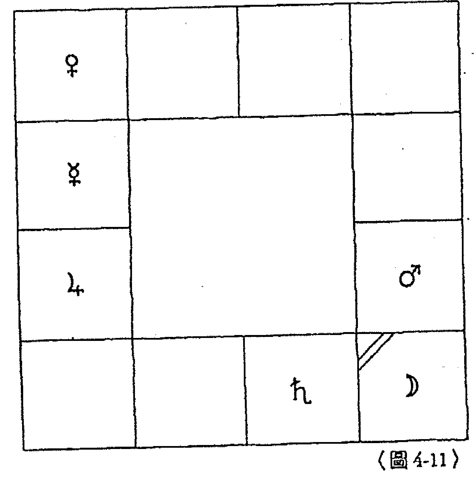

### 八、其他：行星飛臨宮位的力量

行星的力量除上述的各點說明以外，尚需注意以下兩點：

（一）宮位位置（House Placement）

- 1. 行星位於三方宮（五、九宮），力量增強。
- 2. 行星位於困難宮（六、八、十二宮），力量會被毀壞。
- 3. 行星位於始宮（一、四、七、十宮），具有力量。

例如張國榮命盤的金星 ♀ 位於第九宮（三方宮），金星的能量增強；木星 ♃ 和太陽 ☉ 會合在始宮（十宮），其能量具影響力；同樣的，木星 ♃、北交點 ☊、月亮位於第一宮（始宮），也具有影響力；而南交點 ☋ 位於始宮（七宮），亦同論。

#### （二）Vargottama

當行星在本命盤D1和分宮盤D9皆位於同一星座內，該行星稱為「Vargottama」，等同入於旺宮。印度占星學很重視D9分宮盤，論述本命盤時，常將D9隨附在側。行星成為「Vargottama」後，力量就會增強。

張國榮本命盤中的諸行星，和其D9盤相對的諸行星，無一位於相同星座，故就D9而言，沒有「Vargottama」的行星。

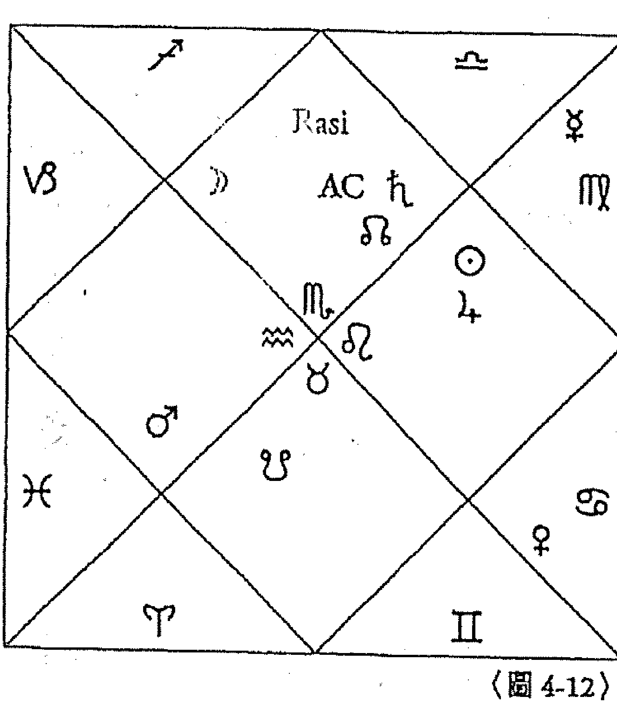

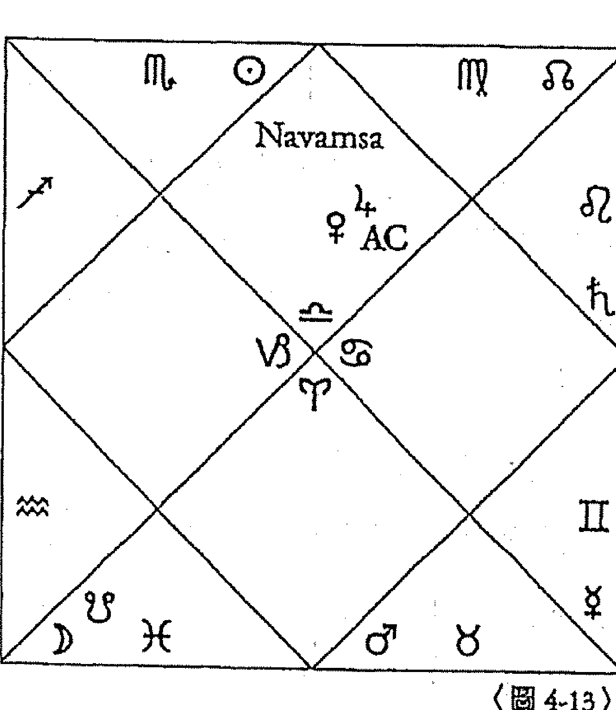

| 行星 | 星座 |
| :--- | :--- |
| ☉ | ♌ |
| ☽ | ♏ |
| ♂ | ♒ |
| ☿ | ♍ |
| ♃ | ♌ |
| ♀ | ♋ |
| ♄ | ♏ |

| 行星 | 星座 |
| :--- | :--- |
| ☉ | ♏ |
| ☽ | ♓ |
| ♂ | ♉ |
| ☿ | ♊ |
| ♃ | ♎ |
| ♀ | ♎ |
| ♄ | ♌ |

### 第六節 行星的六種力量

印度占星學中，有一套計算行星或宮位力量的方法，提供洞察行星或宮位狀態的數值，並加以評比。這套方法有助解盤者充分了解天宮圖中各要素的優劣，從而快速判斷其所代表的人生領域或事項的吉凶。行星計算力量的方法，梵文為「Shad Bala」；上節所介紹的行星力量，大多涵蓋在內。

「行星的六種力量」根據命主出生時，所對應的「行星在天空的狀態」賦予數值，然後加總計算。所謂「行星在天空的狀態」，是指與行星相關的天文現象在占星學上的象徵意義。印度占星學的先賢透過細膩的觀察，整理出行響行星力量的六大因素，分別為：

一、位置的力量（Sthana Bala）：強調行星在黃道位置的力量。這種力量，又根據黃道位置的不同情況分為五種：

- 1. 旺宮度數的力量（Uchcha Bala）
- 2. 七個分盤（D₁、D₂、D₃、D₇、D₉、D₁₂、D₃₀）的力量（Sapta vargiya Bala）
- 3. D₁至D₉奇數、偶數星座的力量（Oja-Yugma Bala）
- 4. 特定宮位、始宮、續宮、果宮的力量（Kendra Bala）
- 5. 星座區間的力量（Drekkana Bala）

二、方向的力量（Dig Bala）：強調行星在後天宮位所指示方向的力量，如右頁的〈圖4-14〉。

三、暫時的力量（Kaala Bala）：根據命主出生時的年、月、日、時等因素分成九類，個別計算。

- 1. 晝與夜的力量（Nathonnata Bala 或 Divaratri Bala）
- 2. 月相的力量（Paksha Bala，約每兩星期）
- 3. 出生時間三段的力量 (Tribhaaga Bala)
- 4. 年主星的力量 (Varsha Bala 或 Abda Bala)
- 5. 月主星的力量 (Maasa Bala)
- 6. 星期主星的力量 (Vaara Bala 或 Dina Bala)
- 7. 時間主星的力量 (Hora Bala)
- 8. 赤緯的力量 (Ayana Bala)
- 9. 行星戰鬥的力量 (Yuddha Bala)

四、移行的力量 (Chesta Bala)：就行星在天空中移行的現象，例如移行比平均速度快或慢、順行或逆行，賦予特定的力量。

五、固有或自然的力量 (Naisargik Bala)：根據七個行星原本的亮度，設定其個別力量。

六、源自其他行星相映的力量 (Drig Bala)：強調行星受來自其他行星的「相映」，可能產生的正負力量的加總。

由於「行星的六種力量」計算與詮釋內容太過龐雜，在此不擬深入討論；有興趣的讀者可參考本章第五節提到的《Planetary Strengths: Calculation & Application》一書，即有介紹六大項的概念及細項意義的計算，是最值得參考的專書之一。優質完備的印度占星軟體都會列出六大項的數值結果，在此僅簡單列出，不加說明，供讀者參考。

#### 張國榮命盤中七個「行星的六種力量」電腦計算結果

| Sthana Bala | ☉ | ☽ | ♂ | ☿ | ♃ | ♀ | ♄ |
| :--- | :---: | :---: | :---: | :---: | :---: | :---: | :---: |
| Ocha | 14.64 | 8.26 | 51.16 | 58.73 | 44.85 | 25.47 | 55.21 |
| Saptavargala | 97.50 | 116.25 | 99.38 | 138.75 | 90.00 | 78.75 | 69.38 |
| Ojayugmarasya | 15.00 | 30.00 | 15.00 | 15.00 | 30.00 | 15.00 | 15.00 |
| Kendra | 60.00 | 60.00 | 60.00 | 30.00 | 60.00 | 15.00 | 60.00 |
| Drekkana | 0.00 | 15.00 | 0.00 | 15.00 | 0.00 | 0.00 | 0.00 |
| **Total** | **187.14** | **229.51** | **225.54** | **257.48** | **224.85** | **134.22** | **199.59** |
| Dig Bala | 55.40 | 35.16 | 4.08 | 42.18 | 32.72 | 10.56 | 2.63 |
| **Kaala Bala** | | | | | | | |
| Nathonnatha | 59.17 | 0.83 | 0.83 | 60.00 | 59.17 | 59.17 | 0.83 |
| Paksha | 29.44 | 61.12 | 29.44 | 29.44 | 30.56 | 30.56 | 29.44 |
| Thribhaaga | 60.00 | 0.00 | 0.00 | 0.00 | 60.00 | 0.00 | 0.00 |
| Abdadhipati | 0.00 | 0.00 | 0.00 | 0.00 | 0.00 | 15.00 | 0.00 |
| Masadhipati | 0.00 | 0.00 | 0.00 | 30.00 | 0.00 | 0.00 | 0.00 |
| Varadhipati | 0.00 | 0.00 | 0.00 | 45.00 | 0.00 | 0.00 | 0.00 |
| Hora | 60.00 | 0.00 | 0.00 | 0.00 | 0.00 | 0.00 | 0.00 |
| Ayana | 70.72 | 59.35 | 23.86 | 36.07 | 38.15 | 54.53 | 55.02 |
| Yuddha | 0.00 | 0.00 | 0.00 | 0.00 | 0.00 | 0.00 | 0.00 |
| **Total** | **279.33** | **121.30** | **54.13** | **200.51** | **187.88** | **159.26** | **85.29** |

# 第七節 行星的原理與特性

印度占星學的行星原理與特性，與西方古典占星學有甚多雷同之處，但仍存在著些許差異，例如印度神話關於行星的寓意，會突顯吠陀的特色，這點在本章第二節「行星的自然吉凶性質」中已簡單介紹過。東西方占星學都將行星視為天宮圖最重要的要素，如同中國《易經》的八卦演繹，因其特性而有不同的運用方式。印度占星學相當強調藉由宗教儀式來改運或消災解厄，例如譚崔、真言念咒（梵文發音或片語）、配戴寶石戒指、服飾、吃食等等，在古典文獻中也不乏記載。

另外，印度占星學也如同西方古典占星學，發展出擇日、卜卦、時事、阿育吠陀等特殊主題占星學；在不同的領域中，行星也演繹出不同的特性，內容相當浩繁。本書僅就其較實用的「一般」特性，作扼要說明。

- 1. 方向：可作為發展方向的參考。例如命主的月亮強而有力，是命盤中最重要的行星，可建議命主朝西北方發展，或是去旅行；又例如進行譚崔時，應面向西北方吸取能量，有助改運或消災解厄。
- 2. 色彩：印度人相信色彩可增加福氣，舉凡衣飾顏色、寶石、汽車、家中擺設等等，都儘量配合行星的色彩。
- 3. 金屬：每個行星都有主管的金屬，常會搭配寶石，作為其框架。例如欲戴太陽的寶石（紅寶石）時，會將之鑲在銅框裡，因為太陽主管銅；不過，也有人認為，太陽主管黃金。
- 4. 寶石：印度人戴寶石戒指或耳環、臍環、手鍊、腳鍊的情況，時有所見，最主要是用來補運或改運。例如本命的太陽力量弱，如欲改善，就要戴紅寶石，並鑲在銅框裡；若又相信手相，就會進一步戴在太陽丘，即無名指處。
- 5. 花草、6. 樹木、7. 食物：常見於吠陀和譚崔的宗教儀式中，用以解除或緩解命主不良的前世業力。例如命主的土星狀況不佳，為了消弭其負面影響，會在儀式中擺設紫羅蘭或藍紫色系的植物，或是芝麻種子、花生、大豆、黑麥等土星管轄的花、樹或食物。
- 8. 衣飾：根據與上升星座，或與上升星座主星相關的行星，來判斷命主的穿著。例如當土星位於上升星座時，命主的穿著可能較為保守，若刑剋嚴重，可能導致衣著襤褸。
- 9. 味覺：是印度阿育吠陀醫學中，重要的診斷項目之一。
- 10. 脈輪：印度瑜伽的三脈七輪中，七輪分別對應不同的行星，同時也相當巧妙的對應著行星的旺宮原理。例如水星對應喉輪，主發聲、講話，旺於處女。詳細原理這裡不擬說明，有興趣的讀者可參閱大衛·弗勞利的著作《The Astrology of Seers》第三部第三章。
- 11. 幾何形式：密教中的曼陀羅一直都相當神祕，具有增強身心的功能。曼陀羅有各種幾何形式的圖案，因此命主配戴的護身符、耳環等等，都必須配合行星對應的幾何形式。
- 12. 說服方法：命主待人處事的態度，會以天宮圖中最強的行星表現出來。例如若是命盤中火星力量最強，命主個性可能較強勢，與人談判時較不容易妥協。
- 13. 距離、14. 內閣、15. 種姓：屬卜卦占星學的應用範圍。

此外，還需要注意行星的陰陽性。例如太陽、火星、木星為陽性行星；月亮、金星、北交點為陰性行星；水星、土星和南交點為中性行星；主要用來判定命主子女及手足的性別。就男命而言，以命盤中妻子的代表因子相關行星來分析；而在印度占星學中，當論及同性戀時，常搭配水星、土星和南交點等中性行星來作討論。上述內容將彙整於接下來的「行星的原理與特性」表格，讀者只需按表索驥，即可輕易掌握各行星的原理與特性。

## 行星的原理與特性

| 太陽 ☉ | 陰陽性質：陽性 要素：火  Dasa：六年 | 開運寶石：紅寶石、石榴石 自然吉凶：一般凶星 |
| :--- | :--- | :--- |
| 旺宮度數：白羊座 10° 弱宮度數：天秤座 10° 主管星座：獅子座 20°-30° 三方星座：獅子座 0°-20° | 主管星宿：Krittika、Uttara Phalguni、Uttara Ashadha 友誼行星：☽、♂、♃ 中立行星：☿ 敵意行星：♀、♄、☊、☋ | |
| 方向：東方 色彩：暗紅色、橘色 金屬：銅、黃金 寶石：紅寶石 花草：紅蓮、顯眼而大的黃色花朵、芳香草本植物、迷迭香、番紅花 樹木：強而巨大的樹木、山上的樹木、昂貴木材、松樹、柑橘樹、香柏、扁桃、萱蔻樹 食物：小麥、胡椒、美酒、利口酒、小豆蔻 地點：寺廟、教堂、公開場所、官邸、宮殿、豪華建築或大廈、政府機構、大廳、塔、宏偉建築 | 衣飾：粗鄙或薄 味覺：苦味 脈輪：眉心輪（第三隻眼） 幾何形式：四邊形 說服方法：懲罰 內閣：國王 種姓：剎帝利 | |
| 外觀：毛髮短、眼睛靈活、若受剋則視力不佳、體格方形、比例均稱 職業：政府官員、委任代理人、皇室、主管階級、林務官員、木材貿易商、調查員、設計師、縣長、珠寶商、攝影師、創作者、促進者 | | |
| 疾病：發燒過度、發炎、眼睛疾病、牙痛、頭臉神經痛、心臟疾病、骨折 位於下列行星主管二十七星宿可能的身體狀況 ☉：爆發發炎、易怒 ☽：情緒易變、厭世、悲觀 ♂：貧血、低血壓、衰弱、眩暈、溢血 ☿：頭、臉部神經痛、偏頭痛 ♃：黃疸、肝膽或膀胱疾病、高血壓 | ♀：頻尿（發炎）、膀胱炎、搔癢（女陰） ♄：低血壓 ☊：心理創傷、愚笨、健忘症 ☋：低血壓、心絞痛、胸悶 | |

## 行星的自然性質

宮位徵象：第九、十宮　親戚：父親　身體部位：頭

自然徵象：父親、自我、靈魂、獨特性、尊榮、地位、權力、野心、自信、生命力、尊貴、政府、職業才能、眼睛、視力、心臟、黃金、銅、主權、皇族、威嚴、名望、政治家、權威人物

相映宮位：第七宮　星期：日

- 1. 太陽強烈的熱，在印度迴歸型氣候易帶來疾病、破壞，故印度占星學將之視為凶星。
- 2. 太陽前後 8.5° 內的行星，稱為逢焦傷，該行星力量明顯減弱。
- 3. 太陽主管命主的信心、權力、權威和社會地位、職業和世俗活動，幾與西方系統一致。
- 4. 太陽主管靈魂，稱為「Atmakaraka」，即靈魂指示者，故太陽的狀況將顯示命主的基本特性，正面的太陽賦予光輝的能量，負面的太陽則高傲、魯莽、專制、古怪。
- 5. 太陽位於第十宮，最能發揮力量；第十宮是太陽「方向的力量」，賦予權力、尊榮。
- 6. 太陽位於成長宮（三、六、十、十一宮），也可產生極佳效果。
- 7. 太陽位於白羊座為旺宮，尤其是白羊座 10°，能量最強；位於獅子座，自己主管的星座，亦佳。相對的，位於天秤座為弱宮，尤其是天秤座 10°，能量最弱。
- 8. 太陽若受吉星木星、金星、月亮，或吉的水星相映，其負面意義會改善，帶來較佳結果。
- 9. 太陽若配置不佳，又受凶星刑剋，會導致命主在四十五歲遭逢不幸。
- 10. 太陽若受火星（作為六、八、十二宮等凶宮主星）刑剋，於火星大運（Dasa）期間，會有嚴重意外。
- 11. 太陽、土星、北交點、南交點、第十二宮主星，皆稱為「分離行星」，如這些行星相映或會合特定宮，或其宮主星、徵象星，則該宮事項易見分離。例如落入第七宮會離婚，落入第十宮則會離職或貶落。
- 12. 太陽若弱或受刑剋，命主的健康會受影響。
- 13. 太陽若強或未受刑剋，較無心臟疾病的問題。

## 月亮

- 陰陽性質：陰性
- 要素：水 Dasa：十年
- 開運寶石：珍珠、月長石
- 自然吉凶：一般吉星
- 旺宮度數：金牛座3°
- 弱宮度數：天蠍座3°
- 主管星座：巨蟹座0°-30°
- 三方星座：金牛座3°-30°
- 主管星宿：Rohini、Hasta、Shravana
- 友誼行星：☉、☿
- 中立行星：♂、♃、♀、♄
- 敵意行星：☊、☋
- 方向：西北方
- 色彩：白色
- 金屬：青銅合金
- 寶石：珍珠
- 花草：百合花、夜間盛開而多汁液的花
- 樹木：多汁液或多油的樹
- 食物：稻米、西瓜、椰子、水果、蔬菜、胡瓜、牛乳、穀物
- 地點：有水的地方、水族館、沙灘、碼頭、河川、海洋、水井、泉水、船泊、公開場所、旅館、汽車旅館、巢、釀酒廠
- 衣飾：新的
- 味覺：鹹味
- 脈輪：眉心輪（第三隻眼）
- 幾何形式：圓形
- 說服方法：引誘
- 內閣：皇后
- 種姓：吠舍
- 外觀：臉圓或身材圓形、黏液質特性、眼神柔和、機智、短而捲的頭髮
- 職業：旅遊業、農業、小販、製鹽、機械工程師、水手、海軍、與水有關的工作者、航運業、製乳業、石油業、漁業、釀酒業、護理之家、化學、旅館業
- 疾病：昏睡、無生氣、肺病、嘴痛、食無味、相關血液疾病、消化不良、水腫、精神失調
- 位於下列行星主管二十七星宿可能的身體狀況
  - ☉：情緒起伏大
  - ☽：無憂無慮、愉快、身體強壯
  - ♂：皮膚病、血尿
  - ☿：過度憂慮健康、高度幻想力
  - ♃：身體強壯
  - ♀：身體嬌弱、對疾病較無抵抗力
  - ♄：心因性疾病、悲觀厭世、憂鬱症
  - ☊：恐懼病、膽小、羞怯
  - ☋：暴躁易怒、激進卻膽怯、色厲內荏

## 行星的自然性質

宮位徵象：第四宮　親戚：母親　身體部位：臉、胸部

自然徵象：母親、女性、心思、普通常識、記憶、情緒波動、不穩定、喜怒無常、敏感、溫柔、牛乳、穀物、液體、撫育、肥沃、烹飪、護理、辦伙食之人、視力、胸部、大腦、珍珠、銀、月經周期

相映宮位：第七宮　星期：一

- 1. 月亮是印度占星學中最重要的行星，其重要性等同、甚至大於上升點。印度占星學特有的身宮盤，即以月亮落宮當作第一宮，再起十二宮。
- 2. 月亮反射太陽光，主管命主的心靈、情緒、幸福，著重在生命的安心與慰藉，不似西方系統以太陽為尊，強調意志力、權威、能力或權力。
- 3. 月亮管轄母親、女性、情感和大眾，也管轄成長，所以當月亮受剋，命主早年健康不佳。月亮也管轄記憶、心靈、祥和、智識。
- 4. 月亮的落宮賦予命主生命的主要面向，為自然、寬鬆的所在；在印度占星學中，月亮所在宮位前後最好有行星，當然以吉星為佳，即使凶星也比無星好，否則月亮被孤立，心緒受干擾，運氣會較差，難被肯定及獲得名望。
- 5. 月亮的較亮及較暗，在印度占星學中相當重要，前者視為吉，後者視為凶。尤其滿月最亮，其吉祥等同木星，其所在宮位，可獲得吉祥效應；與西方觀點差異甚遠，因西方系統認為，滿月為太陽對分月亮。
- 6. 月亮位於金牛座為旺宮，尤其是金牛座3°，能量發揮最佳；而位於天蠍座為弱宮，尤其天蠍座3°；位於巨蟹座為自己的星座，亦佳。
- 7. 月亮滿月位於始宮，且受木星或金星有力相映，即使出身貧窮，也能夠出人頭地。
- 8. 月亮受困難宮（六、八、十二宮）主星刑剋，命主較無能力克服困難，易呈現憂鬱。
- 9. 月亮若弱，命主善變、情緒不穩定、心思雜亂、慌張不安。
- 10. 月亮正面，賦予命主責任感、富想像力，可成為思想家。
- 11. 月亮在水瓶座及摩羯座，較不自在。
- 12. 月亮受火星、土星圍攻，呼吸困難。
- 13. 月亮弱且受刑剋，母親會有長期慢性疾病。
- 14. 月亮弱，位於八宮水象星座，恐有溺水之象；若與南交點會合，易見直腸病變、痔瘡。
- 15. 月亮位於第十二宮弱，左眼視力恐不佳。
- 16. 月亮於出生時受凶星刑剋，命主母親生產困難；再逢火星或南交點刑剋，會開刀。

## 火星 ♂

- 陰陽性質：陽性
- 要素：火 Dasa：七年
- 開運寶石：珊瑚、雞血石、紅玉
- 自然吉凶：次凶凶星
- 旺宮度數：摩羯座 28°
- 弱宮度數：巨蟹座 28°
- 主管星座：白羊座 12°-30° 天蠍座 0°-30°
- 三方星座：白羊座 0°-12°
- 主管星宿：Mrigasira、Chitra、Dhanishtha
- 友誼行星：☉、☽、♃、☊
- 中立行星：♀、♄
- 敵意行星：☿、☋
- 方向：南方
- 色彩：鮮紅色
- 金屬：銅
- 寶石：珊瑚
- 花草：紅色的花、多刺植物、尖銳蕁麻、常春藤、辛辣的植物
- 樹木：強壯多刺的樹、橡樹
- 食物：扁豆、茶、咖啡、烈酒、芥茉、香味濃或刺激性食物
- 地點：近火的地方、廚房、機房、電力設備區、燃燒區城、屠殺地點、戰場、屠宰場、實驗室、體力鍛鍊所、拳擊場、運動場、摔角場、足球場、藍領工人聚集處
- 衣飾：五顏六色
- 味覺：辛辣
- 脈輪：臍輪
- 幾何形式：沙漏形
- 說服方法：懲罰
- 內閣：總司令
- 種姓：剎帝利
- 外觀：中等身材、高大、面有怒容、瘦弱、浮躁、脾氣大
- 職業：軍人、警察、外科醫生、手工器械、軍火商、化學家、地質學家、工程機械學家、監獄工作者、廚師、獵人、馬戲團人員、理髮師、金屬交易商、屠夫、職業運動員、消防人員、鐵匠、麵包烘焙師
- 疾病：發燒過度、發炎嚴重、肝部、皮膚紅腫、潰瘍、創傷、開刀、所有激烈尖銳疼痛、血壓高、癬
- 位於下列行星主管二十七星宿可能的身體狀況
  - ☉：貧血症
  - ☽：皮膚病
  - ♂：身體強壯
  - ☿：精神錯亂
  - ♃：身體強壯
  - ♀：淋病、菜花
  - ♄：自殺傾向、性變態或墮落
  - ☊：自殺傾向
  - ☋：暴躁易怒、高血壓

## 行星的自然性質

宮位徵象：第三宮　親戚：兄弟姊妹　身體部位：胸部

自然徵象：兄弟姊妹、勇氣、膽量、英雄行徑、運動、機械或技術能力、工程師、設計師、外科手術、機械學、軍人、軍事、政治家、戰爭、將軍、總司令、火災意外、暴力、割傷、燒傷、挫傷、野心、動機、希望、體力、充滿力量、脾氣、爭論、戰鬥、武器、槍、炸藥、能量、激進、熱情、肌肉系統、紅珊瑚、邪惡、報復、恨怨

相映宮位：第四、七、八宮　星期：二

- 1. 火星是凶星，有能力傷害會合或相映的行星或宮位；激進、暴力、強迫、意外、不帶情感的方式；然而也賦予能量、驅力、魄力，意志凌駕在他人之上。
- 2. 火星主管勇氣、膽量和所有軍事功能；極佳的火星配置，有利於軍警、將軍及總司令。
- 3. 火星主管熱情、熱心、希望，與性欲、性活動有關，也與機械操作、技術能力有關，包括外科手術、化學等等。
- 4. 火星為陽性，屬乾及熱，位於第十宮最佳，有「方向的力量」。
- 5. 火星位於摩羯座為旺宮，尤其是 28°；相對的，若位於巨蟹座為弱宮，尤其 28° 最弱。白羊座、天蠍座為其主管星座。
- 6. 入弱宮的火星，相映至上升點，命主會害羞和頑固。
- 7. 火星和金星會合或彼此相映，命主性欲強；若位於固定星座，更會被強化。
- 8. 火星位於第一、二、四、七、八或十二宮，即印度占星學中著名的「Kuja Dosha」，易導致配偶早逝、分離、婚姻失調。
- 9. 火星位於女命第八宮，易導致寡居。

## 水星 ☿

- 陰陽性質：中性
- 要素：地 Dasa：十七年
- 開運寶石：翡翠、透輝石
- 自然吉凶：一般吉星
- 旺宮度數：處女座 15°
- 弱宮度數：雙魚座 15°
- 主管星座：處女座 20°-30°、雙子座 0°-30°
- 三方星座：處女座 16°-20°
- 主管星宿：Ashlesha、Jyeshta、Revati
- 友誼行星：☉、♀
- 中立行星：♂、♃、♄、☊、☋
- 敵意行星：☽
- 方向：北方
- 色彩：綠色
- 金屬：黃銅
- 寶石：翡翠
- 花草：野花
- 樹木：不結果實的樹、防風草
- 食物：綠豆芽、根部、胡蘿蔔、蔬菜、接枝雜交水果
- 地點：生意場所、車站、轉運站、郵局、電信局、會計處、遊戲場所、書局、圖書館、出版社、報社、派報處、機場、會議廳、學校
- 衣飾：清淨純色
- 味覺：混合、不同
- 脈輪：喉輪
- 幾何形式：三角形
- 說服方法：外交手腕
- 內閣：王子
- 種姓：吠舍
- 外觀：談吐有禮、機智、幽默、看起來年輕
- 職業：商人、企業家、運輸、船舶、會計員、駕駛、文具商、教師、旅行家、占星家、出版業、郵差、編輯、影印業者、教育專家、顧問、廣告業、書商、數學家、仲裁者、作家
- 疾病：皮膚、神經系統疾病、腦部及發聲問題、虛弱、傷寒症、發汗過多、口吃
- 位於下列行星主管二十七星宿可能的身體狀況
  - ☉：頭、臉部的神經痛
  - ☽：高度想像力、憂慮型
  - ♂：頭痛、肌肉發達、精神錯亂
  - ☿：自信、甚為強大的心靈能力
  - ♃：體力甚佳
  - ♄：精神錯亂
  - ☊：膽小、自卑情結
  - ☋：精神錯亂

## 行星的自然性質

宮位徵象：第十宮 親戚：舅舅 身體部位：臀部

自然徵象：智識、教育、學習、教導、口語、詩歌、信心、溝通、寫作、繪畫、書本、報紙出版、分析能力、商業、交易、生意、幽默、機智、占星學、數學、神經系統、肺、支氣管、腸、神經系統失調、腦部病變、短期旅行、作家、占星家、學者、秘書

相映宮位：第七宮 星期：三

- 1. 水星是聰明和溝通的行星，基本上是中性行星、適應的行星；當它受吉星會合或相映，即成吉星。在分析水星前，務必詳細評估它的狀況。如水星會合火星，會被蒸發，且會變成凶星；而火星收到水星的能量，會增強其力量。
- 2. 水星管轄智識、語言、教育和所有心理事務，有助作家、演講者、教師的養成；主管交易、商業流通，在生意人的命盤中，常見有力的水星。
- 3. 水星也主管神經系統和信心。若水星配置不佳或受剋，命主易神經質或神經失調，過於興奮、狂想、沒有安全感。
- 4. 水星位於第一宮最佳，獲得「方向的力量」，尤其是位於處女座 0°-15°。
- 5. 水星位於處女座入旺宮，尤以 15°表現最佳；若位於雙魚座入弱宮，尤以 15°力量最弱；位於處女座和雙子座，則為自己主管的星座。
- 6. 水星位於上升點，會合六宮主星，若受剋，可能為啞巴。
- 7. 水星、月亮位於第三或十一宮，受刑剋，耳朵有毛病。
- 8. 水星受刑剋，肺部或支氣管功能較弱。
- 9. 水星位於第六、八、十二宮，會合南交點，可能會有神經失調的問題。
- 10. 水星位於處女座第十宮，即上升人馬座，第七宮雙子座，易見妻賢助命主事業繁榮。
- 11. 水星位於太陽之前（與經度非常緊密），命主將會是名學者，但無法擁有太多金錢資產。
- 12. 水星和木星互容，位於始宮，命主為成功的雜誌編輯或作家。
- 13. 若水星入弱，受土星嚴重刑剋，命主可能較愚笨或語言表達能力較弱。

## 木星 ♃

|  |  |  |
|--|--|--|
| 阴阳性质：阳性 要素：地 Dasa：十六年 | 开运宝石：黄玉、黄水晶、琥珀 自然吉凶：最吉吉星 |  |
| 旺宫度數：巨蟹座5° 弱宫度數：摩羯座5° 主管星座：人馬座5°-30° 雙魚座0°-30° 三方星座：人馬座0°-5° | 主管星宿：Punarvasu、Vishakha、Purva Bhadra 友誼行星：⊙、☽、♂、☊ 中立行星：♄、♆ 敵意行星：☿、♀ | 方向：東北方 色彩：黃色 金屬：黃金 寶石：黃玉、黃水晶 花草：茉莉花、薄荷 樹木：生長果實之樹、果樹、橄欖樹 食物：孟加拉綠豆、脂肪多食物、牛油、奶油、乳酪、南瓜、壓榨果汁、甘蔗、甜酒 地點：藏寶處、銀行、金庫、法院、聲譽佳的大學、祭壇、大規模慶典處、政黨辦公室、慈善機構、高等金融機構、股票、期貨交易所、修道院、寺院、教堂 衣飾：普通、平均水準 味覺：甜味 脈輪：生殖輪 幾何形式：橢圓形 說服方法：良好的諮詢 內閣：顧問 種姓：婆羅門 |
| 外觀：結實的身體、肥胖、脾氣平和、鎮定、頭髮黃 職業：值得尊敬的地位、銀行金融業、慈善事業、法官、律師、大學教授、上師、學者、食品商、哲學家、閣員、牧師、議員、顧問、神職人員 | 疾病：淋巴腺系統疾病、循環過盛、肝病、耳部、糖尿病、黃疸、眩暈 位於下列行星主管二十七星宿可能的身體狀況 | ⊙：喪失食慾、傳染性的發炎 ☽：身體強壯 ♂：疝氣痛、膽結石 ☿：胃氣脹、痔瘡、腫瘤 ♃：健康良好 ♀：眼花、黃疸、性能力減弱 ♄：慢性病 ♆：疝氣、痢疾、缺氧 ♏：肝病、肝炎 |

## 行星的自然性質

宮位徵象：第二、五、七宮  親戚：孩子、女命丈夫  身體部位：下腹部

自然徵象：金錢、財富、財產、幸運、吉祥、機會、宗教、哲學、孩子、長期旅行、信仰、奉獻、精神、慈悲、真誠、道德、外國人、外國事務、靜坐冥想、占星學、法律、法律事務、肝、過敏症、臀部、樂觀主義、投機、賭博、解決、精神導師、宗教、上師、前世業力

相映宮位：第五、七、九宮  星期：四

1.  木星是幸運和吉祥的行星，也是擴充、樂觀的能量；代表機會多、財產富足和金錢。印度人相信，這是因為命主前世努力，而今世應得的。
2.  木星會帶給它所臨宮位、會合行星、相映宮位或行星甚大的利益。
3.  木星的特性，與宗教、哲學及精神性事務有關；但較傾向傳統信仰、教義、虔誠奉獻，而非苦行禁欲、神秘或秘傳方式。
4.  木星和土星是人類肉眼能見最遠的行星，賦予人類較深層的進化；當木星、土星會合或互映，將具有極大的精神力量。
5.  木星為陽性，最大吉星；位於巨蟹座入旺宮，尤以5°能量最強；位於摩羯座則為弱宮，尤以5°最弱；位於人馬座及雙魚座，為自己主管的星座。
6.  木星位於第一宮最佳，可獲得「方向的力量」。
7.  木星位於第十一宮（獨自），未受凶星刑剋，顯示得到上帝的恩寵，財運極佳。
8.  木星會合金星或互映，顯示命主善良。
9.  木星會合北交點或南交點，命主會揶揄宗教。
10. 命盤中的木星強，但水星不強，意謂命主雖聰明，但可能不擅說話；若水星也強，那麼命主可從事與智力相關的活動，而且相當有智慧。
11. 木星位於第五或九宮，賦予命主直覺的能力。
12. 木星相映水星，命主的教育過程順暢，且得到讚許。

## 金星 ♀

|  |  |  |
|--|--|--|
| 阴阳性质：阴性 要素：水 Dasa：二十年 | 开运宝石：钻石、白玉 自然吉凶：次吉吉星 |  |
| 旺宫度数：双鱼座 27° 弱宫度数：处女座 27° 主管星座：天秤座 20°-30° 金牛座 0°-30° 三方星座：天秤座 0°-20° | 主管星宿：Bharani、Purva Phalguni、Purva Ashadha 友谊行星：☿、♄、☊、☋ 中立行星：♂、♃ 敌意行星：☿、♀ | 方向：东南方 色彩：白色附带五颜六色 金属：银 宝石：钻石 花草：白莲花、棉花、丝、芳香的花 树木：开花的树、石榴树、醋栗树、檀树 食物：豆类、进口蔬菜、水果、天然甜果汁、甜味佐料、白糖、冰糖、蜜饯 地点：娱乐场所、戏院、餐厅、卧房、妓院、装修华丽之处、艺术画廊、俱乐部、音乐会所、美容沙龙、流行服饰店、高雅商店、舞厅、交响乐演奏厅 衣饰：耐久、修饰、美丽 味觉：酸味 脉轮：心轮 几何形式：八角形 说服方法：良好的咨询 内阁：公主 种姓：婆罗门 |
| 外观：俊美、美丽、性感、卷发、身材较短、眼睛迷人、皮肤白 职业：艺术家、戏剧作家、音乐家、诗人、流行服装制作人（设计师）、画家、车商、香水制造商、钻石交易商 | 疾病：生殖器官疾病、尿道疾病、性堕落、身体无光泽 位于下列行星主管二十七星宿可能的身体状况 | ⊙：视力不佳、眼睛疾病     ♀：身体健康 ☽：阴道发炎               ♄：性器官疾病 ♂：性滥交或堕落           ☊：色情狂、淫乱 ☿：频尿、尿道发炎、皮肤色素病变  ♋：白带、遗精 ♃：性能力减弱、眼花缭乱 |

## 行星的自然性質

宮位徵象：第七宮　　親戚：男命配偶　　身體部位：骨盆、性器官

自然徵象：婚姻、愛情、戀愛、舒服享受、奢修、鑽石、財富、財產、幸福、美麗、汽車運輸工作、性感、性愉快、熱愛、演員、藝術家、生殖系統、精液、性病、子宮卵巢疾病、催眠

相映宮位：第七宮　　星期：五

1.  金星為愛情的行星、吉星，能增強所在宮位，與之相映的行星和宮位，或與之會合的行星，就像木星一樣，若力量強且配置佳，將賦予金錢、舒適以及吉祥。
2.  金星主管戀愛、婚姻生活，特別是幸福；受剋的金星會傷害甜蜜、溫柔；它是美麗、性感和熱情的，只要配置佳，可能具魅力、性感、美麗，能吸引異性；具藝術美感，懂得欣賞美，因金星為審美的行星。
3.  金星在東、西方系統的定義，差異不大。印度強調命主的舒適度、奢修、交通工具和幸福；最重要的還是戀愛、愛情、配偶、婚姻。
4.  金星主管生殖系統，若配置差或受凶星刑剋，常導致性病、性方面失調。
5.  金星的星性為陰性，水元素，位於第四宮最佳，能得到「方向的力量」。
6.  金星位於雙魚座，為旺宮，尤以27°的能量最易發揮；位於處女座，為弱宮，尤以27°能量最低；位於天秤座及金牛座，為自己主管的星座。
7.  金星位於始宮（一、四、七、十宮），命主寬容、仁慈。
8.  金星若呈負面徵象，易使命主淫蕩、無道德感、性氾濫、產生不倫之愛。
9.  金星受火星影響，易燃性愛熱情、性欲旺盛、性交頻繁。
10. 金星若配置佳且有力，命主吉運連連，事業穩定成功。
11. 金星弱且受火星或土星刑剋，易使命主妻子壽命減短或婚姻生活失調，且家庭易受干擾。

## 土星 ♄

|  |  |  |
|--|--|--|
| 陰陽性質：中性 要素：風 Dasa：十九年 | 開運寶石：藍寶石、紫水晶 自然吉凶：最凶凶星 |  |
| 旺宮度數：天秤座 20° 弱宮度數：白羊座 20° 主管星座：水瓶座 20°-30° 摩羯座 0°-30° 三方星座：水瓶座 0°-20° | 主管星宿：Pushya、Anuradha、Uttara Bhadra 友誼行星：☿、♀、♅ 中立行星：♃ 敵意行星：☉、☽、☊、♂ | 方向：西方 色彩：黑色、靛色、藍色、藍紫色 金屬：鐵 寶石：藍寶石、青玉 花草：紫羅蘭、紫花苜蓿 樹木：無用或醜的樹 食物：難以消化的食物、豆莢、花生、豌豆、大豆、暗色食物、黑麥、醃肉、鹽、發酵食物 地點：骯髒之地、貧民區、陋巷、垃圾掩埋場、地下室、地板下、礦區、墳地、難接近的地方、隱密處、避難所、廢墟、被遺忘之孤獨地方 衣飾：老舊、破爛 味覺：收斂性 脈輪：海底輪 幾何形式：方格窗形 說服方法：外交手腕、權謀 內閣：侍從 種姓：首陀羅 |
| 外觀：高而瘦弱、營養不良、眼睛濁黃而大、嚴肅、悲觀 職業：侍從、僕役、藍領階級、勞力工作者、鐵工廠、磚工廠、鞋襪修補、木匠、石匠、鐵匠、挖掘工、農業工具製造商、負擔責任、墓地工作者、與處罰有關的工作、劊子手、礦工、苦行者 | 疾病：關節炎、憔悴、中風、殘廢畸形、身體冷、神經失調、所有慢性疾病、牙痛 位於下列行星主管二十七星宿可能的身體狀況 ☉：眼睛疾病、抑鬱、肺結核、傳染性發燒 ♀：性器官疾病、粉刺 ☽：月經失調、憂鬱症、害怕未來 ♄：身體健康 ♂：血壓疾病、猛爆性發炎、燙傷、腫瘤 ♅：極為不樂觀、未能診斷出的疾病 ☿：記憶力不佳、缺乏自信、神經失調、喪志 ♃：懶惰、黃疸 ☊：脫水（陽）、盲腸炎 |  |

## 行星的自然性質

宮位徵象：第八宮  親戚：部屬  身體部位：大腿

自然徵象：壽命、死亡、不幸、反對、悲傷、限制、否認、延遲、訓誡、責任、意外、慢性疾病、權威人物、老者、領導力、經驗累積的智慧、謙卑、誠實、真誠、不迷戀、禁慾、組織、結構、形式、中風、氣喘、風濕、關節炎、失竊、盜賊、牙齒、骨頭、採礦、建築工程、沉悶的工作、砌磚、煤、不動產交易商、僧侶、苦行者、隱士

相映宮位：第三、七、十宮  星期：六

1.  土星是限制、延遲、否認、破壞的行星，對著重事件預測的印度占星學而言，是頗令人畏懼、憂慮的行星；它的凶性會傷害所在宮位及相映的宮位，也會損傷任何會合或相映的行星，並且以命定或因果業力的方式來呈現。
2.  土星主管紀律、責任，是印度占星學使用的兩大外行星之一；具深層進化意識、配置良好或受吉星相映的土星，有助命主尋求完美，因土星賦予耐心、謙卑、奉獻、不迷戀世俗的願望和愉悅，利於精神練習，例如瑜伽。
3.  土星在印度占星古典文獻中，被稱具領導力，其實是得自經驗累積的智慧，不同於木星或其他行星，但總賦予管理和領導他人的能力。
4.  土星管轄壽命、死亡；當土星配置佳，八宮無重大凶象，命主長壽。
5.  土星的星性為陽性，冷、乾、風元素，是冷漠、破壞、較年老的行星；當與上升星座或上升主星相關時，易呈現風霜年華，外觀顯老、無趣。
6.  土星位於第七宮，可獲得「方向的力量」；能量增強，但破壞性亦增強。
7.  土星位於天秤座入旺宮，尤以 20°，能量最易發揮；相對的，位於白羊座入弱宮，尤以 20°，最弱；位於水瓶座及摩羯座，為自己主管的星座。
8.  土星刑剋水星，導致害怕、恐懼、耳病、支氣管炎。
9.  土星是最穩定的行星，若入廟或旺，會使命主堅定、努力和艱辛。
10. 土星入弱、配置差、與火星或北交點相關，會使命主有犯罪傾向、墮落、心態可議。
11. 土星位於第十二宮，命主嗜睡；若又入弱宮白羊座，易有無謂的浪費，與家人摩擦爭吵。
12. 土星配置不佳，相映至上升星座（或上升主星），命主令人憎惡、動作緩慢。

## 第四章

## 北交點 ☊

|  |  |  |
|--|--|--|
| 陰陽性質：陰性 要素：無 Dasa：十八年 | 開運寶石：桂榴石、瑪瑙 自然吉凶：凶星 |  |
| 主管星宿：Ardra、Swati、Shatabhisha 友誼行星：♀、♄ 中立行星：☿、♃ 敵意行星：☉、☽、♂、♅ | 金屬：鉛 寶石：石英礫 種姓：種姓外、賤民 |  |
| 外觀：膚色黑、身材高、看起來粗暴、面有怒容 職業：投機客、捕蛇人、處理屍體、下水道工程、皮革業 | 疾病：傳染病、歇斯底里、精神錯亂、癲癇、慢性皮膚病、中毒 |  |
| 行星的自然性質 |  |  |
| 自然徵象：貪婪、巨大的世俗利益、慣性、不活躍、愚鈍、懶惰、盜賊、無知、寡居、黑暗、溺斃、低種姓、異端邪說、造謠中傷、偽善者、卑鄙、誣陷、錯誤、狠毒、受輕蔑、中毒、傳染病 相映宮位：第五、七、九宮 |  |  |

1.  在印度占星學中，北交點被視為等同土星的凶星，這與西方系統的觀點完全不同。
2.  北交點強調世俗利益、貪得無厭、無所不用其極、對豐盛物質的慾望、道德感弱。
3.  北交點與任何行星會合，該行星也視同蝕，其能量也受干擾、否定；若該行星弱，配置不佳，所受傷害更大，越緊密越甚。
4.  北交點主管精神錯亂、神經失調、外邪入侵、著魔、靈異等心因性和神經系統疾病；尤其當它刑剋月亮和其他代表心靈的因子，如水星、第四宮時，更易突顯。
5.  北交點管轄集體共業，如大災難的集體死亡、地震、飛機失事、大水災、恐怖攻擊、戰爭。
6.  由於北交點與集體共業有關，若配置佳，能體悟大眾趨勢流行，有助建立威信、權力；但北交點仍隱藏副作用，須知「水能載舟，水能覆舟」。
7.  北交點位於第九、十宮，該宮主星若又強（即定位星強），北交點能發揮得很好，賦予命主名望、地位、威信；若位於第一宮，力量強，也可能有相似效果，但都屬世俗名利，內心卻騷亂不靜。
8.  北交點在古典文獻記載中，金牛座為其旺宮。
9.  北交點刑剋月亮，或上升主星，又位於水象星座，會有濕疹。
10. 北交點會合月亮、水星，命主易呈現灰色思想，或疑神疑鬼。
11. 南、北交點位於第六宮／第十二宮的軸線上，在其「主要期間／次要期間」之一，命主易精神錯亂（與凶星刑剋）。
12. 南、北交點位於第二宮，水象星座，受火星或土星刑剋，命主易成醉漢。
13. 北交點會合月亮，受刑剋，命主易精神錯亂或人格分裂。
14. 南、北交點通常給人負面印象，但若位於始宮，與三方宮主星會合，或在三方宮，與始宮主星會合，將變成「貴格徵象星」，賦予吉祥。
15. 南、北交點會合三方宮主星，且位於第九或十宮，或會合它們的主星，會帶來吉祥。
16. 太陽或月亮都不喜跟南、北交點太緊密會合。

## 南交点 ☋

|  |  |  |
|--|--|--|
| 陰陽性質：中性 要素：風 Dasa：七年 | 開運寶石：貓眼石、金綠玉 自然吉凶：凶星 |  |
| 主管星宿：Ashwini、Magha、Mula 友誼行星：♂ 中立行星：☿、♃ 敵意行星：☉、☽、♀、♄、☊ | 金屬：鉛 種姓：種姓外、賤民 寶石：貓眼石、金綠寶石 |  |
| 外觀：高大、易激動 職業：皮革業、殯葬業、屠宰業、在骯髒污穢處工作 | 疾病：傳染病、歇斯底里、精神錯亂、癲癇、中邪、鬼上身、中毒、慢性皮膚病、難以治癒之病 |  |
| 行星的自然性質 |  |  |
| 自然徵象：不迷戀世俗、禁欲苦行、自然療法、甘露、養生、節制、心靈能力、解脫（精神、心靈）、鬼魅、貓眼石、全綠寶石、神祕主義、脅迫、無意識行為、害怕恐懼、惡夢、精神狂亂、惡習、沉溺、中毒、幻想、欺騙、骯髒、醜聞、寄生蟲、盜竊、兇手、入監服刑、口吃、痙攣、未診斷出和未能治癒的疾病、巫術、癌症 相映宮位：第五、七、九宮 |  |  |

1.  在印度占星學中，南交點被視為等同火星的凶星。
2.  南交點乃白道（月亮運行軌道）的下降點，意謂收縮、內省；不似北交點的上升點，意謂擴展、外放，因此凶象較小於北交點。
3.  南交點與任何行星會合，讓行星視同「蝕」，能量受干擾、否定。若該行星弱，配置不佳，所受傷害更大，若越緊密越甚。
4.  南交點主管懷疑、妨礙、憤怒、野心、意志，但著重個人，不似北交點與大眾有關；即南交點抓住個人收縮、內省的能量，較孤立、疏遠、難解除，反而有利個人修行、苦行。
5.  從正面角度來看，南交點能帶來極大集中力，易體悟、獨立、超越外在誘惑；具心靈與精神洞見，有利瑜伽和精神生活的鍛鍊，最終得以解脫。
6.  南交點會合水星，有助了解較抽象或機敏的事務，如占星學、命理學等玄虛領域。
7.  南交點會合的行星，若位於自己主管的星座或入旺宮，該行星可獲相當力量。此時不受第 3 點的影響。若金星位於第二宮天秤座，與南交點會合，命主將有財富；北交點亦有類似功能，但不如南交點強。
8.  南交點依其配置佳或不佳，賦予突然和未預期的吉或凶。
9.  南交點位於第十二宮，受木星相映，命主能獲得精神解脫。
10. 南交點會合月亮，賦予命主權力渴望、專制、冷酷、不留情。
11. 在印度古典文獻中，南交點位於天蠍座為旺。
12. 南交點位於上升星座，健康易出問題，雖非嚴重疾病，但仍需按時服藥。
13. 南交點位於第十一宮（六宮之六），易有疾病。

## 第五章

## 天宫圖的要素 III：宮位

十二宫管轄人生事項的各種領域，也是預測事件的核心。宫位的梵文為「Bhava」，就字面來翻譯，頗為困難，但是可以這樣體會：它不僅敘述人生事項的世俗事務，也涵蓋其中的實質狀態；即它的意義是全面性的狀況，有血有肉的，同時含括實質及心靈的層面。

天宮圖的後天十二宮，代表命主存在的外在條件與心靈內在的互相影響；但我們應當知道，內在條件未必與外在條件成正相關，例如富有不必然是快樂，貧窮也不必然會不幸。

由於印度人著重精神，相信因果業力及輪迴，所以，印度占星學的十二宮吉凶，也就由行星在十二宮交織成命主的生命圖案，隱約呈現出來，此即命主累世業力的結果；占星家再根據這項利與不利的訊息，告誡命主應如何處理，才得以解脫。印度占星學十二宮的管轄事項，與西方古典占星學的定義大致相同，都是從星座的同族觀念衍生出來，略述如下：

| 星座 | 同族宮 | 基本概念 |
|------|--------|----------|
| 白羊座 | 一宮 | 頭、自我、個性 |
| 金牛座 | 二宮 | 聚集、維持個人的資源 |
| 雙子座 | 三宮 | 好奇、研究 |
| 巨蟹座 | 四宮 | 母親、家、情緒 |
| 獅子座 | 五宮 | 靈魂本質、創作才能 |
| 處女座 | 六宮 | 健康、疾病、工作、服務 |
| 天秤座 | 七宮 | 婚姻、合夥、人際關係 |
| 天蠍座 | 八宮 | 性、死亡、神秘、邪惡、隱藏的一面 |
| 人馬座 | 九宮 | 宗教、哲學或倫理道德 |
| 摩羯座 | 十宮 | 社會地位、物質成就、名望 |
| 水瓶座 | 十一宮 | 抱負、渴望、目標、願景、友誼 |
| 雙魚座 | 十二宮 | 無意識、隱晦、災難 |

〈表5-1〉

儘管上述的基本概念適用於印度占星學中，但有關宮位的詳細管轄事項，因東西方文化的發展路線不同，仍有些許不同；熟稔西方占星學的人必須謹慎區別，才不致誤用。

為了充分了解印度占星學中十二宮的內涵，第一節將說明「人生四大目的與十二宮的分類」，請務必掌握這些宮位的基本概念；在第二節會先以天文觀念推演十二宮的意義，再就宮位的數字衍生主宮，進一步延伸宮位的內涵，而印度占星學處理這項技法的內容比西方占星學來得細膩，由於衍生宮頗為重要，下一章將有更完整的闡釋；第三節為宮位徵象星，任何後天宮位都有自然徵象星，任何議題的判斷，都必須參酌它；第四節將詳列十二宮的各宮意義。上述這些議題，都是印度占星學判斷所需的核心內容，讀者應充分理解，以備不時之需。

### 第一節 宮位的各種分類

有關宮位的分類，約有下列數種：人生四大目的與宮位的關聯、始宮與三方宮、困難宮、成長宮、死亡殺手宮，以上的分類將在本章中個別講解。

# 一、人生四大目的與宮位的關聯

我們在第一章提到，印度哲學相當強調人生四大目的，即法、利、欲、解脫，其與後天十二宮的關係如下：

| 四大目的 | 後天宮位 |
|----------|----------|
| 法       | 一、五、九宮 |
| 利       | 二、六、十宮 |
| 欲       | 三、七、十一宮 |
| 解脫     | 四、八、十二宮 |

法、利、欲、解脫之間是矛盾的，但如果在法的指導下，追求利、欲則是神聖的；而當有所成就時，拋棄一切步上解脫之路，更是超凡的印度子民。在印度教的薰陶訓誨下，認為理想的人生有四個時期：「梵行期」，受上師啟迪研習大法；「家居期」，可以在大法的指導下，努力追求功成利就，累積財富；「林棲期」，追求心靈、精神的成長，亦即逐漸解脫；而晚年「遁世期」，就完全放下世俗名利，追求真正的解脫。

## (一) 法：一、五、九宮

「法」在印度，是指「道德、公正」之道、法則，意謂一切行為都應遵循吠陀聖典，吟誦銘記、嚴守禁忌；一生當中，應據以正確的途徑、正確的知識作為堅定的基礎。

印度人相信，若我們能遵崇法的正義，法即能保護我們，在業、輪迴的機制下，現世生活將因過去累世堅持法的正義，而擁有良好的教育與創作才華，甚至擁有受高等教育的機會；也會在現世中誕下好的子嗣，並因他們的孝順而獲得幸福（由第五宮管轄）；此外也會具備宗教道德，獲得上師的指引或啟迪，通曉深奧的高等學問（由第九宮管轄）；命主遵循法，個人人格受到推崇，身體健康、自信、思想正確（由第一宮管轄）。第一、五、九宮在印度占星學中的觀念，會將它們與「法」作聯結，同時涉及「前世業力」。

## （二）利：二、六、十宮

「利」是獲取知識和地上財富的行為，目標取向，對幸福的追求；其中金錢、財產富裕的累積，是由第二宮管轄；而第六宮為服務競爭、付出勞力、鬥爭的對手、負債（即以他人的錢來生活。第六宮是第七宮之第十二宮，第七宮代表他人，而第十二宮為消耗，也就是他人的消耗，所以第六宮解釋成：「當我們獲得借貸，是他人之錢喪失，流到我手上」）、工作；另外，事業、職業、社會地位等等，均歸第十宮管轄，都是事物或事務擁有的結果，攸關目標、目的。

## （三）欲：三、七、十一宮

「欲」指各種欲望，能帶給人歡愉，特別是能滿足五官感受、喜愛、期求、愛情或一般感情、享受、歡愉，特別是性交、官能享受……生命中的渴望、自力更生、勇於進取，是為了成功。兄弟姊妹之間的關係，歸第三宮管轄；配偶與性的歡愉，合夥、訂定契約，歸第七宮管轄；與志趣相同的人聚會、市場的擴充，以及持續聯絡的性質，例如長久的友誼，歸第十一宮管轄。

第三、七、十一宮都顯示個人的動機、努力、抱負，與他人互相關係的渴望，這些都是「欲」的關鍵字。

# 第五章

## (四) 解脱：四、八、十二宮

「解脱」，就是從世俗中解放，不再受業、輪迴的束縛。印度宗教與各種思想流派，除順世論外，幾乎都認為「人的最終目的，是追求超越輪迴，達到解脱」；為追求永恆和解脱，深入探討大宇宙（宇宙靈魂）和小宇宙（個體靈魂）的統一，此即「梵我不二」哲學。

第四、八、十二宮都屬於神秘的宮位，這些宮位都與「從業力束縛中釋放靈魂」有關，但卻鮮少被恰當的理解。第四宮與獲得家庭生活最終安全與幸福有關；第八宮聯結到神秘世界、內在無明煩惱，可能導致事件無法被控制，而讓自我碾碎；第十二宮與靜坐冥想相關，在這當中覺得無上喜悅，因而放棄所有對於世俗的迷戀。

我們從「利」和「欲」的組合，體會到攸關世俗名利的具體化實現；而「法」和「解脫」組合，則是從精神層次和宗教來尋求心靈的真正成長。

# 二、始宮與三方宮

（一）儘管僅以始宮名稱列出，然事實上，含有類似古希臘後天宮的三種分類：

- 1. 始宮為第一、四、七、十宮，可類比啟動星座，較易呈現敏捷、活潑、決斷力、有見識，賦予才能與成就，一般較外向或具創造力，利於開創。其中第十宮最強，其次為第七宮，再來是第四宮，最後為第一宮。
- 2. 續宮（Panapara）為第二、五、八及十一宮，可類比固定星座，代表資源的累積、穩定的發展和儲備，但不利於開創或新發展。其中第五宮最強，第十一宮次之，再來是第二宮，最後為第八宮。
- 3. 果宮（Apoklima）為第三、六、九及十二宮，可類比變動星座，代表心靈的敏感和適應力，賦予較高的心智能力，但也傾向不穩定及無安全感，可能導致精神問題和神經失調。其中第九宮最強，其次為第三宮，再來是第六宮，最後為第十二宮。

始宮的行星較多，在其他條件均配合為佳的情況下，命主較易成功。需要注意的是，這種說法通常僅是初步概念，仍應充分考慮行星的性質和所在星座；如果命主具有許多始宮行星，均落入固定星座，那麼命主基本上仍具有堅持的特質，例如穩定、持續、耐久，但有能力開創。

印度占星學的行星組合論斷，曾針對行星位於始宮、續宮、果宮所形成行星組合的特殊意義來描述。這點將留待論斷行星組合時再詳述。

## （二）三方宫

三方宮為第一、五、九宮，是後天宮中相當吉祥的宮位，也與「法」有關，如前述「人生四大目的與宮位的關聯」中第（一）點說明：三方宮的宮主星非常吉祥，它們的互相組合，常是行星組合論斷的重要形態。這點同樣留待後文再談。由於三方宮與「法」有關，印度占星學就將第五和九宮視為前世業力之源由。

# 三、困難宮

困難宮為第三、六、八、十二宮，其主要意義與困難、災厄、疾病、不幸等有關，為印度占星學中的邪惡宮，亦即凶宮；象徵害怕、疾病、損失、恐亡，所以如果行星位於這些宮位，那麼力量就會變弱，容易產生問題。其中，第三宮較為輕微，其次為第六宮，再來是第八宮，最嚴重的是第十二宮；第六宮管轄疾病或敵人，第八宮為疾病、受傷、損失或死亡，第十二宮導致損失和悲傷，被驅離出種姓，流浪在外。

一般而言，凶星落入第六宮仍有能力克敵制勝，但會導致疾病；吉星落入第六宮，有智慧，但也會導致疾病。如果火星位於第八宮，會突然死亡或遭逢損失；土星位於第八宮，會增強壽命，但可能帶疾延年，且無財產。吉星位於第十二宮，會賦予命主精神啟蒙，再生生命佳。行星位於後天十二宮的意涵，將留待後文詳述之。

須注意的是，也有學者僅強調第六、八、十二宮為困難宮，並不將第三宮包括在內，這點與西方古典占星學視「第六、八、十二宮為凶宮」的說法，幾乎雷同。

# 四、成長宮

成長宮為第三、六、十和十一宮，意謂隨年歲而逐漸成長或改進，其中以第十和十一宮最佳，特別是第十宮，因為同時也是始宮；而第三宮最弱。這些宮位指示命主及時努力，隨著年歲增長會有正面效果。

一般而言，凶星在成長宮會賦予該宮好結果，吉星雖提供吉象，但效果並非最大。而這些宮位的宮主星，除第十宮，其他常為不吉，因本質是衝動的，可能會帶來傷害。

# 五、死亡殺手宮

梵文為「Marakas」，意謂著殺手。印度占星學常強調，在分析天宮圖之前，應先估量命主的壽命有多長，其餘的分析才有意義。在分析壽命長度時，很重視兩個殺手宮位，即第二及七宮，因此，會以這兩個宮位作為「死亡殺手宮」；其原因是：第八宮代表壽命，而第七宮為第八宮之第十二宮，第十二宮代表損失、消耗，第八宮的消耗代表「壽命的消耗」。另一個壽命宮為第三宮（即第八宮之第八宮）；而第二宮為第三宮之第十二宮，故第二宮也代表「壽命的消耗」。

### 第二節 宮位原理的推演

印度占星學的宮位原理，是由印度占星先賢直接辨認和個人實證所導出的。這些累積了幾世紀的經驗，除星座之同族宮的觀念外，還有從天文觀念及宮位數字所衍生的模式。

# 一、推演自天文觀念

就天宮圖而言，第一到四宮是基本宮，第五到八宮是發展宮，第九到十二宮為累積宮。印度占星學的書籍稱「地平線上的行星，力量較強」，即位於「上升點一下降點」(ASC-DSC) 這條軸線 (地平線) 上的行星，因為看得見，所以比地平線下的行星更為具體，其活動或活力易被聯想。

另外，始宮尖軸的行星，力量也較強，主因為上升點、天頂、下降點、天底是較顯著的支配區，為每日太陽視運動的重要轉折點。例如上升點是太陽從黑夜走向黎明之處，代表出生。正如嬰兒出生時，須確認他微小身體的存在，扮演該存在的特性，即人的個性特質。所以，第一宮起始上升點，主管命主的身體、個性、健康、幼年時期。

太陽位於天頂，第十宮達到當日視運動的最高點，象徵命主的活動受人注目，特別是事業、地位。第十宮的活動是公開的——因為在太陽的亮光照耀下；相對的，天頂的對沖點——天底，是黑夜、看不見的、隱私的，為第四宮「家」的典型意涵，具有隱私、秘密、不公開的特性。

當太陽來到下降點，也就是西降點，正是太陽下山，代表了太陽的死亡。西降點是第七宮的起始，第七宮為死亡殺手宮之一。

太陽位於上升點總是令人印象深刻，因其為黑夜與白晝的分界點是明顯不同的；黑夜陰暗過去了，白天朝氣來臨。但是，經過一、兩小時後，太陽便不再那麼突顯；相對的也就隱含損失之意，這就是第十二宮的衍生意義。

另一個損失宮為第八宮，因為太陽位於下降點，代表太陽的死亡；而太陽落入第八宮，正當太陽下山前的一、兩小時之際，可類比為瀕臨死亡、身心惶恐，因即將消失不見而削弱威力。由於第八宮代表「生命即將結束」的迫切認知，所以代表「壽命的持續多久」。

第七宮的下降點，雖然代表太陽的死亡，卻是安頓之所，接受命運的安排，準備死亡，所以第七宮較第八宮為優，不再惶恐不安。

第六宮為太陽下山後進入的第一個宮位，看不見也代表損失，但不似第八宮那麼凶。因為人即將死亡，會害怕驚惶；而死亡後，反而逐漸朝新生命邁進（印度人相信輪迴再生），而且進入黑暗後，反而習慣於無光。第六宮的「變成習慣」，是它為成長宮之一的原因。

第八宮和第六宮，分別位於下降點的上一個與下一個宮位；而第十二宮則位於上升點之上，傾向產生無望的結果，都隱含凶象。第二宮則是蓄勢待發，準備脫離黑暗，迎向陽光，寄託光明即將到來，一般而言，多歸為吉宮。而第十一宮也正朝向天頂，意謂目標與野心。由於第二宮欲脫離黑暗，同樣意謂事情即將結束，所以也是死亡殺手宮位之一；但與第八宮相較，兩者意涵仍有所不同，因為第八宮是從光明走向黑暗，而第二宮則是從黑暗走向光明。

以上僅就太陽說明。其他行星同樣也具備「上升到上中天、下降到下中天」的過程，其意義都可類比上述說法，即其他行星位於第十二、八、六宮，大多會帶來凶象。

# 二、宮位的數字衍生宮意涵

印度占星學的一項獨特原理，就是「宮位的關聯」，梵文稱「Bhavat Bhavam」，意義是「從宮位到宮位」（From House to House）；依據這項原理，從一個特定宮位衍生的相同數字之宮位，將擁有類似的效果。例如第十宮為權力宮，代表聲譽、社會地位和政治影響力。從第十宮（當作上升星座）起算的第十宮，即本命的第七宮，因此第七宮也具有類似十宮的權力、聲譽的性質。

第九宮主管優雅、幸運、福氣。從第九宮（當作上升星座）起算的第九宮，即本命的第五宮，同樣也具有第九宮的特性。

第八宮主管死亡、破壞、壽命。從第八宮（當作上升星座）起算的第八宮，即本命的第三宮，也同樣具有第八宮的特性。就壽命而言，不僅要測試第八宮，也須測試第三宮；若兩者受剋，會比其中之一受剋還興來得更易呈現短命。

第六宮主管疾病、受傷、敵人。從第六宮（當作上升星座）起算的第六宮，即本命的第十一宮，也同樣具有第六宮的特性。當第六宮主星位於第十一宮，命主生病康復後，容易再接連生病。當上升點位於雙子座時，其第六宮為天蠍座，第十一宮為白羊座；第六宮及第十一宮的主星都為火星，此時的火星為傷害的代表因子。

第五宮主管孩子、創作才華、智能。從第五宮（當作上升星座）起算的第五宮，即本命的第九宮，也可類比孩子的狀態。

第四宮主管命主的情緒狀態、家、幸福。從第四宮（當作上升星座）起算的第四宮，即本命的第七宮，也同樣具備這些事務的性質。如果以第四宮論學歷，第四宮的主星飛臨第七宮（四宮之四），那麼命主將會拿到一個接著一個的學歷。

除上述這些特定宮的特定數字衍生宮之外，還須注意由各個特定宮起算的第六、八、十二宮，均具備該特定宮的損壞之意。例如，第十二宮為損失宮，任何特定宮起算的第十二宮，都具有損失或結束之意。前面談到死亡殺手宮為第二和七宮，其原因就是：第八宮及其特定衍生宮（第八宮之第八宮）——第三宮，皆主壽命；壽命的損失或結束，即死亡，也就是第八宮之第十二宮為第七宮；而第三宮之第十二宮為第二宮，如此類推。此外，第七宮代表人際關係，第六宮為第七宮之第十二宮，因此，第六宮就產生了敵意；人際關係的喪失或結束，即為敵意，任何由特定宮起算的第六宮，就具有不祥的徵兆，例如第五宮的主星落入第十宮，第五宮本身起算的第六宮，正是第十宮。一般而言，任何行星位於第十宮始宮，具有吉祥的徵象；但當第五宮的主星落入第十宮，會產生不良的結果。

須注意的是，宮位主管事項的分類可分成兩種：人（具備生命），以及其他事物。例如第五宮主管的人為孩子，其他事物為智能、投機，第十宮為吉宮，印度占星學認為，除了孩子外，第五宮主管的其他事物，會因第五宮主星落入第十宮而產生正面效應；但命主在孩子方面的生命領域，則可能有不利的現象發生，例如不易懷孕或孩子身心有問題。

印度占星學有個判斷法則：當某宮主星位於上升點起算的吉宮，同時為由它自己起算的凶宮，例如第六、八、十二宮，那麼，對於該宮主管的其他事物，起初會有干擾，之後則能夠修成正面的結果。然而，該宮主管的人，則傾向有永久的妨礙。

按照這個法則，命主的基本六親，符合這種狀況的有：

| 六親宮 | 六親宮主星飛臨吉宮，卻為六親宮起算的凶宮 |
| :--- | :--- |
| 三宮 | 年幼手足 十宮，三宮起算之八宮 |
| 四宮 | 母親 九宮，四宮起算之六宮 |
| 五宮 | 子女 十宮，五宮起算之六宮 |
| 七宮 | 配偶 |
| 九宮 | 父親 | 四宮，九宮起算之八宮 |
| 十一宮 | 年長手足 朋友 | 四宮，十一宮起算之六宮 |

但這項法則並非沒有例外，假設當宮主星正好位於自己的星座，且相映至該宮時，便不適用。例如立命為巨蟹座，第五宮為天蠍座，主星火星飛臨第十宮白羊座自己的星座時，且火星相映至所在宮位起算的第八宮，亦即第五宮天蠍座時；此時的火星，反而對第五宮管轄的孩子有利，除非第五宮嚴重受剋。但當主命位於雙子座，第五宮為天秤座，其宮主星金星落入本命的第十宮雙魚座，吉宮且為旺宮；但因金星未相映至第五宮，因此仍可能無子嗣，或與孩子相處困難。

第三宮主星如果飛臨第八宮，正好是由第三宮起算的第六宮，等同雙重凶象，對年幼的手足不利。此外，第七宮主星飛臨第十二宮，正好是由第七宮起算的第六宮，對配偶不利。

理想的狀況是，特定宮的宮主星飛臨由上升星座起算的吉宮：第一、四、七、十宮，以及第五、九宮，又剛好為由特定宮起算的吉宮。例如第五宮主星飛臨本命的第九宮，正好是由第五宮起算的第五宮；又例如第九宮主星飛臨本命的第五宮，正好也是由第九宮起算的第九宮。

| 六親宮 | 六親宮主星飛臨吉宮，卻為六親宮起算之凶宮 |
| --- | --- |
| 一宮 | 命主 | 四、五、七、九、十宮 |
| 三宮 | 年幼手足 | 九宮，三宮起算之七宮 |
| 四宮 | 母親 | 七、十、一宮，四宮起算之四、七、十宮 |
| 五宮 | 子女 | 九、一宮，五宮起算之五、九宮 |
| 七宮 | 配偶 | 十、一、四宮，七宮起算之四、七、十宮 |
| 九宫 | 父亲 | 一、五宫，九宫起算之五、九宫 |
| 十一宫 | 年长手足、朋友 | 五宫，十一宫起算之七宫 |

### 第三节 宫位象征星

印度占星学论述宫位时，除强调该宫宫内行星及宫主星外，也相当注重宫位本身性质对应的行星，称之为「宫位象征星」（Karaka）。它有点类似西方古典占星学中的「行星自然性质」，只不过，印度占星学强调与宫位之间的关联；例如第一宫管辖自我，太阳即是「自我」的代表，因而将太阳归之于第一宫的象征星；又例如第二宫管辖财富，木星为财富的自然代表因子，故木星为第二宫的象征星。

所有命盘中，宫位的象征星都是相同的。由于印度占星学使用象征星，进行预测时便增添另一层考量；又因为宫位的管辖事项相当多元，因此，有些宫位的象征星不只一个。各宫的宫位象征星整理如下：

| 宫位 | 象征星 | 象征事项 | 宫位 | 象征星 | 象征事项 |
|------|--------|----------|------|--------|----------|
| 一 | ☉ | 活力、年纪、灵魂 | | ☿ | 教育学历、学习 |
| | ☽ | 身体 | 四 | ♀ | 交通工具 |
| 二 | ♃ | 财富 | | ♂ | 土地、不动产 |
| | ☿ | 语言 | 五 | ♃ | 孩子（尤其是男孩）
| | ♀ | 家人 | | ☿ | 智商、聪明 |
| 三 | ♂ | 年轻手足、勇气 | 六 | ♄ | 疾病 |
| | ♄ | 不幸、寿命 | | ♂ | 敌人 |
| 四 | ☽ | 母亲 | 七 | ♀ | 妻子 |
| 七 | ☉ | 丈夫 | 十 | ☉ | 幸运 |
| 七 | ♂ | 性能力 | 十一 | ☉ | 收获、较年长手足 |
| 八 | ♄ | 寿命 | 十一 | ♄ | 悲伤 |
| 九 | ☉ | 父亲 | 十二 | ♂ | 监禁 |
| 九 | ☉ | 精神导师、教师 | 十二 | ♀ | 物欲 |
| 十 | ☉ | 权力、地位、政府 | 十二 | ♃ | 解脱 |
| 十 | ☿ | 商业 | 十二 | ♆ | 驱逐、流浪 |

在进一步了解宫位徵象星之前，应先了解行星具备「自然徵象」和「六亲徵象」，请参见下表：

| 行星 | 自然徵象 | 六亲徵象 |
|------|----------|----------|
| ☉ | 自我、灵魂、右眼 | 白天盘的父亲、夜间盘的叔伯 |
| ☽ | 心思、情绪、左眼 | 夜间盘的母亲、白天盘的舅姨 |
| ♂ | 暴力、残忍 | 较年长的手足 |
| ☿ | 研究、学习、语言 | 领养的儿子 |
| ☉ | 知识、宗教、道德 | 较年长的手足 |
| ♀ | 精液、婚姻 | 白天盘的母亲、夜间盘的舅姨 |
| ♄ | 悲伤 | 白天盘的叔伯、夜间盘的父亲 |
| ♆ | 渴望、物欲 | 祖父 |
| ♃ | 解脱、灵修 | 外祖父 |

宫位徵象星的概念，是以行星的自然性质与宫位管辖的项目性质（将于第四节讨论）来比拟；不同于星座／宫位同族性的对应，是以星座主星作为特定宫的徵象星。例如第三宫的徵象星是火星，与主管第三宫的冒险、勇敢有关，而非由双子／第三宫的星座主星水星来取象。

另外，行星不仅是单一宫位的征象星，还有可能兼管数个宫位。例如太阳为第一、九、十宫的征象星；木星为第二、五、七、十、十一宫的征象星；火星为第三、六宫的征象星；土星为第六、八、十二宫的征象星。这样有助我们分辨行星的吉凶性质。

印度占星先贤帕拉萨拉在《BPHS》一书第三十二章中，相当详尽的讨论了征象星的内容；更在第七章中以征象星当作上升点，衍生出十二宫。根据这项法则，占星家可进一步推演六亲的个别事项，即以六亲的个别征象星代表作为上升点，然后起算十二宫。

帕拉萨拉着述的《BPHS》是印度占星学的重要经典，该书相当重视征象星的概念与用法，一般印度占星学书籍无不引用。当判断某宫事项时，该宫相关的征象星也必须考量在内。例如，想了解母亲（第四宫）的状态，除了须讨论第四宫及第四宫主星的所有状况，还须思考月亮的吉凶，并以月亮作为上升点，起算十二宫，用以检视母亲的其他事项。

学习印度占星学，必须牢牢记住这些宫位的征象星，而研读印度占星学的经典文献，有助于悟解行星在宫位中的特殊陈述。例如印度许多圣人描述，当太阳落入第十二宫，意谓命主将充满罪恶，然而，其实并非太阳，也并非第十二宫跟道德或行为举止有关；适当的解释应该是：太阳为第九宫的征象星，而第九宫为宗教宫，因此，当它落入邪恶的第十二宫时，会伤害命主的宗教本性，因而产生罪恶倾向。由此可知，若不能了解宫位征象星，对于许多经典的描述，可能就会不知其所以然。

有关「宫位、征象星的使用及判断法则」，在此整理如下：

-   1. 有关宫位内有象征人的征象星在内，通常对此人不利。例如太阳位于第九宫，刑克父亲；火星位于第三宫，刑克年轻手足；月亮位于第四宫，刑克母亲；木星位于第五宫，刑克子女；金星位于第七宫，或木星位于第七宫，刑克妻子或丈夫。还要注意的是，当此法则遇到第5点法则时，便不适用。
-   2. 有关宫位内有征象星在内，除人以外，其余皆为吉象。例如木星位于第二宫或第十一宫，有利钱财收获；土星位于第八宫，有利寿命，但必须不受凶星相映，且不入弱、不遭凶星围攻、不遭太阳焦伤。依第1、2点原则推论如下：
    -   (1) 木星位于第二宫，且作为第二宫主星（即使会合火星），会有财富。
    -   (2) 木星位于第九宫，且作为第九宫主星位于始宫（一、四、七、十宫），这是「贵格」，会带来许多幸运。
    -   (3) 木星位于第十一宫，第十一宫主星落入第二宫，且第二宫主星位于始宫，会带来钜富。
    -   (4) 土星位于第十二宫（与火星、北交点会合），会以不当手段谋利。
    -   (5) 火星位于第三宫，受吉星相映，手足较多，但有刑克；而命主的勇气、胆量足。
-   3. 本命第十二宫内有行星，有关该行星的征象宫位将属吉，因为第十二宫代表这一生的归结；但须注意不宜入弱，不受刑克，不遭夹封，不逢焦伤，方能作此论。若有上述凶象之一，反而更凶（仍需全面检讨，方可下结论，因为任何行星飞临第十二宫，均不利世俗名利）。
-   4. 无论何时，当宫主星与该宫征象星位于始宫、三方宫等吉宫会合，能强化该后天宫活力，必然为吉；但仍须两个行星为友谊行星，才能充分确认；若位于第九、十、十一、十二宫，更佳。
-   5. 征象星位于征象宫位内，若有下列情形，则为吉：
    -   (1) 征象星正好是该宫的宫主星。
    -   (2) 征象星入旺宫、自己主管的星座，逢吉星会合或相映。
    -   (3) 征象星的定位星位于由征象星起算的始宫内。
    -   (4) 征象星的定位星会合吉星，且不受凶星刑克。
-   6. 征象星位于征象宫位内，若有下列情形，则为不吉：
    -   (1) 征象星逢凶星会合或相映的刑克。
    -   (2) 征象星的定位星逢凶星会合，或相映，或入弱宫。
    -   (3) 征象星的定位星位于六宫、八宫、十二宫，且无入旺宫，或入自己主管的星座。
-   7. 征象星位于征象宫位内，应注意第1、5、6点原则；当征象星相映至它的征象宫位，不凶，反而增强吉象。

以张国荣的命盘〈图 5-11〉为例，说明征象星的应用：

-   1. 太阳⊙：以人来比喻，太阳是父亲的征象星，也是荣耀、名望、社会地位的征象星，尤其是入庙，位于自己主管的星座狮子座δ，同时位于第十宫，有利于声名。张国荣的父亲是香港知名裁缝师，常为好莱坞电影制作服装，美国知名影星马龙·白兰度，即为其客户之一。由于土星♄位于第一宫，同时火星♂位于第四宫，两者均相映刑克太阳⊙，因此，张国荣自小便与父母分居，与父亲感情疏离；幸好太阳⊙逢木星♃会合，代表幸运，且受到位于第九宫巨蟹座♋的吉星金星♀，及入庙于第十一宫处女座♍的水星☿包围，虽然拥有声望且令人敬仰，但过程十分艰辛。
-   2. 月亮D：以人作比喻，月亮是母亲的征象星，位于第一宫天蝎座♏，入弱；而月亮也是身体的征象星，第一宫内的土星♄、北交点δ分别刑克月亮D，且月亮D也受到第七宫南交点υ的相映刑剋，因此母亲与父亲感情不睦，他与母亲也不甚亲近。
-   3. 火星♂：以人作比喻，火星是手足的征象星，位于第四宫水瓶座♒，是土地不动产的征象星。太阳☉入庙狮子座♌，会合最大吉星木星♃，在十宫相映，有利土地、不动产的购置累积。
-   4. 水星☿：较无特别的六亲征象星，除了领养的儿子以外。
-   5. 木星♃：以人作比喻，木星是儿子的征象星；位于第十宫狮子座♌，则是幸运的征象星。木星♃虽逢太阳☉焦伤，但因太阳☉入庙狮子座♌，反而繁荣兴盛。虽然火星♂位于第四宫，与之相映，有些不快，然而吉星金星♀位于第九宫巨蟹座♋，且水星☿位于第十一宫处女座♍，入庙，木星得到金星♀、水星☿的包围，更增添其幸运。此外，木星也是财帛的征象星，为第二宫（代表财帛）人马座♐及第五宫（代表才华）双鱼座♓的主星，飞临第十宫，形成「富格」，同时又相映至第二宫，更增强其财运。
-   6. 金星♀：以人作比喻，金星是男命的配偶，位于第九宫巨蟹座♋。金星的定位星月亮☽，入弱于天蝎座♏，位于命宫，逢凶星土星♄、北交点☊、南交点☋的会合或相映刑剋。金星虽然位于吉宫第九宫，但也见北交点☊的相映，其为第七宫金牛座♉的主星；土星♄会合北交点☊，相映至第七宫，且宫内见南交点☋；火星♂位于第四宫，相映刑剋至第七宫。以上这些因素，显然都不利正常婚姻。
-   7. 土星♄：以人作比喻，土星是仆人、部属，位于第一宫天蝎座♏。土星位于第一宫内，逢北交点☊会合，及第七宫内的南交点☋相映刑剋，宫内见月亮☽入弱。他是家中十个兄弟姊妹中排行最小的。香港演艺圈常以「十仔」称呼他，因父母不和，将他托付家中女仆照顾；命宫内的行星结构，带来内心忧伤、压抑、不快乐、没有安全感。

接下来，我们将用不同的案例来说明宫位与征象星：

## 【案例一】
A男
1964年3月3日06:00
台北市

-   1. 木星♃为第二宫财帛宫双鱼座♓的主星，同时也是财帛的征象星。
-   2. 木星♃位于双鱼座♓，入自己主管的星座，财帛并非属人的征象。
-   3. 第十一宫人马座♐的宫主星，亦为木星♃。
-   4. 参见「宫位、征象星的使用及判断法则」第5点第（2）项（P256）。
-   5. 木星♃位于双鱼座♓，未见任何凶星刑剋。
-   6. 命主原本任职记者，拜结交电子新贵，出入未上市股的买卖，几乎无往不利；短短十年间，累积财富三、四亿元，其征象星木星♃（代表财富）甚强，无刑剋，且同时又是第二、十一宫主星。

#### 【案例二】
A女
1966年5月2日23:15
高雄市冈山区

-   1. 木星♃为女命丈夫的征象，位于第七宫双子座II内，对丈夫不利。
-   2. 木星♃的定位星水星☿，虽位于木星所在宫位起算的始宫，但水星入弱于双鱼座✈第四宫，宫内见一吉星金星♀，与一凶星土星♄会合；此外，南交点⚸也位于第十二宫，相映至第四宫，刑剋；而水星☿也是第七宫双子座♊的主星，故婚姻不利。
-   3. 第九宫父亲，其主星太阳☉，也是父亲的征象星，飞临第五宫，三方吉宫，且逢位于白羊座♈入庙的火星♂会合，有利父亲发展。
-   4. 命主的父亲是高阶军职人员。父亲的官运在她出生后便扶摇直上；然而其婚姻却伤痕累累，丈夫不负责任，一再劈腿——第七宫主星水星☿便是丈夫的代表因子。

#### 【案例三】
B女
1955年4月30日 13:30
台中市

-   1. 火星♂为年轻手足的征象星，位于第十一宫金牛座♉，无力，相映至本命第二宫财帛宫。
-   2. 火星♂逢南交点⚸及太阳☉的夹剋（凶星夹剋）。
-   3. 第三宫兄弟宫位于处女座♍，第三宫主星水星☿位于第九宫吉宫，但水星入弱于双鱼座✈，甚为无力。
-   4. B女十分信任弟弟，听其计划合伙作生意，出面担保向银行贷款，且不过问。然而，想不到弟弟却卷款逃逸，后来从亲友得知，弟弟沉迷大家乐签赌，亏空股东股款，B女的生活因此陷入困境，不得已只能结束自己的事业以偿债。

# 【案例四】
C女
1962年9月22日18:15
台南市

-   1. 月亮☽为母亲征象星，位于它的征象宫第四宫内。母亲属人，故对母亲不利。
-   2. 月亮☽逢火星♂会合刑剋。
-   3. 月亮☽也逢位于第十二宫的木星♃吉相映。
-   4. C女母亲原为服侍她父亲的佣人，日久生情而成为侧室。
-   6. 月亮所在宫位宫主星水星☿位于处女座♍，入庙，落入第七宫，相映至命宫；命主母亲与命主感情颇佳，相当关心命主。

## 【案例五】
D女
1969年5月21日16:57
桃园市

-   1. 木星♃为丈夫的征象星，位于本命第十二宫内，对于第二、五、十一、七宫，即财帛、子女、丈夫或偏财，似吉；但木星♃落入处女座♍，无力，且逢南北交点☊／☋轴线刑剋，反凶。
-   2. 第七宫夫妻宫内见凶星土星♄，落入白羊座♈，入弱，甚无力。
-   3. D女已婚，却因夫妻年龄差距过大（土星♄位于第七宫），观念差异颇大，时常争执；于水星☿与北交点☊的「主要期间／次要期间」，即1999年6月25日后离婚。

## 【案例六】
E女
1963年8月11日
彰化县二水乡

-   1. 木星♃为丈夫的征象星，位于第七宫双鱼座♓，落入自己的星座，似吉。
-   2. 然而，木星♃位于第七宫，受位于第五宫的土星♄刑剋（土星以自己所在起算相映至第三宫，即本命的第七宫）。
-   3. 火星♂位于上升星座，相映至第七宫，刑剋木星♃。
-   4. 木星♃相映至金星♀，而金星逢太阳☉焦伤，太阳为第十二宫主星。
-   5. E女的先生颇有才情，因台湾建筑业不景气，遂赴大陆发展，不料却在对岸包二奶。E女快刀斩乱麻，结束夫妻关系，各自分离。

宫位的数字衍生宫位意涵之外，尚透过第一节提到的宫位分类来衍生。例如与法有关的宫位（一、五、九宫），第五宫会反映第一宫的某些意义，第九宫同样也会反映第五宫的某些意义；较高的宫位含有较低宫位的变化印象。又例如与手足有关的宫位：第三、七、十一宫中，三宫为年幼手足、十一宫为年长手足。另外，第一、四、七、十宫同为始宫，一宫代表个人的职业才能，而十宫则代表命主实际从事的职业。

此外，第一宫和第七宫是相对的，如同两极性质的对立与吸引；第三宫代表意识心灵，第九宫则代表较高心灵的智慧；第十宫代表公开，第四宫则为隐私；第六宫代表疾病、健康，第十二宫则代表住院、医院。上述这种对立、反射的作用，可能跟印度占星学行星总是相映至对宫有关。

接着，本书再举几个案例，说明衍生宫的应用：

## 【案例七】
-   约翰·甘迺迪
-   1917年5月29日15:00
-   美国·布鲁克莱恩 (Brookline)
-   71W7, 42N19

-   1. 第三宫为兄弟宫的总称，其主星火星♂落入第八宫白羊座♈，也就是自己主管的星座（三宫之六）；然而，却逢北交点♆位于第四宫刑剋，以及第十一宫内的土星♄刑剋，故有手足夭折之征。土星♄为十一宫之八（本命第六宫），水瓶座♒的主星。
-   2. 论较年长手足，以第十一宫首；宫内见土星♄自然凶星，对于较年长手足不利。约翰·甘迺迪上有一兄，空战死亡。
-   3. 三宫之八（本命第十宫）位于双子座♊，宫内见南交点⚸凶星，且其主星水星☿会合火星♂，受土星♄及北交点♆刑剋；约翰·甘迺迪下有一妹为智能障碍，另一妹因飞机失事身亡，其他手足多不健康。他的第九宫甚强，金星♀落入自己主管的星座金牛座♉，逢木星♃会合；且金星♀、木星♃包围太阳☉，以致能跃居一国元首，实受家族庇荫之惠；木星♃为十一宫之八（本命第六宫），水瓶座♒的主星。
-   4. 第四宫主星，太阳⊙为父亲的征象星，木星相映至上升点（命宫所在）。
-   4. 本宫第八宫内见火星♂位于白羊座♈，落入自己主管的星座，却逢土星♄及北交点☊的相映刑剋，以致意外死亡。

## 【案例八】
贾桂琳·甘迺迪
1929 年 7 月 28 日 01:30:00,
Zone 5.00
CCT Saturday, Lahiri 22:52:1
美国·纽约 72W23, 40N53

-   1. 第七宫位于人马座♐，其主星木星♃落入本命第十二宫（七宫之六），不吉；幸有吉星金星♀落入自己的主管星座荫助，应无大碍。
-   2. 第七宫之八（本命第二宫）见自然凶星太阳⊙，但其主星月亮☽，逢火星♂位于本命第三宫映射刑剋，确实应验丈夫意外死亡之征象。
-   3. 本命第七宫内见自然凶星土星♄，命主因丈夫而忧伤。印度占星学最不喜火星♂或土星♄落入第七宫，对女命而言，易见分离。

## 【案例九】
李登辉
1923 年 1 月 15 日 04:30:00, Zone 8.00
CCT Sunday, Lahiri 22:46:54
新北市 121E30, 25N15

-   1. 第五宫（代表子女）位于双鱼座♓，宫内见火星♂为命主星（命主立命天蝎座♏），对孩子关心，却较严格（火星为自然凶星）。
-   2. 第五星主星木星♃位于第十二宫（五宫之八），不利男性子女的寿命；因为木星属阳性行星，而本命第十二宫为三凶宫之一，因此，任何行星飞临，均易受伤害，加上又为五宫之八，双重不利。
-   3. 火星♂位于第五宫，又见凶星土星♄在本命十一宫映照，而南交点☋位于第四宫，都相映至第十二宫，更添不吉。
-   4. 木星♃也代表子女，尤其是代表儿子的象征星。

## 【案例十】
毛泽东
1893年12月26日07:30:00,
Zone 8.00
CCT Tuesday, Lahiri 22:22:31
中国·湖南省 112E54, 27N48

-   1. 第五星（代表子女）位于白羊座♈，宫内见木星♃，为上升星座人马座♐的主星，应能福荫子女。
-   2. 第五星主星火星♂飞临第十二宫（五宫之八），虽然落入天蝎座♏自己主管的星座，但对人仍属不利；且受到位于天秤座♎第十一宫的土星♄，以及位于上升星座人马座♐的太阳☉围攻，更属不利。
-   3. 土星♄位于第十一宫，相映至第五宫，刑剋第五宫及宫内的子女征象星——木星♃；根据「宫位、征象星的使用及判断法则」第1点（P255），易刑剋子女。
-   4. 北交点☋也位于第四宫，相映至第十二宫内的水星☿及火星♂；水星☿为第十宫（五宫之六）处女座♍的主星。

## 【案例十一】
小野洋子
1933年2月18日20:00
日本·东京

-   1. 第七宫（代表夫妻）位于双鱼座♓，第七宫主星木星♃飞临第十二宫（七宫之六）狮子座♌，逢火星♂、南交点⚸会合刑剋；而太阳☉及北交点☋也位于凶宫第六宫（代表敌人）相映，几乎是诸凶併集。
-   2. 土星♄位于第五宫摩羯座♑，位于自己主管的星座，但也相映至第七宫；土星♄会合金星♀，也刑剋金星；而金星是第二宫（七宫之八）天秤座♎的主星。北交点☋位于第六宫，也相映至第二宫。
-   3. 本命第七宫衍生出的第六、八、十二宫，皆甚凶。
-   4. 小野洋子的丈夫为知名歌手约翰·蓝侬，遇刺身亡。

## 【案例十二】
柯拉蓉·艾奎诺
1933年1月15日04:00:00,
Zone 8.00
CCT Tuesday, Lahiri 22:55:27
菲律宾·马拉提 (Malate)
120E59, 14N34

-   1. 第七宫（代表夫妻）位于双子座II，第七宫的主星水星☿飞临本命第二宫（七宫之八）摩羯座♑，逢自然凶星太阳☉及土星♄的会合刑剋；丈夫得罪当权者（由太阳代表），遭遇不测。
-   2. 第五星（代表子女）位于白羊座♈，其主星火星♂，飞临三方宫第九宫，为吉宫，且逢木星♃吉星会合，形成极佳的「贵格」；虽逢南北交点♊ /♐ 轴线，但根据阿加瓦尔（G. S. Agarwal）的著作《Practical Vedic Astrology》第三十六页所载，却为大吉象：火星♂、木星♃均为三方宫主星，而木星♃又兼始宫主星（木星位于第九宫，为始宫一宫人马座♐的主星）。
-   3. 柯拉蓉的丈夫被谋杀，她与儿子都曾贵为总统。

## 【案例十三】
威廉王子
1982年6月21日21:03:00, Zone 1.00
CCT Monday, Lahiri 23:36:26
英国·伦敦 0W10, 51N30

-   1. 第四宫（代表母亲）位于白羊座♈，宫主星火星♂飞临第九宫（四宫之九）。

## 【案例十四】

F女
1981 年 4 月 10 日 06:37:00,
Zone 8.00
CCT Friday, Lahiri 23:35:28
苗栗 120E49, 24N33

-   1. 第四宮巨蟹座♋（代表家、母親）宮內，見南北交點☋ / ☊軸線，不吉。
-   2. 第四宮主星月亮☽位於本命第十二宮（四宮之十二），逢位於第十二宮凶宮的火星♂相映刑剋；又土星♄位於本命第六宮，與之相映刑剋。
-   3. 第六宮（即四宮之三，母系家族中較年輕的舅姨）見凶星土星♄會合木星♃，相映至命主星火星♂；而火星本身也逢入弱於雙魚座♓的水星☿，及太陽⊙圍攻，不利；又見北交點☊位於第四宮相映刑剋，對命主甚為不利。
-   4. 命主於實歲八歲時，母親過世。因單親家庭之故，靠舅舅扶養，卻在國中時遭其強暴，自此開始逃家，自暴自棄。

## 【案例十五】

B男
1973 年 3 月 10 日 20:00:00,
Zone 8.00 CCT Tuesday, Lahiri
23:29:41
桃園市 121E18, 24N59

Sun Sun 09/10/2001
Sun Moon 12/29/2001
Sun Mars 06/30/2002
Sun Rahu 11/05/2002
Sun Jup 09/30/2003
Sun Sat 07/18/2004
Sun Merc 06/30/2005
Sun Ketu 05/06/2006
Sun Ven 09/11/2006

-   1. 第三宮位於天蠍座♏，宮內月亮☽入弱，對手足不利；第三宮主星火星♂落入本命第八宮（三宮之六），雖為自己主管的星座，然而手足屬生命體，因此仍屬不利；且三宮之八（本命第十宮）宮主星水星☿，也受火星♂、南交點☋刑剋。
-   2. 立命處女座，宮內見太陽☉，有領導能力，並具備行政管理能力；然而太陽☉為第十二宮獅子座♌的宮主星，隱含不幸、災禍，且太陽為自然凶星。
-   3. 命主星水星☿落入第二宮，會合金星♀，位於天秤座♎自己主管的星座。水星也是第十宮事業宮雙子座Ⅱ的宮主星，可因事業賺錢；但因南交點☋位於第十宮，會合土星♄，刑剋第二宮的財帛；而土星又刑剋第十二宮不幸宮，因此易因工作事業致使錢財或個人命運不幸。
-   4. 第三宮位於天蠍座ⅈ，宮內見月亮☽，入弱；宮主星火星♂位於第八宮凶宮，自己主管的星座白羊座♈，相映至第三宮。火星♂為手足的徵象星（較年輕手足），看似無礙，但三宮之八（代表手足死亡）為本命第十宮，見土星♄、南交點☋兩大凶星，不利手足生命。
-   5. 因出生時間精確，再查D₃；其D₃在處女座♍，逢土星♄、火星♂圍攻，甚為不吉；又D₃的第三宮位於天蠍座ⅈ，其主星火星♂落入第十二宮獅子座♌，不吉。
-   6. 命主曾受某電子公司雇用，極受老闆賞識，甚早便被拉拔為公司主要幹部。然而，老闆心術不正，設局讓他從事非法工作。原本命主並不知情，後因東窗事發而想請辭，老闆卻以他知悉公司秘密為由，迫其屈服。命主不從，暫避他處，老闆竟夥同黑道，綁架其弟逼說命主下落。結果其弟被亂棒打死，他得知消息，遠渡大陸避禍。當時，正好值太陽☉／水星☿期間，太陽☉為第十二宮主星，而水星Mercury為第十宮主星，同時也是D₃命宮上升星座主星，逢南交點☋刑剋。

### 第四節 十二宮管轄內容的基本性質

## 第一宮

-   (一) 類比元素：火象
-   (二) 徵象星：太陽（活力、年紀、靈魂）、月亮（身體）
-   (三) 宮位分類：法、始宮、三方宮
-   (四) 管轄事項：
    人：命主、詢問者（卜卦）
    事：個性、氣質、傾向、健康、壽命、體力、意志力、自我尊重、信心、有能力、受肯定、早歲時期、生命開始、體格、外觀、德行、戰勝敵人、脾氣
    身體部位：頭、大腦、皮膚觸感、整個身體、膚色、臉的上半部
-   (五) 衍生宮位：外祖父（四宮之十）、祖母（北印度：十宮之四，十宮管轄父親）
-   (六) 宮位意義
    1. 第一宮即「Lagna」，最為重要，亦是天宮圖中最屬於個人的部分，顯示「命主如何為外界所認知」，故代表了外觀、體型結構、人格、個性、脾氣、氣質、行為傾向，並衍生成命主的信心與沮喪、自重自愛與自暴自棄、健康與疾病。若第一宮嚴重受剋，易導致心理失調、心因性疾病；若第一宮強，命主有體力、信心，且意志力堅強。
    2. 主管第一宮的行星顯示「命主個性的本質和行為傾向」。例如上升點位於天秤座，上升星座的主星為金星，命主可能具藝術才華、浪漫多情；若上升點位於摩羯座，上升星座的主星為土星，命主可能較嚴肅、艱苦自勵，若土星力量強，命主的組織能力甚強。
    3. 第一宮為「法」，代表生的目的或正確的行為，是命運的一部分。印度占星學強調「業」與「輪迴」概念，認為命主今世的命運，是前世所積的業力所致。
    4. 第一宮為始宮兼具三方宮，為吉宮。第一宮主星飛臨的宮位，常是命主生命力及興趣所在。例如上升星座的主星飛入第十宮，那麼命主會注重名譽、聲望或事業心重；然而是否能有所成就，則須進一步考慮行星及宮位的力量，以及其他行星相映等綜合影響。例如火星、土星無法產生等同金星、木星的吉象；又例如水星位於處女座，產生的力量完全不同於水星位於雙魚座。
    5. 第一宮可以比擬為白羊座，故主管頭部、大腦、臉部上半部、皮膚觸感、膚色、整個身體。因此，第一宮內的行星將會影響命主的外觀、體型結構，配合第1點的意義，如何為外界所認知。
    6. 第一宮的徵象星為太陽，顯示健康、生命力及自我。當許多行星同時位於第一宮時，顯示命主的自我意識甚強。
    7. 第一宮的梵文「Tanur Bhava」，意思是「身體之宮」；顯示整個身體的結構及健康、生命本能。當第一宮嚴重受剋時，即代表難產或是嬰兒猝死。由於第一宮也顯示先天的禀賦，因此，當第一宮及宮主星的力量弱時，常為疾病的主因；當第一宮主星飛臨第六、八、十二宮，並與凶星會合，健康必然受損；當第一宮主星有力量時，代表命主壽命長，且幼年階段較無危險。
    8. 如果命主欲有所成就，第一宮及宮主星就必須要有力量，如此才能建立自我認同；對榮譽、名望，或受外界肯定的需求，也是必須的。

## 第二宮

-   (一) 類比元素：土象
-   (二) 象徵星：木星（財富）、水星（語言）、金星（家人）
-   (三) 宮位分類：利、續宮、死亡殺手宮
-   (四) 管轄事項：
    人：詩人、雄辯家、命主的養育者
    事：說謊傾向、想像力、說話、使用粗俗的語言、家庭、家內和諧、食慾、早期學校教育、死亡
    物：金錢、財富、流動資產、食物、飲料、衣飾
    身體部位：右眼、舌頭、嘴、頸、喉嚨、臉、面頰、手指和腳趾的指甲
-   (五) 衍生宮位：母親的年長手足（四宮之十一）、配偶的壽命（七宮之八）
-   (六) 宮位意義
    1. 第二宮梵文為「Dhana Bhava」，亦即「金錢宮」，是財富的主要指標，代表命主獲取錢財的努力程度以及流動資產。
    2. 第二宮類比為喉嚨、舌頭。由於金牛座／第二宮的同族性，因而衍生為語言、說話能力，包含雄辯能力、口授教育；即年幼時，父母的口語教育，也因此，第二宮主管基本教育、早期教育。印度占星學經典即記載：第二宮配置佳，命主將精通經典；第二宮強，命主將會在許多領域或其選擇的工作場域，擁有豐富的知識。
    3. 同樣的，由於第二宮可類比為喉嚨、舌頭，因此衍生為食慾、飲料、食物。如果第二宮受克，那麼命主將是昏沉的醉漢；合參第2點，代表命主知識水平低，就經驗值而言，命主也容易過度使用藥物。
    4. 第二宮乃命宮之後，代表命主隨即與家人產生關係，故第二宮主管家庭生活、家庭成員，或與命主養育者之間的關係。另外，第二宮猶如嬰兒出生後立即獲得的財富，例如衣飾、食物、飲料，若第二宮受克，代表命主年幼時難有幸福感，甚至與父母分離。
    5. 由於第二宮主管喉嚨，因此，如果第二宮主星有力，並與第五宮（創造力）主星會合，例如有力的金星（代表藝術），那麼表示命主具有歌唱的才華。
    6. 第二宮為「利」，最典型的代表即為金錢財富。
    7. 第二宮為續宮，代表資源以及金錢、財富的累積。第二宮及其宮主星強，即為富有的象徵。
    8. 由於第二宮為第三宮的第十二宮（三宮之十二），代表壽命的消失，因此也主「死亡殺手」。
    9. 第二宮的徵象星為木星，當第二宮或第二宮主星受木星有力的相映時，命主易得財。
    10. 第二宮代表家庭生活、與家人的關係，因此，當受到分離行星如太陽、北交點或第十二宮主星相映，或這些行星的定位星刑剋時，命主自小便與家人分離。

## 第三宮

-   （一）類比元素：土象
-   （二）徵象星：火星（年輕的手足、勇氣）、土星（不幸、壽命）
-   （三）宮位分類：欲、果宮、成長宮、困難宮
-   （四）管轄事項：
    人：較年輕的手足、音樂家、演員、舞者、製片家、戲劇導演、經理人
    事：冒險精神、勇敢、膽量、能量、率先、害怕、精緻藝術、音樂、戲劇、跳舞、創作、溝通、短期旅行、願望
    物：信函、新聞刊物
    身體部位：右耳、手臂、肩膀、肺部、支氣管、胸部上半、胸腺、神經系統
-   （五）衍生宮位：年長手足的孩子（十一宮之五）
-   （六）宮位意義
    1. 第三宮為「欲」，顯示願望須靠個人的努力、率先、創新、冒險犯難、勇敢、膽量、展現生命能量來實現；若嚴重受剋，代表命主是可怕之人。
    2. 第三宮的徵象星火星，也代表英勇、不凡的技能；可由手來象徵，顯示生命的基本能量、衝力和張力驅使著我們；揭示生命的熱情、行為的勇氣，以及無畏、輕率與衝動，具有意志力和野心，並投射在生命的力量上。
    3. 第三宮對應雙子座，主管神經系統、手臂、手；當心、手共同合作，即產生技術和精緻藝術，例如音樂、舞蹈、戲劇；同時也衍生出相關人員，例如音樂家、舞者、劇場導演、演員、製片、雕刻家、雕塑家。
    4. 第三宮對應雙子座，其主星水星自古即被認為是信息的傳遞者，主管短期旅行、溝通、信函、郵局、電信局、作品、新聞刊物。第三宮如果有力量，命主在文學領域或許有一定地位。
    5. 第三宮對應雙子座，主管的身體部位除第3點所述外，還包括肺部、胸部上半部、胸腺、右耳；當與北交點或南交點會合，或是火星、第六宮主星落入第三宮，則可能導致第三宮主管身體部位的疾病與傷痛。
    6. 由於第三宮位於第二宮之後，而第二宮代表家人和命主的財富，會與命主分享或分奪財富的多為兄弟姊妹，因此印度占星學認為，第三宮主管比命主年輕的手足。第三宮內行星即顯示：命主之後下一位出生手足的特別訊息；如果是凶星，且無力或遭刑剋，命主可能無較年輕手足；根據印度經典指出，在此情況下，易與手足失和或手足早亡。
    7. 第三宮為果宮，會賦予較高的心智能力，再配合第3點手、心相連的說明，易見精緻藝術。
    8. 第三宮為困難宮中較輕微者，也有人認為並非困難宮，但總言之，並非吉宮；其宮主星一般被視為凶星，但還不至於構成太大傷害（須視各種狀況而定）。
    9. 第三宮也是成長宮，意即隨著年歲增長而逐漸改進；一般認為，吉星位於成長宮雖吉，但宮位能量並不特別強，因此吉象有限；但相對的，凶星落入第三宮，反佳，但不宜入弱，受其他凶星刑剋。
    10. 第三宮是八宮之八，具有壽命之意，能賦予生命能量與奮或刺激。
    11. 第三宮的梵文為「Sahaja」，乃「兄弟」之意。

## 第四宮

-   (一) 類比元素：水象
-   (二) 徵象星：月亮（母親）、水星（教育、學歷）、金星（交通工具）、火星（土地、不動產）
-   (三) 宮位分類：解脫、始宮
-   (四) 管轄事項：
    人：母親、群眾
    事：幸福與滿足、情緒、舒適享受、正規教育、生命、終點、心靈平靜、私人事務、群眾魅力、住家環境、個人隱私、埋葬、靜思
    物：土地、房地產、租屋處、農莊、花園、水泉、栽種農作物、私人物品、涼亭、閣樓、寶藏、墳墓、汽車、船、飛機、馬車、不動產、遮蓬
    身體部位：胸部下半部、心臟、胃的上半部、橫膈膜、動脈
-   (五) 衍生宮位：配偶的事業（七宮之十）、子女的暗中麻煩（五宮之十二）
-   (六) 宮位意義
    1. 就天宮圖而言，第四宮是為天底，與天頂相對。天頂是大家看得見的，而天底是看不見的，意指個人隱私、私人事務、內在心靈感受、情緒、幸福、滿足、舒適享受、寧靜、家；進而衍生成住處、租屋處、埋在地下的寶藏、私人物品。天底位於地面下，所以與地面以及地面下之物類化，例如農莊、花園、農作物、井泉、埋葬、墳墓、涼亭、閣樓、土地、房地產、建築物、住家環境。
    2. 第四宮代表「解脫」，加上屬於天底，故主靜思冥想、了悟生死、瑜伽等精神鍛鍊；宮內如有行星落入，命主對於精神生活或神秘體驗感興趣，攸關休息、放鬆。
    3. 第四宮為始宮，宮內行星的力量會增強，對命主的職業也會有影響。在印度占星學中，所有行星都相映至對宮，亦即第四宮內行星相映至第十宮（主管職業）；如果第四宮內行星多且力量強，命主易有成就，職業生涯輝煌，擁有社會地位與名望。
    4. 第四宮對應巨蟹座，代表母性的光輝、命主的母親，進而衍生為命主內心根深蒂固的情感；而且天底的意象也與內在的心靈感受、情緒有關。如果第四宮嚴重受剋，那麼命主較早歲時，母親可能過世或身體欠佳，又或者命主的情緒不穩，甚至內在心理失調。
    5. 第四宮的徵象星為月亮，亦指母親或命主尊崇為母親的女性。月亮主管情緒，是在黃道上移行最快速的一顆星，再加上幸福、舒適的意象，因此可聯想到汽車、船、飛機、大象等私人運輸工具（私人所擁有，公眾運輸工具則由第三宮代表）。
    6. 第四宮為家、教養的所在，不同於第二宮的口語教導，須透過較正式的教育使心智逐漸成熟，因此又衍生為正規的學校教育、學歷。如果命宮的徵象較弱，但第四宮夠強，命主仍有學歷。
    7. 一般而言，吉星主管始宮，會發生功能性的負面能量；而凶星主管始宮，反會發生正面的功能性能量，帶來吉利。
    8. 行星位於始宮，具有力量，對命主會有顯著的影響，如同第3點所述。
    9. 第四宮及第四宮主星月亮，如果受北交點刑剋，那麼命主易心生恐懼，或內心會有莫名的折磨。
    10. 第四宮的梵文為「Sukha」，乃「舒適」及「幸福」之意。

## 第五宮

-   （一）類比元素：火象
-   （二）徵象星：木星（孩子，尤指男孩）、水星（智商、聰明）
-   （三）宮位分類：法、續宮、三方宮
-   （四）管轄事項：
    人：孩子
    事：智能、聰明、第一次懷孕、投機、賭博、前景、記憶、娛樂、調情、愛情、戀愛、創造力、遊戲、運動、股票交易、求婚、品格、道德感、前世因果、價位、命運意識、宗教儀式、分辨能力
    物：賭具、紙牌、迷宮、合夥人或妻子所得、賽馬
    身體部位：肝臟、腹部、右心室、膽囊、脾臟、腸
-   （五）衍生宮位：排行在命主之後，第二年輕的手足（三宮之三），母親的金錢（四宮之二）
-   （六）宮位意義
    1. 第五宮是「法」，堅持過去累世正確的行為，因此主管前世因果、品格、道德心、價值；亦即由於前世因，而有今世報，「Poorvapunya」（前世修得的福報）的命運意識。
    2. 第五宮是三方宮，為吉宮。第五宮主星飛臨的宮位，力量會增強，有利於該宮。如果第五宮有力量，配合第1點，命主的能力佳，具有良好的道德品性、正確的價值觀與悲憫之心，能給予他人好的建議。偉大聖人及宗教家的命盤中，常見有力的五宮，因此能教化宗教心、道德觀，實施真言念咒（Mantras）和精神技巧。
    3. 第五宮對應獅子座、孩子心。傳統上主管孩子、與孩子之間的關係，也包括懷孕。由於孩子為命主所生，因此，第五宮也可衍生為創造力、才華、智能、心智的流動。
    4. 第五宮最能顯示第一個孩子的狀況。
    5. 第五宮的徵象星為木星，主管投機利得。由於第五宮內的行星相映至第十一宮（利益、收穫），因此第五宮的財帛主要顯現在投機、賭博上，衍生為股市交易、賽馬、賭具、迷宮、紙牌；再配合第3點，代表遊戲、運動、娛樂等活動。
    6. 第五宮內的行星意指命主的特殊能力或才能、源自前世的努力。如果第五宮內行星受剋，或入弱無力，命主今世可能會濫用第五宮所象徵的事物，因而出現問題；這是因為前世修為亂來所致。據研究，全球知名人物的命盤，通常都有非常強的第五宮；由於他們前世的努力，以致今世可以享有回報。命主如果有強有力的「Poorvapunya」，在早歲階段即可感受到他的命運。
    7. 第五宮主管愛情。就印度的國情而言，印度人民的婚姻，常在出生或早歲時，即由父母安排好，所以愛情意味來自配偶的愛情、調情。這與西方世界自由戀愛的風氣有所不同，因此，第五宮的愛情，所指示的內涵亦不相同。
    8. 任何主管三方宮的行星都是吉的，能帶來最正面的能量。
    9. 第五宮和第五宮的徵象星——木星，除非受到非常嚴重的刑剋，才會導致流產或早夭。
    10. 第五宮的梵文為「Putra」，乃「兒子」或「孩子」之意。

## 第六宮

-   （一）類比元素：土象
-   （二）徵象星：火星（敵人）、土星（疾病）
-   （三）宮位分類：利、果宮、困難宮、成長宮
-   （四）管轄事項：
    人：敵人、競爭者、仇人、嫉妒的人、部屬、承租人、辦伙食的人
    事：疾病、健康、生病、每日工作、服務、工作細節、醫療行業、護理、起訴、被法庭判刑、不幸、受傷、負債、盜竊、中毒
    物：自助餐、食物、寵物。
    身體部位：腸、臍帶區域
-   （五）衍生宮位：母系舅姨（四宮之三）、配偶的暗中麻煩（七宮之十二）
-   （六）宮位意義
    1. 第六宮對應於處女座，主管日常工作、服務、健康、疾病，也代表過度工作、阿諛、部屬、僕人、受雇者。吉星位於第六宮，命主具有服務精神、謙卑、較無敵意、努力付出、工作認真，但不見得會受到肯定，不過尚能培養技術實力。
    2. 第六宮為「利」，衍生宮為第七宮（他人）之第十二宮（喪失），代表他人的喪失；當我們獲得貸款，即代表他人金錢的喪失、負債之意；以服務、競爭、努力工作、戰戰兢兢的態度，帶來利。
    3. 第六宮為困難宮，代表邪惡、傷害的宮位。如果宮內有行星，命主會受到傷害、衰敗。不過，印度占星學界認為，凶宮落入第六宮，反會激起命主更多的競爭意識，易了解敵人，有能力打敗與之競爭或嫉妒的對手。由於競爭，不免會被控訴、判刑，最終控告的人也不見得有利；這種情形雖有利打擊敵人，然而對於命主的健康，仍屬不利。
    4. 第六宮為成長宮，命主會隨著年歲成長而促進改善。宮內有凶星，會帶來打擊對手的能力，但命主須及時努力、奮鬥，才能克服難關，並非靜待、不事生產。
    5. 第六宮的徵象星為火星、土星，都是凶星。顯然，第六宮的本質屬於凶宮，火星易受傷，土星為疾病的代表，易突顯中毒、盜竊、不幸、悲傷等災難。
    6. 任何困難宮的主星都具有凶性，會帶來負面的能量，並破壞它所飛臨的宮位。
    7. 第六宮內的行星，會相映至第十二宮（精神啟蒙）。如果宮內行星多，命主會朝自我改善的養生之道、精神訓練、苦行努力，甚至禁欲修行；如果行星配置佳，有助精神進化。
    8. 第六宮主管健康，如果宮內有受克的吉星，容易產生該行星所主管的病症，例如：
        水星：肺、腸（大小腸）、神經失調
        月亮：胸、乳房、胃、大腦
        木星：過敏、肝臟、膀胱、脾臟
        金星：喉嚨、腎臟、生殖系統、甲狀腺
    第六宮的梵文為「Satru」，乃「敵人」之意。

## 第七宮

- （一）類比元素：風象
- （二）徵象星：木星（女命丈夫）、金星（男命妻子）、火星（性能力）
- （三）宮位分類：欲、始宮、死亡殺手宮
- （四）管轄事項：
    - 人：配偶、合夥人
    - 事：婚姻、買賣交易、合夥、法庭、居住國外、通姦、不貞、記憶喪失、失物復得、死亡、性交、性慾、訴訟、他人
    - 物：性愛用品
    - 身體部位：膀胱、輸尿管、腎臟
- （五）衍生宮位：第二個孩子（五宮之三）
- （六）宮位意義

1. 第七宮離第一宮最遠，第一宮代表「自我」，第七宮代表「他人」，由於第七宮也是第一宮的反映極點，因此代表「重要的他人」。除了自家血緣關係的家人、親戚外，命主最重要的他人，應屬配偶或生意上的夥伴、合夥人，所以衍生為婚姻、合夥關係。

2. 第七宮為「欲」，顯示與他人之間的相互渴望，包括肉體關係、性交、性慾、通姦、不貞的男女關係；正當的關係則為婚姻、合夥，顯示婚姻生活的品質以及配偶的狀況。

3. 第七宮為十宮之十，特別連結到事業的合夥人。又因為對應天秤座，代表與對方談判、交易買賣的商業活動。始宮屬於吉宮，宮內行星相映到第一宮，因此影響命主甚鉅；宜有吉星落入，例如金星、木星或漸增光的月亮來相映，否則寧可空宮。

4. 第七宮代表外國居住地。由於第一宮代表出生地，因此，離第一宮最遠的第七宮，便隱含外國居住地之意。印度占星先賢帕拉薩拉指出，當第一宮主星飛臨第七宮時，命主可能居住在國外。

5. 第七宮為第八宮（壽命）之第十二宮（消耗），因此亦主死亡，稱為「死亡殺手宮」，帶有凶性；又因為是他人的宮位，所以亦主訴訟或因他人而從事不被社會見容的行為，例如通姦。

6. 第七宮為「婚姻宮」，看男命之妻，須合參徵象星——金星，看女命之夫，則須合參徵象星——木星，來看出婚姻的狀況。印度占星師還兼看D9分宮圖，宮內行星有助於了解命主對配偶的熱情程度，而性生活也會受到第七宮內行星直接的影響。

7. 第七宮對應天秤座，代表人際關係、喜愛與人交往，有利促進商業活動。如果宮內有個人行星，例如上升星座的主星、太陽、月亮、水星，命主具有商業才能。

8. 第七宮為始宮，根據印度占星學的判斷法則，第七宮的主星最好為自然凶星，易產生功能性吉星的作用，會帶來吉利之象；如果第七宮主星為自然吉星，那麼易因功能性凶星的作用，而無法形成好的結果。

9. 第七宮的梵文為「Jaya」，乃「配偶」之意。

## 第八宮

- （一）類比元素：水象
- （二）徵象星：土星（壽命）
- （三）宮位分類：解脫、續宮、困難宮
- （四）管轄事項：
    - 人：無
    - 事：壽命、死亡、遺囑、性能力、意外、不幸、破產、慢性疾病、神秘、陰謀、中毒、遭竊、臨死掙扎、憤怒、滅絕、暗殺、行刺、癌症、撤職、深層精神療法、失敗、駁斥、害怕、疲憊、悲嘆、入獄監禁、心理疾病、懲罰、醜聞、不名譽、稅務、受傷、黑巫術、苦役、淫蕩、性病、直覺、神秘體驗
    - 物：遺產、保險利益、合夥人的金錢、贍養費、聯合財產
    - 身體部位：生殖器官、直腸、肛門、攝護腺
- （五）衍生宮位：手足的疾病（三宮之六）、子女的房屋（五宮之四）、配偶的錢財（七宮之二）
- （六）宮位意義

1. 第八宮對應天蠍座，主管陰謀、稅務、保險利益、遺產或遺囑、神秘體驗、合夥人的金錢、死亡方式與經驗、深層精神等正負面項目；正面項目涵蓋獲益自他人財產、玄奧的神秘體驗、形而上，其餘則多為負面項目，涉及人性黑暗面、下層社會的邪惡本質、操控他人、墮落、陰晦，甚至扭曲的人性、怨恨、惡毒等貪、嗔、痴。

2. 第八宮代表「解脫」，主管內在心靈的神秘力量，有利深奧的思想研究或創新、哲學等較形而上的學問，也有助譚崔瑜伽的訓練、身心合一、敏銳的直覺。

3. 第八宮為困難宮、凶宮，代表破壞、不名譽、破產（比第六宮的負債更為嚴重）、慢性疾病（比第六宮的疾病更難治療，或為慢性疾病），最後導致意外、不幸、受傷，也涉及死亡。

4. 第八宮內的行星會受到傷害，而該行星主管的事項也會受破壞。

5. 第八宮的徵象星土星，為凶星，也顯示第八宮的凶性；土星為死亡、慢性疾病的代表因子。

6. 當第八宮的主星為凶星時，會帶來負面的能量，而它所飛臨的宮位也會遭到破壞；除非該行星位於旺宮或受其他吉星的相映，情況才會較為緩和。

7. 第八宮的違法比第六宮還要嚴重，常涉及入獄監禁的長期性法律判刑，以及重創人生的醜聞、破產、頹敗、貶抑、恥辱；因此，當第八宮為空宮時，情況反而較佳，或是可以另尋異路功名，不在世俗名利上打轉。

8. 第八宮為七宮之二，代表合夥人的錢財，也廣泛包含保險利益、贍養費、配偶的錢財、遺產。因此，當有吉星入旺於第八宮，或受吉星相映時，儘管該吉星位於第八宮（如第 3 點所述，會產生傷害），然而，對於上述的錢財利益以及與研究形而上的相關事務，卻非常有利。

9. 第八宮主管生殖系統、性能力及吸引力，但並非性歡愉（歸第十二宮所管），也非性熱情（歸第七宮所管）；如果第八宮嚴重受剋，會有性或生殖系統方面的疾病，例如梅毒。

10. 第八宮的梵文為「Mrityu」，乃「死亡」之意。

## 第九宮

- （一）類比元素：火象
- （二）徵象星：木星（教師、精神導師）、太陽（父親〔南印度用法〕）
- （三）宮位分類：法、果宮、三方宮
- （四）管轄事項：
    - 人：精神心靈導師、父親、顧問、指導者
    - 事：幸運、吉祥、智慧、宗教、道德、哲學、高等教育、知識、信心、真誠、長期旅行、敬奉神明、富裕、朝拜聖地、浸信禮、贖罪、慈悲、尊敬老者、純淨心靈、德行
    - 物：宗教儀式用品、教具
    - 身體部位：臀部
- （五）衍生宮位：較年輕的妻舅、小姨子（七宮之三）、孫子（五宮之五）、弟媳或妹婿（三宮之七）
- （六）宮位意義

1. 第九宮為「法」，堅信正確的行為會帶來幸運、吉祥，同時也代表前世業力的果報；今世得業報，過著優雅高尚、富裕成功的生活。此宮象徵法的最純淨意識，並且以更精神層面的方式敬奉神明；虔誠信仰、德行佳，具有慈悲施捨的心，接觸真實。第九宮在印度占星學中，是最重要的宮位。

2. 第九宮為三方宮、吉宮，代表好運、智慧、知識、高等教育，能得到好的導師教誨。任何行星位於第九宮，都能增強其力量，大加揮灑。如果第九宮強旺，命主則具有宗教、哲學的精神傾向，至少對神明具有信心，行為舉止合乎法理。即使天宮圖中的其他宮位多為受剋，最終都仍能迎刃而解。

3. 第九宮的徵象星是木星，代表精神導師；意謂命主的精神導師、指導者，具有形而上和宗教哲學的思維，智慧高超，能引領命主走上正確的道路。印度人相當尊崇心靈導師。第九宮的另一個徵象星為太陽，亦即父親的原型；由於南印度較為貧困，一般家庭付不起精神導師的費用，因此命主的精神心靈都是由父親啟迪、訓練。第九宮也代表父親，由於全印度都特別崇信宗教，印度占星學也就將父親歸為第九宮管轄，但在北印度，仍以第十宮為主。

4. 第九宮對應人馬座，主管宗教、法律、道德、哲學、形而上思想、長期旅行。

5. 第九宮為三方宮、吉宮，因此，任何主管第九宮的行星都是功能性吉星，會帶來吉祥；它所飛臨的宮位也會有好的結果，除非該星入弱，且受到其他凶星的嚴重刑剋。

6. 關於長期旅行，非第九宮獨自主管，須同時合參第三宮（代表冒險精神）、第十二宮（代表未知的土地），至於第七宮，則表示居住在國外。

7. 第九宮攸關命主的心靈導師，與他們之間的關係。此外，第九宮所主管的高等教育及知識，屬於較深層的智慧，如果以現今的標準來看，應屬大學以上的教育；而第二、四宮則主管一般教育。

8. 第九宮的梵文為「Bhagya」，代表「幸運」、「命運」、「繁榮」之意。

## 第十宮

- （一）類比元素：土象
- （二）徵象星：太陽（權力、名位、政府、父親〔北印度用法〕）、水星（商業）、木星（幸運）
- （三）宮位分類：利、始宮、成長宮
- （四）管轄事項：
    - 人：政府官員、權威人物、企業主、老闆、單位主管、父親
    - 事：職位、名望、聲譽、社會地位、受到肯定、權力、生涯、成就、王權、高貴、尊榮、威信、企業、政府機構、政治
    - 物：職位證書
    - 身體部位：膝、關節
- （五）衍生宮位：手足的生死（三宮之八）、子女的工作或疾病（五宮之六）
- （六）宮位意義

1. 第十宮為「利」，代表命主追求利益，與職業、社會成就有關；由於天頂位於天宮圖的最高點，因此代表「利」的最高峰，顯示名望、聲譽、尊榮、高貴、名位、受到肯定、享有權力，也可衍生為「擁有企業勝過被雇用」，以及經營有道、組織力強、贏得他人肯定等企業活動。

2. 第十宮對應摩羯座，主管企圖心、組織力、嚴謹實際，全為企業經營的基本要素；持之以恆，易有所成就；善盡社會責任、贏取尊敬，能夠擁有社會地位。

3. 第十宮是天宮圖中的最高點，因此代表能被大眾所看見，屬公眾的，包括政府機構或官員、政治家、王權、皇室；以公司而言，則代表企業主、老闆或單位主管。

4. 第十宮為始宮，且是最強的宮位。當有行星位於第十宮，能提升命主的生命目標及成就，或得到政府機構、官員、權威人物的協助，因而獲益；也會使命主想要被看見，獲得地位、頭銜、尊敬和認同，產生世俗化和政治性的利益或權力。命主無論怎麼做，都會受到注目，然而，如果表現太過頭，恐淪為過度成就取向。

5. 第十宮為成長宮，會隨著年歲增長，與時俱進；如果及時努力，成就當然更高。

6. 第十宮為始宮，當主星為自然凶星時，反而能發揮功能性吉星的作用；反之，當第十宮主星為自然吉星時，將轉為功能性凶星，命主反而容易提不起勁。

7. 第十宮主管職業。不過，命主的適性職業、較易觸及的職業，或易有所成就的職業，仍需全面考量整個天宮圖，並非單一因素所能概述。

8. 第十宮主管父親（北印度用法），為四宮（母親）之七（夫妻）；以家庭而言，父親通常為家中的權威人物。不過，前文介紹宮位時，曾提及南印度多以第九宮來代表父親，這是從精神心靈的啟蒙著眼所致；然而，如果按照常理，第十宮主管父親應該較為合理。

9. 第十宮的徵象為太陽，代表權威、權力、王室、尊貴；而自古以來，水星即為商業活動的自然代表；木星則代表幸運，有助事業成長。

10. 第十宮的梵文為「Karma」，代表「生涯事業」之意。

## 第十一宮

- （一）類比元素：風象
- （二）徵象星：木星（收穫、較年長的手足）
- （三）宮位分類：欲、續宮、成長宮
- （四）管轄事項：
    - 人：年長的兄姊、朋友、社團
    - 事：收穫、希望、願景、目標與野心、失物復得、監禁釋放、嬉戲
    - 物：財富（大財）、公司利得、冒險投機的金錢、奢侕行頭
    - 身體部位：腿、腳踝
- （五）衍生宮位：母親的壽命（四宮之八）、女婿或媳婦（五宮之七）、企業主的財富（十宮之二）
- （六）宮位意義

1. 第十一宮對應水瓶座，儲存所獲得的以及所獲得的流出，也主管了朋友以及社團。

2. 第十一宮為「欲」，代表個人的抱負、目標與野心、履行；第十一宮位於天頂附近，是「欲」的最高者：個人的希望、願景的實現，包括美麗的勳章、奢侈的行頭；第十一宮的願景是宏觀的；而第三宮的願景則僅是小願望。

3. 第十一宮為成長宮，會隨著年歲增長而有所進展。

4. 第十一宮的梵文名為「Ayaya」，意指「以任何方法獲得的利益」，不同於第二宮的正常所得；代表意外之財、以特別的方式獲得，亦即透過冒險投資或投機，偶發所得的大筆金錢，也包括公司股利的分配。印度占星學論財富時，咸認為第十一宮強旺，較能創造財富；第二宮強，則只是代表薪水高而已。億萬富翁的命盤中，常見第二宮主星飛臨第十一宮，或第十一宮主星飛臨第二宮；又或者兩者互容，但須力量強，且不受凶星刑剋。

5. 第十一宮為十二宮（消耗）之十二（結束），隱含消耗結束、收穫保留。當收穫充沛，花費剩餘就能儲存；然而，飽暖思淫欲，嬉戲於花叢，第十一宮亦為五宮（遊戲）之七（性交），一般而言，當金星位於第十一宮時，命主易多妻。

6. 第十一宮為六宮之六，代表經年累月的疾病或併發症，亦即「由疾病所引發的疾病」；同時也是十二宮（住院）之十二（住院），因此，在論斷疾病時，也須注意第十一宮，常代表長期慢性病。

7. 第十一宮主管較年長的兄姊，由同屬「欲」的最高宮位——第十一宮來代表。印度占星學界以此論手足，與西方系統不同。

8. 第十一宮為成長宮，其主星會產生功能性凶性的作用，但不如困難宮那麼凶，僅為些微的傷害。當凶星位於第十一宮，會帶來極佳的結果；然而，當吉星落入時，卻不見得能發揮最大的效益。

9. 第十一宮的徵象星是木星，意謂「財富、富裕、充足」。

## 第十二宮

- （一）類比元素：水象
- （二）徵象星：土星（悲傷）、火星（監禁）、金星（物欲）、南交點（解脫）、北交點（驅逐流浪）
- （三）宮位分類：解脫、果宮、困難宮
- （四）管轄事項：
    - 人：秘密的敵人、外國人
    - 事：損失、消耗、浪費、揮霍、性歡愉、睡覺、國外旅行、罪惡、遊蕩、遺失、住院、判罪入監、放棄、不幸、放逐、痛苦解脫、精神訓練、監獄、事情結束、移民、施捨
    - 物：神秘法器
    - 身體部位：左眼、腳、腳趾、左耳
- （五）衍生宮位：配偶的工作或疾病（七宮之六）、較年輕手足的事業（三宮之十）
- （六）宮位意義

1. 第十二宮對應雙魚座，主管宗教、靈異、內省、精神為重、犧牲、退縮、衍生痛苦的解脫、精神訓練及解放、避難所、成癮、酒精中毒、藥物過敏。

2. 第十二宮為「解脫」，是所有解脫宮中的最高境界：理想狀況下的個人解放，可透過精神訓練修煉成，例如瑜伽。印度人認為，人們要脫離業力、輪迴，需要精神心靈的鍛鍊。

3. 第十二宮為困難宮，且為最凶宮；命主所有種類的損失、消耗、揮霍、衰弱、腐敗以及損失的方式，都可以由宮內星來呈現。例如木星位於第十二宮，如果配置佳，命主可能因為慈悲施捨而有所失去；如果配置差，那麼可能會因為誤信不實宗教而受騙。

4. 第十二宮為困難宮，其主星會帶來負面的能量，它所飛臨的宮位，也會遭到破壞。

5. 第十二宮內的行星也會受到傷害，除非配置佳，例如入旺或位於自己主管的星座、受吉星相映。雖然配置佳有利於第十二宮的事務，但是該行星所主管的宮位事項，可能會有傷害。

6. 第十二宮為四宮（家）之九（長距離），因此代表遠方的土地，例如外國土地，含有移民、外國旅行之意。如果第十二宮徵象甚凶，在印度有可能意謂被驅逐於種姓外，四處遊蕩，過著悲慘的生活，受懲罰淪為賤民，形同放逐。這在歐美國家眼中，是相當不可思議的情事。

7. 第十二宮代表命主所有種類的損失或喪失，包括男人精液或女人體液的流出，因此也代表性歡愉。此外，在床上睡覺是意識的暫時喪失，而性高潮的情況也有點類似；不過，不同於第七宮的性熱情或性交，兩者在印度占星學中是有所區別的。

8. 第十二宮對應雙魚座，是黃道上最後一個星座，隱含邁向重生，再從第一個星座出發；象徵死後靈魂的目的，例如到達西方極樂世界或落入六道輪迴或地獄；死後的狀態，可能是痛苦的解脫，也可能受到懲罰。

9. 第十二宮為九宮（精神導師）之四（家），印度人為求解脫，常到精神導師家接受指導，所以第十二宮的解脫境界較高，隱含孤獨與分離。

10. 第十二宮的梵文為「Vyaya」，代表「損失」和「消耗」之意。

## 第六章 行星的八個吉點力量

由於印度占星學的特色為純屬事件預測，須判斷天宮圖所顯示之各宮位管轄人生領域的吉凶，以及力道的大小，因此，必須評估有關代表因子的力量大小，包括行星、宮位。

印度占星先賢創建了許多評估力量的方法，例如「行星的六種力量」(Shad Bala)、Bhava Bala、Vimshopak等等。雖然這些方法都甚為實用且各具特色，卻都是以單一行星或單一宮位來探討。事實上，印度古代占星先賢早已考量到，單一片面的計算可能會有所失準。例如每個行星都跟其他行星、所在宮位或其他宮位有所關聯；也就是說，當所有徵象完全整合時，才能顯現出該行星的真正力量，所以才創建出了「Ashtaka Varga」：行星的八個吉點力量。

有關「行星的八個吉點力量」出自何處，現今已難考證，更何況，印度人並無完整歷史年代的記載，因此要追蹤起來，恐真不易。儘管如此，我們仍可從先賢流傳下來的典籍中，找到一些蛛絲馬跡。一般認為，最完整介紹這種方法的是帕拉薩拉所著的《BPHS》。

另一位印度占星先賢伐羅訶密希羅（Acharya Varahamihira，在世期間約為西元六世紀），曾較隨興地提到「行星的八個吉點力量」，但並未深入探究其細節；由此顯見，在伐羅訶密希羅之前，印度占星學界就已經發展出這項概念。

帕拉薩拉在書中曾具體解說「行星的八個吉點力量」的合理性。他說：「正如同行星位於不同宮位所做的效應評估，是從上升點和月亮起算的；因此，我們當然也可以從其他行星的位置起算，評估其效應：將每個行星都當成參考點，如同上升點般起算數其宮位。因此，將七個行星和上升點（排除南北交點，因它們是陰影行星）的效應統合起來，就是完整的圖形。由於效應來自七個行星，加上上升點，便命名『行星的八個吉點力量』分析。

「Ash」的梵文意思為「八」，「Ashtaka Varga」即顯示「行星的八個吉點力量」來源，也就是行星間彼此相關的能量。由於它的整體性較「行星的六種力量」強，因此，印度占星學界對其重視及評價程度，都高過後者；重要占星書籍均將其列為重要評估項目。當代印度占星學界最具聲望的雷歐先生，曾率領門下弟子作科學性統計研究報告，即發現其實用性極強，尤其當搭配應用在大運（Dasa）系統和過運時，頗為準驗。因此「行星的八個吉點力量」幾乎成為印度占星學論斷時的必備工具之一。

「行星的八個吉點力量」內容並不多，在此僅列出搭配「主要期間／次要期間」及過運時所用到的技法，讀者如有興趣深入其他內容，可找相關書籍來研究。

### 第一節 如何計算行星的八個吉點力量

「行星的八個吉點力量」概念，源自命主出生後所歷經的一段期間；其天宮圖中，本命行星如同過運行星般移動著。例如，假設命主出生時，太陽位於摩羯座，但經過半年後，太陽已移至巨蟹座，其他行星也同樣往後移動著。印度占星先賢設定，各行星從自己本命所在宮位移動，進程有吉有凶；而從其他六個行星和上升點起算，各自歷經十二宮，過程也一樣有吉有凶。每個行星相對於自己、其他六個行星和上升點，都各自歷經十二宮位的吉凶，不盡相同。本書接下來將於〈表 6-1〉列出各個行星的個別狀況，並就太陽的情況詳細解說；讀者可藉以觸類旁通，推斷其他行星的個別狀況。

#### 狀況

「吉點」的梵文為「Bhindus」。其實，北印度與南印度的用法有些不同，但目前大致都以「Bhindus」作為吉點的同義詞。

上述七個行星，經由對自己、其他六個行星以及上升點，所個別得到的吉點，稱為「Bhinn Ashtaka Varga」，或簡稱「Ashtaka Varga」，顯示「個別行星的吉點」。

每個行星吸收自八個吉點力量，在「每個宮位所得到的總吉點」，稱為「Sarav Ashtaka Varga」或「Total Ashtaka Varga」。

行星的八個吉點力量在十二星座的完整圖形，稱為「Prathara Chakra」，亦即以單一行星從八個吉點力量，計算出十二星座每個星座吉點的表，又稱為「Prastaraka 表」。

〈圖 6-1〉為太陽對各個行星（含自己）和上升點，所歷經的十二宮吉點，本例假設⊙♐、☽♐、♂♐、☿♐、♃♐、♄♑、ASC♎。

〈表 6-2〉顯示太陽總共有四十八個吉點，配合〈圖 6-1〉參考。

| ⊙ | 共 48 個吉點 |
| :--- | :--- |
| 8 | ⊙ | 1 2 4 7 8 9 10 11 |
| 4 | ☽ | 3 6 10 11 |
| 8 | ♂ | 1 2 4 7 8 9 10 11 |
| 7 | ☿ | 3 5 6 9 10 11 |
| 4 | ♃ | 5 6 9 11 |
| 3 | ♀ | 6 7 12 |
| 8 | ♄ | 1 2 4 7 8 9 10 11 |
| 6 | ASC | 3 4 6 10 11 12 |

## 第六章

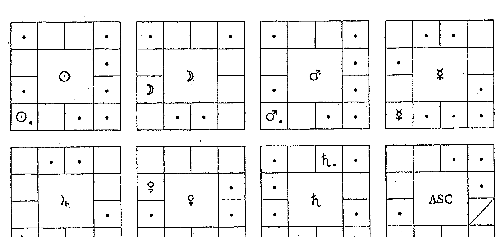

- 1. 太陽 ☉ 從自己所在的人馬座 ♐ 起算，分別在一 ♐、二 ♑、四 ♊、七 ♎、八 ♏、九 ♌、十 ♋、十一 ♑ 宮，共得到八個吉點。
- 2. 太陽 ☉ 從月亮 ☽ 所在的摩羯座 ♑ 起算，分別在月亮 ☽ 起算的三 ♊、六 ♎、十 ♑、十一 ♏ 宮，共得到四個吉點。
- 3. 太陽 ☉ 從火星 ♂ 所在的人馬座 ♐ 起算，分別在火星 ♂ 起算的一 ♐、二 ♑、四 ♊、七 ♎、八 ♏、九 ♌、十 ♋、十一 ♑ 宮，共得到八個吉點。
- 4. 太陽 ☉ 從水星 ☿ 所在的人馬座 ♐ 起算，分別在水星 ☿ 起算的三 ♒、五 ♈、六 ♉、九 ♌、十 ♋、十一 ♑、十二 ♏ 宮，共得到七個吉點。
- 5. 太陽 ☉ 從木星 ♃ 所在的人馬座 ♐ 起算，分別在木星 ♃ 起算的五 ♈、六 ♉、九 ♌、十一 ♑ 宮，共得到四個吉點。
- 6. 太陽 ☉ 從金星 ♀ 所在的水瓶座 ♒ 起算，分別在金星 ♀ 起算的六 ♏、七 ♌、十二 ♑ 宮，共得到三個吉點。
- 7. 太陽 ☉ 從土星 ♄ 所在的金牛座 ♉ 起算，分別在土星 ♄ 起算的一 ♉、二 ♊、四 ♌、七 ♏、八 ♐、九 ♑、十 ♒、十一 ♊ 宮，共得到八個吉點。
- 8. 太陽 ☉ 從上升點所在的獅子座 ♌ 起算，分別在上升點起算的三 ♊、四 ♋、六 ♍、十 ♐、十一 ♑、十二 ♒ 宮，共得到六個吉點。

其他的行星，包括月亮、火星、水星、木星、金星、土星的吉點來源及計算方式，亦如上例的太陽；在此僅簡單列出於〈表 6-1〉，不再細述。
我們以張國榮的南印度形式命盤〈圖 6-2〉為例，逐一解說上述概念：

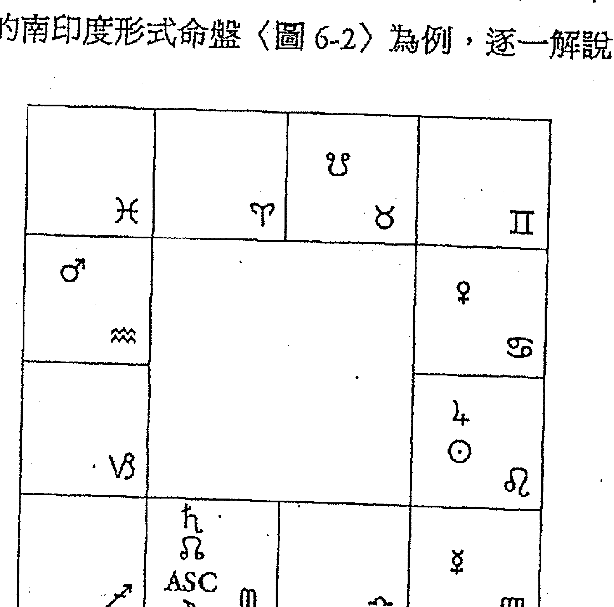

### 一、個別行星的吉點

#### (一) 太陽的個別行星吉點

- 1. 太陽 ☉ 從自己所在的第十宮獅子座 ♌ 起算的一 ♌、二 ♍、四 ♋、七 ♒、八 ♑、九 ♐、十 ♐、十一 ♑ 宮，共得到八個吉點。
- 2. 太陽 ☉ 從月亮 ☽ 所在的第一宮天蠍座 ♏ 起算的三 ♍、六 ♍、十 ♌、十一 ♌ 宮，共得到四個吉點。
- 3. 太陽 ☉ 從火星 ♂ 所在的第四宮水瓶座 ♒ 起算的一 ♒、二 ♓、四 ♐、七 ♌、八 ♍、九 ♋、十 ♋、十一 ♌ 宮，共得到八個吉點。
- 4. 太陽 ☉ 從水星 ☿ 所在的第十一宮處女座 ♍ 起算的三 ♏、五 ♍、六 ♌、水瓶座、九宮金牛座、十宮雙子座、十一宮巨蟹座、十二宮獅子座，共得到七個吉點。
- 5. 太陽 ☉ 從木星 ♃ 所在的第十宮獅子座 ♌ 起算的五宮射手座、六宮摩羯座、九宮白羊座、十一宮雙子座，共得到四個吉點。
- 6. 太陽 ☉ 從金星 ♀ 所在的第九宮巨蟹座 ♋ 起算的六宮射手座、七宮摩羯座、十二宮雙子座，共得到三個吉點。
- 7. 太陽 ☉ 從土星 ♄ 所在的第一宮天蝎座 ♏ 起算的一宮天蝎座、二宮射手座、四宮水瓶座、七宮金牛座、八宮雙子座、九宮巨蟹座、十宮獅子座、十一宮處女座，共得到八個吉點。

太陽從七大行星（包括自己，南北交點不計）及上升點，共得到四十八個吉點；將太陽得到吉點的所在星座逐一加總，各個星座的吉點分述如下：

| ♈ 4 | ♉ 4 | ♊ 5 | ♋ 2 |
|---|---|---|---|
| ♌ 6 | ♍ 5 | ♎ 2 | ♏ 4 |
| ♐ 4 | ♑ 5 | ♒ 5 | ♓ 2 |

(表6-3)

根據太陽的上述歷程，可以統合成右頁的「⊙ Prastaraka 表」，表格解讀的相關說明，請參考如下：

- 1. 橫欄第一欄從白羊座起始，按照黃道順序，由左至右列出黃道十二星座。
- 2. 橫欄切分為三：後天宮（後天）、行星以及來自七大行星和上升點的八個坐標（八）；分別填入本命盤的資料。
- 3. 分別就〈表6-4〉的規定，以✓表示得到吉點的所在。
- 4. 橫欄的最後一欄，總計本案例太陽在各個星座所得到的吉點。
- 5. 在這表格中，最需注意太陽自己所在星座的吉點數。例如張國榮的太陽位於第十宮獅子座，得到六個吉點，力量甚強；關於論斷方法，後文再述。

##### ⊙ Prastaraka 表

| 星座 | 白羊座 | 金牛座 | 雙子座 | 巨蟹座 | 獅子座 | 處女座 | 天秤座 | 天蠍座 | 人馬座 | 摩羯座 | 水瓶座 | 雙魚座 | 總計 |
| :--- | :---: | :---: | :---: | :---: | :---: | :---: | :---: | :---: | :---: | :---: | :---: | :---: | :---: |
| 八 | ✓ | ✓ | ✓ | | ✓ | ✓ | | ✓ | | | ✓ | ✓ | 8 |
| ⊙ | ✓ | | | | ✓ | ✓ | | | | ✓ | | | 4 |
| ♂ | | ✓ | | | ✓ | ✓ | ✓ | ✓ | ✓ | | ✓ | ✓ | 8 |
| ☿ | | ✓ | ✓ | ✓ | ✓ | | | ✓ | | ✓ | ✓ | | 7 |
| ♃ | ✓ | | ✓ | | | | | | | ✓ | ✓ | | 4 |
| ♄ | | | ✓ | | | | | | ✓ | ✓ | | | 3 |
| ASC | ✓ | | | | ✓ | ✓ | ✓ | | ✓ | ✓ | ✓ | | 8 |
| 總計 | 4 | 4 | 5 | 2 | 6 | 5 | 2 | 4 | 4 | 5 | 5 | 2 | 48 |

〈表6-4〉

#### (二) 月亮的個別行星吉點

- 1. 月亮 ☽ 從太陽 ☉ 所在的第十宮獅子座 ♌ 起算的三 ♎、六 ♑、七 ♐、八 ♏、十 ♌、十一 ♑ 宮，共得到六個吉點。
- 2. 月亮 ☽ 從自己所在的第一宮天蠍座 ♏ 起算的一 ♏、三 ♑、六 ♈、七 ♌、十 ♌、十一 ♏ 宮，共得到六個吉點。
- 3. 月亮 ☽ 從火星 ♂ 所在的第四宮水瓶座 ♒ 起算的二 ♓、三 ♈、五 ♑、六 ♊、九 ♎、十 ♏、十一 ♓ 宮，共得到七個吉點。
- 4. 月亮 ☽ 從水星 ☿ 所在的第十一宮處女座 ♍ 起算的一 ♍、三 ♏、四 ♓、五 ♑、七 ♓、八 ♈、十 ♑、十一 ♊ 宮，共得到八個吉點。
- 5. 月亮 ☽ 從木星 ♃ 所在的第十宮獅子座 ♌ 起算的一 ♌、四 ♏、七 ♏、八 ♓、十 ♌、十一 ♑、十二 ♊ 宮，共得到七個吉點。
- 6. 月亮 ☽ 從金星 ♀ 所在的第九宮巨蟹座 ♋ 起算的三 ♍、四 ♎、五 ♏、七 ♑、九 ♓、十 ♈、十一 ♌ 宮，共得到七個吉點。
- 7. 月亮 ☽ 從土星 ♄ 所在的第一宮天蠍座 ♏ 起算的三 ♑、五 ♓、六 ♈、十一 ♍ 宮，共得到四個吉點。
- 8. 月亮 ☽ 從上升點所在的天蠍座 ♏ 起算的三 ♑、六 ♈、十 ♌、十一 ♍ 宮，共得到四個吉點。

其過程可由「☽ Prastaraka 表」顯示。

##### ☽ Prastaraka 表

| 星座 \ 後天行星 \ 八 | 白羊座 六宫 | 金牛座 七宫 ♃ | 雙子座 八宫 | 巨蟹座 九宫 ♀ | 獅子座 十宫 ☉ ⊕ | 處女座 十一宫 ☿ | 天秤座 十二宫 | 天蠍座 一宫 ♄ ☊ ASC ☽ | 人馬座 二宫 | 摩羯座 三宫 | 水瓶座 四宫 ♂ | 雙魚座 五宫 | 總計 |
| :---: | :---: | :---: | :---: | :---: | :---: | :---: | :---: | :---: | :---: | :---: | :---: | :---: | :---: |
| ☉ | | ✓ | ✓ | | | | ✓ | | | ✓ | ✓ | ✓ | 6 |
| ☽ | ✓ | ✓ | | | ✓ | ✓ | | ✓ | | ✓ | | | 6 |
| ♂ | ✓ | | ✓ | ✓ | | | ✓ | ✓ | ✓ | | | ✓ | 7 |
| ☿ | ✓ | | ✓ | ✓ | | ✓ | | ✓ | ✓ | ✓ | | ✓ | 8 |
| ♃ | | ✓ | ✓ | ✓ | ✓ | | | | | | ✓ | ✓ | 7 |
| ♀ | ✓ | ✓ | | | | ✓ | ✓ | ✓ | | ✓ | | ✓ | 7 |
| ♄ | ✓ | | | | | ✓ | | | | ✓ | | ✓ | 4 |
| ASC | ✓ | | | | ✓ | ✓ | | | | ✓ | | | 4 |
| 總計 | 6 | 4 | 4 | 3 | 3 | 5 | 3 | 5 | 2 | 6 | 2 | 6 | 49 |

<表6-5>

#### （三）火星的個別行星吉點

- 1. 火星 ♂ 從太陽 ☉ 所在的第十宮獅子座 ♌ 起算的三 ♎、五 ♐、六 ♑、十 ♉、十一 ♊ 宮，共得到五個吉點。
- 2. 火星 ♂ 從月亮 ☽ 所在的第一宮天蠍座 ♏ 起算的三 ♑、六 ♈、十一 ♍ 宮，共得到三個吉點。
- 3. 火星 ♂ 從自己所在的第四宮水瓶座 ♒ 起算的一 ♒、二 ♓、四 ♉、七 ♌、八 ♏、十 ♏、十一 ♐ 宮，共得到七個吉點。
- 4. 火星 ♂ 從水星 ☿ 所在的第十一宮處女座 ♍ 起算的三 ♏、五 ♑、六 ♒、十一 ♋ 宮，共得到四個吉點。
- 5. 火星 ♂ 從木星 ♃ 所在的第十宮獅子座 ♌ 起算的六 ♑、十 ♉、十一 ♊、十二 ♋ 宮，共得到四個吉點。
- 6. 火星 ♂ 從金星 ♀ 所在的第九宮巨蟹座 ♋ 起算的六 ♐、八 ♒、十一 ♉、十二 ♊ 宮，共得到四個吉點。
- 7. 火星 ♂ 從土星 ♄ 所在的第一宮天蠍座 ♏ 起算的一 ♏、四 ♒、七 ♉、八 ♊、九 ♋、十 ♌、十一 ♍ 宮，共得到七個吉點。
- 8. 火星 ♂ 從上升點所在的天蠍座 ♏ 起算的一 ♏、三 ♑、六 ♈、十 ♌、十一 ♍ 宮，共得到五個吉點。

##### ♂ Prastaraka 表

| 星座 | 白羊座 | 金牛座 | 雙子座 | 巨蟹座 | 獅子座 | 處女座 | 天秤座 | 天蠍座 | 人馬座 | 摩羯座 | 水瓶座 | 雙魚座 | 總計 |
| :--- | :---: | :---: | :---: | :---: | :---: | :---: | :---: | :---: | :---: | :---: | :---: | :---: | :---: |
| 後天宮位 | 六宮 | 七宮 ♃ | 八宮 | 九宮 ♀ | 十宮 ♃ ⊙ | 十一宮 ♀ | 十二宮 | 一宮 ♄ ♅ ASC ☽ | 二宮 | 三宮 | 四宮 ♂ | 五宮 | |
| ⊙ | | ✓ | ✓ | | | | ✓ | | ✓ | ✓ | | | 5 |
| ☽ | ✓ | | | | | ✓ | | | | ✓ | | | 3 |
| ♂ | | ✓ | | | ✓ | ✓ | | ✓ | ✓ | | ✓ | ✓ | 7 |
| ♀ | | | | ✓ | | | ✓ | | | ✓ | ✓ | | 4 |
| ♃ | | ✓ | ✓ | ✓ | | | | | | ✓ | | | 4 |
| ♄ | | ✓ | ✓ | ✓ | ✓ | ✓ | | ✓ | | | ✓ | | 7 |
| ASC | ✓ | | | | ✓ | ✓ | | ✓ | | ✓ | | | 5 |
| 總計 | 2 | 5 | 4 | 3 | 3 | 4 | 1 | 4 | 3 | 5 | 4 | 1 | 39 |

#### （四）水星的個別行星吉點

- 1. 水星 ☿ 從太陽 ☉ 所在的第十宮獅子座 ♌ 起算的五 ♐、六 ♑、九 ♈、十一 ♊、十二 ♋ 宮，共得到五個吉點。
- 2. 水星 ☿ 從月亮 ☽ 所在的第一宮天蠍座 ♏ 起算的二 ♐、四 ♒、六 ♈、八 ♊、十 ♌、十一 ♍ 宮，共得到六個吉點。
- 3. 水星 ☿ 從火星 ♂ 所在的第四宮水瓶座 ♒ 起算的一 ♒、二 ♓、四 ♉、七 ♌、八 ♍、九 ♎、十 ♏、十一 ♐ 宮，共得到八個吉點。
- 4. 水星 ☿ 從自己所在的第十一宮處女座 ♍ 起算的一 ♍、三 ♏、五 ♑、六 ♒、九 ♉、十 ♊、十一 ♋、十二 ♌ 宮，共得到八個吉點。
- 5. 水星 ☿ 從木星 ♃ 所在的第十宮獅子座 ♌ 起算的六 ♑、八 ♓、十一 ♊、十二 ♋ 宮，共得到四個吉點。
- 6. 水星 ☿ 從金星 ♀ 所在的第九宮巨蟹座 ♋ 起算的一 ♋、二 ♌、三 ♍、四 ♎、五 ♏、八 ♒、九 ♓、十一 ♉ 宮，共得到八個吉點。
- 7. 水星 ☿ 從土星 ♄ 所在的第一宮天蠍座 ♏ 起算的一 ♏、二 ♐、四 ♒、七 ♉、八 ♊、九 ♋、十 ♌、十一 ♍ 宮，共得到八個吉點。
- 8. 水星 ☿ 從上升點所在的天蠍座 ♏ 起算的一 ♏、二 ♐、四 ♒、六 ♈、八 ♊、十 ♌、十一 ♍ 宮，共得到七個吉點。

| 星座 | 白羊座 | 金牛座 | 雙子座 | 巨蟹座 | 獅子座 | 處女座 | 天秤座 | 天蠍座 | 人馬座 | 摩羯座 | 水瓶座 | 雙魚座 | 總計 |
| :--- | :---: | :---: | :---: | :---: | :---: | :---: | :---: | :---: | :---: | :---: | :---: | :---: | :---: |
| 後天行星 | 六宮 | 七宮 ♃ | 八宮 | 九宮 ♀ | 十宮 ☉ | 十一宮 ☿ | 十二宮 | 一宮 ♂ ♄ ☊ ASC ☽ | 二宮 | 三宮 | 四宮 ♂ | 五宮 | |
| ☉ | ✓ | | ✓ | ✓ | | | | | | | | | 5 |
| ☽ | ✓ | | ✓ | | ✓ | ✓ | | | ✓ | ✓ | | | 6 |
| ♂ | | ✓ | | | ✓ | ✓ | ✓ | ✓ | ✓ | | ✓ | ✓ | 8 |
| ☿ | | ✓ | ✓ | ✓ | ✓ | ✓ | | ✓ | | ✓ | ✓ | | 8 |
| ♃ | | | ✓ | ✓ | | | | | | ✓ | | ✓ | 4 |
| ♀ | | ✓ | | ✓ | ✓ | ✓ | ✓ | ✓ | | | ✓ | ✓ | 8 |
| ♄ | | ✓ | ✓ | ✓ | ✓ | | | ✓ | ✓ | | ✓ | | 8 |
| ASC | ✓ | | ✓ | | ✓ | ✓ | | ✓ | ✓ | | ✓ | | 7 |
| 總計 | 3 | 4 | 6 | 5 | 6 | 6 | 2 | 5 | 5 | 3 | 6 | 3 | 54 |

#### （五）木星的個別行星吉點

- 1. 木星 ♃ 從太陽 ☉ 所在的第十宮獅子座 ♌ 起算的一 ♌、二 ♍、三 ♎、四 ♏、七 ♒、八 ♓、九 ♈、十 ♉、十一 ♊ 宮，共得到九個吉點。
- 2. 木星 ♃ 從月亮 ☽ 所在的第一宮天蠍座 ♏ 起算的二 ♐、五 ♓、七 ♉、九 ♋、十一 ♍ 宮，共得到五個吉點。
- 3. 木星 ♃ 從火星 ♂ 所在的第四宮水瓶座 ♒ 起算的一 ♒、二 ♓、四 ♉、七 ♌、八 ♍、十 ♏、十一 ♐ 宮，共得到七個吉點。
- 4. 木星 ♃ 從水星 ☿ 所在的第十一宮處女座 ♍ 起算的一 ♍、二 ♎、四 ♐、五 ♑、六 ♒、九 ♉、十 ♊、十一 ♋ 宮，共得到八個吉點。
- 5. 木星 ♃ 從自己所在的第十宮獅子座 ♌ 起算的一 ♌、二 ♍、三 ♎、四 ♏、七 ♒、八 ♓、十 ♉、十一 ♊ 宮，共得到八個吉點。
- 6. 木星 ♃ 從金星 ♀ 所在的第九宮巨蟹座 ♋ 起算的二 ♌、五 ♏、六 ♐、九 ♓、十 ♈、十一 ♉ 宮，共得到六個吉點。
- 7. 木星 ♃ 從土星 ♄ 所在的第一宮天蠍座 ♏ 起算的三 ♑、五 ♓、六 ♈、十二 ♎ 宮，共得到四個吉點。
- 8. 火星 ♂ 從上升點所在的天蠍座 ♏ 起算的一 ♏、二 ♐、四 ♒、五 ♓、六 ♈、七 ♉、九 ♋、十 ♌、十一 ♍ 宮，共得到九個吉點。

##### 4. Prastaraka 表

| 星座 | 白羊座 | 金牛座 | 雙子座 | 巨蟹座 | 獅子座 | 處女座 | 天秤座 | 天蠍座 | 射手座 | 摩羯座 | 水瓶座 | 雙魚座 | 總計 |
|---|---|---|---|---|---|---|---|---|---|---|---|---|---|
| 宮位 | 六宮 | 七宮 | 八宮 | 九宮 | 十宮 | 十一宮 | 十二宮 | 一宮 | 二宮 | 三宮 | 四宮 | 五宮 | |
| ⊙ | ✓ | ✓ | ✓ | | ✓ | ✓ | ✓ | ✓ | | | ✓ | ✓ | 9 |
| ☽ | | ✓ | | ✓ | | ✓ | | | ✓ | | | ✓ | 5 |
| ♂ | | ✓ | | | ✓ | ✓ | | ✓ | ✓ | | ✓ | ✓ | 7 |
| ☿ | | ✓ | ✓ | ✓ | | ✓ | ✓ | | ✓ | ✓ | ✓ | | 8 |
| ♃ | | ✓ | ✓ | | ✓ | ✓ | ✓ | ✓ | | | ✓ | ✓ | 8 |
| ♀ | ✓ | ✓ | | | ✓ | | | ✓ | ✓ | | | ✓ | 6 |
| ♄ | ✓ | | | | | | ✓ | | | ✓ | | ✓ | 4 |
| ASC | ✓ | ✓ | | ✓ | ✓ | ✓ | | ✓ | ✓ | | ✓ | ✓ | 9 |
| 總計 | 4 | 7 | 3 | 3 | 5 | 6 | 4 | 5 | 5 | 2 | 5 | 7 | 56 |

<表 6-8>

#### （六）金星的個別行星吉點

- 1. 金星 ♀ 從太陽 ☉ 所在的第十宮獅子座 ♌ 起算的八 ♓、十一 ♈、十二 ♉ 宮，共得到三個吉點。
- 2. 金星 ♀ 從月亮 ☽ 所在的第一宮天蠍座 ♏ 起算的一 ♏、二 ♐、三 ♑、四 ♒、五 ♓、八 ♊、九 ♋、十一 ♍、十二 ♎ 宮，共得到九個吉點。
- 3. 金星 ♀ 從火星 ♂ 所在的第四宮天秤座 ♎ 起算的三 ♐、五 ♒、六 ♓、九 ♊、十一 ♌、十二 ♍ 宮，共得到六個吉點。
- 4. 金星 ♀ 從水星 ☿ 所在的第十一宮處女座 ♍ 起算的三 ♏、五 ♑、六 ♒、九 ♉、十一 ♋ 宮，共得到五個吉點。
- 5. 金星 ♀ 從木星 ♃ 所在的第十宮獅子座 ♌ 起算的五 ♐、八 ♓、九 ♈、十 ♉、十一 ♊ 宮，共得到五個吉點。
- 6. 金星 ♀ 從金星 ♀ 所在的第九宮巨蟹座 ♋ 起算的一 ♋、二 ♌、三 ♍、四 ♎、五 ♏、八 ♒、九 ♓、十 ♈、十一 ♉ 宮，共得到九個吉點。
- 7. 金星 ♀ 從土星 ♄ 所在的第一宮天蠍座 ♏ 起算的三 ♑、四 ♒、五 ♓、八 ♊、九 ♋、十 ♌、十一 ♍ 宮，共得到七個吉點。
- 8. 金星 ♀ 從上升點所在的天蠍座 ♏ 起算的一 ♏、二 ♐、三 ♑、四 ♒、五 ♓、八 ♊、九 ♋、十一 ♍ 宮，共得到八個吉點。

##### ♀ Prastaraka 表

| 星座 | 白羊座 | 金牛座 | 雙子座 | 巨蟹座 | 獅子座 | 處女座 | 天秤座 | 天蠍座 | 射手座 | 摩羯座 | 水瓶座 | 雙魚座 | 總計 |
|---|---|---|---|---|---|---|---|---|---|---|---|---|---|
| 後天·行星 | 六宮 | 七宮 ♃ | 八宮 | 九宮 ♀ | 十宮 ☉ | 十一宮 ☿ | 十二宮 | 一宮 ♄ ♃ ☊ ASC ☽ | 二宮 | 三宮 | 四宮 ♂ | 五宮 | |
| ⊙ | | | √ | √ | | | | | | | | √ | 3 |
| ☽ | | | √ | √ | | √ | √ | √ | √ | √ | √ | √ | 9 |
| ♂ | √ | | √ | √ | | | √ | | √ | √ | | | 6 |
| ☿ | | √ | | √ | | | | √ | | √ | √ | | 5 |
| ♃ | √ | √ | √ | | | | | | √ | | | √ | 5 |
| ♀ | √ | √ | | √ | √ | √ | √ | √ | | | √ | √ | 9 |
| ♄ | | | √ | √ | √ | √ | | | | √ | √ | √ | 7 |
| ASC | | | √ | √ | | √ | | √ | √ | √ | √ | √ | 8 |
| 總計 | 3 | 3 | 6 | 7 | 2 | 4 | 3 | 4 | 4 | 5 | 5 | 6 | 52 |

#### （七）土星的個別行星吉點

- 1. 土星 ♄ 從太陽 ☉ 所在的第十宮獅子座 ♌ 起算的一 ♌、二 ♍、三 ♋、七 ♒、八 ♓、五 ♉、四 ♊ 宮，共得到七個吉點。
- 2. 土星 ♄ 從月亮 ☽ 所在的第一宮天蠍座 ♏ 起算的三 ♑、九 ♈、二 ♍ 宮，共得到三個吉點。
- 3. 土星 ♄ 從火星 ♂ 所在的第四宮水瓶座 ♒ 起算的一 ♈、四 ♊、五 ♋、七 ♏、八 ♐、九 ♑ 宮，共得到六個吉點。
- 4. 土星 ♄ 從水星 ☿ 所在的第十一宮處女座 ♍ 起算的一 ♒、九 ♈、五 ♉、四 ♊、五 ♋、十 ♌ 宮，共得到六個吉點。
- 5. 土星 ♄ 從木星 ♃ 所在的第十宮獅子座 ♌ 起算的八 ♐、九 ♑、四 ♊、五 ♋ 宮，共得到四個吉點。
- 6. 土星 ♄ 從金星 ♀ 所在的第九宮巨蟹座 ♋ 起算的八 ♐、五 ♉、四 ♊ 宮，共得到三個吉點。
- 7. 土星 ♄ 從自己所在的第一宮天蠍座 ♏ 起算的三 ♑、八 ♓、九 ♈、二 ♍ 宮，共得到四個吉點。
- 8. 土星 ♄ 從上升點所在的天蠍座 ♏ 起算的一 ♏、九 ♑、七 ♒、九 ♈、十 ♌、二 ♍ 宮，共得到六個吉點。

##### ♄ Prastaraka 表

| 星座 | 白羊座 | 金牛座 | 雙子座 | 巨蟹座 | 獅子座 | 處女座 | 天秤座 | 天蠍座 | 射手座 | 摩羯座 | 水瓶座 | 雙魚座 | 總計 |
|---|---|---|---|---|---|---|---|---|---|---|---|---|---|
| 後天行星 | 六宮 | 七宮 ♉ | 八宮 | 九宮 ♀ | 十宮 ♃ | 十一宮 ☿ | 十二宮 | 一宮 ♄ ASC ☽ | 二宮 | 三宮 | 四宮 ♂ | 五宮 | |
| ☉ | | ✓ | ✓ | | ✓ | ✓ | ✓ | | | | ✓ | ✓ | 7 |
| ☽ | ✓ | | | | ✓ | | | | | ✓ | | | 3 |
| ♂ | ✓ | | ✓ | ✓ | | | ✓ | ✓ | ✓ | | | | 6 |
| ♀ | ✓ | ✓ | ✓ | ✓ | ✓ | | | | | ✓ | | | 6 |
| ♃ | | | ✓ | ✓ | | | | | ✓ | ✓ | | | 4 |
| ♄ | ✓ | | | | | ✓ | | | | | ✓ | ✓ | 4 |
| ASC | ✓ | | | | ✓ | ✓ | | ✓ | | ✓ | ✓ | | 6 |
| 總計 | 5 | 3 | 5 | 3 | 3 | 4 | 0 | 3 | 3 | 5 | 3 | 2 | 39 |

<表 6-10>

### 二、行星總吉點

將前述第（一）至（七）點，每個行星各自歷經星座的吉點予以加總，即可得到各星座（相對各後天宮位）的吉點，此即行星在每個星座（後天宮位）所得到的總吉點（Sarav Ashtaka Varga）。

| 序號 | 星座 | ⊙ | ☽ | ♂ | ♃ | ♄ | ♀ | ASC | 總計 |
|---|---|---|---|---|---|---|---|---|---|
| ASC | ♏ | 4 | ⑤ | 4 | 5 | 5 | 4 | ③ | 30 |
| 2 | ♐ | 4 | 2 | 3 | 5 | 5 | 4 | 3 | 26 |
| 3 | ♑ | 5 | 6 | 5 | 3 | 2 | 5 | 5 | 31 |
| 4 | ♒ | 5 | 2 | ④ | 6 | 5 | 5 | 3 | 30 |
| 5 | ♓ | 2 | 6 | 1 | 3 | 7 | 6 | 2 | 27 |
| 6 | ♈ | 4 | 6 | 2 | 3 | 4 | 3 | 5 | 27 |
| 7 | ♉ | 4 | 4 | 5 | 4 | 7 | 3 | 3 | 30 |
| 8 | ♊ | 5 | 4 | 4 | 6 | 3 | 6 | 5 | 33 |
| 9 | ♋ | 2 | 3 | 3 | 5 | 3 | ⑦ | 3 | 26 |
| 10 | ♌ | ⑥ | 3 | 3 | 6 | ⑤ | 2 | 3 | 28 |
| 11 | ♍ | 5 | 5 | 4 | ⑥ | 6 | 4 | 4 | 34 |
| 12 | ♎ | 2 | 3 | 1 | 2 | 4 | 3 | 0 | 15 |
| | | 48 | 49 | 39 | 54 | 56 | 52 | 39 | 337 |

### 行星的八個吉點力量

- 1. 太陽 ☉ 在獅子座 ♌ 得到六個吉點，其總吉點得到二十八個。
- 2. 月亮 ☽ 在天蠍座 ♏ 得到五個吉點，其總吉點得到三十個。
- 3. 火星 ♂ 在水瓶座 ♒ 得到四個吉點，其總吉點得到三十個。
- 4. 水星 ☿ 在處女座 ♍ 得到六個吉點，其總吉點得到三十四個。
- 5. 木星 ♃ 在獅子座 ♌ 得到五個吉點，其總吉點得到二十八個。
- 6. 金星 ♀ 在巨蟹座 ♋ 得到七個吉點，其總吉點得到三十四個。
- 7. 土星 ♄ 在天蠍座 ♏ 得到三個吉點，其總吉點得到三十個。

| Planet | Own Chart | Sarva Chart | House | Sarva Chart |
| :--- | :--- | :--- | :--- | :--- |
| ☉ | 6 | 28 | 1 | 30 |
| ☽ | 5 | 30 | 2 | 26 |
| ♂ | 4 | 30 | 3 | 31 |
| ☿ | 6 | 34 | 4 | 30 |
| ♃ | 5 | 28 | 5 | 27 |
| ♀ | 7 | 26 | 6 | 27 |
| ♄ | 3 | 30 | 7 | 30 |
| | | | 8 | 33 |
| | | | 9 | 26 |
| | | | 10 | 28 |
| | | | 11 | 34 |
| | | | 12 | 15 |

每個行星在其各自的「個別吉點」所在星座吉點，即電腦軟體中的「8 Points Strengths」；每個行星在「Own Chart」的數值，同樣具有重要意義。而每個行星統管的總吉點圖，就其所在星座對照後天宮位的數值，詳列出整張命盤後天宮的吉點，以利評估。

「行星的八個吉點力量」曾經歷過兩次「化約」（Reduction）：

- 1. Trikona Reduction：根據相關行星所在四大元素進行的。
- 2. Ekadhipatya Reduction：梵文「Ekadhipatya」的字義即星座主星，亦即第一次化約後，再就除太陽、月亮外的五個行星各主管的兩個星座，再進行化約。

這兩次化約的順序不能對調，由於都是用來探究壽命以及各後天宮位主管事項的一些細節，內容較艱澀，不擬深入說明計算及運用方法，僅討論「行星的八個吉點力量」的基本運用，足以作為後續行星組合、大運（Dasa）、流年等內容的輔助參考。

### 第二節 行星的八個吉點力量基本運用

「行星的八個吉點力量」是行星間相互在彼此起算宮位所得到的結果，共有八種來源。除了南北交點，每個行星最起碼應有五個以上的吉點，才具有「行星的八個吉點力量」。另外，十二個宮位共有三百三十七個吉點，每個宮位應要有二十八個（337÷12=28.08）以上的吉點才好。也就是說，行星本身應擁有五個個別行星的吉點；而其所在宮位，應至少擁有二十八個吉點，才具有正面的效應。吉點越多，力量就越大，越具有正面意義；相反的，當吉點越少（低於四個以下），或宮位少於二十七個時，其效應則以負面居多。

| 行星範圍 | 行星評價 | 宮位範圍 | 宮位評價 |
| :--- | :--- | :--- | :--- |
| 6-8 | 甚吉 | 31以上 | 甚吉 |
| 5 | 吉 | 29-30 | 吉 |
| 4 | 平平 | 28 | 平平 |
| 3 | 凶 | 26-27 | 凶 |
| 0-2 | 甚凶 | 25以下 | 甚凶 |
（表6-13）

#### 「行星的八個吉點力量」實務應用要點：

（一）「行星的八個吉點力量」只是本命和大運論斷的重要輔助工具，不能喧賓奪主，凌駕天宮圖所顯示的內容。

（二）如果行星具備「強」的因素（例如入旺宮、位於自己的星座），但是其個別行星的吉點甚少，則這些強力因素的效應將會削弱。

（三）相對的，如果行星具備「弱」的因素（例如入弱宮、逢焦傷），但其個別行星的吉點大於（含）五個以上，該行星將不致因為力量太弱而產生太大凶象。

（四）總吉點提供每個宮位力量強弱，有別於「Bhava Bala系統」的個別力量；它是八個吉點力量的彙總，因此評估起來較為精細。

- 1. 當上升點和第八宮的吉點都大於二十八個時，命主易有健康的身體；相反的，當兩個宮位的吉點都少於二十八個時，命主的身體較弱。
- 2. 第十一宮的吉點大於第十宮的吉點時，顯示命主較容易不勞而獲。另外，應注意相關主星及宮位的狀況，必須具備最起碼的個別吉點以及總吉點的條件。
- 3. 第十二宮的吉點大於第十一宮的吉點時，顯示命主的支出大於收入，但可能從國外事務或靜坐靈修中得到利益。
- 4. 第二宮的吉點大於第十二宮的吉點時，易累積財富，或較少支出、性娛樂活動少；如果第十一宮的吉點同時也大於第十二宮的吉點，財富累積將更快速。
- 5. 第六宮的吉點較多時，儘管命主勇於奮戰，但也容易導致生病。

（五）總吉點中，連續兩個宮位吉點的驟升或驟降，稱為量子躍遷（Quantum Jump）；當行星過運這些宮位時，易見突升或突降的命運軌跡。

（六）「主要期間／次要期間」主星過運吉點多的宮位，易呈吉象；相對的，如果過運到吉點少的宮位，則凶象居多。討論過運時，須配合「行星的八個吉點力量」。

（七）印度占星學界普遍認為，精確的預測結果在於能否敏銳掌握總吉點、整合大運（Dasa）和過運法。

> ※ 上述關於「行星的八個吉點力量」的應用要點，僅舉出必須注意之處；至於其他相關論點，非本章所能通盤涵蓋。有興趣深入了解「行星的八個吉點力量」的讀者，可參考維奈·阿迪雅（Vinay Aditya）的著作《Dots of Destiny: Applications of Ashtaka Varga》，以及梅塔（M. S. Mehta）所著的《Ashtakavarga: Concept & Application》，兩書均有較完整的論述。

#### （八）論政治

須再考量太陽的個別吉點，以及由其所在宮位起算的第十宮；還須分別討論從上升點和太陽起算的第十宮和第十一宮。第十宮代表地位，而第十一宮可視為因地位而帶來的財利或影響的內容。通常以太陽起算，帶有長輩、父蔭、貴人庇蔭之意。

- 1. 如果第十一宮吉點大於第十宮，對於命主的地位提升會有實質作用；差距越大，效果越強（當然，須擁有最起碼的吉點數，方能作此論）。
- 2. 如果第十宮吉點強（二十八個以上），但第十一宮弱，命主的生涯會在第十一宮相關主星期間出現停滯，甚至翻落貶低的情況。
- 3. 如果第十宮甚弱，但第十一宮甚強，那麼命主仍可透過財利提升地位。

#### （九）論財富

- 1. 如果第一、九、十、十一宮的吉點超過三十個，必然富有；相反的，第九、十、十一宮的吉點少於二十五個，必然貧窮。

### 第三節 案例解析

## 【案例一】
李登輝
1923 年 1 月 15 日 04:30:00,
Zone 8.00 CCT Sunday Lahiri 22:46:54
新北市 121E30, 25N15

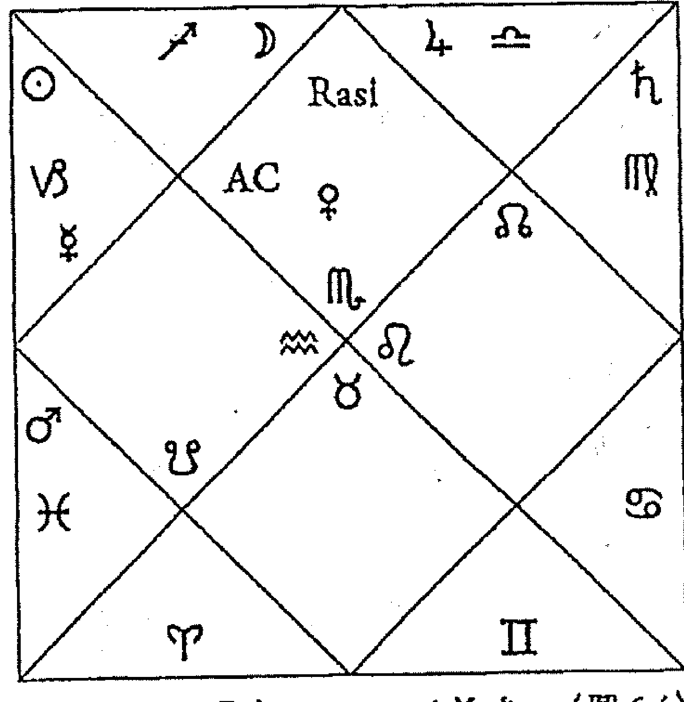

| Planet | Own Chart | Sarva Chart | House | Sarva Chart |
| :--- | :---: | :---: | :---: | :---: |
| ☉ | 3 | 30 | 1 | 32 |
| ☽ | 2 | 24 | 2 | 24 |
| ♂ | 5 | 27 | 3 | 30 |
| ☿ | 4 | 30 | 4 | 25 |
| ♃ | 5 | 29 | 5 | 27 |
| ♀ | 7 | 32 | 6 | 28 |
| ♄ | 4 | 34 | 7 | 27 |
| | | | 8 | 27 |
| | | | 9 | 25 |
| | | | 10 | 29 |
| | | | 11 | 34 |
| | | | 12 | 29 |

（表6-14）

- 1. 李登輝的上升點內有三十二個吉點，且第十宮宮祿含有二十九個吉點，第十一宮更有三十四個吉點。印度著名占星家雷歐先生所指導的占星研究機構「Bhoratiya Vidya Bhavan」，專門作印度占星學的實證分析；其中有關「行星的八個吉點力量」的專題研究，便曾得到結論：「檢視第十宮和

#### 【案例二】
#### 陳水扁
1950 年 10 月 12 日 07:06
台南市官田區

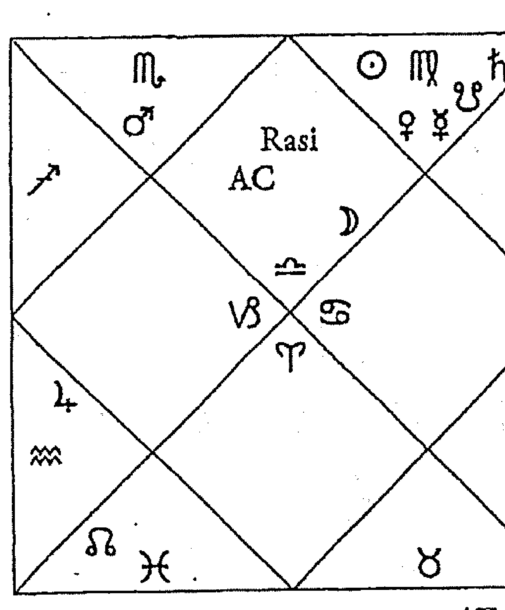

| Planet | Own Chart | Sarva Chart | House | Sarva Chart |
|--------|-----------|-------------|-------|-------------|
| ⊙      | 4         | 24          | 1     | 20          |
| ☽      | 1         | 20          | 2     | 29          |
| ♂      | 4         | 29          | 3     | 34          |
| ☿      | 5         | 24          | 4     | 29          |
| ♃      | 7         | 27          | 5     | 27          |
| ♀      | 4         | 24          | 6     | 25          |
| ♄      | 2         | 24          | 7     | 21          |
|        |           |             | 8     | 26          |
|        |           |             | 9     | 28          |
|        |           |             | 10    | 43          |
|        |           |             | 11    | 31          |
|        |           |             | 12    | 24          |

| Sunrise | 05:54:29 |
|---------|----------|
| Sunset  | 17:32:15 |

- 1. 第十宮的「行星的八個吉點力量」相當突出，具有四十三個吉點；從第九宮的二十八個吉點，突然驟升到第十宮的四十三個，躍升幅度甚大。
- 2. 上升點的吉點僅有二十個。
- 3. 太陽 ☉ 位於第十二宮，由它起算的第十宮，即本命的第九宮有二十八個吉點；由它起算的第十一宮，即本命的第十宮有四十三個吉點，突然驟升，且幅度甚大。
- 4. 第二宮位於天蠍座 ♏，宮內逢火星 ♂ 在自己主管的星座，且第二宮吉點有二十九個，在平均水準之上，講話易咄咄逼人。
- 5. 口才表達的徵象星水星☿，擁有五個吉點，且位於自己主管的星座處女座♍，離旺宮度數15°不遠。
- 6. 陳水扁以一介貧民，躍居一國至尊，上述的吉點分析，即可說明其徵象。第十宮受位於第六宮的凶星北交點☊刑剋，從政難順暢，競爭對手（第六宮）常橫梗其中。許多行星位於第十二宮，應屬修行之命，卻涉入名利紅塵。

#### 【案例三】
連戰
1936年8月27日19:25
中國·陝西省西安市

### 行星的八個吉點力量
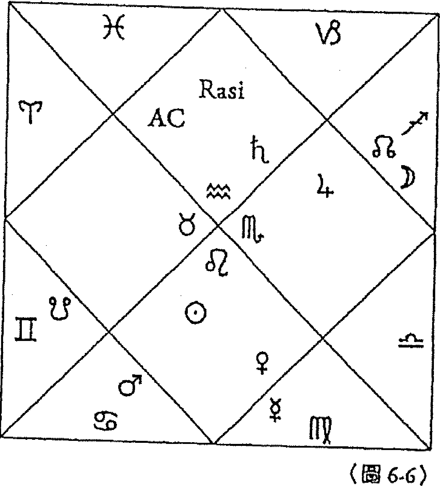

| Planet | Own Chart | Sarva Chart | House | Sarva Chart |
| :---: | :---: | :---: | :---: | :---: |
| ☉ | 4 | 23 | 1 | 31 |
| ☽ | 7 | 28 | 2 | 23 |
| ♂ | 4 | 29 | 3 | 30 |
| ☿ | 6 | 28 | 4 | 36 |
| ♃ | 3 | 26 | 5 | 32 |
| ♀ | 3 | 23 | 6 | 29 |
| ♄ | 4 | 31 | 7 | 23 |
|  |  |  | 8 | 28 |
|  |  |  | 9 | 28 |
|  |  |  | 10 | 26 |
|  |  |  | 11 | 28 |
|  |  |  | 12 | 23 |

- 1. 本命第十宮的吉點只有二十六個，不強。
- 2. 第四宮最強，三十六個吉點，且其主星（金牛座♉在第四宮）金星♀飛入第七宮，與上升點的主星土星♄相映，符合財富來自父母，亦即第二節第（九）點論財富的第4點。
- 3. 土星♄為上升點的主星，相映至第四宮的主星金星♀，且土星♄有三十一個吉點；符合第二節第（九）點論富財的第9點。
- 4. 第一宮有三十一個吉點，第二宮有二十三個吉點，第四宮有三十六個吉點，第九宮有二十八個吉點，第十宮有二十六個吉點，第十一宮有二十八個吉點，共計一百七十二個吉點，超過財富所需的一百六十四個。
- 5. 純就「行星的八個吉點力量」分析，連戰確實擁有大批土地，乃富豪之命，令人稱羨。第十宮有二十六個吉點，宮主星火星♂落入第六宮巨蟹座♋，入弱宮，且逢南交點☋和太陽☉凶星夾剋；難道就是他未能登頂峰的原因？從其本命各宮徵象來看，似乎頗為符合。此外，「主要期間／次要期間」是木星／木星（木星位於本命第十宮），仍然抵不住火星♂的凶象刑剋。

# 【案例四】
毛澤東
1893年12月26日07:30:00,
Zone 8.00 CCT Tuesday Lahiri 22:22:31
中國・湖南省 112E54, 27N48

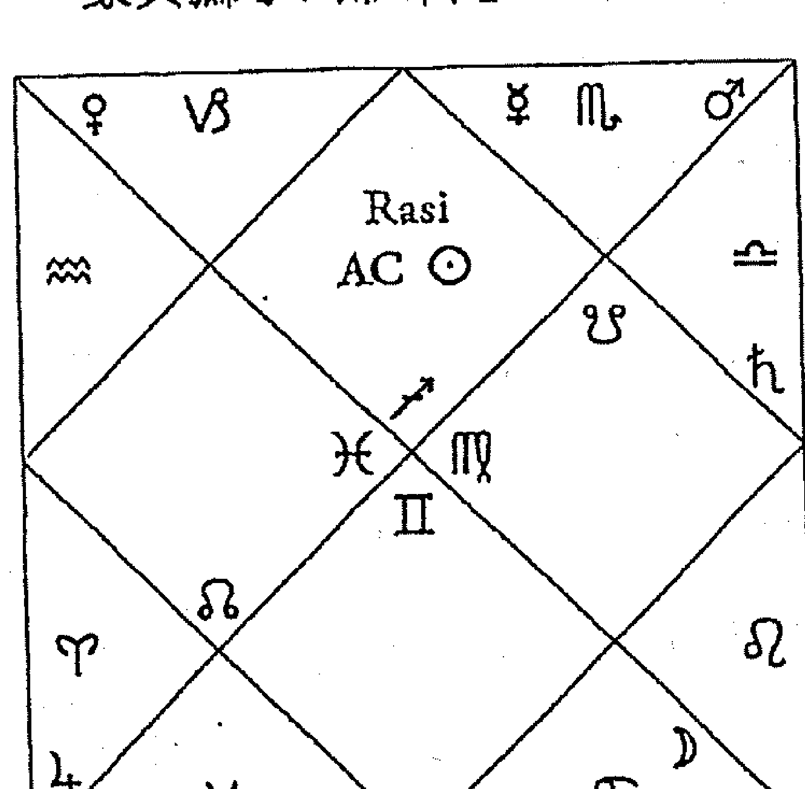

**8 Points Strengths (Ashtaka Varga)**
| Planet | Own Chart | Sarva Chart | House | Sarva Chart |
| :--- | :---: | :---: | :---: | :---: |
| ⊙ | 5 | 28 | 1 | 28 |
| ☽ | 5 | 26 | 2 | 26 |
| ♂ | 2 | 24 | 3 | 31 |
| ☿ | 6 | 24 | 4 | 27 |
| ♃ | 3 | 24 | 5 | 24 |
| ♀ | 6 | 26 | 6 | 31 |
| ♄ | 4 | 29 | 7 | 21 |
| | | | 8 | 26 |
| | | | 9 | 31 |
| | | | 10 | 39 |
| | | | 11 | 29 |
| | | | 12 | 24 |
（表6-17）

- 1. 毛澤東的太陽⊙位於命宮，逢木星♃在第五宮白羊座♈相映；太陽本身有五個吉點，而木星♃為上升星座的主星。
- 2. 火星♂在天蠍座♏，自己主管的星座；土星♄在天秤座♎第十一宮，入旺；且月亮☽在巨蟹座♋，自己主管的星座。
- 3. 第十宮的吉點有三十九個，最為突顯；然而第十宮內逢南交點☋，並受第四宮北交點☊的刑剋。
- 4. 雖然第十宮的主星水星☿落入第十二宮，但水星擁有六個吉點。
- 5. 毛澤東以八路軍打敗蔣介石腐敗的軍事集團，成為全中國大陸的統治者，其命盤中第十宮的吉點突顯，應是助力之一，而其他吉象，可參閱「大象與獅子的組合」的案例（P337）。

## 【案例五】
王永慶
1917年1月11日06:00
新北市新店區

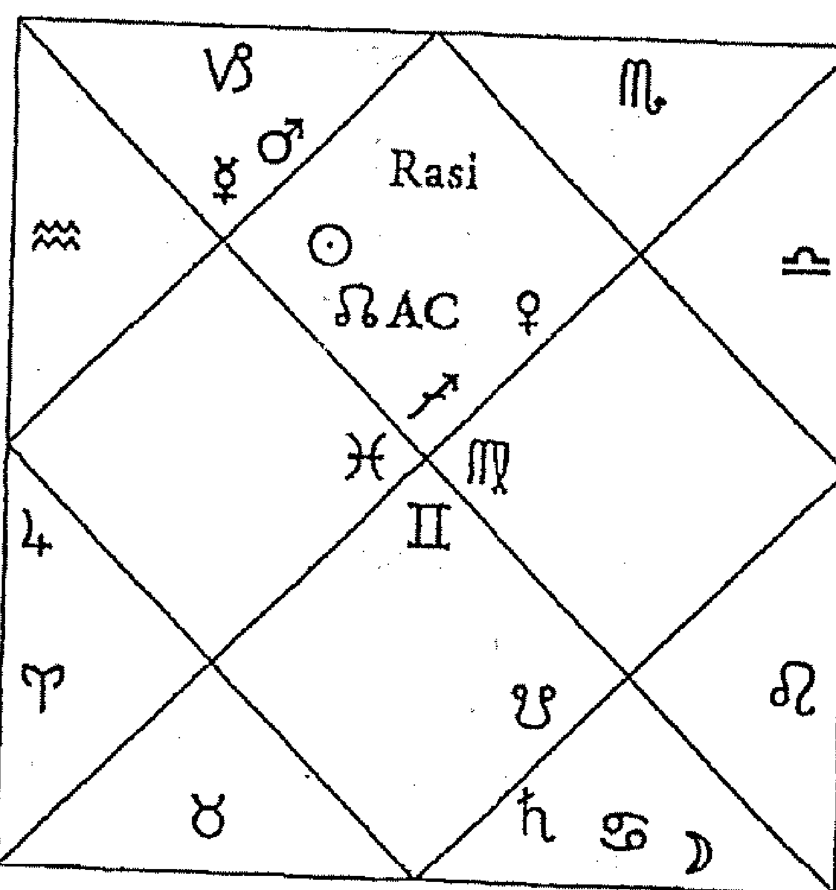

| Planet | Own Chart | Sarva Chart |
| :---: | :---: | :---: |
| ⊙ | 4 | 25 |
| ☽ | 4 | 22 |
| ♂ | 3 | 25 |
| ☿ | 5 | 25 |
| ♃ | 5 | 24 |
| ♀ | 4 | 25 |
| ♄ | 1 | 22 |

| House | Sarva Chart |
| :---: | :---: |
| 1 | 25 |
| 2 | 25 |
| 3 | 30 |
| 4 | 28 |
| 5 | 24 |
| 6 | 36 |
| 7 | 19 |
| 8 | 22 |
| 9 | 23 |
| 10 | 36 |
| 11 | 39 |
| 12 | 30 |

- 1. 王永慶的「行星的八個吉點力量」最特殊之處即在於：第十宮有三十六個吉點，而第十一宮有三十九個吉點，乃持續揚升之勢，故一直能維持事業興旺，立於不墜之境。
- 2. 他的命盤中，成長宮——第三宮有三十個吉點，第六宮有三十六個吉點，第十宮有三十六個吉點，第十一宮有三十九個，都在水準以上，也是他不斷追求成長的動力。
- 3. 其他財富的徵象可參閱「富格」（P345），幾乎都涵蓋在內。

## 第七章
### 行星組合

所謂「Yogas」，就是「行星組合」（Planetary Union），取自印度的瑜伽哲學精神；其字義與英文的「Yoke」（軛、結合）相同，意即與上帝結合，藉由與祂緊密合體的方法，達到精神解脫。《奥义書》記載：「如同鳥飛翔於空中，魚游於海中，皆未留下任何痕跡；同理，精神導師先知已橫越無形的道路，臨近上帝。」

> > 《奥义書》記載：「如同鳥飛翔於空中，魚游於海中，皆未留下任何痕跡；同理，精神導師先知已橫越無形的道路，臨近上帝。」

行星組合的狹義解釋為行星間的組合；但廣義的解釋，則擴及行星所落入的星座、宮位，以及宮主星等要素，然後產生一定的效應。簡潔有力地點出事件關鍵是印度占星學的重要特色，常為印度占星家的重要論斷利器，但西方系統則較少深入探討。

印度占星學曾隨佛教東傳至中國，結合中國的陰陽五行學說後，在唐宋時期發展成中國的「七政四餘占星學」，其所強調的星曜組合、形成的格局或型態，相當程度深烙著印度占星學行星組合的痕跡。例如，辰星居垣（水星位於處女座、雙子座），就如同「Bhada Yogas」說明水星入旺於處女座；只不過後者更強調，此時的水星必須位於上升點起算的始宮內。

行星組合的形成與天宮圖的基本要素息息相關，所以種類繁多，而古書典籍上的記載更是超過千種，令人目不暇給，要全部記牢實非易事。但因為它在論斷上具有特定的重要性，因此必須掌握其精髓，仔細練習，看出端倪，才能應用得宜。

拜現代電腦科技日益發展，有些功能完備的軟體能列出可能的行星組合。而統整了古傳印度占星學經典的內容後，我們可以發現，行星組合不外乎下列幾種情形：

- 1. 僅涉及行星而已
- 2. 行星和宮位間的關係
- 3. 行星和星座間的關係
- 4. 上述行星、星座、宮位的關係

如果熟稔這些天宮圖基本要素間的相互關係，不需硬記也能運用自如。然而印度先賢的觀察更為細膩，再經由後世分門別類，賦予其特定的名稱，本章將介紹行星組合的基本分類。

# 第一節 偉大稟性的五種組合

「Pancha-Mahapurushas」，梵文的「Pancha」乃「五種」之意；「Maha」是「至大」之意；而「Purusha」為「宇宙原人」之意。將這些字組合起來，就是「偉大稟性的五種組合」。

當五個行星——水星、金星、火星、木星、土星之一，位於自己主管的星座或入旺宮，且位於天宮圖的始宮（一、四、七、十宮）或三方宮時，這種行星組合將各以五個行星之一來命名，分別為：

- 1. Ruchaka Yoga : Ruchaka，銳利鮮明、輝煌之意。
- 2. Bhadra Yoga : Bhadra，幸福吉祥之意。
- 3. Hamsa Yoga : Hamsa，天鵝、宇宙靈魂之意。
- 4. Malavya Yoga : Malavya，印度前中央地區國度「Malva」，隱含舒適、享受之意。
- 5. Shasha Yoga : Shasha，大兔或野兔，象徵害怕畏懼。

## 定義
- 1. Ruchaka Yoga: 當火星入旺於摩羯座，或是在自己主管的星座——白羊座或天蠍座，且位於由上升點起算的始宮內或三方宮內。
- 2. Bhadra Yoga: 當水星入旺於處女座，或是在自己主管的星座——雙子座或處女座，且位於由上升點起算的始宮內或三方宮內。
- 3. Hamsa Yoga: 當木星入旺於巨蟹座，或是在自己主管的星座——人馬座或雙魚座，且位於由上升點起算的始宮內或三方宮內。
- 4. Malavya Yoga: 當金星入旺於雙魚座，或是在自己主管的星座——金牛座或天秤座，且位於由上升點起算的始宮內或三方宮內。
- 5. Shasha Yoga: 當土星入旺於天秤座，或是在自己主管的星座——摩羯座或水瓶座，且位於由上升點起算的始宮內或三方宮內。

## 效應
- 1. 命盤中有行星組合「Ruchaka Yoga」的命主：長相英俊，臉龐輪廓優雅，眉毛優美，髮黑，皮膚光亮微黑，腰及手腳細；個性大膽、勇敢，充滿活力、精力，喜歡從事冒險行為以贏得聲名、戰勝敵人；嚴格鍛鍊體魄、企圖心旺盛、辨識力強；可成為陸軍司令、警察首長或匪幫首領；然而易因火燒、受傷或手術開刀而留下疤痕。
- 2. 命盤中有行星組合「Bhadra Yoga」的命主：身體強健，胸肌發達，臂長且均勻，臉龐如獅子般威武，步伐如大象般莊嚴，額前美麗，頭髮黑捲，身體散發出如番紅花的香味；聲音甜美，令人印象深刻；具有學問及德行，精於瑜伽；心靈平靜、穩定，非常聰明，德行崇高，深謀遠慮；熟稔古典手抄文獻；能夠因為努力而享有財富，生活愜意、快樂，地位高，壽命長。
- 3. 命盤中有行星組合「Hamsa Yoga」的命主：皮膚光澤，臉頰豐滿，臉龐迷人、美麗，手掌紅潤，腳掌漂亮、可愛，眼睛如蜜般動人，聲音悅耳；喜歡水上活動；性貪、不知足；德行高、善待他人；具有正義感與雄辯能力；重視物質享受，受眾人喜愛；渴求知識和罕見的手抄文獻；妻子容貌美麗。
- 4. 命盤中有行星組合「Malavya Yoga」的命主：具有優美的外貌、漂亮的嘴唇，腰細，身材佳；牙齒如貝，皮膚亮麗，臉頰豐滿，眼睛明亮；聲音有磁性；因個人努力而獲致學問、財富；聰明，有學識，精於文獻；特殊的婚姻關係。
- 5. 命盤中有行星組合「Shasha Yoga」的命主：中等身材，皮膚黝黑，腰細，齒長，腿美，步伐快，勇敢冷靜；常在叢林、山區、堡壘或其他獨特地方修行；眼睛流動，渴望被他人欣賞；可成為軍隊領導人或村鎮首長，有資格指出他人錯誤；特別沉迷於性愛，喜歡跟非他擁有的女性交往；精通冶金術和化學；易有慢性疾病。

## 評論
事實上，在一般天宮圖中常可見到「偉大稟性的五種組合」，但並非具有這種行星組合的命主，就一定如上所述形容的那麼優秀，仍須合參其他因素。例如是否有凶星會合或相映，以及行星的狀態、行星的八個吉點力量如何、在分盤中的情形、大運流年的「主要期間／次要期間」、是否值上述這些行星等等，都是判斷「偉大稟性的五種組合」的要點。

印度著名占星家查拉喀博士（Dr. K. S. Charak）在《Yogas in Astrology》中提到，與這種行星組合相關的行星，應具有水準以上的「行星的六種力量」，即「行星的六種力量」須佳，而其他行星組合亦同此論。因為「偉大稟性的五種組合」僅以單一行星建構，而最起碼需要具有「行星的六種力量」的其中四種，參考如下：

- 1. 位置的力量（Sthana Bala）
- 2. 方向的力量（Dig Bala）
- 3. 暫時的力量（Kaala Bala）
- 4. 移行的力量（Chesta Bala）

查拉喀博士的說法值得參考。他也認為，偉大稟性的各種組合中，只要行星的力量夠強，且不受其他凶星會合或相映刑剋，再加上行星的狀態佳，不待大運流年到來，命主即能享有前述的效應。

這種行星組合越多，命主地位將會越高，財富也累積越快；擁有學問、知識及智慧，能贏得眾人尊敬，易當首領，或具有相當崇高的聲望。

附帶一提，這種行星組合的分盤也必須具備力量，否則上述的效應便難以完全呈現。

## 【案例一】
施振榮
1944年12月18日16:00
彰化縣鹿港鎮

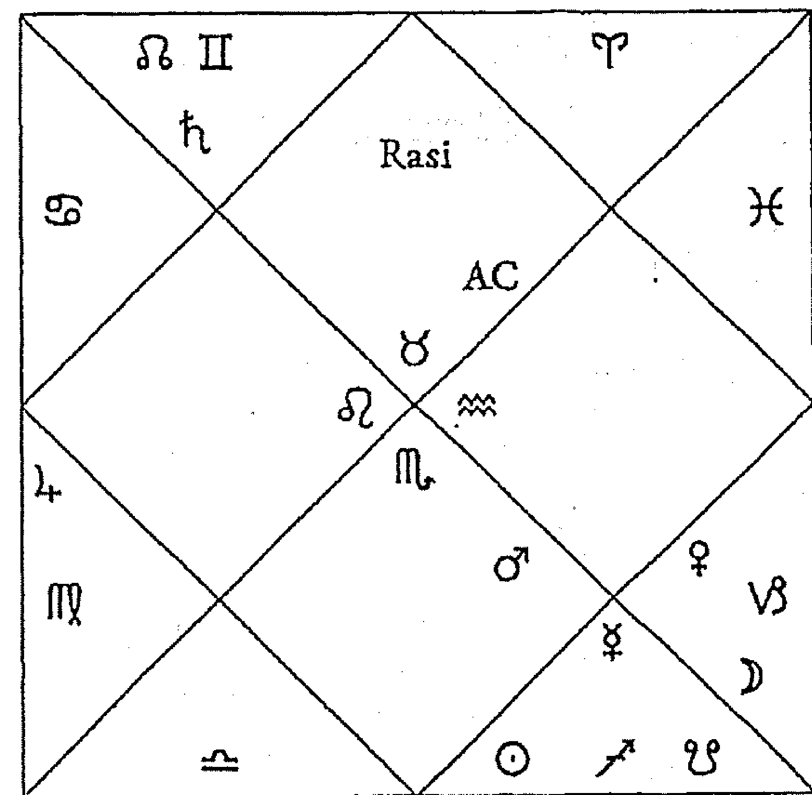

- 1. 火星 ♂ 位於天蠍座 ♏，亦即自己所主管的星座；同時也位於由上升點起算的第七宮（始宮）。
- 2. 符合「Ruchaka Yoga」行星組合的條件。
- 3. 火星 ♂ 在印度占星學中，正是火、電子的主管行星。
- 4. 企圖心旺盛，辨識能力強，能贏得聲名，戰勝敵人。
- 5. 施振榮出身貧困家境，孤兒寡母歷經艱辛，之後自創知名電腦品牌——宏碁（Acer），終成國際知名大廠；但火星 ♂ 相映至上升點，因此也時時暗藏危機。

#### 【案例二】

**卢胜彦**

1945年6月27日11:50，嘉义市。

-   1. 水星☿位于双子座Ⅱ，亦即自己所主管的星座；同时也位于由上升点起算的第十宫（始宫）。
-   2. 符合“Bhadra Yoga”行星组合的条件。
-   3. 本案例中，水星☿逢多凶星——太阳⊙、北交点☊和土星♄，于第十宫内会合。
-   4. 南交点☋在第四宫相映。
-   5. 卢胜彦乃台湾颇受非议的灵学大师，自封活佛，但行径却令人讶异；带弟子出入舞厅，办为入世之举；以个人形貌自雕佛像，放置于南投雷藏寺供人膜拜。

（图片：img/0d3fec7f82ddcae614e40d5dbb58efcd_329_0.png）

#### 【案例三】

**林宏宗**

1951年10月26日10:10，台南县。

-   1. 木星♃为自然吉星，位于第四宫双鱼座♓，乃由上升点起算的始宫。
-   2. 符合“Hamsa Yoga”行星组合的条件。
-   3. 木星♃相映至第八宫，其旺宫巨蟹座♋，以及第十宫处女座♍、第十二宫天蝎座♏，因而让此三宫产生吉应。
-   4. 土星♄位于第十宫，相映至第十二、四、七宫；土星♄逢南交点☋会合火星♂，并加上第十一宫的围攻。
-   5. 林宏宗原本为从事包板模工作的乡下孩子，尔后适逢台湾建筑界景气大好之际，大胆投入房地产业，累积大量土地与财富，因而跻身社会名流。他擅于精打细算，也当过立法委员，政商两得意，实拜木星♃位于第四宫所赐，其相映事征也甚为明显。但土星♄位于第十宫，致使其事业日后低迷，遭逢困境，倒闭收场。

（图片：img/0d3fec7f82ddcae614e40d5dbb58efcd_330_0.png）

# 【案例四】

**宋楚瑜**

1942年4月30日 10:15，中国·湖南省湘潭县。

-   1. 第十宫（始宫）位于双鱼座♓，主管社会地位、名望、事业、尊荣、政治、政府官员、权威人物、权力、成就、王权等等。
-   2. 第十宫内见自然吉星金星♀，入旺，符合“Malavya Yoga”行星组合的条件。相较其他政治人物，宋楚瑜的官场生涯可谓一帆风顺；其政治敏感度强，在主流与非主流的斗争中，背弃法统，向李登辉靠拢，一跃成为政坛的重要人物。
-   3. 须留意的是：他的金星 ♀ 位于第十宫，入旺；然而，同时受到第九宫的南交点 ☊，以及第十一宫的太阳 ☉ 这两个凶星的围攻，以致政治生涯潜藏危机。可谓水能载舟，亦能覆舟。

（图片：img/0d3fec7f82ddcae614e40d5dbb58efcd_330_1.png）

## 【案例五】

**连战**

1936年8月27日 19:25，中国・陕西省西安市。

-   1. 以第十宫的官禄来论（第十宫为始宫，乃吉宫）：
    -   (1) 宫内见自然吉星木星 ♃。
    -   (2) 该宫受吉宫第一宫水瓶座 ♒ 的主宰星——土星 ♄ 相映。土星 ♄ 相映至由自己起算的第三、七、十宫，符合“Shasha Yoga”行星组合的条件。
    -   (3) 该宫并无其他凶星位临或相映。木星 ♃ 位于天蝎座 ♏，为其友谊星座，并非弱宫；同时，也未逢太阳 ☉ 焦伤。
-   2. 以第二宫的财帛来论：
    -   (1) 第二宫内（双鱼座 ♓）并无行星，但宫主星木星 ♃ 飞临第十宫（始宫），力量增强，且相映至本命的第二宫（木星 ♃ 相映至由自己起算的第五、七、九宫）。
    -   (2) 木星 ♃ 也是第十一宫人马座 ♐ 主宰星，大偏财宫（第十一宫）主星。
-   3. 连战一生名利双收，由印度占星学即可完全得到验证。然而连战的第十宫天蝎座 ♏ 的主星——火星 ♂，落入第六宫（凶宫），同时入弱（巨蟹座 ♋）；2000年1月29日的同时，火星 ♂ 落入第六宫（与敌人有关），竞选总统受挫。

（图片：img/0d3fec7f82ddcae614e40d5dbb58efcd_331_0.png）

## 第七章

### 第二节 大象与狮子的组合

“Gaja-kesari Yogas”，梵文中的“Gaja-kesari”包含两个字词——“Gaja”为大象，代表庄严；“kesari”为狮子，代表威猛。两者相结合，自有其特殊能力，能驾驭大象与狮子，力量强且地位高，是重要的行星组合。

## 定义

所谓“大象与狮子的组合”，意指当木星落入由月亮起算的始宫（一、四、七、十宫）内。这只是标准说法，但由于定义过宽，因此容易误导。应采用古典印度占星学重要典籍的说法，才称得上严谨，相关内容如下：

-   1. 《BPHS》：当木星位于由月亮或上升点起算的始宫内，同时有吉星相会或相映，未逢焦伤、非入弱，或没有落入第六宫凶宫。
-   2. 《Jataka Parijata》（简称《JP》）：月亮受其他吉星（水星、木星和金星）相映，且参与这组行星组合的行星，既非无力，亦未逢焦伤，如此形成的行星组合，即为“大象与狮子的组合”。

## 效应

拥有“大象与狮子的组合”的命主，勤奋努力，握有权力，具道德感，富有、聪明、学者、出身佳，享有持续的声望。

## 评论

由于木星位于由月亮起算的第一、四、七、十宫的排列组合，共有“木星会合月亮”、“木星位于由月亮起算的第四宫”、“木星位于由月亮起算的第七宫”、“木星位于由月亮起算的第十宫”四种变化；如果再将本命的宫位考量进来，其意义将各自不同。另外，从《BPHS》及《JP》的定义即知，也必须考虑月亮和木星的行星状态，例如相关会合或相映的行星、星座，法、利、欲及解脱等三方宫的特性，相关的“行星的八个吉点力量”或“六种力量”，都将使“大象与狮子的组合”呈现不同面貌，在此分述如下：

### (一) 木星和月亮在“大象与狮子的组合”中的可能相对位置

-   1. 月亮和木星会合在同一宫位，即木星位于由月亮起算的第一宫。它们的会合，应位于本命的第一、四、七、十宫或第九宫等吉宫，才会有吉祥的效应。
    -   (1) 会合在本命的第一宫：长相佳，朋友多，妻子贤慧，孩子乖巧。如果符合上述要件，命主的身体健康，身分尊荣且令人印象深刻。这种组合令命主充满吉象福气。
    -   (2) 会合在本命第四宫：等同王室成员或阁员，有学问，母亲寿命长，家庭幸福，拥有漂亮的房子、豪华的汽车。
    -   (3) 会合在本命第七宫：配偶助荫多，拥有幸福婚姻；学识佳、技术熟练；优质贸易商，合伙生意佳，可藉由生意致富，人际关系良好。
    -   (4) 会合在本命第十宫：学者；富有、高贵、受人尊敬；这种组合有利生涯规划，地位高，擅于经营事业或从事政治活动，财力佳。
    -   (5) 会合在本命第九宫：辨识能力佳，幸福、富有、知足；有利宗教、德行和福运。
-   2. 木星位于由月亮起算的第四宫：与家庭幸福、母亲的疼爱照顾有关。
-   3. 木星位于由月亮起算的第七宫：身体健康；在家族中受到尊重；简朴倾向，有助于婚姻幸福与和谐。
-   4. 木星位于由月亮起算的第十宫：有利职位晋升；在职场中受尊敬；行为高尚，理想主义者，付诸精神锻练，努力赚取钱财。

### (二) 影响“大象与狮子的组合”的其他因素

-   1. 月亮和木星的状态

“大象与狮子的组合”是颇受注目的行星组合，必须月亮、木星都具有力量，效应才会突显。如果木星和月亮入弱或无力，或者受凶星会合或相映，那么这组行星组合将会失去光辉。月亮在巨蟹座，亦即自己主管的星座，入庙；而在金牛座，入旺。木星在人马座、双鱼座，亦即自己主管的星座，入庙；而在巨蟹座，入旺。然而，依据“大象与狮子的组合”准则：木星和月亮须同时入旺，或位于自己主管的星座，上述几种情形几乎不可能发生。因为当月亮入旺于金牛座时，木星须入旺于巨蟹座，或位于自己主管的星座——人马座和双鱼座，又同时得位于由月亮起算的始宫（一、四、七、十宫）内；这样的组合绝不会出现。唯一的情形为两者同时落入巨蟹座：月亮位于自己主管的星座，入庙；而木星位于巨蟹座，入旺。由此可知，木星只可能位于月亮的第一宫。所以，所谓月亮和木星都有力，并非指两者同时入旺或位于自己主管的星座。这里所强调的是，月亮和木星如果没有同时位于巨蟹座，那么也必须不受凶星刑克或逢焦伤，同时，木星和月亮其中一方的力量必须强，才会有其基本效应。

-   2. 由上升点起算，看月亮、木星主管的宫位

| 上升星座 | 月亮主管宫位 | 木星主管宫位 | 上升星座 | 月亮主管宫位 | 木星主管宫位 |
| :--- | :--- | :--- | :--- | :--- | :--- |
| ♈ | ♋ 4 | ♐ 9 ♓ 12 | ♎ | ♋ 10 | ♐ 3 ♓ 6 |
| ♉ | 3 | 8 | 11 | ♏ | 9 | 2 | 5 |
| ♊ | 2 | 7 | 10 | ♐ | 8 | 1 | 4 |
| ♋ | 1 | 6 | 9 | ♑ | 7 | 12 | 3 |
| ♌ | 12 | 5 | 8 | ♒ | 6 | 11 | 2 |
| ♍ | 11 | 4 | 7 | ♓ | 5 | 10 | 1 |

当月亮和木星各自主管吉宫始宫（一、四、七、十宫），或三方宫（一、五、九宫），其效应自然更加吉祥。其中，尤以主管第十宫最为有利。而其他各宫则视其管辖事项来论其意义。在解释这组行星组合时，须特别留意上述情形。

-   3. 由上升点起算，看月亮和木星各位于何宫

无论月亮和木星是否同宫，如果两者位于吉宫（始宫及三方宫），那么效应将更臻吉祥。

-   4. 其他行星会合或相映的影响

“大象与狮子的组合”会因其他行星会合或相映至月亮或木星，或同时至月亮和木星，尚有所修正。当然，如果吉星相映或会合，会增添其吉象；而凶星相映或会合，正如《BPHS》或《JP》所述，其效应恐不易呈现，甚至还可能带来负面影响。

-   5. 涉及的星座

月亮和木星位于不同星座，当然会呈现不同的“大象与狮子的组合”效应。如果位于友谊星座较佳，位于敌意星座则稍损。

-   6. 法、利、欲和解脱等三方宫的影响

若“大象与狮子的组合”在三方宫内形成，将多少带有三方宫的性质和意义；即月亮和木星主管或在“法三方宫”，道德将支配命主的行动；如果在“利三方宫”，有益财富；如果在“欲三方宫”，代表物慾和性交、娱乐；如果涉及“解脱”，则有益精神提升。

-   7. 行星力量的强度

“大象与狮子的组合”的结果，充分或部分依赖其建构行星——木星和月亮的行星力量，并视其强度而定；当月亮或木星入弱或无力，那么这组行星组合的本质为弱。当月亮或木星没有充足的行星力量时，这组行星组合的效应将无法充分呈现。其结果正如其他行星组合，易于月亮或木星主管的大运（Dasa）期间呈现。

## 【案例六】

**证严法师**

1937年5月4日02:40，台中市清水区。

-   1. 月亮 ☽ 和木星 ♃ 会合于第十二宫摩羯座 ♑，即木星 ♃ 位于由月亮 ☽ 起算的第一宫内，符合“大象与狮子的组合”的行星准则。
-   2. 月亮 ☽ 和木星 ♃ 会合在摩羯座 ♑，无力，看似不佳。但经计算后发现，月亮 ☽ 和木星 ♃ 的“六种力量”都强；尤其是“行星的八个吉点力量”，两者所在的摩羯座 ♑，具有三十吉点，颇强。
-   3. 月亮 ☽ 和木星 ♃ 会合于第十二宫，正是修行、禁欲、苦行等精神修练的宫位；南交点☋跟灵性修行有关，也在第四宫金牛座 ♉，与之相映。
-   4. 证严法师艰苦卓绝的带领慈济，不仅成为台湾社会的安定力量，更不计荣辱，将爱心遍及全球，令人起敬。

（图片：img/0d3fec7f82ddcae614e40d5dbb58efcd_336_0.png）

## 【案例七】

**C男**

1959年9月23日16:30，屏东市。

-   1. 月亮 ☽ 为母亲的征象星。
-   2. 第四宫主管母亲、教育学历、家族、土地，以及一切舒适享受，例如汽车等等。
-   3. 月亮 ☽ 位于第四宫金牛座 ♉，入旺；正符合征象星法则第5点（P256），受第十宫内的木星♃相映，命主自小乖巧，深得母亲疼爱，关系甚佳。
-   4. 命主为留美土木景观博士，现任教于应用科技大学，并成立了顾问公司；业务鼎盛，营运绩效佳。
-   5. 金星♀为男命的配偶征象星，位于第七宫，不利婚姻；金星♀位于狮子座♌，配偶富有美丽但强势；夫妻宫主星入弱于处女座♍第八宫，会合火星♂及北交点☊两凶星，导致离婚。
-   6. 本案例中，木星♃位于第十宫天蝎座♏，是由入旺于金牛座♉第四宫的月亮☽，所起算的始宫（第七宫）；符合“大象与狮子的组合”的行星准则，稍后再细论。

（图片：img/0d3fec7f82ddcae614e40d5dbb58efcd_337_0.png）

## 【案例八】

**毛泽东**

1893年12月26日07:30:00, Zone 8.00 CCT Tuesday Lahiri 22:22:31，中国·湖南省112E54, 27N48。

-   1. 木星♃位于本命第五宫白羊座♈，正好为由月亮☽起算的第十宫，符合“大象与狮子的组合”的行星准则。
-   2. 月亮☽位于第八宫巨蟹座♋，自己主管的星座，不为凶。
-   3. 土星 ♄ 位于第十一宫天秤座 ♎ 入旺，相映至木星 ♃；随着年岁成长，目标、野心越能实现。
-   4. 木星 ♃ 为上升星座主星。
-   5. 毛泽东带领八路军建立“中华人民共和国”，实属不易。

（图片：img/0d3fec7f82ddcae614e40d5dbb58efcd_337_1.png）

### 第三节 根据宫主星互相飞临的行星组合

印度占星学如同西洋古典占星学，是以事件预测为论断主轴，故着重后天宫为事件论断的依据，也因此，各后天宫主星的重要性格外被突显；而宫主星所建构组成的行星组合，也就颇具意义。印度占星学将后天宫区分为吉宫和凶宫，使得原本为自然吉星或自然凶星的行星，因为主管吉凶后天宫而衍生出“功能性吉星”或“功能性凶星”。我们必须了解这些分类状况，才能充分掌握根据宫主星的行星组合之特殊意涵。“根据宫主星的行星组合”，主要有四种，本节将详述之。

#### 一、贵格

## 定义

梵文为“Raja Yogas”。“Raja”为国王或皇家之意。“贵格”是指：一始宫（一、四、七、十宫）主星和一三方宫（一、五、九宫）主星会合，或互相相映，或互容。

## 效应

地位提升，受到认同；事业成功，获得声望；有利于往政界发展，权力、领导地位如同皇室。

## 评论

印度占星学对“贵格”的定义相当分歧。例如，印度著名占星学家罗曼先生于其行星组合的著作《Three Hundred Important Combination》中，光是针对贵格就列出十九种情况，且不同于上述定义，其中的分歧可见一斑；另一位学术底子深厚的印度占星家巴特（M. R. Bhat），在其著作《Fundamentals of Astrology》中，以一整章的篇幅解释“贵格”，更是列出了四十九种情况。

目前印度占星学界似乎倾向以上的定义为主，然而却也衍生出多种变化，其中较被认定为吉祥的情况为：以“第九、十宫主星”、“第一、九宫主星”、“第一、四宫主星”，和“第一、五宫主星”之间所建构的四种“贵格”，情况最佳。

如同其他行星组合，仍应充分考量建构“贵格”的行星状态、位置、力量，以及与其他行星会合或相映等因素。

## 【案例九】

**毛泽东**

1893年12月26日07:30:00, Zone 8.00 CCT Tuesday Lahiri 22:22:31，中国·湖南省112E54,27N48。

第九宫狮子座8，宫主星太阳○飞临命宫，受木星4，也就是上升星座的主星，在第五宫的相映；且木星4相映至自己的星座，土星h位于第十一宫天秤座=，旺宫，也相映至命宫内的太阳○。此“贵格”赋予毛泽东强而有力的领导性格和野心，并大有斩获。

（图片：img/0d3fec7f82ddcae614e40d5dbb58efcd_339_0.png）

## 【案例十】

**连战**

1936年8月27日19:25，中国·陕西省西安市。

第九宫天秤座⚖，主星金星♀ 飞临第七宫，与命宫内上升星座的主星土星♄相映；此即三方宫“第一、九宫主星”相映，符合“贵格”架构。

（图片：img/0d3fec7f82ddcae614e40d5dbb58efcd_340_0.png）

## 【案例十一】

**星云法师**

1927年8月19日10:10，中国·江苏省江都县。

-   1. 命宫为处女座♍，宫内见自然吉星金星♀，且为第九宫吉宫（三方宫）金牛座的主星。
-   2. 上升星座的宫主星水星☿，飞临第十一宫巨蟹座♋。
-   3. 第四宫人马座♐的宫主星木星♃，落入第七宫双鱼座♓，自己主管的星座，同时相映至上升星座。第四宫为始宫，第九宫为三方宫，两个宫主星都属自然吉星，且互映甚吉，形成“贵格”。
-   4. 第四宫主星相映至第十一宫巨蟹座♋内的命主星水星☿；巨蟹座♋为木星 ♃ 的旺宫，遂形成“第一、四宫主星”相映。
-   5. 星云法师只身来台，创立佛光山、美国西来寺以及澳洲等相关佛教事业，确有“贵格”的气势。

（图片：img/0d3fec7f82ddcae614e40d5dbb58efcd_340_1.png）

## 【案例十二】

**证严法师**

1937年5月4日02:40，台中市清水区。

上升星座为水瓶座 ♒，命宫主星土星 ♄ 落入第二宫双鱼座 ♓，与第四宫金牛座 ♉ 的宫主星金星 ♀ 会合；而金星 ♀ 位于双鱼座 ♓ 旺宫，属“第一、四宫主星”的“贵格”。

（图片：img/0d3fec7f82ddcae614e40d5dbb58efcd_341_0.png）

## 【案例十三】

**马英九**

1950年7月13日13:35，香港。

第九宫位于双子座 ♊，其宫主星水星 ☿ 位于自己主管的星座，与第十宫巨蟹座 ♋ 的主星月亮 ☽，会合在第九宫，符合“第九、十宫主星”之间的“贵格”。

（图片：img/0d3fec7f82ddcae614e40d5dbb58efcd_341_1.png）

## 【案例十四】

**陈水扁**

1950年10月12日 07:06，台南市官田区。

-   1. 陈水扁的上升星座为天秤座♎，主星金星♀落入第十二宫，弱宫处女座♍，与第九宫双子座♊的主星水星☿，落入旺宫处女座♍会合；且逢第四、五宫（分别为摩羯座♑、水瓶座♒）两宫主星土星♄的会合，形成“第一、九宫”、“第一、五宫”、“第一、四宫”等几个“贵格”。
-   2. 命主星金星♀落入第十二宫凶宫，因此虽出身一介贫民，后能晋升为民选总统，然而领导国政却倍感艰辛，甚至最后被控贪污而入狱。

（图片：img/0d3fec7f82ddcae614e40d5dbb58efcd_342_0.png）

#### 二、富格

## 定义

梵文为“Dhana Yogas”。“Dhana”为财富之意，“富格”是指下列这些宫主星的互相关系或会合，或相映，或互容形成时的四种情况：

-   1. 上升星座命宫主星和第二、五、九或十一宫主星之间。
-   2. 第二宫主星和第五、九或十一宫主星之间。
-   3. 第五宫主星和第九或十一宫主星之间。
-   4. 第九宫主星和第十一宫主星之间。

## 效应

当上升星座命宫主星强旺时，命主能力强，较易出人头地。第二宫主管财帛...## 评论

“富格”跟前述“贵格”的情况会有些重叠；但前者着重财富，后者强调权力地位。相关宫主星如果与第六、八、十二宫主星会合，同时落入死亡杀手宫（二、七宫），则会带来疾病、不幸、灾难。因此，帕拉萨拉的一些看法值得注意，内容请参考如下：

### （一）五／十一宫轴线的意义

- 1. 太阳：位于第五宫（狮子座的先天宫位），等同位于自己主管的星座狮子座，且月亮、木星、土星位于第十一宫；或太阳位于第五宫狮子座，只有木星位于第十一宫。
- 2. 月亮：位于第五宫自己主管的星座——巨蟹座，且土星位于第十一宫摩羯座。
- 3. 火星：位于第五宫，等同位于自己主管的星座——白羊座或天蝎座，且金星位于第十一宫。
- 4. 水星：位于第五宫，等同位于自己主管的星座——双子座或处女座，且月亮、火星、木星位于第十一宫。
- 5. 木星：位于第五宫，等同位于自己主管的星座——人马座或双鱼座，且水星位于第十一宫。
- 6. 金星：位于第五宫，等同位于自己主管的星座——金牛座或天秤座，且火星位于第十一宫。
- 7. 土星：位于第五宫，等同位于自己主管的星座——摩羯座或水瓶座，且太阳和月亮位于第十一宫（土星位于摩羯座，而月亮位于第十一宫巨蟹座；土星位于水瓶座，而太阳位于第十一宫狮子座）。

### （二）上升星座和上升星座主星的意义，上升星座主星位于命宫内

- 1. 太阳：在上升星座狮子座，与火星和木星会合或相映。
- 2. 月亮：在上升星座巨蟹座，与水星和木星会合或相映。
- 3. 火星：在上升星座自己主管的星座——白羊座或天蝎座，与水星、金星和土星会合或相映。
- 4. 水星：在上升星座自己主管的星座——处女座或双子座，与土星和木星会合或相映。
- 5. 木星：在上升星座自己主管的星座——人马座或双鱼座，与火星和水星会合或相映。
- 6. 金星：在上升星座自己主管的星座——金牛座或天秤座，与水星和土星会合或相映。
- 7. 土星：在上升星座自己主管的星座——摩羯座或水瓶座，与火星和木星会合或相映。

### （三）第五宫和第九宫

例如木星主管的星座——人马座或双鱼座位于第九宫，宫内见木星会合金星，或会合第五宫主星，是以产生潜力的“富格”。

## 【案例十五】
## 印度首富

穆克什·安巴尼（Mukesh Ambani）

1957年4月19日

也门·亚丁

- 1. 命主白羊座♈，宫内见太阳☉，入旺。太阳☉是第五宫狮子座♌的宫主星，逢金星♀、水星☿、南交点☋会合；其中金星♀为第二宫金牛座♉及第七宫天秤座♎的宫主星；水星☿则是第三宫双子座♊及第六宫处女座♍的宫主星。太阳☉构成“贵格”，逢木星♃在三方吉宫第五宫狮子座♂相映，吉上加吉。金星♀构成“富格”（第二宫主星飞临第一宫，逢第五宫主星太阳☉会合，又见第九宫人马座♐宫主星飞临第五宫相映）。
- 2. 第十一宫（与大财有关）水瓶座♒，逢木星♃在第五宫相映；而第十一宫主星土星♄落入第八宫，与遗产有关，逢火星♂在第二宫相映。火星♂乃上升星座白羊座♈及第八宫天蝎座♏的宫主星；火星♂、土星♄两大凶星，都构成“富格”，显示他凭着父荫及印度经济起飞，累积大量财富，却予人为富不仁的印象。

## 【案例十六】
王永庆

1917年1月11日 06:00

新北市新店区

- 1. 命主人马座♐，上升星座主星——木星♃飞临第五宫白羊座♈，相映至上升星座内的太阳☉、北交点☊及金星♀；其中太阳☉为第九宫狮子座♌的宫主星，金星♀为第十一宫（与大财有关）天秤座♎及第六宫金牛座♉的宫主星，构成“贵格”及“富格”。太阳☉乃第九宫三方宫的宫主星，逢北交点☊、南交点☋会合或相映，带来吉祥。
- 2. 第二宫摩羯座♑、火星♂入旺在内，与水星☿会合；水星☿是第十宫处女座♍及第七宫双子座♊的宫主星，亦属“富格”。
- 3. 土星♄为第二宫摩羯座♑及第三宫水瓶座♒的宫主星，飞临第八宫巨蟹座♋，力量不强；但火星♂会合水星☿相映，敢冒险犯难，赚取财富，而其过程颇为争议，民间流传采伐森林的说法沸沸扬扬。

## 【案例十七】
高清愿
1925年4月16日15:30
台南市北门区

- 1. 主命狮子座♌，上升星座主星太阳☉飞临第九宫白羊座♈，入旺；且逢金星♀与水星☿两吉星的包围。金星♀为第十宫金牛座♉及第三宫天秤座♎的主星，而水星☿则为第二宫处女座♍及第十一宫双子座♊的主星；因此构成“贵格”及“富格”，意谓命主能勇于进取（三、十宫是成长宫），赚取财富。
- 2. 又见木星♃及北交点☊在第九宫内会合；木星♃是第五宫人马座♐及第八宫双鱼座♓的主星，而北交点☊则与第一宫主星太阳☉及第五宫主星木星♃会合在第九宫，且与第十宫主星金星♀会合在第九宫，带来相当吉祥的征象。
- 3. 第九宫主星火星♂也是第四宫天蝎座♏的主星，飞临第十一宫；而第十一宫主星水星☿，也是第二宫主星，飞临第九宫，两者形成互容，是极佳的“富格”。

## 【案例十八】
比尔·盖茨

1955年10月28日 21:15
美国·西雅图

- 1. 命宫位于双子座♊，主星水星☿落入第四宫处女座♍，为旺宫，与第十一宫白羊座♈的主星火星♂会合。
- 2. 第二宫巨蟹座♋，主星月亮☽飞临第十宫始宫，增强它的力量；且受第九宫水瓶座♒主星土星♄入旺宫天秤座♎相映。
- 3. 第九宫水瓶座♒的主星土星♄，飞临第五宫天秤座♎，为其旺宫；与第五宫主星金星♀会合，相映至第十一宫。
- 4. 木星♃为第十宫双鱼座♓的主星，落入第三宫，相映至第十一宫。
- 5. 火星♂也位于第四宫，相映至第十一宫白羊座♈，落入自己的星座。
- 6. 世界首富比尔·盖茨的五／十一宫轴线，非常活跃。

## 【案例十九】
连战
1936年8月27日19:25
中国·陕西省西安市

第二宫双鱼座♓的主星木星♃，
飞临第十宫天蝎座♏，友谊星座
相映至第二宫双鱼座♓、金牛座
♉；而木星♃又是第十一宫人马座
♐的主星，形成极佳的“富格”。
搭配他本命甚高的“贵格”，因此
能累积钜富，一代公务员却富甲天
下，真是台湾奇迹。

#### 三、Arishta Yogas

## 定义

梵文“Arishta”为邪恶、困难、遭逢不幸、甚或死亡之意。当下列三种情况出现时，这些主星的互相关系如会合，或相映，或互容，皆构成“Arishta Yogas”。

- 1. 上升星座主星和第六、八或十二宫主星。
- 2. 第六宫主星和第八或十二宫主星。
- 3. 第八宫主星和第十二宫主星。

## 效应

“Arishta Yogas”会导致健康不佳、疾病、不幸、灾难。

## 评论

“Arishta Yogas”原本是医疗占星学中的重要行星组合，就本命占星学而言，则会反向修正“贵格”及“富格”的吉象；其所建构的主要因子，涉及了三个凶宫：第六、八、十二宫的主星，因此会带来凶象。如果这些因子再碰上死亡杀手行星，即与第二、七宫主星间形成会合，或相映，或互容，则凶象将更加突显。如果命盘中其他征象又甚凶，甚至有导致死亡之可能。

帕拉萨拉指出，这六种分盘，即 D1、D2、D3、D9、D12、D30 上升星座的主星有这种组合，与第六宫主星会合，将赋予不同的症候：

- 1. 六种分盘的太阳：胆病、脾气大。
- 2. 六种分盘的月亮：胃弱、不易消化、血清似水稀薄。
- 3. 六种分盘的火星：血液疾病、发炎。
- 4. 六种分盘的水星：胀气、关节疼痛。
- 5. 六种分盘的木星：慢性黏液质疾病，例如多痰。
- 6. 六种分盘的金星：梅毒等因性交而引起的疾病。
- 7. 六种分盘的土星：高热发烧或多痰等慢性黏液质疾病。

“Arishta Yogas”与“Daridra Yoga”（梵文“Daridra”意谓贫穷、革职、被剥夺）非常相似，后者涵盖范围较为广泛，几乎包含了前者。本书根据古典文献，整理如下：

- 1. 所有行星在 D9 无力，或落于有敌意的宫位，即使在本命盘入旺宫，仍会致使命主乞求生活于低层，放纵于邪恶的行为。
- 2. 行星与第六、八、十二宫等主星会合，而死亡杀手行星（二、七宫主星）也参与其中，将剥夺第五、九宫主星的影响力，产生激烈的震荡（于第五、九宫主星的大运〔Dasa〕期间）。
- 3. 上升星座的主星落入第十二宫，且第十二宫的主星位于命宫；加上又有死亡杀手行星来影响两者之一。
- 4. 上升星座主星位于第六宫，且第六宫主星位于命宫；加上又有死亡杀手行星来影响两者之一。
- 5. 上升星座主星或月亮，受南交点刑克；且上升星座主星位于第八宫，受死亡杀手行星的影响。
- 6. 上升星座主星位于三凶宫内，且有不佳的会合；再加上第二宫主星无力或位于第六宫，在此行星组合下，命主即使出生于王室，也会沦落成为穷人。
- 7. 上升星座主星，与凶宫主星之一会合，或与土星会合，且无吉星相映。
- 8. 第五宫主星位于第六宫，且第九宫主星位于第十二宫，受死亡杀手行星的影响。
- 9. 除了第九、十宫主星外，自然凶星还包括位于命宫且受死亡杀手行星的影响。
- 10. 凶星位于吉宫内，且吉星位于凶宫内。
- 11. 月亮为 D9 星座的主星，与死亡杀手行星之一会合，或位于死亡杀手宫（二、七宫）内。
- 12. 本命上升星座主星，或 D9 上升星座主星，位于三凶宫之一，且与死亡杀手行星之一会合，或相映。
- 13. 火星和土星位于第二宫，会破财；但如有水星相映，命主将富有。另一种说法是：月亮、火星会合于第二宫，会导致贫穷、匮乏、吝啬；土星位于第二宫，受水星相映，则会富足繁荣。

## 【案例二十】
洪晓慧

1974年10月3日18:01
高雄市

- 1. 金星♀为第八宫天秤座♎主星，同时也是第三宫金牛座♉主星（非三方宫及始宫主星）。
- 2. 金星♀位于第七宫处女座♍，入弱，与太阳☉、火星♂会合于第七宫（夫妻宫），相映至命宫；其中太阳☉是第六宫狮子座♌主星，金星♀是第八宫主星，与第六宫主星会合，即为“Arishta Yogas”，必带来管辖事项的不幸。
- 3. 金星♀又代表爱情，为婚姻的自然征象星。
- 4. 南交点☋又落入第三宫，相映至金星♀。
- 5. 洪晓慧是清大化研所的高材生，参不透爱情的真谛，竟将情敌毁屍灭迹，轰动一时。其本命金星♀力量甚弱，与凶星会合，因嫉生恨，让自己身陷囹圄。太阳☉为第六宫主星，金星♀为第八宫主星。第六、八两凶宫主星会合，相映到命宫，以印度占星学来论，此案例验证无误。

## 【案例二十一】
吴鹤松

1951年12月30日03:15
高雄市冈山区

- 1. 火星♂、土星♄为自然凶星，位于第十二宫凶宫。
- 2. 水星☿为第八宫（主管寿命、恐亡、意外、不幸、丑闻、灾难）金牛座♉主星。
- 3. 金星♀为上升星座天秤座♎的主星，飞临第二宫天蝎座♏，落陷；会合第十二宫主星水星☿，此即“Arishta Yoga”。
- 4. 土星♄位于第十二宫，相映至金星♀及水星☿，增添其凶性。
- 5. 木星♃是第六宫双鱼座♓主星，入庙，似可救援；惟火星♂及土星♄位于第十二宫相映刑克，力有未逮。
- 6. 上升星座主星金星♀、第六宫主星木星♃、第八宫主星金星♀，及第十二宫主星水星☿，全部互相会合或相映。
- 7. 吴鹤松是高雄冈山地区的黑道老大，当上议长后，仍摆脱不了江湖习性，后因赌场利益及恩怨，被昔日小弟雇用杀手枪杀而亡。俗云：“菜虫吃菜，菜下死”，正是黑道人物的最佳写照。

## 【案例二十二】
## 李小龙

1940年11月27日 07:12
美国·旧金山

- 1. 命主天蝎座♏，上升星座主星火星♂飞临第十二宫凶宫天秤座♎，无力；水星☿受月亮☽和金星♀在第十二宫内包围，而金星♀为第十二宫处女座♍主星，同时也是第七宫金牛座♉主星，属于杀手行星之一。
- 2. 土星♄位于第六宫白羊座♈，入弱无力，会合木星♃，相映至火星♂，增其凶性。木星♃虽为吉星，但也是第二宫人马座♐的主星，为死亡杀手星。
- 3. 第八宫双子座♊主管寿命、死亡，宫主星水星☿也落入第十二宫，会合第六宫主星火星♂。
- 4. 本案例中的重要因子，多与第六、八、十二宫相关。
- 5. 功夫武打巨星李小龙因风流而逃不过死亡命运，命主星多逢分离和死亡行星。

## 【案例二十三】
于枫
1961年12月25日02:10
高雄市

- 1. 于枫命主天秤座♎，上升星座主星金星♀飞临第三宫人马座♐，与凶星火星♂及太阳☉会合；水星☿为第十二宫处女座♍的主星，位于同宫，火星♂为第二宫天蝎座♏的主星，为死亡杀手星。
- 2. 命主天秤座♎，木星♃为自然吉星，但因主管第三宫人马座♐及第六宫双鱼座♓，而成为功能性凶星，飞临第四宫摩羯座♑，入弱，虽是月亮☽起算的第七宫，符合“大象与狮子的组合”准则，但因为木星♃入弱，且受到凶星南交点☋及土星♄的包围；土星♄是天秤座♎上升时的吉祥征象星，且位于摩羯座♑，入庙，尚不凶。月亮☽减光，主管始宫第十宫巨蟹座♋，也属功能性吉星，入庙；但逢北交点☊，且与第三宫的火星♂相映，而火星♂，又是第二宫天蝎座♏和第七宫白羊座♈的主星，为死亡杀手星。
- 3. 于枫怀疑同居男友外遇，穿红衣自杀，轰动一时。

#### 四、Parivartana Yoga

梵文“Parivartana”在占星学中的意义为“互容”，亦即两行星互相交换自己的星座。交换或互容衍生出不同的意义，基本上共分三种，印度占星学界的重量鉅作《Phala Deepika》将之分别命名为：“吉祥的组合”（Maha Yogas）、“不幸的组合”（Dainya Yogas）及“邪恶的组合”（Khala Yoga）。本书分叙如下：

## 吉祥的组合

- 1. 上升星座主星与：①二宫主星、②四宫主星、③五宫主星、④七宫主星、⑤九宫主星、⑥十宫主星、⑦十一宫主星。
- 2. 第二宫主星与：①四宫主星、②五宫主星、③七宫主星、④九宫主星、⑤十宫主星、⑥十一宫主星。
- 3. 第四宫主星与：①五宫主星、②七宫主星、③九宫主星、④十宫主星、⑤十一宫主星。
- 4. 第五宫主星与：①七宫主星、②九宫主星、③十宫主星、④十一宫主星。
- 5. 第七宫主星与：①九宫主星、②十宫主星、③十一宫主星。
- 6. 第九宫主星与：①十宫主星、②十一宫主星。
- 7. 第十宫主星与：①十一宫主星。

以上二十八种组合，都是由始宫（一、四、七、十宫）、三方宫（五、九宫），以及掌管财富的第二、十一宫组合而成；所以，“吉祥的组合”将赋予命主财富、地位、物质享受。

## 不幸的组合

- 1. 第六宫主星与：①上升星座主星、②二宫主星、③三宫主星、④四宫主星、⑤五宫主星、⑥七宫主星、⑦八宫主星、⑧九宫主星、⑨十宫主星、⑩十一宫主星、⑪十二宫主星。
- 2. 第八宫主星与：①上升星座主星、②二宫主星、③三宫主星、④四宫主星、⑤五宫主星、⑥七宫主星、⑦九宫主星、⑧十宫主星、⑨十一宫主星、⑩十二宫主星。
- 3. 第十二宫主星与：①上升星座主星、②二宫主星、③三宫主星、④四宫主星、⑤五宫主星、⑥七宫主星、⑦九宫主星、⑧十宫主星、⑨十一宫主星。

以上三十种组合的互容，都是以三凶宫，跟第一、四、七、十宫（始宫），或第五、九宫（三方宫），或第二、十一宫（财富宫），及第三宫互容相交换而得的；因此，“不幸的组合”将赋予命主邪恶的本质，来自对手持续的困扰，以及健康不佳。

## 邪恶的组合

- 第三宫主星与：①上升星座主星、②二宫主星、③四宫主星、④五宫主星、⑤七宫主星、⑥九宫主星、⑦十宫主星、⑧十一宫主星。

以上共有八种组合之交换，第三宫的特性虽非凶宫，但在印度占星学中被列为成长宫，通常会先遭逢困顿，然后随着个人努力而有所改变。因此，上述组合具有浮躁、操守不坚、无常，以及邪恶的特性，而且运气波动、时好时坏。

有关“Parivartana Yoga”的使用，同样须注意涉及的行星、宫位、星座，以及其他因子对其影响如何，还有大运（Dasa）期间又会如何运作，皆须充分考量。

## 【案例二十四】
印度前女总理英迪拉·甘地夫人（Indira Gandhi）1917年11月19日11:11（IST）印度·安拉阿巴德（Allahabad）25N27， 81E51

- 1. 上升星座巨蟹座♋的主星月亮☽，位于第七宫摩羯座♑；而第七宫摩羯座♑的主星土星♄，则位于命宫巨蟹座♋内。
- 2. 第二宫狮子座♌的主星太阳☉位于第五宫天蝎座♏；而第五宫天蝎座♏的主星火星♂，则位于第二宫狮子座♌。
- 3. 第六宫人马座♐的主星木星♃落入第十一宫金牛座♉，而第十一宫金牛座♉的主星金星♀，位于第六宫人马座♐。
- 4. 上升星座位于巨蟹座♋，月亮☽为其主星，位于摩羯座♑；而在 D₉ 中，月亮☽则位于水瓶座♒，适为本命第八宫（死亡宫），正符合印度古传诀窍所提：“当上升星座的主星位于 D₉ 的星座，适为本命盘第八宫，或逢太阳焦伤（蚀），或位于第六宫，那么命主将死于饥饿，或无装备的地板上，无血亲在侧……”，即“死于非命”之意。1984年10月31日，她被侍卫锡克教徒射杀身亡，躺在空旷的地板上，当时无血亲在侧，完全符合上述断诀。

### 第四节 身宫盘的行星组合

梵文为“Chandra Yogas”。“Chandra”是“月亮”之意。所谓的“Chandra Yogas”，是以月亮作为行星组合的主要建构分子。自古以来，印度占星学界关于“Chandra Yogas”的著墨甚多，在此列举较重要的组合，分述如下：

#### 一、Adhi Yoga

## 定义

梵文“Adhi”，乃“排名在前”之意；即当吉星水星、木星和金星，位于由月亮起算的第六、七、八宫时。效应

具有「Adhi Yoga」的命主，能成为国会内阁阁员或陆军总司令，赋予命主财产、健康、地位、政府认定，能战胜反对者或敌人。

评论

「Adhi」的意义是「增加」、「吸收」；这个行星组合特别有利于提升一个人的地位，或达到领导人的位阶。因此，行星组合的建构，这三个吉星会分别相映到月亮（即身宫盘）的第一、二及十二宫。如果有凶星夹攻月亮，那么则反为凶象；如果有吉星来夹月亮，则吉上加吉。

由「Adhi Yoga」的定义，可衍生出三个吉星位于同一宫位，或分别位于个别宫位，因此会有下列组合（由月亮起算的宫位）：

-   1. 仅位于第六宫
-   2. 仅位于第七宫
-   3. 仅位于第八宫
-   4. 仅位于第六、七宫
-   5. 仅位于第六、八宫
-   6. 仅位于第七、八宫
-   7. 三个吉星分别位于第六、七、八宫

一般认为，如果三个吉星全部参与「Adhi Yoga」，效应较明显。如果只有两个吉星参与，或甚至只有一个吉星位于所需宫位，同样也会有效应，只是较不明显。

当然，如果「Adhi Yoga」要发挥其效应，相关行星必须强而有力，不受凶星刑克、会合或相映，且不逢焦伤。查拉喀博士认为，凶星并不会全然抵销这个行星组合的效应，只是会带来激情、激动、冷酷，如果能善用之，则有助于技术性工作或科学技术方面的行业。

【案例二十五】

宋楚瑜
1942 年 4 月 30 日 10:15
中国・湖南省湘潭县

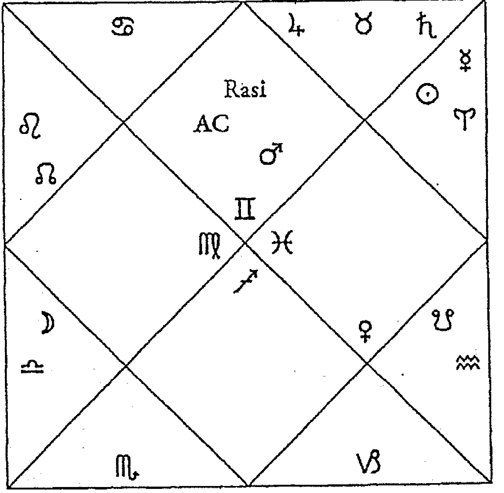

月亮 ☽ 位于本命第五宫天秤座 ♎，满月之际；其金星 ♀ 位于双鱼座 ♓，入旺，为本命第十宫，且适为由月亮 ☽ 起算的第六宫；水星 ☿ 位于本命第十一宫，适为由月亮 ☽ 起算的第七宫；木星 ♃ 位于本命第十二宫，适为由月亮 ☽ 起算的第八宫，符合「Adhi Yoga」准则，特别有利于提升命主地位，达到领导人位阶。

【案例二十六】

比尔・盖兹
1955 年 10 月 28 日 21:15
美国・西雅图

月亮 ☽ 位于本命第十宫双鱼座 ♓，月亮 ☽ 增光时期，第 13 titli；木星 ♃ 位于本命第三宫，适为由月亮 ☽ 起算的第六宫；水星 ☿ 位于本命第四宫，入旺，适为由月亮 ☽ 起算的第七宫；金星 ♀ 位于本命第五宫天秤座 ♎（自己主管的星座），适为由月亮 ☽ 起算的第八宫，符合「Adhi Yoga」准则，增强吉象。

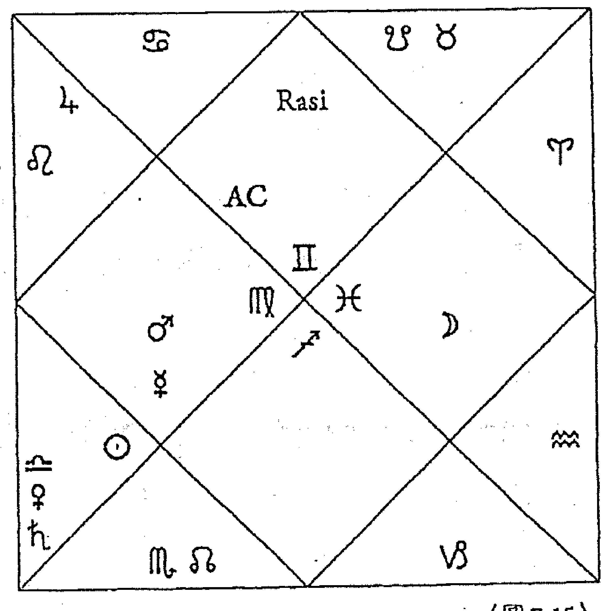

二、Amala Yoga

定义

梵文「Amala」乃「无瑕疵」之意。当一吉星位于由月亮或上升点起算的第十宫，且吉星未受刑克。

效应

命主将获得持续的名望和声誉，个性无瑕疵，会有一帆风顺的人生。

评论

「Amala」的意义是「未被污染的」。未受刑克的吉星位于第十宫天顶，明亮的照耀着，使命主行为（十宫）无瑕（德行、虔诚），受元首尊敬。

罗曼先生曾提及，如果凶星位于第十宫，有力，命主可能会不择手段的赚钱，虽获得财富，但不受人尊敬。

【案例二十七】

李毅摩

1941年12月8日15:15

南投县草屯镇

-   1. 吉星金星♀为艺术、优雅的自然征象星，位于本命第十宫摩羯座♑友好星座。
-   2. 木星♃位于第二宫金牛座♉，相映至第十宫的金星♀。
-   3. 月亮☽位于第四宫巨蟹座♋，自己主管的星座，相映至第十宫内的金星♀。

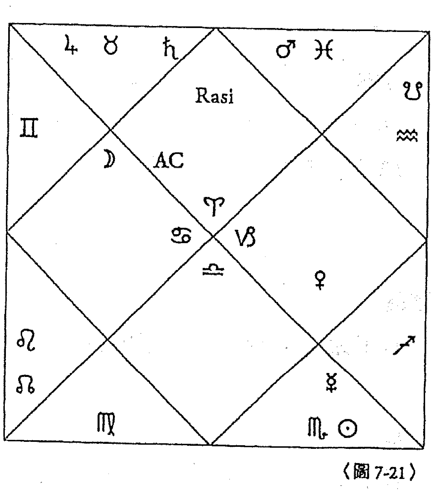

-   4. 李毅摩出身南投竹山，原为小学教师，业余从事绘画；其特殊画风在美术界占有一席之地，作品常被典藏。
-   5. 本案例中，金星♀并无凶星相映或会合的刑克，且位于由上升点起算的第十宫，符合「Amala Yoga」准则。

【案例二十八】

邓小平

1904年8月22日00:10

中国·四川省广安州

-   1. 月亮☽位于本命第八宫人马座友好星座。
-   2. 水星☿位于由月亮☽起算的第十宫；入旺，位于处女座♍，第五宫三方吉宫，且为第五宫的主星，甚吉。
-   3. 水星☿无凶星会合或者相映的刑克。
-   4. 本案例符合「Amala Yoga」准则。
-   5. 邓小平着重经济的发展与改革，改变了现今的中国，一直为人民所赞赏，赢得极高的声誉与名望。

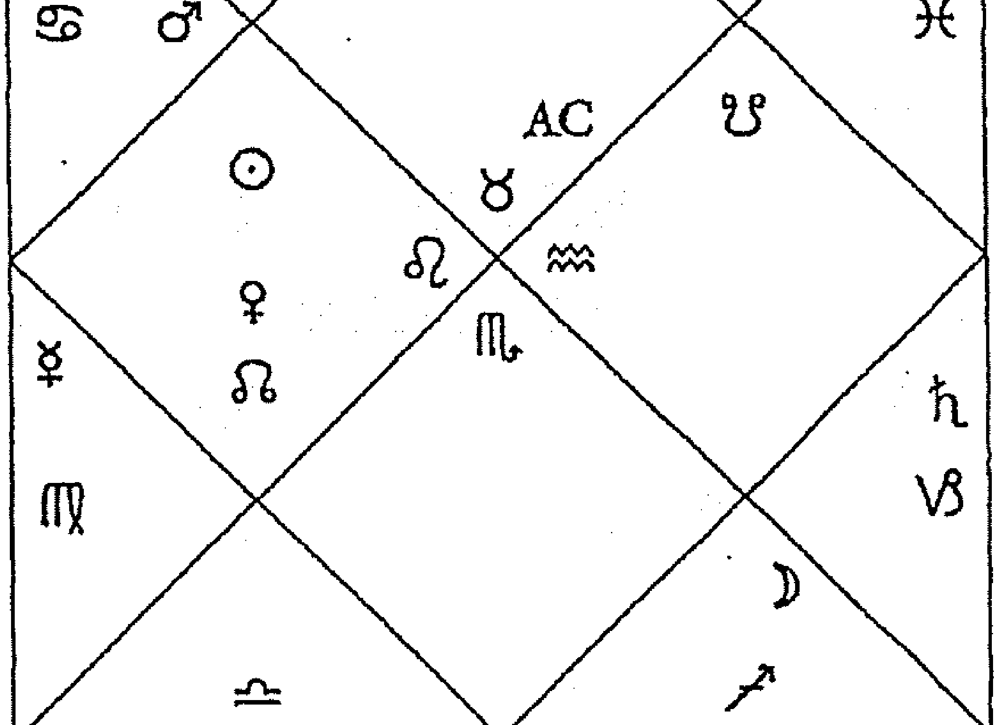

三、Sumapha Yoga

定义

除了太阳，还有行星位于由月亮起算的第二宫。

效应

赋予命主等同国王的地位、广大的财富；经由个人努力而获得成果、广泛的认同；德行佳；沉着、满足。

评论

第二宫代表财富，但须注意，这种行星组合相当常见，所以必须小心检验相关行星的力量，以及与吉凶星相关连的状况，才能分辨之。其结果将视所在宫位以及相关行星的性质而定。

-   1. 火星：勇敢、刚猛、残忍、粗暴、富有、统治者、厌恶伪善。
-   2. 水星：精于古典文献、手抄本、艺术和音乐；沉浸宗教事务；外貌佳；善言词、高智商、对他人好；赚钱容易；易患因寒冷所引起的慢性病。
-   3. 木星：精通各种学问；上师、指导者；广泛的声誉；非常富有；主管的恩惠；美好的家庭；清白无瑕；长寿。
-   4. 金星：命主效率佳；勇敢、外貌俊美；受领导者欣赏；有学问；妻子贤慧；有房子、土地、车子；华丽光鲜。
-   5. 土星：聪明、技术佳；受农民尊敬；评价高；富有、满足。这种组合对母亲不利。

因为位于月亮的第二宫，因此，除太阳及南、北交点外，其他五个传统行星也都可能全部位于其第二宫，或者四个、三个、两个，或只有一个，故行星组合的情况相当多。

【案例二十九】

D 男

-   1. 月亮 ♋ 为上升星座巨蟹座 ♋ 的主星。月亮 ♋ 位于第十一宫金牛座 ♉，入旺，代表收获、企业所得、目标野心。
-   2. 金星 ♀ 吉星位于月亮 ♋ 的第二宫，符合「Sumapha Yoga」准则。
-   3. 金星 ♀ 与第二宫狮子座 ♌ 的主星太阳 ☉ 会合于第十二宫，受位于自己主管星座人马座 ♐ 的木星 ♃ 相映，甚吉；然而也见土星 ♄ 会合刑克，同时相映至金星 ♀，得中有失。
-   4. 金星♀也是第四宫主星，管辖田产、土地。
-   5. 命主承继大批田产、土地，同时服务于证券、投顾公司，为理财高手，从事证券、债券买卖，获利颇丰，但也不免有所损失，惟得大于失。
-   6. 因火星♂入庙于第十宫白羊座♈，是巨蟹座♋上升时的吉祥象征星；意谓命主重视效率，有勇气，颇受领导者欣赏。

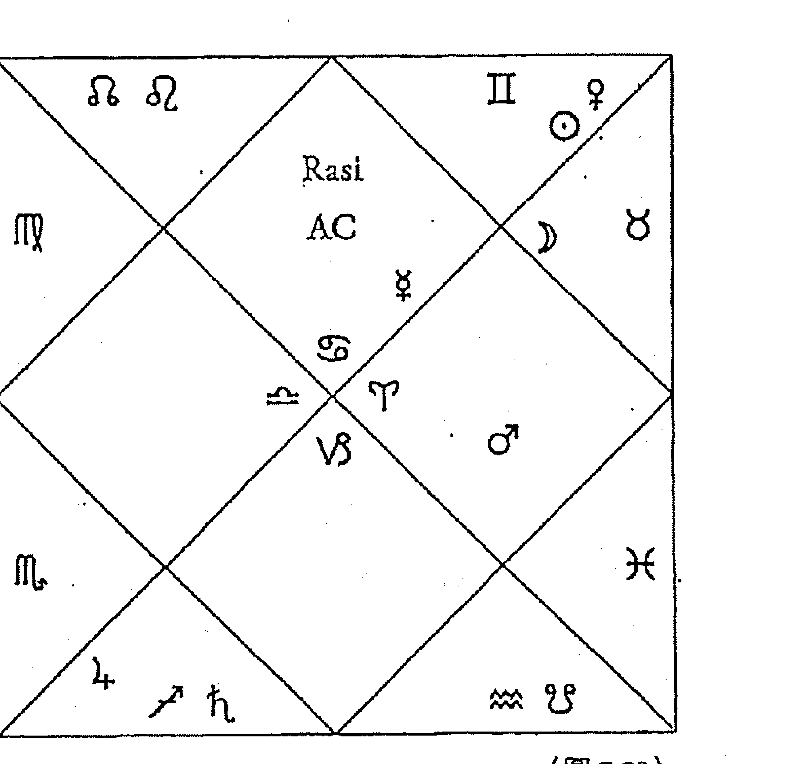

四、Anapha Yoga

定义

除了太阳，有行星位于由月亮起算的第十二宫。

效应

具有「Anapha Yoga」的命主外形匀称、威严；友好、自我尊重，拥有良好声誉；享受物质生活、幸福快乐，喜欢华丽衣饰及性爱。

评论

评定「Anapha Yoga」的准则时，如同评估「Sumapha Yoga」的情形，只是必须注意：后者强调第二宫的金钱、财富，前者强调第十二宫，着重享受性爱、精神领域、消耗支出；同样的，不同的行星会有不同的「Anapha Yoga」结果。

-   1. 火星：一群盗贼的首领；高傲不逊、大胆、暴怒；值得称许、良好的外表；伤害他人（包括母亲）。
-   2. 水星：雄辩；诗人；受领导人尊崇；精于音乐、舞蹈、写作；英俊且有声誉，但不利子孙的事业。
-   3. 木星：赋予力量及德行；精力旺盛、有学问、富有；诗人；受国王尊敬；反对自己的亲信及亲爱的人。若木星相映至由上升点起算的第六宫，则意谓命主满足及幸福。
-   4. 金星：年轻妇女的魅力；私通、甜言蜜语；运用财富、牛羊和物资。
-   5. 土星：广阔土地的主人；林野和牛羊；享有他人的财富；与邪恶之徒共同从事非法违禁的行为。

以上所述，都只以单一行星来说明；如果有两个以上的行星，就要视其行星组合来说明。

【案例三十】

连战

1936年8月27日19:25

中国·陕西省西安市

连战的月亮☽位于第十一宫人马座♐，其定位星木星♃正好位于由月亮☽起算的第十二宫，符合「Anapha Yoga」准则，不受刑克；且木星♃相映至第二宫财帛宫双鱼座♓，意即自己主管的星座，更添吉祥、财富。

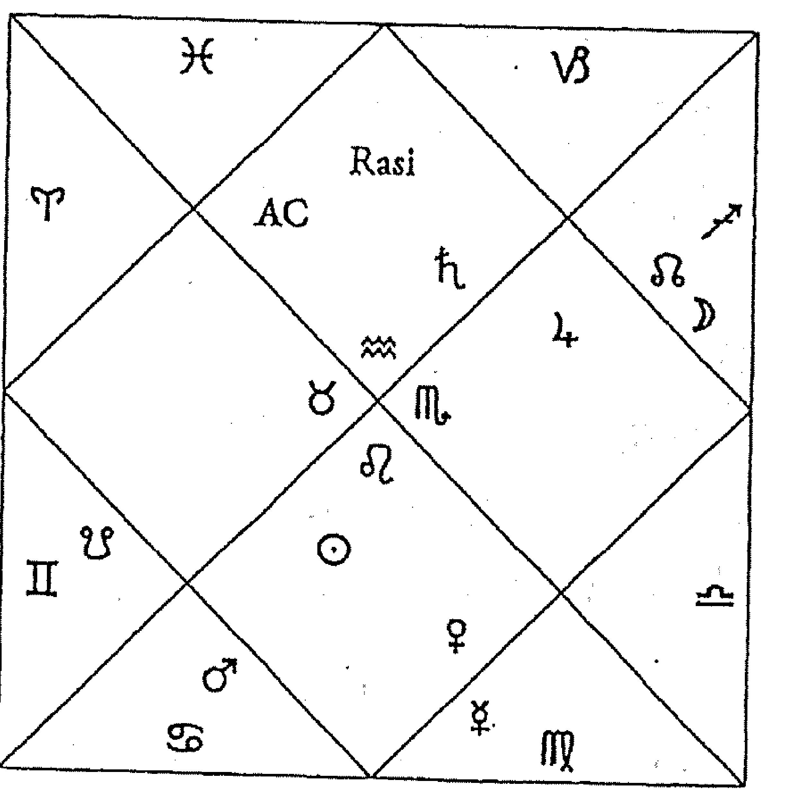

五、Durudhara Yoga

定义

除了太阳，当有行星位于由月亮起算的第二、十二宫时。

效应

命主具有「Durudhara Yoga」行星组合，意谓着能透过绝佳的口才来赢取声望，且具有学问、勇气和德行。「Durudhara Yoga」赋予命主广大的财富，包括车子、土地、仆人；身体舒适；没有敌人攻击；命主慈悲，希望与所爱的人结合。

评论

「Durudhara Yoga」涉及由月亮起算的第二宫，主要强调财产及累积；另一方面，则是由月亮起算的第十二宫，强调支出与享受。当然，整个结果还必须视其构成分子的特性及力量，以及是否有其他吉凶星的会合或相映而定。这个行星组合，可以说是「Sumapha Yoga」以及「Anapha Yoga」的简单组合。

根据行星位于月亮的两侧，可能会有一边一个；或者一边一个，另一边则有二、三、四个；一边两个，另一边则有二、三、四个等各种排列组合，约有一百八十种变化。

【案例三十一】

D 男

命主的月亮☽位于本命第十一宫，除了由月亮☽起算的第二宫，即本命的第十二宫内有金星♀外，另外，由月亮☽起算的第十二宫，即本命的十宫内有火星♂，位于自己主管的星座白羊座♈，此即典型的「Durudhara Yoga」行星组合。

命主除了具有上述的征象以外，口才、思路、逻辑以及辨识能力极佳，做事态度相当积极，事业运甚佳。

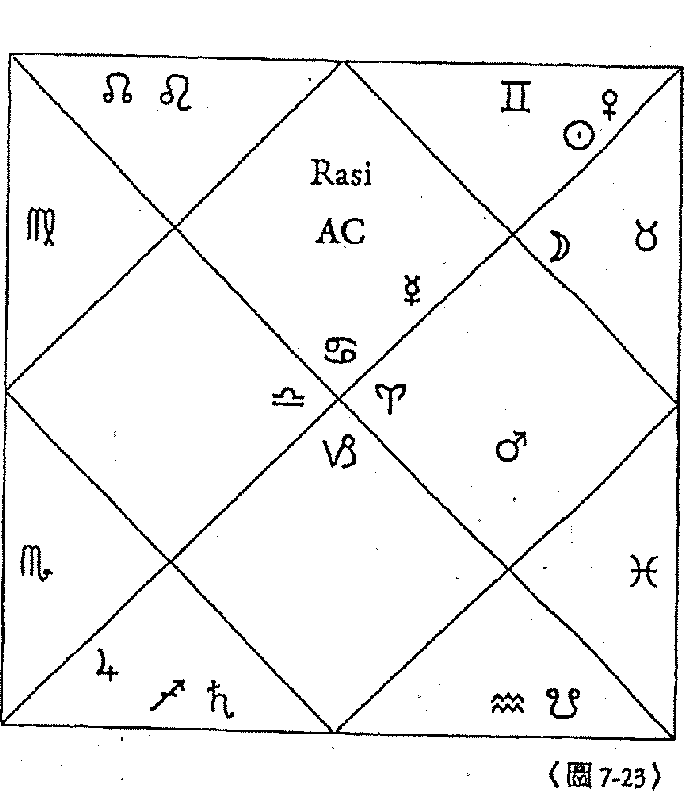

六、Kemadruma Yoga

定义

当命盘中没有「Sumapha Yoga」、「Anapha Yoga」及「Durudhara Yoga」，则形成「Kemadruma Yoga」；即除了太阳，没有其他行星位于由月亮起算的第二或十二宫内。

效应

命主具有「Kemadruma Yoga」行星组合时，意味健康不佳、无财富、学问不好、没有智慧、无妻小、心灵不平静，即使出身王室也会沦为乞讨之人；遭逢不幸、灾难、失败；身体染病；贬抑。

评论

「Kemadruma Yoga」主要会致使财务损失、地位贬落、不幸及贬低；然而，解释此行星组合时，应当谨慎。不能盲目一味认为，此行星组合出现就一定会有上述效应；仍需详细评估各种可能因素，抵销这个行星组合的不良效应。

-   1. 若行星都位于由上升点起算的始宫。
-   2. 若行星都位于由月亮起算的始宫。
-   3. 月亮或金星位于本命始宫，受木星相映。
-   4. 所有行星相映至月亮。
-   5. 力量强的月亮。
-   6. 月亮与吉星会合，或受木星相映。
-   7. 月亮在 D9，入旺，或位于非常友好的星座（亦即太阳及水星所主管的星座：狮子座、双子座、处女座），受木星相映。
-   8. 满月，月亮位于命宫，与吉星会合。
-   9. 月亮入旺于本命第十宫，且受吉星相映。
-   10. 出生时，火星和木星位于天秤座，太阳位于处女座，月亮位于白羊座；即使无其他行星相映至月亮，「Kemadruma Yoga」也会被抵销。

【案例三十二】

吴鹤松

1951年12月30日03:15

高雄市冈山区

吴鹤松的月亮位于第四宫摩羯座，无力；由其起算的第二宫内并无行星，而第十二宫内虽有太阳，但无其他行星。因此，符合「Kemadruma Yoga」准则，且无其他因素来抵销。尽管月亮位于始宫，亦即本命的第四宫，但力量不强，且位于第二个Tithi，因此力量更弱。

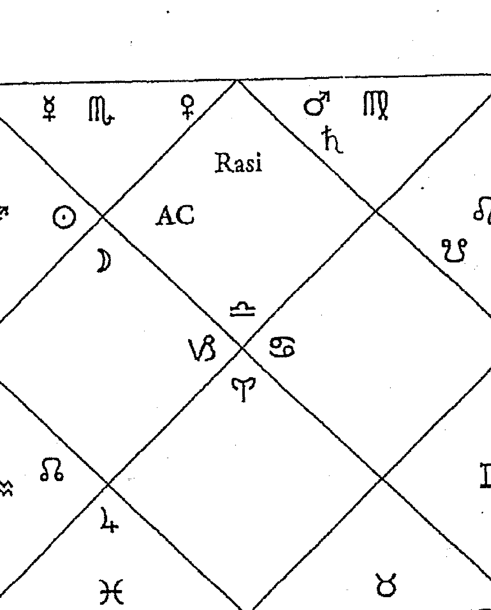

七、Vasumati Yoga

定义
梵文「Vasumati」，乃「富有」之意；当所有吉星（水星、木星、金星）位于由月亮起算的成长宫（三、六、十、十一宫）时。

效应
命主具有「Vasumati Yoga」，将极为富有，享受生活。

评论
由于成长宫为成长扩充的宫位，行星位于这些宫位，经由个人努力及奋斗，将有所成就；因此，此行星组合金钱资产极为有益，即使有其他凶的行星组合，仍有其优势。这与本命盘的成长宫内并不乐见吉星出现，有所不同。
如果只有两个吉星位于由月亮起算的成长宫，那么将赋予中等财富；如果只有一个吉星，那么则只有普通财富而已。
须注意，也有学者将「Vasumati Yoga」定义为「四个吉星」，包含渐增光的月亮，还有水星、金星、木星，位于由上升点起算的成长宫（本命第三、六、十、十一宫）。这与一般希望本命盘成长宫出现凶星，以利努力奋斗、竞争、目标野心的论述相当不同，故保留其说法。

【案例三十三】

保罗·纽曼（Paul Newman）
1925 年 1 月 26 日 06:30 EST
美国·俄亥俄州 41N30, 81W42

-   1. 国际巨星保罗·纽曼的月亮 ☽ 位于水瓶座 ♒，本命的第三宫内；水星 ☿、木星 ♃、金星 ♀ 三个吉星，都会合于上升星座人马座 ♐，适为由月亮 ☽ 起算的第十一宫，符合「Vasumati Yoga」。从影多年，几乎一直是一线主星，累积不少财富；息影后，经商也颇为顺遂。
-   2. 夫妻宫位于双子座Ⅱ，宫主星水星☿入命，与命主星木星♃会合；且配偶的征象星金星♀也入命宫，夫妻感情甚笃，从一而终，成为向来绯闻不断的影艺圈典范，令人称羡。

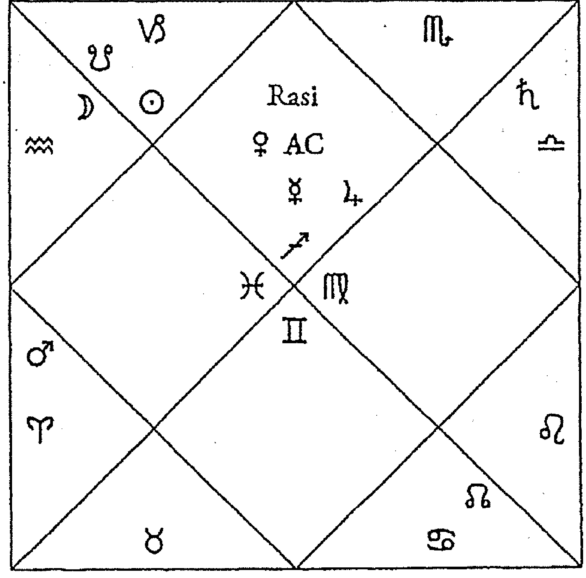

第五节 以太阳为中心的行星组合

梵文「Ravi Yogas」。「Ravi」为「太阳」之意。所谓的「Ravi Yogas」，是以太阳为建构中心；印度占星学向来重视月亮，以月亮为中心的「身宫盘」，以及「Chandra Yoga」的探讨，显然比太阳的多。在此探讨几个以太阳为中心的重要行星组合。

一、Veshi Yoga

定义

除了月亮外，当有行星位于由太阳起算的第二宫时。

效应

命主若具有「Veshi Yoga」，真诚、有些懒，但仁慈、德行佳；眼睛有点斜视、身材高而比例匀称；记忆力佳；财富状况普通。当吉星建构此行星组合时，命主雄辩、富有，能消灭敌人；当凶星建构此行星组合时，命主穷困，与邪恶之人为伍。

评论

「Veshi Yoga」类似以月亮为建构中心的「Sumapha Yoga」，所以「Veshi Yoga」也衍生出三十一种组合，其效应结果，当然就以组成行星的特性以及其所主管的宫位、所临宫位，还有其他行星对其所产生的影响同参，才能充分掌握其结果。

此行星组合的中心太阳，是为太阳系的核心，也是能量及影响力最强的行星，占星学赋予它支配、威权、尊贵以及行政管理能力；行星位于由太阳起算的第二宫，类比帮助太阳执行它的功能。

【案例三十四】

奥修

1931 年 12 月 11 日

印度・库其瓦达

-   1. 命主是阿阇黎・罗杰尼希（Acharya Rajneesh），为当代知名精神导师，也是「Sadhana」的创始人。
-   2. 太阳 ☉ 位于天蝎座 ♏，由其起算的第二宫人马座 ♐，为本命的第八宫；在此宫内，除月亮 ☽ 外，还有四个行星：火星 ♂、水星 ☿、金星 ♀、土星 ♄。
-   3. 他的影响力强，鼓吹自己的精神导引，任何人跟他谈过，都会被他的主张所吸引；他拥有数种特质，能博得追随者的尊敬。由于追随者众，因此累积庞大的财富；这一切都拜第八宫形而上、哲学奥秘的特殊领域所赐。而奥修之所以能轻易驾驭这个特殊领域，是因为主命金牛座♉，土星♄为「吉祥征象星」，是第九宫摩羯座♑及第十宫水瓶座♒的主星，且与金星♀（上升星座主星）、水星☿（第五宫处女座♍及第二宫双子座♊主星）、火星♂（第七宫天蝎座♏及第十二宫白羊座♈主星）会合，构成许多的「贵格」和「富格」；从事神秘学领域，而能因此名利双收。

-   4. 月亮☽位于人马座♐，主星木星♃位于巨蟹座♋，与之互容；木星♃位于巨蟹座♋，入旺，可以抵销木星♃位于由月亮☽起算的第八宫，亦即「Shakata Yoga」所带来的不利影响。

二、Voshi Yoga

定义
除月亮外，还有行星位于由太阳起算的第十二宫。

效应
命主具有「Voshi Yoga」时，辩才无碍、善于雄辩；学识渊博，拥有良好声誉；记忆力佳；身体强壮；本性慷慨、不真诚，专注于设定的方向。
当此行星组合中出现吉星时，命主聪明、有学问、身体强壮，忙碌于科学研究；如果此行星组合里出现凶星时，则命主的本性冷酷、外貌丑陋、贪求、不聪明。

评论
「Voshi Yoga」类似以月亮为建构中心的「Anapha Yoga」，相关评论仍须视建构行星的状况而定。

三、Ubhayachari Yoga

定义

除月亮，还有行星位于由太阳起算的第二和十二宫。

效应

命主有「Ubhayachari Yoga」，拥有强壮的体格，如同国王般肩负责任；身形匀称、外貌英俊；富有、学问佳。如果建构此行星组合的行星是吉星，那么，更能突显吉象；如果是凶星，则易生病，本性卑屈、邪恶，穷困贫乏。

评论

「Ubhayachari Yoga」类似以月亮为建构中心的「Durudhara Yoga」，位于太阳的两侧，共有一百八十种组合。由于水星和金星离太阳不远，因此易形成此行星组合，须谨慎观察。

第六节 五颜六色的行星组合

所谓五颜六色，是某些不易归类的行星组合统称。然而这些行星组合也同样指出行星或行星的位临，都会形成特定的结果，因此其吉凶结果，须视建构这些行星组合的分子状况而定。以下为较受注意的行星组合：

一、Kartari Yoga

定义

梵文「Kartari」乃「剪刀」之意。这个行星组合与先前讨论的「Durudhara Yoga」（以月亮为建构中心的行星组合）及「Ubhayachari Yoga」（以太阳为中心的行星组合）相当类似，然而，此行星组合是以命宫为中心，且必须分辨两侧行星是自然吉星或自然凶星，因而又可细分成两类：

-   1. Shubha-Kartari : 梵文「Shubha」乃「繁荣、昌盛」之意；自然吉星位于命宫两侧的第二及十二宫。
-   2. Paapa-Kartari : 梵文「Paapa」乃「邪恶」之意；自然凶星位于命宫两侧的第二及十二宫。

效应

-   1. 具有「Shubha-Kartari」的命主善于雄辩、健康状况良好、外貌英俊或美丽，拥有财富及声名。
-   2. 具有「Paapa-Kartari」的命主易有犯罪倾向、健康不佳，对有害身心的食品上瘾，过度的性驱力，想夺取他人财富。

评论

「Kartari Yoga」很明确的指出，命宫两侧为自然吉星，其效应为吉；然而，如果命宫两侧为自然凶星，则会带来凶象。

二、Lagnadhi Yoga

定义

梵文「Lagnadhi」乃「排名跃居在前」之意；当吉星位于由上升星座起算的第七宫或第八宫内，且无凶星会合或相映时。

效应

具有「Lagnadhi Yoga」的命主学问佳、能享福；慈悲宽容；地位高、财富收入稳定。

## 評論

這個行星組合類似由月亮為起算的「Adhi Yoga」，是由印度占星聖賢帕拉薩拉所提出的。後來，也有其他先賢認為，「Lagnadhi Yoga」也應如同「Adhi Yoga」，將第六宮納入考量。其他應注意事項與「Adhi Yoga」均同。

## 三、Parvata Yoga

## 定義

梵文「Parvata」乃「山」之意，隱含「穩健、難以超越」之意。這個行星組合共有兩種變化：

- 吉星位於始宮，第六、八宮要不為空宮，要不須有吉星在內。
- 上升星座主星和第十二宮主星位於互容的始宮，且受吉星相映。

## 效應

命主具有上述兩種情況之一，則擁有以下特質：名望、優秀、幸運、財運佳、富有、口才好、慷慨、有學問；強壯、好色；城市或鄉鎮領導人。

## 評論

「Parvata Yoga」是屬吉的行星組合，賦予命主雄辯能力及學問。

## 四、Kaahala Yoga

## 定義

梵文「Kaahala」乃「大鼓」之意。這個行星組合共有兩種變化：

- 第四宮主星以及第九宮主星相互依存，位於始宮，且上升星座的主星力量強。
- 第四宮主星入旺，或位於自己主管的星座，與第十宮主星會合，或者是相映。

## 效應

具有「Kaahala Yoga」行星組合的命主，可能積極、勇敢、不學無術，或是成為陸軍司令、數個村落的首領。

## 評論

在第一點定義中，對於「Kaahala Yoga」行星組合，也有其他的說法：係以木星而非第九宮主星來建構；然而，上升星座的主星仍必須強而有力。「Kaahala Yoga」強調第四宮主星，以及第四宮所帶來的物資、土地、房屋及車子。

## 五、Chaamara Yoga

## 定義

梵文「Chaamara」乃「犛牛尾巴」之意。這個行星組合共有兩種變化：

- 上升星座的主星位於始宮，入旺，且受木星相映。
- 兩個吉星不是會合在命宮，就是在第七、九宮，或第十宮內。

## 效應

命主具有「Chaamara Yoga」時，賦予其王權，或因國王而來的尊榮；雄辯口才、智慧，以及數種不同領域的知識（包含手抄本），壽命應有七十一歲以上。

## 六、Shankha Yoga

## 定義

梵文「Shankha」乃「海螺、貝殼」之意，是印度教的神聖象徵。這個行星組合共有兩種變化：

- 第五宮主星和第六宮主星位於彼此互為起算的始宮，且上升星座主星強而有力。
- 上升星座主星和第十宮主星都位於啟動星座，且第九宮主星強而有力。

## 效應

命主具有「Shankha Yoga」時，將會仁慈、德行高、有學問；妻子賢慧、子女孝順；精於罕見手抄本；擁有自己的土地、財產；長壽（可達八十一歲）。

## 評論

這個行星組合賦予命主訓誡或懲罰的權威。

## 七、Bheri Yoga

## 定義

梵文「Bheri」乃「定音鼓」之意，隱含「支持和定界限」之意。這個行星組合共有兩種變化：

- 第九宮主星強而有力，所有行星都位於始宮，或第二、七、十二宮。
- 第九宮主星強而有力，且上升星座主星為木星或金星，位於始宮。

## 效應

命主具有「Bheri Yoga」，易出生於王室或擁有良好家世；行為良好、無意外危險或疾病；享有財富和世俗的舒適；妻賢子孝、聲望佳。

## 評論

根據《Bhrigu Nadi》所載，命盤中任一行星或點，由其起算的第二、七、十二宮，總是具有「支持或定其界限」的意涵，這是非常重要的觀念，因此，此行星組合說明了這些宮位對於命宮，具有甚大的支持力量。

## 八、Khadga Yoga

## 定義

梵文「Khadga」乃「献祭物品的刀」之意，隐含「渴望知识和良好声名」之意；第九宫主星位于第二宫，而第二宫主星位于第九宫，且上升星座主星位于始宫或三方宫。

## 效應

具有「Khadga Yoga」的命主，精于罕见的手抄本；身分尊贵、富有、技术佳；赋予智慧、力量、舒适和感恩。

## 評論

「Khadga Yoga」涉及第二和九宫的互容，意即前述的「Parivartana Yoga」中的一种组合。

## 九、Lakshmi Yoga

## 定義

梵文「Lakshmi」意指印度幸运女神，乃毗湿奴神之妻。当命宫甚强，且第九宫主星位于始宫，且位于自己主管的星座、三方旺宫或旺宫时。

## 效應

具有「Lakshmi Yoga」的命主，外貌佳、德行好；相当富有、拥有广大的土地；有学问、优秀，广泛受到尊崇；拥有数名妻子及子女。

## 評論

「Lakshmi Yoga」是印度著名的财富女神，顾名思义，这个行星组合赋予财富、物质及享受。

## 十、Maha-Bhagya Yoga

## 定義

梵文「Maha-Bhagya」乃「巨大的福運」之意。這個行星組合會因為男女命而有不同的條件或定義。

男命命盤須符合下列條件：

- 出生於白天（即從日出到日落）
- 上升星座為奇數星座
- 太陽位於奇數星座
- 月亮也位於奇數星座

女命命盤須符合下列條件：

- 出生於夜間（即從日落到日出）
- 上升星座為偶數星座
- 太陽位於偶數星座
- 月亮也位於偶數星座

## 效應

命主具有「Maha-Bhagya Yoga」時，看起來愉悅，普遍受到尊崇；無可挑剔的個性、地主、地位等同於國王。女命命盤若見此行星組合，命主具備所有的女性特質及德行、幸運良好的個性、大筆財富、能懷孕。

## 評論

奇數星座是陽性星座，而偶數星座則是陰性星座。前者在白天具有額外的力量；相對的，後者在夜間也具有額外力量。就天宮圖而言，上升星座、太陽及月亮，是三個主要的樞紐；如果位於陽性星座，則賦予陽性剛猛的性質；如果位於陰性星座，則賦予陰性柔弱的性質。一般命盤中，常同時參雜著陽性、陰性性質。

## 【案例三十五】

印度前總理
莫拉爾吉·德賽
(Morarji Desai)
1896年2月29日13:38
印度·博帕爾 (Bhopal)
78E34, 23N15

- 命主於白天出生（太陽 ☉ 位於第九宮）。
- 上升星座雙子座 II，為奇數星座。
- 太陽 ☉ 位於水瓶座 ≋，也是奇數星座。
- 月亮 ☽ 位於獅子座 ♌，也是奇數星座。
- 命主具有強烈的性格以及理想主義色彩；木星 ♃ 為第十宮雙魚座 ♓ 的主星，入旺於第二宮巨蟹座 ♋。
- 命盤中同時也見「Vipreeta Raja Yoga」行星組合，位於第八宮（因為火星 ♂ 為第六宮天蠍座 ♏ 的主星，金星 ♀ 為第十二宮金牛座 ♉ 的主星）。

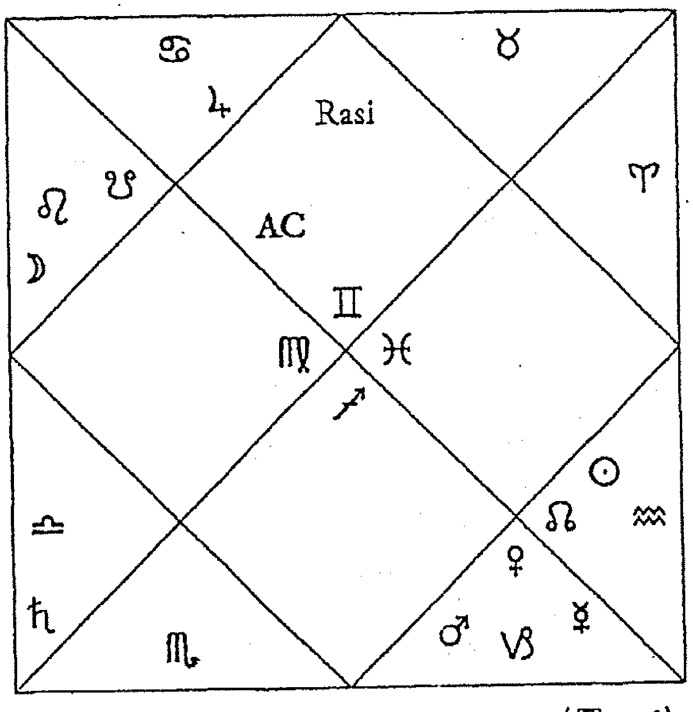

## 【案例三十六】

印度前女總理
英迪拉·甘地夫人 (Indira Goudhi)
1917年11月19日 11:11 (IST)
印度·安拉阿巴德 25N27, 81E51

- 命主於夜間出生（太陽 ☉ 位於第六宮）。
- 上升星座巨蟹座 ♋，為偶數星座。
- 太陽 ☉ 位於天蠍座 ♏，也是偶數星座。
- 月亮位于摩羯座，也是偶数星座。
- 命主具有优雅的女性特质，「Maha-Bhagya Yoga」的行星组合，使她比别人幸运。
- 另外还有其他行星组合互容，可以参阅「Parivartana Yoga」（P355）的实例解说。

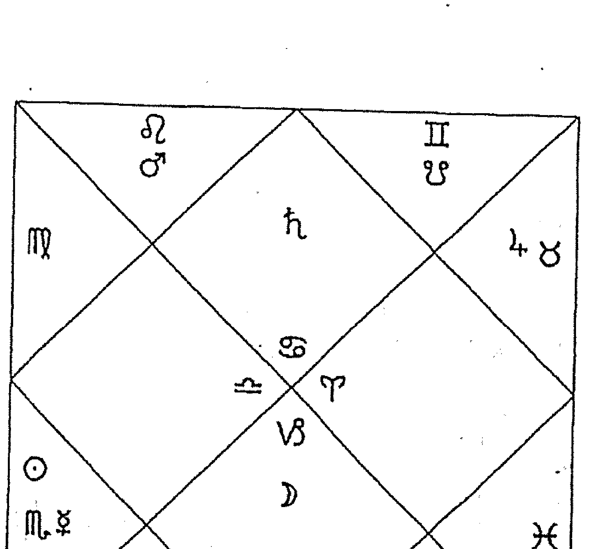

## 十一、Chandra-Mangala Yoga

## 定義

梵文「Chandra」乃「月亮」之意；而「Mangala」为「火星」之意；当火星和月亮会合在任何宫内时。

## 效應

命主具有「Chandra-Mangala Yoga」时，善饮酒、争吵、粗鲁；难忍受母亲；不择手段的赚钱。

## 評論

这个行星组合有利于赚钱能力及财富的累积；除非有木星与火星或月亮的相映，否则手段较不被社会所认同。火星和月亮会合时，最好位于吉宫；此外，也有学者认为，火星和月亮相映或互容，亦可构成「Chandra-Mangala Yoga」。

## 十二、Maala/ Maalika Yoga

## 定義

梵文「Maala」乃「薔薇園」之意。當七個行星（太陽、月亮、火星、水星、木星、金星、土星）不分前後順序，位於連續的七個宮位時。

## 效應

視太陽從何宮開始，會有不同的效應，共有十二種變化：

- 從上升星座開始：地位等同於國王，並擁有支配的力量、舒適的享受（汽車）。
- 從第二宮開始：富有的國王；孝順父母、積極、堅定果敢，德行佳。
- 從第三宮開始：勇敢、富有、陰沉。
- 從第四宮開始；自由主義；坐擁數個城邦；領導者。
- 從第五宮開始：著名的；懂得執行神聖儀式，才智高超。
- 從第六宮開始：一般而言屬於貧窮，但偶爾獲得財富和舒服感。
- 從第七宮開始：壽命長，擁有數名妻子。
- 從第八宮開始：壽命長，具分辨能力；貧窮和懼內。
- 從第九宮開始：有力的；聖人、虔誠的宗教奉獻者。
- 從第十宮開始：德行佳，具有高度的評價、良好的行為。
- 從第十一宮開始：非常能幹、容易擁有美麗心愛的女人、王室的風采。
- 從第十二宮開始：廣泛的受到尊崇；揮霍或放縱於性愛。

## 評論

「Maala Yoga」的效應須視太陽所在宮位的性質而定。

## 十三、Chatussaagara Yoga

## 定義

在梵文「Chatussaagara」中的「Chatuss」，乃數字「四」之意；「agara」則為「主要」之意。而在這個行星組合裡，共有兩種狀況：

- 所有的行星位於始宮內。
- 所有的行星位於啟動星座，即白羊座、巨蟹座、天秤座、摩羯座。

## 效應

當命主具有「Chatussaagara Yoga」時，可以破壞命盤中數個刑剋，賦予命主財富和地位。

## 評論

由於四個始宮是命盤的重點，因此，所有的行星位於始宮內，必然會增強其力量，有助命主的氣勢。如果行星能入旺或位於自己主管的星座，那麼情況必然更佳，足以抵擋一些不良的刑剋。

## 十四、Saraswati Yoga

## 定義

梵文「Saraswati」為印度智慧女神，乃創造主梵天之妻。水星、木星、金星位於始宮、三方宮或第二宮，且木星力量強，位於自己主管的星座、友誼星座或旺宮時。

## 效應

命主具有「Saraswati Yoga」時，學識淵博，精通散文、詩歌、罕見的手抄本以及高等數學。

## 評論

吉星位於吉官，情況本就已經相當良好，如果位於第二宮，那麼將賦予命主財富和雄辯口才。在印度神話中，「Saraswati」代表的是學問女神；所以，當命主具有這個行星組合時，必然學問佳，易成為作家、詩人；然而，仍需注意，這些吉星最好避免逢凶星刑剋。

## 十五、Hatha-Wantaa Yoga

## 定義

當月亮位於本命的第十一宮；同時，太陽位於月亮主管的星座巨蟹座。

## 效應

命主具有「Hatha-Wantaa Yoga」時，會因為任性或自我吹噓的某些愚蠢行為而導致死亡。

## 評論

一般而言，這個行星組合並不會讓命主嚴重到致死；然而，會因為倔強、頑固而受到貶抑。

## 十六、Neecha-Bhanga Raja Yoga

## 定義

梵文「Neecha」乃「無力」之意；而「Bhanga」則為「取消」之意。若要構成「Neecha-Bhanga Raja Yoga」行星組合，則必須符合下列一項或多項條件：

- 宮主星無力，位於由上升星座或月亮起算的始宮。
- 無力的行星與落入宮位的宮主星會合或相映。
- 無力的行星與落入宮位的宮主星互容。
- 兩個無力的行星彼此相映。

## 效應

這個行星組合主要針對無力的行星可能被抵消的狀況，甚至可能構成「貴格」，帶來吉利的效應。

## 評論

一般而言，「Neecha」或無力的行星，會因為本身力量弱而產生不良影響，尤其是在它們的大運（Dasha）期間。見到這個行星組合時，必須仔細分辨：「Neecha」（無力的）行星並不全然會產生凶象；至於反而會形成「貴格」的說法，則須保留，不能全信。

十七、尚有其他複雜的、五顏六色的行星組合，在此，不多作贅述；有興趣且想深入研究的讀者，可以搜集相關資料。

## 第七節 Nabhasa Yogas

「Nabhasa Yogas」行星組合向來較不被重視，因為它的形成，是以天宮圖的特殊型態組成；跟西洋占星學所強調的「星座的三方四正」，以及「後天宮的東、西、南、北半球分類」相當類似。

現代西洋占星學構成心理主軸的論斷，有線索指出，這些觀念沿襲自印度占星學；西洋占星學於十九世紀末，在英國興起，主要與海倫娜・布拉瓦茨基夫人（Helena Petrovna Blavatsky）所創立的「通神學會」（Theosophical Society）有關。

「通神學會」探究以神秘主義為基礎的宗教哲學，許多內容均取材自印度哲學；他們也研究占星學，相當程度的與印度占星學相關。在十九世紀末以前，西洋占星學的天宮圖中，幾乎看不到上述型態的個性解說。「通神學會」的會員艾倫·里奧（Allan Leo）為他的被訴而改變占星學的論述：強調個性及心理的層面，將這些要素納入。他的引用並沒有證據佐證，因此可以合理的懷疑兩者的關聯性。

二十世紀初至中葉期間，美國占星師馬爾克·埃德蒙·瓊斯（Dr. Marc Edmund Jones）曾經提出著名的七種出生圖型：散落型（The Splash）、集團型（The Bundle）、火車頭型（The Locomotive）、碗型（The Bowl）、提桶型（The Bucket）、蹺蹺板型（The See-Saw）和擴展型（The Splay）。這些論述與印度占星學中的「Nabhasa Yogas」的某些內容相當類似，由此可見，古印度占星先賢的睿智及先見。

## 第八節 Sanyasa Yogas

「東方著重精神，西方重視物質」，一直是學界評述東、西方文化差異之所在。所謂東方，雖然泛指印度、中國、日本、韓國等地區，然而主要針對的對象仍為印度。印度可說是精神、宗教的國度，古印度人並不重視物質層面，強調靈魂的昇華。《吠陀經》所揭示的人生四行期，最後的行期即是拋棄一切，遁入森林人跡罕見之處，進行苦修，忍受一切苦痛、不便。在此觀念下，亦影響印度占星學對於精神提升的行星組合的闡述。

印度人服膺、遵從上師（Guru）教誨是舉世無雙的；對於公認的聖人更是五體投地，從不敢違逆聖人的訓示。上師、聖者的地位崇高無比，是人人欽慕的對象。因此，有關精神提升的行星組合，一般稱為「Sanyasa Yogas」，也就格外受到重視。「Sanyasa Yogas」大致有下列情況：

- 當有四個，或四個以上的行星，有力的位於天宮圖的單一宮位時，即會誕生一位「Tapasvi」或「Sanyasi」。所謂的「Tapasvi」，是指「進行苦修或苦行之人」；而「Sanyasi」，則是指「禁欲主義者」。上述的行星組合，與建構此行星組合的最強行星的性質有關。
- 太陽：在山陸或森林、水邊實施苦行，較為困難；崇高的道德、聰慧。
- 月亮：棄絕社會、喜愛孤獨；自律；奉獻於罕見的手抄本。
- 火星：追隨佛陀，穿紅色衣飾；控制自己的意念。
- 水星：好辯、貪婪，且受他人哲學觀點的影響。
- 木星：自律、受訓戒、獨身主義者；精於「數論派」哲學；生活靠牛乳和果實。
- 金星：棄絕社會的流浪者、唯物派的追隨者。
- 土星：自大傲慢、沉浸於嚴酷的苦行；裸僧（天衣派）。

如果力量最強的行星遭逢行星戰爭，命主則很有可能放棄禁欲，重返世俗社會。如果力量最強的行星逢焦傷，那麼命主無法成為聖人，但仍具有聖人的威嚴。

- 當第十宮主星也涉及四個行星組合，位於始宮或三方宮，那麼即形成「Sanyasi」，死後獲得解脫；這個組合是進行禁欲相當良好的要素。

## 第九節 案例解析

本節以張國榮的命盤（P386）為例，說明他的行星組合特色：

（一）太陽 ☉ 位於第十宮事業宮，因為屬於自然凶星，卻為始宮主星，因此成為功能吉星。

- 太陽 ☉ 位於自己主管的星座獅子座 ♌，力量甚強；還擁有六個吉點，因此事業易發光發熱，擁有榮耀、名望，受人尊崇。
- 太陽 ☉ 與木星 ♃ 會合於第十宮，木星 ♃ 是第二宮（財富）人馬座 ♐ 及第五宮（才華）雙魚座 ♓ 三方宮的宮主星；因此，太陽⊙和木星♃的行星組合，就具有「富格」及「貴格」，相當吉祥，且能名利雙收。
- 太陽⊙位於第十宮獅子座♌，受到位於第九宮巨蟹座♋的金星♀，和位於第十一宮處女座♍的水星☿包圍。這兩個行星都是自然吉星，且金星♀位於第九宮，能增加其力量；水星☿位於自己主管的星座，甚佳。它們的包圍能帶來太陽⊙的光輝。以太陽⊙為中心的第二宮處女座♍內，有水星☿入廟，以及第十二宮巨蟹座♋，有金星♀形成「Ubhayachari Yoga」，肩負如國王般的重責大任，外形勻稱、外貌英俊；由於兩者都屬自然吉星，因此更能突顯事業吉象。

此外，這兩個吉星的包圍，也構成了「Shubha Yoga」，將帶來繁榮昌盛。

- 火星♂為上升星座天蠍座♏及第六宮白羊座♈的宮主星，飛臨第四宮水瓶座♒，相映至太陽⊙刑剋；因命宮屬於三方宮之一，因此，火星♂和太陽⊙也構成「貴格」。由於火星♂屬自然凶星，位於第四宮，因此母親易見刑傷，父母不和，較無家庭親情溫暖。此外，火星♂是第六宮（疾病）宮主星，位於第四宮，容易引起腸胃不佳、長期胃食道逆流等問題。
- 土星♄位於命宮，也相映至太陽⊙。土星♄是第三宮摩羯座♑的宮主星，與音樂創作、藝術戲劇表演有關；同時也是第四宮水瓶座♒的宮主星，與母親、家庭有關。母親與父親長期不和，在戲劇表演上力求完美，帶給自己極大的壓力。

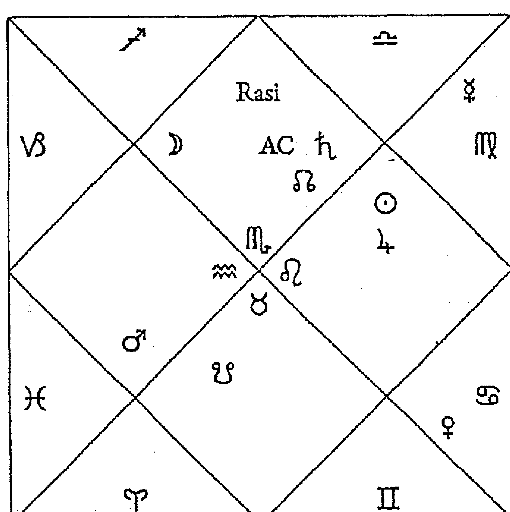

（二）月亮 ☽ 位於命宮，乃自然吉星（第一四分相至滿月）；同時也是第九宮巨蟹座 ♋ 三方吉宮的宮主星，屬功能吉星。

- 雖然月亮 ☽ 入弱於天蠍座 ♏；然而，第九宮三方宮的宮主星飛入第一宮（始宮兼三方宮），類似「貴格」的行星組合；又逢南北交點 ♃／☋ 會合相映，也帶有「貴格」的吉祥徵象。月亮 ☽ 具有五個吉點，且上升點具有三十個吉點，頗佳。
- 月亮 ☽ 逢土星 ♄ 會合，土星 ♄ 乃第四宮始宮的宮主星，飛入第一宮，會合月亮 ☽ 三方宮第九宮的宮主星，形成「貴格」的行星組合，利於名聲；但是，月亮為心思的自然徵象星，逢土星 ♄ 及南北交點 ♃／☋ 會合或相映，不免憂傷、抑鬱，不快樂。月亮也是母親的徵象星，與母親緣分較薄。
- 由月亮 ☽ 起算的始宮第十宮內，見木星 ♃，形成「大象與獅子的組合」。月亮 ☽ 雖然入弱，不過是第九宮吉宮的宮主星，具有五個吉點；而木星 ♃，則是第二宮人馬座 ♐ 和第五宮雙魚座 ♓ 三方宮吉宮的宮主星，也有五個吉點。月亮 ☽ 和木星 ♃ 分別位於命宮及第十宮，這個「大象與獅子的組合」，頗利於名望、財利；然而，土星 ♄ 及南北交點 ♃／☋ 卻與月亮 ☽ 會合或相映，且土星 ♄ 也相映至木星 ♃；而上升星座主星火星 ♂，也相映至木星 ♃，使得這個行星組合威力受損。
- 由月亮 ☽ 起算的第二宮人馬座 ♐ 及第十二宮天秤座 ♎，宮內都無行星，構成月亮身宮盤的「Kemadruma Yoga」行星組合，帶來健康不佳、心靈不平靜，易遭逢不幸。

（三）火星 ♂ 為上升星座主星，位於第四宮水瓶座 ♒，火星 ♂ 是上升星座的主星，也是第六宮白羊座 ♈ 的主星，故屬中性功能。

- 火星 ♂ 為始宮兼三方宮的命宮主星，逢落入自己主管星座獅子座 ♌ 的太陽 ☉，在第十宮始宮相映，構成「貴格」，如本節第（一）點的第 4 點分析。

- 2. 火星♂亦見第二宮人馬座♐及第五宮雙子座♊的宮主星木星♃飛入第十宮始宮的相映，也形成「貴格」及「富格」。
- 3. 火星♂也與位於第十一宮，入旺於處女座♍的水星☿相映，構成「富格」行星組合；火星♂的吉點四，力量平平，但是在第四宮有三十點；且水星☿擁有吉點六，所在的第十一宮也有三十五點，甚強，可以累積財富。

根據本書所述的行星組合條件，張國榮的命盤中，構成甚多的「貴格」及「富格」，名利雙收；卻因為月亮嚴重受剋，以致憂鬱症纏身，過不了關。一代巨星殞落，令人惋惜！

## 第八章 大運系統

印度占星學中，最受尊崇以及最令西方占星家驚豔的，就是「大運系統」（Dasa）；它是一種行星期間（Planetary Period）的預測系統。「Dasa」的字義，就是生命的階段或狀況（Stage or Condition of Life）；根據印度占星學文獻的說法：特定的業力已經成熟，因而顯示。「Dasa」意指準備或享受咀嚼。

一般將天宮圖的解讀視為靜態分析；而大運、流年等預測系統，則被視為動態分析（Dynamic Analysis）。不過，唯有本命天宮圖所呈現的吉凶徵象，方可能因為特定業力的成熟，而在「大運系統」中出現；所以，本命和大運之間的關係相當緊密。本命天宮圖中沒有的徵象，不可能在「大運系統」中呈現；欲推估「大運」系統的徵象，務必先對本命天宮圖的分析具備相當程度的熟稔。儘管東、西方占星學都強調本命、大運的關係；然而，還是以印度占星學執行得最為徹底。

事實上，「大運」系統相當繁多，根據古典文獻的統計，粗估便約莫有一百多種。例如印度占星學主流學者帕拉薩拉，其著作《BPHS》就記載了三十二種「大運」系統；而非主流的賈密尼也有四十幾種，令人眼花撩亂。前者大抵根據出生時間、月亮所在的二十七星宿來計算；而後者則根據星座推演而來。

這麼多的「大運」系統，勢必會出現矛盾。這個現象也突顯了印度占星學流傳幾千年來的必然結果。幸好，經過世代的推移及驗證，主流派帕拉薩拉的「Vimsottari Dasa」系統最令人折服，因此被全印度各占星學派所認同，也流傳至歐美各國。本章將以這個系統為主題來作說明。

「Vimsottari Dasa」為行星期間的一種，印度占星學所使用的七大行星及兩個陰影行星，都有各自的管轄期間；最短的是太陽，管六年，最長的是金星，管二十年。由於這些時間都顯得稍長，因此在「主要期間」內又分出「次要期間」，命名為「Bhuktis」，也稱作「Antaras」。這種「主要期間／次要期間」的預測系統一直占據重要地位，本章將教導讀者如何演算排列。

除「主要期間／次要期間」的分類外，還更進一步的將「次要期間」細分成「次次要期間」（Pratyantaras）。然而，這種作法除增加分析難度外，並未能讓分析結果更為精確，因此甚少被占星家採用。本命徵象在「大運（Dasa）」系統成熟的呈現，觸發媒介是以「過運系統」（Transit）為主；即採用「本命—Dasa（主要期間／次要期間）—過運」三合一分析，以顯露吉凶事徵的性質及應期。

這套預測系統相當犀利，因此讓印度占星學逐漸在歐美嶄露頭角。須注意的是，儘管印度占星學的過運法也如同西方系統一般，觀測現行天空星體的移行與本命星體的關係；然而，兩者分析的方式並不相同，後文將析論之。

此外，印度占星學在談論過運法時，相當在意行星的力量，這項分析須與第六章「行星的八個吉點力量」的內容，互相搭配使用。

### 第一節 Vimsottari Dasa 系統的內容與應用

若是要了解「Vimsottari Dasa」系統的核心意義，就務必要深入探討下列幾個相關議題：

#### 一、Vimsot'ari Dasa 系統的合理性

印度是全球宗教信仰最虔誠的國度。全印度境內，主要的宗教派別為印度教、回教、佛教、耆那教、錫克教、祆教、基督教……但是以印度教為大宗，約占83%人口。印度占星學的創立，只是奠基於吠陀經典的哲學精神；印度人天真爛漫的認為，吠陀學問是天啟的，完全不需懷疑其真實性。

「Vimsottari」的字面意義是「一百二十」。古代印度聖人認為，人類只要施行「大法」，清心寡欲地修行，壽命至少可以延長至一百歲以上。

「Vimsottari Dasa」系統就是以九個行星，各配以管轄年度，按固定的順序排列，共計一百二十年的時間。列表如下：

| 行星 | 管轄年數 | 主管二十七星宿 |
|------|----------|----------------|
| ☉ | 6年 | Krittika、Uttara Phalguni、Uttara Ashadha |
| ☽ | 10年 | Rohini、Hasta、Shravana |
| ♂ | 7年 | Mrigasira、Chitra、Dhanishtha |
| ♃ | 18年 | Ardra、Swati、Shatabhisha |
| ♄ | 16年 | Punarvasu、Vishakha、Purva Bhadra |
| ♅ | 19年 | Pushya、Anuradha、Uttara Bhadra |
| ♆ | 17年 | Ashlesha、Jyeshtha、Revati |
| ♇ | 7年 | Ashwini、Magha、Mula |
| ♀ | 20年 | Bharani、Purva Phalguni、Purva Ashadha |
| 共 | 120年 |  |

關於「Vimsottari Dasa」系統的合理性，1950至1980年間，陸續有人提出看法。然而，平心而論，反倒是西方學者的紮實論證較為合理，尤以葛雷斯·英格利斯（Grace Inglis）和雷利（V. G. Rele）的說法，較令人信服。由於雷利的論證須以長篇幅探討，過於耗時，在此不予討論。有興趣深入了解的讀者，可參閱他的著作。

#### 二、歲差修正值

在計算「Vimsottari Dasa」系統時，是以月亮所在的二十七星宿宿度起頭的，而二十七星宿又與「恆星黃道」結合。前述印度占星學採用的「恆星黃道」，與西方占星學採用的「迴歸黃道」之間存在著歲差修正值，可以用下列公式表示：

恆星黃道度數＝迴歸黃道度數－歲差修正值

第二章「天宮圖的建立」曾經提及，在印度政府的協商、統合下，一律採用「Lahiri」歲差修正值；目前此一作法已成為多數共識。

#### 三、適當的一年日數

在此要探討的，是一年的日數該採用 365 又 1/4 日，還是 360 日？印度曆法對一年的日數定義曾經出現好幾種版本，其中跟占星學有關的，最主要有兩種：一是「世間年」（Savan Year）等於 360 日；二是「太陽年」（Solar Year）等於 366 日。

隨著科學的進展，經實測一年的日數為 365 又 1/4 日。

西元十六世紀，印度占星學先賢曼崔斯瓦拉所著的《Phala Deepika》，首次採用 365 又 1/4 日作為「Vimsottari Dasa」系統的計算基礎。這部著作內容簡潔有力，影響甚鉅，因此不乏仿效者跟進。直到二十世紀，西方一些採用「恆星黃道」系統的占星學者，例如雷利、葛雷斯·英格利斯、加思·艾倫（Garth Allen〔Donald Bradley〕）、肯尼思·伊林（Kenneth Iring）等人陸續提出，應以一年 365 日計算，才符合事件應期他們努力研究的成果，也讓印度本土占星學者重新檢視占星古典文獻，發現早於曼崔斯瓦拉的巴度塔巴拉（Bhattotapala）在評論《Brihat Jataka》時，曾經引用聖人蓋夫賈（Gavga）的說法，宣稱大運（Dasa）系統應以「世間年」360 日來計算，引起一番論爭。

採用一年日數為 365 又 1/4 日，和以一年日數為 365 日計算「主要期間／次要期間」系統的管轄期間，必然不同，對事件的應期會產生一定的誤差。當代印度占星學界最具威望的雷歐先生採用前者來推算應期；因此，目前前者較占上風，根據筆者的實務經驗，也認同之。

## 出生時月亮經度的「Vimsottari Dasa」餘額表

| 月亮經度 | 月亮在火象 白羊座、獅子座、人馬座 | 月亮在土象 金牛座、處女座、摩羯座 | 月亮在風象 雙子座、天秤座、水瓶座 | 月亮在水象 巨蟹座、天蠍座、雙魚座 |
| :---: | :---: | :---: | :---: | :---: |
| **度 分** | **年 月 日** | **年 月 日** | **年 月 日** | **年 月 日** |
| 0 0 | ♃ 7 0 0 | ☉ 4 6 0 | ♂ 3 6 0 | ♃ 4 0 0 |
| 0 20 | 6 9 27 | 4 4 6 | 3 3 27 | 3 7 6 |
| 0 40 | 6 7 24 | 4 2 12 | 3 1 24 | 3 2 12 |
| 1 0 | 6 5 21 | 4 0 18 | 2 11 21 | 2 9 18 |
| 1 20 | 6 3 18 | 3 10 24 | 2 9 18 | 2 4 24 |
| 1 40 | 6 1 15 | 3 9 0 | 2 7 15 | 2 0 0 |
| 2 0 | 5 11 12 | 3 7 6 | 2 5 12 | 1 7 6 |
| 2 20 | 5 9 9 | 3 5 12 | 2 3 9 | 1 2 12 |
| 2 40 | 5 7 6 | 3 3 18 | 2 1 6 | 0 9 18 |
| 3 0 | 5 5 3 | 3 1 24 | 1 11 3 | 0 4 24 |
| 3 20 | 5 3 0 | 3 0 0 | 1 9 0 | ♄ 19 0 0 |
| 3 40 | 5 0 27 | 2 10 6 | 1 6 27 | 18 6 9 |
| 4 0 | 4 10 24 | 2 8 24 | 1 4 24 | 18 0 18 |
| 4 20 | 4 8 21 | 2 6 21 | 1 2 21 | 17 6 27 |
| 4 40 | 4 6 18 | 2 4 18 | 1 0 18 | 17 1 6 |
| 5 0 | 4 4 15 | 2 3 15 | 0 10 15 | 16 7 15 |
| 5 20 | 4 2 12 | 2 1 12 | 0 8 12 | 16 1 24 |
| 5 40 | 4 0 9 | 1 11 9 | 0 6 9 | 15 8 3 |
| 6 0 | 3 10 6 | 1 9 18 | 0 4 6 | 15 2 12 |
| 6 20 | 3 8 3 | 1 7 24 | 0 2 3 | 14 8 21 |
| 6 40 | 3 6 0 | 1 6 0 | ☊ 18 0 0 | 14 3 0 |
| 7 0 | 3 3 27 | 1 4 6 | 17 6 18 | 13 9 9 |
| 7 20 | 3 1 24 | 1 2 12 | 17 1 6 | 13 3 18 |
| 7 40 | 2 11 21 | 1 0 18 | 16 7 24 | 12 9 27 |
| 8 0 | 2 9 18 | 0 10 24 | 16 2 12 | 12 4 6 |
| 8 20 | 2 7 15 | 0 9 0 | 15 9 0 | 11 10 15 |
| 8 40 | 2 5 12 | 0 7 6 | 15 3 18 | 11 4 24 |
| 9 0 | 2 3 9 | 0 5 12 | 14 10 6 | 10 11 3 |
| 9 20 | 2 1 6 | 0 3 18 | 14 4 24 | 10 5 12 |
| 9 40 | 1 11 3 | 0 1 24 | 13 11 12 | 9 11 21 |
| 10 0 | 1 9 0 | ♀ 10 0 0 | 13 6 0 | 9 6 0 |
| 10 20 | 1 6 27 | 9 9 0 | 13 0 18 | 9 0 9 |
| 10 40 | 1 4 24 | 9 6 0 | 12 7 6 | 8 6 18 |
| 11 0 | 1 2 21 | 9 3 0 | 12 1 24 | 8 0 27 |
| 11 20 | 1 0 18 | 9 0 0 | 11 8 12 | 7 7 6 |
| 11 40 | 0 10 15 | 8 9 0 | 11 3 0 | 7 1 15 |
| 12 0 | 0 8 12 | 8 6 0 | 10 9 18 | 6 7 24 |
| 12 20 | 0 6 9 | 8 3 0 | 10 4 6 | 6 2 3 |
| 12 40 | 0 4 6 | 8 0 0 | 9 10 24 | 5 8 12 |
| 13 0 | 0 2 3 | 7 9 0 | 9 5 12 | 5 2 21 |
| 13 20 | ♀ 20 0 0 | 7 6 0 | 9 0 0 | 4 9 0 |
| 13 40 | 19 6 0 | 7 3 0 | 8 6 18 | 4 3 9 |
| 14 0 | 19 0 0 | 7 0 0 | 8 1 6 | 3 9 18 |
| 14 20 | 18 6 0 | 6 9 0 | 7 7 24 | 3 3 27 |
| 14 40 | 18 0 0 | 6 6 0 | 7 2 12 | 2 10 6 |
| 15 0 | 17 6 0 | 6 3 0 | 6 9 0 | 2 4 15 |
| 15 20 | 17 0 0 | 6 0 0 | 6 3 18 | 1 10 24 |
| 15 40 | 16 6 0 | 5 9 0 | 5 10 6 | 1 5 3 |
| 16 0 | 16 0 0 | 5 6 0 | 5 4 24 | 0 11 12 |
| 16 20 | 15 6 0 | 5 3 0 | 4 11 12 | 0 5 21 |
| 16 40 | 15 0 0 | 5 0 0 | 4 6 0 | ☿ 17 0 0 |
| 17 0 | 14 6 0 | 4 9 0 | 4 0 18 | 16 6 27 |
| 17 20 | 14 0 0 | 4 6 0 | 3 7 6 | 16 1 24 |
| 17 40 | 13 6 0 | 4 3 0 | 3 1 24 | 15 8 21 |
| 18 0 | ♀ 13 0 0 | ♂ 4 0 0 | ♆ 2 8 12 | ☿ 15 3 18 |
| 18 20 | 12 6 0 | 3 9 0 | 2 3 0 | 14 10 15 |
| 18 40 | 12 0 0 | 3 6 0 | 1 9 18 | 14 5 12 |
| 19 0 | 11 6 0 | 3 3 0 | 1 4 6 | 14 0 9 |
| 19 20 | 11 0 0 | 3 0 0 | 0 10 24 | 13 7 6 |
| 19 40 | 10 6 0 | 2 9 0 | 0 5 12 | 13 2 3 |
| 20 0 | 10 0 0 | 2 6 0 | 4 16 0 0 | 12 9 0 |
| 20 20 | 9 6 0 | 2 3 0 | 15 7 6 | 12 3 27 |
| 20 40 | 9 0 0 | 2 0 0 | 15 2 12 | 11 10 24 |
| 21 0 | 8 6 0 | 1 9 0 | 14 9 18 | 11 5 21 |
| 21 20 | 8 0 0 | 1 6 0 | 14 4 24 | 11 0 18 |
| 21 40 | 7 6 0 | 1 3 0 | 14 0 0 | 10 7 15 |
| 22 0 | 7 0 0 | 1 0 0 | 13 7 6 | 10 2 12 |
| 22 20 | 6 6 0 | 0 9 0 | 13 2 13 | 9 9 9 |
| 22 40 | 6 0 0 | 0 6 0 | 12 9 18 | 9 4 6 |
| 23 0 | 5 6 0 | 0 3 0 | 12 4 24 | 8 11 3 |
| 23 20 | 5 0 0 | ♂ 7 0 0 | 12 0 0 | 8 6 0 |
| 23 40 | 4 6 0 | 6 9 27 | 11 7 6 | 8 0 27 |
| 24 0 | 4 0 0 | 6 7 24 | 11 2 12 | 7 7 24 |
| 24 20 | 3 6 0 | 6 5 21 | 10 9 18 | 7 2 21 |
| 24 40 | 3 0 0 | 6 3 18 | 10 4 24 | 6 9 18 |
| 25 0 | 2 6 0 | 6 1 15 | 10 0 0 | 6 4 15 |
| 25 20 | 2 0 0 | 5 11 12 | 9 7 6 | 5 11 12 |
| 25 40 | 1 6 0 | 5 9 9 | 9 2 12 | 5 6 9 |
| 26 0 | 1 0 0 | 5 7 6 | 8 9 18 | 5 1 6 |
| 26 20 | 0 6 0 | 5 5 3 | 8 4 24 | 4 8 3 |
| 26 40 | ⊙ 6 0 0 | 5 3 0 | 8 0 0 | 4 3 0 |
| 27 0 | 5 10 6 | 5 0 27 | 7 7 6 | 3 9 27 |
| 27 20 | 5 8 12 | 4 10 24 | 7 2 12 | 3 4 24 |
| 27 40 | 5 6 18 | 4 8 21 | 6 9 18 | 2 11 21 |
| 28 0 | 5 4 24 | 4 6 18 | 6 4 24 | 2 6 18 |
| 28 20 | 5 3 0 | 4 4 15 | 6 0 0 | 2 1 15 |
| 28 40 | 5 1 6 | 4 2 12 | 5 7 6 | 1 8 12 |
| 29 0 | 4 11 12 | 4 0 9 | 5 2 12 | 1 3 9 |
| 29 20 | 4 9 18 | 3 10 6 | 4 9 18 | 0 10 6 |
| 29 40 | 4 7 24 | 3 8 3 | 4 4 24 | 0 5 3 |
| 30 0 | 4 6 0 | 3 6 0 | 4 0 0 | 0 0 0 |

（表8-2）接下來的二個小節，將會說明「Vimsottari Dasa」的製作與要義，並探討「主要期間／次要期間」。

### 第二節 Vimsottari Dasa 系統的製作

- 首先，必須注意出生時，月亮所在星座的正確度數、分數。
- 以前述張國榮的案例解說。他出生時，月亮位於天蠍座 27°46′（以「Lahiri」為基準的歲差修正值）。
- 從〈表 8-2〉找出最接近月亮經度和其相對應的年、月、日餘額。本案例中，月亮的恆星黃道經度位於天蠍座 27°46′，從表中找出最接近的度數為 27°40′；由於月亮位於水象星座（天蠍座），對應的餘額為 2 年 11 月 21 日，屬水星主管的行星期間。
- 如何知道期間由哪個行星所管轄？可根據命主出生時，月亮的恆星黃道經度歸屬於哪個星宿，其星宿主星即是。例如本案例中，月亮位於天蠍座 26°5′，其星宿為「Jyeshtha」，而星宿主星為水星，故由水星所管轄；管轄年數為十七年，從天蠍座 16°40′ 至 30°。月亮如果位於天蠍座 16°40′，其餘額為十七年，如今已經來到天蠍座 27°40′，歷經 11°，即 660′。
$$14.025 年 = \frac{660'}{800'} \times 17 年$$
結果即為表列餘額 2 年 11 月 21 日（為簡化計算：1 年 = 12 月，1 月 = 30 日）。

#### 三、再從〈表 8-3〉找出各個行星管轄每一分（1'）及累積的月／日數

##### 行星大運（Dasa）每一分比例計算表

| 序号 | ♃ 7年 月 | ♃ 7年 日 | ♀ 20年 月 | ♀ 20年 日 | ☉ 6年 月 | ☉ 6年 日 | ☽ 10年 月 | ☽ 10年 日 | ♂ 7年 月 | ♂ 7年 日 | ☊ 18年 月 | ☊ 18年 日 | ♃ 16年 月 | ♃ 16年 日 | ♄ 19年 月 | ♄ 19年 日 | ☿ 17年 月 | ☿ 17年 日 |
|------|----------|----------|----------|----------|----------|----------|----------|----------|----------|----------|----------|----------|----------|----------|----------|----------|----------|----------|
| 1    | 0        | 3        | 0        | 9        | 0        | 3        | 0        | 5        | 0        | 3        | 0        | 8        | 0        | 7        | 0        | 9        | 0        | 8        |
| 2    | 0        | 6        | 0        | 18       | 0        | 5        | 0        | 9        | 0        | 6        | 0        | 16       | 0        | 14       | 0        | 17       | 0        | 15       |
| 3    | 0        | 9        | 0        | 27       | 0        | 8        | 0        | 14       | 0        | 9        | 0        | 24       | 0        | 22       | 0        | 26       | 0        | 23       |
| 4    | 0        | 13       | 1        | 6        | 0        | 11       | 0        | 18       | 0        | 13       | 1        | 2        | 0        | 29       | 1        | 4        | 1        | 1        |
| 5    | 0        | 16       | 1        | 15       | 0        | 14       | 0        | 23       | 0        | 16       | 1        | 11       | 1        | 6        | 1        | 13       | 1        | 8        |
| 6    | 0        | 19       | 1        | 24       | 0        | 16       | 0        | 27       | 0        | 19       | 1        | 19       | 1        | 13       | 1        | 21       | 1        | 16       |
| 7    | 0        | 22       | 2        | 3        | 0        | 19       | 1        | 2        | 0        | 22       | 1        | 27       | 2        | 20       | 2        | 0        | 1        | 24       |
| 8    | 0        | 25       | 2        | 12       | 0        | 22       | 1        | 6        | 0        | 25       | 2        | 5        | 1        | 28       | 2        | 8        | 2        | 1        |
| 9    | 0        | 28       | 2        | 21       | 0        | 24       | 1        | 11       | 0        | 28       | 2        | 13       | 2        | 5        | 2        | 17       | 2        | 9        |
| 10   | 1        | 1        | 3        | 0        | 0        | 27       | 1        | 15       | 1        | 1        | 2        | 21       | 2        | 12       | 2        | 26       | 2        | 17       |
| 15   | 1        | 17       | 4        | 15       | 1        | 11       | 2        | 8        | 1        | 17       | 4        | 2        | 3        | 18       | 4        | 8        | 3        | 25       |
| 20   | 2        | 3        | 6        | 0        | 1        | 24       | 3        | 0        | 2        | 3        | 5        | 12       | 4        | 24       | 5        | 21       | 5        | 3        |

從〈表 8-3〉得知，只要知道由哪個行星管轄，命主月亮經度距離〈表 8-2〉所列經度差幾分，即可換算得知。

水星主管 17 年，從天蠍座 16° 40′ 至 30°，換算共 800′，即 800′ = 17 年。
$$1' = \frac{17 年}{800} = \frac{17 \times 12 \times 30}{800} \doteq 7.65 日$$
本案例中，月亮位於天蠍座 27°46′，距離表列 27°40′ 多 6′；因此，須從餘額 2 年 11 月 21 日再扣除 1 月 16 日，約 2 年 10 月 5 日，即得到水星實際管轄的餘額。

其他行星管轄期間，都是 13°20′，但因為管轄年數長度不同，因此每一分 (1′) 的日數有所不同，整理成〈表 8-3〉。

經過上述三個步驟，根據「Vimsottari Dasa」系統主管行星的順序及管轄係數，逐一排列；張國榮於 1956 年 9 月 12 日 11:50 在香港出生。

- 1. 1956/09/12 + 2/10/05 = 1959/07/17 即 1956/09/12 至 1959/07/14，當屬水星管轄
- 2. 1959/07/17 + 7 = 1966/07/14 即 1959/07/15 至 1966/07/14，當屬南交點管轄七年
- 3. 1966/07/14 + 20 = 1986/07/14 即 1966/07/15 至 1986/07/14，當屬金星管轄二十年
- 4. 1986/07/14 + 6 = 1992/07/14 即 1986/07/15 至 1992/07/14，當屬太陽管轄六年
- 5. 1992/07/14 + 10 = 2002/07/14 即 1992/07/15 至 2002/07/14，當屬月亮管轄十年
- 6. 2002/07/14 + 7 = 2009/07/14 即 2002/07/15 至 2009/07/14，當屬火星管轄七年
- 7. 2009/07/14 + 18 = 2027/07/14 即 2009/07/15 至 2027/07/14，當屬北交點管轄十八年
- 8. 2027/07/14 + 16 = 2043/07/14 即 2027/07/14 至 2043/07/14，當屬木星管轄十六年
- 9. 2043/07/14 + 19 = 2062/07/14 即 2043/07/14 至 2062/07/14，當屬土星管轄十九年

張國榮於西元 2003 年 4 月 1 日跳樓自殺死亡，屬火星管轄的「大運」期間；為了讓讀者充分了解整個「Vimsottari Dasa」系統演布，在此將他往生後的「大運」期間，也逐一列出，並以電腦計算為準。

以上所求得的各管轄期間為「主要期間」，如欲求「次要期間」，須再以各「主要期間」的管轄年數，按行星「主要期間」的比例計算。例如，太陽管轄六年，其在任何「次要期間」都管轄 6/120；而月亮管轄十年，各「次要期間」管轄 10/120，其他依此類推。各「主要期間」的第一個「次要期間」，則以該「主要期間」行星來管轄；其他順序則按前述各主要行星順序排列。例如太陽的「大運」期間，第一個「次要期間」為太陽；一般記載為 ⊙/⊙，將管 6年×6/120，約3月18日；接下來，第二個「次要期間」為月亮，記載為 ⊙/☽，將管 6年×10/120，約六個月，其他依此類推。

## 各主要期間／次要期間分配一览表

| Dasa | ⊙-6年 (次要期间) | ⊙-6年 (总共) | ☽-10年 (次要期间) | ☽-10年 (总共) | ♂-7年 (次要期间) | ♂-7年 (总共) |
|------|-------------------|---------------|-------------------|---------------|-------------------|---------------|
| Bhukti | 年 月 日 | 年 月 日 | 年 月 日 | 年 月 日 | 年 月 日 | 年 月 日 |
| ⊙ | 0 3 18 | 0 3 18 | | | | |
| ☽ | 0 6 0 | 0 9 18 | 0 10 0 | 0 10 0 | | |
| ♂ | 0 4 6 | 1 1 24 | 0 7 0 | 1 5 0 | 0 4 27 | 0 4 27 |
| ♃ | 0 10 24 | 2 0 18 | 1 6 0 | 2 11 0 | 1 0 18 | 1 5 15 |
| ♄ | 0 9 18 | 2 10 6 | 1 4 0 | 4 3 0 | 0 11 6 | 2 4 21 |
| ☿ | 0 11 12 | 3 9 18 | 1 7 0 | 5 10 0 | 1 1 9 | 3 6 0 |
| ♀ | 0 10 6 | 4 7 24 | 1 5 0 | 7 3 0 | 0 11 27 | 4 5 27 |
| ♃ | 0 4 6 | 5 0 0 | 0 7 0 | 7 10 0 | 0 4 27 | 4 10 24 |
| ♀ | 1 0 0 | 6 0 0 | 1 8 0 | 9 6 0 | 1 2 0 | 6 0 24 |
| ⊙ | | | 0 6 0 | 10 0 0 | 0 4 6 | 6 5 0 |
| ☽ | | | | | 0 7 0 | 7 0 0 |

| Dasa | ☊-18年 (次要期间) | ☊-18年 (总共) | ♃-16年 (次要期间) | ♃-16年 (总共) | ♄-19年 (次要期间) | ♄-19年 (总共) |
|------|-------------------|---------------|-------------------|---------------|-------------------|---------------|
| Bhukti | 年 月 日 | 年 月 日 | 年 月 日 | 年 月 日 | 年 月 日 | 年 月 日 |
| ♃ | 2 8 12 | 2 8 12 | | | | |
| ♄ | 2 4 24 | 5 1 6 | 2 1 18 | 2 1 18 | | |
| ☿ | 2 10 6 | 7 11 12 | 2 6 12 | 4 8 0 | 3 0 3 | 3 0 3 |
| ♀ | 2 6 18 | 10 6 0 | 2 3 6 | 6 11 6 | 2 8 9 | 5 8 12 |
| ♃ | 1 0 18 | 11 6 18 | 0 11 6 | 7 10 12 | 1 1 9 | 6 9 21 |
| ♀ | 3 0 0 | 14 6 18 | 2 8 0 | 10 6 12 | 3 2 0 | 9 11 21 |
| ☉ | 0 10 24 | 15 5 12 | 0 9 18 | 11 4 0 | 0 11 12 | 10 11 3 |
| ☽ | 1 6 0 | 16 11 12 | 1 4 0 | 12 8 0 | 1 7 0 | 12 6 3 |
| ♂ | 1 0 18 | 18 0 0 | 0 11 6 | 13 7 6 | 1 1 9 | 13 7 12 |
| ♃ | | | 2 4 24 | 16 0 0 | 2 10 6 | 16 5 18 |
| ♄ | | | | | 2 6 12 | 19 0 0 |

| Dasa | ☿-17年 (次要期间) | ☿-17年 (总共) | ♂-7年 (次要期间) | ♂-7年 (总共) | ♀-20年 (次要期间) | ♀-20年 (总共) |
|------|-------------------|---------------|-------------------|---------------|-------------------|---------------|
| Bhukti | 年 月 日 | 年 月 日 | 年 月 日 | 年 月 日 | 年 月 日 | 年 月 日 |
| ☿ | 0 4 27 | 0 4 27 | | | | |
| ♃ | 0 11 27 | 3 4 24 | 0 4 27 | 0 4 27 | | |
| ♀ | 1 0 0 | 6 2 24 | 1 2 0 | 1 6 27 | 3 4 0 | 3 4 0 |
| ☉ | 0 10 6 | 7 1 0 | 0 4 6 | 1 11 3 | 1 0 0 | 4 4 0 |
| ☽ | 1 5 0 | 8 6 0 | 0 7 0 | 2 6 3 | 1 8 0 | 6 0 0 |
| ♂ | 0 11 27 | 9 5 27 | 0 4 27 | 2 11 0 | 1 2 0 | 7 2 0 |
| ♃ | 2 6 18 | 12 0 15 | 1 0 18 | 3 11 18 | 3 0 0 | 10 2 0 |
| ♄ | 2 3 6 | 14 3 21 | 0 11 6 | 4 10 24 | 2 8 0 | 12 10 0 |
| ☿ | 2 8 9 | 17 0 0 | 1 1 9 | 6 0 3 | 3 2 0 | 16 0 0 |
| ♃ | | | 0 11 27 | 7 0 0 | 2 10 0 | 18 10 0 |
| | | | | | 1 2 0 | 20 0 0 |

〈表8-4〉以張國榮為例，月亮「主要期間」和「次要期間」分配。月亮管轄十年（1992/07/14-2002/07/13）。

| 主要期間 | 次要期間 | 次要期間管轄年月數 | 管轄起迄日期 |
| :--- | :--- | :--- | :--- |
| ☽ | ☽ | 10年 ×10/120 = 10月 | 1992/07/14-1993/05/13 |
| | ♂ | 10年 ×7/120 = 7月 | 1993/05/14-1993/12/13 |
| | ♃ | 10年 ×18/120 = 1年6月 | 1993/12/14-1995/06/13 |
| | ♄ | 10年 ×16/120 = 1年4月 | 1995/06/14-1996/10/12 |
| | ☿ | 10年 ×19/120 = 1年7月 | 1996/10/13-1998/05/13 |
| | ♃ | 10年 ×17/120 = 1年5月 | 1998/05/14-1999/10/13 |
| | ♀ | 10年 ×7/120 = 7月 | 1999/10/14-2000/05/12 |
| | ☉ | 10年 ×20/120 = 1年8月 | 2000/05/12-2002/01/11 |
| | | 10年 ×6/120 = 6月 | 2002/01/12-2002/07/14 |

## 電腦計算的 Vimshottari Dasa

## Vimsh, Dasa, Bhukti Start Dates

Dasa Year Used: 365.25

| Merc | Jup | 日期 | Sun | Sat | 日期 |
|------|-----|------|-----|-----|------|
| Merc | Jup | 09/12/1956 | Sun | Sat | 05/20/1989 |
| Merc | Sat | 11/03/1956 | Sun | Ketu | 05/02/1990 |
| Ketu | Ketu | 07/14/1959 | Sun | Ven | 03/08/1991 |
| Ketu | Ven | 12/10/1959 | Sun | Sun | 07/14/1991 |
| Ketu | Sun | 02/08/1961 | Moon | Moon | 07/14/1992 |
| Ketu | Moon | 06/16/1961 | Moon | Mars | 05/14/1993 |
| Ketu | Mars | 01/15/1962 | Moon | Rahu | 12/13/1993 |
| Ketu | Rahu | 06/13/1962 | Moon | Jup | 06/14/1995 |
| Ketu | Jup | 07/02/1963 | Moon | Sat | 10/13/1996 |
| Ketu | Sat | 06/07/1964 | Moon | Ketu | 05/14/1998 |
| Ketu | Ketu | 07/17/1965 | Moon | Ven | 10/14/1999 |
| Ven | Ven | 07/13/1966 | Moon | Sun | 05/13/2000 |
| Ven | Sun | 11/13/1969 | Moon | Moon | 01/12/2002 |
| Ven | Moon | 11/12/1970 | Mars | Mars | 07/14/2002 |
| Ven | Mars | 07/14/1972 | Mars | Rahu | 12/10/2002 |
| Ven | Rahu | 09/12/1973 | Mars | Jup | 12/28/2003 |
| Ven | Jup | 09/12/1976 | Mars | Sat | 12/03/2004 |
| Ven | Sat | 05/14/1979 | Mars | Ketu | 01/12/2006 |
| Ven | Ketu | 07/14/1982 | Mars | Ven | 01/10/2007 |
| Ven | Ven | 05/14/1985 | Mars | Sun | 06/08/2007 |
| Sun | Sun | 07/13/1986 | Mars | Moon | 08/07/2008 |
| Sun | Moon | 10/31/1986 | Mars | Mars | 12/13/2008 |
| Sun | Mars | 05/02/1987 | Rahu | Rahu | 07/14/2009 |
| Sun | Rahu | 09/07/1987 | Rahu | Jup | 03/25/2012 |
| Sun | Jup | 08/01/1988 | | | |

→張國榮往生於此期間

### 第三節 主要期間／次要期間的詮釋

前述印度占星學視「主要期間」（Dasa）或「次要期間」（Bhukti）為本命盤因果業力成熟、時機已到的顯示；由此可見，有關「主要期間／次要期間」的解釋，可說是完全奠基於本命盤，所以，只要對本命盤各宮位垂象的掌握清楚，正確預測「主要期間／次要期間」將沒什麼困難。讀者須先熟稔前面本命盤靜態分析的基本內容，無論在本命盤、「主要期間」或「次要期間」的解釋上，都用得到。

古代印度占星先賢帕拉薩拉在《BPHS》一書中，解釋「主要期間」的法則如下：「『主要期間』有兩種效應，一般的及特殊的；行星的自然性質會導致一般效應，而行星的位置等等，則會導致特殊效應。」上述語句中的「行星的位置等等」，是泛指行星主管哪個宮位、位於哪個星座（友誼或敵意、旺宮或弱宮、自己的星座等等）、行星狀態（例如是否逢焦傷、嬰兒、老年時期？是否有吉、凶星包圍等等），以及是否有來自其他吉、凶星的會合或相映。

帕拉薩拉所詮釋的「主要期間」法則，須完全掌握「主要期間」主星（推及「次要期間」）在本命盤的所有狀況，然後完整的予以分析。行星的自然性質會導致一般效應，例如火星的自然徵象為勇氣、膽量、爭鬥、積極、不顧他人立場；在「主要期間／次要期間」，自然就會出現這些自然徵象。而特殊效應的範圍相當廣泛，不過仍然有脈絡可尋，其分析原則，就是反覆演練天宮圖基本要素所可能產生的吉、凶變化。有關一般效應和特殊效應，大致可整理成以下要點：

1. 「主要期間」主星參與的行星組合。
2. 「主要期間」主星的自然吉星或自然凶星的性質。
3. 「主要期間」主星所在的宮位和與它會合的行星，該「主要期間」主星作為自然吉星或自然凶星。
4. 「主要期間」主星相映的宮位或行星，該「主要期間」主星作為自然吉星或自然凶星。
5. 會合或相映「主要期間」主星的行星，該行星作為自然吉星或自然凶星。
6. 「主要期間」主星所在或相映的宮位，以及與它會合或相映的行星，該「主要期間」主星主管某些宮位，作為功能吉星或功能凶星的影響。
7. 「主要期間」主星所在的宮位，對於它所主管宮位產生的效應。
8. 相映或會合「主要期間」主星的行星所主管的宮位。
9. 「主要期間」主星的定位星所影響的宮位。
10. 「主要期間」主星的自然徵象或宮位徵象所代表的事物。

上述是掌握「主要期間」主星特性所不能忽略的十個要點。如果再深入探討有關吉凶性，以及「主要期間」主星主管宮位的要義和本身特性，那麼，具體的「主要期間」所可能應驗的事項當能突顯。由於印度占星學強調事件預測，所以讀者務必隨時將吉凶觀念牢記在心。

接下來，本書將吉凶事項，以及「主要期間」主星主管宮位或所在宮位，甚或相映宮位可能應驗的事項列表；也將「主要期間」主星本身的特性整理成重點，以幫助讀者掌握「主要期間」主星的要義。

「主要期間」主星的重要吉凶事項

| 吉 | 凶 |
|---|---|
| 1. 「主要期間」主星為自然吉星，相映至命宮上升星座，或為命宮上升星座的友誼行星。 | 1. 「主要期間」主星為自然凶星，刑剋命宮上升星座，或為命宮上升星座的敵意行星。 |
| 2. 具備標準以上的六種力量。 | 2. 具備標準以下的六種力量。 |
| 3. 位於三方旺宮、自己主管的星座或友誼星座。 | 3. 位於弱宮、敵意星座、陷宮。 |
| 4. 位於 D₉ 吉象。 | 4. 位於 D₉ 凶象。 |
| 5. 位於本命始宮或三方宮。 | 5. 位於本命的凶宮——第六、八、十二宮。 |
| 6. 具備標準以上的「行星的八個吉點力量」所需的行星吉點。 | 6. 不具備標準以上的「行星的八個吉點力量」所需的行星吉點。 |
| 7. 從弱宮度數上升至旺宮度數。 | 7. 從旺宮度數下降至弱宮度數。 |
| 8. 受兩吉星包圍的吉象。 | 8. 受兩凶星包圍的凶象。 |
| 9. 從「主要期間」主星起算的始宮或三方宮，見強而有力的自然吉星或相映。 | 9. 逢太陽焦傷。 |
| 10. 作為功能吉星。 | 10. 「主要期間」主星逆行（須注意：停滯狀態非凶）。 |
| 11. 受自然吉星相映或會合。 | 11. 位於星度 1° 之前（< 1°），或最後度數 29° 之後（> 29°）。 |
| 12. 參與吉祥的行星組合。 | 12. 從「主要期間」主星起算的三凶宮——第六、八、十二宮內，見凶星。 |
| | 13. 作為功能凶星。 |
| | 14. 受自然凶星相映或會合。 |
| | 15. 參與凶惡的行星組合。 |

「主要期間／次要期間」行星落宮的可能影響

| 狀況\n宮位 | 配置良好或受良好相映 | 弱且受刑剋 |
|---|---|---|
| 一宮 | • 名望，受認同肯定、榮耀、進展 • 健康、幸福 • 外觀改善 | • 地位貶落、無信心 • 健康不佳、身體受傷、頭痛 • 評價不佳、不受支持 |
| 二宮 | • 金錢收入佳；金錢的利益 • 享受幸福快樂的家庭生活，婚姻和諧 • 成功的教育計畫、寫作能力、教導能力、自演講活動獲益 | • 錢財的困擾、喪失財富 • 家庭生活變差、婚姻不和諧 • 教育困難、文字寫作能力差 • 喉嚨不適、右眼疼痛或疾病、視力差 |
| 三宮 | • 巨大的能量、勇氣佳、膽量足、具有冒險精神 • 有能力實現每日的願望 • 與兄弟姊妹和睦相處，且能得到幫助 | • 希望和野心的喪失、能量弱、毫無生氣、昏睡 • 沒有能力實現每日的願望 • 遭逢來自兄弟姊妹的困擾、麻煩或相處不佳 |
| 三宮 | - 音樂、舞蹈和戲劇等精緻藝術上的成功 - 娛樂享受、短期旅行愉快 | - 藝術天賦方面的問題，特別是音樂、舞蹈、戲劇 - 手臂疼痛、肺部和支氣管疾病、聽力障礙（右耳） |
| 四宮 | - 母親成功、受母親助益、母親身體健康 - 獲得新屋或土地、房地產 - 成功地搬遷至新城市 - 獲得汽車或其他交通工具 - 獲得珠寶或其他舒適的享受，例如音響、電視等等 - 滿足與幸福的生活 - 成功獲得學位 | - 與母親不睦、母親生病 - 家庭困擾、風水不佳 - 汽車拋錨、損壞 - 生活不滿足、不幸福 - 難以獲得舒適享受 - 無法完成學位 - 心臟方面的疾病 |
| 五宮 | - 孩子出生、與孩子相處狀況佳或孩子孝順 - 投機、從股市中獲益 - 繪畫和手藝精巧 - 充滿喜悅、快樂、受恩人幫助、實行精神技巧 - 心靈澄澈有力、幸福樂觀、態度正面 - 主權或政治實力 - 了解和實現個人的命運 - 由於前世的善因，得以享受今日的成果 | - 遭逢孩子的問題或困擾 - 投機或股市失利 - 欠缺繪畫和手藝的才能 - 快樂不起來，悲觀、混淆、負面態度居多 - 不願意實施精神訓練 - 政治力量的喪失 - 前世惡因，今世惡果 - 胃腸不適 |
| 六宮 | - 健康的改善、治療能力的增強 - 生活中的常規工作、駕輕就熟 - 戰勝敵人和競爭者 - 擁有得力助手或部屬，且相處的狀況佳 | - 健康問題，攸關行星特性的疾病 - 對常規工作甚為厭煩 - 遭逢敵人或競爭者的打擊 - 遭法院判刑 - 諸多困難、障礙、慢性疾病、負債、部屬背叛 - 腸道疾病 |
| 七宮 | - 可能結婚 - 幸福的愛情 - 受大眾歡迎、人際關係佳 - 擴展企業 | - 婚姻出現問題或離婚 - 背叛愛情、不忠實 - 配偶身體不佳或相處狀況不佳 - 合夥做生意易發生問題 - 生殖器官方面的問題或疾病 |
| 八宮 | - 對占星學或神祕異象、形而上的學問感興趣 - 有利精神或心靈的神祕體驗 - 獲自他人之錢財（遺產、保險公司、樂透等） - 獲自配偶或其他合夥人之錢財 | - 聯合財務的問題 - 難以支付或是收受贍養費（已離婚者） - 無法獲得遺囑或遺產 - 意外、倒閉、負債龐大、被判刑入監 - 生殖系統的疾病 |
| 九宮 | - 長途旅行愉快 - 獲得精神導師的指引 - 對宗教感興趣或虔誠奉獻 - 獲益自哲學或精神的教導 - 與父親相處佳、得到父親的助益 - 福氣、幸運連連 | - 取消長程旅行或過程中遭遇困頓 - 來自精神導師的困擾、是非 - 信仰或熱衷降低，甚或詆誹 - 無法獲得較高等知識或錯學反誤 - 與父親不睦，甚或困擾 - 大腿或臀部的不適或疾病 |
| 十宮 | - 企業擴展、成功、職位晉升 - 獲得獎賞、尊榮、地位以及名望增加 - 增加對外界的影響力 - 實施對社會有益的活動 - 獲得來自權威人士或政府的肯定 - 朝拜莊嚴的聖地 | - 事業失敗、地位貶落 - 職位、工作上的問題，難以進展 - 對人生目的（法（Dharma））產生混淆 - 被權威人士或政府官員斥責 - 膝蓋或關節的疾病 |
| 十一宮 | - 企業利益，獲得大筆財富 - 結交新朋友，獲得朋友的助益 - 從事團體活動，或在團體中獲得地位或肯定 - 充分的機會、願景與希望，得以實現野心 - 與年紀較大的手足相處佳，獲得他們的助益 | - 企業虧損，喪失大筆財富 - 喪失新朋友或因朋友而遭遇困難 - 在團體中相處的困擾，在團體中可能有問題 - 甚少有機會或喪失機會，致使野心難以實現 - 與年紀較大的手足相處困難，甚至因他們而遭遇困頓 - 腳踝傷痛 |
| 十二宮 | - 對精神解放、精神訓練、瑜伽感興趣 - 靜坐、冥想境界高 - 退隱或入修道院靜修 - 善於處理預算，不致浪費消耗 - 旅行於外國地區 - 享受性愉悅 | - 無預期的負債或支出 - 很難獲得精神上的啟蒙或解放 - 入監服刑、進入精神病院或醫院療養 - 遭逢盜竊損失 - 被放逐、驅離家鄉（在印度因種姓制度而被排斥） - 很難享受性愉悅 - 遭逢諸多問題和困難 - 腳底板傷痛、左眼視力不佳、左耳聽力差 |

接下來，本書也將各主星「主要期間」的基本意義列舉如下：

## 太陽

六年太陽的「主要期間」，將帶來有關大眾化、生涯成就、權威地位、影響力、聲名、來自長者和權威當局的認定，以及和政府交涉等事件。命主的父親可能會成為焦點，如果太陽的配置良好，父親的生命將會得到幫助；如果受刑剋，反而不利。依據印度經典所載，命主可能在此時於叢林區域徘徊，以及沉溺於真言念咒的吟唱；如果太陽力量弱且逢刑剋，可能會有視力和心臟疾病的麻煩。

## 月亮

由於月亮對個人的影響至深，因此，一般而言，這個十年的「主要期間」，在命主的生命中將是極為重要的時期，與命主的身體、來自他人的認定、滿足個人最大的願望，以及與生命最密切的面向有關聯；無論為何，這些都攸關命主個人的生命基調。

所有月亮的徽象呈現，都可預期與女性、母親有關；其生命也有吉凶的影響，可以依據月亮的配置而定。這些年間，將有強烈的情緒變化、許多的戀情、敏感性和喜怒無常。如果月亮配置佳，將會是在大眾注目下努力工作和獲得聲譽的時刻。

這種狀態也是結婚和快樂的一段時間。如果月亮受刑剋，那麼將會是非常困頓的時期，遠離心靈平靜和財富；命主易受誹謗、恥辱、控訴、個人墮落，以及因他人而犧牲等影響。身體容易罹患的慢性病，包括胃腸、胸部或大腦。

## 火星

在七年火星「主要期間」，一般而言，命主對任何有所企圖的事項，都能有最大幅度的能量和進展，因而可能會有快速的進展和成功。這個七年的「主要期間」，也是兒子出生、獲得財產、與手足聯繫的適當時期；可能會有較強的性欲和較高的手術開刀機率。

火星期間有利於從事機械性或技術性的職業，或者是與軍事、警力有關。如果行星受剋，則會有意外的危險、暴力、割傷、燃燒，也可能容易爭吵、魯莽、性急，以及會有血液、骨頭、脊髓或肌肉系統的疾病。

## 北交點

這個期間，將導致與北交點所在宮位有關的強烈欲望，容易呈現貪婪本性。這個「主要期間」長達十八年，因此，一般而言，屬於較深且密集的經驗。北交點在其「主要期間」的第一或二、三年，通常會導致較強的災難，結果可能會有很大的質變。在某些情況下，這個期間的開端，會帶來所愛之人的死亡或分離；至於其他人，則可能是醜聞或個人的聲名狼藉，且很難事前確切預測。

如果有來自吉星的相映，或是北交點配置良好，則可能呈現較大且全面的成功和吉利，命主能升至極高的權威地位，也就是說，北交點位於始宮或三方宮，且逢始宮或三方宮的主星相映。相對的，如果火星、土星或第十二宮主星相映至北交點，這個期間將比一般的情況還要辛苦困難的多。

古代印度聖人宣稱，在北交點「主要期間」將會有財務損失、中毒或遭蛇咬的危險，甚至還會疾病叢生、心靈困頓、遭逢恥辱和失敗。然而，當北交點位於第三、六、十、十一宮（凶星是受歡迎的），且位於水星主管的任一星座（處女座、雙子座）時，則能獲得較佳的結果。由於北交點並非實際的行星，所以並不像徵直接的智識。這個期間運用的是已經發展的能力，而非學習新才能的時刻。

印度經典曾提及，即使北交點有良好的配置，這個期間所獲得的利益，仍然會在「主要期間」末期失去。

## 木星

除非木星受剋，否則這個十六年「主要期間」將帶來財富、幸福和尊榮，易有成就並實現個人願望。一般而言，也與精神心靈的成長和較高等教育有關。因為木星是孩子的徵象星，因此，這也是生兒育女的時期。如果孩子已經長大，可依據木星的配置良窳，判斷可能帶來的吉凶影響；通常第一個孩子最容易感應。

由於木星是自然吉星，因此常提供許多不同種類的機會和好運，在這個期間內，命主的生活品質可望提升，擁有更奢華、舒適的享受，獲得性能配備較佳的交通工具，以及增益財產。

在講求靈魂的國家——印度，這個期間非常利於與精神導師和宗教人物來往，也適合沐浴在神聖的恆河，以及動身前往諸多聖地朝拜。無論如何，都有利於長期旅行。如果木星受剋，那麼所有的不幸都是有可能發生的：命主的幸運被毀掉，且幾乎所有的諾言都失效，也會出現與過敏性和肝臟相關的慢性病。

## 土星

土星「主要期間」有十九年之久，命主的職業將持續不變的努力工作。除非土星受剋，否則在這個期間內，命主可以根據個人的表現和過去的努力而得到尊榮和進展，但仍然需要歷經艱辛，且刻苦耐勞。這是訓練、建立和穩固個人職業的好時機，命主可以在這個期間建構將來任何具體化形式及組織的功能。

由於土星是自然凶星，因此，如果土星位於成長宮（三、六、十、十一宮），將提供額外的效果；如果配置佳，逢吉星相映，將能獲得額外的效果，取得財富、權力，繼承不動產。

如果土星受剋，這個「主要期間」將帶來限制、遲延、貧窮和困頓、疾病、受傷，也可能會有職位被貶低、喪失榮譽等問題。身體方面則可能會有罹患風濕、關節、骨骼系統的病痛，或中風的危險。

## 水星

時值水星十七年的「主要期間」，命主將體驗到學問、寫作、演講，以及所有關於智力的才能，也將深入探索內心，和感知持續的心理洞見。水星是代表貿易和商業的行星，因此，這個期間有利於進行商業活動，以及收音機、電視台、會計、出版，和其他與水星相關的活動。

由於水星是自然吉星，如果逢太陽焦傷或任何自然凶星的會合或相映，將允諾幸福、財富或其他有益的效應；至於各個種類的知識學習和表現，也將在這個期間內獲得極佳的結果。基於這個理由，水星「主要期間」可以成功地受到精神導師的恩惠。在印度，命主若是進入這個時期，將學會新的真言念咒或瑜伽技巧；而其他國家的人，則會有很好的機會返回校園，並就讀夜間部。

如果水星受剋，將出現精神上的困擾、悲觀或不穩定，也可能精神耗弱；商人則可能遭逢相當程度的商業損失。

## 南交點

在所有行星的「主要期間」中，南交點可能是最難以正確預測的。根據印度古代經典所述，這個期間容易引起種種災難、不幸，例如貧窮、悲傷、恥辱等。辱、诽谤、中毒、怪病。实际上，这个七年的「主要期间」容易产生南交点所在宫位所象征事项的困难；然而，如果南交点位于第三、六、十、十一宫等欢迎凶星的成长宫，其负面效应将会反转。

由于南交点是超脱尘世的，完全无法带来物质上的利益，乃苦行和非执著。因此，如果南交点这个阴影行星受水星、金星或木星相映，在此期间内将带来良好的结果；如果南交点位于始宫或三方宫，以及受始宫或三方宫主星相映，将能呈现良好的效应。在精神追求者的命盘中，南交点的「主要期间」，将提供极佳的心灵、神秘和精神上的经验。

## 金星

二十年的金星「主要期间」，有益于奢侈品的享受，以及舒适、恋爱和婚姻生活。如果金星未受克，将提供充裕的财富、幸福和愉快的联系，也可能涉及艺术才华，对演员、音乐家、歌唱家和舞者来说，是极其有利的时期；命主的企业活动可能转至与宝石、甜食、娱乐、美容沙龙有关。一般而言，如果金星在「主要期间」配置不佳、多逢凶星相映，命主须注意婚姻和内心的烦杂，这类活动恐将变得不顺畅，带来悲伤、痛苦，幸福被毁，金钱遭逢损失，还可能导致生殖系统或肾脏、膀胱方面的疾病。

根据帕拉萨拉的《BPHS》所载，印度占星学的「大运（Dasa）」系统共有三十二种之多，列表如下：

| 序号 | 大运名称 | 序号 | 大运名称 |
|---|---|---|---|
| 1 | Vimsottari | 7 | Chaturashitisama |
| 2 | Astottari | 8 | Dwisapatistama |
| 3 | Shadsottari | 9 | Shashtihayani |
| 4 | Dwadashottari | 10 | Shatrimshatsama |
| 5 | Panchsottari | 11 | Kala |
| 6 | Shatabdika | 12 | Chakra |
| 13 | Kalachakra | 23 | Driga |
| 14 | Chara | 24 | Rashi |
| 15 | Sthira | 25 | Panchswara |
| 16 | Brahma-Graha | 26 | Yogini |
| 17 | Yogardha | 27 | Pinda Amsa |
| 18 | Kendradi | 28 | Naisargika |
| 19 | Karaka | 29 | Ashtakavarga |
| 20 | Mandooka | 30 | Sandhya |
| 21 | Shoola | 31 | Pachaka |
| 22 | Trikona | 32 | Tara |

〈表8-9〉第一项所介绍的「Vimsottari」，最令全球研习印度占星学的占星家赞赏，几平等同印度占星学「大运」的代表。可是，为何会有这么多令人眼花缭乱的「大运」系统呢？帕拉萨拉的《BPHS》仅提及，古代曾有这些方法，且以「Vimsottari Dasa」最具优势，并未道出繁杂的理由。那么，我们要如何取舍呢？帕拉萨拉列出个别「大运」的应用条件，然而也仅提及约十个「大运」，再无其他「大运」的条件叙述。目前，印度占星学界特别将之命名为《圣人帕拉萨拉有条件的大运》（Conditional Dasa of Sage Parasara，暂译），本书将于后文叙述，至于实务应用部分，则不予讨论。

| 大运系统 | 年数 | 主导行星 | 应用条件 |
|---|---|---|---|
| 1 | Vimsottari | 120 | ♀ | 任何情况均可全面应用 |
| 2 | Astottari | 108 | ☊ | 1. 北交点位于由命宫主星起算的始宫或三方宫，而命宫主星不在命宫内。 2. ①夜生人，于月亮渐增光时。 ②昼生人，于月亮渐减光时。 |
| 3 | Shadsottari | 116 | ♃ | 1. 出生在月亮渐增光时，且上升点位于月亮的「Hora」（奇数星座的前半15°由太阳主宰，后半15°则由月亮主宰；偶数星座的前半15°由月亮主管，后半15°则由太阳主管）。 2. 出生在月亮渐减光，且上升点位于太阳的「Hora」。 |
| 4 | Dwadashottari | 112 | ♀ | D₉的上升星座为金牛座、天秤座（两个由金星主管的星座）。 |
| 5 | Panchsottari | 105 | ASC | 上升点位于巨蟹座0°至2°30'内。 |
| 6 | Shatabdika | 100 | ASC | 逢「Vargottama」上升星座，即D₁和D₉的上升星座相同。 |
| 7 | Chaturashitisama | 84 | 第十宫主星 | 逢第十宫主星位于第十宫内。 |
| 8 | Dwisapatatisama | 9×8 = 72 | Hora / ☽ | 命宫主星位于第七宫，或第七宫主星位于命宫。 |
| 9 | Shashtihayani | 60 | ☉ | 太阳位于第十宫。 |
| 10 | Shatrimshatsama | 36×3 = 108 | ♀ | 1. 昼生人，上升点位于太阳的「Hora」。 2. 夜生人，上升点位于月亮的「Hora」。 |

使用「Vimsottari Dasa」时，如果命盘中见到符合某「大运」的应用条件时，可参酌该「大运」；欲深入研究的读者，可参考雷欧先生和其学生所撰写的大运条件相关书籍，，以及桑贾伊·锐斯（Sanjay Rath）所著的《Vimsottari and Udu Dasa's》。

## 第九章 行星过运

梵文「Gochar」，是「行星移动」之意，就如同西方占星学中「过运」(Transit) 的意义。命主出生时，天宫图中的行星是瞬间静止不动的；它的结构是命主前世因果累积，呈现在这一世中，经由「主要期间／次要期间」成熟的突显出来，常常因为当时的行星过运予以激发。这种说法跟西洋古典占星学强调的三合一运势论法并无差异，只不过印度占星学对于过运的激发论述，跟西洋占星学稍有不同，读者应有所认知，才不致混淆。

讨论行星过运时，必须注意以下两项要点：

- 1. 行星过运，主要以身宫盘为主，作为分析。
- 2. 行星过运的效应，须配合「行星的八个吉点力量」，更能显示。

无论是东方还是西方，这两大占星系统都强调：行星的过运只是一种触媒，不会改变本命的结构；印度占星学尤其强调轮回因果，更不可能因为过运而产生巨变。例如如果本命为无子之命，那么不可能因为木星（徵象星）的过运而受孕，出现弄璋弄瓦之喜。

由于印度占星学采用的「整个星座宫位制」，各宫主星非常明确；且行星彼此间的相映关系也不似西方系统──在某个容许度内形成相位，即产生关联。因此，在印度占星学中，当任何一个行星过运时，就其相映法很容易涉及好几个宫位，例如木星过运在狮子座，相映至由其起算的第五、七、九宫时，也必然对人马座、水瓶座、白羊座等宫位有所影响；其他行星的过运，也依此类推。

### 第一节 身宫盘为主，本命盘为辅，分析行星过运

对印度天文学或占星学颇有贡献的古代圣人阿查里亚斯（Acharyas）强调：「行星过运应以月亮身宫盘为主」，因而成为后世的重要法则。后来，印度古代重要占星作者——曼崔斯瓦拉也在其著作《Phaladeepika》中强调：评估行星过运的效应，应着重身宫盘中的上升星座。任何行星过运至由月亮所在星座起算的宫位，分别有吉有凶，例如〈表9-1〉、〈表9-2〉，而有关行星过运的几个要点，将分述于后：

| 行星 | 类型 | 1 | 2 | 3 | 4 | 5 | 6 | 7 | 8 | 9 | 10 |
|---|---|---|---|---|---|---|---|---|---|---|---|
| 太阳 | 吉 宫 | 二 | 六 | 十 | 十一 | | | | | | |
| | 挫折点 | 九 | 十二 | 四 | 五 | | | | | | |
| 月亮 | 吉 宫 | 一 | 三 | 六 | 七 | 十 | 十一 | | | | |
| | 挫折点 | 五 | 九 | 十二 | 二 | 四 | 八 | | | | |
| 火星 | 吉 宫 | 三 | 六 | 十一 | | | | | | | |
| | 挫折点 | 十二 | 九 | 五 | | | | | | | |
| 水星 | 吉 宫 | 二 | 四 | 六 | 八 | 十 | 十一 | | | | |
| | 挫折点 | 五 | 三 | 九 | 一 | 八 | 十二 | | | | |
| 木星 | 吉 宫 | 二 | 五 | 七 | 九 | 十一 | | | | | |
| | 挫折点 | 十二 | 四 | 三 | 十 | 八 | | | | | |
| 金星 | 吉 宫 | 一 | 二 | 三 | 四 | 五 | 八 | 九 | 十一 | 十二 | |
| | 挫折点 | 八 | 七 | 一 | 十 | 九 | 五 | 十一 | 三 | 六 | |
| 土星 | 吉 宫 | 三 | 六 | 十一 | | | | | | | |
| | 挫折点 | 十二 | 九 | 五 | | | | | | | |

〈表9-1〉

| 宫位 行星 | 一 | 二 | 三 | 四 | 五 | 六 | 七 | 八 | 九 | 十 | 十一 | 十二 |
|----------|----|----|----|----|----|----|----|----|----|----|------|------|
| 太阳     |    |    | B / V9 |    |    | B / V12 |    |    |    | B / V4 | B / V5 |    |
| 月亮     | B / V5 |    | B / V9 |    |    | B / V12 | B / V2 |    |    | B / V4 | B / V8 |    |
| 火星     |    |    | B / V12 |    |    | B / V9 |    |    |    |    | B / V5 |    |
| 水星     |    | B / V5 |    | B / V3 |    | B / V9 |    | B / V1 |    | B / V8 | B / V12 |    |
| 木星     |    | B / V12 |    |    | B / V4 |    | B / V3 |    | B / V10 |    | B / V8 |    |
| 金星     | B / V8 | B / V7 | B / V1 | B / V10 | B / V9 |    |    | B / V5 | B / V11 |    | B / V3 | B / V6 |
| 土星     |    |    | B / V12 |    |    | B / V9 |    |    |    |    | B / V5 |    |

B : Benefit, 吉宫。
V : Vedha, 挫折点。V 右侧数字，代表 B 的相对挫折点宫位。

- 1. 当太阳过运至由本命月亮所在星座起算的第三、六、十、十一宫时，为吉；如果过运于其他宫位，例如第一、二、四、五、七、八、九、十二宫时，那麽为凶。
- 2. 当月亮过运至由本命月亮所在星座起算的第一、三、六、七、十、十一宫时，将带来好的结果；如果过运于其他宫位，例如第二、四、五、八、九、十二宫时，那麽为凶。
- 3. 当火星过运至由本命月亮所在星座起算的第三、六、十一宫时，将带来好的结果；至于其他宫位，则凶。
- 4. 当水星过运至由本命月亮所在星座起算的第二、四、六、八、十、十一宫时，将带来好的结果；至于其他宫位，则凶。
- 5. 当木星过运至由本命月亮所在星座起算的第二、五、七、九、十一宫时，将带来好的结果；至于其他宫位，则凶。
- 6. 当金星过运至由本命月亮所在星座起算的第一、二、三、四、五、八、九、十一、十二宫时，将带来好的结果；至于其他宫位，则凶。
- 7. 当土星过运至由本命月亮所在星座起算的第三、六、十一宫时，将带来好的结果；至于其他宫位，则凶。
- 8. 北交点的过运类似土星，只是过运至由本命月亮所在星座起算的第十宫时，亦为吉；即第三、六、十、十一宫为吉，其他宫位则凶。
- 9. 南交点的过运类似火星，只是过运至由本命月亮所在星座起算的第十宫，亦为吉；即第三、六、十、十一宫为吉，其他宫位则凶。

〈表9-2〉也列出挫折点。亦即上述任何行星过运至由本命月亮起算的吉宫时，如果同时也有其他行星经过，相对吉宫的挫折点所在的宫位时，吉宫的优点将被取消。以太阳为例：

| 吉宫 | 三 | 六 | 十 | 十一 |
| :--- | :--- | :--- | :--- | :--- |
| 挫折点 | 九 | 十二 | 四 | 五 |

太阳过运至由本命月亮起算的第三宫时，将带来好的结果，例如成功、健康、财富。但是，如果同时有其他行星也过运至由本命月亮起算的第九宫时，那么上述的吉象将被取消，例如与第六宫相对为第十二宫，与第十宫相对为第四宫，与第十一宫相对为五宫，其他宫位依此类推。

然而，当挫折点遇到下述情况时，则不会生效：在印度神话中，太阳为土星之父，月亮为水星之父；父子之间，并无挫折可言。

另外，如果太阳位于由本命月亮起算的第五宫时，不吉；然而，如果同时有其他行星过运至由本命月亮起算的第十一宫时，则凶象将被取消，其他依此类推。这种现象在印度占星学的古文献里，被称作「Viparita Vedha」。

当行星过运至由月亮起算的各后天宫时，除论述其吉宫及挫折点外，其余宫位均为凶；然而凶宫也有相对挫折点，如果出现时，那么凶象将被压抑，不致逞凶。表列如下：

| 宫位 行星 | 一 | 二 | 三 | 四 | 五 | 六 | 七 | 八 | 九 | 十 | 十一 | 十二 |
|---|---|---|---|---|---|---|---|---|---|---|---|---|
| 太阳 | M/V1 | M/V2 | | M/V3 | M/V6 | | M/V7 | M/V8 | M/V10 | | | M/V11 |
| 月亮 | | M/V1 | | M/V3 | M/V6 | | | M/V7 | M/V10 | | | M/V11 |
| 火星 | M/V1 | M/V2 | | M/V3 | M/V3 | | M/V6 | M/V7 | M/V8 | M/V10 | | M/V11 |
| 水星 | M/V2 | | M/V4 | | M/V7 | | M/V6 | | M/V8 | | | M/V11 |
| 木星 | M/V1 | M/V2 | M/V5 | | | M/V6 | | M/V7 | | M/V9 | | M/V11 |
| 金星 | | | | | | M/V12 | M/V2 | | | M/V4 | | |
| 土星 | M/V1 | M/V2 | | M/V3 | M/V4 | | M/V6 | M/V7 | M/V8 | M/V10 | | M/V12 |

<表 9-4>

M：凶宫

V：Vedha，挫折点。V右侧数字代表当凶，其相对挫折点宫位。

以太阳为例，太阳过运至由月亮起算的各后天宫位为凶宫的条件：

| 凶宫 | 一 | 二 | 四 | 五 | 七 | 八 | 九 | 十二 |
|---|---|---|---|---|---|---|---|---|
| 挫折点 | 一 | 二 | 三 | 六 | 七 | 八 | 十 | 十一 |

<表 9-5>

例如太阳过运至由月亮起算的第五宫为凶宫；然而如果同时有其他行星位于由月亮起算的第六宫时，后者就会抑制太阳的凶象。至于其他行星的过运，依此类推。接下来以陈水扁与马英九竞选市长的案例来分析行星过运。

## 【案例一】

事件：陈水扁竞选连任市长失利，马英九当选市长

日期：1998年12月5日

#### （一）先就陈水扁命盘分析

| | | | |
| :--- | :--- | :--- | :--- |
| ♃ Rx ♏ 3°26' | | | ☽ T ♊ 21°41' |
| | | | |
| ♆ 5°10' | | | |
| ♊ | ♈ | ♉ | ♊ |
| ♃ T ♒ 25°11' | | | |
| ☿ T ♒ 0°58' | ♃ Rx 4°40' | 陈水扁 1950/10/12 07:06 台南县官田乡 | ♋ |
| | ♑ | | ♌ |
| ♄ 2°41' ☿ 5°10' ♂ 10°34' ♀ 16°27' ⊙ 24°53' ♎ | ♂ T ♏ 10°54' |
| | ASC 10°15' ☽ 0°22' ♎ | ♎ | ♎ |
| | ♂ 18°13' ♏ | | ♎ |
| | ♏ | | |
| ♂ Rx ♏ 10°3' | ⊙ ♏ 19°46' | | |
| ♀ ♏ 28°52' | | | |
| | | | (图9-1) |

- 1. 过运的太阳 ⊙ T 位于由月亮 ☽ R 起算的第二宫，不吉；但由于第二宫内还见其他行星：逆行的水星 ☿ R 及金星 ♀，因此，太阳 ⊙ 的凶象不致呈现。
- 2. 月亮 ☽ T 过运至由月亮 ☽ R 起算的第九宫时，不吉；而其相对挫折点位于第十宫巨蟹座 ♋，且不见其他行星过运于此，故此月亮 ☽ T 过运为凶。
- 3. 火星 ♂ T 过运至由月亮 ☽ R 起算的第十二宫时，不吉；然而由于第十五宫内见过运的北交点 ☊ T，故此火星 ♂ T 过运的凶象，受到压制。
- 4. 水星 ☿ T 过运至由月亮 ☽ R 起算的第二宫时，为吉；然而由于第五宫内见过运的木星 𝚥ₜ，以及南交点 𝚞 为挫折点，故此水星 𝚡ₜ 过运的吉象，受到压制。
- 5. 木星 𝚥ₜ 过运至由月亮 𝚳ₐ 起算的第五宫，为吉；然而其相对挫折点位于第四宫摩羯座 ♑，且未见其他行星过运于此，故此木星 𝚥ₜ 过运为吉。
- 6. 金星 ♀ₜ 过运至由月亮 𝚳ₐ 起算的第二宫时，为吉；然而由于第七宫内，过运的土星 𝚑ₜ 为挫折点，故此金星 ♀ₜ 过运的吉象，受到压制。
- 7. 土星 𝚑ₜ 过运至由月亮 𝚳ₐ 起算的第七宫时，为凶；然而其相对挫折点位于第六宫双鱼座 ♓，不见任何行星过运于此，故此土星 𝚑ₜ 过运为凶。
- 8. 综合上述情形，开票当日，诸行星过运凶大于吉；尤以土星 𝚑 入弱且逆行，更见其杀伤力。

#### (二) 再就马英九命盘分析

| 𝚑ᵣₜ♈3°26' |  | 𝚳♊21°41' |
| :--- | :--- | :--- |
| 𝚞♓8°0'  | 𝚡♉25°29'  | 𝚳4°17'  ☉27°5'  ☿29°32' |
|  | ♈ | ♉ |
|  |  | ♊ |
| 𝚥ₜ♒25°11'  𝚞ₜ♒0°58'  | 𝚥ᵣ13°51'  |  | ♋ |
|  | ♒ | 马英九 1950/07/13 13:35 香港 |  |
|  |  |  | ♌ |
| 𝚥 ♑ |  | 𝚞ᵣ♎0°58'  𝚑♎22°12'  | ♍ |
|  |  |  | 𝚡♏10°54'  𝚞♏8°0' |
|  |  | ASC♎12°1'  | ♍ |
|  | ♏ | ♎ |  |
|  | 𝚡ᵣₜ♏10°3'  ☉ᵣ♏19°46'  ♀ₜ♏28°52'  |  | (图9-2) |

## 第九章

### 第二節 判斷過運行星效應的綱領與要點

+   1. 當太陽 ⊙ₜ 運至由月亮 ₪ₐ 起算的第六宮時，為吉；而其相對挫折點，位於第十二宮金牛座 ♉，且不見其他行星過運，因此太陽 ⊙ₜ 運為吉。

+   2. 當月亮 ₪ₜ 運至由月亮 ₪ₐ 起算的第一宮時，為吉；而其相對挫折點，位於第五宮天秤座 ♎，且不見其他行星過運，因此月亮 ₪ₜ 運為吉。

+   3. 當火星 ♂ₜ 運至由月亮 ₪ₐ 起算的第四宮時，為凶；然而其相對挫折點位於第三宮獅子座 ♌，見北交點 ₪ᵣₜ 運於此，因此過運火星 ♂ₜ 的凶性受到壓制，不為凶。

+   4. 水星 ☿ₜ 運至由月亮 ₪ₐ 起算的第六宮時，為吉；然而其相對挫折點位於第九宮水瓶座 ♒，見過運木星 ♃ₜ 及南交點 ₪ᵦₜ，因此過運水星 ☿ₜ 的吉象受到壓制，不為吉。

+   5. 木星 ♃ₜ 運至由月亮 ₪ₐ 起算的第九宮時，為吉；而其相對挫折點，位於第十宮雙魚座 ♓，且不見其他行星過運，因此過運木星 ♃ₜ 為吉。

+   6. 金星 ♀ₜ 運至由月亮 ₪ₐ 起算的第六宮時，為凶；而其相對挫折點，位於第十二宮金牛座 ♉，不見任何其他行星過運，因此過運金星 ♀ₜ 為凶。

+   7. 土星 ♄ₜ 運至由月亮 ₪ₐ 起算的第十一宮時，為吉；而其相對挫折點，位於第五宮天秤座 ♎，且不見任何行星過運，因此過運土星 ♄ₜ 為吉。

+   8. 綜合上述各點，顯然開票當天的行星過運對馬英九來說，甚為有利。

印度占星學談及過運時，還有古傳的方法：「Murti Nirnay」，以及常被談述到的「莎蒂年」（Sade-Sati）。前者在實務上較少被用到，因而在此不擬解說；而後者爭議性頗大。印度當代享譽全球的占星家雷歐先生，曾令其門下弟子以此作為專題研究，成果發表於《Journal of Astrology》（1999年4-6季刊）；後來集結實證個案，出版成《Sade Sati-a balanced View》一書，有興趣的讀者可自行參閱。

### 第二節 判斷過運行星效應的綱領與要點

+   1. 分析過運行星時，首要的觀念是必須記住當時的「主要期間／次要期間」主星為哪個行星。畢竟，行星才是該期間內最重要的影響因子；過運行星中，尤其以「主要期間／次要期間」主星為重。有可能會發生下列情形：
    (1) 當時的「主要期間／次要期間」為吉，而過運行星也有吉祥效應，結果終究為吉。
    (2) 當時的「主要期間／次要期間」為吉，然而過運行星帶來的效應卻為凶；「主要期間／次要期間」的效應將會往下修正，因而產生混淆的結果。
    (3) 當時的「主要期間／次要期間」為凶，然而過運行星帶來的效應卻為吉；則「主要期間／次要期間」的效應將會往上修正，因而產生混淆的結果。
    (4) 當時的「主要期間／次要期間」為凶，然而過運行星帶來的效應卻為凶，則結果終究為凶。
※ 上述的吉凶效應發生於何種事項，請參閱第八章第三節。

+   2. 純就過運行星的吉凶效應，列出以下要點。每個過運行星，皆須詳審其在本命盤中所有的吉凶狀況。
    (1) 如果行星入弱、落入敵意星座、逢太陽焦傷、受兩個凶星圍攻、位於本命盤的三凶宮（六、八、十二宮）中、不具備所需的「行星的八個吉點力量」、位於星座 1°內或 29°後……將減弱行星的力量。即使它是自然吉星或功能吉星，且過運時位於吉宮，也無法提供實質的吉祥效應；如果過運於凶宮，情況更加不利；而如果是自然凶星或功能凶星，則情況甚凶。
    (2) 相對的，行星入旺宮、三方旺宮、友誼星座、於 D9 吉象、具備所需的「行星的八個吉點力量」、受兩個吉星包圍、得自然吉星相映。當它是自然吉星或功能吉星，且過運於吉宮，又是該宮吉點時，則力量更強，肯定會帶來正面的吉祥效果；如果是自然凶星或功能凶星，也會帶來財運，只是身體健康可能較易折損。

+   3. 過運行星依其原本相映的特性，於過運時也有此功能。例如木星原本相映至第五、七、九宮，當過運至獅子座時，會影響人馬座（第五宮）、水瓶座（第七宮）和白羊座（第九宮）等宮位及宮內行星。依此類推：
    太陽、月亮、金星、水星：第七宮
    火星：第四、七、八宮
    木星、北交點、南交點：第五、七、九宮
    土星：第三、七、十宮

+   4. 當過運行星經過本命太陽所在星座，到達距太陽前後 8° 的區間時，也會被「焦傷」，力量會稍減。

+   5. 當過運行星經過兩吉星／兩凶星包圍的宮位，或度數範圍內時，前者會增強，而後者會減弱該過運行星的效應。

+   6. 過運行星的應期：依據曼崔斯瓦拉所著的《Phaladeepika》指出：「過運行星產生吉凶效應的應期，是當它會合或相映行星的本命經度時。」

+   7. 過運行星因其運行速率的不同，因此，基本上太陽、月亮、水星、金星等內行星較不列入考慮；而外行星如火星、木星、土星，以及兩陰影行星（南北交點），才會列入考慮，尤以木星、土星最為重要。

+   8. 土星過運一個星座，約需兩年半的時間。土星行經由本命月亮起算的第十二、一、二宮，共需七年半的時間，此即印度占星學中著名的「莎蒂年」期間，通常負面的結果居多。如欲完整評估其凶象，仍須充分考量關於「主要期間／次要期間」、所歷經宮位吉點如何、土星本身吉點如何，才能確定。

+   9. 南北交點過運至土星，易見突然、未預期的事件發生。

+   10. 須注意過運行星的逆行。一般而言，吉星逆行，增吉；凶星逆行，增凶。

+   11. 當木星、土星同時過運或相映的宮位，該宮位代表事項易成為注目焦點；尚須評估相關的「主要期間／次要期間」和行星組合，看何者影響較大。

+   12. 評估過運的結果，主要是視「行星的八個吉點力量」吉點而定。如果行星過運至凶宮，行星吉點卻有四點以上時，則其凶象將會減低。吉點越多，結果就越佳；相對的，吉點越少，凶象就越凶。

+   13. 一般而言，太陽和火星行經星座的 0° 至 10° 間時，最容易產生效應；木星和金星在 10° 至 20° 之間；而月亮和土星則是在 20° 至 30° 之間。至於水星和南北交點，則是整個星座（僅供參考）。

+   14. 當太陽和木星過運至「次要期間」主星的旺宮星座時，將感覺到其極佳效應；然而當它們過運至其弱宮星座時，將體驗到相反的結果（不利）。

+   15. 如果「大運」主星在本命盤中力量強、配置佳，那麼於其過運時，正好經過其旺宮星座、自己的星座或友誼星座，將促進由上升星座起算的宮位事項的成長。

+   16. 當「大運」主星在本命盤力量弱，其過運時，逢太陽焦傷，或入弱宮星座，或入敵意星座，將導致正在過運宮位所掌管的事項受到全面破壞。

+   17. 如果「大運」主星正值過運至由其起算的第一、三、六、十、十一宮，或「大運」主星來到由上升星座起算的第七宮，或當吉星或友誼行星來到上升星座時，此「大運」主星的過運將帶來好的結果。

+   18. 如果「主要期間／次要期間」主星過運至月亮身宮盤的吉宮時（各個行星的情況都不同）將帶來好的結果；相對的，如果它們過運至月亮身宮盤的凶宮時，將帶來負面影響。須注意是否呈現挫折點，方能下定論。

+   19. 當土星來到太陽的本命度數位置或其三方宮，即 120° 或 240° 時，命主或其父親的健康將遭逢不利、嚴重刑剋，甚至可能死亡。當土星來到月亮的本命度數位置或其三方宮，即 120° 或 240° 時，則母親或其他徵象星，如手足、子女、男命配偶、女命丈夫，亦同此論。

+   20. 當木星或本命第七宮主星過運至金星或其三方宮位置，命主可能結婚。

+   21. 當金星過運至本命木星或其三方宮位置，預期會有小孩誕生。

#### 行星過運的吉凶宮及挫折點的意象一覽表

| 後天宮 | 太陽 | 月亮 | 火星 | 水星 | 木星 | 金星 | 土星 |
|--------|------|------|------|------|------|------|------|
| 一宮 | 凶 V1 財務損失 /漫無目的的旅遊 /不舒服 | 吉 V5 舒適/精神佳 | 凶 V1 苦惱/身體刑傷/意外 | 凶 V2 爭吵/不恰當的勸告/入獄/損失 | 凶 V1 金錢損失/浪跡在外/誤判 | 吉 V8 舒適/愉悅/幸福/精神佳 | 凶 V1 害怕入獄/憂傷/國外旅行 |
| 二宮 | 凶 V2 不快樂/害怕/畏懼/眼睛傷痛/視力差 | 凶 V1 挫敗/損失/財務不佳 | 凶 V2 意外/損失/遭竊 | 吉 V5 成功/財富/收穫 | 吉 V12 幸福/家庭和諧/成功 | 吉 V7 金錢、財運佳/性愉悅/小孩出生 | 凶 V2 身體虛弱/不舒服/錢財流失 |
| 三宮 | 吉 V9 財富/健康佳/勝利/克敵制勝 | 吉 V9 收穫/幸福 | 吉 V12 收穫/權力/財富 | 凶 V4 流浪/損失/來自權威的困擾 | 凶 V2 困難/地位貶低/旅行 | 吉 V1 受尊敬/財富/精神佳 | 吉 V12 財富/健康/所有層面的成功 |
| 四宮 | 凶 V3 與母親爭吵/聲名低落 | 凶 V3 心靈缺乏寧靜/不被信任/與母親相處不快 | 凶 V3 胃腸發炎/發燒/健康不佳 | 吉 V3 家庭收入提升/收穫 | 凶 V5 困擾/失敗/損失 | 吉 V10 繁榮/家庭和諧/舒適 | 凶 V3 胃腸問題/邪惡/離家出走 |
| 五宮 | 凶 V6 健康不佳/害怕敵人 | 凶 V6 失敗/不滿意/悲傷 | 凶 V3 與孩子相處不快/來自敵人的困擾 | 凶 V7 不幸/與配偶子女爭吵 | 吉 V4 小孩出生/財富/正確判斷 | 吉 V9 名望佳/權力 | 凶 V4 與孩子分離/爭吵/不能放鬆 |
| 六宮 | 吉 V12 成功/健康佳/克敵制勝 | 吉 V12 幸福/財富/健康 | 吉 V9 成功壓制敵人/財富/獲勝 | 吉 V9 名望/成功/增添光彩 | 凶 V6 心理不適/敵意/小人/憂慮 | 凶 V12 聲名低/爭吵/貶辱 | 吉 V9 無病/無小人/成功 |
| 七宮 | 凶 V7 旅居外國/身體疼愛/婚姻問題 | 吉 V2 尊榮/收穫 | 凶 V6 爭吵/婚姻問題 | 凶 V6 心理疾病/爭吵/沉溺 | 吉 V3 健康幸福快樂/性愉悅/富有 | 凶 V2 丟臉/疾病/困擾 | 凶 V6 流浪/與配偶爭吵/來自權威的困擾 |
| 八宮 | 凶 V8 疾病/婚姻挫敗 | 凶 V7 損失/緊張/憂慮 | 凶 V7 憂慮/意外/損失/聲名不佳 | 吉 V1 孩子出生/幸福快樂/成功 | 凶 V7 疾病/入獄/悲傷 | 吉 V5 性愉悅/人際關係佳/享受 | 凶 V7 不幸災難/地位喪失 |
| 九宮 | 凶 V10 挫敗/內心憂傷 | 凶 V10 心情不能放鬆/無宗教心 | 凶 V8 損失/羞辱/疾病 | 凶 V8 心理困擾/挫折/妨礙 | 吉 V10 成就/宗教心/小孩出生/財富 | 吉 V11 奢修享受/幸福/物質充足 | 凶 V8 疾病/不幸/地位喪失 |
| 十宮 | 吉 V4 成功/尊榮/收穫 | 吉 V4 成功/收穫/權威 | 凶 V10 住所變更/未預期的財富 | 吉 V8 金錢/幸福/成功/家庭和樂 | 凶 V9 喪失地位金錢/健康不佳/浪跡在外 | 凶 V4 德行不佳不貞/不榮譽之事/不愉快 | 凶 V10 錢財流失/壞名聲/懶散/事業變動 |
| 十一宮 | 吉 V5 健康佳/繁榮興盛/尊貴 | 吉 V8 繁榮興盛/舒服/收穫 | 吉 V5 權威/收穫/聲名佳 | 吉 V12 小孩出生/幸福/財富 | 吉 V8 恢復健康地位/幸福快樂/收穫 | 吉 V3 收穫/繁榮/幸福/舒適 | 吉 V5 財富/成功/收穫 |
| 十二宮 | 凶 V11 浪費支出/損失 | 凶 V11 受傷/支出/悲傷 | 凶 V11 支出/與妻子爭吵/疾病 | 凶 V11 疾病/家庭不和諧 | 凶 V11 地位貶落/行為不當/悲傷 | 凶 V6 新朋友/金錢、收穫/愉快 | 凶 V12 悲傷/挫敗/不幸/損失/健康不佳 |

### 第三節 案例解析

#### 【案例二】

事件：張國榮在香港文華酒店跳樓自殺，震驚華人世界

日期：2003年4月1日 18:00

主要期間／次要期間：值火星 ♂ / 北交點 ☊

| ♊ | ♈ | ♉ | ♊ | ♋ | ♌ | ♍ | ♎ | ♏ | ♐ | ♑ | ♒ |
|---|---|---|---|---|---|---|---|---|---|---|---|
| ♆ 8°48' | | | | ♀ 10°36' | ♃ 14°10' | | | | | | |
| | | | | ♆ 4°32' | 張國榮 1956/09/12 11:50 香港 114E10, 22N18 | ♃ 20°27' ☉ 26°5' | | | | |
| | | | ♄ 4°28' ☊ 8°48' ASC12°16' ☽27°46' ♏ | | | | ☿ 18°49' | | | |

♂ ☊ 23°28' ♏ ☿ 6°34' (圖9-3)

##### （一）先就本命盤分析

+   1. 本命 D1 上升星座為天蠍座 ♏，月亮 ☽ 入弱，逢土星 ♄ 和南北交點 ☊ / ☋ 會集刑剋，生命力較脆弱，容易見心理疾病如憂鬱、想不開、悲觀、負面情緒。
    2. 第八宮為雙子座Ⅱ，其宮主星水星☿入旺於處女座♍，似吉。
    3. 上升星座主星火星♂逆行於第四宮，易內省、退縮；太陽☉入廟於獅子座♌，會合吉星木星♃於第十宮，與火星♂相映，因此能發光發熱，掩飾內心的不快。
    4. D₃₀（災難）命宮內，見D₁第八宮主星水星☿，入弱且逢南北交點☋／☊刑剋；而D₃₀的第八宮內，見太陽☉入弱於天秤座♎，太陽☉為D₃₀第六宮獅子座♌的宮主星。此外，第八宮天秤座♎的宮主星金星♀也入弱於處女座♍，會合南北交點☋／☊，與水星☿相映；且受火星♂於雙子座Ⅱ刑剋。上升星座主星木星♃與火星♂會合刑剋。
    5. 他的D₃₀甚差，連帶影響本命D₁第八宮主星水星☿的力量。

##### （二）再就「主要期間／次要期間」分析火星和北交點

+   1. 「大運」主星火星♂為自然凶星，與木星♃相映；而木星♃為第二宮殺手宮的宮主星，且火星♂相映至第七宮殺手宮內的凶星南交點☋，也刑剋第十一宮內的水星☿（第八宮主星）。由於受到太陽☉位於獅子座♌，會合木星♃於第十宮，因此榮耀、名望皆備。然而顯見火星♂的徵象甚凶，易見生命威脅。
    2. 「次要期間」主星北交點☊為凶星，與土星♄會合於命宮，刑剋宮內入弱的月亮☽，易見情緒低潮、憂鬱；土星♄位於第三宮（第八宮之八），掌管壽命，逢南北交點☋／☊軸線刑剋。因此，過運火星♂ₜ與北交點☊同步影響了相關壽命之星。

| Planet | Own Chart | Sarva Chart | House | Sarva Chart |
|--------|-----------|-------------|-------|-------------|
| ☉ | 6 | 28 | 1 | 30 |
| ☽ | 5 | 30 | 2 | 26 |
| ♂ | 4 | 30 | 3 | 31 |
| ☿ | 6 | 34 | 4 | 30 |
| ♃ | 5 | 28 | 5 | 27 |
| ♀ | 7 | 26 | 6 | 27 |
| ♄ | 3 | 30 | 7 | 30 |
| | | | 8 | 33 |
| | | | 9 | 26 |
| | | | 10 | 28 |
| | | | 11 | 34 |
| | | | 12 | 15 |

（表 9-7）

Sun Sun 07/13/1986
Sun Moon 10/31/1986
Sun Mars 05/02/1987
Sun Rahu 09/07/1987
Sun Jup 08/01/1988
Sun Sat 05/20/1989
Sun Merc 05/02/1990
Sun Ketu 03/08/1991
Sun Ven 07/14/1991
Moon Moon 07/14/1992
Moon Mars 05/14/1993
Moon Rahu 12/13/1993
Moon Jup 06/14/1995
Moon Sat 10/13/1996
Moon Merc 05/14/1998
Moon Ketu 10/14/1999
Moon Ven 05/13/2000
Moon Sun 01/12/2002
Mars Mars 07/14/2002
Mars Rahu 12/10/2002
Mars Jup 12/28/2003
Mars Sat 12/03/2004

##### （三）查火星及北交點的過運狀況

+   1. 火星 ♂_T 運至由月亮 ☽_R 起算的第二宮，不吉，且無 V_2 反制；過運火星 ♂_T 相映至本命第八宮，未見吉星援救，此過運火星 ♂_T 甚為不吉。
    2. 北交點 ☊ 運至本命的第七宮，相對的，南交點 ☋ 位於本命命宮內，更引動本命命宮內諸凶刑剋的凶象。

##### （四）查外行星木星及土星的過運，火星參見如上述（三）第一點的分析

+   1. 木星 ♃_T 運至由月亮 ☽_R 起算的第九宮，為吉，且不見 V_10 反制；此外，木星 ♃_T 入旺於巨蟹座 ☋，雖然逆行，但是相映至命宮，應為吉。
    2. 土星 ♄_T 運至由月亮 ☽_R 起算的第七宮，為凶，但是未見 V_6 反制；且過運土星 ♄_T 會合過運北交點 ☊_T，刑剋至命宮。此過運土星 ♄_T 也相映至本命第十一宮內的金星 ♀（死亡殺手，本命第七宮主星）。

從以上分析，可見其「主要期間／次要期間」過運火星 ♂T和北交點 ♁甚凶，不利身體健康及壽元；雖然見木星 ♃T過運的吉因，然而過運土星 ♄T及南北交點 ☊T／☊T均凶，加上過運火星 ♂T不利壽元，以致難以挽救，令人扼腕。

#### 【案例三】

事件：梅艷芳子宮頸癌併發肺功能衰竭死亡

日期：2003年12月30日 02:25

##### （一）先論本命盤 D1 及 D30，分析其疾病及死亡狀況

+   1. 主命在雙魚座 ♓，宮內見木星 ♃R ♓20°29'，位於自己主管的星座，構成「Hamsa Yoga」，甚佳；而水星 ☿ 位於第七宮處女座 ♍，始宮，入旺於處女座 ♍6°14'，構成「Bhadra Yoga」相映。此外，共有四個行星入廟或入宮位與行星配置圖（圖9-5）：
第一宮（ASC11°32'）：♓ 雙魚座，宮內有♃R 20°49'
第二宮：♈ 白羊座
第三宮：♉ 金牛座
第四宮：♊ 雙子座，宮內有☊ 22°36'
第五宮：♋ 巨蟹座
第六宮：♌ 獅子座
第七宮：♍ 處女座，宮內有☿ 6°14' 和 ☉ 23°1'
第八宮：♎ 天秤座，宮內有♀ 4°3' 和 ♂ 25°47'
第九宮：♏ 天蠍座
第十宮：♐ 射手座，宮內☋ 22°36'
第十一宮：♑ 摩羯座
第十二宮：♒ 水瓶座，宮內有♄R 23°12'

外部行星位置（可能為運星）：
♂T ♓13°55'
☋T ♓6°27'
☊T ♈25°22'
♄T ♊16°1'
♀T ♑16°35'
♃T ♌24°57'
♄RT ♐7°18'
☉T ♐13°43'
☋T ♎25°22'旺，难怪她发光发热，尤其步入水星☿「大运」后，一路风光；然而，命宫受到位于处女座♍23°1' 的太阳☉刑克，太阳☉却是第六宫狮子座♌的主星。此外，位于第十一宫（第六宫之六）摩羯座♑23°12' 的土星♄ Rx，受本命火星♂在第八宫的刑克，而土星♄刑克上升星座，易见疾病并发。火星♂位于天秤座♎第八宫，不强，不利于寿命；而火星♂又是第二宫白羊座♈的宫主星，杀手行星落入第八宫，有生命之忧。

2.  第六宫狮子座♌内无行星，但是第六宫主星太阳☉落入第七宫，相映刑克至命宫，已如第1点所述。

3.  第八宫位于天秤座♎，宫内见金星♀，亦即生殖系统的征象星。金星♀位于第八宫，对生殖器官不吉，虽然位于自己主管的星座，力量不弱；然而，多逢凶星刑克：与火星♂会合于第八宫，火星♂已受本命北交点☊在四宫的刑克，北交点☊ Rx 运在白羊座♈25°22' 的对宫映射，以及本命位于摩羯座♑23°12' 逆行中的土星♄ Rx 刑克，显见凶象多；此外，本命中火星♂、土星♄互映，为凶，且第八宫吉点最弱，仅二十二而已。

4.  再观察 D10 的第八宫内，金星♀落入白羊座♈，且逢火星♂相映至土星♄（第六宫天秤座♎的主星）。

## （二）再就「主要期间／次要期间」分析主星南交点和金星（2003/08/15-2004/10/14）：

-   1. 「大运」主星南交点☋位于始宫第十宫人马座♐，不见三方宫主星会合或相映，不吉；宜养生节制、解脱，不能迷恋世俗；易罹患无法诊断出或无法治愈的疾病。
-   2. 「次要期间」主星金星♀为生殖器官的自然征象星，参见上述本命盘第3点的分析，凶象居多。
-   3. 金星 ♀ 位于由南交点 ☊ 起算的第十一宫，不利于疾病并发症。

## （三）「大运」主星南交点和「次要期间」主星金星的过运

-   1. 南交点 ☊ 运至天秤座 ♎，正好与第八宫内的火星 ♂ 只有 25' 的差距，颇不利本命第八宫所对应的事项。
-   2. 金星 ♀ 运至摩羯座 ♑，位于由月亮 ☽ 起算的第七宫，不吉。不过，幸见 V₂ 反制，因此尚不为凶。

## （四）外行星火星、木星、土星过运的影响

-   1. 火星 ♂ 运至由月亮 ☽ 起算的第九宫，不吉，不见 V₈ 反制，故为凶；且火星 ♂ 是本命的杀手行星，过运至本命的命宫，不吉，又相映至本命的第八宫，对寿命更是不利。
-   2. 木星 ♃T 过运至由月亮 ☽R 起算的第二宫，为吉；然而，却见 V12 反制，故不为吉。而木星 ♃T 位于狮子座 ♌ 24°37'，紧密引动位于人马座 ♐ 22°36' 的南交点 ☊R，更引动南交点 ☊ 的凶象。
-   3. 土星 ♄T 过运至由月亮 ☽R 起算的第十二宫，不吉；不见 V12 反制，故此过运为凶。过运土星 ♄T 又相映至本命的命宫和南交点 ☊；而过运的木星 ♃T 和土星 ♄T，又同时引动南交点 ☊ 的凶象。

# 【案例四】

事件：马英九当选总统

日期：2008 年 3 月 22 日 19:00

主要期间／次要期间：值水星 ☿ ／金星 ♀

| ♀T ♒ 17°46′ | ♆R ♒ 13°51′ | ♃T ♐ 24°58′ | ☿T ♒ 17°3′ | | ♆T ♌ 9°8′ |
| --- | --- | --- | --- | --- | --- |
| ♃T ♒ 3°24′ | ♒ | ♑ | ♐ | | ☊T ♌ 3°24′ |
| ☉T ♈ 8°13′ | ♋ 8°0′ | | ♉ | ♉ 25°29′ | ♋ 4°17′ |
| | ♌ | ♍ | ♎ | ☉ 21°5′ |
| | ♑ | ♒ | | | ☿ 29°32′ |
| | ♐ | ♑ | | | ♊ |
| | ♏ | ♑ | | |
| | ♑ | ♒ | | |
| | ♐ | ♑ | | ♍ 22°12′ |
| | ♑ | ♒ | | ♌ 8°0′ |
| | ♑ | ♒ | |
| | ♑ | ♓ | |
| | ♑ | ♈ | |
| | ♑ | ♉ | |
| | ♑ | ♊ | | ♍ |
| | ♑ | ♋ | |
| | ♑ | ♌ | | ♌ |
| | ♑ | ♍ | |
| | ♑ | ♎ | | ASC 12°1′ |
| | ♑ | ♏ | |
| | ♑ | ♐ | | ☽T ♏ 16°2′ |
| | ♑ | ♑ | |
| | ♑ | ♒ | |
| | ♑ | ♓ | |

(图9-5)

## (一) 先就「主要期间／次要期间」期间，分析主星水星及金星

-   1. 水星 ☿ 是他本命第九宫双子座 ♊ 和第十二宫处女座 ♍ 的主星，位于自己主管的星座，幸运、有福报、前世的吉祥业力，三方宫中最大吉宫；惟水星 ☿ 位于双子座 ♊29°32'，处于老年状态，又逢太阳 ☉ 焦伤，折损其力；不过，也与位于双子座 ♊4°7' 的月亮 ☽ 拱夹太阳 ☉，最有利于政治活动，再加上月亮 ☽ 是第十宫巨蟹座 ♋ 的主星。水星 ☿、月亮 ☽ 构成由「第九、十宫」组成的「贵格」，甚吉；而木星 ♃ 又位于本命第五宫，相映至第九宫，以及宫内的水星 ☿、太阳 ☉ 和月亮 ☽，更添吉祥。
-   2. 金星 ♀ 是上升星座天秤座 ♎ 的主星，飞入第八宫金牛座 ♉，看似不吉；然而因为金星 ♀ 位于自己主管的星座，力量强旺，无碍。而金星 ♀ 的行星的八个吉点力量，共有六个，在水准以上；且不见其他凶星刑克，有助于魅力施展，故吸引异性选民。
-   3. 「次要期间」主星金星 ♀，位于由「主要期间」主星水星 ☿ 起算的第十二宫，消耗难免。幸好两者都是吉星，且水星 ☿ 和金星 ♀ 构成「贵格」（水星 ☿ 为第九宫主星、金星 ♀ 为上升星座主星），故此期间有助于他的选举能量。

## (二) 分析当时水星和金星的过运情形

-   1. 分别掌握由月亮 ☽a 起算的吉凶状态，再评估其对本命盘吉凶宫所产生的影响，以及是否与本命行星会合或映射。
-   2. 水星 ☿t 过运于水瓶座 ♒17°3'，位于由月亮 ☽a 起算的第九宫，不吉，易见心理困扰。幸而水星 ☿ 是本命第九宫双子座 ♊ 及第十二宫处女座 ♍ 的主星，位于本命的第五宫，为吉；且水星 ☿ 吉点不至于太差，因此综合分析其过运效应，不凶。
-   3. 金星 ♀t 过运于水瓶座 ♒17°46'，位于由月亮 ☽a 起算的第九宫，为吉，也不见 V11 反制。金星 ♀ 是本命命宫天秤座 ♎ 和第八宫金牛座 ♉ 的主星，过运于本命的第五宫，为吉；而金星 ♀ 的吉点为六，强，因此综合分析其过运效应，甚吉。
-   4. 水星☿T 过运于狮子座♌，与过运的金星♀T 甚为紧密，且5°内会合本命木星♃R (位于水瓶座♒13°51')，吉上加吉；且相映至本命第十一宫，愿望可望达成，并能和缓本命第十一宫内土星♄R 所带来的压力。

## (三) 针对两大外行星土星及木星的过运评估

-   1. 分别掌握过运的土星♄T 及木星♃T，由月亮☽R 起算的吉凶／反制情况，再评估其对本命盘各后天宫，以及宫内行星的影响。
-   2. 过运土星♄T 逆行于狮子座♌9°8'，位于由月亮☽R 起算的第三宫，为吉，不见V12 的反制，看似有利；但是土星♄T 过运至本命的第十一宫，一定会带来实现愿望的压力，且见过运于狮子座♌3°24' 的南交点☋，压力更形加重。幸而土星♄ 是天秤座♎上升时的「吉祥征象星」，位于第十一宫，相映至命宫天秤座♎，为其旺宫，带来荣耀、领导，只是须注意身体健康；因此，此土星 ♄T 过运，属吉居多。
-   3. 过运木星 ♃T 位于人马座 ♐ 24°58'，由月亮 ☽R 起算的第七宫，为吉，但见 V3 反制，吉象被压制；幸而木星 ♃T 过运至本命的第三宫，为于自己主管的星座人马座 ♐，有助个人战斗力提升，勇气十足。而过运木星 ♃T 相映至本命第九宫双子座 ♊，及宫内的水星 ☿、太阳 ☉ 和月亮 ☽，为吉；木星 ♃ 的吉点六，水准以上，相映至本命第十一宫狮子座 ♌，也有助缓和宫内土星 ♄R 的凶象，因此，此木星 ♃T 过运，吉象居多。

从以上有关「主要期间／次要期间」水星 ☿ 和金星 ♀ 及其过运，以及过运土星 ♄T、木星 ♃T 的综合分析，在在显示开票当日，对马英九甚为有利，难怪大赢对手谢长廷两百万票以上。

## 【案例五】

事件：英国黛安娜王妃在法国被狗仔跟踪，发生车祸身亡

日期：1997 年 8 月 31 日 19:30

先分析 D1 及 D30：

黛安娜王妃.

1961 年 7 月 1 日 18:45 Zone 0.00
CCT Saturday Lahiri 23:19:0
英国・桑德令罕府 (Sandringhan)
0E30, 52N30

## （一）分析本命 D1

-   1. 先针对第八宫（死亡宫）解析：
    (1) 第八宫双子座 ♊，宫主星水星 ☿ 位于自己主管的星座，力量本为强；然而，逢太阳 ☉ 焦伤，能量减弱，不宜公开、公众事务（太阳的征象）。
    (2) 南交点☋位于第四宫，刑克月亮☽，同时也刑克第八宫，以及第八宫内的水星☿和太阳☉；必然心情不快、家庭不睦，因此埋下死亡肇因。
-   2. 火星♂会合北交点☊，刑克命宫天蝎座♏，亦即自己主管的星座，对人不利、身体刑伤。

## （二）分析 D30

-   1. D30 的上升星座天蝎座♏，正好是 D1 的命宫，由此可知，黛安娜王妃的不幸遭遇，虽然出自查尔斯王储的不忠，然而她个人内心的纠结、愤怒、忌妒等无明烦恼，也是主因之一。
-   2. D30 的上升星座主星火星♂落入水瓶座♒，因此命主想要挣脱束缚、独立自主；此外，火星♂与水星☿会合，而水星☿又为第八宫双子座♊（死亡宫）的主星，火星♂刑克水星☿，不吉。
-   3. D30 的土星♄皆刑克 D30 的命宫，甚为不吉；且 D30 中的火星♂及土星♄皆刑克 D30 的八宫主星水星☿；太阳☉位于第二宫，相映至第八宫。综合上述因素，突显命主不幸死亡的征象。

## （三）先就「主要期间／次要期间」分析木星和北交点 (1995/09/11-1998/02/04)

-   1. 木星♃是本命第二宫人马座♐和第五宫双鱼座♓的主星，落入第三宫摩羯座♑，力量弱；再与自然凶星土星♄会合，不利。不过木星♃、土星♄的会合，形成「贵格」；只是木星♃力量弱，且为杀手行星（第二宫主星）。此外，木星♃为女命丈夫的自然征象星，被丈夫冷落似乎有迹可寻；而其所会合的土星♄，是D30的致命因素之一。
-   2. 北交点☊位于本命第十宫内，逢命宫主星火星♂会合，名望爆红；然而，火星♂相映至命宫天蝎座♏，对事有利，对人不利，身体健康易见刑伤。而其所会合的火星♂，也是D30的致命因素之一。
-   3. 北交点☊为「次要期间」主星，位于由「主要期间」主星木星♃起算的第八宫，不吉，显然此期间的凶祸难免。

## （四）分析当时木星和北交点的过运情形

-   1. 过运木星♃逆行中，位于摩羯座♑20°26′，亦即由月亮☽起算的第十二宫，不吉，且不见V11反制；地位贬落，悲伤，行为不当。木星♃过运至本命的第三宫，可增强其勇气；然而木星♃逆行且入弱，因此，此木星♃过运，不吉居多。
-   2. 北交点☊T过运至狮子座♌25°52′，位于由月亮☽起算的第七宫，不吉（北交点☊T过运，可比拟为土星♄T过运），且受V6反制，遂引发流浪、与配偶争吵，或来自权威的困扰。由于北交点☊T位于本命第十宫内，会合火星♂T及北交点☊R，因此，更引动火星♂T的凶象。
-   3. 「主要期间／次要期间」主星的过运，都以凶居多。

## （五）再来看土星过运的情况

土星♄T逆行，过运至双鱼座♓25°46′，位于由月亮☽起算的第二宫，不吉，且未见V2其他行星反制，不利；身体虚弱、不舒服，钱财流失。再加上土星♄T过运至本命的第五宫，相映至第七宫；同时，过运的木星♃T也相映至第七宫。由此可知，婚姻困扰当事人已经有一段时期，而这也是全球媒体关心的焦点。

### 8 Points Strengths (Ashtaka Varga)
| Planet | Own Chart | Sarva Chart | House | Sarva Chart |
| :--- | :--- | :--- | :--- | :--- |
| ☉ | 3 | 27 | 1 | 37 |
| ☽ | 3 | 26 | 2 | 24 |
| ♂ | 5 | 31 | 3 | 25 |
| ☿ | 5 | 27 | 4 | 26 |
| ♃ | 3 | 25 | 5 | 30 |
| ♀ | 5 | 23 | 6 | 38 |
| ♄ | 4 | 25 | 7 | 23 |
|  |  |  | 8 | 27 |
|  |  |  | 9 | 21 |
|  |  |  | 10 | 31 |
|  |  |  | 11 | 29 |
|  |  |  | 12 | 26 |

-   Jup Jup 02/04/1982
-   Jup Sat 03/25/1984
-   Jup Merc 10/06/1986
-   Jup Ketu 01/11/1989
-   Jup Ven 12/18/1989
-   Jup Sun 08/18/1992
-   Jup Moon 06/06/1993
-   Jup Mars 10/06/1994
-   Jup Rahu 09/11/1995
-   Sat Sat 02/04/1998
-   Sat Merc 02/07/2001
-   Sat Ketu 10/18/2003
-   Sat Ven 11/26/2004
-   Sat Sun 01/27/2008
-   Sat Moon 01/08/2009
-   Sat Mars 08/09/2010
-   Sat Rahu 09/18/2011
-   Sat Jup 07/25/2014

### 〈表 9-10〉

由以上五點分析可知，於木星♃和北交點☊期間，引動土星♄以及火星♂的凶象，是黛安娜王妃D30災難不幸死亡的主因。相關的「主要期間／次要期間」，以及木星♃_T、土星♄_T的過運，皆屬不吉；再加上過運木星♃_T引動本命中的土星♄_R，而過運北交點☊_T也引動本命火星♂_R，重複本命的凶象。

## 【案例五】

事件：前立委黃顯洲吸食毒品，被送往勒戒

日期：2002年9月9日

主要期間／次要期間：值水星☿／金星♀

### （一）就本命盤分析入監特徵

- 1. 第九宮雙子座♊掌管德行，其主星水星☿落入第四宮，逢太陽⊙焦傷（印度占星的定義）；且逢來自第十二宮內的北交點☊刑剋，入監之象。

- 2. 本命盤三凶宮：第六宮雙魚座♓內，見南交點☋，其主星木星♃落入第二宮，逢位於第八宮金牛座♉的火星♂（凶星）相映；第八宮主星金星♀，見位於第三宮的土星♄相映；而第十二宮處女座♍內，見北交點☊，亦即三凶宮內，皆見凶星。因此易見乖違、負債、入監等德行不足的罪業。

### （二）先就「主要期間／次要期間」分析水星和金星

- 1. 「主要期間」主星水星☿為第九宮雙子座♊，掌管德行的宮位宮主星；其分析如上述。水星☿雖然構成「貴格」，相映至第十宮巨蟹座♋，擁有社會名望；然而第十宮主星月亮☽入命，且木星♃位於第二宮，相映至第十宮巨蟹座♋，為其旺宮。命主能當選立法委員，卻不知惜福，搞色情派對，因金錢糾紛，演變成被要挾，扯出毒品助興、性醜聞等轟動一時的社會案件。

- 2. 「次要期間」主星金星♀為第八宮金牛座♉的主星，飛臨第五宮水瓶座♒，逢位於第三宮人馬座♐的土星♄相映，以及太陽☉、南交點☊的圍攻，正是典型的性愛、不堪入目的醜聞、毒品等相關的徵象。

- 3. 金星♀位於由水星☿起算的第二宮，情況尚佳；惟水星☿、金星♀本身，易見第2點所述，此期間德行不佳。

### （三）「主要期間」主星水星和「次要期間」金星的過運情況

- 1. 水星☿_T過運至由月亮☽_R起算的第十二宮，不吉；然而見 V_{11} 反制。因此，此水星☿_T過運尚非凶；然而，相映至本命第六宮內的南交點☊，引動南交點☊相映至本命第十宮。因此名譽受損，地位貶低。

- 2. 金星♀_T過運至由月亮☽_R起算的第一宮，為吉；然而見 V_8 反制，因此，此金星♀_T過運並非凶，只是吉象被抑制而已。

### （四）外行星火星、木星、土星的過運情況

- 1. 火星♂_T過運至由月亮☽_R起算的第十一宮，為吉；且未見 V_5 反制，本應有利。然而過運火星♂_T相映至本命金星♀_R，因而引發凶象。

- 2. 木星♃_T過運至由月亮☽_R起算的第十宮，不吉；幸而見 V₉ 反制，不為凶。但是過運木星♃_T相映至本命命宮，因此可緩和不利情況。

- 3. 土星♄_T過運至由月亮☽_R起算的第九宮，不吉；然而見 V₈ 反制，尚不為凶。然而土星♄_T過運於本命第九宮雙子座♊，德行當受到考驗；且相映至本命土星♄，以及第六宮內的南交點☊，以致無力對抗敵人。

由上述四點分析可知，「主要期間／次要期間」的行星過運，是黃顯洲發生德行不足、入監的主要因素。

## 第九章

### 8 Points Strengths (Ashtaka Varga)

| Planet | Own Chart | Sarva Chart | House | Sarva Chart |
| :---: | :---: | :---: | :---: | :---: |
| ☉ | 5 | 23 | 1 | 33 |
| ☽ | 6 | 33 | 2 | 30 |
| ♂ | 3 | 24 | 3 | 30 |
| ☿ | 5 | 23 | 4 | 23 |
| ♃ | 8 | 30 | 5 | 22 |
| ♀ | 4 | 22 | 6 | 36 |
| ♄ | 4 | 30 | 7 | 21 |
| | | | 8 | 24 |
| | | | 9 | 29 |
| | | | 10 | 27 |
| | | | 11 | 36 |
| | | | 12 | 26 |

〈表9-11〉

| | | |
| :--- | :--- | :--- |
| Sat | Sat | 06/26/1979 |
| Sat | Merc | 06/29/1982 |
| Sat | Ketu | 03/08/1985 |
| Sat | Ven | 04/17/1986 |
| Sat | Sun | 06/17/1989 |
| Sat | Moon | 05/30/1990 |
| Sat | Mars | 12/29/1991 |
| Sat | Rahu | 02/06/1993 |
| Sat | Sat | 12/14/1995 |
| Merc | Merc | 06/26/1998 |
| Merc | Ketu | 11/22/2000 |
| Merc | Ven | 11/19/2001 |
| Merc | Sun | 09/19/2004 |
| Merc | Moon | 07/27/2005 |
| Merc | Mars | 12/26/2006 |
| Merc | Rahu | 12/23/2007 |
| Merc | Jup | 07/11/2010 |
| Merc | Sat | 10/16/2012 |

## 結語

本書在前面的章節裡，已經敘述印度占星學中帕拉薩拉系統的重要技術，由於內容有些龐雜，以下就整理成學習印度占星學必備的預測技巧，以利讀者盡速掌握，若能再加以整合，相信能輕易地進入印度占星學的論斷殿堂，體會其奧妙。

### 一、確切掌握後天十二宮的管轄內容

#### （一）分辨人生四大目的與各宮的連結

- 1. 法：一、五、九宮
- 2. 利：二、六、十宮
- 3. 欲：三、七、十一宮
- 4. 解脫：四、八、十二宮

#### （二）後天十二宮的重要分類

- 1. 始宮：一、四、七、十宮
- 2. 三方宮：一、五、九宮
- 3. 困難宮：三、六、八、十二宮
- 4. 成長宮：三、六、十、十一宮
- 5. 殺手宮：二、七宮

#### （三）宮位原理的衍生

#### （四）宮位徵象星的特殊應用

#### （五）後天十二宮具體的管轄（有些項目迥異於西洋占星學）

### 二、行星的諸多要點必須牢牢記在心裡

#### （一）行星的自然吉凶性質

- 1. 自然吉星：木星、金星、水星（不與凶星連結），陰曆八至廿二日的月亮。
- 2. 自然凶星：土星、火星、南北交點、太陽、水星（與凶星結合），陰曆一至七日，廿三至廿九日的月亮。

#### （二）行星的功能性質

- 1. 當自然吉星主管始宮時，會暫緩其吉象，稱為功能凶星。當自然凶星主管始宮時，會暫緩其凶性，稱為功能吉星。
- 2. 三方宮的主星賦予吉祥效果，為功能吉星。
- 3. 主管第三、六、十一宮的主星，賦予凶性，為功能凶星，但如該主星位於自己的星座，仍有機會轉吉，有利於財富。
- 4. 第二、八、十二宮的主星，中性，易受影響（八宮較凶，因是九宮之十二宮）。
- 5. 第二、七宮的主星歸於殺手宮，即殺手行星。
- 6. 八宮主星同時是第三、六、十一宮主星，必然不祥。但若是三方宮主星，原則上轉吉。
- 7. 三方宮主星位於四正始宮，甚吉；而四正始宮主星位於三方宮，亦同。
- 8. 上升星座主星對所在宮位或相應宮位有益，但若位於凶宮，對該宮有利，但本身受傷害。

#### （三）行星的相映

- 1. 太陽月亮水星金星皆映至它們自己起算的七宮。
- 2. 火星映至它自己起算的第四、七、八宮。
- 3. 木星南北交點映至它們自己起算的第五、七、九宮。
- 4. 土星映至它自己起算的第三、七、十宮。

#### （四）行星的力量及狀態

1. 行星所在星座的旺弱，行星在旺宮、弱宮皆需再考慮它的定位星強弱，請參考下表：

| 行星 | 旺宮度數 | 弱宮度數 | 三方旺宮 | 主管星座 |
| :---: | :---: | :---: | :---: | :---: |
| ☉ | ♈ 10° | ♎ 10° | ♌ 0°-20° | ♌ 20°-30° |
| ☽ | ♉ 3° | ♏ 3° | ♉ 3°-30° | ☋ 0°-30° |
| ♂ | ♑ 28° | ☋ 28° | ♈ 0°-12° | ♈ 12°-30° | ♏ 0°-30° |
| ☿ | ♍ 15° | ♓ 15° | ♍ 16°-20° | ♍ 20°-30° | ♊ 0°-30° |
| ♃ | ☋ 5° | ♑ 5° | ♐ 0°-5° | ♐ 5°-30° | ♓ 0°-30° |
| ♀ | ♓ 27° | ♍ 27° | ♎ 0°-20° | ♎ 20°-30° | ♉ 0°-30° |
| ♄ | ♎ 20° | ♈ 20° | ♒ 0°-20° | ♒ 20°-30° | ♑ 0°-30° |
| ♌ | ♉ |  |  |  |
| ♋ | ♏ |  |  |  |

2. 行星之間的友誼與敵意（永久與暫時）

| 行星關係 | ☉ | ☽ | ♂ | ☿ | ♃ | ♀ | ♄ | ♌ | ♋ |
| :--- | :--- | :--- | :--- | :--- | :--- | :--- | :--- | :--- | :--- |
| 友誼 | ☽ ♂ ♃ | ☉ ☿ | ☉ ☽ ♃ ♅ | ☉ ♀ | ☉ ☽ ♂ ♌ | ☿ ♄ ♌ ♅ | ☿ ♀ ♌ | ♀ ♄ | ♂ |
| 中立 | ☿ | ♂ ♃ ♀ ♄ | ♀ ♄ | ♂ ♃ ♄ ♌ ♅ | ♄ ♅ | ♂ ♃ | ♃ | ☿ ♃ | ☿ ♃ |
| 敵意 | ♀ ♄ ☊ ☋ | ☊ ☋ | ☿ ☊ | ☽ | ☿ ♀ | ☉ ☽ | ☉ ☽ ♂ ☋ | ☉ ☽ ♂ ☋ | ☉ ☽ ♀ ♄ ☊ |

- （1）永久的友誼 + 暫時的友誼 = 知己朋友
- （2）永久的中立 + 暫時的友誼 = 友誼
- （3）永久的友誼 + 暫時的敵意 = 中立
- （4）永久的敵意 + 暫時的友誼 = 中立
- （5）永久的中立 + 暫時的敵意 = 敵意
- （6）永久的敵意 + 暫時的敵意 = 嚴酷敵意

3. 行星的狀態

就實務經驗來看，原則上以行星在星座初入度（即小於 1°）與最末度（即大於 29°），判定其力量弱。

4. 行星逢焦傷

就實務經驗來看，原則上以行星距離太陽 8.5° 內，即行星在太陽的前後 8.5° 內，稱為焦傷。

5. 行星逆行

- （1）逆行行星不如順行行星的力量強，即使在計算「行星的六種力量」時，考慮到逆行是強的。
- （2）逆行行星有些額外的力量，因為當它逆行時，較接近地球，這使得逆行行星的能量震動到命主整個生命之個人覺醒和思想過程，因而給予一個基本的優勢力量。
- （3）逆行行星確實會影響該行星的基本能量。
- （4）逆行行星的能量是命主意識和內在過程的張力，它產生一種明確的心理面，至於外在水準和呈現水準並非古典文獻敘述的那般誇張。
- （5）有關行星逆行並不會導致傷害，因它們並非受剋，只是使象徵較內省化。
- （6）停滯的行星若處於完全停滯，可能有令人驚奇之處。

6. 行星戰爭

- （1）當兩顆行星的黃道經度會合在1°內，較高緯度的行星勝於較低緯度的行星。
- （2）不適用於太陽，因行星會合太陽為「逢焦傷」。

7. 圍攻

某行星在宮位的兩側，各有凶星土星、火星、太陽、南北交點，稱遭凶星圍攻，不吉。若是見吉星木星、金星、月亮、水星，則是受吉星包圍，為吉。

8. 其他情形

- （1）行星所落宮位位置
    a. 行星位於三方宮（五、九宮），會被增強。
    b. 行星位於困難宮（六、八、十二宮），會被毀壞。
    c. 行星位於始宮（一、四、七、十宮），是有力的。
- （2）Vargottama
    當行星位於本命盤 D₁ 和分宮盤 D₉ 的同一星座裡，則稱之為「Vargottama」，等同入旺宮。

### 三、整合分析

#### （一）分辨天宮圖的正負面情形
- 1. 正面的天宮圖必須具備哪些要素？
- 2. 負面的天宮圖是因為哪些要素形成的？

#### （二）分辨行星的正負面情形
- 1. 正面的行星必須具備哪些要素？
- 2. 負面的行星是因為哪些要素形成的？

#### （三）分辨宮位的正負面情形
- 1. 正面的宮位必須具備哪些要素？
- 2. 負面的宮位是因為哪些要素形成的？

#### （四）配合下列重要的印度占星學預測方法
- 1. 十六分宮系統的應用（出生時間須正確）。
- 2. 行星／宮位的力量強弱分析：行星的八個吉點力量。
- 3. 行星組合：特殊吉凶的論斷法訣。

#### （五）應期
- 1. 「主要期間／次要期間」的分析，必須充分掌握上述整合分析的所有內涵。
- 2. 流年過運。

## 中文參考書目

- 1. 《古代印度神話》。魏慶征著。北岳文藝出版社（原稿：山西人民出版社）（簡）
- 2. 《印度三大聖典》。靡文開譯。中國文化大學出版社
- 3. 《印度占星學入門》。洪能平著。博揚文化出版
- 4. 《印度史詩神話百科》。潘俊琳著／吳德朗繪。貓頭鷹出版
- 5. 《印度哲學史》。黃心川著。北京商務印書館（簡）
- 6. 《印度哲學史》。楊惠南著。東大
- 7. 《印度哲學宗教史》。高楠順次郎、木村泰賢著。高觀盧譯。臺灣商務印書館
- 8. 《印度哲學概論》。怡特吉（S. C. Chatterjee）、達塔（D. M. Datta）著。李登貴、伍先林、黃彬譯。黎明文化
- 9. 《印度神話故事》。黃晟淳編著。好讀出版
- 10. 《印度納迪葉 Nadi Leaf》。Keshin 著。商周出版
- 11. 《印度教宗教文化》。林煌州著。東大圖書公司
- 12. 《印度智慧書：認識薄伽梵歌的第一本書》。楊達財、江信慧著。商周出版
- 13. 《印度學講義》。釋傳印著。宗教文化出版社（簡）
- 14. 《西竺梵天：漢譯佛經中的天文學源流》。鈕衛星著。上海交通大學出版（簡）
- 15. 《恆河之魂 — 印度教漫談》。江亦麗著。三民
- 16. 《宿曜占星術》。張勳譯。武陵出版社
- 17. 《博伽梵歌原意》。嘉娜娃譯。宗教文化出版社（簡）
- 18. 《紫微斗數3：密教占星法》（上、下）。恭鐵老人譯著。京洋文化
- 19. 《摩奴法典》。迭朗著、馬香雪轉譯。臺灣商務印書館
- 20. 《摩訶婆羅多的故事》。拉賈戈帕拉查理（C. Rajagopalachari）。唐季雍譯。三聯書店（簡）
- 21. 《羅摩衍那的故事》。蟻垤著。杜帕坦編譯。陝西師範大學出版社（簡）

## 英文參考書目

### 原典及註釋

- 1. Brihat Parasara Hora Sastra. Maharishi Parasara (Author), G. C. Sharma (E.D.). Sagar
- 2. Phala Deepika. Mantreswara (Author), S. S. Sareen (E.D.). Sagar
- 3. Brihat Jataka. Acharya Varahamihira (Author), P. S. Sastry (E.D.). Saujanya Books
- 4. Hora Sara. Prithuyasas (Author), R. Santhanam (E.D.). Ranjan
- 5. Saravali Vol. I & II. Kalyana Varma (Author), R. Santhanam (E.D.). Ranjan
- 6. Prasna Marga. Visnu Nambudiri (Author), R. Santhanam (E.D.). Ranjan

### 一般書籍

- 1. Light on Life: An Introduction to the Astrology of India Paperback. Hart Defouw, Robert Svoboda (Author). Penguin Books
- 2. Vedic Astrology Demystified. Chandrashekhar Sharma (Author). Parimal
- 3. Elements of Vedic Astrology Vol. I & II. Dr. K. S. Chack (Author). UMA
- 4. Ancient Hindu Astrology for the Modern Western Astrologers. James T. Braha (Author). Hermetician Press
- 5. The Art and Practice of Ancient Hindu Astrology. James T. Braha (Author). Hermetician Press

### 大運流年

- 1. Hindu Dasha System Vol. I & II. K. K. Pathak (Author). Saujanya Books
- 2. Advance Study of Vimshottari Dasha. K. K. Pathak (Author). Saujanya Books
- 3. Secrets of Vimshottari Dasa. O. P. Verma (Author). Ranjan
- 4. Judgement of Bhavas & Timing of Events Through Dasha & Transit. M. N. Kedar (Author). K. V. R. Publishers
- 5. Hindu Dasa System. Grace Inglis (Author). Sagar
- 6. Vimsottari and Ydu Dasa's: Parasara's Key to Prognostication. Sanjay Rath (Author). Sagar
- 7. Textbook of Transit of Planets. O. P. Verma (Author). Ranjan
- 8. Gochar Phaladeepika: Torch on Transit of Planets. U. S. Pulippani (Author). Alpha
- 9. Interpretation of Planetary Transit. S.K. Duggal (Author). Sagar

### 二十七星宿

- 1. The Nakshatras: The Lunar Mansion of Vedic Astrology. Dennis M. Harness (Author). Motilal Banarsidass
- 2. 27 Stars, 27 Gods: The Astrological Mythology of Ancient India. Vic DiCara (Author)
- 3. 27 Celestial Portals. Prash Trivedi (Author). Sagar
- 4. Brhat Nakshatra. Sanjay Rath (Author). Sagittarius Publications
- 5. Indian Astrology: How to Discover the Secrets of Your Vedic Star Sign. Komilla Sutton (Author). Penguin Books

### 行星的八個吉點力量

- 1. Ashtakvarga: Concept and Application. M. S. Metha (Author). Alpha
- 2. Advance Predictive Techniques of Ashtakvarga. M. S. Metha (Author). Sagar
- 3. Dots of Destiny: Applications of Ashtakvarga. Vinay Aditya (Author). Systems Vision
- 4. Ashtakavarga. Chandulal S. Patel, C. A. Subramania Aiyar (Author). Sagar

### 行星組合

- 1. Yogas in Astrology. K. S. Charak (Author). UMA
- 2. Core Yogas. Ernst Wilhelm (Author). Kala Occult
- 3. Yogas: The Marvels of Hindu Astrology (The Celestial Entities in Action). O. P. Verma (Author). Ranjan
- 4. Yogaarnava: Yogas in Indian Astrology. V. S. Kalyanramen (Author). CBH
- 5. Yoga Pushpanjali: A Treatise on Astrological Combinations. Sunita Jha (Author), U.K. Jha (Commentary). Alpha

### 行星力量的計算

- 1. Shad Bala: Planetary Strengths Calculations and Application. S. K. Duggal, Neerja Taneja (Author). Sagar
- 2. Shadbala Rahasyam. Krishan Kumar (Author). Alpha
- 3. The Textbook for Shadbala & Bhava Bala. V. P. Jain (Author). Deepawali

### 分宮圖

- 1. Vargas: A Vedic Approach. Lt. Col. Raj Kumar (Author). Sagar
- 2. Varga Chakra. Sanjay Rath (Author). Sagar
- 3. Utility of Shadvargas. K K Pathak (Author). Alpha## 2024年第三季度安全生产工作总结报告
