# 印度占星学入门

## 感謝

人生旅程至今，需要感謝的人實在太多了！感謝我的父母和兄姐，讓我有充分的自由空間，想學什麼就學什麼，即使我老是學非所用，也總是能接受我的率性而為。

感謝「占星生活大師」網站公司的合夥人，尤其是 Robert 和 Michelle ，在經濟不景氣及缺乏財力支援下，仍然給我最大的支持與鼓勵。不管將來公司的發展如何，我很慶幸有這幾位知己，伴我一同走過頗為艱辛的開闢歷程。

感謝陳德昇老師、呂陽明老師、彭喜豪老師及周姐、阿權、雅君等師兄弟姐妹們，多年來對我的關心，以及提供給我不少的寶貴意見。孤僻及很容易專注到忘了許多身邊事情的個性，導致我對人情世故疏於料理，而你們仍然對我付出關懷，我銘記於心。

感謝我的占星學生們，身為老師兼好友的我，總是雜務甚多，只能儘量撥空研究占星學，在教學上所能提供的協助並不多，而你們卻還是願意來當忠實聽眾，我除了感謝以外，還是感謝。因為有你們的推動和督導，促使我不得不去思索某些問題，以及整理更多的占星資料。如果說由於此一占星系列書籍的出版，而讓國人更了解占星學，那麼你們是最大的功臣！沒有你們的動力來源，就沒有這一系列書籍的誕生。

感謝我的好朋友們，從你們身上我學到不少。我老是你們的熱情款待，內心的過意不去，藉此留下「謝」字。

感謝瀏覽「占星生活大師」網站的網友們，因為有你們的熱烈參與，才不斷刺激著我們去追求更好、建立起更完備的占星內容網站。

感謝出版社的好友們對此一系列書籍所付出的辛勞，特別是社長楊蓮福先生，願意冒虧錢的風險來出書。身為好友的我，以眾多占星愛好者的一員的立場，對你表達最誠摯的謝意，因為有你的支持與付出，許多珍貴的占星資料才得以流通。倘若因銷售不佳而中止出版，一切罪過只在我一人！

感謝諸位占星同好們的購買，更期待著你們的不吝賜教；除了感謝外，我更祝福你們！祈禱著國泰民安、人人快樂！

最後，感謝冥冥中的諸神賜給我靈感與毅力，每當寫作時，直覺性的靈感總是可源源不絕，思緒的流暢及感覺的強烈，如浮雲般看似有形，卻又沒辦法具體握在手中一樣的穿梭在體裡，助我解開許多的心中之謎！而無形的毅力，正好與人生際遇的種種考驗相呼應，促使我更深入地面對及體悟實存的自我，以及對生命有更深刻的體會，懷抱著更多的寬容與孤寂，這一切感謝神的恩賜！

洪能平 寫於隨意居
二〇〇一年五月一日

## 第一部分 基礎命盤

在『觀念篇』上，主要是陳述相關的發展背景和思想內涵，以及說明東西方占星學的基本差異，並介紹印度占星學的各種『分盤』與其他命盤等。

## 一、寒夜堅冰破

> > 這門至尊的科學是這樣地透過使徒傳系而被接受，聖賢的國王都經由這途徑去了解它。但隨著時光的流逝，這傳系被中斷了；因此，這門科學的原樣也看來是遺失了。
> ——《薄伽梵歌》第四章第二節

## 墮落的天神

如果把占星學當作是一門學問來研究，那麼研究這樣的一門學問有何益處？目的為何？不妨把視野放大，從整個的世界性角度來作觀看。西方國家由於科技文明的發展較早，不但形成了有力的帝國主義，針對弱小民族或國家進行侵略與殖民，連帶地與西方文明相伴隨的思想與文化，也以強勢的態度滲透到世界的各個角落。在這大潮流底下，被視為西方社會具有傳承意涵的占星學，也被逐漸推展到非西方國家；也因此，目前的占星學總是被冠上了「西洋占星學」或「西方占星學」的專有名稱，彷彿成了占星學的同義語。

針對所謂的「西洋占星學」內涵來作審視，其實不僅只包含了自古以來的占星經驗之累積，同時也涵蓋了諸多民族對於占星學的發展貢獻，形成了一股匯聚的潮流，透過西方眾多占星家的共同努力，建立起前所未有的占星大融和。在這樣的占星發展進程上，足以令許多西方占星家引以自豪的重點之一，就是開創並帶動了心理占星學的高度發展。引以自豪的背後原因，是深深刻劃上西方人本主義的思想，同時也記錄下眾多西方占星家的心血結晶。

自從心理學，特別是其中的精神分析學派，被開創成為一門獨立的學問之後，由於在針對個人的個性進行詮釋上，與占星學有重疊之處，所以兩者很自然地有了連繫。同時，基於科技文明的迅速發展，導致人類真的有可能超越上帝，成為萬能，可把人世間的許多主導權、決定權，緊緊的握在手上。於是，在第二次世界大戰後所出版的西方占星書籍裡，總是不會忘記透露著這樣的一種訊息與思想——人類的自由意志，對於命運的形成擁有絕對的主導權！簡單說——

> 「人定勝天」！
> 「我命在我，不在天」！

高舉這樣的「自由意志」旗幟，對於占星學的發展是利弊參半的。當把命運的主導權落實在具有自由意志的個人身上時，不但對於人類的前進動機可起刺激作用，訴求著憑藉個人的能力來追求屬於自己的目標，而且也可以針對諸多反對占星學的勢力，進行強而有力的站穩立場。在廿世紀進入廿一世紀之際，占星學基於強調心理分析，以及伴隨著心理占星學所詮釋出來的占星命運觀，卻面臨了前所未有的巨大挑戰，而嚴重的挫敗！相信眾多的專業占星家，料想不到占星學會被扭曲到如此的地步——世俗的星座龐大勢力，幾乎淹沒了專業占星學！

或許有人會說，愈專業的內容本來就愈少人接觸，而愈世俗化的內容，本來就愈能廣受好評。這好比是專業的古典音樂與世俗的流行音樂一般，前者較少人涉入，但卻具有長遠流傳的雋永魅力，後者雖人人皆可哼上一兩句，但隨著時光的流逝而消聲。然而，如果從一般社會大眾對於占星學的「認知」來說，情況恐怕會是有點複雜的。比如說，一般人對於紫微斗數或八字命理，我相信九成以上的人，知道是可以用來算命的；而偏偏對於占星學，卻把它等同於星座，只是用來看個性，甚至當作是有趣的玩意，那種基於錯誤的觀念所發展出來的星座運勢，也成為不痛不癢的媒體版面的點綴品，看了無傷大雅，準的時候發出「啊」的一聲，不准的時候也無所謂。

這樣的一種「占星學」被世俗化為「星座學」的現象，並不只是發生在對於專業占星學普遍認識不足的國內，甚至連「西洋占星學」大本營的西方國家也是如此！於是，不少的西方專業占星家發出了深深的感嘆！每當占星學遭逢批判時，批判對手老是拿著文不對題的星座話題來大作文章，令占星家頭淋冰水、內心滴血！占星學發展至今，何以淪落到這般田地？彷彿天上的星神，再也沒有什麼神秘或評價可言，已經墮落人間，任人玩弄！玩弄後，還被嗤之以鼻！當標榜以心理占星學來作訴求時，占星家們萬萬沒有想到會看到這樣星座泛濫的結局！——既然占星學強調的是自由意志，那麼只要個人的自由意志夠強，根本就不需要占星學！既然占星學主要是用來透視個性，那麼只要有星座就可以了，根本不需要宮位、相位或其他雜七雜八的東西！

在印度，占星家可說是令人欽羡的。他們自古便把占星科學（這是印度占星家的慣用語，把占星學視為是一項科學研究），視為一門頗為艱深的學問，不但涉及繁雜的天文計算，還包含著對於人生造化的感知與捉摸。在社會上，一般民眾曉得有占星學這門學問，而且知道占星學是絕對可以用來算命的，甚至當孩子一出生，第一個要去會見的人——就是占星家！從取名字開始，到孩子身上所穿戴的寶石種類，以及該穿戴到幾歲，還有穿耳洞和鼻洞、載手環和腳環，甚至孩子一生的各種關卡等，無不請教於占星家。

這種作法，被許多西方占星家視為無稽之談，甚至因此而對印度占星學深感排斥。可是，從另一個角度來看，至少在印度，占星學獲得應有的尊重，有了尊重，更能激發起對占星學進行謹慎的研究與探索；絕不讓星座學來取代占星學！占星學論斷上的準與不準，甚至占星科學是否具備足以構成當一門專業學問的條件，這一切是可以進行爭議的、思辨的；可是，一旦占星學已經大部分被星座學所取代了，即使沒有直接宣判占星學已死，也算是半死了！無數位西方占星家的吶喊，被媒體上的種種星座陣容所吞噬而石沉大海。正當許多有心的占星家在納悶、悲嘆時，另一股足以讓占星學得不到應有的尊重的潛流，慢慢地形成了。這股潛流——論斷技巧上的單純化——對占星學構成利弊參半的影響。為了解釋上的方便，我以「相位」論法的正式誕生，來把西方占星學的發展劃分成兩階段。依據資料，有關相位（Aspect）的說明是：「相位（Aspect），來自拉丁文 aspicere，aspectum，乃是關注的意思，指的是兩顆行星或重要點之間，在黃道帶上的角度關係，而且是一組特別角度關係的其中之一。在本命占星盤上，相位是個人特質的建構基礎，而一個占星命盤的論斷，即是有賴於針對相位所作之探究的擴大引伸。在古文中的相位意涵，其所代表的是閃耀、凝視或出現，是沒有價值可言的。而相位在占星學上的使用，是一種神人同形同性論的部份遺留，在此## 一、寒夜坚冰破

行星是统治者、主宰者，并且具有其“住处”和“宿”。因此，行星的相位应该是它们彼此之间如何地相互“关注”——亦即，以一种友善的态度或不友善的态度。这可用以解释为何古典占星学家并不注意合相，因为合相是两颗行星位于相同的度数，此情形与其当作是一个相位关系，倒不如当作是一个位置关系。（注1）

“德国天文学家Johannes Kepler是第一个建构起相位之一般理论的人，并且把它们区分为主要相位与次要相位。主要相位包括了合相，当两颗行星具有相同的黄道经度；对冲，当两颗行星彼此形成对立，亦即当它们是形成180度时；刑剋，当它们是形成90度时；三合，当它们是形成120度时，以及六合，当它们是形成60度时。次要相位包括了45度（semi-square）有时称作octile，以及135度（sesquisquare），也称作sesquiquadrate；30度（semisextile）及150度（quincunx）；72度（quintile），144度（biquintile），以及36度（decile）。次要相位包括了72度等的一群相位，是被Kepler所介绍的；30度和150度，可说是已经被Jean-Baptiste Morin所介绍了。”（注2）

## 印度占星学入门

针对上述有关相位的说明，作三点补充解释。其一，在文中，有一段文字是说：“在古文中的相位意涵，其所代表的是闪耀、凝视或出现，是没有价值可言的。而相位在占星学上的使用，是一种神人同形同性论的部分遗留，在此行星是统治者、主宰者，并且具有其“住处”和“宿”。因此，行星的相位应该是它们彼此之间如何地相互“关注”——亦即，以一种友善的态度或不友善的态度。这种相位观念，至今仍然保留在印度占星学上，而且被广泛使用着。为了与现今西方占星学上所惯用的“相位”概念有所区隔，我将其称作“相映”。这种相映的概念，可作这样的简单理解——作为统治者或主宰者的行星（在此指的是行星具有代表各种人事物的征象意涵），各有其所属的统治领域（这些统治领域，指的是黄道或命盘上的360度的某些特定度数区域），而当锁定某颗特定行星之后，从该颗特定行星来“观看”其他的行星，就会形成一种“视见”的角度。在印度占星学上是称作“一瞥”，而这“一瞥”可分成“全部”看到、只看到“四分之一”、“二分之一”和“三分之二”、“四分之三”。

在作更进一步的扩展下，如果把该颗特定行星，换成是某个特定宫位，那么当以这个特定宫位为基地，来“一瞥”其他的宫位时，同样会形成看到“全部”、“四分之一”、“二分之一”和“四分之三”等情况。“全部”看到，即指“第七宫”；只看到“四分之一”，是指“第三宫”和“第十宫”；而看到“二分之一”，是指“第五宫”和“第九宫”；可看到“四分之三”，是指“第四宫”和“第八宫”。就在这种“相映”概念下，印度占星学建立起宫位彼此互动的基本关系，再配合行星彼此间的敌友关系，形成了基本的论命思考脉络。可是，这种“相映”论法，在Kepler提出角度“相位”论法后，逐渐在西方占星学潮流中消逝了！

其二，东西方占星家皆一致地肯定了“合相”位居最重要地位，也因为最重要，所以不妨将其“特定”出来，有别于其他的相位关系。在印度占星学上，是以“同宫”来称呼“合相”。

其三，自从Kepler建立起相位论法后，整个西方占星学的论断思考模式，即沿着这样的思路一直发展下来，直到廿一世纪仍是如此。这种“相位”论法，明显地具有讲究“精细化”的诉求，可把行星彼此间的互动关系，透过角度的差距限制在某一种程度范围内（容许度），而凸显出来。

后续的发展，是“相位”论法的蓬勃发展，尤其是在有关“运势”的论断上，西方占星学几乎仰赖相位来作为判断事件发生时间的第一要素。

在电脑不普及之前，占星家必须依据天文知识来绘制占星命盘，其过程是相当费时的，所以不管是否采用相位论法，照样要花费一定的时间。然而，自从电脑逐渐普及后，只要应用电脑输出出生资料，本命盘及种种的运势盘，还有各种独特的命盘，皆一一迅速的呈现在眼前，透过列印，轻易地绘制了彩色的精美占星命盘。在此情形下，占星家可省去不少麻烦与时间。照理说，应该可赋予占星学更大的发展空间，然而事实却并非如此。个中原因，除了与星座的大量泛滥有关外，也与相位的论法有关。

既然透过电脑的应用，可轻易绘制出各种占星命盘，那么整个占星学的发展重点，必然是落置在论断方式上。而偏偏相位论法是一种“单纯”的角度关系，也就很容易让人留下这样的一种印象或观念——事件的发生，或占星命盘的论断，其实就是两颗行星彼此间所形成的相位关系。有了这样的一种“简单”概念后，有关行星的落入宫位或星座的论断，不妨来个同理可推，采用单一行星落入单一宫位或单一星座的方式来进行论断。于是，整个占星学的神秘特质，至此完全破产！

换言之，占星学的论断原本就这么简单！于是，各路占星家纷纷亮相，打着“无师自通”的旗子，开始执业算命，甚至登报招生，一跃而成占星学老师，素质的参差不齐，令人看了眼花缭乱。尽管不少的占星组织，希望透过各种管道的宣传与呼应，让占星学得以如同心理医师一样获得认可而成为“正式职业”，但由于素质的难以评定，所以仍然没办法取得全面性的职业专长肯定。

在整个西方占星学研究领域里，外有星座庞大错误观念的世俗势力在阻挠，内有太多无师自通的占星家在依循着“简单”论法混迹其中，其处境之艰难，可想而知。也由于这样，可看性较高的占星学书籍，已很难看到了。目前市面上所能见到的占星学书籍，内容实在是大同小异。而在论断方式的说明上，也几乎皆是那种“简单”讲法——单一行星落入单一宫位有何征象？单一行星与另一颗行星产生何种相位，就有何种征象？

对占星学有一定的深度了解后，自然会晓得占星论断并非某个相位的形成，就会发生某事如此之简单，而是应该进行统合性的论断。然而，问题是如何进行统合？在这方面，东西方占星家没办法达成共识！也不可能达成共识！因为占星论断毕竟深具个人色彩，各有自己的一番见解与独特经验。这其中，特别是涉及到占星家个人的直觉与感受问题，甚至与临场论命时的心境有关。于是，与其谈如何建立起一套颇具有科学性的占星论断陈述过程，倒不如像大部份印度占星家一般，把占星科学之其中的“科学”两字，视为是一种“精神”，讲的是对于占星学的执著、探索与求解，而不是去确立一定准则及力求同理可证的“科学方法”，更没有必要去建立占星的任何统计证明，因为行星的组合是无数的！

每一个占星命盘，皆有其独特的心灵存在其中！心灵无法量化，也没必要量化！

若将占星命盘视为一种心灵的感受，而不只是心理的解析，那么就不免会涉及到两方面：一是，有关其他知识领域的涉略，在吠陀的六大知识领域里，占星学是敬陪末座，只因占星学有着浓厚的“术”的蕴涵，需要其他五大知识领域来进行人格的陶冶与心灵的提升；二是，需要建立起占星学论法的“体会”过程，这种体会过程，讲究的是“品味”于天体的玄奥及宇宙的神秘，而不是表列出占星论命的注定性“秘诀”或必然的“答案”。这样的“体会”过程，乃是东西方专业占星家所追求的，同时也唯有透过这样的玄妙体会，才能真正感受到占星学的妙谛所在。在此，“体会”所代表的是学习与经验的“过程”，而这一“过程”乃是一种理性与感性的合而为一的训练过程，强调的是“训练”，再从训练中“锻炼”出面对占星命盘时的深度感知力，绝不是以翻书或背书的形式，在缺乏深度感知力下直接认定最后的“结果”！在这方面，西方占星家采取两种途径——其一，乃是沿着“相位”的论法前进，并借助于天文学上的知识，力求占星命盘之立体空间的呈现，然后进行多种因素的整合考量（相位是占有最多份量），比如，也考量到平行相位，以及把多组的相位关系串连起来；其一，是采用“宇宙生物学”，即“汉堡学派占星学”（Uranian Astrology）的论法，这种论法完全舍弃星座，只保留一个白羊座0度的点，并以“均点树”的串连，来感受于命运的呈现。

Uranian Astrology 是创立于廿世纪初期，而后历经近一百年的发展，逐渐在占星学领域里拥有巨大的影响力，甚至在廿世纪末时，可说是已经坐上专业占星学的首位。尽管Uranian Astrology尚有不少争议之处，但何以这种“均点树”的论法，足以吸引专业占星家？将这种论法与印度占星学作比较，即可感受到，尽管在外表上这两种论法差异甚大；一方是完全舍弃宫位制，而另一方则是完全仰赖宫位制；但其内在精神却相当一致，同样是透过高难度的感受于多种因素的互动与串连，来捉摸命运造化的玄机！

在Uranian Astrology 逐渐取得西方占星学论断的主流地位时，“相位”论法也逐渐被包含入“均点”论法当中（“均点”的概念，可说“中点”概念的广义解释），其影响所及，或许有助于澄清“相位”的真正意涵；亦即，把“凶相位”从专业占星家口中的“硬相位”，改称为“行动相位”，而把“吉相位”从专业占星家口中的“软相位”，改称为“思考相位”。更重要的是，一旦诉求于“均点树”的论法，占星学的论断就不容易掉入“论断技巧单纯化”里去，因为所需要“同时”“品味”的因素，已不止于单一行星对单一行星的关系，而是多组因素关系的平行整合。

西方占星学在如此的发展趋势下，无疑地心理占星学已经没落了！整个占星学的发展走向，是应该回归到事件的预测，而不应该与心理学家抢饭碗，同时更应该树立占星学这样的一门学问，与其他学术学科之间的明显差异。伴随着这样的走向，占星家也就更强调行星彼此之间的神秘互动，进而抛弃星座所具有的个性诠释内涵，把星座所代表的个性特征转而落实在行星身上，并从行星本身所代表的个性征象，来串连起事件发生的原因与后果。换句话说，事件的发生，可以不必然与个性有所牵连，亦即怎样的个性与会发生怎样的事件之间，是有落差的，同时事件的发生在与个性完全无关的情形下，甚至会反过来对个性的形塑或改变产生影响，这其中的奥妙与关键，乃是决定于行星身上，而不是在于星座！也因此，Uranian Astrology 的论断方式，不需要有星座，甚至连宫位也不用，只保留四个基本点。东西方专业占星家普遍认为，或许透过某种“数”的组合，可解开谜题。于是，Uranian Astrology采用“均点”的“数”的切割方法，而印度占星学则是透过各种“分盘”的“数”来进行切割。这两种切割方法，都是多层次的，有着异曲同工之妙。至于星座，其所扮演的角色，正如同它本该就是“黄道带”的意思一样，乃是一种标志行星位置的座标，是一种空间的意涵，有赖于行星的“映射”来赋予它空间意义，然而行星的如此之“映射”，其观察重点并不在于对星座起何作用，而是在于行星如何透过对星座的“映射”，“相映”于其他行星！进而产生行星彼此间的“神秘”感应！“相位”可说是“相映”的细致化，而“均点”可说是“相位”的细致化。“相映”的特色，乃是在于凸显命格的高低；“相位”的特点，则是着重于运势的机缘；而“均点”的独特，是反应在对单一事件的拿捏。以上的开场白，恐怕有不少人看了会雾茫茫！在此，我只能说——占星学绝对不同于星座学！这样一系列专业占星学书籍的撰写，其所标示的目标追寻，乃在于传达最新、最专业及最具有国际视野的占星知识。我所怀抱的两个小小心愿，一为凡是认同占星学的人，其脑海里所思索的占星论断方式，以及所感受到的占星微妙，绝对不会是过度简化的因素呈现——是对整体生命的简化、对个体心灵的简化！二为诉求“科学性”的方法，并不是解读占星命盘的唯一途径，科学性的公式化与全体一致化，容易抹减占星学所具有的身为独特个体之“人”、“生命”和“心灵”的意涵，堕落成为缺乏关怀与慈悲的冰冷谋生技巧，或完全没有“精神”意义的纯工具。心愿能否实现？只能说——但愿，或许，一切皆归诸于“缘”！

> Larousse Encyclopedia of Astrology, by Lean-Louis Brau, Helen Weaver & Allan Edmands, 1977, P15。

> 同上。

## 二、吠陀星声闻

> 超灵是所有感官的始源，但祂是没有感官的。
虽然祂是所有生物体的维系者，但祂却是不依附的。
祂超越自然的型态，同时祂是所有物质自然型态的主人。
——《薄伽梵歌》第十三章第十五节

## ◎冥冥中的神意

印度——神秘的国度，同时也是佛教的发源地。

印度古文明，发展于印度这块土地上。从地理型态来看，印度被视为呈三角形，其实不然，应该算是东南较宽，西北较窄的不正四角形。其大体轮廓，西北以斯利曼连峰，邻接阿富汗斯坦及俾路芝斯坦，东北方以喜马拉雅山系接于西藏，西南可望阿拉伯海，东南可望孟加拉湾。以此境线相围而形成全土，所以四方皆以山海围绕，与他国全然隔绝。于是诞生于此的文明，在许多方面上，皆保存着印度一流之特色。（注1）

多伊森（Paul Deussen）从文明史的角度，把印度划分成三个区域。“先以注入阿拉伯海的印度河河口为起点，向注入孟加拉湾的恒河河口画一直线，此线即为不正四角形的对角线，将印度分成南北两个三角形。北方为痕都斯坦平原地方，南方为由德干高原至科末林岬的半岛地方。再于上方三角形中，以兴都克什山为顶点，向其底边画一垂直线，此垂直线遂贯穿马尔斯他拿沙漠，在这沙漠的西方，为五河地方，东方为恒河平原地方，进而形成东西两个三角形。于是，全印度的形态就被画分成三个三角形。第一，以西方印度河为中心的五河地方；第二，为东南恒河平原地方；第三，为频阇耶山以南的半岛地方。这就是印度文明发达的三大中心。印度文明，初期是兴起于五河地方，然后东渐而移入恒河地方，最终发展至半岛地方。”（注2）以上所提的三个文明发达中心，在印度占星学的发展区域划分上，第一个地方称为“北印度”，第二个地方称为“东印度”，第三个地方称为“南印度”。在这三个地方，各自发展占星学，各自拥有不一样的占星命盘格式。其共同特点是，皆采用方形的命盘，不同于现今西方占星学的圆形占星命盘。作为吠陀知识分枝之一的占星学，最早的起源是在北印度。而雅利安民族即是从印度西北的狭道进入，并定居于五河流域而开拓了印度文明。同时，北印度可藉由地理之便，而与阿拉伯地方产生联系，进而透过阿拉伯地方接触到其他古文明，这对于古代东西方占星学交流来说，是相当重要的。北印度的这种占星命盘格式，不但在印度被相当普遍采用，一直流传至今，就连中世纪时的阿拉伯及西方的某些占星家，也是采用这种占星命盘格式。但基于国人的习惯考量，往后的举例解说，一律采用“南印度”的占星命盘格式，因为这种格式看起来与紫微斗数的命盘较相似，只是方向反过来而已，使用起来比较习惯。

印度古老文明的萌生与发展，是先经历天然神话时代（西元前1500—1000年），然后再进入婆罗门教成立的时代（西元前1000—500年）。而印度在宗教的呈现上，不同于一种教，乃是多神崇拜。这种现象，可说是起源天然神话时代，是一种万物有灵有神论的反映，而且这种宗教仪式一直被保存下来。从印度占星学上来看，这特别是反映在星座上。当每一个星座在30度的情况下，被进行多种“数”的切割后，就会形成各种星座“区间”，而在赋予这些“区间”象征意义时，由于受到“神话”的影响，每一个区间就有了一个“主宰神祇”。比如，黄道带上的廿七宿，就是由廿七位神祇来统辖，而这些神祇更在“神话”及某种政治动机的促动下，被界订为神魔人三大类，并具有吉性、凶性和中性等特质。于是，印度占星学透过与神的联系，而与宗教有了脐带相连的共存现象。

在印度的天然神话时代，宗教与哲学皆被包含在神话底下，起初时候是相当紊乱，到了后期，较统一的看法与论点才逐渐形成，这特别是反映在有关宇宙人生起源的认定上，同时宗教制度也渐确立。在天然神话时代，最重要的代表著作是《梨俱吠陀》，可说是最足以代表印度古文明的圣典，其完成前后历经数个世纪。在婆罗门教里，最重要的三大文献，乃是《吠陀》（Veda）、《奥义书》（Upanisad）和《薄伽梵歌》（Bhagavad-gita）。在《吠陀》里，其所表现出来

- 天然神话时代（西元前1500—1000年）
- 婆罗门教成立的时代（西元前1000—500年）

## 二、吠陀星声闻

## 印度占星學入門

的觀點，乃是認為每一種自然現象皆有神靈在背後操縱著，山有山神、雨有雨神、火有火神、水有水神等，這樣的多神論，與人民之間可說是具有密切的關係，因為畢竟這些神社，與人民的日常生活息息相關。而當這種神話思維被引入占星學後，占星學無疑地被當作是天文！同時也與人民的日常生活產生密切關係。

隨著文明的啟蒙及向前邁進，從原始的多神宗教崇拜，逐漸進入了形而上的哲學思想，這時候是以〈奧義書〉來作為時代的代表。〈奧義書〉「強調宇宙萬物運行的根柢，乃是清淨的「梵」。它作為一個最高的原理或法則來統御宇宙萬物的運行，「梵」（Brahman）成〈奧義書〉中最為重要的觀念，它是一種形而上原理，印度人認為宇宙萬物的變化、四時的運行、晝夜的交替，都有一定的次序，而「梵」就是這些運作背後的總原則，但它並不是一個具有位格的神。雖然在〈奧義書〉流行的時代，尚有很多神靈供人祭祀，但可以說，已開始脫出對各種神靈的膜拜，建立出一種形而上的原理，這意味著人從宗教到哲學的轉向。」（註4）

到了〈薄伽梵歌〉，其「中心思想與〈吠陀〉和〈奧義書〉雖有不同處，但亦有綜合該兩書思想的跡象。它提出三位一體的概念，那就是「梵天」（Brahma）。梵天與梵不同，梵是〈奧義書〉中的一種形而上原理，而梵天除了包含梵的意思外，「天」一字即有神的意思，也就是指居住在天界的神靈。所以，梵天除具有形而上原理的意味外，亦具有神的位格，它把〈吠陀〉崇拜的一體。雖然梵天的地位至高無上，但它也有一個渠道與人溝通。「（註5）印度占星學就是依循著這樣的宗教與哲學的發展脈絡，而隨著時代的演進一步一步建立起來。整個印度占星學的思想內涵，並沒有脫離這條軌跡，即使在論斷的整合方式上，也是深刻刻劃上梵天的印記。只是，由於占星學涉及到天文曆算，所以更具有「術」的意味。也因此，印度占星學與西方占星學來作比較，可說是更深具玄學與神思的特質。

當然，一種哲學思想或一門學問，並非在開創時就已然建立了豐富的內容，而是需歷經歲月的流逝與眾多智者的投入，才會慢慢豐碩、茁壯的，印度占星學也不例外。從天然神話時代到婆羅門教時代，印度占星學在所謂的婆羅門階級裡，被慢慢整理、開創出來。至今，印度占星家仍然視占星學為吠陀的六大知識之一，

- Siksha (教導)，是作為語言的訓練
- Kalpa (方法)，包括討論及研究方法相當廣泛
- Nirukta (語源學)，處理文字及其意涵
- Chandah (計量)，是音樂、節奏的科學
- Jyotisha (占星學)，天體之光的科學

（註6）這六門知識，同時也代表著吠陀的六種器官，「Chandah（計量）是吠陀的腳，因為它意味著秩序、持續及停止；Kalpa（方法）是吠陀的手，因為各種安排、形塑及技巧，是由手來完成的；Vyakarana（語法）是吠陀的嘴，乃是聲音的持續，以及是語法的結果表述；Siksha（教導）是吠陀的鼻子，因為它涉及音調、語調；Nirukta（語源學）是吠陀的耳朵，因為它涉及深入解意涵與意圖；Jyotisha（占星學）是吠陀的眼睛，因為星體的影響是呈現在數字、圖表及計算等上。」（註7）所以，印度占星學通常可稱作Hindu Astrology，或Vedical Astrology，或Jyotish Astrology。同時，印度占星學也與各種宗教修行，有著密切的關係。

「吠陀」（Veda）的意思，是「智識之意」。「婆羅門謂此乃古聖人受神之啟示而誦出，悉為神智聖智之發現，故有此名。」（註8）也可這麼說，「《吠陀》是他們（婆羅門）中的一些家族口頭創作並流傳、結集的。這是他們用自己語言作出的虛構的世界的知識。」（註9）中國的譯名有「智論」、「明論」等意譯。〈吠陀〉共有四種，即〈梨俱吠陀〉、〈夜柔吠陀〉、〈沙磨吠陀〉、「毗陀」、「皮陀」、「章陀」、「圍陀」、「達陀」、「辟陀」、「吠陀」

有必要說明的是，在<吠陀>中的記載，雖然充滿著敬神的意味，特別是對屬於天界的神，更是膜拜有加，同時<吠陀>也針對宇宙的起源及發展作了說明。但從占星學的角度來看，其實是沒有相關論斷的參考資料可言。因為<吠陀>，基本上是「不預言而下命令。事實上，禱告和詛咒都是一種命令，由詞形的變化可知。（註11）因此，印度占星家之所以自稱「印度占星學」為「吠陀占星學」，主要是把「吠陀」視為是「智識」的代名詞，這同時也表明了占星學乃是一門知識，是智識其中的一方面。從〈吠陀〉中，可知悉與宇宙有關的智識，乃是被掌握在少數人手裡，而這少數人其實就是當時的統治階級。從時代來看，大約自西元前一〇〇〇至五〇〇年期間，「雅利安人大略已征定先住民族，而將其歸順者列為奴隸，未歸順者驅逐於南方。（註12）然後，逐漸往恆河地方擴展，直到佔有整個恆河地方為止，同時也建立起社會制度——世襲的四姓制度，包括了專門負責宗教的婆羅門族（Brahmin）、獨佔政事軍事的王族（Kshatriya，剎帝利族）、以農工商為專業的吠舍族（Vaisya）和以努力並供使令為專務的首陀羅族（Sudra）。（註13）在占星學上的廿七宿中，對於社會階級的劃分，除了保留原來的四大姓外，還增加了屠夫階級、僕人階級和最低階級等三種。（註14）

後來的發展，形成了更細的社會分工現象，於是從吠舍族和首陀羅族當中，再進行階級的分化。這同時也表明了，印度占星學在歷史的演進中，逐漸被開創、增添，刻劃了歷史的痕跡。

有位著名的印度占星家Kalyana Varma，他整理、批註及撰寫了一本占星學著作《Saravali》，而他本身就是統治著印度Vajraha這個地方的一個國王（應該說是一個部落的酋長）。

必讀之書；有關該書作者的資料很少，只知道他是印度偉大學者Vaidyanatha Dikshita的兒子），成書於十五世紀左右的印度占星古典著作《Jataka Parijata》（可說是集大成者，乃印度占星家

> （註15）大約

其作者在開始時就說「我來自於學習占星學的家庭」。

> （註16）由此可見，到了十五世紀的時候，儘管

許多的印度占星派別已形成，但占星學的學習，還是受限在少數人上，甚至有很多占星派別是如同佛陀當時開示眾生的迷惘一般，採取口授相傳的方式，缺乏文字的記載，導致往後許多占星派別的內容失傳了，只留下殘缺不全的片斷說明。

儘管許多印度占星派別的內容失傳了，但還是有不少的資料被保存下來，這多半是以註解的方式編輯而成的，並加入了註解者的個人意見。這種情形，就如同《易經》有後人為其作註解，而《吠陀》也有《奧義書》來作註解一樣。然而，從溯源的角度來看，那些最原始的占星典籍，或者說印度占星學上的那些種種觀點和論法，到底是如何開創出來的？這個答案，在印度占星學的發展歷史裡，可從〈吠陀〉的觀念，引導出「天啟」的說法，亦即占星學乃是古代智者、聖人受到天啟所開創出來的。這樣的解釋，等於表明了占星學是「神」界透過智者、聖人而流傳到人世間的。

智者，並不是雅利安人的專利！在雅利安人入侵印度五河地方之前，先住民中也有智者的存在。即使後來這些先住民被雅利安人所征服了，但在先住民中的智者，其智慧不一定輸給雅利安人中的婆羅門族。可從另一個角度來看，在雅利安人入侵北印度之前，其實在五河地方早就已經有了文明的萌芽，而當雅利安人進入後，不但以武力繼續征服印度其他地方，同時也吸收了先住民的文明內涵，然後開創出以雅利安人為主的印度古文明。學者B.K. Ghosh曾申論：「印度雅利安社會，雖然最終變成了提婆教佔統治地位，但與印度波斯社會來作對比，則後者仍是阿修羅教佔優勢，而阿修羅這個名詞，也許是從一個較高文明借來的」（註17）亦即在婆羅門教尚未完全確立其宗教規模之前，阿修羅教的觀點是更普遍地在北印度盛行著，甚至有人認為，今日仍生存在中印度地方的阿修羅部落，可能就是古印度文獻中所記載的阿修羅。

在〈梨俱吠陀〉中有這樣的一段記載：「啊！因陀羅！您使用神變（幻術），打敗了那些神（註18）

變專家（mayavin），他們將祭物往自己的嘴裡塞；您，人群的保護者，摧毀了比布魯（Pipru）的城市，拯救了維吉桑人（Vijisan，意指行道者），使他們免於強盜的摧殘。（註20）在此，指的就是阿修羅，因為在〈梨俱吠陀〉中，maya（神力、神變、幻術）乃是阿修羅所特有的本領。而由於雅利安民族在征戰的過程中，最後獲勝了，所以因陀羅成了偉大的天神，而阿修羅卻變成了惡魔的代名詞。由上可知，印度占星學的內涵，從更廣的角度來看，即使在最早的開創階段，也並非是雅利安人的獨創產品，而是融入了印度先住民的文明內涵，進而在占星學的思想呈現上，有著太多的非雅利安色彩。在婆羅門與阿修羅之間，占星學上的思想爭議，主要是「現世」與「來世」的區別，也就是說到底有沒有「輪迴占星學」的存在？先要有輪迴的觀念，才有輪迴占星學可言。而一旦涉及輪迴，自然就有前世、今生與來世。雖然，後來的歷史進程告訴我們，輪迴的觀念佔據了印度大部份人的心靈，連誕生於印度的佛教，也訴求著對於彼岸的追尋，來作為解脫的終點，希望就此擺脫輪迴而成佛。但從某些原始資料來看，主張追求「現世」的「順世論」，其實在印度古代是相當盛行的。上面所提的阿修羅，「他們將祭物往自己的嘴裡塞」，等於是在祭拜自己，而凸顯了對於己身及現世的特別看重。可見，在思想差異的情況下，並非所有的印度占星學派別，皆強調輪迴因果法則，而是應該進行分別的看待。亦即，雖然「輪迴占星學」乃是印度占星學的一大特點，但同時也存在著排斥占星學的對立派別。從印度占星學的內容上來看，許多觀念和論法的開創，應該不是雅利安人的貢獻。因為儘管聲稱占星學乃是透過天啟而獲悉的，但這仍然無法抹滅一個既定的事實，亦即占星學的蓬勃發展，是需要仰賴於複雜的天文計算；同時，在印度占星學上所開創出來的各種論法，更是增添了許多非天文的純占星複雜計算，比如各種「分盤」，以及行星力量的估算等。而雅利安人的特點之一，是對於時空概念並不強調，所以很少留下詳實的歷史記載，也很少刻意去標誌出時間。比如，佛教的追求證悟，乃是一種「永恆」的概念，即使把「證悟」當成是「宇宙的真理」，這種「永恆」的時間性，是不強調某一特定時間的。而占星學的基本應用，其實就是採用星象符號來詮釋時間的奧秘，而且這「時間的奧秘」，主要是落實在出生時間上，進而推演至人在「現世」的一生際遇。於是，我們對印度占星學的思想背景及發展歷程，有了一個這樣的輪廓——在印度這塊土地上，由於種族與部落的繁多，所以產生了差異頗大的思想內涵，同時也造成了占星學派的林立，占星學的發展，乃針對時間與天文進行複雜的計算，它講求「現世」趨吉避凶的觀念，不同於追求來世的思維。所以，印度占星學蘊涵著許多不同於婆羅門教與佛教的觀點，反而是與原始的印度「數世的思維。所以，印度占星學蘊涵著許多不同於婆羅門教與佛教的觀點，反而是與原始的印度「數論及「密教」更為親近。這門普遍受到印度人尊重的學問，在政治的現實下，成為婆羅門教的重要知識，以婆羅門教的宗教思想為根基，建構起在相互矛盾中進行統合的獨特玄學體系。到了近代，凡擁有豐富資料且流傳下來的印度占星學派，便成為印度占星學的主流。現代，由於許多占星資料的公開，並在歷經諸多篩檢後，淘汰了不少不正確的資料，讓印度占星學逐漸有了共識，並吸收了西方占星學的部份特色，但基本上，還是維持著印度占星學的獨立論斷體系，而與西方占星學分別立足於東西方兩大占星陣營。

## ◎ 日月爭輝

印度，留給一般人的印象，除了貧窮、落後外，比較明顯的就是那種階級分明的社會制度，彷彿人一生下來，若注定為低級階層，恐怕一輩子都難有翻身的機會。或許就是因為有這樣的社會制度背景，所以印度占星學散發著濃烈的「宿命論」色彩，幾乎以世俗的現實生活事件及人生際遇的高低起落，來作為論斷的重點。其中，雖然也有不少內容是談及個性，但這樣的個性描述，最後的推論重點，仍在於詮釋個人與家人、親屬或朋友之間的互動，有著相當明顯的現實人脈往來的考量。

烈的直覺力，但其最後所呈現出來的「結果」，卻是相當世俗的。這大部份是歸於社會因素使然。更世俗點來說，當一般印度民眾期待算命的結果，是想要知道自己有沒有機會在階級上有所提升時，印度占星學自然會跟著人民的需求在走，進而發展出適用於求問者的論命體系及關注重點。在印度占星學上，有一種「九分盤」（Navamsa），這種「九分盤」是與出生本命盤擁有相等的重要性。在一般的看法上，「九分盤」是用來論斷「配偶」的。可是，當從社會意涵來作觀察時，卻具有更深一層的涵意。「九分盤」所代表的有關配偶之論斷，其實是意味著「社會階級」的論斷。因為在印度這樣的社會制度下，想要在階級上有所提升，並不容易；其最迅速的辦法之一，就是透過配偶而提升自己的階級，亦即論斷有沒有一個階級高於自己的配偶結婚。另外還有一個提升階級的辦法，那就是透過自己的才能，獲得掌權者的青睞，進而被恩賜階級的提升。於是，我把「九分盤」視為是一種人際界面的機緣盤，不同於出生本命盤的「命宮盤」，也不同於以月亮當命宮的「身宮盤」。從這樣的社會文化角度來看，西方占星學之所以發展出「心理占星學」，其真正可以顯示著西方文明對於心靈空虛、茫然與漂泊的恐懼！這是科技文明所導致的嚴重疏離感，所以才渴望著了解自我、追求自我及掌握與肯定自我。在印度，由於這一種讓人難以翻身的社會制度，所以當佛陀以博愛及普渡眾生的宗教立場來宣揚佛教時，自然與婆羅門教形成強烈的對峙情勢。最終的結果是，婆羅門教在歷經分裂、衰敗後又再度復興，進而成為現在的印度教。而佛教反而在印度近於絕種，最後是盛行於南傳或北傳佛教。也由於婆羅門教的勢力及影響，一直在印度佔據著決定性的重要地位，所以整個社會制度的改變相當緩慢，連帶地在思想層面也是如此，其影響所及，反映在印度占星學的就是還充滿著濃厚的古典氣息，讓我們得以看到許多古時候的占星學真實面貌。

印度的社會制度之所以還保留著濃厚的傳統色彩，主要原因是與其社會型態和經濟發展有關。「正式載入冊籍的部落，形成印度人口中相當大的一部份。按照西元1951年的普查，他們的人數達到一千九百多萬人。每一千印度人中有五十四人是屬於部落社會。」「各部落民族生活在不同的經濟發展階段，從食物採集和狩獵，經過遷徙開墾，到定居犁耕。比羅人（Birhor）和山地馬里亞人（Hill Maria）依靠採集食物和打獵謀生。拜加人（Baiga）、保里山布伊亞人（PauriBhuiyan）、朱昂人（Juang）和庫蒂亞坎德人（Kutia Kandh）是游移的墾殖者。蒙達人（Munda）、桑塔爾人（Santal）和奧昂人（Oraon），則依靠長遠定居耕種以謀生計。那加人（Naga）已經發展了一種梯田耕種系統，利用精心設計的人工渡槽來進行灌溉。」（註21）其中，還有些部落，如昂格人（Onge）的部落，實際上是赤身裸體到處行走。（註22）除了這些少數的部落居民外，還有大批的農業及初級產業人口，真正生活在現代都市化社會裡的人口，其所佔的比例並不高。因此，目前的印度占星家，主要是指兩種人，其一是大學裡的教授，專門教導天文、占星及其相關知識，印度占星學的英譯本即是出自這批占星專家的整理與編輯的；其二，就是在民間執業的占星家，執業範圍包含了相術和占卜等，遍及各部落、各鄉村及各都市。

把歷史的鏡頭拉到吠陀時代，來觀察印度某方面的社會制度的成因，以及其在占星學上的反映。當雅利安人入侵並逐漸擴展其勢力後，即以征服者的姿態建立了階級分明的社會制度，並把許多的先住民驅逐於部落中。而在這些先住民中，其文明發展較早者，其實已經進入了農耕生活型態，並且是屬母權社會型態。進入印度後初期的雅利安人，仍維持著本來的畜牧生活型態，是屬於父權社會。在原始的農業生活裡，牛是很重要的，同時也是財產多寡的象徵，所以在印度古典占星學上的論斷財富，是以可擁有多少頭牛來作為計算的標準。

當雅利安人的父權社會，與先住民中文明較高的母權社會發生衝突時，自然會採取壓抑母權的作法，並將其納入社會制度之中，甚至形成了多婚、童婚和寡婦殉夫自焚的社會現象。「印度多婚制的原則得到的最好的解釋，是渴望一個移植的父權組織社會，將男性優越觀念強加於婦女，她們的獨立自信精神在母權組織社會的古老傳統中根深蒂固，因此多婚制似乎是靠強加給她在婚姻關係上的社會低劣感，以降低女性社會地位的一種手段。」（註23）而「與其他也發生過父權與母權鬥爭的國家比較起來，印度的嬰兒結婚特別風行，也是如上所舉關於多婚制同樣的解釋。」（註24）亦即在削減母權，甚至把女人當成是男人的財產，而用牛隻來進行婚姻買賣。
「印度婦女地位每況愈下的情景，洩露了明白可見的要使她屈服於男人面前的傾向，在對待寡婦方面，這種傾向執行得太過火了。」（註25）「寡婦時常被迫剃光頭髮，照例禁止使用床榻，必須睡在地面或木板上。不能嚼檳榔，一天只許吃一頓飯，必須嚴格遵守一切規定的齋戒。她只穿白衣，腳上沒有玻璃鐲子，沒有裝飾品。她要服從許多其他限制，給家庭當一般的苦工，……印度人說寡婦是半個死人。她不許做家人的飯菜……一個寡婦無權要求丈夫財產的任何終生所有權。」（註26）「將寡婦與丈夫屍體一起焚燒，在這種情況之下，只有一步之差。如果我們考慮到那種生活一無所有，除了羞辱之外，沒有任何目的、目標或幸福，不但受迷信恐懼的壓抑，而且時常被全家所厭棄，這就是拒絕自焚的寡婦所面臨的生活。反之，在這種燃燒的火焰中自我犧牲，不僅被認為是給家庭名譽帶來光彩，而且對於自殺的婦女的靈魂，也是永恆的幸福。」（註27）「寡婦的悲慘處境，在將她活活的與已死丈夫的屍體一起焚燒的風俗習慣中，被加強到了頂點。本來這種習慣對於雅利安前的印度，正如對雅利安社會是一樣陌生的，它是在原始母權與移植來的父權社會制度之間的鬥爭## 二、吠陀星聲聞

中所演化出來的，由後者的宗教組織規矩作為壓服前者的手段。」（註28）

在這樣的社會情境下，也難怪在印度古典占星學上，對於死亡的預測特別注重。男人固然渴望著能夠活得長命百歲，女人更不希望自己的丈夫比自己早死。同時，也對於男人『偷腥』的預測特別重視，比如男人可擁有幾個老婆，會不會去偷老婆以外的女人，甚至預測會不會與有親戚關係的女人發生性關係。這樣的預測內容，無疑地點出了對女人的輕視。而更嚴重的是，整個印度占星學的預測重心，是落置在男人身上，亦即占星學主要是用以預測男人的一生，印度占星書籍一律以『他』來作稱呼，其中的『配偶』，是專指『太太』。到了很後期，才有『女命』專論，但所佔的篇幅相當少。而把『配偶』解釋成包含太太與先生，是現代印度占星家加上去的，不是本來的意思。

在占星學上，是以兩顆『發光體』行星最為重要，亦即太陽和月亮。其中，太陽代表男人，月亮代表女人。從黃道十二星座的劃分與應用來看，西方占星學無疑地深具父權象徵，是以太陽為基準，以太陽的運行週期作為黃道帶的劃分基準（其實是地球在繞著太陽運轉），所以形成了十二星座的體系。而印度占星學，雖然同樣肯定太陽生命力源頭的重要性，但在實際論斷上，卻採取了以月亮為主的思維法則，因而在黃道帶的劃分上，是以廿七宿為主，並從廿七宿的劃分當中，開創出不少的預測體系，相當著名的Nadi System就是奠基在這樣的思維之下；甚至可以這麼說，如果抽離了以月亮為基準的廿七宿體系，印度占星學便所剩無幾。從文化意涵來看，由於印度占星學特別看重月亮，所以相對於西方占星學來說，對於內心生活的注重更明顯。因為太陽是主宰著外在的個性顯現，而月亮則是主宰著個人的精神與心智作用。而從以月亮為主的占星文化角度來看，就可知何以被認為是經濟落後的印度，卻在精神、心靈活動方面特別凸顯，成為重要宗教的發源地。反觀現代的西方占星學，幾乎全面性地以「純技術面」為主，強調科學方法，講求肯定答案的出現及統一的適用性，甚至試圖透過統計量化分析，來取得更為精細的結果。在西方占星家裡，除了Dane Rudhyar較常談及哲學性的問題外，其餘的占星家幾乎全是以技術取向為主。而當閱讀印度占星書籍時，條列式的預測提示，表面上看起來也是以技術面為主，但一來由於占星學是被歸屬在〈吠陀〉的知識體系中，二來其所採用的是星組（Yoga）的感受法則，所以與西方占星學的純技術取向之風格，還是有很大的差異。當特別凸顯月亮的重要性時，其實等於是在落實「陰性法則」，是母權社會的遺留。可以這樣說，在印度既定的社會制度下，引發一般民眾對命運感到無奈與彷徨，訴求著論命結果走向世俗層面；然而，在占星命盤的建構、精神與運作上，卻顯示著「陰性法則」位居主宰性地位。這表示了，雖然雅利安人的父權社會最後征服了印度，但非雅利安人的母權社會的影響力一直存在著，甚至在占星學體系裡發揮強大的影響力，至今還是以月亮的重要性勝過太陽，來作為其基本的論斷出發點。這種父權與母權的鬥爭，不但是反映在行星的主宰權上，同時也反映在男神與女神的地位爭奪戰上，而成為世界上獨特色彩的印度占星學，並可透過印度占星學，來觀看這場從地上的父權與母權之爭，進而延伸到天上的男神與女神之爭的面貌。這一切，正反映出占星學是世間與神界之間的溝通渠道，地上的種種社會生活面貌，被落置在天上的星體意涵上。於是，不管印度占星學是否可以作出準確的預測，只要印度占星學的這種精神、功能與角色不變，印度占星學勢必如同天上的恆星一般，永遠、永遠、永遠流傳下去！

## 印度占星學入門

Nadi System of Prediction, by Rattan Lal, 1983, P.13。

同註1，頁15。

同註1，頁14～15。

同註9，頁121。

同註8。

《梵佛探》 ，金克木著，1996年5月，頁120。

同註1，頁39。

同註6，P.22～23。

Hindu Astrology and Marriage, by Dr. K. N. Saraswathy, 1980, P.21。

同註4，頁3。

《印度佛學的現代詮釋》 ，吳汝鈞著，民國83年6月，頁2～3。

同註1。

同註1，頁2。

《印度哲學宗教史》 ，高楠順次郎、木村泰賢著，高觀廬譯，1971，頁1。

Saravali, by Kalyana Varma。

Jataka Parijata, by V. Subramanya Sastri，第丨章，第二節。

《吠陀年代》，by R.C. Majumda，1951，P.218。

同註17，頁223～224。

《梨俱吠陀》（譯本）。

《吠陀神話》，by A.A. Macdonell，1897，P.26。

同註21。

The Adivasia, 1955。

《印度的母權》，by O.R. Ehrenfels, 1952, P.212。

同註23，P.125。

同註23，P.128。

《印度中部各省的部落與階級》，by K.V. Russel, 1916, P.369。

同註25。

同註23，P.129。

同註27。

## 三、星海東西會

> 不可以眼見，亦非語言攝，不由餘諸天，苦行或事業，唯由智清淨，心地化純潔，靜定乃見彼，無分是太一。——《蒙查羯奧義書》第三卷上篇八

### ◎一樣的星空、不一樣的呢喃

整個世界性的占星學，發展至今，可分成東西方兩大體系，分別代表著恆星時系統（Sidereal Zodiac）和回歸時系統（Tropical Zodiac）。這其中，當然也有其他體系存在著，比如阿拉伯占星學是比較具有代表性的，然而其內容卻分別被西方占星學和印度占星學所吸收了；在西方占星學裡，所應用到的阿拉伯占星學內容並不多，但在北印度，卻是充分吸收了阿拉伯占星學的論斷精華。而中國占星學，自古以來，資料的記載是以與政治和自然災害有關的「世俗占星學」（Mundane Astrology）佔有絕大多數的份量（最具代表性的著作是《開元占經》）；在有關個人命運的預測方面，則還是脫離不了印度占星學的範圍，直到西方傳教士於明末清初到中國後，才真正算是引入了西方占星學的內容，並且結合了傳統的八字命理概念，在著作上可以〈天步真原〉和〈果老星宗〉來作代表。在西藏占星學方面，大部份還是印度占星學的內容，尤其是在有關神祉方面，更是受到印度占星學的影響，同時也摻雜了少部份的中國占星學內容。就印度占星學本身來說，雖然是各派林立，但到了約十五世紀左右，大致上已經建立起基本的論斷體系，往後的加加減減，並沒有脫離這個基本的論斷模式。關於印度占星學的整個論斷思維（指的是論斷技術層面），我個人的看法是——印度占星學為一種建立在恆星體系上的星體座標認知，並透過冥冥之「數」的共鳴感應，來建構起行星與行星之間的互動關係，同時賦予各種論斷因素，可隨處境（指的是行星的位置，以及行星彼此間的關係）之不同而變換其吉凶特性，而且針對行星處境來進行力量與吉凶的計算，加上結合諸多占星前輩所流傳下來的星組（Yoga）經驗累積，進而確立了一個人之一生的命格高低、吉凶禍福和運勢演變。在此，先提出一個重要方面來作說明，針對上述的個人看法，往後會作更深入的解析與探討。

這個重要方面即是「宮主星」。由於歲差的關係（有關歲差的說明，請參見下一章），東西兩個占星體系，其宮位的宮頭位置是很可能會落在不同的星座位置上，進而導致宮位宮主星也有所不同。在西方占星學上，由於後來的發展廣泛地使用星座，導致宮主星的論斷逐漸趨於沒落，甚至許多現代的西方占星家，在本命的論斷上根本就不談及宮主星，而使得宮主星在西方占星學裡，廣泛地被使用於卜卦占星學上（Horary Astrology）。許多的現代西方占星家，把宮主星當成論斷某一個宮位時的「進一步線索」。可是，這樣的「進一步線索」該如何應用呢？在這方面，西方占星學可說是缺乏深入的探討。

採用宮主星來作論斷，可說是歷史相當悠久；至今，宮主星的論斷在印度仍然被普遍地使用，而在西方反而漸漸打入冷宮，不免讓人感到懷疑——回歸系統的宮主星，其實用性比不上恆星系統的宮主星？而就印度占星學上的宮主星論斷來說，根本不是「進一步的線索」這樣的概念！宮主星是行星內存的一股力量，它除了帶有宮位的特徵涵義外，更可透過宮位而被賦予某種程度上的吉凶認定，同時也透過宮主星，而建立起宮位與宮位之間的互動；然而，最重要的三點是：

- (一) 宮主星與位置星之間的關係；
- (二) 宮主星與所落入之星座區間的關係；
- (三) 宮主星與所落入之宮位的關係。

在西方占星學上，通常是只涉及到第一點，在較早期的西方卜卦占星學書籍上，可看到少許的第二點應用，至於第三點，則是印度占星學的獨家產品。基本上，宮主星是一種「飛出」的現象，所以又可稱作「飛星」；而「飛出」，其實就是意味著「穿梭」！而「穿梭」，不能被認為是「塵埃落定」，所以在印度占星學的論斷上，宮主星通常是不能單獨塵埃落定而針對某一宮位提出推論的，它是需要依靠其他行星的「相映」來取得推論的預測結果。這樣的宮主星論法，大量的被記載在印度占星學的星組（Yoga）裡。

再來看西方占星學的面貌。歷經數千年的發展，西方占星學與印度占星學一樣，已經取得了基本上的一致性，所以統稱為「西方占星學」，標誌著西方文明下的產物，被打上西方文明的烙印。

至今，從流行的趨勢來看，可把西方占星學分成三條路線——其一，低俗的星座路線，號稱「星座學」；其二，一般的傳統占星學，可稱作「西方占星學」或「西洋占星學」；其三，「漢堡學派占星學」（Uranian Astrology），或稱作「宇宙生物學」（Cosmobiology）。第一種，不用多談，基本上我將它界定為休閒性的玩意，有其娛樂性效果，同時也可當作是一種社會現象的觀察指標，當愈多人相信單純的星座可以算命時，就表示這個社會愈缺乏思辯能力！第二種和第三種合起來，統稱為「現代占星學」（Modern Astrology）。

所謂的「西方占星學」，其所指的是一般的傳統占星學。它是建立在回歸時系統上，依據行星的落入星座與宮位，以及行星彼此間的相位關係，所建構起來的論斷體系。在論斷上，可切割成兩個層面，第一個層面為行星的落入宮位與星座，第二個層面為行星的相位關係。整個占星命盤上所呈現出來的命運徵象，就是經由這兩個層面的統合來作呈現。在第一個層面方面，雖然所採用的星座座標不同於印度占星學的恆星時系統，但就論斷因素來看，卻是相同的，這同時也是任何傳統占星論體系的基本論斷要素。只是，目前在西方占星學的論法上，較缺乏行星落入宮位的種種互動考量；至於在「轉盤」和「跳盤」方面，亦即宮位的轉移，在卜卦占星學上仍然被使用，多少保留了與印度占星學相同的宮位互動論法。在缺乏宮位互動的情況下，整個占星命盤的串連是透過相位來進行的，也就是第二個層面。於是，第二個層面便成為西方占星學論斷的動力。

Uranian Astrology較為奇特，它同樣是採用回歸時系統，但在星座的應用上，卻只使用到「春分點」（白羊座0度）來當作一個「敏感點」，其餘的星座內容，就只剩下標誌位置的功能而已。然而，由於許多的西方占星家，已經習慣了採用星座特質來作論斷，所以有些西方占星家在詮釋「90度命盤」（Uranian Astrology所採用的占星命盤形式）時，還是會引用星座來作論斷。Uranian Astrology也開創出多種新的宮位制，但並沒有受到普遍的採用；另還有開創出八顆新的超行星，有些占星家會去使用，有些則基於有所質疑，乾脆棄而不用。從座標體系來看，Uranian Astrology 強調的是行星彼此間的均點關係，所以不管是採用回歸時系統或恆星時系統，皆無差異，頂多是在恆星時系統上加上一個『回歸時的春分點』即可。於是，我們可以說，Uranian Astrology 在兩種系統下皆可使用，因為它的論斷，不依靠宮頭位置，自然也不依靠宮主星，不過還是有使用到『命度』和『天頂』這兩個位置『點』，同樣是當作『敏感點』，再加上太陽、月亮和交點，總共有六個『敏感點』，而任何事件的發生，其前提有二，一是不能脫離本命盤上既有的徽象；二是不能沒有涉及敏感點。 Uranian Astrology 從開創到興起，與電腦的發展有很大的關係！可以這麼說，由於電腦的進步如此神速，導致原本需要花費不少時間去計算與繪製命盤的手續被省下來，所以學習占星學，只需要懂得如何去應用電腦來繪製各種占星命盤，以及知道這些占星命盤的應用範圍就可以了；頂多是再花點時間去了解這種命盤的天文來源，不用親自動手作計算，電腦會幫你作計算，且算得比你手畫的還漂亮。至於在論斷方面，由於西方占星學講求通用性，所以同樣可透過電腦作業來進行資料抓取，把兩個或三個論斷因素所呈現出來的解說，一一輸入電腦程序式，然後輸入所需要的基本資料，電腦照樣可幫你算命。 在電腦應用如此普遍的情況下，西方占星家的生計不免遭到威脅！因為西方的占星電腦軟體公司，透過這樣的電腦化作業來進行占星論命，而人腦的記憶又實在不能與電腦相比，所以身為一位西方占星家，如果只能應用少數論斷因素的整合來算命，那麼無論再怎麼算，也難以跟電腦算命相比。因此，若想要成為一位傑出的占星家，在目前的情況下，就一定要超越電腦！而超越的途徑，只有一條——透過人自身的感知力，來瞬間進行多組論斷因素的統合，這是目前電腦所難以做到的。在這方面的訓練，Uranian Astrology無疑地提供了一種最佳的訓練管道。或許可以這麼說，由於電腦的發達，導致強迫占星家必須向更高難度的感受方向邁進，讓自己的感知力與直覺力，以理性的解析力，在瞬間進行統合與呈現出來。

傳統的西方占星學，自然也有其一套進行統合性論斷的訓練與程序，可是這樣的一套訓練過程，到最後還是會走向 Uranian Astrology 的訓練過程，因為「均點」的因素考量多過於「相位」的因素考量。比如，當你已熟悉十個因素的統合考量後，回頭再來掌握五個因素的統合考量，自然輕鬆、容易多了。而另一個促使 Uranian Astrology 風行的原因，我認為是與占星家所面臨的實際情況有關，亦即是與顧客的需求有關。傳統的西方占星論法，是以本命論斷為主，運勢論斷為輔，而針對某個已出現跡象，但卻又狀況不明的事件，則採用卜卦占星學來解決。可是現代的社會，卻發展出一種顧客的強烈需求——不需要解釋個性，因為個性不是重點，或者說到了一定的年齡後，自己對自己已有了相當的自知，只需要直接了當的告訴我，會於何時發生？——比如，幾歲會結婚？這樣的求問，不同於卜卦占星學，因為卜卦占星學基本上要先有對象，亦即事件已有徵兆，然後再來問「短期內」會不會與這個對象結婚？

像提出幾歲會結婚這樣的問題，或者是問何時可發大財？何時會破產？甚至何時會去西方極樂世界觀光？在傳統的西方占星論法上，會先衡量一下本命盤，然後再透過運勢中的相位呈現，來找出可能性最高的年齡，需花費某些觀察與斟酌的時間。可是，採用Uranian Astrology來作推論，則顯然地較直接了當，也較迅速。當然，任何的算命不能說是完全沒有誤差的，只是Uranian Astrology在基本的論斷目標設定上，本來就是以單一事件作為其主要訴求，所以才會發展出這樣的論斷方式。而偏偏西方占星家的收費型態，有許多是採用時間計費方式，類似於心理醫師的心理診療收費方式，聰明的顧客當然不願多聽一些無關痛癢的內容，以便少花點錢。顧客的需求，正顯示著西方占星家所面臨的考驗，而Uranian Astrology既然可以幫占星家渡過考驗，同時也印證占星學的效用，自然有許多占星家會投入其中。從經驗上，我的體會是，經過印度占星學或Uranian Astrology的論斷訓練後，再回頭來看傳統的西方占星論法，實在是簡單多了。

近來，有不少的印度占星家，也逐漸引用西方占星學上的「相位」論法，尤其是在運勢的論斷上。這通常也與西方占星家的論斷方式一樣，是以推運（Progression）結合過運（Transit）來作推論。然而，在本命的論斷方面，卻還是以採用印度占星學的傳統論法為主。其間的差異，主要是表現在行星的落入宮位上。

西方占星學發展至今，已經普遍地採用了不等宮制，並且對於宮位宮頭所落入的位置，講求明確的區隔。亦即，西方占星學針對行星所落入的宮位位置，要求更確實的呈現。然而，由於天體是立體的，而且在星體標誌的座標上共有三種（黃道座標、赤道座標、水平座標），因而如果是只採用黃道座標，再加上占星命盤是平面的，這樣一來，行星所落入的宮位位置，可能會產生誤差，並且行星彼此間可能會另有基於其他座標體系或星體立體呈現的因素，而被忽略掉的相位關係。於是，占星家會轉而從天文計算來作尋求，以便找出更精細的行星落入宮位及相位的各種情況。西方 占星家如此精細的設想，無非就是想取得更多及更明確的論斷線索。因此，在行星落入宮位的劃分 上，西方占星學作出了較嚴格的要求。

反觀印度占星學，還是一直保留著等宮制，而且這種等宮制，是涵蓋了整個的星座，進而造成## 印度占星學入門

「宮位」等於「星座」的現象，也因此缺乏行星落入星座的推論，直接以行星落入宮位來作論斷。星座的作用有二：其一，當作是行星位置的區隔依據，進而發展出各種「分盤」，以及行星在本命盤上之「區間」位置間的互動推論（這種論法，西方占星學沒有）；其二，透過行星的主宰星座，來建立起「行星」、「宮主星」與「位置星」三者之間的互動推論（所謂的「位置星」，指的是某一顆行星所落入之星座的宮主星；比如，太陽落入雙子座，由於雙子座的宮主星是水星，所以水星就成了太陽的位置星）。在印度占星學等宮制下，十二宮位的位置決定，完全是依據「命度」（即上昇星座）來作確定。不管「命度」是落入那一個星座，接下來的十一個宮位，是依序排列下去的，形成每一個宮位分別佔據著一個星座。另外，在宮頭位置的決定上，並非如同西方占星學的從宮頭位置來計算起，而是統一落置在中間15度的位置上，亦即以星座的中間位置來作定位，然後向前後各延伸15度，等於是包含了整個星座的30度。於是，只要是行星落入相同星座，就等於是落入相同宮位，同時也不會有西方占星學上「截奪宮」現象的產生。這樣的宮位劃分法，很可能造成同樣的出生資料，在東西方兩種不同的宮位制下，行星是分別落入不同的宮位。雖然有些印度占星家會採用西方占星學的不等宮制，但還是會參照印度占星學原有的傳統等宮制，畢竟這樣的宮位制是自古以來就被延用的，而且深具參考價值。至於Uranian Astrology的宮位制，完全是新創的，大有結合西方和印度兩種體系的味道，由於這並非Uranian Astrology的特色所在，同時也不被普遍認同，所以不談及此。在回歸時系統與恆星時系統的差異下，有一個主題是需要被提出的，即行星的重複現象。由於西方的回歸時系統，春分點是以太陽進入白羊座來作為基準，所以會導致每年循環一次，有著固定的現象，而其他行星則是依據不同的運行速度，同樣會重覆性的循環運作著。可是，恆星時系統卻不然，它會隨著整個天體在移動（相對於回歸時系統），所需要的重複循環時間，遠大於回歸時系統。比如，以太陽來看，在回歸時系統上，每運行一個恆星年，太陽會回到「春分點」，但從恆星時系統來看，太陽卻並非落在與前一年相同的位置上。可作這樣的簡單計算，每隔約72年，恆星時系統相對於回歸時系統，是移動1度，而整個黃道有360度，亦即約為72×360=25,920年。恆星時系統在移動上，雖然是相當緩慢（就每個人的生命期來說），但也由於緩慢，因而所需要的花費的重覆循環時間拉得很長，這其實是意味著，具有相同行星位置（星座位置）的兩個人，除非是同時出生，不然要等到下一次再有相同的行星位置出現，恆星時系統比回歸時系統要等待得更長久。

## 三、星海東西會

在三顆現代行星（天王星、海王星、冥王星）還沒被發現之前，東西方的占星學皆是以七顆傳統行星為主（太陽和月亮也被視為如同行星），再加上兩個月亮交點（即稱為「龍頭」的「北交點」，以及稱作「龍尾」的「南交點」），還有某些特定的敏感點。除了傳統七顆行星為「實體」外，其餘的「交點」或「敏感點」皆屬於「虛星」。而在現代行星被發現後，西方占星學廣泛地使用三顆現代行星。雖然目前有些印度占星家，在進行論斷時也加入了現代行星，但仍維持著傳統七顆行星的論法。這其中涉及到兩個關鍵因素。

第一，自古以來，占星學就是以地球為中心，亦即是從地球的角度來觀看天體，這同時也意味著占星學是以人為中心。在這樣的立場下，對於行星的影響力的評估，勢必是以與地球來作相對的比較。這種相對比較，主要是表現在「距離」上，亦即行星的影響力的大小，是應該從行星與地球之間的距離來作衡量。從這個角度來看，印度占星家提出了表（一）的看法：（註1）

由所列出的數據來看，土星的重力值為一，而三顆現代行星皆在小數點以後。所以，印度占星家認為占星命盤的論斷，還是應該以傳統七顆行星為主。換句話說，任何命運中之事件的發生，一定可透過七顆傳統行星來推論得知；即使不否定現代行星所具有的影響力，但其影響力不足以對事件的發生，構成主導性或決定性的力量，一切的論斷重點，要以傳統七顆行星為主。這種觀念，類似於Uranian Astrology的六顆「敏感點」——任何事件的發生，需要涉及到這六顆敏感點。

第二，整個的印度占星學論斷體系，是與廿七宿的建構結為一體的，而這廿七宿是分屬於七顆傳統行星及兩個交點來作主宰，亦即七顆行星和兩個交點，加起來為九，而每一個分別主宰三個宿，總數為3×9=27。再把每一個宿分成四等分，每一等分稱作一個「宿部」，則總數有一〇八個宿部（這與佛教的念珠數有關），而一〇八正好等於9×12。假如現在變成了十顆行星，那麼整個的星宿體系該如何重建？由此可見，印度占星家即使認同現代行星的影響力，但也絕不會像現在的大部份西方占星家一樣，把現代行星的影響力視為等同於傳統的七顆行星。在Uranian Astrology方面，則除了有現代行星外，還加上了八顆超行星，整個的行星因素運作，因此而更顯複雜。另外，Uranian Astrology還透過「至點」的軸（即巨蟹座0度和摩羯座0度的軸），而把所有的行星，依據「奔赴點」與「奔離點」的觀念，而全部「複製」一顆，變成是一顆行星有兩個位置點。依據我的經驗，這是有沒有必要的，即使沒有八顆超行星，也照樣可以推論出相同事件。至於其他的較小行星，如小行星群、凱龍星、黑月（莉莉星）等，一般是被西方占星家隨著個人的喜好來使用。而印度占星家則普遍地不使用這些較小的「實星」，維持著傳統印度占星學上的幾顆重要敏感點的習慣。

接下來，所要談及的觀念，可說是在東西方占星學的比較上，最具重要性的。這就是有關行星吉凶的力道問題。在西方占星學上，雖然同樣有類似於印度占星學的行星旺弱的界定，但最終的結果，何者為吉？何者為凶？目前的西方占星學，主要還是結合相位來作評估。換句話說，行星之真實吉凶的呈現，在西方占星家的實際評估上，主要是依據行星的廟旺弱陷及相位關係來作認定。而反觀印度占星學，除了加上宮位之吉凶特性的評估外，最重要的，也可說是最具有印度占星學特色的，就是有一整套的行星力道評估過程，在計算上頗為複雜。有些印度占星軟體，可直接列出一部份的行星力道計算結果。

從實論的角度來看，行星有吉星和凶星的分別，但吉星是否真的為吉？而凶星是否真的為凶？或者更直接來說，該如何認定行星的真實吉凶？並列出排行順序？在這方面，印度占星家的努力，遠勝過於西方占星家。而印度占星家之所以會致力於此，主要的原因，乃是因為印度占星學上的運勢論斷，是以「行星運限」（Dasa）為主。這種「行星運限」的論法，簡單來說，就是依據出生時月亮所在之廿七宿的位置，來計算出個人在一生期間，從何時到何時，是由那顆行星來主宰的，也可說是走那一顆行星的運。既然是採用「行星運限」來推論運勢，那麼行星的吉凶力道之衡量，自然就顯得特別重要了。因為一旦走到旺勢行星的運，則不管這顆行星是否為凶星，依據占星原則來說是照樣旺旺！同樣地，當一顆行星依據本命盤上的各種情況和位置，而被計算出旺勢排行第一，那麼即使這顆行星為凶星，照樣反凶為吉，而與這顆旺勢行星有關的宮位及其徵象，也照樣旺起來！相對地，假如一顆吉星，雖然本性為吉，但卻偏偏在力道的計算結果上，呈現弱力，則吉星會反為凶星，同時這顆反吉為凶的行星所涉及到的宮位及相關徵象，也會呈現凶兆！

印度占星學上的行星吉凶力道之計算，是採加總制，依據各種分別計算的結果，來進行加總，得分最高者，就是最旺勢的行星，同時也是最吉的行星；而得分最低者，當然就是最弱勢了，同時也是最凶的行星，即使這顆行星為吉星，也無法帶來多大的好運，甚至是傾向於呈現該顆行星的負面特性。比如，以金星來說，如果是成為最弱勢的行星，則可推論為好吃懶做，一事無成，甚至身為男人者，可推論為喜歡花天酒地，偷別人的老婆。在印度占星學上，本命盤的行星吉凶力道計算規則，這是最重要的，另外針對回運系統（Solar Return & Lunar Return）與過運系統（Transit），也另有其他的行星吉凶力道計算規則。印度占星家還針對吉凶力道的得分總數，進行區隔，並加以解釋，也就是說得幾分的人，其一生運勢大致上是如何？有何特徵？……等。這種論法的表現，很像中國傳統的稱重算命術，亦即得幾兩幾分的人，其命格大概是怎樣的。只是，印度占星學是採用行星來作計算依據，並且計算過程還挺繁瑣的。從這個角度來看，印度占星學呈現了另一種特色——計算複雜，結果簡單！這仿佛有點像是在解開命運的奧妙一樣，在解開的過程中，需要經過許多的計算，而一旦運算完畢，人的一生（答案）似乎就此定案了！

再來看Uranian Astrology，它是比西方傳統占星學更進一步。完全捨棄了行星的廟旺陷弱與相位關係的吉凶評估，改採用行星組合的感原則。亦即，所有的相位關係，根本就沒什麼吉凶可言，全部一律視為「中性」！而最重要的兩點是，第一，均點關係（包含相位關係在內）的容許度，每一邊最好是限定在半度之內，兩邊合起來只有一度；第二，行星基本上也是「中性」，行星的吉凶呈現，乃是表現在行星與行星互動後的結果。而由於與數字2有關的度數切割，才具有較大的影響力，足以構成事件的「行動」徵象，所以一切的觀察重點是在於2及2的倍數的切割。比如，一個圓周共有360度，除以2為180度；除以4（2x2），為90度；除以8（2x2x2），為45度；除以16（2x2x2x2），為22.5度。而對於3及3的倍數的切割，則視為是只停留在想或動機的階段，或有契機，但結果是不了了之，或有所拖延，有賴另一個2的倍數的切割來落實。Uranian Astrology的這種吉凶認定，可說是頗有難度的，往往需要依據臨場的強烈感受來作拿捏。在交點方面，西方占星學是屬於單面性的應用，亦即是把交點等同於行星來看待，並且北交點（龍頭）被視為是吉，而南交點（龍尾）被視為是凶。可是，在印度占星學上，交點是傾向多面性的應用，因為交點被界定為「蔭星」，具有「因果」作用，其影響力的表現，主要是透過「位置星」來作發揮，並且兩個交點皆為凶，其中北交點的凶力較輕。而在Uranian Astrology上，交點無吉凶可言，純粹只是一種人際關係的顯現。順便需要提及的是有關合盤的問題。在印度占星學和Uranian Astrology上，可說根本就沒有合盤可言。其理由相當簡單，先說Uranian Astrology的觀點，這可從兩方面來看，一者，如果本命盤上根本沒有離婚的徵象，那麼就「註定」不會離婚！二者，如果本命盤上有離婚的徵象，可是在向運（Direction）上，離婚徵象的契合時間是發生在老年的時候，那麼離婚徵象也發揮不了什麼作用，會轉引到其他事件上去。簡單說，會離婚就是會離婚，不會離婚就是不會離婚！而印度占星學也差不多是同樣的觀念。於是可這麼說，是冤家、怨偶或是令人人羨慕的鴛鴦、神仙眷屬，一切以本命盤的論斷為主。至於把美眉、上床、搞大肚子、生小孩、結婚、分手、離婚、得性病、得愛滋病等，可透過本命與運勢的結合論斷來作推論，不需要涉及合盤。

西方占星學上的合盤論斷，可說是在心理占星學發展後才被強調的，其所注重的乃是倆人之間的互動，而並非結果的推論！任何的論斷結果，需要回歸到本命盤上來看。這樣的說詞，是相當合理的。因為如果倆人之間的重大事情，若只顯示在合盤上，卻沒有顯示在本命或運勢上，那麼等於是否定本命與運勢的預測功能，如此一來，占星豈不變成不可靠？於是針對合盤，不妨將其界定為是倆人之間互動關係的細膩描述，尤其是有關個性、習性或日常生活型態等方面。廿世紀五十年以前的西方占星家，包括目前已經超過70歲的西方著名占星家，是根本不談合盤的，真正的西方占星行家，通常是把時間花在天文學上去找尋新的占星創見。可是，由於一談及愛情或婚姻，或者說親密的倆人關係，許多人會大感興趣，再加上中點的被廣泛應用，所以合盤應該還是會持續受到一般大眾的關注。

在印度占星學上是有「合婚」的，有點類似於中國傳統民俗中的合婚概念，只是更強調男人為主角，於是所謂合婚，是拿女人來匹配男人。其作用和方式，從較單純的方面來說，是觀看倆人會不會刑剋，這可透過廿七宿來作認定。從較深入的方面來說，主要是講求旺夫，對配偶有助力，還不要能生下男孩，這可透過本命盤來看。結合上面的觀點，印度的占星合婚是很實際，也很現實的。如果真的註定會離婚，那當然是先透過配偶來讓自己旺一下，再來離！有旺，絕對比沒旺好！

最後，再補充某些有關運勢方面的說明。Uranian Astrology在運勢論斷上，主要是採用向運（Direction或Solar Arc），再配合過運（Transit），其推論的方式是「均點」，而且要求「均點」容許度儘可能縮小。西方傳統占星學中的英美兩國走向，是採用推運（Progression），再配合過運，而歐洲國家的走向，則是採用向運，再配合過運，其推論的方式同樣是「相位」，但在相位容許度方面，對於推運和向運是儘可能縮小，而對於過運則可較為放鬆。印度占星學則是以「行星運限」（Dasa）為主，再配合過運，其推論的方式是「相映」和行星吉凶力道之衡量。

由此可知，在運勢的論斷上，這三者其實是可以結合的，不像本命盤的論斷，由於宮位的因素，可能會發生頗大的差異。在整合上，可以這樣來看待，印度占星學的「行星運限」，可迅速確定人一生的某些運勢階段上的劃分，並點出其高低起伏，是屬於較大方向的。而西方占星學或Uranian Astrology，在運勢的細節論斷上，可提供較精確的運勢變化判斷。Uranian Astrology，則可迅速確立更短時間範圍內的徵象呈現，是屬於小方向的。當然，作為一種具有獨立性的占星論斷系統，印度占星學也是可以推論到更短的時間範圍，亦即「行星運限」，是可以分成「主運限」、「次運限」、「次次運限」、「更次次運限」的，但計算起來是很費時的。

此外，在推運（Progression）的系統上，只有西方占星學有作更進一步的劃分，分成各種更小的推運系統。Uranian Astrology 是不採用這些其他的推運系統，印度占星學也是一樣，懂得西方占星學的印度占星家，頂多是只採用次要推運這個系統。而在回運或流運（Return）系統上，東西方占星學皆有使用，只是論法差異頗大，比如，在印度的回運論法上，相當重視「年主星」（主導該年運勢的一顆主星，可透過計算而得知），但在西方的流運論法上，並沒有這樣的觀點。

▼ 表（一）

| 行星 | 直徑 (km) | 與太陽的距離 | 與地球的距離 (百萬 km) | 重力 (Rupas) |
| :--- | :--- | :--- | :--- | :--- |
| 水星 | 4,800 | 57.6 | 91.2 | 8 |
| 金星 | 12,160 | 107.2 | 41.6 | 12 |
| 火星 | 6,720 | 225.6 | 76.8 | 6 |
| 木星 | 141,920 | 772.8 | 624.0 | 10 |
| 土星 | 118,560 | 1,408.0 | 1,259.2 | 1 |
| 天王星 | 48,000 | 2,848.0 | 2,699.2 | 0.034 |
| 海王星 | 44,800 | 4,464.0 | 4,515.2 | 0.014 |
| 冥王星 | 5,920 | 5,888.0 | 5,739.2 | 0.0089 |

天文單位E=1

> 注1: Planetary Aspects & Conjunctions, by B.J. Rao, 1992, P.3。

## 四、天韻盤中藏

有誰真正知道？這裡有誰宣告過？這（世界）從那裡生出來的？這創造是從那裡來的？ 天神們是在它的創造以後，那麼，誰知道它是從那裡出現的？ 這創造是從那裡出現的？或者是造出來的？或者不是？ 它的看管者在最高的天上，祂才能知道？或者祂也知道？ ——《梨俱吠陀》第十卷第一百廿九首

西方占星學的發展，扣緊了天文學的發展，因此許許多多的西方占星學內容，可透過天文學來 取得合理的解釋。直到Uranian Astrology的出現，才呈現出與印度占星學較相近的風格——賦 予占星學本身具有更多的專屬特性！Uranian Astrology所採用的「均點」法則，可從阿拉伯點來 追溯其起源，而阿拉伯點是專屬於占星學的產物，與天文學之間顯得較疏遠。阿拉伯點的計算公式 是——X=A+B-C；當把C移到另一邊，就變成了「均點」法則——X+C=A+B。而在運動的推論上，是——X=A+B-C；當把C移到另一邊，就變成了「均點」法則——X+C=A+B。而在運動的推論上，

作解釋，但畢竟與「三度空間」的實際星體現象有別。另外，Uranian Astrology 創造了八顆超行星，雖然有人號稱這八顆超行星是實際存在著的，只是尚未發現而已，但就其創造的過程來說，類似於印度占星學上的「敏感點」，是透過行星的某種特定計算所形成的，只是虛擬的「敏感點」而已，同樣專屬於占星學的產物。

在印度占星學上，這種專屬於占星學的產物，遠多過於西方占星學。以下的二章，將分別介紹除了本命盤以外，與本命盤同時存在的各種占星命盤。這些占星命盤，可分成四大類——第一類，是寄存在本命盤上面的，亦即本命盤上的行星位置並沒有改變，只是宮位改變而已；第二類，是「分盤」，乃是透過星座之「數」的切割所形成的另一種行星位置的調動，也可說是創造了另一個占星命盤。第三類，是奠基在「九分盤」上的各種占星命盤，亦即是在「九分盤」的基礎上，作更進一步的細分；在邁入廿一世紀的今日，西方占星學似乎面臨了開創上的瓶頸，該發明的都發明，彷彿不知道還有何可開創之處，而反觀印度占星學，則整個的發展重點，是擺在這一類的占星命盤上，並且試圖與數字作緊密的結合，更進一步揭開命運的神秘面紗。第四類，是除了上述三類以外的占星命盤，屬於比較特殊的應用。

## 四、天韻盤中藏

種種的印度占星命盤，是如何被印度占星家所開創出來的？至今無法得知。在印度占星學的發展歷程上，有著相當明顯的口授相傳的作風，不像西方占星學可從天文學的角度來作追溯。等到印度占星學逐漸形之於書，把這種的占星命盤記載下來後，其實是已經定案了，已經成為論斷上的應用，而難以追溯其起源。

在整個的印度占星學上，雖然派別甚多，各自所採用的系統有所差別，但這種差別，只是外表上的，其內在的基本思維卻是相同的。比如，『分盤』有很多種（在這一章裡，我介紹了廿種），每一個印度占星學派，或者說每一位印度占星家，會依據個人的偏好與經驗，而特別注重某一種『分盤』的應用，不管是偏好那一種『分盤』，總歸來說，皆具有『分盤』的論斷概念，而西方占星學卻沒有『分盤』的論斷概念。又比如說，在行星運限方面，也有各種不同的系統，其差別只在於年歲期劃分上的不同，皆擁有同樣的行星運限的運勢論斷概念，而這也是西方占星學所沒有的。

從這種種的占星命盤可看出，雖然印度占星學表面上是採用方形命盤，但在實際的操作上，則是圓形命盤的顯現。因為必須有圓形命盤的圓周度概念，才足以建構起這種占星命盤。因此基本上，印度占星學還是相當講究時間的精確性，而並非傳統命理以一個時辰（兩個小時），來進行籠統的概括。

就『分盤』的論斷應用來說，以下我結合了西方占星學上的流音盤（Harmonic Chart）。

西方占星學的Marc Edmund Jones，提出了七種占星命盤形式的歸類，這是把行星在命盤上的分佈情況作更深入的探討，進而形成一種觀察命盤的原則。目前這種命盤觀察原則，還廣泛地被西方占星家所採用，甚至有些西方占星家津津樂道於這種「創見」。比如，〈占星玩家手冊〉（The Astrologer’s Handbook）這本書的原作者Frances Sakoian，在她與另一位占星家Betty Caulfield，所合著的〈占星玩家手冊〉續集的“Astrological Patterns - The Key to Self-Discovery”中，就相當稱讚Jones的創見。（註1）Jones自己也有出版一本占星名著“The Guide to Horoscope Interpretation”，專門探討這七種命盤形式。

然而，從歷史的角度來看，這不能算是「創見」，因為它與印度占星學之奠基在命盤形狀上的星組（Yoga），在觀念上沒什麼差異！只是Jones把印度占星學的行星在宮位上的分佈情況，搬到星座上（印度占星學命盤上的星座與宮位是合而為一的），同時賦予它更多的心理取向，不同於印度占星學的命格與事件取向。有關這兩者之間的差異之探討，將會於往後作更深入的說明。

同樣地，英國占星家John M. Addey所提出的Harmonic概念，是受到印度占星學「分盤」概念的啟示。（註2）在 Harmonic Chart 被提出後，西方占星家視為一個新的「創見」！曾經盛行一段時日，而後沒落甚至消聲匿跡。反觀印度占星學的「分盤」，不但沒有退流行，經得起時代的考驗，而且還在「九分盤」的概念下，開創了 Nadi System 的新發展。

倘若一種占星論法，真有其實用性的話，是應該可以不斷發展下去的，同時也不會只是歷史上的短暫過客而已。Harmonic Chart 之所以終歸於沒落，我想其中的主要原因有三——其一，心理占星學的退潮導致了講究心理深層分析的 Harmonic Chart，不再受到關注；其二，缺乏一種與本命盤作緊密聯繫的詮解原則，甚至是有著太多的臆想內容，導致令人難以捉摸；其三，針對生活事件的論斷，無法凸顯其特殊功能，或者說 Harmonic Chart 所能論斷的事件徵象，其實是可直接透過本命盤來作推論，而不需要借助於 Harmonic Chart。

Harmonic Chart 與「分盤」之間，既然存在著淵源的關係，必然有其共同與差異之處。以下先說明相同之處。

Addey 掌握到了「分盤」最原始的概念與感知，這或許與他本身涉及音樂有關。整個「分盤」的建構，乃是奠基在「數」的神秘切割上。而針對這種神秘之「數」，與其說是基於科學的觀察與研究，倒不如說是一種「巫術」的感動。最早的「巫」，與舞蹈脫離不了關係，而在巫舞的過程中，自然就涉及到「韻律」和「節奏」的問題。而透過韻律與節奏，「數」的波動就存在其中，進而被感知。Addey即是從韻律的角度出發，來詮釋整個Harmonic Chart的理論基礎，並搭配了某些科學性的印證。

確實，「律動」概念是整個「分盤」的底蘊所在。Addey在這方面所作的研究，以及他所提出的某些看法與解釋，正是印度占星家所欠缺的，這是Addey留給占星學的一大貢獻。

在掌握到「律動」概念後，Addey接著就如同「分盤」概念一樣地進行「數」的切割。這種切割，簡單講就是把星座的空間位置再度進行劃分。在此，就形成了一種占星命盤的奧秘之處——乘以2與除以2，其實是相同的！以實際情況來說，每一個星座是有30度，當以2來進行切割時（這是除法的概念），可分成前後兩部份，每一部份各為15度。此時，如果把這兩部份的15度，劃歸入兩個星座，則等於是把每一個星座再劃分成兩個星座，只是這時候的兩個星座是分別擁有15度的空間。然而，所謂的這「15度」，其實是「人為」的數據！也就是說，如果把這「15度」當成是割出來的兩個星座，也是可以的；如果真的這樣作，那麼每一個星座就變成擁有「60度」，進而造成了被切割出來的兩個星座，同樣是分別擁有「30度」。

比如，一顆行星落在白羊座20度，當把白羊座切割為2，則這顆行星是落在後半部的「5度」位置上（20度－15度＝5度），而這時候的前後兩個星座是分別佔有15度的空間！接著，如果把這15度的星座空間「還原」為30度的空間，則是需要乘上2（這是乘法的概念），於是落在白羊座20度上的行星，在經過2的切割後，還原為金牛座10度，從整個經度360度的角度來看，金牛座10度即為40度 (30度的白羊座，加上金牛座的10度)，等於原來是白羊座20度乘上2。結果就是——被2除，與乘上2，其實是相同的！

依據這個概念，每一個星座可被無數的「數」的切割，也等於可乘上無數的「數」。而透過這一種「數」的作用，原來本命盤上的行星、命度與天頂，自然會改變其所落入的位置，進而建構了另一個占星命盤——「分盤」。所以，在Uranian Astrology上所採用的90度盤，其實就是等同於4的切割，因為90度為360度的四分之一。

經由切割後所形成的占星命盤（分盤），有什麼作用呢？Addey針對Harmonic Chart所作的詮釋，與印度占星學上的「分盤」，有一種共同的基本觀念——切割後重構的占星命盤，足以針對一個人的命運作更深入的探討，或者說是要用以揭開「律動」之「數」，與命運形塑之間的關係，只是所借助的解析工具乃是占星學。

另外，透過「數」，是可以與「宮位」產生連繫的，這在印度占星學的「分盤」上，有明顯的表明；亦即針對每一種「分盤」，印度占星學賦予它代表了某一個特定宮位的徵象意涵。比如，「二分盤」被標上「錢財」，表明了「二分盤」特別具有「錢財」象徵的特質顯示作用。而在西方占星學上的「第二宮」，則是用來推論「錢財」事務。也因此，後來Harmonic Chart的發展，變成了一種本命盤宮位論斷上的輔助工具，尤其是當遇上空宮（宮位內沒有行星落入）時，可以該宮位的「數」，來繪製出該宮位的 Harmonic Chart，進而用以論斷該宮位。

Addey 使用 Harmonic Chart，是偏向心理解析層面，亦即他是把 Harmonic Chart 當作心理深度分析的工具，因此他特別重視 4H、5H、7H 和 9H。這四種盤，可分成兩組，4H 和 9H 為一組，5H 和 7H 為另一組。這其中，意味著分別包含了一個「四正宮」的「數」，與另一個「三方宮」的「數」。何以作這樣的組合？因為「四正宮」乃是「行動」的象徵，而「三方宮」則是「思維」或「動機」的象徵。在命運的形塑上，若是只停留在「想」的階段，那麼只能講是停留在「動機」、「意念」上，而沒有付諸「行動」，也因此缺乏「事件」的構成。

在這兩組中，又可分別賦予它們「世俗」（物質層面）與「非世俗」（精神層面）的劃分；4H 和 9H 這一組是屬於「世俗」，而 5H 和 7H 是屬於「非世俗」。於是，人世間世俗命運造化的呈現，可透「世俗」這一組來透視，其中又以 4H 最為重要，因為它代表著行動的採取，可是 4H 卻偏偏與 Uranian Astrology 的 90 盤重疊，進而讓整個的 Harmonic Chart 論斷失去了最主要的重心！而「非世俗」的這組，主要是與「藝術創作」有關，因為 5H 所代表的「構思」才華，有賴於 7H 的「擬定」來落實。

Addey 的主要重點，是在於詮釋占星命盤的「律動」概念，並且試圖針對人的意識與潛意識，作更深一層的探討，而沒有刻意去強調每一種『分盤』所具有的『宮位』特徵，這是某些西方占星家依據一種同理可推的想法，所提出來的。這樣的觀念，不能說是錯！但也絕對不是對的！其關鍵之處，就出在論法上的差異！西方占星家對於『分盤』所作的論斷，仍然沒有擺脫既定的『相位』觀念，連Addey也是如此。換句話說，在占星命盤的推論上，西方占星家缺乏考量到印度占星學上的基本論斷概念，而這也就造成了兩者之間的最大差異，同時甚至可說西方占星家，還沒有認清楚印度占星學之『分盤』的最主要功能。

在印度占星學上，『分盤』雖可說是本命論斷的輔助工具，但實際上，卻具有與本命盤『平行』地位的角色。『分盤』並非只是用來作更深入的本命解析，而是用來計算、衡量本命的『動力』。因此，『分盤』雖然被標上了具有『宮位』特徵的指示，但在印度占星的實論法上，並非採用單一的『分盤』論法，顯然地，有不少的西方占星家是誤解了！整個『分盤』的論斷重點，應該與本命盤緊緊地扣在一起！亦即，在『分盤』與本命盤之間，存在著一種『穿梭』、『舞跳』的關係！而在其中擔任『舞者』角色的，就是某一個特定區間的主宰星！它是『分盤』的精神所在，同時也是本命盤的『靈魂』所在！

仔細點來說，當把本命盤以『數』來進行切割後，自然會依據不同的切割數而產生許許多多的『區間』，這些區間在印度占星學上，被賦予分別擁有一顆『主宰星』，而這「主宰星」，其實就是傳統的七顆行星，如此一來，就可以透過「相映」的觀念，而加以衡量本命盤上的行星與「分盤」(區間) 上的主宰星，彼此之間有何互動關係？進而以此來作推論。這樣的觀念，是西方占星學所欠缺的，也因此當西方占星家以相位來論斷 Harmonic Chart 時，我想印度占星家一定會感到奇怪！

此外，還有兩個差異點是必須提出的。第一，印度占星學在「分盤」上，針對不同的切割數，分別具有不同的星座區間排列順序，而並非是西方占星家所應用的切割那一個星座算起，來當作切割後星座區間排列順序的第一個星座。這個觀念，透過以下的「分盤」繪製解說，即可得知。第二，「分盤」同時也具有衡量行星力道的作用，這會影響到行星的吉凶呈現，在實論上是相當重要的，連帶地會影響到本命盤上之星的吉凶呈現，然而，這卻是 Harmonic Chart 在解析上所沒有的。

進入「分盤」繪製解說之前，有必要先就幾個專業名詞作說明。「分盤」 (The Shodasavargas) 是一種統稱，意指經由「數」的切割所建構起來的占星命盤，其中，"Varga" (或 Amsa) 的意思為「區間」。一般所謂「分盤」，是指「十六分盤」，亦即有十六種「分盤」；其實，應該是只有十五種，因為「一分盤」就是本命盤。因而，在印度占星軟體上所列印出來的「分盤」，只有十五種。

除了這「十六分盤」外，還有其他的「分盤」，只是後來印度占星家漸漸取得共識，以這十六種「分盤」來作為整個「分盤」體系的代表。因此，當印度占星家提及「分盤」的行星力道評估時，指的就是「十六分盤」。

然而，在實論上，許多的印度占星家並沒有把這「十六分盤」全應用上——這是很累的，會讓你看得頭昏眼花！通常，是依據占星家個人的偏好，而挑擇局部的「分盤」來作為觀察的指標，因此形成了以下的幾個專有名詞。

The Shodasavargas (十六種分盤)——
1. （一）一分盤
2. （二）二分盤
3. （三）三分盤
4. （四）九分盤
5. （五）十二分盤
6. （六）卅分盤。

The Saptavargas (七種分盤)——
1. （一）一分盤
2. （二）二分盤
3. （三）三分盤
4. （四）七分盤
5. （五）九分盤
6. （六）十二分盤
7. （七）卅分盤。

The Dasavargas (十種分盤)——
1. （一）一分盤
2. （二）二分盤
3. （三）三分盤
4. （四）七分盤
5. （五）九分盤
6. （六）十分盤
7. （七）十二分盤
8. （八）十六分盤
9. （九）卅分盤
10. （十）六十分盤。

Dvadasavargas (十六種分盤)——
1. （一）一分盤；（二）二分盤；（三）三分盤；（四）四分盤；（五）七分盤；（六）九分盤；（七）十分盤；（八）十二分盤；（九）十六分盤；（十）廿分盤；（十一）廿四分盤；（十二）廿七分盤；（十三）卅分盤；（十四）四十分盤；（十五）四十五分盤；（十六）六十分盤。

另外，沒有被歸入十六種分盤的有「五分盤」、「六分盤」、「八分盤」、「十一分盤」和「一五〇分盤」。以下即針對各「分盤」進行說明。在「一分盤」（本命盤）方面，順便提及「歲差」及印度占星命盤的繪製。

### （一）一分盤

所謂的「一分盤」（Rasi Chart），其實就是「本命盤」。在本命盤的計算與繪製上，可參考我所寫的《西洋占星學入門》一書中的第二章，該章所作的說明，是針對西方占星命盤；當轉換為印度命盤時，只需要解決有關「歲差」的問題即可。往後，在談及印度占星學上的相關計算或天文內容時，會針對命盤的計算與繪製作仔細的解說。

前面曾提及三種印度占星命盤，在此作個補充說明。在三種印度占星盤中，東印度的占星命盤，其宮位位置是固定的，而北印度和南印度的占星命盤，則是星座位置固定的（北印度以數字來代表星座順序）。由於本系列書籍的所有命盤圖，一律是採用南印度占星命盤，所以必須注意到兩點——其一，星座位置的排序，正好與西方占星命盤相反，亦即是採順時針方向排列，不同於西方占星命盤的逆時針方向排列；其二，在宮位的標誌上，並沒有列出宮位所代表的「數據」，而是僅在命宮所在位置的左上方，劃上兩條斜線，用以代表命宮，而其他的宮位則依據順時針方向排列下去。

所謂的「歲差」（The Ayanamsa），指的是「分點的移動」。從天文學上看來，天體赤道與黃道這兩個圓周，會相互形成交叉，並因此而產生了兩個「交叉點」，即「春分點」和「秋分點」。在西方的回歸時命盤上，每當太陽落置在這兩個「分點」上時，白天與夜晚的時間是一樣的，亦即晝夜等長。可是，如果從天體上的恆星位置來觀看晝夜等長的當天星象，則星象位置是平均每年會向西移動約50.23秒，亦即與前一年來作比較，當太陽於回歸時命盤上回歸到春分點時，其在恆星時命盤上的位置並非是固定的，而是會向西移50.23秒。這種現象，意味天體不只是地球或太陽在移動，整個黃道帶也在移動。而每年的這種些微的移動，就稱作「歲差」。

基於歲差的緣故，隨著時間的流逝，東西方兩種占星命盤上的行星之星座位置，會愈來愈產生較大的差距。在西方占星學上，當談及每年太陽的流運（Solar Return）時，是否要考慮到「歲差」的問題，往往成為西方占星家的探討主題。倘若要採用歲差，也不是直接地以扣除歲差的「度數」來繪製太陽流運盤，因為這其中涉及到天頂移動的問題，必須進行修正，然後才能取得一個在考慮歲差情況下的真正太陽流運盤，這種修正後的太陽流運盤，稱為「太陽弧流運盤」。

在「歲差」的認定上，其實是頗有爭議性的。爭議的焦點，是集中在應該以那一年來當作基準？——亦即那一年是兩種系統的重疊年？在西方占星軟體上，有的軟體只有一種恆星時系統，而有的軟體則可自行設定恆星時系統。這些恆星時系統，彼此間的度數差距並不會太大，一般是在兩個星座，約為2,150年。由於歲差每年平均移動50.23秒，所以我們可從這個數據來作逆推，得知歲差每移動一段距離，這不同的認定，根源就是發生在歲差上。

目前在占星界裡，最普遍採用的恆星時系統有三種，分別是以西元後（AD）291年、285年和213年來作基準。第一種稱為“Krishnamurti Ephemeris”，這是由Krishnamurti所提出的，每年的歲差移動率為50.23秒；第二種是印度政府所頒佈的，由Lahiri所完成，每年的歲差移動率為50.27秒；第三種是由印度著名占星家Dr. B. V. Raman所提出的，每年的歲差移動率為五十又三分之一秒。（註3）第一種和第二種的歲差差距並不大。而西方天文學家Hipparchus，則提出以AD280年為基準，同樣是差距並不大。目前在印度，是以採用第一種或第二種較普遍。

一般來說，所謂的正式進入「寶瓶座時代」，應該是約在1787－2150年之間，但也有人認為是應該更晚。基於解說上的方便，以下是配合實際命例來作解說。假設某人生於2001年1月1日，AM10:00，出生地點為台北市（121E30，25N03），CCT。相關的行星位置資料如下——（省略現代行星）以下的星象資料，當轉換成恆星時系統時變成如下——（可直接參閱「附錄一」來作換算）※說明：由於我是直接採用兩套占星軟體來繪製，所以在分數和秒數上的數據會略有差異。

| 行 星 | 回歸時系統的黃道經度位置 |
|---|---|
| 命 度 | 雙魚座 09度27分06秒 |
| 太 陽 | 摩羯座 10度43分29秒 |
| 月 亮 | 雙魚座 19度46分58秒 |
| 火 星 | 天蠍座 04度59分25秒 |
| 水 星 | 摩羯座 14度25分00秒 |
| 木 星 | 雙子座 02度10分59秒（逆行） |
| 金 星 | 寶瓶座 27度03分56秒 |
| 土 星 | 金牛座 24度35分14秒（逆行） |
| 北交點 | 巨蟹座 15度30分47秒 |
| 南交點 | 摩羯座 15度30分47秒 |

印度占星學入門

| 行 星 | 恆星時系統的黃道經度位置 |
|---|---|
| 命 度 | 寶瓶座 15 度 35 分 06 秒 |
| 太 陽 | 射手座 16 度 51 分 32 秒 |
| 月 亮 | 寶瓶座 25 度 55 分 53 秒 |
| 火 星 | 天秤座 11 度 07 分 26 秒 |
| 水 星 | 射手座 20 度 33 分 05 秒 |
| 木 星 | 金牛座 08 度 18 分 59 秒 (逆行) |
| 金 星 | 寶瓶座 03 度 12 分 00 秒 |
| 土 星 | 金牛座 00 度 43 分 14 秒 (逆行) |
| 北交點 | 雙子座 21 度 39 分 08 秒 |
| 南交點 | 射手座 21 度 39 分 08 秒 |

△ 命例之印度占星本命盤 (一分盤)

## 四、天韻盤中藏

### （二）二分盤

在印度的時間計算上，二又二分之一的 Ghati（時間單位）等於是一小時，也等於是15度，而一小時就是一個 Hora。於是，每一個星座包含了兩個 Hora。當把一個星座「二分」時，就是將其分成兩個 Hora。在奇數星座上，前一個 Hora 是屬於太陽所主宰，而後一個 Hora 則是屬於月亮所主宰。在偶數星座上，正好反過來，前一個 Hora 是屬於月亮所主宰，而後一個 Hora 則是屬於太陽所主宰。依據這樣的劃分規則，可把行星分別歸入兩組，進而形成了一個「二分盤」（Hora Chart）。需要注意的是，在「分盤」的繪製上，除了「一分盤」（本命盤）和「九分盤」，有必要列出交點外，其他的「分盤」則不必列示交點，因為交點的作用主要是透過位置星來作反映，本身缺乏在「分盤」上單獨起作用的力量。請參照下列兩個表格及命例的「二分盤」。此「二分盤」，具有錢財徵象。

### 表格一：二分盘的星座歸屬

| 星座 | 星座奇偶 | 前15度 | 後15度 |
|------|----------|--------|--------|
| 白羊座 | 奇數星座 | 太陽 | 月亮 |
| 金牛座 | 偶數星座 | 月亮 | 太陽 |
| 雙子座 | 奇數星座 | 太陽 | 月亮 |
| 巨蟹座 | 偶數星座 | 月亮 | 太陽 |
| 獅子座 | 奇數星座 | 太陽 | 月亮 |
| 處女座 | 偶數星座 | 月亮 | 太陽 |
| 天秤座 | 奇數星座 | 太陽 | 月亮 |
| 天蠍座 | 偶數星座 | 月亮 | 太陽 |
| 射手座 | 奇數星座 | 太陽 | 月亮 |
| 摩羯座 | 偶數星座 | 月亮 | 太陽 |
| 寶瓶座 | 奇數星座 | 太陽 | 月亮 |
| 雙魚座 | 偶數星座 | 月亮 | 太陽 |

△ 命例之「二分盘」

### 表格二：「二分盤」之行星位置

| 行星 | 恆星時系統的黃道經度位置 | 星座奇偶 | Hora 主宰星 | 位置 |
|---|---|---|---|---|
| 命度 | 寶瓶座 15度35分06秒 | 奇數星座 | 月亮 | 巨蟹座 |
| 太陽 | 射手座 16度51分32秒 | 奇數星座 | 月亮 | 巨蟹座 |
| 月亮 | 寶瓶座 25度55分53秒 | 奇數星座 | 月亮 | 巨蟹座 |
| 火星 | 天秤座 11度07分26秒 | 奇數星座 | 太陽 | 獅子座 |
| 水星 | 射手座 20度33分05秒 | 奇數星座 | 月亮 | 巨蟹座 |
| 木星 | 金牛座 08度18分59秒 (逆行) | 偶數星座 | 月亮 | 巨蟹座 |
| 金星 | 寶瓶座 03度12分00秒 | 奇數星座 | 太陽 | 獅子座 |
| 土星 | 金牛座 00度43分14秒 (逆行) | 偶數星座 | 月亮 | 巨蟹座 |

### (三) 三分盤

當把一個星座分成三等分時，每一等分有10度，整個黃道有36個區間。每一個星座的第一個區間，是由該星座自己所主宰；第二個區間，則是由從該星座算起的第五個星座來作主宰；第三個區間，則是由從該星座算起的第九個星座來作主宰。依據這樣的規則，就可繪製出「三分盤」（Drekkana Chart），具有代表兄弟的徵象。請參照下列兩個表格及命例之「三分盤」。

△ 命例之「三分盤」

### 表格一：三分盤的星座歸屬

| 星 座 | 第一區間 (0～10 度) | 第二區間 (10～20 度) | 第三區間 (20～30 度) |
| :--- | :--- | :--- | :--- |
| 白羊座 | 白羊座 | 獅子座 | 射手座 |
| 金牛座 | 金牛座 | 處女座 | 摩羯座 |
| 雙子座 | 雙子座 | 天秤座 | 寶瓶座 |
| 巨蟹座 | 巨蟹座 | 天蠍座 | 雙魚座 |
| 獅子座 | 獅子座 | 射手座 | 白羊座 |
| 處女座 | 處女座 | 摩羯座 | 金牛座 |
| 天秤座 | 天秤座 | 寶瓶座 | 雙子座 |
| 天蠍座 | 天蠍座 | 雙魚座 | 巨蟹座 |
| 射手座 | 射手座 | 白羊座 | 獅子座 |
| 摩羯座 | 摩羯座 | 金牛座 | 處女座 |
| 寶瓶座 | 寶瓶座 | 雙子座 | 天秤座 |
| 雙魚座 | 雙魚座 | 巨蟹座 | 天蠍座 |

### 表格二：「三分盤」之行星位置

| 行星 | 恆星時系統的黃道經度位置 | 區間 | 區間主宰星 | 位置 |
|------|-------------------------|------|------------|------|
| 命度 | 寶瓶座15度35分06秒 | 2 | 水星 | 雙子座 |
| 太陽 | 射手座16度51分32秒 | 2 | 火星 | 白羊座 |
| 月亮 | 寶瓶座25度55分53秒 | 3 | 金星 | 天秤座 |
| 火星 | 天秤座11度07分26秒 | 2 | 土星 | 寶瓶座 |
| 水星 | 射手座20度33分05秒 | 3 | 太陽 | 獅子座 |
| 木星 | 金牛座08度18分59秒(逆行) | 1 | 金星 | 金牛座 |
| 金星 | 寶瓶座03度12分00秒 | 1 | 土星 | 寶瓶座 |
| 土星 | 金牛座00度43分14秒(逆行) | 1 | 金星 | 金牛座 |

### （四）四分盤

當把一個星座分成四等分時，每一等分有7度30分，整個黃道有48個區間。每一個星座的第一個區間，是由該星座自己所主宰；第二個區間，則是由從該星座算起的第四個星座來作主宰；第三個區間，則是由從該星座算起的第七個星座來作主宰；第四個區間，則是由從該星座算起的第十個星座來作主宰。依據這樣的規則，就可繪製出「四分盤」（Chaturthamsa Chart），具有代表教育與未來資產的徵象。請參照下列兩個表格及命例之「四分盤」。

△ 命例之「四分盤」

### 表格一：四分盤的星座歸屬

| 星座 | 第一區間 (0～7度30分) | 第二區間 (7度30分～15度) | 第三區間 (15度～22度30分) | 第四區間 (22度30分～30度) |
| :--- | :--- | :--- | :--- | :--- |
| 白羊座 | 白羊座 | 巨蟹座 | 天秤座 | 摩羯座 |
| 金牛座 | 金牛座 | 獅子座 | 天蠍座 | 寶瓶座 |
| 雙子座 | 雙子座 | 處女座 | 射手座 | 雙魚座 |
| 巨蟹座 | 巨蟹座 | 天秤座 | 摩羯座 | 白羊座 |
| 獅子座 | 獅子座 | 天蠍座 | 寶瓶座 | 金牛座 |
| 處女座 | 處女座 | 射手座 | 雙魚座 | 雙子座 |
| 天秤座 | 天秤座 | 摩羯座 | 白羊座 | 巨蟹座 |
| 天蠍座 | 天蠍座 | 寶瓶座 | 金牛座 | 獅子座 |
| 射手座 | 射手座 | 雙魚座 | 雙子座 | 處女座 |
| 摩羯座 | 摩羯座 | 白羊座 | 巨蟹座 | 天秤座 |
| 寶瓶座 | 寶瓶座 | 金牛座 | 獅子座 | 天蠍座 |
| 雙魚座 | 雙魚座 | 雙子座 | 處女座 | 射手座 |

### 表格二：「四分盤」之行星位置

| 行星 | 恆星時系統的黃道經度位置 | 區間 | 區間主宰星 | 位置 |
| :--- | :--- | :--- | :--- | :--- |
| 命度 | 寶瓶座<br>15度35分06秒 | 3 | 太陽 | 獅子座 |
| 太陽 | 射手座<br>16度51分32秒 | 3 | 水星 | 雙子座 |
| 月亮 | 寶瓶座<br>25度55分53秒 | 4 | 火星 | 天蠍座 |
| 火星 | 天秤座<br>11度07分26秒 | 2 | 土星 | 摩羯座 |
| 水星 | 射手座<br>20度33分05秒 | 3 | 水星 | 雙子座 |
| 木星 | 金牛座<br>08度18分59秒 (逆行) | 2 | 太陽 | 獅子座 |
| 金星 | 寶瓶座<br>03度12分00秒 | 1 | 土星 | 寶瓶座 |
| 土星 | 金牛座<br>00度43分14秒 (逆行) | 1 | 金星 | 金牛座 |

### （五）七分盤

當把一個星座分成七等分時，每一等分有4度17分8.57秒。在奇數星座上，是從該星座算起的接續七個星座，分別主宰這七個區間；而在偶數星座上，則是從該星座算起的第七個星座的接續七個星座，分別主宰這七個區間。在奇數星座上，這七個區間的名稱分別為Khhar，Kheera，Dadhi，Ghrita，Ikshurasa，Madhya和Suddhajala，而在偶數星座上，則名稱正好反過來，即Suddhajala，Madhya，Ikshurasa，Ghrita，Dadhi，Kheera和Khhar。依據這樣的規則，就可繪製出「七分盤」（Sapthansa Chart），具有代表孩子的象徵。請參照下列兩個表格及命例之「七分盤」。

▲ 命例之「七分盤」

### 表格一：七分盤的星座歸屬

| 星座 | 白羊座 | 金牛座 | 雙子座 | 巨蟹座 | 獅子座 | 處女座 | 天秤座 | 天蠍座 | 射手座 | 摩羯座 | 寶瓶座 | 雙魚座 |
|---|---|---|---|---|---|---|---|---|---|---|---|---|
| 第一區間<br>4度17分<br>8.57秒 | 白羊座 | 天蠍座 | 雙子座 | 摩羯座 | 獅子座 | 雙魚座 | 天秤座 | 金牛座 | 射手座 | 巨蟹座 | 寶瓶座 | 處女座 |
| 第二區間<br>8度34分<br>17.14秒 | 金牛座 | 射手座 | 巨蟹座 | 寶瓶座 | 處女座 | 白羊座 | 天蠍座 | 雙子座 | 摩羯座 | 獅子座 | 雙魚座 | 天秤座 |
| 第三區間<br>12度51分<br>25.71秒 | 雙子座 | 摩羯座 | 獅子座 | 雙魚座 | 天秤座 | 金牛座 | 射手座 | 巨蟹座 | 寶瓶座 | 處女座 | 白羊座 | 天蠍座 |
| 第四區間<br>17度08分<br>34.28秒 | 巨蟹座 | 寶瓶座 | 處女座 | 白羊座 | 天蠍座 | 雙子座 | 摩羯座 | 獅子座 | 雙魚座 | 天秤座 | 金牛座 | 射手座 |
| 第五區間<br>21度25分<br>42.18秒 | 獅子座 | 雙魚座 | 天秤座 | 金牛座 | 射手座 | 巨蟹座 | 寶瓶座 | 處女座 | 白羊座 | 天蠍座 | 雙子座 | 摩羯座 |
| 第六區間<br>25度42分<br>51.42秒 | 處女座 | 白羊座 | 天蠍座 | 雙子座 | 摩羯座 | 獅子座 | 雙魚座 | 天秤座 | 金牛座 | 射手座 | 巨蟹座 | 寶瓶座 |
| 第七區間<br>30度 | 天秤座 | 金牛座 | 射手座 | 巨蟹座 | 寶瓶座 | 處女座 | 白羊座 | 天蠍座 | 雙子座 | 摩羯座 | 獅子座 | 雙魚座 |

### 表格二：「七分盤」之行星位置

| 行星 | 恆星時系統的<br>黃道經度位置 | 區間 | 區間主宰星 | 位置 |
| :--- | :--- | :---: | :---: | :--- |
| 命度 | 寶瓶座<br>15 度 35 分 06 秒 | 4 | 金星 | 金牛座 |
| 太陽 | 射手座<br>16 度 51 分 32 秒 | 4 | 木星 | 雙魚座 |
| 月亮 | 寶瓶座<br>25 度 55 分 53 秒 | 7 | 太陽 | 獅子座 |
| 火星 | 天秤座<br>11 度 07 分 26 秒 | 3 | 木星 | 射手座 |
| 水星 | 射手座<br>20 度 33 分 05 秒 | 5 | 火星 | 白羊座 |
| 木星 | 金牛座<br>08 度 18 分 59 秒(逆行) | 2 | 木星 | 射手座 |
| 金星 | 寶瓶座<br>03 度 12 分 00 秒 | 1 | 土星 | 寶瓶座 |
| 土星 | 金牛座<br>00 度 43 分 14 秒(逆行) | 1 | 火星 | 天蠍座 |

### (六) 九分盤

「九分盤」在所有的分盤當中是最重要的。當把一個星座分成九等分時，每一等分有3度20分，整個黃道有108個區間。而每四等分即為13度20分，等於一個星宿。因此，「九分盤」中的一個區間，乃是一個「宿部」，第一個區間是由白羊座（火星）來作主宰，第二個區間則是依據星座的排序，由金牛座（金星）來作主宰，第三個區間由雙子座（水星）來作主宰，如此類推下去。在火象星座上（白羊座、獅子座和射手座），第一個區間是由摩羯座（土星）來作主宰，然後依據星座順序排列下去；在土象星座上（金牛座、處女座和摩羯座），第一個區間是由天秤座（金星）來作主宰，然後依據星座順序排列下去；在風象星座上（雙子座、天秤座和寶瓶座），第一個區間是由巨蟹座來作主宰，然後依據星座順序排列下去。在水象星座上（巨蟹座、天蠍座和雙魚座），第一個區間是由基本宮星座的四大元素來作主宰。依據這樣的規則，就可繪製出「九分盤」（Navamsa Chart），具有代表配偶的象徵。請參照下列表格及命例之「九分盤」。

### 表格一：九分盤的星座歸屬

| 星座 | 白羊座 | 金牛座 | 雙子座 | 巨蟹座 | 獅子座 | 處女座 | 天秤座 | 天蠍座 | 射手座 | 摩羯座 | 寶瓶座 | 雙魚座 |
| :--- | :--- | :--- | :--- | :--- | :--- | :--- | :--- | :--- | :--- | :--- | :--- | :--- |
| 第一區間 3度20分 | 白羊座 | 摩羯座 | 天秤座 | 巨蟹座 | 白羊座 | 摩羯座 | 天秤座 | 巨蟹座 | 白羊座 | 摩羯座 | 天秤座 | 巨蟹座 |
| 第二區間 6度40分 | 金牛座 | 寶瓶座 | 天蠍座 | 獅子座 | 金牛座 | 寶瓶座 | 天蠍座 | 獅子座 | 金牛座 | 寶瓶座 | 天蠍座 | 獅子座 |
| 第三區間 10度00分 | 雙子座 | 雙魚座 | 射手座 | 處女座 | 雙子座 | 雙魚座 | 射手座 | 處女座 | 雙子座 | 雙魚座 | 射手座 | 處女座 |
| 第四區間 13度20分 | 巨蟹座 | 白羊座 | 摩羯座 | 天秤座 | 巨蟹座 | 白羊座 | 摩羯座 | 天秤座 | 巨蟹座 | 白羊座 | 摩羯座 | 天秤座 |
| 第五區間 16度40分 | 獅子座 | 金牛座 | 寶瓶座 | 天蠍座 | 獅子座 | 金牛座 | 寶瓶座 | 天蠍座 | 獅子座 | 金牛座 | 寶瓶座 | 天蠍座 |
| 第六區間 20度00分 | 處女座 | 雙子座 | 雙魚座 | 射手座 | 處女座 | 雙子座 | 雙魚座 | 射手座 | 處女座 | 雙子座 | 雙魚座 | 射手座 |
| 第七區間 23度20分 | 天秤座 | 巨蟹座 | 白羊座 | 摩羯座 | 天秤座 | 巨蟹座 | 白羊座 | 摩羯座 | 天秤座 | 巨蟹座 | 白羊座 | 摩羯座 |
| 第八區間 26度40分 | 天蠍座 | 獅子座 | 金牛座 | 寶瓶座 | 天蠍座 | 獅子座 | 金牛座 | 寶瓶座 | 天蠍座 | 獅子座 | 金牛座 | 寶瓶座 |
| 第九區間 30度00分 | 射手座 | 處女座 | 雙子座 | 雙魚座 | 射手座 | 處女座 | 雙子座 | 雙魚座 | 射手座 | 處女座 | 雙子座 | 雙魚座 |

## 四、天韻盤中藏

### 表格二：「九分盤」之行星位置

| 行星 | 恆星時系統的黃道經度位置 | 區間 | 區間主宰星 | 位置 |
| --- | --- | --- | --- | --- |
| 命度 | 寶瓶座 15度35分06秒 | 5 | 土星 | 寶瓶座 |
| 太陽 | 射手座 16度51分32秒 | 6 | 水星 | 處女座 |
| 月亮 | 寶瓶座 25度55分53秒 | 8 | 金星 | 金牛座 |
| 火星 | 天秤座 11度07分26秒 | 4 | 土星 | 摩羯座 |
| 水星 | 射手座 20度33分05秒 | 7 | 金星 | 天秤座 |
| 木星 | 金牛座 08度18分59秒(逆行) | 3 | 木星 | 雙魚座 |
| 金星 | 寶瓶座 03度12分00秒 | 1 | 金星 | 天秤座 |
| 土星 | 金牛座 00度43分14秒(逆行) | 1 | 土星 | 摩羯座 |
| 北交點 | 雙子座 21度39分08秒 | 7 | 火星 | 白羊座 |
| 南交點 | 射手座 21度39分08秒 | 7 | 金星 | 天秤座 |

### （七）十分盤

當把一個星座分成十分時，每一等分有3度。在奇數星座上，是從該星座算起的接續十個星座，分別主宰這十個區間；而在偶數星座上，則是從該星座算起的第九個星座的接續十個星座，分別主宰這十個區間。在奇數星座上，這十個區間的神祇分別為Indra, Agni, Yama, Rakhasa, Varuna, Vayu, Kubera, Isana, Brahma 和 Ananta，而在偶數星座上，神祇的排序正好反過來。依據這樣的規則，就可繪製出「十分盤」（Dasamsa Chart），具有代表職業的徵象。請參照下列表格及命例之「十分盤」。

△ 命例之「十分盤」

## 四、天韻盤中藏

### 表格一：十分盤的星座歸屬

| 星座 | 白羊座 | 金牛座 | 雙子座 | 巨蟹座 | 獅子座 | 處女座 | 天秤座 | 天蠍座 | 射手座 | 摩羯座 | 寶瓶座 | 雙魚座 |
| :--- | :--- | :--- | :--- | :--- | :--- | :--- | :--- | :--- | :--- | :--- | :--- | :--- |
| 第一區間 3度 | 白羊 | 摩羯 | 雙子 | 雙魚 | 獅子 | 金牛 | 天秤 | 巨蟹 | 射手 | 處女 | 寶瓶 | 天蠍 |
| 第二區間 6度 | 金牛 | 寶瓶 | 巨蟹 | 白羊 | 處女 | 雙子 | 天蠍 | 獅子 | 摩羯 | 天秤 | 雙魚 | 射手 |
| 第三區間 9度 | 雙子 | 雙魚 | 獅子 | 金牛 | 天秤 | 巨蟹 | 射手 | 處女 | 寶瓶 | 天蠍 | 白羊 | 摩羯 |
| 第四區間 12度 | 巨蟹 | 白羊 | 處女 | 雙子 | 天蠍 | 獅子 | 摩羯 | 天秤 | 雙魚 | 射手 | 金牛 | 寶瓶 |
| 第五區間 15度 | 獅子 | 金牛 | 天秤 | 巨蟹 | 射手 | 處女 | 寶瓶 | 天蠍 | 白羊 | 摩羯 | 雙子 | 雙魚 |
| 第六區間 18度 | 處女 | 雙子 | 天蠍 | 獅子 | 摩羯 | 天秤 | 雙魚 | 射手 | 金牛 | 寶瓶 | 巨蟹 | 白羊 |
| 第七區間 21度 | 天秤 | 巨蟹 | 射手 | 處女 | 寶瓶 | 天蠍 | 白羊 | 摩羯 | 雙子 | 雙魚 | 獅子 | 金牛 |
| 第八區間 24度 | 天蠍 | 獅子 | 摩羯 | 天秤 | 雙魚 | 射手 | 金牛 | 寶瓶 | 巨蟹 | 白羊 | 處女 | 雙子 |
| 第九區間 27度 | 射手 | 處女 | 寶瓶 | 天蠍 | 白羊 | 摩羯 | 雙子 | 雙魚 | 獅子 | 金牛 | 天秤 | 巨蟹 |
| 第十區間 30度 | 摩羯 | 天秤 | 雙魚 | 射手 | 金牛 | 寶瓶 | 巨蟹 | 白羊 | 處女 | 雙子 | 天蠍 | 獅子 |

### 表格二：「十分盤」之行星位置

| 行星 | 恆星時系統的黃道經度位置 | 區間 | 區間主宰星 | 位置 |
| :--- | :--- | :--- | :--- | :--- |
| 命度 | 寶瓶座<br>15度35分06秒 | 6 | 月亮 | 巨蟹座 |
| 太陽 | 射手座<br>16度51分32秒 | 6 | 金星 | 金牛座 |
| 月亮 | 寶瓶座<br>25度55分53秒 | 9 | 金星 | 天秤座 |
| 火星 | 天秤座<br>11度07分26秒 | 4 | 土星 | 摩羯座 |
| 水星 | 射手座<br>20度33分05秒 | 7 | 水星 | 雙子座 |
| 木星 | 金牛座<br>08度18分59秒(逆行) | 3 | 木星 | 雙魚座 |
| 金星 | 寶瓶座<br>03度12分00秒 | 2 | 木星 | 雙魚座 |
| 土星 | 金牛座<br>00度43分14秒(逆行) | 1 | 土星 | 摩羯座 |

### （八）十二分盤

當把一個星座分成十二等分時，每一等分有2度30分，整個黃道共有144個區間。第一個區間是由該星座本身所主宰，然後依據星座順序排列下去。依據這樣的規則，就可繪製出「十二分盤」（Dvadasamsa Chart），具有代表父母的象徵。請參照下列兩個表格及命例之「十二分盤」。

△ 命例之「十二分盤」

### 表格一：十二分盤的星座歸屬

| 區間 | 白羊 | 金牛 | 雙子 | 巨蟹 | 獅子 | 處女 | 天秤 | 天蠍 | 射手 | 摩羯 | 寶瓶 | 雙魚 |
| :--- | :--- | :--- | :--- | :--- | :--- | :--- | :--- | :--- | :--- | :--- | :--- | :--- |
| 一區 02度30分 | 白羊 | 金牛 | 雙子 | 巨蟹 | 獅子 | 處女 | 天秤 | 天蠍 | 射手 | 摩羯 | 寶瓶 | 雙魚 |
| 二區 05度00分 | 金牛 | 雙子 | 巨蟹 | 獅子 | 處女 | 天秤 | 天蠍 | 射手 | 摩羯 | 寶瓶 | 雙魚 | 白羊 |
| 三區 07度30分 | 雙子 | 巨蟹 | 獅子 | 處女 | 天秤 | 天蠍 | 射手 | 摩羯 | 寶瓶 | 雙魚 | 白羊 | 金牛 |
| 四區 10度00分 | 巨蟹 | 獅子 | 處女 | 天秤 | 天蠍 | 射手 | 摩羯 | 寶瓶 | 雙魚 | 白羊 | 金牛 | 雙子 |
| 五區 12度30分 | 獅子 | 處女 | 天秤 | 天蠍 | 射手 | 摩羯 | 寶瓶 | 雙魚 | 白羊 | 金牛 | 雙子 | 巨蟹 |
| 六區 15度00分 | 處女 | 天秤 | 天蠍 | 射手 | 摩羯 | 寶瓶 | 雙魚 | 白羊 | 金牛 | 雙子 | 巨蟹 | 獅子 |
| 七區 17度30分 | 天秤 | 天蠍 | 射手 | 摩羯 | 寶瓶 | 雙魚 | 白羊 | 金牛 | 雙子 | 巨蟹 | 獅子 | 處女 |
| 八區 20度00分 | 天蠍 | 射手 | 摩羯 | 寶瓶 | 雙魚 | 白羊 | 金牛 | 雙子 | 巨蟹 | 獅子 | 處女 | 天秤 |
| 九區 22度30分 | 射手 | 摩羯 | 寶瓶 | 雙魚 | 白羊 | 金牛 | 雙子 | 巨蟹 | 獅子 | 處女 | 天秤 | 天蠍 |
| 十區 25度00分 | 摩羯 | 寶瓶 | 雙魚 | 白羊 | 金牛 | 雙子 | 巨蟹 | 獅子 | 處女 | 天秤 | 天蠍 | 射手 |
| 十一區 27度30分 | 寶瓶 | 雙魚 | 白羊 | 金牛 | 雙子 | 巨蟹 | 獅子 | 處女 | 天秤 | 天蠍 | 射手 | 摩羯 |
| 十二區 30度00分 | 雙魚 | 白羊 | 金牛 | 雙子 | 巨蟹 | 獅子 | 處女 | 天秤 | 天蠍 | 射手 | 摩羯 | 寶瓶 |

### 表格二：「十二分盤」之行星位置

| 行星 | 恆星時系統的黃道經度位置 | 區間 | 區間主宰星 | 位置 |
| :--- | :--- | :--- | :--- | :--- |
| 命度 | 寶瓶座 15度35分06秒 | 7 | 太陽 | 獅子座 |
| 太陽 | 射手座 16度51分32秒 | 7 | 水星 | 雙子座 |
| 月亮 | 寶瓶座 25度55分53秒 | 11 | 木星 | 射手座 |
| 火星 | 天秤座 11度07分26秒 | 5 | 土星 | 寶瓶座 |
| 水星 | 射手座 20度33分05秒 | 9 | 太陽 | 獅子座 |
| 木星 | 金牛座 08度18分59秒(逆行) | 4 | 太陽 | 獅子座 |
| 金星 | 寶瓶座 03度12分00秒 | 2 | 木星 | 雙魚座 |
| 土星 | 金牛座 00度43分14秒(逆行) | 1 | 金星 | 金牛座 |

### （九）十六分盤

當把一個星座分成十六等分時，每一等分有1度52分30秒。在基本宮星座上，第一個區間是從白羊座算起，而後依據星座順序來作排列；在固定宮星座上，第一個區間是從獅子座算起，而後依據星座順序來作排列；在變動宮星座上，第一個區間是從射手座算起，而後依據星座順序來作排列。依據這樣的規則，就可繪製出「十六分盤」（Shodasamsa Chart），具有代表心思、精神與期盼的徵象。請參照下列兩個表格及命例之「十六分盤」。

△ 命例之「十六分盤」

## 四、天韻盤中藏

| 區 間 | 白羊 | 金牛 | 雙子 | 巨蟹 | 獅子 | 處女 | 天秤 | 天蠍 | 射手 | 摩羯 | 寶瓶 | 雙魚 |
| :--- | :--- | :--- | :--- | :--- | :--- | :--- | :--- | :--- | :--- | :--- | :--- | :--- |
| 一 區<br>01度52分30秒 | 白羊 | 獅子 | 射手 | 白羊 | 獅子 | 射手 | 白羊 | 獅子 | 射手 | 白羊 | 獅子 | 射手 |
| 二 區<br>03度45分 | 金牛 | 處女 | 摩羯 | 金牛 | 處女 | 摩羯 | 金牛 | 處女 | 摩羯 | 金牛 | 處女 | 摩羯 |
| 三 區<br>05度37分30秒 | 雙子 | 天秤 | 寶瓶 | 雙子 | 天秤 | 寶瓶 | 雙子 | 天秤 | 寶瓶 | 雙子 | 天秤 | 寶瓶 |
| 四 區<br>07度30分 | 巨蟹 | 天蠍 | 雙魚 | 巨蟹 | 天蠍 | 雙魚 | 巨蟹 | 天蠍 | 雙魚 | 巨蟹 | 天蠍 | 雙魚 |
| 五 區<br>09度22分30秒 | 獅子 | 射手 | 白羊 | 獅子 | 射手 | 白羊 | 獅子 | 射手 | 白羊 | 獅子 | 射手 | 白羊 |
| 六 區<br>11度15分 | 處女 | 摩羯 | 金牛 | 處女 | 摩羯 | 金牛 | 處女 | 摩羯 | 金牛 | 處女 | 摩羯 | 金牛 |
| 七 區<br>13度07分30秒 | 天秤 | 寶瓶 | 雙子 | 天秤 | 寶瓶 | 雙子 | 天秤 | 寶瓶 | 雙子 | 天秤 | 寶瓶 | 雙子 |
| 八 區<br>15度00分 | 天蠍 | 雙魚 | 巨蟹 | 天蠍 | 雙魚 | 巨蟹 | 天蠍 | 雙魚 | 巨蟹 | 天蠍 | 雙魚 | 巨蟹 |
| 九 區<br>16度52分30秒 | 射手 | 白羊 | 獅子 | 射手 | 白羊 | 獅子 | 射手 | 白羊 | 獅子 | 射手 | 白羊 | 獅子 |
| 十 區<br>18度45分 | 摩羯 | 金牛 | 處女 | 摩羯 | 金牛 | 處女 | 摩羯 | 金牛 | 處女 | 摩羯 | 金牛 | 處女 |
| 十一區<br>20度37分30秒 | 寶瓶 | 雙子 | 天秤 | 寶瓶 | 雙子 | 天秤 | 寶瓶 | 雙子 | 天秤 | 寶瓶 | 雙子 | 天秤 |
| 十二區<br>22度30分 | 雙魚 | 巨蟹 | 天蠍 | 雙魚 | 巨蟹 | 天蠍 | 雙魚 | 巨蟹 | 天蠍 | 雙魚 | 巨蟹 | 天蠍 |
| 十三區<br>24度22分30秒 | 白羊 | 獅子 | 射手 | 白羊 | 獅子 | 射手 | 白羊 | 獅子 | 射手 | 白羊 | 獅子 | 射手 |
| 十四區<br>26度15分 | 金牛 | 處女 | 摩羯 | 金牛 | 處女 | 摩羯 | 金牛 | 處女 | 摩羯 | 金牛 | 處女 | 摩羯 |
| 十五區<br>28度07分30秒 | 雙子 | 天秤 | 寶瓶 | 雙子 | 天秤 | 寶瓶 | 雙子 | 天秤 | 寶瓶 | 雙子 | 天秤 | 寶瓶 |
| 十六區<br>30度00分 | 巨蟹 | 天蠍 | 雙魚 | 巨蟹 | 天蠍 | 雙魚 | 巨蟹 | 天蠍 | 雙魚 | 巨蟹 | 天蠍 | 雙魚 |

| 行星 | 恆星時系統的黃道經度位置 | 區間 | 區間主宰星 | 位置 |
| --- | --- | --- | --- | --- |
| 命度 | 寶瓶座 15度35分06秒 | 9 | 火星 | 白羊座 |
| 太陽 | 射手座 16度51分32秒 | 9 | 太陽 | 獅子座 |
| 月亮 | 寶瓶座 25度55分53秒 | 14 | 水星 | 處女座 |
| 火星 | 天秤座 11度07分26秒 | 6 | 水星 | 處女座 |
| 水星 | 射手座 20度33分05秒 | 11 | 金星 | 天秤座 |
| 木星 | 金牛座 08度18分59秒 (逆行) | 5 | 木星 | 射手座 |
| 金星 | 寶瓶座 03度12分00秒 | 2 | 水星 | 處女座 |
| 土星 | 金牛座 00度43分14秒 (逆行) | 1 | 太陽 | 獅子座 |

## 四、天韻盤中藏

### （一〇）廿分盤

當把一個星座分成廿等分時，每一等分有一度30分。在基本宮星座上，第一個區間是從白羊座算起，而後依據星座順序來作排列；在固定宮星座上，第一個區間是從射手座算起，而後依據星座順序來作排列；在變動宮星座上，第一個區間是從獅子座算起，而後依據星座順序來作排列。依據這樣的規則，就可繪製出「廿分盤」（Vinsamsa Chart），具有代表促進精神與心靈的徵象。請參照下列兩個表格及命例之「廿分盤」。

△ 命例之「廿分盤」

### 表格一：廿分盤的星座歸屬

| 區間 | 白羊 | 金牛 | 雙子 | 巨蟹 | 獅子 | 處女 | 天秤 | 天蠍 | 射手 | 摩羯 | 寶瓶 | 雙魚 |
| :--- | :--- | :--- | :--- | :--- | :--- | :--- | :--- | :--- | :--- | :--- | :--- | :--- |
| 一區 01度30分 | 白羊 | 射手 | 獅子 | 白羊 | 射手 | 獅子 | 白羊 | 射手 | 獅子 | 白羊 | 射手 | 獅子 |
| 二區 03度00分 | 金牛 | 摩羯 | 處女 | 金牛 | 摩羯 | 處女 | 金牛 | 摩羯 | 處女 | 金牛 | 摩羯 | 處女 |
| 三區 04度30分 | 雙子 | 寶瓶 | 天秤 | 雙子 | 寶瓶 | 天秤 | 雙子 | 寶瓶 | 天秤 | 雙子 | 寶瓶 | 天秤 |
| 四區 06度00分 | 巨蟹 | 雙魚 | 天蠍 | 巨蟹 | 雙魚 | 天蠍 | 巨蟹 | 雙魚 | 天蠍 | 巨蟹 | 雙魚 | 天蠍 |
| 五區 07度30分 | 獅子 | 白羊 | 射手 | 獅子 | 白羊 | 射手 | 獅子 | 白羊 | 射手 | 獅子 | 白羊 | 射手 |
| 六區 09度00分 | 處女 | 金牛 | 摩羯 | 處女 | 金牛 | 摩羯 | 處女 | 金牛 | 摩羯 | 處女 | 金牛 | 摩羯 |
| 七區 10度30分 | 天秤 | 雙子 | 寶瓶 | 天秤 | 雙子 | 寶瓶 | 天秤 | 雙子 | 寶瓶 | 天秤 | 雙子 | 寶瓶 |
| 八區 12度00分 | 天蠍 | 巨蟹 | 雙魚 | 天蠍 | 巨蟹 | 雙魚 | 天蠍 | 巨蟹 | 雙魚 | 天蠍 | 巨蟹 | 雙魚 |
| 九區 13度30分 | 射手 | 獅子 | 白羊 | 射手 | 獅子 | 白羊 | 射手 | 獅子 | 白羊 | 射手 | 獅子 | 白羊 |
| 十區 15度00分 | 摩羯 | 處女 | 金牛 | 摩羯 | 處女 | 金牛 | 摩羯 | 處女 | 金牛 | 摩羯 | 處女 | 金牛 |
| 十一區 16度30分 | 寶瓶 | 天秤 | 雙子 | 寶瓶 | 天秤 | 雙子 | 寶瓶 | 天秤 | 雙子 | 寶瓶 | 天秤 | 雙子 |
| 十二區 18度00分 | 雙魚 | 天蠍 | 巨蟹 | 雙魚 | 天蠍 | 巨蟹 | 雙魚 | 天蠍 | 巨蟹 | 雙魚 | 天蠍 | 巨蟹 |

### 印度占星學入門

♈ ♊ ♋ ♌ ♍ ♎ ♏ ♐ ♑ ♒ ♓ ⚳

## 四、天韻盤中藏

| 區間 | 白羊 | 金牛 | 雙子 | 巨蟹 | 獅子 | 處女 | 天秤 | 天蠍 | 射手 | 摩羯 | 寶瓶 | 雙魚 |
| :--- | :--- | :--- | :--- | :--- | :--- | :--- | :--- | :--- | :--- | :--- | :--- | :--- |
| 十三區<br>19度30分 | 白羊 | 射手 | 獅子 | 白羊 | 射手 | 獅子 | 白羊 | 射手 | 獅子 | 白羊 | 射手 | 獅子 |
| 十四區<br>21度00分 | 金牛 | 摩羯 | 處女 | 金牛 | 摩羯 | 處女 | 金牛 | 摩羯 | 處女 | 金牛 | 摩羯 | 處女 |
| 十五區<br>22度30分 | 雙子 | 寶瓶 | 天秤 | 雙子 | 寶瓶 | 天秤 | 雙子 | 寶瓶 | 天秤 | 雙子 | 寶瓶 | 天秤 |
| 十六區<br>24度00分 | 巨蟹 | 雙魚 | 天蠍 | 巨蟹 | 雙魚 | 天蠍 | 巨蟹 | 雙魚 | 天蠍 | 巨蟹 | 雙魚 | 天蠍 |
| 十七區<br>25度30分 | 獅子 | 白羊 | 射手 | 獅子 | 白羊 | 射手 | 獅子 | 白羊 | 射手 | 獅子 | 白羊 | 射手 |
| 十八區<br>27度00分 | 處女 | 金牛 | 摩羯 | 處女 | 金牛 | 摩羯 | 處女 | 金牛 | 摩羯 | 處女 | 金牛 | 摩羯 |
| 十九區<br>28度30分 | 天秤 | 雙子 | 寶瓶 | 天秤 | 雙子 | 寶瓶 | 天秤 | 雙子 | 寶瓶 | 天秤 | 雙子 | 寶瓶 |
| 廿 區<br>30度00分 | 天蠍 | 巨蟹 | 雙魚 | 天蠍 | 巨蟹 | 雙魚 | 天蠍 | 巨蟹 | 雙魚 | 天蠍 | 巨蟹 | 雙魚 |

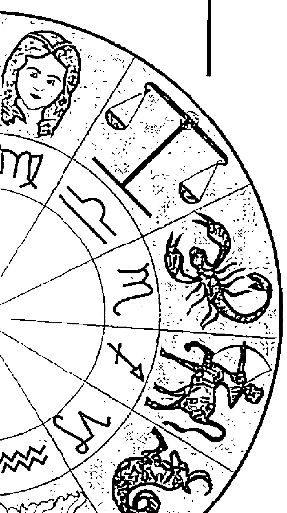

## 印度占星學入門

### 表格二：「廿分盤」之行星位置

| 行星 | 恆星時系統的黃道經度位置 | 區間 | 區間主宰星 | 位置 |
| :--- | :--- | :--- | :--- | :--- |
| 命度 | 寶瓶座 15度35分06秒 | 11 | 金星 | 天秤座 |
| 太陽 | 射手座 16度51分32秒 | 12 | 月亮 | 巨蟹座 |
| 月亮 | 寶瓶座 25度55分53秒 | 18 | 金星 | 金牛座 |
| 火星 | 天秤座 11度07分26秒 | 8 | 火星 | 天蠍座 |
| 水星 | 射手座 20度33分05秒 | 14 | 水星 | 處女座 |
| 木星 | 金牛座 08度18分59秒 (逆行) | 6 | 金星 | 金牛座 |
| 金星 | 寶瓶座 03度12分00秒 | 3 | 土星 | 寶瓶座 |
| 土星 | 金牛座 00度43分14秒 (逆行) | 1 | 木星 | 射手座 |

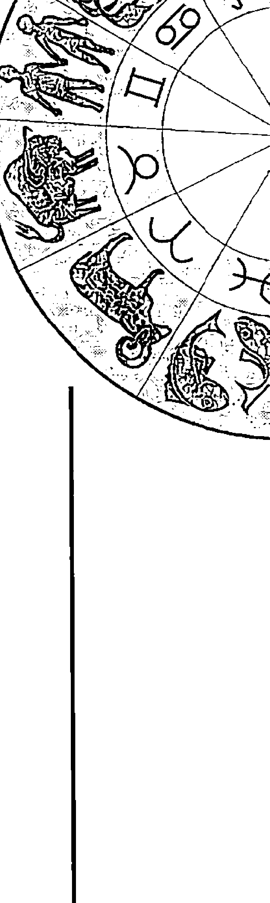

♈ ♊ ♋ ♌ ♍ ♎ ♏ ♐ ♑ ♒ ♓

### （二）廿四分盤

當把一個星座分成廿四等分時，每一等分有一度15分。在奇數星座上，第一個區間是從獅子座算起，而後依據星座順序來作排列，各星座重覆兩次；在偶數星座上，第一個區間是從巨蟹座算起，而後依據星座順序來作排列，各星座重覆兩次。在奇數星座上，其神祇依照順序來作排列，分別為Skanda、Parsudhara、Amala、Viswakarma、Bhaga、Mitra、Maya、Antaka、VrishadhwaJa、Govinda、Modana和Bhisma，而偶數星座的神祇排列順序則正好與奇數星座相反，亦即是從Bhisma開始逆數。依據這樣的規則，就可繪製出「廿四分盤」（Siddhamsa Chart 或 Chaturvimsamsa Chart），具有代表教育與知識的徵象。請參照下列表格及命例之「廿四分盤」。

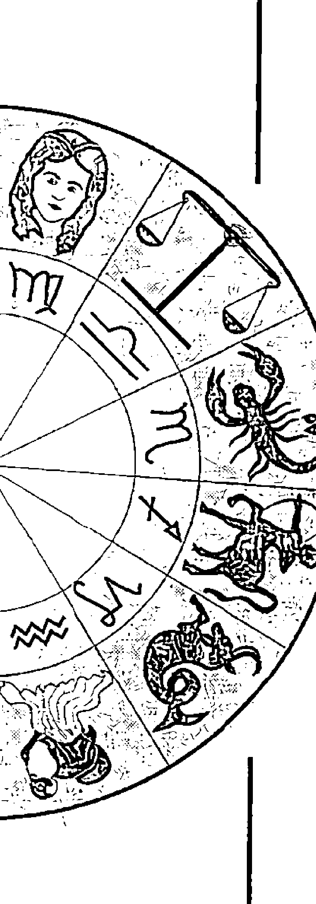

| 列1 | 列2 | 列3 | 列4 | 列5 |
| :--- | :--- | :--- | :--- | :--- |
|      | 🌙♂️ |      |      |      |
|      |      |      | ♄    |      |
| ♃    |      |      |      |      |
| ☿    |      | ☉    | ♀    |      |

△ 命例之「廿四分盤」

### 表格一：廿四分盘的星座歸屬

| 區間 | 白羊 | 金牛 | 雙子 | 巨蟹 | 獅子 | 處女 | 天秤 | 天蠍 | 射手 | 摩羯 | 寶瓶 | 雙魚 |
| :--- | :--- | :--- | :--- | :--- | :--- | :--- | :--- | :--- | :--- | :--- | :--- | :--- |
| 一區<br>01度15分 | 獅子 | 巨蟹 | 獅子 | 巨蟹 | 獅子 | 巨蟹 | 獅子 | 巨蟹 | 獅子 | 巨蟹 | 獅子 | 巨蟹 |
| 二區<br>02度30分 | 處女 | 獅子 | 處女 | 獅子 | 處女 | 獅子 | 處女 | 獅子 | 處女 | 獅子 | 處女 | 獅子 |
| 三區<br>03度45分 | 天秤 | 處女 | 天秤 | 處女 | 天秤 | 處女 | 天秤 | 處女 | 天秤 | 處女 | 天秤 | 處女 |
| 四區<br>05度00分 | 天蠍 | 天秤 | 天蠍 | 天秤 | 天蠍 | 天秤 | 天蠍 | 天秤 | 天蠍 | 天秤 | 天蠍 | 天秤 |
| 五區<br>06度15分 | 射手 | 天蠍 | 射手 | 天蠍 | 射手 | 天蠍 | 射手 | 天蠍 | 射手 | 天蠍 | 射手 | 天蠍 |
| 六區<br>07度30分 | 摩羯 | 射手 | 摩羯 | 射手 | 摩羯 | 射手 | 摩羯 | 射手 | 摩羯 | 射手 | 摩羯 | 射手 |
| 七區<br>08度45分 | 寶瓶 | 摩羯 | 寶瓶 | 摩羯 | 寶瓶 | 摩羯 | 寶瓶 | 摩羯 | 寶瓶 | 摩羯 | 寶瓶 | 摩羯 |
| 八區<br>10度00分 | 雙魚 | 寶瓶 | 雙魚 | 寶瓶 | 雙魚 | 寶瓶 | 雙魚 | 寶瓶 | 雙魚 | 寶瓶 | 雙魚 | 寶瓶 |
| 九區<br>11度15分 | 白羊 | 雙魚 | 白羊 | 雙魚 | 白羊 | 雙魚 | 白羊 | 雙魚 | 白羊 | 雙魚 | 白羊 | 雙魚 |
| 十區<br>12度30分 | 金牛 | 白羊 | 金牛 | 白羊 | 金牛 | 白羊 | 金牛 | 白羊 | 金牛 | 白羊 | 金牛 | 白羊 |
| 十一區<br>13度30分 | 雙子 | 金牛 | 雙子 | 金牛 | 雙子 | 金牛 | 雙子 | 金牛 | 雙子 | 金牛 | 雙子 | 金牛 |
| 十二區<br>15度00分 | 巨蟹 | 雙子 | 巨蟹 | 雙子 | 巨蟹 | 雙子 | 巨蟹 | 雙子 | 巨蟹 | 雙子 | 巨蟹 | 雙子 |

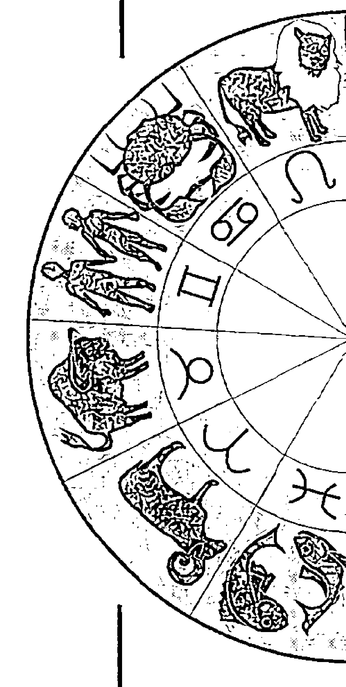

## 四、天韻盤中藏

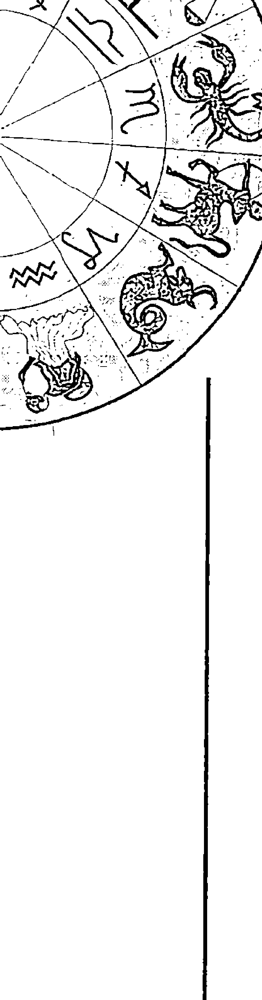

| 區間 | 白羊 | 金牛 | 雙子 | 巨蟹 | 獅子 | 處女 | 天秤 | 天蠍 | 射手 | 摩羯 | 寶瓶 | 雙魚 |
| --- | --- | --- | --- | --- | --- | --- | --- | --- | --- | --- | --- | --- |
| 十三區 16度15分 | 獅子 | 巨蟹 | 獅子 | 巨蟹 | 獅子 | 巨蟹 | 獅子 | 巨蟹 | 獅子 | 巨蟹 | 獅子 | 巨蟹 |
| 十四區 17度30分 | 處女 | 獅子 | 處女 | 獅子 | 處女 | 獅子 | 處女 | 獅子 | 處女 | 獅子 | 處女 | 獅子 |
| 十五區 18度45分 | 天秤 | 處女 | 天秤 | 處女 | 天秤 | 處女 | 天秤 | 處女 | 天秤 | 處女 | 天秤 | 處女 |
| 十六區 20度00分 | 天蠍 | 天秤 | 天蠍 | 天秤 | 天蠍 | 天秤 | 天蠍 | 天秤 | 天蠍 | 天秤 | 天蠍 | 天秤 |
| 十七區 21度15分 | 射手 | 天蠍 | 射手 | 天蠍 | 射手 | 天蠍 | 射手 | 天蠍 | 射手 | 天蠍 | 射手 | 天蠍 |
| 十八區 22度30分 | 摩羯 | 射手 | 摩羯 | 射手 | 摩羯 | 射手 | 摩羯 | 射手 | 摩羯 | 射手 | 摩羯 | 射手 |
| 十九區 23度45分 | 寶瓶 | 摩羯 | 寶瓶 | 摩羯 | 寶瓶 | 摩羯 | 寶瓶 | 摩羯 | 寶瓶 | 摩羯 | 寶瓶 | 摩羯 |
| 廿區 25度00分 | 雙魚 | 寶瓶 | 雙魚 | 寶瓶 | 雙魚 | 寶瓶 | 雙魚 | 寶瓶 | 雙魚 | 寶瓶 | 雙魚 | 寶瓶 |
| 廿一區 26度15分 | 白羊 | 雙魚 | 白羊 | 雙魚 | 白羊 | 雙魚 | 白羊 | 雙魚 | 白羊 | 雙魚 | 白羊 | 雙魚 |
| 廿二區 27度30分 | 金牛 | 白羊 | 金牛 | 白羊 | 金牛 | 白羊 | 金牛 | 白羊 | 金牛 | 白羊 | 金牛 | 白羊 |
| 廿三區 28度45分 | 雙子 | 金牛 | 雙子 | 金牛 | 雙子 | 金牛 | 雙子 | 金牛 | 雙子 | 金牛 | 雙子 | 金牛 |
| 廿四區 30度00分 | 巨蟹 | 雙子 | 巨蟹 | 雙子 | 巨蟹 | 雙子 | 巨蟹 | 雙子 | 巨蟹 | 雙子 | 巨蟹 | 雙子 |

### 表格二：「廿四分盤」之行星位置

| 行星 | 恆星時系統的黃道經度位置 | 區間 | 區間主宰星 | 位置 |
| :--- | :--- | :--- | :--- | :--- |
| 命度 | 寶瓶座 15度35分06秒 | 13 | 金星 | 獅子座 |
| 太陽 | 射手座 16度51分32秒 | 14 | 水星 | 處女座 |
| 月亮 | 寶瓶座 25度55分53秒 | 21 | 火星 | 白羊座 |
| 火星 | 天秤座 11度07分26秒 | 9 | 火星 | 白羊座 |
| 水星 | 射手座 20度33分05秒 | 17 | 木星 | 射手座 |
| 木星 | 金牛座 08度18分59秒(逆行) | 7 | 土星 | 摩羯座 |
| 金星 | 寶瓶座 03度12分00秒 | 3 | 金星 | 天秤座 |
| 土星 | 金牛座 00度43分14秒(逆行) | 1 | 月亮 | 巨蟹座 |

### （二二）廿七分盤

當把一個星座分成廿七等分時，每一等分有1度06分40秒。在火象星座上，第一個區間是從白羊座算起，而後依據星座順序來作排列；在土象星座上，第一個區間是從巨蟹座算起，而後依據星座順序來作排列；在風象星座上，第一個區間是從天秤座算起，而後依據星座順序來作排列；在水象星座上，第一個區間是從摩羯座算起，而後依據星座順序來作排列。依據這樣的規則，就可繪製出「廿七分盤」（Bhamsa Chart 或 Saptavimsamsa Chart 或 Nakshatramsa Chart），具有代表力量與勇敢的象徵。請參照下列表格及命例之「廿七分盤」。

| | | |
|---|---|---|
| ♃ | ☉ ♄ | |
| | | ♂ |
| ♀ | ☿ | ☽ |

△ 命例之「廿七分盤」

## 四、天韻盤中藏

七分盤

## 印度占星學入門

### 表格一：廿七分盘的星座歸屬

| 區間 | 白羊 | 金牛 | 雙子 | 巨蟹 | 獅子 | 處女 | 天秤 | 天蠍 | 射手 | 摩羯 | 寶瓶 | 雙魚 |
| :--- | :--- | :--- | :--- | :--- | :--- | :--- | :--- | :--- | :--- | :--- | :--- | :--- |
| 一區<br>01度06分40秒 | 白羊 | 巨蟹 | 天秤 | 摩羯 | 白羊 | 巨蟹 | 天秤 | 摩羯 | 白羊 | 巨蟹 | 天秤 | 摩羯 |
| 二區<br>02度13分20秒 | 金牛 | 獅子 | 天蠍 | 寶瓶 | 金牛 | 獅子 | 天蠍 | 寶瓶 | 金牛 | 獅子 | 天蠍 | 寶瓶 |
| 三區<br>03度20分00秒 | 雙子 | 處女 | 射手 | 雙魚 | 雙子 | 處女 | 射手 | 雙魚 | 雙子 | 處女 | 射手 | 雙魚 |
| 四區<br>04度26分40秒 | 巨蟹 | 天秤 | 摩羯 | 白羊 | 巨蟹 | 天秤 | 摩羯 | 白羊 | 巨蟹 | 天秤 | 摩羯 | 白羊 |
| 五區<br>05度13分00秒 | 獅子 | 天蠍 | 寶瓶 | 金牛 | 獅子 | 天蠍 | 寶瓶 | 金牛 | 獅子 | 天蠍 | 寶瓶 | 金牛 |
| 六區<br>06度29分20秒 | 處女 | 射手 | 雙魚 | 雙子 | 處女 | 射手 | 雙魚 | 雙子 | 處女 | 射手 | 雙魚 | 雙子 |
| 七區<br>07度35分00秒 | 天秤 | 摩羯 | 白羊 | 巨蟹 | 天秤 | 摩羯 | 白羊 | 巨蟹 | 天秤 | 摩羯 | 白羊 | 巨蟹 |
| 八區<br>08度41分40秒 | 天蠍 | 寶瓶 | 金牛 | 獅子 | 天蠍 | 寶瓶 | 金牛 | 獅子 | 天蠍 | 寶瓶 | 金牛 | 獅子 |
| 九區<br>09度48分20秒 | 射手 | 雙魚 | 雙子 | 處女 | 射手 | 雙魚 | 雙子 | 處女 | 射手 | 雙魚 | 雙子 | 處女 |
| 十區<br>10度55分00秒 | 摩羯 | 白羊 | 巨蟹 | 天秤 | 摩羯 | 白羊 | 巨蟹 | 天秤 | 摩羯 | 白羊 | 巨蟹 | 天秤 |
| 十一區<br>12度01分40秒 | 寶瓶 | 金牛 | 獅子 | 天蠍 | 寶瓶 | 金牛 | 獅子 | 天蠍 | 寶瓶 | 金牛 | 獅子 | 天蠍 |
| 十二區<br>13度08分20秒 | 雙魚 | 雙子 | 處女 | 射手 | 雙魚 | 雙子 | 處女 | 射手 | 雙魚 | 雙子 | 處女 | 射手 |
| 十三區<br>14度15分00秒 | 白羊 | 巨蟹 | 天秤 | 摩羯 | 白羊 | 巨蟹 | 天秤 | 摩羯 | 白羊 | 巨蟹 | 天秤 | 摩羯 |
| 十四區<br>15度21分40秒 | 金牛 | 獅子 | 天蠍 | 寶瓶 | 金牛 | 獅子 | 天蠍 | 寶瓶 | 金牛 | 獅子 | 天蠍 | 寶瓶 |
| 十五區<br>16度28分20秒 | 雙子 | 處女 | 射手 | 雙魚 | 雙子 | 處女 | 射手 | 雙魚 | 雙子 | 處女 | 射手 | 雙魚 |

## 四、天韻盤中藏

| 區間 | 白羊 | 金牛 | 雙子 | 巨蟹 | 獅子 | 處女 | 天秤 | 天蠍 | 射手 | 摩羯 | 寶瓶 | 雙魚 |
| --- | --- | --- | --- | --- | --- | --- | --- | --- | --- | --- | --- | --- |
| 十六區 17度35分00秒 | 巨蟹 | 天秤 | 摩羯 | 白羊 | 巨蟹 | 天秤 | 摩羯 | 白羊 | 巨蟹 | 天秤 | 摩羯 | 白羊 |
| 十七區 18度41分40秒 | 獅子 | 天蠍 | 寶瓶 | 金牛 | 獅子 | 天蠍 | 寶瓶 | 金牛 | 獅子 | 天蠍 | 寶瓶 | 金牛 |
| 十八區 19度48分20秒 | 處女 | 射手 | 雙魚 | 雙子 | 處女 | 射手 | 雙魚 | 雙子 | 處女 | 射手 | 雙魚 | 雙子 |
| 十九區 20度55分00秒 | 天秤 | 摩羯 | 白羊 | 巨蟹 | 天秤 | 摩羯 | 白羊 | 巨蟹 | 天秤 | 摩羯 | 白羊 | 巨蟹 |
| 廿 區 22度01分40秒 | 天蠍 | 寶瓶 | 金牛 | 獅子 | 天蠍 | 寶瓶 | 金牛 | 獅子 | 天蠍 | 寶瓶 | 金牛 | 獅子 |
| 廿一區 23度07分20秒 | 射手 | 雙魚 | 雙子 | 處女 | 射手 | 雙魚 | 雙子 | 處女 | 射手 | 雙魚 | 雙子 | 處女 |
| 廿二區 24度14分00秒 | 摩羯 | 白羊 | 巨蟹 | 天秤 | 摩羯 | 白羊 | 巨蟹 | 天秤 | 摩羯 | 白羊 | 巨蟹 | 天秤 |
| 廿三區 25度20分40秒 | 寶瓶 | 金牛 | 獅子 | 天蠍 | 寶瓶 | 金牛 | 獅子 | 天蠍 | 寶瓶 | 金牛 | 獅子 | 天蠍 |
| 廿四區 26度27分20秒 | 雙魚 | 雙子 | 處女 | 射手 | 雙魚 | 雙子 | 處女 | 射手 | 雙魚 | 雙子 | 處女 | 射手 |
| 廿五區 27度46分40秒 | 白羊 | 巨蟹 | 天秤 | 摩羯 | 白羊 | 巨蟹 | 天秤 | 摩羯 | 白羊 | 巨蟹 | 天秤 | 摩羯 |
| 廿六區 28度53分20秒 | 金牛 | 獅子 | 天蠍 | 寶瓶 | 金牛 | 獅子 | 天蠍 | 寶瓶 | 金牛 | 獅子 | 天蠍 | 寶瓶 |
| 廿七區 30度00分 | 雙子 | 處女 | 射手 | 雙魚 | 雙子 | 處女 | 射手 | 雙魚 | 雙子 | 處女 | 射手 | 雙魚 |

### 表格二：『廿七分盤』之行星位置

| 行星 | 恆星時系統的黃道經度位置 | 區間 | 區間主宰星 | 位置 |
| :--- | :--- | :--- | :--- | :--- |
| 命度 | 寶瓶座<br>15度35分06秒 | 15 | 木星 | 射手座 |
| 太陽 | 射手座<br>16度51分32秒 | 16 | 月亮 | 巨蟹座 |
| 月亮 | 寶瓶座<br>25度55分53秒 | 24 | 水星 | 處女座 |
| 火星 | 天秤座<br>11度07分26秒 | 11 | 太陽 | 獅子座 |
| 水星 | 射手座<br>20度33分05秒 | 19 | 金星 | 天秤座 |
| 木星 | 金牛座<br>08度18分59秒 (逆行) | 8 | 土星 | 寶瓶座 |
| 金星 | 寶瓶座<br>03度12分00秒 | 3 | 木星 | 射手座 |
| 土星 | 金牛座<br>00度43分14秒 (逆行) | 1 | 月亮 | 巨蟹座 |

## 印度占星學入門

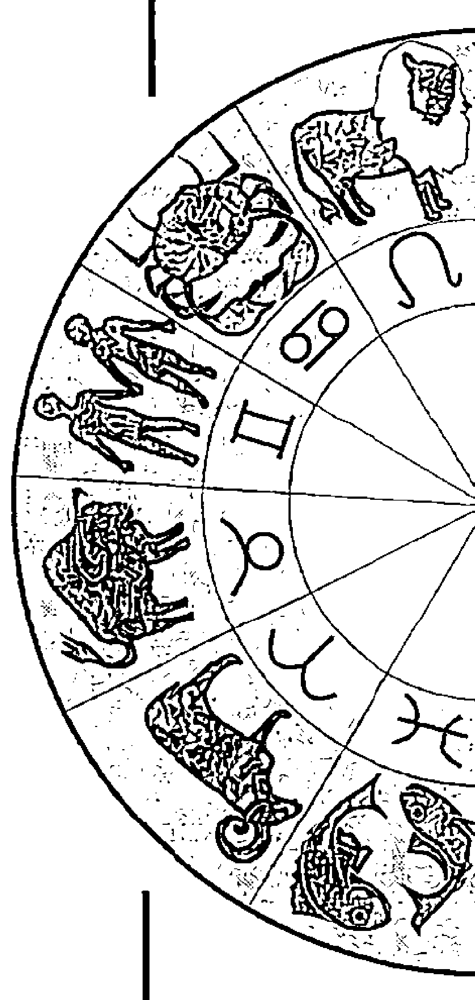

### (二三) 卅分盤

四、天韻盤中藏

當把一個星座分成卅等分時，每一等分有一度。在奇數星座上，0—5度由火星所主宰，5—10度由土星所主宰，10—18度由木星所主宰，18—25度由水星所主宰，25—30度由金星所主宰。而在偶數星座上，則排列順序正好相反（須注意區間度數的差異）。在奇數星座上，這五個區間的神祇分別為Agni, Vayu, Indra, Kubera和Varun；而在偶數星座上，神祇的排列正好與奇數星座相反。依據這樣的規則，就可繪製出「卅分盤」（Trimsamsa Chart），具有代表不幸的徵象，並且在專論女命時，會參考這個分盤。請參照下列表格及命例之「卅分盤」。


|   | ♀ | ♄ | ☿ |
|---|---|---|---|
|   |   |   |   |
| ☉♂ |   | ☽ | ♃ |

△ 命例之「卅分盤」

## 表格一：卅分盤的星座歸屬

| 奇數星座 | 0～5度 | 5～10度 | 10～18度 | 18～25度 | 25～30度 |
| :--- | :--- | :--- | :--- | :--- | :--- |
| 白羊座 | 白羊座 | 寶瓶座 | 射手座 | 雙子座 | 天秤座 |
| 雙子座 | 白羊座 | 寶瓶座 | 射手座 | 雙子座 | 天秤座 |
| 獅子座 | 白羊座 | 寶瓶座 | 射手座 | 雙子座 | 天秤座 |
| 天秤座 | 白羊座 | 寶瓶座 | 射手座 | 雙子座 | 天秤座 |
| 射手座 | 白羊座 | 寶瓶座 | 射手座 | 雙子座 | 天秤座 |
| 寶瓶座 | 白羊座 | 寶瓶座 | 射手座 | 雙子座 | 天秤座 |

| 偶數星座 | 0～5度 | 5～12度 | 12～20度 | 20～25度 | 25～30度 |
| :--- | :--- | :--- | :--- | :--- | :--- |
| 金牛座 | 金牛座 | 處女座 | 雙魚座 | 摩羯座 | 天蠍座 |
| 巨蟹座 | 金牛座 | 處女座 | 雙魚座 | 摩羯座 | 天蠍座 |
| 處女座 | 金牛座 | 處女座 | 雙魚座 | 摩羯座 | 天蠍座 |
| 天蠍座 | 金牛座 | 處女座 | 雙魚座 | 摩羯座 | 天蠍座 |
| 摩羯座 | 金牛座 | 處女座 | 雙魚座 | 摩羯座 | 天蠍座 |
| 雙魚座 | 金牛座 | 處女座 | 雙魚座 | 摩羯座 | 天蠍座 |

## 表格二：「卅分盤」之行星位置

| 行星 | 恆星時系統的黃道經度位置 | 奇偶數 | 區間 | 區間主宰星 | 位置 |
| :--- | :--- | :--- | :--- | :--- | :--- |
| 命度 | 寶瓶座 15 度 35 分 06 秒 | 奇數 | 3 | 木星 | 射手座 |
| 太陽 | 射手座 16 度 51 分 32 秒 | 奇數 | 3 | 木星 | 射手座 |
| 月亮 | 寶瓶座 25 度 55 分 53 秒 | 奇數 | 5 | 金星 | 天秤座 |
| 火星 | 天秤座 11 度 07 分 26 秒 | 奇數 | 3 | 木星 | 射手座 |
| 水星 | 射手座 20 度 33 分 05 秒 | 奇數 | 4 | 水星 | 雙子座 |
| 木星 | 金牛座 08 度 18 分 59 秒 (逆行) | 偶數 | 2 | 水星 | 處女座 |
| 金星 | 寶瓶座 03 度 12 分 00 秒 | 奇數 | 1 | 火星 | 白羊座 |
| 土星 | 金牛座 00 度 43 分 14 秒 (逆行) | 偶數 | 1 | 金星 | 金牛座 |

### (一四) 四十分盤

當把一個星座分成四十等分時，每一等分有45分。在奇數星座上，第一個區間是從白羊座算起，而後依據星座順序來作排列；而在偶數星座上，第一個區間是從天秤座算起，而後依據星座順序來作排列。依據這樣的規則，就可繪製出「四十分盤」( Chatvarimsa Chart 或 Khavedamsa Chart ) ，具有代表好壞期間的徵象。請參照下列兩個表格及命例之「四十分盤」。

|   |   |   | ♂ |
|---|---|---|---|
| ☉ ☽ |   |   | ☿ |
|   |   |   | ♀ |
|   |   | ♄ | ♃ |

▲ 命例之「四十分盤」

## 表格一：四十分盤的星座歸屬

| 區間 | 白羊 | 金牛 | 雙子 | 巨蟹 | 獅子 | 處女 | 天秤 | 天蠍 | 射手 | 摩羯 | 寶瓶 | 雙魚 |
| :--- | :--- | :--- | :--- | :--- | :--- | :--- | :--- | :--- | :--- | :--- | :--- | :--- |
| 一區<br>00度45分 | 白羊 | 天秤 | 白羊 | 天秤 | 白羊 | 天秤 | 白羊 | 天秤 | 白羊 | 天秤 | 白羊 | 天秤 |
| 二區<br>01度30分 | 金牛 | 天蠍 | 金牛 | 天蠍 | 金牛 | 天蠍 | 金牛 | 天蠍 | 金牛 | 天蠍 | 金牛 | 天蠍 |
| 三區<br>02度15分 | 雙子 | 射手 | 雙子 | 射手 | 雙子 | 射手 | 雙子 | 射手 | 雙子 | 射手 | 雙子 | 射手 |
| 四區<br>03度00分 | 巨蟹 | 摩羯 | 巨蟹 | 摩羯 | 巨蟹 | 摩羯 | 巨蟹 | 摩羯 | 巨蟹 | 摩羯 | 巨蟹 | 摩羯 |
| 五區<br>03度45分 | 獅子 | 寶瓶 | 獅子 | 寶瓶 | 獅子 | 寶瓶 | 獅子 | 寶瓶 | 獅子 | 寶瓶 | 獅子 | 寶瓶 |
| 六區<br>04度30分 | 處女 | 雙魚 | 處女 | 雙魚 | 處女 | 雙魚 | 處女 | 雙魚 | 處女 | 雙魚 | 處女 | 雙魚 |
| 七區<br>05度15分 | 天秤 | 白羊 | 天秤 | 白羊 | 天秤 | 白羊 | 天秤 | 白羊 | 天秤 | 白羊 | 天秤 | 白羊 |
| 八區<br>06度00分 | 天蠍 | 金牛 | 天蠍 | 金牛 | 天蠍 | 金牛 | 天蠍 | 金牛 | 天蠍 | 金牛 | 天蠍 | 金牛 |
| 九區<br>06度45分 | 射手 | 雙子 | 射手 | 雙子 | 射手 | 雙子 | 射手 | 雙子 | 射手 | 雙子 | 射手 | 雙子 |
| 十區<br>07度30分 | 摩羯 | 巨蟹 | 摩羯 | 巨蟹 | 摩羯 | 巨蟹 | 摩羯 | 巨蟹 | 摩羯 | 巨蟹 | 摩羯 | 巨蟹 |
| 十一區<br>08度15分 | 寶瓶 | 獅子 | 寶瓶 | 獅子 | 寶瓶 | 獅子 | 寶瓶 | 獅子 | 寶瓶 | 獅子 | 寶瓶 | 獅子 |
| 十二區<br>09度00分 | 雙魚 | 處女 | 雙魚 | 處女 | 雙魚 | 處女 | 雙魚 | 處女 | 雙魚 | 處女 | 雙魚 | 處女 |
| 十三區<br>09度45分 | 白羊 | 天秤 | 白羊 | 天秤 | 白羊 | 天秤 | 白羊 | 天秤 | 白羊 | 天秤 | 白羊 | 天秤 |
| 十四區<br>10度30分 | 金牛 | 天蠍 | 金牛 | 天蠍 | 金牛 | 天蠍 | 金牛 | 天蠍 | 金牛 | 天蠍 | 金牛 | 天蠍 |
| 十五區<br>11度15分 | 雙子 | 射手 | 雙子 | 射手 | 雙子 | 射手 | 雙子 | 射手 | 雙子 | 射手 | 雙子 | 射手 |
| 十六區<br>12度00分 | 巨蟹 | 摩羯 | 巨蟹 | 摩羯 | 巨蟹 | 摩羯 | 巨蟹 | 摩羯 | 巨蟹 | 摩羯 | 巨蟹 | 摩羯 |
| 十七區<br>12度45分 | 獅子 | 寶瓶 | 獅子 | 寶瓶 | 獅子 | 寶瓶 | 獅子 | 寶瓶 | 獅子 | 寶瓶 | 獅子 | 寶瓶 |
| 十八區<br>13度30分 | 處女 | 雙魚 | 處女 | 雙魚 | 處女 | 雙魚 | 處女 | 雙魚 | 處女 | 雙魚 | 處女 | 雙魚 |
| 十九區<br>14度15分 | 天秤 | 白羊 | 天秤 | 白羊 | 天秤 | 白羊 | 天秤 | 白羊 | 天秤 | 白羊 | 天秤 | 白羊 |
| 廿區<br>15度00分 | 天蠍 | 金牛 | 天蠍 | 金牛 | 天蠍 | 金牛 | 天蠍 | 金牛 | 天蠍 | 金牛 | 天蠍 | 金牛 |
| 廿一區<br>15度45分 | 射手 | 雙子 | 射手 | 雙子 | 射手 | 雙子 | 射手 | 雙子 | 射手 | 雙子 | 射手 | 雙子 |
| 廿二區<br>16度30分 | 摩羯 | 巨蟹 | 摩羯 | 巨蟹 | 摩羯 | 巨蟹 | 摩羯 | 巨蟹 | 摩羯 | 巨蟹 | 摩羯 | 巨蟹 |
| 廿三區<br>17度15分 | 寶瓶 | 獅子 | 寶瓶 | 獅子 | 寶瓶 | 獅子 | 寶瓶 | 獅子 | 寶瓶 | 獅子 | 寶瓶 | 獅子 |
| 廿四區<br>18度00分 | 雙魚 | 處女 | 雙魚 | 處女 | 雙魚 | 處女 | 雙魚 | 處女 | 雙魚 | 處女 | 雙魚 | 處女 |
| 廿五區<br>18度45分 | 白羊 | 天秤 | 白羊 | 天秤 | 白羊 | 天秤 | 白羊 | 天秤 | 白羊 | 天秤 | 白羊 | 天秤 |
| 廿六區<br>19度30分 | 金牛 | 天蠍 | 金牛 | 天蠍 | 金牛 | 天蠍 | 金牛 | 天蠍 | 金牛 | 天蠍 | 金牛 | 天蠍 |
| 廿七區<br>20度15分 | 雙子 | 射手 | 雙子 | 射手 | 雙子 | 射手 | 雙子 | 射手 | 雙子 | 射手 | 雙子 | 射手 |
| 廿八區<br>21度00分 | 巨蟹 | 摩羯 | 巨蟹 | 摩羯 | 巨蟹 | 摩羯 | 巨蟹 | 摩羯 | 巨蟹 | 摩羯 | 巨蟹 | 摩羯 |
| 廿九區<br>21度45分 | 獅子 | 寶瓶 | 獅子 | 寶瓶 | 獅子 | 寶瓶 | 獅子 | 寶瓶 | 獅子 | 寶瓶 | 獅子 | 寶瓶 |
| 卅區<br>22度30分 | 處女 | 雙魚 | 處女 | 雙魚 | 處女 | 雙魚 | 處女 | 雙魚 | 處女 | 雙魚 | 處女 | 雙魚 |
| 卅一區<br>23度15分 | 天秤 | 白羊 | 天秤 | 白羊 | 天秤 | 白羊 | 天秤 | 白羊 | 天秤 | 白羊 | 天秤 | 白羊 |
| 卅二區<br>24度00分 | 天蠍 | 金牛 | 天蠍 | 金牛 | 天蠍 | 金牛 | 天蠍 | 金牛 | 天蠍 | 金牛 | 天蠍 | 金牛 |
| 卅三區<br>24度45分 | 射手 | 雙子 | 射手 | 雙子 | 射手 | 雙子 | 射手 | 雙子 | 射手 | 雙子 | 射手 | 雙子 |
| 卅四區<br>25度30分 | 摩羯 | 巨蟹 | 摩羯 | 巨蟹 | 摩羯 | 巨蟹 | 摩羯 | 巨蟹 | 摩羯 | 巨蟹 | 摩羯 | 巨蟹 |
| 卅五區<br>26度15分 | 寶瓶 | 獅子 | 寶瓶 | 獅子 | 寶瓶 | 獅子 | 寶瓶 | 獅子 | 寶瓶 | 獅子 | 寶瓶 | 獅子 |
| 卅六區<br>27度00分 | 雙魚 | 處女 | 雙魚 | 處女 | 雙魚 | 處女 | 雙魚 | 處女 | 雙魚 | 處女 | 雙魚 | 處女 |
| 卅七區<br>27度45分 | 白羊 | 天秤 | 白羊 | 天秤 | 白羊 | 天秤 | 白羊 | 天秤 | 白羊 | 天秤 | 白羊 | 天秤 |
| 卅八區<br>28度30分 | 金牛 | 天蠍 | 金牛 | 天蠍 | 金牛 | 天蠍 | 金牛 | 天蠍 | 金牛 | 天蠍 | 金牛 | 天蠍 |
| 卅九區<br>29度15分 | 雙子 | 射手 | 雙子 | 射手 | 雙子 | 射手 | 雙子 | 射手 | 雙子 | 射手 | 雙子 | 射手 |
| 四十區<br>30度00分 | 巨蟹 | 摩羯 | 巨蟹 | 摩羯 | 巨蟹 | 摩羯 | 巨蟹 | 摩羯 | 巨蟹 | 摩羯 | 巨蟹 | 摩羯 |

## 表格二：「四十分盤」之行星位置

| 行星 | 恆星時系統的黃道經度位置 | 區間 | 區間主宰星 | 位置 |
| :--- | :--- | :--- | :--- | :--- |
| 命度 | 寶瓶座 15度35分06秒 | 21 | 木星 | 射手座 |
| 太陽 | 射手座 16度51分32秒 | 23 | 土星 | 寶瓶座 |
| 月亮 | 寶瓶座 25度55分53秒 | 35 | 土星 | 寶瓶座 |
| 火星 | 天秤座 11度07分26秒 | 15 | 水星 | 雙子座 |
| 水星 | 射手座 20度33分05秒 | 28 | 月亮 | 巨蟹座 |
| 木星 | 金牛座 08度18分59秒 (逆行) | 12 | 水星 | 處女座 |
| 金星 | 寶瓶座 03度12分00秒 | 5 | 太陽 | 獅子座 |
| 土星 | 金牛座 00度43分14秒 (逆行) | 1 | 金星 | 天秤座 |

### (一五) 四十五分盤

當把一個星座分成四十五等分時，每一等分有40分。在基本宮星座上，第一個區間是從白羊座算起，而後依據星座順序來作排列；在固定宮星座上，第一個區間是從獅子座算起，而後依據星座順序來作排列；在變動宮星座上，第一個區間是從射手座算起，而後依據星座順序來作排列。依據這樣的規則，就可繪製出「四十五分盤」（Akshavedamsa Chart）。請參照下列兩個表格及命例之「四十五分盤」。

|  |  | ☿ |
|---|---|---|
|  |  |  |
| ⊙ |  | ♂ ♃ |
| ♀ | ☽ | ♄ |

△ 命例之「四十五分盤」

## 表格一：四十五分盤的星座歸屬

| 區間 | 白羊 | 金牛 | 雙子 | 巨蟹 | 獅子 | 處女 | 天秤 | 天蠍 | 射手 | 摩羯 | 寶瓶 | 雙魚 |
| :--- | :--- | :--- | :--- | :--- | :--- | :--- | :--- | :--- | :--- | :--- | :--- | :--- |
| 一區 00度40分 | 白羊 | 獅子 | 射手 | 白羊 | 獅子 | 射手 | 白羊 | 獅子 | 射手 | 白羊 | 獅子 | 射手 |
| 二區 01度20分 | 金牛 | 處女 | 摩羯 | 金牛 | 處女 | 摩羯 | 金牛 | 處女 | 摩羯 | 金牛 | 處女 | 摩羯 |
| 三區 02度00分 | 雙子 | 天秤 | 寶瓶 | 雙子 | 天秤 | 寶瓶 | 雙子 | 天秤 | 寶瓶 | 雙子 | 天秤 | 寶瓶 |
| 四區 02度40分 | 巨蟹 | 天蠍 | 雙魚 | 巨蟹 | 天蠍 | 雙魚 | 巨蟹 | 天蠍 | 雙魚 | 巨蟹 | 天蠍 | 雙魚 |
| 五區 03度20分 | 獅子 | 射手 | 白羊 | 獅子 | 射手 | 白羊 | 獅子 | 射手 | 白羊 | 獅子 | 射手 | 白羊 |
| 六區 04度00分 | 處女 | 摩羯 | 金牛 | 處女 | 摩羯 | 金牛 | 處女 | 摩羯 | 金牛 | 處女 | 摩羯 | 金牛 |
| 七區 04度40分 | 天秤 | 寶瓶 | 雙子 | 天秤 | 寶瓶 | 雙子 | 天秤 | 寶瓶 | 雙子 | 天秤 | 寶瓶 | 雙子 |
| 八區 05度20分 | 天蠍 | 雙魚 | 巨蟹 | 天蠍 | 雙魚 | 巨蟹 | 天蠍 | 雙魚 | 巨蟹 | 天蠍 | 雙魚 | 巨蟹 |
| 九區 06度00分 | 射手 | 白羊 | 獅子 | 射手 | 白羊 | 獅子 | 射手 | 白羊 | 獅子 | 射手 | 白羊 | 獅子 |
| 十區 06度40分 | 摩羯 | 金牛 | 處女 | 摩羯 | 金牛 | 處女 | 摩羯 | 金牛 | 處女 | 摩羯 | 金牛 | 處女 |
| 十一區 07度20分 | 寶瓶 | 雙子 | 天秤 | 寶瓶 | 雙子 | 天秤 | 寶瓶 | 雙子 | 天秤 | 寶瓶 | 雙子 | 天秤 |
| 十二區 08度00分 | 雙魚 | 巨蟹 | 天蠍 | 雙魚 | 巨蟹 | 天蠍 | 雙魚 | 巨蟹 | 天蠍 | 雙魚 | 巨蟹 | 天蠍 |
| 十三區 08度40分 | 白羊 | 獅子 | 射手 | 白羊 | 獅子 | 射手 | 白羊 | 獅子 | 射手 | 白羊 | 獅子 | 射手 |
| 十四區 09度20分 | 金牛 | 處女 | 摩羯 | 金牛 | 處女 | 摩羯 | 金牛 | 處女 | 摩羯 | 金牛 | 處女 | 摩羯 |
| 十五區 10度00分 | 雙子 | 天秤 | 寶瓶 | 雙子 | 天秤 | 寶瓶 | 雙子 | 天秤 | 寶瓶 | 雙子 | 天秤 | 寶瓶 |## 四、天韵盘中藏

| 区间 | 白羊 | 金牛 | 双子 | 巨蟹 | 狮子 | 处女 | 天秤 | 天蝎 | 射手 | 摩羯 | 宝瓶 | 双鱼 |
| :--- | :--- | :--- | :--- | :--- | :--- | :--- | :--- | :--- | :--- | :--- | :--- | :--- |
| 十六区 10度40分 | 巨蟹 | 天蝎 | 双鱼 | 巨蟹 | 天蝎 | 双鱼 | 巨蟹 | 天蝎 | 双鱼 | 巨蟹 | 天蝎 | 双鱼 |
| 十七区 11度20分 | 狮子 | 射手 | 白羊 | 狮子 | 射手 | 白羊 | 狮子 | 射手 | 白羊 | 狮子 | 射手 | 白羊 |
| 十八区 12度00分 | 处女 | 摩羯 | 金牛 | 处女 | 摩羯 | 金牛 | 处女 | 摩羯 | 金牛 | 处女 | 摩羯 | 金牛 |
| 十九区 12度40分 | 天秤 | 宝瓶 | 双子 | 天秤 | 宝瓶 | 双子 | 天秤 | 宝瓶 | 双子 | 天秤 | 宝瓶 | 双子 |
| 廿 区 13度20分 | 天蝎 | 双鱼 | 巨蟹 | 天蝎 | 双鱼 | 巨蟹 | 天蝎 | 双鱼 | 巨蟹 | 天蝎 | 双鱼 | 巨蟹 |
| 廿一区 14度00分 | 射手 | 白羊 | 狮子 | 射手 | 白羊 | 狮子 | 射手 | 白羊 | 狮子 | 射手 | 白羊 | 狮子 |
| 廿二区 14度40分 | 摩羯 | 金牛 | 处女 | 摩羯 | 金牛 | 处女 | 摩羯 | 金牛 | 处女 | 摩羯 | 金牛 | 处女 |
| 廿三区 15度20分 | 宝瓶 | 双子 | 天秤 | 宝瓶 | 双子 | 天秤 | 宝瓶 | 双子 | 天秤 | 宝瓶 | 双子 | 天秤 |
| 廿四区 16度00分 | 双鱼 | 巨蟹 | 天蝎 | 双鱼 | 巨蟹 | 天蝎 | 双鱼 | 巨蟹 | 天蝎 | 双鱼 | 巨蟹 | 天蝎 |
| 廿五区 16度40分 | 白羊 | 狮子 | 射手 | 白羊 | 狮子 | 射手 | 白羊 | 狮子 | 射手 | 白羊 | 狮子 | 射手 |
| 廿六区 17度20分 | 金牛 | 处女 | 摩羯 | 金牛 | 处女 | 摩羯 | 金牛 | 处女 | 摩羯 | 金牛 | 处女 | 摩羯 |
| 廿七区 18度00分 | 双子 | 天秤 | 宝瓶 | 双子 | 天秤 | 宝瓶 | 双子 | 天秤 | 宝瓶 | 双子 | 天秤 | 宝瓶 |
| 廿八区 18度40分 | 巨蟹 | 天蝎 | 双鱼 | 巨蟹 | 天蝎 | 双鱼 | 巨蟹 | 天蝎 | 双鱼 | 巨蟹 | 天蝎 | 双鱼 |
| 廿九区 19度20分 | 狮子 | 射手 | 白羊 | 狮子 | 射手 | 白羊 | 狮子 | 射手 | 白羊 | 狮子 | 射手 | 白羊 |
| 卅 区 20度00分 | 处女 | 摩羯 | 金牛 | 处女 | 摩羯 | 金牛 | 处女 | 摩羯 | 金牛 | 处女 | 摩羯 | 金牛 |
| 卅一区 20度40分 | 天秤 | 宝瓶 | 双子 | 天秤 | 宝瓶 | 双子 | 天秤 | 宝瓶 | 双子 | 天秤 | 宝瓶 | 双子 |

## 印度占星學入門

| 區 間 | 白羊 | 金牛 | 雙子 | 巨蟹 | 獅子 | 處女 | 天秤 | 天蠍 | 射手 | 摩羯 | 寶瓶 | 雙魚 |
|---|---|---|---|---|---|---|---|---|---|---|---|---|
| 卅二區 21度20分 | 天蠍 | 雙魚 | 巨蟹 | 天蠍 | 雙魚 | 巨蟹 | 天蠍 | 雙魚 | 巨蟹 | 天蠍 | 雙魚 | 巨蟹 |
| 卅三區 22度00分 | 射手 | 白羊 | 獅子 | 射手 | 白羊 | 獅子 | 射手 | 白羊 | 獅子 | 射手 | 白羊 | 獅子 |
| 卅四區 22度40分 | 摩羯 | 金牛 | 處女 | 摩羯 | 金牛 | 處女 | 摩羯 | 金牛 | 處女 | 摩羯 | 金牛 | 處女 |
| 卅五區 23度20分 | 寶瓶 | 雙子 | 天秤 | 寶瓶 | 雙子 | 天秤 | 寶瓶 | 雙子 | 天秤 | 寶瓶 | 雙子 | 天秤 |
| 卅六區 24度00分 | 雙魚 | 巨蟹 | 天蠍 | 雙魚 | 巨蟹 | 天蠍 | 雙魚 | 巨蟹 | 天蠍 | 雙魚 | 巨蟹 | 天蠍 |
| 卅七區 24度40分 | 白羊 | 獅子 | 射手 | 白羊 | 獅子 | 射手 | 白羊 | 獅子 | 射手 | 白羊 | 獅子 | 射手 |
| 卅八區 25度20分 | 金牛 | 處女 | 摩羯 | 金牛 | 處女 | 摩羯 | 金牛 | 處女 | 摩羯 | 金牛 | 處女 | 摩羯 |
| 卅九區 26度00分 | 雙子 | 天秤 | 寶瓶 | 雙子 | 天秤 | 寶瓶 | 雙子 | 天秤 | 寶瓶 | 雙子 | 天秤 | 寶瓶 |
| 四十區 26度40分 | 巨蟹 | 天蠍 | 雙魚 | 巨蟹 | 天蠍 | 雙魚 | 巨蟹 | 天蠍 | 雙魚 | 巨蟹 | 天蠍 | 雙魚 |
| 四一區 27度20分 | 獅子 | 射手 | 白羊 | 獅子 | 射手 | 白羊 | 獅子 | 射手 | 白羊 | 獅子 | 射手 | 白羊 |
| 四二區 28度00分 | 處女 | 摩羯 | 金牛 | 處女 | 摩羯 | 金牛 | 處女 | 摩羯 | 金牛 | 處女 | 摩羯 | 金牛 |
| 四三區 28度40分 | 天秤 | 寶瓶 | 雙子 | 天秤 | 寶瓶 | 雙子 | 天秤 | 寶瓶 | 雙子 | 天秤 | 寶瓶 | 雙子 |
| 四四區 29度20分 | 天蠍 | 雙魚 | 巨蟹 | 天蠍 | 雙魚 | 巨蟹 | 天蠍 | 雙魚 | 巨蟹 | 天蠍 | 雙魚 | 巨蟹 |
| 四五區 30度00分 | 射手 | 白羊 | 獅子 | 射手 | 白羊 | 獅子 | 射手 | 白羊 | 獅子 | 射手 | 白羊 | 獅子 |

## 四、天韻盤中藏

### 表格二：「四十五分盤」之行星位置

| 行星 | 恆星時系統的黃道經度位置 | 區間 | 區間主宰星 | 位置 |
| :--- | :--- | :--- | :--- | :--- |
| 命度 | 寶瓶座 15度35分06秒 | 24 | 水星 | 處女座 |
| 太陽 | 射手座 16度51分32秒 | 26 | 土星 | 摩羯座 |
| 月亮 | 寶瓶座 25度55分53秒 | 39 | 金星 | 天秤座 |
| 火星 | 天秤座 11度07分26秒 | 17 | 太陽 | 獅子座 |
| 水星 | 射手座 20度33分05秒 | 31 | 水星 | 雙子座 |
| 木星 | 金牛座 08度18分59秒(逆行) | 13 | 太陽 | 獅子座 |
| 金星 | 寶瓶座 03度12分00秒 | 5 | 木星 | 射手座 |
| 土星 | 金牛座 00度43分14秒(逆行) | 2 | 水星 | 處女座 |

### (二六)六十分盤

當把一個星座分成六十分分時，每一等分有30分。針對「六十分盤」，一般是只列出該六分區間的主宰神祇，而很少提及主宰星座的代表。倘若是想得知主宰星座的代表，可採用計算方式——特定行星的度數與分數先乘上2（乘上2所得之分數被省略掉），然後再分成12，可得一餘數，將此餘數加上1，可得一「總數」，此「總數」即為從該星座算起的星座數。又乘上2所得之數，在省略分數後，加上1，即為六十分區間的排序數，但奇數星座為順數，而偶數星座為逆數。

比如，太陽是落在射手座16度51分，以16度51分乘上2，可得33度42分，省略42分，則只剩下33度，再以12來作劃分，商數為2，餘數為9，將此餘數9加上1得10，所以太陽在「六十分盤」上的位置，是落在從射手座算起的第十個星座，即為處女座。又此33度加上1，可得34，此34即為太陽所在的六十分區間；由於太陽是落在奇數星座上，所以順數第34區間，是落在。

又比如，木星是落在金牛座8度18分，以8度18分乘上2，可得16度36分，省略36分，則只剩下16度，再以12來作劃分，商數為1，餘數為4，將此餘數4加上1得5，所以木星在「六十分盤」上的位置，是落在從金牛座算起的第五個星座，即為處女座。又此16度加上1，可得17，此17即為木星所在的六十分區間，由於木星是落在偶數星座上，所以逆數第17區間，是落在Kala區間上。

依據這樣的規則，就可繪製出「六十分盤」（Shashtiamsa Chart），以及得知區間的所在位置。請參照下列表格及命例之「六十分盤」。須注意的是，在不同的印度占星派別裡，針對六十區間的內涵及吉凶屬性，是存在著少許的差異。

△ 命例之「六十分盤」

| | | 月亮、水星 | 土星 |
|---|---|---|---|
| | | | |
| | | 火星、金星 | |
| | | | 太阳、木星 |

### 表格一：六十區間的歸屬

| 奇數星座排序 | 名稱 | 吉凶屬性 | 涵意 | 偶數星座排序 |
|---|---|---|---|---|
| 01(00度30分) | Ghora | 凶 | 猛烈 | (30度00分)60 |
| 02(01度00分) | Rakshasa | 凶 | 惡魔 | (29度30分)59 |
| 03(01度30分) | Devabhaga | 吉 | 天神 | (29度00分)58 |
| 04(02度00分) | Kubera | 吉 | 司庫神 | (28度30分)57 |
| 05(02度30分) | Yaksha | 吉 | 歌者 | (28度00分)56 |
| 06(03度00分) | Kinnara | 吉 | 醜人 | (27度30分)55 |
| 07(03度30分) | Bhrashta | 凶 | 墮落 | (27度00分)54 |
| 08(04度00分) | Kulagnana | 凶 | 主持家庭 | (26度30分)53 |
| 09(04度30分) | Garala | 凶 | 毒物 | (26度00分)52 |
| 10(05度00分) | Vahni | 凶 | 火 | (25度30分)51 |
| 11(05度30分) | Mayamsa | 凶 | 欺騙 | (25度00分)50 |
| 12(06度00分) | Purishaka | 凶 | 污穢 | (24度30分)49 |
| 13(06度30分) | Apampathy | 吉 | 海洋 | (24度00分)48 |
| 14(07度00分) | Marut | 吉 | 風 | (23度30分)47 |
| 15(07度30分) | Kala | 凶 | 時間 | (23度00分)46 |
| 16(08度00分) | Sarpa | 凶 | 蛇 | (22度30分)45 |
| 17(08度30分) | Amritha | 吉 | 美酒 | (22度00分)44 |
| 18(09度00分) | Indu | 吉 | 月亮 | (21度30分)43 |
| 19(09度30分) | Mridwamsa | 吉 | 柔軟 | (21度00分)42 |
| 20(10度00分) | Komalamsa | 吉 | 柔和 | (20度30分)41 |
| 21(10度30分) | Heramba | 吉 | 晶亮 | (20度00分)40 |
| 22(11度00分) | Brahma | 吉 | 天神之父 | (19度30分)39 |
| 23(11度30分) | Vageesa | 吉 | 第二餐 | (19度00分)38 |
| 24(12度00分) | Digambara | 吉 | 第三餐 | (18度30分)37 |
| 25(12度30分) | Devamsa | 吉 | 天神 | (18度00分)36 |
| 26(13度00分) | Ardra | 吉 | 温湿 | (17度30分)35 |
| 27(13度30分) | Kalinasa | 凶 | 破坏者 | (17度00分)34 |
| 28(14度00分) | Kshitishwara | 吉 | 大地之王 | (16度30分)33 |
| 29(14度30分) | Kamalkara | 吉 | 忘忧湖 | (16度00分)32 |
| 30(15度00分) | Mandatmaja | 凶 | 土星之子 | (15度30分)31 |
| 31(15度30分) | Mrityu | 凶 | 死亡 | (15度00分)30 |
| 32(16度00分) | Kala | 凶 | 时间 | (14度30分)29 |
| 33(16度30分) | Davagnya | 凶 | 森林之火 | (14度00分)28 |
| 34(17度00分) | Ghora | 凶 | 敬畏 | (13度30分)27 |
| 35(17度30分) | Yamakantaka | 凶 | 死神 | (13度00分)26 |
| 36(18度00分) | Kantaka | 凶 | 王冠 | (12度30分)25 |
| 37(18度30分) | Sudha | 吉 | 纯洁 | (12度00分)24 |
| 38(19度00分) | Amrita | 吉 | 美酒 | (11度30分)23 |
| 39(19度30分) | Poornach | 吉 | 满月 | (11度00分)22 |
| 40(20度00分) | Vishadagdha | 凶 | 毒害 | (10度30分)21 |
| 41(20度30分) | Kulanasa | 凶 | 主持家庭 | (10度00分)20 |
| 42(21度00分) | Vamsakshaya | 凶 | 失去王朝 | (09度30分)19 |
| 43(21度30分) | Ut patha | 凶 | 災難 | (09度00分)18 |
| 44(22度00分) | Kala | 凶 | 時間 | (08度30分)17 |
| 45(22度30分) | Soumya | 吉 | 英俊 | (08度00分)16 |
| 46(23度00分) | Mrudvamsa | 吉 | 柔軟 | (07度30分)15 |
| 47(23度30分) | Susithala | 吉 | 冷靜 | (07度00分)14 |
| 48(24度00分) | Damshtra | 凶 | 牙顫 | (06度30分)13 |
| 49(24度30分) | Seethabja | 吉 | 美麗 | (06度00分)12 |
| 50(25度00分) | Praveena | 吉 | 聰明 | (05度30分)11 |
| 51(25度30分) | Kalapavaka | 凶 | 毀滅之火 | (05度00分)10 |
| 52(26度00分) | Dandayudha | 凶 | 破滅 | (04度30分)09 |
| 53(26度30分) | Nirmala | 吉 | 無罪 | (04度00分)08 |
| 54(27度00分) | Saumya | 吉 | 英俊 | (03度30分)07 |
| 55(27度30分) | Kroora | 凶 | 無情 | (03度00分)06 |
| 56(28度00分) | Atiseetala | 凶 | 冷酷 | (02度30分)05 |
| 57(28度30分) | Amrita | 吉 | 美酒 | (02度00分)04 |
| 58(29度00分) | Sudhapayodhi | 吉 | 海洋 | (01度30分)03 |
| 59(29度30分) | Dhyumani | 凶 | 流浪 | (01度00分)02 |
| 60(30度00分) | Indurekha | 吉 | 月光 | (00度30分)01 |

### （一七）五分盤

## 四、天韻盤中藏

當把一個星座分成五等分時，每一等分有6度，整個黃道共有60個區間。在奇數星座上，0—6度由火星所主宰，6—12度由土星所主宰，12—18度由木星所主宰，18—24度由水星所主宰，24—30度由金星所主宰。而在偶數星座上，則排列順序正好相反。依據這樣的規則，就可繪製出「五分盤」（Panchamsa Chart）。請參照下列兩個表格及命例之「五分盤」。

△ 命例之「五分盤」

| | ♀ | ♄ | ☿ |
|---|---|---|---|
| ♂ | | | |
| | | | |
| ☉ | | ☽ | ♃ |

### 表格一：五分盘的星座归属

| 奇數星座 | 0～6度 | 6～12度 | 12～18度 | 18～24度 | 24～30度 |
| :--- | :--- | :--- | :--- | :--- | :--- |
| 白羊座 | 白羊座 | 寶瓶座 | 射手座 | 雙子座 | 天秤座 |
| 雙子座 | 白羊座 | 寶瓶座 | 射手座 | 雙子座 | 天秤座 |
| 獅子座 | 白羊座 | 寶瓶座 | 射手座 | 雙子座 | 天秤座 |
| 天秤座 | 白羊座 | 寶瓶座 | 射手座 | 雙子座 | 天秤座 |
| 射手座 | 白羊座 | 寶瓶座 | 射手座 | 雙子座 | 天秤座 |
| 寶瓶座 | 白羊座 | 寶瓶座 | 射手座 | 雙子座 | 天秤座 |

| 偶數星座 | 0～6度 | 6～12度 | 12～18度 | 18～24度 | 24～30度 |
| :--- | :--- | :--- | :--- | :--- | :--- |
| 金牛座 | 金牛座 | 處女座 | 雙魚座 | 摩羯座 | 天蠍座 |
| 巨蟹座 | 金牛座 | 處女座 | 雙魚座 | 摩羯座 | 天蠍座 |
| 處女座 | 金牛座 | 處女座 | 雙魚座 | 摩羯座 | 天蠍座 |
| 天蠍座 | 金牛座 | 處女座 | 雙魚座 | 摩羯座 | 天蠍座 |
| 摩羯座 | 金牛座 | 處女座 | 雙魚座 | 摩羯座 | 天蠍座 |
| 雙魚座 | 金牛座 | 處女座 | 雙魚座 | 摩羯座 | 天蠍座 |

## 四、天韻盤中藏

## 表格二：「五分盤」之行星位置

| 行星 | 恆星時系統的黃道經度位置 | 奇偶數 | 區間 | 區間主宰星 | 位置 |
|------|------------------------|--------|------|------------|------|
| 命度 | 寶瓶座 15度35分06秒 | 奇數 | 3 | 木星 | 射手座 |
| 太陽 | 射手座 16度51分32秒 | 奇數 | 3 | 木星 | 射手座 |
| 月亮 | 寶瓶座 25度55分53秒 | 奇數 | 5 | 金星 | 天秤座 |
| 火星 | 天秤座 11度07分26秒 | 奇數 | 2 | 土星 | 寶瓶座 |
| 水星 | 射手座 20度33分05秒 | 奇數 | 4 | 水星 | 雙子座 |
| 木星 | 金牛座 08度18分59秒(逆行) | 偶數 | 2 | 水星 | 處女座 |
| 金星 | 寶瓶座 03度12分00秒 | 奇數 | 1 | 火星 | 白羊座 |
| 土星 | 金牛座 00度43分14秒(逆行) | 偶數 | 1 | 金星 | 金牛座 |

### （一八）六分盤

當把一個星座分成六等分時，每一等分有5度，整個黃道共有72個區間。在奇數星座上，是從白羊星座算起的接續六個星座，分別主宰這六個區間；而在偶數星座上，則是從天秤座算起的接續六個星座，分別主宰這六個區間。依據這樣的規則，就可繪製出「六分盤」（Shashtamsa Chart）。請參照下列兩個表格及命例之「六分盤」。

|   | ♀ |   | ♂ |
|---|---|---|---|
|   |   |   | ☉ |
|   |   |   | ☿ |
|   | ♃ | ♄ | ☽ |

△ 命例之「六分盤」

## 四、天韻盤中藏

## 表格一：六分盘的星座歸屬

| 星座 | 白羊座 | 金牛座 | 雙子座 | 巨蟹座 | 獅子座 | 處女座 | 天秤座 | 天蠍座 | 射手座 | 摩羯座 | 寶瓶座 | 雙魚座 |
|------|--------|--------|--------|--------|--------|--------|--------|--------|--------|--------|--------|--------|
| 第一區間 0～5度 | 白羊座 | 天秤座 | 白羊座 | 天秤座 | 白羊座 | 天秤座 | 白羊座 | 天秤座 | 白羊座 | 天秤座 | 白羊座 | 天秤座 |
| 第二區間 5～10度 | 金牛座 | 天蠍座 | 金牛座 | 天蠍座 | 金牛座 | 天蠍座 | 金牛座 | 天蠍座 | 金牛座 | 天蠍座 | 金牛座 | 天蠍座 |
| 第三區間 10～15度 | 雙子座 | 射手座 | 雙子座 | 射手座 | 雙子座 | 射手座 | 雙子座 | 射手座 | 雙子座 | 射手座 | 雙子座 | 射手座 |
| 第四區間 15～20度 | 巨蟹座 | 摩羯座 | 巨蟹座 | 摩羯座 | 巨蟹座 | 摩羯座 | 巨蟹座 | 摩羯座 | 巨蟹座 | 摩羯座 | 巨蟹座 | 摩羯座 |
| 第五區間 20～25度 | 獅子座 | 寶瓶座 | 獅子座 | 寶瓶座 | 獅子座 | 寶瓶座 | 獅子座 | 寶瓶座 | 獅子座 | 寶瓶座 | 獅子座 | 寶瓶座 |
| 第六區間 25～30度 | 處女座 | 雙魚座 | 處女座 | 雙魚座 | 處女座 | 雙魚座 | 處女座 | 雙魚座 | 處女座 | 雙魚座 | 處女座 | 雙魚座 |

## 表格二：「六分盤」之行星位置

| 行星 | 恆星時系統的黃道經度位置 | 區間 | 區間主宰星 | 位置 |
|------|--------------------------|------|------------|------|
| 命度 | 寶瓶座 15度35分06秒 | 4 | 月亮 | 巨蟹座 |
| 太陽 | 射手座 16度51分32秒 | 4 | 月亮 | 巨蟹座 |
| 月亮 | 寶瓶座 25度55分53秒 | 6 | 水星 | 處女座 |
| 火星 | 天秤座 11度07分26秒 | 3 | 水星 | 雙子座 |
| 水星 | 射手座 20度33分05秒 | 5 | 太陽 | 獅子座 |
| 木星 | 金牛座 08度18分59秒(逆行) | 2 | 火星 | 天蠍座 |
| 金星 | 寶瓶座 03度12分00秒 | 1 | 火星 | 白羊座 |
| 土星 | 金牛座 00度43分14秒(逆行) | 1 | 金星 | 天秤座 |

### （一九）八分盤

當把一個星座分成八等分時，每一等分有3度45分，整個黃道共有96個區間。在基本宮星座上，是從白羊座算起的接續八個星座，分別主宰這八個區間；在固定宮星座上，則是從獅子座算起的接續八個星座，分別主宰這八個區間；而在變動宮星座上，則是從射手座算起的接續八個星座，分別主宰這八個區間。依據這樣的規則，就可繪製出「八分盤」(Ashtamsa Chart)。請參照下列兩個表格及命例之「八分盤」。

|  ☉  |  ☿  |  ♂  |
| :---: | :---: | :---: |
|  ☽  |     |     |
|     |     |  ♀  ♄ |
|     |     |  ♃  |

△ 命例之「八分盤」

## 表格一：八分盤的星座歸屬

| 星座 | 白羊座 | 金牛座 | 雙子座 | 巨蟹座 | 獅子座 | 處女座 | 天秤座 | 天蠍座 | 射手座 | 摩羯座 | 寶瓶座 | 雙魚座 |
| --- | --- | --- | --- | --- | --- | --- | --- | --- | --- | --- | --- | --- |
| 第一區間<br>3度45’ | 白羊 | 獅子 | 射手 | 白羊 | 獅子 | 射手 | 白羊 | 獅子 | 射手 | 白羊 | 獅子 | 射手 |
| 第二區間<br>7度30 | 金牛 | 處女 | 摩羯 | 金牛 | 處女 | 摩羯 | 金牛 | 處女 | 摩羯 | 金牛 | 處女 | 摩羯 |
| 第三區間<br>11度15 | 雙子 | 天秤 | 寶瓶 | 雙子 | 天秤 | 寶瓶 | 雙子 | 天秤 | 寶瓶 | 雙子 | 天秤 | 寶瓶 |
| 第四區間<br>15度 | 巨蟹 | 天蠍 | 雙魚 | 巨蟹 | 天蠍 | 雙魚 | 巨蟹 | 天蠍 | 雙魚 | 巨蟹 | 天蠍 | 雙魚 |
| 第五區間<br>18度45’ | 獅子 | 射手 | 白羊 | 獅子 | 射手 | 白羊 | 獅子 | 射手 | 白羊 | 獅子 | 射手 | 白羊 |
| 第六區間<br>22度30 | 處女 | 摩羯 | 金牛 | 處女 | 摩羯 | 金牛 | 處女 | 摩羯 | 金牛 | 處女 | 摩羯 | 金牛 |
| 第七區間<br>26度15’ | 天秤 | 寶瓶 | 雙子 | 天秤 | 寶瓶 | 雙子 | 天秤 | 寶瓶 | 雙子 | 天秤 | 寶瓶 | 雙子 |
| 第八區間<br>30度 | 天蠍 | 雙魚 | 巨蟹 | 天蠍 | 雙魚 | 巨蟹 | 天蠍 | 雙魚 | 巨蟹 | 天蠍 | 雙魚 | 巨蟹 |

## 四、天韻盤中藏

## 表格二：「八分盤」之行星位置

| 行星 | 恆星時系統的黃道經度位置 | 區間 | 區間主宰星 | 位置 |
|------|--------------------------|------|------------|------|
| 命度 | 寶瓶座 15度35分06秒 | 5 | 木星 | 射手座 |
| 太陽 | 射手座 16度51分32秒 | 5 | 火星 | 白羊座 |
| 月亮 | 寶瓶座 25度55分53秒 | 7 | 土星 | 寶瓶座 |
| 火星 | 天秤座 11度07分26秒 | 3 | 水星 | 雙子座 |
| 水星 | 射手座 20度33分05秒 | 6 | 金星 | 金牛座 |
| 木星 | 金牛座 08度18分59秒(逆行) | 3 | 金星 | 天秤座 |
| 金星 | 寶瓶座 03度12分00秒 | 1 | 太陽 | 獅子座 |
| 土星 | 金牛座 00度43分14秒(逆行) | 1 | 太陽 | 獅子座 |

### (一〇) 十一分盘

当把一个星座分成十一等分时，每一个等分有2度43又11之7分，整个黄道共有132个区间。

第一个区间是从该星座之第十二个星座算起的星座来作主宰，然后依据星座顺序的逆数排列下去。

依据这样的规则，就可绘制出「十一盘」(Ekadasamsa Chart)。请参照下列两个表格及命例之「十一盘」。

|    | ☿ | ♄ | ♂ |    |
|----|----|----|----|----|
|    |    |    |    |    |
| ♃ |    |    |    | 2  |
| ♀ |    |    |    | 7  |

## 表格一：十一分盤的星座歸屬

| 寶瓶 區間 | 白羊座 | 金牛座 | 雙子座 | 巨蟹座 | 獅子座 | 處女座 | 天秤座 | 天蠍座 | 射手座 | 摩羯座 | 寶瓶座 | 雙魚座 |
|-----------|--------|--------|--------|--------|--------|--------|--------|--------|--------|--------|--------|--------|
| 一 區 02度43 7/11分 | 雙魚 | 白羊 | 金牛 | 雙子 | 巨蟹 | 獅子 | 處女 | 天秤 | 天蠍 | 射手 | 摩羯 | 寶瓶 |
| 二 區 05度27 3/11分 | 寶瓶 | 雙魚 | 白羊 | 金牛 | 雙子 | 巨蟹 | 獅子 | 處女 | 天秤 | 天蠍 | 射手 | 摩羯 |
| 三 區 08度10 10/11分 | 摩羯 | 寶瓶 | 雙魚 | 白羊 | 金牛 | 雙子 | 巨蟹 | 獅子 | 處女 | 天秤 | 天蠍 | 射手 |
| 四 區 10度54 6/11分 | 射手 | 摩羯 | 寶瓶 | 雙魚 | 白羊 | 金牛 | 雙子 | 巨蟹 | 獅子 | 處女 | 天秤 | 天蠍 |
| 五 區 13度38 2/11分 | 天蠍 | 射手 | 摩羯 | 寶瓶 | 雙魚 | 白羊 | 金牛 | 雙子 | 巨蟹 | 獅子 | 處女 | 天秤 |
| 六 區 15度21 9/11分 | 天秤 | 天蠍 | 射手 | 摩羯 | 寶瓶 | 雙魚 | 白羊 | 金牛 | 雙子 | 巨蟹 | 獅子 | 處女 |
| 七 區 18度05 7/11分 | 處女 | 天秤 | 天蠍 | 射手 | 摩羯 | 寶瓶 | 雙魚 | 白羊 | 金牛 | 雙子 | 巨蟹 | 獅子 |
| 八 區 20度49 3/11分 | 獅子 | 處女 | 天秤 | 天蠍 | 射手 | 摩羯 | 寶瓶 | 雙魚 | 白羊 | 金牛 | 雙子 | 巨蟹 |
| 九 區 23度32 10/11分 | 巨蟹 | 獅子 | 處女 | 天秤 | 天蠍 | 射手 | 摩羯 | 寶瓶 | 雙魚 | 白羊 | 金牛 | 雙子 |
| 十 區 26度16 6/11分 | 雙子 | 巨蟹 | 獅子 | 處女 | 天秤 | 天蠍 | 射手 | 摩羯 | 寶瓶 | 雙魚 | 白羊 | 金牛 |
| 十一區 30度00分 | 金牛 | 雙子 | 巨蟹 | 獅子 | 處女 | 天秤 | 天蠍 | 射手 | 摩羯 | 寶瓶 | 雙魚 | 白羊 |

## 印度占星學入門

## 表格二：「十一分盤」之行星位置

| 行星 | 恆星時系統的黃道經度位置 | 區間 | 區間主宰星 | 位置 |
|---|---|---|---|---|
| 命度 | 寶瓶座 15度35分06秒 | 7 | 月亮 | 巨蟹座 |
| 太陽 | 射手座 16度51分32秒 | 7 | 金星 | 金牛座 |
| 月亮 | 寶瓶座 25度55分53秒 | 10 | 火星 | 白羊座 |
| 火星 | 天秤座 11度07分26秒 | 5 | 金星 | 金牛座 |
| 水星 | 射手座 20度33分05秒 | 8 | 火星 | 白羊座 |
| 木星 | 金牛座 08度18分59秒(逆行) | 4 | 土星 | 摩羯座 |
| 金星 | 寶瓶座 03度12分00秒 | 2 | 木星 | 射手座 |
| 土星 | 金牛座 00度43分14秒(逆行) | 1 | 火星 | 白羊座 |

## 四、天韻盤中藏

### (二)一百五十分盤

當把一個星座分成一百五十等分時，每一等分有12分，每一等分稱為一個Nadi Amsa (Nadi 區間)。這種分盤，意味著命運的種子。倘若出生時間相當精確的話，可透過「一百五十分盤」來觀看一個人的過去與未來，所以這種「一百五十分盤」被稱作猶如一隻眼睛，用以透視一個人的人生造化。以下所列，即為這一百五十個區間的名稱。

**表格一：一百五十區間的名稱**

| 001.Vasudha | 002.Vaishnavi | 003.Brahmi |
| 004.Kalakuta | 005.Sankari | 006.Sudhakari |
| 007.Sama | 008.Soumya | 009.Sura |
| 010.Maya | 011.Manohara | 012.Madhvi |
| 013.Manjuswana | 014.Ghora | 015.Kumbhini |
| 016.Kutila | 017.Prabha | 018.Para |
| 019.Payaswini | 020.Mala | 021.Jagadhi |
| 022.Jarjhara | 023.Dhruva | 024.Musala |
| 025.Mudgara | 026.Pasa | 027.Champaka |
| 028.Damini | 029.Mahi | 030.Kalusha |
| 031.Kamala | 032.Kantha | 033.Kala |
| 034.Karikara | 035.Kshama | 036.Durdhura |
| 037.Durbhaga | 038.Vishwa | 039.Vishirna |
| 040.Vikala | 041.Vila | 042.Vibhrama |
| 043.Sukhada | 044.Snigda | 045.Sodari |
| 046.Surasundari | 047.Amritaplavini | 048.Kahala |
| 049.Kamadruk | 050.Kravirani | 051.Gahana |
| 052.Kuttini | 053.Roudri | 054.Vishakhya |
| 055.Vishanasini | 056.Narmada | 057.Seetala |
| 058.Nimna | 059.Preetha | 060.Priyavardhini |
| 061.Managni | 062.Durbhaga | 063.Chitra |
| 064.Chitrini | 065.Chiranjivini | 066.Bhoopa |
| 067.Gadahari | 068.Nala | 069.Nalini |
| 070.Nirmala | 071.Nadi | 072.Sudha |
| 073.Amrutamsakalika | 074.Palakshankura | 075.Trailokya |
| 076.Mohanakari | 077.Mahaduti | 078.Suseethala |
| 079.Sukhada | 080.Suprabha | 081.Sobha |
| 082.Subhada | 083.Sobhana | 084.Sivada |
| 085.Asiva | 086.Bhala | 087.Jwala |
| 088.Gadha | 089.Gaya | 090.Nootana |
| 091.Sumanohari | 092.Somavalli | 093.Somalata |
| 094.Mangala | 095.Mudrika | 096.Kshudra |

**四、天韻盤中藏**

| 序号 | 名称 | 序号 | 名称 | 序号 | 名称 |
|---|---|---|---|---|---|
| 097 | Melapaga | 098 | Visvalaya | 099 | Navaneetha |
| 100 | Nisachari | 101 | Nivriti | 102 | Nikadha |
| 103 | Sara | 104 | Samaga | 105 | Samada |
| 106 | Kshaam | 107 | Viswambara | 108 | Kumari |
| 109 | Kokila | 110 | Kunjanikriti | 111 | Swadha |
| 112 | Vahini | 113 | Jalaplava | 114 | Varuni |
| 115 | Madira | 116 | Maitri | 117 | Haruni |
| 118 | Harini | 119 | Maruth | 120 | Dhananjaya |
| 121 | Dhanakari | 122 | Dhanada | 123 | Kachapam |
| 124 | Kali | 125 | Booja | 126 | Ishani |
| 127 | Shoolini | 128 | Roudri | 129 | Shiva |
| 130 | Shivakari | 131 | Kala | 132 | Kunda |
| 133 | Mukunda | 134 | Varada | 135 | Bhasitha |
| 136 | Kandari | 137 | Smara | 138 | Preetha |
| 139 | Kokilalapa | 140 | Naga | 141 | Kamini |
| 142 | Kalashodbhava | 143 | Veeraprasoo | 144 | Sagaracha |
| 145 | Satayagna | 146 | Satavari | 147 | Sragvi |
| 148 | Patalini | 149 | Pankaja | 150 | Parameswari |

# 印度占星學入門

1.  註1 *Astrological Patterns | The Key to Self-Discovery*，by Frances Sakoian & Betty Caulfield, 1980, P.215～223。
2.  註2 參見 *Harmonic Anthology*，Compiled by John M. Addey, 1978。
3.  註3 有關 Dr. B. V. Raman 所提出的歲差基準，就我所看到的資料，差距頗大。以 AD213 年為基準，乃英國占星家 Ronnie Gale Dreyer 所言，可參見其著作 *Indian Astrology | A Western Approach to the Ancient Hindu Art*，P53。但就 Raman 本人在其所著之占星書籍 "A Manual of Hindu Astrology" 中，卻是說以 AD397 年為基準（該書 P.54）；另外，Raman 也提出了其他的基準，分別還有 AD498、AD559 等兩種。

# 五、別有洞天觀

在印度占星學上，除了本命盤與各種「分盤」外，還有其他類型的命盤。這些其他命盤，通常被稱為「輔助命盤」，用以更深入地透視命運的徵兆，可說是本命盤的輔助工具，但也可「搭配」本命盤，來進行更深入一層的命運透視。以下所介紹的其他命盤，是較常見及較常被使用到的，共有七種，可分為兩大類型——其一，有應用到廿七宿的劃分概念者，包括前五種的「星宿九群盤」、「星宿六群盤」和「星宿年歲盤」；其二，與廿七宿無關者，包括後四種命盤，其中最後一種的「月亮身宮盤」，與本命盤之別只有命宮的差異而已，嚴格來說，並不具備獨立體系的特質，但由於針對大部份的人來說（月亮沒落入命宮者），「月亮身宮盤」還是有別於出生本命盤，於是將其列入輔助命盤之中。

> 由呼吸產生了風。由臍生出了太空， 由頭出現了天；地由兩足，四方由耳； 這樣造出了世界。 ——《梨俱吠陀》第十卷第九十首

## （一）星宿九群盤（Nabatara Chart）

在說明「星宿九群盤」之前，必須針對廿七宿略作說明。印度占星學相當重視廿七宿，可說是印度占星體系的重心所在。廿七宿與十二星座一樣，同樣是劃分黃道區間的徵象代表，只是十二星座是奠基在太陽的運轉上（從地球的角度來看），而廿七宿則是奠基在月亮的運轉上（同樣是從地球的角度來看）。依照實際的天文運轉，應該有廿八宿，然而基於空間平均劃分的緣故，而採用了廿七宿，以取得一致性。在廿七宿中，每一個星宿各擁有13度20分，並且各有其主宰星（宮主星）。以下即為廿七宿的排序及其主宰星。（有關廿七宿的內容，將於往後作更詳細的解說）

| 排序 | 星宿名稱 | 主宰度數 | 主宰星 |
|---|---|---|---|
| 第一宿 | Aswini | 00 度 00 分~ 13 度 20 分 | 南交點 |
| 第二宿 | Varani | 13 度 20 分~ 26 度 40 分 | 金星 |
| 第三宿 | Kritika | 26 度 40 分~ 40 度 00 分 | 太陽 |
| 第四宿 | Rohini | 40 度 00 分~ 53 度 20 分 | 月亮 |
| 第五宿 | Mrigasira | 53 度 20 分~ 66 度 40 分 | 火星 |
| 第六宿 | Ardra | 66 度 40 分~ 80 度 00 分 | 北交點 |
| 第七宿 | Punarvasu | 80 度 00 分~ 93 度 20 分 | 木星 |
| 第八宿 | Pushya | 93 度 20 分~ 106 度 40 分 | 土星 |
| 第九宿 | Aslesha | 106 度 40 分~ 120 度 00 分 | 水星 |
| 第十宿 | Magha | 120 度 00 分~ 133 度 20 分 | 南交點 |
| 第十一宿 | Purvaphalguni | 133 度 20 分~ 146 度 40 分 | 金星 |
| 第十二宿 | Uttaraphalguni | 146 度 40 分~ 160 度 00 分 | 太陽 |
| 第十三宿 | Hasta | 160 度 00 分~ 173 度 20 分 | 月亮 |
| 第十四宿 | Chitra | 173 度 20 分~ 186 度 40 分 | 火星 |
| 第十五宿 | Swati | 186 度 40 分~ 200 度 00 分 | 北交點 |
| 第十六宿 | Vishakha | 200 度 00 分~ 213 度 20 分 | 木星 |
| 第十七宿 | Anuradha | 213 度 20 分~ 226 度 40 分 | 土星 |
| 第十八宿 | Jyestha | 226 度 40 分~ 240 度 00 分 | 水星 |
| 第十九宿 | Moola | 240 度 00 分~ 253 度 20 分 | 南交點 |
| 第廿宿 | Purvashadha | 253 度 20 分~ 266 度 40 分 | 金星 |
| 第廿一宿 | Uttarashadha | 266 度 40 分~ 280 度 00 分 | 太陽 |
| 第廿二宿 | Sravana | 280 度 00 分~ 293 度 20 分 | 月亮 |
| 第廿三宿 | Dhanistha | 293 度 20 分~ 306 度 40 分 | 火星 |
| 第廿四宿 | Satabhisha | 306 度 40 分~ 320 度 00 分 | 北交點 |
| 第廿五宿 | Purbabhadra | 320 度 00 分~ 333 度 20 分 | 木星 |
| 第廿六宿 | Uttarabhadra | 333 度 20 分~ 346 度 40 分 | 土星 |
| 第廿七宿 | Rewati | 346 度 40 分~ 360 度 00 分 | 水星 |

# 印度占星學入門

所謂的「星宿九群盤」，就是把廿七宿分成九組，每一組各統轄三個星宿，而這三個星座，乃是擁有相同的主宰星。這九組各有名稱，並且其排列順序是固定的，是依照月亮所在的星宿位置來作決定的；亦即一旦月亮星宿位置決定了，則以月亮星宿來當作是第一組，而後接續排列各組。第一組稱為Janma，第二組稱為Sampat，第三組稱為Vipat，第四組稱為Khema，第五組稱為Pratyari，第六組稱為Sadhak，第七組稱為Nidhana，第八組稱為Mitra，第九組稱為Atimitra。 在這九組中，第一組、第四組、第六組、第八組和第九組，為「吉」組；而第二組、第三組、第五組和第七組，為「凶」組。在應用上，「星宿九群盤」主要是用以論斷行星所主宰之「行星運限」的情況。 在命盤的繪製上，可採用表列式或方格式。比如，上述命例之月亮位置，是落在寶瓶座25度55分53秒，等於是325度55分53秒，亦即是落在第廿五宿的位置上。因此，當以月亮星宿來作為第一組的確定指標後，即可形成如左下的表一。

| Janma | Sampat | Vipat |
|---|---|---|
| 7、16、25 | 8、17、26 | 9、18、27 |
| Khema | Pratyari | Sadhak |
| 1、10、19 | 2、11、20 | 3、12、21 |
| Nidhana | Mitra | Atimitra |
| 4、13、22 | 5、14、23 | 6、15、24 |

在確定月亮星宿，並固定好排序後，各行星的所在星宿位置，即可被填入，用以確定各行星在「星宿九群盤」上所落入的組別。也可採用左列的「九宮格」（表二）來作呈現。

| 第一組 | 第二組 | 第三組 | 第四組 | 第五組 | 第六組 | 第七組 | 第八組 | 第九組 |
|---|---|---|---|---|---|---|---|---|
| Janma | Sampat | Vipat | Khema | Pratyari | Sadhak | Nidhana | Mitra | Atimitra |
| 7宿 | 8宿 | 9宿 | 1宿 | 2宿 | 3宿 | 4宿 | 5宿 | 6宿 |
| 16宿 | 17宿 | 18宿 | 10宿 | 11宿 | 12宿 | 13宿 | 14宿 | 15宿 |
| 25宿 | 26宿 | 27宿 | 19宿 | 20宿 | 21宿 | 22宿 | 23宿 | 24宿 |

## （二）星宿六群盤 (Sannadi Chart)

所謂的「星宿六群盤」，是把廿七宿分成六組，但每一組只有一個星宿，不同於「星宿九群盤」各擁有三個星宿。因此，當月亮星宿確定後，會有六組（亦即六個星宿），與月亮星宿之間有較密切的關係。在名稱上，每一組即稱為一個Nadi，共有六個不同的Nadi（Nadi的意思即為「星宿」——Nakshatra）。第一個Nadi，稱為Janma Nadi，亦即是月亮星宿所在的星宿位置；第二個Nadi，稱為Karma Nadi，是從月亮星宿算起的第十宿；第三個Nadi，稱為Sanghatika Nadi，是從月亮星宿算起的第十六宿；第四個Nadi，稱為Samudaya Nadi，是從月亮星宿算起的第十八宿；第五個Nadi，稱為Vinas Nadi，是從月亮星宿算起的第二十三宿；第六個Nadi，稱為Manas Nadi，是從月亮星宿算起的第二十五宿。在繪製命盤時，可直接對照下列的表格（表格中所列之數字，乃是代表著星宿的排序數）。這樣的「星宿六群盤」，主要是用以輔助本命盤的論斷，其中第二組、第四組和第六組為「吉」組，而第一組、第三組和第五組為「凶」組。

| 排序 | 星宿名稱 | Janma Nadi | Karma Nadi | Sanghatika Nadi | Samudaya Nadi | Vinas Nadi | Manas Nadi |
|------|----------|------------|------------|-----------------|---------------|------------|------------|
| 第一宿 | Aswini | 1 | 10 | 16 | 18 | 23 | 25 |
| 第二宿 | Varani | 2 | 11 | 17 | 19 | 24 | 26 |
| 第三宿 | Kritika | 3 | 12 | 18 | 20 | 25 | 27 |
| 第四宿 | Rohini | 4 | 13 | 19 | 21 | 26 | 1 |
| 第五宿 | Mrigasira | 5 | 14 | 20 | 22 | 27 | 2 |
| 第六宿 | Ardra | 6 | 15 | 21 | 23 | 1 | 3 |
| 第七宿 | Punarvasu | 7 | 16 | 22 | 24 | 2 | 4 |
| 第八宿 | Pushya | 8 | 17 | 23 | 25 | 3 | 5 |
| 第九宿 | Aslesha | 9 | 18 | 24 | 26 | 4 | 6 |
| 第十宿 | Magha | 10 | 19 | 25 | 27 | 5 | 7 |
| 第十一宿 | Purvaphalguni | 11 | 20 | 26 | 1 | 6 | 8 |
| 第十二宿 | Uttaraphalguni | 12 | 21 | 27 | 2 | 7 | 9 |
| 第十三宿 | Hasta | 13 | 22 | 1 | 3 | 8 | 10 |
| 第十四宿 | Chitra | 14 | 23 | 2 | 4 | 9 | 11 |
| 第十五宿 | Swati | 15 | 24 | 3 | 5 | 10 | 12 |
| 第十六宿 | Vishakha | 16 | 25 | 4 | 6 | 11 | 13 |
| 第十七宿 | Anuradha | 17 | 26 | 5 | 7 | 12 | 14 |
| 第十八宿 | Jyestha | 18 | 27 | 6 | 8 | 13 | 15 |
| 第十九宿 | Moola | 19 | 1 | 7 | 9 | 14 | 16 |
| 第廿宿 | Purvashadha | 20 | 2 | 8 | 10 | 15 | 17 |
| 第廿一宿 | Uttarashadha | 21 | 3 | 9 | 11 | 16 | 18 |
| 第廿二宿 | Sravana | 22 | 4 | 10 | 12 | 17 | 19 |
| 第廿三宿 | Dhanistha | 23 | 5 | 11 | 13 | 18 | 20 |
| 第廿四宿 | Satabhisha | 24 | 6 | 12 | 14 | 19 | 21 |
| 第廿五宿 | Purbabhadra | 25 | 7 | 13 | 15 | 20 | 22 |
| 第廿六宿 | Uttarabhadra | 26 | 8 | 14 | 16 | 21 | 23 |
| 第廿七宿 | Rewati | 27 | 9 | 15 | 17 | 22 | 24 |

# 印度占星學入門

比如，同樣引用上述之命例，月亮星宿是落在第廿五宿上，在直接對照表格後，可迅速查出「星宿六群盤」之各組的星宿位置，分別為25，7，13，15，20和22等，繪製成如下的命盤。

△ 命例之「星宿六群盤」

## （三）星宿年歲盤 (Tripapa Chart)

「星宿年歲盤」同樣是奠基在廿七宿上。在繪製上，只有表列的形式，而沒有另行繪製一個命盤；由於在印度占星學上，圖形與表格同樣被視為是一種命盤形式，於是以「盤」來作稱呼。「星宿年歲盤」與「行星運限」之間的差別，在於後者的計算過程較複雜，並且是依據本命盤上的行星狀況來進行論斷；而前者是另行成立一個獨立的「年歲」運勢論斷系統，計算過程較簡易、迅速，同時在論斷上，也另有獨立的推論規則，可不必依據本命盤上的行星狀況。透過「星宿年歲盤」，印度占星家可在最短的時間內，針對一個人的一生運勢之起伏，有大致上的了解，尤其是有關健康及需要擔憂之事。

在「年歲」運限的確定上，與上述之兩個命盤一樣，須先確定月亮星宿，然後直接對照下列表格，即可迅速的查出年歲的所在位置，以及得知統轄該年歲的三顆行星。占星學上的年歲計算，是以「實歲」為主，亦即以太陽每年運行回到本命盤上的位置為「一年」，不同於傳統命理以干支來作認定。換句話說，一個人在出生後，即算一歲，滿一年後（過完生日後），算二歲，以此類推下去。採用上述之命例來看，月亮星宿是落在第廿五宿，假如要觀看此人廿五歲那一年的行運，可直接對照以下第廿五宿的表列，而得知是由月亮、土星和木星所主宰。這三顆行星，被稱為

> "Varsapatis"

"Varsapatis"，意指此一年歲的主宰行星。

有關針對單一年歲的運勢論斷，在此略作補充說明。印度占星學上的「行星運限」（Dasa），其期間的劃分，在主期間方面通常是橫跨數年，而在次期間方面，有時也會涵蓋一年以上的期間。而前面所提的「星宿九群盤」，可說是「行星運限」在論斷上的輔助。於是，就單獨一年的所謂「流年」論斷來說，在印度占星學上主要有三種——第一種，為「回運盤」（Annual Horoscope），第二種，為「太陽返照盤」（Solar Return），等於西方占星學上的「流運盤」（Solar Return），只是推論方式有別，第三種，乃是下面會提到的「三方羅網盤」。而在西方占星學上，一般是採用「流運盤」較具有代表單獨一年的運勢徵象，並且總共有三種「流運盤」系統，除非是很專業的占星家，才會採用另兩種「流運盤」來作推論，不然一般所知道的只是最常見的「太陽流運盤」（Solar Return）。由此可知，從東西占星學的統合來看，針對單一年歲所作的「流年」推論，共有六種系統可採用。而這六種系統，其實是可以進行整合的，因為彼此之間所著重的觀察指標及推論重點有所不同。目前，在專業的占星軟體裡並沒有設計出統合這六種系統的功能，我在閒暇之餘，已著手進行這方面的工作，並且還附加中文解說。

另外，需要提及的是，如果你所採用的占星軟體，是屬於「免費」的，那麼你務必注意本命盤上的月亮所在位置！因為一般的「免費」占星軟體，其所採用的天文計算公式，是屬於十九世紀的公式，與現在較專業的占星軟體作對照，其誤差度有時甚至會超過10度！比較保險的作法，可購買國外所出版的星曆，以確定其誤差度。月亮的運行不同於其他行星，因為月亮是圍繞著地球在運行，所以不採用「日心中心」（以太陽為中心）的計算公式，計算上比較麻煩，其目前最標準的計算公式，應該以美國太空總署的資料為準。在印度，星曆對於月亮的位置特別注重，要求相當精確，因為一旦有誤差，在「星宿年歲盤」的年歲認定上，恐怕就會產生偏差。在下列表格中，阿拉伯數字是代表「年歲」，而「日」代表太陽、「月」代表月亮、「火」代表火星、「水」代表水星、「木」代表木星、「金」代表金星、「土」代表土星、「南」代表南交點、「北」代表北交點。又表格中的年歲，分成兩部份，第一部份的開頭為1—18歲，第二部份的開頭為19—36歲，總歲數為108歲，等於108個宿部。

### 第一部份表格

| 星宿\年歲 | 1 | 2 | 3 | 4 | 5 | 6 | 7 | 8 | 9 | 10 | 11 | 12 | 13 | 14 | 15 | 16 | 17 | 18 |
| :--- | :--- | :--- | :--- | :--- | :--- | :--- | :--- | :--- | :--- | :--- | :--- | :--- | :--- | :--- | :--- | :--- | :--- | :--- |
| | 37 | 38 | 39 | 40 | 41 | 42 | 43 | 44 | 45 | 46 | 47 | 48 | 49 | 50 | 51 | 52 | 53 | 54 |
| | 73 | 74 | 75 | 76 | 77 | 78 | 79 | 80 | 81 | 82 | 83 | 84 | 85 | 86 | 87 | 88 | 89 | 90 |
| 第一宿 | 南日南 | 金南月 | 日水水 | 月火木 | 火南金 | 水木土 | 土月北 | 木南日 | 北金火 | 南北南 | 金南月 | 土月木 | 月日木 | 火南金 | 木木北 | 火火北 | 木南日 | 北木火 |
| 第二宿 | 金南月 | 日水水 | 月火木 | 火南金 | 水木土 | 土月北 | 木南日 | 北金火 | 南北南 | 金南月 | 土月水 | 月日木 | 火南金 | 水土北 | 土火北 | 金南日 | 北木火 | 南月南 |
| 第三宿 | 日水水 | 月火木 | 火南金 | 水木土 | 土月北 | 木南日 | 北金火 | 南北南 | 金南月 | 土月水 | 月日木 | 火南金 | 水水北 | 土水北 | 木火北 | 北南日 | 南木火 | 金南月 |
| 第四宿 | 月火木 | 火南金 | 水木土 | 土月北 | 木南日 | 北金火 | 南北南 | 金南月 | 土月水 | 月日木 | 水日北 | 火南金 | 土火北 | 木火北 | 北南日 | 南木火 | 金南日 | 北南水 |
| 第五宿 | 火南金 | 水木土 | 土月北 | 木南日 | 北金火 | 南北南 | 金南月 | 土月水 | 月日木 | 火水火 | 水日北 | 火南金 | 木北南 | 北南日 | 南金北 | 金火南 | 日月水 | 月南木 |
| 第六宿 | 水木土 | 土月北 | 木南日 | 北金火 | 南北南 | 金南月 | 土月水 | 月日木 | 火水火 | 火日北 | 木火北 | 北南日 | 南金北 | 金火南 | 北月水 | 月南木 | 水金金 | 金北 |
| 第七宿 | 火木北 | 火南日 | 木月南 | 北南金 | 南日月 | 金北月 | 日水木 | 月火金 | 水火北 | 火日北 | 木火南 | 北南月 | 南金火 | 金火木 | 日月金 | 火南火 | 水金火 | 北 |
| 第八宿 | 木北日 | 火南月 | 南木月 | 金南水 | 日月木 | 月火金 | 火北南 | 水火北 | 火日北 | 木南月 | 北金水 | 南火月 | 金火木 | 日月金 | 火水火 | 水南金 | 火金北 | 北 |
| 第九宿 | 北南火 | 南火月 | 金月水 | 日南木 | 月金土 | 火北北 | 水火日 | 火北月 | 木南水 | 北金南 | 南火月 | 金火木 | 日月金 | 火水土 | 水南木 | 土金北 | 木北日 | 北 |
| 第十宿 | 南木月 | 金月水 | 日南金 | 月北土 | 火南日 | 水土北 | 土日火 | 木南南 | 北南月 | 南金火 | 金火木 | 日月金 | 火水土 | 水南木 | 土金北 | 木北日 | 南火 | 北南火 |## 五、別有洞天觀

| 星宿\年歲 | 1 | 2 | 3 | 4 | 5 | 6 | 7 | 8 | 9 | 10 | 11 | 12 | 13 | 14 | 15 | 16 | 17 | 18 |
| :--- | :--- | :--- | :--- | :--- | :--- | :--- | :--- | :--- | :--- | :--- | :--- | :--- | :--- | :--- | :--- | :--- | :--- | :--- |
| | 37 | 38 | 39 | 40 | 41 | 42 | 43 | 44 | 45 | 46 | 47 | 48 | 49 | 50 | 51 | 52 | 53 | 54 |
| | 73 | 74 | 75 | 76 | 77 | 78 | 79 | 80 | 81 | 82 | 83 | 84 | 85 | 86 | 87 | 88 | 89 | 90 |
| 第十一宿 | 金木月 | 日月水 | 月南木 | 火金金 | 水北土 | 土南北 | 木北北 | 北日火 | 南南南 | 金水月 | 日火木 | 月南金 | 火木土 | 水月北 | 土南日 | 木金火 | 北南南 | 南南南 |
| 第十二宿 | 日木水 | 月月木 | 火南金 | 水金土 | 土北北 | 木南日 | 北土火 | 南南北 | 金南月 | 日水木 | 月火金 | 火南土 | 水木北 | 土月日 | 木南火 | 北金南 | 南北南 | 金南月 |
| 第十三宿 | 月月木 | 火南金 | 水金土 | 土北日 | 木北火 | 南南南 | 金日月 | 日南水 | 月火木 | 火南金 | 水木土 | 土月北 | 木南日 | 北金火 | 南北南 | 金日月 | 日土水 | 月水木 |
| 第十四宿 | 火月金 | 水南土 | 土金北 | 木北日 | 北南火 | 南金南 | 金日月 | 日南水 | 月火木 | 火南金 | 水木土 | 土月北 | 木南日 | 北金火 | 南日南 | 金南月 | 日火水 | 火土木 |
| 第十五宿 | 水月土 | 土南北 | 木金日 | 北北火 | 南南南 | 金日月 | 日南水 | 月火木 | 火南金 | 水木土 | 土月北 | 木南日 | 北金火 | 南日南 | 金南月 | 日火水 | 月土木 | 火金金 |
| 第十六宿 | 土南北 | 木金日 | 北日火 | 南月南 | 金月水 | 日南木 | 月水金 | 火北土 | 水南北 | 土日火 | 木南金 | 北南月 | 南水木 | 金北土 | 日火日 | 月水南 | 火木北 | 水日土 |
| 第十七宿 | 木北日 | 北金火 | 南南南 | 金月月 | 日南水 | 月火木 | 火南金 | 水木土 | 土月北 | 木南日 | 北金火 | 南日南 | 金南月 | 日火水 | 月土木 | 火金金 | 水南北 | 土北北 |
| 第十八宿 | 北金火 | 南南南 | 金月月 | 日南水 | 月火木 | 火南金 | 水木土 | 土月北 | 木南日 | 北金火 | 南日南 | 金南月 | 日火水 | 月土木 | 火金金 | 水南北 | 土北北 | 木南日 |
| 第十九宿 | 南金南 | 金北月 | 日月水 | 月木木 | 火金土 | 水土北 | 土日日 | 木火火 | 北南南 | 南金金 | 金北日 | 日月月 | 月火火 | 火水水 | 水土土 | 土木木 | 木北北 | 北南南 |
| 第廿宿 | 金北月 | 日南水 | 月火木 | 火南金 | 水木土 | 土月北 | 木南日 | 北金火 | 南日南 | 金南月 | 日火水 | 月土木 | 火金金 | 水南北 | 火日日 | 木南南 | 北水水 | 南南南 |
| 第廿一宿 | 日北水 | 月南木 | 火土金 | 水日土 | 木南北 | 北火日 | 南南火 | 金木月 | 日月水 | 月南木 | 火金金 | 水北土 | 土南日 | 木土火 | 北日南 | 南水南 | 金水月 | |
| 第廿二宿 | 月南木 | 火土金 | 水日土 | 土南北 | 木火日 | 北南火 | 南金月 | 金日水 | 日月木 | 月南金 | 火金土 | 水北日 | 土南火 | 木土南 | 北日月 | 南金水 | 日火水 | |
| 第廿三宿 | 火土金 | 水日土 | 土南北 | 木火日 | 北南火 | 南金月 | 金日水 | 日月木 | 月南金 | 火金土 | 水北日 | 土南火 | 木土南 | 北日月 | 南金水 | 日火水 | 月南木 | |
| 第廿四宿 | 水日土 | 土南北 | 木火日 | 北南火 | 南金月 | 金日水 | 日月木 | 月南金 | 火金土 | 水北日 | 土南火 | 木土南 | 北日月 | 南金水 | 日火水 | 月南木 | 火南金 | |
| 第廿五宿 | 土日北 | 北南水 | 南火南 | 金月水 | 日木金 | 月火北 | 火水日 | 水土南 | 土木月 | 木北火 | 北南月 | 南金水 | 金日木 | 日南土 | 月水南 | 火水北 | 水南金 | |
| 第廿六宿 | 木日南 | 北火水 | 南月火 | 金水木 | 日月金 | 月火北 | 火水日 | 水土南 | 土木月 | 木北火 | 北南月 | 南金水 | 金日木 | 日南土 | 月水南 | 火水北 | 水土木 | |
| 第廿七宿 | 日日火 | 南南月 | 金水木 | 日月金 | 月火北 | 火水日 | 水土南 | 土木月 | 木北火 | 北南月 | 南金水 | 金日木 | 日南土 | 月水南 | 火水北 | 水土木 | 木北日 | |

## 印度占星學入門

### 第一部份表格

| 星宿 | 19 | 20 | 21 | 22 | 23 | 24 | 25 | 26 | 27 | 28 | 29 | 30 | 31 | 32 | 33 | 34 | 35 | 36 |
| :--- | :--- | :--- | :--- | :--- | :--- | :--- | :--- | :--- | :--- | :--- | :--- | :--- | :--- | :--- | :--- | :--- | :--- | :--- |
| 第一宿 | 南月南 | 金南月 | 日金水 | 月北木 | 火南金 | 水土北 | 土日北 | 木南日 | 北水火 | 南火南 | 金南月 | 日水木 | 月木金 | 火南金 | 水金土 | 土北北 | 木南日 | 北土火 |
| 第二宿 | 金南月 | 日金水 | 月北木 | 火南金 | 水土北 | 土日北 | 木南日 | 北水火 | 南火南 | 金南月 | 日水木 | 月木金 | 火南金 | 水金土 | 土北北 | 木南日 | 北土火 | 南日南 |
| 第三宿 | 日金水 | 月北木 | 火南金 | 水土北 | 土日北 | 木南日 | 北水火 | 南火南 | 金南月 | 日水木 | 月木金 | 火南金 | 水金土 | 土北北 | 木南日 | 北土火 | 南日南 | 金南月 |
| 第四宿 | 月北木 | 火南金 | 水土北 | 土日北 | 木南日 | 北水火 | 南火南 | 金南月 | 日水木 | 月木金 | 火南金 | 水金土 | 土北北 | 木南日 | 北土火 | 南日南 | 金南月 | 日金水 |
| 第五宿 | 火南金 | 水土北 | 土日北 | 木南日 | 北水火 | 南火南 | 金南月 | 日水木 | 月木金 | 火南金 | 水金土 | 土北北 | 木南日 | 北土火 | 南日南 | 金南月 | 日金水 | 月北木 |
| 第六宿 | 水土北 | 土日北 | 木南日 | 北水火 | 南火南 | 金南月 | 日水木 | 月木金 | 火南金 | 水金土 | 土北北 | 木南日 | 北土火 | 南日南 | 金南月 | 日金水 | 月北木 | 火南金 |
| 第七宿 | 土日北 | 木南日 | 北水火 | 南火南 | 金南月 | 日水木 | 月木金 | 火南金 | 水金土 | 土北北 | 木南日 | 北土火 | 南日南 | 金南月 | 日金水 | 月北木 | 火南金 | 水土北 |
| 第八宿 | 木南日 | 北水火 | 南火南 | 金南月 | 日水木 | 月木金 | 火南金 | 水金土 | 土北北 | 木南日 | 北土火 | 南日南 | 金南月 | 日金水 | 月北木 | 火南金 | 水土北 | 土日北 |
| 第九宿 | 北水火 | 南火南 | 金南月 | 日水木 | 月木金 | 火南金 | 水金土 | 土北北 | 木南日 | 北土火 | 南日南 | 金南月 | 日金水 | 月北木 | 火南金 | 水土北 | 土日北 | 木南日 |
| 第十宿 | 南火南 | 金南月 | 日水木 | 月木金 | 火南金 | 水金土 | 土北北 | 木南日 | 北土火 | 南日南 | 金南月 | 日金水 | 月北木 | 火南金 | 水土北 | 土日北 | 木南日 | 北水火 |
| 第十一宿 | 金南月 | 日水木 | 月木金 | 火南金 | 水金土 | 土北北 | 木南日 | 北土火 | 南日南 | 金南月 | 日金水 | 月北木 | 火南金 | 水土北 | 土日北 | 木南日 | 北水火 | 南火南 |
| 第十二宿 | 日水木 | 月木金 | 火南金 | 水金土 | 土北北 | 木南日 | 北土火 | 南日南 | 金南月 | 日金水 | 月北木 | 火南金 | 水土北 | 土日北 | 木南日 | 北水火 | 南火南 | 金南月 |
| 第十三宿 | 月木金 | 火南金 | 水金土 | 土北北 | 木南日 | 北土火 | 南日南 | 金南月 | 日金水 | 月北木 | 火南金 | 水土北 | 土日北 | 木南日 | 北水火 | 南火南 | 金南月 | 日水木 |
| 第十四宿 | 火南金 | 水金土 | 土北北 | 木南日 | 北土火 | 南日南 | 金南月 | 日金水 | 月北木 | 火南金 | 水土北 | 土日北 | 木南日 | 北水火 | 南火南 | 金南月 | 日水木 | 月木金 |
| 第十五宿 | 水金土 | 土北北 | 木南日 | 北土火 | 南日南 | 金南月 | 日金水 | 月北木 | 火南金 | 水土北 | 土日北 | 木南日 | 北水火 | 南火南 | 金南月 | 日水木 | 月木金 | 火南金 |
| 第十六宿 | 土北北 | 木南日 | 北土火 | 南日南 | 金南月 | 日金水 | 月北木 | 火南金 | 水土北 | 土日北 | 木南日 | 北水火 | 南火南 | 金南月 | 日水木 | 月木金 | 火南金 | 水金土 |
| 第十七宿 | 木南日 | 北土火 | 南日南 | 金南月 | 日金水 | 月北木 | 火南金 | 水土北 | 土日北 | 木南日 | 北水火 | 南火南 | 金南月 | 日水木 | 月木金 | 火南金 | 水金土 | 土北北 |
| 第十八宿 | 北土火 | 南日南 | 金南月 | 日金水 | 月北木 | 火南金 | 水土北 | 土日北 | 木南日 | 北水火 | 南火南 | 金南月 | 日水木 | 月木金 | 火南金 | 水金土 | 土北北 | 木南日 |

### 第二部份表格

| 星宿 | 55 | 56 | 57 | 58 | 59 | 60 | 61 | 62 | 63 | 64 | 65 | 66 | 67 | 68 | 69 | 70 | 71 | 72 | 91 | 92 | 93 | 94 | 95 | 96 | 97 | 98 | 99 | 100 | 101 | 102 | 103 | 104 | 105 | 106 | 107 | 108 |
| :--- | :--- | :--- | :--- | :--- | :--- | :--- | :--- | :--- | :--- | :--- | :--- | :--- | :--- | :--- | :--- | :--- | :--- | :--- | :--- | :--- | :--- | :--- | :--- | :--- | :--- | :--- | :--- | :--- | :--- | :--- | :--- | :--- | :--- | :--- | :--- | :--- |
| 第一宿 | 金土水 | 日木 | 月南金 | 火水土 | 水火土 | 土南北 | 木日 | 北火 | 南南 | 金月 | 日水 | 月木 | 火金 | 水土 | 土北 | 木日 | 北火 | 南南 | | | | | | | | | | | | | | | | | | |
| 第二宿 | 日土水 | 月木 | 火南金 | 水水土 | 土火土 | 木南北 | 北日 | 南火 | 金南 | 日月 | 月水 | 火木 | 水金 | 土土 | 木北 | 北日 | 金南 | 金月 | | | | | | | | | | | | | | | | | | |
| 第三宿 | 月日木 | 火南土 | 水火土 | 土水北 | 水火北 | 北南日 | 南木火 | 金南月 | 日北水 | 月木金 | 火土北 | 水日北 | 土南火 | 木南月 | 北南火 | 南金木 | 日月水 | 木水 | | | | | | | | | | | | | | | | | | |
| 第四宿 | 月日金 | 水南土 | 土北日 | 木火南 | 北南月 | 南木火 | 金南月 | 日北水 | 月木金 | 火土北 | 水日北 | 土南火 | 木北日 | 北南月 | 南金木 | 日月水 | 木水 | 木火 | | | | | | | | | | | | | | | | | | |
| 第五宿 | 水土日 | 土火南 | 木南月 | 北金日 | 南月火 | 金日木 | 日月火 | 月火水 | 火水土 | 水土木 | 土木北 | 木北南 | 北南金 | 南金日 | 金日月 | 日月火 | 月火水 | 火水土 | | | | | | | | | | | | | | | | | | |
| 第六宿 | 土南北 | 木水火 | 北南月 | 南金日 | 金日月 | 日月木 | 月火水 | 火水土 | 水土木 | 土木北 | 木北南 | 北南金 | 南金日 | 金日月 | 日月水 | 月火木 | 火木金 | 水木土 | | | | | | | | | | | | | | | | | | |
| 第七宿 | 木北南 | 水火南 | 火南月 | 南木日 | 金日月 | 日月火 | 月火水 | 火水土 | 水土木 | 土木北 | 木北南 | 北南金 | 南金日 | 金日月 | 日月水 | 月火木 | 火木金 | 水木土 | | | | | | | | | | | | | | | | | | |
| 第八宿 | 北南金 | 水火南 | 火南月 | 南木日 | 金日月 | 日月火 | 月火水 | 火水土 | 水土木 | 土木北 | 木北南 | 北南金 | 南金日 | 金日月 | 日月水 | 月火木 | 火木金 | 水木土 | | | | | | | | | | | | | | | | | | |
| 第九宿 | 金日月 | 火南木 | 月水木 | 火南金 | 水土北 | 土木北 | 木北南 | 北南火 | 南火月 | 金日水 | 日月火 | 月火水 | 火水土 | 水土木 | 土木北 | 木北日 | 北南火 | 南金月 | | | | | | | | | | | | | | | | | | |
| 第十宿 | 金日月 | 火南木 | 月水木 | 火南金 | 水土北 | 土木北 | 木北南 | 北南火 | 南火月 | 金日水 | 日月火 | 月火水 | 火水土 | 水土木 | 土木北 | 木北日 | 北南火 | 南金月 | | | | | | | | | | | | | | | | | | |
| 第十一宿 | 金日月 | 火南木 | 月水木 | 火南金 | 水土北 | 土木北 | 木北南 | 北南火 | 南火月 | 金日水 | 日月火 | 月火水 | 火水土 | 水土木 | 土木北 | 木北日 | 北南火 | 南金月 | | | | | | | | | | | | | | | | | | |
| 第十二宿 | 金日月 | 火南木 | 月水木 | 火南金 | 水土北 | 土木北 | 木北南 | 北南火 | 南火月 | 金日水 | 日月火 | 月火水 | 火水土 | 水土木 | 土木北 | 木北日 | 北南火 | 南金月 | | | | | | | | | | | | | | | | | | |
| 第十三宿 | 金日月 | 火南木 | 月水木 | 火南金 | 水土北 | 土木北 | 木北南 | 北南火 | 南火月 | 金日水 | 日月火 | 月火水 | 火水土 | 水土木 | 土木北 | 木北日 | 北南火 | 南金月 | | | | | | | | | | | | | | | | | | |
| 第十四宿 | 金日月 | 火南木 | 月水木 | 火南金 | 水土北 | 土木北 | 木北南 | 北南火 | 南火月 | 金日水 | 日月火 | 月火水 | 火水土 | 水土木 | 土木北 | 木北日 | 北南火 | 南金月 | | | | | | | | | | | | | | | | | | |
| 第十五宿 | 金日月 | 火南木 | 月水木 | 火南金 | 水土北 | 土木北 | 木北南 | 北南火 | 南火月 | 金日水 | 日月火 | 月火水 | 火水土 | 水土木 | 土木北 | 木北日 | 北南火 | 南金月 | | | | | | | | | | | | | | | | | | |
| 第十六宿 | 金日月 | 火南木 | 月水木 | 火南金 | 水土北 | 土木北 | 木北南 | 北南火 | 南火月 | 金日水 | 日月火 | 月火水 | 火水土 | 水土木 | 土木北 | 木北日 | 北南火 | 南金月 | | | | | | | | | | | | | | | | | | |
| 第十七宿 | 金日月 | 火南木 | 月水木 | 火南金 | 水土北 | 土木北 | 木北南 | 北南火 | 南火月 | 金日水 | 日月火 | 月火水 | 火水土 | 水土木 | 土木北 | 木北日 | 北南火 | 南金月 | | | | | | | | | | | | | | | | | | |
| 第十八宿 | 金日月 | 火南木 | 月水木 | 火南金 | 水土北 | 土木北 | 木北南 | 北南火 | 南火月 | 金日水 | 日月火 | 月火水 | 火水土 | 水土木 | 土木北 | 木北日 | 北南火 | 南金月 | | | | | | | | | | | | | | | | | | |
| 第十九宿 | 金日月 | 火南木 | 月水木 | 火南金 | 水土北 | 土木北 | 木北南 | 北南火 | 南火月 | 金日水 | 日月火 | 月火水 | 火水土 | 水土木 | 土木北 | 木北日 | 北南火 | 南金月 | | | | | | | | | | | | | | | | | | |
| 第廿宿 | 金日月 | 火南木 | 月水木 | 火南金 | 水土北 | 土木北 | 木北南 | 北南火 | 南火月 | 金日水 | 日月火 | 月火水 | 火水土 | 水土木 | 土木北 | 木北日 | 北南火 | 南金月 | | | | | | | | | | | | | | | | | | |
| 第廿一宿 | 日火水 | 月南木 | 火木金 | 水月土 | 土南北 | 木金日 | 北北火 | 南南南 | 金土月 | 日日水 | 月南木 | 火水金 | 水火土 | 土南北 | 木月日 | 北木火 | 南南南 | 金金月 | 月南木 | 火木金 | 水月土 | 土南北 | 木金日 | 北北火 | 南南南 | 金土月 | 日日水 | 月南木 | 火水金 | 水火土 | 土南北 | 木月日 | 北木火 | 南南南 | 金金月 | 火木金 | 水月土 | 土南北 | 木金日 | 北北火 | 南南南 | 金土月 | 日日水 | 月南木 | 火水金 | 水火土 | 土南北 | 木月日 | 北木火 | 南南南 | 金金月 | 金金月 |
| 第廿二宿 | 月南木 | 火木金 | 水月土 | 土南北 | 木金日 | 北北火 | 南南南 | 金土月 | 日日水 | 月南木 | 火水金 | 水火土 | 土南北 | 木月日 | 北木火 | 南南南 | 金金月 | 日北水 | 火木金 | 水月土 | 土南北 | 木金日 | 北北火 | 南南南 | 金土月 | 日日水 | 月南木 | 火水金 | 水火土 | 土南北 | 木月日 | 北木火 | 南南南 | 金金月 | 日北水 | 火木金 | 水月土 | 土南北 | 木金日 | 北北火 | 南南南 | 金土月 | 日日水 | 月南木 | 火水金 | 水火土 | 土南北 | 木月日 | 北木火 | 南南南 | 金金月 | 日北水 | 日北水 |
| 第廿三宿 | 火木金 | 水月土 | 土南北 | 木金日 | 北北火 | 南南南 | 金土月 | 日日水 | 月南木 | 火水金 | 水火土 | 土南北 | 木月日 | 北木火 | 南南南 | 金金月 | 日北水 | 月南木 | 水月土 | 土南北 | 木金日 | 北北火 | 南南南 | 金土月 | 日日水 | 月南木 | 火水金 | 水火土 | 土南北 | 木月日 | 北木火 | 南南南 | 金金月 | 日北水 | 月南木 | 水月土 | 土南北 | 木金日 | 北北火 | 南南南 | 金土月 | 日日水 | 月南木 | 火水金 | 水火土 | 土南北 | 木月日 | 北木火 | 南南南 | 金金月 | 日北水 | 月南木 | 月南木 |
| 第廿四宿 | 水月土 | 土南北 | 木金日 | 北北火 | 南南南 | 金土月 | 日日水 | 月南木 | 火水金 | 水火土 | 土南北 | 木月日 | 北木火 | 南南南 | 金金月 | 日北水 | 月南木 | 火木金 | 土南北 | 木金日 | 北北火 | 南南南 | 金土月 | 日日水 | 月南木 | 火水金 | 水火土 | 土南北 | 木月日 | 北木火 | 南南南 | 金金月 | 日北水 | 月南木 | 火木金 | 土南北 | 木金日 | 北北火 | 南南南 | 金土月 | 日日水 | 月南木 | 火水金 | 水火土 | 土南北 | 木月日 | 北木火 | 南南南 | 金金月 | 日北水 | 月南木 | 火木金 | 火木金 |
| 第廿五宿 | 土南北 | 木金日 | 北北火 | 南南南 | 金土月 | 日日水 | 月南木 | 火水金 | 水火土 | 土南北 | 木月日 | 北木火 | 南南南 | 金金月 | 日北水 | 月南木 | 火木金 | 水月土 | 木金日 | 北北火 | 南南南 | 金土月 | 日日水 | 月南木 | 火水金 | 水火土 | 土南北 | 木月日 | 北木火 | 南南南 | 金金月 | 日北水 | 月南木 | 火木金 | 水月土 | 木金日 | 北北火 | 南南南 | 金土月 | 日日水 | 月南木 | 火水金 | 水火土 | 土南北 | 木月日 | 北木火 | 南南南 | 金金月 | 日北水 | 月南木 | 火木金 | 水月土 | 水月土 |
| 第廿六宿 | 木金日 | 北北火 | 南南南 | 金土月 | 日日水 | 月南木 | 火水金 | 水火土 | 土南北 | 木月日 | 北木火 | 南南南 | 金金月 | 日北水 | 月南木 | 火木金 | 水月土 | 土南北 | 北北火 | 南南南 | 金土月 | 日日水 | 月南木 | 火水金 | 水火土 | 土南北 | 木月日 | 北木火 | 南南南 | 金金月 | 日北水 | 月南木 | 火木金 | 水月土 | 土南北 | 北北火 | 南南南 | 金土月 | 日日水 | 月南木 | 火水金 | 水火土 | 土南北 | 木月日 | 北木火 | 南南南 | 金金月 | 日北水 | 月南木 | 火木金 | 水月土 | 土南北 | 土南北 |
| 第廿七宿 | 北北火 | 南南南 | 金土月 | 日日水 | 月南木 | 火水金 | 水火土 | 土南北 | 木月日 | 北木火 | 南南南 | 金金月 | 日北水 | 月南木 | 火木金 | 水月土 | 土南北 | 木金日 | 南南南 | 金土月 | 日日水 | 月南木 | 火水金 | 水火土 | 土南北 | 木月日 | 北木火 | 南南南 | 金金月 | 日北水 | 月南木 | 火木金 | 水月土 | 土南北 | 木金日 | 南南南 | 金土月 | 日日水 | 月南木 | 火水金 | 水火土 | 土南北 | 木月日 | 北木火 | 南南南 | 金金月 | 日北水 | 月南木 | 火木金 | 水月土 | 土南北 | 木金日 | 木金日 |## （四）星序移轉盤 (Arudha Chart)

奠基在本命盤上的行星及宮主星的位置，亦可分成行星與宮主星兩種情形。在行星方面，稱為「Graharudhas」，是以行星在本命盤上，與自己所主宰之星之間的「宮位差距」，來作為移動的「宮位數」。比如，上述之命例中的月亮，是落入寶瓶座，而月亮自己所主宰的星座為巨蟹座，於是從寶瓶座算起，數到巨蟹座，其「宮位差距」為六，此六即為月亮移動的「宮位數」。因此，從巨蟹座（月亮所主宰的星座）算起的第六個星座，即為月亮在「星序移轉盤」上所落入的位置，在此是落在射手座。其他行星則依照相同的計算方式，來進行位置的移動。

須加以注意的有兩點：
- 第一，北交點視為寶瓶座的共同宮主星；
- 第二，在一顆行星主宰兩個星座的情況下（水星、金星、火星、木星和土星），是依據這兩個同歸屬於一顆行星來作主宰的星座，其所呈現出來的力量大小，以力量較強勢者來作為該顆行星的「主宰星座」（亦即自己的星座）。

以下是以命例來作繪製的「星序移轉盤」。

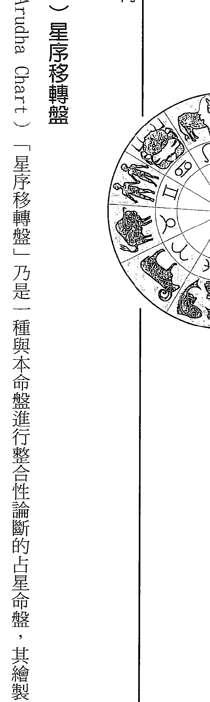

# 五、別有洞天觀

| 行星 | 星座位置 | 主宰星座 | 移動宮位數 | 移動後的位置 |
| :--- | :--- | :--- | :--- | :--- |
| 太陽 | 射手座 | 獅子座 | 9 | 白羊座 |
| 月亮 | 寶瓶座 | 巨蟹座 | 6 | 射手座 |
| 火星 | 天秤座 | 白羊座 | 7 | 天秤座 |
| 水星 | 射手座 | 處女座 | 10 | 雙子座 |
| 木星 | 金牛座 | 雙魚座 | 11 | 摩羯座 |
| 金星 | 寶瓶座 | 天秤座 | 9 | 雙子座 |
| 土星 | 金牛座 | 寶瓶座 | 10 | 天蠍座 |
| 北交點 | 雙子座 | 寶瓶座 | 9 | 天秤座 |
| 南交點 | 射手座 | 天蠍座 | 12 | 天秤座 |

| | ☉ | | ☿ ♀ |
| :--- | :--- | :--- | :--- |
| | | | |
| ♃ | | | |
| ♄ | | ♂ ☊ ☋ | |

△ 命例之行星「星序移轉盤」

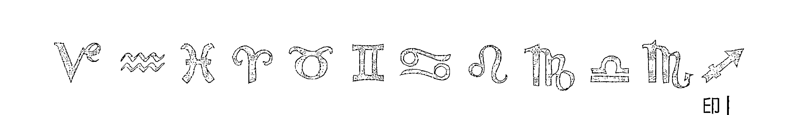

## 印度占星學入門

在宮主星方面，其實是透過各顆宮主星在本命盤上的位置，而移轉了各個宮位的位置。基本規則則是與上述之行星的移轉相似，但宮位的移轉基準，是以該顆宮主星的所在位置為起始點。比如，命例中的命宮為寶瓶座，命主星（第一宮宮主星）為土星，而土星是落入金牛座，為第四宮；於是，從土星所在位置（金牛座）算起的第四宮，即第七宮（獅子座），乃是「星序移轉盤」上的「第一宮」（命宮）的所在位置。這種宮主星的移轉，稱為「Bhavarudhas」。其不同於上述之行星的移轉，是宮主星的移轉另有三項特定情況如下：

1.  第一， 倘若該顆宮主星是落入它自己所主宰的星座位置，則該顆宮主星所代表的宮位的移轉，是應該落入該顆宮主星所在位置的「第十宮」。比如，寶瓶座為命宮，金牛座為第四宮，金星為第四宮宮主星；如果此時的金星是落入金牛座（自己所主宰的星座），是應該落在第四宮的「第十宮」位置上，亦即是落在「第一宮」（寶瓶座）。而金星所主宰的另一個星座（天秤座），為第九宮，是依照一般規則來作移轉，亦即由於天秤座（第九宮）與金牛座（第四宮）之間，是相距八個星座（從天秤座算起），所以是應該從金牛座（第四宮）算起的第八個星座（宮位），即射手座（第十一宮），為金星所代表的第九宮所落入的位置。

2.  第二， 倘若該顆宮主星是落入它自己所主宰的星座的第七宮位置，則該顆宮主星所代表的宮位的移轉，是應該落入該顆宮主星所在位置的「第四宮」。比如，寶瓶座為命宮，雙子座為第五宮，水星是第五宮宮主星；如果此時的水星是落入射手座（自己所主宰之星座的第七宮位置），則水星所代表的第五宮，是應該落在第十一宮（射手座）的「第四宮」，亦即是落在第二宮（雙魚座）。而水星所主宰的另一個星座（處女座），為第八宮，是依據一般規則來作移轉，亦即由於處女座（第十一宮）與射手座（第十一宮）之間，是相距四個星座（從處女座算起），所以是應該從射手座（第十一宮）算起的第四個星座（宮位），即同樣是雙魚座（第二宮），為水星所代表的第八宮所落入的位置。

3.  第三，倘若該顆宮主星是落入它自己所主宰的星座的第四宮位置，則該顆宮主星不用進行移轉，亦即該顆宮主星所代表的宮位，仍然保持停留在原來的位置。比如，寶瓶座為命宮，白羊座為第三宮，火星是第三宮宮主星；如果此時的火星是落入巨蟹座（自己所主宰之星座的第四宮位置），則火星所代表的第三宮，仍然是停留在巨蟹座（第六宮）。而火星所主宰的另一個星座（天蠍座），為第十宮，還是依照一般規則來作移轉，亦即由於天蠍座（第十宮）與巨蟹座（第六宮）之間，是相距九個星座（從天蠍座算起），所以是應該從巨蟹座（第六宮）算起的第九個星座（宮位），即雙魚座（第二宮），為火星所代表的第十宮所落入的位置。

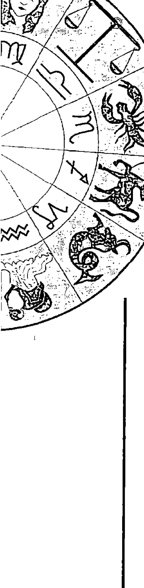

## 印度占星學入門

為了有別於本命盤上的宮位名稱（Bhavas），在「星序移轉盤」上，是以「Arudha Pada」來稱呼每一個宮位，亦即「星序移轉盤」上的第一宮，是稱為「第一宮部」，而本命盤上的第一宮，是稱為「第一宮位」。以下是以命例來作繪製的「星序移轉盤」。

| 第五宮 | 第七宮 | 第一宮 | 第九宮 |
| :--- | :--- | :--- | :--- |
| | | | 第二宮 |
| 第三宮 | | | |
| 第八宮 | 第四宮 | 第十一宮 | 第六宮\n第十宮\n第十二宮 |

△ 命例之宮位「星序移轉盤」

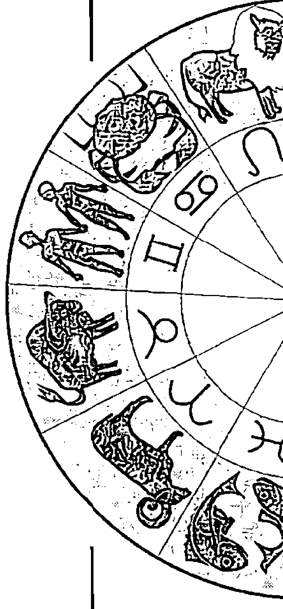

# 五、別有洞天觀

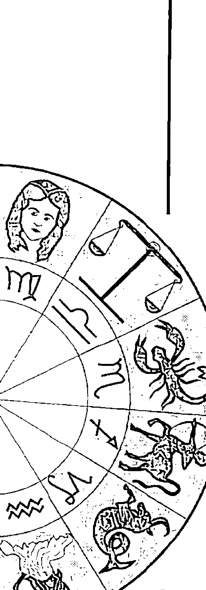

| 行星 | 星座位置 | 代表宮位 | 移動宮位數 | 移動後的位置 |
| :--- | :--- | :--- | :--- | :--- |
| 太陽 | 射手座 | 第七宮(獅子座) | 5 | 白羊座(第三宮) |
| 月亮 | 寶瓶座 | 第六宮(巨蟹座) | 8 | 處女座(第八宮) |
| 火星 | 天秤座 | 第三宮(白羊座) | 4 | 摩羯座(第十二宮) |
| | | 第十宮(天蠍座) | 12 | 處女座(第八宮) |
| 水星 | 射手座 | 第五宮(雙子座) | 4 | 雙魚座(第二宮) |
| | | 第八宮(處女座) | 1 | 射手座(第十一宮) |
| 木星 | 金牛座 | 第二宮(雙魚座) | 3 | 巨蟹座(第六宮) |
| | | 第十一宮(射手座) | 6 | 天秤座(第九宮) |
| 金星 | 寶瓶座 | 第四宮(金牛座) | 10 | 天蠍座(第十宮) |
| | | 第九宮(天秤座) | 5 | 雙子座(第五宮) |
| 土星 | 金牛座 | 第一宮(寶瓶座) | 1 | 金牛座(第四宮) |
| | | 第十二宮(摩羯座) | 5 | 處女座(第八宮) |

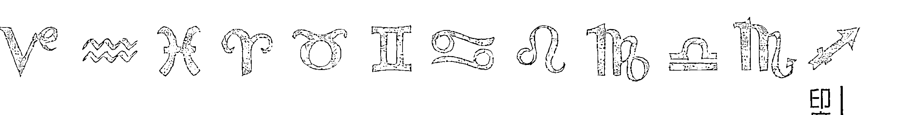

## (五) 三方羅網盤 (Pataka Chart)

「三方羅網盤」乃是一種獨立的論斷體系。在本命的論斷上，主要是用以推論健康、疾病與壽命等，其行星的位置是固定的。而在流年運勢的論斷上，除了可用以推論健康、疾病和壽命外，還可用以論斷事業、名聲與地位等，其行星的位置會隨著年歲的不同，而針對不同的行星有其特定的移動規則，並非是採用「流運盤」(Solar Return) 上的行星所在位置。

如圖所示，橫向與縱向各有三條線，並透過45度角而連接起來，形成了每一個星座分別會與三個星座產生連線。圖上的星座位置是固定的，所賦予的「數據」也是固定的，分別為白羊座10、金牛座6、雙子座20、巨蟹座5、獅子座8、處女座2、天秤座20、天蠍座6、射手座10、摩羯座14、寶瓶座13及雙魚座4等，這些數據就是推論的依據。在本命論斷的應用上，通常還必須配合出生時間。將一天的時間，先劃分成白天生與晚上生，分別主宰十二小時，然後，再將這十二小時分成八等分，每一等分為一小時半。最後，再配合上星期日數，即可得知「出生時間」的「影響星」。可直接對照下列兩個表格。

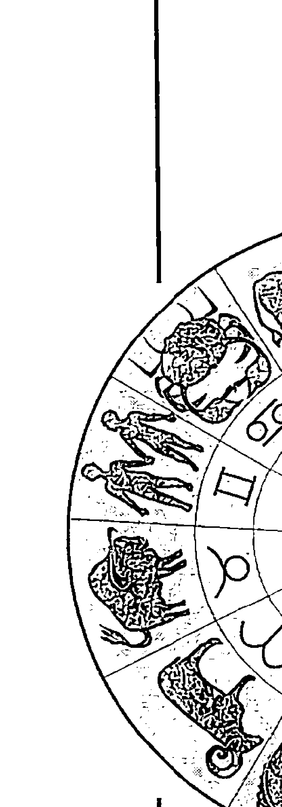

### 表格一：白天生的「影響星」

| 星期 | 第一時段 | 第二時段 | 第三時段 | 第四時段 | 第五時段 | 第六時段 | 第七時段 | 第八時段 |
| :--- | :--- | :--- | :--- | :--- | :--- | :--- | :--- | :--- |
| | | | | | | | | |

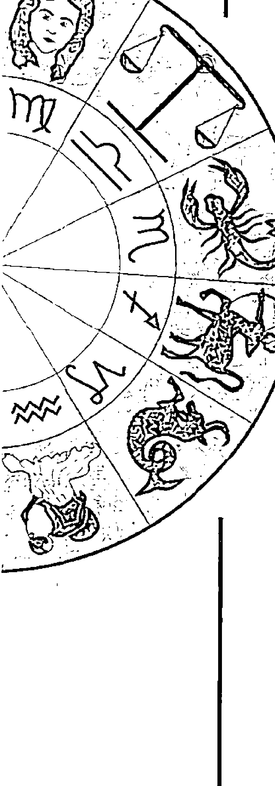

### 表格二：晚上生的「影響星」

| 時段 | 星期六 | 星期五 | 星期四 | 星期三 | 星期二 | 星期一 | 星期日 |
| :--- | :--- | :--- | :--- | :--- | :--- | :--- | :--- |
| 第一時段 | 土星 | 金星 | 木星 | 水星 | 火星 | 月亮 | 太陽 |
| 第二時段 | 水星 | 火星 | 月亮 | 太陽 | 土星 | 金星 | 木星 |
| 第三時段 | 太陽 | 土星 | 金星 | 木星 | 水星 | 火星 | 月亮 |
| 第四時段 | 木星 | 水星 | 火星 | 月亮 | 太陽 | 土星 | 金星 |
| 第五時段 | 月亮 | 太陽 | 土星 | 金星 | 木星 | 水星 | 火星 |
| 第六時段 | 金星 | 木星 | 水星 | 火星 | 月亮 | 太陽 | 土星 |
| 第七時段 | 火星 | 月亮 | 太陽 | 土星 | 金星 | 木星 | 水星 |
| 第八時段 | 土星 | 金星 | 木星 | 水星 | 火星 | 月亮 | 太陽 |

| 時段 | 星期六 | 星期五 | 星期四 | 星期三 | 星期二 | 星期一 | 星期日 |
| :--- | :--- | :--- | :--- | :--- | :--- | :--- | :--- |
| 第一時段 | 太陽 | 月亮 | 火星 | 水星 | 木星 | 金星 | 土星 |
| 第二時段 | 金星 | 土星 | 太陽 | 月亮 | 火星 | 水星 | 木星 |
| 第三時段 | 水星 | 火星 | 月亮 | 太陽 | 土星 | 金星 | 木星 |
| 第四時段 | 木星 | 水星 | 火星 | 月亮 | 太陽 | 土星 | 金星 |
| 第五時段 | 月亮 | 太陽 | 土星 | 金星 | 木星 | 水星 | 火星 |
| 第六時段 | 土星 | 金星 | 木星 | 水星 | 火星 | 月亮 | 太陽 |
| 第七時段 | 火星 | 月亮 | 太陽 | 土星 | 金星 | 木星 | 水星 |
| 第八時段 | 土星 | 金星 | 木星 | 水星 | 火星 | 月亮 | 太陽 |

在得知「出生時間」的「影響星」後，即可依據本命盤上的行星情況，以及這顆「影響星」在「三方羅網盤」上，是否與命度星座有所連線，而推論其發生疾病，甚至夭折的時間。在此，「數據」的顯示，乃是依據凶兆力量的大小來作調整的，亦即白羊座的10，可能是指10年，也可能是指10月或10日，甚至可能是10小時。一般來說，當凶兆力量愈是呈現強力，則愈是傾向小時的顯示；而當凶兆力量愈是呈現弱力，則愈是傾向年歲的顯示。以上的命例來看，生於白天 AM 10：10，當天為「星期一」，當日的日出時間為早上06：43：12，所以是落在第三時段，可得知「影響星」為木星，而木星是落入金牛座，有與命度星座的寶瓶座產生連線，因此寶瓶座（命宮）所代表的13，將會受到木星的影響。倘若是要計算得更為仔細，則可將上述的八個時段，再加以劃分，每一個時段被分成四等分，同時這四等分也各自擁有自己的「影響星」，如此一來，就可能有一顆主時段影響星，另一顆次時段影響星（這兩顆影響星也有可能是同一顆行星）。

「三方羅網盤」在本命的論斷疾病與壽命上，不只是以命度星座為基準，同時也以月亮星座為基準。在命例中，由於月亮與命度是落在同一星座上，所以兩者皆以寶瓶座來作為推論的基準；倘若月亮星座是不同於命度星座，則月亮星座所代表的「數據」，同樣可在「影響星」及本命盤上之行星情況的呈現下，而被拿來作為評估的基準。依據實際的論斷經驗，「三方羅網盤」如此之推論方式，僅能適用於十二歲之前，凡超過十二歲，則應該改用「三方羅網盤」的運勢推論方式來進行論斷。

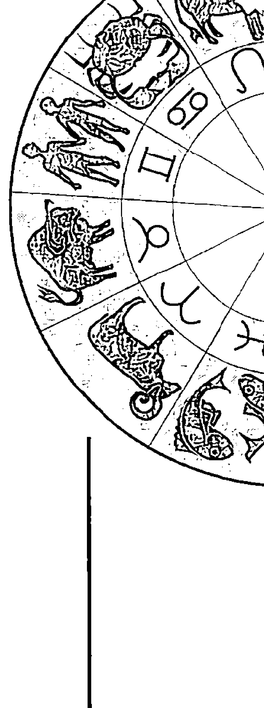

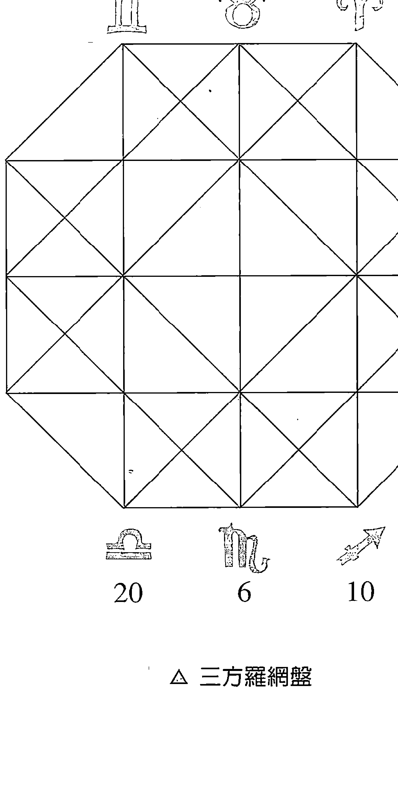

## (六) 徵象星變盤

## 印度占星學入門

「徵象星」可分成兩種，一種是「一般的徵象星」，指的是行星本身所代表的徵象，而另一種則是「宮位徵象星」，指的是行星所代表的宮位徵象。這兩者，存在著相當大的共同性與一致性，只有少許的差異性。其差異的所在，乃在於一個宮位可能擁有兩顆「宮位徵象星」，或者說一顆行星可能同時成為兩個宮位的「宮位徵象星」。在「徵象星變盤」上，其所應用的「徵象星」，指的是「一般徵象星」。「一般徵象星」可分成兩種，一種稱為「不變徵象星」，指的是其所代表的徵象，是「永恆不變」的，而另一種則是稱為「可變徵象星」，指的是其所代表的徵象，會隨著行星在本命盤上的位置情況而進行調整，是「隨位而變」的。必須先了解「不變徵象星」，其認定如下：（由於南交點是「因果星」，所以並未列入其中）

- 太陽——代表父親；
- 月亮——代表母親；
- 水星——代表智力與母方親戚；
- 金星——代表配偶；
- 北交點——代表親戚；
- 木星——代表孩子與錢財；
- 火星——代表兄弟姐妹；
- 土星——代表員工或僱傭；

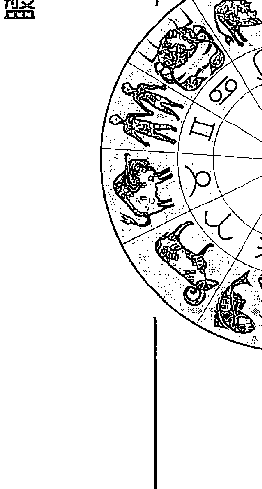

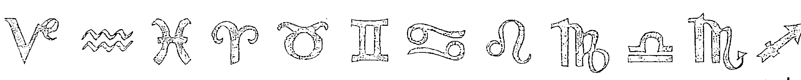

# 五、別有洞天觀

| 行星 | 恆星時系統的黃道經度位置 | 排序 |
| :--- | :--- | :--- |
| 太陽 | 射手座16度51分32秒 | 3 |
| 月亮 | 寶瓶座25度55分53秒 | 1 |
| 火星 | 天秤座11度07分26秒 | 4 |
| 水星 | 射手座20度33分05秒 | 2 |
| 木星 | 金牛座08度18分59秒 | 6 |
| 金星 | 寶瓶座03度12分00秒 | 7 |
| 土星 | 金牛座00度43分14秒 | 8 |
| 北交點 | 雙子座21度39分08秒（即8度20分52秒） | 5 |

在確認「不變徵象星」後，接著就是依據行星在本命盤上的度數位置，來排定「可變徵象星」。其排法，是依照行星所在的星座度數之多寡來作排列，從0—30度之間，凡是度數愈多者，即表示其對個人的影響力愈大，應該排在愈前面；相對地，度數愈少者，則排在愈後面。必須注意的是，由於北交點是逆行的，所以它的度數計算也應該是逆數的，亦即是以30度來減去其所在度數，才是北交點的確實度數。直接對照下列資料，即可明瞭。

## 印度占星學入門

將上表的排序經過整理後，即呈現以下情形：

| 排序 | 行星 | 調整項 |
| :--- | :--- | :--- |
| 1 | 月亮 | 第一徵象星（個人主要星） |
| 2 | 水星 | 第二徵象星（個人次要星） |
| 3 | 太陽 | 第三徵象星（手足徵象星） |
| 4 | 火星 | 第四徵象星（母親徵象星） |
| 5 | 北交點 | 第五徵象星（父親徵象星） |
| 6 | 木星 | 第六徵象星（孩子徵象星） |
| 7 | 金星 | 第七徵象星（親戚徵象星） |
| 8 | 土星 | 第八徵象星（配偶徵象星） |

在繪製「徵象星變盤」時，以上八顆行星的所在位置完全與本命盤相同，亦即本命盤上的行星位置不變，只是「命度」（第一宮）必須落在「個人主要星」於「九分盤」上的星座位置。在命例中，「個人主要星」為月亮，而月亮於「九分盤」上，則是落在金牛座，所以命例的「徵象星變盤」的命宮是落在金牛座，如下圖所示。

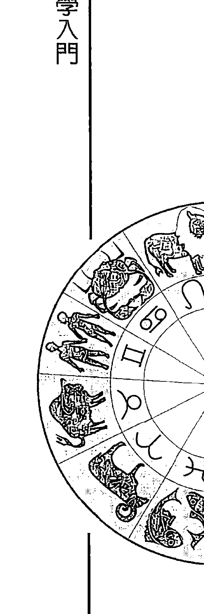

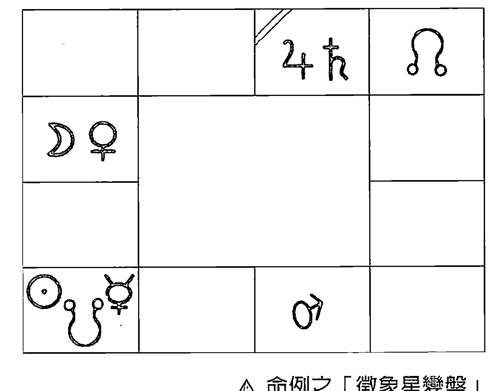

## （七）月亮身宮盤

在西方占星學上，月亮固然是一顆相當重要的主星，但其重要性還低於太陽，因此並沒有以月亮所在星座位置來當命度的傳統論法。反觀印度占星學，則是相當重視月亮的，認為其重要性大過於太陽，甚至連「行星運限」的起運，也是以月亮為基準，並將月亮所在星座位置當作命宮，是一種傳統論法的象徵，通常是與本命盤具有同等的重要份量。在中國傳統占星學上，將以命度為命宮所在的本命盤稱為「出生命宮盤」，而把以月亮為命宮所在的本命盤稱為「月亮身宮盤」。在繪製上，行星的位置完全與本命盤一致，不作任何的改變，其所改變的只是「命宮」而已，亦即是把命宮轉移到月亮的所在星座位置。在命例中，由於月亮正好落入命宮，所以連命宮也不必作調整。

有關「月亮身宮盤」的論斷，尚有某些爭議存在。在此，僅提出兩點看法以供參考：第一，「月亮身宮盤」的作用引發，通常是在廿五歲過後，這是因為月亮本身代表著心思與精神，而一般來說，一個人在年過廿五歲之後，其心思與精神才會逐漸趨於成熟與穩定；第二，當論及一個人的家庭、事業與才能，以及女人的懷孕時，透過「月亮身宮盤」與「出生命宮盤」的整合性論斷，才可以看得更為清楚。

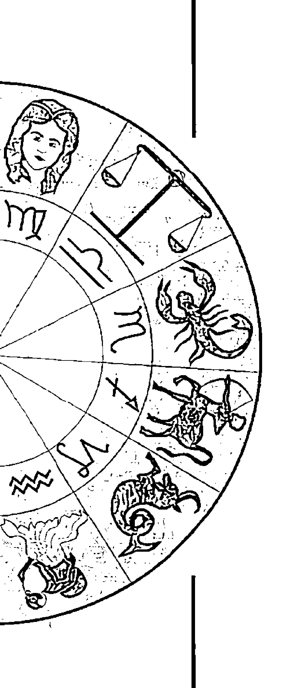

## 印度占星學入門

除了「月亮身宮盤」外，還有兩種占星命盤，同樣是維持著本命盤上的行星位置不變，而只有調整命宮位置而已。其一，即是「幸運輪轉盤」，乃是以阿拉伯點上的「幸運點」來當作命度的所在位置，甚至有少數印度占星家認為，應該以「幸運輪轉盤」來取代「月亮身宮盤」。從Uranian Astrology的角度來看，幸運點其實就是命度、太陽及月亮的共振點，亦即幸運點＝命度＋太陽－月亮，可換算成「幸運點＋太陽＝命度＋月亮」；於是，當有行星落在幸運點位置上時，即會引發四點合一的力量，其徵象會是相當明顯的。而針對幸運點本身的涵意，其實並未如名稱上所言的會帶來「幸運」！而是需要結合數字徵象來作論定，這是阿拉伯占星學的論法；在印度占星學上，有關幸運點的論法，是應該結合與敏感點有關的星組（Yogas）來作推論。

其二，即為「行星運限盤」（Dasa Chart），同樣是維持著本命盤上的行星位置不變，而當行運走到某一顆特定行星時，即以該顆正在行運的行星之所在星座位置，來當作命宮。同時，隨著行運（Dasa）的變換，命宮也會跟著變換。這種「行星運限盤」，主要是用以論斷特定行星所主宰之期間的運勢呈現。

# 一、紅花綠葉摘

## 第二部份 實論篇

主要是探討有關十二星座坐命的十二種命盤形式，以及某些相關的組合情形（KOB）。在每一種星座坐命的情況下，列出五個星組，以作為實論的參考。這些星組（總數六十種），主要是用以陳述命盤上所呈現之外在環境的機緣顯現，是以印度占星學的論法為基礎。而在解釋上，同時也採用了西方占星學和Uranian Astrology的論法，一方面是試圖透過西方占星學所擅長的心理分析，來解析命運的個性成因，或者說外在環境與內在性格之間的相呼應。請特別注意印度「恆星時命盤」與西方「回歸時命盤」，在大部份的情況下，同樣的出生時間與出生地點，會呈現出不同的星座坐命情形！彼此可能相差一個星座位置。

## 印度占星學入門

# 一、紅花綠葉摘

| 行星 | 入旺星座 | 入弱星座 |
|------|----------|----------|
| 太陽 | 白羊座   | 天秤座   |
| 月亮 | 金牛座   | 天蝎座   |
| 火星 | 摩羯座   | 巨蟹座   |

> > 自我光明神，以己之摩耶，乃由其自我，想像彼自我。
> 唯是彼知覺，分別之萬有。此是吠檀多，決定之義諦。
> 自我在內心，事物轉為外，亦成外物想，如是成變現。
> 内在非顯者，外在顯了者，俱唯是想成，分異在根内。
> ——喬荼波陀疏〈唵聲奧義書〉第二卷

# 一、紅花綠葉摘

## ◎吉星與凶星

凶星包括——太陽、火星、土星、北交點（龍頭）和南交點（龍尾）。
吉星包括——木星、金星、月亮和水星。當月亮處在新月（Amavasya）階段，通常被視為是不吉；亦即，月亮發揮吉星力量，應該是在脫離與太陽相距72度的範圍以外。而當月亮處在滿月時，被視為是力量最強的時候，可充分發揮吉星的力量。水星在「單獨」時，亦即不受到任何其他行星的影響時，被視為是吉星。當水星與吉星形成合相（同宮）時，水星是呈現吉星力量，可是當水星與凶星形成合相時，則呈現凶星的特質。

| 水星 | 木星 | 金星 | 土星 |
| :--- | :--- | :--- | :--- |
| 處女座 | 巨蟹座 | 雙魚座 | 天秤座 |
| 雙魚座 | 摩羯座 | 處女座 | 白羊座 |

## 印度占星學入門

## ◎行星的相映

太陽、月亮、水星和金星，是相映於它們的第七宮。火星是相映於它的第四宮、第七宮和第八宮。木星、北交點和南交點，是相映於它們的第五宮、第七宮和第九宮。土星則是相映於它的第三宮、第七宮和第十宮。「相映」乃是一種影響力的感應概念，也可簡單說是影響力的針對特定宮位的釋放。請參見以下四圖。

# 一、紅花綠葉摘

## 行星的陰陽屬性

- 阳性行星包括——太阳、火星和木星。
- 阴性行星包括——月亮、金星和北交點。
- 中性行星包括——水星、土星和南交點。

## 行星的運限期間 (Dasa)

有關行星運限 (Dasa)，其實是有多種不同的系統，而最被廣泛使用的是 Vimshottari Dasa System。整個的行星運限總計為 120 年，印度人視此為人類所該有的自然生命期間。在這 120 年期間，分屬九顆行星來作主宰，其運限期間的分配如下（往後會談及如何計算這些行星運限）：

| 行星 | 行星運限期間 |
|---|---|
| 太陽 | 6 年 |
| 月亮 | 10 年 |
| 火星 | 7 年 |
| 北交點 | 18 年 |
| 木星 | 16 年 |
| 土星 | 19 年 |
| 水星 | 17 年 |
| 南交點 | 7 年 |
| 金星 | 20 年 |

## 行星徵象星

行星本身是具有徵象意涵的，這種觀念在東西方占星學上皆有。但印度占星學特別將其界定為「徵象星」，類似於西方卜卦占星學上的徵象星意涵，只是在印度占星學的論法上，針對徵象星，另有其他的作用和論法，與西方占星學作對照，大部份是相同的，但有少部份的相異之處。

# 一、紅花綠葉摘

在實論上，需注意的是南北兩交點，不能單獨以「單星入單宮」的方式來進行論斷！因為這兩個交點是屬於「蔭星」，其作用力主要是透過與其他行星的合相或相映，或者是透過它們的「位置」，來作呈現。

| 行星 | 徵象星的涉及 |
|------|--------------|
| 太陽 | 父親、政府、高貴、高位、成功、榮耀、眼睛、骨頭、心靈、領袖、心臟 |
| 月亮 | 母親、血液、流質、精神、企圖、易變、速移、肺部 |
| 火星 | 弟妹、勇氣、膽識、軍事、偷竊、無情、涉罪、攻擊、受傷、意外 |
| 水星 | 皮膚、呼吸、才識、智力、腸部、教育、寫作、閱讀 |
| 木星 | 知識、神恩、恩惠、幸運、財富、宗教、孩子、兄長、丈夫 |
| 金星 | 婚姻、性事、結盟、太太、臉部、舒適、奢侈、音樂、詩歌、美感、傳達 |
| 土星 | 神經、疾病、壽命、服務、辛勞、失望、阻礙、困難、挫折、死亡 |
| 北交點 | 等同於土星 |
| 南交點 | 等同於火星 |

## 宮位徵象

以下所列，是印度占星學上的十二宮位意涵。其中，有與西方占星學相同者，也有不同者。

| 宮位 | 主要代表象征 |
|------|--------------|
| 第一宫 | 身體、膚色、健康、活力、個性、榮耀、高貴、頭、臉的上半部、壽命、誕生 |
| 第二宫 | 錢財、好運、得失、經營、珠寶、右眼、指甲、舌頭、鼻子、牙齒、家人、危機 |
| 第三宫 | 精神、勇氣、膽識、能耐、嘗試、弟妹、鄰居、手、喉嚨 |
| 第四宫 | 母親、家庭、住處、傳達、交通工具、土地、田產、祖產、建築物、學校教育 |
| 第五宫 | 懷孕、孩子、愉悅、娛樂、運動、競賽、活動、才識、高等學習、胃部 |
| 第六宫 | 疾病、生病、食物、服務、僕人、家畜、房客、租戶、敵人 |
| 第七宫 | 隔壁房子、相連的土地、伴侶、生意夥伴、婚姻生活、致命傷 |
| 第八宫 | 壽命、死亡、繼承、遺產、撫卹金、意外災禍、不幸、悲傷、擔憂、沮喪、失去 |
| 第九宫 | 信仰、智慧、幸運、哲學、慈悲、宗教、父親、導師、國外、高等教育、膝蓋 |
| 第十宫 | 榮耀、尊貴、名聲、職業、威望、雄心、權威、昇遷、獎賞、世俗活動、大腿 |
| 第十一宫 | 朋友、社區、兄長、意圖、得財、成功、收入、茂盛、傳遞、腳踝 |
| 第十二宫 | 花費、失去、妨礙、過度、感官愉悅、依戀床、離家、捐贈、博愛、貧困、入獄、神秘事物、秘密敵人、不名譽、左眼、腳 |

## 宫位徵象星

在印度占星學上，行星除了以「宮主星」的身份，而帶有各宮位的徵象意涵外，同時也具有「宮位徵象星」的身份。可以這麼說，在論斷宮位時，「宮位」、「宮主星」和「宮位徵象星」，乃是一種「三位一體」的概念。宮位徵象星的界定如下頁的表一：

## 三方宮與四正宮

第一宮、第四宮、第七宮和第十宮，稱作「始宮」，也可稱作「四正宮」（Kendras）。第一宮、第五宮和第九宮，稱作「三方宮」（Trikonas）。所以，第一宮不但是屬於「四正宮」，也屬於「三方宮」。第二宮、第五宮、第八宮和第十一宮，稱作「續宮」（Panapharas）；而第三宮、第六宮、第九宮和第十二宮，稱作「果宮」（Apoklimas）。然而，由於其中的第五宮和第九宮，已歸屬於「三方宮」，所以在「續宮」和「果宮」內，通常是不包含第五宮和第九宮。又第三宮、第六宮、第十宮和第十一宮，稱作「成長宮」（Upachaya），意味著增長、促進。

依據白天生或晚上生，而有所不同。這方面的問題，將於往後作更進一步的探討。

有待說明的是，有關父親的徵象，在宮位上是涉及到第九宮和第十宮。而代表父親的行星，會

▼ 表一

| 事物 | 宮位指涉 | 宮位徵象星 |
| :--- | :--- | :--- |
| 身體 | 第一宮 | 太陽、月亮 |
| 錢財 | 第二宮 | 木星 |
| 弟妹 | 第三宮 | 火星 |
| 母親 | 第四宮 | 月亮 |
| 土地 | 第四宮 | 土星 |
| 心思 | 第四宮 | 月亮 |
| 教育 | 第四宮 | 水星 |
| 孩子 | 第五宮 | 木星 |
| 疾病 | 第六宮 | 土星 |
| 暴烈 | 第六宮 | 火星 |
| 太太 | 第七宮 | 金星 |
| 丈夫 | 第七宮 | 木星 |
| 壽命 | 第八宮 | 土星 |
| 信仰 | 第九宮 | 太陽、木星 |
| 父親 | 第十宮 | 太陽 |
| 當權者 | 第十宮 | 太陽 |
| 政府 | 第十宮 | 太陽 |
| 兄長 | 第十一宮 | 木星 |
| 舒適 | 第十一宮 | 木星 |
| 愉悅 | 第十二宮 | 金星 |

## ◎吉宮與凶宮

雖然在印度占星學上，針對每一顆行星相對於每一個不同的宮位，是具有不同的宮位吉凶偏向，但一般來說，主要的吉宮，是以第五宮和第九宮為主；而主要的凶宮，是以第六宮、第八宮和第十二宮為主。至於「四正宮」的第一宮、第四宮、第七宮和第十宮，是屬於中性偏吉，其最主要的作用，乃是用以「強化」行星的「世俗影響力」。又第十一宮，通常是偏吉，而第三宮則是傾向偏凶。其餘的宮位，較缺乏吉凶特質的凸顯。在實論上，這樣的宮位吉凶特質，是不能單獨成立的，它有賴於行星的落入，以及行星（宮主星）彼此間的相映，來激起宮位的吉凶顯現。

## ◎友人與敵人

印度占星學把行星彼此間的關係，分成三種——友人關係、敵人關係和中立關係；並且這樣的關係，又分成「短暫關係」和「永久關係」。這種觀念，在論斷的應用上是相當重要的，因為印度的占星論斷，時常是以「敵友」關係，來認定吉凶的顯現、力道的展現，以及順利或挫折的偏向等。以下即為各行星的敵友界定。

有關龍頭和龍尾的「敵友關係」，其實是尚有爭議之處！在實論上，還是以傳統七顆行星的敵友關係為主。這兩個交點在應用上，可忽略其敵友關係。

| 行星本身 | 太陽 | 月亮 | 火星 | 水星 | 木星 | 金星 | 土星 | 龍頭 | 龍尾 |
|----------|------|------|------|------|------|------|------|------|------|
| 友誼行星 | 木星、火星、月亮 | 太陽、水星 | 月亮、太陽 | 太陽、金星、龍頭、龍尾 | 太陽、月亮、火星 | 水星、土星、龍頭、龍尾 | 水星、金星、龍頭、龍尾 | 水星、金星、土星、龍尾 | 水星、金星、土星、龍頭 |
| 敵意行星 | 金星、土星、龍頭、龍尾 | 龍頭、龍尾 | 水星、龍頭、龍尾 | 月亮 | 水星、金星 | 太陽、月亮 | 太陽、月亮、火星 | 太陽、月亮、火星 | 太陽、月亮、火星 |
| 中立行星 | 水星 | 火星、木星、金星、土星 | 金星、土星 | 火星、木星、土星 | 土星、龍頭、龍尾 | 火星、木星 | 木星 | 木星 | 木星 |

## 柳暗花明又一村

在印度占星學如此複雜的論斷體系上，想要理出個頭緒來並不容易。印度占星家已經習慣了這種分散性的片斷認知，同時也習慣了把這樣的片斷認知，透過第六感來直接進行掌握。西方占星學在呈現上，是傾向依據著科學方法所訴求的組織感與秩序感來作表述。因此，學習西方占星學，可說是比印度占星學來得更為輕易、迅速的，但卻也更容易誤入歧途——走向片面的關注，而缺乏對全盤互動的感知。以東西方占星學來作比較，西方占星學是入手快，求精難！而印度占星學則是入手難，求精易。整個的差別關鍵，是在於學習的過程！以下，我引用西方占星學所講求的組織感和秩序感，來試圖釐清楚整個印度占星學的論斷結構，這是印度占星家所沒有提到的，只因為他們沒有這種習慣。前面曾提過，西方占星學主要是依據「星位」（行星所在位置）和「相位」，這兩個層面的整合作推論，而這兩個層面皆可說是屬於「技術面」。這裡所謂的「制度面」，指的是印度占星學在本命的論斷上，還存在著與本命盤形成「共振」的其他占星命盤。而在「技術面」上，印度占星學在學習過程中所強調的多種因素的整合與考量

在西方占星學上是採取「因人而異」的態度，亦即西方占星學相當重視兩或三因素之基本互動的解析，而針對更複雜的因素整合，則端看個人是如何去作發揮。西方占星學的這種學習現象，容易造成「似是而非」的情形，亦即可以應用西方占星學來作推論，但卻又似乎難以達到一種「入骨」的感覺，最後則容易造成兩種現象——其一，以論個性居多，論事件則少；其二，散彈打鳥，東論一塊、西論一塊，彼此好像沒什麼相干！反觀印度占星學，在學習的過程中，即被賦予一定的難度要求，需要同時關注的考量因素較多，而且不像西方占星學有既定的脈絡與推理過程可言，往往相當講求直覺與感應。因此，我個人認為，如果在整個研究及應用占星學上，一定要講求「有理」的「推演」脈絡，或者說一定要探究於命運形塑的合理化解釋的話，那麼比較適合學習西方占星學。而如果邏輯能力實在不怎麼好，但憑感受來感覺於占星命盤，並且就個人的推論結果，有時實在也說不出個所以然來，反正「覺得」就是這樣的話，那麼比較適合學習印度占星學。若是想要兩者皆精通，除非個人的占星命盤是呈現感性與理性的充分平衡，並且多少有人格分裂或多重人格的現象，當然也還要別人更為加倍努力學習。在印度的占星論斷體系上，可分成兩個層面，一為「制度面」，二為「技術面」。先說明整個

「制度面」的內容，再來解說「技術面」。至於這兩個層面，在實論上的交叉與滲透，只好勉為其難，透過往後在「實論篇」中所提出的各種內容來作感受，並輔以學習者個人的實論經驗之體會。

在整個論斷體系上，可分成三個主要部份，亦即「本命」、「運勢」和「卜卦」（擇日是被納入卜卦之中）。至於天文計算，是屬於命盤建構的基本要素，通常不被列入「論斷」體系中。在「制度面」上，可分成五大類，一為本命盤，二為分盤，三為特殊命盤，四為行星盤，五為區間。

二和三這兩者，在前面已經介紹過了，其中以「九分盤」（Navamsa）最為重要，與本命盤和月亮身宮盤，構成三足鼎立的局面。在本命盤方面，又會與「行星盤」有所牽扯。所謂的「行星盤」，就是如同月亮身宮盤一般，以某一顆行星所落入的位置來當作命宮，應用本命盤上的宮位排列順序，來進行「轉宮」的宮位認定。這種「行星盤」的應用，通常是只設定在某個特定的「人」或「對象」上；比如，以論斷父親來說，若以太陽來當作父親的徵象星，則太陽所在的宮位就是當作論斷父親的「第一宮」，不管太陽是落入那一個宮位，然後依序排列宮位下去，亦即太陽的下一個宮位，就當作是「第二宮」，再來是「第三宮」，直到第十二宮為止。目前流行的太陽星座運勢，同樣是以太陽來當作第一宮，這從印度占星學的角度來看，太陽星座運勢預測的結果，不是你自己的運勢，而是你老爸的運勢！

「區間」與「分盤」有著緊密的關係，但卻也有其不同於「分盤」的作用，這主要是表現在兩方面，一方面為「區間」可獨立性地具有吉凶意涵；另一方面，透過「區間」，還可以建立起不同於「分盤」的論斷體系。於是，「區間」是足以構成「制度面」的一份子。

在「技術面」上，大體上可分成三部份，一為「一般規則」，二為「星組結構」，三為「星力統合」。前兩部份，分別皆涉及到星座、星宿、宮位、區間、行星、宮主星、徵象星和位置星等八大因素的考量。在「星力統合」上，則是少了徵象星和位置星這兩項因素，但卻加上了行星方向和移動情況等的考量。而在星組（Yoga）上，則又增加了形狀、數字及特殊情形等三個因素的考量。

分別說明如下。

『一般規則』，指的是命盤論斷的『一般考量』，可分成兩大類，一為「星位」，二為「相映」。

- ☆行星所落人的星座位置；
- ☆行星所落人的宮位位置；
- ☆行星所落人的星宿位置；
- ☆行星所落人的區間位置。

# 一、紅花綠葉摘

『相映』（包含合相在内）的情况呈现有——

-   ☆行星与行星之间的相映；
-   ☆行星与徵象星之间的相映；
-   ☆行星与宫位之间的相映；
-   ☆宫主星与徵象星之间的相映；
-   ☆宫主星与宫位之间的相映；
-   ☆徵象星与位置星之间的相映；
-   ☆宫主星与位置星之间的相映；
-   ☆位置星与位置星之间的相映；
-   ☆行星与宫主星之间的相映；
-   ☆行星与位置星之间的相映；
-   ☆宫主星与位置星之间的相映；
-   ☆徵象星与徵象星之间的相映；
-   ☆徵象星与宫位之间的相映；
-   ☆宫主星与宫位之间的相映；
-   ☆位置星与宫位之间的相映。

『星组结构』可分成两大类，第一类为『有迹可寻』者，第二类为『纯属经验』者。
『有迹可寻』的星组（Yoga）可分成以下八种：
第一种，与『命宫』相涉者；第二种，与『太阳』相涉者；第三种，与『月亮』相涉者；第四种，与其他行星相涉者；第五种，与形状（行星在命盘上的分布情况）相涉者；第六种，与数字相涉者；第七种，与吉兆相涉者；第八种，与凶兆相涉者。
『纯属经验』的星组（Yoga）可分成以下两种：第一种，与宫位相涉者；第二种，零散的特殊。

## 印度占星學入門

在此，所談及的「星組」（Yoga），主要指的是在本命盤論斷上所應用到的「星組」。另有行星運限的特殊星組，以及卜卦的特殊星組。
在「星力統合」上，一般是分成以下六種：第一種，相映的力量；第二種，位置的力量；第三種，本性的力量；第四種，移動的力量；第五種，方向的力量；第六種，短暫的力量。
除了以上六種力量外，還有三種氣質的力量：
第一種，三種氣質分類，包括（一）甦醒著；（二）半夢半醒；（三）睡夢中。
第二種，六種氣質分類，包括（一）羞怯；（二）自大；（三）飢餓；（四）貪心；（五）愉悅；（六）鼓動。
第三種，十二種氣質分類，包括（一）正在降落；（二）正坐下；（三）瞥光；（四）照耀；（五）想離去；（六）步行中；（七）定居；（八）正到來；（九）正在吃；（十）跳躍中；（十一）玩樂中；（十二）沈睡中。
以上所涉及到的內容，將於後續一一加以介紹。

# 二一、命宮千秋數

> 逍遙兮，由黑暗至於燦爛；逍遙兮，由燦爛至於黑暗。 如馬之振鬣兮，灑脫罪業，如月脫乎羅睺之口，委蛻軀殻。 以已成就之自我，於未創之大梵世界，我入兮——我入兮！ ——《唱讚奧義書》第八篇第十三章

## ◎統觀全盤

在這一章裡，所要提及的是有關命宮（第一宮）的論斷。在正式進入命宮論斷的要點說明之前，有必要就整個的看盤過程，作一簡單的述說。這三種不同的占星系統，彼此間存在著差異性，可進行相互的比較。以下是透過五個主題來作陳述，並且是以西方占星學來作為比較的基準，畢竟西方占星學是較被普遍認知的（在此只談及本命論斷，而不涉及運勢）。

## 主題一、基本資料的呈現

針對本命的論斷，在基本資料的呈現上，主要有三種：（一）行星（包含交點在內）與宮位的位置度數；（二）相位的關係；（三）其他相關資料。

就（一）而言，由於印度占星學是三盤鼎立，所以除了本命盤外，還有月亮身宮盤和「九分盤」。其中，月亮身宮的行星與宮位之位置度數，與本命盤相同；但在「九分盤」上，則有不同的行星及命度的位置度數，而其他宮位則是依據命度位置來作確立，並沒有特殊的宮頭位置度數。在Uranian Astrology 方面，只有行星、命度和天頂的位置度數，而沒有其他的宮頭位置度數，並且有第二項，且第一項，也因人而異，通常在西方占星軟體上不會列出。由於印度占星學上的「區間」相當多種，所以如果真的要仔細查看的話，是採取直接列印出各種分盤的方法。而通常在本命盤的列印上，只標出了廿七宿及一〇八宿部的位置，並且也列出了星宿與宿的主宰星。

再就（二）來說，西方占星軟體通常是有兩種命盤形式，一種是有直接列出相位線，而另一種則沒有。但就基本的相位資料來說，是會列示出來的，甚至包含了平行相位和反平行相位。而印度占星學上的相映，一般是直接採用目測，所以並未列出。在Uranian Astrology方面，相位關係是直接列印在「均點樹」上，一看即可明瞭。但通常並沒有60度和120度的相位關係。在（三）方面，Uranian Astrology 一般是省略的。西方占星軟體則會加上星座的三方四正的力量計算，以及依據個人的偏好，而挑選出自己所想要使用的其他較小的行星或敏感點，這通常是以凱龍星、莉莉星、灶神星、智神星、婚神星、穀神星、東方點、奔赴點、阿拉伯點等為主，而在阿拉伯點方面，一般只採用幸運點。另外，對於比較重視古典論法的占星家來說，會注意到出生當天的主宰行星，以及小時的主宰行星。至於其他與天文學有關的時間資料，以及地點的相關資料，則只是一種列示的參考，沒什麼用處。因為如果要採用這些資料來計算出與運勢有關的資料的話，倒不如直接應用占星軟體，以取得相關的運勢資料。在印度占星軟體上，沒有星座的三方四正的力量評估，但卻有另一整組的行星力量估算值，並且也列出行星與星座之間的敵友關係。而在較小行星和敏感點上，印度占星軟體沒有這些實際星體的小行星，因為認為這小行星的影響力不夠大，可是卻有幾顆重要的敏感點一定會被採用。至於阿拉伯點的應用，則視個人情況而定，同樣被歸入敏感點中。另外，上面所提到的出生當天的主宰行星，以及小時的主宰行星，則是必備的，並且搭配了出生時間與日出時間之間的差距。學，而印度占星學則是最複雜的。以下即針對這些基本資料，扣緊實論的過程來作說明。

## 主題二、行星的命盤佈局

所謂行星的命盤佈局，指的是行星在占星命盤上的分佈狀況。依據規規矩矩的西方占星論法，可分成以下的六種情形——

-   （一）行星在命盤上的半球分佈狀況。這是以宮位來作為分佈的基準，可分成東半球和西半球，以及上半部和下半部。
-   （二）行星在命盤上的象限分佈情況。這是以半球分佈來作交叉所形成的，總共有四個象限，每一個象限包含了三個宮位。第一象限內有第一、二和三宮；第二象限內有第四、五和六宮；第三象限內有第七、八和九宮；第四象限內有第十、十一和十二宮。
-   （三）行星在命盤上的六分儀分佈情況。這是以命度、天頂和「奔赴點」（Vertex）等三個點，來進行直線切割命盤，所形成的六個部份。
-   （四）行星在命盤上的星座分佈情況。這可分成四正宮星座和三方宮星座兩種。四正宮星座包含了基本宮星座、固定宮星座和變動宮星座；而三方宮星座則是包含了火象星座、土象星座、風象星座和水象星座等，分屬於四大元素。依據行星所落入的不同四正宮星座和三方宮星座，而用以衡量星座力量的顯現，同時也評估了行星落入星座所呈現出來的廟旺陷弱情形。

### （五）行星在命盤上的對宮分布情況

這同時可透過星座和宮位來作評估的基準，以確立某一組特定對宮（兩個星座或兩個宮位）的凸顯。

### （六）行星在命盤上的分佈形狀

這在西方占星學上，通常是以Jones所提出的七種命盤形狀為主。

這六種情況，在西方占星論法上，主要是用以掌握整個命盤的大方向，或者說是透過這樣的程序，對整個占星命盤進行初步的感覺，心理占星學的論斷，就是以此來作為出發點。然而，就占星家的角度來看，這對於初學占星者來說，是一種很不錯的訓練過程，也可說是在打基礎，可是卻容易導致論斷的複雜化，打擊了學習占星的信心！因為要把這六種情況，在很短的時間內進行整合性的感受並不容易，況且後來還得加上相位的考量，不免令人有頭昏眼花的感覺。問題的關鍵性是，經過上述六種情況的一一解析後，到底想要取得什麼樣的命運訊息？——是個性的掌握嗎？——這是心理占星家的普遍看法。

真正的重點，其實只有二個——其一，「命定」成份的高低評估；其二，命造運作的輪廓；其三，命盤主星的確立。先說第一點，每一個人皆有不同的出生本命盤，這不但是意味著每一個人命運的不同，同時也表示了每一個人「命定」成份的差異；亦即，有些人天生就難以擺脫命運的桎梏，形成了在占星命盤上所透露出來的命運徵象，顯得特別明顯，也可以說這樣的一個命造，其命運跡象是較固定的，較容易被論斷的；通常，命盤上的徵象不但會呈現在心理層面，而且也會反應在事件上。反觀有些人的命運，是較具彈性的，亦即其命盤上的徵象可能只呈現在心理層面，而不會反應在事件上，或者說這樣的命造，顯現了較明顯的自我改造的型態，在進行論斷時往往有必要配合運勢，以便掌握到更細節的變化。其實，針對「命定」成份的高低評估，只要採用西方占星學來觀看命盤上的兩個位置點，以及同樣採用印度占星學來觀看另兩個位置點，只要五秒鐘即可馬上明瞭，而不必如此大費周章。不過，話說回來，占星家如果不擺出這麼多的東西來，實在會缺乏可以掰的空間，況且這樣規規矩矩的解析，是有助於初學者的占星磨練。

其次，有關命運運作的輪廓，指的是在最短的時間內，掌握到一個人的命運起伏的大致軌跡。這樣的「輪廓」或「軌跡」，有時是相當奧妙的。亦即，針對不同的命盤，每一個人所面臨的際遇，似乎在起承轉合之間，被賦予某種自己特有的運轉跡象。比如，有些人一旦付諸行動，想要達成某個目標時，在進行的過程中，每到一個階段，就會有個程咬金從半路殺出來，增加了繼續執行下去的困難度。又比如，有些人是屬於那種「先得後失」的軌跡，只能見好就收，而不能一再地么下去。有關這方面的論斷，其實只要透過命盤上的兩條軸線，或一條軸線與一個特定位置，即可迅速進行判斷，同樣不必如此大費功夫，只是在大費功夫下，是可以看得更清楚。其三，針對命盤主星的確立，在東西方占星學的論斷上，皆是相當重要的。掌握了命盤主星，等於是掌握了一個重要「焦點」，而這樣的一個「焦點」，往往與個人的命運走向是息息相關的。命盤主星並非一定是「命主星」（第一宮宮主星），命盤主星通常是由三項因素所組合而成的——第一，命盤上最強力或最弱力的行星；第二，與其他行星互動最頻繁的行星；第三，佔據著一個特定的位置。在西方占星學上，一般是透過上面所提到的（六），以及結合行星的廟旺陷弱與相位關係來作確立。而在印度占星學上，則是依據行星的力量評估，以及特定的星組（Yoga）來作確立。這樣的星組（Yoga），是屬於基本星組，亦即印度占星學已發展出一定的基本星組，可用以確立前面所提的三個重點。這種星組，有點類似於傳統八字命理中的「格局」。於是，當採用這些標有特定名稱的基本星組，來作為審視命盤的第一步時，等於是在定格局，確立三個論斷的最基本重點。這些基本星組，是不同其他針對宮位或運勢的論斷所提出的星組，基本星組的最重要作用，乃是在於給一個命盤定下命格高低的評估。

## 主題三、相位與相映

西方占星學的相位，是屬於較小範圍內的度數相距的計算。而印度占星學的相映，是屬於較大範圍內的共鳴呼應。Uranian Astrology 則是更小範圍內的度數相距的計算。範圍的大小，只能說是「表面」上的差異，並非是觀念內涵上的主要差別。以西方占星學來作為比較的基準，Uranian Astrology 顯然是捨棄了「吉相位」，並且特別著重在三星組合下，與另一顆行星正好形成對應（這從西方占星學的論法來看，類似於一顆行星同時與其他三顆行星形成相位）。而在本命的論斷上，是以六個敏感點所構成的「均樹點」最為重要，同時也並不刻意區別主相位與次相位，而是著重於行星彼此間「氣質」之相溶與相斥。
從西方占星學與印度占星學來作比較，相位所針對的是行星或某個特定點（如命度、天頂），但相映所針對的是宮位（即星座）。以「空宮」的現象來作說明，可取得一個較清晰的認知。當一個宮位形成「空宮」時（即沒有行星落入），在西方占星學上，等於這個空宮的宮位內，並沒有相位關係；因為沒有行星落入，就沒辦法與其他行星形成相位來產生互動。可是，在印度論法上。卻可以有相映關係的存在。例如，第二宮形成空宮，可是火星、木星和土星，針對第二宮有形成相映關係，那麼這樣的第二宮，會受到火星、木星和土星的影響。因此，「相映」所指涉的不只是行星與行星之間的互動關係，同時也包含了行星與宮位（星座）之間的相映；更正确地说，行星彼此间的相映，其实是透过行星与宫位间的相映而来的。此外，透过各种“分盘”构成另一个占星命盘，其实在“分盘”上所显示出来的相映关系，其实当回归到360度的本命盘来看时，就是一种“区间”的相映。这样的相映关系，明显呈现出在一个本命盘上，其实早就存在着基本的空间与空间之间的感应关系，而行星的落入，强化了某一组特定的空间与空间之间的感应，行星等于是“舞者”，扮演著在宇宙秩序下，空间与空间之间形成互动的“穿梭”、“引发”和“媒介”的角色。

Ve ♒ ♓ ♈ ♉ ♊ ♋ ♌ ♍ ♎ ♏ ♐ ♑ ♒ ♓ ➡

有些西方占星家在进行论断时，喜欢参考更多的较小行星，诸如上面所提及的各颗较小行星。通常是为了取得更多可论断的参考因素，比如当某一个宫位形成空宫时，正好有这些较小行星落入，那么就可以应用这些较小行星来作推论。其实，几乎所有的占星家，都不必去使用这些较小行星，只要透过十颗行星来作推论就足够了。论断手法的高低界定，在于命盘观察与统合的技巧，而不在于增添多少行星。至于印度占星学，则维持著只使用传统七颗行星，以及搭配两个交点来作推论。Uranian Astrology 同样地不使用这些较小行星。

## 印度占星學入門

与较小行星来作比较，某些特定的「虚星」（敏感點或點），其重要性反而大过於较小行星。最明显的就是南北交点，这两个点其实是「虚星」，是黄道与白道的两个交接点。由于有其相当的重要性，所以通常是将它们视为一般行星。除了交点以外，在西方占星学上，较重要的点有「幸运点」和「奔赴点」。「奔赴点」可以说是一个点，也可以说是一垂线，因为它是来自於天体的主垂圈。而「幸运点」，一般是被归入阿拉伯点。在本命的论断上，通常只使用到幸运点，而在卜卦论断上，则会针对相关的事件卜问，参考婚姻点、疾病点或死亡点。在印度占星的论断上，阿拉伯点被视为是敏感点，有些印度占星家会采用某些阿拉伯点来作推论。从相关的资料来看，西方占星家在使用阿拉伯点时，犯上三点错误——第一，对于阿拉伯点所在的计算有错，因为凡是较早期的占星学，会考量到白天与夜晚之主宰行星有别，於是在某些阿拉伯点的计算上，白天生与夜晚生，是需要采用不同的行星；第二，座标使用上的误用，在阿拉伯占星学上，针对阿拉伯点的真实位置，是以水平座标为准，而并非黄道座标，在这一方面，少数西方占星家已指出其错误；第三，在论断上，并非是采用相位论法，而是使用空间论法，在这一方面，可从北印度所留传下来的占星资料得知。西方占星家对于阿拉伯点所知并不多，通常是只晓得位置（况且是错误的位置），而并不知道真实的论法，结果就以同理可推的方式，以相位关系或所落入的星座或宫位来作推论。也因此，有少数的西方占星行家，点明了犯了不少的错误。

阿拉伯点可分成两种，一种是没有涉及到命度与天顶以外的宫位宫头位置，亦即计算的因素考量，只包含了行星、命度和天顶；另一种是有涉及到命度与天顶以外的宫位宫头位置，亦即计算的因素考量，有涉及到第一宫和第十宫以外的宫头位置。针对第二种情形的阿拉伯点，在Uranian Astrology上，可直接透过「均点」来取得，只是并没有被标上特定的阿拉伯点名称而已，而针对第一种情况的阿拉伯点，Uranian Astrology弃而不用。Uranian Astrology所采用的是八颗超行星，这同样是属於虚星；也同样有西方的占星家，把它们当成是阿拉伯点一般，以相位关系及所落入的星座或宫位来作推论。

## 主題五、輔助的相關命盤

随着电脑的迅速发展，占星命盘的电脑绘制，可省下不少的时间，因此有些占星家会多列印特定的命盘，以作为辅助的参考。在本命的论断上，印度占星家通常只参考「分盘」，而西方占星家则有三种辅助命盘可供参考。第一种是与地理位置有关的，包含了「占星地球投影图」及「当地空间命盘图」，前者的使用范围并不大，后者的使用较普遍，因为它是水平座标的占星命盘图，在中国风水的安葬上，可透过这种命盘，直接取得行星的真实方位，而在阳宅的使用上，则另有用途。

## 二、命宮千秋數

第二种是与斜角有关的，亦即「赤纬命盘」，有两种，透过这种命盘，可更清楚地看出平行相位与反平行相位的作用。第三种是与职业、专长有关的，可称为「才能显现盘」或「世俗际遇盘」，因为这样的占星命盘，与个人在世俗上的才能表现，以及处理世俗事务的方式或态度有关；在这一方面，印度占星学通常是采用出生本命盘，搭配月亮身宫盘来作推论。

另外，有些西方占星家也喜谈因果轮回，甚至发明了「轮回盘」，说是可用以透视前世！尽管有没有轮回这回事是见仁见智，但像这样的轮回盘，可说是西方占星家个人异想天开的发明！只是昙花一现，没多久就消声匿迹了。诸如此类，在西方占星界里，有时会突然冒出来！然而，这些终究经不起时间的考验。在相关资料的对比下，可明显看出少数几位西方占星家在这一方面凭著自己的想像而进行发明。所谓的因果轮回，如果是涉及到「前世」，其最明显的特徵，会反应在「业」上，亦即是属於前世业力的问题，可通过意外死亡或自杀者的命盘来作审视。在这一方面，印度占星家可进行因果轮回的解析，而西方占星家倾向诉说著前世个性的遗留，或扯上灵魂的问题，但这并非轮回占星学的主要诉求。又当涉及轮回时，印度占星学是依据交点的逆行原则，认为宫位的排序应该是逆数的，而西方占星家却缺乏这样的基本观念。在印度占星学上，所谓的因果轮回的推论，主要是用以判断一个人之命运的可避与不可避！业力重者难避，业力轻者方可避！在论法上，

## 印度占星學入門二、命宫千秋数

有其独特的应用原则，并非如西方占星家所说的一般。最后，附带一提的是，在我个人研究西方占星学的过程中，到后来发现自己买了不少没有价值的书！这类占星书籍有两种，一种是抄来抄去的，大同小异，缺乏可读性，甚至作者对于占星学的微象认知与感知有问题；另一种则是异想天开的发明，似乎在诉求着标新立异或一鸣惊人（其中，有不少的想法来源，是来自于印度占星学）！在将近八百本的西方占星书籍里，我认为较具有参考价值的，不超过八十本（包含Uranian Astrology的书籍在内）。在评定西方占星书籍时，有两个较重要的评估依据——其一，会针对占星学的原理或推论，进行较深入的天文解析，甚至有清楚的天文计算说明者，通常这样的书籍，代表作者对于占星学的认知有一定的深度了解，不至于胡乱吹嘘；其二，是依据作者在占星界的“专业评价”（并非一般的名气）来选书，评价愈高者，其书籍内容通常不会太差。

在印度书籍方面，可看性较高，因为印度占星书籍有一部分是古典书籍（不像西方占星学书籍几乎全部是二十世纪以后撰写的），至少有其历史性。而由现代印度占星家所写的书籍内容，通常是不会异想天开发明的。就我看过的东西方占星学书籍，在作者的学历方面来说，西方占星家并不高（但早期的占星家的学历较高），而印度占星家则约有七成以上是具有博士学历。如果说学术的训练与占星研究有关的话，那么显然印度占星书籍的可看性是大过于西方占星书籍。

## ◎命宫的枷锁

以下是针对命宫的论断，归纳出五十个论断要点说明。由于命宫本身即为占星命盘的第一宫，所以命宫的四正宫（始宫）和三方宫，是正好符合于命盘上的第一、四、七和十宫，以及第五和九宫。

- 1. 要点一、命度所落入的位置，同时也决定了命宫星座。在位置的度数确认上，要考量到是落在星座的前面度数、中间度数或后面度数？
- 2. 要点二、命度的星座位置与度数，会与一个人的肤色、外形、胖瘦有关，可以以此来斟酌出生时间是否有太大的误差。
- 3. 要点三、宫内有何行星落入？这是相当重要的！会影响到一个人的一生运势。在观看命宫内的行星时，也要考量到是落在星座的前面度数、中间度数或后面度数？
- 4. 要点四、需对照月亮当命宫的“月亮身宫盘”，看有何行星与月亮形成同宫？这等于行星落入月亮身宫盘的命宫。要点三和要点四，可结合起来用以论断出生背景与家庭环境。
- 5. 要点五、有何行星相映到命宫？这会影响到身体状况及行事的顺遂与否。如果出生时间还算精确的话，则可参照西方占星学的与命度形成相位的行星。
- 6. 要点六、命主星本身为吉星或凶星？
- 7. 要点七、命主星所落入的宫位，亦即命度所在星座的宫主星所落入的宫位。在西方占星学上，主要是用以论断生活上的发展重点；而在印度占星学上，则与一个人的健康及世俗名声有关，同时也与一个人的行为偏向有关。
- 8. 要点八、与命主星形成相映的行星（包括同宫的行星），看其为吉星或凶星？
- 9. 要点九、与命主星形成相映的行星（包括同宫的行星），看其是代表第几宫宫主星？要点八和九，可用以推论生活的偏向或重点。
- 10. 要点一〇、与命主星形成相映的行星（包括同宫的行星），看其与命主星之间是友人关系、敌人关系或中立关系？
- 11. 要点一一、命主星本身的力量呈现。
- 12. 要点一二、命主星所落入的“区间”，是属于友人区间、敌人区间或中立区间？
- 13. 要点一三、命主星所落入的“区间”，与命度所落入的“区间”，彼此之间的“区间”主宰星的关系，是友人关系、敌人关系或中立关系？
- 14. 要点一四、命主星与命盘主星之间的关系，有没有存在相映关系？
- 15. 要点一五、命盘主星本身的力量呈现。
- 16. 要点一六、命盘主星所落入的“区间”，是属于友人区间、敌人区间或中立区间？
- 17. 要点一七、命主星与命盘主星之间的关系，是友人关系、敌人关系或中立关系？
- 18. 要点一八、代表命宫的征象星所落入的宫位位置，一般是以太阳作为命宫的征象星。
- 19. 要点一九、命宫征象星本身的力量呈现。
- 20. 要点二〇、命宫征象星所落入的“区间”，是属于友人区间、敌人区间或中立区间？
- 21. 要点二一、命宫征象星与命主星之间，有无形成相映关系？
- 22. 要点二二、命宫征象星与命主星之间，有无形成相映关系？
- 23. 要点二三、与命宫征象星形成相映的行星（包括同宫的行星），看其为吉星或凶星？
- 24. 要点二四、与命宫征象星形成相映的行星（包括同宫的行星），看其是代表第几宫宫主星？
- 25. 要点二五、与命宫征象星形成相映的行星（包括同宫的行星），看其与命宫征象星是形成友人关系、敌人关系或中立关系？要点一八——二五，可用以推论个人在世俗生活上的表现。
- 26. 要点二六、命主星、命盘主星和命宫征象星（太阳），是三位一体中的“三位”。命宫征象星的太阳代表感官，命主星代表精神，命盘主星代表灵魂。
- 27. 要点二七、出生本命盘的命宫及月亮身宫盘的命宫，是三位一体的“因果”贯串。前者为“缘起”及“缘灭”，代表出生与舍身；后者为“缘因”，代表内心的促动及机缘的无奈。
- 28. 要点二八、“九分盘”是作为“因果”的“外缘”，代表己身及己身家人以外的环境使然。
- 29. 要点二九、命主星在“九分盘”上的力量呈现。
- 30. 要点三〇、与命主星在“九分盘”上形成相映的行星，看其为吉星或凶星？
- 31. 要点三一、与命主星在“九分盘”上形成相映的行星，看其是代表第几宫宫主星？（在此，指的是代表本命盘上之宫位的宫主星，而并非是代表九分盘上之宫位的宫主星）
- 32. 要点三二、与命主星在“九分盘”上形成相映的行星，看其是代表第几宫宫主星？（在此，指的是代表本命盘上之宫位的宫主星，而并非是代表九分盘上之宫位的宫主星）
- 33. 要点三三、与命主星在“九分盘”上形成相映的行星，看其为友人关系、敌人关系或中立关系？要点二八—三二，可用以推论是否得他人相助。
- 34. 要点三四、在吉宫与凶宫之间进行评估。愈多的吉星相映，则可呈现愈多吉兆；愈多的凶星相映，则是呈现愈多的不利。落入吉宫愈多，则可呈现愈多吉兆；落入凶宫愈多，则是呈现愈多的不利。
- 35. 要点三五、在吉宫主星与凶宫主星之间进行评估。涉及愈多的吉宫主星，则可呈现愈多的吉兆；涉及愈多的凶宫主星，则是呈现愈多的不利。
- 36. 要点三六、在吉区间与凶区间之间进行评估。落入吉区间愈多，则可呈现愈多吉兆；落入凶区间愈多，则是呈现愈多的不利。
- 37. 要点三七、在友人、敌人与中立等三个关系中进行评估。涉及友人关系愈多，则可呈现愈多的吉兆；涉及敌人关系愈多，则是呈现愈多的不利。
- 38. 要点三八、命主星、命宫内的行星、命盘主星和命宫征象星等行星本身的力量呈现，是吉凶认定上的“根”与“命”——最基本的来源。
- 39. 要点三九、行星的吉凶本性、宫位的吉凶属性、行星所代表之宫位的吉凶属性、区间的吉凶属性，以及友人、敌人和中立等关系属性，是吉凶认定上的“枝”与“运”——趋势的波动与际遇的变化。
- 40. 要点四〇、命主星、命宫内的行星、命盘主星等，若与太阳形成“燃烧”现象，则有损吉兆，增添不利力量。
- 41. 要点四一、命主星、命盘主星、命宫征象星等，落入“四正宫”（始宫）愈多，即表示命格愈形强势，足以担任领导者。
- 42. 要点四二、命主星、命盘主星、命宫征象星等，落入“三方宫”（第五宫和第九宫）愈多，若有吉星同宫，而没有凶星同宫，即表示可拥有不少贵人相助，但若有凶星同宫，则其吉兆大减，若有太多凶星，则恐怕会形成勤劳不足，投机心太重。
- 43. 要点四三、命主星如果同时也是一个“三方宫”（第五宫或第九宫）的宫主星，或同时也是一个“四正宫”（第四、七、十宫）的宫主星，则有助于增加命主星的吉兆力量。
- 44. 要点四四、命主星、命盘主星、命宫征象星等，虽然落入凶宫，但若本身同时也是其所落入之凶宫的宫主星，则可反凶为吉。比如，白羊座坐命，命主星为火星，而火星同时也是第八宫（天蝎座）宫主星，倘若这样的火星是落入第八宫，则以吉论之。
- 45. 要点四五、命主星、命盘主星、命宫征象星等，即使本身是凶星，甚至同时是身为凶宫（第六、八、十二宫）的宫主星，也照样可以增加其所落入之宫位的发展机会。
- 46. 要点四六、把一个星座切割成三个区间，十二个星座等于是有三十六个区间（三分盘）。特别需要注意的是第二十二个区间！命主星、命盘主星、命宫征象星等的第二十二个区间内，如果有凶星或第六、八、十二宫等三个宫位的宫主星落入，则会增添不利。
- 47. 要点四七、命主星、命宫内的行星、命盘主星和命宫征象星等，如果是被夹在凶星之间，亦即有凶星分别落入前后宫位，则会造成不利影响。但倘若被夹的行星是呈现强势力量，则无所谓。比如，命宫内行星落入，但第二宫和第十二宫，却有凶星落入，形成凶星夹命宫的情形，此时命宫内行星的力量评估，就显得特别重要。
- 48. 要点四八、由于太阳同时也代表着父亲，所以当太阳作为命宫征象星而被加以推论时，也可用以推论白天生的人的父亲情况。
- 49. 要点四九、命宫内的行星、命主星、命盘主星和命宫征象星等，当彼此发生以下的情况时，可说是加强了两者之间的紧密性——（1）同宫；（2）相互形成相映；（3）落入彼此的四正宫内；（4）落入彼此的三方宫内；（5）彼此形成宫位的互换，亦即两颗行星分别落入对方所代表的宫位内；比如命主星落入第三宫，而第三宫宫主星落入第一宫。
- 50. 要点五〇、针对其他十一宫位的论断，一定要先考量到命宫的情形。

三、繁星天上辉

> 生主啊！除你之外，没有环抱这一切生物的。愿我们向你献祭的欲望得以实现！愿我们成为财富的主人！——《梨俱吠陀》第十卷第一百廿一首

（一）白羊先锋当

当白羊座坐命时，亦即命度落在白羊座（上升星座为白羊座），在印度恒星命盘上，十二星座的宫位配置情形如下：

- 第一宫：白羊座（第一宫宫主星为火星）
- 第二宫：金牛座（第二宫宫主星为金星）
- 第三宫：双子座（第三宫宫主星为水星）
- 第四宫：巨蟹座（第四宫宫主星为月亮）
- 第五宫：狮子座（第五宫宫主星为太阳）
- 第六宫：处女座（第六宫宫主星为水星）
- 第七宫：天秤座（第七宫宫主星为金星）
- 第八宫：天蝎座（第八宫宫主星为火星）
- 第九宫：射手座（第九宫宫主星为木星）
- 第十宫：摩羯座（第十宫宫主星为土星）
- 第十一宫：宝瓶座（第十一宫宫主星为土星）
- 第十二宫：双鱼座（第十二宫宫主星为木星）

在西方回归命盘上，倘若采用“等宫制”来设定宫位，则每一个宫位的宫头所在之星座位置同上。

## 星组（Yoga）条件：

- 1. 命度星座为白羊座；
- 2. 太阳与月亮同宫（合相）；
- 3. 吉星合相或相映到命宫；
- 4. 第九宫宫主星（木星）合相或相映到太阳与月亮。

论断——天生的领袖命！在人生的旅程上，可望拥有自己的天空！独立性强，可凭着自己的努力而白手成家。

解析——重点是在于太阳与月亮的形成同宫，因为太阳为第五宫宫主星，是属于一个“三方宫”，而月亮则是第四宫宫主星，是属于一个“四正宫”，两者的合相可增强“当头儿”的力量，况且太阳与月亮皆是很有力的主星。

整合——在Uranian Astrology上，太阳与月亮的组合，意味着事情的难以回避！运程的走向颇为明显。另外，与双亲的其中之一，恐怕处不来或怨怼较多！

思索——1、太阳与月亮的合相在不同宫位，有何差别？2、倘若土星（第十宫宫主星与第十一宫宫主星）合相太阳与月亮，是助益或损利？

## 星组（Yoga）条件：

- 1. 命度星座为白羊座；
- 2. 金星落入第一、四、七或十宫，尤其是第七宫；
- 3. 凶星合相或相映到命宫；
- 4. 凶星合相或相映到金星。

论断——幼年身体状况不佳，多病，或家境贫寒；严重的话，恐怕难以活过十五岁！或者身体有所残缺。随着年龄的逐渐增长，运势方可慢慢开展。

解析——重点是在于金星！因为金星乃是一颗“致命伤征象星”。在印度占星学上，针对不同星座的作为命宫，各有不同的“致命伤征象星”。这样的“致命伤征象星”，其最主要的影响乃是发挥在身体健康方面。凡是身体有所残疾者，其“致命伤征象星”一般来说是会对命宫或命主星产生影响，或者“致命伤征象星”本身处在相当不利的情况下。

整合——在Uranian Astrology上，金星是难以独立发挥作用的，必须有六个“敏感点”的其中一起作结合，方能产生较大的影响力。以健康不佳来看，是以涉及火星、土星、海王星、命度和太阳为主。

思索——1、太阳与金星之间的是否形成同宫，有何差别？2、当行运走到金星所主宰的期间，是否意味着歹运的来临？

## 星组（Yoga）条件：

- 1. 命度星座为白羊座；
- 2. 金星落入第十二宫；
- 3. 吉星落入第十二宫（形成吉星夹命宫），或相映到第二宫；
- 4. 月亮缺乏凶星的强大影响。

论断——不能以损失论之，而是有得财之象，并且不会让自己的生活过得太辛劳，同时也可拥有不少他人的相助。

解析——金星本身为第二宫宫主星及第七宫宫主星，同时也是“致命伤征象星”，然而当金星落入第十二宫时，是落入它的庙旺星座（双鱼座），有凶星（致命伤征象星）入凶宫反为吉的情况，于是针对一般行星的落入第十二宫所导致的损失征象，在此情形下并不适用。

整合——在Uranian Astrology上，涉及损失的征象，通常是会受到现代行星（天王星、海王星和冥王星）的影响。其中，若是也组合了交点，则破财迹象会更明显。

思索——1、倘若金星是落入第二宫（金牛座），是否更有得财征象？2、“月亮身宫盘”上的第二宫，可对钱财事务发挥什么样的作用？

## 星组（Yoga）条件：

- 1. 命度星座为白羊座；
- 2. 火星合相水星；
- 3. 第一、四、七或十宫内有凶星落入；
- 4. “九分盘”的火星呈现弱力情况。

论断——行运走到火星所主宰的期间，往往象征生命的危及！

解析——火星本身为第一宫宫主星及第八宫宫主星，而水星为第三宫宫主星及第六宫宫主星，两者的形成合相，凸显了第六宫（疾病）和第八宫（死亡）对第一宫的重大影响，而主要的致命伤是在头部。

整合——在Uranian Astrology上，生命的危及是呈现在火星与土星的中点位置上；而在西方占星学上，第四宫的情况必须加以注意！

思索——1、如果火星、水星和太阳是形成同宫（合相），情况将有何变化？2、当火星和水星是落入第六宫或第八宫时，可否反凶为吉？

## 星组（Yoga）条件：

- 1. 命度星座为白羊座；
- 2. 木星与土星形成合相（同宫）；
- 3. 火星落入第一、五或九宫；
- 4. 火星与金星形成合相（同宫）。

解析——木星为第九宫宫主星，是属于一个“三方宫”，而土星为第十宫宫主星，是属于一个“四正宫”，照理说两者的形成合相，是应该有顺利掌权之象，然而由于木星同时也是第十二宫宫主星，而土星本身为凶星，所以“顺遂”的力量被削减，尤其是当木星落入第十宫时，会对事业产生不利影响。火星作为第八宫宫主星，在落入吉宫的第五宫或第九宫时，同样会带来波折。而火星作为第一宫宫主星，当与金星形成合相时，象征着奋战到底的最后有所收获。

论断——奋斗过程颇为艰辛，成果的取得往往需要付出较多心血。

整合——在西方占星学上，木星是呈现两极化征象，在与土星形成合相时，可增强意志力！而在Uranian Astrology上，木星与土星的组合，乃是“学有专长”的指示。

思索——1、木星与土星的合相在不同宫位，有何差别？2、火星的身为第一宫宫主星，在落入第五宫或第九宫时，有何征象显示？

（二）金牛铠珠掌

当金牛座坐命时，亦即命度落在金牛座（上升星座为金牛座），在印度恒星命盘上，十二星座的宫位配置情形如下：

- 第一宫：金牛座（第一宫宫主星为金星）
- 第二宫：双子座（第二宫宫主星为水星）
- 第三宫：巨蟹座（第三宫宫主星为月亮）
- 第四宫：狮子座（第四宫宫主星为太阳）
- 第五宫：处女座（第五宫宫主星为水星）
- 第六宫：天秤座（第六宫宫主星为金星）
- 第七宫：天蝎座（第七宫宫主星为火星）
- 第八宫：射手座（第八宫宫主星为木星）
- 第九宫：摩羯座（第九宫宫主星为土星）
- 第十宫：宝瓶座（第十宫宫主星为土星）
- 第十一宫：双鱼座（第十一宫宫主星为木星）
- 第十二宫：白羊座（第十二宫宫主星为火星）

在西方回归命盘上，若采用“等宫制”来设定宫位，则每一个宫位的宫头所在之星座位置同上。

## 星组（Yoga）条件：

- 1. 命度星座为金牛座；
- 2. 土星落入第一、四、七或十宫；
- 3. 吉星合相或相映到命宫；
- 4. 第一、五或九宫内有吉星落入。

论断——先盛后衰！先得后失！

## 三、繁星天上辉

解析—— 重点在于土星！因为土星身兼第九宫宫主星及第十宫宫主星，乃是“三方宫”与“四正宫”的组合。然而，由于土星本身为凶星，所以除非是落入第九宫或第十宫，不然前面的顺利，并不能保证后面的得以继续维持下去。

整合—— 在Uranian Astrology上，土星通常也被视为是凶星，可是在运势的推论上，西方占星学认为土星的发挥作用会有所延迟，并不会“如期”产生作用，而在Uranian Astrology上，则认为会“如期”产生影响。

思索—— 1、当土星合相金星时，情况是否会较佳？ 2、土星的落入第二宫，是否会更明显呈现出钱财上的先得后失？

论断—— 平步青云！或者比别人拥有较佳的竞争好运。

- 1、命度星座为金牛座；
- 2、月亮落入第四宫；
- 3、木星或水星相映到第四宫；
- 4、命宫内有吉星落入。

星组（Yoga）条件：


解析——重点在于月亮的落入第四宫，这是一种比较特殊的情况！因为月亮为第二宫宫主星，缺乏明显的力量，又其落入第四宫（狮子座），也同样不会有杰出表现。然而，当被木星或水星这两颗吉星相映到时，从“月亮身宫盘”来看，可强化狮子座的威力，而命宫正好是它的第十一宫，当吉星落入时，更可加强独领风骚的魅力。

整合——在Uranian Astrology上，月亮、水星和木星的组合，大有呈现出“不学有术”的迹象！因为这三颗行星的组合，可发挥思维、口才的力量。

思索——1、月亮的落入其他宫位，为何没有如此的风光？
2、倘若缺乏吉星的相映，又该是何种情况？

## 星组（Yoga）条件：

- 1、命度星座为金牛座；
- 2、木星与水星形成合相（同宫），或木星与水星形成互容；
- 3、木星与水星缺乏凶星的合相或相映；
- 4、出生时间的小时主宰星为木星或金星。

论断——有钱人！可望不断累积资产。

## 印度占星学入门

解析——两颗吉星的组合，当然可产生助益。更何况，水星为第二宫宫主星及第五宫宫主星，而木星则是第八宫宫主星和第十一宫宫主星，第二宫和第八宫的主得财，获得第五宫和第十一宫的力量支援。

整合——在Uranian Astrology上，木星、水星和金星的组合，通常也指示着得财，而且是仰赖于他人来得财。另一种征象是，可望获得配偶的财力支助。

思索——
- 1、当木星与水星受到凶星的影响，是否会对钱财构成不利？
- 2、出生时间的小时主宰星，在占星论断上有何功用？

星组（Yoga）条件：
- 1、命度星座为金牛座；
- 2、水星落入第一、四、七或十宫；
- 3、火星落入第一、四、七或十宫；
- 4、木星落入第一、四、七或十宫。

论断——在水星所主宰的期间，主得名；在火星所主宰的期间，主得利或掌权；在木星所主宰的期间，钱财上的得与失、大进大出相当明显。


### 解析

重点在于水星！如果水星没有一个“四正宫”，则火星与木星难以发挥其影响力。这是印度占星学在运势论断上的原则之一。

### 整合

水星、火星与木星的组合，在Uranian Astrology的论断上，与钱财较没什么关系，但在知识或学习上，是相当有所助益的。

### 思考

- 1. 水星的落入其他宫位，是否指示着名与权的较难以掌握到？
- 2. 金星（第一宫宫主星）的所在位置，可产生怎样的互动影响？

### 星组（Yoga）条件

- 1. 命度星座为金牛座；
- 2. 月亮与金星落入第六宫；
- 3. 木星落入第十一宫；
- 4. 吉星落入命宫，或相映到命宫。

### 论断

在木星所主宰的期间，可望发大财！
月亮合相金星，是属于两颗吉星的组合，并且从“月亮身宫盘”来看，金星是落入命宫。又金星为第一宫宫主星及第六宫宫主星，当其落入第六宫时，乃是第六宫宫主星落入自己的宫位，通常是视为有利。木星的落入第十一宫，也是第十一宫宫主星落入自己的宫位（双鱼座），可促进助益。

整合——在Uranian Astrology上，月亮、金星、水星与木星的组合，也明显有得财之象，当行运走到月亮＋金星＝水星＋木星时，可望透过女人或朋友而得财。

思索——
- 1、月亮与金星的合相在其他宫位，情况又是如何？
- 2、水星与木星的合相在其他宫位，情况又是如何？

### （三）双子徘徊游

当双子座坐命时，亦即命度落在双子座（上升星座为双子座），在印度恒星命盘上，十二星座的宫位配置情形如下：

- 第一宫：双子座（第一宫宫主星为水星）
- 第二宫：巨蟹座（第二宫宫主星为月亮）
- 第三宫：狮子座（第三宫宫主星为太阳）
- 第四宫：处女座（第四宫宫主星为水星）
- 第五宫：天秤座（第五宫宫主星为金星）
- 第六宫：天蝎座（第六宫宫主星为火星）
- 第七宫：射手座（第七宫宫主星为木星）
- 第八宫：摩羯座（第八宫宫主星为土星）
- 第九宫：宝瓶座（第九宫宫主星为土星）
- 第十宫：双鱼座（第十宫宫主星为木星）
- 第十一宫：白羊座（第十一宫宫主星为火星）
- 第十二宫：金牛座（第十二宫宫主星为金星）

在西方回归命盘上，若采用“等宫制”来设定宫位，则每一个宫位的宫头所在之星座位置同上。

## 三、繁星天上辉


### 星组 (Yoga) 条件：

- 1. 命度星座为双子座；
- 2. 土星落入第九宫；
- 3. 月亮与火星落入第十一宫；
- 4. 水星落入第五宫。

论断——事业有成，并且可拥有较多的财富。

解析——通常，土星落入第九宫是不利的，但在此，土星的落入第九宫，乃是落入自己的星座（摩羯座），所以被视为是有利的。又火星的落入第十一宫，同样是落入自己的星座（白羊座），也是有利的，再配合第一宫宫主星的落入第五宫，可说是锦上添花。

整合——在Uranian Astrology上，土星、月亮、火星与水星的组合，固然可带来瞬间的爆发力，但其中却潜藏着较多的冒险性，在谋财上务必谨慎行事。

思索——

- 1、如果缺乏水星的落入吉宫来相助，是否照样可以事业与钱财两得？
- 2、倘若月亮并没有落入第十一宫，则情况有何不同？


### 星组（Yoga）条件：
- 1、命度星座为双子座；
- 2、水星落入第十一宫；
- 3、凶星合相或相映到水星；
- 4、凶星合相或相映到第三宫。

### 星组（Yoga）条件：

- 1、命度星座为双子座；
- 2、火星和土星落入第二宫；
- 3、月亮落入第八宫；
- 4、木星处于不利的情况。

论断——家道中落，或有大的钱财破败，但仍可保有小康局面。

解析——火星与土星这两颗凶星的落入第二宫，往往意味着钱财上潜藏着危机，况且在此是落入巨蟹座，而且是落入自己的宫位，所以被视为是有利的。

整合——在西方占星学上，土星与月亮形成对冲，具有出生环境之经济情况不佳的指示；而火星与土星落入第二宫，则未必是破财之象。

思索——1、如果月亮并没有落入第八宫，则情况是否可改善？
2、当火星与土星是落入第八宫，而月亮则是落入第二宫时，情况又是如何？

整合——加上月亮落入第八宫，正好形成在“月亮身宫盘”上的火星与土星，是相映到命宫，更增添危机的力量。

### 星组（Yoga）条件：

- 1、命度星座为双子座；
- 2、太阳与水星落入第三宫；
- 3、吉星合相或相映到第三宫；
- 4、第一宫宫主星（水星）合相第五宫宫主星或第九宫宫主星。

论断——可望名利双收，其中以得名成份居多，但仅限于发挥在水星所主宰的期间。

解析——太阳为第三宫宫主星，水星为第一宫宫主星，两者的落入第三宫，可强化第三宫的有利层面，因为有第三宫宫主星落入第三宫的情形，况且太阳是落入自己的星座（狮子座）。

整合——在西方占星学上，太阳与水星合相在第三宫，通常是与职业或专长有关。在Uranian Astrology上，得名需有交点来作结合。

思索——
- 1、当水星发生“燃烧”现象时，是否会减损有利的力量？
- 2、当行运走到太阳所主宰的期间时，可否也名利双收？

### 星组（Yoga）条件：

- 1、命度星座为双子座；
- 2、金星、火星和月亮落入第二宫；
- 3、土星落入第八宫；
- 4、水星落入第一宫或第四宫。

论断——
大有得财之象，尤其是行运走到火星所主宰的期间。

解析——
月亮的落入第二宫，乃是落入自己的星座（巨蟹座），况且有金星的相助。而土星的落入第八宫，同样是落入自己的星座（摩羯座），所以在此土星对冲于第二宫内的行星，不能被视为是深具破坏力。

整合——
在Uranian Astrology上，当形成金星＋火星＝月亮＋土星时，是具有急于想成家的迹象，或者于此时所招惹的女人，恐怕得对她负起责任。

思索——

- 1. 缺乏水星的落入一个“四正宫”，有何差别？
- 2. 如果金星、火星和月亮是落入第五宫，情况又是如何？

### （四）巨蟹落叶归

当巨蟹座坐命时，亦即命度落在巨蟹座（上升星座为巨蟹座），在印度恒星命盘上，十二星座的宫位配置情形如下：

- 第一宫：巨蟹座（第一宫宫主星为月亮）
- 第二宫：狮子座（第二宫宫主星为太阳）
- 第三宫：处女座（第三宫宫主星为水星）
- 第四宫：天秤座（第四宫宫主星为金星）
- 第五宫：天蝎座（第五宫宫主星为火星）
- 第六宫：射手座（第六宫宫主星为木星）
- 第七宫：摩羯座（第七宫宫主星为土星）
- 第八宫：宝瓶座（第八宫宫主星为土星）
- 第九宫：双鱼座（第九宫宫主星为木星）
- 第十宫：白羊座（第十宫宫主星为火星）
- 第十一宫：金牛座（第十一宫宫主星为金星）
- 第十二宫：双子座（第十二宫宫主星为水星）

在西方回归命盘上，若采用“等宫制”来设定宫位，则每一个宫位的宫头所在之星座位置同上。

## 三、繁星天上辉


解析——木星和水星与土星和北交点，彼此之间是形成相映关系，而且是落入第五宫和第十一宫的轴，乃属于一路逐渐发展下去，而有所成的命格。

论断——对宗教信仰相当虔诚，或者可在宗教界拥有一定的影响力。

### 星组（Yoga）条件：

- 1. 命度星座为巨蟹座；
- 2. 木星和水星落入第十一宫；
- 3. 土星和北交点落入第五宫；
- 4. 月亮落入第一、五或九宫。

思索——
- 1、 倘若并非是落在第五宫和第十一宫的轴上，则情况有何差别？
- 2、 月亮的落入第四、七或十宫，与落入第五或九宫，有何不同的影响？

### 星组（Yoga）条件：

- 1、 命度星座为巨蟹座；
- 2、 月亮落入第一宫；
- 3、 土星落入第四宫；
- 4、 太阳落入第二宫。

论断——王者之尊！或独霸一方！天生的领袖人物。

解析——这三颗行星分别呈现庙旺征象，月亮落入巨蟹座、土星落入天秤座，以及太阳落入狮子座。

整合——在Uranian Astrology上，月亮、太阳和土星的组合，的确是具有掌权征象，但若能结合

思索——1、月亮的没有落入命宫，是否会破坏了整个的掌权情势？ 2、太阳的落入第十宫（白羊座），是否会显得更为有力？

### 星组（Yoga）条件：

- 1. 命度星座为巨蟹座；
- 2. 月亮与木星合相在命宫；
- 3. 太阳落入第二宫；
- 4. 土星落入第八宫。

论断——可说是一位幸运儿！不但不用担心没有他人的相助，而且大有出名的迹象。

解析——重点在于月亮与木星的合相命宫，因为有庙旺的力量显现，况且有太阳和土星的庙旺来相助。

整合——在Uranian Astrology上，月亮+木星+太阳+土星的组合，是标准的“出人头地”征象。行运的遇上此情况，意味着职位或名声的上升。

思索——1、如果月亮与木星之间，只是相映的关系，则是否情况会相差很多？

### 星组（Yoga）条件：

- 1. 命度星座为巨蟹座；
- 2. 太阳与水星落入命宫；
- 3. 金星落入第十二宫；
- 4. 月亮、火星和木星落入第十一宫。

论断——大有得财之象，但于太阳所主宰的期间内，会钱财大损！

解析——整体的组合情况，可说是相当良好。然而，太阳为第二宫宫主星，水星为第十二宫宫主星，并且是落入太阳所主宰之星座（狮子座）的第十二宫（巨蟹座）内，于是当行运走到太阳所主宰的期间时，名与利皆有所损。

整合——在Uranian Astrology上，太阳、水星、金星、月亮、火星和木星的组合，的确潜藏着钱财上有突然的巨大变化的征兆。

思索——
- 1. 如果太阳与水星是落入第十二宫，是否同样会导致钱财上的损失？
- 2. 月亮、火星和木星的落入第十一宫，在此发挥怎样的作用？


## 三、繁星天上辉

### 星组（Yoga）条件

- 1. 命度星座为巨蟹座；
- 2. 月亮落入第一宫；
- 3. 火星落入第七宫；
- 4. 太阳落入第十宫。

论断——可凸显专业才能，并享有一定的知名度。

解析——这三颗行星皆呈现出庙旺的力量，并且全落入“四正宫”之中，形成强而有力的组合。

整合——在Uranian Astrology上，火星、月亮和太阳的组合，会对身体方面构成伤害！

思索——1、月亮与火星的形成相映（对冲），是否也带来了其他生活方面的不利？
2、火星的相映到太阳（落在火星的第四宫），是否也带来了其他生活方面的不利？

### （五）狮子高山昂

当狮子座坐命时，亦即命度落在狮子座（上升星座为狮子座），在印度恒星命盘上，十二星座的宫位配置情形如下：

- 第一宫：狮子座（第一宫宫主星为太阳）
- 第二宫：处女座（第二宫宫主星为水星）
- 第三宫：天秤座（第三宫宫主星为金星）
- 第四宫：天蝎座（第四宫宫主星为火星）
- 第五宫：射手座（第五宫宫主星为木星）
- 第六宫：摩羯座（第六宫宫主星为土星）
- 第七宫：宝瓶座（第七宫宫主星为土星）
- 第八宫：双鱼座（第八宫宫主星为木星）
- 第九宫：白羊座（第九宫宫主星为火星）
- 第十宫：金牛座（第十宫宫主星为金星）
- 第十一宫：双子座（第十一宫宫主星为水星）
- 第十二宫：巨蟹座（第十二宫宫主星为月亮）

在西方回归命盘上，若采用“等宫制”来设定宫位，每一个宫位的宫头所在之星座位置同上。

### 🪐星组（Yoga）条件：

- 1. 命度星座为狮子座；
- 2. 太阳、水星与火星形成合相（同宫）；
- 3. 木星合相或相映到太阳；
- 4. 月亮合相或相映到太阳；

论断——财运佳，很有赚钱的头脑。

解析——重点是在于太阳与水星的形成合相，因为太阳为第一宫宫主星，而水星身兼第二宫宫主星及第十一宫宫主星，有利于钱财的取得。

整合——在Uranian Astrology上，太阳、水星、木星和月亮的组合，除了表示拥有不错的脑筋外，也呈现出人脉上的较为广阔。

思索——
- 1. 太阳和水星的合相在那一个宫位，可凸显出更有利的状况？
- 2. 月亮的相映到太阳，是否也潜藏着不利的因素？


### ●星组（Yoga）条件：

- 1、命度星座为狮子座；
- 2、火星和土星落入第十二宫；
- 3、吉星合相或相映到第十二宫；
- 4、土星在本命盘及“九分盘”上，并没有呈现出相当弱力的情况。

论断
——当行运走到土星所主宰的期间时，可有相当顺遂的运势。

解析
——火星为第九宫宫主星及第四宫宫主星，而土星为第六宫宫主星及第七宫宫主星，两者的组合有牵涉到两个“四正宫”和一个“三方宫”，并且落入第十二宫（巨蟹座）可凸显土星有利的一面。

整合
——在西方占星学及Uranian Astrology上，火星与土星的组合，可说是最不利的，往往指示着重大危机！

思索
——1、火星与土星的落入第九宫（白羊座）或第四宫（天蝎座），是否可用以推论在火星所主宰的期间内，可拥有同样的好运？
2、当凶星合相或相映到第十二宫时，是否会破坏土星的好运期间？

## 三、繁星天上辉

### 星组（Yoga）条件：

- 1. 命度星座为狮子座；
- 2. 木星合相或相映到命宫；
- 3. 金星合相或相映到命宫；
- 4. 凶星合相或相映到木星或金星。

论断——财运平平，不能有所凸显。

解析——当狮子座坐命时，木星和金星的吉星特质，缺乏表现的空间。因为木星为第八宫宫主星，金星为第三宫宫主星，减损了助益的力量。再加上有凶星来合相或相映，则情况会更显得不利。

整合——在Uranian Astrology上，金星与木星的组合，象征着喜事的来临，可呈现在得财或恋情方面。

思索——
1. 如果木星与金星是形成合相，可否充分发挥吉星的特质？
2. 当太阳（第一宫宫主星）与金星形成合相时，是否可帮助金星发挥吉星力量？

## 印度占星学入门

### 星组 (Yoga) 条件：

- 1. 命度星座为狮子座；
- 2. 金星落入第三宫；
- 3. 火星落入第九宫；
- 4. 吉星合相或相映到命宫。

论断——可说是拥有享受或玩乐的命格。

解析——当狮子座坐命时，金星代表第十宫宫主星及第三宫宫主星，在此需要注意的是，金星的落入第十宫，以凶论之，而金星的落入第二宫，才以吉论之。身为第四宫宫主星及第九宫宫主星的火星，乃是命盘上的一颗有力的主导行星。

整合——在Uranian Astrology上，命度、金星和火星的组合，可表现出强烈的性吸引力，同时对性爱的占有也是相当热烈的。

思索——
1. 何以金星的落入第三宫，被视为比落入第十宫更有所助益？
2. 当金星与火星一同落入第九宫时，可否强化金星的吉星特质？

## 三、繁星天上辉

### 星组（Yoga）条件：

- 1. 命度星座为狮子座；
- 2. 太阳、水星和木星形成合相（同宫）；
- 3. 火星落入第一宫；
- 4. 月亮合相或相映到火星。

论断——可拥有良好的财运，不断累积资产。

解析——重点有二，其一为太阳和水星的形成合相，木星在此扮演着锦上添花的角色，其二为第九宫宫主星的火星落入命宫。

整合——以西方占星学来看，这样的星象恐怕不利婚姻！因为月亮是落入宝瓶座，又对冲火星，而太阳、水星和木星的形成合相，代表朋友众多，当然也包括异性朋友在内。

思索——
1. 太阳、水星与木星的落入那一个宫位，会大为削减助益的力量？
2. 倘若土星落入第七宫（宝瓶座），相映到火星，可否强化助益的力量？

### （六）处女低水流

当处女座坐命时，亦即命度落在处女座（上升星座为处女座），在印度恒星命盘上，十二星座的宫位配置情形如下：

- 第一宫：处女座（第一宫宫主星为水星）
- 第二宫：天秤座（第二宫宫主星为金星）
- 第三宫：天蝎座（第三宫宫主星为火星）
- 第四宫：射手座（第四宫宫主星为木星）
- 第五宫：摩羯座（第五宫宫主星为土星）
- 第六宫：宝瓶座（第六宫宫主星为土星）
- 第七宫：双鱼座（第七宫宫主星为木星）
- 第八宫：白羊座（第八宫宫主星为火星）
- 第九宫：金牛座（第九宫宫主星为金星）
- 第十宫：双子座（第十宫宫主星为水星）
- 第十一宫：巨蟹座（第十一宫宫主星为月亮）

第十二宫：狮子座（第十二宫宫主星为太阳）

在西方回归命盘上，若采用「等宫制」来设定宫位，则每一个宫位的宫头所在之星座位置同上。

### ◎星组（Yoga）条件：

- 1. 命度星座为处女座；
- 2. 土星落入第十一宫；
- 3. 吉星合相或相映到第一宫；
- 4. 「九分盘」上的土星处在有利的情况。

论断——当行运走到土星所主宰的期间时，可享有名利双收的成果。

### 解析——

土星为第五宫宫主星，当落入第十一宫时，相映到自己所主宰的星座（摩羯座），也相映到第一宫，于是土星在此可凸显出有利的一面。

### 整合——

西方占星学及Uranian Astrology上，土星所代表的凶星特质，较缺乏印度占星学上的透过力量的呈现或宫位的互动，而变换为助益的力量的应用；甚至当土星拥有吉相位时，也未必能发挥有利的一面。

思索——
1. 如果土星是落入第五宫，是否会显得更有助益？
2. 当土星于『九分盘』上呈现出弱力情况时，是否会破坏了土星的有利呈现？

### 星组（Yoga）条件：

- 1. 命度星座为处女座；
- 2. 木星和金星落入第四宫；
- 3. 木星合相或相映到月亮；
- 4. 『九分盘』上的金星并没有处在弱力的情况。

论断——当行运走到木星及金星所主宰的期间时，可说是出头的日子，凸显掌权的运势。

解析——木星为第四宫宫主星及第七宫宫主星，身兼两个『四正宫』，而金星为第九宫宫主星，其中，又以行运走到金星所主宰的期间更为顺利。

整合——在西方占星学及Uranian Astrology上，木星与金星的组合，同样象征着幸运。

思索——
1. 假如有凶星合相或相映到第四宫，则是否不能作如此的推论？
2. 何以走到木星所主宰的期间的好运，比不上金星？

## 三、繁星天上辉

### 星组 (Yoga) 条件：

- 1. 命度星座为处女座；
- 2. 太阳合相金星；

### 星组 (Yoga) 条件：

- 1. 命度星座为处女座；
- 2. 太阳合相或相映到月亮；
- 3. 太阳合相金星；
- 4. 凶星没有合相或相映到太阳。

论断——当行运走到太阳所主宰的期间时，乃是发财时机的来临。

解析——太阳是第十二宫宫主星，应该是与钱财的损失有关，但由于金星为第二宫宫主星与第九宫宫主星，所以可转变成是得财的征象。

整合——在Uranian Astrology上，太阳、月亮与金星的组合，花钱比赚钱的征象更为明显。

思索——
1. 当金星形成「燃烧」现象时，是否也可作同样的推论？
2. 太阳的落入那一个宫位，更可以凸显其有利的一面？

## 印度占星学入门

- 3. 太阳合相水星；
- 4. 月亮合相或相映到太阳。

论断——当行运走到金星所主宰的期间时，乃是破财的时机；而当行运走到月亮所主宰的期间时，钱财上的得与失取得平衡。

解析——与上述的行星组合情形相似，但说明的是金星与月亮所主宰的期间。由于金星与太阳之间存在着敌人关系，以致于对太阳有利，对金星反而不利；月亮则同时受到太阳、金星与水星的影响。

整合——在西方占星学上，太阳、水星与金星的落入同一星座，并且与月亮形成对冲，在感情方面比较容易发生变数。

思索——
1. 如果太阳与金星是合相在第一宫（天秤座）或第九宫（金牛座），则可否避免破财迹象？
2. 倘若月亮与木星形成合相，则可否增强月亮所主宰之期间的得财力量？

## 三、繁星天上辉

### 星组 (Yoga) 条件：

- 1. 命度星座为处女座；
- 2. 月亮和金星落入第七宫；
- 3. 木星落入第十一宫；
- 4. 太阳落入第八宫。

论断——异性缘相当浓厚！可说是桃花舞春风，并且大有机会与颇出名的异性有亲密关系，尤其是当行运走到木星与金星所主宰的期间时。

解析——月亮和金星的落入第七宫，象征着难断的情缘！太阳落入第八宫，可散发个人的魅力，而木星的落入第十一宫，表示朋友众多，况且木星有相映到第七宫。

整合——在西方占星学上，可取得相似的推论；而在Uranian Astrology上，月亮、金星、木星和太阳的组合，也同样呈现出良好的异性缘。

思索——
1. 假如太阳是落入第七宫，其与落入第八宫有何差别？
2. 这样的星象组合，意味着因异性而得财或破财？

## 印度占星学入门

### （七）天秤依恋伴

当天秤座坐命时，亦即命度落在天秤座（上升星座为天秤座），在印度恒星命盘上，十二星座的宫位配置情形如下：

- 第一宫：天秤座（第一宫宫主星为金星）
- 第二宫：天蝎座（第二宫宫主星为火星）
- 第三宫：射手座（第三宫宫主星为木星）
- 第四宫：摩羯座（第四宫宫主星为土星）
- 第五宫：宝瓶座（第五宫宫主星为土星）
- 第六宫：双鱼座（第六宫宫主星为木星）
- 第七宫：白羊座（第七宫宫主星为火星）
- 第八宫：金牛座（第八宫宫主星为金星）
- 第九宫：双子座（第九宫宫主星为水星）
- 第十宫：巨蟹座（第十宫宫主星为月亮）
- 第十一宫：狮子座（第十一宫宫主星为太阳）

第十二宫：处女座（第十二宫宫主星为水星）

在西方回归命盘上，若采用「等宫制」来设定宫位，则每一个宫位的宫头所在之星座位置同上。

### ◎星组（Yoga）条件：

- 1. 命度星座为天秤座；
- 2. 月亮落入第一宫；
- 3. 木星落入第六宫或第十二宫；
- 4. 凶星没有合相或相映到木星。

### 解析

——当行运走到木星所主宰的期间时，可说是事事顺利，很有发展的空间。

### 整合

——在西方占星学上，这样的星象，凸显出因朋友而破财的征象。

### 思索

——1. 假如月亮是落入第十宫，则情况又是如何？
2. 吉星的合相或相映到第一宫，可否增强木星所主宰之期间的有利力量？

## 印度占星学入门

### ☆星组（Yoga）条件：

- 1. 命度星座为天秤座；
- 2. 金星落入第一宫；
- 3. 吉星合相或相映到第一宫；
- 4. 凶星合相或相映到第一宫。

论断——
健康情况不佳，甚至身体方面有所缺陷，或出生环境不佳。

解析——
这是一种相当特殊的情形。照理说，天秤座坐命时的「致命伤征象星」应该是火星，然而在此火星并没有发挥出身为「致命伤征象星」的作用，反而是当金星落入命宫时，金星成为一颗相当有影响力的「致命伤征象星」，不管命宫被吉星或凶星所合相或相映到，金星的落入命宫绝对是一颗「致命伤征象星」！

整合——
依照西方占星学的论法，是不会作出如此的推论，而是依据金星本身的相位关系来作推测。

思索——
1. 金星的落入其他宫位，是否也会给该宫位带来不利的影响？
2. 火星的合相或相映到第一宫，是否会增强「致命伤征象星」的不利影响？

### 星组（Yoga）条件：

- 1. 命度星座为天秤座；
- 2. 木星落入第八宫；
- 3. 土星落入第九宫；
- 4. 水星和火星落入第十一宫。

解析——木星为第三宫宫主星及第六宫宫主星，落入第八宫（金牛座），又有土星的落入第九宫（双子座），来相映到第二宫和第六宫，可反凶为吉；而水星为第九宫宫主星，合相火星为第二宫宫主星及第七宫宫主星，并且也被土星相映到。

论断——是属于统领一方的人才，绝对不会被埋没，同时也会照顾着许多人。

整合——从Uranian Astrology来看，木星、土星、火星和水星的组合，可说是相当有拼劲、干劲的。

思索——
1. 命主星的金星，当落入那一个宫位时，可增强整体的有利层面？
2. 在此土星的落入第九宫，是否同样也存在着不利的影响？

### 星组（Yoga）条件：

- 1. 命度星座为天秤座；
- 2. 水星和金星落入第一宫；
- 3. 土星也落入第一宫；
- 4. 月亮和火星落入第七宫。

论断——当行运走到水星所主宰的期间时，可赚得更多的钱财，以及拥有顺遂的运势。

解析——水星为第九宫宫主星，合相命主星的金星，并且被第十宫宫主星的月亮，以及第二宫宫主星及第七宫宫主星的火星所相映到，同时火星落入白羊座，为庙旺。土星为第四宫宫主星及第五宫宫主星，有其重要影响力。

整合——在Uranian Astrology上，水星、金星、土星、月亮和火星的组合，虽然可显示出赚钱的契机，但也潜藏着有力的破财迹象。

思索——
1. 太阳的落入第一、二或十二宫中，各会产生怎样的影响？
2. 这样的星象，对于第七宫（主宰婚姻）会产生怎样的影响？

## 三、繁星天上辉

### 星组（Yoga）条件：

- 1. 命度星座为天秤座；
- 2. 太阳和水星落入第十二宫；
- 3. 土星合相或相映到太阳；
- 4. 「九分盘」上的太阳呈现出弱力情况。

论断——
父亲将会是一个颇有成就的人，但其寿命恐怕并不长。

解析——
对于白天生的人来说，太阳乃是一颗「父亲征象星」，当落入第十二宫，又被土星所合相或相映到时，会影响到其健康与寿命，可是，水星的落入第十二宫（处女座），为庙旺，可对太阳提供助益。

整合——
有关家人过逝的预测，在西方占星学及Uranian Astrology上，需特别注意月亮、火星、土星、降度及第四宫宫主星的相互关系。

思索——
1. 倘若木星也合相或相映到太阳，则情况是否可有所改善？
2. 金星也落入第十二宫，是否可推论为父亲的更有所成就？

### （八）天蝎深海沈

当天蝎座坐命时，亦即命度落在天蝎座（上升星座为天蝎座），在印度恒星命盘上，十二星座的宫位配置情形如下：

- 第一宫：天蝎座（第一宫宫主星为火星）
- 第二宫：射手座（第二宫宫主星为木星）
- 第三宫：摩羯座（第三宫宫主星为土星）
- 第四宫：宝瓶座（第四宫宫主星为土星）
- 第五宫：双鱼座（第五宫宫主星为木星）
- 第六宫：白羊座（第六宫宫主星为火星）
- 第七宫：金牛座（第七宫宫主星为金星）
- 第八宫：双子座（第八宫宫主星为水星）
- 第九宫：巨蟹座（第九宫宫主星为月亮）
- 第十宫：狮子座（第十宫宫主星为太阳）
- 第十一宫：处女座（第十一宫宫主星为水星）

第十二宫：天秤座（第十二宫宫主星为金星）

在西方回归命盘上，若采用「等宫制」来设定宫位，则每一个宫位的宫头所在之星座位置同上。

### ◎星组（Yoga）条件：

- 1. 命度星座为天蝎座；
- 2. 木星和月亮落入第九宫；
- 3. 南交点也落入第九宫；
- 4. 吉星合相或相映到第九宫。

论断——当行运走到木星所主宰的期间时，可说是人生的一大转机！享有不少的好运。

解析——月亮为第九宫宫主星，落入自己所主宰的星座（巨蟹座），并且有吉星的木星来相伴；同时，南交点的落入第九宫，其位置星为月亮，可增强月亮有利的一面。

整合——在Uranian Astrology上，木星、南交点和月亮的组合，呈现出可获得女人的相助，并与女人之间保持着相当和谐的关系。

思索——
1. 当木星和月亮是落入第二宫时，是否意味着在月亮所主宰的期间内，可享有同样的好运？
2. 倘若南交点落入第九宫，换成是北交点落入第九宫，则情况又会是如何？

### ☆星组（Yoga）条件：

- 1. 命度星座为天蝎座；
- 2. 木星和水星落入第五宫；
- 3. 月亮落入第十一宫；
- 4. 火星合相或相映到命宫。

论断——许多事情都可以迎刃而解，并且拥有相当的资产。

解析——木星为第五宫宫主星，并且落入第五宫内，又有第十一宫宫主星的水星相伴随；而第九宫宫主星的月亮是落入第十一宫，相映到木星和水星，形成三颗吉星的组合。

整合——在Uranian Astrology上，木星、水星、月亮和火星的组合，代表着反应的敏捷，以及充满着年轻的气息。

思索——
1. 当缺乏月亮的相映时，情况是否会相差颇多？
2. 如果木星和水星是落入第二宫或第十一宫，则是否可作相同的推论？

### 星组（Yoga）条件：

- 1. 命度星座为天蝎座；
- 2. 月亮和水星落入第二宫；
- 3. 木星落入第十一宫；
- 4. 金星落入第一宫。

论断——可说是有钱人，并且拥有许多的发展机会。

解析——水星的落入第二宫（射手座），与木星的落入第十一宫（处女座）形成互容，并且有第九宫宫主星的月亮来作助益，以及有吉星的金星落入命宫。

整合——从Uranian Astrology来看，命度+木星=月亮+金星，指示着可获得不少人的帮忙，人缘佳，以及赚钱机会多。

思索——
1. 当火星落入第一宫时，是否也能增强助益？
2. 凶星的合相或相映到第二宫，是否会减损赚钱的机会？

## 三、繁星天上辉

### ◎星组（Yoga）条件：

- 1. 命度星座为天蝎座；
- 2. 木星落入第三宫；
- 3. 太阳和水星落入第七宫；
- 4. 金星也落入第七宫。

论断——拥有慈悲心肠，并且当行运走到水星所主宰的期间时，可享有相当良好的名声及提高知名度。

解析——金星落入第七宫（金牛座）为庙旺，并相映到命宫，而太阳为第十宫宫主星，合相第十一宫宫主星的水星。木星为第五宫宫主星，当落入第三宫时呈现仁慈之心。

整合——从Uranian Astrology来看，命度＋木星＝太阳＋水星，呈现出思考的灵活，以及可拥有很多的旅游机会。

思索——
1. 如果太阳与水星合相落入第八宫，则是否可作相同的推论？
2. 金星身为第十二宫宫主星，当落入第七宫时，是否会导致钱财上的损失？

# 三、繁星天上輝

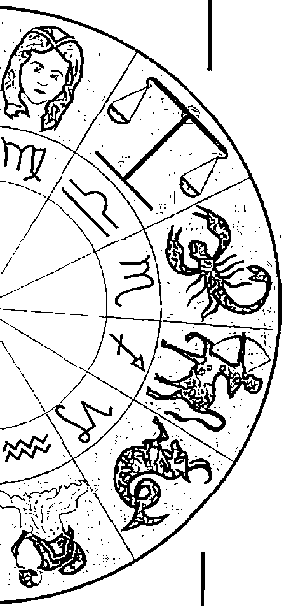

## ◎星組（Yoga）條件：

-   1、命度星座為天蝎座；
-   2、木星與水星形成合相，或形成互容；
-   3、或木星與水星相互形成相映；
-   4、吉星合相或相映到木星及水星。

論斷——財源滾滾，可擁有許多的賺錢良機。

解析——木星身兼第二宮宮主星及第五宮宮主星，本身又是得財的象徵星，所以對於錢財的取得影響頗大。而水星是第六宮宮主星和第十宮宮主星，與職業大有關係。兩者的組合，可發揮互助現象。

整合——在Uranian Astrology上，命度、水星和木星的組合，代表擁有良好的親和力，可受到不少人的歡迎，並且有口福。

思索——1、木星與水星的相互形成相映（對宮），在不同的宮位軸內，有何不同的象徵指示？
2、木星與水星的形成合相或相映，兩者之間有何差別？

# 印度占星學入門

### （九）射手回首遙

當射手座坐命時，亦即命度落在射手座（上昇星座為射手座），在印度恆星命盤上，十二星座的宮位配置情形如下：

-   - 第一宮：射手座（第一宮宮主星為木星）
-   - 第二宮：摩羯座（第二宮宮主星為土星）
-   - 第三宮：寶瓶座（第三宮宮主星為土星）
-   - 第四宮：雙魚座（第四宮宮主星為木星）
-   - 第五宮：白羊座（第五宮宮主星為火星）
-   - 第六宮：金牛座（第六宮宮主星為金星）
-   - 第七宮：雙子座（第七宮宮主星為水星）
-   - 第八宮：巨蟹座（第八宮宮主星為月亮）
-   - 第九宮：獅子座（第九宮宮主星為太陽）
-   - 第十宮：處女座（第十宮宮主星為水星）
-   - 第十一宮：天秤座（第十一宮宮主星為金星）
-   - 第十二宮：天蠍座（第十二宮宮主星為火星）

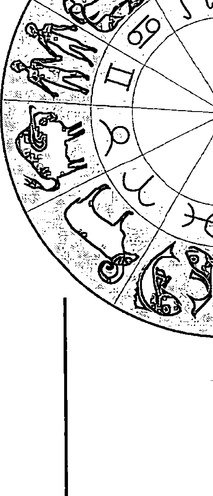

第十二宮：天蠍座（第十二宮宮主星為火星）在西方回歸命盤上，若採用「等宮制」來設定宮位，則每一個宮位的宮頭所在之星座位置同上。

## 星組（Yoga）條件：

-   1、命度星座為射手座；
-   2、太陽和水星落入第一宮；
-   3、火星和金星落入第十二宮；
-   4、木星落入第一、四、七或十宮。

論斷——自力更生，憑著自己的實力而出人頭地；相當具有競爭力，賺錢的門路寬廣。

解析——太陽與水星的形成合相，乃是第九宮宮主星和第十宮宮主星的組合，並且是落入命宮。而火星與金星的形成合相，是落入火星所主宰的天蠍座（第十二宮），呈現出敢於冒險賺大錢，所以在錢財上的浪費與支出也會較多，加上木星的落入一個「四正宮」，可減少失敗的風險。

整合——在Uranian Astrology上，太陽、水星、火星、金星和木星的組合，確實呈現出錢財上的大進大出的象徵。

思索——1、如果木星是處在不利的情況下，則會否凸顯出破財的跡象？

2、當第二宮內有凶星落入，或被凶星相映到時，會產生什麼樣的影響？

## 星組 (Yoga) 條件：

-   1、命度星座為射手座；
-   2、土星落入第五宮；
-   3、凶星並沒有相映到土星；
-   4、『九分盤』上的土星呈現強力狀態。

論斷——

當行運走到土星所主宰的期間時，許多事情的進展顯得相當順利，尤其是在事業方面。

解析——

這是一種比較特殊的情況。土星的落入第五宮，乃為凶星入吉宮，會破壞第五宮的吉兆；

然而，如果有其他情況的適當搭配，則於土星所主宰的期間，照樣有發跡的徵象。

整合——

針對土星與命度的組合，在運勢的論斷上，通常是具有『晚發』的徵象，當然實際的情況，還有賴其他行星的互動來作決定。

思索——

1、倘若土星是落入第九宮，情況又是如何？

2、假如在『九分盤』上的土星，是處在不利的情況下，則是否應推論為發展不順？

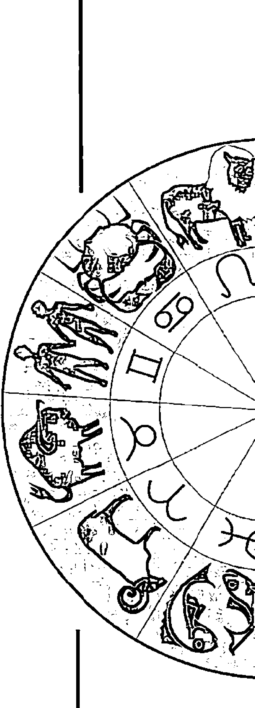

# 三、繁星天上輝

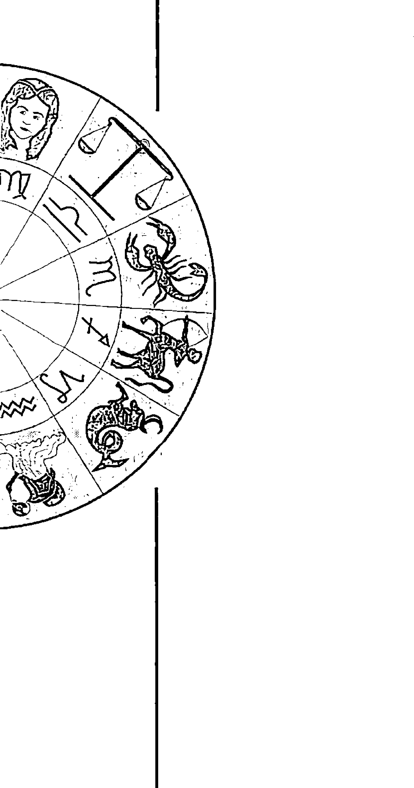

## 星組 (Yoga) 條件：

-   1. 命度星座為射手座；
-   2. 太陽和火星落入第三宮；
-   3. 北交點落入第九宮；
-   4. 土星相映到第九宮。

論斷——當行運走到北交點所主宰的期間時，會熱衷參與宗教活動或涉及哲學思想領域。

解析——北交點的落入第九宮（獅子座），其位置星正好是太陽，而太陽則是與水星形成合相，落入第三宮，於是呈現出第三宮和第九宮的強力組合。同時，第三宮主星的土星，相映到第九宮。

整合——在Uranian Astrology上，身為宗教領袖的特質，命度、太陽和北交點三者之間，必須呈現出緊密的組合。

思索——
-   1. 如果土星是落入第九宮，徵象是否會更明顯？
-   2. 當南交點、太陽和火星一同落入第三宮內時，有何不利的徵象發生？

## 星組（Yoga）條件：

-   1. 命度星座為射手座；
-   2. 太陽和金星落入第九宮；
-   3. 土星落入第三宮；
-   4. 吉星合相或相映到土星。

論斷——當行運走到土星所主宰的期間時，乃是發財時機的來臨，並可大大提昇知名度。

解析——太陽落入第九宮（獅子座）為廟旺，並有吉星的金星隨侍在旁，而土星的落入第三宮，同樣也是廟旺（寶瓶座）。

整合——在Uranian Astrology上，太陽、金星和土星的組合，象徵著關係上的不和諧，特別是在情愛關係上。

思索——1、假如缺乏吉星對於土星的合相或相映，則是否會有不同的結果？2、如果水星也落入第九宮，並被太陽所「燃燒」，則情況會有何變化？

# 三、繁星天上輝

## 星組（Yoga）條件：

-   1、命度星座為射手座；
-   2、土星落入第十一宮；
-   3、木星落入第一宮，或相映到第一宮；
-   4、在「九分盤」上的木星，並未呈現出弱力狀況。

論斷

可掌握實權，步步高昇。

解析

重點在於土星的落入第十一宮。凡是射手座命者，土星的落入第五宮（白羊座）或第十宮（天秤座），會促使土星成為本命盤上的一顆主導行星。

整合

在西方占星學上，木星與土星的組合，其象的顯示頗不易拿捏，比較穩當的推論，乃是透過另一顆同時與木星和土星產生互動的行星，來作為論斷的焦點，在 Uranian Astrology 上，由於至少是三者以上的統合，所以較易掌握到象的呈現。

思索

-   1、土星的落入第五宮和第九宮以外的宮位，其情況又是如何？
-   2、如果在「九分盤」上，木星與土星是形成合相，則會產生怎樣的特殊情形？

# 印度占星學入門

### （一〇）摩羯胸懷抒

當摩羯座坐命時，亦即命度落在摩羯座（上昇星座為摩羯座），在印度恆星命盤上，十二星座的宮位配置情形如下：

-   - 第一宮：摩羯座（第一宮宮主星為土星）
-   - 第二宮：寶瓶座（第二宮宮主星為土星）
-   - 第三宮：雙魚座（第三宮宮主星為木星）
-   - 第四宮：白羊座（第四宮宮主星為火星）
-   - 第五宮：金牛座（第五宮宮主星為金星）
-   - 第六宮：雙子座（第六宮宮主星為水星）
-   - 第七宮：巨蟹座（第七宮宮主星為月亮）
-   - 第八宮：獅子座（第八宮宮主星為太陽）
-   - 第九宮：處女座（第九宮宮主星為水星）
-   - 第十宮：天秤座（第十宮宮主星為金星）
-   - 第十一宮：天蠍座（第十一宮宮主星為火星）

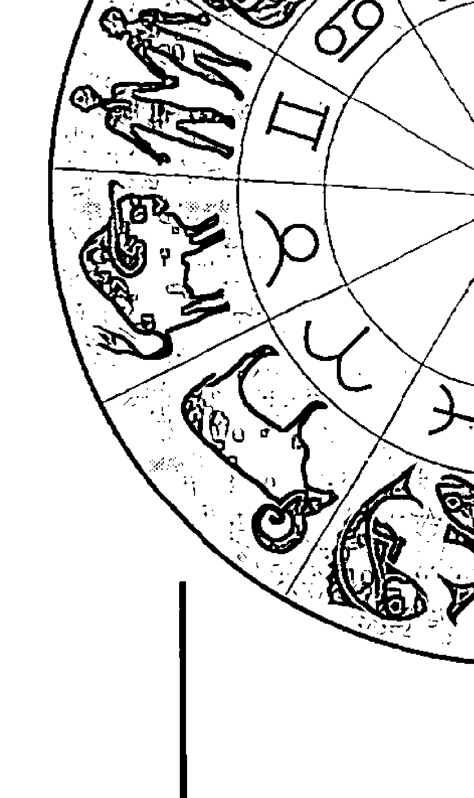

# 三、繁星天上輝

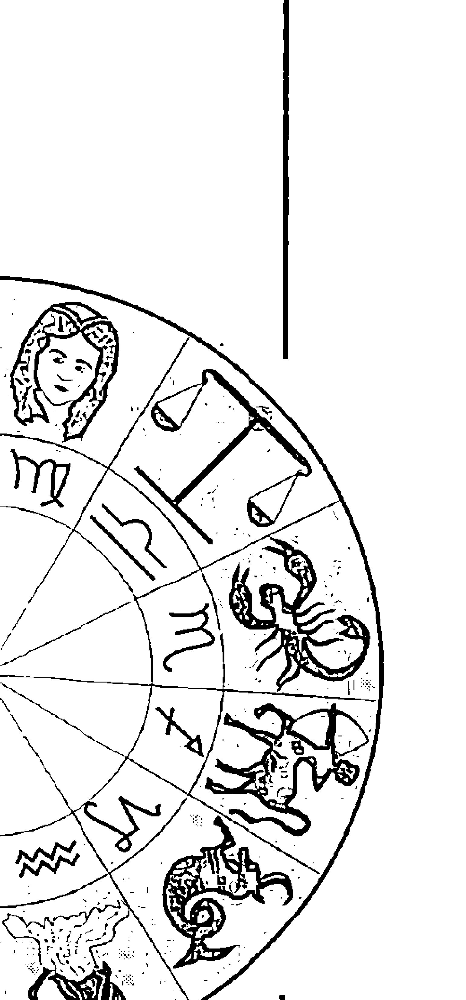

## 第十二宮：射手座（第十二宮宮主星為木星）

在西方回歸命盤上，若採用「等宮制」來設定宮位，每一個宮位的宮頭所在之星座位置同上。

## ◎星組（Yoga）條件：

-   1. 命度星座為摩羯座
-   2. 木星落入第一宮
-   3. 水星落入第八宮
-   4. 金星落入第七宮

解析——木星落入第一宮，對壽命可提供助益，但木星為第十二宮宮主星，落入命宮有礙得財。水星為第六宮宮主星及第九宮宮主星，當落入第八宮時，可對第八宮所代表的死亡有所減緩兇惡力量。而金星的落入第七宮，等於是落入第八宮的第十二宮，同樣可減緩死亡的凶兆壓力。

整合——在西方占星學上，致死的原因或死亡的方式，主要是以第八宮內的行星來作判定；而在印度占星學上，則是涉及到第一、四、六和八宮的統合。

思索——

1、倘若缺乏金星的落入第七宮，情況有何不同？

2、同樣的情形，如果換成是射手座坐命（命度星座為射手座），是否指示著得財較易？

## 星組（Yoga）條件：

-   1、命度星座為摩羯座；
-   2、金星和水星落入第一宮；
-   3、月亮落入第五宮；
-   4、木星落入第一、九或十一宮。

論斷——

獨領風騷，很快就能有所成就，或擁有知名度。

解析——

水星為第九宮宮主星，金星為第十宮宮主星，當落入命宮時形成第一、九和十宮的組合，再加上月亮的落入第五宮（金牛座）為廟旺；而從「月亮身宮盤」來看，金星和水星的落入第一宮，變成是落入第九宮，同時水星為第五宮宮主星，金星為命主星。木星的相映到月亮，以及落入有利的宮位，更可增強助益。

整合——

在Uranian Astrology上，命度、金星、水星、月亮和木星的組合，確實可發揮八面玲瓏的特質。

# 三、繁星天上輝

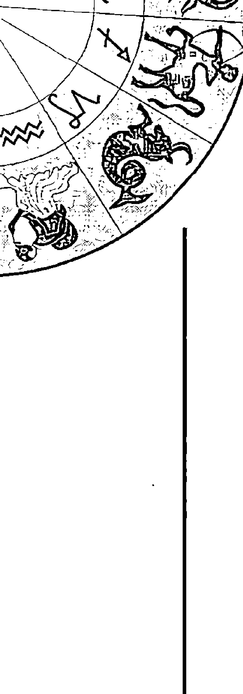

思索——

-   1、土星（命主星）的落入不同位置，可發揮怎樣的影響？
-   2、如果木星是落入第七宮，其與落入第一、九或十一宮，有何差別？

## 星組（Yoga）條件：

-   1、命度星座為摩羯座；
-   2、月亮落入第七宮；
-   3、火星落入第一宮；
-   4、太陽落入第一、四、七或十宮。

論斷——可身居高位，發號施令，屬於管理者、指揮者。

解析——月亮與火星皆為廟旺，並得到太陽的相輔助。

整合——在西方占星學上，這樣的徵象可用以推論相當具有競爭力。

思索——
1、倘若太陽是落入第六宮或第八宮，則是否會有助益？
2、當火星落入第十一宮（天蠍座）時，是否可作出同樣的推論？

## ★星組（Yoga）條件：

-   1. 命度星座為摩羯座；
-   2. 木星落入第一宮；
-   3. 金星和火星落入第十一宮；
-   4. 太陽落入第十宮。

論斷——可獲得兄弟姐妹的大力支援，或者憑著自己的才識而賺大錢。

解析——木星為第三宮宮主星，當落入第一宮時凸顯了第三宮的特質。金星與火星的合相，乃是第十一宮宮主星、第五宮宮主星、第四宮宮主星與第十一宮宮主星的組合，形成兩個「四正宮」、一個「三方宮」，以及一個「落入自己的宮位」，而第十一宮具有代表兄姐的徵象。

整合——在西方占星學上，有關兄弟姐妹的論斷，是以「推運」（Progression）上的同樣採用宮主星來作推論，比較可以取得明確的事件徵象；而在本命盤的論斷上，兄弟姐妹的事件相關徵象，通常是較不明朗。

思索——1、月亮落入那一個宮位可更增強助益？2、如果土星與水星，是在第三宮內形成合相，則有何影響？

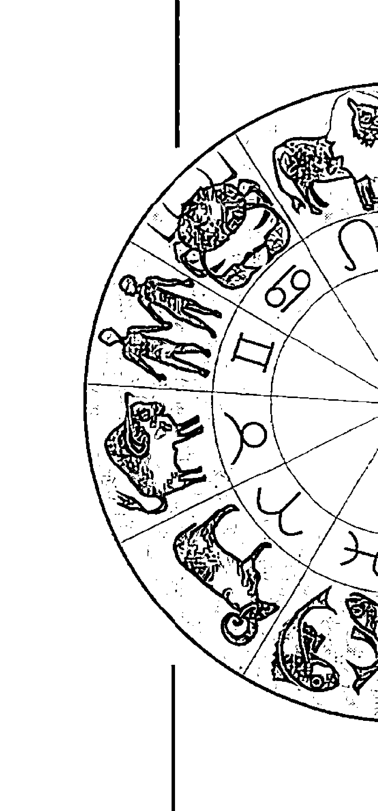

# 繁星天上輝

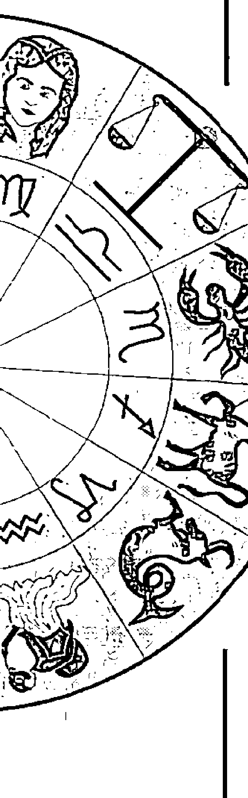

## 星組（Yoga）條件：

-   1. 命度星座為摩羯座；
-   2. 土星和水星落入第九宮；
-   3. 北交點和木星落入第十二宮；
-   4. 月亮落入第一宮。

論斷——可比一般人擁有更多的好運氣，在競爭上相當吃香。

解析——重點是在於木星和北交點。因為北交點為「蔭星」，當落入第十二宮（射手座）時，其位置星正好是木星，一同落入木星所主宰的射手座內，可呈現助益；而土星和水星的合相在第九宮，乃是第一宮宮主星和第九宮宮主星的組合，並且是落入吉宮的第九宮，同時水星為廟旺。

整合——在Uranian Astrology上，土星、水星、北交點和木星的組合，具有出差或遊歷的徵象指示。

思索——
1. 如果北交點與木星是一同落入第二宮（雙魚座），則傾向凸顯那一方面的助益？
2. 當缺乏土星和水星落入第九宮時，北交點和木星的落入第十二宮，會否導致錢財上的損失？

# 印度占星學入門

### （二）寶瓶瀟灑揮

當寶瓶座坐命時，亦即命度落在寶瓶座（上昇星座為寶瓶座），在印度恆星命盤上，十二星座的宮位配置情形如下：

-   - 第一宮：寶瓶座（第一宮宮主星為土星）
-   - 第二宮：雙魚座（第二宮宮主星為木星）
-   - 第三宮：白羊座（第三宮宮主星為火星）
-   - 第四宮：金牛座（第四宮宮主星為金星）
-   - 第五宮：雙子座（第五宮宮主星為水星）
-   - 第六宮：巨蟹座（第六宮宮主星為月亮）
-   - 第七宮：獅子座（第七宮宮主星為太陽）
-   - 第八宮：處女座（第八宮宮主星為水星）
-   - 第九宮：天秤座（第九宮宮主星為金星）
-   - 第十宮：天蠍座（第十宮宮主星為火星）
-   - 第十一宮：射手座（第十一宮宮主星為木星）

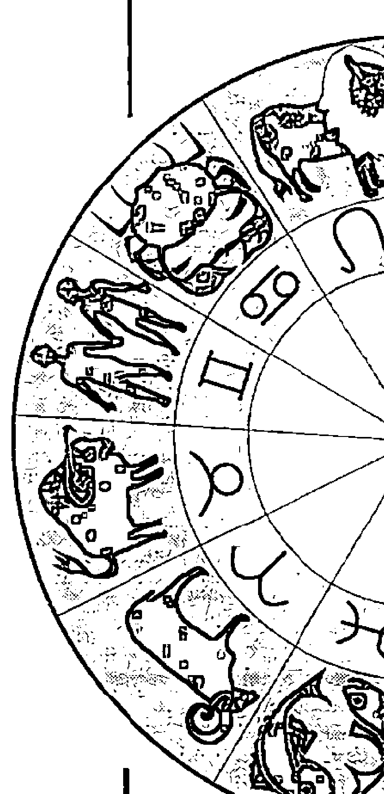

# 三、繁星天上輝

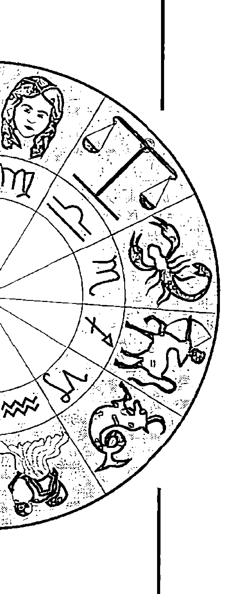

第十二宮：摩羯座（第十二宮宮主星為土星）在西方回歸命盤上，若採用「等宮制」來設定宮位，每一個宮位的宮頭所在之星座位置同上。

## 星組（Yoga）條件：

-   1、命度星座為寶瓶座；
-   2、太陽和水星落入第三宮；
-   3、木星也落入第三宮；
-   4、吉星合相或相映到命宮。

論斷——可掌權，以及成為傑出的政治人物或領導者。

解析——太陽落入第三宮（白羊座），氣勢不弱，況且太陽的落入第三宮，一般是推論為有所助益；而水星的落入第三宮，可強化聰明才智，加上木星的落入第三宮，組合成一股強力的說服力。

整合——在Uranian Astrology上，太陽、水星和木星的組合，具有年輕的氣息，可受到較年輕者的歡迎。

## 星組（Yoga）條件：

-   1、命度星座為寶瓶座；
-   2、金星和土星落入第十一宮；
-   3、木星落入第一、五或九宮；
-   4、凶星沒有合相或相映到命宮。

論斷——當行運走到金星所主宰的期間時，乃是發財的時機。

解析——重點是在於金星與土星的落入第十一宮，因為土星為第一宮宮主星，金星為第四宮宮主星及第九宮宮主星，形成兩個「四正宮」及一個「三方宮」的組合，況且又有第十一宮的相助。

整合——在Uranian Astrology 上，命度＋金星＝土星＋木星，對愛情的影響較大，具有情緣一段又一段的徵象。

思索——
-   1、如果缺乏木星的落入第一、五或九宮，是否會大減得財跡象？
-   2、當行運走到土星所主宰的期間時，可有掌權或升遷的徵象？
-   1、命主星之土星的所在位置，會產生怎樣的互動影響？
-   2、倘若缺乏木星的落入第三宮，掌權的徵象是否會大減？

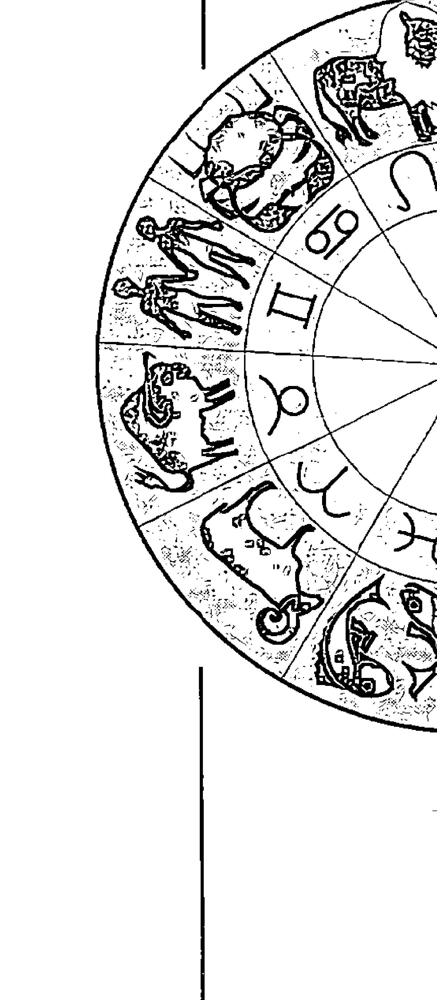

## 星組（Yoga）條件：

-   1. 命度星座為寶瓶座；
-   2. 木星落入第一宮；
-   3. 土星落入第二宮；
-   4. 「九分盤」上的土星處在不利狀況。

論斷——當行運走到木星所主宰的期間時，並不能帶來多大的收穫；而當行運走到土星所主宰的期間時，顯現破財消災的徵象。

解析——雖然木星的落入命宮，通常是被推論為可帶來頗大的助益；但在此，由於命主星處在不利情況下，大大削減了木星落入命宮的吉兆。

整合——在Uranian Astrology上，命度、木星和土星的組合，時常導致運勢上的起伏不定，人生旅程較缺乏穩定發展的跡象。

思索——
1. 如果「九分盤」上的土星，是呈現強力狀態，則情況又是如何？
2. 倘若金星也落入第二宮，則當行運走到土星所主宰的期間時，可有發財徵象？

## **星組（Yoga）條件：**

-   1、命度星座為寶瓶座；
-   2、太陽和火星落入第八宮；
-   3、土星落入第一、四、七或十宮；
-   4、水星落入第七宮或第九宮。

論斷——當行運走到太陽及火星所主宰的期間時，在競爭上面臨挫敗，或者有難以忘懷的傷痛事發生。

解析——太陽為第七宮宮主星，火星為第二宮宮主星及第十宮宮主星，當落入第八宮時，並不能反凶為吉。

整合——在Uranian Astrology上，太陽、水星、火星和土星的組合，呈現出結盟關係的告終，或者有激烈的口頭之爭。

思索——
1、在此情形下的土星，如果是落入第一宮，為廟旺，可否增添助益的力量？
2、倘若土星是落入第十二宮，同樣為廟旺，情況又會變得如何？

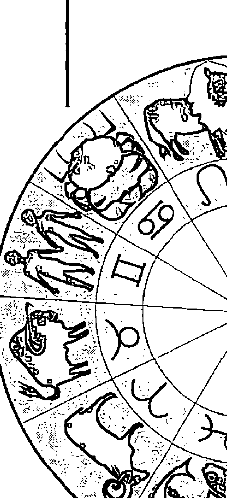

## ◎星組（Yoga）條件：

-   1、命度星座為寶瓶座；
-   2、金星落入第一宮；
-   3、太陽落入第十一宮；
-   4、北交點落入第一宮。

論斷——喜歡涉及公眾事務，而當行運走到北交點所主宰的期間時，知名度可獲得大大的提升。

解析——金星落入第一宮（寶瓶座），主社交，太陽落入第十一宮（射手座），主活躍，北交點落入第一宮（寶瓶座），主得名，所以重點是在於北交點的落入命宮。

整合——在Uranian Astrology上，金星、太陽、北交點與命度的組合，同樣是與社交和名聲有關，若再加上天王星和基本點（分點與至點），則知名度可望更是響亮。

思索——1、月亮的落入那一個宮位，更可增添助益？2、如果土星是落入第一宮，為利多，還是弊多？

# 三、繁星天上輝

# 印度占星學入門

### (一二) 雙魚蜀中居

當雙魚座坐命時，亦即命度落在雙魚座（上昇星座為雙魚座），在印度恆星命盤上，十二星座的宮位配置情形如下：

-   - 第一宮：雙魚座（第一宮宮主星為木星）
-   - 第二宮：白羊座（第二宮宮主星為火星）
-   - 第三宮：金牛座（第三宮宮主星為金星）
-   - 第四宮：雙子座（第四宮宮主星為水星）
-   - 第五宮：巨蟹座（第五宮宮主星為月亮）
-   - 第六宮：獅子座（第六宮宮主星為太陽）
-   - 第七宮：處女座（第七宮宮主星為水星）
-   - 第八宮：天秤座（第八宮宮主星為金星）
-   - 第九宮：天蠍座（第九宮宮主星為火星）
-   - 第十宮：射手座（第十宮宮主星為木星）
-   - 第十一宮：摩羯座（第十一宮宮主星為土星）

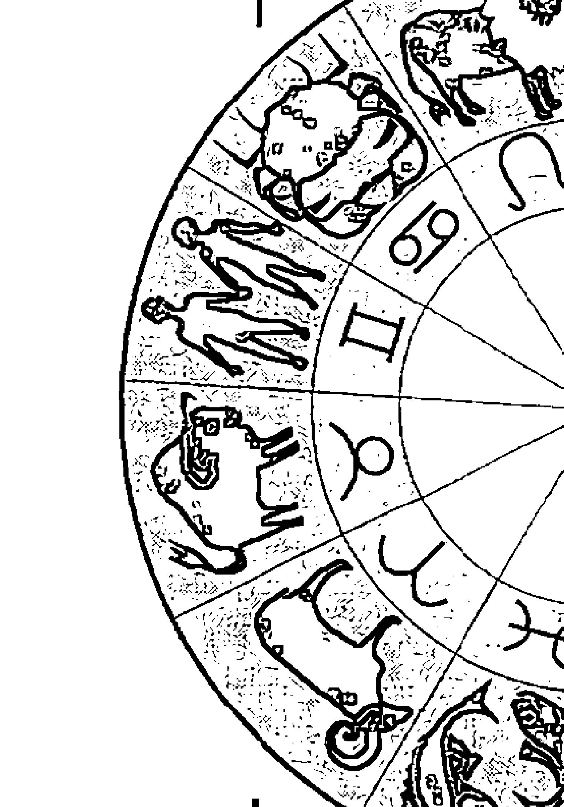

# 第十二宮：寶瓶座（第十二宮宮主星為土星）

在西方回歸命盤上，若採用「等宮制」來設定宮位，每一個宮位的宮頭所在之星座位置同上。

- ◎星組（Yoga）條件：
1、命度星座為雙魚座；
2、土星落入第十二宮；
3、吉星落入命宮，或相映到命宮；
4、木星（第一宮宮主星）落入第一、四、七或十宮。

論斷——可逢凶化吉，或遇貴人相助。

解析——重點是在於土星落入第十二宮。因為一般來說，土星落入第十二宮，通常是指著有所損失；但在此，卻具有反凶為吉的現象，可說是有享福之命。其理由有二，一為土星落入寶瓶座，乃呈現廟旺；二為土星是凶星，屬於凶星落入凶宮。

整合——在西方占星學上，土星的落入第十二宮，通常是以疾病及損失來作推論。

思索——1、倘若土星是落入第六宮或第八宮，可否應用凶星入凶宮反為吉的原則？2、當木星（命主星）也落入第十二宮而合相土星時，可否助長幸運力量？

# 三、繁星天上輝

# 星組（Yoga）條件：

- 1、命度星座為雙魚座；
- 2、月亮落入第十二宮；
- 3、凶星相映到月亮；
- 4、第二宮有凶星落入。

解析：
破財征象明顯，有難以守財的跡象。

論斷：
重點是在於月亮的落入第十二宮。因為月亮為第五宮宮主星，其落入第十二宮為吉宮宮主星落入凶宮，不能凸显助益的力量，倘若月亮是處在月虧狀態，則破財情況將會更為明顯。

整合：
在Uranian Astrology上，當命度、月亮與凶星（火星、土星、天王星或海王星）組合在一起時，時常凸顯出預料之外的突發狀況！

思索：
1、當金星與月亮一同落入第十二宮時，可否改善破財情況？
2、第二宮內如果有吉星落入，可否推論為錢財上的先得後失？或先失後得？

# ☆星組 (Yoga) 條件：

- 1. 命度星座為雙魚座；
- 2. 木星落入第五宮；
- 3. 吉星相映到第五宮；
- 4. 凶星沒有合相月亮或相映到月亮。

論斷——生女兒容易，生兒子難！

解析——木星落入第五宮，一般可推論為生孩子很容易，但在此，木星為命主星（雙魚座），導致生女兒的機會更大；倘若月亮是落入陰性星座，則更明顯會生較多的女兒。

整合——在Uranian Astrology上，生孩子是以月亮為主要的觀察指標，至於生男或生女，可透過該年運勢的月亮組合情形來作判斷。

思索——

- 1. 如果第五宮內有陽性行星（太陽、火星）落入，則能否取得生男生女的平衡？
- 2. 當凶星相映到第五宮時，能否推論為早產或墮胎？

# 印度占星學入門

# 星組(Yoga)條件：

- 1. 命度星座為雙魚座；
- 2. 木星落入第六宮；
- 3. 土星落入第九宮；
- 4. 火星和月亮落入第十一宮。

論斷——可享有好運臨身！生活過得相當充實。

解析——木星在第六宮，會相映到第二宮；土星在第九宮，為第十宮宮主星和第十一宮宮主星一同落入第九宮；火星為第二宮宮主星，合相月亮的第五宮宮主星。

整合——在Uranian Astrology上，木星＋火星＝土星＋命度，具有作下痛苦的決定以取得快樂成

- 1. 金星的所在位置，將會產生怎樣的影響？
- 2. 木星如果是落入第二宮，是否會更有助益？

# # 星組（Yoga）條件：

- 1. 命度星座為雙魚座；
- 2. 月亮落入第二宮；
- 3. 火星落入第五宮；
- 4. 吉星合相或相映到命宮。

論斷 —— 當行運走到月亮所主宰的期間時，乃是發財的好時機。

解析 —— 月亮落入白羊座，火星落入巨蟹座，彼此形成「互容」，況且為第二宮與第五宮的組合。

整合 —— 在Uranian Astrology上，命度、月亮與火星的組合，代表熱衷於參與公眾活動。

思索 ——
1. 如果月亮落入第五宮，火星落入第二宮，情況是否會更有助益？
2. 當月亮落入第九宮，火星落入第五宮時，情況是否會更加有利？

# 印度占星學入門

# 附錄一：恆星系統換算表

以下的歲差 (Ayanamsa) 換算，是依據於 LAHIPI'S SCHOOL，從 1900 ~ 2031 年。每隔 10 年為一個間隔，並依照「度數－分數－秒數」來作排序，分成「年份表」和「日期表」兩種。例如，2001 年 5 月 25 日，先查 2001 年，得歲差為 23° 52′ 17″，再查 5 月 25 日，得歲差 20″，將兩者加起來：

```
23° 52′ 17″
+           20″
----------------
23° 52′ 37″ →此即為 2001 年 5 月 25 日之「歲差」
```

| 年份 | 度－分－秒 | 年份 | 度－分－秒 |
| :--- | :--- | :--- | :--- |
| 1900 | 22 27 44 | 1905 | 22 31 54 |
| 1901 | 22 28 34 | 1906 | 22 32 45 |
| 1902 | 22 29 24 | 1907 | 22 33 36 |
| 1903 | 22 30 15 | 1908 | 22 34 25 |
| 1904 | 22 31 05 | 1909 | 22 35 15 |
| 1910 | 22 36 06 | 1915 | 22 40 18 |
| 1911 | 22 36 56 | 1916 | 22 41 07 |
| 1912 | 22 37 46 | 1917 | 22 41 58 |
| 1913 | 22 38 37 | 1918 | 22 42 48 |
| 1914 | 22 39 27 | 1919 | 22 43 38 |
| 1920 | 22 44 28 | 1925 | 22 48 39 |
| 1921 | 22 45 19 | 1926 | 22 49 29 |
| 1922 | 22 46 09 | 1927 | 22 50 20 |
| 1923 | 22 46 59 | 1928 | 22 51 10 |
| 1924 | 22 47 49 | 1929 | 22 52 00 |
| 1930 | 22 52 51 | 1935 | 22 57 02 |
| 1931 | 22 53 41 | 1936 | 22 57 51 |
| 1932 | 22 54 31 | 1937 | 22 58 42 |
| 1933 | 22 55 21 | 1938 | 22 59 33 |
| 1934 | 22 56 11 | 1939 | 23 00 23 |
| 1940 | 23 01 13 | 1945 | 23 05 24 |
| 1941 | 23 02 03 | 1946 | 23 06 14 |
| 1942 | 23 02 53 | 1947 | 23 07 04 |
| 1943 | 23 03 44 | 1948 | 23 07 55 |
| 1944 | 23 04 34 | 1949 | 23 08 45 |
| 1950 | 23 09 36 | 1955 | 23 13 46 |
| 1951 | 23 10 26 | 1956 | 23 14 36 |
| 1952 | 23 11 16 | 1957 | 23 15 27 |
| 1953 | 23 12 06 | 1958 | 23 16 17 |
| 1954 | 23 12 56 | 1959 | 23 17 07 |
| 1960 | 23 17 58 | 1965 | 23 22 09 |
| 1961 | 23 18 47 | 1966 | 23 22 59 |
| 1962 | 23 19 38 | 1967 | 23 23 49 |
| 1963 | 23 20 28 | 1968 | 23 24 40 |
| 1964 | 23 21 18 | 1969 | 23 25 30 |
| 1970 | 23 26 20 | 1975 | 23 30 31 |
| 1971 | 23 27 10 | 1976 | 23 31 21 |
| 1972 | 23 28 00 | 1977 | 23 32 11 |
| 1973 | 23 28 51 | 1978 | 23 33 01 |
| 1974 | 23 29 41 | 1979 | 23 33 52 |
| 1980 | 23 34 42 | 1985 | 23 38 53 |
| 1981 | 23 35 32 | 1986 | 23 39 43 |
| 1982 | 23 36 22 | 1987 | 23 40 33 |
| 1983 | 23 37 12 | 1988 | 23 41 24 |
| 1984 | 23 38 02 | 1989 | 23 42 13 |
| 1990 | 23 43 04 | 1995 | 23 47 15 |
| 1991 | 23 43 54 | 1996 | 23 48 06 |
| 1992 | 23 44 44 | 1997 | 23 48 56 |
| 1993 | 23 45 35 | 1998 | 23 49 46 |
| 1994 | 23 46 25 | 1999 | 23 50 36 |
| 2000 | 23 51 26 | 2005 | 23 55 37 |
| 2001 | 23 52 17 | 2006 | 23 56 27 |
| 2002 | 23 53 07 | 2007 | 23 57 17 |
| 2003 | 23 53 57 | 2008 | 23 58 08 |
| 2004 | 23 53 47 | 2009 | 23 58 59 |
| 2010 | 23 59 49 | 2015 | 24 04 00 |
| 2011 | 24 00 39 | 2016 | 24 04 50 |
| 2012 | 24 01 29 | 2017 | 24 05 40 |
| 2013 | 24 02 19 | 2018 | 24 06 31 |
| 2014 | 24 03 09 | 2019 | 24 07 20 |
| 2020 | 24 08 11 | 2026 | 24 13 13 |
| 2021 | 24 09 01 | 2027 | 24 14 03 |
| 2022 | 24 09 51 | 2028 | 24 14 53 |
| 2023 | 24 10 42 | 2029 | 24 15 43 |
| 2024 | 24 11 32 | 2030 | 24 16 33 |
| 2025 | 24 12 22 | 2031 | 24 17 24 |

# 印度占星學入門

# 附錄一：恆星系統換算表

（秒數）

| 日期 | 1月 | 2月 | 3月 | 4月 | 5月 | 6月 | 7月 | 8月 | 9月 | 10月 | 11月 | 12月 |
| :--- | :--- | :--- | :--- | :--- | :--- | :--- | :--- | :--- | :--- | :--- | :--- | :--- |
| 1 | 0 | 4 | 8 | 13 | 17 | 21 | 25 | 29 | 34 | 38 | 42 | 46 |
| 2 | 0 | 5 | 8 | 13 | 17 | 21 | 25 | 29 | 34 | 38 | 42 | 46 |
| 3 | 0 | 5 | 9 | 13 | 17 | 21 | 25 | 30 | 34 | 38 | 42 | 46 |
| 4 | 1 | 5 | 9 | 13 | 17 | 21 | 26 | 30 | 34 | 38 | 43 | 47 |
| 5 | 1 | 5 | 9 | 13 | 17 | 21 | 26 | 30 | 34 | 38 | 43 | 47 |
| 6 | 1 | 5 | 9 | 13 | 17 | 22 | 26 | 30 | 34 | 38 | 43 | 47 |
| 7 | 1 | 5 | 9 | 13 | 17 | 22 | 26 | 30 | 34 | 39 | 43 | 47 |
| 8 | 1 | 5 | 9 | 13 | 18 | 22 | 26 | 30 | 35 | 39 | 43 | 47 |
| 9 | 1 | 6 | 9 | 14 | 18 | 22 | 26 | 30 | 35 | 39 | 43 | 47 |
| 10 | 1 | 6 | 10 | 14 | 18 | 22 | 26 | 31 | 35 | 39 | 43 | 47 |
| 11 | 2 | 6 | 10 | 14 | 18 | 22 | 26 | 31 | 35 | 39 | 43 | 48 |
| 12 | 2 | 6 | 10 | 14 | 18 | 22 | 27 | 31 | 35 | 39 | 44 | 48 |
| 13 | 2 | 6 | 10 | 14 | 18 | 23 | 27 | 31 | 35 | 39 | 44 | 48 |
| 14 | 2 | 6 | 10 | 14 | 18 | 23 | 27 | 31 | 35 | 40 | 44 | 48 |
| 15 | 2 | 6 | 10 | 14 | 19 | 23 | 27 | 31 | 36 | 40 | 44 | 48 |
| 16 | 2 | 6 | 10 | 15 | 19 | 23 | 27 | 31 | 36 | 40 | 44 | 48 |
| 17 | 2 | 7 | 10 | 15 | 19 | 23 | 27 | 32 | 36 | 40 | 44 | 48 |
| 18 | 2 | 7 | 11 | 15 | 19 | 23 | 27 | 32 | 36 | 40 | 44 | 49 |
| 19 | 3 | 7 | 11 | 15 | 19 | 23 | 28 | 32 | 36 | 40 | 44 | 49 |
| 20 | 3 | 7 | 11 | 15 | 19 | 24 | 28 | 32 | 36 | 40 | 45 | 49 |
| 21 | 3 | 7 | 11 | 15 | 19 | 24 | 28 | 32 | 36 | 40 | 45 | 49 |
| 22 | 3 | 7 | 11 | 15 | 20 | 24 | 28 | 32 | 36 | 41 | 45 | 49 |
| 23 | 3 | 7 | 11 | 16 | 20 | 24 | 28 | 32 | 37 | 41 | 45 | 49 |
| 24 | 3 | 8 | 11 | 16 | 20 | 24 | 28 | 33 | 37 | 41 | 45 | 49 |
| 25 | 3 | 8 | 12 | 16 | 20 | 24 | 28 | 33 | 37 | 41 | 45 | 49 |
| 26 | 4 | 8 | 12 | 16 | 20 | 24 | 28 | 33 | 37 | 41 | 46 | 50 |
| 27 | 4 | 8 | 12 | 16 | 20 | 25 | 29 | 33 | 37 | 41 | 46 | 50 |
| 28 | 4 | 8 | 12 | 16 | 20 | 25 | 29 | 33 | 37 | 41 | 46 | 50 |
| 29 | 4 | 8 | 12 | 16 | 21 | 25 | 29 | 33 | 37 | 42 | 46 | 50 |
| 30 | 4 | | 12 | 16 | 21 | 25 | 29 | 33 | 38 | 42 | 46 | 50 |
| 31 | 4 | | 12 | 17 | 21 | | 29 | 33 | | 42 | | 50 |

# 印度占星學入門

## 附录二：名词解释

以下占星名词，将于往后陆续整理出简要说明。

- Abda：年份
- Abda Bala：该年的力量
- Abdadhipathi：年主星
- Adi：第一个
- Adhikamasa：闰月
- Adhimitra：亲密的友人
- Adhimitravarga：亲密友人的区间
- Adhisatru：死敌
- Adhisatravarga：死敌的区间
- Ahas：白天期间
- Ahargana：一个纪元所经过的天数
- Akshamsa：地球纬度
- Angaraka：火星
- Antya：最后一个
- Apamandala：黄道
- Apasavya：逆时针方向
- Apoklima：续宫
- Aprakashaka grahas：荫星
- Arambha：开始
- Arambha Sandhi：始点
- Ashtamsa：星座的八分之一切割
- Ashuddha Rasi：不能被减的星座
- Asta：燃烧
- Asta Lagna：降度
- Asu：等同于恒星时的四秒
- Athichara：加速
- Ayana：分点（春分、秋分）
- Ayana Bala：短暂力量的其中一部份
- Ayanamsa：岁差
- Ayur：寿命
- Ayurbhava：第八宫
- Ayurdaya：寿命
- Bala：力量
- Balabhadra：一位印度占星家的名字
- Bhachakra：黄道
- Bhagana：行星的公转
- Bhagya：第九宫
- Bhaskaracharya：一位印度天文学家的名字
- Bhava：宫位
- Bhava Bala：宫位的力量
- Bhavachakara：宫位表（Table of Houses）
- Bhavadhipathi：宫主星
- Bhavadhipathi Bala：宫主星的力量

| 英文术语 | 中文解释 |
|----------|----------|
| Bhava Digbala | 宫位力量的其中一部份 |
| Bhava Madhya | 宫位的中点 |
| Bhava Sandhi | 两个宫位的交接（宫头位置） |
| Bhava Sphuta | 宫位经度的决定 |
| Bhogya | 时间的流逝· |
| Bhogyamsa | 所拥有的弧度数 |
| Bhratru | 兄弟 |
| Bhratrubhava | 第三宫 |
| Bhuja | 与最近分点之间的距离 |
| Bhuktha | 时间的到达 |
| Bhukthamsa | 所拥有的弧度数 |
| Bhukti | 行星运限的次期间 |
| Bhramana | 行星的自转 |
| Bimbaparimanas | 行星的直径 |
| Brahmapadsa | 一种行星庙旺的情况 |
| Brihat Jataka | 由Varahamihira对占星学所作出的成果 |
| Budha | 水星 |
| Chakra | 地图、图表 |
| Chandra | 月亮 |
| Chandramana | 月亮的月份 |
| Chara | 多种 |
| Charakhanda | 命度差 |
| Chara Rasis | 基本宫星座 |
| Chaturthamsa | 星座的四分之一切割 |
| Chatushpada Rasis | 四足兽星座 |
| Chesta | 行动、移动 |
| Chesta Bala | 移动的力量 |
| Chesta Kendra | 逆行的弧度数 |
| Dakshina | 南方 |
| Dakshina Kranti | 南斜角 |
| Dakshina Gola | 南半球（黄道的 180 度~ 360 度） |
| Dasa | 期间（事件的计时） |
| Dasamabhava | 天顶 |
| Dasamsa | 星座的十分之一切割 |
| Dasantardasa | 主期间与次期间 |
| Dasavargas | 星座的切割种类 |
| Dhana | 钱财 |
| Dhanabhava | 第二宫 |
| Dhanus | 射手座 |
| Dharmabhava | 第九宫 |
| Dhruva | 正命度的时间 |
| Dik | 方向 |
| Dik Bala | 方向的力量 |
| Dina | 白天 |
| Dinardha | 白天的一半期间 |
| Diva | 白天 |
| Diva Bala | 出生于白天的力量 |
| Divarathri Bala | 六种力量来源的其中一部份 |
| Drekkana | 星座的三分之一切割 |
| Drekkana Bala | 行星性别的力量 |
| Drik | 相映 |
| Drik Bala | 相映的力量 |
| Drishta | 正相映 |
| Drishta Graha | 相映的行星 |
| Drishti | 相位 |
| Drishti Kendra | 相位的角度 |
| Drishti Pinda | 相位的总计 |
| Drusya | 被相映到 |
| Drusya Graha | 被相映的行星 |
| Dwadasamsa | 星座的十二分之一切割 |
| Dwiswabhava Rasis | 变动宫星座 |
| Ekadasamsa | 星座的十一分之一切割 |
| Ghati | 等于廿四分钟 |
| Gola | 半球 |
| Gopuramsa | 一种行星庙旺的情况 |
| Graha | 行星 |
| Graha Sphuta | 行星经度的决定 |
| Graha Yuddha | 行星的争战 |
| Guru | 木星 |
| Hora | 星座的二分之一切割 |
| Hora Bala | 落置力量的其中一部份 |
| Horadhipathi | 二分盘的主宰星 |
| Indramsa | 一种行星庙旺的情况 |
| Ishta | 有利的 |
| Ishtakala | 既定的时间 |
| Ishta Pinda | 有利作用的统合 |
| Jagatchakshu | 太阳 |
| Jalachara Rasis | 水生星座 |
| Kala Bala | 短暂的力量 |
| Kalatra | 配偶 |
| Kalatrabhava | 第七宫 |
| Kalpa | 4, 320, 000, 000 恒星年 |
| Kanya | 处女座 |
| Karaka | 助长者 |
| Karana | 月亮日的一半期间 |
| Karma | 职业 |
| Karma Bhava | 第十宫 |
| Kataka | 巨蟹座 |
| Keeta Rasis | 昆虫星座 |
| Kendra | 始宫（四正宫） |
| Kendra Bala | 力量的其中一种 |
| Kendra Bhava | 始宫（四正宫） |
| Ketu | 龙尾 |
| Khanda | 划分、区间 |
| Kranti | 斜角 |
| Krishna Paksha | 月亮月份呈现黑暗的那一半期间 |
| Kshepa | 天体纬度 |
| Kuja | 火星 |
| Kumbha | 宝瓶座 |
| Kundali | 地图、图表 |
| Labha | 取得 |
| Labha Bhava | 第十一宫 |
| Lagna | 命度、命宫 |
| Lagna Sphuta | 命度的经度 |
| Lipta | 一种时间或弧度数的测量单位 |
| Madhya | 中点 |
| Madhya Lagna | 天顶 |
| Madhya Ravi | 太阳 |
| Maharishis | 一位印度智者的名字 |
| Makara | 摩羯座 |
| Mandochcha | 一种天体的力量 |
| Masa Bala | 月亮的力量 |
| Masadhipathi | 月主星 |
| Mathamaha | 母方的亲戚 |
| Mathru | 母亲 |
| Meena | 双鱼座 |
| Mesha | 白羊座 |
| Mithuna | 双子座 |
| Mitra | 朋友 |
| Moolatrikona | 三方旺向 |
| Nadi Amsa | 星座的一百五十分之一切割 |
| Nadi Vritta | 天体赤道 |
| Naisargika | 本性 |
| Naisargika Bala | 本性的力量或永久的力量 |
| Nakshatra | 星宿 |
| Nakshatra Dina | 恒星日 |
| Napumsakas | 阴阳双性 |
| Nara Rasis | 人类星座 |
| Natha | 与正午的距离 |
| Navamsa | 星座的九分之一切割 |
| Nirayana | 固定的黄道 |
| Oja | 奇数 |
| Ojamsas | 奇数的九分区间 |
| Oja Rasia | 奇数星座 |
| Ojayugmarasyamsa Bala | 落置在奇数、偶数与九分区间上的力量 |
| Ochha | 入旺 |
| Ochha Bala | 入旺的力量 |
| Ochha Bhaga | 入旺点 |
| Ochha Kendra | 入旺的弧度数 |
| Oopachayas | 增长宫 （第三、六、十和十一宫） |
| Pada | 宿部 |
| Paksha | 月亮月份的一半期间 |
| Paksha Bala | 月亮月份的力量 |
| Panapara | 固定宫星座 |
| Panchamsa | 星座的五分之一切割 |
| Panchanga | 年历、星历 |
| Panchasiddhantika | 一种印度的天文资料 |
| Papa | 凶兆 |
| Papa Drishti | 凶相位 |
| Para | 一种时间或弧度数的测量单位 |
| Parasara | 一位印度占星家的名字 |
| Paratpara | 一种时间或弧度数的测量单位 |
| Parijathamsa | 一种行星庙旺的情况 |
| Parvathamsa | 一种行星庙旺的情况 |
| Paschad | 西方 |
| Patala Lagna | 第四宫 |
| Patha | 一种天体的力量 |
| Pathala Lagna | 子午线的下层 |
| Phalitbhaga | 命运的判断或预测 |
| Pithamaha | 父方的亲戚 |
| Pithru | 父亲 |
| Poorvabhaga | 东方或第一部份 |
| Prag | 东方 |
| Prarupa | 一种时间或弧度数的测量单位 |
| Prustodaya | 命度落在星座的尾部上 |
| Purusha | 男性或阳性 |
| Putra | 孩子 |
| Putra Bhava | 第五宫 |
| Rahu | 龙头 |
| Rajapadamsa | 一种行星庙旺的情况 |
| Rasathala Lagna | 子午线的下层 |
| Rasi | 星座 |
| Rasi chakra | 黄道图 |
| Rasi mana | 命度倾斜的时间 |
| Rasi kundali | 黄道图 |
| Ravi | 太阳 |
| Rupa | 一种测量单位 |
| Sama | 中立、中性 |
| Sama Varga | 中立的位置 |
| Sandhi | 交接点 |
| Sani | 土星 |
| Sankramana | 太阳的进入基本宫星座 |
| Saptamsa | 星座的七分之一切割 |
| Saptavarga | 七种分盘 |
| Saptvarga Bala | 一种位置之次划分的力量 |
| Satru | 敌人 |
| Satru Bhava | 第六宫 |
| Satru Varga | 敌意的区间 |
| Sauramana | 太阳的月份 |
| Savana Dina | 表面上的太阳日 |
| Savya | 右边 |
| Sayana | 先行、基本宫星座 |
| Sayana Mesha | 在基本宫星座上所测量出的白羊座始点 |
| Sayana Mesha Sankramana | 太阳的进入白羊座（基本宫星座） |
| Seeghrochcha | 远地点 |
| Shad Bala | 力量的六种来源 |
| Shadbala Pinda | 六种力量来源的总计 |
| Shadvargas | 六种分盘 |
| Shashtamsa | 星座的六分之一切割 |
| Shashtyamsa | 星座的六十分之一切割 |
| Shodasamsa | 星座的十六分之一切割 |
| Simha | 狮子座 |
| Simhasanamsa | 一种行星庙旺的情况 |
| Sirodaya | 命度星座 |
| Spashta | 行星或宫位的经度 |
| Sripathi | 一位印度占星家的名字 |
| Srishtyadi Ahargana | 一个纪元所经过的天数 |
| Sthana Bala | 位置的力量 |
| Sthira Rasis | 固定宫星座 |
| Stri | 女性或阴性 |
| Subha | 吉兆 |
| Subha Drishti | 吉兆的相映 |
| Sukha | 快乐 |
| Sukha Bhava | 第四宫 |
| Sukra | 金星 |
| Sunya | 零 |
| Surya | 太阳 |
| Surya Siddhantha | 一种印度的天文学资料 |
| Suryodayadi Jananakala Ghatika | 从日出到出生时之间的 Ghatikas（时间单位） |
| Swargabalam sa | 一种行星庙旺的情况 |
| Swavarga | 行星自己的区间 |
| Tatk alika | 短暂 |
| Tatpara | 一种时间或弧度数的测量单位 |
| Thanu | 身体 |
| Thanubhava | 第一宫 |
| Thribhaga Bala | 短暂力量的其中一部份 |
| Thula | 天秤座 |
| Tithi | 日出时的月亮日 |
| Trikona | 三方宫 |
| Trimsamsa | 星座的卅分之一切割 |
| Ubhayodaya | 命度落在星座的头尾两部份上 |
| Udaya | 命度、上升 |
| Udaya Lagna | 命度、命宫 |
| Unnatha | 30ghatis 的减去与正午的差距 |
| Uttara | 北方 |
| Uttara Bhaga | 第二部份、宫位的后一半部份 |
| Uttara Gola | 北半球（黄道的0度～180度） |
| Uttara Kranti | 北斜角 |
| Vaiseshikamsa | 一种庙旺的情况 |
| Vaishnavamsa | 一种庙旺的情况 |
| Vakra | 逆行 |
| Vakra Chesta | 逆行的移动 |
| Vara | 星期日子 |
| Vara Bala | 星期日子的力量 |
| Varadhipathi | 星期日子的主宰星 |
| Vargas | 划分、区间 |
| Vighati | 等同于廿四秒 |
| Vilibtha | 一种时间或弧度数的测量单位 |
| Virama Sandhi | 结束点、终点 |
| Virupa | 一种时间或弧度数的测量单位 |
| Visesha Drishti | 特殊的相映 |
| Vishavarekha | 地球的赤道 |
| Vraya | 失去 |
| Vrayabhava | 第十二宫 |
| Vrishchika | 天蝎座 |
| Vrishabha | 金牛座 |
| Yogakarakas | 行星的引发重要力量 |
| Yuddha Bala | 短暂力量的其中一部份 |
| Yugmamsa | 偶数的九分区间 |
| Yugma Rasis | 偶数星座 |
| Yugmayugma Bala | 落置力量的其中一部份 |

## 印度占星学入门

# 《占星大師》叢書

## 西洋占星學入門（現代占星學基礎）
作者／洪能平    定價／380 元

用星座來評論一個人的特質已經是非常普遍的方式，但只單從對方的「太陽星座」來論斷，其實是有失偏頗的。本書對現代占星學的基本概念，還有命盤繪製、星座、宮位、行星、行星落入星座、宮位和相位等，所做的精闢解說，正有助於讀者釐清某些錯誤觀念，也能更瞭解現代占星學，並且應用在你的日常生活中。

## 現代占星學進階
作者／洪能平    定價／320 元

本書完全是從實際論斷的角度來作出發，針對占星學上所涉及到的各種生活領域事項，進行簡要的說明。其所涵蓋的範圍相當廣泛，可以讓讀者透過本書的簡要說明，而學到專業性的占星學論斷技巧，以及知曉專業占星學家的實際論斷過程。

## 現代占星學再進階
作者／洪能平    定價／320 元

本書有助於任何有心研究現代占星學的朋友們，更進一步地知道占星學家是如何透視命盤，及如何整合本命盤上的各種命理徵象。此外，本書也有助於讀者釐清現代占星學和古代果老星宗在論斷上的差異，使得讀者可以學到符合新時代潮流的命理學。

## 占星學家談星座
作者／洪能平    定價／360 元

本書除了說明星座的基本概念以及如何從各種不同的角度來解讀星座以外，還透過各種人可能會受到那幾個重要星座的影響，使得讀者可以透過本書而學到專業性的星座知識。更可分辨十二星座彼此之間在特質上的細緻區別。

## 星座關鍵字解讀
洪能平著      定價 300 元

本書分成星座綜合說明和星座個論等兩部份，分別針對與星座有關的關鍵字，來作一種歸納式的整理和分析，以便讀者可以很快地查閱有關星座的各種應用層面，並且也有助於讀者對於每一個星座所存在的內在機制，可以作進行貫串式的的連想，縮短學習星座的時間。

## 擇日占星學
洪能平著      定價 220 元

本書除了說明擇日占星學的基本概念，以及擇日占星學的擇日原則以外，還透過實際的擇日命例的分析，來說明幾種比較常見到的擇日技巧，使得讀者可以透過本書而學到如何自己來進行擇日。

※礙於篇幅介紹有限，如有需要書目，歡迎來電(02) 28487732 洽詢索取。

# 《台湾阅览室》系列丛书
## BOOKS BROWSE

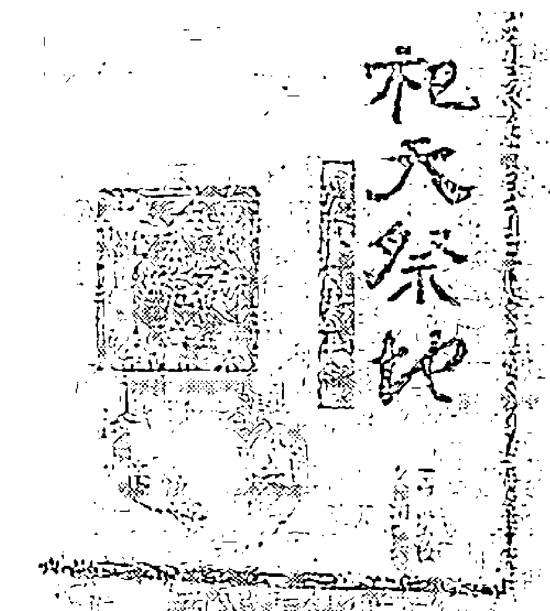

作者／李秀娥
定價／300 元

# 《祀天祭地－现代祭拜礼俗》

祭拜礼俗是传承已久的民间信仰，祭祀文化更蕴藏了中国人顺天应人的生命智慧。然而，如同许多逐渐失传的民俗技艺一般，了解祭祀的目的、意义和礼仪的人愈来愈少了，敬拜神明、祭祀祖先或好兄弟时，除了拜得有诚意之外，如何合仪合节、拜得正确也是很重要的；本书简要地说明了祭祀时的注意事项、祭祀用品，并分别介绍各项岁时节令、生活礼俗和寺庙祭祀时的相关禁忌或特殊习俗，是一本简明易懂的祭祀入门书。

> ◎本书荣获89 年文建会举办之「地方文献出版品评鉴奖－佳作」

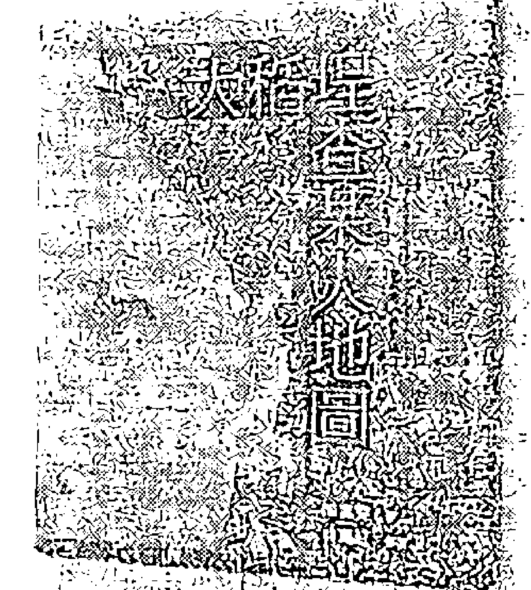

作者／陈惠雯
定價／380 元

# 《大稻埕查某人地图》

本书带领读者一起走入大稻埕，看大稻埕的兴起、繁盛与没落；看历史的女性身影——拣茶女、艺旦、头家娘……穿梭于男性所支配的领域中，散发出坚韧的生命力；从妈妈、奶奶们的述说中拼凑出属于女性角度的生活地图，部分弥补了过去从男性角度书写历史的片面与主观。
本书处理老照片的方式，也跳脱传统的怀旧手法，而从另一角度作解读，带领读者一起走进大稻埕，从街道、建筑，进入民家，对照新旧时代查某人之间相似得教人诧异的命运——照片的价值绝不仅是在怀旧、述古，它除了无声地说出图像背后为人所淡忘的故事外，更提供了现代人反省、观照和前瞻的最佳素材。

> ◎中国时报「开卷」好书榜

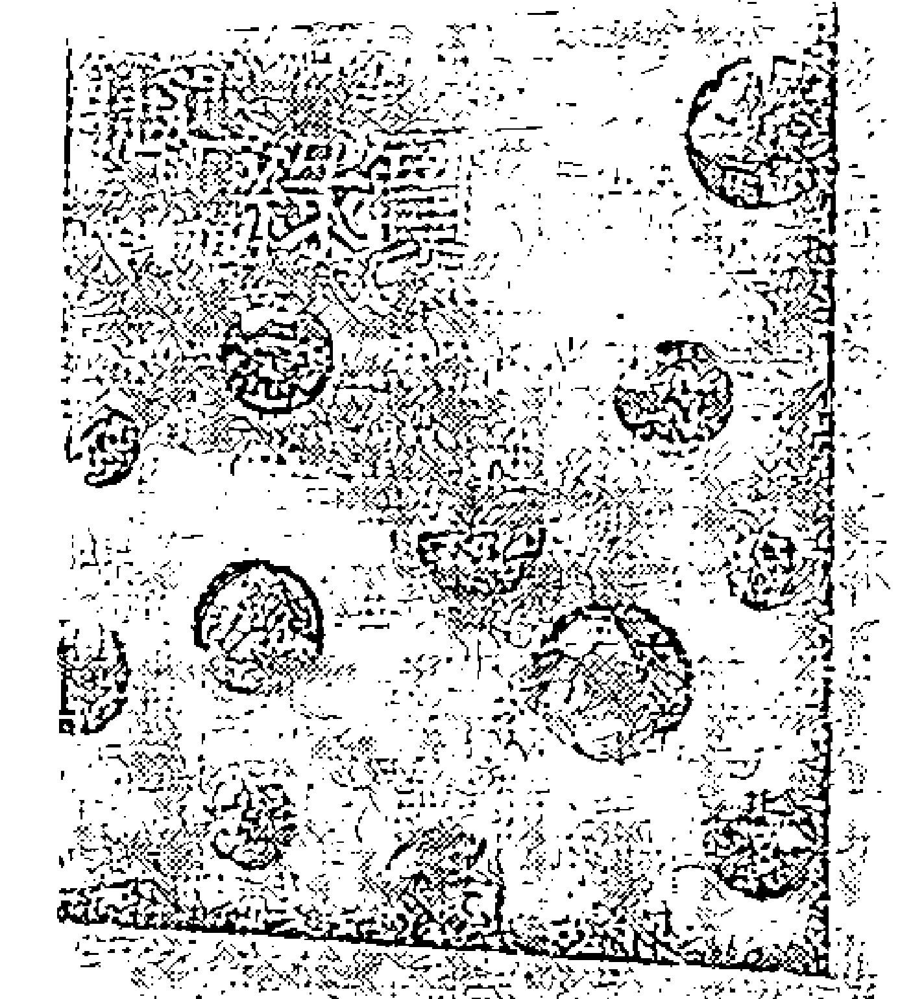

作者／叶伦会
定價／250 元

# 《捷运绿宝石》

本书是介绍台北捷运淡水线各站的人文史迹。从台湾历史最悠久的博物馆——台湾总督府博物馆说起，然后，范围扩展到二二八和平公园、南海学园……赫然发现，城市中这些我们所熟知的公园和古迹，原来和我们的生活是如此地贴近。捷运不是庞大而冰冷的交通运输工具，而是现实生活中的「龙猫公车」，将人们载往一个个充满美景与回忆的地方，再满载全新的欢乐回忆而归。

> ◎本书荣获新闻局「小太阳奖」推荐作品

# 【台灣閱讀室】系列叢書
## BOOKS BROWSE

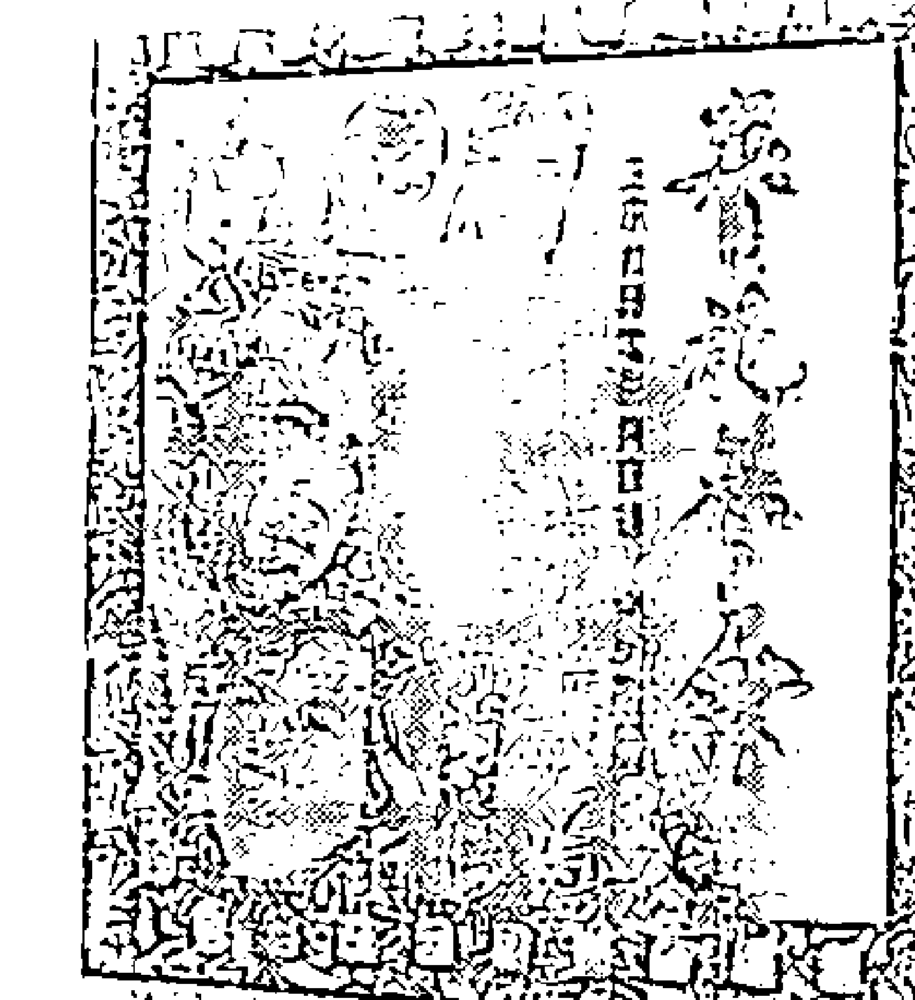

# 《春花夢露－正宗台語電影興衰錄》

基於對母語的渴望，台灣電影在1955～1974年間，創造了一場銀色奇蹟，但囿限於大環境裡的政治因素，本土文化受到漠視與壓制，致使台語片逐漸沒落、消失。作者以大歷史的角度分析台語片的背景及問題、興衰起落，為影迷找尋偶像昔日的風采，也為本土文化留下見證。

作者／葉龍彦
定價／350元

> ◎台北市立圖書館「年度推薦好書」

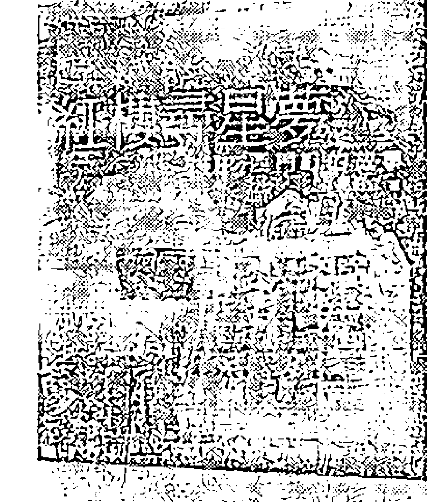

# 《紅樓尋星夢－西門町的故事》

繁華熱鬧的西門町，已走過百年的歲月足跡，有太多的人事滄桑、興衰起落，也有很多值得細述的歷史記憶。在本書中，我們可以了解西門町的變遷發展和豐富多樣的風貌，更可以看見它在現代化過程中所具有的璀璨光芒。

作者／葉龍彦
定價／300元

> ◎台北市長馬英九撰文推薦

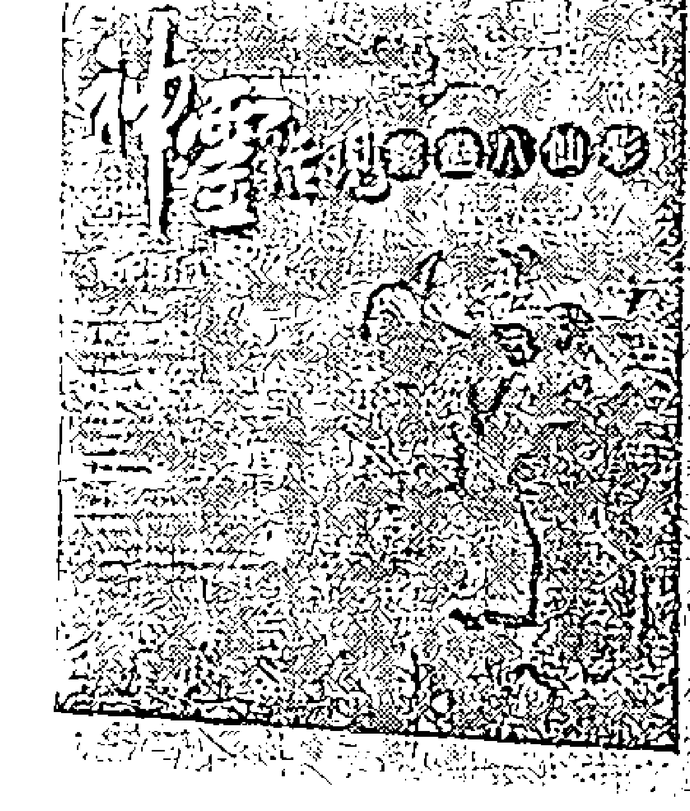

# 《神靈活現－驚艷八仙彩》

臺灣人最熟悉的八仙彩，與百姓黎民生活息息相關，生之於民行之於民，是那麼平實自然親切，但是老藝師的迅速凋零，手工技藝也逐漸沒落，若是再不加以重視與整理，可能日後難以再見。作者以女性特有的細膩心思、樸實的筆法為民間繡補做了一次完整而紮實的史料建檔，令人驚喜。

作者／王靜苡
定價／320元

> ◎中國時報「開卷」好書榜

# 【台灣書房覺察】系列叢書 BOOKS BROWSE

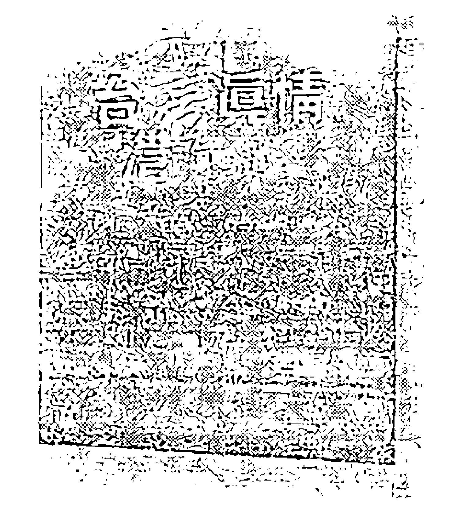

# 《台灣畫真情》

繪畫、雕刻、攝影、散文與詩，豐富多元的圖像與文字交互構築成一個美好的台灣風情，留給讀者遼闊的想像空間，是本書最大特色。作者用不同藝術類型的表現手法，過濾景物的現實外貌，加以細膩的邏輯分析將造型精緻化，或以超現實的手法作為悲愴現實的還原，彰顯對台灣的深刻終極關懷。

作者／吳德亮 定價／380元

> > ◎台視「人與書的對話」專訪推介

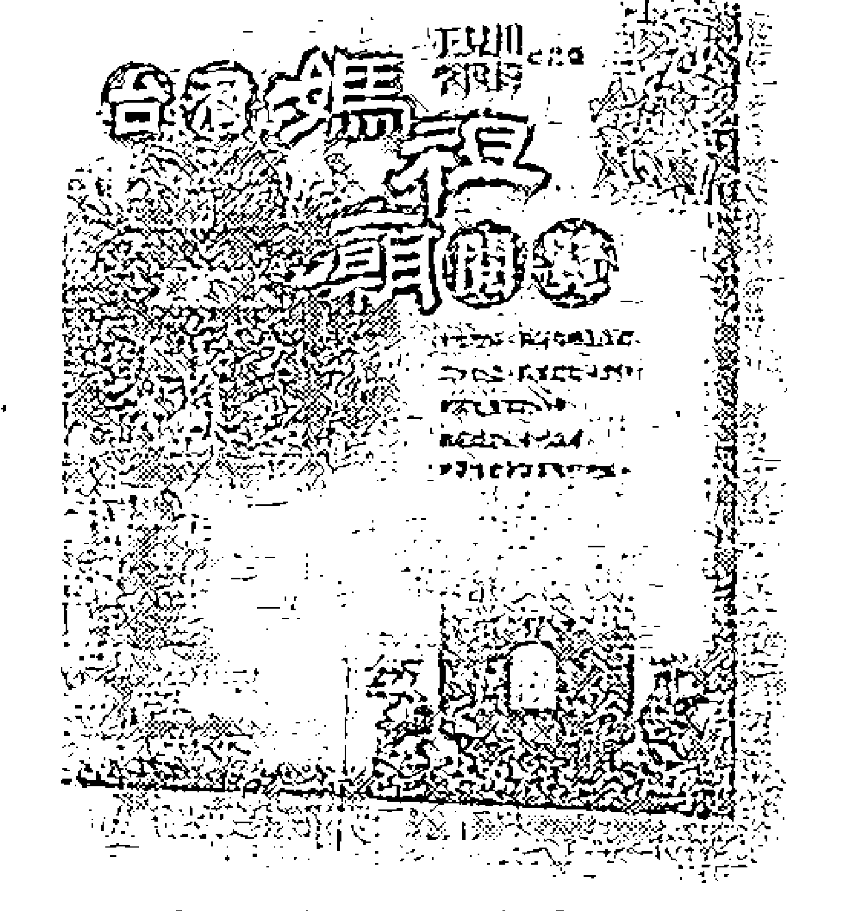

# 《台灣媽祖廟閱覽》

台灣的媽祖信仰大部份分靈自湄洲，先民辭別熟悉的鄉土渡海來台，仰賴媽祖賜給他們平安及勇氣，媽祖對台灣而言，超越了時空的距離，打破了疆域的限制。年輕的宗教學者王見川、李世偉從歷史的變遷中闡述媽祖信仰的形成及發展，也介紹了台灣重要的媽祖廟史蹟，讀者可從歷史中看到信仰之外的文化視界。

作者／王見川、李世偉 定價／320元

> > ◎「News98 說書人張大春」節目專訪

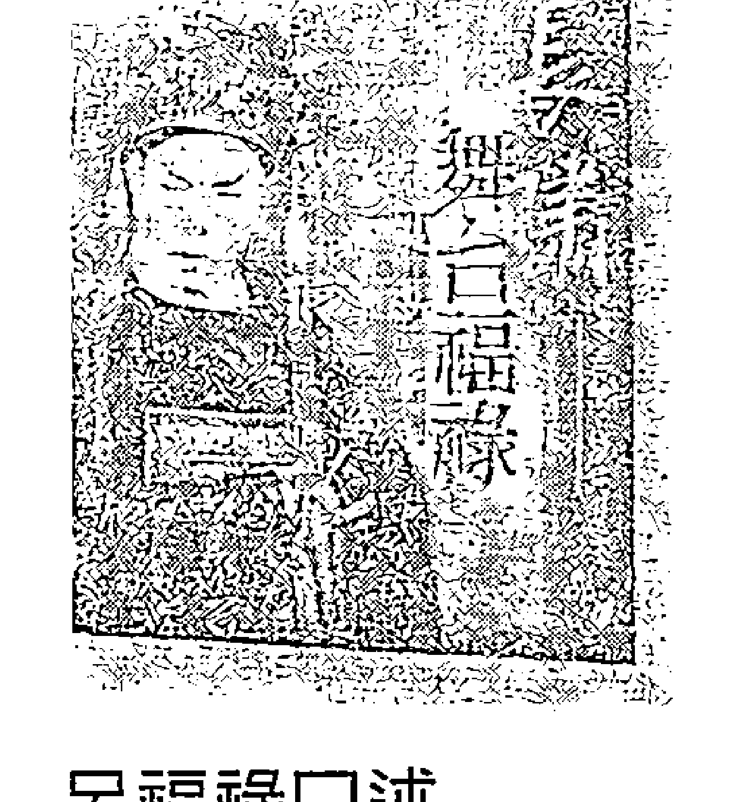

# 《長嘯——舞台福祿》

七十年前，呂福祿一家人懷抱希望，跟隨舞台，從中國來到台灣，在舞台上隱姓埋名，在舞台後真實生活；隨舞台漂浮，也隨舞台生根。七十年後，呂福祿終於卸下滿面油彩，誠實面對自我，追憶過往的舞台家族，優游於廣闊的人生舞台。這是呂福祿的家族故事，一個小角色的舞台人生，也看一段歌仔戲的興衰起落。

呂福祿口述 徐亞湘編著 定價／250元

> > ◎民生報專文專訪介紹

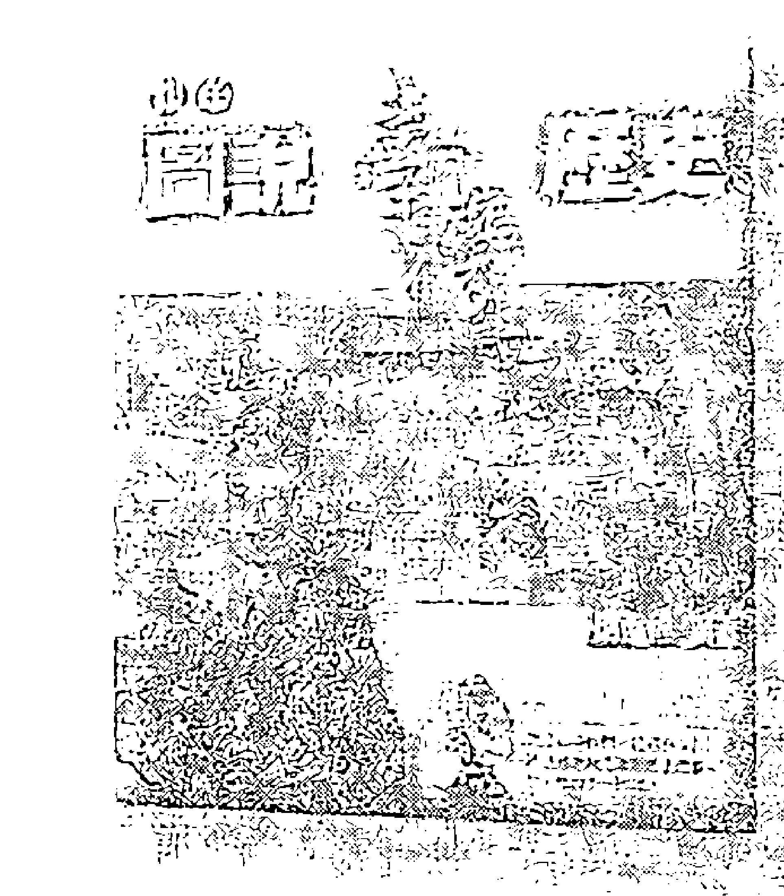

# 《圖說台灣歷史》

特殊的地理環境，造就了台灣不平凡的歷史發展。然而身處在歷史中，往往卻看不清楚自己的位置。唯有透過一幅幅珍貴的歷史圖片，從歷史影像中尋回台灣人的根，找回台灣人的立足點。這本書非常適合親子閱讀，藉著深入淺出的文字，一起認識台灣的過去與現在，一起成長。

編著／楊蓮福
定價／280元

> > ◎聯合報「讀書人」每周新書金榜


# 《戀戀蘆洲情——鄧麗君在蘆洲的歲月》

蘆洲，有著豐富人文歷史的過往，曾有「草莓王國」的美稱，「和尚洲蜜柑」是外銷日本的高級水果，蘆洲天主教堂更是北台灣第一所天主教堂，也是孕育國際巨星鄧麗君的所在，在民俗宗教方面，三年一醮的蘆洲國姓醮更是全台獨有。
希望本書的出版，能讓生活在蘆洲及台灣這塊土地的人們，更深刻瞭解到先人的生活方式及智慧，產生熱愛鄉土的真摯情懷。

作者／楊蓮福
定價／200元

> > ◎中國時報專訪介紹

| 【台灣閱覽室】郵購特惠活動 | 說明 |
|----------------------------|------|
| 單冊                       | 85折 |
| 三冊以上                   | 8折  |
| 五冊以上                   | 75折 |
| 全套11冊                   | 特惠價2330元<br>（原價3330元，現省1000元）<br>購書金額未滿500元，請另加郵資50元 |

# 占星大師02
## 印度占星學入門

- 作 者／洪能平
- 發 行 人／楊蓮福
- 編輯協力／李淑芬
- 執行編輯／陳美如
- 封面＋版面設計／黃國洲
- 讀者服務／吳秀卉
- 出 版 者／博揚文化事業有限公司
  247 台北縣蘆洲市長安街269號3樓
  電話：(02)28487732　傳真：(02)22812104
  郵撥帳號：18871684
  E-mail: boyoung@tpts6.seed.net.tw
- 登 記 證／行政院新聞局局版台省業字第234號
- 印 刷 廠／佳家設計印刷有限公司
- 總 經 銷／賀騰發賣股份有限公司
  電話：(02)22313503

| 國家圖書館出版品預行編目資料 | |
| :--- | :--- |
| 印度占星學入門／洪能平　著． | |
| -- 初版．-- 臺北縣蘆洲市：博揚文化， | |
| 2002[民91] | |
| 面；　公分．--（占星大師　；2） | |
| ISBN 957-0463-26-0（平裝） | |
| 1. 占星術 | |
| 292.22 | 91001295 |

售價350元
ISBN 957-0463-26-0
2002年1月初版一刷

本書如有缺頁、破損、裝訂錯誤，請寄回更換。

# 讀者回卡

為答謝您對我們的支持與愛護，特別提供購買本書的讀者，價值250元的「占星論命儲值點數（250點）」給您，讓您除了有書看，更可上「占星生活大師」免費算流年喔！(www.hiastro.com.tw)

請您撥冗填寫下列資料，並附上10元回郵，寄回本公司，我們將盡快把「儲值卡」寄送到您手中，日後也將提供您我們最新的出版訊息及最完整的服務。

購買的書名：印度占星學入門

購自：________縣(市)________________書店 □劃撥 □其他_________________________

姓名：______________________ 性別：□男、□女 出生日期：   /   /

聯絡電話：__________________________ E-mail：_________________________________

通訊地址：□□□

您從哪裡得知本書消息：（可複選）

- □逛書店 □報紙廣告 □書評 □廣播 □書刊雜誌 □廣告 DM □親友介紹 □本社不定期資訊 □其他__________________

本書吸引您注意的是：（可複選）

- □封面 □書名 □作者 □內容 □文筆 □印刷 □定價 □促銷廣告 □其他______________________________________

您對本書的評價：（請填代號 1. 非常滿意 2. 滿意 3. 尚可 4. 待改進）

- 書名____封面設計____版面編排____印刷____內容____定價____整體評價____其他____

您經常閱讀的報紙：

- □中國時報 □聯合報 □自由時報 □民生報 □其他____________________

您經收聽或收看有關書籍介紹的節目或雜誌：

________________電台(電視台)________________節目或________________雜誌

市面上同類型的書籍中，您最喜歡的是哪一本書？

書名：______________________________ 出版社名稱：______________________________

- 因為：_________________□封面設計 □書名 □內容 □版面編排 □文筆 □印刷

閱讀嗜好：

- □本土人文 □文學 □傳記 □企管 □理財 □生活小品 □漫畫 □心理勵志 □童書繪本 □浪漫愛情小說 □攝影集 □電腦 □流行時尚 □其他____________

# 營利事業文化事業限制合約／媒體部 吹

台北縣蘆洲市長安街一六九號二樓

| 廣告回函 | 臺北郵局登記證北台字第10633號 | 免貼郵票 |
| :--- | :--- | :--- |
| 電話： | | |
| 姓名： | | |
| 地址： | 段 縣市 巷 市區 鄉鎮 號 街路 樓之 | |
| 傳真： | | |

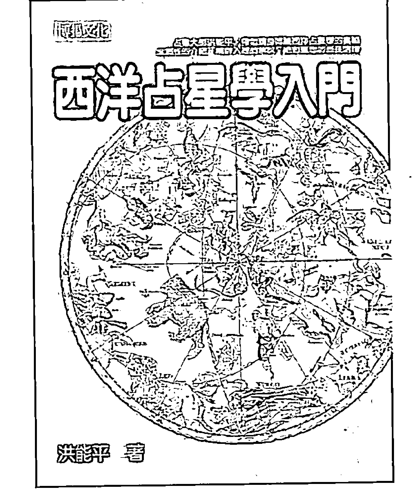

# 西洋占星學入門

作者：洪能平

定價：380元

用星座來評論一個人的特質已經是非常普遍的方式，但只單從對方的「太陽星座」來論斷，其實是有失偏頗的。

本書對西洋占星學的基本概念，還有命盤繪製、星座、宮位、行星、行星落入星座、宮位和相位等，所做的精闢解說，正有助於讀者釐清某些錯誤觀念，也能更瞭解西洋占星學，並且應用在你的日常生活中。

《西洋占星學入門》是任何有心研究西洋占星學的朋友們的最佳入門書籍。

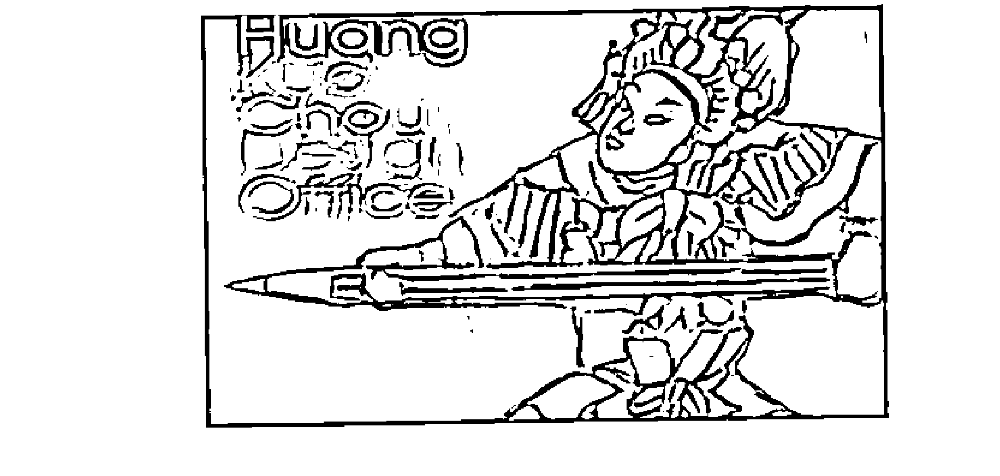

聽過印度占星學嗎？
想知道流傳遠古的印度占星學，與西方占星學有什麼不一樣？
從佛教經典當中，我們對印度占星學有了初步的認識，
但這與實際的印度占星學內容相比較，實在是微乎其微！
「印度占星學」系列叢書，
將介紹罕為人知的各種占星命盤及實論技巧，
開啓占星研究的新視野，
讓你飛航於星海的蒼穹玄妙中！

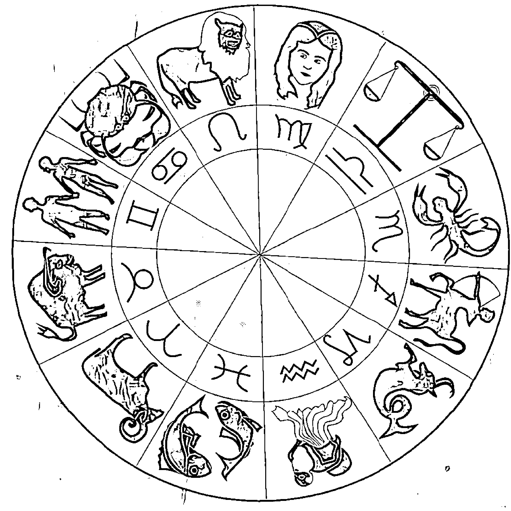

NT$350 博揚文化
ISBN 957-0463-26-0
9 789570 463262
00350