# 天书：知星达人的法宝

# 天使

> 当月亮落到第七宫
When the moon is in the Seventh House
木星和火星连成一线
And Jupiter aligns with Mars
和平将降临这个星球
Then peace will guide the planets
而爱会为星星导航
And love will steer the stars
——水瓶座 (Aquarius)

你知道吗？每个人出生时都带了自己的“名片”。那就是出生天宫图。它是一个人的独特签名，标记了一个人出生时在宇宙中的位置。就好像某年酿造的葡萄酒会具有那一年特色品质一样。我们出生在某一刻、某一地，也具有对应于那一时刻的品质。而那一刻的天宫图正是这些品质的形象化。歌德说“建筑是凝固的音乐”。星相学说“我们是凝固的时间”。

这张布满符号的图是自我认识的一把钥匙，本书将告诉你如何找到属于自己的那张标签，并教你如何正确解读这幅神秘的图画。

# 自序

人类自从形成有意识的群体起，便开始探寻生命的奥秘。

大地与天空作为最基本的现象，构成了古人探索生命的基础。贯穿着人类的历史，不同地区与不同民族的人们都把目光投射到深邃的星空，找寻这道深奥谜题的答案。

在古人的原始认知中，存在着一种普遍的意味深长的直觉——宇宙是有生命有灵性的，人类的物质与人类的灵性均源出于这个宇宙，“上界之物与下界之物相同，而下界之物也与上界无异”。这一神圣的信仰具有重要的意义，它直接将探索的目光指向人类和世界万物的精神中心，正是从这里，古人开始构筑我们的精神遗产。

神话也由此应运而生，那些与宇宙相关的神话传说，讲述着一种智慧，隐喻了对世界本身的预示。

几千年前的美索布达米亚地区，伴随神话出现的是对天体代表的神灵的崇拜，在对天体的反复观测、总结和积累的基础上，星相学开始在这里萌生滋长。在持续几千年的发展过程中，它将神话、巫术、科学、哲学等许多各具特点的表现形式融汇在一起，神话与哲学自然交融，巫术与科学互相渗透，使这门特殊的学科在认识上具有了与其他学科结合成一体的全景视野。它以认识自然为使命，探索着深不可测的宇宙奥秘，并且由此成为一门杰出的神圣艺术。

在历史上，西方星相学的命运几经沉浮。基督教的兴起，使这门带有“异教残余”的学科被教会驱逐门外，被迫迎来了漫长的黑暗岁月；直至14世纪，崇尚古典学识与艺术的文艺复兴运动，为星相学带来了新的生机；18世纪，星相学在最为辉煌的时候，又一次告别了金色年华，被启蒙运动和理性主义的光芒所掩盖，科学在物质世界占据了愈益明显的主导地位，现代精神采用了纯理性且反宗教的不同途径，也在探索同样的宇宙奥秘。进入20世纪，星相学出现了新的复兴，并从人文和艺术的角度对科学解释精神问题的方法进行着适当的补足。

今天，我们研读星相学，需要用与古人一样具有直觉力的眼光，来深入到物质世界与精神世界的内部。要暂时离开理性主义、经验主义之路；要在另一个范畴，靠近诗人和音乐家的精神体验：“我们的想像所把握的美，便是真。” 从星相学的原型体系来看，纯粹的理性主义和经验主义是在土星的原则之内，要求维护高度纪律性的、严格控制之下的、以事实为准则的途径；星相学则是在海王星的原则之内，是用悄然的暗示、诗歌的譬喻、朦胧的影射、微妙的含义来表达对世界的浪漫主义理解。

在象征理解与沟通的宝瓶座纪元，让智慧在感性的星相学与理性的科学之间也构筑起一道桥梁，让古老的过去与未来携手相连，把未知的边界线向后推移到尽可能远的地方。

# 如何阅读本书

你最好对照自己（或他人）的“出生天宫图”来阅读这本书，

出生天宫图（天体分布图）是一个人的独特签名，标记了一个人出生时在宇宙中的位置。就好像某年酿造的葡萄酒会具有那一年特色的品质一样，我们出生在某一刻、某一地，也具有对应于那一时刻的品质，而那一刻的天宫图正是这些品质的形象化。歌德说“建筑是凝固的音乐”，星相学说“我们是凝固的时间”。

这张布满符号的图是自我认识的一把钥匙。它指示出我们自身的优势、劣势、天赋、身体素质和心理上的弱点，从而帮助我们认清和利用自身人格中的积极因素，克服和抑制消极因素的萌发和滋长。出生天宫图不仅塑造了我们个人的内在倾向，也决定了我们很可能会经历的特别的外部条件。因此，这张图能够作为一座桥梁，连接外部事件及其所反映的内部个性。

画家为人画肖像，先要勾勒一幅草图的轮廓，而后逐渐细化；在星相学上，出生天宫图就是一个人的大致轮廓，在对照自己的经历中愈加明晰。

在对出生天宫图分析解释时，众多的因素必须系统地、全面地加以考虑，需要把各个符号所代表的意义相对化，并将其纳入到这张图整体的知识库里面去。

也可以说，分析一张天宫图就等于要搞清楚一部机器的结构，把它的部件逐一拆下来，分别加以研究，然后再重新组装起来，变成机器。

# 第一部分

## 基础

### 芝麻开门

> 星相学是一门启迪自我的学科。由于它，我学到了不少东西，获益匪浅。地球物理学讨论了恒星和行星对地球的作用力，反过来，星相学着重表述了恒星和行星自身的力量。

——爱因斯坦

当你看到“星相学”这个词时，你想到的是不是就是“星座”？或者认为它是一种“占卜”和“巫术”？

近十几年，关于星相学的读物层出不穷，大众化的“太阳预测”也挤进了一些时尚期刊，而星相网站铺天盖地的内容更是让人眼花缭乱。但是大多数人只是把它作为茶余饭后的一种娱乐消遣，心里也不免有这样的疑问：难道芸芸众生的性格只有十二种？为什么很多星座性格的描述并不像我自己？遥远的天体何以对每一个人产生影响？星相学究竟是不是一门科学？

相信你阅读本书也是出于对星相学的浓厚兴趣，希望深入了解更多的知识，也是想要回答自己的这些疑问。在这里，我们将尽可能地为你展示星相学的全貌，请大家跟随我们的文字，一起来领略这门使爱因斯坦也获益匪浅的学科吧。

把博大的星相学浓缩为“星座”两个字，再简单地跟“占卜”和“巫术”划上等号，是走进了一个严重的误区。

星相学并不是关于星座内容的简单罗列。一个人的个性、潜能和机遇，不是简简单单用一个星座可以概括的。太阳所在的星座反映的仅仅是十分局限的基本的性格特征，只是人格整体的一部分。每个人所受到的星相影响都是极为复杂的，一个人的星相中，除了星座因素，太阳、月亮以及其他行星所在的位置、各个行星之间的角度关系、行星所处的宫位（详见本书012页）等，都具有重要的意义。

星相学也不是占卜的工具。它的主要价值不在于预测未来之事，而在于心灵分析。它除了可以帮助我们了解自己的个性，也可以帮助我们回答这类的问题：我怎样从客观的角度去审视我自己？怎样从意识的孤岛考察我潜意识的汪洋？我的人生目的和意义是什么？而实现自我、超越自我的道路在哪里？

那么，天体为什么会对我们的个性产生影响呢？是否我们的性格就是这些天体的神秘的物理力量影响的结果？

我们说，星相学植根于“整体论”原理，也就是说，任何事物与其他的一切事物都存在联系，局部不能从整体中割裂，这个整体就是和谐的宇宙万物。行星象征着这个整体内部的本质功能，行星的周期运动则象征着整体内部的运作规律。在整个宇宙万物和谐的基础上，行星及其运动与地球上的各种现象相互对应。因此，行星并不是对我们的个性和人生施加力量的原因，它们不是掌管人间事物的神灵，而是以便利的方式揭示宇宙能量模式的天体。

但老实说，我们还是无法确知宇宙能量的奥秘以及星相学精确的操作原理。我们必须承认，在严格的科学理性上，我们不知道星相学到底为什么行得通。不过那也无关大碍，许多科学家们也常常不知道他们工作中的某些“定律”为什么是那么回事。

因此，我们也不能把星相学称为科学，因为它不符合当今对理性科学的定义，它不具有实证的、定量的特点，无法被数学、物理、统计等科学工具加以验证。它是感性的，融合了哲学、心理学、性格学等内容。如果将星相学划入一门学科之中，那么这门学科是人文学科。

我们从不争论文学和艺术的真实性，而是说它们是真与美的载体，星相学也是如此。我们需要把星相学放在它自己的范畴内考虑，它在科学的基础之外，是一种感性的神秘，一种关于价值、目的和意义的精神体验。在同样的这个范畴里，一部小说可以引起一个人对生活的凝神思考，一场演出可以让人心灵震撼，一幅画作可以让人流连忘返，一首乐曲可以让人如痴如醉。离开这个范畴，如果按照科学的规矩来检验星相学，就如同要通过正确的合同书写规范来评价一首诗歌的写作，或者把贝多芬的交响乐描述为空气介质中的声波谐振一样，是荒唐的。

现在，我们将进入正题。在开篇的这一章，我们将把星相学中基本的组成单元为你做个简单的、综合的介绍，希望能够为你开启这扇神秘的智慧之门。

天宫图把地球作为行星运行的视中心，是从地球上看到的瞬间的天象。也就是说，星相学应用的是“地球中心体系”，不过，这指的是一种测算方法，而不是宇宙观，星相学并不否认“太阳中心体系”。提出“日心说”的哥白尼，以及他的继承者开普勒和牛顿都认为，地心体系反映的是人内在的、主观的现实，而日心体系反映的是客观的、人以外存在的现实。天宫图包含十二星座、行星的位置、十二宫的划分，以及相互成相位的行星的连线。

通常，外圈是十二个星座，按照逆时针顺序排列，根据星座的属性（即火、土、气、水）用不同的颜色着色；中间一圈是十二个宫的划分，同样也是逆时针方向排列；内圈标示着各个行星的位置；而天宫图中间的连线，则连接着互相成一定相位的行星，其中，连线的颜色代表和谐程度，一般用红色表示不和谐相位，蓝色表示和谐相位。

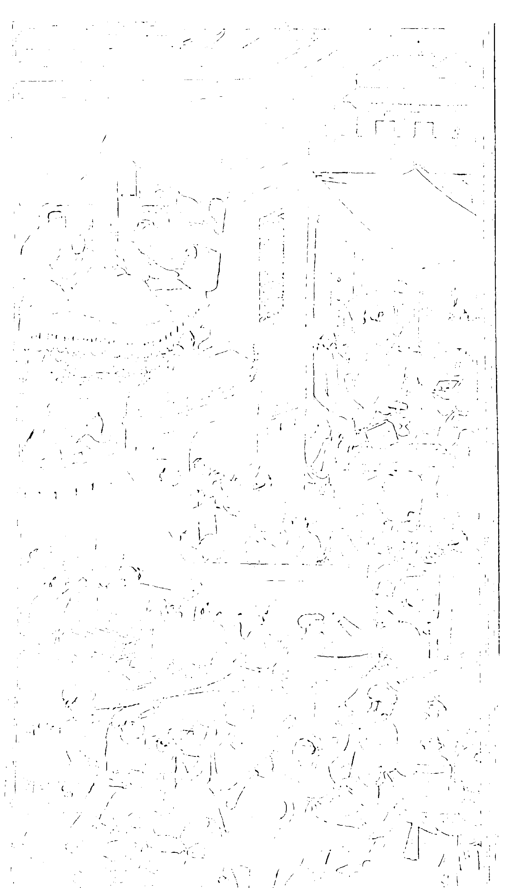

上图为庆祝帖木儿(帖木儿帝国的开国皇帝)诞生,星相学家(右上角)在计算婴儿的出生天宫图。

我们再来回顾一下天宫图中各个组成单元的象征意义：星座代表个性因素；行星代表着不同的能量和欲求；相位代表行星间的关系是否和谐；而十二个宫则代表生活的不同领域。在天宫图上，上述的这些组成单元都是用符号来表示的，乍一看，这些令人费解的符号使星相学显得很神秘，但正是这张标满符号的图揭示了一个人丰富的信息。

天宫图除了可以用来分析个人性格，还可以分析个人流年的趋势。此外，也可以用来分析非生命体的星相，例如企业、产品等。

分析个人星相的天宫图称为“出生天宫图”。它是根据个人出生时刻和地点来绘制的天宫图。它指示出人主要的性格特征、身体素质和可能的发展趋势。

分析个人流年趋势的天宫图称为“流年天宫图”。运用方法是将其与出生天宫图进行比较和计算，来分析流年的人生趋势。

至于星相学还可以分析非生命物体的天宫图，这听起来似乎有点不可思议，但是，如果我们想到，在整个和谐的宇宙中，万事万物都有它们形成、发展和结束的过程，这其中，既包括生命体，也包括非生命体，对此也就不难理解了。

#### 天
知·星·达·人·的·法·宝

天宫图的绘制是经过严谨的科学计算的，每颗行星所出现的位置，都可以得到天文观测的验证。要得到一张准确的天宫图，需要许多繁杂的天文公式，甚至历史观测数据。以至于古时候人们把星相学家称为数学家。所幸，今天已经有很多的软件产品替我们做这一步工作，因此，我们需要做的只是解读天宫图这件认真细致的工作。

下面，举一个例子，是英国王妃戴安娜的出生天宫图，我们简单看看这张图提供了什么信息。

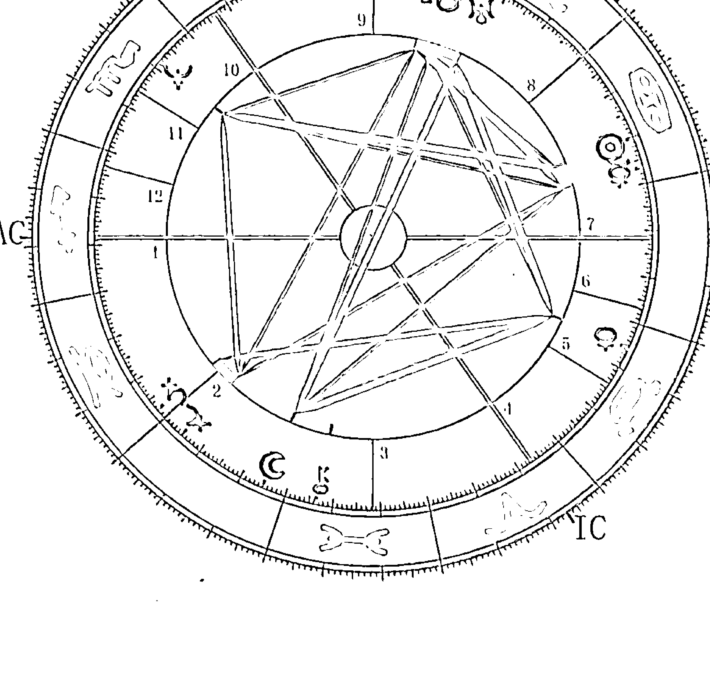

### 出生天宫图

英国王妃戴安娜的出生天宫图，1961年7月1日当地时间19:45出生于英国的Sandringham。

戴安娜于 1961 年 7 月 1 日、当地时间 19:45 出生于英国的 Sandringham。

在她的天宫图上，太阳在巨蟹座，上升点（符号）AC 在人马座，因此，这两个星座对她的性格影响最大，表明她是个温和大度、受人爱戴的人；

火星、天王星、冥王都与代表感情的月亮、金星呈硬相位——与月亮相冲（180°），同时与金星呈四分方位，暗示她的感情生活不顺利，同时易冲动、感情易失控；

火星（能量与暴力）、天王星（突然的改变）、冥王星（死亡）这些古代认为不吉的行星都集中在与死亡有关的第八宫，在传统星相学看来预示着突然的劫难。

#### 如查找自己的天宫图

我们在这里介绍一个可以查找天宫图的网址：http://www.astro.com 读者按照下面的顺序点击即可

- 1. Free Horoscopes
- 2. Chart Drawing, Ascendant
- 3. Add a New Person（在这里输入个人详细资料：姓名、性别、出生时间与出生地点）
- 4. Continue

需要注意的是，上面查到的天宫图不包括小行星，如果要查小行星的位置，可以继续点击 Extended Chart Selection，在打开的网页中，你会看到小行星的名字，它们是Ceres（谷神星）、Pallas（智神星）、Juno（婚神星）、Vesta（灶神星）、Chiron（凯龙星），点击你要查找的小行星名字，然后点Click here to show the chart 即可。

在对天宫图有了初步了解以后，我们再来分别介绍一下星相学的四大要素：星座、行星、宫和相位。其中，行星是不同的心理原型，星座是不同的表现模式，宫是不同的激发场合，而相位是行星之间相互作用的方式。

在介绍这些基本单元之前，我们需要先介绍另一个与星座息息相关的概念——古希腊观念中，组成物质世界的“火、土、气、水”四元素。

在中国古代文化中，物质是由“阴、阳”组成的，阴阳又衍生出“金、木、水、火、土”五行，而五行又化生成万物。

与此相仿，在古代西方的文化中，物质是由“火、土、气、水”四种元素组成，四种元素分别是固态（土）、液态（水）、气态（气）和等离子态（火）——也就是物质的全部四种状态。其中，火使物质具有可见性，土则使它有形；作为中介，气和水使火与土结合，组成一个不可分解的统一体。而这四种元素也具有阴阳特征，其中火与气为阳性，土与水为阴性。

最早提出这一概念的，是公元前五世纪的古希腊哲学家恩培多克勒。公元前四世纪，亚里士多德进一步用“湿、热、干、冷”四种感觉性特征描述这四种元素，认为土是冷和干的，水是冷和湿的，气是热和湿的，而火是热和干的。此外，元素之间还有轻重之分：土和水是重的，因而沉降；气和火是轻的，因而上升（如下图所示）。

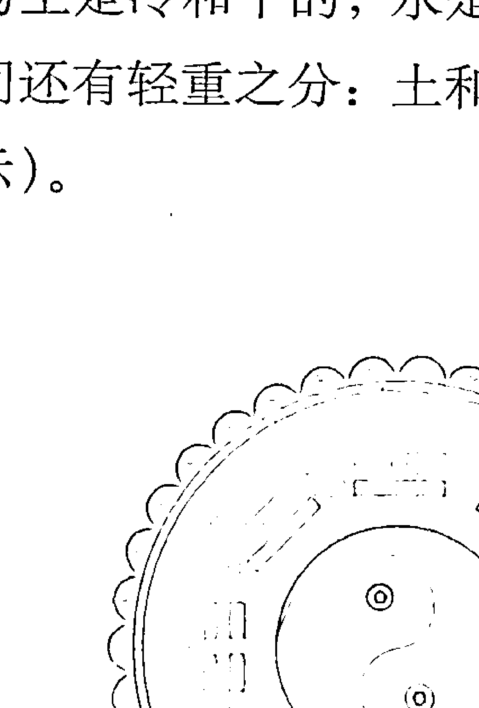

中国传统文化用阴、阳来表示物质的属性，它们为创造世界的两种能量，相互对立，却又相互依存。

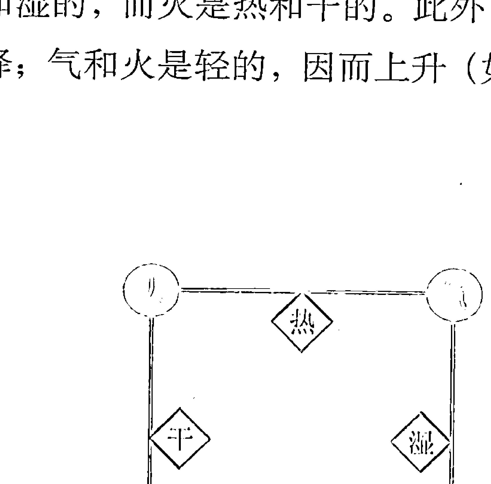

古希腊哲学家用火、土、气、水四元素描述物质的组成。

这四种元素以及它们的阴阳特征，正是我们探讨星座属性的基础。星座按照四种元素分别分为火类星座、土类星座、气类星座和水类星座。其中，火类星座和气类星座为阳性星座，土类星座和水类星座为阴性星座。

这四种元素在星相学中分别代表精神、物质、心智、感情。

“火”的动态代表精神的能动性，引申为能量、热情、勇气；
“土”的坚实代表形体的结构紧密，引申为踏实、实际、沉稳；
“气”的无形代表心智的本质，引申为灵感、智力、沟通；
“水”的流动代表感情的易变，引申为敏感、理解、同情。

正如中国文化中的五行有“相生、相克”的特点，火、土、气、水这四种元素彼此间的相互作用也有不同的特点。
基本上，同一元素的组合会过分突出它本身的特点，而带来不平衡性，例如：代表感情的水是无形的，而太多的水一旦崩溃，就变成了冲垮一切的洪水。
同性（同为阳性或同为阴性）元素间的组合，结果是相互助长和呼应。
异性（阴性与阳性）元素间的组合一般是互补、平衡，或者分立、对抗。
我们可以借助一个比喻来理解这四种元素间的关系：在北美印第安人的神话中，用雷鸟、乌龟、蝴蝶和青蛙分别比喻火、土、气、水这四种元素，同为阳性的雷鸟（火）和蝴蝶（气）相互逐戏；同为阴性的乌龟（土）和青蛙（水）相映成趣；而阳性的雷鸟和阴性的青蛙却没什么共同语言。

具体地说，火与土是冲突的，但积极地看，土限定了火的过分发展，火则带给土以鼓舞和激情；

火与气相互助长，容易找到共同的志趣；

火与水不相容，火会把水变成蒸汽般暴躁的情绪，而水的力量占上风则会扑灭火焰的激情；

气与土的接触比较流于表面，无法深入对方的本质；

气与水寻求平衡，理性与感性交融共存；

土与水很兼容，土规范了水的形状，使感情不至于不可收，而水滋润着土，感情浇灌使之开花结果。

元素的这些相互作用，既可以暗喻一个人内心矛盾的性质和表现，也可以象征不同脾性的两个人之间的关系本质。比如，受气类星座影响较强的人突出了

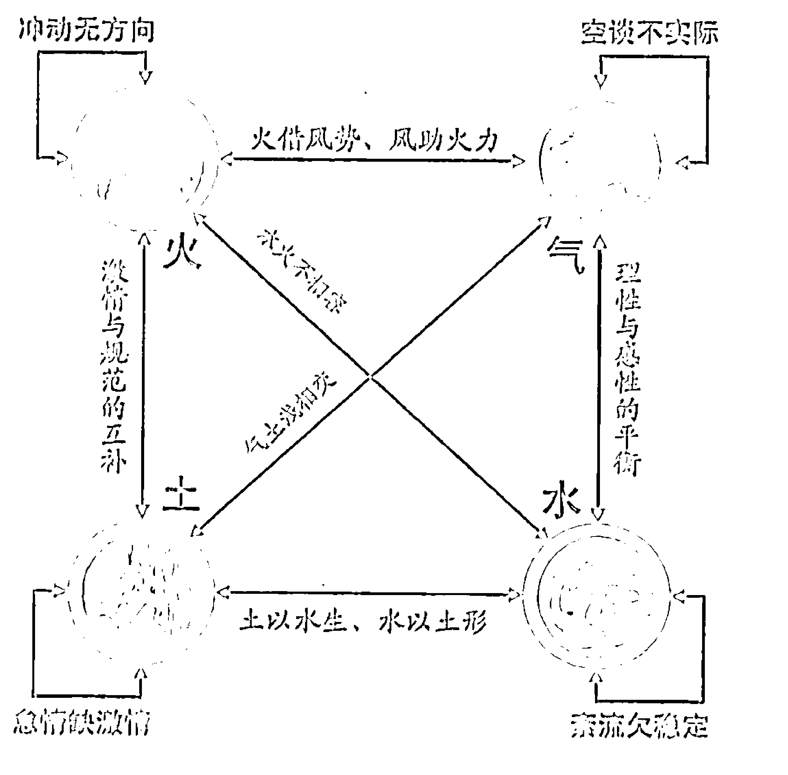

四种元素间的相互作用，如图所示。

“气”的思维能力和客观性，但是缺乏情感和想像力;受水类星座影响较强的人与受火类星座影响较强的人相处，属“火”者火爆的脾气和迟钝的感觉常常顾及不到属“水”者善感的情绪;而受水类星座影响较强的人遇到受土类星座影响较强的人，属“水”者则可以被属“土”者及时从自己情绪的海洋中拉出来，感到慰籍和安全。

接下来，向你介绍星相学的第一大要素：星座。在这里，你将会读到星座属性按这四种元素的分类。

读者多半可以历数十二星座的名称，但是，你可能还不太清楚，为什么第一个星座是从3月21日开始的白羊座呢？星座为什么不像月份一样，从每年的1月1日开始呢？

这是因为，星座带有季节的特点，是按照季节来划分的，它的起始点是春季的开始，即每年“春分”那一天。一年的365天被12等分，划分为十二个星座。从白羊座开始，依次是金牛座、双子座、巨蟹座、狮子座、室女座、天秤座、天蝎座、人马座、摩羯座、宝瓶座、双鱼座。

这十二个星座各有不同的象征意义：

- 白羊座：勇气、斗志、领导力、专横、激情、本能、活力。
- 金牛座：缓慢、固执、沉着、冷静、惰性、性爱。
- 双子座：思考、机敏、好奇心、灵活、商业感、变化多端。
- 巨蟹座：敏感、直觉、想像力、易怒、怯懦、母爱、家庭观念。
- 狮子座：雄心、意志、生机、高傲、真诚、大度、虚荣心、激情。
- 室女座：谨慎、秩序、分析能力、怯懦、批评精神、注意细节。
- 天秤座：公正、艺术、社交性、浪漫、优柔寡断、懒散。
- 天蝎座：顽强、耐力、神秘、好斗、复仇心理、性爱、破坏欲。
- 人马座：坦率、热情、独立、自负、冒险、旅行、哲思。
- 摩羯座：严谨、秩序、约束、冷漠、忧郁、怯懦、节俭、持之以恒。
- 宝瓶座：发明、创造、独立精神、怪诞、反叛、革新、社交性、利他主义。
- 双鱼座：神秘、敏感、想像力、献身精神、温情、浪漫、逃避、吸毒。

我们还可以用更简单的词来概括十二个星座的特征：

- 白羊座：我是。
- 金牛座：我具有。
- 双子座：我想。
- 狮子座：我要。
- 天秤座：我参与。
- 人马座：我相信。
- 宝瓶座：我想了解。
- 巨蟹座：我感觉。
- 室女座：我分析。
- 天蝎座：我怀疑。
- 摩羯座：我利用。
- 双鱼座：我渴望。

现在，我们来看看星座的分类。

### 阳性星座、阴性星座

星座按照元素的阴、阳属性可以分为两类：阳性星座与阴性星座。
从白羊座开始（包括白羊座），每隔一个星座为阳性星座，其余为阴性星座。极为简化的说法是：如果一个人受阳性星座的影响比较大，他的性格会比较外向，反之则比较内向。

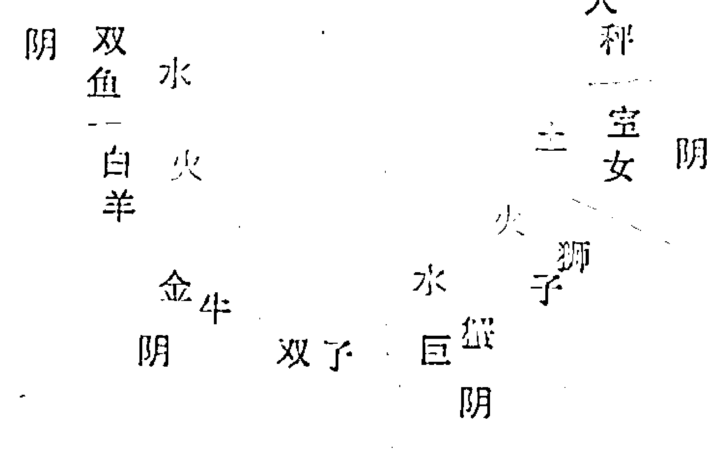

黄道十二星座的“阴、阳”属性和按照“火、土、气、水”的分类。

### 火类星座、土类星座、气类星座、水类星座

如果按照火、土、气、水四元素来分类，星座又可以划分为四类：火类星座、土类星座、气类星座和水类星座。

三个火类星座分别是白羊座、狮子座和人马座。“火”代表成长和发展的活力，是对生活的热情和独立自我的认知，表现为乐观、自信、热忱、主动，有开创、激励和领导能力。对于一个受火类星座主宰的人来说，人生最重要的是“行动”。
白羊座的火性表现在勇敢、好奇和创造力上；狮子座的火性表现在领导能力和行动、表演能力上；人马座的火性则表现为追求更高的社会理想。
白羊座与诞生、存在、表现有关：展现自我、坚持自我，为自我的生存而奋斗；狮子座体现主导和控制，不仅要实现自我，还要在别人的认定中更加灿烂；人马座进一步提升，代表行动和灿烂后的反省能力，通过反省和帮助别人提高来达到自我的升华。

三个土类星座包括金牛座、室女座和摩羯座。由于“土”代表实际性，土类星座的人注重的是经济和物质方面，较为保守和现实，小心谨慎，考虑周密。
其中，金牛座的土性特质，表现为对物质资源的兴趣和聚敛的才能；室女座表现在对细节的注重、对身体健康的注重以及动手能力上；而摩羯座则显得有生意头脑、善于管理。

金牛座为了“安全感”而积累，力量从感官和欲望而来；室女座对“积累”进行分析、组织，使其条理化，去粗取精；摩羯座则努力争取更大意义的事业和成功，并担负起责任。

三个气类星座是双子座、天秤座和宝瓶座。在星相学里，“气”代表精神意识和创造性的智力活动及抽象思维。对于一个受气类星座主宰的人，思考和沟通是很重要的生活内容，而这一特质表现在三个星座中也有所不同。

对于双子座，它表现在对于事物的知识能够理解、利用和交流，双子座的人有做教师和沟通者的天赋；天秤座的特质正如它的表象所暗示的，表现在能够权衡利弊，天秤座的人社交能力比较强，是很好的组织者；宝瓶座的“气”性品质表现在直觉方面以及对普遍原则与真理的理解上，并且倾向于与别人合作。

双子座收集信息并加以传播；天秤座把信息在人际关系上加以运用；至于宝瓶座，则更体现着创意，成为信息之源。

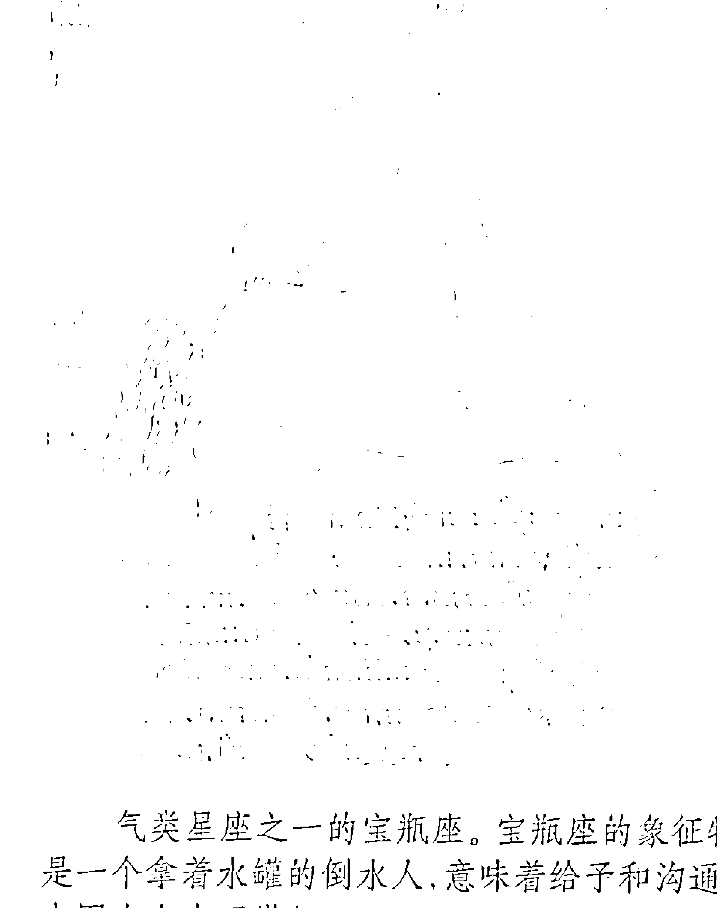

三个水类星座分别是巨蟹座、天蝎座和双鱼座。“水”代表的是感性、直觉、情感和可塑性，水类的敏感性可以是艺术的敏感、心理上的敏感和对他人的敏感。受水类星座主宰的人，性格表现包括共鸣、养育和保护，比较富于情绪及感情，做事的时候心情的影响很重要。

水的敏感性，在巨蟹座表现为对于家庭的依恋和对安全感的需求；天蝎座表现为对性、死亡和对神秘事物的强烈感觉；双鱼座则表现为神秘感、对音乐的敏感以及个人吸引力。

比较之下，巨蟹座着重于对过去的记忆；天蝎座强调记忆的转化和自我的觉悟；而双鱼座突出觉悟后的超脱和灵性。

星座的“火、土、气、水”基本特征可以帮助我们理解星座的个性，例如为什么土类的金牛座喜欢实在的拥有，而气类的双子座总是耐不住想说话的冲动。

### 主导星座、固定星座、易变星座

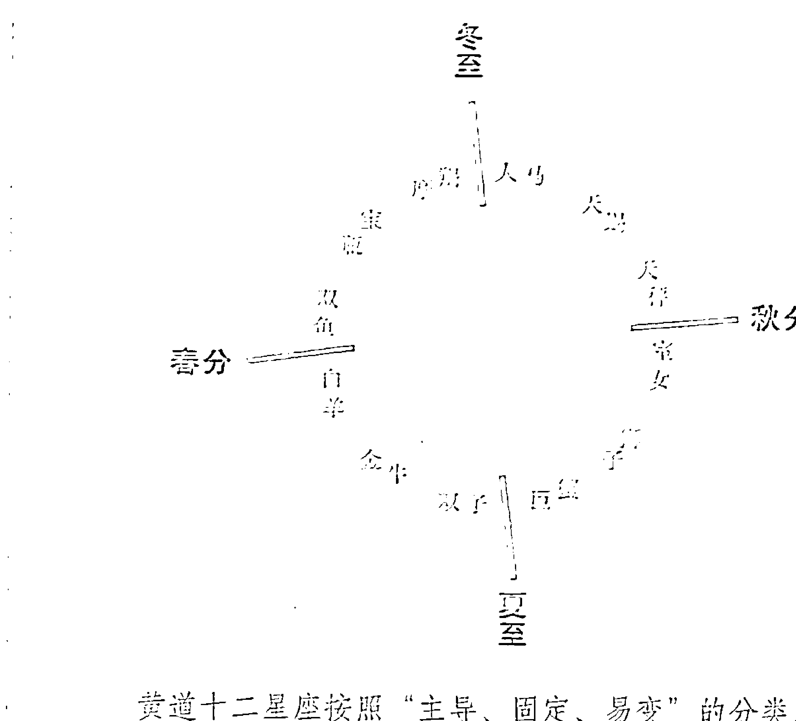

黄道十二星座按照“主导、固定、易变”的分类。

十二星座除了“阴、阳”和“火、土、气、水”的属性，还带有季节的特点，我们说了，十二星座正是以季节来标定的。按照季节来分类，分别是主导星座、固定星座、易变星座，与上述属性相组合，衍生出不同的个性特点。

春分（3月21日）、夏至（6月22日）、秋分（9月23日）、冬至（12月22日），标志着四季的开始，也标志着相应的四个主导星座的开始——即白羊座、巨蟹座、天秤座、摩羯座的开始；在每个季节接下来的一个月，春天的湿、夏天的热、秋天的干、冬天的冷等基本特性趋于稳定，标志着四个固定星座——金牛座、狮子座、天蝎座、宝瓶座；每个季节最后的一个月，下一个季节的特性已经出现，两种特性进行转换，标志着四个易变星座——双子座、室女座、人马座、双鱼座。

这三种类型的星座分别代表起始、发展、转化，与季节的更替相对应，形成周而复始的循环。

引申来说，主导星座呈现最单纯、原始的状态；固定星座具有顽固、难以改变的特质；易变星座则有弹性和良好的调适能力。

主导星座中：

- 白羊具有春季盎然的激情和活力；
- 巨蟹怀恋烈日炎炎下家居的舒适；
- 天秤沐浴着秋风的惬意；
- 摩羯在坚韧地抵抗寒冬。

固定星座中：

- 金牛代表春天的富饶；
- 狮子是夏季燃烧的火热；
- 天蝎是秋日转暮的苍凉；
- 宝瓶是冬天冷静的沉思。

易变星座中：
- 双子具有春季善变的风貌；
- 室女传递夏末秋初的变迁；
- 人马拥有挑战寒冬的乐观；
- 双鱼怀着迎接新春的喜悦。

接着，我们来介绍星相学的第二大要素：行星。

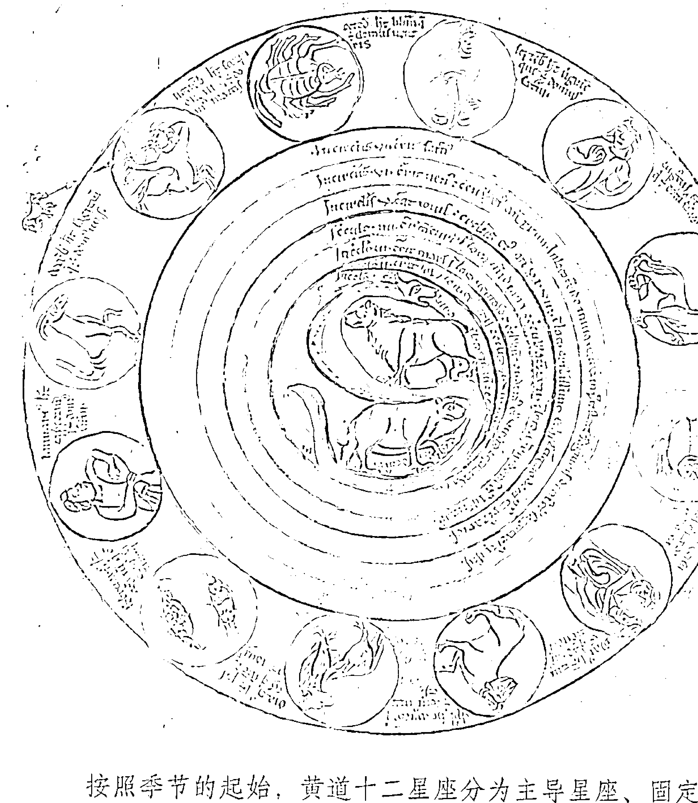

星相学考察的是特定时刻太阳、月亮、八大行星（水星、金星、火星、木星、土星、天王星、海王星、冥王星）的位置，有时候也考虑若干小行星，比如凯龙星。在星相学里，太阳、月亮、彗星和小行星均可统称为行星。

每颗行星代表不同的能量，同时也对应于一种生活原则。

- 太阳：代表精神。这是男性的生活原则、活力、外部生活和权力欲。
- 月亮：代表女性因素。激动、情感、内心生活、想像和生殖力。
- 水星：代表智力。心理元素和技能的表现形式。
- 金星：代表感情。它支配着人的情感、爱情和艺术才能。
- 火星：代表毅力。激情、性爱和好斗的本性。
- 木星：代表一切确定了的事情，如物质和精神方面的情况，生活是否称心如意。
- 土星：代表需要付出的努力、工作、考验和时间因素。
- 天王星：代表一切新的、突然变化的或意想不到的事物。
- 海王星：代表与地球以外世界的接触，主要指灵感、幻想和无意识等方面。
- 冥王星：代表死亡和重生、性爱、破坏和变态。

#### 行星的象征意义也对应着人类的心理：

- 太阳：自我激励和自我实现；
- 月亮：自我保护和自我保存；
- 水星：自我对世界的感知；
- 金星：自我认可和娱乐；
- 火星：自我动员和好斗；
- 木星：自重；
- 土星：自律；
- 天王星：自我创造；
- 海王星：自我理想主义；
- 冥王星：自我反思和提纯。

在星相学里，行星之间的象征意义也有关联，体现了“升华”和“对立”的特点。（如图所示）

月亮的升华是海王星，月亮着重母性的养育和呵护——海王星象征着精神的升华，以及与“永恒”的融合；

火星的升华是冥王星——从挑战外界转化为挑战自己，从而得以在反省中重生；

水星的升华是天王星，水星的力量在于加工所学到的知识，而天王星则本身具备超群的创造力；

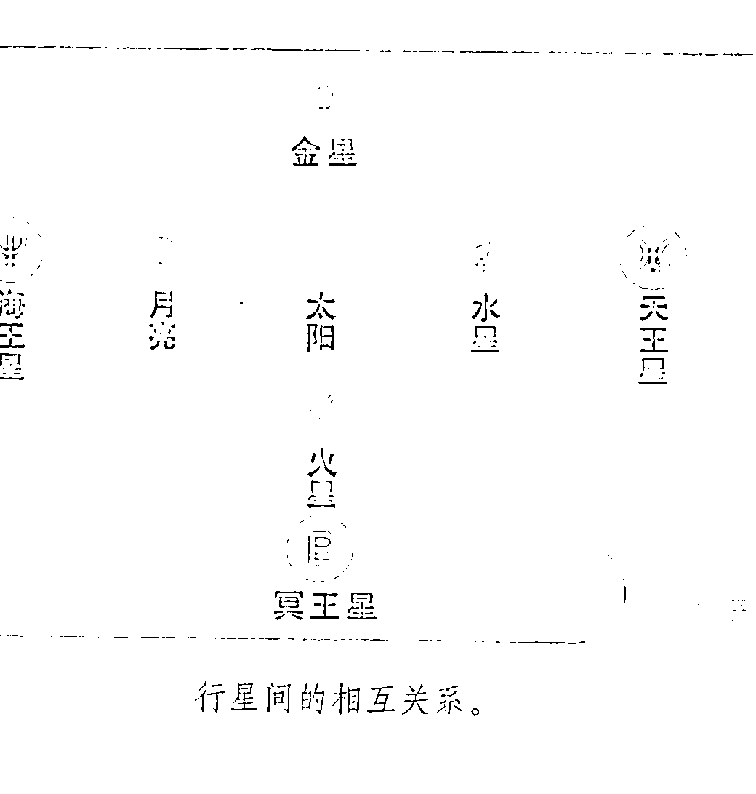

行星间的相互关系。

目前，金星还没有其升华行星（太阳系第十大行星“塞娜”的发现，还没有被星相学家赋予确切的含义，或许它会成为金星的升华，预示更高层次的社会沟通。见后述）；

至于木星和土星，木星具有生长和扩展的特性，而土星具有限制和收缩的特性，它们仿佛一个力场中两股相对而交融的影响力，左右其他行星力量的发挥，也就是说，木星或土星与其他行星相接触，会分别激发那颗行星正面或负面的影响力。

例如，土星与金星接触可能意味着自卑感、对社会压力的恐惧、个人关系缺乏；

而木星与金星接触则使人乐观、自信和受人欢迎。十二星座各由一个行星主宰，如表所列。行星在运行中落在所守护的星座（称为本位星座）之中，作用最强；而在某些星座中，作用会受到抑制。

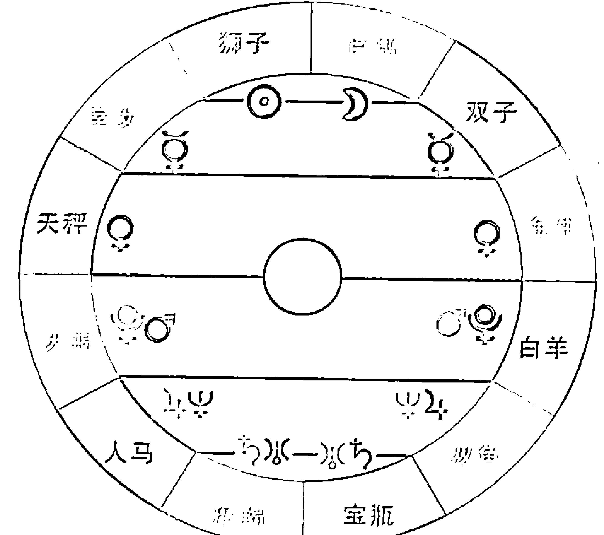

行星与星座的主宰关系

外圈黑色背景的星座表示其主宰星在夜间影响力最强，白色背景的星座表示其主宰力在昼间影响力最强。红色行星符号表示在两颗行星双重主宰情况下，其影响力占优势。

| 符号 | 行星 |
| :--- | :--- |
| ☉ | 太阳 |
| ☽ | 月亮 |
| ☿ | 水星 |
| ♀ | 金星 |
| ♂ | 火星 |
| ♃ | 木星 |
| ♄ | 土星 |
| ♅ | 天王星 |
| ♆ | 海王星 |
| ♇ | 冥王星 |

| 宫 | 宫的含义 |
| :--- | :--- |
| 一 | 自我宫 |
| 二 | 财富宫 |
| 三 | 兄弟宫 |
| 四 | 家庭宫 |
| 五 | 爱情宫 |
| 六 | 工作宫 |
| 七 | 婚姻宫 |
| 八 | 疾厄宫 |
| 九 | 迁移宫 |
| 十 | 官禄宫 |
| 十一 | 福德宫 |
| 十二 | 玄秘宫 |

在大概了解了星座与行星之后，我们进入星相学的第三个要素：宫。

读者可能对星座和行星都略有了解，但是对“宫”恐怕就比较陌生了。“宫”是什么？是“宫殿”吗？

这样理解也未尝不可，我们可以把宫想像成宫殿，或者一个房子。在星相学里，有十二个这样的房子，每个房子代表不同的场景，或者说是不同的生活领域。我们把这些房子称为“宫”。

每个宫所代表的简单的含义如左图所示。

宫的划分与星座的划分不同，星座的划分只考虑时间，而宫的划分是由时间和地点（经纬度）决定的。

太阳从东方地平线上升起的点是第一宫的起点，这个点叫做“上升点”。而太阳从西方地平线沉落的点是第七宫的起点，称为“下降点”。正午时分，太阳到达中天，也就是到达观察者所在位置的天空的最高点，这是第十宫的起点，这个点称为“中天”。午夜时分，太阳到达中天的对面，这个点是第四宫的起点，称为“天底”。

从地球上看，太阳在天空中的轨迹是一个大圆，这四个宫的起点确定之后，这个大圆被两条直径（地平线和子午线）分为四个区域，如图所示。每个区域再依据当地时间划分为三个区，总共十二个小区，这就是“十二宫”。

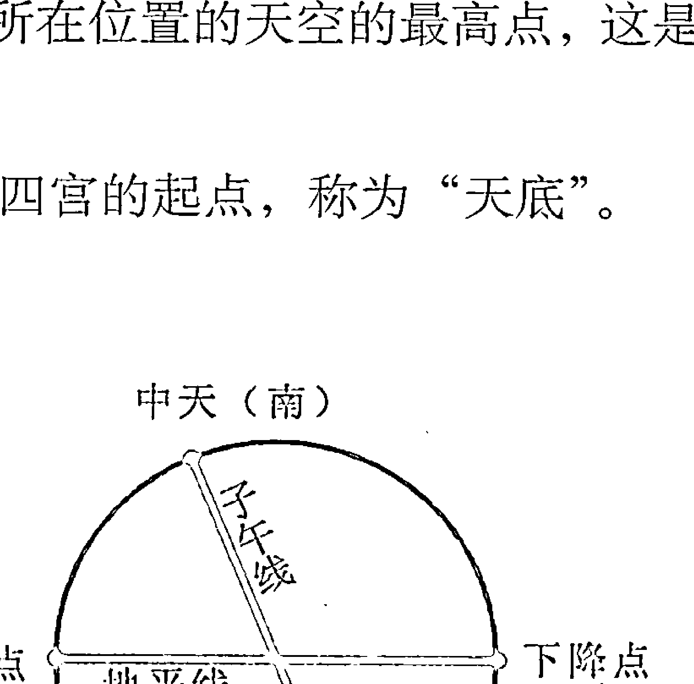

其中，一到六宫的大小各不相同，七到十二宫则与一到六宫中与各自顺序相对的宫大小一样。

你也许会产生疑问：为什么十二个宫的大小并不相同？这首先是因为地点的不同。在地球上，同一时间，由于观察者所处地点的经纬度不同，太阳在天空中的位置便有了差异。其次，在同一地点，不同的季节，太阳到达中天的位置也不同。夏季的太阳比冬季的太阳更接近我们头顶的正上方。另外，除了划分的方法不同之外，太阳穿越十二个星座所用的时间与穿越十二个宫所用的时间也不同。太阳穿越十二星座需要一年；而由于地球自转的原因，从地球上看，太阳穿越十二个宫只需要一天。

我们再回到宫的含义这个话题。在十二个宫中，上升点和中天作为第一宫与第十宫起点，有着重要的影响：上升点代表心理学上所讲的“人格面具”，简单地说就是我们给别人的第一印象，这个第一印象主要通过上升点所在的星座（即上升星座）的特征表现出来，因此，上升星座同太阳星座一样，对我们的个性有很大的影响；而中天代表一个人的社会生活，以及与“成功”有关的概念，中天所在的星座则影响了我们事业的方向和对成功的理解与追求。

同样，位于上升点和中天附近的行星，也对一个人起着重要的影响作用。例如：水星位于上升点或中天附近，使人机敏灵活，能言善辩，可能成为纽带、

中间人、商人，有较强的适应能力；金星位于上升点或中天附近，使人容易赢得赞美和好感，有艺术天赋，生活趋于顺利；天王星位于上升点或中天附近，则使人不拘传统，喜欢发明创造，生活充满变化。

十二宫所代表的生活领域，与十二星座、人的心理发展历程有着微妙的联系，在后面的章节将着重为你介绍。

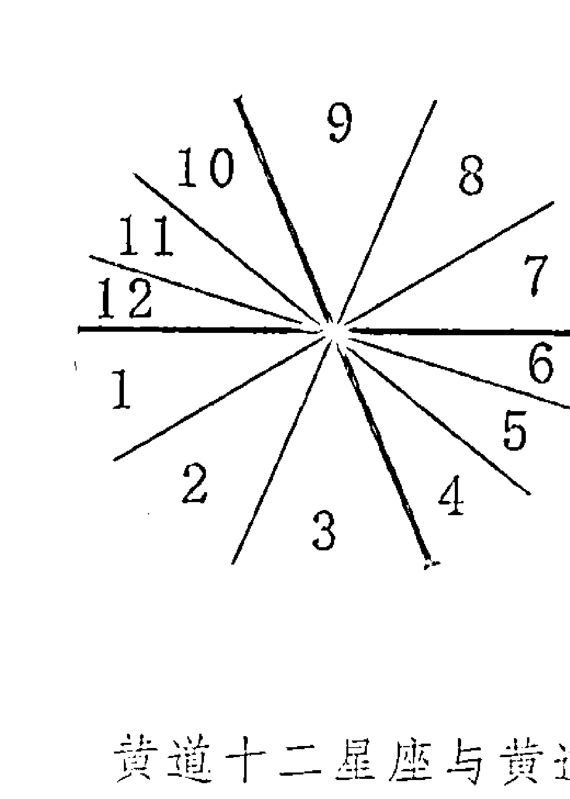

接下来，是星相学中最后一个基本组成单元：与行星运行有关的“相位”。

我们知道，行星的运行速度是各不相同的，它们各有自己的运行轨道，轨道间保持一定的距离。整个太阳系像是一个扁平的圆盘，行星的轨道大致都集中在这个类似圆盘的区域内。

宏观上，太阳是不动的，但是从地球上看，太阳也在这个圆盘内“运行”，它用一年的时间绕地球划一个大圆，我们把这个大圆称为“黄道”。把以黄道为中心的这条狭窄的环面称为“黄道带”。

从地球上看，行星（包括月亮）的轨道都在黄道带中，在不同时刻它们位于黄道带的不同位置。

我们把行星的投影都集中在黄道上，于是，行星的位置便可以用“度”来标记。行星间的距离则可以用角度来表示。相位即是行星之间的角度关系。

行星间的角度又能说明什么问题呢？

前面我们谈到了行星代表不同的能量，因此，行星间的角度则决定了这些不同能量的削弱与助长。是行星之间相互作用的方式。

行星间的主要相位有：

- 相合：两个行星处在同一度上；
- 相冲：行星间呈 180°；

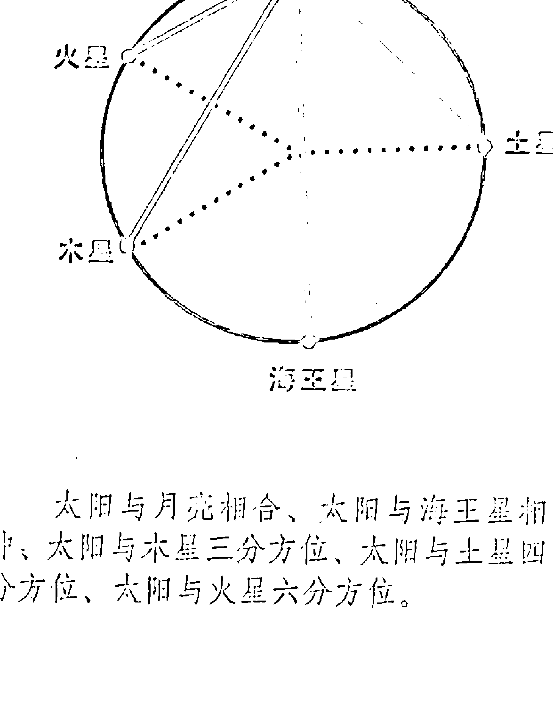三分方位：行星间呈 120° ；
四分方位：行星间呈 90° ；
六分方位：行星间呈 60° 。

行星间的次要相位有：

五分方位：行星间呈 72° 或者 144° ；
八分方位：行星间呈 135° 或者 45° ；
十二分方位：行星间呈 30° 或者 150° 。

上面说到的行星的相位指的是行星在黄道带上的精确角度，在实际运用中，允许有一定的误差度。

在上述主要相位中，三分方位和六分方位会让行星的能量充分发挥出来，属于和谐相位（本书中我们称为“软相位”）。相冲和四分方位会让行星能量的发挥受到阻碍，属于不和谐相位（我们称其为“硬相位”）。至于相合的和谐与否，取决于行星的性质。

在后面的章节，我将详细为你介绍各种相位的代表含义。

到此为止，我已经把星相学中的基本组成单元向你做了简单的介绍。了解了这些基础之后，那么在实际当中该如何运用呢？怎样根据这些知识来分析自己的心灵呢？

我们需要把这些单元组合在一起。将它们置于一张图中，根据这张图来分析和推理，得到合理的解释。这张图就是我们前面提到的“天宫图”。

### 历史承传

> > 天体是人世间所发生的一切事情的根源；天体间接地影响着人类的活动。但是，它所产生的各种影响并不是不可避免的。
>
> ——托马斯·阿奎那

星相学是一门亘古流传的学问，是古人探究宇宙原理的初级的科学尝试，也是后世天象观察与预测研究的先驱。对古代文化来说，恒星和行星在天空中的周期运行，为地面的世界带来了很多信息，国家、人物、命运与“天”之间有着微妙而又自然的联系。人类仰望星空，寻求天象的规律和来自神灵的启示，因此，从人类开始思索的时候起，我们现在所了解的那种客观的天文学也不可避免地与星相学融为一体。位于英格兰南部、大约建于五千年前的史前石柱群，所折射出的人类当时的天文知识已足以让我们惊讶（见下页）。

我们书中所谈的星相学，是从美索不达米亚地区的“星灵宗教”与“星灵占卜术”、埃及宇宙学与历法编制，以及希腊思辨哲学的复杂结合中发展起来，在希腊-罗马时代基本成型，它将宗教、神话、占卜、科学和哲学融汇为一个相对统一的概念。近代，星相学又结合了心理学、性格学等内容，逐渐将重心从传统的吉凶预测转向了心灵分析。

除了起源于两河流域的西方星相学，人类其他古老的文明中心，包括中国、印度、中美洲等，随着农业文明的进步，也与天文学和历法相关联，各自发展了不同的星相学体系。

为了使读者对这门古老学科的历史有个简单的了解，这一章，我们先依照时间顺序，介绍一下西方星相学的起源和发展；再依照星相学的范畴，来看看西方星相学所包含的分支；最后，我们一起来了解一下世界其他地区的星相学。

西方星相学起源于四千多年前的美索不达米亚平原。起初，居住在美索不达米亚地区的苏美尔人开始拜祭太阳、月亮和金星等星体，人们修建了神祠，祭司们负责与这些星体所代表的神灵沟通，他们能够根据长期的观察，准确地预测月食等天象，也开始把行星周期和人类社会活动联系起来。这是星相学最初的萌芽阶段。

到了“亚述帝国时期”（公元前1530年～公元前612年），亚述人在两河流域开始了长达近千年的统治，星相学在这一时期得到了充足发展，出现了被现代学者称为《征兆结集》的大型星相学文献。《征兆结集》由70余块泥板组成，包括7000余项征兆，例如“如果初升的太阳左边看起来有血色，国家会被抢掠，而国王会鲁莽行事”。这是星相学的第一个阶段，是人类对天体进行观察和预兆的总结，星相预测的目的限于预卜国家的吉凶、重大的灾难等，而不是针对个人。

亚述帝国后期，亚述人创造了较精确的历法，制定了星图和星表、划分了星座。公元前600年，十二星座的划分基本固定下来，十二星座的命名也一直沿用至今，这是星相学的第二个阶段。星相预测的目的是为了确保王国和统治者的平安。

第三个阶段始于紧接着的“新巴比伦王朝”（也称为“迦勒底王朝”，公元前611年～公元前540年），针对个人的“生辰星相学”开始出现。星相学在这段时间大放光彩，“迦勒底人”后来在西方人笔下成了“占星学家”的同义词。

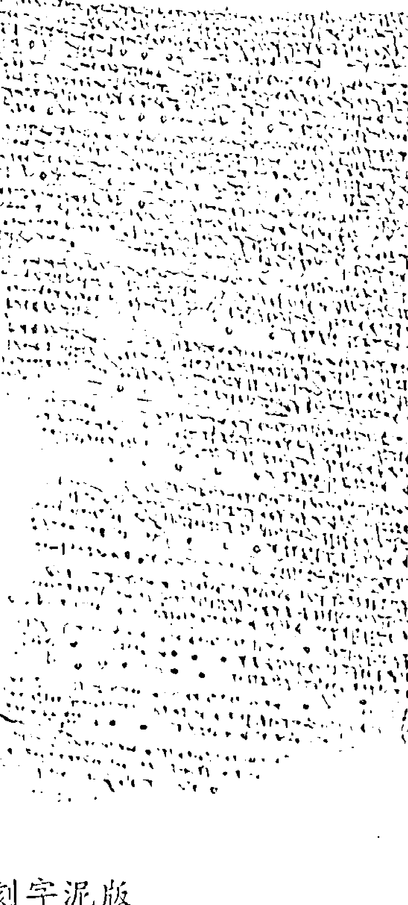

这块公元前7世纪的刻有楔形文字的古巴比伦泥板，记述了苏美尔人对金星的观测，也是人类观测星相的较早的记录。可见早在几千年前，古人已经将探索的眼光投向了浩淼的星空。

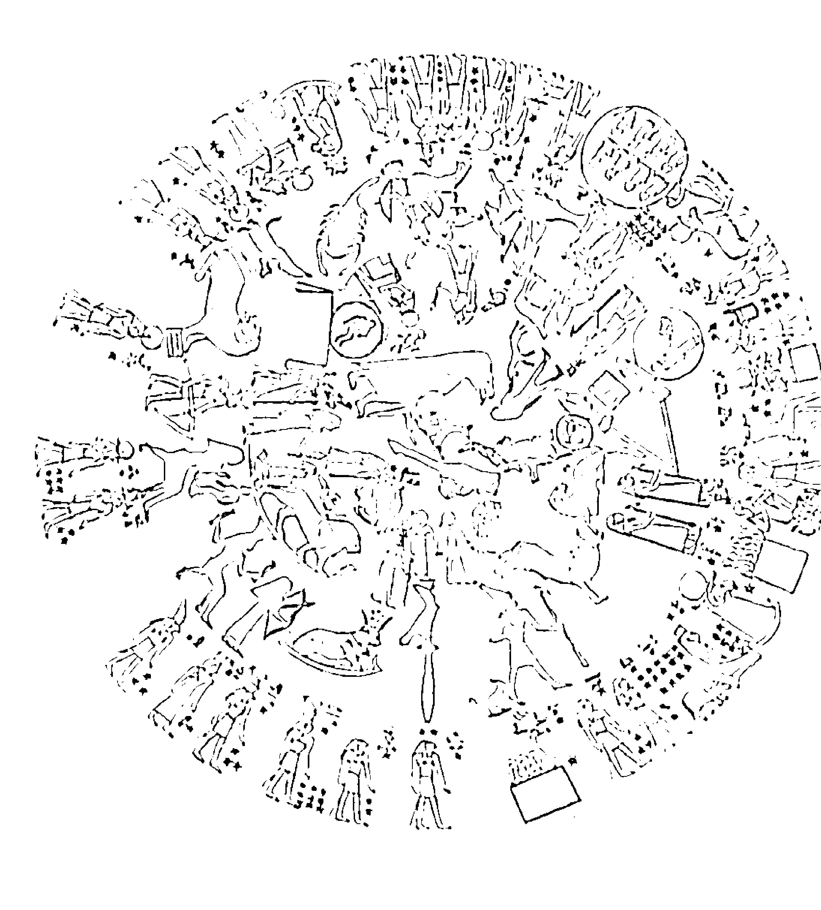

“旬星”是古埃及人用来划分星空和时间的，是每10天内于夜间升起的亮星，一共36颗“旬星”。左图是公元前一世纪建于埃及登德拉神庙的浮雕，展示了古希腊和古埃及对于星空的理解，包括了12个星座（红色的符号）、36个旬星（外围青色的符号）、行星（黄色的符号）和其他一些神祇的形象。

公元前四世纪，两河流域进入“希腊化”时期，希腊人把几何学带进了星相学，增加了“相位、宫”等元素，希腊神话也开始大量渗透进星相学。在亚历山大接二连三的征服行动中，希腊文明逐渐渗透到跨地中海、埃及、波斯和印度北部的各种文化中。来自埃及的、有两千多年历史的“旬星”概念（见上页图）也与十二星座结合起来，成为西方星相学体系的一个重要成分。

公元二世纪，古希腊最伟大的天文学家、星相学家托勒密编制了包括1022颗恒星、48个星座的星表；创立了在欧洲天文界占统治地位长达1300多年的“地心宇宙”体系；并且描绘了地球的经纬线。托勒密传世的著作颇多，流传至今的约有10种。其中13卷本的《至大论》记载了他的天文观测，成为日后一千多年间拜占庭、阿拉伯和欧洲天文学的“圣经”；四卷本的《四书》是星相学专著，汇总了当时几乎全部的星相学成果，并加入他自己的创见，影响长达上千年，也是现代星相学的根基。

#### 《四书》：现代星相学的根源

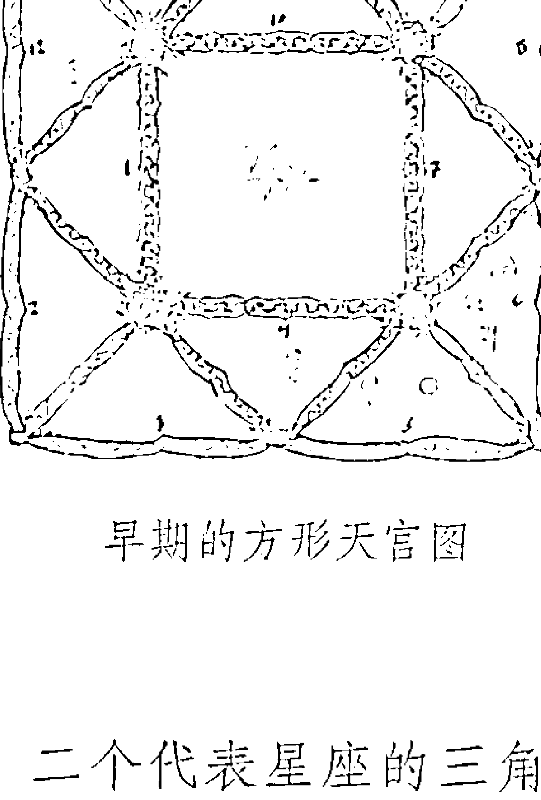

早期的方形天宫图

作《四书》时，星相学已受到罗马保守势力的排斥，于是在第一卷里，托勒密重点陈述了研究星相学和天文学的理由，并列举了行星的排列和吉凶预测等技术性概念。第二卷研究星相与人类王朝的更替及地理气象的关系。第三卷研究星相与人的关系，包括妇女受孕和婴儿出生时的上升星座、月相以及对人的体质和性格的影响。第四卷则讨论一个人的职业、婚姻、子女等生活范畴分别与十二宫及行星相位的关系。

当时所使用的天宫图是方形的，正方形的外圈排布了十二个代表星座的三角形，中间是个人信息，这种方形的天宫图一直沿用了一千多年。

基督教兴起之后，星相学在西方受到了限制，中世纪的教会领袖宣称星相学是异端邪说，认为星相学是在与邪灵发生关系。其中最有影响力的反对人物是四世纪的奥古斯丁——被教会封为“圣徒”的基督教神学大师，他认为星相学不是建立在理性的论点之上，有时星相学家能做出极其准确的预测与解释，是因为魔鬼在从中作祟。直到十三世纪，在托马斯·阿奎那在世时期，星相学与基督教才达成一种有限的和谐。

托马斯·阿奎那是另一位被教会封为“圣徒”的神学权威，他的神学学说被罗马教廷宣布为钦定学说。他认为“天体是人世间所发生的一切事情的根源；天体间接地影响着人类的活动。但是，它所产生的各种影响并不是不可避免的——哲人主宰星辰”。在他的神学体系里，星相学赢得了一定的地位。

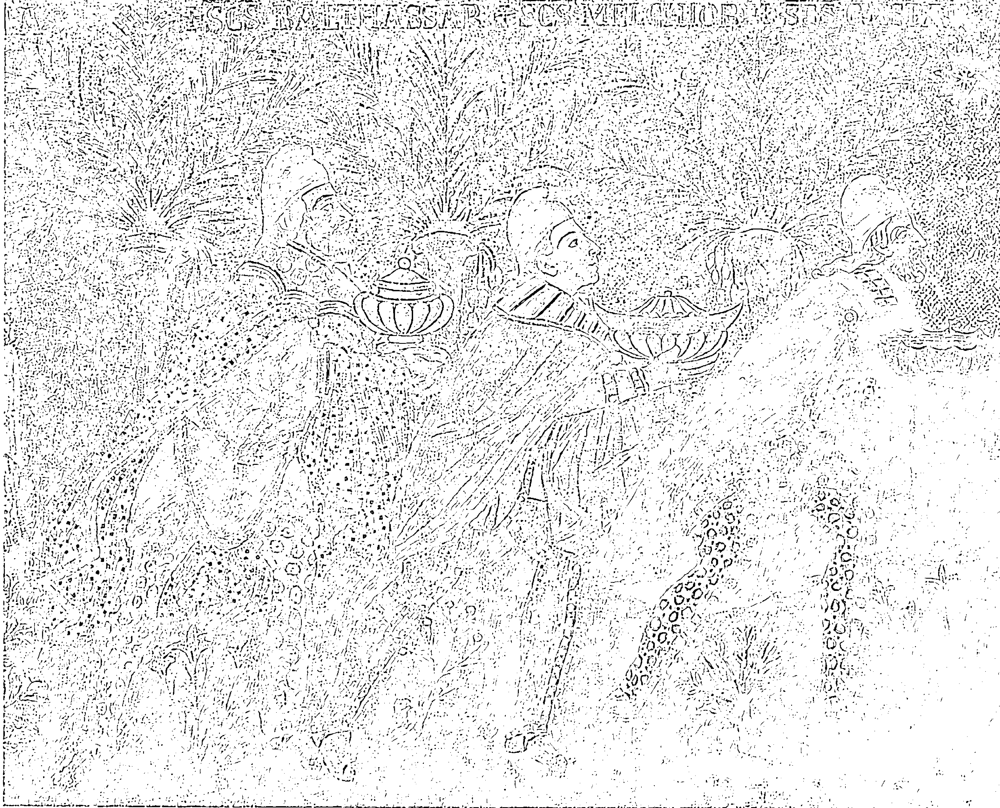

三王来朝

《圣经》中“三王来朝”的故事：来自东方的三位国王（或称三位博士，更准确地说是三位波斯星相学家）见到了奇异的星相——“伯利恒之星”，知道救世主已经降临人世，遂赶去朝拜，结果发现圣婴降生于马槽中。这个故事表明星相学与早期基督教有密切关系。

伴随着基督教从兴起到逐步壮大的历程，作为西方文明源头的两河流域，逐渐成为蛮族王国林立之地，最终，欧洲进入了漫长的中世纪。这期间，新崛起的阿拉伯人继承了希腊文化的丰厚遗产，他们热衷于星相学，并使它在原来的基础上得到了丰富和发展。到十二十三世纪，阿拉伯国家保存的古希腊典籍回传西方，并在希腊文的原著上加了注释。阿拉伯星相学家阿尔布马扎关于“行星大合”（他提出世界始于 7 大行星相合于白羊座1° 时，世界的末日将发生在7 大行星相合于双鱼座末度之时）的著作启发了许多西方星相学家。而星相学与人体健康的关联，使它也成为当时医学领域不可分割的内容。

从十四世纪文艺复兴时期起，意大利和法国的一些大学纷纷开设了星相学课程。到十五十六世纪，星历书畅销全欧，星相学家们活跃在上流社会，为王室提供各种咨询。像哥白尼、第谷、开普勒等早期的天文学家，都是星相学的热衷实践者，而法国星相学家诺查丹玛斯则在 1555 年出版了著名的诗体预言书《诸世纪》。十六十七世纪，英国最负盛名的三大星相学家都在伦敦开业，每人每年的星相咨询业务达到上千宗。

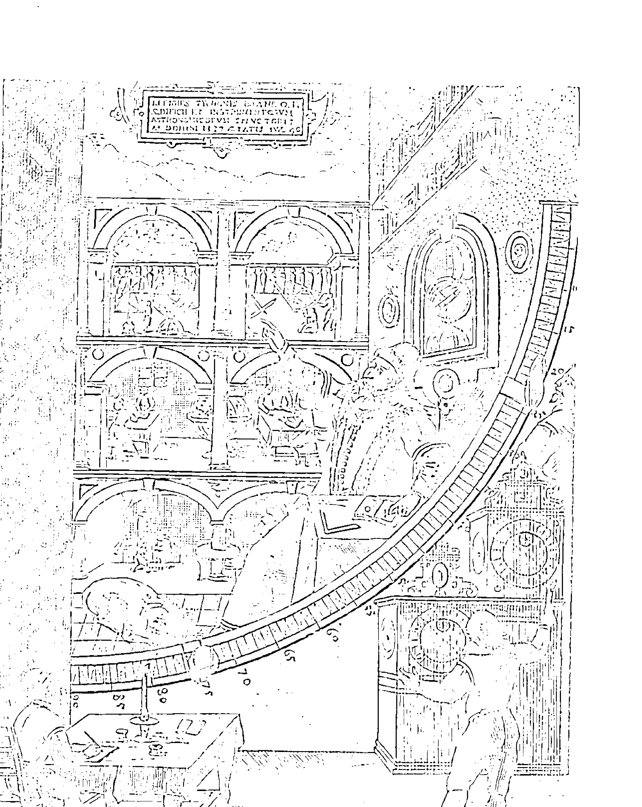

十六世纪，丹麦国王将丹麦海峡中的汶岛赐予第谷，并拨巨款让他在岛上修建了宏大壮丽的天文台和大量精良的天文仪器，上图为第谷在他的天文台工作。

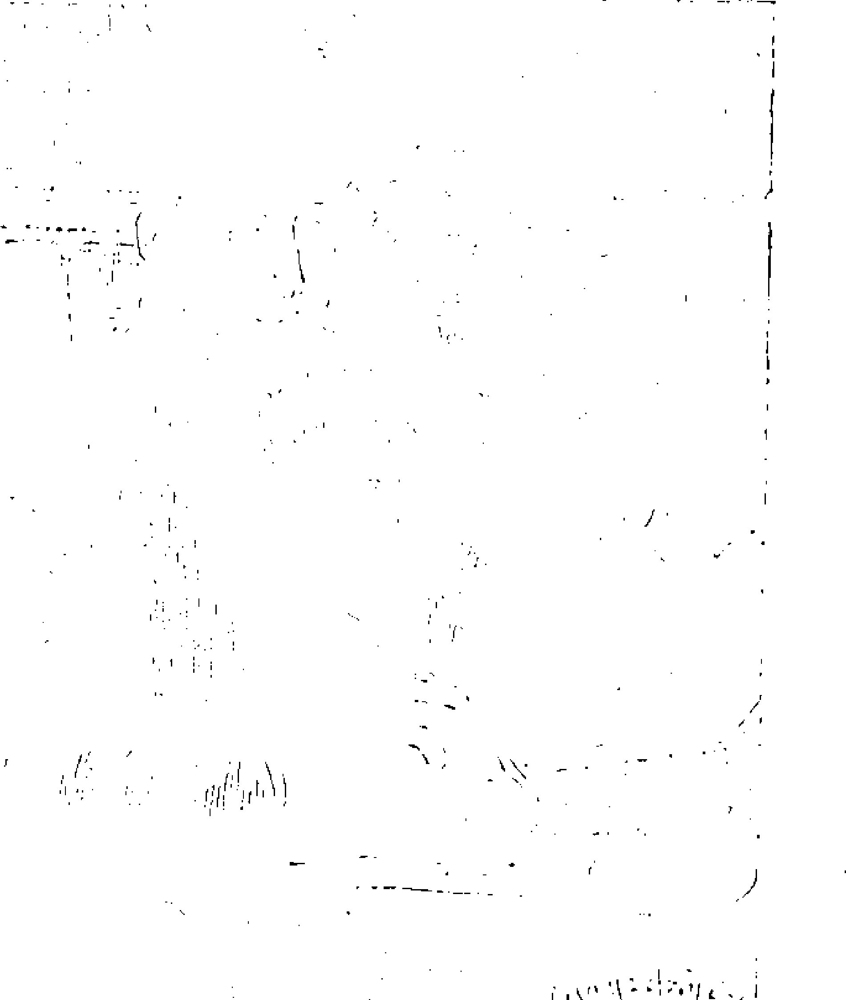

诺查丹玛斯是历史上最杰出的星相学家之一，他一生写了许多预言未来的诗，大多数都应验了。从下面这首诗中我们可以惊奇地看到，早在海王星被发现的300年前，他就已经为这个新行星起了名字。

> > 它距月亮比木星距金星近，
> 周围环绕白色光晕。
> 金星隐藏起了身影，
> 与火星相望的应是海王星。

到十八世纪的启蒙时代，理性之光和科学革命使天文学从星相学中独立出来，而星相学在学院逐渐悄无声息，在1781年出版的百科全书上竟然只字未提，然而它还是承传不绝。

从二十世纪初开始，在心理学家荣格及一些星相学家的倡导下，星相学在欧美重新流行。大众化的“太阳星相学”（只考虑太阳位置）、“日常占星解读”等也引起了普遍的兴趣。随着哲学家、星相学家卢迪亚出版《个性的星相学》，以及主办的杂志《美国星相》从三十年代起刊行，“星座运程”之类的大众娱乐性专栏开始在欧美的报纸杂志上如雨后春笋般地涌现，成为直至今天仍旧广受欢迎的重要内容。卢迪亚提出参考星相学的解释来做自己的自由选择，这成为新时代人本星相学的关键。

传统上，星相学分为“本命星相学”和“应用星相学”，本命星相学包括“医药星相学”，后来出现了第三个重要的分支“卜卦星相学”，“卜卦星相学”又包括“择日星相学”。

本命星相学也叫生日星相学，主要针对个人，是根据出生天宫图对个性和生活领域做出相应的分析；医药星相学是依据星座与人体不同部位和生理系统的对应关系，揭示黄道星座及其主宰星与个体健康的关联。

应用星相学主要针对国家、经济、政治、气候等时势。应用星相学与本命星相学相比，概念的尺度更大，比如，在本命星相学中，天宫图的第二宫代表个人财务，在应用星相学上则代表国家财政和经济。

卜卦星相学与择日星相学是相辅相成的：卜卦星相学是针对某个特定的问题进行分析；择日星相学则着重于寻找某一特定活动的最佳时间。

进入二十世纪，星相学的发展主要分为两个大方向：心灵分析和现实应用。

在心灵分析方面，作为主流的是“人本星相学”，这将是本书着墨最多的部分。此外，还有“深奥星相学”和“天王星星相学”两个旁支；在现实应用方面，随着领域的不同而分为“商业和股市星相学”、“择业星相学”、“择偶星相学”等，各自有一套基本原则，在本书中我们就不多做介绍了。

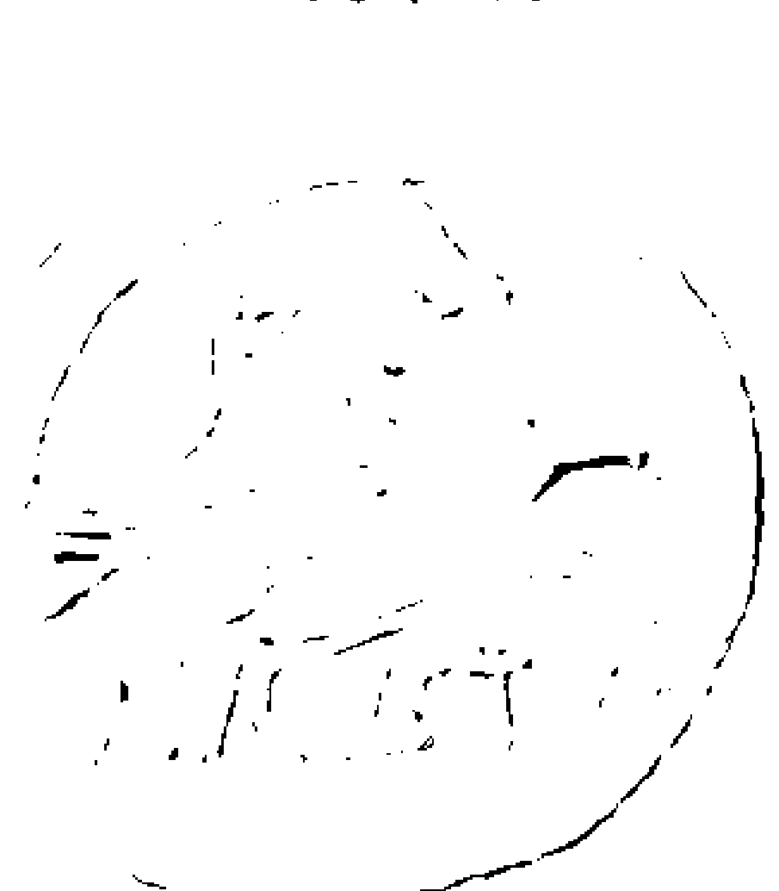

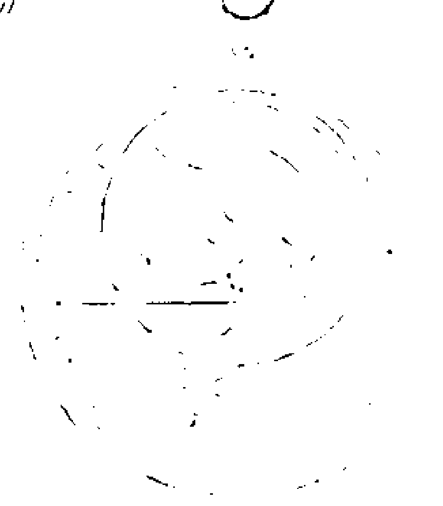

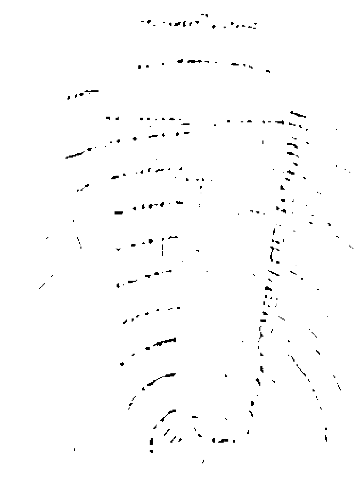

印度星相学通称为“吠陀星相学”，这个名字来源于印度古籍《吠陀经》。公元前三世纪，亚历山大大帝的王国扩展至印度半岛，促进了文化的交流和希腊——美索不达米亚星相学的东传，并彻底影响了印度星相学。印度星相学基于“轮回”的观念，认为出生天宫图反映了一个人前世诸生的因缘模式。在此基础上，一个人需要理解行星力量的暗示，用自己的意志和努力去改变人生。

中国的星相学独树一帜，古代观星只为卜卦战争、灾荒、治乱、王室等国家大事，并没有针对个人的星相学，虽然也采用四柱八字、阴阳五行做人生测算，但是与实际的日月星辰等天象没有关系。

中国古代将星群编组为位于极星附近的“三垣”和位于黄赤道带（合称）上的“二十八宿”，二十八宿又分为“东方苍龙、北方玄武、西方白虎、南方朱雀”四组。古人对于五星的位置、星宿的颜色、客星的出现、日月的交蚀，各有不同的占辞，都与国家有关，这里就不赘述。

公元三世纪至九世纪，中美洲玛雅文明创立了世界最复杂的历法体系，也产生了相应的星相学。在随后的阿兹特克时期，星相学传统依旧传承，直到十六世纪，在鼎盛时期被西班牙征服者有意地破坏，终结了这段两千年的文明。中美洲星相学将“行星相合、日月交蚀”所处的时间段作为参照，而不考虑星座和相位，这与西方星相学对于空间因素的强调不同。

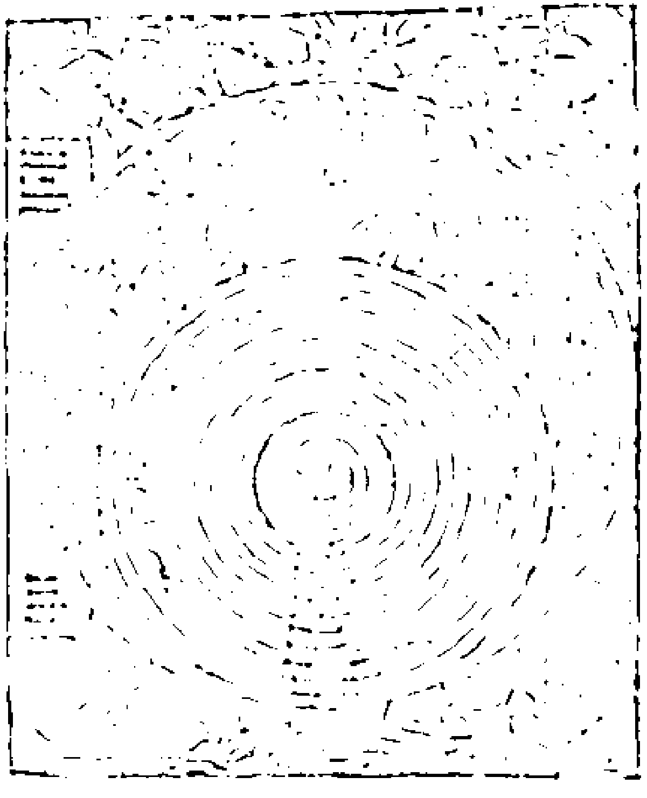

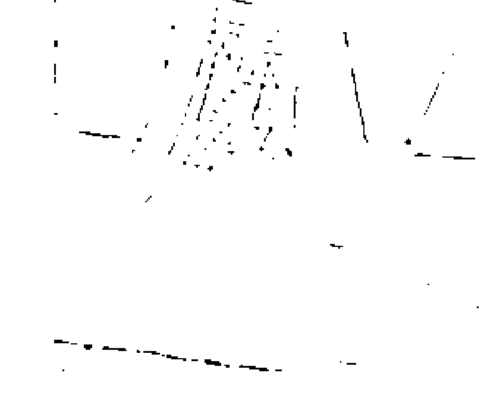

这里的插图所展示的是幸免于西班牙人破坏的、重达25吨的历法石，太阳位于历法石的中心，周围围绕的是‘过去四个时代’的太阳，而人类现在正处在‘第五太阳纪’。据称，当地的民族曾经经历过‘四个时代的太阳’，每个时代都因自然界的剧变而结束。按照玛雅历法，第五个时代始于公元前3114年，终于2012年冬至——在这一天，从地球上看太阳将与银河系暗缝相重合，玛雅文化中银河暗缝代表世界之母，而冬至是太阳重生的日子，因此这一天也是新的创生日。这一万载难逢的现象引人遐想。

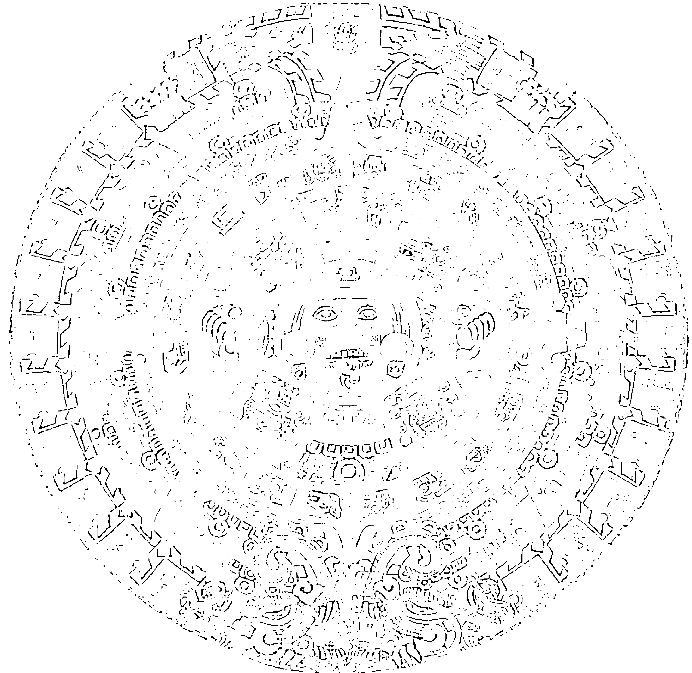

### 天文基础

> 星相学是带到陆地上的天文学，它用于探讨人的问题。
——爱默生

在上一章星相学的历史传承部分，我们已经了解到，自从人类开始将视野投向浩瀚的宇宙起，星相学与天文学一直指的就是同一个事物。伽利略、哥白尼、开普勒、牛顿共同奠定了现代天文学的基础，同时他们也是著名的星相学家，一直到十八世纪，星相学与天文学才分道扬镳。

现代天文学只研究星辰和宇宙的物理结构，认为当两个天体中的一个在另一个附近经过时，它们彼此的运行将会受到干扰。星相学所探讨的远远超过这一领域，它要研究和证实行星及其位置与地球上所发生的事件之间的奥秘关系，正如美国思想家爱默生所说，星相学是带到陆地上的天文学，它用于探讨人的问题。

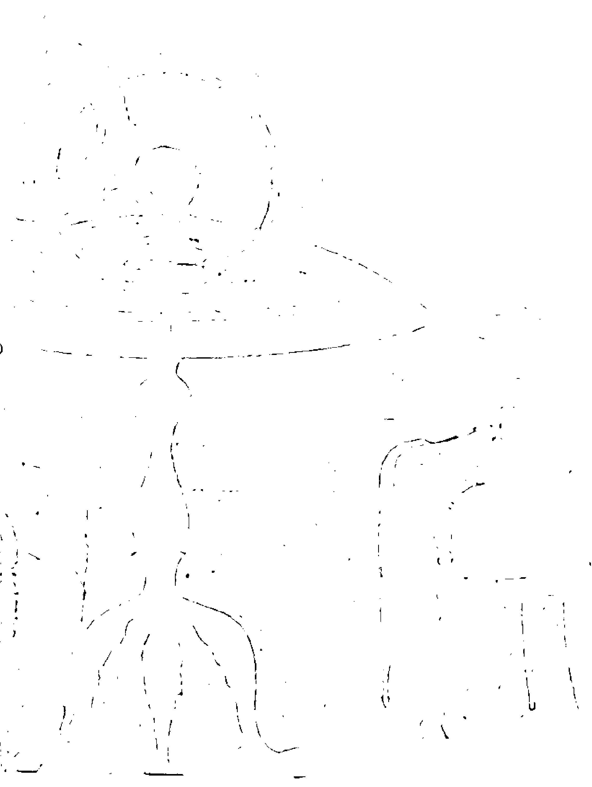

现代星相学只是采用天文学的知识来计算天宫图中那些“符号”的分布，而后便转入优美的天人合一，与宇宙和心灵进行对话，任由天文学数着星星对这些感性的内容感到不能理解。

但是，如果我们对天文学一无所知，便难以理解天体的象征性联系，以及天体所漫游的天空。黄道带、每年的春分、秋分、夏至、冬至，以及我们正在进入的“宝瓶座纪元”——都是天体所组成的这部庞大机器的反映。在这一章，我们一起从天文学的角度来认识一下星相学中的行星和星座，同时将上述这些星相学所涉及到的天文学知识一并做个简单介绍。

太阳是太阳系中围绕它运转的诸行星的起源——行星、连同行星的卫星、小行星以及各类彗星，都是大约46亿年前，太阳从星系中形成时所抛出的聚合残余物质。太阳在太阳系的中心维持着整个体系的稳定运行。

月球是地球的卫星，它对地球的引力与太阳对地球的引力合在一起，导致了地球每日潮汐的产生。月球绕地球的运行周期为27.32天。月球有个最明显的特征，即“月相”——从新月到蛾眉月、上弦月、凸月、变成满月，然后再亏缺成新月，月相的周期为29.5天，略长于它绕地球的运行周期（这是因为，月球必须赶上太阳在每个新月出现之前所运行的视距离）。

太阳以及九大行星按实际大小的比较

水星、金星、火星、木星、土星在中国古代合称“五星”，是古人能够用肉眼观测到的天体。其中，水星和金星的运行轨道小于地球，称为地内行星。

水星的公转周期为88天，由于它的轨道小于地球，因此从地球上观察，它与太阳的间隔最多只有28°，也就是说，在天宫图上，水星与太阳的距离不会超过一个星座。由于它看起来好像总在太阳旁边跑前跑后，因此在希腊（罗马）神话中，水星赫耳摩斯（墨丘里）被称为“神使”。

金星每225.7天绕太阳一周，与太阳的视距离不超过48°，在天宫图上则超不过两个星座。金星自转一周需要243天，这使金星上的一天比一年还要长。金星周围有很浓密的大气层，使它反射太阳光线的能力很强，因而在天空中的亮度仅次于太阳和月亮。

火星每688天绕太阳运行一周。火星上大气稀薄，有96%的二氧化碳以及少量的水气和氧气，最高表面温度可达到摄氏二十多度，因此科学家推测火星上有可能存在某种形式的生命。由于铁的氧化物集中在它的表面，火星呈现出一种独有的红色调。

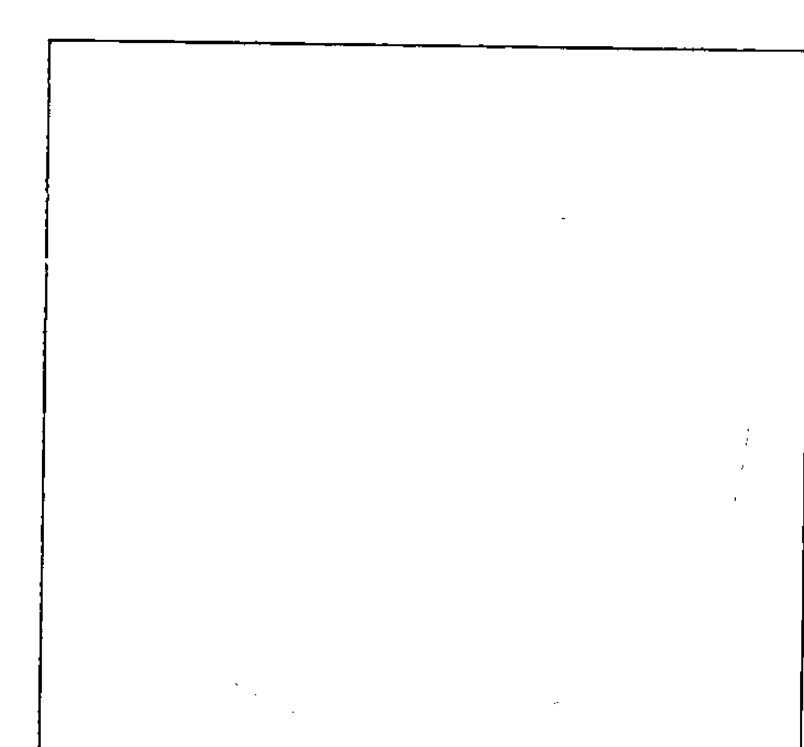

火星和木星之间有一个小行星带，聚集了成千上万颗小行星，包括四大小行星：谷神星、战神星、婚神星、灶神星。其中，谷神星是最大的小行星，直径大概有月亮的1/4。

木星是行星中的“巨人”，直径是地球的11倍。木星的公转周期为11.86年，这意味着它每年大约要经过十二个星座中的一个，如同太阳每个月要经过一个星座一样，因此中国古代称它为“岁星”。

土星的体积仅次于木星，公转周期约为29.42年，拥有一个美丽的光环体系，这些光环由无数沿土星赤道平面运转的小碎块组成。土星的自转速度很快，因此它的形状逐渐变得很扁。古人云“三十而立”，在我们三十岁的时候，土星将回到它在出生天宫图的初始位置，由于土星代表责任，就意味着那个时候我们需要挑起生活的担子。

三大外行星——天王星、海王星、冥王星——属于“现代行星”，是随着天文望远镜的发明而被人类发现的。

天王星的发现源于望远镜的出现。

天王星公转周期为84.01年，是一颗特立独行的行星——在太阳系中，所有行星的自转轴与黄道平面都接近垂直，只有天王星的自转轴几乎与黄道平面平行，因此它差不多是平躺着自转。天王星上的昼夜交替也十分奇特，太阳依次照射北极、赤道、南极、赤道，这使得天王星上大部分地区的每一昼和每一夜都要持续近42年才能变换一次。我们每个人在大约42岁的时候，都要经历天王星的半周期，也就是说，在那个时候，天王星将运行到它在出生天宫图中初始位置的对面，与出生时的位置构成“相冲”相位，天王星代表改变，因此，我们可能会发生一些较大的变化：自我的重新认识、往事的反思、情感的波动等等。

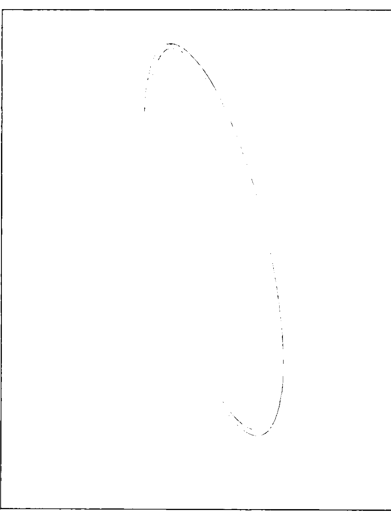

海王星是在发现天王星之后，通过计算而预知的行星，于1846年在预报位置被发现。海王星的公转周期为164.79年。我们在大约41岁的时候，会经历海王星的四分之一周期，即海王星与出生时它所在位置的四分方位，海王星意味着混乱和迷茫，也使人感到疲惫和消沉，会使我们在那个年龄面对人生产生一些困惑。所谓的“中年危机”，与天王星的相冲和海王星的四分方位不无关系。

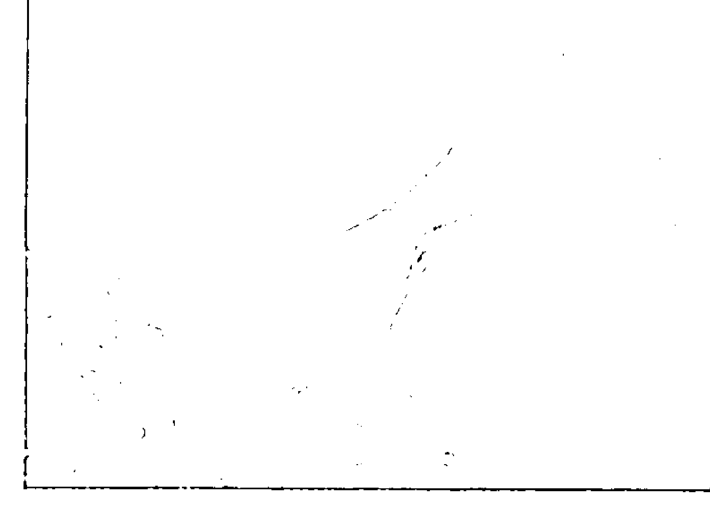

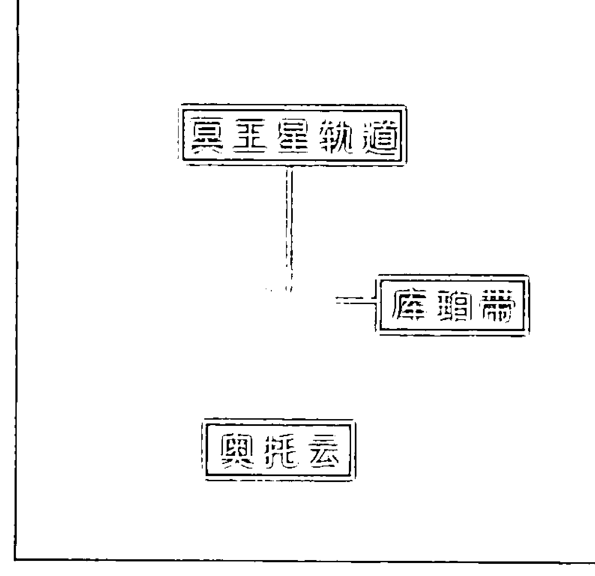

冥王星的公转周期为248年。它是离太阳最远的行星，致使它表面的温度几乎接近零下240摄氏度，令人联想起“冥府”的阴暗寒冷（在希腊神话中，代表冥王星的哈得斯是冥界的统治者）。同时，冥王星也是最小的行星——比月亮还小。体积很小的冥王星却有一颗直径有它一半大的卫星“卡伦”（Charon，卡伦是以罗马神话中的人物命名的，他专门摆渡死者通过冥河来到冥界）。

冥王星之外是碟状的“库珀带”，是短周期（公转周期小于200年）彗星的发源地，包括周期76年的哈雷彗星。1977年发现的“凯龙星”（Chiron），是在土星与天王星之间运行的超大彗星（或小行星），它也来源于库珀带，公转周期是51年。

库珀带的外层是庞大的球状“奥托云”，向外伸展到大约十万个天文单位之远，是亿万个长周期彗星的发源地，这些彗星的轨道完全是无规则分布的，有的要三千万年才能环绕太阳一周。

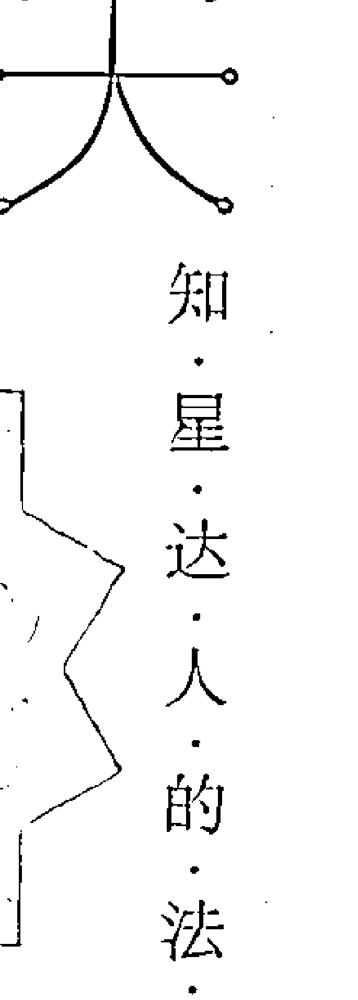

看到这个标题，你也许会纳闷：怎么有两种星座？它们不是同一个概念吗？

这确实是两个不同的概念，恒星星座是天文学意义上的、由恒星组成的星座，而黄道星座是星相学意义上的、象征性的星座。

我们知道，地球所属的太阳系只是浩瀚的银河系中微小的一角，银河系大约有一千多亿颗恒星，这些恒星在短期内除了由地球自转所引起的视运动外，并不会引人注目地改变自己的位置（实际上每颗恒星都以非常缓慢的速度运动着），因此可以把它们在天空中的位置绘成星图，并将恒星群划分为一个个星座，古代的航海家正是以这些恒星和星座来作为辨别方向的主要依据。

公元二世纪时，托勒密绘制了48个星座，到现在，星座的划分已经增加到了88个。从地球上看，这其中有12个星座“位于”黄道带上（事实上，这些星座距离地球比黄道带距离地球更加遥远），这12个恒星星座在黄道大圆上所占据的角度并不相同，也就是说，并非每个星座占据30°。这是天文学意义上的恒星星座。

而星相学意义上的黄道星座，只是按照概念划分的星座。它永远是以春分点为起点，把360°的黄道大圆划分为十二等分，即十二个“黄道星座”，每个星座30°。这十二个黄道星座的名称与位于黄道上的十二个恒星星座的名称相同。星相学按照季节来划分星座，正体现了时间因素的重要性。

可能不少读者都听说过“宝瓶座纪元”这个词，但对另一些读者来说或许还比较陌生。什么是宝瓶座纪元呢？

简单地说，宝瓶座纪元就是指春分点位于恒星星座宝瓶座之内的这段时期。

那么，春分点是什么？春分不是每年的3月21日吗？难道这个时间在空中也有一个标记？难道这个点在十二个星座间穿梭吗？

要详细解释清楚这个概念，我们需要先从“天球”说起。

天球是地球表面向外扩展到足够大的一个虚拟球面，它并不真实存在。这个虚拟的天球也像地球一样，具有“赤道”，我们称它为“天赤道”，它是地球的赤道平面与天球相交的一个大圆。

从地球上看，太阳在天球上的轨迹也是一个固定的大圆，即“黄道”。穿过黄道中心并与黄道相垂直的线为“黄极”。

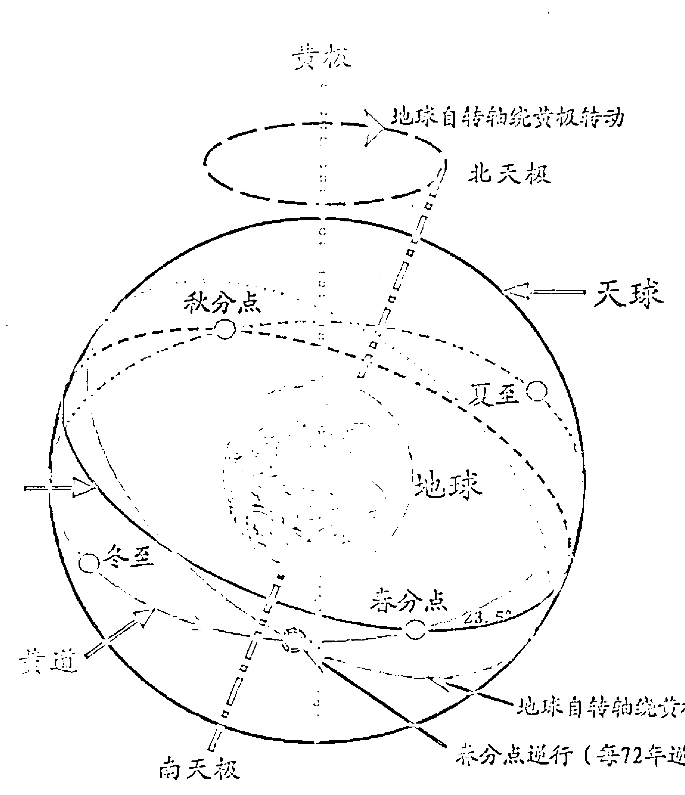

由于地球自转轴与黄极构成了23.5°的倾角，因此，天赤道与黄道之间也有一个23.5°的交角，交于“春分点”和“秋分点”，而黄道上距离天赤道最远的两点分别是“夏至点”和“冬至点”。以这四个点为起始的四个星座就是我们第一章说到的主导星座，即白羊座、巨蟹座、天秤座、摩羯座。

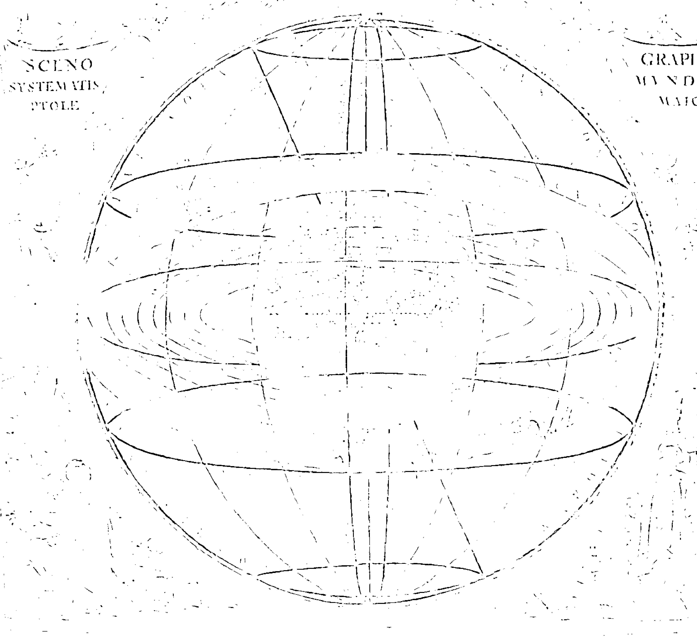

这是一幅以地球为中心的宇宙平面图，这幅图可以帮助我们理解“天球”和按照季节划分的“黄道十二星座”的概念。图中央的球体是地球，外圈白色的虚拟球面是天球，太阳、月亮以及其他行星在天球上的投影集中在“黄道带”上，黄道带被等分为十二份，即黄道十二星座。

地球在日复一日的自转过程中，地球赤道线上的地区由于运动速度最快，而向外隆起21.5公里，太阳和月亮的引力对这一隆起部分形成“拉动”，使地球的自转轴像陀螺一样缓慢摇摆，每25800年在黄极周围划出一个完整的圆。

地球自转轴的摆动导致天赤道与黄道交点的移动，也就是春分点的移动。使春分点缓慢逆行通过黄道带上的十二个恒星星座，在每个星座停留大约两千多年，称为一个“纪元”。例如“双鱼座纪元”、“宝瓶座纪元”，等等。

由于十二个恒星星座在黄道带上所占据的角度不等，并且它们之间也没有准确的分界线，因此，从一个纪元到另一个纪元会有较长一段时间的过渡。过去两千年，春分点位于恒星星座双鱼座之内，现在正在进入或即将进入恒星星座宝瓶座。

在星相学里，每个周期都有相应的恒星星座的特征。

双鱼座周期表现出双鱼座的牺牲精神和对灵性升华的追求。宝瓶座周期是体现智慧、个性、信息传播的星座。在宝瓶座周期，人类将趋向知性的进步、开放的思维、生活的改变和广泛的沟通，人们不再盲从于教条，而是更加尊重自己的选择权利，致力于提升自己的灵魂。互联网和移动通信已经普及，正深刻地改变着人们的生产和生活方式，体现着宝瓶座周期的特点。

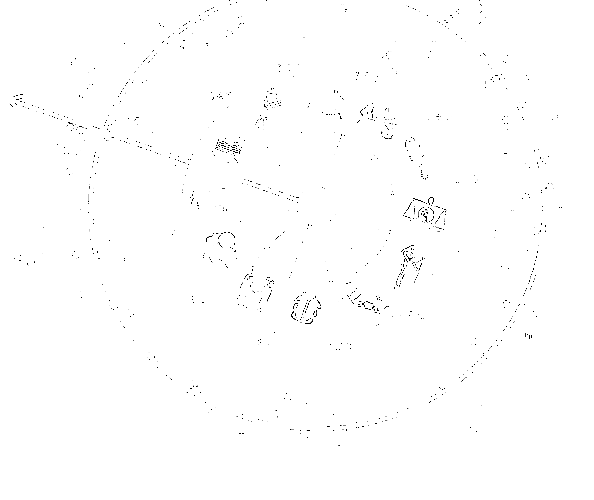

上层：意料、意气、意欲等心智活动都包括在内，对灵性境界的追求。中层：物质生活和物质享受的欲望。下层：原始的本能，如求生欲、性欲等。这是三重性的体现，其中上层的心智活动包括理性思考、直觉、灵感等，中层的物质欲望包括对财富、权力、地位等的追求，下层的原始本能包括生存、繁衍等基本需求。这是人类心理和精神层面的三个层次，体现了从原始到高级的发展过程。

### 符号奥秘

这一章，我专门为读者介绍天宫图中的各种符号。因为星相学采用的是一种符号语言，不同的行星、星座、相位等都有各自的符号，熟悉这些符号是解读天宫图的必需步骤。乍看之下这些符号都比较古怪，但是下面的解释会让你豁然开朗。

#### 行星的符号

行星的符号由三种图形组成：圆形，新月形，十字形（或者矩形）。圆形代表精神，新月形代表意识，而十字形代表物质，也可以说，圆形、新月形和十字形分别代表一个人的“灵、魂、体”三个部分。

在不同的传统文化里，圆形经常会与天、无限、永恒等概念相关联。

新月形像一个器皿，象征接受和容纳。因为意识是对自然的反映，是可变的，就像月光来自于太阳，而月亮也永远在改变着自己的外形。

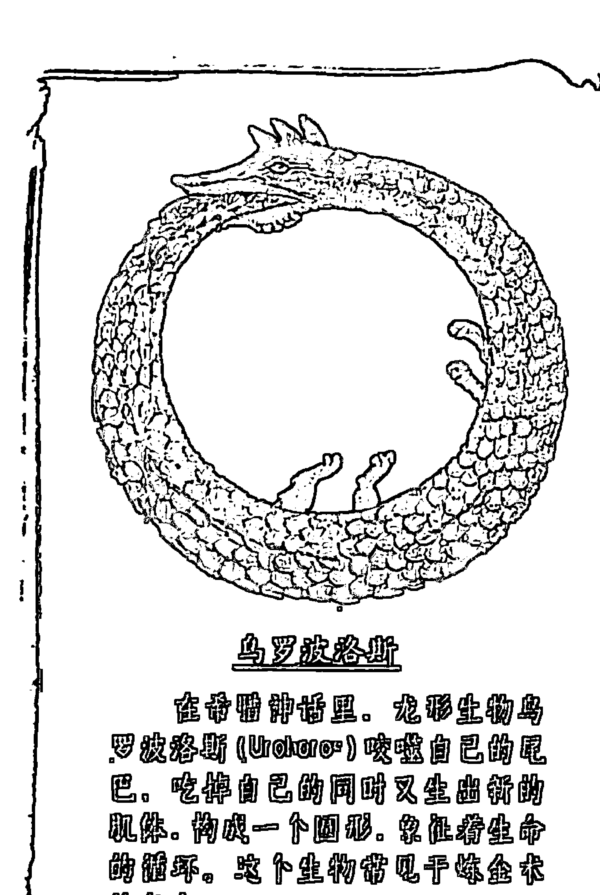

十字形代表物质，与物质世界由火、水、土、气四大元素组成的概念有关。

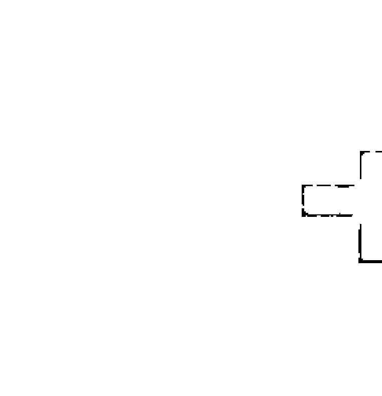

太阳的符号包括一个代表心灵和无限的圆形，以及一个代表创造之源的点。

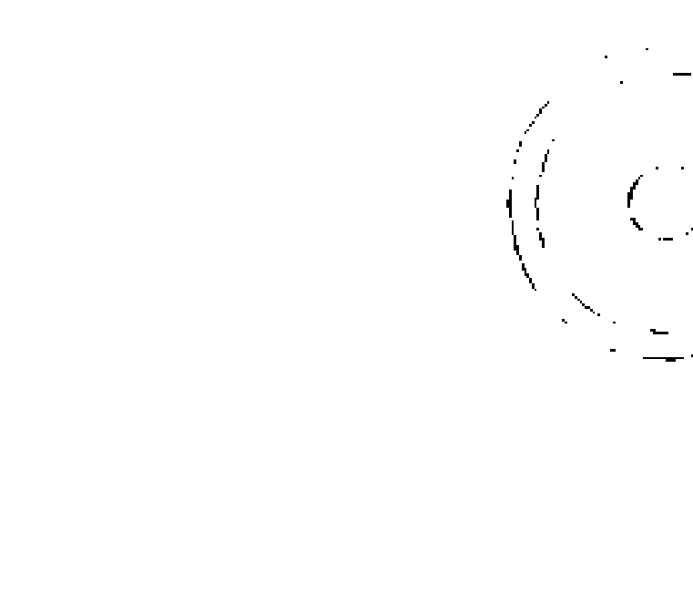

地球的符号是一个圆形里面包含着一个十字形，意味着地球不只是一块土，而是灵性的物化。在一般的天宫图里并没有地球的符号，只用于以太阳为中心的一种特殊的天宫图。

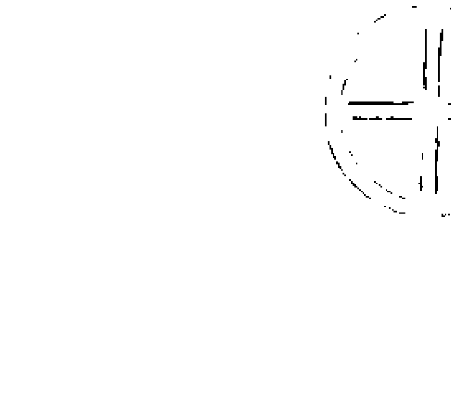

月亮的符号很直观，就是代表意识的新月。

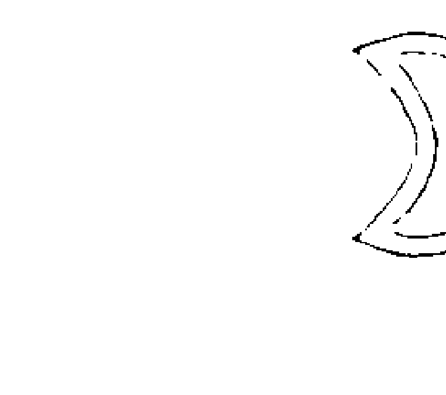

金星的符号中，圆形在十字形之上，代表精神超越物质，与金星所强调的爱、和谐、灵感相吻合。

火星的符号与金星相反，十字形在圆形之上，代表物质超越精神；正如金星象征着朝向精神层面的上升，而火星象征着下降到物质层面。

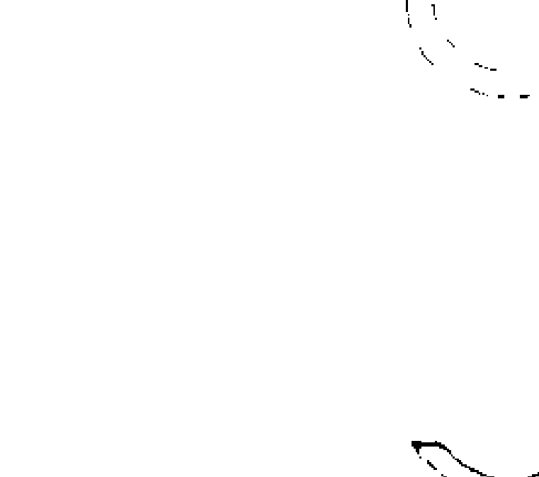

水星与金星符号相似，这两颗星都比地球离太阳近，象征着与精神力量更紧密的关系。符号上方的新月形，同时又代表水星之神赫耳墨斯头盔上的小翅。

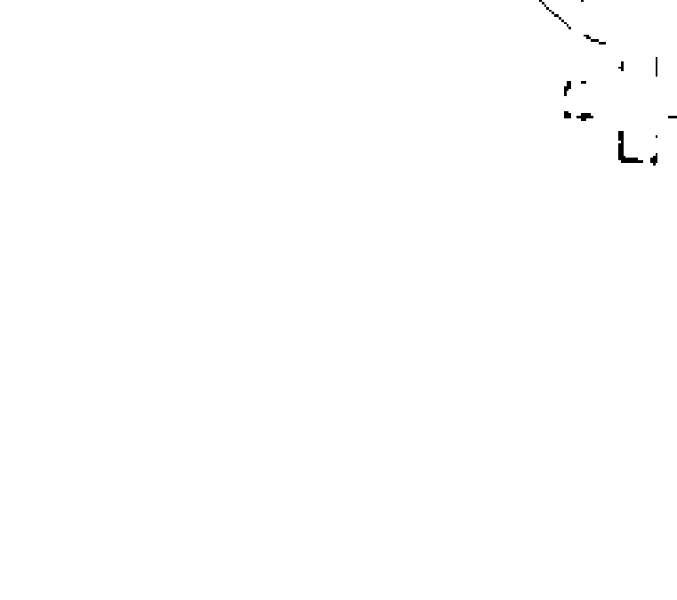

天王星符号的构成单元与水星相似，这暗示着两个行星的含义有许多相似之处，但天王星则更高一个层次，在第一章我们已经了解到，天王星是水星的升华形式。但是，在天王星的符号里，包含两个新月形，意味着意识被物质所分开，代表着改变。

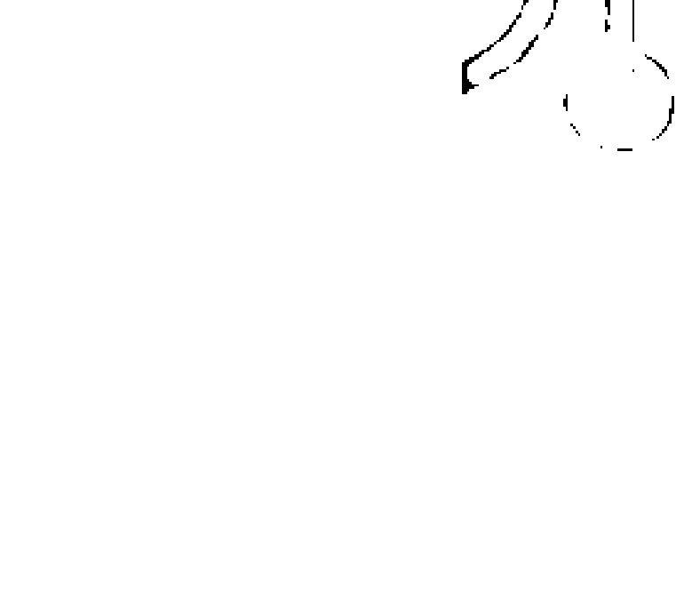

木星和土星的符号都包含一个新月形和一个十字形，代表着意识和物质的相互关系。

对于木星，新月形在十字形之上，也就是说意识在物质之上，暗示一种乐观、积极的人生态度，对物质现实的超脱。

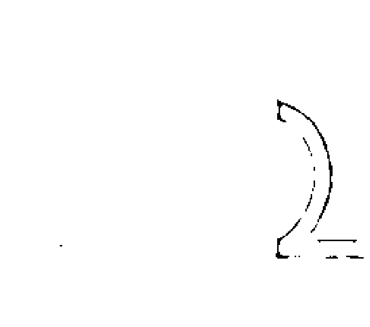

对于土星，二者处于相反位置，暗示一种悲观、压抑的人生态度，被物质现实所左右。这个新月形带一个把手，是镰刀的形状，代表收割。很多关于土星之神克罗纳斯的绘画中，都有这把镰刀。

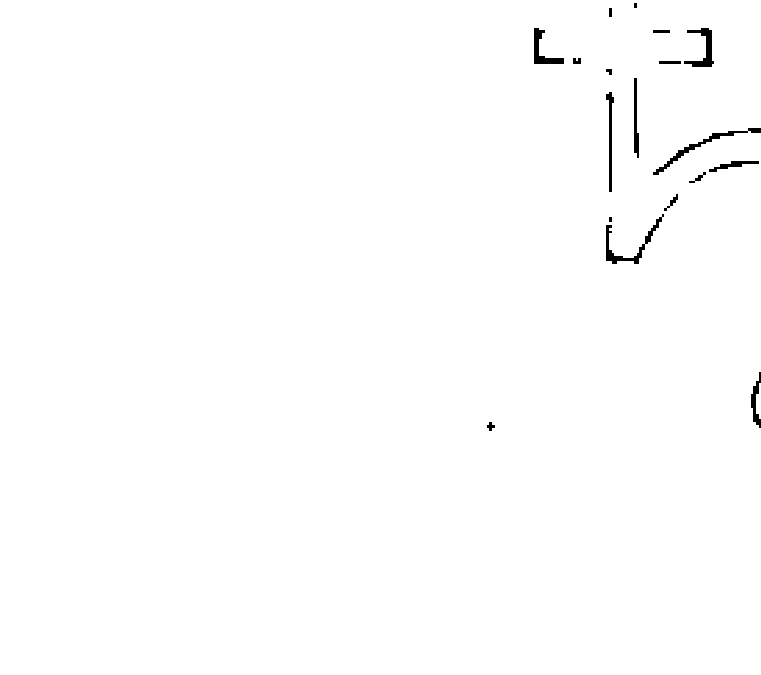

海王星的符号包含一个大的新月形和一个十字形，代表敏感和灵感。同时，意识被物质切入，代表对于现实情况的牺牲。这个符号也可看做是希腊神话中，代表海王星的海神波塞冬的三叉戟。

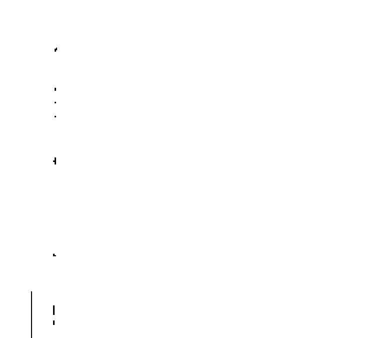

冥王星的传统符号中的小圆，一半在新月形之内，一半在外面，这象征着死亡与重生，以及物质的变化。冥王星现代的符号是“P”和“L”两个字母的叠加，是其发现者姓名的首字母。

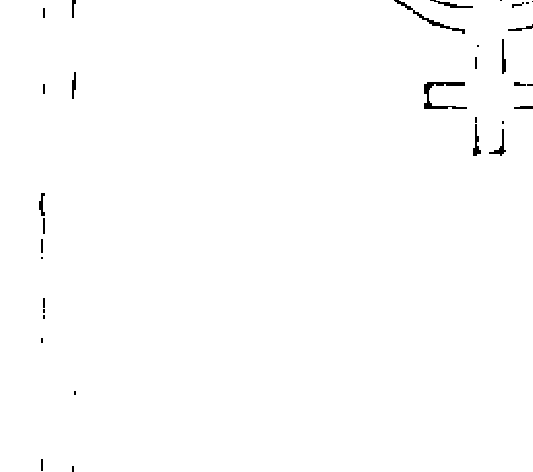

白道升交点（月亮的节点，有关内容见第七章）的符号，是打开的圆形，象征着与精神之光的隔断。白道交点在星相学中与因缘轮回有关。白道降交点与白道升交点相隔180°。

星座的符号主要是图画式的，但也可体现出星座的某些典型属性。

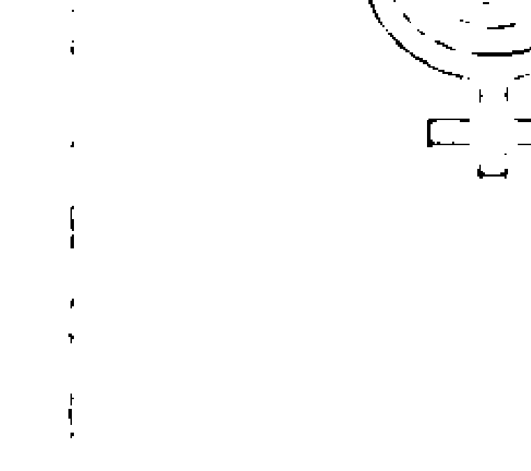

白羊座的符号是羊头的象形，也表现出勇往直前的性格。

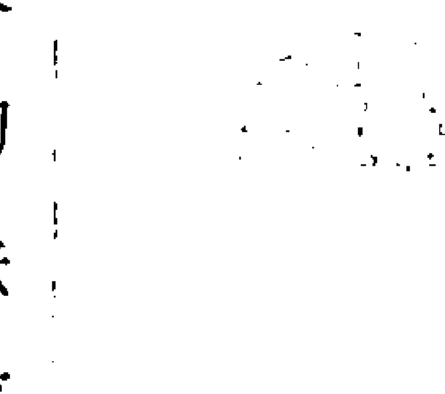

金牛座的符号是牛头的象形。

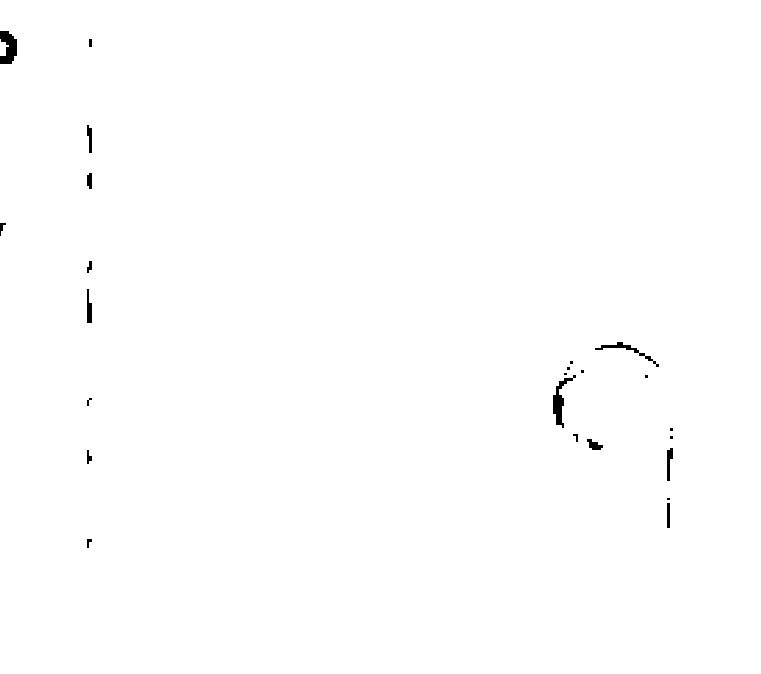

双子座的符号象征双胞胎，暗示内在的双重性。

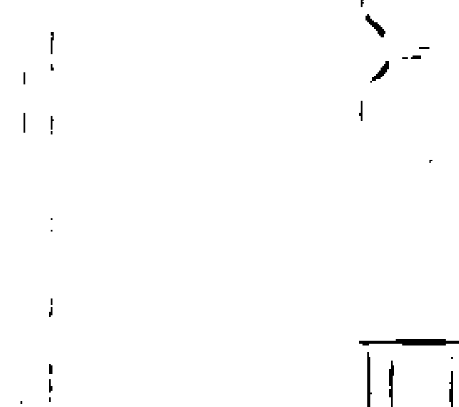

巨蟹座的符号象征胸，暗示它和胸部的关系，或者说象征螃蟹的甲壳，暗示一种自我保护意识。

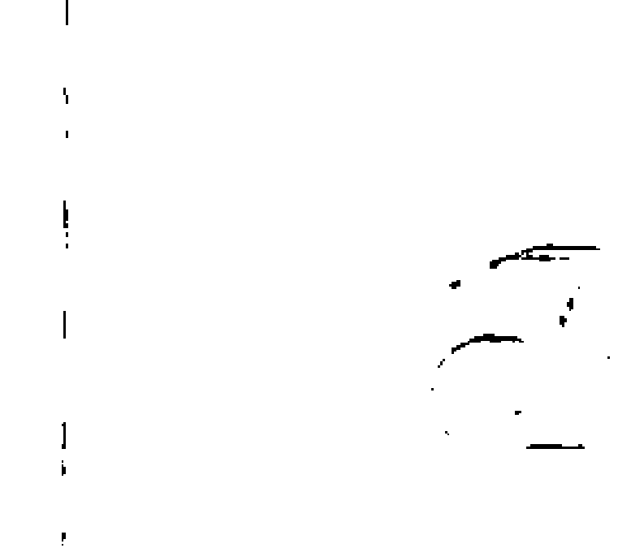

狮子座的符号是高高翘起的尾巴的象形，显示狮子的王者之风。

室女座和天蝎座的符号有些相似，是女性生殖器的抽象，也代表谨慎、内敛和羞怯。

天秤座的符号就是一杆秤，象征着追求公正和平衡。

天蝎座的符号是男性生殖器的抽象，也可以看做是蝎子的尾巴，表现出欲望或复仇。

人马座的符号，象征射手的箭，引申为目标、对更高境界的追求。

摩羯座的符号是羊头和鱼尾的组合，与希腊神话中摩羯座的故事有关。

宝瓶座的符号即是水的波纹，是智慧的源泉。

双鱼座的符号象征用丝带绑在一起的两条背向的鱼，暗示其矛盾和逃避。

在天宫图上，行星之间的相位也有独特的符号体系，如图所示。

| 角度 | 符号 |
| :--- | :--- |
| 0° | ☌ (合相) |
| 30° | ⚺ (半六合) |
| 45° | ⚻ (八分相/半刑) |
| 60° | ⚹ (六合) |
| 72° | ✶ (五分相) |
| 90° | □ (刑/四分相) |
| 120° | △ (三分相/拱) |
| 135° | ▢ (八分相) |
| 144° | ✹ (倍五分相) |
| 150° | ⚻ (梅花形/十二分相) |
| 180° | ☍ (冲/对相) |

除了以上这些符号，小行星、彗星、甚至假想行星等也都有各自的符号，但是这些符号的构造都没有采用行星的惯例，这里就不赘述。

# 第二部分 星辰

## 神话原型

行星与神话人物对照表

| 星体 | 希腊名称中文 | 希腊名称英文 | 罗马名称中文 | 罗马名称英文 |
| :--- | :--- | :--- | :--- | :--- |
| 太阳 | 阿波罗 | Apollo |  |  |
| 月亮 | 阿尔忒弥斯 | Artemis | 戴安娜 | Diana |
| 水星 | 赫耳墨斯 | Hermes | 墨丘利 | Mercury |
| 金星 | 阿芙洛狄特 | Aphrodite | 维纳斯 | Venus |
| 火星 | 阿瑞斯 | Ares | 玛尔斯 | Mars |
| 木星 | 宙斯 | Zeus | 朱庇特 | Jupiter |
| 土星 | 克罗诺斯 | Cronus | 萨图恩 | Saturn |
| 天王星 | 乌拉诺斯 | Uranus |  |  |
| 海王星 | 波塞冬 | Poseidon | 涅普顿 | Neptune |
| 冥王星 | 哈得斯 | Hades | 普鲁托 | Pluto |
| 谷神星 | 德墨忒尔 | Demeter | 色列斯 | Ceres |
| 婚神星 | 赫拉 | Hera | 朱诺 | Juno |
| 智神星 | 雅典娜 | Athena | 密涅瓦 | Minerva |
| 灶神星 | 赫斯提亚 | Hestia | 维斯塔 | Vesta |
| 凯龙星 | 凯龙 | Chiron |  |  |
| 爱神星 | 厄洛斯 | Eros | 丘比特 | Cupid |

星相学所研究的太阳系天体，除了太阳和月亮，都是以罗马神话中的人物命名的，甚至“现代行星”天王星、海王星和冥王星也遵循了以罗马神话人物命名的传统，希腊-罗马神话（罗马神话在主题内容方面与希腊神话如出一辙，只是神祇的名称不同）赋予了这些天体丰富的象征性含义，我们已经了解到，在希腊化时期，星相学正是从希腊神话中吸收了大量信息。不过，星相学中天王星的象征含义，与它的神话原型天父乌拉诺斯的特征和事迹基本无关，但是对于海王星和冥王星，依然可以看到它们的星相学含义与神话原型的神秘对应。

神话故事与神话人物的象征主义引发了现代学者的种种解释：启蒙运动中的理性主义者将他们的目光从神话中移开，认为这是蒙昧的古人对自然界错误认识的一种超常发挥；历史学家将神话与人类历史联系起来，认为神话反映了人类先以巫术，后以神灵和宗教来掌握大自然的斗争；社会学家认为神话揭示了社会和文化的内在结构；浪漫主义者则认为神话是人类精神理想的表达，是人类的直觉和想像力对宇宙的感知；而在心理学家荣格看来，神话赋予天体的象征性含义，是“集体潜意识”的残留物。

无论现代人怎么理解，在古人原始的认知中，整个宇宙是有灵性的，人的灵性与宇宙的灵性之间没有分界线，于是，在人类的情感和个性与宇宙的对应中，产生了神话创作。

在“星辰”这一丰硕领域，我们将以希腊神话故事拉开序幕，看看代表不同星辰的神灵都有哪些有趣的故事和鲜明的特征。

起初，一切都是黑暗的混沌。自从有了昼夜，大地女神盖亚（Gaea）出现了。接着，盖亚独自创生了与她同样高贵的天空之神乌拉诺斯（Uranus）。乌拉诺斯成为盖亚的伴侣包围在她四周，他们一起创生了三个独眼神、三个百手怪和十二个泰坦巨神。天王星即由天父乌拉诺斯得名。

但是乌拉诺斯却不喜欢三个百手怪，把他们锁在了地底的“塔塔鲁斯”（即冥府）。盖亚对此感到气愤，她做了一把石镰，让其他的孩子去攻击乌拉诺斯，孩子们都不敢，只有年轻的泰坦巨神克罗诺斯（Cronus，即星相学中的土星）挺身而出，趁乌拉诺斯睡觉的时候用镰刀将他去势。他把割下的性器丢到了海里，在海水的泡沫里诞生了阿芙洛狄特（Aphrodite，星相学中的金星），也就是爱与美之神，我们更熟悉她的罗马名字“维纳斯”（Venus）。

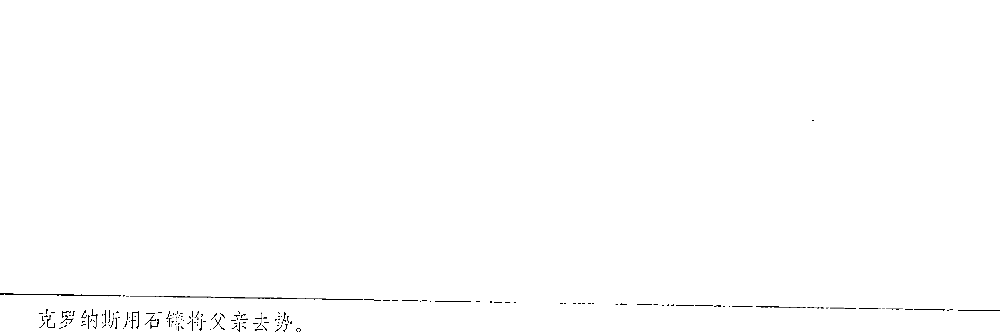

克罗诺斯推翻父亲，成为新的统治者。他把独眼神也和百手怪一起囚禁在塔塔鲁斯，然后与妹妹瑞亚（泰坦巨神）结婚，生了六个孩子，即波塞冬（海王星）、哈得斯（冥王星）、宙斯（木星）、赫拉（婚神星）、德墨忒尔（谷神星）和赫斯提亚（灶神星）。

但是，克罗诺斯一直担忧自己的地位也被孩子推翻，为避免这一情况的出现，孩子一出生克罗诺斯就把他整个吞下去。如此这般吞掉了五个孩子，瑞亚非常愤怒，等到第六个孩子宙斯（Zeus）出生以后，她偷偷把孩子带到克里特岛（希腊的一个岛屿），用襁褓包了一块石头交给克罗诺斯，骗他吞进肚里。

宙斯在克里特岛上长大，年轻俊美。瑞亚说服克罗诺斯接受了他的孩子，宙斯回到奥林匹斯山，为克罗诺斯盛酒。宙斯偷偷给克罗诺斯饮了特制的药剂，使他把五个孩子都吐了出来。

为了保卫权利，克罗诺斯和泰坦神族一起与宙斯兄弟姊妹激战。宙斯把独眼神和百手怪从地底解救出来，而泰坦神族的普罗米修斯也加入了宙斯的阵营，在他们的帮助下，宙斯与兄弟姊妹一起战胜了父亲和泰坦巨神族，众神于是拥戴宙斯为王。宙斯与两个兄弟分管世界：宙斯掌管天界，波塞冬（Poseidon）掌管海洋，哈得斯（Hades）掌管冥界。

在希腊神话世界里，地球是扁圆形的，正中点是众神居住的奥林匹斯山。奥林匹斯山有十二位主神，除了宙斯之外，分别是姐姐天后赫拉（Hera）、农神德墨忒尔（Demeter）和灶神赫斯提亚（Hestia），哥哥海神波塞冬，爱与美之神阿芙洛狄特，以及宙斯的几个儿女：与女神墨提斯所生的智慧女神雅典娜（Athena），与黑暗女神勒托所生的孪生兄妹日神阿波罗（Apollo）和月神阿尔忒弥斯（Artemis），与赫拉所生的儿子战神阿瑞斯（Ares）和火神赫淮斯托斯（Hephaestus），以及与女神迈亚所生的神使赫耳墨斯（Hermes）。

这十二位主神，除了火神赫淮斯托斯，其余十一位所代表的星体，都是我们星相学中要研究的太阳系行星。

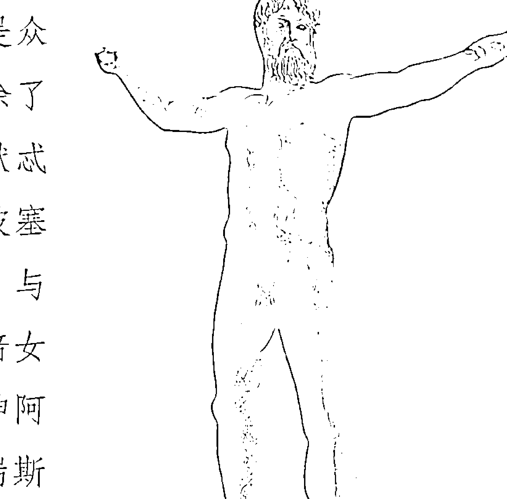

如前面所述，土星和木星的神话原型分别是克罗努斯和宙斯。

在星相学中，土星代表时间——正如“Chronus”的字面意思，克罗努斯吞掉自己的孩子，正如时间的创造也可以被时间所吞噬、所磨灭；土星也代表限制、恐惧，以及“老人、耽搁、迟滞”等与时间的限制有关的概念；在传统星相学里，克罗努斯的冷漠与残酷也与土星所象征的“刻毒的事物、灾难、厄运”相对应。

而宙斯作为众神之王在神话中所具有的崇高地位，与木星在星相学中所代表的“仁慈、公正、发展、法律、智慧”等含义也保持一致。

从神话故事中我们看到，土星与木星根本的特性分别是限制和扩张的对比、悲观与乐观的对比。

代表水星的赫耳墨斯是神的信使，他头戴有翅的金帽，是智力和口才的掌管者，也主宰穿越边界的行为——包括旅行、商业、贸易、沟通、传信，甚至包括偷盗。赫耳墨斯也把亡灵引到冥河，再由卡伦摆渡带到冥界。

赫耳墨斯早晨降生，中午发明了七弦小竖琴，晚上就从太阳神阿波罗那里偷了一群小母牛，为了掩饰牛群的足迹，足智多谋的他将牛群赶下山岭后又赶着它们原路返回，还将足迹抹去。阿波罗发现后大为恼火，找到他准备算账，但是却迷上了他的小竖琴，决定用牛群与他交换。于是赫耳墨斯去放牛，又给自己做了一个牧笛，阿波罗看到后又想要，就把自己放牛用的金手杖拿来跟他交换，从此，这个带翅权杖一直伴随着赫耳墨斯。

赫耳墨斯的带翅权杖被广泛应用于水星所主宰的商业、邮政、使节和医药领域，如中国海关的关徽就是由这个权杖和一把代表国门的金钥匙组成。但在医药行业，如今已多被医药神阿斯克勒庇俄斯（阿波罗之子，曾跟从父亲和凯龙学习医学技艺，他的象征物是一条蛇）的单蛇权杖所取代，如世界卫生组织的标志。

水星以赫耳墨斯的罗马名字墨丘利（Mercury）命名，代表思维、智力、商业和沟通等。

左边是赫耳墨斯的双蛇带翅权杖，右边是世界卫生组织的徽标（中间用阿斯克勒庇俄斯的“单蛇”）取代了赫耳墨斯的“双蛇”。

星相学中，太阳与月亮的神话原型是太阳神阿波罗和月神阿尔忒弥斯，他们是女神勒托为宙斯诱惑而怀孕，被嫉妒的赫拉追到天涯海角，最后在爱琴海的小岛上生下的孪生姊弟。

太阳神阿波罗是希腊神话中最多才多艺的神，他形貌俊美，通晓世事，精通箭术与琴艺，弹奏着从赫耳墨斯那里换来的七弦琴，手持弓箭，架着黄金战车在天空中飞驰，为人类带来白昼的光明。是光明、预言与智慧之神、弓箭之神，也是音乐与艺术灵感的保护神。此外，阿波罗还向人们传授医术，因而也是治疗之神。

### 太阳神阿波罗

阿波罗是希腊神话中最英俊的神，也是男性美的典型。他驾驶着火神赫淮斯托斯为他打造的战车出行，为人类带来了日出日落。

月亮女神阿尔忒弥斯很喜欢狩猎，她身上佩戴着纯银的弓箭，高兴的时候会去山林中追逐野兽，并与林中仙子跳舞，因而也是狩猎女神。阿尔忒弥斯永远是处女，她对感情的态度是非常严肃的，她惩罚那些失贞的人，并且为那些将要生育的妇女减轻痛苦。有一位美丽的少女因为喜爱狩猎，也加入她的打猎队伍中，阿尔忒弥斯要求这位少女保持女儿身，一天，当少女在林中休息时，被化身为阿尔忒弥斯的宙斯接近，随后将她诱惑而怀孕，阿尔忒弥斯发现后非常生气，遂将她扫地出门。

在星相学里，太阳代表意志、尊严、父亲、白天；而月亮代表情感、心灵、母亲、夜晚等。此外，月亮也象征着深深埋藏的潜意识王国，与太阳象征的光明的自我意识相对。

代表金星的阿芙洛狄特美艳动人而又浪漫无比，她掌管人类爱情、性爱、生育，以及一切动植物的生长繁殖，是爱、美、享乐的象征。

阿芙洛狄特是火神赫淮斯托斯的妻子，赫淮斯托斯容貌丑陋，身有残疾，并且不解风情，终日在火山底下冶炼钢铁，为众神制造兵器，阿芙洛狄特饱受冷落。她真正爱的是战神阿瑞斯，与之频频私会，终被赫淮斯托斯发现，两人被他用一张看不见的网捉住，从此成了奥林匹斯众神们的笑柄。阿芙洛狄特还与其他很多的神和人有过情事，有关她的神话故事多强调了爱情和欲望的主题，但也表现了她自己作为爱情的牺牲品而倍受折磨。

身披铠甲的战神阿瑞斯具有战争引领者的恶名，他形象英俊、勇猛好斗，是力量与权力的象征，但同时心性残忍且具有破坏力，也是人类灾祸的化身，几乎被所有的神所嫌恶。

为了让战争延长，阿瑞斯不惜改变自己的立场，在“特洛伊之战”中，阿瑞斯答应雅典娜和赫拉站在她们的一边保护希腊人，但是却自食其言，去帮助阿芙洛狄特保护特洛伊人，被隐身的雅典娜所刺伤，阿瑞斯痛楚地发出嘹亮的嚎叫，找到父亲并指着伤口给他看，宙斯训斥他道：

> “别再抱怨了，我的儿子，在所有奥林匹斯的神明中，你是我最讨厌的一个。争吵、战争和搏杀永远是你心驰神往的事情。”

阿瑞斯的好斗由此可见一斑。

阿瑞斯喜好战争多是为了自己的利益，对争斗的意义并不多做思量。火星以他的罗马名字玛尔斯（Mars）命名，他所主宰的白羊座（Aries），即得名于阿瑞斯。

金星和火星在星相学上是一对关联密切的行星，反映着女性与男性、合作和斗争、情与性的对比。

海神波塞冬是自然力的象征，是海洋、淡水、地震、马匹之神。

波塞冬脾气暴躁，常因小事反复无常，飓风和地震是他暴怒的表现，他通常被描绘为手持三叉戟、脚蹬贝壳、驾驭着海马的虬髯公。波塞冬与宙斯一样也有很多外遇，包括他的妹妹德墨忒尔，为躲避他，德墨忒尔化身为马，而波塞冬也变成马抓住了她。

波塞冬在星相学中象征着海王星。海王星的含义之一就是混乱、迷茫、反常。

代表冥王星的哈得斯是冥界的统治者，战败的克罗努斯和泰坦族，就是被关押在他掌管的地底的塔塔鲁斯，哈得斯同时也是财富之神，掌管地下埋藏的宝藏。

哈得斯很少到上界出行，在一次出行中，他劫走了正在草地上玩耍的他的侄女——姐姐农神德墨忒尔的女儿珀耳塞福涅，把她带回冥府做王后。

冥王星在星相学中象征充满罪过与邪恶的冥界，代表阴暗、隐秘、死亡，同时也代表财富，此外，它也代表深度潜意识（仍与“地下”有关）。

智慧而善良的凯龙（Chiron）也是克罗努斯的孩子，是克罗努斯变做马与海洋女神菲吕拉（Philyra）所生，外形是丑陋的半人半马，被父母所嫌弃，但是他与残暴、嗜酒的人马族（见后）有本质的区别。凯龙曾师从阿波罗和阿尔忒弥斯学习音乐、医学、星相、占卜，后来成为很多英雄的老师（包括希腊英雄赫拉克勒斯），是草药、替代疗法、通灵、预测之术的主宰。阿波罗的儿子——医药神阿斯克勒庇俄斯就是从凯龙那里学到了用药之术。

人马族曾经为了一坛酒与赫拉克勒斯混战，战败的人马族找到凯龙寻求庇护，赫拉克勒斯追到以后，不小心用毒箭误伤了混在人马族中的凯龙，凯龙疼痛不堪但是无法治愈，因此到宙斯那里请求替当时在高加索山上受难的普罗米修斯（见后）一死，凯龙死后，宙斯遂在天上用人马座纪念他。

凯龙在星相学中象征着凯龙星（在土星与天王星轨道之间运行的一颗小行星）。如同凯龙的神话故事一样，凯龙星与教育有关，同时也代表早期的受伤和日后的修复、超脱。

普罗米修斯是泰坦巨神，他与智慧女神雅典娜共同创造了人类，并违抗宙斯的命令从天庭给人类偷来了火种，还教给他们文字、医药、航行、采矿等知识。为了保护人类，他在“人类宰杀牲畜献祭”之事上与宙斯耍了个花样，宙斯暴怒，决定给予普罗米修斯重罚，下令用锁链把他绑在世界尽头的高山之巅。在白天，普罗米修斯不得不任凭一只巨鹰啄食他的肝脏，而到夜晚，他的肝脏又会奇迹般地长出来。直到巨鹰被赫拉克勒斯射杀，而后由凯龙来代替他一死。

人马族是希腊神话中一种半人半马的怪物。是粗野、残暴、酗酒的一族。

谷神星、智神星、婚神星和灶神星是人类最先发现的四颗小行星，也是至今为止发现的最大的四颗小行星。它们在神话中的原型是奥林匹斯山的四位女神，这四颗小行星在星相学里也都与女性有关。

婚神星也就是天后赫拉，是掌管婚姻的女神。赫拉生性善妒，她的许多时间都花在了“吃醋”上。由于宙斯的情事与子嗣众多，她对此充满忌恨，并对他的情人和子女进行报复。跟从阿尔忒弥斯狩猎的那位美丽的少女被宙斯诱奸后，又被阿尔忒弥斯赶走，不幸的她还受到了赫拉的百般诅咒：赫拉彻底隐去她那迷人的美貌，将她变成一头熊。

婚神星在星相学中代表婚姻、配偶，也代表虐待以及两性关系中的权力争夺。

谷神星是宙斯的姐姐、农神德墨忒尔。她掌管农业，给予大地生机，并指导人类耕种。

她的女儿珀耳塞福涅被哈得斯抢到冥界，为了寻找女儿，德墨忒尔走遍四方，在盛怒之下威胁众神，除非她的女儿被送回，否则她将收回她的丰产能力，令大地寸草不生，宙斯于是命令哈得斯把珀耳塞福涅还回来，但是已经不可能了，因为珀耳塞福涅已经无意中吃了冥府的石榴籽，从此把自己拴在了地下，所以一年中只能有半年时间（每年的春季与夏季）与母亲重逢，这时大地枝繁叶茂，其余半年在冥界与哈得斯一起生活，而大地则荒芜。

谷神星在星相学中代表怀孕、生殖，食物、家庭和养育，是除月亮以外另一个象征母亲的星。

灶神星是宙斯的姐姐赫斯提亚，她在奥林匹斯山看守圣火，从来不离家，也永远不参加争斗，她拒绝了所有的追求者，永远保持处女之身。赫斯提亚是房屋、祭坛、建筑的守护神。

在星相学中，灶神星代表温暖的家、专注、服务、独居与寂寞。

智神星是智慧女神雅典娜，是宙斯与聪慧女神墨提斯所生，因为有个预言说，墨提斯所生的孩子将会成为世界的主宰，宙斯担心失去权力，于是在墨提斯怀孕的时候把她整个吞入腹中，到了孩子出生的时刻，宙斯头痛不止，忍无可忍之下，叫火神赫淮斯托斯用斧子把他的头劈开，结果，全副铠甲的雅典娜从里面跳了出来。

雅典娜善于运用智慧解决问题。在希腊神话中，英雄珀耳修斯为了保护母亲，许诺取下蛇发女妖梅杜萨的头颅（梅杜萨的头上缠绕着数条可怕的毒蛇，她看谁一眼，谁就会变成石头），雅典娜为珀耳修斯的誓言所感动，决定指导他，她教给珀耳修斯借用她闪亮的盾牌来反射蛇发女妖那使人石化的目光，使他得以用剑砍下女妖的头颅。雅典娜也是雅典城的守护神，她不似阿芙洛狄特那般娇奢，也没有赫拉的乖僻，而是充满智慧，并勇于为正义而战，因此深得希腊人的喜爱。智神星在星相学中代表智慧、勇气、创造力、竞争、对抗、为公理正义而奋斗等，也是女权主义的象征。

最后，说说可爱的丘比特（希腊神话中的厄洛斯）——爱神星。

在希腊神话中，厄洛斯是战神阿瑞斯和爱神阿芙洛狄特所生的儿子，他像个永远不会长大的孩子，张开美丽的翅膀到处飞翔，与他的母亲一起主管着爱情，厄洛斯喜欢带给爱情以冒险、刺激的强烈感觉。在神话中，厄洛斯迎娶了凡间的美少女赛琪（Psyche，字面意义是“心魂”），象征着爱与魂的永不分离。

厄洛斯有一支代表爱情的金箭和一支代表拒绝的银箭，但是阿波罗取笑厄洛斯的弓箭算不上武器，于是厄洛斯为了复仇，向阿波罗射了一支爱情的金箭，但是却把拒绝的银箭射向了美丽的河神之女达芙妮。阿波罗心中的爱情之火燃烧，他疯狂地去追求达芙妮，而达芙妮却冷若冰霜，竭力地躲避阿波罗，阿波罗的手刚接触到她的身体，她就变成了一株月桂树。阿波罗无可奈何，只能采摘树枝编成花冠戴在头上。这就是后来人们给胜利者头上戴桂冠的典故。

## 心灵组件

在上一章，我们从神话的角度对行星有了大致的了解，这一章，我将详细为你介绍太阳系诸行星的星相学含义。

太阳是自我的中心，也是意识和生命力的来源，太阳体现我们的外在个性，展现运气、声望、健康、职位等因素；

月亮是心灵的阴性方面，与直觉、潜意识、强烈的情绪、母性本能、家庭和养育有关。

水星与心智有关，主宰沟通、思考、推理以及旅行。

火星赋予人阳刚的能量，如激情、果断、勇敢、暴力等；

金星则代表我们友爱、亲切的一面，也代表艺术的美感和创意，并关注社会事务、浪漫和娱乐。火星与金星是人类心灵中的一组矛盾。

木星和土星是另外一组矛盾：

土星冷漠、严肃、努力、谨慎、保守，在我们的路上设置绊脚石；

而木星热情、慷慨、慈善、公正、同情，为我们铺设登山的石阶。

土星让我们抑郁、悲伤、匮乏；木星让我们愉快、乐观、富有。

天王星使人头脑独立、有原创性、不易控制，倾向于不拘传统和利他主义；此外，也主宰与航空有关的事物。

海王星代表神秘、幻觉和梦幻，包括艺术天赋、阴谋诡计、秘密隐私和迷幻制剂；也主宰精神的进步和超脱；同时与航海有关。

冥王星代表死亡和重生，是旧时代的结束和新时代的开始、火中飞出的凤凰，主宰债务、遗嘱、遗产等。

太阳可以理解为“自我”或“心灵”，因而太阳在整个天宫图上起着整合、凝聚的作用，犹如乐队的指挥和原子的核。我们知道，十二星座正是按太阳的位置划分的，太阳所在星座的特征体现着我们最基本的性格特征。与太阳相合的行星，其力量也会得到强化，例如在出生天宫图上，如果太阳与天王星相合，个性中会表现出天王星的创新精神与反叛等特点。

太阳的关键词之一是“意志”。太阳显示着我们的个人意志、未来定位、以及愿望——自我实现的愿望、成为某种人的愿望、做某些事的愿望。与太阳组成相位的那些行星也影响了我们实现这些愿望的难易程度。例如太阳与土星四分方位，意味着一个人期望在某一范围内行使权力，同时却又发现难以获得这样的权力，或者与执掌权力的人关系紧张。

太阳决定着我们的生机活力。由于太阳代表了主导人生轨迹和一切行动的推动力，因此，如果太阳的硬相位居多，会使太阳的光芒受到限制，一个人也会缺乏应有的活力。

太阳也代表雇主、上司，或其他有直接决定权的人，例如法官、政府官员。在出生天宫图上，如果太阳的相位和谐、并且影响比较强（即太阳位于它所主宰的狮子座、太阳与上升点或中天相合、或者第一宫在狮子座），意味着在自己努力的过程中能够得到有权者的有力帮助。

太阳也代表父亲，因此，一个人与父亲的关系，可以从出生天宫图上太阳的相位看出来，例如，太阳与火星的硬相位代表父子关系的紧张，而太阳与金星的软相位代表父子关系的和谐。太阳的影响强、而且相位和谐，会突出太阳的积极影响，使人富有首创精神和强大的内在动力，有领导者的才干与尊贵的气质，为人慷慨、光明磊落、诚实可靠；相反，太阳影响强但是相位不和谐，将意味着太阳的负面影响：狂妄、自负、傲慢、充满虚荣心，并且统治欲强。

太阳所在的宫代表了人生的重要方面。

常言道“如日中天”，一个人出生于中午，太阳位于中天的第十宫，将对其事业有利，是一个重视公开形象、社会声望的人。

相反，出生于午夜，太阳位于天底的第四宫，这是一个重视家庭及落脚之处的人，而晚年生活将会亮丽。

月亮体现“保护、关怀、照料、安全感”等方面，表达我们要养育和想被养育的欲望、渴望被关怀和被宠爱的欲望；它代表了我们内心婴孩的一面，显得依赖、渴求、寻求保护。月亮的相位在很大程度上反映了我们给予和获得“保护、安全感”的难易。

月亮代表家，同时也描述了我们的“根源”：家庭、情感背景、历史和传统。也由此代表了我们的习惯模式——因为我们的情感与遗传因素、成长氛围有很大的关系。月亮的相位指出我们习惯于对外界的刺激做出怎样的反应，例如，月亮与火星相合意味着快速或者火爆的反应，倾向于一种“时刻准备着”的状态；而月亮与土星相合则显示有节制的、小心谨慎的反应。

月亮也代表“情感”与“接纳”，体现我们对情感的包容等方面——我们能否容纳别人，我们如何调整自己以适应周围的人群和生存状态，以及我们面对别人是否拘束。月亮的相位代表我们表达自身情感，以及与别人相处的难易程度。例如月亮与火星的硬相位，会导致对人严厉、情绪易怒，易因为小事争执。

太阳代表着个性的外在表现，而月亮代表着内在的本质、深深埋藏的潜意识和对外界的反应能力。在不同的外在环境和条件下，月亮会折射出个性的不同侧面。

为了顺应外界环境的变迁，一个人会做出相应的反应，但往往不去有意识地接触在重重情绪和感觉下包裹着的本质的自我。为了使内在的自我本质和外在的个性表现协调，太阳和月亮在出生天宫图上的相位非常重要。

如果太阳处于软相位而月亮处于硬相位，由于月亮代表与人交往的能力，一个人会感到与别人来往比较困难，难以平衡自己的意愿；如果太阳处于硬相位而月亮处于软相位，那么虽然朋友较多，也存在很多机会，但却没有足够的力量或意志去加以把握。不过，这并不代表不会成功，只是代表一种必须克服的阻力，或者必须弥补的欠缺，一个人需要通过过去的教训来培养“意志”和“情感”的平衡，因为无需通过努力就得来的收获是没有意义的。

月亮亦主宰梦想，受月亮影响较强（即太阳、上升点、月亮在巨蟹座，或者月亮与上升点或中天相合）的人，想像力丰富、温柔、敏感、慵懒。月亮还有个显著特点就是变化不定（月相），隐喻受月亮影响较强的人情绪的摇摆、住所的多变等。

月亮也代表母亲，例如，出生天宫图上月亮与火星相合，代表有一个脾气比较暴躁的母亲。

在男性的天宫图上，月亮也代表配偶，正如在女性的天宫图上配偶由太阳代表。例如，如果土星与月亮成硬相位，对女性而言意味着健康问题，对于男性则意味着婚姻生活的麻烦。

水星代表了各种形式的沟通交流，它的相位代表了我们更愿意“去谈、去写、去想”的方面。水星把天宫图各个部分联系起来，有提升意识的重要功能。例如水星和土星相合，会让一个人对土星所代表的事物有更多的意识，比如更多地思考和谈论自己的恐惧。因此，即便是水星的硬相位，对于成长也有潜在的帮助，因为水星的接触点越多，就越能使我们更好地探究自身心灵的不同侧面。如果水星相位缺乏，可能体现为表达障碍。

水星之神赫耳墨斯的权杖代表着“智慧之路”，水星会让我们更好地掌握和领会各种心灵组件的互动。

天知星达人法宝贝

悟，从不同的角度审视一件事物或一个概念。
水星代表完全理性和客观的头脑，不受偏见的扭曲，甚至不受道德推理的影响，因为水星并不关心对与错。“道义、原则、意义、伦理”等的理想王国，是木星（宙斯）所主宰，赫耳墨斯是神使，而不是神本身，对事物加以评判、对意义进行追问的是宙斯。水星关心的只是信息，不管这信息是否有用，甚至不管这信息是真是假。

水星关注信息，水星主宰的双子座和室女座都表现了这个特点，区别在于双子座注重信息的收集和交流，而室女座更注重对于信息的分类整理、思考分析。

水星与我们的观点有很大关系。对任何主题，我们都无法知道全部，所以任何判断都是基于不全面的证据之上，基于个人观点之上。我们的观点反映了我们所相信的，我们的知识，以及我们倾向于思考的那些兴趣范围，所以并没有纯粹的客观。水星所在的星座反映了我们思维的客观程度，以及我们是否过分强调或贬抑理性思维。

在出生天宫图上，水星的硬相位暗示一个人的观念会受到挑战和反对；软相位表示一个人更容易得到别人的赞同，当他面对不同意见时，也不会认为受到威胁，因而能够更自由地表达自己。然而，正因为任何观点都是建立在不充分的信息基础上，所以受到挑战并不一定就是坏事，因为它使我们的头脑和见解获得拓宽。

我们在学校学习对事物进行联系，学习收集、处理和沟通信息，学习语言，这些都与水星有关。水星的相位影响了我们学习什么，以及学习过程中遇到的推动和障碍，例如，水星与火星的硬相位意味着学习中由“冲动”所带来的负面影响。

水星主宰穿越边界的行为：贸易、运输、邮政等，这些都是“联系”的不同表现。

代表水星的赫耳墨斯一手提着装满硬币（代表商业）的钱袋，另一手握着双蛇权杖，图圆中是他所主宰的双子座和室女座，地面上则是与水星相关的情景：一位牵着狗的外出行路者、一位准备向农夫出售货物的商人。

水星所在的宫位代表了我们沟通侧重的领域，例如水星落在中天所在的第十宫，意味着一个人的沟通交流多花在了实现事业目标方面。

受水星影响较强的人（即太阳在双子座或室女座、水星在双子座或室女座、或者水星与上升点或中天重合），头脑灵活、思路清晰、足智多谋，消极的方面是变化多端、易受影响。

由于水星轨道太小，它与太阳的角度不会超过28度，在出生天宫图上，如果水星先于太阳升起，意味着更多的先见之明；如果是跟随在太阳之后，那么在事后进行的反思会带来更多的收获。

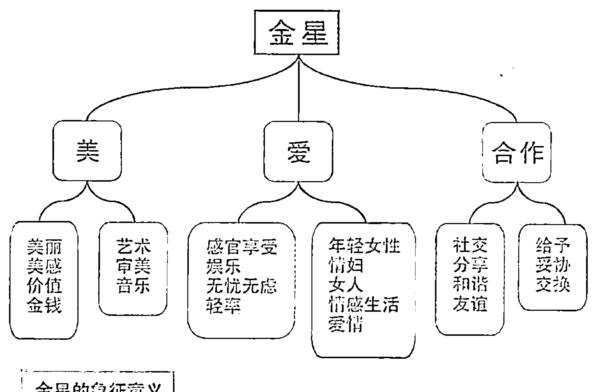

金星象征着“合作”与“分享”，也象征着我们与别人和谐相处的愿望。与金星成相位的行星体现着在达到合作与和谐的状态过程中，所遇到的有利和不利条件。例如，在出生天宫图上，金星和天王星的四分方位可能意味着“与每个人和谐相处的愿望”会与“追求独立、自由、独特性的愿望”发生矛盾，但是最终发现在社会关系中会获得更大的自由（天王星象征社会群体与自由）。

金星也代表给予，如果一个人受金星的影响较强（即太阳在天秤座、金星在天秤座、或者金星位于上升点或中天），意味着过分的合作和迁就态度，把个人原则丢到窗外，结果发现自己以牺牲个人为代价去满足别人的需要。“金星原则”是不惜代价去追求和平，寻找共同点、消除差异，寻找美丽而消除缺陷。金星说：我要你所要的；而火星说：我要我所要的。金星和火星各自的相位体现了给予和索取之间的矛盾及其解决方式。

金星的施与，经常也期求回报，而这种回报形式通常是爱、赞美、受欢迎和金钱。

金星关心人际关系，关心受人喜爱的能力；关心社会人际状态，特别是能够带来浪漫和性的状态。金星描述着我们如何吸引他人和评价自我——与我们的外观有关：包括衣着、发式等，这些都是金星的话题。而金星的相位则代表我们吸引人的方式，例如，金星与天王星相合，意味着一个人可能通过独特的表现而吸引别人，这一组合可能会寻求着装打扮与众不同，重要的不是一个人穿什么，而是通过衣着的选择想表达什么。

金星关注“物质”价值，因而也是金钱的守护者，因为我们购买有物质价值的东西时，金钱是交换的介质。木星虽然是“财富”的主宰，但不像金星关注物质价值。

金星关注令人愉快的和美丽的东西，是艺术和音乐的主宰。事实上，金星很大程度上体现了我们享受生活、因某些东西而感到快乐的能力。

金星主宰金牛座和天秤座。于金牛座，金星的特性表现为喜爱有价值的物品和美丽的东西；于天秤座，表现为对和谐关系的追求，对富有吸引力的外表的追求。

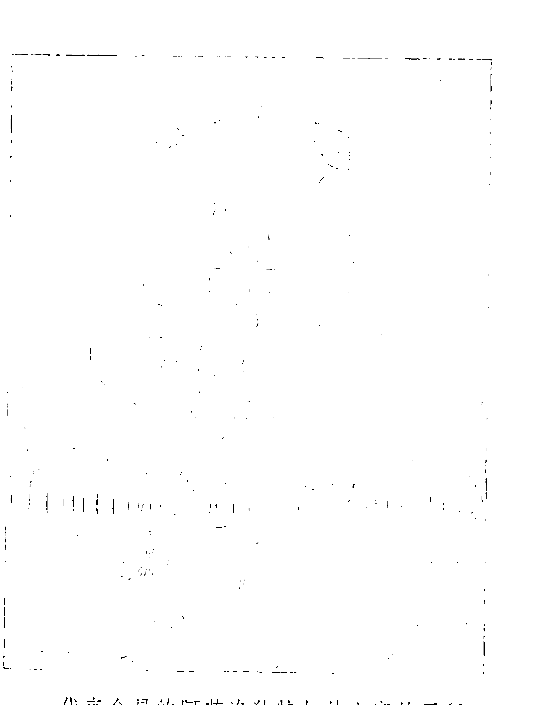

代表金星的阿芙洛狄特与其主宰的天秤座和金牛座，草地上的情景体现着金星所关注的浪漫、爱情与艺术。

火星代表着如血液般流淌在生命中的能量，是勇气和行动不可缺少的动力因素。

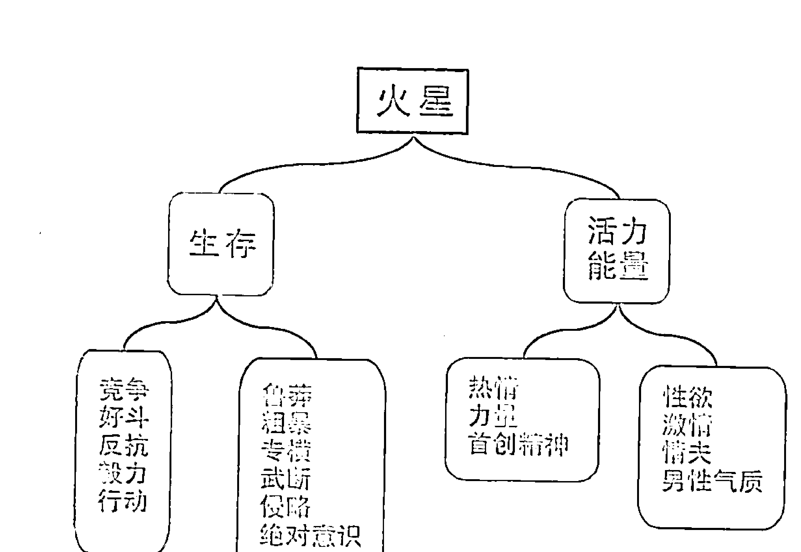

火星和太阳一起组成了阳性的一面，对于个性不成熟的人，受火星带来的“激情和欲望”的驱使会超过受太阳所代表的“意志”的指引，火星将起着类似太阳的作用。

火星原则的正确发挥可以带来勇气和毅力，勇气并不一定就意味着好斗，而是敢于面对我们恐惧的事物，承认自己的脆弱和恐惧也是一种勇气。火星原则使我们坚定，能够应付压力。火星的相位描述着我们拥有什么样的工具以保护自己，以及应用这些工具时得心应手的感觉，硬相位会让我们觉得自我保护比较困难，比如火星和土星的相位代表恐惧心理的干扰，另一方面，火星的硬相位也可能导致过分的自我保护意识，感到不必要的威胁。

火星的核心是在各方面为生存而战，如同战神阿瑞斯，精力充沛、自我意识强、有分离倾向、易引起摩擦。火星体现着这样的声音：我是，我要，我能得到，我保护自己，我打败敌人，我必须生存。在这种声音下，我们把其他的人、事、物视为必须克服的障碍，认为它们对于我们生活的满足和进步是一种威胁，表现出冲动、富有攻击性的特点。

因此，火星在星相学上被视做我们自立自强的核心，它代表着求生的程度、向上的渴望，火星所带来的是忙碌与活跃，觉得自己正要赢得一项考验的胜利。火星推动力的本质是自私的，关注的是获得自己所需要的，它是意识的目标化，在低层次时，它是不惜任何代价都要得到自己想要的；在高层次时，它是勇气的光辉，表现出令人羡慕的创造力。当我们把能量透过金星的力量投放到“彼此协作”上的时候，火星得到从低层次到高层次的提升。

火星能量的表达体现在胆识、激情、力量、驱动方面，使一个人投入对自我的实现，个人的天资、潜力，需要通过火星的能量激发出来。火星受到不良相位的克制，会使能量和勇气缺乏，或者有勇无谋、乖戾粗暴。

在传统星相学里，火星是白羊座和天蝎座的共同主宰，现代星相学将天蝎座划分为冥王星所主宰的势力范围，火星主要主宰白羊座，上图为代表火星的战神阿瑞斯正在俯瞰一场战争。

火星与固执、自信有关：宣布自己的兴趣，积极地维护自己的位置，在压力下保持自己的个性，等等。这并不代表横行霸道，在金星原则的指引下，可以变得圆通，对他人的需要有着健康的态度。

火星也是性的驱动力的代表，借由火星表达出来的性，具有征服的含义，这种征服欲望的满足是其惟一的目标。只有当金星的能量也同时发挥作用时，才能真正表达为爱的激情，金星主宰性的和谐和感官愉悦，而火星主宰其中力量的方面。

火星也使与它相合的行星的能量表达获得加速，使人在那一方面缺乏耐心去表达。

火星原则不仅可以帮助我们抵抗外界压力，也使我们能够处理内在的心理冲突，同时它也和抵御疾病的能力有关。火星主宰各种各样的竞争，体育运动就是竞争精神的表达之一。得到强化的火星，带给人精神和热忱，能提高天宫图中火类因素的分量。

火星主宰白羊座，受其影响，太阳在白羊座或上升点在白羊座的人精力充沛，富有激情，容易冲动，有很强的竞争意识。

木星代表我们掌握“意义”的能力。推动我们透过直接的事实、当前的形势看到更深的意义、目的和价值。任何时候我们思索一件事情背后的意义，我们都是在唤醒木星原则。木星与某颗行星接触，我们就会倾向于把那个行星的原则哲学化，去问它的意义何在。

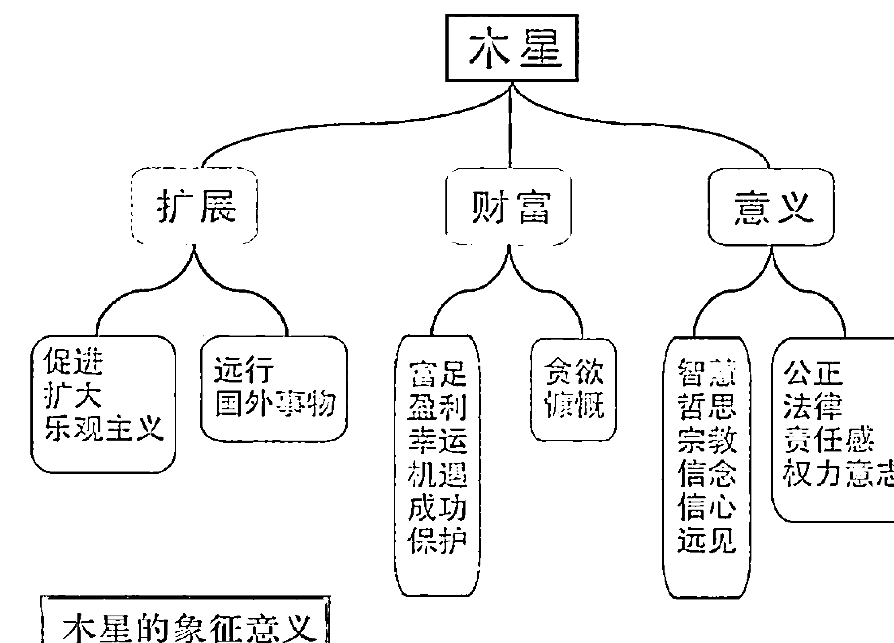

而木星的位置则代表我们在何处寻求成长发展、寻求人生的意义。

寻求人生的目的和意义对我们是非常重要的，如果我们相信自己的磨难是有更高的目的的，我们就更容易应付各种丑恶和痛苦。金星赋予我们爱，水星赋予我们智慧，而木星体现着爱与智慧的融合，使我们在精神层面得到提高，乐观而荣耀。

木星使任何与它接触的行星的影响获得放大，不论影响的好与不好。在灾难和事故的天宫图上，木星经常处于显著的位置，起着扩大事态的作用（通常在这些图里要考察火星、天王星和冥王星的硬相位，但木星也常常被涉及），一方面，可以说灾变常常引起人们关于道德、宗教、哲学的思考；另一方面，宙斯本身也是尚武之神——从奥林匹斯山上投掷霹雳闪电。

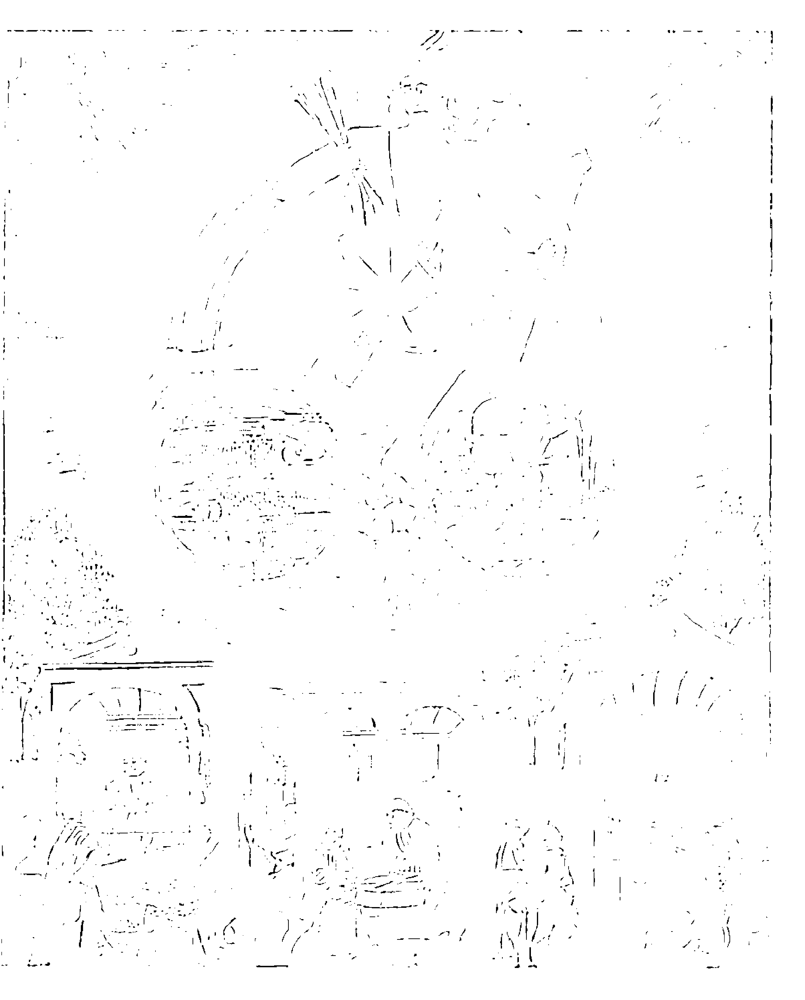

木星代表信念，这种信念包括一切宗教表达和宗教行为，一切政治主张和一切不同的世界观。如果我们认为自己的信念是惟一正确的，那么对木星原则是一种扭曲。木星的位置和相位显示木星原则会受到什么样的扭曲，硬相位通常代表关于信念的不确定和不清晰，以及这些信念会遭遇的挑战。

此外，木星的相位也表达了我们信念的本质，以及我们会以什么方式表现这些信念，例如：木星与火星相冲意味着为信念而战，而这种信念可能是对于“胜利、竞争性、主动性”的执著；木星与土星相合则体现着关于“责任、形式和物质实体”的信念。

木星带给我们信心与乐观，与其他行星的软相位代表我们对那个行星的“领域”感到自如；硬相位则代表不确定、碰运气的感觉。

木星也代表智慧，代表我们在更高、更远的位置看待事物的能力，在这个位置上我们会做出明智的判断。木星还与思维、理解和智力的拓宽有关，因而也主宰长途旅行、高等教育。

木星主宰财富——当我们拥有自认为有价值的东西时，会感到有财富。木星的位置影响着我们关于财富的定义，以及获得这些财富的难易程度，同时，也使我们对于这些财富持慷慨的态度。

木星主宰人马座，太阳在人马座或者上升点在人马座的人思想活跃，视野开阔，注重文化修养，总是满怀巨大的热忱。

土星着重于“结构”，它一方面规范、限制，另一方面增强、支持。这种结构可以是道德底线和责任约束，可以是身体结构和家庭传统，也可以是社会层次和统治权力。

土星与“时间、限制、秩序”相关联，而潜藏着的最根本的关联则是“恐惧”。当土星与某颗行星接触时，我们倾向于害怕表达这颗行星所象征的东西，甚至感到没有能力表达。例如，土星和月亮相合代表着防御性的感情、受约束的反应、小心谨慎的行为，而感情的成熟来得较晚。与木星让我们感到乐观和自信相反，土星所触及之处是我们感觉最不舒适、最恐惧、最笨拙和最脆弱的地方。

我们通常不愿意自己笨拙的一面被别人看到，于是把它隐藏起来，把自己的恐惧包装成一种能够被大众接受的形式，或者假装在这些方面很灵活。最终，经历长期的努力，面对自己的恐惧和无数的失败，我们真的可能在这些原本笨拙的方面变得得心应手——土星在此意味着艰难的学习和成长。

当我们终于这样成长之后，已经积累了大量的经验，对所经历的事情有了透彻的理解，甚至变成了权威，因此，土星与某颗行星相合，也意味着我们在年长时会对那颗行星所代表的东西有透彻的理解，这是一个漫长的、痛苦的过程。

在这里，恐惧也有其目的：它告诉我们需要检查自己的防御心理，是否不够戒备或者过于戒备？土星与其他行星的硬相位揭示了那颗行星的周围有一道需要拆除的樊篱，需要我们花很多时间去小心地拆除。

土星的硬相位较多的话，说明太多的樊篱、太强的戒备心理，这不可避免地阻挡了许多潜在的机会，我们因为太恐惧而不敢冒险，却又因为放不下这些防御心理而痛苦。

另一个土星原则是“控制”，也与恐惧有关：我们因为担心而要加强控制，并且要求事物有非常明确的定义。例如天宫图上土星和金星成硬相位的人，她总担心自己不被爱，因而会不断地问她的伴侣：你爱我吗？有多爱？会永远爱下去吗？遗憾的是没人喜欢这种没完没了的发问，而感情也确实无法量化或精确地定义，结果她会因为担心自己不被爱而加强对伴侣的控制。

土星与其他行星的相合或硬相位，也代表我们没有得到足够的该行星对应的东西，因而对其产生渴望。例如：土星－太阳会渴望得到认可；土星－月亮会渴望得到更多家庭的温暖和养育；而土星－金星会渴望更多的爱。

土星的宫位描述了我们缺乏信心的那些领域、那些我们认为应该做得更好的领域，土星就像是我们内在的老师，严肃、冷酷地告诉我们要努力，努力，再努力。土星的限制和否定的目的，常常是为了让我们对自己所做的、所想的加以检讨。土星主宰铅，其触及之处，也带去铅似的沉重、鲁钝和耐久。它带来耐力，坚持要我们花时间耐心地、踏实地进步。

土星关注责任、义务、纪律、各种规章制度，进一步地，代表权威、自律和自我控制。土星的相位很大程度上表明了我们成年后处理责任和义务的方式。

土星代表我们内倾的部分，使我们用内省的方式检视和消化对于现实的印象，在低层次上其能量表现为恐惧、不成熟、抵抗、僵化等，在高层次上则表现为深思熟虑、按部就班、审慎和可靠。

传统星相学中，土星主宰魔羯座与宝瓶座，现代星相学将天王星的特征对应于宝瓶座，而土星主要与魔羯座有关。上图的土星被描绘成一位一手柱拐杖、另一手持镰刀的老者，在希腊神话中，代表土星的克罗努斯用镰刀阉割了他的父亲，而在罗马神话中，代表土星的萨图恩也司掌农业。

土星是摩羯座的主宰，受其影响，太阳在魔羯座或者上升点在摩羯座的人具有现实主义思想，雄心勃勃，谨慎而多疑。

天王星是新见解、新发明、新技术的使者，特别是那些能够根本性地促进沟通的技术。天王星原则完全挑战土星原则：它拒绝土星的传统、常规、正统，拒绝权威，激励那些被阻挠、被压抑、被僵化的东西。天王星好似希腊神话中的普罗米修斯，他反抗神祇的权威，把火种带给人间，并且带来新的技术和知识，给人类更大的自由和独立性。普罗米修斯式的愿望，代表我们寻求以自己的方式生活，选择自己的道路，不断探求个人自由和新的经验。

天王星也带来变化莫测的影响，它与某颗行星相合，会驱策那颗行星以一种最格格不入的、最脱离常规的方式表现自己，换句话说，就是让那颗行星改变其能量通常的表现方式。例如，天王星与金星相合，意味着挑战传统的“恋爱结婚过家家”的人生模式。因此，天王星的影响有时候也具有不负责任的特点。

天王星象征着解放精神、反习俗、特立独行、极端自由主义革命和无政府主义，也代表由于某种信仰而忽视人生具体价值的不正常倾向。它也把对于兴奋、自由、独立的寻求带给它所触及的行星，例如天王星与月亮相合意味着寻求家庭独立和情感独立。与其他行星的硬相位还意味着，人生早期在那颗行星代表的方面，缺乏可预见性和安稳的感觉，突然的改变在带来激动和解放的同时也带来了深深的不安。

天王星与太阳、月亮的硬相位，意味着周期性的重大的人生变化，日益积聚的变革的愿望可能在某一天爆发，这种改变通常会遇到外来的土星本质的抗力，抵抗与改变的双方都会表现出天王星带来的顽固、极端主义和缺乏合作。

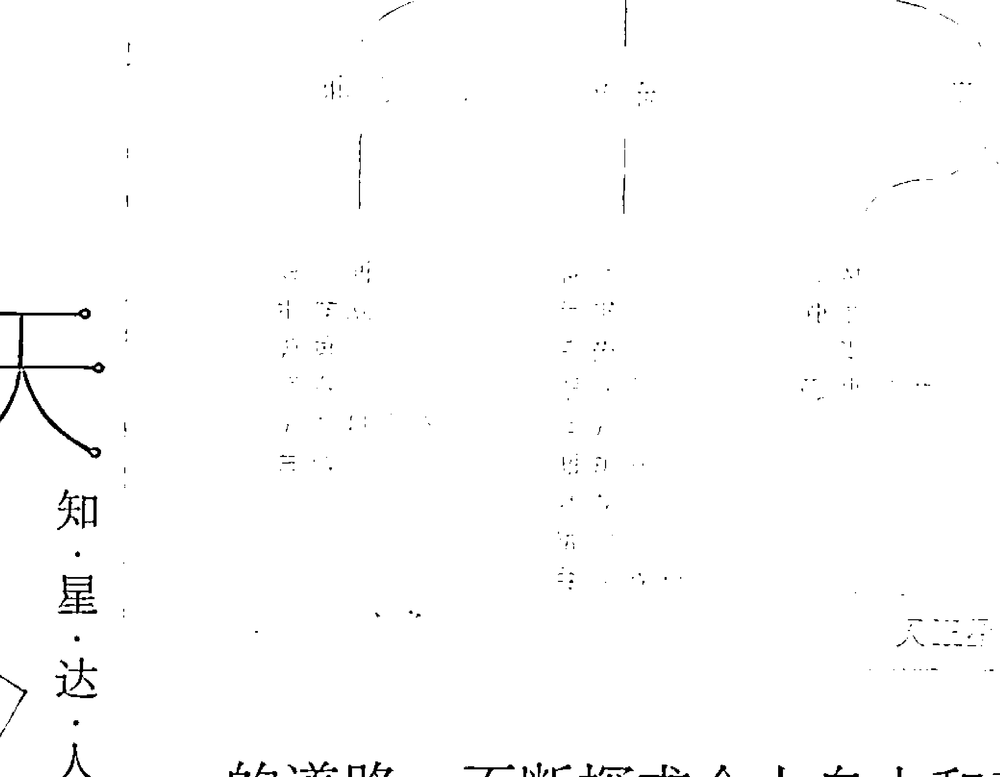

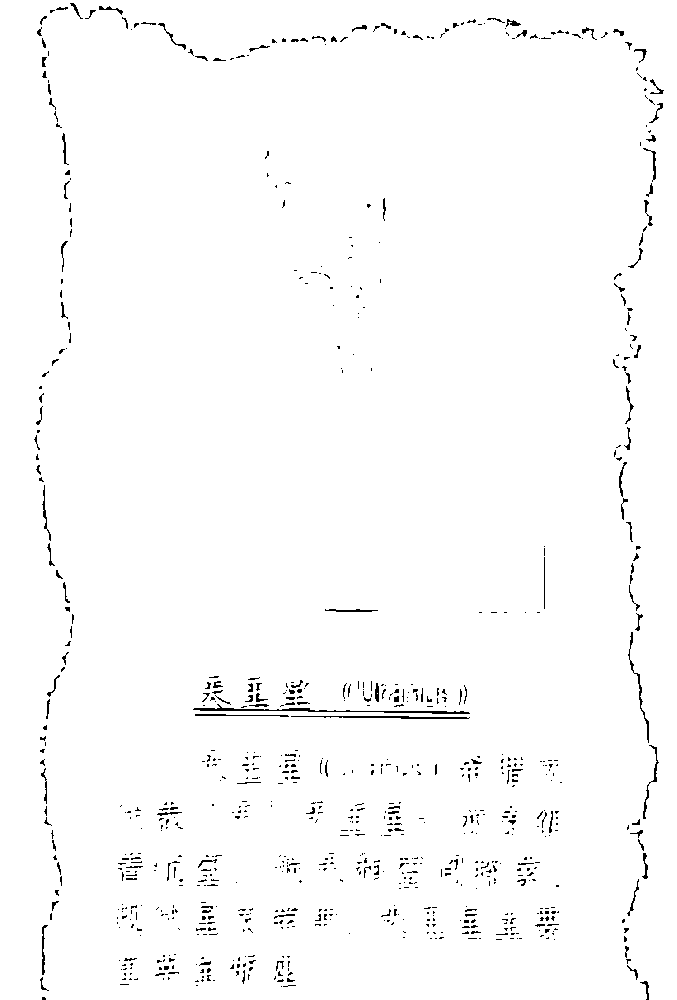

天王星主宰着宝瓶座，在它的影响下，太阳在宝瓶座或者上升点在宝瓶座人对发明、发现和探索有浓厚的兴趣，而不愿意忍受感情上和纪律上的任何约束。

海王星是超然、理想、想像的原型，它的特点是边界的消融，仿佛我们出生之前在子宫内的那种感觉：自我与世界融为一体、一种理想的境界。海王星使我们能够超越具体的现实去领略现实之外的东西，以及超越自我的局限去领会别人的精神世界。

- 自毁：毁灭、宿命论、缺乏愿望、恶习、自满、自杀、反常冲动
- 欺骗：欺骗、自欺欺人、荒谬、逃避主义、混乱、酒精饮料、致幻剂、吸毒
- 梦幻：梦幻、幻觉、幻想、理想、白日梦、迷茫
- 灵感：天赋、神秘主义、通灵术、超验思想
- 精细：纯化、敏感、音乐、艺术、影视

海王星原则之一是敏感的慧根，能够认知和欣赏事物的精细微妙之处，也标志着艺术天分。海王星使任何与它相合的行星的能量精细化、纯净化，去粗取精，但也更难以掌握——生活经验经过提纯都已经脱离了其原本面目，变得朦胧、难以捉摸；另一方面也表现为欺骗性。在这个意义上，海王星代表我们逃离或超越日常生活现实的愿望，在天宫图上，不论它触及哪里，都促使我们超越平凡生活所规划的界限，在积极的方面表现为理想主义、促人进步；消极的方面则表现为逃避主义、拒绝面对客观现实、采取视而不见的态度。

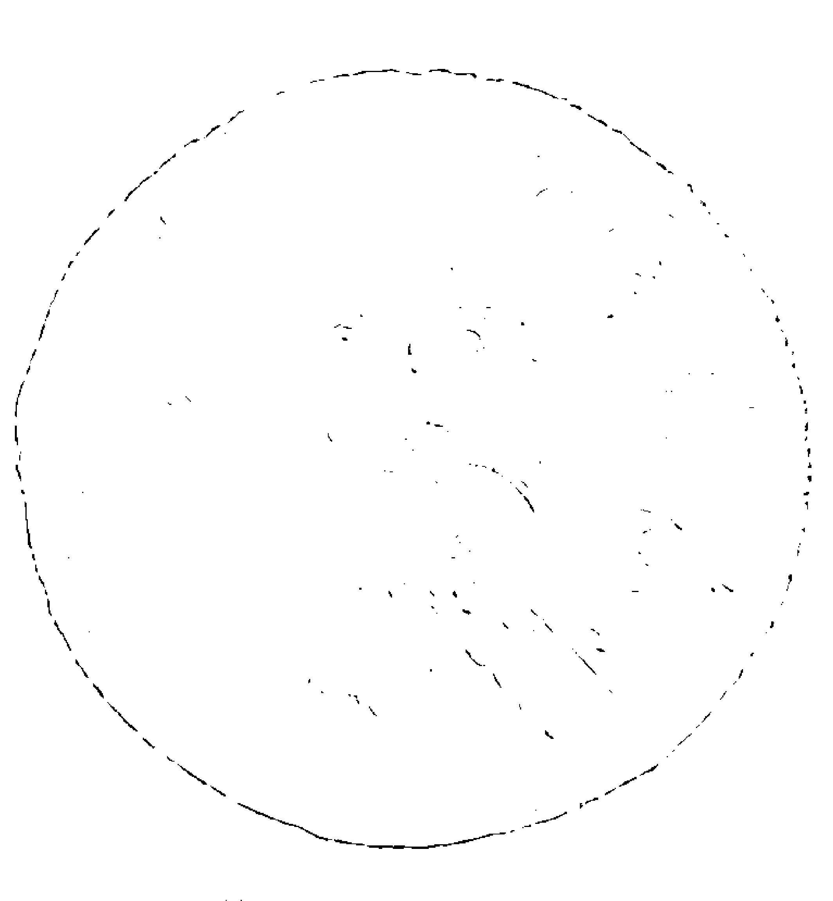

这是一块公元四世纪的银匾，代表海王星的海神波塞冬被海豚所环绕。海王星主宰双鱼座。

海王星赋予我们丰富的想像力，使我们能够更多地接触无意识的海洋。希望、梦想和幻觉是不受任何界限的约束的，也不接受边界。但是，当通往不可捉摸的神秘世界之门被打开，这扇门也通向混乱无序——打破边界的海王星象征着泄漏。与海王星成相位的行星面临着能量被泄漏的危险：不可将秘密告知具有水星－海王星相位的人，他会泄漏信息；太阳－海王星的组合则混淆了自我和他人的界限，使人具有牺牲精神，又能体会他人的心境情绪，感同身受。而同情和博爱，也正是人类整体在精神世界的升华和净化所必需的。

海王星有贪婪的一面，让我们产生焦渴的心态：金星-海王星的组合会渴求理想的、完美的爱情关系，容易对任何关系都不满足。

海王星亦主宰电视、报纸，这类媒体充满着将真实膨胀、虚构了的故事，给我们提供了逃离现实生活的机会。总之，海王星的目的是展示现实的另一面。

海王星主宰着双鱼座，太阳在双鱼座或者上升点在双鱼座的人温情、神秘、敏感、脆弱、富有献身精神，也常常藉由幻想来逃避现实生活中的困难和烦恼。

## 冥王星是推动所有演变和变革的力量

弗洛伊德所说的“伊底”(Id)，即往往与性有关的、最原始的驱动力，就是冥王星的能量之一，它是“强大的力量的原则”，然而更着重于“潜力”，如同瑜伽里的“生命力” 这团潜伏在尾椎部的能量在激发之后可以带给人身心的巨大变化。

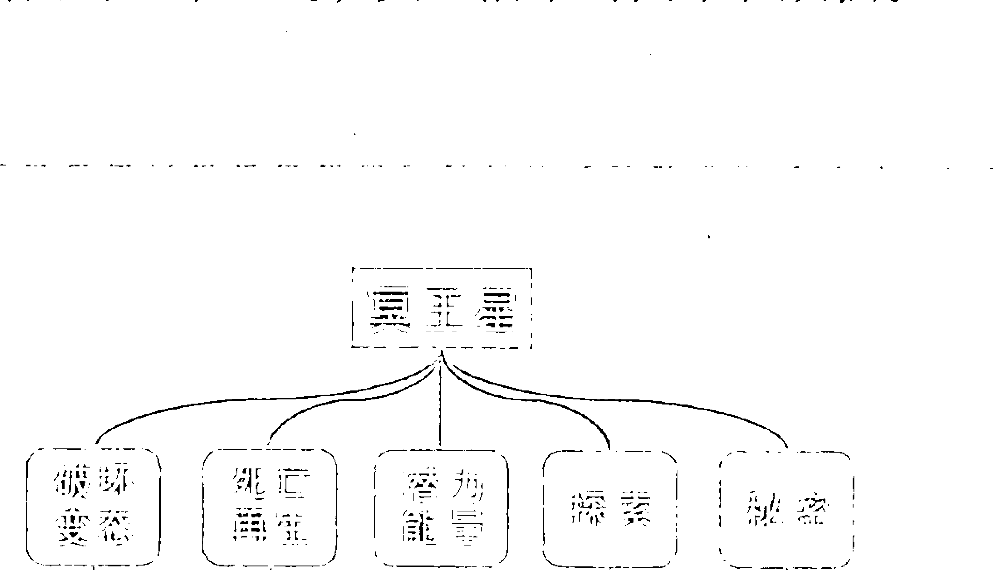

冥王星的力量使与它成相位的行星的意义获得深化和强化。当二者处于硬相位时，冥王星仿佛有强大的力量能够埋葬那颗行星的能量，比如，冥王星与月亮相冲时，意味着一个人把自己的感情深埋心底，同时，会感觉过去自己在感情方面受到过粗暴的侵犯和伤害。

冥王星象征着隐秘，它与集体无意识的原始能量相沟通。隐秘的东西常常是强有力的，我们心灵的无意识方面可能是强大而危险的。深深藏在人的灵魂里的，还有强烈的仇恨、嫉妒、贪婪和狂热等感情，犹如火山一样有爆发的潜力，是应当敬畏的。

神话里的冥界只是一个隐居之所，不是我们想像中的地狱，我们不必害怕那些不可见的、不理解的隐秘的东西。无意识里也有埋藏的珍宝，会逐渐浮于表面，那便是自我转变的潜力——冥王星代表转变，在深刻的自我反省之后，一些旧的体验会被新的心理状态所取代，达到对自然、本能和生活更加深刻的理解。

冥王星也把隐秘带到其他的行星，例如，金星与冥王星的相位可能代表秘密的情人或小金库，火星与冥王星的相位可能代表秘密的风流事。保守这些秘密是为了在希腊神话中，代表冥王星的哈得斯是阴间与地狱的统治者。冥王星主要主宰天蝎座。

自我保护和生存，而冥王星一直是关注生存的。但冥王星也带来一种偏执的思维，使我们觉得其他人要从我们手里把这些行星所代表的东西夺走，而这种思维可能会演变成由冥王星所主宰的天蝎座的占有欲和嫉妒心。

冥王星与“死亡”和“再生”这些概念的联系，可以试图通过婴儿的出生来理解，这是一种强大的无以抗拒的力量，一个旧时代的不可逆转的摧毁和一个新时代的充满激情的开始，死亡和再生都是在精神意义上的，火山的爆发、性高潮的来临，都具有这样排山倒海的特点，都是隐秘能量的释放，都在冥王星的主宰范围之内。

传统星相学里，冥王星也代表个人意志，一种关于性、关于生与死这些最根本的问题的意志，和一种控制、统治的意志，在消极的方面，它带来独裁、专制。

冥王星也代表财富：并非通过个人能力挣得的钱，而是代表由继承、横财、保险及相似的来源得来的财富。

炼金术是一门古老的、神秘的文明学说，是一种科学、一种技术和一种哲学的复杂结合。这门学说因缺乏背景而使现代人难以理解，人们根据它的某些残余进行探索，认为这种学说处于另一种文明，需要用另一种文明，需要用另外的精神状态来理解。图中的一位炼金术士正在从事炼金活动。

## 天知星达人的法宝

星相学诞生不久，炼金术出现了，炼金术并非是简单地寻找把贱金属转变为贵重金属，或是寻找长生不老的药水，而更多的是对于灵性升华的追求。在炼金术的世界观里，宇宙同样由火土气水四元素组成，行星主宰着不同的金属，而星座对应着炼金过程的不同阶段。

在这里我们不谈论炼金术，要说的是行星和金属的主宰关系——炼金术中行星的符号直到今天仍在用以代表相应的金属，从这些金属之中，我们可以进一步理解行星的属性。

在希腊神话中，月神阿尔忒弥斯用纯银的弓箭狩猎，在夜色里穿行于山林之中——“银”是月亮主宰的金属，银的盐需要在“黑暗”中进行“感光”反应，在底片上形成黑白色调的“影像”（照片）。银和金是两种与光线有关的金属：镀金的物品会放射耀眼的光芒，而敏感的银盐则会吸收光线，这正像太阳和月亮的对比（金的主宰行星正是太阳）。银盐的光化学反应也被用来制作镜子，是梳妆台不可或缺的东西。不论照片还是镜子，都是对过去或者现在的精细的印象，都体现了月亮的“接受性”和“被动性”，都反映了我们彼时彼刻的“情绪”。

银幕——另一个与银有关的概念，则可以说是描绘了我们的“梦幻”与“想像”。

银也能够杀菌，银器是最主要的和精雕细作的金属餐具，从这里我们发现其“养育、保护、容纳”的特质。这些与银有关的概念都体现了月亮的特质。

金是一种高贵的金属，是从不生锈、不怕煅烧的，它表达着太阳那光辉显赫的品质，因而古往今来就一直被广泛用于神殿、寺院、教堂等神圣的场合。在许多的装饰物上，太阳都被画成放射着金色光芒的球体。

像无处不在的阳光一样，金在地球上也是无处不在，却没有凝聚的矿藏，最丰富的金矿石也只有十万分之一的含金量。在现代社会，金是经济的心脏，黄金储备是纸币稳定流通的保障，而金价的行情也是经济状况的晴雨表。

太阳代表着自我、心脏，所以情侣相赠的婚戒，也多由黄金打造。

水星主宰水银。比钢铁重一倍的水银，有它天生的神秘性，在常温下竟然保持液态。它是一种极具流动性的金属，正如思维活动一样迅速而灵活。

作为一种金属溶剂，它可以把毫不相干的金属融合在一起，另外也可以形成多种多样的化合物。水银的特性正体现了水星“沟通、连接”的特性。

在希腊神话中，赫尔墨斯也是医药之神，而今天在体温计、血压计、牙齿填料里，都可以发现水银的踪影。

金星主宰铜，火星主宰铁。我们常说“女人来自金星、男人来自火星”，从铜与铁在男女体内的含量、铜与铁的特点都可以对这句话做出解释。

女性的血液含铜量比男性多20%，而男性的血液含铁量比女性多30%。金星主宰的铜在血液中主要以一种蛋白质的形式存在，它的浓度取决于女性的荷尔蒙周期变化，在怀孕期间，铜的浓度可以增加一倍。

铜的各种盐（例如硫酸铜、铜锈）都是深邃的蓝绿色泽，含铜的孔雀石、绿宝石以至各种铜矿石，外观和色泽都很优美；相比之下，当我们手持一块红褐色的铁矿石，我们也许会联想到火星——那个红色星球上随处可见的岩石是它的远亲吧？

铜质软，铁质硬。铁制的物件，如机械、武器和工具，多是为了工作、为了使用；铜制的物件，如塑像和乐器，则往往是为了欣赏和娱乐。刀具闪着泛蓝的寒光，而铜器泛着柔和温馨的色泽。在家里，钢铁支撑着房屋的架构，铜线则把电能、闭路电视和网络信号带入千家万户，共享温暖与快乐。这些对比，多像金星和火星的对比！当铜和铁在一起，铜线圈在铁的磁场包围中转动就会产生电流，而发电机是现代社会的动力之源，这或许是对于男性和女性关系的一个绝佳比喻。

火星是红色的，血液也是红色的，这都是因为铁的存在。铁容易氧化（即燃烧），我们看到的节日的焰火和飞溅的钢花，正是铁燃烧释放出的能量。在人体内，铁主宰的是氧化过程，也是养分转变为能量的过程，使我们能够有精力行动和维持身体正常的运转，这正与火星代表能量相一致。

木星是“保护者”，主宰锡。但是，锡对于木星的性质没什么表现，也许锡皮罐头、锡箔纸、葡萄酒瓶的锡质瓶帽可以算几个例子。

青铜是铜和锡的合金，在古代常用 来制作器皿、祭祀用品，青铜器的铸造 是财富（木星）的标志。

在七大金属中，土星主宰的铅是最沉重、最黯淡的一个，具有最差的导电性、最缺乏光泽和共振性。

汽油中添加铅的化合物，可以使之燃烧速度减慢、变稳定。铅在体内的存在，可以使幼儿的智力发展延迟、使成人的反应迟钝。铅进入人体后停留在骨骼内，要三十年的时间才能排除，因为铅的化合物很少有可溶性的。元素周期表上，铅以上的元素都是放射性的，这些元素一级级衰变的最终产物就是铅。因此，科学家们用铅的不同同位素的含量为标准，来确定岩石的地质年龄。电视机、显示器，以至 X 射线实验室采用的玻璃，都包含23%的氧化铅，用以吸收射线辐射。在核反应堆里，干脆用铅棒来调节反应的速度。

炼金术是化学的鼻祖，七大行星（金属）的六边形排列图案，被包括皇家化学协会在内的许多化学组织选择为会徽的组成部分。

“沉重、边界、限制、迟钝”，这些用以描述铅的形容词，全都可以用在土星身上。

三大外行星属于近代行星，因此没有相应的主宰金属。

## 小行星

在星相学里，星体的影响通常主要考虑太阳系行星（包括太阳、月亮），它们代表的能量组成了我们个性中的不同侧面。除了这些主要行星，太阳系部分小行星有时也要作为额外的参考，它们也在不同的方面对我们产生影响。

星相学要考察的小行星通常有六颗，即谷神星、婚神星、灶神星、智神星、凯龙星和爱神星。如我们前文所述，谷神星、婚神星、灶神星和智神星是人类最早发现的四颗小行星，也是迄今为止发现的最大的四颗小行星，它们来自火星与木星之间的小行星带，在星相学里都与女性有关；凯龙星是一颗俘获在土星与天王星轨道之间的半小行星、半彗星天体；爱神星则运行于金星与火星轨道之间。

谷神星在希腊神话中是大地女神德墨忒尔，主宰丰收。她深爱的女儿被冥王突然掳走的故事，在神话里是四季的起源，但是更深层的意义是生与死的主题，是爱的割裂。当我们的爱被剥夺，我们会感觉仿佛被投入了无尽的黑暗，一遍遍回忆过去而不愿面对新的生活，希望一切回到从前。但是德墨忒尔选择了放弃神性，来到人间，得以每年与女儿相聚一次——德墨忒尔的选择告诉我们，只有明白没有永远的天堂，才能抛开旧的依恋。
谷神星代表我们真正关心的人，我们的母性所在，我们难以割舍却必须放弃的依恋，而通过这种放弃才会带来成熟。
作为与母亲有关的行星，谷神星代表女性的生殖循环：月经－怀孕－生产－哺乳－绝经。女性青春期的饮食失调、孩子自立后的空巢综合征、绝经之后的自由感，也都在谷神星的主宰之中。
在星相学上，谷神星继承了室女座“精细、多产”的属性和巨蟹座“母性、养育”的属性。

婚神星在希腊神话中是宙斯的妻子赫拉，代表妻子、人生伴侣。主宰女性与某个人组成感情的、身体的、精神的结合。金星主宰求爱时期，而征服结束，开始要求爱情和义务的时候，就进入婚神星的管辖之内：亲密、忠诚、排他倾向、夫妻平等，此外还有离婚、家庭暴力等阴暗面。
婚神星的主题之一是互相承担责任和义务的、牢固可靠的婚姻关系，要求把婚姻作为神圣的契约。它也代表在努力之下仍然不能完全信任对方的那种无助感和自卑感，但在积极的方面，它代表我们应该换一种方式处理新出现的问题。

婚神星的另一个主题是不要在这个男性主导的社会放弃自我、对对方过于依赖。它代表通过对子女的控制、自身的经济能力，以及对性和亲密的保留，进而控制配偶以达到夫妻间的权利平等。
婚神星同时具有天秤座“寻求爱”的色彩，以及天蝎座“占有欲和忌妒心”的色彩。

智神星是希腊神话中的智慧女神雅典娜，代表用智慧解决问题，也代表为正义而战。她同时是“战争女神”和“和平大使”，与战神阿瑞斯的“为争斗而争斗”完全不同。她也代表为了更好地生存而对自己性别角色的否定。
我们通过智神星能看到自己的自信、内在强度、创造力和足智多谋地应付危机的能力。当我们的权利受到侵害时，它推动我们勇敢地站出来。作为女性，我们的体育技能，对政府和政治的态度，自立和生存能力，都在智神星的护佑之下。
智神星也代表女儿与父亲的关系，以及女性对于男性的一般看法：我们是把男人看做一种可以依靠的人、可以一起玩乐的人、恐惧的人、挚爱的人，还是厌恶的人？这种观念受到童年时与父亲关系的影响，因此，智神星也是女权主义的代表。而它的阴暗面可能包括妇女本身的家庭暴力倾向，以及紧张的父女关系，毕竟雅典娜是全副盔甲从宙斯的头里面生出来的。
智神星体现了一个挑战性的天秤座，对于“竞争”和“合作”有同样的意愿。

灶神星是希腊神话中的赫斯提亚，她是父亲克罗纳斯吞掉的第一个孩子，也是最后一个从他腹中跳出的，代表一个与“起始”和“结束”有关的概念：神圣。圣火和灶火是她的标志，她从未离开神祇的住所，一直看守着圣火。
在瑜伽的教理中，灶神星代表蜷伏在尾椎部等待被激发的能量，通过精神领悟的过程，可以引导向上直达脑部而悟道。相似的，在星相学里它代表灵性和神圣的性——包括节欲、独居、出家。它也代表我们通过自己丰富的精神资源去带给别人祝福，代表我们可以全心全意地奉献于什么方面，以及我们可以牺牲哪些东西而获得更高的精神满足。
在全身心地投入某一项事业方面，灶神星有点像室女座，甚至可能以个人生活为代价。在出生天宫图上，如果灶神星位于双鱼座、室女座，或者涉及个人生活的第4、5、7、8宫，则提示我们要多关注自己的家庭和爱情生活。

| 轨道周期 | 4.60年 | 4.36年 | 4.61年 | 3.63年 |
| 主导方面 | 养育哺喂 | 夫妻关系 | 智力教育 | 内在更新 |
| 女性关系 | 母亲 | 妻子 | 女儿 | 姐妹 |
| 女性原型 | 一心照顾孩子和家庭的好母亲。 | 贤妻，男人背后的女人。 | 女强人，职业女性。 | 老保姆，老处女，修女。 |

凯龙星是希腊神话中半人半马的凯龙，是许多英雄的老师。凯龙星的主题包括“受伤与补偿”、“教育与升华”。

在神话故事中，凯龙因相貌丑陋被父母所嫌弃，后来又被毒箭误伤而无法治愈，神话故事的寓意代表“不能愈合的伤口”，暗示了我们陷于某种困境的原因。但是为了让我们的心灵更加完整，这种困境是我们必须认识和超越的地方。

正如我们的心灵被俘获在尘世而又时刻渴求升华、回归自由一样，凯龙星具有和海王星一样高的意识水平，但凯龙星是通过知识、理解来积极地行动（凯龙通过学习获得心灵的提升，并通过代替普罗米修斯一死而从痛苦的折磨中解脱出来），而非海王星那样借助于逃避，对痛苦视而不见。

爱神星就是罗马神话中的丘比特。爱神星运行在金星和火星之间，轨道周期为1.76年，这个位置是很特别的，就像是那支穿心的箭，把金星与火星、女性与男性联系在一起。

在天宫图上，爱神星代表爱情、创造、性爱、灵魂的融合，爱神星的位置代表着面对爱人时所必然体验的某种经历，这种经历让我们双方都得到彻底的转变。

### 关于月亮

月亮在星相学里相当重要，作为地球的卫星，它在天宫图上可以看做是地球的代表，是俗世的自然主宰。月亮最关键的主题“养育、保护、接纳”等，都是地球母亲的写照。在这一章，我们介绍与月亮轨道有关的“龙首、龙尾”这两个概念。

月球的运行轨道在天球上的投影称为“白道”，与黄道之间有一个大约5°的小夹角，其交点在星相学上有重要意义。其中，“白道升交点”（又称“龙首”、北交点）是月亮从南向北穿越黄道的位置，“白道降交点”（又称“龙尾”、南交点）是其从北向南穿越的位置。两个交点逆行，每18.6年完成一个周期，也就是每19天1°。

在传统星相学里，这两个交点在天宫图上的位置与前生今世的“因缘轮回”有关。龙首象征着因缘的延续，指出我们今生的课题和目标，以及心灵成长的道路，龙首是“吉”的，意味着努力之后会有一个好的结果。

龙尾代表前世残留的痛楚，会带来考验与阻碍，也就是在龙尾所在的宫，以及与龙尾相合的行星所代表的方面会受到阻碍，这种阻碍包括潜意识里来自前生的习惯、能力、品质等。因此，我们必须恰当利用与它相合的行星的能量，避免使那颗行星成为我们的包袱。

在书中后面的章节，我们会向读者介绍龙首、龙尾分别处于不同星座的含义。

## 行星阵列

行星的象征意义我们已经介绍完了，在随后介绍完星座之后，你将会读到行星在不同星座的含义。

在了解星座之前，大家可以借助已有的知识，根据自己的出生天宫图对自己的个性特征做个简单的分析。这是一种很直观的分析方法，这种方法就是查看出生天宫图上行星的分布模式。行星的分布模式通常只考虑太阳系十大行星（包括太阳、月亮），而不考虑小行星和月亮的节点（龙首与龙尾）。

行星分布模式可以分为八种类型。

离散式分布中，行星散乱于十二星座，至多只有两三个星座中没有行星。这种模式使人兴趣广泛、有多种才能，但也倾向于使精力分散于多种事务，如果固定星座得到加强，那么这个缺陷可以得到很好的克服。

集散式分布类似于离散式，但存在至少一个行星团（即三个或三个以上的行星位于同一个星座），或几个不均匀的组群，具有这种分布模式的人是个人主义者，不愿意忍受约束，喜欢按自己的规则行事，兴趣多样而特别，可能难以建设性地发挥能量。

集束式的分布，指全部行星分布在紧密相连的少数几个星座内，使人兴趣集中、一心一意，适合特别深入地钻研某一科目，有专家倾向。如果这个集束位于天宫图的下部（地平线以下），则喜欢安静，但自我中心；如果位于上部，则较为客观，喜欢公众生活，但可能难以处理个人和家庭事务。

火车式分布类似于集束式，但扩展于八个连续的星座，其他连续四个星座无行星分布，沿顺时针方向领头的一颗行星是“火车头”，具有主导地位，它所处的宫显示了个人生活中最强调的方面。这种模式使人面对困难能够迎头而上，天宫图空白处隐喻的失落和欠缺，会使他们产生特别的奋斗力量。

碗式分布介于集束式和火车式之间，行星分布于连续的六个星座内，主导行星类似上述的火车式分布。当这些行星多分布在地平线以上时，使人性格外向，注重对职业和社会生活的追求，以及对得到认可的渴求；如果行星多分布在地平线以下，使人性格内向，重视家庭，关注自身内在的提高；如果行星多分布在子午线左边，意味着独立自主，使人侧重于自我意识，以及改造世界与周围环境的能力；如果行星多分布在子午线右半边，则使人依赖于别人的决定，着重于对别人的认知，世界对自己的影响。

桶式分布中，八九颗行星构成碗式，余下一两颗位于相对的半球（两颗则组成相合），组成桶的“把手”。组成把手的行星具有统辖性的主导地位，象征着人生目标和方向。桶式分布避免了集束式和碗式的倾向于孤立化的观念，并且善于顺应生活方式的改变。

扇式分布与桶式类似，不同的是有两颗行星处于相对的半球。这两颗行星也被特别强调，会对个性施加不同的影响，使人具有双重个性，甚至是善、恶两种面目。

跷跷板式分布中，有两组行星分别平均分布于相对的两侧，两边各留至少两个空白的星座。这种模式使人观察力敏锐，能考虑到问题的正反两个方面而加以权衡，但苦于不断寻求完美和平衡，常显得犹豫不决。

在行星分布模式之后，我们还需要补充一个与行星有关的概念：行星的逆行。

太阳系的行星全部按一个方向绕太阳运行，但是，由于与地球的运行速度行星和轨道半径的差异，从地球上看，行星穿越黄道一周并不是匀速运动的，可能在某个星座运行缓慢，而在另外某个星座则是飞速掠过。有时候，一颗行星看上去停滞不前甚至倒退，这属于一种视感觉，在星相学里被称为“逆行”。

实际上，只有太阳和月亮不会逆行，因为月亮围绕的正是地球本身，而太阳的轨迹则反映地球自己的运行。对于地外行星，逆行的原因是因为地球从后面赶上并超过了这颗行星；对于地内行星，则是因为其轨道较小，看上去发生了折回。

在星相学中，逆行一般会带来阻碍的影响。水星是逆行最为频繁、得到研究最多的行星，比如说，流年水星逆行期间，水星所主宰领域的活动会受到影响，例如通讯不畅、信件丢失、文件迟迟不能签署等问题。透过这些表象，实际上是说人们会变得精神不集中。

| 行星 | 逆行频率 |
| :--- | :--- |
| 月亮 | 无 |
| 水星 | 每年3次，每次3周 |
| 金星 | 每18个月 逆行6周 |
| 火星 | 每两年逆行两个月 |
| 木星 | 每年逆行4个月 |
| 土星 | 每年逆行4个半月 |
| 天王星 | 每年逆行5个月 |
| 海王星 | 每年逆行5个月 |
| 冥王星 | 每年逆行5个月 |

在出生天宫图上，行星逆行会引起潜意识的浮现，出生天宫图上逆行行星较多的人，精神力量强大，潜意识深深影响他们对于现实客观世界的认识。逆行行星在此要表达的是：我们需要学会在内心世界与外部现实之间建立和谐，把心中的理想在现实中实现。

- 在出生天宫图上，水星逆行使思维导向内在，会体验很深的思维深度，但是却不一定能表达出来；
- 金星逆行代表对寻求什么样的伴侣有明确的理解，但在现实中缺乏信心；
- 火星逆行代表对性的理想化；
- 木星逆行代表对心灵深处的探索的不断深化；
- 土星逆行代表生活的规范限制着自己的理想；
- 天王星逆行带来更强的叛逆性、独立性，使人强烈地希望尝试新的生活方式，急于表达自己的创新思维，情绪焦躁；
- 海王星逆行代表梦幻超越现实，幻想色彩会影响对生活的实际认知；
- 冥王星逆行意味着失落感使人迷茫。

# 第三部分 星症

## 星座本色

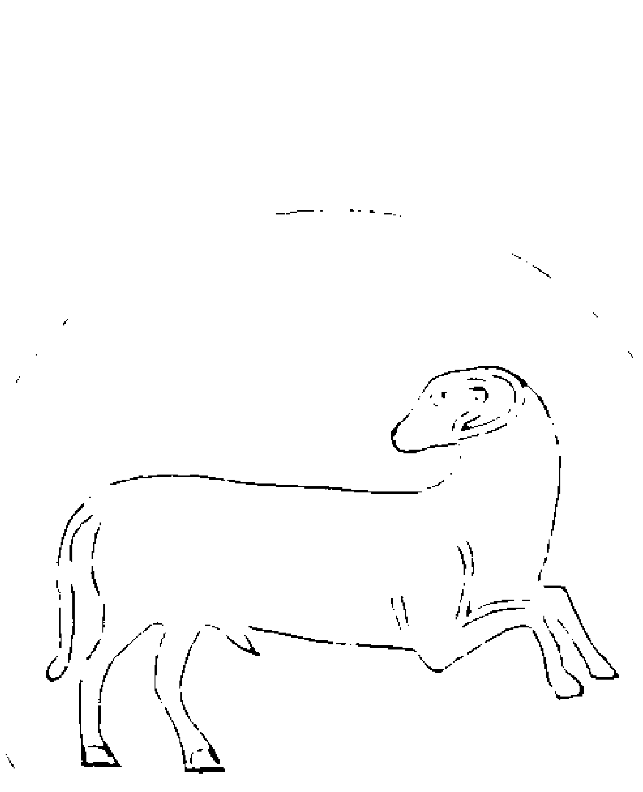

感性：
- 勇气、热情、活跃、兴奋、冲动、大胆、鲁莽、草率、直率、尖锐、骄纵

理性：
- 决策者、进取心、先锋、自信、独创性、探索、独立、闯劲、竞争力

新春伊始，万物复苏，春分点标志着太阳进入白羊座，从3月21日到4月19日。白羊座是阳性、火类的主导星座，作为黄道第一个星座，它与“开始”有关，是黄道的“婴孩”，具有积极开创的精神，个性活跃而精力充沛，有争当第一的强烈愿望，自我意识比较强。白羊座有无法磨灭的童心，好奇心强，喜欢新鲜的事物、喜欢冒险和刺激。受火星的主宰，他们富有创造力，是领导者和发号施令者，是无畏的斗士和探险家，勇敢、大胆，有时候也鲁莽、好斗。但不论如何，他们是有高度竞争性、轻易不言败、难以被忽略的人群。

他们只关心开始，而不甚关心结束。通常全力以赴于自己的事业，希望别人都能够跟得上他们的步伐，但一旦失去耐心、感到无聊，会立刻毫无兴致继续同样的工作，转而追寻更有趣的主题，而把收拾残局的烦琐工作交给别人去做。

白羊座最擅长维护自己的利益和保护自己，应变敏捷，处事明快，能快速而正确地下判断。凭着顽强的斗志，如果用智慧指导行动，他们的潜力是无穷的。白羊座相信自己是命运的主宰，因此当周围环境不如意、踏平坎坷的努力没有成效时，他们会情绪低落，但是不会太久，“勇气”和“领先”是每一个白羊座的信条。

白羊座喜欢把事情简单化。他们坦率、直接，心地不复杂，情绪外露，不喜欢绵里藏针式的人生哲学，容忍力比较差，但是不拘小节、不会记仇，即便暴躁的脾气发作，也会很快忘记而不是耿耿于怀。他们会尽量表现自己积极的一面，不让负面情绪太多地影响自己和别人。

作为朋友，白羊座活力四射，温暖热情。有时这种热情因脾气不好、缺乏耐心而显得过头，让人觉得太喜欢发号施令，但那只是因为他们觉得别人跟自己是一样的思维，对自己所造成的负面影响全然不知。而他们万事争先，常常忽略了别人的权利和感觉。比较极端的缺点还包括不懂分享、太过自我、喜欢摆布别人等。总之，他们需要学会欣赏和尊重别人。

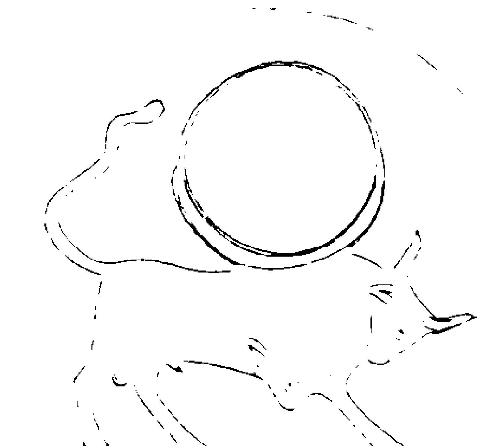

感性：
- 多情、美感、温和、风雅、忠诚、家庭、自我、纵容、感官享受

理性：
- 耐心、坚持、周详、稳健、保守、持家、决心、顽固、物质主义

春季的第二个月份，4月20日至5月20日期间，太阳进入阴性、土类的固定星座金牛座。如同富饶的土地上随处可见的盎然生机和美丽景象，金牛座反映了对于“美丽、品质、价值和富足”的执著。在这背后，他们注重的是物质、情感、生活的稳定性和安全感。他们需要通过感官的直接感觉来体验现实、探索自我，换句话说，抽象的思维和概念必须变得真实明了才能触动他们。金牛座是按着自己的人生哲学走路的人，他们的思考方式缓慢而保守，不要奢望从他们的口中听到石破天惊的言论或是新奇的见解。

不论工作、爱情、婚姻还是家庭等方面，金牛座都寻求长期的稳定。他们安静、温和，但是作为固定星座，代表着固执己见，这也是固定星座的共有特征。这种固执也表现为希望一切维持现状，而应变能力则不强，因此，他们需要一个更开放的头脑。

金牛座在没有深思熟虑之前不会莽撞行事，“欲速则不达”是其座右铭。幸运的是，他们有足够强健的身体和坚定的耐力去克服各种困难，尽管在逆境中可能容易消沉。作为阴性星座，金牛座具有内在的强度，成功之路虽然曲折但是稳健。他们是难以动摇的力量，而毅力正是成功所需要的品质之一。

受金星的主宰，金牛座非常热爱美丽与奢华、富足与地位，喜欢为物质所包围，讨厌求之而不得的感觉，且喜欢纵情于享受美酒与美食。金牛座通常比较节约，很会理财，女性尤善于用最少的钱置办最多的个人物品，能把最普通的东西变成人时的摆设。

在爱情方面，金牛座需要一点浪漫，也喜欢回味某一浪漫时刻的快乐。作为土类星座，他们需要持续的来自身体的真情表白，以此来确定情感的存在。金牛座会很忠诚、很投入，并且愿意用生命中最美好的事物来保护和关爱他所爱的人，正因为这样，占有欲及嫉妒心也比较强。他们待人温暖友善，性格平稳，但是如果动怒，积压已久的怒气也会像狂飙一样爆发出来。

感性：
- 敏感、雄辩、旅游、伙伴、改变心意、分神、好奇、亲切

理性：
- 写作能力、文学、自我表达、民主、发明、多才多艺、分析能力

## 天·知·星·达·人·的·法·宝

在5月21日至6月20日期间，时属晚春，暖风逐渐吹起，正是阳性、易变的气类星座双子座的季节。气代表思维，而双子座是思维最活跃的黄道星座。他们天资聪颖、能言善辩，是很好的作家、推销员和演讲家，被他们的言谈所吸引的听众，会觉得他们简直是信息之源。双子座说服力强，能对任何做法、任何局势、任何动机加以解释和辩护。写作、演讲、沟通是他们的强项，他们能很快适应不同环境和不同类型的人，因此，其成功多来自于与公众交往。

双子座具有如同水银一样好动不安、反复易变的个性，喜欢变化，不喜欢例行公事的单调生活，有点轻率和神经质。因此，个性有两面性：即便对于同一个人，也会以不同的态度对待，因为他们的思维总是在快速地寻找新的内容，甚至会忘记自己曾经说过什么。双子座兴趣广泛、能同时处理很多事情又能有条不紊。不安分的本性使他们喜欢短途旅行，看看别处的人们是怎样生活的，他们喜爱的是旅行的快乐，而不在于到达目的地。

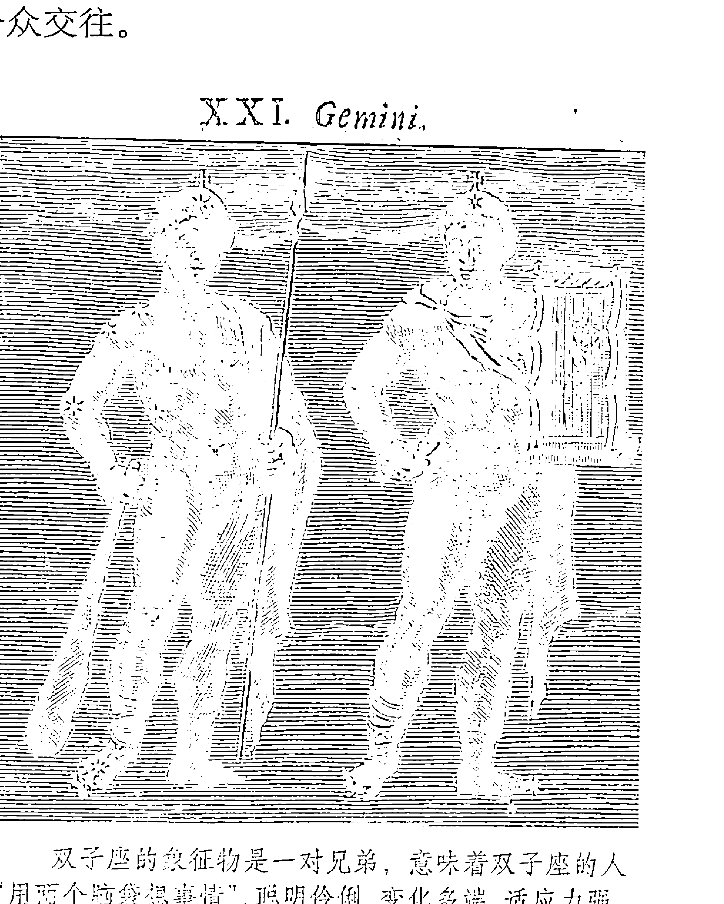

亲戚和朋友是双子座的珍爱，他们是很好的伙伴，随时随地都愿意与别人聊天，身边也总是围绕着很多人。他们陈述自己的观点时条理清晰又不乏幽默感，不会让人感到单调沉闷，不过，这些多数是各种小道消息或他们自己的个人经历，而且会有添油加醋的倾向，因此应该有保留地倾听双子座人说的话。

事业上，他们是敢想敢干的人，有多种成功之路。但弱点是缺乏坚定的信念和持之以恒的精神，同时也缺乏思想的深度。

感性：
- 艺术气息、敏感、多梦、浪漫、母性、恋家、不安、精神追求、想像力、直觉

理性：
- 不屈不挠、保守、谨慎、沉思

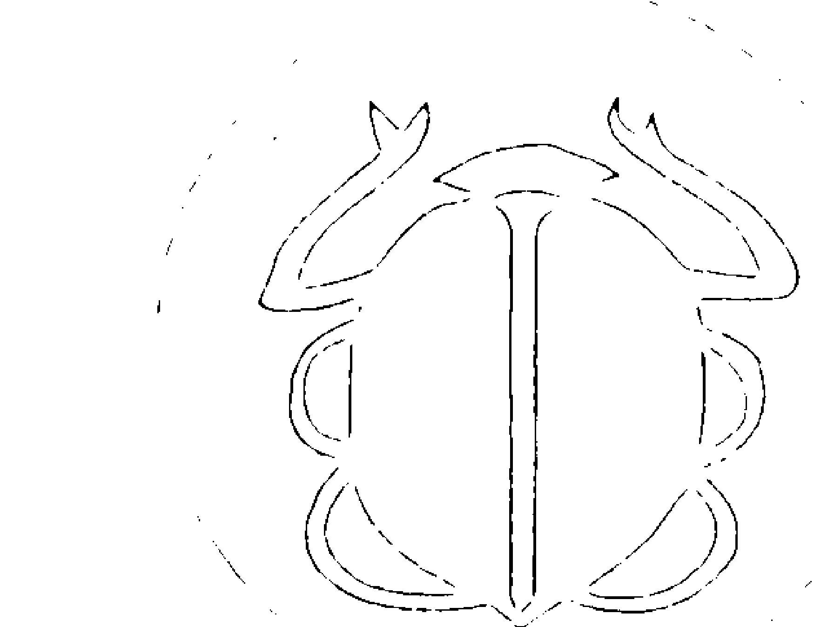

太阳在6月21日至7月21日期间位于巨蟹座，巨蟹座是阴性的主导星座，作为黄道第一个水类星座，巨蟹座人有着如海水般深沉的情感和渴望。这是一类敏感的人群，充满爱心和关怀，能考虑别人的需要，同时自身缺乏安全感，也需要得到保护和照料。这也是一类认真的人群，他们不太愿意冒险，不会将全力付诸一件没有太大把握的事情，而是善于等待万无一失的时机，当时机到来时，他们会以令人钦佩的速度和效率迅速攫取自己的所得。此外，他们很敏锐，难以被欺骗。

在困难时期或受伤之后，巨蟹座会满足于退居温暖的小窝，享受家庭的舒适和安全，忧郁的时候也喜欢从食物中寻找慰藉。他们并不软弱，也不怯懦，是坚定、开朗、勇敢的人，只不过是安于自己的生活、不愿引起别人的注意而已。月亮主宰的巨蟹座重视和平、重视家庭生活，但当谦和的巨蟹被迫成为众人瞩目的中心时，他们可能变得像另外一个人：一方面，能够很好地处理声望、财富和责任；另一方面，发怒时也很吓人，仿佛宁静的大海突然变得惊涛拍岸。

正如月亮的两面，敏感可以变成脆弱，关怀可以变成支配，呵护可以变成溺爱。他们耐心、细致，但有些不经意的控制心态。许多巨蟹座不知道如何划清界限，以至于人们会逃离令人窒息的巨蟹座，而他们则为此感到深深地受伤，以责备、内疚、生闷气等形式展开一场情感的冲突。月亮的圆缺周期也隐喻了巨蟹座的周期性感情波动，有时兴高采烈、有时执拗压抑，容易为小事受挫折。此外，他们对于母亲有强烈的依恋。

巨蟹座在金钱方面也比较有计划，敝帚自珍，如果他们的感情付出得到回报，会表现得慷慨大方而考虑周到，否则就会表现出自私的一面。与其他的水类星座一样，他们把情感当成人生最真实的部分。

巨蟹座小时候比较害羞，不喜欢引人注目，不愿意讨论自己的个人生活，长大后，由于自己敏感而易受伤的心，他们倾向于用一个壳来保护自己免受伤害。这个壳就是简单地躲避：躲起来避免接触伤感的氛围，受伤之后避免再接触那个伤他心的人。巨蟹座个性最脆弱的地方是内心深处潜藏着无端的恐惧，一种不安全感的困扰，一种悲观的担忧。这驱使他们努力于能够增强情感安全感和自我保护能力的活动，同时，也不会把自己内心的秘密全都告诉别人。由于其出色的直觉，能感觉别人的心情和交往的气氛，所以能成为好的说客和商人。

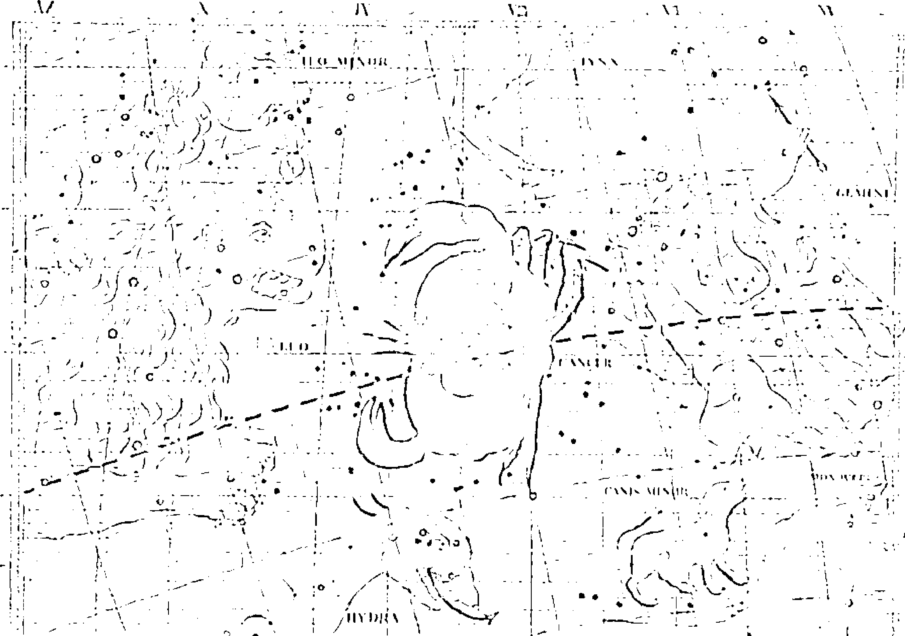

感性：
- 忠实可靠、情感丰富、骄傲、发号施令、仁慈、侠义、预见力、虚荣

理性：
- 野心、宽宏、慷慨、固执、专权、独裁

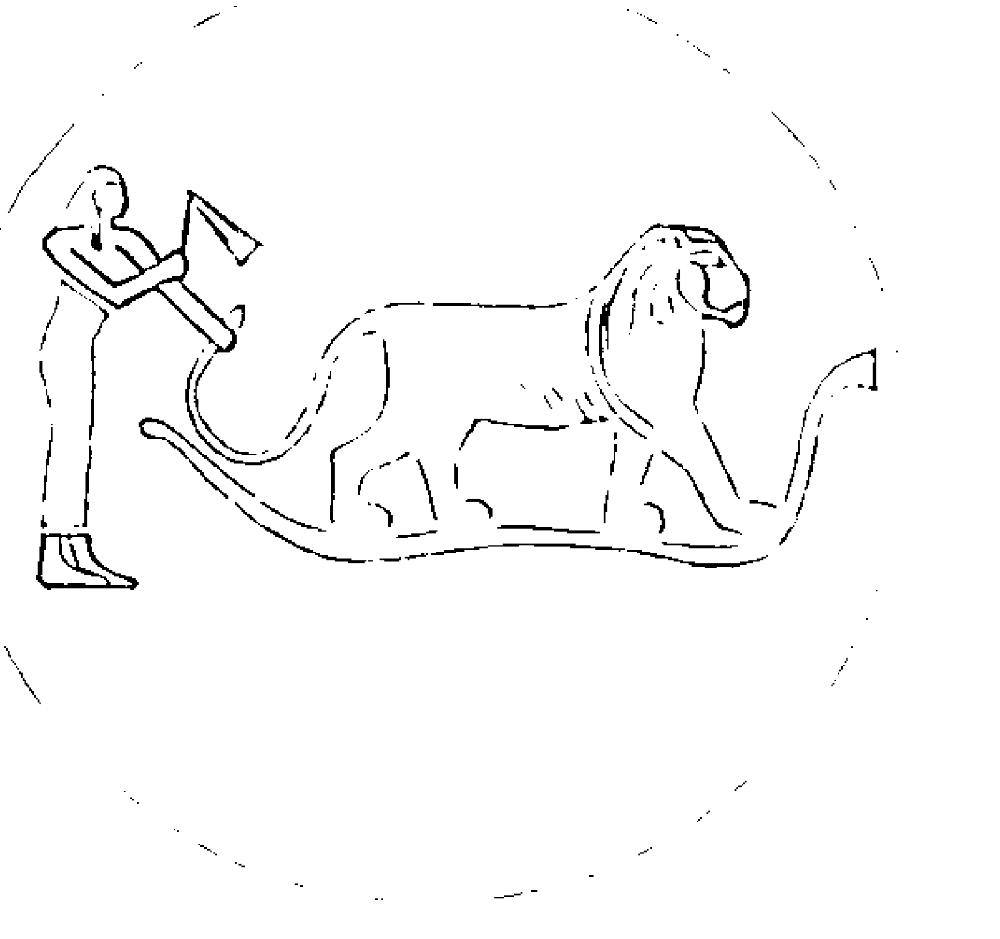

盛夏时节的7月22日至8月22日，太阳位于热力最强的狮子座。狮子座是阳性、火类的固定星座，自豪、热情、慷慨、坦率而有王者之风，喜欢成为众人瞩目的焦点和行动的中心，通常有着一个特大号的自我。他们愿意为别人承担责任、负责各种事务。自制力强、光明磊落，做事专注，有领导欲，嫉恶如仇又不失体面。他们的字典里充满英雄色彩的词汇。狮子座天性爱玩，什么热闹都喜欢凑，而他们机智、诙谐、流畅的言谈也能带给大家很多快乐。

狮子座通过自己的优秀品质和一副好脾气使得自己被注意、羡慕、赞美和喜爱，如果得不到这些东西，他们会展露出自己不那么通情达理的一面：他们会怒吼，会显示出吓人的愤怒情绪。不过，狮子座天性和蔼，很少以这种方式显示权威。可爱的狮子座们有时候也会显得任性、固执，爱生闷气，好像长不大的孩子。

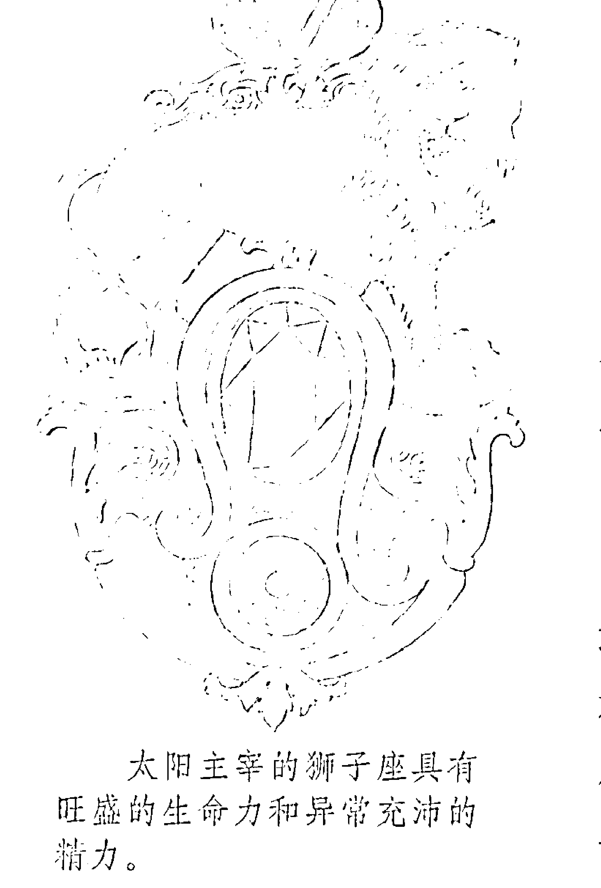

他们需要爱，各种形式的爱和认可，但内心里他们会怀疑自己的真正价值，甚至严重低估自己。受人尊敬和崇拜的狮子座有一颗金子般的心，能够施放很多的爱心；觉得自己不被爱、不被认可的狮子座则会感到失落、自怜。最重要的一点是，狮子座最容不得被人忽视，长期被忽视的狮子会禁不住哀叹变成了可怜的小猫。

作为固定星座，狮子座情感深厚而真挚，会长期地致力于做一件事、维持一份关系。对所爱的人宠护有加，也是最真挚的朋友。在个人关系紧张的时候，他们不会逃避，一方面因为他们本身的忠贞不渝，一方面也是因为不愿意自己不再被喜欢。

火类的狮子座乐观、积极，情绪外露，动作夸张，有表演天分，当然也喜欢舞台、镜头和壮观的场面。不像白羊座热衷于胜利，狮子座的内心希望占据最高的位置——狮子座的主宰是太阳，而他们也希望生活的一切围着自己运转。他们是很好的组织者，能够领导和激励别人，总是把阳光带到别人的心里。他们不愿把别人往坏的地方想，受伤的狮子座反击很迅速，同时谅解也很快，而不愿从此怀恨在心。

太阳在8月23日至9月22日期间位于室女座。室女座是阴性、土类的易变星座。

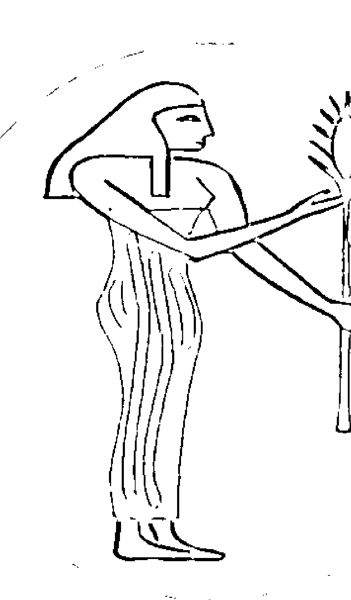

感性：
- 亲切、仁慈、服务、忧郁、内向、小气、繁琐、谦虚

理性：
- 勤勉、灵活、多才多艺、科学方法、批评、注重细节、怀疑、谨慎

文静、能干的室女座很有条理，与相邻的狮子座不同，他们愿意置身幕后，运用自己的分析能力和组织能力为更加外向的人提供帮助。结果是，自己常常被低估、甚至被忽视。这也影响了他们的自我评价，说话做事小心谨慎，并且很可能会缺乏自信。

室女座认为做事应该首先注意实际的细节，注重秩序。精度、效率、耐心、谦逊是他们的优点。他们总在寻求更多的知识，并把这些知识运用到自己谨慎、细致的思维当中。

室女座有很好的判断力和鉴赏力，务实而聪颖。他们出名地追求完美，有一双挑剔的眼睛，对细节敏感，会小题大做。在这样的挑剔下，总会看到自己的不足，低估已取得的成绩。他们内心知道自己与别人一样有能力，但是因为害羞、缺乏自信而不能展示这些能力，因此容易被别人利用，在这种情况下他们会很愤慨，受水星主宰，可能唠叨个不停，也可能表现得专横甚至尖酸刻薄。

这些显得苛求的完美主义者们常常为琐事而担忧，当他们被人批评为太挑剔、太爱抱怨时，会感到自己被误解——他们只是表达了自己的需求，而非对别人的人身攻击。爱批评的室女座对来自别人的批评很有抵抗心理，不会轻易认错。

室女座看上去很像一位插着翅膀的少女，从美索不达米亚地区和埃及早期文化中，室女座就一直被描绘为与丰产有关的女性形象——早期被等同于埃及女神伊希斯（天狼星）、希腊神话中的大地的女神德墨忒尔的女儿（冥王哈得斯的妻子），后来德墨忒尔被直接地等同于室女座。

室女座人喜欢用各种不同的方式和路线旅行，在生活中也会走一些弯路，但同样的境况再次出现时，则显示出非凡的方向感。对于境遇的改变，他们能很快适应，并找到一条适合自己的路。

受水星的影响，他们学习速度快、考虑周全、知识面宽、思路敏捷。尽管内向，但他们完全能意识到自己内在的那些躁动不安的思维，强烈地希望不断向上、不断改善。他们不做白日梦，而是踏踏实实工作。

室女座很关心身体的健康，对饮食很在意，花销有计划，讲究物有所值，对衣着也很有概念，熟谙不同场合的行为礼节并加以遵守，时常显得挑剔或过于整洁。

感性：
- 优雅、美感、艺术、浪漫、热情、多变、多情、情绪失衡

理性：
- 说服力、公正明晰、机智圆滑、犹豫不决、认可、物质主义

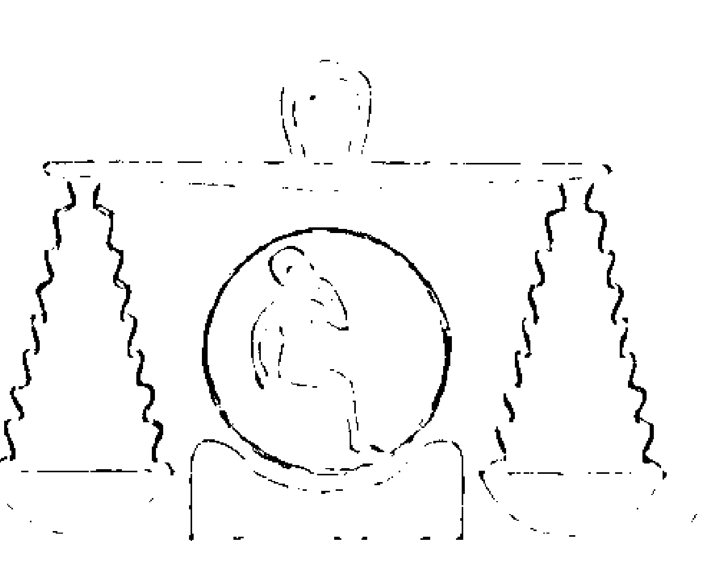

金秋的第一个星座，9月23日至10月22日，是阳性、气类的主导星座——天秤座，天秤座体现着主宰行星金星的品质：对爱、美与和谐的追求，有艺术的审美感，仪态优雅，懂得时尚，富有魅力。他们讲究条理，从外表、衣着到生活环境，都追求一丝不苟、干净整洁，而不能忍受邋遢、丑陋、虚伪、做作，以及粗俗的语言、挑衅的态度，不过对他们自己倒不反对采用双重标准。同时，他们也经常被别人的外表所吸引。

这是一个合作的星座，他们需要融合其他人的能量，需要朋友和伴侣，需要别人的鼓励、肯定和信任。天秤座在人际关系中寻求和平和欢乐，他们内心深处害怕孤单，虽然通常不会表现出来。天秤座能在任何情况下看到事情的所有方面，因此显得摇摆不定、犹豫不决。

天秤座是天生的外交家和调解人，喜欢辩论，寻求通过调和分歧来获得和平，而非通过对坑式的斗争手段。他们健谈，也是很好的听众，能够调动别人的情绪。尽管天秤座比较缺乏情感深度，但沉着、友善的态度和礼貌的举止使他们通常很受人欢迎。

欢迎。但是，在这层温和光晕下埋藏着一颗坚定刚毅的心，如果有人觉得天秤座容易被欺骗、欺负和利用，他们会发现自己错了。当天秤座用魅力和文雅得不到自己想要的结果时，会转而采用自卫性和攻击性的语言，显示出倔强的一面，仿佛自己的相对星座白羊座一般。

天秤座不怕道歉，他们态度诚恳而且总有极具说服力的借口，因此也总能得到谅解，很少被认为不讲信义。他们对不公平的待遇会非常恼怒，在面对世界的不公正义时也能够放下优雅的外表为正义而战，并随时准备给受压迫者以支持。天秤座主宰数学、艺术、音乐、设计、建筑等需要“平衡”和“和谐”的领域。

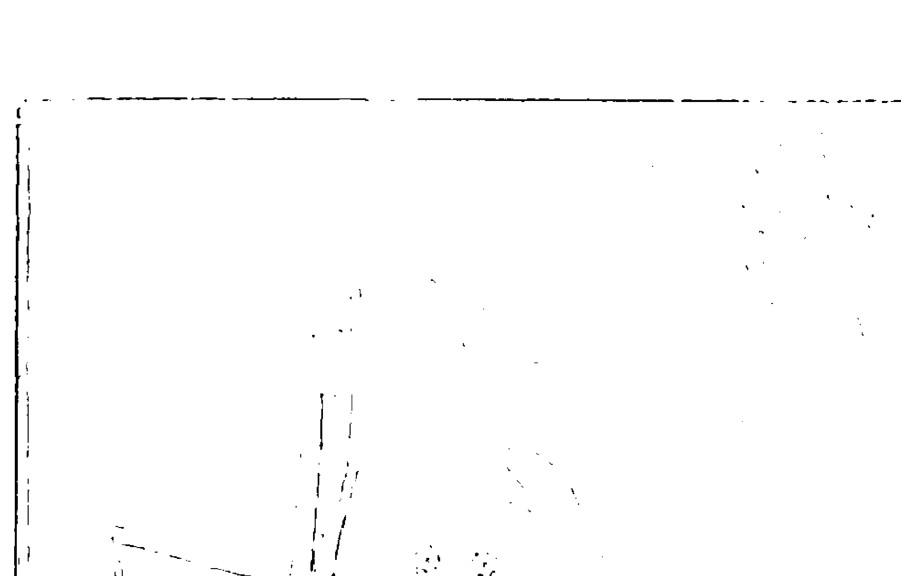

天秤座的象征物是天平。

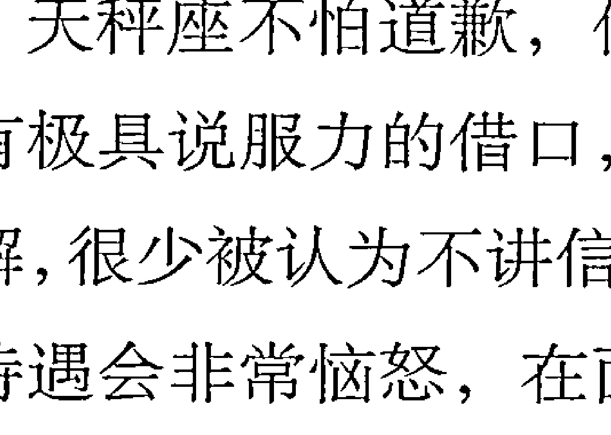

感性：
- 极端、神秘、易怒、报复心、放纵、多疑

理性：
- 爱国主义、明察秋毫、科学、讽刺、说教

从10月23日至11月21日，太阳位于天蝎座。天蝎座是阴性、水类的固定星座。主宰星冥王星将强大的能量赋予了天蝎座，并具有隐藏的深度：天蝎座的人会把情感深深隐藏起来，外表看上去闷闷不乐、遮遮掩掩。这是最受人敬畏的星座，虽然有很大的忍耐力，但是如果被逼得太急，会相当恶意地反攻。他们可以表现出温柔、关怀，也可以是冷酷、差劲——这完全取决于他们自己受到什么样的对待。他们需要尊重，也通常被尊重，然而当被拒绝、被忽视、被粗暴对待的时候，他们有时会从情感上、语言上、动作上立即进行反击，但更常见的是会精心预谋一个报复计划。

冥王星迟至1930年才被发现，在此之前，传统上天蝎座受火星主宰，而冥王星是火星的升华形式。这意味着天蝎座人意志力超强，感情极为强烈。虽然他们也会帮助别人，但帮助之手不会伸出太久，他们期望别人能够自立。

天蝎座与其他的水类星座一样，敏感而容易受伤，但他们即便心如刀绞也不会让人知道。同为水类星座，巨蟹座仿佛静止的水，安宁祥和；双鱼座好像流动的水，变化无常；而天蝎座正好比一块冰。天蝎座很能控制外在的情感表现，但是在这种强烈而又不轻易表露的情感里，难以排除占有欲和嫉妒心的出现。本质忠诚的天蝎座不能理解或接受别人的欺骗行为，而且他们很难原谅这种行为，甚至一辈子怀恨在心。其温柔的一面是：对于别人的友好，他们会想办法回报。

天蝎们工作勤勉，做事专注，当他们非常投入时，想劝其改变主意比登天还难。他们通常是工作狂，努力鞭策自己，也毫不留情地鞭策别人，看不起一个人软弱的样子。他们是难以对付的竞争对手，虽然他们自己试图不表现出来。

冥王星将“性、死亡与重生”这些主题带给了天蝎座，天蝎们有一种内在的性的驱动力；哲学意义上的“死亡”与“再生”有可能影响天蝎座的人生——在一定的劫难之后，他们有打碎旧自我、重塑自己新人生的内在能力。

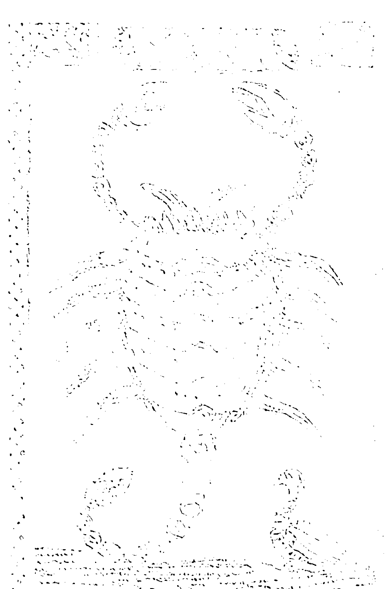

这是一种占卜用的纸牌，牌面是天蝎座的象征物蝎子。

从11月22日至12月21日，太阳位于阳性、火类的易变星座人马座。在木星主宰下，人马座能够以开朗健谈、有气势的方式表达自己。他们向往自由、渴望突破各种束缚，不能忍受自己的生活受到限制和控制，获得自由的人马座温暖、深情、有趣，而饱受束缚的人马座则自哀自怜，言语具有攻击性，他们并非不喜欢与人分享，相反也是喜爱热闹的一族，只是对于限制的恐惧使他们很快就寻求自由行动。

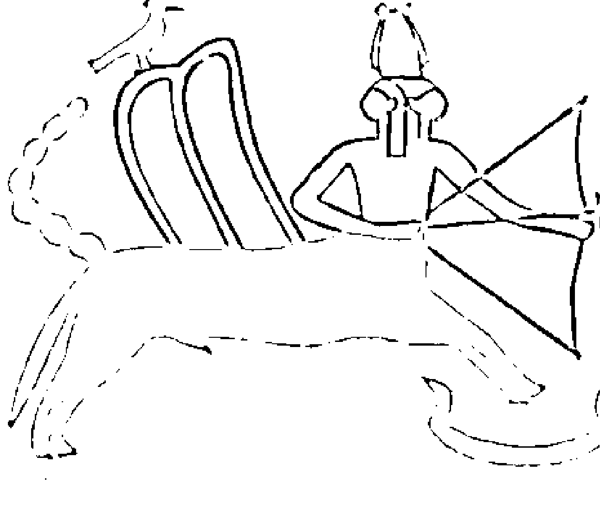

感性：
- 热情、能量充沛、轻松快乐、和蔼可亲、理想家、真诚、大胆、缺乏耐心、放纵

理性：
- 哲思、投机、知识分子、坦率公正、好脾气、无畏、折中主义、雄辩、预言家

人马座象征着对智慧的找寻，爱好学习和旅行。他们很乐观，对于明天将要发生什么充满兴趣，而不会对今天的错误懊恼不已。人马座头脑灵活，适应性强，能同时应付好几件事情，但是由于注意力不集中、事情太多的话会导致思维紧张以至混乱。他们喜欢变化，这使他们有吸引力，但同时也不可靠、健忘、做事有头无尾——许下的诺言得不到兑现、约会被忘记、说过的话过后也不当回事。人马座诚恳地倾听别人的建议，但是很少会付诸行动，因为他们有自己的主见，结果常常是艰难地吃一堑、长一智。

## 天知·星·达·人的法·宝

幸运的是，人马座很容易忘记也很容易宽恕，沮丧的情绪转瞬就会被欢笑所取代，而他们的快乐是很有感染力的。他们有高尚的情操，直率、诚恳、慈善、博爱，易于交往，有深刻的反省力，喜欢通过帮助别人提高而提高自己。在表达自己的观点时不喜欢用不确定的词汇，这种自以为诚恳的谈吐在别人看来可能是唐突。外交手段对他们来说是个陌生的词汇，这使他们会无心地表现为伤害感情、缺乏礼貌。人马座的驱动力在于对社会进步的贡献，因而他们能够成为好的教师、哲学家或政治家。

> 人马座在希腊神话中等同于善良而智慧的凯龙，他的弓剑看上去瞄准了天蝎座的“心宿二”，似乎准备射死这只蝎子，替俄里翁报仇。

人马座喜欢冒险，会比较鲁莽，遭遇挫折时会大声地抱怨，但立刻又会重整旗鼓进入新的冒险行动。他们也很会讲故事，虚构的王国对他们很重要，但是，那些故事通常远非真实，街头巷尾的闲话经过他们的口会变得面目全非。

初冬季节的 12 月 22 日至 1 月 19 日，太阳位于阴性、土类的主导星座摩羯座。摩羯座可以说是最坚强的星座，有潜力获得最大的成就，但也可能造成最大的失误。土星的影响赋予他们很强的责任心和时间的紧迫感，他们的人生动力在于对成功、财富、地位、身份、职权和爱情的追求。

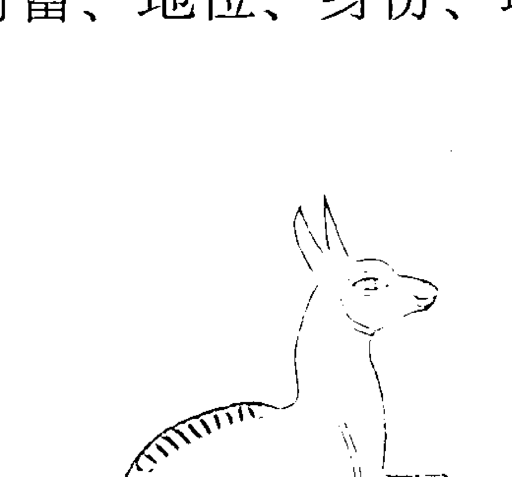

**感性**
- 内向、自怜、不宽恕、冷漠、易怒、
- 行动胆怯、过于冷静、限制、不安

**理性**
- 权利、专注、强迫、谨慎、勤劳、节俭、
- 细心、宿命论、顽固、极权、自我本位、义务

摩羯座人比较早熟，喜欢表现出他们“正在做正确的事情”。尽管他们可以沉着从容地应付生活中的任何事，但极少能够轻松地看待一个问题。摩羯们不太懂生活的艺术，但是有坚强的意志，能够下定决心，排除万难，步伐缓慢而坚定地走向成功。他们喜欢等待时机出击，获得自己想要的东西。

不幸的是，摩羯座在努力达到自己目标的同时，会显得对别人冷酷无情，因为他们自己做任何事都全力以赴，因此要求别人也如此，对于摩羯座来说，“懒惰、不尽职、缺乏雄心、随遇而安”都是应该批判的。他们的情绪变化可能很大，特别是在压抑之下会以极端的形式表现出来，当他们不得不停下来思索自己的行为时，有些摩羯座人会感到惭愧，并想办法弥补对别人造成的伤害，然而大多数摩羯座人都很顽固，不愿更正自己的做法。

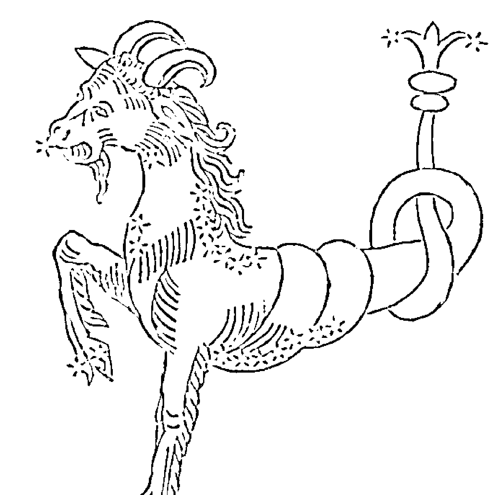

摩羯座非常需要得到尊重、认可和安全感，在足够的支持下能成为受人爱戴和敬畏的人，而成为社会的支柱正是他们梦寐以求的。如果得不到这些则会变得郁闷、吝啬、孤僻、算计。摩羯座们稳重、诚实、勤奋、精明，但当他们对于顶峰的向往压倒一切时，会表现得虚伪，喜欢评判别人，想尽办法往上爬。如果遭到蔑视，他们通常不会原谅对方。有些摩羯座人外表看起来令人生畏、难以接近，特别是对于小孩子和弱者，但是，为他们付出努力是值得的，因为他们的内心敏感而柔和。摩羯座有一定的幽默感，尤其善于讥讽。

摩羯座有“固执”和“维护既有规则”的倾向，他们难以改变已经养成的习惯和既定的信念，时刻惦记着责任、秩序、约束，因此可能会因为对规章、教条的执著而受到指责。

- 感性：活跃、乐观、兴奋、非传统、独立、易变、我行我素
- 理性：发明、智力、前沿科学、外交、思虑、通情达理、慈善、固执

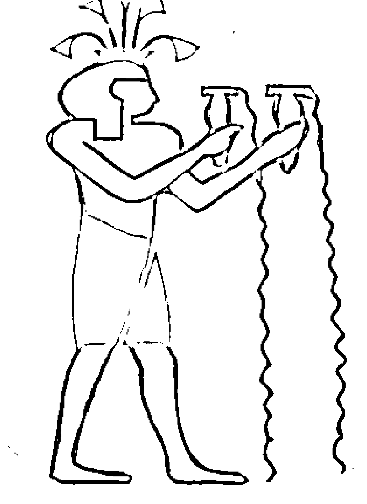

1月20日至2月18日，太阳位于阳性、气类的固定星座——宝瓶座。这是个代表友谊的星座，是非传统的、不喜欢随大流的星座。主宰星天王星代表突然而重大的改变，也主宰现代科技，在它的影响下，宝瓶座有着内在的矛盾性：他们相信均平的理想主义，但有着强烈的自我意识和个人主义倾向；他们有建设和改良的紧迫感、使命感，同时也有挑战性和变革精神；他们极为热心、交友广泛，却刚愎自用、难以预测，更显得不易动感情；外表看，他们对于不能及时跟上其思维步伐的人很有耐心，但内心里他们有时会对此难于容忍。

宝瓶座不是情感的星座，特别是在一对一的个人关系上。比如他们可以兴致勃勃地投入一个大型聚会、劲头十足地在网上匿名聊天，却不善于亲密的私人关系，他们只是有一个对每个人都热情的外表。宝瓶座的星座形象是一个托着陶罐的美少年，陶罐里承载的的确是代表感情的水，但是这些珍贵的水极少向外倾倒，劝说他们倾倒自己内心的感情只是徒劳的努力。其结果是宝瓶座显得无法看透，反过来，宝瓶座看事物也经常只能看到表面。

如果我们能进入宝瓶座人的大脑，我们会看到什么？——高度密集的神经元活动。他们总是在想问题，并且运用自己的智力和知识从生活中赢取自己的所需。作为气类星座的最高形式，宝瓶座喜欢不停地说话，喜欢沟通、交换观点。他们总是坚持自己的正确性，而事实也的确经常证实其想法的正确。他们喜欢与朋友基于精神与心智的亲近而建立情谊。

宝瓶座的思维是比较超前、进步的，他们直觉敏锐，对新生事物、科学研究兴趣浓厚，他们头脑中装满了创新的见解，世界在他们眼中也充满了变革的机会。宝瓶座人拆掉了思维的樊篱，能够走在时代的前沿，甚至年轻时显得反叛，而在后来才逐渐得到社会的认可。他们喜欢乐观地看待事物，同时能够把这种乐观的情绪以很有煽动性的方式传递给周围的人，但倾向乐观化的展望有时让他们不能冷静地分析事物的本质和潜在的危险，这就好像一个人从峡谷滑翔而下研究空中的彩虹，执著于醉人的美丽前景而忽略了提前认真考察气流的方向，以及如何安全地着陆。但是作为固定星座，宝瓶们一旦打定主意就很固执己见，别人难以改变他们的思维。

气类的宝瓶座同样具有物质欲望，但并不贪婪、吝啬，他们是不知疲倦的工作者，具有认真的工作态度，能够为自己的所需而工作，又不奢望额外的收获。

宝瓶座喜欢沟通，因为他们有一种把自己的知识和想法告诉别人的紧迫感，他们喜欢做的一件事就是告诉别人怎样做，然后看着他们去做。他们的主要兴趣在于设计一套宏伟的方案以改进事物的现状，而不是通过工作把这些设想转化为实际行动。他们对勤奋工作兴趣不大，除非其回报对每个人都真正有益。他们的理想是每个人都快乐地生活，最希望能够做对大众重要的、有意义的事，因而适合从政，也有集结大众信心的能力。

冬季末尾的2月19日至3月20日，太阳到达黄道的最后一个星座——阴性、水类的易变星座双鱼座。双鱼座包含着其他每个星座的某种属性，是最难懂的星座，而一个双鱼座人在人生的某个时间也可能做突然的转变。他们能够探索别人无法到达的领域，双鱼的心灵强烈地想逃离到想像的世界，但同时也有强烈的愿望想在现实中显示自己很高的天分，矛盾的结果是双鱼座永远也不能满足。在充满野心、财富和成功的世界，他们渴望逃离到自己的世界，寻求平和安详，但是，迟早自己心灵的庇护所会变成不得不冲破的监狱。

- 羞怯、敏感、幻想、同情、通灵、投入、忧郁、直觉、逃避主义、秘密、误解
- 抽象、内省、理解力、洞察力、哲思、宗教、不切实际、耽搁、缺乏信心

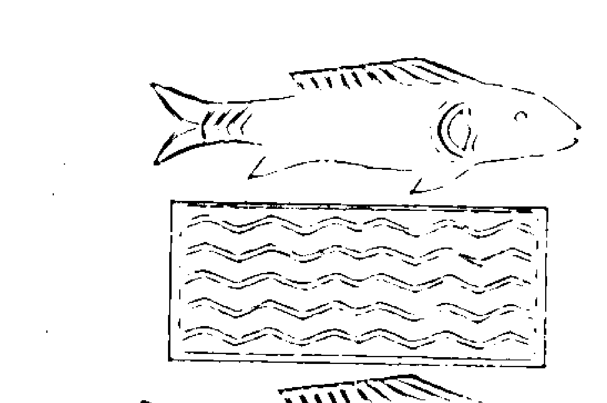

双鱼座复杂的情感让人难以捉摸，正当你觉得差不多看穿了的时候，他们又会表现出一种完全不同的反应，许多人因此会觉得他们不合群、惹人生气，也有许多人认为这是他们的魅力所在。由于优秀的直觉、创造力和想像力，以及对人的深刻理解，双鱼座是很有艺术天分的星座。

多数情况下双鱼座是比较安静和内向的，喜欢等待和观察。他们通常和蔼可亲，能给予别人所需要的同情和支持，能倾听别人的诉说。当自己需要安慰时，却发现难以倾吐自己的感情，只好私下里自我安慰。

双鱼座比较容易轻信别人，容易受到怂恿和诱惑，自我牺牲和自我贬低也是双鱼座的特点。作为黄道最后一个星座，也象征人生的升华，对超越尘世生活的更高层次有天生的感受，牺牲和奉献精神也体现了这种超脱的慈悲和包容。他们不喜欢看到任何人受到伤害，随时都会给弱者以同情，但是，极度的敏感和敏锐的直觉有时会带来各种麻烦，成为他们的脆弱之处。他们难以学会如何拒绝别人。

双鱼座性情不喜欢社交，喜欢避开公众注意的职位，并且不愿遵照规则行事，他们对情感上和生活上的混乱和无序有很大的包容性。

这个谜一样的星座，即便对于重复出现的情势也会做出不同的反应，这取决于当时的情绪。在积极的情绪下，没有什么是他们不能应付的；在消极的情绪下，则会深深地沉浸于自己的情感之中难以自拔。

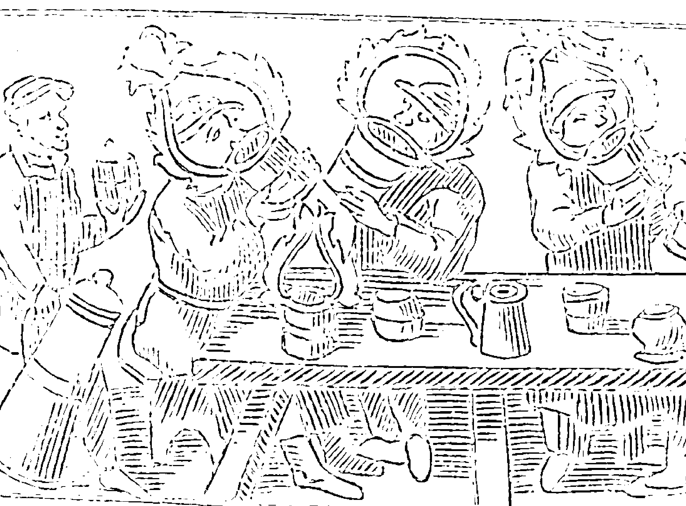

双鱼座的逃避主义使他们易沉迷于酒精和白日梦，如这些酗酒者。

## 星座生活

白羊座的爱是强烈的，他们也是非常浪漫、非常有吸引力的。对于爱情，他们持理想主义的态度。凡是决定不要的东西绝不会再捡回来，与旧情人复燃是他们所不屑的。对典型的白羊座来说，爱情就是一个征服的过程，其乐趣在于克服各种困难而达到爱的境界。由于其浪漫，白羊座喜欢典雅而有涵养的表现方式，但是，他们对对方有很强的占有欲，期待对方百分之百忠诚于自己，希望对方认为自己是惟一的、最好的爱人，对于来自对方的批评会感到难以接受。他们也会把对方理想化并怀着崇拜心理，如果对方的注意力有稍许投向别人，白羊座就会妒火中烧。

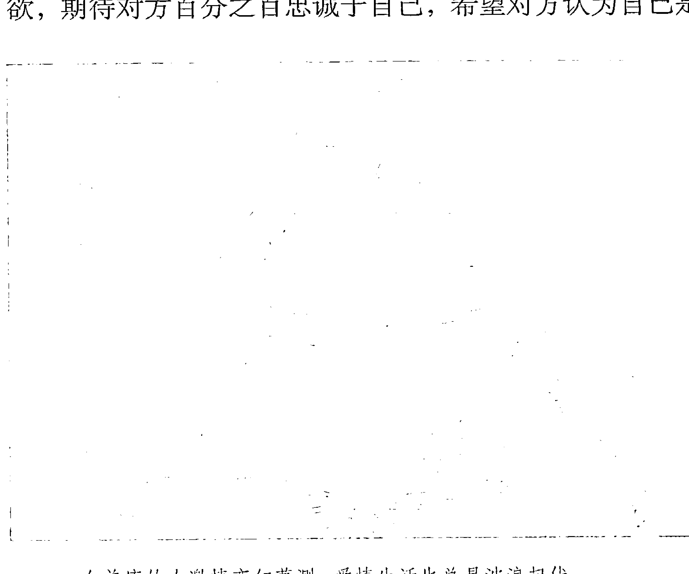

白羊座的人激情变幻莫测，爱情生活也总是波浪起伏。

与白羊座谈恋爱必须意识到他们希望在主要的事情上拿主意，而不喜欢关注具体的细节，比如日常琐事，这样白羊座的活跃、毅力、创造力就会得到充分的发挥。这种合作方式建立好之后，双方都可以享受一个有创意的、充满意外惊喜的恋爱关系。

婚后的白羊座强调的仍旧是热情、忠诚和权力。嫁给白羊座丈夫的女士，除了支持他实现梦想、完全忠于他，还要注意时常准备点新的惊奇给他，保持他的兴趣。有幸娶到白羊座妻子的男士，要清楚有主见、有抱负的妻子在这个男权主义社会有她艰难的地方，要在保持自信、自尊和不失技巧的前提下给予妻子所期待的支持和认可。

白羊座分手的理由通常是厌倦，因为对方不再能够给他带来新的兴奋点，在发掘新的激情的努力失败之后，白羊座的热情终于冷却而再也难以提起兴趣。因此，白羊座的恋人应该注意保持自己的神秘感，并且能够跟得上白羊座不断出现的新点子。至于一个人如果伤了白羊座的心，那么这个人可以预期自己会被彻底忘记、永远不会再被允许靠近。

白羊座的工作热情很高，是不知疲倦的工作狂，典型的休息方式是换一件事情去做，而不是懒在床上发呆。白羊座在做事的时候兴趣很重要，如果失去了兴趣，他们会难以强迫自己继续下去，转而寻求别的机会。

作为老板，白羊座显得比较理想主义，喜欢下属都兢兢业业地诚恳工作，没有私心杂念，并且对勤勉工作的员工不吝奖励。他们相信自己的未来是光明的，而他们也的确有能力把一个公司从破产的边缘挽救回来。

白羊座员工喜欢挑战性的工作，他们有毅力，不怕艰苦，不断寻求学习和进步的机会，而不喜欢关注细节，希望由其他员工或者干脆由机器代劳。不论员工还是老板，白羊座都喜欢显得很重要，特别是老板，他希望每个初来公司的人都能一眼认出谁是这里掌柜的。

典型的白羊座职位包括领导阶层、导演、领班、人事经理等有权力、能激励别人的位子——决定权是非常重要的，不然会没有兴趣。白羊座在开始一个新项目时是最卖力的，项目运行起来以后的巩固和维护工作，则最好交由别人去做。

白羊座很容易交朋友，他们会尽力帮助朋友实现自己的梦想。他们一般希望自己的合作伙伴值得自己骄傲，但绝不喜欢他比自己做得更好，一个精明的伙伴应该避免自己也像白羊座那样锋芒毕露，适当地对自己的能力持谦虚的态度。

典型的金牛座人对爱情忠贞不渝，不会原谅背叛的行为；他们觉得自己是全身心投入的，因而也期望对方同样对待自己。在还没有尝试爱情之前，他们对初恋抱着刻板的想法，缺乏创意和随缘的心态，因而初恋对象常常是身边的熟人。当他们开始恋爱时，出于对稳定感的追求，会因为面临太多的未知因素而踟蹰不前。在热恋当中，则过度介入对方的生活，忘记尊重对方的个人空间和感情历史。

对于金牛座来说，爱情是长久的、感官的浪漫，他们一般期望对方是一个充满男性或者女性魅力的人，喜欢借助香水、光线、音乐等营造相会的浪漫情调。在表面的鲁钝下面，藏着一个浪漫多梦的维纳斯。

金牛座很难主动提出分手，原因之一是那样就等于承认自己当初的选择是错误的。金牛座洞察力不是很强，有时候会被对方欺骗，如果他们发现对方的这种行为会非常受伤，但仍会努力坚持，期待事情的转机。如果无法扭转，比如对方主动分手，对他们的自尊是极为严重的伤害。但是，一旦他们自己下定决心就再也没有挽回的余地了。

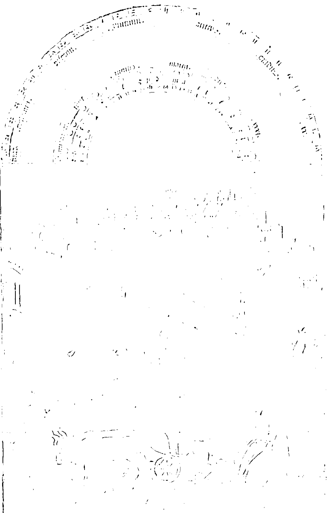

金牛座憧憬着稳定的婚姻，等到了谈婚论嫁的地步，他们会努力取悦对方，每一个步骤都从容镇静，每一个爱的举动都优雅协调，能充分考虑到对方的需要，在性的方面他们也是很好的搭档。金牛座的妻子特别希望丈夫能记住自己的生日和双方的纪念日，希望经常得到礼物和温柔的关怀。金牛座的丈夫除了想完全占有对方的身体和灵魂之外，还希望结婚时对方能带来些嫁妆。

工作中的金牛座最烦被别人打扰和催促。作为老板，他们会恪守自己的信条和价值观，赚钱有方，不喜谄媚，能给每个员工平等的机会。金牛座的员工需要在工作中收获尊重与价值，需要稳定的工资收入。他们务实肯干，对例行公事不感到厌倦，也不喜欢经常变动。适合的职业包括银行业、室内设计、建筑业、园艺、食品等。

金牛座朋友忠诚可靠，他们喜欢与有共同志趣的人交谈和共事，并且能够给别人诚恳、可贵的建议。金牛座也喜欢与有某种权势的朋友往来，他们的标准比较高，对于廉价的香水、饰品和衣着等会很看不上，这也影响他们与使用这些东西的人交往。

作为商业伙伴，金牛座期望合作人绝对忠实可靠，他们寻求稳定的业务方法和长期的伙伴关系，期望对方担负起公关事务而由自己负责具体的业务实现。

对于双子座，爱情是只有与“灵魂伴侣”才能达到的浪漫理想，因此他们会谈很多次恋爱，以寻求最完美的伴侣。对于很多追求者来说，双子座会显得有些冷漠，因为他们冷静、理性，情感独立性较强，也会压抑比较强烈的情感。有时他们会有“爱你在心口难开”的感觉，他们不善于表达深切的情感，特别是充满矛盾的情感。

双子座期望与伴侣有心灵相通的感觉，期望对方同情和包容，并且保持双方一定的独立性。想要追求双子座，必须意识到他们可能已经有了一个朋友，而且不要表现出太多的占有欲和控制欲。他们喜欢旅行，伴侣最好能与他们一起出游，或者至少不怕独守空房。对于爱情和性，双子座寻找多样性，喜欢意外的惊喜。他们对于温情陪伴的愿望会大于对性本身的渴求，不断的交流对于他们是非常重要的，而沉默只会让他们从激情中冷却。居家的双子座闲不住，喜欢摆弄新鲜的玩意，以及打电话聊天，他们欣赏轻松快乐、活泼自如的家庭环境和气氛。

双子座说分手的时候，多半是对恋情感到厌倦，或者对方提出的感情要求太多，以至难以承受或限制了他们的个人自由。分手的决定看上去是没有经过深思熟虑的，但其实却并非突然。如果是对方首先提出分手，双子座会通过突然爆发的脾气或者拼命显得冷静来掩饰受伤的情感，而后会重拾自信，继续寻找更完美的爱情。

作为员工，双子座初次面试就能给人以深刻印象：做事麻利、思维清晰，但是在饱受局限的工作场合却很难自我发挥。双子座很反感官僚机构，作为老板，他们不武断，鼓励沟通，能充分发现属下的长处。

双子座擅长辞令，诙谐幽默，适合公关、营销、记者、写作等职业，也适合在娱乐圈打拼。他们心灵手巧，也可以从事科研、艺术创作、外科手术等需要灵巧的工作。

双子座能讲很多有趣的故事，是令人愉快的乐天派，他们喜欢与好奇心强、喜欢交谈的人做朋友，但不喜欢被别人太多的个人问题所打扰，也不喜欢与过于依赖的或者过于武断的人做朋友。他们倾向于添油加醋，因此对他们的话要留点神。作为商业伙伴，双子座有令人赞叹的商业才能。

> 水星影响的双子座人朝气蓬勃，喜欢瞬息万变而不是永恒持久，他们颇懂人情世故，却甚少为爱情全力以赴。

巨蟹座爱得全心全意，忠诚可靠，虽然有时情绪低落，让人难解。恋爱中的巨蟹座要的是爱的表白和拥抱，他们对于对方的依恋颇深，最担心被拒绝，受到一丝的批评或嘲弄就会非常受伤，不忠的行为更是无法承受之痛，因此他们很少主动直接地表达自己的爱慕。巨蟹座虽然浪漫多情，但需要把想像变成切实的行动。

出于对母性素质的渴望，他们的婚恋有一种母爱式的味道：他们既需要被无微不至地照料，同时也会这么回报对方。他们有难以填平的情感饥渴，总担心自己被爱得不够多，这会让对方感到很累，也可能成为双方分手的原因。当他们一直得不到足够的像母亲一样的爱时，会冷若冰霜，有时从别处寻找满足，但如果发现对方有情感走私行为，则会有怀恨报复心理。

巨蟹座家庭观念很强，他们对于美满婚姻的理解离不开丰厚的银行存款和家当，因为安全感对其而言颇为重要。温馨的小窝、持久的习惯、鲜香的美食，是他们安稳感觉的来源。当婚姻难以为继的时候，巨蟹鲜少是决定分手的人，这种分离无依，是他们心中严重的创伤。

巨蟹座们会为了挣钱而努力工作，但并不愿意做超出所得的付出。敏感使他们容易失意，经常是在工作场所默默承受，回到家里才敞开地发泄。在工作上，巨蟹座希望工资持续稳定地增长，希望与同事保持融洽的关系，有整洁的工作环境，并在办公桌上摆上家人的照片。作为老板的巨蟹座，会要求属下工作态度认真，而且目标只有一个：为公司赚更多的钱。

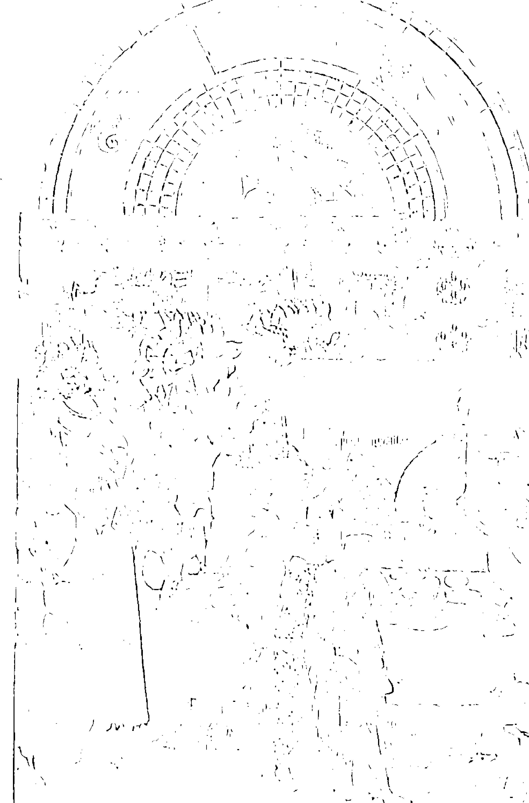

适合巨蟹座的典型事业包括：与“养育”有关的餐饮、酒店、营养、养殖、园艺等，与“护理”有关的咨询、心理治疗、社会工作等，以及与“水、船、渔”等有关的行业。

巨蟹座喜欢美食，喜欢集体的宴会，如同这幅油画中描绘的场景。

令巨蟹座感到温暖的朋友，是那些在需要的时候能给予他们支持的人，不论是情感的还是经济的支持，特别是幼年的知己对巨蟹座来说最为珍贵。而他们也会把朋友当做家庭成员来对待，使朋友能深切感受到他们的细心、关怀和热情。作为商业伙伴，巨蟹座会有主导欲，并期望对方百分之百地投入。

对狮子座而言，爱是一种具创意的行动、戏剧性的理想，而他们就是太阳、就是中心。爱必须勇敢而灿烂，光明磊落而轰轰烈烈。太阳主宰的心，是最纯的、给予型的爱心，毫无保留而不带条件。但是他们也是自我中心主义的，他们要的是敬佩、爱慕和忠诚，他们可能过于关注爱本身、过于关注自己“高、大、全”的形象，以至于忽略了对方的感觉，对交往中的微妙变化也视而不见。他们要的是对方也一直付出无条件的爱，保护心理使他们不允许竞争者的存在。

狮子座是优秀的情人，徜徉于童话和现实之间，是王子和公主的梦幻，他们所编织的爱情故事是别人羡慕的对象。他们活跃、有趣、阳光而性感，当然也慷慨大方，若送礼物，必体现豪迈和珍贵，收礼者是绝不可以拒绝的，丢面子不是狮子座能够容忍的事。

当狮子座的激情冷却时，会把对方继续当做朋友，但以前的爱意不再。若要分手，拉不下面子的他们会发觉难以启齿，因此可能躲开不见或者故意冷眼相对，对方的坚持会换来他们不尊重的对待。反过来，对方移情别恋或意外地提出分手，会让他们的自尊心受到很大的打击而长时间地一蹶不振。

狮子座工作起来不紧不慢，可能像一头睡狮，要充分调动起欢快的情绪才能卖力。他们也不像表面上那么随和、无所谓，而是一定要得到充分的认可。狮子座的好胜心和表现欲很强，希望占据受人尊重、具有权威性的职位，并能够体现他们的创造性，他们借助长期忠诚的工作态度而达到这个地位。尊重、友谊和快乐是支撑他们事业心的力量。典型的狮子座职位常常与“领导、营销、演示”有关，例如公关、推销、管理、代理、导演、演员、模特等。

狮子座老板比较自负，需要下属服从其权威。他们有表现欲，喜欢借别人的成就往自己脸上贴金。他们不吝鼓励和称赞，对下属及其家庭的考虑也很周到，但不容许失败。作为员工，狮子座希望自己的优秀得到公认，期待受到真诚的赞赏。对于商业伙伴而言，自信的狮子座能够可靠、认真地投入。

> > 受太阳主宰，狮子座人胸怀宽广，深谋远虑，所向披靡，富有领导者的气魄。我们在各行各业中都可以看到身居要位的狮子座人。

室女座经常被人描述成呆板无趣、性趣缺乏的形象，虽然有时候这种品性只是掩盖内心感性的表象。所有的土类星座都需要身体的接触，只是室女座太害羞，要到年长一些才能克服自己的羞怯。爱情对他们来说既不是戏剧性的，也不是多情伤感的，爱是一种投入的状态。作为水星主宰的星座，室女座也喜欢变化和沟通，而他们挑剔和唠叨的天性却可能让对方厌倦。

室女座不擅长激情和浪漫，但他们温暖而有等待的耐心，期望选到安稳可靠、有品质、不爱张扬的伴侣。室女座通常让自己的人生缺乏欢乐，总是把工作放在第一位，他们会从伴侣身上找寻那些自己缺乏的、其实是被压抑的品质。由于他们总是琐事缠身，要想情感历程一帆风顺恐怕有些难度，所以要适当地放开认真刻板的生活态度。

> 谨小慎微的室女座从来不寄希望于侥幸，只做有把握的生意，合理合法地赢利。

忠诚的室女座一般不愿分手，但他们讲求实际，如果长期受到不公平对待也会迅速地一刀两断，并不藕断丝连。不过，在最后行动之前，他们会试图理性地讨论这个问题，眼泪或要挟都不能改变他们的心意。如果牵扯到孩子，室女座会很关注孩子的教育问题。

室女座经常做着别人不愿意做的工作——需要投入很大的精力、耐心和技巧，回报又不够丰厚，基本上以服务别人为特点，有时候是为人作嫁。受到不公平待遇的时候他们也很少据理力争。他们自己的思维敏捷而高效，标准又高，因此常看不上别人干活的质量、速度。

室女座做事擅长分析、计算，适合会计、程序员、学者之类的职业，也适合做小公司的老板或项目经理，因为他们经常事必躬亲、注重细节，经营能力和事业远见则缺乏。

在合作方面，室女座义务感很强，对新的项目会长时间地仔细分析评判，有时候会错失良机，他们适合做支持性的、幕后的工作，打理具体的事宜。

天秤座天性善良、热爱交际。他们温文尔雅、善解人意，却喜欢理性地讨论感性的问题，喜欢用推理来决定自己的反应——有时候这是一种令人痛苦的体验。因为他们喜欢有人陪伴，有时会将朋友关系发展得太亲密，又生出些恩怨是非来。

天秤座的“花心”众人皆知，他们是完美主义者，永远都在寻求灵魂伴侣，经常是一开始觉得自己找到了，而后不可避免地发现许多不尽人意之处，于是又再次踏上寻梦之路。他们的标准很高，“关爱、浪漫、有智慧、有情调”这些品质其实在他们自己身上最丰富，但出于平衡，对方也应该有同等的表现。天秤座恋爱的特点是“和谐优雅”，与新的恋人相互吸引而开始恋情的速度比较快，那种平静、和谐、浪漫的起步是他们梦寐以求的，他们的人生理想沉浸于玫瑰色般的平和、浪漫之中。

遭到拒绝的天秤座在短暂的消沉之后会很快地重整旗鼓，把失去的弥补回来，因此会像初次相逢一样，努力把对方追回来，如果实在不能挽回，他们就会掩饰起悲伤，继续寻找真爱。天秤座自己提出分手，则多半是对伴侣无休无止的情感要求感到厌倦。

天秤座人缘很好，做事讲求公平，对待工作态度诚恳，愿意花时间保证工作的质量，如果无法达到高标准的要求，这些完美主义者可能不会罢手。他们的想像力、创造力和交际能力是对事业有利的优秀素质。不过，他们懒于从事自己不情愿的工作，也倾向于劝说别人代劳那些乏味、繁复的具体事宜。

天秤座有点懒散，经常显得不紧不慢、胸有成竹，很能沉得住气。作为老板，他们显得足智多谋，是理性分析的专家，在做决定时能充分考虑各方的意见和利益。作为员工，他们集体意识强，喜欢沟通，但不会热衷于传播闲言碎语。

相对于体力工作，天秤座更愿意从事脑力劳动，喜欢优雅的办公环境、和谐的工作气氛。适合从事的行业包括与“艺术、美”有关的园艺、时装、出版、设计、美容、奢侈品等；涉及“公正判断”的律师、法官、仲裁等；以及涉及“交际”的代言、咨询、宣传等。天秤座作为“合作”的象征，是优秀的商业合作伙伴，做事考虑周到，能充分维护双方的融洽。

“忠诚”和“占有欲”是天蝎座爱情观的主要特点。这些磁性分子是令人着魔的恋人，会在伴侣需要的时候挺身而出为其辩护，即便伴侣是错的，一旦他们相爱了，就会动用一切手段捍卫双方的共同拥有。如此忠诚和绝对，使他们成为黄道十二星座中嫉妒心和报复心的典型，对于天蝎座，婚姻如果不是令人陶醉的极致，就会是难以逃脱的牢笼。

天蝎座拥有巨大的耐力，敢于迎接任何艰难险阻。

人们常常把天蝎座和“性”联系在一起，但对于天蝎座，性的意义在于触及灵魂的深刻体验，是探寻爱人心灵底层的方式。天蝎座以性感著称，这是一种模仿不来的气质和氛围，它与性的关系不是停留在肉体的表面。论浪漫，他们比不上天秤座，论深邃，后者就要服输了。但无论如何，性在天蝎座的爱情生活中占有至关重要的位置，如果性关系不和谐，分手也许就不远了。因为天蝎座多半是被追求者，他们想要结束，也是容易开口的事。但是，如果他们自己被对方抛弃，天蝎座的报复心理会压倒一切，有可能会伤害对方，特别是在很长时间之后用某种微妙的方式复仇。他们不大会原谅，更难以彻底忘记。

天蝎座处变不惊，坚韧而顽强，弱点是缺乏变通，需要提高适应性和灵活性。他们喜欢待在一个地方静静地按照自己的节奏工作，但受到挑战时会做出激烈的反应。天蝎座是隐密的代表，对于自己的动机和秘密讳莫如深，在了解别人的信息方面却手到擒来，也能体察别人的情绪，这得益于他们敏锐的洞察力。

作为老板的天蝎座为人精明，敢于直面各种问题，对下属要求很高，强调完全忠诚，对所欣赏的人能倾力相助。天蝎座的员工上进心强，目标明确，不容易被困难折服，有很强的解决问题（特别是谜疑问题）的天赋。在商业伙伴关系中，天蝎座常常是主动发起并且作为领导的一方，能为了双方的共同利益而奔走。天蝎座适合的职业包括股票经纪、保险经纪、侦探、警官、军官、公司指导、中介人、外科大夫、中医师、科研人员等体现“共同财产、秘密、精密分析”等特点的行业。

随和乐观的人马座喜欢猎奇，把爱情当做浪漫的冒险。他们热情洋溢、富于幽默感，是很好的情人。人马座不喜欢把自己束缚在一种不愉快的亲密关系当中，有点困难就会打退堂鼓，然而过不久又会回来，显得反反复复。伴侣要防止这种不负责任的行为，也许最好的方法是经常出去远游、一起玩乐，并陪着他们在心灵方面探索、进步，用梦想的徜徉满足他们对于自由的向往。

如果对方占有欲太强、太爱吃醋，可能会适得其反，压力之下的人马座不久就会卷铺盖走人。当一场风花雪月变成了柴米油盐的时候，人马座也许会把眼光投向别处，沉溺于偶尔的恋情。不过，这种关系的吸引力多数是新鲜的刺激而非真正的浪漫。对于人马座，随他去，他会带给你许多的惊喜；拴住他，他就会生出抵触的情绪。例行公事的生活和不堪重负的责任，都是令人马座害怕的事。

如果要人马座保持快乐的工作态度，工作中的自由和多样性是必需的。人马座不喜欢被朝九晚五的例行日程所限制，对工作的兴趣有些反复，感到乏味时就会丧失动力。他们需要挑战和多样化，可能会同时兼任几份工作，特别是同时需要体力和智力、并且四处走动的事，例如宣传、销售、导游、运动员和汽车司机。人马座也是有幽默感、会讲故事的类型，因此有些人会选择当作家、喜剧演员等。

人马座当老板有一点冒失的倾向，做计划但不注重细节，期望别人跟他一样直来直去。不过，他们一般情绪比较好，能做到理解和宽容。人马座的员工喜欢按自己的节奏工作，热情随和，什么都满口答应，愿意做开创性的工作，但缺乏长期规划。人马座在商业合作中也强调自由，只要不受制约，他们会有很多创造性的主意。

面对异性，摩羯座比较害羞而笨拙，不懂打情骂俏，考虑非常实际。他们对于爱情的态度认真而忠诚，对于所爱的人关怀备至，也希望对方认真对待自己，并且希望对方能够挣钱、养家、置业。当他们陷入情网的时候，最能体现不安和担忧的性格特点，只有在感到确定无疑的时候才会表白内心真正的情感。当情感和经济的安全感获得保障的时候，摩羯座就会感到很满足。对于旁人，他们从未梦想过出轨的行为，甚至挑逗性的眼神也不会有。

如果双方发展不利，摩羯座不会轻易放弃，他们对于对方的三心二意深恶痛绝，会表现出刻薄而冷酷的一面，但同时也会牢牢抓住对方不放，努力让感情复燃，这很大程度上是出于对家庭的责任感。如果摩羯座自己发现找错了人，分手可能是干脆利落的。

摩羯座能够长期努力坚持一项工作，就算回报不那么丰厚，也永远在攀登下一级台阶，所以最终常能达到权力、专业等方面的高峰，获得尊重、权威和影响力。不论他们拥有多少名望或财富，攀登的步伐都不会停止。摩羯座有很高的道德和纪律标准，适合在政治、法律、财经、科研、税务、安全等行业任职。

> 摩羯座人渴望成功，这或许是为了补偿内心的某种需求和深藏的孤独感。有许多政治家和学者诞生在这个星座。

摩羯座的老板重视义务，重视对于规章制度的遵从，他们思想保守，一丝不苟。摩羯座的员工早出晚归卖力工作，对例行公事乐此不疲，喜欢安静地埋头于自己的事务，对于上级和前辈毕恭毕敬。摩羯座作为商业伙伴，会期望作为领导者和组织者，并要求对方忠诚，遵循仔细计划的规程。

由于天生对亲密的个人关系感到笨拙，当宝瓶座终于找到一个合适的人——常常是因为宝瓶座热情、开朗的品质使对方一见钟情并且试图建立恋爱关系的时候，这种关系会因为他们冷淡的态度、奇怪的习惯而面临考验。不过，他们天生的魅力和超强的沟通能力能够帮助他们把对方拴住。

宝瓶座把爱人当做朋友，期望保持自己的独立和随意行动的自由，他们通常是很忠诚的恋人，也不太爱争风吃醋。为了防止情感失控，宝瓶座会希望在爱情中占据主导地位。如果对方要求太多，或者对宝瓶座的自由加以限制，宝瓶座会干脆一走了之，而且非常有办法让对方先提出分手。

宝瓶座是新思想的开拓者，真正涉及到钱财他们并不动心，他们能很好地适应简朴生活。

在家里，典型的宝瓶座会期望伴侣理解、容忍自己的古怪之处，期望伴侣和自己一样喜欢各种各样的朋友来家里做客，也期望伴侣能够照看孩子收拾家，能自己照顾好自己而没有依赖心理。准备嫁给宝瓶座男人的女士，要考虑好自己面对的将不是一个人每个月会把稳定的薪水拿回家来养家糊口的人。宝瓶座的性生活受理性控制胜过激情，他们也不太懂得用身体的接触去消融言辞的争端，而对于对方在情感方面的问题也很难听得进去。

宝瓶座年轻时可能会尝试多种职业，他们喜欢多样性，喜欢与许多人一起工作，喜欢最先进的通讯方式。宝瓶座老板比较公正，按劳付酬，厌恶不忠诚的行为，不能宽恕谎言和不守承诺。作为员工，宝瓶座会对任何工作都提出自己独特的见解。涉及到试验、研究、新观念、超前思维的职业都是宝瓶座的所好，比如科研、摄影、发明、电子工程等。

宝瓶座的自由不容别人阻挠，为防止受到限制，他们会试图在任何关系中居于优势地位。宝瓶座的野心不是很大，他们期望别人认可他们的创意、给他充分的自由把新的概念带到公司。打算与宝瓶座合作的人，首先必须要确信宝瓶座对于要进行的事业真的有足够的了解。

宝瓶座人的生活离不开朋友，他们是常用不竭的信息之源，也喜欢在与人的交往中了解别人的观点，并吸收进自己的思维。他们也随时准备帮助和支持那些在痛苦中煎熬的人。

双鱼座比较容易堕入爱情之中或从中脱身，也容易出于对完美的寻求而谈一次又一次的恋爱。他们可以同时与好几个人保持亲密关系，也拿得起放得下，只不过对方可能一生都难以忘怀。双鱼座的女孩外表柔弱和依赖，常常让对方想不到原来她们的内心却决断而有韧性。

对于双鱼座来说，“浪漫、亲密、爱情”可能没有什么分别。爱是双鱼的生命源泉，他们活在感觉当中，随时准备谈恋爱，没有爱的生活对他们来说是了无生气的灰色。双鱼座的“敏感、温柔、心灵相通”让他们所爱的人无比眷恋。他们多情、善良，容易被诱惑，特别是容易同时被几个人吸引。双鱼座有自己独特的爱情观、人生观，内心也总有一个角落是不可捉摸的，那一部分属于他们自己。

当双鱼座翩翩然飘进另一个关系的时候，原先的伴侣可能并不会觉察到。双鱼座本身也没有对于不忠的歉疚——他们只需要相信自己的“可爱”，便排遣了可能的不安。因此对于这样的分手，他们内心没有多少自责，并且还会继续与原先的伴侣做好朋友。但是，如果被所爱的人抛弃，双鱼座潮水般的情感会让对方难以招架而失去招数。

双鱼座内在的敏感、害羞，会在生硬的工作氛围里带来一定程度的困难，使他们得不到充分的认可。严格设定的工作目标、业务考核标准等，与他们轻松随意的做事风格抵触，使本来良好的直觉在严酷的环境中难以发挥出来。因此，他们不太愿意做领导性的职务，对包揽权力也不大感兴趣。

双鱼座喜欢能够自由表达的工作环境，这有时意味着独立工作。在团队里，他们倾向于去做需要适应性和灵活性的工作。作为有艺术天份的星座，传媒、广告、艺术、表演等都是相关的行业；涉及服务性质的事务，如咨询、社工、公关、护理、中介等，也是另一类典型。

作为老板的双鱼座，对人的识别能力很强，他们欣赏有条理、思维传统的下属。作为员工，双鱼座野心不大，但希望工作能充分发挥其创造性，并得到足够的认可——因此在达不到的时候，会受压抑和自我怀疑的负面情绪影响。在商业合作方面，情感和经济的支持对于双鱼座来说是很重要的。

> 注：这一章我们介绍的是太阳星座的特性。事实上，这也可以说是上升星座（上升点所在的星座）的特性，因为上升星座是一个人呈现给外界的第一印象，代表了这个人自身的情况，包括性格、身体状况以及创造精神。对我们每个人来说，上升星座与太阳星座的影响同等重要。例如拿破仑，太阳在狮子座，上升星座在天蝎座，他的性格同时具有狮子座和天蝎座的特点。

## 十度分区

我们在第二章历史部分曾经提到过古埃及的“旬星”概念，即每个旬星主宰一年中的连续十天，这个概念结合到星相学中，有了我们这一章的内容——十度分区。

十度分区是将每个星座的 30° 分区划分为三个 10° 区间，这三个 10° 区间分别受同类三个星座的轮流影响。例如，白羊座的前 10° 最能体现纯粹的白羊座特点，中间 10° 含有同属火类星座的狮子座的特点，而最后 10° 则含有火类星座人马座的特点。

### (一)白羊一
(3月21日至3月30日) 受到火星的强烈影响，最能体现白羊座的本质，支配欲很强，有时显得富于攻击性，属于权威、领导一类人士。他们以目标为导向，自信、冲动、精力充沛、做事全力以赴，但也容易走极端，缺乏纪律观念，很少顾及后果。

### (二)白羊二
(3月31日至4月9日) 受狮子座和太阳的影响，仿佛被太阳镀上了一层金色的光辉，有内在的自豪感，渴望钦佩和赞扬。他们寻求生活的情趣，内心充满无限的激情，仰慕英雄主义，为家人和朋友可以两肋插刀。这个分区的人有雄辩的口才，语言表达又有亲和力，他们的言谈是使人陶醉还是使人惊讶，完全在自己的掌控之中。

### ○白羊三
(4月10日至4月19日) 受人马座和木星的影响，是最通融的白羊座。激情洋溢，崇尚自由，好友善交。他们很有雅量，能倾听，不抱怨，同时达观而睿智，观察力敏锐，很少错过机会。

### ○金牛一
(4月20日至4月30日) 是典型的现实主义者，专心致志，坚韧不拔。他们倾向于把事物具体化、实际化，比如婚姻和家庭之于爱情，以及目标的最终实现之于自己的美好设想。这些标准的金牛座记忆力很强，常识丰富，对于美的造型和设计有独到的眼光，有非常现实的自信。他们情感强烈、爱憎分明，有一种腼腆含蓄但优雅从容的交际魅力，也有许多忠实的朋友。

### ○金牛二
(5月1日至5月10日) 受室女座和水星的影响，好刨根问底、对细节敏感。金星的审美水平和水星的判断力，造就了一个聪颖全面、思路清晰、表达流畅的头脑，容易适应环境和处理不同情况，有很强的事业心与实干精神。他们喜欢浪漫之事，但不擅长细致微妙的感情交流。

### ○金牛三
(5月11日至5月20日) 体现着摩羯座的坚韧与思虑，雄心勃勃，富有毅力和自制力，有很强的现实感，但是容易被忧虑的情绪所包围。他们喜欢孩子，孝顺老人。性情比较固执，别人很难改变他们的习惯。

### ○双子一
(5月21日至5月31日) 这个分区最能表现双子座的本质：智力超凡、思维敏捷、兴趣广泛、多才多艺，容易接受新观念。缺点是善变、浮躁，以及优柔寡断。

### ○双子二
(6月1日至6月10日) 带有天秤座的特点，双子对改变的追求和天秤对平衡的执著相互融合，待人温暖、有情有义、做事恰到好处。“分享”是他们生活的原则之一，能够在时间、友情、财务等方面甚为慷慨。

### ○双子三
(6月11日至6月20日) 带有宝瓶座的色彩，具有进行清晰推理的才能和很强的智力天赋，能够走在别人的前面。他们既能看到别人的需求，又极具有说服力，其独创性的、新颖的观点也常常能给别人以启发。由于天王星代表着突破，他们希望突破社会和自身的局限，不断探索和品味各种有趣的事，同时，天王星也代表不确定的改变，使其成为机会主义者。在双子座这三个分区中，他们是最具有独立意识、也是固执己见的人。

### ○巨蟹一
(6月21日至7月1日) 是感情敏感而强烈、甚至极端的类型，受月亮的影响，情绪不稳定，容易感到不安或受到伤害。他们寻求和谐与安逸，性情温和，不喜欢争论，善于理解别人、感人所感，只有跟他们生活在一起的人，才能体会他们情感的深度和广度。他们最需要别人的理解与鼓励。

### ○巨蟹二
(7月2日至7月11日) 结合了月亮潮水般的内在情绪和冥王星攻击性的外在表现。这些巨蟹-天蝎类型对奇异和隐秘的事物有浓厚的兴趣，对愿意从事的事业能表现出持久的创造力。他们能够倾听朋友的倾吐，但希望别人尊重自己的个人隐私。

### ○巨蟹三
(7月12日至7月21日) 是巨蟹-双鱼分区，受海王星影响，体现了易感、浪漫的特点。他们不仅着装、打扮变换频繁，个性也显得难以捉摸，希望生活中充满变化。他们有包容心、热情好客、乐于助人，也能够适应各种类型的人，是很好的合作者。

狮子座的三个十度分区，出自土耳其星相学。

### ○狮子一
(7月22日至8月1日) 最能体现纯粹的狮子座品质，是魅力、高贵、尊严和自豪的集合。有神圣而崇高的理想和远大的目标，不愿意忍受任何束缚，为人慷慨、仁慈，很容易赢得别人的敬佩。

### ○狮子二
(8月2日至8月12日) 涉及人马座及其主宰者木星，强调智力、视野与梦想，他们的雄心不仅在于物质的获得，更在于才华的积累。为人正直可靠，蔑视排外和谄媚的行为，憎恶伪善和傲慢的态度。

### ○狮子三
(8月13日至8月22日) 这个分区从白羊座和火星汲取了积极进取的火类能量，而这种以“紧迫感、大胆、冲动”为特点的能量得到狮子座的“意志力、计划性”服和调节，使他们能够活跃在生活的各个领域。他们必须看到自己努力的成果，难以忍受一切劳动付诸东流。他们对别人也充满好奇，是很好的听众，甚少主动给人建议。

### ○室女一
(8月23日至9月2日) 智力超群、注意力集中、知识丰富、务实，是个纯粹主义者。有精确的观察力，注重细节，做事追求完美，“怠惰、无知、贪婪成性、别有用心”都不是他们的词汇。他们性格比较谨慎，非常害怕上当受骗，过分的谦逊也常使自己辛勤劳动的成果被他人所用。

### ○室女二
（9月3日至9月12日）具有摩羯座的特点，有远大的抱负和很强的职业信念，思想严肃认真，做事条理分明、慎重可靠，有很强的责任心和义务感，也是传统规范与教条的维护者。他们勤劳务实、勤俭节约，喜欢个人奋斗而甚少寻求别人的帮助，个性趋于孤僻与忧虑，在商业领域容易获得成功。

### ○室女三
（9月13日至9月22日）是室女座－金牛座的分区，性情安静、稳重、忠厚正直、忍耐力强、值得信赖，是室女座中快乐的现实主义者。实际感和理智支配着他们的生活和情感，在工作中刻苦勤奋，孜孜不倦，甘愿处于默默无闻的位置；在生活中则善于照顾自己所爱的人。

### ○天秤一
（9月23日至10月2日）强调金星的美感、快乐和奢华，并且永远试图平衡金星的“悠悠然、多情善感”和主导星座的“奋勇直前、开拓进取”。他们性格浪漫而迷人，对朋友和家人充满爱心。对他们来说，如果没有满意的爱情生活，即便有着蒸蒸日上的事业也总是欠缺的。

### ○天秤二
（10月3日至10月12日）是个性非常平衡的天秤－宝瓶分区，既独立自主，又重视朋友关系；既浪漫，又理性；既有金星的创造力，又有天王星积极、向前的思维。他们心地善良，宽宏大量，向往和平，厌恶暴力，讨厌尔虞我诈，能够同情弱者，热衷于给与，有很高的思想境界。

### ○天秤三
（10月13日至10月22日）拥有双子座和水星的敏捷颖悟，平易近人又充满活力，毫不费力就得到别人的注意，活跃的性格与魅力也很容易赢得别人的好感。他们思维充满好奇，对新的观念和事物很感兴趣。朋友的往来，感情的交流和社会活动是他们生活中的重要内容，在家庭中则希望能潇洒地放下责任。

### 天蝎一
（10月23日至11月1日）受冥王星的影响，个性专横，富有神秘色彩，思想深奥莫测。有超于常人的勇气与毅力，非常自律、坚强，在困难面前从不气馁，有潜力成就杰出的事业。主宰星冥王星同时带来了焦虑不安、潜藏的危机感与孤独感，以及强烈的欲望，如果不能克制那些不利的影响和负面的特征，也会使人走向另一个反面。

### 天蝎二
（11月2日至11月11日）双鱼座的胆怯和温情与天蝎座的高傲和冷酷相互交织，容易受到各种欲望的驱使，或是忧虑与不安的折磨，当他们拥有令人满意的爱情生活时，会充分发挥自己的潜力，在神秘学、心理学或发明创造方面表现出极强的天赋。

### 天蝎三
（11月12日至11月21日）带有巨蟹座的色彩，抛却了天蝎座对他人的多疑，增添了月亮的机敏、同情、感性，以及相邻人马座的健谈。喜欢从事公众事业，关注成功的素质，也有成功的幸运。他们很需要一个能带来精神上的平衡、充满幸福和友爱气氛的生活环境。

### 人马一
（11月22日至12月1日）总是向往着广阔的天地和遥远的地平线，有崇高的思想和对更多知识的渴望，可能会成为一个神气活现的探险家，也可能成为探究精神、哲学、宗教领域的思想家。他们待人宽厚，是具有优雅风度的竞争者，能够在战胜之后主动与对手握手言和，会努力营造和谐的氛围，也永远不会是枯燥无味的人。

### 人马二
（12月2日至12月11日）是人马-白羊分区，个性粗犷坦率，拥有敢作敢为、慷慨大度的品质，是有勇有谋的斗士，常常能够影响和启发别人，值得依靠和信赖。在火星能量的驱使下，他们的精神常常处于高度紧张状态，情绪也易于大起大落。在感情上，他们忠诚、投入，但不愿卿卿我我，即便遇到理想的伴侣，第一反应也常常是冷淡的。

### ○人马三
（12月12日至12月21日）带有狮子座的色彩，拥有太阳的活力和高傲，具有迷人的、令人愉快的性格以及优雅高贵的气质。有很强的智力天赋，精力充沛、远见卓识、意志坚强，个性独立，是个不知疲倦的探索者，而狮子座的色彩则体现在探索的崇高目的上。他们喜欢奇妙、引人入胜的体验，愿意经历那些看似不可能的挑战，更喜欢在别人面前展露赢得奇迹的辉煌和荣耀。在爱情方面，他们热情而冲动，追求那些能用魔力诱惑、俘获他们的人。

### ○摩羯一
（12月22日至12月31日）是责任感最强、态度最严肃、意志力最坚定的分区。雄心勃勃，有很强的组织纪律观念，能够不屈不挠地实现自己的目标。摩羯座的加强同时带来悲观与多疑的影响，使人性格孤僻，缺乏对别人的信赖，也容易被烦躁和忧虑的情绪所禁锢。爱情可以激发出他们温情的一面，他们也是极为忠诚的人。

### ○摩羯二
（1月1日至1月10日）带有金牛座的影响，金星用温柔祥和柔化了土星的严苛个性，是乐观和社交能力强的摩羯座。在他们的哲学里，失败是成功之母，他们对于自己坚持的信念和事业极为投入，会顽固地维持一个坚强的面具，不愿意承认自己有脆弱的一面。在感情上虽然全身心投入，但却不善于表露。

### ○摩羯三
（1月11日至1月19日）是摩羯—室女分区，水星的智慧使他们不必像别的摩羯座那样需要付出太多的努力才能成功。他们的个性有足够的弹性，适应能力强，做事力求完美。负面的特征是过于谨慎和优柔寡断，容易屈服于形势，影响激情的迸发。

### ○宝瓶一
（1月20日至1月29日）有出色的观察和思维能力，独立性、原创性和开拓性无可匹敌，个性强而脾气古怪，博学多才、充满变革思想和创造才能，他们需要足够的个人空间和自由，从来不会感到无聊和倦怠。宝瓶座的博爱使他们对穷困的人慷慨，对不幸的人友善。

### ○宝瓶二
（1月30日至2月8日）是宝瓶－双子分区，有语言天赋，知识渊博，直觉敏锐，言谈幽默。心理和情感上富有青春气息，能一直保持内在的童心，喜欢追寻生活的快乐，一切新生事物都会在他们头脑中产生共鸣，在进步事业、发明创造方面容易体现自己的才能。

### ○宝瓶三
（2月9日至2月18日）带有天秤座的色彩，是最娴静从容、最具优雅社交风度的宝瓶座，常看到别人的优点，有说服力而不令人反感。他们的判断精确明晰、合情合理，眼光长远而乐观，但也不排除有乌托邦式的空想。他们的天赋表现在智力与艺术灵感上。

### ○双鱼一
（2月19日至2月28/29日）神经极度敏感，具有在潜意识层面与别人的情感能力，能感受到别人的思想。头脑中充满幻想与神秘色彩，善变的天性使他们在达到目标之前会走很多弯路。服务精神使他们会放弃自己的需求，去做对别人有益的事。在生活的责任方面有逃避倾向。

### ○双鱼二
（3月1日至3月10日）受巨蟹座和月亮的影响，有敏锐的直觉，喜欢阅读、学习、吸收，能够把别人的见解转变成自己的观点。他们为人处世真诚、善良，有过分的自我牺牲精神，内心也充满渴求，别人的鼓舞对他们至关重要。在爱情中，他们体贴入微，也时常希望独处。

### ○双鱼三
（3月11日至3月20日）带有天蝎座的特点，有积极主动、讲求实际的一面。他们能够倾听并接受别人的观点。受冥王星的影响，性格有些暧昧难解，对声色之乐的吸引非常敏感，爱情影响着他们的很多决定。

## 星座组合
当丘比特的爱情之箭贯穿了两颗心，“缘分”将在一对恋人之间受到考验，双方各自影响较强的星座会为他们彼此之间的期望、默契、共鸣等定下基调，而这种基调包含着和谐的、不和谐的音符。

同样地，一个人天宫图上同时有两个或两个以上的星座处于较显著的位置，也存在着不同原型在心灵内部的配合问题。我们已经知道，对一个人个性影响最大的星座是太阳星座和上升星座，除此之外，如果某个星座聚集了一个行星团（即三颗以上行星集中于一个星座），那么这个星座对个性的影响也比较显著。这一章，我们来了解一下星座组合的一般原则。

同类元素的星座（如同为火类星座）之间呈120°（相当于三分方位），是最配合的“理想和谐”，有自然的默契。

相对星座（例如白羊座与天秤座）之间呈180°（相当于相冲），属于“互补和谐”，也可以说是不和谐：对于一对恋人来说，二者相对的性格特征既是初恋时迷人的吸引力、也是激情退却后彼此对于对方缺点的难以容忍；对同一个人来说，既是考虑问题时的全面、平衡，也是性格双重性带来的矛盾。

非相对的水类与土类星座（阴性星座）之间、火类与气类星座（阳性星座）之间称为“友谊和谐”，此时两个星座间隔60°（相当于六分方位）。例如巨蟹座（水类）和金牛座（土类），它们之间有很多共鸣，都对家庭、美食、钱财有共同的爱好。

彼此呈90°（相当于四分方位）的异性星座（例如白羊座和摩羯座）之间是“潜力和谐”：对于恋人来说，需要耐心克服障碍，以获得长久稳固的感情；对于同一个人，则意味着要努力克服一些自身内在的矛盾冲突，而后可以释放出其中所蕴涵的潜力。

在个人的出生天宫图上，如果属于“理想和谐”和“友谊和谐”的星座得到加强，性格的不同原型会表现出和谐的特征。

如果属于“互补和谐”或“潜力和谐”的星座（也就是主导星座之间、固定星座之间、易变星座之间）得到加强，意味着个性存在内在的矛盾冲突，这里我们主要介绍这些针对同一个人的、具有矛盾冲突的星座组合。

主导星座之间的矛盾主要在于个人和家庭生活的根本问题。白羊座直接去追求个人的所得；而天秤座要考虑朋友和伴侣的需求；摩羯座希望在事业和社会生涯有自己的一席之地；而巨蟹座则注重家庭和情感生活。

由于主导星座的人内在的驱动力强，精力旺盛，而且倾向于按自己的方式行事，他们会试图解决这些矛盾，但常常由于不注意方式方法，缺乏前瞻性和有效的计划，而陷于思维的混乱。

具体来说，白羊座和巨蟹座是“火”与“水”的组合，都很情绪化，也都热情而冲动。这两个星座的矛盾在于独立性与依赖性、面向自我与面向家庭、先锋精神与家庭至上。他们会为了家庭利益而跳起来抗争，但同时，在事业方面，家庭、过去和传统对他们的牵绊可能是令人灰心的，因此，他们很可能为了摆脱过去而奋斗。

白羊座和摩羯座是事业心的有力组合，他们为自己设定了看似不切实际的奋斗目标，但倾向于在最短时间内达到目的，容易陷入自私与粗暴，不理会别人的情感和利益，也不计较手段。在极端的情况下，缺乏耐心的白羊－摩羯组合会屡屡受挫，进而，或者付出更大的努力在社会的既定框架内寻求上升，或者更加顽固地拒绝接受外界的环境。

白羊座与天秤座遥遥相对，其对照主要在于我与我们、个人需要与社会规范、武断与妥协、斗争与合作、独立与协同、决断与犹豫。两个星座影响都较强的白羊－天秤类型，关注一对一的相互关系，内心的矛盾在于：如何在互相付出的关系中维护自己的原则，如何一边保持自己的独立性而一边从别人的角度思考问题。在这些矛盾消除之后，则能够将自身利益服从于合作关系，知道如何在避免好斗形象的前提下坚持自己的主张，他们是斗士，为了公平和正义而战，也为了财富和利益而战。

巨蟹座和天秤座的组合体现着家庭关系和人际关系之间的对立，他们害怕孤单，可能为了建立稳固的家庭而与人来往，可能出于情感的安全感而过于迁就、妥协、犹豫，也可能由于巨蟹座的付出精神和天秤座的共享原则之间的微妙矛盾而感到困惑。

巨蟹座与摩羯座的对照，主要在于可塑与僵化、家庭与事业、精神生活与社会生活、让步与强制、母亲与父亲等。这种类型通常保守、严格、有责任感，是家庭和社会的支柱，关注社会和政治问题。在一定意义上，敏感、屈从的巨蟹座象征着家庭，而摩羯座象征着社会及其相关的规范、准则、律法、界限。毕竟“土”与“水”是相容的，如果两个星座影响力大致相当，他们会使家庭和事业齐头并进，也会是很好的父亲或母亲。

天秤座和摩羯座的组合对社会生活有利。这一组合的人彬彬有礼、镇定自若，关注别人的思想和观点。他们的主要内在矛盾在于天秤座寻求公正、平等和妥协，而摩羯座尊重权力和纪律，也就是“民主式”作风和“家长式”作风之间的矛盾。他们不断地寻求秩序，从家居、外观到工作和生活的方方面面。

金牛座对财产和安全感的执著，天蝎座对感情、愿望和意志的执著，狮子座对个性和骄傲的执著，以及宝瓶座对新见解、新思维的执著。他们放不开这些执著，因而影响了其适应性。

一个人天宫图上多于一个固定星座得到加强，意味着或者坚持、或者放下执著的解决态度，他们可以选择忍耐和抗拒，或者更有建设性地、逐步而坚定地消除矛盾。他们理解对抗惯性的困难，也有足够的意志力，但同时还有一种不愿消耗能量的倾向。因此当他们终于下定决心的时候，改变是戏剧性的。

金牛座-狮子座是牢固可靠的组合，有固执、冥顽不化的趋势。这一组合的人注重金钱的力量和安全感的价值，讲究饮食和享受，有时显得贪婪。他们同时结合了金牛座的稳健、谨慎和狮子座的冒险精神。

金牛座和相对的天蝎座存在建造者与破坏者、心平气和与情绪激昂、安全与诱惑、现状与危机之间的矛盾。两个星座都关注金钱、性和权力，在面对这些问题的时候容易滋生负面的怨气和嫉妒情绪。

金牛座与宝瓶座的组合存在传统思维和非传统思维、家庭生活和群体生活、情感的归宿感和超然感之间的矛盾。这一组合通常努力整合金牛座的现实主义和宝瓶座的理想主义。他们喜欢享受生活，注重身体的满足感，关注社会物质、环境方面的问题，执著于个人自由。

狮子座与天蝎座组合的矛盾是狮子座希望被人注意和认可，而天蝎座希望保持隐秘，尽管如此，这两者都喜欢戏剧性的、多姿多彩的生活，他们有内在的傲气，感情强烈、投入而又深藏不露。

狮子座和宝瓶座是一组相对的星座，好比个性化与大众化、独裁主义与民主主义、艺术家与科学家、群体感与自由性的对照。这种组合类型的人与众不同，具有独特的原创性和标新立异性，通常借助在鼓励民主和自由精神的领域获得某种名望和资历，来解决上述矛盾。

天蝎座与宝瓶座组合的矛盾在于一方要隐秘、独处，另一方要共享、群居。他们通常选择与小范围的、有共同志趣的人密切接触而避开这个矛盾。这一组合的人有玩世不恭、好挖苦人的态度，愤世嫉俗，情绪容易大幅摆动，同时也有深刻的见解和冷酷的革命性。如果宝瓶座的人类主义和理想主义占主导，能够为改善周围环境做出贡献。

易变星座都与知识、见解、理想、信念有关，其矛盾常见于这些方面的内在和外在冲突。典型的易变星座解决问题的方法就是不去解决这个问题：逃避。

易变星座的优点在于适应性和可塑性强，他们永远在寻求改变，但不是以目标为导向。他们对自由探索的关注大于对成就和获取的关注，有可能不知道自己到底要什么，这会导致不满足感。太强的易变星座的影响，使人缺乏前后一致性，太易于屈服，从而显得缺乏方向性，摇摆不定，思维和行动散乱，也导致信心和远见的欠缺，取而代之的是持续的紧张及担忧的情绪。

双子座和室女座，作为水星主宰的气类和土类星座，是最易变的组合，存在的矛盾主要在于思维难以集中、缺乏激励机制、不大能够感谢生活、不满足感较重，以爱挑剔、烦躁不安为最差的态度。水星意味着对语言、文学的喜好，有广泛的兴趣和较宽广的知识面。他们对于收集、分类、整理和获取信息有独到之处。擅长写作，但过于理性可能使他们现实、教条、乏味。火类星座的适当强化有助于为这一类型补充热情、信念和方向。

双子座与人马座这一对相对的星座分别由水星和木星主宰，都与教育、旅行、信息的收集和传播有关，存在推理与直觉、知识与智慧、非道德与道德的对照。双子座涉及短途旅行、学校学习、零碎的知识；而人马座则涉及长途旅行、学校教育、全局印象。智慧、道义和评判也是人马座的特点。这一组合的人对任何事物都有兴趣，健谈，好动，有股年轻的精神。渴望发掘人生的方方面面。

双子座与双鱼座也是不安分的组合，与双子座相比，双鱼座不太关心具体的事实本身，而是更关心相对价值和内在体验。因此可能存在外部世界的客观现实和个人经验的内在现实之间的冲突。这一组合对有想像力的写作（特别是诗歌）有利，以及有表达非理性的、不可定量的概念的天赋（比如感觉）。他们的头脑中充满各种也许连自己都无法理解的念头，常常试图理性地处理自己的情感和想法，导致焦虑和混乱，为避免这种情况，应该努力把这些思维表达出来，不论是用语言还是写作、绘画等艺术形式。

室女座与人马座的矛盾在于室女座关注细节，但人马座恰恰不愿为细节所扰。如果这两个星座内的行星也组成四分方位，可能导致小题大做、随意批评、倾向于夸大自己的或别人的缺点。总之，他们是批评家和怀疑论者，虽然可能自恃自己的信念正确。室女座的服务精神和人马座的哲学信念可能促使他们从事义务和慈善工作。

室女座与双鱼座的对照在于秩序与混沌、批评与同情、注重完美与注重完整。两者的思维方式差别较大：双鱼座随波逐流、随心所欲，而室女座关注自己、别人和社会的提高与完美化；室女座有一套解决问题的去粗取精、归纳整理的方法，而双鱼座要对各种因素做相对价值比较，对问题的所谓正确答案并不关心。在最佳的情况下，室女座的评价、区别能力可以与双鱼座的利他主义、自我牺牲相结合，使他们具有很强的服务精神，和蔼谦逊、慈悲为怀。在他们的人际关系中，可能重复出现拯救或被拯救的模式。

人马座与双鱼座的组合是梦想家，总在寻找着某种理想的完美，有一种空想式的乐观主义。现实生活中他们不一定是爱旅行的人，但在想像的世界可以跑得很远。这两个星座都不喜欢被约束，随时都准备溜出去走走，去经历一些奇妙的事情。他们随和、善于理解别人，有粗心大意的倾向。由于星座方位的直角关系，他们的政治和宗教信仰有可能与内在的信念不协调，甚至对立，导致他们时常难以沿着自己的思维达到理性、客观。水星的较强位置有助于调解这一趋势。

星座的组合还有一种典型的情况，那就是针对出生在两个星座交界处的人。

出生在两个星座交界处前后各一两度的人要受两个相邻星座的影响，相邻星座的性格特征可能难以调和，也可能相互补充，同样存在着各种不同的潜力和矛盾。

双鱼 - 白羊交界是“新生的交界”，正如春分点是上一年的结束与新一年的起始。这个交界融合了双鱼座爱幻想、敏感的特性和白羊座率直、冲动的特性，他们心思单纯，做事凭直觉，易遭人误解或者不理解，因此，要避免在幻想驱动下的行动，也要遏制自己的冲动。这类人较为我行我素，但当失败来临时，又表现出双鱼式的理想主义，把失败看做暂时的阻力而不气馁。

白羊 - 金牛交界是“力量的交界”，太阳在这个交界处将促使白羊座的特点更多地发挥出来，使之缺乏耐心、疲于不安。要适当控制白羊式的冲动好斗，以随和、放松的态度面对人生，做一个慢跑的牛，学会忍受暂时的一成不变。

金牛 - 双子交界是“活力的交界”，兴趣广泛，随时蓄势待发，但缺乏定性。双子座的巧舌如簧加上金牛座的商业头脑，使他们很有成功的潜力，适合保险经纪人之类的行当。理性的投资计划得益于双子座的丰富信息，而双子座的随心所欲则需要金牛座的沉稳加以约束。需要注意的是言行一致，不要轻易寻求新的目标和刺激。

双子 - 巨蟹交界是“好奇的交界”，这种调和仿佛水中的气泡，理性和感性的冲突使他们无法宁静，内心深处潜藏着难以释放的痛苦，有时则不顾后果地发泄，要注意不要走极端。由于他们的才智、精力发挥在具有较高心灵层次的活动上，常给人温和、不露锋芒的谦虚印象。他们注重爱情，忠诚专一，但要注意拿得起、放得。下，避免让压抑的情感或强烈的负面情绪左右自己的思考和行为。

巨蟹－狮子交界是“摇摆的交界”，主宰星月亮和太阳的组合带来彷徨、摇摆，情绪波动大，可能给人留下难以亲近的印象，特别是男性的女性倾向和女性的男性倾向比较强。巨蟹座的保护意识促使他们远离危险和陌生，但要亲近的人留在身边；而狮子座的王者风范促使他们乐善好施不计回报，同时却又与所有人保持距离。他们精力充沛、喜欢刺激和挑战、喜欢竞争的环境，又需要安全、可信赖的环境。需要注意保持稳定平和的心态与冷静的观察判断能力。

狮子－室女交界是“敞开的交界”，是内向与外向人格的综合体，外表安静、深沉，内心丰富、敏感。室女座的缺乏信心也被狮子座的胸有成竹所平衡：踏实而实际，热衷于创造，能够有条理地做一件服务大家的事并乐在其中。他们观察、判断、思考、表达的能力都比较强，喜欢交替运用隐藏和揭露事实的手段作为武器和策略来达到目的。他们重视情谊，也只有跟最亲近的人才愿意打开心扉倾吐秘密。

室女－天秤交界是“美感的交界”，这是最容易调和的组合：两个星座都着重思考，但室女座的挑剔和天秤座的犹豫加深了其完美主义，缺乏满足感，倾向于把自己感觉不完美的创造推倒重来。他们对于美的事物感觉非常敏锐，富于创造的灵感，注重外表，待人处世比较得心应手。但要注意控制情绪，适应压力和低潮。

天秤－天蝎交界是“批判的交界”，天蝎座的独断专行与天秤座的犹豫不决相矛盾：天蝎座倾向于自己判断分析，天秤座倾向于由别人来下结论；天秤座的轻快、洒脱也与天蝎座的严肃、批判的个性相冲突；天蝎座激进的爆发力克服了天秤座的犹豫；但压力和挫折之下会突出天蝎座的冷静思考，而躲入自己的孤独中。他们有责任感，个性戏剧化，爱说教。

天蝎－人马交界是“变革的交界”，有变革的精神，投入了对理想的追求，有长期的蓝图和宏伟的计划。天蝎座的深沉、严肃、神秘加上人马座的直觉、外向、自由，使他们倾向于先了解自己再进一步行动。他们重视友谊，但感情上并不稳固，崇尚自由的家庭纽带。由于易变类型的“火”有被固定类型的“水”浇灭的危险，想得多、说得少，要注意放下太多的自我保护意识，不要总让语言在头脑里打转。

人马－摩羯交界是“先知的交界”，受木星和土星的共同影响，他们的直觉和理性都比较发达，感情深刻、沉默寡言，但是自我表达非常准确，喜欢当面沟通。由于土星带来严肃和专制，他们争强好胜、追求名利，因此需要学会享受生活，凡事不要看得太认真。

摩羯－宝瓶交界是“灵性的交界”，个性活泼而又善于夸张的表达。他们富有直觉、观点新奇、易引起争论。土星的秩序感和责任感被天王星的叛逆和打破常规所破坏，性情多变，脾气暴躁。需要认识到自己见解的与众不同，不要担心别人的不理解，但要注意避免过于难以捉摸。

最后，宝瓶－双鱼交界是“敏感的交界”，这类人通常多才多艺，富有同情心和想像力，个性独特、叛逆，温和、体贴、浪漫而有情调，但是可能不愿表达真实的自我，显得难以捉摸，他们坚强的外壳下面藏着一颗敏感脆弱的心，喜欢通过社交舒缓情绪。他们可能致力于改变周围的世界。

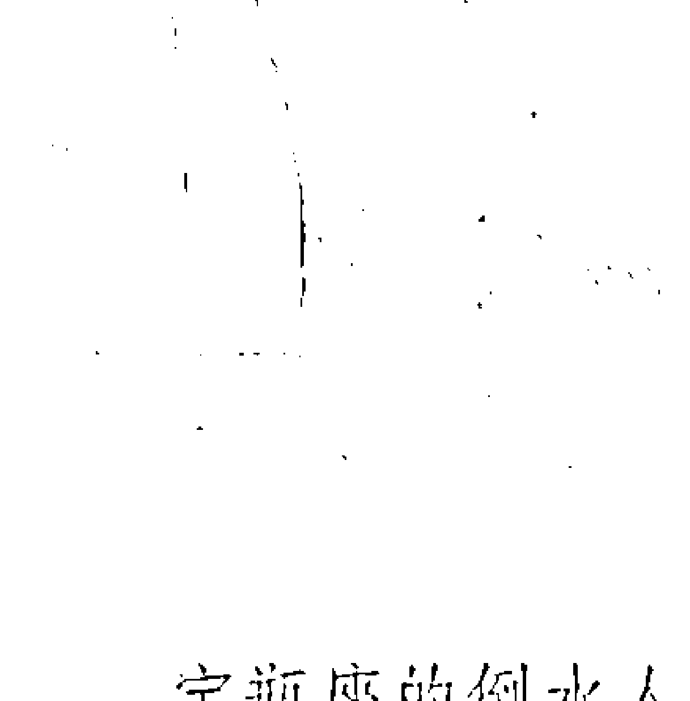

### 按图索骥

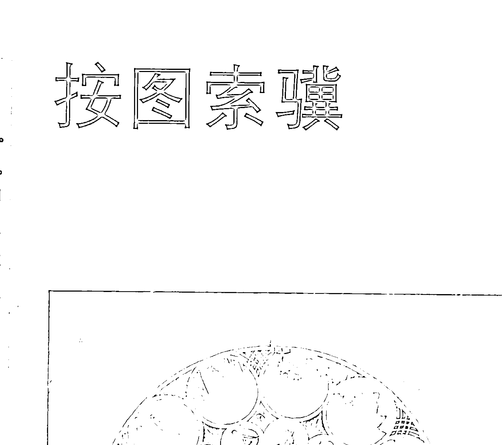

布拉格的星座钟。

到此为止，我们已经将星相学的两大要素——行星和星座为读者做了比较详细的介绍，在这一章，我们来看看行星位于不同星座的含义。读者可以根据自己出生天宫图上行星所处的星座，来分析自己的出生天宫图。

我们再归纳一下行星和星座在星相学中各自代表的意义：行星代表不同的能量和欲求，星座象征着不同的个性特征。

行星代表的能量和欲求在不同的星座有不同的表现，这是因为星座的特性对于行星力量的发挥起了染色作用。例如，金星同时主宰金牛座和天秤座，但在金牛座着重于物质和享乐，而在天秤座着重体现美感和多情。

同时，星座的属性也修正了行星的主要表现形式。例如，火星的位置影响着能量的表达，当它位于火类星座时，以体力表达为主，包括孜孜不倦地工作、热爱体育运动等；位于土类星座，以实践能力为主，例如组织计划能力、经营生活的能力；位于气类星座，以脑力表达为主，即思维能力、记忆能力、沟通能力等；位于水类星座，则以性的能量、情感能量和对艺术的追求为主。

又比如，月亮代表情感，当它在气类星座时，使人有把自己的情感讲出来的愿望；在火类星座则转化为行动；在土类星座，追求稳定；而在水类星座，情感的自由表达则是至关重要的。

在这里我们只介绍内行星、小行星，以及龙首、龙尾在不同星座的含义，三大外行星由于运行周期较长（例如冥王星运行周期248年，在一个星座平均停留十多年），它们的影响力是时代性的，是对一代人的总体影响，而且集中于集体无意识，对于个人的影响则由它们在天宫图上所处的宫位，及其与内行星的相位来决定，有关内容后文将详细介绍。

### 月亮在十二星座

| 星座 | 描述 |
|------|------|
| 白羊座 | 月亮代表的情感在白羊座是很强烈的，这类人独立性非常强，对于来自别人的干涉非常不快。他们具有无畏的精神，不服输。 |
| 金牛座 | 月亮在金牛座有积极的影响，金牛座的稳健平衡了月亮的多变本质，带来柔和、坚定的个性，他们追求稳定，能充分享受生活的乐趣。 |
| 双子座 | 月亮在双子座的人知识面宽广，喜欢文学，思路开阔，足智多谋，热爱旅游。他们喜欢交朋友，喜欢与别人分享自己的看法。 |
| 巨蟹座 | 月亮在巨蟹座的人善良、富有同情心，有很强的家庭观念，希望被人照顾，也喜欢照顾别人。他们对外界条件很敏感，情绪多变，容易随波逐流和周期性地忧郁。 |
| 狮子座 | 月亮在狮子座使人坚强、自立、积极主动，有领导才能，常常寻求别人的注意，甚至不惜使局面戏剧化。待人接物公平正直，受人尊敬。 |
| 室女座 | 月亮在室女座，喜欢分析自己的感觉和面临的情势。聪明上进，记忆力强。有保守的倾向和娴静的风度，不喜欢奉承或张扬，稍欠自主性。 |
| 天秤座 | 月亮在天秤座的人个性温和，富有同情心，乐观而喜欢交往。他们推理能力强，也期望倾听别人的意见。 |
| 天蝎座 | 月亮在天蝎座，执著于自己的感受，勇敢、独立、精力旺盛，不能容忍别人的干涉，也不愿接受强行的安排，不怕威胁。决断、顽强的个性有助于达到自己的目的。 |
| 人马座 | 月亮在人马座，个性活跃，喜好旅游和体育运动，对哲学和宗教有浓厚的兴趣，崇尚自由，为人乐观豁达。如果月亮相位不好，可能偏向懒惰和放纵。 |
| 摩羯座 | 月亮在摩羯座，独立自主、雄心勃勃，但不甚喜欢表达自己的感觉。如果月亮相位不好，可能喜欢说三道四，而且对他人的感受漠不关心。 |
| 宝瓶座 | 月亮在宝瓶座，想像力活跃，直觉敏锐，但易于忽略逻辑性。个性谦和可亲，朋友多，而来自朋友的友情是否可靠，则受月亮所处相位的影响。 |
| 双鱼座 | 月亮在双鱼座，感情丰富，博爱，有怠惰、自怜、优柔寡断的倾向，较易受到悲伤和麻烦的困扰。有必要把自己与周围的情感环境适当分离开，不要陷入太深。 |

### 水星在各星座的表现

水星在白羊座，意味着思维方式果断而简洁，有原创性，喜欢提出新主意、接受智力的挑战，做事立竿见影、不喜欢耽搁。水星的本质是好辩的，在白羊座会对反对者缺乏耐性。

水星在金牛座，有耐心而实际的头脑，思维方式趋于保守，喜欢从经验中学习。有精明的商业头脑，能充分考虑实际条件和一般常识，善于管理资源。要防止固执己见和囿于成见。

水星居于本位的双子座，具有纯理性的、极其敏捷的思维，不易受偏见的干扰。口齿伶俐，能言善辩。喜欢捕捉新的刺激，兴趣广泛而恒心不足，有点广种薄收，神经容易紧张。

| 星座   | 水星位置描述                                                                 |
|--------|------------------------------------------------------------------------------|
| 巨蟹座 | 水星在巨蟹座，能感知微妙的信息，对直觉和感觉的依赖大于对逻辑思维的依赖。思维容易受情感的支配和个人偏见的左右，会不经意地忽视某些因素甚至常识。记忆力出众，常常从过去的经验中寻找解决眼前问题的答案。 |
| 狮子座 | 水星在狮子座，表达方式有威严感，有时显得武断、固守成见。倾向于担任决策者的角色，有点傲气和自夸。思维的长处在于能进行通盘的考虑，但也会忽略某些至关重要的细节。 |
| 室女座 | 水星在室女座，重视细节，有很强的逻辑思维能力以及批判的眼光。书面表达能力强，做事条理分明，善于分析，讲究效率，习惯于自我检讨。喜欢通过教育和技术训练获得专业上和经济上的成功。 |
| 天秤座 | 水星在天秤座，有理性、平衡、明智的头脑，坚持平衡和公正的原则。喜欢讨论而非争吵，表达方式优雅老练，是很好的听众。有类似于室女座的观察分析倾向，也常显得难以取舍。 |
| 天蝎座 | 水星在天蝎座，好探究，有点怀疑主义。思维深刻，能迅速揭示问题的本质，是好的侦探和科研人员。语言犀利，不大关注别人的感受，或者沉默地保留自己的意见，或者干脆和盘托出。思维和观点受情感的影响较大，会带有偏见。 |
| 人马座 | 水星在人马座，思维独立、多面而有见地，表达方式坦率直接，喜欢推广自己的观点，注意力集中在较宏大、广袤的主题上，能吸引别人的倾听，有时也好争辩。热爱学习，但健忘而不重细节。 |
| 摩羯座 | 水星在摩羯座，头脑清晰、谨慎，但有些狭隘。讲话有组织、有条理，却比较沉默寡言。学习和工作认真勤勉，期望证明自己，兼之有毅力，能在专业上获得较大的成功。 |
| 宝瓶座 | 水星在宝瓶座，思维超前、不拘泥于传统，独特而抽象，但缺乏组织。头脑较为固执，不易受别人的影响，也不容易汲取过去的经验教训，而是热心地把自己的见解到处传播。 |
| 双鱼座 | 水星在双鱼座较多地体现消极的一面，主要在于情感因素压倒了理智因素，听从直觉超过听从逻辑推理，偏重想像，思路不够清晰。天真，易受人误导。 |

### 金星在十二星座

| 星座 | 描述 |
| --- | --- |
| 白羊座 | 金星在白羊座，会主动而自信地寻求浪漫，注重自我包装，容易一见钟情。消极的一面是缺乏天长地久的激情和长期的打算，以及对实际条件的考虑，对别人的感情也欠理解。 |
| 金牛座 | 金星在本位的金牛座，有实际、稳健的外表，为人随和、轻松，对于爱情和浪漫态度认真、直接而忠诚。在生活方面，对奢侈品有偏好，喜欢值钱的东西。 |
| 双子座 | 金星在双子座，影响力体现在对于多样性的追求，喜欢多变的环境与经历，好友善交，希望品味生活的多姿多彩。对于爱情和浪漫态度乐观，并充满期待，但要提防流于肤浅。 |
| 巨蟹座 | 金星在巨蟹座，能够借助外表的修养和品质掩饰内心的极度敏感。对于爱情执著，感情专一，而不太懂得保持距离，同时要求对方能带给自己明确的爱的安全感。 |
| 狮子座 | 金星在狮子座，喜欢玩乐，好表现，出手大方，待人宽容。喜欢被人注意，自身外表和情感的魅力也很容易吸引浪漫的到来。对爱真诚、全心全意。 |
| 室女座 | 金星在室女座，对情感分析过头，对亲近的人比较挑剔。内心对浪漫感到羞怯和小心谨慎，而外表显得漠然。会通过体贴入微的关怀来显示自己的爱。他们举止礼貌，外表整洁，不喜欢任何类型的邋遢。 |
| 天秤座 | 金星在本位星座天秤座，意味着对别人的感情能充分理解，审美观极强，注重个人形象，有含蓄优雅的社交魅力。喜欢温馨浪漫的环境或置身于和谐美丽的环绕之中，也易陷入爱情的怀抱。 |
| 天蝎座 | 金星在天蝎座，对爱情和浪漫有强烈的渴望，对感情坦率而坚决，容易走极端，占有欲与嫉妒心都比较强。富有外在魅力，性感。 |
| 人马座 | 金星在人马座，对感情持无忧无虑的态度，表达自然而轻松，交际富于幽默，有时显得不大认真。对于对方强加的限制感到非常紧张。 |
| 摩羯座 | 金星在摩羯座，感情上认真、拘谨，对爱的表达有些保守、羞涩。害怕被拒绝，缺乏情感上的安全感。浪漫的际遇常常在工作场合出现，对伴侣的期待是希望能在成功的路上得到对方的帮助。对于爱情和婚姻的责任感很强，非常可靠。 |
| 宝瓶座 | 金星在宝瓶座，在个人关系上有自己的标准，不理会他人的看法。待人友善、受人欢迎，但很少流露情感，甚至意识不到别人对自己的感情。在爱情中绝不会放弃自己的自由，有种难以捉摸和不愿意承担义务的态度，可能导致晚婚。 |
| 双鱼座 | 金星在双鱼座，对爱情和理解的需求很强烈，常常经历感情起伏的极端体验，会多次恋爱和失恋，能很容易地建立亲密关系，并且对这种关系有很强的依赖。由于极端敏感和有牺牲精神，容易受到伤害或被利用。 |

### 火星在十二星座

| 星座 | 描述 |
| --- | --- |
| 白羊座 | 火星在本位的白羊座，能量可以得到充分发挥，体力充沛、勇气可嘉、热情洋溢，能担当领导重任，情感表达也自由奔放。在各方面都有竞争精神和进取心。消极的因素包括缺乏耐心和自律，以及妥协、合作和谦逊的态度。 |
| 金牛座 | 火星在金牛座，出于对安全和稳定的追求，有强大而坚固的能量。能坚定地追求自己的目标，并经受住任何困难和考验，非常稳定可靠。他们很有忍耐力，极少发怒，而一旦发作则非同小可。 |
| 双子座 | 火星在双子座，着重智力表现，喜欢参加智力竞赛、考试等挑战智力的活动，喜好争论、爱挖苦别人。情感上飘忽不定，追求变化，体力方面则缺乏活力和耐力，需要加强锻炼。 |
| 巨蟹座 | 火星在巨蟹座，出于安全的驱动，会去照顾和保护别人，面对危险有很强的自我保护意识，对来自别人的忽视非常敏感。富有艺术才华，偏好独立工作。竞争意识差，但不愿妥协，情绪起伏比较频繁。 |
| 狮子座 | 火星在狮子座，常常处于舞台的焦点，并能为大家带来欢乐。他们个性高傲，富有戏剧性的表现力，非常情绪化，爱憎分明，对待弱小很友好。体力也很充沛，喜欢运动和参加各种活动。 |
| 室女座 | 火星在室女座，天性比较节俭，讨厌浪费行为，善于保存和储备。时常克制自己的激情。在服务性和帮助性的行业能够不倦地付出，工作认真仔细并且力求完美，这可能导致吹毛求疵和琐碎。 |
| 天秤座 | 火星在天秤座，火星的能量被社会行为和合作精神所调控，武断的火星本质被驯服，有外交官的气质，待人谦恭有礼，关心别人的幸福。他们通常待在幕后，但是能很好地操纵与别人的合作。对情感共鸣的要求往往大于对性的满足。 |
| 天蝎座 | 火星在天蝎座，有支配力和持久稳固的驱动力。高度自律，专注于自己的目标坚定不移，为了某种神秘的使命可以做别人不愿意做的工作。性的需求很强烈，对异性富于吸引力，对伴侣的辜负永远不能释怀。 |
| 人马座 | 火星在人马座，是率直的讨论者，能为自己的信条辩护，但对别人的观念却缺乏认知。他们对娱乐和冒险充满热情。在性方面，喜欢尝试新鲜，欠缺专一，而且表达直接。 |
| 摩羯座 | 火星在摩羯座，实践能力最强，有助于个人成就，有管理能力和专业特长，对功名的追求超过一切。性的驱动力也较强，而且性衰老的速度较慢。他们难以改变旧的习惯模式去接受新的观念，对待责任太过认真。 |
| 宝瓶座 | 火星在宝瓶座，能量聚焦于智力的求索，有组织能力，是能够平静应付挑战的领导者。思想开阔，喜欢讨论，但从不屈从于相反的观点。他们也蔑视传统，是活跃的改革者。对非传统的性的表达很有感觉，喜欢多样性。 |
| 双鱼座 | 火星在双鱼座，导致强烈而难以预测的情绪，外表冷静而内心不安，欠缺实际性。火星的能量对艺术创作有利，同时也有助于在弱者的领域取得成功。他们个性浪漫，但性的驱动力不强，对于性充满想像力，以至在生活中难以达到那样理想的情形。 |

### 木星在十二星座

木星在白羊座，代表在涉及较高深知识的方面具有领导才能，在哲学、教育、精神追求等领域富有创造力，是独立先锋类型，勇敢无畏，但较为冲动、自负、粗心，在商业和经济事务方面需要小心。

木星在金牛座，代表对于金钱和物质资源的合理利用，以及对于积累财富的重要性的认知。喜欢美丽而有价值的东西，也喜欢享受美食。在商业方面稳健而有耐心，能看到全局，观念也较为正统。

木星在双子座，代表求知欲和猎奇心理，对新观念的接受能力强，涉猎广泛而浅尝辄止，好奇心强，喜欢寻求答案，适合调研和传播类的工作，同时难以安心地积累物质财富。

| 星座 | 描述 |
|------|------|
| 巨蟹座 | 木星在巨蟹座，对生活中重要的道义准则有透彻的理解，而这些观念很可能是幼年时由父母灌输的。成年后，为人可靠，花销有节，能够积累财富。木星在这里也意味着做事凭直觉胜过周密的考虑。 |
| 狮子座 | 木星在狮子座，乐观、自信、慷慨、仁爱，钟爱有创造性和表现性的工作，善于推销自己，容易被人接受，也期望得到别人的钦佩，是领导之材。此外，有喜好赌博的倾向。 |
| 室女座 | 木星在室女座，非常希望自己是有用之材，工作中负责可靠。但木星的恢宏受到室女座的局限，比如承担一个大型的项目却因为对细节的正确性坚持而陷于泥沼。注意避免小题大做，不要让谨慎、实际的人生展望变成愤世嫉俗。 |
| 天秤座 | 木星在天秤座，强调公正和道义，对别人考虑周到，能很好地处理各种关系，并能用自己的思维影响别人，是个好的说客，他们喜欢与持同样理想主义观念的人交往。木星在天秤座也代表很在意表面的东西。 |
| 天蝎座 | 木星在天蝎座，有出色的直觉和洞察力，对自己所从事的事业有精明的远见和判断力，能坚守自己的信念，对商业和经济事务很在行，是企业家类型，能够运筹大的事业，并热衷于竞争。 |
| 人马座 | 木星在本位的人马座，乐观、诚恳、友善而豁达，能用自己的信念指导人生并强烈地影响他人。是优秀的企业代表和谈判高手，喜欢户外运动，钱财来得较为容易，常有幸运相伴。 |
| 摩羯座 | 木星在摩羯座，是良好的组织管理者，精通专业，行为规范，符合道义，步伐稳健，不会意气用事，对人生的重大问题持保守、正统的观念。既具有个人野心，又具有社会责任感，能承担较大的政治和经济责任。 |
| 宝瓶座 | 木星在宝瓶座，能够接受别人，力求民主而公平，能创造性地处理重大的问题，是改良派、民主派甚至激进派，关注世界大事，但责任感和自律性不强。对物质积累的兴趣不大。 |
| 双鱼座 | 木星在双鱼座，对于社会工作、慈善工作有浓厚兴趣，能诚恳地、不计回报地帮助别人。有理想、有远见，喜欢幕后工作，是好的参谋。他们随和而敏感，野心不大、容易满足。 |

### 土星落十二星座

由于土星的运行周期较长，因此下面这些描述在摩羯座位于上升位置或者土星在第一宫时较为明显。

| 星座 | 描述 |
|------|------|
| 白羊座 | 土星在白羊座，可能使人在试图进步和表现自我的时候感到限制，年轻时可能承担较多的责任，但领导欲难以得到满足。对情感的控制力很强，不喜欢碰运气，显得冷静。需要培养更多的先锋精神，肯定自己。 |
| 金牛座 | 土星在金牛座，很需要经济和情感的安全感，可能总感觉难以找到一个合适的发展环境。他们生活节俭，能勤勉工作，习惯对生活的各个方面保持严格的控制。 |
| 双子座 | 土星在双子座，在学习方面可能比较缓慢或受到限制，言语不多，人际沟通技巧有待提高。好的一面是做事干练，能冷静、理性地面对问题，适合从事科研工作。 |
| 巨蟹座 | 土星在巨蟹座，情感表达不够顺畅，倾向于掩饰内在的情感，包括在家庭当中。家庭既是纽带，也是沉重的负担，会出于家庭责任感而放弃一些机会。 |
| 狮子座 | 土星在狮子座，虽然希望担当领导，但畏惧处于众人瞩目的焦点，而自己真正的心声和内在的才华也难以表达。对自己和别人的期望有些不切实际。在家庭环境中较为严苛，举止严谨，缺乏幽默感。 |
| 室女座 | 土星在室女座，过于审慎，对小问题担忧过多。对自己太苛求，会低估自己的天分和成功的潜力，他们需要明白不必事事如此力求完美。 |
| 天秤座 | 土星在天秤座，人际关系方面过于理想化，并且僵化而不愿意妥协，需要更多的外交技巧和耐性。在个人的婚恋方面有点自卑情结，担心自己魅力不足，需要增加一点耐心和努力，不要轻易放弃可能的好伴侣。 |
| 天蝎座 | 土星在天蝎座，目的性强，可能会工于心计，对别人的要求很高，缺乏耐性，难以保持冷静。此外，他们可能会压抑自己的激情。 |

### 土星在十二星座

| 星座 | 描述 |
| --- | --- |
| 人马座 | 土星在人马座，做人极有原则，相当注重声望，有点怀疑主义，观念保守而狭隘，比较注重眼前，而对长期目标和计划不甚放心，土星在这里也意味着在高等教育方面可能受到限制。 |
| 魔羯座 | 土星在本位的魔羯座，权力欲较强，重视事业，勤勉可靠，责任感强。喜欢在商业或政治机构中工作，喜欢那种结构化的、不带情感的环境。升迁速度可能较慢，但一步一个脚印，在人生的后期会很成功。 |
| 宝瓶座 | 土星在宝瓶座，基本态度倾向于保守或者固步自封。做事负责、不偏不倚。土星使宝瓶座待人友善的特点受到限制，不太合群，来自于朋友的帮助也不多，对未来的展望有些黯淡。 |
| 双鱼座 | 土星在双鱼座，时常感到脆弱无助而心情郁闷，多看到事物的阴暗面，觉得自己是某种制度或环境的牺牲品，宗教信仰可能会作为他们心理的基石。他们需要相信自己的潜意识，并从中发现自己的潜力。 |

### 小行星在十二星座

| 星座 | 谷神星 | 智神星 | 灶神星 | 婚神星 |
| --- | --- | --- | --- | --- |
| 白羊 | 注重培养子女的独立性和坚强的性格，保护意识强。 | 善于解决需要迅速处理的问题，有创新思维。 | 能很快集中精神、全身心地投入某一件事务当中。 | 伴侣可能活跃、进取，比较阳刚。 |
| 金牛 | 注重为子女提供充足的物质资源和经济支持。 | 长于在解决问题的过程中逐渐积累和提高的能力。 | 较难集中精神，而一旦投入，则很难停止。 | 伴侣较为温和而固执。 |
| 双子 | 注重交流、沟通、教育和视野的拓展。 | 善于同时处理多项事务。 | 可以同时专心于多件事务。 | 伴侣善于言谈，思维活跃。 |
| 巨蟹 | 注重维护家庭成员之间的纽带，以及情感方面的支持。 | 善于处理家庭关系、情感问题，有心理医生的潜质。 | 对家庭事务、情感问题很上心。 | 伴侣善于照顾别人，或者自己善于照顾对方。 |
| 狮子 | 注重开发孩子的天资、创造力和独立性，并以此为傲。 | 有利于艺术化的表现。 | 着眼于事务中需要创造性的方面。 | 伴侣有创造力，爱表现。 |
| 室女 | 通过对家务的悉心操持来表达关爱，但可能对孩子较为苛求。 | 解决问题的方式精细。 | 专注于细节。 | 伴侣有条理、工作勤勉，关心健康问题。 |
| 天秤 | 注重对子女的人际交往能力的培养以及审美观的培养。 | 善于解决人际关系中的纠纷，艺术审美能力强。 | 在合作、交际、恋爱关系上集中精力。 | 伴侣有魅力、风度，社交方面得心应手。 |
| 天蝎 | 注重人生观的树立和家庭传统的传承。 | 善于分析、侦测、调研，能发现别人看不到的问题和线索。 | 对于事务隐秘的方面较感兴趣和投入。 | 伴侣情感强烈、个性坚强。 |
| 人马 | 鼓励子女多看多走，注重培养积极、轻松、乐观的人生观。 | 善于从宏观的角度考虑问题。 | 对需要热情、冒险，以及精神类的事务很感兴趣。 | 伴侣来自不同的成长背景，并且会难以听进自己说的话。 |
| 摩羯 | 注重子女成功的获取、责任心的培养，但是慈爱方面略有不足。 | 组织能力强，工作效率高。 | 专注于组织、计划和控制、管理。 | 伴侣是个工作的好帮手。 |
| 宝瓶 | 注重培养社会正义感、参与意识，但同时要保持自己的独特性。 | 善于从事需要直觉和想像力的工作，例如设计、装饰。 | 专注于广泛的交际和新奇的事业。 | 伴侣比较特别，相互的自由度较大。 |
| 双鱼 | 注重对宇宙苍生的仁心和心灵境界的培养。 | 擅长提出标新立异的方法。 | 专注于想像和梦幻，关心慈善、互助类的事务。 | 伴侣富有想像力，善于文过饰非。 |

### 爱神星在十二星座

| 星座 | 描述 |
| --- | --- |
| 白羊 | 追求的乐趣，强烈的浪漫色彩。 |
| 金牛 | 爱抚、拥抱、亲吻，贴身的陪伴。 |
| 双子 | 交谈沟通、分享心得极为重要。 |
| 巨蟹 | 期望对方时时刻刻的注意，却总不满足。 |
| 狮子 | 分享欢乐和痛苦，情感依偎、相濡以沫。 |
| 室女 | 照顾对方，解释自己的动机。 |
| 天秤 | 与对方一起经历浪漫、激动的事，相互赞美。 |
| 天蝎 | 亲密至极的依恋，动人心弦的情爱。 |
| 人马 | 一起编织奇幻、浪漫兼具挑战性的未来之梦。 |
| 摩羯 | 期望体贴、考虑周全的伴侣。 |
| 宝瓶 | 喜欢意外的惊喜，有一颗童心。 |
| 双鱼 | 能分享细致入微的情感，与对方融为一体。 |

### 凯龙星在十二星座

凯龙星的主题包括受伤与补偿、教育与升华。

| 星座 | 描述 |
| --- | --- |
| 白羊 | 感到自我的迷失，因而不断地试图寻找自我，发现自我，可能会经常谈论精神追求，以及存在的意义。 |
| 金牛 | 早期可能缺乏身体上的关爱或者因物质、财富感到不安，能在与此相关的主题方面充当教导者，倡导个人价值。 |
| 双子 | 早期自我表达可能不佳，或者沟通方面可能曾受到忽视，在后期则竭力清晰、准确地遣词用句。 |
| 巨蟹 | 早期会觉得受到冷落、排斥，或者缺乏母爱，因而在自己身上体现关怀照料的素质。 |
| 狮子 | 早年可能有不被爱或者不被重视的自我危机，渴求表达自己的创造力，寻求认可。 |
| 室女 | 对于细节、整洁等过分专注，以致对工作心生畏惧。 |
| 天秤 | 早期在人际关系方面受到阻碍，对别人的感觉敏感，需要学习坚持自己的原则。 |
| 天蝎 | 对权力的畏惧导致压制、独断的逆反行为。 |
| 人马 | 难得听得进别人的意见，须知忠言逆耳，此外，会执著地追求精神提高。 |
| 摩羯 | 早期可能受到家庭的冷落，为证明自我的价值而拼命工作。过分关注条理、秩序和权力。 |
| 宝瓶 | 可能由于早期的问题而回避社交，选择只与志趣相投的人来往。善于帮助、启发别人，但过于着迷标新立异。 |
| 双鱼 | 太多的敏感导致抑郁和沉溺。内疚情绪困扰较多，要避免成为情绪的牺牲品。 |

### 龙首和龙尾在十二星座

龙首和龙尾永远相距180°，分居两个相对的星座。

| 位置 | 含义 |
| --- | --- |
| 在白羊／天秤座 | 代表今生应该更加独立自主，不要过分依赖别人去做决定。 |
| 在双子／人马座 | 代表要头脑清晰，少些理想化。 |
| 在巨蟹／摩羯座 | 代表要对别人多些关心，避免物质主义。 |
| 在狮子／宝瓶座 | 代表要多树立个人威信，少些无政府主义态度。 |
| 在室女／双鱼座 | 代表要脚踏实地、少做梦。 |
| 在天秤／白羊座 | 代表要多考虑别人，少自私自利。 |
| 在天蝎／金牛座 | 代表让情感自由，不要太拘泥于考虑实际。 |
| 在人马／双子座 | 代表要超越细节，在更高的角度看得更远。 |
| 在摩羯／巨蟹座 | 代表要注重实际，不要多愁善感。 |
| 在宝瓶／狮子座 | 代表要多多分享，不要太自我。 |
| 在双鱼／室女座 | 代表要多发展敏感性，少挑剔别人。 |

# 第四部分

## 九章

## 十二舞台

在本书的开篇，读者对“宫”已经有了简单的了解——它是依照一个人出生时间和地点的不同，将黄道带分成十二个大小不同的区域，每个区域为一个宫，分别代表不同的生活领域。

十二宫与十二星座交织在一起，宫的分界线从某个星座穿过，代表那个星座的特质将渗透进这个宫所代表的生活领域，是开启这扇生活之门的钥匙。星座反映了时间，而宫反映了空间，十二个组合构成了不同的时空，描述了我们同时扮演的不同角色。由于十二个宫大小不一，因此，有时候可能有两条宫界线穿过同一个星座之中，代表这个星座具有双重的影响；相应地，某几个星座当中会没有宫界线穿过，代表这些星座的属性受到阻碍难以表达出来。

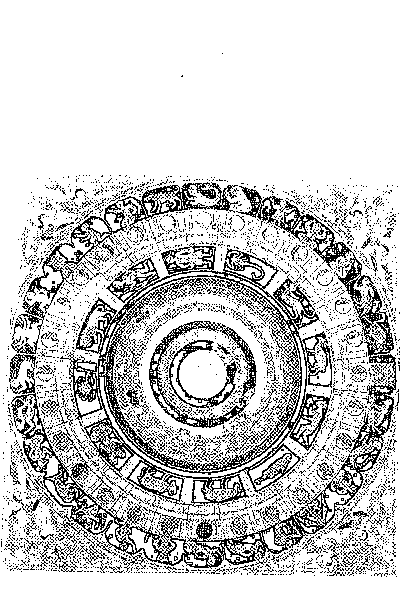

同样，在天宫图上，正如行星散乱分布在十二星座之内，它们也分布在十二宫之内，由于主要行星总共有十颗，所以某些宫会没有行星出现。聚集行星较多的宫代表了人生的侧重方面，而没有行星的宫并不是不起作用，只是不是人生最侧重的方面而已。

我们可以把人生比做一出戏剧，这出戏从出生的那一刻开始上演，戏剧有十二幕互相交织的场景，就是十二宫，而正如每一宫起始于某一星座，每一个场景都按着那个星座的特点去布置。舞台上活动着十个演员，即太阳、月亮、八大行星，在不同的场景扮演不同的角色，但是各自有其原本的特点和特有的行为方式，演员之间所发生的故事模式，对应于行星之间的相位关系。

## 十二宫简介

十二个宫的主宰关系大致与十二星座的序列相似，其中，星座着重体现内在的、心理的静态特征，而宫则着重于这些特征的动态体现，即这些个人素质如何在外部条件下表现。（十二个宫的内涵见下表所列。）

| 第一宫 | 第二宫 | 第三宫 | 第四宫 |
|--------|--------|--------|--------|
| 表象的自我、体质、形态、性格。 | 个人的资源、钱财、拥有。 | 学习、信息、沟通、外出。 | 家庭、童年、养育、父母、晚年。 |
| 第五宫 | 第六宫 | 第七宫 | 第八宫 |
| 自我表达、体制、形态、性格。 | 身体和思维的健康、日常工作、个人服务。 | 人际关系、商业伙伴、伴侣、合作。 | 共有资源、性爱、精神危机、遗产、死亡。 |
| 第九宫 | 第十宫 | 第十一宫 | 第十二宫 |
| 高等教育、宗教、哲学、长途旅行。 | 公众、职业、声望、权利。 | 团体活动、友谊、保护、梦想、远见。 | 考验、私生活、敌人、罪行、慢性病、因缘。 |

其中，第一宫到第四宫是“个人宫”，代表对自己的关心；第五宫到第八宫是“社会宫”，代表对人际关系、交往的关心；九到十二宫是“通觉宫”，代表涵盖范围更广的意识，包括关心集体的、全球的、文化的、过去的、将来的事务等。

此外，十二宫也代表人从生到死的成长历程，正如十二星座本身也与人生历程的循环有关一样。（如下表所列）

| 步骤 | 描述 |
|------|------|
| 1 | 自我的出生。 |
| 2 | 对物体的认知。 |
| 3 | 对周围环境的认知和自觉意识的出现。 |
| 4 | 在家庭中的成长。 |
| 5 | 创造性，外向化。 |
| 6 | 自我校讨和认知。 |
| 7 | 对社会关系的认识。 |
| 8 | 对性的发现。 |
| 9 | 寻求人生的意义。 |
| 10 | 社会参与，雄心的实现。 |
| 11 | 对社会问题的认识、改变社会的努力。 |
| 12 | 在集体无意识中消融个性、周期结束。 |

宫位系统首先由古埃及人创立，并融入了其文化色彩。古埃及文化重视再生的信念，在他们的哲学里，太阳每天经历一个“生、死”的循环——在黎明时出世，在中午达到成熟的顶峰，日落时死去，而在午夜进行旧太阳到新太阳的转变。

事实上，在世界各地人们的习俗和传说也有类似之处：东方象征生命与活力，西方与死亡有关，北方牵扯许多地下世界的神话，而南方意味着权利和成功。在埃及，法老的金字塔建立在尼罗河的西岸；在中国，死刑犯通常在西门外受刑。

## 宫的分类

古代的天宫图是正方形的，有四个顶点，分别是上升点、下降点、中天、天底。现代的天宫图改为圆形，但仍旧称之为“顶点”。以这四个顶点开始的宫——第一宫、第四宫、第七宫、第十宫——称为“顶点宫”，行星在四个顶点宫，特别是接近四个顶点时，会发挥较强的影响。

顶点宫前面相邻的宫——第二宫、第五宫、第八宫、第十一宫——称为“上宫”；后面的四个宫——第三宫、第六宫、第九宫、第十二宫——称为“下宫”。

在天宫图上，如果大多数行星分布在顶点宫，行星的属性会在人的外在方面有较强的表现，使人生活充实，富有生机与开拓力，会有光辉的前程。

如果大多数行星分布在上宫，行星起着内在与外在之间的协调作用，坚持不懈的精神会有助于事业上的成功。

如果大多数行星分布在下宫，则在人的内在方面有较强的表现，有不安全感，多属于从属地位。

相反，如果顶点宫内没有行星，表示主导开创能力不足；如果上宫内没有行星，表示对于事情的“最终结果”和“长期计划”这种概念缺乏认识；如果下宫内没有行星，则缺乏变通，不容易从过去的历史中吸取教训。

在这里你会发现，顶点宫、上宫、下宫与主导星座、固定星座、易变星座的特点之间也有一种平行的对应。

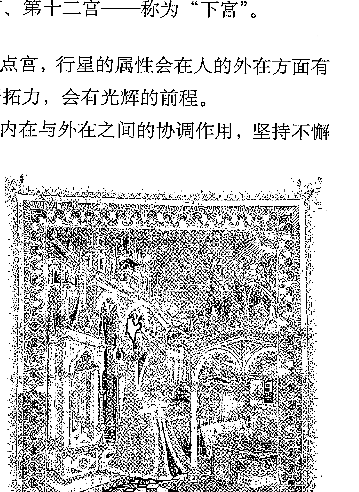

托勒密提出了“等宫制”，我们现在使用的是“分宫制”。

## 四大顶点

### 上升点

上升点是太阳初升、把光和热带给世间的那个点，代表生命、躯体和性格的形成，与我们的“外观、健康、活力、个性、性情”等有关。

因此，上升点所在的星座（上升星座）主宰了一个人的外貌气质、举止行事、给别人的“第一印象”等。

与上升点重合的行星也对整个个性有较强的指示，例如月亮位于上升点意味着个性中有较明显的忧郁和敏感气质；土星位于上升点则意味着一个坚实的、束缚性的外壳，一个人的个性会因此包裹在这种限制之下无法突破，外在表现可能显得拘谨、严肃。

上升星座的主宰星同样也是个性显现的重点，它所在的宫则显示生活领域的重点。

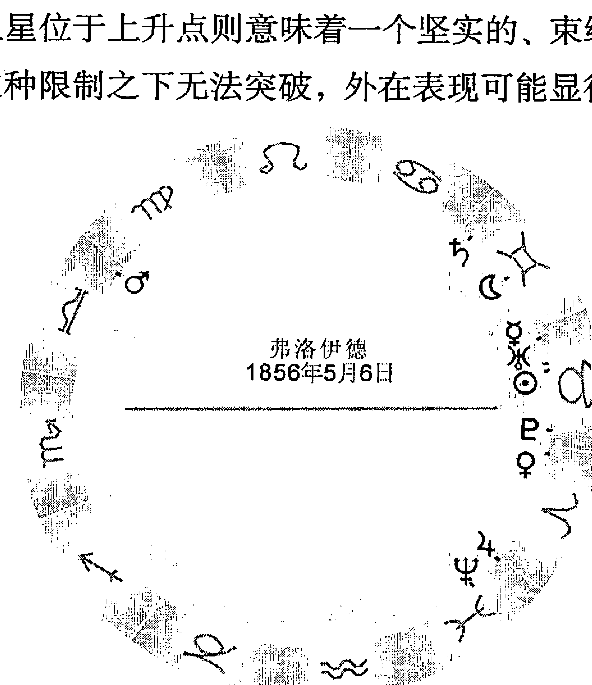

上升点作为第一宫的起点，也象征人生的起点——与上升点相关的行星和星座一起组成了一个复合体，描述了一个人早期的经历和感情，并且由此设定了我们对于人生的态度和展望。这个复合体是天宫图上最体现个人因素的组成部分，包括上升星座，还包括与上升点重合或成其他相位的行星，以及上升星座的主宰星所在的星座、宫、和它与其他行星所处的相位。

在与外界大量的相互作用中，我们选择性地着重于其中的某些经验来认识世界，换句话说，我们从某一个侧面去观察世界，而世界从这个侧面映入我们眼帘。因此，上升点也可以说是我们观察世界时所戴的眼镜，眼镜不同，世界在我们眼中的印象也不同。与上升点重合的行星就好似为这副眼镜上了色，比如冥王星与上升点重合好比是一副墨镜，透过它看到的将是一个阴暗的世界，仿佛到处都可能潜藏着什么；金星则带给我们一副玫瑰色的眼镜，让我们更多地看到美好、和谐、浪漫和友爱。

总的来说，上升点是一个人的人格面具，与“生存”和“保护”有关，影响了我们处事的技巧和方法，是我们个性中的一部分，作为我们完整个性与周围环境之间的媒介，这个面具可能与完整的个性相符，但也有可能是一个假面。

古典星相学认为上升星座也与体质有关，位于上升星座内的行星则对体质具有不同的影响。例如，木星会增加活力，但也可导致体态臃肿；土星则减弱活力，并可为晚年带来慢性疾病；相位好的话，太阳和火星位于上升星座内都能提高身体素质，但如果相位不好则有易于发烧的倾向。其中，第一宫最靠近上升点的行星其影响力加强（但不包括第十二宫的行星）。

在体形方面，位于上升星座内的太阳和火星使面色更红润；月亮使之苍白；土星使肤色、发色更黑；木星和金星使体型较宽阔；天王星和水星使身高增长；而土星使身材较矮。

当上升星座的主宰星也位于上升星座之内时，这种对身材和体质的影响最为显著。

### 下降点

下降点是太阳沉落的地方，第七宫因此与“休息、终结”有关。

此外，鉴于下降点与上升点的相对，第七宫因此与“对手”这个概念相联系，不论是婚姻、合作还是敌对、诉讼。

上升点和下降点分别是第一宫和第七宫的起点，因此与白羊座、天秤座有一定联系，体现在“自我”与“非我”的对照上。

上升星座表现的是我们如何“行动”，强调一个“我”；下降星座表现的是在别人接近时我们如何“反应”，强调“非我”。因此，下降星座给出了一个外部的参照，这个参照包含着由我们的行动引起的各种后果，对我们形成冲击，使我们发现不足、进而调整自己。

举例来说，对于上升白羊座的奋勇争先做法和领导支配欲望，别人可能会被动接受，但也可能反问：这样的行动公平吗？你考虑别的因素了吗？对于这些反问，上升白羊座可能醒悟到自己的缺失，通过人际关系认识到合作和妥协的重要性，体现出下降点在天秤座的特点。

反过来，上升天秤座一味地力图在所有交往中维持合作、和谐、公正，而别人的态度则可能会告诉他一个这样的信息：你不做决定，他人会去做，但结果并不一定你想要的。在这种情况下，上升天秤座会意识到自己有时候必须当断则断、采取主动，甚至诉诸直接冲突，而这正是下降白羊座表达的意图。

### 中天和天底

中天意味着一个人的抱负、人生目标、职业、公众关系、社会地位；天底代表最深层的动机、过去和家庭的影响、内在心灵的根本。相对于中天代表的“向何处去”，天底代表的是“从何处来”。

中天和天底的关系可以用树的比喻表达：中天位于天宫图的顶端，就好像是树梢，是我们渴望到达的地方；天底是树的根基所在，树能够长到多高多大、伸出多少枝条，取决于根基的坚实和成熟程度。换言之，我们人生的追求和能够到达的地步，取决于我们本身的坚实和成熟。

从下到上，象征生命之树成长的过程，因而行星分布较靠近天底，侧重于内在素质的充实和提高；行星分布靠近中天，则侧重于事业、理想、角色、社会等。与中天相合的行星能量得到提升，对这些社会属性会施加更大的影响。

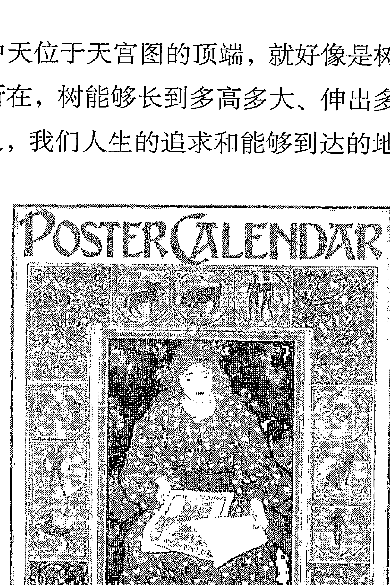

天底代表了我们的个人历史，并且与集体无意识有关联，像树根一样无法完全发掘；这个历史包括传统、家庭、童年等，是一个“本”字。它也是我们退求保护、寻求慰藉的地方，我们珍藏隐私的地方，是我们藏匿起来不愿为人所知的那部分自我；中天显示了我们寻求实现理想的途径，我们的事业取向和目标，我们预期的生活方式、关于未来的憧憬。

我们的生命之树发端于父母的家庭，延展到自己的人生辉煌处——我们从何处来，影响着我们到何处去。天底和中天分别是第四宫和第十宫的起点，因而分别与巨蟹座、摩羯座有一定联系，体现在家庭与社会的对照上。同时，成熟的果子落地归根，在第十宫（社会）奋斗的成果，我们在第四宫（家庭）享用。

下面我们详细解释十二星宫位于顶点的含义。

| 白羊座 | 上升 | 上升白羊座的气质，是总在人前表现出热情自信、活力旺盛的样子，甚至冲动好斗、咄咄逼人，而内心的紧张不安则隐藏起来，在亲密的人面前才显露出真实的自己。在火星主宰下有着充盈的能量和不懈的行动，当他们迫不及待地投入一项事务、希望通过不间断的努力证明自己的时候，却未必能够有得体的外交手腕相衬托。天秤座在下降，代表朝向更高的社会意识。社会价值、他人的需求、团体协作等，都是为了平衡上升白羊座的个人表现所必需的。可能结婚比较仓促，但伴侣在社交场合会比较娴熟，性情也较温柔、脆弱。 |
| --- | --- | --- |
| | 中天 | 白羊座在中天，对择业问题有些莽撞，年轻时可能入错行，当稳定下来后会特别努力地工作，自认是最优秀的，能够勇敢向前冲，不怕竞争。天底在天秤座，在家居中表现出艺术的美感和精致，对家里的一花一草都有感情。把家庭当作最好的伴侣和团队关系，要求对每个成员都绝对的公正，而不平衡的感觉会成为情感问题的引线，家庭生活的不顺利也会使他们焦躁、徘徊。 |
| 金牛座 | 上升 | 上升金牛座做事沉稳，不慌不忙，但是固执己见，总是为自己的观点和做法进行顽强的辩护。他们通常温和可亲，但情绪激动时会把平时积聚的怨气都发泄出来，显示出吓人的愤怒情绪。对于创造，他们情有独钟，但会对创造之物有吝啬于人的心里，这是应该避免的。下降天蝎座代表这些人至少应该部分地放开对创造之物的依恋，站在更高的角度看问题。他们很多精力花在了婚姻和社会关系方面，以此获得更多的成功，并提高自己对社会、政治和道德的认识水平。他们的婚姻对象通常是强有力的类型。 |

### 金牛座

#### 中天

金牛座在中天，内心有高标准的自我形象，希望能出类拔萃，需要自己赚很多钱来维持这个形象。对个人已经建立的威信，有很强的占有欲，喜欢炫耀，绝不轻易把权力让与别人。他们对于能够把艺术和美丽带给大众的职业有兴趣。

#### 天底

天底在天蝎座，对家庭有强烈的情感，忠诚、有保护意识，会毫不犹豫地为家庭成员辩护。他们希望生活在一个宽松、奢华的家庭环境和忠诚、坦率的家庭气氛中。关于家庭的很多秘密，他们是从不与人语的。

### 双子座

#### 上升

上升双子座的人有强烈的求知欲，酷爱读书、学习，深切地希望通过知识、多方面接触而发现真实的自我。他们活泼敏捷，表达生动，但目光中会流露着不安。对过多事务的关注和试验会让他们感到无法从信息和交流之网中脱身，无暇寻求更高的价值观。

下降点在人马座所提出的，正是在交往中吸收知识并转化为更高的意识水平，以别人的思维框架作为参照系，理解和探索生活。在婚姻方面，他们不愿因婚姻的束缚完全牺牲个人自由。

#### 中天

双子座在中天，代表智力水平得到最大的应用，依靠专家、研究人员、智囊团等达到自己的社会目标，同时有敏捷的头脑顺应大众。

#### 天底

人马座在天底，个性得到根源于宗教、哲学等概念的强化，具有个人雄心、并为此雄心寻求道义的合理性，这种自以为是可以被中天双子座的社会适应能力和信息处理能力所平衡。

### 巨蟹座

#### 上升

上升的巨蟹座使人关注非常具体的目标，并依赖个人的能力和感情的动力。他们的情感背后有坚强的意志力作为支撑，可能会通过攻击性的表达来掩饰和补偿自己的自卑感。如果能建设性地利用自己的敏感等情感本质，而不是屈服于敏感、或转向过度的自我保护，那么他们可以获得更大的自我实现。

#### 下降

下降的摩羯座意味着巨蟹座的补偿心理会应用于社会面具中，使自己显得比别人优秀，虽然在内心他们很清楚自己的缺点。他们是有出色洞察力的人群，下降摩羯座也有助于他们区分在交际中哪些感情是需要控制和过滤的，而哪些感情是适宜而有益的。

| 巨蟹座 | 中天 | 中天在巨蟹座，代表他们的社会或职业生活可以得益于他们对于变化万千的社会的敏锐感觉，同时，他们对自己的社会状态也很敏感。摩羯座位于天底，个人生活中也易于被大家所关注。摩羯座的位置也意味着在家里对于条理和规矩的重视，达到他们满意的标准却很难。摩羯座在天底时，上升星座通常是天秤座，而天秤座灵活、适时的反应对于成功很有必要。 |
| --- | --- | --- |
| 狮子座 | 上升 | 上升狮子座有优秀的创造力和自我表达能力，他们把自己的创造作为一面镜子来检视自己，不论是创造了一件艺术品、一个社会表现，还是一个孩子。从事一项社会事业的时候，他们必须领导和控制参与项目的人。在背后，他们对自己是谁其实并不那么清楚，他们是在为自己证明自己，通过自己的创造认识自己，有一定的补偿心理。他们会表现得举止之间皆有豪气，为人慷慨大方，喜欢为人瞩目。下降的宝瓶座意味着他们必须能够娴熟于宝瓶座的词汇：社会、文化和交流，同时需要从别人的角度看待生活，超越自己对权力、骄傲的执著而考虑更大体系的人群。一对一的个人关系，可以作为一种土壤来培养他们的共同目标，中和他们自我中心的倾向。 |
|  | 中天 | 中天的狮子座，意味着一个人会充满激情地并戏剧性地投入到履行宝瓶座式的梦想之中。宝瓶座位于天底，代表对社会的关注深深地影响着自我的理想。而不乏革新性的理想主义，也会积极或者消极地影响到家庭生活。这时，上升点通常位于天秤或者天蝎座，更体现对于社会大众或神秘团体的认同感。 |
| 室女座 | 上升 | 上升室女座对自己严苛、认真，对别人体贴、谦恭。喜欢分析，注重细节及技术方面的成绩，追求心理的成长，关注身体的健康。他们可能少时聪敏，学习优秀，但不太爱运动，以致成年后虽然身高高于平均值，而腹部可能显胖。下降星座在双鱼座，面对亲密的个人关系，他们采取双鱼座的态度，对爱人很宽容、迁就，会有些失去自我。 |

### 室女座

#### 中天

室女座在中天，会把室女座的分析、批判眼光应用到对社会情势的理解和职业选择的设定中，从事的工作需要借助他们的观察力和思维能力。他们的形象是简洁、高效、有条理，但也显得比较“冷”。

#### 天底

天底在双鱼座，代表为了家庭生活而做出牺牲，家庭也是退守和内省的地方，令人惬意的私人领地。

### 天秤座

#### 上升

上升天秤座很在意生活的情趣，举止优雅，气质迷人，目光清澈，语调柔和。在白羊座，太阳处于强势、土星处于弱势，造就了白羊座的无畏精神；在天秤座则相反，土星在强势，使其言谈不那么唐突，而思维更严谨客观，但也更在意别人的看法，在找准自己的位置之前会觉得不安、疑惑和孤独。

下降点在白羊座意味着这些人需要一个比较有个性的白羊座伴侣，帮助他们通过婚姻关系找到自我。

#### 中天

位于中天的天秤座，设定了一个明白地参与社会活动的目标，在这种积极主动的参与中隐藏内在的不安全感。他们通常有很好的合作伙伴、恪守职业道德，能为自己赢得支持和声誉。

#### 天底

白羊座在天底，凸显聚焦于个人基础和内在安全感的行动，以主动出击的形式实现最好的自我保护。在对待与家庭有关的事务方面，他们显得有攻击性；同时，家庭也是双方容易爆发战火的地方。

### 天蝎座

#### 上升

上升天蝎座内心总是藏着担心，生活压力比较大，但内心也潜藏着强烈的爱，两种本性的斗争使得天蝎座人亟需来自朋友的理解和耐心。不要劝说他们所做的事情难以成功——面临考验时，他们从不退缩，这一优秀的品质可因太阳在此星座而加强。下降点在金牛座，代表他们能够成为很好的合作者，但是要求实在的回报，婚姻亦如此。他们也喜欢为对方花钱进行装扮，并以此为荣。

#### 中天

中天在天蝎座的人具有革命性，不服从权威，并且不断更新自己的事业轨迹。天底在金牛座，代表深深根植于某块土地或某个家族，这种特点可被上升的摩羯座、下降的巨蟹座所加强。受益于金牛座的富足，以及天蝎座的发掘能力，他们在中年之后会达到事业上新的顶峰。金牛座也意味着对于家庭装修和艺术收藏的喜好。

### 人马座

#### 上升

上升人马座很活跃，作为位于顶点的火类星座，他们充满热情地表达自己的能量，喜欢运动和旅游、喜欢向别人推广自己的观点，他们的雄心面向宏大的目标。这其中不乏喜爱赌博、喜欢沉溺于享乐的上升人马座，以及乐观进取、心高志远的上升人马座。
下降的双子座代表在交际中的敏锐和智慧，并且需要一个比他们更为实际、理性的伴侣。

#### 中天

中天位于人马座是一个极好的位置，他们远见卓识，能够成为很好的决策者，事业选择经常与人马座的主题有关。在专业领域的形象是哲思而大度的类型。
双子座位于天底代表个性中宽广多变的根基：阅读范围广泛、知识面宽。他们的住所或许也经常更换，不安分的内心促使他们不断旅行，而家庭中的交流也是重要的生活内容。

### 摩羯座

#### 上升

上升摩羯座人虽然精力不足，但是受主宰星土星光芒所赐而比较长寿。有雄心壮志，希望得到认可，在别人眼中保持一个成功者、优秀者的形象。同时也多疑，怕别人会把自己的拥有夺去，导致担心过度。因此，应该多寻求户外娱乐，多培养幽默感。土星相位不佳时易患忧郁症。
下降的巨蟹座代表他们对于伴侣的深深依赖，有母性情结，处理个人关系容易情绪化，而经济状况是择偶的一个重要条件。

#### 中天

摩羯座在中天体现很强的事业心、努力的工作态度和良好的组织能力，关注社会地位和经济收入，可能是个工作狂而不懂照顾自己，义务和纪律是他们心目中重要的概念。
巨蟹座在天底代表对于家庭的重视，以及在家里的情绪化表现、在私下里的沉郁心理，因此也意味着他们在个人生活中需要注重适应性。

### 宝瓶座

#### 上升

上升宝瓶座的美是一种很有女人味或者男子气概的美，特立独行，喜欢变化和新潮，极少为自己所做的事后悔，这与主宰星天王星有关。他们待人友善而合群，能照顾集体利益，只是其理想主义的做派与一般人的“唯我”有可能不够协调。
下降点在狮子座，代表有权有势的伴侣或合作者，家庭里充满阳光，但他们不会屈从于对方的压制，而是要朋友式的关系。他们不是很自我中心的人，但别人对于他们的婚姻的赞赏羡慕，会让他们骄傲而满足。

#### 中天

中天在宝瓶座，代表自己经营的事业、前沿性的产品和服务、以及曲折突变的事业轨迹，所从事的事业可能与大众利益有关。他们具有独立和合作精神，在工作场所会交很多朋友，适合在大公司工作，需要大团队、大社区这类大型的舞台。
狮子座在天底，喜欢宽敞明亮的住所，在家里会摆设很多体现自己创造性和社会地位的物件，有豪华的倾向。

### 双鱼座

#### 上升

上升双鱼座稍欠毅力，喜爱悠闲无所事事，沉迷于梦幻而不愿面对生活的负担，但如果太阳也在此星座，会带来更多的能量和雄心、更明晰的方向感。优点是浪漫、随和，有艺术的涵养，会照料别人。这一方位代表个人意志的牺牲。
下降点在室女座，代表需要从内心寻找清晰的判断、适当的谨慎。

#### 中天

中天在双鱼座，代表在事业方面有良好的直觉，对于权力和成功可能有秘密的盘算或举动，一般人对他们的家庭情况也了解无多，而其公众形象可能显得不切实际。
室女座位于天底表示会把家当做办公室的延伸，或者居家搞文学、音乐创造，而家居环境也井井有条，充盈的书架是家里必不可少的。

## 其他宫头星座

### 第二宫——第八宫 财富的对宫

第二宫主宰个人财富和拥有，涉及到一个人的价值观和对安全感的理解，与这一宫有关的因素影响了一个人如何认识个人资产在人生中的重要性，以及如何获取和花费自己的物质资源。

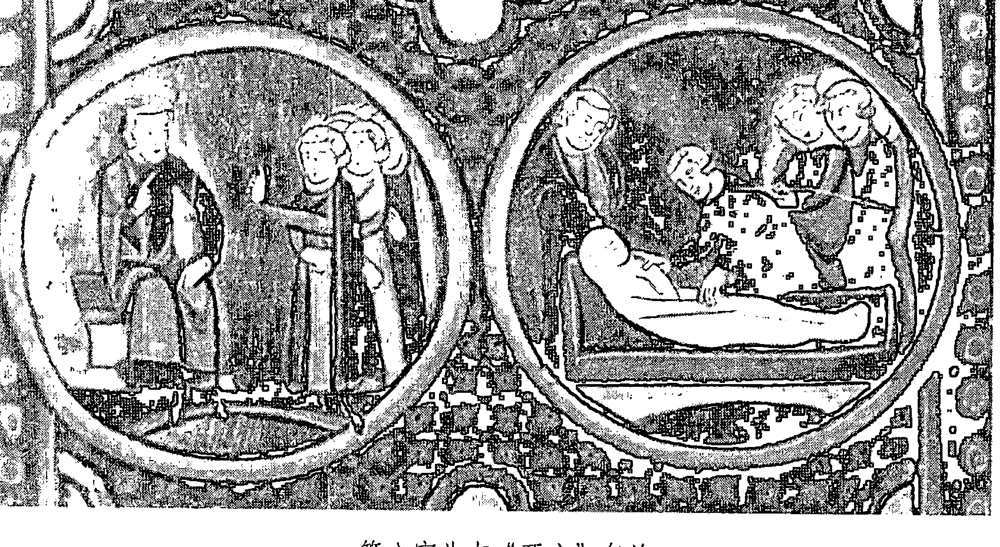

相对地，第八宫代表共同资源，涉及并非通过自身的努力而得到的财产，如伙伴关系或遗产继承，以及税收、保险、股市等有关“别人的资金”的概念；第八宫也代表对神秘事物的兴趣；此外，作为衰落、消逝的象征——太阳从第八宫的边界线开始向下降点沉落，因而这一宫也代表黑暗、衰落、死亡，古代认为这个宫也与地下世界有关。

## 第二宫与第八宫的宫头位于十二星座的含义

白羊座

第二宫宫头起始于白羊座，在赚钱方面体现火星的特点，富于攻击性、竞争性。在寻求显赫的背后，有深深的自卑情结，即便手上已经有足够的物质所得也仍然奋斗不息。在财物方面比较冲动，开销缺乏计划，来得容易去得也快。

此时第八宫始于天秤座，代表从合作和婚姻中得来的收益，其潜在的成功很大程度上取决于别人的支持。

金牛座

第二宫在金牛座，有较强的金钱情结，很会赚钱，并且认为积累和保持一份丰厚的家产至关重要，稳健实际，量入为出，喜欢购置保值的有形资产。他们并非守财奴，但很在乎价值的保存。

第八宫在天蝎座，代表有一些关于共同基金的秘密和涉及遗产的麻烦。对人的本质看得很清，善于为自己的行动涂上高尚的色彩。

双子座

第二宫在双子座，思维集中在与钱财有关的事务上，头脑精明，善于寻求让钱财增值的路子，但倾向于用物质成就来衡量一个人，对社会和文化价值缺乏认识。

第八宫位于人马座，财运较好，可受益于大型事业。

巨蟹座

第二宫在巨蟹座，对自己的物质所有呵护备至，从不奢侈，总担心有朝一日衣食无着。有经商头脑，但财运起伏较大，适合从日常消费产品中谋得收入。

第八宫在摩羯座，对金钱的责任感较强，不喜欢借钱，恐惧财务赤字，商业活动中遵守道德规范，讨厌欺诈行为，处理别人的钱财时能恪守原则。

狮子座

第二宫在狮子座，自身的财富状况直接影响到自尊心，而自尊心也反过来影响到赚钱能力。他们了解大众所需，也知道如何根据这些知识去赚钱。狮子座的自我表现欲和对子女进行养育的需要，驱使他们不断地积累物质财富。

第八宫在宝瓶座，对人生的精神侧面有强烈的兴趣，对很多问题都有非正统的看法。

### 室女座

第二宫在室女座，处理财务精明而小心，但可能因小失大，或者在小事上节俭却在奢侈的娱乐方面大手大脚，对钱财的担忧也可能影响到健康。

第八宫在双鱼座，有很强的直觉和灵感，对共同的财务事亦非常关注，以至无端地担忧。涉及遗产继承时，要注意避免混乱或者不利于自己的结果。

### 天秤座

第二宫在天秤座，在经济事务方面也体现一贯的平衡与和谐，财富的积聚在很大程度上依赖于有一个好的合作伙伴，特别是配偶。他们偏好奢侈品，同时爱把钱花在娱乐和交际方面，但本质节省、不喜欢浪费，对超预算的开销心感不安。

白羊座在第八宫影响共同投资，可能在钱财的花销方面产生矛盾，但是会坚持自己的做法。遗产继承方面也会有冲突的危险，甚至引起诉讼。

### 天蝎座

第二宫在天蝎座，会对自己的经济事务持保密的态度，对别人的探听极为反感，有占有欲和利己之心。

第八宫在金牛座，对合理的投资有很好的判断力，其婚姻的动机除了爱情，金钱和物质安全也是重要考虑。个人的物质占有欲超过了合作和分享精神。财运虽有起伏，但终能获利甚丰。

### 人马座

第二宫在人马座，其影响是为人慷慨，对钱财的兴趣止于满足个人和分享的需求，敛财对他们来说并不重要，经济自立对他们来说也不是难事，这得益于以目标为导向的长期计划，但他们倾向于感觉太好，有开销过度的倾向。

第八宫在双子座，对人生的神秘有健康的好奇；在处理共同资产方面充满见地，知道如何正确地操作。

### 魔羯座

第二宫在魔羯座，代表在处理金钱方面审慎、实际，即便收入颇丰也会有计划地小心开销，不喜奢华，可能源于对自己赚钱潜力的信心的缺乏。

第八宫在巨蟹座，对生与死的话题有自己深层的、内省的思考。极少表露自己的情感需求。在共同投资方面不愿做一个主动出击的人。

### 宝瓶座

第二宫在宝瓶座，金钱观念淡泊，有创造性的生存方式，特别是自由职业者。财务不够稳定，但不怕采取碰运气的态度，比如非同一般的投资方式，例如买股票的时候，第二宫在摩羯座的人倾向于稳定、值钱的蓝筹股，而宝瓶座则偏好风险大但预期收益高的科技股。

第八宫在狮子座，热衷于大手笔的商业和投资，有自我价值感，希望在共同投资中起控制作用。

### 双鱼座

第二宫宫头在双鱼座的人，非常慷慨，不会表现得贪婪或物质主义，倾向于不切实际地花钱，包括为梦幻花钱。

第八宫在室女座，对共同的财政事务非常关注和小心，处理别人的钱财时甚为谨慎，对充分的保险保护很重视。

### 第三宫——第九宫 心智的对宫

第三宫宫头所在的星座代表了一个人的思维方式，与“写作、沟通、言谈和学习应付世界”有关，也代表了早期的教育和成长环境，以及在性格形成的年代如何同别人交往。

第九宫主宰启示、远见、预言、智慧、宗教等。在第九宫，粗糙的生活经验被提升到更高的知识水平，并赋予了哲学的理解，因而也与高等教育、哲学、道义等相关。总之，第九宫涉及的是长期计划、远期目标、长途旅行，以及较深刻的心灵追求。

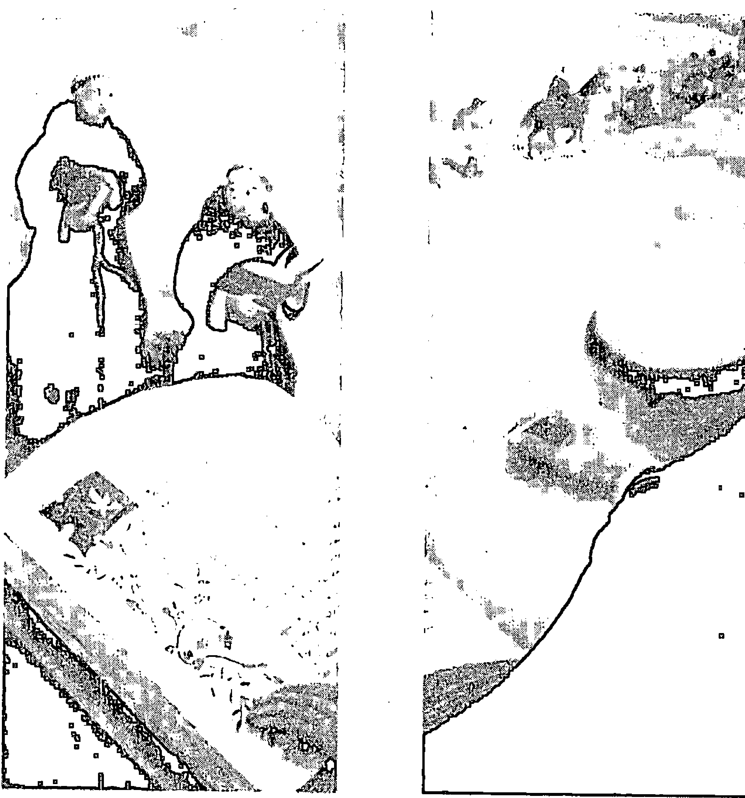

## 第三宫与第九宫的星座含义

白羊座

第三宫在白羊座，显示强烈的沟通需要和一种强有力的沟通方式，头脑活跃，决定迅速，总是在渴求新知识，但是不能持之以恒。

第九宫在天秤座，重视外表的品位，恪守良好的道德准则，有强烈的社会正义感，对人生的许多严肃的问题有稳健中肯的看法。

金牛座

第三宫在金牛座，学习速度较慢但很扎实，随着年龄的增长，知识积累会相当丰富。此外，对艺术特别是音乐有兴趣。

第九宫在天蝎座，对抽象的、神秘的概念有浓厚兴趣，探究人生的意义，但对正规的学院教育持挑剔态度，倾向于从自己的直接经验中寻找问题的答案。

双子座

第三宫在双子座，思维、讲话速度都很快，很健谈，有可能被人理解为一个讲话不经过大脑的人。能够博采众家之长，又善于辩护，人缘很好。

第九宫在人马座，总在探求新的视野，富有远见，思维开阔而乐观，喜爱游历和探寻。对于教育、宗教和哲学问题，持较为严肃的观点，遵照传统行事。

巨蟹座

第三宫在巨蟹座，能够把敏感性应用在沟通之中，与亲近的人有很强的感情纽带。他们了解别人的需求和流行的趋势，记忆力好，但理性地探讨问题的能力较差。

第九宫在摩羯座，对责任、义务的考虑较多，对新思想持保守的态度，只有确定无疑的事实才能改变他们的观点。至于旅行，常常是出于商业或其他有利可图的目的。

狮子座

第三宫在狮子座，自我表达能力强，讲话恰到好处，有能力以独特的方式表达自己的观点，并以此为傲。但是对表现效果和情绪调动的追求会使形式盖过实质，个人观念也较固执。

| 星座 | 描述 |
| --- | --- |
| 狮子座 | 第九宫在宝瓶座，涉及宗教、哲学、教育问题时，会表现出改革派论调和自由思想，对许多传统教条有叛逆心理。此外，会为了突破既定的生活模式而旅行。 |
| 室女座 | 第三宫在室女座，强调写作、沟通，包括谈话、讨论、阅读和学习，有一个围绕着沟通技巧的自卑情结，思维有焦虑感，会尝试改进别人的思维方式，对兄弟姐妹和邻居等可能比较挑剔。注重细节，善于计划。第九宫在双鱼座，具有理想主义的哲学态度，其富有灵感的洞察力有助于解决许多人生的重大问题。现实中可能没有去过很远的地方，但在头脑的想像里却有丰富的体验。 |
| 天秤座 | 第三宫在天秤座，能优雅地表达自己的思维和见解，渴望获得别人的支持，热爱交际。与家庭成员关系融洽，娴熟于合作。第九宫在白羊座，是乐观、向前的开拓者，热爱旅行，特别是计划周详的、有确定目的的旅行。 |
| 天蝎座 | 第三宫在天蝎座，沟通、措辞较为有力，对于心智和学习方面的事物有很固执的态度，求知欲强烈而持久。辨别能力强，对于异己者可能十分苛求，要求别人不加疑问地顺从，因此与家庭成员、朋友和熟人也会有摩擦。第九宫在金牛座，旅行和教育都使他们感到愉快，能安然定居在远离家乡的地方。他们的宗教和哲学观念深深植根于传统价值当中，极少改变或放弃最初的观念。 |
| 人马座 | 第三宫在人马座，头脑机敏灵活，非常健谈，在哲学、宗教、政治和教育等问题上有很强的沟通能力。重视学习，有远大的目标。喜欢旅行，并能与远方的朋友保持联系。第九宫在双子座，对人生、对其他人充满好奇，头脑活跃。 |
| 魔羯座 | 第三宫在摩羯座，表达方面认真谨慎，必要时才说话，用词也尽量选择有最大的效果，因而可能刺耳或苛求。不爱闲聊，别人可能觉得难以沟通。第九宫在巨蟹座，在宗教和哲学信念方面有坚固的情感纽带，文化适应力强，在异国他乡也能很快调整。 |
| 宝瓶座 | 第三宫在宝瓶座，在思维和写作上能充分体现创造力和进步性，教育的目的对他们而言主要是学习而非谋生。天王星的自发性可能表现为想到什么就说什么。第九宫在狮子座，对高等教育和心灵的提高很感兴趣，他们热衷于远足，是好的教师，喜欢启蒙那些不够见多识广的人。 |
| 双鱼座 | 第三宫在双鱼座，对别人讲话的背后意思感兴趣。沟通中可能因为过于情绪化而使问题说不清楚。喜欢独自思考问题，此时也最有创造力和想像力。第九宫在室女座，对哲学和宗教问题采取实用主义的态度，可能固执于成见。 |

### 第五宫——第十一宫 幸运的对宫

第五宫是自我表达之宫，代表努力使自己与众不同，它也是有关浪漫、子女、娱乐、消遣的宫，以及与赌博、投机有关的态度。第十一宫代表目标的达到、希望的实现、团体、协会、组织等能够分享理想的人群。

第五宫和第十一宫分别具有金星和木星的欢乐色彩。因此，第五宫涉及与金星相关的“饮食、服饰、娱乐、交往、消遣、运动、浪漫、生育、创造”等主题。第十一宫是友谊、信任、支持者、帮助者的分宫，带有有利、有益的色调，第十一宫主宰星如果处于很好的位置，会为整个天宫图增添令人羡慕的色彩。

## 第五宫与第十一宫的宫头位于十二星座的含义

| 星座 | 描述 |
|------|------|
| 白羊座 | 第五宫在白羊座，积极主动地寻求浪漫、娱乐、消遣，喜欢户外活动，不介意在休闲活动上花钱。他们的身体活力对快乐的心情有很大的影响。此外，对小孩子缺乏耐心。第十一宫在天秤座，好友善交，对待朋友和同事态度和蔼，公平无私，有外交技巧，能受到各种不同的人推举而担任领导之职。可能会与知心朋友结婚。在确定目标方面稍欠决断。 |
| 金牛座 | 第五宫在金牛座，强调金星的爱、美、和谐原则，向往浪漫，有艺术天赋。对子女很关爱，甚至会溺爱，但他们对于自己的这种行为和抚育方法持较为固执的看法。第十一宫在天蝎座，倾向于跟有权有势、敢做敢为的朋友保持密切关系，圈子不一定大，但气味相投。 |
| 双子座 | 第五宫在双子座，对浪漫持冷静、理性的态度，缺乏激情，在稳定之前可能会经历多次为时不长的恋爱。他们的智慧多用于创造性的事务（包括写作），并在多个领域展示天资，不过并不深钻。第十一宫在人马座，朋友圈子很大，能随心所欲地交换观点，对朋友的期望很少，他们“互相宽待”的哲学受到大家的喜爱，同时也借此得到足够的支持以帮助实现自己的目标。 |
| 巨蟹座 | 第五宫在巨蟹座，在浪漫方面多愁善感，有些守旧，女性对子女表现得极为母性。他们有艺术创作才能和写作天赋，喜欢通过书面而不是言谈进行沟通。第十一宫在摩羯座，交友不多，喜欢避开人群，也因此较少得到必要的支持。 |
| 狮子座 | 第五宫在狮子座，很多能量发挥在浪漫、自我表达和子女方面，富于戏剧性，对有兴趣的创造性活动能够全力以赴，渴望得到嘉许，以维持自己的热情。第十一宫在宝瓶座，对有趣、非凡甚至古怪的人感兴趣，而不喜欢沉闷的人。友谊受理智而非情感的推动。社会生活令人振奋。 |
| 室女座 | 第五宫在室女座，在浪漫的情形之中也仍旧注重评判式的理性思维，希望与伴侣就各种话题讨论优缺点。对挑选自己喜欢的东西有独到的眼光。喜欢计划和做充分的准备，难能即兴而为。对孩子可能缺乏耐心去教育和理解，而导致关系紧张。第十一宫在双鱼座，对朋友忠诚而富有同情心，能够倾其所有去帮助他们。喜欢把自己的伴侣理想化，或者对其缺点视而不见。对细微的事情敏感，与室女座的注重细节正相对照。 |
| 天秤座 | 第五宫在天秤座，与朋友的协作是保持创造力的必要条件，在许多方面需要朋友的支持和鼓励，并与他们一起分享各种交流、娱乐、聚会等活动。在爱情方面比较幸运，浪漫迷人，但略显薄情。对孩子可能比较溺爱。第十一宫在白羊座，热衷于参加各种团体性社交活动，有一大圈各有特色的朋友，虽然不一定很密切或持久，但朋友关系是他们事业成功的关键。 |
| 天蝎座 | 第五宫在天蝎座，对感情依附和浪漫邂逅有天生的需要，可能促使其接触很多精力充沛、魅力超群的人，但在这种依附下会有较大的失落。在恋情中会表现强烈的嫉妒心和占有欲，并且很可能有秘密的恋情。对孩子很关注，甚至在他们长大之后也不能放手。第十一宫在金牛座，体现在将人生目标设定在生活的物质需要方面：积累金钱和物质财富，维持舒适的生活标准，以此获得安全感和身份。对有涵养、有地位、富有的朋友比较青睐，友情关系密切而温暖。 |
| 人马座 | 第五宫在人马座，认为对孩子尽最大能力的付出极为重要，对孩子很尊重，甚至会溺爱。喜欢炫耀和冒险，是天生的赌博者，喜欢投机。第十一宫在双子座，有很多的朋友，特别是聪敏、有趣、健谈和年轻的人。幽默感强，也不介意拿自己开玩笑。 |
| 摩羯座 | 第五宫在摩羯座，自我表达倾向于平淡、实际、缺乏想像力。工作勤勉，对年轻人来说可能是一个纪律严明的、认真的教师。在爱情中过分规矩，甚至显得冷淡。对孩子的责任心可能会推迟个人成就的取得。对任何形式的投机都甚为谨慎，极少碰运气。消遣方式也比较保守，多数时间都花在了与工作、学习、阅读相关的事情上。第十一宫在巨蟹座，社交活动多限于以家庭拜访为主的非正式形式，对朋友很看重，择友比较审慎。对关系密切的朋友有较强的照顾和偏袒意识。 |
| 宝瓶座 | 第五宫在宝瓶座，意味着不同寻常的恋爱，可能有一见钟情和突然一刀两断的事件发生，但对浪漫持一种超然、淡漠的态度。对孩子的关注集中在智力开发方面。第十一宫在狮子座，在团体中显示出领导和组织才能，但并不独裁。他们外向、友善，容易赢得大家的尊重，在有社会名望的朋友圈子里自我感觉很好。 |
| 双鱼座 | 第五宫在双鱼座，在创造、浪漫和子女方面有挫折感，但梦想着有一番令人瞩目的作为。为了子女会做出自我牺牲。第十一宫在室女座，对亲密的朋友有服务精神，能够为了朋友的利益而付出努力。他们对于“朋友前呼后拥”的兴趣不大，有时会对别人比较挑剔。 |

### 第六宫与第十二宫 深奥的对宫

第六宫是服务之宫，关注工作和健康问题，包括与工作相关的责任、义务，以及有关任务的计划、细节和执行，这一宫主宰不佳的身体状况（良好的健康和活力是由第一宫主宰的）；此外，第六宫也主宰家畜和宠物，这来源于人对于这些动物的自由意愿的限制。

第十二宫是潜意识之宫，在这一宫，行星的光芒被太阳掩盖，与“背离和回避日常生活”有关，代表限制、秘密、囚禁、虚弱、自毁、隐居、原因不明的问题、幕后的操纵等概念。

## 第六宫与第十二宫的宫头位于十二星座的含义

### 白羊座
第六宫在白羊座，工作勤勉，热情而忘我，以完成任务为己任，在工作中不掩饰自己评判的观点，因而会引起同事的不快，这事实上是因为对自己太苛求。
第十二宫在天秤座，有孤独感，因自己对别人的依赖而感到忧虑。感觉自己的伙伴关系和婚姻关系蒙上了宿命的色彩，由于莫名的原因，这些关系可能不甚成功。他们需要培养更加外向的性格。

### 金牛座
第六宫在金牛座，工作态度稳健而保守，在工作中纪律严明、目标明确，他们需要谨慎考虑自己的择业，以免入错行而郁郁寡欢却难以自拔。有时他们也希望脱开工作事务，自在地享受生活。
第十二宫在天蝎座，意味着涉及精神信念的秘密，表面上则会借完全正统的观点回避别人，但其思维是很有深度的，可以影响很多人。

### 双子座
第六宫在双子座，不喜欢单调无聊、重复性的工作，对具有智力挑战性的工作则能够全神贯注。他们条理清晰，能够处理技术细节，也能对多种选择方案加以正确评估。
第十二宫在人马座，代表幕后策划，能先行一步。外表冷静谨慎，不喜欢表达自己的思想信念，但内心热情而乐观。

### 巨蟹座
第六宫在巨蟹座，对工作能够投入深深的感情，甚至超过个人事务，工作上的不如意会影响到情绪和健康。能照顾别人的需要，对大众福祉和健康事业感兴趣。
第十二宫在摩羯座，潜意识中有约束和保守的态度，以及根深蒂固的缺失感和责任感，会在紧张的内在压力下逆流而上。

### 狮子座
第六宫在狮子座，工作投入，会急于把自己的劳动成果示人，以此带来成就感，并为其生活增添荣耀。如果得不到认可和尊重则会影响个人活力，导致由心理原因而带来的身体不适。此外，他们对同事和下属有领导欲望。第十二宫在宝瓶座，对潜意识的问题感兴趣，思维清晰而客观，如果不能用于服务他人，会对自身的价值感到失望。

### 室女座
第六宫在室女座，关注身体和健康问题，但是身体不适时会影响到脾气。有分析、研究的天赋。他们的完美主义倾向会影响到工作的进度，甚至有时会无法完成，因而要防止过分苛求。
第十二宫在双鱼座，会压抑自己敏感而怜悯的一面，不让自己的情感和直觉干涉手头的工作，但是需要相信自己的直觉。

### 天秤座
第六宫在天秤座，在工作中有合作精神和交际技巧，能调解争端，喜欢宽松融洽的工作环境，而充满不和的办公气氛会带来身体的疾患。如果他们对手头的工作不感兴趣，则很难有毅力去强迫自己做好。
第十二宫在白羊座，潜意识里是一个决断、雄心勃勃的人，但这种特性只在安全的环境下表现出来，通常则表现出平和、逍遥的样子。面对挫折，他们内心极少承认失败，对别人打击其自信的言辞会做出激烈的反应。

### 天蝎座
第六宫在天蝎座，工作态度认真，常会超时工作。适合调研、考察、采访、实验等有关“事实收集和分析”的工作。但他们缺乏耐心，这会影响到与同事的关系。此外，健康问题常与神经系统的敏感有关。
第十二宫在金牛座，外在的随遇而安掩饰了内心对于财务的担忧，但难以排遣的、对经济安全感的恐惧会侵扰他们的神经系统。

### 人马座
第六宫在人马座，能为工作场所带来乐观、互助的气氛。喜欢从事有精神收获的工作，而乏味的感觉有可能导致饮食过度。
第十二宫在双子座，独处时会有许多新颖、有趣的想法，但在人前却难以表达出来。喜欢讨论情感问题，但自己的计划、见解等理性内容则藏而不露。

### 摩羯座
第六宫在摩羯座，责任感促使他们全身心地努力工作，严于待人待己，只关注收获而不在乎代价，直至遇到健康问题。但是出于摩羯座的冷漠，有时他们也会对工作毫不上心。
第十二宫在巨蟹座，总是极力掩饰自己的情绪。待人真诚而慷慨，在得不到感激时会很受伤，却不愿说明原因；同样，即便内心对别人充满同情，却不表达，也让人感觉冷酷。

### 宝瓶座
第六宫在宝瓶座，在工作中能充分发挥创造性，尤其在团队中能起到积极作用。他们会把同事当做朋友看待。在工作成绩上则不抢功劳，有没有赞许并不会影响他们的努力付出。
第十二宫在狮子座，具有强大的幕后力量，但由于不喜欢自我表现，可能得不到足够的承认。他们不怕独处，有自负心理。

### 双鱼座
第六宫在双鱼座，对工作总心怀担忧，害怕失败，或者担心做得比别人差，他们需要将梦想和工作相结合。
第十二宫在室女座，有压抑焦虑之感和批判心理，外在表现随和，但内心对人自有评价。在表达自己的观点之前会独自一人深思熟虑，反复思考。

## 角色扮演

这一章，我们详细解释行星位于十二宫的含义。

### 太阳在十二宫

#### 第一宫
第一宫代表自我。太阳在第一宫，着重于实现自我，有成功的雄心和克服困难的勇气，能够凭借自己的力量开创人生。太阳在第一宫使人有领导欲，喜欢实施权力，处事正直，乐观豁达。由于太阳代表活力，而第一宫的象征物里也包括体质和童年，因此太阳在第一宫且相位好会增强上升星座的影响力，并有助于人恢复健康，童年的生活较为幸福、个性稳定。

#### 第二宫
第二宫主宰通过自己努力所得到的财富，太阳在第二宫也意味着可能会通过有权力有地位人士的垂青而积聚物质财富、享受安逸的生活，但是也有浪费钱财的趋势，甚至可能导致经济拮据。如果太阳相位不好，则会过于爱慕虚荣及投机取巧，并以不正当的方式获取钱财。

#### 第三宫
第三宫与水星主宰的领域有关。太阳在这里有利于旅行；也使人聪明颖悟、洞察力强，对于通过语言沟通、观察分析谋生的人来讲，有助于他们获得社会的注意和认可。

#### 第四宫
太阳在第四宫影响力较弱，因而在人生的早期较少得到太阳力量的恩泽，可能充满斗争。但是，第四宫主宰人的晚年，因而在晚年的时候较为成功。太阳在第四宫也意味着父母、家庭、家庭事件对他们有很大的影响，在独处中能够对自然有广阔而深刻的认识和理解。

#### 第五宫
第五宫主宰的爱情、生育、娱乐、教育、出版等，除生育之外，都会受到太阳的有利影响。太阳在第五宫使人有异性缘，能充分享受生活的欢乐；作为教师、作家、编辑等也容易获得成功；但是，太阳在这个位置不利于生育，特别是第五宫起始于狮子座的时候，如果第五宫起始于水象星座，可以加以改善。

#### 第六宫
第六宫代表不佳的健康状况，太阳在这里处于衰弱、受限制的状态，活力的散发受到阻碍，因而人可能体质较弱，体力恢复缓慢，甚至可能导致慢性病。第六宫也代表工作，作为雇员，工作很有效率，但是可能会因为自己的能力没有得到充分的认可而对雇主有意见，导致频频改换工作；如果本身是老板，则容易取得商业上的成功，但是跟下属的关系总处理不好。

#### 第七宫
第七宫代表婚姻、合作、合同、诉讼等。太阳在第七宫的人容易获得忠诚的伙伴，特别是对于婚姻这种最亲密的伙伴，对方会很忠诚很执著，在经历生活的考验和沉浮时都会是可靠的伴侣。如果陷于讼争，太阳在第七宫有利于得到对自己较满意的结果。

#### 第八宫
在主宰死亡的第八宫，太阳所带来的生命活力可能会受到损害，有可能导致早衰，或者让一个才华横溢的人默默无闻、再生后才得到应得的功名。此外，太阳在第八宫也代表来自配偶和继承的财富。他们对于死亡和神秘主义，可能有特别浓厚的兴趣。

#### 第九宫
第九宫的太阳赋予人崇高的理想和雄心，对别人的观念大度、包容，有钻研哲学、宗教和法律的趋势，并因此而成为优秀的政治家、律师和宗教人士。在智力和科研的求索方面容易获得杰出的成果，并可能因此而远行或出国。

#### 第十宫
太阳在第十宫象征着一个成功的人生、受人尊敬的社会地位和来自上层人士的垂青。非常热衷于工作，而且喜欢在众人面前发表独特的看法。

#### 第十一宫
第十一宫代表友谊。太阳在第十一宫也是一个有利的位置，代表一个人的理想和抱负得以实现，并能够得到一些有社会地位的朋友的帮助。太阳在这里使人团体活动领导能力强，热衷交际，从事相关工作较容易成功。

#### 第十二宫
太阳在第十二宫代表孤独和隐秘的生活方式，可能存在与掌权人物发生冲突的危险，或不适合家庭生活而自愿或被迫逃避。人生的前三分之一可能荒废于寻找平衡、确定生活模式的没有结果的努力中。

### 月亮在十二宫

#### 第一宫
月亮在第一宫，特别是在主导星座，会使人时常感到不安，缺乏长期计划。这样的人本质敏感，想像力丰富、直觉敏锐，月亮在巨蟹座或双鱼座更甚。在女性天宫图上，月亮在这一位置对健康的影响最大，她的体质决定于月亮的相位。此外，从事公众事业较易获得成功。

#### 第二宫
月亮在第二宫，视家庭为避风港，物质上的富足和性的满足至关重要。此外，月亮在这里也意味着财运的起伏不定，月亮与木星或金星成好的相位会使这种状况得到缓解。

#### 第三宫
月亮在第三宫，对于外部世界的变化非常敏感，有很强的记忆力，有点情绪化，想像力异常丰富，适合智力型的工作，特别是对于时常变化的主题，例如作为编辑和记者，如果月亮与水星成好的相位，容易获得知名度。

#### 第四宫
月亮在第四宫，非常重视家庭，受母亲的影响很大。相位好的月亮在此代表幸福的家庭生活，相位不好则相反。如果月亮在巨蟹座或双鱼座，会有超自然的倾向。

#### 第五宫
月亮在第五宫，喜好享乐和消遣，也不排除有赌博的嗜好，尤其月亮相位不佳时，情绪上的冲动可能会导致赌博方面的冒险。

#### 第六宫
月亮在第六宫会使人体质较弱，心理易于忧郁，对女性的影响更甚。相对于开创自己的事业，月亮在第六宫的人更适合做下属，如果自己做老板，可能会发现下属跳槽频繁。

#### 第七宫
月亮在第七宫，心理细腻敏感，情感需求强烈，相位好的月亮在此代表着成功的婚姻、良好的合作关系，以及面向公众的事务。相位不佳则代表着婚姻对象的不稳定、由合伙或诉讼引起的损失，以及被众人所不喜。

#### 第八宫
月亮在第八宫，如果处于软相位，代表通过婚姻或遗产继承得来的收入；在硬相位可能会导致婚后财运不佳，如若有遗产继承，相伴随的也有可能是法律诉讼，而导致最终的损失。

#### 第九宫
月亮在第九宫而且有好的相位，使人思维严谨而清晰，也会使远行的收获颇丰；如果月亮的相位不好，可能行事鲁莽、因太早下结论而受到损害，感性多于理性，出外旅行也容易遭遇麻烦。

#### 第十宫
月亮在第十宫，使人思维深刻、有谋略，同时也好奇心重、爱打听。相位好的月亮象征着好运、广受欢迎和人生富足，尤其易于受到女性的青睐；相位不好的话有可能陷于丑闻。

#### 第十一宫
月亮在代表友谊的第十一宫，朋友多，尤其是女性朋友；月亮相位不好，则意味着有些人是出于利益的驱使而与之交朋友。月亮在这里也代表自我的追求和行动会随着情绪而改变，而情绪的起伏又很容易受他人的影响。

#### 第十二宫
月亮在第十二宫，内向害羞，感情容易受伤，适合从事不被注意的工作。月亮在这个隐秘之宫也使人容易发生隐秘的恋情，如果月亮处于软相位，对方能够保守秘密；相反，月亮若处于硬相位则代表存在着隐秘的危险。

### 水星在十二宫

| 宫位 | 描述 |
|------|------|
| 第一宫 | 水星在第一宫，喜欢到处联系，个性好探究，头脑机敏灵活，涉猎广泛，总在搜集新的信息，语言和书面表达能力都比较强，对新环境的适应力也比较强。 |
| 第二宫 | 水星在第二宫，有很多赚钱的主意，对于“价值”很有感觉，在交易方面头脑颇为灵活，是好的经济学家、畅销书作者、公司策划和销售人员。 |
| 第三宫 | 水星在第三宫，机智诙谐，善于辞令，理解力强，喜欢自由，思维不一定深刻，但是多才多艺，接受正规的教育会大有裨益。 |
| 第四宫 | 水星在第四宫，代表父母对于教育的强调，以及经常变化的住所或工作。思维方式受家庭成长环境的影响很大。 |
| 第五宫 | 水星在第五宫，自我表达方式生动而有力，对艺术感兴趣，是好的教师和演员，喜欢参与智力竞赛类的活动。 |
| 第六宫 | 水星在第六宫，思维条理，做事有方法、有效率，适合需要特别技能的工作，例如操作电子设备。 |
| 第七宫 | 水星在第七宫，易被头脑聪明、口齿伶俐、谈吐风趣的人吸引，善于与大众交往，适合仲裁、调解、咨询和公关等职业。 |
| 第八宫 | 水星在第八宫，能洞察事物的本质，喜欢研究人生的深层问题。对别人的资源有兴趣，例如税收、保险和投资。 |
| 第九宫 | 水星在第九宫，头脑中有很多信念和观点，并且能带有权威地加以表达，是好的教师。掌握外语的能力较强，对外国文化兴趣浓厚。 |
| 第十宫 | 水星在第十宫，能够将自己优秀的表达能力应用到工作中，在出版、政治、讲演等方面有专长。 |
| 第十一宫 | 水星在第十一宫，愿意与各种人沟通交流，能够领悟各种各样的观点并从中得益。 |
| 第十二宫 | 水星在第十二宫，思维受经验的影响比较大，羞于表达自己的观点，所做的决定常常取决于情感，学习方面可能会遇到障碍，而影响个人潜力的发挥。 |

### 金星在十二宫

#### 第一宫
金星在第一宫，代表一个人非常重视是否受人欢迎，注重外表和举止，对人富有亲和力和吸引力，有些自恋，倾向于通过个人魅力获得自己的所需，在爱情中也容易受感官诱惑的干扰。金星处于硬相位的话，可能会借助感情操纵来满足自己的虚荣。

#### 第二宫
金星在第二宫，对于生计和谋生来说，这是个理想的位置，意味着钱财会比较容易获得，使人懂得经济和投资。在某种情况下，金星在这一位置也可能意味着会通过社交、情感甚至性来获得物质资源和经济的稳定。

#### 第三宫
金星在第三宫，代表创造的灵感、对思想交流的渴望和在爱情中对于个人自由的需求。与他们交谈是一种美妙的体验。他们喜欢参与，喜欢不断地把新鲜感带到个人关系中。对他们来说，和谐的沟通是不可或缺的。

#### 第四宫
金星在第四宫，代表家庭联系对于一个人自我价值感的影响，以及给予子女一个充满关爱和舒适的环境的重要性。此外，积极参与保护环境、美化社区的活动，也都是金星在第四宫的主题。金星的相位不好，暗示成长于一个不够和谐的家庭氛围。

#### 第五宫
金星在第五宫，有丰富、强烈和令人愉快的情感，在爱情上非常幸运，爱情生活富有创造性，但也可能同时涉入好几个恋情。热衷于娱乐、聚会和浪漫故事，特别是令人瞩目的浪漫表达，尤其中意活泼开朗、自信豁达的伴侣。他们喜欢参加艺术和文化活动，也具有艺术天分。个人关系是他们自我表达的工具。

#### 第六宫
金星在第六宫，重视对别人的服务价值，能够在工作中投入精致和美感的眼光，工作态度和工作效率值得称赞。他们非常关注朋友和同事对自己的看法，倾向于用工作成绩来肯定自己。他们的伴侣可能是通过工作场所认识的。

#### 第七宫
金星在第七宫，重视通过朋友、婚姻和商业伙伴等付出的努力，能够客观地看待自己，有交际魅力，对寻找最适合自己发展的环境有敏锐的眼光。出于对别人的好评的需求，他们会尽力保持好的涵养和性情，能够吸引有爱心的、互相支持的伴侣。

#### 第八宫
金星在第八宫，代表借助婚姻和合作而带来的财产和收益，以及在此类关系中对于金钱、性和权力的使用和滥用。他们对于自己的赚钱能力、性的魅力和控制权非常在意，因此这类关系不可避免地具有挑战性和刺激性，所以金星处于良好的相位尤为重要，否则“信任危机”可以威胁这类关系的状态。

### 金星在十二宫

金星在第九宫，代表对文教、出版方面的兴趣、创造性的思维，以及旅居国外或独特的婚姻对象。他们能通过知识的积累和对哲学、宗教和法律等事物的深度理解，来赢得别人的尊敬。在金星主宰的外观、衣着、兴趣方面，也让人耳目一新。金星的物质主义方面在第九宫最弱，它让位于对知识和修养的执著。

金星在第十宫，代表通过交际、沟通、公众活动等达到自己的目标，并且期望通过自己所表现的创造力、同情心和外观形象等获得专业上的认可和经济上的回报。他们是好的演员和政客，善于掩饰自己真正的内心。

金星在第十一宫，善于担当某个机构、产品或某一观点的代言人。他们致力于提高周围的社会、政治和文化氛围，会投入很大精力到社区活动之中，并希望朋友和伴侣也同样关注这些，但他们对于对方有过高的期望，可能让对方感觉受到忽视而萌生妒意。

金星在第十二宫，为人柔情、关爱、无私。工作起来不知疲倦，可能会做并不必要的付出和牺牲，因此需要多考虑自己的需求和健康，避免过多的义务劳动。此外，因为对“爱”和“牺牲”的混淆，他们的想象力在工作中常常找不到转变为创造的机会，在感情上，自己的情感也常被压抑。

### 火星在十二宫

火星在第一宫，有积极的进取心，但是缺乏耐心，经常没有时间去听别人的观点，也不喜欢花时间等待问题的答案。他们有领导能力，但快马加鞭的领导方式会让属下感到很大的压力。喜欢运动和速度感，生活节奏快，善于争取自己的权益。

火星在第二宫，做事有效率，有物质占有欲，但是花钱也爽快，喜欢添置奢侈品。对于金钱和性的需求使他们倾向于寻找富足的伴侣，而其占有欲和控制欲则出于对失去安全感的隐忧。他们喜欢身体的接触，对性的魅力和技巧很重视，但往往与物质牵扯在一起，把性作为交易的筹码，期待等量的回报。

火星在第三宫，最能体现白羊座和双子座所共有的急躁，常常将语言作为武器，所以对自己的言行需要注意，以免话已出口而兀自后悔。他们不仅喜欢活跃地、不断地做着各种各样的事情，也喜欢把一切都告诉别人。在性的方面，语言的交流也至关重要。

火星在第四宫，注重人生的基本需求，如爱情、家庭和安全保障，并在这些方面投入很大的精力。对于性，他们首先需要的是情感的安全感。他们希望伴侣与自己有相似的背景，对于对方的情感历史也很有兴趣。

火星在第五宫，突出创造力和激情方面，一生可能有很多罗曼史。喜爱玩乐，表现慷慨。艺术、娱乐和体育都能提高他们的活力感，同伴侣一起追逐这些快乐是他们最向往的事情。因此对于伴侣而言，分享共同的兴趣爱好是非常重要的，他们爱孩子，也喜欢与孩子玩乐。

火星在第六宫，是受人敬畏的工作狂，希望得到褒扬，但是作为管理层则显得专横、苛求。他们不太懂得放松。对乏味的工作也没有兴趣，而是喜欢需要四处走动的工作。在性方面，他们把性作为需要学习的技巧性工作，但有可能失之偏颇，忽视激情的方面。

火星在第七宫，人际交往是人生的驱动力，但也是困难和冲突的源头，会拿亲近的人当出气筒，期望和愤恨对他们犹如一张纸的两面，而性的不和谐也会导致敌意，以致恶言相向，有破坏性的报复心理。他们寻求个性强，能够帮助其做决定的伴侣，如果对方不能达到预期，他们会生气，但如果对方的确做到了，他们又会觉得失去了权力。

火星在第八宫，增强了思考的深度和性的驱动力，富有魅力，但却让人难以读懂，有一种今朝有酒今朝醉的思想。大手大脚的开销可能带来关于共同财产的纠纷。此外，要提防由性关系的挫折所带来的危险。

火星在第九宫，擅长探究事物、发现信息、理解生活。他们需要充分的空间和自由，但兴趣过于广泛，可能阻碍了自身潜力的最佳发挥。他们也可能带有一定程度的偏见，不喜欢持不同意见的人。

火星在第十宫，有攀登事业巅峰的雄心，努力工作，渴求成功，是可畏的竞争者。容易与上司或父母发生争执。他们希望伴侣有一定的身份或权力，能够帮助自己组织和计划人生。

火星在第十一宫，是企业家类型，沉迷于规划未来，有领导能力，有很多的熟人，他们会涉足各种团体活动，借以实现自己的梦想。火星的硬相位会使做事稍欠计划。此外，火星对于个人需求的强化也可能使他们产生关于“自私”的自责。

火星在第十二宫，喜欢独处，会因为害怕拒绝而小心谨慎，难以被人所真正理解。他们对于权威和传统有不愿服从的倾向，对别人的帮助也不轻易接受，更愿意依靠自己的能力，但是会受到别人消极情绪的影响。

### 木星在十二宫

木星在第一宫，活力充盈、乐观向上，善于启发别人，能起楷模作用。个性自信而外向，不愿意受到任何束缚。他们对自己的期望很高，相信机会的大门总是向自己洞开，但是会忽视时间和精力的限制，同时接手许多工作。

木星在第二宫，重视甚至贪求物质财富的积累，并可能为此冒险，以及成为沉醉的享乐主义者。他们出手大方，乐善好施，愿意为那些需要帮助的人做些实际的事。

| 宫位 | 描述 |
| --- | --- |
| 第三宫 | 木星在第三宫，思维的逻辑性、综合分析能力强。常忙于各种形式的信息交换，并能从所获取的信息中得到有价值的收获，他们也喜欢在交流沟通中与别人分享自己的发现，而他们的著述也能给很多人以启迪。 |
| 第四宫 | 木星在第四宫，家教环境很好，观念受家庭教育的影响较大。他们满足于熟悉的小圈子，不容易为外界的诱惑所动。消极的方面，可能对自己预期过低，畏惧竞争。 |
| 第五宫 | 木星在第五宫，极为乐观、自信，好表现，有一颗童心，时而高估自己，逢事有赌一把的心理。他们比较宠爱子女，将其视为完美的创造；也以自己的信念、智力、价值等为骄傲。 |
| 第六宫 | 木星在第六宫，注重细节的完美并有挑剔的倾向，期望一切都做得令人满意，时常指正别人的失误而不考虑对方的自尊心是否受到影响，对工作环境也要求完美。他们可能心仪那些涉及知识传播、新闻报道之类的工作。 |
| 第七宫 | 木星在第七宫，很受大家的欢迎，能激发别人的自信心和乐观情绪。对于伴侣关系有良好的判断力，身边的友情也很有成果。他们忠诚可靠，相信朋友，不爱算计，但需要避免相信那些只会说大话的人，以免自己受骗。 |
| 第八宫 | 木星在第八宫，对婚姻和合伙投资等联合事务很乐观，对于精神领域的知识也非常有兴趣，并投入精力去探索。对于财富的基本态度是机会主义，能够借助别人的钱财扩展自己，例如从事股市投资或者遗产继承。 |
| 第九宫 | 木星在第九宫，喜欢谈论宏大高深而无关日常生活的话题，是良好的传播者，也是优秀的说客。热情洋溢，耐心不足，可通过多做运动来消耗过于旺盛的精力。 |

木星在第十宫有利于社会生活，以及商业和专业领域的成功。这样的人通常会追求地位和权力，对于事业的期望很高，能遵守职业道德，公众形象良好。

木星在第十一宫，面向未来，提倡社会公正，重视个人的自由，反对太多的控制，对新思潮、新技术有浓厚兴趣。他们拥有不凡的朋友，并且朋友的圈子总在扩大，此外，也乐于加入那些有助于心灵成长的团体。

木星在第十二宫，性格温顺，注重精神价值，常常探究宇宙和人类的意义，他们从内在的心灵寻求真理，但对于实际生活和人际关系有不切实际的期望，需要对怪异的心灵疗法、沉迷性的物质以及放纵的行为等敬而远之。

### 土星在十二宫

土星在第一宫的人处事态度小心，比较悲观消极，不愿意积极开拓，总担心自己不够格，交际中也担心自己魅力不足，这可能与童年受到的限制、否定有关。他们有心理准备去面对一生的辛劳，并有潜力证明自己的价值，但如果经历的挫败太多，可能自暴自弃，在关键时刻做些冒失的举动，丢掉自己为之奋斗的东西。

土星在第二宫带来对于贫穷的担忧，幼年时生活较俭朴，成年后仍旧存在补偿心理，认真攒钱置业；努力达到社会定义的物质标准来获得安全感，以拥有物的数量来衡量自己的价值，同时又唯恐失去自己的辛劳所得，却难以轻松地享受生活。

土星在第三宫，阻碍思维的拓展、交流，对于新奇的念头感到不安，幼年时受到的教育可能比较狭窄或不足。优点是注意力集中、思想有深度，但言谈谨慎、严肃，讲话方式不够随和，有时有自我表达方面的障碍。

土星在第四宫，可能意味着幼年时冷漠、孤僻而执拗的性格，家庭的归属感受到土星的阻碍，但内心深处渴求情感的安全感，外表的冷漠只是反映了内在的缺失。这种缺失可能籍由不动产的获取而补偿，只是这种补偿方式仍旧无法取代情感。

土星在第五宫，阻碍自我实现和创造力的发挥，可能感觉收获无多，或受到的肯定太少，以致缺乏自信，虽然他们事实上可能很有天赋。在传统星相学中，土星在这一位置也意味着不想要孩子，不愿意承担孩子带来的责任和负担。

土星在第六宫，代表工作方面的挫折、焦虑不安的情绪状态，以及由此带来的健康问题。他们可能陷于缺乏回报的环境而无法突破，也可能是内在生活缺乏条理化。土星强调条理、秩序、制度，以至于使人畏惧任何超出常规的东西，但这种外在的形式主义反映了情感方面亟需更好的秩序。

土星在第七宫，代表难以从伴侣那里获得自己期待的素质和表现，个人关系中经常存在失望和痛苦，这促使他们转向内在，意识到并非总是对方不对。土星也让个人关系染上责任、义务和限制的色彩，但这或多或少与他们对于权利和平等的掌握缺乏技巧有关。

土星在第八宫，代表对于人和社会的本质、私人关系、共有资源的认真态度和控制心理。在性方面，土星的存在可能使之羞怯、畏惧，但也可能矫枉过正，着重身体的表现而忽略情感的参与。不论哪种情况，都会使伴侣感到不快，需要用心。

土星在第九宫，推崇社会正义，对于社会的阴暗面很敏感，感到压抑和缺乏希望，这可能影响到他们对于人生意义的理解，以致在痛苦中失去信念。他们在早期所受的教育可能比较传统、保守和严格，导致自身信念的狭窄生硬，如果能突破这一点将大有裨益——可以考虑借助瑜伽、冥想等。

土星在第十宫，坚韧而不甘人下，一切努力都服务于个人雄心，以社会地位、权力、声望为代表，体现了对于环境的控制能力，即便在小的领域也能造成长远的影响。换个角度看，他们可能会为了这些而牺牲自己的个人乐趣，对于个人形象也过分小心，唯恐自己显得不够重要。

土星在第十一宫，独来独往，缺乏社交风度，常常表现出事不关己的态度，背后的原因则是难以按照公认的行为标准去做，而他们所从属的群体很少给予他们温暖的接纳。为了突破对自己的怀疑，有时会尽力避免孤独而成为社交蝴蝶，但可能缺少真心的朋友，在人群中体味那种缺乏归属感的苦痛。

土星在第十二宫，有无助之感、模糊的恐惧和莫名的自责心理，在保护心理下可能走向孤独、避开与其他人的接触，打消自己的雄心，并且把情感深藏心底。土星在这里的潜力是当面对不快的结局时，思索其中的意义，土星有助于对自己内在心灵结构的了解。

### 天王星在十二宫

天王星所表现的个性在第一宫非常明显，例如：客观、独特、急躁、个性鲜明、自由。“改变”和“非传统”是他们重要的动机因素。他们的性格和生活具有多变性，缺乏敏感，可能会导致交往中的摩擦。他们不以钱财来度量个人能力，也不喜欢随钱财带来的责任，而是希望借助它实现更大的目标。

天王星在第二宫代表经济自立，比如开自己的公司，但可能大进大出。花钱方面比较随意而缺乏耐性，他们需要有计划地攒钱，这可以给他们带来安全感。此外，可能有意外之财，或来自新科技领域的收入。

天王星在第三宫，心直口快，讲话技巧稍逊，很少考虑听者的感受。他们自己缺乏耐心倾听，较难被说服，但不会压制别人的观点，反而擅长把别人的观点据为己有，因此可能显得前后不一致。此外，思维自由而缺乏分析，各种念头来得快去得也快。

天王星在第四宫，代表自由、非传统或者不稳定的家庭环境和双亲，以及经常变换的住所，使他们从小就必须迅速适应新的环境、朋友，以及家庭；或者也代表对于家庭责任的叛逆心理。另一方面，家庭也成为朋友汇聚的地方。

天王星在第五宫，表示试图以独特的方式抚养子女，或者子女思维与行事方式很特别而有叛逆性，但总的来说言传身教不够；第五宫也代表创造，天王星意味着新颖的创造方式；此外，第五宫还代表谈情说爱，而天王星意味着突然的开始和终结——缺乏耐心，感情投入不深，是他们遭遇失败的可能原因。

天王星在第六宫，原创性强、擅长独自工作，讨厌太多的限制，不愿身陷于一成不变的公式化生活，喜欢在工作中迎接各种新奇的挑战，适合投身于高新科技领域，但需要有人帮助他们打消那些不实际的计划。在孩提时代，这种个性可能表现为注意力不集中、缺乏学习计划，尽管他们很有天赋。

天王星在第七宫，会被那些不落俗套、标新立异的人所吸引，特别是来自不同社会文化背景的人。婚恋中重视个人自由，竭力保持自己的独特与独立，而对方则可能作为限制而存在，这会使关系显得不甚可靠。他们需要明白自由是有限度的，而“后果”和“责任”是两个必须考虑的词汇。

天王星在第八宫，在涉及性的观念和行为方面具有自由、新潮的倾向，也反感伴侣把性作为控制的手段。在经济资源方面，一方面竭力避免借债、视分期付款为心理负担，另一方面难以与别人共同经营资产，可能愿意让对方全盘负责。这都是源于自由的感觉，也是由于缺乏耐性。

| 宫位 | 描述 |
| --- | --- |
| 第九宫 | 天王星在第九宫，求知欲旺盛，崇尚信仰自由，向往平等、博爱的社会。对精神和哲学领域的问题很有兴趣，注重寻求自己的真理而非传统观念的灌输。对于他们，远行可能会有意外的惊喜，有可能带来世界观的改变。 |
| 第十宫 | 天王星在第十宫，可能较早离家独立，喜欢独自做决定，在事业领域能够发挥创造性，政治观念激进、自由。权力和财富更多地让位于对灵活和刺激的追求，可能会考虑开创自己的事业，但是需要注意社会关系的稳固。 |
| 第十一宫 | 天王星在第十一宫，有洞察力和领导能力，珍视友情，注重集体利益，温和、热心。有出色的直觉，能迅速而果断地解决问题，敢于承担较大的责任，但给自己定的标准可能有些过高。 |
| 第十二宫 | 天王星在第十二宫，感觉受到限制或缺乏机会，希望表现自己的独特性和创造性。能为别人提出很多宝贵的意见，有可能在幕后工作，或参加秘密团体。 |

### 海王星在十二宫

| 宫位 | 描述 |
| --- | --- |
| 第一宫 | 第一宫具有火星式的表现自己独立性的特点，但是与海王星的特性相抵触：海王星意味着对自我价值的怀疑，早期的环境不够理想，极端的情况下甚至认为自己生不逢时。他们具有理想主义特征，同情遭遇不幸的人，为深居高位的人所表现的扭曲的社会价值而感到痛心。对他们的忠告是要依赖自身的资源走向成熟，完成依赖到独立的转变。 |
| 第二宫 | 海王星在第二宫，经济自立能力受到考验，不善理财而且乐善好施，但这些只是内在的情感、渴求、迷茫的一个外在结果。他们需要肯定自己的能力，不要在意别人的看法，要善于运用自己的直觉，并学会自律和节约。 |

海王星在第三宫，思路有混乱之嫌，容易受到别人的观点以及自己的想像的影响，难以集中精神，语言沟通不是很流畅。但想像力丰富、感觉细腻，很会编故事。

海王星在第四宫，强化了对家庭和传统的依赖，期望完美、安定，早期可能在这方面有所缺失，因而把这种心境带入成年，并在自己的家庭生活中重演。海王星意味着需要做适当的牺牲，重新定义家庭关系。

海王星在第五宫，有创造力，特别是关于表演艺术，但是实干精神不足。对待爱情、子女有理想主义倾向，不一定能够从实际出发，并且可能为了子女或爱人而做出牺牲。他们首要的任务应该是为自己制定有条理的计划。

海王星在第六宫，工作成为内在矛盾的来源，难以得到自己该赢得的回报，要费很多的周折才能找到满意的工作——能充分发挥自己的天赋而不是压抑它，或者，他们也可能喜欢服务性的工作。此外，易受流行病、职业病的侵袭，而且往往与情绪的紧张有关。

海王星在第七宫，对于伴侣、婚姻理想化，在爱情中表现出无私的品质，深信对方能够实现美好的设想，一旦幻觉破灭则感到痛苦无助。若海王星处于硬相位，可能面临婚姻和合作对象的背叛、欺骗，使自己成为受害者。海王星处于软相位的话，现实较为满意，但仍有隐痛的存在。

海王星在第八宫，对合作对象、投资项目的真正价值有认知误差，期望从商业伙伴那里获得物质收益，但所得无多。在性方面，可能有关于性能力的忧虑和对自身真正性别的幻想。

| 宫位 | 描述 |
| --- | --- |
| 第九宫 | 海王星在第九宫，代表精神追求至关重要，渴求人生的指导，喜欢神秘的、超凡的概念，需要注意避免盲从，或者迫不及待地热衷于一个错误的选择。 |
| 第十宫 | 海王星在第十宫，代表所从事的事业有一种崇高的境界，把工作作为一种博爱或创造性的奉献，能带给人生最大的满足。这种对于巅峰体验的追求有可能难以实现，并使个人生活受到影响，其原因在于缺乏足够确定而实际的方向。 |
| 第十一宫 | 海王星在第十一宫，从好的一面看待世界，社会关系中存在理想主义，有乌托邦式的梦幻，可能通过艺术的方式表现自己对于社会的关怀，能为了实现理想而制定长期的计划。 |
| 第十二宫 | 海王星在第十二宫，在消极的方面，可能有活跃而难以束缚的想像力、非理性的情感和变幻莫测的心境，对人生远景有一种模糊而不安的感觉。在积极的方面，直觉和灵感很出众，对人生有哲学化的见解，对世界有“存在即是合理”的超脱性思维。 |

### 冥王星在十二宫

| 宫位 | 描述 |
| --- | --- |
| 第一宫 | 冥王星在第一宫，童年时因为家庭原因而有明显的内心冲突和困境，感到孤独、挫折和受到限制，对于个性、人生观和自我价值产生了重要影响。成年后意志坚强，有独立性，专注于自己的目标，能够为实现人生价值而奋斗。 |
| 第二宫 | 冥王星在第二宫强调了藉由物质积累而获得安全感，并表达自己成功的生活方式。有自私、贪婪或者小器的倾向，或者总为经济拮据所苦。他们需要打理自己的深层动机，并把经济关系和恋爱关系等分开。 |
| 第三宫 | 冥王星在第三宫，代表通过交流、创作的方式表达自己的强烈动力，思维清晰、富有洞察力，但头脑比较固执和自以为是，因此需要注意倾听别人的想法，避免武断的方式，并意识到自己的言行所连带的责任。 |
| 第四宫 | 冥王星在第四宫，童年的家庭可能由于父母争夺权力，因此渴望身体的、情感的安全感，喜欢待在熟悉的地方，隐匿自己的感情。成年后视自己的家为堡垒和港湾，但继续实施自己的控制，容易导致家庭摩擦。所以，要建立内在的平和、满足，而不是仅仅把它建立在别人支持的基础之上。 |
| 第五宫 | 冥王星在第五宫，渴求众人的瞩目和认可，以抵消内在的自卑、不确定心理。这种渴求可能遭遇挫折，从而促使他们重新评价自己。冥王星的控制性也表现在个人关系中的控制色彩，以及奉子成婚之类的含有被迫性因素的关系。 |
| 第六宫 | 冥王星在第六宫的使命是藉由帮助他人而实现自己的价值，虽然可能不被感激或理解。他们是工作狂或不可或缺的干将，但由于过于专注和挑剔而不太容易共事，要提防牵连进权力斗争和丑闻。 |
| 第七宫 | 冥王星在第七宫，渴求亲密的爱情关系，但情感经历中会经受一些痛苦失意，而这些经历的设计目的是以此促进交往方式的转变——注重对方的需求和彼此的妥协，而不可一味地实施自己的意志。他们这种独断倾向发源于自我保护意识，而挫折之后的愤恨则是占有欲的恶果，这都是需要调整的。 |
| 第八宫 | 冥王星在第八宫是“重生”的符号，代表情感的、智慧的、心灵的转变——他们生活在自我中心的世界里，坚定地走自己的路，让别人适应自己，但冥王星为他潜藏了危机。第八宫也是财富之宫，而冥王星代表执著，但这种强烈的物质欲和控制欲使他们可能面临共同财产的纠纷。 |

#### 第九宫

冥王星在第九宫，有深刻的、分析性的头脑，热衷于向别人传播自己的信念，冥王星的转变作用督促他们建立自己的哲学观和生活观，需要坚实的教育基础和生活经历为后盾。

#### 第十宫

冥王星在第十宫，代表对于权力、权威、名望的执著，深信精英人物的优越性和正确性，并认定自己的优越和正确。冥王星潜在地让他们的这些权力和威望受损，促使他们看穿这些光环，更多地考虑权力背后的社会责任问题。

#### 第十一宫

冥王星在第十一宫，畏惧孤独，对于群体有依赖心理，喜欢交朋友，面向未来。冥王星本身的深邃和沉重意味着要确定好交往的圈子，明析自己的目的，也有助于革新性的见解。冥王星浸染的友情是深刻的、有时具有挑战性的关系。

#### 第十二宫

冥王星在第十二宫，深藏在潜意识中的个性特别难以掌握却具有重要影响，可能有难以名状的担忧，情感受到一定的压抑，可能导致心理疾病和对于现实责任的逃避。

## 第五部分

## 社会

## 几何韵律

在本书的第一章，我们介绍了“相位”的含义——相位就是行星间的角度关系。由于行星代表了不同的能量，在某些时刻，不同行星组成相位，它们的能量会叠加或相互掩盖；而在另外一些时刻，行星之间没有组成任何相位，则能够较为纯粹、较为强烈地表现出其原型特质。

当两颗行星组成相位，特别是多个相位形成一个序列的时候，会在天宫图上起着举足轻重的作用，是除了星座、行星、宫之外的最重要要素，相位的涵义将是本章的主要内容。

| 相位 | 角度 | 符号 |
|------|------|------|
| 相合 | 0° | ♂ |
| 相冲 | 180° | ♃ |
| 三分方位 | 120° | △ |
| 四分方位 | 90° | □ |
| 六分方位 | 60° | ✡ |
| 八分方位 | 45° | ∠ |
| 八分方位 | 135° | □ |
| 五分方位 | 72° | Q |
| 五分方位 | 144° | B |
| 十二分方位 | 30° | ∠ |
| 十二分方位 | 150° | ⋏ |

## 相位详解

在第一章我们简单提到了相位，这里我们再重复一遍。星相学研究的相位通常有八种，涉及到十一种角度关系（如左表所示）。相位分为“主要相位”与“次要相位”，其中，相合、相冲、三分方位、四分方位、六分方位为主要相位；五分方位、八分方位和十二分方位为次要相位。主要相位的影响力要大于次要相位。

在主要相位中，相合代表行星能量的相互调和，其结果是“挑战”还是“幸运”取决于行星的本质。相冲和四分方位属于“硬相位”，或称“不和谐相位”，暗示着存在挑战和冲突。三分方位和六分方位属于“软相位”，或称“和谐相位”。

需要注意的是，和谐还是不和谐只是沿用传统星相学体系的说法，但是摒除了其“吉、凶”的概念，我们在书里倾向于采用“软”与“硬”的提法，表明两种能量或倾向之间的融合关系。

| 相位 | 太阳、月亮 | 其他行星 |
| :--- | :---: | :---: |
| 相合 | 8° | 6° |
| 相冲 | 7° | 5° |
| 三分方位 | 7° | 5° |
| 四分方位 | 7° | 5° |
| 六分方位 | 5° | 3° |
| 八分方位 | 4° | 2° |
| 五分方位 | 3° | 1° - 2° |
| 十二分方位 | 2° | 1° |

由于很少有相位是准确的度数，因此有一定的误差容许度，主要相位的容许度一般为6° ~ 8°，次要相位一般为2° ~ 3°，更次要的相位只有最多 1° 的容许度，具体误差容许度如上表所列。其中太阳和月亮的影响力较大，因而误差容许度也较大，而涉及小行星的相位误差容许度很小。相位的角度越精确，影响当然越大。

接着，我们来了解一下各种相位在出生天宫图上所带来的影响。

### 相合

相合代表行星能量的“联合、统一”，也就是说，相合的每颗行星能量将得到融合和加强。

在精确的相合中，两颗行星难以相互区分，比如，仿佛我们看不见新月一样。在出生天宫图上，太阳和月亮的相合会使人在自我认识方面存在盲区，表现出一种相当主观的倾向——没有镜子，我们看不到自己的脸；不借助别人，我们难以客观地看清自己。

出生天宫图上相合相位较多的人，倾向于自发、自励，较少从身外的角度审视自己，因而也很少自我怀疑。然而没有镜子的帮助，我们画的自画像是很难与实际相符的。

两颗行星的相合也表明两种原则的不可分割：比如月亮合土星，代表一个人在自发的情感反应中，总会有小心谨慎、恐惧心理和责任义务的影响。

因此，出生天宫图上相合相位较多、或者有行星团（多重相合）的人，多关注自我，而相合行星所在的宫则代表他们人生的重要领域，但由于相合带来的盲区效应，在这个领域，一个人也会难以认识自己。

### 相冲

相冲代表的是“对立、挑战”，代表一种两极性，类似于两个相对的星座，比如白羊座与天秤座，白羊座关注自我，而天秤座注重合作，但这两种极性是相互关联的，而不是不可调和的矛盾。

因为，通常相冲的两颗行星会同在阳性星座（气和火）或者阴性星座（土和水），我们知道，气会助长火、土则需要水，因此这种表面的对立不能单纯从“困难”、“冲突”的角度理解，而是一种对立统一。

正是由于有了这种两极的对照，我们才能够突破相合的盲区效应，意识到自我的不同侧面的存在。通常，在心理上我们会选择对其中之一采取接受的态度，对另外一个采取排斥的态度，然而心灵的完整性不会受此影响——被排斥的那一方依然存在。仿佛我们同时接到两个电话，不论先回答哪个，另一个仍旧在等待，而等待时间长了恐怕对方的脾气还会变得暴躁——因此最好还是以积极的方式应对，轮流讲两个电话。这个比喻的意思是说，我们压抑的那一颗行星的能量仍旧会适时地爆发出来，所以我们必须通过与别人交往的这面镜子，认识到自己的全貌，进而促进自己的成长完善。

因此，相冲的两颗行星，告诉了我们所应该观察的地方。相冲关注的是人际关系，提高了我们的意识水平。

总的来说，相冲代表了“内部因素”与“外部因素”的矛盾方面。也正因为外界因素的存在，相冲相位所揭示的问题才易于被察觉和克服，因而相冲也是一个人突破自我、走向更成功的人生的关键。相比之下，四分方位代表“内在因素”本身之间的冲突，是更难以解决的。在消极的方面，相冲可能带来两种极端行为之间的摆动，也使人犹豫不决。相冲的课题是以“整合”而非“分化”的方式利用两颗行星的能量。

### 三分方位

三分方位具有木星式的“扩展、促进”属性。在传统星相学中，三分方位是一种和谐的、有利的相位，象征某种好运、福气、优点、才能等。三分方位代表着某种内在的天赋，同时也是一种推动力，如果几个三分方位组成大三角，表明能力和机遇都很好，看好成功的人生。

三分方位的动力来自于我们做相关事情时的得心应手及其所带来的快乐。另一方面，三分方位带来维持现状的倾向，而我们会倾向于享受这种安逸。

在硬相位的驱使下，我们总是努力去做自己并不擅长的事，并且倾向于高度评价如此辛苦得到的收获，硬相位还带来一种不满足的心态，不论对自己的不满足还是对外界环境的不满足。而三分方位促使我们采取接受的心态，接受自己，也接受尚未达到期望的成绩，接受不完美。在接受的同时，三分方位使我们不去质疑——质疑和不安由硬相位带来。

因此，如果出生天宫图上软相位太多而硬相位太少，并不能说是最有利的格局，因为太多的顺利、太少的磨难，对个人的个性成长并无益处；反过来，太多的硬相位会导致内在的紧张，并影响人的心理。

行星同时参与软相位和硬相位，有利于保持积极与消极、接受与怀疑之间的平衡——软相位利用我们所擅长的东西提供了快乐和慰籍，使我们能够不断充电，去应付硬相位带来的挑战。

### 四分方位

四分方位具有土星的属性，体现了“限制、约束”等。三分方位让行星的能量不受阻碍地运行，而四分方位则对行星能量的运行加以妨碍。这是一种充满挑战性的硬相位，具体的困难度与相关行星的性质有关。四分方位反映的是个人内在的、不易察觉的矛盾对行动和发展造成阻力，然而也是转折的突破口。

四分方位所涉及的两个行星通常处于性质不相容的两个星座，例如火类星座和水类星座，这一点与相冲不同。太多的张力会使人憔悴，而在挫折和痛苦之下，一个人可能倾向于寻找外部原因，但当他清醒地认识到自己的内在矛盾并加以克服的时候，就可以把消极的紧张关系转化成积极的动力。

因此，出生天宫图上有四分方位（尤其是多个四分方位）的人应该理智、客观地审视自己的情绪、观念和欲求，分析自己的问题，采取对症的方法改变自己，这是最难但也是最彻底的自我提高。

四分方位呼唤调和，相互成四分方位的行星的能量需要得到积极的利用，也必须得到利用，否则会成为破坏性的力量，仿佛两个正在打架的人。反过来，四分方位隐含的能量能够促使我们完成最艰难的任务。

### 六分方位

六分方位的影响与三分方位相似，但相对于三分方位“万事天成”般的顺利，六分方位代表着一种需要开发的潜力和机会，是一种诱导。

六分方位通常联系两个不同的但是彼此相容的元素：火与气，土与水。相对于三分方位的超越在于它提供了一种激励，正如风（气）助火势、火借风（气）威。基本上，我们有能力完成六分方位所代表的课题，但不像三分方位来得那样轻易，因而，事实上我们会更珍视六分方位所代表的机会。同时，六分方位也代表一种合作、配合、节奏，以及在付出一定努力后得来的欢乐、喜悦。

### 八分方位

八分方位（45° 和 135° ）属于硬相位。惯常的说法是，八分方位冲突的力量是四分方位的一半，但这样的说法并不全面。具体地说，对这两种相位可以进行类似的解读，但八分方位代表的是一种目的明确的、寻求释放的冲突，而四分方位则由于其困难程度和不确定性，冲突的外在表现受到一定的抑制。

八分方位在潜意识里埋藏得更深，更有可能突然地爆发，当我们意识到这些深层的侧面的时候，就能够加以选择和控制了。

### 五分方位

两个五分方位（72° 和144° ）都与智力、思维有关，代表了主导一个人思维的某种主题、风格、方式，一种独特的品质、天赋、能力。

例如，《傲慢与偏见》作者简·奥斯汀的天宫图存在很多五分方位：水星与海王星（与上升点相合）成五分方位，代表极富想像力、创造力的思维和写作；太阳与月亮成五分方位，意味着男性思维与女性思维都融入到了创作之中。金星、火星、木星三者互成五分方位，体现在她的作品里女主角、男主角和牧师之间关系的主题之中。

简·奥斯汀的出生天宫图 (1775年2月18日)。

### 十二分方位

在十二分方位中，30° 属于不够均衡的软相位，通常只是天宫图中已经表达的信息的再次确证，同时可能对原本分离的两个相位起到联结的作用。例如，对于一个离散分布的天宫图（代表兴趣广泛，见第二部分“行星阵列”一章），30° 相位连线代表着其中有利的职业选择。

150° 是代表除了相冲、四分方位之外的一种附加的不安和压力因素。在这种细小而不断积累的压力之下，人的健康会受到影响。在“等宫制”（即十二个宫大小相等）的传统星相学中，由于代表健康的第六宫和代表死亡的第八宫均与上升点成150° 角，因此传统星相学家认为这一相位与不佳的健康状况有关。

如我们前面所述，相冲相位隐含着两种对立的极端之间的矛盾，而互成 150° 的两个星座虽然缺乏共性，却也能互相调节对方的某些极端表现，而又不会陷入相冲式的直接对立。例如成 150° 的巨蟹座和宝瓶座，巨蟹座需要宝瓶座的“超然”以克服依赖心理，宝瓶座则需要吸收巨蟹座“亲近、关怀”的品质；又如，“自我、莽撞”的白羊座可以借鉴室女座的“奉献、客观”和天蝎座的“沉稳、冷静”，而“内敛、消极”的室女座则需要学习白羊座和宝瓶座的“乐观、外向、积极、自信”。总之，150° 方位体现了非极端化的互补和谐。

## 相位构型

“相位构型”指的是三颗或更多行星组成一种特定的相位模式，例如“大三角”、“大十字”、“行星团”等。事实上，行星的相位连线通常不会独立出现，而是同其他的相位交织在一起。每个相位都有可能影响与之相连的别的相位，因而组成一个整体的几何图形，这些构型有助于透视一个人自发表现背后的深层心理动机。天宫图中特定构型的含义并不能理解为各组成部分间的简单相加，出于整体论的原理，这些特定构型的影响力只要大于各个相位的简单相加。我们将借助和谐论的思想，分别向大家介绍这些典型的构型。

### 第一构型：行星团

当三颗以上行星组成一连串相合方位的时候，就组成了行星团，这些行星的能量通过同一星座的模式表现出来，因而强化了该星座的特性，而所在的宫则显示了人生最需要强调的生活领域和事务。有时候这种相合序列会跨越星座边界，意味着两个星座的特性在不同情况下交替出现。此外，位于其中的行星都可能受到行星团中其他行星相位的影响，即便是落在该相位的误差容许度之外。行星团代表能量的聚积，有“静态、主观”的特点，以及对自我认知不足的缺点，但的确蕴涵着充分的能量。

### 第二构型：大相冲

大相冲指的是两组行星团互成相冲状态，是两个相对星座的同时强化，代表两个矛盾的方向，是最具“动态”的构造之一。这样的人必须适当放弃其中一端星座所关注的重点才能从矛盾冲突中解脱，从而集中精力于另外一端并由此获得成功。因此这是“突破、重整、转变”的信号。大相冲之中，行星较多的一端在意识中会得到最多的体现，另一端则起着激励、杠杆的作用。

### 第三构型：大三角

大三角包括三颗或三组互成三分方位的行星，通常这些行星会位于同类元素的星座，因而这一构型是同类元素所代表的能量的自然流动和相互增强，有“安逸、和谐、容易自满”的特点。天宫图包含大三角构型的人通常增强了相应元素的天赋，会自我感觉比较顺利，状态很好，特别是涉及到这一大三角所影响的领域（即所处的宫）。不过，除非还存在其他一些不和谐相位，否则往往因为生活坎坷较少而缺少求变的动力，未能培养坚强的意志力。

大三角有两个变体：“小三角”和“风筝型”。

小三角涉及的三颗行星组成一个三分方位、两个六分方位，代表有机会在该构型所描述的领域（宫）加以发展。

风筝型是在大三角的基础上，增加了一个小三角，这个新增的行星与大三角的其中之一相冲、与其他两者成六分相位。这颗新增的行星为关键点，其中的相冲相位带来了“挑战、张力和激励”，促使当事人积极发挥大三角所赋予的“能量”和六分方位预示的“机遇”，而它所处的宫则暗示着机遇和挑战所存在的领域。

整体论的原理提醒我们：两部分的组合体总是大于二者的相加，因而风筝型是比大三角、小三角更有力的构型。

### 第四构型：大十字

四颗行星组成正方形就是大十字构型，两两相冲或成四分方位。由于这种角度关系，通常这几颗行星会同时位于主导、固定或者易变星座。显而易见，大十字属于“不和谐”的构型，意味着艰难的现实——持续不断的压力、比常人多的挑战、磨难和改变。但是，这也是最具“动态”的构型之一，促使一个人迎难而上，从而获得牢固的稳定性。出生天宫图上具有这种构型的人有两个选择：或者超负荷运转，努力获得成功；或者放弃抗争，在挫折中学习。对于他们来说，内在的、镇定的精神力量是必要的，选择是必须的，而改变会是根本性的，这一构型呼唤迫切的变革。

出生天宫图上有大十字构型的人，人生一再出现艰难的处境，直到问题的症结得到正面对待和攻克。如果积极迎接并战胜这些挑战，就会成为一个非常完整的人，有能力成就大业。他们需要注意人际关系，不要持理想主义或批评主义的态度；此外，需要注意健康的生活方式，因为他们的能量将不得不消耗在很多彼此牵制的事情上。

大十字位于主导星座意味着一个人能量充沛而耐心不足，经常会做出仓促的决定而事后后悔，又倾向于占支配地位，且为人不讲情面。大十字位于固定星座暗示着对理想和价值观的困扰，虽然面临不利情况能够坚定，但需要对人更加灵活，避免独断和顽固的态度对成功造成阻碍。大十字位于易变星座说明一个人对待困难有回避的倾向，因此需要展示自己的个性，不应简单地服从或随波逐流。

大十字减去一个角就成为直角三角形的“丁字型”，亦即三个行星组成两个四分方位，其中两个又彼此相冲。这也是一种挑战性、动态的构型：相冲意味着两难处境和矛盾的主要来源，四分方位意味着努力或危机，位于直角顶点的行星是整个天宫图的焦点，是“激励者”，是解决问题的关键。同时，与其相对的那一宫，也就是所缺失的那个角，是当务之急必须付出精力的领域，以便产生第四股力量，平衡这一结构，将有助于生活的稳定。主导、固定、易变型的丁字型，侧重点与上述的大十字构型相似。

### 第五构型：正五边形

正五边形与“创造、形成、组织”等概念有关，完整或者局部（缺一个角）的正五边形构型代表一个人智力超群，能够在世界上留下自己的印记，能够从混沌中创造有序、从离散中建立关联。

### 第六构型：正六边形

正六边形构型是两个大三角的正反叠加,代表完美的平衡，是一种相当和谐的构型，即便缺一个顶点也无大碍。

缺两个顶点的六边形有两种情形：

“神秘矩形”是三分方位和六分方位的另外一种组合，出生天宫图上有这种构型的人需要把相冲行星的能量协调化，以使其对心灵成长有利。

连续的四个顶点，则组成“摇篮型”（船型），其所在的半球代表善于自我发挥的领域。

## 太阳意志

### 太阳一月亮的相位

太阳的相位影响了我们对自我的认同和表达，以及人生的基调和目标。由于太阳的强大影响力，使得与它相合的行星力量得到强化，比如太阳和火星相合，火星代表的“能量、勇气、冲动”等特性将放大。

传统星相学认为准确的相合并并不是最理想的，因为在 3° 之内，太阳的热量会使行星受到灼烧，从而影响其力量的发挥，正如希腊神话里的伊卡鲁斯，乘着人工翅膀飞离克里特岛，因为靠太阳太近，粘翅膀用的蜡融化而掉进了爱琴海。可以理解，在如此重叠的位置，行星所代表的“心灵侧面”难以从太阳所代表的“自我”中有效地分离而体现。

### ○太阳与月亮相合（即新月）

太阳和月亮这一对行星是天宫图上最引人注目的部分之一, 代表着索取与需要、面向未来与面向过去、父亲与母亲、显意识与潜意识等相对关系, 它们的几何关系可以从月相上看出来。

太阳与月亮相合: 相合所处的星座对于性格的影响最强, 所处的宫代表人生最重要的方面。太阳与月亮的相合, 代表着“感情动力”和“人生动力”的结合, 对“自己”和“自己追求的目标”感到满足: 我所追求的正是我所需要的, 因此我不会在意别人的看法, 不愿受别人的影响。因此, 新月出生的人决断、自强、不妥协、目标明确。例如，如果相合在第一宫，完全专注于自我，对别人漠不关心；在第十宫，为了社会地位的提高可以不惜一切代价。例如，在马克思的出生天宫图上太阳和月亮相合于第二宫（财富宫），在他的哲学里，是否占有生产资料成为划分阶级的依据。

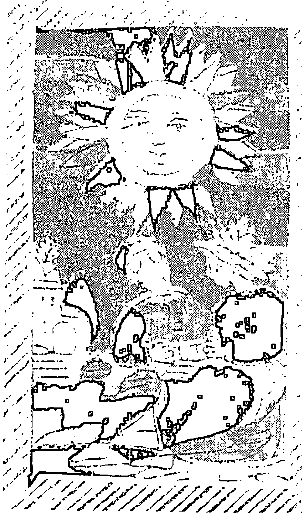

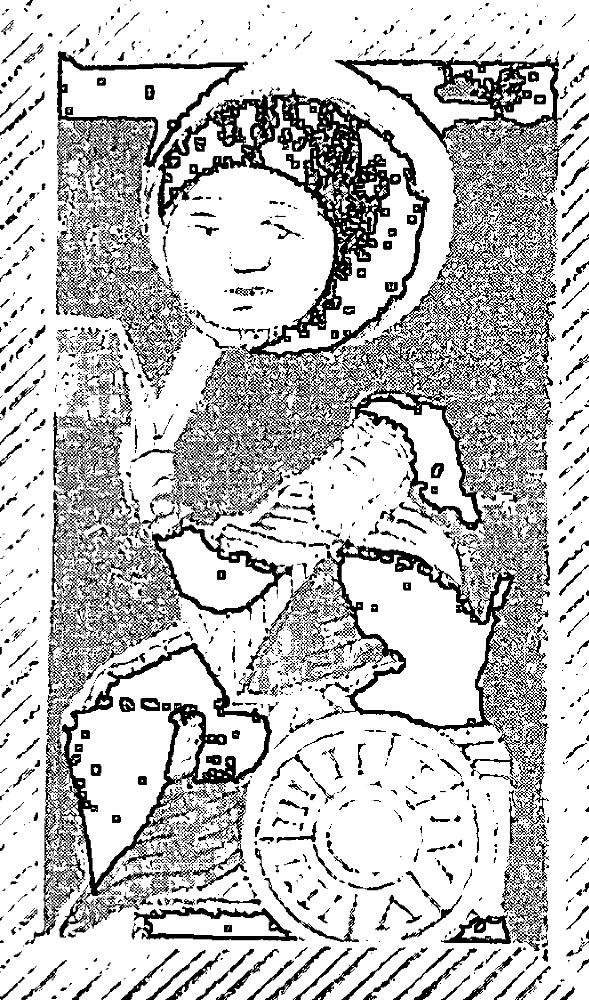

作为父亲和母亲的象征，太阳月亮相合代表父母角色的统一性，他们的生活态度、价值观念、人生目标、教育方式等都非常相似。这种一致性导致孩子在某些方面难以寻求指导，其结果是新月出生的人选择不再试图从别人那里获得指导、建议、支持、依赖，而是完全地相信自己。因此，新月出生的人非常主观，未免有自负和自私的倾向。新月也象征阳刚与阴柔的结合，这样的人童年可能在性别认同方面存在混淆。

月亮代表了潜意识，在太阳相合的强化之下，新月出生的人通常会有深深扎根于潜意识的习惯和思维，虽然自己可能意识不到。他们的人生课题是，把潜意识的内容调动到意识中来，通过聚焦于过去而影响未来。

### ○太阳与月亮相冲（即满月）

太阳冲月亮，代表“意志”与“感情”的冲突，导致徘徊不定的倾向，时而体验着压力，过分敏感，烦躁不安，又难以忘记过去的记忆。出生天宫图上有这一相位，也代表婚姻生活可能会有紧张和冲突。

满月的人与新月相反，倾向于缺乏坚定性，犹豫不决。他们对别人的态度、感觉、需求等高度敏感，对人际关系非常重视，时常从别人那里寻求帮助。我们在前面说过，相冲的相位本身就意味着关系。而太阳冲月亮的人知道如何将一对一的接触服务于自己的目标，他们避免了新月的褊狭思维，能够客观地看待一切，意识到一件事情的各种可能性。然而，消极的一面是他们会缺乏推进的魄力，因此在实现目标方面可能遇到困难。由此我们看到，新月和满月的对比与白羊座和天秤座的对比有一定的相似性。

对于满月出生的孩子，父母通常是两类完全不同的角色：一方内向而另一方外向，一方总在家里忙碌而另一方总在外面奔波，一方关注孩子的生活能力而另一方则谆谆教导人生奋斗，如此等等，不一而足。父母双方之间的对照，使孩子在选择哪一方作为自己的榜样方面产生困惑，即便到成年也仍试图在心灵深处整合这两种对立的原型。

### ○四分方位的上弦月和下弦月

四分方位的上弦月和下弦月都是硬相位，凸显“情感”的不安全感和焦虑心理，以及“自我认知”方面的困惑，体现了“索取”与“需要”的分离：我既需要被动地适应环境，又想要积极地自己开创一条新路，怎样协调这两者呢？因此，太阳与月亮的四分方位是“自我”与“情感”的矛盾，在朝向自己的目标努力的时候受到阻碍，常常是由于情绪问题和习惯模式阻碍了自我表达，

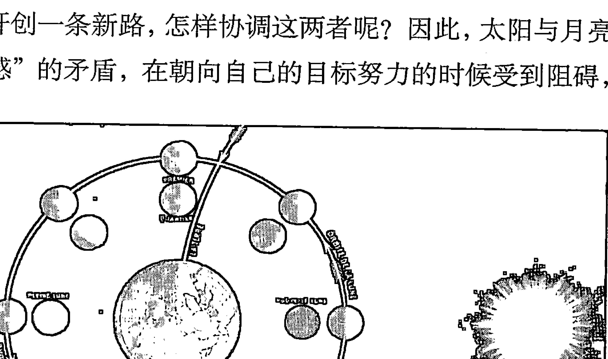

家庭的影响阻碍了自我的发展，意愿与从小的习惯不兼容，对异性缺乏了解和相处技巧等原因。总的来说，他们总在寻求使自己不同于以往，而家庭、过去或习惯可能会成为他们走向未来的羁绊。

他们比满月更可能出生在一个充满改变和冲突的家庭，因为父母总是互相妨碍。孩子可能因此而感到自卑、自责，导致羞于自我表达，害怕自己的任何表现都会使事情更糟糕。一个人的太阳和月亮处于这些硬相位，可能会在自己的人生中重新经历父母关系的紧张状态，因此需要从中学习更好的处理方法，应用于自己的家庭之中。

### ○太阳与月亮三分方位

太阳与月亮三分方位，表明意志与习惯、情感相协调，过去与未来不存在冲突，童年受到父母的良好教育和样板引导，具有健康的自我，人际关系轻松自如，能够承担责任和得到认可，能够让别人听从自己而无需强迫。他们很自足，心态很好，但难以对自己的人生进行疑问和思辨。

六分方位也是软相位，一样代表平静安逸的生活，婚姻、家庭和谐自如，心态平衡、积极，能汲取过去的教训又不拘泥于过去的记忆。这样的人既坚定，又会适时地妥协。

### 太阳—水星的相位

由于水星的轨道很小，它与太阳在天宫图上的距离不会超过一个星座，因此，只能与太阳组成相合相位。

太阳合水星代表“思维”与“自我”这两个概念的结合：自知之明、超凡思维、我思故我在、知识就是力量。

这一合相有利于智力和记忆力，出生在这一时刻的人注重理性的头脑，是独立的思想者，并且常常抱持己见。他们具有双子座的某些特质：喜欢手舞足蹈地讲话，好查问于己无关的闲事，等等。但是，由于相合对心灵和自我的强化，他们难以从客观的角度审视自己，仿佛他们的观点就是不偏不倚、惟一正确的最终答案。

水星和太阳相合要表达的是：如果一个人太固执己见，完全用主观的思维、观点、语言、视野围绕自我，那么势必面临潜在的危险。因此，传统上认为最佳的状态是水星的位置在太阳之前（先于太阳升起），并且角度差在3°之外。

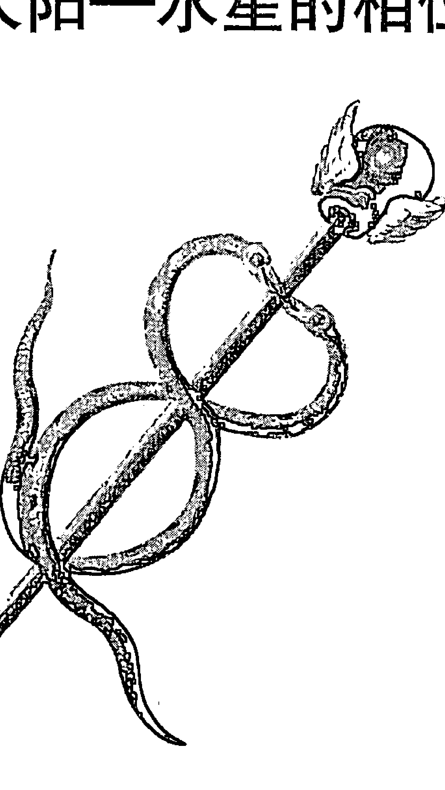

### 太阳—金星的相位

金星与太阳的夹角最大不会超过48°，因而除了相合之外，只能形成较次要的八分方位（45°）和十二分方位（30°）。二者的相位体现了“合作、关系、自爱、爱心”的重要性。出生在这些时刻的人倾向于通过爱与被爱来认同自己。

太阳与金星相合会带来艺术或多情的性格特点，注重外表，好友善交。

出生天宫图上有这一相位的人，出于和谐与被喜欢的愿望，不愿意面对不愉快的争执，也不愿勉强别人；他们追求完美，会竭力掩饰不完美的地方，容易被自己制造的假象所迷惑。因此，这不是一个领导型的组合。

但是，他们慈悲为怀，愿意分享和给予，能够接受别人、善于妥协，像天秤座一样，极为重视和谐的人际关系。这一组合使人喜欢享受自在人生，而尽量避免任何劳苦之事，这一点上显得比较消极。

在天宫图上，太阳也代表父亲，因而与金星的合相代表有一个慈爱的父亲。

二者相合的宫位和星座会对他们的行为添加注脚。比如，相合于第二宫，有挥霍浪费的趋势；相合于天蝎座，可能会不考虑手段和道义；相合于双鱼座，则有放纵的倾向。

### 太阳—火星的相位

火星是“勇气、毅力和行动”必不可少的动力因素，同时也代表着“冲动、好斗和风云变幻的事情”。太阳与火星形成的主要相位都体现了很强的个性，不论是勇敢决断，还是刚愎自用，出生在这些时刻的人是个人主义者，他们有白羊座注重领导和行动的特点，是先行者而非服从者、是参与者而非旁观者。他们精力和胆识过人，相对于“智”，他们更多地是靠“勇”来达到自己的目的。

对于太阳和火星成相位的人来说，“赢”是一个必不可少的字眼，而背后暗示的“斗”字在相合与硬相位中更为显著，软相位则使人更多地具有和平友好地解决问题的能力。同时，软相位使人具有健康的利己之心，在硬相位的情形下可能表现为完全不顾别人的利益、横行霸道。

火星与太阳的相合与软相位，会带来“意志、自信、活力”的和谐状态，体现出力量、勇气、毅力、竞争、热情等阳性因素。但相合存在盲区特性，使人难以看清自己的不愿妥协、控制欲强的特点。三分方位与六分方位比相合更能接受别人的观点，能有效地运用自己的创新性思维，考虑周全。

具体说来，出生天宫图上太阳与火星相冲，会突出无拘无束和冒险的欲望，不惧挑战，但有鲁莽、冲动倾向；有叛逆心理，容易制造麻烦，而忽略了很多纷争并无任何意义。在逐渐成熟起来以后，原本狂热的探险冲动会转变为坚定的求索精神，

非常有助于成功。

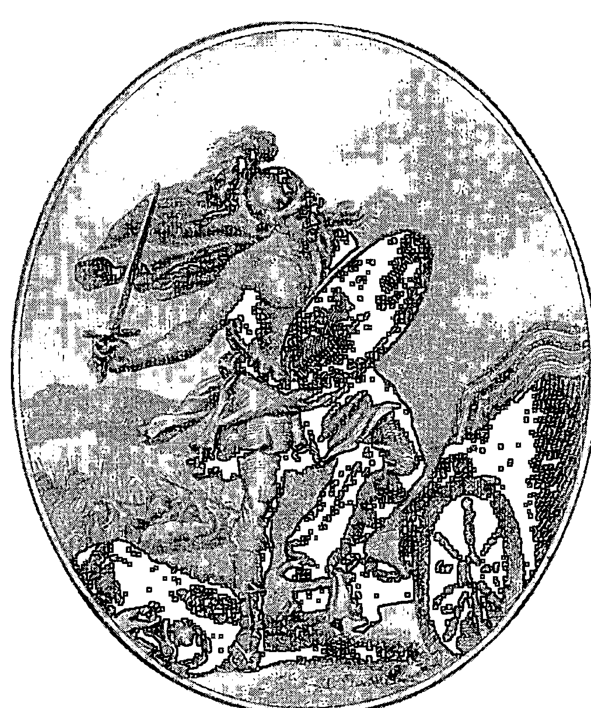

不知疲倦的斗士——战神阿瑞斯。

火星与太阳的四分方位造就了一种任性和冲动的行为模式：为了达到自己的目标不懈地努力、以饱满的热情去做每一件事以证明自己的能力和勇气，但是可能缺乏耐心和远见，而能量的发挥方式常常是爆发式的。这样的人要注意避免自我中心的倾向，也需要培养处世技巧，不要太过自我表现。

太阳也代表父亲，因此太阳和火星的组合不仅挑战自己，也可能感受到来自父亲的竞争或威胁，从而在成年之后通过完成各种壮举、与男性的斗争等来证明自己。这一组合的另一种可能表现是一个人继承了父亲的斗争使命。

### 太阳—木星的相位

木星就像一个气球，“大”而“浮”，太阳与木星的相位表现为快乐、自信、乐观。慷慨、慈善也是这一组合的特点，不仅在于金钱方面，而且也在人际关系上。他们自己的动机一般光明正大，也倾向于从好的角度去理解别人的动机。对付一个气球，一根针就可以让它瘪下去——太阳与木星的组合容易因为小挫折而气馁，特别是自满的硬相位，不过，本质乐观的他们也能很快忘却这些不快。

太阳与木星的组合具有站在更高角度看待事物的能力，是面向未来的梦想家，遭遇失败后能够很快重整旗鼓。他们永远在寻求拓宽自己的视野和生活范畴，面向宏大、崇高的目标，对小的细节和阻碍不甚介意。若处于硬相位，他们可能此山望见那山高。

木星也代表信念，与太阳相合代表坚定的信念，而相冲和四分方位可能意味着信仰方面的障碍，因为他们难以整合这些信仰，以及自己对于人生目标与意义的思考。

太阳与木星相合的人极为自信、乐观，深信自己所做的任何事都能够成功，以至于有言过其实的倾向。他们有领导才能，正义感强，深得众人信任和欣赏。

三分方位体现出比较和谐的特性，做事幸运，仿佛一切都已为他安排好。六分方位与三分方位类似，胸怀宽广，乐观、自足，有能力解决任何困难。

太阳与木星的硬相位，存在侥幸心理，也代表自我膨胀、喜好夸示，待人方面可能表现出施恩于人的样子，以及温情式的家长作风，容易导致别人的反感。

其中，二者相冲的相位过于乐观、言过其实，生活上则奢侈浪费。这类人需要控制其好大喜功的冲动，避免夸示的举止。

四分方位使人过高估计自己的能力，对别人期望也过高，可能不切实际地急于承担太多，显得鲁莽。为人处事要严防盲目乐观和过分慷慨，控制自己的表现欲。

### 太阳—土星的相位

土星接触某颗行星，会使人对那颗行星所代表的东西萌生渴求。太阳代表自我，土星与太阳的相合与硬相位代表自我的缺失，表现为自我否定、自我牺牲、自制、自律，以及由此带来的对自我肯定、自我放松的渴望。太阳的“重要”和土星的“恐惧”结合起来，产生一种因自己显得无足轻重的惧怕和让自己显得重要的渴望。

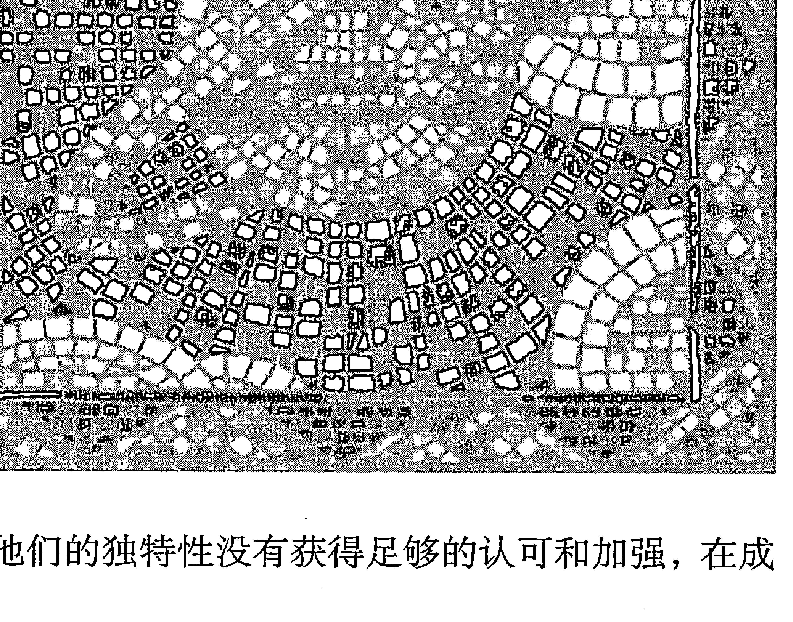

在童年时代，他们感受不到世界围绕自己旋转的感觉，他们的独特性没有获得足够的认可和加强，在成年后导致这方面的补偿心理。

## 天知·星·达·人的·法宝

太阳代表父亲，土星与太阳的相合与硬相位也意味着早年受到父亲的忽视和限制，而做父亲的常常是因为没有足够的时间。同时，他们在纪律的约束之中长大，被期望成为某种形象，在效果上则是抑制了自己的本性。

补偿心理使他们期望通过功名和地位使自己得到认可，但同时又缺乏足够的信心主动表现自己，他们不愿被人看到自己对这些目标的追逐，因为他们会怀疑自己是否真的有能力、或者自己想做的事情是否真有足够的价值。他们借助做出某种贡献而获得承认，但又常常对自己的贡献不够满足，驱使自己不断奋斗。

这种对别人的肯定的依赖心理，是其个性的弱点，也是一种自我否定。然而，土星代表时间，随着年龄的增长，他们的自信心会逐渐增强。

太阳与土星相合、相冲和四分方位，太阳力量的发挥都被局限，而肌体也缺乏活力。这样的人感觉生活中处处充满限制，计划所做的事常受到很大的外界阻力。由于挫折太多，缺乏自信和安全感，与人沟通不畅，导致对自我的怀疑，可能会有悲观、自贬的倾向。好的方面是他们内在的力量较强——即自制力、毅力和经验，而且工作辛苦勤奋，组织能力强，遵循规则，会被委以重大的责任。

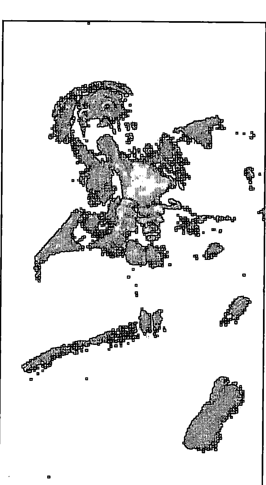

太阳与土星相合或相冲，责任、标准和权威对他们而言是重要的问题，他们总是在审视和评判自己。当这种责任、标准和权威来自于外部时，可能感觉受到限制、挫折和否定；但是，在积极的方面，这些因素可以是来自内在，表现为自律、毅力、精明和务实。

太阳与土星四分方位，早年可能低估自己的潜力、怀疑自己的价值，成年以后信心逐渐增强，早先感觉难以建立的个人关系也不再那么困难。他们雄心勃勃，稳健、多疑、责任感强，有商业天分，依靠辛苦经营会赢得成功。

太阳与土星的软相位代表责任、限制、规则、时间、传统等因素对自我的建设性影响。这样的人处事严谨，把目标设定在仔细界定的框架之内，沉稳、实际，经得起时间的考验，并由此奠定了自己的自信，这种自信与火星自发而倔强的自信、木星充盈而脆弱的自信都不同。

三分方位使得承担和处理责任变得轻松，知道如何应付问题、利用机会。他们野心不大，极少树敌，不论形势如何都能稳定，认定正确的事绝不回头。中年之后，成功和认可会超过年轻时。

六分方位意味着对事物理解的深度和对自我评价的谦逊态度。清楚自己的局限，但能最大地发挥潜能。他们雄心勃勃，能够承担责任，遵循规则，恪守传统，做事按部就班而不大张旗鼓。

### 太阳—天王星的相位

天王星代表独立、自由、独特，体现在与太阳的所有相位中。

在相合和硬相位中，由于性情古怪、举止怪异、特立独行、随心所欲，显得与周围格格不入，一方面会因为自己的引人瞩目获得某种承认，另一方面会感觉自己被当做局外人受到孤立。在这样的情绪下，会使人神经质，感情用事，难以捉摸，也有可能带来不可靠的婚姻和各方面的碰壁。他们需要明白的一点是，服从别人的安排并不会失去自身的个性。

天王星代表突破和改变。在与太阳的相合与相冲相位中，一个人会强烈地寻求突破传统，追求自由，不愿意受日常规范的约束。如果这两颗行星位于天宫图的顶点位置，或宝瓶座的影响比较强，那么可能表现为朝令夕改、变化莫测。然而改变就意味着阻力，不仅是来自外界的阻力，而且这样的人自己都顽固地不愿改变自己，要花很长时间才能学会维护一个坚强而灵活的自我形象。

天王星与太阳的相合与相冲也带来叛逆心理，这种叛逆心理早期是针对父亲，后来发展到传统观念、别人的指导等。在软相位中，这种背叛情绪要温和得多。

太阳与天王星成四分方位，有创造性思维但可能流于不切实际；渴望自由，不愿循规蹈矩，但会对成功造成阻碍。对于改变，他们倾向于采取激进的路线，使情绪紧张，在紧要时刻可能会做出不够理性的反应。因此，他们应该适当地尊重土星原则，包括培养耐心、接受纪律的约束。

太阳与天王星的软相位可以避免过于顽固、刚愎自用，是一种温和的表现。三分方位带来直觉、创造力、独立性，标新立异而令人注目，能够关心、理解别人，对自己的长处和短处看得很清。既有自己的见解，又能听进别人的想法，有人格魅力和统观全局的能力。太阳与天王星六分方位，思维和自我表达顺畅自然，人生态度积极，头脑聪颖，为人真诚。

### 太阳—海王星的相位

海王星具有理想主义、浪漫主义色彩，太阳和海王星的组合可能意味着自我欺骗、自我逃避。海王星又意味着想像力、直觉和先见之明，因此和太阳的相合与硬相位，会使人行事依靠直觉，分不清事实和想像，易受人欺骗，或者自欺欺人。

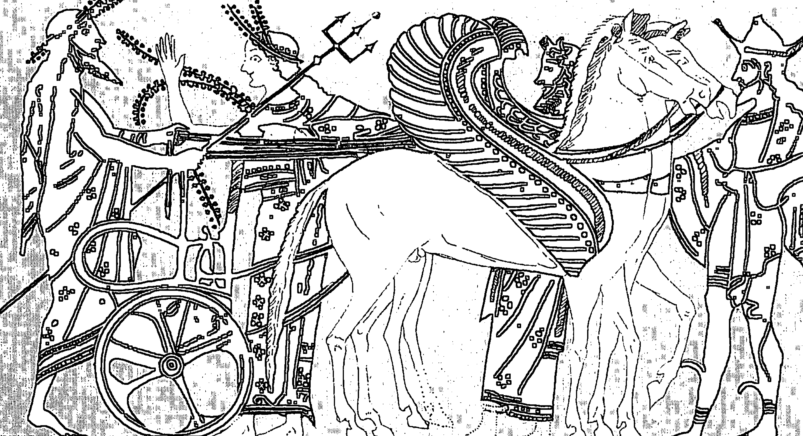

无论相位如何，特别是硬相位，太阳和海王星的组合希望自己过着某种理想的生活，希望自己是个比较特殊的人。海王星将对与它所接触的对象进行提升，而太阳代表自我，所以在二者的相位中，希望自我被理想化、美化，这一方面导致不满足和缺失感，另一方面也意味着文过饰非式的处理，与现实的脱节，也不愿坦白自己的动机。在这一意义上，他们还会感受到海王星犹抱琵琶半遮面的属性，试图寻找自我。

他们逃离自我和寻找自我的冲动一样的强烈。海王星使太阳所代表的自我变得模糊，自我与别人的边界没有精确的定义。由于缺乏“边界”的概念，在硬相位下，他们对于应该从生活中期望什么感到迷茫，对社会公认的标准缺乏掌握。但他们对自己、对世界都抱有实际上较高的标准，希望超越日常的现实，而敏感的他们面对周遭的严酷和痛苦的时候常常会采取逃避的态度。对自己的不满足，也影响了他们的合作、决定、做事——或者是期望过高，或者是担心接受了某一个机会就对别的机会关上了大门。他们富于想像，以至于与事实相混淆，对自己的潜力也未能充分估计，乃至难以明晰自己的发展方向。

仍是由于缺乏边界意识，他们需要自我认同，希望与别人融合。一方面，他们可以表现出别人的色彩，体会别人的思维、情感、需求；另一方面，他们会有自我怀疑的倾向。此外，他们对痛苦的体验很敏感，情感脆弱，可能有贪图感官享受的倾向。

太阳还代表父亲，太阳与海王星的组合可能意味着童年时代父亲角色的缺乏、对父亲的理想以及缺少适当的规范。

太阳与海王星的所有主要相位对于需要灵感的艺术、音乐创作都有利；这些艺术形式表现了他们灵性的天分，并且为他们使自己的心灵具体化提供了介质。

太阳与海王星的相合与硬相位，使人不喜欢一成不变的生活，喜欢随意而为，或者盲目追求离奇和幻想，使个人境况经常发生变动，易受挫折的打击，或者感觉受到不公平的阻碍，总觉得需要为自己的见解和目标辩护，觉得自己被低估，有一种无助的感觉。

太阳与海王星三分方位的人，吸收、领悟性强，有出色的直觉和对美的鉴赏能力，待人宽容，博爱。

六分方位代表创新思维的潜力，他们的敏感性以一种积极的、建设性的形式表现出来；理解自己的社会责任，并愿意承担；兴趣广泛，人际关系良好。

### 太阳—冥王星的相位

冥王星的特点之一是隐藏的属性，与太阳的主要相位代表对自我的隐藏，其自我保护意识超过太阳与土星的组合，又难以穿透。他们被一种强大的能量所笼罩，或者极为外向甚至偏执，或者极为内向、深陷于自己的内心。无论如何，他们在努力创造一个隐藏之地，掩饰真实的自我，需要别人尊重自己的隐私。

具有太阳与冥王星相合与硬相位的人，他们的父亲通常是比较专横、压制性的，而且让他们无法回避。在潜意识里，这个父亲的角色非常强，以至于难以容下更多男性角色，这样的人与女性的交往更多些。

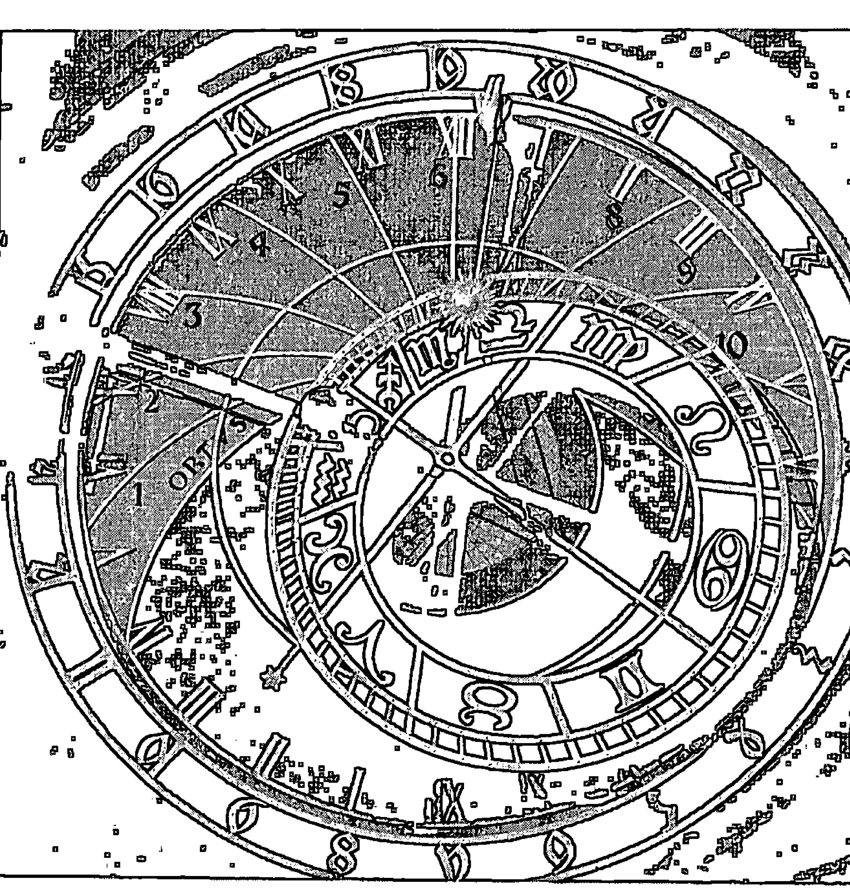

太阳合冥王星，具有极端主义的倾向，爱憎分明，难以中庸，意志力强，果断坚决，但要注意避免独裁。他们对周遭环境的不公正和不正义深恶痛绝，内心存在着改善社会条件这一崇高的理想。他们必须要整合自己的光明面（太阳）和阴暗面（冥王星），不以牺牲其中一面为代价。

太阳与冥王星相冲，代表过重的防备心理和内心焦虑，总是对周围的人和环境存在不满，因而与人相处有障碍。面对异议，要注意容忍，避免独断。这一组合意味着人生的某个时候存在重大的改变，也是自我反省、重生的契机。

太阳与冥王星的四分方位，对权力和控制存在野心，有管理、控制、执行的能力。个性如谜，固执己见，对于亲密的感情关系持戒备的态度。要学会妥协，学会理解和接受别人的自我。

太阳与冥王星三分方位，非常专注、有毅力，能充分调动自己的天分和资源，有领导能力，不过他们更愿意专心于个人事务。他们的感觉敏锐，能洞穿别人的行为动机。

太阳与冥王星六分方位，代表强烈的个人意志和深度的自我认知，不断地自我反省和提高，有能力达成自己的目标，有领导能力，能与众人顺畅地沟通并赢得他们的信赖。

### 太阳—顶点的相位

太阳位于生辰星位，富有朝气，体格强壮，能够驾驭环境和自己，也能够把自己的思维成功地传递给别人，受到众人的瞩目和效仿。

太阳与生辰星位成三分方位，态度随和，与人沟通顺畅，能够轻松表达自己的观点，衣着外观也很得体，与执掌权力的人相处甚好。

若成四分方位，表示自我表达不畅，难以表露自己真实的一面。

太阳在下降点，对人际交往和浪漫之事有浓厚兴趣，但也有可能起到反作用，使人在社会生活中迷失自我，忽略自身的独特性。

太阳与中天相合，向往权力，需要认同，也容易得到认可。他们极为重视职业生涯，有可能为此而以家庭生活为代价。

太阳在天底，对于家庭生活考虑常常超过对于职业生涯的投入，淡泊名利。

太阳与天底成三分方位，在工作、职业和其他实际事务方面，能够充分发挥自己的每一分特长和能力，与上司、主管、权力人物的关系融洽。

太阳与天底成四分方位，则过于注重表面的礼节、交际、应酬，有可能损害家庭生活。

## 月亮关怀

正如月亮会反射和吸收太阳光一样，它也会反射和吸收与它成相位的行星的属性。因此，月亮与水星的组合，会把月亮代表的情感理性化，类似于月亮位于双子座或室女座；月亮与金星的组合，会寻求情感方面的平衡、和谐；月亮与火星的组合，使人在行动、争斗中获得安全感；月亮与木星、土星的组合，分别意味着自我印象的乐观和悲观色彩；而月亮与外行星的相位，则意味着对超验的、超个人的主题感兴趣。

### 月亮—水星的相位

月亮与水星的相位常常与“处理日常事务的常识”和“精明”有关。

在最好的情况下，水星的“推理和沟通技巧”与月亮的“同情、保护和关怀属性”相结合，得到一种考虑非常周全、负责、爱护的品性，并且能够对各种观点兼收并蓄。在软相位下，这种优势最易体现，在硬相位和相合的情况下，则要付出一定的努力。

在最差的情况下，情感因素以及对家庭、对过去之事的念念不忘，会使一个人看当前问题的眼光产生扭曲，会把关于自己生活的很多闲事提上桌面。跟他们谈话比较辛苦，因为他们的头脑似乎总是不集中，特别是月亮与水星成硬相位的人，要得到确定的结论、探讨一个问题的解决方法都很难——一方面，他们有单纯接受却不假思考的倾向，就好像上课做了一大堆的笔记却不能理解；另一方面自我表达混乱，可能无法有效地整理自己的想法，也可能会表现出心不在焉，缺乏连贯性，常常被情绪和回忆所干扰，难以就事论事。这种情况下，需要有意识地培养逻辑思维和专注力，并努力区分当下的事实与过去的情感投射。

乱，难以表述自己的观点，亦或根本就没有观点。

出生天宫图上月亮与水星成相位的人也擅长讲小典故，那些来自于日常生活的、没有什么戏剧性情节的、没有演绎和发展的，小事情。然而对生活的小事、对人物和感情的观察也正是他们的天赋，他们极喜欢聊天，会以一种幽默风趣的方式说话，或谈论关于家庭生活的琐事，与此同时，也是传播街头流言、小道消息的热衷者。

月亮和水星都有接纳的特性，但有时候会做过头，让自己的感情、观念和主见处于一个脆弱的墙头，任何一点外界信息和情感的风吹草动都会干扰自己的平衡，从而也难得出一个真正理性的、不轻易被情绪改变的观点，对于硬相位尤其如此。

具体来说，月亮与水星相合，使人健谈，有一种富于同情心、能理解人、态度亲切的沟通形式，因而人缘很好。他们有惊人的记忆力，善于接受和领悟，也善于从经验中学习。有自己的见地，适应能力强。缺点是头脑转变快，令人意想不到。

月亮与水星相冲，代表感性与理性不易平衡，有时候举棋不定、表达不清，问题的焦点容易被琐碎的事情所掩盖，偶尔也易为小事争论。是情感的理性化、还是思维的情感化，取决于两颗行星力量的强弱对比。

月亮与水星四分方位，代表情绪干扰着思维，可能词不达意，判断不清，所说不一定自己真正所想，而所想又说不清楚。出生天宫图上有这一相位的人，可能总谈论琐碎的事，难以得到别人的支持。他们需要听得进别人的不同看法，平静、客观地看待别人的见解。

### 沙罗表

日食具有一系列称为“沙罗循环”的周期，目前确认有42个这样的周期在同时进行中。在每个周期的峰值，会每隔18.6年连续出现日全食，直至不再观测到日食。沙罗循环开始于一个确切的时间，全程长达1300年左右。上图为测量沙罗循环周期的沙罗表。

月亮与水星的三分方位，使人头脑精明、常识丰富、记忆力强。自我表达有逻辑而令人愉快，对于人际沟通、特别是处理家庭事务有利。

六分方位代表心智和感情的同步，表达简洁有效，有商业潜力。与人沟通得心应手，敏感、体贴，能关注别人的感受和想法。

### 月亮—金星的相位

月亮和金星都是具有柔和、让步本质的行星，因此，它们之间的相位造就了一种极有合作精神的性格：热爱和平，温文尔雅，言辞委婉。

但是，月亮和金星相合或者硬相位，在上述表现中会有过头的倾向：过于敏感，太易于受伤。为此，他们也很害怕伤害到别人，会竭力避免紧张的对立局面，不愿意批评别人，当然，他们自己是最怕受到批评的，会为了避免批评而竭力把事情做得完美。然而，越是如此，别人稍许的不满或建议就能挑动他们的敏感神经。

月亮和金星成相位还意味着对女性气质的强调、对女性传统角色的强调。在他们内心，有一个理想的母亲形象，特别是女性，会竭力按照这个形象去做，在成年后会深感自己无法摆脱传统的家庭主妇角色，而这样的男性则从小被教育不要太粗鲁。他们浪漫而敏感，爱回顾过去、喜欢翻看家庭影集。

月亮和金星的硬相位，在童年会觉得缺少爱的关怀，包括贴身的照顾。这种缺乏事实上可能并不存在，只是由于那个理想化的母亲角色的形象造成的反差。在成年之后，他们也会对伴侣心怀担忧，害怕关系搞砸，同时对别人的批评和排斥很敏感。他们总觉得自己得到的不够，因而也总向往更安逸的物质生活。

在恋爱方面，硬相位也意味着两种不同女性形象的不调和，有这种相位组合的男性，会存在红玫瑰－白玫瑰式的情结，不论找了哪一个，都会觉得另外一个好。这里的课题，是要整合自己内心的两个形象。

月亮与金星相冲，导致情感不稳定，注重感官享受，有自我放纵的倾向。对男性而言还意味着妻子的不整洁和家庭生活的不美满。

在与人交往方面，他们会努力改善个人关系，并且往往不吝溢美之词，以回避某些困难，虽然其真诚度不一定可信。

月亮与金星成四分方位，会出于对责任、拒绝等的担心，而对建立亲密的个人关系萌生怯意，不愿承认或表达自己的感情，倾向于在充分学会理解别人之前独来独往，价值观与众不同。

月亮与金星相合或者三分方位的人，性情温和、乐观，富有情调，并且有艺术的美感和想像力。他们对人友善、关怀、理解，厌恶粗鲁和庸俗。同时，对异性有很大的吸引力，有比较好的社会关系。

此外，在男性的出生天宫图上，相合代表美满的婚姻，对女性而言则代表健康的身体和机能。

六分方位的影响与三分方位类似。

### 月亮—火星的相位

月亮与火星的相位体现欲求的潜在状态。在出生天宫图上，月亮与火星的硬相位暗示着潜意识里充满有关性的混乱的印象。这样的儿童性意识比较早，需要给予建设性的引导，教育他们正视、尊重自己的性机能，引导他们在潜意识里建立正确的性态度，相反，父母在烦忧之下的苛责不会有好的收效，还会影响到他们成年后的能量发泄方式。

月亮与火星的相合与硬相位，也意味着较强的保护意识，常因感到安全受到威胁而主动出击，这种习惯性的反应会为他们带来冲突。在男性的天宫图上，这种组合也代表母亲的保护意识很重，以至于难以放手，这也使婆媳关系难以调解。

月亮与火星的相合和硬相位代表不安分，有强烈的行动意愿；同时，也代表情感的焦虑和不耐烦，感觉强烈、充满热情，却会因为各种互相冲突的问题而烦忧，尤其是二者相合的情形。由于持续不断的压力，而家庭环境不仅不能使之放松，反而还是多数问题的根源所在，所以这样的人脾气也不是很好。

月亮与火星相合于易变星座时，尤为感情用事、缺乏审慎；如果是在固定星座，则较能控制自己的发作，然而也会发现不易表达自己的情绪。此外，在女性的天宫图上，这表明身体健康、精力充沛、在家独揽大权，或者有女权思想；而在男性的天宫图上，则代表一个脾气较为火爆而又大权独揽的婚姻对象。如果相合发生在白羊座、天蝎座或摩羯座，那么它会使人的性格趋于偏激；如果相合于第五宫（子女宫），代表对养育的冲动或急不可待，与早产、流产有关。

月亮与火星相冲或者四分方位，感情强烈而冲动，对限制自己“欲望和需求”的“规范、约束”心怀不满，对人严厉、情绪易怒，缺乏妥协、喜欢独断，又易于为小事争执，感情缺乏而又忽略别人的感受，这都对个人关系不利。因此，要注意容忍别人，不要一概视为干涉而动怒，要理解维护和谐个人关系的重要。

月亮与火星的软相位，代表给“争斗”赋予了必要的情感，使可能爆发的愤怒控制在理智之中，能照顾别人的感觉，能有效地控制自己强烈的感情；同时，赋予一个人活跃的情感、强健的体魄；在想像力的背后有意志和行动的支撑，体现积极坚定、果敢的一面，而不至于草率。他们毅力超人，能够度过常人会屈服的困难；自信，也能赢得他人的信任。在室内装潢设计等可以自己动手而且围绕家居主体的事情上，有足够的兴趣和能量。

十五世纪法国Limbourg兄弟绘制的星座与人体部位的统辖关系图解。

### 月亮—木星的相位

月亮和木星的相位可以带来贪婪的属性：贪婪于情感的哺育和物质的支持。出生天宫图上月亮和木星成相位的人，在付出温情和保护的同时，也期望得到自己渴求的温暖。由于这两颗行星都与“保护”的概念有关，保护心理使他们容易被别人的不幸故事所打动，而这种悲悯的善意也会发展成过分的保护。但是，过分的保护可以导致被保护者的依赖心理，也导致保护者自我的膨胀。

不论相位如何，月亮与木星的组合都具有“关怀、和蔼、乐善好施”的倾向。二者处于软相位，为人处世态度乐观，慷慨而尊贵，诚信而公平，受人欢迎和信赖，对慈善事业和教育事业感兴趣。相合和硬相位的问题在于可能做得过度，承诺太多而无法兑现，或者滥发善心。

木星的自由主题，表现在月亮和木星的相位中是喜欢探索、不安分，不愿被拴在一个地方，也不够专注，而是更倾向于随意，负面的倾向是喜欢碰运气和逃避责任。这种随心所欲的进一步结果也意味着自我沉迷或放纵，饮食无常也是常见的表现。

月亮与木星的相冲和四分方位，使人缺乏推理能力和远见，喜欢夸耀和展示，过于铺张浪费；有侥幸心理，会做过于草率、不负责任的决定，易于借助孤注一掷的赌博和投机行为发财，但往往遭受更多的损失；希望得到别人的肯定，但常会信赖一些不适当的人并为此付出太多；有放纵自己或放纵他人的倾向，慷慨但缺乏原则；情绪会在高涨的热情和平淡的冷漠间随意摆动。此外，月亮和木星相冲，也意味着不够谦虚，喜欢把别人的功劳算在自己的头上。

月亮与木星的三分方位和六分方位，既不会没有原则地滥施善心，也不会过分自以为是。他们具有宽厚、乐观、诚实、正直、慷慨、仁爱的品性，并且同情弱者，因此人际关系很好，而他们自信和热情的天性也激发了别人的乐观情绪。他们能在多方面取得成功，并且不会忘记曾经帮助过自己的人。

### 月亮—土星的相位

月亮和土星的相位，常常意味着未泯的童心和情感发育的延迟，行为和反应谨慎、拘束。土星通常代表一种行为的定势，涉及到月亮时，二者的相合与硬相位代表过分控制的反应、不能充分发挥自我、恪守陈规、期待别人的肯定等。土星仿佛一堵墙，把月亮代表的情感封在里面。土星深层的涵义在于恐惧，因此他们最大的需求是安全感，表象的壁垒取决于这种安全感的缺失程度。

月亮和土星相合时，月亮使人周期性地忧郁，土星使人心底持续地沮丧，所以他们谨慎、失落，容易怀疑自我的价值，常常看到事物的阴暗面。而这些情绪可能来自于成长期所遭受的严苛的约束或伤痛的经历。这样的人可能早熟，被迫比同龄人更早地接受某些责任、限制，并且学会压抑自己的感情需求，以至在成年后也难以完全自发地表现，一种无意识的对于批评的惧怕已经深深地影响了其言行。这种谨言慎行，反映了内在的保护心理。

月亮代表家居和社区、土星代表工作和传统，因此，月亮与土星相合意味着很强的家庭传统、住了多年的老房子、在家工作等。可能限于责任、传统、历史之中难以脱身。

月亮与土星相冲，代表忧郁、悲伤、压抑的心态，在受土星主宰的方面经历困难，例如父母的牵制。他们可能交友很少，行为死板生硬，也不善于关注别人的感觉。

月亮与土星成四分方位，显示了人格中严肃的一面，有强烈的进取心，年轻时对情绪的控制较差，带来很多麻烦，有内疚症结，但在成熟起来以后能逐渐克制，并从错误中汲取教训，深刻理解自己。这一相位也意味着为证明自己而付出艰辛的努力。对男性而言，年轻时会觉得自己在异性面前非常害羞而且笨拙。

月亮与土星的软相位，早期接受的教育和积累的经验，使他们对生活持一种精明、严肃、自立的态度，能够为长期目标投入持续的努力和耐心。有责任感，处理关系有策略，朋友也很可靠。

### 月亮—天王星的相位

月亮与天王星的相位的共性是：情感的独立性和较为突然的情绪变化；不大看重家庭的纽带，也不愿受家庭的羁绊；不喜欢回首过去，目光永远向前；乐于改变，对于正统观点和陈规惯例有叛逆心理，有可能过着非传统的家庭生活。

硬相位代表早年在情感方面可能承受了突然的打击，难以得到持续的依靠和安全感，倾向于过早体验情感的独立，并且在个人生活中担心被拒绝。

潜意识的这种担心构成了压力，在硬相位下导致性情不稳，同时性格倔强，不容异己；感情方面的冲突较多，以至别人会敬而远之，难以获得支持。因为他们在掩饰自己的同时，却把被拒绝的感觉转嫁到了别人身上，因此，应当避免过份的直言不讳和毫不妥协的诚实。

此外，硬相位会使人追求标新立异，易于感到枯燥乏味而不惜半途而废，去追求更刺激、更新鲜的事物，这可能导致生活的步调不断被打乱。在硬相位下，这种自由、改变的倾向可发展到住所、工作以及主意的频繁更换，为人不大可信。总之，他们需要适当地规范自己的与众不同，并且有意识地努力承担家庭责任。

月亮与天王星的软相位，代表优越的原创力和独立性，出生天宫图上有这种相位的人，集合了来自过去的经验以及对于未来的清晰认知，与人相处比较和睦。他们好奇心强，喜欢探寻本质，对新生事物兴趣浓厚，处理日常事务方法独到，懂得为平淡的生活注入新意。他们也喜欢与异性交往，但对于传统的家庭氛围感到窒息，有可能建立非传统的关系或婚外恋。

软相位的优点还包括，由于自己情绪易变，所以能够容忍别人举止的变化，并且能直觉地察言观色，也因此懂得用各种不同的方式关注自己的伴侣。

### 月亮—海王星的相位

月亮与海王星是一对极其敏感的组合，出生天宫图上月亮与海王星成相位的人，其想像力可以丰富到幻觉和白日梦的地步。他们的边界概念很模糊，富于同情心，能够感同身受，承载每个人的情绪和感觉。然而这种感觉本身也可能是模糊的，不一定能清晰地理解这种感觉究竟是什么，这需要水星的理性介入。

月亮与海王星成相位，使人仿佛一条美人鱼，富有魅力，但却有逃避倾向，让人抓不住。他们不愿承担家庭和工作的责任，行动受感情因素影响很大，内心则潜藏着深深的困惑，喜欢藉由自己的幻想世界得到安全感。他们对于各种形式的苦痛和孤独都很敏感，乐于倾听，但只沉湎于消极情绪，“行动”是他们缺乏的。

月亮与海王星的硬相位，使人有点理想化，易受人利用，因而可能受人欺骗而失望，有必要在择友方面慎重。此外，他们难以分清事实和想像，甚至歪曲事实以满足情感需求，因此需要更多地用头脑去分析，得出客观、牢靠的结论，而不是主观地理想化。

月亮与海王星的软相位，代表卓越的创造力，特别是在表演和音乐方面。他们有最佳的想像力，能直觉地感受他人的心意，敏锐而异常准确，但是也可能太理想化地看待自己或者习惯夸大事实。他们重视家庭的纽带，喜欢停泊于家庭港湾的舒适和安全感。

### 月亮—冥王星的相位

冥王星为情感渲染了强烈、深邃、隐秘的色彩，出生天宫图上月亮与冥王星成相位的人，易于吸收所处氛围中负面的、无言的情绪。

冥王星亦意味着执著和操纵，这种控制和占有的倾向，在月亮与冥王星的硬相位下更为突出。这种执著也暗示着对很多事情难以释怀，难以轻易消除愠怒、怀疑、嫉妒等负面的情绪。

冥王星与月亮相合，压抑自己的情感，不易冲动，意志力坚定，但是情感的需求也难以满足。他们保守自己家庭和情感生活的细节，寻求同样深刻和执著的人，朋友圈子较小但是很亲密。

月亮和冥王星相冲，为人极度敏感，感情强烈，嫉妒心强，可能会以激烈的方式解决某些问题。

月亮与冥王星成四分方位，情绪强烈，易于被微小的事情激怒。他们拒绝自我分析，但喜欢分析别人，这可能会导致个人关系紧张。他们也希望忘掉过去，并突破一切限制，不愿受到别人的阻碍。

月亮与冥王星的三分方位，强化了对情感的控制力，了解自己的能力和局限，不会屈从于自己不想做的事，也不会放弃想要达成的目标。对于关键的事情能够守口如瓶。

月亮与冥王星六分方位，有利于对人性本质的深刻理解，情感强烈但有节制，能够享受人际交往的乐趣，但不会浪费时间于平淡琐碎的应酬，能够甩开生活中的纠缠不清。

### 月亮—顶点的相位

月亮与上升点相合，情感表现开放，喜怒形于色，生活的经历会深深地触动其内心的情感。

月亮与上升点成三分方位，易受到众人的注目，在人群中如鱼得水，能让自己的观点被普遍接受。能敏锐察觉别人的情绪，做出建设性的表达。

月亮与上升点成四分方位，家庭的纽带和职业的取向可能会影响社会生活和个人魅力，显得心事重重，缺乏决断，内心感到张力和某些遗憾。需要摆脱旧的习惯，勇于表达自我。

月亮位于下降点，喜爱社交，群体意识强，毫不自私，愿意与别人分享和合作。

月亮与中天相合，有能力调动大家的情绪，是有煽动性的组织领导者。

月亮与中天成三分方位，工作当中时常会得到各方面的支持而显得非常顺利，了解公众的需求和兴趣，充满切实可行的见解。

月亮与中天成四分方位，可能在社会交往方面花费过多的精力而忽略家庭生活。

月亮位于天底，倾向于享受家庭的舒适而远离人群，对于这类人来说，家庭至关重要，而不在意自己是否显得孤僻。

## 水星思维

水星代表理性思维和语言沟通，各个入相的行星分别为之附带了不同的副词：金星含蓄婉转而火星直截了当，木星信口开河而土星用辞斟酌。外行星的影响多不在言谈的表现形式上，而在于潜意识对思维的作用上：天王星突出思维本身的自由性、独特性，海王星突出想像与现实的矛盾，冥王星突出思维对于现实的探究。

### 水星—金星的相位

水星和金星只能形成相合和六分方位这两个主要相位，它们的相位体现着睿智和优雅。

出生天宫图上水星和金星成相位的人，喜欢谈论和思考金星的话题：美、价值和感情。他们懂得如何赚钱，能够有技巧地表述自己的观点而不会轻易冒犯别人，而且能够收集足够的证据支持自己的看法。

他们温和的个性对于很多职业来说都是重要的资产，但水星和金星的组合不习惯应付直接的竞争和复杂的、需要长时间不懈投入的事情。他们拒绝深入地分析事实，因此有时候显得不够成熟，这需要火星的挑战性和土星的坚韧来平衡。对于他们的爱情生活，充分的交流沟通是必不可少的。

### 水星—火星的相位

出生天宫图上水星与火星相合，代表积极、活跃的头脑，求知欲旺盛、创造力丰富，但又缺乏耐心。

他们喜欢争辩，但懒于组织言辞、以理服人，而是自以为是、常常打断别人的讲话，并且不愿意承认错误。他们希望任何事情都直截了当，缺乏金星的优雅含蓄，不过也正是这种我行我素，使他们敢于揭穿皇帝的新衣。然而神经的高度敏捷和持续紧张，也是水星和火星相合的特点，火星的急躁使水星的思维不能充分发挥，所以他们往往过早地下结论，行动先于思考，但是龟兔赛跑的赢家往往并不是跑得最快的人。

火星与水星的硬相位，描绘了一个把别人的意见当做挑战、随时可能吵架的人。其中，四分方位代表二者的互相牵制、难以调和：一边是有挑战艰巨任务的能力，一边是缺乏坚持不懈完成任务的毅力；一边是自己做什么都很有主见，一边是难以接受自己的观点不被认可，也不是一个好的听众。所以，一方面他们需要给别人机会，懂得认错，另一方面表达自己的见解也应采取更优雅的方式。

相冲与四分方位类似，同样面临需要认识互相理解、妥协的重要性。但是，相冲有转化对立面的含义，意味着争端将促使他们转而用探讨来解决问题，“一停二看三通过”的原则可以帮助他们避免冒险。他们有成功的机会，虽然自以为是的倾向会使他们错过很多东西。

水星与火星软相位的组合，能够更好地结合主动性和合作性，不会因为对成功的渴望而焦躁，思维有深度，在重要的事情上能集中精力，参与讨论能够有理有节。他们能敏锐地发现对手的缺点，并加以反驳，对律师、公关、经纪、管理等身份来说，这一和谐相位有利于其成功的斗争。总之，他们有耐心按部就班地发挥自己充裕的能量和热情。

### 水星—木星的相位

水星和木星相合代表旺盛的求知欲、优秀的推理能力、积极的沟通态度。木星的扩展性发挥在水星方面就是思维的拓宽：他们喜欢宏伟的设想，喜欢从更宽的角度看待问题，但是经常同时做很多事情却难以全神贯注于某一项。出生天宫图上水星与木星相合的人，出于对自己才智的信任，可能不甚重视正规教育的标签，然而，高等教育对他们有极大的助推力，是不可等闲视之的。木星把自信甚至自负带给它所接触的行星，因而与水星相合可能意味着夸夸其谈、泛泛而论。他们能抓住事物的重点但不重视细节，给人以粗心、潦草的感觉。好的一点是，木星使自我表达比较生动，能引起别人的兴趣，而且也不容易因为言辞的小毛病而身陷窘境。相对地，水星与土星的组合就更容易因为言谈而得罪别人。

水星和木星的硬相位，更多地体现了负面情形：自吹自擂、没有条理、词不达意、显得缺乏诚意。出生天宫图上有这些相位的人，应当注意表达观点的方式方法。

硬相位中，在水星主宰的贸易等其他领域，也存在着冒险。在这些相位之下，一个人的知识面会比较宽，但很难深入钻研某一个主题。他们需要为自己设定一个明确的目标，按部就班地去实现，及时地消化信息。木星对于琐碎事物和细节的藐视，不该转变成信马由缰。硬相位还代表误解，因此，听话要用心，不要以偏概全。

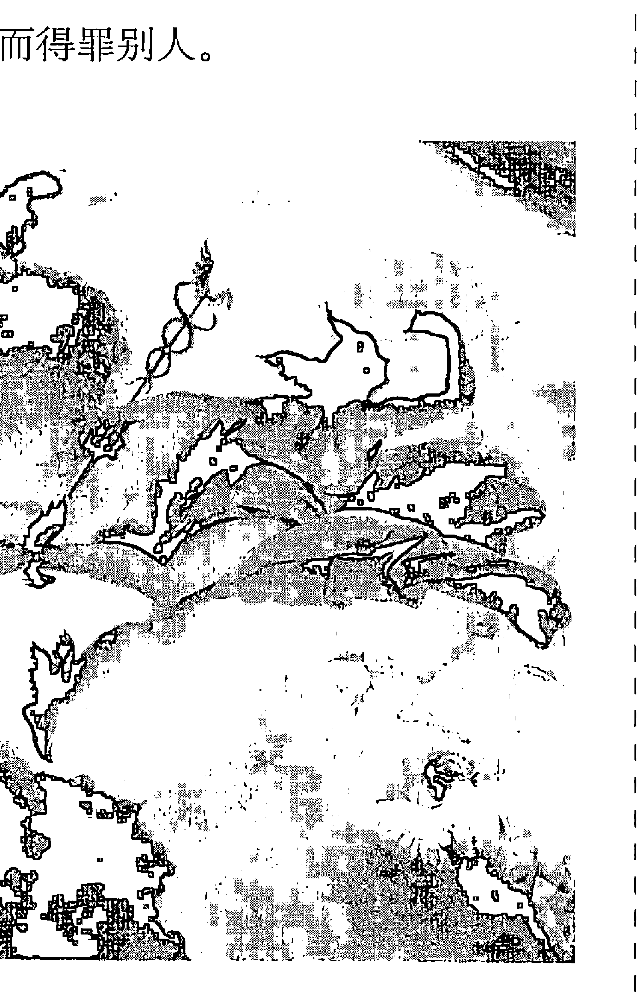

水星和木星的软相位有利于有见地的谈吐，使人生动活泼、热情洋溢，有一颗童心。他们兴趣广泛，喜欢憧憬远期的未来和遥远的地方，习惯看到事物的光明面。他们轻松随和、有幽默感的性格能够得到很多人的信任和喜爱。这一组合也对旅行和写作有利。由于软相位代表来自环境的阻力很少，所以要提防自负的倾向。

### 水星—土星的相位

水星与土星的相位，小时候可能由于严厉的家教等原因，导致对自己的表达缺乏自信。作为一种补偿，在潜意识里倾向于通过各阶段教育的证书和各种专业的头衔证明自己，他们需要一个权威的声音向自己和别人证实其能力和学识。

水星合土星描绘了一个严肃认真、专心致志的专业人员形象，能够处理细节和繁琐问题，逻辑思维性强，不会在肤浅和无关的事情上浪费时间。这一组合使人有点悲观主义，但是如果自己的才智能得到应用和认可，可以做出很大的成绩。由于他们总在考虑如何最准确地表达自己，因此，想得多而说得少，土星有助于清除纷繁的思绪、集中精神于明晰的思考。

水星与土星的硬相位，可能演变成对自己言谈的担心：担心自己的话别人没有兴趣听，担心自己说话的方式不对，担心自己不够幽默，等等。这些负面思维会导致不苟言笑的形象，使沟通有障碍。

土星和水星的软相位，突出严谨、条理、精确、深刻的思维模式，具有发达的理性头脑，而感性则有所欠缺。土星是效率和功用的行星，在机智的水星的协助下，具有组织、管理才能，讲话认真，也期望别人认真对待他们的话，写作的特点也是言简意赅，有别于水星与木星的组合。不过，即便是水星与土星的软相位，也会有一定的限制特色：凡事先考虑最差的情况、在意负面的评价、分析方式带有批判性，这些都是土类因素的特点。

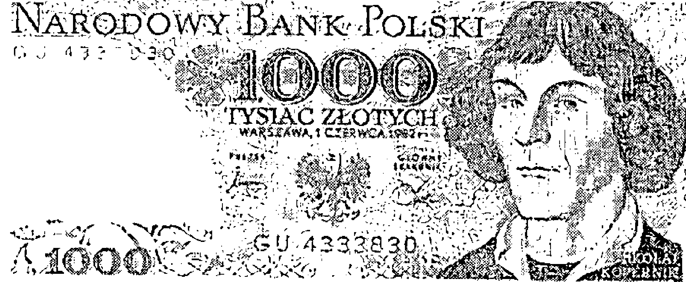

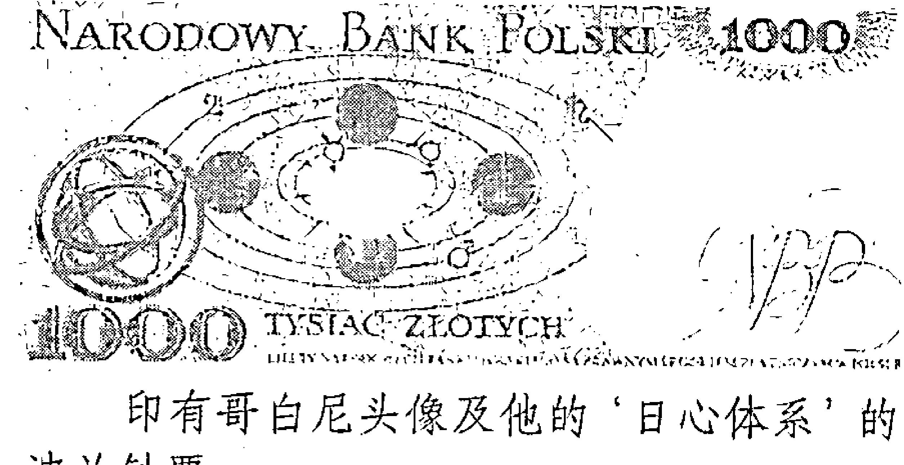

### 水星—天王星的相位

水星和天王星都与“思维、智力”有关。相对于水星与木星成相位带来的自以为是、水星与土星成相位的环顾左右，水星与天王星的相位不在意别人的看法或者传统的观念，并且鼓励别人的自由思维、自由言论。在积极的意义上，他们会着力倡导这一理念，尊重每个人自己的思想，而在消极的意义上，他们会太过执著于自己的念头。

水星和天王星相合，意味着语言会成为表现天王星影响的载体：激进、反叛的言谈，独特的沟通方式，坦率的态度等。出生天宫图上具有这一相位的人，头脑活跃，有前向思维和创造性的见解，天王星的突然性在这里也意味着顿悟。

水星与天王星处于软相位的人点子多，有出色的直觉和创造性，也能够激发别人发挥其最优秀的才干，从合相对于知识积累的重视，过渡到三分方位对于知识的运用。他们探寻真理，认为真理是让心灵自由的根本。然而，软相位存在的一个危险是不断追求新的事情，而忘记制定实际的计划，导致一些无法完成的辉煌，并且还不能从过去汲取教训。

硬相位体现了天王星的固执性，执著于某一个信念，不愿为了取悦别人而圆滑自己的用词。这使他们具有革命性，也常指责社会和传统。他们的问题不在于观念的极端性，而在于说话方式的坦率甚至粗鲁。他们对于事物的实际性和感性方面缺乏尊重。当水星与天王星处于硬相位时，思维的火花难以形成一套连贯的思路，不利于创造，而直觉也比在软相位下更多地出现失误。

在硬相位下，有些人只是简单地显得特立独行，成为别人眼中的怪人；有些人则能够为许多问题提出自己独特的解决方案。“负责”和“专注”是他们必须发展的素质；同时，也应该多认真听取别人的建议。

### 水星—海王星的相位

海王星倾向于低估理性、客观的思维，与此同时，海王星还促进了非理性的领悟能力，能明察别人的言外之意，与心爱的人能够默契配合。

水星与海王星的相位，代表非理性的、创造性的和理想化的思维。

两者的相合和硬相位，会让现实在头脑中产生高度创造性的亦或是危险的变形。他们仿佛具有记者的天资，能把一件事情任意表述。

相合易于诱发想象对于现实的扭曲，进一步导致错误的决策，他们倾向于把事实和体验修正为更容易接受的形式。

水星和海王星的相合、三分和六分方位，突出了直觉和想像力，有助于在音乐和艺术领域达到过人的深度和高度。

水星与海王星的软相位，对表达自己的想法很有技巧，善于组织言辞，能理解一般人的动机模式，能有效地抓住别人的注意力，进而影响别人。海王星象征着边界的消融，暗示他们仿佛能够进入别人的思维，这对于心理学和传播学有利，是很好的广告人和宣传家。但是这种边界的缺乏也使思维的收束变得困难，一方面像一台灵敏的收音机，未经筛选地接受着各种信息；另一方面自己的许多念头会淹没在这个信息的汪洋里，有时还会在不适当的时候突然又冒出来。他们的想像力和立体视感使他们可以塑造自己的性格和人生经历，调用自身内部各个原始型的特质，因此，很容易适应环境，可以在很多领域获得成功。

在水星与海王星的硬相位，海王星的“隐晦性”可能表现为习惯性地说谎、喜欢谈论别人的是非；其“混乱性”表现在过度的想像干扰了理性的、逻辑的思维过程；而其“逃避性”可能表现为对感情和生活责任的回避。他们可以发挥自己的特长，揭示社会微妙和神秘的侧面，用音乐、文学和艺术等形式表现出来，用这种积极的释放方式避免上述负面的自欺和欺人。至少，首先要面对现实，然后要整理自己的思维，明晰自己的目标。虽然对于别人有足够的洞察力，但是对自己的本质需要更明白。在感情方面，也要注意不要把别人偶然的兴趣解释为爱情的暗示，被自己的想像所欺骗。

### 水星—冥王星的相位

水星与冥王星的相合告诉我们，知识就是力量。在相合影响下的人想知道一切，喜欢刨根问底，其内在的动机是对事物的隐秘部分的强烈兴趣，而他们也有天分发现别人的秘密，不易为表象所欺骗。他们领悟能力强，喜欢探究事物的深层机制，这也反映了其思维的深度。他们愤恨社会的阴暗和政治的伪善，敢于直面问题的根源，有一支辛辣刻薄的笔，体现了冥王星的积极改造性。但他们的观念则倾向于顽固。

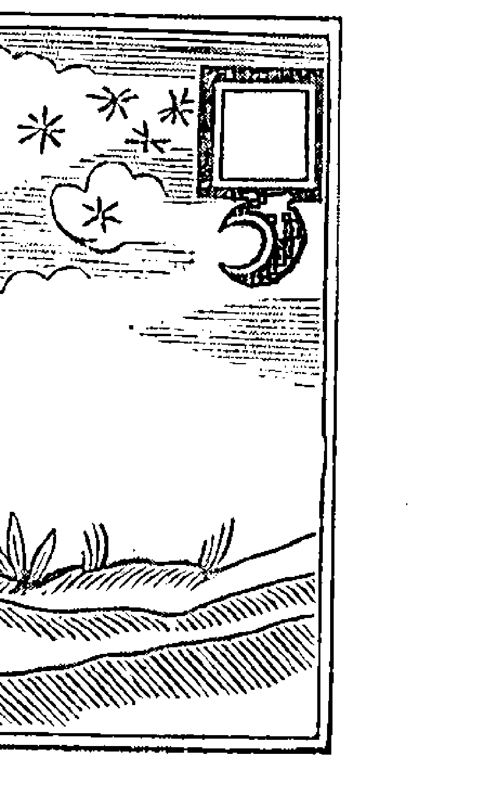

他们有强烈的沟通意愿，相信语言的力量，可以把语言文字变成武器，不愿在言谈上服输，会采用激烈的表达方式压倒对方。在个人关系方面，有时会忽略相互平等和尊重，尽管常常能够强行说服别人，但是更多的忍耐、对别人的自由思维更多的尊重，会有建设性的意义。

水星与冥王星的三分方位意味着深奥的知识，抽象的思维，催促人探究和提高。对于日常生活而言，它体现为精神集中、意志坚定，喜欢竞争并能肩负沉重的责任。对自己所做的事会全身心地投入，但对于缺乏深层含义的事情没有兴趣。在个人关系中，倾向于认定自己总是正确的，也能够看穿别人面具下面的动机、发现别人的潜力，像个较为集权、独裁的领导者。

水星和冥王星的六分方位同样有很强的分析能力和理解能力，这些软相位都重视人际交往中的真诚个性。

水星与冥王星的硬相位，可能意味着难以表达自己深邃的思维，以及有掩饰得很好但有潜在危险性的秘密。硬相位同样代表对于人性缺陷的难以容忍，并且对别人的动机和目的持有怀疑态度，而对自己的动机和目的则遮遮掩掩，持一种带有悲观主义色彩的世界观，表达方式也缺乏适当的包装。在很多情况下，是把自己的阴暗面投射到了别人的身上。他们过度地猜度别人，做事花太多的心机构思、设计，却时常事与愿违。为了达到自己的意愿，会依赖强权。

四分方位代表意愿和思考之间、意志力和常识之间的不调和，可能不愿进行持久的学习，表达方式粗糙、易招致反对，有时会知难而进以显示其勇敢。总之，硬相位需要更多的自律和更积极的态度，把洞察力放在自己身上。

### 水星—顶点的相位

水星位于上升点，代表思维对于自我的专注，讲话常以“我”字开头，语言表达能力强、头脑反应快，经常自问自答。对外界的好奇心很强，但学习成绩并不一定好，因为难于聚精会神。

水星与上升点呈四分方位时，自身的语言沟通能力和与外界交流的需求之间不协调，常有误解发生，有时说话的场合不对，有时打听的太多。

水星与上升点呈三分方位时，可以避免四分方位的不协调情况，与人交往能够良性互动。

水星在下降点，代表总是利用一切机会与别人交换看法，倾向于在表达自己的见解前先听别人的观点，并且特别注意不在言辞上冒犯别人。他们善于讲别人爱听的话，处理社会关系的技巧娴熟。

水星位于中天，代表头脑灵活、眼光犀利，但是对事物的把握不够深，生活态度不够认真。

水星与中天若处于四分相位，说明经常设想未来，但总是改变主意，缺乏足够的耐性和自律。

水星与中天三分方位，代表未雨绸缪，很早就开始考虑以后的路，并能够持之以恒，努力朝着这个方向积累，在学校的表现也很好。

水星位于天底，表示家庭教育对于他们的事业追求具有重要影响，很早就树立了自己的理想。

## 金星情感

金星代表我们的女性意向，它的主题包括爱、美、和谐、情趣，包括社会交往和个人关系，包括金钱财富和物质拥有，核心是“形象”和“价值”。金星把这些优雅的素质带给与它入相的行星，但硬相位会着重金星慵懒、妥协、犹豫的侧面。

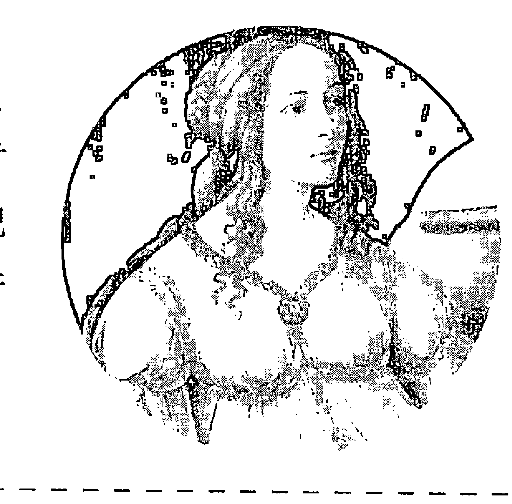

### 金星—火星的相位

金星和火星是和平主义者和尚武好斗者的区别、女性和男性的区别。金星原则的出发点是寻求更容易的途径，例如取悦、妥协，它更加务实，善于接受；而火星则可能更有远见，更加理想主义。金星与火星的相合及软相位，通常都带来温暖而迷人的吸引力，火星为金星增添了激越的活力，金星则使火星卸去斫人的棱角。这一组合的创造性表现在创作美丽的物品。

金星与火星相合，代表主动模式与被动模式、和谐与独立的融合，对于人际关系和理财有利。这一相位使人情绪强烈，注重浪漫，对小的举动都很在意，而他们自己也很善于用这些小动作保持自己对异性的魅力。他们很有情趣，除了必不可少的人际关系，也从艺术欣赏和社会活动中获得满足感。与异性交往比较主动，欣赏青春活跃而又不约束自己的人。在脾气上稍显急躁，会因为一些小事生气，然而内心比外表更加温和。火星也意味着性满足的重要性。

金星和火星的三分、六分方位，可以更有效地调和火星的冲动性，使人更有亲和力，有优雅的社交技巧，个人关系和性生活都很和谐。他们表里如一、性情温柔，喜欢把别人往好处想，但容易轻信别人的话，包括恭维。

金星与火星的四分和八分方位，体现出挚爱与愤怒不太调和的一面。当火星更强一些时会缺乏优雅风范，对爱情急躁冒进; 金星更强时，则太易于妥协。他们容易混淆爱与性、友情与激情。火星体现的竞争性，表现在家庭中是对于获得爱的争夺，在外界则是对于浪漫的急切，他们隐约觉得如果自己不小心把握，会错失所有的机会。

在婚后，金星火星的硬相位也是婚外恋情的助推力。

金星与火星相冲的特点是对同一个人强烈的爱恨交织。

在四分方位下，这种不调和把对自身的不满意转变为对别人的指责，不关心别人的情绪、不对自己的情感负责。

毕竟火星容易谅解、金星促进弥合，他们需要努力学会妥协，这对于家庭、朋友、工作关系都是很重要的。

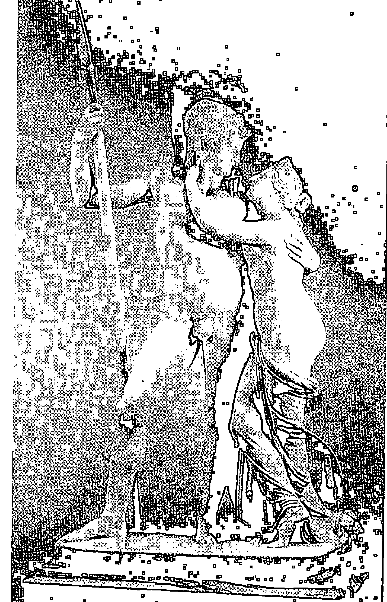

### 金星—木星的相位

在传统星相学中，金星和木星是两颗吉星，它们之间的相位都具有友善、随和的特点，也会带来财富。

金星和木星相合，集中了宽宏、和善、体贴、乐观等优点。出生天宫图二者相合的人，对别人充满关怀、爱和理解，有时也难免没有原则地与人为善，过分的随和可能被人利用。他们的爱情是温暖而和谐的，但木星象征着展翅高飞，因此，他们对爱侣不一定很忠诚。木星还加强了金星对于物质安全感的需求，所以他们重视理财，寻求有足够收入的职位。

金星和木星的硬相位，会有大手大脚、沉迷放纵、追求肤浅的危险。他们对于快乐、爱情和享受有贪欲，渴求被人重视，而容易对自己的拥有不满足，于个人关系尤甚。他们注重实物形式的表达，喜欢不断收到礼物。硬相位还有不想负责任的特点，事情顺利时表现得温和随意，遇到阻力时就变成一个难交往的人。此外，由于对自己的习惯缺少规范，体重可能成为一个问题。

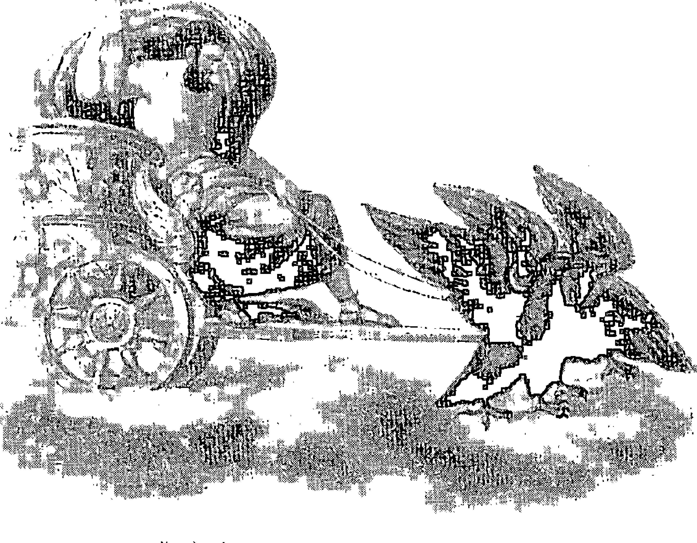

金星与木星相冲，在各方面都潜在地希望得到别人的认可，可能会不断就自己的事情征求朋友的意见，并且疏远反对自己的人。

金星与木星四分方位，感情的稳定性差，对小事情会反应过激。在女性的天宫图上，这代表对自己的女性魅力怀疑、对外在美的过度关注；在男性的天宫图上，代表对爱情、婚姻的态度不够成熟。

金星与木星的软相位显示了乐观和信心，对不尽人意的环境能安之若泰，能用自己的快乐天性安抚失落的朋友，却不会拿自己的问题去麻烦别人。他们还有很好的社会公德和社交礼仪，喜欢举止得体、比较传统的人，在个人关系中也很注重诚实。在爱的表现方面，不喜欢在大庭广众之下打情骂俏，而是喜欢在私人空间享受浪漫的温馨，这与他们对自己的信心是一致的。

### 金星—土星的相位

金星与土星相合的人，早年在心智形成阶段可能受到了父母的限制，成年后这种土星的限制性仍施加在自己身上，使他们可能通过妥协让步、适应别人的要求来获得满意的人际关系，这导致自己有种被利用的感觉。

他们认真、负责，对感情的态度诚实，但羞于表白，也易于退却；生活方面，开销节俭、懂得积蓄，但人生态度不够乐观。他们可以从争取付出的态度做起，不要把得失问题想得太多。这一合相除了使人把快乐和义务坚定地绑在一起，其他的特点与硬相位有相似的消极性。

金星与土星的硬相位，使人自我评价颇低，与人相处比较困难，他们容易把人际关系看做一种斗争，感觉自己难以进入主流。

金星与土星相冲，使人总是做出让步，却不知道这样做是否值得。他们早年可能被告诫自己不如别人，这种消极的自我印象一直在起作用，直到他们面对竞争的态度从退避三舍变为主动迎接，他们就可以真正了解自己被隐藏的能力，意识到自己的重要性。在爱情方面，他们应该不要太着急，而要等待自己有足够的选择能力之后再决定。

金星与土星四分方位，带来关于个人交往的持续的惧怕，对于付出和接受把握不好，情感有孤独感，在婚姻当中可能角色扮演多于感情交流。他们要摒弃来自家庭影响的思维和行为方式，从基本的方面做起，分清该妥协的适当场合，把信心展露出来。

金星与土星的四分方位，还使人不愿承担责任、不愿改变自己以产生良性互动，又总担心被拒绝，有防备心理。而金星与土星相冲，对于责任的态度则是认为自己根本没有承担的能力。

金星与土星的软相位，也不能消除土星的恐惧色彩。这些软相位使人具有良好的判断力，冷静、认真、负责、通融，但做事会考虑回报，在不确定自己是否受欢迎时也会逡巡。他们个性稳健，情绪摇摆较少，冷静多于热情，生活中的情趣显得有些缺乏。在爱情方面，他们小心地建立起稳定的关系，惟不够激情。

### 金星—天王星的相位

金星和天王星的相位，主要突出了社交圈子和私人圈子的关系，这些相位使人通常有外向的性格，喜欢令人兴奋的事物和活动，喜欢让生活变得更有趣，而没有时间进行内心的探索。

在金星和天王星的相合和硬相位，金星对“和谐、温暖”的追求与天王星对“独立、自我”的追求不可避免地相互抵触。

天王星内在的不安分会在金星主宰的社交场合中表现出来，使他们总在寻求新的事物和各色的人群,对传统的信条和生活方式感到窒息,不愿意接受一成不变,不屑于社会公认的生活方式。他们追求标新立异，有时候甚至是为了独特而独特，却极少理智地分析自己。其行为模式缺乏一致性，有善变的特点，可能在有些人眼中会显得不负责任、不够投入。他们喜新厌旧、自行其是等毛病，影响着个人关系的持久。在金星主宰的感情领域，也表现出天王星的感情投入不深、关系不稳定、关系模式多变等特点，以及不可预测性。他们可能会突然陷入爱情。也可能突然结束。他们因对方的新奇性而被吸引，也因别的新鲜感而飞走，而不愿把自己绑在惟一的关系之中、负起相应的责任。他们难以抵挡外来的诱惑，关于个人自由则寸步不让，这实际上是为了在兴趣消退后可以及时抽身而无愧无咎。他们必须让情感穿透自己坚硬的外壳表现出来，否则会对个人关系造成消极的影响。

金星和天王星的软相位，有利于消除二者的矛盾，发挥组合的优势。这些软相位使人社会适应能力强，关注社会问题，重视友谊，尊重人与人的差别和别人的自由。天王星的博爱主义结合了金星的和谐原则，能创造一个很好的人际环境。这些软相位还有利于独特的艺术品味和创造天赋。

### 金星—海王星的相位

金星与海王星的相合，使人在爱情生活中存在理想主义倾向。他们在潜意识中寻求完美情人和童话式的浪漫，当他们爱上一个人的时候，这种完美的意向会叠加在这个人身上，产生魅惑的光环，然而这一光环不可避免地要被打破。所以，他们面临的问题，一是把对方想得太完美，二是当他们发现对方并非如此完美时，会难以接受现实。海王星让金星原则变得模糊，让他们看不清楚爱情。

出生天宫图上，金星与海王星的相合与硬相位，使人浪漫、纯真、轻信，有时候会被人欺骗和利用。而他们自己个性敏感、脆弱，缺乏自卫意识，会躲避问题，为了自我保护，也可能用欺骗的方法。他们为美丽、平和所感动，不愿意见到丑恶和不和谐的杂音。金星与海王星的硬相位使人不

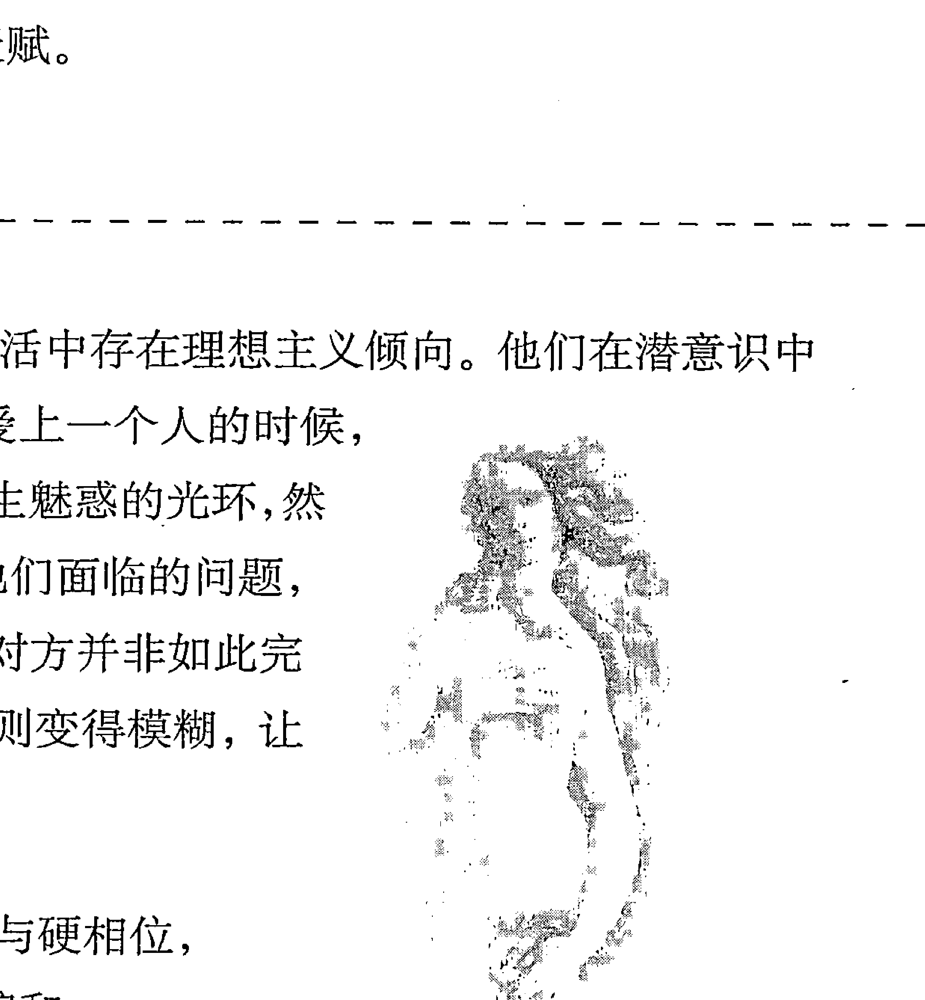够现实，难以接受不理想的人。在这种不满足下，可能不断寻求新的恋情。他们对爱人具有无私的奉献精神，每一次投入都是全身心的。

金星与海王星的软相位，所具有的浪漫主义、理想主义色彩并不比合相和硬相位少，但是他们对别人较少有幻觉，直觉更可靠。总是看到光明面，能体味生活的微妙，能给危机中的朋友以支持，不会责备他们的失误，是倾谈的好对象。

### 金星—冥王星的相位

在金星与冥王星的相位中，冥王星凸显了爱情的力量和爱情在生命中的重要性。

冥王星的关键词之一是强烈，出生天宫图上金星与冥王星成相位的人，可能会因为不经意的接触就产生强烈的情感，或者对别人产生强烈的吸引。在情感方面，他们不容易满足，总觉得有更深刻的体验在等待自己，但是现实总会击碎任何梦幻。事实上，他们应该把注意力转向自己，让自己更加完善和自信，而不是期待别人达到自己的希望。在这一过程中，爱情成为改变自己的力量。在这一转变未能提起重视之前，对情感的不满足会潜在地造成一次次的危机。

金星与冥王星的软相位代表着一种转变的顺畅，这得益于他们对于生活和自己的信心、用信念和爱情指导生活的能力。他们能够做出理智的选择，不过情感仍旧起着很强的指导性作用，软相位意味着他们往往会做出正确的选择，这种选择不一定就是爱情的继续，也可能是明智地结束一段感情，但这可能意味着一个转折点，有助于自身的提高。冥王星意味着探索、理解，这在双方的相处中是非常重要的。

出生天宫图上金星与冥王星成硬相位的人，在跟随自己的情感所做出选择时，却常有错误之虞，带来挫折和困难。冥王星带来一种宿命的感觉，但实际上很多问题的原因，是对自己的愿望和激情缺乏足够的控制，以至于陷入并不适合的爱情关系。

此外，社会和物质条件也可能会影响他们的爱情选择，但是，在追逐自己的需求中他们可能会遭遇挫折，为了避免挫折他们会采取强权。

因此，金星与冥王星成硬相位的课题是，不要只注重自己得到多少，还要想想自己付出多少，明晰自己真正的需要，认识到任何需求都是有代价的。有了这些转变，他们会更加享受爱情的快乐，以及拥有的满足感。如果以往发生过什么危机，那么这些危机的存在就是为了暴露出问题的本质，以避免其重复发生。

### 金星与虚点的相位

金星位于上升点，注重外在形象：一方面，外貌端庄、着装得体，喜爱精致的东西；另一方面，有天秤座的特点，个性温雅随和、注重个人的社会形象，寻求别人的接受。

金星与上升点成三分方位，代表金星的和谐及完美至上主义，不会去讨论别人的缺点，自己也难以接受批评。他们善于与人融洽相处，也易于得到自己喜欢的东西，但可能会与人走得太近而受到利用或牵连。

金星与上升点成四分方位，有点多愁善感和缺乏闯劲，人生目标不够清晰，个人的外在形象也不能充分体现自己的个性。

金星位于下降点，对于人际关系、伴侣极为重视，无法独自做事，喜欢与漂亮、善良或有钱的人交往。此外，会对于别人的外表很在意。

金星位于中天或与之成软相位，代表职业选择的金星倾向，与交际、审美、品味等有关，善于利用个人魅力和社交技巧。

金星与中天四分方位，依旧是一个好的方位，惟一的挑战是要按照自己的标准生活，而不总是按照别人的要求去做，否则这一相位会预示与事业有关的感情问题。

金星在天底，表示父母关系和谐融洽，生长环境充满温馨和关爱，也代表他们自己的家庭是一个从双方情感上到家居装饰上都很和谐的地方。

## 火星力量

火星是一种外向型的、火性的驱动力因素，把能量、行动、激情带给与它成相位的行星，使人思维、行动或者言谈等富于攻击性、竞争性，具有积极的因素。反过来，火星也让与它成相位的行星的表达变得仓促，让人在那一方面缺乏耐心。例如与水星的相位代表旺盛的求知欲而缺乏持续投入、管不住自己的嘴巴但缺乏清晰的条理；同样，火星与木星的相位让人急切地想推广自己的见解；与土星的相位让人急于求成而缺乏悠然的情趣；与天王星的相位让人急于表现自己的独立性却受到孤立；与海王星的相位让人突发奇想而成为幻觉的牺牲品；与冥王星的相位让人追求控制。

### 火星—木星的相位

木星代表信念，而火星与木星的主要相位首先代表为信念而战，在主动捍卫自己信念的同时，也不可避免地会与别人的信念发生冲突，变成对信念的挑战。这种斗争性，大则可以表现为镀金的英雄主义色彩和爱国主义情操，小则简单地以言辞、肢体攻击的形式而外在化。然而，一般地，这样的人会为了自己的理想而奋斗不息。他们具有煽动性，积极地传播某种观念，在硬相位下可能显得过于热情。

火星与木星的软相位意味着有强健的体力和较高的智力，不必太费力就能达到自己的目标，有天资和运气，人生态度很乐观，既有远大目标又能按部就班地去实现。能热情主动地帮助别人，慷慨大方，易于相处。而在性方面，木星的扩展原则暗示他们会寻求新鲜的方式或者不止一个伴侣。

火星与木星的硬相位，为人外向而友善，但动机更倾向于自己的私欲，并且把行动的方向限定在自己认同的价值方面，以满足对自我的肯定。他们热情地宣扬自己的观念，并善于粉饰自己的动机。在木星代表的财富方面，对花钱满不在乎，来得容易去得快。

### 火星—土星的相位

土星的存在，使火星意识到主观条件和客观条件的限制，以及行动的后果与责任。

火星与土星的软相位，使人了解自己的局限，谨慎小心而又有无畏的闯劲，能够建设性地应用自己的能量，而避免浪费精力于无效的努力。土星也意味着效率，因此他们讲究效率，决断比较现实，能用最简单的方法解决问题。他们早期所受的教育使之能够承担较大的责任。同时，他们也适合需要体力和耐力的职业，这是土星的耐久性对于火星毅力的促进。他们能照顾别人的情绪，但对阻挠比较反感。

土星用责任约束了火星的冲动、用恐惧限制了火星的勇气。在两者的相合和硬相位，土星的阴影可能遮盖了火星的自我意志，或者火星力量在土星的压抑之下强行表现出来，变得火暴、鲁莽。他们可能有挥之不去的自卑感、挫折感，因而以强权和暴力的形式加以掩盖。对于土星代表的权威、父母、上司等角色，又带有一种来自于压迫感的挑战心理。特别是在四分方位下，难以克服的负面感觉可能使他们转向自私自利，使人际关系受阻，反过来又加剧了心理紧张。但当他们克服了这些负面的感觉，其强烈的意志和耐性有助于事业的成功。此外，需要注意严苛的自我约束对于健康的不利影响。

### 火星—天王星的相位

火星与天王星相合，使人异常活跃而显得神经质，天王星的“通觉”让他们了解自己的目的，火星的急切让他们寻找最快的捷径，因此，他们没有耐心等待，当机立断而不容干涉，硬相位下尤其刚愎自用，但软相位下同样不失我行我素。在他们的字典里，没有“例行公事”这个词。由于缺乏足够的未雨绸缪，行动中可能碰到意外、事故或失败，而且往往是突发性的。在性方面，他们习惯迅速的方式并喜欢尝试新奇。

火星和天王星的软相位，使人能接受新的事物，能积极投身于激进的、革新的以及慈善的事业，是变革的领导者、组织者。他们有迅捷而精准的行动和判断，以及自信的意志和充沛的精力，思维行动直来直去，但持续紧绷的神经可能带来身体的不适。

在硬相位，火星和天王星的优点未能整合，而缺点各有体现，因此可能过于追求冒险、刺激或独树一帜，但缺乏明确或崇高的目标，或者在变革中缺乏耐性。一味专注于个人的独特追求、对于常规惯例的反抗，会让别人觉得难以相处。

### 火星—海王星的相位

海王星代表“理想”、“梦幻”。

火星与海王星的软相位，于理想方面，可能描绘了一个童话般的王子、魅力四射的明星；于梦幻方面，代表对于成功、征服的梦想，以及从事演艺、传媒、摄影等事业。软相位使人把力量理想化，海王星消融了边界，因而火星的行动不希望任何限制，但是缺乏方向。

在火星与海王星的硬相位下，可能会被别人所描绘的光环所误导。于性方面，海王星带来了幻想、隐秘色彩，可能存在病态的性取向，或在性方面有秘密行为。

火星与海王星入相的强项，在于海王星主宰的敏感和想像。

在两者的软相位，使人能够看穿别人隐讳的动机，能控制自己的情绪表现，并采取适当的行动。海王星代表隐匿，因此他们会不动声色地行动。

两者的硬相位，可能使人在火星的加速下变得情绪化，为满足自己的幻想而欺骗别人与自欺。会时常觉得自己身处牢笼，但往往是下意识地为别人的行动设置限制而不能成功。此外，火星的硬相位都含有愤怒，在与海王星的硬相位下，怒火没有确定的方向，可能到处发泄，但经常是使自己成为不良情绪的牺牲品，甚至转而借助酒精等沉溺上瘾的方式而加以逃避。总之他们需要清楚地看待现实，并明确自己的方向。

### 火星—冥王星的相位

当火星的“生存”、“力量”、“斗争”和冥王星的“意志”、“权力”、“隐藏”结合在一起，会得到这样的关键词：为了生存的战斗、对意志的强迫、隐藏的攻击性、强权的力量等。

出生天宫图上火星与冥王星成相位的人，有充分的意志力，会不惜一切代价获得成功，但可能显得严苛，具有操纵性，在所参与的任何竞争中都要处于胜利者的地位，或者干脆避开竞争场地。冥王星也会使这种斗争性转向内在，强迫自己坚持不懈，并隐含着难以发泄的愤懑情绪。在性方面，冥王星放大了性的阴暗的、动物性的一面，把性视做征服。

在火星与冥王星的软相位，“生存”是首要的问题。他们能量充沛，勇气可嘉，意志力成熟，能深刻反省自己，不畏艰险和威胁，能看到事物的阴暗面，不畏惧揭示和面对社会的疮疤，并愿意帮助那些生活在暴力和压迫之下的人。

火星与冥王星的硬相位，使人有独裁倾向，会用强权或暴力去获得自己期望的所得，可能比较自私。硬相位还代表本身在年幼时受到的暴力、强迫，转而对于男性力量的不信任。冥王星的意志力是突破硬相位的焦点，他们可以借助理智、道义和仁爱以抵消负面的能量，发挥出二者成相位的积极潜力，成为开拓性的领导者。

### 火星与虚点的相位

火星与上升点相合的人，把世界看做是一个充满竞争和冲突的场所，有时候其家庭成长环境也是争端不断，他们的个人面具是随时准备投入行动、应付挑战，展示力量、勇气和壮举以保护自己，具有开创、领航的优秀品质。

火星位于下降点，使人更有好斗性，易于用竞争性、攻击性来解释别人的举动，或者有为了别人、为了合作而战斗的品质，是好的辩护者和代言人，但在人际交往方面缺乏耐性。

火星位于中天，显示了人生的方向感和宏大的雄心。战斗和竞争可能会一直伴随这个目标的实现过程。

火星位于天底，则表示内心具有愠怒的情绪，可能会促使他们完成艰难的任务。家庭是他们发挥能量的重要场所，虽然其父母可能不得不应付他们的这种负面情绪。

## 土木大势

### 木星—土星的相位

木星和土星相合时，木星扩展土星的责任、秩序、审慎原则，而土星限制、规范木星的信念和乐观，造就了持久的耐力、务实的乐观和清晰的远见。出生于木星与土星相合阶段的人对待人生的态度认真，有很强的责任感，也总背负着沉重的负担，需要持之以恒的努力奋斗。

在木星与土星的硬相位中，两者的相冲或四分方位，使人可能在乐观和悲观之间摇摆，怀疑自己的能力。在童年时期，可能来自父母的肯定不足，需要努力使自己更加明智。

相冲方位还在认清自己的局限方面有困难，可能会同时应付很多的事情，却力不从心。但积极的方面是不畏险阻。

硬相位还有一个重要问题，是时机的偏差，会在不当的时候冒险，这是应当注意的。

在木星与土星的软相位中，两者的三分方位除了明智、比较容易取得物质成功等优点之外，较缺乏知难而上的动力，喜欢寻求更简单轻松的办法，例如冒险和投机。
六分方位代表审慎、乐观、组织能力等有利于商业成功的素质，有能力执行自己的计划。在信念方面，软相位表示受到传统观念的影响较多。

### 木星—外行星的相位

木星和天王星都向往更大的空间和自由，它们的组合通常代表希望更多身体上、智力上、情感上的空间和自由。这样的人独立性强，思维方式不拘束，可能比较激进，例如走向不可知论以及反传统的思潮。木星扩展了天王星的特立独行、原创性，而天王星则在木星主宰的远游、文化领域带来意外的惊喜，并可能有天降之财，特别是相合和软相位。硬相位可能面临陷阱，包括不切实际的想法、怪异的信仰，以及在赌博式行为中的损失。

木星和海王星的组合意味着宏大的梦幻、利他主义、神秘体验等，喜欢慈善事业，或者做拯救他人性质的工作。硬相位下，可能为了精神体验而付出大笔开销，也有可能选择遁世的行为。软相位下较为实际一些，赚钱方面有好的直觉，是理想主义者。

在财富领域，木星和冥王星的组合一方面代表埋藏的或隐秘的财富，比如从事采矿、废品回收、古物发掘等，以及藏于幕后悄然运作的资金；另一方面，代表对于经济的控制能力。至于个人素质，二者的组合代表目标远大、意志超人的将才，其中硬相位较为独裁。

### 木星与虚点的相位

木星位于上升点，对人生的期望值高，乐观向上，向往拥抱一片更大的天空，其生命之旅也是一个自我发现和拓展的过程。他们心境很好，也会从积极的方面看待别人，能够给别人有道理的建议，个人形象通达而慷慨。

木星位于下降点，通常代表合作对方的背景和观念不同。也意味着他们会借助人际交往来探寻信念、树立自信。在他们与别人的交往中，经常存在教育与启发的关系。

木星位于中天，对于最终实现自己的目标具有足够的自信，但这个目标有时会设得过大。在公众形象方面，他们希望表现得慷慨大度、以德服人，并能够给别人以教诲。

木星位于天底，可能喜欢宽敞的家居环境，并且热情好客。他们有发自内心的自信，做任何事都有信心的支持。

### 土星—外行星的相位

土星和天王星每45年相合一次，代表破旧立新的阶段，其影响主要是集体性的。土星代表传统的规范、概念、习惯等，结合天王星的革命性，可以积极地表现为新制度的建立、科学的新发展等。消极的方面，土星可能代表毁灭性的力量，而天王星可能意味着独裁。

在个人出生天宫图上，土星合天王星代表很强的个人意志力，行为成熟稳重、有节制，能够承受压力与阻挠、按照自己的想法行事。软相位代表对于外界变化的适应力强而又不失决断，硬相位则表示对于既定模式、传统观念所带来的限制特别敏感，可能导致冲动的行为。

土星和海王星的相位关系体现人类思维的转变，包括现实和理想、秩序和自由、规则的建立和消融等对照。

在个人出生天宫图上，土星与海王星相合，积极的方面在于能按照具体步骤去实现自己的梦想，消极的方面在于对于现实的理想化使人自卑、多疑或不切实际，这些倾向分别受到软相位和硬相位的强化。

土星和冥王星的相合和硬相位，经常代表强大的、毁灭性的、阴暗的力量，并作用于社会政治领域。

在个人出生天宫图上，土星和冥王星的相位，一般代表意志力、控制欲强，头脑专注以至偏执，感情强烈但较为隐蔽。

### 土星与虚点的相位

位于上升点的土星意味着面对世界缺乏安全感，因而小心谨慎、有戒备心理，总准备保护自己。因此，约束和控制是他们常用的手段，而且从不抱侥幸心理。

土星位于下降点时，在合作与婚姻中会控制对方，并期待对方体现足够的责任感。双方在同甘苦、共患难中建立起的关系，会获得良好的保持。

土星位于中天的人会觉得自己有不可推卸的责任感，其公众形象以负责、严谨为特点。在职业选择方面，可能要付出漫长艰苦的努力，他们可能屈从父母的意愿、而可供选择的方向也不够多、或者因为担心失败而不愿冒险，所以有时会做自己并不心甘情愿的事，有可能大器晚成。

土星位于天底则代表家庭义务对于事业的拖累、对于稳定而安全的家庭的重视。

此外，外行星位于出生天宫图的顶点位置，对人的性格也有不同的影响。

### 外行星与虚点的相位

天王星位于上升点的人常常看起来与众不同，他们的确也很在意自己的独特性，不愿遵从既定模式，注重追求非传统生活方式的自由。

天王星位于下降点，表达的是个人关系的独特性、非传统性，并且关系的建立和结束都比较迅速；婚姻的基础是友谊，双方不会互相限制，而是给予充分的自由。

天王星位于中天代表对于社会价值或陈规的叛逆性、革新性，有可能从事新技术、改变人们生活方式的事业。他们有独立工作的能力，喜欢工作中的新鲜感和刺激感。

天王星位于天底，代表与家庭传统的纽带脱离，可能很早就不得不独立，因而在行动和思维上常常只考虑自己。

海王星位于上升点，个性多面而难以捉摸，有微妙的敏感性，也能借助自己的敏感来表达别人的情绪和感觉，因此对于艺术才能有利。

海王星位于下降点，代表个人关系中牺牲、拯救的色彩，或者理想化的浪漫主义，但把握不好会因为不能识破伪装而被利用。

海王星处于中天会使得奋斗目标变得模糊，在事业选择中失去方向，对现实的把握不够，对未来的幻想缺乏足够的可行性考虑。

海王星位于天底时，代表对父母形象的模糊、扭曲，可能早期受到来自家庭问题的打击，而用幻想来弥补。

冥王星位于上升点的人比较害羞，总担心自己的秘密被发现，这种保护心理会催生控制和独断的做法；在其生活中，也往往的确存在社会禁忌的行为。

冥王星在下降点则把权力让渡给婚姻、合作关系的对方，会让人感觉对方是在操纵、控制，从而引起权利争夺。在个人关系中，他们会发现双方的阴暗面，并由此改变对自己的看法。

冥王星位于中天的人，野心勃勃，有登上权力顶峰的意志和决断。

冥王星位于天底，可能暗示家庭成长环境中的暴力或强迫等行为，这会导致他们有时会希望与过去断绝。

## 结束语：现代星相学中的整体论思想

进入20世纪，星相学的重心逐渐从传统的性格描绘和吉凶预测转向了心灵分析，通过个人出生天宫图中“符号化”的心灵构成，来解读自己，并指导自己的成长和自我的实现。

在心灵分析方面，星相学依然遵循“整体论”思想，整体论在这里的含义是：每一张天宫图都是独特的，代表了一个人的总体潜力——天宫图无所谓好与不好、行星无所谓吉或者凶、影响无所谓幸运不幸，每个人的出生天宫图都是对于他自身的人生旅程最佳的设计，而其中每一个行星、每一个相位都是整体不可或缺的部分，这些影响都是与发展循环的目的和阶段有关的各种显现。

原本对星相学已有初步了解的读者，或许曾经对自己出生天宫图上显露的某些“不和谐”相位感到过忧虑，比如，天宫图上木星与土星相冲，在某些地方被解释为“一般而言，他将度过孤独而艰困的一生”。在当代星相学看来，这种误导性的解释对人不具有积极的指导意义。事实上，这个相位的意义在于：他必须认识到自己在乐观（木星）和悲观（土星）情绪之间不自觉的摆动，并且需要克服对冒险精神（木星）的担忧（土星）。

矛盾是事物发展的动力，在人对于“完美性”的天生的追求中，矛盾的暴露正可以作为我们积极行动的推动力。有问题的处境可以在天宫图中体现出来，个人可能会否认自身某些侧面的存在，以避免痛苦和挫折，结果导致个性的衰减和潜力的丧失。因此，天宫图可以暗示心灵的哪些部分被否定，而且通过哪些环境可能会遇到这些冲突的具体化；并帮助我们理解，内在矛盾是如何导致了个性的分裂和冲突的外在化。因为个性中未能整合的部分，通常在外部世界以我们所接触的人和环境的面目出现，未能汲取的教训也将在日后某些时候以新的面目再次出现。只有当我们逐渐认识和克服自己的内在矛盾之后，作为整体的心灵才会得到提高。

同样，逆境也是为了克服我们自身某些不足而设计的课题，那些表面上看起来无关的、经常令人困惑的人生经历和个人危机，事实上常常成为我们在自我实现的人生旅途中有秩序、有目的的状态和转折点，我们应该赋予过去以“自我实现”之前奏的意义，而不是背负上沉重的受挫感或内疚感。

总之，新时代的星相学使我们能够在全面地、动态发展地理解人生，理解过去的意味深长，并且看到一个创造性的明天。