# 天文占星基础

### 序

筆者在不少公開講座、電台 D100 的「蔣權天下」節目，以至課堂教授術數時發現，不少現代有識之士，可能對泰西歐美文化，包括地方歷史甚至紅酒美食都很有認識，但對於我們自己中華文化中「術數」這一門認識很淺。例如，古代不懂字的農民大嬸都了解的「春牛圖」，現代人大部份都一竅不通。

有不少情況是由於我們國家在清代落後於人，因此有人提出改革，把這些不合乎西方科學原則的好東西與一些迷信腐敗之學一併捨棄，有些人則礙於宗教之偏執，在不了解的情況之下，而視之為邪見、怪力亂神。當然也有騙徒利用這套東西混水摸魚，為術數帶來罵名。

筆者近年所寫的一系列「建築師講術數」的叢書，都是儘量用一些簡淺的方法，還這些術數一個真相。

這本書則是一本奇怪的書，它並非是一本完全講術數的書，它有講一些天文觀星的基礎，但又不是如現代西方天文學為本，它有講一些中國古代占星的事情，但又不是一本教你學會占星的課程。

中國古代的術數，有很大部份源於古人在晚上對天上星空的長期觀察，由於遠在未發明「規矩準繩」等工具的年代，人類對時間、宇宙規律等的概念都來自於天上日月星宿在一年四季的運轉。在術數上，我們今天所用的不少基礎「數」中，有不少都是源於天星。

例如術數所用之「天干地支」中的十二地支，便源於日月在一年中「合朔」（詳見內文）十二次的十二個方位，形成由子至亥的十二地支。三元派玄空風水中之「三元九運」曆法，「一運」為二十年，這是源於土星與木星約十九年七月多相合一次之時間。而曆法所用之六十甲子，也是因為土木每會三次後（六十年後）便會在同一星宮中再相會，完成一個时间段之循環。

古人有「在天成象，在地成形」之説，那是在堪輿學說上，古人相信天上之星宿分佈形態，會在地球的山川上有所反映，所以在地上選擇合乎天星佈局吉利的方位，便可以獲福。在漢代之長安城，他們甚至把城牆之佈局，模仿天球上「天苑星」之形局（見圖 1）。而另一種說法，在《三輔黃圖》中記載，長安城牆是「北仿北斗，南仿南斗」，南北兩牆分別仿照北斗星及二十八宿中南斗星之形格，作為設計概念。

本書向一些不懂天文的讀者介紹中國天文學及占星學的基礎，了解中國「三垣二十八宿」星宮之分佈，以及它們與現代天文學及歐西占星學之關係。這是一本介紹簡單中國天文占星的基礎書，以方便對中國天文或占星有興趣者再進一步去研究。

### 不要迷信科學

基礎天文知識告訴我們，這個宇宙源於一次大爆炸，整個宇宙星辰都是向外膨脹出來的。我們身處的地球是太陽系中的一顆行星（Planet），而太陽系只是銀河系星系中的一員，地球與其他行星如金星、水星、火星、木星、土星、天王星、海王星，都是以太陽為中心，按一個差不多是橢圓的形狀，環繞太陽旋轉。除此以外，還有一些小星體及隕石帶，用不同軌跡環繞太陽，其中包括被國際天文學聯合會剔出行星行列而改稱矮行星的冥王星及凱龍星（Chiron）等等較小的星體。

從占星學的理論，人類身處於地球之上，只有很少數的太空人曾經短暫離開過，因為我們是會被宇宙星辰的各種引力所影響。而且因為星球之移動，在不同的時間點，各星體會出現在天體上的不同方位，形成不同之星體組合，因而產生大小不同的引力影響。占星家相信這些力量會影響到火山爆發、地震、風災、車船意外及人心轉變所引發之革命、動亂，但也可以引導出新的創作、發明及改革，影響人類的生活。

在今天，除了天體上的隕石跌落地球所引發之災難，以及月亮引力所引致的潮水漲退及女性月經等因素外，科學界都不承認那些距地球距離較遠的星球，包括火星、水星及天狼星、北斗星等會對地球上發生的事物有任何影響。

這個問題是源於「科學取證」方法。今日科學的所有理論是要有它的可重複性，才被稱為科學，簡單解釋就是「一個指定的實驗，在指定的條件下是可以重複得到相同的結果」。所以今日之科學世界是由一條一條假設及實驗方程式所組成，但這些公式加起來未能解釋宇宙萬物的一切現象，所以科學才繼續有發明與發現。

以天文領域舉例，美國女天文學家薇拉·魯賓在觀測星系轉速時，發現星系外側的旋轉速度，較牛頓萬有引力定律所預期的更快，故推測是有某種數量龐大的物質，能拉住星系外側，使其不致因離心力過大而把星球拋離星系。這種物質被天文學家稱為暗物質（Dark Matter），而其能量被稱為暗能量（Dark Energy）。但是直至今天，還沒有人可以證實它是否存在，而只是一個數學假設（Hypothesis）。

同樣道理，今日天文學否定占星學所指，地球與行星、恆星，例如土星、木星及其他星系之間的引力太少，不可能有物理上之影響力，也存在同樣的疑點，占星所講的星辰力量，歷史上有不少統計可以輔證，而其科學解釋有可能在未來因為科學之進步而大白於天下。所以對於這些與人類共存了幾千年之文化學問，只可以存疑，小心求證，但不能在不了解之情況下武斷否定，這才符合真正的科學精神。

環視古今中外的各大文化，天文占星學都佔了一個很重要的部份，猶太聖經舊約及新約，中國戰國時代曾侯乙之墓葬，古代埃及加薩（Gaza）及馬雅人的金字塔，英國的巨石陣（Stonehenge）等等文物，都有有關天文學與占星學之記錄。中國歷代的二十五史中都有占星之記錄，耶穌降生、三王來朝都是由一顆特明之星所指引。印度的占星更是他們今日文化生活的一部份。

今日如果在科學未能完全解釋宇宙的所有秘密下，而武斷去否定一些人類各民族所遺留下來的文化遺產，這就是太迷信科學了。

### 占星的起源

環視世界上所有古老的文化文明中，幾乎所有文明都有一些與占星有關的古老傳說及傳承，只不過有些文化中，占星只是生活的一小部份，也有部份因為皇朝覆亡、戰亂等因素，未能把前代的知識流傳給下一代；但是也有一些古老民族把占星的學問組成一套系統，而且可以利用這些統計出來的經驗，引申作為未來類似事件之預測。

因為古人認為，天上太陽星宿有規律的運行，標示了地球一年四季天氣之變化，也啟示及限制了人類活動、生產的時間，所以古人稱此為「天道」，有宗教則視為「神之啟示」。而古人也在長期觀測中發現，在這套規律的天體活動中，常常會出現各種不按規律出現及運行的隕石、流星以至超新星大爆炸等現象，古人稱此等星體為「客星」。而古人更發現，在這些不尋常天象出現之前後三年內，大地上不同地方，會出現洪澇、旱風或是民變、意外等各種災難，根據這些現象統計便形成「占星」之學說。

### 古代占星的發展與局限

天上星宿之運作及其軌道規律，今日的現代天文學就有專門的研究。由於這些研究要有每顆主要星宿的運行規律，古代需要有專門的建築（觀星台）及儀器作觀測，一般只有皇家專門的部門「欽天監」等有專職的官員負責。但今天科技發達，計算日月星辰之軌道，早已由電腦代勞而更為準確。這是科學的優越性。而古代往往因皇朝末落之亂局中，這些欽天監便失去政治及經濟之支持而人才散失，所餘之有學之士也因為缺乏觀測儀器，而不能教訓後輩，且此術沒有「謀生」價值，也是它漸漸中斷及失傳的原因。

但在歷史上，占星學也存在很多問題，第一點是占星業者良莠不齊，其中不乏江湖騙子及九流術士，所以在社會上的名聲不好；其次不同的宗教及政治出於偏見、無知及利益的需要，都曾迫害及禁止占星學之流傳，在歐洲早期基督教的教皇也有問卜於占星，羅馬皇帝康士坦丁也是根據占星而為康士坦丁堡（今伊斯坦堡）創城。但中世紀的宗教法庭曾視占星為邪見及異端；在中國古代，唐律法及明律法有明文規定，禁止民間私傳天文占星之學。

在中國古代，占星是歷朝官方所禁止的術數部份，因為古代皇朝怕有人利用這種天文知識妖言惑眾，為官者也怕有人被這類「傳言」「蠱惑」而引起不必要的恐慌及問題。宋代司馬光在《資治通鑒·唐紀》中記載了唐高祖武德九年（公元627年）之詔：

> 民間不得妄立妖祠，自非卜筮正術，其餘雜占，悉從禁絕。

明代章潢在《圖書編》也記載了明律中禁占星之法律：

> 凡私收藏圖讖應禁之書及歷代帝王圖像金玉符璽等物者，杖一百，若私習天文者罪亦如之。並於犯人名下追銀一十兩給付告人充賞。

此處所謂的「圖讖應禁之書」，是指「推背圖」、「燒餅歌」之類書。而禁止收藏歷代帝王圖像金玉符璽，目的也是為了禁人拜祭前朝之皇帝，「免」前朝之餘黨復辟。

所以如果這法律在今日執行，筆者寫這些文章會被罰打一百杖，更要罰款十兩銀交給告密者。

官方在民間打壓占星之發展，但在自己監察的欽天監等官方機構中則可以「秘密」傳承教授，為皇家服務，而且如果發現有懂「奇術」之異人，其知識會影響統治者的安危，便會想辦法把他們收為己用。

唐高宗時，有堪輿家丘延翰得異人傳授，懂地理之真學。丘為東海人（今日江南、上海一帶），他為當時之藩王作風水佈局，該藩王謀反而失敗。皇帝除了處理叛變，事後派人到藩王之地勘查，以作厭勝破其地風水，免其復辟。其間發現有人為其佈局，因而通輯延翰，但他早已聞風先遁，隱身於民間。皇家有權謀，皇帝下詔，丘氏來朝反可封為高官，丘延翰因此把生平所學，注書三卷，獻給皇帝。皇帝收其人及書於大內，書本用金匱玉函收藏，是為「金匱全書」，自此此術不在民間流傳。

到了唐末大亂，楊筠松在大內偷了此經卷逃回老家江西，在民間教學，此是後話。

唐玄宗時，外使來華求學，要求學「陰陽之術」，皇帝礙於外交，不便拒絕，但又怕此等外夷學成歸國，把當地風水搞好，若此鄰國勢興盛，反會威脅中國，故將此術變成一個國家機密，命僧一行作偽術書，名為「銅函經」，本派稱為「滅蠻經」，以教授外夷。

上述故事雖然談及風水地理，但可以反映皇帝對於這些可能威脅政權的學問之態度，天文占星尤其重要，所以歷代都有明文規定，不准民間私習天文。

有人會覺得，這是因為古代大部份是目不識丁的農民，所謂「民智未開」，所以容易被人煽動。但大家回顧一下，在 1999 年前一兩年，由於十五世紀西方預言家諾德旦馬斯（Notredamas），有一句有關公元 1999 年之預言，其中談到「當恐怖大王從天而降」之句，有邪教及異端，包括當時不少日本人都視之「世界末日」之時，有歐西邪教更出現集體自殺。此一句的全文英譯為「When King of Terror Descend on Earth」，其實是指當時歐洲波斯尼亞戰爭中，貝爾格萊德（Belgrade）被美國轟炸的畫面。由此可見，「蠱惑民心」並不只會在一些受教育少的人民中出現。

由於這些占星知識只是掌握在朝廷的一小撮人手中，加上觀測天文需要一定之儀器，民間傳承不多，所以每當改朝換代，內廷大亂時，這小群之術者可能流失或死於戰亂。且在大亂時代，教授此類知識也沒有實際金錢效益，學習者也不多。所以到了元朝末年，社會大亂多年，明朝崛起後，懂占星者及著作都零散流失。「禮失求諸野」，中國皇帝講求實事求是，不會因意識形態而阻礙文明之進步。明初統一天下，但經過蒙古近百年外族統治及元末之大亂，不少有關占星之類典籍早已散失。朱元璋不避前嫌，把不少藏於元朝大內的回回阿拉伯占星書翻譯成中文，以便欽天監之使用。

另一個占星發展的阻礙是，因為觀星及測量天星的位置，往往要依靠有精準的儀器及觀星台等等，一般民間往往缺乏這類條件。因此在缺乏精確的數據下，有不少占星家會把一些數據簡化而變成一些口訣，以便後學者可以容易學習，此類口訣在一至二百年之間的「短時間」內，只有很少誤差，時驗有準。例如土星與木星之相會，會有長有短，但平均數為十九年七個月，古人便把它簡化為二十年，稱為一個運，這也是三元九運曆法中所用的「二十年一運」的基礎。但是經過了長期之運作，這兩者之誤差會變大。

以近代為例，三元九運曆是以公元 2004 年至 2023 年為下元八運，理論上土木兩星應在 2004 年及 2023 年相會，但是實際之土木交會時間是公元 2000 年 5 月及公元 2020 年 12 月，比這曆法上早了三年多，但一運之間，還保持二十年七個月的時間。

這些改動使占星變成不準確而使人生疑。

所以今日之占星學都未能把古人的一套完全保存下來，不少典籍都已散失。例如唐末因為天下大亂，不少典籍都已散佚，在約公元 713 年由印度人翟曇悉達所結集的《開元占經》一書，在宋代已無人得知，直到明萬曆 44 年（公元 1616 年），學者程明善因為要為一個古佛裝金身，在佛腹中找到此書，《開元占經》才大白於世。宋代後，民間由於「四柱八字」子平、紫微斗數等個人算命之術興起，七政四餘這些方法，又要有儀器測度，如果單依口訣又會因歲差而出現誤差，便失去生存的市場而漸漸息微。所以，把這些基礎普及化，使有志之士去研究，也是本書成書之目的。

### 現代天星系統

要了解占星，首先要知道天上星宿的運行規律，這是今日天文學的範疇，但也是學占星的基礎，今日的城市人與古代人不同，不少人都是生活及居住在高層大廈之中，就算有人住在只有一兩層的小屋或公寓中，但由於路邊街燈的光污染及建築樹木之阻礙，雖然現代人比古代農民較有學識、有教養、有知識，但反而很少會很安靜地在晚上仰望天空，欣賞宇宙穹蒼及了解天上各星宿的運行規律。

古代的農人可能目不識丁，但他們因為農耕的需要，在沒有日曆報時的年代，天上星宿在天上某位置便成為他們的宇宙「時鐘」，從中國歷史中我們早已知道一些某季節會出現某星宿的記錄。所以古人的智慧並不一定比我們低，只是大環境的影響而使大部份人得不到應有之教育吧。以看天星而論，我們現代城市人的水平可能比他們還要低。

#### 天球

中國與不少古代文化一樣，經過長期對天上星宿的觀測，發現了「天球」會依一年四季，在有規律但也有變化的情況下「環繞」地球旋轉。當然我們今日知道，這是因為地球自轉而產生的目視現象，地球其實是太陽系八大行星之一，有規律地環繞太陽旋轉，而太陽系也因應宇宙大爆炸後，在擴張中之宇宙「航行」。

但不管真相是什麼，地球上到現在都沒有人從太陽中心看過地球。從占星學的角度，我們身處的地球是每日每時受到宇宙光、流星及各種宇宙星宿之各種「引力」的影響，所以占星還是使用地球為中心，日月星辰在太空宇宙的黃道十二宮內環繞地球而計算事情之吉凶。

天文學家測實，宇宙天空上的星座群星的實際距離其實各不相同。不過，這些星辰距離太陽系太遠，除了銀河系內的麥哲倫雲外，最近太陽系的是仙女座星系（Andromeda Galaxy），它離地球的距離都有 250 萬光年。所以我們目視時，感覺這些星與星之間距離都是不變的。以北斗七星為例，北斗星的七顆星都與地球有不同距離，它們之間是相距超過「十萬八千里」的幾千倍，但在地球上觀看，它們都組成一個「斗構」形，一齊移動。

人類從地球觀看宇宙太空、各種星星，由於缺乏了「立體視差」的方位，雖然各星宿離地球的實際距離有所不同，我們還是會覺得它們是會合在一起，成為一組星體。同樣道理，我們的視覺上天空就像一個圓形的「天球」，這天球古人稱為「周天」，而這些星星就投影到這天球上，我們像站在一個地平線的半球上，看見半個天球。也由於地平線的各種山川阻礙，我們感覺在地面上是一個兩度空間的平面。（見圖 2「天球投影」）

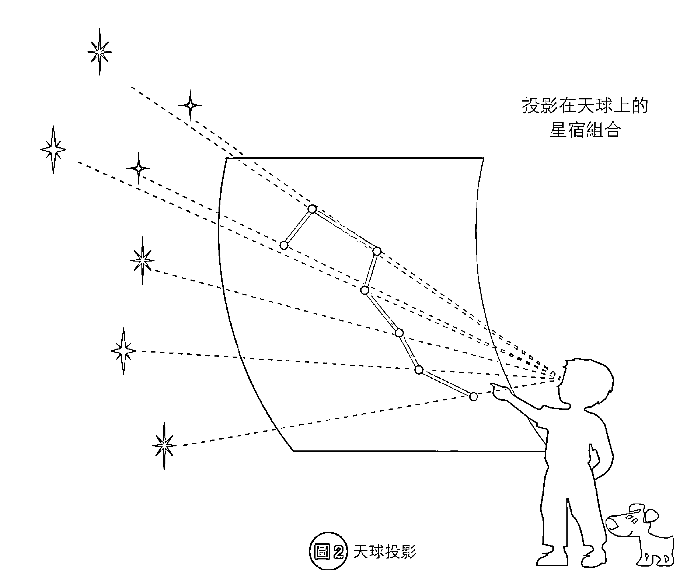

在寰宇星空中，各星體與地球之間的距離有很大的差異，由我們從地球上觀測無限遠的星星，頭上那一片宇宙看來像一個圓屋頂，人類也把这天球與地球相對應，分為天赤道及天極，星星看來就像貼在上面閃耀的點點。而我們只可以看見出現在地平線上的半球而已。（見圖3「天球」）

由於地球的自轉與地球環繞太陽公轉並非在同一條軸線上，所以我們夜間看到的天球北極並非在我們觀測之正上方（天頂）而是偏北了。

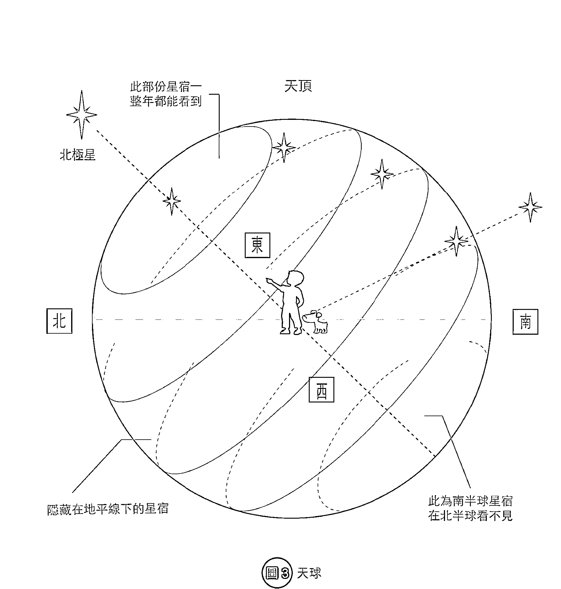

正因太陽之光芒干擾地球，雖然每日自轉一次，但我們只可以看見日落後至日出前星空上之星星。由於公轉的關係，這些星星的位置也每日輕微移動，而出現了在春夏秋冬四季不同的星空。由於地球的自轉，天球上的所有星宿都會從東邊升起，天球也以地球軸為中心旋轉，往西邊沉落。

以香港為例，香港是在東經 114.2 度，北緯 22.4 度。從地球某位置來看，觀測者之正上面稱為天頂，觀測者之正北正南與天球形成一條「天經線」（Celestial Meridian），在觀測某星體時便形成了高度角（Altitude / Elevation）及方位角（Azimuth）

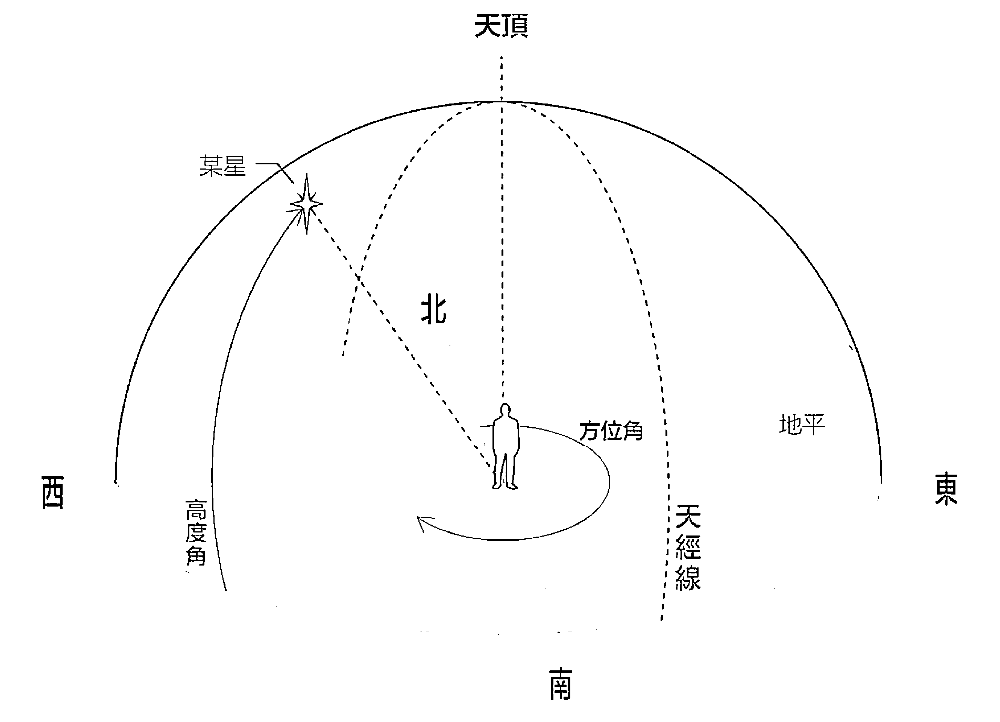

圖4 高度角及方位角

### 太陽系

我們所居住的地球是太陽系其中一顆行星。整個太陽系是在約四十五億年前形成，科學家估計是由一顆超新星爆炸後之星塵收縮而組成。以太陽為中心，現代天文學家承認八顆行星，由內至外分別為水星（Mercury）、金星（Venus）、地球（Earth）、火星（Mars）、木星（Jupiter）、土星（Saturn）、天王（Uranus）和海王星（Neptune）。在此以外，於 1930 年被發現的冥王星（Pluto），在 2006 年被國際天文學聯合學剔出行星之列，現在稱為「矮行星」。不管其命名如何，這些矮行星也還是環繞著太陽而旋轉。

由於萬有引力（Gravitational Force）的作用，因此行星距離太陽越近，它們環繞太陽一周所需的時間越短，距太陽越遠，它們的距道大而繞日的時間長。根據十六世紀德國算術家約翰內斯·開普勒（Johannes Kepler）之定理，每個行星不是以一個圓形環繞太陽，而是以一個橢圓形之軌道在太空繞日。太陽的位置是位於橢圓的兩個中心點之一，而行星並不是以定速繞日，它們會在近日時速度加快而在遠日時速度減慢。

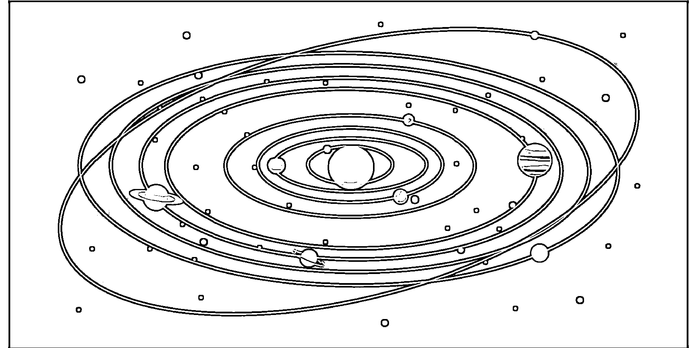

圖 5 太陽、八大行星、冥王星圖

### 四季

地球的自轉軸心與地球繞太陽公轉之軌跡形成一個約 23.4 度的傾斜面（見圖 6「地球之四季」），所以一年四季中，從北半球觀測，由於緯度不同，每天的日照時間也會不同。以香港為例，香港位於北緯 22.4 度，在香港觀測，太陽會在夏天夏至之日，在東偏最北的地方（A 點）日出，而會在西偏北（B 點）日落，而這一天會是一年之中日照最長的一天。到了冬至日，會在東偏南之地方日出（C 點），在西偏南之方位日落（D 點），這一天也是一年之中日照最短的一天（見圖 7「日照時間圖」）。而由這天開始，每日之日照時間會慢慢延長，直到夏至後，日照時間又會慢慢縮短。（見圖 8「香港日照圖」）

古人稱日落最北點為天門，又名天羅，而最南的日出點則稱為地戶，又稱地網。由於這日出日落點會因觀測地之緯度不同，所以春分及秋分不一定是在正東西位置出現。

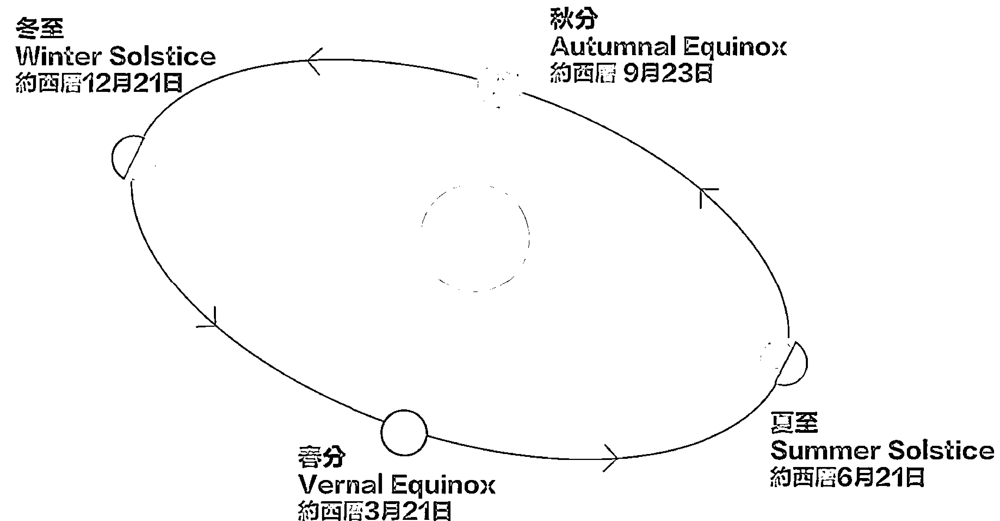

圖 6 地球之四季

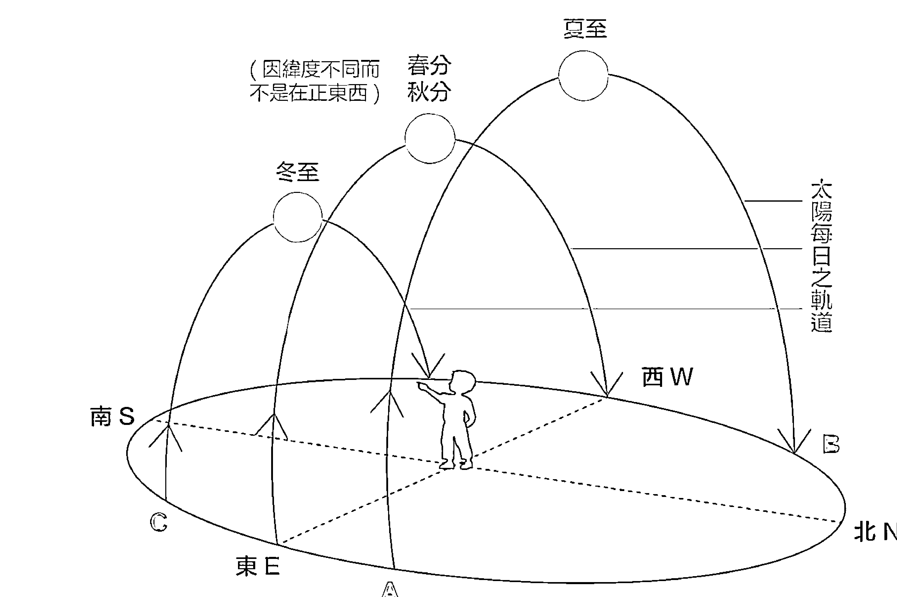

圖7 日照時間圖

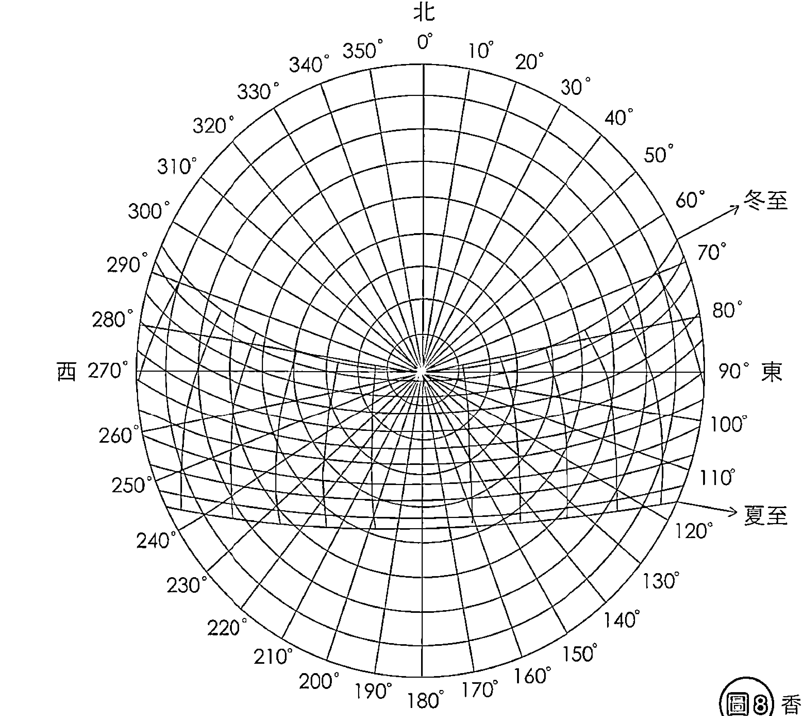

圖8 香港日照圖

### 天文坐標

在這個天球、太陽系、恆星及地球互相移動的系統中，人類便在這混沌中找到一些規律，作為記錄、傳承的坐標系統。古今記錄天文的坐標系統主要是有三個。

#### 地平坐標 (Terrestrial Co-ordinates)

在地球上，觀測者所在位置，是以地球的坐標來標誌的。國際上定立了一套標準的坐標，以地球自轉半徑形成的赤道為基礎，離開赤道南或北之角度稱為緯度。赤道處定為 0 度，在赤道以北為北緯，以「N」符號代表，赤道以南為南緯，由「S」符號代表。緯度最高處，以北極為 90° N，南極為 90° S。

在東西方面，東西之角度稱為經度，國際上以英國格林威治 (Greenwich) 之

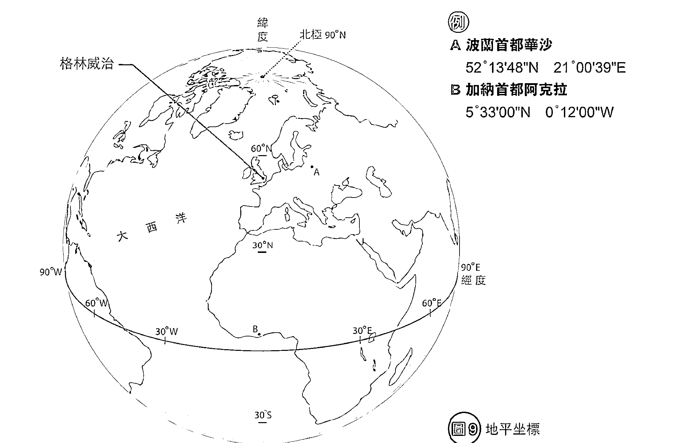

例
A 波蘭首都華沙
52°13'48"N 21°00'39"E
B 加納首都阿克拉
5°33'00"N 0°12'00"W

位置定為 0 度，其東為東經，西為西經，東經以「E」表示，西經以「W」表示，東西經在太平洋中一條沒有陸地的國際日經線處連接。

這個經度系統除了用度數來顯示，也可以用時間代表，因為地球自轉一天是 24 小時，所以經度 15 度表示一小時，而地點經度往往用格林威治時間（GMT）或一個綜合環球時（UTC 或 UT）來代表。

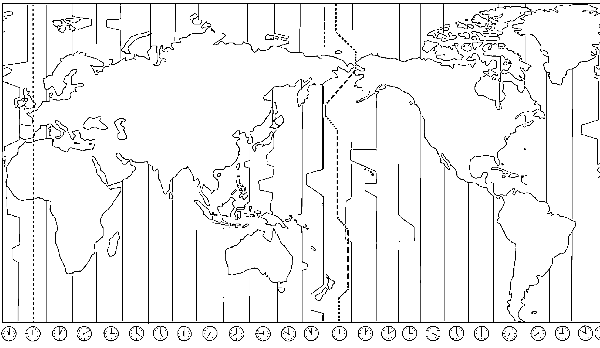

圖10 世界時間分區圖

#### 天赤道坐標

由於地球是以 23.4 度的傾斜角度繞着太陽公轉，從地球觀測，太陽所環繞之軌道稱為「黃道」，月球所環繞之軌道則稱為「白道」。而地球自轉目視形成天球在北方附近出現一個不動的「天北極」點，整個天球像是圍繞天北極由東向西轉動。而天球之半徑就是天赤道。黃道之北面為正，黃道之南為負，而民俗中之黃道吉日是代表二十八宿中之星宿位於黃道之北面。廣東通書曆中出現紅和黑的日子，理論上紅字便是代表黃道吉日，星宿位於太陽軌道黃道之北方。

在每年西曆 3 月 21 至 23 日左右，當太陽從天赤道南方升至北方時，這交

叉點便稱為春分點，代表春天之來臨，在北半球各文化中都視為重要的日子，其中波斯拜火教（祆教）視此日為一年之始，而西歐基督教與東歐東正教不同，視此日為耶穌升天之日。當太陽從天赤道北方下降至南方時，此交叉點便稱為秋分。西方的古代天文學中，很多都是以春分點作天球坐標初點的經度。

由於有天球而形成穹蒼，因此有如地球的經緯度坐標一樣，天文學家以天球北極為中心，其半徑90度天赤道形成一個坐標系統。但是中國的赤道坐標與西方不同，它沒有東西的赤經，某星宿之坐標是以其「入宿度」和「去極度」來證定。入宿度是某星宿和二十八宿某星（稱為距星）之赤經差，去極度是天體距天北極的角宿距離，也就是赤緯之餘角。至於二十八宿定位的問題，會在較後篇幅中詳述。

中國用天赤道坐標，最早記錄出現於傳為戰國時代寫作的《周髀算經》，其

中載有牛、婁、角、井四宿之去極度。這四宿實際就是夏至、冬至、春分、秋分（稱二分二至）的去北極角度。

為了方便大家在天上找某星星，西方現代天文學是以地球自轉中軸之極北定為0度，中國人稱為正子，周圍一個圈共360度——360度與0度重複相疊。所以90度便是正東，180度是正南（中國人稱正午），270度為正西，如此類推。正子午線就是正南北之中線。

但中國古天文是以太陽一年中每日有多少度來分，所以「周天」是有365¼度，但這365¼度在分界分度時，因為這個「零數」而變得很複雜，到了元代後由於回回天文引入，因此古人也把周天簡分為360度。

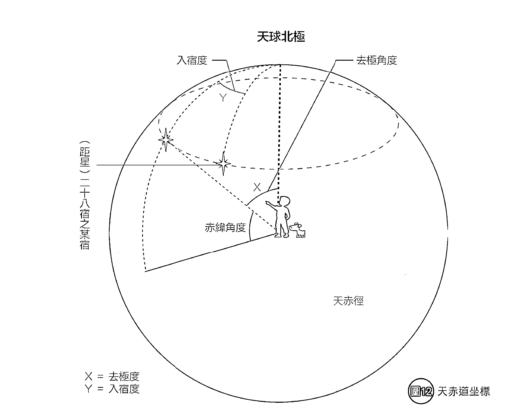

### 太陽黃道坐標

第三種坐標系統，是以地球觀測到之太陽「圍繞」地球的軌道為基礎，太陽之行道稱為黃道，故稱為黃道坐標（Eclipse）。黃道坐標在中西都有，但中國古代是以二十八宿為基準而標誌其在黃道圈上之距離，這系統相傳早於東漢永元四年（公元 92 年）賈逵論曆時提出。

術數及曆法上有以天干地支記錄年月日時的傳統，十二地支分別為子、丑、寅、卯、辰、巳、午、未、申、酉、戌、亥。是把周天 360 度分為十二個平均之宮位，每宮 30 度。

在太陽與月亮之軌道中，日與月在每個「太陰月」都會相會一次。雖然這「日月相會」會因為太陽之強光而使我們的肉眼無法目視到，但是如果日月與地球形成一線，便會出現日蝕。

這日月在同度相會時稱為朔日，而在一年之中，日月會在天球十二個宮位中的不同宮位相會。以農曆正月為例，朔日會在子宮水瓶座附近出現，二月的朔日則在亥宮雙魚座出現。如此類推，一年大約有十二個朔日有餘，所以十二宮由子至亥之來源以日月朔日來分佈，稱為「十二辰」。

十二辰之名字在《漢書·律曆志》有所解釋：

孳萌於子，紐牙於丑，引達於寅，冒茆於卯，振美於辰，已盛於巳，
咢布於午，昧薆於未，申堅於申，留孰於酉，畢入於戌，該闋於亥。

這十二地支就像一歲中之植物由萌芽、生長、壯大、盛熟以至衰亡的季節性周期一樣。

中國傳統的黃道，除了用二十八宿作為坐標之外，也有所謂「十二次」之說。因為歲星（木星）是約在十二年繞一周天，因此把周天分為十二「次」，用以表示歲星每年之位置，這最初是用天球赤道來分界，到了唐代可能因為中亞占星傳入而沿着黃道劃分。而歲星所繞之十二星次，分別為「星紀、玄枵、娵訾、降婁、大

梁、實沈、鶉首、鶉火、鶉尾、壽星、大火、析木」。子至亥宮位是順時針方向順行，而十二次是以斗建所定之地面十二辰方位而標誌天星之旋轉。

在西洋占星中，太陽黃道在天球中所經過的位置，被劃分為十二個星座，稱為黃度十二宮。而除了冥王星之軌道以外，太陽系之行星都是沿著一片像淺碟形的軌道圍繞太陽轉動。從地球上觀看，太陽、月亮及金、木、水、火、土五星，加上天王星及海王星等星，都是在天球上一個很窄的南北8度星帶內運行，而這星帶的中央正是太陽所運行的黃道。這一星帶也被稱為「黃道帶」。

黃道帶內之星座分別為：水瓶座、雙魚座、白羊座（牡羊座）、金牛座、雙

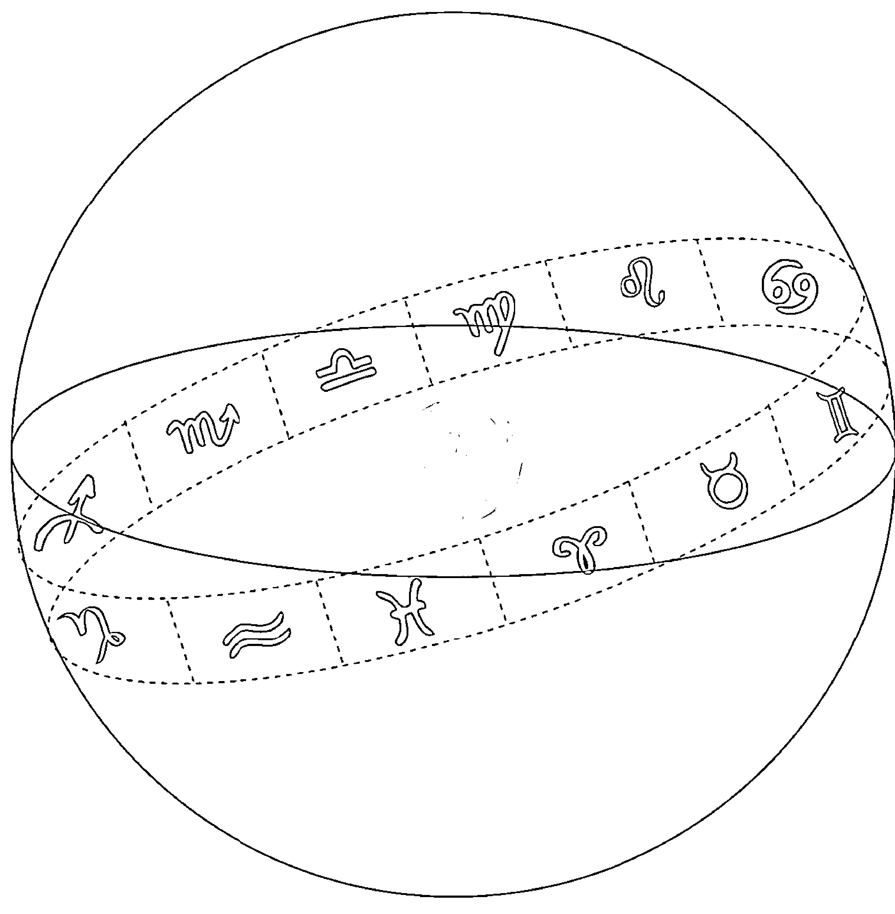

圖13 黃道概念圖

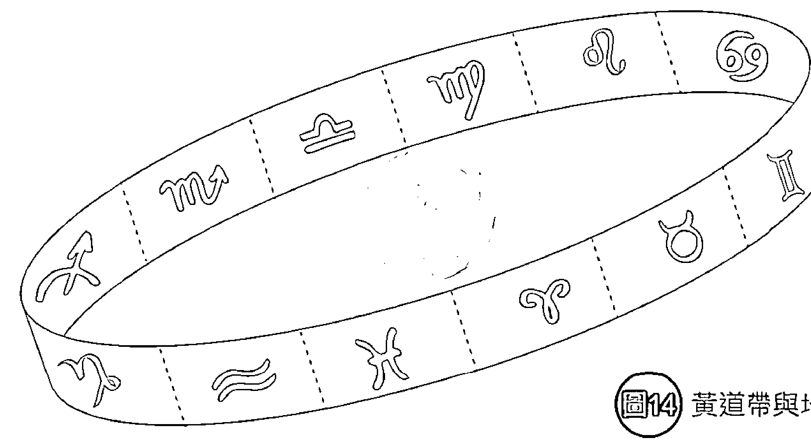

子座（陰陽座）、巨蟹座、獅子座、處女座（室女座）、天秤座、天蠍座、人馬座及摩羯座。這套黃道十二宮從中亞、印度傳入中土之後，中國人並沒有產生「抗拒」，而是包容並蓄，把它納入原來的十二次、十二辰之中，變成中國占星的一部份。這十二宮之關係列表如下：

表 1：十二宮與十二辰、十二次的關係

| 農曆月 | 十二辰建（宮位） | 十二次 | 十二星宿 |
|---|---|---|---|
| 十一 | 子 | 星紀 | 水瓶 |
| 十二 | 丑 | 玄枵 | 摩羯 |
| 正 | 寅 | 娵訾 | 人馬 |
| 二 | 卯 | 降婁 | 天蠍 |
| 三 | 辰 | 大梁 | 天秤 |
| 四 | 巳 | 實沈 | 處女 |
| 五 | 午 | 鶉首 | 獅子 |
| 六 | 未 | 鶉火 | 巨蟹 |
| 七 | 申 | 鶉尾 | 雙子 |
| 八 | 酉 | 壽星 | 金牛 |
| 九 | 戌 | 大火 | 白羊 |
| 十 | 亥 | 析木 | 雙魚 |

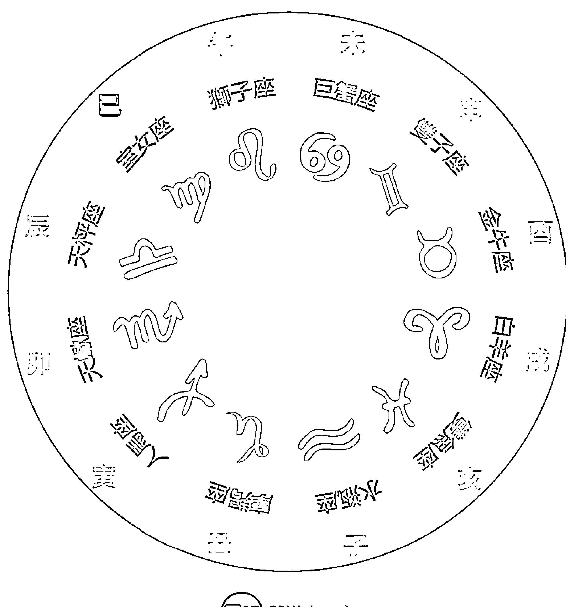

圖15 黃道十二宮

### 天體運行之關係

由於地球是不斷環繞太陽運行，而太陽系也是在宇宙中移動，我們觀測天體並不是在一個固定的基礎上，所以不管天文上或占星上，首先是要了解地球與太陽及其他恆星、行星之位置關係。

#### 內行星與外行星

由於地球是在太陽系八大行星中，距離太陽第三遠之行星，水星與金星都比地球接近太陽，因此可以把除地球之外的七顆行星分為兩類，第一類是較地球更

接近太陽的水星、金星，稱為內行星（Inferior Planets），而第二類則是比地球較遠離太陽之五星，包括火星、木星、土星、天王星、海王星，再加上已被改稱為矮行星的冥王星，統稱為外行星（Superior Planets）。

從地球的角度觀測，由於內行星繞太陽之軌道較短，因此往往會觀測到金星、水星之移動速度較快，而兩星之位置在較近太陽附近之宮位。其中金星不會超過太陽位置 48 度，水星不超過 27 度。而水、金二星環繞周天一圈也少於一個太陽年。與此相反，外行星繞周天一圈都會大於 365 日，離太陽最遠的冥王星繞一圈要 247 年多。

#### 內合與外合

太陽係的行星中，最接近太陽的是水星，其次是金星，它們被稱為內行星。因為它們近太陽，所以在觀測時，這兩顆星都是在太陽附近的前後兩個宮位移動。

內行星之軌道會出現幾個現象。當太陽處於地球與內行星之間時，內行星為太陽之光芒掩蓋，稱為上合或外合（Superior Conjunction），上合後，內行星會出現於黃昏時份，稱為「昏星」（Evening Star），此時行星會順行，由快到慢，離太陽越來越遠，當到達與太陽的距角最大之點（稱為「東大距」）後，便會出現停留之象，之後從地球觀測，內行星會出現後退之錯覺現象，古人稱為逆行（Retrograde Motion）。當內行星行至地球與太陽之間時，稱為下合或內合（Inferior Conjunction）。過了合或內合點後，行星便會在早晨出現，金星是北半球早上最早見到的行星，故此金星又稱為晨星（Morning Star），此時行星逆行一段後，又到達與太陽的距角最大之點（稱為「西大距」），再次出現停留，然後開始又順行至下一次上合之位，循環不息。

行星之逆行是以其相對之宇宙星宿而言，這情況有如一架汽車超越另一車，被超越者錯覺上像倒退一樣。

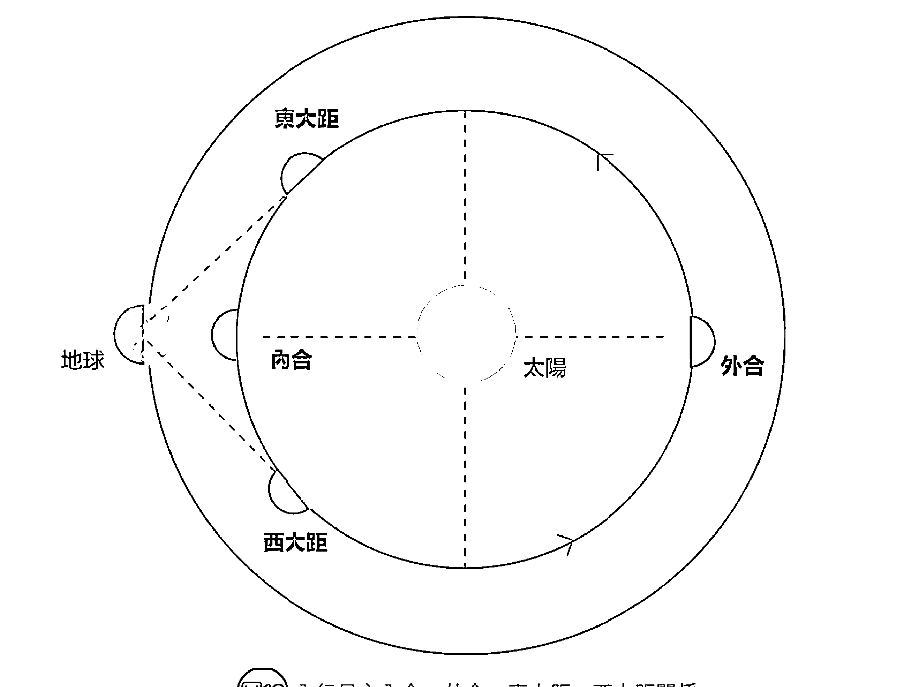

圖16 內行星之內合、外合、東大距、西大距關係

由於行星運動與地球的運動，在地球觀測，內行星會出現如圖 17 所示的運動形狀，古人稱為柳葉形。其中因為內行星不會處於地球與太陽之對面，所以內行星不會出現「大沖」之象，但有「上下合」之象。此時行星會在天空中順行，由快到慢，離太陽越來越遠，至東大距之位後便會出現停留之象，然後變為逆行，過了下合之位後，便會變成在早晨出現，再逆行一段後，又出現留之象，然後由逆變順。水星是最近太陽之星，其東西大距不會超過 27 度，而金星則不超過 48 度。（見圖 17「內行星之順逆留軌道」）

由於金水兩星太近太陽，在白天會被太陽光掩蓋，而只會在黃昏日落後及日出前之黎明可以在地平線上看到。

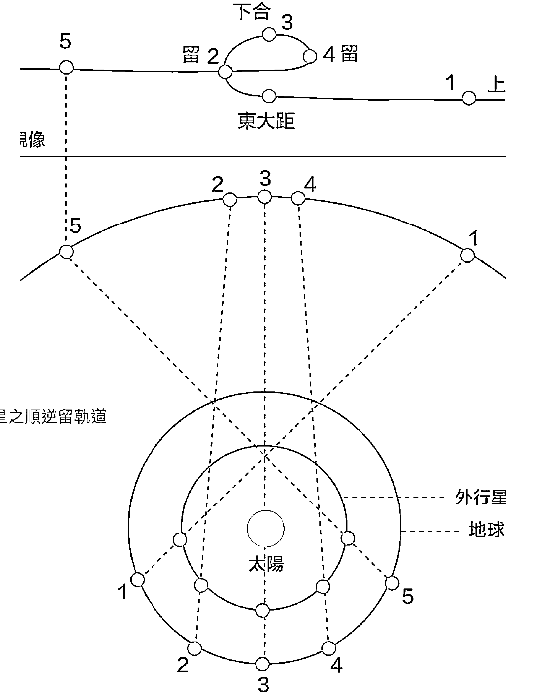

#### 相合與相沖

比地球更遠離太陽的行星，由近到遠分別為火星（Mars）、木星（Jupiter）、土星（Saturn）、天王星（Uranus）、海王星（Neptune），而被剔出行星之列的冥王星（Pluto），離海王星更遠，屬太陽系邊沿之處，因此它們被稱外行星。

外行星之東西距最大可以是 180 度，當太陽是在地球與行星之中間，此格局稱為日與某星「相合」（Conjunction）；當地球位於行星與太陽之間時，稱

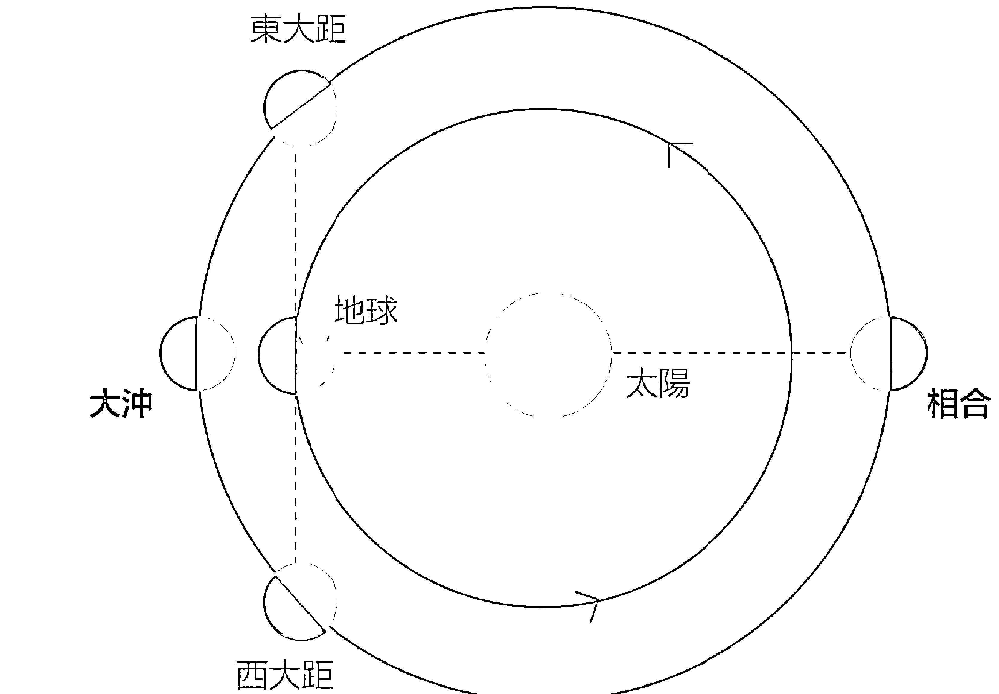

圖18 外行星之相合、大沖、東大距、西大距關係

為「大沖」（Opposition）；當地球與太陽及行星形成一個 90 度角，稱為「弦」（Quadrature），由相合到大沖之間的弦稱為「上弦」，大沖之後至再相合之間的弦稱為「下弦」。

外行星之會合與內行星不同。在上弦時，外行星出現在黃昏後，在下弦之時，它是在早晨出現。但由於外行星的速度比太陽慢，它雖然仍是順行，但走的軌跡是呈「之」字形，間中也會像柳葉形。

在一個行星週期中，它是從與太陽相合之後，到上弦的位置，三星形成為 90 角度，然後行星變成「留」之狀況，再逆行變成「會」之形。此時地球位於太陽與外行星之間。外行星再逆行至「留」位置後，便再順行至下弦 90 度關係，再而進入下一個「合」之週期。（見圖 19「外行星之順逆留軌道」）

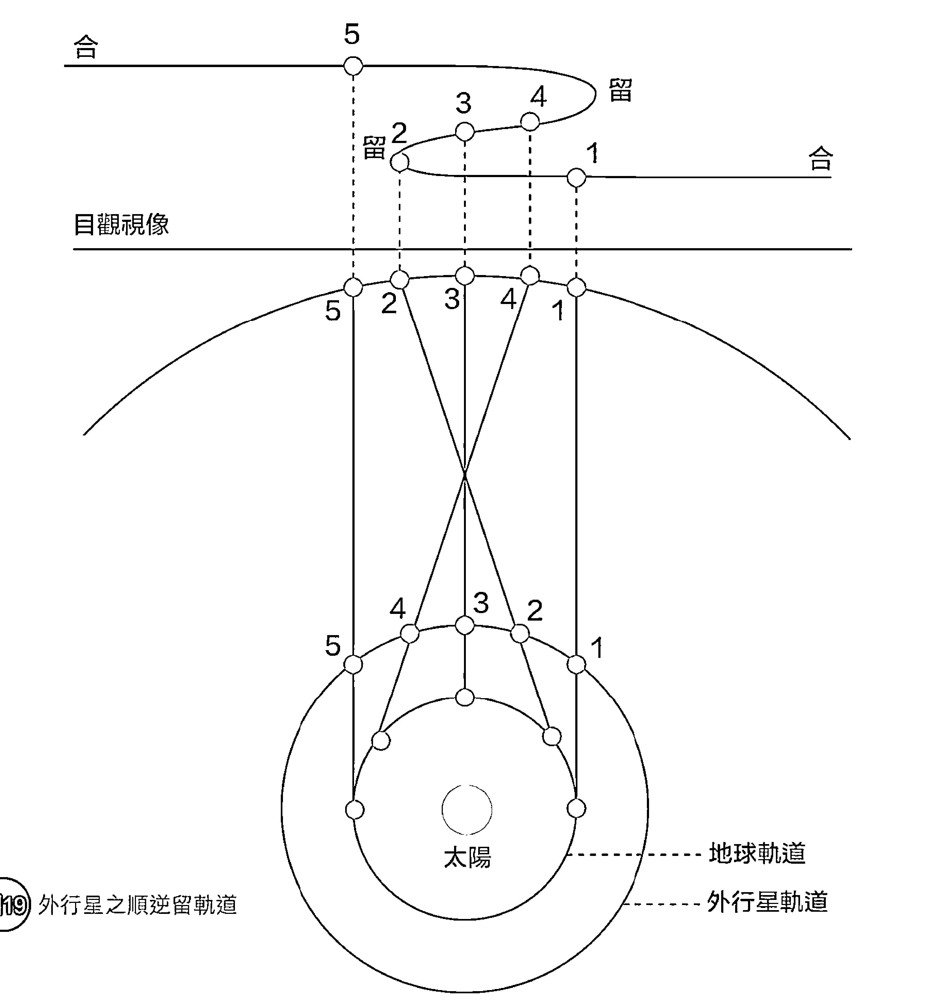

### 恆星時與太陽時

天文學上有兩種計算時間的觀念，第一種是以太陽為基礎，稱為太陽時（Solar Time）；第二種是以恆星為基礎，稱為恆星時（Sidereal Time），它是以地球上觀測某個星體為基準，在某位置某時觀測到某星，當地球自轉一圈，第二天再在某位置見到該星，此時間為一天「恆星日」。

太陽時是今天日常使用的時間，以太陽轉一圈 360 度為 24 小時，而太陽每天在天球的位置，便遷移 1 度，共 365¼ 度，便為一年。其實是地球繞着太陽一圈之後，更加多了 1 度，1 度為 4 秒，所以一個太陽日是比一個恆星日長，一個恆星日是等於太陽日之 23 小時 56 分 4.09053 秒。因為恆星日比太陽日短，因此大部份星宿都會在第二天比前一天早約 4 分鐘出現於夜空中，約一個星期後，它便會早半小時出現，在二星期後便早一小時，如此類推。

也因此每年四季相同的星宿（除了日月五星），便會在每一季出現在夜空之中。

### 占星術語

——年月日與曆法起源——

在人類遠古進化的長河中，先民在晚上觀察天上閃耀的星空，對於白晝日出日落，晚上月出而有圓有缺等現象，漸漸而領悟出一套「規律」，於是把日出日落到第二次日出定為「一天」，因此有了時間的觀念。又把月由月缺到月圓，月圓再到下一次月缺的日子定為「一個月」。再把這種觀測推延，太陽某日的日出日落時間是最長的，天氣也是較熱，古人稱為夏至（Summer Solstice）；而在較寒冷的日子中，某日之日出日落時間是最短的，古人定為冬至（Winter Solstice）。兩個冬至或夏至之間形成了「一年」的時間，把一年大概分為四份，春、夏、秋、冬四季的概念便產生了。

但問題是太陽環繞地球一圈，並非是一個整齊的日數，早在成書於公元前 90 年左右的《史記·五帝本紀》已有記載：「歲三百六十六」，這是一個先民粗略的記錄。《索隱》中注釋，「夫周天三百六十五度四分度之一是天度數也……日一日行一度。」可見早在耶穌出生同期的漢代人，已觀測到而把「天球」（稱為周天）分作三百六十五又四份一度。現代測實，一回歸年為 365.242190 日。今日我們把一個圓形分為三百六十度，也是簡化了這個更精準的分法，以方便畫分四、八、十二份計算。

而在地球觀測月亮移動的速度更快，《索隱》記載：「月行疾（快）一月一周天，日一日行一度，月一日行十三度十九分度之七，至二十九日半疆」。今日之測量一個月為 29.5305889 日，這與古人早已觀測到的相同，只是今日用儀器觀測和計算更精準。

日與月在一年之中會出現十二次會合，所以一年有十二個月，但是二十九日半乘十二只有三百五十三日多，不足一年三百六十五日多之數，所以《索隱》早提出：「一歲唯餘十二日弱，未滿三歲已成一月」。如果依這樣安排，三歲後已多了一個月，九年後差了三個月，春天月份會變成夏天了。十七年後差了六個月，則冬天變成夏天了。這會嚴重影響根據天氣曆法耕作的農業社會。

為解決這天文上的問題，古人便在多了一段時間「置閏」，加入一些閏月，其規則是以哪個月缺「中氣」而定，因為「一年」計算以冬至日為基準，所以閏月一般不會出現在十一月、十二月、正月及二月內。而用最小公約數計算，中國的曆法以十九年置七個閏月，使可以解決日月不相合的情況。

中國人所使用之曆法，現代有不少人稱為陰曆，又叫農曆，以相對於現在國際上所通用之公曆或陽曆，公曆又稱陽曆，是因為它以太陽圍繞地球一圈（或天文學上地球圍繞太陽一圈）為基礎，一年為 365.242190 日，所以普通年是 365 一年，而餘下之四份一日則以四年加一個閏日，再在約四百年加一個閏日。

陽曆一年分為十二個月，而今天普遍使用的是格哥利曆。在古羅馬時代，曆法是經過凱撒大帝時代整理而成，所以當時的曆法稱為儒略曆（Julian Calender），儒略是由凱撒大帝的全名儒略·凱撒（Julia Caesar）而來。這一套曆法沿用於歐洲，直到十六世紀的 1582 年，由當時拉丁基督教皇格哥利十三世修改而沿用於西歐，再因為西歐國家殖民侵略至全球而變成普遍用於全世界，最後變成國際通用之公曆。在東歐俄羅斯等地區信奉基督東正教，它們還是使用儒略曆，所以它們的聖誕節並非在每年 12 年 25 日，而往往是遲半個月左右。

而公曆中之紀月，並沒有任何天文基礎，而是因俗成例，所以出現二月只有二十八日，七月八月兩個月都有三十一日，而不是有一定之規律，也不合乎科學之原則。

普通人稱中國曆法為陰曆，其實是有誤差。中國曆法是以太陽與太陰作為一年計算之基礎，一年以 365.242190 度為本，平分為 24 個節氣，每節氣約 15 日 5 小時多，其中春夏秋冬以春分、夏至、秋分、冬至這「兩分兩至」為四個指標來劃分四季。這就解釋了，為什麼每年的「過冬」（立冬）都是在西曆 12 月 21 至 23 日左右，立春都在西曆 2 月 3 至 5 日之間。與西曆相比，中國之陰陽曆更符合地球天氣及科學紀錄之真正變化。

### 歲差

由於地球之自轉，在短時間內，它天頂極是對着天球某處為軸心不變，但是其實此軸心是會慢轉動，約 2 萬 6 千年一圈，由於地球本身之軸心是以約 23.4 度傾斜，所以地球像一個陀螺一樣轉動。在地球觀測，這些星宿便會慢慢在移動，約 72 年多移一秒，這個星體於天球上之移動便稱為「歲差」。

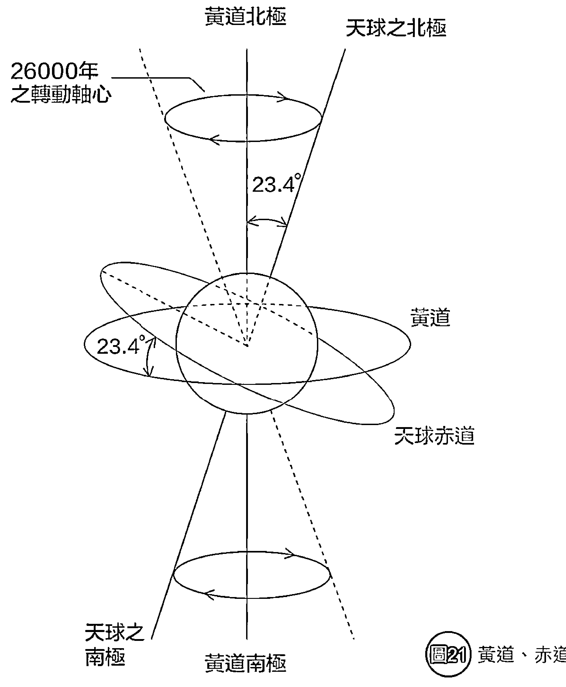

由於這個歲差，今日天球之最北極是北極星（Polaris），又稱小熊座 α 星，而在約四千年前，北極星則為織女星（天琴座 α 星），三千年前天球北極是天龍座 α 星。當時，每年 3 月 21 日左右之春分點，正好是太陽跨入白羊座之時候，所以古巴比倫以至今日的拜火教（祆教）都以 3 月作為一年之第一個月。伊朗雖然已信奉伊斯蘭教，但他們還保存了 3 月 21 日圍着火堆過年之習俗。但到了今天，春分點則已落在雙魚座之中間。

如果使用天赤道坐標，天球之歲差移動不會對占星有所影響。由於中國占星在元代開始以黃道坐標為主，所以在短期內的占星不會有大的影響，但年代久遠後，歲差的影響使星宿在黃道之位置轉移而出現誤差，所以每隔七十多年便要把二十八宿的宿位角度修正。由於中國占星以二十八宿與七政四餘為基礎，此天星宿度之關係，至為重要。

西方的占星家本來以春分這一天定為白羊座之起點，也是整個黃道十二宮之基點，但由於歲差移動的關係，使這時間點不斷移動而需要修正，為判定行星位置帶來不少困擾。在公元前一世紀左右，希臘的占星師決定維持每年 3 月 21 日的春分時刻，以「晝夜平分點」的太陽位置作為黃道上白羊座的起始點，平均分十二個宮，維持原有之命名，這套分域系統稱為「回歸曆」或「回歸黃道」（Tropical Zodiac）。

在這套系統中，今天所謂陽曆 3 月 21 日入白羊座，在天文上「晝夜平分點」及太陽之位置已是在接近黃道上雙魚座之位置，所以現在占星家視今日為雙魚座之時代，未來則為水瓶座之時代，七十年代之流行歌曲「水瓶座時代」（Age of Aquarius）便是以此為題材。

西方歐美現代占星學多數使用回歸曆作為占星計算之基礎，因此，如果你是 4 月 21 日出生，找一個使用回歸曆之占星師，他會說你的命官在金牛座，但其實上當時太陽是在白羊座之位置，所以這方法占卜其結果似乎使人有疑慮。

在印度占星中，占星家則是與中國占星一樣，堅持以天球中白羊座真實位置為黃道起點，此法稱為「恆星曆」或「恆星黃道」（Sidereal Zodiac）。從下列圖表中可見，恆星曆更接近真實星體之運動位置。

而中國人修正歲差的方法與印度占星恆星曆同出一轍，但由於現代所有電腦占星及天文測量都是以回歸曆為基礎，所以在占算中國占星時要修正二十八宿之度數。

### 表 2：回歸曆與恆星曆的差異

| 星座 | 回歸曆 | 恆星曆 | 天文學上太陽過宮之真正周期 |
|---|---|---|---|
| 白羊座 | 3/21~4/19 | 4/14~5/14 | 4/19~5/13 |
| 金牛座 | 4/20~5/20 | 5/15~6/14 | 5/14~6/19 |
| 雙子座 | 5/21~6/20 | 6/15~7/16 | 6/20~7/20 |
| 巨蟹座 | 6/21~7/22 | 7/17~8/16 | 7/21~8/9 |
| 獅子座 | 7/23~8/22 | 8/17~9/16 | 8/10~9/15 |
| 處女座 | 8/23~9/22 | 9/17~10/17 | 9/16~10/30 |
| 天秤座 | 9/23~10/22 | 10/18~11/16 | 10/31~11/22 |
| 天蠍座 | 10/23~11/21 | 11/17~12/15 | 11/23~12/17 |
| 人馬座 | 11/22~12/21 | 12/16~1/14 | 12/18~1/18 |
| 魔羯座 | 12/22~12/21 | 1/15~2/12 | 1/19~2/15 |
| 水瓶座 | 1/20~2/18 | 2/13~3/14 | 2/16~3/11 |
| 雙魚座 | 2/19~3/20 | 3/15~4/13 | 3/12~4/18 |

注：真實回歸曆與恆星曆會有 1 至 2 日之誤差。

### ——天球基本佈局——

天球周天東南西北三百六十度，分為十二宮，每宮三十度，天上之星宿在此天球上活動，在占星上某一星體與另一星體形成某一個角度，則會產生某種力量、影響力，這些佈局有各種的專有名稱。

### 串

古人稱某星在某位置為「躔」，所以某星甲與某星乙同在一個度數上時，即甲星與乙星在同躔一度，稱為「串」，此星之吉凶，影響力最大。

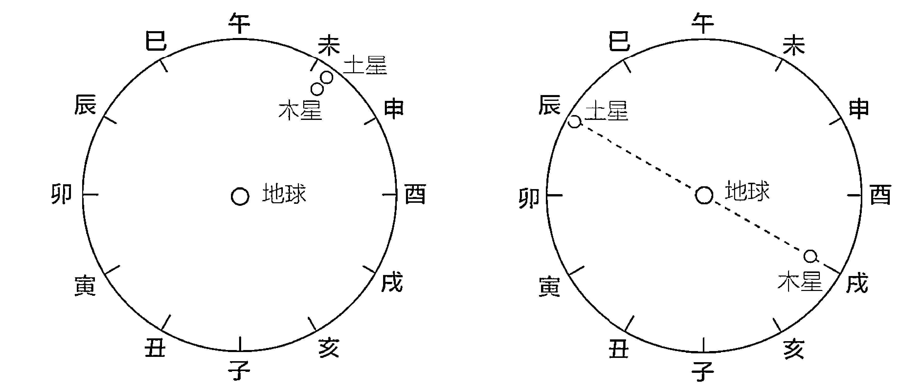

**串或躔**
例：2000年5月28日，土星、金星會於金牛座申宮22度46分。之前為六四事件及蘇聯解體，之後出現世貿襲擊及中東伊拉克、阿富汗變天

**沖**
例：2011年3月27日，土星位於天秤座辰宮14度，沖木星位於白羊座戌宮14度。相沖之前阿拉伯之春爆發，中東亂局，日本地震海嘯。

### 相沖

由於星體各自以不同之速度運行，它們會在相合之後經過一段時間而到達一個地球在中間、兩星相距一百八十度的形態，古人稱為相沖、沖照。

以土木相合為例，它們每十九年多、約二十年相會一次，所以在相會後約十年時，它們會變成相沖之形態，而在相沖後約二十年，它們又會再相沖一次。所以第一次相合後十年左右，土木便相沖一次，約二十年後又相合，約三十年後相沖，如此類推。

### 二弦

在相會和相沖之間，兩星體會形成一個九十度的形態，古人稱為弦照（見圖 25），由相會至相沖間之九十度稱為上弦（Waxing），由相沖至下一次相會間之九十度稱為下弦（Waning），總稱為二弦。（見圖 24）

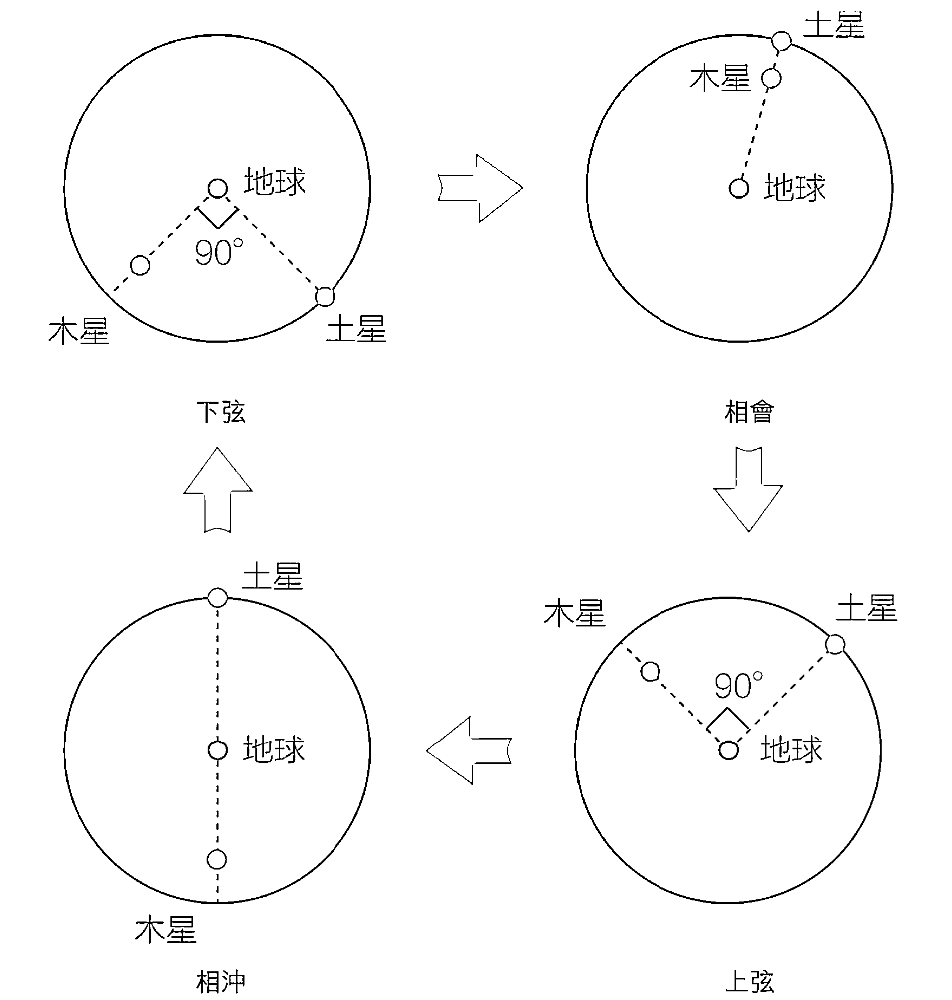

會、沖、二弦

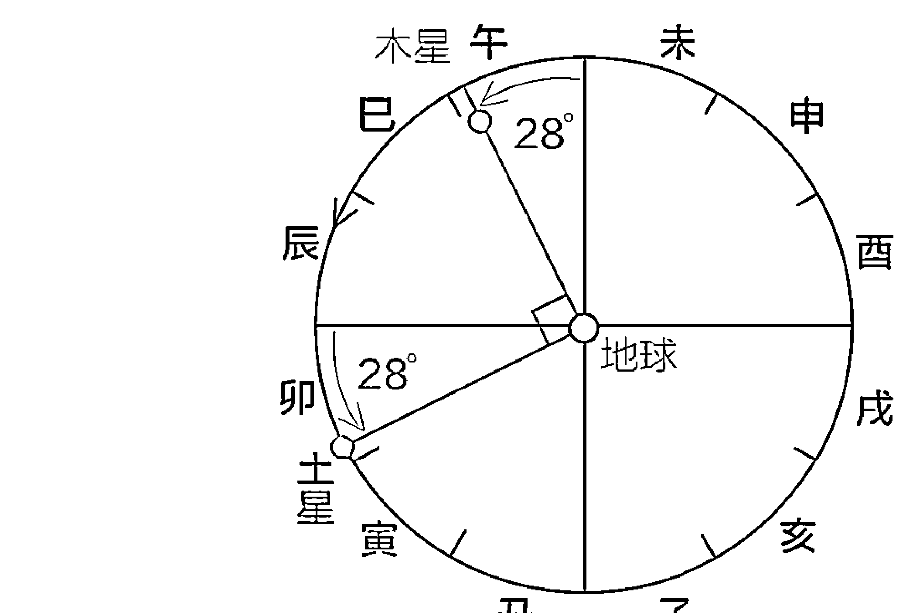

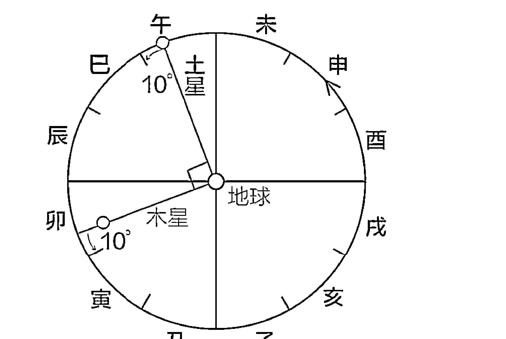

**下弦**
例：2015年8月2日，木星位於午宮28度，土星位於卯宮28度，相隔90度。

**上弦**
例：2005年12月17日，木星位於卯宮10度，土星位於午宮10度，相隔90度，香港世貿會議而示威動亂。

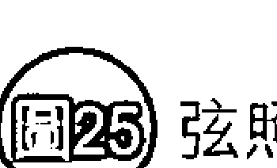

### 鉤照

此又稱為三方四正鉤照，這是指有多於三顆以上星宿聚於天球的「三方」或「四正」方位。
「三方」即隔四宮（天球分為十二宮），如一星在卯，他星在亥、未之類。

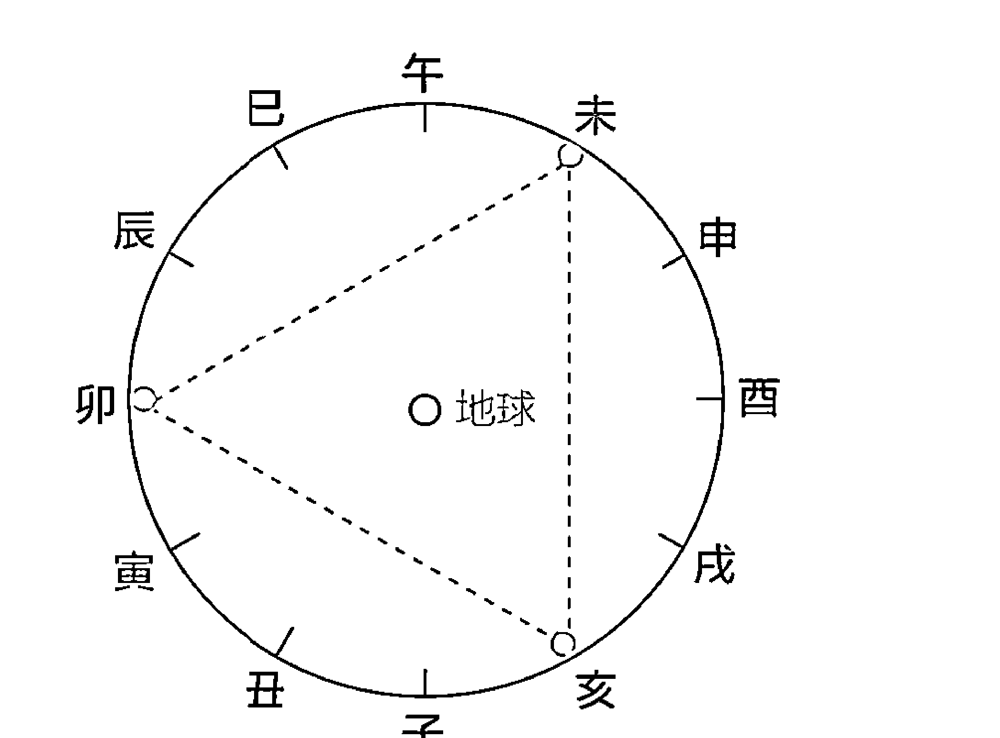

「四正」即為四顆以上星宿聚於天球四個九十度距離之方位，例如一星在申，三星分別在亥、巳、寅三位。

例如一星在子（水瓶座），一星在卯（天蠍座），一星在午（獅子座），一星在西（金牛座），稱為「填」，除了子午卯酉之外，四星各佔寅申巳亥、辰戌丑未宮也稱為填。

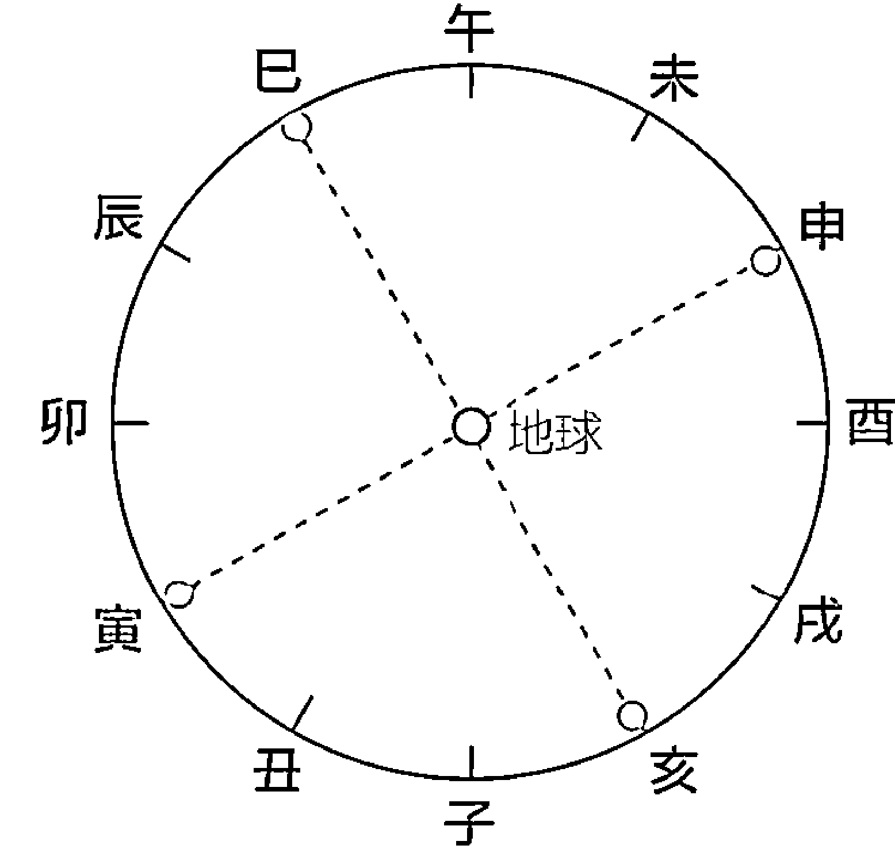

**經**

如果是二十八宿中同一屬性之星相連，則稱為「同經」，四星如「角斗奎井」屬木，「亢牛婁鬼」屬金，「氐女胃柳」屬土，「房虛昴星」屬日，「心危畢張」屬月，「尾室觜翼」屬火，「箕壁參軫」屬水，在天為同一氣。例如命主在箕，又在箕有吉星，是為同經；如果命主在箕，吉星在軫，也為同經，吉凶視其星而定。

**絡**

如果兩星星度對者，即對沖、三合、二弦、六合兼 30 度、150 度為同度或同絡。例如火星在辰宮 12 度，木星在巳宮 12 度，則為相差 30 度，也視為同度，星宿會產生作用。

### ——星座——

為了認識星宿，古人把天球內的星星分成許多區域，以各種各樣人間之動物、器具甚至神話中的神人神獸作為名號，這便是各「星座」、「星宿」之來源。由於各民族的文化不同，所以中國、中亞、西歐之命名也有所異。而對同一顆星宿，也可能有不同的命名。在天文學上，這些星宿之名只是隨著古代各民族的習慣傳統而訂立，其名字沒有與該星宿有什麼關係。

為了統一起見，國際天文學聯合會於 1930 年通過了國際標準，分天球為八十八個星座。這些星座之劃分，是以西歐流行之星座為主，且以公元前二世紀托勒密的《天文集》中所載的四十八星座為基礎，實際現今已經考證確認其起源是在今日伊拉克境內的古巴比倫文化。

天上的星宿由於亮度不同，天文學上分為很多等級，最光亮的為 1 等星，比 1 等星還要亮的稱為 0 等、-1 等星。由 1 等開始，2 等星是較暗淡，3 等星又比 2 等星更暗，如此類推。一般人類用肉眼可見之極限為 6 等星。後面還有 7 等星、8 等星，亮度越暗數字越大。

# # 中國天宮系統

今日中國人與外國人談中國占星學,大部份都以「十二生肖」廣為世人所認識,這可能是與中國人在海內外,每十二年一個循環,年年慶祝不同生肖之「過大年」有關。而到今天,不少中國人把自己「幼稚化」,只簡單地懂一些諸如「豬生肖人與蛇生肖人相沖」之類的認識。

這十二生肖基本來自於十二地支,以子配鼠,丑配牛,寅配虎,卯配兔,辰配龍,巳配蛇,午配馬,未配羊,申配猴,酉配雞,戌配狗,亥配豬。但真正的中國占星及天文系統是稱為「七政四餘」,而中國人所用以劃分天球星宿的系統稱為「三垣二十八宿」(宿音秀)。現代大家吳師青先生又在七政四餘之外加入天王、海王、冥王三星,稱為「七政四餘三王」。

七政者:「日,月,金,木,水,火,土」,共七星,日即太陽,月即月亮(太陰),金星又名太白,木星又名歲星,水星別名辰星,火星別名熒惑,土星別名鎮星。

四餘者:「羅,孛,計,炁」。餘者為「餘奴」,代表七政主星之餘氣,所以這四顆都是目視看不見之虛星。羅為羅喉(Rahu)之簡稱,是為火之餘氣,又名龍頭(Dragon's Head);孛為月孛,是為水之餘氣;計為計都(Ketu)簡稱,是為土之餘氣,又名龍尾(Dragon's Tail);炁為紫炁,是為木之餘氣,。在五行之中,金為剛,無餘氣,故此無金之餘。

三王則是近二百多年被天文學家發現的天王星(Uranus)、海王星(Neptune)和冥王星(Pluto)。

三垣二十八宿的星宿傳統介紹,每個垣、每個宿還包括在它附近所有的各其他星系,是全天之星宮,一般都有三四本書介紹,每本的厚度都足夠作為基礎書,本文只會簡單介紹三垣二十八宿及一部份有趣及與之有關的星宿,是以偏概全之法。如果大家有興趣更深入研究,可以在本書後有一系列參考之書進一步去了解中國天文星宮之詳程。

中國之三垣二十八宿加上其他星宿，是一個地上國家的微縮象徵，它包括天上的帝王宮殿、文臣武將、前朝後宮、后嬪妃妾，以至平民百姓下女。也包括夷蠻戎狄等周邊外國、國家糧庫、兵工廠、古代之先進武器戰車、戰馬、糧草。也有一些山川河流、天井飲食、廁所宗廟、六畜、器具等，包羅萬有。

當有七政四餘及隕石、流星、彗星、孛星等星體迫近某星，古人稱為有客星「犯」宿，相信該星所主之事便會在地球上出現變化，或凶或吉。而這些星宿由於天氣雲雨霧露之影響，有時會在星上出現特別發射形之光芒，古人稱為「芒角」，而有時顏色會變得暗淡，甚至被雲露覆蓋而不見了，也有時在天朗氣清時顯得特別光明，古人都視這些現象為「星變」，是決斷吉凶之基礎。

所以同一顆星宿，從千里分隔的兩地觀測，一方可見吉象而另一地則因為本土天氣而出現凶兆。同一年春現凶象而秋有吉慶，都是可以在星占中體現。

### ——三垣二十八宿——

與中亞及西方占星用「黃道十二宮」不同，中國古代有自己獨立發展的一套天星分佈概念。最早的概念是把天球上的星宮分為二十八組，稱為二十八宿。有學者考証，這可能是古代月亮繞天球一圈所在的位置，因為月亮繞地球一圈為 29.53 日，以遠古天文觀測的誤差，當為 28 日，而 28 宿也剛好分為四個組，分別為東方青龍、西方白虎、南方朱雀及北方玄武，每組七宿比較齊整。但由於天球移轉及歲差之關係，今日之月亮已不是每天晚上停留在這二十八宿之圈內，而是有誤差。而二十八宿也不是每宿佔多少度平均分佈在天球之上，每宿之宿度有闊有窄。其中以中天 360 度分，西方參宿與觜宿是重疊在一起。故此二十八宿之鈐（表）度中觜宿只有一度。

在印度占星中，他們也有二十七宿之説，他們更指出二十七宿之發源來自他們的梵歌，是比中國更古遠。但由於梵歌中未有詳細的紀年記錄，所以很難有科學上之根據。

在中國，上世紀七十年代，在湖北隨縣出土的戰國時代曾侯乙之墓葬中發現了一個木箱，其箱蓋上中間繪有一個北斗星及四周圍繞着二十八宿之圖形。這是歷史上最早可以紀年（公元前 430 年以前）的一個二十八宿的證據。在印度未有更可靠之出土古蹟證明之前，二十八宿似乎是最早源自中國。

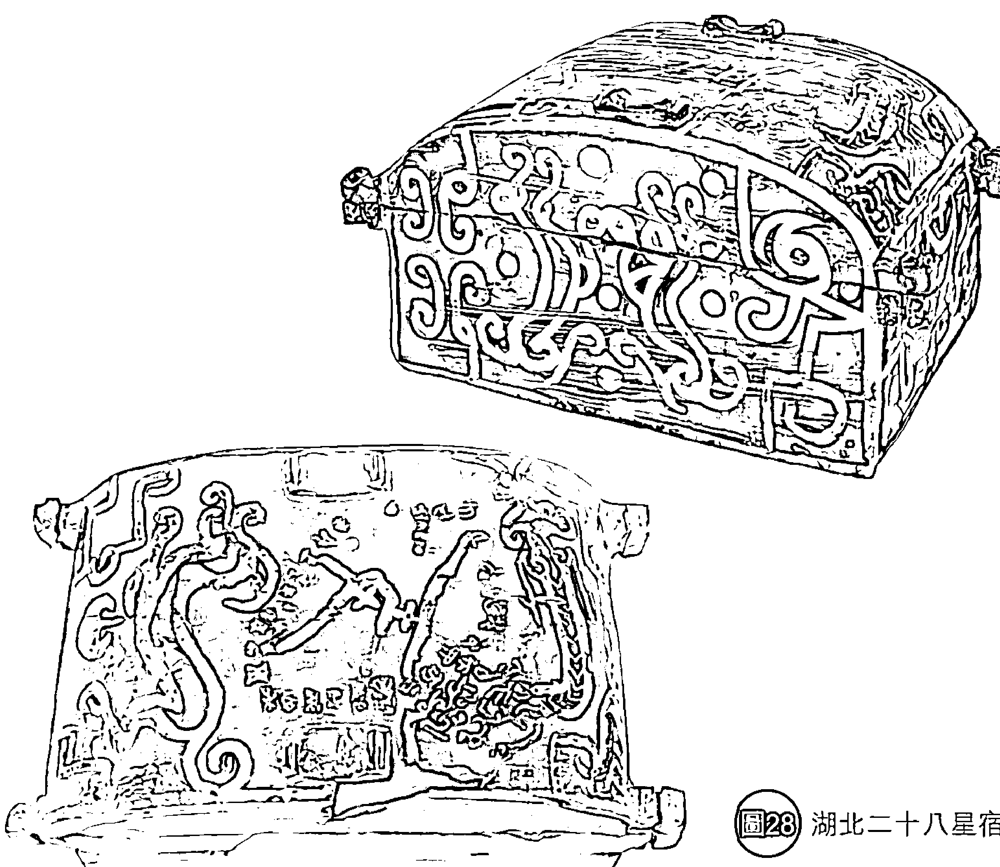

圖28 湖北二十八星宿圖

### 三垣

三垣分別是紫微垣、太微垣及天市垣。後有人加上少微垣共為四垣，但一般都以三垣為總稱。垣是城垣，城牆之意，這是代表古人相信，天上某些天星組合形成一個個的城垣，皇帝及其後宮、前朝百宮居於其間。

三垣是比二十八宿較遲出現在中國占星系統中，但主要原因是沒有這些星宿的命名。《史記·天官書》中把天分為五區，即東、南、西、北、中五部，東南西北宮為龍、雀、虎、玄等四象，中宮為紫宮。直到《晉書·天文志》中才有三垣的分法。

### 紫微垣

紫微垣是三垣中之中垣，位於天球北極中央的位置，在北半球觀測是天球近北方，北緯 50 度以北範圍內的天區。（見圖 29）

它的形狀像兩個用星組成的外牆，牆外有北斗七星，而牆內仿如一個皇帝之內朝，除了北極（帝星）外，又有太子、后妃、庶子、御妻、侍女等，還有皇宮內活動之近臣，包括三師、三公、相尚書、柱史、女史、大理等。

在二十四山或十二宮之方位上，紫微垣是在亥宮之方位。

### 紫微垣圖

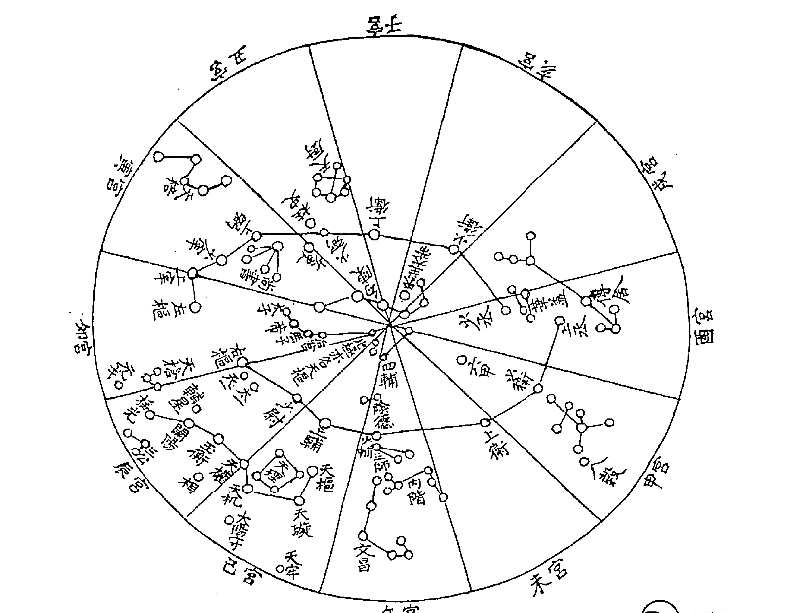

圖29 紫微垣

### 北斗星

北斗星是天極區最明亮及顯著的星座，它的形狀像一個斗形量器。《春秋運斗樞》：「斗，第一天樞，第二旋，第三璣，第四權，第五衡，第六開陽，第七搖光。」這七顆星就是在術數風水上所出現的貪狼、巨門、祿存、文曲、廉貞、武曲、破軍七星。在開陽、搖光之間，旁有兩小星，術數家名為左輔、右弼，這些星合為九星。

北斗七星中，前四星呈方形，為斗量器之主體，稱為魁；後三星似斗之杓柄，俗稱斗柄或杓，是斗握手的部份。古代斗為量酒盛酒之器具。

古人對北斗之重視，是因為它有指示四季之作用。《鶡冠子·環流》：「斗柄東指，天下皆春，斗柄南指，天下皆夏，斗柄西指，天下皆秋，斗柄北指，天下皆冬」。這個古代的民諺正好反映古人以北斗像天上之時鐘。

### 太微垣

第二個天上城垣為太微垣。古人把天上各星宿組成像地下國家社會各階層之代表，紫微垣是天球中軸中心，象徵一個國家天子所居的紫禁城內廷，是帝王生活起居之地。而太微垣則是處理國家政事之處，也就是政府機構所在地。《春秋元命苞》曰：「太微，權政所在」，又云「太微為天廷」。

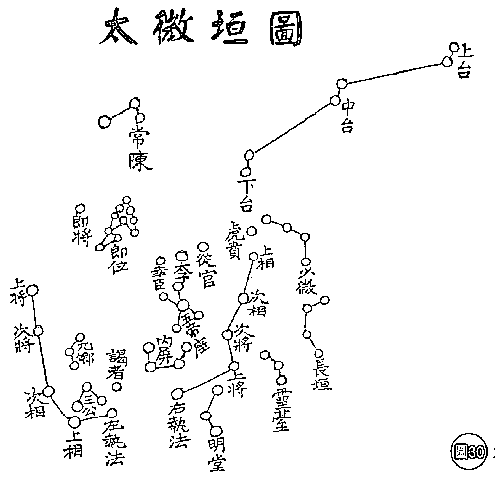

太微垣屬於赤道以北三大天區之一。但它不在北極附近，在二十四山或十二宮中，它位於東方卯宮。

它也和紫微垣類似，由兩組星組成左右垣牆，門口為左右執法，中央為五帝星座、九卿、三公、太子幸臣、從官等。而垣牆之星皆為各級之官員，包括上相、次相、上將、次將等。在垣之後為郎將、常陳等衛侍成員。

在太微垣外有靈台、明台、長垣等謁者進謁所經之建築，而其旁有少微四星。《石氏》：「少微四星，逸士位。」《黃帝占》：「少微，主藝能之士，若聞如孔子，巧如魯班，道術之士，悉皆主之。」又曰：「少微星明而行列，王者任賢良舉隱逸，才用，天下安，其不明，微而不見，賢良不出，術士潛藏，人主不安。」

《開元占經》引韓楊：「少微四星，謂第一處士，第二博士，第三義士，第四大夫也」。這些都代表不為官、但在社會上的有技術有識之士，包括懂術數之士。

《晉書·天文志》：「靈台，觀台也，主觀雲物，察符瑞，候災變也」。這是古代天文台及欽天監的混合機構，主皇家天文占星術數之事。

### 天市垣

三垣中紫微垣是主垣，太微垣是上垣，天市垣是下垣，天市垣位於紫微垣之東南方，在二十四山及十二宮中，佔有丑寅卯三宮，但以丑寅為主。

天市垣之形格，以中國本土九州及四周之城市地區為星名，左右相接形成兩道「城垣」，這些都是以戰國時代之國家為名，其中近西的國家排在右，近東方之國家排在左。天市垣之北面為北斗之斗柄，南面為織女星。

《晉書·天文志》：天市垣是「天子率諸侯幸都市」之場所，所以是代表天上的市場、街市，今日是指商業發達，以商業為主而不是政治主導之城市，美國紐約、香港等皆合此局。

### 天市垣圖

在古代，直到唐末之前，一個城市品交貿地方名「市」，是在一個四面有牆包圍，有東南西北四門，中央有一座高大的市樓特定地區，所有交貿必需在此進行，也方便政府對所有商品交易納稅。當時一般民居是沒有像清明上河圖所示有臨街店鋪的。所以唐長安城有著名的東市及西市，這個像現封閉式商場的設計，在唐末因管理失敗而廢弛。

圖32 漢像磚出現的市井之圖，四街開四門中央為市樓

所以在天市垣內出現了市樓、屠肆、帛度、列肆、斛等市場內的店鋪。其中《巫咸》記：「帛度，買賣與平者俱」。這是用公平之尺來量度，使買賣公平，互不吃虧。

《甘氏》：「斗斛稱量，尺寸分銖」。這是市肆內有公正之量器，用以公正量度液體及米糧等。

除此之外，市內有宗人、宗正等星。《元命苞》：「宗星，主先人祠享」，《石氏》：「宗人四星，錄新疏」。這是管理皇帝祠堂及家族之機構，可以引申為任何宗教的聖堂、廟觀。所以天市垣方也為「鬼門」。

天市垣外有貫索九宿。在古代，一般使用的小銅錢幣都是圓形與中間有一個方形小洞的銅錢，古代人為了方便一個方便交易大量使用，往往每一百個銅錢用一條繩打一個十字形的結聯起來，這個結繩的方法，與古代把犯人五花大綁的形像很相似，所以古人便把「貫索」隱喻為受刑或交通阻塞而被困不能動，也代表監獄之意義。《論讖》：「貫索，主天牢」。

《石氏》：「女牀，後宮御也，眾妾所居宮也」。女牀為帝王眾妾所居。《論讖》：「天紀星，以表九州定圖位天紀，主曆，音律。」所以也主曆、律等古人視為天之規律的事物。

### ——四神之源——

不少業餘愛好風水的朋友，以至地產經紀，在看一幢樓之風水時，都會以該住宅之左右看見有高山或高樓，而指出這住宅左有青龍、右有白虎，所以風水自然好。這個左青龍、右白虎之概念來自古代，有所謂「四神」之説，所謂「左青龍、右白虎、前朱雀、後玄武」，青又曰蒼，是指蔚藍色，朱為紅色，玄為黑色，而朱雀代表古代神話中之鳳凰，鳳為雄鳥，凰為雌鳥。玄武則為一種蛇在烏龜上合體之神獸，所以也可以用蛇或龜來代表。

因為古代的觀念中，帝王是「面南而治」，房屋主要都是背北向南，風水術語上稱為「坐北向南」或「坐子向午」。左為東，東在河圖中五行屬木，木色青、蒼，故為蒼龍或青龍；右方為西，五行屬金，金色為白，故為白虎；前面為南方，五行屬火，火色赤、朱、紅，故為朱雀；背靠為北方，北方主幽暗，黑玄顏色，故為玄武。

在堪輿概念上，一個好風水之地點是要求「藏風聚水」，而不是俗語所説之「風生水起」，因為風生是颱風或龍捲風，水起是海嘯或洪災、水漲。所以，如果一個地方，前後左右都有小山（不一定是大山）包圍，像香港維多利亞港，則有風暴、大雨襲擊之機會，會因為有山體阻擋而減輕。

如果大家有留意，有龍捲風出現的地方，一般都是一些一大片平坦之地形，包括平原及海面上，而很少有小山在附近出現。美國的龍捲風走廊（Tornado Alley）及最近發生龍捲風的廣東佛山一帶，都是這種地形。而山勢丘陵之地方則較容易招惹大雨。因為低雨雲要飄過這些山陵，便會容易發霧及下雨。

所以如果居處有「四神」，是有一定之科學性。

青龍白虎之概念，是源於中國古代之天文占星學，最早似乎是只有青龍及白虎，而朱雀及玄武是次第加入。

最早的證據出現於 1980 年代，在河南濮陽西水坡一座新石器時代的古墓中。該墓主人頭坐南，腳向北，其東為一用蚌殼拼砌成之龍形圖案，其西為用蚌殼拼砌成之虎形圖案，腳下則有用人兩根脛骨和蚌殼砌成的「北斗」斗形圖像。據碳十四測定，此墓是大約公元前 3850 年建成，距今約六千年。（見圖 34）

第二個證據是在湖北隨州市曾侯乙墓出土的一個漆箱蓋上，此蓋上畫有天文上的二十八星宿之文字圖形，而中央是一個大的「斗」字。圖形之東面畫有龍形圖案，西面則為虎形圖案。據考證，這個漆箱的年代為公元前 430 年。這圖形不單只表現中國古天文學龍虎北斗之概念，也是最早表現二十八宿之證據。（見圖 35）

圖35 曾侯乙漆箱二十八宿龍虎北斗圖形

以上這些證據都只有青龍白虎，而無朱雀玄武。1987年在西安交通大學一處工地，出土西漢古墓，主室之穹頂畫有二十八宿天象圖，其中畫有日、月、龍、鳳、虎、蛇（未畫有龜）等四神之次序，這也是四神發展之次序。（見圖36）

圖36 西安交通大學西漢墓星圖

### 二十八宿

在天文上這四神是怎樣代表呢？

中國古代，我們的祖先把天球的主要星宿分為四隻神獸，分別為：

- （一）青龍代表東方
- （二）朱雀代表南方
- （三）白虎代表西方
- （四）玄武代表北方（見圖 37）

每隻神獸分為七個星宿，代表着神獸身體的一個部份或其他有關事物，共有四七二十八宿。這二十八宿並非與黃道十二宮相同，而是一些近似的星系。

二十八宿的來源有多種説法。印度占星中也有二十七宿之説，其中之原因是，在實際天文觀測上，二十八宿中位於申宮之參宿所涵概之空間，是把觜宿包括在內的。所以在印度人認為，印度占星中的二十七宿是來源最古老的。但他們的來源難以用科學方法去斷定年代，而曾侯乙墓出土的圖案是最早之二十八宿的考證。

二十八宿是一個總稱，它也包括了不少在這些星宿附近的星組，而古人都認為這些星宿具有一定的性質而去命名。以青龍七宿為例，它是代表東方星域，它主要為「角、亢、氐、房、心、尾、箕」七宿，但除此以外，它附近又有「大角」、「貫索」等其他星宿在內。

青龍第一宿為角宿，它代表青龍之角，但它也是古代整個二十八宿時期之基本起點。因為歲差而星體轉移，所以今日之角宿，位置與古代已不相同，但在占星上其性質不變。

青龍在東方，天球順時針之南方為朱雀七宿，分別為「井、鬼、柳、星、張、翼、軫」，而天球西方則為代表白虎七宿，為「奎、婁、胃、昴、畢、觜、參」，而北方為玄武七宿，為「斗、牛、女、虛、危、室、壁」。雖然古人定位青龍七宿在東，朱雀七宿在南，白虎七宿在西，玄武七宿在北，但天球還是在不斷移動中。

古人在觀測周天星辰在周年的轉動時，發現某些星辰會在一年中差不多同一時間出現在正南的天空中，古人以此來分別四季。《史記》記載《堯典》時：「日中，星鳥，以殷中春」，漢代孔國安解釋，在春分之黃昏時分，南方朱鳥（朱雀）七宿（井、鬼、柳、星、張、翼、軫）之「星宿」出現於正南方之中天上，這是用以標記春季之正（殷）中之時間。

「日永，星火，以正中夏」，東方蒼龍七宿中「角、亢、氐、房、心、尾、箕」之「心宿」又名「大火」，在夏至之日，心宿出現於正南方之中天上，是標記夏天之來臨。

「夜中，星虛，以正中秋」，在秋分日黃昏時，北方玄武七宿「斗、牛、女、虛、危、室、壁」中間之「虛宿」出現在南方中天之上，標誌着仲秋之來臨。

「日短，星昴，以正中冬」，在冬至之日，日照時間是全年最短的一天，故稱日短，西方白虎七宿「奎、婁、胃、昴、畢、觜、參」中間的「昴宿」出現在正南方中天上。而白虎七宿都畢現於整個穹蒼之上。

這是古人用朱雀、青龍、玄武、白虎各七宿中間之星宿，來定立春、夏、秋、冬四季之中間的時間，以分別定四季，方便農民安排下種、耕種及收割等時間。由於春也代表東方木，夏代表南方火，秋代表西方金，冬代表北方水，所以四神也有其方位所屬。

中國占星有一個特別之算法，有別於西洋占星，中國之二十八宿每宿之宿度大小都不同，而其屬性也有所不同。

#### 表 3：二十八宿方位及屬性

| 青龍 | 白虎 | 朱雀 | 玄武 | 圓渾 |
| --- | --- | --- | --- | --- |
| 角 | 奎 | 井 | 斗 | 木 |
| 亢 | 婁 | 鬼 | 牛 | 金 |
| 氐 | 胃 | 柳 | 女 | 土 |
| 房 | 昴 | 星 | 虛 | 日 |
| 心 | 畢 | 張 | 危 | 月 |
| 尾 | 觜 | 翼 | 室 | 水 |
| 箕 | 參 | 軫 | 壁 | 火 |

以下是根據蔡真步堂 2015 年所定的天星鈐宿位置表：

#### 表4：蔡真步堂2015年天星鈐宿位置表

| | 十五度 | 十六度 | 十七度 | 十八度 | 十九度 | 二十度 | 廿一度 | 廿二度 | 廿三度 | 廿四度 | 廿五度 | 廿六度 | 廿七度 | 廿八度 | 廿九度 |
|---|---|---|---|---|---|---|---|---|---|---|---|---|---|---|---|
| 丑 | 四 | 五 | 六 | 七 | 八 | 九 | 十 | 十一 | 十二 | 十三 | 十四 | 十五 | 十六 | 十七 | 十八 |
| 子 | 三 | 四 | 五 | 六 | 七 | 八 | 九 | 十 | 十一 | 虚初度三秒十六分四 | 一 | 二 | 三 | 四 | 五 |
| 亥 | 十一 | 十二 | 十三 | 十四 | 十五 | 十六 | 十七 | 十八 | 十九 | 室初度十三秒十一分十 | 一 | 二 | 三 | 四 | 五 |
| 戌 | 五 | 六 | 七 | 八 | 九 | 十 | 十一 | 十二 | 奎初度十三秒十四分八 | 一 | 二 | 三 | 四 | 五 | 六 |
| 酉 | 十一 | 十二 | 胃初度十四秒四十分一 | 一 | 二 | 三 | 四 | 五 | 六 | 七 | 八 | 九 | 十 | 十一 | 十二 |
| 申 | 六 | 七 | 八 | 九 | 十 | 十一 | 十二 | 十三 | 十四 | 昴初度十八秒八分八 | 一 | 二 | 三 | 四 | 五 |
| 未 | 九 | 十 | 十一 | 十二 | 十三 | 十四 | 十五 | 十六 | 十七 | 十八 | 十九 | 二十 | 廿一 | 廿二 | 廿三 |
| 午 | 四 | 五 | 六 | 七 | 八 | 九 | 十 | 十一 | 十二 | 十三 | 十四 | 十五 | 十六 | 畢初度四十二秒十二分廿四 | 一 |
| 巳 | 九 | 十 | 十一 | 十二 | 十三 | 十四 | 十五 | 十六 | 十七 | 觜初度十五秒三分四十 | 一 | 二 | 三 | 四 | 五 |
| 辰 | 四 | 五 | 六 | 七 | 八 | 九 | 十 | 十一 | 十二 | 角初度九秒五分五 | 一 | 二 | 三 | 四 | 五 |
| 卯 | 十 | 氏初度五十三秒四分四 | 一 | 二 | 三 | 四 | 五 | 六 | 七 | 八 | 九 | 十 | 十一 | 十二 | 十三 |
| 寅 | 七 | 尾初度五十六秒二分 | 一 | 二 | 三 | 四 | 五 | 六 | 七 | 八 | 九 | 十 | 十一 | 十二 | 十三 |

### 七政經緯曆書

#### 黃道宿度鈐表

#### 二十八

#### 真步堂

|  | 初度 | 一度 | 二度 | 三度 | 四度 | 五度 | 六度 | 七度 | 八度 | 九度 | 十度 | 十一度 | 十二度 | 十三度 | 十四度 |
|---|---|---|---|---|---|---|---|---|---|---|---|---|---|---|---|
| 丑 | 尾十三度五十六分二秒 | 十四 | 其初度四十四分三四十九秒 | 一 | 二 | 三 | 四 | 五 | 六 | 七 | 八 | 斗初度四十九分四十四秒 | 一 | 二 | 三 |
| 子 | 斗十九度四十九秒十四秒 | 二十 | 廿一 | 廿二 | 廿三 | 牛初度五十六分廿九秒 | 一 | 二 | 三 | 四 | 五 | 六 | 女初度十六分廿三秒 | 一 | 二 |
| 亥 | 虚六度三十六分四秒 | 七 | 八 | 九 | 危初度三十八分十秒 | 一 | 二 | 三 | 四 | 五 | 六 | 七 | 八 | 九 | 十 |
| 戌 | 室六度三十一分十三秒 | 七 | 八 | 九 | 十 | 十一 | 十二 | 十三 | 十四 | 十五 | 壁初度五十分三十秒 | 一 | 二 | 三 | 四 |
| 酉 | 奎七度三十四分十秒八秒 | 八 | 九 | 十 | 婁初度二分廿七秒 | 一 | 二 | 三 | 四 | 五 | 六 | 七 | 八 | 九 | 十 |
| 申 | 昴初度三十五分五秒 | 一 | 二 | 三 | 四 | 五 | 六 | 七 | 八 | 畢初度三十二分十五秒 | 一 | 二 | 三 | 四 | 五 |
| 未 | 參五度十八分四十一秒 | 六 | 七 | 八 | 九 | 十 | 井初度四十二分十秒 | 一 | 二 | 三 | 四 | 五 | 六 | 七 | 八 |
| 午 | 井廿四度四十二分十六秒 | 廿五 | 廿六 | 廿七 | 廿八 | 廿九 | 鬼初度十五分四十二秒 | 一 | 二 | 三 | 四 | 柳初度四十一分廿三秒 | 一 | 二 | 三 |
| 巳 | 星二度四十二分廿七秒 | 三 | 四 | 五 | 六 | 七 | 張初度十六分廿三秒 | 一 | 二 | 三 | 四 | 五 | 六 | 七 | 八 |
| 辰 | 翼六度三十八分四十三秒 | 七 | 八 | 九 | 十 | 十一 | 十二 | 十三 | 十四 | 十五 | 十六 | 軫初度十四分廿八秒 | 一 | 二 | 三 |
| 卯 | 角六度九分五秒 | 七 | 八 | 九 | 十 | 亢初度二十九分四十一秒 | 一 | 二 | 三 | 四 | 五 | 六 | 七 | 八 | 九 |
| 寅 | 氏十四度四十三分四十六秒 | 十五 | 十六 | 房初度三分十秒 | 一 | 二 | 三 | 四 | 心初度十分廿二秒 | 一 | 二 | 三 | 四 | 五 | 六 |

#### 依逐年歲差十五秒。二五二六四

但由於地面建築之坐向不一定是坐北向南，而天上之星宿也依天球北極而旋轉，所以青龍、白虎之局，只可以用左、右來定「砂位」，而不能用東西之方向。古人相信「在天成象，在地成形」，因此天上好的格局，就會在地上山川中出現，而其龍穴所在，亦必有此四神照應，這就是風水地理上的四神之源。

在術數上二十八宿都是配以「木、金、土、日、月、火、水」之性質及二十八種神話與真實之動物，這也是在天星擇日及《三世書》中所取用之形式。

這二十八鳥獸之配見表5。

#### 表5：二十八鳥獸配二十八宿表

| 角木蛟 | 奎木狼 |
| 亢金龍 | 婁金狗 |
| 氐土貉 | 胃土雉 |
| 房日兔 | 昴日雞 |
| 心月狐 | 畢月烏 |
| 尾火虎 | 觜火猴 |
| 箕水豹 | 參水猿 |
| 斗木獬 | 井木犴 |
| 牛金牛 | 鬼金羊 |
| 女土蝠 | 柳土獐 |
| 虛日鼠 | 星日馬 |
| 危月燕 | 張月鹿 |
| 室火豬 | 翼火蛇 |
| 壁水貐 | 軫水蚓 |

這二十八宿如果依據十二辰十二方位來分（如圖 38），便可見到角亢在辰東南為蛟龍，卯東為兔，東北寅為虎，丑為牛，子為鼠，西北亥為豬，戌為狗，西方酉為雞，西南申為猴，未為羊，南方午為馬，東南已為蛇。這也是十二生肖之來源。二十八獸中龍、蛟、獬、犴為神話中之神獸——蛟為水龍；獬為獨角鱗身之獸，大如牛小如羊；犴為狴犴，為龍生九子之一，虎形，好訴訟，為衙門牢獄門口之神獸。

### 房心尾箕四宿圖

### 角亢氐三宿圖

### 青龍七宿

中國天球宿度計算，以二十八宿中青龍七宿之首之「角宿」為起點。中國傳統星座是以冬至點為起點，東方七宿主春天，應以春分點之晚上為開始。

青龍七宿為「角、亢、氐、房、心、尾、箕」，主要代表青龍身體上之各個部位，但在星宿上則每星有不同之應兆。每一個宿除了宿主之外，其實它也代表在附近的其餘零散的星座，例如角宿本身只有兩顆星，但其附近則有天田、進賢、柱、庫樓、南門、周鼎、平道等其他星宿，本書作為基礎只是把二十八宿及小部份星宿作簡單介紹。

青龍之角宿代表青龍之角。《月令·注》：「辰角，大角，蒼龍之角也」。《石氏》：「角為蒼龍之首」，為「角木蛟」。角宿兩星又名「天關」，因為黃道貫穿二星之間，此二星像一道關閘一樣。其南角為太陽道，主刑；北角為太陰道，主兵。

亢宿四星似彎弓狀，近赤道，上有大角一星。亢宿為龍之頸脖，為「亢金龍」，主疾疫，如有金、火、彗、孛犯，主有兵喪及人民流亡。亢宿又主奏事理訟，主大風揚沙。

氐宿四星像一個斗方形。《石氏》：「氐，胸也」，代表蒼龍之胸部，為「氐土貉」。氐為后妃休解之府，前二星為妾，如果有星犯宿，則主后宮有災。

房宿四星直排一線，在赤道之南。《石氏》「蒼龍七宿，房為腹」，為「房日兔」，代表龍之肚腹。《爾雅·釋天》：「天駟，房也」。鄭玄注：「馬祖天駟」。郭璞注釋：「龍為天馬，故房四星謂之天馬駟」。這是指像秦兵馬俑墓出土，用四頭馬拖拉的車馬。這也解釋易象中「馬為龍」之象兆。占星上，房為明堂，是天子布政之宮殿，也主車駕，現代則代表交通，如火星守「房土」，多喪國禍，必有亂。由此例可見，七政所用並非如子平算命中火生土五行生化一樣。

心宿三星，為蒼龍七宿中最大最明之星。心宿為龍之心臟，這也是上古農民最熟悉的星座之一。《詩經·唐風·綢繆》：「三星在天」，正是指此三星，心為「心月狐」，心宿二星又名「大火」，因為它紅色又明亮，《堯典》中「日永，星火，以正仲夏」是指大火星於夏至日到達南方之中天。心為天王正位，主天下賞罰。

尾宿九星，形如彎尾，是二十八宿最南的一宿。《左傳》注：「龍尾，尾星也」，也就是龍之尾。在尾星近銀河的一段，便是牛郎織女星在此相隔之處，所以尾之旁有龜星、魚星、天江星等水族江河之星，而所謂「析木之津」也是指這一段銀河。津者為兩岸較窄之地，作為銀河之渡口。而這一區也是古代幽燕、現代北京之分野,所以古代北京地區又稱為析津。尾為后妃之府,包括后,有嬪妾等。

箕宿四星,形如簸箕,箕南有三星名木杵,箕前一粒糠秕。箕一名天津,又名風口、天雞、蠻夷。為「箕水豹」。箕有糠、簸箕及木杵,故其星光明則該流年豐收,暗則主饑餓。箕星主風,故如果有星或月亮犯箕星,則會不久有大風。古代屋頂上放鳥形定風儀,以定風之方向,此鳥為雄雞,取箕象雞主八風之意。

### 虛危室壁四宿圖

### 斗牛女三宿圖

圖40 玄武七宿

#### 玄武七宿

北方玄武七宿為「斗、牛、女、虛、危、室、壁」。

斗宿稱為南斗，只有六星，與北極之北斗七星不同。雖然紫微斗數並非實星，但斗數中所用南斗六星之名「天府、天機、天梁、天同、天相、七殺」，則是取象於此南斗六星。但實際上此六星又有所不同，六星中南二星稱為魁、天梁，中央二星天相，北二星天府，而斗宿六星則又稱為天機。其象為天之廟，為丞相、大臣、太宰之位。南斗為「斗木獬」，客星犯宿主輔相有災。

牛宿六星，似兩個相連之三角形。據考證，牛宿與女宿之名，來源於牛郎織女星，但由於歲差關係，天球遷移，牛郎織女星不在二十八宿軌道上，後人才重新設立牛女二宿。《石氏》「牽牛六星，天府也」，牛宿被視為天帝的一個府衙宮殿，如曰「天之關梁也」，主犧牲祭祀之事。古人認為祭祀得法便會風調雨順，五穀豐登，所以牛宿如因雲氣影響而在目視上出現變色，主五穀欠收。有星犯，主「牛有疫死」。

女宿四星如箕形，又名「婺女」、「須女」。《爾雅》「須女謂之婺女」，為一般婦女之象。在江西安徽一帶有婺水，其地有婺源，為婺水之源，正是此女在地上影響之地。婺女是天少府，主嫁娶、賤妾、布帛、裁置。婺女之南有秦、周、越、代、鄭、齊、韓、趙、燕、晉十二國之星，如果有星犯其位，主各國有災變。

虛宿二星，其附近有哭星、泣星，為「虛日鼠」。虛宿主廟堂祭祀，又主死喪哭泣之事。其下有天壘城十二星如貫索狀，主北夷匈奴，今日則代表中國北方之俄羅斯，此星暗則北方無災憂。

危宿三星，古人解釋為天府之象，又名天市，為「危月燕」。主營造受藏之事，主大興土木。其宿之旁有「墳墓」四星，主死喪、哭泣；彗星犯，有大喪之事。

室宿原名「營室」，為天之宮室，也為軍糧之府，及土工工程之事。其旁有「離宮六星」，主天子之別宮、別墅。騰蛇二十二星在室宿之北，主海上魚鹽之生產，這也是奇門遁甲中六獸中「騰蛇」名稱之源。此外，還有「雷電」六星，三三相對，光明則流年多風雨。

壁宿二星又稱東營或東壁，因為它在室星之東，室壁各二星，合看像四方形。東壁就是東邊牆之意。東壁主文章，是天下文章之府。其南有霹靂五星、雲雨四星，旁為雷電六星。霹靂明動主兵，雲雨則明主多雨，暗主大旱。

#### 白虎七宿

白虎七宿為「奎、婁、胃、昴、畢、觜、參」，以奎星為首。奎宿十六星，位於春分點以東，《天官書》：「奎曰封豕，一名天豕」，《石氏》：「奎宿十六星，形如破鞋底」，郗萌：「將有溝瀆之事，則占於奎，其西南大星，所謂天豕目也」。今日奎宿二屬仙女座z（HIP3693），於雙魚座附近。雙魚為亥宮，生肖屬豕、豬。古人雖未點明，可能與此生肖有關。奎又為天之武庫，如有星犯之，主兵災、水災之禍，奎為「奎木狼」。

婁宿三星，一星較遠而餘二星屈曲，古人形容為「三星不勻近一頭」。婁為「婁金狗」，為天獄，主花苑、畜牧之郊外。主興兵聚眾，今日可能是群眾聚集。在古代有星犯奎婁之間，主夷人侵犯邊境。婁宿之南為天倉六星，主糓食倉庫儲存，也間接主國庫是否豐盈。

胃三星像一個三角形，為「胃土雉」，一名「天廚」。《天官書》：「胃者天庫」，《石氏》：「胃主倉廩五穀基，故置天囷以盛之」。從字義來理解，胃似乎是白虎之胃部，但古代則未有此解釋，正因是天倉，在胃之南近天球赤道有天廩、天囷等代表倉庫之星。

胃之北有「大陵八星」，古人在此弧形星中間發現有「積屍氣」，在現代天文上這是一個像「蟹狀」的星雲。在南方七宿中之鬼宿中，也有類似之象。古人認為，此氣光明則人間多死亡喪事。

大陵之北有天船九星，其中有積水一星。《石氏》：「天船常在漢中，不明天下兵起，津河不通，川水大出，舟船用」。這是有洪水河溢之象。

昴宿「昴日雞」，有七星聚在一團，故又名昴星團，在民間稱為七姊妹星。《天官書》：「昴曰髦頭，胡星也」，古代主「刑獄之事」。在昴宿與畢宿之間為「天街」，在古代天子出行，會有旄頭罕畢作為隊伍之前驅。如果昴星大明，代表天下官非牢獄公平；如果暗或變黃，主兵喪及冤獄多。

昴星北有弧形六星，名「卷舌」，主是非口舌、讒佞。其弧形中間，有一星名「天䛣」，主醫巫。

昴宿南有天苑十六星，其旁有蒭藁六星，代表「兵糧牛馬」之食料場所。天苑星也代表天之苑園。易經中西方為兑卦，兑象為澤，水澤之意，而西方屬金，各星中又有是非、口舌、兵災等星，金生水而被化解，故此有在皇宮西面建有園林，加上旁邊畢宿附近的「咸池」、「天圜」星，便應「天苑」之兆而可化解卷舌等凶星。今日北京紫禁城之西，為中南海、北海等三海，便是這設計之實例。

畢宿為「畢月鳥」（烏鴉），有八星像個Y形。《詩經·天東》中朱熹注釋：「天畢，畢星也，狀如掩兔之畢」，「網小而柄長者謂之畢」，這是用來捕免之畢網，形狀有點像手動長柄之魚網。

畢主邊境之兵弋獵。光明則外夷來朝，天下安定。此外畢星為「雨師」水星，《詩經·漸漸之石》：「月離於畢，俾滂沱矣」，朱熹注「離，月所宿也，畢，將雨之宿也」，《天文示斯》「月犯畢大星，主大將死，若七日內有風雨可解」。月會於畢星後有雨，個人多次驗證皆有所準。

在畢宿之東北有五顆星名為「五車」，形成一個像五角形的星體。其中間有五顆星，名「天潢」，「每組三星呈三角形，共三組」組成之「天柱」星及三顆星組成之「咸池」星。占星解釋，五車乃軍器兵車所藏之地，即今日之軍火庫；「三柱」乃車之柱。古人認為如果在目視時見到「柱出車外，則兵出」，「柱入車內，則兵入」，「出一月，米貴三倍，主飢一年」，有隕石犯星，兵車滿野。天潢在五車中間，主壽昌，津梁通。

咸池三星又名天井，主陂澤池沼水蟲之囿，此正是與天苑星配合水澤之兆。在秦漢時期，咸池被視為西方星系中較重要的星，因為在星空中，五車星中之「五星二」是冬季星空中全天第六亮星，是二等星以上之星，僅次於織女星。《天官書》：「西宮咸池，曰天五潢。五潢，五帝車舍」，也是指為黃帝之戰車停車場。《黃帝》：「咸池一名黃龍」。古人有所謂「日出暘谷，浴於咸池」之神話。《離騷》有「飲馬於咸池」之説。所以秦名其都城為咸陽，意思是有咸池向太陽山之南坡。在漢代，長安城之外形極似天苑星之形，而漢武帝時在其西開鑿昆明湖，也似為應驗咸池之象兆，有利於其用兵西南。

畢宿南有一個古人視為圓形的星宿，由九顆星組成，名為「九州殊域」星；其南有像一條線的十三星稱為「天園」星。《石氏》：「九州殊域重譯辭。」這是代表中國以外的外國「蠻夷」之星，所以名為「殊域」。而其形象為口形，因為與外國外交首先要懂翻譯語言，就算在中國，各地雖用中文，但方言不同，所以這是代表「翻譯」及「外地、外國」之星宿。

畢宿旁有「天關」一星，在現代天文學上鼎鼎有名，因為在公元 1054 年，北宋至和元年，在此星旁出現了一次超新星大爆炸，唯時 23 天，當時由司天監員楊惟德發現及稟告皇帝，寫入正史。此星名為「天關客星」。現代天文學家根據這記錄，發現現在這爆炸點還有爆炸後餘下之星雲，因此可以計算出超新星爆炸的各種數據。這也是古代中國對現代天文學的一大貢獻。

觜宿三星，為「觜火猴」。《天官書》：「小三星隅置，曰觜觿，為白虎首，主葆旅之事」，葆旅是指植物如桑、榆、藥、菜等。司馬遷解釋它代表白虎之頭首。在占星上它是金星性質，明則天下平安，動則天下旱災、盜賊興及人民移徙。由歲差之現象，今日之觜宿由於佔天空之空間少，現已是在參宿之經度內，所以白虎之首似是轉頭而向後望。

觜宿北方傍有司怪四星，主天地人物之妖。如此星暗或有彗客星犯，天下多妖異。

參宿七星為「參水猿」，是西方星宮上最觸目的星系，西方稱為獵戶座 (Orion)。「參宿」一名，有考證「參」為「三」字之別字，是指這個星宿中心的三顆星宿，其北的兩星為兩肩，南兩星為雙足。參七星又名參伐，又名大辰。天市（與天市垣不同）名鐵鉞，主斬殺，天獄殺伐。

這七星是代表七位將軍，中央三小星（參一、二、五），是伐天之都尉，主胡、鮮卑、夷狄之國。三星中間為大將，左右為參謀，東北肩為左將，西北肩為右將，東南足為後將，西南足為偏將。如果七星大明，天下兵精。

參之下有三小星名「伐星」，主戎狄，明則有外夷入侵，天下皆兵。

參宿（獵戶座）不但在希臘占星中重要，據學者考證，今日在埃及加薩（Gaza）的大金字塔有三座兩大一小，其位置佈局，正是仿照參宿中心三星之排列而設計。

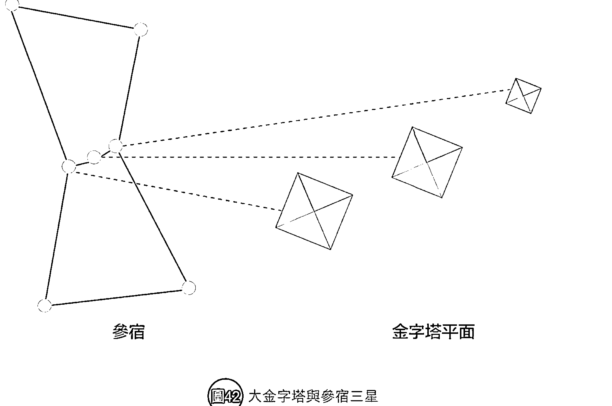

參宿之南有玉井四星、軍井四星、屏二星、「天廁」四星及「屎」一星，而參宿之右足形像踏足於玉井之中。古代占星家會在正月初入夜看參星，看其星光明、失色或搖動，以卜一歲內水旱情局。

玉井主水泉供廚房之用。軍井四暗星，古人稱為黑星，不見則軍中無水，軍隊移動。

屏二星在玉井、軍井與廁屎二宿之間，用以蔽廁星。此星暗，主天下疾疫，甚至天子寢疾。

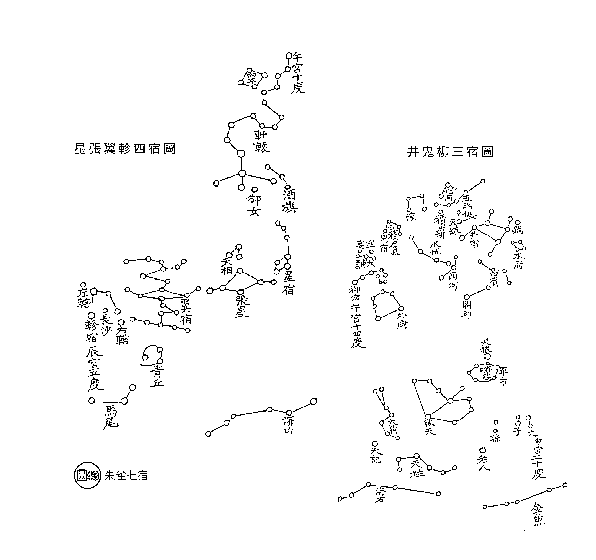

天廄四星變色，主人主腰下之疾。有彗孛犯星，防刺客。屎一星，在古代它是用作有機肥料，所以光明色白，主兵糧飽滿。

#### 朱雀七宿

南方七宿為「井、鬼、柳、星、張、翼、軫」，在十二次之分中南方為鶉首、鶉火、鶉尾。它也是形容南方「朱雀」之形象。

相傳秦國之祖先伯益發明造井，所以井宿也代表秦國，即今日西安至寶雞一帶關中大平原地區。

井為井木犴，犴為狴犴（粵音：幣岸），是相傳龍生九子之一，古代是刻在衙門及獄牢門口之神獸，因為它好訴訟。

井宿附近為「水位」、「北河」、「南河」、「水府」、「四瀆」、「積水」等星，可見都是與水有關的星宿。

井宿因為在玉井之東，所以古代也稱為東井。井宿八星，像一個方井之結構。占星上它為天之南門，是黃經所經之星空。井主水泉酒食，也為皇帝之親戚、女主之象。

南河、北河各三星在井之南北，南河之南為蠻夷，北河之北為戎狄。天罇二星主粥水酒食，積水有犯主水災，酒有酖毒。水府四星犯主江河溢，不見主河道不通。水位四星、四瀆四星皆主水道平安。

井之南有「老人」一星，又名壽星，司天下人之人壽。因為在中國北方，它的位置會在南方水平線附近，很容易被山樹等阻擋，一般在秋分之際才見到；但在中國南方例如香港，我們見老人星的時間比北方長，所以中國長命壽星之鄉多在南方，香港男女人均壽命也列入世界前茅。從科學之角度，南方不需要渡過嚴寒之冬天，可能對老人身體有利，所以長壽。

但在十二次中也有「壽星」，在角亢星附近，天球東南面，而井鬼宿則在西南方。從今天測實，從天球坐標，老人星與井宿是在同經內，屬雙子座坐標。但從地球坐標，也是我們目視觀測的角度，在北半球中國觀測角度之南方是可以看到的。由於老人星較近天球南極圈，二十八宿也不是繞天球黃道及地球坐標，它像一個獨立的橢圓形掛在天上，老人星在其西下方，所以才出見壽星在東南方十二次之現象。

鬼宿四星，又名輿鬼，是用車載着鬼之意。《玉曆》：「輿鬼為天屍」。鬼宿四星中間也有一個星雲，名積屍氣，占星認為「鬼宿為天目」，主視明察奸謀，積屍氣主死喪祠祭。鬼星大明五穀成熟，不明百姓流散。

柳宿八星「曲頭垂似柳」，柳為「柳土獐」。《天官書》：「柳為鳥注」，《左傳》注疏：「柳謂之咮，咮，鳥口也」，柳宿為鳥嘴。

柳為天之廚宰，主尚食和滋味。北上三星為酒，後五為亨宴大酺。柳又主雷雨。柳星主飲食，在現實上可能有關中國南方天氣和暖，物產豐富，植物穀物繁多，天然藥物多，更有海洋魚鮮供給，所以形成「食在廣州」等風氣。

星宿為「星日馬」，古代名為「七星」。《星宿歌》形容：「七星如鉤，柳下生，星上十七軒轅形。」七星又名天都，主文繡衣裳，又主急兵盜賊。星明王道昌，星暗賢臣退。《天官書》：「七星，頸，為員官」，《索隱》：「頸，朱鳥頸也，員官，喉也。物在喉嚨終不久留，故主急事也」。因為食物不能停留在咽喉，所以一定要很快走過，所以代表急事、突發之事。

軒轅十七星在七星宿之北，主雷雨之神，又為後宮后妃之舍，它是位於青龍七宿與白虎七宿中的星宿體。軒轅星為陰性，主后妃，星犯主有後宮之爭。

張宿六星，在七星東南，其中間形成梭角四星，左右各有一星。張為「張月鹿」，《天官書》：「張，嗉，為廚，主觴客」，郭璞解釋：「嗉，鳥受食之處」，也就是鳥之胃。四星像個胃，所以引申為製造食物之廚房，為火星。

張宿附近，正是與太微垣，是有長垣分隔，也有少微四星在長垣北。

翼宿共有二十二星：《天官書》：「翼為羽翮」，《說文解字》：「翮，羽莖也」，朱子注《月令》：「鶉無尾，故以翼為尾」，這是代表朱雀之翼。占星上為天之樂府，主夷狄遠客、附海之賓，主俳優（演員藝人），有星犯主南方南蠻災兵起。

軫宿四星，其宿旁左右有左轄、右轄，這是一架車之形象。《天官書》：「軫為車，主風」，《索隱》引《宋均》：「軫與巽同位，為風，車動，行疾似之也」。在二十八宿中，箕和軫都主風，箕為簸揚生風、用器械生風，軫為疾行生風、用速度生風，各有不同。

軫主冢宰輔弼，主兵戎，主死喪、生風、車駕備。軫南有長沙子一星，主壽命，長沙也是今日湖南長沙之地望分野。

### 中國占星系統

天上之星宿，都是永恆地依着各種規律及自然定律而運行。而人類在不同的地方發展各種文化，也發展出不同計算、推算占星之方法。

中國文化的其中一個優點，就是兼容並蓄、百川匯海，這就是為什麼今日中國經濟文化還可以在現代科技及西方文化衝擊下還可以發光發熱的原因。

中國占星的發展，也有類似的情況。中國占星大體可以分為兩個時期之發展系統，第一個是上古至唐朝時代的占星系統，第二個是在唐朝因為中亞之占星術引入中國與中國傳統之方法結合而成之「七政四餘」占星法。

#### ——傳統二十八宿占星系統——

第一個是由上古流傳至唐、宋之「傳統」古法占星，其系統以二十八宿為天圖上之總佈局，五星、日、月以及其他流星、彗星飛佈其間，它是依據真實的天文、天氣現象（包括冰雹雨虹雲氣等）為基礎，統計出歷史上各種災害、禎祥的事故而成。其中包括隕石飛降、日蝕、月蝕、五星聚於一方等現象。

這是用實際天文現象與地上發生之禍害禎祥比對的統計結果，但其中沒有用黃道十二宮。這方法最早之驗證見於西漢約公元前一世紀的馬王堆漢墓之《五星占》書。

中國傳統的占星系統是獨立從本土文化中發展出來的，它是用二十八宿作為天上各星官的基本系統。

前文所述，二十八宿最早見於戰國曾侯乙墓內木箱之上。而有關流星占卜之圖文則見於馬王堆漢墓中。《史記·天官書》已有中國最早一個有系統之天星分佈記錄。

而占星之吉凶，是基於天文觀測天星上之變化，有星聚於某星或有客星、流星犯某官某星，便用以推斷其吉凶。而這一套占星更進一步驗證一些自然現象，包括冰雪、地震、洪水、動物異動等，對該地區之政治人民的影響。

在古代，一個政權之改變以至帝皇之更換，往往都會引發一些動亂、內戰、內鬥以至血腥死亡事件。但在今日，不同黨派政權更替及某政治領導下台，也是一件非常平常、和平及非血腥之事。所以，古今星變影響類同，但事件演變有異。

這套占星方法，是用實際天文觀測而作推斷，而以推示帝皇家國及政治演變為主，其在唐代之後並未因「七政四餘」之出現而衰亡，不少典籍都有留傳下至今。其中在唐代所著之《開元占經》，被藏於一個金佛之「腹藏」內，在明朝萬曆年間有挹玄道人為佛重新裝金身而得此在唐宋已沒之書。此書為印度人瞿曇悉達所集成，他曾任過大唐之太史監。他雖是印度人，但此書所錄皆唐以前歷朝占星之結果，包括殷商、春秋、戰國時出名占星家——商代巫咸、齊國甘公、魏國石申等之記述。但是七政四餘中之由中亞傳入的羅睺、計都等虛星都未記錄。

這套系統之注作，包括北周時期（公元五世紀）庾季才所著的《靈台秘苑》，及在唐代瞿曇悉達所著、在明代一古佛像中尋回的《開元占經》，還有明嘉靖年間洞微子所著的《天文示斯》。但現代人礙於迷信科學及意識形態，而未有研究這些著作的「科學性」。

這套系統的計算坐標，是以傳統二十八宿為基準，二十八宿中，又以東方青龍七宿之首的「角宿」為基準。角宿有二星，其中「角宿一」為天官中最明亮的星之一，即今日天文學上處女座之 Spica 星（恆星編號為 HIP65474）。

這套占法，是以五星日月在「侵犯」二十八宿中某宿而推算出各種吉凶結果，也以五星中某星辰相會以及日月在哪個宿「相蝕」來作推算。它也以一些風、雷、雨、電、雹、虹、洪、旱、地動等自然現象作為「徵兆」，以推算人間各種經濟、政治、軍事活動。

#### ——七政四餘系統——

古老相傳，「七政四餘」是由道家八仙之一的張果老所發明，他著有《果老星宗》一書。但今人考證，這是後人用其名之偽作。這是中國古書常常出現之現象，因為「托古」名人是可以增加此書之名氣，幫助其推廣及流傳。

雖然作者並非其人，但書之內容則仍有參考價值。這套方法與今日西洋占星系出同源，但西洋占星只用七星加三王占算，而中國占星則有不少其他虛星、神煞、叢辰。

所謂「七政」是指地球以外所見日、月、金、木、水、火、土七星，「四餘」是指四顆看不見之虛星——羅睺（Rahu）、計都（Setu）、月孛、紫炁。羅睺、計都二詞來於梵文，此是從中亞印度傳承而來。如果《開元占經》之著作時間準確，甚至可以推測，直到唐玄宗開元年間，七政四餘還未傳入中土，或未成為主流占星之派別。《開元占經》內載有「都利聿斯經」之引文，《新唐書·藝文志三》有「都利聿斯經」二卷，相傳唐貞元中，有都利術士李彌乾傳自西天竺（今日巴基斯坦）；有未署名之《星命溯源》，內注有張果與李橙問答之「果橙問答」一文；宋元之間，有遼耶律純所著《星命總括》。

此派之承傳，在宋末元初之時，因戰亂而受到很大破壞。到了明代初年，由於缺乏典籍，朱元璋並不受意識形態的影響，下令把其死敵、前元朝大內所藏之回回（穆斯林）占星書籍翻譯成中文《天文書》。

但正如唐朝一樣，每到朝代安定下來，朝廷便又將天文之學視為禁臠，由朱元璋下令從回回占星書翻譯而成的中文書，也是只歸朝廷使用的，明朝的《大明會典》更是以律例形式明文禁止私人修習天文的。

明朝占星之高潮，出現在明中葉期間。當時，先是北有瓦剌入侵，之後東南有倭寇之亂，西南又有少數民族叛變，國不安靖，社會不免對「預測未來」之術興趣增加。在不問蒼天問鬼神的心理之下，朝廷對天文占星研究有所放鬆，占星學有復興之勢。萬民英撰有《星學大成》，又有《鄭氏星案》等書面世。加上此時有西方傳教士來到中國，也帶來西洋對天文觀測等知識，計算行星軌道時較只用古法「加籌碼」的做法更加準確，因而更令人信服。

到了清康熙時期，欽天監內分為用回回曆和西洋教士用的西洋曆法兩派，兩派常常互相爭論。直至在一次預測中，西洋曆派與回回曆派各自預測日蝕會出現的時間，結果因西洋測量更準確而確定了使用西洋測量之法，回回曆學派由此而衰敗。

西洋學派雖然在測量天象上非常精準，但由於西洋學派人士大部份都是天主教之修士，因此他們對占星學是存在着偏見的，占星學在欽天監內也因此而式微。

「七政四餘」占星系統以年、月、日、時為基礎，建立十二星宮，與西洋占星相同，但是加配以傳統之二十八宿及各種非真星之「虛星」、陰陽五行之變化等概念。此法主要用於以個人出生時間來計算祿命，但也有現代西方占星家用來計算一些國家大事及禍害之事。

鑒於此法需要有「時辰」計算，西方占星家在占算某國家之演變時，也要以其立國之時為基礎來計算，但是面對一些有千年歷史之城市，或者一個地方出現常期旱災，這就很難定立一個時辰來占算了。

到了近代，由於天王星、海王星、冥王星之發現，近代占星家吳師青更把此「三王」星加入「七政四餘」系統中，作為占星之基礎，這點是合乎占星理論而並無矛盾的。（見後文「第 X 行星」段）

### 星圖十二宮

傳統七政四餘之占算，是以某年、月、日、時為基礎，因而定出一個星盤。此星盤把周天分為十二宮，一般沿東西方向把中間劃分開，東在左而西在右，前方為南而盤底為北方。

此十二宮以黃道帶從東方地平線升起，逆時針方向升至南方為「中天」黃道最高點，再而轉至西方入地。東西地平線下為目視不見之星空。上述方向以傳統中國在北半球來計算，在南半球則另有方法。

星盤中之十二宮，從命宮起為一宮，逆時針計算，第二宮為財帛宮，第三宮為兄弟宮，第四宮為田宅宮，第五宮為男女宮，即子女宮，第六宮為奴僕宮，第七宮為命宮之對宮，即夫妻宮或妻妾宮，第八宮為疾厄宮，第九宮為遷移宮，第十宮為官祿宮，或事業宮，第十一宮為福德宮，第十二宮為相貌宮。

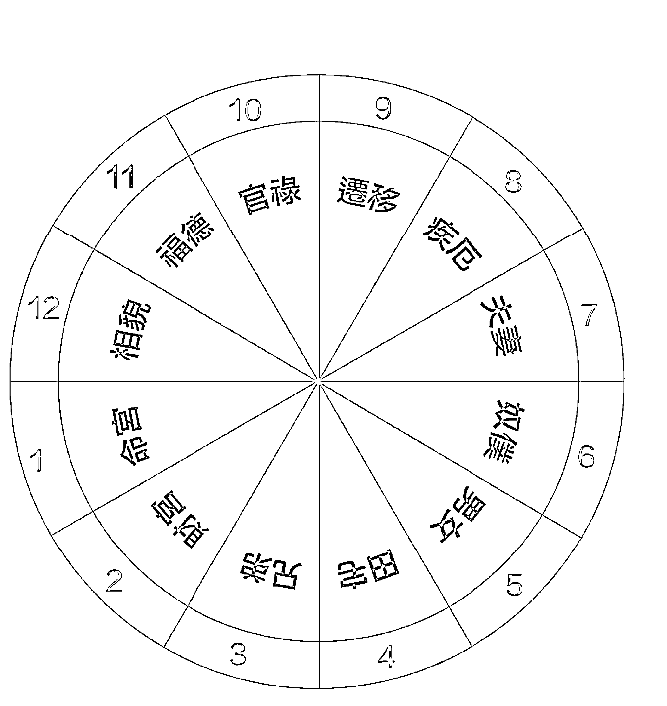

### 命宮

今日一般人定本命星座，是以出生月日來分宮位。例如西曆 3 月 5 日為白羊座（戌宮），這是指太陽在當時之宮位。所以一般坊間占星以「出生月太陽所在的位置」為命宮。

中式七政四餘占星，首先則是以「月」及「時」定「命宮」。在某個占算時辰，在天球黃道十二宮中正位於東方地平位置的宮位就是命宮。即是說，命宮是指某人某事在某時辰占算時，在東方地平線處由下向上「浮升」之黃道星宮。在精算的西洋占星中，也有此命宮，名字就稱為「浮升」（Ascension）。

現在香港流行的廣東通勝（通書），第五頁有一個「立命定局真法」圖表，就是一個簡化的推命宮方法。它是利用二十四節氣及生時來推命宮。「二十四節氣」是基於一年太陽黃道來分配成二十四份時間，所以間接是以太陽所到的座標來推命。例如，「大寒後生人作正月」，大寒以太陽曆算一般是在西曆 1 月 20 日左右，是太陽從子宮（水瓶座）步入亥宮（雙魚座）0 度之時。所以如果某人是於大寒後雨水前（西曆 1 月 20 日至 2 月 20 日左右）下午 4 時出生，從圖中看是以未宮為命宮，也就是其人出生時，東方地平線之宮位為未宮巨蟹座，而其時太陽則在亥宮雙魚座。

而傳統之「捷法」、「簡法」，是以從子宮水瓶座起逆數至出生之月，再從此宮起生時，順數至卯時止。例如三月（春分後）亥時，正月起子宮，逆數二月亥宮，至三月戌宮，再從戌宮起亥時，順數亥宮起子時，子宮起丑時，丑宮起寅時，寅宮起卯時，則命宮在「卯宮」「天蠍座」。此法是需要清楚了解命宮是在正確之二十四節氣之位置。此外，數至「卯時」是因為，傳統上在中國北方大部份地方，太陽及黃道帶在一年中的大部份時間都是在卯宮升起。如果某人在南半球，在夏季，其黃道帶可能會在寅宮；如果是在北半球，在比中國北方緯度更高的地方，在冬季，其黃道帶可能在辰宮。

所以這是因人因地因時而異。這是一個有「天文」「地理」精密的術數計算方法，與紫微斗數等用「虛星」算命不同。

#### 表6：立命定局真法橫推直看表

例如某人是在西曆5月中出生，未過20日，太陽正位於黃道「西宮」之位，西

| 立命定局真法橫推直看 |
| :--- |
| 大寒後生人作正月立命 |
| 雨水後生人作二月立命 |
| 春分後生人作三月立命 |
| 穀雨後生人作四月立命 |
| 小滿後生人作五月立命 |
| 夏至後生人作六月立命 |
| 大暑後生人作七月立命 |
| 處暑後生人作八月立命 |
| 秋分後生人作九月立命 |
| 霜降後生人作十月立命 |
| 小雪後生人作十一月立命 |
| 冬至後生人作十二月立命 |
| 卯寅丑子亥戌酉申未午巳辰 |
| 丑子亥戌酉申未午巳辰卯寅 |
| 子亥戌酉申未午巳辰卯寅丑 |
| 亥戌酉申未午巳辰卯寅丑子 |
| 戌酉申未午巳辰卯寅丑子亥 |
| 酉申未午巳辰卯寅丑子亥戌 |
| 申未午巳辰卯寅丑子亥戌酉 |
| 未午巳辰卯寅丑子亥戌酉申 |
| 午巳辰卯寅丑子亥戌酉申未 |
| 巳辰卯寅丑子亥戌酉申未午 |
| 辰卯寅丑子亥戌酉申未午巳 |
| 乙未年排定小限局 |
| 子丑寅卯辰巳午未申酉戌亥 |
| 年年年年年年年年年年年年 |
| 生生生生生生生生生生生生 |
| 宮宮宮宮宮宮宮宮宮宮宮宮 |
| 立立立立立立立立立立立立 |
| 命命命命命命命命命命命命 |
| 小限小限小限小限小限小限小限小限小限小限小限小限 |
| 排排排排排排排排排排排排 |
| 在在在在在在在在在在在在 |
| 巳午未申酉戌亥子丑寅卯辰 |
| 午未申酉戌亥子丑寅卯辰巳 |
| 未申酉戌亥子丑寅卯辰巳午 |
| 申酉戌亥子丑寅卯辰巳午未 |
| 酉戌亥子丑寅卯辰巳午未申 |
| 戌亥子丑寅卯辰巳午未申酉 |
| 亥子丑寅卯辰巳午未申酉戌 |
| 子丑寅卯辰巳午未申酉戌亥 |
| 丑寅卯辰巳午未申酉戌亥子 |
| 寅卯辰巳午未申酉戌亥子丑 |
| 卯辰巳午未申酉戌亥子丑寅 |
| 辰巳午未申酉戌亥子丑寅卯 |

七政經緯書
立命小限
八十五
真步堂

洋占星便視為金牛座出生之人。但實際太陽是在天球白羊座之位置，他是在下午二時出生，則為未時出世，他出生時東方的星座為「巳宮」，這是他的「命宮」，西洋占星視為處女座，但實際上天星可能在獅子座。

這是一個定命宮的簡法，因為任何一個曆法，都只是一個最近似太陽月亮運行規道的「版法」，但實際星體則是依一個橢圓形的軌道而運行的，而運行的速度也可以有時候快、有時候慢，所以某個節氣所落在的實際時間，每年都會有小小的差別。例如，冬至於大部份年份都出現在12月23日，是聖誕節即12月25日的前2日，但是也有個別年份，冬至是出現在12月22日。所以，如果一些人或事在每月20至24日左右發生，占算時很容易是在兩個宮位其中之一，用上述的簡法就會現錯誤。更精準的方法，可以查星曆之圖表及用電腦開盤，網上有收費及免費的多種程式可供選擇。

在今日這個電腦流行的年代，原先困擾古代人之天星「定位」問題，在西方已有精準之計算，有不少結果是比對了美國太空及航空總署（NASA）的天文資料而成的。但是，這些西方之黃道十二宮，不少是沒有中國之二十八宿佈局，而且因為歲差的關係，有不少古代的「步天歌」星曆已不可用，使用時要加上現代「步天歌」之鈐局，兩者結合才能正常使用。

大家可以找台灣的 Moria 七政四餘電腦程式，與香港蔡真步堂蔡伯勵先生每年出版的「七政經緯曆書」中之「黃度宿度鈐表」對照使用。

### 標準七政四餘星圖

標準七政四餘星圖的格式，基本上是元代以後，因為受到從中亞引入的伊斯蘭占星（回回占星學）的影響而發展出來的，是在明朝所用之格局。在此之前有系統之星圖已不可考。

這個星盤之內容，也比現代星圖較複雜。它除了有黃道十二宮之外，也有十二次、十二辰之名。而每宮中有三十個小方格，代表每宮的三十度。而二十八宿的宿度則是刻入其中，黑色的方格代表某宿之初度開始數，至下一個黑方格前，則為該宿之宿度的闊度。三十度的計算，傳統上是以初度為第一度，第二度為「一度」，至「二十九度」為一宮三十度之末度，下一度則為下一個宮之初度。度之數法是逆時針計算，但十二宮子、丑、寅、卯、辰、巳、午、未、申、酉、戌、亥則是以順時針排列。黃道十二宮，水瓶座、雙魚座等則與西方星圖相同。

圖 46 是一個傳統的占星盤，這個盤之頁上有標明的是其年月日時八字及「化曜星」。在圓盤中共有九層。

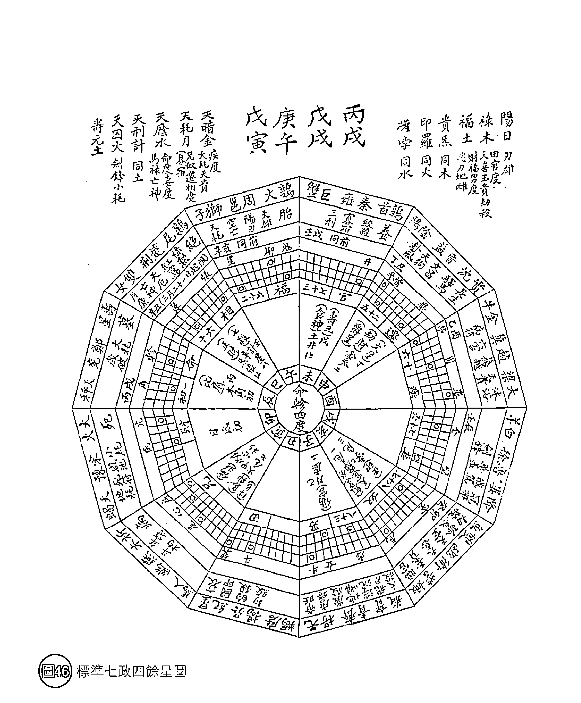

最內圓圈是標明占算者之命宮命度。
第二層是黃道十二宮之位置。
第二層是七政四餘二王所在的度數。
第四層是十二宮位：命宮、財帛宮、兄弟宮、田宅宮、男女宮、奴僕宮、妻妾宮、疾厄宮、遷移宮、官祿宮、福德宮、相貌宮。

#### 表 7：二十八宿屬性與宿度

| 宿 | 所屬 | 宿度 | 宿 | 所屬 | 宿度 |
| :--- | :--- | :--- | :--- | :--- | :--- |
| 角 | 木 | 11 | 奎 | 木 | 11 |
| 亢 | 金 | 10 | 婁 | 金 | 13 |
| 氐 | 土 | 18 | 胃 | 土 | 13 |
| 房 | 日 | 5 | 昴 | 日 | 9 |
| 心 | 月 | 8 | 畢 | 月 | 15 |
| 尾 | 火 | 15 | 觜 | 火 | 1 |
| 箕 | 水 | 9 | 參 | 水 | 10 |
| 斗 | 木 | 24 | 井 | 木 | 31 |
| 牛 | 金 | 18 | 鬼 | 金 | 4 |
| 女 | 土 | 12 | 柳 | 土 | 17 |
| 虛 | 日 | 10 | 星 | 日 | 9 |
| 危 | 月 | 20 | 張 | 月 | 18 |
| 室 | 火 | 15 | 翼 | 火 | 17 |
| 壁 | 水 | 14 | 軫 | 水 | 13 |

第五層是每宮有三十格，標誌着二十八宿所開始之度數，這也是每七十一年多要「校正」的「步天鈐」。
第六層是二十八宿之名字。
第七層是宮位之干支。
第八層是叢辰神煞虛星。
第九層是十二次、黃道十二宮及其分野之名。

二十八宿中每宿也分其屬性、宿度，分別為木、金、土、日、月、火、水。而雖然是四神平分，每神七宿，但由於每宿在天上所佔之度數有闊有窄，所以也是分佈不平均的。例如，太陽躔在星、房、虛、昴、四日宿，則稱為升殿；如果入午宮稱為入垣，又稱入廟。

### 七政恩用仇難

七政四餘與西洋占星的分別之一，在於金、木、水、火、土中又以傳統五行生剋來判斷其吉凶。

水星喜金，金星喜土，土星喜火，火星喜木，木星喜水，因為皆為五行相生。

日喜金水輔從，月喜火羅侍衛，以所喜者為「恩」。

金星怕火，火星怕水，水星怕土，土星怕木，木星怕金，因為皆為五行相剋。

日怕木炁，月怕土計，稱為「難」。

### 叢辰

七政四餘之法除了這基本星辰之外，它根據其占算之年干、年支、月份，以至用流年太歲（又稱歲駕）及其他一系列之叢辰等，變化出一系列的神煞虛星，這是中國占星獨有的特點。

今日之子平八字及紫微斗數等，皆由此等虛星演化發展而成。

這些叢辰多如牛毛，現把部份神煞列表如下。

#### 表 8：年干神煞

| 年干\星名 | 甲 | 乙 | 丙 | 丁 | 戊 | 己 | 庚 | 辛 | 壬 | 癸 |
|---|---|---|---|---|---|---|---|---|---|---|
| 文星 | 羅 | 計 | 金 | 火 | 金 | 炁 | 木 | 土 | 日 | 月 |
| 魁星 | 月 | 日 | 羅 | 計 | 火 | 金 | 水 | 孛 | 炁 | 木 |
| 科名 | 木 | 木 | 火 | 火 | 土 | 土 | 金 | 金 | 水 | 水 |
| 嗣星 | 月 | 水 | 炁 | 計 | 羅 | 火 | 孛 | 木 | 金 | 土 |

#### 表9:年支神煞

| 星名 | 子 | 丑 | 寅 | 卯 | 辰 | 巳 | 午 | 未 | 申 | 酉 | 戌 | 亥 |
|---|---|---|---|---|---|---|---|---|---|---|---|---|
| 爵星 | 土 | 金 | 土 | 炁 | 孛 | 木 | 水 | 火 | 土 | 金 | 金 | 火 |
| 產星 | 金 | 水 | 木 | 火 | 金 | 水 | 木 | 火 | 金 | 水 | 木 | 火 |
| 血支 | 木 | 土 | 土 | 木 | 火 | 金 | 水 | 日 | 月 | 水 | 金 | 火 |
| 血忌 | 日 | 土 | 土 | 月 | 午 | 未 | 寅 | 金 | 金 | 火 | 水 | 木 |
| 紅鸞 | 卯 | 寅 | 丑 | 子 | 亥 | 戌 | 酉 | 申 | 未 | 午 | 巳 | 辰 |
| 天喜 | 酉 | 申 | 未 | 午 | 巳 | 辰 | 卯 | 寅 | 丑 | 子 | 亥 | 戌 |
| 血刃 | 戌 | 酉 | 申 | 未 | 午 | 巳 | 辰 | 卯 | 寅 | 丑 | 子 | 亥 |
| 飛廉 | 申 | 酉 | 戌 | 巳 | 午 | 未 | 寅 | 卯 | 辰 | 亥 | 子 | 丑 |

#### 表10:月份神煞

| 星名 | 正 | 二 | 三 | 四 | 五 | 六 | 七 | 八 | 九 | 十 | 十一 | 十二 |
|---|---|---|---|---|---|---|---|---|---|---|---|---|
| 注受 | 子 | 亥 | 戌 | 酉 | 戌 | 亥 | 子 | 丑 | 寅 | 卯 | 寅 | 卯 |
| 值難 | 日 | 日 | 月 | 月 | 火 | 羅 | 水 | 孛 | 木 | 炁 | 金 | 金 |
| 月符 | 午 | 未 | 申 | 酉 | 戌 | 亥 | 子 | 丑 | 寅 | 卯 | 辰 | 巳 |
| 月廉 | 申 | 酉 | 戌 | 亥 | 子 | 丑 | 寅 | 卯 | 辰 | 巳 | 午 | 未 |
| 月殺 | 戌 | 巳 | 午 | 未 | 寅 | 卯 | 辰 | 亥 | 子 | 丑 | 申 | 酉 |
| 天耗 | 子 | 寅 | 辰 | 午 | 申 | 戌 | 子 | 寅 | 辰 | 午 | 申 | 戌 |
| 地耗 | 酉 | 亥 | 丑 | 卯 | 巳 | 未 | 酉 | 亥 | 丑 | 卯 | 巳 | 未 |

又有以生年支起星，一太歲，二太陽，三喪門，四太陰，五五鬼，六月德，七歲破，八龍德，九白虎，十天德，十一吊客，十二病符，合稱太歲（又稱歲駕、劍鋒）十二神。例如丙申年，申宮是太歲，數至寅宮是歲破，如此類推。

除此以外，別有一系列叢辰星，包括天雄、地雌、年符、天狗、吊客、大耗、小耗、孤辰、寡宿、咸池、的殺、國印、唐符、歲殿、天經、地緯、天馬、地驛、劫殺、亡神、卦氣、斗杓等。

### 占星之用

七政四餘占星之法有四種用途。第一種為個人命盤（Natal Astrology）。第二種為因問事而占之法（Horary Astrology），這種有點類似中國梅花易法，以個人問事之時而用觸機定命盤來占算。第三種是用以占算不包括個人之國家軍政大事，包括古代內宮后妃之禍、下臣逆亂、軍事戰爭、天災人禍等事（Mundane Astrology）。

這三種占星都是以「故有」之時間來占算，在命運上似乎欠缺積極性。

第四種是以選擇吉利之時間，作為行軍、出征、狩獵、打官司、動土工程、建屋、入宅、墓葬等大事之起動之時。這也是古代「日家」、「建除家」以至今日「三元玄空」風水「擇日」之基礎。今日一般擇日都以通勝內之「建除」、「二十八宿」及干支為基礎，而最上乘的擇日功夫，正如玄空派祖師蔣大鴻所述，是以「真天星」七政四餘擇日。

第一種占算個人出生命盤，在西方及近代非常流行，因為人總是最關心個人之命運，個人占算在商業上有一定之市場，是大部份民間占星家主要收入之源。

在西方，占星是除了塔羅牌及水晶球等非計數、非系統占卜外唯一的占算方法。但在中國，個人算命之方法非常發達，如四柱八字、紫微斗數等，種類繁多。以中州派之承傳，紫微斗數算命已是非常精準，所以本書也不想在此詳述。

第二種因事問卜之術，中國最古老之占卜系統——周易，已有幾千年之歷史，仍生生不息。此外更有多類衍生之法，包括六壬術、梅花易數等，林林總總，多不勝數。

第三種占算國運禎祥、天災人禍之術，本來是國家朝廷之內事，史書上自《左傳》、《史記》，以至《晉書》等，都有記載有關君臣之討論。此外以《開元占經》所示，天星占算都主要以此為骨幹。但因宋、元之間典籍散失，明初建國時都以採用已覆滅之元朝內典中由波斯、回回（伊斯蘭）之著作翻譯為本。明中葉後，西方傳教士來華，以其天文計算精準而得到朝廷君臣信任，泰西之命盤方法得以流行。

第四種用占星擇日，古代礙於對天文計算未能準確，所以往往只依前人之遺作推算，但由於天球移動形成之歲差，往往推算結果與實際天星情況出現差錯，其用法更未合乎古人之「科學」原則。

在今日，西方占星所用之太陽度（Tropical Ephemeris），因為要省去不時要改曆之麻煩，正如表 2 所示，太陽入黃道十二宮之時間與太陽入真正星座之時間有誤差近一個月，也就是近一個宮位。所以今日印度占星堅持用恆星曆來計算真實之星座位置及真黃道十二宮，在學理上是比較合理的。

中國傳統之占星，不用黃道十二宮而用二十八宿定位，這與印度占星異曲同工，合乎天體運行之真相。但由於明代以後，中國採用西方之計算，近代坊間之占星曆所用的皆為西方瑞士占星曆及美國太空及航空總署（NASA）計算真星之太陽曆，所以占算時如果不換算成真恆星曆，可能出現誤差。

第一、二及第四種占星，它們都是比較合乎個人用途，及需要有「年、月、日、時」作為基本資料用以占算，但是第三種占算國家大事，有很多時未必能有準確的時辰，可是現代西方占星家要占算此等事時，也是照用「年、月、日、時」之星盤。如果一個地區廣泛有旱災，因為旱災要多個月應雨不雨才形成，那便很難確定事件發生之時辰。又例如，要占算某城市之吉凶，回回及西法要以該城建城時立一個命盤來作基礎，但是有些歷史城市有幾百年至幾千年之歷史，很難找到確切的建城時間，也很難判斷某一個城市之命盤是否準確。

對於第三種占星，對一個國家之占算，現代西方之占星家都傾向以該國家「立國」之一刻定立一個「命盤」，以該命盤作為占算之基礎。在回回（阿拉伯）占星中，也有用一個新政權軍隊入城之時作為一個城市命運之開始。

例如美國之國運，據此方法，是要用美國於 1776 年西曆 7 月 4 日在費城發表獨立宣言的時辰所定之命盤占算。但是這方法用於英國這個有古老歷史的國家時，便出現了問題。西方占星家提出了四個可能作為英國命盤的時間。

1. 英國埃格（Edgar）在公元 973 年西曆 5 月 11 日加冕成為英倫第一位國王。
2. 公元 1066 年西曆 12 月 25 日，征服者威廉（William The Conqueror）加冕之時。
3. 公元 1707 年西曆 5 月 1 日 0 時，英國吞併蘇格蘭，成立大不列顛國之時。
4. 公元 1801 年西曆 1 月 1 日 0 時，大不列顛國吞併愛爾蘭，成立聯合王國（United Kingdom）之時。

其中，由於年代欠遠，前兩個時段都沒有加冕之準確時間。

有些情況下，這種時辰的選擇更是模糊不清，例如 1911 年辛亥革命成立中華民國，是應該以武昌起義那天晚上打響了第一槍的時間算，還是以孫中山先生宣佈成為臨時大總統之時計算呢？也有不同的意見。

### ——七政三王之性質——

太陽、土星、木星、水星屬陽，太陰、金星屬陰。水星遇陽星則陽，遇陰星則陰。又水星在太陽前出為陽，在太陽後落為陰。

#### 太陽（Sun）

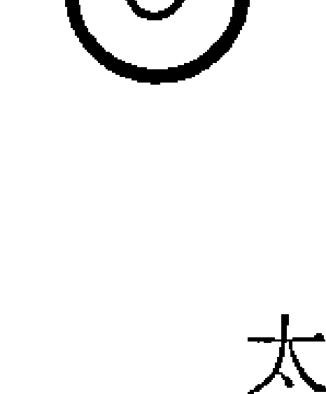
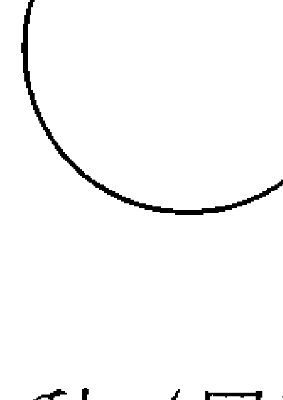

太陽是太陽系之中心，從地球觀測，繞一周天約為 365 日 25 分 50 秒（回歸年 365.242190 日）。太陽的直徑約為 1,392,000 公里，體積約為地球的 1,300,000 倍。中國曆法把一周天分為 24 個節氣，所以每節氣約為 15 天 5 小時多。

太陽日宿，為火之精，為人君之象，為父，為政治領導人。古人以它生於蓬萊之間，出入扶桑之內。它也代表國家政權、皇家貴族、上司、尊榮、成功、名譽，也代表政治領袖、大財團、宗教領袖、神廟、老闆。

大陽之性為熱而燥，主晝日。在物質上主金與寶石、銅。

占星中，廟旺於午宮獅子座（第五宮），與寅（人馬座）、戌（白羊座）為三合局，也為子午卯酉「四宮格局」之一。

太陽與太陰或五星三合、六合則吉，相沖、相會或二弦相照則凶。太陰與太陽相會至上弦，性潤，在水宮，主雨雪；上弦至望，性熱；望至下弦，性燥；下弦至再會，性亦是寒。

太陽的正面形象，代表名譽、名牌、大影響力，它的負面形象則是驕傲、自大、自我中心、固執及壓迫。所以當日蝕發生在某國家之分野時，往往會影響這個國家之政治結構，包括「內閣或總統辭職下台」及其他新舊領袖更換。

太陽還代表家族中之父輩、父親、丈夫及男朋友。

太陽出現黑子時，占星家認為自然水會出現混濁，環境中會出現風沙，以及會爆發戰爭。太陽所影響之國家，會變得自大、驕傲及自我中心，不理別國之反應。

太陽在身體上代表心臟、背部脊柱、循環系統、精液、眼睛、脾臟、聰明。

其缺點是容易輕浮、懶惰、沉溺壞習慣、對外人比身邊人更好、推搪等，表示疾病時為眼睛、腦、白內障、血等方面的病。

#### 太陰（Moon）

月亮，中國傳統又名太陰，是地球唯一的衛星，距離地球 384,400 公里，是離地球最近的天體。它的直徑只有 3,474 公里，體積相當於 0.02 個地球。它繞地球一周約為 29 日 12 時 44 分（29.530 日）。而由於它只有一面面對地球，在太陽照射下，每月會出現「朔」（月缺）及「望」（月圓）之情況。

月亮在與太陽相合後出現時稱為新月、眉月、月相。古人定每月初一為朔日，一般是看不見月亮之日。而當地球處於太陽及月亮中間、月亮出現滿月之時，就是望日了，即為陰曆每月十五。

但由於一年為 365 日多，一年並非有十二個整齊的「朔望」月，而是十二個月多，故此古代曆法家定立了「閏月」之方法，每約二至三年多一個閏月，十九年共加七個閏月，便使日月軌道並合。而十九年加七閏，也與約二十年土木星相會一次的時間相近，所以，術數的「三元九運曆」上定立了二十年一個運，也與此有關。

圖47 月蝕圖

由於月亮每 29 日多繞地球一周，所以有理論認為「三垣二十八宿」中之「二十八宿」，便是以月亮在每晚所停留、留宿的位置附近之星宿命名。因為二十八除以四便整齊分配七星於四獸之中。

但是今日月亮每晚停留之位置，與二十八宿並不吻合，而是有所偏移。這正好顯示了「歲差」。黃道之北極位置，在幾千年間已有所偏移，也可以間接證明二十八宿之定立由來，已是很古老的歷史了。

太陰為水之精，為母，為后、妃、妾，也為平民百姓、聚眾，代表女性、公眾利益、貿易、農業、液體、雜貨、漁業、航海、運輸、紡織、空姐、食店、社工、家庭、洞穴。

太陰之性質帶寒而濕，屬夜。

太陰的入廟之宮在未宮巨蟹座（第四宮），與亥宮（雙魚座）及卯宮（天蠍座）形成三合局，也為辰戌丑未「四宮格局」之一。

在金屬方面，太陰代表金銀及真珠；在貨品方面，代表米、奶、蜂蜜、鹽、花果。

其人表現敏感、反應敏捷、記憶力強，負面則是搬弄是非、易受環境影響、投機、神經質。

在身體上，代表胸、乳、胃、腺體、男性左眼、女性右眼、精神心理狀態、女性生育器官、消化系統、月經。其疾病則是分泌失調、癲癇、精神問題、視力不明、抱怨。

太陰的影響，在於普羅大眾以至整個社會。

#### 水星（Mercury）

水星是最近太陽的行星，它的直徑只有 4,878.4 公里，是太陽系八大行星中最小的一個，僅大於已被改稱為矮行星的冥王星。它繞日一周也只有 87.949 日，即約 88 日。它的體積是地球的 0.056 倍。

由於在地球觀測，水星是在太陽之附近，最遠是約 27.5 度，不會超過一個宮位。而當它在黃道帶太陽之前方，它便會在黎明日出前在東方地平線出現，但當太陽上升，其光芒便會把水星遮蓋。同樣情況，當它在太陽之後方，它便要在日落後在西方出現。

在中國北方，由於緯度較高，而水星的一個太陽周又只有 88 天，所以觀測時一年中會出現多次逆留順轉變，加上它只會在東或西之地平線附近出現及隱沒，所以古人以其流轉不定像「水流」一樣，再加上其他驗證，故而以「水」定其五行。

由於古人觀測時，認為它總是處於不超過太陽 15 度的範圍內，相當於「一辰」之距離，所以古人又稱水星為「辰星」。不過，現代的測距則發現，水星最遠處於太陽附近 27 度多，古人的測算有誤。

圖48 黎明出現，星在日前之宮（水星或金星）
圖49 黃昏出現，星在日後之宮（水星或金星）
圖50 月圓之夜，看不到水星
圖51 最近地球之時，也看不到水星

由於它是如月亮一樣反射太陽之光，所以在月圓之夜，因為地球處於月亮與太陽之間，因此便不能看到水星。但是在它最近地球時，由於其黑面向地，我們亦很難看見。

一般來說，水星是出現在近地平不高之處。這地方容易因為煙霞甚至小山、高層建築物所阻，所以觀測不易。因此，古代認為「水星」是一顆吉凶無定的星，要視乎它與其他星辰之關係，才能定其性質。

古人因此以水星正色為「黑」，這是指水星易於「隱」形不見。其性為「智」，居玄武之位，主歸藏之權，主智慧。《五行大義》云：「其位北方，主冬，黑帝之子，所主為刑，所向之邦，政酷」。

水星以巳宮室女座為本宮，為正廟，居申宮雙子座為樂宮。

水星為第四宮及第六宮之主，它由於多變，屬性不定，遇熱則熱，遇寒則寒，遇濕則潤，遇燥則早。主氣生風。遇陽星則為陽，遇陰星則為陰；於黎明出為陽，於黃昏現則為陰。

水星代表智慧、知識、語言、演講、通訊、出版、傳媒、出版商、編輯、雜誌、書籍、電視、交貿合約、文章、電腦程式、電台、科技組織、電視台、娛樂、商業、貿易、交通、運輸、火車、輪船及各種交通運輸工具。

在物質上，代表水銀、綠寶石、瑪瑙、鹽、蜂蜜。在植物中，代表豆類和綠色蔬菜。

水星對於天氣有特別反應，其吉凶無定，會視其所會之星辰，而出現洪旱、風雷等現象。其中水星逆行影響較大。

水星之性質為想像力、聯想及洞察力量、語言表達力、智力觀察力、手藝、推理、傳達，在人際關係上代表親切、厚道、理想、快樂。負面形象，則為放縱、自負、好色、懶惰、膚淺、浪費、俗氣。

在身體上，代表神經系統，腦、手、耳、視力、嘴巴、舌頭、呼吸、肺臟、荷爾蒙。疾病方面，為神經衰弱、失憶、頭痛、口吃、呼吸問題、神經錯亂。

#### 金星（Venus）

金星是太陽系中第二內行星，它是星空中光芒僅次於月亮的第二大亮星。

它的直徑是 12,103.6 公里，體積是地球的 0.866 倍，也是最接近地球體積的行星。它繞日一周為 224.7 日，約 0.615 年。它的繞日軌跡較水星遠，在地球觀測，不會超過 47.8 度，約為一個半宮位。

它也和水星一樣，會在黎明及黃昏初出現，由於古人以其光為「白」色，故又稱「太白」星。而五行中金屬打做出來未被氧化前，大部份為「銀白」色，故此五行以白為「金」之色，這與金星相近，故以其命名。其性為「義」，居白虎之位，主收斂之權。《五行大義》云：「其位西方，主秋，白帝之子，以司兵凶」。為將軍之象，為刑律。

金星廟旺於辰宮天秤座及酉宮金牛座。它屬於「陰」星，屬夜，性為濕潤。古人視金星為吉星，性質溫和。它為第九宮及第十二宮之主。

如人身命逢之，在廟旺旺宮，主文章秀麗，專主兵革大權。喜與水木相會，大吉慶。忌逢計、孛、羅，忌夜土、畫、火，主阻滯。忌入卯戌火宮，喜亢宿為正廟，室宿為正旺，金牛酉宮胃宿為樂宮，牛鬼亢婁為升殿。

當金星遇上火星在第七或第十宮，往往出現罷工及戰爭之禍。

金星代表女性、妻妾、女兒，男人則以金星為妻星。

金星為「兑」，也為「悦」，代表愛情、性愛、婚姻、享樂、藝術、音樂、美學、才藝、娛樂、電影、歌舞、戲劇、演員。事物上代表舞廳、娛樂場所、酒店、飯店、賭場、體育館、攝影室、食肆、花園、苑圃。

金為象為「決」，它也代表法律、刑律，包括法官、法庭、陪審員、律政司等。

金為「庚辛」，也代表金融、流通貨幣、金銀證券等財經系統。

身體上，金代表生殖器官、肺、喉、腰部、腎、頸部、兩頰、下巴；疾病包括感冒、性病、愛滋病、黑死病、腎病、呼吸病、扁桃腺及甲狀腺病等。

物質上，它代表銀器、鑽石及各式珠寶飾物、糖果、藝術品。植物上，代表棉花、絲綢、香料、花、果等。

其缺點是傲慢、專橫、固執、武斷、佔有慾、色情、貪婪。

#### 火星（Mars）

火星又名熒惑，是比地球更遠離太陽的第一顆外行星，也是太陽系的第四行星。它的直徑為 6,779 公里，體積是地球的 0.151 倍。它繞日一周為 686.97 日，約為 1.88 年。

從地球上觀測，火星現火紅色，古人以其正色為赤紅色，五行主「火」，加上徵驗，故以五行之「火」配其名。其性為「禮」，居南方朱雀之位。《五行大義》云：「其位南方，主夏，赤帝之子，五星之伯」。

火星廟旺於卯宮天蠍座及戌宮白羊座。屬陽。它為第一宮及第八宮宮主。

火星不管在中外，都被視為凶星，其性燥熱，但卻屬夜，其性異常（火星性熱屬夜，夜寒則其性變成溫，所以只要有好的配合，凶星也可變吉）。

古人視火星為災星、凶星，其所到之方位，會有兵亂、賊喪、饑疾等事出現，也可能出現破壞、火災、爆炸、暴亂、戰爭、軍事政變、暗殺、犯罪、意外、謀殺、強暴、恐怖主義、通漲、暗亂、死於非命等。

事物上，主鐵、有毒之草木、禽獸、反覆爭鬥。

火星代表戰爭、刑律、罪惡、爆炸、火災、意外、血肉、外科手術、叛變、偷盜、突發事件、恐怖襲擊，它的徵兆包括軍隊、三軍指揮、警察、工程師、犯罪集團、消防隊、外科醫生、牙醫、屠夫、間諜。它也代表陸空難、路崩、地雷、颱風、火山爆發、山火。

火星又代表野心、魄力、權勢、建設、鬥爭、死亡。還代表慾望、獸性，也有勇敢、進取的含義。

它的缺點是任性、易怒、反常、好爭吵、好鬥。

在身體上，代表肌肉、外生殖器、頭、臉、紅血球、膀胱、運動神經、衝動、野性。疾病上則為發燒感染、手術、肌肉病痛、生殖系統病、出血、傳染病、頭痛、發炎、刀傷、燙傷。

器物方面，代表銅鐵、雞血石、刀劍、火、爐灶、辣椒。

#### 木星（Jupiter）

木星是太陽系內第五行星，它的直徑有 139,822 公里，是八大行星中最大的一顆，其體積更是地球的 1,321 倍。它的四周有 60 多個各種衛星及隕石環，其中之木衛三（蓋尼米德 Ganymede）的直徑為 5,268 公里，比水星還要大，是太陽系中最大的衛星。木星更是繼月亮、金星之後星空中亮度第三的星體。

木星繞日一周為 4,332.59 天，約為 11.86 年，古人約之為 12 年。這也就是十二地支「子、丑、寅、卯、辰、巳、午、未、申、酉、戌、亥」的來源。所以古人以地支配十二「太歲」，古代並分配為「十二次」，以木星稱為「歲星」。而十二太歲又從二十八宿中抽取其中位所代表之「宿獸」而形成十二獸。但「太歲」其實是一顆虛星，它的位置與真實的木星位置，是構成「六合」的關係。

#### 表 11：太歲與木星關係

| 農曆月 | 十二辰 | 太歲位置 | 十二生肖 | 木星大約位置 | 黃道十二宮宿名 | 十二次 |
| :--- | :--- | :--- | :--- | :--- | :--- | :--- |
| 十一 | 子 | 子 | 鼠 | 丑 | 水瓶 | 星紀 |
| 十二 | 丑 | 丑 | 牛 | 子 | 摩羯 | 玄枵 |
| 正 | 寅 | 寅 | 虎 | 亥 | 人馬 | 娵訾 |
| 二 | 卯 | 卯 | 兔 | 戌 | 天蠍 | 降婁 |
| 三 | 辰 | 辰 | 龍 | 酉 | 天秤 | 大梁 |
| 四 | 巳 | 巳 | 蛇 | 申 | 處女 | 實沈 |
| 五 | 午 | 午 | 馬 | 未 | 獅子 | 鶉首 |
| 六 | 未 | 未 | 羊 | 午 | 巨蟹 | 鶉火 |
| 七 | 申 | 申 | 猴 | 巳 | 雙子 | 鶉尾 |
| 八 | 酉 | 酉 | 雞 | 辰 | 金牛 | 壽星 |
| 九 | 戌 | 戌 | 狗 | 卯 | 白羊 | 大火 |
| 十 | 亥 | 亥 | 豬 | 寅 | 雙魚 | 析木 |

> 例 木星在未，太歲在午；木星在巳，太歲在申。如此類推。

圖52 六合關係圖

在二十八宿中，四神各自之第一星，即青龍之「角」宿、玄武之「斗」宿、白虎之「奎」宿、朱雀之「井」宿皆屬木之性，所以木星會此等星宿為「旺度」。

木星之性溫和，又熱而潤，熱多潤少，為吉星。它屬陽星，為晝星。

古人以木星之正色為「青」色，其性為仁，應東方青龍之位，性慈祥，是五星中之第一吉星。《五行大義》云：「其位東方，主春，蒼帝之子，五星之辰，司農之官」。

雖木星為吉星，但如果它有異變，例如退行、行疾等，都可以有不好的影響。

木星為十二星宮中的寅宮人馬座及亥宮雙魚座宮主，並以寅宮人馬座為入廟，亥宮雙魚座為旺宮。

木星代表財富，所以也代表金融、財經、銀行、資本、借貸、利息、彩票、發財、生意及儲存、富足、興盛、資本、商貿。

因為也包括了精神富足，所以也代表宗教，代表的事物包括聖堂、清真寺、體育家、教育、傳教、宗教場所、社福機構。

它還代表外交、外交條約、法律、施法、投機、國外貿易、外交、長途旅行、生育。

它的負面徵兆包括辯論及非刑事訴訟、浪費、奢侈、賭博。

所以圖書館、大學、法庭、教堂、外國機場、大平原等都是木之徵兆。

身體上，它代表肝臟、臀部、大腿、胰臟、脂肪。在疾病上表示肝病、糖尿病、中風、肥胖等問題。

在物質上，木星代表金、錫、紫水晶等金屬、礦物，大象、牛等爬行類動物，以及蔬菜等。

#### 土星（Saturn）

土星又稱「鎮星」及「填星」，是太陽系第六行星，屬外行星。它的直徑有 116,464 公里，是僅次於木星之第二大行星，體積是地球的 755 倍。其繞太陽一圈的時間約為 29.4571 年，古人計為約 30 年，稱為「一世」。因為古人以一般人 30 歲便有子，60 歲有孫，90 歲有曾孫，所以把約 30 歲作為一「世代」人。當年秦始皇希望其國家會千秋萬代，所以其子胡亥稱為「秦二世」。

由於土星沿黃道帶十二宮行一圈約 30 年，平均每 2.5 年會入一宮。但實際上，由於其繞日軌道為橢圓形，從地球觀測，土星的行進速度會有快有慢。

古人觀測時，以土星正色為「黃」色，定其為五行為「土」。《五行大義》云：「其位中央，主四季，主德，為五星之王」。

土星居勾陳之位，性極寒微燥，為凶。

傳統上土星是在丑宮摩羯座（第十宮）入廟，子宮水瓶座（第十一宮）為旺宮。

土星與火星一樣，被視為凶星，因為它的屬性是大寒微燥，也是異於常情。它屬陽星，屬晝星，一般晝為熱、夜為冷寒，但土星又極寒，所以土星在晝又屬夜則極寒。

土星可代表農業、土地、地產、礦產、倉田之富、戰爭上土地之得失。

其害代表老人病痛、反叛、工人罷工、不滿、饑荒、旱災、革命、緊急意外、國家災難、地震、水災、國喪、浪費公款、重稅、外貿衰弱、貨幣貶值、配給、戰爭、政權倒台、暗殺、騙子騙局、政要死亡、破產。

人事上，它代表老人、法官、法律系統、建築師、工程師、占卜師、公務員、平民、囚犯及烈士、農民、普通平民百姓。

礦物上，它代表鐵、石油、煤，也代表皮毛、皮革、麻及陶器、磚瓦、化石、黑曜石。

木星雖為吉星，但遇上土星逆行相沖會，木星也不可解其凶。

負面的徵兆，包括外匯問題、天災、山崩、反叛、外夷、旱災、饑荒。

土星與其他星系及寒冷宮位配合，可導致極寒天氣。

在占星上，土星為第一不善之星，負面較多。這是因為土星較喜歡單獨意識，自我個性強，但個性上是忠誠、節儉、謹慎、負責、大膽、顛狂、善言語。

身體上，它代表皮膚、骨骼、韌帶、膽、牙齒、老年化、脾臟；病疾上是慢性病、風濕、痛風、骨骼毛病、牙疾、皮膚病、耳聾、肺病、壞疽、關節病等。

缺點上是悲觀、隱密、壓抑、貪婪、多疑、妒嫉、喜反覆爭鬥。

#### 天王星（Uranus）

天王星是太陽系第七行星，其直徑為 50,724 公里，體積為地球之 63.086 倍，繞太陽一圈為 84.0205 年（30688.5 日），所以約七年行一宮。

天王星係 1781 年無意中被威廉漢素（William Herschel）發現的。由於它的出現，天文學家在計算萬有引力時，發現應有其他不知名的星體互相吸引，因此繼續在天空上尋找此 X 行星，到 1846 年才找到海王星（Neptune）。但有人會懷疑，天王星並非 1781 年才存在於太陽系中，只是人類未有發現，它的性質是代表發明、發現，那在此之前占星推算不是有問題嗎？而為什麼科學之進步要在這星被人發現後才會出呢？

在占星上，現代占星家認為天王星入廟宮位屬子，寶瓶座。由於它是 18 世紀才被發現，故其性質之判斷，是這三百年之統計結果。占星家以天王星發現之時，公元 1781 年，正值科學開始日新月異的發現時代，社會也因為機械及電力之出現代替不少人力而產生變化。例如在沒有機械的時代，男人之體力成為社會生產的主力，所以世界各地才出現男尊女卑之現象。工業革命後，婦女可以用較少之體力，操控機械生產出同男人用較優體力生產一樣之物品，尤其是西方經過第一次、第二次世界大戰，男人都在戰場上廝殺，女人被鼓勵走出廚房、在大後方成為工廠生產之主力，所以大戰後女權便日益高漲。

西方雖然説大憲章（Magna Carta）是在 1215 年便訂立，但這只是少數權貴與地主去限制英國國王的合約，真正的民主選舉只是在 1832 年，當英國婦女可以與男士一樣投票才開始，美國更要到 1869 年婦女才可以投票，1965 年黑人才可以投票。由此可見，天王星之激法新創作、發明、改革，也代表人類之進步。

近代占星家認為天王星之旺宮在子位屬瓶座，但這是基於西方用太陽曆之計算，如果用恆星曆（Sidereal Ephemeris），它則屬於亥宮（雙魚座）。

今日天王星之性質，其廟旺宮位等，都是在 1781 年 Herschel 發現天王星後，才由近代占星家根據其發現年代，及一些統計資料而訂立的，其統計也只有 300 年左右。

天王星之性質是發明力、原創力，代表科學、電力、魔術、玄學、燈光、星象、心理學、X 光射線、飛機等新發明之「光電」器物。

天王星代表俗世事務、改革、革新、集體運動、革命，包括政治改革、經濟轉變、政治叛變、罷工、重工業、新技術，核子及原子技術、炸彈、人民爭取自由等人工產物。

金屬上代表鈾、輻射金屬等。

在人事上，吉位可以影響其人雄心壯志，擔任公務，獲顯赫名聲，凶位可造成大災禍，爆炸而有生命危險，也會有神經憂鬱、妄想等症。

#### 海王星（Neptune）

海王星是太陽系第八行星，也是第四大之行星體，其直徑為 49,244 公里，體積為地球之 57.74 倍，繞太陽一圈為 164.8 年（60,182 日），約 14 年過一宮位。它是 1846 年被埃班·勒·維耶（Urbain Le Verrier）所發現。

海王星廟旺於雙魚座，主管十二宮，及廟旺於獅子座，衰於水瓶座。

它代表宗教、玄學、強制社會、騙案、惡習、邪惡，主管海洋、化學物品，它還代表革命及新思維，發明及發現。

海王星與土星會合會帶破壞性影響，與木星會合則會有吉應。筆者個人的理論，「三元曆法」以三個六十甲子為「三元」，180 年與 164.8 年誤差為 8.5%，而正好也遇上一次土木相會。所以這規律是否有關呢？還待後人再考證。

#### 冥王星（Pluto）

冥王星是八大行星外，在 1930 年被發現繞日之星宿，但它與八大行星不同，它的軌道並不是與其餘八行星一樣，在同一個黃道帶碟形行走，而是一個傾斜軌道內穿梭。其直徑只有 2,372 公里，比月亮的 3,474 公里還小，體積為 0.00647 個地球，所以它在 2005 年被國際天文學聯合會踢出九大行星之列，定性為矮行星（Dwarf Planet）。它繞太陽一圈為 248 年（90,581 日），由於遠離太陽，其軌跡是橢圓形，故過宮會有速有遲。

圍繞太陽的行星，經過 2006 年天文學聯合會之決定，定為「八大行星」，它們分別為水星、金星、地球、火星、木星、土星、天王星及海王星。以往被包括在內的冥王星（Pluto），被拒之門外，改稱為矮行星，天文學家所持的理由，除了以星球之直徑大小之外，冥王星的軌跡也與其他八大行星不同，它的軌道傾斜至 17 度，軌道扁長。但在占星的角度，冥王星是太陽系內物質較大而繞日時間最長的星體，其恆星周期有 248 年 197 日 5.5 小時，所以其對地球也有很長遠的影響。

「太乙數」中有一顆名「五福太乙」之星，其軌道是 225 年行一周，分中、西北、西南、東北、東南五宮，45 年一宮，再分 15 年「理天」，15 年「理地」，15 年「理人」。1974 年起這五福太乙入中宮，古人指是五福入「中國」之意，而其驗還有準。

225 年與冥王星 248 年一周，相差是百份之九。以漢代以前之觀星測量的技術，其誤差是可以理解的。至於這些誤差，經過幾千年後，會不會不準及是否有所改變，這正是個很有趣的問題。從上述的解釋考證，筆者大膽假設，古代人可能已知或未知「冥王星」等星的存在，但太乙數中所指的「五福太乙」，很可能就是冥王星。

如果筆者的理論正確，在事實統計上，這些星體的影響，古人似乎已經把握了結果，冥王星的發現似乎是證實了古代的統計結果確有「星辰」作依據。

### 四餘之性質

#### 羅睺、計都

羅睺與計都兩詞源於梵文，在天文上它們就是太陽所行走的黃道軌跡與月亮所行走的白道軌跡的兩個交界點，其最大的差異在南北大距點為 5 度 17 分 20 秒左右。其軌跡是每年繞地一圈。

所以羅睺與計都是 180 度相對的虛星，在天文學上，這兩點是古代用來計算日蝕、月蝕之基礎，因為如果日月會沖於羅計，便是日月蝕出現之間。由於這兩點在長期軌道運行中都是以逆行（順時針）方向為主，所以古代被視為攔截其他星體之星。

印度神話中，毗濕奴（Vishnu）大神斬去「沙華巴哈奴」（Swarbhanu）阿修羅之頭顱，其斷頭與蛇結合成羅睺，其無頭之身與蛇結合為計都。羅計之力大可吞食日和月，中國神話中之「天狗食月」，天狗實為羅睺。

圖53 羅睺、計都

#### 羅睺（Rahu）

羅睺被視為火之餘氣，意譯為「黑」，在印度教視為一神祇，名為「黑天」（天為神之意），又稱天首。羅睺為黃白道之降交點，是黃道面由北向南走過之交叉。

羅睺代表一世之慾望、物慾、物質、盲目增長，它代表雙面性格、騙子、享樂主義者、魔術師、毒販、施毒者、無宗教人士，也代表突發突破之轉變。身體上代表膀胱，骨骼。它代表石油，有毒之鉛為其金屬，煙灰為其顏色，寶石中它代表蜜臘（Hessonite），四大中為「氣」，西南為其主方向。

#### 計都（Setu）

計都又名天尾、豹尾，為土之餘氣，逆行於天，與羅睺相對，18 年一周天。利於夜，廟旺於翼宿 13 至 16 度，壁宿 4 至 10 度，昴心二宿為樂宮，尾婁二宿為旺宮。

主含蓄毒惡，主風癆、血氣、災咎、破壞、戰爭、陰謀、自殺、反叛、戰死、突發突破、間碟、破產。物質上代表衣服、鐘錶、電視、電腦、外國語言、酒毒。代表疾病如癩瘋、癌症、黑死病、皮膚病。

計都代表物質之破壞及損失，幻覺，智慧，精神領首，醫巫，偏激。身體上代表內分泌，消瘦身形，它代表顏色是煙灰色，貓眼石為其寶石。

#### 紫炁

紫炁月孛皆虛星，紫炁又名天乙，又名景星，為華蓋之氣、霧露之源，是木之餘氣，主仁義道德而力量小。其行度二十八月一宮，二十八年一周，但吳師青則說是三十九年一周，《果老星宗》等則記為二十九年一周，不知其原因。

古人以為「紫氣者，元算生於閏餘，或為土木二星相會之所」，天曆二十八年約有十閏。但它是七政四餘三王中唯一無法在天文學上有具體意義之虛星。

紫炁為吉星，旺於奎宿，人命直之可富貴雙全，福壽備足。但紫炁也是華蓋之氣，主孤寡，為人好靜，大利僧道而不利六親，好淡靜而非繁華。

紫炁躔魔羯座丑宮，為「斗牛秀氣」，主名聲大而孤高。

#### 月孛（Lilith）

月孛又名太乙，又名妖星，為五行中水之餘氣，「在天無象，九天行一度，主晦暗不明，遇凶則助凶，遇吉則吉」。古法中為九年繞地一周，今日天文之計算比較精準，此一周為 8.850578 年。

古人對月孛並無天文上之解釋，直至今日天文學才證實，因為月球繞地球也並非一個正圓形之軌道，而是一個小橢圓形，橢圓形的當中是有兩個中心點，其中一個是地球，另一個是個虛擬點，所以月球有近地球及遠地球之時，而月孛正是月亮軌道白道上最遠地球之點，孛為太過之意。月球在最近點有時看似有特別大的感覺，所以，民俗才有「月到中秋份外圓」的說法。

#### 月孛非彗星

傳統七政四餘書中，有不少視彗星（Comet）為月孛，因為在流星中，彗星與孛星都被視為從外而來不依規律的客星，所以有可能有人會望文生義，視月孛為彗星、掃把星。但從占文上看，月孛一般被視為有吉有凶，小凶之星，但彗星、孛星則多為大凶之星。而在天文學上，彗星中沒有一個是用 9 年軌跡規律之流星，反而月孛作為「月之離日最遠點」與此吻合，所以彗星只可以被視為沒有規律入侵天球之客星。

#### ——隕石、流星、彗星——

每年飛近或降落地球的隕石（Meteorite）、流星（Meteor）及彗星（Comet）中有不少是源於太陽系的三個小行星帶。第一個是火星與木星中間的小行星帶（Asteroid Belt），第二個是海王星外的古柏帶（Kuiper Belt），第三個是古柏帶至太陽系最遠的矮行星賽德娜（Sedna）中間一個名為奧爾特星雲（Oort Cloud）的地區。這三個行星帶的行星會帶給地球災難，但也間接成為保護地球免受太陽系外流星攻擊的保護網。

降落在地球表面的天體稱為隕石，大型飛近太陽系內圈的星體稱為彗星，其中最有名的是每 76 年來訪地球一次的哈雷彗星（Halley's Comet）。在中國古代，此類星體被冠以很多名稱，它們被稱為客星、妖星、孛星、流星、掃把星、彗星、景星等等。這都會視其星之形狀、性質及動態而定。

除了少數被視為吉星的景星外，大部份之流星體都會被視為凶星。在古今中外，都有這些彗星影響國家政局的記錄。《宋志》曰：「流星者，天之使也，自上而降」，「飛至地曰隕墜，所墜之下，有兵，其聲隆隆者，怒之象也。」

2013 年 2 月 15 日，俄羅斯中亞城市葉卡捷琳堡，曾出現一個隕石在空中爆炸，其聲波使不少建築之窗戶玻璃爆破。2014 年俄羅斯因烏克蘭親西方政權上台而出兵，「非正式」佔領東烏克蘭地區，2015 因為敘利亞之局勢而出動空軍，協助政府軍打擊反對勢力及伊斯蘭國等組織，其中一架飛機被土耳其擊落，機師一死一傷。這正是一個隕石落地而「有兵」之應。

公元 1066 年，法國北部諾曼第之威廉大公（William the Conqueror）入侵英倫，與當時國王哈奴斯（King Harold）大戰於希斯丁（Hosting），當時 3 月 20 日左右，哈雷彗星出視，被視為對國王不利之咒。結果哈奴斯被殺，威廉統一英倫，成最後一個征服英國之人。而此事記錄於 11 世紀編織的一片掛毯——貝葉掛毯（Bayeux Tapestry）的圖案中，其中清楚記述了哈雷之形狀。

圖55 貝葉掛毯

#### 第 X 行星

冥王星被發現後，天文學家注意到它位於第八大行星海王星外的一個主要由冰體組成的流星帶——古柏帶（Kuiper Belt）。這一帶的流星不是像海王星內黃道帶星體一樣，用近圓形之軌道繞太陽運行，而是以一個拉長的隨圓形軌道繞日。在萬有引力的理論下，天文學家早已懷疑冥王星並不是單獨在太空用此特別軌道繞太陽，此軌道下可能有一個大過地球之星體作為牽引。

現代天文望遠鏡之進步，天文學不單 2003 年發現了名為賽德娜（Sedna-90377）之矮行星，繼而發現閻神星，他們還陸續在帶外發現了近九個類似的小星。由於這些小星之軌道都是偏側在太陽系的一邊，因此有天文學家根據引力之計算，相信在外太空還有一個比地球體積更大的第九個行星存在，在冥王被剔出行星行列，改稱為矮行星後，發現這個被稱為 X 行星之星體，將會是天文學上之重賞。

圖56 黃道十二宮宮主

但是這個第九或 X 行星在占星上並不是一個新事物，因為今日之占星中，黃道十二宮之位置都各有一個宮主分配如下：

這個分配中，金、木、水、火、土五星各佔兩宮，而其中同屬一星之宮位組成了六合之格局，術數中地支六合之概念也是由此而來

表 12：地支六合表

| 地支六合 | 所屬星 |
| :--- | :--- |
| 丑 子 | 土 |
| 寅 亥 | 木 |
| 卯 戌 | 火 |
| 辰 酉 | 金 |
| 巳 申 | 水 |
| 午 未 | 日 / 月 |

但是占星家早已指出，雖然上述之五行星可以廟、旺多於一個宮位，但是在占星概念中，應該是一星配一宮，所以理論上是太陽系除了日、月之外，應該有十個大行星，所以根據此理論估計，八大行星加上冥王星外，應該還有第十個行星存在。

今次天文學家利用數學及天體物理估算出的 X 行星，正好是驗證了占星家之預測。如果把冥王星計算入內，則 X 行星是第十行星；如果不計算冥王星，X 行星以外還可能有其他行星體存在呢！

#### ——矮行星、小行星、衛星——

今天科學的發現，除了八大行星外，冥王星、閻神星、賽德娜等都被定性為矮行星（Dwarf Planet），主要是因為它們的體積太小，冥王星之直徑只有 2,374 公里，比木衛一、二、三、四都要小，與此相反，在太陽系最大的行星——木星之眾多衛星中，木衛三之直徑為 5,262 公里，比水星還要大，如果占星相信星球之引力，那木衛三為何又不計算為重要星宮呢？

從占星的角度，冥王星、閼神星、賽德娜以至穀神星為三種不同之「星」系統。雖然冥王星之體積細小，但它是古柏帶群星中最大的星體，它代表了這個零散之星帶的組合力量。而從行星會沖之研究中可以發現，冥王星與海王星之「會」、「沖」及「弦」變，都會對地球各地域的政治格局產生極大之影響及變化，中國人所謂「五百年出天子」之概念，也源於此兩星之沖會。所以，不管冥王星所屬的類別怎樣被天文學家改變，其在占星上的地位都不應該有變。

#### 閼神星（Eris）、賽德娜（Sedna）

這兩顆星是位於古柏帶星群之外，但環繞太陽之遠矮行星，它們的軌道都遠超扁平的黃道帶，它們之外還包括一系列最近被發現之星宿。（見表 13）

表 13：部份近年來新發現的星體

| 英文名號 | 發現年份 |
| :--- | :--- |
| CR10S | 2000 |
| FP18S | 2001 |
| GB32 | 2002 |
| VB12 90377 (Sedna) | 2003 |
| UB313 136199 (Eris) | 2003 |
| HB57 | 2003 |
| VN112 | 2004 |
| RH52 | 2005 |
| VJ305 | 2007 |
| TG422 | 2007 |
| VP113 | 2010 |
| VZ98 | 2010 |
| GB174 | 2010 |

這些星都是遠超八大行星及古柏帶的距離，其中賽德娜距日點的最遠距離，是八大行星中最遠的海王星距日距離之三倍遠。這些星組被合稱為散星帶（Scattered Disc）。由於這些星體是在最近十多年內被發現的，它們對占星上之影響力還未被確認。賽德娜星之直徑估計為 950 至 1,060 公里左右，但它繞日一周要花 11,400 年。閬神星是其中一顆最大的星體，它的直徑為 2,326 公里，與冥王星的直徑 2,374 公里相差不多。

但閬神星最有趣之特點是它的繞日周期為 558 年。這數字與中國傳統三元九運中的「大三元」五百四十年非常接近。相差只有 18 年，誤差只有百份之三左右。

#### 凱龍星（Chiron）

凱龍星位於土星與天王星之間的一顆小星，天文學編號為 95P/Chiron。它是在 1977 年被發現的。它的直徑是 218 公里，繞地一圈是 50.76 年，它行兩圈剛好是一百年（一世紀）。今天在天文上是被視為一顆小行星（Minor planet）或一顆彗星（Comet）。

#### 木衛三（Ganymede）

木衛三雖然是比水星還要大的星體，但由於它是木星之衛星，因此它對地球之力量影響是結合木星之力量而來，而且永遠來自同一個位置附近，所以在占星的角度分析，其影響力不需要分開來計算。

#### 卡龍星（Charon）

至於冥王星本身也發現有五顆衛星，其中最大的、又稱為冥衛一的卡龍星之直徑為 1,200 公里，它有一個特點，與地球與月球之關係不同，它與冥王星本身是在兩星互相牽引環繞之軌道旋轉。月球作為地球之衛星，是環繞地球而運行的，但冥王星與卡龍星則是環繞在一個虛擬之中心點運行，與木衛三類似，因此卡龍星的力量是結合冥王星而來的。

圖57 卡龍星

#### 穀神星（Ceres）

在太陽系八大行星內，火星與木星之間有一個小行星帶（Asteroid Belt），它是由無數小行星所組成的，而其中最大的四顆小行星是穀神星、灶神星（Vesta）、智神星（Pallas）和健神星（Hygiea）。穀神星是最大的一顆，其直徑為 950 公里，比冥衛一（卡龍星）之 1,200 公里直徑還要小。

目前穀神星等小星在占星上之影響，還沒有具體的統計，只是立案觀察其徵驗。雖然有現代占星師按此星之命名，用希臘神話內容來解釋，但筆者不敢苟同。

### 占星中的分野

#### ——中國傳統之分野——

古人從觀測天上星宿流動，以辨別一年四季天氣其中之變化，也從徵驗中發現，某一個星空位置如果出現異象，例如某兩顆行星在此會合或三合照射此星宮，或有隕石流星「侵犯」此位，便會影響地上某地區之政治格局，或於該地區有洪旱出現。

由於這些現象不是有規律之出現，或是要幾十年才會出現一次，所以對如歐洲等地的一些因戰爭導致民族遷移頻繁的文化，是比較難得到有效統計。但是在和平時期，在一個相對穩定的農耕社會，由於多世代的人住在同一個地方，才可以根據這些「偶發」的現象作出長期的統計，從而得出結論。所以在西歐，星占的文化只有在希臘黃金時期及羅馬大一統時期才有長足之發展。歐洲在中世紀的黑暗時期（Dark Ages），夷族入侵大亂，至後來天主教之宗教法庭以及科學興起，都視占星為異端而加以打擊，所以占星之學便斷了傳承。中國也有相似的現象，所以宋末至元末時期，中國大亂，民族遷移，由唐代傳承下來的占星學也斷了層，明初朱元璋要借助元朝遺下的回回典籍才能重新傳承占星之學。

所以古人有「在天成象，在地成形」之說，這個理論的依據是，天象會影響地上包括山川形勢及城市、住屋之結構。

> 《周禮·春官·保章氏》描述：「保章氏掌天星，以志星辰日月之變動，以觀天下之遷，辨其吉凶，以星土辨九州之地所封，封域皆有分星，以觀妖祥。」

從上述可見，周代已有專門觀察、掌管天文占星之保章氏，他的職權是要記錄日月星辰之變動對「天下」之改變影響。占星家因此便會把天上星宿的位置劃分，而以這天上區域與地上的某一個區域相對應，這種劃分稱為「分野」（Attribution）；而且再從中看其所在星空，因其吉凶對地上各「封地」之影響。這是古人對星空影響某地區的描述，可見其來源古遠。

傳統上，中國人把二十八宿的星宮及其他星宮，分配於中國各地之州縣，在歷史上有很詳細之記錄，甚至有不少地方之命名與其所在星宮有關。

這種現象在中國歷史文獻中不乏記錄。例如，漢昭帝去世前，《漢書·天文志》記錄了漢昭帝元平元年（公元前 74 年）：「三月丙戌，流星出翼、軫東北，於太微入紫宮。始出小，且入大，有光，人有頃聲如雷，三鳴止。占曰：『流星入紫宮，天下大凶』。其四月癸未，宮車晏駕。」

這是一次流星或彗星之記錄。但由於星入紫微垣，占星家以紫微宮主帝王，故此占算：「天下大凶」，其實是指皇帝出問題。

《漢書·天文志》記載漢景帝三年（公元前 154 年）：「三年，填星在婁，幾入，還居奎。奎，魯也，占曰：『其國得地為得填』，是歲魯為國。」

土星（填星）從奎順行到婁星之前，逆退回奎星。土星一般被視為凶星，但是由於其逆行在白虎七宿金之宿，反而是吉。而土為增田土、增疆域，故此占算其「得地」。而在當年，魯國被立為侯國，地位提升了，應驗了此天象。

北京古稱「析津」，是指天河（Milky Way）旁的一個類似渡河碼頭的津渡口。因為析木為燕，九州中幽州之分野。

江西之婺源，其名正取自二十八宿中婺女星，婺女就是北方玄武七宿「斗、牛、女、虛、危、室、壁」中女星之全名。

在歷史文獻中，雖然各家所述之分野有小量之差別，但是整體之分野大同小異。現根據鄭玄所注《周禮》把其列表如下：

#### 表14:中國分野表

| 九天/九野 | 九州 | 四神 | 二十八宿 | 十二次 | 地區 |
|---|---|---|---|---|---|
| 中央鈞天 | 兖州 |  | 角亢氐房心尾箕斗牽牛婺女虛危室東壁奎婁胃昴畢觜參東井輿鬼柳七星張翼軫 | 壽星大火析木星紀玄枵娵訾降婁大梁實沈鶉首鶉火鶉尾 | 鄭宋燕吳越齊衛魯趙晉/魏秦周楚 |

由於這套分野是發源於中國黃河流域商周之時，所以都會出現詳於黃河流域、而簡於外圈地方的情況。後世中原人移民到這些地方，例如兩廣粵梧之地，也在分野上加入了其範圍內。例如廣東粵地，為揚州分野，在牽牛、婺女之間，婺源正位於江西緊鄰廣東之東北，所以以婺女為名。

由此可見，所謂分野，是包括一大片的地域。

#### ——西方的分野——

在傳統上，在唐代以前，中國古代占星的重點是研究天上星辰的移動、流星、隕星、彗星、孛星等「客星」在橫過侵犯星空某星座時所帶出對中國之影響，也就是這些星宿對人間的天災人禍之影響。

其實這一套系統並非中國獨有，公元二世紀凱撒時代的羅馬詩人曼尼里烏斯（Manilius）便在其詩歌作品《天文》（Astronomica）中展現了一個羅馬統治世界與其周邊地方的星座分野圖。曼尼里烏斯是師承了巴比倫、波斯、希臘占星學，他把占星十二宮分配如下：

圖58 曼尼里烏斯的占星十二宮

他也把當時羅馬帝國及其近鄰地區之分野描述如下：

圖59 羅馬帝國及其近鄰地區之分野

公元二世紀時，埃及處於羅馬帝國的統治之下，生活埃及亞歷山大港的希臘天文學家托勒密（Ptolemy）寫了一本《占星四書》，成為西方占星之經典。他在書內便把當時歐亞所知之地方，用十二星宮來分配分野。

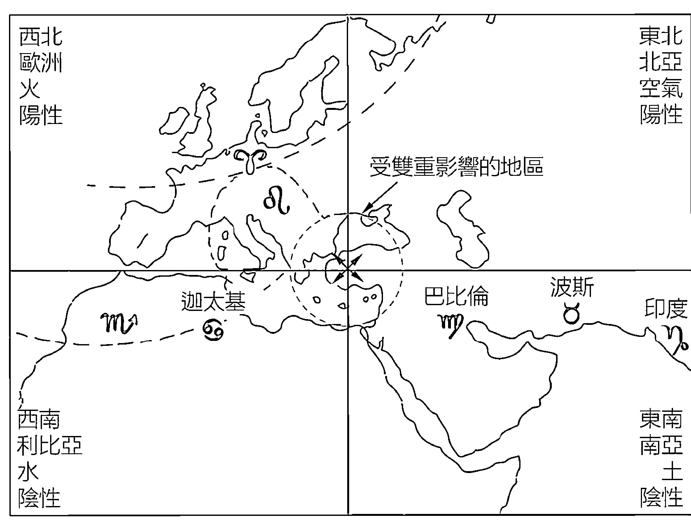

曼尼里烏斯和托勒密的分野，也都是以黃道十二宮的宮名來分配，這相當於中國占星中之黃道十二宮。不過，西方這兩套分野系統也有矛盾的地方。

#### 表 15：西方分野表

| 地區今名 | 分野星宮 |
| :--- | :--- |
| | 曼尼里烏斯 | 托勒密 |
| 西班牙 | 摩羯 | 人馬 |
| 法國（高盧） | 摩羯 | |
| 德國 | 摩羯 | 獅子 |
| 意大利 | 人馬 | |
| 瑞士 | 天秤 | |
| 希臘 / 東歐 | 室女 | 交換星座 |
| 烏克蘭 | 金牛 | |
| 俄羅斯 | 雙子 | — |
| 裡海岸 | 雙子 | — |
| 土耳其 | 室女 | 交換星座 |
| 中亞 | 獅子 | — |
| 伊朗（波斯） | 白羊 | 金牛 |
| 伊拉克（巴比倫） | 雙魚 | 室女 |
| 也門 | 金牛 | — |
| 亞洲 | 金牛 | — |
| 印度 | 雙子 | 摩羯 |
| 埃及 | 白羊 | — |
| 利比亞 / 北非 | 天蠍 | 天蠍 / 巨蟹 |

從上述兩圖可見，兩學者之分野圖並非相同，例如巴比倫在曼尼里烏斯之分野中為「雙魚座」，而在托勒密之分野中則為「室女座」。這可能是兩者之學派不同及取象之基礎不同。這也可以反映在占星學上，西方對分野之研究較為粗疏，不少研究都是某占星家一家之言，而缺乏了一個統計學上較科學的佐證。

到了現代，歐西占星學者在占算國家、城市命運時，往往是用有「年月日時」之命盤推算，而只有小量占星者才會使用「分野」之法。

#### ——分野之未來發展——

由於歷史的發展，中西方各自發展出一套分野之「地圖」，但都全利用了周天 360 度之星宮。中國人用二十八宿，西方用十二星宮，表面看似乎互相矛盾。如果占星是一套自然力量的學術，這個矛盾是否可以解釋呢？

周天 360 度之星宿，在地球亞洲與歐洲觀測都差不多，因為都在地球之北半球，只是因緯度不同而有部份南北之星宿會有所不同。但如果在澳大利亞觀測，其星空就有很大差異。

中國占星之分野，古代比較粗疏，也是隨着時間之推移，統計收據增加而越加詳細。但由於不同觀測基數，所以雖然大體上並無差別，但在細節上還是有不同。所以這也是現代占星學者可以繼續發展、增強我國傳統占星文化的研究方向。

但正由於此時間、空間、地理上南北東西之差別，同一個星宿的組合出現，在東所見可能在甲宮，但在西所見則可能會是在乙宮。例如，太陽在丑宮往往是北半球風雪交加之時，但在南半球澳大利亞則是乾旱山火頻發之季節。

所以，同一星宮在不同地區，會有不同之反應。

中國有一套相對西歐完整的分野體系，但能否將其「擴張」用於全世界呢？占星學上還有很大的發展空間。

# # 天文占星與術數

——術數在天文上的依據——

### 三王在占星之疑惑

天王星、海王星、冥王星等三王星，是在十八世紀後才一一被天文學家發現，因此會有人懷疑，在未發現此三星之前的幾千年，各地占星家單用七政四餘等星宿占卜，是否有不準確呢？這是否更進一步證明占星的不科學性呢？

占星在世界各國之發展都不平均，中國的七政四餘是一個由中國本土占星混合中亞傳入的古代占星之法而自成一個體系。但是從理性的角度，天王、海王、冥王等星自古已存在於宇宙中，不可能是因為十八世紀被發現而顯示出影響力，而在未被發現前則社會上也就未出現「新事物」。例如天王星約84年便繞地一圈，為什麼工業革命不是出現於在此之前的84年遁環中呢？這是現代西方占星家未有詳細解釋的疑問。

占星如紫微斗數、八字等術數，一樣是一種推算先天運勢之約數預測學，古人早已在占算七政七星中已知其短處，因此都會加入一些虛星作為補充。三王星及其他太陽系星辰之發現，正好是補充此古代計算之不足。

由於天王、海王、冥王是近三百年至一年間才被發現，所以都是古書所未載，但作為占星之原則，三王之影響一直存在，其性質則是占星家用歷史統計之方法來推算出來。筆者之計算，由於此三王都是一些外行星及矮行星，其軌道以數十年至百年繞太陽一圈，所以從中國占星的理論角度出發，一個大時代的出現、發生，往往是兩顆或多顆七政星宿及三王等星相對之後，才會產生的。古人古代之天文計算，「天大會」有以下的各大運：

+   (一) 赤道春分與黃道春分相分為 36000 年。這個與今日天文計算之 26000 年有異, 這是由於古人之測量與計算未有高解像度天文望遠鏡與電腦協助的關係。
(二) 土星與木星相會於白羊座初度, 周期為 795 年。
(三) 土星每三十年到白羊座初度。
(四) 木星與土星相會約二十年一次, 也是三元九運中之一運之期。

### 「易理數」與「天大運」

除了這些有天文基礎的計算之外, 中國術數中也有用「易理」以至不知來源的計算「天大運」之方法。例如古代有「五百年出天子」之說, 今日三元九運曆中, 一元為 180 年, 共九個 20 年的木土相會運, 三個元為一個「大三元」「共 540 年, 與 500 年約類似。而在天文上, 冥王星繞太陽一圈為 248 年, 海王星繞太陽一圈約 165 年, 因此冥王星繞兩圈約 496 年, 海王星繞三圈共 495 年, 所以兩星會在約每 495~496 年相會一次, 與 500 年整數誤差只有百份之一。

2003 年在太陽系外圍便發現閻神星, 此星之軌道繞太陽一圈約為 560 年, 此軌跡與三元九運曆中一個大三元的 540 年, 只相差 20 年左右, 誤差只有百份之三。

這些現象有兩個可能之解釋。第一, 古人未必已發現此等「新星辰」, 但古人有一套計算方法, 加上統計資料, 計算出一些「曆法」, 與今日天文之發現不謀而合。

第二個可能是, 古人已「觀測或計算到」這些星體之可能性, 而虛礙出一個「理論曆法」或虛星出來。例如《天學洞識》在「天大小會」中指出, 「赤道春分與黃道春分相合三十六千年一次」, 人類已知歷史都只有幾千年, 三十六千年即是三萬六千年, 這一定是一個用天文學計算出來的結果而並非體驗觀測出來的。今天天文學家也是在未實測發現之前, 用天體物理之方法測算出 X 行星之大概重量、體積及軌道，這也是一個虛礙之計算結果。

七政四餘曆法與西洋占星不同，除了實體行星、太陽、月亮之外，中國人遇有一大堆虛礙之星體，這就是今日紫微斗數、叢辰家甚至子平都有用之虛星，例如紅鸞星是主婚姻，是各家派都通用之虛星，但在天文上從未有此星之實體，會不會在天文學上之進步，我們可以證實此星之存在呢？這一很有趣的天文、占星問題。

由於世界大變之格局，很少是一夜之間改變，雖然一場戰爭可以決定一個政權之成敗，但要統一全國，收拾殘局也需要一段長的時間。例如明末清初，1644年滿洲八旗在山海關一戰中打敗了李自成而得天下，入主北京，但中國並未統一，內有三藩之勢力，外有鄭成功佔領台灣。直到康熙二十二年（1683年），平三藩，佔台灣，才是中國真正之統一，而有趣的是這剛剛是太乙運卦中「男女交錯」大運之最後一年，1684年康熙二十三年便是總共1,152年的「陽晶守政」運的第一年！由此可見，五百年出天子與五百四十年一個「大三元」運，也都是一个約數。世界是在慢慢不覺中改變，等如今日我們是處於資訊革命之時代初期，大家可以想像一下，如果今天大家還像五十年前那樣，沒有流動電話及上網服務，要通知某人需要到街上找一個公共電話亭，生活會變成怎樣呢？

### 三元九運與土木相會

三元九運曆是中州派玄空學中所用之曆法，其基礎是木星和土星的繞日運行周期。木星的運行周期為11.8618年，即約12年繞日一圈，十二地支子、丑、寅、卯等以此為根本。土星的運行周期為29.4571年，即約為30年，古人稱為「一世」，今日俗語所說「一世人」，正是本源於此，因為古人相信30年一般人會有子，60年有孫，90年則會有四代同堂，30年代表人的一個世代。

假如木星與土星在天球某方位相會（假設為時鐘12時之方位），簡單之算術計算，它們會在二十年後再會（約在時鐘 8 時之方位），四十年後又會再會（約在時鐘 4 時之方位）。六十年後則會在原來位置附近再會（時鐘 12 時之方位左右），中國曆法中之「六十甲子」即來源於此。而這六十年一個甲子稱為一個「元」，三個元分別稱為上元、中元、下元。而二十年一次土木相會則稱一個「運」，三元共有九個運，以一、二、三運為上元，四、五、六運為中元，七、八、九運為下元。現在我們身處下元八運之中（公元 2004~2023 年）。

此曆法最早的歷史記錄，出現於敦煌藏書中有一頁唐代乾符四年丁酉（公元 877 年）通書內，顯示了玄空九宮飛星之圖。此書頁現藏於英國大英圖書館內。

但由於土木相會的時間間隔並非整數二十年，實際之時間有時為十九年七個月，經過一千二百多年之誤差累積，現代的土木相會時間已有轉移，例如八運之時間為公元 2004 年至 2023 年，但真正的土木相會是在 2001 年出現。從事實證明，2001 年 9 月 11 日阿爾蓋特襲擊美國紐約世貿雙子大廈，也改變了今日世界旅遊保安及阿拉伯世界政治軍事之平衡，今日阿拉伯世界大亂，就是美國攻打阿富汗、伊拉克之結果。

中州派之祖師，雖不懂土木相會推移之道理，但他們從實驗中知道元運曆法中有誤差，故此有訂立了一套「前三後三」之說，也就是某元運大運之改變，往往會在元運變曆前三年或後三年已出現先兆。

三元九運曆除了 180 年三個甲子三元之外，還有一套三個三元，即三個 180 年共 540 年一個「大三元」的說法。而在歷史上未有任何解說，這 540 年與「五百年出天子」之說法相似，就是在每五百年間，世間的科技文明及衣冠文物都會出現很大的進步及改變。

### 太乙運卦與冥海之會

南宋張行成說：「自古獨太乙之法與易為最親」。在太乙法中，太乙有「十二運」式是用易卦來推演歷史朝代大事之興衰關係。它是把十二個運來配以六十四卦，而有一定的次序，而這配卦亦非是平均分配，而是一運有中有配一、二、四至六卦。而每卦因陽爻陰爻之數不同，也會有長短。

例如現在我們時運是在康熙二十三年甲子（1684 年）所入之「陽晶守政」之運，第一卦為「大壯」卦（雷天大壯），由初九爻起行第一年，陽爻行 36 年，陰爻 24 年，共行 192 年後，到清光緒二年丙子（1876 年）入「無妄」卦之初九爻第一年。下一個卦是 2068 年開始，行「水天需」卦初九爻第一年。2016 年是正在無妄卦之第九五爻（1996 年 ~2031 年）之中。

自 1995 年開始，中國從謙卑的韜光養晦心態中改變，開始對世界世務提出「中國崛起」。今日中國之事務發展，都會影響全世界之政經情況。這也和中國在無妄九五中和之運有關。

這些表面未有任何天文基礎的「運卦」推算，與天文之「實況」有很有趣之吻合。清兵入關為 1644 年，康熙二十三年為公元 1684 年，而在公元 1648 年就為冥王星與天王星、海王星三星大沖之年，這一年在東西世界都有很大的改變。

1618 至 1648 年為歐洲之「三十年戰爭」（Thirty-Years War）之時，歐洲各國之天主教（派）與基督教（派）打了三十年「文革式」鄰居打鄰居、朋友互殺之戰爭，直至 1648 年各國在德國西部奧斯堡（Ausberg）等地簽署了一系列威斯菲利亞和約（Peace of Westphalia），才結束了歐洲盲目之宗教派系戰爭。

在英國，1648 年國王查理一世在普雷斯頓戰役（Battle of Preston）中戰敗，在 1649 年成為英國歷史上唯一被斬頭處決之國王。英國實行了一段短時間之共和制，直到 1660 年皇室才得以復辟。1664~1665 年為英國最後一次鼠疫（Last Great Plague）出現，而在 1666 年倫敦發生大火，把中世紀的格局燒光，倫敦得以重建，也改變了其風水，大英帝國開始得以日漸強盛，統治大半個地球。

在東方，1644 年明末天災，農作物失收引起之飢荒，引發農民反抗，農民軍在李自成領導下攻入北京，崇禎皇帝自殺於煤山。繼而吳三桂引清兵入山海關，覆滅明朝，但清朝當時並未統一中國，後經過再打敗各南明小朝庭、三藩之亂及 1683 年攻入台灣，鄭克塽投降後，清朝才統一中國。時為康熙二十三年（1684 年）

由此可見，1618 年開始東西世界之動蕩，經過近一百年不同之發展，而到 1684 年開始進入一個比較平穩的時代。「三星大沖」對於國家興亡，東西方之興衰，有極大之影響，而中國古人似乎對於此等「未知之星」之影響，早有記載其規律。

### ——現代占星學之問題——

### 主觀的推斷

隨着近二十年來圍繞太陽系之新矮星體不斷被發現，在短短的幾年間，已有不少占星家為這些新星提出各種占星之應兆影響，他們的依據是基於該星體之名字，這些名字不少來自古希臘、猶太神話中之神祇。這些占星家便用此神祇於神話故事內之性質去推算其吉凶。

筆者對此不敢苟同。在占星上，一個星體被人類發現，再從其各種方位現象及與其他星之關係，去研究其對人類世間上之影響，是經過一個長期觀測及驗證過程後得出之結果。

今日占星家用之方法是基於這些新星體的名字，但其名字乃用西方神話主觀命名，與星體之間並無邏輯上之關係，與占星也沒有任何因果關係，並不符合占星之理論。而且這些定論是某占星家在這幾年間主觀之評語，也無實際事例關係之證據。這種主觀、無歷史根據、不合邏輯之推斷，也是今日占星學被人詬病之原因。

占星之發展，是要用一個較合理、有統計學支持的實驗方法，去證明其可信性，去觀測這些「新星」實際上對人類之影響。這也是中國古代占星學所用之方法。例如南北朝《宋書·天文志》：「宋孝武帝大明三年四月，月犯五諸侯（星），時竟陵王誕反（叛），遣沈慶之領羽林兵戰屬城。」

### 遲來的應兆

「漢文帝七年，熒惑（火星）東行（逆行）行華（宿）陽（北），還華東北、西而逆行至昴（宿）南而東行，後四年，趙王與七國謀反，北連匈奴，誅死之應。」這個漢初七國之亂之應兆，也反映出一個問題，火星是在逆行出現某藩國分野後，四年後才出現其應兆，這也往往被較短視之科學信徒視為不合理及沒有因果關係的原因。但正如開關一個核發電廠，是不可能只按一個電掣便可以完成的，它需要一個一步一步的程序，才可以發揮其作用。占星發揮其作用是要有一個胎養、妊誕及出現的時期。

古人觀測到天星出現之現象與其對地球之影響，往往有個時間差，短可以少於一個月，長可以是三至四年，而有些古人稱為「大權」之現象，更可以影響幾十年以至五百年。

### ——中國天文占星之貢獻——

中國的二十四史及其他典籍，是世界各地文化中，擁有最詳細不斷之天文現象記錄的歷史文獻。今天，不少天文學家要了解一些古代天文現象時，都會在中國人的記錄中尋找。

### 哈雷彗星

例如英國人愛蒙·哈雷（Edmond Halley）在 1705 年發表論文稱，根據 1531 年、1607 及 1682 年之觀察，推斷出一顆彗星會以每 75~76 年繞太陽一次之軌跡運行。他更預言在 1758 年這彗星會再出現，這就是以他命名哈雷彗星，也就是當年征服者威廉在哈斯丁打敗哈奴斯國王時出現之彗星。但是天文學家根其規律反推再發現，此彗星最早之記錄是在《史記》，它記錄了哈雷彗星在公元前 240 年之出現。此時是秦國在公元前 241 年打敗了楚、魏、趙、韓、燕五國聯軍之後，開始一國獨大，步入滅六國之時期，而到了公元前 221 年，秦終於滅六國統一天下。此二十年間，中國人口因戰亂而大量減小，單在此前二十年，公元前 260 年，秦國在長平打敗趙國，就坑死趙降卒四十五萬人。這也是哈雷彗星出現前後之應兆。

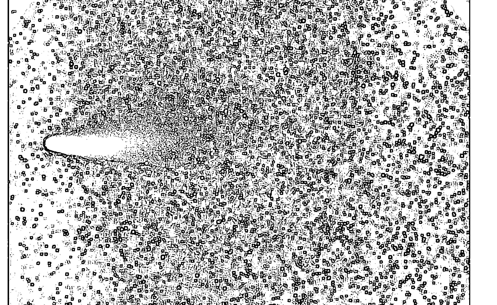

圖31 哈雷彗星

#### 天關客星

20 世紀早期，天文學家對金牛座內的一個名為蟹狀星雲（SN1054，M1）的天體進行分析，因為它以很高的速度在膨脹，而根據其膨脹速度反推可得，該星雲在地球上開始可見的時間至少在 900 年以前，分析更指出其時間為 4 月至 5 月之間。而在中國人之記錄中，1054 年 7 月 4 日至和元年出現了一次白天都可以看見的「客星」。

> 《宋史·仁宗本紀》：
>
> 嘉祐元年三月辛未，司天監言：「自至和元年五月，客星晨出東方，守天關，至是沒。」

> 《宋會要》卷五十二：
>
> 至和元年七月二十二日，守將作監致仕楊維德言：「伏睹客星出現，其星上微有光彩，黃色，謹案《黃帝掌握占》云：『客星不犯畢，明盛者，主國有大賢』。乞付史館，容百官稱賀。」詔送史館。
>
> 嘉祐元年三月，司天監言：「客星沒客去之兆也，初，至和元年五月，晨山東方守天關，晝見如天白，芒角四出，色赤白，凡見二十三日。」

這個在天關星附近之「客星」，正是一顆超新星發生大爆炸之時，也是一個星體滅亡之時，這是一個十分罕見之現象。而根據中國之記錄，這超新星爆炸之後，其遺骸形便是今日見到之蟹狀星雲。天關客星及現在的蟹狀星雲，更被天文學上認定為第一個有確實記錄的超新星爆發天體。

這是中國人占星之傳統對天文學之貢獻之一。而在此記錄中可見，見此星象，因為色為黃色，而又不犯附近之畢宿，故被視為一個吉象。

圖62 金牛座蟹狀星雲，即中國之「天關客星」

#### 物象占

傳統之星占理論相信，由於星宿作用之力量，其對地球上的諸事萬物都會有一定之影響，從地球上之板塊活動以至天氣物候都會有反應，而一些動物魚蟲，由於可以感應到這些力量，當它們出現問題、異象時，便是顯示了一些災異將來臨前之先兆。

這些物象占可以包括地震、颱風、山泥傾瀉、雲氣之虹霓，特殊大之霜雪冰雹、寒霧露霾、霰、霙等，也可以包括雷電、動物、鳥獸之異象。在不少大地震中，事後都有居民報告，在災前動物出現恐慌異象之現象。這並非古人穿鑿附會，現代也不乏此類報告。

2008年5月12日下2時28分，中國四川省阿壩藏族羌族自治州汶川，發生8.3級大地震。而在5月10日時，離震央不到100公里之四川綿竹市出現數十萬隻蟾蜍遷徙。這現象在2006年4月在重慶、2007年5月河北唐山、2007年9月在山東臨沂、2005年7月於吉林長春、2008年5月於江蘇泰州、2007年4月於四川成都都出現過，但都並無發生地震。

在外國，有專家也專門以此為研究之項目，1999年9月9日東方日報之報導：哈薩克地震學家正在研究貓頭鷹、土撥鼠和蛇等野生動物的行為，以圖預測當地何時會發生大地震。該助理院長奧斯帕洛夫稱：「我們的研究顯示，哈薩克在兩年內發生一次威力超過黎克特制八級的強烈地震，那將會是一場大災難。」但結果是哈薩克在15年內都未有發生這場大地震，反而是在2015年4月25日上午11時56分，尼泊爾發生8.1級大地震。到了2015年5月12日下午3時又發生了7.4級。一些媒體報道，在此次地震發生前，當地動物出現異象，例如博克拉一個野生動物園內的動物，往常都喜歡趴在窩裏或躲在林中不出來，但當天很多動物都跑到開闊地帶，連孟加拉虎都罕有地跑到空曠地方。

圖63 汶川地震

2011 年 3 月 11 日，日本大地震海嘯前，東北三陸地區發生了 348 頭鯨魚擱淺事件。當然，類似鯨魚擱淺幾乎每年都有發生，只是這一次就規模較大，數量較多。但是，在地震前幾天的 3 月 9 日，在與日本遙隔太平洋相望的美國加州海岸，就出現了大批沙甸魚、小銀魚和鯖魚死亡。死魚堆厚達 46 厘米深，估計最少有 100 萬條。

圖66 鯨魚擱淺

#### 華盛頓關門

在美國華盛頓國會山西面，面對華盛頓紀念碑的國家廣場（The Mall）前設有大水池，2013年8月15日約有1000條魚在這個水池死掉，由於這水池及廣場是位於美國總統府白宮與國會之間，是國之重地。此地死魚，魚代表人民、平民，到了10月，因為國家內的反對黨共和黨與奧巴馬總統政治惡鬥，不批出國家預算，使美國政府非機要機構都要關門大吉。這對於那些肚滿腸肥的大官及國會議員沒有大影響，但對於那些低下公務員及接受福利的窮人則影響較大。這就是廣場死魚之應。

#### 2014 年香港佔中之象

2013 年 7 月 7 日晚，成千上萬俗名青鱗仔的小魚，大批跳出中區滅火輪消防局碼頭，集體「自殺」。2014 年 3 月 30 日黃昏，香港出現雷雨交加，雨量急增，並發出黑色暴雨警告，新界、九龍多區更下冰雹，有冰雹打穿位於九龍半島中央之九龍塘又一城商場之屋頂，豪雨直入商場，淹浸地方。

《史記》記載了秦始皇八年「河魚大上」，渭水由西向東流，但當年黃河之魚西上入渭，秦人皆輕車重馬，往河旁食魚。《漢書·五行志》解釋：「魚者陰類，臣民之象」，其解釋是秦始皇二十六年滅六國，統一中國，此為魚逆游到秦，為六國人民歸秦之象。

所以在 2013 年小魚跳岸，是人民不滿政府之象，2014 年在市區九龍下冰雹，是暴亂之象。

《宋志》曰：「雨雹則陰脅陽，凡陽盛則為雨，陰脅之則轉而為雹，為政者有所脅也」，所以佔中是民眾（陰）威脅政府之權威之象。在 2013 年，有學者提倡效仿「佔領華爾街」而表達對政府政治改革不滿，在 2014 年 9 月 28 日因警察一用催淚彈驅散行動而導致大批人佔領金鐘、銅鑼灣及旺角等地。這場被稱為「雨傘革命」的運動，直到 12 月 11 日政府清場才告一段落。

#### 2016 年香港農曆初一暴亂

2015 年 7 月 11 日早晨，香港啟德郵輪碼頭及觀塘碼頭之間的水域，有約兩噸的各種魚類浮屍水上。2015 年 6 月 2 日，屯門公園內之人工湖發生湖水流失，導致湖內魚類死亡。2016 年 2 月 16 日，屯門河因高溫而出現大量死魚，共撈到約 370 公斤。2015 年 12 月 5 日，沙田城門河出現大批死的鯡魚，這些死魚一連七日陸續出現在城門河上。

2016 年 1 月 9 日起，天上的金木水火土五個星宿，形成一個有趣之現象，木星位於西方，由西至東順數為火星、土星、金星、水星，五行中木生火、火生土、土生金、金生水，這是五星之順生，但問題是這格局是木星在西在前，西方為兑宮，白虎金，是金剋木，而由西至東，稱為逆生，是逆轉紛亂之象。

而就是2016年2月8日，農曆正月初一，當日正是建除家之「破日」，香港便出現因小販事件而引發在旺角的一場暴動。在此同時，由2011年阿拉伯之春引發的敘利亞內戰中，政府軍本來是一路處於下風，但因為俄羅斯參與，協助政府軍轟炸伊斯蘭國、阿蓋達恐怖組織外，沙地阿拉伯、土耳其及美國所支持的叛軍也受到攻擊而節節敗退，戰場上之戰局逆轉，所以美國及西方國家要求停火，沙特、土耳其宣佈要派兵參戰。到了6月底，英國公投脫離歐洲，更使世界經濟政治出現逆轉之象。

這都是2016年1月五星逆轉後所產生之改變。

上述的現代例子中可見，物兆之異象既有其一定的可信性，但是要用此來作為推測未來之學問，還是一個未圓滿及有系統的學說，還有很多要研究及進步之空間。因為單是死魚，全世界每年都有近千多宗，例如2010年1月21日也有大批河魚死亡，但是該年在屯門未有任何大型災難事件出現。所以同樣死魚，在屯門與華盛頓是有所不同之應兆。

例如2001年9月11日紐約世貿中心被襲，除了死幾千人之外，它是美國經歷太平盛世近七十年內最大的襲擊。它的影響，是美國入侵阿富汗，繼而入侵伊拉克，更利用阿拉伯之春消滅它的死敵利比亞卡達菲（Gaddafi），支持敘利亞內戰，使伊斯蘭國崛起，阿拉伯地區天下大亂——這都是一次恐襲引起的。

而在巴基斯坦，由於國家之分裂及管治力弱，幾乎每隔幾個月便有一次恐襲爆炸，所以這類「常見」恐襲之重要性又較低了。怎樣去決定那事件兆象之重要性，是要用占星配合才可決定的。
