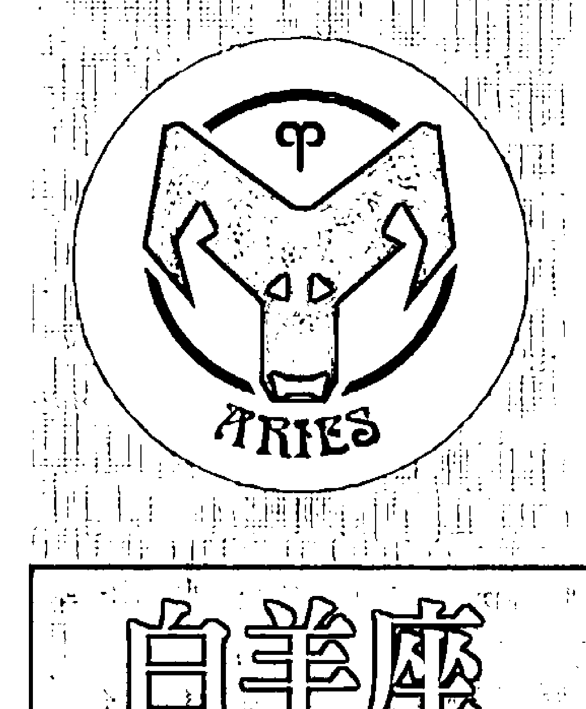
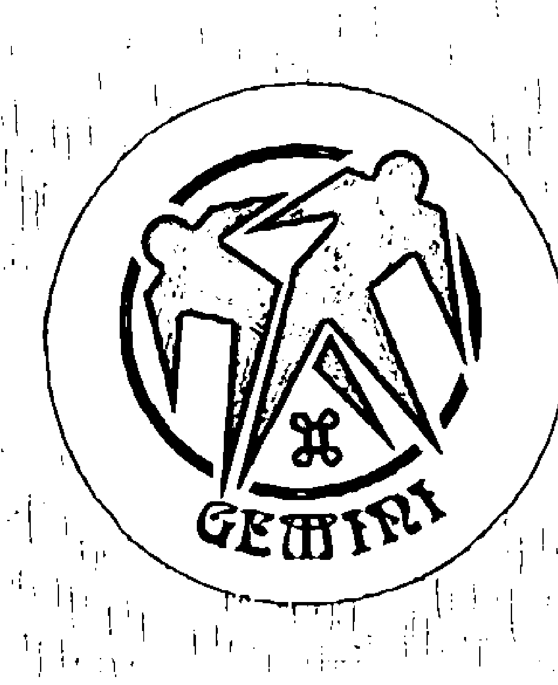
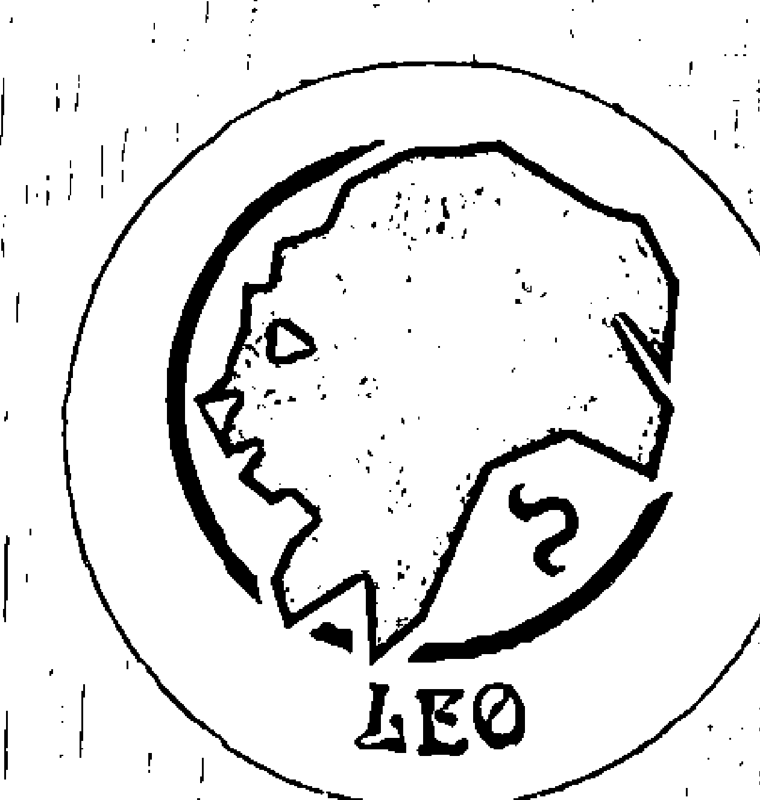
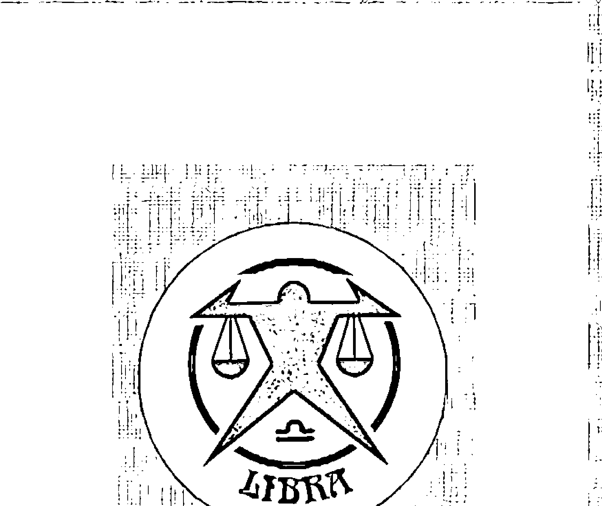
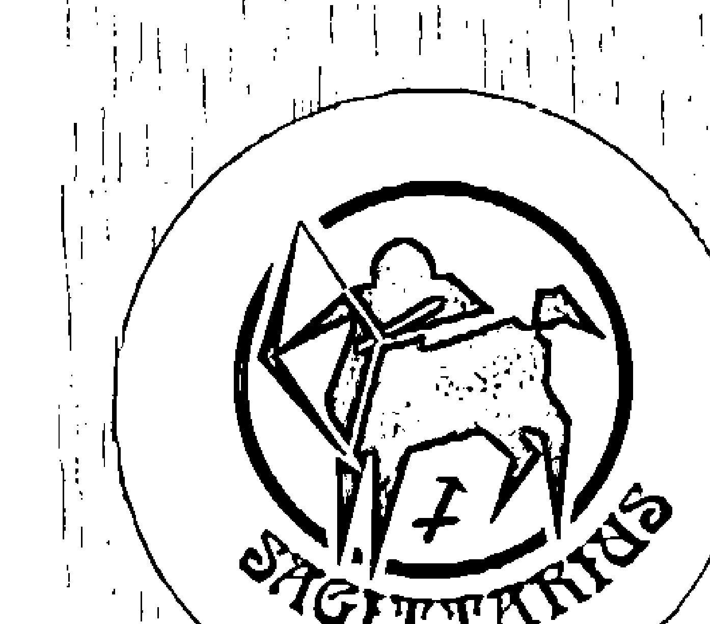
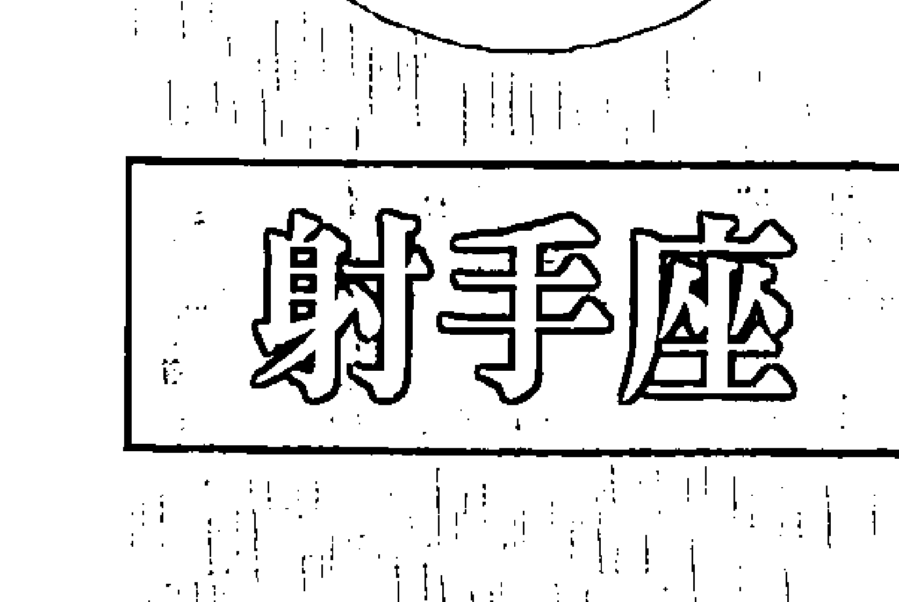
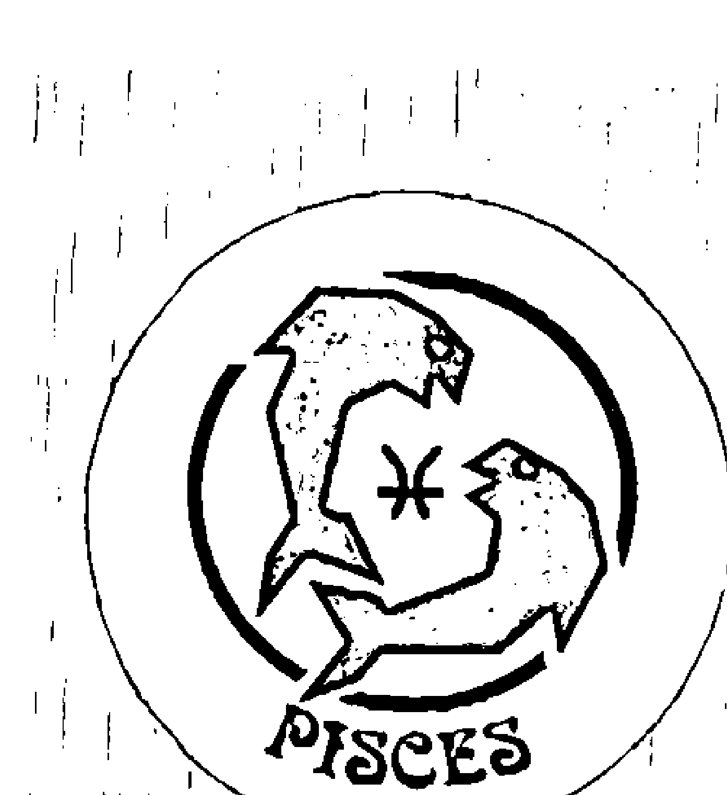

# 太阳水星金星火星交织的外显人生
## 前言

占星學的知識博大精深，從自然占星、世運占星、個人占星到事件占星及問卜占星，每樣都是很深奧的學問，再加上需要運用到很複雜的數學計算，因此長期以來星象知識經常給人神秘莫測的感覺；直到現代大眾媒體興起再加上電腦和網路技術的普及，讓占星學有了很好的基礎可以發展，現代人學習星象知識不用再與複雜的運算過程搏鬥，而能專心於意義的追求與內容的解釋，一般人即使數學不好也可以把占星學好，學習占星的門檻也因此降低許多。

任何知識的學習，應當從自身的經驗出發及累積，才能建立起穩固的基礎，因此一般人接觸星象知識大多是由個人占星學開始，拜現代大眾媒體發達之賜，很多人都知道自己的太陽星座，對於星座特質也有很基礎的了解；但是由於對星象知識的研究不深，也經常對於占星學有許多誤解，例如有些人以為出生在星座交界日的人同時會有兩個太陽星座的特質，就是非常典型的錯誤，其實每個人出生時只會有一個太陽星座，只是同時也受到其他行星的影響。

在西洋占星學當中基本上是以行星為研究的核心及解釋的主軸，出生時行星所落入的星座、宮位及行星與行星之間的相位關係，都是個人占星學分析的基本項目，不過由於行星的運動方式複雜，因此一般人對於自己出生時的星象狀況並不是那麼容易掌握；現代受到歐洲文化的影響普遍使用太陽曆，而太陽曆本身就是依照太陽運行的規律來設計，因此只要知道自己的出生日期，就能大致推論出自己出生時太陽所在的位置，並不需要用到特殊的星象知識。

對於個人來說，出生時太陽落入的星座影響顯而易見，再加上只要知道自己的出生日期就能大致知道自己的太陽星座，因此有關太陽星座的解釋就成為最容易普及的占星知識，但是除了太陽之外，其他不同的行星也會對於個人有很大的影響，當我們想要進一步了解星象知識的時候，就必須轉換以星座作為解釋主軸的習慣，而改用行星為主要的概念架構，另外在深入到更專精的星象知識之前，去了解其他行星落入不同星座的解釋，也是一個不錯的過渡方式。

在個人占星學當中，太陽代表了我們有意識的行為模式，同時對於我們在領導統御及戀愛方面的表現影響特別大，但是相對而言出生時太陽所落入的星座，經常是屬於我們自己主觀認同的部分，就客觀來說並不能涵蓋我們所有的表現方式；而月亮則是與個人的氣質及情緒有關，因此出生時月亮所落入的星座常變成我們無意識時展現的行為模式，只有在情緒激動失去理性的時候會比較明顯看得到，在大部分的狀況之下月亮星座的影響不容易被觀察到。

相對來說距離地球較近的另外三個行星——水星、金星、火星——的影響力，就比較容易客觀地被觀察到；個人占星學當中水星代表我們的理性，水星星座主要會影響我們的思考模式、溝通方法與學習狀況，由於水星的軌道比地球更接近太陽，因此從地球上來看它和太陽的距離最遠不會超過二十八度，所以無論如何水星只可能和太陽同一個星座，或是在前、後一個星座，例如出生時太陽在獅子座，那水星就只有可能在巨蟹座、獅子座、處女座這三種組合。

金星在個人占星學當中代表我們的價值觀，出生時金星所落入的星座會影響我們對於金錢的態度以及審美的觀點，在人際關係上會影響到我們與朋友的關係，也會影響到我們對於婚姻及感情的需求；由於金星的軌道也比地球更接近太陽，因此從地球上來看它和太陽的距離最遠不會超過四十八度，所以金星只會出現在太陽的前後兩個星座的範圍之內，假如出生時的太陽在水瓶座，那金星就只有在射手座、魔羯座、水瓶座、雙魚座、白羊座這五種可能性。

火星在個人占星學當中與生存的危機感有關，且出生時火星所落入的星座與我們面對競爭與處理衝突的方式有關，對於工作的能力與方式也有很大的影響，現代占星學當中將慾望與性愛與火星連結在一起，不過傳統占星當中則認為性愛主要是由金星來主導；在與同學的關係當中，我們比較容易觀察到太陽與水星的影響力，在與朋友的關係當中，太陽與金星的作用力就比較明顯，但若是在同事關係當中，我們經常發現太陽與火星都會發揮很大的力量。

因此在本書當中，即是以太陽所在的星座為主軸，並且再進一步分析水星、金星、火星落入的星座所帶來的作用及影響方式，希望能帶給讀者比較深的理解；為了方便讀者查詢及比對，本書也附上一九五一年至二〇〇〇這五十年的星曆表，讓大家可以快速地找到家人、同學、朋友、同事出生時各個行星所在的星座。

由於星曆表是以台灣的時區為準，若是遇到出生在其他時區的人，在查詢表格時請先換算到東八區的日期和時間，才不會搞錯對方的星座。

丹尼爾在這裡要感謝尖端出版社的團隊，在你們努力的企劃及催稿之下，讓這本書能順利完成，也要謝謝在占星學研究當中一路支持我的朋友及學生，沒有你們的幫助及鼓勵，也絕對不會有這本書誕生，特別是巨蟹二班的同學及雙子二班的Sean同學，兩位詳細的課堂筆記在寫作當中提供很大的幫助；最愛的Chuy和映元，時時刻刻在精神上給我堅強的支持，由衷地謝謝大家。

丹尼爾

| 項目 | 內容 |
| :--- | :--- |
| 星座分類 | 陽性星座／火象星座／本位星座 |
| 守護星 | 火星 |
| 時間節氣（北半球） | 春分—清明—至穀雨前 |

## ♈ 开始认识白羊座

一般來說太陽在白羊座的人並不難了解，他們的行事風格直率而不做作，喜怒哀樂全都寫在臉上，當然這些都符合白羊座傳統圖騰「公羊」的特性，綿羊是群居的草食性動物，平常是沒有什麼攻擊性的，但是到了求偶季節，公羊們就會為了爭奪所愛而公開單挑，回頭來看白羊座的人，你會發現他們平常也很和善，但是當他們對某件事情產生強烈的興趣，或是被情境激起了鬥志，行為上立刻就會表現出競爭性，毫不掩飾自己的慾望而努力去爭取。公羊單挑的方式也很有趣，他們會先拉遠距離就戰鬥位置，然後快速地直衝向對方，以頭上的羊角互頂，速度快的公羊通常可以把速度慢的公羊鬥倒，瞬間的爆發力往往是決定勝負的關鍵，從這邊聯想白羊座的特質，你就不會為他們直接的行事風格感到驚訝；白羊座的人很有行動力，會直接面對困難，主動處理問題，迂迴逃避完全不符合他們的作風，同時他們也會崇拜英雄、尊敬強者，天生具有爭強好勝的特性，看到別人擁有什麼，自己也會想要擁有。自己的立場和觀點出發，而沒有考慮到其他人的想法與感受，從正面來看你可以說這些人單純沒有心機，但是從負面來看你就會覺得他們很自私自利；他們對於不了解、沒做過的事情都充滿好奇，非得要親自去嘗試看看不可，由於他們在行動之前通常都不會做太多的研究與計劃，往往會搞得狀況險象環生，不過他們還是會覺得先衝再說，即使失敗跌倒也沒關係。白羊座的人十分任性，他們只會做自己想做的事，而沒辦法被勉強去做任何其他事情，如果環境或其他人的行為不合自己的意思，他們會努力地抗爭，直到狀況符合自己的想法為止，所以當遇到不公不義的事情時，他們經常會奮不顧身地跳出來主持正義，也被認為具有強烈的正義感與理想性；不過有時候白羊座的人熱心過了頭，反而「公親變事主」，原來起爭執的兩人已經言歸於好，自己一個人還在哪裡忿忿不平，甚至跟原來他想幫助的人大吵起來。白羊座的人充滿活力與自信，總覺得自己一定可以做到，所以很容易一頭熱地投入那些他們覺得有意義的事情，即使沒有人支持和看好也無所謂，他們願意冒險去開創新的局面，也不害怕衝突和競爭，勇敢的特質在這些地方都表露無遺；不過有時候白羊座也只有三分鐘的熱度，過一陣子之後又會被別的事情所吸引，如果不能一舉成功的話往往會有一些後繼無力，甚至半途而廢把爛攤子留給別人去收，這就是為什麼有些人覺得他們做事情常常虎頭蛇尾。通常白羊座的人性子都很急，他們想到什麼立刻就會去做，想要什麼就希望馬上得到，在行動上非常衝動而聽不進別人的勸告，一意孤行的作法很容易讓他們陷入困境，所以有時候也會招致有勇無謀的批評；雖然白羊座的人很容易生氣，不過他們的怒氣通常來得快去得也快，當他們怒急攻心的時候可能會表現得粗魯、無禮、尖酸刻薄，但是事過境遷之後又好像完全沒這回事，甚至還會主動向你道歉，變化速度之快讓人意想不到，前後表現反差判若兩人。太陽在白羊座的人十分果決，而且決定了之後立刻就會採取行動，完全無法忍受耽擱拖延，他們會用行動去證明自己的決定是對的，而不只是坐在原地空談，不論別人對這件事情的評價為何都無法動搖他們的決定；而且白羊座的行動常常帶有一種感染力，可以引領風潮讓別人跟隨，也許在他們之前也有人做了相同的事情，但是就很難造成那麼大的影響，大家是因為白羊座的人而開始注意到這件事，因此看起來好像他們才是第一個做這件事的人。太陽在白羊座的人天生就很熱情，對人十分溫暖和真誠，他們完全沒有那種設計陷害人的複雜心思，而是單純地覺得大家都是好人，所以如果遇到需要幫助的人，他們也常主動伸出援手而不求回報，即使因此被騙或倒打一把，他們之後仍然會繼續無怨無悔地幫助別人；大部分太陽在白羊座的人都很開朗樂觀，即使遇到挫折也很少自怨自艾，而是會把情緒化為怒氣直接爆發出來，他們不會被一件負面的事情影響太久，很快地會找到其他正面的事情去做。

## ♈ 分析白羊座的三种水星星座

水星星座所造成的影響，水星星座主要會影響一個人的思考、學習與溝通方式，以下就讓我們來看看，三個不同的水星星座對白羊座有什麼不同的影響。

#### 水星在雙魚座的白羊座

水星在雙魚座會增加白羊座的想像力與直覺力，不需要經過嚴密的邏輯推論就可以直接知道答案，但是相對來說他們的想法比較容易受到周圍環境的影響，而不像其他的白羊座有那麼強烈的自信心；他們很容易了解別人的問題和需要，是所有的白羊座當中最有同情心與同理心的一類，雖然這可能讓他們變得有一點多愁善感，但是也會比較擅長照顧別人，他們通常對音樂、舞蹈、戲劇之類的東西特別有興趣，不過也可能缺乏方向感而容易迷路的問題。

水星在雙魚座的白羊座很憑感覺學習，對於自己有感覺的東西學得特別快，但是對於沒感覺的東西就很難學得會，一般來說，他們對有圖像和有故事性的東西比較容易產生興趣，至於太過抽象或理論性的東西就比較不拿手，雖然他們可以很快記住事情的全貌，但是細節部分就比較模糊或容易遺漏；若是很想把一個東西學好，也可以選擇閉關苦讀的方式，當他們全心全意把全部時間投入一件事情時，就容易對這件事情產生感覺，增進自己學習的效率。

水星在雙魚座的白羊座溝通狀況比較不穩定，當他們心情好的時候可以滔滔不絕一直講個沒完，但是心情差的時候又會變成悶葫蘆一個字都吐不出來，他們講話的時候很重視當下的感覺，所以用字遣辭上就比較不是那麼精確，在寫作時很容易有錯別字的狀況發生；他們是所有白羊座當中最容易發生口誤的一群，有時候明明心裡想的是一件事，說出口卻變成另一件事，這並不是因為他們刻意要說謊，而是因為語言組織的邏輯不太一樣。

水星在雙魚座的白羊座很適合從事與創意、藝術、心理有關的工作，他們對於非語言的溝通方式特別敏感，例如肢体語言、眼神交流、氛圍感受等，很容易就能讀懂别人的情緒狀態，這讓他們在需要同理心的工作上有很好的發揮；不過他們比較不適合從事需要精確、邏輯、條理分明的工作，像是會計、程式設計、法律文件撰寫等，因為這些工作很容易让他们感到枯燥乏味而難以持續。

#### 水星在白羊座的白羊座

水星在白羊座會增加白羊座的思考速度，但是同時也會讓他們完全沒耐性，他們會以最簡單、直接的方式來思考，而且比其他的白羊座更加果決和積極，不論遇到什麼狀況都能保持正面思考，也更具有冒險犯難的精神；他們總是有源源不絕的創意與新想法，應變的速度也很快，對於所有最尖端新潮的東西都很有興趣，不過從另一個角度來看，他們也非常衝動沒耐性，不擅長處理各種細節與例行公事，當事情的進度停滯不前，很可能會激起他們的怒氣。

水星與太陽同在白羊座的人，通常學習任何東西的速度都很快，但是忘記的速度也和學習的速度一樣快，所以除非是本身很有興趣的東西，或是持續有用的技能，否則其他的就很難一直留在他們的記憶當中；他們一次只能專注學會一樣東西，沒有辦法同時思考太多事情，所以最好的方法就是現學現賣，需要用什麼再去學就好，太久前學的東西很可能早就完全忘記了，如果是為了應付考試的話，臨時抱佛腳反而比平時苦讀累積來得更有效。水星也在白羊座的白羊座通常說話的速度特別快，他們一開始就會講重點，無法忍受迂迴曲折的討論過程，直接就會說出自己認為的答案和結論，整體來說他們也是屬於主觀性強的人，若是他們內心當中已經有了成見，就很難說服他們改變，反而有可能與對方發生爭辯；他們很討厭和說話速度慢的人溝通，很容易就會顯出不耐煩的樣子，他們在講話的時候很少顧慮到別人的反應，甚至已經得罪了人還渾然不知，講話太直接也可能造成一些問題。

#### 水星在金牛座的白羊座

水星在金牛座會增加白羊座的穩定性，減少因為衝動而犯下的各種錯誤，比起其他的白羊座來說更為穩重，但是這也會增加一些固執的傾向，使得他們堅持己見和自私的程度增加，或是變得有一點保守傳統的感覺；雖然他們思考的速度較慢，但是看法都很實際而有邏輯性，他們會花多一點時間思考研究之後才下判斷，不過一旦決定了就很難改變心意，他們對於財務金融、投資理財之類的東西特別有天份，如果認真研究的話也可以利用機會小賺一筆。

水星在金牛座的白羊座在學習的速度上會比較慢，但若是能持續努力就會打下很穩固的基礎，把東西學得非常紮實，有助於未來長遠的發展，他們不太擅長掌握空泛的理論和抽象的觀念，實際看得到、摸得到的東西才容易被他們理解，如果能透過大量的練習與實驗輔助會有更好的學習效果；他們是所有白羊座當中記憶力最好的一類，不過前提條件是要先花很多時間把這些東西理解並記住，只要是他們真正學會的東西，即使經過幾十年之後仍然不會忘記。

一般來說水星在金牛座的白羊座溝通能力都很不錯，他們可以用淺白容易理解的方式表達自己內心當中的看法，也有多一些耐性把別人的話聽完，他們通常都會集中焦點就事論事，而不會隨便岔題閒聊到其他的東西，也不受到對方表達方式和情緒的影響；不過在一般狀況之下他們並不是很愛主動發表意見，有時候甚至會讓人誤以為他們沒在聽或沒反應，其實他們只是希望自己弄清楚狀況之後再講，在所有白羊座當中是比較少因為衝動而說錯話的一類。

## ♈ 与白羊座谈恋爱

太陽在白羊座的人非常熱切地渴望愛情，也會很直接地去追求愛情、擁抱愛情，他們傾向在感情當中扮演主動者的角色，但也不排除偶爾被人追求的樂趣，他們很容易就愛上一個人，所以一見鐘情的狀況也經常發生；當他們喜歡一個人的時候，幾乎不可能隱藏自己的心意，立刻就會展開熱烈的追求，在他們的字典裡面找不到暗戀這個詞，如果他們遲遲沒有行動，也許是因為還有其他事還沒忙完，不過通常戀愛這檔事會被他們排在第一順位。

整體而言，太陽在白羊座的人是很狂熱的情人，他們幾乎是以燃燒自己生命的方式在談戀愛，全心全意地為對方付出，希望自己所愛的人能夠幸福快樂，他們可能突然靈機一動就會買一個小禮物送給情人，或是想辦法帶給對方意外的驚喜；與此同時白羊座也有善妒的一面，他們很難忍受自己被情人放到第二順位，即使對方只是把工作、朋友、寵物或是電動玩具看得比他們重要，他們都可能會妒火中燒，更別提假如他們懷疑你有外遇的話一定會大爆炸。

太陽在白羊座的人希望在愛情當中得到真誠而無條件的支持，絕對無法接受表裡不一的行為，不論發生任何事情，他們都希望對方能毫無保留地坦誠相待，並且堅定地站在自己這邊，他們認為堅貞的愛情要用行動來證明，只有甜言蜜語是不夠的，他們會在意對方是否用心挑選禮物，或是為了製造生活情趣而精心打扮，他們希望對方可以跟自己一樣認真經營感情，他們很重視禮物的象徵意義，不喜歡對方送現金或禮券敷衍了事；他們覺得性也是示愛的重要方式之一，所以會想要主動誘惑對方，若是彼此之間有一段時間缺乏性生活，甚至會懷疑對方是不是變心了。

太陽在白羊座的人在愛情當中很直接而沒有心機，他們愛一個人會毫無保留地熱情付出，但是當不愛的時候他們也絕不拖泥帶水，會很冷靜地切割得清清楚楚，甚至讓對方覺得太過冷酷無情，其實他們愛上一個人完全不需要任何理由，同樣的不愛一個人也經常沒有道理可講，他們只是非常誠實地面對內心當中的感覺，沒辦法與不愛的人在一起；雖然他們談戀愛都很認真，但是有時候目標轉移的速度也會很快，因此多情或是花心的惡名也伴隨著他們。

失戀對於白羊座的人通常沒有什麼殺傷力，他們會專注地活在當下，並努力地朝向未來邁進，很少被過去不愉快的經驗所牽絆，如果他們確實感覺到愛，甚至可以在分手之後立刻投入一段新的感情，好像之前完全沒有發生任何事情，即使他們真的有一段時間沒有談戀愛，也不會是情傷還沒復原的關係，而是因為有其他更重要或有趣的事情正在進行；從另外一方面來看，他們也很難從失戀的經驗當中學到教訓，所以很容易在感情當中重複相同的錯誤。

## ♈ 分析白羊座的五种金星星座

同樣是太陽在白羊座的人，會分成五種的不同喜好模式，這是因為他們的金星落入了不同星座所造成的影響，金星星座主要會影響一個人的金錢、朋友及情感需求，以下就讓我們來看看，五個不同的金星星座對白羊座有什麼不同的影響。

#### 金星在水瓶座的白羊座

金星在水瓶座讓白羊座在處理金錢時很有主見，他們會認真地賺錢，但是很少為了金錢而憂慮，他們覺得該花的錢絕對不會省，喜歡各種有美感、有創意的東西，甚至會去追逐最尖端的科技產品，為了買這些東西可能會花掉他們不少錢，再加上平常對朋友們也很慷慨，所以就不太容易存什麼錢；他們在投資方面有一點小聰明，但是賺與賠的幅度都不是很大，不會對財務狀況有太大的影響，主要的金錢來源還是要靠工作，偶爾也可以兼差賺一點外快。

金星在水瓶座的白羊座特別喜歡交朋友，而且是不分性別、宗教、種族、階級、黨派，三教九流的朋友通通都有，他們對所有人都很友善開放，有時候也會出面幫助朋友擺平一些事情，所以通常在朋友之間都很受到歡迎，算是容易出鋒頭的意見領袖；雖然他們愛交朋友又很講義氣，但是本身並不想要被特定的小團體綁死，如果朋友有錯也不會盲目地護短，始終維持自己客觀超然的立場，這個時候又會有一種距離感，甚至讓人覺得過份理性而難以接近。

金星在水瓶座讓白羊座在感情上比較冷靜一點，他們不會那麼快地投入一段感情關係，而是傾向從當朋友開始，之後再慢慢從友情發展成愛情，事實上他們在朋友之間也特別容易展現魅力，經常是在朋友圈子當中吸引到感情對象，即使已經有了情人，他們仍然不會輕易放棄自己的社交生活，如果對方無法融入他的朋友圈當中，就很容易覺得被冷落；他們在感情關係當中仍然會堅持自己的獨立性和自主權，沒辦法接受對方勉強或指揮他們去做任何事情。金星在水瓶座對於婚姻的理想很高，他們希望終身的伴侶同時也是最忠實的好朋友。

#### 金星在雙魚座的白羊座

金星在雙魚座的白羊座在處理金錢的時候比較隨性，雖然對他們來說賺錢並不是太困難的事情，但是並不擅長理財方面的規劃，容易因為自己亂投資而造成損失，又很難記取教訓改善自己的投資策略，所以最好能找到自己信任的理財專員或顧問，聽從專業的建議，才會有比較好的獲利；他們很喜歡美的事物，對於音樂、舞蹈、美術之類的東西特別容易著迷，可能會在這方面花掉不少錢，有些人則是會追求流行，把賺的錢都拿來買衣服、鞋子、配件等等。金星在雙魚座讓白羊座對人的態度變得柔軟，容易給人一種溫情的感覺，如果朋友有事請他們幫忙，通常都不會被正面拒絕，算是所有白羊座當中最隨和的一類，不過同時也很容易被朋友利用，甚至因此捲入一些麻煩事情當中；他們對待所有朋友都很真誠，也很清楚如何去關心人與鼓勵人，比起其他的白羊座來說更有同理心與同情心，所以在朋友之間很受到歡迎，不論遇到好事或壞事大家都會想找他來摻一腳，相對來說社交生活也會佔去比較多時間。金星在雙魚座為熱情的白羊座增添不少感性的特質，不但較為敏感浪漫，也懂得如何散發自身的魅力去誘惑別人，所以很少人能擋得住他們主動的攻勢，但是相對來說，當他們被引誘的時候也很難把持住自己，在大部分狀況下都無法拒絕別人的主動追求，因此經常感情韻事不斷；他們在感情當中會很自然地主動關心對方的狀況，自願擔任幫助者或照顧者的角色，讓情人覺得很溫暖和窩心，不過有時候也會突然爆發非常情緒化的反應，把對方嚇一大跳。

金星在雙魚座的白羊座純粹就是為了愛情而結婚，當兩個人開始交往之後他們會問自己，如果我真的那麼喜歡一個人，為什麼不現在立刻就結婚？他們經常在交往不久之後就閃電結婚，而不會去考慮其他現實的條件和狀況，就其他人來看難免覺得他們太過浪漫而不切實際；不過一旦走入婚姻，他們也有很強的適應能力，嫁雞隨雞、嫁狗隨狗，遇到困難就想辦法解決問題，甚至願意為所愛的人犧牲奉獻，盡全力去維持婚姻關係，完全跌破一般人的眼鏡。

#### 金星在白羊座的白羊座

金星在白羊座讓白羊座在處理金錢時特別衝動，他們會很努力地追求金錢，但是花錢的速度也很驚人，他們往往在還沒有考慮清楚之前就會決定要買東西，出門逛街一不小心就會帶回一堆戰利品，很可能要兼差賺外快才能勉強維持收支平衡，如果沒有研究就胡亂投資，很容易對自己的財務狀況雪上加霜，所以千萬不要借錢來投資以免背上過份沈重的債務；他們很喜歡嘗試新的事物，不論是買最近發售的新產品或是光顧新開的店家，都會花掉他們不少錢。

金星在白羊座的白羊座總喜歡在朋友之間當老大，通常只有別人聽從他們的指令，而不願意去配合别人的需求，所以除了少數交情特別好的朋友之外，大部分的人都會與他們保持距離，甚至經常扮演獨行俠的角色，完全展現出自己個人的風格與作法；但是從另一方面來看，他們對朋友很真誠直率，完全沒有複雜的心機，所以相處起來算是輕鬆不費力，只是有時候他們也會愛比較，什麼都想搶第一或贏過對方，難免會讓人覺得有點侵略性和壓迫感。

金星在白羊座讓白羊座更加熱情，他們非常容易一見鍾情，立刻就會陷入熱戀的感覺當中，甚至喜歡的人已經有了心上人，或是有其他的情敵在競爭，也只會激發他們更旺盛的鬥志，不顧一切地想要成為對方的最愛；在感情關係當中他們會對情人特別慷慨，希望對方能夠幸福快樂，不過事實上他們通常都是以自我為中心，用自己認為最好的方式在對待情人，而沒有考量到對方的想法和需要，如果他們的作法對方表示不能接受，還可能因此而大吵一架。

金星在白羊座的白羊座對於婚姻的期待有些過度理想化，他們總以為結婚會像童話故事一般地簡單，從此之後王子與公主就過著幸福快樂的生活，因此往往沒有考慮太多就會決定結婚，甚至天真的相信所有的問題在結婚之後自然就會解決；但是現實婚姻往往沒有這般完美，期望越高失望就越大，當在婚姻中遇到一些問題時，若不是消極地逃避否認，就很容易怪罪對方要對方改進，這樣的處理方式往往會造成嚴重的爭吵，也不利於維持穩定的婚姻關係。

#### 金星在金牛座的白羊座

金星在金牛座的白羊座的人更重視生活享受，他們很喜歡豪華、舒適、質感高雅的東西，對於音樂、美術及好吃的食物也很熱愛，為了讓自己可以得到這些東西，他們會非常努力地賺錢；他們是所有白羊座當中最擅長作理財規劃的一類，通常都有很不錯的投資眼光，雖然短期看來會有一點冒險，不過長遠來說都能得到很好的獲利，他們非常重視財務方面的安全與穩定，所以通常都很會存錢，在買東西的時候會喜歡貨比三家，同時也很享受殺價的樂趣。

金星在金牛座的白羊座交朋友時比較沒那麼急，雖然他們本身的好惡很明顯，不過對大多數人都很溫和，不會硬要對方接受自己的觀點與作法，同時也很討厭別人強迫自己去做任何事，總會堅守自己的立場與底線，如果遇到自己覺得不對盤的人，也不會有什麼激烈的反應，而是淡淡地疏遠對方，彼此就不再有交集了；他們對朋友很忠心，往往可以維持非常長久的友誼，朋友們出了什麼事也會盡量幫忙，但是並不太喜歡被朋友依賴或整天黏住的狀況。

金星在金牛座讓白羊座的人在感情方面不那麼衝動，比較傾向先展現自己的魅力去吸引對方的注意，而不是一開始就主動地追求對方，雖然他們很容易被對方的外貌和身材所吸引，不過同時也很重視安全感，是所有的白羊座當中最成熟穩重的一類；他們是非常慷慨又重視生活品質的情人，不但會為對方準備很體面而貼心的禮物，也常常一起去享受美食、看各種的表演和展覽，同時他們也很重視肢體的接觸與性生活，認為性是感情當中不可或缺的一部分。

金星在金牛座的白羊座對婚姻的想法很務實，他們最重視彼此的忠誠度與穩定性，接著就會評估彼此的生活習慣與財務負擔是否適合在一起，很少會發生衝動結婚的狀況，一旦決定要走入婚姻，就會全心全意維持婚姻關係的和諧與穩定，不容許任何人來介入破壞；相對來說他們是佔有慾比較強的情人，常常在心中將另一半視為自己最重要的財產，雖然他們會特別熱情地照顧和保護對方，但是從另一個角度來看也會對另一半有比較多意見和限制。

#### 金星在雙子座的白羊座

金星在雙子座增加了白羊座在處理財務時的不穩定性，雖然他們本身很享受賺錢的過程，也很有賺錢的天份，善於銷售、談判、協調等商業技巧，但是對於投資理財方面就沒什麼耐心去研究，經常因為衝動冒險的投資而造成損失，也沒有儲蓄與保險的習慣；他們在花錢的時候比較衝動沒有節制，又很喜歡各種新奇與流行的東西，一不小心就會超支而變成負債的狀況，還需要向朋友借貸來週轉一下，也許把錢交給家人或另一半管理會是比較安全的方法。

金星在雙子座會讓白羊座更加愛玩，喜歡結交各式各樣不同的朋友，他們的交遊非常廣闊，可以不斷地換新環境、交新朋友，在團體當中很能帶動氣氛，所以大家要出去玩的時候都會想要找他來參一腳，他們很喜歡與朋友們談天說地，不論什麼話題都能聊上一兩句，也會不斷介紹朋友給其他的朋友認識，因此串連起更多的人際關係；雖然他們很熱心想要幫助朋友，但若是沒在事前好好規劃，隨便亂出主意反而可能會壞事，弄到最後沒有人能收拾。

金星在雙子座的白羊座在感情方面比較不穩定，他們會很容易投入一段感情關係，但是也可能很快就會失去興趣，如果一段關係無法滿足他們，有時候還會同時進行另一段感情，覺得這樣會比較刺激，也是所有白羊座當中最有可能發生三角關係的一類；他們是非常多話的情人，在愛情當中最重視知性的交流，很喜歡與對方討論各種事情甚至辯論，完全無法忍受悶不吭聲或反應太慢的情人，但是本身靈活多變的說法，又很容易讓對方覺得沒有安全感。

金星在雙子座的白羊座並不是那麼確定自己適合婚姻制度，他們知道自己很善變且無法忍受無聊的關係，因此很難下定決心要給對方長遠的承諾，不過有時候也可能因為嘗試婚姻的好奇心而結婚，結婚的對象經常會跌破大家的眼鏡；他們在婚姻當中會努力地學習與成長，但是對另一半的要求也很高，若是他們開始覺得這段關係變得無聊，也可能很快地失去耐性，不再花心思努力經營，甚至直接放棄，另起爐灶，是所有白羊座當中離婚機率最高的一類。

## ♈ 搞定白羊座的上司

太陽在白羊座的上司經常給人一種活力充沛的感覺，他們在工作當中絕對是以身作則、全力以赴，從到公司就開始忙個沒完，一直到下班都沒要停下來的意思，他們的意志力超強但是性子也急，很難忍受做事拖延或反應慢半拍的屬下，所以在他們手下做事情最好也要戰戰兢兢地上緊發條，交待下來的事情立即就去做，或許在過程當中他們並不一定會一直催你，但是當他們覺得時間差不多了，就會開始追著你要東西，交不出來的話接下來的日子就很難過了。雖然他們有很多創新的想法與充足的行動力，但是有時候會過於理想化，在衝動的狀況之下也可能做出錯誤的決定，不過當面反駁他們的想法絕對是不智之舉，大聲哀叫做不到也無法改變他們的心意，你需要的是幫他填補細節不足的部分，做好各種防範措施與應變計劃，然後默默地去執行他所交待的任務；你會發現他們的想法或許有那麼一點天馬行空，不過大部分的狀況之下都很值得冒險一試，如果你真的已經盡了全力去做，即使失敗他們也不會怪你。

太陽白羊座的上司最在意屬下的工作態度，能力不好也許還可以再訓練，但是不積極、不想學就完全沒得救了，他們會直接挑出屬下的錯誤，要求你立即改進，甚至親自示範該怎麼做，希望你能快點學會，如果你受不了這樣的壓力，那就快點逃開吧！因為他們堅信強將手下無弱兵，如果你沒辦法把事情做好，就沒資格在他手下做事，他不要來吃閒飯的員工，不過若是能挨過這段煉獄般的日子，你會發現自己有明顯的成長，很多事情都能獨當一面。

太陽在白羊座的上司在用人時有很明確的個人好惡，不過他們喜歡的大都是主動積極的類型，如果你能確實把事情搞定，那麼他們對於休假福利甚至升遷加薪都會很慷慨，但若是他們認為你的能力不足，他們也會毫不留情地請你回家吃自己；如果你犯了一些錯誤，他們不會一次就把你打入冷宮，但是他們無法忍受你在相同的事情上一錯再錯，通常到第三次就會失去耐性，把所有的不滿全部一次爆發出來，所以在他們的手下要快點學會改正錯誤才能生存下去。

當太陽在白羊座的人掌握大權，他們會開始嘗試一些新的作法，並且任用一些他們認為能做事的人，整個部門將會呈現出煥然一新的景象，他們習慣把權力下放，讓大家都有機會各展所長，自己則努力繼續往前衝；白羊座的上司很有衝勁，但並不是完全是為了追求權力，他們最想證明的是自己有能力把事情做好，佔位子只是更方便自己做事的一種手段，所以當任務完成了，他們也會很瀟灑地功成身退毫不戀棧，通常這時候已經有更好的位子在等著他。

## ♈ 如何與白羊座的同事合作

整體來說白羊座的同事做事情很有衝勁，待人真誠沒什麼心機，遇到困難也會自己想辦法克服，非不得已不會麻煩到別人，而且行有餘力時還會主動去幫助別人，是很好相處的同事，但是從另一個角度來看，他們也可能衝得太快而瞻前不顧後，沒耐心地一直催促別人，甚至會太過主觀而聽不進別人的勸告；不過在做事的方法上，還是會受到火星很大的影響，接下來就讓我們來看看，當白羊座的同事擁有不同星座的火星，在工作上會有什麼不同的變化。

#### ★ 火星在白羊座的白羊座

火星在白羊座讓白羊座在工作上的動作更加速，他們有很好的體力和行動力，什麼事情都想要衝第一，所以比較擅長獨立的作業方式，需要協調折衝的團隊合作往往會讓他們失去耐性，同時也有在工作當中情緒大爆發的潛在危險，他們天生有非常強的創造力，不論接到什麼新任務都可以信心滿滿，很適合去擔任先鋒和開拓者的角色，但是他們對例行公事就很容易感到無聊，比較難耐著性子重複去做相同的事情，對於處理大量細節的工作也比較不在行。

#### ★ 火星在金牛座的白羊座

火星在金牛座幫助白羊座在工作上更有耐性，他們在做事情之前會有多一些計劃，比較少因為衝動而發生嚴重的錯誤，相對來說也就沒有那麼強的競爭性與侵略性，如果是自己權責範圍內的事情，他們會很仔細地把每個步驟都規劃好，一步一步按照計劃執行，很適合去負責需要長期抗戰的任務，雖然動作不見得很快，但是最後往往都能交出很好的成績單。

#### ★ 火星在雙子座的白羊座

火星在雙子座增加了白羊座的彈性與適應力，較少因為橫衝直撞而引起衝突，他們在工作上總是有源源不絕的新點子，很喜歡做各種不同的嘗試，也有能力解決各式各樣的新問題，所以很適合去擔任危機處理的工作，開發新產品或企劃新活動之類的事情也會做得不錯；他們在工作當中的消息非常靈通，可以同時處理好幾件事情，甚至還可以身兼數職完全不會減累，但是如果工作內容太過單調無聊，就會降低他們的衝勁，甚至興起換工作或兼差的念頭。

#### ★ 火星在巨蟹座的白羊座

火星在巨蟹座的白羊座在工作上的表現起伏比較大，當他們收拾好心情全心投入工作時，往往有超強的行動力可以把所有事情都做得非常好，不過他們被激怒生氣起來，又有把所有事情都搞砸的破壞力，有時候會讓人覺得很兩極化；他們在工作當中很任性固執，會堅持用自己的方式去做事情，不容易把別人的建議和勸告聽進去，若是衝過頭了就很難救得回來，在團隊當中除非擔任領導職，否則很難與大家共同合作，所以比較適合專業又獨立性高的工作。

#### ★ 火星在獅子座的白羊座

火星在獅子座讓白羊座的火力全開，不但對工作本身懷抱強烈的熱情，而且有超強的執行力，在同事之間是屬於肯做又敢秀的一類，他們本身有很好的領導特質，也善於把大家組織起來，因此在工作當中常常被賦與領導的職務；他們對於工作有堅強的自信心，又有很強的榮譽感，不想在工作表現上輸給任何人，因此也容易給其他人爭強好鬥的印象，讓他們參加競賽將會激發他們在工作上的潛能，若是有機會上臺表演或報告，大部分都能表現得非常好。

#### ★ 火星在處女座的白羊座

火星在處女座讓白羊座在工作上更細心，可以很有計劃地去執行事情，對於重複性的例行公事也可以處理得很完美，是在工作上可以信賴的同事，他們會很努力地把份內的工作做到最好，但是對於責任範圍之外的事情就不太願意幫忙，如果是因為別人的疏失而影響到自己的工作，也比較容易流露出不滿的情緒；他們比較喜歡自己一個人能獨立完成的任務，對於需要團隊合作的事情相對來說就比較排斥，因為他們會擔心別人做得不好的部分拖累了自己。

#### ★ 火星在天秤座的白羊座

火星在天秤座讓白羊座在工作當中有更好的人際關係技巧，可以處理各種需要協調折衝的問題，對於團隊合作的事情也能應付自如，但是他們在工作上也很重視公平性，如果遇到他們覺得有違正義原則的狀況，他們也會挺身去爭取；他們會在工作上特別努力，但是遇到低潮時又會不太想工作，所以很適合去負責一些專案的執行，在案子完成之後可以有一段較為輕鬆的時間來平衡，如果工作負荷一直很重，他們可能會突然無預警地離職。

#### ★ 火星在天蠍座的白羊座

火星在天蠍座提升了白羊座在工作上的專注力，集中全力把一件事情做到最好，他們對工作有強烈的熱情，全心投入的時候很討厭被打擾，為了工作可以做到六親不認，即使再困難的任務也會努力想辦法達成；他們做事情的時候很有謀略，不會輕易接下自己沒有把握的工作，一旦決定去做就會貫徹始終，有很強的執行力，不過相對來說他們比較我行我素，行事風格也很有個性，很難找到適當的合作夥伴，所以經常都只能一個人獨自去完成任務。

#### ★ 火星在射手座的白羊座

火星在射手座加強了白羊座的冒險性，很容易不顧一切地往前沖，而忽略了後勤補給和鞏固戰果的重要性，他們對於高難度的挑戰特別有衝勁，需要出差、旅行甚至外派的工作都難不倒他，似乎每天都有用不完的精力，他們會覺得無聊時會想要變換工作內容，或是轉調其他的部門，如果這個公司無法滿足他們的需求，也會想辦法跳槽到更有挑戰性的工作，整體來說工作的穩定性會比較弱一點。

#### ★ 火星在魔羯座的白羊座

火星在魔羯座讓白羊座在工作上有更大的野心，他們會預先設定長遠的目標，再努力地一步一步按照計劃實現它，對於無關的事情則不太感興趣，即使在過程中有不順利的地方也不會輕易放棄，堅持到最後往往就可以成為贏家；他們對於從無到有的建構過程特別有興趣，可以規劃出良好的工作流程，很適合去開創新的單位或業務，也有能力從規劃開始到把整個專案執行完畢，在過程中他們會自己想辦法克服各種的困難和阻礙，具有堅強的決心與意志力。

#### ★ 火星在水瓶座的白羊座

火星在水瓶座讓白羊座更加客觀理性，在工作當中可以考量全局，而不只是從自己個人的觀點出發，他們能輕易地融入團體當中，找到自己適合的位置盡情發揮，但是同時也很有自己的主見，不會乖乖受別人擺佈，即使在群體當中也不會失去他們的獨立性；他們擅長處理工作當中的各種突發狀況，別人搞不定的問題他們總是能找到好的方法來解決，如果他們發現原來的作業方式不夠好，也會勇於突破傳統找尋更好的解決方案，很適合需要創意的工作。

#### ★ 火星在雙魚座的白羊座

火星在雙魚座讓白羊座在工作上表現得更加隨和，他們對於工作環境有很好的適應性，可以與不同類型的人和平相處，也有很強的直覺力可以避開危險的狀況，常常被視為萬能的工具人，臨時被派去處理各種不同的事情，不過相對來說他們對工作就沒有那麼強烈的熱情，有時候甚至會抱持著得過且過的敷衍心態；但若是從事他們覺得很有意義的工作，也可能會激發出他們對工作的熱情，盡全力把事情做好，這時候任何人事物都無法阻止他們完成任務。

## 金牛座

### 開始認識金牛座

- 星座分類：陰性星座／土象星座／固定星座
- 守護星：金星
- 時間節氣（北半球）：穀雨—立夏—至小滿前

一般人不太容易誤解太陽在金牛座的人，他們的作風非常穩定踏實，同時又很固執不知變通，而這些全都符合金牛座的傳統圖騰——「公牛」的特質，一般來說牛是很溫和的草食性動物，不論東西方都很早就馴養牛隻作為耕田、拉車及推動石磨的獸力，牛的動作雖然沒有馬那麼快，但是相對來說他們的力量更大又刻苦耐勞，可以很穩定地為人提供服務，回頭來看金牛座的人，雖然有時候他們的動作比較慢，不過就耐性與耐力來說確實是無人能及。而且只要是牛就會有所謂的「牛脾氣」，基本上對付牛兒只能使用利誘的方式，威脅甚至鞭打他們則完全不會有用，從這裡你會發現絕不可能勉強金牛座去做他們不願意做的事情；同時你要知道公牛頭上的角並不是純粹的裝飾品，當他們被激怒的時候也會有很強的戰鬥力，每年都有不少鬥牛士被公牛頂成重傷，在西班牙奔牛節當中也常有人被快速狂奔的公牛踐踏身亡，所以虽然平時金牛座大都只展現出溫和的一面，但是千萬不要輕易測試他們的底線。

出生在春暖花開時節的金牛座經常表現出平靜與溫和的特質，他們總是按照自己的步伐穩定地朝向目標前進，在大多數的狀況之下他們會傾向維持現狀，幾乎都是以不變應萬變，你很少看到他們出現驚慌失措的反應，或是去做任何激進冒險的嘗試；但是相對來說他們就比較缺乏彈性和應變能力，遇到問題的時候很容易一鑽牛角尖，無法適當地依照外在環境的變化去調整自己的作法，因此在變動快速的環境裡面，就有可能因為保守和固執而吃了大虧。

大部分太陽在金牛座的人都是標準的保守派，因為他們非常需要安全感，所以通常都會選擇一條安全而穩定的道路，他們會想盡辦法累積金錢與權勢，經常把實際的利益放在第一位，不過有時候他們也會走向過度貪婪，為了追求自己的利益而不擇手段，或是變得非常吝嗇一毛不拔；他們對於已經得到的東西很容易緊抓不放，在十一個太陽星座當中佔有慾名列前茅，同時他們對人也十分忠誠，不論是家人、朋友或是情人，都可以維持穩定的關係。

基本上金牛座的人很重視和諧，不論是生活環境的和諧、穿著打扮的和諧，或是人際關係的和諧，對他們來說都十分重要，但是事實上他們並不太喜歡社交，對於與自己無關的事情也興趣缺缺，因此他們通常都會刻意與一般人保持距離，以免涉足各種爭端當中；大多數太陽在金牛座的人並不會主動挑起戰鬥，即使遇到被冒犯的狀況，只要對方不是逼人太甚，他們通常都會先退讓換取和平，所以當他們被激怒而爆發的時候往往會讓大家都嚇一大跳。

太陽在金牛座的人對於美的事物特別有鑑賞力，不論是觸覺、味覺或嗅覺都非常敏銳，因此他們無法忍受粗糙材質的衣服和床單、能夠充分享受品嚐好吃的東西，並且也很喜愛各種天然的香味；一般來說他們會去追求各種生活享受，不論是吃的、穿的、用的都會要求最好的品質，盡量讓自己過舒適的生活，但是從另外一個角度來看，他們也可能變得過於放縱逸樂，飲食過度加上缺乏運動，經常造就出虛胖的金牛座，這也會影響到他們的健康狀況。

太陽在金牛座的人十分務實，他們傾向相信看得到、摸得到的東西，對於抽象的理論則不太感興趣，你無法光靠口才說服他們改變，不過只要拿得出實際的證據，他們也很願意承認事實，只是他們需要花多一點時間才能改變作法；他們本身非常擅長累積，默默地儲存自己的金錢與能力，但是由於他們平常並不愛現，所以沒有那麼引人注目，任何人用心向下挖掘都會發現他們的實力堅強而且有非凡的才華，等到適當的機會出現，他們早就已經準備好了。

整體來說太陽在金牛座的人穩定而實際，經常給人安心可靠的感覺，雖然他們動作比較緩慢，但是意志非常堅定，只要他們決定的事情就沒有任何人可以改變，當所有人都已經放棄了之後只有他們仍然堅持到底，是同一陣線當中最忠誠的盟友；大部分的金牛座都會對於土地與大自然有一種特殊的情感，他們需要大量新鮮的空氣，開闢的草地與茂密的樹林常會讓他們覺得開心，他們會偏好簡單而自然的事物，對於太過複雜的東西則容易感到厭煩。

## ♉ 分析金牛座的三種水星星座

同樣是太陽在金牛座的人，會分成三種不同的理解思路，這是因為他們的水星落入了不同星座所造成的影響。水星星座主要會影響一個人的思考、學習與溝通方式，以下就讓我們來看看，三個不同的水星星座對金牛座有什麼不同的影響。

### 水星在白羊座的金牛座

水星在白羊座會加快金牛座的思考速度，但是並不會因此減少他們固執的傾向，反而會使他們更加的獨斷獨行，很多事情都只從自己的角度出發，完全不考慮別人及環境的狀況，他們的思考非常直線條而不會轉彎，通常都會直接切入重點而不喜歡拐彎抹角，所以當他們遇到複雜曲折的狀況就會比較容易失去耐性；他們經常會對企業開創與經營的策略有興趣，很容易有創新及與眾不同的想法，是所有金牛座當中最勇於面對挑戰又不害怕競爭衝突的一類。

水星在白羊座幫助金牛座快速地抓到事情的重點，他們學習任何東西都能很快上手，但是若缺乏實際的練習也會很快就會忘記，而且他們一次只能專注地把一樣東西學好，同時學幾樣東西會讓他們的力量分散，到最後沒有一樣學得好；所以不論想要學任何東西，最好是能集中全力一鼓作氣從頭到尾學完，同時還要大量練習，如果遇到要考試或是檢定的狀況，在考前一天及當天一定要再把東西拿出來複習，這樣不但能喚起記憶，也可以讓自己保持專注力。

水星在白羊座的金牛座在意見表達上有話直說，他們很少發表長篇大論，往往一開始就會把自己的意見和想法都講出來，所以別人甚少會誤解他們的意思，但是有時候他們也會比較沒耐性，還來不及聽別人的解釋就急著下判斷，因此會比較容易誤解別人的意思；他們大部分都會堅持自己主觀的判斷，所以當別人提出反對的意見時經常都會損上，甚至引發雙方激烈的辯論，即使他們沒有直接出言反駁，別人也很難透過討論互動的方式說服他們改變心意。

### 水星在金牛座的金牛座

水星與太陽同在金牛座的人思考很緩慢而穩定，他們擁有豐富而實用的常識，可以把自己的日常生活照顧得很好，他們做任何事情之前都要先做詳盡的計劃，不願意浪費時間在沒有實質成果的事情，雖然他們需要多一些時間才能下決定，不過一旦決定了就會持之以恆去實踐，是所有金牛座當中 最實際可靠的類型；他們對於音樂與歌唱方面特別有天份，同時對於商業經營與投資理財都很有興趣，如果能夠好好研究的話，能利用機會大賺一筆。

水星在金牛座的金牛座們在學習時十分專注，不論什麼事情都無法使他們分心，雖然他們理解的速度比較慢，但是只要經過長時間反覆思考，就能夠將內容充分消化吸收，記憶也可以維持很長久的時間，勤能補拙這句成語完全就是他們的寫照；所以不論學習任何東西都不要急於一時，在平常就持續接觸來累積實力，慢慢的就會越來越熟練，如果沒有足夠的時間來反芻和沈澱，就不容易把這樣東西學好，甚至在小的時候可能被誤認為有學習方面的障礙。

水星在金牛座的金牛座很願意傾聽別人說話，不過由於他們理解的速度比較慢，所以通常要花多一點時間才能搞清楚對方的意思，也不是很擅長急智反應，他們很少主動表達自己的意見，回答問題都很簡單扼要，即使遇到不同的意見也很少出言反駁，是所有金牛座當中話最少的一類：事實上他們講話的聲音通常都很動聽，講話速度緩慢又條理清楚，能夠以平鋪直敘的方式表達自己的意見，只要對方有耐心聽他們把話說完，幾乎不可能誤解他們的意思。

### 水星在雙子座的金牛座

水星在雙子座會讓金牛座更有彈性、減少固執的傾向，他們的想法十分理性，不但很善於收集情報，還可以同時處理非常大量的資訊，他們通常都能發現並接納事實，而不會被主觀印象或道德觀念所影響，是所有金牛座當中最擅長邏輯分析的一類；相對於其他金牛座來說他們的想法比較多變，可以接受各式各樣不同的新奇事物，也能跟上最新的時代潮流，他們經常會對銷售及商業經營產生強烈的興趣，在科學研究及應用技術的開發上則有特殊的天份。

水星在雙子座的金牛座興趣廣泛，同時學習的管道十分多元，他們能夠從閱讀各種書籍當中獲得大量資訊，與別人討論也可以增廣見聞，上課及補習則是有利於得到系統性的知識，只要他們想學東西到處都是可利用的資源，而且久而久之自己慢慢就可以融會貫通；不過相對來說他們比較博雜而不深入，有時候注意力也會被其他東西吸引而不專心，如果想要把一件東西學好，還是要花一些時間閉關苦讀，把最核心的重要觀念搞清楚，避免有誤解的狀況。

水星在雙子座的金牛座表達能力非常好，他們談話的風格讓人覺得放鬆，時常會穿插一些笑話，也善於舉出實際的例子來支持自己的看法，是所有金牛座當中話最多的一類，同時他們也很有耐心聆聽別人的觀點，並且提出適當的回饋，所以大家都很喜歡找他們聊天；不過相對來說他們的觀點比較理性，對於別人的感覺沒辦法感同身受，所以若是找他們訴苦的話常會覺得是在對牛彈琴，雖然本身可以發洩一部分的情緒，但是情感上並沒有被理解的感覺。

## ♉與金牛座談戀愛

雖然太陽在金牛座的人內心十分渴望愛情，但是一般來說他們並不會表現得太過露骨，由於他們懂得如何展現自己的魅力，即使不主動出擊仍然很容易受到異性歡迎，他們很享受被別人追求的感覺，即使遇到自己不喜歡的人主動追求也很少當面拒絕對方，而是傾向保持一點曖昧的關係；當他們喜歡一個人的時候，會先在一旁默默觀察對方，再利用各種技巧把對方吸引過來，即使他們主動出擊也能保持紳士淑女的風度，溫和而堅定地表示自己的心意。

其實金牛座是很溫柔浪漫的情人，他們沒有過度的熱情，而是擅長營造溫馨的氣氛，他們會仔細規劃約會的行程，精心挑選給對方的禮物，如果對方有需要他們也能全心全意地付出，經常讓對方有一種安心可靠的感覺；但是他們也不會為了戀愛而荒廢事業或是學業，還是會盡本份把自己該做的事情顧好，在約會以外的時間他們並不會緊迫盯人，也沒辦法忍受成天黏在一起，他們會給彼此一些自由的空間去做自己想要做的事情，這是他們表現愛的方式。

太陽在金牛座的人在戀愛中追求一種穩定的感覺，他們不太喜歡意外的驚喜，而是希望在感情當中的每一步都是可以預期的，他們非常在意彼此的忠誠，也會努力去實踐自己的承諾，越是長久穩定的關係越會讓他們用心付出；對他們來說身體接觸會帶來愉悅的感覺，也是示愛的重要方式，他們很喜歡與情人牽手、擁抱、親吻，性生活當然也是感情生活的重要部分，如果是遠距離的戀愛而缺乏親密的肢體接觸，很容易讓兩個人的感情快速地降溫。

一般來說金牛座在感情上十分忠誠，但是他們也不會因此就拒絕與其他異性單獨出去，觀察他們有沒有花心劈腿的指標，就要看彼此有沒有親密的肢體接觸，金牛座的身體與情感一樣誠實，如果他們沒有動情身體絕對不會靠過去；太陽在金牛座的人極少主動提出分手，即使內心當中已經完全不愛了，仍然會因為彼此的相處而硬撐下去，經常都要等到新戀情完全確定了之後才會向對方坦白說出一切，所以很容易就會背上花心背叛的惡名。

通常失戀並不會對金牛座產生太大的影響，雖然他們也是會難過個幾天，但是很快的他們就能回復平靜，並且開始去尋找下一段感情關係，好像完全沒事一樣，通常他們都會有一些備胎人選，所以即使還沒開始新戀情，生活也不會過得太無聊；不過從另一個角度來看，他們也很少會從失敗的戀愛關係當中學到什麼教訓，即使已經因為相同的理由感情一再失利依然我行我素，他們可以欣然接受舊情人復合的要求，甚至在復合之後感情還會比之前更好。

## ♉分析金牛座的五種金星星座

同樣是太陽在金牛座的人，會分成五種的不同喜好模式，這是因為他們的金星落入了不同星座所造成的影響，金星星座主要會影響一個人的金錢、朋友及情感需求，以下就讓我們來看看，五個不同的金星星座對金牛座有什麼不同的影響。

### 金星在雙魚座的金牛座

金星在雙魚座降低了金牛座對於物質的佔有慾，同時在處理金錢上也沒有那麼保守，他們對於美的事物特別容易著迷，可能會喜歡欣賞畫展或是去聽現場演唱及音樂會，也經常花錢在購買衣服、鞋子及飾品上，他們對金錢的態度偏向隨遇而安，通常不會刻意積累太多財產，而且也會願意拿錢出來幫助其他有需要的人，是所有金牛座當中最好樂善好施的一類，另一方面他們很容易在投資方面獲利，若是能放下主觀聽從專家的建議，大概就能立於不敗之地。

金星在雙魚座的金牛座對朋友們非常好，他們會很溫柔地關心朋友，如果朋友找他們幫忙也很少拒絕，所以雖然他們並不是喜歡到處去結交新朋友，但是自然而然大家都想要和他交朋友，因此社交生活經常佔去他們很多時間，也會花很多力氣幫朋友們處理各種問題，是標準的好先生；不過就是因為他們對人太好了，有時候朋友們會不小心失了分寸，當超過他們容忍的極限時，反而會激發他們的怒氣，出現非常情緒化的反應，讓大家都嚇一大跳。

金星在雙魚座會加強金牛座在感情方面浪漫的傾向，但是相對來說也會變得比較被動，即使遇到自己很喜歡的人也只會在原地觀望，很容易就變成暗戀的狀況，不過由於他們很自然的就散發出迷人的魅力，所以身旁總是不乏積極的追求者，即使已經有固定的情人仍然可能桃花不斷；他們對喜歡的人常會展現出非常溫柔體貼的一面，不但能充分了解對方的心情和感覺，也會主動關心和照顧對方，提供情感上的支持與實質的幫助，讓對方覺得十分窩心。

金星在雙魚座的金牛座對婚姻的想法反而沒有那麼實際，他們只是想和自己喜歡的人永遠在一起，其他的問題再慢慢想辦法來解決就好了，所以當他們遇到感覺對的人，通常很快就會走入婚姻，但是，一般來說他們還是晚婚的例子比較多；他們會努力維持穩定的婚姻關係，甚至為了所愛的人犧牲奉獻也在所不惜，所以如果在婚姻當中遇到比較困難的挑戰，他們就可能會過得非常辛苦，不過由於他們的適應力非常強，即使遇到再大的挑戰都可以順利過關。

### 金星在白羊座的金牛座

金星在白羊座讓金牛座非常積極努力賺錢，因為得到金錢本身就會讓他們覺得很開心，不過同時他們也很重視生活享受，花大錢的時候絕不手軟，他們在買東西的時候很重視美麗的外表，不會為了實用的功能性而犧牲了外觀和造型，同時他們也很喜歡殺價，各種打折與特賣會的場合都會看到他們在裡面衝鋒陷陣；雖然他們維持收支平衡沒什麼大問題，但是比較少會有大筆的儲蓄，而且投資時也很容易因為衝動而失利，所以最好避免各種高風險的投資。

金星在白羊座的金牛座在朋友之間比較特立獨行，他們對人有非常明顯的主觀好惡，合得來的人就非常能聊，合不來的人就躲得遠遠的，也不喜歡一群人集體行動，所以除了少數很好的朋友之外，其他人都搞不清楚他們到底在做什麼；他們對好朋友十分真誠，總是直率地表現出自己內心的感覺，有時候不小心就很容易傷害到對方，同時他們也比較我行我素，不會配合別人的需求調整自己的作法，當與別人的意見衝突時會很堅持自己的立場不願意妥協。

金星在白羊座讓金牛座在感情上偏向主動積極，遇到自己喜歡的對象會很明顯地表達出來，即使有情敵競爭也絕不怯戰，甚至還會激發他們更強烈的鬥志，非得要把對方追到手不可；在感情關係當中他們非常熱情，會努力付出讓情人開心，也會和情人一起出遊、吃大餐，是所有金牛座當中對情人最慷慨的一類，不過有的時候他們也會比較自私一點，總是以為自己的方便與需求為出發點，再加上本身的嫉妒心非常強，很容易因為一些小事情而打翻醋罈子。

金星在白羊座的金牛座對於婚姻的想法很直接，他們希望兩個人能從此就過著幸福快樂的生活，同時他們對於性生活非常執著，也會把這個項目當成婚姻是否美滿的重要指標，不過因為他們本身的想法太過單純，很容易在衝動之下就決定要結婚，常常在結婚以後才發現事情並不如自己想像的那麼簡單；他們在婚姻當中還是以不變應萬變，如果兩個人合得來就會十分甜蜜，但若是兩個人有互相矛盾衝突的地方也沒得改，因此婚姻狀況不是大好就是大壞。

### 金星在金牛座的金牛座

金星在金牛座讓金牛座面對金錢時更加實際，他們很喜歡擁有金錢所帶來的安全感，如果必要他們會很努力辛苦地賺錢，但若是有可能他們絕對傾向用更輕鬆的方式賺大錢，他們會偏好穩定增長的投資，包括土地、房產及公債等都是他們的最愛，同時他們也很重視感官享受，對音樂、藝術、美食及美酒的喜好可能會花掉他們不少錢，不過他們花錢時會很精打細算，絕對要將每一塊錢的價值都發揮到極致，如果沒有覺得物超所值他們也可以先忍住不會衝動。

金星與太陽同在金牛座的人在交朋友方面比較被動，他們並不是很喜歡熱鬧的社交生活，而是傾向與大部分的人都維持一段安全距離，是屬於人不犯我、我不犯人的類型，雖然他們的好朋友並不多，但是都可以維持很長久穩定的關係，讓人聯想到君子之交淡如水這句成語；他們不會積極地介入朋友們的事情，但若是有需要他們也可以提供很實際的建議與援助，相對來說，他們也不喜歡朋友們干涉到自己的私事，除非必要絕對不會麻煩到其他人。

金星在金牛座讓金牛座在感情上更加被動，他們會傾向把自己喜歡的對象吸引過來，而不是自己主動去追求對方，一旦他們喜歡上一個人就很不容易改變，若是對方並沒有被他們吸引，很容易就成為長期單戀的狀況；他們在感情當中十分溫柔，喜歡和對方一起去享受美食，同時也很重視肢體的親密接觸，私底下與情人在一起的時候會比平常更熱情，要花多一點時間才能發現他們的好，不過他們在感情當中的佔有慾很強，經常會展現出嫉妒的一面。

金星在金牛座的金牛座對於婚姻的看法十分實際，他們追求的是忠誠而穩定的關係，會從外在實際的生活需求與分工來評估，很少發生衝動結婚的狀況，如果對方已經擁有自己的房子會是很重要的加分項目，如果沒有的話他們也常會在決定要結婚時就做好買房子的計劃；對他們來說婚姻是情感與經濟上安全感的堡壘，只許成功不許失敗，所以即使遇到再大的困難他們都可以硬撐下去，即使已經出現外遇背叛等狀況，他們仍然會努力維持住這段婚姻。

### 金星在雙子座的金牛座

金星在雙子座的金牛座降低了金牛座對於金錢的執著，他們在花錢的時候比較隨性，會去追求最新流行的事物，或是花很多錢在買衣服上面，但是另一方面他們也很識貨，同時又有討價還價的能力，所以總是可以用很划算的價錢買到自己想要的東西；他們在賺錢方面有很多小聰明，也喜歡嘗試各種不同的投資方法，不論總金額多寡，投資組合經常都相當複雜，他們有很好的商業天份，如果自己做生意的話通常都可以有不錯的收益，整體來說並不難達到收支平衡。

金星在雙子座讓金牛座在感情上更加理性，他們會不斷地分析自己的感情，所以甚少衝動地愛上任何人，他們寧可與對方先當朋友慢慢觀察，也不要一下子就承諾把自己綁住，所以經常會與不同的人保持曖昧關係，但是又沒有公開的情人；他們在感情當中非常靈活，會想各種花招來取悅對方，也很喜歡帶對方到處去玩，絕對不會欠缺生活情趣，但是相對來說他們在感情當中並不熱情，甚至會讓對方覺得有一點疏離和冷淡，同時也很少有情緒化的反應。

金星在雙子座的金牛座對於婚姻這件事情想得很多，他們希望彼此有相同的興趣，可以有說不完的話題，與對方在婚姻當中一起學習成長，但是彼此之間仍然要有一定的自由空間，沒辦法忍受無時無刻都黏在一起的關係；雖然他們會在想清楚之後才投入婚姻，但是早婚的例子也非常多。

### 金星在巨蟹座的金牛座

金星在巨蟹座的金牛座在花錢方面非常精打細算，是所有金牛座當中最節儉的一類，不過有時候他們做得過頭也可能讓人覺得有些吝嗇；他們很有商業的頭腦，如果自己做生意的話往往會有很好的收益，在投資方面比較保守，無法忍受投資賠錢的狀況，另一方面他們非常喜歡美食，通常本身都有不錯的廚藝，也會花錢到處去品嚐好吃的東西，同時他們也會把家裡佈置得美觀又舒適，這通常會花不少錢。

金星在巨蟹座的金牛座不是很喜歡人多的社交場合，他們寧可找三五好友聚會吃飯聊天，也不要花時間去面對那些交情不深的虛偽面孔，所以一般來說他們的生活圈非常狹窄，也不太熱心結交新朋友；不過他們與老朋友的關係都十分緊密，即使平時不是經常聯絡，但是只要老朋友有需要，他們都會很熱心地出現幫助對方，讓朋友們感到安心與貼心，同時他們也是非常用心的聚會主人，只要是他們主辦絕對會把行程安排得妥當，讓朋友們都玩得很盡興。

金星在巨蟹座的金牛座在感情上更小心謹慎，他們會用非常間接迂迴的方式示愛，避免自己被拒絕時受到傷害，他們通常都會喜歡同一個人很長的時間，如果對方沒有喜歡他們，就很容易變成暗戀或單戀的狀況；他們在感情當中很容易缺乏安全感，對於情人的忠誠度要求非常高，他們。們經常會有情緒化的表現，是所有金牛座當中最能直接表現自己情感的一類，不過同時他們也很有同理心，會盡力照顧與保護對方，只要對方有任何要求他們都會努力做到。

金星在巨蟹座的金牛座對於婚姻的態度偏向保守，他們希望建立一個安全穩定的家，不但在情緒上可以提供安全感，在物質上也能有穩定的基礎，讓自己沒有後顧之憂，只要能找到符合這些條件的對象，他們就會毫不猶豫地投入婚姻當中；通常結婚之後家庭會成為他們生活的重心，也會很用心地經營婚姻和打理各種家務事，不過他們期待的相處模式還是會受到原生家庭很大的影響，如果對方無法完全符合他們的期待，就很容易陷入情緒化的爭吵當中。

## ♉搞定金牛座的上司

太陽在金牛座的上司經常給人一種溫和而穩定的感覺，他們的作風非常沈著穩健，凡事都有自己的計劃和步驟，從不會匆匆忙忙地急著向你要什麼東西，所以只要你能按部就班把事情確實搞定，他們也不會有什麼額外不合理的要求；基本上他們才不想要管理那些無窮盡的細節，他們只重視有沒有實質的績效，沒有功勞也有苦勞這種推拖之辭對他們是沒有用的，他們也不想要請一堆沒有產值的人來吃閒飯，如果你沒辦法把事情搞定就只好請你另謀高就。

不過另一方面他們也很相信重賞之下必有勇夫這句話，如果事情真的很難搞定，他們也會願意花雙倍甚至三倍的薪水雇用一個有足夠能力的人，同時對於獎金及加薪也絕不吝嗇，對他們來說可以用錢搞定的事情都不是問題，但是花了錢一定要能看到實質的效果，這是他們唯一也是最重要的要求，所以在提案之前記得先衡量看看是否確實可行，只是畫大餅的計劃他們絕不會同意，同時要記得金牛座的上司並不是普通的頑固，他們是非常非常地頑固。

金牛座的上司用人在意成本效益，能力好的人拿的薪水高，就要幫他們做很多事情，相對來說能力不好的人做的事情少，薪水報酬當然也就好不起來，所以當他們發現你的貢獻度高於你的薪水，也會很認真地考慮幫你加薪；基本上太陽在金牛座的上司本身很有責任感，如果屬下犯了一些小錯他們也會願意幫忙扛下來，但是他們心中也有一把尺，如果狀況嚴重影響到他們自己的利益，他們也會選擇把屬下推出去當砲灰，絕對不會念舊情的。

所以他們手下做事情還是有一些犯錯與學習的空間，但是你必須要快點改正錯誤，不要造成致命的傷害，同時還要證明自己有足夠的實力可以把事情搞定，否則當他們耐性用盡的一天，就是你該離開這個職位的時候了；通常太陽在金牛座的上司用人只問實力不問品德，即使有貪污或是背叛的前科也照用不誤，從好的方面來看你可以說他們是用人唯才，不過也有可能找來一群互相利用的奸妄小人，搞到後來蛇鼠一窩，反而把忠心正直的人排斥在外面。

當太陽在金牛座的人掌握大權，他們不會急著改變組織架構或調動人事，而是會重新檢討日前的資源配置，把金錢與人力集中到最有效益的項目上，也很喜歡擴張預算及編制，但是如果遇到不服從領導的屬下，他們也會殺雞儆猴以利政策推動；其實他們並不是那麼有野心，如果是升遷與加薪讓他們選擇，他們很容易會傾向金錢而非權力，對他們來說權力地位只是用來賺錢的工具，如果自己忙個半死也沒有多幾塊錢，那麼他們就會十分理性地選擇離開。

## ♉如何與金牛座的同事合作

整體來說金牛座的同事沈默寡言又任勞任怨，他們做事情十分認真負責，只要是自己責任範圍內的事情一定會努力堅持到底，是值得信任的工作伙伴，不過同時他們也很固執，完全無法聽進別人任何勸告，也不喜歡參與同事間的社交活動，對於與自己無關的事情會躲得遠遠的，工作的速度也會比較慢一點；不過在做事的方法上，還是會受到火星很大的影響，接下來就讓我們來看看，當金牛座的同事擁有不同星座的火星，在工作上會有不同的變化。

### 火星在白羊座的金牛座

火星在白羊座讓金牛座在工作上變得積極，他們有很強的鬥志和競爭性，做事情的速度會加快一些，但是從另一方面來看他們也會偏向主觀和獨斷，比較適合一個人獨立作業的方式，在團隊合作當中很容易與大家格格不入；他們有勇氣去面對工作當中的各種挑戰，即使超時工作加班也要把事情做完，因此常被派去處理別人無法完成的任務，但是他們也會要求與付出相對應的回報，若是沒有升遷或是足夠的獎金作為誘因，他們也可能萌生退意另謀高就。

### 火星在金牛座的金牛座

火星在金牛座讓金牛座在工作上更加固執，他們非常堅持自己的作法，也不在乎別人在背後指指點點，雖然有時候動作比較慢一點，不過由於他們在事前都會做好詳細的規劃，所以通常都可以趕在期限之內完成任務；他們不太喜歡與別人競爭，而是傾向自己一個人把事情做好，他們會專注於自己能力與技術的精進，這樣就可以用更輕鬆有效率的方式把事情做完，雖然在團隊當中並不是那麼適合擔任領導者，但是卻可以很盡職地把自己負責的部分搞定。

### 火星在雙子座的金牛座

火星在雙子座幫助金牛座在工作當中多一點彈性，他們比較不會那麼固執己見，也會願意嘗試一些不同的作法，他們不論在任何團隊當中都可以與大家合作愉快，總是能夠在工作當中不斷地學習成長，一般來說在同事之間很容易受到歡迎；他們在工作上很擅長溝通協調，本身的執行力也非常強，有時候甚至會為了增加收入而同時兼任兩份工作，但是有時候太忙會讓他們忘記一些事情，如果希望他們把負責的東西如期交件，記得要提早一點提醒他們。

### 火星在巨蟹座的金牛座

火星在巨蟹座的金牛座在工作上非常傳統保守，他們會忠心耿耿地把自己份內的事情做好，但是對於別人的問題就不喜歡去管閒事，同時也不希望別人來干涉自己的工作，所以比較適合專業性與獨立性高的職位，在團隊合作當中除非是擔任領導的職務，否則很難與大家融合在一起；他們對於財務及金融方面特別有天份，記帳或算錢這些事情完全難不倒他們，但是相對來說他們也被動，只能夠一個口令一個動作，要他們主動積極去做事完全不可能。

### 火星在獅子座的金牛座

火星在獅子座加強了金牛座的領導能力，他們很擅長把大家組織起來共同去完成任務，即使不是擔任領導職仍會是組織的重要角色，他們對工作非常有信心，但是同時也會比較固執己見，與他們合作時最好盡量尊重他們的作法，以免發生不愉快的衝突事件；他們本身很善於計劃，執行時也非常確實，只要給他們適當的空間都可以發揮得很好地，當他們認同這份工作時就會全心全意投入，沒有任何人阻擋得了他，但是當他們不願意時也沒有任何人能夠強迫他。

### 火星在處女座的金牛座

火星在處女座幫助金牛座在專業與技術上更精進，他們做事情很有規劃和條理，可以把任何雜亂無章的狀況處理得井井有條，非常擅長流程的管理與執行，對於例行事務的各種細節有超乎常人的耐性，只要交到他們手上的事情一定可以如期完成，是非常值得信賴的同事；在團隊當中他們雖然不擅長領導工作，但是仍然可以與大家合作愉快，在協調折衝方面經常發揮正面的功能。

### 火星在天秤座的金牛座

火星在天秤座的金牛座特別重視工作當中的人際關係，他們很在意工作氣氛與同事之間的相處狀況，對於同事間勾心鬥角的派系鬥爭避之唯恐不及，只希望安安穩穩地把自己的事情搞定就好，他們工作的原則是不在其位不謀其政，基本上交待他們的事情都會盡責地完成，但是其他的事情及問題就完全視而不見；同時他們對於工作的評估非常理性，如果他們覺得自己的付出沒有應得的回報，那麼他們也會想辦法另謀高就，不會待在原位讓自己覺得委屈。

### 火星在天蠍座的金牛座

火星在天蠍座讓金牛座在工作上容易走極端，他們要不是全心全意地投入工作，就是選擇離開這份工作，中間完全不存在打混摸魚路線，當他們下定決心要做一件事，就沒有任何人、事、物可以阻止他們，所以在工作當中儘量避免與他們發生衝突，否則可能會造成嚴重的傷害；他們會把工作與生活做完全的切割，下班之後要再找他們幫忙是不可能的事。

### 火星在射手座的金牛座

火星在射手座會激起金牛座對於工作的熱情，當他們設定好自己的目標，就會直直往前衝，完全不理會外在環境的限制，越是困難的任務越會激發他們的鬥志，太簡單的事情反而會讓他們失去動力；但是另一方面他們也有很強的主觀性與獨立性，在團隊當中很難與大家打成一片，也不擅長協調折衝的工作，所以最好是安排他們自己就可以完成的任務，人際關係越複雜狀況就越難搞，如果有任何人想要干涉他們的工作內容，很有可能會遭到激烈的反擊。

### 火星在魔羯座的金牛座

火星在魔羯座提高了金牛座在工作上的野心，他們先會設定很高遠的長期目標，再一步一步地慢慢完成，他們只忠於自己的職涯和信念，任何人都無法改變他們的理想，他們會專注於提升自己的專業能力，同時也很擅長於權力鬥爭，能夠把握所有機會往上爬，到最後都會得到不錯的職位；他們規劃與設計的能力特別強，對於從無到有的建構過程也很感興趣，非常適合去創建新的單位或開發新的業務，也有能力從規劃開始把一個專案完整地執行到結案。

### 火星在水瓶座的金牛座

火星在水瓶座讓金牛座在工作上更加客觀與理性，他們可以用整體與長期的觀點來評估一件事情，而不會陷入主觀的偏見當中，同時他們也不害怕與人發生競爭，即使與上司的意見不同也會很勇敢地表達出來，在工作當中很容易受到大家的注目；雖然他們仍然可以和各個不同的團體都合作愉快，但是其實他們很需要獨立自主的空間，而且他們做事情的方法十分固執，完全無法接受別人的建議和勸告，所以任何人都無法勉強他們去做他們不願意做的事情。

### 火星在雙魚座的金牛座

火星在雙魚座讓金牛座在工作當中更有適應力，他們可以輕易融入任何團體當中，找到自己可以發揮的定位，他們很不喜歡站在第一線強出頭，若是工作的壓力太大則會讓他們覺得不舒服，一般來說他們會喜歡集體行動甚於單打獨鬥；他們在工作態度上比較消極被動，對於上面交代的事情會很認命地完成，但是很少有主動積極的開創性作為，也很討厭涉入權力鬥爭當中，如果在工作當中遇到嚴重的人際關係問題，他們也可能離開以免和別人發生衝突。

## 雙子座

- 基本資料
  - 星座分類：陽性星座／風象星座／變動星座
  - 守護星：水星
  - 時間節氣（北半球）：小滿｜芒種｜至夏至前

### Ⅱ 開始認識雙子座

一般人要了解太陽在雙子座的人並不是那麼容易的事，雖然雙子座大都認為自己的心思並不複雜，但是他們做出來的事情又經常缺乏一致性，讓人搞不清楚到底他們的腦袋裡面在想些什麼？不過若是我們知道雙子座原來的象徵圖騰就是「兩個人」，那麼就不能把他們當成「一個人」來理解；試著想想這樣的狀況，如果有兩個靈魂住在同一個身體裡面，那麼這個人會如何表現呢？回頭再來看看雙子座的人，或許你就會覺得他們的行為並不是那麼難理解。因此，有些覺得雙子座善變或是自相矛盾其實是有跡可循的，當他們做一件事情的同時，其實在內心當中還有幾個不同的想法在盤算著，只要發現情勢不對立刻就可以改變作法，速度之快讓人覺得不可思議；只是他們總能為自己的行為找到合理的解釋，所以即使批評他們見風轉舵或是牆頭草兩邊倒，照樣我行我素，而且還能說出一番大道理來反駁對方，到頭來就算不認為他們的作法完全合理，也會覺得這些改變還算情有可原，這就是雙子座厲害的地方。

趕在春天尾巴農忙時節出生的雙子座，有一種把自己搞得很忙又停不下來的習性，即使從外觀行為上看起來他們也會有一陣子遊手好閒的日子，但是在這個時候他們的腦筋反而不停地轉，內在的思考、分析甚至於自己辯論仍然會忙得不可開交；由於想要做的事情太多，雙子座常有一心二用的天份，同時進行兩件無關的事情或是一人分飾兩角，對於他們來說都是稀鬆平常的事情，而且即使是在那麼忙碌的狀況之下，雙子座的人也很少把事情搞砸。

為了應付這些複雜的狀況並且把事情處理好，雙子座就非得要十八般武藝樣樣來不可，雖然不見得每項技術都很精通，但是應付緊急狀況要個一兩招總是沒問題，這也常為太陽在雙子座的人博得多才多藝的美名；其實很多時候雙子座會的就只是這一兩招而已，再深入下去的東西他們也不見得能搞定，只不過他們很不清楚自己有幾斤幾兩重，太過困難的事情也不會硬要去接，所以即使在很多方面自己的學藝不精，也很少會露出破綻讓別人有機會抓到把柄。

另一方面，太陽在雙子座的人天生對於資訊就有強烈的飢渴，雖然他們的興趣各不相同，不過只要是他們有興趣的事情，雙子座的人就會極盡所能地收集資訊，不論是硬梆梆的論文專書，活潑有趣的廣播電視，或是方便快速的網際網路，都可以成為他們的資訊來源，所以雙子座經常都會給人博學多聞的印象；但是由於雙子座的人興趣變化快速，對於一件事情的研究時間有限，所以對內容的理解通常不會太深入，這就是有些人會批評雙子座膚淺的主要原因。

除了喜歡收集訊息之外，太陽雙子座的人也樂於與別人分享資訊，如果有什麼好康的事情他們經常會『呷好逗相報』，影視名人或是親朋好友發生了什麼八卦，他們也會在第一時間就公告週知，這種行為可能會為他們贏得廣播電台或是大嘴巴的外號，也經常被歸類為消息靈通人士；不過由於資訊量太大難以分析過濾，有時候不免會道聽塗說或幫忙傳播謠言，而雙子座的人自己也常會因為輕信別人的話而遇到種種的困難，這是他們要學習與注意的地方。

太陽在雙子座的人喜歡新奇有趣的事情，而不太願意固守於一成不變的狀況，他們對於沒嚐試過的事情總是充滿好奇心，也很能接受新觀念與新想法，所以在心態上經常能保持青春和活力，有時會被稱為不老的雙子座；雖然他們的觀念與想法可以不斷更新，但是在實際行動上又不一定能與時俱進，若是對於一些自己做不到的事情發表太多意見，難免會讓人覺得他們只是光說不練，所以對於雙子座的人來說，如何能讓自己說到做到也是一個重要的考驗。

由於太陽在雙子座的人特別愛好自由，所以會對於想要限制或綁住他們的各種事務都敬而遠之，也不太喜歡給別人很確切的承諾，這樣雖然可以保持一些彈性的空間，但是也會給人捉摸不定及不願意負責的印象；不過，別以為他們是一群不負責任的混蛋，一旦他們下定決心要好好去做一件事，也可以從頭到尾執行得很完美，只不過這一切只能出於他們的自願，若是想強迫他們去做任何事情，雙子座的人通常都可以找到沒有破綻的藉口逃之夭夭。

同樣是太陽在雙子座的人，會分成三種不同的理解思路，這是因為他們的水星落入了不同星座所造成的影響，水星星座主要會影響一個人的思考、學習與溝通方式，以下就讓我們來看看，三個不同的水星星座對雙子座有什麼不同的影響。

### 水星在金牛座的雙子座

水星在金牛座會造就出非常務實的雙子座，他們在思考時會以實用的角度切入，絕不會浪費時間在無意義的空想上，雖然有時候腦筋不會動得那麼快，但是想出來的點子都會比較切實可行，在所有的雙子座當中算是最有商業頭腦的一群；同時，他們也對於美的事物特別有鑑賞力，所以除了容易有音樂或美術方面的嗜好之外，也經常對各式美食很有研究，有些人還會對美容彩妝、美髮造型甚至是花藝、園藝等等有特殊的天份，再把這些興趣發展成副業。由於水星在金牛座會讓他們在學習上比其他的雙子座慢一些，所以在學東西的時候也會更有耐心和穩定性，他們能充分理解並且完全吸收這些資料，然後再花一段時間慢慢思考消化，一旦現學現賣有一定的困難，但是只要給他們多一些時間，再加上幾次實際的演練，就能讓他們把東西學得非常紮實，即使過了幾十年的時間，仍然像剛學會的時候一樣印象深刻。水星在金牛座的雙子座平常話並不多，反而是比較喜歡被動地聽聽看別人講些什麼，即使他們的心中早就有了定見，也很少會直接回嘴損上別人，除非你主動詢問他們的意見，否則他們並不會很喜歡到處閒聊，不過若是到了適合他們發表意見的機會，往往又可以針對問題的焦點發表很深入的看法，這個時候就會讓人覺得不鳴則已，一鳴驚人！但是從另一個角度來看，他們也算是比較固執的一群，如果他們已經有了固定的觀念和立場，就很難說服他們改變。

### 水星在雙子座的雙子座

水星在雙子座抽象思考的能力特別強，腦筋也動得特別快，他們經常悠遊於各種的觀念與理論之間，甚至有能力同時想兩件以上的事情，還能從各個不同的角度去思考同一件事，而不會固著於一個特定的觀點與看法，所以在想法上特別靈活，經常會想出各種天馬行空的怪點子；同時，他們也有很強的語言天份，通常會對文學及寫作特別有興趣，也可能精通幾種不同的外語，即使遇到語言不通的外國人，只靠比手劃腳的肢體語言還能順利溝通。

水星在雙子座學習任何東西都得心應手，只要是自己有興趣的東西，他們都會到處收集各種不同的資訊，再加以分析比對，試圖找到最完整、最正確的答案；不過由於他們的腦筋實在動得太快了，在學習時往往對同一件事情缺乏耐性，無法一直維持專注力，很快的心思又會飄到其他地方去，所以即使學的東西非常多樣化，但是也經常只學會表面的皮毛，對於需要深入研究的東西就比較不拿手。

通常太陽與水星同樣落入雙子座的人都很愛說話，而且不論什麼話題都能聊上一兩句，他們說話時通常都很喜歡引經據典，一方面可以展現自己很有學問，同時也是用來隱藏自己主觀的看法，即使遇到大家有意見不同的狀況，他們也可以用獨特的幽默感來化解尷尬的場面；但是從另一個角度來看，他們也非常善於與別人辯論，他們能很快抓到對方的想法，再用各種不同的論點來反駁對方，所以如果要比口才的話千萬不要找他們挑戰，以免有太深的挫折感。

### 水星在巨蟹座的雙子座

水星在巨蟹座的雙子座們擁有更多的想像力，各種想法會以圖像的方式由心中自然浮現，所以即使他們無法用邏輯來推論，但是強大的直覺力會讓他們直接掌握到問題的核心，相對於其他的雙子座來說他們比較重感情，在考慮事情的時候會有更多的同理心，這種為別人著想的習慣，有時會摻雜情緒化的反應，所以也會讓人覺得比較多愁苦感一點；他們通常對於神話、傳說或是歷史故事有興趣，也很善於照顧別人，同時對於各種家務事會有特別的天份。

水星在巨蟹座讓雙子座的人擁有絕佳的記憶力，即使他們無法在第一時間完全理解一件事情，整個過程也會像照相一樣印在他的心田，幾乎到了過目不忘的程度，甚至經過了幾十年的時間仍然覺得歷歷在目；但是事實上對於沒有感覺的事情他們只是記住而已，並沒有辦法真正理解，所以對於處理抽象的概念就比較不拿手，不過若是在學習過程當中加入故事或是用圖像來表示，就能夠讓他們對這件事情產生感覺，進一步深入理解整體的過程和前因後果。

水星在巨蟹座的雙子座其實是看人說話，面對自己不熟的人會比較沈默，但若是他們把你當成自己人，那麼話匣子一打開就會如滔滔江水般停不下來，他們會善用典故或譬喻來表達自己的看法，也可以把平凡無奇的東西講得有聲有色，整體來說也算是口才很好的一群；但是從另一個角度來看，由於他們對於人的感覺非常敏銳，知道說了什麼話會逗人開心或惹人生氣，往往就可以操縱談話或討論事情的氣氛，在不知不覺中把結論導向對自己有利的一方。

### Ⅱ 與雙子座談戀愛

雖然太陽在雙子座的人自認為理性而不會被戀愛給沖昏了頭，不過實際上他們還滿常不理性地突然愛上別人！這就是雙子座特有的自我矛盾，當他們喜歡一個人的時候，會想盡辦法接近對方，再用各種不同的方法來試探對方的心意；但是，由於他們喜歡搞曖昧甚於清楚明白的一對一關係，所以在戀愛的過程當中很少會給予很確切的承諾，這並不是因為他們不愛你，而是因為他們害怕這些承諾讓自己的行為失去彈性，這會帶給他們一種被囚禁的強烈反感。

事實上，太陽在雙子座的人是很有趣的情人，他們會想各種不同的花招來取悅對方，安排各式各樣的約會內容，計劃與對方一起旅行，與他們在一起的時光絕少會沉悶無趣；但是別忘了，戀愛只是他們眾多的嗜好之一，當他們全心全意投入工作、沈迷於電動玩具或去做其他有興趣的事情時，戀愛這檔子事就被他們拋諸腦後，所以想要霸佔他所有的時間、讓他把所有的心思都放在你身上是極為困難的事，若是他們發現你有這種意圖，也許很快就會逃開。

太陽在雙子座的人認為在戀愛當中需要有學習與成長，而不能忍受一直待在同樣的狀況下重複相同的交往模式，同時他們非常重視兩個人之間的溝通，不管是開心或是難過的事情都要攤開來談，如果對方關閉溝通的大門，他們會感到憤怒並且有非常深的挫折感，所以若是想要與太陽在雙子座的人談一場戀愛，你可能要先學會如何開放自己，並且時常與他們保持活躍的互動。

## 五個不同的金星星座對雙子座有什麼不同的影響。

### Ⅱ分析雙子座的五種金星星座

同樣是太陽在雙子座的人，會分成五種的不同喜好模式，這是因為他們的金星落入了不同星座所造成的影響，金星星座主要會影響一個人的金錢、朋友及情感需求，以下就讓我們來看看：

通常失戀對於太陽在雙子座的人並不會造成太大傷害，雖然他們也會難過個幾天，有點意志消沈，不過很快其他更有趣的事情就會吸引他的注意力，讓他忘了這種不愉快的心情，如果這時有其他適合的對象出現，他們也可以立刻就投入一段新的感情，好像完全沒事一樣；但若是因為自己的劈腿最後造成分手，他們反而會懷有一種虧欠的感覺，想要做一些事情來安慰或幫助對方，但這絕不是他們念舊情或是想吃回頭草，只是一種良心不安的補償反應罷了。

在雙子座的人談場愉快的戀愛，就要放下操控與佔有，不要去對抗他們眾多的嗜好與善變的想法，而是要自己不斷地學習並且保持良好的溝通，才有可能持續吸引他的注意力。

若是他們發現對方變得無趣，就開始有可能會被別的對象所吸引，他們也許仍然愛你的某些部分，不過同時還是可以愛上別人另外一部分的特質，因此太陽在雙子座的人花心劈腿的惡名經常不脛而走，其實他們也有忠誠的一面，只是他們更無法忍受沈悶無趣的關係；所以即使他們已經對這段關係失去興趣，也很少主動與對方提出分手，而是會花更多時間在其他嗜好上，或是直接與另一個人發展新的感情關係，期待對方會知難而退並主動提出分手。

#### 金星在白羊座的双子座

金星在白羊座讓雙子座在金錢方面更加積極，除了會用很多力氣努力賺錢之外，在花錢時也很同樣很衝動，他們喜歡追求創新而有趣的各種事物，也很愛去嘗試各種新產品以及光顧新開的店家，所以通常他們都不會有很多積蓄；另一方面，也很容易因為道聽途說而冒險投資，並沒有很清楚地了解完整的內容，到頭來經常是血本無歸，所以除非自己本身對於投資的內容很有研究，或是能找到足夠專業的人給你建議，否則最好還是不要亂投資才不會造成損失。金星在白羊座的雙子座在交朋友方面非常真誠，但是太過直率的表現有時候也會比較容易得罪人，再加上他們在朋友當中算是比較獨立自主、我行我素的類型，所以除了少數很要好的死黨之外，大部分的人都不想與他們太接近；不過他們自己對於這樣的狀況也不以為意，甚至覺得太過黏膩的朋友關係會讓他們覺得不舒服，彼此之間還是要保持一些自由的空間，友誼才能長長久久；另一方面，他們也很喜歡結交新朋友，而不愛與固定的老朋友混。金星在白羊座點燃了雙子座的熱情，讓他們在感情當中變得更加有行動力，他們會覺得與其待在原地痴痴地等著別人來追，還不如主動出擊會比較有趣，雖然他們經常會一見鍾情而快速地展開熱烈的追求，但是這種衝動來得快去得也快，當他們不再覺得新鮮有趣的時候，也許很快就會移情別戀，所以也常會被歸類為比較花心的雙子座；此外，他們在感情當中也會比較自我一點，通常都是以自己的需要為優先考量，所以有時候也會被認為不夠溫柔體貼。換一個角度來看，金星在白羊座的雙子座對於婚姻的期待有點自相矛盾，一方面他們希望找到一個全心全意對他們付出的人，但是同時又不希望被對方綁住失去自由，這兩個方向的想法會互相拉鋸，所以在多數時刻他們對於走入婚姻是猶豫的；不過一旦他們衝動地決定要結婚了，那麼上述的種種都不是問題，他們會找出一堆的說法來把自己的行為合理化，並且努力為自己的選擇辯護，之後不論在婚姻當中遇到了任何問題，都會正面積極地去面對。

#### 金星在金牛座的雙子座

金星在金牛座增強了雙子座對於物質及金錢的佔有慾，所以在花錢的時候會比較精打細算一些，他們對於精美的藝術品及具有設計感的精品有特殊的喜好，甚至會把收藏這些東西當成一種投資，所以即使手頭上的現金不多，仍然會有不少值錢的資產；他們在經過算計之後會找到最有效率的方式賺錢，很技巧性地避開辛苦賺錢的工作，也不會為了多賺一點錢把自己累得半死，對他們來說，累積足夠的物質財富為的是得到更多自由，本末倒置就沒有意義了。

與金星在金牛座的雙子座交朋友，常有一種君子之交淡如水的感覺，他們不會與你有太親近的接觸，但是又不會讓人覺得有疏離或討厭的感覺，所以可以和大多數的人都維持還不錯的關係，也常在朋友之間擔任組織或協調的工作；其實他們在交朋友這件事情上十分理性，每個步驟與動作都經過精密的計算，所以極少惹起別人的反感，也不會失去自己的自由與立場，但是他們仍然有很清楚的底線，絕不容許任何人侵犯越軌，從這裡看來他們又十分堅持。

金星在金牛座讓雙子座在感情方面更加穩定，同時也會習慣站在被動的一方，他們在感情當中很少主動出擊，即使遇到自己喜歡的對象仍然會很有耐心地觀察與等待，再不留痕跡地為對方創造機會，所以有時候也會因為太過被動和理性而錯過很好的感情對象；在所有的雙子座當中，他們算是最專情的一類，見異思遷的速度也非常緩慢，一直要到進入穩定的感情關係之後，才會開始逐步展現深情與浪漫的一面，所以算是比較慢熱又十分值得期待的情人。

其實金星在金牛座的雙子座們對於婚姻的期待十分務實，他們清楚地知道在婚姻當中要負擔什麼責任義務，以及可以從對方身上得到什麼，所以絕少會在衝動的狀況之下和不適合的對象結婚；對他們來說，婚姻就像是一筆長期投資的大生意，如果沒有十足的把握絕不會輕易冒險嘗試，一旦決定要結婚就不容許自己的婚姻失敗，就算遇到再大的困難問題也會盡其所能地想辦法解決，所以通常他們都可以經營一段穩定的婚姻，在當中得到自己想要的東西。

#### 金星在雙子座的雙子座

金星在雙子座的雙子座在處理金錢上比較隨性，而且會去趕各種流行的事物，所以感覺上他們一直在買新東西，其實他們並不是想要收藏這些東西，而是把重點放在滿足自己的好奇心，一旦這些東西退流行了，他們的注意力又會被最新流行的東西所吸引；為了滿足這些喜新厭舊的嗜好，他們非得想辦法多賺一點錢不可！幸好他們也有很好的商業天份，能夠擔任銷售及業務這類吃重的工作，如果能談到合理的紅利和獎金，到頭來還是可以達到收支平衡。

#### 金星與太陽同在雙子座的人

非常愛交各種不同的朋友，甚至可以說沒有什麼人不能和他成為

#### 金星在巨蟹座的双子座

金星在巨蟹座的双子座面對金錢時相對保守，他們不太喜歡高風險的投資，而是習慣把錢先存起來再見機行事，所以即使賺得不多也很少會有賠錢的狀況，他們通常都很愛收集各種特價資訊，買東西時也習慣到處比價或努力殺價，希望每一塊錢都能發揮最大的效益；他們不太喜歡變換過快的流行事物，反而鍾情於歷久彌新的經典，一旦認定某個品牌就會有很高的忠誠度，而且對於品牌的故事及優缺點都如數家珍，簡直足以擔當該項產品的代言人了。

金星在巨蟹座的雙子座們很重視朋友之間的情誼，他們除了與大家都維持基本不失禮的交往之外，還會與幾個特別親近的死黨組成小團體，在當中不分彼此互相關心照顧，也會想辦法去解決別人遇到的各種問題；與其他雙子座不同的是，他們會在與老朋友的關係當中找到親密感和歸屬感，也會努力去維持這種情誼，但對於不是那麼熟悉親密的朋友，就會比較有防備心，也不輕易與別人分享自己的心事，可以說他們是把朋友分成兩種不同的族群來經營。

金星在巨蟹座增加了雙子座對於穩定感情關係的需求，他們從不輕易投入一段感情關係，除非他們認為對方能與自己長長久久，即使出現了令他們很心動的對象，也很難快速地讓他們卸下心防，因為在他們玩世不恭的外表之下是一顆敏感易碎的心；在所有的雙子座當中，他們是情感最豐富的一類，相對來說也比較容易有情緒化的反應，一旦開始一段感情關係，就會想要瞭解對方的所有事情，也會盡心盡力地去滿足對方的各種需求，算是非常貼心的情人。

金星在巨蟹座的雙子座對於婚姻的期待是一個溫暖的家，不論在外面經歷了何種刺激的變化和冒險，總要有一個地方可以讓自己完全地放鬆和休息，所以會期待兩個人之間能完全坦誠並且相互信任，算起來對於婚姻的要求也是非常高的；但若是他們遇到一個讓自己覺得可以終身廝守

#### 金星在獅子座的雙子座

金星在獅子座的雙子座在處理金錢時很容易一意孤行，對於自己覺得重要的事物往往一擲千金，即使賺的不是很多，花錢時仍然不手軟，不過在大部份的狀況下他們還算有自制力，也能管理好自己的財務狀況，所以並不容易落入負債的狀況；雖然他們大都很努力賺錢，但是並不會很執著於金錢，反而覺得努力賺來的錢就該好好犒賞自己，所以經常會被各類頂級的奢侈品所吸引，甚至全身上下都是名牌精品，相對來說也就很難有大量的儲蓄去進行投資。

金星在獅子座的雙子座交遊廣闊而且作風海派，如果有朋友找他們幫忙通常都不會拒絕，由於他們很有表演的天份，同時也渴望成為大家關注的焦點，所以經常會在團體當中帶動歡樂的氣氛，在朋友之間是屬於很受歡迎的風雲人物；但若不能得到令人滿足的關注與肯定，他們也有可能覺得心灰意冷，默默地離開這一群朋友，去尋找另一片可以發揮的天空，所以雖然他們對於別人的反應非常在意，但是對於不懂得欣賞自己的人也不會太強求他們的認同。

金星在獅子座讓雙子座在感情上更主動熱情，盡全力展現出自己最好的一面，同時也會使渾身解數去取悅他們喜歡的對象，即使對方還沒表態或刻意搞曖昧，他們仍然會義無反顧地主動付出，完全不掩飾自己的愛慕之情，可以算是所有雙子座當中最熱情的一類；但是有時他們的對象，他們也會毫不猶豫地走入婚姻，努力經營屬於彼此的新天地，所以只要兩個人能持續保有安全親近的感覺，他們對婚姻會十分忠誠，也不吝於為婚姻付出甚至犧牲，也很需要對方的理解與認同，如果自己已經全心全意付出，但是所愛的人仍然刻意與他們唱反調，他們會覺得非常傷心，甚至因此決定離開一段關係，這是自我保護的一種方式。一般來說，金星在獅子座的雙子座對於婚姻的期待算是很高的，他們希望去經營一段熱情又有活力的關係，絕不容許死氣沈沈的無聊場面出現在婚姻生活當中，每個人都無法阻擋他們；對他們來說婚姻生活就是要快樂，如果兩個人在一起不開心，又何必勉強維繫這樣的婚姻？所以他們的婚姻狀況往往是走極端路線，若不是成為人人稱羨的神仙伴侶，就會破裂以離婚收場，沒什麼折衷方案。

## II 搞定雙子座的上司

太陽在雙子座的上司經常給人變幻莫測的感覺，這倒不是說他們會情緒化地胡亂發飆，而是因為他們無時無刻都有新的想法，命令與指示可以一變再變，彼此之間經常相互矛盾，所以會讓人覺得無所適從；若是你太認真地去執行他所說的每一句話，到頭來會發現自己每天疲於奔命但最終只是徒勞無功，所以當他們的屬下自己要有判斷力，先選擇幾件重要的事情確實搞定，至於其他枝微末節的狀況有空再來處理就好了，因為很可能連他們自己也完全忘記了。由於他們不是那麼喜歡背負責任及處理繁雜的庶務，所以經常能有精準的識人之明，知道把事情交給誰可以確實搞定，所以當你從他們手上接下一件新的工作，別想太多就先做了再說，你會發現其實自己是很有潛力的！不過太陽在雙子座的上司總是會把事情講得過份簡單，但是實際執行起來卻有可能困難重重，所以如果在執行過程當中遇到無法解決的問題，最好的方法就是再找他們討論，請他們一起想辦法解決，通常他們都可以幫你想到不錯的招數。
太陽在雙子座的上司在用人方面沒有太明顯的個人好惡，基本上可以算是用人唯才，所以並不會有明確的個人派系，就算他們有一些固定的班底，也是因為功能與實力使然，並不是那種結黨營私的作法，因此在他們手下做事通常都可以獲得充分的授權，但若是出了問題也完全沒有人情可講，甚至會讓人覺得冷酷無情；所以想要被他們賞識有充分發揮的空間，就只有努力勤奮展現實力一途，當他們發現你有能力把事情做好，就容易給你更多表現的機會。

雖然他們很少幫下屬扛責任，但是也不太會因為一次犯錯就把人列入黑名單，他們會伺機機會教育幫助你自我成長，或是交給你不同的任務試試，出了事情想要欺騙或隱瞞他們是不可能的事情，別忘了雙子座是著名的消息靈通人士，把問題拖得越久反而會對自己越不利；所以若是不小心犯了錯誤，最好的策略就是第一時間坦白從寬，雖然當場會被他們罵得狗血淋頭，但是他們對屬下甚少記恨或是落井下石，如果來得及的話還會努力幫你想辦法解決問題。

當太陽在雙子座的人掌握大權，他們會迫不及待地想要嘗試更多新奇的想法，快速地把各種理想付諸實行，但是同時也低估了所會遇到的困難與阻力，再加上沒有忠心耿耿的親信全力支持，如果大方向正確還可以勉強撐住，若是陷入泥沼當中就很有可能變成孤軍奮戰；所以他們在位的時間往往不會很長，若是新政推行順利，一陣子之後他們就會失去新鮮感，又想再做別的事情或跳到新的單位，如果狀況不對，他們也會負起失敗的責任，甚至主動掛冠求去。

### Ⅱ如何與雙子座的同事合作

整體來說雙子座的同事靈活而不固執，算是好溝通又可以做事的人，甚至還能身兼數職而勝任愉快，但是從另外一個角度來看，他們的穩定性與持續力不足，常常開了一個頭就不見人影，讓別人在後面收拾殘局，由於他們的口才很好而且幽默風趣，所以在同事之間通常都很受歡迎，也可以與不同的同事合作；不過在做事的方法上，還是會受到火星很大的影響，接下來就讓我們來看看，當雙子座的同事擁有不同星座的火星，在工作上會有什麼不同的變化。

#### 火星在白羊座的雙子座

火星在白羊座增加了雙子座的行動力，當他們想到什麼新的點子，總是迫不及待去嘗試，所以會比較喜歡獨立作業而不愛集體行動，即使是必須團隊合作的狀況，他們仍然經常我行我素，不太理會別人的意見與作法；不過這種熱情往往只有三分鐘熱度，時間稍久就會露出疲態，或是又被其他更有趣的事情所吸引，所以工作時可以盡量讓他們出點子、衝第一，但是不要期待他們可以貫徹始終，如果能讓他們負責短期有明確目標的專案就能避免上述的問題。

#### 火星在金牛座的雙子座

火星在金牛座讓雙子座在工作時更有耐性，會花多一些時間精力在事前的評估和規劃，所以可以把心力集中在比較有實際效益的事情上，少走很多冤枉路，但是這也會降低他們處理事情的反應速度，相對來說就比較被動與保守一些；由於他們並不喜歡與人競爭、出鋒頭，反而會專注於自己技術與能力的學習精進，所以不太會和同事們發生爭吵，只是他們做事情的時候會想很多又動作慢，若是希望他們能準時交件，也許就需要不斷地提醒甚至催促他們。

#### 火星在双子座的双子座

火星在双子座讓雙子座的人在工作上更不穩定，他們很難在同一個職位上待比較長的時間，經常會像蜻蜓點水般不斷地換工作，或是同時兼做兩份以上的差事，一心二用對他們來說是家常便飯，但是相對來說集中度與穩定性就比較弱一些；他們會是很好的智囊和軍師，可以提供許多有用的方案與建議，不過若是實際動手做的話，效果也許就會打一些折扣，由於他們很討厭被別人監視與限制，如果能讓他們有一些自由發揮的空間，工作的表現就會更好。

#### 火星在巨蟹座的双子座

火星在巨蟹座提升了雙子座的敏感度，對於工作夥伴之間的氣氛十分在意，如果遇到自己不欣賞甚至是討厭的同事或上司，就會容易影響自己的心情，進而干擾到工作時的表現，相反的若是與大家相處都很愉快，工作上的表現就會特別好；他們在壓力下的反應方式非常兩極，有時候他們會消極地抵抗不願意合作，築起自我保護的高牆不讓任何人接近，但若是被激起了鬥志，又會表現得十分積極進取，即使遇到再大的困難都會堅持到底，讓人難以捉摸。

#### 火星在獅子座的雙子座

火星在獅子座增加了雙子座的表現力，對於自己喜歡的工作懷有強烈的熱情，即使忙得不可開交仍然看起來精力充沛，同時也有強大的意志力和執行力，在同事之間經常是屬於比較敢秀與出鋒頭的一群，他們喜歡在團隊當中發揮影響力，也有組織與領導的才能，即使沒有正式的頭銜仍然難掩他們的光芒，不過有時候他們也會有過份戲劇化的演出，誇張到令一般人難以接受，如果有機會讓他們上臺報告、主持活動或是參與表演，就容易把特色導向正面發展。

#### 火星在處女座的雙子座

火星在處女座加強了雙子座處理細節的能力，也會願意承擔比較長期的責任，他們在工作當中非常務實理性，幾乎完全不受人情與情緒的影響，由於他們經常把自己弄得非常忙，因此也很容易神經緊張；雖然他們的工作能力與技術超群，但並不是很愛出鋒頭和影響別人，反而喜歡一個人默默地努力，精益求精做到更好，他們對於複雜而需要動腦分析的工作特別在行，努力找出適當的解決方案會帶給他們滿足感，過於簡單的事務他們反而沒有什麼興趣。

#### 火星在天秤座的雙子座

火星在天秤座讓雙子座更善於處理人際關係，並且能公正客觀地分析評斷工作上遇到的各種狀況，他們喜歡團隊合作甚於單打獨鬥，也常擔任協調折衝的中間人，因此就比較容易被捲入人

#### 火星在天蝎座的双子座

火星在天蝎座提供双子座更多工作的热情与动力，一旦他们认定了某个值得努力达成的目标，即使遇到再大的艰难险阻也会想尽各种办法去完成它，但若他们觉得缺乏认同感与使命感，也可能懒懒的什么都不想做；他们比较擅长于自己一个人想办法解决问题，在团队合作当中很少会主动争取领导的职位，而是担任智囊或专家的角色，他们很重视工作的领域界限及隐私权，非常讨厌别人干涉自己职权范围内的事情，所以在工作时要给予适当的空间和尊重。會無預警地突然離職，再去尋找更開心與平衡的地方，不會強迫自己撐下去。

#### 火星在射手座的双子座

火星在射手座增加了双子座的冒险性，更有行动力去挑战困难的任务，但是当他们征服了某个领域达到顶峰，也很容易对它失去兴趣，心思很快地转到其他不同的方向，因此转换工作与职位对他们来说是家常便饭，也常会担任先锋与开拓者的角色；不过在需要团队合作的状况下，他们仍然会保有强烈的个人风格，特立独行难以融入群体当中，甚至容易因此引起争论与冲突，所以最好还是给他们独立作业的任务，用高难度的挑战激发他们的斗志和潜力。

#### 火星在魔羯座的雙子座

火星在魔羯座加強了雙子座的工作紀律，可以更務實而有技巧地處理各種事情，他們通常會先計劃好之後才動手，再加上懂得運用組織的力量來幫助自己，所以工作產出的效能特別高，而且不會把力量浪費在沒有實質貢獻的事物上；他們對於權責範圍之內的事情都會全力以赴，只要告訴他們明確的範圍及目標，通常都可以把事情搞定，至於其他周邊的狀況出了問題，則習慣冷眼旁觀並不想要幫忙或干涉，相對來說他們比較不喜歡權責不明的團體行動。

#### 火星在水瓶座的雙子座

火星在水瓶座會增加雙子座的創意與叛逆性，堅持要用自己獨特的方式去做事，而不願意受到規則及傳統的限制，所以行為處事往往令人難以預料，不過也因此他們很擅長處理各種稀奇古怪的難題，別人解決不了的事情交到他們的手上兩三下就清潔溜溜，由於危機處理的能力很強，所以經常在工作當中扮演救火隊的工作；若是到了需要團隊合作的狀況，他們又能融入群體之中與大家打成一片，也會把自己負責的那一部分確實搞定，完全不需要別人擔心。

#### 火星在雙魚座的雙子座

火星在雙魚座讓雙子座在工作上更加隨性，他們很少會在事前做詳細的規劃評估，而是順著當時的心情與感覺臨機應變，所以做事情的方法往往自相矛盾而難以預料，也容易在一些需要注意細節的地方出錯，不過由於他們對於環境的適應力非常強，即使遇到困難的狀況也大都能挺得住；雖然平時他們大多抱持著和平主義不與人爭，但是有時候又會突然出現一些攻擊性的行為，這通常是因為他們的情緒已經壓抑到了極限，一次爆發出來就變得十分恐怖。

## 巨蟹座

| 基本資料 | |
| :--- | :--- |
| 星座分類 | 陰性星座／水象星座／本位星座 |
| 守護星 | 月亮 |
| 時間節氣（北半球） | 夏至─小暑─至大暑前 |

# 開始認識巨蟹座

一般人對於巨蟹座的印象經常自相矛盾，有時候會覺得他們非常堅強，但是有時候又會覺得很他們很脆弱，其實這兩種印象都符合於巨蟹座的傳統圖騰「螃蟹」的特質，螃蟹是生活在潮間帶的甲殼動物，外面雖然有很堅硬的甲殼，但是內在的身體又十分柔軟，我們會發現巨蟹座對外的防衛性就像甲殼一樣的堅硬，在不熟悉的人面前總是故作堅強，但是其實他們的內心世界也很脆弱容易受傷，當他們遇到無法處理的問題時，則會退回到自己的洞穴當中。

螃蟹在漲潮時可以在水中快速地游泳，但是退潮回到陸地上則是會採用迂迴爬行的方式前進，其實巨蟹座的人也有兩種不同的行為模式，當他們心情特別好時做什麼事情都很乾脆，但是平常又很喜歡旁敲側擊、拐彎抹角；螃蟹有一對巨螯，當他們抓到獵物時會緊緊地箝制住不放，寧可失去一隻鉗子也不願意讓步，從這裡我們可以聯想到巨蟹座堅強的決心和意志力，同時內在也隱藏著佔有與緊抓不放的特質，在十二個太陽星座當中他們是最念舊的一類。在初夏時節出生的巨蟹座，總是帶有一種照顧及保護的特質，他們會有一條明確的界線來區分外人和自己人，基本上他們面對外人時經常表現得冷漠而帶有防衛心，但是對待自己人則會特別照顧，展現出溫暖與柔情的一面；因此，大部分的巨蟹座總會隸屬於某一個特定的小圈子，在這裏面大家可以相互取暖分享心事，當遇到外人與自己人衝突的場面，他們通常都會積極抵抗，努力保護自己人不受到任何傷害，有時候甚至會不分青紅皂白地盲目護短。太陽在巨蟹座的人很有主見，雖然他們經常刻意小心隱藏自己的意圖，但是並不表示他們本身就沒有意見，而且除非他們自己願意，否則任何人都無法勉強他們去做任何事情，即使是家人或好朋友也不例外；他們對於環境的變化及他人的想法感受都很敏銳，任何風吹草動都逃不過他們的眼睛，也別想對他們玩弄兩面手法，雖然他們並不常當場戳破對方虛偽的假面具，但是在心裡他們很清楚地知道對方真正的意圖，絕不會被表面工夫所欺騙或迷惑。一般來說巨蟹座的情感都很細膩，他們非常容易缺乏安全感，因此行為處事戒慎恐懼、小心翼翼，深怕自己會失去什麼，任何一次失敗都會讓他們傷痛很久，所以通常他們都會深切反省、記取教訓，避免自己又犯了相同的錯誤；同時他們也有一種喜歡囤積貯藏的習性，雖然每個人的喜好不同，但是絕大多數的巨蟹座都會有不少的收藏品，從古董、老照片到食物、生活用品等等，越多熟悉的東西越能給他們安全感，所以他們也不喜歡搬家和遠行。他們對強者保持尊敬，對弱者則有豐富的同情心，他們會去幫助那些真正有需要的人，但絕不容許別人濫用自己的愛心，他們非常有同理心而且善解人意，願意傾聽又能夠為大家保守秘密，因此經常成為親朋好友們傾吐心事的對象；大多數的巨蟹座都有很強的直覺力，不但幫助他們在當下做出最正確的判斷，甚至還可以預知未來即將發生的危險而及時逃開，這種趨吉避凶的本能是他們最好的幫手，但是有時候也會讓他們的行為不合乎邏輯而難以預料。

而且巨蟹座的表現時常陰晴不定，前一刻他們才開心地大笑，接下來馬上又憂鬱得像是要死掉一樣，讓人覺得性情古怪很難相處，其實連他們也不知道自己為什麼會這麼喜怒無常，只是他們無法壓抑自己豐沛的情緒，不得不將自己內心的感受表達出來；更進一步來看，巨蟹座的情緒通常都很有感染力，當他們開心的時候所有人都同時沉浸在歡樂的氣氛，但是當他們難過的時候，四周也會籠罩在低氣壓當中，很少有人能夠在他們的四周又完全不受到影響。

其實巨蟹座十分容易緊張，內心當中有著強烈的悲觀傾向，因此受到刺激的時候就很容易有情緒化的反應，他們的眼淚表現出真實的情感，不論悲傷、痛苦、恐懼甚至狂喜，都是出於至誠的真情流露；另一方面，太陽在巨蟹座的人也有豐富創造力與想像力，他們勇於作夢，並且會盡最大的努力讓自己的美夢成真，他們心裡相信的到最後一定都能夠做到，但若是他們被恐懼所包圍，也很容易陷入自己想像出來的困境當中，其他人很難幫他們解套。

### ♋ 分析巨蟹座的三種水星星星座

同樣是太陽在巨蟹座的人，會分成三種不同的理解思路，這是因為他們的水星落入了不同星座所造成的影響，以下就讓我們來看看，三個不同的水星星座對巨蟹座有什麼不同的影響。

#### 水星在雙子座的巨蟹座

水星在雙子座會加快巨蟹座思考和決策的速度，在遇到問題時能迅速地反應，由於理性的力量大幅度地增強，所以比起其他巨蟹座來說較少發生情緒失控的狀況，也會更具有前瞻性和良好的計劃能力，不過他們的觀點和想法還是容易一變再變，雖然具有彈性但是相對來說就缺乏穩定性；他們的興趣非常廣泛，對所有東西都保持開放的興趣，經常博覽群書而擁有豐富的常識，不過他們對語言及文字的運用特別有天份，甚至能辨認各種罕見的古文明文字。

水星在雙子座的巨蟹座學習任何東西都非常快，他們在看書的時候一目十行、過目不忘，可以很快抓到書中的重點，甚至能夠讀出當中的弦外之音，記憶力與理解力都是一流，不過同時他們也比較缺乏專注力與持續力，很容易被其他事情影響而分心；所以如果想要把東西學好，最好就是一次只學一樣東西，不論是一個人苦讀或是找老師上課，只要能在特定的時間之內集中注意力，就有機會很快地把這個東西學起來，等到完成之後再全力去學下一個東西。

水星在雙子座的巨蟹座相對來說比較愛說話，他們非常擅長說故事，常常能把一件事情形容得活靈活現，即使是寫成文字讀起來仍然很有畫面，同時他們也很擅長使用譬喻來說理，甚至會舉出很多歷史上或文學名著當中的例子，只要話匣子一打開就很難停得下來；同時他們也是很好

#### 水星在巨蟹座的巨蟹座

水星在巨蟹座會加強巨蟹座悲觀和多愁善感的傾向，比起其他的巨蟹座來說更為情緒化，他們經常用感覺或直覺來代替思考，所以容易做出讓人覺得不理性的決定，有時候甚至會給人任性固執的印象，他們有非常豐富的想像力同時又非常念舊，因此常會對歷史及軍事方面產生興趣；不過另一方面他們也很有同理心，知道如何提供別人最適當的照顧，對於各種家務事也特別有天份，甚至會有超越饕聽主廚的精湛廚藝，因此大部分都對飲食方面特別講究。

水星與太陽同在巨蟹座的人擁有超強的記憶力，他們可以在第一時間就把東西牢牢記住，幾乎到了過目不忘的程度，但是相對來說他們的理解速度並沒有那麼快，通常需要重複溫習才能慢慢有感覺，產生感覺之後才能確實學會，所以平時就要多用功累積實力，切忌考前臨時抱佛腳；他們雖然長於背誦，但是在抽象思考與邏輯推理的部分就會比較弱，對於自己覺得難以理解的部分，最好能去追溯理論發展的歷史脈絡及源頭，才會比較容易有感覺。

水星在巨蟹座的巨蟹座是比較沈默寡言的一類，他們非常願意傾聽，同時也會幫對方保守秘密，因此親朋好友們都可以放心與他們暢談心事，不過相對來說他們的理解經常帶有主觀性，只會聽到他們自己想聽的部分，把重點放在談話時的氣氛和感覺；一般來說他們很少主動表達自己

#### 水星在獅子座的巨蟹座

水星在獅子座會加強巨蟹座正向思考的力量，使得他們較少有非理性的憂慮和擔心，但是同時也會增加他們霸道和固執的傾向，很難容得下其他反對的想法和意見，相對而言也就缺乏了彈性和適應力，比起其他的巨蟹座來說他們的思考更加的有組織，能夠做長期的計劃並且貫徹到底，行動力與執行力都非常強，大都可以在自己計劃的期限之內把事情完成；同時他們也是所有巨蟹座當中最熱情的一類，如果對某件事情產生興趣，就會緊緊抓住一直持續下去。

水星在獅子座的巨蟹座學習狀況會呈現兩極化，當他們遇到自己有興趣的東西，就會一直持續鑽研達到非常專精的程度，但若是被強迫去學習的東西，往往就是一場糊塗完全沒有程度可言，所以本身是否有學習的熱情會產生關鍵性的差異；他們的記憶力雖然不是頂好，但是學習時的專注程度可是一流，即使有人在旁邊聊天講話甚至外面在廟會遊行他們也完全不受影響，由於他們學習東西的速度並不是很快，所以最好能在一開始就做好長期抗戰的打算。

水星在獅子座的巨蟹座表達方式比較誇張一點，有時候會為了說得更生動有趣而加油添醋，其實有些部分根本是他們自己想像出來的，而且他們說話的時候容易不自覺地出現長輩對晚輩訓話的口氣，可能會讓對方聽了覺得很不舒服；由於他們的想法比較主觀，所以若是在溝通當中有人提出不同或相反的意見，他們要不是完全忽略當作沒聽到，就是激烈地反駁對方，很難包容接受別人提出來的批評，也因此他們是所有巨蟹座當中最容易與人爭吵的一類。

# ♋ 與巨蟹座談戀愛

太陽在巨蟹座的人對於戀愛的態度比較保守，雖然他們也可能很快地愛上一個人，但是通常他們並不會太快行動，而是會耐心地等待機會才迂迴前進，想盡辦法拉近彼此的距離，直到對方無法忽略他們的存在，所以雖然看起來兩個人是日久生情的，但是其實巨蟹座們早在背後偷偷部署很久了；不過若是遇到自己不愛的人追求，巨蟹座通常會在第一時間逃之夭夭，堅壁清野不給對方任何機會，死纏爛打的招數絕對沒用，他們很清楚地知道自己的心意。

原則上巨蟹座在戀愛當中遇強則弱、遇弱則強，而且是很情緒化的情人，有時候他們會扮演好媽媽、好爸爸的角色，全心全意配合對方的需要，想辦法照顧保護對方，展現出自己剛強的一面，但是如果他們找到了堅強又貼心的情人，他們也樂得輕鬆讓對方來照顧自己，完全一副小鳥依人的樣子，緊緊地黏住對方不放；不過無論他們扮演哪種角色，他們的情緒都非常地敏感而多變，有時候會表現得非常開朗熱情，但是憂鬱的時候又陰沉得令人快要窒息。

太陽在巨蟹座的人在感情當中最重視安全感，而且需要有一種家的感覺，他們會想辦法牢牢地抓住對方，有時候甚至會出現緊迫盯人的作法，不過多數的巨蟹座並不想要一天到晚都膩在一起，重要的是信任與歸屬感，彼此在對方面前都可以毫無保留地抒發自己的情緒，也不怕對方會抱怨或不開心，包容與接納的態度才是感情的最高境界，因此在感情當中他們很難接受對方的批評或責備，任何尖酸刻薄的諷刺都會在他們的心中留下不可磨滅的傷痕。

太陽在巨蟹座的人絕少花心，他們無法一心二用同時愛上兩個人，不過他們對於情人是否有花心劈腿特別敏感，即使對方只是想想而沒有任何行動也會被他們發現，但是只要對方不要太過份，他們通常也就睜一隻眼、閉一隻眼，看看對方會不會迷途知返；他們在感情上十分念舊，即使已經沒有那麼愛的感覺也很難主動提出分手，深怕自己會傷害了對方，不過若是下定決心要分開，手段也會比較激烈一點，所以通常巨蟹座的感情結束很少可以和平收場。

事實上失戀對於太陽在巨蟹座的人影響非常大，他們經常在分開好幾年之後仍然繼續想念對方，每次遇到新的對象就拿出來和舊情人做比較，而且若是分手的傷痕太深，還可能會阻礙他們發展新戀情的意願，很長一段時間都無法再談感情；如果舊情人決定要回頭，他們也可能會接受對方復合的要求，不過要維持住這樣的關係並不容易，所以經常會變成合合的不穩定狀態，他們心中對於曾經分手這件事情還是十分介意，即使復合也不可能回到從前。

### 分析巨蟹座的五種金星星座

同樣是太陽在巨蟹座的人，會分成五種的不同喜好模式，這是因為他們的金星落入了不同星座所造成的影響，金星星座主要會影響一個人的金錢、朋友及情感需求，以下就讓我們來看看，五個不同的金星星座對巨蟹座有什麼不同的影響。

#### 金星在金牛座的巨蟹座

金星在金牛座讓巨蟹座在金錢方面更加會算，他們不但很精明有商業頭腦，對於投資理財也很有天份，他們比較偏好成長型的投資組合，著眼於長期穩定的增值能力，他們不會只是消極地儲蓄，但也避免投入高風險的金錢遊戲，所以商用不動產經常成為他們的最愛；他們經常會對於花藝或園藝有興趣，美食更是不可或缺的生活享受，因此有時候也會在這些方面花費較多，不過整體來說他們還是很精打細算，絕對不會有奢侈浪費的狀況發生在他們身上。

金星在金牛座的巨蟹座在交朋友方面比較被動，他們並不喜歡一大群人熱鬧的場合，也很少主動與別人攀談拉關係，但是基本上他們還是有交際手腕，平常也都是與人為善，所以可以與大家都和平相處，很少發生衝突的場面；不過他們還是會有少數很親近的好朋友，對於這些朋友就十分忠誠，經常都能保持非常長久的友誼，雖然平時不會黏在一起，但是只要朋友有需要他們都會力挺到底，不但在情感上提供堅強的依靠，也可以提供一些實質的援助。

金星在金牛座讓巨蟹座在感情上更加保守，基本上他們非常習慣於等待，即使遇到自己喜歡的對象也很少主動出擊，再加上不想浪費時間在沒有結局的感情上，所以一般來說單身的比例偏高；不過在感情當中他們是非常溫柔浪漫的情人，不但處處替對方著想，同時也會努力為對方付出，一般來說只有對情人才會顯示出慷慨大方的一面，但是從另外一方面來看，他們的佔有欲也非常強，甚至有些時候關心和照顧過了頭，可能會讓對方有快要窒息的感覺。

金星在金牛座的巨蟹座對於婚姻的期待就是建立一個安全穩定的家，他們不但覺得情感上的

#### 金星在雙子座的巨蟹座

金星在雙子座的巨蟹座在處理金錢時不那麼省，他們覺得生活需要有一些情趣和變化，會花錢去買一些流行的小東西，也可能經常變換家中的佈置和擺飾，不過整體來說他們還算有自制力，而且自己也會很努力想要賺錢，所以通常可以有不少儲蓄；在投資方面他們喜歡多方嘗試而且偏好短線進出，即使有獲利也不會很多，不過他們在商業的判斷上非常精明，如果自己做生意的話經常會有很好的收益，也是所有巨蟹座當中最擅長談判和討價還價的一類。

金星在雙子座擴大了巨蟹座的生活圈，他們會到處去認識各種不同的朋友，是所有巨蟹座當中交遊最廣闊的一類，但是其實他們真正深交的好朋友並不多，只有某些理念興趣相同的人才能維持長久的友誼；他們在朋友面前比較願意開口，很樂意分享各種訊息，也會向朋友們吐露自己的心事，同時他們也擅長說冷笑話，經常把大家都逗得很開心，不過另一方面他們的態度也偏向冷漠，即使朋友提出要求希望他們伸出援手，他們大都也只是提出建議而已。

金星在雙子座讓巨蟹座面對感情時更加理性，他們習慣去分析自己的情緒和感覺，所以較少

#### 金星在巨蟹座的巨蟹座

衝動地愛上任何人，即使彼此已經認識很久的時間，也很難下定決心投入一段感情關係，因此常會與幾個人都同時保持曖昧的關係，而不願意給任何一個人確定的承諾；他們在感情關係當中會給彼此比較大的空間，是所有巨蟹座當中最不會過度擔心與干涉對方的一類，同時他們也很重視知性方面的交流，如果兩個人沒有共同的話題，就很難把感情關係維持下去。

金星在雙子座的巨蟹座對於婚姻有很多想法，他們非常重視交流與互動性，希望彼此可以透過婚姻學習成長，所以並不是那麼容易找到合適的對象，即使遇到自己覺得適合結婚的對象，也可能考慮很久，一般來說都會比較晚婚；一旦他們決定走入婚姻，就會努力維持這段關係，用心創造各種生活情趣，遇到任何困難都可以冷靜地解決，所以不太容易發生嚴重的爭執和危機，但若是對方的作法太過份，或是發生外遇的狀況，他們也可能會理性地選擇離婚。

太陽與金星同在巨蟹座的人特別愛儲蓄，他們努力工作賺錢之餘也會用力地存錢，一般來說現金、定存及政府公債是他們的最愛，但是也有些人會把整間屋子都堆滿自己的收藏品，甚至連走路的地方都沒有；平時他們非常地節省，無法忍受各種揮霍的行為，浪費食物在他們眼中看來是罪大惡極！通常他們會有很高的品牌忠誠度，使用熟悉的產品會帶給他們安全感，他們在食物方面很堅持媽媽的味道，同時也比較願意花錢在食物及生活用品上面。

金星在巨蟹座讓巨蟹座更加念舊，他們非常珍惜時間沈澱的友誼，對於新朋友就沒辦法那麼

#### 金星在獅子座的巨蟹座

金星在獅子座增加了巨蟹座努力賺錢的動機，他們很重視自己的穿著打扮，本身也會追求各

信任，通常他們會有幾個特別親近的老朋友，彼此之間可以互相關心照顧，情感的緊密程度就像家人一般，甚至會超過彼此的情人或配偶，但是對於其他的人就會比較冷淡一些，甚至在不熟的人面前他們還會裝作冷漠，讓人覺得很難接近；他們不太喜歡人多的聚會，比較傾向找三五好友出來聊聊就好，所以相對來說他們的生活圈會比較狹窄，不容易交到新朋友。

金星在巨蟹座的巨蟹座在感情上非常敏感，他們很怕會受到傷害，所以即使遇到自己喜歡的對象，也很少有勇氣主動告白，經常會陷入暗戀和單戀的狀態當中，除非他們覺得彼此都很認真想要經營長久穩定的關係，否則絕不會輕易開啟一段感情；在感情關係當中他們會很關心對方，甚至主動擔負起照顧者及保護者的責任，但是有的時候他們也會管得太多，反而讓對方覺得壓力很大，他們對於另一半十分忠誠，只要對方有任何需要他們都會努力去達成。

通常金星在巨蟹座的巨蟹座是為了建立自己的家，一個讓自己有安全感與歸屬感的地方，所以通常都會精挑細選自己覺得適合的對象，不過有的時候則是為了符合家庭的期待，依照家人的安排而走入婚姻，無論如何雙方家人都會對結婚這件事情有重大的影響，如果家人不支持就很難結得了婚；通常結婚之後家庭會成為他們生活的重心，也會很願意為對方付出，不論遇到什麼狀況他們都會努力維繫住這段婚姻，即使對方外遇出軌也很難讓他們放棄。

種生活享受，很難抗拒美食、美酒及名牌商品等等，是所有巨蟹座當中最會花錢的一類，雖然他們花錢很兇，不過同時也會很努力賺錢，所以大致而言還是可以達到收支平衡；他們可能會冒險投資，或是有收集珠寶、名畫、貴重金屬的習慣，如果眼光精準的話也可以幫他們賺到不少錢，但是通常社交生活會花掉他們不少錢，甚至可能會拿出錢來接濟有困難的朋友。金星在獅子座讓巨蟹座變得比較外向，他們會主動去認識一些新朋友，在朋友之間也很會帶動氣氛，是所有巨蟹座當中最熱情活潑的一類，他們在朋友之間有一種大哥或大姊頭的氣勢，對於自己認定的好朋友一定會力挺到底，如果朋友需要也會主動幫忙；不過有時候他們也會比較小心眼，如果有人批評或冒犯到他們，也可能會出現比較激烈的情緒反應，甚至是盡全力去封殺對方，所以相處時還是要盡量顧到他們的面子，以免他們被激怒了翻臉不認人。金星在獅子座將巨蟹座情感的能量完全釋放出來，他們不但會主動去追求自己心儀的對象，也喜歡主導整個感情的發展，通常他們並不會一下子撲上去，而是會用盡心計謀定而後動；他們會花很多心思去取悅對方，表現得特別熱情和慷慨，例如請對方一起去吃高級的大餐，或是送對方很高貴的禮物，讓對方覺得自己很受重視，但是有時候他們也會管得很多，對情人設下諸多規定與限制，即使這些事情都是為了對方好，也可能會讓對方覺得不太舒服。金星在獅子座的巨蟹座對於婚姻的要求非常高，他們希望經營一個歡樂的家庭，同時又能以自己的伴侶為榮，所以對於另一半的人品、能力、才華及外貌都很要求，同時在財務上也要有穩定的基礎，並不是很容易找到那麼完美的對象；不過若是他們找到適合的對象，也會很快地決定## 金星在處女座的巨蟹座

投入婚姻，他們對於婚姻生活會有長遠的計劃，並且會努力去把自己的計劃實現，所以通常在婚姻中都不會遇到什麼大問題，即使有一些外在的困難他們也有能力順利克服。

金星在處女座讓巨蟹座對金錢更加小心謹慎，他們不但會有預算管理，在花錢之前也會再三考慮，確保每一分錢都發揮最大的效益，在買東西的時候錙銖必較，常會花很多時間查訪比價，堅持要買到最便宜的價格，其實他們的財務狀況不會太差，但是本身很捨不得花用，所以容易給人一毛不拔的感覺；他們很少進行投資，大多都是單純地把錢存起來，或是投入所有的錢買下自用住宅，如果有房屋貸款也會努力盡快還清，免得被銀行賺走太多的利息錢。

金星在處女座的巨蟹座很不容易交新朋友，一方面是因為他們本身被動害羞，缺乏主動認識新朋友的行動及意願，另一方面他們對朋友的要求也很高，如果人品、才華不到一定的水準，他們也不會想要與對方成為好朋友，因此他們通常只有很少數的幾個知己在往來，是所有巨蟹座當中交友圈最狹窄的一類；不過他們對於入選的好朋友就十分照顧，如果對方有任何需要他們都會盡量幫忙，算是非常細心又貼心的朋友，而且通常都可以維持長久的友誼。

金星在處女座讓巨蟹座在面對感情時想得更多，他們常會過度分析自己的感覺，而不确定自己是不是真的有喜歡對方，即使遇到自己心儀的對象也不敢表達出來，在感情上十分壓抑，同時他們也很在意對方過去的情史，這層考量也可能造成自己在感情方面的障礙；他們在感情當中很難直接表達自己的情緒，但是又很容易為對方擔心，所以經常會轉變為不停嘮叨的表現方式，有時會讓對方覺得很不耐煩，另一些人則是會過份付出，常讓對方覺得有壓力。

## 搞定巨蟹座的上司

金星在處女座的巨蟹座對於婚姻的條件會想得很細，除了彼此的個性、嗜好、財務狀況之外，還會考量到雙方家庭、工作、宗教信仰等因素是否能配合，對於未來的生活型態及分工方式也有很詳細的規劃，幾乎是要量身訂作才能找到適合的結婚對象，因此多數的例子都會比較晚婚；不過若是遇到他們本身覺得適合的人選，也會毅然決然走入婚姻，雖然有的時候計劃趕不上變化，但是不論在婚姻關係當中遇到任何問題，他們都會努力付出並想辦法解決。

太陽在巨蟹座的上司經常給人一種保守嚴肅的感覺，他們很認真地面對工作這件事情，自我要求非常非常高，當然他們也希望自己的屬下能夠認真負責，確實把自己該做的事情搞定；他們很難真心信任屬下，所以常會採取緊迫盯人的方式，以確保事情可以按照計劃進行，因此在他們手下做事一定要學會定時回報進度，讓他們能掌握到最新的實際狀況，這樣日子才能夠好過一點，否則你一不小心就會被他們操心的碎念所淹沒，完全失去呼吸的自由空間。

他們在金錢上非常精明，每一塊錢都算得很清楚，他們付你多少錢就是要你做多少事，如果你被他們發現你在上班時間打混摸魚開小差，很可能就會被列入黑名單當中，相對來說如果你的工作貢獻度高於你的薪水，那麼他們也會找機會幫你加薪表示對你的肯定；同時他們對於屬下的一舉一動都看在眼裡，基本上在工作上沒有什麼秘密可以瞞得了他們，所以誠實才是上上之策，任何想要隱瞞或欺騙的行為都不會得逞，反而會給自己帶來許多不必要的麻煩。

太陽在巨蟹座的上司在用人的時候會有強烈的個人好惡，基本上是以過去的紀錄來做判斷，他們相信江山易改本性難移，如果這個人經常粗心大意把事情搞砸，用他就是自找麻煩，同時他們對於忠誠度的要求也很高，如果有背叛的行為絕對會嚴厲追究同時永不錄用；因此他們經常會組成固定的班底和派系，由於大家互相配合的經驗豐富，因此工作起來的默契和效率也會特別高，但是對於派系以外的人就比較無法信任，通常被他們拿來當花瓶或是砲灰。

他們會積極地訓練屬下、提攜後進，這樣在他們往上爬的時候才有自己人能夠頂上來，不論他們爬到多高的位置，還是會帶著同一群老臣，個人風格與派系色彩非常明顯，如果屬下犯錯他們通常會幫忙把責任扛下來，這樣的作法不但會增強部屬的忠誠度，更加努力工作來回報他們，當他們發現彼此是命運共同體，也會更加地團結在一起，經常會變成排他性很強的小圈子；相對來說如果你不是屬於派系當中的自己人，就需要由派系內的人引薦才能加入。

所以當太陽在巨蟹座的人掌握大權，他們一定是先安插提拔自己人，鞏固自己派系的地位，然後再利用這些人來推行新政，他們通常會沿用原來的制度，對於組織改造沒有太大的興趣，除非是為了權力鬥爭的考量才會去調整組織架構；基本上巨蟹座的上司有極強烈的野心，也會很努力地排除異己、力爭上游，再加上有一群忠心的子弟兵在幫他們打天下，很難讓他們放下權力，即使表現得不好還是會繼續硬撐下去，要請他們下臺通常要付出很大的代價。

### 如何與巨蟹座的同事合作

整體來說巨蟹座的同事通常憑感覺來做事，他們對四周的人及環境都非常敏銳，知道在什麼時候該做什麼事，他們在工作的時候大多很認真嚴肅，也會堅持用自己的方法把事情搞定，但是從另一個角度來看，有時候他們會過於情緒化，用很激烈的方式反擊不同的意見，因為對於其他人難以信任而過度防衛；不過在做事的方法上，還是會受到火星很大的影響，接下來就讓我們來看看，當巨蟹座的同事擁有不同星座的火星，在工作上會有什麼不同的變化。

#### 火星在白羊座的巨蟹座

火星在白羊座增強了巨蟹座的好勝心，認為非得要贏過別人不可，他們在工作上的速度非常快，什麼事情都想要爭第一，而且不害怕競爭和挑戰，若是有舉辦競賽更會激發他們的鬥志，一般來說很適合擔任領導的職務，但若不是擔任領導職，他們就比較難融入團體與人合作；他們很適合專業性高、獨立性強的工作，若是有高額的分紅和獎金，會更激勵他們的工作表現，但如果他們覺得付出與獲得不成比例，也很可能會萌生退意去找尋收入更好的工作。

#### 火星在金牛座的巨蟹座

火星在金牛座讓巨蟹座更加保守和固執，他們凡事都會謀定而後動，絕不浪費時間在沒有實質效益的事情上，他們不喜歡冒險和嘗試新鮮的作法，同時也會堅持自己意見，很難被說服和妥協，所以不擅長在團隊當中擔任協調折衝的工作，比較適合專業性強、獨立性高的職位，給他們明確的目標他們就會把事情搞定；他們通常不太在意工作當中的人際關係，只有金錢是他們工作動力的來源，如果他們覺得付出與獲得不成比例，工作上就會顯得意興闌珊。

#### 火星在雙子座的巨蟹座

火星在雙子座幫助巨蟹座在工作上多一點彈性，相對來說比較不那麼固執己見，也有能力處理各種突發的意外狀況，在不同的工作團隊當中也都可以適應良好，因此很適合擔任危機處理的工作，即使遇上了需要與人協調折衝的場面也難不倒他；不過他們本身比較缺乏企圖心，擔任領導職務就顯得比較沒力，反而是站在第一線當幕僚出主意或是擔任實際執行的工作會比較開心，如果工作壓力太大或是因為人際關係因素讓他們的心情不佳都會想要換工作。

#### 火星在巨蟹座的巨蟹座

火星在巨蟹座讓巨蟹座在工作上更加情緒化，當他們心情好的時候可以克服萬難，不計一切代價達成任務，但若是遇到本身憂鬱的低潮期，工作的動力及效率都會直線下降，同時他們對於本身的工作內容有一種保護的本能，討厭別人干涉或是在背後指指點點，所以與他們合作時最好能給予適當的尊重以免發生衝突；他們在會計、出納及稽核方面的工作特別有天份，而且對熟悉的工作及環境會產生感情，通常在相同的地方待得越久工作狀況就會越穩定。

#### 火星在獅子座的巨蟹座

火星在獅子座加強了巨蟹座對工作的掌控性，他們對工作有強烈的熱情，會主動去掌握各種表現的機會，再加上做事情的時候也很有計劃，所以很適合擔任領導方面的職務，但是另一方面他們也比較固執己見，很難接受別人的批評與建議，如果有人提出相反的意見，經常會引發嚴重的爭執；他們在工作當中很有戰鬥力，即使遇到不熟悉的狀況也毫不畏懼，還可以把組織從無到有建立起來，所以只要給他們適當的發揮空間，就足以擔負開疆闢土的重任。

#### 火星在處女座的巨蟹座

火星在處女座讓巨蟹座做事情更小心，但是也更容易神經緊張，他們對於自己份內的事情非常認真負責，只要給他們明確的方向和目標，通常都可以在規定的時間之內確實達成，不過若是有人干擾或延誤了他們的工作進度，也可能會引發強烈的情緒反彈；他們在工作當中的學習能力很強，不論做什麼事情都能很快上手，而且技術還會越做越熟練，雖然他們的執行能力非常強，但是相對來說組織能力就比較弱，並不是很適合擔任領導或協調方面的工作。

#### 火星在天秤座的巨蟹座

火星在天秤座增加了巨蟹座的理性能力，在判斷事情時更加公正客觀，較少受到情緒因素的影響，但是同時這也會降低他們決策的速度，即使很簡單的事情也可能猶豫個老半天，雖然他們決定的速度較慢，不過若是下定決心了就很難改變，有時候也會給人比較固執的印象；他們很少主動去爭取表現的機會，不過如果事情來了他們還是會負責到底，很少出現敷衍塞責的狀況，但是...

#### 火星在天蠍座的巨蟹座

火星在天蠍座加強了巨蟹座在工作上的毅力和決心，一定要把自己負責的事情做到最好，他們非常專注而且不輕易出手，一旦採取行動就要一擊必殺，絕對不容許自己犯任何錯誤，也不給對方任何反擊的機會，因此經常被派去處理很困難的任務，只要他們願意接下任務通常都可以順利完成；不過相對來說他們做事情的方式也比較缺乏彈性，只能帶領自己的團隊去把事情搞定，而很難融入團隊當中被別人領導，遇到不好相處的人偶爾會有情緒化的反應。

#### 火星在射手座的巨蟹座

火星在射手座點燃了巨蟹座在工作上的熱情，他們會給自己設定很高遠的理想和目標，並且盡全力去挑戰這些困難的任務，找到適合的工作往往就會自動進入工作狂模式，不過他們通常只會選擇自己能夠認同的工作，遇到理念不合的狀況他們很快就會放棄逃開；由於他們在工作當中的自我意識很強，相對來說團隊合作的能力就比較弱，不容易融入團體當中與大家打成一片，所以他們若不是成為人人景仰追隨的英雄人物，就是變成特別孤僻的獨行俠。

#### 火星在摩羯座的巨蟹座

火星在摩羯座幫助巨蟹座實現其強烈的野心，他們會先設定長程的發展計劃，然後再依照進度逐步實現每個里程碑，他們對於權力鬥爭十分在行，也知道往上爬所需要的能力和經歷，所以只要慢慢充實自己的能力，到最後都可以爬到很高的位置；他們在工作上的意志力非常強，很願意花時間力氣把基本功夫練好，所以只要有機會都可以表現得很好，他們在計劃和組織方面都有長才，很適合擔任開創與領導的職位，但是有時候也會為了自己而犧牲別人。

#### 火星在水瓶座的巨蟹座

火星在水瓶座開啟了巨蟹座的創意和想像力，不會死守住規則與過去的常例，比較有能力去處理各種不同的變化狀況，他們能夠很快融入團體當中，找到自己適當的位置發揮影響力，而且通常他們都是以大局為重，不會為了求自己的表現而強出頭，不過在做事情的方法上還是有強烈的個人風格，即使在團體當中也不會失去獨立性；但是相對而言他們也是屬於比較固執的類型，與他們合作的時候要盡量給予空間和尊重，否則就容易有不愉快的狀況發生。

#### 火星在雙魚座的巨蟹座

火星在雙魚座讓巨蟹座在工作上更有彈性，他們會隨著環境調整自己的作法，不會被固定的概念和想法卡住，但是他們對於工作中的人際關係特別敏感，如果遇到工作的氣氛不佳，或是有很難搞的同事、上司和客戶，他們大多會選擇避開而不是在當中載浮載沉，不會一味地退讓而委屈自己；不過若是找到自己有興趣或認同的工作，也可能激發出他們強烈的熱情，全心全意地做所有的事情，即使遇到再大的困難也不退縮，有時候會讓人感覺很兩極化。

## 獅子座

| 基本資料 | |
| --- | --- |
| 星座分類 | 陽性星座／火象星座／固定星座 |
| 守護星 | 太陽 |
| 時間節氣（北半球） | 大暑－立秋－至處暑前 |

## 開始認識獅子座

一般人很容易對獅子座的人印象深刻，他們的作風直接而大膽，在人群之中幾乎不可能忽略他們的存在，當然這些都與獅子座傳統的象徵圖騰「獅子」有關，獅子是力量強大的猛獸，自古以來就有「萬獸之王」的封號，由此來觀察太陽在獅子座的人，會發現他們的內心當中帶有高傲強烈的自尊心，行為舉止自然散發出一種王者之風，他們無法忍受別人輕視或污辱他們，同時還有喜歡指揮別人的習慣，若是做得太過份就難免給人囂張跋扈的印象。

在自然界當中獅子其實是合作狩獵的肉食性動物，當他們發現獵物時，會先由母獅子潛行到下風處佈陣，完成之後再由公獅子開始在上風處怒吼，嚇得獵物們成群往下風處逃跑，這時埋伏在下風處的母獅子就可以將獵物們一舉成擒，是屬於有勇有謀的精明狩獵者；回頭來看看獅子座的人，你會發現他們做事情都很有計劃，具有勇氣和行動力去完成自己的理想，當時運不濟時他們也願意蟄伏，耐心地準備一切需要的條件，等到時機成熟就可以好好表現出，完全不在意其他人的眼光，他們做事情經常都是全神貫注，沒有任何外在因素可以讓他們分心，即使其他人都已經精疲力盡了，他們仍然可以繼續堅持下去；但是在勤奮認真之餘獅子座也很需要輕鬆地玩樂，有些人會熱愛體力型的戶外活動，另一些則可能衷情於紙牌、棋奕、麻將或線上遊戲，他們通常都會特別喜歡某種運動比賽，對於運動明星有真誠的崇拜。

若是遇到他們不感興趣的事情，太陽在獅子座的人也會展現出極其懶惰的一面，別忘了獅子是屬於貓科動物，一般來說貓在一天當中有一半以上的時間在睡覺，這樣當他們狩獵時才有充足的體力；大部分的獅子座都很坦率和直接，帶有一種豪爽、不拘小節的氣質，他們的喜怒哀樂全寫在臉上，甚至有時候還會表現得稍微誇張一點，不過同時他們也十分固執，對於自己的決定非常有信心，任何人都別想要強迫他們去做任何事情，除非他們自己願意行動。

一般來說太陽在獅子座的人心胸開闊又慷慨大方，他們會熱心地幫助其他有需要的人，而且通常都不要求回報，但是相對而言他們不太喜歡接受別人的幫助，也不輕易在外人面前示弱，希望能保持自己樂觀自信的形象；事實上獅子座的人多多少少都會有一點優越感，他們覺得自己與眾不同，而且非常渴望被大家關注，光是穿著打扮就經常讓他們成為眾人注目的焦點，再加上開朗大方的態度和高貴典雅的氣質，幾乎不可能在人群當中忽略他們的存在。

太陽在獅子座的人對生活總是抱持著光明正向的態度，任何困難挫折都無法把他們擊倒，但是他們在考量事情時多是以自我為中心，很少顧慮到別人的狀況和立場，也不想要被別人影響，他們很討厭受制於人的感覺，非常強調獨立自主的重要性；相對而言獅子座很容易對四周的人產生影響力，他們能夠鼓勵悲傷失意的人重新振作，為茫然迷惑的人指出方向，在發生危機的時候穩定軍心，或者讓四周充滿歡樂的氣氛，這是他們天生具有的能力。

大部分的獅子座對家人、情人及朋友十分忠實忠誠，而且信守承諾說到做到，他們會盡全力去保護自己所愛的人不受傷害，並且真心誠意地為他們付出，溫暖寬大的個性讓他們受到歡迎，也很容易吸引追隨者；不過有些獅子座的人會比較愛管閒事，甚至去干涉到別人的事情，雖然他們的行動大多是出自於善意，但是過份強勢的態度還是可能讓對方覺得不舒服，甚至會招致霸道獨裁的批評，若是對方對他們的幫助不領情，難免會有好心沒好報的感嘆。

太陽在獅子座的人也經常帶有一種掌控的特質，他們喜歡掌握權力，對別人發號施令，同時他們也有知人善任的天份，並且可以凝聚向心力把大家組織起來，因此很多占星學的書籍都會提到獅子座是天生的領袖人才；他們非常重視自己的名譽，不屑使用任何不公平的方法與別人競爭，他們希望能光明正大地得到勝利，若是使用小人招數，即使獲勝也沒有任何喜悅可言，但是另一方面他們也有一點浮華與虛榮，很容易迷失在別人的稱讚和諂媚當中。

### 分析獅子座的三種水星星座

座所造成的影響，水星星座主要會影響一個人的思考、學習與溝通方式，以下就讓我們來看看，三個不同的水星星座對獅子座有什麼不同的影響。

#### 水星在巨蟹座的獅子座

水星在巨蟹座會增加獅子座對於人、事、物的敏感程度，他們非常擅長照顧別人，在所有的獅子座當中是最具有同理心的一類，同時他們也有很強的想像力和創造力，經常帶有一種藝術家的氣質，在音樂、藝術及戲劇表演等都很有天份；他們容易有懷舊的心態與表現，對於各種歷史故事和英雄傳說特別有興趣，也很喜歡閱讀各種類型的小說，甚至還具有文學創作與說故事的天份，不過有時候他們也比較多愁善感一點，而且經常會有情緒化的表現。

水星在巨蟹座讓獅子座擁有極佳的記憶力，他們能夠像照相一般立即把影像記在腦海裡面，要背誦任何資料對他們來說都不成問題，不過相對而言理解就要花上比較多時間，因此雖然他們很快就能記住很多東西，但是在這個階段還不算是真正學會；若是想要把任何東西學好，就得搭配大量的實務練習，並且排定計畫持之以恆，等到熟練之後才能更深入理解，不過他們對考試比較容易緊張沒信心，所以最好在平時就多累積實力，避免考前才臨時抱佛腳。

水星在巨蟹座的獅子座算是比較沈默的類型，他們在不熟的人面前比較容易害羞，因此很少在大庭廣眾之下高談闊論，但是在親朋好友的前面，他們就會主動向人噓寒問暖表達關心，並且提供很多的看法和建議；雖然他們的主觀性很強，不過在表達的時候常會用譬喻和故事來包裝一下，因此聽起來並不覺得那麼刺耳，但是他們在接收訊息時只會聽到自己想聽的部分，因此經常會扭曲或誤解對方的意思，若是遇到意見不同的狀況會積極捍衛自己的立場。

#### 水星在獅子座的獅子座

水星在獅子座讓獅子座更加正向和樂觀，他們不論遇到什麼狀況都很有自信，同時會很想要贏過別人，但是從另一方面來看他們也容易有固執不知變通的問題，他們的意志力非常堅強，在行動之前會耐心地擬定計劃，然後不屈不撓地朝向自己的目標前進，可以說是勇敢果決的代表，不過他們大多只看重大方向，所以在執行時很可能會忽略細節問題；他們通常對於教育、投資及旅行特別有興趣，也很有表演及藝術的天份，大都擅長於領導與組織的工作。

水星與太陽都在獅子座的人學習時非常專注認真，他們會在自己有興趣的東西上面投入大量的熱情，無論如何都要學得比別人更好，但若是遇到自己不喜歡的東西，就沒有什麼學習的動力，學習的成效也不會太好；如果想要學習任何東西，最重要的是在事前擬定詳盡的計劃，設定好自己的目標，只要照著計劃切實去執行，就很容易達到目標，而且最好是集中全力把一個目標達成之後，再來計劃下一件事情，否則心力分散的狀況之下進度就會很慢。

水星在獅子座的獅子座有極佳的表達能力，他們敘述事情的方式生動有趣、引人入勝，經常讓人覺得很权威而有說服力，但是有時候他們講話也會比較誇張一點，甚至自己加油添醋以致於造成誤解；一般來說他們都有很好的演說天份和表演天才，能夠站在舞台中央毫不怯場，通常都...

#### 水星在處女座的獅子座

水星在處女座讓獅子座在思考上更加務實理性，他們非常重視證據與邏輯推理，凡事都要求精確，具有實事求是、追根究底的精神，再加上對於數字特別敏銳，因此很容易在科學研究、機械與電腦等方面有所發揮。不過他們對自己的要求也很高，容易有過度自我批判的傾向；他們通常都擁有豐富的常識，對於健康飲食和減重健身等方面特別感興趣，同時他們的思考非常系統化與組織化，對於事物的分類、資料的整理歸檔及會計稽核等方面特別有天份。

水星在處女座提升了獅子座的理解能力與組織能力，如果能夠系統化地學習，很快就能抓住重點與學習的訣竅，他們可以同時處理大量的資訊，並且依照自己的方式分析與歸納，所以只要他們集中中心力學習，幾乎沒有什麼東西難得倒他；因此他們比較適合學院式的訓練方式，或是去尋找該領域當中的經典教材，按部就班循序漸進，自然就可以把東西學好，不過考試時他們比較容易神經緊張，因此在考前要多休息放鬆，以免因為求好心切反而表現失常。

水星在處女座的獅子座非常聰明，他們表達時邏輯清楚、層次分明，同時用字遣詞精準而優美，因此聽他們講話很少會有誤解的狀況發生，同時他們彙整資料的能力一流，寫的文筆也非常好，可以說是天生的教師與演說家；他們在溝通時會仔細聆聽對方的意見，但是如果遇到別人把不同的意見講完，所以很容易缺乏與別人雙向的交流，也很難聽得進別人的建議。

## 與獅子座談戀愛

太陽在獅子座的人很難熬過沒有愛情的日子，戀愛對他們來說是生活必需品，他們無時無刻都會大方地展現自己的魅力，因此經常會吸引大批的追求者，但是他們也不會隨隨便便就被定下來，經常會同時與幾個不同的對象保持曖昧關係，很少人能猜到他們心中到底喜歡哪一個？不過當他們選定了目標，通常會先不動聲色地觀察對方，並且多給對方一些機會，等到時機成熟他們就反客為主，發動一連串追求的攻勢，幾乎沒有人能抵擋他們的熱情。

整體來說獅子座對情人非常慷慨大方，他們在戀愛當中會展現自己最開朗樂觀的一面，並且用盡全力來討情人的歡心，所以與他們談戀愛經常會沉浸在歡樂的氣氛當中，甚至每次約會都發現不同的驚喜，從這個角度來看他們真的是戀愛高手；不過他們也有強勢主導的一面，當對方反駁他們的意見，對他們的付出不領情，甚至反過來命令他們該如何做的時候，獅子座經常會對情人發出怒吼，別忘了獅子可是萬獸之王啊！哪裡能忍氣吞聲讓別人頤指氣使？

其實太陽在獅子座的人經常將談戀愛視為自我表現的舞台，在當中他們可以恣意揮灑毫無保留，同時希望對方能夠欣賞自己的表現方式，他們想在外表、氣質與思想談吐等各方面都能緊緊抓住情人的注意力，如果能獲得情人的崇拜和讚美更是無比開心的事情！不過同時獅子座也會有比較強的佔有慾，無法忍受情人與其他人單獨出去談心約會，甚至只是和其他人多說幾句話也可能讓他們亂吃飛醋，如果引動了他們的忌妒心就容易讓彼此的關係變得緊張。

雖然大部分太陽在獅子座的人都會覺得自己在感情上十分忠誠，不過在日常生活當中他們倒是經常亂放電，即使已經有了固定的情人仍然與異性互動頻繁，一不小心就會變成外遇劈腿的狀況，經常給人花心多情的印象；他們對於感情的認定十分主觀，當他們內心當中不再有那種熱情的感覺，就會很果決地主動提出分手，這樣才好光明正大尋找下一段新戀情，如果是對方先提出分手他們多半也會爽快地答應，苦苦哀求別人不是獅子座的作風。

一般來說失戀會嚴重打擊獅子座的自信心，如果沒有新戀情更會讓他們的意志消沈，連帶影響到工作、朋友與家庭關係，對他們來說療傷止痛最好的方式就是開始一段新的感情關係，這樣才能重新燃起他們生活的動力；他們會透過失敗的戀愛經驗學習成長，很少在關係當中重複犯下相同的錯誤，因此他們幾乎不可能接受舊情人復合的要求，以免被同一個人再傷害一次，不過在感情上他們是屬於越戰越勇的類型，絕對不會因為一次情傷就不敢再談戀愛。

### 分析獅子座的五種金星星星座

同樣是太陽在獅子座的人，會分成五種的不同喜好模式，這是因為他們的金星落入了不同星座所造成的影響，金星星星座主要會影響一個人的金錢、朋友及情感需求，以下就讓我們來看看，五個不同的金星星星座對獅子座有什麼不同的影響。

#### 金星在雙子座的獅子座

金星在雙子座讓獅子座在處理金錢時較為隨性，他們很少會做長期的財務規劃，而是會把錢花在各種娛樂、旅行、書籍及音樂上面，再加上他們也很喜歡追求流行時尚，購置衣服及新奇酷炫的產品也會增加不少花費，不過由於他們賺錢的能力也很強，所以雖然難有大量的儲蓄，也都能維持不錯的生活品質；同時他們有很好的投資天份，在事前會先做各種計劃評估，甚至還會去研究相關產業的趨勢，閱讀公開資訊及財務報表，因此經常能利用投資獲利。

金星在雙子座的獅子座在朋友面前特別活潑愛玩，他們總是充滿活力，在人群之中很會帶動氣氛，只要有他在的地方幾乎不會有冷場，因此不論什麼樣的聚會大家都會想要找他一起參加，而他們自己也很喜歡各種熱鬧的社交場合，人越多的地方他們就玩得越瘋；他們的交友非常廣闊，幾乎可以與任何人成為朋友，對於朋友的事情也很熱心，經常都能積極正向地鼓勵別人，並提供各種有益的建議，但是有時候熱心過了頭也可能讓人覺得太愛管閒事。

金星在雙子座的獅子座非常多情，他們比較喜歡與大家曖昧關係，而不願意被一個特定的人綁住，因此他們很少在感情上做出確切的承諾，甚至還會同時維持好幾段感情關係，是所有獅子座當中最花心的一類；他們在感情當中非常機警靈活，不但會刻意營造開心歡樂的氣氛，也很會講甜言蜜語哄對方開心，遇到衝突時會盡量用理性溝通的方式共同解決，他們非常重視兩個人的知性交流，如果沒有共同的話題和興趣，感情關係就比較難維持下去。

金星在雙子座的獅子座絕不輕易走入婚姻，他們知道自己不是那麼容易滿足於單一感情對象，而且在婚姻當中仍然需要自己獨立的空間與社交生活，因此除非對方能展現出過人的才華，彼此也可以共同學習成長，否則他們寧可一直談戀愛也不願意結婚；他們在面對婚姻這件事情時十分理性，幾乎不可能衝動結婚，一旦決定要結婚必定是深思熟慮的結果，因此大多都能經營非常快樂美滿的婚姻，即使偶有外遇的狀況，也能維持住穩定的婚姻關係。

#### 金星在巨蟹座的獅子座

金星在巨蟹座增加了獅子座對於金錢的掌控慾，他們在處理金錢時會特別小心，每一塊錢的支出都算得清清楚楚，是所有獅子座當中節儉的一類，不過他們同時也很重視居家生活，喜歡高質感與美麗的東西，在採購時會兼顧舒適與安全，絕不會為了省錢而犧牲品質，一般來說他們都會想要把家中佈置得美輪美奐；他們有很好的生意頭腦，對於各類型的投資都很敏銳，不過由於他們非常重視財務安全，因此會比較偏好穩定成長而非高風險的投資工具。

金星在巨蟹座的獅子座很會照顧朋友，不論朋友們遇到什麼困難，他們都會盡量想辦法幫助對方度過難關，甚至號召其他好朋友一起出錢出力解決問題，所以經常成為大家信賴依靠的大哥或大姊，並且會以他們自己為中心建立起關係緊密的小圈體；但是相對於其他獅子座而言他們的交友圈並不廣闊，比較重視長期累積下來的友誼，對熟悉的老朋友們特別親切，至於剛認識不太熟的新朋友就會有一些防衛心，甚至會讓對方覺得有距離感不容易接近。

金星在巨蟹座的獅子座對於感情方面的事情特別敏感，同時也很怕受到傷害，所以當他們遇到自己喜歡的對象，就比較不敢直接表達出來，而是會用比較迂迴曲折的方式來示愛，因此會給人比較保守的感覺；他們對於情人十分忠誠，並且會盡心盡力去照顧和保護對方，不過他們也會有比較強的佔有慾和掌控性，若是管得太多就會讓對方有不自由的窒息感，一般來說他們的情感十分豐富，因此容易有比較情緒化的表現，同時對於性生活的需求也非常多。

#### 金星在巨蟹座的獅子座

他們會先在自己心中建構一個理想家庭的藍圖，再依照這樣的標準來尋找適合的結婚對象，由於他們的目標非常明確，通常只要有些耐心就可以找到完全符合條件的對象；他們希望對方能配合自己的人生計劃，而不太可能為了對方改變，他們會盡一切努力來維持穩定的婚姻關係，不論遇到任何困難挫折都無法把他們打倒，除非對方外遇背叛才可能讓他們勉強放手。

#### 金星在獅子座的獅子座

金星在獅子座提高了獅子座對於生活品質的要求，他們會堅持要用最頂級的東西，一方面覺得自己值得最好的，同時也有一部分炫耀的心態，他們很喜歡設計精良又美麗的東西，可能會花很多錢來買名車、名牌精品及珠寶首飾等等，對於穿著打扮也非常講究，因此他們要非常非常努力賺錢，才能維持這種比較高調的生活方式；同時他們也有不錯的投資天份，偏好投資在市場上具有領導地位的大型企業，因此通常都可以穩定獲利，減輕財務上的壓力。

金星與太陽同在獅子座的人很喜歡交朋友，他們渴望成為眾人目光的焦點，因此在朋友面前會表現得比較誇張一點，他們非常喜歡出去玩，也經常舉辦各種聚會，通常在朋友之間是屬於比較活躍和受歡迎的人物；他們對待朋友很慷慨大方，如果朋友們有需要他們都會盡量幫忙，他們本身非常開朗樂觀，很容易將這種開心的氣氛感染給四周的朋友，但是同時他們的主導性也比較強一點，甚至會喜歡對別人發號施令，也容易讓人覺得他們驕傲自大。

金星在獅子座的獅子座在感情上很熱情，他們能夠很自然地散發獨特的魅力，因此身邊總是不乏愛慕他們的對象，不過他們對於情人的要求也很高，如果不是足夠出色或特別的人他們還不想要交往，他們也很享受被別人追求及崇拜的感覺；他們對情人很真誠，希望與情人分享所有美好的事物，也會精心挑選禮物討對方歡心，充滿活力與自信，他們非常喜歡與情人一起出遊，性生活也是不可或缺的重頭戲，如果性生活不滿足關係就無法維持下去。

金星在獅子座的獅子座對另一半的要求非常高，不但希望對方在外表、談吐、氣質上亮眼出眾，在工作能力與經濟狀況上也不能太差，必須要能帶得出去才行，因此並不是那麼容易找到合適的對象；不過當他們遇到覺得適合結婚的對象，也會十分果決地投入婚姻當中，並且很積極努力地經營自己的婚姻關係，提供另一半大量的支持與鼓勵，但是他們也有很強的佔有慾和嫉妒心，如果懷疑另一半有外遇背叛的狀況，也會有很情緒化的反應。

#### 金星在處女座的獅子座

金星在處女座讓獅子座在處理金錢時變得務實，他們雖然也會堅持使用高品質的東西，但是大多數是基於實用性的考量，他們的品味絕佳，對於美的事物非常有鑒賞力，在穿著方面偏好自然材質、觸感舒適的衣服，相對來說並沒有那麼喜歡誇張華麗的風格，是所有獅子座當中最低調的一類；他們不太喜歡冒險投資，而是會傾向先把錢存起來以備不時之需，即使投資也是以定存或公債等保守的工具為主，他們在花錢之前會精密的計算，很少發生超支的情況。

金星在處女座的獅子座並不是那麼喜歡熱鬧的社交場合，他們比較傾向三五好友聚在一起聊天，這樣才能毫無顧忌地說出真心話，他們對於朋友的挑選標準也很嚴格，只有他們覺得夠格的人才會被選成為好朋友，因此很容易給人孤傲的感覺；一般來說他們對朋友非常忠誠，只要好朋友有需要他們都會主動幫忙，絕對不嘴巴上說說而已，但是從另一個方面來看他們也比較挑剔一點，如果朋友有錯他們經常會直接指出來，很可能因此與朋友們發生磨擦。

金星在處女座使得獅子座在感情上變得保守，他們經常會分析思考自己的感覺，因此就很難衝動地愛上任何人，即使面對自己喜歡的對象也常顯得被動，是所有獅子座當中在感情方面最壓抑的一類；事實上他們對情人非常好，不論對方有什麼需要他們都會盡量滿足，並且希望能與對方建立起順暢的溝通管道，但是同時他們也比較沒辦法包容對方的缺點，甚至還會當面提出來要來改進，這個部分就很容易讓對方覺得有壓力，甚至變成彼此衝突的引爆點。

金星在處女座的獅子座對於婚姻的看法十分現實，他們會從各種外在條件去篩選對象，希望找到一個完美的伴侶，不過因為他們的標準很高，因此並不容易找到適合結婚的對象，即使遇到他們覺得適合的對象，在內心當中仍然會十分猶豫，要花很多時間反覆思考才會下定決心結婚；不過一旦他們走入婚姻，就會全心全意為對方付出，努力經營這段婚姻關係，但是他們看事情的角度比較主觀，仍然會持續抱怨另一半的缺點，太喜歡碎碎念會讓人覺得煩。

#### 金星在天秤座的獅子座

金星在天秤座獅子座特別大方，他們願意花錢去維持好的生活品質，不論是美麗舒適的衣服、設計精良的生活用品，或是到高級餐廳去享受氣氛與美食，都可能會花掉他們不少錢，再加上奢華的生活型態，他們都會很努力賺錢，甚至希望透過投資快速獲利，不過他們的投資眼光並不是太精準，經常會有過度樂觀與冒險的傾向，需要尋求專家的意見平衡一下。

金星在天秤座的獅子座們很重視外表，他們本身會花很多錢治裝打扮，希望在人前保持帥氣或美麗的形象，同時也會以外表做為篩選朋友的標準，他們非常喜歡各式各樣的社交活動，在人群之中經常成為受注目的焦點；他們對朋友都很親切和善，同時具有相當好的社交手腕及協商才能，經常在朋友之間扮演意見領袖的角色，如果朋友遇到什麼問題他們都會很熱心地幫忙，不過他們也很重視公平，如果對方沒有適當的付出回饋，他們就會刻意疏遠對方。

金星在天秤座獅子座更有魅力，他們很容易吸引異性的目光，即使不主動出擊仍然有許多感情機會，一般來說他們比較喜歡享受被追求及吹捧的感覺，不過若是遇到了令自己心動的對象，也會拚了命的放電把對方吸引過來；他們在感情當中表現得非常熱情、浪漫又體貼，平常就

## ♌ 搞定獅子座的上司

太陽在獅子座的上司經常給人強而有力的感覺，他們總是能陽光正面地看待所有的問題，並且果決地做出明智的決定，他們非常喜歡站在台前享受掌聲，所以千萬不要在任何場合搶了他的風采，請記得獅子座的上司才是唯一的主角，他們有強烈的意志力與決心，同時也很在意面子問題，在任何狀況之下質疑他們的命令都是不智之舉，公然抗命更是絕不可犯的大忌。

除非你已經準備好要打包回家吃自己了，否則乖乖聽話是生存下去最安全的方式。獅子座的上司喜歡掌握大方向，然後把執行的細節留給屬下去煩惱，他們本身是很穩固的領導中心，很自然地可以把員工們組織起來，提高大家對於工作的榮譽感與向心力，同時他們也非常知人善任，總是能把工作交給最適合的人去處理，所以即使他們本身做事的能力並不是那麼強，還是可以靠屬下幫他們把事情搞定；他們經常把整個團隊努力出來的成果歸功於自己，但是出了事情很少幫屬下扛責任，有時候也會讓人覺得他們好大喜功以自我為中心。

通常獅子座的上司比較喜歡勤奮而服從的屬下，當然專業能力也在考慮之列，他們會用這三個標準挑選自己的心腹，把最重要的工作都交給他們去執行，通常他們對於屬下都很充分授權，只要交給你了就是由你全權負責，所以在授權範圍之內要學著自己排除困難把事情搞定；一般來說獅子座的上司傾向用升遷加薪的方式正向激勵員工，處罰則是逼不得已的最後手段，所以犯了錯誤最好在第一時間向他們坦白求助，或許還可以得到他們的幫助渡過難關。

雖然獅子座的上司對於屬下很寬容大度，但是千萬不要因此就沒大沒小，他們對於階級服從的概念還是很根深蒂固，如果當面惹火他們保證你吃不完兜著走，同時他們也不喜歡下面的人拉幫結派搞鬥爭，認為這樣會削弱了自己的領導威信；獅子座的上司對於表現亮眼的屬下懷有戒心，雖然他們在內心當中還是認為自己比較優秀，但是仍然會擔心功高震主的問題，所以最好是把所有功勞都歸於他們，太過愛現或是不斷強調自己的貢獻都容易被他們打壓。

當太陽在獅子座的人掌握大權，會喜歡安排很多會議及精神講話，告訴大家現在誰才是老大，他們很少改革組織架構，而是會運用權力來推展自己的新政，對於不服從的人就會立刻撤換殺雞儆猴，試圖營造上下一心的新氣象；通常獅子座的上司都很有野心，他們會積極地追求權力和頭銜，甚至不惜壓榨員工以求達成自己的績效，如果這個地方無法滿足他們的野心，就會跳槽到另一個地方以求更好的發展，所以通常都不會在一個位子上待太久的時間。

### 如何與獅子座的同事合作

整體來說獅子座的同事做事情很積極，也會很熱心的幫大家解決問題，他們會專注地把自己的責任好好完成，同時也非常有榮譽感，不過從另一個角度來看，他們也很喜歡誇耀自己的功績，甚至會有點好為人師，不斷地指導別人該怎麼做，他們在一些事情上面過於固執己見，也容易影響到團隊整體的表現；不過在做事的方法上，還是會受到火星很大的影響，接下來就讓我們來看看，當獅子座的同事擁有不同星座的火星，在工作上會有什麼不同的變化。

#### 火星在白羊座的獅子座

火星在白羊座更加強了獅子座在工作上的衝勁，他們精力充沛而且好勝心強，只要設定了目標就一定要達成，任何人都無法阻止他們完成任務，他們對自己很有信心，同時具有強大的熱情和創造力，很適合擔任開疆闢土的先鋒；但是相對來說他們也比較我行我素，如果不是擔任領導的職位，就很難融入任何群體當中，他們會以自己的利益為優先，很習慣踩著別人往上爬，所以最好能避免與他們發生正面衝突，否則很可能會變成下一個被鬥爭的對象。

#### 火星在金牛座的獅子座

火星在金牛座降低了獅子座的攻擊性，不過也會讓他們在工作當中特別固執，同時更重視實際的利益，他們做的每一件事情都經過詳細的評估與規劃，沒有把握的狀況絕不輕易出手，所以

#### 火星在雙子座的獅子座

火星在雙子座讓獅子座在工作當中更加靈活有彈性，他們每天都有不同的新點子，喜歡做各種不同的新嘗試，可以幫大家處理各種疑難雜症，同時他們也很有表演的天份，很適合上臺簡報或是主持節目，保證引人入勝絕無冷場；他們能夠融入任何團體當中，很快就與大家打成一片，甚至還可以一心多用，同時處理好幾件事情，不過他們也比較喜歡有變化性及挑戰性的工作，若是他們覺得現在的工作太過沈悶無聊，也可能會選擇跳槽到另一個地方去發展。

#### 火星在巨蟹座的獅子座

火星在巨蟹座讓獅子座在工作上更主觀和固執，他們不容易聽進別人的勸告和建議，而是會用自己的方法堅持到底，如果方向手段正確當然能獲得成功，但若是發生錯誤也就很難回頭，他們比較適合獨立性高的專業工作，遇到需要團隊合作的狀況就比較沒辦法發揮；他們對工作很有榮譽感與責任心，會很盡心盡力投入自己認同的工作，但若是遇到自己沒辦法認同的狀況，也可能立刻就辭職走人，一般來說要勉強他們去做自己無法認同的工作非常困難。

#### 火星在獅子座的獅子座

火星在獅子座完全點燃獅子座對於工作的熱情，他們很有使命感與行動力，覺得很多事情非要他們來做不可，即使在工作上遇到困難挫折仍然會繼續堅持下去，算是非常積極主動的同事；他們的組織能力與領導能力都很強，即使沒有擔任領導的職位仍然會對四周的人有強大的影響力，他們有勇氣與創造力去面對各種新的局面，並且有強烈的信心去完成工作上的任務，與他們合作時要盡量尊重他們的作法，如果當場讓他們沒面子絕對會引來強烈的反擊。

#### 火星在處女座的獅子座

火星在處女座讓獅子座在工作上更細心務實，他們不但會事先做出詳盡的計劃，在執行時也能注意到各種細節，確保事情可以順利完成，是企劃力與執行力都非常強的同事，他們非常重視成本效益的問題，絕不把時間精力浪費在沒有實際成效的事情上，所以難免會讓人覺得比較現實；他們會自己在團體當中找到適合發揮的地位，一旦他們佔據了這個位子，就會給別人不可或缺的印象，他們非常擅長成本控制與流程管理，幾乎所有的案件都可以準時完成。

#### 火星在天秤座的獅子座

火星在天秤座加強了獅子座處理人際關係的能力，他們知道如何與別人談判妥協，運用各種人脈與社交技巧得到自己想要的東西，即使面對需要團隊合作的狀況也能應付自如，很少會和別人發生正面衝突，一般來說是很受到大家歡迎的同事，他們對工作有比較高的理想性，若是覺得在工作當中付出與收穫之間不平衡，或是在升遷獎懲時遇到不公平的對待，也可能會挺身而出爭取自己的權益，或是乾脆離職另謀高就，想在工作上佔他們的便宜並不容易。

#### 火星在天蠍座的獅子座

火星在天蠍座讓獅子座在工作上更加專注，他們會很努力把自己份內的事情做好，但是別人的狀況他們就懶得理會，因此容易給人比較孤傲的感覺，但是他們在團隊合作當中也能尋找到自己適合的定位，並不會與大家格格不入或是帶來任何不便；他們自我的要求很高，在專業能力上也會不斷精進，越是困難的事情越會激起他們的鬥志與好勝心，對於升遷也很有野心，如果有任何人破壞了他們的計劃，或是阻礙了他們的晉升，他們一定會想辦法討回來。

#### 火星在射手座的獅子座

火星在射手座讓獅子座在工作當中充滿活力，他們會積極努力尋找自己可以表現的舞台，如果這個地方沒辦法好好發揮就會跳槽到另外一個地方，完全不會眷戀舊情，越是困難有挑戰性的工作越能激起他們的鬥志，所以非常適合擔任救火隊的角色；但是從另一方面來看，他們的行為處事個人風格太強，在團隊合作當中容易與別人格格不入，這是比較需要注意的地方，若是有機會與他們合作要給予比較多的空間與尊重，否則就很容易擦槍走火發生衝突。

火星在摩羯座的狮子座

火星在摩羯座的狮子座是标准的工作狂，他们在工作当中深谋远虑，同时又有强大的企图心，会不顾一切地往上爬，他们会加强自己的专业能力，同时又有很好的执行能力，把任何事情交给他们几乎都可以顺利完成，是让人觉得很放心的同事；他们非常擅长从无到有建立起新的组织，也很适合流程管理或教育训练方面的工作，他们对于自己的事情非常认真负责，但是有时候也会过于严格，对于无法达到标准的人不假辞色，可能会造成同事关系的紧张。

火星在水瓶座的狮子座

火星在水瓶座的狮子座很有创意，他们可以不拘泥于原有的作法，在不违反外部规范的状况之下找到新的解决方案，一般人无法处理的难题交到他们手上很快就可以解决，也很擅长危机处理方面的工作；他们在工作上很客观理性，总是能够看清全局指出应该注意的要点，不过有时候他们也比较固执己见，当他们决定要这样做时就没办法商量和妥协，他们对于同事有很明显的好恶，与喜欢的同事可以合作愉快，但若是遇到不合的同事就会经常发生冲突。

火星在双鱼座的狮子座

火星在双鱼座的狮子座增加了狮子座的适应力，不论在什么环境之下都可以好好生存，一般来说他们比较倾向自己一个人把事情搞定，这样所有的状况都在自己的掌握当中，比较不会被他人干扰，不过他们在团队当中也可以与大家都合作愉快，很少发生竞争冲突的状况；虽然通常他们在工作当中不与人争，但是千万不要把他们当成糊涂的病猫，他们对于工作中的各种小动作特别敏感，有人在背后暗算他们，一定会知道，若是觉得对方太过分了他们就会反击。

处女座

| 项目 | 内容 |
| :--- | :--- |
| 星座分类 | 阴性星座／土象星座／变动星座 |
| 守护星 | 水星 |
| 时间节气（北半球） | 处暑—白露—至秋分前 |

开始认识处女座

一般人若是只看到表面，大多会对于太阳在处女座的人有一种拘谨的印象，他们不太爱出锋头，而是会专心地把自己份内的事情做好，当然这些都符合处女座的传统图腾——“少女”的特征，不过若是我们再往下挖，会发现处女座的人就像少女一样，内心非常的敏感纤细，任何一点风吹草动都会触动他们的心弦，因此他们将自己隐藏在传统保守的包装之下，希望不要被别人发现他们的内心世界，其实他们总有某些事情在担心，对自己并不是那么有信心。他们做任何事情都很谨慎小心，不但会在事前做详尽的规划，执行时也很注意每个步骤的细节，希望能避免发生任何意外状况，因此完美主义的标签就经常被贴在他们身上撕不下来；其实他们并不是天生挑剔或是刻意要找人麻烦，而是有一种特殊的洞察力，可以轻易发现别人看不见的问题，但是他们又无法欺骗自己没看到，所以就很这也不顺眼、看那也不顺眼，当他们把这些不满的地方表达出来时，难免会让人觉得太阳在处女座的人真是难搞。在夏末农忙时节出生的处女座，有一种勤奋刻苦的特质，他们不论做什么事情都很认真，会仔细地选择最有把握的方法，只有在适当时机才行动，所以在大部分状况下都能顺利把事情完成，并获得应有的回报；一般来说处女座有很强的责任感，他们会倾向自食其力而讨厌依赖他人，所以也很容易养成凡事自己来的习惯，如果遇到困难和不顺利的状况，他们会先试着自己找方法来解决问题，非不得已才会求助于他人，所以经常给人坚强而独立的印象。太阳在处女座的人很擅长实际执行的工作，他们的态度认真负责，很讲究做事情的方法，往往能把各种复杂的状况都处理得井井有条，对于进度的掌握也很确实，所以经常都能赢得别人的信任，把最重要的事情都安心地交给他；不过同时处女座也是闲不下来的人，他们很难忍受一个人无所事事，空白的行事历会让他们觉得恐慌，无论如何都要安排事情把时间填满才会觉得安心，因此他们也比较难真正的放松，经常都会处于一种神经紧绷的状态。太阳在处女座的人天生就有很强的理性能力，不但逻辑观念和架构很清楚，也能区辨微小的细节差异，他们对于相互矛盾的讯息特别敏感，可以轻易看出哪里有不合理的地方，并且知道如何找寻证据来检验事情的真伪，再加上本身的反应就很快，所以想欺骗他们几乎是不可能的事情；但是从另一个角度来看，处女座也很容易对一件事物过度分析，陷入见树不见林的状况，有时候会变得像是在鸡蛋里挑骨头，或是为了一些不重要的小事而徒增烦恼。处女座的人有一种好学的特质，他们不但愿意花时间精力学习各种有用的知识和技能，同时也很重视内在的反省和思考，他们对于技术方面的东西有强烈的兴趣，会先努力把原理原则和方法搞清楚，再反复练习以求精进，所以学到的技术都非常扎实，绝对不会只是花拳绣腿那么肤浅；他们能够很理性地评估一件事情，通常都可以做到对事不对人，但若是发现别人做得不够好的部分，经常会忍不住提出批评指正，有时候会让人觉得过于尖锐而不近人情。整体来说太阳在处女座的人很细心务实，对于没办法验证的东西总是抱持着怀疑的态度，所以在作法上通常都比较偏向传统保守，但是从另一方面来看，处女座的人也很愿意承认事实，如果现实的状况发生变化，他们也会做出适当的调整与回应，并不会盲目地抱残守缺冥顽不灵；他们很重视生活中的常规，养成习惯之后会给他们一种特殊的安全感，很多事情都可以数十年如一日地重复进行，完全不会想要改变，因此也容易给人平淡无趣的印象。很多时候处女座都会不由自主地要求精确，而且说一是一没有什么模糊的空间，他们比较喜欢与人约定好确切的时间地点，而不太接受大概几点在哪里附近的这种说法，他们很少冒险去尝试一些没有把握的事情，也不愿意浪费时间在没有实际益处的事情上，因此有时候会让人觉得比较功利一点；他们情愿一个人默默做事，而不喜欢夸耀自己的功劳，有时候还会带有一点点害羞的倾向，与其让他们上台领一个奖状或奖杯，还不如多发一些奖金还比较实际。同样是太阳在处女座的人，会分成三种不同的理解思路，这是因为他们的水星落入了不同星座所造成的影响，水星星座主要会影响一个人的思考、学习与沟通方式，以下就让我们来看看，三个不同的水星星座对处女座有什么不同的影响。

### 水星在狮子座的处女座

水星在狮子座会加强处女座的自信心，减少他们想太多的倾向，所以遇到事情的时候就能更加果决，很少陷入过度分析的状况，不过同时他们也可能是有固执和自以为是的倾向，甚至只依照自己主观的好恶就下判断，比起其他处女座来说就没有那么客观公正；整体来看他们有强大的创造力，对于结合实用与美感的设计很有兴趣，通常也有文学方面的天份，在处理组织与计划方面的事情时特别拿手，可以全心全意地投入一件事情而不会受到任何干扰。

### 水星在处女座

水星在处女座让处女座学习东西的速度变慢，他们会把焦点集中在自己感兴趣的事物上，若是能激发他们学习的热情，就会很专注地投入把它学得很好，但若是遇到他们觉得无聊的东西，就不容易提起精神来好好学习，两者之间的反差非常大，所以他们比较适合把力量集中在最重要的事情上，透过事前的计划安排好进度，再一步一步地慢慢学习，这样就能达到非常专精的程度，若是想要速成而囫囵吞枣，就容易只学到皮毛，以后也很难再继续精进了。

水星在处女座让处女座比较敢表达自己的意见，不过也常会变成自说自话，无法把别人的意见听进去，虽然平时他们的话不多，但若是遇到自己有兴趣或有研究的主题，就很容易长篇大论讲个没完，其他人想从中间插个一两句话都很难了，更别说是要反驳或打断他们；在所有的处女座当中他们最容易出现吹毛求疵的状况，对于不赞同意见总是能找出许多理由来反驳对方，所以如果他们已经有了先入为主的观念，就很难用任何方法说服他们改变立场。

水星在处女座会增加处女座思考的精细程度，他们能区辨各种讯息的真伪，擅长分析与逻辑推理，处理细节的时候也很有耐心，但是相对来说就比较容易钻牛角尖，想得太多会让他们倾向悲观，也可能有缺乏自信心的状况出现；他们总是从实际的角度出发，用理性的方式思考，虽然对于科学研究及技术应用都很有天份，容易对健康医疗、养生保健之类的东西有兴趣，如果能好好学习的话，也可以利用相关知识来帮助家人及朋友。

水星在处女座的处女座在学习上会偏好系统化的方式，只要能依循特定的逻辑很快就可以学会，所以若是想要提高学习效率，最简单的方式就是去寻找相关主题的经典教材，或是跟着该领域当中有口碑的老师，按照他们的方法一步一步地练习，很快就能达到专精的程度；他们比较适合一个人静静地苦读，太多人一起讨论容易产生混淆，遇到互相矛盾的各派说法反而要花更多精力去整理与统合，倒不如从头到尾跟着一家一派把功夫练熟才能达到最佳效果。

太阳与水星同在处女座的人表达能力都非常好，虽然他们不一定多话，但是说起话来条理清晰，用字遣词精确简洁，几乎没有什么赘字废言，所以在沟通上不太容易发生误会，不过由于他们有过份理性的倾向，往往只专注在语意的理解上，有时候反而会忽略对方要表达的感觉与情绪；他们可以很客观地就事论事，不太会受到情绪与主观立场的影响，但是对于逻辑不通和自相矛盾的说法就很难忍受，所以有时候也会让对方觉得他们专门在挑别人的语病。

### 水星在天秤座的处女座

水星在天秤座会加强处女座犹豫不决的倾向，他们习惯从各个不同的角度去观察一件事情，同时又很在意别人的意见和看法，希望能找到一个合理的平衡点，所以经常陷入不断地比较与衡量当中，决策的速度自然就很难快得起来；虽然他们常被别人影响而分心，但是也比较不会神经紧张，是所有处女座当中最容易放松的一类，他们对于抽象的理论特别有天份，经常会对应理学、社会学、经济学及法律等等方面产生兴趣，也比较注重生活享受与社交娱乐。通常水星在天秤座的处女座在学习上很重视理性和逻辑，反省与思辩的能力也很不错，不过由于他们本身学习的动力没有那么强，所以如果能找到人一起研习讨论的话会有助于学习的持续力，从头到尾把一样东西学到专精，若是没有适合的学习伙伴，就比较容易见异思迁半途而废；所以他们不太适一个人自学或默默苦读，有同学一起互相讨论才能更深入地了解所学的东西，如果找不到相关的课程，也可以找几个志同道合的朋友组成读书会一起研究。水星在天秤座的处女座很有同理心，不但能站在对方的立场去了解对方的想法，也会适度地分享自己的观点，所以很少发生沟通不良的状况，由于他们能客观公正地批判事情，所以经常成为别人咨询的对象，他们也会依照对方的需要提供对策和建议，他们讲话的时候态度通常很温和。

## ♉与处女座谈恋爱

太阳在处女座的人面对恋爱时很容易没自信，一方面他们觉得自己不够好，没有人会爱上他们，所以我们在异性面前通常都表现得比较害羞和自制，另一方面他们也不太确定自己是不是爱上了对的人，因此当他们喜欢一个人的时候，会先保持距离仔细地观察对方的各种表现，然后才慢慢接近对方，用不同的方法去试探对方的反应，有时候他们会刻意挑剔或是故意唱反调，其实都是一种爱的表现，只是一般人不了解他们，所以很难察觉到他们的心意。

应该说太阳在处女座的人是非常贴心的情人，虽然他们不会表现出非常热情的样子，但是他们会细心地注意对方的一举一动，适时地提供建议与帮助，他们愿意为情人做任何事，如果本来还不会的就努力去学，所以当你有需要的时候，会发现处女座是世界上最多才多艺的情人；但是恋爱很少成为他们生活的重心，工作、学业或整理家务会占据他们大部分的时间，如果你无法习惯这件事情，最好不要选择和处女座谈恋爱，基本上他们并不是浪漫的情人。

太阳在处女座的人在恋爱当中非常重视真诚的沟通，他们需要一个可以分享心事的对象，也期待对方能够放下心防说出真心话，任何的欺骗或隐瞒都可能破坏彼此信任的基础，即使只是过份夸张的赞美也会让他们感觉不悦，所以在交往当中最好能坚持诚实的原则；他们会努力信守与情人之间的任何承诺，而且一定说到做到，如果对方约会迟到或是忘了做已经答应的事情，他们都会觉得很受伤，若是对方经常这样，他们就会开始怀疑对方是不是变心了。

太阳在处女座的人面对感情都很忠诚，基本上很难会有外遇的状况发生，他们无法去做任何不道德的事情，所以绝对不会随便就和别人发生性关系，相对来说情人只要在外面乱搞，这段关系就完了，他们无法忍受与别人分享一个情人，觉得这是很肮脏下流的事情；基本上处女座要离开一个人可以讲出千百种理由，但是通常最关键的因素在于他们觉得累了，当他们发现自己在付出的时候已经没有那种喜悦的感觉，大概这段关系就很难再继续下去了。

外表看来失恋对于太阳在处女座的人影响不大，他们能很快回复平静，重新进入一个人生活的轨道，虽然他们的内心伤得很深，不过他们会暗暗发誓，我绝对不会再犯相同的错误，也不会让同一个人有机会再伤害我一次，所以即使他们再恋旧，也无法接受旧情人复合的要求；每一次的失恋都增加了处女座的经验值与战斗力，他们对于感情的态度会越来越开放，但是要求的标准会越来越严格，即使从外表看不出来，不过在内心当中确实发生很大的变化。

### ℑ分析处女座的五种金星星座

同样是太阳在处女座的人，会分成五种的不同喜好模式，这是因为他们的金星落入了不同星座所造成的影响，金星星座主要会影响一个人的金钱、朋友及情感需求，以下就让我们来看看，五个不同的金星星座对处女座有什么不同的影响。

#### 金星在巨蟹座的处女座

金星在巨蟹座让处女座在面对金钱时更加小心谨慎，收入与支出的每一块钱都算得清清楚楚，而且除了必要的花费之外大部分的钱都会存起来，再加上本身也非常努力地赚钱，可以说是勤劳节俭的最佳表率，他们的投资行为非常保守，很难忍受赔钱的状况，通常定存、公债或房地产会是他们的最爱，如果有兴趣研究的话也可以收藏古董当投资；他们偏好实用、品质稳定的东西，所以在采购时也会认定自己信赖的品牌，不会为了贪小便宜而选择次级品。

金星在巨蟹座的处女座们不喜欢人太多的热闹场合，而是希望能找三五好友出来谈心，他们在挑选朋友时标准十分严格，所以除了少数真的很好的死党之外，常会刻意与其他人保持距离，在人群之中就会比较低调不显眼；他们很重视长久累积下来的友谊，与老朋友的关系会特别亲近，但是就比较难交到新朋友，如果朋友遇到任何困难，通常他们都会很热心地提供帮助，即使自己帮不上忙也会想办法找人来帮你，是属于很贴心会照顾别人的朋友。

金星在巨蟹座让处女座在感情上趋于保守，他们从不轻易投入一段感情关系，而是以结婚为前提与对方展开交往，但是他们又不太习惯主动直接表达自己的爱慕之意，所以很容易陷入暗恋的状态当中；在感情关系当中他们很乐意付出，甚至会把对方照顾得无微不至，但是另一方面也可能管得太多，让对方觉得有很大的压力，他们是所有处女座当中最情绪化的一类，会在所爱的人面前表现自己的喜怒哀乐，有什么不满意的地方也会直接指出来。

金星在巨蟹座的处女座对于婚姻的要求很实际，他们期待一个安全而温暖的家，不但会努力追求更好的生活品质，也很需要财务方面的稳定与安全，由于本身对于各类家事都很有天份，若是对方达不到他们的标准就会感觉到压力；当他们遇到觉得可以结婚的对象，还是很容易犹豫不决考虑再三，不过一旦走入婚姻就会任劳任怨地为对方付出，希望能够经营出很亲密的关系，即使遇到再大的风暴都会努力去维持婚姻，对于外来的挑战会积极主动地反击。

#### 金星在狮子座的处女座

金星在狮子座的处女座们会追求良好的生活品质，他们绝不买粗制滥造的廉价商品，而是坚持使用精致有质感的高级品，偶尔也会买点精品或是金银珠宝犒赏自己一下，不过由于他们处理金钱很有计划，即使因此花费较高，也不会影响他们财务方面的稳定，反而更刺激他们赚钱的动力，想要用更有效率的方式快点赚到钱；虽然他们也会想要投资赚钱，但是通常绩效并不是很好，若是借钱来投资还可能会背一屁股债，所以还是乖乖把钱存起来比较实际。

金星在狮子座的处女座在交朋友时很精挑细选，只有符合他们严格标准的人才有机会成为他们的好朋友，其他人都只是陪衬的绿叶角色，倒不是说他们特别骄傲，不屑与某些人交往，而是他们清楚知道不合适的朋友只是徒增困扰而已；算起来他们是很贴心的朋友，若是安排聚会一定让大家都开开心心，绝对是处处周到的主人，同时在朋友之间也比较多话与爱表现，是所有处女座当中最开朗的一类，如果有朋友求助他们大都会很热心地帮忙。

金星在狮子座增加了处女座在感情方面的信心，比较容易鼓起勇气主动向喜欢的人示爱，但他们也不是对人家一见钟情就立刻扑上去，而是会有计划有谋略地接近对方，让整个过程看起来很自然不费力，其实这一切都是他们用心机才达到的；在感情关系里他们是所有处女座当中最热情的一类，不但对所爱的人特别慷慨，同时也会想尽办法逗对方开心，甚至会把情人当成战利品向好朋友炫耀，但是从另一方面来看他们在感情当中有比较强的掌控性。

#### 金星在处女座的处女座

金星在处女座让处女座在面对金钱时更加小心，他们通常都对财务抱着比较悲观的看法，经常觉得自己的手头很紧，所以除了努力工作赚钱之外，花钱的时候更是精打细算，每一块钱都要让它发挥出最大的效益，因此他们在采购时会以实用性为主要考量，很容易偏好所谓的经典款，而不会花钱去追求最新流行的事物；他们很少进行高风险的投资，若是有投资失利的经验还会让他们更加保守，甚至只单纯储蓄而不做任何投资，难免会让人觉得有点小气。 金星与太阳同在处女座的人通常都不爱交际应酬，他们很难与不熟的人虚伪地攀谈，讨厌讲一些场面话、客套话，因此经常表现得比较冷漠，甚至让人觉得不知该如何接近，他们在挑选朋友的时候标准非常高，特别是在人格操守上不能有瑕疵，否则马上被他们列为拒绝往来户；不过他们也非常珍惜能够入选的好朋友，如果朋友有难他们通常都可以提供很实质的援助，甚至把所有事情都揽在自己身上帮你处理到好，从这个角度来看也算是很贴心的朋友。

金星在处女座使得处女座在面对感情时会想得太多，他们经常过度分析自己的情感，理性地评估对方的各种条件，所以很难被恋爱冲昏头，即使内心对感情充满期待也不敢表达出来，很容易会陷入单方面的暗恋状况当中；他们在感情关系里面也非常不浪漫，仍然是用非常实际的角度来看事情，虽然遇到状况的时候会尽量帮助和照顾对方，但是对于情人的缺点比较难包容，甚至会当面提出来检讨要求改进，或是不停地唠叨可能让对方觉得是在吹毛求疵。

金星在处女座的处女座对于婚姻的想法十分现实，他们会尽量寻找在各方面条件都符合的良好对象，去建立一个彼此分工的伴侣关系，他们会先把自己照顾好避免拖累对方，同时也会要求对方负担该尽的义务，若是能分享一些有关工作、知识、兴趣方面的事情就更完美了；不过由于他们的标准很高而且宁缺勿滥，反倒成为处女座当中不婚比例最高的一类，即使已经结婚了仍然会坚持独立自主的原则，不过若是配偶遇到问题他们也会尽力去帮对方解决。

#### 金星在天秤座的处女座

金星在天秤座会开启处女座爱好生活享受的一面，他们对于美食特别有兴趣，采购时也偏好有質感的高檔貨，走的是低調奢華路線，對於各式手工製品情有獨鍾，雖然他們生活的花費較高，但是同時也會很努力工作賺錢，所以並不難達到收支平衡；他們並不常擔心金錢財務方面出現什麼大問題，所以平時也不會有太多的積蓄，對於投資理財則是小有研究，通常可以找出適當的組合穩健地獲利，不過由於本金比較少一些，也沒辦法純粹只靠投資就活下去。

金星在天秤座讓處女座特別重視社交生活，他們希望和大家都維持良好的關係，也有不錯的社交手腕，是所有處女座當中最交遊廣闊的一類，他們很重視朋友之間的信任與互助，朋友有難他們都會盡力幫忙，所以當他們自己遇到問題時也可以找來不少幫手；不過他們很堅持平等與互惠的原則，若是有人只想獲得完全不付出，他們也會很技巧性地拒絕，不會讓自己被對方白利用，由於他們理性又公正的態度，經常會在朋友之間扮演和事佬的角色。

金星在天秤座增加了處女座在感情方面的機會，他們在面對異性時能表現得比較自然而不緊張，也知道如何散發自己獨特的魅力，所以即使不主動出擊往往也不乏追求者，但是在感情上他們也比較容易猶豫不決，若是同時出現兩個以上的對象就會讓他們陷入長考當中；他們是很溫柔體貼的情人，能夠傾聽了解對方的心情與感受，也會提供適當的建議與幫助，不過同時他們也非常重視在感情關係當中的各種承諾，若是對方答應的事情就一定會要求兌現。

金星在天秤座的處女座對於婚姻有很高的期待，他們希望婚姻是一種互助合作的關係，透過彼此的分享與回饋，能夠發揮一加一大於二的效益，讓兩個人都可以透過婚姻來學習成長，達到雙贏的成果；雖然他們本身很渴望婚姻，但也不容易被浪漫的情緒沖昏頭，最後仍然會做出理性務實的判斷，一旦決定走入婚姻，他們會把彼此的分工規劃得一清二楚，讓兩個人能依循這樣的模式共同生活，由於相處起來並不費力，也可以有餘力去做其他想做的事情。

## 金星在天蝎座的處女座

金星在天蝎座會增加處女座對於金錢的掌控欲，他們會努力逐金錢，不但平常很認真工作賺錢，有空的時候也會嘗試各種投資方式，希望能更快得到更多錢，就算再辛苦也很少聽到他們喊累，不過同時他們也比較缺乏安全感，所以通常都會有不少資產配置在保險上面；雖然他們會表現得盡量低調，嚴守財不露白的原則，但是本身仍然非常重視生活享受，堅持要用最頂級的東西，也很難抵擋精品及美酒的誘惑，總是花費在一些平常別人看不到的地方。

金星在天蝎座的處女座平常都是一個人獨來獨往，不太喜歡一大群人的熱鬧場面，即使應邀出席了朋友的聚會，也常只在一旁冷冷地觀察，比較難與大家打成一片，由於他們並不想花很多時間在社交生活上，所以本身的交友圈也會比較狹小一點，即使經過多年的累積好朋友仍然只有那幾個；其實他們對待朋友十分真誠，如果朋友有難他們常會選擇相挺到底，不過他們很討厭被別人利用，若是發現自己被惡意地欺騙，再好的朋友都會毫不猶豫地絕交。

金星在天蝎座讓處女座對於感情更加不信任，他們雖然也有渴望愛情的那個部分，但是又很難放下自己的心防完全接受另一個人，所以經常陷入自我矛盾當中，遇到讓自己心動的對象常常會表現得特別被動，即使有人主動追求也不太敢正面回應，他們在感情關係中常會疑神疑鬼，擔心對方會出軌或是受到誘惑，所以會想要用各種方式去驗證對方是否真心，甚至是採取緊迫盯人的手段，這樣的相處模式常會讓對方覺得壓力很大，若是受不了可能就會逃走。

金星在天蠍座的處女座對於婚姻的期待很高，彼此的絕對忠誠是最基本的要求，還希望對方能無私地付出與完全包容，並且一定要擁有只屬於兩個人的私密空間，雖然完全符合這些條件的人不好找，但若是遇到自己感覺對的人，他們也會毫不猶豫地走入婚姻；只有在婚姻的保障之下他們才會顯露出自己的熱情，願意為了所愛的人犧牲奉獻一切，再怎麼辛苦也要把這段婚姻維繫下去，不過若是另外一半發生外遇的狀況，他們也會立刻一刀兩斷毫不留戀。

## 搞定处女座的上司

太陽在處女座的上司常會給人一種不近人情的感覺，他們對於做事的方式要求很嚴格，每件事情的細節都會交待得清清楚楚，還能夠挑出所有微不足道的小錯誤，稍一疏忽就會被抓包，雖然他們很少當面發怒大罵員工，但是在他們手下做事就是有一種無名的壓迫感，讓人沒有喘息的空間；他們十分實事求是，而且親力親為不假手他人，所以不可能被屬下用任何技巧矇混過去，想在他們背後搞小動作比登天還難，如果做了任何越軌的事很快就會被發現。 在處女座的手下做事最好一切照規矩來，如果有標準作業流程就照著標準流程走，不然就直接請示他們該如何處理，如果你照他的方法到最後失敗了，他非但不會怪罪於你，反而還會指點你另外一條明路去走，但若是你私自違反了規定，即使到最後仍然有把事情搞定，還是免不了會被他指責，甚至因此去了飯碗也不一定；所以千萬記得遵守規則與階級服從，任何違反規定或越級的事情最好不要去做，只要抓住這樣的原則在他們的手下做事就不會難過。

太陽在處女座的上司在用人上最重視權責相符，你在什麼職位上就要有能力把那件事情做好，不論你要的是金錢、職位或權力，只要你能把事情搞定就會得到相對應的回報，因為基本上處女座的上司並不是吝嗇的人；他們無論到哪裡都可以組成有效率的工作團隊，而不是依賴固定的班底，所以只要你的能力夠好，不論你的出身和派系都有機會被他重用，但是本身能力不足的話，即使跟在他身邊再久也只是打雜的小弟、小妹，講人情攀關係完全沒用。

處女座的上司本身很有責任感，該他自己扛起來的責任他絕不逃避，但是他們也很重視分層負責的概念，如果問題是出在你身上，那麼怎麼樣你都逃不掉，在這方面他們完全是公事公辦，不太會被私人情誼所影響；所以如果做錯了事情，最好是在第一時間當面承認，雖然還是免不了被處罰，至少接下來他們還會幫忙想辦法處理善後，但是如果被他們發現你把事情搞砸了還隱匿不報，保證在事後追究責任的時候罪加一等，甚至還會拿你來開刀以警效尤。

當太陽在處女座的人掌握大權，他們從來不急著處理各種人事問題，反而會盡快頒布一連串新的規定、方法、準則，把要求的重點與考核的標準先講清楚，接下來大家就是照章辦事，賞罰完全按照規矩來，也沒有人情可講；事實上大部份的處女座並沒有太大的野心，他們領多少錢做多少事，絕不逾越自己的份位，雖然他們不太擅長權力鬥爭，但是由於服從性很高，所以常被安排到功能性、專業性高的位子，本身很少會為了追求權力而不斷往上爬。

### 如何與處女座的同事合作

整體來說處女座的同事很認真負責，不論接到什麼樣的任務都會咬牙完成，而且本身多才多藝適應力超強，做事情務實細心絕不草率散漫，是很值得信賴的工作夥伴，但是從另一方面來看，他們也有過於挑剔的傾向，做事情一板一眼不通人情，再加上不喜歡與同事們交際應酬，經常會讓人覺得不容易親近；不過在做事的方法上，還是會受到火星很大的影響，接下來就讓我們來看看，當處女座的同事擁有不同星座的火星，在工作上會有什麼不同的變化。

#### 火星在白羊座的處女座

火星在白羊座會加強處女座在工作當中的競爭意識，想要趕快把事情做好，如果別人的動作太慢甚至因此拖累到他們的進度，就很容易不耐煩和抱怨，所以他們比較喜歡一個人獨立性質的工作，才能讓自己的能力和專長充分的發揮；他們對於所有需要專業技術的東西都很在行，也很擅長當救火隊進行危機處理，即使面對非常困難或危險的事情他們仍然毫無畏懼，在必要的時候還可以超時加班把東西趕出來，但是遇到需要協調折衷的狀況就比較不拿手。

#### 火星在金牛座的處女座

火星在金牛座讓處女座更加小心和保守，在工作上會想得非常清楚，絕對不浪費任何時間去做沒有實質效益的事情，他們非常擅長處理重複例行的事物，即使每天做的事情都一樣也不覺得乏味，不過相對來說他們的動作也會比較慢一點；他們做事情中規中矩，只要是自己責任範圍之內的事情都會盡力去完成，但若是事不關己的話就很懶得動，要請他們幫忙非常不容易，與他們合作時只要把工作內容與交件時間講清楚，他們自己就會按時把事情給搞定。

#### 火星在雙子座的處女座

火星在雙子座讓處女座在工作上更加靈活，可以應付各種不同的問題與突發狀況，他們在工作當中展現出高度的適應性，接下任何新的業務都可以很快上手，跟什麼類型的人都有辦法共事下去，即使遇到要協調折衝的場面也難不倒他，所以常被當成萬能的工具人來用；雖然他們自己都可以把事情搞定，但是本身比較不擅長領導與指揮的工作，沒辦法把一群人組織在一起帶著大家向前衝，所以還是比較適合擔任執行者的角色，相對來說壓力也不會那麼大。

#### 火星在巨蟹座的處女座

火星在巨蟹座提高了處女座對人的敏感度，他們知道哪些人可以信任，彼此之間會建立起很緊密的合作關係，但若是遇到不對盤的人，又會表現得特別疏遠，做起事來一板一眼完全沒有人情可講，他們對競爭者很有戒心，有時候甚至會想辦法封殺對方，在壓力之下容易神經緊張，所以作法通常也會比較激烈一點；他們會對已經做習慣的工作及職位產生感情，不想要一直變換工作內容或調動單位，所以在同一個地方待得越久，他們的工作效能就會越高。

#### 火星在獅子座的處女座

火星在獅子座增強了處女座在工作上表現的欲望，也常主動積極地爭取各種機會，他們除了努力把事情做到最好之外，同時也會宣傳自己的成果與貢獻，希望能得到別人的肯定，所以千萬不要忽略他們的存在；他們有組織與領導的才能，也很擅長規劃工作流程，在團隊合作當中很適合擔任統合者的角色，他們在工作當中可以展現出自信的一面，也有堅強的求勝意志，經常會被派出去參加比賽或上台報告，只要給他們充份的時間準備都可以表現得很好。

#### 火星在處女座的處女座

火星在處女座讓處女座在工作上更要求完美，並且在專業的能力上不斷地學習精進，他們會把工作的流程規劃得非常好，無法忍受事情脫離他們的掌握，所以若是因為別人的緣故而影響到自己的工作，他們就會有比較激烈的反應；他們在規劃執行層面都可以處理得很好，臨機應變的能力也非常強，但是對於需要與別人協調折衝的事情就比較不拿手，所以最適合把他們放在專業性高又能獨立作業的位置上，這樣才有機會把他們的工作潛力全部發揮出來。

#### 火星在天秤座的處女座

火星在天秤座會加強處女座的人際關係技巧，遇到需要與人合作的狀況可以處理得比較圓滑，能夠耐著性子協調折衝一些事情，不過同時他們也非常重視公平正義的原則，無法忍受任何不合理的事情發生在自己身上，所以如果受到不公平的對待，他們就會循著體制內的管道去爭取自己的權益；他們不會為了工作賣命，也沒有那麼強的事業野心，若是他們覺得付出與收穫之間無法平衡，就很有可能會選擇離開這份工作，合理的薪資待遇是他們最主要的考量。

#### 火星在天蠍座的處女座

火星在天蠍座增加了處女座的拚勁與意志力，會努力想辦法克服在工作當中遇到的種種難題，他們在工作時非常地專注與投入，一心一意就只想要把自己的事情做好，幾乎沒有什麼外在因素可以干擾或打斷他們；他們對於研究、稽查、偵錯方面的工作特別有天份，雖然在專業技術上會隨著經驗不斷地累積提升，但是相對來說在處理人際關係方面就比較弱一些，所以在團隊合作當中比較適合分擔技術性的工作，不太擅長擔任具有領導與協調性質的職位。

#### 火星在射手座的處女座

火星在射手座的處女座會在工作上設定明確的目標，試著去挑戰高難度的任務，也比較願意接受冒險與挑戰的機會，他們追求在工作技能上的精進，同時又有很強的適應力，所以常會被分派到比較困難的工作環境，或是去處理別人無法解決的問題；他們在工作上的自我意識比較強，相對來說團隊合作的能力就比較弱，在一起工作時要盡量尊重他們的想法與作法，否則就很難和諧地相處，他們無法忍受反應慢或是能力差的人，總覺得自己會被他們拖累。

#### 火星在魔羯座的處女座

火星在魔羯座會讓處女座更加深謀遠慮，在做每一件事情之前會慎重評估前因後果，把各方面的利害得失都算得清清楚楚之後，再來擬定行動的方針與計劃，雖然表面上看起來他們的動作有點慢，事實上一切都在他們的掌握當中，時間到了事情一定可以如期完成；他們不但會把自己專業的能力顧好，也很擅長運用組織與規則的力量來達成自己的目的，即使需要與人協調折衝甚至權力鬥爭都難不倒他，只要他們認定要做的事情幾乎沒有什麼是辦不到的。

#### 火星在水瓶座的處女座

火星在水瓶座讓處女座多了一些創意，可以去應付超出例行常規的意外狀況，他們能夠很快融入團隊當中，找到適當的定位與大家共同合作，也會把自己的事情確實搞定，完全不需要別人擔心，但是有時候他們的想法也會過度理想化，並不一定完全切實可行；他們會從整體的角度來考量狀況，並不會想要突顯個人的表現，做事情也都是以大局為重，是很好合作的工作伙伴，但是在組織能力與領導特質上就有所不足，通常也比較適合擔任執行者的角色。

#### 火星在雙魚座的處女座

火星在雙魚座讓處女座在工作上多了一些彈性，減少死抱著規則不放的狀況，他們在工作中不與人爭，所以比較喜歡擔任在幕後的工作，不想在第一線衝鋒陷陣，他們很適合做後勤支援方面的工作，也很擅長處理各種收尾善後的狀況，可以適應各式各樣不同的工作；他們對於人的感覺非常敏銳，一般來說在團隊合作上沒有什麼大問題，但若是他們發現到對方有針對性的敵意，他們也會把自己武裝起來積極地反擊，千萬不要以為他們是軟弱好欺負的。

## Ω 開始認識天秤座

很多人對於天秤座的印象都與猶豫不決有關，他們即使經過反覆的思考與衡量之後仍然不輕易做決定，要知道天秤座傳統的象徵圖騰為『天平式桿秤』，當你使用它來秤重量時，要先把東西放在其中一端，然後在另一端加減法碼，直到兩邊平衡為止，在它達到平衡之前總要花很長的時間左搖右擺，你會發現太陽在天秤座的人也是如此，他們很難直接下結論，在他們腦中會同時存在許多贊成與反對的理由，然後花上很長一段時間自己和自己辯論。

天秤座的人總是在追求平衡，換句話說他們大部分的時間並不是處於平衡狀態，天秤座的人可能會有一段時間瘋狂地加班工作，每天處理一大堆忙亂又瑣碎的事情，然後突然有一天倒向了秤子的另外一邊，深陷在舒服的床或沙發上，連一根手指都不想動，一般人很難想像極端勤奮和懶惰散漫可以發生在同一個人的身上，不過太陽在天秤座的人常會過著這樣自相矛盾的生活，在兩極端之間反覆擺盪，對他們來說這樣也算是一種動態平衡的方式。

## 天秤座

### 基本資料

- 星座分類：陽性星座／風象星座／本位星座
- 守護星：金星
- 時間節氣（北半球）：秋分—寒露—至霜降前

出生在初秋時節的天秤座非常重視公平與正義，他們帶有很強烈的理想主義，總是想要用抽象的原理原則來判斷是非對錯，因此有時候會顯得有些天真和不切實際；但是事實上天秤座的人非常具有謀略，他們為了達成自己的理想，可以與不同的人談判折衝，做出不同程度的讓步和妥協，即使遇到激烈的反對意見，還是可以盡力維持住場面，非不得已絕對不讓談判破局，他們非常能屈能伸又具有嫻熟的外交手腕，即使過程曲折到最後還是可以達到目的。

天秤座的理想主義往往具有動人的感染力，他們所宣揚的理念那麼地合乎邏輯和理性，似乎只有贊同他們的意見才算是個文明人，所以即使他們很少強迫別人支持自己的想法，仍然具有一種無形的影響力；不過從另一個角度來看，他們也很在意別人的反應和看法，雖然他們會激烈駁斥完全相反的意見，但是內心當中仍然會不自覺地反省和考量對方的論點，甚至受到其他人的影響而經常改變立場，從這個地方你又會發現天秤座也有反覆和不穩定的一面。

太陽在天秤座的人天生就有一種愛美的傾向，雖然他們不見得都是帥哥美女，不過大都很懂得如何穿著打扮，不但自己和別人看起來都賞心悅目，外表的優勢也常成為他們在其他方面發展的利器；許多占星學的書籍都會提到天秤座具有一種優雅的氣質，也很會拿捏待人處事的分寸，這是因為他們非常重視和諧，所以會刻意修飾自己的行為，避免冒犯到別人而引起衝突，但若是不小心做得過度就會顯得矯揉造作，反而容易讓人覺得虛偽和不真誠。

一般來說天秤座的人都很有品味，同時也非常重視生活享受，他們很難抵抗美食與美酒的誘惑，對於音樂和藝術品特別感興趣，雖然他們大部分都可以保持平衡，但是遇到心情不佳的時候就可能會暴飲暴食，或是成天耽溺於逸樂之中；太陽在天秤座的人很喜歡分享，有什麼好康的事情都會很努力地宣傳讓大家知道，也會很盡力地為自己重視的人付出，但若是遇到了不順利的事情，也免不了要找其他人抱怨一番，甚至會到處訴苦博取別人的同情。

太陽在天秤座的人非常重視平等的合作，而不太喜歡單獨一個人去做任何事情，這倒不是說他們沒有能力自己把事情搞定，而是與別人一起做事情會給他們一種穩定的安全感，因此也容易給人依賴的印象；事實上天秤座比較喜歡在人際關係當中保持超然獨立的地位，這樣發生問題的時候他們才可以不受人情的影響居間主持正義，所以雖然他們在人群之中很容易討喜，平時也會與大家都維持不錯的關係，但是他們絕對不會因為私交而偏袒任何人。

在大部分的時間天秤座的人都偏向溫和，他們很少有激烈極端的舉動，對其他人也很有同情心與同理心，所以絕少在人際關係上公開與人決裂，即使是他們內心當中覺得不屑或是討厭的人，也可以維持住表面的和諧關係；雖然天秤座的人較少生氣，不過若是他們累了過多不公平的感覺，也可能引發強烈的反彈，他們會自認為是替天行道的正義使者，並且把對方批評得一無是處，任何人都很難抵擋他們猛烈的攻勢，與平常溫和的表現有非常大的反差。

### 分析天秤座的三種水星星座

同樣是太陽在天秤座的人，會分成三種不同的理解思路，這是因為他們的水星落入了不同星座所造成的影響，水星星座主要會影響一個人的思考、學習與溝通方式，以下就讓我們來看看，三個不同的水星星座對天秤座有什麼不同的影響。

#### 水星在處女座的天秤座

水星在處女座使得天秤座更加細心，他們會深入地分析一件事情，經常能夠發現別人看不到的細節，因此容易有比較多的批評和抱怨，他們的思考方式非常理性，凡事都要合乎邏輯，所以有時候會讓人覺得不近人情；他們的興趣非常廣泛，也有很豐富的常識，任何與日常生活或工作有關的事情都難不倒他，但是另一方面他們也經常想得太多，容易因為過度擔心而猶豫不決，甚至因此拖延到原本計畫的進度，是所有天秤座當中最容易神經緊張的一類。

水星在處女座加強了天秤座學習的效率，只要依循著邏輯架構清楚的教材，就可以很快把觀念吸收進去，即使遇到相互矛盾的不同說法，也可以自行比對加以整合，所以只要他們願意花時間努力，幾乎沒有什麼學不會的東西；但是在另一方面他們的興趣太過廣泛又缺乏耐性，往往學到一半注意力就被其他東西吸引過去，半途而廢很容易造成學藝不精，所以如果想要把任何東西學好，最重要的是堅持自己學習的計劃與紀律，只要貫徹到底就有機會成功。

水星在處女座的天秤座十分健談，他們和任何人都能找到聊天的話題，不論任何事情都可以提出自己的觀點和看法，並且會用很符合邏輯的方式表達，是所有天秤座當中話最多的一類；但是他們也不喜歡一個人唱獨角戲，反而很重視彼此的互動交流，所以在溝通時他們會很仔細地傾聽對方的意見，通常都可以掌握到對方的想法和立場，很少發生誤會的狀況，不過有時候他們也容易在一些小細節上打轉，或是為了語意和邏輯的問題與人發生爭吵和辯論。

#### 水星在天秤座的天秤座

水星在天秤座會讓天秤座決策的速度減慢，他們在行動之前會希望將每個可能性都評估清楚，所以需要花很長的時間在思考上面，有時候甚至會呈現出懶散的特質，好像對於所有的事情都不感興趣，是所有天秤座當中會拖延與最猶豫不決的一類；由於他們對於他人很有同理心，再加上容易缺乏自信心，所以想法經常會受他人的影響而變動，通常他們在音樂、美術方面特別有天份，也常對美食、穿著打扮、流行時尚等方面感興趣，很重視生活享受。

水星與太陽都在天秤座的人在學習時比較難集中注意力，他們很少下定決心想要把什麼東西學得很好，雖然他們對理論與觀念的吸收很快，但是通常都很缺乏鬥志，無法忍受一個人苦讀及苦練的過程，除非本身非常有興趣的事情，否則就很容易半途而廢；所以如果想要把一樣東西學好，最好是能找到一群志同道合的伙伴，大家一起討論並且互相激勵，這樣就比較有可能持續下去，在彼此討論的過程當中也有助於觀念的澄清，可以學習得更深入。

水星在天秤座的天秤座很擅長傾聽，他們會仔細分析對方的語意，很少誤解別人的想法，但是他們本身並不會很乾脆地表達自己的意見和立場，而是會花很多時間回應對方的問題，提出假設性的狀況來討論，所以到頭來還是無法掌握到他們真實的意圖；他們在說話時會特別小## 水星在天蠍座的天秤座

水星在天蠍座加强了天秤座的决断力，即使有时候在行动上仍然有些迟疑，但是内心当中的直觉早就知道该怎么做了，在所有的天秤座当中他们是最有谋略的一类，他们会先在设定好自己的目标，然后运用各种策略去达成目的；他们非常善于自我检讨与反省，同时对于其他人为什么要做这样的事情有着强烈的好奇心，因此经常会对两性关系、犯罪心理学及各种神秘学有兴趣，他们对于别人内心当中的想法十分敏感，但是并不会因此就受到别人的影响。水星在天蠍座的天秤座在学习方面非常有专注力，对于他们有兴趣的东西会很深入地钻研，虽然想得太多会让学习的进度相对缓慢，遇到自己想不通的部分也很容易卡住，但是他们通常都可以坚持到最后，把所有的内容和细节都搞懂，他们对于专业有一种向往和崇拜，无法忍受自己只有学到皮毛；相对来说他们对于没兴趣的东西碰都不想碰，想勉强他们去学习本身不喜欢的东西根本不可能做到，所以最好能尊重他们的主观意志，才不会弄得两败俱伤。水星在天蠍座让天秤座变得比较沉默寡言，大多数时间他们只是静静地听别人说些什么，细心观察对方说话的方式，同时在脑中分析为何对方会说出这样的话，所以经常可以听出一些弦外之音，在所有天秤座当中是属于话特别少的一类；不过当他们说话的时候，往往可以直指核心，

## Ω 與天秤座談戀愛

對於太陽在天秤座的人來說戀愛是一件很複雜的事，雖然他們內心當中也會有渴望愛情的部分，但是腦袋當中還有許多的質疑和辯論會發生，即使是一見鍾情的狀況，他們也會一直想「我真的是愛上他了嗎？」「他與我適合嗎？」「我該如何與他相處？」「甚至是我家的狗狗與他合不合？」雖然他們在愛情上很少主動，但是總會在原地一直向對方放電，即使對方被他們吸引過來甚至已經告白了，他們仍然遲遲不願意給明確的承諾，也經常與好幾個人同時搞曖昧。

太陽在天秤座的人會是溫柔但不浪漫的情人，他們能洞察對方的心理、了解對方的需要，所以他們能夠用最簡單有效的方式討你歡心，同時也知道如何才能激怒你，雖然看起來他們的舉止還是一貫地優雅，事實上他們正費盡心思地努力操控這段關係；當兩個人在一起的時候，他可以完全以你為主，展現出非常溫柔的一面，但是同時他們也非常實際，不會讓感情關係影響到他生活的其他部分，在不扮演情人的角色時會回復到冷靜理性的另外一面。

太陽在天秤座的人在感情當中最重視公平，在感情當中他們絕不想佔人便宜，如果對方很用心付出，他們會非常認真地想辦法回報，相對而言當他們自己很用心付出，也會期待對方有所回應，要是付出與收穫之間無法達到平衡，感情關係就很難維持下去；同時他們也很期待兩個人之間用語精確、邏輯清楚，幾乎讓人沒有反駁的餘地，雖然他們本身十分固执，但是很少與人發生爭辯，因為他們覺得信者恆信、不信者恆不信，如果不聽勸講再多也沒用。在沟通交流中，如果双方没有共同的话题，在知性上提供足够的刺激，也会让他们觉得失望与挫折，他们要的是平稳和谐的关系，太过极端激烈的作法都会引起他们的反感。

基本上太阳在天秤座的人对于社交生活的态度十分开放，即使有了固定的情人，也不排斥与其他异性单独约会，虽然他们并不是故意要搞外遇，但是很容易因此而涉入多角关系当中，所以经常给人花心多情的印象；如果天秤座真的无法再忍受一段关系，他们会主动向对方提出分手，但在此之前他们会犹豫个老半天，没办法很快下定决心，相对地如果是对方提出分手，他们通常都会很干脆地答应，还祝福对方找到更好的对象，绝少出现挽留不舍的状况。

失恋对于天秤座的人几乎不会产生影响，虽然他们也会找朋友抱怨个几句，甚至仍然留意旧情人的状况，但是本身很少因为失恋而搞得意志消沈，他们可以很快地投入自己的工作与生活，并且用心去寻找新的恋情；他们可以和大多数分手的旧情人成为朋友，但是不太可能接受对方复合的要求，在这个部分倒是没有太大的灰色地带，不过他们很少可以从失败的感情关系当中学到教训，经常会发生相同的错误，只是他们总觉得自己是择善固执并没有犯错。

### ♎分析天秤座的五種金星星座

同樣是太陽在天秤座的人，會分成五種的不同喜好模式，這是因為他們的金星落入了不同星座所造成的影響，金星星座主要會影響一個人的金錢、朋友及情感需求，以下就讓我們來看看，五個不同的金星星座對天秤座有什麼不同的影響。

#### 金星在獅子座的天秤座

金星在獅子座提升了天秤座賺錢的動力，他們非常重視生活享受，總是喜歡用品質最好的東西，有些人甚至還會迷上名牌和精品，為了滿足自己的慾望，所以更要努力賺錢，他們在穿著打扮方面很肯花錢，在社交生活上則很慷慨大方，與大家一起出去吃喝玩樂也會花掉不少錢，所以通常並不會有太多儲蓄；有時候他們可能會比較好大喜功，不小心犯了過度投資的錯誤，在理財方面應該多聽聽專家的建議，自己判斷經常會有過份樂觀與自信的傾向。

金星在獅子座在朋友之間很愛出鋒頭，他們喜歡主辦各種聚會，由他們策劃的聚會通常都會充滿歡樂的氣氛，是所有天秤座當中最熱情有活力的一類，他們對於朋友十分忠實，會主動熱心地照顧朋友，如果朋友們有事情找他們幫忙通常都不會拒絕；同時他們對於不公平的狀況特別敏感，經常會跳出來為弱者伸張正義，也很愛在朋友之間為大家排解糾紛，他們通常都能表現出本身正向陽光的一面，但若是被激怒的話也可能出現比較情緒化的反應。

金星在獅子座讓天秤座在感情上變得主動，當他們遇到自己喜歡的對象時會積極地想要主導兩個人的關係，他們會盡力表現討對方歡心，非得要把對方追到手不可，很少人能拒絕他們熱情而綿密的攻勢，在感情上幾乎無往不利；他們對待情人特別慷慨大方，甚至會自掏腰包一起去吃大餐或幫對方買衣服，希望兩個人相處的時光都能夠開開心心，但是如果對方擺臭臉或不領情，他們就會覺得挫折及憤怒，有時候也會展現出比較強勢甚至偏向霸道的一面。

金星在獅子座對於婚姻的期待很高，他們希望能夠找到人人稱羨的伴侶，不但在知識、能力、外貌等條件有很高的要求，對於性生活方面也非常執著，所以並不是很容易找到那麼完美的對象，一般來說晚婚的例子會比較多一些；他們無法忍受自己的婚姻失敗，覺得這是非常丟臉的事情，所以即使遇到再大的困難也不願意離婚，不過有些人會選擇同時發展其他感情關係來尋求慰藉，這經常使得狀況變得非常複雜，但是他們的內心會覺得好過一點。

#### 金星在處女座的天秤座

金星在處女座讓天秤座在金錢的使用上特別小心謹慎，他們花每一塊錢之前都會想很久，以確保自己辛苦賺來的錢有發揮最大的效益，能夠節省的地方絕對不會浪費，是所有天秤座當中最精打細算的一類；他們在採購時會重視美觀與實用性的平衡，不會為了省錢而犧牲了質感，不過有時候太愛討價還價，也會給人比較小氣的印象，他們在投資方面非常保守，對風險的忍受度很低，一般來說會比較傾向單純儲蓄，或是選擇定存、公債等比較安全的工具。

金星在處女座的天秤座在交朋友方面比較被動，他們不太喜歡熱鬧人多的社交場合，而是傾向約三五好友出來吃飯談心，雖然他們也可以和大家都維持表面和諧的關係，但是在內心當中對於朋友的要求很高，遇到不喜歡的人會刻意保持距離，所以有時候會讓人覺得是在擺架子；其實他們對朋友們非常好，不但願意傾聽朋友們的煩惱，而且會提供建議和實際的幫助，但是他們也會理性地指出朋友所犯的錯誤，不會因為兩個人的交情很好就徇私包庇對方。

金星在處女座使得天秤座容易在感情上陷入矛盾，一方面他們會被對方所吸引，但是又不知道如何把自己的情感表現出來，所以經常會陷入單戀的狀況當中，即使與自己喜歡的對象認識非常久，變成很熟的朋友了，還是不敢向對方表白；他們在感情當中仍然十分理性，經常會挑出對方的錯誤要求改進，可能讓對方覺得壓力很大，不過若是對方有需要他們也會很細心地照顧對方，從這個角度來看又算是很貼心的情人，通常他們在性生活方面會比較壓抑。金星在處女座的天秤座在婚姻上面會想得很多，他們期待雙方在各方面的條件都能相互配合，並且建立起平等合作的分工模式，如果沒有找到完全滿意的對象就不會想要結婚，是所有天秤座當中不婚比例最高的一類；他們在婚姻當中仍然會堅持各自獨立的空間，把彼此的權利義務規定得清清楚楚，本身也會努力經營婚姻生活，負起自己該負的責任，不過他們對於伴侶忠誠的要求非常高，如果配偶發生外遇背叛的狀況，他們通常都會選擇離開絕不留戀。

#### 金星在天秤座的天秤座

金星與太陽都在天秤座的人非常重視生活享受，寧願多花一點錢也不願意讓自己過刻苦的日子，他們喜歡各種外表美麗的事物，經常會在衣服、配件、化妝品上花不少錢，但是同時他們也熱愛美食，是所有天秤座當中最容易發胖的一類，為了維持自己的身材與外貌，就需要額外花費時間金錢減肥或上健身房；他們比較傾向用輕鬆的方式賺錢，通常都會有平衡的投資組合，長期來看大多可以穩定地獲利，因此足以支撐他們有點奢華的生活模式。金星在天秤座讓天秤座更擅長處理人際關係，他們非常喜歡交朋友，可以與大家都維持良好的關係，他們會盡量避免與朋友發生衝突，遇到問題時會用溝通協調的方式處理，在朋友之間經常扮演和事佬的角色；他們對待朋友十分體貼，願意花很多時間傾聽別人的煩惱，但是他們本身也經常需要找朋友們抱怨，這樣關係才會平衡，他們很重視公平的原則，認為朋友之間是平等互惠的關係，如果遇到不公平的待遇，他們也會積極爭取自己的權益。

金星在天秤座的天秤座通常都有很多感情機會，他們會自然散發出一種迷人的氣質，所以身邊總不乏潛在的追求者，但是由於他們本身很容易猶豫不決，因此在感情上很少主動出擊，不會衝動地投入任何感情關係；他們是很溫柔浪漫的情人，能夠抓準對方的心態和需求，也知道如何取悅對方，因此大部分都能維持很愉快的感情關係，但是他們也會要求對等的付出，無法忍受不公平的關係，他們非常需要陪伴，無論做什麼事情都會想找情人一起。

金星在天秤座的天秤座期待的理想婚姻是一個共同生活的伙伴，任何問題都可以和對方商量，遇到開心的事情也有人可以分享，彼此之間相互支持與陪伴，是一種互助合作的關係，雖然他們非常渴望婚姻，但是仍然會很理性地分析和判斷，很少發生衝動結婚的狀況；一旦他們決定要結婚了，就會盡全力去維持一段美好的婚姻，不論遇到什麼問題都會努力克服，所以通常婚姻狀況都很不錯，但若是彼此的付出與收穫嚴重失去平衡，婚姻就很難維持下去。

#### 金星在天秤座的天蠍座

金星在天秤座的天蠍座增加了天秤座對於金錢的不安全感，他們在處理金錢時非常小心翼翼，深怕自己已出現財務危機，因此他們會非常努力工作賺錢，而且通常也有不少的保險和儲蓄，同時會傾向避開高風險的投資工具；其實他們非常重視生活享受，內心當中渴望使用品質最頂級的好東西，即使在很多小地方都撙節支出，也很難抵擋住美食、美酒及各式精品的誘惑，經常變成省小錢花大錢的狀況，由於他們對於金錢的掌控性很強，有時候也會給人吝嗇的印象。

金星在天蠍座讓天秤座在交朋友這件事情上好惡分明，如果是他們欣賞的人都能成為非常緊密的好朋友，但是對於討厭的人就會有強烈的防衛心，甚至拒人於千里之外，是所有天秤座當中最特立獨行和孤僻的一類；其實他們對於朋友十分忠誠，遇到朋友有難他們也會努力幫忙，所以通常都可以和朋友建立起很緊密的關係，不過有時候他們的作法會比較強勢，沒辦法容得下相反的意見，在沒辦法妥協的狀況之下，也有可能會造成朋友彼此衝突的局面。

金星在天蠍座讓天秤座有強烈的個人風格和特殊魅力，即使他們在感情上不習慣主動出擊，仍然可以吸引到不少的追求者，不過由於他們容易在感情上缺乏安全感，所以會有嫉妒與佔有的傾向，為了一些小事情而打翻醋罈子，甚至因此而與情人發生爭吵，是所有天秤座當中最激烈與不包容的一類；從另一個角度來看，他們也是很熱情的情人，會盡心盡力為對方付出，展現堅強的決心和毅力，由於他們非常重視性生活，也可能使用性的魅力來操縱對方。

金星在天蠍座的天秤座對於婚姻的期待很高，他們希望能找到忠實可靠的伴侶，彼此可以在各方面都合作無間，共同去創造美好的未來，一旦他們覺得遇到適合的對象，就會毫不猶豫地走入婚姻，任何人都無法動搖他們的決定；他們對於另一半十分忠誠，也會很用心經營婚姻生活，努力朝向自己的理想邁進，不過有時候期待越高失望也就越大，若是他們發現對方無法達到他們的理想，就會有很多的不滿和抱怨，而且他們完全無法忍受外遇背叛的狀況。

#### 金星在射手座的天秤座

金星在射手座的天秤座在使用金錢上比較沒有計劃，他們對於自己的財務狀況過於樂觀，只要認為值得就會把錢花出去，因此經常面臨透支的危機，有時候他們還會想要一夜致富，造成在投資上過於冒險的做法，很容易搞到後來血本無歸，甚至還背負龐大的債務，這是需要小心注意的地方；他們較偏好華麗風格的穿著打扮，同時也很喜歡到處旅行，在這兩方面的支出經常居高不下，他們在買東西時也會考量到社會正義，反對剝削廉價勞工的血汗工廠。

金星在射手座讓天秤座更交遊廣闊，他們非常喜歡到處交朋友，而不願意被特定的小團體給綁住，他們在朋友面前活力特別充沛，甚至還可以要賈幫忙炒熱氣氛，所以大家辦聚會都很喜歡找他們參加；他們非常重視朋友是否志同道合，只有理念相同的人才會繼續保持聯絡，其他人都只是過客的性質，他們看待事情時往往站在超然的立場，當朋友遇到問題時可以提出很有智慧的建議，不過他們還是會尊重對方的自由意志，不會強迫對方接受自己的看法。

金星在射手座使得天秤座在感情當中勇於冒險，遇到喜歡的對象就會主動出擊，幾乎不可能發生暗戀的狀況，不過他們比較享受在曖昧期間追逐的感覺，一旦關係發展趨於穩定，他們又會覺得有點無聊，想要再去發展其他的感情關係，是所有天秤座當中見異思遷最快速的一類，不小心就會變成腳踏兩條船的狀況；他們會努力營造輕鬆歡樂的氣氛，知道如何去討對方歡心，但是他們也需要自由與獨立的空間，太過緊密糾纏的關係也會讓他們覺得有壓力。金星在射手座的天秤座對婚姻的看法有些矛盾，一方面他們很需要情感的伴侶，但是又對自己從一而終的定力沒什麼信心，並不是那麼確定自己適合婚姻制度，所以即使遇到很好的對象，也不太願意給出長期的承諾，一般來說晚婚的例子居多；若是在沒想清楚之前就衝動結婚，到後來往往會發生外遇的狀況，甚至搞到最後以離婚收場，所以兩個人最好能夠有共同的話題和興趣，並且可以互相尊重彼此獨立的自由空間，這樣才能維持一段穩定的婚姻。

## 搞定天秤座的上司

太陽在天秤座的上司總是給人一種輕鬆優雅的感覺，無論遇到多麼狂亂不合理的狀況，他們都能不急不徐地把事情搞定，他們在做決策之前總是想聽聽大家的意見，有時候討論的過程冗長又充滿了複雜的矛盾，不過到最後天秤座的上司都能找到最公平合理又能被大家接受的方案；但是他們猶豫不決的期間，左左右搖擺、反覆掙扎的過程令他們本身十分痛苦，這時候千萬不要催促他們做決定，否則只會讓他們把事情拖得更久。當他們最後終於做出決定，就能說出一整套的大道理為自己辯護，而且聽起來立意良善又邏輯嚴謹，很難找到矛盾之處來反駁他們，所以到最後大家只得乖乖照著做，無形之中也樹立了自己的權威；同時天秤座的上司也很重視工作與生活的平衡，他們可以為了緊急的事情加班到三更半夜，但是在下班之後去打擾他們絕對是不智之舉，當他們無法在工作之餘好好休息獲得平衡，在工作上就容易出現執拗的怪脾氣，因此即使有天大的問題最好等上班時再問他們。

太陽在天秤座的上司很想要做到公平，他們在賞罰上有很公開透明的標準，你拿了多少薪水就要做多少事情，這是最基本的要求，因此他們很難容忍下打混摸魚，沒有能力無法把事情搞定就會請你走路，相對而言若是表現得好，升遷加新的獎勵也絕對不會少；他們得到任何好處都會和屬下分享，因此經常有一群固定班底會跟著他，同時也會透過這些人發揮自己影響力，但是他們也很重視派系平衡，有時候甚至還會刻意提拔自己不喜歡的人以示公平。

他們很在意辦公室同事相處的氣氛，也算消息非常靈通的人士，對於任何人紛爭與恩怨情仇都瞭若指掌，如果發現有人興風作浪刻意挑起對立與衝突，他們會藉機鏟除這些人以維持人際關係的和諧穩定；同時他們也很重視一個人在其他人眼中的評價，特別會去重用在人際關係上八面玲瓏的人，如果你能力很好也願意苦幹實幹，但是無法融入群體當中與大家打成一片，就比較容易被他們所忽視，所以在他們手下做事也要花心思經營同事的人際關係。

當太陽在天秤座的人掌握大權，他們會想辦法先擺絡招安敵對的派系，以降低推行新政的阻力，一般來說他們不太愛去動組織架構，而是透過人事的安排來發揮自己的影響力，他們很少站在第一線喊衝喊殺，而是透過代理人來進行鬥爭；別看天秤座的人好像很溫和，其實他們有野心，而且只要有機會就努力一路往上爬，在人事鬥爭上非常有謀略，再加上他們有恩必報的作法，若是你能忠心地幫他們搞定重要的事情，未來在分封時絕對有你的一份。

### 如何与天秤座的同事合作

整体来说天秤座的同事很客观理性，同时很重视公平与和谐，他们对于自己份内的事情很有责任感，也可以与同事们都维持不错的关系，是属于好相处又不麻烦的同事，但是有时候他们会有一些犹豫不决，总是在最后一刻才会把事情搞定，对于法规命令的坚持到了不近人情的地步，经常让人觉得固执不通：不过在做事的方法上，还是会受到火星很大的影响，接下来就让我们来看看，当天秤座的同事拥有不同星座的火星，在工作上会有什么不同的变化。

#### 火星在白羊座的天秤座

火星在白羊座增加了天秤座在工作当中的行动力，他们有很强的好胜心，不论做什么事情都想要赢过别人，也比较不怕与别人发生冲突，很适合去担任开路先锋的角色，但是相对来说他们也比较没有耐性，若是觉得有人拖廷到他们的进度就会去催促对方；他们喜欢具有开创性、挑战性的工作，对于例行事务的处理则容易感到无聊，他们非常擅长领导一个团队，可以促成大家的团结共同去完成任务，但若不是担任领导的职位，就比较难融入团体当中。

#### 火星在金牛座的天秤座

火星在金牛座让天秤座在工作上更加稳定，但是同时也会让他们更加犹豫不决，在工作速度上也有减慢的倾向，甚至需要三催四请才会开始动作，他们会很专注地把自己份内的事情完成，但是对交际应酬则兴趣缺缺，比较适合能够独立完成任务的专业工作；他们在工作当中会很坚持自己的作法，几乎没有人能改变他们的决定，所以与他们合作时要给予适当的尊重，以免造成彼此之间的不愉快，他们因为无法凝聚大家的向心力，并不擅长担任领导方面的工作。

#### 火星在双子座的天秤座

火星在双子座的天秤座有很多天马行空的创意，可以帮忙想办法处理各种复杂难解的问题，一心二用对他们来说并不困难，但是也比较容易缺乏耐性，没办法长期处理重复的例行公事，他们若是觉得现在的工作太无聊了，就会想要换新的工作试试看，或是去尝试不同类型的兼差工作；他们非常擅长处理工作当中的人际关系，不论到哪里都可以和大家打成一片，但是因为他们本身的稳定度不够，经常会反反复覆改变主意，并不是很适合担任领导的职务。

#### 火星在巨蟹座的天秤座

火星在巨蟹座的天秤座在工作上更有目标感，当他们认同这份工作的价值观和理想，就会认真的把所有事情主动做到最好，但若是他们认为这份工作没有太大的意义，表现就会非常懒散，甚至不想做就挂冠求去毫不恋栈；一般来说他们不太容易融入任何群体当中，除非自己担任领导的职位，否则经常和大家都格格不入，不服从领导的状况也经常发生，但是如果他们能在一个地方待得够久，也可以培养出非常好的专业能力，表现足以做大家的表率。

#### 火星在狮子座的天秤座
火星在狮子座提升了天秤座的领导能力，很擅长把大家组织起来，并且分配给每个人适切的工作职务，即使没有担任领导的职位仍然会对其他人有很大的影响，也总是会有引人注目的亮眼表现；他们对工作充满热情和信心，觉得自己一定可以把事情做到最好，即使遇到再大的困难他们都会很努力去克服，不过有时候他们主观的意见会比较强烈，用硬碰硬的方式反而讨不了任何便宜，若是能放低姿态去协调和沟通，反而比较容易让他们调整自己的做法。

#### 火星在处女座的天秤座
火星在处女座增强了天秤座处理细节的能力，他们都会在事前先做好详尽的规划，不过想得太多常会拖慢他们决策的速度，也容易给人动作比较慢的印象，其实他们只是比较习惯一个人把事情搞定，同时低调地精进自己专业的能力；他们的执行力非常强，不论处理任何事情都能按部就班一丝不苟，因此是非常值得信赖的同事，但是相对来说他们的创造力比较不足，如果遇到预料之外的状况，往往就会在原地卡很久，在领导与组织方面的能力也比较弱。

#### 火星在天秤座的天秤座
火星在天秤座的天秤座对于工作有很高的理想性，他们无法在工作当中忍受任何不公平的待遇，经常会挺身而出争取自己的权益，但是另一方面他们也很擅长处理工作当中的人际关系，不但能够和大家都维持良好的互动，也会主动去帮助他人，因此在工作场合往往都有不可忽视的影响力，很适合担任领导的职务；同时他们对于工作的看法非常理性，若是发现自己的付出与获得不成比例，他们也会尽快另谋高就，绝对不让自己长期处于被剥削的状态。

#### 火星在天蝎座的天秤座
火星在天蝎座加强了天秤座在工作当中的意志力，只要他们下定决心就可以贯彻始终，排除万难把任务完成，他们会努力提升自己的专业能力，同时不希望自己的工作被打扰，所以与他们合作时要给予适当的尊重，否则就很容易产生摩擦和冲突；他们本身做事时很有谋略，对于复杂的人事及派系斗争也非常敏感，所以即使再困难的状况也不容易被打倒，但是他们比较欠缺协调折冲的能力，并不是那么适合担任领导的职务，大家会变得各自为政。

#### 火星在射手座的天秤座
火星在射手座的天秤座对于工作多了一些热情，若是他们能够认同于这个工作的理念和目标，就会尽全力去把事情完成，他们对于太简单的事情没有兴趣，反而是喜欢挑战高难度的工作，当他们成功地克服万难达成任务，会需要一段时间休养生息，准备好之后再去寻找另一个要挑战的目标；他们很喜欢到处移动，经常需要出差、外派的工作非常适合他们，在同一个地方重复去做相同的例行事务会让他们觉得无趣，也会想要跳槽到其他更有挑战性的工作。

#### 火星在魔羯座的天秤座
火星在魔羯座让天秤座更有能力实现其野心，他们会先拟订长程的策略规划，然后一步一步朝向目标迈进，他们做每一个动作都经过深思熟虑，绝对不会浪费时间在一些没有效益的事情上，因此交给他们的工作几乎都能如期完成，是很值得信赖的同事；他们对于权力斗争特别拿手，通常都会选对边站在有利的一方，但是有时候他们做事情的方式会比较固执己见，坚持要用自己的方式蛮干到底，这部分比较容易引起争议，也是需要调整改进的地方。

#### 火星在水瓶座的天秤座
火星在水瓶座让天秤座多了一些创造力，他们很擅长处理各种突发的意外状况，可以很全面地分析评估一件事情，因此遇到任何问题都可以寻求他们的建议，通常都会得到适切合理的答案；他们非常擅长处理工作中的人际关系，不论在任何群体当中都可以过得悠游自在，也能很快找到自己适合发挥的定位，他们通常都是以大局为重，不会强出头去追求个人的表现，但若是遇到不公平的状况，他们也可能选择去冲撞体制结构，为大家去争取合理的权益。

#### 火星在双鱼座的天秤座
火星在双鱼座让天秤座在工作上更有弹性，依照不同的状况临机应变，而不会死守着规则不放，不过他们仍然很强调合理性，该坚持的地方还是不会让步，他们对于工作中的人际关系特别敏感，而且会本能地避开各种危险和争议，对他们来说平平安安地把自己的事情做好最重要，千万不要涉入复杂的派系斗争；通常他们在工作当中会抱持和平主义不与人争，但是仍然会努力捍卫自己的权益，所以不要以为他们好欺负，当他们发起飙来也是十分恐怖。

## 天蝎座
| 基本资料 |
| --- |
| 星座分类：阴性星座／水象星座／固定星座 |
| 守护星：冥王星（与传统守护星火星共管） |
| 时间节气（北半球）：霜降—立冬—至小雪前 |

## ♏ 开始认识天蝎座
一般提到太阳在天蝎座的人，往往不脱一些鲜明的刻板印象——神秘、爱恨分明等等，当然这些都符合于天蝎座传统象征图腾“蝎子”的特性，蝎子是隐藏在沙漠当中的夜行动物，前方有一对巨螯可以吓阻敌人，背后一根长而弯的尾巴带有刺，可以将毒液注入猎物的体内使其麻痹甚至死亡；由夜行动物来思考，你可以理解为什么天蝎座行事总是低调，也不喜欢引起别人的注意，他们经常觉得众人皆醉我独醒，孤芳自赏而不愿意屈从于流俗的意见。
至于隐藏在背后的毒针，则是代表天蝎座有仇必报的态度，他们不会在没有把握的状况下出手反击，要记得君子报仇三年不晚，总有一天他会找到机会讨回来，从另外一面来看他们也会记得所有的恩惠，受人点滴涌泉以报；如果你知道天蝎座在神秘学当中还有另外一个象征图腾——“老鹰”，就不会对于他们自视甚高的态度感到惊讶，天蝎座的人经常觉得自己是由上而下俯视别人，也能一眼看穿隐藏于迷雾背后的阴谋诡计，想要欺骗他们几乎是不可能的事。
在深秋时节出生的天蝎座，经常必须面临很严酷的考验，人生当中的起伏变化也很大，幸好他们拥有超强的毅力与耐力，才可以挺住不被打倒，他们知道人生是无止尽的奋斗，成功与失败都只是一时的，所以遇到再大的变局都仍然冷静如常；一旦决定了目标，就没有任何人事物可以阻止他们，天蝎座内在具有非常强大的意志力，即使表面上看起来柔弱或是颓废，心中决不会放弃自己的目标，他们只是在计划盘算或是躲避风头，等待适当的时机再行动。
天蝎座的人十分忠诚，不论是对于工作、朋友、感情甚至宠物都是如此，一旦他们认定了或爱上了，就会从一而终绝对不会变心，即使自己受到再大的委屈也要坚持到底，因此他们对于各种背叛不忠的行为特别无法忍受；你会发现天蝎座的人绝少说谎，因为他们无法忍受自己去做欺骗别人的事，与其要他们言不由衷，他们宁可选择保持沉默，所以传统上天蝎座也被视为是最佳的守密者，也许他们真的知道很多秘密，但是很少会从他们口中泄漏出去。
天蝎座的人总是精力充沛，对于自己所重视的事物充满热情，他们会用心把道理研究透彻，或是努力把技术练到圆熟，总之做到就要做到最好，否则宁可一开始就不要去做，也因此不论天蝎座的人做什么事，经常都可以达到专家顶尖的程度；他们的好胜心极强，但并不是想要赢过外面的竞争对手，而是不断地自我挑战与精进，所以天蝎座的人极少四处挑衅求战，他们真正的对手只有自己，如果发现自己有错，他们也会勇敢地自我批判并且寻求改进之道。
天蝎座具有一种化腐朽为神奇的能力，看似没有希望的事情交到他们手上，往往又能重新出发开创出新的局面，他们深知先蹲得低才跳得高的道理，也能由逆境及失败当中深切反省学到教训，所以当他们修正所有的错误之后必定能东山再起；当天蝎座的人受到欺骗或伤害，绝不会在对方面前嚎啕大哭示弱，相反地他们会一个人默默收拾心情，把各种负面的情绪转化为自己进步的动力，当他们受到越严重的打压和攻击，往往就会激发他们越强烈的斗志。
太阳在天蝎座的人天生就有很强烈的个人魅力，可以轻易地吸引别人相信甚至是追随崇拜他们，由于他们深知道这种力量的潜在危险性，所以平常并不喜欢随便展现这种魅力，但是被电到的人往往都会沈迷其中无法自拔；传闻中天蝎座的人对于性特别执着，这是因为他们内心当中热情澎湃的爱只有靠性才能完整地抒发与表达，对他们来说性是爱最极致与神圣的表现，只能与最爱的人分享这个秘密，若是与所爱的人缺乏性生活，会让他们感到挫折和失望。
天蝎座的情感深沈而浓烈，表面上看起来很冷静，其实内心当中经常是波涛汹涌的状态，他们不轻易去相信别人，对于一般人严格地保持距离以免自己受伤，但是对于他们觉得可以信任的人，又会完全地敞开不设防，展现出真诚的一面；不过天蝎座的人界线十分清楚，对于任何未经同意的越界者都会给予迎头痛击，如果有人不熟又想装熟绝对是自找苦吃，他们对于自己所爱的人可以毫无保留地付出，但是对于不相干的人也没有任何可以滥用的同情心。

### 分析天蝎座的三种水星星座
同样是太阳在天蝎座的人，会分成三种不同的理解思路，这是因为他们的水星落入了不同星座所造成的影响，水星星座主要会影响一个人的思考、学习与沟通方式，以下就让我们来看看，三个不同的水星星座对天蝎座有什么不同的影响。

#### 水星在天秤座的天蝎座
水星在天秤座会增加天蝎座思考的弹性，他们会看到事情的不同面向，也可以站在对方的立场来想事情，所以相对来说就没有那么主观，他们会在事前衡量各种不同的方案与可能性，虽然决策的速度比较慢，但是到最后都可以得到合情合理的结论；他们对于其他人的需要特别有洞察力，简直到了可以透视人心的地步，很擅长分析别人的状况，也有能力提出中肯的建议，他们对于心理学、咨询辅导等学问特别有兴趣，会利用相关知识来帮助家人及朋友。
水星在天秤座的天蝎座不太适合自己一个人苦读，透过与他人的问答及辩论才会最快抓住核心概念，澄清相关问题，不论提出问题或是回答问题都会让他们的脑袋更清晰，所以若是能找到适当的对手互相切磋琢磨，学习的效率就会特别高，相反地没有别人的刺激和督促，要他们自己奋发用功就比较难一些；不过若是参与讨论的人数太多、话题太杂，反而容易让他们分心而失去焦点，所以如何控制好适当的人数与讨论流程，就会变成影响学习成败的关键。
水星在天秤座的天蝎座很擅长沟通，不论听话或说话都能很快掌握到重点，他们是非常好的倾听者，可以先默默地听对方把话讲完，整理之后再提出回应与建议，因此不少人会选择找他们吐苦水或是商量事情，同时他们在表达的时候逻辑清楚，用字遣词浅白易懂，几乎不太可能误解他们要表达的意思；不过从另一方面来看，他们的言辞也十分犀利，指出问题时一针见血毫不留情，让人无法逃避必须面对现实的状况，如果心脏不够强的话恐怕会挺不住。

#### 水星在天蝎座的天蝎座
水星在天蝎座的天蝎座直觉力特别强，能够敏锐地觉察到事物背后更深层的原因和本质，他们可以非常专注地思考一件事情，仿佛这个世界完全没有其他东西存在，通过锲而不舍的钻研及细心求证的过程，往往可以解答出其他人想不通的问题；他们总觉得事情并不会像表面上看起来那么单纯，而且有一种不达目的决不罢休的决心，因此对研究、调查、侦察之类的事情特别有天份，任何蛛丝马迹都逃不过他们的追踪，对各种神秘的事物也很有兴趣。
水星在天蝎座的天蝎座在学习上很有研究精神，对于自己有兴趣的事物往往了解得非常深入，而且可以一路钻研下去完全不觉得累，相对来说若是遇到没兴趣的事情，就完全不想去碰，也很难学得会，差异非常明显而且两极化；所以他们比较适合专注于少数有兴趣的主题，全心全意把这些东西学好，若是贪心想要广泛地全包，力量分散之下就没有一件学得好，此外他们在学习上也有很强的好胜心，若是参加比赛或成绩有排名都会增加他们的学习动力。
水星在天蝎座的天蝎座在一般状况下话并不多，大部分时间他们只是默默地听对方要说些什么，仔细观察对方说话的方式，而不会轻易表示赞同或反对，他们有非常敏锐的判断力，能够精确地分辨真话和谎言，想要单靠口才骗过他们是不可能的事情，他们在表达的时候通常都很简洁有力，没什么废话或赘字，而且宁可保持沉默也不愿意说谎，但是从另一方面来看，他们也是属于非常固执的一群，如果已经有固定的观念和想法，就很难去说服他们改变。

#### 水星在射手座的天蝎座
水星在射手座放大了天蝎座的视野，可以用较全面的角度去观照一件事情，他们很容易看到事物背后代表的意义与价值，同时也带有强烈的理想性，相对来说他们的兴趣广泛，对于许多事物都有想要探索的好奇心，见多识广之下自然就不会那么固执；他们的应变能力很强，善于应付各种突发状况，不论事情怎么变化，他们都会在遇到的瞬间就知道该怎么处理，但是由于缺乏逻辑推理的过程，难免会受到先入为主的观念影响，甚至可能带有主观的偏见。
水星在射手座的天蝎座有强烈的求知欲，对于自己不熟悉的东西，总是会想办法去了解，他们的学习速度很快，也很擅长掌握抽象的观念，所以经常给人博学多闻的印象，但是对细节的记忆与背诵就比较弱一点；他们喜欢自由自在地自主学习，一个人泡在图书馆里面找资料、作研究对他们来说一点都不难，也比较适合启发式的学习环境，相反地，照本宣科的填鸭式教育则会让他们倒尽胃口，产生强烈的反弹和抗拒，越是逼迫他们学习的效果就越差。
水星在射手座让天蝎座的人比较愿意表达，把自己真实的观察与感受说出来，虽然他们本身并不一定有攻击别人的意思，但是不经修饰的言辞很容易就会刺伤别人，所以常常在无意间得罪了很多人，当他们发现伤害到别人，自己也会觉得很受伤；他们非常擅长说故事，也爱讲一些关于宇宙人生的大道理，一不小心就会流露出说教的语气，当遇到不同或反对的意见，他们会积极地捍卫自己的观点，也不害怕与人发生争论，所以有时候会给人好辩的印象。

## ♏与天蝎座谈恋爱
太阳在天蝎座的人对于爱情有一种强烈的渴望，他们非常非常需要被爱，甚至把爱情看得比自己的生命还重要，他们对于感情关系的直觉非常敏锐，很清楚谁在背后偷偷地暗恋他，也能很快地在人群当中辨认出自己喜欢的对象；当他们喜欢一个人的时候，会刻意保持距离装作冷漠，以便观察与了解这个对象，他们可能会故作神秘引起对方的好奇心，或是等待适当时机展开猛烈而热情的追求，不论如何被天蝎座看上的人很少能够逃得过他们的手掌心。
一般来说，太阳在天蝎座的人是很热情的情人，经常会有一些贴心和浪漫的举动，也不吝于在其他人的面前表现亲密，与对一般人冷漠的态度简直判若两人，但是他们仍然会有自己的秘密与界线，即使是情人也绝对不容许跨越；他们会为了爱而牺牲奉献，只要是为对方好什么事情都愿意去做，如果有任何胆敢威胁或伤害他们所爱的人，他们会不顾一切地反击回去，为了维护情人他们可能做出很激烈的行为，即使是与好朋友甚至家人翻脸也在所不惜。
太阳在天蝎座的人在感情当中需要很真诚的对待和分享，他们的真心付出并不求任何实质的回报，但是对于隐瞒、欺骗等不真诚的行为或言语无法容忍，若是发生背叛外遇更会让他们大爆炸，遇到这样的状况他们大多都会忍痛分手；对于天蝎座来说，性生活的质量也是衡量感情是否美满的重要指标，没有性生活的感情关系对他们来说是不够完整的，他们将性视为最重要的示爱方式，没办法做到性爱分离，只有与真正相爱的人才能放心地共同享受性爱。
太阳在天蝎座的人对于感情绝对忠实，他们没办法同时爱上两个人，所以几乎不可能发生外遇劈腿的事情，如果他们发现自己爱上另一个人，会立刻断然结束原来的关系，全心全意投入新的感情当中，绝不让自己已经不爱的人有机会纠缠不清；若是天蝎座已经尽了一切努力，但是所爱的人仍然不长进，无法达到自己理想的标准，他们也有可能在失望之余选择离开，虽然这样做他们自己也会很痛苦，不过他们真的无法忍受自己与一个不够好的人谈恋爱。
传说中太阳在天蝎座的人会在失恋之后去报复旧情人，不过这仅限于被劈腿背叛当中的少数状况，一般来说，虽然失恋会引发强烈的负面情绪，但是他们可以把这些情绪转变为成长的动力，天蝎座的人会反复检讨自己是在哪里犯错？有什么需要调整改进的地方？并且努力学习让自己变得更好，每一次失败的感情经验都会让他们变得更坚强、更成熟，他们在自己心中暗暗许下愿望，要让所有离开他们的人后悔，而且绝对不会接受旧情人回头复合的要求。
同样是太阳在天蝎座的人，会分成五种的不同喜好模式，这是因为他们的金星落入了不同星座所造成的影响，金星星座主要会影响一个人的金钱、朋友及情感需求，以下就让我们来看看，五个不同的金星星座对天蝎座有什么不同的影响。

## 金星在处女座的天蝎座
金星在处女座让天蝎座在处理金钱上非常精打细算，他们会想办法努力工作赚钱，即使财务状况良好仍然非常节省，他们只会投资自己非常了解的东西，否则宁可单纯储蓄也不愿意冒险，但是事实上他们很有投资的天份，只要不太贪心太多都可以达到预期的收益；他们对于精致高品质的东西情有独钟，但是会避开太夸张或炫耀的服饰及配件，在购物时不但很重视实用也要要求质感，若是市面上找不到符合自己理想的东西，也可能会找人特别订制。
金星在处女座的天蝎座交友的圈子通常很小，一方面他们不喜欢人太多的应酬场合，同时对朋友的要求标准也很高，所以只有极少数的人可以入选成为他们的好朋友，他们对其他人还是会维持基本的礼貌，但是会明显地拉远彼此的距离，所以不熟的人很容易觉得他们孤僻或高傲；另一方面，他们会很耐心地听好朋友诉苦，也常提供好朋友实质的帮助，但是他们非常讨厌被利用的感觉，若是好朋友提出太过份的要求，他们也会坚持立场断然拒绝。
金星在处女座容易让天蝎座在感情上陷入矛盾，一方面他们对于感情生活有强烈的渴望，但另一方面又容易因为想太多而犹豫不前，往往会在喜欢的人面前表现得过份怯懦退缩而错失一些感情机会，相对来说是属于比较压抑的天蝎座，即使已经在一段感情关系当中，他们也很少被激情冲昏了头，仍然会不断地去思索与检讨感情当中的各种状况，过份理性甚至挑剔的态度，往往会让对方感受到很大的压力，不小心还可能因此破坏彼此之间信任的基础。
金星在处女座的天蝎座对于婚姻的期待偏向现实，他们很重视彼此的独立性，不希望因为婚姻而丧失了自我的空间，所以会倾向建立彼此分工的关系，两个人都把自己的责任尽好，才不会拖累了对方，他们会担心对方无法达到自己的理想标准，因此对于结婚这件事情特别犹豫；他们很少会冲动结婚，但是想太多又会很难下定决心结婚，算是比较难结婚的天蝎座，不过若是他们决定结婚，表示已经想清楚所有的状况，即使遇到再大的困难也可以挺过去。

## 金星在天秤座的天蝎座
金星在天秤座的天蝎座很舍得花钱，他们追求感官上的享受，也很重视生活品味，所以容易被美食、名牌精品及其他流行的事物所吸引，存钱储蓄从来不是他们首要的目标，享受人生才是他们的信条，他们在买东西的时候会特别要求设计与美感，实用性反而不是那么重要的考虑；不过由于他们本身很有商业头脑，做生意通常都有很好的获利，再加上善于利用各种投资理财工具来增加收入，所以即使过着有一点奢靡享乐的生活，还是不难达到收支平衡。
金星在天秤座的天蝎座算是社交高手，他们可以与大家都维持不错的关系，又不会失去自己的原则与独立性，是属于外柔内刚的类型，他们会很有耐心地听朋友们吐苦水，又会帮对方保守秘密，所以经常扮演垃圾桶的角色；他们是最喜欢交朋友的天蝎座，认为朋友之间就是要互相帮忙，所以朋友有难时通常都会想要找他们帮忙，不过若是遭受到不公平的对待或背叛，也会有特别强烈的情绪反弹，甚至是展开报复的行动。金星在天秤座加强了天蝎座对于感情的需求，他们很难忍受没有伴的日子，所以在单身的时候，通常会积极地寻找对象，不会让自己空窗太久，而且他们的品味不错，很容易吸引到条件优秀的对象，恋情的发展通常都很顺利；不过在感情关系当中，他们需要很多爱与陪伴，若是对方无法给予足够的关注，他们就容易感到不安和猜疑，所以找到一个能够满足他们情感需求的伴侣非常重要。

#### 金星在天秤座的天蠍座

就會很積極地尋覓感情對象，由於他們知道如何展現自己的魅力，也會看準成功率較高的對象放電，所以通常都能很快吸引到新的情人；在所有的天蠍座當中他們是最溫柔浪漫的情人，很清楚怎麼樣才能取悅對方，也會利用各種技巧化解潛在的爭議，所以大都能經營出和諧愉快的關係，但是有時候會對情人的期望過高，若是對方達不到就會感覺挫折與失望。

金星在天秤座的天蠍座對於婚姻的期待是一種合作互助的關係，兩個人基於平等互惠的原則，共同去經營婚姻生活，如果彼此的社經地位或能力差別太大，就很難達到他們的期待，所以選擇對象時，通常不會猶豫太久就會決定結婚，他們努力追求和諧的婚姻關係，對於伴侶非常忠誠，即使偶爾發生衝突也會盡全力去化解，所以通常都可以維持很穩定的婚姻關係。

## 金星在天蠍座的天蠍座

金星在天蠍座讓天蠍座在金錢方面更加小心翼翼，他們會很積極努力想盡辦法賺錢，在投資方面不但很有天份，也願意在事前花大量的時間精力做研究，所以很少發生失敗慘賠的狀況，唯一需要注意的是如果投資的野心太大，有可能讓自己的現金周轉不靈；他們對於金錢比較容易缺乏安全感，所以通常日常生活的開支都很省，但是內心當中又會渴望擁有頂級的好東西，很可能造成省小錢花大錢的狀況，不過整體來說他們還是會習慣保有比較多的儲蓄。

金星在天蠍座的天蠍座並不是很熱愛社交生活，他們通常都是一個人獨來獨往，所以容易給人高深莫測的感覺，基本上他們沒有什麼泛泛之交，除了很好的朋友之外誰也不買帳，其實冷漠的外表是一種保護色，他們對於好朋友十分忠誠而熱情，遇到朋友有難也會兩肋插刀力挺到底；不過他們很難容忍不同的意見，也常表現出「不是朋友就是敵人」的態度，這種強勢掌控的做法，容易讓對方有被強迫或受侵犯的感覺，也可能造成衝突而讓關係陷入絕境。

金星在天蠍座增加了天蠍座在感情當中的性吸引力，他們十分懂得如何散發個人魅力去誘惑別人，所以通常都不用自己主動出擊，就會有人乖乖送上門來，他們在感情當中絕對忠誠，也會毫無保留地付出，甚至願意為了愛人犧牲一切，表現出來的熱情往往十分令人感動；但是從另一方面來看，他們的嫉妒心極強，總是希望情人能把他們放在第一位，若是他們覺得被情人忽略，就容易有情緒化的反應出現，在所有的天蠍座當中算是最極端而不願意妥協的一類。

金星在天蠍座的天蠍座對於婚姻的期待非常高，不但彼此之間要絕對地坦白與忠誠，對於生活的質、量、頻率也有很高的要求，再加上又希望能擁有穩定的財務基礎與生活保障，所以並不是那麼容易找到完全符合條件的對象，不過若是遇到了自己覺得對的人，他們也會毫不猶豫選擇走入婚姻；他們對於另一半的一舉一動都非常在意，甚至到了緊迫盯人的地步，或許有些人會覺得這樣做很濃情蜜意，但是也可能造成對方的壓力太大受不了而選擇離開。

## 金星在射手座的天蠍座

金星在射手座讓天蠍座在處理金錢上較為隨性，由於他們看待自己的財務狀況相對樂觀，所以就有可能在衝動之下買進一些非必要的東西，但是他們仍然會堅持只花自己賺的錢，在財務上要做到獨立自主不依賴他人，所以若是自己花費得越多就會越努力去賺錢，他們比較喜歡獨特或有強烈個人風格的東西，而不在意現在正流行些什麼；他們有一種賭徒的投機心態，對於自己不了解的東西也可能會冒險投資，因此就容易造成損失，這是需要注意的地方。

金星在射手座讓天蠍座在朋友面前比較放得開，他們不介意向朋友們吐露心事，甚至還會耍寶來炒熱氣氛，與一般人對天蠍座的刻板印象完全不同，如果朋友的心情不好，他們也很擅長安慰人和鼓勵人，可以帶給人正向樂觀的力量；但是他們並不喜歡被特定的團體綁住，交朋友也不限於自己生活的範圍，而是會到處去尋找志同道合的好朋友，如果雙方在理念想法上有共識，就可以維繫長久的友誼，即使相隔兩地或很久沒有聯絡，也不會影響彼此的關係。

金星在射手座讓天蠍座在感情當中更加主動積極，遇到自己喜歡的對象會明顯地表現出來，如果有情敵競爭或是環境阻礙的話，更會激起他們強烈的鬥志，覺得非要把對方追到手不可，不過當兩個人的關係趨於穩定，一段時間之後他們又可能會開始覺得無趣，是所有天蠍座當中見異思遷速度最快的一類；他們在感情關係當中仍然希望能保有自由與獨立，不想要被對方影響或改變，如果兩個人擁有相同的人生哲學或宗教信仰，關係會比較容易維持下去。

金星在射手座的天蠍座對於婚姻有很多想法，他們期待能透過婚姻去實現人生的理想，並且可以相互激勵學習成長，當然和諧的性生活也是不可或缺的元素，整體來說他們對於婚姻的要求算是非常高的，所以即使遇到不錯的對象，他們也不輕易承諾走入婚姻；不過一旦決定要結婚，他們就會很努力地經營這段關係，絕大多數的困難也都能輕鬆化解，唯獨若是對方想要控制或是勉強他們，就很容易激起嚴重的衝突與抗爭，甚至可能造成婚姻關係的破裂。

## 金星在魔羯座的天蠍座

金星在魔羯座的天蠍座在處理金錢上非常保守，他們會選擇最安全穩健的方式投資，絕不會拿自己的血汗錢去冒險，即使獲利非常緩慢也沒關係，因為他們在乎的是長期的效益，一般來說他們會偏好利用定存、保險或投資不動產來累積財富；他們覺得穿著與用品都是反映一個人的社會地位與品味，所以會偏好使用精品和高檔貨，希望能帶給別人專業或高尚的印象，除此之外他們的日常生活其實非常非常節省，也會做預算和記帳來控管自己的財務狀況。

金星在魔羯座的天蠍座在交朋友時比較現實，會精挑細選對於自己有實質助益的人當朋友，如果沒有利害關係就不太願意花時間經營，所以有時候會給人高傲或勢利的感覺，但實際上他們只是不想浪費精神在不重要的人身上；從另一個角度來看，他們也是很穩定可靠的朋友，不論遇到什麼狀況都能冷靜處理，也可以提供務實的建議與援助，他們是真心地希望朋友們能夠成功，這樣不但自己有機會可以得到實質的回饋與幫助，在情感上也覺得與有榮焉。

金星在魔羯座的天蠍座在感情當中比較被動，他們很少明顯地對別人示愛，所以除非對方主動追求，否則就很可能變成暗戀或是曖昧的狀況，有時候會這樣默默地在身邊守候好幾年，直到對方另結新歡了才忍痛離開；他們對於感情的態度十分認真，而且每一步都經過深思熟慮，絕對不會只是玩玩而已，但是有時候他們會太專注於達成自己的目標，而沒有照顧到情人的感受和需要，再加上不太會把甜言蜜語掛在嘴邊，常被歸類為比較不熱情的天蠍座。

金星在魔羯座的天蠍座在面對婚姻時十分理性，他們期待一段平穩安定的婚姻關係，可以作為人生其他部分發展的基石，不希望因為結婚而造成負擔加重或帶來任何困擾，但是另一方面他們也有可能為了事業、金錢、名譽、地位等因素而選擇投入一段婚姻；他們認為結婚是人生重要的里程碑，所以幾乎不可能衝動結婚，一旦決定走入婚姻，他們就會有強烈的責任感，盡全力去維持這段關係，除非遇到外遇劈腿的狀況，否則再大的困難他們都不會輕易放棄。

### 太阳在天蝎座

## 搞定天蝎座的上司

太阳在天蝎座的上司常给人一种高深莫测的感觉，虽然大家每天都会见面，照例报告开会聊天说话，但是你很难猜到他内心当中真正的意图是什么，也不知道他为什么要叫你去做这件事，别猜了！就去做吧，这会省掉你不少烦恼的时间，早点把事情做完向他汇报；他的每个决定都经过深思熟虑，希望所有的事情都在自己的掌握之中，从他的角度来看服从是最高的美德，抗命则是死罪一条，你只是他全盘计划当中的一颗棋子，所以没必要知道太多事情。

相对地，太阳在天蝎座的上司总是能知道所有的秘密，他并没有暗地里装监视器，也不和其他人在背后偷偷聊八卦，但是每个人的专业能力、家庭背景、健康状况、工作情绪，甚至是办公室当中发生的秘密恋情，他全都了然于胸；所以千万不要在他背后说他的坏话，也绝对不要想隐瞒或欺骗他任何事情，特别是对于金钱、财务、账目有关的事情更是要清清楚楚，因为纸是包不住火的，否则当事情爆出的那一天，一定会让你觉得十分难堪并悔不当初。

太阳在天蝎座的上司在用人方面有很明显的个人好恶，直觉上就知道谁可以帮他把事情搞定，如果他喜欢你、信任你，他会尽量帮助你、提拔你，让你有机会像他一样成功，假如他不喜欢你、不信任你，那就准备进冰箱吧！每个天蝎座的上司都有一个信任的圈圈，你会明确地感受到自己是不是在这个圈圈之内，想进入这个圈圈，除了专业的实力之外，能不能忠诚服从更是最重要的关键，所以太阳在天蝎座的上司经常都会建立起自己固定的班底和派系。

太阳在天蝎座的上司天生有多疑的倾向，又喜欢大权一把抓，很少充分授权下面的人去决定事情，但是如果你听命行事而把事情搞砸了，他也不会怪罪于你，同时一肩扛起所有的责任，因此在他手下做事经常会有一种稳定的安全感，所以事情不论好坏都要如实地报告，要怎么做还是请他来决定，那你就可以过着比较安稳舒适的日子，如果你胆敢自做主张而给了他一个意外的惊喜，不仅会被逐出信任的圈圈之外，甚至可能不能保住自己的工作都有疑问。

当太阳在天蝎座的人掌握大权，并不会立即大张旗鼓地推行新政，而是先不动声色地把自己人调动到关键的职位上，暗中准备好所有的事情，再突然一次翻盘，他们是组织改造的专家，往往在他们接手之后可以让整个单位重生；他们对权力有极大的野心，绝不会满足于当下的成就，还会不断想要往上爬，所以每一步都力求完美，只许成功不许失败，如果你能忠诚地付出跟定这个老板，虽然有的时候压力会比较大，但是也很有机会跟着他一起步步高升。

### 如何与天蝎座的同事合作

整体来说天蝎座的同事做事认真负责，很有纪律能够自制，不论遇到什么困难都会想办法克服，一个人默默地把事情搞定，是值得信任的工作伙伴，但是从另一个角度来看，他们的野心很大，可能会为了达到目的而不择手段，再加上在工作场合当中不爱交际，常常会让人怀疑他们是不是在背后搞什么阴谋；不过在做事的方法上，还是会受到火星很大的影响，接下来就让我们来看看，当天蝎座的同事拥有不同星座的火星，在工作上会有什么不同的变化。

#### 火星在白羊座的天蝎座

火星在白羊座让天蝎座的火力全开，有非常好的体能和行动力，在工作上展现强烈的自信心，他们偏好独立作业而非集体行动的方式，是因为担心会被别人所拖累，相对来说他们也算比较自私，总是以完成自己的任务为优先，完全不理會別人的死活；他们在工作上有很强的好胜心与企图心，如果有设定业务目标或是举办竞赛，都会刺激他们更努力工作，他们做事情有很强的意志力，面对到困难的时候斗志反而特别旺盛，也非常适合担任先锋去开疆辟土。

#### 火星在金牛座的天蝎座

火星在金牛座让天蝎座更刻苦耐劳，他们在工作上的速度虽然慢，但是每一步都是经过深思熟虑，也极少发生错误，他们非常擅长处理例行事务，即使一直重复做相同的事情，也不会觉得无聊，不论在工作上遇到任何问题都可以坚持到底；他们在工作当中十分务实，希望用最有效率的方式把事情做好，因此在专业技术与能力上都会不断精进，不过他们并不太重视经营工作当中的人际关系，也比较固执不知变通，所以并不适合担任沟通协调方面的工作。

#### 火星在双子座的天蝎座

火星在双子座让天蝎座在工作当中更有弹性，遇到不同的状况都有能力应变，学习各种新东西的速度也特别快，再加上强烈的责任心，常会被派去扮演救火队的角色，他们不但能够同时处理大量的资讯，也可以做出精确的判断，非常适合担任分析研究方面的工作，在有关调查、稽核方面的职位表现也很抢眼；但是对于固定重复又没有挑战性的工作兴趣缺缺，也不喜欢出锋头担任领导的角色，当工作让他们提不起劲时，也可能在背后偷偷经营副业。

#### 火星在巨蟹座的天蝎座

火星在巨蟹座更坚定了天蝎座的决心与意志力，对于自己的工作职位忠心耿耿，尽力把所有事情做到最好，不容任何人的干预和破坏，所以他们比较倾向自己一个人独立作业，这样才能掌握所有的工作进度及成果，但是从另外一方面来看，他们也很容易不听别人的劝告一意孤行，发生错误就比较难及时发现改正过来；他们的工作表现会受到工作情绪的影响，特别是指派去做职务范围之外的事情时，会引发他们强烈的情绪反弹，甚至刻意摆烂以示抗议。

#### 火星在狮子座的天蝎座

火星在狮子座加强了天蝎座对于工作的热情，会很努力地把自己的工作完成，但是他们也会藉机努力宣传自己的贡献，深怕别人不知道自己的价值，竞赛或表演都会激发他们的斗志，事实上他们有很好的领导及组织才华，能够深入了解每个人的优缺点，分配给当事人最适合的工作；他们对于自己有极高的评价与自信心，有时候会不经意地流露出高人一等的优越感，所以同事要不是非常崇拜他们，就是非常讨厌他们，在工作当中的人际关系会比较两极。

#### 火星在处女座的天蝎座

火星在处女座增加了天蝎座处理细节的能力，可以把繁复杂乱的事情处理得井井有条，但是他们的自我要求也很高，非要把事情做到完美不可，他们会投注非常多的时间精力在工作上，常被旁人视为工作狂，当他们觉得自己做得不够好，就有可能陷入神经紧张或情绪化的状态当中；他们比较喜欢靠自己把事情完成，而不希望麻烦到别人，但是从另一个角度来看，若是有人妨碍甚至是破坏了他们的工作，他们也会非常火大，而且毫不留情地反击回去。

#### 火星在天秤座的天蝎座

火星在天秤座帮助天蝎座更有技巧地处理工作中的人际关系，降低了发生误解与冲突的可能性，在团队合作当中也可以扮演更重要的角色，但若是他们本身受到了不公平的待遇，也会积极地为自己争取应有的权益；他们在工作当中会严守自己的原则与份际，绝对不会越界去干涉到其他人的事情，相对来说他们也不喜欢别人对自己的工作内容指指点点，他们会努力寻求工作与生活的平衡，若是不得已连续加班了一段时间，就会想要放一段长假平衡回来。

#### 火星在天蝎座的天蝎座

火星在天蝎座让天蝎座在工作上更加专注和努力，任何人事物及环境因素都很难让他们分心，不论遇到什么艰难险阻都会坚持到底完成任务，很适合担任专业性高、独立性质的工作，相对而言他们处理人际关系的能力较弱，再加上本身的主观性很强，所以遇到需要合作或协调的状况往往就比较不拿手；他们对于调查、情报搜集等工作特别拿手，可以秘密打探消息而不会走漏风声，再加上他们对于工作十分忠诚，也很适合担任各种需要保守秘密的工作。

#### 火星在射手座的天蝎座

火星在射手座更加强天蝎座在工作上的企图心，他们会给自己设定很高的标准，并且不断朝向更高难度的目标挑战，对于太简单或例行性的事务反而没有兴趣，由于他们在工作当中只看到自己的目标，所以很容易忽略其他的人事物，在需要团队合作的状况之下往往会显得与其他人格格不入，比较适合一个人单打独斗的工作；他们对于经常需要出差、旅行、或长驻外地的工作特别拿手，在任何工作环境都可以很快适应，但是做事情也会比较尖锐不讲情面。

#### 火星在魔羯座的天蝎座

火星在魔羯座让天蝎座在工作上更有野心，他们做事情非常脚踏实地，但是同时也很懂得权力斗争，在工作中会不断地努力往上爬，追求更高的职位与更大的权力，有时候甚至会为了达到目的而不择手段；他们对于自己的要求很高，在工作所需的专业技能上会不断精进，同时也很擅长做整体的计划，对于流程的控制和管理也很拿手，当他们设定了计划和目标，就会很有纪律地按部就班完成，所以很少把自己负责的事情搞砸，但是也不会主动帮助其他人。

#### 火星在水瓶座的天蝎座

火星在水瓶座扩展了天蝎座的视野，在工作上能够用理性客观的方式来处理事情，而不会拘泥于自己的感觉与想法，他们能够轻易地融入团体当中，与大家共同合作去完成任务，但是同时他们也有固执的一面，如果整体目标与他的理想不同，也可能挂冠求去毫不恋栈，在动向上令人难以捉摸；他们有很强的直觉与灵感，在做事情时会有自己独特的方法，也擅长处理各种的疑难杂症，另一方面，他们对于组织重整或改良工作流程之类的事情也特别拿手。

#### 火星在双鱼座的天蝎座

火星在双鱼座让天蝎座对于工作的适应性更强，不论遇到什么样的工作环境都能胜任愉快，再加上对于人的感受和想法非常敏锐，即使遇到严重的人事斗争也不受到影响，不过相对来说他们比较喜欢担任幕后的工作，因为他们不愿意在人前太出锋头，也不想在第一线冲锋陷阵，也会尽量避免在工作当中遇到冲突；当他们被迫去做违反个人意愿的事情时，通常都会先压抑自己的想法去配合，但若是情绪累积超过了临界点，也可能突然出现大爆发的状况。

## 射手座

- 基本资料
- 星座分类：阳性星座／火象星座／变动星座
- 守护星：木星
- 时间节气（北半球）：小雪—大雪—至冬至前

### 开始认识射手座

一般人对于射手座的印象大多都是直来直往、不拘小节，如果你知道射手座在占星学上的速记符号是一支向上射出的飞箭，就不会对他们的直接有任何诧异；他们总是直接朝向自己设定的目标前进，过程中完全不会拐弯抹角地掩饰自己的意图，甚至也不考虑环境因素及别人的看法，就这么一直线地猛冲过去，虽然主观上他们并没有任何恶意，但是往往很容易伤害到别人而不自知，事实上与太阳在射手座的人相处时经常得小心被他们直接的表达所刺伤。

不过射手座完整的象征图腾是「正在挽弓射箭的半人马」，射出飞箭的半人马其实拥有卓越的智慧与充足的活力，甚至可以说是理性与兽力的完美结合，回过头来看太阳在射手座的人，就会发现他们也有思考深邃的一面；他们并不是那么关心个人在当下的状况，反而把更多注意力放在集体的层次和未来的向度，所以经常都能看透将来的趋势与事物的本质，不过他们哲学家的脑袋

完全不会阻碍本身直率的行动，每天还是像脱缰的野马一样横冲直撞。

在秋末换季时出生的射手座天生就特别喜欢冒险，他们很少满足于有限的现状，而是会努力去追求各种不同的可能性，越是困难的事情就会吸引他们投入，当有一天挑战成功达到目标之后，他们又会再去寻找下一个更高的目标，不断地自我挑战做新的尝试；大部分的射手座都热爱旅行，因为旅行可以让他们增广见闻，看到世界的另外一些面貌，甚至在他们的内心当中常有强烈的渴望到异国去流浪，所以他们大都会想办法利用时间多学几种外国语言。

太阳在射手座的人也非常爱好自由，他们不喜欢被传统或是外在的规则绑住，在观念上坚持独立自主的判断，在行为上追求自作主张的权力，不希望因为依赖他人而被限制住，他们凡事都要自己亲身经历之后才愿意相信，很少听从别人的看法人云亦云，不过从另一个角度来看他们也很难接受别人善意的劝告；射手座的人行事作风有夸张化的倾向，有时候会让人误以为他们的胆子很大，其实他们只是自动忽视危险的部分，然后把光明面的讯息扩大而已。

太阳在射手座的人想法非常积极正面和乐观，所以他们的生活当中总是充满了欢笑，你很少会遇到表现得沉重愁苦的射手座，不论他们遇到多大的艰难险阻，仍然可以保持信心继续坚持下去，而幸运之神往往也会在这个时候出现，让他们可以逢凶化吉顺利度过难关，因此传统上会认为射手座是十二个太阳星座当中最幸运的星座；一般来说射手座都比较大而化之，他们很擅长掌握事情的全貌和大方向，但是处理细节的时候就很容易粗心大意。

因此射手座的人也可能会有过度自信的问题，他们做事情比较缺乏章法，又不喜欢在事前做## 分析射手座的三種水星星座

同樣是太陽在射手座的人，會分成三種不同的理解思路，這是因為他們的水星落入了不同星座。一般來說射手座的人性子都很急，做事情的速度也非常快，再加上本身的行動力超強，只要想到什麼就會立刻去做，所以經常都把自己弄得很忙，不過他們對於處理例行重複的事務缺乏耐性，在煩的時候很容易突然大發脾氣或是一溜煙地逃走，若是有這樣的表現就會讓人覺得不負責任；太陽在射手座的人很需要空間，並不是那麼喜歡給人承諾，他們比較偏好自在隨興地生活，不想要被太黏膩的關係給綁住，處處遷就別人也會讓他們感覺不自由。

太陽在射手座的人十分熱情又充滿活力，他們非常喜歡交朋友，而且是標準的人來瘋，當有越多觀眾在場的時候他們就會表演得越開心，努力把歡樂的氣氛分享給大家，但是當他們一個人的時候又會回復到冷靜深思的樣子，在不同情境下的表現判若兩人；他們對人十分真誠，非常討厭欺騙和虛偽的行為，而且本身的態度也很慷慨和寬容，絕對不會為了一點小事就斤斤計較，他們經常在對方有需要的時候主動伸出援手，甚至完全不要求任何回報。

精確的規劃和準備，經常都要靠當場臨機應變，所以過程中很容易出現驚險刺激的狀況，或是延誤應該要完成的時程，這就會讓人覺得不是那麼可靠；從另一個角度來看，射手座的人也算是賭性堅強，這倒不是說他們一定很愛上賭場或買彩券，而是因為他們常會在沒有充分評估與準備的狀況之下就孤注一擲，同時堅信自己一定會成功，即使這次失敗了依然故我。

水星星座所造成的影響，水星星座主要會影響一個人的思考、學習與溝通方式，以下就讓我們來看看，三個不同的水星星座對射手座有什麼不同的影響。

### 水星在天蠍座的射手座

水星在天蠍座降低了射手座魯莽、衝動的傾向，同時也會讓他們更加專注，有能力去處理各種複雜的細節，他們總覺得事情並不像表面看起來那麼單純，所以會想要去探究事實的真相，他們對於研究、調查之類的事情特別有興趣，在財務金融、投資理財方面則有很精準的判斷，若是深入研究的話也可能利用機會小賺一筆；另一方面，他們也有很強的直覺力，可以洞察事物最核心的本質，對於別人的想法和意圖非常敏銳，同時會花很多時間思考與反省。

水星在天蠍座在學習方面很有研究精神，他們對於有興趣的事物會追根究柢，即使找不到老師學也能自己想辦法搞清楚，不達目的絕不罷休，同時他們的記憶力非常好，只要是相關範圍的所有細節都不會放過，但是對於本身沒興趣的東西則會傾向直接放棄，完全不想花任何力氣去關心，兩者之間的反差非常大，所以他們最好集中力量，同一時間就專心把一個東西學好，等到精通之後再進行下一個項目，這樣長時間累積下來才能達到最高效益。

水星在天蠍座的射手座完全無法說謊，他們寧可保持沉默也不願意發表違心之論，所以在一般狀況下他們總是多聽少說，算是所有射手座當中話最少的一類，不過當他們決定開口的時候，往往又能夠一針見血、直指核心，算是標準的「不鳴則已、一鳴驚人」！不過他們在聽別人講話，

### 水星在射手座的射手座

水星在射手座更加強了射手座的樂觀主義，因此可能會過度樂觀而有一點好高騖遠，他們的興趣非常廣泛，對於各種新鮮的事物都有強烈的熱情，不過他們熱情來得快去得也快，所以容易變成虎頭蛇尾的狀況；他們具有宏觀的視野可以掌握住事物的全貌，不過很多時候都是先有了結論之後再慢慢來找理由說明，所以往往沒有嚴謹的推理和實際的證據，也經常缺乏分析細節的能力，另一方面他們也有不錯的外語天份，好好培養甚至可以精通多國語言。

太陽與水星都在射手座的人很喜歡學習各種不同的東西，而且只要是自己有興趣的東西就會像追逐獵物一般的投入與鑽研，但是由於他們的想法與興趣經常變來變去，所以到最後往往只有廣度而缺乏深度；雖然他們對觀念的掌握十分拿手，但是對於記憶與邏輯推理就比較不是那麼在行，再加上學習狀況很容易受到環境的影響，如果有外在的干擾很容易就會分心，因此如果想要把一樣東西學好，最好是一個人閉關苦讀，專注投入才會有效果。

水星在射手座的射手座總是直說，他們完全不會顧慮環境因素與對方的想法，經常反射式地就把話衝口而出，因此很容易在無意間就得罪了人，其實他們內心當中完全沒有惡意，甚至還會為了傷害到別人而感到愧疚；他們的說話速度很快又缺乏耐性，如果對方的反應慢半拍就會顯露出不耐煩的樣子，同時他們也很喜歡你來我往地辯論，為了一些論點的攻防與人爭得面紅耳赤，但是事實上他們本身並沒有很堅定的立場，甚至經常變換想法前後矛盾。

### 水星在魔羯座的射手座

水星在魔羯座讓射手座想法更加務實，在他們的內心當中仍然有很高遠的理想，但是會耐著性子去做規劃和評估，並且按照自己的計劃逐步去實踐，比起其他的射手座來說更願意苦幹實幹，也是所有射手座當中最有野心的一類；雖然他們的思考速度比較慢，不過思考的方式很有邏輯和架構，不但有廣泛豐富的常識，也很重視實際的效率，他們經常會對政治、社會、經營管理產生強烈的興趣，對於數字方面則有特殊的天份，很適合在研究領域當中發展。

水星在魔羯座的射手座在學習上需要花比較多的時間打基礎，才能把基本的原則和觀念都搞清楚，不過只要他們能按部就班地學習，再怎麼困難的東西都可以學得很好，所以能不能把基本功夫練紮實，就會是學習成敗的關鍵；他們在學習方面十分專注，同時也很有耐心和毅力，如果能接受學院式的正規訓練，就可以打下最穩固的基礎，所以如果想要把任何東西學好，跟著明師學習是最有效率的方法，如果找不到好的老師，也可以多讀一些大師的經典。

水星在魔羯座的射手座在溝通方面比較小心謹慎，他們會仔細聆聽對方的意見，以免誤會了對方的看法，同時他們也不喜歡在沒想清楚之前就貿然發言，所以反應的速度會比較慢一點，不過相對來說他們的表達也比較清晰易懂，是所有射手座當中最重視邏輯推理的一類；他們在講話的時候很喜歡引經據典，一方面可以用外在的權威來支持自己的論點，同時也可以炫耀自己讀很多書、很有學問，如果遇到比較尷尬的場面，會改用另類幽默的方式來表達。

### 與射手座談戀愛

基本上太陽在射手座的人都會渴望愛情，他們很喜歡享受戀愛的感覺，但是又不願意被一個特定的人綁死了，所以當他們內心當中感覺到愛的訊號，同時腦中就會響起失去自由的警訊，即使身體已經採取了實際行動，心裡還是會有所懷疑；他們經常在戀愛當中採取主動，越是追不到的對象他們就越積極努力，熱情的程度足以融化任何人的冷漠，但是有時候他們也會玩起你追我跑的遊戲，與對方保持若即若離的曖昧關係，絕不會給對方任何確切的承諾。

整體來說太陽在射手座的人很會營造歡樂的氣氛，他們知道如何做才能取悅對方，所以兩個人相處的時間絕無冷場，不過戀愛並不是他們生活的全部，他們還有很多其他興趣、更多好玩的事情在等著他們，如果你以為自己可以佔據他們所有的心思和時間，到頭來只會得到失望的結果；即使在戀愛當中他們仍然堅持獨立自主的風格，也很需要自由的時間和空間，他們無法忍受一天二十四小時都黏在一起的戀愛模式，也不接受對方命令他們去做任何事情。

對於太陽在射手座的人來說，戀愛當中需要新奇刺激的感覺，他們不在乎其他人對自己感情關係的看法，所以交往的對象可能千奇百怪，常常讓大家跌破眼鏡，他們很難忍受一成不變的相處模式，希望並不斷創造新的話題，或是經歷不同的生活體驗，如果他們覺得關係已經陷入窠臼，也許就會想要開發另一段感情關係；他們對於情人非常包容，也會給對方很大的空間，但是相對來說他們無法忍受佔有與監控的作法，對方越是緊迫盯人他們就會越想逃走。

太陽在射手座的人可能為了好奇、好玩或證明自己的自由而外遇，其實對於完全不愛的人他們也會主動提出分手，但是因為每個人都有不同的吸引力，所以他們很難放下任何一段關係，因此太陽在射手座的人常會背負花心多情的惡名；不過由於他們很難對情人說謊，所以即使腳踏兩條船也會盡量和對方說清楚講明白，對方接受的話他們才會繼續這樣的關係，否則他們也只有忍痛放下絕不勉強，他們不太可能在背地裡偷偷劈腿，有情敵出現你一定會知道。

一般來說每次失戀都是射手座學習成長的機會，他們會仔細深思反省這段感情的意義，讓自己在心理和情緒上更加成熟，反而不會在生活上產生太大的變化，有時候甚至會為了重獲自由而歡欣鼓舞，很少會有放不下的情緒反應和失落感；他們在分手之後仍然可以和對方當好朋友，完全不會有記恨的心結，但是他們也不會接受複合的要求，因為他們會覺得自己已經學會了這段關係帶來的課題，沒必要第二度再糾纏下去，去尋找新的感情對象還比較實在。

#### 五個不同的金星星座對射手座有什麼不同的影響

同樣是太陽在射手座的人，會分成五種的不同喜好模式，這是因為他們的金星落入了不同星座所造成的影響，金星星座主要會影響個人的金錢、朋友及情感需求，以下就讓我們來看看，

#### 金星在天秤座的射手座

金星在天秤座讓射手座特別重視生活享受，他們非常喜歡美的事務，包括華麗的衣服、舒適的生活用品及美酒、美食等等，這些都會花掉他們不少的錢，再加上熱愛社交生活，在朋友面前表現得很慷慨大方，所以不容易控制自己的金錢支出，也很少有大量的儲蓄；為了讓自己維持一定的生活品質，他們也會很努力認真賺錢，甚至會想靠投資來增加收入，不過他們自己的投資判斷並不很精準，最好能找專家幫他們出主意，只要好好規劃並不難達到收支平衡。

金星在天秤座的射手座非常喜歡交朋友，他們會不斷地擴大自己的生活圈，經常認識不同的新朋友，想盡辦法逗朋友們開心，同時避免與別人發生衝突，所以在朋友當中通常都很受歡迎，他們對朋友們很慷慨，只要別人有需要找他們幫忙，他們很少會正面拒絕；不過他們也有自己的原則，不會盲目地附和別人的意見，如果有違反公平原則的狀況，他們也會挺身而出主持正義，只是通常他們都會用比較柔和及幽默的方式處理，並不會造成尖銳的對立。

金星在天秤座加強了射手座們對於感情的需求，同時也知道如何展現自己的魅力去吸引異性，所以總是浪漫情事不斷，即使沒有正式交往的對象也會有一些預備人選，在感情關係當中經常可以站在操控與主導的地位；他們是非常溫柔浪漫的情人，有同理心可以了解對方的狀況，但是他們也很要求對等的關係，不能只是由他們單方面一直付出，同時他們也很重視溝通與知性的交流，除了風花雪月之外，也要能談一點正經嚴肅的話題，才會覺得完全滿足。

金星在天秤座的射手座對於婚姻的想法很矛盾，一方面他們很需要一個伴，但是同時他們也不想要被綁住，因此很難下決心要給出長期的承諾，他們會期待平等合作的婚姻關係，如果兩個人能力或社經地位差異太大就很難結合；一旦決定結婚他們就會努力維持和諧的關係，不論遇到什麼問題都可以理性地解決，很少會有情緒化的反應，但是他們不會放棄自己的社交生活，而是把配偶介紹給朋友們認識，希望藉由這樣的人際網絡讓彼此的感情更穩定。

#### 金星在天蠍座的射手座

金星在天蠍座讓射手座更積極努力想要賺大錢，他們會想要有自己的事業，或是利用投資致富，但是太過冒進的作法往往會讓他們陷入財務危機當中，所以無論如何要先把基本的生活需求顧好，千萬不要太好高騖遠；他們非常重視生活用品的質感，總是會想要用頂級的高檔貨，同時對於精品和美酒沒有什麼抵抗力，所以花費總是居高不下，處理金錢時很容易落入省小錢花大錢的狀況，雖然有時會給人很節儉的感覺，實際上卻是口袋空空不得不省一點。

金星在天蠍座的射手座在朋友之間比較特立獨行，他們對很多事情都有自己的觀點和看法，通常只有少數志同道合的好朋友，對於其他人就比較冷淡疏遠，是所有射手座當中交友圈最狹小的一類；其實他們對於好朋友十分真誠，由他們主辦的聚會大家都過得非常開心，如果朋友有難他們也都會力挺到底，所以經常都能贏得朋友堅定的信任，不過相對來說他們的敵我意識會非常明顯，對於自己討厭的人懷有強烈的敵意和防禦，迫使其他人不得不選邊站。

金星在天蠍座讓射手座在感情關係當中較少採取主動，不過由於他們懂得如何展現自身獨特的魅力，所以身邊總是不乏積極的追求者，他們對感情經常會有自相矛盾的想法，一方面他們會想要給彼此一些自由的空間，但是又不由自主地會出現嫉妒佔有的念頭，這常會造成他們內心中的焦慮和不安；其實他們與情人相處時會表現得十分熱情，同時很重視性生活的質與量，但是有時候也會有比較強烈的情緒反應，需要對方很有耐性地安撫才能平復下來。

金星在天蠍座的射手座對於婚姻的期待非常高，他們希望彼此能絕對的信任和忠誠，但是雙方又能保持自由與獨立，一般來說這並不是很容易達到的狀況，因此他們晚婚的機率也非常高，不過一旦他們覺得找到了對的人，也會毫不猶豫地走入婚姻；他們對於婚姻伴侶十分忠誠，也會盡全力去維持良好的婚姻關係，甚至因此而犧牲奉獻也在所不惜，不過若是另外一半發生外遇的狀況，他們也會灑脫地主動選擇離開，絕對不會死纏爛打要求對方回心轉意。

#### 金星在射手座

金星在射手座讓射手座對金錢的態度偏向樂觀，基本上他們從不擔憂自己的財務狀況，也不會做長期的理財規劃，所以雖然他們都很努力賺錢，甚至可能因為投資而額外賺了一些錢，不過通常錢來得快去得也快，一般來說並不會留下太多積蓄；他們會偏好華麗或是有獨特風格的東西，所以日常的花費經常居高不下，而且他們大多很喜歡學習、玩樂和旅行，主要大筆的花費幾乎都是在這些事情上，有些人則是熱衷於宗教活動，對於宗教團體熱情地捐輸。

金星與太陽同在射手座的人通常都很交遊廣闊，他們很喜歡熱鬧人多的場合，在朋友面前會特別充滿活力，以開朗樂觀的表現努力帶給大家歡笑，同時他們也會努力擴展自己的生活圈，不斷去認識新朋友，探索各式各樣的關係，但是由於他們需要很多自由的空間，所以不喜歡被特定的小圈圈綁住，而是傾向會在各個不同的團體之間遊走；不過他們還是會有少數與自己志同道合的好朋友，即使平時並不是經常聯絡，仍然可以維持很長久的友誼。

金星在射手座的射手座對感情抱持著比較開放的態度，遇到自己喜歡的對象通常都會採取主動，若是有人追求也會傾向先試試看再說，所以浪漫情事幾乎不會中斷，甚至有可能同時與幾個不同的人交往；他們在感情當中的表現非常熱情，也會很用心安排約會的內容，經常帶給對方很多歡樂與驚喜，但是同時他們也會要求保持自由與獨立的空間，不希望對方干涉太多自己的事情，如果他們感覺到對方有監視與控制的意圖，很可能就會立刻逃走毫不留戀。

金星在射手座經常讓射手座懷疑自己是否適合婚姻制度，他們總覺得開放的感情關係是比較好的，除非對方能給自己足夠的自由，並且能幫助自己實現人生的理想，否則實在沒必要結婚把兩個人綁在一起，所以即使遇到了很不錯的對象，他們依然很難下定決心給出長期的承諾；他們希望在婚姻關係中兩個人都能快樂，因此對於衝突的容忍度就比較低，通常有共同的宗教信仰或人生理想會有助於維持婚姻關係，有時候他們也會刻意選擇聚少離多的對象。

#### 金星在魔羯座的射手座

金星在魔羯座增加了射手座在處理金錢時的自制力，他們通常都有長遠的財務規劃，雖然偶爾會進行一些高風險的投資，但是這些都經過精密的計算，即使失敗了也不會影響到日常生活的支出，是所有射手座當中最重視財務穩定的一類；基本上他們花錢非常精打細算、能省則省，買東西偏向實用性的考量而不會去追求各種流行的事物，但是在穿著打扮上還是會很講究，絕不在別人面前露出寒酸相，同時也會花比較多錢去充實自己的專業知識和技能。

金星在魔羯座的射手座平時會廣泛地交各種朋友，但是同時也會把朋友依照功能分門別類，例如有些朋友專門用來閒聊，另一些人則是在工作上可以互相幫助，還有一些擁有共同的興趣，不同類型的朋友就用不同的方式交往，也算是很有交際的手腕；他們對待朋友十分真誠，常會提供朋友們實質的建議與援助，讓人覺得很安心和可靠，不過相對來說他們也比較理性和安靜，並不像其他射手座那麼熱情奔放，而是會展現出自己獨特的氣質與幽默感。

金星在魔羯座讓射手座很認真嚴肅地看待感情這件事情，他們很少衝動地主動出擊，而是會先冷靜觀察一陣子再說，再加上不太願意輕易給別人承諾，常會被誤認為不需要感情，其實如果遇到他們真心喜歡的對象，也會用盡心機很有策略地進攻，絕對不打沒有把握的仗；他們對於情人非常忠實忠誠，也不會逃避應該要負擔的責任，但是另一方面他們對情人比較沒有那麼熱情，很少說什麼甜言蜜語，有時候也會太專注於自己的事情而忽略了情人的感受。

金星在魔羯座的射手座總是從現實的角度來考量婚姻，希望彼此可以建立起良好的分工關係，讓雙方的生活都更加省力，財務安全雖然是很主要的考量，但是也有可能為了名譽、地位而結婚，雙方是否濃情蜜意反而不是那麼重要；一旦決定結婚，他們會很認真地把自己該做的事情做好。

#### 金星在水瓶座的射手座

金星在水瓶座讓射手座對金錢的態度特別瀟灑，他們平時不會刻意儲蓄，遇到該花錢的地方就花，很少為了金錢方面的事情煩惱，他們甚至覺得理財規劃這些東西都很麻煩，所以即使有閒錢也不做任何投資，很可能偏好現金交易而避免使用信用卡；雖然他們的生活模式並不奢華，但是有些人會去追逐最新的科技產品，或是突發奇想買下一些不需要的東西，再加上平常又對朋友慷慨大方，所以幾乎存不了什麼錢，遇到財務問題很可能就要向朋友借貸度日。

金星在水瓶座的射手座對於任何人都很友善，也很喜歡到處去交朋友，但是由於他們的交友圈太廣，所以與大部分的人都只是泛泛之交，彼此之間並沒有很深入的瞭解，不過他們本身也不想要隸屬於任何一個特定的小團體，而是堅持要走獨立自主的路線，沒有太深刻的關係反而能讓他們保持自由自在的狀態；他們不喜歡涉足朋友之間的爭端，會刻意保持超然的立場，如果朋友有難他們也會提出有益的建議，但是比較少提供實質援助幫助他們渡過難關。

金星在水瓶座讓射手座更理性地去看待感情這件事，反而降低了他們的熱情，他們很少在感情當中採取主動，而是會選擇先從朋友的關係開始嘗試，即使已經認識非常久的時間，仍然很難下定決心投入感情關係；即使是在感情關係當中他們仍然堅持自己的獨立地位，需要大量的時間和空間，無法忍受對方的嫉妒和佔有，他們認為知性的交流是感情當中不可或缺的重要核心，如果兩個人的觀念無法溝通或是缺乏共同話題，這段關係就很難繼續下去。

金星在水瓶座的射手座對於婚姻有點過度理想化，他們希望婚姻的伴侶也可以是很好的朋友，雙方都可以保持獨立與自由，但是有需要的時候又可以互相扶持、合作無間，一般來說並不容易找到這樣的對象，所以晚婚甚至不婚的比例也偏高；不過一旦他們決定走入婚姻，必定是找到了符合自己理想的對象，所以通常都可以維持很穩定的婚姻關係，也可以在當中不斷地學習成長，即使遇到任何問題都可以很冷靜理性地處理，並不會有任何情緒化的反應。

## 搞定射手座的上司

射手座的上司總是給人天不怕地不怕的感覺，他們想到什麼就立刻去做，而且遇到越困難的事情越會激發他們的鬥志，即使狀況再糟他們仍然可以樂觀看待，無時無刻都能鼓舞屬下的士氣；通常他們只會給你目標和方向，至於如何做到就不是他們會清楚交待的部分，事實上只要你能確實搞定，他們通常都不在乎你用什麼方法完成任務，所以在他們手下做事都有很大的發揮空間，但是他們也常常缺乏耐心，不切實際，過度自信，把事情想得太簡單而忽略了細節與執行面的問題，但是如果下屬的誠實與正直，絕不容許屬下有欺騙甚至是不法的行為。

太陽在射手座的上司總是開大門、走大路，對人對事都十分直接真誠，絕不裝模作樣或是虛情假意，但是他們也常常過度自信，把事情想得太簡單而忽略了細節與執行面的問題，如果屬下無法幫助他們補漏洞和收拾殘局，就會留下一大堆執行到一半卡住的計劃；不過另一方面，只要你能展現出誠實與正直的態度，他們通常都很願意給你機會，在他們手下做事有很大的發揮空間。

面他們的應變能力也很強，當計劃真的走不下去，他們也會想辦法轉幾個彎，把已經做出來的部分回收再利用，即使最後並沒有達到初衷，還是可以變出其他有用的東西來。

基本上射手座的上司用人全憑直覺，他們看人有其獨到的眼光，只要他們覺得這個人合得來、可以把事情搞定，就會很放心地任用，完全不管資格與學經歷等外在條件，因此發表命令的時候常會讓人跌破眼鏡，把人放在大家都意想不到的位子上；基本上他們沒有什麼派系與班底的概念，對待屬下也是賞罰分明，他們很清楚知道每個人有多少貢獻度，對於升遷加薪方面並不會吝嗇，但是如果屬下犯錯他們也一定會秉公處理，即使是手下愛將也絕不護短。

所以若是不小心犯了錯誤，誠實當然是上上之策，因為紙是包不住火的，當有一天他們發現自己被屬下隱瞞或是欺騙了，絕對會火冒三丈、氣沖沖地找你算帳，早一點把問題講出來才不會讓事態擴大；其實射手座的上司很願意幫屬下解決問題，只要你是真的遇到困難都可以直接找他們商量，通常他們都會指點你一條明路給你走，不過另一方面他們也會直接指出屬下所犯的錯誤，甚至當眾咆哮完全不給你面子，所以若是臉皮太薄也不容易在他們手下做事。

當太陽在射手座的人掌握大權，他們會迫不及待地推行新政，努力朝向自己的理想邁進，完全不考慮現實條件的限制，運氣好的話有可能帶領大家攀向事業的高峰，但是相反的也有可能會摔得很重，跟著他們向前衝基本上就像是賭博；因此他們若不是一路過關斬將爬到最高的層峰，就是如燦爛的煙火般一閃即逝，但是他們自己倒是不那麼在意名利權勢，爭取職位只是為了實現自己的理想，他們也會選擇瀟灑地離開毫不戀棧。

### 如何與射手座的同事合作

整體來說射手座的同事非常樂觀積極，他們做事情動作很快，對人直來直往沒有什麼心機，也會帶給大家歡樂的氣氛，經常是職場當中的開心果，而且只要有明確的目標，他們自己就會努力把事情搞定，但是從另外一個角度來看，他們也比較粗心大意，甚至是過度自信與隨性，不小心就會把事情搞得一團亂；不過在做事的方法上，還是會受到火星很大的影響，接下來就讓我們來看看，當射手座的同事擁有不同星座的火星，在工作上會有什麼不同的變化。

#### 火星在白羊座的射手座

火星在白羊座增加了射手座在工作當中的爆發力，他們的活力充沛而且好勝心強，無論做什麼事情動作都非常快，所以他們會比較適合競爭性強的工作，站在第一線開疆闢土，不過相對來說處理重複的例行事務是他們的弱項，往往沒辦法耐著性子把所有的細節顧好；一般來說只要給他們明確的目標，他們就會很努力去完成任務，但是與人合作時也很沒耐心，當別人的動作較慢而影響到進度時，他們經常會不耐煩地催促對方，很容易因此而發生衝突。

#### 火星在金牛座的射手座

火星在金牛座讓射手座做事情更有組織和條理，他們在行動之前會先花一些時間計劃評估，避免在過程當中遇到太多意外和衝突，所以可以比較穩定地完成任務，在處理細節的時候也多了一些耐性；雖然他們領導統御方面的能力比較弱，但是相對來說執行力非常強，也會堅持要用自己的方式去做，所以與他們合作時要儘量給予尊重，不要去干涉他們工作的內容，一般來說他們不與人爭非常好相處，但若是讓他們覺得你欺人太甚，反擊的力道也會很大。

#### 火星在雙子座的射手座

火星在雙子座更加加強了射手座的不穩定性，他們很喜歡做各種不同的嘗試，對於開發新產品與舉辦各種活動特別在行，但是無法忍受每天一成不變的工作內容，他們在工作中總有源源不斷的新點子，也有能力應付各種突發的意外狀況，所以經常被派去擔任救火隊的角色，身兼數職也可以勝任，他們在工作場合消息特別靈通，不過從另一個角度來看也就是愛八卦的大嘴巴，有什麼秘密千萬不要被他們知道，但是要公開宣傳任何事情都可以請他們幫忙。

#### 火星在巨蟹座的射手座

火星在巨蟹座讓射手座的工作表現趨向兩極化，當他們認同這個目標的時候會很有使命感，再困難的事情都可以堅持到底，無論如何都一定要完成任務，不過若是遇到理念不合的狀況，他們也可能懶懶的不願意動，兩種狀況下的表現反差非常大；他們在工作當中的防衛心非常強，遇到衝突時也容易有情緒化的反應，因此經常讓人覺得難以合作，一般來說比較適合獨立性高的工作，但是如果遇到他們自己覺得不適合的工作環境，也會儘快跳槽另謀生路。

#### 火星在獅子座的射手座

火星在獅子座讓射手座的戰鬥力倍增，他們對工作懷有強烈的熱情，絕不放過任何一個表現的機會，他們再怎麼忙仍然看起來活力充沛，也可以幫忙帶動工作的氣氛，不論做什麼事情都充滿自信心，所以非常適合擔任領導方面的職位；但是太愛現了也會有人紅遭忌的問題，也許會在不知不覺當中樹立很多敵人，喜歡或討厭他們的人會有兩極化的評價，經常變成要選邊站的狀況，不過只要沒有直接的利益衝突，一般來說他們在職場上還是受歡迎的居多。

#### 火星在處女座的射手座

火星在處女座增加了射手座處理細節與例行事務的能力，可以更穩定地去執行任務，他們在工作當中會努力學習，同時在技術上精益求精，只要是他們本身設定好的目標，到最後大都可以順利達成，是可以充分信任與授權的同事；不過他們對於工作品質的要求也非常高，有時候會讓人覺得是在吹毛求疵，若是擔任領導方面的職務，可能會讓大家都覺得壓力很大，他們對於工作當中遇到的各種問題直言不諱，如果遇到不合理的狀況也會主動向上級反應。

#### 火星在天秤座的射手座

火星在天秤座加強了射手座的人際關係技巧，幫助他們在工作上創造人和的條件，不但善於與別人協調、談判、折衝，面對團隊合作的狀況也可以應付自如，找到自己適當的定位充分發揮，不會強出頭去破壞大家默契；不過他們在工作當中非常重視正義的原則，如果覺得自己遭遇到不公平的待遇，也會積極主動去爭取權益，絕不會默默忍氣吞聲，同時他們也很重視工作當中的人際關係，如果覺得辦公室的人很難搞，也會想辦法調職或選擇離開。

#### 火星在天蠍座的射手座

火星在天蠍座增加了射手座的專注力，他們可以默默地一個人把事情搞定，而不會受到其他人及外在環境的干擾，即使遇到的問題非常困難，他們仍然會先自己想辦法解決，非不得已絕對不想麻煩到他人，很適合負責從頭到尾去執行一件事情；雖然他們的執行力非常好，但是比較缺乏協調折衝的能力，也不太適合擔任領導統御的職位，與他們合作時只要能講清楚工作的範圍與交件時間，通常都可以很順利地把任務完成，在工作上是很值得信任的同事。

#### 火星在射手座的射手座

火星在射手座讓射手座的火力全開，他們會在工作上設定很高的目標，然後用盡全力去達成，越是困難的事情越會激起他們的鬥志，他們在工作當中活力充沛，對於需要出差、旅行甚至外派的工作都很有興趣，也很擅長應付各種變動快速的狀況；他們在團隊合作當中常展現驚人的彈性，可以解決許多別人無法處理的難題，不過有時候他們的自信心會超過實力，接下自己也無法做的事情，即使加班趕工也無法即時完成，所以在時間上最好估得寬鬆一點。

#### 火星在魔羯座的射手座

火星在魔羯座強化了射手座對於工作的野心，他們會看到最終高遠的目標，同時做好計劃一步一步地去達成，努力追求職位與頭銜的提升，如果有任何人事物阻礙了他們的道路，絕對會想盡辦法把它們排除掉，有時候會讓人覺得太過權謀；事實上他們對於工作非常用心，也會努力提升自己的工作實力，交給他們的任務大都可以順利完成，只要沒有直接的利害衝突，在工作上是很值得信賴的同事，如果他們擔任領導的職位也可以帶領大家一起邁向成功。

#### 火星在水瓶座的射手座

火星在水瓶座讓射手座更加理性，他們可以從整體的角度出發去考量事情，很擅長於團隊合作，同時他們也很有遠見，經常可以作出前瞻性的預言，由於他們在工作上比較喜歡自由發揮，不願意受到傳統及規約的限制，所以對於創意方面的工作特別拿手，也可以去處理別人無法解決的問題；但是有時候他們也會不按牌理出牌，造成不可預料的狀況，與他們合作時要特別注意這個部分，除此之外他們也是職場的開心果，有他們的地方都會充滿歡樂的氣氛。

#### 火星在雙魚座的射手座

火星在雙魚座讓射手座更加有彈性，他們對於工作中的人際關係特別敏感，擅長處理各種需要協調折衝的場面，不過從另一方面來看也會更粗心大意，非常容易在細節或數字方面出錯，與他們合作時在這方面要特別小心；他們在工作場合做人非常成功，基本上很少在職場上樹立敵人，也可以加入任何團隊當中運作，但是相對來說他們就欠缺一些領導的魅力，同時做事時比較沒有組織與條理，如果讓他們擔任領導職務很容易就會讓計劃的狀況失控。

## 魔羯座

| 項目 | 內容 |
|------|------|
| 星座分類 | 陰性星座／土象星座／本位星座 |
| 守護星 | 土星 |
| 時間節氣（北半球） | 冬至—小寒—至大寒前 |

## 開始認識魔羯座

一般人對於魔羯座的刻板印象經常都是穩健保守、小心翼翼，並且不斷努力地往上爬，當然這些都與魔羯座的象徵動物「山羊」有關，山羊生長於崎嶇的山地，刻苦困難的環境造就他們吃苦耐勞的天性，回頭來看看魔羯座的人，他們總是由自己的職責默默付出，山羊為了填飽肚子必須攀爬高山以尋找食物，只要一失足就會跌得粉身碎骨，因此每一步都要經過精密的計算，同様地太陽在魔羯座的人也有小心謹慎的特質，絕不會去做沒把握的事。

不過魔羯座的完整象徵圖騰是「上半身為山羊、下半身為魚的怪物」，一般人大多比較容易注意到與山羊有關部分，而忽略了隱藏在水面下的魚尾巴，如果你願意仔細觀察，你會發現太陽在魔羯座的人也有敏感纖細的一面，只是他們很少把這個部分表現出來；在他們看似堅強的外表之下，仍然帶有一些不安與恐懼，這些隱藏在內心當中的細微聲音，無時無刻提醒他們要奮發圖強、努力向上，不容許自己有絲毫懈怠，甚至過度自我要求不近人情。

出生於陰暗又寒冷的初冬，摩羯座的人特別喜歡做計劃，他們在做任何事情之前都會先徹底研究，了解各種作法的利弊得失之後，再選擇一條安全穩當的道路，他們會訂出很詳盡的實行步驟，並且儘量按照自己的計劃去執行，謀定而後動是他們的座右銘；他們不喜歡被意外狀況干預，因此也會花很多心力去考量各種應變計劃，希望一切都在自己的掌握當中，不過從另一個角度來看，他們也可能流於紙上談兵，只是一直在做計劃而沒有任何實質的行動。

太陽在魔羯座的人非常具有世俗的野心，絕不放過任何可以向上爬的機會，即使他們還年輕正在基層奮鬥，內心當中也早已想好十年、二十年後該如何發展，他們總是能把眼光放遠，為了長遠的利益不計較一時的得失，在大家安於逸樂的時候只有他們仍然持續努力不懈，就像龜兔賽跑故事中的烏龜一樣，雖然動作緩慢但絕不放棄，只要時間撐得夠久，通常都可以獲得最後的勝利，所以千萬不要以為魔羯座的人溫和無害，其實他們才是狠角色！

太陽在魔羯座的人有一種自我克制的習性，他們很尊重傳統及各種外在規範，對於比他們早成功的前輩及權威者充滿敬意，因此他們很少爆發驚世駭俗的叛逆行爲，而是會選擇符合於體制及規則的方式前進；大部分的魔羯座比較傾向悲觀主義，他們總是會先做最壞的打算，很少發生過度樂觀、高估自己的狀況，但是也因此他們很容易自我設限，遇到好的機會不敢積極去把握，有些魔羯座會感嘆自己懷才不遇，事實上他們自己也要負很大的責任。

大部分太陽在魔羯座的人都很講究紀律，他們十分重視時間管理，在排定要努力用功的時間絕不容許自己打混摸魚，他們經常會用很多事情把自己的時間表塞滿，因此在十二星座當中魔羯座最容易發生過勞的狀況，不過由於他們的忍耐力很強，即使已經超過了自己可以承擔的極限，仍然會繼續咬牙苦撐下去；一般來說他們需要穩固的物質基礎來提供安全感，因此在金錢方面很容易出現過於貪婪和吝嗇的傾向，有時候甚至會為了自己的利益而犧牲他人。

一般來說魔羯座的人很重視經驗，他們會向前輩們請教成功的秘訣，並且身體力行去實踐，如果在過程當中遇到任何問題也會深切地反省檢討，從案例中進行學習，因此魔羯座的人很少空談理論，他們認為只有自己親身經歷過的東西才值得相信；但是從另一方面來看，魔羯座的人也容易有過份保守及頑固的問題，他們很難接受別人的建議及勸告，經常只從自己主觀的角度來看事情，因此若是堅持在錯誤的道路上一意孤行，經常會招致難以挽回的錯誤。

太陽在魔羯座的人有強烈的實用主義取向，他們做任何事情都會算計成本效益，不願意將時間浪費在意義不明的事情上，因此他們很難自由隨性地行動，不論如何都希望自己的動作能有某種實際的效果，或是有助於達成某個特定目的，許多看似巧合或是運氣好的事情，其實都是他們精心策劃的結果；雖然大部分的魔羯座表現方式都比較冷靜而含蓄，但是其實他們也有幽默風趣的一面，只是這部分他們並不常表現出來，只有很親近的人才能看到。

### 分析魔羯座的二種水星星座

同樣是太陽在魔羯座的人，會分成三種不同的理解思路，這是因為他們的水星落入了不同星座所造成的影響，水星星座主要會影響一個人的思考、學習與溝通方式，以下就讓我們來看看，三個不同的水星星座對魔羯座有什麼不同的影響。

#### 水星在射手座的魔羯座

水星在射手座減輕了魔羯座悲觀與壓抑的傾向，反而能夠以比較樂觀正面的角度去看事情，他們的思考非常直接，能夠很快地掌握到整體的大方向，但是相對而言對於細節的辨識就不是那麼在行，是所有魔羯座當中最不小心謹慎的一類；他們的興趣非常廣泛，並且希望自己能將各種興趣學以致用，因此不論學習任何東西都十分認真，經常可以達到職業級的水準，他們通常都有很高遠的志向，也樂於接受各種挑戰，越是困難的事情越會激起他們的鬥志。

水星在射手座的魔羯座特別好學不倦，他們有很強的外語天份，甚至有機會精通多國語言，而這些語言就成為他們學習研究最好的工具，讓他們可以廣泛地閱讀各種不同的資料，對自己有興趣的東西進行更深入的鑽研；他們學習東西不會拘泥於一家一派的說法，而是會將各家各派的理論融會貫通之後提出自己的看法，不過他們在考試的時候特別容易粗心大意，所以在答題完成之後務必預留一些時間再反覆多檢查幾次，通常這樣做就可以救回不少分數。

水星在射手座的魔羯座講話比較直接，他們不喜歡過度修飾的表達方式，而是傾向用最淺白的話把自己內心的想法講出來，雖然他們並不是要刻意搞笑，但是質樸的語言往往帶有獨特的喜感，經常讓對方會心一笑；他們在溝通的時候經常能保持開放的態度，接受各式各樣不同的看法，是所有魔羯座當中最不固執和武斷的一類，不過並非每個人都能夠接受那麼直接的表達方式，若是不小心踩到了別人的痛腳或死穴，也有可能在不知不覺當中得罪人。

#### 水星在魔羯座的魔羯座

水星在魔羯座讓魔羯座的思考速度變慢，同時也會更小心謹慎，他們思考非常重視組織架構，而且會依照起源、發展到成果的流程來觀察，想法與做事方式都非常實際，但是相對來說就比較缺乏想像力和創造力；他們有很大的抱負和野心，並且不怕與別人發生衝突，他們凡事都會預先做好長期的規劃，傾向選擇最穩定踏實的路線，他們對於數學、科學研究及音樂方面特別有天份，通常都會有很豐富的常識，可以處理生活當中實際遇到的各種問題。

水星在魔羯座的魔羯座學習強調實用性，只要他們認為有用的東西就會很努力學習，相反地自己用不到的東西就懶得花心思力氣，他們在學習時非常專注，而且對於自己覺得重要的東西可以很有耐心地長期投入，通常到最後都可以學以致用連本帶利賺回來；他們比較適合有系統的結構式學習法，在開始的時候最好多花一點時間把基礎打好，之後只要按部就班持續累積，就可以把東西學得很紮實，因此跟從該領域的專家學習通常都會比自學來得有效率。

水星與太陽都在魔羯座的人通常話都不多，他們不喜歡浪費時間在無意義的閒聊上，沒有充份的理由和證據也不喜歡開口，因此大多數時間他們都只是靜靜地聆聽別人的意見，希望從中可以發現一些有用的觀點，不過他們本身也十分頑固，很難透過討論的過程說服他們改變立場；他們通常經過深思熟慮之後才會發表意見，所以反應有時候會讓人覺得比較慢。

#### 水星在水瓶座的魔羯座

水星在水瓶座的魔羯座多了一些原創的靈感，比起其他的魔羯座來說不是那麼保守和傳統，他們的想法非常客觀理性，能夠以事實為基礎來分析判斷，完全跳脫個人的立場來思考，他們對於宇宙運行的法則有很深刻的了解，會從整體與長期的角度切入，即使是一般人覺得無法理解的事情，他們也能提出合理的解釋；他們對於天文、數學及各種應用科學都很有天份，也有能力學習最新的尖端技術，他們的興趣非常廣泛，甚至會對很冷門奇特的東西著迷。

他們通常都是再三思考之後才會發表自己的意見，所以有時候會讓人覺得他們的反應比較慢，不過他們非常重視承諾而且一言九鼎，只要講出來的話通常都可以做得到。

水星在水瓶座的魔羯座學習時特別注重整體性的系統架構，也有很好的邏輯推理能力，他們非常擅長蒐集各種資料，科技整合對他們來說完全不成問題，因此他們學習任何東西都很快，而且還有觸類旁通、舉一反三的能力；他們在學習過程當中會建立自己的理解系統，通常自學的成效都非常好，也可以透過小組研討的方式來增加深度和廣度，只要他們願意，很少有學不會的東西。

水星在水瓶座的魔羯座是屬於冷靜理性的類型，他們非常善於分析及說理，並且會以客觀中立不帶感情的方式陳述事情，因此一般來說都很有說服力，同時他們在溝通時也會考慮到對方的狀況，盡量使用對方容易理解的語彙來表達，所以很少人會誤解他們的意思，雖然他們本身非常固執，但是不會強迫任何人接受他們的觀點，平常並不是屬於話多的類型，但是如果有人詢問他們的意見，他們也會真誠地提出自己的看法，並且給對方各種有益的建議。

## 太陽與魔羯座談戀愛

大部分太陽在魔羯座的人對於愛情並不是那麼熱切，愛情對他們來說是一種奢侈品而非必需品，當他們還有工作、學業或家庭方面的事情要忙，就很難撥出時間精力來談戀愛，即使遇到令自己心動的人也只會偷偷暗戀不會採取任何行動，不過若是他們可以把其他事情搞定，行有餘力時就會想要談個戀愛享受一下；對於自己不喜歡的人他們大多會正面直接拒絕，以免糾纏不清造成麻煩，至於自己喜歡的人則會積極主動追求，對方絕對無法忽略他們的存在。

整體來說太陽在魔羯座的人是很務實的情人，他們很少會甜言蜜語及畫大餅，而是用很實際的方式來表達心中的愛，他們不會輕易承諾任何事情，但是只要說出來的話就會盡量兌現；事實上太陽在魔羯座的人對愛情十分認真，因此容易顯得有些保守和嚴肅，雖然他們在私底下非常喜歡肢體的接觸，不過在公開場合表現親暱常會讓他們渾身不自在，任何的批評責備都會在他們心中留下深深的傷痕，甚至還可能讓他們陷入憂鬱沮喪當中無法自拔。

即使是在戀愛當中太陽在魔羯座的人也會很有計劃，舉凡約會的頻率、約會要去哪裡、甚至是一起去吃什麼東西，這些都要在事前規劃，他們很討厭意外的驚喜，任何脫出常軌的示愛方式都會讓他們不悅；當然，談戀愛也絕不能耽誤到自己的正事，所以他們會理性地評估雙方的狀況，看看彼此的生活型態是否有相容的可能性，若是對方無法配合自己的生活模式，他們很可能就會選擇放棄這段關係，因為魔羯座的人不太可能改變自己去配合對方。

太陽在魔羯座的人很有責任感，所以一般來說很少會發生腳踏兩條船的狀況，不過有時候他們移情別戀的速度也非常快，甚至還可能經常更換情人，只是他們通常都會先結束前一段關係之後才開始另一段關係，他們完全無法接受對方花心劈腿，只要有這樣的狀況他們都會毫不留戀地選擇分手；一旦他們決定要和對方分手，通常都會約對方出來談判解決問題，他們也習慣在最後把所有的話都講清楚，不希望留下任何模糊的地帶讓兩個人藕斷絲連。

不論造成分手的真正原因為何，失戀對於魔羯座來說都是重傷，他們外表看起來雖然堅強，其實內心當中還是在滴血，不過同時他們也會努力地反省檢討，絕不讓自己在感情當中重複犯相同的錯誤，因此太陽在魔羯座的人在感情上是屬於越戰越勇的類型，一次感情的失敗絕不會阻止他們追求下一段感情；如果雙方是透過和平談判分手的，通常魔羯座都會和對方維持還不錯的朋友關係，但是他們沒辦法接受舊情人回頭，幾乎不可能接受對方復合的要求。

### 分析魔羯座的五種金星星座

同樣是太陽在魔羯座的人，會分成五種的不同喜好模式，這是因為他們的金星落入了不同星座所造成的影響，金星星座主要會影響一個人的金錢、朋友及情感需求，以下就讓我們來看看，五個不同的金星星座對魔羯座有什麼不同的影響。

#### 金星在天蠍座的魔羯座

東西，又容易受到精品及美酒的吸引，因此非得要積極賺錢才能支撐這樣的生活型態，但是他們並不是屬於奢侈浪費的類型，而是會精打細算發揮最大的效益，他們會算好時間存好錢，在名牌打折特賣的時候才大開殺戒；不過在平時他們倒是是很省吃儉用，也很低調不會到處炫耀，他們比較偏好穩定成長的投資工具，對於自己不了解的東西就很少去冒險嘗試。

金星在天蠍座的朋友之間大多都很安靜，他們會在一旁默默觀察大家的表現，挑選自己覺得夠格的人才深入交往，所以一般來說只有少數的好朋友，其他人總覺得他們很神秘低調，也不了解他們到底在做些什麼；他們對於好朋友十分忠心而真誠，不論發生什麼問題都會力挺到底，並且提供很實際有益的幫助，但是他們無法忍受好朋友欺騙背叛的行為，如果發現朋友做了對不起自己的事情，他們會覺得非常痛心，甚至還可能出現報復的行為。

金星在天蠍座加強了魔羯座在感情方面的控制慾，表面上看起來他們並不是那麼主動，其實他們是用盡心機佈局讓自己喜歡的人深陷其中無法逃脫，他們很擅長散發出性的魅力吸引異性，同時在情人面前也會表現得特別熱情；他們本身對於感情十分忠誠，會全心全意為自己喜歡的人付出，即使沒有回報也無怨無尤，不過由於他們在感情當中容易缺乏安全感，因此經常會有比較、嫉妒、佔有的傾向，若是性生活無法得到滿足，也可能讓他們對感情有所懷疑。

金星在天蠍座的魔羯座對於婚姻的期待很高，他們希望能找到忠誠可以信賴的伴侶，一起去完成自己的人生理想，不過由於他們對結婚這件事會考慮很多，並不輕易給出長期的承諾，因此一般來說晚婚的比例會偏高；他們對另一半的一舉一動都很關心，但是有時候介入太深也會帶給對方緊迫盯人的壓力，他們會盡一切努力來維持穩定的婚姻關係，無論遇到什麼困難都會努力克服，除非發生了外遇背叛的狀況，否則任何問題都無法把他們與另一半拆散。

#### 金星在射手座的魔羯座

金星在射手座降低了魔羯座對金錢的掌控性，他們對於自己的財務狀況偏向樂觀，覺得該花就花不必太計較，因此平常也沒有刻意儲蓄，他們在消費時會重視背後的理念和意義，為了堅持這些原則反而要投入更多時間與金錢，通常他們會喜歡參加戶外活動，或是去學習各種不同的東西，因此在這些部分也會花費不少金錢；他們深知高風險、高獲利的道理，經過計算之後也可能投入比較高風險的投資，但是他們投資的運氣通常不錯，很少發生慘賠的狀況。

金星在射手座讓魔羯座比較容易放鬆，在朋友面前展現出友善、活潑的特質，他們本身很愛好自由，不喜歡被特定的小團體綁住，因此大部分的狀況之下他們都是獨來獨往很少成群結隊，但是他們會挑選志同道合的朋友深入交往，也可以維持很長久的友誼關係，因此朋友的數量會逐漸累積而增加；如果好朋友向他們求助，他們會積極熱心地幫助對方，帶給對方很正向溫暖的感覺，但是同時他們也很尊重對方的自由意志，不會主觀地去干涉對方的選擇。

金星在射手座幫助魔羯座勇敢表達自己的情感，遇到喜歡的對象通常都會主動出擊，是所有魔羯座當中最熱情有活力的一類，他們對於情人特別坦白，不論遇到任何事情或有任何想法都會與對方分享，很難藏住心事或秘密；但是同時他們也很需要獨立自主的空間，去做自己想要做的事情，如果對方干涉他們的決定就很容易引發爭執，兩個人一起去旅行會大幅增進彼此的感情，若是彼此有共同的宗教信仰或是其他興趣，也會有助於維持感情關係的穩定。

金星在射手座的魔羯座對於婚姻有很高的理想，他們要找的是能共同去實現人生目標的伴侶，即使兩個人的目標不同，也可以互相激勵學習成長，因此若是遇到他們覺得合適的對象，通常都會毫不猶豫走入婚姻；他們會努力經營快樂和諧的婚姻關係，也會不斷追求進步希望兩個人越來越好，雖然他們不喜歡給對方壓力，但若是對方太不長進他們也會覺得失望而有所抱怨，他們在婚後仍然會繼續維持與其他異性友人的關係，不過很少變成外遇的狀況。

#### 金星在魔羯座的魔羯座

金星在魔羯座讓魔羯座在處理金錢時更加精打細算，他們有非常完整又務實的財務規劃，不但在花錢時會量入為出，也會設定好短、中、長期的理財目標，利用各種投資工具將風險分攤並創造利潤，因此通常都會累積不少的財產；他們在購物時會精算成本效益，通常比較偏好歷史悠久、信譽卓著的品牌，不會為了貪小便宜而選擇品質不良的東西，他們認為穿著打扮代表個人的品味及社經地位，因此會預先準備一些精品及名牌服飾來應付各種社交場合。

金星與太陽同在魔羯座的人通常都是一個人獨來獨往，並不是那麼喜歡熱鬧的社交場合，他們會刻意篩選對自己有幫助的朋友，喜歡結交能力好、社經地位高或是學識淵博的人，對於沒辦法幫助到自己的人則比較冷淡，有時候會讓人覺得過於現實和勢利；雖然一般來說他們的朋友不多，不過對於好朋友倒是很大氣，如果朋友找他們幫忙很少會被拒絕，當他們遇到問題時也會尋求朋友們的幫助，對於有幫助到他們的朋友都會有很實質的回饋。

金星在魔羯座的魔羯座對於情感的表達比較壓抑，所以很少主動追求自己喜歡的人，如果對方沒有主動表達對他們的好感，就很不容易變成單戀的狀況，他們對於愛情沒有什麼不切實際的幻想，經常是用很務實理性的態度在面對感情；他們在感情關係當中會很實際地努力付出，企圖追求穩固忠誠的關係，他們很喜歡約對方一起去餐廳享受大餐，甚至會送對方很昂貴的禮物，但是相對來說他們比較缺乏溫柔浪漫的表現，同時也不會說什麼甜言蜜語。

金星在魔羯座的魔羯座對於婚姻的想法很務實，對他們來說婚姻是一種社會生活的責任，因此要盡可能地把周邊效益最大化，不論是藉此機會提升自己的社會地位，或是為了傳宗接代，這會讓他們比較有安全感，他們對於伴侶十分忠誠，通常都擁有穩定的婚姻。總之經常是功能性的考量為主，兩個人的感情好不好可能還是其次，他們要不非常早婚，不然就是等到很晚才結婚。

#### 金星在水瓶座的魔羯座

金星在水瓶座的魔羯座對於金錢的態度十分理性，他們覺得錢夠用就好，所以沒有必要刻意累積太多財產，他們在買東西時很重視功能性與實用性，有時也會想要試試最新的科技產品，雖然他們經常在高科技產品及流行服飾方面花費不少，但是由於他們在其他方面的生活支出相對簡單，所以並不難達到收支平衡；一般來說他們並不熱衷於投資理財，但是事實上他們經常能預見未來的趨勢，只要願意尋找適當的目標長期投資，通常都會有很不錯的獲利。

金星在水瓶座的魔羯座不是那麼愛出鋒頭，而是喜歡融入人群之中與大家打成一片，他們在朋友面前表現得特別友善親切，也願意參與各種不同的社交場合，是所有魔羯座當中交遊最廣闊的一類；他們對於自己的好朋友非常講義氣，如果朋友有需要他們大都會在背後支持，甚至出錢出力提供各種實質的援助，因此不論朋友們遇到任何問題都很容易就會想到要找他們幫忙，不過同時他們也是以冷靜理性著稱，如果朋友有錯他們也會不留情面地提出糾正。

金星在水瓶座魔羯座在面對感情時特別冷靜，他們不會衝動地投入戀愛當中，而是會先從朋友關係開始慢慢觀察，再一步一步地拉近距離變成情人，即使面對自己喜歡的人強力追求也很少會失去理性；雖然他們在感情當中並不熱情，但是對於情人絕對忠誠，只要他們認定了這個對象就絕對不會外遇，而且會全心全意為對方付出，算是細心體貼的情人，但是同時他們很不喜歡對方干涉自己的行為，若是他們覺得對方管得太多也可能會產生強烈的反彈。

金星在水瓶座的魔羯座看待婚姻十分認真嚴肅，希望能找到一個在各個方面都能配合的完美伴侶，最好兩個人有共同的興趣和理想，在經濟和家事上也能分工合作，由於他們會想得很深很遠，所以並不是那麼容易下定決心走入婚姻，不過一旦他們決定要結婚，就必然是在各方面都想清楚之後才做的決定，因此通常會有很穩定的婚姻關係；雖然有時候他們會太熱衷於事業發展或是其他興趣而冷落了另一半，但是只要對方有任何需要他們一定會盡量滿足。

#### 金星在雙魚座的魔羯座

金星在雙魚座的魔羯座在金錢方面的作法有些矛盾，一方面他們會很努力工作賺錢，平時的生活也很簡單樸實，省吃儉用毫不浪費，不過在另一方面他們又很樂善好施，當朋友、情人或家人有需要的時候會慷慨解囊幫助對方，也會對自己認同的慈善機構踴躍捐輸，所以拼命賺來的錢經常自己沒有享受到，還只能勉強維持收支平衡而已；一般來說他們比較難存錢，但是投資的通勢都不錯，所以若是能定期定額投資基金，不但可以存到錢還可以有獲利。

金星在雙魚座的魔羯座很有交際手腕，雖然他們並不喜歡熱鬧的社交場合，但是總能利用各種機會與大家都建立起不錯的私交，事實上他們非常會為朋友著想，如果朋友們有任何需求他們也會盡量幫忙，是所有魔羯座當中最快樂助人的一類；他們的身段柔軟，能屈能伸，即使與自己不喜歡的人也能維持表面的和諧關係，經常會在朋友之間擔任和事佬的角色，雖然他們也會有自己的主觀看法和考量，不過為了顧全大局他們也可以為了大家犧牲自己的利益。

金星在雙魚座加強了魔羯座對於感情的需求，但是也讓他們在面對自己喜歡的人時更加被動，他們會想盡辦法吸引對方的注意力，不過很少會主動表達自己的心意，一不小心就會變成暗戀的狀況；他們是所有的魔羯座當中最溫柔浪漫的一類，在感情當中比較不會那麼斤斤計較，不但對於情人非常有同理心，也會全心全意照顧對方，甚至願意為對方而犧牲奉獻，但是當他們心情不好的時候，也很容易陷入憂鬱當中無法自拔，還可能有比較情緒化的反應。

金星在雙魚座的魔羯座在婚姻這件事情上反而沒有想那麼多，他們純粹就是為了想要與自己喜歡的人在一起，而不會那麼在意身在的環境和條件，所以當他們遇到適合結婚的對象時，通常都不會考慮太久就會決定走入婚姻；他們在婚姻當中的適應力很強，不論遇到什麼問題與挑戰都可以努力克服，不過相對來說他們比較難抵擋外遇的誘惑，如果在婚後又遇到另一個他們覺得更愛的人，也可能變成腳踏兩條船的複雜狀況，甚至到最後是以離婚收場。

## 如何搞定魔羯座的上司

太陽在魔羯座的上司經常給人一種深謀遠慮的感覺，他們總會在事前做好詳盡的計劃，連意外狀況的應變方式也都會先安排妥當，所以在他們的領導之下很少會面臨重大的挫敗，在他們的手下做事情經常有一種穩定而安全的感覺；魔羯座的上司非常重視階級服從與分層負責，公開違抗他們的命令絕對是死罪一條，陽奉陰違的作法也一定會被抓到，他們會盯緊每一位員工把自己份內的事情完成，所以規規矩矩把事情確實搞定是最佳的求生之道。

魔羯座的上司觀念偏向保守傳統，太前衛激進的作法會讓他們感覺不安，天馬行空的創意提案也不會被他們接受，他們會在可行性這個面向嚴格把關，因此很少會犯下衝動躁進的錯誤；雖然一般來說魔羯座的上司表現得比較嚴肅，不過他們對於屬下的賞罰倒是非常分明，只要按照他們的指示乖乖做事情，有好處的時候絕對少不了你的一份，但若是不幸你把事情搞砸了，不論是因為粗心大意或是能力不足，都無法逃過被處罰的命運，裝可憐完全沒有用。

太陽在魔羯座的上司在用人時會考量到能力與功能性，希望具有相關經驗的人來提供即戰力，而不太願意花時間自己慢慢訓練，從頭培養起，所以不論他們到了哪裡總是會優先考慮重用原單位有經驗的人員，非不得已才會從外面挖角人才；同時他們也很看重屬下的責任感與執行力，他們特別欣賞低調做事任勞任怨的人，太過英雄主義突顯自己的人反而不容易被他們重用，同時他們對屬下也十分嚴格，如果沒達到他們的標準絕對會被挑出來無法瞞混過去。

只要你有能力獨立把事情搞定，魔羯座的上司也很願意充分授權，但是同時他們也很強調權責相符，一旦你得到了更大的權力，就必須負擔更多的責任，他們除了自己會努力往上爬之外，也會幫屬下規劃未來發展的道路，並且提供相關的機會去歷練一番，如果經過測試合格，就會納為自己的班底努力提拔，若是測試無法達到要求，就會被凍結在原地做相同的事情，討好奉承無無法幫助你爭取到更好的晉升機會，還是要提升自己的實力才會受到重用。

當太陽在魔羯座的人掌握大權，他們會從制度的改革開始做起，並且利用組織改造的機會進行權力鬥爭，等位子坐穩了之後再慢慢淘汰不適任的人員，他們非常重視做事事情的效率和方法，經過他們改造過的單位通常都可以導入標準作業流程；事實上魔羯座的上司很有野心，他們會穩紮穩打地一步往上爬，所以若是你的能力可以不斷成長，也有可能跟著他們一起步步高升，他們會在每個地方深植自己的影響力，久而久之就會形成一個很大的派系。

### 如何與魔羯座的同事合作

整體來說魔羯座的同事很有責任感，無論如何都可以把自己份內的事情搞定，雖然有時候會比較保守固執一點，不過還算是非常安全可靠的合作夥伴，但是從另一方面來看，他們比較不喜歡參加各種社交活動，也不愛和大家聊天八卦，遇到問題時也沒有人情可講，不免讓人感覺他們比較孤僻和自私自利；不過在做事的方法上，還是會受到火星很大的影響，接下來就讓我們來看看，當魔羯座的同事擁有不同星座的火星，在工作上會有什麼不同的變化。

#### 火星在白羊座的魔羯座

火星在白羊座加快了魔羯座在工作當中的速度，他們會積極努力爭取各種表現的機會，也不怕與人發生衝突競爭，非常具有開創與冒險的精神，因此很適合去擔任先鋒和開拓者的角色，相對來說他們的主觀意識比較強，如果不是擔任領導者的職務，就比較難融入團體當中；他們對於能力不足的人缺乏耐心，只尊敬有實力的人，他們工作的時候精力充沛，即使加班也很少聽到他們喊累，但若是他們覺得自己沒有受到重用，也可能選擇離開另謀高就。

#### 火星在金牛座的魔羯座

火星在金牛座降低了魔羯座在工作上升遷的野心，反而更加重視實際的利益，他們在行動之前都會先經過精密的計算，要用最輕鬆簡單的方式得到最大的效益，因此不會浪費力氣在沒有效益的事情上；他們對於數字及帳務的部分特別精明，不論做任何事情都有始有終絕少半途而廢，即使有時候做事情的速度比較慢也不必擔心，但是從另一方面來看他們也十分固執，與他們合作時要給予適當的尊重，否則當他們存心與你作對的時候保證你吃不完兜著走。

#### 火星在雙子座的魔羯座

火星在雙子座增加了魔羯座在工作上的創意，他們會有許多與眾不同的想法，也會願意去做一些不同的嘗試，他們會充分利用機會在工作當中學習，並且在工作所學的技能上不斷精進，甚至還可以一心二用同時搞定好幾件事情；他們可以融入團體當中與別人合作，也很適合擔任領導的職位幫助大家一起成長，但是如果他們覺得自己正在做的事情沒有學習性與成長性，也可能再去找其他兼職的工作玩玩，即使他們在經營副業同時仍然可以把本業給顧好。

#### 火星在巨蟹座的魔羯座

火星在巨蟹座的魔羯座在工作上比較容易受到主觀情感的影響，當他們認同這份工作的價值和理想就會做得特別努力，不論遇到任何問題都會燃燒熱情堅持到底，但若是遇到他們覺得沒有意義的事情，就可能出現打混摸魚的現象，兩者之間有非常大的反差；一般來說他們比較難融入團體當中與大家一起合作，再加上對很多事情的判斷也比較主觀，所以很容易在工作當中與其他人起衝突，他們很討厭別人干涉他們的工作，最好不要正面批評他們的作法。

#### 火星在獅子座的魔羯座

火星在獅子座加強了魔羯座的野心與領導力，他們對工作有強烈的熱情，也很擅長把大家組織在一起共同努力，即使沒有擔任領導的職位仍然可以發揮很大的影響力，他們會爭取各種在大家面前表現的機會，也有強烈的求勝意志，如果參加比賽通常都可以激發他們的鬥志加倍努力；不過他們本身的主觀意識非常強，同時也很重視自己的面子，如果當面對他們批評責難，可能會引發非常大的反彈，所以有不同意見最好找機會私下溝通效果會比較好一些。

#### 火星在處女座的魔羯座

火星在處女座更加強了魔羯座對於工作的責任感，不論接到任何工作都會盡心盡力去完成，很少會有推拖敷衍的狀況，他們很重視做事情的流程和方法，對於工作上所需的技能都會努力學習，算是非常認真上進的同事；他們的執行力非常強，做事情又很細心確實，因此不論把任何事情交給他們處理都可以非常放心；他們可以輕易地融入各種團體當中與大家一起合作，但是相對而言比較適合負責專業的內容，若是擔任領導工作反而可能與大家發生衝突。

#### 火星在天秤座的魔羯座

火星在天秤座增進了魔羯座處理人際關係的技巧，知道如何去應付各種不同的需求，找到大家都可以接受的平衡點，他們在工作當中非常重視公平正義原則，判斷事情也很務實和理性，所以很適合擔任協調折衝的工作，在設計企畫方面也非常有天份；他們可以融入團體當中與大家一起合作，對於人事問題及權力鬥爭也十分在行，但是相對來說執行力就沒那麼好，比起其他的魔羯座來說他們並沒有那麼大的野心，反而會努力追求工作與生活之間的平衡。

#### 火星在天蠍座的魔羯座

火星在天蠍座更加強了魔羯座在工作當中的決心與意志力，一旦他們設定了目標就會盡全力去達成，甚至因此而不擇手段，展現出非常驚人的拚勁，他們會在專業能力上面不斷加強與精進，有需要的時候還可以日以繼夜地加班趕工，要在工作上勝過他們是很困難的一件事；不過他們本身比較固執又自視甚高，不容易與大家一起合作，所以最好是讓他們擔任專業性強又獨立性質的工作，如果硬要他們擔任帶人的領導工作，很可能到最後大家都會受不了。

#### 火星在射手座的魔羯座

火星在射手座讓魔羯座更熱愛工作當中的挑戰，他們會設定很高的目標，然後一心一意地朝向目標前進，越是困難的事情越會激起他們的鬥志，即使遇到挫折打擊也只會讓他們越戰越勇，因此通常都會越爬越高；但若是遇到他們覺得太簡單無聊的工作內容，他們可能就會想要跳槽換個地方試試看，因此整體來說流動率偏高，同時他們的主觀性與獨立性都很強，比較難融入團體當中與大家打成一片，遇到工作能力不佳或動作太慢的人也會容易失去耐性。

#### 火星在魔羯座的魔羯座

火星在魔羯座的人更工於心計，他們不但會在專業能力上不斷精進，在人事鬥爭方面也會著力很深，無論如何都要努力往上爬，他們做事情很有計劃，並且會利用組織的力量幫助自己完成任務，對於各種法規命令與制度性的規範都很有研究；他們的責任感非常強，做事情時是屬於拼命三郎的類型，不論事情多麼困難他們都會想辦法去完成，同時他們也有很強的企畫力與領導力，由他們來領導通常都可以有不錯的成果，有助於發揮大家的潛力。

#### 火星在水瓶座的魔羯座

火星在水瓶座的魔羯座非常冷靜而理性，他們能夠很客觀地去分析事情，並且找到最適合的解決方案，不會過度拘泥於外在的規則與傳統的作法，他們能夠很輕易地融入任何團體當中，很快就可以與大家打成一片共同合作；他們能夠看清楚整體的情勢，並且很善於做長期的規劃，即便是危機處理也難不倒他，他們能夠完全公事公辦、就事論事，完全不受主觀印象與私人情誼的影響，但是有時候也會過於固執，不論別人怎麼勸都沒辦法聽進別人的建議。

#### 火星在雙魚座的魔羯座

火星在雙魚座的魔羯座在工作上更有彈性，可以適應各種不同的工作狀況，他們會因時因地調整自己的作法，也比較喜歡躲在幕後做設計策劃的工作，非不得已才會被推到第一線去衝鋒陷陣；他們在工作當中會盡量避免與別人發生衝突，也沒有那麼強烈的野心想要踩著別人往上爬，不過他們仍然會努力捍衛自己的權益，如果惹到他們也可能引發激烈的反擊，有時候他們會受到情緒的影響而意氣用事，所以相對來說並不是那麼適合擔任領導的工作。

## 開始認識水瓶座

一般人並不容易了解太陽在水瓶座的人，因為很多時候連他們自己也不知道為什麼自己會有那麼多矛盾的行為，水瓶座的象徵圖騰是一個『正在倒水的人』，從這裡你可以聯想到水瓶座分享與博愛的精神，在他們的心中並沒有任何階級的區分，每個人在本質上都是平等而獨立的，所以他們常會廣泛地接觸不同的人群，結交各式各樣的朋友，如果朋友有困難他們通常都會兩肋插刀力挺到底，所以很多時候我們都會接觸到水瓶座友愛和親切的一面。不過從另一方面來看水瓶座的人又很超然，即使身在人群當中仍然有一種疏離感，他們不會被任何僵固的意識型態綁住，也不盲從朋友或是群體的意見，由於自己本身就有源源不絕的靈感，總是能保持獨立思考與判斷的習慣，所以當朋友有錯，他們也會客觀地提出檢討與批判，完全不受私人情誼的影響；雖然他們很喜歡交朋友，但是又常需要一個人獨處，當他們不想被打擾時會散發出一種冷漠的氣質，整個人似乎變成了一尊雕像，讓人無法接近他們。

由於出生在天寒地凍的隆冬，水瓶座的冷靜總是多於熱情，你很少會看到他們激動地做什麼事情，反而經常可以聽到他們理性地分析所見所聞的各種現象，雖然他們內心當中也有各種高遠的理想，但是他們並非不切實際的理想主義者，知道只靠一古腦的熱情不足以成事，所以他們很少貿然投入過度理想化的改革運動，也不會盲目地崇拜英雄人物，在他們心中很清楚各種激烈手段的極限，而達成理想真正有效的方法，是要在每天生活當中親身去實踐它。

他們總是在自己有興趣的領域當中找到一些志同道合的朋友，透過討論、研究與實作的過程，一起去完成大家共同的理想，他們很少會去爭取出鋒頭的領導地位，反而經常選擇在人群當中私底下運作，功成不居的心態十分明顯；在每一個成功的社團當中，你總能找到幾個積極運作的水瓶座，雖然他們沒有任何正式的頭銜，但若是缺少了他們大家就無法聚在一起，社團甚至無法正常地維持下去，在這裡我們可以看到水瓶座在人際關係當中組織的天份。

基本上水瓶座的人懷有強烈的群體意識，在朋友之間十分講義氣，也很重視社會正義與環境保護等議題，他們知道人是環境的產物，如果大家都過得不好自己也很難獨善其身，所以他們會去支持各種社會平權運動，從動物生存權、兩性平等、殘障福利、同性婚姻合法化到吸食者人權等等，他們大都會選擇站在弱勢的一方為別人發聲，有些占星家會以「人道主義者」來描述水瓶座的特質，事實上他們關懷的角度更為宏觀，不只是少數幾項基本人權而已。

但是從另一個角度來看，水瓶座又是徹頭徹尾的個人主義者，他們厭惡所有傳統保守觀念的限制，反對組織與制度對個人的壓迫，他們認為每個人都有自己獨特的想法與需求，沒有任何人可以強迫別人去做任何事，所以水瓶座的人常會有一些突破傳統的叛逆行為，甚至很技巧性地遊走於法律的邊緣，不過他們絕少在衝動之下臨時起意，通常這些想法和作法已經在腦中醞釀了很久，只有遇到適當的時間地點，他們才會刻意演出這些別人意想不到的行為。

太陽在水瓶座的人很有自己的主見，雖然想法超然客觀，但是同時也十分固執，也許在行為上他們會一時與環境妥協，不過在內心當中絕對會堅持自己的理想，深信自己的希望總有一天會實現；他們不但會忠於自己的理念，對朋友也十分忠誠，他們很難對朋友們說謊，也不願意欺騙競爭對手和敵人，因為他們對於真實有一種強烈的執著，不論是在思想上追求真理，或是在行為上表現真誠，唯有真的事物才有永恆的價值，其他的都只是過眼雲煙。

傳統的占星書上總會提到水瓶座是屬於天才與發明家的星座，因此有些人會誤以為他們總是天馬行空地神遊幻想，事實上水瓶座是有很多獨特的靈感沒錯，但是其實發明還需要更多實用性的考量，才能滿足日常生活當中的各種需求，無法實作的靈感只是飄在空中的幻想而已，距離發明豈止十萬八千里，從這個角度來看，水瓶座又算是十分實際的星座，他們會把自己的想法與生活的需求結合，找出適當的方法來實現它，這才成就了天才與發明家的美名。

同樣是太陽在水瓶座的人，會分成三種不同的理解思路，這是因為他們的水星落入了不同星座所造成的影響，水星星座主要會影響一個人的思考、學習與溝通方式，以下就讓我們來看看，三個不同的水星星座對水瓶座有什麼不同的影響。

## 水星在魔羯座的水瓶座

水星在魔羯座造就了非常冷靜務實的水瓶座，他們在思考時會從實際的觀點出發，不僅實事求是而且很小心謹慎，所以極少犯下嚴重的錯誤，他們擅長做整體性的規劃，並且能夠按照計劃確實去執行，同時又有很強的成就動機與企圖心，是所有水瓶座當中最有野心的一類，但是相對來說也會比較悲觀一點；通常他們對於數字及數學特別敏感，在科學研究方面也很有才能，很容易在學術研究或商業領域上獲得成就，有些人則會對音樂方面特別感興趣。

水星在魔羯座使得水瓶座在開始學習的時候速度較慢，他們要花比較多的時間打基礎，才能逐步地把基本觀念建立起來，不過一旦能熬過這個階段，後面就可以很輕易地學會更深入的東西；因此學習任何東西都不要急於一時，要有長期投入的計劃，不論是自學或是去上課，最重要的是按部就班，一步一腳印地把基礎打好，學習知識性的東西則可以把重點放在邏輯架構，學習技能性的東西則要加強實務的練習，通常學院式的正規訓練會學到最紮實的內容。

通常水星在魔羯座的水瓶座會偏向喜歡思考而不太愛講話，他們會先花一些時間聆聽對方的意見，在搞清楚對方真實的意圖之前不隨便回應評論，以免造成彼此的誤會，不過當他們有話要說的時候，經常一開口就是長篇大論，而且論點清楚、邏輯嚴謹，讓人很難反駁他們的意見；他們不太喜歡花時間閒聊無意義的八卦消息，而是會很認真地集中焦點討論事情，所以通常都有很好的溝通效率，但是同時他們也有很另類的幽默感，而且特別擅長說冷笑話。

## 水星在水瓶座

太陽與水星同在水瓶座的人有很多原創性的想法，他們能夠另闖蹊徑不受傳統觀念的限制，同時又能在特定的領域當中深入地鑽研，所以常會有突破性的發明及發現，是所有水瓶座當中創新能力最強的一類；他們通常對於所有最尖端的科技都很感興趣，不論是電腦、網路、通訊、天文、生化等等都很有天份，但是另一方面他們也對歷史及考古很有研究，甚至連史前生物也能如數家珍，興趣廣泛而不執著於一端，在思考方式上有其獨特的邏輯。

水星在水瓶座不論學習什麼東西都很快，他們可以在腦袋當中建立自己的系統與模式，所以在學習時往往能夠舉一反三，即使沒有受過學院式的正規訓練，仍然可以理解得非常透徹，他們能夠在不同的科目之間找到共通性，學科之間的整合對他們來說一點都不困難，無論從哪個部分入手到最後都可以融會貫通；不過雖然他們的理解能力超強，但是相對來說背誦的能力就比較弱，甚至對於自己覺得不合理的東西，無論如何都沒辦法完整地記住。

水星在水瓶座讓水瓶座的溝通能力升級，他們會從客觀超然的立場出發，盡量用對方可以理解的方式去說明，即使是再困難的東西他們都有能力把它解釋得清清楚楚，所以別人很少會誤解他們的意思，他們也會仔細聆聽對方的意見，理性地分析對方的論點與邏輯，盡量避免誤會別人；但是他們無法說出違心之論，對於自己不接受的東西很難虛偽地附和，如果他們已經有了固定的觀念，無論如何都沒辦法說服他們改變，是所有水瓶座當中最固執的一類。

## 水星在雙魚座的水瓶座

水星在雙魚座增加了水瓶座思考的彈性，他們不像其他的水瓶座那麼固執，比較會去考慮別人的想法和立場，他們對於情緒的敏感度會增加，同理心和樂於助人的傾向也會特別明顯，是所有的水瓶座當中最多愁善感的類型，他們有極佳的想像力，每天都有源源不絕的靈感自動出現，但是相對來說也會比較健忘，思考過程欠缺清楚的條理，甚至可能因為缺乏方向感而經常迷路，他們對神話和小說特別有感覺，同時在諮商、特殊教育等方面也很有天份。

水星在雙魚座在學習上受到環境的影響很大，如果學習環境的氣氛良好，同學們也都很努力地學習，他們就會見賢思齊而奮發上進，但若是缺乏學習的夥伴，或是四周的同學都在混，他們就不容易學得好，所以選擇一個良好的學習環境對他們來說就特別重要；有時他們也可以選擇自學路線，不過只限於少數自己非常有興趣、有感覺的東西，否則很容易就會半途而廢，雖然他們可以輕易掌握事物的全貌，但是對於細節部分記憶就不是那麼精確。

水星在雙魚座的水瓶座在溝通時很憑感覺，對於自己覺得對盤的人可以聊個沒完，但是對於另一些人就覺得話不投機半句多，在不同的對象身上表現十分兩極，他們可以從對方的肢體、表情及語氣當中捕捉到許多額外的訊息，而不是完全依照對方的語意來理解，所以很容易聽出話中弦外之音；不過相對來說他們的表達也不是那麼精確，講話的時候很重視當下的感覺，有些話只說了一半，甚至完全沒有說出口，還要對方去猜自己到底想表達什麼意思。

## ∽與水瓶座談戀愛

事實上太陽在水瓶座的人對愛情並不是那麼強烈地渴望，雖然他們對戀愛也有一些好奇心，但是相對來說友情對他們的吸引力更大，他們不願意為了另一個人改變自己的生活，所以當他們喜歡一個人的時候，通常會先從好朋友開始，彼此之間沒有任何承諾，所以也不會有限制和壓力，至於這個好朋友與其他好朋友有什麼區別，在外表行為上完全看不出來，甚至也沒有特別親密的肢體動作，有時候會讓對方感到疑惑，到底兩個算不算是在一起？

算起來太陽在水瓶座的人是很冷靜的情人，他們不常有什麼熱情的舉動，也不想一天到晚和你黏在一起，甚至不會刻意做什麼事情來討好你，但是另一方面他們對你的一舉一動十分在意，能夠充分了解你的需要，並且適時地提供幫助和建議，從這點來看他們也算是很體貼又善解人意的情人；不過戀愛很少成為水瓶座整個生活的重心，他們的其他興趣、與朋友的社交生活甚至是寵物，都會佔掉他們很多的時間和心力，所以千萬不要想一個人霸佔水瓶座。

太陽在水瓶座的人在愛情當中最重視真誠的相處，他們十分信任對方，同時也希望對方能完全的信任，他們很少神經兮兮地緊迫盯人，反而會想要給彼此更多的自由，只要能確認彼此是相愛的就足夠了，何必太在意有多少相聚的時間？他們的愛情很像友誼，甚至可以說情人就是他們內心當中認定最好的朋友，兩個人彼此相愛但又各自獨立，不過當對方有需要時，他們也會全心全意付出，完全地做到無私無我，與平常開放的態度與作法有很大的反差。

太陽在水瓶座的人對於愛情絕對忠誠，幾乎不太可能發生外遇的狀況，即使發現他們與別人走得很近，你還是不得不相信他們只是朋友而已，他們非常討厭嫉妒，也害怕被佔有失去自由，所以越想要把他們綁在身邊他們就會逃得越快；水瓶座愛上一個人或不愛一個人幾乎都沒有什麼邏輯可講，但是當他們已經不愛了，也會很誠實地告訴你，絕不會讓你在幻想中空等待，他們對於分手這件事情通常都很冷靜，而且分開之後兩個人仍然可以作朋友。失戀對他們來說幾乎沒有什麼影響，也許他們會孤僻個幾天，或是找三五好友出來喝喝酒、聊聊天，但是絕少因此而灰心喪志，畢竟戀愛本來就不是他們的全部，失去所愛也不是世界末日，生活還是繼續要過，即使他們已經結交了新歡，仍然經常會與舊愛保持聯絡，如果雙方不介意的話，他們還會想要介紹彼此認識，完全不覺得要避諱什麼；不過他們也較少在過去的戀愛經驗當中學到教訓，還是經常會犯下相同的錯誤，不太容易在愛情當中學習成長。

### ✧ 分析水瓶座的五種金星星座

同樣是太陽在水瓶座的人，會分成五種的不同喜好模式，這是因為他們的金星落入了不同星座所造成的影響，金星星座主要會影響一個人的金錢、朋友及情感需求，以下就讓我們來看看，五個不同的金星星座對水瓶座有什麼不同的影響。

#### 金星在射手座的水瓶座

金星在射手座的水瓶座們在處理金錢時比較慷慨，不會為了一些小錢而斤斤計較，他們對於自己的財務狀況相對樂觀，在花錢時會重視背後的意義和理念，例如會注重購買的商品是否符合環保標準，抵制有做動物實驗的化妝品，或是堅持只喝公平交易咖啡，為了實踐自己的理念即使多花一些錢也沒關係；他們在投資方面經常有一些好運，再加上本身也很努力賺錢，所以比較少覺得自己的手頭緊，不過通常他們的錢來得快去得也快，並不會有太多儲蓄。

金星在射手座的水瓶座非常喜歡交朋友，而且在朋友之間是屬於人來瘋的類型，越是人多的地方他們就越能炒熱氣氛，經常扮演開心果的角色，只要是由他們安排主辦的活動，通常都可以達到賓主盡歡的結果，所以大家都很喜歡找他們一起出來玩；但是他們也不是什麼朋友都會深交，只有少數志同道合的好朋友才會一直保持聯繫，其他人都只是一時的過客而已，平常他們對待朋友十分真誠，但是並不喜歡被綁住的感覺，仍然很堅持自由及獨立的原則。

金星在射手座的水瓶座在感情當中多了一些主動性，遇到自己喜歡的對象通常都會直接表達出來，但是他們也不喜歡被對方綁住，總是喜歡保持一點距離和空間，如果兩個人成天膩在一起，沒多久他們就會想要逃走了，因此他們很少在一開始就給對方明確的承諾，甚至會同時與好幾個對象搞曖昧；他們很重視情人的理念和想法是否一致，如果在宗教或人生觀上有所衝突，關係就比較難維持有時還會為了政治立場或社會問題與情人吵得不可開交。

金星在射手座的水瓶座對於婚姻的期待很高，他們只會為了實現自己人生的理想而結婚，希望找到一個能夠認同他們理念的伴侶，一起過著自由自在的生活，但是他們對於婚姻的責任感相對較弱，不太願意為了家庭而犧牲自己的社交活動與個人興趣，所以常常會讓對方覺得不夠重視家庭；他們在婚姻當中仍然需要大量的自由空間，不喜歡被對方管東管西，如果遇到一個控制欲很強的對象，他們很可能會選擇逃離這段關係。

#### 金星在魔羯座的水瓶座

金星在魔羯座讓水瓶座在處理金錢時很有計劃，他們不但會量入為出，而且不願意進行任何高風險的投資，通常他們會有很高比例的儲蓄是放在定存，投資大部分是以房地產和公債為限，其他的投資工具除非自己研究得十分透徹，否則絕對不會投入；他們是所有水瓶座當中最喜歡存錢的一類，平時日常生活的花費非常省，很容易給人吝嗇的印象，採購時通常是以實用性為主要考量，並不特別追求名牌或奢侈品，但是也不會為了追求最低價而犧牲了品質。

金星在魔羯座的水瓶座算是比較沈默內向的類型，他們不愛在朋友之間出鋒頭，而是會默默在背後為別人付出，對待朋友非常忠誠和講義氣，但是由於他們低調的作風，所以大家比較容易忽略他的存在；他們自己會將朋友們分門別類，例如某些人是屬於閒聊玩樂的朋友，另一些人是屬於有共同興趣的朋友，還有一些是對於工作事業有幫助的朋友，每個群體各有不同的成員，他們本身也會在不同群體當中扮演不同的角色，在經營人際關係上十分理性。

金星在魔羯座讓水瓶座在面對感情時十分認真，由於抱持著寧缺勿濫的態度，除非遇到自己想要追求的對象，否則不會輕易投入感情，他們對於婚姻的看法同樣很務實，通常希望對方能夠給予他們更多的自由，而不會受到更多的束縛，因此他們只能找理念相近的對象結婚，任何想要控制或佔有的動作都會把他們嚇跑；即使已經遇到了不錯的對象，他們仍然很難下定決心要走入婚姻，經常會拖著拖著就變成愛情長跑的狀況，一般來說晚婚的比例也偏高，不過一旦他們決定走入婚姻，通常就是經過深思熟慮的結果，婚姻狀況通常都很穩定。

#### 金星在水瓶座的水瓶座

金星與太陽同在水瓶座的人並不會特別執著於金錢，他們認為錢財乃是身外之物，該花的錢就不要那麼省，由於他們會喜歡嘗試各種新奇有趣的東西，甚至是最尖端的科技產品，再加上平時很願意與朋友們分享，所以相對來說並不容易存到什麼錢；他們甚少有積極的投資理財規劃，也缺乏風險管理的概念，遇到比較大的意外事件往往就會搞得自己一窮二白，甚至還需要借貸度日，所以平時最好能有強迫儲蓄的計劃，也需要一些醫療險及意外險。

金星在水瓶座的水瓶座對於婚姻的想法很實際，他們需要一段平穩安定的婚姻關係，作為追求其他人生理想的基石，所以常會偏重在現實條件的考量，兩個人的感情好不好反而是其次，他們不會被浪漫的氣氛沖昏頭而貿然結婚，不過若是遇到適合的對象也不會有任何猶豫，會很果決地立刻投入婚姻，所以實際上早婚的例子也不少；他們會花心思努力經營彼此的關係，共同規劃兩個人的未來，所以大都可以維持很穩固的關係，甚少遇到失敗離婚的狀況。

#### 金星在雙魚座的水瓶座

金星在雙魚座讓水瓶座在處理金錢上比較隨性，覺得應該花的錢就花，但是也不會特別浪費，所以本身並不難達到收支平衡，他們不會漫無目的地累積財富，反而會把錢拿出來幫助有需要的人，贊助慈善機構對他們來說是家常便飯，在路邊看到可憐的人行乞多少也會給點錢，是所有水瓶座當中最樂善好施的一類；他們本身沒有什麼長遠的理財規劃，不過在投資方面還算幸運，聽從朋友或專家的建議經常會有意想不到的收穫，但是仍然要記得見好就收。

金星在雙魚座的水瓶座在朋友之間是屬於好好先生，他們對朋友們特別心軟，有什麼事請他們幫忙通常都不會正面拒絕，因此也常被朋友們利用，去幫大家處理各種麻煩事，不過他們自己也不覺得苦，還是很甘願地為朋友們付出，所以大家都很喜歡與他交朋友；雖然他們的朋友很多，但是大部分都只是泛泛之交，甚至會覺得自己沒有任何知心的好友，遇到問題時也不知道要找誰傾訴和幫忙，其實只要他們願意開口，大部分的朋友都會願意幫忙他們的。

金星在雙魚座加強了水瓶座的浪漫傾向，雖然在感情當中比較被動，但是也很懂得如何散發自身的魅力來誘惑其他人，所以身旁總不乏眾多的追求者，讓他們有機會可以慢慢挑選，即使已經有固定的情人仍然桃花不斷，他們在感情當中很有同理心，能夠確實去了解對方的想法與感受，全心全意地為對方付出，有時候還會想辦法給情人浪漫的驚喜，是非常貼心的情人，但是由於他們對於情人好過了頭，經常必須犧牲自己，在談感情的時候往往比較辛苦。

金星在雙魚座的水瓶座對於婚姻的想法很單純，就只是想要和自己所愛的人在一起如此而已，並沒有顧慮太多現實條件，所以當他們遇到感覺可以結婚的對象時，往往不會考慮太久就決定要結婚，雖然他們有許多人十分早婚，但是也不乏晚婚的例子，表現非常兩極化；他們在婚姻生活當中很能夠體諒對方，也願意為家庭付出，但是有時候會因為太過於重視朋友，而忽略了另一半的感受，所以需要多花一些時間來經營兩人世界，才能避免不必要的誤會與爭執。

當中有很強的適應力，不論發生什麼狀況都能隨遇而安，保持平靜地處理各種問題，依照環境與對方的需要做出相對應的調整，所以大部分都可以經營出一段穩定的婚姻關係。

#### 金星在白羊座的水瓶座

金星在白羊座的水瓶座的人在處理金錢時比較衝動，他們會想要努力賺錢，但是同時也會很用力地花錢，他們常會把錢花在一些新奇古怪的興趣上，也可能在衝動之下買進一些缺乏實用性的東西，所以並不容易達到收支平衡，也很少有多餘的資金進行投資；雖然他們的投資偶有獲利，但是大部分的狀況都是慘賠，所以並不建議他們進行任何高風險的投資，借錢來投資更是絕對不能犯的大忌，否則很可能會背負上大筆的債務，嚴重影響自己的生活品質。

金星在白羊座的水瓶座在朋友之間非常特立獨行，同時也有很強烈的個人風格，所以喜歡的人就會覺得他們非常好，但是也有人會特別討厭他，朋友們甚至有可能因為對他們的好惡而分裂成兩派，也算是影響力很大的風雲人物；他們對朋友非常真誠直率，完全沒有複雜的心機，但是本身的好惡也很分明，不會刻意隱藏自己的意圖去討好別人，同時對於動作慢和反應慢的人比較缺乏耐心，不過他們也很講義氣，如果朋友遇到問題他們大都會挺身而出。

金星在白羊座的水瓶座更加熱情，遇到自己喜歡的對象都會直接表達出來，幾乎不太可能發生暗戀的狀況，不過由於在行動之前欠缺周詳的計劃，太主動積極表現自己的心意經常會把對方嚇到，所以主動告白的成功率也偏低；在感情當中他們會想辦法討對方的歡心，對情人也會特別慷慨，常會給情人一些意外的驚喜，不過有時候他們的表現方式太過前衛和另類，甚至變得有點像是在搞笑，可能讓情人覺得無法接受，嚴重的話甚至會因此引發一些衝突。

金星在白羊座的水瓶座對於婚姻的期待有點矛盾，一方面他們很想要與自己喜歡的人生生活在一起，但是另一方面他們也不願意失去獨立與自由的空間，所以在考量這件事情時經常會自己卡住，沒辦法很乾脆地下定決心結婚，整體來說晚婚甚至不婚的狀況會比較多；即使已經進入婚姻狀態，這種矛盾依然很難化解，如果遇到對方有控制及佔有的傾向，就很容易引發嚴重的抗爭，甚至因此出現婚姻危機，在所有水瓶座當中是離婚可能性最高的一類。

## 搞定水瓶座的上司

太陽在水瓶座的上司總是給人很不像上司的感覺，他們很少頤指氣使地對人發號施令，而是會用比較平等的姿態請你去做事情，但是千萬不要因此就想要打混摸魚，他們對於每個人領多少錢該做多少事都會算得很清楚，只要你能把事情確實搞定，他們完全不會干涉你的作法，也不會要你去處理責任範圍以外的事情，不過若是你把自己份內的事情搞砸了，很抱歉，該處分就處分、該罰錢就罰錢，完全沒有任何人情可講，與平常和善的態度有很大的反差。

做事情心臟要練得強一點，否則就很難應付這些突來的變化，在他們決定之前會廣納各方意見，希望大家都能暢所欲言，在大家的發言當中他們會去找到自己的靈感，不過若是他們心中已經有定見，就絕對不會被其他人的言論所影響，即使有人質疑他們的決定，他們還是會繼續堅持自己見，在這時候服從命令才是上上之策，因為你再怎麼爭辯也改變不了任何事情。

太陽在水瓶座的上司非常重視適才適所，如果他們錄用了你，一定是覺得你有能力勝任這個職位，可以幫他把事情搞定，相反地如果沒有適合你的位子，即使你能力再好他們也不會想錄用，絕對不會因人設事；除了個人的專業能力之外，他們也很重視團隊合作的表現，他們不喜歡以自我為中心的英雄主義者，反而更看重同事間可以相互配合的默契，如果有人明顯地破壞大家的團結，那麼水瓶座的上司很可能視他為眼中釘肉中刺，欲除之而後快。

另一方面，他們對於公事上的誠實及操守也很在意，如果被他們發現你有所隱瞞，或是在背地裡搞一些非法的事情，他們絕對會嚴懲並且查辦到底，所以千萬不要抱持任何僥倖的心態，至於你的私生活如何，只要不影響到工作上的表現，他們完全不會想要批評或是給你任何建議；基本上水瓶座的上司都會有自己的團隊，但是要加入這個團隊並不難，只要你能與團隊中的其他人相處愉快，並且找到自己在專業分工上的定位，立刻就會變為其中的一份子。

當太陽在水瓶座的人掌握大權，他們並不急著進行什麼改革，而是會先把大家找來一起談，或是舉辦一些出遊或是教育訓練活動，讓同事彼此之間的關係更緊密，等到大家有良好的默契之後，接下來才慢慢來推動各種新政；通常他們對於權力沒有太大的野心，如果志趣不合隨時都準備好掛冠求去，因此他們在位的時間往往都不會很長，不過由他們帶領的部門通常都會有很好的工作氣氛，所以即使他已經離開那個位置，還是會有很多人對他念念不忘。

### 如何與水瓶座的同事合作

整體來說水瓶座的同事非常理性，不論遇到什麼狀況都能夠冷靜地處理，做事情也很專注而不容易被干擾，他們經常有原創性的想法可以解決許多疑難的問題，所以也難免會出現不按牌理出牌的意外狀況，但是從另一個角度來看，他們的特立獨行可能造成別人的困擾，而且很固執己見完全不聽別人的勸告；不過在做事的方法上，還是會受到火星很大的影響，接下來就讓我們來看看，當水瓶座的同事擁有不同星座的火星，在工作上會有什麼不同的變化。

#### 火星在白羊座的水瓶座

火星在白羊座讓水瓶座工作的速度更快，他們有很強的創造力與無比的勇氣，足以應付任何艱難險阻，也很擅長處理各種突發的意外狀況，只要他們願意幾乎沒有解決不了的問題，但是由於他們不喜歡別人干涉他們做事情的方法，所以比較適合可以獨立完成的工作，遇到需要別人配合的事情就容易感到不耐煩；他們喜歡有挑戰性、開創性的工作，總覺得固定的例行事務太過無聊，如果目前的工作無法滿足他們，可能很快就會離職去尋找更喜歡的工作。

#### 火星在金牛座的水瓶座

火星在金牛座讓水瓶座在工作上更加務實，他們會在事前做許多可行性評估，並且能夠一步一脚印地把自己的想法實踐出來，所以只要給他們明確的目標，他們大都可以堅持下去直到任務完成，不過這也會讓他們做事情的速度變慢，同時在想法上更加固執，缺乏可以協調的空間與彈性，因此在團隊合作當中並不太適合擔任領導者；金錢是他們工作最主要的動力，如果待遇不好或是覺得付出與收穫不成比例，就很可能選擇離開而不會勉強自己硬撐下去。

#### 火星在雙子座的水瓶座

火星在雙子座讓水瓶座更靈活有彈性，可以適應各種不同的狀況，他們在工作當中學東西很快，也很有創造力和想像力，非常適合各種需要動腦的工作，不論接下哪一種業務，都可以在最短的時間之內上手，所以也常會被派去代理別人的職務；他們十分擅長處理工作當中的人際關係，希望工作能有不同的變化和挑戰，所以對於重複性的例行事物相當沒有耐性，如果現在的工作內容無法滿足他們求新求變的需求，也可能會找機會經營自己有興趣的副業。

#### 火星在巨蟹座的水瓶座

火星在巨蟹座的水瓶座在工作上的表現十分兩極，對於他們認同有熱情的工作，往往可以做得非常好，但是遇到自己不想做的事情，又會變得消極甚至刻意擺爛，兩者之間的反差非常大；他們對於自己的工作十分執著，會堅持一定要用自己的方式進行，很討厭別人干涉或是指指點點，所以比較適合獨自一人就可以完成的專業工作，與他們合作時要特別注意他們的情緒狀態，在他們心情好的時候任何事都好商量，但是發起脾氣來就可能無理地處處刁難。

#### 火星在獅子座的水瓶座

火星在獅子座點燃了水瓶座對工作的熱情，會積極努力地爭取各種表現的機會，他們在做事的時候總是活力充沛，若是舉辦競爭更會激起他們的鬥志，特別適合各種需要創意的工作，他們在團隊當中非常適合擔任領導的職務，不但能讓大家團結在一起，也可以把工作分配給最適合的人發揮，帶領大家一起去爭取榮譽；不過從另一方面來看，他們也比較固執己見，很難接受別人的批評與建議，所以若是做了錯誤的決定，也可能一意孤行堅持要錯到底。

#### 火星在處女座的水瓶座

火星在處女座讓水瓶座更努力去追求工作上的專業能力，他們會不斷地學習精進，堅持把自己負責的事情做到最好，不但有能力掌握整體的大方向，也可以在細節上處理得井井有條，是讓人十分放心的同事；不過他們的行事風格比較低調，不喜歡成為大家注目的焦點，所以在團隊當中並不適合擔任領導和指揮的職務，最好能在幕後負責專業性的工作，與他們合作時要尊重他們的想法和判斷，讓他們有獨立作業的空間，這樣才能讓他們充分發揮潛力。

#### 火星在天秤座的水瓶座

火星在天秤座讓水瓶座更加理性，能夠客觀公正地評估工作當中的各種狀況，不論遇到任何問題都可以冷靜面對，他們本身不喜歡出鋒頭，比較傾向在團隊當中與大家一起工作，一般來說與任何人都可以合作愉快，但是他們非常在意工作當中的公平性，如果遭遇不公平的對待他們都會積極地爭取自己的權益；如果工作內容符合他們的理念，他們就可以很輕鬆自在地完成，但若是與自己的價值觀相衝突，也許就會在原地卡很久，甚至因此而決定離開這份工作。

#### 火星在天蠍座的水瓶座

火星在天蠍座加強了水瓶座的決心與意志力，只要是他們決定要做的事，幾乎都可以堅持到底，順利達成任務，而不會受到其他人或外在環境的影響，他們對工作有很獨到的見解，也有能力處理別人解不開的難題，在研究開發方面特別有天份，也很適合所有專業性強的職務；但是由於他們自視甚高，並不擅長處理工作當中複雜的人際關係，有時候甚至會刻意疏遠同事，造成自己在工作當中孤立無援的狀況，所以最好選擇不需要團隊合作的獨立工作。

#### 火星在射手座的水瓶座

火星在射手座讓水瓶座在工作當中充滿活力，他們會設定高遠的理想，並且努力朝向自己的目標前進，他們可以自顧自地把事情做好，完全不理會別人的意見和看法，在同事之間是屬於比較特立獨行的一類，也比較難融入團隊當中；他們能夠看清楚產業的動態和趨勢，甚至可以說他們擁有某種預言的能力，因此特別適合戰略規劃與策略佈局的工作，但是相對來說他們處理細節的能力就比較差，重複相同的日常事務讓他們覺得無聊，甚至會想掛冠求去。

#### 火星在魔羯座的水瓶座

火星在魔羯座的水瓶座在工作上很有野心，他們會努力爭取職位來完成自己的理想，也不害怕與人衝突競爭，他們在行動之前會先做好通盤完整的規劃，所以過程當中不論遇到什麼狀況都能冷靜地應對，是非常老謀深算的一群人；他們會腳踏實地把自己責任範圍內的事情做好，很有耐心一步一步往上爬，也很懂得利用組織與規則來幫助自己達到目的，絕對不會去做自己沒有把握的事，在團隊中很適合擔任領導與組織的工作，可以帶領大家邁向成功。

#### 火星在水瓶座的水瓶座

火星在水瓶座的水瓶座很有創造力，他們很特立獨行而且不按照牌理出牌，常會有出人意料之外的怪招，如果遇到別人無法處理的難題，交到他們手上往往很快就能圓滿解決，很適合各種需要創意的工作，若是遇到需要團隊合作的狀況，他們也可以很快地找到自己適合的定位，完全融入工作團隊當中與大家打成一片，又不失去自己的獨特性；他們很擅長使用各種高科技的工具，也可以很快學會最新的理論和技術，特別擅長組織改造和技術升級的工作。

#### 火星在雙魚座的水瓶座

火星在雙魚座的水瓶座在工作當中的適應力，不論在何種環境下他們都可以如魚得水混得很開心，他們對於他人的感受與想法非常敏銳，特別擅長處理人際關係，遇到需要協調折衝的狀況派他們出馬準沒錯，同時他們對於所有需要創意、靈感的工作都很擅長；不過從另一方面來看，他們也會比較缺乏與人競爭的動力，非常厭惡權力鬥爭的爾虞我詐，只想要單單純純地過日子，所以就比較不適合擔任領導和指揮的工作，也很難有向外開拓的雄心壯志。

## 雙魚座

-   基本資料
    - 星座分類：陰性星座／水象星座／變動星座
    - 守護星：海王星（與傳統守護星木星共管）
    - 時間節氣（北半球）：雨水—驚蟄—至春分前

### ※ 開始認識雙魚座

一般人對於太陽在雙魚座的人們不太有鮮明的刻版印象，因為每個雙魚座都有各不相同的特色，很難用一個簡單的形容詞來概括描述，不過若是我們知道雙魚座的傳統圖騰為「兩條魚」，就比較容易想像他們的特質；一般來說魚兒比較偏好悠遊自在的生活，不喜歡受到任何限制和束縛，回頭想想雙魚座的人，你會發現他們經常無視於世俗的眼光，活在自己的世界當中，他們很少去衝撞規則和體制，但是總能利用存在的漏洞過著隨心所欲的日子。

在雙魚座的圖騰當中，兩條魚常被畫成不同的方向游動，象徵雙魚座的內在常會有自相矛盾的情結，很容易陷入進退維谷的尷尬狀況，不過兩條魚的尾巴被用絲帶綁在一起，代表一種統合與包容的能力，即使有內在的衝突也不會走到崩潰發瘋的局面；魚在水中的動作敏捷而且適應力強，從這個角度來觀察雙魚座的人，你會發現他們為人處世十分圓滑而靈活，不論在任何環境都可以活得很好，他們也像魚一樣善用保護色，不輕易展現自己真正的意圖。

出生於冬末換季時節的雙魚座常給人變幻莫測的感覺，有時候似乎展現得很堅強，但是有時候又看起來很柔弱，用任何單一的邏輯都很難正確地預測或解釋他們的行為，不過如果你能把他們行為的時機與環境考量進去，就會發現他們只是因時因地制宜來調整自己的作法；有些占星學的書上會提到，太陽在雙魚座的人身上也具有其他十一個星座的特質，只不過他們並不是同時展現這些不同的特質，而是會在不同的時間地點展現出截然不同的行為模式。

太陽在雙魚座的人很能體會人生如戲的感覺，因此他們會盡力把自己的角色扮演好，希望演什麼就能像什麼，雖然有時候他們會太過入戲而執迷於其中，但是大部分時間他們都很清楚自己只是在演戲，以一種很抽離的心態在過生活；大部分雙魚座的人並沒有強烈的世俗野心，權力、地位、名利對他們來說都沒有太大的吸引力，他們很少熱切地追求任何東西，而是抱持著一種隨遇而安的態度，來到面前的東西就好好把握，得不到的也就不必強求。

一般來說雙魚座很不容易被別人的行為激怒，因為他們對於人特別具有同理心，不論任何人對他們做了什麼奇怪的事情，他們總是會為對方找到合理的解釋，這樣一來就沒辦法對別人生氣了！不過這種寬宏大量的待人風格，也很容易被人騎到頭上來，因此經常會給人比較軟弱好欺負的印象；但是從另一個角度來看，這種與人為善的作法常會帶來很多的機會和貴人，讓他們在人生道路上特別幸運，即使偶爾有不幸的事件發生，到頭來也都能夠逢凶化吉。

事實上太陽在雙魚座的人比較少以自我為中心來考量事情，他們天生就具有萬物一體的洞見，因此會以集體與宏觀的視野來看待所有的事物，他們很願意為弱勢者付出，重視自然生態與環境保護，甚至會為了某一個高遠的理想而犧牲奉獻；但是有時候雙魚座與外在事物的界線會比較模糊，造成他們過份敏感的特性，很容易受到別人及環境的影響，甚至因此而缺乏定見和意志力，即使內心當中懷抱著很高遠的理想，也沒辦法落實到日常生活當中。

一、一般來說太陽在雙魚座的人總是感性多於理性，他們習慣於傾聽內在的直覺行動，而不重視外在的規則與邏輯，因此有時候會被別人認為是反覆無常不講道理，其實雙魚座只是利用本能趨吉避凶，通常他們依照直覺所作的決定都會導向最好的結果；很多雙魚座帶有藝術家清新脫俗的氣質，同時也有很豐富的想像力與創造力，他們不會被現實的物質條件所侷限，在內心當中擁有絕對的自由，因此他們總是有能力找到方法解決別人無法處理的問題。

雙魚座非常重視人與人之間的和諧，不喜歡與任何人發生爭端，有時候他們會故意保留一些協調折衝的空間，因此常讓人覺得立場曖昧或模糊不清，事實上他們心中對於是非對錯早有定見，只是他們非常能屈能伸，無論如何都不會把自己卡死；但是由於另一個角度來看，雙魚座也可能有過份逃避的狀況，他們非常能屈能伸，無論如何都不會把自己卡死；但是由於另一個角度來看，雙魚座也可能有挫折感與自怨自艾的傾向，甚至有些雙魚座會因為內心的苦悶而於酒不離身。

### 分析雙魚座的三種水星星座

同樣是太陽在雙魚座的人，會分成三種不同的理解思路，這是因為他們的水星落入了不同星座所造成的影響，水星星座主要會影響一個人的思考、學習與溝通方式，以下就讓我們來看看，三個不同的水星星座對雙魚座有什麼不同的影響。

#### 水星在水瓶座的雙魚座

水星在水瓶座增加了雙魚座在理性思考方面的能力，比起其他的雙魚座來說有更加客觀與符合邏輯的觀點，他們思考的速度很快，可以立即掌握整體的概念與組織架構，但是相對來說處理細節的能力就比較弱了一點；他們的興趣非常廣泛，而且不會受制於既有的觀念和想法，腦中常常會有源源不絕的創意產生，也可以用很理性的方式去解釋各種神秘未知的事物，他們在命理及占卜方面特別有天份，對於人的命運軌跡及因果業報的原理有很深刻的體會。

水星在水瓶座的雙魚座的學習能力很強，他們比較喜歡用自己的方式學習，而不喜歡照本宣科的填鴨式教育，通常他們的課外常識非常豐富，可以觸類旁通舉一反三，雖然在記憶背誦的部分比較弱一點，但是理解與推理能力都超強，幾乎沒有什麼科目可以難得到他；他們非常適合自己學，同一時間最好只專注於一件事情把它徹底學會，以免力量分散、貪多嚼不爛，只是他們在考試時比較容易緊張，所以該多休息放鬆，考試當中才能發揮出實力。

水星在水瓶座的雙魚座非常擅長傾聽，他們能夠深入地體會別人的想法，也可以清楚地分辨彼此觀點的異同之處，所以絕少會誤解對方的意思，一般來說他們講話非常有條理，同時會依照不同的談話對象調整自己表達的方式，盡量用對方能理解的方式來說明，所以通常都很有說服力；但是相對而言他們本身也有固執的一面，當他們的心中已經有了定見，就很難說服他們改變，在所有雙魚座當中是想法最堅定的一類，他們也經常會提出自己獨特的觀點。

#### 水星在雙魚座的雙魚座

水星在雙魚座讓雙魚座更加敏感，他們的觀點非常容易受到環境及其它人的影響，比較缺乏主見和自信心，有時候甚至會有過度擔心和悲觀的傾向，他們有強烈的直覺力和想像力，但是很難有組織系統性地思考，而是讓感覺從心中自然浮現出來；他們對人很有同理心而且非常樂於助人，通常對於醫學護理等專業很有興趣，在詩詞創作、繪畫藝術及舞蹈表演等方面特別有天份，但是另一方面他們也比較健忘和粗心大意，經常缺乏精確地處理細節的能力。

水星與太陽同在雙魚座的人在學習時著重於圖像式的思考及記憶，對於自己有感覺的東西可以學得很快，但是沒感覺的東西經常會變得一團混亂，由於他們在學習時很容易受到環境的干擾，所以選擇一個可以專注學習的空間就變得非常重要；若是能長時間浸潤在相關的情境當中，就很容易收到潛移默化的學習效果，因此並不需要灌輸太多抽象的理論架構，只要能持續不斷地保持接觸，透過大量的練習慢慢累積感覺，到某一個時間就會突然開竅。

水星在雙魚座的雙魚座用字遣詞並不是那麼精確，常常是在表達一種感覺，若只是單純由語言來理解他們的想法，就很容易產生誤會，因此遇到對盤的人他們可以聊得非常開心，但若是感覺不對的人就可能產生嚴重的溝通障礙；事實上他們能夠很敏銳地感覺到別人的意圖，經常可以聽出一些絃外之音，算是非常善解人意，不過有時候他們也會陷入自己的幻想當中，明明對方並沒有這樣的意思，他們自己也會做出過多的延伸解釋，反而產生不必要的誤會。

#### 水星在白羊座的雙魚座

水星在白羊座增加了雙魚座的自信心和決斷力，比較有能力去處理競爭衝突之類的問題，他們的思考非常直接，往往可以很快速地掌握到事物的核心，但是有時候也會流於武斷，在還沒搞清楚狀況之前就下結論；一般來說他們有很強的創造力，有勇氣把自己獨特的創作天份表達出來，不過另一方面他們也比較缺乏耐性，沒辦法長時間專注於細節的處理上，因此容易有虎頭蛇尾的狀況發生，他們平常非常熱心助人，是所有雙魚座當中最主動積極的一類。

水星在白羊座的雙魚座學習任何東西都很快，但是經常只有三分鐘熱度，沒辦法長時間集中注意力在同一件事情上，因此若是想要把任何東西學好，最好就是集中全力一鼓作氣，這樣才能得到最好的效果；相對來說他們比較容易直接記住結論，過程與方法在他們腦中停留的時間都不會太長，因此如果是要參加考試，最有效率的方式是臨時抱佛腳，在壓力之下他們的腦袋會特別清楚，而且考前猜題的靈感神準，通常只要全心努力一段時間就能應付考試。

水星在白羊座的雙魚座表達非常直接，他們想到什麼就說什麼，因此會比較缺乏組織與邏輯，有時候他們說話的語氣會比較衝，若是沒有心理準備有可能會被嚇到，其實他們心中完全沒有惡意，只是比較急躁一點而已，所以與他們溝通時最好能直接切入核心主題，拐彎抹角的客套。

話太多反而容易變成雞同鴨講；他們經常會為了捍衛自己的想法與人爭辯，但若是發現對方比較有理也願意認識道歉，不會固執地強詞奪理，從這裡可以看到他們真誠的一面。

## ※ 與雙魚座談戀愛

太陽在雙魚座的人非常需要愛情，但是一般來說他們比較少採取主動，甚至在遇到自己喜歡的對象時還會特別害羞，他們會在日常生活當中自然散發迷人的魅力，因此很容易與經常接觸的人日久生情，其實就是近水樓台先得月的道理；他們比較喜歡享受曖昧的過程，清楚明白的關係反而會失去神秘感與吸引力，有時候他們會與幾個對象同時搞曖昧，而不願意給任何一個人確切的承諾，不過當他們主動出擊的時候，很少人能抵擋住他們柔情的攻勢。

整體來說雙魚座是非常浪漫體貼的情人，他們會特別關心情人的狀況，耐心傾聽對方的心事，若是對方不想說話他們也能靜靜地陪伴，讓對方覺得很舒服和放鬆，他們不會強迫對方去做任何事，甚至還會願意為對方犧牲奉獻，以情人來說他們幾乎是無可挑剔的；但是另一方面他們也很敏感纖細，非常容易吸收對方的各種情緒，若是不小心超過臨界點，也有可能引發強烈的情緒反彈，這個時候他們會需要一些獨處的時間，才能慢慢把負面情緒清除乾淨。

太陽在雙魚座的人追求浪漫的愛情，換句話說就是比較不切實際，他們毫不介意約會時去了哪些地方或是吃了什麼東西，但是對於情人忘了紀念日這類事情就十分在意，有時候他們只是把自己想像出來的完美情人投射到對方身上，甚至完全忽略對方真實的狀況，同時他們也需要有一些自己的空間，無法忍受時時刻刻與對方黏在一起，如果情人採取緊迫盯人的方式想要掌控他的一舉一動，他可能放出一些煙霧來迷惑對方，或是為了自由頭也不回地逃開。

太陽在雙魚座的人經常會有疑似花心劈腿的行為，即使已經有了固定的情人，還是會接受其他異性的單獨邀約，雖然他們會矢口否認自己外遇，但是事實上他們也常無法確定自己真正的心意，很容易陷入自我矛盾當中，由於雙魚座很難抵擋外在的誘惑，經常無法拒絕別人熱情的追求，因此一不小心就會陷入三角關係；一般來說雙魚座很少會當面提出分手，不過若是感情出現嚴重的問題，他們也會先找好備胎，以便在分手之後可以立刻展開新戀情。

雖然失戀會在雙魚座的心中留下深刻的傷痕，但是並不會影響他們去追求下一段感情，也許他們會在午夜夢迴時一個人偷偷掉眼淚，不過表面上看起來又好像完全沒事，如果有適合的對象，他們也可以立刻展開一段新的感情；雙魚座的人雖然用情很深，但是本身並不念舊，他們很少會和舊情人保持聯絡，甚至早已忘了與對方有關的所有事情，連同過去的傷痛也完全放下，到達船過水無痕的境界，因此他們很少能學到教訓，在感情中經常犯相同的錯誤。

### ※分析雙魚座的五種金星星座

同樣是太陽在雙魚座的人，會分成五種的不同喜好模式，這是因為他們的金星落入了不同星座所造成的影響，金星星座主要會影響一個人的金錢、朋友及情感需求，以下就讓我們來看看，五個不同的金星星座對雙魚座有什麼不同的影響。

#### 金星在魔羯座的雙魚座

金星在魔羯座的雙魚座在處理金錢上特別務實，他們很喜歡品質好的高檔貨，即使買的時候多花一些錢，但是堅固耐用，長期來看也比較划算，同時他們也非常重視環保與永續經營的概念，外出用餐經常會自備環保杯與環保筷，甚至會考慮到產品的碳足跡和廢棄物處理；他們用錢的時候會很有計劃，絕對不浪費胡亂花錢，是所有雙魚座當中最會存錢的一類，他們通常會比較偏好定期定額的儲蓄，或是把所有錢都投入購買自用住宅，這樣會比較有安全感。

金星在魔羯座的雙魚座對朋友們都很好，當好朋友向他們求助時，通常都會得到很實際中肯的建議，有時候也會幫朋友們解決問題，但是他們並不喜歡人多的社交場合，也會盡量避免各種不必要的應酬，因此有時候會讓人覺得比較孤僻一點；一般來說他們會有幾群不同的朋友，對應到不同的功能和需求，而他們在每個團體當中也會扮演不同的角色，共通之處是他們對待朋友非常忠誠，會努力維持很長久的友誼關係，常有一些很知心的老朋友陪在身邊。

金星在魔羯座的雙魚座人在感情上比較壓抑，他們較少直接表達自己的感情，經常只是默默地守候在對方身邊，希望對方能發現自己的心意，因此很容易就變成單戀的狀態，不過若是他們決定採取主動，也會很有計劃和謀略，讓對方覺得兩個人在一起是自然而然水到渠成；他們在感情當中想得很多，相對來說也就沒有那麼浪漫，是所有雙魚座當中最務實的一類，他們會提供情人非常多實質的幫助，感情關係當中也很忠實，絕少發生花心劈腿的狀況。

金星在魔羯座的雙魚座對於婚姻沒有什麼不切實際的幻想，而是以功能性和安全感為主要的考量，他們會努力尋找合適的伴侶，建立穩定的婚姻關係，有時也會很看重對方的金錢、地位、才華，希望對方能幫助自己實現人生的理想；對他們而言年齡和外貌都不是問題，甚至會與自己年紀差很多的人結婚，他們會與對方共同規劃未來的人生藍圖，認真負責地經營婚姻關係，因此不論遇到再大的困難都可以克服，即使對方外遇仍然會努力維繫住婚姻。

#### 金星在水瓶座的雙魚座

金星在水瓶座的雙魚座對於金錢的態度比較開放，不會特別執著於金錢本身，相對來說他們反而更重視消費背後所代表的意義，他們可能常去光顧慈善團體開設的商店，甚至會有固定捐款的習慣，他們認為該花的錢就花，但也不會刻意炫耀浪費，所以一般來說並不難維持收支平衡；他們對於新奇美麗的東西特別沒有抵抗力，有些人還會熱衷於追逐最新流行的科技產品，再加上平時很樂於與朋友們分享好東西，這些都很容易增加他們財務上的負擔。

金星在水瓶座的雙魚座特別喜歡到處去交朋友，他們不論到什麼地方都能很自然地與大家打成一片，和各路英雄好漢都有來往，但是本身並不喜歡出鋒頭，由於他們的態度十分親切友善，同時也很願意幫助別人，因此朋友們遇到了問題總會習慣於尋求他們的幫助；在另一方面他們也很希望保持超然獨立的地位，不要被任何一個小團體給綁住，當他們發現這段友誼開始產生限制和壓力，就會自然而然地疏遠對方，因此有時候也會表現出比較冷漠的一面。

金星在水瓶座加強了雙魚座在感情當中的理性力量，雖然他們通常都有很多感情機會，但是在面對感情時也會想非常非常多，很可能因此而錯過了好的感情對象，他們很容易愛上經常往來的好朋友，由友情發展成愛情關係，但是當有一天感覺變了，又會想要從愛情回復到友情關係；在感情當中他們很會為對方著想，也可以全心全意為對方付出，但是同時他們也需要獨立自由的空間，無法忍受被捆綁或限制，強烈的占有慾和控制慾很可能會把他們嚇跑。

金星在水瓶座的雙魚座對於婚姻有很高的理想性，他們希望找到一個有才華讓自己崇拜的人，彼此可以分享內心的秘密，但是又能各自獨立不互相干涉；有時候他們則是會想要扮演拯救者的角色，幫助對方脫離悲慘愁苦的日子；雖然他們是所有雙魚座當中處理感情問題最冷靜的一類，但是又很容易突然閃電結婚，在婚後他們仍然期望能保有自己的社交生活，整體來說他們對伴侶十分忠誠，不過有時候也可能為了嚐鮮而外遇，但通常只有一夜情而不會維持下去。

#### 金星在雙魚座的雙魚座

金星在雙魚座的雙魚座的人在處理金錢上更加隨性，他們通常沒有什麼長遠的理財規劃，總覺得該花就花不用想太多，所以平常也不刻意儲蓄，本身對財務的警覺性和危機意識都很薄弱；他們經常會拿錢出來幫助有需要的人，捐錢給各種慈善福利機構和宗教團體，如果有朋友開口向他們借錢通常都不會拒絕，即使朋友拖欠很久不還錢也很少主動去催討，所以比較容易發生現金流的問題，他們經常對於自己的投資狀況過於樂觀，很可能因此而造成損失。

金星與太陽同在雙魚座的人不喜歡熱鬧的社交生活，也不愛到處去交朋友，算起來是比較內向害羞的人，但是由於他們待人十分溫和，也願意傾聽朋友們的煩惱，所以無論到哪裡都可以與大家和諧相處，不過有時候就是對人太好了，很容易被人們設計利用，甚至因此而陷入困境；他們不喜歡遇到競爭衝突的場合，經常會扮演和事佬的角色，朋友們若是遇到無解的僵局，只要請他們出面協調通常都可以有轉機，大家也會賣他的面子而願意妥協。

金星在雙魚座的雙魚座十分浪漫，但是也很容易有自信心不足的問題，他們在感情上很少採取主動，而是習慣於等待別人來追求，即使不是自己很喜歡的對象，也有可能因為不忍心拒絕對方的熱烈追求而選擇在一起，若是沒有人追求就很容易陷入暗戀的狀態；他們在感情當中十分敏感而體貼，可以深入了解對方的狀況和需要，並且全心全意為對方付出，即使需要犧牲奉獻也在所不惜，不過有時候他們也會有比較情緒化的表現，可能因此造成彼此的困擾。

金星在雙魚座的雙魚座對於婚姻的想法很簡單，就是想要與自己最愛的人在一起，不過究竟誰才是自己的最愛就不是那麼容易判斷的事情，他們很可能會在情海浮沈多年之後，仍然無法找到覺得可以共度一生的最愛，因此晚婚的比例非常高；他們在婚姻當中的適應力很強，不論遇到任何狀況都可以應付，唯獨很難抵擋外遇的誘惑，若是他們在婚後又遇到另一個更愛的人，也可能會決定放下原有的一切與對方浪跡天涯，讓所有親朋好友都覺得不可思議。

#### 金星在白羊座的雙魚座

金星在白羊座讓雙魚座面對金錢的態度變得積極，他們會想盡辦法努力賺錢，不過在花錢的時候也很衝動，當他們看到喜歡的東西時，幾乎沒有任何自我克制的能力，因此經常不小心超支，也很難有什麼儲蓄；為了維持收支平衡，他們可能會同時兼任兩份以上的工作來賺錢，甚至會想要靠投資快速致富，不過他們的投資計劃都太過冒險，一不小心就會造成嚴重的財務危機，因此絕對不要靠借貸來進行高風險的投資，否則很可能會背負沉重的債務壓力。

金星在白羊座的雙魚座非常樂於助人，只要朋友們開口請他們幫忙，通常都不會正面拒絕，因此經常給人急公好義、樂善好施的印象，他們在朋友面前十分真誠直率，總是能給人正面的支持與鼓勵，因此朋友們遇到問題時都會習慣於找他們商量；但是另一方面他們本身對於人其實有很明顯的主觀好惡，對他們欣賞喜歡的人會特別熱情，同時也會盡量避開他們討厭的人，若是他們覺得有人刻意利用自己的善意，也會毫不留情地反擊，展現驚人的戰鬥力。

金星在白羊座增加了雙魚座在感情上的行動力，他們很容易一見鍾情，遇到自己喜歡的對象就會很明顯地表現出來，幾乎不會有在背後偷偷暗戀的狀況，事實上他們本身也很有魅力，因此四周總是不乏主動積極的追求者，一不小心就會陷入多角關係當中；他們是非常熱情又溫柔體貼的情人，不但很會營造浪漫的氣氛，也會盡心盡力為對方付出，同時他們對於性生活非常重視，若是覺得自己無法在性生活上得到滿足，兩個人的感情關係就很難維持下去。

金星在白羊座的雙魚座經常會對婚姻懷抱不切實際的美麗幻想，他們以為結婚之後兩個人從此就會過著幸福快樂的日子，所以經常在衝動之下就決定要結婚，但是現實生活的狀況往往並不是那麼完美，因此就很容易在婚姻當中遇到一些問題；一般來說他們很願意為對方付出，也會盡心盡力去維持婚姻關係，但是如果兩個之間的問題太大，經過一段時間的努力之後仍然沒有起色，他們在失望之餘也可能突然決定離開這段關係，閃電離婚的狀況並不少見。

#### 金星在金牛座的雙魚座

金星在金牛座讓雙魚座變得重視金錢，並且會去追求財務的穩定，他們在花錢之前會先努力精算成本，盡量追求最高效益，絕對不會有衝動亂花錢的狀況發生，而且他們也很有投資天份，通常會比較偏好穩定的資產，包括土地、房屋、定存等都是他們經常利用的工具；不過同時他們也很重視生活享受，喜歡舒適的衣服、好聽的音樂及各式各樣的美食，有機會也喜歡到郊外走走親近大自然，在這些方面他們都很願意花錢，並不是為省錢而省錢的守財奴。

金星在金牛座的雙魚座行為處事十分低調，並不喜歡在朋友之間出鋒頭，他們雖然不喜歡引起衝突，但是也不會為了討好別人而失去自己的立場，所以他們經常會和大家都保持一定的安全距離，並且習慣在一旁靜靜地觀察，以致於大家常會忽略他們的存在；其實他們對於好朋友十分忠心，也會維持長久的友誼，若是朋友們真的有需要，他們也可以提供實質的幫助，但是由於他們對大多數人總是抱持著井水不犯河水的態度，所以真正深交的朋友並不多。

金星在金牛座使得雙魚座在感情上更加被動，他們極少主動向喜歡的人示好，而是會想盡辦法把對方吸引過來，若是對方沒有主動追求他們，就很容易變成單戀的狀態，即使同時存在其他的追求者他們仍然不為所動；他們在感情當中屬於溫柔浪漫的類型，很會關心和照顧情人，同時也很重視身體的親密接觸，不過他們通常會比較慢熱，往往要交往一段時間之後才會逐漸展現出熱情的一面，他們對於情人十分忠誠，是所有雙魚座當中感情最穩定的一類。

金星在金牛座的雙魚座對於婚姻的想法非常務實，他們需要財務上的穩定與情感上的安全感，只要遇到合適的對象就會毫不猶豫結婚，但是他們比較大的問題在於過份內向害羞，沒辦法主動去掌握自己喜歡的對象，因此晚婚的比例也會偏高，他們在婚姻當中非常刻苦耐勞，也會全心全意為對方付出，不論遇到任何困難都會努力克服，盡力維持穩定的婚姻，但是他們的佔有慾和嫉妒心也很強，若是對方發生外遇背叛的狀況，他們通常都會選擇放棄離開。

## 搞定雙魚座的上司

雙魚座的上司經常給人一種鎮定平靜的感覺，不論工作當中發生了天大的事情，他們都能一笑置之，看似完全不放在心上，不過他們的內心並不如外表這般平靜，當工作壓力累積到臨界點時，他們會進入一種呆滯放空的狀態，這是他們防止過載的自動保護機制，在這個時候最好不要去打擾他們，否則你可能會遇到雙魚座上司難得一見的爆怒！他們的決策全憑直覺，所以千萬不要以邏輯去質疑他們的決定，否則你只會得到一堆言不及義的怪異解釋。

雙魚座的上司是天生的演員，他們見人說人話、見鬼說鬼話，所以大家都會誤以為他們站在自己這一邊，但是事實上他們並沒有明顯的好惡與立場，只是要忠實地扮演好自己的角色，所以他們在不同職位上行事作風可能完全不同，只要換了屁股立刻就能換掉腦袋！在制度許可的範圍之內他們會盡量照顧員工，讓大家能沒有後顧之憂地努力工作，畢竟只要大家都能把自己的本份做好，他們就可以輕輕鬆鬆地交差，所以遇到任何困難都可以和他們商量。

太陽在雙魚座的上司對人特別敏感，雖然他們對員工有明顯的好惡，但是在公事上很少會被這些主觀印象所影響，他們通常沒有自己的派系和班底，因為到每個位子上都需要一些可以幫他們把事情搞定的人，因此只要你的能力夠好，就不怕在他們手下被埋沒，但是如果你的能力不到，也絕不可能靠攀關係拉交情得到升遷的機會；他們會盡量要求自己做到公私分明，也不喜歡有人施壓關說，對於想走後門的人他們會特別有戒心，反而不容易被他們重用。

所有員工的表現他們都看在眼裡，所以也不必特別誇張地表現邀功，事實上他們特別欣賞默默做事的人，只要你確實把事情做好，他們將會用升遷加薪來回報你，也不怕有能力的屬下有一天把他幹掉；一般來說雙魚座的上司比較喜歡扮演白臉，但是需要扮黑臉的時候也能做到殘忍絕情，所以當自己犯錯的時候，負荊請罪或許還能得到一絲憐憫，如果試圖遮掩錯誤甚至一錯再錯，把他們惹毛了絕對讓你吃不完兜著走，即使私交再好也不可能讓他們心軟。

當雙魚座的人掌握大權，反而喜歡退居幕後暗中操盤，讓下面的人充份去發揮，當遇到問題時他們再出面協調解決，有時候他們會提出一些理想和願景，但是這些大都只是煙幕彈，而他們真正的意圖也許要等很久之後才會慢慢顯露出來；事實上太陽在雙魚座的人並沒有太大的權力野心，他們會坐上高位往往是權力鬥爭妥協的結果，因此大部分在位的時間並不會太長，他們自己也很少會主動爭取更上層樓，所以哪一天他們看狀況不對也可能會主動求去。

### ◎如何與雙魚座的同事合作

整體來說雙魚座的同事做事溫和、待人親切，他們的適應力極強，可以完全融入工作情境當中，而且大部分都可以自己把份內的事情搞定，在辦公室當中算是受到大家歡迎的員工，但是從另一個角度來看，他們也可能過於沒原則，缺乏積極進取的精神，甚至偶爾會有一些情緒化的表現，讓人覺得捉摸不定；不過在做事的方法上，還是受到火星很大的影響，接下來就讓我們來看看，當雙魚座的同事擁有不同星座的火星，在工作上會有什麼不同的變化。

#### 火星在白羊座的雙魚座

火星在白羊座增加了雙魚座在工作當中的戰鬥力，他們並不怕困難和挑戰，當他們的鬥志被激發出來，可以單獨一個人完成極為困難的任務，同時他們也有很強的創造力，能夠去解決各種別人無法處理的問題，因此經常會被派去當救火隊，處理各種緊急的狀況；但是相對來說他們也比較缺乏耐性，沒辦法一直重複處理相同的例行公事，如果覺得現在的工作無法滿足他們，也很容易主動離職去尋找更喜歡的工作，通常要有挑戰性才能吸引他們留下來。

#### 火星在金牛座的雙魚座

火星在金牛座讓雙魚座在工作上更加現實，他們完全是為了錢而工作，如果覺得自己的付出與獲得不成比例，絕對不會委曲自己留在這個職位，一般來說他們並不喜歡與別人競爭，對於升遷的興趣遠不如加薪來得高，若是有高額的獎金也會增加他們工作的動力；不過同時他們也很有責任感，自己份內的事情就會努力堅持到底，也能夠融入團隊當中與大家共同合作，但是相對來說他們的動作會比較慢一些，若是希望他們準時交件就需要多盯他們進度。

#### 火星在雙子座的雙魚座

火星在雙子座讓雙魚座在工作上有更多靈感，可以提出各種稀奇古怪的點子，口才方面也特別好，非常適合擔任幕僚之類的工作，相對而言他們的執行力就沒那麼強，把事情交給他們去做很容易延誤時程，要不斷提醒他們追趕進度才能如期完成；同時他們對工作的態度也不是那麼穩定，他們不是說換就換，常常考慮很久仍然沒有行動，所以有些嘮叨聽聽就好。

#### 火星在巨蟹座的雙魚座

火星在巨蟹座的雙魚座工作表現受到情緒的影響很大，當他們心情好的時候，工作起來很有沖勁，也能很有效率地完成任務，不過當他們的心情低落，就會嚴重影響到工作進度，而且會對工作充滿抱怨，其實他們的情緒大致有跡可循，放完長假或旅行回來的時候通常心情特別好，很久沒放假又連續加班的時候就容易情緒大壞；此外他們對於做得久的職位容易產生認同感，不太願意改變工作內容，當技術熟練之後他們幾乎可以毫不費力就輕鬆完成任務。

#### 火星在獅子座的雙魚座

火星在獅子座的雙魚座對於工作特別有熱情，他們會很努力把事情做到最好，同時希望別人能認同他們的成就，在工作當中經常表現得自信滿滿，他們本身也有很好的領導特質，能夠有效率地把大家組織起來，即使並不是擔任領導的職位，也能充分發揮自己的影響力；但是他們直接的表現方式很可能在不知不覺當中就得罪了同事，人紅遭忌的問題也時有所聞，因此喜歡他們的人與討厭他們的人評價十分兩極，同時在職場上也容易因為他們而引起爭端。

#### 火星在處女座的雙魚座

火星在處女座讓雙魚座特別具有責任感，能夠耐著性子處理各種複雜的事情，他們的執行力非常強，只要給他們明確的目標，自己就可以找到方法去達成任務，他們的專業能力很強，同時還能保持彈性不僵化固執，非常適合站在第一線處理各種實際的問題；他們可以輕易融入任何團隊當中，找到自己可以好好發揮的位置，不過相對來說他們的領導魅力就比較弱，沒辦法凝聚大家的向心力，若是由此他們來擔任領導工作往往就會變成各自為政的一盤散沙。

#### 火星在天秤座的雙魚座

火星在天秤座的雙魚座很擅長處理工作當中的人際關係，他們知道如何才能找到大家都能接受的平衡點，因此經常會被派出去喬事情，但是他們本身並不喜歡在工作當中出鋒頭，比較喜歡隱身在幕後低調行事，所以也很適合去談各種檯面下的交易；但是另一方面他們在工作上比較缺乏衝勁和野心，若是事情太多壓力太大，他們很可能會選擇休假甚至離職的方式來逃避，同時他們也有過份猶豫不決的問題，做事情的速度比較慢，要小心盯住他們的進度。

#### 火星在天蠍座的雙魚座

火星在天蠍座提升了雙魚座在工作上的熱情，當他們認定了目標，就可以集中全力把它完成，任何人、事、物都無法阻止他們達成目標的決心，但是他們也不會盲目地衝撞，而是會先想好各種的應變計劃，確定自己有把握之後才會出手，所以成功的機率也特別高；不過他們比較喜歡一個人去完成任務，總覺得團隊合作會被其他人拖累，因此最好是能派給他們能獨立完成的區塊，如果遇到必須與別人協調折衝或共同合作的狀況，反而容易變成衝突場面。

#### 火星在射手座的雙魚座

火星在射手座讓雙魚座在工作上更勇於面對挑戰，他們會努力追求工作上的表現，希望藉此得到別人的認同，由於他們不屈不撓的努力，到最後通常都可以順利達成任務，不過有時候他們也會有過度樂觀的問題，若是不小心接下過份困難的事情，也會把自己弄得心力交瘁；他們對工作的要求非常高，也很愛爭取各種表現的機會，但是行為處事比較我行我素，在工作上並不是很好相處，與他們合作時最好避免正面衝突，否則很可能會遭遇到強力的反擊。

#### 火星在魔羯座的雙魚座

火星在魔羯座讓雙魚座在工作上更加實際，他們會小心計劃評估之後才行動，在作法上比較偏向傳統保守，而且非常有責任感，只要是他們職務範圍之內的事情都會認真負責地完成，但是他們對同事也有比較強的防衛心，擔心其他人會破壞他們的計劃；他們在團隊當中可以擔任很好的領導者，把大家組織起來共同去完成任務，不過若是沒有擔任領導的職位，就比較難融入團隊當中，通常他們都會有強烈的個人意見，而且不太會為了團隊的和諧而妥協。

#### 火星在水瓶座的雙魚座

火星在水瓶座的雙魚座非常特立獨行，他們在工作上很有創意，別人無法處理的問題交到他們手上都能迎刃而解，加上他們也不喜歡在工作當中太出鋒頭，一切都是以大局為重，因此不論在任何團隊當中他們都能融入其中，又不失去自己的獨立性；但是有時候他們會不按牌理出牌，做出一些出人意料的決定，可能會因此造成其他人的困擾，不過他們學習與自我調整的速度也很快，若是發現自己原來的方法行不通，也會找到其他新的方法來突破僵局。

#### 火星在雙魚座的雙魚座

火星在雙魚座的雙魚座可以適應不同的工作環境，同時對於人也特別敏感，所以經常能直覺地避開各種危險的狀況，但是相對而言他們也很容易被環境所影響，無法堅持自己的原則和立場，若是工作環境的氣氛不佳，也會嚴重影響到工作效率；所以通常他們一個人工作的成果會比較穩定，若是遇到需要與別人共同合作的狀況，就會取決於其他人的因素，把他們放在很上進的團體當中他們也會跟進，但是如果大家都在混的話他們也會和大家都混在一起。

## 附錄

### 如何查詢各行星的星座位置

### 星曆表計算基準的時區

基本上個人占星是以每個人出生時的天象進行分析及研究，要知道自己出生時各個行星落入的星座，就要查詢占星專用的星曆表，本書所附的簡易星曆表是以「臺灣時間」為基準來計算，適用所有東八區時區（UTC+8）的地方，出生於其他時區的人請換算時差。若是你要查詢的人出生在日本，由於當地是屬於東九區，與東八區有一個小時的時差，因此在日本早上八點出生的人，換算到臺灣時間將會變成早上七點出生，要以這個時間為基準來查詢。

### 日光節約時間的影響

在夏天由於日出較早，陽光較為充足，為了配合生活作息及節省能源，常會由政府統一規定在夏天將時鐘調快一個小時，這在中高緯度的歐美國家已行之有年，一般稱之為日光節約時間（Daylight Saving Time），也俗稱為夏日時間（Summer Time）。由於日光節約時間是一種人為的規定，因此在當中人們作息的時間與自然的時間並不相同，而星曆表的制作是以自然的規律為基準，所以遇到出生在日光節約時間內的人，在查詢時就要調回自然的時間。

### 臺灣地區實施日光節約時間（DST）

在臺灣地區也曾因為能源供應的關係，實施過幾年的日光節約時間，如果有在下表時間內出生的人，在查星曆表時別忘了要減去一個小時。例如你要查詢的人出生時證明上記載是在一九七四年八月二十日下午七點二十分出生，那麼他真實的出生時間應該是落在一九七四年八月二十日下午六點二十分，在查表的時候要以符合自然規律的真實出生時間為準。在本書所附的表格當中會將臺灣地區有實施日光節約時間的年度及月份特別標示出來，提醒大家注意。

| 西元 | 實施日期 | 西元 | 實施日期 |
| :--- | :--- | :--- | :--- |
| 1945 | 5月1日 ~ 9月30日 | 1952 | 3月1日 ~ 10月31日 |
| 1946 | 5月1日 ~ 9月30日 | 1953 | 4月1日 ~ 10月31日 |
| 1947 | 5月1日 ~ 9月30日 | 1954 | 4月1日 ~ 10月31日 |
| 1948 | 5月1日 ~ 9月30日 | 1955 | 4月1日 ~ 9月30日 |
| 1949 | 5月1日 ~ 9月30日 | 1956 | 4月1日 ~ 9月30日 |
| 1950 | 5月1日 ~ 9月30日 | 1957 | 4月1日 ~ 9月30日 |
| 1951 | 5月1日 ~ 9月30日 | 1958 | 4月1日 ~ 9月30日 |
| 1959 | 4月1日 ~ 9月30日 | 1970 | 6月1日 ~ 9月30日 |
| 1960 | 6月1日 ~ 9月30日 | 1974 | 4月1日 ~ 9月30日 |
| 1961 | 6月1日 ~ 9月30日 | 1975 | 4月1日 ~ 9月30日 |
| 1979 | 7月1日 ~ 9月30日 | | |

### 星座交界日的疑問

坊間一直流傳著某種錯誤的說法，認為「出生於星座交界日的人，應該要參考兩個星座的特質」。其實每個人都只有一個太陽星座，也只受一個太陽星座的影響，若是一個人有其他星座的特質，也必定是由其他行星（如月亮、水星、金星等）或基本點（如上升點、天頂等）所影響；但是由於每年太陽轉換星座的時間各不相同，一般書籍也沒有登載詳細的時間表，所以某些還沒深入了解占星學的人，常會對於自己的太陽到底落入哪個星座有所疑惑。

本書所附的表格詳細記載了太陽、水星、金星和火星運行轉換星座的日期和時間，只要你能夠找到一個人的出生日期及時間的區間，並且換算到東八區的地區時間，就可以查詢到這個人在出生時各個行星所落入的星座。不過由於行星運行的速度並不快，會在同一個星座當中待上一段時間，因此若是沒有遇到星座交界日，事實上只要知道一個人的出生日期就可以知道各個行星所落入的星座，但若是出生在星座交界日的人，還是要知道精確的出生時間才能確定。

### 臺灣時間太陽轉換星座時間表

| 年 | 月 | 日 | 時間 | 星座 | DST |
| :--- | :--- | :--- | :--- | :--- | :--- |
| 1955年 | 01月21日 | 04:02am | 水瓶座 | |
| 1955年 | 02月19日 | 06:18pm | 雙魚座 | |
| 1955年 | 03月21日 | 05:35pm | 白羊座 | |
| 1955年 | 04月21日 | 04:57am | 金牛座 | DST |
| 1955年 | 05月22日 | 04:24am | 雙子座 | DST |
| 1955年 | 06月22日 | 12:31pm | 巨蟹座 | DST |
| 1955年 | 07月23日 | 11:24pm | 獅子座 | DST |
| 1955年 | 08月24日 | 06:18am | 處女座 | DST |
| 1955年 | 09月24日 | 03:40am | 天秤座 | DST |
| 1955年 | 10月24日 | 12:43pm | 天蠍座 | |
| 1955年 | 11月23日 | 10:01am | 射手座 | |
| 1955年 | 12月22日 | 11:11pm | 魔羯座 | |

| 年 | 月 | 日 | 時間 | 星座 | DST |
| :--- | :--- | :--- | :--- | :--- | :--- |
| 1951年 | 01月21日 | 04:52am | 水瓶座 | |
| 1951年 | 02月19日 | 07:09pm | 雙魚座 | |
| 1951年 | 03月21日 | 06:25pm | 白羊座 | |
| 1951年 | 04月21日 | 05:48am | 金牛座 | |
| 1951年 | 05月22日 | 05:15am | 雙子座 | DST |
| 1951年 | 06月22日 | 01:24pm | 巨蟹座 | DST |
| 1951年 | 07月24日 | 12:20am | 獅子座 | DST |
| 1951年 | 08月24日 | 07:16am | 處女座 | DST |
| 1951年 | 09月24日 | 04:36am | 天秤座 | DST |
| 1951年 | 10月24日 | 01:36pm | 天蠍座 | |
| 1951年 | 11月23日 | 10:51am | 射手座 | |
| 1951年 | 12月23日 | 12:00am | 魔羯座 | |

| 年 | 月 | 日 | 時間 | 星座 | DST |
| :--- | :--- | :--- | :--- | :--- | :--- |
| 1956年 | 01月21日 | 09:48am | 水瓶座 | |
| 1956年 | 02月20日 | 12:04am | 雙魚座 | |
| 1956年 | 03月20日 | 11:20pm | 白羊座 | |
| 1956年 | 04月20日 | 10:43am | 金牛座 | DST |
| 1956年 | 05月21日 | 10:12am | 雙子座 | DST |
| 1956年 | 06月21日 | 06:23pm | 巨蟹座 | DST |
| 1956年 | 07月23日 | 05:19am | 獅子座 | DST |
| 1956年 | 08月23日 | 12:14pm | 處女座 | DST |
| 1956年 | 09月23日 | 09:35am | 天秤座 | DST |
| 1956年 | 10月23日 | 06:34pm | 天蠍座 | |
| 1956年 | 11月22日 | 03:50pm | 射手座 | |
| 1956年 | 12月22日 | 04:59am | 魔羯座 | |

| 年 | 月 | 日 | 時間 | 星座 | DST |
| :--- | :--- | :--- | :--- | :--- | :--- |
| 1952年 | 01月21日 | 10:38am | 水瓶座 | |
| 1952年 | 02月20日 | 12:56am | 雙魚座 | |
| 1952年 | 03月21日 | 12:13am | 白羊座 | DST |
| 1952年 | 04月20日 | 11:36am | 金牛座 | DST |
| 1952年 | 05月21日 | 11:03am | 雙子座 | DST |
| 1952年 | 06月21日 | 07:12pm | 巨蟹座 | DST |
| 1952年 | 07月23日 | 06:07am | 獅子座 | DST |
| 1952年 | 08月23日 | 01:02pm | 處女座 | DST |
| 1952年 | 09月23日 | 10:23am | 天秤座 | DST |
| 1952年 | 10月23日 | 07:22pm | 天蠍座 | DST |
| 1952年 | 11月22日 | 04:35pm | 射手座 | |
| 1952年 | 12月22日 | 05:43am | 魔羯座 | |

| 年 | 月 | 日 | 時間 | 星座 | DST |
| :--- | :--- | :--- | :--- | :--- | :--- |
| 1957年 | 01月20日 | 03:38pm | 水瓶座 | |
| 1957年 | 02月19日 | 05:58am | 雙魚座 | |
| 1957年 | 03月21日 | 05:16am | 白羊座 | |
| 1957年 | 04月20日 | 04:41pm | 金牛座 | DST |
| 1957年 | 05月21日 | 04:10pm | 雙子座 | DST |
| 1957年 | 06月22日 | 12:20am | 巨蟹座 | DST |
| 1957年 | 07月23日 | 11:14am | 獅子座 | DST |
| 1957年 | 08月23日 | 06:07pm | 處女座 | DST |
| 1957年 | 09月23日 | 03:26pm | 天秤座 | DST |
| 1957年 | 10月24日 | 12:24am | 天蠍座 | |
| 1957年 | 11月22日 | 09:39pm | 射手座 | |
| 1957年 | 12月22日 | 10:48am | 魔羯座 | |

| 年 | 月 | 日 | 時間 | 星座 | DST |
| :--- | :--- | :--- | :--- | :--- | :--- |
| 1953年 | 01月20日 | 04:21pm | 水瓶座 | |
| 1953年 | 02月19日 | 06:41am | 雙魚座 | |
| 1953年 | 03月21日 | 06:00am | 白羊座 | |
| 1953年 | 04月20日 | 05:25pm | 金牛座 | DST |
| 1953年 | 05月21日 | 04:52pm | 雙子座 | DST |
| 1953年 | 06月22日 | 12:59am | 巨蟹座 | DST |
| 1953年 | 07月23日 | 11:52am | 獅子座 | DST |
| 1953年 | 08月23日 | 06:45pm | 處女座 | DST |
| 1953年 | 09月23日 | 04:05pm | 天秤座 | DST |
| 1953年 | 10月24日 | 01:06am | 天蠍座 | DST |
| 1953年 | 11月22日 | 10:22pm | 射手座 | |
| 1953年 | 12月22日 | 11:31am | 魔羯座 | |

| 年 | 月 | 日 | 時間 | 星座 | DST |
| :--- | :--- | :--- | :--- | :--- | :--- |
| 1958年 | 01月20日 | 09:28pm | 水瓶座 | |
| 1958年 | 02月19日 | 11:48am | 雙魚座 | |
| 1958年 | 03月21日 | 11:05am | 白羊座 | |
| 1958年 | 04月20日 | 10:26pm | 金牛座 | DST |
| 1958年 | 05月21日 | 09:50pm | 雙子座 | DST |
| 1958年 | 06月22日 | 05:56am | 巨蟹座 | DST |
| 1958年 | 07月23日 | 04:50pm | 獅子座 | DST |
| 1958年 | 08月23日 | 11:46pm | 處女座 | DST |
| 1958年 | 09月23日 | 09:08pm | 天秤座 | DST |
| 1958年 | 10月24日 | 06:11am | 天蠍座 | |
| 1958年 | 11月23日 | 03:29am | 射手座 | |
| 1958年 | 12月22日 | 04:39pm | 魔羯座 | |

| 年 | 月 | 日 | 時間 | 星座 | DST |
| :--- | :--- | :--- | :--- | :--- | :--- |
| 1954年 | 01月20日 | 10:11pm | 水瓶座 | |
| 1954年 | 02月19日 | 12:32pm | 雙魚座 | |
| 1954年 | 03月21日 | 11:53am | 白羊座 | |
| 1954年 | 04月20日 | 11:19pm | 金牛座 | DST |
| 1954年 | 05月21日 | 10:47pm | 雙子座 | DST |
| 1954年 | 06月22日 | 06:54am | 巨蟹座 | DST |
| 1954年 | 07月23日 | 05:44pm | 獅子座 | DST |
| 1954年 | 08月24日 | 12:36am | 處女座 | DST |
| 1954年 | 09月23日 | 09:55pm | 天秤座 | DST |
| 1954年 | 10月24日 | 06:56am | 天蠍座 | DST |
| 1954年 | 11月23日 | 04:14am | 射手座 | |
| 1954年 | 12月22日 | 05:24pm | 魔羯座 | |

#### 1963年
| 年份 | 月日 | 時間 | 星座 |
| :--- | :--- | :--- | :--- |
| 1963年 | 01月21日 | 02:54am | 水瓶座 |
| 1963年 | 02月19日 | 05:08pm | 雙魚座 |
| 1963年 | 03月21日 | 04:19pm | 白羊座 |
| 1963年 | 04月21日 | 03:36am | 金牛座 |
| 1963年 | 05月22日 | 02:58am | 雙子座 |
| 1963年 | 06月22日 | 11:04am | 巨蟹座 |
| 1963年 | 07月23日 | 09:59pm | 獅子座 |
| 1963年 | 08月24日 | 04:57am | 處女座 |
| 1963年 | 09月24日 | 02:23am | 天秤座 |
| 1963年 | 10月24日 | 11:28am | 天蠍座 |
| 1963年 | 11月23日 | 08:49am | 射手座 |
| 1963年 | 12月22日 | 10:02pm | 摩羯座 |

#### 1964年
| 年份 | 月日 | 時間 | 星座 |
| :--- | :--- | :--- | :--- |
| 1964年 | 01月21日 | 08:41am | 水瓶座 |
| 1964年 | 02月19日 | 10:57pm | 雙魚座 |
| 1964年 | 03月20日 | 10:09pm | 白羊座 |
| 1964年 | 04月20日 | 09:27am | 金牛座 |
| 1964年 | 05月21日 | 08:49am | 雙子座 |
| 1964年 | 06月21日 | 04:56pm | 巨蟹座 |
| 1964年 | 07月23日 | 03:52am | 獅子座 |
| 1964年 | 08月23日 | 10:51am | 處女座 |
| 1964年 | 09月23日 | 08:16am | 天秤座 |
| 1964年 | 10月23日 | 05:20pm | 天蠍座 |
| 1964年 | 11月22日 | 02:39pm | 射手座 |
| 1964年 | 12月22日 | 03:49am | 摩羯座 |

#### 1965年
| 年份 | 月日 | 時間 | 星座 |
| :--- | :--- | :--- | :--- |
| 1965年 | 01月20日 | 02:29pm | 水瓶座 |
| 1965年 | 02月19日 | 04:48am | 雙魚座 |
| 1965年 | 03月21日 | 04:04am | 白羊座 |
| 1965年 | 04月20日 | 03:26pm | 金牛座 |
| 1965年 | 05月21日 | 02:50pm | 雙子座 |
| 1965年 | 06月21日 | 10:55pm | 巨蟹座 |
| 1965年 | 07月23日 | 09:48am | 獅子座 |
| 1965年 | 08月23日 | 04:42pm | 處女座 |
| 1965年 | 09月23日 | 02:06pm | 天秤座 |
| 1965年 | 10月23日 | 11:10pm | 天蠍座 |
| 1965年 | 11月22日 | 08:29pm | 射手座 |
| 1965年 | 12月22日 | 09:40am | 摩羯座 |

#### 1966年
| 年份 | 月日 | 時間 | 星座 |
| :--- | :--- | :--- | :--- |
| 1966年 | 01月20日 | 08:19pm | 水瓶座 |
| 1966年 | 02月19日 | 10:38am | 雙魚座 |
| 1966年 | 03月21日 | 09:53am | 白羊座 |
| 1966年 | 04月20日 | 09:11pm | 金牛座 |
| 1966年 | 05月21日 | 08:32pm | 雙子座 |
| 1966年 | 06月22日 | 04:33am | 巨蟹座 |
| 1966年 | 07月23日 | 03:23pm | 獅子座 |
| 1966年 | 08月23日 | 10:17pm | 處女座 |
| 1966年 | 09月23日 | 07:43pm | 天秤座 |
| 1966年 | 10月24日 | 04:50am | 天蠍座 |
| 1966年 | 11月23日 | 02:14am | 射手座 |
| 1966年 | 12月22日 | 03:28pm | 摩羯座 |

#### 1959年
| 年份 | 月日 | 時間 | 星座 | 備註 |
| :--- | :--- | :--- | :--- | :--- |
| 1959年 | 01月21日 | 03:19am | 水瓶座 | |
| 1959年 | 02月19日 | 05:37pm | 雙魚座 | |
| 1959年 | 03月21日 | 04:54pm | 白羊座 | |
| 1959年 | 04月21日 | 04:16am | 金牛座 | DST |
| 1959年 | 05月22日 | 03:42am | 雙子座 | DST |
| 1959年 | 06月22日 | 11:49am | 巨蟹座 | DST |
| 1959年 | 07月23日 | 10:45pm | 獅子座 | DST |
| 1959年 | 08月24日 | 05:43am | 處女座 | DST |
| 1959年 | 09月24日 | 03:08am | 天秤座 | DST |
| 1959年 | 10月24日 | 12:11pm | 天蠍座 | |
| 1959年 | 11月23日 | 09:27am | 射手座 | |
| 1959年 | 12月22日 | 10:34pm | 摩羯座 | |

#### 1960年
| 年份 | 月日 | 時間 | 星座 | 備註 |
| :--- | :--- | :--- | :--- | :--- |
| 1960年 | 01月21日 | 09:10am | 水瓶座 | |
| 1960年 | 02月19日 | 11:26pm | 雙魚座 | |
| 1960年 | 03月20日 | 10:42pm | 白羊座 | |
| 1960年 | 04月20日 | 10:05am | 金牛座 | |
| 1960年 | 05月21日 | 09:33am | 雙子座 | |
| 1960年 | 06月21日 | 05:42pm | 巨蟹座 | DST |
| 1960年 | 07月23日 | 04:37am | 獅子座 | DST |
| 1960年 | 08月23日 | 11:34am | 處女座 | DST |
| 1960年 | 09月23日 | 08:58am | 天秤座 | DST |
| 1960年 | 10月23日 | 06:02pm | 天蠍座 | |
| 1960年 | 11月22日 | 03:18pm | 射手座 | |
| 1960年 | 12月22日 | 04:26am | 摩羯座 | |

#### 1961年
| 年份 | 月日 | 時間 | 星座 | 備註 |
| :--- | :--- | :--- | :--- | :--- |
| 1961年 | 01月20日 | 03:01pm | 水瓶座 | |
| 1961年 | 02月19日 | 05:16am | 雙魚座 | |
| 1961年 | 03月21日 | 04:32am | 白羊座 | |
| 1961年 | 04月20日 | 03:55pm | 金牛座 | |
| 1961年 | 05月21日 | 03:22pm | 雙子座 | |
| 1961年 | 06月21日 | 11:30pm | 巨蟹座 | DST |
| 1961年 | 07月23日 | 10:23am | 獅子座 | DST |
| 1961年 | 08月23日 | 05:18pm | 處女座 | DST |
| 1961年 | 09月23日 | 02:42pm | 天秤座 | DST |
| 1961年 | 10月23日 | 11:47pm | 天蠍座 | |
| 1961年 | 11月22日 | 09:07pm | 射手座 | |
| 1961年 | 12月22日 | 10:19am | 摩羯座 | |

#### 1962年
| 年份 | 月日 | 時間 | 星座 |
| :--- | :--- | :--- | :--- |
| 1962年 | 01月20日 | 08:56pm | 水瓶座 |
| 1962年 | 02月19日 | 11:14am | 雙魚座 |
| 1962年 | 03月21日 | 10:29am | 白羊座 |
| 1962年 | 04月20日 | 09:50pm | 金牛座 |
| 1962年 | 05月21日 | 09:16pm | 雙子座 |
| 1962年 | 06月22日 | 05:24am | 巨蟹座 |
| 1962年 | 07月23日 | 04:17pm | 獅子座 |
| 1962年 | 08月23日 | 11:12pm | 處女座 |
| 1962年 | 09月23日 | 08:35pm | 天秤座 |
| 1962年 | 10月24日 | 05:40am | 天蠍座 |
| 1962年 | 11月23日 | 03:02am | 射手座 |
| 1962年 | 12月22日 | 04:15pm | 摩羯座 |

| 年份 | 月日 | 时间 | 星座 |
|------|------|------|------|
| 1971年 | 01月21日 | 01:12am | 水瓶座 |
| 1971年 | 02月19日 | 03:27pm | 双鱼座 |
| 1971年 | 03月21日 | 02:38pm | 白羊座 |
| 1971年 | 04月21日 | 01:54am | 金牛座 |
| 1971年 | 05月22日 | 01:14am | 双子座 |
| 1971年 | 06月22日 | 09:19am | 巨蟹座 |
| 1971年 | 07月23日 | 08:14pm | 狮子座 |
| 1971年 | 08月24日 | 03:15am | 处女座 |
| 1971年 | 09月24日 | 12:45am | 天秤座 |
| 1971年 | 10月24日 | 09:53am | 天蝎座 |
| 1971年 | 11月23日 | 07:14am | 射手座 |
| 1971年 | 12月22日 | 08:24pm | 摩羯座 |

| 年份 | 月日 | 时间 | 星座 |
|------|------|------|------|
| 1967年 | 01月21日 | 02:07am | 水瓶座 |
| 1967年 | 02月19日 | 04:23pm | 双鱼座 |
| 1967年 | 03月21日 | 03:36pm | 白羊座 |
| 1967年 | 04月21日 | 02:55am | 金牛座 |
| 1967年 | 05月22日 | 02:17am | 双子座 |
| 1967年 | 06月22日 | 10:22am | 巨蟹座 |
| 1967年 | 07月23日 | 09:15pm | 狮子座 |
| 1967年 | 08月24日 | 04:12am | 处女座 |
| 1967年 | 09月24日 | 01:38am | 天秤座 |
| 1967年 | 10月24日 | 10:43am | 天蝎座 |
| 1967年 | 11月23日 | 08:04am | 射手座 |
| 1967年 | 12月22日 | 09:16pm | 摩羯座 |

| 年份 | 月日 | 时间 | 星座 |
|------|------|------|------|
| 1972年 | 01月21日 | 06:59pm | 水瓶座 |
| 1972年 | 02月19日 | 09:11pm | 双鱼座 |
| 1972年 | 03月20日 | 08:21pm | 白羊座 |
| 1972年 | 04月20日 | 07:37am | 金牛座 |
| 1972年 | 05月21日 | 06:59am | 双子座 |
| 1972年 | 06月21日 | 03:06pm | 巨蟹座 |
| 1972年 | 07月23日 | 02:02am | 狮子座 |
| 1972年 | 08月23日 | 09:03am | 处女座 |
| 1972年 | 09月23日 | 06:32am | 天秤座 |
| 1972年 | 10月23日 | 03:41pm | 天蝎座 |
| 1972年 | 11月22日 | 01:02pm | 射手座 |
| 1972年 | 12月22日 | 02:13am | 摩羯座 |

| 年份 | 月日 | 时间 | 星座 |
|------|------|------|------|
| 1968年 | 01月21日 | 07:54am | 水瓶座 |
| 1968年 | 02月19日 | 10:09pm | 双鱼座 |
| 1968年 | 03月20日 | 09:22pm | 白羊座 |
| 1968年 | 04月20日 | 08:41am | 金牛座 |
| 1968年 | 05月21日 | 08:05am | 双子座 |
| 1968年 | 06月21日 | 04:13pm | 巨蟹座 |
| 1968年 | 07月23日 | 03:07am | 狮子座 |
| 1968年 | 08月23日 | 10:02am | 处女座 |
| 1968年 | 09月23日 | 07:26am | 天秤座 |
| 1968年 | 10月23日 | 04:29pm | 天蝎座 |
| 1968年 | 11月22日 | 01:48pm | 射手座 |
| 1968年 | 12月22日 | 03:00am | 摩羯座 |

| 年份 | 月日 | 时间 | 星座 |
|------|------|------|------|
| 1973年 | 01月20日 | 12:48pm | 水瓶座 |
| 1973年 | 02月19日 | 03:01am | 双鱼座 |
| 1973年 | 03月21日 | 02:12am | 白羊座 |
| 1973年 | 04月20日 | 01:30pm | 金牛座 |
| 1973年 | 05月21日 | 12:53pm | 双子座 |
| 1973年 | 06月21日 | 09:00pm | 巨蟹座 |
| 1973年 | 07月23日 | 07:55am | 狮子座 |
| 1973年 | 08月23日 | 02:53pm | 处女座 |
| 1973年 | 09月23日 | 12:21pm | 天秤座 |
| 1973年 | 10月23日 | 09:30pm | 天蝎座 |
| 1973年 | 11月22日 | 06:54pm | 射手座 |
| 1973年 | 12月22日 | 08:07am | 摩羯座 |

| 年份 | 月日 | 时间 | 星座 |
|------|------|------|------|
| 1969年 | 01月20日 | 01:38pm | 水瓶座 |
| 1969年 | 02月19日 | 03:54am | 双鱼座 |
| 1969年 | 03月21日 | 03:08am | 白羊座 |
| 1969年 | 04月20日 | 02:26pm | 金牛座 |
| 1969年 | 05月21日 | 01:49pm | 双子座 |
| 1969年 | 06月21日 | 09:55pm | 巨蟹座 |
| 1969年 | 07月23日 | 08:48am | 狮子座 |
| 1969年 | 08月23日 | 03:43pm | 处女座 |
| 1969年 | 09月23日 | 01:07pm | 天秤座 |
| 1969年 | 10月23日 | 10:11pm | 天蝎座 |
| 1969年 | 11月22日 | 07:31pm | 射手座 |
| 1969年 | 12月22日 | 08:43am | 摩羯座 |

| 年份 | 月日 | 时间 | 星座 |
|------|------|------|------|
| 1974年 | 01月20日 | 06:45pm | 水瓶座 |
| 1974年 | 02月19日 | 08:58am | 双鱼座 |
| 1974年 | 03月21日 | 08:06am | 白羊座 |
| 1974年 | 04月20日 | 07:18pm | 金牛座 DST |
| 1974年 | 05月21日 | 06:36pm | 双子座 DST |
| 1974年 | 06月22日 | 02:37am | 巨蟹座 DST |
| 1974年 | 07月23日 | 01:30pm | 狮子座 DST |
| 1974年 | 08月23日 | 08:28pm | 处女座 DST |
| 1974年 | 09月23日 | 05:58pm | 天秤座 DST |
| 1974年 | 10月24日 | 03:10am | 天蝎座 |
| 1974年 | 11月23日 | 12:38am | 射手座 |
| 1974年 | 12月22日 | 01:50pm | 摩羯座 |

| 年份 | 月日 | 时间 | 星座 |
|------|------|------|------|
| 1970年 | 01月20日 | 07:24pm | 水瓶座 |
| 1970年 | 02月19日 | 09:42am | 双鱼座 |
| 1970年 | 03月21日 | 08:56am | 白羊座 |
| 1970年 | 04月20日 | 08:14pm | 金牛座 |
| 1970年 | 05月21日 | 07:37pm | 双子座 |
| 1970年 | 06月22日 | 03:42am | 巨蟹座 |
| 1970年 | 07月23日 | 02:36pm | 狮子座 |
| 1970年 | 08月23日 | 09:34pm | 处女座 |
| 1970年 | 09月23日 | 06:59pm | 天秤座 |
| 1970年 | 10月24日 | 04:04am | 天蝎座 |
| 1970年 | 11月23日 | 01:24am | 射手座 |
| 1970年 | 12月22日 | 02:35pm | 摩羯座 |

| 年份 | 日期 | 时间 | 星座 | DST |
|------|------|------|------|-----|
| 1979年 | 01月21日 | 12:00am | 水瓶座 |     |
| 1979年 | 02月19日 | 02:13pm | 雙魚座 |     |
| 1979年 | 03月21日 | 01:22pm | 白羊座 |     |
| 1979年 | 04月21日 | 12:35am | 金牛座 |     |
| 1979年 | 05月21日 | 11:53pm | 雙子座 |     |
| 1979年 | 06月22日 | 07:56am | 巨蟹座 |     |
| 1979年 | 07月23日 | 06:48pm | 狮子座 | DST |
| 1979年 | 08月24日 | 01:46am | 處女座 | DST |
| 1979年 | 09月23日 | 11:16pm | 天秤座 | DST |
| 1979年 | 10月24日 | 08:28am | 天蠍座 |     |
| 1979年 | 11月23日 | 05:54am | 射手座 |     |
| 1979年 | 12月22日 | 07:10pm | 魔羯座 |     |

| 年份 | 日期 | 时间 | 星座 | DST |
|------|------|------|------|-----|
| 1980年 | 01月21日 | 05:48am | 水瓶座 |     |
| 1980年 | 02月19日 | 08:01pm | 雙魚座 |     |
| 1980年 | 03月20日 | 07:09pm | 白羊座 |     |
| 1980年 | 04月20日 | 06:22am | 金牛座 |     |
| 1980年 | 05月21日 | 05:42am | 雙子座 |     |
| 1980年 | 06月21日 | 01:47pm | 巨蟹座 |     |
| 1980年 | 07月23日 | 12:42am | 狮子座 |     |
| 1980年 | 08月23日 | 07:40am | 處女座 |     |
| 1980年 | 09月23日 | 05:08am | 天秤座 |     |
| 1980年 | 10月23日 | 02:17pm | 天蠍座 |     |
| 1980年 | 11月22日 | 11:41am | 射手座 |     |
| 1980年 | 12月22日 | 12:56am | 魔羯座 |     |

| 年份 | 日期 | 时间 | 星座 | DST |
|------|------|------|------|-----|
| 1981年 | 01月20日 | 11:36am | 水瓶座 |     |
| 1981年 | 02月19日 | 01:51am | 雙魚座 |     |
| 1981年 | 03月21日 | 01:03am | 白羊座 |     |
| 1981年 | 04月20日 | 12:18pm | 金牛座 |     |
| 1981年 | 05月21日 | 11:39am | 雙子座 |     |
| 1981年 | 06月21日 | 07:44pm | 巨蟹座 |     |
| 1981年 | 07月23日 | 06:39am | 狮子座 |     |
| 1981年 | 08月23日 | 01:38pm | 處女座 |     |
| 1981年 | 09月23日 | 11:05am | 天秤座 |     |
| 1981年 | 10月23日 | 08:13pm | 天蠍座 |     |
| 1981年 | 11月22日 | 05:36pm | 射手座 |     |
| 1981年 | 12月22日 | 06:50am | 魔羯座 |     |

| 年份 | 日期 | 时间 | 星座 | DST |
|------|------|------|------|-----|
| 1982年 | 01月20日 | 05:31pm | 水瓶座 |     |
| 1982年 | 02月19日 | 07:46am | 雙魚座 |     |
| 1982年 | 03月21日 | 06:56am | 白羊座 |     |
| 1982年 | 04月20日 | 06:07pm | 金牛座 |     |
| 1982年 | 05月21日 | 05:22pm | 雙子座 |     |
| 1982年 | 06月22日 | 01:23am | 巨蟹座 |     |
| 1982年 | 07月23日 | 12:15pm | 狮子座 |     |
| 1982年 | 08月23日 | 07:15pm | 處女座 |     |
| 1982年 | 09月23日 | 04:46pm | 天秤座 |     |
| 1982年 | 10月24日 | 01:58am | 天蠍座 |     |
| 1982年 | 11月22日 | 11:23pm | 射手座 |     |
| 1982年 | 12月22日 | 12:38pm | 魔羯座 |     |

| 年份 | 日期 | 时间 | 星座 | DST |
|------|------|------|------|-----|
| 1975年 | 01月21日 | 12:36am | 水瓶座 |     |
| 1975年 | 02月19日 | 02:49pm | 雙魚座 |     |
| 1975年 | 03月21日 | 01:56pm | 白羊座 |     |
| 1975年 | 04月21日 | 01:07am | 金牛座 | DST |
| 1975年 | 05月22日 | 12:23am | 雙子座 | DST |
| 1975年 | 06月22日 | 08:26am | 巨蟹座 | DST |
| 1975年 | 07月23日 | 07:21pm | 狮子座 | DST |
| 1975年 | 08月24日 | 02:23am | 處女座 | DST |
| 1975年 | 09月23日 | 11:55pm | 天秤座 | DST |
| 1975年 | 10月24日 | 09:06am | 天蠍座 |     |
| 1975年 | 11月23日 | 06:30am | 射手座 |     |
| 1975年 | 12月22日 | 07:45pm | 魔羯座 |     |

| 年份 | 日期 | 时间 | 星座 | DST |
|------|------|------|------|-----|
| 1976年 | 01月21日 | 06:25am | 水瓶座 |     |
| 1976年 | 02月19日 | 08:40pm | 雙魚座 |     |
| 1976年 | 03月20日 | 07:49pm | 白羊座 |     |
| 1976年 | 04月20日 | 07:03am | 金牛座 |     |
| 1976年 | 05月21日 | 06:21am | 雙子座 |     |
| 1976年 | 06月21日 | 02:24pm | 巨蟹座 |     |
| 1976年 | 07月23日 | 01:18am | 狮子座 |     |
| 1976年 | 08月23日 | 08:18am | 處女座 |     |
| 1976年 | 09月23日 | 05:48am | 天秤座 |     |
| 1976年 | 10月23日 | 02:58pm | 天蠍座 |     |
| 1976年 | 11月22日 | 12:21pm | 射手座 |     |
| 1976年 | 12月22日 | 01:35am | 魔羯座 |     |

| 年份 | 日期 | 时间 | 星座 | DST |
|------|------|------|------|-----|
| 1977年 | 01月20日 | 12:14pm | 水瓶座 |     |
| 1977年 | 02月19日 | 02:30am | 雙魚座 |     |
| 1977年 | 03月21日 | 01:42am | 白羊座 |     |
| 1977年 | 04月20日 | 12:57pm | 金牛座 |     |
| 1977年 | 05月21日 | 12:14pm | 雙子座 |     |
| 1977年 | 06月21日 | 08:13pm | 巨蟹座 |     |
| 1977年 | 07月23日 | 07:03am | 狮子座 |     |
| 1977年 | 08月23日 | 02:00pm | 處女座 |     |
| 1977年 | 09月23日 | 11:29am | 天秤座 |     |
| 1977年 | 10月23日 | 08:40am | 天蠍座 |     |
| 1977年 | 11月22日 | 06:07pm | 射手座 |     |
| 1977年 | 12月22日 | 07:23am | 魔羯座 |     |

| 年份 | 日期 | 时间 | 星座 | DST |
|------|------|------|------|-----|
| 1978年 | 01月20日 | 06:04pm | 水瓶座 |     |
| 1978年 | 02月19日 | 08:21am | 雙魚座 |     |
| 1978年 | 03月21日 | 07:33am | 白羊座 |     |
| 1978年 | 04月20日 | 06:49pm | 金牛座 |     |
| 1978年 | 05月21日 | 06:08pm | 雙子座 |     |
| 1978年 | 06月22日 | 02:09am | 巨蟹座 |     |
| 1978年 | 07月23日 | 01:00pm | 狮子座 |     |
| 1978年 | 08月23日 | 07:56pm | 處女座 |     |
| 1978年 | 09月23日 | 05:25pm | 天秤座 |     |
| 1978年 | 10月24日 | 02:37am | 天蠍座 |     |
| 1978年 | 11月23日 | 12:04am | 射手座 |     |
| 1978年 | 12月22日 | 01:21pm | 魔羯座 |     || 日期 | 时间 | 星座 |
| --- | --- | --- |
| 1987年 01月20日 | 10:40pm | 水瓶座 |
| 1987年 02月19日 | 12:50pm | 双鱼座 |
| 1987年 03月21日 | 11:52am | 白羊座 |
| 1987年 04月20日 | 10:57pm | 金牛座 |
| 1987年 05月21日 | 10:10pm | 双子座 |
| 1987年 06月22日 | 06:10am | 巨蟹座 |
| 1987年 07月23日 | 05:06pm | 狮子座 |
| 1987年 08月24日 | 12:10am | 处女座 |
| 1987年 09月23日 | 09:45pm | 天秤座 |
| 1987年 10月24日 | 07:01am | 天蝎座 |
| 1987年 11月23日 | 04:29am | 射手座 |
| 1987年 12月22日 | 05:46pm | 摩羯座 |

| 日期 | 时间 | 星座 |
| --- | --- | --- |
| 1983年 01月20日 | 11:17pm | 水瓶座 |
| 1983年 02月19日 | 01:30pm | 双鱼座 |
| 1983年 03月21日 | 12:30pm | 白羊座 |
| 1983年 04月20日 | 11:50pm | 金牛座 |
| 1983年 05月21日 | 11:06pm | 双子座 |
| 1983年 06月22日 | 07:08am | 巨蟹座 |
| 1983年 07月23日 | 06:04pm | 狮子座 |
| 1983年 08月24日 | 01:07am | 处女座 |
| 1983年 09月23日 | 10:41pm | 天秤座 |
| 1983年 10月24日 | 07:54am | 天蝎座 |
| 1983年 11月23日 | 05:18am | 射手座 |
| 1983年 12月22日 | 06:30pm | 摩羯座 |

| 日期 | 时间 | 星座 |
| --- | --- | --- |
| 1988年 01月21日 | 04:24am | 水瓶座 |
| 1988年 02月19日 | 06:35pm | 双鱼座 |
| 1988年 03月20日 | 05:38pm | 白羊座 |
| 1988年 04月20日 | 04:44am | 金牛座 |
| 1988年 05月21日 | 03:56am | 双子座 |
| 1988年 06月21日 | 11:56am | 巨蟹座 |
| 1988年 07月22日 | 10:51pm | 狮子座 |
| 1988年 08月23日 | 05:54am | 处女座 |
| 1988年 09月23日 | 03:29am | 天秤座 |
| 1988年 10月23日 | 12:44pm | 天蝎座 |
| 1988年 11月22日 | 10:12am | 射手座 |
| 1988年 12月21日 | 11:26pm | 摩羯座 |

| 日期 | 时间 | 星座 |
| --- | --- | --- |
| 1984年 01月21日 | 05:05am | 水瓶座 |
| 1984年 02月19日 | 07:16pm | 双鱼座 |
| 1984年 03月20日 | 06:24pm | 白羊座 |
| 1984年 04月20日 | 05:38am | 金牛座 |
| 1984年 05月21日 | 04:57am | 双子座 |
| 1984年 06月21日 | 01:02pm | 巨蟹座 |
| 1984年 07月22日 | 11:58pm | 狮子座 |
| 1984年 08月23日 | 07:00am | 处女座 |
| 1984年 09月23日 | 04:33am | 天秤座 |
| 1984年 10月23日 | 01:45pm | 天蝎座 |
| 1984年 11月22日 | 11:10am | 射手座 |
| 1984年 12月22日 | 12:23am | 摩羯座 |

| 日期 | 时间 | 星座 |
| --- | --- | --- |
| 1989年 01月20日 | 10:07am | 水瓶座 |
| 1989年 02月19日 | 12:20am | 双鱼座 |
| 1989年 03月20日 | 11:28pm | 白羊座 |
| 1989年 04月20日 | 10:39am | 金牛座 |
| 1989年 05月21日 | 09:53am | 双子座 |
| 1989年 06月21日 | 05:53pm | 巨蟹座 |
| 1989年 07月23日 | 04:45am | 狮子座 |
| 1989年 08月23日 | 11:46am | 处女座 |
| 1989年 09月23日 | 09:19am | 天秤座 |
| 1989年 10月23日 | 06:35pm | 天蝎座 |
| 1989年 11月22日 | 04:04pm | 射手座 |
| 1989年 12月22日 | 05:22am | 摩羯座 |

| 日期 | 时间 | 星座 |
| --- | --- | --- |
| 1985年 01月20日 | 10:57am | 水瓶座 |
| 1985年 02月19日 | 01:07am | 双鱼座 |
| 1985年 03月21日 | 12:13am | 白羊座 |
| 1985年 04月20日 | 11:25am | 金牛座 |
| 1985年 05月21日 | 10:43am | 双子座 |
| 1985年 06月21日 | 06:44pm | 巨蟹座 |
| 1985年 07月23日 | 05:36am | 狮子座 |
| 1985年 08月23日 | 12:35pm | 处女座 |
| 1985年 09月23日 | 10:07am | 天秤座 |
| 1985年 10月23日 | 07:22pm | 天蝎座 |
| 1985年 11月22日 | 04:51pm | 射手座 |
| 1985年 12月22日 | 06:08am | 摩羯座 |

| 日期 | 时间 | 星座 |
| --- | --- | --- |
| 1990年 01月20日 | 04:01pm | 水瓶座 |
| 1990年 02月19日 | 06:14am | 双鱼座 |
| 1990年 03月21日 | 05:19am | 白羊座 |
| 1990年 04月20日 | 04:26pm | 金牛座 |
| 1990年 05月21日 | 03:37pm | 双子座 |
| 1990年 06月21日 | 11:32pm | 巨蟹座 |
| 1990年 07月23日 | 10:21am | 狮子座 |
| 1990年 08月23日 | 05:20pm | 处女座 |
| 1990年 09月23日 | 02:55pm | 天秤座 |
| 1990年 10月24日 | 12:14am | 天蝎座 |
| 1990年 11月22日 | 09:47pm | 射手座 |
| 1990年 12月22日 | 11:07am | 摩羯座 |

| 日期 | 时间 | 星座 |
| --- | --- | --- |
| 1986年 01月20日 | 04:46pm | 水瓶座 |
| 1986年 02月19日 | 06:57am | 双鱼座 |
| 1986年 03月21日 | 06:02am | 白羊座 |
| 1986年 04月20日 | 05:12pm | 金牛座 |
| 1986年 05月21日 | 04:28pm | 双子座 |
| 1986年 06月22日 | 12:30am | 巨蟹座 |
| 1986年 07月23日 | 11:24am | 狮子座 |
| 1986年 08月23日 | 06:25pm | 处女座 |
| 1986年 09月23日 | 03:59pm | 天秤座 |
| 1986年 10月24日 | 01:14am | 天蝎座 |
| 1986年 11月22日 | 10:44pm | 射手座 |
| 1986年 12月22日 | 12:02pm | 摩羯座 |

| 年份 | 日期 | 时间 | 星座 |
|---|---|---|---|
| 1995年 | 01月20日 | 09:00pm | 水瓶座 |
| 1995年 | 02月19日 | 11:11am | 双鱼座 |
| 1995年 | 03月21日 | 10:14am | 白羊座 |
| 1995年 | 04月20日 | 09:21pm | 金牛座 |
| 1995年 | 05月21日 | 08:34pm | 双子座 |
| 1995年 | 06月22日 | 04:34am | 巨蟹座 |
| 1995年 | 07月23日 | 03:29pm | 狮子座 |
| 1995年 | 08月23日 | 10:35pm | 处女座 |
| 1995年 | 09月23日 | 08:13pm | 天秤座 |
| 1995年 | 10月24日 | 05:31am | 天蝎座 |
| 1995年 | 11月23日 | 03:01am | 射手座 |
| 1995年 | 12月22日 | 04:17pm | 摩羯座 |

| 年份 | 日期 | 时间 | 星座 |
|---|---|---|---|
| 1991年 | 01月20日 | 09:47pm | 水瓶座 |
| 1991年 | 02月19日 | 11:58am | 双鱼座 |
| 1991年 | 03月21日 | 11:02am | 白羊座 |
| 1991年 | 04月20日 | 10:08pm | 金牛座 |
| 1991年 | 05月21日 | 09:20pm | 双子座 |
| 1991年 | 06月22日 | 05:18am | 巨蟹座 |
| 1991年 | 07月23日 | 04:11pm | 狮子座 |
| 1991年 | 08月23日 | 11:12pm | 处女座 |
| 1991年 | 09月23日 | 08:48pm | 天秤座 |
| 1991年 | 10月24日 | 06:05am | 天蝎座 |
| 1991年 | 11月23日 | 03:36am | 射手座 |
| 1991年 | 12月22日 | 04:53pm | 摩羯座 |

| 年份 | 日期 | 时间 | 星座 |
|---|---|---|---|
| 1996年 | 01月21日 | 02:52am | 水瓶座 |
| 1996年 | 02月19日 | 05:01pm | 双鱼座 |
| 1996年 | 03月20日 | 04:03pm | 白羊座 |
| 1996年 | 04月20日 | 03:10am | 金牛座 |
| 1996年 | 05月21日 | 02:23am | 双子座 |
| 1996年 | 06月21日 | 10:23am | 巨蟹座 |
| 1996年 | 07月22日 | 09:18pm | 狮子座 |
| 1996年 | 08月23日 | 04:23am | 处女座 |
| 1996年 | 09月23日 | 02:00am | 天秤座 |
| 1996年 | 10月23日 | 11:19am | 天蝎座 |
| 1996年 | 11月22日 | 08:49am | 射手座 |
| 1996年 | 12月21日 | 10:06pm | 摩羯座 |

| 年份 | 日期 | 时间 | 星座 |
|---|---|---|---|
| 1992年 | 01月21日 | 03:32am | 水瓶座 |
| 1992年 | 02月19日 | 05:43pm | 双鱼座 |
| 1992年 | 03月20日 | 04:48pm | 白羊座 |
| 1992年 | 04月20日 | 03:56am | 金牛座 |
| 1992年 | 05月21日 | 03:12am | 双子座 |
| 1992年 | 06月21日 | 11:14am | 巨蟹座 |
| 1992年 | 07月22日 | 10:08pm | 狮子座 |
| 1992年 | 08月23日 | 05:10am | 处女座 |
| 1992年 | 09月23日 | 02:42am | 天秤座 |
| 1992年 | 10月23日 | 11:57am | 天蝎座 |
| 1992年 | 11月22日 | 09:26am | 射手座 |
| 1992年 | 12月21日 | 10:43pm | 摩羯座 |

| 年份 | 日期 | 时间 | 星座 |
|---|---|---|---|
| 1997年 | 01月20日 | 08:42am | 水瓶座 |
| 1997年 | 02月18日 | 10:51pm | 双鱼座 |
| 1997年 | 03月20日 | 09:54pm | 白羊座 |
| 1997年 | 04月20日 | 09:03am | 金牛座 |
| 1997年 | 05月21日 | 08:18am | 双子座 |
| 1997年 | 06月21日 | 04:20pm | 巨蟹座 |
| 1997年 | 07月23日 | 03:15am | 狮子座 |
| 1997年 | 08月23日 | 10:19am | 处女座 |
| 1997年 | 09月23日 | 07:56am | 天秤座 |
| 1997年 | 10月23日 | 05:15pm | 天蝎座 |
| 1997年 | 11月22日 | 02:47pm | 射手座 |
| 1997年 | 12月22日 | 04:07am | 摩羯座 |

| 年份 | 日期 | 时间 | 星座 |
|---|---|---|---|
| 1993年 | 01月20日 | 09:23am | 水瓶座 |
| 1993年 | 02月18日 | 11:35pm | 双鱼座 |
| 1993年 | 03月20日 | 10:40pm | 白羊座 |
| 1993年 | 04月20日 | 09:49am | 金牛座 |
| 1993年 | 05月21日 | 09:01am | 双子座 |
| 1993年 | 06月21日 | 04:59pm | 巨蟹座 |
| 1993年 | 07月23日 | 03:50am | 狮子座 |
| 1993年 | 08月23日 | 10:50am | 处女座 |
| 1993年 | 09月23日 | 08:22am | 天秤座 |
| 1993年 | 10月23日 | 05:37pm | 天蝎座 |
| 1993年 | 11月22日 | 03:07pm | 射手座 |
| 1993年 | 12月22日 | 04:26am | 摩羯座 |

| 年份 | 日期 | 时间 | 星座 |
|---|---|---|---|
| 1998年 | 01月20日 | 02:46pm | 水瓶座 |
| 1998年 | 02月19日 | 04:55am | 双鱼座 |
| 1998年 | 03月21日 | 03:54am | 白羊座 |
| 1998年 | 04月20日 | 02:57pm | 金牛座 |
| 1998年 | 05月21日 | 02:05pm | 双子座 |
| 1998年 | 06月21日 | 10:02pm | 巨蟹座 |
| 1998年 | 07月23日 | 08:55am | 狮子座 |
| 1998年 | 08月23日 | 03:59pm | 处女座 |
| 1998年 | 09月23日 | 01:37pm | 天秤座 |
| 1998年 | 10月23日 | 10:59pm | 天蝎座 |
| 1998年 | 11月22日 | 08:34pm | 射手座 |
| 1998年 | 12月22日 | 00:56am | 摩羯座 |

| 年份 | 日期 | 时间 | 星座 |
|---|---|---|---|
| 1994年 | 01月20日 | 03:07pm | 水瓶座 |
| 1994年 | 02月19日 | 05:21am | 双鱼座 |
| 1994年 | 03月21日 | 04:28am | 白羊座 |
| 1994年 | 04月20日 | 03:36pm | 金牛座 |
| 1994年 | 05月21日 | 02:48pm | 双子座 |
| 1994年 | 06月21日 | 10:47pm | 巨蟹座 |
| 1994年 | 07月23日 | 09:41am | 狮子座 |
| 1994年 | 08月23日 | 04:43pm | 处女座 |
| 1994年 | 09月23日 | 02:19pm | 天秤座 |
| 1994年 | 10月23日 | 11:36pm | 天蝎座 |
| 1994年 | 11月22日 | 09:06pm | 射手座 |
| 1994年 | 12月22日 | 10:23am | 摩羯座 |

| 年份 | 日期 | 时间 | 星座 |
|------|------|------|------|
| 1999年 | 01月20日 | 08:37pm | 水瓶座 |
| 1999年 | 02月19日 | 10:47am | 双鱼座 |
| 1999年 | 03月21日 | 09:46am | 白羊座 |
| 1999年 | 04月20日 | 08:46pm | 金牛座 |
| 1999年 | 05月21日 | 07:52pm | 双子座 |
| 1999年 | 06月22日 | 03:49am | 巨蟹座 |
| 1999年 | 07月23日 | 02:44pm | 狮子座 |
| 1999年 | 08月23日 | 09:51pm | 处女座 |
| 1999年 | 09月23日 | 07:31pm | 天秤座 |
| 1999年 | 10月24日 | 04:52am | 天蝎座 |
| 1999年 | 11月23日 | 02:25am | 射手座 |
| 1999年 | 12月22日 | 03:44pm | 摩羯座 |

| 年份 | 日期 | 时间 | 星座 |
|------|------|------|------|
| 2000年 | 01月21日 | 02:23am | 水瓶座 |
| 2000年 | 02月19日 | 04:33pm | 双鱼座 |
| 2000年 | 03月20日 | 03:35pm | 白羊座 |
| 2000年 | 04月20日 | 02:39am | 金牛座 |
| 2000年 | 05月21日 | 01:49am | 双子座 |
| 2000年 | 06月21日 | 09:47am | 巨蟹座 |
| 2000年 | 07月22日 | 08:42pm | 狮子座 |
| 2000年 | 08月23日 | 03:48am | 处女座 |
| 2000年 | 09月23日 | 01:27am | 天秤座 |
| 2000年 | 10月23日 | 10:47am | 天蝎座 |
| 2000年 | 11月22日 | 08:19am | 射手座 |
| 2000年 | 12月21日 | 09:37pm | 摩羯座 |

### 臺灣時間水星轉換星座時間表

| 年份 | 日期 | 时间 | 星座 | DST/注释 |
|---|---|---|---|---|
| 1951年 | 02月10日 | 01:50am | 水瓶座 | |
| 1951年 | 02月28日 | 09:03pm | 双鱼座 | |
| 1951年 | 03月16日 | 07:52pm | 白羊座 | |
| 1951年 | 04月02日 | 11:39am | 金牛座 | |
| 1951年 | 05月02日 | 05:42am | 白羊座 | DST |
| 1951年 | 05月15日 | 09:16am | 金牛座 | DST |
| 1951年 | 06月09日 | 04:39pm | 双子座 | DST |
| 1951年 | 06月24日 | 11:13am | 巨蟹座 | DST |
| 1951年 | 07月08日 | 09:39pm | 狮子座 | DST |
| 1951年 | 07月27日 | 11:24pm | 处女座 | DST |
| 1951年 | 10月02日 | 10:25pm | 天秤座 | |
| 1951年 | 10月20日 | 05:53am | 天蝎座 | |
| 1951年 | 11月08日 | 12:59pm | 射手座 | |
| 1951年 | 12月02日 | 04:55am | 摩羯座 | |
| 1951年 | 12月12日 | 08:22pm | 逆行射手座 | |
| 1955年 | 01月11日 | 07:04am | 水瓶座 | |
| 1955年 | 03月18日 | 04:46am | 双鱼座 | |
| 1955年 | 04月07日 | 12:14am | 白羊座 | DST |
| 1955年 | 04月22日 | 10:56am | 金牛座 | DST |
| 1955年 | 05月06日 | 09:06pm | 双子座 | DST |
| 1955年 | 07月13日 | 10:42pm | 巨蟹座 | DST |
| 1955年 | 07月31日 | 01:22am | 狮子座 | DST |
| 1955年 | 08月14日 | 09:08pm | 处女座 | DST |
| 1955年 | 09月01日 | 08:07pm | 天秤座 | DST |
| 1955年 | 11月08日 | 02:54pm | 天蝎座 | |
| 1955年 | 11月27日 | 12:34pm | 射手座 | |
| 1955年 | 12月16日 | 02:06pm | 摩羯座 | |
| 1952年 | 01月13日 | 02:41pm | 摩羯座 | |
| 1952年 | 02月03日 | 09:36am | 水瓶座 | |
| 1952年 | 02月21日 | 02:54am | 双鱼座 | |
| 1952年 | 03月08日 | 01:10am | 白羊座 | DST |
| 1952年 | 05月14日 | 10:42pm | 金牛座 | DST |
| 1952年 | 05月31日 | 11:25pm | 双子座 | DST |
| 1952年 | 06月14日 | 08:22pm | 巨蟹座 | DST |
| 1952年 | 06月30日 | 06:29pm | 狮子座 | DST |
| 1952年 | 09月07日 | 07:59pm | 处女座 | DST |
| 1952年 | 09月24日 | 02:45am | 天秤座 | DST |
| 1952年 | 10月11日 | 09:05pm | 天蝎座 | DST |
| 1952年 | 11月01日 | 01:36pm | 射手座 | |
| 1956年 | 01月04日 | 05:18pm | 水瓶座 | |
| 1956年 | 02月02日 | 08:31pm | 逆行摩羯座 | |
| 1956年 | 02月15日 | 02:15pm | 水瓶座 | |
| 1956年 | 03月11日 | 06:25pm | 双鱼座 | |
| 1956年 | 03月29日 | 06:39am | 白羊座 | |
| 1956年 | 04月13日 | 01:09am | 金牛座 | DST |
| 1956年 | 04月30日 | 06:50am | 双子座 | DST |
| 1956年 | 07月07日 | 03:00am | 巨蟹座 | DST |
| 1956年 | 07月21日 | 01:36pm | 狮子座 | DST |
| 1956年 | 08月06日 | 03:07am | 处女座 | DST |
| 1956年 | 08月26日 | 09:31pm | 天秤座 | DST |
| 1956年 | 09月30日 | 05:41am | 逆行处女座 | DST |
| 1956年 | 10月11日 | 03:07pm | 天秤座 | |
| 1956年 | 10月31日 | 04:19pm | 天蝎座 | |
| 1956年 | 11月19日 | 05:42am | 射手座 | |
| 1956年 | 12月08日 | 03:11pm | 摩羯座 | |
| 1953年 | 01月06日 | 09:23pm | 摩羯座 | |
| 1953年 | 01月26日 | 03:10am | 水瓶座 | |
| 1953年 | 02月12日 | 07:56am | 双鱼座 | |
| 1953年 | 03月03日 | 03:32am | 白羊座 | |
| 1953年 | 03月16日 | 05:06am | 逆行双鱼座 | |
| 1953年 | 04月18日 | 12:47am | 白羊座 | DST |
| 1953年 | 05月08日 | 02:20pm | 金牛座 | DST |
| 1953年 | 05月23日 | 11:57am | 双子座 | DST |
| 1953年 | 06月06日 | 04:26pm | 巨蟹座 | DST |
| 1953年 | 06月26日 | 07:06pm | 狮子座 | DST |
| 1953年 | 07月28日 | 09:45pm | 逆行巨蟹座 | DST |
| 1953年 | 08月11日 | 09:56am | 狮子座 | DST |
| 1953年 | 08月31日 | 06:58am | 处女座 | DST |
| 1953年 | 09月16日 | 05:45am | 天秤座 | DST |
| 1953年 | 10月05日 | 12:40am | 天蝎座 | DST |
| 1953年 | 10月31日 | 11:49pm | 射手座 | DST |
| 1953年 | 11月07日 | 05:33am | 逆行天蝎座 | |
| 1953年 | 12月10日 | 10:47pm | 射手座 | |
| 1953年 | 12月31日 | 01:13am | 摩羯座 | |
| 1957年 | 02月12日 | 10:29pm | 水瓶座 | |
| 1957年 | 03月04日 | 07:32pm | 双鱼座 | |
| 1957年 | 03月21日 | 03:47am | 白羊座 | |
| 1957年 | 04月05日 | 07:41am | 金牛座 | DST |
| 1957年 | 06月12日 | 09:37pm | 双子座 | DST |
| 1957年 | 06月29日 | 01:07am | 巨蟹座 | DST |
| 1957年 | 07月13日 | 03:42am | 狮子座 | DST |
| 1957年 | 07月30日 | 09:47am | 处女座 | DST |
| 1957年 | 10月06日 | 07:07pm | 天秤座 | |
| 1957年 | 10月24日 | 04:51am | 天蝎座 | |
| 1957年 | 11月12日 | 02:00am | 射手座 | |
| 1957年 | 12月02日 | 07:21pm | 摩羯座 | |
| 1957年 | 12月28日 | 01:34am | 逆行射手座 | |
| 1954年 | 01月18日 | 03:42pm | 水瓶座 | |
| 1954年 | 02月05日 | 02:03am | 双鱼座 | |
| 1954年 | 04月13日 | 07:32pm | 白羊座 | DST |
| 1954年 | 04月30日 | 07:24pm | 金牛座 | DST |
| 1954年 | 05月14日 | 09:57pm | 双子座 | DST |
| 1954年 | 05月31日 | 12:12am | 巨蟹座 | DST |
| 1954年 | 08月07日 | 10:42pm | 狮子座 | DST |
| 1954年 | 08月23日 | 01:42am | 处女座 | DST |
| 1954年 | 09月08日 | 04:06pm | 天秤座 | DST |
| 1954年 | 09月29日 | 12:10pm | 天蝎座 | DST |
| 1954年 | 11月04日 | 08:57pm | 逆行天秤座 | |
| 1954年 | 11月11日 | 05:52pm | 天蝎座 | |
| 1954年 | 12月04日 | 03:02pm | 射手座 | |
| 1954年 | 12月23日 | 08:09pm | 摩羯座 | |
| 1958年 | 01月14日 | 05:54pm | 摩羯座 | |
| 1958年 | 02月06日 | 11:20pm | 水瓶座 | |
| 1958年 | 02月25日 | 05:42am | 双鱼座 | |
| 1958年 | 03月13日 | 01:31am | 白羊座 | |
| 1958年 | 04月03日 | 03:41am | 金牛座 | DST |
| 1958年 | 04月10日 | 09:38pm | 白羊座 | DST |
| 1958年 | 05月17日 | 09:45am | 金牛座 | DST |
| 1958年 | 06月06日 | 04:56am | 双子座 | DST |
| 1958年 | 06月20日 | 10:20am | 巨蟹座 | DST |
| 1958年 | 07月05日 | 07:48am | 狮子座 | DST |
| 1958年 | 07月26日 | 06:14pm | 处女座 | DST |
| 1958年 | 08月23日 | 10:31pm | 逆行狮子座 | DST |
| 1958年 | 09月11日 | 08:54am | 处女座 | DST |
| 1958年 | 09月29日 | 06:46am | 天秤座 | DST |
| 1958年 | 10月16日 | 04:52pm | 天蝎座 | |
| 1958年 | 11月05日 | 10:37am | 射手座 | |
| 1963年 | 01月02日 | 09:19am | 水瓶座 | |
| 1963年 | 01月20日 | 12:55pm | 逆行水瓶座 | |
| 1963年 | 02月15日 | 06:03pm | 水瓶座 | |
| 1963年 | 03月09日 | 01:24pm | 双鱼座 | |
| 1963年 | 03月26日 | 11:50am | 白羊座 | |
| 1963年 | 04月10日 | 06:04am | 金牛座 | |
| 1963年 | 05月03日 | 01:04pm | 双子座 | |
| 1963年 | 05月11日 | 04:18am | 逆行金牛座 | |
| 1963年 | 06月15日 | 07:11am | 双子座 | |
| 1963年 | 07月04日 | 10:56am | 巨蟹座 | |
| 1963年 | 07月18日 | 02:20pm | 狮子座 | |
| 1963年 | 08月03日 | 05:22pm | 处女座 | |
| 1963年 | 08月27日 | 04:40am | 天秤座 | |
| 1963年 | 09月17日 | 04:23am | 逆行处女座 | |
| 1963年 | 10月11日 | 12:43am | 天秤座 | |
| 1963年 | 10月29日 | 03:54am | 天蝎座 | |
| 1963年 | 11月16日 | 07:07pm | 射手座 | |
| 1963年 | 12月06日 | 01:18pm | 摩羯座 | |
| 1964年 | 02月11日 | 05:28am | 水瓶座 | |
| 1964年 | 03月01日 | 06:48am | 双鱼座 | |
| 1964年 | 03月17日 | 07:53am | 白羊座 | |
| 1964年 | 04月02日 | 09:06am | 金牛座 | |
| 1964年 | 06月09日 | 11:44pm | 双子座 | |
| 1964年 | 06月25日 | 01:17am | 巨蟹座 | |
| 1964年 | 07月09日 | 08:41am | 狮子座 | |
| 1964年 | 07月27日 | 07:38pm | 处女座 | |
| 1964年 | 10月03日 | 08:11am | 天秤座 | |
| 1964年 | 10月20日 | 03:12pm | 天蝎座 | |
| 1964年 | 11月08日 | 07:02pm | 射手座 | |
| 1964年 | 12月01日 | 03:36am | 摩羯座 | |
| 1964年 | 12月16日 | 10:27pm | 逆行射手座 | |
| 1965年 | 01月13日 | 11:07am | 摩羯座 | |
| 1965年 | 02月03日 | 05:01pm | 水瓶座 | |
| 1965年 | 02月21日 | 01:38pm | 双鱼座 | |
| 1965年 | 03月09日 | 10:20am | 白羊座 | |
| 1965年 | 05月15日 | 09:17pm | 金牛座 | |
| 1965年 | 06月02日 | 11:44am | 双子座 | |
| 1965年 | 06月16日 | 10:05am | 巨蟹座 | |
| 1965年 | 07月01日 | 11:54pm | 狮子座 | |
| 1965年 | 07月31日 | 08:23pm | 处女座 | |
| 1965年 | 08月03日 | 02:06pm | 逆行狮子座 | |
| 1965年 | 09月09日 | 01:12am | 处女座 | |
| 1965年 | 09月25日 | 01:50pm | 天秤座 | |
| 1965年 | 10月13日 | 05:16am | 天蝎座 | |
| 1965年 | 11月02日 | 02:06pm | 射手座 | |
| 1966年 | 01月08日 | 02:25am | 摩羯座 | |
| 1966年 | 01月27日 | 12:08pm | 水瓶座 | |
| 1966年 | 02月13日 | 06:16pm | 双鱼座 | |
| 1966年 | 03月03日 | 11:12am | 白羊座 | |
| 1966年 | 03月22日 | 10:32am | 逆行双鱼座 | |
| 1966年 | 04月18日 | 05:25am | 白羊座 | |
| 1966年 | 05月09日 | 10:47pm | 金牛座 | |
| 1966年 | 05月25日 | 01:58am | 双子座 | |
| 1966年 | 06月08日 | 03:12am | 巨蟹座 | |
| 1966年 | 06月27日 | 03:08am | 狮子座 | |
| 1966年 | 09月01日 | 06:34pm | 处女座 | |
| 1966年 | 09月17日 | 04:20pm | 天秤座 | |
| 1966年 | 10月06日 | 06:04am | 天蝎座 | |
| 1966年 | 10月30日 | 03:52pm | 射手座 | |
| 1966年 | 11月13日 | 11:00am | 逆行天蝎座 | |
| 1966年 | 12月11日 | 11:26pm | 射手座 | |
| 1959年 | 01月11日 | 12:47am | 摩羯座 | |
| 1959年 | 01月30日 | 11:41pm | 水瓶座 | |
| 1959年 | 02月17日 | 10:13am | 双鱼座 | |
| 1959年 | 03月05日 | 07:55pm | 白羊座 | |
| 1959年 | 05月13日 | 03:45am | 金牛座 | DST |
| 1959年 | 05月29日 | 01:34am | 双子座 | DST |
| 1959年 | 06月11日 | 10:11pm | 巨蟹座 | DST |
| 1959年 | 06月29日 | 12:31am | 狮子座 | DST |
| 1959年 | 09月05日 | 10:25am | 处女座 | DST |
| 1959年 | 09月21日 | 09:21am | 天秤座 | DST |
| 1959年 | 10月09日 | 12:03pm | 天蝎座 | |
| 1959年 | 10月31日 | 09:21am | 射手座 | |
| 1959年 | 11月25日 | 07:55pm | 逆行天蝎座 | |
| 1959年 | 12月13日 | 11:41pm | 射手座 | |
| 1960年 | 01月04日 | 04:23pm | 摩羯座 | |
| 1960年 | 01月23日 | 02:15pm | 水瓶座 | |
| 1960年 | 02月09日 | 06:13pm | 双鱼座 | |
| 1960年 | 04月16日 | 10:17am | 白羊座 | |
| 1960年 | 05月05日 | 12:44am | 金牛座 | |
| 1960年 | 05月19日 | 11:26am | 双子座 | |
| 1960年 | 06月03日 | 04:33am | 巨蟹座 | DST |
| 1960年 | 07月01日 | 10:21am | 狮子座 | DST |
| 1960年 | 07月06日 | 08:20am | 逆行巨蟹座 | DST |
| 1960年 | 08月11日 | 01:46am | 狮子座 | DST |
| 1960年 | 08月27日 | 11:12am | 处女座 | DST |
| 1960年 | 09月12日 | 02:31pm | 天秤座 | DST |
| 1960年 | 10月02日 | 01:17am | 天蝎座 | |
| 1960年 | 12月08日 | 01:29am | 射手座 | |
| 1960年 | 12月27日 | 03:20pm | 摩羯座 | |
| 1961年 | 01月15日 | 02:58am | 水瓶座 | |
| 1961年 | 02月02日 | 05:45am | 双鱼座 | |
| 1961年 | 02月25日 | 04:28am | 逆行水瓶座 | |
| 1961年 | 03月18日 | 06:08pm | 双鱼座 | |
| 1961年 | 04月10日 | 05:19pm | 白羊座 | |
| 1961年 | 04月26日 | 10:33pm | 金牛座 | |
| 1961年 | 05月11日 | 12:34am | 双子座 | |
| 1961年 | 05月29日 | 01:24am | 巨蟹座 | |
| 1961年 | 08月04日 | 09:12am | 狮子座 | DST |
| 1961年 | 08月19日 | 04:53am | 处女座 | DST |
| 1961年 | 09月05日 | 06:34am | 天秤座 | DST |
| 1961年 | 09月27日 | 08:19pm | 天蝎座 | DST |
| 1961年 | 10月22日 | 10:27am | 逆行天秤座 | |
| 1961年 | 11月11日 | 07:46am | 天蝎座 | |
| 1961年 | 12月01日 | 06:54am | 射手座 | |
| 1961年 | 12月20日 | 09:03am | 摩羯座 | |
| 1962年 | 01月07日 | 11:07pm | 水瓶座 | |
| 1962年 | 03月15日 | 07:40pm | 双鱼座 | |
| 1962年 | 04月03日 | 10:29am | 白羊座 | |
| 1962年 | 04月18日 | 12:09pm | 金牛座 | |
| 1962年 | 05月03日 | 02:10pm | 双子座 | |
| 1962年 | 07月11日 | 03:30pm | 巨蟹座 | |
| 1962年 | 07月27日 | 02:49am | 狮子座 | |
| 1962年 | 08月11日 | 03:30am | 处女座 | |
| 1962年 | 08月29日 | 11:47pm | 天秤座 | |
| 1962年 | 11月05日 | 10:19am | 天蝎座 | |
| 1962年 | 11月24日 | 01:31am | 射手座 | |
| 1962年 | 12月13日 | 04:50am | 摩羯座 | |

| 日期 | 时间 | 星座 |
|------|------|------|
| 1971年 01月03日 | 08:06am | 逆行射手座 |
| 1971年 01月14日 | 09:55am | 摩羯座 |
| 1971年 02月08日 | 04:50am | 水瓶座 |
| 1971年 02月26日 | 03:55pm | 双鱼座 |
| 1971年 03月14日 | 12:48pm | 白羊座 |
| 1971年 04月01日 | 10:16pm | 金牛座 |
| 1971年 04月19日 | 05:48am | 逆行白羊座 |
| 1971年 05月17日 | 11:22am | 金牛座 |
| 1971年 06月07日 | 02:41pm | 双子座 |
| 1971年 06月22日 | 12:24am | 巨蟹座 |
| 1971年 07月06日 | 04:55pm | 狮子座 |
| 1971年 07月27日 | 01:04am | 处女座 |
| 1971年 08月30日 | 04:53am | 逆行狮子座 |
| 1971年 09月11日 | 02:19pm | 处女座 |
| 1971年 09月30日 | 05:19pm | 天秤座 |
| 1971年 10月18日 | 01:49am | 天蝎座 |
| 1971年 11月06日 | 03:00pm | 射手座 |

| 日期 | 时间 | 星座 |
|------|------|------|
| 1967年 01月01日 | 08:51am | 摩羯座 |
| 1967年 01月20日 | 01:05am | 水瓶座 |
| 1967年 02月06日 | 08:39am | 双鱼座 |
| 1967年 04月14日 | 10:37pm | 白羊座 |
| 1967年 05月02日 | 07:24am | 金牛座 |
| 1967年 05月16日 | 11:28am | 双子座 |
| 1967年 06月01日 | 02:03am | 巨蟹座 |
| 1967年 08月09日 | 06:04am | 狮子座 |
| 1967年 08月24日 | 02:18pm | 处女座 |
| 1967年 09月10日 | 12:53am | 天秤座 |
| 1967年 09月30日 | 09:49am | 天蝎座 |
| 1967年 12月05日 | 09:41pm | 射手座 |
| 1967年 12月25日 | 04:33am | 摩羯座 |

| 日期 | 时间 | 星座 |
|------|------|------|
| 1972年 01月12日 | 02:17am | 摩羯座 |
| 1972年 02月01日 | 07:45am | 水瓶座 |
| 1972年 02月18日 | 08:52pm | 双鱼座 |
| 1972年 03月06日 | 01:00am | 白羊座 |
| 1972年 05月13日 | 07:41am | 金牛座 |
| 1972年 05月29日 | 02:43pm | 双子座 |
| 1972年 06月12日 | 10:58am | 巨蟹座 |
| 1972年 06月29日 | 12:52am | 狮子座 |
| 1972年 09月05日 | 07:34pm | 处女座 |
| 1972年 09月21日 | 08:12pm | 天秤座 |
| 1972年 10月09日 | 07:11pm | 天蝎座 |
| 1972年 10月31日 | 03:29am | 射手座 |
| 1972年 11月29日 | 03:26pm | 逆行天蝎座 |
| 1972年 12月13日 | 07:08am | 射手座 |

| 日期 | 时间 | 星座 |
|------|------|------|
| 1968年 01月12日 | 03:18pm | 水瓶座 |
| 1968年 02月01日 | 09:08pm | 双鱼座 |
| 1968年 02月12日 | 02:43am | 逆行水瓶座 |
| 1968年 03月17日 | 10:44pm | 双鱼座 |
| 1968年 04月07日 | 08:58am | 白羊座 |
| 1968年 04月23日 | 12:18am | 金牛座 |
| 1968年 05月07日 | 06:58am | 双子座 |
| 1968年 05月30日 | 07:02am | 巨蟹座 |
| 1968年 06月14日 | 06:22am | 逆行双子座 |
| 1968年 07月13日 | 09:17am | 巨蟹座 |
| 1968年 07月31日 | 02:09pm | 狮子座 |
| 1968年 08月15日 | 08:55am | 处女座 |
| 1968年 09月02日 | 12:59am | 天秤座 |
| 1968年 09月28日 | 10:45pm | 天蝎座 |
| 1968年 10月08日 | 06:13am | 逆行天秤座 |
| 1968年 11月08日 | 06:58pm | 天蝎座 |
| 1968年 11月27日 | 08:47pm | 射手座 |
| 1968年 12月16日 | 10:10pm | 摩羯座 |

| 日期 | 时间 | 星座 |
|------|------|------|
| 1973年 01月04日 | 10:41pm | 摩羯座 |
| 1973年 01月23日 | 11:22pm | 水瓶座 |
| 1973年 02月10日 | 03:29am | 双鱼座 |
| 1973年 04月17日 | 05:13am | 白羊座 |
| 1973年 05月06日 | 10:51am | 金牛座 |
| 1973年 05月21日 | 01:23am | 双子座 |
| 1973年 06月04日 | 12:45pm | 巨蟹座 |
| 1973年 06月27日 | 02:57pm | 狮子座 |
| 1973年 07月16日 | 03:54pm | 逆行巨蟹座 |
| 1973年 08月11日 | 08:13pm | 狮子座 |
| 1973年 08月28日 | 11:21pm | 处女座 |
| 1973年 09月14日 | 12:16am | 天秤座 |
| 1973年 10月03日 | 04:13am | 天蝎座 |
| 1973年 12月09日 | 05:28am | 射手座 |
| 1973年 12月29日 | 11:14pm | 摩羯座 |

| 日期 | 时间 | 星座 |
|------|------|------|
| 1969年 01月04日 | 08:19pm | 水瓶座 |
| 1969年 03月12日 | 11:18pm | 双鱼座 |
| 1969年 03月30日 | 05:57pm | 白羊座 |
| 1969年 04月14日 | 01:54pm | 金牛座 |
| 1969年 04月30日 | 11:18pm | 双子座 |
| 1969年 07月08日 | 11:53am | 巨蟹座 |
| 1969年 07月23日 | 03:11am | 狮子座 |
| 1969年 08月07日 | 12:23pm | 处女座 |
| 1969年 08月27日 | 02:54pm | 天秤座 |
| 1969年 10月07日 | 01:16pm | 逆行处女座 |
| 1969年 10月10日 | 12:43am | 天秤座 |
| 1969年 11月02日 | 12:53am | 天蝎座 |
| 1969年 11月20日 | 02:00pm | 射手座 |
| 1969年 12月09日 | 09:21pm | 摩羯座 |

| 日期 | 时间 | 星座 | 备注 |
|------|------|------|------|
| 1974年 01月16日 | 11:55am | 水瓶座 | |
| 1974年 02月03日 | 06:46am | 双鱼座 | |
| 1974年 03月03日 | 01:55am | 逆行水瓶座 | |
| 1974年 03月18日 | 04:01am | 双鱼座 | |
| 1974年 04月11日 | 11:19pm | 白羊座 | DST |
| 1974年 04月28日 | 11:08am | 金牛座 | DST |
| 1974年 05月12日 | 12:56pm | 双子座 | DST |
| 1974年 05月29日 | 04:09pm | 巨蟹座 | DST |
| 1974年 08月05日 | 07:39pm | 狮子座 | DST |
| 1974年 08月20日 | 05:05pm | 处女座 | DST |
| 1974年 09月06日 | 01:50pm | 天秤座 | DST |
| 1974年 09月28日 | 08:25am | 天蝎座 | DST |
| 1974年 10月27日 | 07:30am | 逆行天秤座 | |
| 1974年 11月12日 | 12:05am | 天蝎座 | |
| 1974年 12月02日 | 02:17pm | 射手座 | |
| 1974年 12月21日 | 05:16pm | 摩羯座 | |

| 日期 | 时间 | 星座 |
|------|------|------|
| 1970年 02月13日 | 09:07pm | 水瓶座 |
| 1970年 03月06日 | 04:09am | 双鱼座 |
| 1970年 03月22日 | 03:57pm | 白羊座 |
| 1970年 04月06日 | 03:43pm | 金牛座 |
| 1970年 06月13日 | 08:42pm | 双子座 |
| 1970年 06月30日 | 02:20pm | 巨蟹座 |
| 1970年 07月14日 | 04:08pm | 狮子座 |
| 1970年 07月31日 | 01:24pm | 处女座 |
| 1970年 10月08日 | 02:02am | 天秤座 |
| 1970年 10月25日 | 02:17pm | 天蝎座 |
| 1970年 11月13日 | 09:17am | 射手座 |
| 1970年 12月03日 | 06:16pm | 摩羯座 |

| 年份 | 日期 | 时间 | 星座 | 备注 |
|------|------|------|------|------|
| 1979年 | 01月09日 | 06:32am | 魔羯座 | |
| 1979年 | 01月28日 | 08:48pm | 水瓶座 | |
| 1979年 | 02月15日 | 04:37am | 双鱼座 | |
| 1979年 | 03月04日 | 05:39am | 白羊座 | |
| 1979年 | 03月28日 | 06:46pm | 逆行双鱼座 | |
| 1979年 | 04月17日 | 08:41pm | 白羊座 | |
| 1979年 | 05月11日 | 06:00am | 金牛座 | |
| 1979年 | 05月26日 | 03:42pm | 双子座 | |
| 1979年 | 06月09日 | 02:34pm | 巨蟹座 | |
| 1979年 | 06月27日 | 05:56pm | 狮子座 | |
| 1979年 | 09月03日 | 05:37am | 处女座 | DST |
| 1979年 | 09月19日 | 02:59am | 天秤座 | DST |
| 1979年 | 10月07日 | 11:56am | 天蝎座 | |
| 1979年 | 10月30日 | 03:14pm | 射手座 | |
| 1979年 | 11月18日 | 10:57am | 逆行天蝎座 | |
| 1979年 | 12月12日 | 09:32pm | 射手座 | |

| 年份 | 日期 | 时间 | 星座 | 备注 |
|------|------|------|------|------|
| 1980年 | 01月02日 | 04:02pm | 魔羯座 | |
| 1980年 | 01月21日 | 10:17am | 水瓶座 | |
| 1980年 | 02月07日 | 04:08pm | 双鱼座 | |
| 1980年 | 04月14日 | 11:58pm | 白羊座 | |
| 1980年 | 05月02日 | 06:53pm | 金牛座 | |
| 1980年 | 05月17日 | 01:06am | 双子座 | |
| 1980年 | 06月01日 | 06:09am | 巨蟹座 | |
| 1980年 | 08月09日 | 11:23am | 狮子座 | |
| 1980年 | 08月25日 | 02:47am | 处女座 | |
| 1980年 | 09月10日 | 10:02am | 天秤座 | |
| 1980年 | 09月30日 | 09:19am | 天蝎座 | |
| 1980年 | 12月06日 | 03:44am | 射手座 | |
| 1980年 | 12月25日 | 12:46pm | 魔羯座 | |

| 年份 | 日期 | 时间 | 星座 | 备注 |
|------|------|------|------|------|
| 1981年 | 01月12日 | 11:47pm | 水瓶座 | |
| 1981年 | 02月01日 | 01:38am | 双鱼座 | |
| 1981年 | 02月16日 | 03:53pm | 逆行水瓶座 | |
| 1981年 | 03月18日 | 12:26pm | 双鱼座 | |
| 1981年 | 04月08日 | 05:08pm | 白羊座 | |
| 1981年 | 04月24日 | 01:29pm | 金牛座 | |
| 1981年 | 05月08日 | 05:44pm | 双子座 | |
| 1981年 | 05月29日 | 01:05am | 巨蟹座 | |
| 1981年 | 06月23日 | 06:55am | 逆行双子座 | |
| 1981年 | 07月13日 | 04:55am | 巨蟹座 | |
| 1981年 | 08月02日 | 02:29am | 狮子座 | |
| 1981年 | 08月16日 | 08:48pm | 处女座 | |
| 1981年 | 09月03日 | 06:42am | 天秤座 | |
| 1981年 | 09月27日 | 07:10pm | 天蝎座 | |
| 1981年 | 10月14日 | 09:49am | 逆行天秤座 | |
| 1981年 | 11月09日 | 09:12pm | 天蝎座 | |
| 1981年 | 11月29日 | 04:51am | 射手座 | |
| 1981年 | 12月18日 | 06:20am | 魔羯座 | |

| 年份 | 日期 | 时间 | 星座 | 备注 |
|------|------|------|------|------|
| 1982年 | 01月06日 | 12:49am | 水瓶座 | |
| 1982年 | 03月14日 | 03:09am | 双鱼座 | |
| 1982年 | 04月01日 | 04:58am | 白羊座 | |
| 1982年 | 04月16日 | 02:53am | 金牛座 | |
| 1982年 | 05月01日 | 09:31pm | 双子座 | |
| 1982年 | 07月09日 | 07:22pm | 巨蟹座 | |
| 1982年 | 07月24日 | 04:49pm | 狮子座 | |
| 1982年 | 08月08日 | 10:07pm | 处女座 | |
| 1982年 | 08月28日 | 11:26am | 天秤座 | |
| 1982年 | 11月03日 | 09:10am | 天蝎座 | |
| 1982年 | 11月21日 | 10:27pm | 射手座 | |
| 1982年 | 12月11日 | 04:04am | 魔羯座 | |

| 年份 | 日期 | 时间 | 星座 | 备注 |
|------|------|------|------|------|
| 1975年 | 01月09日 | 05:58am | 水瓶座 | |
| 1975年 | 03月16日 | 07:47pm | 双鱼座 | |
| 1975年 | 04月04日 | 08:26pm | 白羊座 | DST |
| 1975年 | 04月20日 | 01:20am | 金牛座 | DST |
| 1975年 | 05月04日 | 07:57pm | 双子座 | DST |
| 1975年 | 07月12日 | 04:49pm | 巨蟹座 | DST |
| 1975年 | 07月28日 | 04:04pm | 狮子座 | DST |
| 1975年 | 08月12日 | 02:14pm | 处女座 | DST |
| 1975年 | 08月31日 | 01:21am | 天秤座 | DST |
| 1975年 | 11月06日 | 04:56pm | 天蝎座 | |
| 1975年 | 11月25日 | 09:44am | 射手座 | |
| 1975年 | 12月14日 | 12:09pm | 魔羯座 | |

| 年份 | 日期 | 时间 | 星座 | 备注 |
|------|------|------|------|------|
| 1976年 | 01月03日 | 04:26am | 水瓶座 | |
| 1976年 | 01月25日 | 09:38am | 逆行魔羯座 | |
| 1976年 | 02月16日 | 02:59am | 水瓶座 | |
| 1976年 | 03月09日 | 08:00pm | 双鱼座 | |
| 1976年 | 03月26日 | 11:35pm | 白羊座 | |
| 1976年 | 04月10日 | 05:30pm | 金牛座 | |
| 1976年 | 04月30日 | 07:26am | 双子座 | |
| 1976年 | 05月20日 | 03:20am | 逆行金牛座 | |
| 1976年 | 06月14日 | 03:13am | 双子座 | |
| 1976年 | 07月04日 | 10:17pm | 巨蟹座 | |
| 1976年 | 07月19日 | 03:35am | 狮子座 | |
| 1976年 | 08月04日 | 12:41am | 处女座 | |
| 1976年 | 08月26日 | 04:57am | 天秤座 | |
| 1976年 | 09月21日 | 03:13pm | 逆行处女座 | |
| 1976年 | 10月10日 | 10:44pm | 天秤座 | |
| 1976年 | 10月29日 | 12:56pm | 天蝎座 | |
| 1976年 | 11月17日 | 03:02am | 射手座 | |
| 1976年 | 12月06日 | 05:25pm | 魔羯座 | |

| 年份 | 日期 | 时间 | 星座 | 备注 |
|------|------|------|------|------|
| 1977年 | 02月11日 | 07:53am | 水瓶座 | |
| 1977年 | 03月02日 | 04:07pm | 双鱼座 | |
| 1977年 | 03月18日 | 07:55pm | 白羊座 | |
| 1977年 | 04月03日 | 10:53am | 金牛座 | |
| 1977年 | 06月11日 | 05:03am | 双子座 | |
| 1977年 | 06月26日 | 03:06pm | 巨蟹座 | |
| 1977年 | 07月10日 | 08:01pm | 狮子座 | |
| 1977年 | 07月28日 | 06:18pm | 处女座 | |
| 1977年 | 10月04日 | 05:15pm | 天秤座 | |
| 1977年 | 10月22日 | 12:23am | 天蝎座 | |
| 1977年 | 11月10日 | 01:20am | 射手座 | |
| 1977年 | 12月01日 | 02:50pm | 魔羯座 | |
| 1977年 | 12月21日 | 03:15pm | 逆行射手座 | |

| 年份 | 日期 | 时间 | 星座 | 备注 |
|------|------|------|------|------|
| 1978年 | 01月14日 | 04:04am | 魔羯座 | |
| 1978年 | 02月04日 | 11:54pm | 水瓶座 | |
| 1978年 | 02月23日 | 12:10am | 双鱼座 | |
| 1978年 | 03月10日 | 08:11pm | 白羊座 | |
| 1978年 | 05月16日 | 04:14pm | 金牛座 | |
| 1978年 | 06月03日 | 11:25pm | 双子座 | |
| 1978年 | 06月17日 | 11:48pm | 巨蟹座 | |
| 1978年 | 07月03日 | 06:30am | 狮子座 | |
| 1978年 | 07月27日 | 02:26pm | 处女座 | |
| 1978年 | 08月13日 | 02:50pm | 逆行狮子座 | |
| 1978年 | 09月10日 | 03:19am | 处女座 | |
| 1978年 | 09月27日 | 12:40am | 天秤座 | |
| 1978年 | 10月14日 | 01:31pm | 天蝎座 | |
| 1978年 | 11月03日 | 03:49pm | 射手座 | || 年 | 月 | 日 | 时间 | 星座 |
| --- | --- | --- | --- | --- |
| 1987 | 01 | 17 | 09:07pm | 水瓶座 |
| 1987 | 02 | 04 | 10:35am | 雙魚座 |
| 1987 | 03 | 12 | 08:58am | 逆行水瓶座 |
| 1987 | 03 | 14 | 03:39am | 逆行雙魚座 |
| 1987 | 04 | 13 | 04:21am | 白羊座 |
| 1987 | 04 | 29 | 11:39pm | 金牛座 |
| 1987 | 05 | 14 | 01:50am | 雙子座 |
| 1987 | 05 | 30 | 12:27pm | 巨蟹座 |
| 1987 | 08 | 07 | 05:18am | 獅子座 |
| 1987 | 08 | 22 | 05:35am | 處女座 |
| 1987 | 09 | 07 | 09:52pm | 天秤座 |
| 1987 | 09 | 29 | 01:21am | 天蠍座 |
| 1987 | 11 | 01 | 10:23am | 逆行天秤座 |
| 1987 | 11 | 12 | 05:40am | 天蠍座 |
| 1987 | 12 | 03 | 09:33pm | 射手座 |
| 1987 | 12 | 23 | 01:39am | 摩羯座 |
| 1988 | 01 | 10 | 01:28pm | 水瓶座 |
| 1988 | 03 | 16 | 06:06pm | 雙魚座 |
| 1988 | 04 | 05 | 06:02am | 白羊座 |
| 1988 | 04 | 20 | 02:40pm | 金牛座 |
| 1988 | 05 | 05 | 03:42am | 雙子座 |
| 1988 | 07 | 12 | 02:32pm | 巨蟹座 |
| 1988 | 07 | 29 | 05:18am | 獅子座 |
| 1988 | 08 | 13 | 01:29am | 處女座 |
| 1988 | 08 | 31 | 04:26am | 天秤座 |
| 1988 | 11 | 06 | 10:56pm | 天蠍座 |
| 1988 | 11 | 25 | 06:04pm | 射手座 |
| 1988 | 12 | 14 | 07:53pm | 摩羯座 |
| 1989 | 01 | 03 | 03:43am | 水瓶座 |
| 1989 | 01 | 29 | 12:24pm | 逆行摩羯座 |
| 1989 | 02 | 15 | 02:07am | 水瓶座 |
| 1989 | 03 | 11 | 02:07am | 雙魚座 |
| 1989 | 03 | 28 | 11:13am | 白羊座 |
| 1989 | 04 | 12 | 05:36am | 金牛座 |
| 1989 | 04 | 30 | 04:00am | 雙子座 |
| 1989 | 05 | 29 | 07:08am | 逆行金牛座 |
| 1989 | 06 | 12 | 04:34pm | 雙子座 |
| 1989 | 07 | 06 | 08:51am | 巨蟹座 |
| 1989 | 07 | 20 | 05:05pm | 獅子座 |
| 1989 | 08 | 05 | 08:57am | 處女座 |
| 1989 | 08 | 26 | 02:20pm | 天秤座 |
| 1989 | 09 | 26 | 11:28pm | 逆行處女座 |
| 1989 | 10 | 11 | 01:53pm | 天秤座 |
| 1989 | 10 | 30 | 09:53pm | 天蠍座 |
| 1989 | 11 | 18 | 11:10am | 射手座 |
| 1989 | 12 | 07 | 10:29pm | 摩羯座 |
| 1990 | 02 | 12 | 09:08am | 水瓶座 |
| 1990 | 03 | 04 | 01:14am | 雙魚座 |
| 1990 | 03 | 20 | 08:03am | 白羊座 |
| 1990 | 04 | 04 | 03:40pm | 金牛座 |
| 1990 | 06 | 12 | 08:24am | 雙子座 |
| 1990 | 06 | 28 | 04:44am | 巨蟹座 |
| 1990 | 07 | 12 | 07:50am | 獅子座 |
| 1990 | 07 | 29 | 07:12pm | 處女座 |
| 1990 | 10 | 06 | 01:43am | 天秤座 |
| 1990 | 10 | 23 | 09:47am | 天蠍座 |
| 1990 | 11 | 11 | 08:07am | 射手座 |
| 1990 | 12 | 02 | 08:17am | 摩羯座 |
| 1990 | 12 | 26 | 07:05am | 逆行射手座 |
| 1983 | 01 | 01 | 09:39pm | 水瓶座 |
| 1983 | 01 | 12 | 02:27pm | 逆行摩羯座 |
| 1983 | 02 | 14 | 05:33pm | 水瓶座 |
| 1983 | 03 | 07 | 12:21pm | 雙魚座 |
| 1983 | 03 | 24 | 04:08am | 白羊座 |
| 1983 | 04 | 08 | 01:04am | 金牛座 |
| 1983 | 06 | 14 | 03:59pm | 雙子座 |
| 1983 | 07 | 02 | 03:16am | 巨蟹座 |
| 1983 | 07 | 16 | 04:58am | 獅子座 |
| 1983 | 08 | 01 | 06:24pm | 處女座 |
| 1983 | 08 | 29 | 02:45pm | 天秤座 |
| 1983 | 09 | 06 | 09:43am | 逆行處女座 |
| 1983 | 10 | 09 | 07:40am | 天秤座 |
| 1983 | 10 | 26 | 11:47pm | 天蠍座 |
| 1983 | 11 | 14 | 04:56pm | 射手座 |
| 1983 | 12 | 04 | 07:24pm | 摩羯座 |
| 1984 | 02 | 09 | 09:48am | 水瓶座 |
| 1984 | 02 | 28 | 02:06am | 雙魚座 |
| 1984 | 03 | 15 | 12:28am | 白羊座 |
| 1984 | 04 | 01 | 04:33am | 金牛座 |
| 1984 | 04 | 25 | 07:53pm | 逆行白羊座 |
| 1984 | 05 | 15 | 08:25pm | 金牛座 |
| 1984 | 06 | 07 | 11:44pm | 雙子座 |
| 1984 | 06 | 22 | 02:39pm | 巨蟹座 |
| 1984 | 07 | 07 | 02:57am | 獅子座 |
| 1984 | 07 | 26 | 02:54pm | 處女座 |
| 1984 | 10 | 01 | 03:44am | 天秤座 |
| 1984 | 10 | 18 | 11:02am | 天蠍座 |
| 1984 | 11 | 06 | 08:09pm | 射手座 |
| 1984 | 12 | 02 | 12:33am | 摩羯座 |
| 1984 | 12 | 08 | 05:04am | 逆行射手座 |
| 1985 | 01 | 12 | 02:23am | 摩羯座 |
| 1985 | 02 | 01 | 03:42pm | 水瓶座 |
| 1985 | 02 | 19 | 07:40am | 雙魚座 |
| 1985 | 03 | 07 | 08:10am | 白羊座 |
| 1985 | 05 | 14 | 10:05am | 金牛座 |
| 1985 | 05 | 31 | 03:42am | 雙子座 |
| 1985 | 06 | 14 | 12:10am | 巨蟹座 |
| 1985 | 06 | 30 | 03:36am | 獅子座 |
| 1985 | 09 | 07 | 03:36am | 處女座 |
| 1985 | 09 | 23 | 07:14am | 天秤座 |
| 1985 | 10 | 11 | 02:50am | 天蠍座 |
| 1985 | 11 | 01 | 12:44am | 射手座 |
| 1985 | 12 | 05 | 03:47am | 逆行天蠍座 |
| 1985 | 12 | 12 | 06:40pm | 射手座 |
| 1986 | 01 | 06 | 04:41am | 摩羯座 |
| 1986 | 01 | 25 | 08:32am | 水瓶座 |
| 1986 | 02 | 11 | 01:21pm | 雙魚座 |
| 1986 | 03 | 03 | 03:58pm | 白羊座 |
| 1986 | 03 | 12 | 01:29am | 逆行雙魚座 |
| 1986 | 04 | 17 | 08:29pm | 白羊座 |
| 1986 | 05 | 07 | 08:32pm | 金牛座 |
| 1986 | 05 | 22 | 03:25pm | 雙子座 |
| 1986 | 06 | 05 | 10:06pm | 巨蟹座 |
| 1986 | 06 | 26 | 10:17pm | 獅子座 |
| 1986 | 07 | 24 | 05:54am | 逆行巨蟹座 |
| 1986 | 08 | 12 | 04:56am | 獅子座 |
| 1986 | 08 | 30 | 11:28am | 處女座 |
| 1986 | 09 | 15 | 10:30am | 天秤座 |
| 1986 | 10 | 04 | 08:20am | 天蠍座 |
| 1986 | 12 | 10 | 08:32am | 射手座 |
| 1986 | 12 | 30 | 07:09am | 摩羯座 |

| 年 | 月 | 日 | 时间 | 星座 |
| --- | --- | --- | --- | --- |
| 1995 | 01 | 07 | 06:17am | 水瓶座 |
| 1995 | 03 | 15 | 05:33am | 雙鱼座 |
| 1995 | 04 | 02 | 03:27pm | 白羊座 |
| 1995 | 04 | 17 | 03:53pm | 金牛座 |
| 1995 | 05 | 02 | 11:16pm | 雙子座 |
| 1995 | 07 | 11 | 12:56am | 巨蟹座 |
| 1995 | 07 | 26 | 06:19am | 狮子座 |
| 1995 | 08 | 10 | 08:15am | 處女座 |
| 1995 | 08 | 29 | 10:10am | 天秤座 |
| 1995 | 11 | 04 | 04:50pm | 天蠍座 |
| 1995 | 11 | 23 | 06:46am | 射手座 |
| 1995 | 12 | 12 | 10:57am | 魔羯座 |
| 1996 | 01 | 02 | 02:10am | 水瓶座 |
| 1996 | 01 | 17 | 05:27pm | 逆行摩羯座 |
| 1996 | 02 | 15 | 10:39am | 水瓶座 |
| 1996 | 03 | 07 | 07:52pm | 雙鱼座 |
| 1996 | 03 | 24 | 04:01pm | 白羊座 |
| 1996 | 04 | 08 | 11:19am | 金牛座 |
| 1996 | 06 | 14 | 05:38am | 雙子座 |
| 1996 | 07 | 02 | 03:34pm | 巨蟹座 |
| 1996 | 07 | 16 | 05:57pm | 狮子座 |
| 1996 | 08 | 02 | 12:17am | 處女座 |
| 1996 | 08 | 26 | 01:31pm | 天秤座 |
| 1996 | 09 | 12 | 05:17pm | 逆行處女座 |
| 1996 | 10 | 09 | 11:07am | 天秤座 |
| 1996 | 10 | 27 | 09:01am | 天蠍座 |
| 1996 | 11 | 15 | 12:36am | 射手座 |
| 1996 | 12 | 04 | 09:49pm | 魔羯座 |
| 1997 | 02 | 09 | 01:51pm | 水瓶座 |
| 1997 | 02 | 28 | 11:52am | 雙鱼座 |
| 1997 | 03 | 16 | 12:12pm | 白羊座 |
| 1997 | 04 | 01 | 09:48pm | 金牛座 |
| 1997 | 05 | 05 | 10:34am | 逆行白羊座 |
| 1997 | 05 | 12 | 05:49pm | 金牛座 |
| 1997 | 06 | 09 | 07:21am | 雙子座 |
| 1997 | 06 | 24 | 04:40am | 巨蟹座 |
| 1997 | 07 | 08 | 01:30pm | 狮子座 |
| 1997 | 07 | 27 | 08:46am | 處女座 |
| 1997 | 10 | 02 | 01:38pm | 天秤座 |
| 1997 | 10 | 19 | 08:09pm | 天蠍座 |
| 1997 | 11 | 08 | 01:42am | 射手座 |
| 1997 | 12 | 01 | 03:20am | 魔羯座 |
| 1997 | 12 | 14 | 01:59am | 逆行射手座 |
| 1998 | 01 | 13 | 12:20am | 魔羯座 |
| 1998 | 02 | 02 | 11:14pm | 水瓶座 |
| 1998 | 02 | 20 | 06:21pm | 雙鱼座 |
| 1998 | 03 | 08 | 04:30pm | 白羊座 |
| 1998 | 05 | 15 | 10:05am | 金牛座 |
| 1998 | 06 | 01 | 04:05pm | 雙子座 |
| 1998 | 06 | 15 | 01:34pm | 巨蟹座 |
| 1998 | 07 | 01 | 07:55am | 狮子座 |
| 1998 | 09 | 08 | 09:52am | 處女座 |
| 1998 | 09 | 24 | 06:13pm | 天秤座 |
| 1998 | 10 | 12 | 10:46am | 天蠍座 |
| 1998 | 11 | 02 | 12:02am | 射手座 |
| 1991 | 01 | 14 | 03:53pm | 魔羯座 |
| 1991 | 02 | 06 | 06:19am | 水瓶座 |
| 1991 | 02 | 24 | 10:33am | 雙鱼座 |
| 1991 | 03 | 12 | 06:40am | 白羊座 |
| 1991 | 05 | 17 | 06:39am | 金牛座 |
| 1991 | 06 | 05 | 10:20am | 雙子座 |
| 1991 | 06 | 19 | 01:41pm | 巨蟹座 |
| 1991 | 07 | 04 | 02:08pm | 狮子座 |
| 1991 | 07 | 26 | 09:04pm | 處女座 |
| 1991 | 08 | 20 | 05:38am | 逆行獅子座 |
| 1991 | 09 | 11 | 01:11am | 處女座 |
| 1991 | 09 | 28 | 11:27am | 天秤座 |
| 1991 | 10 | 15 | 10:01pm | 天蠍座 |
| 1991 | 11 | 04 | 06:42pm | 射手座 |
| 1992 | 01 | 10 | 09:44am | 魔羯座 |
| 1992 | 01 | 30 | 05:14am | 水瓶座 |
| 1992 | 02 | 16 | 03:03pm | 雙鱼座 |
| 1992 | 03 | 04 | 05:50am | 白羊座 |
| 1992 | 04 | 04 | 08:21am | 逆行雙鱼座 |
| 1992 | 04 | 15 | 01:28am | 白羊座 |
| 1992 | 05 | 11 | 12:06pm | 金牛座 |
| 1992 | 05 | 27 | 05:15am | 雙子座 |
| 1992 | 06 | 10 | 02:27am | 巨蟹座 |
| 1992 | 06 | 27 | 01:16pm | 狮子座 |
| 1992 | 09 | 03 | 04:01pm | 處女座 |
| 1992 | 09 | 19 | 01:42pm | 天秤座 |
| 1992 | 10 | 07 | 06:14pm | 天蠍座 |
| 1992 | 10 | 30 | 01:03am | 射手座 |
| 1992 | 11 | 22 | 03:44am | 逆行天蠍座 |
| 1992 | 12 | 12 | 03:58pm | 射手座 |
| 1993 | 01 | 02 | 10:47pm | 魔羯座 |
| 1993 | 01 | 21 | 07:24pm | 水瓶座 |
| 1993 | 02 | 08 | 12:19am | 雙鱼座 |
| 1993 | 04 | 15 | 11:17pm | 白羊座 |
| 1993 | 05 | 04 | 05:51am | 金牛座 |
| 1993 | 05 | 18 | 02:53pm | 雙子座 |
| 1993 | 06 | 02 | 11:58am | 巨蟹座 |
| 1993 | 08 | 10 | 01:41pm | 狮子座 |
| 1993 | 08 | 26 | 03:06pm | 處女座 |
| 1993 | 09 | 11 | 07:19pm | 天秤座 |
| 1993 | 10 | 01 | 10:12am | 天蠍座 |
| 1993 | 12 | 07 | 09:03am | 射手座 |
| 1993 | 12 | 25 | 08:46pm | 魔羯座 |
| 1994 | 01 | 14 | 08:24am | 水瓶座 |
| 1994 | 02 | 01 | 06:34pm | 雙鱼座 |
| 1994 | 02 | 21 | 11:15pm | 逆行水瓶座 |
| 1994 | 03 | 18 | 07:59pm | 雙鱼座 |
| 1994 | 04 | 10 | 12:29am | 白羊座 |
| 1994 | 04 | 26 | 02:26am | 金牛座 |
| 1994 | 05 | 10 | 05:10am | 雙子座 |
| 1994 | 05 | 28 | 10:53pm | 巨蟹座 |
| 1994 | 07 | 03 | 07:55am | 逆行雙子座 |
| 1994 | 07 | 10 | 08:14pm | 巨蟹座 |
| 1994 | 08 | 03 | 02:06pm | 狮子座 |
| 1994 | 08 | 18 | 08:45am | 處女座 |
| 1994 | 09 | 04 | 12:57pm | 天秤座 |
| 1994 | 09 | 27 | 04:57pm | 天蠍座 |
| 1994 | 10 | 19 | 02:11pm | 逆行天秤座 |
| 1994 | 11 | 10 | 08:43pm | 天蠍座 |
| 1994 | 11 | 30 | 12:38pm | 射手座 |
| 1994 | 12 | 19 | 02:25pm | 魔羯座 |# 臺灣時間金星轉換星座時間表

| 年份 | 日期 | 時間 | 星座 | 備註 |
|------|------|------|------|------|
| 1951年 | 01月08日 | 05:10am | 水瓶座 | |
| 1951年 | 02月01日 | 04:14am | 雙魚座 | |
| 1951年 | 02月25日 | 07:26am | 白羊座 | |
| 1951年 | 03月21日 | 06:05pm | 金牛座 | |
| 1951年 | 04月15日 | 04:33pm | 雙子座 | |
| 1951年 | 05月11日 | 09:41am | 巨蟹座 | DST |
| 1951年 | 06月07日 | 01:10pm | 獅子座 | DST |
| 1951年 | 07月08日 | 12:56pm | 處女座 | DST |
| 1951年 | 11月10日 | 02:47am | 天秤座 | |
| 1951年 | 12月08日 | 08:18am | 天蠍座 | |

| 年份 | 日期 | 時間 | 星座 | 備註 |
|------|------|------|------|------|
| 1952年 | 01月03日 | 02:44am | 射手座 | |
| 1952年 | 01月27日 | 11:57pm | 摩羯座 | |
| 1952年 | 02月21日 | 12:42pm | 水瓶座 | |
| 1952年 | 03月16日 | 10:18pm | 雙魚座 | DST |
| 1952年 | 04月10日 | 07:17am | 白羊座 | DST |
| 1952年 | 05月04日 | 04:54pm | 金牛座 | DST |
| 1952年 | 05月29日 | 03:18am | 雙子座 | DST |
| 1952年 | 06月22日 | 01:46pm | 巨蟹座 | DST |
| 1952年 | 07月16日 | 11:22pm | 獅子座 | DST |
| 1952年 | 08月10日 | 07:57am | 處女座 | DST |
| 1952年 | 09月03日 | 04:17pm | 天秤座 | DST |
| 1952年 | 09月28日 | 01:36am | 天蠍座 | DST |
| 1952年 | 10月22日 | 01:02pm | 射手座 | DST |
| 1952年 | 11月16日 | 04:02am | 摩羯座 | |
| 1952年 | 12月11日 | 02:30am | 水瓶座 | |

| 年份 | 日期 | 時間 | 星座 | 備註 |
|------|------|------|------|------|
| 1953年 | 01月05日 | 07:10pm | 雙魚座 | |
| 1953年 | 02月02日 | 01:55pm | 白羊座 | |
| 1953年 | 03月15日 | 03:06am | 金牛座 | |
| 1953年 | 03月31日 | 12:56pm | 逆行白羊座 | |
| 1953年 | 06月05日 | 06:31pm | 金牛座 | DST |
| 1953年 | 07月07日 | 06:29pm | 雙子座 | DST |
| 1953年 | 08月04日 | 09:08am | 巨蟹座 | DST |
| 1953年 | 08月30日 | 09:34am | 獅子座 | DST |
| 1953年 | 09月24日 | 11:47am | 處女座 | DST |
| 1953年 | 10月18日 | 11:27pm | 天秤座 | DST |
| 1953年 | 11月12日 | 02:12am | 天蠍座 | |
| 1953年 | 12月06日 | 12:24am | 射手座 | |
| 1953年 | 12月29日 | 08:53pm | 摩羯座 | |

| 年份 | 日期 | 時間 | 星座 | 備註 |
|------|------|------|------|------|
| 1954年 | 01月22日 | 05:20pm | 水瓶座 | |
| 1954年 | 02月15日 | 03:01pm | 雙魚座 | |
| 1954年 | 03月11日 | 03:21pm | 白羊座 | |
| 1954年 | 04月04日 | 07:55pm | 金牛座 | DST |
| 1954年 | 04月29日 | 06:03am | 雙子座 | DST |
| 1954年 | 05月23日 | 11:03pm | 巨蟹座 | DST |
| 1954年 | 06月18日 | 01:04am | 獅子座 | DST |
| 1954年 | 07月13日 | 04:43pm | 處女座 | DST |
| 1954年 | 08月09日 | 08:34am | 天秤座 | DST |
| 1954年 | 09月07日 | 07:29am | 天蠍座 | DST |
| 1954年 | 10月24日 | 07:29am | 射手座 | DST |
| 1954年 | 10月27日 | 05:25pm | 逆行天蠍座 | DST |

| 年份 | 日期 | 時間 | 星座 | 備註 |
|------|------|------|------|------|
| 1955年 | 01月06日 | 02:45pm | 射手座 | |
| 1955年 | 02月06日 | 09:14am | 摩羯座 | |
| 1955年 | 03月05日 | 04:21am | 水瓶座 | |
| 1955年 | 03月30日 | 07:30pm | 雙魚座 | |
| 1955年 | 04月24日 | 11:13pm | 白羊座 | DST |
| 1955年 | 05月19日 | 09:35pm | 金牛座 | DST |
| 1955年 | 06月13日 | 04:37pm | 雙子座 | DST |
| 1955年 | 07月09日 | 08:15am | 巨蟹座 | DST |
| 1955年 | 08月01日 | 07:42pm | 獅子座 | DST |
| 1955年 | 08月26日 | 02:52am | 處女座 | DST |
| 1955年 | 09月19日 | 06:40am | 天秤座 | DST |
| 1955年 | 10月13日 | 08:38am | 天蠍座 | |
| 1955年 | 11月06日 | 10:02am | 射手座 | |
| 1955年 | 11月30日 | 11:42am | 摩羯座 | |
| 1955年 | 12月24日 | 02:52pm | 水瓶座 | |

| 年份 | 日期 | 時間 | 星座 | 備註 |
|------|------|------|------|------|
| 1956年 | 01月17日 | 10:22pm | 雙魚座 | |
| 1956年 | 02月11日 | 03:46pm | 白羊座 | |
| 1956年 | 03月08日 | 08:31am | 金牛座 | |
| 1956年 | 04月04日 | 03:23pm | 雙子座 | DST |
| 1956年 | 05月08日 | 10:21am | 巨蟹座 | DST |
| 1956年 | 06月23日 | 08:10pm | 逆行雙子座 | DST |
| 1956年 | 08月04日 | 05:44pm | 巨蟹座 | DST |
| 1956年 | 09月08日 | 05:22pm | 獅子座 | DST |
| 1956年 | 10月06日 | 11:11am | 處女座 | |
| 1956年 | 11月01日 | 03:39am | 天秤座 | |
| 1956年 | 11月25日 | 09:01pm | 天蠍座 | |
| 1956年 | 12月20日 | 03:06am | 射手座 | |

| 年份 | 日期 | 時間 | 星座 | 備註 |
|------|------|------|------|------|
| 1957年 | 01月13日 | 04:22am | 摩羯座 | |
| 1957年 | 02月06日 | 04:16am | 水瓶座 | |
| 1957年 | 03月02日 | 04:39am | 雙魚座 | |
| 1957年 | 03月26日 | 06:46am | 白羊座 | |
| 1957年 | 04月19日 | 11:28am | 金牛座 | DST |
| 1957年 | 05月13日 | 07:07pm | 雙子座 | DST |
| 1957年 | 06月07日 | 05:34am | 巨蟹座 | DST |
| 1957年 | 07月01日 | 06:42pm | 獅子座 | DST |
| 1957年 | 07月26日 | 11:10am | 處女座 | DST |
| 1957年 | 08月20日 | 08:44am | 天秤座 | DST |
| 1957年 | 09月14日 | 02:19pm | 天蠍座 | DST |
| 1957年 | 10月10日 | 09:15am | 射手座 | |
| 1957年 | 11月06日 | 07:46am | 摩羯座 | |
| 1957年 | 12月06日 | 11:25pm | 水瓶座 | |

| 年份 | 日期 | 時間 | 星座 | 備註 |
|------|------|------|------|------|
| 1958年 | 04月06日 | 11:59pm | 雙魚座 | DST |
| 1958年 | 05月05日 | 07:58pm | 白羊座 | DST |
| 1958年 | 06月01日 | 12:07pm | 金牛座 | DST |
| 1958年 | 06月27日 | 07:08am | 雙子座 | DST |
| 1958年 | 07月22日 | 01:25pm | 巨蟹座 | DST |
| 1958年 | 08月16日 | 09:28am | 獅子座 | DST |
| 1958年 | 09月09日 | 08:36pm | 處女座 | DST |
| 1958年 | 10月04日 | 12:44am | 天秤座 | |
| 1958年 | 10月28日 | 12:26am | 天蠍座 | |
| 1958年 | 11月20日 | 09:59pm | 射手座 | |
| 1958年 | 12月14日 | 08:55pm | 摩羯座 | |

| 年份 | 日期 | 時間 | 星座 | 備註 |
|------|------|------|------|------|
| 1959年 | 01月07日 | 04:16pm | 水瓶座 | |
| 1959年 | 01月31日 | 03:28pm | 雙魚座 | |
| 1959年 | 02月24日 | 06:52pm | 白羊座 | |
| 1959年 | 03月21日 | 05:55am | 金牛座 | |
| 1959年 | 04月15日 | 05:07am | 雙子座 | DST |
| 1959年 | 05月10日 | 11:44pm | 巨蟹座 | DST |
| 1959年 | 06月07日 | 06:43am | 獅子座 | DST |
| 1959年 | 07月08日 | 08:09pm | 處女座 | DST |
| 1959年 | 09月20日 | 12:14pm | 逆行獅子座 | DST |
| 1959年 | 09月25日 | 03:10pm | 處女座 | DST |
| 1959年 | 11月10日 | 02:10am | 天秤座 | |
| 1959年 | 12月08日 | 12:41am | 天蠍座 | |

| 年份 | 日期 | 時間 | 星座 | 備註 |
|------|------|------|------|------|
| 1960年 | 01月02日 | 04:42pm | 射手座 | |
| 1960年 | 01月27日 | 12:45pm | 摩羯座 | |
| 1960年 | 02月21日 | 12:47am | 水瓶座 | |
| 1960年 | 03月16日 | 09:53am | 雙魚座 | |
| 1960年 | 04月09日 | 06:32pm | 白羊座 | |
| 1960年 | 05月04日 | 03:55am | 金牛座 | |
| 1960年 | 05月28日 | 02:11pm | 雙子座 | |
| 1960年 | 06月22日 | 12:33am | 巨蟹座 | DST |
| 1960年 | 07月16日 | 10:11am | 獅子座 | DST |
| 1960年 | 08月09日 | 06:53pm | 處女座 | DST |
| 1960年 | 09月03日 | 03:29am | 天秤座 | DST |
| 1960年 | 09月27日 | 01:13pm | 天蠍座 | DST |
| 1960年 | 10月22日 | 01:12am | 射手座 | |
| 1960年 | 11月15日 | 04:57pm | 摩羯座 | |
| 1960年 | 12月10日 | 04:34pm | 水瓶座 | |

| 年份 | 日期 | 時間 | 星座 | 備註 |
|------|------|------|------|------|
| 1961年 | 01月05日 | 11:31am | 雙魚座 | |
| 1961年 | 02月02日 | 12:47pm | 白羊座 | |
| 1961年 | 06月06日 | 03:23am | 金牛座 | DST |
| 1961年 | 07月07日 | 12:31pm | 雙子座 | DST |
| 1961年 | 08月03日 | 11:28pm | 巨蟹座 | DST |
| 1961年 | 08月29日 | 10:18pm | 獅子座 | DST |
| 1961年 | 09月23日 | 11:43pm | 處女座 | DST |
| 1961年 | 10月18日 | 10:58am | 天秤座 | |
| 1961年 | 11月11日 | 01:32pm | 天蠍座 | |
| 1961年 | 12月05日 | 11:40am | 射手座 | |
| 1961年 | 12月29日 | 08:06am | 摩羯座 | |

| 年份 | 日期 | 時間 | 星座 | 備註 |
|------|------|------|------|------|
| 1962年 | 01月22日 | 04:30am | 水瓶座 | |
| 1962年 | 02月15日 | 02:08am | 雙魚座 | |
| 1962年 | 03月11日 | 02:28am | 白羊座 | |
| 1962年 | 04月04日 | 07:04am | 金牛座 | |
| 1962年 | 04月28日 | 05:23pm | 雙子座 | |
| 1962年 | 05月23日 | 10:46am | 巨蟹座 | |
| 1962年 | 06月17日 | 01:31pm | 獅子座 | |
| 1962年 | 07月13日 | 06:32am | 處女座 | |
| 1962年 | 08月09日 | 01:13am | 天秤座 | |
| 1962年 | 09月07日 | 08:12am | 天蠍座 | |

| 年份 | 日期 | 時間 | 星座 | 備註 |
|------|------|------|------|------|
| 1963年 | 01月07日 | 01:34am | 射手座 | |
| 1963年 | 02月05日 | 04:35am | 摩羯座 | |
| 1963年 | 03月04日 | 07:41pm | 水瓶座 | |
| 1963年 | 03月30日 | 08:59am | 雙魚座 | |
| 1963年 | 04月24日 | 11:39am | 白羊座 | |
| 1963年 | 05月19日 | 09:21am | 金牛座 | |
| 1963年 | 06月13日 | 03:56am | 雙子座 | |
| 1963年 | 07月07日 | 07:18pm | 巨蟹座 | |
| 1963年 | 08月01日 | 06:38am | 獅子座 | |
| 1963年 | 08月25日 | 01:48pm | 處女座 | |
| 1963年 | 09月18日 | 05:42pm | 天秤座 | |
| 1963年 | 10月12日 | 07:49pm | 天蠍座 | |
| 1963年 | 11月05日 | 09:25pm | 射手座 | |
| 1963年 | 11月29日 | 11:21pm | 摩羯座 | |
| 1963年 | 12月24日 | 02:53am | 水瓶座 | |

| 年份 | 日期 | 時間 | 星座 | 備註 |
|------|------|------|------|------|
| 1964年 | 01月17日 | 10:53am | 雙魚座 | |
| 1964年 | 02月11日 | 05:09am | 白羊座 | |
| 1964年 | 03月07日 | 08:38pm | 金牛座 | |
| 1964年 | 04月04日 | 11:03am | 雙子座 | |
| 1964年 | 05月09日 | 11:21am | 巨蟹座 | |
| 1964年 | 06月18日 | 02:18am | 逆行雙子座 | |
| 1964年 | 08月05日 | 04:48pm | 巨蟹座 | |
| 1964年 | 09月08日 | 12:52pm | 獅子座 | |
| 1964年 | 10月06日 | 02:10am | 處女座 | |
| 1964年 | 10月31日 | 04:53pm | 天秤座 | |
| 1964年 | 11月25日 | 09:25am | 天蠍座 | |
| 1964年 | 12月19日 | 03:02pm | 射手座 | |

| 年份 | 日期 | 時間 | 星座 | 備註 |
|------|------|------|------|------|
| 1965年 | 01月12日 | 04:00pm | 摩羯座 | |
| 1965年 | 02月05日 | 03:41pm | 水瓶座 | |
| 1965年 | 03月01日 | 03:55pm | 雙魚座 | |
| 1965年 | 03月25日 | 05:54pm | 白羊座 | |
| 1965年 | 04月18日 | 10:30pm | 金牛座 | |
| 1965年 | 05月13日 | 06:08am | 雙子座 | |
| 1965年 | 06月06日 | 04:38pm | 巨蟹座 | |
| 1965年 | 07月01日 | 05:59am | 獅子座 | |
| 1965年 | 07月25日 | 10:51pm | 處女座 | |
| 1965年 | 08月19日 | 09:06pm | 天秤座 | |
| 1965年 | 09月14日 | 03:50am | 天蠍座 | |
| 1965年 | 10月10日 | 12:46am | 射手座 | |
| 1965年 | 11月06日 | 03:36am | 摩羯座 | |
| 1965年 | 12月07日 | 12:40pm | 水瓶座 | |

| 年份 | 日期 | 時間 | 星座 | 備註 |
|------|------|------|------|------|
| 1966年 | 02月06日 | 08:55pm | 逆行摩羯座 | |
| 1966年 | 02月25日 | 06:43pm | 水瓶座 | |
| 1966年 | 04月06日 | 11:53pm | 雙魚座 | |
| 1966年 | 05月05日 | 12:32pm | 白羊座 | |
| 1966年 | 06月01日 | 02:00am | 金牛座 | |
| 1966年 | 06月26日 | 07:40pm | 雙子座 | |
| 1966年 | 07月22日 | 01:11am | 巨蟹座 | |
| 1966年 | 08月15日 | 08:47pm | 獅子座 | |
| 1966年 | 09月09日 | 07:40am | 處女座 | |
| 1966年 | 10月03日 | 11:44am | 天秤座 | |
| 1966年 | 10月27日 | 11:27am | 天蠍座 | |
| 1966年 | 11月20日 | 09:06am | 射手座 | |
| 1966年 | 12月14日 | 06:08am | 摩羯座 | |

| 年份 | 日期 | 時間 | 星座 |
|------|------|------|------|
| 1999年 | 01月07日 | 10:02am | 摩羯座 |
| 1999年 | 01月26日 | 05:31pm | 水瓶座 |
| 1999年 | 02月12日 | 11:27pm | 雙魚座 |
| 1999年 | 03月03日 | 07:07am | 白羊座 |
| 1999年 | 03月18日 | 05:15pm | 逆行雙魚座 |
| 1999年 | 04月18日 | 06:03am | 白羊座 |
| 1999年 | 05月09日 | 05:20am | 金牛座 |
| 1999年 | 05月24日 | 05:21am | 雙子座 |
| 1999年 | 06月07日 | 08:21am | 巨蟹座 |
| 1999年 | 06月26日 | 11:39pm | 獅子座 |
| 1999年 | 08月01日 | 02:56am | 逆行巨蟹座 |
| 1999年 | 08月11日 | 11:49am | 獅子座 |
| 1999年 | 08月31日 | 11:15pm | 處女座 |
| 1999年 | 09月16日 | 08:54pm | 天秤座 |
| 1999年 | 10月05日 | 01:14pm | 天蠍座 |
| 1999年 | 10月31日 | 04:24am | 射手座 |
| 1999年 | 11月10日 | 03:52am | 逆行天蠍座 |
| 1999年 | 12月11日 | 10:06am | 射手座 |
| 1999年 | 12月31日 | 02:48pm | 摩羯座 |

| 年份 | 日期 | 時間 | 星座 |
|------|------|------|------|
| 2000年 | 01月19日 | 06:19am | 水瓶座 |
| 2000年 | 02月05日 | 04:11pm | 雙魚座 |
| 2000年 | 04月13日 | 08:14am | 白羊座 |
| 2000年 | 04月30日 | 11:51am | 金牛座 |
| 2000年 | 05月14日 | 03:11pm | 雙子座 |
| 2000年 | 05月30日 | 12:33pm | 巨蟹座 |
| 2000年 | 08月07日 | 01:36pm | 獅子座 |
| 2000年 | 08月22日 | 06:12pm | 處女座 |
| 2000年 | 09月08日 | 06:24am | 天秤座 |
| 2000年 | 09月28日 | 09:29pm | 天蠍座 |
| 2000年 | 11月07日 | 06:18pm | 逆行天秤座 |
| 2000年 | 11月09日 | 03:48am | 天蠍座 |
| 2000年 | 12月04日 | 04:26am | 射手座 |
| 2000年 | 12月23日 | 10:02am | 摩羯座 || 年月日 | 时间 | 星座 | 备注 |
|---|---|---|---|
| 1971年 01月07日 | 08:58am | 射手座 | |
| 1971年 02月05日 | 10:56pm | 摩羯座 | |
| 1971年 03月04日 | 10:24am | 水瓶座 | |
| 1971年 03月29日 | 10:01pm | 双鱼座 | |
| 1971年 04月23日 | 11:44pm | 白羊座 | |
| 1971年 05月18日 | 08:48pm | 金牛座 | |
| 1971年 06月12日 | 02:57pm | 双子座 | |
| 1971年 07月07日 | 06:02am | 巨蟹座 | |
| 1971年 07月31日 | 05:14pm | 狮子座 | |
| 1971年 08月25日 | 12:25am | 处女座 | |
| 1971年 09月18日 | 04:25am | 天秤座 | |
| 1971年 10月12日 | 06:42am | 天蝎座 | |
| 1971年 11月05日 | 08:30am | 射手座 | |
| 1971年 11月29日 | 10:41am | 摩羯座 | |
| 1971年 12月23日 | 02:32pm | 水瓶座 | |

| 年月日 | 时间 | 星座 | 备注 |
|---|---|---|---|
| 1967年 01月07日 | 03:35am | 水瓶座 | |
| 1967年 01月31日 | 02:53am | 双鱼座 | |
| 1967年 02月24日 | 06:29am | 白羊座 | |
| 1967年 03月20日 | 05:56pm | 金牛座 | |
| 1967年 04月14日 | 05:54pm | 双子座 | |
| 1967年 05月10日 | 02:05pm | 巨蟹座 | |
| 1967年 06月07日 | 12:48am | 狮子座 | |
| 1967年 07月09日 | 06:13am | 处女座 | |
| 1967年 09月09日 | 08:07pm | 逆行狮子座 | |
| 1967年 10月02日 | 02:02am | 处女座 | |
| 1967年 11月10日 | 12:32am | 天秤座 | |
| 1967年 12月07日 | 04:47pm | 天蝎座 | |

| 年月日 | 时间 | 星座 | 备注 |
|---|---|---|---|
| 1972年 01月16日 | 11:01pm | 双鱼座 | |
| 1972年 02月10日 | 06:08pm | 白羊座 | |
| 1972年 03月07日 | 11:26am | 金牛座 | |
| 1972年 04月04日 | 06:49am | 双子座 | |
| 1972年 05月10日 | 09:53pm | 巨蟹座 | |
| 1972年 06月12日 | 04:05am | 逆行双子座 | |
| 1972年 08月06日 | 09:22am | 巨蟹座 | |
| 1972年 09月08日 | 07:26am | 狮子座 | |
| 1972年 10月05日 | 04:33pm | 处女座 | |
| 1972年 10月31日 | 05:39am | 天秤座 | |
| 1972年 11月24日 | 09:23pm | 天蝎座 | |
| 1972年 12月19日 | 02:33am | 射手座 | |

| 年月日 | 时间 | 星座 | 备注 |
|---|---|---|---|
| 1968年 01月02日 | 06:37am | 射手座 | |
| 1968年 01月27日 | 01:34am | 摩羯座 | |
| 1968年 02月20日 | 12:55pm | 水瓶座 | |
| 1968年 03月15日 | 09:31pm | 双鱼座 | |
| 1968年 04月09日 | 05:48am | 白羊座 | |
| 1968年 05月03日 | 02:56pm | 金牛座 | |
| 1968年 05月28日 | 01:02am | 双子座 | |
| 1968年 06月21日 | 11:20am | 巨蟹座 | |
| 1968年 07月15日 | 08:59pm | 狮子座 | |
| 1968年 08月09日 | 05:49am | 处女座 | |
| 1968年 09月02日 | 02:39pm | 天秤座 | |
| 1968年 09月27日 | 12:45am | 天蝎座 | |
| 1968年 10月21日 | 01:16pm | 射手座 | |
| 1968年 11月15日 | 05:47am | 摩羯座 | |
| 1968年 12月10日 | 06:40am | 水瓶座 | |

| 年月日 | 时间 | 星座 | 备注 |
|---|---|---|---|
| 1973年 01月12日 | 03:14am | 摩羯座 | |
| 1973年 02月05日 | 02:43am | 水瓶座 | |
| 1973年 03月01日 | 02:45am | 双鱼座 | |
| 1973年 03月25日 | 04:34am | 白羊座 | |
| 1973年 04月18日 | 09:05am | 金牛座 | |
| 1973年 05月12日 | 04:42pm | 双子座 | |
| 1973年 06月06日 | 03:20am | 巨蟹座 | |
| 1973年 06月30日 | 04:55pm | 狮子座 | |
| 1973年 07月25日 | 10:13am | 处女座 | |
| 1973年 08月19日 | 09:10am | 天秤座 | |
| 1973年 09月13日 | 05:05pm | 天蝎座 | |
| 1973年 10月09日 | 04:08pm | 射手座 | |
| 1973年 11月05日 | 11:39pm | 摩羯座 | |
| 1973年 12月08日 | 05:40am | 水瓶座 | |

| 年月日 | 时间 | 星座 | 备注 |
|---|---|---|---|
| 1969年 01月05日 | 04:07am | 双鱼座 | |
| 1969年 02月02日 | 12:46pm | 白羊座 | |
| 1969年 06月06日 | 09:46am | 金牛座 | |
| 1969年 07月07日 | 06:03am | 双子座 | |
| 1969年 08月03日 | 01:29pm | 巨蟹座 | |
| 1969年 08月29日 | 10:47am | 狮子座 | |
| 1969年 09月23日 | 11:25am | 处女座 | |
| 1969年 10月17日 | 10:17pm | 天秤座 | |
| 1969年 11月11日 | 12:39am | 天蝎座 | |
| 1969年 12月04日 | 10:40pm | 射手座 | |
| 1969年 12月28日 | 07:03pm | 摩羯座 | |

| 年月日 | 时间 | 星座 | 备注 |
|---|---|---|---|
| 1974年 01月30日 | 03:56am | 逆行摩羯座 | |
| 1974年 02月28日 | 10:22pm | 水瓶座 | |
| 1974年 04月06日 | 10:16pm | 双鱼座 | DST |
| 1974年 05月05日 | 04:21am | 白羊座 | DST |
| 1974年 05月31日 | 03:18pm | 金牛座 | DST |
| 1974年 06月26日 | 07:43am | 双子座 | DST |
| 1974年 07月21日 | 12:33pm | 巨蟹座 | DST |
| 1974年 08月15日 | 07:46am | 狮子座 | DST |
| 1974年 09月08日 | 06:27pm | 处女座 | DST |
| 1974年 10月02日 | 10:26pm | 天秤座 | |
| 1974年 10月26日 | 10:12pm | 天蝎座 | |
| 1974年 11月19日 | 07:56pm | 射手座 | |
| 1974年 12月13日 | 05:05pm | 摩羯座 | |

| 年月日 | 时间 | 星座 | 备注 |
|---|---|---|---|
| 1970年 01月21日 | 03:26pm | 水瓶座 | |
| 1970年 02月14日 | 01:04pm | 双鱼座 | |
| 1970年 03月10日 | 01:25pm | 白羊座 | |
| 1970年 04月03日 | 06:05pm | 金牛座 | |
| 1970年 04月28日 | 04:33am | 双子座 | |
| 1970年 05月22日 | 10:19pm | 巨蟹座 | |
| 1970年 06月17日 | 01:49am | 狮子座 | |
| 1970年 07月12日 | 08:16pm | 处女座 | |
| 1970年 08月08日 | 05:59pm | 天秤座 | |
| 1970年 09月07日 | 09:55am | 天蝎座 | |

| 年月日 | 时间 | 星座 | 备注 |
|---|---|---|---|
| 1979年 01月07日 | 02:36pm | 射手座 | |
| 1979年 02月05日 | 05:15pm | 摩羯座 | |
| 1979年 03月04日 | 01:18am | 水瓶座 | |
| 1979年 03月29日 | 11:17am | 双鱼座 | |
| 1979年 04月23日 | 12:02pm | 白羊座 | |
| 1979年 05月18日 | 08:28am | 金牛座 | |
| 1979年 06月12日 | 02:13am | 双子座 | |
| 1979年 07月06日 | 05:02pm | 巨蟹座 | DST |
| 1979年 07月31日 | 04:07am | 狮子座 | DST |
| 1979年 08月24日 | 11:15am | 处女座 | DST |
| 1979年 09月17日 | 03:21pm | 天秤座 | DST |
| 1979年 10月11日 | 05:48pm | 天蝎座 | |
| 1979年 11月04日 | 07:50pm | 射手座 | |
| 1979年 11月28日 | 10:19pm | 摩羯座 | |
| 1979年 12月23日 | 02:34am | 水瓶座 | |

| 年月日 | 时间 | 星座 | 备注 |
|---|---|---|---|
| 1980年 01月16日 | 11:37am | 双鱼座 | |
| 1980年 02月10日 | 07:39am | 白羊座 | |
| 1980年 03月07日 | 02:54am | 金牛座 | |
| 1980年 04月04日 | 03:46am | 双子座 | |
| 1980年 05月13日 | 05:00am | 巨蟹座 | |
| 1980年 06月05日 | 01:32pm | 逆行双子座 | |
| 1980年 08月06日 | 10:24pm | 巨蟹座 | |
| 1980年 09月08日 | 01:57am | 狮子座 | |
| 1980年 10月05日 | 07:05am | 处女座 | |
| 1980年 10月30日 | 06:37pm | 天秤座 | |
| 1980年 11月24日 | 09:35am | 天蝎座 | |
| 1980年 12月18日 | 02:21pm | 射手座 | |

| 年月日 | 时间 | 星座 | 备注 |
|---|---|---|---|
| 1981年 01月11日 | 02:48pm | 摩羯座 | |
| 1981年 02月04日 | 02:07pm | 水瓶座 | |
| 1981年 02月28日 | 02:01pm | 双鱼座 | |
| 1981年 03月24日 | 03:43pm | 白羊座 | |
| 1981年 04月17日 | 08:08pm | 金牛座 | |
| 1981年 05月12日 | 03:45am | 双子座 | |
| 1981年 06月05日 | 02:29pm | 巨蟹座 | |
| 1981年 06月30日 | 04:19am | 狮子座 | |
| 1981年 07月24日 | 10:04pm | 处女座 | |
| 1981年 08月18日 | 09:44pm | 天秤座 | |
| 1981年 09月13日 | 06:51am | 天蝎座 | |
| 1981年 10月09日 | 08:04am | 射手座 | |
| 1981年 11月05日 | 08:40pm | 摩羯座 | |
| 1981年 12月09日 | 04:55am | 水瓶座 | |

| 年月日 | 时间 | 星座 | 备注 |
|---|---|---|---|
| 1982年 01月23日 | 11:00am | 逆行摩羯座 | |
| 1982年 03月02日 | 07:21pm | 水瓶座 | |
| 1982年 04月06日 | 08:20pm | 双鱼座 | |
| 1982年 05月04日 | 08:26pm | 白羊座 | |
| 1982年 05月31日 | 05:01am | 金牛座 | |
| 1982年 06月25日 | 08:13pm | 双子座 | |
| 1982年 07月21日 | 12:21am | 巨蟹座 | |
| 1982年 08月14日 | 07:09pm | 狮子座 | |
| 1982年 09月08日 | 05:37am | 处女座 | |
| 1982年 10月02日 | 09:32am | 天秤座 | |
| 1982年 10月26日 | 09:19am | 天蝎座 | |
| 1982年 11月19日 | 07:06am | 射手座 | |
| 1982年 12月13日 | 04:20am | 摩羯座 | |

| 年月日 | 时间 | 星座 | 备注 |
|---|---|---|---|
| 1975年 01月06日 | 02:39pm | 水瓶座 | |
| 1975年 01月30日 | 02:04pm | 双鱼座 | |
| 1975年 02月23日 | 05:53pm | 白羊座 | |
| 1975年 03月20日 | 05:42am | 金牛座 | |
| 1975年 04月14日 | 06:25am | 双子座 | DST |
| 1975年 05月10日 | 04:11am | 巨蟹座 | DST |
| 1975年 06月06日 | 06:54pm | 狮子座 | DST |
| 1975年 07月09日 | 07:08pm | 处女座 | DST |
| 1975年 09月02日 | 11:36pm | 逆行狮子座 | DST |
| 1975年 10月04日 | 01:10pm | 处女座 | |
| 1975年 11月09日 | 09:51pm | 天秤座 | |
| 1975年 12月07日 | 08:28am | 天蝎座 | |

| 年月日 | 时间 | 星座 | 备注 |
|---|---|---|---|
| 1976年 01月01日 | 08:14pm | 射手座 | |
| 1976年 01月26日 | 02:08pm | 摩羯座 | |
| 1976年 02月20日 | 12:50am | 水瓶座 | |
| 1976年 03月15日 | 08:59am | 双鱼座 | |
| 1976年 04月08日 | 04:56pm | 白羊座 | |
| 1976年 05月03日 | 01:48am | 金牛座 | |
| 1976年 05月27日 | 11:43am | 双子座 | |
| 1976年 06月20日 | 09:56pm | 巨蟹座 | |
| 1976年 07月15日 | 07:36am | 狮子座 | |
| 1976年 08月08日 | 04:35pm | 处女座 | |
| 1976年 09月02日 | 01:44am | 天秤座 | |
| 1976年 09月26日 | 12:17pm | 天蝎座 | |
| 1976年 10月21日 | 01:22am | 射手座 | |
| 1976年 11月14日 | 06:42pm | 摩羯座 | |
| 1976年 12月09日 | 08:53pm | 水瓶座 | |

| 年月日 | 时间 | 星座 | 备注 |
|---|---|---|---|
| 1977年 01月04日 | 09:01pm | 双鱼座 | |
| 1977年 02月02日 | 01:56pm | 白羊座 | |
| 1977年 06月06日 | 02:08pm | 金牛座 | |
| 1977年 07月06日 | 11:09pm | 双子座 | |
| 1977年 08月03日 | 03:18am | 巨蟹座 | |
| 1977年 08月28日 | 11:09pm | 狮子座 | |
| 1977年 09月22日 | 11:05pm | 处女座 | |
| 1977年 10月17日 | 09:37am | 天秤座 | |
| 1977年 11月10日 | 11:51am | 天蝎座 | |
| 1977年 12月04日 | 09:48am | 射手座 | |
| 1977年 12月28日 | 06:09am | 摩羯座 | |

| 年月日 | 时间 | 星座 | 备注 |
|---|---|---|---|
| 1978年 01月21日 | 02:29am | 水瓶座 | |
| 1978年 02月14日 | 12:06am | 双鱼座 | |
| 1978年 03月10日 | 12:29am | 白羊座 | |
| 1978年 04月03日 | 05:13am | 金牛座 | |
| 1978年 04月27日 | 03:53pm | 双子座 | |
| 1978年 05月22日 | 10:03am | 巨蟹座 | |
| 1978年 06月16日 | 02:19pm | 狮子座 | |
| 1978年 07月12日 | 10:14am | 处女座 | |
| 1978年 08月08日 | 11:09am | 天秤座 | |
| 1978年 09月07日 | 01:09pm | 天蝎座 | |

| 年月日 | 时间 | 星座 | 备注 |
|---|---|---|---|
| 1987年 01月07日 | 06:18pm | 射手座 | |
| 1987年 02月05日 | 11:02am | 摩羯座 | |
| 1987年 03月03日 | 03:55pm | 水瓶座 | |
| 1987年 03月29日 | 12:20am | 双鱼座 | |
| 1987年 04月23日 | 12:07am | 白羊座 | |
| 1987年 05月17日 | 07:55pm | 金牛座 | |
| 1987年 06月11日 | 01:15pm | 双子座 | |
| 1987年 07月06日 | 03:49am | 巨蟹座 | |
| 1987年 07月30日 | 02:49pm | 狮子座 | |
| 1987年 08月23日 | 10:00pm | 处女座 | |
| 1987年 09月17日 | 02:12am | 天秤座 | |
| 1987年 10月11日 | 04:48am | 天蝎座 | |
| 1987年 11月04日 | 07:04am | 射手座 | |
| 1987年 11月28日 | 09:51am | 摩羯座 | |
| 1987年 12月22日 | 02:29pm | 水瓶座 | |

| 年月日 | 时间 | 星座 | 备注 |
|---|---|---|---|
| 1983年 01月06日 | 01:58am | 水瓶座 | |
| 1983年 01月30日 | 01:31am | 双鱼座 | |
| 1983年 02月23日 | 05:34am | 白羊座 | |
| 1983年 03月19日 | 05:51pm | 金牛座 | |
| 1983年 04月13日 | 07:26pm | 双子座 | |
| 1983年 05月09日 | 06:56pm | 巨蟹座 | |
| 1983年 06月06日 | 02:04pm | 狮子座 | |
| 1983年 07月10日 | 01:29pm | 处女座 | |
| 1983年 08月27日 | 07:46pm | 逆行双子座 | |
| 1983年 10月06日 | 03:31am | 处女座 | |
| 1983年 11月09日 | 06:51pm | 天秤座 | |
| 1983年 12月07日 | 12:14am | 天蝎座 | |

| 年月日 | 时间 | 星座 | 备注 |
|---|---|---|---|
| 1988年 01月16日 | 12:03am | 双鱼座 | |
| 1988年 02月09日 | 09:04pm | 白羊座 | |
| 1988年 03月06日 | 06:21pm | 金牛座 | |
| 1988年 04月04日 | 01:07am | 双子座 | |
| 1988年 05月18日 | 12:27am | 巨蟹座 | |
| 1988年 05月27日 | 03:02pm | 逆行双子座 | |
| 1988年 08月07日 | 07:21am | 巨蟹座 | |
| 1988年 09月07日 | 07:37pm | 狮子座 | |
| 1988年 10月04日 | 09:14pm | 处女座 | |
| 1988年 10月30日 | 07:19am | 天秤座 | |
| 1988年 11月23日 | 09:34pm | 天蝎座 | |
| 1988年 12月18日 | 01:55am | 射手座 | |

| 年月日 | 时间 | 星座 | 备注 |
|---|---|---|---|
| 1984年 01月01日 | 10:00am | 射手座 | |
| 1984年 01月26日 | 02:51am | 摩羯座 | |
| 1984年 02月19日 | 12:52pm | 水瓶座 | |
| 1984年 03月14日 | 08:34pm | 双鱼座 | |
| 1984年 04月08日 | 04:13am | 白羊座 | |
| 1984年 05月02日 | 12:53pm | 金牛座 | |
| 1984年 05月26日 | 10:40pm | 双子座 | |
| 1984年 06月20日 | 08:48am | 巨蟹座 | |
| 1984年 07月14日 | 06:30pm | 狮子座 | |
| 1984年 08月08日 | 03:40am | 处女座 | |
| 1984年 09月01日 | 01:07pm | 天秤座 | |
| 1984年 09月26日 | 12:05am | 天蝎座 | |
| 1984年 10月20日 | 01:45pm | 射手座 | |
| 1984年 11月14日 | 07:54am | 摩羯座 | |
| 1984年 12月09日 | 11:26am | 水瓶座 | |

| 年月日 | 时间 | 星座 | 备注 |
|---|---|---|---|
| 1989年 01月11日 | 02:07am | 摩羯座 | |
| 1989年 02月04日 | 01:15am | 水瓶座 | |
| 1989年 02月28日 | 12:59am | 双鱼座 | |
| 1989年 03月24日 | 02:32am | 白羊座 | |
| 1989年 04月17日 | 06:52am | 金牛座 | |
| 1989年 05月11日 | 02:28pm | 双子座 | |
| 1989年 06月05日 | 01:17am | 巨蟹座 | |
| 1989年 06月29日 | 03:21pm | 狮子座 | |
| 1989年 07月24日 | 09:31am | 处女座 | |
| 1989年 08月18日 | 09:58am | 天秤座 | |
| 1989年 09月12日 | 08:22pm | 天蝎座 | |
| 1989年 10月08日 | 11:59pm | 射手座 | |
| 1989年 11月05日 | 06:13pm | 摩羯座 | |
| 1989年 12月10日 | 01:00pm | 水瓶座 | |

| 年月日 | 时间 | 星座 | 备注 |
|---|---|---|---|
| 1985年 01月04日 | 02:23pm | 双鱼座 | |
| 1985年 02月02日 | 04:30pm | 白羊座 | |
| 1985年 06月06日 | 04:51pm | 金牛座 | |
| 1985年 07月06日 | 04:01pm | 双子座 | |
| 1985年 08月02日 | 05:10pm | 巨蟹座 | |
| 1985年 08月28日 | 11:38am | 狮子座 | |
| 1985年 09月22日 | 10:52am | 处女座 | |
| 1985年 10月16日 | 09:03pm | 天秤座 | |
| 1985年 11月09日 | 11:07pm | 天蝎座 | |
| 1985年 12月03日 | 09:00pm | 射手座 | |
| 1985年 12月27日 | 05:17pm | 摩羯座 | |

| 年月日 | 时间 | 星座 | 备注 |
|---|---|---|---|
| 1990年 01月16日 | 11:24pm | 逆行摩羯座 | |
| 1990年 03月04日 | 01:50am | 水瓶座 | |
| 1990年 04月06日 | 05:12pm | 双鱼座 | |
| 1990年 05月04日 | 11:51am | 白羊座 | |
| 1990年 05月30日 | 06:13pm | 金牛座 | |
| 1990年 06月25日 | 08:14am | 双子座 | |
| 1990年 07月20日 | 11:40am | 巨蟹座 | |
| 1990年 08月14日 | 06:04am | 狮子座 | |
| 1990年 09月07日 | 04:20pm | 处女座 | |
| 1990年 10月01日 | 08:12pm | 天秤座 | |
| 1990年 10月25日 | 08:03pm | 天蝎座 | |
| 1990年 11月18日 | 05:58pm | 射手座 | |
| 1990年 12月12日 | 03:18pm | 摩羯座 | |

| 年月日 | 时间 | 星座 | 备注 |
|---|---|---|---|
| 1986年 01月20日 | 01:35pm | 水瓶座 | |
| 1986年 02月13日 | 11:11am | 双鱼座 | |
| 1986年 03月09日 | 11:31am | 白羊座 | |
| 1986年 04月02日 | 04:19pm | 金牛座 | |
| 1986年 04月27日 | 03:10am | 双子座 | |
| 1986年 05月21日 | 09:46pm | 巨蟹座 | |
| 1986年 06月16日 | 02:52am | 狮子座 | |
| 1986年 07月12日 | 12:23am | 处女座 | |
| 1986年 08月08日 | 04:46am | 天秤座 | |
| 1986年 09月07日 | 06:16pm | 天蝎座 | |

### 臺灣時間火星轉換星座時間表

| 年份 | 日期 | 时间 | 星座 | DST |
|------|------|------|------|-----|
| 1951年 | 01月22日 | 09:05pm | 雙魚座 | |
| 1951年 | 03月02日 | 06:03am | 白羊座 | |
| 1951年 | 04月10日 | 05:36pm | 金牛座 | |
| 1951年 | 05月21日 | 11:32pm | 雙子座 | DST |
| 1951年 | 07月04日 | 07:42am | 巨蟹座 | DST |
| 1951年 | 08月18日 | 06:55pm | 獅子座 | DST |
| 1951年 | 10月05日 | 08:20am | 處女座 | |
| 1951年 | 11月24日 | 02:12pm | 天秤座 | |
| 1952年 | 01月20日 | 09:34am | 天蠍座 | |
| 1952年 | 08月28日 | 02:52am | 射手座 | DST |
| 1952年 | 10月12日 | 12:44pm | 魔羯座 | DST |
| 1952年 | 11月22日 | 03:39am | 水瓶座 | |
| 1952年 | 12月31日 | 05:35am | 雙魚座 | |
| 1953年 | 02月08日 | 09:07am | 白羊座 | |
| 1953年 | 03月20日 | 02:54pm | 金牛座 | |
| 1953年 | 05月01日 | 02:08pm | 雙子座 | DST |
| 1953年 | 06月14日 | 11:49am | 巨蟹座 | DST |
| 1953年 | 07月30日 | 03:25am | 獅子座 | DST |
| 1953年 | 09月15日 | 01:59am | 處女座 | DST |
| 1953年 | 11月01日 | 10:18pm | 天秤座 | |
| 1953年 | 12月20日 | 07:22pm | 天蠍座 | |
| 1954年 | 02月10日 | 03:17am | 射手座 | |
| 1954年 | 04月13日 | 12:27am | 魔羯座 | DST |
| 1954年 | 07月03日 | 03:27pm | 逆行射手座 | DST |
| 1954年 | 08月24日 | 09:18pm | 魔羯座 | DST |
| 1954年 | 10月21日 | 08:02pm | 水瓶座 | DST |
| 1954年 | 12月04日 | 03:41pm | 雙魚座 | |
| 1955年 | 01月15日 | 12:33pm | 白羊座 | |
| 1955年 | 02月26日 | 06:22pm | 金牛座 | |
| 1955年 | 04月11日 | 07:08am | 雙子座 | DST |
| 1955年 | 05月26日 | 08:50am | 巨蟹座 | DST |
| 1955年 | 07月11日 | 05:22pm | 獅子座 | DST |
| 1955年 | 08月27日 | 06:13pm | 處女座 | DST |
| 1955年 | 10月13日 | 07:19pm | 天秤座 | |
| 1955年 | 11月29日 | 09:33am | 天蠍座 | |
| 1956年 | 01月14日 | 10:27am | 射手座 | |
| 1956年 | 02月29日 | 04:04am | 魔羯座 | |
| 1956年 | 04月15日 | 07:40am | 水瓶座 | DST |
| 1956年 | 06月03日 | 03:52pm | 雙魚座 | DST |
| 1956年 | 12月06日 | 07:21pm | 白羊座 | |
| 1957年 | 01月28日 | 10:18pm | 金牛座 | |
| 1957年 | 03月18日 | 05:33am | 雙子座 | |
| 1957年 | 05月04日 | 11:21pm | 巨蟹座 | DST |
| 1957年 | 06月21日 | 08:17pm | 獅子座 | DST |
| 1957年 | 08月08日 | 01:27pm | 處女座 | DST |
| 1957年 | 09月24日 | 12:30pm | 天秤座 | DST |
| 1957年 | 11月09日 | 05:03am | 天蠍座 | |
| 1957年 | 12月23日 | 09:29am | 射手座 | |
| 1958年 | 02月04日 | 02:56am | 魔羯座 | |
| 1958年 | 03月17日 | 03:10pm | 水瓶座 | |
| 1958年 | 04月27日 | 10:30am | 雙魚座 | DST |
| 1958年 | 06月07日 | 02:20pm | 白羊座 | DST |
| 1958年 | 07月21日 | 03:03pm | 金牛座 | DST |
| 1958年 | 09月21日 | 01:33pm | 雙子座 | DST |
| 1958年 | 10月29日 | 07:54am | 逆行金牛座 | |
| 1959年 | 02月10日 | 09:56pm | 雙子座 | |
| 1959年 | 04月10日 | 05:45pm | 巨蟹座 | DST |
| 1959年 | 06月01日 | 10:25am | 獅子座 | DST |
| 1959年 | 07月20日 | 07:03pm | 處女座 | DST |
| 1959年 | 09月06日 | 06:46am | 天秤座 | DST |
| 1959年 | 10月21日 | 05:40pm | 天蠍座 | |
| 1959年 | 12月04日 | 02:08am | 射手座 | |
| 1960年 | 01月14日 | 12:59pm | 魔羯座 | |
| 1960年 | 02月23日 | 12:11pm | 水瓶座 | |
| 1960年 | 04月02日 | 02:24pm | 雙魚座 | |
| 1960年 | 05月11日 | 03:19pm | 白羊座 | |
| 1960年 | 06月20日 | 05:04pm | 金牛座 | DST |
| 1960年 | 08月02日 | 12:32pm | 雙子座 | DST |
| 1960年 | 09月21日 | 12:07pm | 巨蟹座 | DST |
| 1961年 | 02月05日 | 11:29am | 逆行雙子座 | |
| 1961年 | 02月07日 | 10:25am | 巨蟹座 | |
| 1961年 | 05月06日 | 09:12am | 獅子座 | |
| 1961年 | 06月29日 | 07:47am | 處女座 | DST |
| 1961年 | 08月17日 | 08:41am | 天秤座 | DST |
| 1961年 | 10月02日 | 04:02am | 天蠍座 | |
| 1961年 | 11月14日 | 05:50am | 射手座 | |
| 1961年 | 12月25日 | 01:49am | 魔羯座 | |
| 1962年 | 02月02日 | 07:06am | 水瓶座 | |
| 1962年 | 03月12日 | 03:58pm | 雙魚座 | |
| 1962年 | 04月20日 | 12:58am | 白羊座 | |
| 1962年 | 05月29日 | 07:47am | 金牛座 | |
| 1962年 | 07月09日 | 11:50am | 雙子座 | |
| 1962年 | 08月22日 | 07:37pm | 巨蟹座 | |
| 1962年 | 10月12日 | 07:55am | 獅子座 | |
| 1991年 | 01月05日 | 01:03pm | 水瓶座 | |
| 1991年 | 01月29日 | 12:44pm | 雙魚座 | |
| 1991年 | 02月22日 | 05:02pm | 白羊座 | |
| 1991年 | 03月19日 | 05:45am | 金牛座 | |
| 1991年 | 04月13日 | 08:10am | 雙子座 | |
| 1991年 | 05月09日 | 09:28am | 巨蟹座 | |
| 1991年 | 06月06日 | 09:17am | 獅子座 | |
| 1991年 | 07月11日 | 01:11pm | 處女座 | |
| 1991年 | 08月21日 | 11:07pm | 逆行獅子座 | |
| 1991年 | 10月07日 | 05:12am | 處女座 | |
| 1991年 | 11月09日 | 02:35pm | 天秤座 | |
| 1991年 | 12月06日 | 03:20pm | 天蠍座 | |
| 1991年 | 12月31日 | 11:19pm | 射手座 | |
| 1992年 | 01月25日 | 03:14pm | 魔羯座 | |
| 1992年 | 02月19日 | 12:40am | 水瓶座 | |
| 1992年 | 03月14日 | 07:56am | 雙魚座 | |
| 1992年 | 04月07日 | 03:15pm | 白羊座 | |
| 1992年 | 05月01日 | 11:41pm | 金牛座 | |
| 1992年 | 05月26日 | 09:18am | 雙子座 | |
| 1992年 | 06月19日 | 07:22pm | 巨蟹座 | |
| 1992年 | 07月14日 | 05:06am | 獅子座 | |
| 1992年 | 08月07日 | 02:25pm | 處女座 | |
| 1992年 | 09月01日 | 12:09am | 天秤座 | |
| 1992年 | 09月25日 | 11:31am | 天蠍座 | |
| 1992年 | 10月20日 | 01:46am | 射手座 | |
| 1992年 | 11月13日 | 08:48pm | 魔羯座 | |
| 1992年 | 12月09日 | 01:49am | 水瓶座 | |
| 1993年 | 01月04日 | 07:54am | 雙魚座 | |
| 1993年 | 02月02日 | 08:38pm | 白羊座 | |
| 1993年 | 06月06日 | 06:01pm | 金牛座 | |
| 1993年 | 07月06日 | 08:21am | 雙子座 | |
| 1993年 | 08月02日 | 06:38am | 巨蟹座 | |
| 1993年 | 08月27日 | 11:48pm | 獅子座 | |
| 1993年 | 09月21日 | 10:22pm | 處女座 | |
| 1993年 | 10月16日 | 08:13am | 天秤座 | |
| 1993年 | 11月09日 | 10:06am | 天蠍座 | |
| 1993年 | 12月03日 | 07:53am | 射手座 | |
| 1993年 | 12月27日 | 04:09am | 魔羯座 | |
| 1994年 | 01月20日 | 12:27am | 水瓶座 | |
| 1994年 | 02月12日 | 10:04pm | 雙魚座 | |
| 1994年 | 03月08日 | 10:27pm | 白羊座 | |
| 1994年 | 04月02日 | 03:20am | 金牛座 | |
| 1994年 | 04月26日 | 02:24pm | 雙子座 | |
| 1994年 | 05月21日 | 09:26am | 巨蟹座 | |
| 1994年 | 06月15日 | 03:23pm | 獅子座 | |
| 1994年 | 07月11日 | 02:33pm | 處女座 | |
| 1994年 | 08月07日 | 10:36pm | 天秤座 | |
| 1994年 | 09月08日 | 01:12am | 天蠍座 | |
| 1995年 | 01月07日 | 08:06pm | 射手座 | |
| 1995年 | 02月05日 | 04:11am | 魔羯座 | |
| 1995年 | 03月03日 | 06:10am | 水瓶座 | |
| 1995年 | 03月28日 | 01:10pm | 雙魚座 | |
| 1995年 | 04月22日 | 12:07pm | 白羊座 | |
| 1995年 | 05月17日 | 07:22am | 金牛座 | |
| 1995年 | 06月11日 | 12:18am | 雙子座 | |
| 1995年 | 07月05日 | 02:38pm | 巨蟹座 | |
| 1995年 | 07月30日 | 01:32am | 獅子座 | |
| 1995年 | 08月23日 | 08:43am | 處女座 | |
| 1995年 | 09月16日 | 01:00pm | 天秤座 | |
| 1995年 | 10月10日 | 03:48pm | 天蠍座 | |
| 1995年 | 11月03日 | 06:18pm | 射手座 | |
| 1995年 | 11月27日 | 09:23pm | 魔羯座 | |
| 1995年 | 12月22日 | 02:23am | 水瓶座 | |
| 1996年 | 01月15日 | 12:30pm | 雙魚座 | |
| 1996年 | 02月09日 | 10:31am | 白羊座 | |
| 1996年 | 03月06日 | 10:01am | 金牛座 | |
| 1996年 | 04月03日 | 11:25pm | 雙子座 | |
| 1996年 | 08月07日 | 02:12pm | 巨蟹座 | |
| 1996年 | 09月07日 | 01:06pm | 獅子座 | |
| 1996年 | 10月04日 | 11:21am | 處女座 | |
| 1996年 | 10月29日 | 08:02pm | 天秤座 | |
| 1996年 | 11月23日 | 09:34am | 天蠍座 | |
| 1996年 | 12月17日 | 01:34pm | 射手座 | |
| 1997年 | 01月10日 | 01:32pm | 魔羯座 | |
| 1997年 | 02月03日 | 12:27pm | 水瓶座 | |
| 1997年 | 02月27日 | 12:01pm | 雙魚座 | |
| 1997年 | 03月23日 | 01:26pm | 白羊座 | |
| 1997年 | 04月16日 | 05:42pm | 金牛座 | |
| 1997年 | 05月11日 | 01:20am | 雙子座 | |
| 1997年 | 06月04日 | 12:18pm | 巨蟹座 | |
| 1997年 | 06月29日 | 02:38am | 獅子座 | |
| 1997年 | 07月23日 | 09:16pm | 處女座 | |
| 1997年 | 08月17日 | 10:31pm | 天秤座 | |
| 1997年 | 09月12日 | 10:17am | 天蠍座 | |
| 1997年 | 10月08日 | 04:25pm | 射手座 | |
| 1997年 | 11月05日 | 04:51pm | 魔羯座 | |
| 1997年 | 12月12日 | 12:48pm | 水瓶座 | |
| 1998年 | 01月10日 | 04:58am | 逆行魔羯座 | |
| 1998年 | 03月05日 | 12:14am | 水瓶座 | |
| 1998年 | 04月06日 | 01:37pm | 雙魚座 | |
| 1998年 | 05月04日 | 03:16am | 白羊座 | |
| 1998年 | 05月30日 | 07:32am | 金牛座 | |
| 1998年 | 06月24日 | 08:27pm | 雙子座 | |
| 1998年 | 07月19日 | 11:17pm | 巨蟹座 | |
| 1998年 | 08月13日 | 05:19pm | 獅子座 | |
| 1998年 | 09月07日 | 03:24am | 處女座 | |
| 1998年 | 10月01日 | 07:13am | 天秤座 | |
| 1998年 | 10月25日 | 07:06am | 天蠍座 | |
| 1998年 | 11月18日 | 05:06am | 射手座 | |
| 1998年 | 12月12日 | 02:33am | 魔羯座 | |
| 1999年 | 01月05日 | 12:25am | 水瓶座 | |
| 1999年 | 01月29日 | 12:17am | 雙魚座 | |
| 1999年 | 02月22日 | 04:49am | 白羊座 | |
| 1999年 | 03月18日 | 05:59pm | 金牛座 | |
| 1999年 | 04月12日 | 09:17pm | 雙子座 | |
| 1999年 | 05月09日 | 12:28am | 巨蟹座 | |
| 1999年 | 06月06日 | 05:25am | 獅子座 | |
| 1999年 | 07月12日 | 11:18pm | 處女座 | |
| 1999年 | 08月15日 | 10:11pm | 進行獅子座 | |
| 1999年 | 10月08日 | 12:50am | 處女座 | |
| 1999年 | 11月09日 | 10:18am | 天秤座 | |
| 1999年 | 12月06日 | 06:41am | 天蠍座 | |
| 1999年 | 12月31日 | 12:54pm | 射手座 | |
| 2000年 | 01月25日 | 03:52am | 魔羯座 | |
| 2000年 | 02月18日 | 12:43pm | 水瓶座 | |
| 2000年 | 03月13日 | 07:36pm | 雙魚座 | |
| 2000年 | 04月07日 | 02:37am | 白羊座 | |
| 2000年 | 05月01日 | 10:49am | 金牛座 | |
| 2000年 | 05月25日 | 08:15pm | 雙子座 | |
| 2000年 | 06月19日 | 06:15am | 巨蟹座 | |
| 2000年 | 07月13日 | 04:02pm | 獅子座 | |
| 2000年 | 08月07日 | 01:32am | 處女座 | |
| 2000年 | 08月31日 | 11:35am | 天秤座 | |
| 2000年 | 09月24日 | 11:26pm | 天蠍座 | |
| 2000年 | 10月19日 | 02:18pm | 射手座 | |
| 2000年 | 11月13日 | 10:14am | 魔羯座 | |
| 2000年 | 12月08日 | 04:48pm | 水瓶座 | || 年份 | 日期 | 时间 | 星座 |
|------|------|------|------|
| 1970年 | 01月25日 | 05:29 am | 白羊座 |
| 1970年 | 03月07日 | 09:28 am | 金牛座 |
| 1970年 | 04月19日 | 02:58 am | 双子座 |
| 1970年 | 06月02日 | 02:50 pm | 巨蟹座 |
| 1970年 | 07月18日 | 02:43 pm | 狮子座 |
| 1970年 | 09月03日 | 12:57 pm | 处女座 |
| 1970年 | 10月20日 | 06:57 pm | 天秤座 |
| 1970年 | 12月07日 | 12:34 am | 天蝎座 |

| 年份 | 日期 | 时间 | 星座 |
|------|------|------|------|
| 1963年 | 06月03日 | 02:28 pm | 处女座 |
| 1963年 | 07月27日 | 12:13 pm | 天秤座 |
| 1963年 | 09月12日 | 05:10 pm | 天蝎座 |
| 1963年 | 10月26日 | 01:31 am | 射手座 |
| 1963年 | 12月05日 | 05:03 pm | 摩羯座 |

| 年份 | 日期 | 时间 | 星座 |
|------|------|------|------|
| 1971年 | 01月23日 | 09:34 am | 射手座 |
| 1971年 | 03月12日 | 06:11 pm | 摩羯座 |
| 1971年 | 05月04日 | 04:59 am | 水瓶座 |
| 1971年 | 11月06日 | 08:29 pm | 双鱼座 |
| 1971年 | 12月27日 | 02:04 am | 白羊座 |

| 年份 | 日期 | 时间 | 星座 |
|------|------|------|------|
| 1964年 | 01月13日 | 02:13 pm | 水瓶座 |
| 1964年 | 02月20日 | 03:32 pm | 双鱼座 |
| 1964年 | 03月29日 | 07:24 pm | 白羊座 |
| 1964年 | 05月07日 | 10:40 pm | 金牛座 |
| 1964年 | 06月17日 | 07:42 pm | 双子座 |
| 1964年 | 07月31日 | 02:22 am | 巨蟹座 |
| 1964年 | 09月15日 | 01:22 pm | 狮子座 |
| 1964年 | 11月06日 | 11:21 am | 处女座 |

| 年份 | 日期 | 时间 | 星座 |
|------|------|------|------|
| 1972年 | 02月10日 | 10:03 pm | 金牛座 |
| 1972年 | 03月27日 | 12:29 pm | 双子座 |
| 1972年 | 05月12日 | 09:14 pm | 巨蟹座 |
| 1972年 | 06月29日 | 12:08 am | 狮子座 |
| 1972年 | 08月15日 | 08:58 am | 处女座 |
| 1972年 | 10月01日 | 07:23 am | 天秤座 |
| 1972年 | 11月16日 | 06:17 am | 天蝎座 |
| 1972年 | 12月31日 | 12:12 am | 射手座 |

| 年份 | 日期 | 时间 | 星座 |
|------|------|------|------|
| 1965年 | 06月29日 | 09:10 am | 天秤座 |
| 1965年 | 08月20日 | 08:15 pm | 天蝎座 |
| 1965年 | 10月04日 | 02:45 pm | 射手座 |
| 1965年 | 11月14日 | 03:18 pm | 摩羯座 |
| 1965年 | 12月23日 | 01:36 pm | 水瓶座 |

| 年份 | 日期 | 时间 | 星座 |
|------|------|------|------|
| 1973年 | 02月12日 | 01:50 pm | 摩羯座 |
| 1973年 | 03月27日 | 04:58 am | 水瓶座 |
| 1973年 | 05月08日 | 12:08 pm | 双鱼座 |
| 1973年 | 06月21日 | 04:53 am | 白羊座 |
| 1973年 | 08月12日 | 10:56 pm | 金牛座 |
| 1973年 | 10月30日 | 07:00 am | 逆行白羊座 |
| 1973年 | 12月24日 | 04:04 pm | 金牛座 |

| 年份 | 日期 | 时间 | 星座 |
|------|------|------|------|
| 1966年 | 01月30日 | 03:01 pm | 双鱼座 |
| 1966年 | 03月09日 | 08:55 pm | 白羊座 |
| 1966年 | 04月18日 | 04:34 am | 金牛座 |
| 1966年 | 05月29日 | 06:07 am | 双子座 |
| 1966年 | 07月11日 | 11:15 am | 巨蟹座 |
| 1966年 | 08月25日 | 11:52 pm | 狮子座 |
| 1966年 | 10月13日 | 02:37 am | 处女座 |
| 1966年 | 12月04日 | 08:56 am | 天秤座 |

| 年份 | 日期 | 时间 | 星座 |
|------|------|------|------|
| 1974年 | 02月27日 | 06:10 pm | 双子座 |
| 1974年 | 04月20日 | 04:17 pm | 巨蟹座 DST |
| 1974年 | 06月09日 | 08:53 am | 狮子座 DST |
| 1974年 | 07月27日 | 10:04 pm | 处女座 DST |
| 1974年 | 09月13日 | 03:08 am | 天秤座 DST |
| 1974年 | 10月28日 | 03:04 pm | 天蝎座 |
| 1974年 | 12月11日 | 06:05 am | 射手座 |

| 年份 | 日期 | 时间 | 星座 |
|------|------|------|------|
| 1967年 | 02月12日 | 08:24 pm | 天蝎座 |
| 1967年 | 03月31日 | 02:01 pm | 逆行天秤座 |
| 1967年 | 07月20日 | 06:54 am | 天蝎座 |
| 1967年 | 09月10日 | 09:43 am | 射手座 |
| 1967年 | 10月23日 | 10:14 am | 摩羯座 |
| 1967年 | 12月02日 | 04:11 am | 水瓶座 |

| 年份 | 日期 | 时间 | 星座 |
|------|------|------|------|
| 1975年 | 01月22日 | 02:49 am | 摩羯座 |
| 1975年 | 03月03日 | 01:31 pm | 水瓶座 |
| 1975年 | 04月12日 | 03:15 am | 双鱼座 DST |
| 1975年 | 05月21日 | 04:13 pm | 白羊座 DST |
| 1975年 | 07月01日 | 11:52 am | 金牛座 DST |
| 1975年 | 08月15日 | 04:47 am | 双子座 DST |
| 1975年 | 10月17日 | 04:48 pm | 巨蟹座 |
| 1975年 | 11月26日 | 02:29 am | 逆行双子座 |

| 年份 | 日期 | 时间 | 星座 |
|------|------|------|------|
| 1968年 | 01月09日 | 05:49 pm | 双鱼座 |
| 1968年 | 02月17日 | 11:17 am | 白羊座 |
| 1968年 | 03月28日 | 07:43 am | 金牛座 |
| 1968年 | 05月08日 | 10:14 pm | 双子座 |
| 1968年 | 06月21日 | 01:03 pm | 巨蟹座 |
| 1968年 | 08月06日 | 01:07 am | 狮子座 |
| 1968年 | 09月22日 | 02:39 am | 处女座 |
| 1968年 | 11月09日 | 02:10 pm | 天秤座 |
| 1968年 | 12月30日 | 06:08 am | 天蝎座 |

| 年份 | 日期 | 时间 | 星座 |
|------|------|------|------|
| 1969年 | 02月26日 | 02:22 pm | 射手座 |
| 1969年 | 09月21日 | 02:34 pm | 摩羯座 |
| 1969年 | 11月05日 | 02:50 am | 水瓶座 |
| 1969年 | 12月15日 | 10:22 pm | 双鱼座 |

| 年份 | 日期 | 时间 | 星座 |
|------|------|------|------|
| 1982年 | 08月03日 | 07:45 pm | 天蝎座 |
| 1982年 | 09月20日 | 09:19 am | 射手座 |
| 1982年 | 11月01日 | 07:04 am | 摩羯座 |
| 1982年 | 12月10日 | 02:16 pm | 水瓶座 |

| 年份 | 日期 | 时间 | 星座 |
|------|------|------|------|
| 1976年 | 03月18日 | 09:13 pm | 巨蟹座 |
| 1976年 | 05月16日 | 07:09 pm | 狮子座 |
| 1976年 | 07月07日 | 07:26 am | 处女座 |
| 1976年 | 08月24日 | 01:54 pm | 天秤座 |
| 1976年 | 10月09日 | 04:23 am | 天蝎座 |
| 1976年 | 11月21日 | 07:53 am | 射手座 |

| 年份 | 日期 | 时间 | 星座 |
|------|------|------|------|
| 1983年 | 01月17日 | 09:10 pm | 双鱼座 |
| 1983年 | 02月25日 | 08:19 am | 白羊座 |
| 1983年 | 04月05日 | 10:03 pm | 金牛座 |
| 1983年 | 05月17日 | 05:43 am | 双子座 |
| 1983年 | 06月29日 | 02:53 pm | 巨蟹座 |
| 1983年 | 08月14日 | 12:54 am | 狮子座 |
| 1983年 | 09月30日 | 08:12 am | 处女座 |
| 1983年 | 11月18日 | 06:26 pm | 天秤座 |

| 年份 | 日期 | 时间 | 星座 |
|------|------|------|------|
| 1977年 | 01月01日 | 08:41 am | 摩羯座 |
| 1977年 | 02月09日 | 07:56 pm | 水瓶座 |
| 1977年 | 03月20日 | 10:19 am | 双鱼座 |
| 1977年 | 04月27日 | 11:45 pm | 白羊座 |
| 1977年 | 06月06日 | 11:00 am | 金牛座 |
| 1977年 | 07月17日 | 11:12 pm | 双子座 |
| 1977年 | 09月01日 | 08:20 am | 巨蟹座 |
| 1977年 | 10月27日 | 02:57 am | 狮子座 |

| 年份 | 日期 | 时间 | 星座 |
|------|------|------|------|
| 1984年 | 01月11日 | 11:21 am | 天蝎座 |
| 1984年 | 08月18日 | 03:50 am | 射手座 |
| 1984年 | 10月05日 | 02:02 pm | 摩羯座 |
| 1984年 | 11月16日 | 02:08 am | 水瓶座 |
| 1984年 | 12月25日 | 02:37 pm | 双鱼座 |

| 年份 | 日期 | 时间 | 星座 |
|------|------|------|------|
| 1978年 | 01月26日 | 10:00 am | 逆行巨蟹座 |
| 1978年 | 04月11日 | 02:48 am | 狮子座 |
| 1978年 | 06月14日 | 10:37 am | 处女座 |
| 1978年 | 08月04日 | 05:06 pm | 天秤座 |
| 1978年 | 09月20日 | 04:56 am | 天蝎座 |
| 1978年 | 11月02日 | 09:20 am | 射手座 |
| 1978年 | 12月13日 | 01:38 am | 摩羯座 |

| 年份 | 日期 | 时间 | 星座 |
|------|------|------|------|
| 1985年 | 02月03日 | 01:19 am | 白羊座 |
| 1985年 | 03月15日 | 01:06 pm | 金牛座 |
| 1985年 | 04月26日 | 05:13 pm | 双子座 |
| 1985年 | 06月09日 | 06:40 pm | 巨蟹座 |
| 1985年 | 07月25日 | 12:04 pm | 狮子座 |
| 1985年 | 09月10日 | 09:31 am | 处女座 |
| 1985年 | 10月27日 | 11:16 pm | 天秤座 |
| 1985年 | 12月15日 | 03:00 am | 天蝎座 |

| 年份 | 日期 | 时间 | 星座 |
|------|------|------|------|
| 1979年 | 01月21日 | 01:07 am | 水瓶座 |
| 1979年 | 02月28日 | 04:25 am | 双鱼座 |
| 1979年 | 04月07日 | 09:08 am | 白羊座 |
| 1979年 | 05月16日 | 12:25 pm | 金牛座 |
| 1979年 | 06月26日 | 09:55 am | 双子座 |
| 1979年 | 08月08日 | 09:28 pm | 巨蟹座 DST |
| 1979年 | 09月25日 | 05:21 am | 狮子座 DST |
| 1979年 | 11月20日 | 05:38 am | 处女座 |

| 年份 | 日期 | 时间 | 星座 |
|------|------|------|------|
| 1986年 | 02月02日 | 02:28 pm | 射手座 |
| 1986年 | 03月28日 | 11:48 am | 摩羯座 |
| 1986年 | 10月09日 | 09:00 am | 水瓶座 |
| 1986年 | 11月26日 | 10:35 am | 双鱼座 |

| 年份 | 日期 | 时间 | 星座 |
|------|------|------|------|
| 1980年 | 03月12日 | 04:49 am | 逆行狮子座 |
| 1980年 | 05月04日 | 10:21 am | 处女座 |
| 1980年 | 07月11日 | 01:58 am | 天秤座 |
| 1980年 | 08月29日 | 01:49 pm | 天蝎座 |
| 1980年 | 10月12日 | 02:26 pm | 射手座 |
| 1980年 | 11月22日 | 09:42 am | 摩羯座 |
| 1980年 | 12月31日 | 06:30 am | 水瓶座 |

| 年份 | 日期 | 时间 | 星座 |
|------|------|------|------|
| 1987年 | 01月08日 | 08:20 pm | 白羊座 |
| 1987年 | 02月20日 | 10:44 pm | 金牛座 |
| 1987年 | 04月06日 | 12:37 am | 双子座 |
| 1987年 | 05月21日 | 11:01 am | 巨蟹座 |
| 1987年 | 07月07日 | 12:46 am | 狮子座 |
| 1987年 | 08月23日 | 03:51 am | 处女座 |
| 1987年 | 10月09日 | 03:27 am | 天秤座 |
| 1987年 | 11月24日 | 11:19 am | 天蝎座 |

| 年份 | 日期 | 时间 | 星座 |
|------|------|------|------|
| 1981年 | 02月07日 | 06:48 am | 双鱼座 |
| 1981年 | 03月17日 | 10:39 am | 白羊座 |
| 1981年 | 04月25日 | 03:16 pm | 金牛座 |
| 1981年 | 06月05日 | 01:26 pm | 双子座 |
| 1981年 | 07月18日 | 04:54 pm | 巨蟹座 |
| 1981年 | 09月02日 | 09:52 am | 狮子座 |
| 1981年 | 10月21日 | 09:57 am | 处女座 |
| 1981年 | 12月16日 | 08:16 am | 天秤座 |

| 年份 | 日期 | 时间 | 星座 |
|------|------|------|------|
| 1988年 | 01月08日 | 11:24 pm | 射手座 |
| 1988年 | 02月22日 | 06:15 pm | 摩羯座 |
| 1988年 | 04月07日 | 05:44 am | 水瓶座 |
| 1988年 | 05月22日 | 03:42 pm | 双鱼座 |
| 1988年 | 07月14日 | 04:01 am | 白羊座 |
| 1988年 | 10月24日 | 06:56 am | 逆行双鱼座 |
| 1988年 | 11月01日 | 08:16 pm | 白羊座 |

| 年份 | 日期 | 时间 | 星座 |
|------|------|------|------|
| 1995年 | 01月23日 | 07:40 am | 逆行狮子座 |
| 1995年 | 05月26日 | 12:08 am | 处女座 |
| 1995年 | 07月21日 | 05:20 pm | 天秤座 |
| 1995年 | 09月07日 | 02:59 pm | 天蝎座 |
| 1995年 | 10月21日 | 05:02 am | 射手座 |
| 1995年 | 11月30日 | 09:57 pm | 摩羯座 |

| 年份 | 日期 | 时间 | 星座 |
|------|------|------|------|
| 1989年 | 01月19日 | 04:10 pm | 金牛座 |
| 1989年 | 03月11日 | 04:51 pm | 双子座 |
| 1989年 | 04月29日 | 12:37 pm | 巨蟹座 |
| 1989年 | 06月16日 | 10:10 pm | 狮子座 |
| 1989年 | 08月03日 | 09:35 pm | 处女座 |
| 1989年 | 09月19日 | 10:37 pm | 天秤座 |
| 1989年 | 11月04日 | 01:29 pm | 天蝎座 |
| 1989年 | 12月18日 | 12:56 pm | 射手座 |

| 年份 | 日期 | 时间 | 星座 |
|------|------|------|------|
| 1996年 | 01月08日 | 07:01 pm | 水瓶座 |
| 1996年 | 02月15日 | 07:50 pm | 双鱼座 |
| 1996年 | 03月24日 | 11:12 pm | 白羊座 |
| 1996年 | 05月03日 | 02:16 am | 金牛座 |
| 1996年 | 06月12日 | 10:42 pm | 双子座 |
| 1996年 | 07月26日 | 02:32 am | 巨蟹座 |
| 1996年 | 09月10日 | 04:02 am | 狮子座 |
| 1996年 | 10月30日 | 03:13 pm | 处女座 |

| 年份 | 日期 | 时间 | 星座 |
|------|------|------|------|
| 1990年 | 01月29日 | 10:10 pm | 摩羯座 |
| 1990年 | 03月11日 | 11:54 pm | 水瓶座 |
| 1990年 | 04月21日 | 06:09 am | 双鱼座 |
| 1990年 | 05月31日 | 03:11 pm | 白羊座 |
| 1990年 | 07月12日 | 10:43 pm | 金牛座 |
| 1990年 | 08月31日 | 07:40 pm | 双子座 |
| 1990年 | 12月14日 | 03:56 pm | 逆行金牛座 |

| 年份 | 日期 | 时间 | 星座 |
|------|------|------|------|
| 1997年 | 01月03日 | 04:14 pm | 天秤座 |
| 1997年 | 03月09日 | 03:47 am | 逆行处女座 |
| 1997年 | 06月19日 | 04:27 pm | 天秤座 |
| 1997年 | 08月14日 | 04:41 pm | 天蝎座 |
| 1997年 | 09月29日 | 06:22 am | 射手座 |
| 1997年 | 11月09日 | 01:33 pm | 摩羯座 |
| 1997年 | 12月18日 | 02:37 pm | 水瓶座 |

| 年份 | 日期 | 时间 | 星座 |
|------|------|------|------|
| 1991年 | 01月21日 | 09:06 am | 双子座 |
| 1991年 | 04月03日 | 08:47 am | 巨蟹座 |
| 1991年 | 05月26日 | 08:18 pm | 狮子座 |
| 1991年 | 07月15日 | 08:35 pm | 处女座 |
| 1991年 | 09月01日 | 02:37 pm | 天秤座 |
| 1991年 | 10月17日 | 03:04 am | 天蝎座 |
| 1991年 | 11月29日 | 10:18 am | 射手座 |

| 年份 | 日期 | 时间 | 星座 |
|------|------|------|------|
| 1998年 | 01月25日 | 05:26 pm | 双鱼座 |
| 1998年 | 03月05日 | 12:18 am | 白羊座 |
| 1998年 | 04月18日 | 09:04 am | 金牛座 |
| 1998年 | 05月24日 | 11:42 am | 双子座 |
| 1998年 | 07月06日 | 05:00 pm | 巨蟹座 |
| 1998年 | 08月21日 | 03:16 am | 狮子座 |
| 1998年 | 10月07日 | 08:28 pm | 处女座 |
| 1998年 | 11月27日 | 06:11 pm | 天秤座 |

| 年份 | 日期 | 时间 | 星座 |
|------|------|------|------|
| 1992年 | 01月09日 | 05:46 pm | 摩羯座 |
| 1992年 | 02月18日 | 12:37 pm | 水瓶座 |
| 1992年 | 03月28日 | 10:04 am | 双鱼座 |
| 1992年 | 05月06日 | 05:35 am | 白羊座 |
| 1992年 | 06月14日 | 11:55 pm | 金牛座 |
| 1992年 | 07月27日 | 02:59 am | 双子座 |
| 1992年 | 09月12日 | 02:06 pm | 巨蟹座 |

| 年份 | 日期 | 时间 | 星座 |
|------|------|------|------|
| 1999年 | 01月26日 | 08:01 pm | 天蝎座 |
| 1999年 | 05月06日 | 05:34 am | 逆行天秤座 |
| 1999年 | 07月05日 | 11:54 am | 天蝎座 |
| 1999年 | 09月03日 | 03:29 am | 射手座 |
| 1999年 | 10月17日 | 09:35 am | 摩羯座 |
| 1999年 | 11月26日 | 02:56 pm | 水瓶座 |

| 年份 | 日期 | 时间 | 星座 |
|------|------|------|------|
| 1993年 | 04月28日 | 07:38 am | 狮子座 |
| 1993年 | 06月23日 | 03:41 pm | 处女座 |
| 1993年 | 08月12日 | 09:10 am | 天秤座 |
| 1993年 | 09月27日 | 10:14 am | 天蝎座 |
| 1993年 | 11月09日 | 01:29 pm | 射手座 |
| 1993年 | 12月20日 | 08:34 am | 摩羯座 |

| 年份 | 日期 | 时间 | 星座 |
|------|------|------|------|
| 2000年 | 01月04日 | 11:01 am | 双鱼座 |
| 2000年 | 02月12日 | 09:04 am | 白羊座 |
| 2000年 | 03月23日 | 09:25 am | 金牛座 |
| 2000年 | 05月04日 | 03:18 am | 双子座 |
| 2000年 | 06月16日 | 08:29 pm | 巨蟹座 |
| 2000年 | 08月01日 | 09:21 am | 狮子座 |
| 2000年 | 09月17日 | 08:19 am | 处女座 |
| 2000年 | 11月04日 | 10:00 am | 天秤座 |
| 2000年 | 12月23日 | 10:37 pm | 天蝎座 |

| 年份 | 日期 | 时间 | 星座 |
|------|------|------|------|
| 1994年 | 01月28日 | 12:05 pm | 水瓶座 |
| 1994年 | 03月07日 | 07:01 pm | 双鱼座 |
| 1994年 | 04月15日 | 02:01 am | 白羊座 |
| 1994年 | 05月24日 | 06:36 am | 金牛座 |
| 1994年 | 07月04日 | 06:30 am | 双子座 |
| 1994年 | 08月17日 | 03:15 am | 巨蟹座 |
| 1994年 | 10月04日 | 11:48 pm | 狮子座 |
| 1994年 | 12月12日 | 07:36 pm | 处女座 |## 國家圖書館出版品預行編目資料
占星基礎學.2 : 太陽水星金星火星交織的外顯人生 / 丹尼爾作. -- 初版. -- 臺北市 : 尖端, 2011.11
面 : 公分
ISBN 978-957-10-4695-2(平裝)
1. 占星術
292.22 100020272

## 占星基礎學2：太陽水星金星火星交織的外顯人生

作者／丹尼爾
發行人／黃鎮隆
協理／王怡翔
副理／田侑珊
總編輯／潘玫均
責任編輯／張景威
美術總監／周思國
封面設計／果實設計
印製／尚暐印刷事業有限公司
出版／城邦文化事業股份有限公司 尖端出版
台北市民生東路二段141號10樓
電話：(02)2500-7600 傳真：(02)2500-1971
讀者服務信箱：Momoko_Chang@mail2.spp.com.tw

發行／英屬蓋曼群島商家庭傳媒股份有限公司
城邦分公司 尖端出版行銷業務部
台北市民生東路二段141號10樓
電話：(02)2500-7600(代表號) 傳真：(02)2500-1979
劃撥專線：(03)312-4212
劃撥戶名：英屬蓋曼群島商家庭傳媒(股)公司城邦分公司
劃撥帳號：50003021
◎劃撥金額未滿500元，請加付掛號郵資50元◎

法律顧問／通律顧問 台北市重慶南路一段59號11樓

台灣地區總經銷／中彰投以北(含宜花東)高見文化行銷股份有限公司
電話：0800-055-365 傳真：(02)2668-6220

雲嘉以南 威信圖書有限公司
(嘉義公司)電話：0800-028-028 傳真：(05)233-3863
(高雄公司)電話：0800-028-028 傳真：(07)373-0087

馬新地區總經銷／城邦(馬新)出版集團 Cite(M) Sdn. Bhd.(458372U)
電話：(603)9056-3833 傳真：(603)9056-2833
E-mail : citeckm@pd.jaring.my

香港地區總經銷／城邦(香港)出版集團 Cite(H.K.)Publishing Group Limited
電話：(852)2508-6231 傳真：(852)2578-9337
E-mail : hkcite@biznetvgator.com

2011年11月初版 Printed in Taiwan

版權所有·侵權必究
本書若有破損或缺頁，請寄回本公司更換

## 這是進入占星領域的第一套書！

全國第一套，從占星源流開始說起，讓神秘學名師丹尼爾幫你建立最詳細、最正確的占星知識，給你最活潑、最有趣的星座解析，學會占星一點都不難！

本書從太陽星座深入解析12星座的基本個性，以及每一個星座所搭配的水星或金星所呈現出不同的外在表現，60種太陽與金星的搭配，36種太陽與水星的組合，144種太陽與火星的秘密，深入他的戀愛觀，搞定你的上司與同事，全方面無所遁形，令你不禁大喊：沒錯！我(他)就是這樣！

本書附有太陽、水星、金星、火星的星座速查表，讓你快速查出每個人的星座