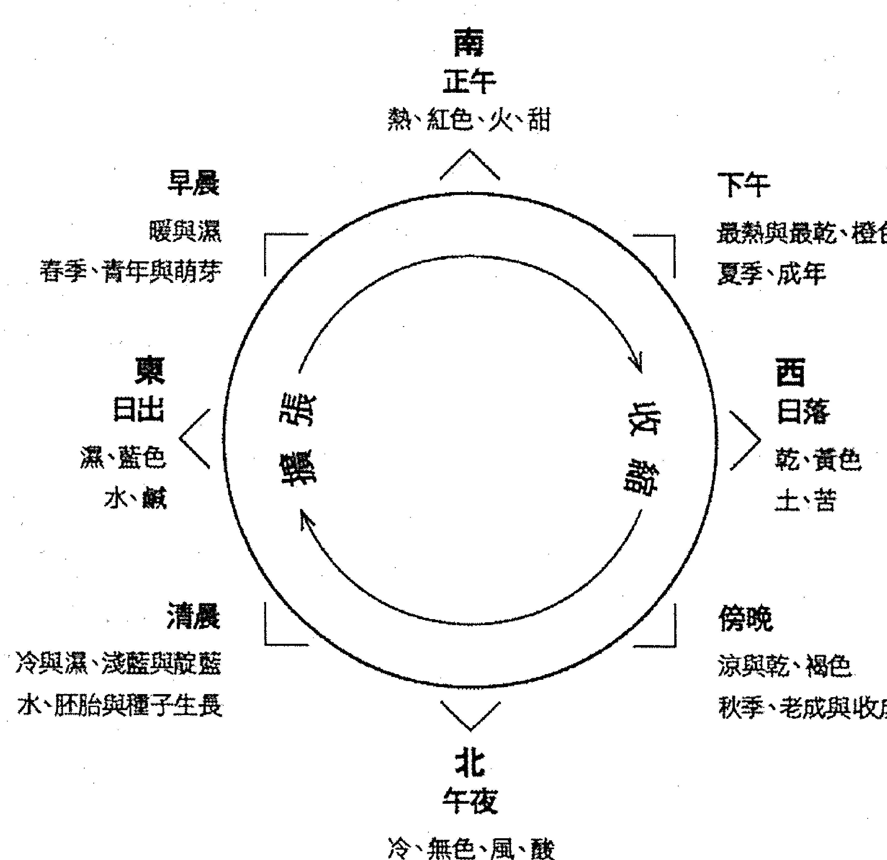
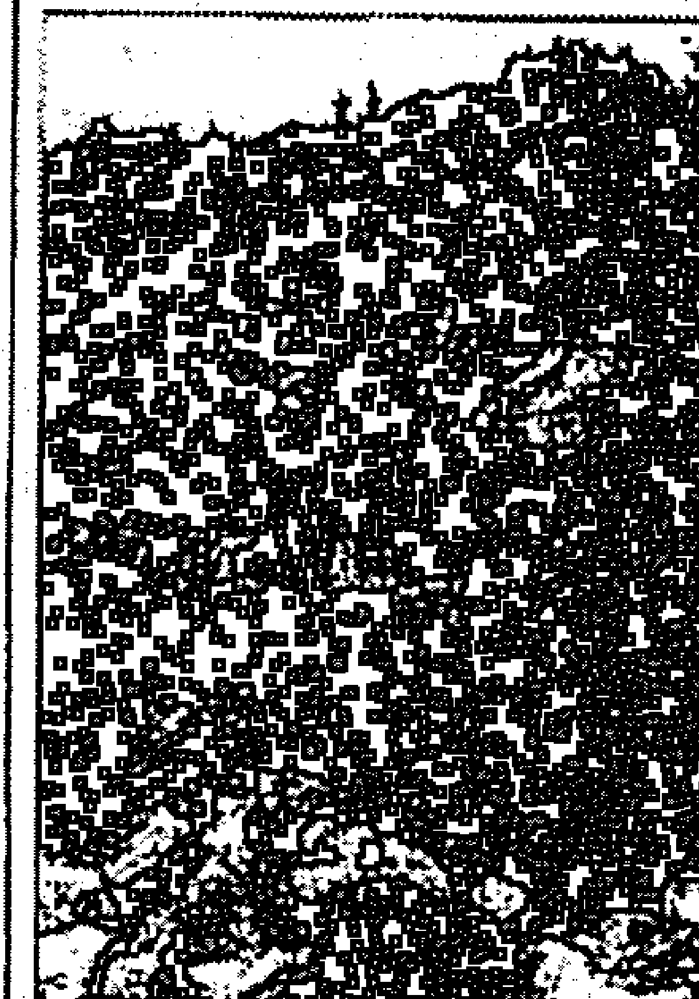
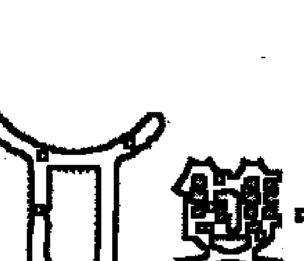
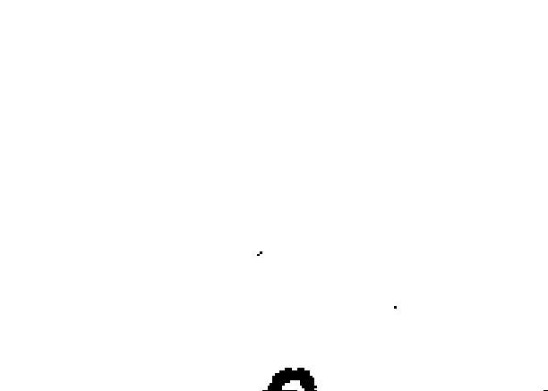
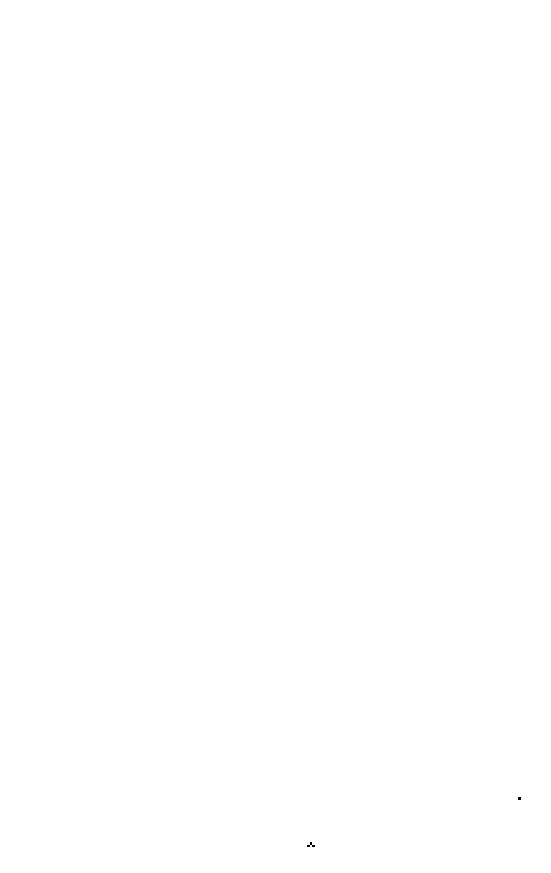

# 当代占星研究（排版2）

## ◎推薦序 開啟你的占星地圖——探索生命的無限可能

「一個占星師面對星盤時，不是急著問自己：我知道了什麼或看到了什麼？而是先提醒自己那些我所不知道的部分。一旦你明瞭了自己的限度，你就知道要保持一種謙虛的態度來看星盤」。當我乍聞湯普金老師這麼說時，有種醍醐灌頂的感受，長久以來困擾我的想法與限制，頓時豁然開朗。本書作者湯普金老師，算是我正式踏入心理占星學界的啟蒙恩師，對於占星，她有著獨到的見解。

湯普金老師於二〇〇〇年創立「倫敦占星學院」，而我從倫敦占星學院開始，也陸續參加過許多不同學院的課程，其中許多老師都是湯普金老師的學生。從湯普金老師與承襲他教學風格的老師身上，我看到了相似的大師身影，他們在探討星盤時，會盡量保持客觀的態度，用豐富的占星符號原型來詮釋星盤，保留更多的空間給當事人來演繹。同時，他們必須擁有豐富的符號認知，包含神話、心理、世俗各面向的充分瞭解，以利用這些知識替前來諮商的個案，開創出更多的可能性。

舉例來說吧！太陽符號在占星學中不但暗示著心理上的自我意識和追求、父親或男性伴侶，也可以是神話中克服挑戰、建立自己神廟（榮耀）的阿波羅，或象徵著國家領導者及物質上的黃金。所以當你看到一個太陽金牛座的人時，你不會急著說：「啊！這是一個愛錢的人。」因為這樣說「是也不是！」（Yes and No！是湯普金老師的口頭禪），因為他可能意識到自己是個重視物質的人，或將這個形象投射到父親或男性伴侶身上，讓他們表現出重視物質的態度；也可能透過物質累積來榮耀自己。當我明瞭這一點後，才理解為何在占星學院中，老師們不急於教妳怎麼推算流年，或告訴你土星在第八宮的人就是這種命？而是仔細帶你探索行星、宮位、星座原型，讓你對每種占星符號有踏實的認識，對每個人自身能夠作的改變有足夠的認知，對命運有謙卑的態度，然後才教授如何解讀星盤中的種種可能。

華人占星學界長久以來，一直以宿命的觀點在討論占星，但如果我們能與湯普金老師一樣，相信星盤會提供更多可能性，而自己可以用不同的視野來看待世界，或以謙卑的態度來面對那些我們無法掌握的一切，那麼，湯普金老師將會帶給你一個全新的占星世界。她的文字、思想與鑽研占星超過三十年的精髓，都將在這本《當代占星研究》中呈現出來。本書是「倫敦占星學院」的教科書，如今譯為中文，相信對於未來提升華人在占星學界的表現會更有幫助。

在倫敦占星學院受業於湯普金老師與Melanie Reinhart老師，受惠最多的並非那些高深的解盤技巧、如何斷定此人格局的論調，或不斷以數據證實占星影響力的立場，而是大師們在詮釋占星時的謙卑態度。這和東方命理界動輒自稱大師，自認鐵口直斷的態度大相逕庭。他們面對個案或討論時，鼓勵提醒我們去瞭解一個人潛在的發展可能——這就是人文占星學與心理占星學的基礎精神，將星盤看做是一個種子袋或一張地圖，這幅地圖上不只一條路徑，而我們隨時都有不同的人生岔路可供選擇。你準備好了嗎？讓我們一起跟著湯普金老師，透過占星符號來認識生命的種種可能。

魯道夫於倫敦，二〇〇九年六月十一日
（國際占星學院創辦人）

## ◎推荐序　苏．汤普金——一位占星师的成长过程

《当代占星研究》这本由苏．汤普金女士撰述的专业论着，是伦敦占星学院的教科书，其于二○○六年甫一出版，就在国际间掀起畅销热潮，占星家鲁道夫从伦敦带至巴黎给我，让我有幸能拜读此书。二○○九年夏天，积木文化出版中译本，我想对喜欢占星书的广大华文读者来说，绝对是值得引颈期待的好消息，也是占星界的一大盛事！

本书以「工具书」的方式撰述，内容针对占星学中「星座」、「宫位」、「相位」等三位一体的诸多概念有深入解释，不但为许多想进入占星世界、认识自身灵魂密码的读者打下扎实的「基本功」，更能帮助已入门的读者重新爬梳占星知识。它提供像字典一样的查索功能，只要排出个人星盘，便可援引本书，和真实的生命作比对，让我们更深刻地「读人」。

作者苏．汤普金女士为拥有三十年经验的资深占星学家、教师、谘商师、作家，以及自然疗法专家。她能成为一个优秀的占星师，其中很重要的原因是对人性的好奇。苏曾说过她从小内向，所以喜欢静静地「读人」！其曾祖母就对占星学很有兴趣，可惜在苏出生前就过世了！她的第一本启蒙书是早期的占星经典《Linda Goodman's Sun signs》（这本着作也是台湾很多占星师的启蒙书，包括我自己。）其後她参加Jeff Mayo老师的函授进修，并于一九七九年得到结业证书，日後也成为占星天后Liz Greene的门生。各位读者若有意追随苏．汤普金女士的脚步成为一位占星学家，也不妨参考这间位於伦敦，成立一九七三年的占星函授学校，同时也是「伦敦占星学院」的姐妹校。

The Mayo School of Astrology,
BCM Box 175, London WC1N 3XX, UK
Email: enquiries@mayoastrology.com
http://www.mayoastrology.com/

蘇．湯普金女士和克莉斯汀．泰德（Christine Tate）於二○○○年成立了「倫敦占星學院」（簡稱LSA）這所眾所矚目的專業學府，更於二○○三年獲頒英國占星協會察理士．哈維獎（Charles Harvey Award），肯定她在占星領域的傑出貢獻，這是一種終生的榮譽。此外，蘇．湯普金以自然療法解決從占星命盤上發現的感情與生理問題，成功結合了兩者的精髓，並於印度成立海外培訓地。我目前也有意結合兩者，進行相關的研究。

《當代占星研究》請到胡因夢小姐精譯，因夢譯占星書的譯筆，早已打造出專業的光環，我在此衷心為好友慶賀。因夢和我同為輔仁大學同期同學，那時早上搭車經常看到這一位輔大校花，就這樣結下緣分，不其然在往後的漫長人生道途上，我們的內在成長竟也朝同個方向行進，這份細若游絲卻綿延不盡的緣份，真是令人格外珍惜。本書作者將千人以上的諮詢經驗融入書中，還收錄了與Melanie Reinhart合著的篇章，介紹「凱龍星」和「奈瑟斯」（Nessus，或稱惡毒星）。我研究發現，命盤奈瑟斯合太陽九十冥王星，的確有惡毒星的特質，解盤時從惡毒星的方向去詮釋，將會有極大的發現和震憾！

吳安蘭於台北，二○○九

## ◎譯者序　當代占星研究的多元面向

學習任何一門知識或技藝時最快的入門方式，就是先了解這個領域裡貢獻良多的大師們各有什麼專長和心得。就生活在東方世界的占星學子而言，閱讀卓然有成的占星家著作，應該是最省時省力和省學費的方式了；這也是我自己長久以來的一種學習模式。

目前歐美占星學界有好幾位值得關注的大師，譬如本書作者｜蘇·湯普金（Sue Tompkins）、合著本書的Melanie Reinhart、倫敦心理占星學院創辦人Liz Greene和已故的事業夥伴Howard Sasportas，以及其生前的伴侶Erin Sullivan，還有我從二○○七年開始為華文讀者引介的史蒂芬·阿若優（Stephen Arroyo）。當然，目前仍活躍於美國的Jeff Green、Robert Hand、Alan Oken、Noel Tyle、Tracy Mark，或已故大師Dane Rudhyar及C.E.O Carter，都曾慷慨無私地將其心得與全世界的讀者分享。

從這些老師的著作中，我們學習到的不必然是占星學的專業技術，而更是這些研究者檢視星盤時背後的哲學和心理學觀點，或靈修體驗、宗教信念及其他領域的學養，如此我們方能使占星學和更宏大的生命目的連結，而不至於侷限在術數的窠臼中。從這個觀點來比較這些老師的思想和詮釋，我們會發現，蘇·湯普金是其中較為傾向於結合心理占星學派與事件派的資深研究者。

回歸傳統，似乎是天體的海王星與天王星合相於摩羯座（一九九三年）之後的發展趨勢，原因是七○年代後的心理學導向之占星學，已流於過度分析本命盤的心理內涵，而逐漸脫離了占星學與事件、國家、動物王國、健康、時尚、語源、化學元素及其他豐富外在現象之間的聯結性。本書的詮釋方向，很明顯地是企圖涵蓋心理層面及上述外在現象。

蘇以平實幽默、老練專業而又略帶嘲諷的文字風格，為一本原屬於工具式的基本教科書，注入了豐富的人文底蘊和趣味。在第一章裡，蘇為讀者解析了占星學背後的神秘學法則及哲學理念。宿命論與自由意志的悖論，幾乎是每一個占星學的門外漢必定會提出的質疑，而蘇以「生命地圖」的概念，巧妙地消融了「Fate and Will」的兩難之局，讓讀者從一種被定業「鎖碼」的無奈感解脫，進而發掘本命盤所承諾的發展潛力和選擇的可能性。

自第二章以降，蘇逐一說明占星的基本要素——星座的元素特質、人格模式、行星和天文學、神話學、人格面向、能量、身體、外在事件、金屬等各個生命介面之間的關係、行星落星座組合成的內在與外在意義、行星與行星相位所形成的複雜人格導向、宮位所代表生命領域裡的人生劇情；月交點、凱龍星、人馬星群及小行星，最後進入綜合性的解析，以個案為例，做出內外兼具的平衡觀察與詮釋。預計在不久的將來，積木文化將出版蘇的另一本經典著作《占星相位研究》（Aspects in Astrology），我也應允將其翻譯出來，因此讀者在未來將有機會，更完整地看到蘇在相位上的精闢心理剖析，請拭目以待。

總地來看，本書內涵的確有別於坊間可見的其他占星教材。我在翻譯的過程中受惠良多，但願近三十萬字的翻譯心血，能夠為有心深入於占星學的讀者們帶來一些啟發，讓我們對自己、他人及世界，產生更豁達、更客觀的認識。

胡因夢於台北，二〇〇九

# 第一章 占星學的哲學背景

> > 事事有時節，天下任何事皆有定時…… ——舊約訓道篇第三章第一節

自從有文明以來，每個文化裡都出現過某種形式的占星學。西洋占星學是在紀元前數千年前出現的；它的根源是在現代的伊拉克、部分的敘利亞和土耳其一帶。占星學的歷史久遠而複雜，其哲學背景甚至更複雜。

任何一個學習占星學一段時間的人，都會發現這門學問的確精準有效，於是就產生了一個問題：「它的原理究竟是什麼？」然後心底又會出現一些深層的疑問：「我為什麼會在這裡？」「上帝究竟是誰？」如同任何一個豐富而令人興奮的學問一樣，占星學也會使我們產生許多疑問和解答。遺憾的是，占星學的許多哲學分枝課題無法在這裡詳加探討，所以只好暫時擱置一旁。以下我要探討的是一般性的哲學法則，也是我個人運用和觀察占星學的基礎。

## 宿命論和自由意志

占星師和未來將成為占星師的人都想克服一個難題——宿命論和自由意志的議題。如果占星學真的如此精確無誤的話，是否意味著我們的人生是命定的？對我而言，這個問題的答案既非「是」，也非「不是」。毫無疑問地，我們必須為自己的人生及成敗負起全責，而且某種程度上，也必須為自己週遭發生的事負責。我們身上發生的事及我們的行為舉止，都可以從我們的星盤裡看出種種端倪。星盤基本上就是一張有關生命潛能的地圖，它就像是畫了許多種子的圖表，能夠顯示出我們將會成為的模樣，或許觀察宿命論和自由意志的方式，就是看一看這張星宮圖裡有些什麼主題。現在，不妨將你誕生時的星宮圖想像成卡拉哈力沙漠的地圖，而我的則是英國伯明罕的地圖。我們可以說卡拉哈力是你的命運所在地，伯明罕則是我的命運地盤，而我們的選擇和潛力都大不相同。我的道路是高高低低的，地圖裡面還有運河及我可以時常去晃蕩的商店，但我並不一定會去造訪我地圖裡的所有地點；至於你的那張卡拉哈力沙漠地圖，代表的則是其他的選擇：鄉間、遊樂區等……，你可以選擇放牧、狩獵、聆聽織布鳥的聲音，或觀賞眼前的大槐樹。因此我們雙方都有某種程度的自由意志，但我們的選擇也都受到地圖範圍的侷限。你可以說這份侷限就是我們的宿命。

當然一個人的星盤並不是存在於真空中；我們都受制於更大的命運——譬如我們國家的命運。同樣地，我們國家的命運也受制於地球的命運。占星學提供了一個讓我們觀察這兩種命運的機會，這麼做會讓我們增加自由意志運作的空間。政府、商業行為和各種事件，凡是有開端的東西，都可以呈現在星盤中。

## 大宇宙與小宇宙

從玄學、新時代和治療系統的觀點來看，宇宙萬物本是一個整體，其中的每個部分都是相互依存的；事實上，過往的煉金術和今日的量子力學，都把這種觀點視為核心精髓。這種觀點又延伸出了許多旁枝，因為宇宙萬物如果是一個整體，而萬物都是它的話，那麼傷害其中的一小部分（即使是一隻小螞蟻），也意味著在傷害整體和我們自己。這種觀點就是源自於大宇宙和小宇宙的關聯性。換句話說，所有顯化在大宇宙裡的事物和事件，都能反映出每個人或小宇宙的內在。科學已經把大自然的一切事物化約成一百一十八種元素，因此每個人體內都包含了週遭的萬物——所有的植物、動物、礦物和天體。

## 赫密士秘密教誨

煉金術是由赫密士·崔思莫吉司特斯（Hermes Trismegistus）發展出來的哲學理念。如果他是一個人而非一群人，那麼他存在的時間可能是紀元前一九○○年左右，他一向被視為字母、天文學、數學、占星學和煉金術的鼻祖。他的秘密教誨只透露給一些來自遠方、有誠意認真學習的學生，據說這所神秘的學院位於埃及境內。以「赫密士的方式密封」( hermetically sealed ) 這句話，就是在暗示其秘密教誨有多麼神秘。他的教誨是由老師以口耳相傳的方式傳授給學生，一般稱之為「卡巴拉密教」( Kybalion )，其中有七個宇宙法則，透過占星學的執業過程，這些法則已經被證實是真實不虛的。

### （一）唯心法則（The principle of mentalism）

這個法則可能是最不容易理解的，或許應該先擱置一旁。簡而言之，這個法則指的是宇宙萬物皆為「一切萬有」( All That Is ) 唯心所造。這個法則涉及的是上主的無限性和永恆性，因此對大部分人而言是不可知的議題。

### （二）上下一致法則（The principle of correspondence）

它指的是天上如是，人間亦然；也可以說內在如何，外在就如何。換句話說，在物質次元發生的事，源頭乃是在心智和靈性次元。身體上的現象往往是源自於內心；它們反映出了彼此。剛才提到的大宇宙和小宇宙的概念，也是上下一致法則的例子之一，下文我們會更深入地探討這個主題。

### （三）能量振動法則（The principle of vibration）

這意味著沒有任何事物是靜止的，萬事萬物都在不斷地變動。即使是地球｜這個感覺上十分堅實的東西，也是不斷繞著太陽和自己的軌道運轉。哲學家和科學家自古以來一直在敘述相同的一件事：亞里斯多德（紀元前三八四～三二二）曾說過，一切事物都在運動中，但我們一直忽略了這個事實；赫拉克利特斯（紀元前五三五～四七五）也曾主張，世界就像一條川流不息的河，因此你不可能兩次都踏進同樣的河中。所有的事物都在振動，或者說都有其振動頻率，改變振動頻率就能改變外在現象。最高振動頻率的水就是蒸氣，振動頻率最低的水則是冰；水藉由頻率的改變而示現成不同的形狀。

### （四）兩極或二元法則（The principle of polarity or duality）

此法則是指一切事物都有對立的一面，而對立的兩面本質上是相同的。以上和下、黑暗與光明的概念為例，事實上根本沒有所謂的上，也沒有所謂的下；它們是相對性的存在。這種二元法則也可以用在情緒層面，譬如愛與恨、喜悦和沮喪都是一體兩面。

### （五）週期循環法則（The principle of rhythm）

這個法則的意思是，萬事萬物皆有週期循環，譬如潮汐有退潮，也有漲潮。萬物皆有出入和升降，也都會經歷誕生、成長、毀壞和死亡；死亡既可以看成開端，也可以當成結尾。生命的週期循環有數千種，每一天的變化、每一次的呼吸，都算是一個循環。有的生命的週期循環只維持幾秒鐘，有的則維持數百萬年。如果每個人都接受了這個可謂十分明顯的真相，那麼我們就得承認一切都會經歷誕生、成長、毀壞和死亡，當然也包括地球在內。以目前的情況來看，地球或西方社會的演進的確已經到達中年，甚至是中晚年的階段。我之所以會下這個結論，乃是因為觀察到生命的速度一直在加快，特別是在城市裡面。這有點像人老了經常會說時間過得太快，而到了臨終階段甚至過得更快，但是對孩子而言，事情進行的速度則似乎太緩慢了。

### （六）因果法則（The principle of cause and effect）

這個法則指的是每個因都會造成一種果，每個果也都有它的因。萬事萬物都是按照這個法則運行，因此並沒有所謂的「巧合」( coincidence )。每個肇因都有許多層次，連那些看似意外的事件，也是由某種因素或多層因素造成的。因果法則也可以定義成「影響力法則」( The law of consequence )，因為每個思想、行為或事件都會產生反彈力，即使是一閃而逝的念頭，也會促成一些行動。所以我們的話語和行動無論多麼瑣碎，都會造成一些結果，影響到一些事情，而那些受到影響的事物，也會反過來影響其他的事物。每一個心念、情緒或生理反應，都會投射成外在的結果，而那股能量也會彈回到我們身上，就像回力棒一樣。

在東方世界裡，因果法則即是所謂的「業力」( Karma )，而且不只是顯現在這一輩子裡。按照邏輯推演下去，自然就產生了輪迴轉世的概念。許多占星師不一定相信輪迴轉世（我本人對這一點抱持開放態度），其實接受因果法則不代表必須相信輪迴轉世的概念。無論讀者個人的信念是什麼，我們現在都必須探討一下「輪迴觀」。輪迴觀主張肉體只是一個載具，當肉體死亡時，靈魂會脫離肉體，然後獲得重生。身體被視為一具讓人活出靈魂使命的工具，每個人在每一世裡都會收穫過去世播下的種子，同時也會再度播下未來世將收成的種子。因此根據轉世法則，我們的思想和行為總會反彈到我們身上，包括這一世及未來世，所以每時每刻我們都在創造此生的下一個階段，以及未來的多生多世。雖然我們過去世的行為留下了一些遺產，而且帶來了某種程度的侷限（這種侷限可以定義為我們的命運），但我們仍然可以改變未來的命運。雖然我們無法改變過去已經發生的事，但仍然可以改變面對眼前事件的態度，因為改變態度和想法，就能改變行為和命運。

### （七）陰陽法則（The principle of gender）

這個法則指的是一切事物都有陰陽兩面。陽的這一面是外向的、積極的和煽動的，陰的這一面則是向內的及帶有接收性的——當然這包括了身心靈三個層次。即使是和一個人交談的過程，我們都可以看到其中的陰陽法則。說話的那一方表現的是陽性模式，聆聽的那一方則表現出陰性模式。在占星學裡面，火象和風象星座代表的是陽性法則，土象和水象星座代表陰性法則。在行星方面，太陽和火星顯然帶有陽性特質，月亮和金星則顯然帶有陰性特質。

## 進一步探討上下一致法則

雖然我們是住在一個以太陽為中心的宇宙裡，但由於地球自轉的緣故，所以我們每天的活動好像是以地球為中心，太陽和所有的行星反而是繞著我們運轉。雖然本命盤的繪製有時是以太陽為中心，但比較常見的繪製方式還是以人類經驗的角度為準，因此往往描述成以地球為中心。

想像一下你正行走在地球上，四周沒有任何建築物阻擋你的視線。你腳下的土地就是你的地平線，因此你可以朝東看，也可以向西看，可以觀賞日出，也可以觀賞日落。吃中飯時太陽在你的頭頂，黃昏時分太陽就消失了。請記住，你的地平線和別人的地平線是不一樣的。的，除非他们和你站在同样的地点，而这就是我们观察一张星宫图的起点。此图的上方代表的是白昼，下方代表的则是夜晚。

## 人生地图：上下一致法则的着眼点

假设现在并没有在下雨，那么一天之中最湿的时段是何时？答案是露水落在地面的清晨时分。白天里太阳高高挂在天上，制造了热和干的效应，而日落是一天之中最干的时刻。正午时分气温很热，但下午其实更热。同样地，气温在子夜过后是最冷的时段。一整年的情况也是如此：大致而言，春天比较潮湿，秋天比较干燥，夏天比较热，冬天则比较冷。其实每个人的人生也是大同小异：婴儿时期我们是最滋润的，随着年龄的增长我们变得越来越干，因此老年经常被描绘成秋季；这时叶子都干枯了，骨骼也开始脆化，皮肤则满布皱纹。

我们也可以把地、水、火、风、色彩和味道加进我们的人生地图里。譬如水很显然和蓝色有关，而咸味和蓝色的海水不是一向连在一块儿的吗？红色则代表火，在太阳的照射之下，果实会越来越甜，当洋葱或其他的蔬菜被炒熟时，也会变得很甜。我们的年纪越大，性格越刻薄，而苦涩的食物似乎和大地也比较接近。风元素往往和冷的感觉相关——如果我们的食物很烫，我们会吹吹它，让它凉一点。如果我们把牛奶放在空气里，它会变酸。（请参阅图①）当我们想让温度低一点的时候，会利用风扇、空调或电冰箱。月亮的变化周期也可以纳入这个图表中，而秋分和春分、夏至和冬至以及指南针，也可以包括进来。

请留意这个图表的目的是要帮助我们了解上下一致法则是怎么运作的——这是一张概略的人生地图，所以不该和本命盘混淆。在不同的文化里，元素和四季各有不同的版本，这个特定的图表和一般占星师及草药医师使用的模型不同，因为他们沿用的是柏拉图的概念，把风看成是暖和湿的元素。这个图表和我个人的经验比较吻合，它应该有历史的脉络，因为西元第四世纪的卓越医者菲利斯提恩（Philistion）似乎特别偏爱它。但这不意味占星师都应该采用这个图表，或者初学者都应该了解它。我甚至无法信心满满地声称它是绝对正确的。它只是能将一天、一年或一生的概略状况反映出来，而且许多不相干的事情，似乎也可以透过它看出彼此的关联性。

炼金师和占星师一向采信上下一致法则，我怀疑是否有任何占星师不相信发炎现象和火星有关。的确，占星学本身就是一种研究上下一致法则的学问。研究上下的关联性最令人兴奋的是，它涉及的范围非常宽广。我愈来愈发现行星、星座和相位的确和某些动物有关。举个例子，鸟类大体而言和宝瓶座相关（请参阅第三章，‘宝瓶座’章节），如果想更精确地研究每一种鸟类，就应该把十二星座也纳入考量：家禽可能和巨蟹座有关；天鹅、孔雀之类的鸟类则归狮子座管辖；譬如麻雀的小型鸟类，属于处女座管辖的范畴；此外，昆虫、爬虫类、花和大型动物，也可以用这种方式归类，甚至其他的事物也都可以用这种方式来观察，譬如当你看到新闻媒体有许多和警察相关的报道时，你就会发现天体有许多行星落在金牛座；高尔夫球选手则通常有强烈的摩羯座能量，或者有水星与土星的相位；欧洲人经常会在天王星推进时到澳洲去旅游。只要稍微研究一下，我们就会明白为什么某些活动或地方，总是和特定的象征符号相关。

你不需要走出屋外，只要观察世上的活动和天上的行星，就会了解万物之间的关联性。图②是伦敦的报纸Metro于二〇〇年六月二十八日刊登的头版消息。如果你仔细检视的话，会发现版面上方有一行建议读者关切新上映的电影“Chicken Run”的消息，而英国网球选手提姆·翰门（Tim Henman）的成绩表现则刊登在最后一页（译注：Henman这个名字之中的“Hen”字，是母鸡的意思）；大厨尼格拉·劳森（Nigella Lawson）在第十页也写了一篇有关鸡的文章。这些消息全都带有家禽的意味，看起来实在有点滑稽，然而观察宇宙运作的方式，每每都会有一种滑稽的感觉。此外，这份报纸头版的大标题是：“Family Backs Danbo Suspect”。Danbo在法文有个类似的字——Dindon——意思就是火鸡！这个标题里既提到了“家”也提到了“鸡”，因此任何一个占星师如果发现那一天的太阳、水星、金星、火星及南交点都落在巨蟹座（和家庭、食物及家禽有关的星座），是不会感到意外的。另一个和食物有关的星座是金牛座，而那一天月亮、木星和土星都落在这个星座上。观察入微的占星师可能会在头版的这一页发现更多的巨蟹座踪迹，如果他们愿意这么做的话。

## Family backs Dando suspect

Five survive as car falls 150ft down cliff

First review of Chicken Run Page 3

*   - Mowiam under fire for attack on royals
*   - Labour MP criticises 'president Blair'
*   - Walters in credit card scams
*   - Henman restores British pride

所有的新闻报道无可避免地都能反映出天体当时的情况，甚至不必局限於新闻报道；即使是轻松的娱乐活动，也能反映出天体的情况。不论你选择哪一天来进行观察，无论你选择的是哪一种媒体（电视比较容易一些），都可能发现当天的星体位置和发生的事件有关。

不过当然，研究占星学最佳的方式还是观察自己的人生里发生的事，以及周遭人的生活情况。

虽然目前的科学不流行以经验性的方式进行观察，但以我个人的经验来看，只要我们能勤加检视自己观察到的事物，这仍是非常有效的学习方式。就以占星家兼炼金师帕拉赛尔瑟斯（Paracelsus，1493-1541）为例，他是现代医学、生化学、药学、生理学之父；他的老师，也就是他的父亲威勒姆斯（Wilhelmus）。父亲教导他不要仰赖书籍或其他权威人物的意见，而是要直接观察大自然，从自己的主观经验来进行研究，他照办了。从他之后，人类的知识有了惊人的进展，但我们所知仍然有限，而且许多知识已经失传。威勒姆斯的建言从今日的角度来看，其真实性完全不逊于十六世纪。从主观经验的角度去进行科学观察是正确的，因为任何事的发生都不是意外，正如荣格所言：「在任何时刻诞生或成就的事，必定带有那个时刻的特质。」从各个不同的角度来观察和研究占星学，我们会有很多的发现，而且相当有趣。

每个人看待世界的方式都不一样，诠释的方式也不相同。占星师的任务就是从更大的视野来理解事情，譬如从内在的、神秘的或灵魂的角度——有点像神职人员、萨满、心理治疗师的角度——来看这个世界。如果这听起来太玄的话，不妨可以把天宫图看成是一张生命地图，而占星师只是个解图者。地图可以让我们注意到以往忽略的事情，也能帮助我们看到自己与一切事物的关系，或者帮我们发现属于自己的道路。占星师的工作能让我们寻找人生方向的过程变得比较容易一些。这并不意味专业占星师应该告诉个案往哪个方向走，而是要帮助个案看到自己目前所处的状态为何。举个例子，布拉格斯太太去询问一位占星师有关她工作方面的事。她不喜欢目前的工作，因为她觉得上司太专制，令她很受不了。她说她觉得自己被压榨和受到威胁，因此希望占星师能告诉她是否该辞职、去找另外一份工作。当然占星师会观察个案是否该找新的工作、自己当老板、改变工作跑道或是退休，而答案的确可以从天宫图里看出来，占星师甚至可能预测出将来会发生的事，不过当然，布拉格斯太太也应该为自己做决定。此外，事情也会因为我们有了觉知而改变——能量永远会随着想法的改变而起变化。

占星师的工作比较不是预测未来，而是诠释当下正在发生什么事。譬如布拉格斯太太的冥王星可能落在十宫，而天体的土星正和冥王星合相，这个相位能描绘出她目前的感觉和情况。十宫代表的是包括父母在内的权威人物，占星师很清楚这一点，所以会询问布拉格斯太太是否觉得目前的上司，很像她童年里的某个权威人物，或者她对那个人的感觉和对现在上司的感觉很相似。布拉格斯太太的回答很可能是：「你提出的这个问题真有意思，我的上司的确很像我的母亲一样令我害怕。我以前总觉得老是遭到她的批判。我现在的心情就像回到五岁时一样。」接着占星师就会告诉布拉格斯太太，她正在把早期的无能感投射到目前的情况上面。布拉格斯太太以前在面对母亲时总有一种无能的感觉，不过她现在已经不是小孩了，所以应该有能力坦然地面对上司。其实上天给了她一个机会，让她克服早期和母亲的问题。这次咨询之后，布拉格斯太太也许会以截然不同的角度来看自己的情况。她可能会发现若是不处理无能和被批判的感觉，未来仍会遇到相同的情况，毕竟我们总是带着自己的心理包袱在经验人生。虽然换工作和换上司也可能是非常妥当的处理方式，但更重要的是无论她的选择为何，都得带着更高的觉知去面对，而且她必须为自己做出决定，并为自己的决定负责。

同时还有一个问题要考量，那就是到底她的父母和上司是真的过于苛责她，还是她把自己的批判投射到这两个权威人物身上了。但这样的探讨可能得留到下一次咨询才来进行。

以我来看，占星师的工作就是去发现目前情况的内在真相是什么。占星学可以用各种方式增加我们的觉知，也可以让我们对各式各样的情况看得更清楚。为了达成这个目的，研究占星学的学生必须熟悉天宫图的基本语言——元素、星座、行星、宫位及相位。

## **第二章 元素与模式**

### **元素**

自从化学周期表及一百一十八种元素被发现之后，“元素”这个字的复杂性已经远远超过地、水、火、风的概念。虽然如此，这四个基本元素仍然能提供基本的结构，以便我们观察大自然和人类的行为。

四元素代表四种基本的接收和消化外在刺激的方式。这四种方式可以总结成下面的诠释：

*   • 火元素代表的是让事情发生的驱力，或是证实及确立这股驱力的一种需求，以及赋予它意义的愿望。
*   • 土元素代表的是让内在驱力变成具体现实，以及想触摸和闻其味的渴望。
*   • 风元素代表的是沟通、定名和建立概念的驱力。
*   • 水元素代表的则是在情感层面产生连结的驱力，并且想要知道这份连结是否愉悦。

四元素是黄道的基本结构，因此能帮助我们了解十二星座的性质。每个人的天宫图都是由四元素及其特质组合成的，但某些星盘会强化或缺少其中的一些元素。了解元素及其代表的模式能使我们对星座有更深的认识，让我们更加了解整张天宫图。接下来的论述主要着眼在四元素象征的人类经验，以及从元素的强化或缺乏的情况来看出公司、国家及事件的背後真相。举个例子，代表意外事件的星盘里往往缺少土元素。

### 火象星座：牡羊座、狮子座、射手座

火能提供温暖和光明的感觉。由于火总是向上燃烧，所以火象星座也带有高昂、热切及充满信心的特质。火象人通常很享受生活，乐观开朗，甚至带有老虎般的活力。火象人即使遇到挫折，也会像火堆上暂时添了木材一样，没多久又再度炙热地燃烧起来。典型的火象人很少生闷气，但如果星盘里还有强烈的土元素和水元素，那么这些元素的湿气就会影响火的燃烧，而风元素却有煽风点火的效应。

火象星座通常比较有愿景，也有激励人的才能；每一个火象星座都会以自己的方式行动。牡羊座的驱力是成为拓荒者、战士，为目 标奋斗的人；狮子座会以忠诚、高尚和重视声誉的特质来启发别人；射手座则会促使别人追求意义和成长，包括身心灵三个层面。因此，火元素的目的就是带领、启发和赋予别人信心，火象星座是正向和外向的，同时带有一种自发性。火元素也能促成事情，产生激励作用，所以典型火象人非常不喜欢消极被动的态度，而且会轻视只是“存在”（being）的人生观。火元素的速度通常很快，做事冲动，而且对事情完成时的状态有一种愿景。火象人能嗅到未来的可能性，深信自己的愿景会成为事实，并能说服别人相信事情终可达成。

过度发展的火元素往往因燃烧过度，而出现阶段性的瓦解。这类人有可能造成别人过度耗损精力，特别是那些实事求是类型的人，因为火象人热切的愿景很少能落实成行动，多半得靠别人来完成。

火元素的才能比较偏向理想主义而非现实主义。这类人很不容易出现稳定、平衡、敏感、同理和细腻的特质，但必须检视星盘的其他部分。

### 土象星座：金牛座、处女座、摩羯座

我们的地球是滋养万物的地方；我们在上面种植各种东西，落地活在其上，因此土象人显得比较可靠、足以被仰赖。这类人周到、实际和踏实，对责任义务、谋生、照料身体等事情，觉得很自在。土象人懂得和物质世界的局限调和一致。他们了解金钱和财物的重要性，能够接受自己和他人对这些事物的仰仗。土元素关切的是真实的世界，不像火元素那么憧憬未来。每个土象星座都能接受眼前的现实和具体的事物。金牛座和摩羯座非常渴望生产出具体的东西，尤其是可以被看见和衡量的东西。土元素和物质相处得很和谐，若缺乏物质保障会没有安全感。处女座也带有这种特质，但因为它是变动星座，而且主宰行星是水星，所以是最不典型的土象星座；它比较带有风或“沙子”的特质。

土象星座关切的是经济和物质层面的安全保障。某些土象人很渴望拥有高品质的物质生活，有的却觉得拥有物质保障不一定非得致富。土象星座的物质需求比较起来不算太多，许多土象人只要有起码的经济基础，就觉得舒服了。这类人的性格通常是稳定而平衡的。若无其事地说冷笑话，是这类人的特质之一。

如果星盘里的土元素过多，则可能会过度重视物质，不允许自己的物质保障受到威胁。这类人不太愿意冒险，即使改变已经是必要的事。最糟的情况是变得狭窄、过度谨慎、保守和传统，甚至会变成例行公事的奴隶。如果有火元素或带有热切特质的行星，就可以减轻上述的倾向。

### 风象星座：双子座、天秤座、宝瓶座

风没有任何具体形状，它可以上下左右到处流通。风代表左右流通的活动，也象征风象人的平衡特质。所有的声音，包括说话和音乐，都必须仰赖风来传达，因为声音是藉由能量振动而产生。

火元素代表的是愿景，土元素是把愿景变成产物，风元素则负责将其告知所有人。风元素的任务也包括对生产出来的东西做出意义上的诠释，以及为事情提出计划和方案。

风元素被强化的人非常渴望与人沟通交流，因此关系对他们而言是最重要的部分。风象人由于不把情绪投注到关系里，所以具有高超的社交技巧；他们很懂得施与受的艺术，不会产生不必要的防卫性，也不容易被搅扰。风象人由于能冷静地观察事物，所以才能发展出社交技巧。风元素会增加理性和客观性，以及从长计议的能力。典型的风象人对你的观点会很感兴趣，也很愿意理解，但不一定是赞同你。没有一个风象星座和动物有关，这意味着这些星座是比较文明的。

风象人最佳的品质是优雅、富人道精神和彬彬有礼。他们能觉知别人的权力，也懂得公平待人；如果发展过度的话，则会变得过于理性、喜欢用脑、崇尚理论，而且不实际。风象人总是从某种公式和模式在看待人生，所以会把真实的生命经验化约成一种方程式。然而真实的世界和理论往往相距甚远，因此在最糟的情况下，风象人会变成理论和法则的奴隶，与外在的世界及自己的需求脱节。过多的风元素也会造成犹豫不决、焦虑和注意力不集中。

### 水象星座：巨蟹座、天蝎座、双鱼座

水元素可以变成各式各样的形状：川流不息的小溪、绵绵细雨、停滞不动的池塘或是惊涛骇浪。水显然是湿的，因此能净化、滋润或是把东西溶解掉；缺少了它，生命就不存在了。水没有固定形状，它会随着不同的容器改变形状和色彩，而且总是往低处流。

水象星座比较内向低调，它关切的是情绪的安全感和归属感。巨蟹座最关切的是提供归属感的家庭，天蝎座在意的是强烈的亲密关系，双鱼座则倾向于众生一体和灵性上的归属感。水必须置于杯中才觉得有规范；水象星座能反映和它在一起的所有事物。水象人很容易受环境影响，有融入的能力，而且十分敏感。他们会把周遭人的感觉、细微的心态和各种变化接收进来，然后加以消化吸收，再把不必要的东西排除掉。最糟的情况下，水象人会被洪水淹没，亦即无法抵抗周遭复杂细微的信息。由于这份敏感性，水象人显得格外脆弱、易感，继而变得过度自保和守密。大部分的水象星座都有一种表面平静、底部却暗潮汹涌的特质。如果运作良好，水会是最有同理心和善于回应的元素，这类人能够完全觉察到你的感受。但水元素如果太氾滥，就可能无法区分自己和他人的感觉、过于执着、依赖、不理性、喜欢操控，或是过度认同周遭发生的事。

### 元素的组合

了解每个元素之后，就比较容易理解各种元素的组合会是什么情况。简而言之，火与土的组合可能缺乏细腻的觉知，但会显现出强大的动力，成为一个不畏艰险，能够将事情落实的理想主义者。火与风的组合往往是怀抱着伟大理论的理想主义者。火与水的组合则是真正具有创造力的人，不过情绪起伏很大。土与水的组合会带来滋养的能力和负责的态度，十分关切自己和他人的安全保障。土和风的组合带来的是枯燥和实际的特质，不过也有实事求是的智慧和幽默感。风与水的组合则会特别重视关系，对人性了如指掌。

### 缺乏某些元素

由于每张星盘里都有十二个星座，所以不可能真的缺少任何元素，但很可能没有行星落在特定的元素上，或者落在特定元素上的行星很少。如果有这种情况的话，缺少的那个元素的性格弱点就会变得十分明显，这意味着会从潜意识或缺乏觉知的状态去运作。这类人似乎无法控制和处理那个特定元素象征的性格特质，而那个元素通常会以负向的方式展现出来。举个例子，由于火元素代表的是直觉力，因此缺乏火元素的人可能带有负向的直觉；换句话说，他们总是预期不好的事会发生在自己身上，但缺乏火元素却有利于撰写犯罪或恐怖小说。

由于人类多半会全力朝著性格整合的方向发展，所以会试图转化缺少特定元素带来的问题。因此一个缺乏风元素的人，可能会选择星盘里风元素被强化的人做伴侣，或者可能成为图书馆管理员、谘商师，从别处寻找补偿。我们不但要考量落在特定元素上的行星有多少，而且要考量这个行星落在哪里。假如我们有四个行星落在水元素和第七宫里，却完全不带有水象人的特质，那就意味着我们的伴侣可能会显现出水元素的特质。

在实际咨询时，我们会发现，元素的缺乏可能以各种方式显现出来，因此重点应该放在那些被强化的元素上。如果星盘里完全没有元素不平衡的情况，就不能透过元素来了解星盘。以下列出的是元素缺乏的心理状态和显现方式。

*   • 一般而言，缺少某种元素可能会令一个人无法掌控相关的能量。譬如缺少水元素的人比较无法掌控情感。缺少的那个元素，基本上会让一个人在相关领域的运作较为迟缓。
*   • 人们也可能在缺少的元素所代表的事物上，产生较为强烈的倾向——他们可能会从事和那个元素相关的行业。有时过度强化或过度不强化某个星座，显现出来的状态都差不多。
*   • 人们往往以幼稚和不成熟的方式，来展现缺乏的那个元素的特质。举例来说，缺乏土元素的人对裸露身体比较没有羞耻感，也比较觉察不到他们裸露出来的身体对别人造成的影响。
*   • 人们对自己缺乏的元素所象征的事物也可能特别敏感，容易被触动。譬如缺乏风元素的人可能会在意别人低估了他的智力，水元素不足的人则很怕别人说他不够敏感。
*   • 由于这份敏感性，人们往往会寻求补偿，因此缺少水元素的人可能会送花及贺卡给你，缺少风元素则喜欢搜集资历和书籍。
*   • 人们也可能在自己缺乏的元素所象征的事物上面，显现出轻视的特质，或是批判那个生命领域，对于在那个领域里表现得游刃有余的人，做出负面的诠释。因此，缺少风元素的人可能不喜欢知识分子；缺少水元素的人，会对那些太情绪化或太会取悦的人抱持怀疑态度；缺少土元素的人可能会指责别人太物化或是太虚荣；缺少火元素的人则可能不喜欢有赌徒性格的人，或那些凭运气就能过关的人。

### # 构成元素缺乏的条件

在元素缺乏的条件上面，占星学并没有严格的规定。大部分的人都没有很明显元素不平衡的情况，因此在看盘时最好把注意力集中在被强化的要素上。你应该记住的重点是，行星落入的元素不可能是完全平衡的，而且外行星的元素通常都不是重点所在。譬如冥王星可能会在一个星座待三十年之久，天王星和海王星会在一个星座待七年和十四年，而木星和土星也不及个人行星来得重要。

# 第三章 黃道十二星座

像其他的個人行星一樣（尤其是太陽、月亮及上升點的主宰行星），上升點的星座元素也很重要，而天頂的元素則是可以被忽略的，因為它並不是一張星盤裡的個人性要點。但一個人若是沒有任何行星落在特定的元素上，而這個元素又恰好顯現在上升點上，那麼按照我的經驗來看，此人反而能意識到缺乏此元素的問題，而會藉由上升點的星座，將此元素的能量展現出來。如果一個人沒有土象行星，但土象宮位裡卻擠進了許多行星，那麼此人就會在他的職業活動裡解決土元素缺乏的問題。如果天頂的元素在星盤的其他地方都找不到，也可能在職業上顯現出這個元素的特質，瑪麗蓮·夢露就是一個很好的例子。瑪麗蓮除了凱龍星之外，沒有任何一個行星落在土象元素上，但她的天頂是落在金牛座，因此她的職業總是把焦點放在她的身體上面，甚至可以說她的身體就是她的名望所在，但她的心理狀態卻完全顯現了土元素缺乏的情況。

### 沒有行星落在火元素

缺少火元素會顯現成缺乏動力和活力（不過得視太陽、火星和木星落在什麼元素上），這類人對自己和人生也時常缺乏信賴感及自信心。缺少火元素的人很難像孩子一樣相信，「事情終究會沒問題的」。這類人的直覺多半帶有負面傾向，總覺得不好的事將發生在自己身上，譬如遭到攻擊、被搶劫、被謀殺，或是發生交通意外。他們也可能有迷信傾向，許多人因缺乏火元素而選擇上教堂、找占星師或通靈者求教；他們以為一旦知道了最壞的情況是什麼，就可以有所準備，而且多半不知道命運是操在自己手上的。缺乏火元素的人比較適合簡明易懂的協助方式，因此占星和塔羅諮商對他們都很有幫助，因為這些途徑會令他們意識到更多的可能性。遊戲和歡樂的情境也能幫助他們，因為火元素缺乏的人不太有能力「放下」。

### 沒有行星落在土元素

土元素缺乏使人無法與金錢及物質連結，但也可能過於耽溺物質世界，而且對大自然有一種過度天真的激賞。這些人會對身體著迷，甚至有種想要展示的幼稚需求，譬如模特兒或那些穿著過於裸露、曲線畢露的人。經常參加天體營的人，也可能缺少落在土元素的行星。疑心病（hypochondria）也是缺少土元素的顯現方式之一，這類人經常懷疑自己得了不治之症，但真相可能只是忘了休息一下去吃午餐！缺少土元素也可能造成上癮症，因為這類人不知道何時該停下來，也不懂得知足。如果星盤裡的土星被強化的話，上癮傾向就會減輕一些，但海王星卻會強化這種傾向。這類人容易魯莽、忘東忘西或是欠債。缺少土元素適合的治療方式，通常是瑜珈、按摩、園藝或運動；只要能幫助這類人認清身體的治療方式都很適合。

### 沒有行星落在風元素

缺少風元素最大的問題，就是無法意會自己的行動或他人行動的意義。這類人也很難看到大局，而這勢必會帶來一些問題，因為顧全大局能幫助我們以實事求是的方式處理事情，令我們意識到自己和他人的需求。因此，缺少風元素的人很難與人合作或妥協，也很難以理性的方式採取行動，他們鮮少客觀看待自己的問題，或容易耽溺在自己的痛苦之中。還有有些人在面對陌生人和陌生情境時，會顯現出焦慮的反應，或者很難做出必要的改變；他們會把事情想像得很糟，容易擔憂或做出最糟的預言。但缺乏風元素並不意味智力不足或缺少思維能力（愛因斯坦就缺少風元素），而是在溝通和學習時比較缺乏信心，容易被別人的意見影響。缺少風元素的人通常很喜歡地圖及能提供方向的事物，譬如心理學和占星學對他們就很有利，因為能增加客觀性和實際的著眼點。

### 沒有行星落在水元素

缺少水元素最大的困難就是不易消化感覺。缺少水元素的人之中，有一部分的人可能完全無法將別人和自己的感覺連結，甚至到達無同理心的程度。這類人覺得「情感」是令人痛苦的東西，所以會過度地將其壓抑下來，原因是早期有創傷經驗。他們並不是喪失了情感，而是無法以老練的方式和感覺相處，所以無法善加控制，這就像水龍頭失靈一樣，很難控制情緒的來去。缺少水元素也可能顯現成超級敏感的特質：和愛人吵一架之後，就以為關係已經到達盡頭，因此處理不好的水元素會帶來易怒、防衛性強、情感容易受傷等傾向。這類人也可能階段性地執著於某個人，感覺上好像被情緒淹沒似的。缺少水元素的人往往以情緒化的方式表達自己的感覺，也容易被那些以天真的方式表達情感的人吸引。音樂和繪畫這一類的藝術形式，都很有利於水元素缺乏的人，因為這能提供一個出口，讓他們表達情感。他們也很適合從事和人相關的工作。

## 星座模式（性質）三分法

十二星座除了可以分成四種元素外，也可以按模式、性質或特質區分為三組。

了解星座模式三分法，可以使我們對整張星盤有進一步的認識。這些星座在模式上如果有不平衡的情況，也能說明一個人將如何看待和處理衝突矛盾。由於人生本身就是衝突矛盾的，因此我們可以說星座的模式顯現的是處理人生的方式。每一張星盤裡都有十二個星座，而大部分星盤的模式之間都有一種平衡性，不過有的也會顯現出明顯的偏重和缺乏。如果有這種情況的話，就是理解一張星盤的重點之一。據統計，大約有百分之四十的星盤裡帶有 T 型相位（T-square，請參閱第五章，第二部分：相位的圖型章節），但只有百分之五的星盤裡會出現大十字（Grand cross，請參閱第五章，第二部分：相位的圖型章節）。理解 T 型相位和大十字，首先就是要檢視這些相位落入的星座模式。

|          | 火元素 | 土元素 | 風元素 | 水元素 |
| :------- | :----- | :----- | :----- | :----- |
| 創始星座 | 牡羊座 | 摩羯座 | 天秤座 | 巨蟹座 |
| 固定星座 | 獅子座 | 金牛座 | 寶瓶座 | 天蠍座 |
| 變動星座 | 射手座 | 處女座 | 雙子座 | 雙魚座 |

### 創始星座：牡羊座、巨蟹座、天秤座、摩羯座

太陽進入每一個創始星座，都是南北半球四季的開端，因此創始星座的特質和開端、新的開始及改變，有緊密的關係。但是分開來看，每一個創始星座的開創特質卻比較不明顯。牡羊座關切的當然是往前拓展，但巨蟹座卻顯得很害羞，天秤座則有猶豫不決的傾向。雖然如此，每一個創始星座仍然會在自己的領域裡促成一些事情。創始（cardinal）這個字源自於拉丁文的cardo，意思是生命的「樞紐」（hinges）。因此創始星座關切的是生命的主要衝突和議題。衝突是指日常生活裡有許多力量在拉扯著我們，因而產生了時間、興趣、資源等各方面的衝突。對許多人而言，生活的確像是多頭馬車一樣，既要往前開創、做個先驅、實踐自己要做的事（牡羊座），又要尊重別人的需求、與別人合作及結合（天秤座），還得在社會建立受人尊崇的地位、擁有事業成就（摩羯座），同時要照顧到家庭及父母的需求（巨蟹座）和要求，此外自己還要扮演父母的角色（巨蟹座和摩羯座）。

那些和創始星座十分相應的人，很容易把衝突當成是從外面來的力量，故而無法映照出內在的矛盾。他們的能量多半花在面對外在的挑戰上，而且很想征服這些挑戰。創始型的人不會因循成規；如果他們覺得不快樂，很快會去追求新的目標。他們十分有行動力，不怕捲起袖管開創事業。如果創始星座過於被強化的話，很容易製造危機。這類人的開創力、行動力和機會主義傾向，往往會帶來巨大的驅力和活力，而且不喜歡受限制。他們不願被別人或外在情況制約，喜歡發號施令，所以他們總是坐在駕駛座上面，即使還未學會開車。他們急於以自己的方式做自己想做的事，尤其是那些有T型相位的人；有大十字的人這種傾向甚至更明顯一些，高度的競爭性會讓他們反體制，反抗一般人做事的方式。這種不計一切要採取行動的人，通常不善於規劃，很容易與人正面衝突。他們極需培養穩定平衡的心態，並且要接受自己和他人的侷限。

從身體健康的角度來看，創始星座和受疾病攻擊及突發的疾病有關。如果突發的疾病沒有妥當地照料，就等於在自我設限；身體這個有機體若是不能恢復健康、變得更強壯，便可能會死亡。在現代西方社會裡，突發的疾病已經不太常見了，因為一出現病徵，就會用抗生素將其壓抑下來。

### 創始星座

| 發展良好       | 發展過度           | 發展不足               |
| :------------- | :----------------- | :--------------------- |
| • 有能力開創事情 | • 永遠都在開始新的計劃，但很難完成 | • 缺乏開創力需要人推一把 |
| • 自動自发 • 以目標為導向 | • 很難與人合作，因為這會改變原先的目標 | • 因循成規（近於固定星座） • 逃避挑戰（近於變動星座） |
| • 善於處理危機   | • 容易製造危機和麻煩 | • 竭力避免危機         |
| • 與當下連結     | • 只關切眼前的議題 | • 逃避真實生活         |

### 固定星座：金牛座、獅子座、天蠍座、寶瓶座

固定星座最大的特質就是執著：金牛座執著於物質世界，只相信具體的事物；獅子座執著於自尊；天蠍座執著於情感；寶瓶座執著於理念。

固定星座會帶來毅力、穩定度、持續力和可靠性，而且比較有持久力。因為固定型的人能夠忍受變動型和創始型人所不能忍受的情境，因此比較有持續力。固定型的人適合與你長期相處，他們的專注能量比較像是拉馬車的馬而非賽馬。但這類型人的缺點是容易因循成規，停滯在某種情況裡，他們不容易放下人、感覺、事情或概念，而且抗拒改變。這類星座有點像是一個季節的中段，譬如仲夏，這時春季早已過去而秋季還沒有蹤影。這個時段是建構期，目的是為創始星座開拓出來的東西奠定基礎，所以這種能量是專注的、強烈的和持久的。固定型的人很善於維持和保有既定的地位。固定星座同時帶有一種很難變動的特質，似乎往哪個方向移動都不太可能，那些由固定星座形成T型相位或大十字的人，往往顯得特別頑固、果決、有毅力和不願妥協。這類人最大的缺點就是相信強權就是公理，因此必須培養彈性。

從健康和身體的觀點來看，固定星座和慢性病有關：這些長年發展出來的疾病，會讓這類人的速度變得緩慢，而且似乎很難治癒，只有忍耐一途了。毒素會慢慢損害身體，令這些人必須承受痛苦。

### 固定星座

| 發展良好                   | 過度發展                 | 發展不足                 |
| :------------------------- | :----------------------- | :----------------------- |
| • 果決而有毅力             | • 頑固、缺乏伸縮性       | • 缺乏力量和持續力       |
| • 意志力強                 | • 意志力過強             | • 缺乏意志力             |
| • 堅定、值得信賴、忠誠     | • 僵固、執拗缺乏適應力   | • 不堅定、優柔寡斷       |
| • 有堅持力 • 抗拒改變  | • 因循成規 • 動彈不得 | • 任何事都不能堅持       |
| • 只要一發動，就有極大的動力 | • 傾向於保存精力         | • 隨波逐流 （特別像是變動星座） |

### 變動星座：雙子座、處女座、射手座、雙魚座

變動星座等同於四季的尾聲，如夏末秋初之際。這類人善於面對不確定的情況及目標的改變。他們能夠面對變動和過渡期，隨時準備應變。他們不期待事情能持久，有不安於室的傾向。

所有的變動星座都關切理念（雙子座、處女座）或信仰（射手座、雙魚座）。這類人傾向於閱讀、高談闊論或是把人生哲學化，所以他們的挑戰就是必須學習實際地過日子。變動星座在乎的是跟生命本身的關係，所以既不渴望權力，也不以目標為導向。雖然他們對付出承諾有點羞怯，但卻是最容易相處的類型，而且不會跟隨他人的腳步。這類人會停留在他們感興趣的事情上面，否則就會不安於室地追求下一個目標。當他們面臨衝突、不和諧及挑戰時，往往會藉由改變方向來逃避。如果這些星座形成了T型相位或大十字相位，通常很難建立目標，達成一些成就。這類有T型相位和大十字的人特別焦慮不安和缺乏耐力，他們若想有生產力，必須發展出自我紀律，並且要訂立實際的目標。變動型的人缺乏追根究底的驅力和毅力（固定星座的特質），以及往上攀升的能力（創始星座的特質），但這類人很有適應各種情況的本能。變動星座有時也被稱為「普通」（common）星座，這是因為一般人多半採取適應的方式來面對人生，不普通的人則是要世界屈就於他們。

從健康的觀點來看，這類星座最大的問題就是缺乏抵抗力。這類人會注意到風吹草動的訊息，每當要付出承諾和做決定時，都會有焦慮感。

### 變動星座

| 發展良好                     | 發展過度                               | 發展不足                 |
| :--------------------------- | :------------------------------------- | :----------------------- |
| • 適應性高                   | • 過於配合                             | • 無法配合和服從         |
| • 可以和任何一種情境共處     | • 太容易分心                           |                          |
| • 各種方向都能包容           | • 不善於排除                           |                          |
| • 有調整能力                 | • 不需配合時卻一味配合 • 應該堅持時卻改變態度 | • 不能調整和適應         |
| • 好奇、喜歡搜尋             | • 缺乏目標和方向                       | • 目標改變會覺得不舒服   |
|                              | • 注意力分散、焦慮                     | • 狹窄                   |

## 象徵與象形符號

每個星座都有其象徵，譬如牡羊座的象徵是公羊，金牛座的象徵是公牛等。象徵基本上是在傳遞概括或簡潔的意義。如同行星一樣，每個星座也有其符號圖騰；它們能快速地傳達每個星座的意義和相關內涵。各個社會運用的語言雖然有所不同，但是都有立即傳達信息、使人一看就懂的標誌，因此我們也可以像認路標一樣地辨認占星學的象徵與符號。

## 星座代表成長的不同階段

星座也可以看成是一個人成長的不同階段。舉個例子，牡羊座代表的是開疆闢土的階段，金牛座代表的是在土地上建構的階段，雙子座代表的是開始學習如何與鄰居互動的階段，巨蟹座則是成立家庭的階段。我們可以按照黃道十二星座編出一套成長的故事，而每個星座都比上個星座的狀態更複雜一些。在牡羊座的階段裡，我們的自我仍然處於稚嫩的未發育時期，但歷經十二個星座之後，我們已經認清了自己和他人、社會及整體宇宙的關係。當我們到達雙魚座的時候，靈性的面向就會發展出來。

另一個要注意的重點是星座的順序。每個星座都會試圖彌補上一個星座的缺失或發展過度的部分，所以會與上一個星座做出相對的反應。

## 星座的分類

星座可以按照其元素或表現方式來分類，也有以其他方式來區分星座的，譬如認識元素或表現形式的平衡與否，也是一種了解星盤的入門方式。

十二星座以四個為一組，恰好可以分成三大區塊。第一個區塊是由牡羊座、金牛座、雙子座、巨蟹座所組成，它們關切的是人生的基本事物，或者可以說是生存的基本需求。接下來的獅子座、處女座、天秤座及天蠍座，則開始冒險投入社會，探索關係中的種種議題。最後的四個星座｜射手座、摩羯座、寶瓶座及雙魚座，關切的則是集體和宇宙性事物，其中，雙魚座也和靈性的次元有關。有時一張星盤會強調這三組星座中的某一組，而這往往是理解整張星盤及個人的重要入手之處。舉個例子，一個人的星盤裡如果沒有行星落在前四個星座（如果我們考量的是宮位，則要注意前四個宮位），那麼此人就會把個人需求擱置一旁或完全忽略。如果星盤裡沒有任何行星落在後面四個星座或宮位，那麼此人就會忽略人生或世界的宏觀議題。但這個概念不需要太強調，因為還有其他因素需要考量，譬如被佔據的宮位和被佔據的星座有相同的屬性（例如完全沒有任何行星落在最後四個星座和最後四個宮位），這就顯得很重要了。

### 身體的部位

由於一張星盤裡十二星座都會出現，所以思考健康議題時，應該考量整張星盤，而不只是星座。大體而言，從星座來考量健康議題，要觀察的除了太陽星座，還有六宮的宮頭星座及上升點的星座，同時要留意土星的星座位置也代表身體比較脆弱的部位。

## 觀察星座時必須考量的重點

認識星座可以幫助你詮釋星盤裡的行星和四交點，本書裡與行星有關的「工具式」（Cook Book）解析部分，也可以在這方面提供一些參考。

由於坊間的一些占星書對太陽星座已經有許多討論，所以本書不再強調這一部分。本書裡描繪的太陽星座特質，比較側重在我們努力想達成的狀態，而非我們已經擁有的性格特質。

十二個星座都分佈在整張星盤裡；你可以從宮位和宮頭星座，譬如金牛座或雙子座，看到哪個生命領域最具有這些星座的特質。不要忘了宮頭星座的主宰行星也能帶給你許多信息（請參閱第六章，宮位主宰行星的重要性章節）。

## 牡羊座

元素：火 表現模式：創始

主宰行星：火星

### 象徵及符號

牡羊座的象徵是一頭公羊，也可以詮釋成公羊的角和鼻子，或所謂的「破城槌」（ battering ram ）。牡羊座始於春季的第一天（北半球），象徵一個新的開始。牡羊座管轄身體的頭部，其符號同時也代表人的眉毛和鼻子。

### 星座特質

身為黃道第一個星座，牡羊座關切的是新的開端。這個星座最主要的心理特質是喜歡搶第一、容易受傷、天真而不造作。任何一個行星落在牡羊座，都會被這種搶先和喜歡競爭的特質影響。除了喜歡搶先之外，在我的經驗裡，牡羊型人似乎是最佳的模仿者：你擁有什麼，牡羊人也想擁有。只要聽到一個好想法，牡羊人很快會將其發揚光大，並因此而成名，就好像別人從未有過這個想法似的。牡羊人對自己的發現如同孩子般興高采烈，他們意識不到無數人早已過相同的認識。開拓者雖然有探究未知的勇氣，但首度做某件事也意味著準備不周，難怪牡羊座一向和強烈、熱切、不成熟、天真、衝動、魯莽及不顧後果有關。這些特質同時也表現出年輕、活力充沛和開創精神，不過有時也會惹事生非，陷入困境。神話故事裡的那些俠客英雄或騎著白馬拯救落難女子的武士，多半都頂著牡羊座的光環。讓我再補充一點，行星落入牡羊座既代表拯救者，也代表被拯救的對象，而且不一定是男人救女人。

牡羊座需要行動；做為一個以行動掛帥的星座，靜待事情發生絕非它的風格，因此牡羊人總是勇往直前迎向人生。擁有特定的目標能夠將這個星座最佳的一面顯現出來，這意味著他們必須為某件事或某個人努力奮鬥，至少得找點事做。牡羊人善於快速做決定或排解紛爭，只要是帶著追逐或征服成分的事，都很適合他們。反之，需要內省、自我質疑或妥協，則往往不是牡羊人擅長的。

牡羊座帶有傲慢、衝動、不耐煩及不顧後果的特質，但這個星座的活力與熱情很能鼓舞他人採取行動。落在牡羊座的任何一個行星，都能激勵整張星宮圖的其他部分採取行動。從另一個角度來看，有強烈牡羊能量的人也可能極為自我中心和帶有機會主義傾向，他們一意孤行的處事方式可能會導致反社會傾向，或是觸犯到那些較為含蓄的人。牡羊人處置事情的態度既誠實又直接，他們從不繞圈子。有強烈牡羊傾向的人很難看見別人的觀點，也不容易與人合作。這個星座最大的弱點是無法讓自己從眼前的事物中抽離出來，似乎凡事都和他們的自我有關。

太陽或月亮落在牡羊座的人經常被指控為專橫霸道，但這個星座並不真的對權力或領導地位感興趣。牡羊人既不需要也不尋求他人的贊同、許可或合作，牡羊人只想以自己的方式做事；換句話說，他們不想被任何人或星盤裡的任何能量阻擾、拘束、羈絆。行星落在牡羊座成困難相位經常會帶來一種挫敗感，原因是這類人喜歡插嘴，而旁人或許不會以友善的方式回應這種任意干預的態度，甚至可能制止這種行為。牡羊人的這種強制態度多半源自於行動的需求，以及對他人或緩慢步調的不耐煩。牡羊人不喜歡等別人做決定，或是花太多時間準備行動，因此他們不善於團隊活動，總覺得別人的速度太慢。他們非常善於處理事情或完成手上的工作，但通常缺乏持續力。這個星座的目的是開創而不必然是完成。

這類人樂於見到挑戰，如果有某種程度的準備，成功的機率將會提高許多。當他們面臨障礙的時候，若是能了解結果總是得來不易，或許就能降低挫敗感。由於火星主宰牡羊座，所以太陽或月亮落在牡羊座的人，經常會在事與願違時大發牢騷。傳統占星理論將這個星座的關鍵詞定義為「我要」，這的確是很貼切的描述，不過「我立刻要」或許更精確一點。占星家約翰·亞歷山大（John Alexander）很精# 牡羊座

精確地觀察出太陽落牡羊座的人時常覺得被拋棄或冷落，這是因為他們很難與人合作所導致的困境。舉個例子，不妨想像一下某位牡羊人的同伴們很想去當地的中國餐館吃晚飯，而此人卻獨獨想吃墨西哥餐廳的外賣速食，結果當夥伴們離開他去吃酸辣湯和炒麵時，他竟然覺得非常驚訝。這種被冷落的感覺同時也反映出牡羊人多麼渴望投入眼前的活動，因此重點不是他被冷落了，而是他非常想參一腳。

#### 大範圍

歷史上的一些善於侵略和殖民的國家，多半帶有牡羊特質，英國就是其中的一個例子（必須同時參照摩羯座）。我曾經說過，從海外移民到英國的人，本命盤裡往往有強烈的牡羊座傾向。在動物王國裡，公羊以及那些為了交配而相互爭鬥的動物，都可以看成是牡羊類型。領域觀強烈、作風魯莽、胸前有紅色羽毛的知更鳥，也帶有牡羊特質。

### 色彩 / 品味 / 風格

代表「前進」的紅色是典型的牡羊座色彩，但黑白兩色也包括在內，因為深受這個星座影響的人，看事物的方式往往非黑即白。在品味方面，牡羊座喜歡強烈的風格，譬如愛穿色彩鮮豔的服裝，偏好最時髦的髮型或最短的迷你裙。牡羊人也喜歡戴帽子，即使是太陽或月亮移位進入牡羊座，也會讓那些非牡羊型的人戴起帽子來。更精確地說，本命盤裡的太陽與水星合相在牡羊座的人，尤其喜歡戴帽子。

### 身體的部位

牡羊座統轄的是人體的頭部，它除了會造成與頭部相關的一些失調症（頭痛、偏頭痛、腦震盪、腦神經痛）之外，還有許多與頭部相關的辭彙，都可以用來描述這個星座。牡羊法則可能會導致衝動和不顧後果，只有當這些人學會深思之後，成功才容易降臨。簡而言之，牡羊人必須學習思考。不懂得三思而行，往往令這些人遭到意外災害，譬如可能傷到眼睛或頭部。許多牡羊人都有高挺的鼻子和顯眼的眉毛，或者臉部有傷疤。太陽落牡羊座的人，經常以他們的直接逼視他人而著稱，比較害羞的類型則會在走路時避開人們的眼神。

### 行星落在牡羊座

行星落在牡羊座通常會加快速度，而且會以衝動、冒險、果決及勇敢的方式展現能量，但是與這個行星相關的行動不一定能持久。勇敢大膽的特質也可以納入與此行星相關的心理面向。任何一個落在牡羊座的行星，都帶有競爭傾向（請留意，土星落在牡羊座可能會害怕競爭，或者不敢搶先，但又怕無法搶先）。

### 宮頭是牡羊座的宮位

在這個生命領域裡，我們會顯現出勇敢大膽的特質。我們會在這個領域裡勇於開創，也可能帶有競爭性，除了急於採取行動，也可能激勵別人採取行動。這個生命領域促使我們說出：「我要做自己想做的事，而且是在我想要的時刻去做。」在這個領域裡我們總是先行動後思考。舉個例子，七宮宮頭如果落在牡羊座，代表此人的伴侶或是對合夥關係的需求，會促使他採取行動。

## 金牛座

元素：土 表现模式：固定

主宰行星：金星

## 象征及符号

金牛座的符号是一只公牛的头和角。公牛的形象是强而有力的：这种动物的行为相当迟缓，然而一旦被激怒，却力大无穷。公牛可以说是一座活生生的堡垒、城墙或拒马，因为它的体积庞大，力量惊人。被阉割的成熟公牛能够毫不费力地拖运最沉重的货物，同时它也是繁殖力强的动物。棒球队经常称自己为蛮牛（芝加哥蛮牛队），以显示队伍的力量和耐力。公牛也象征多产，某些人甚至把金牛座的符号看成是通往子宫的输卵管。

## 星座特质

如果牡羊座的任务是开创，那么金牛座的任务就是维持、扎根和累积。牡羊座渴望的是「做为」，金牛座则既不想做什么，也不想反思或推测。金牛座的本能只是「存在」以及「拥有」。金牛人追求的是生产与获取，然后继续保有他获得的东西，难怪这个星座会以占有欲著称。

金牛座是十二星座里最有耐力、最踏实的一个，也是最沉着、平静以及有耐性的星座：它就像是一棵橡树而非柳树。橡树不像柳树那么有伸缩性，但我们必须明白，靠在橡树上更令人觉得舒服，而你的确可以依靠那些星盘里有强烈金牛座倾向的人。金牛座若非顽强固执，就必定是果决和不屈不挠的，这只从容不迫的公牛如果不情愿，你很难拉动它、推动它或逼它做任何事。如果有一些重要行星落在金牛座（譬如火星），那么抗拒改变的倾向很可能导致蛮横的行为，特别是那些尚未学会以健康清明的方式满足欲望的人。任何一个农夫都能证实平日温驯的牛若是遭到压迫（压迫可以定义为不当的干扰），往往会变得有攻击性，不过大体而言，金牛座的攻击性还是比较被动的。

金牛座虽然不是最有想像力的星座，却被赐予了通情达理、实事求是的能力。如果有许多行星都落在金牛座，那么此人通常不会想改变生活方式，而且会在大部分的生命领域里追求稳定性和地位。他们的许多决定都源自于有意无意地渴望过宁静生活，以及强烈地想维护自我。金牛人的哲学就是要维持现状——最好是永远维持现状，或者至少得有细嚼慢咽的机会。如果星盘里的其他元素也有相同特质，那么金牛型的人是不会干预或过问他人之事的。同样地，他们也不喜欢受到别人的干扰。

实事求是及不喜欢纯理论性的事物，导致金牛人不会轻易相信无法看见或触摸到的事物。他们喜欢过简单的生活，在大部分的状况下都偏好俭朴自然。金牛人不善于应付复杂的人或复杂的情况，实事求是和踏实的作风，使得这类人不喜欢多余的包装。他们能一眼洞穿瞎扯的话语，而且颇能欣赏低俗的幽默。

金牛座关切的是生产及建构具体事物。「建构」无疑是任何一个行星落在金牛座的关键词。这类人有能力缓慢而坚定地付出努力，这种踏实的作风终将带来一些财富。教育家并不是典型金牛人会扮演的角色，但若是有这个必要，他们通常会以简单明了、按部就班的方式教导别人。

金牛人也非常关切安全感及稳定性的议题。对星盘里金牛座被强化的人而言，家庭、食物及身体的安全保障等人生的基本事物，都是不能遭到危害的，因此他们不会轻易去做任何可能危及健康和物质保障的事。对那些喜欢自由和冒险的人来说，金牛人似乎太苦干和守旧了些。

基本上金牛人是冷静自制的，他们不容易被痛苦或快乐的情绪影响，这是因为他们有能力平静地接受一切发生的事，将其视为不可避免的结果。因此，金牛座比任何一个星座更接近自然。金牛人欣赏大自然的美、土地生产出来的食物和丰富的资源，这种倾向为人生和艺术带来了良好的协调感。自然界的韵律基本上是不变的，这或许是金牛人能够在大自然里泰然自若的另一个原因，他们能与自然连结，也包括和身体的需求及能力连结。这个星座不但踏实而感性，同时还有高度发展的知觉能力——特别是味觉、嗅觉和触觉。金牛座对形式和质感的敏锐知觉，十分利于从事和织品有关的行业，同时也利于发展与触觉有关的技术，譬如按摩、芳香疗法或徒手疗法。建筑业、音乐、农业及园艺，都是金牛人适合从事的工作。凡是和嘴有关的事，金牛人也很擅长——唱歌和品尝食物，所以歌唱也是这类人适合从事的工作。某些金牛座被强化的人显现出的脆弱易感，可能会发展成对舒适和美好生活的上瘾倾向。金牛座也是有点自我耽溺和懒散的星座；这类人容易怠惰或停滞不前，他们善于保存精力而非应用精力。

双脚（或四足）踏实地站在地面上，而且拥有良好的协调感，使得金牛座成为黄道十二星座中最稳健清醒的星座之一。在情绪、性爱和愤怒的管理上面，这类人带有一种静默的抗拒心态，通常性欲被激起的速度比较缓慢，但是有相当程度的持久力。这个星座的踏实特质也促成了一种幽默感，但这类人的笑料多半源自于人性的某些基本特质。除非本命盘里有其他重要元素，否则金牛人的幽默通常是单纯而土味十足的。

坚强可能是这个星座的另一个关键特质。金牛人就像一头公牛那么坚决和稳定，能够安静地检视来到他面前的任何一股能量。因此，金牛人的力量足以镇定地面对焦虑、维护自我，但也可能阻碍成长和改变。

#### 大範圍

虽然射手座传统上与西班牙有关，但是我认为西班牙这个国家应该属于金牛座。这是透过个案研究及和归纳与西班牙有关的新闻而得到的结论，因为西班牙一向以斗牛著称。这个国家里有许多看似乡土的人，可是当你和他们熟识之后，却发现他们相当富有。家畜（尤其是公牛），包括猪在内的农场动物，也会令人联想起金牛座。换句话说，这些动物最终都成了人类的食物！请留意，警察也经常被称为「猪」(Pigs)，我认为这个行业与金牛座是有关联的，金牛座也可以用来象征巡警的沉重步伐。私家侦探则跟金牛座成对立项的天蝎座有关。爱尔兰是另一个与金牛座连结的国家，对于这个观点，我既无法否决也不能确认，不过由于这个国家田园风味十足，所以还算是合理的说法。

### 色彩／品味／風格

金牛座通常与清柔淡雅的自然色彩相关，譬如淡粉色、青色或蓝绿色。这类人也喜欢印花布料，而且品味较保守。无论金牛人喜欢何种色彩，通常他们都热爱织品，特别是触感舒适的布料，如丝绒或真丝。

### 身體的部位

金牛座统辖的是人体的颈部，也包括甲状腺和喉部在内。金牛人的颈部若不是修长而优美，就是粗粗壮壮的。金牛座也是一个与美好嗓音有关的星座。在健康上面，这类人的喉咙容易发炎，颈部容易僵硬疼痛。

### 行星落在金牛座

行星落在金牛座的运作速度往往比较缓慢、单纯和谨慎。金牛座为任何一个行星带来了稳定及传统的特质，也会染上与金钱及美有关的色彩，至少和拥有的概念相关。

### 宮頭是金牛座的宮位

在这个宫位里，我们会觉得钱要花得有价值。举个例子，某位女士二宫的宫头是金牛座，她告诉我，她只会在大减价时去买名设计师的服装！在金牛宫里我们会显得比较传统、踏实或自我保护，同时会展现出可靠和实事求是的特质。我们也会在这个领域里展现出占有欲。假如七宫宫头是金牛座，那么此人就会吸引占有欲强的伴侣，或者对伴侣产生强烈的占有欲。

## 雙子座

元素：風 表現模式：變動
主宰行星：水星

### 象徵及符號

兩條平行的直線被上下兩道半弧銜接，就是雙子座的符號，它也代表雙重性。所謂的「東奔西跑」，頗能傳神地描繪雙子座的精神；這類人總是從某個地方或狀態，移動到另一個地方或狀態。

### 星座特質

雙子座的法則就是連結。這個象徵超級互聯網的星座，十分關切人、地方及概念的串聯，其目的就是溝通、交流和聯想。雙子座的工作是擷取資訊、加以調查分析，然後將其散佈出去。與雙子座對立的射手座考量的則是資訊的意義，另一個由水星主宰的處女座，負責的則是決定眼前的資訊是否有用；若是無用，它就會將其淘汰掉。雙子座的任務僅僅在於蒐集資訊和傳播，因此雙子人既是學者，也是八卦消息的散佈者，這兩者蒐集了資訊之後，就會將其傳遞給對方。蒐集與事實相關的資訊，必須有開放的態度，因此任何一種檢查尺度都會阻礙這份自由性。基本上，太強烈的是非觀念也會限制這類人的發展，難怪雙子座一向被視為無道德觀念的星座。那些有強烈雙子傾向的人多半有敏捷的頭腦，而且很有韌性，充滿著好奇心。好奇心強可能是這個星座最顯著的特質。

善於應變，富伸縮性和適應性，喜歡變化和多樣性，導致雙子人不斷地追求各式各樣的任務，而且儘可能以各種方式達成任務（不像前面的金牛座只喜歡以同樣的方式做同樣的事）。基於這個理由，雙子人往往對生命抱持實驗態度，凡事都不太認真，總是暫時停留在某種狀態裡。他們害怕付出承諾，對各種可能性皆抱持開放態度。

雙子座和其他變動星座一樣，都不是以目標為導向，因為目標暗示著長遠的承諾，但雙子人偏愛的卻是短程旅行，而且非常喜歡在途中脫軌或節外生枝。雙子座比其他任何一個星座都博雜，他的研究方向通常不專一，而且往往是因為一時興起的決定。然而，人生最大的滿足是來自於深刻的經驗，細嚼慢嚐才能品嚐到真正的滋味；雙子人的風格卻是從一朵花跳到另一朵花，這種花蝴蝶般的存在方式不但會造成焦慮不安，而且會帶來不滿足感。基於這個理由，一個人的星盤如果強化了這個一知半解的星座，很容易導致缺憾感，即便當事者正熱衷於眼前的某種活動。

雙子人是卓越的經紀人，他們總能把A與B連在一起，因此可以說是十分善於串聯的星座。這類人不喜歡被排除於外，很急於參與，但又渴望能自由活動，隨時有個出口，不致於過度受限或責任繁重。雙子人是最佳的雜技師，他們不停地把玩著人、時間、地點和概念。

如果有許多行星落在雙子座，通常會有語文才華。這類人熱愛各種遊戲，特別是打撲克牌。他們也喜歡騎腳踏車、打網球、溜直排輪，對各式各樣的知識或訊息的交流都有興趣。雖然本命盤很難衡量出一個人的智力，但是有強烈雙子傾向的人通常是聰明的。

從最糟的角度來看，這個容易感到乏味的星座，可能會導致輕浮、匆忙、游移不定及善變。如果本命盤有強烈的土星傾向或有許多固定星座，那麼這類特質就會減輕一些。雙子座也會造成容易上當或多疑的性格，因為很難發展出深度。對一切事物抱持開放態度和無法篩檢資訊，往往會變得很難做決定，因此典型的雙子人容易顯現三心兩意的態度。如同古羅馬的雙面守門神（Janus）一樣，雙子座也能同時面對不同的方向。

從最佳的角度來看，有強烈雙子傾向的人是多才多藝和善於應變的。這類人通常很時髦，能夠領先潮流，善於社交應酬，顯得十分忙碌。總之，雙子座是個有趣的星座，行星落在雙子座可能會追求新奇之事，也可能製造出能帶來新奇事物的人。這個星座也跟年輕人有關，特別是那些渴望變化，但又不想在沒有足夠經驗之下就付出承諾的年輕人。這類人如同小飛俠一般，終生都能保持年輕，尤其是星盤裡有強烈雙子座和射手座對立性的人；如果火元素強而土元素弱，就更容易有這種特質。

從第三宮和水星可以看出更明顯的雙子傾向，若是有許多行星落在雙子座，也可以看出兄弟姊妹的特質以及此人與他們的關係。

#### 大範圍

昆蟲界通常與雙子座相關，尤其是會飛的昆蟲、蛾類及蝴蝶。同時我也發現，當行星推進或離開落在雙子座的火星時，往往和大黃蜂或蜜蜂之類會螫人的昆蟲產生關聯。雙子座也掌管猴族，而善於模仿的鳥類，譬如鸚鵡、烏鴉和仿聲鳥，也都跟雙子座的能量相關。倫敦這個變化多端的商業都會，多少世紀以來一直和雙子座連在一塊兒，威廉·勒利在一六六六年九月做出有關倫敦大火的預言，就是源自於看見了一個被火焚燒的木雕學生像。

### 色彩 / 品味 / 風格

這是一個摩登又注重時尚的星座。與雙子座的主宰行星水星相關的顏色是黃色——這個帶有激勵作用的色彩一向和溝通及心智活動有關，基於這個原因，以往的精神療養院的牆壁都是漆成黃色。黃色是一種喜悅的能量，因此頗能代表朝著光明和快樂的方向改變的雙子座。這類人喜歡直線條而非彎曲的線條。在品味方面，雙子座很難被歸類，他們喜歡各式各樣的色彩與風格。

### 身體的部位

雙子座主宰著肺、手臂和手，根據我的經驗，它和四肢都有關係。一個人若是因為某種理由而行動有困難，這種情況可以從行星落在本命盤的三宮或雙子座的相位看出端倪。雙子座是一個緊張、容易擔憂的星座，尤其是許多行星都落在這個星座的話。面對別人的期待，他們的這種傾向會更明顯。水星類型的人及有強烈雙子特質的人，很容易有抽菸的習慣（一開始只是想用雙手來做些事），或者比其他類型的人更不喜歡抽煙。這個星座的關鍵部位是呼吸系統。

### 行星落在雙子座

雙子座為任何一個行星帶來了輕鬆愉快的特質，幾乎像是增添了空氣似的。那個行星不但會變得輕快而不嚴肅，同時也會變得難以捉摸，注意力分散。但土星是個例外，因為雙子座會讓土星過度專注的傾向變得分散一些。與土星相關的心理議題如果受到雙子座的影響，會比較容易表達出來；我們會因此而渴望了解這個行星代表的心理面向。雙子座也和年輕人有關：假如金星或火星是落在雙子座，尤其是火星，那麼此人和愛人的年紀便可能有明顯差距。

### 宮頭是雙子座的宮位

宮頭星座是雙子座的宮位通常帶有一種雙重性：舉個例子，落在七宮頭代表有兩次婚姻，落在六宮頭代表有兩份工作，落在四宮和十宮頭則可能有兩對父母。兄弟姊妹也會是這個宮位裡的重要主題，而且此宮和上學的時段有關。與這個宮位相關的活動可能會比較多樣化，此人也會以高度的好奇心，以及理性和知性的觀點，來看待這個宮位的活動。

## 巨蟹座

元素：水 表現模式：創始

主宰行星：月亮

### 象徵及符號

巨蟹座的象徵是一隻螃蟹，其符號可以看成是螃蟹的一對鉗子，以保護的姿態圍成了一個圓圈。這個符號看起來也很像反轉的69數字。螃蟹的硬殼是用來保護它的柔軟身軀的，而巨蟹人也有這種傾向：外殼很硬，防衛性很強，但內在是柔軟濕潤的。這個符號也代表胸部（巨蟹座管轄的身體部位）和搖籃般的手臂。這兩種意象都象徵滋養及母性本質。

### 星座特質

巨蟹座強調的是家、家庭以及過去。這類人渴望安全感，有強烈的歸屬趨力。巨蟹座傾向十分明顯的人通常熱愛歷史和古董。歷史和家族都能帶來一種延續感，擁有過去的歷史令這類人產生一種情緒上的安全感，歸屬於一個家族也能提供安全感。巨蟹座能扮演家族裡的重要角色，主要的任務就是抵擋外來的威脅。

雖然巨蟹座是一個創始星座，但是它處理事情的方式並不直接了當。就像螃蟹的動作一樣，巨蟹人也傾向於旁敲側擊，拐彎抹角；他們是很善於此道的。當一個人需要某種程度的保護時，退縮到自己的殼裡或繞道而行，都是有利的做法，但也可能因此而避開了那些應該面對的問題。如同螃蟹有一對巨大的鉗子，能夠牢牢地鉗住某個東西，巨蟹型的人也會緊抓不放，顯得相當執著。

拐彎抹角、繞道而行，往往是為了掩飾害羞和靦腆的本質，旁敲側擊總比直接面對要容易得多。那些有許多行星落在巨蟹座的人或許防衛性真的很強，但也有狡猾的一面。狡猾、保守的態度以及緊抓不放的特質，演變成了理財方面的技巧，或者可以說是「善於持家」。這類人的領域觀，還伴隨著積攢財物和吝嗇的傾向。

巨蟹座一向以想像力、敏感性及同理心著稱，它的能量是柔和而順服的，不過防衛性也極強。巨蟹型的人不但想保護自己，也想保護他的家族，甚至他的國家；巨蟹人很可能變成愛國主義者。那些有強烈巨蟹傾向的人容易自認為遭受到威脅，他們會用各種方式來回應他感覺到的威脅，而反應的模式通常是易怒、陰鬱和不悅。巨蟹座是個情緒化的星座，更正向的說法則是能夠意識到情緒的變化。這類人對輕藐的態度（可能是想像出來的，也可能是真實的）十分敏感。

這個星座的保護傾向和同理特質，會令這類人產生滋養、照料和扮演母親的衝動。落在巨蟹座的行星會展現出兩種滋養方式，一是照料小孩，一是從事園藝方面的工作。巨蟹座也有強烈的築巢習性，對巨蟹人而言，家是帶來安全保障的終極場所。從落在巨蟹座的行星坐落的宮位，可以看出一個人創造出家的感覺的生命領域。

如果說雙子座象徵的是孩童、青年人、天真、不懼怕恐怖的人生及健忘等特質，那麼巨蟹座代表的就是母性。這類人永遠能覺知到危險，而且從不輕忽眼前發生的事。由於螃蟹堅硬的外殼可以保護其脆弱的身體，因此有強烈巨蟹傾向的人脾氣也相當乖戾。換句話說，他們可能會情緒化、悲觀及帶有負面傾向。但我們必須補充的是，幽默感仍然是巨蟹座的重要部分，因為歡笑能夠增加歸屬感。阿道斯·赫胥黎（Aldous Huxley）的「圈內對圈外的敵意」理論（in-group / out-group），或許可以用來探討巨蟹座和幽默感的本質。巨蟹人樂意為他所屬的團體做任何事；他們的諷刺笑話通常都是針對圈外人，因此這類人可能很難適應外國人或外國事物。

「頑固」是這個星座的另一個關鍵詞。就像是螃蟹的鉗子一樣，這個星座的頑固和執著傾向或許是十二星座裡最強的。巨蟹人不容易放下過往的歷史或家人，或者任何一個支持系統。巨蟹人不論多老都會執著於舊有的人事務，這種執著傾向會讓他們產生強烈的佔有慾、小題大作的態度，以及令人透不過氣來的掌控性。

這個星座和良好的記憶有關，不過巨蟹人容易記得情緒而非事實，譬如三十年前的某個假日曾經出現過的感覺。巨蟹座是個多愁善感的星座，如果有許多行星落在這個星座，則會有收藏和囤積的傾向。典型的巨蟹人不願意忘懷過去，也不想讓你忘掉過去。他們不但執著於你，不願放下你，同時也希望你執著於他們。他們被需要的需求是十分強烈的，因為這能帶來一種安全感。據統計顯示，星盤裡有強烈巨蟹座傾向的人，可能是最長壽的，因為這和頑強的議題有關。雖然癌症（根據我的經驗）和巨蟹座有密切關係，但是有許多行星落在巨蟹座的讀者無需為此驚慌，因為西方社會很少有人不受這個疾病波及。從你星盤裡的巨蟹座落入的宮位，可以看出你可能會與癌症面對面的生命領域，以及何人可能罹患癌症。請注意，對甲殼類動物的研究統稱為甲殼類動物學，而「癌症」這個疾病的名稱很可能就是從螃蟹得來的，因為其能量和螃蟹一樣頑強。拉丁文裡的cancer真的意味著「螃蟹」(crab)。

#### 大範圍

擁有豐富歷史和遺產的國家，通常和巨蟹座的能量相應。那些重視家族的國家，譬如蘇格蘭和義大利（黑手黨）就是明顯的例子。在動物王國裡，這個星座和甲殼類動物有關，如螃蟹及其他的海底生物，但不包括魚類。海龜及陸龜也受巨蟹座和摩羯座的兩極對立性（土星落巨蟹座也包含在內）所影響。有關雞的故事都是在行星通過巨蟹座的時候激發出來的。或許這個星座和金牛座一樣，也和乳牛有關聯。由於大象擁有良好的記憶及緊密的家族關係，所以也可能屬於巨蟹座（至少和巨蟹座／摩羯座的兩極性有關）。我的一個同類療法個案，有四個行星落在巨蟹座，適合他的處方竟然是最具有固著性的植物——鐵線蓮！

### 色彩 / 品味 / 風格

巨蟹座的顏色是白色、銀色及珍珠色。巨蟹座被強化或上升點落在巨蟹座的人，給人的第一印象往往是他們的白色或淡色系服裝，他們也喜歡自然的淺色調，服裝的類型大多寬鬆而飄逸，選擇的傢俱則是舒適柔軟的。他們喜歡古董，而且品味比較傳統。還有的人喜歡小裝飾品，以及那些令人回憶起過往的東西。

### 身體的部位

胃、膽囊、部分的消化器官（不包括腸道）及胸部，都屬於巨蟹座管轄的範圍。上升點落巨蟹座或有重要行星落在這個星座的人，通常胸部都很大。巨蟹座的主宰行星月亮，可能會強化這個星座不耐濕冷及鼻黏膜容易發炎的傾向。這類人裡面有一小部分走路很像螃蟹，原因是生理上有某些問題。

### 行星落在巨蟹座

任何一個行星落在巨蟹座，都帶有母性或滋養保護的特質，但必須觀察是什麼行星或宮位落在巨蟹座，才能決定這份滋養的特質是來自施方或受方。任何一個行星落在巨蟹座——包括外行星，也包括宮頭是巨蟹座的宮位——都能顯現此人的母親的經歷，即使一般認為巨蟹座並不是最首要的代表母親的象徵。行星落巨蟹座不但能使我們了解我們的生母，而且可以說明我們成長過程中所有的照料者。

### 宮頭是巨蟹座的宮位

這個宮位代表我們受到保護和滋養的生命領域。舉個例子，八宮頭如果是巨蟹座，意味著此人可能會照料別人的錢。六宮或十宮頭如果落在巨蟹座，則代表此人的工作可能涉及提供他人滋養、安全及保障。七宮頭如果落在巨蟹座，往往會在一對一的關係裡展現母性特質。如果是落在十一宮的宮頭，或許朋友們會提供家一般的安全感；或者我們會照料我們的朋友，而他們也喜歡照顧我們。

## 獅子座

元素：火 表現模式：固定
主宰行星：太陽

### 象徵及符號

獅子座的象徵就是動物中的獅子，它雄偉、高尚、勇敢、受人尊崇。其實這個說法有點誇大，獅子雖然看似勇猛，其實專挑最弱小的動物，而且是從背後攻擊，公獅子甚至會去偷母獅子的獵物。這個星座符號則是象徵著獅子的鬃毛和尾巴。

### 星座特質

神話故事裡國王與王后的形象非常適用於獅子座，大貓的雄偉和驕傲也很能代表這個星座。獅子人性格最好的一點就是自尊自重，最糟的一點則是自大和高傲；國王只有在忠誠子民的擁戴下才能稱王，因此獲得別人的認可是獅子人最重要的心理特質，獅子座追求的一向是發掘出以何種方式才能使自我變得獨特和重要。落在獅子座的行星可以描繪一個人如何獲得地位感、讚美和矚目的人格面向。受獅子座強烈影響的人，不可能甘於成為一名阿諛者，但成為舞台焦點也不可避免地會讓他人扮演小角色。

貴族和權威人物通常擁有忠貞不二的隨從，因此獅子人也會吸引來一些攀龍附鳳、善於奉承的追隨者。獅子座最大的弱點就在於，太天真地相信自己為眾人所矚目。這類人相當虛榮，容易得意洋洋，而且眾所皆知，神話裡的貴族通常都偏袒自己人。這類人也會選擇地位比他們低下的人聯姻，或許這是為了突顯他們的卓越性，但也許只是想浸淫在被奉承的氛圍裡。獅子也像大部分的貓類一樣喜歡被撫摸。或許擁有忠貞的下屬的確是必要的，因為有了他們才能阻擋被篡位的威脅。任何一個養過家貓的人（請留意，貓似乎強烈地受處女座影響)都知道，貓通常會找高高在上的有利地點來保護自己。同樣地，獅子型的人也喜歡保持高昂狀態，高昂不但意指社會地位，同時也帶有樂觀自信的味道。就像其他火象星座一樣，獅子座也喜歡保持居高臨下的姿態。

探討獅子座時很難擺脫顯要的形象。從最佳的角度來看，它代表的是一個有智慧而又仁慈的統治者，當然統治者也可能是專制的；同時，統治者也意味著凌駕於眾人之上，而且是以紆尊降貴的態度面對那些地位較低的人。但是一個真正自信而成功的領袖，往往會以實事求是的態度面對自己的顯赫地位，而且對自己或自己的地位都有十足的信心。能夠關懷和覺知到他人，並且能啟發他人，子民們才能沐浴在領袖的熱情之中。只有在懷疑的壓力下，獅子人才會因缺乏價值感而必須成為矚目焦點。如果你很清楚自己是卓越的，就不需要別人一直給你肯定了。溫暖、忠誠、慷慨及寬宏大量，是獅子人最重要的特質；他們不像巨蟹人那樣容易積怨。它們就像所有的火象人一樣，具有一種快活的本質，而且總是興致高昂。這類人不容易被擊倒或壓制，他們的大方不只表現在刷信用卡，而是精神和行為上，這類人都是慷慨的。最佳情況下他們會展現出溫暖寬大的胸懷。任何一項任務獅子人都能勝任，因此從各方面來看，他們都很適合扮演領導者的角色。或許他們並不很適合實際操作，但如果真的認同了某個人的能力，他們也很懂得委派合適的人去執行任務。掌權者必須擁有信心和熱情，而且必須有正向態度，同時又能處理任何一個難題或缺失，包括真實的以及想像的。領袖必須忠於手上正進行的計畫，而且必須激起他人的忠誠認同。

仔細觀察一下你會發現，獅子人總是不停地在演出，很擅長虛張聲勢。這很像股市裡的情況：當投資人對商品失去信心時，股價就會直直滑落。股價的漲跌不必然和真實情況有關，重點在於持股人對整個情況的看法，因此獅子人的伎倆就是維持住別人對他們的信心，或激發別人的信心，當然，他們更是最佳演員。獅子人的另一嗜好則是選擇比較缺乏信心或能力的伙伴（也許是無意識地）—銀行總裁絕不能讓他的伙伴有機會對大眾宣告國王沒穿衣服，或是這家銀行必須賣掉旗下的某個公司的股份。

這種善於表演和虛張聲勢的能力以及被認可的需求，使得獅子座成為娛樂業、尤其是表演事業最主要的星座。星盤裡如果有顯著的獅子座與雙魚座傾向，那麼生活裡最重要的活動就是演戲了。大體來說，獅子座是一個最具有創造力的星座，而創造意味著全心投入於眼前正在進行的事。獅子座的確有這方面的才華。

一個人如果有某種程度的自我價值感，那麼落在獅子座的行星就能展現最佳的一面，如此才能把獅子座的慷慨和寬宏大量，以正向方式展露出來。有強烈獅子座傾向的人既需要被尊重，又喜歡發號施令。獅子人的自尊自重能帶來適切的自豪，但反過來看，自豪也可能是他們的問題根源。害怕達不到自己的高標準，有時會讓這類人舉步不前，不敢嘗試任何事情。獅子人最怕被人恥笑，而且不願冒險被人當成傻瓜。如果有許多行星都落在獅子座，那麼此人便可能自視過高，甚至有誇耀和自欺傾向。

#### 大範圍

在動物王國裡，獅子座很顯然象徵著大型貓科動物（尤其是獅子），但也跟天鵝之類的高貴動物有關。孔雀也可能屬於獅子座。我有一位好友於多爾塞特的斯旺尼吉（譯注：Swanage 為英格蘭貴族的度假勝地）建立了一個家，他有三個行星落在獅子座，而且是在象徵家的四宮裡面。

### 色彩 / 品味 / 風格

這類人以他們的品味、外表或家為榮。他們可能喜愛鮮豔色彩（寶藍色以及溫暖、明亮、強烈的顏色），有時也喜歡穿戴得金光閃閃。他們通常會創造出鮮明的個人風格。但並不是每個獅子人都喜歡宏偉的家，不過即使是比較低調內向的類型，也渴望帶給人深刻的印象。有時連土星落在獅子座也會帶來拔尖出眾的獅子座風格｜這種人可能無意識地害怕被忽略。

### 身體的部位

心臟是跟獅子座有關的主要器官，但脊椎和上背部也和獅子座有關。由於獅子座極為關切自己的尊嚴和榮耀，而且必須是正直的，因此這個星座和背部有關並不奇怪。過度耽溺和奢侈的生活，往往是獅子座人墮落的原因。他們就像大孩子一般，而且非常喜歡小孩，但自己的子嗣並不多。

### 行星落在獅子座

除了土星之外，其他落在獅子座的行星通常都渴望被關注和欣賞。它們可能以戲劇化、賣弄或信心十足的方式展現自己。舉個例子，一個人的水星如果是落在獅子座，無疑地，此人對自己的意見通常非常有把握。金星或火星落在獅子座，則可能選擇值得向人炫耀的伴侶，至少是足以自豪的對象。同樣地，這類人也會努力使自己成為令伴侶驕傲的對象。

### 宮頭是獅子座的宮位

宮頭是獅子座的宮位會讓一個人覺得活力十足，展露出最耀眼的光芒。這個宮位可能是精神和行為上最能展現慷慨特質的生命領域；自豪也可能是這個宮位裡的活動經常出現的心理議題。這個宮位的活動，和主宰行星太陽落入的宮位及星座，往往有密切關聯，所以也必須審視一番。

## 處女座

元素：土 表現模式：變動

主宰行星：水星或其他小行星註1

### 象徵及符號

處女座的象徵是一個純潔的少女，穿著飄逸的袍子，手上拿著一束玉米穗。至於其符號到底代表什麼，並沒有定論，或許可以看成是玉米莖。在北緯一帶，處女座時節乃是收成的階段，這時的農作物已經成熟了，裡面充滿著營養素，因此農人會在此時將收成的作物分類，測出它們的重量。同樣地，純潔的少女也長大了，她已經出落得像個成熟女子，但如果她願意的話，還是可以保有自己的獨立性。她必須很仔細地揀選追求她的人。全穀類顯然比加工後的穀類更富有營養，而純潔的少女也具有未經指染的貞德。灶神及修女經常和這個星座連在一起，爐灶和家乃是古羅馬社會的背景布幕，灶神和修女們負責的是確保羅馬的聖火不滅，如果聖火滅了，羅馬便可能遭受最恐怖的詛咒及厄運。因此我們可以說，灶神的處子們被委以重任，確保羅馬這個城市能繼續運作下去。

### 星座特質

處女座最關切的就是把麥子和外殼分開來，換句話說，它必須決定什麼是有用的，什麼是無用的，然後將無用的淘汰掉（其實負責淘汰的最後往往是天蠍座，結果處女座總是消化不良），處女座人關切的是事物的運作方式，所以他們必須按順序來選擇什麼必須立即完成，什麼可以留待以後再完成。

如同水星掌管的另一個星座雙子座一樣，處女座也渴望獲得資訊，但雙子座希望掌握所有的資訊，而處女座只想要有用的訊息，因此處女座人有一種與生俱來的辨識力，以及按輕重緩急行事的才能。他們有過濾和揀選的本能。若想辨認X和Y的不同，決定什麼是好的什麼是壞的，就必須有評鑑和分析的能力，而處女座的主要才能就是評鑑和分析。處女座適合扮演任何一種與品管有關的角色。這個星座也會力求完美，如果無法達到完美，處女座就會確保事情能夠生效和繼續運作下去。處女座的問題就在於關切小節上的缺點，而忽視了整體的美。如同接下來的天秤座一樣，處女座也可能因猶豫不決而動彈不得（基於某些理由，天秤座的這種傾向比較弱一些）。因猶豫而造成的焦慮，通常是出自於害怕事情會出錯，或者萬一做錯了決定，缺點會更明顯。一般的處女座人通常沒什麼顯赫的成就，由於他們對大責任或權勢地位缺乏胃口，所以往往得遷就那些不願苦幹但比較有自信的上司的強勢作風。

處女座的特質與前一個獅子座正好相反，因為處女座對誇示或炫耀感到很不好意思，而且能以百倍的速度立即看透虛張聲勢。處女座的角色在黃道眾神殿裡是必須服務，而且是沉著地服務。處女座人寧願選擇偽裝的謙遜，也不願賣弄或誇示。這類人多半很低調、渴望把事情做好、不願誇張自負。處女座關切的是瑣碎的事物，但處女座人成功的秘訣也就在於對細節的關注，以及總是能留意到他人忽略的事。基本上，處女座是非常有觀察力的，但那些受處女座強烈影響的人也可能被細節絆絆，而見樹不見林。處女座人由於不斷地分析某個局部（或雞蛋裡挑骨頭），故而錯失了事物的要點及核心部分。處女座不但對外在世界吹毛求疵，同時也是最自我苛求的星座，然而它也是最謙遜不擺架子的星座。同樣地，行星落在處女座也會被星盤裡更外向的能量壓縮，那些受這個星座強烈影響的人，往往是小心謹慎有所保留的，他們不關切權力和成就，時常懷著善意，展現出友好的態度。

處女座人或許不像獅子座人那麼有創造力，但是比獅子座人更有技藝。這個星座一向與手藝和技藝有關，這點並不足為奇，因為大部分的技藝需要的特質，處女座早就擁有了，包括刻苦磨鍊技術的耐力、不斷追求改善、有自我批判能力，能夠看出什麼是好的什麼是壞的；處女座人有許多都成了木匠、鐘錶製造者或其他的藝匠。老處女以及小題大作的單身漢，也往往和處女座相關。克莉絲汀（Agatha Christie, 1890-1976）小說裡的兩名人物，瑪爾波小姐和海格利·普拉特，就是代表處女座的不朽人物（艾格莎的太陽和上升點都落在處女座）。

身為十二星座之中比較獨立的一個星座，處女座關切的另一個議題就是身體的健康（如果這個星座被強化了，也可能會時常懷疑自己有病）。這種傾向往往源自於不想倚賴他人。處女座人喜歡服務別人，卻很難接受別人的服務，而生病暗示著必需接受別人的服務。

許多描寫太陽星座的書籍都提到處女座人愛整齊，其實他們往往相當不整齊（除非有強烈的天秤座傾向）。處女座和雙魚座這兩個對立的星座都傾向於雜亂無章，但處女座對某些事物仍然會斤斤計較，而任何行星落在處女座，也都會顯現出一絲不苟或小心翼翼的特質。處女座雖然是一個土象星座，但可能是最不帶有土性的（更像是沙子），雖然如此，它關切的仍然是實際和富有生產力的存在方式。由於實事求是的作風，而且經常陷入瑣事之中，因此處女座人在最佳情況下，很明白自己無法顧全所有的事物，故而必須考量什麼才是最優先的選擇（這會示現成列清單的習慣）。那些深受處女座影響的人極少強調整齊，但通常十分愛乾淨。

#### 大範圍

歷史上，寵物一向是養來服侍主人的，因此像家貓和牧羊犬這類的寵物，特別與處女座相應。齧齒類動物，尤其是吃穀類的老鼠，無疑也跟處女座有關。由於處女座和六宮相關，所以通常用來代表小動物。瑞士一向有乾淨的形象，並且精於製造手錶和布穀鳥自鳴鐘，因此也是由處女座掌管的國家，越南顯然是另一個例子。此外像迷你裙和迷你車這樣的嬌小形象，也和處女座有關。

### 色彩 / 品味 / 風格

與其它的土象星座一樣，處女座在設計上偏愛簡單俐落的風格，服裝方面也往往保持低調。處女座人雖然也喜歡色彩，但比較傾向於中性顏色。他們不喜歡太繁複的設計，通常偏好格子、細線條以及小圓點的花紋。他們喜愛天然材質，特別重視設計精美的日常用品，譬如廚房用具。

### 身體的部位

傳統認為處女座和小腸有關（包括十二指腸、空腸、迴腸），或許脾臟也包括在內。小腸的工作帶有典型的處女座特質，因為它的任務是負責輸送和吸收食物，方式是把大塊的食物分解成小分子。在各器官中脾臟的功能一向受到爭議，但醫生大多認為它的作用主要是保護我們不受細菌感染和防止組織腐敗。除了扮演讓我們保持清潔的角色之外，脾臟一向不受醫療團隊重視，這也是很典型的處女座特質。處女座人通常是細緻嬌弱的，卻十分擅長養生保健，無疑地，這是因為處女座愛乾淨、懂得節制及挑剔。但是它容易擔憂的傾向，也可能損害健康。

### 行星落在處女座

任何一個行星落在處女座，都會有某種程度的分辨、識別及評鑑的能力。那些星盤裡有月亮或金星落在處女座的人，很可能會批判身邊重要的人，而且會分析與這些人的關係。行星落在處女座也帶有小氣的心理特質。

### 宮頭星座是處女座的宮位

這個宮位可能是當事者最容易展現批判性的領域，與這個宮位相關的活動，也會顯現自我批判和低估自己的傾向。此人會在這個領域裡尋求服務他人的機會。

> > 註1：某些主要的小行星，如穀神星、灶神星、智神星及健康神星，也和處女座有關，甚至可能是處女座真正的主宰行星。在第七章，□第三部分：小行星□章節，讀者可以找到更多有關小行星的訊息。

## 天秤座

元素：風 表現模式：創始

主宰行星：金星

> ……在老練的外交手腕底端，不難發現道德上的懦弱傾向和缺乏誠意。
> 當我們在觀照艾弗洛戴蒂的子女時……，不禁發現泡沫乃是空談的另一個名稱，
> 其特質之一，就是將自己輕柔地覆蓋於水面，因此你不可能在水底發現它。
> ——依莎貝爾·佩根（Isabelle Pagan），《從先驅到詩人》（From pionner to Poet）

### 象徵及符號

天秤座的符號是一座天秤；這個象徵很貼切，因為這個星座主要關切的就是平衡性的問題。北半球的太陽每一年都會在九月二十二日的秋分進入天秤座（南半球則是在春分），這個時節的晝夜是完全均等的。

### 星座特質

天秤座是黃道裡唯一由無機物所象徵的星座。缺乏動物性，意味著天秤座是一個非常文明的星座，這既是它的福份，也是它的詛咒。當一個人過度文明時，就得冒著喪失不文明的人性的危險，因為人性裡的一些特質（譬如憤怒和忌妒）都是身而為人的重要部分。從另一個角度來看，天秤座的文明態度，正是一個開化社會達成和平與秩序的必要條件。受天秤座強烈影響的人，通常能夠和任何人相處。

天秤這個象徵同時也揭露了天秤座最主要的特質：衡量事物的輕重。公正性當然也包含在內，只有當我們仔細衡量相反的觀點時，才能做出公正的決定。有能力妥協以及具備調解安撫的能力，也是天秤人的武器之一。或許沒有任何一個星座有這麼大的潛力，能夠幫助團體成員達成協議。這個特殊的才能不但有利於外交領域，也可以用來幫助正在考慮分居或離婚中的婚姻伴侶。以服務和謙遜為導向的處女座比較缺乏自主性，因此可能製造出上下階級的關係，而天秤座則矯正了這種不平衡的傾向，因為它關切的是平等與合夥關係，所以沒有任何一方是居高位的。天秤座總是以平等的態度對待別人，而且是第一個展現出這種風範的星座。

天秤座是一個扮演橋樑角色的星座，除了有能力在人和國家之間搭起一座橋之外，現實世界裡的橋和橋牌也都是由天秤座管轄。橋能夠讓事物連結，也讓人們獲得了本來無法取得的東西。天秤人善於玩橋牌，因為這種遊戲必須有四個人才玩得起來，而且必須有策略和說服力。天秤人是長於謀略的，也善於操縱人及事件情況。天秤人會以各種不同的方式將底牌藏在袖子裡，因為洩漏底牌可能會破壞和諧的情境。

受天秤座強烈影響的人，經常發現自己很難處在祥和的狀況裡，尤其是太陽和上升點落在天秤座的人。他們遭遇的各種鬥爭，往往大過他們所能承擔的，不過如果我們理解到，和事佬需要戰爭才能達成調停的目的，就不會為這點感到驚訝了。同時天秤型的人也容易發出「這太不公平了！」的哀號——這種著眼點也會用來正當化法庭裡的訴訟或軍事行動。

優雅是另一個天秤座的特質，我指的優雅是不費力就能表現出美、禮貌、典雅的舉止、洗練的態度或魅力；這些特質可能會藉由社交和體態展現出來。天秤座很懂分寸，由於其主宰行星是金星，所以這類人厭惡鄙俗、草率、粗野或魯莽的作風。這個星座以懶散著稱，這無疑是因為天秤人不喜歡弄髒他們的玉手——這個說法可以詮釋成好幾種層次。由於他們憎恨鄙俗和骯髒，所以可能會規避掉人生的一大部份，讓別人去處理這些不稱頭的事。由於天秤座極為重視關係，而且是相當溫馨又注重社交生活的人，所以天秤人很難面對關係裡的衝突，以及更深刻的情緒或激情。許多占星學的學子都以為天秤座是一個可愛的星座，其實不然。因為愛的感受是充滿著騷動的，而天秤人真正關切的是關係的互動、相互作用、和諧性、調合性及妥協——這些都是婚姻的基石，所以婚姻關係才是天秤人最關切的事。

如同另一個由金星主宰的星座——金牛座——一樣，天秤座也不喜歡讓局面失去平衡而導致不和諧。天秤人非常渴望別人的贊同，深怕推翻了別人的看法會危及關係。事實上，這種傾向往往會造成反效果。不喜歡正面衝突就是天秤人經常陷入衝突的原因之一，這意味著當困難出現時他們通常不會去面對。問題一旦被藏到地毯下面，未解決的心理議題就會變得更嚴重。這類人在婚姻中會想盡辦法保持和諧，但這麼做等於沒有敞開心胸相互交流，因為困難有時反而能增加雙方的親密性，以及對彼此的了解。

天秤座基本上不喜歡破壞任何事情，所以是個比較保守的星座。它的態度和品味都比較內斂。天秤座也重視秩序（因為秩序能帶來和諧！）及平衡性。這個星座比處女座要整齊得多，後者比較關切清潔與否的問題。天秤座對秩序的熱愛可以透過好幾種方式表現；例如，天秤人不喜歡他的關係出現麻煩，他們也不喜歡事情或情況混淆不清。

一心一意追求和諧乃是天秤人的創造來源。即使一個天秤人沒有成為藝術家，也會重視環境的美感。如果他們有音樂方面的愛好，比較會偏向曲調優美和諧的音樂。

有趣的是，天秤座的弱點也埋藏在追求公平和諧的需求之中，因為這會導致猶豫不決的傾向。不斷地衡量會讓這類人很難做決定，特別是過程裡，如果無法覺知自己更深的真相，或自己真正想要的是什麼。其實從某個角度來看，天秤人早已做了選擇。他們的確知道自己要什麼：他們要的就是和諧，以及最不會導致混亂的選擇。換句話說，他們要的就是不做任何決定。如果一個人總是在衡量怎麼選擇才能帶來最高的秩序、友誼、祥和及合作的可能性，是很容易變得猶豫不決的。天秤人渴望關係，因為他需要一個人站在天秤的另一端，一個能夠回應他的觀點、扮演共鳴板的人。然而無法堅持自己的觀點、採取騎牆態度，也可能變得過於依賴（典型的天秤人既不喜歡自己做決定，也不喜歡單獨一個人做任何事）或不誠懇。

天秤座很善於留給人良好的第一印象，因此適合在櫃檯服務，或者負責接待的工作（如果上升點落在天秤座的話，尤其會展現出這種特質），因為上升點在意的就是帶給人的第一印象。與美容業有關的各種事物也和天秤座相關。

#### 大範圍

希臘一向被視為西方文明的搖籃，這是文明的天秤人最愛去的地方。在動物王國裡，天秤座或許和那些觀賞性的動物有關。傳統占星學認為天秤座掌管的是蜥蜴這樣的小爬蟲類，這個論點我很難確定或否定。

### 色彩 / 品味 / 風格

天秤座被強化的人喜歡那些不會過時而無須經常改變的風格，因此他們熱愛古典式的服裝、裝潢及音樂，和諧性一向是天秤人的品味重點。讓我們再回到希臘是西方文明的搖籃這個概念；假設你在某個人家裡看到許多希臘女神或男神的雕像，你幾乎可以確定這家的主人星盤裡一定有天秤座被強化的情況。

### 身體的部位

傳統認為腰部和天秤座有關，因此這個星座掌管的是腎臟、腎上腺素及腰的下半部。在中醫理論中，腎臟和一個人的恐懼情緒是相關的，而恐懼也是每當天秤人面對挑戰時，往往都會出現的情緒。

### 行星落在天秤座

天秤座為任何一個行星帶來了精緻的特質，追求平衡性也是這個行星不可避免的議題。除了下降點及下降點的主宰行星之外，任何一個行星落在天秤座，都可能是跟婚姻有關的元素；它如果不能描繪出婚姻伴侶的特質，就能描述這份關係本身。

### 宮頭是天秤座的宮位

伴侶和伴侶議題都會受這個宮位影響。有時這個宮位也可以顯示伴侶是在何處找到的，但金星、火星或第七宮的主宰行星的影響力更強烈一些。從宮頭是天秤座的宮位，可以看出一個人最渴望與夥伴共事的生命領域。

## ♏ 天蠍座

元素：水 表現模式：固定

主宰行星：冥王星（現代）或火星（傳統）

從技術上來說，只有當水變成冰的時候才能被操控。
像天蠍座這樣的冰山，顯然很少揭露自己；它的大部分都潛伏在水裡，珍藏了起來。

> ——馬丁·佛萊曼（Martin Freeman），《如何詮釋本命盤》（How to interpret a Birth Chart）

### 象徵及符號

天蠍座的象徵是一隻蠍子，這個生物激起了人們巨大的恐懼，但一千三百種蠍類之中，只有二十種會危及人類。蠍子存在於地球的歷史已經非常久遠，各種類型的棲息地都可以發現它們。它們之中有許多同類可以好幾個月不吃東西，而仍然能存活。它們喜歡晝伏夜出，總是待在和外界隔絕的陰暗角落裡。這個星座的符號與處女座有點類似，但尾巴是一個朝外的箭頭，似乎代表受威脅時，能夠機警地立即螫傷對方。除了蠍子之外，老鷹、鳳凰及鴿子，都是它常見的象徵符號；它們代表的是這個星座錯綜複雜的心理特質。

### 星座特質

天蠍座擁有巨大的力量，其力量源自於心理和情緒，但生理上也很強悍。天蠍人的力量埋藏在克己自制的能力和精力之中。那些受天蠍座強烈影響的人，很難接受自己或他人的弱點和不及之處。他們拒絕被任何人或情況操縱，這種傾向令他們變得不屈不撓、懂得自律，而且有強大的意志力。這些特質也解釋了為什麼天蠍座以治療能力著稱。據說天蠍人的力量也會令他們有高度的掌控性，但這種對他人的掌控性，往往能協助人度過危機、超越以往的能力和侷限。

我們可以說天蠍人因危機而不斷進步。如果說天秤人懼怕的是鄙俗的事物或推翻別人的看法，那麼天蠍人擁有任何看法的理由，就是為了推翻別人。所以對天蠍型的人而言，所有的事都必須親自閱歷一番，包括人生的每個面向在內。從這個角度來看，天蠍人不畏懼、不退縮而又果敢。

天蠍座是個多采多姿、熱情、感受強烈的星座；畢竟，危機時刻是不容保持中立的。如果說天秤人總是逃避極端性，那麼天蠍人則會沉緬在極端的狀況裡。由於其主宰行星是火星和冥王星，因此生存變成天蠍座的巨大議題，實不足為奇。在最糟的情況下，那些星盤裡有強烈天蠍傾向的人，往往會為了生存而把每件事都變成一場戰役，不論這場戰役是否真的存在。他們很容易覺得受威脅——這些威脅或許是真的，也可能是想像出來的。這個星座的高度敏感性，使得這類人很容易覺得受迫害。從好的一面來看，他們有超越一般人之上的同理心，特別是對那些覺得受迫害或是有偏執狂的人，天蠍人是相當有慈悲心的，他們能夠深刻地了解人類的情感以及種種的心理反應。

絕不從表面看事物，會導致懷疑的態度和某種程度的「犬儒主義」（cynicism，認為世上沒有白吃的午餐）。有強烈天蠍傾向的人最大的問題，就在於信賴與不信賴之間的衝突。他們必須偶爾放鬆一點，接受自己的過失，學習寬恕自己和他人，而且得學會分享。如同對面的金牛座一樣，天蠍座也以佔有慾著稱，這類人很難接納次要地位。天蠍座和牡羊座一樣也喜歡搶先，不過它在乎的比較是關係和性上面是否能領先。到達黃道的處女座階段，少女就像怒放的鮮花一樣可以被摘下來了；到達天秤座的階段，婚姻和伴侶關係變成了焦點，因此接下來的天蠍座與性有關，的確是理所當然。實際上，許多受天蠍座強烈影響的人過的往往是獨身生活。天蠍座一向和極端作風有關。

第八宮、土星、冥王星及凱龍星，都和死亡有關，但唯一能強烈意識到死亡或各種轉化經驗的，只有天蠍座。天蠍人和牡羊人一樣也帶有戰士特質，這兩個由火星主宰的星座最大的不同，就在於牡羊座比較直接和公開，天蠍座則是以較為隱密的方式在運作。天蠍人雖然不懼怕死亡，卻又非常關切生存議題，牡羊人則帶著一種「鬼才在乎」的天真態度，因此很少思考被打敗的可能性。或許某種程度上天蠍人已經與死亡和解，所以才會選擇全神貫注地活著。他們可能會對危機上癮，而且喜歡克服困難，獲得真正的轉化和蛻變。飽嚐人生的高低起伏、活在剃刀邊緣、擁有極端的經驗，都是天蠍人可能閱歷的生命內涵。感受痛苦，強烈地體驗所有的事物，總比無感強得多。

天蠍座是水象星座中最善於保密的，同時也最了解如何瞞騙、進行秘密破壞和不動聲色。受天蠍座強烈影響的人，可能會緊緊抓住自己的財物，也會抓住自己的情緒和痛苦不放；這個星座在情感上不易寬恕和妥協。如同所有的固定星座一樣，執著也是這個頑強果決星座的重要元素。這裡指的執著主要是針對痛苦、危機和戲劇化的反應而言，但天蠍人的內心不論醞釀著多麼大的風暴，一般旁觀者很難看得出來：天蠍人的情緒能量就像冰山一樣，只有一小部分可以看到。

如果說天秤座是最善於妥協的星座，那麼天蠍座就是最不肯妥協的星座，而獅子座則是最忠誠的星座。天蠍人很少展現出和善可親的模樣，不過他們的情感是誠摯的。如果有許多行星都落在天蠍座，那麼此人往往具有洞察力和機警的覺知，而且他們相信自己感覺的程度大過風象型的天秤人。雖然天蠍人除了領域觀之外，還帶有不易寬恕、無情及不理性的特質，但忌妒或報復心並不是天蠍人所獨有的，天蠍人只是不畏懼這一類的情緒，而且認為必須經歷過這些情緒之後，才能真的蛻變。

由於喜歡探秘，因此天蠍人往往被神秘的事物吸引，如玄學、心理學、考古學或是帶有偵察特質的事物。這個星座非常善於研究和探察。

#### 大範圍

這個星座與蠍子以及看似無害卻會激起恐懼的生物有關。譬如蜘蛛和螞蟻等節肢動物，也屬於天蠍座管轄，此外還有老鷹、鶩、獵鷹、烏鴉和白嘴鴉、吸血和吃腐肉的動物（譬如血蛭和禿鷹），以及那些清理屍體和排泄物的動物，一般而言都和天蠍座有關。從類似的觀點來看，日本人喜歡吃生魚片及切腹的風俗，也和這個星座有關聯。

### 色彩 / 品味 / 風格

天蠍人喜歡的是強烈的色彩、味道及品味，而非淡而無味的東西。它們欣賞的是強烈而大膽的言論。黑色及深紅色（凝固之血的顏色！）也是他們喜愛的顏色。

### 身體的部位

天蠍座掌管的是排泄和生殖器官：包括直腸、膀胱和生殖器。若想保有健康，就不能累積情緒，對天蠍座被強化的人而言更是如此。

### 行星落在天蠍座

任何一個行星落在天蠍座，都帶有強烈、熱情和隱密的反應模式。不論這個行星釋放的是什麼信息，都不容易透露給旁觀者。天蠍座會增加深度，因此行星落在天蠍座可能與死亡或瀕死經驗有關，但必須看星盤裡的其他元素是否支持這個結論。

### 宮頭是天蠍座的宮位

在這個生命領域裡，當事者會堅持或者被命運安排，去面對某種程度的熱情與深度。此人很難在這個領域裡輕鬆過日子。如果天蠍座是落在三宮、九宮或十一宮的宮頭，那麼此人很可能對心理學或玄學有興趣，而且有研究才能。如果是落在關係宮位（三宮、五宮、七宮、八宮或十一宮），就會在關係裡產生複雜的情緒干擾。

## ♐射手座

元素：火 表現模式：變動
主宰行星：木星

### 象徵及符號

射手座的象徵符號是個半人半馬的生物，手中拿著一把弓箭。其符號則是指向右上方的一支箭。射手座永遠渴望向上發展——包括朝著天堂或上帝發展，或是超越此地和此刻。

### 星座的特質

如果說天蠍人總是深切地投入，而且對投入的人或事非常執著、充滿著熱情，那麼射手型的人偏好的則是隨興的生活，因為他們需要空間和自由，以便自在地流浪、徘徊和探索。探索和尋找乃是射手座的關鍵議題，這類人永遠渴望走得更遠，得到進一步的發展。這個星座帶有一種遊牧民族或浪跡天涯的感覺，它可能是十二個星座裡興趣最廣泛的星座。

天蠍人對射手型的人散發的信心、樂觀及信賴的態度，覺得相當難以理解。比較外向輕率的射手型人，往往帶有一種老虎般的特質，他們既活潑又愛喧鬧，態度和反應都十分誇張。最佳的情況是這類人很懂得歡樂，有能力散播喜悅。由木星主宰又有賭徒傾向（往往會實踐出來），射手型的人對過度嚴肅的生活感到極為厭煩。他們有膽識、精力充沛、富冒險精神，因此挫敗感不會延續下去。他們總是能寬恕、慷慨而富有善意，遭受重大挫敗之後，典型的射手座人能夠立即復原，重新開始。他們誇張的反應顯示出射手座並不是最細緻的星座。受射手座強烈影響的人，可能因缺乏細膩的覺知而展現出草率的作風；這個星座帶有一種粗心大意和不懂得節制的特質。它的確可以和兩種不同類型的牛仔連在一塊兒：一是西部影片裡最常見的那種敢於冒險的放牧者，另一種則是滿口承諾卻懶於實踐的建築工。DIY商店裡擠滿了那些低估專業技術的業餘者，他們充滿著高昂的興致，對手上的計畫非常認同。只有射手型的人才會以為實現計畫就像強力推銷員宣稱的那麼簡單。

誠實、開放、不虛偽以及正直，這類人同時也以飽受「口蹄疫」（foot and mouth diease）之苦著稱。換句話說，這個星座還有另一個眾所皆知的粗率習性——說話非常不懂得分寸。

如果說天蠍人關切的是「深度」，那麼射手型的人則會被「幅度」吸引。廣泛的興趣和理解乃是射手座與生俱來的存在方式。射手座一向對大畫面著迷，而且痛恨瑣碎渺小的事物，包括那些令他們覺得小心眼或卑劣的人事物。射手座天生就能看見事情的核心精神，這個星座被強化的人通常能立即抓住某個議題的要旨，卻不喜歡處理細節。射手座不喜歡任何一種侷限，因為侷限不利於探索。對射手座而言，最糟的一種侷限就是變得「成熟」這個概念，因為那代表情感的約束、責任及義務。射手座和黃道帶對面的雙子座一樣，都不喜歡長大成人。

射手座關切的是未來、成長及道德倫理。以未來為導向，可能會顯現成對時尚和潮流的興趣，或是喜歡趕時髦。此外，許多射手型的人也往往被新奇的事物吸引。和對面的雙子座一樣，這類人同樣會一時興起而短暫地對某件事感興趣。他們關注未來的傾向，可能顯現成對教育及青年人的關懷。這個星座同時也關注對與錯的議題，被這個星座強烈影響的人，可能有愛說教和自我合理化傾向，不過大部分都會對正義、倫理及道德議題感有想法。

以未來為導向以及能抓住事物的精髓，伴隨著興致高昂的特質，帶給射手人教育、行銷、旅行、政治及宗教方面的才能。最後這兩種行業之所以適合這類人，是因為射手座代表黃道裡比較認同社會、關懷社會運作方式的一個發展階段。

射手型的人有非常活躍的心智，無論在生理上或心智上，他們都渴望行萬里路。射手座是個與旅行有關的星座，這個星座也善於運動，不過這一點和我的經驗並不相符（除非星盤裡有顯著的火星能量）。雖然如此，這個星座還是很善於行走。這類人喜歡開闊的空間，生理上和心智上都是如此。他們喜歡空曠、自由、敞亮的地方。在擁擠的地方或家裡，他們會很不舒服。在各方面他們都喜歡光線明亮的感覺。情緒上，這類人也渴望擁有空間，不受約束。和其他的變動星座一樣，他們也害怕付出承諾。

典型的射手座人對當下不感興趣，他們追求的是長程目標，認為眼前的事永遠都是乏味的，故而選擇予以忽略。在心理上，這類人把眼光放得很遠，但是他們看得到遠方卻看不見近處。看不見近處會令一個人變得笨拙，所以這類人的確有小丑般的特質。

射手座的另一個笨拙的例子，就是對情感有關的事非常率性而天真。這可能是因為他們不想過度投入某個生命領域，免得被拉下來；這個星座會想盡辦法停留在高處來看待其他人的、甚至是他們自己的動機，因此總像是處於陌生領域一般。他們的人生觀令他們覺得別人擔憂的事是微不足道、不值得煩惱的。從另一方面來看，射手這個星座也有誇張的傾向，所以星盤裡有射手座落入的宮位，往往代表一個人把事情誇大的生命領域。如果說處女座和極微、迷你風格及小事情有關，那麼射手座涵蓋的就是大事情或「迷嬉（Maxi）風格」。

射手座或許也跟拖延有關。太陽落在射手座的人很難按時完工：他們太樂觀地認為自己能勝任一切；約會時他們也經常遲到，而且時常把今日應該完成的事拖延到明天。基本上，受射手座強烈影響的人往往會過度放大自己，因為主宰行星木星帶有一種擴張的本質。木星也帶有崇高的本質，所以射手座是一個理想主義而非現實性的星座。即使是最內向的射手型人，也還是會興高采烈地投入某件事，這種興高采烈的特質既能帶來啟發性，也可能帶給別人一種不妥當的感覺，端著旁觀者抱持何種世界觀，以及當時的情況是什麼。

#### 大範圍

射手座的主宰行星是木星和海王星，它掌管馬和大型的狗｜被人們拿來賭博的動物｜和隨季節遷徙的動物，有一部分也跟這個星座相關。射手座人很喜歡狩獵，所以這個星座也跟狩獵時帶在身邊的動物有關（獵狗和馬），或許也包括那些被獵殺的動物。美國這個國家的誕生時間有點爭議，但是它的遼闊空間、牛仔、自由女神像和多樣化的宗教信仰，都不得不讓人認為它除了太陽落巨蟹座之外，上升點很可能是落在射手座。

### 色彩 / 品味 / 風格

射手座比其他星座更喜歡抽象思考和偉大理論，因此某些射手型的人也喜歡抽象圖案。射手座被強化的人，非常喜愛混雜的圖案和衝突的色彩，有的外表甚至顯得很滑稽。一小部分的人會穿著十分大膽。此外射手型的人也帶有童子軍和少女團員（Girl Guide）的特質。還有的人喜歡穿卡其裝！

### 身體的部位

臀部和大腿是由射手座掌管。某些人的這個部位顯得十分脆弱（容易得坐骨神經痛、風濕痛及關節炎），還有的人這些部位顯得碩大或特別有力。

### 行星落在射手座

任何一個行星落在射手座都帶有喜悅、興致高昂和慷慨的特質，但是也帶有誇張和過份的傾向。在最糟的情況下，射手座會為那個特定的行星帶來粗心大意、草率、缺乏紀律的心理特質。水星、火星甚至土星如果落在射手座，經常會以高傲、專橫、甚至自我合理化的態度行事。

### 宮頭是射手座的宮位

長途旅行、外國或外國人，往往會透過這個宮位呈現出來。如果射手座是落在四宮頭，此人便可能到國外居住；落在八宮頭，則可能到國外投資；落在十一宮頭，可能很喜歡異國朋友，依此類推。或許因為木星是射手座的主宰行星，所以和人馬宮位相關的活動通常都非常幸運，而這個生命領域也可能呈現出慷慨和誇大的特質。如果有這種情況，那麼木星的相位和座落的位置，往往是闡明這種情況的關鍵。

## 摩羯座

元素：土 表現模式：創始

主宰行星：土星

### 象徵及符號

拉丁文裡的Capricornus指的是帶角的山羊，其符號可以視為某種動物的臉和角。在北緯地帶，每年當太陽進入摩羯座時，會到達離南方最遠的一個點，這個時節的正午時分，太陽會高高掛在頭頂上；通過這個點（冬至）之後，太陽就像山羊穩健的腳步一般，朝著天空越來越高地往上攀升。這個星座更古老的象徵是神話裡的海羊｜一隻頭長得像山羊，尾部卻像魚的生物，或許摩羯座的符號包括了山羊和魚尾巴。所謂太陽的「南門」（Southern gate），一向被視為死人的靈魂的終極去處，而魚的尾巴也暗示著一種消解作用。

### 星座特質

摩羯座會省思射手座的熱切、不負責任、樂觀主義及快活的特質，其方式是把更清醒負責的存在方式注入黃道的劇情中。如果說射手座的典型特質是不受約束和熱愛各種類型的超越方式，那麼摩羯座就應該說是以自我克制著稱了。

摩羯座是最關切社會結構、組織及基層幹部的星座，因此它最能適應「建制」。這類人尊重長者、經驗和一切經得起時間考驗的事物。他們喜歡石頭及岩石，有些人則會投入礦業、農業或挖路之類與地殼相關的工作，所以那些星盤裡有強烈摩羯傾向的人非常熱愛土地，這類人是堅忍不拔、從不脫軌、像岩石般穩定的人。這個星座的目的就是維護傳統和權威性，而且願意跟從傳統和權威，也可能負責形塑社會的規範及準則。摩羯人有一種自我約束力，由於他們尊崇長者和經驗，所以也善於服從。在領域觀之外，通常他們也能接受階級制度；除了服從比他們年長的人，這類人也會期待年青一輩的人臣服於他們。即使這類人的星盤裡顯現出對階級制度的厭惡，而且不易服從規範，他們仍然能意識到階級、身分和長幼尊卑的順序。

除了以謹慎、自尊自重和勤勞著稱之外，摩羯座可能是黃道十二星座中最世俗的一個。身為土象星座的摩羯座，關切的就是物質世界，而其由土星主宰，因此也關切現實和老化的歷程。這些主題導致這類人十分在意年老時能否擁有物質保障，在經濟上依賴別人，是他們相當憎惡的事。傳統認為摩羯人老了之後反而看起來比較年輕，感覺上也比實際年齡小，但小時候卻比同齡的孩子看起來老成。

當摩羯人達成了具體成果時是最舒服的時刻。太陽落在摩羯座的人往往有旺盛的企圖心，但他們的企圖心不像獅子座是為了誇示和成名，而是想成就能經得起時間考驗的事業。摩羯人是高尚而不浮誇的。有耐性是他們的另一種特質；那些摩羯座被強化的人很少匆忙行事（除非火星的能量很強）。他們通常很高興充當學徒。這個專注的星座也非常具組織力和規劃能力。他們在時間上的規劃能力對射手型的人而言簡直難以理解；這裡指的時間規劃包括日常生活，也包括一生。由於有強烈的秩序感，所以對效率高、有組織力又懂得自制的摩羯人而言，管理他人是件很容易的事，不論是否扮演主管的角色，摩羯人都很善於掌理大局。他們不但懂得自制，也有能力治理人、事及環境，但行星落在這個星座並不一定會以專橫或跋扈的方式做事。摩羯座的另一個議題就是尊重，他們尊重那些值得被尊敬的人，而且不會輕易做出喪失尊嚴的事。摩羯人的行為有點正經八百（也可能有點生硬和老派），因為他們很想博得別人的敬重。摩羯人不論從事什麼行業，都會做得很專業，某些行星落在這個有專業傾向的星座上，可能會對親密關係造成一些困難。

觀察山羊的特質，可以提醒我們這個星座的許多特性。山羊能適應各種氣候，而且刻苦耐勞，容易養活，因為它什麼東西都吃，尤其愛吃雜草。山羊往山頂攀登的時候，沒有一步是不穩健的，而這會反映出摩羯人總是選擇妥當、理性和謹慎的道路，山羊或許會從一個峭壁跳到另一個峭壁上，但方式仍然是謹慎小心的。那些有強烈摩羯傾向的人，就像山羊一般機靈地評估著各種情況，而且知道何處可以向上一躍。由克什米爾羊毛做成的克什米爾毛線，打從羅馬帝國之前到現在，一向被視為奢華的織品。不論是克什米爾山羊或是牧場裡養的山羊，通常都是很有經濟價值的動物。

摩羯座的本質不但勤勉，而且是最關切工業生產的一個星座。在一個社會裡，摩羯人往往有兩種典型，一是帶有斯巴達作風和自我否定傾向的低收入勞工，他們是許多社會的棟樑；或許可以說是社會的代罪羔羊，承載著整個社會的重擔，創造出了它的財富，卻無法獲得公平的回報，甚至會變成國家的負擔（在神話和真實生活裡，山羊一向是拿來當成祭祀的犧牲品）。另一種類型，則是來自於社會的上層和中上層，他們可能是政府官員或是有大量土地的鄉紳，而且家族可能好幾代都是顯要人士（這兩種人都有漫長的家譜可以追溯）。後面這種有顯赫歷史的世家子弟，保存了社會的傳統，而且內心裡也固守這些傳統，甚至可能形塑出一個社會的法律結構。

即使這個星座顯得比較保守，但對玄學卻十分感興趣，主要是因為摩羯座關切所有掌理世界的原則和律法，而玄學基本上就是一種宇宙律法。

#### 大範圍

在國家方面，印度的種性制度似乎和摩羯座的能量有部分是相應的。英國在一〇六六年及一八〇一年的天宮圖裡，都有太陽落在摩羯座。英國一向以它的階級意識著稱，約克郡和德貝郡的無漿石牆形象，很能呼應摩羯座的特質。在動物王國裡，山羊顯然歸摩羯座管轄，或許也包括騾子、驢子、駱駝及承載重物的獸類。那些帶有蹄的動物，也是由摩羯座管轄。摩洛哥似乎特別具有摩羯座或土星特質，因為這個國家有許多騾子、駱駝、建築物及阿特拉斯山（譯注：在神話裡，阿特拉斯Atlas因背叛眾神而被罰以雙肩扛天，所以代表負重擔的人。）

### 身體的部位

這個星座與膝蓋相關，由於其主宰行星是土星，所以也管轄皮膚、關節及整個骨架，這類人的皮膚問題通常源自不安全感和焦慮感。聽覺也是由土星掌管，所以也可能是摩羯人的問題之一。那些有強烈摩羯傾向，特別是上升點落在摩羯座的人，通常臉部的棱角及骨骼都十分明顯，牙齒要不是很好，就是有明顯的問題（必須視相位來決定）。

### 色彩／風格／品味

這類人基於對天然材質的喜愛，往往會選擇石頭和木材作為建築和家屋的材質。他們對形式、結構及歲月的重視，也表現在服裝、音樂和品味上的傳統傾向。他們偏好暗沉的大地色彩，如灰色、碳灰色、深藍色，因為他們通常在都市裡工作，或者必須注重專業形象。

### 行星落在摩羯座

任何一個落在摩羯座的行星都會以謹慎、自制和壓抑的方式表現出來，這個行星也可以描述此人人生經驗中的父親。金星和火星如果落在這個星座，也許會在父親身上投射虛構的崇高形象。他們和伴侶之間也很可能有年齡上的顯著差異。

### 宮頭是摩羯座的宮位

人們會以相當認真的態度面對這個生命領域，而且它會激發自制力和嚴格的態度。這個宮位通常與一個人經驗到的父親有關，而土星座落的宮位及相位，也能提供更多這方面的資訊。

元素：風 表現模式：固定
主宰行星：天王星（現代）或土星（傳統）

### 象徵及符號

寶瓶座的象徵是一個拿著水甕往下注水的人，更古早的形象則是一個女人單膝跪在地上，把甕裡的水往下倒；後來甕裡的水演變成了兩道彎曲的線條，而成為寶瓶座的符號。太陽每年進入寶瓶座的時間是二月，這個月份羅馬人會把事情暫時擱下，去清理他們的家以及附屬的建築物。拉丁文裡Februarius的意思，真的就是「淨化的月份」，因此施水者可以被詮釋成把過往的一切洗乾淨、準備重新開始的人。這個形象的確很適合用來描繪極有前瞻性、思想進步而好改革的寶瓶座。那兩道象徵寶瓶座的彎曲線條，也可用來象徵大海（一切生命的源頭）、電波（寶瓶座一向和電或電子有關），還有地球的能量及磁場；水則往往被詮釋成宇宙知識的來源，而且是應該傳達給所有人的。全球性的網際網路最能代表寶瓶座精神。

### 星座的特質

寶瓶座最關切的就是自由和平等。如同另一個風象星座天秤座一樣，寶瓶座也關切公平與否的問題。被摩羯座人所擁戴或至少尊崇的階級結構，對寶瓶人而言很顯然不是公平或平等的理念。寶瓶座是屬於街上一般大眾——湯姆、迪克與哈利——的星座。寶瓶座的理想（請勿和太陽落寶瓶座的一般特質混淆）是相信人人皆有獨特性，但也沒有任何人是獨特的。寶瓶人沒時間崇拜英雄，也比較不崇拜名人。基本上，他們不喜歡任何階級性或特權。

如同其他風象星座一樣，寶瓶座也帶有好奇的特質，或者說是一種「抽離的興趣」，這個星座以客觀性、全觀能力和抽離的態度著稱。其實寶瓶人深知真正的客觀性是不存在的，但這個星座的確比其他星座更接近客觀狀態。寶瓶人同時也以理性、人道精神和富邏輯性著稱；對典型的寶瓶人而言，如果一種律法（科學或社會的法則）能適用於一個人，就必定能適用於所有人；如果它能應用在人類身上，就應該能運用在動物王國裡。在最佳情況下，寶瓶人拒絕接受國與國、人與人之間的疆界，包括種族主義、階級區分、性別差異、性取向等。因此寶瓶人擁有進步和寬廣的視野，但也可能和社會大眾步調不一致，缺乏現實感。

寶瓶人抽離的態度對他們的重要關係人而言，也許是好消息，也許是壞消息；我們總希望朋友或愛人和我們的關係是全心全意的，無論如何我們都想要一個站在自己這一邊的好夥伴，但寶瓶人卻傾向於站在真理那一邊。典型的寶瓶人善於洞察每個人的觀點，如果你們覺得你的立場不完全正確，是不可能急切地去支持你的。典型的寶瓶人不認同血濃於水的概念，也不認同職責和義務，他們相信的是事物的原則，同時也有強烈的社會良知。寶瓶人的理想主義傾向代替了摩羯人的責任義務觀念，而主張關係和組織都該奠基於自由抉擇，以及人與人的合作意願。那些星盤裡有強烈寶瓶傾向的人，會竭盡所能地讓這份理想成為現實；許多寶瓶人都秉持著教條主義，有點像當時蘇聯推動共產主義時，強迫人接受其共同合作的原則，即使那些人不甘願或沒興趣。

寶瓶人對真相的關切很自然會導致直言不諱、說話欠缺技巧以及非常誠實；「求真」或許是更正確的字眼，因為要達到這一點，寶瓶人必須「獨立行動」。

受這個星座強烈影響的人，通常是表裡如一，說什麼就是什麼；至少在他說話的那段時間是如此。這個星座也往往有堅定的看法。在太陽星座占星學裡，寶瓶座通常被貼上冷淡、疏離的標籤，其實這類人很渴望誠懇待人。典型的寶瓶人對人非常感興趣，他們喜歡研究人為何會有某種表現，同時也關懷整體人類。你可以把典型的寶瓶人丟到任何一個社交情況裡，他們都會顯得友善、開放，對眼前的人充滿著興趣。寶瓶人可能是十二星座裡最友善的，但是在私人層面，他們喜歡的人並不多，只有少數人可以和他們保持深交。那些認為寶瓶人是冷淡疏離的人，可能察覺不到他們已經遭到寶瓶人的排拒了。典型寶瓶人眼中的自己是真實而誠懇的，他們絕不會假裝喜歡你，也不會去追求一份他們不想開始的關係。

雖然如此，寶瓶座畢竟是個風象星座，因此還是需要人際關係的，但他們需要的是朋友而非家人。那個說「你無法選擇家人，但是你可以選擇朋友。」的人，很可能就帶有強烈的寶瓶傾向。夥伴關係和友誼——擁有一個知心的夥伴或朋友——對寶瓶人而言是很重要的事。他們經常被指控為一天到晚和老友混在一起（源於希臘文的chronios，cronyism這個希臘文的意思就是「長期的老友」）。許多寶瓶人雖然對人友善，卻不會和每個人成為深交。這個星座或許是黃道裡面最寬大，卻又最沒有包容力的星座。理智上，寶瓶人可能百分之百願意和眾生站在一起，情感上他們卻排拒大部分的人。寶瓶人排拒他人有各種不同的理由，列在黑名單前面的幾個理由，通常是不誠懇、勢力、說話膚淺以及心胸狹窄。

寶瓶人也以反傳統或不合乎正統著稱，但那些和這個星座非常相應的人，很少是真正極端或喜歡革命的，除非星盤裡還有強烈的天王星能量。寶瓶座本身並不喜歡改變，而且帶有溫和的性格，但比較外向的類型卻會堅持己見和愛操控。內向型的人即使經常顯現出溫和的特質，也仍然可能頑強而自認無所不知。

寶瓶人帶有一種獨立精神和強烈的自主性，他們不容別人干預或告訴他們該如何思考和做事。受這個星座強烈影響的人，堅持每件事都要做主。他們可能對別人的說法很感興趣，但最後仍然會獨立判斷。你也許喜歡或不喜歡某人或某事，但這並不會讓你的寶瓶朋友產生和你一樣的感受。他們在每件事上都相當獨立；那些受這個星座強烈影響的人根本不在乎別人怎麼想。他們不會選擇取悅別人的生活方式，或者跨出青春期的反叛作風，更不會被時尚潮流所操縱。堅守自己的原則和評斷，會讓典型的寶瓶人看似傲慢自大，但其實他們只是更信賴自己的判斷罷了。

寶瓶人和科學及科技相關，部分是因為他們關切的是自認為的進步，譬如他們會發明機器人來幫助人類變得更自由一點，不再需要去做一些麻痹頭腦的工作；他們也渴望治療人的疾病。（事實上，機器往往使人被裁員，所以人們反而想重拾原來的工作，不論那份工作多麼乏味無聊。此外，科學雖然發明了許多治療疾病的方法，其實只是把病癥壓住了。）

#### 大範圍

許多有強烈寶瓶傾向的人都很喜歡大自然及野外生活。在動物王國裡，寶瓶座絕對和鳥類有關，因為這類動物象徵的是自由。不過另外有一種說法表示，會遷徙的鳥類，往往是藉由對電磁場的偵測來找到正確方向。許多賞鳥人也多半有強烈的寶瓶傾向，當然其他如天文學家、占星家及航空業者（飛行員、空服員、航管人員等）這些被天空吸引的人，也受其影響。

### 色彩 / 品味 / 風格

這類人對現代或老舊的風格都很喜歡，而且會把兩者混合在一起。他們排斥俗麗的東西，比較喜歡樸實的風格。銅青色（electric blue）、海藍色、藍綠色都是寶瓶座的顏色。有時他們也喜歡活潑的色彩。典型的寶瓶人喜歡的服裝通常帶有異國風，或帶有強烈的個人風格。他們會把最新流行的服裝，與老祖母丟在一旁的衣服，或是從牛津飢荒救濟會裡掏來的衣服搭配在一起。許多人都發現寶瓶人反應出一種半男半女的特質，這種特質也顯現在神話裡的天王馬拉諾斯（等同於寶瓶座的現代主宰行星——天王星）身上，因為他是個遭到閹割的神祇。

### 身體的部位

腳踝是寶瓶座主要掌管的部位，但也包括膝蓋以下到腳部的小腿。如果說獅子座這個與寶瓶座對立的星座掌管的是心臟，那麼寶瓶座主宰的就是整個循環系統。心臟病突發和中風，往往都是從腿部的血栓開始的。太陽落在寶瓶座是失勢的位置（請參閱第四章，〈行星的顯達理論〉章節），因此它顯然不是一個最有力量的星座。這個星座的主宰行星天王星似乎和神經系統有關，所以從這類人身上可以觀察到一種緊張的特質。

### 行星落在寶瓶座

個人行星落在寶瓶座會顯現出獨立、非典型、非正統以及不依照正軌的態度。不論社會的其他人贊同與否，落在寶瓶座的行星往往會按照自己的方式行事。

### 宮頭是寶瓶座的宮位

這個宮位通常會顯現出朋友的重要性。舉個例子，如果是落在七宮宮頭，朋友就會變成終身夥伴，反之亦然。如果是落在三宮頭，則可能結交一些筆友。

## ♓ 雙魚座

元素：水 表現模式：變動
主宰行星：海王星（現代）或木星（傳統）

### 象徵及符號

雙魚座的符號是兩隻朝著相反方向游去的魚。其實魚在游的時候是沒什麼特定方向的，或許就像典型的雙魚人一樣，它們必須選擇往上游或是往下游。

### 星座特質

如果一個人經常使用「靈魂」、「至樂」或「恩賜」之類的詞彙，往往會在其星盤裡顯現出強烈的雙魚座傾向。許多人發現和雙魚座有關的特質及生命領域，都帶有強烈的基督教色彩。基督徒把自己看成是「漁夫」，甚至用魚做為他們的象徵。自我犧牲或是救贖者、殉教及贖罪等等的概念，都是基督教的主要動機，也是分享魚獲、清洗耶穌的腳的故事來源。耶穌和猶大人或異邦人都能相融，包括妓女、乞丐、癩瘋病患及罪犯在內。同樣地，在最高層次運作的雙魚人，也完全沒有人與人的界線，他們不認為自己比那些精神病患、窮困的人、缺乏教育的人或那些下層階級的罪犯要高等。雙魚座關切的是宇宙的整體性和普世性。雖然這種精神並不一定符合一般雙魚人的狀態，但雙魚座在黃道的發展階段，的確能教導我們宇宙萬物的相依相生性。宇宙裡的任何一個成員，怎麼可能比其他的要高等呢？到了雙魚座的演化階段，外在的元素就不再那麼重要了（乞丐或癩瘋病患只是外在的標籤罷了），真正重要的是心靈的發展。而心靈的發展可能（我用「可能」這個字眼，是因為它或許無法被證實）涉及因果律的平衡，包括過去世曾經發生過的事，以及此生早期發生的事。人的確可能藉由治療受苦的人及承擔（而非展露）自己的痛苦，來平衡過往曾經做出的傷害。換句話說，就是要償還過往的重大業債。雙魚座和十二宮也許和各種形式的奴役行為有關，而奴役和業債也有關聯，因為當我們欠債時，便遭遇了討債者的奴役。

星盤裡的雙魚座特質就像水彩畫的色彩一樣，是彼此滲透的，因此很難說什麼是純粹的雙魚座特質。行星落在雙魚座也很容易被與其產生相位的行星所影響。雙魚座不但是十二星座裡最出塵的一個星座，同時也是自我感最薄弱的。同樣地，落在雙魚座的行星很少在星盤裡佔有主導地位，它們會被介入的行星能量犧牲掉。

如同其他的變動星座一樣，雙魚座也害怕付出承諾。有強烈雙魚座傾向的人通常是難以捉摸的；他們痛恨被明確定位，因此，星盤裡有雙魚座的部分，也不容易下定義、分類或闡明。理查·艾德曼（Richard Ideman）這位已故的美國占星家，曾在演講中把雙魚人描述成「不是我，不是此地，不是現在。」我認為這是對雙魚座能量最完美的總結。受雙魚座強烈影響的人，通常帶有難以捉摸和充滿著憧憬的特質，這類人一旦有了清晰的定義或達成了明確的目標，不知怎地就溜跑了或滑走了。

如果說寶瓶人對自己的觀點非常確信，充滿著定見，而且堅持要找到真相，那麼雙魚人所抱持的態度卻是，真相極少是表裡如一的，它永遠帶來相反的一面。雙魚人的人生導向是擁抱而非排拒。雙魚人不喜歡下論斷和尋求接納的特質，既是他們的恩賜，也是他們的詛咒。從正面來看，他們的包容、接納和體恤的能力，使得雙魚座成為黃道裡面最有慈悲心和愛心的星座。就像對面的處女座一樣，雙魚座也有謙遜和友善的傾向。自我感不強烈（或許可以說是自我感薄弱），意味著有強烈雙魚傾向的人非常脆弱易感。從負面的角度來看，星盤裡有強烈雙魚傾向的人，不但可能缺乏定見，而且可能意志力薄弱、容易受人影響、被牽著走。

缺乏強而有力的身分認同，能夠使人變成極佳的演員，因此典型的雙魚人是非常能屈能伸、容易進入角色的人，無我的特質也會讓這類人願意犧牲自己。那種無我和犧牲的特質，可以說是這個星座的正向體現，不過前提是必須帶著覺知將這些特質活出來。基本上，把自己奉獻給某件事或某個人，會把雙魚座最佳的一面帶出來，但除非「他者」（指人或計畫）能夠讓這類人找到目標而落實下來，否則他們便可能像魚一樣到處漂游。不過總地來說，雙魚人並不會太屈就，他們通常會逃避過多的責任、困難、粗糙的生活，以及令人生厭的事。雙魚座一向有點怠惰，因此雙魚人雖然意圖良善，但是愛作夢和迷糊的特質，也可能阻止他們真的捲起袖管去幫助別人。此外，傾向於認同受害者，也會讓雙魚人扮演戒毒治療者的角色，或者是讓自己變成了麻醉品的上癮者。如果這類人的受害意識非常明顯，那麼不論他們在做什麼，都會期待別人為他們完成這件事，或等著別人來營救他們。這是因為雙魚人一向對自己的弱點或不妥之處，沒有良心不安的感覺。

這個星座的理想主義傾向遠遠大過於現實傾向。這並不代表雙魚座無法實事求是——這個星座包含了前面十一個星座的種子，所以什麼能力都有——只是雙魚人很容易問自己：「現實有什麼好？」渴望和憧憬是雙魚特質的一部分，失望、幻滅和自憐則是另外一部分。那些有強烈雙魚傾向的人，對於後院裡是否藏有小精靈之類的事，是最能持開放心態的，甚至很樂意假裝它們的確存在。對雙魚人而言，新奇的想法總是值得付出關注。身為變動星座，雙魚座的興趣導向也比較具包容性，因此對那個有關精靈的問題，他們的反應往往是：「我們怎麼知道有或沒有？」或者「我們有什麼資格說它們不存在？」這個星座的開放態度既是它最大的本錢，也會讓那些實際的人為其冠上容易受騙和糊裡糊塗的罪名。但是那些批評雙魚人的人，也可能喪失從想像或幻想中獲得真理及啟悟的機會。

我們可以說，黃道十二星座都有其獨特的創意，而雙魚人的確是其中的藝術家，因為藝術家就是把世界反映給我們的一面鏡子。映照——一種把真相反映出來的能力——可能是雙魚人最大的長才。雙魚人的想像力也伴隨著一種需要為某個情況或某人著迷的傾向，舞蹈、詩詞這類藝術的形式是非常吸引雙魚人的，他們也可能具備這方面的才氣，因為這兩種藝術形式都帶有自然流露和表達的特質。

#### 大範圍

在動物王國裡，雙魚座顯然掌管魚類世界，可能也包括海裡的哺乳類動物，如海豚、海獅及鯨魚等。另外，其他的寄生動物或植物也可能受其管轄，至少有一部分是。我發現某些人的行星推進或移位入雙魚座時，往往會選擇去古巴或阿拉伯國家度假，而我發現那些被阿拉伯國家吸引的西方人，星盤裡則通常有強烈的雙魚座傾向或是十二宮被強化，尤其是跟火星形成相位。

### 色彩 / 風格 / 品味

雙魚人通常喜歡飄逸和舒適的風格，有時也沒什麼特定的品味。他們在服裝和居家裝潢上，並沒有什麼能特別加以描述的典型。某些情況下，這類人也喜歡豪華和異國風，如波西米亞風或都會型時尚。他們對鞋子有明顯的收藏癖好（不一定會穿）。旁人經常發現這類人很難選到舒適的鞋子。濃密的頭髮也是另一項特質。

### 身體的部位

雙腳使我們的身體與大地連結，令我們與史前地貌的假想線（Earth's ley lines）及其精微能量銜接，而腳通常是由雙魚座所掌管。從某個面向來看，我們的腳也是我們和靈性次元連結的部分。腳象徵著謙卑，或者也可以看成是門徒為耶穌洗腳的心態。總之，腳代表的就是雙魚人脆弱的部分。缺乏自我感會讓雙魚人特別容易罹患憂鬱症，或對酒精和迷幻藥物上癮，然而就像本書不斷提醒的，我們還是必須詳細觀察整張星盤才行，而雙魚座絕不是唯一代錶這類問題的星座。

### 行星落在雙魚座

早先我曾經提到，落在雙魚座的行星很少是一張星盤裡的主導能量，而且很容易受介入的其他行星影響。月亮和金星如果落在雙魚座，就會富有想像力和同理心，如果是火星和土星落在雙魚座，則可能失去具體方向。這個星座會減低行星的性魅力，但是會增強自由流動的感覺和浪漫感。

### 宮頭是雙魚座的宮位

與這個宮位有關的活動，會喚起一個人的同理心與慈悲心。舉個例子，五宮宮頭如果是雙魚座，代表此人可能會同情孩子的遭遇，而有想要拯救他們的傾向。五宮也會顯現出一個人創造力的表現模式，其方式可能是藉由水彩畫、戲劇、音樂，特別是舞蹈表現出來。（當然整張星盤都必須加以研究）如同行星落在雙魚座一樣，宮頭星座如果是雙魚座，這個生命領域裡就會有某種程度的犧牲或苦難，至少在這個領域裡，此人的自我需求是沒什麼重要性的。

## 相互對立的六組星座

嚴格說來，黃道十二星座不太可能成為六組對立的星座，因為它們彼此是一個連貫的統一體。特定一組星座的任何一方，都無法在缺乏對立星座的相關特質下單獨存在。舉個例子，老師（射手座）如果缺少了學生（雙子座），就無法教導什麼了，所以每個星座都可以從對面的這個星座學到許多東西。同樣地，一個星座的極端特質，也會受對面星座的影響而獲得調節。有時一張星盤會特別顯現出一種兩極性，如果是這樣，我們就必須格外留意，因為這種兩極性代表兩個星座之間的衝突性，但也代表了人格的某種強烈特質。

### 牡羊座與天秤座

這個組合代表的是競爭與合作的一體兩面，也代表性別之爭、戰爭與和平、我對應我們，以及社會化（天秤座）與反社會（牡羊座）行為。牡羊人堅持的是個人的選擇和自主性，天秤人則重視雙方的抉擇、互惠的安排以及社會契約。牡羊人喜歡單獨行動，天秤人喜歡與夥伴一同行動，而且是透過妥協和一致的看法而達成的。牡羊人追求的是自我實現，天秤人追求的是夥伴關係。牡羊人誠實、坦率、直言不諱，但注重社交技巧的天秤人卻因為著重關係的和諧及策略，而可能察覺不到自己真正的感受，或是善於隱藏它們。牡羊人很直接，天秤人喜歡繞圈子。牡羊人會把他們的底牌攤在桌上（因而遭到戰場上的挫敗），善於謀略的天秤人卻會把事情藏在心裡。不喜歡遭到橫阻或任何阻礙的牡羊人，一心只想獲得自由、排除掉任何阻礙；天秤人最關切的則是秩序，包括社會及物質層面。牡羊人非常果決，天秤人喜歡留給他人做決定（天秤人可能相當猶豫不決、搖擺不定）。牡羊人因為熱情而無法看見別人的觀點，而且善於戰鬥。天秤人由於不太投入、試圖扮演橋樑角色並達成協議或妥協，而往往規避掉危險。天秤人考量的是公平、正義和責任義務的達成，牡羊人則喜歡保持坦誠，希望趕快把事情做成。牡羊人有操控傾向，天秤人很可能被操控。由於不夠老練和天真，所以牡羊人勇於嘗試新的事物，天秤人卻由於不喜歡掀起波瀾或太堅持自我，而只能興奮地在一旁觀望。牡羊人主勤、積極，天秤人喜歡從容不迫地做事。

### 金牛座與天蠍座

這一對星座關切的是性、欲望及擁有權。其中的金牛座關注的是建構，天蠍座則渴望摧毀。兩個星座都想掌握與金錢、財物及愛人有關的議題。兩者對於人和資源都有佔有慾，但金牛座比較傾向於累積東西，天蠍座則較關切情感層面的佔有權，典型的天蠍人企圖掌握那些在情感層面與他們有緊密關係的人。對金牛座的人而言，身體是享樂以及獲得滿足的來源，天蠍座對性行為的觀點則是渴望在情感上和另一個人連結。如果說金牛座喜歡累積財物，那麼天蠍座尋求的就是深刻的生命經驗。一般的金牛人雖然享受大自然、佔有慾強，但是也對食物、庇護所、性等基本需求容易感到滿足；追求穩定性和熟悉感的金牛人，通常會平靜地接納眼前的事物，而且毫不質疑地在其上建構人生。反之，天蠍人的欲望則複雜得多，對他們而言，孤獨的生活是無法帶來幸福的。這類人很容易不滿足，而且極為渴望擁有更多的人生經驗（並加以分析一番），不論過程有多麼痛苦。因此，天蠍人容易被不熟悉的事物引誘，即使這意味著摧毀既有的一切。金牛人可以教導天蠍人如何接納、培養耐性，天蠍人則能引領金牛人活得更深刻，更有熱情。

### 雙子座與射手座

這兩個星座都關切知識的蒐集和傳播，以及和教育及旅行有關的一切事物，這對星座的特質就像小飛俠彼得潘一樣。星盤裡這兩個星座的特質如果都很明顯，那麼此人的心理結構就可能帶著強烈的不想長大的傾向。雖然兩個星座都善於傳播想法，但其中的雙子座比較像是採訪記者，射手座則像是廣播員和出版家。射手人把自己看成是老師、傳道者及提供建言的人，雙子人則把自己當成學生。雙子人蒐集和分享事實，因為渴望知道所有的事而忽略了整體性，而且學得快，忘得也快。反之，射手人追求的則是宏觀視野，而且能夠記住議題的核心，卻容易忽略細節。雙子人喜歡拆解東西，以便研究它的運作方式，射手型的人追求的則是哲學理念，以及如何把東西組合在一起（即使它們彼此並不適合！）雙子人活在眼前這一刻，射手人則活在未來。雙子人詢問的是「為什麼？」射手人質疑的則是「為什麼不？」雙子人興趣非常博雜（通常針對眼前的事物），射手人則對遠方的事物感興趣。雙子座是一個帶有質疑傾向的星座，而且基本上缺乏道德感（道德會阻礙資訊的蒐集），射手座關切的往往是教會、國家及道德議題。雙子人熱愛玩遊戲和所有的戲法，射手人本身就像個滑稽的丑角。

### 巨蟹座與摩羯座

這兩個星座與傳統的父母角色有關。巨蟹座的本質裡帶有一種母性，摩羯座則帶有父親的特質。任何一個落在巨蟹座與摩羯座的行星，往往都能顯現出此人經驗裡的母親和父親。如果這兩個星座在星盤裡有明顯的能量，那麼此人與父母的關係，以及自己如何扮演父母的角色，就會是最重要的人生經驗。巨蟹人懂得照料家人，因為他們覺得家能帶來滋養和保護。摩羯人照料家，是因為他們認為對家人或是與土地有關的律法，都有一份責任。因此，這兩個星座都和家以及國家的地位有關，而且兩者在社會都扮演維護和保存的角色。巨蟹座與海有關聯，摩羯座則跟土地（尤其是地殼）關係密切。巨蟹人溫和柔順、情感流暢，摩羯人則顯得冷硬，懂得遵守原則，而且喜歡管訓那些不守規矩的人。巨蟹座和家及家庭有關，摩羯座則跟家所組成的社會有關。巨蟹人多愁善感，摩羯人實事求是。巨蟹人執著於過去，推崇長者及傳統的摩羯人則關注眼前的事物，喜歡做未來的規劃。巨蟹人喜歡回憶，摩羯人則會謹慎地前瞻。巨蟹人依賴心強，摩羯人不想倚靠任何人，所以非常獨立。

### 獅子座與寶瓶座

獅子座與寶瓶座涉及的是個人和集體的權威性。獅子座同時也代表藝術，寶瓶座則代表科學。如果這組具有強大意志力的星座在星盤裡有明顯的影響力，那麼此人就很難接受他人或權威人物的建言。獅子人關切的是自我表現，寶瓶人關切的則是大團體能否自由地表現和自理。寶瓶人與科技有關，因此在最佳情況下，他們可以幫助人從疾病和艱苦的工作中解脫，不過代價是忽略個人性。獅子座是領袖、統治者和元首的星座，寶瓶座則跟一般大眾有關。或者我們可以說，獅子座代表國王，寶瓶座關切的則是王國。這對星座帶有核心部分（獅子座）以及邊緣地帶（寶瓶座）的意味。舉個例子，獅子人喜歡投入於眼前正在進行的事，寶瓶人則是抽離的旁觀者。獅子座關切的是個人的獨特性和榮耀，寶瓶座則傾向於排斥個人利益和名聲，視其為對他人的損害。獅子座發展到極端會變成獨裁，寶瓶座這一方如果發展到極端，也可能演變成一種個人顯得毫無重要性的社會，當人們喪失自己的身分認同和重要性時，創造力（獅子座）也就遭到了打壓。這兩個星座都關切社會化的過程。獅子座是一個愛玩樂、創造和享受的星座，而玩樂一向能增強社交技巧。寶瓶座則是一個與朋友——或許可以稱為玩伴——有關的星座。

### 處女座與雙魚座

這兩個星座都關切服務議題。如果星盤裡這兩個星座被強化，那麼此人的行為會帶有謙遜、樸素及自我抹煞的特質。雖然如此，善於批判和分辨的處女座，在興趣導向上的包容性是很低的；而雙魚座尋求的卻是整體性與合一性，所以能夠包容任何人及任何事。處女座善於批判，雙魚座善於接納。處女座看見的是缺點，雙魚座則會忽略缺點。處女座非常入世，雙魚座非常出世。處女人尋求的是一種狀況裡的現實，當他們認識眼前情況的特性時會有一種安全感。雙魚人則不喜歡任何形式的特性，而且會不顧一切逃避他所認為的侷限，在現實層面有些漫不經心。處女人喜歡把東西分類，雖然有時也會不整齊，卻有能力將資訊理出頭緒，而且做事很有效率，雙魚人則往往是雜亂無章的。處女人有區分事物的才華，喜歡透過顯微鏡看人生；雙魚人關切的則是更大的整體，而且不在意特定的局部，因此喜歡透過望遠鏡看人生。處女座關注的是如何保持身體的健康，但喜歡從各個局部去診斷及治療；雙魚座關切的則是如何消融掉身體的侷限，而且會從身心靈整體觀來看待健康議題。處女人追求的是正確答案，雙魚人認為正確的答案通常會誤導人，而且難以捕捉（雙魚人認為一切事情都是相對的）。處女人善於掌握物質材料，是很好的手藝人；雙魚人則是善於運用色彩的藝術家。處女人喜歡研究學問，雙魚人則傾向於發揮想像力和親自去經驗。處女人可能是謙卑的僕人，雙魚人則是臣服的傾向大過於服務的意願。

# 第四章 行星和其他重要星體

西方大眾或許是受了小報的影響，認為占星學主要談的就是黃道十二星座，但真相絕非如此。把焦點集中在星座上面，就等於對禮物的包裝紙付出過多關注；而禮物通常比外面的包裝更重要！許多占星師的確喜歡用星座來詮釋，也有許多是透過對太陽星座占星學的熱衷，而進入到真正的占星學，其實正確地運用占星學的確無須求助於星座。當然星座還是有其重要性，但是被賦予的意義往往會在別的地方帶來啟示。占星學所有的象徵符號裡面，只有一個符號不可忽視，那就是行星，還有行星之間的關係以及它們的相位。行星提供的這些資料相當深奧，有許多專書都在探討其中的議題，我們可能花一輩子時間研究行星的意義，但仍然有許多未發現的內涵。在過往，這個章節或許只需下一個簡單的「行星」標題就夠了，但自從冥王星被降格為小行星之後，這樣的標題便益發顯得不妥當了，特別是太陽其實是個恆星，而月球只是地球的一個衛星罷了。

## 太陽

> 我們都是蟲子，但我認為我是隻會發光的蟲子。
> ——邱吉爾

#### 天文學

太陽是太陽系裡的一個恆星。它提供我們熱力與光，讓生命能夠存活下去。

*   與地球的距離：大約九千三百萬英哩（一億五千萬公里），也可說是天文單位的一哩。
*   直徑：大約是八十六萬五千英哩（一百四十萬公里）。它比地球大了一百倍，比月球大了四百倍；太陽真是巨大無比！
*   地球繞太陽一周是三六五．二五天。

### 神話學

每一種文化裡都有和太陽相關的神話。對古人而言，太陽是英雄的象徵，因為每晚他都會消失不見，和自然裡的某種力量搏鬥一番，到了黎明才又英勇地返回。在希臘神話裡，太陽與宙斯最引以為榮的愛子阿波羅有關。阿波羅的誕生相當艱困，他的母親蕾托是宙斯的另一個女人。周圍的每個人都很懼怕宙斯善妒的妻子賀拉，如果他們幫助蕾托生產，賀拉一定會被觸怒的。後來蕾托在一個名叫德洛斯的荒島上準備生產，但因為賀拉阻止了助產的女神前來協助蕾托，所以孩子生得非常辛苦。故事裡描述阿波羅的誕生花了九天九夜的時間，最後還是他的雙胞胎姊姊阿特密斯協助他出生的；阿波羅在那个月的第七天終於誕生在一棵棕櫚樹下。每當我們進行某件困難而不熟悉的事，或是努力想達成某件事的時候，我們就是在用這種英雄的模式做事（感覺上就像難產一般）。

阿波羅後來逐漸長大成人，雖然外表看上去很英俊，但在親密關係的維持上卻不怎麼成功，這可能是因為他一開始就有些和女性相處的困難（他畢竟是父親宙斯的兒子），或者說是人格不夠深刻，追求愛人的方式就像看準了目標一箭射去的弓箭手似的。人一旦設定了目標，其他生命領域必然會遭到忽略。

### 現代神話人物——好萊塢英雄

現代阿波羅可以在好萊塢的電影裡看到，那些乾淨俐落的美國男孩，如同超級英雄一般，總是能做出偉大的事來。他們看起來就像是漫畫裡的英雄人物，或是剪下來的紙人似的，一切都顯得很表面化。他們通常是一個隊伍裡的巨星，而且是女人追逐的理想婚姻對象。他們通常不是同性戀者、醜人或矮子，不但絕不戴眼鏡，而且不笨拙、不叛逆，也從不誤入歧途。他們根本不像是真人，但總是能召引來英雄崇拜，而且是年輕人爭相仿效的偶像。他們的性格毫無瑕疵（英雄一向是高尚的），永遠能達成偉大的任務，譬如拯救人類的文明。這類電影通常會在觀眾沒來得及看見英雄後續的發展時就結束了。

隨著年紀的增長，有思想的成年人逐漸明白了人類情境的複雜性。我們開始意識到實事求是的價值，而且發現大部分的事情都是相對的，每一項決定都會帶來特定的後果；人一旦成熟就無法確定任何事了。但好萊塢的英雄只有正反兩個面向，而且永遠能保持年輕，不過他們往往是誠懇、有原則的人。真正成熟的人不可避免地會被生活和犯過的錯誤沾污，因此英雄雖然獲得了智慧、慈悲和成熟度（由其他行星提供的特質），可再也不是徹頭徹尾的英雄了。英雄是年輕人必要的性格結構之一，是能夠帶來靈感和身分認同的一種自我形象。

### 自我和身份認同

太陽只是太空裡無數的恆星之中的一個，它能夠帶來光與熱，除此之外就沒什麼特別之處了。但是從另一方面來看，它顯然是至關重要的，因為缺少了太陽，地球上就沒有生命了。同樣地，每個人都是無數人之中的一份子，但每個人都覺得自己很重要，這是因為在西方文化裡人人都以自我為中心；世界是繞著自己在運轉的。亦即從地球上看來，太陽是繞著我們在轉，而不是地球繞著太陽在轉。印度占星學對太陽的觀點與這種自我中心思想恰好相反，它認為太陽的本質是邪惡的，因為印度傳統的世界觀強調的是集體價值，因此把西方人對自我的過度執著，看成是損傷整體宇宙福祉的一種心靈垂死現象。

太陽雖然是星盤詮釋上最簡單的一種能量形式，但是要精確地定義太陽代表的個人性卻相當困難。有時人們會將其描述成「自我」，但這要看「自我」的意義究竟是什麼。如果以榮格下過的定義來詮釋，自我應該是一個人的「全」我，那麼太陽就不太符合這種詮釋，因為全我顯然和整張星盤都有關係，甚至還要借助星盤以外的東西來解釋才夠完整。不過太陽的確和自我、我們認為的自己以及我們的身分認同有關。其他的行星和太陽形成的相位（還有太陽落入的星座和宮位），都會影響我們認同自己的方式，以及我們對自己的看法。我們對自己是否有正向看法？我們的自我形象是否很差？我們真的有自我形象嗎？這些問題都可以從太陽的相位看出來。太陽也許無法正確地描述我們是誰，因為這很難以固定不變的方式來詮釋，不過太陽的確能說明我們渴望被看見的形象。我們會費盡心力去維護這個形象，因為那是我們引以為榮的。一個人往往會以太陽代表的特質為榮，也會沉緬在太陽帶來的信息之中，因此十幾歲的年輕人耽溺於英雄崇拜，是不足為怪的事。

榮格（Carl Gustav Jung, 1875-1961）和他的追隨者採用「個體化」（individuate）這個詞彙，來描述成為一個獨特存有的發展過程。基本上，如果一個人已經完成了個體化過程，那麼他和其他人就截然不同了。按理說，太陽描述的就是個體化背後的那股趨力。

太陽不僅僅代表自我和身分認同。如同太陽維繫住整個太陽系一樣，在星盤裡，它也扮演著一種整合的角色，就像交響樂團的指揮一樣。太陽的符號看起來像是細胞裡有個細胞核，因此它也代表我們整個存在的核心、人格的主要特質。

在一張星盤裡，太陽描述的是我們在何處渴望被賞識，或者以何種方式被賞識。如果得不到賞識或是被賞識得不夠，那麼太陽掌管的心理面向，就無法超越渴望被矚目的慣性模式。因此，太陽說明了我們在自我身分認同上的苦心追求。的確，在某種程度上，每當我們採用「我」這個字的時候，至少有一部分的心態是來自太陽。

### 生命、活力和意志力

在地球上太陽是一切生命的能源，它帶給人活力和意志力，有點像神聖的光能這個概念。它在整張星盤裡的能量，代表的是一個人的生命基本趨力。那些太陽能量比較強的人通常有能力享受人生，容易散發出光彩，因為他們十分有活力。不妨把某些人的太陽想像成一盞一百五十瓦的燈泡，當他們走進屋子裡時，立即照亮了整間屋子，對比之下，其他人只是四十瓦的燈泡罷了。當人們傳達太陽的信息時，會覺得十分有活力，舉個例子，你的太陽也許是落在三宮裡，所以你在課堂裡面特別覺得有能量。或者你的太陽是落在五宮裡，那麼你在派對裡就會覺得格外有精力。太陽如果和星盤裡的其他行星成重要相位，那麼太陽就會帶給那個星體力量及活力，就像天上的烈日提供光與熱一樣。被太陽觸及（某個宮位或某個行星）的任何一個元素，立即會變得光明和溫暖；不論那是哪個行星，聚光燈都會照在上面，於是它就被照亮了。相位（請參閱第五章）當然必須從兩方面來看，因此觸及到太陽的其他行星（譬如土星），也可能耗損太陽的能量和力量，如同墨鏡把太陽強烈的光減弱了一般。

### 目標

太陽和人生最重要的事件及決定有關。基本上，它關切的是我們人生的使命和首要目標；它能道出我們內在靈魂的探索方向。很顯然整張星盤也都在述說我們的人生目的、任務及探索方向，但太陽在整張星盤裡扮演了幾乎像是主導的角色。其實不論是或不是主導趨力，它都是整張星盤的焦點所在。

### 目的、意圖和方向

我們可以說太陽代表的是「我想要」（月亮代表的則是「我需要」），也可以說「這就是我的人生目的，我的意圖，我的方向。」或「我要在這裡做我自己。我要在這裡成為一個獨特的人，而且是以自己的方式成為一個獨立的人。」太陽象徵的是環繞著自我在運轉的那個部分，和太陽形成的相位描述的則是一個人能否接納自己，能否以自我中心的方式存在（星盤的其他部分當然也有關係）。因此，太陽的相位強烈地影響一個人的自信心和自尊心，不過自信心也會起變化：不是增長，就是衰退。

### 英雄之旅

人生可以描述成一場英雄之旅，星盤裡的太陽通常有權力決定以何種方式、在何處成為一名英雄，至少是以我們自己的方式去達成。太陽所在之處就是我們的核心特質；這個部分是一張星盤裡最耀眼的地方。還未踏上英雄之旅以前，太陽描述的是我們心中的英雄形象，包括我們最崇拜的是誰，最想一爭高下的是什麼活動（這和我們幼年時的父親形象有關），雖然我們無法全然意識到這其中的心理運作。從定義上來看，英雄代表的是一個無庸置疑的高尚人物，英雄人物一向具有使命感，而且自力更生、絕不追隨他人。這場英雄之旅不論多麼複雜，多少帶有以下特質：

*   英雄必須有人生的目的、任務、挑戰和探索的方向。他們的任務不但是為自己而設的，也是對集體的一種貢獻。成功地達成任務，可以為英雄帶來某種程度的名望，斬獲一小份的不朽。
*   為了達成任務，英雄必須離開安全熟悉的環境，而這是由月亮所象徵的。他或她必須獨自探究未知。
*   道途中一定會有許多障礙和勝利。基本上這項任務必須是艱鉅的，而且無法確保成功。想像你正在觀賞一齣好萊塢電影，劇情的設計必須讓英雄有失敗的可能性，否則故事就不精采了，還不如觀賞粉刷好的牆壁如何變乾算了！以天文學的角度來描述，英雄失敗的可能性就和日蝕一樣罕見。為了達成使命，天空仍然會暫時變黑，太陽還是必須消失，不過當然不是在白天。「日蝕」這個字源自希臘文，意思就是「失敗、遭到遺棄或消失不見」。
*   道途上一定會出現協助的人，當然還有讓任務變得更輕鬆或是更困難的敵手（這可以從太陽的相位看出來）。英雄為什麼會吸引敵人，是個顯明易懂的道理，因為當他們站在聚光燈下的時候，其他人不可避免地只有站在陰影裡的份了。同樣地，天空中的太陽既耀眼又炙熱，因此其他的星體自然顯得微不足道而黯淡；當太陽不見的時候，我們也看不見其他的星星了。
*   道途中也會出現一些引誘，提供誘惑的人通常是「壞人」；他們希望英雄喪失恩寵，選擇捷徑，這些誘惑都可以從我們的太陽相位看出來。如果英雄真的屈服於這些引誘而喪失了英雄最重要的元素——高尚的人格，那麼英雄就換上了其他行星的能量、色彩與樣貌，不再是英雄了。

當然，高尚人格不但意味著誠實、正直，同時也代表完整及不分裂。太陽符號的那個圓圈，長久以來一直象徵著完整。

### 父親

星盤裡的太陽一向能描述父親，包括親生父親及成長過程中的父權人物，至少它象徵著一個人體會到的父親。雖然如此，但整張星盤### 重要性

不論太陽能否描述父親重視的生命領域，它通常代表我們自己重視的特質和領域。它落入的宮位則能描繪出我們關注的焦點。那個宮位可以顯現出我們在何處、以何種方式、基於何種理由，引起旁人注意—這裡指的是童年。與太陽相關的領域，是我們最能展現自己的地方。

### 丈夫以及生命中的男性

太陽（加上火星）不但能描繪出一個人的父親，也能描述女人的重要伴侶、重要的男人以及一般男性。如果某位女士生命中沒有男性伴侶，那麼太陽代表的就是她的內在男性形象。理想上，女性應該可以活出內在的男性形象。自從女權運動出現之後，女人變得更獨立自主，但占星學的這項觀察仍然沒有太大改變。

### 未來導向

太陽法則關切的是未來。它代表一個人的發展方向（別忘了阿波羅是個弓箭手），但月亮關切的卻是過往的歷史，以及我們的源頭。

### 世俗或事件派占星學

由於太陽掌管著我們的太陽系，而且與成就、權力、名望、影響力及領導能力有關，所以太陽也代表一個國家的元首或組織的首腦。

#### 金屬

黃金。這是金屬中最有價值、最有光澤的一種。它黃澄澄的顏色就像太陽本身。如同最偉大的英雄一樣，黃金是不會褪色和生鏽的，這些特質使得它變得如此有價值。黃金通常使人聯想到永恆不朽，所以結成夫婦的男女才會交換黃金戒指來承諾永恆不變的愛。鑽石也可能由太陽掌管，因為它也十分有價值，而且稀少和耀眼。水晶象徵的自我，也屬於太陽的管轄範圍。

### 身體和活力

身體最重要的器官就是心臟。打從誕生的那一刻起，它就不停地工作，一直到我們死亡為止。它像是幫浦一樣提供我們生命所需的能量。

我們的生命活力毫無疑問也是由太陽供給的。從奧秘占星學的角度來看，它和我們背後的神秘能源有關。這個能源使我們有本事自療疾病，活化整個生命系統；這可能就是現代醫學所謂的免疫系統的作用力。希臘神話也有支持這個觀點的講法，因為阿波羅就是醫療之神阿斯克勒皮俄斯（Asclepius，他的神奇醫療技術高超到可以讓死者復生）的父親。太陽的圓圈符號一向代表完整性和健康。「健康」（health）、「完整」（whole）以及「神聖」（holy），全都源自於同樣的英文字根hal。

### 重新詮釋太陽的意涵

### 太陽落入的宮位

太陽落入的宮位如果不是首要的生命領域，也是重要的生命領域之一。透過這個宮位裡的活動，個人才能達成最高的成就，感受到最大的活力。如同前文曾經提到過的，孩子會在這個生命領域裡首度得到別人的注意。舉個例子，太陽如果是落在三宮，代表一個年輕人會在學校裡因當班長而得到榮耀；太陽如果落在六宮，則代表一個孩子可能因生病而獲得旁人的關注；如果一個人的太陽是落在六宮，而此人不幸中風了，那麼這個宮位在此人的一生中都會持續保持著重要性。太陽落入的宮位也往往代表父親關注的生命領域：落在六宮可能代表父親永遠在工作；落在十一宮代表父親經常和伴侶外出或是為社區服務；落在十二宮則代表父親隱藏在幕後等。如果一個宮位的主宰行星是太陽（宮頭是獅子座），也會帶來與太陽有關的重要信息。由太陽主宰的宮位以及太陽落入的宮位，彼此也有密切關係。

### 太陽落入的星座

太陽落入的星座通常代表一種形容詞。讓我們想象一下某人的太陽是落在天蠍座五宮，基本上，此人會覺得富創意的自我表現是生命很重要的展現，而且五宮象徵的遊戲也很重要。此人可能很喜歡去劇院看戲；落在天蠍座則代表他喜歡的是與生老病死或性有關的人生主題，他也可能喜歡歌劇或悲劇，但對於太過輕鬆或娛樂性過高的劇情則缺乏興趣。太陽落五宮也會讓人覺得小孩很重要；落在天蠍座則代表此人可能有掌控性很高的孩子，或者他喜歡掌控下一代（或其他人）。第三章將會提供許多資訊，以解釋太陽星座的意義，但我們必須記住太陽比較無法描述你是什麼樣的人，它代表的是一個人的發展方向：此人想要變成的狀態、人生目標和必須面對的挑戰。

### 太陽的相位

太陽會活化星盤裡與它有關的星體，為其帶來力量。它會照亮那個星體。舉個例子，如果太陽和火星有緊密相位，那麼此人的體力、耐力就會增強，勇氣和大膽的傾向也會被強化，而且可能變得衝動不顧後果。

## 月亮 🌙

> 他們毀了你，你的媽媽和爸爸。他們並不想這麼做，但的確做了這檔事。

他們把弱點全部灌注給你，還特別為你添了一些額外的缺點。

——菲利浦·拉爾金《This be the Verse》

#### 天文學

雖然太陽的直徑是月球的四百倍，但是從地球上看來，日、月的大小幾乎一樣。太陽的體積雖然大了許多，不過因為距離地球（九千三百萬英哩或一億五千萬公里）比較遙遠，所以看起來和月球大小相等。占星家通常會說日月的體積因大小相等，所以在星盤裡的重要性也相同。由於這兩個星球和我們的距離最近，所以會跟我們最關注的事物聯結在一起，也因為它們的大小看起來相同，才可能出現日蝕，不過前提是氣候的條件必須具備；如果條件具足，太陽就會被月球完全覆蓋。

- 與地球的距離：月球距離地球大約是二十三萬九千英哩或三十八萬四千公里。
- 直徑：大約是兩千一百六十英哩或三千四百七十六公里，也就是地球的四分之一大。
- 運轉周期：月球每二十七、三天自轉一周，這也是它大約繞地球一周的時間。由於時間的長短很接近，所以月球看上去似乎沒什麼變化。一九五九年，蘇聯一架不載人的太空船拍下了月球比較遙遠的一面。十年之後，在一九六九年的七月二十日，太空人阿姆斯壯（Neil Armstrong）和艾德林（Buzz Aldrin）登上了月球。
- 日光的百分之七反射出來變成了月光。即使是月圓，日光仍然比月光亮四十萬倍。
- 月球每個月在一個星座只會停留兩天半的時間。每日運轉的速度大約是十三度十二分，或是兩個小時走一度。

### 神話學

每個文化裡都有許多和月亮相關的神話。與月亮聯結在一起的女神，通常關注的是生育、扶養小孩及耕種方面的問題。世界各地都有和月亮相關的節慶；舉個例子，北半球的復活節就是定在春分後的第一個月圓之日（此即復活節會落在三月二十二日至四月二十五日之間的理由）。

希臘神話裡和月亮聯結在一起的女神如下：阿特密斯是與新月或滿月聯結的年輕女神；狄米特是跟月圓有關的成熟女神；海克提則是一位和月虧相關的智慧女神。阿特密斯就是希臘版本的羅馬女神黛安娜。阿特密斯既是蕾托和宙斯的女兒，也是阿波羅的雙胞胎姊妹，據說她曾協助阿波羅誕生到人世（請參閱第四章，□太陽□章節）。她不但是守護嬰兒誕生的女神，也是保護年輕孩子的神祇。更特別的是，她是不受艾弗洛黛蒂迷惑的三位女神之一（其他的兩位是海斯提亞和雅典娜）。她同時也是處女之身的狩獵女神。她和凡人及天神都能友善共處，而且負責守護年輕女性和野生動物。她經常被描述成足蹬銀色涼鞋飛舞過森林和草原，身後總是跟隨著一群小仙女。基本上，阿特密斯的角色是管轄女性從女孩變為女人的蛻變過程，同時也協助男性長大成人。如果說狄米特等於母親的原型，那麼阿特密絲就是獨立而自主的少女。她一向被描繪成性情果敢暴烈，她的弟弟阿波羅（占星學裡的太陽）則顯現出高尚和英雄的特質。阿特密斯是一位捍衛貞操的女性，當獵人艾克提昂偷看她沐浴時，她立即把這名獵人變成了一隻鹿；這名獵人後來竟然被自己的獵犬撕成碎片吃了。根據荷馬的說法，阿特密斯的母親蕾托曾遭到尼奧比的羞辱，因為她有十二個孩子，蕾托只有兩個。阿波羅為此殺掉了尼奧比的六個兒子做為懲罰，阿特密斯也宰掉了她的六個女兒。從上述我們可以看出這些女神激烈的保護天性。

狄米特這位掌管生育和農作物的月圓女神，象徵的則是完全成熟的女性，希臘文的meter指的就是母親，因此狄米特（Demeter）也可以翻譯成「大地之母」。與狄米特相關的故事之中，最重要的一段就是她的女兒波西鳳被海地斯綁架這件事。由於不知道女兒的下落，狄米特感到非常沮喪，或許是因為太哀傷，竟然忘了照料大地，於地上的一切生命都開始衰萎、死亡（象徵著冬天）；一直到春天來臨，她才和波西鳳團圓。這則故事描述的是母性的力量，這股力量強大到凌駕於一切事物之上。假設阿特密斯代表的是少女，狄米特象徵的就是母親，而月虧女神海克提則跟更年期後的女性有關。她經常被描述成智慧女性，有三個頭（有的說是三個狗頭，或是一個頭裡既有狗，也有熊和馬的頭。）因為有這麼多的頭，所以她無所不知，什麼都能看見。代表生命十字路口的這位女神，四面八方的東西她都看得見，這位智慧女性可以在人們面臨十字路口時提出忠告，而且上年紀總是一件令人恐懼的事，所以海克提往往被視為令人恐懼的女巫。海克提的智慧以及超自然力量，完全展現在海地斯綁架波西鳳這件事上面，因為她是唯一知道這件事的人。後來她被封為冥府女神，做為協助狄米特找到女兒的饋賞。身為冥府女神，海克提負責的是確保死後的靈魂能安全抵達冥府。這三位和月亮聯結在一起的希臘女神，顯然關切的都是過渡時期的狀態；海克提關切的則是人生的末期和結束的時刻。

### 母親與嬰兒

月亮代表的是母親及我們內在的那個嬰兒。月亮的星座、宮位及相位，往往能生動地描述我們所體認到的母親。它們不但代表生我們的這位女性，同時也象徵後續的照料者，尤其是指導我們如何做女人和當母親的教養者。我們心目中的母親形象以及我們對母親的體認，都極為重要。母親不但是賜給我們生命的人，也是奪走我們生命的人，她提供我們無條件的愛、慰藉、安全保障以及牽制我們的方法，但也可能是摧毀或是吞吃嬰兒的人。她可能是個令人感到窒息的人，有著女巫、蜘蛛或章魚般的恐怖形象，她也可能是善於誘惑、性能量很強的女人，或一個有可能閹割男人的女性。另外還有一種形象則是無所不知、一切了然於心、不帶有批判性的智慧女性。

童年期的照料者如果提供了情緒和生理上的滋養，便可能孕育出知足常樂、無憂無慮的成人。但如果養育出了問題，此人就會覺得空虛、不滿足、缺乏安全感，而且會有各式各樣的情緒問題，甚至生理上都會出現困難。身為占星家，我們都十分清楚，這個過程比童年生活造成某種人格類型的說法，還要複雜得多，因為一個人誕生下來就擁有了屬於自己的本命盤，而這時童年尚未開始。總之，本命盤可以視為一個工具，幫助我們了解前世帶來的印記，如何形成了成年後的行為模式。

其實單靠月亮就能描述一個人的母親，是很誇張的說法，因為天頂和天底的星座及其主宰行星，加上落在十宮與四宮裡的行星，都可以描述早期身邊的照料者。即使是落在巨蟹座的任何一個行星，也都能提供這方面的訊息。同時月亮也代表嬰兒這方面的狀況，因為月亮象徵的是我們比較脆弱、依賴和需要照料的一面。我們的內在仍然有一個需要被照料的小嬰兒。

### 行為與習性

和嬰兒緊密相處過的人都知道，他們對「去」（Go！）這個字有強烈的感覺，而且即使是誕生下來才幾個星期，也會對別人臉上燦爛的笑容產生反應。出生後頭三個月他們就會對喜悅、憎惡、憤怒及哀傷的情緒起反應，而且也有能力表達這些情緒。嬰兒生來就有這些情緒上的本能，因為和照料者的情感緊密連結，才能繼續存活下去。不論童年出現的情緒機制是什麼，月亮通常能描述一個人終身的情緒反應模式。嬰兒很快就學會了何種信號才能使他們的需求得到滿足，長大之後，他們的這些習性和肢體語言也會一直維持下去。星盤裡任何一個重要的活動都能促成我們的行為模式，而月亮特別和行為的反應模式有關。這些反應不但是立即出現的，而且是自動化以及無法覺知的，因此幾乎是一種本能。

### 需求、安全及保護

月亮可以道出我們的需求（這與帶著覺知的渴望是不同的），其目的是獲得安全保障。在某種程度上，我們會執著於和月亮相關的事物以獲得安全感，這會帶給我們一種扎根於世上的感覺。月亮描述的是我們接受保護以及保護他人的整體態度。但我們究竟是如何保護自己和他人的呢？其實月亮代表的是我們對特定情況的感覺（譬如我們是否認為那是一種危險的情況），以及我們會在這種情況裡想什麼和做什麼，來確保自己和他人的安全。

每當我們感覺受威脅的時候，都會回到月亮的模式裡。月亮代表的是能得到慰藉或熟悉感的事物，難怪在困難時刻，我們會回歸到月亮的行為模式裡。舉些例子或許能幫助我們了解，譬如月亮落巨蟹座的人也許會回到母親身邊，月亮落雙子座則可能去上課或開始閱讀書籍。一個人的月亮如果和火星有緊密相位，則往往會在壓力下變得易怒和控制不住情緒，即使平常似乎很能掌控自己的行為，這類人也可能捲起袖管投入新的計畫。月亮和木星有緊密相位的人則會渴望提升自己、超越眼前的困境，或者會假裝困難根本不存在，以擴大自己的視野。但月亮和土星有緊密相位的人，則會退縮到內心世界，把天窗釘上木條，守護住自己的資源。

### 情緒與感覺

我們的信念通常和我們的感覺有關，包括對自己和世界。如果我們對自己的感覺是正向的，就會反射出樂觀愉悅的情緒，如果我們覺得憤怒或沮喪，也會把這些感覺反射給自己。基本上，月亮描述的就是我們的情緒。有的人會展現出各式各樣的情緒狀態，有的人則沒有多大變化。我們的月亮能描繪出每天的心情起伏——可能會產生的情緒和理由，而我們對自己的感覺以及慣常的情緒狀態，也會影響我們散發出去的磁場。更有甚者，我們發出去的信號連帶也會影響別人對我們的感覺。從物理的層面來看，月亮本身不發光，它只能反映太陽的光；同樣地，從心理層面來看，月亮也會反射和映照出人與人之間的情緒變化。月亮是一個負責反饋的行星，因此我們的滋養能力也會反射成對自己或世界的感覺。如果我們對自己的感覺良好，就會有能力照料別人，但若是覺得煩厭，可能也不會有足夠的條件超越自己的需求；月亮描述的就是我們的直覺感受。有一種詮釋月亮的簡單方法，尤其是月亮的相位，那就是以「對……敏感」這句話來思考。譬如月亮與火星有相位的人，可能對危機或不和諧狀態特別敏感，月亮與天王星有相位的人，則會對局外人的處境特別敏感，並對遭到排拒格外有感覺。

### 過去的記憶和執著

和天底以及四宮一樣，月亮也能描述我們的背景和傳承：我們的種種源頭。如果說太陽代表的是未來性，月亮關切的就是過往以及對過往的記憶，包括能夠意識到和無法意識到的個人歷史。月亮描繪的是把自己往回拉的行為模式，譬如對人、地方、事物或概念的執著。這樣的感受和記憶可能會阻止我們向前進展，但它們的確也能提供安全感、歸屬感和熟悉感。人老了之後會覺得自己已經沒有太多東西可以期待，所以會有一種回顧過往的需求，因此，月亮代表的心理狀態不但在童年時期很活躍，在老年也是如此。

### 月亮與日常生活

當人們進入遲暮之年，會愈來愈在意家常小事，國家大事也變成與清理花園或準備午餐同等重要。月亮也帶有這種意味，因為月亮關切的全是一些日常事物，不像太陽關切的是人生的重大決定，月亮描述的是我們以何種方式維護情緒和身體的福祉，不論我們的年紀多大，這份努力都得在日常生活裡實踐出來。

### 啟動的原則

月亮就像是比賽一開始鳴槍施令的作用力，在占星學裡，它主要扮演的是讓事件發生的角色（新月、滿月、月蝕，以及影響力較小的象限月Quarter Moons）。占星家會運用各種技巧，來推斷國家或個人生命裡的特定時刻所發生的事，其中的一個方法就是研究行星的推進，看看這些行星和個人本命盤的要素有什麼關係。月相的週期循環會讓「等著要發生的事」真的發生。

家

月亮能描繪出我們對他人以及對日常情境的適應性，還有我們的家居生活。不過天底、與天底的相位、其主宰行星以及落入四宮的行星，往往更能適切地描述家的情況。雖然如此，月亮仍然是家的主要象徵符號，特別是跟情緒及家的氛圍相關的面向。家是提供安全感的地方，它就像是成年人的子宮，一個可以讓我們退避的地方，同時它也能讓我們的情緒和身體有個停泊之處。家是讓我們再度出發完成太陽使命的基地，因此我們的月亮可以描繪出：

- 居家環境和裝潢。
- 我們的生活方式（整潔還是凌亂）。
- 我們會住在何處（國外、拖車裡、海邊、教堂改裝的建築物，或是火車軌道旁等）。
- 我們喜歡的同居對象（以及我們對這些人的適應情況）。

### 女性法則

月亮和金星一樣（甚至更顯著些）代表女性以及生命裡重要的照料者。在異性戀男士的星盤裡，月亮幾乎總是能描述他的女性伴侶，以及他與女性相處的經驗。讀者必須謹記在心的是，投射出來的能量比自己活出來的能量要更激烈、更生動，因此一個女人的月亮如果是落在獅子座，並不會展現喜歡出鋒頭的戲劇激情女王（drama queen）作風，但是一個男人的月亮如果落在獅子座，他的女伴卻可能展現這樣的特質。

### 公眾和大眾

月亮代表公眾和大眾的感覺。例如電視上的常客、成功政客之類的名人，通常都有顯著的月亮能量（譬如月亮與上升點或天頂合相），因為他們的本領就在於能感受到觀眾的脈動，並且能產生貼切的反應。在事件占星學派裡，月亮一向能描繪人的狀態。

### 食物

月亮是本命盤裡代表食物和飲食習慣的元素，雖然某些星座（金牛座和巨蟹座）也對食物很感興趣。星盤裡的月亮的確能描述：

- 廣義的食物。如同我們已經了解的，月亮代表的是我們支持他人的方式，以及我們被支持所產生的感覺，還包括什麼東西能滋養我們，什麼是我們需要的反饋，以及自動給予他人的回應。同時它也代表我們詮釋這些反饋的方式，其實我們引發的反應也會回過來造成我們自己的反應。
- 如何吃飯，在何時吃飯（進食快或慢、還是有規律的？喜歡吃大餐或者吃得很簡單？或會在生氣時吃東西？）以及為什麼會去吃東西。舉個例子，有些人是為了得到情緒的慰藉而吃，有的人則發現焦慮會破壞他們的胃口。
- 吃些什麼（甜的、辣的、鹹的、素食，還是肉食）？
- 飲食失調（食慾減退或容易飢餓），以及治療這些問題的方式和問題的起因。舉個例子，月亮落摩羯座的人喜歡吃鬆脆的食物；落在雙子座的人喜歡各式各樣的食物；落射手座的人喜歡外國食物；落天蠍座的人喜歡吃魚。如果月亮與火星有相位，則喜歡吃辛辣的東西，而且吃得很快。月亮與金星成緊密相位通常喜歡吃甜食，而且會有一位用甜食來撫慰小孩的母親。

#### 身體

月亮掌管潮汐的變化，由於我們的身體有百分之七十的水，因此月亮與荷爾蒙及體液有關是不足為奇的事，包括我們的淋巴系統、月經週期以及和懷孕生子有關的一切事物。月亮同時也掌管胃和乳房，當然巨蟹座在這方面無疑地也很重要。月亮同時也顯示出我們消化經驗和食物的方式，因此在消化系統上扮演著重要角色，它和巨蟹座一樣，也和記憶力有關。

#### 金屬

月亮和銀有關——包括色彩和質地。銀是一種稀有、昂貴及富有光澤的金屬，雖然比黃金的價格要低一些。它很容易做成器皿，因為柔軟度高，易於敲成薄片或做成銀線。和月亮反映出太陽的光一樣，銀也是最能清晰映照東西的金屬，基於這個理由，自古以來它就被製成鏡子。數千年來它也一直是珠寶和裝飾品的原料，上個世紀開始它更被利用來沖洗照片。鋁是另一種和月亮有關的金屬，有趣的是，某些研究者將鋁和老年癡呆症作聯結（癡呆症與記憶力的喪失有關，患者會回歸到嬰兒時期），而月亮一向和吸收法則、嬰兒狀態、接收性及反應聯結在一起。鋁也能代替銀製成鏡子，同時在照相技術上也用得著它。食物以及飲食都和月亮有關聯；食物經常用鋁箔紙來包裹，餐具也經常是鋁製品，可能不鏽鋼也是由月亮掌管，而這是另一種會用來做餐具的金屬。

### 傳統上與月亮聯結的事物

- 盛東西的容器：杯子、大鍋（一種半月形器皿，可以用來燉煮藥物）、高腳杯、集裝箱、鑿刀、箱子、棺材、架子、碗以及船。這些器具有許多都是以英文字母「C」開頭的，而這個字母看起來就像是新月，缺口向上的話，就成了一個容器，也會讓人聯想到牛角麵包。
- 鏡子、珍珠及水本身，多半都是由月亮象徵的，此外還有一切能反射的東西。當然海王星也可能管轄這些事物。月經週期、海洋和潮汐——這些不斷變遷的現象就像月亮一樣，會經歷不同的變化階段。
- 許多食物也和月亮有關，如牛奶、種子、蛋，以及由這些東西製成的食品。家居生活裡的事物，所有與生產有關的活動以及受孕，還有承辦酒席等，也都和月亮有關聯。農業或是和孩子相關的滋養活動，也都跟月亮的作用力聯結在一起。
- 許多動物都和月亮相關。象徵母親的動物或是令人聯想起地母的動物，如熊和鯨魚，都是由月亮代表的。其他像兔子之類的多產動物，也受月亮管轄。能夠提供奶的哺乳類動物、角像半月一般的動物（鹿和某些放牧的家畜），以及外表能夠變化的動物（變色龍），傳統上都是由月亮代表的。由於貓能夠在夜裡清晰視物，所以也和月亮有關。

### 月亮入十二星座

#### 月亮入牡羊座

##### 行為模式
這類人典型的反應是迅捷、強烈、自發，也可能有喜歡插嘴的習慣。他們充滿著熱情，急於維護他人，能以閃電般的速度立即提供協助。他們對危險有一種直覺，每當有意意外、創傷或悲劇發生，他們往往是第一個到現場的人。基本上，這類人在照料人這件事上帶有一種競爭性，對於和自己有緊密關係的人，也有強烈的領域觀；他們必須是最先採取行動的「母親」。他們對自己渴望的事物有強大的熱情，而且需立即獲得滿足。他們最主要的特質就是喜歡搶先進入某種情況。

##### 才能
有領導才能，行動快速、獨立自主，也可能是強而有力的鼓吹者。善於處理危機。

##### 需求
這類人有強烈的行動需求。行動時不喜歡他人干預，也不喜歡受到約束。

##### 滋養他人的方式
急於護衛他人，譬如為某個在醫院裡沒獲得妥善照料的人據理力爭，或者你在餐廳裡吃飯、送上來的食物有問題，而你不太好意思解決這個問題，這時他們會替你向服務員抱怨。

##### 壓力下的反應
不耐煩會是這類人在壓力下的行為反應。他們對那些拒絕改善、缺乏行動力的人很沒耐性。他們容易爆發情感火花，也很容易冷卻下來，而且可能把所有的事都和他們的自我連結，因此很容易受傷。這類人動不動就生氣，很急於滿足別人的需求，經常假設（不貼切地）別人的需求和自己的一樣——在危機時刻人們的反應的確大同小異，但是在日常情況下卻十分不同。這類人強烈的母性傾向以及採取行動的渴望，有時會導致專斷和愛操控的行為模式。他們必須主導一切，而且必須按自己的方式去做。他們在合作上有很大的困難，但如果星盤裡的金星或天秤座被強化，就比較有合作的能力。

##### 親子關係
急於照料別人可能是這類人的特質之一，而這會顯現成未準備好就已經有了小孩。他們童年時的照料者可能是獨立而勇敢的，譬如父母之一是某個地方或某種情境裡的先驅。他們的照料者帶有捲起袖管向前邁進的信念，而且不會執著於瑣碎的小事，有點像母鳥哺育下一代的情況：母鳥很快地飛回巢裡把食物分配給小鳥們，然後又急著飛出去覓食；她們沒時間閒蕩。當然小鳥們也會爭取母親的注意。月亮入牡羊座有時也代表和母親之間有競爭性或是有衝突，也可能與母親的關係十分緊密，而且必須把她放在第一位。有時也代表雙親之一很善於縫紉，有許多才藝。

##### 家居和飲食
這類人不喜歡誇張的家俱、印花布，甚至窗簾，也不喜歡物品上有許多皺褶。他們著重的是功能性而非舒適或美觀。在大部分的事情上面，這類人都比較強調便利性。不論是房子、花園或辦公室，他們都比較偏好容易打理的裝修方式，而且會採用一些省時的裝置。他們喜歡熱食或辛辣的食物，也喜歡在食物裡放點薑。他們偏好能迅速解決飢餓的快餐，甚至會在頭一晚準備好明天要吃的東西，以便要吃的時候能立即上菜。

### 月亮入金牛座♉

##### 行為模式
這類人的特質是穩健，實事求是，情緒平靜，不太容易被激怒或心煩易亂。他們非常不喜歡改變，即使改變是必要的。他們保護自我的方式就是不慌不忙地做事。月亮在行為、情緒及感受上帶來的多變性，似乎都無法適用於金牛座。「立即」絕非這個星座熟悉的辭彙。我有一位學生的日月都落在金牛座，他每天走同樣的路去上班，很顯然，他從上學起就一直保持這種模式！這類人就像是一頭慢慢反芻著食物的乳牛，除非行動是必要的，否則對周遭的事根本無動於衷。很明顯地，這類人非常需要物質保障，而且往往能創造和吸引來可觀的財富。金錢、食物及舒適的生活，對他們而言是最重要的事。

##### 才能
這類人的觸覺非常發達。他們的五種感官都有高度的發展，但觸覺以及對織品的鑑賞力通常是最強的。他們本能地知道必須仰賴物質世界，而且有一種與大地連結的感覺。在商業上，他們有敏銳的觀察力，很善於投資和處理金錢、土地及資產。

##### 需求
這類人必須擁有物質保障和舒適的生活，而且必須知道下一頓飯的錢是從哪兒來的。他們對大自然、動物及鄉居生活的欣賞不會過度浪漫，能夠藉由園藝、與物質的接觸、感官的享受來更新能量。他們非常喜歡性、按摩、買衣服、烹飪，尤其是吃東西。

##### 滋養他人的方式
穩定地陪伴在一旁。實事求是、不慍不火，喜歡幫人按摩或提供食物。

##### 壓力下的反應
可能無法迅速改變或採取行動，也可能變得沉默不語、埋首於工作。他們的物質主義、保守傾向和懶散的特質，可能令他們變得毫無生氣。有許多月亮落在金牛座的人因為無法忍受變動，也不願放棄舒適的生活或房子，而一直待在不合適的關係裡。他們渴望過寧靜的日子，所以逃避可能帶來衝突的言語溝通；不喜歡變動既是他們的恩賜，也是他們的詛咒。這類人有時就是無法理解別人在說些什麼。他們的安全感是來自於眼前這個人的實際狀況，而且可以十分有福氣地忽略掉對方的不滿意或焦躁情緒。

##### 親子關係
這個帶有典型地母特質的月亮位置，可能會帶來一位實際的母親；她重視安全保障甚於其他任何議題。這位照料者總想為孩子提供穩定的生活，渴望化繁為簡，逃避複雜的情緒糾結，也不想惹事生非。這樣的父母或許會被孩子的高智商、冒險精神及探索的需求所威脅。

##### 家居和飲食
這類人傾向於傳統和保守的風格，偏好淡雅的色彩和天然材質，譬如木頭。他們喜歡吃簡單的食物，有的也喜歡濃郁的食物，但前提是不能花太多時間準備。這類人最不能忍受的就是追逐流行時尚。他們也可能喜歡澱粉類食物，如洋芋等。這類人的新陳代謝通常比較緩慢，身體顯得十分健朗，但仍然要看星盤裡的其他元素而定。

### 月亮入雙子座♊

##### 行為模式
這類人的情緒和感覺都相當多變，適應性強，不安於室，善於應變。他們對別人的想法和感覺都很有興趣，而且容易受外界影響。他們從外界得來的印象雖然不深刻，但卻相當多元化，因此他們能感覺來自各方的意見角力。他們不但被外界的訊息吸引，而且內心裡也有許多拉扯的力量。他們伶俐、輕快、活潑，加上有適應能力，所以身心都很忙碌。不論在家裡、圖書館、書店或是上網咖，他們總是顯得忙碌不堪。

##### 才能
這類人有能力反應和調節不同的觀點，因此可以成為優秀的作家或記者。他們對語言或各種語言都有直覺感受，通常也有模仿才華。他們的雙手和眼睛的協調能力很強。

##### 需求
喜歡隨著情緒和機會多方面接觸社會。這類人需要溝通交流，與人或書本裡的文字對談，充分的交流可以讓他們從各方面進行思考，找出對自己最合適的答案。他們自己的情緒議題很渴望獲得解釋，其領域觀往往伴隨著對沉重情緒的厭惡。不可諱言地，一定有人會被這些宇宙大小孩吸引，而提供他們一個落腳之處，但是月亮落在雙子座的靈魂，還是比較喜歡那些能維持住他們的興趣、令他們猜不透的人。這類人之中有的會從輕鬆的閱讀中獲得滋養，不斷地改變場景和活動，也能更新他們的能量。除了心智上的追求之外，他們也會被無關緊要的事、新奇的經驗及無聊的活動吸引。

##### 滋養他人的方式
讓事情變得比較輕鬆，聆聽、交流以及對他人的話感興趣。能覺知別人的需求，伸縮自如，願意適應對方。

##### 壓力下的反應
往往會顯現出注意力不集中的情況。他們很難付出承諾，不安於室，不可靠，猶豫不決。當外界的影響及內心裡某些矛盾的面向獲勝時，這類人的決定就會改變。他們會以分析自己的感覺做為自保的方式。總之，這類人會逃避真實的人生，方式是不斷分析眼前的情況，乃至於根本沒有真的在體驗現實。

##### 親子關係
童年時這類人接收了許多複雜的信息，而建立起一種觀念：他們必須取悅每一個人，不論感覺多麼扭曲。這種早期灌輸進來的信息，令他們覺得自己必須配合別人來獲得安全保障。月亮落雙子座的人是家庭裡揀選出來適應大家的人。他們可能有兩個母親，或者與母親的姊妹有密切關係；有時母親也需要她的孩子聽她說話。這類人的母親也可能很難建立自己的觀點，而以家中比較強硬的人的觀點為依歸。有時這個位置也代表母親不斷為家人的不同口味或不同的吃飯時間而忙東忙西。這類人的照料者也可能是愛說閒話的人。在他們的童年生活裡，新聞會是很重要的一個環節，家裡四處都看得見報紙，收音機永遠是打開的，家人一直在看電視，或者鄰居會來串門子聊天。他們的家中也往往會有雙胞胎。

##### 家居和飲食
這類人的家中到處都是書、雜誌和信件。如果天底和四宮裡也有許多行星，便可能有許多不斷進進出出的訪客。月亮雙子座也代表一個人有好幾個家，他們對各式各樣的食物都想嘗試一下，而且喜歡實驗不同的食譜。他們理想的餐飲應該是什麼東西都有一點，有時也會吃電視速食餐和點心；一邊吃東西，一邊看報紙、雜誌、玩字謎遊戲，是這類人很典型的生活方式。

### 月亮入巨蟹座♋

##### 行為模式
月亮落入巨蟹座，代表此人和自己及他人內心的那個脆弱、需要撫慰、好依賴的嬰兒，有緊密的連結。他們本身也需要別人的滋養和保護。

##### 才能
他們能體會到別人的感覺，而且直覺地知道該如何讓別人安適和舒服，甚至連小狗小貓的脆弱易感，他們也都感受得到。這類人通常有高度的想像力，可以應用在藝術和文學的追求上。對往事的關注，令他們在歷史和文化遺產上面特別有研究才能。他們也善於烹飪。

##### 需求
這類人既渴望被照料，也渴望照料別人。情緒和家庭生活的安全感及歸屬感，是他們最重視的事，因此非常渴望有個安樂窩。

##### 滋養他人的方式
照料別人的需求、做菜及做家事，是他們典型的滋養別人的方式。他們也可能讓別人充當他們的母親，自己則像個小嬰兒一樣地被照料。

##### 壓力下的反應
會展現出害羞和躲藏起來的傾向。執著於熟悉的事物、逃回家裡找安全感，往往會阻礙他們向前進展。他們應該培養對過往經驗的感受力，而非卡在其中。回到過去也暗示著回到老舊的創傷裡，如果再伴隨著良好的記憶力，就會令這類人容易生悶氣。他們的沮喪可以推回到久遠以前的創傷，而一般人可能早就把這些創傷忘掉了。動不動就生氣、容易悶悶不樂之外，他們也有強烈的領域觀。處在壓力之下，月亮落巨蟹座的人會選擇不與人溝通，縮回到自己陰鬱的情緒裡。他們也會展現出挑剔或嘟囔嘮叨的特質，也可能有大嬰兒般的次人格。有的人會壓制別人的獨立性，阻止別人往前進展。他們的照料者也可能有這樣的特質。

##### 親子關係
這類人有共生式的親子關係，這不意味他們的關係一定良好或快樂——必須觀察整張星盤才能決定。這個月亮的位置代表的是親子關係十分緊密。這類人對身邊的照料者相當順服，他們的母親寧願孩子不大，因此他們內在的小嬰兒長得非常結實是不足為怪的事。這類人的母親與外祖母的關係，應該有值得研究的地方；事實上，這整個家族的女性都值得研究。這類人最主要的照料者本身，也可能在職業上扮演照料他人的角色（譬如開育幼院，或者領養別人的孩子）。他們的母親很難擺脫完美的「褓母」形象（總是陪伴在身邊，溫暖而善解人意），但是家庭生活裡卻埋藏著許多罪惡感或情緒敲詐的模式，特別是月亮和冥王星有相位的話。

##### 家居和飲食
月亮入巨蟹座的人的家，可能是其他人或動物的避難所。這類人有許多喜歡住在水邊，還有的會住在父母家裡。食物和慰藉是他們家庭中非常重要的部分。蛋奶製品通常是他們的最愛。

#### 月亮入獅子座

##### 行為模式
月亮入獅子座的人會有誇大感覺的傾向，也喜歡得到別人的注目和欣賞，有強烈被認可和被感謝的需求，這些需求會演變成一種對讚美的良好反應。在最佳情況下，這類人的反應會是溫暖、慷慨和寬宏大量的。月亮入獅子座的人，尤其是女性，通常會在一個組織裡佔有重要地位。男人的月亮如果落入獅子座，則可能和這種類型的女人結緣；不論是不是領導人物，他們都會展現出一種高尚的氣度。他們有一種自我敬重感，不會輕易做出低下的事。

##### 才能
星盤裡有這個月亮位置的人，經常成為治療師，或者會以各種方式啟發別人：也許是他人行為上的指導者，或是扮演推廣者的角色。典型的月亮入獅子座的人喜歡誇大他們的情緒，愛好多采多姿的故事和英雄式的情節，因此娛樂業裡總是充斥著這一類人。其中許多人喜歡歌劇，在劇院工作令他們覺得非常自在，即使當個觀眾都很享受。

##### 需求
他們渴望成為卓越的人，也許是擁有最漂亮的房子，成為父母最寵愛的孩子，或是擁有最聰慧的小孩。他們也渴望被人賞識，被人關注。如果經濟情況許可，他們也喜歡出外遊玩和享樂。

##### 滋養他人的方式
給別人許多關注，鼓舞人，提升人們的信心。

##### 壓力下的反應
演化較低之人往往會有脆弱易感的傾向，這是源於自認為非常受人歡迎，或是渴望被誇讚。拼命想超越別人和無法放鬆的競爭性，也會製造出許多問題。如果月亮相位不佳，則會出現好炫耀、好自我表現的戲劇女王作風。如果本命盤裡有較多的自我抹煞傾向，那麼上述的特質就會減輕一些。這類人渴望成為主角的心態，會讓別人無法獲得同等的關注，再加上操控性如果特別明顯的話，就可能不斷地想搶鋒頭。

##### 親子關係
這個位置的月亮，暗示著父母很願意讓孩子發光發亮、給孩子信心。這類人會渴望父母以他們為榮，也希望孩子能令他們感到驕傲。在最佳情況下，他們的母親應該是堅強、溫暖、富有創造力的人。就像母獅子一樣，溫柔地用腳掌輕輕地拍著頑皮小獅子的腦袋，如果它們遭逢危險，會立刻勇猛地捍衛它們。這類人的母親也渴望受人囑目，因此，月亮落獅子座的人早已習慣對別人付出關注。有時這類人的母親也可能給他們許多關注，因此他們一直期待著這樣的注意力。有的母親則喜歡炫耀她們的孩子，或者把他們往舞台上推。月亮入獅子座的人本身也可能扮演這樣的父母角色，或者自己是接受的一方，不過這仍得檢視整張星盤才能做決定。

##### 家居和飲食
這類人喜歡擁有一個令其感覺榮耀的家。有的喜歡奢華風格，往往有室內佈置的才華。他們的家可能色彩鮮豔，極富創意。他們在家裡喜歡穿長褲，作風就像個監督國土的君王一般。我發現這類人沒有特別偏好的食物。

#### 月亮入處女座

##### 行為模式
這並不是月亮最溫暖的位置，也不會展現自發的強烈情緒或熱情（除非星盤裡有其他要素），不過這類人對他人的需求十分關注，可以很貼切地提供協助。這個月亮的位置會帶來謙虛溫和的態度，更明顯的特質是樂於助人、常識豐富。這類人渴望服務他人，所以扮演上司的角色會感覺不太舒服，這可能是源自於容易擔憂。神經緊張和容易感受到壓力，導致這類人經常擔心自己可能達不成任務。

##### 才能
這類人的才能發揮在細節處理和掌握事物的精確性，辨識力和揀擇能力也很強，因此是卓越的管理人才。

##### 需求
渴望自己是有用的人。這類人即使厭惡自己的工作，最舒服的狀態仍然是工作或服務別人的時候。當他們勤奮地忙於工作時，通常覺得很舒服，所以他們絕不會坐在那裡看電視，而是必須獨立自主地完成手上的事情。他們也很需要保持情緒的寧靜。

##### 滋養他人的方式
照料他人，做一些落實的事情。他們對所有的細節、所有的任務都很重視。

##### 壓力下的反應
如果月亮有困難相位，就會造成喜歡找缺點、吹毛求疵和挑剔的特質。這類人可能帶有自我犧牲傾向，總是做一些其他人不願做的事。他們在關係中往往會過度分析情緒，喜歡批評對方。他們的自我批判和自我質疑傾向，也很難對自己做的事感到滿意；即使別人沒有在批評他們，他們也可能懷疑自己不夠好。他們對自己的人生經常感到不滿意，又沒有足夠的信心採取行動加以改善。低估自己的能力、貶低自己，也是經常會顯現出來的傾向。他們必須學會面對挑戰，而非設定一些輕易就能達成的目標。

##### 親子關係
這類人往往有家族遺傳疾病，或源自於早期環境的疾病。他們的母親也可能有病，或者不斷忙著照料家人。他們的父母可能帶有完美主義傾向，非常在乎鄰居說了些什麼，而且容易小題大作。有一位月亮落在處女座的女士告訴我，她十二歲的時候，有一天回家告知母親她在公園裡遭到了性騷擾，母親的第一個反應就是把孩子帶到浴室裡拼命地刷洗她的身體！這類人的父母也可能好批評，或者他們本身喜歡批評自己的母親或其他照料者。

##### 家居和飲食
對女人而言，這個位置會帶來獨立自主的生活方式，由於對情感議題十分挑剔，而且喜歡按照自己的方式生活，所以往往會選擇獨居。有的人會一直追求完美的家庭生活，而且不可避免地感到失望，因為人生絕不是完美的。其中有許多人對自己居住的地方很不滿意，而這會促使他們不斷地改善居家環境，但也有人焦慮到不知該選擇住哪裡。他們也可能為了更高的理想而遲遲不做決定。如果整張星盤的變動星座很多，這個月亮的位置就會令人躊躇不前而失去許多東西。這類人也可能會挑食，譬如按照特定的飲食規劃來吃東西，而且可能是素食者或不吸煙者，甚至一天要吞下一大把的維他命，不過前提是六宮的宮頭必須是處女座，或者星盤裡有其他強烈的處女座傾向。

月亮入處女座並不一定會讓家變得一塵不染。有這個月亮位置的人喜歡別的生命領域甚於做家事，但還是有人會把家整理得乾淨整潔，而且認為這是重要的事。

#### 月亮入天秤座

##### 行為模式
這類人不喜歡粗糙魯莽的態度。月亮的這個位置代表優雅、社交技巧、練達的態度和迷人的風采。他們不喜歡任何形式的不和諧，包括家居生活和所有的關係在內。有些人會想盡辦法逃避任何形式的衝突，並掩飾社交上的窘態。

##### 才能
有說服力及外交手腕，這個位置很利於仲介和溝通協調的工作。他們可能是律師、批發商或仲介，善於扮演顧客和製造商之間的協調角色，或排解衝突的中間人。他們有一種把人聚合在一起的能力，而且很喜歡做媒。

##### 需求
他們非常需要伴侶關係，單獨一人的生活令他們很不舒服，即使到商店買東西都希望有人陪伴，這種傾向是源自於渴望透過另一個人來映照自己的狀態。當然這種映照是雙向的；他們也會反映對方的行為和需求。

##### 滋養他人的方式

本能地知道如何说出贴切的话，而且可以从对方的角度看事情。他们基本上会赞同你的意见，即使是表达相反的立场，也会温和到让你愿意改变自己的观点。

# 压力下的反应

这类人的弱点就在于太需要社会的肯定。这个月亮的位置如同其他行星入天秤座一样，也会使人变得犹豫不决，不停地考量什么样的行动才能取悦别人。虽然这类人习惯扮演和事佬的角色，但奇怪的是他们经常招惹别人人生气，部分的原因出在无法直接而真实地表达自己的感觉。这种努力取悦他人的倾向，往往造成谁也取悦不了的结果。虽然他们能展现贴切的行为举止，但不一定是诚恳而真实的，有时会表现出非常明显的奉承和阿谀态度。他们对不愉悦场面的厌恶，令他们必须维持和谐的氛围，这代表他们没有能力处理深刻的情绪和感受，包括自己的和别人的在内。

# 亲子关系

父母之中至少有一个照料者是有顺服和妥协倾向的，这会令月亮入天秤座的孩子乐于助人、友善及体恤。但从负面的角度来看，这位最主要的照料者也可能被视为不顾一切逃避挑战的人，这类人往往会为了保持和谐而付出巨大代价。家庭生活也可能有避免在孩子面前起冲突的惯性模式。这类人的母亲也许不是非常温暖、热情和爱表现的人（除非星盘里有其他要素），但通常能展现优雅和有教养的风范。她很少会制造冲突，即使伴侣不忠，也能表现得若无其事。她在孩子的眼里更像是父亲的妻子而非母亲，因为她把自己对关系的需求及伴侣的需求，看得比孩子更重要。

# 家居和饮食

这个月亮的位置带来的艺术感，能够把家布置得和谐美观。这类人对家、服装和艺术的品味都比较古典，而且喜欢整洁和秩序。他们爱吃甜食、经常量体重；非常关切体重问题。

# 月亮入天蝎座♏

## 行为模式

这类人渴望深刻地投入正在进行的事情和关系，他们会以热情和专注力回应人生。月亮落入的宫位里的活动，会让这类人产生深刻的感受，他们对家、土地及国家有强烈的占有欲和忠诚的爱。这个月亮的位置要不是令你觉得此人隐藏了内心最深的感受，就是令你对此人真正的感受没有任何怀疑。这类人在不同的情况下，往往会出现这两种不同的行为模式：如果此人感觉很安全或性格比较外向、容易信任人，那么强烈的情绪和热情就会充分显现出来，此即月亮入天蝎座的“月圆型”人格，它也代表那些比较内向的人在安全私密环境里的行为模式。但是大部分的时候，这类人都会展现出守密、骄傲、热情和脆弱易感的特质。当他们处在一种谜样的隐密状态时，感觉最安全舒适，其实这只是一种保护自己和他人的方式。他们会维护你的自信心，而且会期待你以同样的审慎态度回应他们。他们的情绪里带有一种自负的特质，有时会展现出报复心，譬如以不告诉你真相是什么来打击你；他们对人很难有信赖感。

##### 才能

这个月亮的位置会带来情感上的老练特质，因此这类人十分了解一般人的行为和感受，而且不畏惧人生的挑战。他们的内在力量和观察力可以协助别人度过危机。

##### 需求

这类人渴望亲密关系，特别是性方面的亲密接触。他们渴望热情地投入于某件事或成就某种关系，但必须有安全感。他们对背叛和不忠的行为非常敏感，因此会强烈要求忠贞不二的对待和隐私权。

## 滋养他人的方式

鼓舞对方，与其紧密连结。这类人很难对每一个人敞开心胸，因此当你成为他们敞开心胸的对象时，就会深深地被其吸引。当这类人感受到一种同盟的氛围时，才会愿意放下心防来与对方接近。

## 压力下的反应

他们很难释放负面感受，有些人在需求无法获得满足时，会展现出过度的占有欲、忌妒心及报复心态，有些人则会变成危机上瘾者，因为强烈的情绪令他们兴奋。这类人有时会刻意制造情绪上的波澜，如果星盘里有其他元素助长这种倾向，就会展现出爱恨交织的特质。他们可能把每件事都当成与他们的自我有关的事，因此缺乏客观性，除非有别的要素带来不同的影响。这类人非常精明、善于操纵，而且有强烈的自保和怀疑倾向。培养出信赖感，就能解决大部分的问题。

## 亲子关系

他们往往有童年创伤（可能是家人早逝）。有的人一出生或年纪很小的时候，母亲就经历了某种危机。这类人的照料者通常相当强悍、爱操控，甚至令人畏惧，其性格极少是和蔼、温吞的。这类人从家庭里深刻地领略了情绪敲诈的模式，他们的母亲往往是善妒的，或可能会激起别人的妒意。如果上升点又落在天蝎座，那么此人就会注意周遭所有的细节。

## 家居和饮食

他们在家里很需要保有自己的私密性。虽然渴望亲密关系，但还是有许多月亮落在这个位置的人偏好独居生活，至少有一部分时间是喜欢独处的。他们喜欢保有自己的一个小小的空间，家或许是他们可以躲藏起来的地方。有些人喜欢吃虾子或生鱼之类的海鲜，因此这类人比较偏好日本料理。

## 月亮入射手座♐

### 行为模式

温暖、活泼，而且相当主动。这类人心胸开阔，富幽默感，正直坦率，带有一种狂放的特质。他们通常不太有技巧，甚至有些笨拙，包括自己的行为以及与他人的互动。月亮射手座的直觉感受是天地之外还有更大的世界，而这是超越理性思维的。他们对生命有与生俱来的信心，认为所有的事件背后都有意义和目的。

##### 才能

有宏观能力，能激起别人的信心。喜欢提供别人建议和教导别人；这类人的确有教育他人和传教的习惯。

##### 需求

他们渴望空间和自由，在身心两个层面都有不断探索的渴求。他们需要很大的空间去寻找和探索生命的宏观议题，在心智上和情感上都渴望认识得更深刻。这个喜欢来去自如的月亮位置，往往会以逃避责任来保护自己。

### 滋养他人的方式

鼓励别人勇于冒险，以自己的乐观哲学鼓舞他人，或是鼓励人以宏观视野看待眼前的情况。他们滋养别人的方式是教人展翅飞翔，或是以戏耍的方式来放松别人的心情。

### 压力下的反应

这类人会被那些务实的人冠上过度天真或透过粉红镜片看世界的罪名。他们总是看到事情最好的一面而忽略了眼前计划的缺点，而且会过度高估自己和他人。不安于室、不够谨慎小心、过度自由放任，是经常出现的问题。他们总认为别处的草比较绿，而这会促成不断往前追求的作风。其中的某些人很难保持平静的心情，情绪起伏落差极大，特别是星盘里有其他元素助长这种倾向的话。这个月亮的位置使人联想起大型卷毛狗的举止。这类人的态度夸张，感觉也会夸大，甚至有歇斯底里倾向，特别会出现云霄飞车型的人。还有的会展现出好批判以及卫道特质（如果还有其他相关要素）。

### 亲子关系

这类人的照料者情绪容易反应过度，家中通常有人很难保持平衡，父母之一也许有宗教信仰，或是对道德及政治议题有强烈的意见。童年时父母不断地追求社会地位、态度势利，也是常见的情况。有的情况是父母之一败掉了家产，他们若不是对金钱过于不在乎，就是有赌徒作风。

### 家居和饮食

这类人可能居住在国外一段时间，而且面对外国人、陌生人及陌生的情境，都觉得很自在，因为这些都代表学习和探索的机会。月亮落射手座的人可能会住在宗教建筑物旁边，譬如房子对面就是教会或寺庙，或是住家本身就是由教堂改装的，也有的人会住在和教育相关的环境里。他们喜欢宽敞的空间，而且喜欢吃外国食物，还有的会依照宗教信念和哲学观来吃东西。除非星盘里有其他的恋家倾向，否则月亮入射手座的人是不太喜欢家居生活的，因为他们的灵魂里有吉普赛人和游牧民族倾向。总之，这类人不喜欢被约束。

# 月亮入摩羯座☽♑

## 行为模式

月亮落在这个不感情用事的星座上，会令行为显现出正当、严肃及高标准倾向。这类人非常需要被人尊敬和严肃看待，所以他们的行为很少会违背或摧毁别人对他们的敬重。其中有些人很渴望成为社会的中流砥柱。这类人对表达自己的感觉很谨慎，而且有点害羞，尤其涉及到男女之间的交流。他们在情绪上会自我克制，典型的行为模式是自我抹煞、不浮夸。当他们掌握大局时感觉最舒服，而且对自己的才华抱持着实事求是的态度，所以不像其他更有野心的类型那么具备冲劲。

##### 才能

他们有与生俱来的组织力和结构感，能够把任何事处理得井井有条；实事求是和掌握各种物质资源的能力是很明显的。这类人是天生的木匠、造船匠、牙医、雕塑家及建筑师。他们对土地和传统有强烈感受，这使得他们很善于处理和田园有关的事务。这个月亮的位置也和照料人及打理家务的职业有关。

##### 需求

这类人渴望生产出一些具体的东西，建构出一些具体的事物，为社会带来贡献，不论方式多么卑微都能接受。他们渴望做出一些可以被衡量的事情，而且量要够大。他们也对老化的各个面向非常敏感，所以很渴望在老年时有物质方面的保障。

## 滋养他人的方式

负起责任义务。他们在事情出差错时会勇于负责，即使这个错误并不是他们犯下的。月亮落摩羯座的人对自己是很严苛的，他们滋养别人的方式，往往是卷起袖管落实地去做一些事，让一切变得井然有序，或是教导人实事求是地面对眼前的状况。

## 压力下的反应

可能会变得过度严肃、悲观、持负面的态度，把日常琐事都弄得很沉重。这类人的思维惯性是把人生看成一种沉重的负担，物化倾向和小气也可能是惯性模式之一。在情感有关的事情上所呈现出的拘谨害羞倾向，会导致他们过于投入工作及自我孤立的生活。他们必须学习以比较柔顺的方式过日子。他们也容易把别人的行为看成是幼稚或不成熟。

## 亲子关系

这类人早期的照料者强调的是成就的重要性。他们在童年时有匮乏或生活太俭约的感觉。这个位置代表早期家庭成员工作得非常辛苦，但又没有太多钱。有时母亲会代替父亲的角色，必须在经济上支撑整个家庭，她通常会是职业妇女。如同金星落摩羯座一样，月亮落摩羯座的男性也经常被职业女性吸引。月亮落摩羯座显现出来的形象，是一个有责任感的照料者，但可能有点过于僵固。父母之一因为害怕犯错，所以会按照某种育儿的准则来带小孩，而照着书本来教育小孩，可能意味着为他们设定行为上的清楚规范，譬如要按时坐下来吃饭等。家人对守时这件事也非常在乎。如果星盘里的其他元素也强化了这种特质，那么月亮落摩羯座就可能代表儿时的教育方式是非常制式化的。这类人的父母也往往比一般人的父母年长一些。

## 家居和饮食

天底和天底的主宰行星一向是代表家的符号，但月亮入摩羯座通常有两种典型的意象，一是乡居式的家庭生活，带有一种斯巴达氛围，墙壁很可能是由干燥的石头筑成的。另外一个意象则是过着上等的优渥生活，但仍然保持低调而简约。任何一个行星落在摩羯座，一般而言都不会显现出浮夸的作风。这类人比较喜欢像石头那样的天然材质。在烹饪方面，他们比较喜欢松脆的食物，而且不喜欢吃得太复杂。除非星盘里有其他元素的影响，否则这类人不会有自我耽溺的倾向。

# 月亮入宝瓶座 ♒️

## 行为模式

这个位置是友善而喜欢社交的，虽然情绪里带着一种抽离性。这类人在情感上非常独立自主，有一种冷静和理性的特质，即使他们对人很好奇，却没有谈论自己感觉的需求，而且根本不信任感觉。这类人受到的教育通常强调独立性和情绪上的自主性。他们对人生态度，倾向于追求真理或做出理性的决定。他们对宏观议题有一种直觉，所以不想卡在琐碎的情绪问题里面。他们十分同情整体人类的需求，非常重视社区改造，渴望改善人们的生活。有许多知名的月亮入宝瓶座人士，譬如黛安娜王妃、玛莉莲·梦露和乔治·贝斯特（注：北爱尔兰的著名足球员），都很享受社会大众给予他们的拥戴。在人际关系上，这类人觉得最舒服的就是友谊。有这个位置的男性似乎很需要女性的陪伴，有的则会跟女人形成柏拉图式的关系，很著名的一个例子就是约翰·蓝侬的月亮入宝瓶座，他的歌曲中展现出的某些情怀，完全反映了他的月亮位置，而且妻子大野洋子就是活生生的宝瓶座代表人物。很奇特的是，许多有这个月亮位置的欧洲男人，往往会被美国女人或美国文化吸引，这可能是因为美国这个国家的月亮就是落在宝瓶座。

##### 才能

这类人大多有强烈的同情心、有利他主义倾向、思想进步、带有人道精神，而且对解决问题十分有办法。他们在机械装置方面有修理和设计的才能，也有发明能力，常显现出对机器、电脑和科技的直观力及理解力。

##### 需求

月亮落宝瓶座的人喜爱大自然和荒野生活。由于这类人需要概念和原理的支持，所以像占星学这类的学问，通常能带给他们很大的帮助。认清宇宙的运作模式，能带给他们深刻的慰藉。他们渴望空间和自由，尤其是家居生活和情感方面。

## 滋养他人的方式

他们会以抽离和非个人性的方式来了解你，而且能仔细而完整地聆听，很少会出现吃惊的表情。这个位置是不带批判性的。有的人则会帮助他人发展出独立性，以及思想和行动上的自主性。这类人关怀别人的方式，就是诚实地告诉你他们真正看见的东西。

## 压力下的反应

喜欢和机器相处大过于和人互动。在最糟的情况下，这类人会变得抽离、冷淡、无法和情绪连结，或是情绪的自主性可能发展到冷酷的地步。如果星盘里有其他元素的影响，则仍然会有温暖及和人亲密相处的能力。虽然如此，切断情绪上的连结也可能造成最极端的发展，譬如形成自闭症。他们也会显现出无所不知和专断的倾向。

## 亲子关系

这类人的父母也许会投入社区活动或是和改革有关的活动，譬如母亲在住屋协助团体里工作就是一个例子。父母之一也可能对朋友十分忠诚。这类人往往会有单亲母亲的情况。许多从公社里长大的孩子或是由一群人养大的小孩，都有这个位置的月亮。这种情况容易培养出独立性，但也缺乏情感上的回馈。他们的母亲可能像朋友一样公平地对待他们，所以不是传统的母亲类型。这类人很少会相信血浓于水。他们和家人的关系就像朋友一样，而且家人各自独立，不像是一个团结的小家庭。

## 家居和饮食

这类人喜欢敞亮的环境，最好窗户很大，或是住在大楼的顶层。他们喜欢独自生活，认为每个人都应该按照自己的标准来生活，各自做自己想做的事。如果经济许可，他们的家通常有电脑及最新的音响设备；屋里往往散落着此人自己的发明或各种机械装备，而且老式和新式的都混杂在一起。

# 月亮入双鱼座 (Pisces)

## 行为模式

任何一个落在双鱼座的行星都会被介入的其他行星所感染，因此月亮落双鱼座，在解释上有无限的可能性。这个月亮的位置显然是容易受外界影响的，而且它反映出的并不一定是当下情况的真相。这类人很少有清明的觉知，他们往往会按照自己的偏好来曲解事实，或是透过粉红镜片来看自己和他人。他们之所以会曲解事实，是因为这个月亮的位置有特别丰富的想像力。这类人对奇迹和神奇的事非常相信，而且认为什么事都可能发生。基本上，他们对灵性和浪漫之事有很深的需求，他们在情感上渴望被带到一种更高昂的境界，至少有一丝丝的可能性能暂时脱离当下的现实。他们强烈的逃避倾向是源自于对现实世界的苦难过度敏感，因此想要摆脱痛苦，但实际上他们并不会这么去做，因为人生其实不像他们感受的那样，而且他们还是够灵敏的。这类人也有为他人牺牲的倾向，很容易替别人感到难过。他们自己也非常脆弱易感，容易嗅出别人的脆弱，投入他人的问题里面，可以逃避自己的两难之局。有的人很渴望被需要，甚至有收容流浪者和迷途者的习惯。这个月亮的位置很可能形成对迷失灵魂的上瘾倾向，或者他们本身容易自怨自艾，一直在寻找可以拯救他们的人，不过整张星盘必须深入研究才能下论断。这类人在放松和放下执着时，才觉得比较舒服自在。有这个月亮位置的人只要受到一点约束，都不会觉得舒服。

##### 才能

这类人在慈悲心、同理及直觉性的理解上，有与生俱来的本能。他们的灵敏度是这么高，所以不难在他们身上发现某些通灵能力。他们也有反映他人的感觉的能力，因此可以变成卓越的谘商师和治疗者，有的也能成为好演员。这类人可以和不同背景的人相处，尤其是和社会边缘人相处时特别感到自在，还有的人可以和精神上有困扰或是有犯罪倾向的人自在地相处。他们往往也有艺术方面的才华，如绘画、舞蹈、戏剧、音乐及舞台剧的表演才能。

##### 需求

这类人很需要别人的同情或扮演救赎者的角色。与神奇浪漫的事物接触，可以为他们的情绪带来一种幸福感。其中有的人很喜欢和人及环境融合；还有的则喜欢退回内心世界；以得到安全感。他们会以不付出承诺、维持出入的自由，来保护自己。追求艺术和灵性的发展，他们才能获得滋养。

## 压力下的反应

容易受外界影响会导致这类人很难专注于眼前的情况，而且容易出现优柔寡断、糊涂、方向不清及缺乏自信的倾向。他们经常有逃避的行为，或是藉由酒精和药物寻求慰藉。他们在关系中也可能出现相互拖累的情况，即使他们本身是清醒的，爱人也不一定能处在这种状态。他们也会有怠惰、无定见、容易受人影响的特质；月亮落双鱼座的人是很容易上当受骗的。如果星盘里还有其他元素的影响，就会令他们逃避困难及不舒服的情境，继而变得懒散和不诚实。另外，如果星盘里有其他的影响力，也可能让这些人变得自尊自重，有坚强的毅力。除非有明显的土星能量，否则这类人不容易有清楚的界线感。

## 亲子关系

母亲或其他照料者可能被这类人看成受害者，而成全了他们的救赎倾向，他们真的可能变成母亲的救赎者。有时他们的照料者也习惯于为别人牺牲，因此让他们学会扮演这样的角色，或者总是想避开这样的情况。这类人的母子关系通常没有清楚的界线，因此他们必须发展出情绪的界线感。他们通常很难与人分手。

## 家居和饮食

他们很渴望家能变成一个庇护所和闭关的地方。有的人很喜欢住在水边。他们喜欢家居环境里洋溢着波西米亚的氛围，所以对不整洁有某种程度的包容性。音乐通常是他们生命中的主题。我发现这类人没有特别偏好的食物，对各种口味的食物都勇于尝试。

#### 月亮呈空相

在月亮离开它所落入的黄道星座之前，如果沒有和任何行星形成主要相位（合相、对分相、四分相、三分相及六分相），我们就称之为「月亮呈空相」（The void of course moon）。有的占星家也会把十二分之五相及平行相（parallel）（译注：类似合相）包含进来，这么一来月亮呈空相的机率就减低了。让我们先撇开这个有争议的论点不谈。其实月亮每两天半就会换到另一个星座，因此每隔两天半它就会呈现一次空相。在时辰占卜星盘（horary chart）里面，月亮呈空相具有很重要的意义；它代表「事情很难有成果」。但就是因为事情容易悬而未决，所以我们必须在日常层次上考量月亮呈空相的意义，同时也得思考它是否值得被考虑进来。

在推进法（transit或译为推运）的层面上，月亮呈空相通常和错误的开始以及出差错有关。在月亮呈空相的时段里进行的采购，通常买的都是些无用或不正确的东西。同样地，在此时成立的事业或开展的事情，最后也会证实是费时或浪费钱走错了方向。最有名的例子就是一九九三年的英国国家赛马活动，由于那段时间月亮正呈空相，所以发生了许多意外事件。有的占星家会在这个时段里避免做任何决定或订定任何约会，因为他们认为当时下的决定往往都是不实际的，而订下的任何约会也都可能出差错。大家一致的看法是，月亮呈空相的时段最好用来灵修，进行和物质次元无关的活动，譬如冥想、游戏或睡觉；这是一段适合「存在」而非「作为」的时间。

我绝对主張个案要开展重要的事业计划时，应该避开月亮呈空相的时段。为某个事件做决定而设定一张占卜星盘时，几乎所有的占星师都会避开月亮呈空相的阶段。然而，我也确信如果是日常生活的层次，则不需要太担忧这个问题，因为我经常发现即使在月亮呈空相的阶段里定下约会，最后那个约会也没出现什么问题，除非有其他的要素干扰了这项计划（譬如推进的土星和本命的水星成对分相）。无疑地，事情当然也可能在月亮呈空相时出一些差错，但即使月亮没有呈现空相，事情也可能出差错！另一个必须考量的观点是，即便月亮呈空相时做的决定最后证实是费时费力，我们仍然应该迎接其所带来的挑战和机会。某些传统占星师看到星盘里有月亮呈空相的情况时，往往会阻止当事人生小孩；我个人并没有看到明显的证据足以支持这种说法，或许我们必须更深入地加以研究才行。不过，即使这个观点最后证实是真实的，也必定会在星盘里找到足以支持这个观点的其他要素。

有一个非常著名的例子，那就是罗伯·甘乃迪（Robert Kennedy）的本命盘里的确有月亮呈空相的情况。罗伯是他父母九个孩子里的第七个小孩，也是约翰·甘乃迪的弟弟。当约翰·甘乃迪被选为总统时，罗伯·甘乃迪也当上了司法部长而成为他哥哥的左右手。罗伯花了许多年的时间才克服约翰被枪杀这件事，而且有好多年他都活在哥哥的阴影下。一九六四年他被选为纽约州的参议员，后来在一九六八年的六月五日竞选民主党总统候选人时遭到暗杀。他当时极有可能成为美国总统，而且很努力地投入于选举，原本是主战派人士的他，后来却成了反越战的支持者，极力主张解决贫穷问题和人权议题。如果他没死的话，是极有可能变成美国总统的。罗伯·甘乃迪的月亮和本命盘的太阳几乎成六分相，但由于这个相位正在出离（separating），因此他落在摩羯座二十八度二十七分的月亮尚未进入宝瓶座之前，并没有形成任何重要相位。他的这个呈空相的月亮是落在第十宫，这或许代表甘乃迪家族的公众形象和事业成就。

肯迪家族的宿命似乎就是要进入白宫，但月亮呈空相显示出的「事情很难有成果」这个说法，却印证了未进入白宫之前就被暗杀这件事。不过月亮呈空相并没有阻碍他生小孩；来自一个虔诚的天主教家庭，他总共生了十一个小孩！

其他还有几个线索都能显示罗伯的早逝。举个例子，他有七个行星落在与死亡攸关的天蝎座，或是与北半球的冬季有关的摩羯座、宝瓶座及双鱼座。更明显的是火星几乎与下降点成正合相（许多被暗杀的名人都有火星落在下降点或七宫里），这显示出被攻击的可能性，而落在天蝎座则代表这种攻击是致命的。从罗伯·肯尼迪的星盘看来，他可能很容易感觉受别人攻击，我们很难想像他如果真的变成总统，而且在这个职位上的时间比他的哥哥还要长，该如何面对心中的罪咎感和自我谴责。落在天顶的木星虽然看起来很美好，但由于它是落在摩羯座，所以能量是衰弱的，而且主宰着第八宫，并且和冥王星呈对分相。这张星盘的确十分符合行星的显达（dignities）理论（请参阅第四章，□行星的显达理论□章节）；或许月亮落摩羯座的这个弱势（detriment）的位置，与月亮呈空相有相同的意义。

奇怪的是，印度的甘地夫人和罗伯·肯尼迪一样也是被暗杀的，她同样也有月亮的空相，而且是落在摩羯座二十八度，和她本命盘里落在天蝎座的太阳形成正在出离的次和谐相。黛安娜王妃以及吉米·韩德瑞克斯（译注：Jimi Hendrix是美国著名的一位英年早逝的黑人摇滚乐手，过世时年纪才二十七岁），都有月亮呈空相的情况。虽然如此，我还是不认为单凭月亮的空相就能断定一个人会早逝，星盘里的其他重要元素还是得考量才行。也许本命盘里呈空相的月亮，真正代表的是，一个人在人生里设定了某个目的，但基于某些理由，让这个目的很难有成果。这也许是一种空穴来风的想法，但你禁不住会认为这类人因为踏上自己选择的道路，而没有履行宇宙安排的宿命，所以遭到了不幸。

罗伯·肯尼迪（Robert Kennedy）的命盘中有月亮呈空相的情况，观其政治际遇，验证了「事情很难有成果」的说法。

## 水星 ♂

> 宁愿沉默不语，被当成傻瓜看，也不想轻易把话说尽，而丧失了质疑的可能性。
——亚伯拉罕·林肯

> 如果愚痴是一种恩赐，那么这个男孩追求的就是未经稀释的快乐。
——《泰晤士报》引用的校园报道

#### 天文学

水星是跟太阳最接近的行星，而且距离不可能超过二十八度。这意味着在天宫图里水星和太阳可能落在同样的星座，或是落在太阳前面或后面的那个星座。水星和太阳很接近，也意味着你很难在日落或日出前看到水星。这颗行星既看不到月亮，也没有大气层，据估计，它的内部有百分之七十都是金属。

- 与太阳的距离：大约是三千六百万英哩（五亿七千九百万公里）。水星的轨道不是正圆形，所以它的距离可以从最近点两千八百万英哩（四千五百万公里），至最远点四千三百万英哩（六千九百万公里）。
- 直径：约为三千零三十英哩（四千八百七十八公里）。它排在冥王星之后，是我们太阳系里最小的行星。
- 恒星周期（大约是绕太阳公转一周的时间）：八十八天。
- 逆行周期：每四个月左右，逆行二十至二十四天。

#### 神话学

希腊版本的水星就是天神赫尔墨斯，他是性爱冒险之神宙斯和仙女迈亚的私生子（一夜之情的产物）。这是宙斯犯下的不忠行为之一，他善妒的妻子赫拉为此深感痛苦。赫尔墨斯的诞生可说是宙斯罪行活生生的佐证。

赫尔墨斯生下来的第一天就偷走了哥哥阿波罗的一群牛（有些版本的说法是赫尔墨斯诞生下来五分钟之后，就偷走了这些牛！），我们可以把这件事推演成赫尔墨斯感到无聊，所以喜欢恶作剧！为了不被人发现，赫尔墨斯把特大号的凉鞋倒过来绑在牛蹄上，使它们看起来好像是被带着往反方向走，他自己则穿上了由桃木枝和柳枝编成的大号凉鞋。

接着他又偷了五十五头小牡牛，从其中挑选了两隻最肥的，然后机灵地用两根木棒磨擦生火把这两隻小牛煮熟了，再把牛肉分成十二块送给奥林匹斯山的十二位天神。其他的小牛，他也如法炮制分给了众神。

他日落之前悄悄地爬回到自己的摇篮里，装作什么事都没发生的样子。但阿波罗还是运用他的神力发现了真相，于是把赫尔墨斯抓到父亲宙斯的面前接受惩罚。赫尔墨斯矢口否认了偷窃的事，不过宙斯仍然逼他招出了真相。这时赫尔墨斯必须以三寸不烂之舌说服宙斯，才脱得了身。宙斯被他高超的说话技巧说服，不但不觉得生气，反而对儿子的才华很感兴趣。他虽然惩罚了赫尔墨斯，最后还是派给他许多任务去执行。这则故事还有下文，但已经足以说明水星的特质——言行不一、善于欺骗、机伶、巧诈、消息灵通、有协商能力，而且有商业才华。当然那些被藏起来的小牛，代表的就是最早的绑架形式——把值钱的东西扣下来做为谈判的筹码。

### 水星的复杂面向

水星一方面可以用简单轻松的方式来诠释，但也可以用更复杂的方式来阐述，这种特性是所有行星中最明显的。从简单的角度来看，水星关切的是沟通、旅行及思考，还有在心智和物质次元上产生联结作用；但若想了解它更深的特质及和其相关的生命领域，就必须领略水星更复杂的面向，同时要参照任何一个落在双子座的行星（以及重要性比较小的处女座），落在三宫里的行星（以及三宫的主宰行星），还有这些行星座落的星座、宫位及相位。

### 沟通

### 天宫图里的水星能够描述出：

- 我们思想的内容。也要考量水星落入的星座，举个例子，水星落在金牛座比较偏重金钱或饮食方面的考量，水星落射手座则会思考生命的意义，或是规划下一次出国的旅程。
- 我们谈话的内容。这也跟我们想些什么有关，譬如金钱、关系、政治、食物、上帝等。
- 我们沟通和谈话的方式。关于这点，水星的整个复杂内涵都必须加以检视，特别是与水星形成的相位。水星也可以描绘出我们的沟通方式，譬如嗓音是低沉的，还是高亢的？说话的声音很大，还是喜欢低语？有没有口吃，速度快或是慢？语调是不是带有愤怒，还是有嘲讽意味？很有礼貌或是提不起劲？会不会立即回复别人的信件？写的信是长篇大论，还是三言两语？信件的内容是否充满着机智、情感、想像力，还是据实以报？我们是怎么打电话的——喜欢打电话，还是不喜欢？会不会花一整天的时间打电话，还是会按下答录机不听电话，理由为何？

### 沟通和信息传递

占星学的诠释之所以如此困难，就在于每个行星及象征符号都必须和其他的行星串连在一起。水星的诠释尤其困难，因为它扮演的是其他行星之间的中介角色。星盘里的水星代表的是我们把信息传达给其他行星的方式，它的作用比较像是灵魂的接线总机，负责把信息传达给人格的每一个面向，再把每一个面向的信息传送到外在世界。因此，水星不但能描述这些信息的内涵，更代表我们传达、接收、消化及处理这些信息的方式。

### 水星在关系中扮演的角色

信息的传达方式攸关于它们被接收的方式，这提醒了我们水星在关系中的确扮演关键性的角色——所有的关系——因为关系里的一切问题都源自于沟通上的困难，包括无法有效地沟通，或者缺乏聆听及理解能力。

### 语言、觉知和理解力

宙斯命令赫尔墨斯去协助司命运的三位女神，教她们组成字母的结构，这一点很符合水星和语文之间的关系。水星扮演的角色和自我发展有关，因为缺少了语言文字，我们就无法产生意识活动。当我们知道某个东西叫什么的时候，就可以和这个东西对话或是和别人谈论有关这个东西的事。譬如孩子必须辨认什么是猫，成年人必须辨认出情绪上的羞耻、忌妒或哀伤等。我们一旦为事物冠上了名称，就对它产生了理解，有了理解之后，才能原谅自己和他人。清楚地理解一种情况，才能让我们往前迈进，难怪心理治疗经常被冠上「谈话治疗」（talking cure）的标签。赫尔墨斯有能力在凡人和神祇、上界与下界之间自由地出入，因此水星显然也能帮助我们探索潜意识。事实上，心智上的任何一种探究和质疑的作用力，都需要用到水星的能量。

### 心智的作用力

虽然我们很难透过星盘判断一个人的智力（智力是经由学习而发展出来的，所以是一种水星的活动），但水星的确可以说明我们的思考过程。从水星可以看出我们消化和处理资讯的方式，我们会根据自己独特的世界观（由星盘里的其他元素所代表）来进行这个活动。身为众神的信差，赫尔墨斯是唯一可以到处走动的天神；他可以和凡人交谈，也可以和众神交谈，而且他能够在神人之间传递信息。同样地，我们的心智活动也是不受限制的，我们的身体可能无法到达所有的地方，但头脑却办得到。

### 学校以及早期教育

三宫代表的是我们早期受教育的阶段，水星也有关联，不过三宫或许能更正确地描绘学校的真实环境，水星则能说明早期的学习过程以及和学校的关系。水星（落在三宫的行星、三宫头的主宰行星以及落在双子座的行星，也要一起观察）也可以正确地描绘出我们的兄弟姊妹的状况，譬如可能一个兄弟姊妹也没有；或者他们比较年长或年纪小一点，可能是男的或女的；我们也许容易和他们起争执，也可能负责把他们带大或是被他们带大；或者我们很崇拜他们，但也可能憎恶他们；兄弟姊妹之间也许有争斗、彼此妒忌等。从水星也可以看出兄弟姊妹的健康、工作或其他细节。

赫尔墨斯是太阳（父亲）和月亮（母亲）之间的信差，因此在受孕和生小孩的时段里水星变得很活跃，应该是理所当然的事。由于兄弟姊妹经常把父母的信息传递给其他的兄弟姊妹，所以水星才被视为太阳和月亮之间的信差。我们有时也把兄弟姊妹当成中间人，要他们向父母传达自己难以启齿的话，譬如「告诉老妈，我今天晚上不回来睡觉！」

### 交涉、协议及交易

星盘里的水星显示出一个人在交涉及达成协议上的才干，身为众神的信差，赫尔墨斯被委派的任务就是签订条约。以另一个观点来看，每当我们试图与某人或某件事达成共识时，也等于是在签订某种条约，而成功地签定条约或完成一笔交易，往往是在所有的参与者都欣然达成共识时。赫尔墨斯的第二个工作就是促进贸易。有趣的是，赫尔墨斯本来就是主掌利润的神祇（不论合不合法——水星的作用完全和道德无关），他同时也是辩才无碍、掌管冒险游戏之神。水星在各式各样的交易、交换或是与中介有关的活动里，都扮演着主要的角色，这显然包括了旅游业、语文转译及其他的中介行业。在零售业里，批发商就是一种中介角色，因为他是制造商和消费者的中间人。同样地，商店老板也等于是制造商和消费者的中间人。买卖行为通常会涉及许多联络工作，当然也包括许多协商过程，而经商的艺术就是克服购买者的迟疑心态，其方式便是运用语言上的说服力和细微的观察来达到目的，难怪赫尔墨斯会被视为辩才无碍和理念之神。

### 运输及短途旅程

缺少了运输，商业行为就不可能达成，因为货物必须从甲地送到乙地。「传送」这个字以及「传播」这个概念，或许可以视为水星的重点。落在三宫的行星也许比水星更能贴切地描绘运输、短途旅行、兄弟姊妹及上学的阶段之类的事情，但水星在这方面也是重要的元素。任何一个落在双子座的行星，加上三宫头的主宰行星，都能提供进一步的资讯。整个与水星相关的复杂元素都能阐述以下面向的意涵：

- 短途旅行，以及从甲地传送到乙地的所有面向。当然，这包含了身心之间的所有活动，而学校自然也是我们学会把事情串联起来的地方。
- 我们会去哪里？以及为什么要去？我们做短途旅行的目的是为了享乐，还是工作或其他理由？
- 我们会以何种方式旅行？是坐公车、汽车、火车，还是骑脚踏车？我们会绕远路，还是走捷径？什么因素会影响我们的选择？我们会时常旅行，还是喜欢待在家里？（请留意射手座和土星都可能跟火车有关。水星或双子座被强化往往喜欢骑脚踏车；海王星及水象星座被强化则代表喜欢搭船；月亮或巨蟹座被强化，可能偏爱开拖车出去度假。火星一向偏好快速，土星则比较缓慢谨慎，依此类推。）

### 水星逆行

如果太阳的运行速度比另一个行星要快，而此行星从地球的角度来看似乎是向后走的，这时逆行的现象就出现了。水星每四个月就会以大约三星期的时间呈逆行状态。不知多久以前，占星师便开始将逆行的水星和各式各样的忧虑联结在一起，因为这段时间沟通可能会出错，譬如信件、电脑邮件或其他信息的传递不顺利，或者安排的事情可能出差错，通常是因为线路交错而出现问题。这段时期展开的事情往往需要重新来过，因此这个阶段通常和误解、运输困难以及各式各样的混乱情况有关。

传统占星学对水星逆行的解释论点无疑地有其可行之处，但是以我的观点来看，其实不需要太认真钻牛角尖，除非星盘里有其他支撑点，譬如水星出现许多困难相位或月亮呈现空相。事实上我们会发现，当水星逆行时事情还是会按照计划进行，而且暂时走偏了也不必看成是负向的事。在某种情况下，逆行的水星甚至是有用的，譬如与旧识重新有了联系。这段时间也可以用来回想一下自己说了些什么，想了什么，或者有什么该写而没写的东西，这是一段有利于重新来过和反省的时段。但是当我们想藉由占卜盘来断定是否该开展事业时，可能还是要避免水星逆行的时段。在预测未来的工作上面，碰到水星移位而改变方向的年份时，占星家通常会认为这是很重要的参考点，但我并不确定逆行的水星在本命盘里有多么大的重要性。

### 赫尔墨斯、旅行及运动鞋

除了输送物资和人之外，赫尔墨斯的第三个工作就是保护旅人的权益，譬如充当导游，在十字路口标明分界点和地标等，或是在岔路旁立起石头神像（希腊文称其为herma）。当我们面临人生的十字路口时，也必须使出抽离、从侧面思考及应变的水星能力。赫尔墨斯的角色更延伸至帮助亡灵过渡到阴间，这时他的名字就变成了「引灵者赫尔墨斯」（Hermes Psychopompos），而非天神赫尔墨斯了。藉着宙斯馈赠的金缕鞋的神力，赫尔墨斯变成了众神之中速度最快的一位；没有一位天神能超过他的速度（我们脑子的运作速度也是最快的）。在现今特别重视水星的社会里，我们很容易把运动鞋和类似的软鞋，看成是现代版本的赫尔墨斯金缕鞋。水星人很喜欢这一类的鞋子，因为穿上它会让他们觉得来去自如，而且不会发出太多声响。水星人一向喜欢匿名行事，因为这样可以不必为任何后果负责。

### 偷窃和说谎

在某些版本的神话里，赫尔墨斯诞生后的第五分钟就懂得行窃了。偷窃以及早熟的行为通常和太早断奶有关，不过这里的奶指的不是真的奶，而是父母的养育方式（宙斯、迈亚及赫拉都不是陪伴在孩子身边的父母亲）。反社会行为通常就是源自于被父母排拒（尤其是母亲）的心理创伤，不过和父母疏远，特别是母亲，也可能是一种恩赐，因为可以培养出随机应变的能力，以及勇于尝试的实验精神。和母亲有紧密联结也许会抑制住这些倾向，于是实验的能力就受到约束了。

赫尔墨斯生下来不久就有小牛可玩，而且还利用小牛做成了里拉琴（lyre）和龟甲。当然，lyre这个字后来又逐渐演变成了liar（说谎者）这个字。因此，星盘里的水星也可以显示出我们说谎的方式、说谎的理由以及说谎的态度。水星关切的是信息的传播，但所有的信息一传播出去，都会变成「一半的真相」。事实也有可能造成误导，因为大部分的事实都不过是一些意见和故事罢了。也许所有的概念都是偷来的，而且极少是原创，因此水星的确描述出了我们一般所认为的偷窃，但也可以用比较具体的方式来思考偷窃的真实意涵。

### 青春

赫尔墨斯虽然喜欢偷窃、捉弄人，好嬉闹，但仍然赢得了众神的宠爱。他的应变能力、沟通技巧以及来去自如的行动力，都代表他是最有价值的盟友。他有无数次帮助众神脱离困境，而我们本身的清晰思考、应变力以及从侧面看事情的能力，也往往能帮助我们脱困。赫尔墨斯另外一个受欢迎的原因，可能是因为他对自己和人生都不太认真，他总是轻松有趣，洋溢着青春气息。同样地，我们对年轻人也比较会抱持宽大的胸怀，对年轻人犯的错也比较容易原谅。

### 水星和都市生活

占星家潘姆·泰勒（Pam Tyler）在那本不幸已经绝版的著作《水星》之中，早已观察到水星人很能适应都市生活。都市里发生的事实在太多了，而且每件事都不断在改变。人活在都市里等于是无名氏一般，可以自在地观察，而不必然会受到别人的观察。如同潘姆所指出的，水星的性格里带有偷窥狂倾向：间接地感受人生的激情，自我投入得不深，总是停留在经验的边缘地带。都市生活和水星的生活方式不外乎就是自由地出入、随时变换，以及在必要时找个托辞搪塞一番。都市就是贸易基地，也是小偷最喜欢窝藏的地方。

### 二十一世纪的水星

今日的社会显然就是水星的社会，从不断有人涌进都市里生活，不断地出现年轻人、运输和教育方面的问题等现象，都足以证实上述所言不虚。再也没有比行动电话的发明更符合水星的特质了，同时我们也无可避免地联想到人类已经感觉乏味透顶；这导致了一种越来越被声音侵蚀的文化，而且制造出了更多的枯燥感，就如同人在吃东西时必须细嚼慢尝才能尝出滋味，生活亦然。摩登男女内在有一种总想保持年轻的冲动，同类疗法可能会把这种现象诠释成社会的发展已经进入梅毒（毁坏的）时代，而古代人治疗梅毒的方式，就是把汞（mercury）制成药剂。

### 金属

汞（又称为水银）是跟水星有关的金属。虽然它被定义为金属，但其实是一种银色、无味、有重量，又带有高度污染性的物质，它在加热后会快速蒸发，但是在室温下却会变成液体。它的原子量（atomic weight）比铅要重，且密度高到连最重的东西放在里面都会浮上来。"像帽商一样疯狂"（mad as a hatter）这句话，就是源自于帽商将硝酸银搓进布料里来保存帽子的故事。时间久了之后，吸进去的汞会导致人格的改变，其所引发的「帽商颤抖症」（hatter's shakes）也容易演变为神经紧张和早发性痴呆症。水星的符号看起来就有一点像带着帽子的男人，而神话里的赫尔墨斯戴的也是一种旅行者的低顶宽沿帽。帽子的作用当然是保护我们不被太阳灼伤，而这两个行星在天空里很少是距离遥远的。我观察到喜欢戴帽子的人的星盘里，这两个行星都有紧密的合相，如果这个合相是落在牡羊座这个与头部有关的星座，那么此人一定喜欢戴帽子！

大部分的人补牙用的填充料都是由汞合金做成的，其中有百分之五十是汞（其他的材料还有银、锡以及别的金属），近来大家已经知道这可能是毒性最强的非放射性金属，甚至有人担忧它的安全性，这份恐惧已经让好几个国家禁止使用这种材料。有许多疾病都和汞中毒有关，包括阿兹海默症、巴金森症、慢性疲劳症及多发性硬化症，这种金属会污染到神经系统——与水星有紧密关联的组织系统。这些疾病的症状中有一些和所谓的「疯狂帽商症」（mad hatter's disease）很相似；巴金森症患者也会出现类似的颤抖现象。

### 身体

由于神经系统扮演的角色，是将信息从大脑传递到身体的各个部位和器官，所以无疑地水星在这层面扮演了重要角色。我们的肺部及呼吸器官也属于水星及双子座的管辖范围，包括手脚也是帮助我们从A到B的重要部分，所以水星也可以告诉我们有关四肢的情况。

赫尔墨斯的手上拿的是一根缠绕着两隻蛇的权杖——大部分人认为一隻代表女性，另一隻代表男性——这根权杖后来变成了医疗行业的象征符号。之所以会形成这种现象，可能是因为这根权杖可以让赫尔墨斯拥有催眠的法力，或者因为赫尔墨斯与炼金术有关，而医学和药学的前身就是炼金术。不论历史的典故是什么，那两隻蛇很显然代表的就是阴阳两种能量，它们缠绕的那根权杖则可以诠释成人体的脊椎。这两隻蛇刚好绕了七圈，因此我们几乎可以确定这代表的就是七个脉轮——身体的电磁能量中枢。这根权杖也可以看成是DNA的双螺旋。

### 大范围

水星与落在双子座的行星以及第三宫（国家的命盘和其他的事件派星盘），都代表一个国家的语文和整个电信系统，包括邮政及电话服务。一个国家的学校、图书馆、对教育的态度及运输系统，也都跟水星的输送活动有关。由于水星关切的是贸易行为，因此从国家的天宫图里的水星，可以看出此国的贸易方式、对象和物品。

### 水星入十二星座

### 水星入牡羊座♈The request was rejected because it was considered high risk## 宇宙的調停者

和金星相關的心理狀態可能導致戰爭，也可能帶來和平。金星有一面代表的是對和諧及和平的渴望，還有達成願望的能力。金星的模式使我們發現了雙方可以贊同的點和相似性，在這個點上我們願意取得平衡，樂於退讓，這裡面有一種與他人合作及回報的動力。這個行星的法則就是合作，讓所有的關係都能成功，繼而有更大的潛力帶來和平、平等及快樂。

### 文明化效應

一個人或社會越是文明化，越不可能製造戰爭或其他爭執。彬彬有禮是金星明顯的特質之一，也是一種文明行為，因為渴望被人愛戴和喜歡，會讓人願意磨去行為的棱角，所以粗魯或不禮貌是反金星的舉動，但禮貌客氣的行為卻會增加人與人之間的好感，降低不和諧，帶來更大的和解機會。然而從另一面來看，禮節過多也會導致陰奉陽違及不誠懇，因此，討好、過於甜美和奉承人的傾向，也是這個行星可能會有的行為特質。

### 魅力攻勢

火星的模式會讓我們說出：「我要我想要的東西」，金星的模式則會說出：「我要你想要的東西」。但金星的法則並必然是不自私的；事實上可能剛好相反。取悅他人也可以使我們得到自己想要的東西，展現迷人的魅力則能讓事情進行得順利，而施展魅力就是金星最明顯的特質之一。取悅某人就是去討那個人歡喜，讓他為你神魂顛倒，換句話說，依照艾弗洛黛蒂的作風，應該會使出渾身解數來抓住對方，甚至迷倒對方。「魅力」（charm）這個字原來的意思是「有魔力的咒語」；以前的人會用咒語或唱誦的方式讓我們期待的事發生，就像艾弗洛黛蒂的金腰帶可以令別人墮入自己的情網一樣。後來魅力這個字又演變成了阻擋邪惡勢力、帶來好運的護身符，於是才有了幸運手鐲（charm bracelet）這個東西。

### 忌妒、競爭和自我評價

從星盤裡，我們很難看出一個人的智力，也很難衡量情感的深度，但卻可以決定一個人的動機和結果。簡而言之，對另一個人產生熱情的感覺，代表安全感一定會被動搖。當我們戀愛的時候，往往會感受到忌妒，而且很容易有不安全感，甚至可以說安全感會從窗戶飛出去。例如當我們所愛的人和另一位異性談話，或是多看了那個人一眼，我們多少都會有被威脅的感覺，其程度的強弱端看我們對自己的感覺是否良好了。我們可以說不安感加上欲望就等於忌妒。金星（其星座、宮位以及和它形成的緊密相位）時常會影響我們的自我評價，特別是自己是否性感、有吸引力、值得被愛。如果我們覺得自己值得被愛或是有吸引力，就比較不會覺得受威脅，但如果不認為如此（也許是金星和土星或外行星成困難相位），則比較容易感覺被威脅，尤其是在強烈地執著於對方的情況下。因此，金星往往是衝突背後的肇因，就像艾弗洛黛蒂無論走到哪裡都會引起戰爭一樣。衝突經常是源自於忌妒，不論起因是愛情、金錢或其他有價值的東西。它會發生在個人的身上，也可能導致一個國家發動戰爭。

### 金錢、自我價值和暴力

金星和二宮及其主宰行星都可以描述我們的價值觀，因此和金錢也有關係，譬如我們花錢是不是很小氣，還是會漏財。我們賺錢或花錢是否很容易？我們把錢花在什麼東西上面？理由為何？（請留意，二宮往往更能顯示我們賺錢和花錢的潛力）。什麼東西會讓我們覺得很美麗，或是覺得有高度的價值，而讓我們願意付出錢來？當我們在戀愛時，通常會覺得對方很有價值，而且覺得對方很美；當我們得到很高的酬勞時，也會覺得自己很有價值，甚至價值感會提昇；當我們沮喪的時候，花錢則往往會提高我們的興致，至少暫時是有效的。一個人在工作服務上的收費情況，也能使我們看出他對自己的評價。金星是跟平不平等有關的行星，如果我們的長相、收入以及吸引人的能力不夠，就容易形成忌妒的感覺，繼而帶來衝突。艾弗洛黛蒂很少把她的金腰帶借給別人，甚至很少把它解下來，就是從一種必須居高臨下的不平等觀點所產生的心態。理查·威爾金森（Richard Wilkinson）是美國一位研究社會流行病學的教授，他用了許多例子來說明一個國家不論多麼富有，如果無法拉近貧富之間的距離，或是讓社會的階級差距變得太大，就一定會導致更多的暴力、疾病、憂鬱症和功能失靈。根據威爾金森的說法，住在紐約哈林區的人比住在孟加拉的人，壽命要短得多，後者雖然更貧窮一些，但因為大家都沒錢，所以仍然有一種平等的感覺。

### 吸引人的方式

金星可以描述我們的哪些特質是討人喜歡的，而且通常不太費力就能獲得讚賞。鳥類用的是歌唱，其他動物則是發出聲響來吸引異性（金星也是音樂的象徵符號之一），還有一些生物會用身體的羽毛、鮮豔的色彩或壯碩的身軀，來吸引交配的對象。金星代表的吸引力和鳥類求偶時的歌唱一樣，因此當我們在研究自己的金星時，就必須問自己我們擁有什么別人會羨慕或渴望的條件，這可能包括我們的財物、吸引來的人、外表或性格。由於金星有反映的效應，所以某種程度也代表我們會被吸引的東西。我們的個人特點既能帶給我們更多的價值感，也可能激起他人的忌妒和羨慕。

### 金星與磁力

金星除了能顯示出我們吸引別人的方式之外，也可能掌管著物質界的磁力，它和天王星的關係可以提供一些理解的線索。我們瞭解到金星關切的是「吸引力法則」，天王星則跟排斥力有關。在神話裡烏拉諾斯（譯註：代表天王星）遭到他孩子的背叛就是一個例子，或許這兩個行星象徵的就是正負兩個磁極。

### 品味和價值觀

金星和比較、衡量及做選擇的能力有關，每當我們考量喜不喜歡某個東西時，就是從金星的位置出發的活動。換句話說，它促使我們考量誰或什麼是我們最重視的，以及我們的品味是什麼，選擇是什麼。就這點來說，我們的太陽星座影響的似乎著重在另一部分。我們的品味（選擇的愛人或朋友，喜歡的服裝或首飾，看上眼買下來的畫，聽的音樂），都能顯示我們是什麼樣的人，所以知道自己重視的是什麼，或明白地顯示出自己重視的是什麼，都是定義我們自己的方式。和我們打成一片的人，也往往能為我們是誰下定義。我們手臂挽著那個人，既可能增加、也可能減低我們在別人眼中的價值。當我們愛上一個人的時候，或許那個人不會讓我們變得更有價值，但我們的價值感的確會因此而增加。難怪太陽──與自我身分認同有關的行星──與天空裡的金星是那麼地接近，因為我們的身份認同、品味及價值觀是連在一起的，自我與價值的關係緊密到會令我們依價值系統來生活。每當我們對自己的感覺很糟時，我們的行為就可能違背自己的價值觀，或者當我們不得不穿上自己不喜歡的衣服，譬如穿上一件被親戚淘汰而又和我們的風格十分相左的衣裳，那種感覺一定很不好。

金星的星座及相位可以道出我們的好惡傾向：在某種程度上，它能描述出我們認為美麗的事物。艾弗洛黛蒂只許別人重視和仰慕她，如果對方忽視了她，就會遭到恐怖的懲罰，這或許提醒了我們一個線索，使我們了解外表和環境為何那麼重要。那些住在荒廢的區域或不雅的房子裡的人，經常會抱怨四周的居住文化都被破壞了，牆壁上盡是一些塗鴉云云，但若她們是住在符合美感的房子裡，自然不會產生這些抱怨。

### 金星與服裝

我們選擇的服裝也和我們在美上面的敏感度有關。我們穿衣服是為了取悅自己，還是別人？答案不論是哪一種，金星的位置和相位都能代表我們對服裝的感覺，也能描述我們對他人的穿著打扮有什麼偏好。金星加上木星可能會過度打扮（衣服的色彩鮮豔、縫上荷葉邊，喜歡最前衛的服裝，打扮得很奢華），金星加上土星則會選擇低調的服裝（不顯眼的色彩，天然材質，舊衣裳或傳統服飾）。金星加上三王星的任何一個行星，都可能跟著流行走，或是穿著十分前衛。

### 虛榮與貪婪

艾弗洛黛蒂的鏡子以及她好競爭的個性（「誰是世上最美的人？」）全都說明了她多麼以自己的外表為榮。金星最主要的特質就是虛榮和自負，而且我們不要忘了，虛榮這個詞本是源自於拉丁文的「空洞」，金星的行為裡面也可能有過於耽溺及迎合的傾向。星盤裡的金星勢力如果非常猖獗，就容易被奉承的言語打動，也容易奉承別人。希特勒的太陽、水星和金星都落在金牛座，而上升點又是天秤座，所以他星盤裡的金星是最重要的一个行星；簡而言之，貪婪是他最重要的驅力。根據史迪芬·厄蘭格（ Steven Erlanger，美國資深記者）在紐約時報登載的一篇文章，說明希特勒其實積攢了巨大的財富，過著極為高級的日子，而且非常享受財富帶給他的奢華生活。他靠著《我的奮鬥》這本自傳賺進了八百萬馬克，「自從他當上德國元首，直到一九四五年死亡為止，希特勒總共獲得各方法人團體的七億馬克」。這原來是別人捐獻給德國供社會發展之用的錢，但希特勒似乎可以無盡地享用這筆錢。

### 藝術和音樂

星盤裡有許多部分都代表藝術和創造力（ 還有第五宮、落在天秤座和雙魚座的行星及海王星），但金星主要的貢獻是和諧性；並不是說所有形式的音樂、藝術或創造活動都能帶來和諧性，然而金星的位置及相位的確能顯示這種特質。音樂及藝術本是給予和享受聲色之樂的主要工具，歌曲也是一種表達愛的方式。

### 身體特徵

金星會帶來柔和、甜美及圓潤的身體特徵。如果能量很明顯地和月亮結合在一起，便可能偏愛甜食。金星法則乃是累積、舒適、耽溺、奢華及輕鬆自在，它不喜歡任何粗糙或不和諧的事物，而且本質是被動的。

#### 金屬

金星的金屬是銅。拉丁文裡的「銅」（ cuprum ）源起於神話裡艾弗洛黛蒂第一次出現的塞普勒斯島（ Cyprus ）。這種金屬呈紅色，富有光澤，很容易鑄造和模塑，因為它很有延展性（ 與金星有關的東西都帶有「給」的性質）。銅比銀的導電能力稍差一點，但是在傳熱和導電上面的性質相當優良。發電工業運用了最大量的銅——不禁令人聯想起烏拉諾斯的性器官被閹割後丟到海裡，從其中又誕生出艾弗洛黛蒂這件事。另外一個和金星及天王星有關的事，就是同類療法治療癲癇症（天王星最主要的失調症之一）的用藥一向是銅。銅與金錢會結合在一起，是因為錢幣的成分就是銅合金。許多青銅顯然也包含銅的成分，它很廣泛地被應用在農藥及水的淨化，也被用在糖的檢測。警察拿的警棍過往被稱為「銅棒」（coppor-stick），而警察的工作就是要維護社會的和諧。

#### 身體

金星和靜脈血及女性生殖器有關，從金星可以看出一個人是否會得性病。它為疾病帶來的不良影響，就在於它過度耽溺的傾向（食物或性行為），而且會帶來懶惰的習性。

### 金星入十二星座

金星和太陽的距離永遠不會超過四十八度，這意味著它要不是和太陽落在同一個星座，就是落在太陽星座前後的兩個星座之一。金星和水星一樣，只憑它們落入的星座是很難推敲出完整意義的，除非那個行星的位置有強烈的能量或其他理由。一個人的水星和金星落在同一星座，或是金星和太陽落在同一星座，通常比那些水星或金星落不同星座的人，更能和他們的太陽星座相應。以下的這個重點必須加以留意：金星的相位比它落入的星座更重要。以下內文中提到的「關係」指的是各種形式的關係，而不僅僅是浪漫的男女關係。

#### 金星入牡羊座

這類人會形成關係的動機，有點像是神話裡的白馬武士拯救落難少女，但我們永遠不知道金星落在牡羊座的這個人是武士，還是少女（性別的指示不包含在這個位置裡）。某種程度的興奮或危險，是這個位置的金星的愛情生活主題，競爭也往往是另一個主題；許多金星落在這個位置的人，很容易在情感上出現競爭性。很快地墜入情網是經常出現的現象，如果金星和火星有相位，則更容易很快地愛上一個人，但隨即又感到後悔。金星或火星如果落在彼此所主宰的星座上面，都算是弱勢位置，不過金星的女性法則與牡羊座的陽性法則混合在一起，卻會為這類人帶來特殊的光芒。他們之中有許多人都很懂得魅力攻勢，因此這是一個非常受人歡迎的金星位置（好萊塢著名巨星如喬治·克隆尼，瑪莉蓮·夢露，桃樂絲·黛，奧黛麗·赫本，以及其他巨星）。這類人直接和看似天真的特質，非常有吸引力。異性戀男子也可能被那些看似天真的女性吸引，但後來卻發現對方其實很難駕馭。

這個位置的金星也會帶來不願妥協和自我中心傾向，有的會散發出「如果你愛我，就該給我我想要的一切」、「如果你愛我，就該讓我做我自己」的訊息。金星落牡羊座的人通常會從他們的伴侶那裡獲得許多禮物和驚喜，因為他們的愛人會努力將其放在第一位。

這類人喜歡快速地在情感上和經濟上做決定，他們對人事物有強烈的好惡，而且在情感和金錢上的態度都很衝動。有的人則會在與品味有關的事物上展現強烈的風格，譬如服裝的色彩大膽而鮮豔，或是風格戲劇化。這類人通常喜歡把頭髮剪得很短，裙子也穿得很短。這也是個有利於美髮師的相位，特別是星盤裡還有其他支持這個論點的要件。

## 金星入金牛座♀♉

金星落在這個星座等於回到了自己的家，因此會有明顯的享受人生的能力。他們很喜歡過舒適的生活（美酒、美食、藝術和音樂）。有許多人會從簡單的事物裡得到快樂，譬如投入於大自然、園藝和鄉村生活。他們有敏銳的觸覺，對織品和各種事物的形式也很有鑑賞力。這是一個有利於織品業的金星位置，也利於從事按摩和治療工作。如果你想取悅一個金星落金牛座的人，不妨送給她或他一些味道好聞或觸感很舒服的東西。在浪漫愛情方面，必須花些時間才能接近對方，因為金星落金牛座的人不喜歡被驅迫（如果是太陽落牡羊座，速度就會加快）。這類人會以美好的嗓音、觸覺、感覺或身體引起別人的注意。其中有許多人很懂得穿衣的藝術，或是擁有線條優美的脖子。落在這個位置的金星會帶來持久的情感和關係，但仍然需要在關係裡有親密的身體接觸，如果缺少了這層滿足，可能會跟伴侶漸行漸遠。即使如此，最後他們還是可能回歸家庭，因為他們害怕改變，比較喜歡舒適的生活，而舒適的生活還是在家裡。金星落金牛座或許是它最物化的一個位置，這類人無疑地很能欣賞你的身體和他們自己的身體，但他們更想知道你的銀行和他們的銀行裡是否有存款。

這類人顯示愛最典型的方式就是透過食物——這個有口欲滯留（orally fixated，譯註：源自於佛洛依德的性心理發展口腔滯留期理論）傾向的金星位置，往往把食物和性連結在一起。這也是一個利於積攢金錢的位置，其實所有的個人行星落金牛座都有這種潛力。這類人的錢通常是透過營造業、食品業或個人產業而獲得的。

## 金星入雙子座☿

金星落在這個位置的人，往往以敏捷的思維、談話的技巧和不易捉摸引起人注意。他們通常有語言才華以及對文學和詩的鑑賞力，唱歌或說話的嗓音也很吸引人。這是一個和「甜言蜜語」有關的金星位置，因此這類人很懂得讓別人放鬆、有技巧地進行溝通，令人感覺愉悅和得體。他們美麗的外表和一雙巧手，也可能是吸引人的特質之一。他們通常很重視語言和教育，而且很少會被他人的外表或金錢長期吸引。

這類人也喜歡調情，很輕易地就能同時吸引許多對象，也可能在同一時間內做出各種承諾。雖然如此，他們還是會光說不換。換句話說，他們是不太能信賴的愛人，因為只喜歡一直挑逗和招惹你，卻無法真心地落實下來。他們通常不想付出承諾，因為他們很清楚自己有多麼容易感到乏味。有這個金星位置的人很喜歡和愛人或朋友玩遊戲，在情感和社交上保持輕鬆愉快的關係。事實上，真的動情往往會澆熄他們的熱情，空想或幻想才能令他們保持興趣。他們在關係裡最想要的就是交談與溝通，某種程度上，他們也想找一個可以學習的對象。

金星落雙子座代表社交上的技巧，這類人對所有的人都感興趣，可以和各式各樣的人相處，如果星盤裡還有其他類似的要素，那麼金星落雙子座的人就是天生的花蝴蝶。這類人之中有許多對他人的浪漫愛情或社交圈很感興趣，而且喜歡做媒。他們在藝術方面也有評比的才華。他們渴望和姊妹保持友愛的關係，或是想和伴侶發展出兄弟姊妹般的關係，但還是要看整張星盤才能下判斷。

#### 金星入巨蟹座

這類人憑著同情心、浪漫情懷、自在和溫柔的特質，而引起別人注意。他們也可能像小孩一樣需要被滋養和保護，或者會以保護和接納的態度對待別人。金星落巨蟹座可以詮釋成「有魅力的母親」，這類人在各種關係裡都喜歡扮演父母的角色。他們渴望築一個安樂窩，而且會基於安全感的需求結婚成家。其中有些人永遠不會像愛母親那樣去愛其他人，如果他們被你吸引，便可能以旁敲側擊的迂迴方式（或者驅使你也採取這種方式）拉進彼此的情感。這類人必須明白懦弱的心很難贏得愛。他們害怕受到傷害，所以不願在情感方面冒險，而一旦投入於一份關係，卻會顯現出黏著的傾向，要他們放下所愛之人是很不容易的事。有的人會對青梅竹馬的戀人念念不忘，或者為早期的戀情單相思，還有的會跟長期交往的男、女朋友結婚。這個金星的位置不但會讓人執著於過往的愛情關係，也會難以忘懷過往的一切。這種傾向會轉化成對歷史和古董的熱愛，或是因為想保有某些回憶而特別珍惜老舊的東西。

在社交層面，這類人表達關懷的方式是幫助你適應眼前的環境；有時會藉著與人分享幽默笑話，來加強彼此的連結和安全感。金星落巨蟹座的人也常會把錢花在美化家庭或購買土地上面，或透過房地產來生財（美國房地產大亨唐納·川普Donald Trump的金星就是落在這個位置）。

#### 金星入獅子座

這類人喜歡被人追求或奉承，不喜歡被忽略。他們最糟的表現是明目張膽地奪取注意力，最佳的表現則是很能了解人是需要被注意的。他們知道愛和關注都能促進一個人的自信和自尊，因此很懂得如何吸引愛人及其他人，方式是把自己的聚光燈完全照在對方身上。有幾個人能抗拒得了這樣的殷勤對待呢？金星落獅子座的人會讓注意力變成高瓦特電力，反之，他們自己也會得到許多關注。這類人就像大貓一樣很善於撫慰別人，他們自己也喜歡被撫慰。這個金星的位置與溫暖、慷慨及熱情有關。他們若是能從外界獲得溫暖，而他們的伴侶也覺得他們很獨特的話，便可能以忠貞和慷慨回報伴侶。如果星盤裡還有其他類似的傾向，那麼這個樂善好施的金星位置，也可能促使人在世上展現出慷慨的態度。

不可避免地，這類人的情緒一定會被誇大或顯得多采多姿，因此這是一個有利於戲劇、歌劇及娛樂業的位置。這類人會被他人的外表、創意或魅力所吸引，因為這樣的人可以帶出來炫耀。他們可能把伴侶當成戰利品，也渴望在物質和地位上勝過週遭的人，他們希望伴侶和財產都足以令他們自豪，有的則會被名人吸引。他們喜愛金銀珠寶，尤其是特別珍貴的，也可能從珠寶上面獲得財富，或是把錢花在珠寶上面。這個金星的位置也跟銀行業有關。這類人特別愛小孩。

## 金星入處女座♀♏

以健全的神智、溫和的態度、不愛炫耀的本質引起人注意（如果太陽落在獅子座，這種特質就比較不明顯）。這類人會被那些遭到冷落的人吸引；因為留意細節，所以任何一個有潛力成為伴侶的人都不會被忽略。雖然如此，金星落處女座的人對關係議題還是有敏銳的辨識力，所以最後大部分的對象（人和物）都可能被淘汰掉了。這類人真正欣賞的是友善的態度，也會被那些認真工作的人吸引，不論那份工作有多麼卑微。他們也可能以這種特質吸引別人，他們的伴侶或許也是透過工作結識的。

處女座是個獨立自主的星座，即使投入於一份關係，仍然擁有完整的自我。他們表達關愛的方式是仔細聽你說話，滿足你所有一時興起的欲望，所以是很好的護理人才。不過他們也可能企圖改造你，這意味著某種程度的分析和批判。金星落處女座和各種品味上面的敏銳辨識力有關。這類人如果在藝術領域裡工作，可以善用這份明辨美醜與價值的能力。這個位置也利於其他行業，因為他們知道該雇用什麼人，該避開什麼人。在品味方面，他們顯得比較低調，不喜歡太誇張或炫耀的服飾，即使財力很夠也是如此。支持慈善組織的二手貨商店（Charity shops）特別適合金星落處女座和雙魚座的人。這類人偏好天然材質的衣料，喜歡手工細膩、量身訂做的服裝。他們也特別愛護動物，影星碧姬·芭杜（Brigitte Bardot）就有這個位置的金星。由於這類人熱愛他們的工作，在金錢方面也比較小心，所以通常在經濟上很成功。那位說出：「把便士顧好，英鎊就不會出問題。」（take care of the pennies and the pounds will take care of themselves）的人，或許就有金星落在處女座。

#### 金星入天秤座

金星這個攸關人際關係的行星，落在婚姻、夥伴及一對一的關係的星座上，是非常強而有力的位置。這使得我們立即領會這個位置的主題就是關係。這些人會被優雅、有教養以及志趣相投的人吸引，他們也往往以這些特質引起別人注意。粗魯的行為通常是他們最排斥的，更重要的是他們喜歡有人陪伴，不喜歡獨處。他們熱愛婚姻生活，容易把婚姻理想化，也容易失望；由於他們太渴望與伴侶結合，也太渴求和諧，所以要如實看待對方是很困難的事。這類人愛他們對伴侶的概念甚於伴侶本身，因此一聽到對方想結婚的風聲就開始徘徊，也是不足為奇的事。

這類人多半有姣好的外表，容易被別人的膚淺美貌和友善態度吸引。天秤座是個猶豫不決的星座，因此金星落在這個位置上，代表此人在選擇伴侶方面可能不易做決定。換一位更年輕的模特兒來代替老伴，很少是這類人的目標，但有時也會出現這樣的結果，因為他們容易被那些對他們展現出高度興趣的人引誘。

The request was rejected because it was considered high risk生理上，当我们感觉强壮的时候，都有一种呼吸顺畅的感觉，反之，觉得虚弱时则没有这种感受。

火星也代表各种手术、意外和伤害。意外通常是由错置的能量造成的，因此至少有一部分和火星法则有关（天王星则代表出乎意料和令人惊讶的事）。咬伤和咬的动作也属于火星管辖，烫伤、刀伤、擦伤及蚊虫叮咬，也都和火星有关。所有的发炎情况（心理及生理的），也都有火星管辖，包括扁桃腺炎、结肠炎、肝炎及各种溃疡症。

### 大范围

再提醒一次，火星是所有发炎情况的促成者。在一个国家的星盘里，火星往往可以说明它的领域观和攻击性，陆军和所有的军事活动都受火星管辖。它也代表一个国家的青年人、犯罪活动及暴动。火星通常与右翼政治有关，因为它偏好竞争和企业发展。

### 火星入十二星座

#### 火星入牡羊座

#### 性格特质

火星落在自己的星座上面，会增添勇气、力量、胆识、热情，以及快速采取行动和做决定的能力。由于不害怕投入，所以这个位置的火星会为一张星盘带来领导潜力。这类人十分独立，喜欢以自己的方式做自己想做的事，他们也比较喜欢独立作业，因为别人的速度都太慢了！这类人缺乏策略，喜欢以直接了当、自动自发的方式做事，这个位置也利于竞赛运动，譬如赛马或赛车等。他们的愤怒很容易被挑起，但很快就平息了；这个火星的位置带有侠客罗宾汉或红花侠（Scarlet Pimpernel）的特质。

#### 压力下的反应

如果星盘里还有其他元素的影响，这类人就可能出现与挫败感有关的种种反应，而且会有不合作、强求、盛气凌人和轻率的举止。这类人一开始做事很有冲劲，但不一定会彻底完成，因为他们缺乏毅力，除非星盘里有其他的影响力。他们也可能过于喜欢争第一。这个火星的位置也经常遭到意外，特别是头部与脸部容易留下伤疤。

##### 性

他们在性上面很直接，享受追求的整个过程，但是对长期的关系却不太感兴趣。对方一旦被追到手，起初的那股热情就像泄了气一般突然消失。这类人最佳的一面就是不怕率先采取行动，最糟的一面则是缺乏细腻的觉知。这类人会被活力充沛、胆大妄为的人吸引，而史蒂芬·阿若优（Stephen Arroyo, 1946-，美国占星学家）也说过：这类人也会被穿制服的人吸引。

### 火星入金牛座♂♉

#### 性格特质

这个实事求是又实际的火星位置，会把物质的安全保障当成最重要的努力目标。这类人会为了拥有权而和你竞争，他们也可能在买东西时争先恐后，或在大减价时抢在你前面。他们积攒东西的倾向很强烈，而且渴望征服物质世界，至少不能被击垮。他们的果决力可能带来事业方面的成就。这个位置也利于营造业和农业，因为渴望看到努力有具体的成果。这类人以毫不退让的态度完成事情，而且会以踏实和毅力赢得日常的胜利。如果星盘里还有其他元素，便可能抗拒改变，要这类人改变，就像是愤怒的公牛面前挥舞红旗一般。一味地要求别人退让和妥协，是他们令别人感到愤怒的主要性格特质。

#### 压力下的反应

安全感遭到挑战或是被迫改变时，很容易产生愤怒。这是一个脾气很大的火星位置，原因是这类人通常会压抑和控制愤怒，所以一旦爆发就会变得很强烈。这类人相当顽固，有威吓别人的倾向，而且认同强权就是公理，但必须视整张星盘才能决定。这类人的脖子容易疼痛，这是源自于压抑下来的愤怒和未表现出来的性欲。有的人会故意或无目的地破坏东西来发泄愤怒，譬如摔盘子或砸碟子，就像“瓷器店里的脱缰公牛”（bull in a china shop）一般。从事件派占星学的角度来看，这个位置的火星可能会跟警察起冲突，或是遭到警察的威吓。他们也可能有反和平倾向。

##### 性

这类人对自己的伴侣也有强烈的占有欲。阿若优曾经说过，火星落金牛座的男人很喜欢在关系里扮演提供者的角色，他们喜欢付帐，认为这是男人应该做的事。这也是一个非常感性和性感的火星位置。在爱情或其他事情上，火星落金牛座都象征着耐力和精力。这类人的嗓音或脖子既可能是吸引人的部分，也可能是令人丧失兴趣的缺点所在。

### 火星入双子座♂

#### 性格特质

随机应变是这类人最显著的特质，当他们被逼到死角时，总是能想出办法或藉着说服力来脱身。在身体和眼睛的协调性方面，他们的反应是非常机敏的，所以擅长网球、足球及飞镖等运动。在沟通时，他们也会有竞争性，这种习性可能源自于必须在早餐桌上与兄弟姊妹抢着发言，或在人际间发生类似的情况；他们也喜欢辩论，有能力从相对的方向提出论点，很喜欢阅读报纸、杂志、玩字谜游戏等。他们也喜欢开车，有机械方面的才华。这个位置十分利于新闻采访和行销方面的活动，也利于当机械师或计程车司机。他们每天进进出出，排满了短途行程。

#### 压力下的反应

以争论和辩驳来压倒对方，会出现嘲讽和对立的话语。很容易和兄弟姊妹起冲突和竞争，而且容易遭到意外，譬如经常割伤或烧伤手。如果星盘里还有其他的影响力，那么手或四肢可能会开刀。有的人呼吸道容易感染。这个位置的火星也和蚊虫咬伤有关。

##### 性

这类人对性有高度的好奇心，很想了解有关性的事，譬如人们在床上会跟伴侣做些什么，理由是什么？除了心智之外，身体上他们最感兴趣的部分是手。这类人会被年轻的异性吸引，或者此人的年轻外貌时常引起别人注意。他们也可能被聪明的人吸引，至少对方得能言善道，擅长写作、教学，或是有能力把雪卖给爱斯基摩人（译注：意指非常会做生意）。善于沟通、富语言才华，往往会引起这类人注意。有这个火星位置的人不喜欢沉重或一成不变的关系，但是对方如果带有轻松愉快的特质，关系就可以维持长久。

#### 火星入巨蟹座

#### 性格特质

火星落在失势的位置上面，会令这类人以绕圈子的方式去获得自己想要的东西。他们可能为了家族、传统及文化遗产而战，但仍然得视整张星盘而定；当他们的爱人遭到威胁时，他们会竭力保护对方。这是一个有强烈保护倾向的火星位置，但也可能在不当的情况下做出干预。他们经常为家而战，譬如争土地所有权，或是在婚姻崩溃之后与伴侣争夺房产；有的人在童年就经验了家族的不和谐，有的则是成年之后才经验到。在过往的某些文化和时代里，这类人的家时常被征召做为战争之用。他们主张为家园而战是一种爱国举动，他们也许会投入国防义勇军或地方志愿军。还有的人会为了财产的拥有权和家人起争执；同时，他们会花许多精力在家的改善上面；这是一个十分利于DIY的位置。

#### 压力下的反应

对威胁过于敏感，而造成过度维护自己，以及动不动就生气、容易被冒犯。这类人未表达出来的愤怒，也可能导致他们经常生闷气。他们往往根据很小的证据就判定别人有恶意，而不直接的作风则会造成积怨。他们可能有胃酸过多或胃溃疡的问题，但这仍然得仔细观察整张星盘。他们对蛋以及奶蛋制品容易过敏。

##### 性

在性上面这是一个反应灵敏的位置。是否感到安全、能不能创造安全的环境，是他们性关系中的重点。由于他们对忠贞的要求超越一般人，因此他们的伴侣每晚都得定时回家。未解决的愤怒、与母亲的竞争议题，或过早断奶带来的问题，都可能投射到亲密关系上面。在性方面的表现，对女人的胸部上瘾，或是被胸肌发达的男人吸引，都是这个位置常见的现象。

### 火星入狮子座♂♌

#### 性格特质

这个位置的火星跟勇气、骑士精神以及为荣耀而战有关。当这类人感受到他人的优越感（不论真实的或想像的）被质疑时，往往容易展现愤怒的情绪，因为他们厌恶被藐视，所以当他们的自尊心受伤时，很容易和别人起冲突。这个位置的火星有利于西洋棋、骑马射击、决斗、击剑等运动，特别是拳击比赛（无论是当观众、亲自参赛或成为参赛者的伙伴都很适合），他们会因为自己有运动本领而感到光荣。为了国王或国家而战，也和火星入狮子座有关，因此共和党和皇室都有这个位置的火星。

#### 压力下的反应

这个像是挂了“大奖牌”的火星位置，带有炫耀、虚张声势及雷声大雨点小的特质。这类人可能因为太骄傲而不屑于表达愤怒，但其实很容易感觉受辱或遭到人身攻击，只要别人的语气里带有一点嘲讽意味，他们就可能记恨许久。由于火星是落在固定星座上面，所以他们不容易摆脱愤怒。我有一位朋友到现在还时常谈论很久以前遇到的一件事：某天她去市场购物，在某个水果摊挑水果时，那个摊贩很不客气地讽刺她说：“亲爱的，这里又不是他妈的哈洛士百货公司。”这句话令她到今天还时常挂在嘴巴上。

##### 性

这类人会被富有创意和全心投入于某件事的人所吸引。他们渴望自己的伴侣是值得自豪、足以向他人炫耀的人。如果你想让这类人印象深刻，不妨买最贵的戏票送给他们；假如你追求的是一位火星落狮子座的人，就必须让对方感觉他们是独特的，过于刻薄和小心眼往往会让这些人丧失兴趣。一般而言，他们会被戏剧化的情境和享乐的活动吸引。

### 火星入处女座♂♀

#### 性格特质

这是一个有利于手艺人、木匠和工匠的位置，而且经常成为个中专家。这类人会被错误的运作方式和不周到的服务激怒。他们可能把精力发泄在改善眼前的情况，也可能为了小事而光火（甚至可能向小虫子或小宠物宣战）。他们的适应性、善于处理细节的能力，可以发展成科技方面的才能。火星落处女座使人联想到红十字会、开救护车、服兵役等的概念。在工作时如果他们被指责做得不够完善，或是没有条件彻底完成工作，很容易生气或动怒。

#### 压力下的反应

这是一个吹毛求疵、易怒和唠叨的火星位置，但却不容易爆发成盛怒或类似的情绪，除非星盘里有别的影响力。这类人容易为自己或他人的不妥当表现而生气，也不易接受自己或他人的不完美之处，因为这会阻碍他们完成任何事情。大体而言，火星落处女座最佳的一面是做事积极、乐意提供协助。这类人有时会把自己的不满投射到他人身上，令对方觉得有一点小小的不完美就会被他们攻击。

##### 性

以往的占星家对火星落处女座的人有一种性上面的陈腐看法：因为他们不喜欢性行为之后的肮脏感，所以会不断地清洗自己。这个说法虽然不完全正确，但这个位置的火星的确和计较及难以取悦有关。这类人凭着友善的态度、工作技术或良知而引起别人的注意，同时他们本身也会被带有这种特质的人吸引。火星落处女座的女性可能长得娇小玲珑，男性也可能对这种体型感兴趣。轻描淡写的说话态度会令他们产生兴趣，但这一点仍然得仔细研究整张星盘才能决定。

### 火星入天秤座♂️♎

#### 性格特质

火星落在它弱势的位置，会因为自认遭到不公平待遇而与人起冲突。这类人会把精力发泄于导正不平衡的状况，邱吉尔和柴契尔夫人都有这个位置的火星。这类人有能力为别人争公道，所以十分有利于法律业，或任何一种涉及选边站、但又能带来和平及安抚力量的工作。这类人有的能够在任何情况下施展魅力，有的则非常善于获得他们想要的东西，譬如永远能面带微笑地应付他人的要求。他们很渴望与人合伙做事，包括一起去买东西或是进行其他的大计划。有时他们也会倾全力求得别人的赞同。失聪的打击乐手艾弗琳·格兰妮（Evelin Glennie）的艺术表现，或许可以称为“打出了和谐”，她的火星就是落在天秤座，与上升点合相。我见过许多鼓手的星盘里都有这个位置的火星。

#### 压力下的反应

这类人要不是和自己的伴侣竞争，就是和别人竞争伴侣。他们会把愤怒投射到别人身上，认为自己才是公平的、合理的或爱好和平的一方，别人则是怀有敌意和强求的一方。这个火星的位置带有强烈的党派观念，而且好争论，内心不安，也不和谐，其理由是他们太容易从特定的面向去看事情，或是以太不实际的强势态度要求对方合作。他们必须更留意自己的情绪，才能为关系带来和平。

##### 性

这类人很文明，不喜欢粗鄙和混乱的性行为，他们会被比较开放、令人愉悦的人吸引，当然，他们本身的这些特质也是吸引别人注意的原因。他们会积极地寻找伴侣，在性方面的议题上是直接而果断的，而且可能早婚或很早就有了固定的亲密关系。

### 火星入天蝎座

#### 性格特质

火星落在自己的星座上是强而有力的位置。这类人会以最沉着隐密的方式达成任务，他们很能掌控自己的精力和力量，绝不会以半调子的方式做任何事。他们喜欢秘密行动的特质十分有利于当谋略家。这类人有惊人的毅力，可以贯彻到底地执行任务；也能洞穿别人的心理状态，赢得所谓的“心理战”。他们喜欢把每块石头都翻起来看一看，研究一番。火星落天蝎座会为了忠贞的议题而不惜一战，对他们来说，背叛是很难被原谅的行为。

#### 压力下的反应

不容易释放愤怒，有的人会因为情绪锁得很深，而且非常强烈，所以很难说粗话或将其爆发出来；也由于无法表达这些困难的情绪，所以不容易原谅或无法放下，因此外表上经常带着嘲讽，有爱报复的心态。

##### 性

他们会被那些表面看似沉默平静、内有强烈情绪的人吸引，至少对方得有某种程度的情绪深度；他们也会以这种特质吸引别人的注意。有这个火星位置的人往往有秘密性关系，也有能力洞穿他人的秘辛，这个位置和激情及强烈的情感生活有关。一旦深刻地投入于一份关系，他们就会变得十分善妒，而且会毫无理由地怀疑对方不忠。

#### 火星入射手座

#### 性格特质

这类人渴望对投入的计划抱持最深的信念；这个位置暗示着为某种信念而战，也可能对抗某种信念。他们可能代表自己的神向他人的神宣战，但也可能向自己的神宣战。有的人会到海外出征，或是在国外与人产生各种冲突。如果火星的位置有明显的能量，则可能有狂热的个人信仰，但不一定和宗教有关，因为也许只是容易在教育、政治或心灵议题上与人争辩。这个火星的位置是不安于室、喜欢冒险的，所以有利于旅行和户外运动；他们也很适合当男童军或女童军，或参加与健行有关的活动。这类人不喜欢被强加任何约束或责任。

#### 压力下的反应

如果火星和其他行星成困难相位，则可能有自以为是或表现出正义之师的倾向。这个在政治上显得笨拙的火星位置，很容易产生“道德上的盛怒”反应。这也是个代表牛仔的火星位置，因为这类人往往有轻率和缺乏纪律的作风。不过当他们在骑马、过度伸张自我或到国外旅行时，很容易出意外。

##### 性

这类人会被运动型或喜欢户外活动的人吸引，但也可能只是对异性的大腿和臀部特别感兴趣。有的人会被男性化的女人吸引，或是因为自己有这种特质而吸引别人注意。其中有某些人会不断地更换性伴侣，将其视为探索和认识世界的一种方式。他们喜欢喧闹的特质，对那些比较细腻的人来说并不是很有吸引力。他们也可能在国外旅行时碰上不同文化的对象，而进行性上面的冒险。

### 火星入摩羯座♂⛎

#### 性格特质

火星入摩羯座是它强势的位置。火星受到土星主宰的星座的管束，带来了自我控制、自给自足和管理的能力。如果相位也很好，就会有责任意识、在工作上努力付出、注意力集中和懂得养精蓄锐。如果整张星盘还有其他元素的支持，则很适合从事与土地、矿石或石头有关的工作，其他像军事或需要运用力量的工作也很适合；还有的人喜欢练瑜珈。如果星盘里有别的和野心相关的元素，那么这个火星的位置就会带来最高的成就。这类人可能为权威者而战，也可能对抗权威者（也许是此人的父亲）。他们容易为他人的保守态度光火，或是为权威者的狡辩态度生气，也可能为传统和既定的习俗遭到威胁而动怒。任何一个落在摩羯座的行星都带有阶级意识，所以这类人也可能产生被来自不同阶级的人威胁的感觉。

#### 压力下的反应

这个带有僵硬的上唇（译注：英国常用的俚语，形容性格坚强克己）而又自给自足的人，往往会藉着严厉、高贵的外壳护卫自己，而且绝不轻易流露脆弱的一面。他们对父亲的愤怒如果不解决，便可能无意识地将其投射到权威人物身上，譬如工作上的顶头上司。如果火星与天王星有重要相位，那么此人或他们的父亲就有可能动换膝手术。

##### 性

这类人的性与地位往往是联结在一起的。他们会不断地提升自己的地位或改善他人的地位。女人容易被年长的男人或父权式的男人吸引，或者被从事农业、矿业及带有斯巴达作风的人吸引；有时她们也会被那些俭朴、刚强、严厉的男性吸引，自己也可能以这种特质吸引别人。他们的关系经常有年龄方面的显著差异。权威人物或带有权威气质的人都可能吸引他们。在任何一种关系之中，掌控性都会是主要的议题。

### 火星入宝瓶座♂♒

#### 性格特质

这类人具有真正独立自主的精神，而且会竭力维护自己的独特之处。他们很不喜欢和别人一样，可能为了反传统议题而抗争，但也可能对抗反传统的行为。有的人会被无法掌控及独立的作风威胁，因此这个位置的火星不一定是永远反传统的。这类人如果觉得自己或他人缺少了自由，便可能产生愤怒。这个位置有利于为某个团体抗争，不论这个团体是大或小，是本地的或国际的，如果社会上有一些成员遭到不公平待遇，他们也会感到愤怒；这样的不公平性会促使这类人采取行动。他们也会为朋友抗争，至少会卷起袖管去支持他们的友人。火星落入的星座往往可以描绘出一个人时常运用的工具：宝瓶座的工具通常是电脑及其他的高科技产品，这类人在电子或电器用品上有修理和研究才能，特别适合资讯工业。

#### 压力下的反应

对不宽容的态度非常火大，但往往无法看到自己和他人的雷同之处。如同火星和天王星的相位一样，这个位置也有利于争取自由的工作。他们会坚持以自己的方式行事，如果不被允许的话，便可能被触怒。他们会认为他们有自由做自己想做的事，而且不能有任何约束。当他们生气时，会展现出冷淡、抽离和直率的态度。

##### 性

这类人喜欢以开放、宽大和做实验的精神，来面对性这件事。他们的人生会促使他们在性方面经验到许多挣扎。有的人会把选择伴侣当成是一种反叛行动。他们的性关系以及朋友之间的复杂关系，往往会变成生命主题，譬如朋友变成了爱人，或爱人变成了朋友。他们的诚实、中肯、与众不同的作风十分吸引人，别人的这种特质也会引起他们注意。他们也有明显的抽离倾向，或是被科技领域里的人吸引。

### 火星入双鱼座♂

#### 性格特质

这类人可能随波逐流，因此需要发展自制力和专注力，但必须视整张星盘才能决定。他们喜欢以不易被掌握来确立自我，其逃避倾向和爱幻想的特质，本质上是一种生存自保机制，就像在海藻里穿梭的鱼一样，也有点像那些会喷出墨汁的海底生物，具有一种伪装的本能。这个位置的火星没有什么攻击性，却可能为受害者争取权益，因为看到别人受苦会引发这类人的愤怒，所以这个火星的位置也有利于服务，以及把精力投注在艺术和神秘的议题上。这个位置也适合绘画和装潢布置（我见过许多星盘里有太阳与火星合相的人，父亲都是装潢师）。在运动方面，这个位置相当利于游泳或其他的水上运动。

#### 压力下的反应

这类人有些可能沦为酒精或药物上瘾者。这个位置的火星和酒后驾车肇事有关，但也可能成为这种行为的受害者。这类人的愤怒不强烈，也不太执着，但容易对人或事情感到兴奋。

##### 性

这类人对性非常敏感，喜欢在性上面扮演救赎者角色。这个位置的火星非常理想主义和浪漫，所以在性上面需要某种程度的神秘性、想象力和敏感的对待。这个位置十分有利于舞蹈或是在舞池里求爱。他们也可能有多次婚姻，或者性关系混乱，理由是渴望与人融合，甚至渴望有灵性上的终极合一经验。他们对别人的态度十分开放，很善于引诱以及被引诱。这个位置的火星缺乏明辨能力。

## 木星

> 正向态度也许无法解决所有的问题，但却能打动许多人朝这个方向努力。
——波士顿环球报赫姆·阿尔伯特（Herm Albright）

#### 天文学

木星是继太阳之后，第五个离地球最远的行星，也是我们太阳系里最大的行星。它比其他的行星要大两倍（太阳由于是恒星，所以不包括在内），而且比地球大了三百一十八倍。继太阳、月亮、金星之后，木星也被视为天空中最明亮的行星之一（有时火星比它更明亮）。它比最亮的恒星天狼星还要亮，而且经常被误认为恒星。它的自转速度很快（一圈不超过十小时），气候变化大，经常有暴风雨和狂风。它和土星、天王星、海王星一样，是个充满气体的行星，里面的主要成分是氦气和氢气。它的体积就像个大气球一般，反映出乐观的心态。一九六六年科学家发现了木星上的大红斑（比地球还大），原来这是由反时钟方向朝上回旋的气团构成的。一九八○年，美国航空及太空总署发现木星的外围有一道肉眼看不太清楚的环系。

- 与太阳的距离：约为四亿八千四百万英哩（七亿七千八百万公里）。
- 直径：从赤道的角度来看约为八万八千八百英哩（十四万两千八百公里）。
- 恒星周期（大约是绕太阳公转一周的时间）：一千一百八十六年。这代表木星在一个星座大约是一年的时间。
- 逆行周期：一年逆行四个月左右。
- 卫星：大约有六十多个，都是最近才发现的。它们的体积很小，而且许多都尚未命名。伽利略在一六一○年发现木星有四个重要的卫星（伊娥Io、欧罗巴Europa、盖尼米德Ganymede以及卡利斯托Callisto，透过望远镜很容易看到它们；这几个卫星以及其他卫星都是按照宙斯的爱人命名的）。

#### 神话学

克罗诺斯接受了父亲乌拉诺斯的警告，开始提防自己的儿子们将会篡位这件事，他决定等孩子一诞生就要把他们吞吃掉。宙斯的母亲莉亚瞒着克罗诺斯，到克里特岛的一个洞穴里准备秘密地生下宙斯，并用婴儿的襁褓包了一块大石头交给克罗诺斯，以代替她生下的孩子；由此可知，宙斯打从一开始就很幸运地获得保护，成为唯一没有被克罗诺斯吃掉的小孩。莉亚把宙斯交给了一群仙女照料（克里特王的女儿们），每当宙斯哭闹时，这些仙女就开始敲打她们的盾牌制造出一些噪音，以免克罗诺斯听到哭声。后来宙斯靠着牛奶和蜂蜜长得非常健康。同样地，有明显木星能量的人通常也有宽裕的童年（包括物质、道德及精神层面），宙斯良好的童年基础为他带来了克服万难的信心。宙斯是靠着母山羊阿玛西雅的奶长大的，为了感念这头山羊，他赐给了它群星之中的一个位置，同时把山羊的一只角送给保护他的仙女们，因为这只角能不断地生出食物和酒，后来这只角变成了无尽资源的象征，而星盘里的木星也象征着富裕的资源。

宙斯成年后娶了梅提斯（代表智慧与远见）为妻。梅提斯给克罗诺斯一种药吃，令他把石头和宙斯的几个兄弟姊妹全吐了出来。梅提斯比所有的人和天神知道的事情都多，这使得宙斯开始畏惧她的法力，害怕她会过于强大而推翻他，所以后来也把她吞吃了。木星人往往有这种倾向：他们本身好像比所有的生命都要伟大，因此时常矮化别人，令他人失色。

宙斯和他的弟弟海地斯及波塞冬瓜分了整个宇宙。波塞冬分到海洋与河流，海地斯分到冥界，宙斯则分到了天界，因此有权力掌理诸神。这位天界的主宰带有好战特质；他曾经在奥林匹斯山顶投下了霹雳闪电（可以诠释成一种启蒙）。在事件占星学派里，木星掌管着居高临下的地位——山顶一向是宙斯最有利的位置，因为他可以看见下面发生的所有事情（木星有一种想看到全貌的冲动），而山顶也象征木星很难在情感层面落实下来。

宙斯的秘密恋情可以使我们看出与木星相关的一些心理状态。宙斯一直是不忠实的，他不断地从事各式各样的浪漫冒险活动，而且是一位伟大的演员，可以伪装成任何一种生物；譬如当他想引诱一只天鹅的时候，就可以化身成那只天鹅。每当他善妒的妻子赫拉怀疑他有出轨行为时，他永远有办法脱身。宙斯和他善妒的配偶象征的就是木星型的关系特质（尤其是木星和金星或火星有紧密相位，或落在第七宫里）。身为风神或气息之神，木星可以无远弗届地散播它的种子，所以是一匹生了许多孩子的超级种马。同样地，星盘里的木星也代表一个人收获最多的领域。

# 乐观与幸运

木星落入的宫位通常代表我们比较幸运的生命领域，即使犯了错也能倖倖脱身，但也可能因为自不量力而遭到挫败。尽管如此，我们仍然可以在木星落入的生命领域里得到某种程度的保护。凡是被木星触及的行星、星座或宫位，通常不必费太大的力气事情就能成功。这可能是天时地利的缘故，总之，木星是一个和幸运有关的行星。木星所在之处会让我们觉得乐观自信，并且深信好事终将来临；这使得我联想起一则百万奖金问答题：事情的结果很顺利究竟是因为我们有这样的期待，还是因为以往的运气总是很好，所以才有信心？即使事情的结果不顺利，木星仍然能带来乐观心态，而且能立即恢复正常。小熊维尼的粉丝们应该都知道，跳跳虎想必有显著的木星特质，老灰驴则有强烈的土星特质。但木星也有它负向的一面，所以我们必须记住，错置的木星能量会带来让身边的人很难面对的问题；跳跳虎是很难相处的对象，可是他自己却活得逍遥自在！请留意，土星如果和木星形成重要相位，或是在星盘里有显著地位，便可以约束木星凡事过度发展的倾向。

# 慷慨、财富及充裕

木星触及的行星及宫位里的事物，会让一个人变得慷慨、仁慈和宽大，虽然在这个领域里我们也会对他人逞威风。木星使我们得到的比真正需要的更多，因此才有能力给予。木星和金钱没有直接的牵连，但却跟繁荣兴盛有关，而土星则跟贫穷有关。木星之所以让我们觉得富有，是因为我们和某个有价值的东西连接上了。木星赋予当事者游刃有余的特质，请记住，游刃有余的富足感是一种相对概念——整碗米跟另一个人手上一小汤匙的米相比，显然是富足的。

# 信心、乐观、喜悦和赌博

木星造成信心和乐观的倾向，同时也跟喜悦及欢乐有关。受这个行星强烈影响的人，通常是快活和充满幽默感的。一个乐观的人会愿意冒险，难怪木星一向和各种形式的赌博连在一起，但是也很容易在赛马场或赌场里太快做出判断，发生过度乐观、判决错误及考虑欠周的情况。

# 成长与扩张

木星座落的星座、宫位和形成的相位，代表的是我们寻求成长的方式和领域，同时也代表我们需要在那个领域里得到成长的空间。成长意味着向前进展，超越目前的局限；它也代表超越目前的情况，看见更远的愿景，并且认清其中的目的和各种可能性。这个行星关切的一向是地平线那一边的事，一个和未来及远方有关的世界。

木星的身体特征就像个大气球似地那么轻盈、庞大，而且带着一股浮力。这个行星和星盘里的任何元素联结在一起的时候，都会带来扩张和膨胀的效应。举例来说，木星与金星联结在一起会扩大社交圈，导致浪费的习气，也可能拥有许多爱人；火星和木星联结在一起则会增加竞争性、企业精神、战斗力，以及促进冒险精神（性和其他面向）；木星与土星联结在一起则会增强责任感。许多带有「超过」（over）和「以外」（extra）这类字首的英文字，都暗示着木星的特质。

# 贪婪、不满足和探索的欲望

木星会促使我们产生过多的欲求，期待更多的经验。木星的驱力就是贪婪，而贪婪往往会导致不满足，使我们觉得别处的月亮总是比较圆一些。木星比较正向的面向则是渴望进一步探索；依照木星的模式，我们会自认为有权享有更多。知足常乐和探索的欲望通常是对立的，因为人在不满足和不安于室的时候，才会有探索的欲望。但这样的感觉还是很有用，若缺少了它就不会有成长和进步了。不满足会促使一个人寻找新的牧场，乐于冒险犯难；少了责任感和约束才可能自由行动。这类人不安于室和想要探险的冲动，也可能示现成旅行的动力，而且会有许多探险的形式；这一点我们可以从木星和其他行星的紧密相位看出来，特别是那些困难相位。如果木星和金星或火星联结在一起，就会藉由关系来探险；如果和水星有关联，探索的方式就会比较知性；木星和海王星有关联，则会想探究心灵层面的议题。

# 空间与自由

受到约束会局限一个人的成长和伸展能力。木星主宰黄道里的射手座，这两个元素都不喜欢责任或任何形式的约束；可以说，木星的调子就是自由。与木星落入或主宰的宫位有关的生命领域，以及木星触及的行星，都渴望以宏大的方式表现自己，而且需要很大的空间来做这件事。

### 旅行和高等教育

木星的探索欲望和长途旅行有关，包括外在之旅和内在之旅。旅行和教育都能开拓心胸，特别是跟意义有关的教育，或是能促使我们进一步了解社会、带来成长的教育。至于长途旅行，首先要思考的是长途旅行的意义是什么。长途旅行似乎不可避免地意味着到国外去，但这里指的长途旅行比较是拓展视野和进一步地探索生命。

# 信念和意义的追寻

我们的信念某种程度上决定了自己能否成为有远见的人。木星倾向过于强烈的人——机会主义者、赌徒、乐观主义者或宣传家——往往相信任何可能性。若是缺乏对高层力量的信心或信仰——缺乏正向思想——那就什么事也不可能达成了。我们的木星和落入九宫里的行星，还有落在射手座的行星，都能道出我们在人生意义上的追寻情况。如果我们相信生命还有更大的意义和目的，人生就会有更多的喜悦，反之，人生则会变得黯淡无光。我们的宗教信仰和修持方式、人生哲学和道德律、政治理念，以及其他令我们执著的信念，全都由木星和第九宫掌管。木星除了代表我们会去寻找上帝的生命领域，同时也代表我们自己扮演上帝的生命领域，譬如人生顾问的角色。

### 木星和智慧

「智慧」这个字的字根带有「得知、提供讯息、指出、管理、率领及引导」的意思，因此，导游、传教士或人生顾问的角色，都需要用到智慧。做为一个有智慧的人，首先必须领略比眼前情况更宽广更深的意义。智慧就是有能力判断，但只有当一个人看到更大的画面时，才能做到这一点；它也必须具备土星的特质，因为里面也包含了责任意识和现实感。

# 木星与社会

木星在星盘里走一圈是十二年，土星走一圈则是二十九年；它们代表的是个人在社会里的状况，这两个行星的确和社会性有关。「宗教」这个字本是源自于拉丁文的religio，意味著「绑在一起」(bind together)。宗教的确能够把人们绑在一起；但不同的信念会制造出各式各样的社群，因此不一定和宗教有关。社会是由人们共同的道德观所建立的，法律则是奠基于是非观念。如果土星代表的是法律的执行，那么木星代表的就是法律底端的道德规范。

# 逃脱谋杀罪

不要以为木星一定代表良善和幸运，因为它也有恶质和可怕的一面。如同依芙·杰克森（Eve Jackson，英国女作家）所言，杀人魔王和罪犯往往有强烈的木星能量；某种程度上，连续杀人犯就是扮演上帝的角色，因为他们相信上帝给了他们权力去索取别人的命。事实上，土星才是藉由自我纪律和自制力来规范人类的行星，不论这种规范是社会强加给我们的，还是自发性的。

# 虚伪、自我膨胀和浮夸

木星与政客、神职人员、行销人员以及各种事物的倡导者有关。这一类的行业都是奠基在信心上面的；例如，传教士不可能说上帝「也许」真的存在，他们总是说上帝「确实」存在；售货员不会说这台吸尘器「可能」是最好的，他会说这「肯定」是最好的一台吸尘器。因此，信心的阴影面就是怀疑。宙斯一向伪善和擅长虚张声势，诚如杰克森所说的：伪善本是木星的另一种特质。从字面上来看，「伪善」的意思就是冒充、假装、表面装出很有美德及良善的样子，每当我们伪善和伪装时，总会展现出木星夸张的坚信态度或空泛的话语。依照木星的模式，我们会变得好大喜功，充满着伟大计划，容易自我膨胀。换句话说，我们常满怀骄傲、自大及产生不周全的妄想。有趣的是，古奎伦夫妇（Gauquelins，法国占星学家）的研究也显示出木星和演员及政客有关，例如格兰达·杰克森（Glenda Jackson）、隆纳·雷根、阿诺·史瓦辛格、克林·伊斯威特，都有显著的木星能量。

# 木星和战争

这个行星和战争的关系也要考量进来。宙斯是一个好战之神（他是战神火星的父亲）。战争的开端往往是两个不同文化的人，为了宗教和资源的问题而起争执，因此认为这和木星的影响力有关，显然是理所当然。此外，由于木星有夸大倾向，所以也有潜力使原本只是有点紧张的情况，演为一发不可收拾的局面。

### 居高位之神

居高位的人通常有比较大的影响力和优渥的条件。如果木星是落在十一宫这个代表朋友的宫位，你就可能有居高位的友人。在天宫图里木星是跟社会有关的行星，所以它会促使一个人追求更高的地位。它也可能使一个人喜欢保护别人。如果它造成了太高的优越感，则可能使人以纡尊降贵的态度对待别人。换句话说，木星的能量如果太猖獗，就会导致傲慢和桀骜不驯。

# 奢侈倾向

与木星有关的负面特质中最常见的就是奢侈浪费，在这点上面，我们只要在字典里查询「奢侈」这个字，就能对这个行星有深刻的感受了。根据一九六六年修订的韦氏字典，奢侈有以下几种意义：

-   超越正当范围之外的行为；偏离正常的方式、规范或历程。
-   一种狂野和放纵的状态，或者浪费到不负责任的程序；过度花费金钱；虚荣和不必要的开销；铺张；大量地；不合理；慷慨地给予；荒废；不顾后果。
-   一种耽溺而非必要的行为；奢华。

### 父母的兄弟姊妹

传统上木星是跟父母的兄弟（uncles）有关的行星，这一点可能和木星的保护特质有关。此外，木星也可能管辖父母的姊妹（aunts），不过这点还需要检验。这些人在家族里扮演的是教育下一代的角色，也可能为年轻的一代提供经济上的协助。木星之所以和父母的兄弟比较有关系，乃是因为过往的男人比女人更可能提供经济上的协助。我很感谢珍·史卓特（Jane Struthers，英国占星家及手相家）指出了「uncle」这个字有俗称的当铺老板（由木星管辖的行业）的意涵。

### 身体

肝脏是身体里最大的器官，重量有二至四磅或一至二公斤。由于木星一向和「更大的利益」有关，因此肝脏的角色也是要替身体筛检出最有利的物质。肝脏比其他器官更有再生力，而排除体内药物与酒精的毒素，就是它众多的功能之一；换言之，即使我们不照料身体，肝脏仍然能帮我们排除掉有害的毒素。它的另一种作用则是分解脂肪（脂肪的累积也可能与木星有关），使它成为有用的物质。木星带来的健康问题往往和过度的行为有关。木星的这种过度倾向会造成饮食过量、充血、过饱及过度生产；它同时也跟各种生长状态有关，譬如过度肥胖和癌症的形成。如果一个人的土星和个人行星有重要相位，身材就会倾向于削瘦，但木星如果和太阳、月亮、上升点或其主宰行星有关联，就可能导致肥胖。

### 金属

和木星相关的金属是锡，由于锡的延展性很高，所以会加在其他的金属中制成合金。锡最大的用途就是制造成东西的保护层，譬如利用它做成金属的外层，来保护金属不受腐蚀或被化学物质侵蚀。

## 木星的诠释

首先我们必须强调的是，木星的相位及宫位永远比星座重要。如果木星和上升点合相，或者木星在星盘里有明显的影响力，那么其星座就会显得比较重要。以下的诠释必须谨慎考量，因为读者本身也得发展出自己的思辨能力。举个例子，我确信教友派信徒（ the Quakers）和宝瓶座的能量最相符，但实际的数据却显示这些人的木星经常落在宝瓶座；我的一个邻居就是教友派信徒，他的木星是落在射手座，但是和天王星形成了紧密的冲突相，落在十一宫里。

### 木星入十二星座

## 木星入牡羊座♈

如果这个位置的木星和上升点合相或是有明显的能量，就可能代表此人会不断地寻求别人的注意，而且有制造麻烦的潜力。木星为任何一张星盘增强了信心和热情，带有一种拓荒者和十字军东征的精神。他们喜欢大计划，而且欲望比自己能承担的要大上许多。那些比较缺乏信心的人往往会臣服于同辈的压力，而且会追随潮流，但信心足够的人则会开创潮流。这个位置的木星具有企业精神，有能力抓住机会，这类人既可能成为领袖，也可能成为制造麻烦和引领风潮的人，同时也十分适合当行销人员。他们有能力促销任何东西，包括宗教、政治或商品。他们对宗教及政治议题都有热切的兴趣，如果星盘里还有其他元素的支持，则有潜力成为这些领域里的领袖。

#### 木星入金牛座

这个位置代表在经济或物质层面的好运，或者自认为如此。如果星盘里这个木星的能量很明显，或是有其他的正向影响，那么这类人甚至能毫不费力地引来财富。这个位置的木星很适合募款活动，但如果有困难相位的话，则可能显现出贪婪和自我耽溺倾向。不过木星落金牛座大体而言并不会贪得无厌。这类人往往抱持着「上帝会照顾一切」的哲学，他们很能欣赏大自然的美，享受生命美好的一面。这类人抱持着实事求是的人生哲学和淡定的态度，除非星盘里有其他影响力，否则不会有过度奔放的想像力。

## 木星入双子座

这个位置的木星意味着有广博的知识、爱好阅读、兴趣广泛。一般而言，这类人对自己的学习和沟通能力十分有把握，但木星落双子座是它弱势的位置，所以成就会减低，因为本质上带有不安于室、认知肤浅或兴趣太广的问题。他们经常来来去去，不断地与人沟通，而且总是安排了许多短程旅行。有的人会对教书感兴趣或准备教书的能力，特别是到海外教学。这也是一个有利于写作和出版的木星位置。在宗教方面，这类人认为所有的宗教讲的东西都差不多，因此很难把自己奉献给任何一个教会或教派。这是一个有利于比较或研究文学、政治及宗教的木星位置，它也跟学校、旅行、导游，以及得到多种学位有关。

#### 木星入巨蟹座

木星落巨蟹座是它强势的位置，可能是因为这个行星和星座都带有保护特质，这类人通常有强烈想要保护家庭、文化遗产或国家的倾向。有的人会把家变成有共同信仰的人的聚会所，他们的财富可能来自房地产或家族成员，特别是母亲这一边。这类人的文化、宗教或信仰也是从母亲那方面传承下来的（诸如信仰犹太教），或者他们信奉的宗教和母性法则有关。他们会从历史获得许多乐趣。这个位置的木星有利于烹饪和做家事，如果能量过于显著（例如与上升点合相），就会导致肥胖问题。

## 木星入狮子座♌

这是一个温暖、慷慨的木星位置，如果它在星盘里有明显的能量，就会带来自信心和领导能力。这类人比较欣赏壮观华丽的场面，喜欢以合乎时尚或摆排场的方式做事。他们能够从电影、剧场和社交应酬中获得快乐。他们的自大和无法屈居于高位者之下的倾向，会阻碍他们的宗教信仰。这类人之中信仰比较虔诚的喜欢依附所谓的「高派教会」（译注：High Church，指的是比较注重教义和仪式的教会），其中有的人在宗教仪式里觉得很自在，也会以自己的教会、学校或大学为荣，希望它们是最杰出的。这个位置有利于当学校或大学的董监事，或是教会领导人及地方议员。

## 木星入处女座♍

这是个有良知的木星位置，因为这类人有强烈的工作伦理，而且相信良好的服务是重要的。但他们也可能做得太多或是以工作为乐，或者远赴海外工作。处女座的「小」与木星的「大」交会在一起，可能会导致一个人企图消化太多琐碎的资讯，反倒被困住了。木星落在这个弱势位置上会让人见树不不见林，或为了不值得费心的小事担忧。这类人偏好低调的宗教形式和修持方式，因此「卫理公会派」（Methodism）比较符合木星入处女座的特质。他们对政治或宗教往往抱持嘲讽或善于分辨的态度（以「上帝就在细节里」这句话闻名的作家福楼拜Flaubert，星盘里就有木星入牡羊座、落第六宫，而且宫头是处女座。）

## 木星入天秤座⚖️

这类人的探索和成长大部分是透过关系而达成的。他们对婚姻或伙伴关系怀抱的乐观期待远超过实质经验；在真实的婚姻状态里他们可能会不安于室。他们在宗教、政治或哲学信念上容易出现犹豫不决的态度，此外，当他们认真考虑一份关系时，也会出现难以决定的心态，因为他们总觉得还有更好的选择。这类人的婚姻和伴侣关系会强烈地受哲学、宗教或政治影响。道家思想对阴阳法则、和平及合作的重视，令他们觉得十分相应。他们喜欢旅行时有人陪伴，也可能透过旅游达人而认识了旅行的乐趣。

## 木星入天蝎座♏

主宰「气息」的行星落到了代表「深度」的星座上面，代表这类人在高等教育或是与政治宗教有关的议题上，都渴望超越肤浅的教义和政治宣传。他们需要藉由情感，深刻地投入于自己的信仰，但是藉上帝的概念来化解爱人的死亡带来的悲痛，似乎是很困难的事；将他们的性观念融合到教会或社会的性观点之中，也可能有些困难。他们的信心、意志力和决断力都很强，而且可以运用在与木星相关的领域里。他们也可能从投资、保险、遗产、赡养费或赋税中获利，但必须视星盘里其他的元素才能确定。他们也会对玄学、生死学及死后的世界感兴趣。

## 木星入射手座♐

木星落射手座是回到了自己的星座上，因此会带来某种程度的力量，也会增添乐观和快活的特质。这类人也喜欢旅游，对异国文化和不同宗教的修持都很感兴趣。他们相当重视教育，如果星盘里还有其他的支持力量，则有利于从事宗教教育的工作（譬如在教会学校里当老师）。他们很喜欢户外生活或是在假日里健行。如果木星的能量太显著，就会带来奢侈、粗心大意和凡事过度的倾向。

## 木星入摩羯座♑

这类人会有乐观与悲观、奢侈与吝啬之间的冲突矛盾，因为木星落入了失势的位置。他们不会轻易地冒险，而且非常有责任意识，懂得自尊自重。他们也懂得节约，不会轻易地浪费；而其财富往往来自于父亲，但也可能因为父亲而丧失金钱。他们童年的生活可能是贫穷的。的，老年卻過得比較舒服。他們會誇大父親的重要性，如果星盤裡還有其他的影響力，父親則可能是個遙不可及的人物。這個位置的木星帶有保守氣息，因為這類人對傳統、階級和建構有根本的信仰，有的人也可能過度尊崇權威。這個木星的位置使人對大地有一份感念。這個位置也有利於當地質學家、珠寶商，或是與原石有關的行業。

## 木星入寶瓶座♃♒

這類人以未來為導向、思想進步、崇尚改革，如果木星有明顯的能量，就會相信人性之中善的力量。他們有廣泛的社交圈，對自由、人道主義和民主精神有強烈的信念，很適合從事海外志願者工作。在信仰及其他方面，這類人強調的是容忍和眾生一體的概念，他們最大的問題是無法包容偏狹的態度。教友派信徒一向認為上帝就在每個人的心中，因此和這個位置的木星很相應。其他有許多採用「兄弟愛」或「教友」做為組織名稱的教會，也和木星入寶瓶座有關。此外像「基督教科學派」（Christian Science）這個由不同信仰和教派的人組成的教會，也很符合木星落寶瓶座的特質。這類人很適合研究或教授科學、科技及航空方面的知識。

## 木星入雙魚座♓

木星落在自己的星座上會增加想像力，以及戲劇、音樂和藝術方面的才能。這類人容易脫離現實，對金錢不知如何處理，但相當有同情心，樂意行善，而且慷慨大方。雖然如此，我也經常看見這類人因他人的慷慨而得到許多利益！在信仰方面，他們會被心靈議題、神秘主義、新時代思想和不可知論吸引。旅行對這類人而言，是一種逃避的方式，例如航海、在島上過悠閒的避世生活、禪修閉關，全是這個位置的木星象徵的活動；他們也可能為了藝術、音樂或者只是為了享受而旅行。這個位置的木星讓人渴望找到一個庇護所及隱遁之處。如果星盤裡已經有扮演救贖者或受害者的傾向，則會因為木星落雙魚座而更被強化。

## 土星九

> 我想我就是喜欢看事情的阴暗面。杯子裡的水只有一半，杯口還是裂的。我的嘴唇剛剛才被割破，牙齒也被削掉了一顆。
——珍妮·格羅法樂（Janeane Garofalo）

#### 天文學

土星是太陽系裡的第二大行星，單憑肉眼就可以看到它，而且是古人最熟悉的一個外行星。由於它的冰環系創造出了一種效果，所以一向被認為是很美的行星。伽利略在一六一〇年透過望遠鏡看到了土星的真實情況，它的冰環系是由大小不一的冰塊和岩石構成的，直徑很寬，大約是十八萬五千英哩（三十萬公里），但厚度很薄，只有〇.六英哩（一萬公里左右）。

- 與太陽的距離：八億八千六百萬英哩（十四億兩千七百萬公里）。
- 直徑：從它的赤道帶來看大約是七萬四千九百英哩（十二萬零五百三十六公里），因此大概是地球直徑的9.4倍。研究者認為它扁平的形狀是源自於它的快速旋轉（自轉一周十至十一小時）以及上面的氣體（氫氣與氦氣）。
- 恆星週期（大約是繞太陽公轉一周的時間）：29.46年。這意味著土星在每個星座上會停留兩年半左右的時間，因此它一個月走一度，一年走十二度。
- 逆行週期：一年逆行五個月左右。
- 衛星：大約有四十個衛星，這些衛星多半都很小。其中，泰坦衛星（Titan，直徑大概是三千兩百英哩（五千一百五十一公里））比水星或冥王星都要大，土星的許多衛星都是繞著它的環系在旋轉。它們能夠幫助這個環系維持在原位，所以有時也被稱為牧羊者衛星。

### 神話學

克羅諾斯將父親烏拉諾斯去勢之後，開創了一個新的王朝。他和他的兄弟姊妹（泰坦們），一起主宰著整個宇宙。後來他和他的妹妹大地女神莉亞結成了夫妻，而且生了三個女兒——海斯提亞、狄米特及賀拉，還有三個兒子——海地斯、波賽頓及宙斯（冥王星、海王星和木星）。一位神諭告訴克羅諾斯說，未來他的孩子們將取代他的地位，因此這些小孩一生下來克羅諾斯就將他們吞吃了；宙斯是唯一沒有被吃掉的孩子。他長大之後娶的第一個妻子梅提斯給了克羅諾斯一種藥，使他吐出了宙斯的兄弟姊妹。這則故事的主旨就是，下一代的子孫終究會趕上我們的，年紀大的人必須小心不要壓抑下一代，也不要阻礙他們的發展，或不讓他們從錯誤中學會教訓，子女本來就該超越我們的成就。這則故事道出了土星的主題，其中最主要的訊息就是要重視老化過程、人生的責任（克羅諾斯是兄弟姊妹之中唯一能面對父親的人）、罪疚感（他閹割了自己的父親），以及低自尊問題（他以為孩子們將篡奪他的地位，而且不夠尊敬或愛他）。

### 土星的心理情結

土星為星盤帶來了冷漠、沉重、遲緩、單調、乾枯以及固定不變的特質。它的法則是收縮、控制、壓抑、下定義及侷限；這個行星的特質裡面似乎沒有炫耀及浮誇的成分。

被土星觸及的宮位、相位及星座，代表的是我們缺乏信心的生命領域，在其中我們會有一種「應該和必須」做得更好的感覺。如果一個人經常道歉，他就是在發出土星的聲音。土星基本上描述的是我們的良知，亦即佛洛依德所謂的「超我」（super ego）。許多占星家都指出，土星如同我們內在的一個嚴格的老師，不斷地要我們做得更好，更努力；土星帶來的是延遲、制約、壓抑、讓事情的速度減緩，甚至會帶來癱瘓，這是因為恐懼限制了我們的發展，而這可能會示現成身體上的疾病和外世界的阻擾。也許土星造成的否定和制約，是為了讓我們看看自己想要的東西是否能落實，正在做的事情能否生效。

### 現實法則

土星最重要的法則是考量現實性，這裡指的現實性就是物質世界的底限，人生最冷酷的一面，例如我們每個人都得面對死亡這件事。若想對人生抱持實事求是的態度，首先必須接受它的侷限，並且要意識到時間、資源和生命本身都不該浪費。當我們了解了某個情況的侷限時，同時也要覺察自己和他人的侷限，這樣就能節省時間和資源，不會因企圖達成無法完成的目標而浪費精力。如果一個人太認同土星的觀點，他的負面態度就會阻礙他看到更多的可能性；舉個例子，當我們得憂鬱症時，所有的可能性全都變成了不可能。土星最佳的一面就是讓我們變得謹慎小心，最糟的一面則是窄化我們的視野，縮小我們的範圍。

### 疆界、制約、法則與規範

土星主宰著所有的疆界及各種侷限，包括心理及生理的，來自自己或家庭的，頂頭上司的或國家的。其他像是牆壁、籬笆和各種的藩籬，也都屬於土星的範疇。此外像自我控制和自制力，也可以看成是為自己設定的界限。自發的或外來的約束力，為的是制止不文明和無法掌控的行為，而遵守規則則意味著臣服和自律。

父母或事業裡的主管，都會為我們設下行爲和時間上的界限。父母立下的法則本是為了保護小孩，使他們了解生活在現實世界裡就是有許多制約和侷限，可以說父母掌控我們，為的是要教導我們控制自己。換句話說，法則與規範的目的是要我們學會自制，在家庭和社會裡為自己和他人帶來一種保護作用。合約的簽訂也是為了保護兩造不受到傷害，合約能夠節省雙方的時間，達到清楚的認知；讓雙方都知道自己的責任是什麼，事情的侷限在哪裡。

### 父親

土星是星盤裡代表父親的重要元素之一，但是根據我的經驗，在西方社會裡土星比較無法描述父親本身，不過的確能說明他在何處學會了教訓，何處是他足以教導別人的生命領域。土星也代表童年時的權威人物，所以也象徵著母親，因為她才是幫我們學會自律的主要角色。星盤裡的土星如果能量很明顯，往往可以讓我們認識一個人在童年時受到的嚴格管教、身邊的權威人物、物質上的匱乏及工作情況。它會讓我們了解一個人的童年有多麼辛苦（假如有明顯的能量，或是與個人行星及四交點形成困難相位）。

### 恐懼和防衛性

過多的法則或規範會帶來恐懼和焦慮。恐懼既能幫我們脫離危險，也可能限制住行為，粉碎創造力和自發性。土星是我們行動上的制約力，它既能抑制我們的衝動，也可能粉碎我們的自信心和行動力。但如果能成功地面對恐懼，便可能發展出信心和各種能力。

雖然痛苦和困難並不是完全由土星掌管（所有的行星都可能帶來痛苦和快樂），但星盤裡的土星的確能描述一個人最恐懼和痛苦的生命領域，特別是在小時候。恐懼往往和痛苦將會來臨的預感有關；讓兔子和羚羊靜止不動的就是恐懼——這種防衛策略能夠保護這兩種生物。痛苦真正的目的是要讓一個人留意地覺察，繼而拯救自己的生命。防衛性也能保護我們，當一個人的防衛性太低的時候，就會變得脆弱或整個暴露於外，而防衛性太高則會阻礙發展，令人缺乏冒險和享受生命的能力。一般而言，當我們覺得焦慮和畏懼時，就會渴望有穩固的結構和明確的界限，因為這樣我們才覺得一切都在掌控之中。

### 時間

時間限制或時間不夠，都會為我們的活動帶來最大的制約。土星掌管一天中的所有時間，也掌管一生中的所有歲月。時間是地球最終極的界限，它帶來了人生的結構和秩序，缺少了它，世界會變得混亂不堪。那些無法守時的人，顯然有土星法則方面的問題。希臘文裡的 chronos 就是英文裡的「時間」，從它又延伸出「慢性的」（chronic）、年代學（chronology）、年譜（chronicle）、精密計時錶（chronometer），以及其他與時間相關的名稱。

### 土星與心理陰影面

土星的特質是沉重與緩慢。星盤裡被土星觸及的元素，都會有不夠老練、阻擾及笨拙的特質。土星就像一頭緩慢笨重的生物，令那些與它相關的生命領域變得不雅和困窘，特別是在童年。通常我們不會想讓別人看見自己內在的這頭笨重的生物，所以土星才會跟榮格所謂的「心理陰影層」有關——我們會企圖掩蓋潛意識的這個部分，但也往往喪失了對它的覺知。雖然如此，土星和所謂的「不見了的元素」一樣，同樣會讓相關生命領域出現過度的彌補作用。

### 土星和品質保證

因為土星和害怕自己不夠好或無法充分達成任務有關，所以與這個行星連結在一起的心理狀態，通常是強烈地想要改善或符合標準，如果不符合標準，就會有罪疚感，因此，土星帶來了高標準和「良好」的行為準則。明顯的土星能量可以讓我們躲開牢獄之災，因為它代表遵守社會規範的良知（有時是害怕受到懲罰），而破壞了社會規範的結果往往是被監禁在最高的圍牆後面，所有的行為都將受到監控。換句話說，破壞規範的結果就是被關在土星象徵的監獄裡，而監獄的形象的確可以幫助我們了解，這個行星落入的生命領域的目標，因為具體的目標一旦確立，就是一種制約了。

### 成為權威

土星落入的宮位在年歲日久後會成為展現卓越能力的生命領域，所以土星落入的星座或宮位，也代表令我們成為權威人物的位置。土星關切的不是理論，而是藉由經驗紮實地學習。在我們年輕時，土星落入的生命領域會讓我們遭到剝奪或不幸（包括宮位及相位），我們會在其中經驗到某種欠缺感，而且很難怪罪任何人，而是必須靠自己去發現和學習土星帶來的功課，這通常需要花很長的時間來通過艱難的考驗。土星讓我們在年輕時做許多艱難的功課，但年長之後卻可以把其中的經驗教給別人。因此，土星落入的宮位或主宰的宮位，都會帶給我們徹底的學習機會。由於我們必須通過重重考驗才能學會其中的功課，所以就變成了箇中的權威，好像煉金術將鉛轉成黃金一般。鉛代表的是我們早期的匱乏感、貧瘠感和不妥當感，黃金則是轉化了這些問題之後的狀態。

### 事業與工作

天頂、二宮、六宮及十宮裡的行星和主宰行星，再加上土星，可以讓我們看出自己謀生的方式，因為土星落入的生命領域會顯示出純熟的經驗和適應力。

### 收穫

和成熟及經驗相關的概念就是「收穫」，亦即種什麼因就得什麼果；除非我們播下種子，並且照料它們，否則不可能有任何收穫。因此土星能確保我們種下的東西有收成——種什麼就收成什麼，不多也不少。土星使我們無法不勞而獲，但只要花下了時間和努力，就會得到獎賞，因此土星和成果有關，不過也象徵著被剝奪。由此而知，土星不一定代表吝嗇，反而和因果律的精確性有關。

### 皮膚、骨骼及老化過程

皮膚為我們帶來了第一道防線，它是讓我們與外界隔離的一道藩籬。我們的骨架是身體最重要的結構，它使我們能直立，而且像個衣架一樣讓身體的其他部分得到支撐；我們的骨架會隨著年紀而起變化，皮膚也是如此。事實上，我們完全可以從一個人的骨架和皺紋看出他的年齡。骨頭是身體最硬的部分，也是最持久的部分——下葬後的身體所有的肌肉都分解掉了，但骨頭仍然存在著。同樣地，土星的模式也讓我們渴望做出一些能持久、經得起時間考驗的事情。土星也主宰著我們的牙齒，諸如年紀大了之後，我們的牙床會萎縮，牙根會暴露出來——牙齒真的會變得更長一些。

土星能描繪與老化過程相關的議題。年齡增長往往帶來行動上的制約，當然，年齡太小也無法完成各式各樣的任務，而年長之後，許多不可能完成的事都完成了，但也有許多事是無法再達成的。例如八十多歲的人顯然無法再翻越籬笆，或徹夜不眠地跳舞。聽覺的障礙也與土星相關。土星造成的疾病通常和營養不良或貧窮導致的不足，以及與老化過程引起的其他面向有關，譬如因缺鈣而造成骨骼硬化。「憂鬱症」這個精神疾病裡的「一般感冒」，完全和推進的土星形成的相位息息相關，因為它會把我們往下拉。本命盤裡的土星如果和月亮、火星及木星成困難相位或合相，則經常會有明顯的憂鬱傾向。

### 其他的健康議題

也許是因為土星會帶來心理上的否定傾向，因此土星落入的星座通常代表身體脆弱的部位。例如土星如果落在雙魚座，可能很難買到合適的鞋子，繼而導致雞眼或拇指發炎腫脹。太陽落在雙魚座和土星成困難相位，或是土星落在十二宮裡，也有相似的情況。本命盤土星落入的星座或相位，也往往代表父親的健康狀態及他一部分的死因，譬如有土星落牡羊座可能代表中風或腦溢血。

#### 金屬

和土星相關的金屬是鉛。這是最重、最不容易穿透的金屬，它經常被用來做成防護的東西，是最沒有延展性，最沒有傳導作用，也最沒有伸縮性的金屬。放射科的醫生會用鉛做成保護衣來保護他們不受X光的輻射污染。金屬裡面如果含有比鉛更重的同位素，會隨著時間逐漸變成鉛，因此金屬的年齡可以藉由它的含鉛量測出來。科學家也會利用鉛來度量時間。早期的工業造成的疾病——鉛中毒——一向被視為土星式疾病，因為它的症狀是疲倦、頭痛和憂鬱。以往人們也會把鉛加在汽油裡，來減緩引擎的燃燒速度。

### 土星入十二星座

土星在每個星座大約停留兩年半的時間，它落入的星座固然有其重要性，但相位和宮位更能說明一些事情。儘管如此，以下的內容仍然能帶來一些有用的概念。如果土星是落在四交點上面，其星座就會變得比較重要。由於土星待在一個星座的時間很長，所以能夠顯示出集體意識發生了什麼事。舉個例子，當土星穿過雙子座時，整體社會便可能共同探討教育上面的標準和方法，或是探索語文、文法及文學方面的議題。這時運輸系統也可能出差錯，所以同樣會被大眾仔細地檢討一番。

### 土星入牡羊座♄♈

土星入牡羊座是它失勢的位置，這或許是因為牡羊座的原始、天真及率直的特質，和土星的文明、壓抑及成熟的特質是衝突的。這其中有一種前進與後退之間的矛盾，就像火星碰上土星時的挫敗感一樣，因為一隻腳全力地踩油門，另一隻腳卻猛踩煞車。這個位置的土星描述的是跟競爭及勇氣相關的人生課題，這類人在潛意識裡或許害怕爭先，另一方面又有點恐後。有一位女士的土星是落在牡羊座、第九宮，與月亮成對分相；她申請參加一個高階主管的訓練課程，但遭到了拒絕，因為她缺乏頭等學歷。事實上，她的問題是出在與母親的競爭性，當她領悟了這一點之後，又去申請了另一個更合適的課程，結果變得很成功。這個課程對她而言其實更實際一些。

土星入牡羊座的人在開始做任何事情的時候，都有一種保留態度，如果他們是第一個發言或採取行動的人，往往會有焦慮感，很怕別人批評他們太衝動、輕率或強求。這類人對自己的計畫會抱持相反的期待；有的人很難往前邁進，有的則很怕遭到壓制，故而以權威姿態保護自己。這個位置的土星在最佳的情況下也可能呈現出具有膽識和率性的特質。土星落牡羊座的人可以成為武打替身演員或戰士，因為他們藉由面對恐懼而變成了這方面的專家。這兩個元素加在一起代表的是自制力和戰鬥力，因此很適合當軍人或習武，這類人會以紀律、約束力來調整自己的攻擊性和衝動。

### 土星入金牛座♉

在事件占星學派裡，當土星推進金牛座的時候，通常不利於農業、陶藝或其他的金牛座行業。大體而言，在個人層面上，這個位置的土星一向和緩慢的經濟成長有關。這類人通常有一種害怕貧窮的傾向，會很小心地理財，但仍然得參考整張星盤才能下論斷。他們之中有的人來自於經濟艱困的背景，不過相反的情況也經常出現。土星落金牛座的功課和生命中的「擁有權」相關，這類人可能覺得他們的選擇很有限：要不是物質上面太匱乏，就是太豐裕，因此有一種被制約的感覺，其結果是終身都在做自己不認為有價值的事；因此他們會產生一種需求，想要正確地找出自己真正的價值──這可能就是土星落金牛座要學的功課。

還有的人害怕自己的生產力不夠；這個位置的土星很渴望有具體成就。金牛座是一個沉悶的星座，土星又是個沉重的行星，兩個元素組合在一起，會加重一個人的穩定度、耐力、現實感和目的性，因此這類人非常適合從事建築、設計及營造業，因為他們有能力嚴格監控資源，並賦予它們結構和形式。這類人有的負責全國的食物分配，有的則管理他人的財產，因此這個位置和會計師及出納有關，還有許多慈善家也有這個位置的土星。這類人也可能對佔有金錢和花錢不謹慎懷著罪疚感，進而養成吝嗇的習慣，所以他們通常能謹慎地處理金錢，無論是理財或是佈施，都會抱持這種態度。他們的父親也可能過度關切錢財議題，或是不敢過於享受。

### 土星入雙子座♊

這類人對學習和溝通方面的議題很認真，可能會變成寫作或知識領域裡的權威，他們也很適合當新聞從業員、編輯或教育家。其中有的人會懷疑自己的表達能力，或者在說話和出版方面很怕被人誤解。我的一位朋友的土星就是落在雙子座，他寧願用鉛筆寫字，這樣就可以隨時把寫下的字擦掉；不過由於這些人會花許多時間避免誤會，因此反而容易遭到誤解，他們的困難就在於無法自然地溝通。他們之中有的人十分明白表達不清帶來的危險，所以不願說明自己的想法，但口頭上的說明，有時才是最需要的。他們也可能在學齡階段，怕自己趕不上學業表現良好的兄弟姊妹或同學；有的人則會在幼年失學，但也可能被送到最好的學校上學，而且父母都是老師。他們的原生家庭或許非常重視表達能力，經常玩拼字遊戲，並且熱愛文學。他們和兄弟姊妹的關係更是值得研究，他們的長兄或長姐對他們往往有很大的影響，或者他們必須照料年幼的弟妹，甚至父母的兄弟姊妹也可能在他們的生命裡佔有重要地位。他們在表達上的恐懼有時會示現成身體的障礙，譬如走路、說話或聽力有困難。我認識的一位女士有先天性的畸形手臂，所以無法一邊講話一邊比手勢。這個位置的土星也可能帶來「腕隧道症候群」（Carpal tunnel syndrome）。

### 土星入巨蟹座♄♋

在土星穿過巨蟹座的時段裡，整體社會都會開始思索父母的責任議題，尤其會評量管教和照料及理解之間的平衡性。個人或社會如果有這個位置的土星，往往會透過辛勤工作來獲得安全感，土星落巨蟹座的功課，就是關切安全和保護的議題，譬如過度保護或保護不周會有什麼危險。這類人也會重視家庭責任的議題；認清家庭不只是對抗殘酷世界的庇護所，同時也可能變得像監牢一樣。在一張比較反傳統的星盤裡，這個位置的土星通常不太關注歷史或家族議題。他們的原生家庭可能相當嚴格，家庭成員十分刻苦儉樸，父母非常有自制力，母親的責任心很重，經常害怕失去家人或是為家人擔憂。土星入巨蟹座暗示著強烈的家庭責任感，這類人之中有許多需要親自照料年邁的雙親。這個星座和行星都帶有防衛特質，因此很適合在安全部門或國防工業裡工作，也包括陸海空三軍的工作。那位曾說出「男人的家就是他的城堡」的人，很可能有土星落在巨蟹座，因為這句話裡帶有強烈的家和家人的概念。基於這個理由，這類人也許會喜歡古堡式的家。如果星盤裡還有其他影響力，便可能在表達感受上抱持謹慎態度，而且很容易受傷。有的人會藉由身體來掩飾這些脆弱的感覺，譬如到健身房鍛鍊肌肉。土星落巨蟹座也跟甲殼類、爬蟲類，以及有堅硬外殼的兩棲類動物有關，特別是落在掌管寵物的第六宮時。

### 土星入獅子座♄♌

土星落獅子座的人很怕注意力集中在他們身上，但也很怕被忽略（比較意識不到）。他們通常會低估自己的創造力。雖然站在舞台上會令他們覺得窘迫，不過其中還是有許多人擅長戲劇、文學創作或其他形式的自我表現。另外有些人則非常害怕失敗，而「自大」可能是# 土星入獅子座 ♌

他們最糟的敵人，這意味著他們不願冒險表現自己或曝露自己的真相。土星落獅子座的人必須找時間參加一些藝術創作的活動，並且要允許自己做些實驗，享受其中的歡樂。他們經常以為別人在嘲笑他們，事實卻剛好相反。這類人的父親也可能有創造力，但不一定受人賞識。舉個例子，某人的父親是在古堡和類似的建築物裡做鋪金箔工作的藝術家，但是他獨特的技藝一生都被忽略了。如果星盤裡還有其他代表權威性的元素，那麼土星入獅子座就可能代表天生有領袖氣質，而且最後真的會變成某個領域裡的領袖。土星落獅子座的功課就是要變成權威，同時要接納他人的權威性，這類人不太容易接受或臣服於父母、長官、權威人物設立的規範，即使是交通警察都可能令他們光火。他們有的會逃避成為權威人物；他們缺乏必要的信心，但其人生的功課就是要學會領導，接受領導者的位置，但又不至於變成獨裁。基本上，他們必須相信別人對他們是有信心的，即使他們自己內心裡並沒有這種感覺。培養伸縮性是這個位置的土星必須學習的功課。同時，由於不敢自主，所以這類人往往得面對權威人物的專制作風，譬如碰上一個作風像權貴的上司。

# 土星入處女座 ♍

在土星通過處女座的那段時間裡，整體社會都可能質疑或探討哪一種工作的報酬比較好，或者國家在個人及社會的健康上該負多少責任。在個人層面，這個位置的土星有利於工商協會的工作，或是與工時記錄有關的工作。許多有這個土星位置的人必須打卡上下班，或可能在醫院、實驗室裡工作，也可能負起公共健康方面的責任。這類人很怕自己沒有注意到工作的細節，沒有妥當地完成工作，或者覺得自己在工作上是扮演「服役」（doing time）的角色。從正向的角度來看，這個土星的位置會使人認真對待工作，仔細地照料所有的工具，注意細節，有效率，做事精確而勤勞。如果土星和個人行星成緊張相位，則可能擔憂和工作及健康有關的議題。這類人會被瑣碎的小事困擾，很怕因自己的疏忽或遲到而遭來懲罰。因此土星落處女座的功課就是要考量服務的真諦，特別是如何服務他人又不至於喪失自主性。

他們如果能把日常瑣事當成儀式來處理，焦慮就會減輕。我們時常發現這類人的父親是某種類型的藝匠，或是在服務業裡工作，但是得到的報酬可能遠遠低於付出的努力。還有的人的父母真的被罰「勞役」。這類人的父親也可能為了工作而完全忽略健康、家庭或其他生命領域。

#### 土星入天秤座

土星入天秤座是它強勢的位置，因為宇宙裡掌管和執政法則的土星，落在最關切公平性及完整性的天秤座上面，這意味著可以發展出平衡的論點和公平的懲處，因此這個位置十分有利於和法律有關的各種工作，而且相當具有調停技巧。這個位置也利於音樂（主宰和諧性的律法）和藝術。這類人適合投入公平交易、全球性發展，以及在國與國、家與家之間扮演橋樑角色，或在公司裡充當管理階層和員工之間的協調者。土星落天秤座的人也可能在做決定的過程裡裹足不前，因為他們很怕自己會判斷錯誤。他們對公平與否的議題非常看重，並能善用這份對公平性的責任意識，來確保每個人的聲音都可以被聽到。土星落天秤座最佳的一面就是了解合作才是成功的關鍵，而且對過程中的困難能夠抱持實際的態度。土星落在這個位置會顯現出親密關係的一些現象；有的人覺得婚姻是一種負擔，有的人害怕獨自生活，有的則會晚婚，或是很年輕就嫁給一位年紀比較大的人。這類人必須在婚姻關係裡學會保持平靜，同時又能確立自己。我們可以說土星落在這個星座上，往往會在「妥協」的議題上遭到試煉，直接表現又懂得確立自己，是這類人必須學習的態度。他們之中有的會堅持不婚、只是同居，有的則剛好相反；不論真實的劇情是什麼，他們都得透過伴侶關係來認識施與受的真相，亦即每個人都有自己的觀點和不同的需求。這類人容易遭到婚姻規範上面的考驗，不忠的議題經常在過程裡出現。

#### 土星入天蠍座

> 當權威者警告你性是一種罪惡時，你就得立即領會：千萬別跟權威者發生性關係。
——麥特·格隆寧（Matt Groening）

這類人之中有的的確不易親近；他們給人一種私生活必須嚴加保護的感覺。他們也可能害怕把權力和自主權交給別人，這也許是因為童年缺乏私密性或是曾遭受過背叛。還有的人會變成天蠍座相關領域裡的權威，譬如成為醫師、心理醫師或玄學家，他們也有潛力成為情感議題的專家。雖然這類人很善於處理別人的危機，卻很怕面對自己的危機。他們的內心也許有強烈的激情，但很難被看出來，因為他們善於控制情緒。他們如果真想擁有渴望已久的親密關係，就必須和人分享內心的私密感受。這類人有能力劃定清楚的界線，這一點倒是十分有利於治療工作，也利於在世上求生存。在他們的童年劇情裡，可能有性或死亡方面的好奇心遭到壓制的情況，譬如家裡只要有人談到父親的死亡，就會遭到其他人的反彈。有這個土星位置的人，必須以艱難的方式探索性以及和性有關的事，因為原生家庭也許認為性是不能探討的議題。這類人也可能在性上面吸引年長的伴侶。土星落天蠍座顯然跟所謂「好色的老頭」（dirty old man）有關；這裡指的不是這類人本身，而是他們會將這種感覺投射到別人身上（請參閱第八章，「投射——把自己拋出去的藝術」小節）。他們的危機意識也可能促使他們從事保險業，為他人處理共同資產或涉及法人團體的資產；他們也可能成為死亡方面（真實的或情感上的）的權威。

# 土星入射手座 ♐

這個位置的土星有質疑傾向。這類人很怕變得太樂觀或太相信人，他們也怕生命缺乏高層意義，但又不容易有真正的信仰。這是因為他們或許來自宗教背景嚴格的家庭，其結果是他們可能從質疑的一端去運作，也可能以輕信的態度面對宗教、政治、道德或任何一種情況裡的信仰。不論早期的信念是什麼，他們通常會依循嚴格的道德和倫理模式，如果違反了這個模式，就會有罪疚感。他們也有自以為是的傾向，並且會因為他人的道德缺失而批判對方。如果星盤裡有其他元素支持，那麼這個位置的土星就可能有學術上面的成就——生命會讓他們證實自己是聰明的、有教養的、富有智慧的。這個位置的確利於當任何一種類型的老師，因為他們對學術議題很感興趣，也喜歡研究科學或數學法則。土星要學習的功課就是信賴，包括如何面對危機，如何探索這個世界，並且要去覺察冒險行為中的危機。這是一個十分利於旅行的土星位置——或許也跟工作有關，特別是到那些未經探索或開發的地區工作。這類人可能透過雙親之一學會信賴命運。這個位置的土星也代表父親愛賭博或永遠在外旅行，當然還有其他的可能性。這個位置也有做長期規劃的才能，如果星盤裡還有其他要素的支持，就會擁有喜劇才華。

#### 土星入摩羯座

土星落在自己主宰的星座，暗示著紀律、義務、順從及責任意識。這類人很小就必須負起相當程度的責任，或者父母之一有這種傾向。他們往往跟父親很接近或者很認同他，而他的年紀或許比別的父親要大一些，其人生可能都獻給了工作或義務的達成。傳統是這類人生活中相當重要的部分，有的人會覺得必須符合傳統，有的則會反抗傳統。經常出現的情況是，原生家庭居住的村落或城市很保守，而他們可能喜歡或不喜歡這種情況，通常他們會隨著年齡越來越回歸傳統。這類人明顯地想達成某些具體成就，也渴望掌控人生；他們希望被人尊重以及被認真看待，而且對自己的名聲地位過度在意。這個位置的土星很怕失敗，因此守規矩、不敢犯錯是這類人必然會有的傾向。他們之中有的會不計一切想要成功，如果達不到預期的成果，就會批判自己；他們對自己或別人都抱持太高的期望。他們的成就來得比較遲，但終究會到來。那些地位較低的人往往會變得越來越陰鬱，年紀輕的人則不可避免地會吸引來嚴厲的主管或上司。從好的一面來看，這個位置的土星會增強毅力和克服困難的能力，如果星盤裡還有其他要素的支持，便可能成為管理方面的長才。他們除了有強烈的責任意識，喜歡秩序之外，通常也很有效率、耐性及奉獻精神。他們很怕在物質上依賴別人，所以生活通常很節儉。土星落在自己的星座上和強硬的防禦性有關，包括牆壁在內；柏林圍牆就是在土星和木星合相落入摩羯座時建造的，當土星再度回歸到原來的摩羯座位置，與海王星（消融作用）合相的時候，柏林圍牆就倒塌了。

#### 土星入寶瓶座

當土星推進寶瓶座時，整體社會要學習的功課就是接納選擇另類生活方式的人，或是作風不同的人。土星落寶瓶座的人早期很可能因為與眾不同，而有一種被打擊的感覺，這類人的心裡有一種恐懼，害怕自己是個異鄉人或無法融入人群中，但同時又厭惡和大家一樣，所以很想以原創的方式表現自己。他們的人生既要活出自己的獨特性，又要學習做個正常人，而這門功課通常是落在與朋友的關係上。這類人不信任那些太友善的人，也怕侵犯到別人，學習信賴那些新穎和進步的觀點，是他們人生的主題。他們必須以負責的態度促進改革，而且要積極地打破社會藩籬。這類人也會跟那些被社會排除在外的人合作，有的則會成為科技領域的權威。這個土星的位置暗示著強烈的社會責任感，但又對團體不太信任，不過仍然會為團體的進步負起責任，無論這個團體是大是小，正式或非正式。這個位置的土星也代表可以和老一輩的人結成朋友，而且渴望和權威人物友善地互動。有時這個位置也代表父親和伴侶永遠在外面活動，很少待在家裡，因而造成了這類人對團體的不信任。

#### 土星入雙魚座

這個土星的位置沒有什麼疆界感。這類人渴望打破加諸在他們身上的規範和偏見；他們不太有自制力，很想逃脫一切規範，而且缺乏時間觀念。他們對那些要求很高或尺度很嚴的生命領域不感興趣，因此土星和雙魚座的結合，通常會帶來藝術和靈性上面的才能，如果整張星盤也都暗示著這種傾向的話。基本上，這類人對心靈議題抱持開放態度，又有點害怕太過於開放，或者被吸進一個無法掌控的狀態裡；雖然如此，他們還是會花時間靜坐。這也是個有利於音樂的土星位置。許多格外傑出的演員都有土星落在雙魚座，這可能是因為缺乏疆界感，使得他們容易進入角色的精神內涵。有時這種薄弱的疆界感也會令他們容易被操控，而做出對自己不利的事；他們也經常為自己不該負責的事感到內疚。土星落雙魚座要學的功課涉及到犧牲、接納和謙卑，他們似乎必須負責清除各式各樣的障礙。他們也可能害怕混亂或失控。這類人的父母之一可能是受害者（譬如有酒癮），或是無法處理生活而必須靠他們來照料，如果還有其他的元素，那麼父親很可能懦弱或消失不見了。這個土星的位置有時也代表容易酒精中毒。

# 三王星（天王星♅、海王星♆、冥王星♇）

七個個人行星（包括太陽和月亮）一向為人所熟知，而且是肉眼可見的；它們總是能提供足夠的象徵意義來反映人類的經驗。但自上個世紀起，這方面有了顯著的變化。二十世紀的人類目睹了電話的發明、太空旅行及科技上的巨大進展，此外，電的發明和相關的省時電器產品，也改變了人們的日常生活，而社會及醫藥上的變革也非常巨大——單單避孕藥就創造出行為上面的革命。所謂的已開發國家的生活，比以往所有的時代都要更困難、複雜和刺激，而且正以不斷增加的速度持續進展之中。像威廉·勒力這樣的占星家，在十七世紀時的確能做出精確的預測，因為那時的可能性不多，而且道德約束也比較重——那時能夠發生的事就那麼多，因此人們對世界的看法差異不大。在勒力的時代裡，個案並不被鼓勵以自主性和自由意志獨立思考，占星師的工作只是要告訴個案他的命運為何。但今日的占星師在看一張兒童的星盤時，甚至無法想像她或他二十年後將從事什麼行業。此外，占星師的哲學立場也有了改變，現在的許多占星師都主張人的命運是可以克服和轉化的。過去兩百年裡發生的這些革命性改變，完全可以從三王星——天王星、海王星、冥王星（分別在一七八一、一八四六、一九三〇年被發現）——相關的特質反映出來。此外溫室效應以及亞洲的經濟擴張現象，無疑地也可以透過三王星描繪出來。或許還有一些尚未被發現的星體，也能說明目前的一些現象。

# 天王星 ⛢

> 「科技把世界變成了一個不需要親身經驗的地方。」
——麥克斯·弗瑞希（Max Frisch）

#### 發現的始末

天王星是在一七八一年三月十三日被音樂家和業餘天文學家威廉·賀紹爾（William Herschel）於巴斯（Bath，英國英格蘭西南部城市）發現的。當天晚上大約十到十一點之間，他透過一台7.2英吋的望遠鏡看到了這個行星。當時天王星正位於二十四度左右的雙子座。早在十六世紀時，這個行星就被許多人觀察過（肉眼可以模糊地看到它），不過那時的人都把它歸類為恆星。天王星寬度很窄的環系是在七〇年代才被發現的，在天文學上，這個行星一向充滿著令人驚訝的特質。在占星學裡面，天王星也是個與眾不同的星體，它的物質結構相當特別，也很令人感到驚奇，因為它的軸線傾斜得相當厲害，旋轉的頂部看起來就像是在側面似的。由於這個傾斜度，所以太陽直射它南北兩極的時間各自有四十二年（地球的時間）。天王星是個充滿氣體的行星，主要是由氫氣和氦氣構成的，科學家認為它的內部沒有熱源，但是有非常強的磁場。它的大氣裡充滿著甲烷，和陽光融合在一起便形成了藍綠的色彩，這種色彩就是寶瓶座的顏色。「旅行者二號」宇宙飛船（Voyager No.2）觀察到天王星會放射出一種紫外線，於是給了它一個「電熱光」（electroglow）的名稱。

#### 天文學

- 與太陽的距離：一億七千八百萬英哩（兩億八千七百萬公里）。
- 直徑：三萬兩千三百英哩（五萬兩千公里），比地球大了十四倍多。
- 恆星週期（大約是繞太陽公轉一周的時間）：天王星在每個星座上停留七年的時間，因此繞黃道一圈是八十四年。
- 逆行週期：每一年逆行五個月左右。
- 衛星：天王星至少有二十七個衛星，名稱大多依莎士比亞劇裡的角色命名，但艾瑞優（Ariel）和翁布利歐（Umbriel）卻是從亞歷山大·波普（Alexander Pope, 1688-1774，英國啟蒙時代詩人及散文家）那兒得來的靈感。它的五個主要衛星泰坦尼亞（Titania）、米蘭達（Miranda）、奧伯朗（Oberon）、艾瑞優以及翁布利歐——比其他的衛星都要大許多。泰坦尼亞和奧伯朗是在一七八七年被賀紹爾發現的，艾瑞優和翁布利歐是在一八五一年被威廉·拉薩爾（William Lessel）發現的，米蘭達則是在一九四八年被傑拉德·凱伯（Gerard Kuiper）發現的。一九八六年，「旅行者二號」發現天王星的環系裡還隱藏著十個衛星。目前仍有許多衛星和小衛星一直在被發現中。

### 神話學

根據賀西歐德的版本，萬物未出現之前，世界是一片空無，希臘人稱之為「混沌」（Chaos）。後來渾沌生下了蓋姬（大地），蓋姬又生了許多小孩，其中第一個誕生出來的就是天空——烏拉諾斯（天王星），接著蓋姬又生出了高山和大海。因為天空遙不可及，所以天王星代表的是一種心理上的疏遠狀態。烏拉諾斯後來娶蓋姬為妻而開始緊緊地覆蓋住她，他們成了奧林匹斯山眾神的父母及祖父母，因此天王星也象徵著祖父母。他們的子女包括獨眼巨人伯朗特斯（雷聲）、史帝諾普斯（閃電）及阿爾格斯（霹靂）——他們都只有一隻眼睛，長在前額的中央，另外還有十二位泰坦神祇，以及三位百臂巨人（各自有五十個頭，一百隻手臂）。天王星一向涉及突變和反常的情況，在神話裡，突變的發生與近親交配或亂倫有關（烏拉諾斯和他的母親蓋姬就是亂倫關係），這意味著不該跨越的疆界被跨越了，至少從希臘社會的文明觀點來看是如此的。天王星的確有一種想跨越疆界的衝動，以現代角度來看，基因改良和複製技術就是跨越大自然疆界的一個例子。瑪莉·雪萊（Mary Shelley, 1797-1851，英國小說家）的《科學怪人》（Frankenstein），或許就是與天王星有關的一部歷久不衰的小說，裡面蘊含著必須謹慎運用科學的警訊。

總之，星盤裡的天王星描述的就是我們與眾不同之處，包括心理的、生理的或是人生抉擇的層面。讓我們再回到剛才的神話故事：烏拉諾斯覺得他的孩子們長得很醜，於是把他們放逐到塔爾特羅斯這個在地心深處的地方。據說掉落的鐵砧九天的時間還到達不了那裡。有的版本將塔爾特羅斯描述成蓋姬的子宮，有的則說是她的腸子，因此烏拉諾斯等於又把他的孩子們推回到她的體內。不論故事是怎麼說的，總之蓋姬因為失去小孩而很不快樂，起初她一直為這些孩子被囚禁而哀痛不已，後來開始感到憤怒，於是計畫要報復烏拉諾斯。她創造出了一種燧石，製造成一把巨大的鐮刀，然後把兒子克羅諾斯和他的兄弟們找來執行報復計畫。其中只有克羅諾斯（土星）這名最年輕的泰坦神願意協助蓋姬，於是蓋姬給了他那把鐮刀。當烏拉諾斯正要接近蓋姬的時候，克羅諾斯立即出現，割掉了他的性器官，然後將它丟到海裡。這個性器官的血灑落在大地上，孕育出了三位復仇女神，從海水的泡沫和烏拉諾斯性器官的精子裡，又誕生出了艾弗洛黛蒂。

#### 性格特質

在集體意識層面，天王星和新觀念的誕生有關，這些新觀念帶來的革命性改變，規模往往大到令人驚訝的程度。天王星促進了新的發明以及科技上的新發現和進步，幫助社會上的人節省時間、擺脫單調的工作和被奴役的情況。但困難不可避免地也會發生，因為天王星的衝動是不顧倫理或情緒反彈的，它只管科技的進步。這個行星的行動是以完全不民主的方式在運作，而且非常頑固和專斷。天王星的能量是所有行星裡最不合作的，這個帶有獨裁傾向的行星如果能量太明顯，便可能導致彎扭、專橫及狂熱傾向。在今日的世界裡，像複製技術和基因工程之類的科技，都是源自於天王星的驅力。人們一開始會被天王星帶來的科技嚇到（譬如避孕藥、電腦、網際網路等），它不但為社會帶來改革，也把許多人打入冷宮，畢竟世上有三分之二的人連電話都沒有，更何況是電腦終端機了。

#### 天王星與土星

在英文裡這兩個行星的名字幾乎是彼此的變形詞（anagram），奇怪的是，與天王星有關的事物最後往往都會變成土星的狀態。今日令社會感到驚訝的現象，明日很可能會因體制化而被人們視為理所當然。叛逆的年輕人在十或二十年之後，也可能變得相當保守。誠如尼克·寇勒史壯姆（Nick Kollerstrom，英國天文學家）所言，因為先有鉛的出現，鈾（與天王星相關的金屬）的時代才來臨；而由於同位素比鉛要重（如同鈾一樣），所以才能轉化成鉛（跟土星相關的金屬）。一種礦的年齡越老，含鉛量就越高，而鈾的成分也就越低。

#### 反叛

在集體和個人層面上，天王星要挑戰的就是已經變得貧乏、一成不變和僵滯的事物，它的信息是反體制和對抗保守的作風。天王星一向展現了突破規範和跨越疆界的力量，它會挑戰現狀，脫離舊有的事物和傳統，因為從它的角度來看，執著於過去只會阻礙進步。如果一個人被天王星的驅力所影響，就會渴望脫離他的家族、國家或其他權威。所有的外行星都會挑戰土星的建構，雖然方式各有不同。以天王星來說，它挑戰的對象就是權威、傳統、現狀及時間本身。天王星與解放及自由有關，土星則跟掌控及安全保障有關，這兩種觀念是很難並存的。

#### 叛亂、厭惡、革命

革命這個字的意思就是推翻，它暗示著回到原先的位置上面，雖然這種狀態經常被詮釋成不合作主義。的確，「叛亂」（revolt）這個字的意思就是不忠實，或是不服從掌權的人，而社會上的某些人不可避免地會被天王星帶來的巨大改變所波及。革命背後的動機通常是厭惡（烏拉諾斯對他畸形的孩子們的觀感）、反感，甚至是某種狀態已經令人噁心到必須立即被改變的地步。

#### 藐視、割除、排拒

在神話裡頭，天王星也是跟各種類型的割除有關的行星，包括某種必須切割掉的狀況，包括外科的切除手術在內。舉例來說，某位女士的星盤裡有月亮落在金牛座，與天王星成對分相。她告訴我，她的母親（月亮）很早就把她的甲狀腺切除了，而她的火星——與手術有關的行星，也跟這兩個行星成九十度角。

天王星的另一種運作方式則是讓一個人脫離自己的感覺，和家或社會疏遠，這類人有時會被社會或他人排拒，而決定遠離人群；天王星和烏拉諾斯對待孩子的態度一樣也帶有排拒的成分。不論是真的或是錯覺，受天王星影響的人經常覺得自己被冷落，所以會賭氣地離開。與這類情緒相關的經驗大多是排斥、疏遠、失和及孤立，特別是天王星與個人行星或四交點成緊密相位。

## 藐視、極端厭惡、磁力

艾瑞斯·墨達克（Iris Murdoch, 1919-1999，英國作家及哲學家）在他的《光榮的敗北》（A Fairly Honourable Defeat）這本小說裡指出了一個觀點，他認為愛的反面不一定是恨而是藐視，這顯然就是天王星最主要的情緒之一，這也讓我們了解到金星和天王星之間互補卻不相容的關係。藐視某個人就是瞧不起對方，甚至認為對方差勁到使我們不想和他有任何關係，這種情緒時常在年輕人身上出現，因為他們必須有這樣的情緒，才能確保自己的獨立性；他們經常覺得長輩的價值觀和品味格外令人生厭，所以盡量和他們保持距離。也許我們會把烏拉諾斯驅逐自己的孩子這件事，詮釋成藉此來成就他們的獨立性，不論如何解釋，烏拉諾斯的確是「藐視行為」（contemptuous behaviour）的先例。藐視這個字也經常被用在法律圈子，譬如對法庭或立法團體裡的權威不尊重，其結果往往是被冠上「藐視法庭」的罪行。

天王星和金星似乎都象徵著磁力，包括情感和身體兩個層面。金星掌管的是吸引力法則，就像兩個磁極相互吸引那樣；天王星掌管的則是排斥法則，也就是相同的磁極碰在一塊兒的狀態，難怪天王星是跟電力或電子有關的行星。

#### 分手與破裂

如同鈾及原子分裂的概念一樣，天王星也是一個和破裂（split）有關的行星，譬如一段關係的破裂，所以如果一段關係出現了徹底的絕裂，通常也涉及到天王星。今日的家庭往往有非常複雜的結構，而天王星就是與繼父或繼母有關的象徵符號。舉個例子，天王星如果是落在四宮或十宮裡，代表有繼父或繼母；落在五宮裡則代表有繼子；落在三宮裡，則可能有同父異母（或同母異父）的兄弟姊妹。

如果說土星與「煞車」（brake）有關，那麼天王星掌管的就是「破碎」（break），包括破碎的陶器以及破碎的家庭。在健康方面，如果土星也涉及進來的話，便可能和破碎的骨頭有關。天王人的口頭禪可能會是「饒了我吧！」（give me a break）；換句話說就是「破個例讓我免了吧！」

#### 被社會排斥、驅逐、流放

天王星被發現的那個階段，世界的許多地區都發生了社會和政治上的巨大變革：法國那時正捲入大革命，美國才剛剛獨立，英國則因為工業革命而吸引了成千上萬的貧民從鄉間移居到城市。一個以犯罪方式謀生的下層階級也正形成，因此監獄裡充滿犯人，而放逐犯人的構想就此生根。

#### 天王星與澳洲

個人或一群人被社會放逐這件事也是非常天王星的現象；此外，個人主動地移民，也是天王星象徵的一種情況。英國的大規模集體流放，是在十八世紀天王星被發現後不久出現的，英國和愛爾蘭放逐了十六萬五千人到當時歐洲人所不了解的異鄉，也就是現在的澳洲。從英國人的角度來看，那時的人被送往澳洲，的確很像淪落到神話故事裡的塔爾特羅斯；神話裡的鐵砧以九天的時間掉落到塔爾特羅斯，那些英國佬則花了九個月的時間才到達澳洲。在我看來，澳洲和天王星的能量十分相應，不但因為它早期的白人拓荒者大多是被出生地排拒的一群人（他們反過來也排拒澳洲當地的原住民），同時也因為澳洲有非常開闊的天空，人口多數又落戶在大陸的邊緣地帶。此外，它內陸的人口非常稀少，而大陸本身也跟其他洲的距離很遠，同時它也是地球上鈾的蘊含量最大的地區；而且按照我的經驗，歐洲人經常在天王星推進本命盤形成重要相位時，突然決定去澳洲旅行。

#### 獨立的渴望

和排拒有關的心理狀態就是一心一意想要獨立。獨立意味著不倚賴任何權威，也不仰賴任何人或物而生存。從這個角度來看，獨立的本身就帶有排他性，同時也蘊含著一種優越感和抽離性，所以才會顯現出冷漠的姿態。如果發展得太極端，便可能演變成反家庭、反社會，甚至反生命的傾向，而且這個行星本來就是由許多小生態系統組成的大生態系統。

#### 與眾不同和脫軌

天王星促成的獨立性也會導致相反的行動；它會促成一種反方向、反其道而行的活動。比較傳統的人會把這種堅持走自己的路看成是脫軌行為，從某種程度來說的確是如此。『脫軌』其實只意味著走上了另類道路（alternative path），因此這個字帶有負面意義是有些奇怪的。所有的脫軌形式基本上都受到了天王星的影響，只要是與眾不同的事，都可以感受到這個行星的影響力。

#### 前面加上「不」或「非」的字首

字首是「un」（「不」或「非」）的英文字，會把原先的字義變成相反的意思，例如尋常（usual）與不尋常（unusual）。凡帶有「un」字首的字詞，都和天王星的能量相符，譬如不尋常（unusual）、不依循傳統（unconventional）、不能被預料（unpredictable）、不在意料之內（unexpected）、不合作（unco-operative）以及其他的字詞。另外帶有「anti」（「反」）這個字首的字及「ir」（「不」或「不能」）的字，也都跟天王星有關。

#### 生理特徵

天王星是以閃電般的速度在運作的，與其相關的生理特質往往是快速、冰冷和緊張，它也帶有突發和無法預料的特徵，而這通常會被體驗成震驚。從美學的觀點來看天王星，通常和天藍、土耳其藍以及藍綠色相聯結。不規則和斷裂的線條也都是天王星的特徵之一。各種的爆炸、閃電、閃光或是突然中斷的韻律，都和天王星有關聯。在事件占星學派方面，我們要留意的是天王星的行動往往會造成極端的現象；這個行星很少出現半調子的情況。

#### 身體

各種形式的突變和畸形都屬於天王星的特質，身體的某個部分起而反抗其他部分（癌症），也是天王星的現象之一。當外科醫生決定把病人的某個部位切除時，同樣也是天王星正展現影響力。

任何一種類型的破裂都是天王星現象，例如骨頭破裂或血管破裂；痙攣、抽筋或震動也屬於天王星的現象之一。此外，所有的意外事件也跟天王星及火星的能量有關，因為「意外」的本質就是無法被預料。

#### 金屬

鈾（uranium）是在一七八九年被馬丁·克拉普若斯（Martin Klaproth, 1743-1817，德國化學家）發現的，他就是以天王星（Uranus）為依據而替這個金屬取了名字。鈾和錫一樣，可以在大部分的岩石、動物及海水裡發現。雖然鈾的分布很廣，但很少有高度濃縮的情況，所以在經濟上並沒有太大的生產價值。澳洲和加拿大都有大量的鈾礦，因此這兩個國家是最主要的鈾料供應國。鈾的密度很大也很重，提煉之後會呈現銀白色，它帶有微弱的放射性，而且和所有的放射性同位素一樣，時間久了就會衰退；有人認為它是地心最主要的熱能來源。它的原子數目是九十二個，這也許也可能是和天王星相關的象徵數字。構成鈾的某一種同位素可以被分裂，這種分裂作用（所謂的原子分裂）能夠製造出核能。

#### 天王星的詮釋

天王星的相位、宮位及主宰行星，比天王星落入的星座重要得多，因為天王星在每個星座上大約停留七年，因此對集體的衝擊往往大於個人。雖然如此，天王星落入的星座，還是能夠為整張星盤的其他元素帶來明確的訊息，譬如天王星落在天秤座可以詮釋成離婚，但星盤裡的其他元素也必須傾向於此種結果才能下定論。

#### 天王星入十二星座

### 天王星入牡羊座♈

上回推進的時段：1927/28至1934/35
下回推進的時段：2010至2018/19

在這些時段裡人們會追求新的刺激，也會產生激烈的改變。可能會發生的事大多與獨立的渴求、加快速度、不顧後果以及極端的不服從有關。天王星入牡羊座造成了所謂的「咆哮的二○年代」（Roaring Twenties）和汽車的生產；第一次橫跨大西洋的飛行、汽車及電器裝置帶來的獨立性和新奇的生活方式，也是在那個階段裡產生的現象。在西方世界，那個階段也是女人開始抽煙、飲酒、剪短頭髮、投票，以及沒有監護人的陪伴下外出約會的年代。

### 天王星入金牛座♉

上回推進的時段：1934/35至1941/42

這是一個由頑強、果決和實際的創新能力組合成的時段，天王星入金牛座代表經濟上的改變和價值觀的變化。上一次天王星入金牛座時，世界正從大蕭條慢慢復原，但旋即又發生了第二次世界大戰，許多人都喪失了原先擁有的土地和財產，人們除了身體以及確保身體的安全之外，沒有任何擁有物可以仰賴或保障了，但在這種奮力謀生的情況下，人們卻同時擁有了擺脫物質束縛的機會。在財富和土地方面，不論是意外得來的或設計好的，大家都在朝著更公平的遊戲規則去發展。許多西方國家因為生產自己的糧食，在這時反而變得更獨立自主。

### 天王星入雙子座♅♊

上回推進的時段：1941/42至1948/49

這個天王星的位置象徵的是新的教育方式，及新一代的自由思想者，這些人開始選擇輟學或唾棄學位；以往無法受大學教育的人，這時也有了公平的求學機會。在上個推進的時段裡，英國增加了許多輟學的人數。天王星加上雙子座，帶來了革命、激進的新觀念、新科技及快速的溝通方式。雙子座是跟二元性連結在一起的星座，上一次天王星推進雙子座時，英國政府要求女性把裙子的長度改短以節省布料，因此到處有人把裙子剪成兩半。許多的國家也都在分裂，因而導致和朋友及家人分離或溝通中斷，這種現象一部分是由戰爭引起的，例如德國分裂成東德和西德，韓國分裂成了南北韓，印度則分成印度和巴基斯坦，南愛爾蘭也變成愛爾蘭共和國（Eire），而正式與北愛分裂；其他的幾個國家也開始獨立，例如印度、斯里蘭卡、緬甸等，因此這個推進的時段和內戰、兄弟反目有關；美國獨立戰爭和內戰都是在天王星推進雙子座時發生的。

### 天王星入巨蟹座♅♋

上回推進的時段：1948/49至1955/56

天王星上次推進巨蟹座時孵化出了女權運動。這個世代的人渴望及早遠離家庭，女人則開始質疑她們扮演的母親和家庭主婦角色，於是朝著解放和擺脫家庭的方向發展。這時的日常生活也開始改變，家庭破裂成了常見的現象，而且一整代人都捐棄了家庭的價值。不再受家務事細縛，變成了每日的實際狀況，因為家家開始採用洗碗機或洗衣機。歐洲這時也開始探討如何組成一個貿易大家族，歐洲共同市場就是從這個概念產生的。

### 天王星入獅子座♌

上回推進的時段：1955/56至1961/62

這兩個頑固的元素結合在一起，和藝術領域的革命以及娛樂方式的改革有關；銀行業也起了變化。在這個階段裡，勇於誇張、敢作敢為和愛現的人站上了舞台的中央；和閃電有關的創新發明，也成為關注的焦點。在最近的推進時段裡，世界開始出現銳舞（rave）這種東西，其他如雷射和電視也成了工業化社會普遍運用的科技產品。「普普藝術」鮮豔的色彩和豐富的想像力，也被介紹到世界各地。此外，天王星入獅子座也代表人們開始想做自己的事情，而不再追隨別人的領導。領袖人物這時發現他們的主導地位出乎意料地降低了，在上一次的推進時段裡，達賴喇嘛逃離了西藏，還有許多領袖人物都遭到暗殺和自然猝死。年輕的英雄人物反而在這個時段裡展露頭角，而且人們首度完成了重要的太空旅行——人類開始感覺所有的事都可能發生，並且對這些成就感到光榮；年輕人為了追求榮耀而參加越戰及其他戰爭。

##### 天王星入處女座

上回推進的時段：1961/62至1968/69

這兩個元素的組合與醫藥方面的突破、商會活動的改變及工作方式的改善有關。小型而新穎的電器、電子及工藝設計產品開始進入市場，人類也在這個階段開始接納另類醫療和淨化地球的觀念。上個推進的時段裡冥王星和天王星合相入處女座，那個階段裡的農業方式出現了明顯的改變，驅蟲劑和殺蟲劑遭到人們的反對，而「昆蟲」也意外地引起了關注，如「披頭四合唱團」（譯注：Beatles原意為小甲蟲）、巴狄·哈利（Buddy Holly）的「蟋蟀樂團」（Crickets）；此外，殺蟲劑也被用在越戰裡。瑞秋·卡爾森（譯注：Rachel Carson, 1907-1964，美國生物學家及自然文學家）的《寂靜的春天》（Silent Spring）也在這時出版，帶來了深遠的影響力。她發現地球所有的生物幾乎都受到殺蟲劑的污染，於是提出了誤用這些藥劑的危險性，並呼籲人類應該改變對大自然的觀點和對待方式。這時人們也開始意識到吸煙對健康的損害，而開始把抽煙看成是一種反叛行為，不再是「酷」的作風。

##### 天王星入天秤座

上回推進的時段：1968/69至1974/75

這兩個元素的組合，與法律契約及法律制度的改變有關；人們在這個階段開始意識到，社會先天帶有的不公平性會導致動盪不安。單就英國而言，那個階段總共推動了薪資平等法案、種族關係法案、性別歧視法案及死刑的廢除。當時人際關係的運作方式起了很大的變化，離婚率也升高了，離婚改革法案在英國被表決通過，而導致夫婦更容易離婚分手。

##### 天王星入天蠍座

上回推進的時段：1974/75至1981

這兩個元素的組合，呈現出天王星令人震驚的觀念、火星的暴力傾向、天蠍座對誇張劇情的偏好，而造成了一些現象。極端的行為和爆發的憤怒，是這個階段裡經常有的情況！在上個推進的時段裡，英國出現了前所未有的轟炸、圍攻及謀殺事件，包括約克郡著名的連續殺人案。（譯註：名為彼得·薩特·克里夫的殺人犯因為連續謀害十三名女性，而被判二十個無期徒刑，至今仍關在英國的監獄裡）；同時還出現了許多種族暴動和怪異的天氣：一九七五年六月的大雪，五百年來最嚴重的乾旱，以及兩百多年來最熱的夏季（一九七六）。天王星加上天蠍座這個組合，也跟死亡、性及法人融資方面的問題被揭露有關。「被約會的對象強暴」（date rape）這個詞彙，是在一九七五年首次列在犯罪記錄裡；龐克音樂則是在一九七六年開始流行的。這個階段也出現了「另類」喜劇。

##### 天王星入射手座

最近一回推進的時段：1981至1988

這兩個熱愛自由的元素加在一起，代表的是去一個不尋常的地方進行令人興奮的旅行，這個位置的天王星偏愛成長和創新（也可能帶來衝撞和瓦解），而且涉及到各種形式的運輸方式。在上個推進的時段裡，因為假日旅遊的人數激增，所以空中交通的次數變得非常頻繁；但旅行也可能是在頭腦裡發生的，所以上個時段裡也出現了網際網路、微軟視窗系統、手機及電玩遊戲，不過這些現象是在天王星進入寶瓶座時才變得普遍化。由於英國和阿根廷的戰爭，所以英國社會這時開始認識福克蘭群島這個偏遠地帶。天王星一向和改變以及對改變的抗拒有關，這個熱愛自由的行星落在逍遙自在的星座上面，代表的是人類會在政治、宗教或哲學領域裡，為了信仰自由而爭執不休。當天王星上一次進入射手座的時候，戈巴契夫把開放的概念帶進了蘇維埃的政策裡，而造成諸多改變，包括言論自由在內。

### 天王星入摩羯座♑

> **最近一回推進的時段：1988至1995/96**

> **請參考海王星入摩羯座，因為這兩個行星在九○年代初期形成了合相（一九九三年呈正合相）。**

這兩個元素的組合，顯現出了冷漠、堅硬和反通貨膨脹的傾向，而且比較偏向右翼政治，也出現了管理勞工的需求；但天王星也促成了相反的情況，譬如開始渴望改革政府和君主制度。在上個推進的時段裡，所有的「建制」（Establishment）都遭到威脅，原本經得起時間考驗、可以一直被信賴的機構，這時經歷了急遽的改變，而某些看似最安全的公司和組織，變得不堪一擊。九○年代初期出現了一段景氣衰退現象，但是一些不被看好的公司或中小企業卻紛紛冒出頭。這時南非的納爾遜·曼德拉從監獄裡出來，後來選上了總統。許多有規模的公司開始大量裁員，從那時起人們就不再期待終身待在同樣的工作裡。此外，人類也目睹了冷戰的結束、蘇聯的解體及柏林圍牆的倒塌；在過往，這些都被認為是不可能發生的事。

### 天王星入寶瓶座♒

> **上回推進的時段：1912至1919**

> **最近一回推進的時段：1995/96至2003**

這兩個元素的組合帶來了科技上的巨大進展，同時也導致一些需要運用更進步科技的事件，譬如一九九七年五月出現了第一個禽流感病例，那次的禽流感和一九一八年造成五千萬人（五分之一的世界人口）死亡的流感很類似；那時天王星已經進入寶瓶座。這類事件令我們認清人類在面對大自然的力量時，是非常渺小無能的，特別是涉及到天王星的力量。以前網際網路雖然已經出現了一段時間，但天王星穿過寶瓶座時才令更多人開始上網；社會各式各樣的成員找到了追求自由的力量。最近一回推進的時段裡，虛擬寵物（cyberpets）及桃麗（第一隻複製羊）誕生了。

##### 天王星入雙魚座

上回推進的時段：1919/20至1927
最近一回推進的時段：2003至2010/11

這兩個元素的組合，帶有一種閃亮和歡慶的感覺，相當利於溜冰及冰上舞蹈，還有其他的創造性藝術。在航運、漁業和海洋世界裡也出現了明顯的變化；電影工業則產生了令人驚訝的改變。藥物和酒精方面也是一樣，一九一九年，當天王星進入雙魚座時，美國開始禁酒，但酒精的銷售量卻增加了。最近一回推進的時段裡，人們注意到英國有更多的人縱情於酒精，經常湧進酒館裡暢飲。二○年代當天王星進入雙魚座時，開始出現有聲電影，最近一回的推進時段裡，則有許多別具一格的電影意外地在影展中獲獎。此外，海王星也在這個時段進入寶瓶座，這兩個行星都有利於電影、電視和攝影科技的發展及改進。無疑地，數位攝影或任何一種與數位有關的科技，也都跟天王星入雙魚座有關。

## 海王星Ψ

> 如果我們放棄了浪漫愛情，就等於把天空變成了天花板。

——喬治·米瑞狄斯（George Meredith）

> 如同亞瑟·克拉克（Arthur C.Clarke）觀察到的：「稱我們這個行星為地球實在不妥，因為它大部分是海洋」。地球幾乎有四分之三的面積都是海洋......

——詹姆斯·拉夫拉克（James Lovelock）

#### 發現的過程

一八四八年海王星被發現的時候曾出現過一些困擾。一開始人們犯了一些錯誤（海王星曾經被誤認為天王星，後來又消失蹤影一段時間，而且在報紙上鬧了很大的醜聞），一六一二年，伽利略觀察到了這個行星，並將其判定為木星的衛星。兩百多年後，有人觀察到比天王星更遠的位置還有一個行星，似乎跟影響天王星脫離原來路徑的引力有關。劍橋大學的約翰·寇區·亞當斯（John Couch Adams, 1819-1892，英國數學家及天文學家）獨立做出了對海王星位置的預測，一年後，法國的厄爾班·維里爾（Urbain Le Verrier, 1811-1877，法國數學家）用數學估算出海王星的正確位置。他們兩位都不知道對方也在做同樣的工作，但同時也都急需要一台望遠鏡，以及一位能確實找到這個天體的位置的天文學家；亞當斯後來把他的觀察報告送到皇家天文學者喬治·艾瑞（George Airy, 1801-1892，英國數學家及天文學家）那裡，但艾瑞並不當一回事，所以未曾進一步調查。根據卡洛蘭·賀紹爾（Caroline Herschel, 1750-1848，德裔英國天文學家）的說法，前文提及的另一位觀察家維里爾在法國的上司，也不太看重他的觀察，不過他還是說服柏林觀察站的約翰·哥特弗瑞德·加勒（Johann Gottfried Galle, 1812-1910，德國天文學家）追蹤這個行星的位置，後來在韓瑞克·達瑞斯特（Heinrich d'Arrest, 1822-1875，普魯士天文學家）的協助下，終於找到了與原來位置十分接近的海王星。因此海王星是在一八四六年九月二十三日那天，當它與土星合相在二十六度的寶瓶座時，被正式發現的。這個成就是透過數學成功地測出行星的位置，也為天文學帶來了突破性的發展，同時證實了牛頓的引力法則。但法國的報紙卻指責英國竊取了這項功勞，而英國的報紙同樣譴責法國，所以演成一樁醜聞。經過一番波折之後，維里爾和亞當斯共同被認定是海王星的發現者。至於天王星，在它沒有被冠上神話專用的名稱之前，也曾經有過好幾個不同的稱謂。

#### 天文學

海王星是太陽系裡的第四大行星，但卻是四個充滿氣體的行星之中最小的一個。它通常被視為從太陽數來的第八個行星，不過每兩百四十八年當冥王星進入海王星的軌道形成交錯的情況時（大約是二十一年左右。上一次發生這種情況是一九七九至一九九九年），海王星就會變成最遠的一個外行星。海王星有五個環系（一九八九年被「旅行者二號」發現），其中有三個延用了加勒、維里爾及亞當斯的名字。這些環系有的狹窄，有的很寬，有的擴散，亞當斯是最外圍的環系，它有三道圓弧分別被命名為自由、平等及友愛。海王星的環境裡時常有風和暴風，四季和氣溫的變化都很大，它是由冰凍的甲烷構成的，所以才會發出藍光。它有許多特徵十分明顯（譬如像地球一樣大的黑點），但也經常變換形狀，甚至會消失蹤影。

- 與太陽的距離：約為二十七億九千三百萬英哩（四十四億九千六百萬公里）。
- 直徑：大約是三萬零七百七十五英哩（四萬九千五百二十六公里），有地球的四倍大。
- 恆星週期（大約是繞太陽公轉一周的時間）：一六四．八年。這代表海王星在每個星座大約停留十四年。
- 逆行週期：每年大約逆行五個月。

衛星：已知的有十三個，最大的衛星崔頓（Triton），是在一八四六年被威廉·拉薩爾（William Lassel, 1799-1880，英國天文學家）發現的，它的體積大約是地球的三分之二，地質十分活躍（例如它會噴出冰泉），而且環境裡多水，甚至可能有生命。這個衛星之所以特別，有許多理由，其中之一是以反方向在移動，其他的衛星（都是以海中的神命名的）體積則小了許多，它們分別是妮瑞雅德（Nerreid，一九四九年荷蘭天文學家傑拉德·凱伯Gerard Kuiper發現），塔拉提雅（Talatea）、黛斯提納（Destina）、麥雅德（Maiad）、拉瑞莎（Larrisa）、普羅帝歐斯（Proteus）、瑟拉撒（Thalassa，一九八九年被旅行者二號發現），另外還有五個非常小的衛星都尚未命名，分別是在二〇〇二及二〇〇三年發現的。

### 神話學

宙斯、海地斯和波賽頓這三兄弟在父親克羅諾斯被去勢之後，透過抽籤而分別主宰天界、海洋及冥界，其中，波賽頓不但掌管海洋，同時還掌理湖泊及河流。他的領土已經十分廣大，但仍然與其他的神祇爭奪城市和陸地，但如同海水無法長時間淹沒陸地一樣，他也經常戰敗。天宮圖裡的海王星，同樣也代表我們永不知足的飢渴傾向。就像海洋以及我們的情緒一般，波賽頓的憤怒是很難控制的，當事情不如他願的時候，往往會利用洪水和旱災來報復。因此，每當海王星與其他行星形成緊密相位時，很可能帶來嚴重的水災；譬如二〇〇五年，海王星與火星呈衝突相時（還有其他要素也在起作用），卡崔娜颶風就帶來了巨大的災害。波賽頓手上拿的三叉戟是拿來捕魚的，但也經常用來製造海上風暴、指揮海上的生物、製造噴泉或地震（他是地震之神）；這個三叉戟也和許多宗教有關，它代表基督教的三位一體。

有一段時期，宙斯和波賽頓都想娶美麗的海神賽提絲為妻，但是他們從普羅米休斯那裡得知她的兒子將會比父親更偉大，於是這兩個追求者後來都放棄了賽提絲。波賽頓將他的注意力轉向了另一位海神安菲崔特，但她覺得他沒有品味，所以逃開了；波賽頓像大海淹沒土地似的緊緊尾隨她不放，甚至還強暴了她，後來波塞頓還是娶了安菲崔特，不過是透過戴爾菲尼斯說情才和解的。波賽頓與妻子安菲崔特一同掌理著他們的王國，後者的責任可能是管轄海洋生物。波賽頓和宙斯一樣有許多婚外情，而且生了許多怪物孩子；他和安菲特生下的孩子，就是半個魚身的崔頓；他和狄米特生下了神馬艾瑞翁，和梅杜莎則生下了飛馬。

木星與海王星共同主宰雙魚座，如同神話裡的兄弟們，這兩個行星也有許多相似之處；他們和人類不斷在追尋的「意義」及各種「過度」的行為有關，同時也跟波賽頓創造出來的馬產生關聯。

#### 海王星及大海

神話裡的波賽頓主要象徵的是大海，因為它無邊無際、難以捉摸，而且其廣大無邊及危險經常是被低估的。

#### 疆界的消融

天王星與海王星都會挑戰土星的疆界觀。水沒有固定的形狀或邊界，但力量卻大得驚人，因此凡是被海王星觸及的事物，都會被消融掉或侵蝕掉，或者無法有明確的定義。想像一下你在一張紙上用碳筆或鉛筆劃下一道線（這道線是由土星代表的），那麼海王星的作用力就像是用潮濕的手指擦抹這道線，而使它變得模糊不清。

#### 無我的行星

由於海王星有侵蝕疆界的作用，所以它觸及的生命領域會帶來一種眾生一體的感覺。人我之分會消除，萬物結成了一體，這種神秘性本是生命的基調。海王星會讓一個人喪失自我，與神聖的源頭融合，但是在個人層次上卻可能帶來一些困難；除非此人已是大徹大悟的靈魂，否則多少會在這空無一物的世界裡感到迷失和焦慮，因為當一切的定義都消失的時候，除了一些感受和覺知，剩下的便只有「空無」了。與眾生合一會讓自我以及個人性消失，就像是穿過濃霧一般，很容易迷路或掉到大海裡，但那些住在海裡的生物卻不會迷失，因為牠們是藉著其他的知覺來尋找方向的。

#### 慈悲心與敏感性

在一個沒有人我之分的世界裡，你自然會成為有慈悲心的人，因為阻礙我們同理他人的疆界不見了。我們不再需要去揣摩別人的感覺，因為我們就處在這種感覺裡面。海王星落入的宮位及它主宰的宮位（宮頭星座是雙魚座的宮位），會在施與受上面顯現出特別強的悲憫心。透過海王星的位置和相位，我們會認同那些受害者，其結果可能是變成受害者，也可能成為救贖者。我們會在那些生命領域裡為別人的痛苦感到難過，繼而產生同情心。我們也可能以為自己是體恤又慈悲的人，事實上有很大一部分是自憐。譬如海王星如果是落在第五宮，我們就可能對受苦的小孩特別有同情心，而且想要拯救他們，或者我們會對那些掙扎奮鬥的藝術家特別同情；海王星如果是落在第十宮，則可能同情父母或上司，或者他們會同情我們。

與海王星連結的行星及生命領域，往往會出現過度敏感的特質，它會讓一個人變得過於細緻，而無法面對日常生活的粗糙、痛苦和鄙俗，因此某些帶有強烈海王星傾向的人，很難面對真實的世界。被海王星觸及的行星往往帶有逃避傾向，譬如金星與海王星有相位的人，可能會藉由對浪漫愛情的幻想來逃避；水星與海王星有相位的人，則會藉由閱讀和帶有啟發性的交談來逃避；太陽與海王星有相位的人，可能會藉由幻想自己是別人來逃避現實，依此類推。

#### 超越與逃避

最佳的情況下海王星會促使我們超越一般的現實，提升我們的心靈，與更奧妙的次元連結。真正的神秘主義者既能活在世間，也不會逃避自己不喜歡的事物。真正有神秘傾向的人是不會刻意逃避不舒適情況的，這也許是因為他們已經培養出了更精微的覺知，能夠洞察到比眼前物質現實更深的實相，而且能瞥見背後的運作力量，看到更完整的畫面，這類人就像威廉·布雷克（William Blake, 1757-1827，英國詩人及畫家）所說的：「從一粒沙看到整個宇宙」。但問題就出在一個人真的能具備這麼精微的覺知嗎？或許那也只是一種幻覺罷了。事實上，海王星一向和各種形式的幻覺有關。

我們同時要記住，海王星帶來的感覺也很像飲酒之後的狀態。我們飲酒可能有好幾種理由，但它最大的作用就是幾杯黃湯下肚之後，一切事情好像都沒什麼大不了了，白天的工作帶來的壓力，往往在酒精的影響之下徹底消失。

海王星最喜歡的逃避和麻醉方式，便是飲酒、嗑藥、看電影和電視。嗑藥的目的是為了麻醉痛苦，讓一個人可以從慣常的意識狀態進入另類意識狀態。迷幻藥比酒精更容易扭曲一個人的時空感，使他們覺得不再受到制約。處在這種狀態中，所有的規範感都消失了，而一旦去除了時間、空間、法則和規範，什麼可能性都會出現，猶如活在夢境和想像世界裡似的；但現實世界如果缺少了土星帶來的結構和規範——時間、空間和疆界感，就什麼事也辦不成了。

#### 電影、音樂和藝術

所有的外行星都和集體性的議題有關，也涉及到各種類型的時尚。以海王星來說，它代表的時尚通常是展現在電影、藝術、舞蹈和音樂上。海王星不是一個和個人感受有關的行星，它象徵的是社會集體的渴望，而且有一種想要把它們創造出來的需求，這時就得靠藝術家了，因為藝術家能夠將社會集體的幻想、夢想和渴求變成物質形式；而將這些東西變成物質形式之後，幻想的成分就會降低，而更能夠落實在現實層面。當海王星緩慢地推進各個星座時，往往能定義出什麼東西或什麼人將變成受人崇拜的對象。

看電視或電影都是逃避粗糙現實世界的方式，也是一種經驗世界的方式，只不過在形式上是一種麻醉——我們可以坐在舒適的沙發椅上觀賞世界的暴力場面；如果我們本身是藝術家，也可以藉由這些工具來啟發別人，而觀眾則可以透過觀賞劇情來忘掉自己，或是藉由音樂來昇華自己。音樂的確能激起各式各樣的感覺，電影和電視的節目製作人一向善於利用音樂的效果，這使人不禁聯想起伯納·赫曼（Bernard Hermann，1911-1975，美國作曲家）在希區考克電影裡的配樂。

大部分的藝術形式也可以達成宣傳目的，例如政黨、廣告商或報紙想要宣揚的理念，都可以藉由音樂來達成。同樣地，與其說報紙是在報導消息，不如說是在製造一般人喜歡看的故事。基本上，報紙花了許多時間製造醜聞，藉此來影響一個國家的道德意識。如同報紙上的故事和肥皂劇一樣，海王星也和許多虛構的故事有關聯，虛構的故事不只是扯一些小謊而已，它是從根本上扭曲一則故事的來源，以便讓其中最核心的真理不致遭到忽略；這類故事的道德訓誡是藉由滿足人心的形式而傳遞出來，裡面同時包括了恐怖的劇情及良善的成分。在接觸這類故事的時候，我們會發現若是按照不同的方式來發展，最終面臨的將會是怎樣的結果；就像我們的夢境一樣，虛構的故事能夠預先排演出真實的生命歷程。

海王星一向是以潛伏和帶來不滿足的方式在運作，而且從不直接地進行一件事；它總是以誘導、扭曲和包抄的方式進行。只要是海王星涉及的領域，都會有一種事情被泡在水裡的感覺，當事者也很像站在岸邊看著洪水漲潮，對不斷往上攀升的水面束手無策。

#### 媒體和廣告

報紙和出版界都會運用到海王星和其他行星的能量：木星一向與出版及廣播有關；水星則跟寫作有關；今日的電視和電影大多和天王星的科技產生關聯；金星則是所有創造藝術的驅動力，但海王星是廣告和媒體業最主要的象徵符號。廣告業者總有辦法讓某項產品看起來比實際上更美好，他們懂得以最佳的形式來呈現產品，因此廣告幾乎可以看成一種觀念的宣導形式，雖然它推銷的並不是政治理念。廣告會宣稱，如果用了某種乳液皺紋就會消失；用了某種品牌的洗衣粉，我們的衣服就會白得發亮；男人如果用了對的刮鬍刀，就會像阿多尼斯（譯注：Adonis是希臘神話裡的美男子）一樣。因此，真相會被扭曲到完全認不出來為止，不過當然，再白的衣服也會逐漸變成灰色，皺紋則是老化不可避免的現象，而且鮮有幾人能夠像好萊塢的英俊小生一樣，況且如果真的變成那樣，我們也未必喜歡。有趣的是，廣告業、電影及媒體打從一開始，就把事情扭曲成令人信以為真的狀況，所以人人都希望自己像電影明星那麼好看，甚至渴望臉上沒有任何皺紋。傑夫·馬友 (Jeff Mayo, 1921-1998，英國天文學家) 認為海王星的首要作用就是「改善得更精緻」（refine），我們很容易發現這是相當正確的說法，因為當一個東西被精緻化之後，就會脫離原先的源頭，它的棱棱角角都被去除了，最後的成品可能比原先的狀態更令人喜愛，但也會變得虛假失真。我們把事物精緻化的目的，就是為了讓它們看起來更完美，更合乎理想。

海王星另一個關鍵詞是「緩解」（palliation），當醫生無法治療病人的疾病時，就會開出一些藥來緩解他的癥狀；但緩解這個字真正的意思是「蓋住」，當問題被蓋住之後，人的防衛性通常會降低，問題也不再顯得那麼嚴重，就好像被洗白或塗掉了似的。人類需要某種程度的緩解，才能面對生活裡的各種令人厭惡的事情。我們藉著聽音樂、看電影、享受美酒，來紓解日常生活的壓力，這有點像癌症末期的病患靠著嗎啡止痛，逃避將要死亡的事實。

#### 海王星的現實面

如果我們從土星的觀點來看世界，那麼海王星毫無疑問地和謊言有關。少掉了時空的限制，所有的事情都會失去清楚的界線，而變成一種「相對」（relative）的情況。藉由海王星的影響，我們會對所謂的真或不真、對或錯這類觀念，產生一種更融通的理解；我們會發現沒有任何事如表面那麼絕對，一切都是虛幻不實的。海王星在任何一個地方都很自在，除了物質世界之外；它在乾燥和界線分明的世界裡是很不舒服的。在海王星的次元裡，二加二似乎不等於四。依照土星的模式，我們看到的一張桌子就是一張桌子，但依照海王星的模式，這張桌子可能會變成隱形的，但我們卻可能覺知到這張桌子的氣場！

### 失落、嚮往和犧牲

如同我們已經體認到的，海王星代表的是集體意識的渴望，同時也跟個人的渴望有關，尤其是當我們還未充分珍惜一個東西之前就失去了它。舉個例子，如果一個人的海王星是跟天底合相，便可能在一生下來就離開了他的國家，但長大之後卻非常渴望回到原來的家園。太陽與海王星形成相位的人，通常會想找到像父親一樣的人來倚靠，因為小時候父親可能消失不見了，或是沒時間照料他們。土星與海王星有相位的人也會渴望找到一位父親，或是找到一個能提供對錯標準的具體結構。

前面提到傑夫·馬友認為海王星主要的作用是精緻化，不過麗茲·格林（譯注：Liz Greene為倫敦心理占星學院院長，歐美卓越的女性占星家之一。）卻認為海王星的法則主要是「救贖」（redemption）。redeem這個字的意思就是「償清債務」。從今日的角度來看，它指的是把暫時典當出去的東西以指定的錢數贖回，也就是還債或做出一些補償。譬如我們以前可能把一件事做得很糟，但我們被告知可以做點別的事來加以彌補，這意味著重新恢復我們的聲譽和榮耀。只要是被海王星觸及的部分，我們都會有一種被淹沒的感覺，而且非常渴望把那件事做好，令情況得到補償或救贖；我們寧願以犧牲奉獻來擺脫快要被淹死的感覺，但這種感覺不容易被清楚地意識到，因為它和集體意識有關。海王星推進任何一個星座，往往能顯示出整體社會特別同情的某一群人，而且會對他們做出一些彌補。

冥王星通常被視為「凱伯帶」（譯注：Kuiper Belt，指太陽系在海王星軌道外側的黃道帶附近、天體密集的中空圓盤狀區域）的星體，而非太陽系的行星，海王星則是太陽系裡距離太陽最遠的行星。同樣地，當我們年紀漸長之後，就會越來越脫離太陽象徵的英雄崇拜階段，我們不再把自己想像成黃金一般的人物，而開始察覺自己晦暗的一面；犯錯在某些人的眼裡是一種罪過，但這就是成熟和成為完人必須付出的代價，因此，年紀越大，身上的毒素就越多，感覺上也越來越不完整，所以我們渴望被洗滌，回歸原來的清白狀態。救贖就是被寬恕、得到恩寵、變得神聖、內心獲得和解，人們會在生命的晚期，以各式各樣的方式尋求救贖；有的人也會把死亡看成是救贖的工具。根據基督教的觀點，犯下罪行會讓我們切斷和上主的關係，不過當然，聖經故事告訴我們耶穌釘上十字架為人類帶來了救贖，使我們再度與上主合一。如果我們真的獲得了救贖，那麼原先的情況就是一種被奴役的狀態，因此救贖似乎也暗示著把奴隸贖出來，讓他獲得自由。所以毫無疑問地，海王星也象徵著把奴隸釋放出來，而海王星主宰的第十二宮，傳統上就是代表奴隸的宮位，這個行星也和那些祖先是奴隸的人有關聯。與冥王星一樣，海王星也跟黑人文化或白人的蓄奴文化有關，因此，二○○五年八月卡崔娜颶風帶來的洪水，淹沒了美國紐奧良市的黑人社區以及周邊的區域，並不是一個意外。

#### 海王星與放棄

有關海王星的預測可以寫一整本書，所以在此無需贅言，雖然如此，我們還是值得留意海王星推進時對人類造成的影響。除了理想化、失落和困惑之外，在這個時段裡人們也會以各種方式放棄掉許多東西，人們將不再醉心於現實世界的事物，野心和自我需求也會降低（如果這時年紀還輕，可能會出現一些困難）。在這個階段裡，世俗的事物好像不再那麼重要了，換句話說，人們會更臣服於死亡，而且更願意思索曾經犯下的錯誤該如何補償。這個階段的另一個關鍵詞是「辭去」（resignation）——譬喻真的會辭職或卸下某些責任，這是因為海王星會消融我們的力量，所以我們必須向它投降，否則情況會讓我們覺得自己是在逆勢而行。不論發生了什麼事，海王星的目的都是要讓我們脫離物質世界，朝著靈性或出世的方向發展。

#### 對物質世界的影響

海王星觸及的事物都會帶來曖昧不明的特質，它會讓我們變得更敏感更細緻，而且會帶來困惑。這個行星和不真實以及超現實有關，它主宰著我們對現實的感受，所以也有徹底改變現實的力量。

#### 金屬及元素

月亮、巨蟹座、天蠍座及雙魚座，和海王星共同主宰著海洋。海王星象徵著霧和氣，也主宰各種人工合成的產品，譬如塑膠。帶有放射性的鎵，是在一九四○年時，藉由緩慢移動的中子衝擊鈾元素而製造出來的，那時鎵被視為一種純人工合成的元素，之後才被發現是存在於鈾礦裡面的天然元素，雖然量很少。

#### 身體

海王星和各種類型的中毒以及寄生菌的感染有關，也跟長期潛伏的慢性疾病有關。

#### 海王星的詮釋

海王星的相位、落入的宮位以及主宰的宮位，都比它落入的星座重要。這是因為這個行星會在一個星座待十四年的時間，因此對集體的衝擊比個人要大得多，不過它仍然可以為星盤帶來一些解說。有個個案是，艾格莎·克麗斯蒂的海王星是落在雙子座，這一點很明確地說明了她在童年時，為何經常幻想自己有無形的兄弟姊妹；但海王星落雙子座也會影響這十四年裡出生的任何一個人，因此它之所以能解釋克麗斯蒂的情況，是因為她的海王星和落在三宮裡的金星形成了緊密的掙扎相，而且與冥王星呈合相，而冥王星又是她三宮頭的主宰行星。請留意，推進的天王星與海王星在一九八○至一九九○之間交錯了許多年，因此當我們考量任何一個外行星推進的情況時，也必須檢查那個階段其他外行星的情況。

#### 海王星入十二星座

##### 海王星入獅子座

###### 上一回推進的時段：1914/16至1928/29

這是一個對舞蹈、戲劇及各種創作藝術有利的時段，也是熱衷於自我宣揚的階段。第一次世界大戰就是在這時爆發的，各國都在幻想著勝利的榮耀。這時上電影院看電影變成了大眾趨之若鶩的事，人們開始以自己崇拜的電影明星為典範。各大片場帶動了電影事業，山繆·高德溫（Samuel Goldwyn, 1879-1974，美國電影製作人）創立了米高梅片場，後來合併為MGM這個以獅子為商標的著名電影公司。在英國，BBC被賦予了皇家特許的播放權。海王星加上獅子座帶有一種金光閃閃、充滿著氣泡的盛大及狂歡感，這個階段人們嚴重地陷入自欺狀態，大家都相信電影裡的情節可以在現實裡成真。人們由於過度張揚而變得毫無儲蓄。獅子座是跟銀行業有關的星座，而一九二九年十月二十四日的黑色星期四出現了股市崩盤以及後續的大蕭條（海王星進入處女座的階段），也多半源自於海王星加上獅子座造成的浮誇、虛幻和投機心態。不過這個階段裡也出現了對兒童的同情心，許多國家開始減少童工的雇用（包括美國）。那個階段裡也有許多窮人致富的現象（當然也存在著相反的情況），例如蔻蔻·香奈兒（Coco Chanel）從最貧賤的基礎，突然如流星一般閃現出耀人的光芒；另一位來自喬治亞州的窮苦農民，也在一八八八年創立了可口可樂企業，後來在一九一九年以兩千五百萬美金賣給了別的財團。

##### 海王星入處女座

###### 最近一回推進的時段：1928/29至1942/43

這是最主要的象徵大蕭條的海王星位置，因為幾百萬人在這個階段裡失去（海王星）了工作（處女座）。甘地在這時開始教導印度人辛勤工作和謙卑的生活方式有利於精神修持，大蕭條必然產生的貧苦艱困以及把純潔的生活理想化，都是源自於海王星落在弱勢的星座位置，而這也直接導致第二次世界大戰和納粹的興起，以及世界其他地區的種族歧視政策（南非）。小國家（處女座）在這個階段似乎特別受到波及，因為它的疆界無法抵擋強勢鄰國的侵略：這時波蘭遭到了德國的侵略；芬蘭則被蘇聯侵略。海王星掌管的是化學及藥物，而處女座最關切的是身體的維護，所以這兩個元素的組合，使人類發明了許多新藥物。最近一回推進的時段裡，LSD迷幻藥和盤尼西林被生產出來，美國的禁酒令也解除了，社會因此而賺進一大筆錢。在這個階段裡，所有的微小事物都得到了進一步的發展，例如原子分裂技術就是在這時發現的。三○年代末期，美國建立了最低工資法案，為那些沒有經濟力量的「小人物」帶來了一些利益。這時製作的電影，連片名也都反映出了「小」這個主題，「白雪公主和七矮人」，「小婦人」，「弱小男子」，「鼠人」，以及全片充滿著細節的「飄」（Gone With the Wind）。這個階段十分利於藝術表現和技藝的改善。

##### 海王星入天秤座

###### 最近一回推进的时段：1942/43至1955/57

这两个元素的组合，与渴望和平及平等的社会有关，这种感觉的确像是上个推进时段的主题，但是第二次世界大战以及往后的几年里，这种趋向逐渐减弱下来。在英国，由克里曼·艾特利（Clement Atlee）主导的「战后劳工内阁」，创造了国家健康服务、福利国和工业国有化的机制，背后的理念就是要打造一个更平等的社会。在美国，民主党总统亨利·杜鲁门构想出充分就业计划、国民住宅及公平交易法案。在世界舞台上，人们普遍怀着一种幻想出来的和平感，但其实内心是不安的；梦想拥有和谐的生活，使得人们开始将关系浪漫化，结果却是梦想破灭。这种期待公平和公正的倾向在婚姻关系里最为明显，因为大战期间女人一直在掌理国家，因此当男人回返家园之后，她们也不可能扮演次要角色；而离婚被污名化的现象这时也减轻了，海王星入天秤座的这一代人，率先主张理想的关系不一定需要婚姻契约。在这个阶段里，电影界也出现了好几对幕前幕后都是亲密伴侣的明星，如亨佛莱·鲍嘉与萝伦·贝考尔，凯瑟琳·赫本与史宾塞·崔西。

## 海王星入天蝎座♏

###### 最近一回推进的时段：1955/57至1970

这个行星和这个星座都热爱神秘，因此它们的组合代表玄学和神秘学大行其道。最近一次推进的时段里，出现了许多性丑闻、间谍故事和阴谋理论，间谍电影这时也大受欢迎，尤其是间谍和性的组合，如詹姆斯·庞德系列电影。英国在六〇年代的首相是哈洛德·威尔森（Harold Wilson），他被指控为KGB（苏联国家安全委员会）的卧底间谍，这个事件里充斥着真实与想象的M15阴谋计划。在美国，约翰·甘迺迪、金恩博士及玛丽莲·梦露的死亡，引起了许多臆测和阴谋理论，尤其是年轻人的圈子里，不断有人谴责政府进行秘密计划，而且在越战上面扯了许多谎。这个阶段迷幻药和性爱开始结合在一起，形成普遍的风潮。美国在一九六〇年、英国在一九六一年开始准许人们使用避孕药，因此社会对性的态度更开放了。这时性爱、迷幻药及摇滚乐成为人们最热衷的事，同时英国也废除死刑，放宽同性恋方面的规范。这个时期古巴的飞弹危机以及核子潜艇的制造，也导致了核武战争一触即发的危险。由于天蝎座的主宰行星是冥王星，因此行星落在天蝎座，似乎有利于黑人文化的崛起；当时民权运动在美国热烈展开，起因是罗莎、派尔克斯（Rosa Parks）拒绝让位给公车上的一名白人乘客；在英国，哈洛德·威尔森拒绝了南非少数白人领袖的要求，从而促成罗德西亚这个小国的诞生。

##### 海王星入射手座

## 最近一回的推进时段：1970至1984（一九八一年天王星也进入射手座。）

在这个阶段里，社会有一部分的人非常渴望远走他乡，当时出现的一些电影也反映出人们渴望探险的梦想，例如「外星人」、「星际大战」以及「第三类接触」。外太空议题经常出现在真实的新闻报道里，而且太空探测和登陆月球的壮举也陆续完成。长途旅行在这时成了许多人的梦想；人们开始到异国旅行，去探索这个世界。海王星落在射手座，让事情变得快速、过度、喜好新奇、爱做唐吉诃德式的大梦、崇尚异国风（这个阶段出现了许多作风大胆怪异的庞克乐团Sex Pistols、冲击乐团The Clash及庞克运动），越是带有异国风味，越受人们欢迎。海王星落射手座代表渴望自由，渴望社会能更随性自在，排斥权威、法则和各种规范。在最近一回推进的时段里，戈巴契夫为苏联的政治、经济和社会带来了改革与开放。赋予人生更深的意义和目的，在信仰上更开放和独立自主，也都跟这个推进的位置有关。七〇年代出现了许多宗教狂热组织和现象。音乐剧「万世巨星」（Jesus Christ Superstar）掀起了一阵风潮。高等教育上的文化变迁也在这时出现，例如开放式大学在英国诞生，不论以往的教育基础为何、目前的生活情况如何，人人都可以到这类的大学去学习。

##### 海王星入摩羯座

###### 最近一回的推进时段：1984至1998

（一九八八年天王星也进入了摩羯座，一九九三年这两个行星形成了合相）

这个时段与年资、父权及传统的理想化有关。这时共产主义进入了尾声，许多建制纷纷瓦解，尤其是柏林围墙的倒塌，老式的独裁作风和独裁政权逐渐式微，过往看似一成不变的组织、公司和社会规范，或一些如直布罗陀岩石那么坚固的体制，这时都开始动摇；但这种情况也让人们渴望回归稳固的传统，以及能禁得起时间考验的事物。举个例子，占星学在这时重拾传统观点，而逐渐脱离原先的心理学导向。人们开始珍惜古老的建筑物，并展现出对现代建筑的厌恶。隆纳·雷根（Ronald Reagan, 1891-1989）这位属于共和党的六十九岁美国总统候选人，也在这时进主白宫；英国的保守派政府开始掌政。这时出产的电影如「金池塘」（On Golden Pond）、「以父之名」，都反映了上述的主题，其他如「辛德勒名单」、「悲惨世界」、「拯救雷恩大兵」，也都反映了摩羯座代表的严峻现实。当海王星进入摩羯座的时段里，政府可能会开始控制迷幻药和酒精的使用。

## 海王星入宝瓶座ψ〰︎

###### 上一回推进的时段：1834至1847/48

###### 最近一回推进的时段：1998至2011/12

海王星入宝瓶座与天王星落双鱼座的意思相似。天王星与海王星结合起来的能量，为摄影、电影制作以及多媒体领域带来了革新，这也是一个有利于独立制片和运用特效的时段。社会大众开始享用数位电视和数位影音系统，其他像手机、MP3随身听、摄影机以及电脑科技产品，也都大量地出现在市场上。数位摄影机令一般大众开始自以为是摄影方面的专家。有趣的是，「摄影」（photography）这个字是在一八三九年首度被威廉·贺绍尔启用，而那时海王星正进入宝瓶座。在这个阶段里，社会大众在自己所知甚微的领域里，纷纷变成了专家，甚至成为知名人物。当他们被问及要如何利用他们的人生时，这些年轻人的回答大多是渴望成名；他们并不企图做出任何卓越的事，但却认为有权力被视为独特的人，原因是他们能够呼吸。实况转播的才艺竞赛节目的泛滥，令那些在歌唱、舞蹈或其他技艺上真正有才华的竞赛者，无法藉着社会大众的鉴赏力被拣选出来，而那些所谓的专业裁判的意见早已不被重视，所以也无法决定这些参赛者的命运。把平庸理想化或是颂扬一致性，也可以藉由农作物的基因改良反映出来；在基因改良工程的领域里，各式各样的植物最后都变成了同一物种，因此个体性、独立性和多样性在这个领域是没有地位的；同样地，政治法令的修订，也导致了人与人之间的差异性完全被抹除掉。但这个推进的时段也和更开放的法律有关，这使得人们有更多机会可以活出自己，同时人们也更有机会选择自己想要的生活方式。举个例子，英国在这时将大麻列为毒性较低的迷幻药物，而且饮酒方面的法律也更开放了，同性恋者则可以正式结为婚姻伙伴。另外，药物的研究上面也有新的突破和发现；麻醉药就是在一八四〇年至一八四一年被发现的。今日我们很可能藉由基因工程和其他科技来发现新的药物。未来人类在超感能力（Extra Sensory Perception，简称ESP）、催眠、另类医疗及另类意识状态的研究上面，也会有更精确的检测方式。

## 海王星入双鱼座ψ)

上一回推进的时段：1847/48至1861/62
下一回推进的时段：2011/12至2025/26

灵性主义（spiritualism）就是在上一回推进的时段里，如野火燎原般地传播开来。海王星落双鱼座当然有利于通灵能力的发展，因此在下一回推进的时段里，一般大众可能对心灵议题、精微能量和能量医疗（譬如同类疗法）了解得越来越深，也可能对不幸的人更有慈悲心，但却对世俗或金融事物十分不利。舞蹈、音乐、水彩画以及各种自由表达的艺术形式，在下个推进的时段里都可能有更卓越的表现；那将会是一段有利于艺术家的时段，当然许多假艺术家也可能在这时冒出头来。

### 冥王星

> >「必须有两个人才能造成腐化——腐化者以及被腐化者。」 
> ——马绍尔·摩布托·希西·塞寇（Marshal Mobutu Sese Seko）

#### 发现的历程

波瑟沃·罗维尔（Percival Lowell, 1855-1916，天文学家）早在一九〇五年就认为海王星的轨道以外还有一个行星（X行星），他在一九一六年过世之前一直在寻找这个行星的位置。后来位于亚利桑纳州佛莱格斯戴夫（Flagstaff）的罗维尔观测站，于一九三〇年二月十八日下午四点正式发现了冥王星；发现者是一名观测站的助手，克劳德·汤伯（Claude Tombaugh，生于一九〇六年二月四日）。冥王星当时被测量到的经度位置是在巨蟹座十八度，这个度数经常和冥王星的议题产生关系。有些天文学家屡次质疑，冥王星究竟是不是罗维尔发现的X行星，因为它的体积小到几乎不像是罗维尔要找的那个星体。无论如何，冥王星的发现向世人正式宣布是在一九三〇年三月十三日那天，奇特的是，三月十三日就是罗维尔的生日，也是天王星被发现的日子。

冥王星被发现的整个过程的确非常符合冥王星的风格，虽然它早已被怀疑是存在的，却历经了许多年才正式露面，甚至必须等罗维尔过世之后才被发现；罗维尔对冥王星的存在怀有一种执迷式的信心；环绕着这个行星的尽是一些谜样的信息。巧合的是，冥王星被发现的阶段，也正是人们开始对深度心理学感兴趣的阶段。这也是法西斯主义和纳粹主义在欧洲兴起的时段。那时美国正值禁酒时期，黑道因而兴起。人类在那个阶段已经懂得分裂原子，并制造出原子弹。人类一向擅长互相残杀，战争也一向是人生的真相之一，但人类开始有能力歼灭地球上所有的生物，却是在冥王星被发现之后。

冥王星这个称谓是从几千个名字之中挑选出来的，命名者为牛津的一名十一岁女孩薇奈提雅·伯尼（Venetia Burney，她的外祖父就是替火星的两个卫星取名为戴莫斯和弗伯斯的科学家）。罗维尔观测站里的职员之所以会取冥王星这个名字，可能因为它和神话有关联，因为冥王星非常遥远，而且光线微弱，因此以冥府的主宰者为名似乎很恰当。另外还有一个理由，Pluto这个字的头两个字母刚好是Percival Lowell的起首字母。

#### 天文学

如果说木星的形状看起来像个大气球，那么冥王星就像个高尔夫球那么小（但密度很高）。它的运行轨道相当古怪，虽然它是最遥远的星体，而且是太阳和地球平均距离的四十倍，但是它在两百四十八年的周期中大约有二十年比海王星更接近太阳。上一回发生这个现象是在一九七九年一月二十一日至一九九九年二月十一日。它古怪的地方还包括以反方向运转，而且轨道特别长，甚至倾斜了一七.二度左右。这些特征令某些天文学家和占星家提出了一种观察，认为冥王星或许是体积比较大的小行星而非一般行星，然而什么才是行星，到目前为止尚未有明确的定义。最可能的结论是，冥王星是「凯伯带」里面的星体（超越海王星的星体），而非太阳系里的一员。

二〇〇六年八月二十四日，冥王星从行星降级为最新被归类的「矮行星」（dwarf planet），以它的体积大小来看，降级是完全合理的。「国际天文联会」在布拉格集会时，将希瑞斯（Ceres）从最大的小行星升级为矮行星；希瑞斯与冥王星之间的这层新的关系，似乎很类似希腊神话里的狄米特与海地斯的关系（请参照下文的神话学论述）。以往被称为UB313星体（或是一般所谓的「吉纳」Xena，于二〇〇五年一月五日被发现），也加入了矮行星的行列；二〇〇六年九月十三日它被命名为爱若斯（战神艾瑞斯的妹妹，所谓的「不和之神」）。在希腊神话里，爱若斯有一个无法无天的女儿黛丝蒙尼亚，于是此星体的卫星就被赋予了这个名称。往后显然还会有更多的星体加入矮行星的行列，读者如果想知道这方面的最新发展，可以上www.iau.org网站查询。

- 与太阳的距离：一般大约是三千六百七十亿英哩（五千九百亿公里），但由于冥王星的运行方式很古怪，所以和太阳的距离有很大的变化，可以从四百六十亿英哩（七百五十亿公里），降至二百七十亿英哩（四百四十亿公里）。
- 直径：冥王星比月亮还要小，大约是一千四百三十英哩（二千三百公里）。因为它的体积这么小，而且比月亮要远一千两百倍，所以只能透过最高倍数的望远镜才看得到。
- 恒星周期（大约是绕太阳公转一周的时间）：运转一周是二四七.七年左右，但因为它的运行方式很不规律，所以也可能在一个星座停留十到三十年的时间不等。
- 逆行周期：每年逆行五个月。
- 卫星：冥王星只有一个卫星卡戎（charon，1938-，美国天文学家），他是在一九七八年六月二十二日被詹姆斯·克里斯提（James W. Christy）发现的。在希腊神话里，卡戎是在斯戴克斯河（Styx）以及阿克伦河（Acheron）上引渡亡灵前往冥府的神祇；卡戎的直径只有冥王星的一半——大约七百二十七英哩（一千一百七十二公里）。

#### 神话学

克罗诺斯被他的三个儿子宙斯、海地斯以及波赛顿推翻之后，宇宙就被三个儿子瓜分了。宙斯掌理的是天界，波赛顿掌理的是海洋，海地斯与波西凤共同掌理冥界。海地斯不但是死亡之神，也是富饶之神，他也等同罗马人眼中的冥王，意思就是「富足之神」。他之所以富有，是因为珍贵的矿物、金属和有机物都埋藏在地底下；他也因为渡引亡灵而致富。他的名字经常被翻译成Dis，这个字在拉丁文里就是「富有」的意思。有趣的是，冥王星代表的心理状态往往和字首有Dis的字相关，譬如「排放」（Discharge）或是「解散」（Dismiss）就是很好的例子；它们的意思都是释放、除去或摆脱。即使是「距离」（distance）这个字，也意谓着两个东西之间的空间；当一个东西十分遥远的时候，我们势必很难得到它，于是它就变得非常有价值了。

再回到神话上面，我们知道冥界是亡灵等待审判的地方，其中的英雄们会被送往极乐世界，作恶多端者则会堕落到地府塔尔特罗斯，他们无法逃脱地府，因为有一只叫作瑟伯勒斯的冥府守门犬（地狱之犬）总是挡在门口。海地斯带着一个由独眼巨人馈赠给他的隐形头盔，所以他在地府里大部分的时间都是隐形的，偶尔才会上到地面来，由于他代表的是最终的死亡，所以极少被看见。基本上，他永远处在暗处。有趣的是，「海地斯」（Hades）在英文里就是「暗处」（shade）的变形词。在心理层面，冥王星一向与个人以及集体的阴影层相关，这个心理面向埋藏着个人和社会无意识深处的阴暗事物。神话里的人物连提都不敢提海地斯的名字，生怕一提到它就会引起他的注意，所以海地斯的隐形术已经高到无人提及他的名字。

在神话里，海地斯最著名的一次上到地面的举动，就是绑架了侄女波西凤。海地斯很想娶波西凤（宙斯和狄米特的女儿），但狄米特拒绝让海地斯成为她女儿的丈夫。有一回当波西凤外出采花时，海地斯安排了一朵美丽的水仙花展现在这位少女面前，当她正准备要摘花时，大地突然裂开了，这时海地斯驾着战车冒出地面掳走了她。在所有的帮派电影里，那些帮派首脑之所以能成功，大都是靠政府里一些腐败官僚的协助，因此宙斯等于是协助海地斯绑架女儿的共犯。

波西凤到了地府之后吃了一颗石榴——象征着多产或是冬天——就因为这个举动，所以她跟海地斯结下了不解之缘。后来她同意一年花三分之二的时间和母亲狄米特在一起，另外三分之一的时间则必须待在冥界和海地斯相处。这可以诠释成一年中之中有三分之一是冬天，另外三分之二是春季和夏季；波西凤和海地斯没有生下任何小孩，这反映出冬季是无法生出果实的。

#### 生存本能和老练世故

海地斯与波西凤的神话故事真正的寓意是，波西凤必须长大成人和丧失她原有的天真无邪特质，天真无邪既代表无可责难的行为，也代表对罪恶的无知。海地斯之所以能生存，就是因为他具有一种现实的智慧，很懂得如何把眼前的情况操弄成自己想要的结果；在冥王星的眼里，天真无邪是种可疑的美德，是必须被牺牲掉的，如果你想在真实的世界里存活下去的话。冥王星代表的是阅历丰厚、经验老道及尝禁果的欲望，冥王星的特质就是能觉知到诱惑，懂得以精明的知识来洞察埋藏在文明底端的东西。如果说天真无邪的人往往是脆弱易感而无能的，那么在现实社会阅历很深的人就不易上当受骗了，这类人能够看到眼前的真相。难怪冥王星会跟深度心理学及玄学相关——这两种学问都是要看到事物底端的真相。受冥王星强烈影响的人很少对人性抱持幻觉，但是太善于揭露生命的阴暗面，也会导致偏执狂（永远看到事情最糟的一面）和残酷倾向（不计一切生存下去）。总之，冥王星最佳的一面就是让我们变得精明老练，帮助我们有能力活下去。

#### 集体意识的阴影面

三个外行星运行的速度都很慢，所以它们代表的是社会集体的潮流和时尚。数个世代以来流行或褪流行的各种趋势造成了许多代沟；冥王星通常能描绘出一个社会在什么阶段对何事着迷，或者渴望把什么东西淘汰掉。人们之所以会着迷，往往是因为整体社会未充分意识到某些集体遗产；因此当冥王星推进时，就会把集体意识里面埋藏的东西揭露出来。土星通常会造成「个人」的心理阴影问题（个人的无意识活动），冥王星则「代表」集体意识里的阴影面（一整个世代压抑下来的心理问题）。随着冥王星缓慢地通过某个星座，我们可以看见人类成员中有哪些会遭到审判，或是有丑闻被揭露出来。个人星盘里的冥王星——不论能量明显与否——描述的是她或他在集体命运的漩涡里将受到何种程度的波及。

#### 冥王星与大自然

冥王星似乎想提醒我们有关大自然的律法；特别是跟生、死、毁坏及更新有关的律法。冥王星提醒我们文明的行为不过是表面的虚饰，深埋在底层的其实就是各种动物、植物和矿物的生死轮回，而人类本是动物的一员、与动物共享相同的本能与直觉。冥王星是偏向生存，而不必然偏向文明的，从冥王星的角度来看，社会过度文明化会使人脱离真正的生物本能，但其实我们都是受自然律法约束的动物；例如，我们都会死亡、衰败，而且我们都得不断地排除体内的废物。人类和野生动物一样皆有生存本能，如果生存所需的食物、居所、工作及其他条件匮乏了，我们的行为反而会变得更像动物，更不文明。

#### 生存、压抑和淘汰

冥王星有时被形容成火星的「高八度状态」（higher octave）。如同火星一样，冥王星主要考量的也是生存问题。一个人或生物能够生存下去，往往得牺牲掉他者。如果说火星这个个人行星关切的是个人的生存议题，那么冥王星关切的就是生物集体的生存议题，这意味着有时得牺牲掉个人以及少数人。火星的生存伎俩是战斗，冥王星的作风则是压抑或排除。冥王星最佳的特质就是净化和清除，因此它会促使那些不和谐、有毒或有害的东西暴露出来，包括社会或个人在内。那些物质层面或心理层面的毒素，通常是埋藏或压抑已久的东西，我们之所以把这些问题压抑下来，乃是为了生存自保（孩子会把童年创伤压抑下来，不去觉知），因为我们无法面对（或觉得自己无法面对）某些「禁忌」议题，或者羞于承认某些不堪的经验；但是到了某个阶段，这些被压抑下来的问题还是必须像驱魔一样地被驱赶出去。为了存活下去，也为了个人的成长与发展，这些东西都必须曝光，不过冥王星的淘汰和排除过程是非常缓慢的。冥王星也代表极大的紧张突然释放出来，譬如火山爆发、性高潮、婴儿从母亲的子宫内挤压出来，或是将粪便排出体外。生存必须仰赖毒素的排除，因此冥王星会让不可避免的危机或结局出现在眼前。它和各式各样的清除及爆发有关，如皮肤上长疖子、火山爆发或是家族秘史被揭露，这些都不是愉快的事，却往往能带来宣泄、净化和解放。在更新的状态未出现之前，事情的爆发或许是必要的，因为有毒的及具有破坏性的东西，都必须先清除掉。

#### 冥王星与公道

公道与冥王星这两个字很难并存，因为冥王星经常带来无法思议又令人惊骇的蹂躏。不论如何，冥王星的角色似乎就是要我们以耐性承受一个或许多世代传下来的罪业。社会之所以不认为冥王星和公道有關，是因為上一代的罪行不該由下一代承擔，況且下一代的人對上一代的罪行往往一無所知。許多與戰爭有關的恐怖攻擊或許和上述的說法有關，不過我還是選擇「沙利度胺」（thalidomide）這種西藥做為例子。沙利度胺是在五○年代末首次被用來當鎮定劑，因為它看似非常安全，所以被醫生拿來紓解孕婦的失眠和反胃問題，結果發現畸形兒就是這種藥物造成的，因為這些孩子的母親在懷孕的頭三個月都服用了它。據估計，世界上大約有一萬至兩萬個嬰兒，因為受到這種藥物的影響而一生下來就有嚴重的殘疾，許多孩子甚至沒有手臂或腿。因此冥王星的公道更像是一種報應。以沙利度胺為例，冥王星除了帶來令人驚駭的事件之外，同時也讓一整代人變得更精明，更有能力預防進一步的損害。冥王星的功能就是確保社會淨化其行為。

#### 禁忌與禁令

冥王星的關鍵字「禁忌」（taboo），最初是由美國占星家理查·艾德曼（Richard Ideman, 1938-）所提出。這個字的確可以總結冥王星涉及的事物。「禁忌」的定義如下：

- 一、禁止或不准許；置於社會禁令之下。
- 二、既是神聖又是被禁止的（在波里尼西亞及南太平洋群島一帶）。
- 三、源自於社會或其他的傳統禁令。
- 四、宗教儀式上的限制或禁令，特别是那些被視為神聖或不潔的事情。
- - 語源學：在十八世紀時，由東加（Tongan）語言的tapu傳過來的。
- - 字源：一九九六年發行的韋氏字典修正版。

某個東西一旦被禁止或壓抑下來，往往會造成更難以解決的冥王星活動。舉例來說，美國下了禁酒令之後，人們並沒有停止飲酒，酒精的銷售及消費反而變成了地下活動；據估計，當時紐約市一個地方就出現了十萬個地下酒吧，也由於酒的禁止，犯罪組織（典型的冥王星活動）大幅地增加，幫派份子越來越富有，而且為了控制酒的販售和其他的賣淫和賭博活動，他們彼此之間的械鬥變得更激烈，所以走私酒類以及警察的腐化，也以史無前例的速度在增長。這一切都是源自於酒的銷售被禁止，或是因壓抑而造成了反彈。

#### 虐待、耻辱及困窘

每一個世代和文化對禁忌議題都有不同的看法，在個人星盤以及和其相關的集體面向上，冥王星座落的位置代表的是個人家族歷史裡發生過的禁忌活動，一些被掃到地毯下面的往事。如果冥王星和個人行星呈現困難相位，則代表一個人可能遭受虐待，或是家族成員裡有精神疾患。冥王星通常暗示著虐待、精神疾患和某種程度的死亡，以及某種方式的性表現。受虐者通常會覺得羞恥，雖然他們並沒有做錯任何事，因此冥王星最重要的情緒的就是恥辱和窘迫感。任何一種形式的虐他行為，大多是源自於早期受虐經驗被壓抑下來。冥王星負向的一面多半源自於能量的壓抑，正向的一面則源自於把壓抑下來的東西帶到表面。

如果我們不經意地透露了某些不該被透露的東西，或是行為失禮時，我們都會覺得窘迫。人在這種時刻最常說出的話就是：「我恨不得死掉算了！」或「我希望大地能裂開，把我一口吞下去。」後面這句話聽起來很像波西鳳被綁架到地府時的感覺。這種毫無遮蔽的曝露感，是冥王星帶來的典型感受。

> > 「我恨不得死掉算了！」

> > 「我希望大地能裂開，把我一口吞下去。」

在神話世界裡，海地斯一向被指控為強姦者或綁架者。冥王星的確是強姦的象徵符號，但我們不該只是從性的面向去思考這個字的意涵；「強姦」這個字真正的意思就是用暴力來取得，在強姦的情況裡是沒有商榷或協議空間的。個人星盤裡的冥王星位置，往往能描繪出一個人被外來勢力侵害的情況（不一定是任何人的錯）。舉個例子，冥王星落在第四宮，代表一個人在童年時可能被迫脫離原先的文化背景，移植到一個截然不同的環境裡。

#### 冥王星與死亡

土星和冥王星都涉及到死亡，但土星比較跟無可避免的老化過程及死亡有關，冥王星象徵的死亡則帶有一種禁忌意味，例如謀殺、自殺或墮胎。冥王星也跟公民權被剝奪有關，譬如喪失了投票權，或被禁止在自己的社區裡做某些事。

#### 冥王星與性

性高潮時的能量釋放，通常被視為冥王星的特性之一，但冥王星在性裡面扮演的角色通常和某個文化或時代裡的禁忌有關，這裡面當然包括性侵犯，因為這也是一種權力的誤用。像海地斯這樣的加害者因為自覺無能，所以會選擇弱小的被害者來加以侵害。冥王星同時也代表能夠帶來解放，故而可以被接納的性行為，這一類性行為非常符合大自然的律法，而且其中的感覺是誠實的，況且是兩個成年人彼此同意的行為，但卻跟特定的社會或時代的保守態度不合，因此嫖妓或同性之間的性行為也包含在內。一般而言，冥王星代表的性是不被社會認可的，而且是無法生下子嗣的。

冥王星也跟無可挽回的情況有關。海地斯是一個沒有同情心的神祇，因為任何生靈一旦進入他的地府就不可能離開了，況且他對所有的懇求都聽而不聞。冥王星似乎特別關切那些無法再撤回的情況，那些情況是無法改變、不能逆轉和難以修復的。鈾（plutonium）本身也帶有這種特質，鈾的同位素可能得花兩萬四千年才會毀壞；同樣地，原子彈在廣島爆發帶來的災害，也不可能一筆勾消。

#### 藥物的壓制

冥王星負責把埋藏在地底下的物質儲存起來，同時也代表將這些東西揭露出來的過程。自從冥王星被發現之後，最有效的藥物一直被創造出來，但同類療法和其他療法的醫者一向主張，這些強效藥物根本無法治療疾病，充其量只是將癥狀壓抑下來罷了。某個世代裡出現的疾病看似被摧毀或消除了，但一兩個世代之後又會以不同且更危險的形式再度出現；也可以說，小時候罹患的疾病看似被消除了，其實問題還埋藏在體內。

#### 冥王星和精神疾患

冥王星是精神疾患最主要的象徵符號。處在精神病的狀態裡，患者幾乎是被冥王星相關的元素所佔據，譬如會出現偏執傾向或被害妄想症（典型的冥王星感受）。當然還得有其他的要素同時在起作用，譬如土星——這個為意識和潛意識提供屏障的行星，在這種情況下的作用力往往是微弱的。

#### 冥王星與殘疾

星盤裡的冥王星及凱龍星（請參閱第七章，□第二部分：凱龍星和半人馬星體□章節），是跟殘疾最有關的兩個星體，但是和眼盲或耳聾的關係比較小。另外還有一個可能性，那就是冥王星不一定和殘疾本身有緊密關係，反而和某些事件或社會群體有關，而這些群體多半是隱沒在人群裡的無權者，我們知道，殘障人士經常談起他們是社會裡的一群隱形人。在古早的時代裡，人們甚至為自己的殘疾感到羞恥，據說有的父母會把他們的殘障孩子藏匿起來。一般而言，冥王星如果和個人行星呈緊密相位，通常代表有殘疾的可能性，但比較不是成年之後造成的；如果冥王星是落在第三宮裡，那麼兄弟姊妹就可能有學習上的困難。有時殘障的原因是在一個人尚未誕生之前就種下的，也許是因為母親受孕時做了一些違背自然的事，或者父母做了一些攪亂自然律法的事，因而造成了損害。

#### 黑人文化和人類的根源

愛上黑人的白人，多半有金星、尤其是火星與冥王星的緊密相位。在比較不開放的年代裡，這種關係往往被視為禁忌，不過當然，與黑人談戀愛的白人不一定都有上述的相位，這使得我開始認為冥王星或許和黑人文化有關，當然還有許多證據都足以支撐這個觀點。首先，毫無疑問地，全球的黑人文化都遭到白人文化的壓制，而且當冥王星進入它自己的星座天蠍座時，黑人便開始爭取到更大的政治權力。此外我還產生了一種聯想，我發現英國女演員阿娜·布萊克曼（Honor Blackman）的冥王星與太陽及上升點（太陽和上升點都跟一個人的名聲有關）都呈現緊密的四十五度角。太陽一向代表男人（Man），而她的太陽和上升點都落在獅子座這個與「榮耀」有關的星座！（譯注：這位女演員的名字也可意譯為「榮耀黑人」。）

冥王星也和史前史有關，因此那些從事考古或族譜研究的人，或是蒐集化石的人，星盤裡多半有明顯的冥王星能量。有些科學家追蹤人類的基因歷史，發現人類共通的祖先是二十萬年前居住在非洲的一名婦女，科學家為她取了「線粒體夏娃」（Mitochondrial Eve）這個名字。換句話說，不論是黑人或白人，所有人類的DNA都可以追溯到最早的非洲這個源頭。

冥王星似乎跟邊界破除掉之後的核心狀態有關，因此這個星體和水星都關切基因密碼的議題（請參閱第四章），應該不是毫無根據的猜測。當一切都被排除掉之後，剩下的就是我們的DNA了。本書無意探索這方面的細節，不過很奇妙的是，許多從事同類療法的人都能證實，那些測試鈾（plutonium）藥丸的人，往往會重複地做一些和幾千年前的時代有關的夢，有的人甚至夢到自己曾經是非洲人、毛利人或其他地方的原住民，而且身邊總是帶著一隻狗。

#### 冥王星與狗

一九三○年當冥王星被發現的時段裡，華德迪士尼的米老鼠被賦予了一隻寵物狗，這隻狗的名字就是冥王（Pluto），後來它陸續地出現在四十八部電影裡。它不像以往迪士尼卡通裡的狗，因為它從不發出人類的聲音，只是發出狗吠聲！我的意思是，冥王星一向是代表狗的象徵符號——請留意那些養狗或訓練狗的人，以及當冥王星推進時出現的與狗有關的故事。同時它也跟海地斯冥府裡的地獄之犬有關。那些不喜歡狗的人經常抱怨狗的排泄物很難處理，而冥王星的確可能主宰氣味以及對氣味的直覺；大部分的直覺都是要確保物種能存活下去。

#### 破產和裁員

從集體層面來看，冥王星和極致的財富有關，但是就一般人而言，我認為它代表的比較是破產，數個世紀以來這一直是人類的禁忌之一。從字源上來看，破產（Bankrupt）是由拉丁文的Bancus（桌子）以及Ruptus（破）組合成的，這是因為在羅馬時代討債者會把欠債者的工作桌打破，以達成殺雞儆猴的效果。古時候的人認為破產是非常丟臉的事，破產的人甚至會被剝奪公民權，而冥王星一向和公民權被剝奪有關，也和真正的死亡有關。同樣地，冥王星也和被裁員的經驗有關（如果冥王星是落在第六宮和第十宮，或主宰第六宮和第十宮，就有這種可能性），因為被裁員而失去工作是毫無選擇權的，所以往往會覺得無能和無力，甚至覺得蒙羞。事實上被裁掉的是一個人的工作以及受雇這件事，因此和那個人本身並沒有直接的關係。其實勢力被縮減的是這些人的老闆。總之，冥王星一向代表裁減、降低、脫掉或者曝露到只剩下骨頭的程度。

#### 冥王星與諧星

喜劇諧星的星盤裡經常有明顯的冥王星能量，而且可能跟四個基本點（上升、下降、天頂、天底）成合相。歡笑是一種宣泄機制，通常人們會大笑，是因為看見某些人（尤其是掌權的人）遭到了貶抑。其實笑話的內涵裡多半有打破禁忌的成分，因此諧星訴說的通常是一些不宜公開說出的事。

#### 金屬和礦物

冥王星主宰著鈾這個金屬，它是在一九四零年由柏克莱的格林·希伯格（Glenn Seaborg）和另外幾個人共同發現的。鈾埋藏在天然铀矿里，一千克的鈾相當於二十二億瓦特的熱能。冥王星也主宰著石油和煤，以及那些在地球上存在了數百萬年、後來被壓縮到岩層裏面的物質。經過長時間的演化，加上不斷增加壓力和熱能，使得這些物質被轉化成了煤和石油。

#### 大範圍

冥王星似乎主宰著那些真正掌權的組織、個人及企業，包括跨國公司、媒體鉅子或製藥公司。冥王星帶來的鉅富和權力往往是隱形的，如同地下犯罪組織裏的人也默默地掌握著大權。這些幫派份子都屬於冥王星的管轄範圍，其他如深淵、溝渠、管道裝置、地下鐵及隧道也在它的管轄範圍之內。

#### 冥王星入十二星座

### 冥王星入巨蟹座♋

- 最近一回推進的時段：1913/14至1937/39
- 以前推進的時段：1423/25至1447/48，1668/70至1692/94

上一回的時段裡出現了許多戰爭，所以帶有相信「砲彈的力量」（the power of shell）的特質（巨蟹座的確和貝殼類有關）。人類在這個階段裡目睹了蘇聯的革命、第一次世界大戰、西班牙內戰，以及部分的第二次世界大戰。由於戰爭四起，因此有許多男人死在戰場上，女人——特別是母親，因而變得非常有力量。女性在這個階段不但在田地裡耕作，而且促進了工業的發展；在許多國家裡，女性首度得到投票權。這時家族、家以及國家都不再被視為理所當然；人們必須努力捍衛，它們才能繼續存在下去。這個階段也出現了世界性的經濟大蕭條，此外四千萬人因為全球性的流感而死亡。基於某些理由，人們在這個階段開始看到家庭生活的終止。

### 冥王星入獅子座♌

- 最近一回推進的時段：1937/39至1956/58
- 以前推進的時段：1447/48至1464/66，1692/94至1710/12

最近一回推進的時段被稱為「我的這一代」（the me generation），這時有許多人剛剛克服了冥王星落巨蟹座時的生存威脅感，所以自然會從潛意識裡冒出一種「我存活下來」的感覺，因此冥王星入獅子座，關切的是自我在對抗家族或國家的強權時的無力感。人們在這個階段裡目睹了原子彈的爆發以及令人驚駭的殘酷暴行（納粹集中營、廣島和長崎的原子彈爆炸），處在這些殘酷暴行的陰影下，個人往往覺得自己的力量非常渺小，而促成這類事件的人卻有極大的權力。總之，人類在這個階段目睹了一些極為有權力的獨裁者的鋒芒，包括希特勒、墨索里尼和史達林。電視的出現是另外一場革命，因為它完全改變了人類追求娛樂的方式，而人們之所以會崇拜名人或渴望成名，有一大部分是電視節目造成的。

### 冥王星入處女座♍

- 最近一回推進的時段：1956/58至1971/72
- 以前推進的時段：1464/66至1478/79，1710/12至1724/25

在最近一回推進的時段裡，冥王星和天王星大部分的時間都合相在處女座。這個階段裡有許多小型的東西改變了流行的風潮，譬如迷你裙、迷你汽車開始流行，而「披頭四」也從「小」昆蟲得到樂團名稱的靈感！避孕丸的出現等於頒發了一張性上面的許可證給人類；人們突然在性行為上得到了前所未有的自由；同樣地，小小的矽片和電腦也製造了一個嶄新的世界。許多農業傳統在這時不幸遭到摧毀。冥王星通過某個星座，似乎代表一些人或事物註定會遭到滅絕，譬如人們在五○年代目睹了所謂的害蟲和雜草被化學殺蟲劑殲滅。瑞秋·卡爾森的著作《寂靜的春天》在一九六二年出版問市，喚醒了社會大眾對大自然面臨的危機的關注，環保運動也是從那時開始興起的。同時人們在那個階段裡目睹了強效清潔劑的盛行。電視廣告不斷教導家庭主婦在浴室和廚房裡使用清潔劑：人們開始過度注重殺菌和保持清潔，而這些行為都造成了大自然的毀壞。

### 冥王星入天秤座♎

- 最近一回推進的時段：1971/72至1983/84
- 以前推進的時段：1478/79至1490/91，1724/25至1736/37

天秤座是跟平等、平衡及婚姻有關的星座。冥王星入天秤座的階段，人們對權力的平衡變得非常執著。美國和蘇聯竭力避免造成彼此的敵對，因此在權力的消長上相當不安；男性與女性之間的不平等待遇，在西方促成了女權運動，使得人們朝向兩性平權的方向發展。女權運動加上避孕藥的發明，意味著婚姻不再是社會最主要的結構。情侶們可以自由選擇結婚與否；七○年代初期，選擇婚姻的人開始逐漸減少，而離婚率卻明顯然提高了，人們在婚姻關係中經驗到的困難已經無法再壓抑，因此許多人不再接受婚姻制度。美國這時也開始注意道殘疾人士面臨的不公平待遇，或許是因為有許多受傷的軍人從越戰返回家園。

### 冥王星入天蠍座♏

- **最近一回推進的時段：1983/84至1995**
- **以前推進的時段：1490/91至1502/03，1736/37至1748/49**

在上回推進的時段裡，全世界開始注意到愛滋病的流行。為了不受到感染，文明社會開始學習這方面的性知識，性這個主題也在這時出櫃，被大眾公開地探討。在英國，鄉間的荷蘭榆樹得了類似愛滋病的一種病蟲害，幾乎所有的榆樹都被波及。非洲或許是最受冥王星入天蠍座影響的地區，而非洲也是愛滋病流行首當其衝的大陸。一九九○年盧旺達爆發了內戰，繼而導致一九九四年的大規模種族滅絕。南非最後一任的白人總統克勒克（F.W.de Klerk）舉起了南非非洲人國民大會（ANK）的旗幟，尼爾遜·曼德拉從監獄裡被釋放，所有的種族隔離政策都被廢除。一九九四年南非開始由黑人組成的政府執政。

### 冥王星入射手座♐

- **最近一回推進的時段：1995至2008**
- **以前推進的時段：1502/03至1515/16，1748/49至1762**

上一回推進的時段裡，出現了許多道德和信仰上的十字軍，以及宗教和種族界分帶來的緊張局勢。英國這時興起了一種新的賭博風潮，原因是全國性的樂透開始發行，賭博方面的法令也有了改變。人們在這個階段裡開始對冒風險的事感到恐懼，譬如英國許多學校不再派交通車去接學生，因為無法承擔意外事件帶來的訴訟費用；某些地方議會提出報告，說明他們在道路修建的預算上，有三分之一都花在賠償因路面不平而造成的傷害。到處都有人害怕被控訴，因此射手座象徵的宏觀視野開始變得晦暗，冒險精神也逐漸降低。冥王星通過的星座，往往能描繪出社會的哪些成員會遭到嚴厲的懲罰，或者至少會面臨一些困境，而冥王星入射手座，代表面臨這些情況的往往是教會、伊斯蘭教的基本信徒、教育機構及旅行者。九一一事件和伊拉克戰爭，都透露出對外國人以及「非白人」宗教的信仰者的偏執態度。這個推進的時段，也讓人目睹了移民者、吉普賽人及追求庇護的人遭到迫害，我們可以說冥王星入射手座與種族的清除有關。這時教會和教育領域裡的偽善作風被大量揭露，因而提供了許多新鮮的故事，這代表某些教會或教會領袖的「死亡」，可能會造成宗教界的大幅度震盪。政客們則因為不遵守道德準則，或因為他們的性偏好、在金錢及交通費上不誠實，而紛紛被罷職。人們對政府、政客和教會的信仰在這時也被推翻，以往天真的盲從傾向換上了質疑態度。在哲學和宗教上，冥王星入射手座可能要人們學會不再相信表面的包裝，而必須發現他們的信仰的精髓是什麼；當外圍的東西被摧毀之後，還有什麼東西是永遠無法毀滅的。最後值得一提的是，射手座是一個與誇張有關的星座，而冥王星象徵的則是恐怖，因此以我的觀點來看，恐怖主義帶來的危機可能有點被誇大。

### 冥王星入摩羯座♑

- 下一回推進的時段：2008至2023/24
- 以前推進的時段：1515/16至1532，1762至1777/78

誰都不知道冥王星進入摩羯座的下一個階段會出現什麼現象，不過有一個可能性，那就是各地都會有人想推翻政府，或者推翻代表社會根基的大公司或機構，而溫室效應也可能帶來巨大的天災。大公司裡的主管在這時可能會變得相當脆弱，因為天王星和冥王星將會形成九十度角，因此許多個人會起來挑戰跨國企業。冥王星進入摩羯座勢必會揭露各種體制的脆弱本質，而且這股能量不可能為傳統帶來支撐力。父親的角色也可能被重新評估，而且會出現影響年長男性的疾病，而防止男人老化的藥物也可能出現。

## 行星的顯達理論

在一七八一年天王星被發現之前，只有七個行星（包括太陽和月亮）是為人所熟知的，而這七個行星卻掌管了黃道十二星座，其中除了太陽和月亮之外，每個行星都主宰著兩個星座。比較傳統導向的占星師目前仍遵循這個法則，但以心理學為導向的現代占星師，則開始將天王星、海王星及冥王星視為寶瓶座、雙魚座及天蠍座的共同主宰行星。長久以來，大部分的占星師都主張，行星落在某些星座會比其他星座更有力量（有的甚至說更幸運），這些觀念考量的，多半是行星能量的強弱與否——行星「顯達」（dignified）或「衰弱」（debilitated）的原因，而且是從行星與星座的相稱性來著眼。舉例而言，太陽與火星的本質相似，因此太陽如果是落在火星主宰的牡羊座上，就可以說是它顯達或強勢（exalted）的位置，反過來看，火星如果是落在金星主宰的星座上，就是它衰弱或弱勢（detriment）的位置。同樣地，金星如果是落在火星主宰的星座上，也是它弱勢的位置。

### 主宰行星

行星與它主宰的那個星座之間有一種和諧性，因為這兩個元素有一種共通面向，所以會讓這個行星比較舒服自在；就像每個人在家裡都會覺得比較安全而有力量，因此行星落入自己主宰的星座上，的確比較容易支配那個星座的能量，但不必然會展現最好的一面。如果這個行星和其他行星形成任何相位，通常這個行星會掌控另一個行星的能量。根據卡特（Charles Carter, 1887-1968，英國占星學家）的說法，如果一個行星主宰著兩個星座，那麼落在陽性（火與風元素）星座上面，會比落在陰性（土與水元素）星座上更有力量，他舉例來說：如果火星落在天蠍座，木星落在雙魚座，土星落在寶瓶座，比較容易發生意外。

| 行星 | 被主宰的星座 | 強勢 | 弱勢 | 失勢 |
|---|---|---|---|---|

# 第五章 相位及行星的組合

## 第一部分：相位

「相位」（aspect）這個字意味著「可以從某種角度來看事情」。在占星學上，相位這個字是用來描述行星之間的關係，以及行星和四交點（上升點、下降點、天頂、天底）的關係。每一個行星或四交點如果與其他的行星或四交點出現某種距離（以經度計算），而這個距離在整張星盤的圓周裡形成了特定的度數，我們就可以說雙方組成了某種相位。相位代表的是行星之間以及和四交點的互動方式，譬如它們可能彼此支持、增加能量，也可能彼此壓制或干擾。

以下介紹占星師最常採用的六到十個相位：

這些相位可以區分為主要或次要，或是劃分成五種基本類別：

| 相位名稱 | 符號 | 角距 | 容許度 | 相位性質 | 圓周劃分 |
| :--- | :--- | :--- | :--- | :--- | :--- |
| 合相 | ♀ | 0° | 8° | 主要—中性 | 0 |
| 對分相 | ⚕ | 180° | 8° | 主要—困難／活躍 | 2 |
| 四分相 | □ | 90° | 8° | 主要—困難／活躍 | 4 |
| 三分相 | △ | 120° | 6° | 主要—柔和／被動 | 3 |
| 六分相 | ✱ | 60° | 4° | 主要—柔和／誘使 | 6 |
| 半四分相 | ∠ | 45° | 2° | 次要—困難／活躍 | 8 |
| 八分之三相 | ⏼ | 135° | 2° | 次要—困難／活躍 | 3/8 |
| 半六分相 | ⋏ | 30° | 2° | 次要—刺激 | 12 |
| 十二分之五相 | ⚸ | 150° | 2° | 次要—刺激 | 5/12 |
| 五分相 | Q | 72° | 2° | 次要—創造力 | 5 |
| 七分相 | ⁂ | 51.5° | 2° | 次要—創造力 | 7 |

一、合相（conjunction）或中性相位，亦即兩個星體佔據了同樣的經度位置（或者近乎同樣的位置）。如果從地球來觀察，它們是並列在一起的。

二、困難相位（hard），有時也被稱為「挑戰」（challenging）或「活躍」（dynamic）相位。若採用等宮制，那麼一個相位把圓周劃分成兩半，就是所謂的對分相（opposition），把圓周劃分成四個部分即四分相（square）；劃分成八個部分就會創造出半四分相（semi-squares），亦即佔據了圓周八分之一的位置；若是佔據了八分之三的位置，便是所謂的八分之三相（sesquiquadrate）。這些困難相位是非常有能量的，它們會帶來掙扎、奮鬥、巨大的成長潛力和成就。

三、柔和相位（soft），也稱作流暢（flowing）或輕鬆（easy）相位，它意味著圓周被劃分成三個等份（三分相trine）或六個等份（六分相sextile）。

四、如果一個相位把圓周劃分成五個部分，便是所謂的五分相（quintile），劃分成七個部分就是七分相（septile），劃分成九個部分就是九分相（novile），或者也可以把五、七、九再加倍，而形成更多的度數。星盤的圓周被劃分得越細，就越可能帶來更明確的訊息（譬如基因上有不正常的遺傳），但還是需要更深入的研究才行。一般而言，圓周被劃分得越細，形成的度數就越精細，而往往顯現出不尋常的特質和情況。

五、還有一些相位不會使圓周形成任何形狀，譬如十二分之五相（quincunx，在美國稱其為inconjunct，代表兩個行星距離五個星座之遠），以及很少用到的半六分相（semi-sextile，代表兩個行星距離一個星座之遠）。

### 容許度

所謂的容許度（orb），指的就是兩個行星並沒有形成正相位，但彼此形成的角度已經造成一種能量感。其實容許度是一個頗受爭議的命題，前文表格中標示的容許度是一般占星師喜歡採用的，我則比較傾向於用度數較小的容許度。事實上並沒有一種特定的度數會讓人產生感受或不產生感受，但可以確定的是，一個相位的影響力會隨著容許度的放寬而減弱，那些緊密相位一向能帶來強烈的感覺。我們不妨將其想像成交響樂團的演奏情況，緊密的行星相位就像樂團裡的銅管樂器一樣，主宰著整個樂團的演奏活動，而容許度較寬的相位，則像樂團後方的三角鐵發出的聲音。當一個樂團有許多樂器同時在演奏時，三角鐵的聲音是不容易被聽到的，但如果很仔細地去聽，或許還是可以聽得到它的聲音。同樣地，一張星盤裡容許度較寬的相位，也能夠藉由專注的覺知而被意識到。呈緊密相位的合相、四分相和對分相，往往會帶來強烈的能量，就算是一個騎著馬在奔馳的盲人，也無法忽略其中的能量。凡是涉及到太陽、月亮或上升點的相位，傳統上都會把容許度放寬一些。

### 容許度寬或窄的標準

要看涉及的行星是什麼。通常十二分之五相、五分相、半四分相和八分之三相的容許度不可大過2°。其實賦予這些相位2°的容許度都嫌太寬了，而賦予合相、對分相或四分相2°至3°的容許度，則被視為太窄。

### 相位的重要性

大部分的星盤都有許多相位，因此初學者很難決定哪些相位重要，哪些是不重要的。答案端看特定相位的本質是什麼，或者有多緊密。無疑的，初學者本來就該把注意力放在合相和困難相位上面，因為它們代表的是一個人主要的性格特質和生命基調；此外，如果三分相和半三分相的角度很緊密（大約在2°內），而十二分之五相的容許度也在1°之內，也值得加以關注。五分相和七分相除非是正相位，否則初學者可以不去理睬。

簡而言之，你應該把重點放在：

- 合相。
- 最緊密的相位。
- 困難相位。

### 合相

- 相位之間的星座數目：0°。
- 角距：0°。
- 建議的容許度：最大到8°，除非涉及到太陽、月亮和上升點。

合相永遠是一張星盤的重點，因為它會帶來巨大的能量和驅動力，我們可以說，這等於是把好幾個雞蛋放在同一個籃筐裡，所以是應該非常值得關注的部分。至於一個人對合相的感覺是輕鬆的或困難的，就得看這兩個行星的本質是什麼了。舉個例子，月亮和金星都帶有柔和的女性特質，所以加在一起的感覺是舒服的，但月亮和土星加在一起就顯得困難了。

### 對分相

- 相位之間的星座數目：6個。
- 角距：180°。
- 建議的容許度：最大到8°，除非涉及到太陽、月亮或上升點。

一張星盤裡的對分相，可以看成是政府的反對黨角色。舉例來說，左翼和右翼政黨扮演的角色，就是在防止對立的那個黨變得太平端，雖然實際運作的時候，雙方都可能把對方推往更極端的方向。對分相大部分是透過關係而顯現出來——人和人的關係、人和團體的關係，或者人和社會的關係；我們會把自己的另外一面投射到他者身上。其實四分相也有投射的成分，不過它投射的對象大部分是事物、金錢或物質世界。對分相的作用就在於促進覺知，也就是要覺知事情永遠有正反兩面，而大部分的情況都帶有悖論（paradox）的成分。對分相可能會增強衝突和極端化傾向，但也可能帶來猶豫不決，因為它容易使人看到對立的兩個面向，所以缺乏和諧性。

對分相通常涉及到對立的星座，所以在元素上往往有一種相稱性，譬如火元素對立風元素，土元素對立水元素。但是正的對分相卻會出現在相同的星座模式之間（譬如變動星座與變動星座的對立），這時緊張的能量就會出現。總之，行星之間或是與四交點成對分相，在某種程度上還是彼此矛盾的。

### 四分相

- 相位之間的星座數目：3個。
- 角距：90°。
- 建議的容許度：最大到8°，除非涉及到太陽、月亮或上升點。

四分相是在兩個不相稱的元素但模式卻相同的星座之間發生的，譬如牡羊座（創始星座與火元素）和巨蟹座（創始星座與水元素）成衝突相，或是牡羊座與摩羯座（創始星座與土元素）成衝突相；因此，四分相代表的是人生的困境和挑戰。它雖然也可能透過關係而顯現出來，但投射的生命領域往往帶有物質性，因此這種相位多半會造成健康、金錢、工作或其他現實層面的問題。

當兩個行星形成四分相的時候，我們通常會對這兩股能量的結合產生不確定感，這股不確定感會帶來恐懼、緊張和窘迫的反應，而且是不易被充分覺察到的。成四分相的兩個行星會因為彼此排斥、互相干擾而帶來緊張，也可能造成自我意識過強和罪惡感，但那種掙扎和不確定的感覺往往會促使我們改善自己，給我們一個發展潛能的機會，如果我們不去轉化這股能量，那麼四分相就會帶來阻礙，它涉及的生命領域會讓我們有一種用頭去撞牆的感覺。雖然如此，我們仍然會在這些領域裡獲得成長，難怪它會被視為自我成長和發展上最有利的相位。

四分相是不容被忽視的，因為它代表的就是我們和世界相遇、影響外在世界以及被世界影響的部分。但四分相也會帶來焦慮，而且會促使一個人做出過度的行為，來證實自己能達成這些行星的目的，所以這個相位涉及的行星內涵必須加以留意。四分相同時也代表我們會陷在其中以及停滯不動的部分（尤其是兩個行星都落在固定星座上面）。如果出現了這種情況，那麼外界往往會驅迫我們動起來。四分相是能量最高的相位，就好像皮膚很癢必須搔到癢處似的；它永遠會引起我們注意。

### 半四分相和八分之三相

角距：45°和135°，圓周被劃分成八份或八分之三份。

這個度數是由占星家瓊納斯·卡普勒（Johannes Kepler）引介的，但傳統的占星師很少採用它，因為他們比較注重合相、對分相、四分相、三分相、半三分相以及十二分之五相，而往往把半四分相和八分之三相視為次要相位。

建議的容許度：2°。

以我的觀點來看，這兩種相位仍然有其重要性，雖然它們比四分相的能量要弱許多。它們代表的是物質世界帶給我們的困難和挑戰；它們的領域比較特定，也比那些重要的困難相位的範疇要窄一些。在個人星盤裡面，它們的確可以被忽略，但是在事件的層次上，它們卻顯得很重要，尤其是跟四分相或對分相有所連結的話。它們之所以很難被觀察出來，主要是因為它們代表的多半是無意識底端的問題，雖然在心理層面它們不會帶來太明顯的特徵，但卻會造成戲劇化的事件。如果我們意識不到某個心理問題，這個問題就可能被壓抑下來，日久之後往往會以戲劇化的方式爆發出來。換句話說，這股能量會階段性地被迫釋放出來。

### ## 三分相

- 兩個行星之間的星座數目：4個。
- 角距：120°。
- 建議的容許度：有許多占星師喜歡採用8°的容許度，但我認為6°已經算是最大了。在諮商時我甚至會忽略三分相，如果它的容許度超過3°的話。

呈三分相的行星似乎有握手言歡的意味，它們會允許彼此暢然無阻地表現自己，也似乎能支持和促成對方的表現，但三分相並不是能帶來成長的相位，因為成長不可避免地涉及到奮鬥和掙扎。雖然它被看成是主要的相位之一，但根據我的經驗，除非它的容許度很緊密，否則在詮釋星盤時是可以被忽略的，因為它的能量太被動或太缺乏活力，而且不會示現成具體的現象。

三分相會帶來滿足和愉悅感，因為我們在表達這股能量時比較不會有自我懷疑和罪疚感。雖然三分相會免除掉辛苦的努力，但我們還是不該把它當成完全沒問題的相位，就像四分相不該被看成是壞相位一樣。由於它會帶來自滿，所以在集體意識的層面或關係的面向上——也就是在別人的感受上，並不是一種良好的相位能量。此外，三分相也會造成最少阻力的情況，所以我們會變得比較被動；它也往往會帶給我們好運，而且不會遭到別人的挑戰，因此能夠讓我們逃脫一些壓力，或者把事情視為理所當然。它代表的是生命較為輕鬆的領域，但由於大部分人都想過輕鬆日子，所以它也能提供一些線索，使我們了解是什麼力量在推動著一個人。

### 次三分相

- 星座的數目：2個。
- 角距：60°。
- 建議的容許度：某些占星師會把容許度放大到5°，但3°可能是比較符合現實的度數。

次三分相雖然也被稱為柔和相位，但它比三分相要積極一些。次三分相是發生在不同但相稱的元素之間，譬如水和土或火與風形成的次三分相，因為水需要土，火需要風。比爾·提爾尼（Bil Tierney, 1940-，美國占星學家）採用了「誘使」（coax）這個字做為次三分相的關鍵字，我覺得這是非常貼切的說法，因為這兩個星體都會誘使對方採取行動。這個相位之中可能存在著一種才能，但這種才能是可以被善用的，它不像三分相那麼幸運，卻能帶來許多機會。這兩個星體彼此可以有效地合作，而且帶有一種先天的能力，不過必須付出一些努力。

### 十二分之五相

- 相位之間的星座數目：5個。
- 角距：150°。
- 建議的容許度：4°。

呈十二分之五相的兩個星座彼此沒有任何相似之處（元素或模式），但它們可能有相同的主宰行星，譬如金星同時主宰著金牛座和天秤座，火星同時主宰著牡羊座和天蠍座，而這可能就是問題所在，因為有關係的兩股能量不認識彼此。十二分之五相一向與緊張、壓力及摩擦有關，而且也缺乏對分相和四分相的活力和成長潛力，它不像主要的困難相位那麼容易被意識到，也不具有那麼大的力量，但卻會導致成敗分明（make or break）的情況。其中的一個行星似乎干預了另一個行星的表現，但還未到阻擾或帶來挑戰的地步。我們不妨想像一下一個情況：你的住家在醫院附近，你不幸出了點意外，所以跑到醫院去縫合你的傷口。這時十二分之五相代表的就是當你正跑步時，發現鞋子裡有顆石頭令你非常不舒服。星盤裡的十二分之五相的確可能令我們非常不舒服，但壓力還未大到必須採取行動來解決這個問題。

此相位一向與健康問題有關，卡特甚至認為它和死亡有關聯。這可能是因為六宮及八宮的宮頭本來就和上升點（一宮的宮頭）成。或者它代表生活裡有一種潛在的壓力，但我們往往會忽略它，於是久而久之就造成了健康上的問題。有趣的是，伴侶的星盤之間經常有這個相位，這或許是因為這個相位落入的星座能夠提供機會讓彼此學習，譬如巨蟹人可以從寶瓶人那兒學會不執著，而寶瓶人則可以從巨蟹人那裡學會重視家庭等特質。

請留意次三分相及半四分相都屬於同樣的相位系列，但是它的作用力卻比較微弱。如同十二分之五相裡的星座一樣，距離左右的星座在模式和元素上也沒什麼共通性，所以和前者有相似之處。

### 詮釋十二分之五相的訣竅

在本書後續章節裡探討的行星相位，將不包括十二分之五相，因為這個相位的壓力似乎是源自於星座而非行星，若想解決這個相位帶來的壓力，最好是從它相關的星座來著眼，看看需要做出什麼樣的調整，才能讓它們之間的感覺變得比較舒服一點。例如，獅子座與雙魚座之間的壓力是源自於獅子座的需求比較自我中心（需要被認可、被矚目），而雙魚座則比較傾向於無我。解決這個難題的方式可能是先採取無私的行動，來促進自我認同和更大的價值感。此外，這兩個星座都跟戲劇有關，因此演戲可能是一個很好的抒發壓力的方式，因為演員融入於角色時會完全忘我，而且又能獲得掌聲和讚美。十二分之五相的星座之間的問題，多半在於自由與親密、個人與夥伴或人與世界的矛盾，這個相位通常會加重星盤裡已經存在的問題，但它們本身並不代表重要的人生議題，因此在詮釋星盤時是可以被忽略的。

### 五分相

- 角距：72°。
- 圓周被劃分成：5份（360÷72=5）。
- 與5相關的度數包括雙重五分相（Biquintles 144°）、十分相（Decile 36°）、二十分相（Vigintile 18°）以及三重十分相（Tridecile 108°）。
- 建議的容許度：三重十分相和雙重五分相的容許度是2°，其他的幾個相位則不超過1°。

這是一個代表創造力的相位，它描述的是我們會被吸引的藝術形式（廣義的藝術），而且我們可能在上面發展出卓越的技藝。我們會對這個領域著迷，而且會在世界上展現這方面的能力。舉例來說，我的星盤裡有木星和土星的雙重五分相，你可以說身為一名占星師，我非常執著於和時間（土星）有關的哲學（木星）。本書並無意進一步地探討這個相位，但是研究「泛音盤理論」（譯注：harmonic theory，由約翰·艾迪首創的占相技法，其理論源自音波的共鳴特質。）的占星家已經發現，這個相位描述的是一個人的工作，甚至是行事風格的特質。

### 七分相

- 角距：51.43°。
- 圓周被劃分成：7份（360÷51.43=7）。

行星位置

| 行星 | 位置1 | 位置2 | 位置3 | 位置4 |
|------|-------|-------|-------|-------|
| 太陽 | 獅子座 | 牡羊座 | 寶瓶座 | 天秤座 |
| 月亮 | 巨蟹座 | 金牛座 | 摩羯座 | 天蠍座 |
| 水星 | 雙子座、處女座 | 處女座 | 射手座、雙魚座 | 雙魚座 |
| 金星 | 金牛座、天秤座 | 雙魚座 | 天蠍座、牡羊座 | 處女座 |
| 火星 | 牡羊座（天蠍座） | 摩羯座 | 天秤座（金牛座） | 巨蟹座 |
| 木星 | 射手座（雙魚座） | 巨蟹座 | 雙子座（處女座） | 摩羯座 |
| 土星 | 摩羯座（寶瓶座） | 天秤座 | 巨蟹座（獅子座） | 牡羊座 |
| 天王星 | 寶瓶座 | 天蠍座 | 獅子座 | 金牛座 |
| 海王星 | 雙魚座 | 巨蟹座 | 處女座 | 摩羯座 |
| 冥王星 | 天蠍座 | 牡羊座 | 金牛座 | 天秤座 |

### 強勢位置

擢陞（exalt）這個字真正的意思是「提升」，因此居強勢位置（Exaltation）的星座通常能把行星最佳的一面帶出來。Exaltation在宗教上代表的是進入更高的天堂，故而更接近上主一些，或許這多少也說明了落在強勢位置的行星為何比較不自私、不帶個人色彩，而且更容易朝著良善的方向發展。更具體地說，行星落在強勢的星座上面，往往會以它最典型的方式運作。威廉·勒力把落在強勢位置的行星形容成一個備受重視的貴賓，而這個貴賓會得到主人最佳的款待和關注。

### 弱勢位置

行星如果落入它主宰的星座對面的那個星座上，就是落在弱勢位置，但並不包含好或壞的意思，只是這個行星通常會以與原先的目標相反的方式運作。例如，太陽本來關切的是此生英雄之旅的達成，但是若落在與英雄最不合且最擁護平民百姓的寶瓶座，顯然是不利的位置。落在弱勢位置上的行星，會以不利於它原先的角色的方式運作，所以在某種程度上它的力量會被削弱。這有點像足球比賽時，回到自己地盤的這個球隊，往往會被視為居於有利的地位，而對立的那個球隊則居於不利的地位，因為他們來到了一個陌生的領域，進入了對手的勢力範圍內。

### 失勢位置

如果行星是落在它強勢星座對面的星座上，就是所謂的「失勢」(fall)。根據傳統的看法，這比弱勢更不利，甚至被描述成失去恩寵，或是從天堂墜落下來；如果強勢暗示著與天堂比較接近，那麼失勢就意味著離天堂最遠；如果說行星落在它主宰的星座像是回到家裡，那麼居弱勢位置就是不在家裡，而失勢則可以說是到了一個非常遙遠的地方。當我們遠離家園移居到一個異國文化裡，我們最主要的考量就是如何生存下去，我們根本沒有足夠的資源可以為他人著想，而必須專注在生存這件事上面。因此我認為落在失勢位置的行星之所以會顯現自私傾向，是因為這個行星進入了一個陌生環境，因此感覺很不安全。

### 必須留意的部分

從事件派占星學的角度來看，考量行星的顯達與否可能是很有用的做法，但是在個人本命盤的解析上，其作用卻沒那麼明確，其中有好幾個原因，最主要的是跟這種概念盛行的時代有關。在古早時代裡，個人沒有太多能力可以超越眼前的情況，也不太能選擇適合自己的生活方式，但今日的男性已經不再需要去打戰或狩獵，女性也不再是命中注定要結婚、生子或管理家庭。如果現今的社會仍然認定女人必須扮演妻子和母親的角色，那麼一個女人的月亮若落在巨蟹座和金牛座，的確很適合扮演這樣的角色，而一個男人如果能吸引來這樣的伴侶，當然是很有利於他的。基於這樣的看法，行星落在顯達的位置上，仍然是個強而有力的重點；但是依我看來，行星落在強而有力的位置上，並不代表它就能展現出最優質的一面。

### # # 行星的互融

如果兩個行星落在其主宰星座的對分相位置上，譬如月亮落在摩羯座，而土星落在巨蟹座，便是一般所謂的「互融」（mutual reception）。有的占星家認為在這種情況下，這兩個行星也算是居於顯達的位置，而且帶有合相的味道。但以我的觀點，這其實帶有月亮和土星形成相位的意思，所以可以說是一種能量「雙重撞擊」（double whammy）的情況。

與7相關的度數有雙重七分相（Biseptile 102.86°）以及三重七分相（Triseptile 54.29°）。

建議的容許度：七分相的容許度是2°，其他相位都是0.5°。

七分相是另一個和創造力有關的相位，但它比較帶有浪漫、情緒化和感受深刻的特質。七分相代表的是我們想像的世界，以及人生在哪個面向能夠啟發我們，或者我們將如何啟發別人。我們對自己以及對世界的想像往往缺乏現實上的基礎，因此這個相位也有它危險的一面。探索者和發現者的星盤裡時常有這個相位，因為這類人最關切的就是發現；它之所以和啟發有關，是因為在發現的那一刻會有受啟發的感覺。

### 無關聯性相位

無關聯性相位（dissociate aspect）只可能發生在行星、四交點或其他星體落在星座的開端或尾端的情況下，這時元素和模式的準則就被打破了，而這個相位就等於是脫離了星座模式形成的影響力。例如某個行星是落在金牛座，與射手座呈對分相。通常金牛座與天蠍座或雙子座與射手座是對分的，但那個星體如果是落在金牛座，另一個是落在2°的射手座，也會形成相當緊密的對分相。有的占星家會把這種無關聯性相位排除掉，但我們在學習時必須明白重點是在角距而非星座之間的關係。一般而言，無關聯性的三分相可能比元素相同的三分相還要有力，因為比較不那麼被動，而無關聯性的困難相位，也可能比模式相同的困難相位更柔和一些。

### 入相位和出相位

入相位（applying aspect）指的是運行速度比較快的行星，正在接近速度比較慢的行星——換句話說，它們快要形成正相位了。出相位（Separating aspect）則代表正相位已經形成了，但走得比較快的那個行星正在脫離另一個速度比較慢的行星。在事件占星學派裡，了解這兩種相位的差異性是很重要的，因為出相位意味著事件已經發生了。在本命盤的詮釋上，出相位代表的是一個人還未誕生之前某些事件已經發生了，而入相位則代表事件可能會在未來發生，不過這種觀點其實會造成誤導，最重要的是，入相位可能比出相位更有力量，其他還得再深入探究才能下定論。

### 欠缺的相位

占星家就像藝術家一樣必須學會觀察，他必須發現是什麼元素使得一張星盤有別於其他的星盤，這其中的一個著眼點就在於相位的欠缺或特別有能量。另外我們必須留意的是哪一個行星形成了最多的相位，而哪一個沒有任何相位。

- 星盤裡沒有合相：這是經常會出現的情況，但是否值得研究仍有許多爭議。由於合相往往能夠驅動一個人，而且是一張星盤的焦點，所以完全沒有合相，可能代表缺乏動力和方向，不過也代表解釋上比較有彈性。
- 星盤裡沒有對分相：此人會傾向於極度主觀，往往無法從別人的角度來看自己，也不能接受別人的意見或回饋。這可能是源自於無法覺知自己和他人的本質。
- 星盤裡沒有四分相：這類人可能缺少動力或活力，而且會選擇容易的路走，但如果有其他的要素，或許會減輕這種傾向。這類人的童年生活通常很穩定，而他們的本能就是維持固有的狀態，所以不會去頂撞他的根源。
- 星盤裡沒有三分相：如果一張星盤裡有許多四分相而完全沒有三分相，那麼此人容易跟自己或世界對立。他會有凡事過度的傾向，而且精力旺盛，喜歡推翻原有的基礎。這類人會習慣性地認為事情很困難，而且真的很容易造成困難。

### 相位最多的行星

值得留意的是，相位最多的那個行星，經常是整張星盤裡能量最強的部分，這代表那個行星能夠完全統合到一個人的內心和生活裡，而且這個行星的能量有許多表現的管道。

### 沒有相位的行星

如果我們把次要相位也納入進來，那麼也許沒有任何行星是沒有相位的，但如果只專注在重要的相位上面，那麼某些行星的確可能沒有相位。事實上，占星師用的容許度如果比較窄，就會有較多的行星是沒相位的；可能只有兩三個行星有相位，其他的就沒有了。傑弗瑞·狄恩（Geoffrey Dean）和他澳洲西部的同僚們於七○年代在這方面做了一些研究，他們發現那些獨自運作的行星，或是兩三個沒有相位的行星，每每會顯現出一些重要的信息。舉例來說，他們發現如果一個人的火星沒有任何相位，那麼這個人就會「一直在忙碌」。多產作家的水星經常是沒有任何相位的，包括艾格莎·克莉斯汀在內。沒有相位的行星幾乎像是在獨自運作，有一點像次人格的狀態，它們的本質並沒有統合到整個人格裡面。這不一定是好或不好，通常這個行星（或多個行星）帶有一股想要表現自己的渴望，而其他行星的能量似乎都無法干擾到它的表現。

## 第二部分：相位的圖型

歷代以來的占星家賦予了相位構成的圖型一些意義和名稱。占星學子只要一發現這類圖型，多半會覺得很興奮，但實際上它們並沒有太大的重要性。當我們在詮釋一張星盤時，必須分別檢視所有的行星相位、星座和宮位，然後再將它們組合成一個更完整的畫面。這些圖型之中最重要的就是星群（Stelliums）、T型相位（T-square）以及大十字（Grand Cross），因為它們代表的是最沉重的問題和最大的成就，接下來就是大三角（Grand Trine）和上帝的手指（Yod）。

### 星群

這是很容易被注意到的圖型。當四個或更多的星體合相在一起的時候，就會創造出能量集中的狀態，而當能量這麼集中在特定的區域內時，相關的那個宮位（或幾個宮位）以及落入的星座的能量就會變得很強。星群能顯示出一個人存在的理由，特別是涉及的行星可能都主宰著星盤裡大部分的宮位，就像有許多的雞蛋放在同個籃子裡的重要性一樣。星群顯然和一個人的動機、焦點及人生目的有緊密關係。其中的每一個行星之間的距離多半在8°內，即便頭一個和最後一個行星沒有形成合相，也還是應該被視為同一個星群；如果涉及的行星全部是8°內的合相，就是最強而有力的星群。這類人的專注態度既可能是一種恩寵，也可能是詛咒；說它是一種恩寵，因為這類人的目標很明確，不過由於視野狹窄和偏頗，所以往往也會變成詛咒。

### T型相位

如果兩個行星彼此對立，而且有第三個行星與它們成90°，就形成了T型相位。那兩個形成90°的行星結合的點就是所謂的頂點（apex），它的作用是促使兩個行星產生更多的覺知，來解決這個圖型造成的兩難之局。而頂點對面的那個點（有時稱為「空的腿」empty leg），則會帶來一種解放，提供一個能排解壓力的生命領域；居於頂點的行星則能將這個圖型的潛力釋放出來。大約有三分之一的人星盤裡都有T型相位，如果有這種情況的話，那麼這個帶有巨大能量的圖型，勢必會掌控這整張星盤以及此人的生命。T型相位象徵的是一個人最緊迫的生命課題，如果能面對這些問題，就能有所成長或帶給世界一些顯著的貢獻。因此T型相位暗示著必須克服的問題和需要學會的功課，同時也提供了巨大的成長潛力。

### 如何詮釋T型相位：

1. 仔細考量這個相位裡的行星、星座、宮位及宮位的主宰行星。
2. 觀察一下這些行星、星座及宮位裡有沒有「雙重撞擊」的情況，因為這能讓我們了解此圖型最主要的議題是什麼。例如，如果與水星形成90°角的那個行星是落在雙子座和處女座（水星主宰的星座），那麼其中就帶有雙重的水星特質。
3. 請把這些行星想像成人或能量的類型，看看這三個人關在一間屋子裡會怎樣，或者這三個行星的法則湊在一起會產生什麼樣的故事。

行星落在相同模式的星座上面，往往會形成T型相位，我們不妨從星座模式三分法來思考，或許能更了解T型相位的意思：

- 由創始星座構成的T型相位：以目標為導向，充滿著驅力和活力，這類人總是在忙碌，很善於完成和推動事情，但因為缺乏耐性和堅持要有行動，也可能導致太快做決定或是與人正面衝突。這類人通常會掙扎在自我、家庭、夥伴和事業之間。
- 由固定星座構成的T型相位：有耐力、有決心、有目的性，這類人不容易在壓力下妥協，但頑固、缺乏彈性、停滯不前以及墨守成規的特質，卻是不可避免的缺點。這會阻礙成長和行動，能量也會因此而鎖住，並且會有階段性的情緒失控。
- 由變動星座構成的T型相位：這類星座關切的是思想、理解力和溝通，因此T型相位或大十字若是涉及到變動星座，將十分有利於教育、溝通，以及和健康有關的領域。這個相位的特質是伸縮性高、多才多藝，但也可能缺乏毅力、逃避問題或過度配合他人。這類人往往不安於室，很難達成目標。

有關T型相位的詮釋可以參閱第九章。

### 大十字

有時也被稱為「宇宙大十字」（Cosmic Cross）。當四個對立的行星交叉在一起而形成四個九十度角的時候，就是所謂的「大十字」了。根據《本命盤最新解析》（Recent Advances in Natal Astrology），只有百分之五的星盤裡有這個圖型；顯然這是相當罕見的。和研究T型相位一樣，首先要考量的是這個圖型的星座模式，然後才是行星落入的星座、宮位以及宮位的主宰行星，同時也要觀察行星、星座或宮位裡有沒有「雙重撞擊」的情況。其實T型相位的許多詮釋都可以用在大十字上，其中比較顯著的不同就在於大十字較為複雜，而且帶來了更多的可能性。T型相位比較能提供明確的焦點，大十字則有一種同時被四個方向拉扯的感覺。這個圖型帶有一種成敗分明的特質，而且十分有才華，能夠成就偉大的事來，往往帶有明顯的土星特質。這類人的生命歷程裡充滿著障礙，但成就很大，而且通常是辛苦贏來的。以下提出幾個簡略的要點：

- 由創始星座構成的大十字：充滿著企圖心和競爭性，可能會過度努力或過於強求。會堅持以自己的方式來做自己想做的事，有時極為缺乏耐性，故而導致挫敗感或是容易遭到意外。建立清晰及謹慎規劃的目標，往往能幫助這些人免於做出錯誤的決定或發展方向過多的情況。他們必須培養耐性、定力和平衡性。
- 由固定星座構成的大十字：意志力強、不肯屈服，有驚人的力量、決心和毅力，能夠幫助別人度過危機。但是強烈的慾望和缺乏彈性的態度，卻可能導致情感上的痛苦，而且容易產生忌妒、憤怒和佔有慾，所以必須學習認識及釋放這些情緒。這類人必須發展出某種程度的伸縮性，並且要認清「放下」並不是一種脆弱的表現，而是正確的行事態度。
- 由變動星座構成的大十字：這類人會覺得時間和興趣被四面八方的力量不斷拉扯；他們有強烈的擔憂傾向，容易不安於室、猶豫不決、意志不堅、停滯或過度沉潛，以及不願意為任何事或人做出承諾。這類人會覺得活在不斷變動的狀態裡比較安全，因此必須培養某種程度的持續力，而且要落實下來才能有所成長。

### 大三角

當兩個行星彼此形成120°，並且和另一個行星也形成120°時，就構成了「大三角」。這種情況除非是無關聯性相位，否則這三個星體都會落在同樣的元素上。有大三角的人生活往往受到保護，無憂無慮，而且很幸運（和涉及的元素及宮位的生命領域有關），但是缺乏挑戰以及被動的態度，也會讓這類人很難成熟，因為他們在相關的生命領域裡學不到什麼東西。

- 由火象星座構成的大三角：這類人很難意識到危機，處在危險情況時似乎會得到保護，生活的節奏總是很快。
- 由土象星座構成的大三角：這類人在物質上十分幸運，可能會繼承一大筆錢或是嫁給有錢人，也可能有別的原因令他們能免於貧窮。
- 由風象星座構成的大三角：通常興趣很廣泛，總是有許多機會，但學習態度不積極會導致膚淺的理解。
- 由水象星座構成的大三角：會展現出水象星座常見的依賴性，但需要的東西很容易獲得，所以不易認清或克服這些需求背後的欲望。

大三角能提供穩定度，但是太穩定也會導致不活潑；這類人完全不想變動，但停滯不動則無法帶來成長，也不能促進對事物的企圖心，因此大三角雖然代表有潛力和才華，以及能夠享受生命，但卻無法提供必要的紀律來展現這些才華。這個圖型的活力可能會在別的地方表現出來，但前提是整張星盤必須仔細研究才行。

### 上帝的手指

有時也稱為「命運的手指」（finger of fate）。當兩個行星形成一個60°的相位，而且和另一個行星形成兩個150°相位時，就是所謂的「上帝的手指」。居於60°相位對面的那個點上的行星，一向是最需要留意的，因為它就像是一隻筆的筆尖一樣，在某個領域裡進行著非常特定的活動。有時它也象徵一個人命中注定要做的事，包括必須發展出來的技藝和必須追求的目標。

### 大風等及神秘矩形

當一個行星落在大三角的三個行星的對面時，這第四個行星和這個大三角就會串連成一個對分相和兩個六分相，也就是所謂的「大風等」（Kite）。神秘矩形（Mystic Rectangle）則是由兩個交叉的對分相及兩個六分相和三分相組成的。這個圖型很不容易出現，它大致的意義還有待觀察。這兩個圖型的重點就在於其中的對分相及柔和相位，它們都不代表行動力或是在世上的特定顯化情況，基於這個理由，我們可以不需要太關注它們。它們和大三角比較不同的地方，或許在於它們帶來的才華和機會比較容易覺察到，而且有更大的可能性可以去運用這些才華，特別是這兩個圖型如果有一個或多個行星和另一個T型相位連結的話。這兩個圖型的行星要不是落在火象或風象星座，就是落在水象或土象星座，這也許能提供比較有用的著眼點，來詮釋整張星盤，因為這代表此人若非具有明顯的陽性能量和外向性格，就是有明顯的陰性能量或內向性格。大風等和神秘矩形都能增加穩定度和連貫性，因此能幫助一個人維持住原有的基礎。

## 第三部分：行星的組合

### 如何利用以下的提示

以下的簡短提示是為了增加占星師的研判速度。如果相位很緊密，例如呈合相或困難相位，這些提示就會更貼切。柔和相位通常可以忽略，但如果相位很緊密的話，那麼詮釋者就可以將這些提示結合他們對三分相或六分相的理解，來做出更貼切的解釋。雖然這些內涵主要是在詮釋個人本命盤，但也能促進我們在其他占星派別上的分析及預測能力。這些提示只有在運用於主要相位時才有用，所以不包括十二分之五相、五分相和七分相（這些相位都需要個別研究）。如果想在行星組合方面了解得更仔細，請參考我的另一著作《占星相位研究》（Aspects in Astrology）。

### 太陽與月亮的組合

這個組合的所有緊密相位都代表某種形式的創造力（由星座可以看出其內涵）。柔和相位會為這類人的人生或性格帶來某種程度的穩定性，困難相位則代表父母之間有分歧，而個案的基本需求與渴望的事物之間也會有矛盾。這類人過往的家庭背景造成的心理需求，可能會阻礙他們往前進展。這兩個星體形成的合相如果是落在失勢位置，那個位置的星座和宮位就是必須關注的重點。誕生在新月時分的孩子往往有特質非常相似的父母，而且其中之一可能扮演雙親的角色，或者此人是由單親扶養，甚至可能是在孤兒院裡長大的。

### 太陽與水星的組合

這兩個行星的距離不可能超過二十八度，因此只可能形成合相。這類人很難意識到大部分人都有的主觀傾向在自己身上也有，他們也很難和自己的意念、概念及觀點保持距離，如果他們和別人有不同的意見，往往不易從別人的角度來思考，而且容易被觸怒。但如果有其他相位與這個合相連結在一起，而這個合相落入的星座是有利的位置，就可能為思維的過程帶來能量，而且能認知到教育的重要性，言語的表達上也比較有信心。

### 太陽與金星的組合

由於太陽和金星的距離不可能超過四十八度，所以只可能形成合相或半四分相。這個組合會帶來溫暖、受歡迎及柔和的性格，但也可能有懶惰、自我耽溺及奢華的傾向。這類人會渴望取悅別人，或是過於期待受人歡迎和被愛，而這會導致太容易妥協或讓步。他們的關係很可能他們最重要的部分，但金星往往會減低太陽的活力。這類人很愛他們的父親，而父親也可能是性格溫和有愛心的人，甚至可能不惜一切代價都要維持和諧。

### 太陽與火星的組合

這兩個行星如果成緊密相位就會增加力量、勇氣與活力。這類人通常有明顯的目標，也有採取行動的膽量，他們可能很想為某個人或某件事奮鬥。困難相位則會帶來不必要的競爭性、過快的生活步調、總想立即行動，或者極想獲得自由。衝動、不耐煩、以自我為中心的傾向，則令這類人成為製造麻煩的人，但也可能變成專門解決問題的人。這個組合很利於必須展現果決力和力量的工作。這類人可能與父親或其他的權威人物處不來，也可能有意無意地和自己過不去。

### 太陽與木星的組合

樂觀、有信心、興致高昂、慷慨大方，想要儘可能地經驗這個世界。這類人性格逍遙自在、喜歡探索、渴望成長、有幽默感、有願景、有哲學傾向，但困難相位可能帶來過度的自信心和自傲，或是對自己和他人有過高的期待。他們也可能有掩飾錯誤和問題的傾向，或者承攬過多的責任。這類人的父親往往被視為神一樣的人物，或者很難親近、遙不可及，也可能太過於成功而不易趕上他的成就。

### 太陽與土星的組合

這個組合會帶來實際的或陰鬱的人生觀。這類人對自己和人生都抱持嚴肅認真的態度，不容易相信人，防衛性很強；他們早年缺乏自信心，而導致害怕失敗或定下太容易達成的目標。這類人的原生家庭管教通常很嚴格，因此要花一輩子的時間才能擺脫掉「自己不夠好」的信念，不過他們年紀越長越有信心，也能自給自足，而且往往會變成指導他人的權威。自我否定、自我防衛以及自律的能力都可能帶來歷久不衰的成就，除非星盤裡有其他相反的要素。這個組合也代表父親懦弱，或者早期的生活有很多制約，但制約往往來自於母親或別處。

### 太陽與天王星的組合

這類人會覺得與家庭或社會格格不入，而比較認同圈外人或異鄉人。這個組合代表的是獨立自主的精神、叛逆的本質和堅強的意志力，不過年紀越大，性格越和緩。他們年長之後會發現拒絕或接受的權力是在自己手裡，故而解決了早期被排拒的感覺。他們通常會堅持擁有一個人的自由，不喜歡別人干預他們或指導他們，而且有強烈的渴望想要發現真相或分享自己的發現。這個組合非常有利於科技和科學幻想。這類人的父親可能給人冷淡疏離的印象，或是喜歡自訂法律。

### 太陽與海王星的組合

這個組合很渴望活出理想，有逃避現實的傾向，卡特將其描述為「超脫平凡或具體事物的細膩覺知」。如果形成的是緊密的柔和相位或困難相位，就意味著慈悲、友善、敏感以及對精緻事物的欣賞能力；但薄弱的自我感和美化自我的需求，也可能導致自欺、缺乏現實性或喪失一些機會。這類人的敏感度和精緻的本質，非常適合投入藝術和慈善工作。認同受害者會使他們變成受害者，或是成為救贖者。他們可能會把父親過度理想化，但父親往往是懦弱的或消失不見了。這類人本身或是生命中的男性，也可能有酒癮或毒癮方面的困擾。

### 太陽與冥王星的組合

這個相位代表的是專注力、強烈的驅力、清晰的目標及殘忍的本質。這類人有許多會執迷於自我改善和自我發展，因而帶來了巨大的成長和轉化；他們可能從一貧如洗變得相當富有，或是從犯人變成聖人。他們在人生的某個階段必須做出生死之間的抉擇，可能在過程中經歷絕望和自我毀滅，繼而揭露了深層的自卑感。在這種轉化未出現之前，他們通常會傾向於自我打擊，而且會投入最困難的情境裡。他們其實和父親有很深的連結，然而父親卻是個遙不可及的人物。父親的死亡可能造成極深的痛苦，但同時也會揭露許多真相，帶來深刻的轉化。

### 月亮與水星的組合

這個組合很適合談論日常事宜，有理解、探討和感覺的潛力；可能每一個有月亮與水星呈緊密相位的人，都能透過寫日記來獲益。這個組合在寫作上有豐富的想像力，可以寫一些肥皂劇類型的劇本。這類人一方面會展現出同情心，一方面卻喜歡談八卦。這個組合與豐富的常識有關，但也可能缺乏常識。困難相位代表理性和感性之間的衝突，或者有記憶力上面的問題。這類人的母親往往很喜歡說話，有可能過度理性或過度不理性。這類人和母親的兄弟姊妹很有緣分。

### 月亮與金星的組合

這個組合提供了強烈的女性特質，困難相位卻代表兩種女性法則之間的衝突。這個組合也意味著有愛心、善於關懷和體恤別人，或者渴望被關懷、被體貼地對待，不過要看其他的相位才能決定。四分相代表的是被寵壞的小孩，從小就不斷地得到禮物，卻一直渴望找到值得被愛的證據。母親可能喜歡享樂，卻又覺得沒盡到家庭或母親的責任，所以有罪惡感，而這類感覺有時是想像出來的，有時是真實的。這類人很想逃避物質和身體上的困境，渴望一切都很順利，因此在壓力下會展現出過度退讓或妥協的特質。這個組合也會使人熱衷於消費購買，有物質主義傾向，而且比其他的人都享受得到禮物的快樂。

### 月亮與火星的組合有這類相位的人行為非常直接而真實，感受或行動通常是合一的。他們極少會滿足於當個旁觀者，有一種渴望投入的衝動。他們之中有許多人在年幼時經驗過家庭的不和，有的甚至是在砲彈轟炸區裡長大的。這類人對威脅很敏感，有強烈自保傾向，情緒很容易被激起。這個組合意味著勇敢、易怒、多變，特別是困難相位。這類人的母親性能量通常很強，或者缺乏當母親的經驗，很年輕就有了孩子。這類人很可能對母親光火，也可能有強烈的想要保護她的欲望。這個組合也跟「速食」有關聯（包括匆匆忙忙地用餐，吃東西很隨性，或是一生氣就想吃東西），同時也和家庭裝潢及DIY的活動有關。

## 月亮與木星的組合 ☽♃
強烈地想要保護自己和他人，本質是慷慨和充滿關懷的。領域感經常伴隨著溫暖熱情的特質，也常常飲食過量或食物煮得過熟，而且有貪婪和浪費的傾向。困難相位代表的是誇大的感覺，容易情緒化，日常生活情感的起伏很大。他們帶有一種大嬰兒的感覺，而且這種狀態會一直持續到成年。他們的飲食模式與他們的信仰及信念有關，這類人在異國文化裡覺得很舒服，甚至可能住在國外。與母親的議題會被誇大，而且會把母親體認成缺乏理性、歇斯底里或攀龍附鳳的人。在事件占星學派裡，這個組合象徵的是集體的歇斯底里狀態，或是強烈的情緒釋放。

## 月亮與土星的組合 ☽♄
困難相位代表的是早期家庭裡缺乏溫暖或情感上的溫柔互動。這類人的父母必須辛苦地工作，把工作看得比家庭生活更重要，或者原生家庭貧窮，帶給他們一種蕭瑟感。這個組合有利於和時間及管理有關聯的狀況，但也帶有吝嗇的特質。有這類相位的男人在女人面前顯得很害羞，甚至有點畏懼女性。男女兩性都害怕在情感或家庭層面上負起責任，不過有些人卻會變成這類議題的權威，職業往往涉及到照料他人、餐飲、外燴或營造業。

## 月亮與天王星的組合 ☽♅
這個相位代表高度的意志力和瞬息萬變的情緒，同時也暗示著童年發生過難以逆料的事，父母的照料可能中斷過。這類人對於被排拒特別敏感，所以行為表現上顯得難以取悅。他們渴望獨立自主的傾向，也會導致不易妥協、拒絕接受幫助的行為模式，而這又會帶來一種孤立感。他們經常改變家庭生活的方式，譬如換伴侶、換居所、換國家，或是喜歡改變家裡的裝潢。如果這類相位的能量很強，便可能偏好自給自足或獨立的生活方式。如果女性的星盤裡有這兩個行星形成的四分相，則可能由單親扶養長大。

## 月亮與海王星的組合 ☽♆
這個組合代表敏感，容易受外界影響，願意配合別人，渴望無條件的愛、滋養和安全感。同時也代表渴望擁有理想的家和情感經驗。這個組合也意味著想要擁有一個理想的居家環境，但家裡卻往往很混亂。在童年時遭到棄養是這類相位經常發生的事；他們的母親會被體認成脆弱、不穩定或是受害者。這類人的關係帶有相互拖累的特質，或者他們本身有上癮傾向，但這個組合十分利於藝術、慈善和志願者的工作。

## 月亮與冥王星的組合 ☽♇
這類人比較喜歡強烈而短暫的關係，有的會覺得獨居比較舒服。他們有一種強烈的被母親侵犯和干預的感覺，因此非常渴望擁有私密性。這類人對被背叛和欺騙特別在意，但人生很少是輕鬆的，往往有處理危機的能力；這是源自於早年就經驗過悲劇、死亡，或是家族裡有人罹患精神病。月亮和冥王星形成相位的人很善於鼓舞別人、轉化家庭的負面情況，或是有能力讓家和花園起死回生。

## 水星與金星的組合 ☿♀
這個組合會讓溝通變成一種藝術，譬如字體很美或是很善於運用語言文字。他們有美好的歌喉和嗓音，說話得體討人喜歡，具備外交上的技巧。他們需要談論愛，也對別人的親密關係十分好奇，所以適合做媒人，建立聯繫的網絡，寫情書或情歌。這類相位也對音樂、詩歌、文學、藝術有興趣，或是有才華。這兩個行星的距離不可能超過，所以不可能形成四分相、對分相或三分相。

## 水星與火星的組合 ☿♂
在思想和溝通方面非常果斷、敏銳、快速和直接，很少找藉口或繞彎子。這類人不害怕說出一般人不敢說的話，在言語、學習的環境裡帶有競爭性，往往是在充滿著爭執的環境裡長大的，或者兄弟姊妹之間經常對立。他們對理論性的探討很不耐煩，在學習和說話上也缺乏耐性，善於嘲諷、思維機敏，喜歡玩字謎和智力測驗之類的遊戲。這類相位也有性上面的好奇傾向，性關係有明顯的年齡差異，喜歡開快車，容易出現交通事故，或者會剽竊他人的文章，甚至有竊盜的習性。

## 水星與木星的組合 ☿♃
樂觀以及說話積極正向，可以為別人帶來信心，同時也有促銷和倡導宣傳的才華。這類人認為事實不應該是精彩故事的障礙，而以幽默感或說故事的才華聞名。不過他們也可能太快下結論，有虛張聲勢的傾向，所以容易造成誤解和缺乏正確的判斷。他們的興趣很廣泛，特別會對異國文化、政治倫理和宗教感興趣。這個組合代表一生中有許多旅行的機會，至少每天都會進進出出的。這個組合很利於行銷、旅遊，有幽默的言談和書寫能力。

## 水星與土星的組合 ☿♄
這類人總是在預期自己會被人批評（尤其是對分相），因此他們會控制自己的言論，很怕說錯話或犯錯，因此這個相位和思維的自制力有關。他們會為特定的主題進行深入的研究，而且有能力不落入膚淺型思考，能夠在知識和專業領域裡成為達人。其中有的人會拒絕一直受教育，而比較傾向於在實際生活中學習，有的人則會成為文化、編輯和書寫方面的權威，或在必須運用手眼的高度協調性的領域裡工作。這個相位也涉及到嚴格的學校教育、年長的兄弟姊妹或是必須為兄弟姊妹負責，也可能代表兄弟姊妹早逝。這類人中多數都缺乏基本教育，或是早期生活裡缺乏書籍和交談，但也可能是相反的情況，譬如被送到非常高等的學府裡受教育。不論如何，這兩個行星的組合都需要證實自己的智力，方式是獲得某些資格或獎勵。

## 水星與天王星的組合 ☿♅
這類人有獨立思考的能力，富原創性；他們不懼怕建立自己的想法，能夠誠實地表達自己獨特的觀點。他們最糟的情況是抱持錯誤的觀點不放，和別人的意見對立，甚至覺得想法必須不同於別人，連自己上一分鐘的想法都可能不再認同！所以和他們達成協議很困難。他們很難妥協，也很難理解別人的觀點。水天相位的能量很明顯的話，往往會把事情本末倒置，而且缺乏說話技巧，一不小心就把真話說了出來，在溝通的過程裡很容易帶來障礙。這個組合也和學業中斷、反叛學校或輟學有關。這類人可能有同父異母或同母異父的兄弟姊妹，也可能因距離或主動的選擇而和兄弟姊妹分離。

## 水星與海王星的組合 ☿♆
這個組合代表把事實理想化，把訊息曲解或浪漫化，因此這是詩人、歌曲創作者、新聞記者及科學家的相位。這類人有能力滲透到別人的心念裡，而且能以正向的方式呈現訊息，所以很有利於廣告業或宣傳工作。這類相位是最擅長扭曲訊息的，也就是說謊（水星與土星的組合雖然很渴望給出正確的答案，但是在文宣上的技巧也相當不錯）。水海的組合也可能造成思維混亂、健忘、缺乏方向感、閱讀困難，或是能直覺而細微地理解別人。

## 水星與冥王星的組合 ☿♇
有利於任何一種形式的研究，心智帶有偵探的特質，總是不停地在分析、探究和蒐集資訊。知識對這類人而言就像是生存工具一般；他們永遠想知道更多，因此不會輕忽任何訊息，而且本質裡有懷疑傾向。但是有這類相位的人，最後也可能不得不把訊息埋藏起來，為他人保守秘密。這類相位也可能涉及到中傷的信件。他們對心理學或玄學都很有興趣，但也可能出現精神問題，或是兄弟姊妹有殘疾，甚至早逝。

## 金星與火星的組合 ♀♂
這個組合會造成競爭性與取悅的渴望之間的矛盾。這類人必須學會何時妥協，何時堅持己見；他們也經常掙扎在戰爭與和平、愛與鬥爭之間。這個組合會帶來浪漫和情色的傾向，而且往往把愛和肉慾混淆在一起，或者會很衝動地投入於一份關係。這個會快速結婚以及快速後悔的行星組合，也跟兩性之間的典型戰爭有關；這類人很容易涉入三角關係的習題中。當我們的魅力遭到別人的挑戰時，似乎也只能為愛而競爭了。這類人愛與競爭的議題從很小就開始了，可能是兄弟姊妹之間或孩子與父母之間存在著強烈的競爭性。這也是極富有創意的組合，他們的才華通常會展現在服裝設計、髮型設計或針織技術上，而且有極佳的服裝美感（有時設計的服裝帶有雌雄同體的感覺）。這類人在購買東西時除了會顯現衝動的特質之外，也會有強烈的領域觀。

## 金星與木星的組合 ♀♃
這個喜愛熱鬧的組合，通常擁有廣大的社交圈和忙碌的社交生活。這類人慷慨大方，過於配合別人，有強烈的取悅傾向，而且會粉飾問題。渴望攀登到很高的社會地位，往往是他們行為背後的動機。他們也可能過度耽溺、奢華及浪費，甚至可能欠下巨額的債務。他們把愛情上的理想看得比實際經驗更重要。有些人會認為別處的草總是比較綠一些。

## 金星與土星的組合 ♀♄
能夠很明顯地感受到愛的痛苦，不願讓別人太接近，有強烈的自保傾向。這類人常意識到責任和奉獻的重要性，而無法全心全意或毫無罪惡感地投入享樂，總覺得自己應該為別人的快樂負責。隨著年齡增長，有的人會成為性愛方面的權威。有這類相位的女性對自己女性的部分缺乏信心，這是源自於童年時的孤獨感，或是很少有機會與父親親近。衣著方面，他們若不是非常低調，就是非常高調。這個組合同時也可能代表靠性來賺錢、寡居、貧窮、為他人理財或處理金錢。

### 金星與天王星的組合 ♀♅
這類人必須將自由與空間的需求統合到愛裡面。他們對社交和性刺激的渴望容易導致關係的變化或是不斷地換伴侶，旁觀者根本不知道他們會帶什麼人回家，或者下一個要甩掉的是誰。如果他們的關係能保有空間或各自的獨立性，同時能維持住不可預測的興奮感，就可能朝著正面的方向去改善。這類人很重視關係是否誠實，非常不喜歡玩遊戲，可能在別人還未拒絕他們之前就把對方排拒在外；其實在他們毫不在乎的外表之下，埋藏著害怕被拒絕的敏感心態。這個組合意味著選擇非傳統式的伴侶，因為他們連選擇伴侶都是一種反叛的表現。這類人吸引別人的地方往往是他們的誠實、獨立和原創性，但不合作的態度可能會令別人裹足不前。這類相位有利於外匯交易，好運會突如其來地出現，但仍然要觀察星盤的其他元素而定。

### 金星與海王星的組合 ♀♆
這類人會藉由他人來尋找神聖的融合感。這個組合是浪漫的理想主義和童話式幻想的結合，輕易就能引誘別人，或是被別人引誘。他們對無法達成的境界非常渴望，而且總是朝著最好的面向去想別人，因此很容易上當受騙，或是很難面對愛人和關係的真相。有的人則會因過度專注於愛人的不完美之處，而失去了改善關係的機會。這類相位容易有幻想出來的或柏拉圖式的關係，而且其中往往帶有犧牲的成分和各種形式的渴望。有的人會因脆弱易感或糊裡糊塗的特質而吸引人，或者他們本身會被脆弱不幸的人吸引；他們可能在關係裡變成受害者，也可能成為救贖者。渴望美、和諧與和平，會強化他們想要逃離現實的渴望。這類相位非常有利於藝術發展，特別是舞蹈中的芭蕾舞。

### 金星與冥王星的組合 ♀♇
這類人會被深不可測或黑暗的特質吸引，他們本身也會因為這些特質而吸引別人。他們非常善於施展魅力，很知道如何取悅人。這類相位代表有強烈的幾乎像是命定的親密關係，或是因為害怕在關係中受傷、遭到排拒，所以一直保持獨身狀態。這類人有時會突然爆發出強烈的情緒，很容易有不知足、貪婪或嫉妒的傾向，也可能激起別人的嫉妒或涉入混亂的三角關係。這類相位最佳的一面，就是能夠在關係裡創造出誠實和深刻的對待方式。有的人也可能進入帶著禁忌成分的關係，譬如同性戀或是與不同種族的人戀愛。這類人深深地感覺到，美就是一種力量，因此喜歡改造自己的或他人的外表，很適合投入整形或美容行業。他們有能力把舊衣物改頭換面，讓它起死回生。這是一個金錢和權力組合成的相位，因此和股市交易、銀行或金錢勒索之類的事有關。

## 火星與木星的組合 ♂♃
有利於行銷、運動或政治，往往顯現出機會主義、企業精神及熱切的態度。這類人喜歡冒險和找麻煩，也會熱衷於觀賞相撲、政治辯論或實際的暴力活動。他們也可能到國外出征，包括和外國人打仗或是為外國人而戰，這是個代表十字軍東征的行星組合，這類人會為了宗教信仰、哲學或政治理念而抗爭。他們也喜歡性方面的冒險，可能擁有各式各樣的愛人，耽溺於胡闘的活動裡。在事件占星學派裡，火木的組合通常和大型抗議活動有關，譬如參加政治性的街頭運動。

## 火星與土星的組合 ♂♄
這類人的生命經常遭到力量和勇氣方面的試煉，生理或情緒上都會經歷一些毅力的考驗。這個組合很適合攀岩、挖礦、焊接、從軍，或是任何一種磨練力量的工作，也可以從事勞力工作、與重金屬有關的行業，或必須控制性能量及精力的鍛鍊，如武術或瑜伽等。這類人的父親可能在軍隊或運動領域裡工作，或從事的行業必須用到特殊的工具及耐力。就女人而言，有這類相位意味著可能會跟粗獷而帶有暴力傾向的男人產生關係；這個組合有施暴或是被暴力威脅的傾向。這類人在早期曾在性好奇心上受到壓制，家庭氛圍裡有一種關於性的禁忌感，因而導致他們對性有恐懼。無力或無能感可能會導致抑鬱，但他們若能勇敢地面對恐懼就能改變這種情形。

## 火星與天王星的組合 ♂♅
這類人不喜歡任何類型的制約，因此可能變成為自由而戰的人、革命家或是外籍傭兵。他們也可能促進改革和進步，但性格極為不耐煩、膽大包天、過動以及行事風格極端。這類相位也代表突發的暴力，特別是槍戰或受到槍傷。這類人熱愛速度，對危險的事感到興奮，可能在性上面做許多實驗，甚至會選擇變性或性解放，他們在這類議題上的態度是非常前衛的，或許會到達令人震驚的程度。這兩個行星的組合也涉及機器、縱火、消防員、煙火以及模特兒行業（冷靜地賣弄性魅力）。

## 火星與海王星的組合 ♂♆
這類人會勇敢地追求自己的理想，但自我懷疑也可能使他們無法達成目標。他們容易擔憂自己缺乏男性魅力，所以會特別強調陽性的一面，對勇氣和力量抱持著一種幻覺，也會讓這類人熱衷於健身、展現自己的雄風。這兩個行星的組合有利於各種類型的運動，特別是游泳、釣魚以及各種水上運動。女人可能會跟那些上一代不贊同的男人在一起——酗酒、嗑藥或犯罪的男人，因為這男人表面上看起來非常強壯，但骨子裡可能很需要被人拯救。有這類相位的人性取向的界線很薄弱，他們往往不知道自己想要的是什麼，也不知道該給出什麼樣的信號。這個組合與引誘以及被引誘有關。這兩個行星的能量都很溫和，但仍然和大部分的火星相位一樣。這種組合也可能有暴力傾向，原因是自覺無能，或者會把憤怒投射在任何人、任何事情上面。

## 火星與冥王星的組合 ♂♇
有這類相位的人不會被任何人或事情征服；他們是不退縮和不屈不撓的，而且拒絕被壓榨。即使在溫和的情況下，他們也有生存競爭和想獲得勝利的衝動。這類人早期也許經驗過暴力，包括性或是與性無關的層面，而這會導致一種憤怒，但可以善用這股憤怒來促成行動，反之則會有無能的感覺。這個組合與行動的勇氣有關，也可能害怕面對衝突（「如果失控的話，我會殺人或被殺」）。其中有些人已經適應了「暴力能戰勝公理」的態度。有些人則必須面對社會的性禁忌帶來的制約，他們也許會成為同性戀者，或者與不同種族的人形成親密關係。

### 比較緩慢的週期循環
由於冥王星的軌道相當古怪，所以它的週期循環時間會有很大的變化，舉個例子，它可能在某個星座上停留十二年，但也可能在另一個星座上停留三十年之久。

### 木星與土星的組合 ♃♄
這兩個行星大約每隔二十年會在同一個元素上形成合相，如果四個元素都通過，則可能得花上一個世紀的時間。從事件派的角度來看，它們和經濟的巔峰或谷底狀態有關，也代表立法上的重大變化。這兩個行星都和政府及政要的死亡有關，基於此裡，占星師一向將其與美國總統在任上死亡的週期作連結。從一八四〇年之後，每次當這兩個行星合相在土象星座時（大約是總統就職的時間），那位被選出來的美國總統，都會在任上死亡（不是自然死亡，就是被暗殺）。唯一的例外是雷根，因為他就職時，木星與土星正好合相在風相星座的天秤座上，所以他雖然中槍，後來還是康復了。

在個人星盤裡，這兩個行星的相位代表穩定的經濟成長，但這類人可能會擺盪在樂觀與悲觀、信心和缺乏信心之間。他們會努力地想找到對生命的信心，一旦喪失時，就會變得十分沮喪。他們經常會吸引來一些情況，迫使他們遭受到對生命、上主或自身信念的挑戰。這兩個行星的組合與道德法規、宗教教育或宗教修持有關。這類人往往有宗教上的訓練或身份，但一直想找到背後的意義是什麼。他們有強烈的對錯觀念，如果無法活出最高的標準會有內疚感。他們也可能成為宗教事務的權威。

### 木星與天王星的組合 ♃♅
這兩個行星都跟自由有關，所以從事件派的角度來看，它們每十四年形成相位的週期循環，往往會影響到資本主義及自由經濟市場。這個組合喜歡改變、探索、發明和發現（一九六九年七月二十一日人類登陸月球，就是在正合相時發生的）。這個相位也代表新的宗教派別或新的宗教狂熱現象會出現，教會裡也可能發生預期之外的事。

在個人層面上，它代表的是從原先的宗教信仰和政治理念脫離出來。這個組合基本上很需要尋找生命的意義，也需要靠自己來發現真理。如果這兩個行星和個人行星產生關聯，就會堅持擁有人的自由。癌細胞的生長突變情況，也可能在這兩個行星形成相位時出現。

### 木星與海王星的組合 ♃♆
在事件占星學派上，這兩個行星形成的困難相位或和諧相位，都代表會揭露一些騙局。這兩個行星每十三年形成的相位週期循環，也可能涉及賭博、賽馬、媒體，以及製藥業的合併或接管，同時也跟各種類型的慈善及人道關懷有關。它們也代表奢華的海上長途旅行和音樂工業的損失，或是在航運上面出現一些故事。

個人星盤裡如果有這兩個行星的組合，則可能對海洋、航海或上述的行業有興趣。這兩個行星都帶有慈善意味，因此這類人通常有宗教信仰或精神生活，至少會尋找生命的意義或尋找上主；有這類相位的人很適合練習冥想。

### 木星與冥王星的組合 ♃♇
這兩個行星每十二年形成的相位及週期循環，通常和巨大的權力及財富有關（比爾·蓋茲的本命盤裡就有這兩個行星的合相）。簡而言之，這兩個行星的組合帶有財閥的意味。它們也象徵賭博的衝動、博弈、法律及稅收的改變（在英國，當這兩個行星呈合相時，政府建立了有獎儲蓄公債制度，並且開始發行國家彩票）。在這些時段裡會出現殘酷的政治領袖、權力鬥爭、礦業上面的事件和垃圾回收，各式各樣的地下組織也會變得活躍起來。在個人星盤裡，尤其是跟個人行星或四交點有關聯的話，那麼這個組合就代表渴望達成超人般的成就。這類人有強烈的信念，能夠讓不可能的事變成可能，方式是藉著內在的果決力。這個組合也代表深刻的宗教或政治信念。

### 土星與三王星形成相位的週期循環
這些緩慢推進的相位週期循環，代表的是政治和經濟上的變化，通常會涉及保守的理念和改革理念之間的衝突，因此這些階段裡人們會渴望維持現況，但又有一股想要突破的衝動。

### 土星與天王星的組合 ♄♅
這兩個行星每四十五年形成的相位週期循環，涉及的是科學、占星學或其他舊瓶裝新酒的議題。它們代表科學或科技上的洞見終於變成了現實，也可能代表科學被迫倒退，或者科學的突破遭到延誤；知名的科學家也可能在這些階段裡死亡。這些時段也和右翼政治及中東有關，也代表脫離傳統或推翻舊有的秩序。卡特將這兩個行星的組合描述成「精神很民主，但手段很獨裁。」那些權威者將改革的理念強加在大眾身上，因而遭到了嚴重的抗拒。這階段也出現罷工或是對異議份子的控制。

個人星盤裡如果有這兩個行星的相位，可能會一方面想服從傳統，但另一方面又想活出更激進的反傳統模式。

### 土星與海王星的組合 ♄♆
這兩個行星每三十六年形成的相位週期循環，代表的是安德烈·巴爾包特 (Andre' Barbault, 法國占星學家) 所謂的與社會主義及共產主義的關聯性，而已故的察理士·哈威 (Charles Harvey, 英國知名占星學家) 則將這兩個行星的組合與英國皇室連結在一起 (皇室強調的不外是責任與犧牲)。這段時間媒體上經常出現食物中毒事件和健康上的問題，而藝術界、影藝界和音樂界也有許多知名人物死亡。如同三王星的週期循環一樣，土星與海王星的組合也會造成社會的動盪不安；那些掌權的人會被視為懦弱的父權人物，因此他們的權威性很容易遭到推翻。

在個人星盤裡，這兩個行星的組合很容易成為藥物學、同類療法或醫學上的權威，也有利於酒類、電影、音樂或靈性上的事宜。在這個階段裡，人們會把責任議題扭曲或逃避責任，有的則完全避開社會規範。還有的人則因為無法活出自己的標準而感到內疚。

## 土星與冥王星的組合♄♇

這兩個行星每三十三年一次的相位週期循環，代表的是社會的偏執傾向和困境，同時也代表收縮、困難及毀壞。大體而言，這些時段裡會有一切從簡、裁減以及揭露真相的現象。這時人們很想知道如何以最低的條件存活下去。在這些階段裡，許多事都得重新來過，因為社會發生了一些悲劇和破壞，因此要學習的都是和生存有關的功課，並且要消除防衛機制，建構新的東西。這些階段也跟鐵路、印度、巴基斯坦、以色列有關，因為這些國家全是在一九四八年，當這兩個行星呈合相時獨立的。

在個人星盤裡，這兩個行星的組合會帶來一種無力感，所以很想創造出無法穿透的防衛機制。

## 三王星的週期循環

三王星的週期循環很慢，可能會持續許多年，因此會長期地影響一大群人。它們象徵的是巨大的文化變遷，但背後的意義往往得等它們離開之後才會被意識到。在個人星盤裡，如果這些外行星與個人行星形成緊密相位，就會有重大的意義，否則只代表個人誕生的那個時段裡社會發生的事。

## 天王星與海王星的組合♅♆

天王星與海王星每一百七十二年形成相位的週期循環裡，會出現藝術和科學之間的明顯互動，譬如文藝復興運動和啟蒙運動就是一個例子。在近代，我們期待的是音樂和藝術領域裡的新發現，如電子樂或任何一個由藝術和科技結合的發明創造。數位攝影技術的興起，和天王星推進由海王星主宰的雙魚座有密切關係。這兩個行星的組合也跟靈性上的覺醒及阻礙有關係，例如新時代運動。同時，它們也和冰山，冰原、暴風雪或冰淇淋有關聯。

## 天王星與冥王星的組合符号

這兩個行星每一百二十七年形成相位週期循環，影響的往往是醫學、科技和科學方面的事。譬如六○年代中期，當這兩個行星合相在處女座的時候，這個星座象徵的微小事物便掀起了巨大的革命，其中的避孕藥及矽片（製造電腦的小零件）都引發了集體性的革命。同時這兩個行星也和原子能有關，譬如一九八六年四月二十六日發生的車諾比核電廠災難，當時這兩個行星正形成半四分相，分別和太陽成對分相及八分之三相。這個最暴力、最具有轉化作用、影響力最大的行星組合，也可能造成突然意外死亡。希特勒的星盤裡就有這兩個行星呈緊密的八分之三相，正好落在他的太陽和月亮的中點上，而且土星也涉及了進來。

## 海王星與冥王星的組合符号

這個組合影響的是文化理想上的變遷，以及宏觀視野遭到質疑。這兩個行星每四百九十二年形成的相位週期循環，與最深的文化及心靈轉化有關，也代表集體意識的夢想及幻想的死亡再生。這時跨國企業或跨國藥廠會發生一些問題。這兩個行星都很喜歡神秘的事物，因此一八九○年後，當這兩個行星合相在雙子座的時候，誕生了好幾位偵探小說作家。

## 涉及到四交點的相位

涉及到四交點的相位（請參閱第六章）都很重要，特別是合相及困難相位。我覺得讀者在這方面不該只是閱讀一些占星工具書就算了，而應該更進一步地去探究。舉個例子，在思考上升點、下降點、天頂及天底的相位時，也應該同時考量落在一宮、四宮、七宮和十宮裡的行星，但由於四交點行進的速度很快，所以出生的時間必須非常精準，才能確定這四交點的相位的確存在。讀者可以在我的《占星相位研究》書中找到更多這方面的資訊。

# 第六章 宮位

由於十二星座在黃道上的分佈區域是固定的（一種虛設的太陽路徑），而黃道在北半球每一年的起始點是春分，所以宮位的劃分乃是根據地球依其地軸自轉一天的週期循環。基於此理，所有的行星通過十二個宮位都是在一天內完成。

## 分宮制方面的棘手問題

將每日的週期循環劃分成十二個區域的分宮制有許多種，由於天上並沒有這些宮位的界線，所以占星師才會質疑是否有所謂的正確劃分方式。目前大約有十二種常用的分宮制，全是按照時間、空間或兩者的混合來訂定的。或許每一種劃分方式都可以達成不同的占星任務，但我個人的觀點是，學習者沒有必要去思考不同的分宮制的原理和出處，當我們在試圖詮釋一張星盤時，應該尋找的是星盤裡重複出現的主題——這是唯一能保證帶來深刻理解和精確度的方式。當占星家在實驗不同的分宮制時，往往會發現即使運用的是不同的制度，相同的主題仍然會出現，只是這些主題和故事顯現的方式稍有差異罷了。

等宮制被視為最古老的分宮制，也是最容易計算的制度，因為它很簡單明瞭，所以英國最重要的幾個占星學院都採取這個制度。按等宮制的算法，所有的宮位寬度都一樣，皆是按照上升點的角度平均推演的，因此如果一宮的宮頭是金牛座四度，那麼二宮的宮頭就是雙子座四度，三宮的宮頭就是巨蟹座四度，以此類推。等宮制看似過於簡單，但根據我的經驗，它並不亞於其他更複雜的分宮制；不過它會造成一個問題，那就是它無法像其他的分宮制那樣，讓天頂、天底與十宮及四宮的宮頭對準。以時間或空間為準的分宮制，也會造成一些問題，譬如一個人誕生的地點若是在赤道附近，天頂就會接近十宮宮頭，但隨著緯度的增加，兩者的距離會越來越大。如果是在蘇格蘭北方這樣緯度極高的地方，宮位的寬度就會變得相當離譜；有的宮位會變得很大，有的則變得非常小。在最極端的緯度上，以時間為準的分宮制甚至會瓦解。顯然這一類的問題都不會在等宮制裡發生，這就是大家喜歡採用它的原因之一。儘管如此，誕生在緯度極端地區的人，有的還是不喜歡用等宮制；他們仍然採用以時間和空間為準的分宮制。

如果採用的是等宮制，我們就可以拿兩個部分的元素（十宮和天頂）來描述十宮的議題。同樣地，我們也可以拿兩個部分的元素（四宮和天底）來描述四宮的議題。這麼做好像會製造一些焦慮，但其實不然，因為學習者會發現十宮、四宮以及它們的主宰行星，都能正確地描繪出他們的事業、家庭和父母的情況。因此等宮制的確有效。即便如此，我們仍然需要把天頂和天底都加進來，因為四交點永遠是非常重要的元素。在等宮制裡面，落在天頂和天底的宮位往往可以提供額外或明確的訊息，舉例來說，如果天頂是落在九宮裡，就可能代表此人或他們的父母比較看重那些有旅遊經驗、來自異國、受過高等教育或是有哲學訓練的人，而比較不會重視那些企業主管（十宮代表的）；同時這也意味著此人的事業是在九宮的領域裡。如果天頂是落在十一宮裡，則代表此人想得到朋友、扶輪社友或某個慈善團體裡的人的重視，也可能很重視這類人；或者此人很渴望加入某個團隊，為社區帶來一些利益。占星師可以從天頂和天底做出各式各樣的研判。

此外，「普拉西迪制」（Placidus house system）可能是最被廣泛運用的分宮制。這個制度的名稱是源自聖本篤會修士兼數學家普拉西迪·提托（Placidus de Tito, 1603-1688）；雖然在他之前的占星家，如托勒密（Ptolemy, c. 100-178），似乎已經在採用類似但不盡相同的分宮制。普拉西迪制是以時間為基準的分宮制，由於時間和時機本來就是占星學的重點，所以這個制度那麼受歡迎可說是理所當然的。根據我的經驗，普拉西迪制的宮頭很明確，所以有利於預測工作，因為推進的行星經過宮頭帶來的影響是不可否認的。如果讀者想進一步地了解不同的分宮制，以及它們的用法和相關歷史，不妨可以上黛博拉·賀爾丁（Deborah Houlding）的網站瀏覽：www.skyscript.co.uk

## 宮位的詮釋

光是依賴行星的相位，而把宮位和星座置之一旁，仍舊可能對星盤做出一些正確的詮釋，但是對大部分的占星師來說，宮位仍然是解析星盤時最重要的基礎，因為它能增添分析時的樂趣和方便性。

我們可以把行星看成一齣戲裡的演員，星座則是這些演員的服裝和性格。舉個例子，太陽描述的是劇情裡的英雄人物，但英雄的類型到底是什麼？是納爾遜·曼德拉（Nelson Mandela，南非首任黑人總統）、俠盜羅賓漢（Robin Hood），還是依娃·培隆（Eva Peron，阿根廷第一夫人）？答案可以透過太陽落入的星座及宮位看出來。我們可以說，宮位描述的是一齣戲的活動發生的地點，譬如此齣戲是發生在廚房裡、臥室裡或森林裡。在一張天宮圖裡，宮位是我們投射出來的生命領域，我們既可能是接受的一方，也可能是給予的一方；我們本身可能是羅賓漢，而羅賓漢也可能進入我們的生命裡。宮位裡的行星代表的是，這股能量將在何處或何人身上顯現它最強的一面。讓我們再回到戲劇的類比上面，由於相位描述的是演員之間的對話和活動，因此相位也會強烈地影響角色的性格。

## 南半球

七～十二宮

早晨、光明、未來

外在世界、陽性

一～六宮

晚上、黑暗、過去

內在世界、陰性

## 北半球

老人

IV

成人

III

孩童

I

青少年

II

詮釋十二宮位之前，可以先認識一下將星盤劃分成上下兩半，以及四個象限的解釋方法（大部分的分宮制都要靠四交點來劃分，除了等宮制之外）。

-   在第一象限（一、二、三宮）裡，我們誕生、發現自己有副身體、學習走路和溝通，然後去學校上學。
-   在第二象限（四、五、六宮）裡，我們開始扎根於世界，知道什麼能帶給我們樂趣，我們的才華是什麼，而且開始懂得照料身體。這也是我們發現浪漫愛情和工作的學習階段。
-   在第三象限（七、八、九宮）裡，我們學會與他人合作及探索關係的真相，也明白了死亡和性是怎麼回事，而且有機會更深入地探索這個世界。我們開始質疑自己為什麼會誕生到這個世界、上帝究竟是什麼，人生到底是怎麼一回事。
-   在第四象限（十、十一、十二宮）裡，我們努力地在世上佔有一席之地，為社會帶來一些貢獻，接下去就準備要消融掉自我了。

雖然一至十二宮是以反時鐘方向開展的，但按照我的觀點來看，太陽、月亮及其他行星似乎是以順時鐘的方向在行進。

在一張星盤裡，太陽落入的位置都可以讓你立即知道一個人誕生的時間。太陽是從第一象限生起的，它會通過上升點往地平線上方（日出）攀升，然後進入第四象限（清晨），它會在中午之後通過天頂進入第三象限，然後再朝著地平線的方向往下推進。當它通過地平線（大約是日落時分）的下降點之後，就會進入第二象限（晚間）。到了子夜（太陽在天底的位置），則會從第二象限進入第一象限（太陽從天空圖的底部開始朝地平線攀升，於是新的日出又出現了）。

因此，太陽如果是座落在地平線的上方（包括三宮與四宮的象限），我們就可以確定這個人是在白天誕生的，而且是在日出和日落之間；如果太陽是座落在地平線的下方（在上升點與下降點的軸線下方，也就是第一象限和第二象限的位置），那麼此人一定是在日落之後和日出之前誕生的。

整張星盤也可以劃分為四個時區：

-   在日出和正午之間出生：太陽是落在第四象限內（包括十、十一、十二宮）。
-   在中午和日落之間出生：太陽是落在第三象限內（包括七、八、九宮）。
-   在日落和子夜之間出生：太陽是落在第二象限內（包括四、五、六宮）。
-   在子夜和日出之間誕生：太陽是落在第一象限內（包括一、二、三宮）。

請記住，日出和日落的時間可能會隨著地區的改變而有很大的不同。譬如在英國，日出的時間大約是早上八點，但是冬季裡太陽卻會在下午的中段時間西沉。仲夏時段裡，太陽在早上三點四十五分左右就升起了（英國的夏令時間上午四點四十五分），然後會在傍晚日落。同時，你也得留意日光節約時間的問題。舉例來說，如果你是在夏季的月份誕生的，那麼時鐘通常會調快一小時，所以你就必須減去一小時才行。最後請留意的是，天頂和十宮很少會在等宮制裡形成吻合的情況。

另外請檢視一下，看看整張星宮圖的度數是否正確。例如你如果是在早上十點生的，你的太陽就必定是落在第四象限內（十、十一、十二宮的範圍內）。

## 如何利用以下的工具式宮位詮釋

這種「工具式」（cook book）的詮釋方式必須謹慎地使用，它們大部分是簡短而淺顯的解釋，因為這種方式只是要帶給讀者一些概略性的觀念，所以星盤裡的其他元素還是必須串連在一起思考（包括一個人的年紀和文化背景）。因此每一個行星的詮釋方式都會因案主的不同而有很大的差異，尤其是三王星落入的宮位，因為這裡面帶有很複雜的意義和影響；三王星的星座位置及相位，往往會改變這三個行星顯現的方式。

## 落在宮頭上面的行星

許多占星師包括我在內，都覺得接近宮頭的行星會同時影響兩個宮位，因此一張星盤裡如果有海王星落在五宮和六宮的交接處，那麼這個行星就可以看成是同時落在五宮和六宮裡面。

## 如何看待空宮的議題

因為一張星盤裡有十二個宮位和十個行星，所以一定有某些宮位是沒有行星的，亦即所謂的「空宮」（empty house），但空宮並不意味這個宮位不重要。舉個例子，如果你沒有任何行星落在二宮裡，絕不代表你從未賺過一文錢或是花過一文錢！在這種情況下，你必須觀察什麼行星主宰這個空宮的宮頭星座，然後才能弄清楚與這個宮位有關的活動是什麼。即使一個宮位裡有行星落入，這個宮位的主宰行星落入的星座、宮位及相位也值得研究；但如果一個宮位裡沒有任何行星，那麼關鍵點就在它的主宰行星了。宮頭星座也會為一個宮位的活動帶來重要的訊息。

## 第一宮和上升點

如同對星盤裡其他要素的觀察一樣，第一宮和上升點也代表一些複雜的觀察方式。事實上，每當你看到上升點這個字的時候，就必定涉及以下的這些複雜聯想：

-   必須同時觀察與上升點形成相位的行星，以及落入一宮裡的行星。
-   上升點的星座
-   上升點的主宰行星——落入的星座以及形成的相位。
-   上升星座也能提供概略性的訊息，其主宰行星則會帶來更明確的信息。舉例來說，如果你的上升星座是巨蟹座，就意味著你到世界上與人互動時，會渴望照料與你產生關係的人事物，但是巨蟹座的主宰行星月亮是落在十宮裡，所以這股想要照料和保護的驅力，通常會顯現在事業領域裡（十宮代表事業）。
-   與上升點及下降點形成的任何相位，特別是出生的時間很精確而相位很緊密的話。

上升點和第一宮代表我們面對世界以及迎接世界的方式。我們會透過上升點去看這個世界，世界也會透過它來觀察我們。你不妨可以想像戴上了一付藍色鏡片的眼鏡，當你透過這付眼鏡看世界的時候，外面的每一樣東西都會帶點藍色調，而別人看你也會覺得你帶有藍色調。你可能未察覺到別人也一樣在看這個世界，而且由於他們也是透過不同顏色的鏡片在看世界，所以看到的東西和你不太一樣。

上升點以及第一宮裡的資料，往往會被童年時的重要關係人所影響，我們會從周遭的人身上接收一些信息，來表達這個宮位象徵的特質。第一宮，特別是上升點附近的相位，通常能描繪出一個人誕生時的狀況，包括誕生時旁邊有什麼人，曾經說了什麼話等。同時它們也代表早期的童年經驗，包括發生過什麼事，感受為何。這些早期的經驗會感染我們對世界及其他人的態度，就好像我們永遠以這種方式期待著世界似的。

也許我們不太了解早期經驗如何影響我們迎接世界的方式，但它們的確有明顯的關聯性。想像一下，你誕生的那天正下著大雨，這代表你可能會撐著雨傘去面對世界！

上升點和第一宮有時也被描述成「人格面具」（persona），它真正的意思就是「演員的面具」，這意味著第一宮代表的是虛假的自我，但實際情況並不盡然如此。事實上，它代表的是我們準備好要顯露出來的面向，這是我們性格的一部分，有點像個武士站在他盾牌後面的情況。你可以把第一宮想像成你的標籤或標記，也就是我們帶給別人的第一印象。第一宮甚至和我們的名字有關，尤其是我們的小名、在姓氏之前的名字，或是我們慣用的稱謂。

打個比方，你的整個星盤就是一棟屋子，裡面有臥室、起居室、廚房、浴室等。你的整個人格就像這棟屋子一樣，裡面有許多房間，有一部分的你在玩耍，另一部分在工作等，而這些都可以從行星和宮位看出來。其中的第一宮代表的是你的大門，但大門可能也可能無法真正代表屋子裡的狀況，而且我們必須穿過大門才能進入屋內；這道門同時也是我們回到自己內在，以及讓別人進入我們內在的關卡。請切記，一宮和對面的七宮代表的就是我們在關係中的作風。從大門的隱喻上面，我們可以了解為何一宮代表的是我們生命之旅的起點，同時也代表身為載具的我們。如果用載具來描述上升點和第一宮是很貼切的說法，那麼星盤裡的太陽代表的就是我們這個駕駛的角色，而月亮代表的則是乘客的角色，甚至是乘客攜帶的行李！

第一宮為整張星盤訂定了劇情的場景，而且是以精確的出生時間為基準的。出生的時間是人、動物或任何一項計畫在世上開展的那一刻。此外，第一宮也代表我們的肉身（肉身就是我們載具），因此也是與我們的健康有關的一個線索，尤其是上升點的相位本身。

### 太陽、月亮和上升點的差異性

請把人生想像為一段旅程：

| 太陽 | 月亮 | 上升點 |
| --- | --- | --- |
| 駕駛 | 乘客或行李 | 載具或旅程本身 |
| 我須往之所 | 我所來之處 | 我上路的方式 |
| 未來 | 過去 | 現在及過去的交界點 |
| 我想要的 | 我需要的 | 我期待的 |
| 性格 / 覺受 / 核心 | 人格 / 行為 / 內建的行為模式 我自動產生的行為 | 人格面具 / 人格顯現出來的狀態 / 學習來的行為模式 我面對人生的方式 / 我進入世界的點 |
| 我想要具備的品質 / 我努力想達成的狀態 | 我本能地會運用的特質 | 我被教導成或應該變成 的狀態 |
| 我想知道的 | 我已經知道的 | 我通往世界的窗口 |
| 被賞識 / 英雄主義 / 榮耀 | 慰藉 / 安全感 |  |

### 太陽在第一宮

會增強自我信心和領導能力，但必須看太陽落入的星座和相位而定。如果上升點和太陽都落在同樣的星座上，那麼這個星座的能量就會被強化——此人會跟這個星座特別相應。總之，這是一個富有自信心和自我意識的位置。這類人在童年時特別能得到家人的重視（但要看太陽的星座和相位，才能決定此人喜不喜歡這種情況），基於這個理由，他們可能會無意識地期待世界把焦點放在他們身上。他們的態度會因為自我意識過強而顯得不自然，他們絕不會讓看見自己帶著髮捲的樣子。我認識的一個人星盤裡的太陽是落在上升點的雙魚座，他因為是在某個閏年誕生的第一個嬰兒，所以上了報紙，變成大眾關注的焦點。奇怪的是，他長大之後非常不喜歡成為別人矚目的焦點。

### 月亮在第一宮

這類人有豐富的想像力，面對世界的態度非常敏感。他們對環境和人的覺知都很敏銳，因而發展出一種適應別人和滿足別人需求的能力。這個位置的關鍵詞就是「反應靈敏」( responsiveness )，其實他們的靈敏度是源自於對母親的需求有強烈的感受；也許母親很情緒化，所以孩子必學習解讀她的情緒、配合她，甚至學會照料她。這類人和母親的長相十分相似，他們的言行裡面都帶有照料別人的意圖，也可能激起別人的母性特質。

### 水星在第一宮

這類人對世界充滿著好奇，顯得不安於室、善於交流及多話（必須看水星落入的星座和其他情況而定）。這類人總是喜歡到處走動，我認識的幾個水星落一宮的人，從事的都是郵差的工作！更常見的是他們的好奇心和不斷打探的傾向。他們有一種想要分析自己和世界的需求，也很希望從別人那裡得到反饋，因此他們會提出許許多多的問題。這類人的態度和外表都很年輕。

### 金星在第一宮

很善於創造和諧的氛圍，會以迎合的態度面對世界。這個位置代表的是和事佬以及取悅人的傾向。他們會戴上友善的人格面具；童年時他們被教導成彬彬有禮、舉止友善、注重外表的孩子，小時候他們經常因外表而得到大人的讚美。金星落在某些星座上的確和美有關，譬如金星落在摩羯座，往往有美好的骨骼構造和牙齒。不論是否貌美，金星落在第一宮都代表會盡量打扮得很體面，也喜歡珠寶或其他裝飾品。這是一個有利於充門面的位置，這類人可以在櫃檯服務，因為他們會讓人覺得很舒服，創造出良好的第一印象。

### 火星在第一宮这类人十分急于开拓新的计划，而且急于采取行动。他们很渴望把事情完成，但是他人缓慢的速度以及物质世界或肉身的局限，令他们感到相当挫败。直接、真实、坦诚和果决，会令他们看起来比真实的状态要粗率一些，但仍然得视整张星盘而定。他们早期接收的信息令他们觉得自己必须强壮，像一个勇士一样将人生掌握在手里，因此很难向人求助或呈现脆弱的一面。他们也容易出意外，或是因童年的意外脸上留下疤痕。

## 木星在第一宫

这类人的心智有先天的哲学倾向，总是怀着热切的心情走出家门，尽可能地拥抱世界，喜欢旅行和探索。从童年起他们就觉得自己很幸运，似乎拥有各种的可能性。这个木星的位置显然会增强活力及乐观心态，而且觉得人生就是一段旅程。这类人倾向于活在未来，不断地寻找新的目标。有的人很关注最新的时尚和潮流，有的则急着规划下一次的旅程。他们可能兴趣太广，过于奢侈、做计划不谨慎，在金钱和承诺上有些粗心大意，但还是必须仔细研究整张星盘和相关的行星后才能下论断。这类人父母的兄弟姊妹在他们的童年扮演了重要角色。自我耽溺的倾向可能会带来体重上的问题。

## 土星在第一宫

这类人会以强烈的责任意识面对环境和其中的人。他们对人生的态度十分严肃认真，往往带有谨慎焦虑的成分，通常起步得比较晚。经常面临困境，令他们觉得每一步都不能走错，不可以冒任何危险，而这会带来一种想要掌控的欲望。他们注重形象，有明显的防卫机制，可能很年轻就必须负起沉重的责任。他们可能因父亲死亡、生病或被迫离开祖国，而扮演父亲的角色。他们的身材多半瘦长，骨骼构造很突出。

## 天王星在第一宫

这类人的长相往往与众不同，或是与家族成员有明显的差异。他们的身材可能特别高大，或是在其他方面显得很特别。如果没有明显的差异性，也意味着他们是怪异的局外人，因此很早就有疏离和拒绝别人的倾向。其中有许多人会展现出“我是不折不扣的个人主义者”的调调，他们好像很不想加入任何团体，渴望以独立自主的方式面对世界。有明显天王星倾向的人，一向是不肯妥协的，因此天王星在一宫的人之中，有许多是一整个世代的拓荒者，但是到了中年之后，这种叛逆倾向却会变得越来越趋向主流。即使是年少轻狂的时期，这些天王星在一宫的人实际的状态，也比表面的叛逆性要和缓一些。

## 海王星在第一宫

细致、富想象力、有艺术和音乐上面的才华。这类人就好像摄影机的镜片或镜子一样，如实地反映出对面的那个人或情况。这个位置的海王星的关键词是敏感、容易受影响和觉知细腻，这类人缺乏强烈的自我意象，因此会以各式各样的面貌呈现自己，而且会游走在事物之间。这类人在童年时经常接收到一种信息，认为自己是脆弱的、不妥当的或无法处理问题的，或许这是因为健康方面的问题——他们的身体通常很娇弱。有时他们会觉得被环境逐渐侵蚀，却无法坚强地面对外在世界，因为早期的生活弱化了自己的力量和解决能力。他们的父母可能会把他们当成王子或公主一般看待，而他们的脆弱无力也许就源自于此。如果海王星与上升点合相在水象星座上面，便可能带有先天的感应能力。

## 冥王星在第一宫

这类人面对世界的方式会有许多伪装的成分，但却很难被旁观者看透。那些有这个冥王星位置的人，容易把世界看成是不安全的地方，至少不能透露真实的自己。他们必须行事谨慎来增加存活的机率，他们有自我控制的需求。这类人一生中至少会经历一次重大的蜕变。举个例子，我认识的一位有这个冥王星位置的女士，竟然从修女变成了心理治疗师；她的整个外表或所谓的人格面具，都产生了极大的变化。这类人在出生时可能有濒死经验，或是母亲有濒死经验。他们也可能在幼年时经历了令人羞于启齿的事，譬如因遭到强暴或其他的伤害而有过精神病，所以使他们无意识地想躲藏起来。有的人则会努力地掩饰他们的同性恋倾向。总之，这个位置的冥王星等同于“虚假的自我”；也许是未出柜，或者对根本不该有羞耻感的事感到羞愧。

## 第二宫

代表的是我们的金钱、对金钱的态度、赚钱的方式、花钱的方式，以及会花在什么东西上；不过最重要的还是我们的价值观。传统上这个宫位象征的是我们的动产，但不代表我们的房子，因为不动产是由四宫掌管的。同时二宫也包括我们认同的东西；这些东西可以说是自我的延伸。金钱和财物往往是我们用来支撑自己的东西，因此我们对金钱、财物或资源的态度以及花钱的方式，都能直接显示出我们最重视的是什么。

从我们对资源的态度，也可以看出自我价值有多高。如果我们的工作收入很高，自然会有一种价值感；如果收入很低，就会觉得被低估了，因此第二宫往往能道出我们对自己的评价。它同时也代表我们的本钱，不只是物质上的本钱，也包括我们这个人本有的长处，因此落在二宫里的行星，通常能描绘出我们值得别人仰赖的专长，也就是别人重视我们的那个部分，以及我们认为自己有价值的地方。再回到刚才所说的自我价值这件事上面，“价值”这个字的确很符合二宫的性质，当我们在面对特定的任务或选择时，经常会问自己“这件事值得做吗？”我们会质疑那件事是不是值得被重视。

人类第一个拥有的条件就是它的身体。拥有一副身体会让我们有一种扎根在世界的感觉。同样地，我们的财物也为我们带来一种安全感，使我们觉得踏实稳定。

## 太阳在第二宫

这类人的自尊心和信心，往往和他们赚钱的能力联结在一起，他们会觉得自己的东西就代表自己的身份，因此财物会被看成是支撑自我的东西。这类人的父亲若不是相当关切赚钱的议题，就是在银行里工作，或者做的事与金钱有关。太阳落入的星座代表的则是这个人赚钱和花钱的方式。物质的保障，能够带给这类人一种幸福感。

## 月亮在第二宫

经济上的保障是这类人获得安全感的必要条件。他们从事的可能是餐饮业、房地产或照料别人的行业，也可能负责照顾别人的资产。他们额外的钱大多花在家庭和家事上面。他们对家和物质有一种情感上的执着。这类人的经济情况可能有很大的变动性，但通常能适应这些变化。男人的星盘里如果有这个月亮的位置，代表可能会因为女人而损失金钱或赚到钱。

## 水星在第二宫

这类人很重视教育和知识，因此会把钱花在书籍、课程或上课的交通费上面。如果星盘里其他的元素也显示出这种特质，而且如果水星落入的星座也带来影响的话，那么他们往往是非常好的行销人才，赚钱的方式可能涉及到阅读、写作、电话交谈等。文字上的才华、语言的表达能力及好奇心，是这类人最值得仰赖的本钱。他们很重视每个与人交谈的机会，对兄弟姊妹也很重视，甚至能从兄弟姊妹那儿获得金钱上的帮助。这是十分有利于商业的位置，如果星盘里还有其他支撑的元素，此人就会对商业世界的运作感到好奇。他们也有可能因为被偷窃而损失金钱。

## 金星在第二宫

这类人会把钱花在服装、装饰品、美容产品和娱乐上面，也可能在上述的领域里赚到钱，而他们想赚大钱的原因是渴望过奢华的生活。这类人很重视美和艺术，愿意花钱来换取美好的生活。他们往往很大方（必须看星座和相位是什么），喜欢买礼物给爱人，本钱之一是他们的人格魅力，以及外交手腕和老练的态度。

## 火星在第二宫

这类人花钱的方式很冲动，但是在投资方面相当果决，能够快速地达成交易。他们获得金钱的速度很快，也渴望很快地拿到钱，特别是火星呈困难相位。换句话说，他们很渴望能立即满足欲望，因此储蓄的能力不明显。他们也许藉由工具、汽车、金属和热力来赚钱。另外有些人则会藉着勇气或面对暴力的能力来营生（警察或军人）。但大体而言，火星落二宫代表愿意为自己的价值观而战，火星落入的星座则显示出此人重视的是什么。

## 木星在第二宫

这类人会以宏观视野看待自己的资源，所以显得很慷慨。他们总认为上帝及宇宙会提供一切，因而显现出乐观、慷慨或愉悦的人生态度。但也可能有奢华的习惯，或者即使拥有的很少，也觉得很富有，不过也可能有贪婪的倾向。如果星盘里还有其他类似的要素，则可能钱财来得容易去得也快，或是在金钱的开销上不懂得节制，更普遍的情况常是慷慨奢华到只顾眼前的满足，不管未来有没有收入。他们也可能拖延支票兑现的时间！这类人十分重视旅游和高等教育，因此会把钱花在这上面，有的则会通过旅行、出版或教育来赚钱。

## 土星在第二宫

这类人很怕穷，但不一定经历贫穷。他们对拥有资源感到罪疚，所以对东西有一种责任意识。土星在二宫的人会很骄傲地告诉你他的衣服已经穿了N年了；这类人对金钱和财物的责任意识是很明显的。他们的事业可能是管理公司或大面积的土地。缩紧荷包会使他们觉得安全，因此到了老年多半有非常稳固的经济基础。他们的长处是具有强烈的责任感，尊重年长的人和传统。他们的父亲可能损失过大笔的金钱，或者整个家庭因父亲的死亡而遭逢物质上的困境。不过，享受物质的满足也要付出代价，因此这类人的自由可能因物质短缺而被剥夺，但也可能源自于物质的富足。

## 天王星在第二宫

天王星落二宫的人往往从一贫如洗而突然致富，但相反的情况也会出现。他们的钱大多花在科技或机械装置上面，也可能在这上面赚到钱。这类人重视的是自由和进步，因此喜欢把钱花在能帮助他们进步和省时的事物上。或许每一个有天王星落入二宫的人都会把金钱看成能带来自由的东西。有的人完全不想拥有什么，因为这会造成负担和丧失自由，有的人则渴望透过财富来换取自己的或他人的选择权。

这类人的长处可能是原创性、独立性以及对真相的重视。有的人会藉由自己的原创性和发明天份来获得财富。

## 海王星在第二宫

这类人在钱财上有高度的理想主义倾向，但也非常缺乏现实感，甚至容易在金钱上面受骗；他们有可能损失金钱或是在财务上闹丑闻，不过要观察整张星盘才能决定。他们财物的分享上没什么界线感，所以往往觉得有权力分享你的钱！他们会觉得“我的就是你的，你的就是我的”，这种态度也会延伸到外在世界，而不只是针对身边最亲近的人。他们的钱会花在音乐、艺术、神秘学、梦的解析、催眠、酒精等的事物上。他们的长处可能包括对痛苦的觉知、慈悲心和敏感度。他们比较不重视世俗的事物和世俗之人。这类人有的在经济上很有斩获，这是因为他们对周遭世界的运作方式有一种感应力。

## 冥王星在第二宫

这类人可能会把金钱视为魔鬼，因为冥王星座落的宫位代表的是，我们把邪恶投射出来的生命领域，因此，这类人可能有极端的反物质倾向，但也可能极为擅长在经济拮据的情况下存活。金钱对冥王星落二宫的人而言，往往代表权力和生存能力；换句话说，金钱是一种生死交关的东西。这个位置很有利为他人争取福利，因为他们会努力确保别人有生存下去的最低收入。他们很渴望把旧有的东西全部抛掉，重新来过。冥王星落二宫也意味着花钱很冲动，可能无意识地想把资源全部扔掉，但也可能有储蓄的冲动，甚至可能破产。他们对金钱的态度一生中至少会有一次巨大的转变，例如有一位很有钱的商人把钱全部扔出去之后，开始过起非常简单的生活，他变成了一名烘焙师，而且把自己的劳斯莱斯换了一台脚踏车。这些人的特质之一是近乎残忍的决断力，其工作可能涉及到生与死（在医院或葬仪社工作），也可能从事园艺、矿业、掌握大权的金融业或是废物处理的行业。

## 第三宫

传统上，三宫与各种形式的沟通有关——说与写，以及一般的消息报道。它同时也管辖短途旅行、兄弟姊妹、邻居、眼前环境里的其他人、堂或表兄弟姊妹、甥或姪、学校以及小学教育。三宫也可以总结为从A到B的距离，包括物质和心理层面在内。在物质层面，三宫包含了交通和短途旅行，但不涉及探索与冒险；它也和信件、电子邮件及通电话有关，同时也代表书籍、杂志或这一类的媒体。落在三宫里的行星可以描绘出一个人感兴趣的事情，包括此人喜欢阅读和撰写的书籍，可能会订购的杂志和谈及的话题。要留意的是水星的星座、宫位及相位也代表这一类事物。

三宫和血亲有关，父母则是由四宫和十宫来代表。三宫也代表同一个教会里的教友，不过最主要的还是兄弟姊妹。落在三宫里的行星往往能描绘出兄弟姊妹的各个面向、特质以及和我们的关系，因此天王星落在三宫里可能有同父异母的兄弟姊妹，或是兄弟姊妹和我们的关系有一个时期会中断。火星落在这一宫里则代表兄弟姊妹容易反目，或者兄弟是军人。月亮落在这个宫位里意指我们得照料兄弟姊妹，或是被他们照料。

我们上学的日子也是由三宫管辖的，因为这一宫最关切的就是讯息的累积和消化。学校是我们学习以及和人事物连结的地方，而连结就是这个宫位最主要的活动，亦即今日所谓的互联网；即使是成年之后，三宫仍旧代表各种知识的撷取。三宫、水星或任何一个落在双子座的行星，都和我们的学习或资讯及知识的转化有关。

## 太阳在第三宫

这类人在学校里会有耀眼的表现，可能成为班长或班代表。不论属于哪个年龄层，这类人都可能在学习的环境里活跃地表现自己。他们也会在原生地的环境里进进出出地活动，忙着与人沟通交流，特别是太阳落在变动星座上面。这类人可能不停地写信、发电子邮件。他们的父亲对学习也很感兴趣，但不一定是知识分子，除非星盘里有其他的要素显示出这一点；他比较是对新闻很关注的人，或是经常有短途旅行，工作甚至可能和运输业有关。这类人也容易在写作或沟通方面得奖，或者他们的亲戚因这类活动而得到奖励。

## 月亮在第三宫

这类人在教室里觉得很自在，他们的写作技巧和想象力发展得很好，也可能善于演讲。阅读和学习能带给这类人慰藉，只要拿起一本书来阅读，他们就觉得眼前的情况是可以忍受的。扮演执行者的角色令他们觉得很自在，与人通电话会有一种被滋养的感觉。他们能够在忙碌的办公环境里协调人事务。他们的兄弟姊妹很会照料人，或者他们必须照顾兄弟姊妹。他们也可能在住宿学校里求学。父母或主要的照料者可能情绪不稳定。

## 水星在第三宫

水星落在自己的宫位里，代表有广泛的兴趣，在眼前的环境里来来去去地活动。这类人喜欢质疑，重视沟通和学习，他们的思维流畅，充满着机智，表达很精确，往往很难放下电话筒。他们有频繁的人际关系，很善于联络交流。他们也通常有语言方面的才华，和兄弟姊妹之间也有频繁的互动。

## 金星在第三宫

这类人热爱知识和学习，特别是艺术、音乐或歌唱，他们经常参观画廊，欣赏摄影展。他们的好奇心、知识和交谈能力，往往是吸引人的特质。他们能够优雅而技巧地沟通交流。他们的爱情通常是藉由信件、电子邮件或电话交谈来进行。这个位置的金星和情书也有密切的关系。有的人会爱上隔壁的邻居，或者在课堂、夜校里遇见情感的对象。他们和姊妹的关系很紧密，但也可能出现乱伦或兄弟姊妹反目的情况，不过必须检视星盘里的其他要素才行。这类人很喜欢短途旅行，或是周末到郊外去散心。

## 火星在第三宫

这是心智上带有竞争性的火星位置，但是对学习很热衷，也有良好的表达能力。这类人的领域观往往伴随着敏锐、果决和机智的思考能力，因此在所有的学习环境里都缺乏耐性。如果他们对某种知识无法立即了解，可能会很气自己。他们在开车或搭乘交通工具时也没耐性，因此会有开快车的嗜好，而且很善于赛车；他们也喜欢惊悚的冒险故事。他们容易和兄弟姊妹反目，也可能在学校里被同学威胁；求学的过程对他们而言相当艰辛。他们的兄弟姊妹容易发生意外，或者兄弟是军人。如果星盘里有其他的元素支持，兄弟姊妹之间的乱伦情况也可能发生。这类人也容易和邻居起争执。

## 木星在第三宫

在英国，这个木星的位置代表的是上教会学校求学，或者教育涵盖的范围很广。除非木星的相位很紧张，否则求学阶段或学校的环境通常是令人愉悦的。这类人对知识和讯息的撷取很热衷，对学习也很饥渴，什么书都想读，而且很健谈；如果星盘里没有其他元素，那么理解的程度就会比较肤浅。这类人会努力地想看到某个议题的全貌，但容易被过多的资讯或细节阻碍，而无法达成这个目的。如果木星的相位不佳，则可能对自己的智力过于自豪。这类人对政治、宗教或哲学也很感兴趣。木星落三宫是一个有利于教育、出版或旅行的位置。这类人经常到邻近的国家旅行，或者兄弟姊妹住在别的国家里。他们能够从兄弟姊妹那里学到许多东西。

## 土星在第三宫

对这类人而言，学校经常会带来许多制约和惩罚。他们在童年时就埋下了许多必须克服的恐惧，因为只要一开口就遭到严惩；他们害怕自己被当成傻子看待，所以知道正确的答案变成一种护卫自己的方式。这类人早期可能有口吃或其他的语言障碍，也可能因为自己的口音而被取笑。这个位置也代表居住的国家使用的语言和自己的母语不同，而造成了语言障碍。还有的人因为害怕自己被误解，所以在沟通上显得特别小心，喜欢咬文嚼字。他们早期受教育的过程可能中断过，但却养成了终生学习的习惯，最后可能在某个知识领域里成为权威。他们的兄弟姊妹可能会变成负担，或者兄弟姊妹年纪较长，但也可能缺乏兄弟姊妹。这类人通常很晚才学会开车，而且手脚的协调性不佳。

## 天王星在第三宫

这类人的想法相当原创，意见和观念很独立，不喜欢追随他人的脚步。由于热爱真理，所以他们不怕表达相左的意见，甚至有非常极端的观点。有这个天王星位置的人很难与别人看法一致，而且喜欢做出令人震惊的举动，他们会被邻居（或者更广义的邻人）视为意见特异的人。他们可能有一段时间和兄弟姊妹或亲戚失去联络，也可能有同父异母的手足，但或许多年来都不知道有这回事。他们也可能骤然被迫离开原有的就学环境，因为家从城里搬到了乡下。

## 海王星在第三宫

这类人对艺术通常很感兴趣，特别是音乐、摄影和电影，也可能喜欢研究神秘学，或者有写诗的才华。这些人基本上需要藉着阅读或聆听来提升灵性，逃离日常生活的粗糙面。他们可能非常敏感，对别人的思想和感觉有敏锐的感应力。他们往往有能力表达难以言喻的观点。海王星落三宫的小孩可能有幻想出来的玩伴。他们的父母也许会领养或过继别人的孩子。学校教育必须富有想象力和创造性，才能让他们觉得求学是一种享受。

## 冥王星在第三宫

这类人的思想相当深刻，不会从表面去看任何事情，所以很适合做研究或从事侦察工作。他们有强烈的学习驱力，会追根究底地探索下去；他们对心理学或玄学通常很感兴趣。他们会觉得学校是一个惩戒人的地方，或者自己可能被老师、兄弟姐妹、同学或邻居惩罚。他们或其兄弟姊妹可能有学习障碍。他们之中有的人具备和残障人士沟通的才华，这里的“残障”指的是生理或心理上的残疾。

## 第四宫和天底

在等宫制之外的所有分宫制里，天底（IC）代表的都是第四宫的开端。

传统上第四宫象征的一向是我们的根源、祖先、家和不动产，以及和过往历史有关的事物，这个生命领域和月亮一样代表我们的源头。和第四宫相关的复杂内涵（落在四宫里的行星、天底的星座、四宫头的主宰行星，以及这个主宰行星落入的宫位和相位），都代表我们的祖先及种族根源，譬如你的祖先如果是务农的人，就可以从上述的元素看出来。我们的家族历史是非常久远的，甚至可以追溯到山顶洞人及更古早的时代，基于此理，我不禁联想起荣格所谓的“集体潜意识”，也许它和四宫及天底也有密切关系。

当然原生家庭也是我们的根源之一，因此第四宫也可以道出原生家庭的氛围和情感状态。第四宫加上其他的要素，可以使我们知道父母的状况以及我们体认到的他们。如果我们是被领养或过继的小孩，那么第四宫一定会显示出这类的信息，包括生理及心理层面。四宫描述的是我们生命的基础和平台，由于它坐落在星盘的最底端，所以和天顶刚好对立。天顶代表的是我们最外显的一面，而四宫则是隐藏在最底层的部分，除了四宫之外，月亮也代表我们的情绪及生理上的觉受。我们在家总是穿着最舒服的旧衣裳晃来晃去，因此家就是一个庇护所和退守的地方。

或许我们可以用大树来比喻天顶和天底的轴线。第十宫或天顶代表的是大树的顶端，它所有的枝干都是朝着天空的方向在发展；天底或四宫则代表这棵树的树根，而树根往往是深埋在地底下的。如果一棵树的树根很牢固，就能长出丰盛的果实和枝叶，同样地，一个无家可归的人似乎也很难拥有真正的社会地位或事业。传统上第四宫也跟生命的末期或结尾有关，一棵树的果实最终一定会掉落到地面，再度滋养它的根部。白天通常是我们到社会上追求事业（十宫）的时段，晚上则是回到家里过自己生活（四宫）的时段，如果从人的一生来看。的話，四宮代表的是退休之後的晚年生活。但退休之後的生活也可能很忙碌，只是外在的活動會減少許多，以便放慢腳步、休養生息。

四宮也代表我們家居生活的方式，譬如我們會住在哪裡—屋子裡、拖車裡或船艙裡，還是在海邊或加油站的對面？也可能是酒吧附近？此外我們是住在原生地或外國？甚至我們可以從四宮看出住家的街道名稱。舉個例子，我的月亮是落在射手座、第四宮，當我在寫這本書的時候，我住家的街道仍然是「教會路」！我以前的那個家也在修道院旁邊；由於我的天底是落在天蠍座，所以我住家附近的戲院名稱恰好叫做「鳳凰」，而且附近有兩個墳場，甚至在五分鐘的距離內有好幾家葬儀社。天宮圖的四宮加上月亮也能顯示出我們和誰生活在一起，以及對方和我們生活在一起是什麼感覺，它也能顯示出我們在家裡會製造什麼樣的情緒氛圍，甚至能部分地說明我們更瑣碎的家居情況，譬如裝潢的風格等。

### 太陽在第四宮

有這個太陽位置的人，很需要一個令他感到驕傲的家，有的人甚至會創造出值得炫耀的房子。這類人就像君臨天下的國王或王妃一樣，有一種管轄自己房子的需求。他們對土地或家族傳承特別關注和重視，家庭和家族背景能夠帶給他們信心和身分認同。有的人很喜歡誇耀自己的族譜，甚至追溯到數個世紀之前的根源。

### 月亮在第四宮

這類人與大自然、土地或家族傳承都有很深的連結，而且有強烈的愛國意識。鄉間的景緻往往引起這類人的情緒反應，家在他們眼中是個避難所，這個避難所的風格和類型，則可以從月亮落入的星座和相位看出來。落入四宮的行星則能描繪出一個人的父母，月亮落四宮代表和父親有強烈的情感連結。這類人在童年可能搬過許多次家，特別是月亮落在變動星座上面，但中年之後卻生活得比較穩定。

### 水星在第四宮

這類人有的會在家裡受教育，有的則被送到寄宿學校唸書。他們往往來自於高智力的家庭背景，譬如家人喜歡在晚餐時探討一些思想觀念，家裡總有些進進出出的人，或是有頻繁的溝通交流，譬如經常打電話、聽收音機、閱讀報章雜誌，或是每個房間都有電視；他們很可能來自於這樣的背景，但也可能為自己創造出這樣的家。他們的工作也許涉及房地產買賣，不過要看整張星盤才能決定。水星落四宮會增添不安於室的特質，所以很適合住在拖車裡，或是其他帶有機動性的住所。他們的父母從事的可能是教育或溝通方面的工作，兄姊或許會代替父母的角色。

### 金星在第四宮

這類人必須擁有和諧的家以及生活；家往往能反映此人的良好品味。他們的原生家庭也有藝術傾向。這類人對父親或母親有強烈的愛，父母之一的工作可能與藝術、外交或美容有關。他們的原生家庭通常很富有，即使沒有錢，父母之一也可能耽溺於物質享受。這類人退休之後應該活得相當舒服自在，但仍然得看其他的元素才能下論斷。他們很喜歡在家中宴客，而且會把錢花在這上面，或者花在美化家庭環境上面。

### 火星在第四宮

這個位置的火星代表父母經常爭吵，或者父母之一有別的性關係，或是在軍中服務。這類人經常與父母競爭，而且對他或她有一種憤怒。有時這個位置的火星也代表來自被戰爭摧殘的地方。這類人的祖先可能曾經為自己的家園而戰，或者家被徵召用於軍事目的上。他們的家裡可能有許多活動在進行，看上去就像是被轟炸過的地方一樣。這類人的家容易著火，至少曾經把鍋子燒壞過。這也是十分有利於園藝和農業活動的相位，因為他們的父母或其他祖先曾經在土地上耕種過。這類人到了晚年依舊很活躍。

### 木星在第四宮

這個位置的木星意味著祖先有雄厚的財富或道德意識。這類人往往有良好的家庭背景，祖先可能來自於外國，或者有好幾代的輝煌族譜。這類人的家空間通常很大，家裡的每個人都需要有自己的空間。他們的家可能改裝自教會、宗教建築物或馬廄。他們有明顯的好客傾向，一生中可能有一段時間是居住在國外。有的人不只是受了族譜的影響，而且可能受到過去世的觀念影響，而對自己的源頭非常感興趣。

### 土星在第四宮

這類人可能有意無意地害怕變成無家可歸的人，因此很渴望擁有一個家。反之，他們也可能覺得繳房屋貸款或住在同個固定的地方是一種限制。他們的祖先可能工作辛勞，但飽受貧窮之苦。有的則可能喪失過家園，因此潛意識裡有這方面的深層恐懼。他們的家族可能來自於務農或採礦的背景。他們的父親也許為家人帶來沉重的負擔或是罹患疾病，因此他們無法把家看成帶來歡樂的地方；為家負起沉重的責任或者必須照料年邁的父母，都是土星落四宮的議題。

### 天王星在第四宮

這類人容易和他們的源頭失去聯繫（例如父母不詳，或者父母之一從這類人的出生地移民到別處），不過他們也許很享受這種從家族背景裡解放出來的感覺。有的人可能幼年時父母無預警地變換住所，或是突然脫離了原先的根源；天王星落四宮也意味著有繼父或繼母。這類人無法期待家是一個永久的居所。他們的家裡可能充滿著高科技產品；他們喜歡獨居，或者從小就被教育成一個獨立的人。

### 海王星在第四宮

這類人經常渴望回歸自己的源頭，這意味著他們曾經脫離過自己的出生地；也許是住在離出生地很遠的地方，或者有過被領養之類的經驗。他們總是渴望有一個理想的家，譬如夢想住在一個河邊的小木屋裡，門前種了許多玫瑰花等；或者夢想自己的家是一個能收容別人的庇護所，一個供人靈修的地方。他們的父母之一帶有海王星特質，可能是溫和而慈悲的人，也可能是受害者或救贖者；他也可能消失不見了，或者很難與他們有所接觸。這個位置的海王星意味著父母之一有深刻的靈性傾向或是在海邊工作，但也可能有酗酒的習慣。這裡面有無數的可能性，所以必須看整張星盤才能下論斷。花一些時間創造出一個帶有庇護所特質的家（通常是在水邊），是一種善用這個位置的生活方式。

### 冥王星在第四宮

這類人和土地及大自然有緊密的連結，他們對史前史或人類最初的根源都很有感覺。他們可能很小就被迫脫離原來的環境（尤其是那些誕生在六○年代中期，有天王星與冥王星合相的人。），被放在一個截然不同的、令人畏懼的新環境裡。有時冥王星落四宮也代表此人誕生的那個文化背景和時代，將他們的宗族或父母視為禁忌。冥王星落四宮意味著祖先是混血，或者家族裡有人犯過罪、罹患精神疾病，因此有這個位置的人最好弄清楚家族裡有哪些深埋的創傷，才能避免無意識地重複其中的悲劇。這個位置的冥王星很利於考古人類學、心理學及族譜學。這類人可以從挖掘自己的根源中獲益。

## 第五宮

傳統上第五宮一向和孩子、浪漫愛情、玩樂、嗜好、賭博及投機有關。這個宮位關切的是創造和娛樂。占星家羅勃·韓特（Robert Hand）在他的《天宮圖的象徵符號》（Horoscope Symbols）這本書裡曾說過，第五宮代表的就是「做自己喜歡做的事」——為金錢、愛情、子女、名望或其他動機去做一些事。進入第五宮基本上就是要玩樂，而每個人喜歡的玩樂的方式都不一樣；第五宮描繪的是我們每個人對玩樂的概念，而非我們喜歡玩些什麼，同時也代表玩得是否輕鬆自在。

「創造」（create）這個字意味著帶來成長或加強能力，而「消遣」（recreate）則意味著重新儲備能量以便恢復到良好的狀態，或是藉著愉悅的活動來恢復精力。因此，第五宮代表的就是藉由玩樂和做自己喜歡做的事，來恢復生命力。同時五宮也意味著將內在孩童重新創造出來。五宮也是代表子嗣的宮位，對許多人而言，小孩就是他們重新創造的管道，這裡指的不僅僅是生育這件事，還包括小孩誕生之後的所有劇情；藉由生養小孩或是進行創造性的工作，我們可以達成某種程度的不朽。

第五宮這個代表浪漫愛情的宮位，強調的是享受愛情遊戲以及其中的歡樂。在這個成長階段裡，年青人開始外出約會，但不一定會發生性行為。對小孩而言，玩遊戲是他們學習社交互動的方式，因此不論是大人和小孩，遊戲都是一種為生命進程做排演的方式。我們在五宮裡為了享樂而冒險去探索一些事情，如同把腳拇指放在水裡，試試看是什麼感覺——當我們交男朋友或女朋友時就是在做這件事；我們試著弄清楚對方究竟是怎麼一回事，同時也在學習如何與他們互動。第五宮也是跟劇場有關的宮位——一個供人們觀賞戲劇的地方。在所有的文化裡，戲劇自古以來一向是我們認識人生和關係的地方，觀賞演員飾演某些角色和道出一些故事，可以讓我們知道行為的後果是什麼，這有點像是一種替代式的排演。

五宮也包含任何一種形式的創造活動，不妨把自己想像成一位陶藝家，如果你想銷售自己做的陶器，就必須以自己的方式親自下去捏陶，而你做的陶器就是你獨創的，因此第五宮往往是我們表現自己，告訴別人「這就是我」「這就是我做東西的方式」的宮位。有人曾經說過，小說家不論寫的是什麼題材，裡面都帶有自傳的成分，如果我們懂得觀賞的話，也能從一幅畫看出那個畫家的許多特質，因此五宮也是我們揭露自己的地方；揭露自己意味著冒險將自己攤開來給別人看，因此五宮也涉及各種形式的賭博和風險。

由於五宮是四宮的下一個宮位，因此我們的家一旦上了軌道，就可以到外面去享受和冒險了。在四宮裡面我們建構了一個庇護所，進到五宮就可以擁有自己的小孩。有了安全的基礎之後，才能到外面去歷險和創造。

### 太陽在第五宮

太陽在第五宮的人有強烈的被矚目的需求，而且很不喜歡被忽略。在浪漫愛情上面，這類人選擇伴侶是基於被愛的感覺，而不是因為被對方吸引。這也是一個非常有創造潛力的太陽位置（創造力的品質是由星座代表的），而且對戲劇有強烈的愛好。這類人也很愛孩子，他們和年輕人相處時最有活力。

### 月亮在第五宮

這類人有創造的需求；他們創造的本質是由月亮落入的星座所代表的。舉例來說，落在處女座意味著喜歡某種類型的手工藝；落在雙子座代表有寫作才華；落在金牛座可能有按摩或捏陶的才藝等。這類人的母親也可能富有想像力和創造力，因此童年的環境裡充滿著藝術氛圍；這也是一個有利於在藝廊工作的相位，也很適合藝術品保存的工作。這類人往往來自大家庭（尤其是落在水象星座），跟孩子以及年輕人在一起令他們覺得自在。他們很懂得以各式各樣的方式玩樂，在愛情關係裡他們扮演的是父母或孩子的角色。

### 水星在第五宮

這類人可能會變成作家。這個位置的水星意味著喜愛文學和閱讀，而且有演說才能。這個位置的水星也有利於為兒童寫書，或是表達有關愛情及運動方面的概念。任何一個涉及到手眼的協調性的運動或遊戲，都很適合這類人。他們很享受玩牌、猜字及填字遊戲，也很熱衷愛情的遊戲。這個位置有利於各種類型的社交活動，包括做媒在內，這類人對誰和誰交往，往往十分有興趣，他們本身的愛情故事也可以寫一整本書，但仍然要看整張星盤才能下論斷。他們和愛人之間往往有顯著的年齡差異，他們的愛人可能多話或是永遠在忙碌。

### 金星在第五宮

這個金星的位置很喜歡浪漫愛情和享樂，這類人會為了愛而愛，而且很懂得享受人生，喜歡去藝廊看畫或欣賞音樂會。有許多人本身也可能成為藝術家，但必須看金星落入的星座和相位而定。有的人會把錢花在奢華的物質和美容產品上面。這類人和小孩的關係良好，比較容易生女兒。

### 火星在第五宮

這類人熱愛速度、行動和冒險，所以有利於各式各樣的運動。他們可能喜歡騎摩托車，不過要看火星落入的星座是什麼。這類人在浪漫愛情方面偏好的是追求的過程，以及達成性享樂的目的。他們會盡情地玩樂，所以有不顧後果的傾向。在愛情方面他們的競爭性很強，容易涉及三角關係；熱衷於浪漫愛情令她們很早就懷了孕，或者可能會流產，而且生男孩的機率較高，但必須看其他要素才能下論斷。

### 木星在第五宮

這類人熱愛生命、喜歡享受，骨子裡有賭徒傾向，可能把錢賭在賽馬、梭哈或股市上；他們也喜歡比較細緻的冒險遊戲，譬如浪漫愛情、藝術創造和長途旅行。他們也可能有騎馬的嗜好。木星落五宮是一個有利於藝術的位置，而且會把慷慨的心胸延伸至兒童或兒童福利的議題，這可以說是一個最有利於扮演阿姨、叔舅、教父及教母角色的位置。這類人可能有許多小孩，而他們本身也往往是別人的大

### 土星在第五宮

這類人對浪漫愛情抱持謹慎和冷漠的的態度，也可能失去許多談戀愛的機會。土星落五宮也代表一個人在愛情上面花過多的精力，或是以認真的態度對待各種形式的玩樂。在藝術方面，這類人對自己的表現缺乏信心，所以必須學習自發地表現自己。有的人會覺得孩子令他們有落實感，有的則強烈地感覺當父母會限制享受。孩子往往能教導他們遊戲的本質是什麼。他們有營造、建築、雕塑、規劃和組織的才華及嗜好。

### 天王星在第五宮

這類人的才華和原創性會展現在電腦、網頁設計及其他科技上。他們不會依循正規的學習途徑，跟叛逆的年青人可以相處得很自在。他們可能有繼父或繼母，也可能與自己的孩子隔離或切斷關係；許多有這個天王星位置的人往往會在擁有小孩或擁有自由之間做出選擇。他們的浪漫愛情可能是反傳統的，而且可能突然形成關係或突然分手。

### 海王星在第五宮

這類人有藝術家的本質或是帶有浪漫特質，最糟的情況是耽溺在逃避式的享樂之中（譬如酗酒及嗑藥），或者有過度發展的幻想傾向。他們有能力進入想像世界裡，因此很適合與孩子互動。在藝術方面，這類人喜歡的是音樂、戲劇、舞蹈和電影。他們的愛情裡多少帶有幻覺和犧牲的成分。海王星落五宮有時也代表會領養小孩。這類人很同情孩子，往往把孩子看成社會的受害者。

### 冥王星在第五宮

這類人執著於某種形式的創造活動。他們傾向於把每顆石頭都搬開來看一看，而且渴望有各式各樣的享樂經驗，雖然最終他們會發現這些經驗都不盡然像表面那麼愉悅。有的人則不認為有所謂的禁忌，甚至有一股衝動想要突破所有的性禁忌。他們很渴望擁有小孩，但必須十分小心，因為這個位置也意味著容易流產或墮胎；他們也可能會領養小孩。這類人早期的浪漫愛情經驗，令他們對情感非常老道。

## 第六宮

傳統上第六宮和工作、健康、僕人、員工、服裝及小動物有關。六宮基本上關切的是生活的維護，譬如付房租、吃飯、穿衣等等的瑣事，如果我們不會照料日常所需，很容易生病或出問題。

第六宮關切的是工作，這和事業或人生的召喚不太一樣。它涉及的是日常瑣事、每日實際進行的工作，以及我們對待它的態度。六宮也能描繪出我們如何進行手上的事情，喜歡做的事是什麼。六宮象徵的是每日的例行公事、瑣事以及和健康之間的關係——任何一個過修行生活的人都應該都不會反對這一點。養育小孩的過程裡，我們也會很重視這些瑣事。六宮代表的工作能夠為我們的人生建立具體結構，提供這些瑣事必要的開銷，如交房租、維持生計等的費用。

六宮也能描繪出我們照料地球的方式，以及我們對服務他人這件事的態度，從這點我們可以看出六宮不一定代表領薪水的工作，而我們也不一定是僱員。從六宮也可以看出我們工作上的關係，而且通常是不平等的共事關係，它不但代表我們與同事的互動方式，也代表身為員工的感覺；如果我們本身是老闆，那麼六宮也能描繪出我們對員工的態度。工作是我們活出他人的意志的場所，而我們的僕役或家畜也是臣服於我們的意志之下的，因此即使我們不雇用僕役，也經常會在餐廳裡接受服務員的服務。其他如洗衣房裡的員工、送披薩的年輕人或店員，也都是屬於第六宮管轄。因此我們的六宮描繪的就是我們對服務抱持的態度，包括施與受兩方面。

工作也是一種將自己的心理特質帶到物質世界裡的方式，如果我們無法成功地協調這兩者，就可能導致疾病，因為疾病往往是內在世界與外在世界無法順利統合的結果。六宮和身心之間有密切的關係。

六宮也代表我們維護健康的方式，包括我們的飲食、衣著、衛生習慣等。飲食習慣通常可以從月亮看出來，但是六宮也能描繪出我們和這些例行活動的關係，譬如我們吃東西的習慣為何，因為攝取食物也是維護身體的方式之一。傳統上，這個宮位代表的比較是導致健康受損的因素（譬如工作太辛勞，或是過度耽溺與享受），因此不要只把第六宮當成和健康有關的宮位。其實整張星盤都能讓我們了解我們的健康和疾病的情況，不過本書並無意探討健康方面的專業占星知識，因此本文只著重提及的面向。

六宮同時也主宰著寵物或小動物。醫學研究已經顯示，照料寵物或小動物，包括照料牠們的飲食、撫摸或安慰牠們，的確能使我們長壽。由於牠們能為我們帶來健康，所以從這個層面來看，牠們仍然是我們的僕役。

### 太陽在第六宮

這個太陽的位置意味著藉由工作來找到自己的身分認同。這類人能夠藉由工作獲得自信心及自我認同，因此很希望自己的工作表現良好，是老闆不可或缺的幫手。他們也認為良好的服務是非常重要的事，基於這個理由，他們的英雄之旅就是全心全意地達成眼前的任務，不論那個任務是什麼。他們的父親可能有意無意地灌輸他們一種觀念：人必須以工作為榮，而父親本身也可能一直忙於工作。這類人也許因童年健康狀況不佳而得到父母的關注，所以這個位置也可能對保健方面的工作有興趣。

### 月亮在第六宮

這類人如果覺得自己是有用的，自我感覺會比較良好，因此非常需要工作。他們會以母性特質照料工作夥伴，當夥伴們哀傷時會提供支持和撫慰，或者可能在辦公室的抽屜裡放些零嘴，不時地拿出來和同事分享；那些情緒上比較不成熟的人，則可能在工作崗位上扮演嬰兒的角色。這類人的工作帶有月亮的某種面向，例如他們的工作可能和照料人有關，也可能任職於房地產業、保險業、餐飲業、服務業或是當管家。這個位置的月亮也意味著家是由老闆提供的，有的人真的是「生活在工作裡」，有的則會把工作的環境弄得像家一樣。這類人的母親很重視工作，或者他們選擇的工作強烈地受原生家庭影響。有這個月亮位置的人容易有消化不良的問題，而且是情緒引起的，所以在飲食上必須十分小心。

### 水星在第六宮

這類人的工作涉及到寫作、溝通或運輸（譬如以開車為業），而且經常旅行。他們喜歡在工作時和夥伴們聊天，或者以說話為業。他們很容易為健康擔憂，但神經緊張和擔憂傾向才是導致疾病的主要原因。他們也很適合當經紀人（可以開旅行社、從事進出口業或版權代理的行業。）總之，這個位置很適合扮演中間人角色，包括所有的商業和行銷在內；即使是店員，扮演的也是顧客和製造商的中間人角色。

### 金星在第六宮

這類人非常重視工作，有志趣相投的工作夥伴是他們相當看重的事。他們不但喜歡自己的工作，也喜歡自己的工作夥伴，其工作本身經常需要用到外交或社交技巧，而且不會是粗重的工作，除非星盤裡有其他的影響力。他們的工作可能涉及藝術或美容，也可能與外匯交易有關。他們的親密伴侶也許是在職場裡認識的。他們很喜歡養寵物，而且比較偏愛那些溫柔的小動物，譬如代表和平的鴿子。這類人的健康問題往往源自於耽溺的生活習慣，譬如懶惰或吃太多甜食。

### 火星在第六宮

這類人的工作和金屬、汽車、熱力、刀子、機械或工具有關，因此可能當屠夫、外科大夫、焊接工等。他們的工作環境裡有很高的競爭性。他們喜歡行動，所以不喜歡被綁在辦公室裡，如果必須被綁在辦公室裡，往往會有挫敗感。如果火星有困難相位，則容易在工作或職場裡與人發生爭執。這個位置的火星很有利於抗爭活動，譬如為工作夥伴抗爭或是在工會裡服務。女性如果有這個位置的火星，可能會在屬於男性的工作環境裡服務，愛人也可能是在職場裡認識的。這類人的健康問題通常是源自於壓力或工作過度，比較極端的情況是在工作中誤用精力，甚至發生意外。這類人容易有發炎的情況或是罹患性病。

### 木星在第六宮

這類人的工作似乎和未來性有關，譬如在出版業、教育界、法律界或是在旅遊有關的行業裡服務。他們的職業也可能和賭博有關，譬如在股市或賽馬場工作。不論這類人從事的是什麼工作，通常在求職方面是十分幸運的。他們的工作夥伴往往來自不同的文化背景，能夠提供他們許多成長的機會。他們的健康問題多半源自於飲食或飲酒方面的耽溺傾向，而導致肝臟不勝負荷。這個位置的木星也暗示著像癌症這樣的疾病，因為木星代表的是過度的成長與生長，不過治療效果通常很正向。這類人也可能很愛馬。

### 土星在第六宮

土星在這個位置最極端的情況是憂鬱症。由於擔憂自己的健康瓦解，所以這類人會努力地健身，甚至可能變成狂熱的健身者，希望把身體鍛練得像石頭一樣堅硬。這類人的父親也許因健康的關係而影響到工作。土星落六宮有潛力成為工作狂，亦即在工作上不怕辛苦，願意全心投入。他們有高度的組織力，工作形式涉及到規劃、效率、守時以及組織力，所以從火車駕駛員到建築師都有可能。有時這類人在工作崗位裡只能升遷到某個位置就上不去了，這或許是源自於害怕居高位要負更多的責任。土星在六宮裡也代表害怕失業或害怕負責。這類人的寵物可能是爬蟲類、兩棲類或甲殼類動物。

### 天王星在第六宮

這類人不適合朝九晚五的工作，因為例行公事令他們不耐煩，他們最理想的老闆就是任由他們獨立作業的人。這類人對別人的干預或過多的規範缺乏耐性，他們獨立作業時表現得最好，因此不適合坐辦公室。他們的工作會無預警地出現變化或是經常更換；最極端的情況是遭到解僱，也可能很快就辭職了；有的人很厭惡自己的個人自由被工作剝奪。他們的工作往往和電子及高科技有關，而且特別適合自由業，或者允許他們保持有自由及個人風格的行業。他們通常會被另類療法吸引。

### 海王星在第六宮

## 冥王星在第六宫

这类人的工作涉及到侦察或研究，不论从事的是什么行业，他们都会以专注、投入和热情的态度来面对，他们很需要一份可以执着的工作。有的人会被禁忌领域吸引，譬如在殡葬业或性服务业里工作，还有的则会在污水或垃圾处理场服务。这个位置的冥王星也有利于照料残障人士。这类人喜欢在一个组织里扮演默默无闻的幕后角色，或是投入比较低下的工作以便将自己藏起来。这个位置也有利于当警察或便衣刑警。他们对工作底层的暗流很有洞察力，但必须避免在事情变得紧张时出现偏执反应。不论他们从事的是什么职业，都必须学会在职场上正确地运用权力。这类人比一般人容易遭到裁员。他们喜欢的宠物是狗。

## 第七宫及下降点

第七宫代表的是私人或职业上的一对一关系。它能够描绘出我们对待关系的方式，以及我们被吸引的人。基本上，第七宫代表的是别人会“勾住”我们，或是我们会勾住别人的特质。七宫不但和婚姻伴侣及重要关系人有关，也跟事业伙伴有关；它涉及的是所有签过约的伙伴关系，或是带有映照成分的关联，因此也包括治疗师／案主以及律师／委托人的关系。七宫也代表对方的状态及我们与其相处的情况。我们看待对方的方式往往会决定自己的反应和对待方式，也就是所谓的映照作用，由于七宫是“非我”的宫位，所以能描绘出我们在每个人身上的投射，因此一个土星落在七宫的人，经常会指责别人（包括他们的伴侣在内）喜欢掌控，或是会习惯性地害怕对方，以为自己可能会遭对方惩罚。

基本上，七宫象征的是我们有意无意地给予对方的东西。我们会无意识地将自己的特质投射到对方身上，而将对方经验成七宫里的行星或星座代表的那种人。我们也真的可能嫁给七宫里的元素代表的那种人。七宫也能显示出我们与他人互动的方式，因此我们会把其中的行星或星座的能量给出去，有时我们也会透过工作投注能量。例如，我有一位熟悉的美发师，他星盘里的金星是落在七宫里，这可以诠释成他将美和价值给予他人。我还认识一位名演员，人长得非常有吸引力，但总是扮演一些寒酸的角色，她告诉我别人说得到的永远是美人的角色——这是由于她没有把金星的能量拥抱进来，所以就藉由他人来发现金星的能量。因此，七宫代表的是与我们的上升点对立的状态，除非我们发现自己身上也有这种特质，才能将其包容进来。由此可知，我们在别人身上发现的特质，最终都会在自己身上找到。

传统上七宫也代表公开的敌人，十二宫代表的则是秘密敌人。有趣的是，我们的婚姻宫竟然是公开敌人的宫位，但如果能了解投射的机制，就不会感到惊讶了。因为公开敌人这个概念里，包含了与上升点的特质相反的面向，或是自己无法接受的那一面。七宫也包括过往和目前的法律诉讼及法律纠纷。面对任何一份关系时，我们都必须在自己的需求和他人的需求之间取得平衡，因此七宫提供了一个机会，让我们发展出更完整的觉知，使我们藉由一对一的关系学会合作的艺术。

从七宫我们也可以看出父母的关系，因为这是我们第一个认识的关联，所以会强烈地影响我们成年后对待关系的方式。占星家曼尼李奥斯（Manilius）称下降点为“死亡的门槛”（The portal of death）。在实际的咨询经验里，我的确发现下降点与死亡有关，当行星推进下降点时，可能会出现与这个行星及下降点的星座有关的疾病；如果我们考虑到下降点是一个与上升点对立的交点，就不难明白下降点为何与身体有关了（译注：上升点在第一宫的宫头，而第一宫代表的就是我们的身体结构。）很悲哀的是，人们很少意识到疾病与自身的状态有关，总以为是外来的影响力。

请记住，上升点与下降点会构成一条轴线，因此七宫的宫头往往能描绘出我们诞生时的情况，以及当时涉及进来的人，譬如母亲旁边病床上的人、助产士或产科医师。

### 太阳在第七宫

这类人会藉由与他人的互动来重拾自己的身份认同，这是个典型心理治疗师的位置，因为他们能帮助别人透过一对一的关系发现自己。他们有一种内在驱力，想要为他人或关系本身带来洞见。这类人有意无意地想扮演父亲的角色。关系在他们眼里是人生最重要的部分。比较内向的人则可能吸引来以自我中心或自大的伴侣，而他们也可能赋予伴侣过多的权力。

### 月亮在第七宫

这类人会创造出相互照料的关系，也许双方都喜欢扮演照料者，或是被照料的小孩。这类人在心理上等于是跟自己的母亲结婚，至少在成年后的早期阶段是如此，他们在选择婚姻伴侣上也容易受母亲影响。这类人之中有许多会按照传统的方式结婚成家，但必须检视月亮的星座和相位才能下论断。他们的整个家族系统对他们而言都是非常重要的。

### 水星在第七宫

这类人在思想上会依赖别人，容易把伴侣看成是比自己聪明或能言善道的人。他们认为关系之中最重要的是沟通交流，而且可能吸引来有思想、能言善道的伴侣，或是吸引来非常爱说话的伴侣！还有的人会嫁给司机或是在运输业工作的人。这类人也可能有孪生兄弟姊妹，因而渴望找到孪生灵魂伴侣。还有的人扮演的是发言人的角色，或是负责调停仲裁的人，他们也很适合扮演两造之间的合约拟定人。他们也可能透过婚姻介绍所找到自己的对象。

### 金星在第七宫

这类人会把伴侣看成有价值或美好的人。这是一个有利于当美容师、发型设计师或艺术家的金星位置，而伴侣也可能从事这类行业。他们会透过婚姻或伙伴关系改善经济状况，也可能吸引来温暖有爱心的伴侣，但可能因过度配合而显得缺乏果决力。这类人本身也可能太取悦别人，或者需要一个伴侣来教他们如何分享，如何把别人放在第一位。不论是男性或女性，金星落七宫都代表工作伙伴是女人。这类人的亲密关系带有自我耽溺和懒散的成分。

### 火星在第七宫

这类人很急于找到一个伴侣，就好象有许多竞争者似的，他们可能因此而早婚。他们很容易和带有火星特质的人结成亲密关系，这意味着对方的性格也许轻浮善变，或者关系容易生变。他们的伴侣的工作方式往往带有火星特质，因此可能是军人、警察、焊接工、运动行业里的人，或者对方的工作带有高度的竞争性（譬如销售员）。这类人得透过关系学会获胜、竞争和确立自己。他们也得学习让自己的愤怒有个出口，譬如和伴侣一起运动。他们很容易在性上面和伴侣起争执，或者任何事都可能起争执；学习处理愤怒，就能把这类的困难降低。不论是男性或女性，工作伙伴都可能是男人。这个火星的位置会让他们学会在关系中确立自我。

### 木星在第七宫

这类人会把伴侣看成几乎和神一样伟大的人；他们对伴侣关系往往抱持乐观态度；他们可能有好几次婚姻，或是总认为别处的草比较绿一些。他们也可能从哲学的角度来看婚姻的起起伏伏，而对自己的婚姻感到很满意。伴侣则可能因为与他们结合而变得富有，或是体重比以往要重。他们的伴侣可能是哲学家、教育界人士或外国人。这个位置的木星意味着婚姻能带来物质资源及社会地位。

### 土星在第七宫

这类人对婚姻抱持认真严肃的态度。他们比较重视婚姻契约，所以往往不会选择同居。他们可能既害怕结婚，也害怕没有婚姻。他们会把婚姻看成一种牢笼，而这是源自于父母对婚姻的感觉，或是出自于自己的想象。也许他们会迟婚或否定婚姻，也可能因害怕失去结婚的机会而早婚，那些选择早婚的人或许会在土星第一次回归原位的二十八岁左右，遭到婚姻上的挫败。有的人会选择像父亲一样的长者结婚，因为对方比较有责任意识，但是等自己成熟且有能力负责之后，却可能发现伴侣掌控性过强；反之，这类人也可能在年长之后选择比较年轻的人结婚，以便掌控自己的亲密伴侣。这类人可以藉由关系来解决心理上的父亲议题（father issues）。其中有的人是经由父母安排而结婚，或者有一种选择不多的感觉，所以只好让周围的人来安排了。

### 天王星在第七宫

代表的是突然形成伴侣关系，但很快又分开了。他们的婚姻可能是突然成立的，而离婚也可能是瞬间决定的。他们的伴侣会觉得自己像个局外人，或许真的是局外人，譬如来自不同的文化背景。这类人也不容易付出长期承诺，往往把自己的独立性看成是最重要的东西，但也可能无预警地在中年后决定愿意被拴住。这类人比较适合开放式的关係，如果伴侣能不断地带来意外的惊喜，就更理想了。他们希望所有的一对一关系都很诚实友善。

### 海王星在第七宫

这类人会选择需要被拯救的伴侣；他们会被那些需要帮助的人吸引，他们也会创造出敏感、慈悲以及相互理解的关系；有的人则会被专业治疗师、艺术家或音乐家吸引。最糟的情况是在伴侣的选择上容易受骗，因为他们会透过粉红镜片去看对方，往往把对方看成像神一样的人。海王星的星座、相位和主宰行星，都能描述这类人的关系进行的方式。如果一个人的觉知比较敏锐，那么海王星就不会带来太大的问题，但如果觉知力不够，便可能形成相互拖累的关系（譬如嫁给酒鬼之类的人）。这类人对商业上的合作关系必须十分谨慎，因为有可能损失金钱、牺牲奉献或是幻灭。

### 冥王星在第七宫

这类人可能会完全避开亲密关系，或是畏惧一对一的关系。还有的人会渴望投入亲密关系，但关系一形成之后，却有一种想要摧毁它的冲动。还有的人会发现自己必须帮助伴侣经历忧郁症、心灵创伤、精神疾病，甚至死亡，不论情况是什么，他们通常会觉得自己的关系是一种宿命，好像没有选择只能投入于特定的关系里。冥王星落七宫基本上代表关系非常紧密而强烈。这类人可能会跟带有冥王星特质的人结合，譬如对方是在警界服务，或是在垃圾处理场、废水处理场工作，也可能在葬仪社服务，或者伴侣是病理学家。

## 第八宫

第八宫和生、死、性有关，同时也涉及业力或遗产。这个宫位一向和他人重视的东西，譬如财产和资源有关。这里的“资源”指的不但是我们伴侣的钱财，同时也包括每一个人的钱财，因此八宫一向是保险、税务及遗产的领域。透过买彩票得来的钱，也和这个宫位有关联，因为我们得到的是别人的钱，所以八宫意味着藉由他人而获利或损失金钱，包括税收、赡养费、保险费或遗产。八宫的范围也包括股票市场及所有的投资行为。每当我们把自己的钱储蓄起来的时候，我们就是在做一种投资的动作，但我们获得的利息并不是自己赚来的。同时八宫也包括与他人的共同投资，在情感上和经济上的共同资产，当然房屋贷款与银行贷款也归于这个宫位。

更重要的是，八宫一向代表生命的根本议题，如生、死及性。这个宫位也代表所有无法逆转或不能改变的事物，与这个宫位相关的议题都带有无法再回头的特质。八宫同时也说明了从父母的关系那里继承过来的心理模式，包括他们曾经有过的行为，或指涉已经达成或尚未达成的自我治疗。所以“遗产”（bequeathed）这个字真正的意思是：祖先或前人遗留下来的东西。

八宫也是亲密关系的宫位，里面当然带有性的成分。虽然五宫也暗示着性，但五宫的性比较是一种浪漫的享乐，而且带有传宗接代的欲望。八宫里的性则包含着对金钱和财物的占有欲，我们不妨归纳一下夫妻俩在卧室里吵架的原因，其实涉及的议题大多和金钱有关。痛苦真正的源头和本质，往往是非常不文明的，而这些负面情绪大多被扫到了地毯下面。

虽然八宫的关系都带有性的基调，但最主要的还是如何与另一个人融合。在亲密关系里我们必须将自己的价值观、生命经验、过去和未来的情况，与另一个人的价值观及经验结合在一起，因此这个生命领域是我们必须学会分享的地方。二宫代表的是“我”拥有的东西，八宫代表的则是“我们”拥有的一切，因此我们对生命各个面向的态度，尤其是跟亲密伴侣及事业伙伴有关的态度，都会在八宫里遭到一些挑战。我们的这些态度大部分是源自父母的价值观，以及他们对生命的态度，我们会在八宫的领域里发现父母的关系残留下来的一些东西，而且是我们必须面对的。我们生命里第一个亲密关系就是和父母的关系，成年之后进入到自己的亲密关系里，就势必得面对早期和父母互动的一些心理议题了，难怪八宫会被称为“业力宫位”，因为父母关系的果的确会在此宫里呈现出来，而且承受果报的人是我们。占星学家霍尔德·赛斯波特司（Howard Sasportas）在他的《占星十二宫研究》（The Twelve Houses）这本书里曾提到：

> 童年时的断垣残壁会在八宫里被挖掘出来。

因此亲密关系使我们有机会清理这些断垣残壁。象征亲密关系的第八宫，一向是我们心理阴影面的曝光之处，这些东西在八宫里是无处可藏的。当我们深入地和另一个人生活在一起时，根本没有躲藏的空间。我们会在这个宫位里发现自己既是人类，也是一种动物，因为我们都有强烈而不文明的基本需求及欲望。身为文明的成年人，我们很想把这些本能欲望埋藏在地毯底下，但是每当生存议题浮现出来的时候，这些东西也会跟着曝光。

我们可以说七宫描绘的是我们的婚姻，或是摆在橱窗里展示的关系，而八宫代表的则是储藏室里的东西。

八宫也和玄奥的事物有关。“玄奥”（occult）这个字的意思就是深埋在底层的东西，因此我们八宫里的行星、宫头的星座及主宰行星，都能说明我们对那些阴暗的、深不可测的事物的态度。深度心理学的目的就是要挖掘潜意识里的东西，所以也是八宫掌管的领域。

这个宫位也代表我们对死亡及各种经验转化的态度，包括对重大变故的态度。八宫同时可以说明死亡或诞生时的情况，但必须看整张星盘的其他元素而定，因为死亡就像我们的工作、健康及主要的关系一样，不是单凭一个宫位就能描绘出来的。八宫不但和死亡有关，同时也跟危机和蜕变有关，代表从一种状态蜕变成另一种状态。至此我们又必须回到刚才谈到的亲密关系，因为只有藉着亲密关系我们才能真的蜕变。亲密伴侣是我们生命里的一个新人，他会为我们带来各式各样的新鲜事物；我们会因为对方而改变衣着，听不同类型的音乐，接受新的价值观，调整我们老旧的信念。危机之所以和八宫有关，是因为八宫一向掌管保险方面的事物，因为保险就是一种预防危机发生的举动。保险制度提供了一个安全的网络，以便我们在危机发生时能够藉由别人的资源度过难关，获得再生。

### 太阳在第八宫

这类人渴望活出生命的极致状态，所以其人生往往充满着危机、多彩多姿的剧情和强烈的感受。从太阳的相位可以看出父亲那一方的财务状况和家族背景。这个位置的太阳也意味着和父亲有强烈的精神及性方面的链接，也可能会从父亲那里得到遗产。这类人也许会在银行里工作，或者对治疗感兴趣，他们觉得能转化别人的生命是一件值得兴奋的事。

### 月亮在第八宫

这类人对他人的资源照料很有本领，因此适合当股票经纪人、经济学者或会计。他们很需要和另一个人结成亲密关系。他们对自己的关系以及他人的关系潜在的暗流非常敏感，对危险的察觉也很敏锐，所以不会以理所当然的态度面对人生。当你面临危机的时候，月亮落八宫的人会愿意陪伴在你身边。这类人也可能从母亲那里得到遗产（金钱和房地产），或者透过女人而得到金钱的利益，他们也可能从母亲那里承继文化上的素养，譬如沿袭母亲的宗教信仰。

### 水星在第八宫

这个位置非常利于当股票经纪人或税务员。这类人对大规模的金融活动很有兴趣，对卧房后的亲密关系也很好奇，或许对心理学或玄学议题也有兴趣，譬如喜欢研究死后是什么情况。这个位置的水星很适合加入像“萨玛利亚组织”（samaritans organization）这样的团体（译注：一个救助穷困者的慈善团体）。这个团体里的人藉由咨询来帮助穷人度过危机，使他们打消自杀的念头。水星在八宫也可能和电话性挑逗有关！它同时也代表与兄弟姊妹的性关系，或是兄弟姊妹的亲密关系或死亡。

### 金星在第八宫

这类人会藉由婚姻及其他私人关系获得金钱上的帮助。他们的事业伙伴也可能带来经济上的利益。这个位置有利于各种类型的遗产，而且和保险公司及税务员的关系良好。那些在性服务业工作的人，也往往有这个位置的金星。在亲密关系里面，这类人很善于抚慰伴侣。这个位置的金星也很懂得享受神秘的事物，以及感官上的快乐。

### 火星在第八宫

这类人可能会在共同资产上与合伙人起争执，也可能冲动地花你的钱！他们容易和保险公司、税务员或是与遗产有关的事起冲突，也容易和伴侣为了离婚而打官司。他们很适合当执行长。他们的愤怒表面上源自于金钱议题，其实是源自于性关系的瓦解。这类人在性上面非常热情和直截了当，热中于征服的过程，如果达不到目的会十分恼怒。这类人不畏惧死亡，能够以勇敢的态度面对一般人不愿面对的状况。如果火星还有其他的困难相位，便可能不顾后果地冒险。他们也渴望了解和探索玄学及心理学议题。

### 木星在第八宫

这类人可能透过遗产或投机而致富（譬如赢得大乐透头彩），也可以藉由伙伴关系和亲密关系增加财富。一般而言，这是一个在物质上比较幸运的位置，这类人相当慷慨，但也可能因花费过度或过于贪婪而损失金钱。他们往往把死亡看成是令人兴奋的旅程终点，所以不怕面对死亡，同时也会以乐观的态度看待各种危机。他们在性上面的胃口很大，但目的通常是为了探索关系或心理的隐密面向。这类人对法人团体背后的经济情况也感兴趣。他们可能被异国人士吸引。

### 土星在第八宫

这类人害怕亲密，不敢面对危机，会尽可能地逃避各种创伤，甚至日常生活里与伴侣互动都会感到焦虑紧张；或许他们害怕的是在性上面被对方掌控。这类人可能有从父母那里继承许多心理议题，但随着时间也可能变成亲密关系及危机处理专家。在卧室里若是能掌控对方，他们会觉得比较自在一些，因此他们需要认识自己最深的情绪和感觉。他们可能会害怕死亡，但也有潜力成为这方面的专家。这个位置的土星有利于性、死亡及金钱有关的工作，特别是保险业。他们也许会掌管别人的金钱资源，但也可能觉得为别人的钱负责很受限制。这类人的责任感背后有一种莫名的罪疚感。他们很适合扮演遗嘱执行人的角色，或是掌管一家人的花费。在金钱方面他们会控制得很严格，因此能带来安全的生活保障。

### 天王星在第八宫

这类人在财富上会经验突如其来的改变，如果天王星和木星有相位，便可能有好运，譬如在乐透或金钱投机上获利，但也可能造成损失，譬如股市突然崩盘。有的人会因为充当他人的经纪人，而为别人的钱带来巨大的变化。这个天王星的位置也意味着突然死亡，但星盘里必须有其他元素才能下论断。这类人有的非常想发现死亡的真相是什么，因此对玄学或心理议题都感兴趣。他们也可能在性上面抱持开放态度，甚至会跟变性人交往，或者本身有双性倾向。这个天王星的位置代表的是突发的、带有转化效果的性经验。

### 海王星在第八宫

这类人容易被引诱，也善于引诱别人，因为他们在性和亲密关系上非常浪漫或混乱。有的人因为渴望与另一个人融合，所以界线不太清楚。这类人在亲密关系上一点都不想回到现实面，有的人则必须牺牲掉性生活；他们经常有柏拉图式的关系，尤其是还有其他要素支撑的话。他们能够敏感地觉知自己的伴侣，甚至能侦测到更精微的面向。他们可能偏好性幻想。在金钱的开销上他们必须十分小心，有关金钱的契约也要十分谨慎。

### 冥王星在第八宫

这类人对金融业抱持怀疑态度，甚至可能把自己的钱藏在床垫下，而不是存在银行里；还有的人会觉得金融界很迷人，这是一个有利于探索“金权”的位置。这类人的家族里可能有人破产过，而且是在他们未诞生之前。如果有这种情况，他们在金钱上就可能变得十分谨慎，同时也可能对继承的遗产议题有深刻的感受。

這類人的原生家庭或許埋藏著謀殺或強暴等等不可告人之事（仍然得檢視整張星盤才能決定）。還有的人喜歡將每塊石頭都掀開來檢視一番，但卻不知道自己為什麼想去做這件事。他們必須認識自己不文明的那一面，然後以社會允許的方式將其表達出來。

## 第九宮

傳統上九宮是跟長途旅行、高等教育、哲學、法律、政治、宗教、教會及國家有關的宮位。九宮最關切的就是探索人生和追尋意義，它帶有一種向外延伸的特質，目的是為了拓寬意識、增強理解的能力，因此包含了地理上的、形而上的以及隱喻上的探索。三宮代表的是身心的短途旅行，九宮代表的則是身心的長途旅行，我們會在九宮裡發現旅行的確能拓寬心胸和理解力，也有利於高層教育的追求，而這樣的學習方式使我們脫離了擷取事實的膚淺次元。在九宮裡我們質疑的是特定的訊息背後的意義是什麼；不只是個人性的意義，也包括集體性的意義。九宮關切的是更大的畫面，它使我們有機會了解知識的精髓及核心，因此知道事實為何並不是它最重要的目的，也不是它的重點。

九宮裡的行星也代表我們旅行的目的、方式及目的地，同時也代表我們對外國人的態度，以及我們身為外國人的感受是什麼。如果這個宮位裡沒有行星，就必須觀察宮頭星座的主宰行星落入的宮位和相位，九宮裡的行星及宮頭星座的主宰行星，也能描繪出我們在高等教育上的經驗（我們研究的主題，在哪裡做研究，以什麼方式來進行），以及對我們的重要性有多大，還有我們的道德觀及人生哲學是什麼。

九宮關切的是社會及其建構的方法。在個人星盤裡，九宮描述了我們對社會的觀點，以及我們對法律結構的適應性。社會的穩定性是靠著價值觀、倫理道德和信念來維繫的，而形塑這些信念的組織往往是教會、政府及立法單位，因此九宮裡的行星也代表我們和整體社會的關係；我們自己的道德觀和是非觀念，也能從九宮的情況看出來。這和土星的「應該怎麼樣」不太相同，因為土星著重的是法律規範的實施及維護，九宮關切的則是個人真正的信念是什麼，或是什麼促使一個人做出了不同於他人的行為。

九宮裡的行星（或是九宮的主宰行星）描述的則是我們投射出來的神，以及我們和神的關係，它同時也代表我們對特定的教會、組織或精神修持方式的態度，從這個角度來看，在九宮之外還有一些要素得考量，包括木星以及任何一個落在射手座的行星。與九宮有關的行星、星座及相位都代表我們會在何處扮演上帝，以及如何扮演、為何扮演。其實給別人建言也是一種「扮演上帝」的方式。

九宮也和姻親有關，九宮裡的行星則能描繪出姻親的狀態。

### 太陽在第九宮

這類人對教育非常重視。對他們而言，英雄就是行萬里路讀萬卷書的人，也可能是一個善於教育別人的人。他們之中有的人會在高等教育上表現卓越，或者在遙遠的異國受到重視。旅行對這類人而言也是非常重要的事。這是一個有利於當人類學者的位置，因為他們可以從其他的文化和信仰獲得啟發。

### 月亮在第九宮

這類人有哲學上的本能，在學習和擷取知識時有一種被滋養的滿足感。他們可能住在國外，在國外擁有第二個家，或者有來自異國的女性夥伴、親戚或朋友。他們和外國人在一起覺得很舒服，也可能扮演照料外國人的角色，譬如為難民尋找居所，或是在旅館裡服務。簡而言之，這類人會幫助他人維護信仰及文化。

### 水星在第九宮

這是一個有利於教育、廣播及出版的水星位置，亦即有利於理念的傳播。「理念」這個詞可能意味著宗教，但是在現代世俗社會裡，傳播宗教的可能性已經越來越小了。這類人對其他文化或生命的大哉問都很好奇，例如「上帝是什麼？」「什麼是對或錯？」之類的問題，都是他們很關切的議題。這不是一個帶有批判性的水星位置，這類人比較帶有質疑傾向。

### 金星在第九宮

這個位置的金星很容易和其他文化裡的人形成親密關係。有的人會以自己的異國作風吸引他人，或者被住在國外的人吸引，他們也可能會在長途旅行中遇見戀愛的對象。他們與姻親相處得很和諧。這也是一個有利於外交事務的金星位置，因為這類人很善於將來自不同信仰或文化背景的人結合在一起。在教育方面，他們往往會對藝術及人際關係的議題感興趣。

### 火星在第九宮

這類人在人生的某個階段裡，可能會接收到一種為自己的信念而戰的召喚。這是一個有利於聖戰士的火星位置。在信仰和教育議題上他們的態度是積極的，譬如可能在大學裡和教授爭辯，或是對宗教、哲學及道德方面的教育感到不耐煩。他們有強烈的想要探索生命意義的驅力，而且很難忍受太落伍、太傳統的觀念。他們也可能為上主而戰，或者起而對抗神及宗教。他們的人格面具裡帶有先天的好戰特質，往往會投入好戰的宗教信仰，譬如錫克教或救世軍。在旅行方面，這類人很勇於冒險，所以很適合露營、扮演童子軍隊長的角色，或是成為背包族；懶洋洋地躺在沙灘上並不是這類人喜歡做的事。他們也可能在國外旅行的途中，與外國人進行性上面的冒險。

### 木星在第九宮

木星回到自己的宮位，意味著熱愛探險、旅行和學習。這些喜歡扮演上師的人，十分熱衷於探索生命的意義、接觸各種不同的人，而且認同世界就是一個地球村的概念。這類人如果遇到法律訴訟，最後的結果往往對他們有利；他們本身也可能扮演法官的角色。這類人有強烈的道德意識，認為上主應該是自由開放的，這種觀念會鼓舞他們做出慈善和愛國的舉動。

### 土星在第九宮

這類人的教育裡可能有嚴格的道德觀及宗教制約。他們眼中的上帝往往是嚴厲的、會處罰人的神，這類人本身也有嚴苛的道德觀或強烈的良知，所以很怕做錯事。他們必須靠自己來探索上帝和對錯的議題，因此是一個有利於法律及政治的位置。這類人也可能成為老師或牧師，或是變成終身學習、不斷蒐集證書的人。他們也許在年輕時曾錯失受高等教育的機會，所以很遲才接受高等教育。這類人在心智上或身體上都不太敢冒險，不過隨著年齡的增長，也可能在自己最困難的領域裡變成權威。

### 天王星在第九宮

這類人認為每個人都應該有探索世界或任何一種信仰的自由，對教育的觀念往往是強烈而激進的；認為教育的作用就是要解放人心。他們有強烈的哲學觀，渴望將真理和信仰結合在一起，而且很想脫離從小接受的信仰和道德約束，所以可能從原有的文化和家庭背景抽離出來，確立自己的獨立性和自主性。他們也可能偏愛新時代思想及占星學，在政治上的觀點也相當激進。他們時常會有意料之外的旅行機會，而且喜歡到令人興奮的地方去探險。

### 海王星在第九宮

這個海王星的位置有利於神秘學和心靈上的探索，但也有利於犯罪行為！這類人在接受高等教育的過程裡，可能會去嘗試迷幻藥和酒。他們在對錯的議題上非常開放，甚至認為對錯的觀念是沒有意義的。他們心目中的上主是寬宏大量的而非喜歡嚴懲的神。音樂可能是他們探索和表達信仰的重要工具。他們非常渴望將現實瑣事與更美好的東西融合在一起，因此會被神秘學和宗教形式的生活吸引，甚至可能逃避到海外去過日子。他們很喜歡搭船旅遊。在宗教或政治上有理想主義傾向，很願意為自己的宗教、政治、哲學或信念犧牲奉獻，甚至會過度理想化，最後卻發現自己崇拜的對象仍然是個凡人。

### 冥王星在第九宮

這類人的信仰和生存本能是結合在一起的。冥王星落九宮意味著最深的宗教信念，也可能意味著必須把所有與神有關的事物全都淘汰掉，才能以理性的態度活在世上。這類人多半厭惡偽善的態度，甚至認為應該把所有的偽裝連根拔除。那些投入高等教育領域裡的人，容易被人類學或史前史所吸引。這也是個有利於心理學、研究及探索的冥王星位置。這類人喜歡去有過創傷歷史的地方旅遊，譬如原子彈爆炸的地點，或是火山爆發的地區。他們有強烈的信念，但也可能因為自己的信念而受害。在五○年代遭受「麥卡錫主義」（McCarthyism）迫害的人就是一個顯著的例子。這類人也可能因為自己的文化背景而遭到迫害，或者對種族歧視有第一手經驗。

## 第十宮和天頂

在等宮制之外的分宮制裡面，天頂（Midheaven或MC）都是在十宮的宮頭。MC在拉丁文裡的意思就是「上層天堂」（upper heaven），因此第十宮和天頂代表的是我們的人生目標和最高的企圖。如果說一棵大樹的樹根是落在天底和第四宮，那麼十宮象徵的就是這棵樹的頂端，以及會生出果實的部分，亦即我們最渴望變成的狀態。要達成這個目標可能得花很長的時間，因此十宮與四宮的軸線一向代表未來與過去兩個方向，有點像是太陽象徵的未來和月亮象徵的過去歷史。「渴望」這個詞彙是對十宮很貼切的描述，因為我們的「事業」或「天職」都意味著人生的深層召喚與渴望。和上升點一樣，天頂和十宮也必須從較為複雜的面向去審視（十宮裡的行星和星座，以及宮頭的主宰行星落入的星座和相位），這些複雜的內涵都能描繪出我們的志業或事業（其實整張星盤都得納入考量，因為一個宮位還不足以完整地涵蓋一切），以及我們將如何活出自己的社會角色和專業身分，還有我們進入的事業領域的開端。

十宮代表的是我們渴望被尊重、被眾人記住的成就及貢獻，同時也代表我們獲得這份尊崇的方式，而這又和我們留給世界深刻印象的方式有關，同時它也代表令我們尊敬的行事風格。現在請思考一下什麼樣的人能激起我們的仰慕之情？想像一下你正在一個宴會裡，有個陌生人走到你身邊問你說：「你是做什麼的？」事實上這個問題包含的範圍很廣，其重點並不在於你的工作是什麼（第六宮）；它可能涉及到你的聲望、地位、階級以及在社會扮演的角色，而你給出的答案也能道出你真正憧懼的狀態，因此十宮象徵的是我們想要讓世界看到的狀態。天頂是一張星盤裡最高的點，所以它代表的是我們的聲望和地位，而和天頂最接近的行星一向被視為最高地位的行星。在對面的第四宮裡，我們往往會展現自己最私密的部分，譬如穿著舒服的舊衣裳在家裡自在地走動，但是在十宮裡我們卻會穿戴整齊，展現出最專業的公眾形象。

人生中我們首先要爭取的就是父母的器重，因此十宮也代表父親或母親；它同時也能描繪出父親或母親的事業企圖心（有沒有達成，是否能意識到），同時也代表父母對我們的事業發展的期許。由於父母之一可能整天都在外面追求事業，所以我們也會在十宮裡經驗到父母在社會扮演的角色。如果你的父親或母親是在警界裡服務，那麼你的冥王星便可能落在十宮裡。十宮也代表訓練你適應社會的主要照料者；她或他也許會告訴你世界是個令人興奮的地方，或是艱困和恐怖的地方。因此，十宮顯現出的訊息有各種的可能性，換言之，父母帶給我們的信息是非常複雜的，而這些都可以從十宮裡看出來。這個宮位也能描繪出我們身上的社會制約。

十宮也代表我們生命裡所有的權威人物，以及我們自己扮演的權威角色，因此它不但能描繪出你的上司，也能顯示出你會如何扮演上司的角色（第六宮代表的是下屬的角色）。此宮也代表我們和父母的關係，因為我們會把對父母的印象投射到外在的權威人物身上。我們心目中的上司，往往是對父母的觀感的投射。同樣地，十宮也代表社會投射在我們身上的形象。舉例來說，黛安娜王妃的海王星是落在十宮裡，所以社會大眾對她的印象是王妃、聖人、救贖者、受害者、有魅力的女性，而十宮同時也代表我們帶給社會的貢獻，以黛安娜為例，她為社會帶來的是慈悲心，方式是促進社會大眾去關注那些受苦及迷失的人。

### 太陽在第十宮

代表的是此人可能有強大的企圖心，想要獲得成就和聲望，而且很可能成名，至於好名或壞名，就必須看太陽落入的星座和相位了。這類人十分認同他們在社會上扮演的角色，事業往往能帶給他們一種獨特感，但過度認同社會地位或事業也可能帶來一些問題，因為一旦被裁員或失去了原有的地位，勢必會覺得非常失落。他們的父母之一可能很有成就。太陽落十宮的女性必須活出自己的事業企囝，否則她們很可能只是不斷驅使先生追求事業成就。這類人無論男女都喜歡扮演上司而非下屬的角色。

### 月亮在第十宮

這類人在社會上扮演的是母親或照料者的角色，我們可以說月亮落十宮的人是職業母親，譬如在孤兒院裡照料孩子，他們在辦公室裡也可能扮演撫慰別人的角色，再不然，其職業也可能要求他們具備管家的能力。這類人對社會聲望很敏感，若是遭到一點批評，就會有一種不被父母認可的感覺。這種敏感度也會顯現成十分理解大眾的需求，所以能貼切地予以回應。如果月亮是落在變動星座，那麼此人的社會形象或事業就會有明顯的起伏。

### 水星在第十宮

事業裡的溝通活動非常頻繁，需要不斷地閱讀、書寫、談話或開車。這類人經常需要公開演講，工作可能涉及各種形式的協商、談判、交易、運輸和電信溝通。這類人在學習上的企圖心很強，願意藉著高等教育來獲得事業上的技能。他們的父母也可能是善於溝通、好奇心重、喜歡說話、智力很高的人，他們的兄弟姊妹之中也有人以溝通技巧著稱。

### 金星在第十宮

這個位置的金星涉及的是藝術或美容事業，也會有社交方面的技巧，更明顯的特質是善於在公眾面前展現美好的一面，包括友善的態度和吸引人的外表。這類人不會在公共場所罵髒話，也不可能不考慮裝扮就外出，他們會利用魅力來達到最高的成就。有時金星在十宮也代表為了金錢地位而結婚，他們的婚姻和事業往往是交織在一起的。他們的父母也可能具有金星特質，譬如善於社交、討人喜歡、性格柔順或是愛慕虛榮。

### 火星在第十宮

這類人會為了事業努力打拼、爬到最高的地位，因此這個火星的位置象徵的是力量和野心。他們的事業可能涉及金屬和熱力（焊接工、消防員、機械工、外科醫師或屠夫），或者和速度、勇氣及面對危險有關。他們也可能在軍隊中服務。身為上司的人如果有這個位置的火星，往往缺乏溫和的態度，如果是雇員，則極容易和上司起衝突。不論這類人的職業是什麼，早期可能和父母之一競爭，長大之後則可能把這種傾向延伸到職業領域裡。這類人也會因為性上面的本領而成名或變得聲名狼藉；他們的父母也可能有性魅力。

### 木星在第十宮

這類人在事業上面非常幸運，很容易在某個領域裡獲得成就。這個木星的位置會使人渴望成就大事業，而且容易得到權威人物的賞識，尤其明顯的是早期可能被視為在道德上有卓越表現的孩子。他們在職業上扮演的是上帝的角色，這意味著變成老師、牧師、廣播界名人或是給予別人建言的人。他們的父母也可能是努力爬到社會最高層的人，或是情緒上帶有歇斯底里的傾向，作風過度張揚。

### 土星在第十宮

這類人對自己的事業非常負責，他們覺得自己必須有成就、受人敬重、被人認真看待，同時有強烈的領域觀。有的人會把世界投射成嚴苛的父母，繼而覺得世界在監督他們，若是犯錯就會遭到懲罰。有時父母之一在事業上遭到了挫敗，而必須由子女完成父母的野心；或者父母有非常成功的事業，因此孩子覺得很難達成父母的期望。他們也許很遲才決定事業的方向，因此發展得比較緩慢，這可能源自於害怕嘗試不同類型的工作。他們之所以選擇不多，就是因為無法藉由實驗來發現各種的可能性。他們的事業涉及的是結構、法則、規範、時間或是被強加的領域觀，如同土星落在六宮一樣，他們從事的工作也可能是火車駕駛員、建築師，或是國家領導人等。這個土星的位置代表工作的形式非常辛苦，或是很善於和年長的人一起共事。有時他們的工作必須負極大的責任，或是很遲才得到升遷。這個土星的位置和幸運無關，因為必須憑著自己的努力和其他條件來完成工作。

### 天王星在第十宮

這個位置的天王星很利於科技、科學及科技產品的製造，或者適合投入反建制、帶有前衛性或是不尋常的事業。這類人往往以自己的發明創造才華著稱，而且必須獨立作業，所以不適合在大型組織裡工作；如果是在傳統的職場環境裡就業，也許會覺得上司就像是掌控性極高的父母，而產生叛逆的反應。

### 海王星在第十宮

這類人的事業可能涉及藝術、媒體、廣告策劃等。他們經常幻想自己成為公眾人物，因此有許多變成名人的事業機會。如果他們本身無法變成名人，就可能反過來對名人過於著迷，甚至讓自己落入到不幸的情況裡。這類人可能會把母親看成是受害者，譬如他們的母親可能為了扶養小孩而放棄了成為藝術家的機會；而他們往往會把拯救母親的渴望延伸到外在世界。

### 冥王星在第十宮

這類人可能投入與心理學、殯葬、醫藥、廢物處理、原子能有關的行業，或是任何一種涉及研究的領域。他們很怕被權威人物掌控，這是源自於早期父母的掌控性過高，或是有的權威人物令他們感到恐懼受威脅，而這又會導致將外在世界投射成是一個恐怖的地方，繼而想要避開被眾人矚目的場合。總之，冥王星座落的宮位會讓我們變成被迫害的對象，或是成為迫害別人的人。它會使我們努力爬到掌權的位置，讓自己覺得所向無敵，其他的人則仍然受社會體制的壓榨。暗地裡破壞上司或是被上司陰謀破壞（如果是名人的話，便可能遭到大眾的破壞），是這個位置的冥王星的主題。這類人一生中至少可能遭到一次的解雇。

## 第十一宮

傳統上第十一宮是跟朋友、團體、希望及願望有關的宮位。我們在十宮裡追求的是社會地位、渴望活出父母的野心，而且不一定是能夠意識到的。基本上我們在十宮裡達成的事，大部分是基於自我膨脹的需求，但是在十一宮裡我們開始有能力為整體社會考量。如果我們在十宮裡已經有了事業成就，到了十一宮就可以出外結交一些好友，譬如加入扶輪社、婦女會、環保團體、樂團或抗爭團體。在十宮裡我們除了達成某種社會地位之外，也可能成為某個領域裡的權威，到了十一宮我們就會利用這份權威性來服務社會。

十一宮也帶有政治的基調。在對面的五宮裡我們可能是一位陶藝家，到了十一宮我們則會加入陶藝家的團體，我們可能在這裡和別人一起做陶，為陶藝界做出一些貢獻，裡面的參與者也都很熱衷這個主題，因此這裡面有一種共通的目的，共同的價值觀，一種同盟的感覺。當人們為了共通的目的結合在一起的時候，也會希望別人能加入這個團體，於是政治的特質就出現了；團體裡的成員分享著未來的希望和願望，這份使命感或目標往往會變成一種向心力。

十一宮裡的行星或是宮頭的主宰行星，通常能描繪出我們被吸引的團體的類型，以及我們在其中扮演的角色。太陽如果是落在十一宮裡，代表我們可能會變成領導人；天王星如果是落在十一宮裡，則代表過於獨立的特質很難在團體裡順利地運作；月亮落在十一宮裡則意味著喜歡照料朋友，或是熱衷於社區生活。羅勃·韓特（Robert Hand）在《占星學的象徵符號》（Horoscope Symbols）裡把十一宮的朋友描繪成「與我們共享相同理想的人」，這真是非常正確的說法。我們的第七宮代表的是我們的密友，十一宮代表的則是與我們有相同意識形態或嗜好的朋友，所以十一宮的關鍵詞是「同道者」，也就是一群有相同目的和興趣的人結合在一起。

第十一宮同時也代表我們在一個團體裡的情況，這也包括工作的環境，因為在工作場所裡我們也是團隊成員之一，因此十一宮能讓我們看出一個人在團隊裡扮演的角色。十一宮裡既沒有上司，也沒有下屬，大家都是平等的，所以也和同輩帶來的壓力有關，因為我們和組織成員的價值觀及標準是綁在一起的。

五宮和十一宮都和娛樂有關，但十一宮代表的比較是大型的娛樂活動，譬如全國性的運動比賽或演唱會。十一宮一向和群體有關，包括小型和大型的群體。在第五宮裡藝術家的活動是以自我為中心的，但十一宮裡的活動卻帶有去中心化（decentralized）的特質。

如果五宮和玩樂有關（記住「玩樂」指的是孩子透過這個方式來學習社交），那麼十一宮代表的就是玩伴。在五宮裡一個人會關切自己的獨特性和重要性，但十一宮卻強調沒有一個人是獨特的；十一宮裡的行星顯示的是我們對社會或小團體的貢獻。

### 太陽在第十一宮

這類人早期結交的一些朋友，往往能提供他們一種身分認同。他們在任何一個團體裡都是天生的領導者。這個位置的太陽也有利於扮演團體裡的英雄人物，因為這類人會把社會或朋友放在自己前面。這類人的父親經常和伴侶外出（如果有海王星涉及進來的話，則會在酒吧裡流連忘返！）或者父親是某個團體的成員之一。那個說出「團隊精神」這句話的人，很可能就有太陽落在十一宮裡，因為這句話已經把此宮的特質做了總結。

### 月亮在第十一宮

這類人很可能住在像公社一樣的環境裡，而且一生中至少有一次這樣的經驗。他們有一種持家的才能，深知各種的社交關係都可以創造出家的感覺。他們在團體裡很自在，而且很需要團體的支持，其本身也善於支持或照料別人。反之，朋友也會提供他們情緒上的安慰。有這個月亮位置的男人比較偏愛女性朋友，而且渴望他們的伴侶關係帶有一種好友的特質。

## 水星在第十一宮这个水星位置有利于读书会之类的团体活动。有这个水星位置的人喜欢与人交谈，分享各种理念。这类人是典型的团体发言人，但他们的言论通常相当时髦和带有政治性；他们并不想谈论纯个人性的议题。兄弟姊妹是这类人最好的朋友，或者朋友能提供这类人从未有过的手足情谊。

## 金星在第十一宫

这类人可能有女性密友，而且往往有活跃的社交生活。他们渴望拥有貌美的朋友，而且会选择能够和自己匹配的朋友圈子。对女性而言，这个金星的位置也许会带来女性敌手。这类人的爱人可能是朋友介绍的。这个金星的位置有利于与志同道合的人结合在一起，也能促成与人合作的意愿，帮助大家找到彼此的共通点。

## 火星在第十一宫

这是一个有利于运动团队的火星位置，因为它能带来健康的运动，朋友之间的竞争性也比较属于良性的。但朋友可能会变成性伴侣，性伴侣可能变成朋友。就女性而言，这个位置的火星意味着朋友大多是男性。这类人往往为了朋友而和别人起冲突，或是和朋友一起对抗别人。那些不容易确立自己的人如果有这个位置的火星，便可能选择果决而坚定的朋友，至于那些本身有决断力的人，则可能会过度操控朋友以及所属的团体。这类人并不一定是合群的玩伴。在比较深的层次上，火星落十一宫意味着为团体而战，譬如代表贸易公会出来抗争。有的人则会为别人或所属的团体对抗不公不义的事，而且更容易展现愤怒的情绪。

## 木星在第十一宫

这类人的社交生活范围很广，和各种不同的团体都有关系。他们所属的团体可能是宗教组织、哲学研讨会或是做善事的协会。他们经常和朋友在赛马场和赌博的场所聚会！他们偏好团体旅行，在朋友圈中被视为外国人。有的人会在所属的团体里扮演老师的角色，而且朋友大多慷慨而正直。这类人容易交到地位高权重的朋友；有的人会觉得结交与他们地位相称的朋友是很重要的事。

## 土星在第十一宫

这类人在生命的某个阶段里会尽量避免和社会接触（通常是感到忧郁的时候），他们在早期可能害怕无法打入同侪的圈子里；这个位置也代表和朋友之间有明显的年龄差异。许多有这个土星位置的人必须学习更自发地与朋友或团体互动；土星造成的严肃态度既是他们的恩宠，也是一种诅咒。有的人会在团体里扮演书记或执行长的角色，而这会令他们觉得在团体里是有用的。

## 天王星在第十一宫

这类人不会加入主流团体，比较会被激进的政治团体或新时代团体吸引。他们虽然相信打破藩篱是很重要的事，但缺乏为了团体的和谐而妥协的意愿，他们也可能觉得消弭团体成员的嫌隙并不是容易的事。天王星落十一宫的人，虽然可能因为太独立而无法在团队里顺利地运作，但因为天王星回到自己的宫位里，仍然有一种大家都是一体的概念，因此可以和别人一起推动人道关怀或其他的先进观点及理想。有许多天王星落在十一宫的人会被古怪的人或局外人吸引。

## 海王星在第十一宫

这个海王星的位置意味着以忘我的精神融入于团体之中。他们可能属于某个音乐团体、慈善组织或灵修团体；加入这些团体意味着牺牲个人，但也有一种与更大的东西融为一体的感觉。这类人往往能接纳来自各种不同背景的人。他们的开放性和不批判的特质，令他们成为朋友圈子或团体里的理想主义者，但也可能上当受骗。这个位置的海王星比较困难的显现方式，就是被朋友欺骗或是加入错误的团体。

## 冥王星在第十一宫

这类人在团体里可能觉得很不舒服，这是因为他们能意识到团体里面的负面能量或破坏性；不过他们也能觉知到团体里的良善意图，故而展现出超凡的热情和奉献精神。这类人也可能为了生存的需求而加入某个团体，因为这会带来更大的福祉，或者他们会觉得团体对他们的威胁性过高，甚至到达威胁生存的程度。有的人可能会加入各式各样的权贵团体，而且愿意为这类的组织做一些低下的服务工作，而有的人则会在团体里扮演掌权者的角色。不过这些都要看整张星盘才能决定。还有的人和朋友的关系非常深刻而复杂，或者朋友的死亡会强烈地影响他们的情绪。

## 第十二宫

> 反对党占据的是你前面的席位，敌人则是坐在你的后方。
>
> ——邱吉尔

位于第一宫之前的十二宫，带有一种明显的「幕后」特质。那些有许多行星挤在十二宫里的人，具有一生都隐身在幕后的能力，譬如那些在电视台做幕后工作的人（灯光师或服装设计师），或是那些在博物馆、图书馆这类地方默默工作的人；他们的角色是在幕后支持那些有发言权的人。这个宫位的活动通常是隐密的、不公开的。

和对面的六宫一样，十二宫也关切服务的议题，但这里指的比较不是日常的琐事，而是没有报酬的服务。在六宫里我们付的是此生的租金；在十二宫里我们偿付的是过去世的租金。许多人把业力的概念和十二宫连在一起，因为十二宫关切的就是还掉过去世的债。

跟十二宫有关的事往往是我们控制不了的，也是我们无法轻易理解的。此宫一向被称为自我消解或枷锁的宫位，因为这里面埋藏着我们的一些弱点——从小就被教导不该被接受的一些特质。矛盾的是，我们的潜力也可以在这个宫位里发现。十二宫里的行星以及宫头的主宰行星，不但能显示出我们不为人所知的能力，同时也代表连我们自己都不知道的潜能。十二宫里的问题如果被否认的话，是最糟糕的事，这个一向被称为秘密敌人的宫位，最终会让我们发现最大的敌人就是自己不熟悉的某个面向，而这个不熟悉的面向会投射出来，变成我们的秘密敌人。举个例子也许能帮助理解，譬如火星如果是落在十二宫里，意味着此人从小就被灌输不能生气、不能自私，或是不该与人竞争的概念，导致他长大之后往往无法以直接了当的方式确立自己，如果他们真的有秘密敌人的话，那么这个人可能是在背后攻击他的一位男士。但这个位置的火星也代表内在埋藏着很大的力量，而且有潜力深刻地了解火星的能量。古奎伦夫妇的研究显示出，善于和自己或他人竞争的那些卓越的运动员，大多有火星落十二宫的情况，因此这部分的能量也可以变成有用的燃料。古奎伦的研究十分有趣，因为十二宫里的行星不但代表一个人的人格特质，同时也是事业的潜力所在，因此绝不是一个脆弱的宫位。

此宫也代表脱离主流生活的监管机关，譬如医院、精神病院或监狱；被关在这些地方的人某种程度上等于丧失了个人性，他们之所以被隔离出来，是因为他们多少被视为社会的敌人。或许这样的概念未曾公开地表达出来，但里面的确隐含着这样的结论。在监管机关里生活的人通常只有一个代号，而且必须穿上不带有个人性的制服。传统上，奴隶也属于这个宫位，因为奴隶也是没有权力的人。因此毫无疑问地，自我在十二宫里是没有什么意义的，但这不代表此宫里的能量应该被否定，或是一定会带来困扰，重点在于，这些能量不能用在自私的目的上，此宫的能量必须奉献给集体意识，而且是个人的意识无法掌控的。

十二宫里的行星并不一定暧昧难解，因为英国首相布莱尔（Tony Blair）、柴契尔夫人（Margaret Thatcher）或著名外交官季辛吉（Henry Kissinger），以及其他的许多政治领袖都有太阳落十二宫的情况。这类人必须牺牲掉私人生活，把精力投注在群众身上，如果从这个角度来看的话，就不难理解为什么政治人物往往有太阳落十二宫的情况。事实上，政治领袖很像是群众手中的玩偶一般，他们完全被外在的巨大力量掌控，几乎是无法自主的。柴契尔夫人曾经派英军到福克兰群岛打仗，这也等于在对那些军人说：「你们要准备好牺牲自己的生命。」我们也必须记住十二宫基本上是一个退隐的地方。因此太阳落在这个宫位里，等于把聚光灯照在自己的隐身之处，亦即否定了自己的私生活。

我们对十二宫里的能量，往往带有一种隐微的罪恶感，如果十二宫里没有行星，就必须观察宫头星座的主宰行星。从这个角度来看的话，太阳落十二宫意味着对自我中心或渴望被认同的欲求带有罪疚感，而不论里面的行星的本质是什么，似乎都得透过自我牺牲来释放那股罪恶感。

在十二宫里，我们必须把自己交给其中的行星代表的能量。如果我们能心甘情愿地带着觉知去做这件事，就会有一种心灵上的进化感。崔西·马尔克斯（Tracy Marks）在她那本精彩的《你的秘密灵魂》（Your Secret Soul）里曾说过：「十二宫可以说是带来制约的宫位」，这意味着可能被送到监狱里或医院里，或者主动选择在医院或监狱里工作。我们也可能把自己的力量奉献给慈善工作，譬如在任何一种派别的宗教道场里服务。总之，十二宫是牺牲奉献和慈善活动的宫位；我们对此宫的评价和观点，完全取决于我们对无私的奉献抱持什么态度。

### 太阳在第十二宫

这类人最重要的任务就是把自己贡献给集体，有的人会成为掌权者背后的支撑力量。但我们在前面也曾经说过，许多政治领袖往往有太阳落十二宫的情况，不过这样的领袖势必得牺牲自己的私人生活。有的人则可能成为电视台的灯光师或其他的幕后角色。这类人在童年时有一种被父亲忽略的感觉，长大之后不易察觉渴望被认同的深层需求，因此他们的秘密敌人就是潜藏的自我。他们内在有一种声音不断地告诉自己说：「你会被忽略，没有人会注意你！」于是便竭尽所能地引起别人注意，但也可能决定留在幕后。这类人在阴阳交接的时刻（译注：twilight hours，黄昏或黎明时分）特别有活力。

### 月亮在第十二宫

这类人的内在有一个被绑住的小孩，或者小时候母亲生病住在医院里，因此必须学会照料自己；有的人则是很年轻就生病住院，因此觉得孤独、脆弱、缺乏支持。我曾经遇到过一位月亮在十二宫的人，他小的时候被送进住宿学校求学，过了许多年不快乐的日子。还有的人是在人生的某个阶段被送进了精神病院。但这个位置的月亮不代表其中的经验一定是不快乐的，或者一定是被迫送到这些监管机关里，重点仍然在于整张星盘都得仔细地检视。这类人也可能照料那些被关在监狱、医院或疗养院里的人。他们也很可能在博物馆里当馆员。

### 水星在第十二宫

这类人在图书馆和资料室里做研究感到很快乐。这个位置的水星也代表在住宿学校或儿童之家里学习。童年时他们可能被暗示要保持沉默，所以逐渐学会了观察和聆听，发展出一种侦测别人心念的能力。他们对别人的动机很感兴趣，也善于隐藏内心真正的想法。他们的秘密敌人可能是内心里的一种声音：「没有人了解你，没有人会听你说话，所以你必须闭上嘴，只跟自己交谈就够了。」这个位置有利于帮助别人沟通，或是帮助别人检视内心的动机。

### 金星在第十二宫

有这个金星位置的人不太敢展现虚荣心，他们被大人教导成不该注意外表的人。我认识的一位女士得到一份贵族学校的奖学金，但是她在学校里觉得非常孤立，因为家境比较贫穷，所以衣着完全无法和同学们相比。这类人的内心深处十分渴望拥有财富，也渴望自己有别人称羡的美貌；他们也许无意识地渴求别人的爱和赞赏，同时也真的爱好和平与隐密的私生活。他们渴望自己是受欢迎的人的那份需求，会促使他们展现出乐于助人的态度。

### 火星在第十二宫

这类人从小就被教导成不可明目张胆地满足自己的需求，如果他们展现出自私、坚持自我及愤怒的能量，就会遭到大人的压制。或许是基于这个理由，他们反而会变成受害者，或者遭到集体意识的火星能量的压迫。他们往往会跟有精神疾病或是受虐的人一起工作。有一位我认识的女士就是在特殊教育学校里，教导那些因过度愤怒而无法适应主流教育的孩子，这些孩子在早期多半遭受过性侵害，因此经常把愤怒宣泄在眼前的人和事件上。这类人的内在秘密通常和性有关。他们在早期虽然遭到不同形式的压制，但通常有能力勇敢地面对其中的议题。有的人会透过运动改善自己的感觉，包括上健身房、跳舞或其他形式的运动。

### 木星在第十二宫

人们经常用「受守护天使眷顾」这样的形容词，来描述木星落十二宫的意义，因为这类人遭逢危机时经常会有救兵出现，这是能得到庇护的木星位置，但也代表可能先出现危机。这类人从小就被教导成不该倚赖自己的幸运，或者在信仰、宗教修持及乐观心态上的发展曾遭到大人反对，故而学会了秘密地藉由信仰来度过黑暗时刻。这个位置的木星也意味着未出柜的赌徒——这类人会无意识地逼使自己进入危险的情况，来试探上帝是否能提供援助。这类人通常是很仁慈的，他们心中的秘密可能是对别人的慷慨付出应该到什么程度。

### 土星在第十二宫

这个位置的土星有许多显现的方式，首先这类人有一种倾向，总觉得自己必须为众人的苦难负责。他们会去照料那些有精神疾患的病人，或是被剥夺公民资格的人，以及需要帮助的人。有的人会把他人看成是孤独、抑郁的人，其实他们真正的秘密是内心有一种孤立感。他们很害怕混乱，害怕和另一个人融合会丧失自己，害怕像精神病人那样失控，但土星仍然会让这类人随着时间而变成这个领域里的专家。我认识几个有土星在这个位置的人，童年都受到严格的规范，但他们的敏感度都足以看透这些规范背后的真相。这类人也会有莫名的愧疚感，如果有这种情况，就很难建立自己的权威性和藩篱。反之，也可能因企图防止混乱而发展出很强的掌控性。他们也许意识不到自己的父亲很容易影响他们的心情，而且父亲可能藏身在幕后或消失不见了。

### 天王星在第十二宫

这类人的父母总是教导他们要适应社会，随顺传统，因此他们在公众面前显得很保守，但私底下的行为却相当反传统。这种未出柜的情况，会让他们有各式各样的秘密，譬如他们可能无意识地对抗自己表面认同的事情。他们可能非常渴望自由和独立，内心却觉得自己被绑住了。他们会一直抱怨自己的婚姻或工作，却无法做出任何令他们自由的改变，所以会一直停留在原来的状况里，但内心充满着反动的情绪。

### 海王星在第十二宫

海王星回到自己的宫位，使得这类人对发生在周遭的事有极深的感触和理解，但也可能因此而造成困扰。从正向来看，这类人有能力映照出每个人的真相，不过他们和别人之间的界线相当薄弱。他们缺乏保护的屏障，所以能充分感应到世界的苦难，而这会令他们对受害者充满着慈悲，继而促使他们扮演救赎者的角色，但也可能从主流社会退隐下来。他们有强烈的逃避倾向，或者有非凡的梦境。

### 冥王星在第十二宫

这类人对世界的苦难的感受力非常强，所以很容易演变成嘲讽的人生观。他们就像吸尘器一样，把外面的负面能量全都吸进来，包括所有未表达出来的痛苦和恐惧，或是隐藏在笑脸背后的各种动机。他们很容易怀疑自己或别人的生命濒临危险，甚至连日常的情况都会变成他们的秘密敌人；其实是他们自己有偏执倾向或破坏性。正面的说法是，这类人很少以退缩的态度面对现实情况，而且对别人的动机有很深的洞察。他们想探究生死奥秘的倾向，是他们做每件事背后的驱力。他们往往会从事和心理学或死亡有关的事。

## 宫位主宰行星的重要性

落在某个宫位里的行星和宫头的主宰行星之间，一向是有关联的。举个例子，譬如某个人的四宫头的主宰行星是落在九宫里，这意味着此人会在一生中的某个阶段到国外（九宫）居住（四宫），不过当然，这样的诠释还是太薄弱了，因为凡是可以被确定的论点，都必须在整张星盘里找到重复出现的主题做为支撑（这种论点成立的标准我称之为「三脚凳」），因此，如果一个人同时有九宫的主宰行星落在四宫里，而月亮又是落在射手座上面，那么占星师就可以信心十足地预测这个人将会到国外居住。

## 宫位的主宰行星范例

- 第七宫的主宰行星如果落在九宫里，代表此人可能会嫁给外国人，或是和伴侣分享不同的文化及信仰。
- 第十宫的主宰行星如果落在七宫里，则意味着与伴侣共同创业，或者与父母的心理议题会显现在关系里。
- 第七宫的主宰行星如果落在十宫里，代表此人的婚姻或亲密关系就是他的事业，或者他的亲密伴侣是透过事业活动而结识的。
- 第二宫的主宰行星如果落在五宫里，可能会借由艺术或小孩而获得金钱，也可能在孩子身上花许多钱。
- 第六宫的主宰行星如果落在三宫里，意味着此人可能从事秘书工作，或是工作和运输及沟通有关。
- 第六宫的主宰行星如果落在九宫里，那么此人的工作也许在国外，或是在教育、法律、宗教领域里。

一个宫位的宫头星座代表的是概略的现象，其主宰行星落入的宫位却能提供更具体的讯息，而且能指出故事的走向。如果主宰行星落入的星座也包括进来，就可以做出更细腻的诠释。想象某位女士的冥王星是落在十一宫里，而三宫的宫头是天蝎座（三宫头的主宰行星是冥王星）。这代表她对团体抱持怀疑态度，但其对待朋友的态度是很深刻的，她也可能觉得遭到兄弟姊妹的朋友的背叛。不管剧情如何，她通常能透过学校或夜校结识一些朋友或加入某个团体。她喜欢研究的主题可能是心理学、人类学、玄学或谱系学。对这位女士而言，知识就是力量，但也可能在受教育的过程中发生了某些事，而造成她对团体不信任。如果能透过学习的环境发展出更深的智慧和理解，便可能转化这种负向的感觉。

## 第七章 次要星体

这一章要探讨的是十个主要行星之外的其他次要星体，由于这些星体的数目繁多，所以应该先明了星盘里的基本要素——行星、星座、宫位及相位，再进一步去探究别的星体。这并不意味其他星体与我们不相干，而是它们代表的东西很有限，而且往往太琐碎或过于特定，如果把焦点放在这些次要星体上面，就像是在着火的房子里寻找掉到地上的别针一样。

英国的占星师最常采用的非行星星星体，就是月交点（Moon's Nodes）和凯龙星（Chiron），欧洲其他国家的占星师则会连带采用一些小行星。

月交点的信息多半显现在内心而非外境上，再加上它们的意义经常在别处被描绘出来，所以初学者应该暂时把月交点搁置一边，直到星盘里的其他要素充分揭露了月交点的秘密为止。

凯龙星的本质似乎与主流的分类方式不太符合，因此企图按照僵固的法则来诠释它，是不太能生效的。最好的方式就是仔细聆听有凯龙相位的个案怎么描述自己的人生，然后再深入地领略它带来的意义。

我的建议是不要把月交点及凯龙星的相位画出来，只要留意它们有哪些相位就够了，因为这样才能快速地看出主要的元素是什么。如果我们把小行星也纳入考量的话，同样也应该将它们列在星盘的一侧，而无需将它们清楚地画出来。

## 第一部分：月交点

月交点也被称为龙头和龙尾，但是它精确的意义和重要性，在西方占星学里一直受到争议。印度吠陀占星系统一向重视南北交点（North and South Node），在梵文里它们被称为Rahu和Ketu。

月交点指的是月亮绕地球的轨道与地球绕太阳的轨道交错时形成的点。由于月亮的轨道向黄道面倾斜了五度九分左右，所以形成了南北两个交点，其中的北交点是月亮从黄道面南方往北方升起时交叉出的点，南交点则是月亮从北方往南方下降时交叉出的点。

人们往往会从宿命的角度去看南北交点，这是因为日月蚀只会出现在月交点的路径上，也就是当太阳、月亮、地球形成一直线时。如果太阳和月亮都在南北交点之一的十七度之内，这时形成的新月就是一种日蚀现象，但如果形成的是月圆，则是一种月蚀现象，这意味着太阳和月亮都在南北交点之一的十一度之内。假如新月或月圆是发生在南北交点的五度之内，就是完全的日月蚀。

- 周期循环：每十八．六年向西沿着黄道往后退转。
- 它们在每一个星座上大约停留十八个月，每天大约移动三分，每个月移动一度四十分。

### 平均交点与真交点

当南北交点在行进时，月亮和地球形成的复杂引力关系，会导致南北交点的活动出现一种平均值，但「真交点」（True Node）的位置和「平均交点」（Mean Node）比较起来，只可能出现二度左右的变化，而且平均交点都是逆行的，真交点则是向前行进或静止状态。到底该采用平均交点还是真交点，占星家各有不同的看法，不过平均交点已经被沿用了数个世纪之久，直到近年来发展出一些新的技术，才让真交点有机会被绘制出来。从天文学的角度来看，真交点是否属实仍受到争议。

### 诠释方式在占星學裡面，南北交點或任何一個交集點都是主要的參考部分（譬如上升點和天頂都是交集點），尤其在關係的詮釋上面，包括與個人及團體的關係。

為了對南北交點的意義有比較清晰的理解，我們不妨想像一下這個情況：當我們腦子裡正在規劃一些東西，這時走出家門就意外地碰到了某個人（也許是一位十九年未見的老友），這個人一直有他特定的人生道路。你和他的相遇可能改變了你的人生方向；你覺得你和他的相遇好像是一種命定的事，但是當你們分手之後，又各奔南北地朝著自己的方向發展。當然這並不是一個非常正確的類比，因為南北交點的交集位置上，其實並沒有真的行星存在，所以和兩個具體的人相遇是不同的。更正確的比喻應該是，每一個交點以前曾經擁有過某個特定的位置，就像地球和月亮曾經在某個位置上，而且會再度運轉到那個位置上。因此，南北交點代表的過去和未來，指的是我們對已往出現的交集存有一種記憶，而且會期待未來再度交會。這令我們不禁聯想到命定的概念，難怪南北交點一向和業力及過去世有關。

「交點」( node ) 這個字是源自於拉丁文的nodus，意思是「結」( knot )。在醫學裡面，node這個字代表的是某種類型的組織被封鎖在不同的組織裡面。換言之，身體裡面有兩個不同的世界是相互抵觸的。

「結」這個字經常被用來描述複雜的糾結關係，而這就是南北交點的關鍵點。瑞因侯德·艾柏丁（Reinhold Ebertin）在《星辰的綜合影響力》（The Combination of Stellar Influences）一書中並沒有把南北交點做出區分，反倒將它們視為息息相關的法則，這與我自己的經驗十分雷同。的確，月交點是令事情產生交集的星體位置，因此南北交點軸線的關鍵詞就是結合、加入、牽扯、相會、記憶或關聯。在星盤比對中，緊密的南北交點相位（或是和南北交點星座的主宰行星的相位）是十分常見的，而且當行星推進南北交點或是南北交點推進時，往往能顯示出和另一個人的互動方式以及那個人的狀況。舉個例子，你的南北交點可能推近海王星形成合相，這代表你在這個時段會跟音樂家、神秘主義者或酗酒者有頻繁的往來。

傳統占星學認為南交點代表的是令我們產生執著的領域，因為南交點象徵的是我們熟悉和經驗過的生命領域，所以會產生執著，而那個生命領域可能和我們的家族、童年或過去世有關。很顯然地，停留在我們熟悉的領域是比較輕鬆的方式，所以往往會深陷其中；每當我們遭逢困難的時候，就會退回到這個生命領域裡。請記住南交點是龍的尾巴，所以裡面含有「撤離」的意思。

北交點描述的則是我們不熟悉的生命領域，所以要達成北交點的發展可能得付出一些努力。如果我們發現自己是處在一個陌生的環境裡，很自然會想要保持警覺，而且得用些腦筋才能順利地運作。因此，北交點帶來的是挑戰和更高的發展，也就是一個讓我們發展出潛能的地方。由於北交點是從南往北上升的點，因此它和往上攀升的概念有關，包括物質、社交或靈性各個層面在內。毫無疑問地，南北交點一向被視為和靈性相關的軸線，甚至帶有越來越接近上帝的意思；反之，南交點這個龍的尾巴，則暗示著比較本能或原始的面向。龍頭象徵的是帶著覺知的思考方向和決定，龍的尾巴由於缺少五種感官，特別是眼睛的作用力，所以會按照原始的本能運作。

無論南北交點的正確定義是什麼，它們極少顯現在世俗層面上，因為它們和內在經驗比較有關聯，特別是我們的心靈之旅。但如果南北交點和其他行星形成緊密相位，尤其是合相，就不盡然代表內在特質了；這類相位有時會表現成明顯的外在現象。它們代表的是和我們有緊密關係的個人或團體，譬如許多占星師都有天王星（代表占星學的行星）和南北交點的緊密相位。

不論南北交點顯現在內心或外在次元，我們的主觀經驗都會讓我們意識到，它們的確能為整張星盤的精髓做出總結。當我們試圖了解南北交點的時候，必須把重點放在它們的主宰行星上面，如果只觀察南北交點的星座或宮位，幾乎永遠會被誤導。

## 第二部分：凱龍星和半人馬星體

（本文為作者與梅蘭妮·瑞因哈特 Melanie Reinhart 合著）

當梅蘭妮同意與我共同撰寫有關半人馬星體的內文時，我感到十分振奮。以下的文字內容大部分是她的想法，有關波洛斯（Pholus）和奈瑟斯（Nessus）的部分，則完全是出自她的貢獻。為了節省篇幅，她原先的文章已經做了一些刪節，讀者不妨瀏覽她的網站 [www.melanereinhart.com](http://www.melanereinhart.com)，或閱讀她的著作《凱龍和治療之旅》（Chiron and the Healing Journey, Arkana出版，1989年），以及《土星、凱龍星和半人馬星體》（Saturn, Chiron and the Centaurs, CPA Press出版，1996年）。

### 凱龍星的發現及天文學

凱龍星（Chiron）是查理斯·寇渥（Charles T. Kowal）在一九七七年十一月一日早上十點左右發現的，地點在美國加州的帕撒迪那。一開始凱龍星並不符合既存的行星類別，所以被重新歸類了許多次，譬如曾經被視為小行星和彗星。到目前為止它仍然有兩種身分，一是彗星95P，另一個是小行星2060。大部分時候它都是位於土星和天王星之間，但有時和太陽的距離比土星還要近，有時卻比天王星要遠。它有一條彗星的尾巴，可以長達十八萬六千四百二十英哩（三十萬公里），而且是忽隱忽現的。凱龍星被發現之後天文學家才意識到，早在十九世紀晚期它已經被拍攝了下來；它一直存在於那裡，只是沒有被發現罷了。星盤裡的凱龍星意味著我們視而不見的問題，因為太明顯，反倒被忽略了。凱龍星的直徑非常小，只有一百一十英哩（一百八十公里）；它雖然很小，卻非常有影響力。

### 凱伯帶

凱伯帶（Kuiper belt）是在一九九二年被發現的，它是位於太陽系周圍的一條環帶，包含了大約數千萬的小型星體，而且是最近才被發現和歸類的。它的名稱是源自於荷蘭的天文學家傑拉德·凱伯（Gerard Kuiper, 1905-1973），因為他預測出凱伯帶的存在。凱伯帶中也包含了許多新的星體，譬如半人馬星群。在凱伯帶中，某些較為大型的星體，譬如誇歐爾（Quaoar）、塞德娜（Sedna）、伊克西翁（Ixion）以及齊娜（Xena），在占星學上引起的注意多半一閃而逝，但半人馬星群卻一直受到占星家的關注。半人馬星群是從冥王星附近的冰狀廢物中誕生出來的，它們被海王星的引力場吸引而進入了太陽系；有二十個半人馬星體被發現，但只有十二個左右被命名。在希臘神話中，半人馬是一個半神半馬不受管束的族群，其中只有幾個被賦予名稱和故事；同樣地，凱伯帶裡面也可能有無數半人馬星體正等著被發現，但只有幾個被賦予了名稱，因此和神話劇情不謀而合。其中的凱龍星可能是最為人所熟知的。在神話學裡面，只有凱龍、波洛斯和奈瑟斯具有人們熟悉的劇情故事，到目前為止，這三個半人馬星體已經被證實是占星學中比較有用的星體。占星家和天文學家共同合作為好幾個半人馬星體命名，這是歷史上首度出現的占星學與天文學的合作案例，而這正好反映出了半人馬星體的主題：結合科學與直覺、理性與靈感，就像半人半馬的形象一樣，將兩種對立和陌生的特質融合在一起。

### 軌道特徵

半人馬星群是次級行星，它們帶有某些明顯的特徵。它們會穿過木星和冥王星之間的軌道上的一或多個星體，而且其軌道的形狀非常橢圓，這意味著有時以很快的速度通過某些星座，有時則花較長的時間通過其他星座。舉例來說，凱龍星在雙魚座與牡羊座上可能是八年的時間，在處女座和天秤座上面則大約花兩年的時間。凱龍星繞完黃道一圈大概是五十年的時間，波洛斯是九十年，奈瑟斯則是一百二十四年。凱龍星和太陽的平均距離是13.73AU，在近日點的距離是8.453AU，在遠日點的距離則是18.899AU，其自轉一周的時間是5.9小時，距離黃道的傾斜度大約是七度。

### 凱龍星象徵的事物

### 與冥王星的關係

凱龍星的角色可能是要幫助我們整合天王星、海王星與冥王星帶來的經驗，而這三王星事實上就是凱伯帶之中最主要的幾個星體。凱龍星似乎是冥王星的使者、仲介或逃亡者，而且某種程度上可以被詮釋成冥王星的小一號版本。

半人馬星群似乎和靈性的發展及進化過程有關，它們的出現使人類開始意識到靈魂的某些領域，而在過往，只有隱士、神秘主義者、薩滿及獻身於內在旅程的修行者，才有能力意識到這些領域。

### 神話學

凱龍在神話學裡和創傷治療者這個主題有關。凱龍是克羅諾斯（土星）和海仙女菲莉拉生下的兒子。由於父母懷他的時候都是馬的身形，所以他一生下來就是半人半馬的樣子。當菲莉拉看到兒子的那一刻，著實被他的長相嚇到了，於是她趕緊祈禱孩子能變成不一樣的長相。後來她還是拋棄了凱龍，幸好有一位牧羊人拯救了他，將他帶到太陽神阿波羅的面前。在這裡，菲莉拉代表的是製造痛苦的原始心態——無法如實接納事情的真相，只是一味地反應出負面和抗拒的態度。凱龍被帶到阿波羅面前，則反映了神話學與天文學的呼應關係，因為凱龍星和半人馬星群都是向內朝太陽行進的。這部分的神話劇情提醒了我們一件事，那就是內心的痛苦和衝動必須以慈悲的覺知加以觀照，因為阿波羅象徵的就是治療、音樂、預言能力和其他的技藝。

凱龍贏得受創治療者稱謂的那個神話故事中，也提到其學生海克力斯意外地弄傷了凱龍。由於凱龍是帶有一半神性的生物，所以是不死的，卻因為傷口中了毒而無法治癒，基於此理，凱龍在占星學裡代表的就是有能力救別人，但無法救自己。由於凱龍歷經長時間的痛苦而無法成功地治癒自己，於是決定和普羅米修斯交換位置，後者因為愚弄了宙斯（木星）而被綁在岩石上接受懲罰。交換位置之後的凱龍和普羅米修斯都從痛苦中解脫了，凱龍最後終於求得一死，而且成為南十字星群裡不朽的半人馬星體。這個典故強而有力地象徵著人類痛苦的解決方式——徹底地發展出同理心以及對痛苦的接納度，同時要對他人的痛苦產生悲憫之心。

### 凱龍與放逐

在神話裡凱龍一向和放逐的主題有關，星盤裡的凱龍星代表的則是我們不被了解，或感覺被排斥在外的生命領域。從這個角度來看，凱龍星似乎意味著比較弱一點的天王星能量。我們可以把天王看成是叛逆及改革的力量，或許也代表喚醒他人的叛逆性的驅力，但凱龍星帶來的經驗，則是靜靜地在族群的圈子外面旁觀。

### 凱龍、死亡與過渡期

星盤裡和死亡有關的議題，主要是由土星、冥王星、八宮及天蠍座所代表，但凱龍星無疑地也和死亡有關，特別是安樂死、協助人自殺、立遺囑以及死亡的權力等議題。這樣的角色似乎意味著清醒地接受死亡，但這種接受性在治療過程中是非常重要的。在推進法裡面，凱龍星象徵的是我們生命裡重要人物的死亡，當然還得有其他元素指向同樣的結果才行。它在疾病裡也扮演著活躍的角色，因為它能促使我們面對自己的必朽性。在神話學裡面，凱龍是被海克力斯意外射傷的，所以凱龍星似乎也和個人陷入雙方人馬交叉射擊的情況有關。在巨大災難的星宮圖裡，凱龍星通常也有明顯的相位，特別是跟土星成對分相。

### 凱龍星與殘疾

美國的占星學者金·羅傑·嘉利弗（Kim Rogers Gallagher）發現凱龍星的象徵符號和輪椅十分類似。她指出當凱龍星進入象徵開端的牡羊座0度（一九六八年）時，輪椅的象徵符號剛好開始被採用。凱龍星和冥王星一樣代表某種形式的傷殘，當它被發現的那個時段，人們才開始願意探討和認識有關傷殘的議題；在美國為傷殘爭取權力的高峰期就在一九七七年，當時的倡導者是住在校園裡的一名嚴重傷殘學生愛德華·羅伯茲（Edward Roberts）。七0年代之前，死亡這個議題和傷殘一樣，都是不能公開討論的。舉個例子，羅斯福總統從一九三三年掌權到過世時的一九四五年，這段期間他的下半身幾乎是完全麻痺的（原因是他在一九二一年罹患了小兒麻痺症），但美國大部分的民眾都不知道這件事。直到今日，你仍然看不到顯示出他的下半身或輪椅的照片。在羅斯福的本命盤裡，主宰他六宮頭星座的水星，和冥王星形成了正九十度角，而凱龍星是落在八宮裡；前者象徵的是傷殘，後者代表的則是身為公眾人物，但他的殘疾卻是一個秘密。他默默地承受著下半身麻痺的痛苦，很可能在性上面也有某種程度的無能現象；這是另一個必須忍耐和接受的功課。

凱龍星和冥王星一樣都象徵著傷殘；而且可能得用到輪椅，或是未來有可能用到輪椅，特別是當事者如果羞於面對殘疾事實的話。我有一位案主的太陽與凱龍星合相在射手座，落在第七宮裡，她的先生就因為罹患了多發性硬化症而不良於行；射手座和其主宰行星木星都掌管身體的臀部一帶。凱龍星除了象徵心理和靈性的創傷之外，也代表遺傳上的健康弱點。雖然疾病有許多顯現的方式，但是從同類療法的觀點來看，很少能連根拔除，因為它們是代代相傳下來的，就像神話裡的九頭蛇海德拉一樣，頭被斬掉之後立刻會長出兩個頭來。

### 凱龍、醫藥及音樂

依芙·傑克森發現足病治療術（chiropody）、整脊療法（chiropractice）以及手相術（chiromancy），全都跟凱龍（Chiron）一樣源自於希臘文的字根cheir，意思就是「手」（hand），這也讓我們聯想到另外一個字「障礙」（handicap）。自從凱龍星被發現之後，主流醫學及外科手術上必須用到手和眼的協調性的技術，都有了顯著的進步，而另類療法方面也有巨大的進展。從神話學來看，凱龍教導的不只是治療，還包括兵法、狩獵及音樂。他除了傳授如何殺人的方法之外，也協助人自殺，不過他也象徵著音樂，至少是灌錄下來的音樂。「灌錄」是其中的關鍵詞，因為凱龍有一種喜歡回顧的傾向。

### 凱龍回歸到原位

由於凱龍星運行的軌道十分橢圓，而且週期循環很不規律，所以只能藉由星曆表來加以追蹤。例如，凱龍星第一次和本命盤的凱龍星成九十度角，可能是在五歲至二十三歲之間，主要是取決於它座落的星座是什麼；但是它大約每五十年會回歸到本命盤原來的位置，因此不論男女，這個年紀都是很重要的轉捩點。因為凱龍星回歸原位之後的幾年內，我們都可能重新回顧過往的許多年裡發生的事情，並因而有機會治療那些經驗帶來的創傷，而且生命也可能提供一些揭露這些創傷的機會。理解這個過程會帶來很大的改變，因為這能幫助我們超越眼前發生的事物，深入地理解過往經驗裡的元素。

### 星盤中凱龍星的詮釋

在研究凱龍星的時候，不要把它帶來的治療和受苦的議題，與其他的行星帶來的議題相比，譬如水星和溝通之間的關係。換句話說，最好不要以詮釋其他行星的方式來詮釋凱龍星，你該做的應該是等待、觀察、聆聽、覺知和感受，並且要抱持開放和質疑態度，因為這會使你預留一些空間，讓某些明顯的問題自動顯現出來；這些問題往往和凱龍星的宮位、星座及相位有關。例如聽收音機時，如果你調對了頻率，就能找到播放音樂的電臺！因此理解凱龍星最佳的方式，就是觀察行星推進它的時段裡發生了什麼事，特別是合相、四分相和對分相。

### 典型的凱龍星主題

把凱龍星納入觀察的元素之一，可以使我們更認清一個人的模式，找出他非常明顯的問題，而且是其他要素無法反映出來的，因此，觀察凱龍星往往有一種「啊哈！我終於明白了！」的效應。那些無法意識到凱龍星象徵的議題的人，通常可以分為兩大類，其中之一是因為恐懼而遮蔽了靈魂最深的面向，另外一種人則是因為太貼近心理上的原型議題，所以無法意識到它們！

凱龍星座落的位置象徵明顯而無法治癒的創傷，或是一些想逃也逃不了的情況，但卻因此而得到長期做靈魂功課的磨練機會。誠如神話帶來的啟示，問題永遠有解脫和解決的辦法，而這意味著接納無法接納的事實，或是接受無法理解而又不公平的遭遇；同時也意味著不再試圖弄清楚問題所在，也不再試圖處理它們，只是允許自己和那份經驗共處。凱龍星也代表足以定義一個人的才華或卓越的長才，也代表令我們感覺像局外人、游離份子或自有主張的人的生命領域；我們在這個領域裡會拒絕被沉重的社會制約綑綁，並展現出狂放、新穎和輕快的能量，但也帶有一種往極端方向發展的不穩定性。它同時也可能造成除了我們之外其他人都能看出來的盲點。在心理層面上，我們可以說凱龍星象徵的是從我們之中分裂出去的一個部分，這個部分由於創傷、痛苦或缺乏認識，或是缺乏適當的語言來分析個中的經驗，所以才被解離了出去。當行星推進本命盤的凱龍星時，就像薩滿典型的招魂過程一樣，跑掉的那一部分的魂魄會再度回來。

### 波洛斯——象徵蓋子被掀起來

波洛斯（Pholus）是在一九九二年被發現的，它被發現的過程就像是小小的事件引發了一連串的內在和外在的反應。在希臘神話裡，波洛斯是戴奧尼索斯的神聖酒甕的守護者，戴奧尼索斯是神話裡的酒神，他掌管的節慶總是充滿著混亂、暴力和酩酊大醉，所以和波洛斯相關的事件也經常涉及失控的情況，而對應波洛斯的方式就是採取一些必要的行動，直到事情完全平息下來為止。波洛斯守護的酒甕長達四代的時間都沒有被打開，因此在占星學裡波洛斯象徵的就是祖先的秘密被揭露的過程。在某種程度上，見證過往的歷史的確能幫助我們了解祖先傳承裡的議題，而且必須做些事情去解決這些議題，譬如同恕或是在墳前獻花等，不過最主要的還是在內心裡意識到祖先承受的苦難，了解其中的悲劇是什麼。

### 奈瑟斯——責無旁貸

奈瑟斯（Nessus）是第三個被發現的半人馬星體，它似乎和濫用權力或其他的祖先議題有關。它似乎能讓我們了解和釋放內心深埋的無助感、被利用的感覺，以及被佔便宜或受到壓制的感覺，特別是那些少數民族，很容易有這一類的感覺。同時奈瑟斯也似乎真的會讓我們解開和人、情況及地方的難解之結。藉由它，我們可以分析自己的重要關係，努力地了斷糾纏不清的網縛，但只有在這份努力和靈魂更深的需求達成和諧狀態時，我們才能真正解脫。當這種情況出現時，就會帶來明顯的療癒，因此奈瑟斯會促成事情的了結，幫助我們轉換到另一個層次，但往往得通過一段痛苦被強化的過程。奈瑟斯的推進會了斷過於天真的期望，讓我們發展出更深的智慧，有時也會造成皮膚上的發炎現象和過敏，譬如出現濕疹、蕁麻疹、花粉過敏症等。在希臘神話裡，奈瑟斯曾企圖綁架和非禮海克力斯的妻子迪雅涅拉，當海克力斯發現妻子正要遭到強暴時，便放箭射向奈瑟斯，瀕死的奈瑟斯把自己的血液和精液混合成的毒藥給了一旁的迪雅涅拉，並且告訴她說這劑魔藥能夠讓她的丈夫永遠忠心耿耿。後來迪雅涅拉開始懷疑海克力斯有了不忠的行為，於是將這劑藥擦在丈夫的衣服上，海克力斯因中毒而皮膚灼痛，為了逃避巨痛，最後跳到火葬堆裡自焚而亡，迪雅涅拉也引咎自殺。

## 第三部分：小行星

小行星帶位於火星和木星之間的太空裡，這段距離有兩千萬英哩（三千兩百萬公里），其間有無數的小岩塊繞著地球運轉。這些星體的大小不一，最小的就像個卵石一般，有的甚至還有衛星繞著它們運轉，其中大約有三十個具有一百二十四英哩（兩百公里）左右的直徑。小行星之中約有十三萬個星體已經被歸類，其中約有一萬三千個被命名。其中的穀神星（Ceres）、智神星（Pallas）、灶神星（Vesta）及婚神星（Juno），代表的是女性的幾個不同的面向，特別是女性的才藝。穀神星一向和大地有關，它促使我們察覺人類如何在謀殺地球，因此小行星近年來被提升為矮行星，而且被大眾意識到，也是不足為奇的事。穀神星與月亮有相似之處，因為它也代表我們滋養和照料別人的方式，更精確一點地說，穀神星和不可避免的母子分離帶來的痛苦有關。占星家認為，它和所有的分離都有關係，包括死亡在內。同時它也和農業有關，而且「穀類」（Cereal）這個字就是源於穀神（Ceres）這個字。

小行星和其他次要的行星一樣，代表的大多是生命的特定領域，但需要更深入地研究才能確定是什麼領域。

去年我住在一棟小木屋裡，廁所位於屋外。和我同住的那位友人很怕蜘蛛，每次我們打開廁所的門，都會有兩隻巨大的蜘蛛掛在它們的網上歡迎我們；我的朋友完全沒膽量再進那間廁所，幸好我並不怕蜘蛛，所以就將它們移到了一個不太顯著的位置。我落在天蠍座的土星與我朋友的蛛女星（Arachne）合相，這似乎代表我得負責把蜘蛛移走，而天蠍座當然和廁所有關，同時也跟蜘蛛有關。當時天體的蛛女星與我本命盤的太陽合相，與土星成四分相，因此也和我朋友的蛛女星成四分相。有趣的是，英國的電視當時正在播映「蜘蛛恐懼症」（Arachnophobia）這部影片（一九九九年的十月一日），那一天太陽和蛛女星剛好呈合相。請留意，這些小行星必須採用一度的容許度。

對小行星有興趣的讀者，可參閱由狄米翠·喬治（Demetry George）與道格拉斯·布拉克（Douglas Bloch）合著的《小行星女神》（Asteroid Goddesses），該書於一九八六年由ACS發行。

# 第八章 星盤的綜合詮釋

以下章節要探討星盤綜合詮釋的要點。

## 首先要擺脫好壞的概念

詮釋星盤時根本沒有好或壞這件事，也沒有所謂的好行星、壞行星，或好星座、壞星座之分。人類經常主觀地設定對錯、可以接受或不可以接受的行為，但是從占星學的角度來看，這樣的說法是沒有意義的，因為某個人的偏好在另一個人的眼裡可能有截然不同的意涵。不論是聖人或罪人，每個人的行為都能夠為另一個人帶來挑戰和成長的機會。每個占星學的象徵符號都有詮釋上的作用，但如果過度重視或過度不受重視，都會帶來一些問題。

## 接著考量時間、地點、內容及文化背景

由於本命盤代表的是某個時間點呈現出來的星圖，所以它本身沒辦法顯示主人是誰。一張星盤既可能是某隻昆蟲誕生那一刻的星圖，也可能是出現某個念頭的那一刻繪出的星圖，或是在商業交易過程中與某人握手的那一刻設定的星圖。在下一章裡讀者可以看到英王亨利八世的本命盤，光憑這張星盤，你根本無法看出這是國王的或任何一個男人，甚至是人類的星盤，但我們一確定這是十五世紀英國的某位白種男性貴族的星盤，這個人的性格和人生就可以被描繪出來。在看盤時，我們必須把文化背景納入考量，同時要思考我們為什麼要研究這張星盤。在觀察一張本命盤的過程裡，星盤及案主的人生是跟占星師連結在一起的，因此占星師本身也在成長。同時占星師在看一張星盤的時間點也很重要，因為會選擇這個時間點也不是意外。舉例來說，當我在寫這本書的期間以及過去的幾個月裡，天體的木星正跟海王星成四分相，這段期間來找我諮商的個案幾乎都有這兩個行星的緊密相位。在二〇〇六年的四月間，天體的太陽是在牡羊座、火星是在雙子座、木星則是在天蠍座，而這時我恰好正在研究奧林匹克選手凱莉·霍姆斯（Kelly Holmes）的星盤。我發現非常巧合的是，她的太陽正是落在牡羊座、火星落在雙子座、木星落在天蠍座，而且她的相位也帶有木星和海王星的基調。

## 請記住「三腳凳法則」

一張星盤裡有些主題可以描繪出這個人以及他的人生經驗。這些主題可以看成是一個人的次人格、心理情結、個人迷思及人生故事，而占星師的工作就是要發現、了解和描述這些資訊。因此當我們在觀察一張星盤時，最好從「三腳凳法則」入手，因為一張凳子沒有三隻腳的話，很可能會垮掉！換句話說，如果某個主題是可以確立的，那麼它極可能會被重複三到五次以上。

## 詮釋時必須有順序和方法

一個經驗老道的占星師可能會從任何一處下手，但是對初學者而言，最佳的策略就是按照某種法則有條不紊地加以詮釋。譬如先列出一張清單，然後從上升點開始觀察，接著觀察上升點的主宰行星。占星師通常會把上升點的主宰行星視為一張星盤的大門，通過它，我們才能進入這張星盤的主要劇情。大約詮釋到三分之二的程度時，整張星盤重複出現的主題才會浮現出來，因此只是按照一兩個元素來詮釋，勢必會導致錯誤的觀察。譬如只看某個行星落在哪個星座，是很難看出這個人的人格特質的。

## 不要認為自己什麼都得了解

當我們在進行觀察和做註解時，也許會遇上無法充分了解的象徵符號，即使是經驗老道的占星師，都可能發現某些象徵符號是無法說明什麼的。這時你只需要在這個符號旁邊寫下一些備忘的想法，等到有更深的發現時，再來研究它的意義。理解一張星盤有點像是猜字謎，當你了解了某些字謎之後，原先似乎很難看懂的部分也會變得明朗化。不過當然，占星學的符號不像字謎那麼易解，因為我們要了解的是一個人最深的真相。雖然我們可以一無所知就開始詮釋一個人的星盤，但我們必須明白，星盤裡的象徵符號可能以許多方式顯現出來，所以案主能夠提供某些有關他自己的訊息，將會使解盤的內容變得更豐富一些。

## 請記住……

- T型相位、大十字及其他的緊密相位，是一張星盤裡主要劇情的象徵符號。
- 最緊密的相位和緊密相位，都代表一張星盤的主題。找到最緊密的相位，往往能幫助我們發現一些重要的線索。
- 如果一張星盤的出生時間很準確，那麼和四個交點形成合相的行星，也能顯示出主要的劇情，特別是困難相位。
- 從星群的行星、相位和宮位，也能看出一個人的生命主題。
- 如果缺乏某個元素、模式、相位，或上述某要素佔了優勢的話，也會形成不平衡的情況，而且這種不平衡的情況會以各種方式顯現出來。如果某個要素過於被強化，那麼其他的部分便可能呈現出不足的情況，因此必須從各個面向來觀察這種不平衡性。明顯的不平衡性一向是非常重要的部分，也代表一張星盤的主題；這就像是一張油畫的底色一般，決定了整張畫布的基調。

## 觀察主宰行星的路徑

- 上升星座代表的一張星盤的概要，其主宰行星則會令這個概要變得更明確，譬如你的上升星座是巨蟹座，這代表你面對世界的方式是想要保護；如果其主宰行星月亮是落在十二宮裡的雙子座上，那麼你的保護傾向可能會顯現成維護圖書館裡的書籍、博物館裡的檔案，或是保護住在學校、監獄、醫院或其他監管機關裡的手足。
- 如果一個宮位是空宮，那麼就要觀察其主宰行星的宮位和相位。行星和它主宰的宮位之間一向有緊密關係，譬如七宮的主宰行星如果是落在九宮裡，就可能嫁給外國人（請參閱第六章，□宮位主宰行星的重要性□章節）。

## 請特別留意……

- 行星落在自己的星座，能量上會有一種「雙重撞擊」的意味。
- 行星落在自己的宮位，也會顯得更有力量。
- 形成最多相位的行星或最接近天顶的行星，都有特殊的重要性。
- 容許度比較寬的三分相和六分相。
- 福點（Part of Fortune，或譯為幸運點）雖然也有一些重要性，但其意義是放在最後才來考量的。
- 逆行的行星。在推進法裡面，逆行的行星有助於我們做出一些預測，而且在事件占星學派上也十分重要，但是在詮釋本命盤時卻最好不要太強調。譬如水星每一年會逆行兩個月左右，木星會逆行四個月，土星和三王星則會逆行五個月之久；這麼長的逆行時間不可能提供什麼精確的、純屬個人性的訊息。

## 為星宮圖列清單

為一張星盤列清單，可以幫助我們留意到所有的重點。以下就是我為大家舉出的範例。

### 星盤詮釋清單表

### 觀察整張星盤

- 首先要觀察整張星盤的元素，先觀察一張星盤裡的陽性元素（火和風）或陰性元素（水和土）被強化的情況，因為它們能顯示出一個人的性格是外向或內向。
- 星盤裡最強勢和最弱勢的元素是什麼？哪個模式最強勢，哪個最弱勢？
- 有沒有明顯的相位模式，譬如T型相位、大十字、大三角、大風箏等。

## 最強勢的行星、星座和宮位

- 有沒有行星和上升點合相？如果有的話，這個行星勢必會帶來強大的影響力。
- 有沒有行星和天頂、下降點或天底成合相？如果有的話，也必須加以重視，但其重要性略遜於和上升點形成合相的行星。
- 有沒有行星是沒有相位的？有沒有互融的情況？
- 有沒有任何行星是落在自己的星座上面？
- 有沒有任何行星是落在自己的宮位裡面？
- 有沒有任何行星是落在強勢或弱勢位置？
- 有沒有任何星座在星盤裡特別被突顯出來？
- 有沒有任何宮位裡面擠進了許多行星？
- 一~三、四~六、七~九、十~十二的星座和宮位哪一部分被強化，哪一部分缺少能量？
- 哪一個行星是落在太陽和月亮的中點上面？如果星盤的出生時間很精確，也可以觀察哪一個行星是落在上升點和天頂的中點？

## 能量最強的相位

- 星盤裡有無特別明顯的相位類型（譬如許多大三角），或者缺乏任何一種類型的相位（譬如四分相）。
- 把最緊密的相位列出來（包括所有類型的相位）。
- 把所有重要相位都列出來，包括合相、對分相、四分相、三分相和六分相。容許度在兩度之內。

## 給預備當專業占星師的人

占星學的美妙之處就在於只要付出一點努力，每個人都可以將其運用在生活中，但只有少數人會選擇進一步地鑽研這門技藝，並且透過考試將其變成一門職業。當然這本書不可能用太多篇幅來探討職業占星師必備的內涵，所以下文是針對初學者或是對占星學有興趣的人做出的提醒。

除了上課和閱讀書籍之外，學員們可以先藉由周遭的熟人來研究星盤。如果我們很熟悉愛人的星盤，並且能仔細地聆聽朋友和親戚的故事，思考他們做過的事以及生活方式，就是研究占星學的最佳方式。如果你手上有某個名人的星盤，而且有機會閱讀他的自傳，也能認清許多占星學上面的事實。請記住自傳永遠比傳記更深入，因為自傳是作者用自己的話寫出來的，而且是他親自對自己的一生做出的詮釋。

## 過程的重要性

許多學生在學習描述性格時往往會遭遇困難。大部分的讀者可能都很熟悉以下的描述方式：某人有三個行星落在金牛座，所以此人性格很可靠、很頑固，而且有一點冷淡。事實上，我們每個人都避免不了占星上面的性格描述，也不該避免。但我們必須清楚性格描述是過於籠統的做法，況且帶來的幫助很有限（大部分的成年人都能精確地運用一些基本辭彙來描述自己的性格），除非你能說出一個人為什麼會有某種行為，在何種情況下會有這種行為。你必須有能力分析行為底端的動機，因為只有理解了動機之後，才可能獲得自由與解脫。如果我們能覺知自己的行為，而且能理解行為背後的動機，那麼下一次遇到同樣的情況時，就可能以不同的方式產生反應。不過當然，我們在行為和人生上的選擇性永遠受星盤能量的制約，然而其中似乎仍有改變的空間。人並不是靜止不動的，他在五歲、二十五歲或五十歲時反應出的星盤能量都可能截然不同，因此我們的占星學必須能反映我們的來處和去處。所有的人都在人生的旅途上不斷地改變、發展和進一步地揭露，即使是看似倒退的情況，也可能有助於未來的發展。

## 家族遺傳或靈魂及靈性的引力

占星學有一個攸關心理層面的重要辯證，那就是一個人的狀態到底是源自於天性，還是因為受環境影響？人究竟是受了家族遺傳的影響，還是因為兒時經驗和教育的方式，而形成了日後的人格？事實上，星宮圖既能反映出我們的天性，也能說明我們受到的教育和養成方式，因此我們應該問的問題是：什麼樣的先天性格加上後天教育，製造出了眼前這個人的人格？由於星盤反映的是一個人的命運，所以是否在某種程度上這個人也「選擇了」自己的身體、家庭、生長環境，以及其他和養育有關的經驗，為的是活出他的命運，變成他應該成為的人？

詹姆斯·希爾曼（James Hillman）在他那本精采的著作《靈魂的密碼》（The Soul's Code）中做了以下的解釋：我們每個人在誕生之前都被賦予了所謂的「元神」（譯注：Daimon一般譯為原魔或戴蒙，但似乎都不夠精準。元神這個中國人慣用的詞彙，和本書作者的意思較為接近一些）而且終生都受到祂的守護。這裡所謂的「元神」指的是靈魂、靈性或守護天使，這跟心理學所說的無意識裡的意象有關，但心理學的講法是比較化約的概念。

即使我們不認為一個人的人格等同於他的成長背景，也不代表我們就應該忽略這個人的童年歷史。誠如希爾曼所言，我們應該觀察「元神」是如何在一個人的童年裡運作的，這樣我們才能夠了解「元神」到底要我們做什麼。以我來看，若是能瞥見一個人的童年，甚至他誕生的那一刻（如果有精確的出生時間）發生的事情，往往會對這個人深埋的無意識動機有驚人的發現，但顯然在研究名人的星盤時，這一點很難辦到，或許只能理解到某種程度而已。

## 認識你自己

自我發現是一生中擺脫不了的旅程；對所有的人來說，自我認識都是永遠無法充分達成的任務。但身為個案諮商的占星師或試圖扮演這種角色的人，應該很積極地去認識自己。我們越是有自知之明，越有可能認識另一個人的真相，否則很可能假設自己的經驗和每個人的都一樣；這可能是最常見的一種投射作用了。

在尚未與個案預約之前，占星師必須徹底研究整張星盤，這樣即使不了解星盤的內容究竟意味著什麼，至少已經對相位或其他元素有所認識。占星師基本上應該在個案未按門鈴之前，已經有能力在腦海裡描繪出整張星盤。此外，星盤裡所有不平衡的元素應該都注意到了，而且可以在推進法和移位法上面做出一些預測，對行星和相位也有了一些印象。這些話或許會帶給初學者一些壓力，其實只要有了一些經驗之後，通常都能在很短的時間內做好準備。

### ## 投射——把自己拋出去的藝術

「投射」（project）這個字的意思就是「投出去」（to throw），這有點像投影機將影像投射到對面的牆壁上；心理上的投射作用指的則是將無意識裡的某種性格特質投射到外界，或是投射到個人及團體身上。換句話說，我們會在外面的事物、人或團體身上覺知到這份性格特質，繼而產生反應。所有的人都有投射傾向，這就是為什麼每一位占星師都得努力認識自己的理由，否則很可能把自己的性格、動機和劇情投射到個案身上，而忽略個案真實的狀態。最常見的投射形式就是假設對方會以我們的方式感覺或行動。

投射作用也是一張星盤裡內建的特質之一。一張星盤裡的所有元素都和這張星盤的主人有關，其中的行星、星座和宮位，也都代表此人生命裡的其他人和遇到的一切狀況：朋友、父母、小孩、伴侶、寵物、工作、學校、教會等。

### ## 你的個案比星盤更重要

「詮釋」（interpret）這個字的意思就是解釋、轉譯、釐清或找出意義來，inter的意思則是居中或是在中間。基本上，占星師就是一個仲介和詮釋者，或是在個案和星盤之間的中間人，也可以說是星盤的解圖者。占星師了解的象徵符號越深入，越有能力清晰地解釋，而個案也就能更了解自己的人生意義。初學者不可避免地會覺得無法掌握這麼多的象徵符號，或運用自如地進行諮商，但經過幾次諮商之後信心就會增加，而比較有能力自在地反應了。由於占星師是透過一張星盤在協助一個人——不論是收費或是義務性地服務，所以必須把焦點放在個案而非星盤上面。占星師如果能提出正確的問題，並能貼切地和個案的話語交流，而不是一直花時間敘述預設好的詮釋內容，往往會有比較好的效果。星盤詮釋的方式有許多不同的方向，但不論方向是什麼，都可以從個案的星盤、占星師的星盤、星盤比對以及諮商的時間定出的星盤看出端倪。某些個案基於各種不同的理由（害羞、希望證實或駁倒占星學、想要試探占星師的功力等）可能會想保持沉默或不願意透露任何信息，而只是靜靜地聆聽占星師解說。但大多數的人都會在某個時間點開始投入於星盤的探討，因此氣氛會在這時變得比較放鬆。不論個案有多麼沉默，到了某個時間點都會覺得比較安全，而願意或是有興趣進一步地探討；而會讓個案有興趣加入討論的時間點，通常是在個案覺得自己完全被占星師了解的那一刻，這時就會產生非常美好的治療經驗。暢然無阻地溝通能夠讓雙方都學到一些東西，但前提是占星師必須有能力聆聽個案說話，而不是一直想證實占星學的準確度或炫耀自己的功力。

### ## 督導者

即使是經驗老道的占星師，也能從其他的占星師身上學到一些東西。有其他占星師的協助，或許能看到自己所忽略的面向。督導者可以擴大我們的視野，幫助我們從錯誤中學習，獲得更大的信心和覺知力。

# 第九章 星盘实例解析

## 实例解析：亨利八世的T型相位例解

如同我们在第五章探讨过的，紧密的合相及困难相位永远是一张星盘的重点所在，因为它们不但代表一个人的性格和动机，而且能显示出此人主要的生命故事。如果一个行星形成了两个或多个紧密的困难相位，譬如T型相位和大十字，那么这个行星无疑也是值得注意的。大约有百分之四十的星盘会出现T型相位，百分之五会出现大十字相位，但必须看我们采取的是什么容许度。

我不知道占星学的统计学者对拥有两个T型相位的人做过多少调查，不过英王亨利八世（Henry VIII）的确有两个T型相位，其中一个涉及到木星、火星及海王星，另外一个涉及的是水星、土星及冥王星。

亨利八世是众所周知的人物，他以娶了六个妻子、砍掉其中两人的头著称。他创造了英国国教会、将自己封为教会领导人，可以说是第一个将君王和教皇的权力区隔开来，并解散掉隐修院的政治领袖。他的性格多采多姿、胃口其大无比，脾气极坏。年轻时的他体力非常好，喜爱搏斗、狩猎、马上比武及其他运动，同时也是一位学者、音乐家、嗜赌之人、艺术鉴赏者，而且喜欢设宴以歌舞美食款待宾客。我的目的并不是想从特定的心理角度来诠释亨利的星盘，因为我对十六世纪的英国或亨利早期的家庭生活所知甚微，我想显示的是他星盘里的困难相位，如何透露出他的性格和他生命中的事件。

[英王亨利八世的星盘中出现了两个T型相位，其一为木星、火星、海王星的T型相位。]

我首先要从木星、火星、海王星的T型相位落在创始宫（一、四、十宫）说起。开始考量T型相位和其他相位的方式，就是留意有没有重复出现的能量。亨利的木星带有三重能量：首先，木星和其他两个行星形成了相位，接着海王星又落在射手座（传统上这是由木星主宰的星座），而火星又是第九宫的主宰行星。由于火星是落在水星主宰的处女座，木星是落在水星主宰的双子座，所以水星的能量也带有加倍的意味。水星、木星和这么多的变动星座，使得这张星盘无疑带有不安于室、喜欢探索和冒险的特质。这张星盘的主人很渴望探索各式各样的领域，包括心智和肉体的层次。由于七宫头的星座是双鱼座，而木星和海王星都是这个宫位的主宰行星，因此显示出亨利的婚姻受到这些因素强烈的影响，而有重婚的情况。同时，在他星盘里的T型相位对面的那个所谓的“空的腿”（empty leg），也是落在第七宫。

亨利八世建造了庞大的海洋舰队这一点，可以从T型相位的火星代表的战斗、木星代表的海外及海王星代表的海洋看出来；火星主宰九宫头的星座也代表到海外出征。亨利认为他的任务就是要保护他的国家，击败那些外国侵略者。

亨利从小信仰的是天主教，长大之后却跟天主教会决裂，并摧毁了隐修院，创立了英国国教会，这是因为他渴望生个男孩来继承王位，但他首先他必须有离婚的自由，才能达成这个目的。如果以占星学的语言来诠释，我们可以说亨利对教会（木星）很光火（火星），所以就把它解散（海王星）。海王星是落在四宫里，这代表的是亨利瓦解了教会的房子—修院。这个T型相位显示出宗教上的理想主义倾向，或是愿意为自己的信仰（木星）而战（火星），也会为了使梦想（海王星）成真而战。这个T型相位同时意味着亨利对国家的未来有宏大的愿景，对教会也有同样的理想。火星落在处女座和木星成四分相，代表的是吹毛求疵、把小事夸大的特质，而且脾气很大。海王星则会带来扩大的效应，火星、木星、海王星的组合也会夸大男性的雄伟面向，将其视为一种理想。火星和海王星形成相位显然会梦想自己在运动场、战场或卧室里皆能获胜。以亨利的例子来看，这种梦想的确变成了事实；他生了许多小孩（虽然存活下来的不多），十分擅长运动。木星形成的相位则能描绘出他对赌博的热衷，木星与火星的相位代表他的性欲很强；由于火星是落在处女座，所以也可能难以取悦（同时也代表皇室对处女的偏好！）火星与海王星形成的四分相，却可能让亨利在性上面和其他方面自觉无能。四分相往往让我们对展现相关的行星能量产生怀疑，继而做出过度的行为，想证实自己在这方面是无所不能的。从亨利的例子来看，他一直想证明自己是强壮的、精力旺盛的，能够在所有的竞赛中获胜。这个T型相位和他喜欢威吓的行为举止也不谋而合。

亨利的木星與火星的相位，代表的是性上面的冒險傾向，再加上海王星的影響，就會更渴望去除所有的界限。這意味著他對各種的可能性都抱持開放態度，因此很容易被引誘或引誘別人。他甚至引誘了大部分的公民去接納他主戰和解散隱修院的決定。如同賈斯博·瑞德利（Jasper Ridley, 1920-2004，英國作家）在《亨利八世》這本書裡所言：「當時倫敦的五萬居民全都痛恨外國人。」當時嗜血的英國人渴望狠狠地打它一仗，難怪亨利會這麼吻合一般人心目中的男性及男性君王形象。基於這個理由，亨利的龐大海洋艦隊才會孕育出來。從星盤中也可以看出亨利的奢華傾向；他在金錢和飲食上不知浪費了多少資源。

由於射手座與身體的大腿部位相關，而火星和發炎及受傷有關，所以亨利的T型相位代表的是在馬上長矛比武中（一五三六年）意外受傷，後來傷口潰爛而從此無法運動和鍛鍊，繼而導致了他日后体重過重，健康惡化。歷史學家從他遺留在倫敦塔裡的盔甲，看出他當時的腰圍大約是五十四英吋（一百三十七公分）。起先他的貪吃還不是個問題，因為運動量夠大，後來無法再運動，貪吃便成了嚴重的問題。他的T型相位也代表容易得性方面的傳染病，許多歷史學家都認為亨利後來感染了梅毒。

亨利的第二個T型相位涉及的是土星、水星和冥王星，這裡面也有好幾個雙重撞擊的能量。由於他的五宮裡有許多行星（代表小孩的宮位），而水星也落在代表孩子的獅子座，所以才會有那麼多子嗣。獅子座和五宮都代表創造力。這個T型相位的另一個主題是死亡，因為涉及到土星和冥王星。由於這個相位也涉及到水星和第三宮，因此教育和溝通也是主要議題之一。如果我們把落在2度金牛座的凱龍星也納入進來，那麼這個T型相位就會變成大十字。

亨利八世星盤上的另一個T型相位，涉及的是土星、水星和冥王星，顯示了好幾個雙重撞擊的能量。

身為亨利七世的次子，亨利起初並沒有希望成為國君，所以他接受的是準備進入教會的教育，後來亨利的哥哥亞瑟（1486-1502）因染病而身亡，亨利才繼承了王位。亨利的星盤也顯示出亞瑟（以及其他手足）的死亡，因為水星（代表手足）和土星成對分相，和冥王星成四分相（水星是這張星盤的主宰行星，而土星和上升點也形成五分相）；冥王星則是落在第三宮裡（代表手足的宮位）。上述的這些要素也顯示出亨利自己的小孩夭折的原因。今日的占星學不再把土星落五宮看成是孩子的死亡，但十六世紀嬰兒的死亡率是很高的，所以土星落五宮在那時的詮釋是子嗣容易死亡。此外，這張星盤五宮的主宰行星也是土星，而水星分別和土星及冥王星形成困難相位，甚至天王星也落在五宮裡，和冥王星成四分相。天王星與冥王星雖然是世代行星，但仍然代表出乎意料之外的死亡，包括亨利的哥哥（冥王星落在三宮）以及亨利的孩子的死亡。這個T型相位顯示出亨利非常執著於生小孩這件事，也代表他不喜歡文書工作，以及他不容小覷的智力，因為土星和冥王星都會使人發展出專注力，排除掉不必要的念頭。土星與水星呈對分相，能夠使人發展出非凡的智力和心智上的自制力；水星與冥王星的相位則會帶來想要分析、蒐查和認知的驅力。落在獅子座的水星意味著亨利以自己的知識為傲，而且絕不想被人當成蠢蛋。土星落五宮則意味著他對戲劇和藝術很感興趣。這個T型相位也代表容易有負面思想，標準嚴苛，能夠察覺任何的風吹草動。亨利年邁時變得非常多疑，甚至到達偏執狂的程度，況且那時的確有許多人變節和不忠。這個T型相位也代表對運動和其他的手眼協調活動有興趣。

雖然我無意徹底詮釋亨利的本命盤，但仍然值得說明這張盤裡其他的一兩個要素。首先，金星和天頂及南交點合相：亨利一向以跟許多（雙子座）女人戀愛（金星）著稱（天頂）；他也喜愛享受，擅長寫作和歌唱，「綠袖子」（Greensleeves）這首歌就是他唱紅的，但顯然不是他的創作。這個合相也顯示出受大眾歡迎的程度；在他統治的時期裡，他一直廣受人民愛戴。我對亨利的父親所知不多，只知道他和兒子不一樣，是位愛好和平的人；他很愛錢，不想把錢浪費在戰爭上面。這些特質都可以從亨利的金星與天頂合相看出來（譯註：因為第十宮可能代表父親，也可能代表母親。）亨利八世的母親，來自約克家族的伊麗莎白，其實比他的丈夫更有資格稱王，但那個時代女性君主並不受歡迎（難怪亨利一直想生男孩兒）。根據瑞德利的說法，伊麗莎白人長得美，性情又溫和，是一位有愛心的母親和受人愛戴的女性——這些也都可以從亨利的金星與天頂合相看出來。

# 亨利八世出生時間：1491年6月28日8時45分（早晨）LMT，英國格林威治（51N29, 0W00）

亨利娶了六個太太，其中的兩個被砍頭身亡，這可以從亨利落在八宮（死亡）和牡羊座（頭部）的月亮（女人）看出來。他落在八宮裡的月亮代表的是強烈地需要親密關係（也需要子嗣），落在牡羊座則似乎代表急於開展一份關係，卻不善於維持！即便如此，他和長兄的寡妻凱薩琳的婚姻還是維持了二十四年之久，雖然中間他不斷有外遇。亨利的月亮落在八宮也意味著他對死亡很敏感，他的家族史裡面也經常出現死亡。月亮落牡羊座則可以詮釋成月亮與火星的相位，再加上亨利的月亮和太陽成四分相落在巨蟹座，因此無疑地帶有月亮和火星的意味，這會顯示出過度敏感、易怒、容易被觸犯、脾氣一發不可收拾，戰鬥時反應敏捷，不易考慮以和平的方式達成和解等的特質。這個相位也跟貪吃、早產和流產有關。因為是落在天蠍宮裡面，所以格外帶有令人透不過氣和憂思的味道。

除了高高掛在十宮裡的木星之外，落在十一宮和巨蟹座的太陽，也顯示出亨利喜歡設宴狂歡的傾向，因為這兩個行星的位置都代表：「要像對待貴族一樣地招待你的朋友，同時要保護及照料他們，更重要的是餵飽他們！」在事件占星學派裡面，十一宮代表議會，太陽落在這個宮位裡，意味著亨利這位都鐸王朝的君主帶領的是一個集權政府。換句話說，他是一個團體的領導人，而團體在這裡可以解釋成他的友人們，或是經常和他在一起的貴族們。他的太陽和月亮成四分相，象徵的則是他的家庭傳承和他渴望創造出的未來，是相互矛盾的，換句話說，做他自己想做的事和他的家族歷史是有衝突的。這個四分相再加上強烈的火星能量，代表他的家庭生活和他的國家都動盪不安。太陽與月亮呈四分相，也意味著他的父親不喜歡他，而導致他缺乏安全感。

### 歷史背景

由於亨利在位的時期外行星還未被發現，因此那個時代的占星師繪出的星盤可能和現代的很不一樣，甚至可能沒有T型相位。但即使在今日，某些占星家仍然會排除掉外行星，因為只要我們採用宮位的主宰行星，那麼即使沒有外行星也不會帶來多大的改變，我們仍然可以看到亨利的人生大部分的面向，包括他在海外發動戰爭，跟教會及妻子之間的衝突。沒有任何一個元素能夠像海王星落在射手座及四宮裡，這麼完美地描繪出解散隱修院這回事，而火星和木星成四分相代表的則是肆意破壞教會資產。由於那個時代嬰兒的死亡率很高，因此與水星成對分相的土星落在五宮裡，已經足以暗示他的小孩及手足的死亡，但在今日的西方世界裡，土星與水星的對分相卻不足以代表上述的命運；反而是土星和冥王星分別與水星成緊密相位，才是造成這個命運的主因。土水對分相可以描繪出亨利的學者傾向和負面思考的習性，但卻不一定會造成偏執狂傾向，只有冥王星會造成此種結果。雖然那個時代並沒有「偏執狂」（paranoia）這樣的詞彙，但亨利的晚年的確飽受這方面的痛苦。因此，是否應該將外行星納入考量，完全取決於你從哪個角度在觀察一張星盤。如果你很精通英國十六世紀的歷史，而且想從歷史的角度來詮釋這張星盤，那麼就可以排除掉外行星；但如果你想從比較現代化或心理學的角度來觀察這張星盤，就必須把外行星納入考量。

# ## 實例解析：凱莉·霍姆斯的太陽／月亮中點 例解

凱莉·霍姆斯（Kelly Holmes）在二〇〇四年的雅典奧林匹克運動會上，分別獲得八百米及一千五百米的田徑金牌；她是第一位獲得兩項奧林匹克冠軍頭銜的英國女性。她的其他運動成就還包括獲得英聯邦兩面金牌、六面銀牌及三面銅牌獎，她同時也獲得英國女爵頭銜以及BBC年度傑出運動員的獎勵。一九八八年她因為在英國陸軍裡的服務表現而被升為中士。雖然她在第二年度的田徑賽中獲得英國一千五百米的大獎，但仍然放棄了運動生涯選擇從軍。她在沒有成為體育教練之前曾開過大型機動車。她被說服回到運動場之前，已經在九年的軍旅生涯中服務了四年之久。

凱莉的自傳一開頭是這麼寫的：

我母親生我時年紀才十七歲......她將我生下來一定有某些深層的意義，因為她當時談戀愛的對象是一名牙買加男子，這在七〇年代是不太體面的事，至少是肯特郡這樣的白人區裡的白人女孩不會做的事。我可以說是一個無人願意面對的意外。

# 凱莉．霍姆斯出生時間：1970年4月19日11時整（早晨）CET，英國潘姆貝瑞（Pembury），（51N29，0E20）

只有木星和太陽有相位的人（或是有強烈射手座傾向的人），才會在自己的傳記一開始就甘冒名譽受損的風險，或許木星落在天蠍座才會促使一個人以突破不利情況的方式來談論自己的私事！無論如何，凱莉的開場白的確為她的運動生涯做了總結——她的金牌是突破種種困難才得到的。但這並不意味她不是天生的運動員（我敢說她絕對是天生的運動員，而且現在仍然是），她之所以困難重重，是因為她一再地在運動場上發生意外。她後腿的大肌腱曾經拉傷過，腿部骨折過，腳跟的肌腱曾斷裂過，小腿後部的肌肉也扭傷過，同時她也有階段性的下腹疼痛現象，後來發現是卵巢囊腫和其他併發症造成的。儘管有這麼多的不幸，凱莉仍然達成了童年的夢想，成為奧林匹克冠軍得主。

凱莉的童年可以從她四宮裡的行星看出來。當時凱莉的祖父母告訴她的母親說，如果不選擇脫離家庭，就得找人收養凱莉，而她選擇了飛往倫敦和凱莉的父親生活在一起，但這份關係一年之後就破裂了。凱莉後來被暫時安置在兒童之家，她的母親由於無家可歸，身上又沒錢，只好回到肯特郡尋找出路。後來凱莉的母親被家人說服重新收養了凱莉，但社服單位派了一名女社服員將凱莉接走，她的母親為此幾乎抓狂。凱莉後來又回到兒童之家住了一段時間，那時她才四歲。受到天王星落在四宮的影響，凱莉到七歲才算是有了穩定的生活，因為她的母親改嫁了一位舊時的校友，於是凱莉得到了一位繼父；她認為繼父米克才是她一生中真正的父親。

### 星盤詮釋清單表

# ## 觀察整張星盤

-   看看星座的陽性元素（火和風）和陰性元素（水和土）有沒有被強化，這意著性格比較外向或內向？沒有。
-   什麼是這張星盤裡最強而有力和最弱的元素？元素上沒有被強化或缺乏的現象。
-   星盤裡哪個模式是最強而有力或最弱的？創始星座是最強而有力的（太陽、月亮和上升點都落在創始星座上面）。
-   星座裡有沒有明顯的相位類型（譬如T型相位、大十字、大三角、大風箏）？如果把四交點也納入進來，那麼上升點、天頂和海王星就會形成一個大三角。

# ## 最強的行星 / 星座 / 宮位

-   有沒有行星和上升點合相？沒有。
-   有沒有行星和下降點或天底合相？冥王星和天底合相。
-   有沒有行星缺乏相位？有沒有互融的情況？沒有。
-   有沒有行星是落在自己的星座上面？**金星。**
-   有沒有行星是落在自己的宮位裡面？如果採用的是普拉西迪制，那麼月亮就是落在四宮裡，土星則是落在十一宮裡。
-   有沒有任何行星處於強勢或弱勢位置？太陽落在牡羊座。
-   有沒有任何星座在星盤裡居於主控地位？有五個行星（其中有三個是個人行星）落在金星主宰的金牛座和天秤座上面，所以不能算是居於主控地位。
-   有沒有任何宮位擠滿了行星？如果採取的是普拉西迪制，那麼四宮、十宮和十一宮裡面的行星算是比較多的。
-   一~三、四~六、七~九、十~十二的宮位或相位是否被強化或缺乏能量？七~九這個部分是空的。
-   有沒有行星是落在太陽和月亮的中點上面，或者落在上升點及天頂的中點上面？火星和海王星是落在太陽和月亮的中點上面。

# ## 最強的相位

-   星盤裡有沒有佔優勢的相位（譬如有許多大三角），或是缺少的相位（譬如T型相位）？這張星盤裡沒有行星形成T型相位，佔優勢的比較是對分相和八分之三相。
-   請列出容許度最窄的相位。火星與海王星成緊密的對分相（只有六分的距離），而土星和冥王星成八分之三相（只有十分的距離）。
-   列出所有在容許度二度之內的重要相位（合相、對分相、四分相、三分相和六分相）。太陽和木星成對分相；月亮和火星成三分相；月亮和海王星成六分相；水星和金星合相；如果出生時間很準確，那麼冥王星和上升點也成六分相。

凱莉的上升點是落在巨蟹座，這意味著她面對世界的方式是想要保護別人。她的月亮是落在四宮裡面，無疑地她很善於保護家人、家、私生活和她的根源。她傳記裡有一段描述自己有「強烈的保護傾向」，我認為這是因為月亮和火星有相位，同時太陽是落在火星主宰的牡羊座上面，和上升點的巨蟹座成四分相，而且上升點的巨蟹座也代表她和母親有強烈的連結。

月亮和天王星合相會增加敏感度和急躁的脾氣。上升點落在巨蟹座也暗示容易覺得受到排拒，原因是不擅於求救。月亮和天王星的相位也和父母的養育中斷有關（父母不一定有什麼錯）；這類人早年容易有情緒上的創傷，多半源自於被排拒在外的感覺。月亮和天王星合相落在四宮裡，意味著經常搬家而帶來更強烈的不安感。

對凱莉而言，月天合相意味著她不喜歡被人圍繞的感覺。她已經習慣獨立和自給自足的生活，因此很需要一個隨心所欲的空間。她渴望能隨時改變居住環境和同居的人。月亮落在四宮裡則代表有愛國主義傾向；這也代表無論她居住在哪裡，她的家必須成為一個庇護所。冥王星和天底合相則意味早期的生命經驗有一種失根的感覺。此外，冥王星（或是行星落在天蠍座）也可以看成是黑人的象徵符號；她的生父是牙買加人，外祖父則是鐵匠（blacksmith），同時木星又落在天蠍座和四宮裡。

如果我們採取的是等宮制，則天月合相就會落在三宮裡面，這意味著她的母親嫁了（天秤座）一位老校友，而且母親還是女學生時就當了媽媽。這也象徵著凱莉會有同母異父或同父異母的手足——她的母親後來改嫁，她的生父也成立了新的家庭（多年後凱莉和生父見了面）。月亮落在天秤座也代表凱莉的母親很在乎良好的禮節和禮貌，而且喜歡整齊。天秤座的主宰行星金星的甜美特質也影響了她的月亮，因此她母親的名字潘美拉（Pemela）的意思就是「蜜糖」（honey）。

凱莉的太陽落在牡羊座第十宮裡，代表她很渴望獲勝、有強烈的競爭性，因而促成她在雅典的奧林匹克運動會上獲得第一名；太陽落在十宮則強化了她的身分認同。我們也可以把太陽和黃金聯想到一起，而凱莉的確是第一位獲得兩面金牌的女性，這一點也可以從太陽落牡羊座、主宰行星火星落在雙子座（一雙）看出端倪。火星與木星成對分相（星座彼此沒有關聯）會增加十宮裡的太陽的企圖心，而且代表凱莉有能力預見未來的可能性，喜歡活在未來的願景中。她在十四歲的時候就夢想自己會得到奧林匹克的金牌；太陽和木星有相位的人往往有遠大的目標，而且相信自己能達成這個目標，這兩個行星的組合添加了星盤的活力和熱情，帶來了高度的樂觀精神和自信心。但這兩個行星也會使人過度擴張自我，因此不禁使人懷疑凱莉的意外受傷，可能是源自於過度冒險或是太仰賴運氣（加上土星與冥王星呈八分之三相造成的影響力）。太陽落牡羊座和木星成對分相不但有高度的競爭性，而且很喜歡冒險，難怪她在軍中那九年的時間裡覺得非常自在。如同月亮和天王星合相一樣，太陽與木星的對分相也有不安於室，以及不容易滿足的傾向，這使得凱莉需要很大的空間去探索和成長。木星落在四宮裡代表她有好幾個階段都住在國外，這也可能和九宮宮頭的主宰行星落在射手座有關。火星與海王星的對分相是她星盤裡最緊密的相位，也是她太陽和月亮的中點，所以非常重要。

由於她的十一宮裡擠進了許多行星，所以她會跟一群有共同興趣（水星）和價值觀（金星）的人聚在一起。但金星和火星都在十一宮裡，這代表朋友之間有競爭性，而這可能是每一個運動員都會有的傾向。

火星落雙子座很精確地描繪出一群人（十一宮）共同參與短程（雙子座）賽跑（火星）。從占星學的角度來看，八百米的距離應該被設定為短程。如果火星落在十一宮意味著很適合在運動團隊中競賽，那麼火星和海王星成對分相可能就意味著凱莉童年的兩個夢想，一是在軍隊裡做體育教練，另一個是成為得獎的運動員。火星落雙子座是一個消息特別靈通的火星位置，和海王星成相位則顯示出解決問題上的想像力，火星落在十一宮和雙子座上面，代表能夠在運動團隊裡扮演串聯者的角色。由於海王星是落在第五宮裡、和火星成對分相，因此意味著有能力鼓舞別人，特別是鼓勵兒童參與運動，追求運動方面的夢想。火星落在十一宮裡，也意味著凱莉會發現為團體而戰比為自己奮鬥要容易一些，因此凱莉參加田徑比賽等於是為大英帝國而戰。落在十一宮裡的行星，一向會促使我們為自己及他人做出貢獻。

當我們在研究一張星盤時，必須留意什麼行星、星座和相位的能量，在星盤裡佔有優勢和劣勢。如果從相位來看凱莉的星盤，我們會發現最重要的就是對分相和八分之三相。對分相也許代表她的人生像雲霄飛車一樣，起伏非常劇烈。由於土星沒有和個人行星形成困難相位，所以星盤裡沒有令凱莉減緩下來的能量。太陽落牡羊座和木星成對分相，再加上火星強烈的能量，使得凱莉容易遭到意外，但這也是有利於運動員的能量，因為能增加勇氣、速度和膽量。上升點落巨蟹座帶來的是頑強的特質，土星落金牛座帶來的則是穩定性，再加上木星落天蠍座形成的意志力、信心、果斷力，以及金牛座／天蠍座的對立軸線之間有四個行星通過，所以更強化了上述的運動員特質。凱莉的土星和太陽合相，但容許度很寬，而土星和冥王星形成八分之三相，容許度卻只有十分，可以算是這張星盤裡最緊密的相位，因此極為重要。這兩個行星的組合帶來極高的自制力和持續力，幾乎有一種自虐和不知疲倦的傾向。瑞恩侯德·艾柏丁（Reinhold Ebertin，德國占星學家）將其描述為：「有能力創下最高記錄。」再加上冥王星是在凱莉的天底，因此這個相位無疑能描繪出她的父母和外祖父母的特質；她的外祖父是一位鐵匠，從冥王星的位置可以看出端倪。

由於金星是這張星盤裡的主宰行星，而且是落在自己的星座上面，所以也十分有力量，這為凱莉帶來了受歡迎的特質，而金星落在十一宮則意味著有許多好朋友。佔優勢的金星不但為凱莉帶來受歡迎的特質，也使得她和運動夥伴們有良好的友誼；但是和天王星的八分之三相，卻代表有激烈而容易產生誤解的關係。天頂的星座是雙魚座、主宰行星落在五宮裡，意味著凱莉對運動的專注奉獻，某種程度上犧牲了她的社交生活。土星落十一宮裡也意味著和朋友的相處時間有限，比較難和朋友形成表面上的友好關係，而且童年的窘境也可能是促使凱莉變成運動員的理由之一。在孩子的世界裡，竭盡所能地爭## 什麼是中點？

中點指的是星盤裡的任何兩個行星之間的中央點。舉個例子，如果太陽是落在牡羊座13度，月亮是落在雙子座13度，那麼太月的中點就是13度金牛座，而這只是太月的中點之一，因為還有許多的可能性。其實太陽和月亮可以有八個中點，包括與13度的金牛座呈對分相、四分相、八分之三相、半四分相的點，都可以算是它的中點；基本上任何與其成45度角的點，都是它的中點。以上述的例子來看，所有落在13度的固定星座、落在28度的變動星座，都是這個例子中的日月中點。

如果我們採用的是十個基本行星，再加上上升點、天頂、南北交點和凱龍星（總共十四個要素），就會形成91個中點。星盤裡的任何兩個行星都會在它們的中點上形成強而有力的能量交流，並且會在那個點上結合兩者的法則。如果還有第三個元素落在這個中點上面，那麼這第三股的能量也會活化其他的兩股能量。假設冥王星是落在28度的射手座，就像凱莉·霍姆斯的本命盤顯示的那樣，我們就可以說冥王星是日月的中點。大部分的中點都不會被另一個元素觸及，因此可以說是「空」的中點，但是在推進法、移位法或正向推運法（direction）上，當行星推進這個空的交點時仍然會被暫時激活。請留意這裡採用的容許度通常只有1度。以凱莉的星盤為例，13度的金牛座和13度的天蠍座可以算是最直接的中點，其他的都是間接的中點。在實際諮商時我們會發現，所有的中點不論是直接或間接的，都同樣強而有力。

仔細探討中點不是我們這本書的目的，之所以談到這個議題，只是要顯示檢查太陽與月亮中點的價值，因為行星落在這個中點上的影響力是非常驚人的。此外，上升點和天頂的中點也非常重要，但由於四交點運行的速度很快，所以星盤的時間必須精準，才有辦法計算出來。

## 如何計算中點

最佳的方式就是把你感興趣的那個行星轉換成絕對經度。譬如你想要把落在寶瓶座18度的行星轉換成絕對經度，那麼1度寶瓶座就是絕對經度300度，而18度寶瓶座的絕對經度就是318度。

因此凱莉的太陽轉換成絕對經度仍然是28度55分，月亮則變成182度17分，這兩者加起來變成211度12分，所以你得到的中點就是105度36分。

當你在做總結的時候，請記住1度有60分，一個星座有30度。如果你最後的絕對經度是大於360度，就要減掉360度。舉個例子，絕對經度105度36分，轉換之後會變成巨蟹座15度36分。由於凱莉的太陽和月亮其實有八個中點，而這些中點都是跟15度36分的巨蟹座成正對分相、四分相、八分之三相或半四分相的任何一個點，因此意味著每一個成15度36分的創始星座，以及每一個0度36分的變動星座，都是她日月中點。由於她星盤裡的火星是落在0度25分的雙子座，海王星是落在0度19分的射手座，所以我們會發現這兩個行星都落在她的日月中點上面。

### 絕對經度表

| 度數 | 星座 | 度數 | 星座 |
| :--- | :--- | :--- | :--- |
| 0° | 牡羊座 | 180° | 天秤座 |
| 30° | 金牛座 | 210° | 天蠍座 |
| 60° | 雙子座 | 240° | 射手座 |
| 90° | 巨蟹座 | 270° | 摩羯座 |
| 120° | 獅子座 | 300° | 寶瓶座 |
| 150° | 處女座 | 330° | 雙魚座 |

## 日月的中點描述的究竟是什麼？

太陽和月亮是星盤裡極重要的兩個行星，它們代表的是對立但互補的法則；陽性與陰性、顯意識與潛意識、未來和過去、我們渴望的和我們需要的，及麥克·哈爾丁（Mike Harding，英國藝術家）所謂的「左腦與右腦的活動」。

太陽和月亮的中點代表的則是這兩組根本法則之間的融合點，因此是非常具有創造性的；它能描繪出一人會創造什麼以及創造的方式。星盤裡的這個中點是一個人能夠全力連結的點，包括身心靈三個層面在內，這意味著凱莉透過運動或是火星與海王星的活動，得到了身心靈的統合。

中點的詮釋並不是容易的事，但有一個很快能掌握住核心的方式，就是去考量凱莉的火海相位的意義。一般而言，有這個相位的人會努力地創造出一種超人和所向無敵的幻象，此人可能害怕自己會展露脆弱的一面，所以不會在面臨挑戰時退縮下來，而這顯然是凱莉面對運動場的敵手時顯現出來的態度。符合競賽精神會被這類人視為最佳的展現，幾乎帶有一種屬靈的意味。這兩個行星的組合，會以各種不同的方式理想化傳統的男性特徵。由於海王星和集體的渴望及幻想有關，所以有火星海王星相位的人，往往會變成整個社會投射出來的性偶像，或是運動場上的代表人物。一般人或許也很渴望在田徑場上贏得冠軍，但事實上他們永遠不可能辦到，而一個有火海相位的人，卻可能為他們活出這個目標，因此會成為他們的典範。當然，火海的相位可能以各種不同的方式顯現出來；譬如可能會對藥物敏感或是有藥癮（包括注射進來的藥物，不論有沒有醫師的處方）。這類人也可能擅長音樂和舞蹈，在運動方面也許傾向於游泳或水上運動。這兩個行星也代表心理或身體層面的弱點，譬如肌肉（火星）比較無力。在女人的星盤裡，火海的相位也代表與她結合的男性類型。

如果火星和海王星是日月的中點，那麼這兩個行星就成了生命的焦點，他們代表的是一個人需要（月亮）去做和渴望（太陽）去做的事；這時火海就不再代表一般相位所象徵的人格面向了，它們會變成一個人存在的理由，因為太陽和月亮在一張星盤裡實在太重要了，尤其是它們融合在一起的那個點。火海的組合也意味著一個人的母親（月亮）和父親（太陽）組合成的英雄（太陽）形象。它代表的是超越父母的痛苦的英雄形象，這個人會竭盡所能地打破受害者的自我形象。凱莉想要獲得奧林匹克金牌的夢想，一直是她生命的重點所在，讓這個夢想成真，涉及到極大的努力和勇氣，而這完全可以從她的火星和海王星看出來。

## 實例解析：艾格莎·克莉斯汀

> 艾格莎·克莉斯汀比任何一個女人更能提供床上樂趣。
>
> ——南西·班克司·史密斯（Nancy Banks Smith）

占星學子有時喜歡將整張星盤劃分成不同的領域，譬如工作、關係、健康、金錢等。雖然這個做法也行得通，但事實上一個人的性格特質，是無法被侷限在某些生命領域裡的。人格議題會在人生的許多層面上獲得轉化，每一個層面彼此之間都能提供一些訊息，同時，一個人的生命主題（關係、健康、工作等），往往會濃縮成一張星盤的心理重點，因此不會只侷限在幾個宮位裡面。讓我們以知名作家艾格莎·克莉斯汀的星盤為例，來檢視一下裡頭有哪些元素和她的工作及職業有關，

艾格莎一共寫了七十七本偵探小說，好幾本短篇故事，並且以瑪麗·衛斯麥考特（Mary Westmacott）的假名，撰寫了六本浪漫愛情小說，也出版過好幾本劇本（包括歷史上演出最久的一齣舞台劇「捕鼠器」Mousetrap），還有一本自傳和詩集。她的傑出之處不在於她寫了什麼或寫了多少書，而是在於她寫的書比任何一位小說家都要暢銷，她的著作已經銷售了數十億本，而且改編成無數的電視劇和電影。艾格莎並不是一位驚悚小說作家，她寫的東西比較偏向輕鬆的犯罪小說。她的懸疑犯罪故事裡沒有流血，沒有令人毛骨悚然的細節描述，書裡的人物通常是模式化的角色，所以能帶給讀者一種舒適的熟悉感。書裡頭的道德意識相當守舊，故事結尾總是好人戰勝壞人，正義的一方獲得了勝利。這類輕鬆的犯罪小說之所以能大受歡迎，主要是描繪出了一個井然有序、符合正義法則、令人感覺舒適安全的世界，而這正是月亮落在天秤座的人的理想世界。

除了艾格莎受歡迎的程度和多產之外，整張星盤裡也有非常明顯的成為作家的徵兆。艾格莎寫偵探小說很顯然不只是一份工作而已（更像是她靈魂的使命，一種個人的治療方式，也是她潛意識裡的心理議題出口）。讓我們先提醒自己什麼是代表工作和寫作的象徵符號。與工作有關的宮位一向是二宮、六宮和十宮，與寫作有關的宮位則是三宮。與寫作有關的行星是水星和月亮，星座則是雙子座。第九宮及木星也和出版有關，但象徵犯罪行為的符號又是什麼呢？犯罪活動，尤其是偷竊，大部分是由水星管轄的，火星則跟暴力有關。不過小偷多半有明顯的火星能量，因為速度和膽量是偷竊行為中必備的條件。冥王星則往往與謀殺有關。天蠍座、海王星和冥王星全都和神秘的迷思相關。翻開艾格莎的星盤我們會發現：

- 上升點是處女座，主宰行星水星是整張星盤的命主星，而水星又是太陽星座的主宰行星。水星落在第二宮裡，說明了案主的個人收入和水星的活動有關。我們要留意的是水星不但涉及到寫作，也涉及到其他的溝通活動。如果單從水星本身來看，則代表此人可能從事秘書工作、行銷或是在運輸業服務，同時這個位置的水星也代表此人會重視教育、閱讀、溝通及書信往來，而且溝通得非常和諧（天秤座），因此可能從事的職業類型也包括記帳員；水星落在天秤座帶有平衡帳目的意味。
- 金星是天頂（事業）的主宰行星，落在代表寫作的第三宮和天蠍座——與神秘偵探及謀殺有關的星座，而金星又跟火星呈半四分相。由於三宮頭的星座是天秤座，因此金星也是三宮的主宰行星。
- 代表事業的十宮裡有成合相的海王星與冥王星及北交點，而且全部落在與寫作最有關的雙子座上面。冥王星則是代表謀殺最主要的象徵符號。冥王星和海王星合相，顯然意味著此人的職業和想像的謀殺案有關，或者可以說是把謀殺案理想化（也可說是美化，以脫離原來的恐怖現實）。透過電視和電影，艾格莎的謀殺故事的確變成了大眾的逃避管道。海王星和冥王星合相在雙子座一直維持了數十年之久，但是對大部份人而言，都沒有顯現在十宮這個事業宮位裡，因此我們可以說艾格莎的著作等於為她那個世代的人「發言」，因為她的著作出現在英國歷史上的某個特定的時段。
- 六宮是跟工作最有關係的宮位，艾格莎六宮宮頭的主宰行星正好落在三宮裡。三宮也是代表手足的宮位；艾格莎的姊姊可以是第一個說服艾格莎寫作的人。
- 水星由於和上升點成緊密的半四分相，所以帶有更明顯的能量。如果艾格莎誕生的時間比目前的時間早一點或晚一點，這個相位就不可能出現，因此對她而言是非常具有代表性的。同時水星還有一點很值得注意，那就是除了這個半四分相之外，沒有跟其他行星形成任何相位。
- 太陽落在處女座和火星成緊密的四分相，而月亮和火星也呈現比較寬的四分相，這代表艾格莎的小說是以社會能接受的方式來表現暴力。這類相位非常有利於犯罪，不過當然有這類相位的人大多不是罪犯。

艾格莎星盤裡的土元素和風元素的組合，代表了她的小說作品呈現出的枯燥風格，她不是一個喜歡耽溺在熱情與情緒當中的人。她的土象特質再加上升點附近的土星，意味著她的自我控制非常嚴格。即使是她的自傳，雖然寫得很長，都鮮少透露她真正的感覺，也沒有說明她為什麼會在1926年消失一段時間。她的土元素和風元素的組合以及火星落在射手座四宮裡，代表她在沙漠裡感覺非常舒服，因為風與土再加上處女座，都和沙漠有關。

艾格莎的金星落在天蠍座、第三宮裡，意味著喜歡以神秘的方式溝通，即使談到她自己，也明顯地令人感覺她需要保有隱私——她不談自己人生的某個部分，而且以同樣的方式粉飾她小說裡的恐怖謀殺案。

艾格莎.克莉斯汀出生時間：1890年9月15日4時整（早晨）GMT，英國托爾奎（Torquay），（50N28，3W30）

她的土星合相上升點落在處女座，代表她面對世界的方式帶有某種程度的恐懼和不安，特別是年幼時期。她可能對自己很嚴苛，不斷地批判自己，總覺得會遭到懲罰，結果是她很希望呈現出有自制力、負責和有效率的形象。最重要的是她很渴望服務別人，做個有用的人。艾格莎創造出來的兩個角色，瑪爾波小姐及海格利·普拉特，的確是處女座的漫畫版本，也代表艾格莎本身被誇大的次人格。這兩個人物都有單調及格外注重細節的特質。瑪爾波小姐（Miss Marple）是一個典型的老處女姨媽，喜歡為自己的侄兒打毛衣和服務社區。她看似非常平凡，很容易被忽略，但是讀者和書裡面的警察，最後都會跌破眼鏡對她肅然起敬。海格利·普拉特（Hercule Poirot）則是一個對自己的外表非常吹毛求疵的人，但相當具有觀察力，善於分析，理性，而且經常嚴格地批評警察的服務品質。

如果處女座是這張星盤裡最突出的星座，那麼最突出的相位就應該是土星與海王星及冥王星的四分相，因為這兩個相位都很緊密，而且涉及的行星全都落在創始宮裡面。土星和海王星的組合代表的是害怕中毒，或是變成毒物或化學方面的權威。由於艾格莎的星盤裡有好幾個處女座，所以難怪她會在第一次世界大戰期間從事護理工作，在兩次世界大戰裡充當藥劑師；她也從其中獲得了一些毒物學知識，這對她後來撰寫偵探小說很有幫助。土星落在一宮裡，代表艾格莎是個有強烈責任意識的人；她覺得她對別人的健康和疾病似乎有一份責任。

為了進一步探討最後這個論點，讓我們檢視一下艾格莎的童年和雙親。本命盤往往能顯示出許多有關我們的父母和手足的信息，因為這些人和我們早期的生活有密切關係。我們早期接受到的信息很難消失；它們是我們的言行舉止背後的驅動力，但什麼樣的童年經驗造成了後來的行為舉止，卻很難輕易地說清楚。從占星學的角度來看，每個人降生到這個世界都帶來了自己的星盤，裡面有許多的主題、迷思和故事，我們的整個人生就是這些故事一連串的顯化過程。我們是按照自己的年齡、資源和經驗，來面對我們投射出來的世界。到底十宮代表的是父親還是母親，仍然是經常被爭執的議題（請參閱第六章，《第十宮和天頂》），依我的觀點來看，四宮、十宮、天頂及天底的星座及主宰行星，全都代表雙親，這意味著可以從相同的符號看出父親與母親的特質。任何一個落在巨蟹座的行星，往往能精確地描繪出我們的母親，落在摩羯座的行星則能描繪出我們的父親。艾格莎沒有任何行星落在這些星座上面。

艾格莎星盤裡象徵父母的部分如下：

- 海王星落雙子座，因為它是落在十宮裡。
- 冥王星落在雙子座，因為它也是落在十宮裡，而且是四宮的主宰行星。
- 火星落在巨蟹座，因為它是在四宮裡，而且是四宮的主宰行星。
- 金星落在天蠍座，因為它是天頂的主宰行星。
- 金牛座和天蠍座，因為它們分別落在天頂和天底的軸線上。

象徵她母親的一些符號：

- 月亮落在天秤座、二宮裡，因為月亮和母親有關。

代表她父親的一些符號：

- 太陽，傳統上這是代表父親的行星，而且太陽和火星成四分相，和金星成半四分相。
- 土星，傳統上也是代表父親的行星。它和海王星及冥王星都呈四分相。

艾格莎的父親佛萊德是一位喜歡迎合別人的人，因此很受人歡迎，「他有許多朋友，而且他很喜歡招待朋友。」由於艾格莎天頂的星座是金牛座，太陽和金星又成半四分相，所以她的父親也帶有金星人的懶散特質。艾格說：「他沒有特別明顯的性格，也沒有專業訓練，智力也不算太高。」但是她覺得他的心非常單純而富有情感。他的一生似乎沒做出什麼了不得的事；他有自己的收入，大部分時間都花在板球俱樂部裡（擔任會長），只有吃飯時才回家。艾格莎的太陽和火星成四分相，而火星是落在四宮裡，主宰著四宮頭的天蠍座，這意味著父親對運動很感興趣。火星落在射手座，則意味著父親是外國人（美國人）。此外，他也有良好的幽默感，對別人的錯誤很寬容，性格平易近人。

艾格莎十一歲的時候父親佛萊德過世，這可以從土星和海王星及冥王星呈四分相看出來：她的父親是因為死亡而離開了她，但父親活著的時候就是一個逃避責任的弱者，因為他對責任有一種扭曲的觀點。佛萊德的死因大家並不清楚（土星與海冥的四分相，意味著父親的疾病從未妥當地診斷過），也許太陽和火星的四分相代表的是心臟病發。不論真相是什麼，艾格莎一直認為父親的健康不佳是因為不斷地為金錢擔憂，這聽起來仍然是土星加海王星的議題；父親覺得虛弱無力，因此無能面對現實，他是一個不想面對挑戰，也不想觸犯別人的好人。艾格莎童年時的家庭經濟情況相當富裕，但由於父親運氣不好，投資不當，接受了錯誤的建言，於是經濟情況越來越差。佛萊德過世之後，家境就變得相當窮困了。

當一個孩子失去了身邊的重要人或是情況變得很糟的時候，某種程度上孩子會覺得是自己的錯，但可能意識不到這種自責傾向。艾格莎當時年紀太小，因此無能改變父親的疾病和死亡、家庭的貧窮或是母親相繼過世這些事，但因為土星與上升點合相，所以她一定覺得自己應該負責。這一直是偵探小說的重點所在，因為偵探永遠想弄清楚誰在一味地搪塞找托詞，亦即誰是有罪的，誰是無罪的；她好像花了一輩子的時間去弄清楚誰應該為父親的死負責，來證實她是無罪的。或許她在內心深處一直覺得父親是因為被下毒而身亡。我們也可以說，她的父親藉由死亡而逃離了犯罪現場；他再也不必面對家裡缺錢這件事以及內心的罪疚感了。

艾格莎的母親克萊拉是一個很容易感到乏味的人，她可以在同一時間裡思考好幾件事，談話總是從一個主題跳到另一個主題，她對自己所談的每一個題材都感到興奮，這聽起來實在太像海冥都落在雙子座！後來我們才了解克萊拉天生就有神秘傾向，而且直覺很強，甚至可能有天眼通。讓我們再回到剛才雙子座的主題；克萊拉在七十二歲的時候過世，起因是支氣管炎。行星落在四宮和十宮都代表雙親，艾格莎的火星落在四宮裡和太陽成四分相，意味著佛萊德過世之後克萊拉也開始出現心臟病發的情況，而且發病的速度非常快。艾格莎經常在深夜裡驚醒，以為母親已經死了。土星與上升點合相落在處女座，代表此人面對世界時帶有一種焦慮感，其實她早期就經常接收到他人的焦慮感，她對母親健康的擔憂也在自傳裡描述得很詳盡，所以寫作可能是艾格莎逃避的管道，也可能是平撫焦慮的一種方式。艾格莎的月亮是落在天秤座，代表她和她的母親都喜歡維持和諧，她們就像維多利亞式的中產家族一樣，很怕在公眾場合出糗，總是竭力維持妥當的行為舉止。艾格莎小的時候，她的母親就有這種特質，艾格莎長大之後也有同樣的特質，這從她的月亮可以清楚地看出這種心理傾向，而她的父親也竭力維持表面的和諧。從艾格莎的自傳可以看出她所體驗到的母親，一直帶有典型月亮天秤座的性格特質，因為她母親總是在取悅別人，而且傾向於從別人的觀點來看事情。舉例來說，佛萊德死後，克萊拉覺得應該把那幢老舊又難以維持的大房子賣掉，去買一個比較小的房子，但孩子們都反對，所以克萊拉就保留了原先的大房子。艾格莎的月亮是落在二宮裡面，這顯示出她的母親是掌理金錢的人。同時木星和海冥形成了大三角，雖然這是我可能會忽略的相位，但因為月亮和木星也有一個緊密的三分相，因此代表艾格莎有能力保持樂觀積極，而且相信宇宙的正義法則。在艾格莎的推理小說裡，宇宙的天秤最終總是帶來了正向結果，善良的人從此過著快活的日子，壞人則被捕入獄。她的書裡雖然有許多犯罪事件，但從不會出現過於醜陋或暴力的場面。雖然她描寫的故事都和神秘難解的事有關，但次要的劇情往往是愛情關係，這可以從月亮落在天秤座，水星也落在天秤座，再加上金星落在代表寫作的三宮裡看出端倪。

艾格莎的第一任丈夫的性格可以從她的火星落射手座與太陽成四分相看出來。他的名字是阿爾契（Archie！）人很聰明，博學，膽子很大，一心想得到自己渴望的東西。阿爾契和艾格莎的父親一樣都很熱中運動——阿爾契喜歡打高爾夫，而且喜歡以自己的方式做事情。太陽和火星成四分相，可以從阿爾契率先當飛行員這件事得到印證。那個時代做飛行員是需要很大膽量的，因為當時的飛機相當不安全。

艾格莎第二位先生是麥克斯·馬洛文（Max Mallowan），他是一位考古人類學家，和艾格莎結縭了三十五年，這可以從艾格莎七宮裡的情形及主宰行星和冥王星（和考古人類學有關的行星）合相看出來。麥克斯比艾格莎小了十四歲（七宮頭的海王星落在雙子座這個代表年輕的星座上），他寫了許多論文和書籍，在考古領域裡相當有成就。艾格莎對他的描繪很粗略，但大體而言他是一個友善待人、有技巧、富同情心的人；這些都很符合雙魚座的特質。他們結婚之後，她也開始對考古活動感興趣，時常加入麥克斯的團隊一起挖掘古物，他們一年之中大約花六個月的時間在敘利亞和中東一帶。艾格莎七宮頭的主宰行星落在十宮裡，意味著將婚姻和事業連結在一起。其實考古人類學家和偵探，都喜歡把時間花在挖掘事物上面，目的是為了揭露埋藏在底端的秘密。我們前面談過沙漠是一個乾燥的地方，因此艾格莎的風及土元素令她在沙漠裡很自在，火星落射手座和太陽成四分相，則顯示出她是一個有冒險精神的旅行家；直至今日也鮮少有女人敢隻身前往異國，更何況是四○年代了。艾格莎是在中東旅行時遇見麥克斯的，火星落在四宮裡的射手座，也能描繪出她可能住在海外，而且是住在一個熱而乾燥、經常發生戰爭、宗教氣氛濃厚的地方。火星落在四宮裡，也代表艾格莎倫敦的房子在大戰期間曾遭到轟炸，同時她的家也被美國海軍用在軍事目的上。

一九二六年的十二月，艾格莎消失了十天左右，那時她的母親剛過世不久，阿爾契又對外宣布他愛上了別人，想要離婚。這段期間艾格莎發生了什麼事，消失的動機是什麼，都沒有說清楚，有許多書籍及影片皆以這一點做為題材。這件事其實和海王星與冥王星落在十宮裡有關——以保持神秘著稱！她聲稱自己是因為飽受壓力和哀傷，而導致了短暫的失憶症。有的人認為她故意消失一段時間，讓阿爾契擔憂她可能自殺身亡，做為一種報復的手段。這可能和艾格莎的天王星落在天秤座三宮裡有關；她的婚姻（天秤座）破裂（天王星）帶給她很大的刺激，使得她暫時喪失了理性，而且那個年代裡離婚的人寥寥無幾；但她的月亮落在天秤座則使得她可以假裝自己的婚姻很快樂。無論事實為何，我們都可以推測她當時經驗到了最大的焦慮感，而渴望暫時逃離現實。

## 綜合分析：阿曼達的案例

當我們在一張星盤時，占星學子往往會面臨一些問題：某人的星盤裡有某種元素，這元素會不會消解掉星盤裡其他的元素？答案永遠都是否定的。譬如某甲的星盤裡有X與Y的要素，雖然X對Y造成了一些壓力，但這兩者不會彼此抵銷；在最佳情況下這兩種要素會彼此合作，相互依賴。以阿曼達的星盤為例，一方面裡面有強烈的土星能量，但也有強烈的獅子及木星的特質。她的月亮落在摩羯座和土星呈緊密的四分相，意味著她是一個認真、自制力很強、害怕自己不夠好、羞於表達感覺的人；同時她除了企圖心很強之外，這個月亮的位置也代表不炫耀、實事求是、踏實和辛勤工作的特質。太陽落在五宮裡，與落在獅子座的木星合相，與海王星成四分相，則代表她另外的一些面向：興致高昂、活力充沛、勇於冒險、非常外向，這些相位同時意味著她很喜歡盛大的儀式和聚會。太陽和海王星成四分相，代表她很想逃離現實，過多彩多姿的生活，而且渴望與眾不同。以下要解析的是阿曼達整張星盤的要素綜合起來的故事。

阿曼達的父親是一位有嚴格訓練的音樂家和指揮家，她的母親若不是因為家庭責任，很可能成為一位職業歌唱家。承繼了父母音樂上的才華，阿曼達天生就有美好的歌喉，後來她甚至進入劍橋大學專攻音樂。不幸的是她在劍橋就學時，因為老師的教導不當而傷了聲帶，雖然那時她並未發現自己已經受傷。離開學校之後，她進入了廣告公司工作，但如同星盤所顯示的，她真正的天職應該是歌劇聲樂家，後來她花了許多年的時間和努力達成了這個夢想。她動過聲帶手術，接受過嚴格的專業訓練；她一邊從事原先的工作，一邊接受聲樂訓練，目前她已經是英國的一位卓然有成的歌唱家，經常到國外演唱。在我為她諮商的階段裡，她被選為英國皇家歌劇院當季的演出成員之一。

在星盤裡與歌劇相關的星座是獅子座和天蠍座。個人星盤裡如果這兩個星座被強化，往往會熱愛歌劇。獅子座代表的是多彩多姿的戲劇性，天蠍座象徵的則是激情、悲劇和復仇（歌劇最偏愛的主題）；再加上木星的能量，就會把原先的戲劇化和悲劇特質誇大。海王星這個與音樂有關的行星是落在六宮裡，和太陽成四分相，形成了更顯著的影響力。與音樂相關的另一個行星金星則是落在處女座，意味著音樂上的才藝和技巧，而且是落在代表創造力的五宮。水星和木星合相與落在六宮裡的火星呈四分相，代表的則是工作涉及的歌劇情節帶有戲劇化的憤怒和暴力情緒；即使是天王星與冥王星合相落在五宮裡，也代表具有爆發性的創造技巧。讀者應該不難從四宮、五宮、六宮裡的行星及相位，看出阿曼達在歌劇方面的潛力，但星盤裡的其他部分呢？

阿曼達出生時間：1967年8月16日11時30分（早晨）GDT，英國利物浦（53N25，2W55）

阿曼達的上升星座是雙子座，代表她面對世界的方式是很渴望學習和溝通。雙子座的主宰行星水星則是落在四宮裡與木星合相，這意味著她的父母（四宮）對她的教育有遠大（木星）構想（水星）。他們在她身上展現了很大的野心；希望她能接受高等教育（木星），不，應該說是最好的（獅子座）教育。她對自己也可能有這樣的期許，難怪她會進劍橋——這所數個世紀以來一向被視為英國的教育殿堂的學校，一開始是皇室貴族（獅子座的象徵）受教育的地方，也是宗教慶典（木星的象徵）的中心，而在十五世紀的君主們創立了許多所大學，劍橋為其中之一。由於水星是這整張星盤的主宰行星，所以重要性不可忽視，而且它是落在象徵家庭的四宮裡，以及和皇室有關的獅子座上面。阿曼達就是在皇家歌劇院裡演唱，而大部分的人都稱皇家歌劇院為House。此外，這張星盤也清楚地顯示出以戲劇化的方式（獅子座）在歌劇院裡面（四宮）和觀眾交流（水星）。

由於月亮是落在摩羯座（別忘了月亮和土星成四分相），而且落在象徵高等教育的九宮裡，因此代表阿曼達進入了英語世界最古老的大學就讀。在這所學校裡受教育需要付出極大的努力，必須接受極嚴格的學術訓練，似乎只有土星能承受得了。這可不是一所普通的大學，劍橋大學是全世界（九宮）最受尊崇（摩羯座）的學術機構（摩羯座）。讓我們再回到這張星盤的主宰行星水星。由於水星與木星合相在獅子座，因此代表劍橋大學和皇家歌劇院一樣聞名於世。劍橋是一個有許多中世紀及都鐸石造建築物的老城，換句話說，星盤裡的每個要素綜合在一起，都象徵著劍橋和皇家歌劇院之類的古老建築物。我們會以為月亮落在摩羯座代表的是職業母親或照料者的角色，但是在這張星盤裡，月亮代表的卻是阿曼達會到國外的「歌劇院」演唱，因為摩羯座也代表專業用途的建築物。月亮落在九宮裡以及四宮的主宰行星落在九宮裡，都代表阿曼達可能會到海外居住，或至少在海外有另一個家。海外的那個國家也應該帶有強烈的土星特質，她演唱的城市也應該有這種特質。

至於阿曼達本人，由於她的太陽、木星、水星都落在獅子座，所以絕對有能力以虛張聲勢的方式展現自信心。這三個行星都和海王星成九十度角，意味著她也可能是自欺欺人的人！她很善於做表面功夫和秀出自己。不論在真實生活裡或是演唱時，她都是一個卓越的演員。我們同時要記住太陽在一張星盤裡並不代表我們真實的狀態，而比較是我們竭力想變成的狀態，換句話說，阿曼達越是有成就，越受到別人肯定，就越能發展出真正的自信心。

她的音樂生涯有機會讓她逃避粗糙的現實生活，由於太陽和海王星成九十度角，因此她對這種粗糙性是很敏感的，但是她土星的特質卻能面對這份粗糙性。身為一名歌劇演唱家，阿曼達唱出了背叛、報復、死亡和悲劇的主題，並藉此逃避現實生活裡的這些問題，但也可以说是因此而轉化了它們。由於月亮是落在摩羯座和土星成四分相，所以她一定對自己的能力有過許多懷疑，而且會一直出現這種感覺。但是落在獅子座的行星和木星的相位，卻帶來了足以防止她過度感覺挫敗的樂觀特質。

## 整合療法占星學——彼得與印度眼鏡蛇

我舉這個案例有三重目的。首先我要證明的是，即便是非常簡易的占星學，也能提供令人興奮和帶有整合性的解說；接著我想說明同類療法和占星學的相似之處，而且想把同類療法介紹給讀者。第三，我要闡明第一章裡略為提及的一些哲學觀點，其中最主要的觀點就是：在大宇宙示現出來的現象，全都會反映在小宇宙身上。這意味著從占星學可以看出所有的植物、動物、地質和各式各樣的地理情況。卡特（Charles Carter, 1887-1968，英國占星學家）告訴我們：「每一種生命都可以藉由占星學來分類。」我很贊同他的說法。以鳥類為例，我們會發現它們的管轄星座是寶瓶座，但如果想了解其中每一個物種的管轄星座是什麼，就必須進一步地細分：譬如知更鳥是由牡羊座管轄；家禽是由巨蟹座管轄；天鵝是由獅子座管轄；麻雀是由處女座管轄；掠食的鳥類則是由天蠍座管轄。這種進一步細分的概念，和吠陀系統的占星師採用的技法很類似。在前面幾個章節裡，我介紹了國家、動物等等的分類方式，接下來的案例解析是以我個人的觀察為基礎，其中有一部分和傳統的觀點相同，其他部分則有明顯的差異。

同類療法的原理是：呈現出某些症狀的疾病，可用某些同類療法的藥物治癒，但若把這些藥物給健康的人服用，卻會製造出和那種疾病相似的症狀。例如切開的洋蔥會使我們流淚，但若把它製成藥丸給有花粉過敏症的患者服用，卻能治癒他們的過敏現象。希波克拉底（Hippocrates，紀元前460-370）是他那個時代偉大的醫者和占星家，他被譽為西方現代醫學之父。他最著名的觀點就是，「以引發同樣症狀的藥物來治療那個疾病。」但同樣的話語，數個世紀前在希臘和印度都有人說過。

身為占星師的人往往會說，天上如是、地上亦然。我們可以說星宮圖是一張地圖，反映出了我們的外在情況和心態。占星師的角色就是拿起這面鏡子，讓眼前的個案更能看清楚自己，做出最後的抉擇；至少它能幫助個案更了解眼前的情境。從這個角度來看，占星師就像同類療法的醫師一樣，把潛伏的症狀帶到表面，以治療個案的心病。

一九八八年的一次例行健康檢查，讓四十四歲的彼得獲知自己有先天性心臟瓣膜不全症。他小時候就罹患過支氣管肺炎，十年之後他肺部的功能幾乎瓦解，這兩種疾病都和他的先天性心臟病有關，但沒有被及早診斷出來。彼得半生以來最危險的症狀就是呼吸非常費力；早年他這個症狀還算輕微，一九九八年開始變得比較明顯，我和他見面時是公元二○○○年，這時他的症狀已經相當明顯了。彼得一向不是運動型的人，因為他小時候根本無法參與這類活動，但是他很喜歡觀賞比賽。雖然彼得的體力不及其他男孩，但這一直不是個嚴重的問題，別人也似乎沒太注意到這一點。

到了二○○○年的春天，彼得開始出現高血壓和動脈血回流的問題。由於他完全無法深呼吸，所以人變得相當陰沉。醫生告訴他必須做心導管繞道手術，而且愈快愈好；他在機場雷達站的工作資格也被取消，因為身心都處在極度的壓力之下。

彼得的婚姻一直很穩定，有一個小女兒，而且他很喜歡自己的航管工作。健康出問題之後，他開始擔憂失業和缺錢的問題；他被告知可以換別的工作，譬如變成地勤人員，但這意味著地位降低，薪水也減少了。

彼得對同類療法沒什麼認識，也不怎麼相信，但由於他的情況很緊迫，最重要的還是他想安撫姊姊的情緒（他的姊姊是我的朋友），所以才答應和我見面的。我們見面的地點是在彼得的起居室裡，因為我出門前並沒有做任何準備，所以對他一無所知。後來我才發現彼得是一個有懼高症的航管人員，他最常做的夢就是飛翔，很顯然這是一個重要的線索。他說他另外有一個健康問題，就是臉上不斷地冒出東西來。

彼得的星盤裡有好幾個寶瓶座和天蠍座的四分相。火星和上升點合相落在天蠍座上面，意味著這個男人到社會上與人競爭時，容易有一種被攻擊的感覺，所以必須護衛自己。由於火星是落在天蠍座上面，所以他特別善於保護自己的私生活。火星和上升點分別與冥王星呈緊密的四分相，因而更強化了他的生存危機感。冥王星是落在與心臟有關的獅子座上面，很顯然他真的有存亡議題（他的心臟問題多年以來都沒有被發現，這非常符合冥王星的隱密作風），所有的生物都必須面對適者生存議題，但這個議題在動物王國裡格外明顯。彼得的火星與上升點合相，又跟冥王星成四分相，代表他需要的同類療法藥劑可能是來自動物王國；也許是一種很容易覺得被威脅的動物，而它也會威脅到別的動物。

彼得出生時間：1954年1月27日2時20分整（早晨）GMT，英國艾浦森（Epsom），（51N20, 0W16）

太陽一向和心臟有關，獅子座／寶瓶座的對分相也和心臟及循環系統相關。同時我們又發現彼得的太陽與金星合相、與土星成四分相，這意味著他在愛上面的功課有些困難，包括情感的表達在內。他這三個行星都落在寶瓶座，因此土星是它們的主宰行星之一，更精確一點地說，他的太陽與土星、月亮與土星以及金星與土星，都有緊密相位，這代表彼得非常克己自制，而且有強烈的責任意識。他很可能覺得自己必須為一切事情負責，但又缺乏必要的自信心和體力，來承擔這些責任，他的土星是落在天蠍座，這意味著彼得必須為死亡和危機負責，而且由於土星觸及到太陽和月亮，所以彼得也可能覺得必須為父母的健康負責。責任意識顯然是他最大的心理議題，難怪他這麼需要克己。但是落在寶瓶座的行星卻十分渴望空間和自由，而責任意識顯然無法和個人的自由並存。身為一名航管人員，彼得每天都得面對生死攸關的巨大責任；他的工作就是要避開危機。

我為彼得選出的藥劑是naja：這是從印度眼鏡蛇身上萃取的毒液製成的藥物。這並不是常用的一味藥，但確實會用來治療心臟瓣膜閉鎖不全的問題。我所謂的治療，不代表他的瓣膜可以因此而變成正常的，也不代表他的健康可以恢復到和常人一樣。但是他的病況在用了這味藥之後的幾星期內，的確有了明顯的改善，他必須開刀這件事也不再是必要的。到現在已經五年了，除了不再需要開刀之外，他的病情一直在控制中。醫生們對他的逐漸恢復健康感到相當狼狽，他們彼此暗指對方誇大了彼得的病情，此外，他的呼吸困難、失眠問題及焦慮感，也都有了明顯的改善。服用naja之後，他很快就覺得舒服多了，不久便回到原先的工作崗位繼續服務。最後他決定不再從事航管工作，換到了壓力比較小的單位服務，因此覺得更快樂一些。

再回到彼得呼吸困難這件事上面。他有三個行星落在寶瓶座，顯然代表他很渴望有呼吸的空間：這三個行星和落在天蠍座的土星成四分相，則意味著一種窒息感。我們可以將其想像成彼得覺得女人（月亮加金星）令他感到窒息。他強烈的責任感和恐懼則會阻止他做自己想做的事，因而產生了呼吸困難的感覺。以蛇做成的藥劑，在同類療法上大多運用在心臟問題上面：呼吸困難通常會顯現在有冠狀動脈問題的人身上，況且蛇殺掉它獵物的方式也多半是讓對方窒息。

印度備受尊崇的同類療法大師拉姜·商卡拉（Rajan Shankaran）說過，naja這味藥和其他的蛇類製劑，對治的都是與責任意識有關的病癮。他說naja類型的人與眼鏡蛇的行為模式很像，他們只有在遭到巨大威脅時才會反擊。這也和有火冥相位的人十分類似，因為他們總認為暴力是一種禁忌；彼得的火星與冥王星分別落在天蠍座和獅子座，這代表他認為施暴是有失尊嚴的事。當他被問到最害怕的情況是什麼的時候，他的回答是：「我最不喜歡涉入與人爭執的情況。」

彼得看起來很瘦，但是他告訴我以前他有體重超重的問題。他十七歲的時候體重一度高達二百三十八磅（一百零八公斤）。他姊姊告訴我說，他後來可能患了輕微的厭食症；他說自己必須在飲食上十分小心，因為很容易暴飲暴食。我問他如何把體重減輕的，他說他偶爾會做一星期的斷食，而且每隔一段時間就做一次長期斷食。這聽起來是否很像蛇類的行為模式？蛇不需要經常吃東西，當它們進食時，整個身體會膨脹到和獵物一樣大。

彼得說他有懼高症，但是他最容易做的夢卻是飛翔。如同許多蛇類一樣，眼鏡蛇最大的敵人也是鳥類。讓我再從動物王國的角度來看黃道十二星座，我們會發現蛇與天蠍座有關，而鳥和寶瓶座有關。彼得的星盤可以看成是寶瓶座與天蠍座的矛盾衝突，也可以看成是鳥與蛇的對立。鳥能夠飛，這使得它可以用不受蛇的威脅；身為一名航管人員，彼得管轄的是天空裡的大鳥——飛機。很巧合的是，與naja有關的症狀之一，就是時常做飛翔的夢——這是讓我選擇這味藥的理由之一。彼得經常做飛翔的夢，可能意味著他很想受人尊崇，而且想攀升到一個沒有敵人的位置。

彼得喜歡永遠很熱的氣候，是不足為怪的事，他喜歡搖滾樂也很正常。比較有趣的是蛇這種冷血動物經常在岩石上被發現，因為它喜歡曬太陽，而且我們會發現人格面具特別冷漠的人，經常有天蠍座與寶瓶座的組合。此外，心臟病患者也容易感覺身體發冷。拉姜·商卡拉說，需要用到naja的患者，臉部看起來很像是眼鏡蛇的頭部，如果此人戴眼鏡的話，就更符合這種形像。以彼得的例子來看，他臉部的皮膚非常乾燥，而且會沿著髮際、眉毛、鼻子的兩側脫皮，看起來就像是眼鏡蛇的樣子。他說有時還會紅腫發癢。彼得星盤裡與皮膚（土星）相關的行星是落在天蠍座（蛇），而且和金星有相位，這意味著彼得覺得自己缺乏魅力。naja這味藥完全治癒了他的濕疹問題，他覺得許多方面都比以往有信心多了。

小時候彼得喜歡養蛇，有時也會把受傷的小鳥帶回家，有趣的是他的姊姊很怕鳥（彼得落在寶瓶座的行星，是在第三宮這個代表手足的宮位裡），而且他的中國生肖就是蛇！

這篇文章被刊登在占星學會月刊和倫敦占星分會季刊上，很感謝這兩份刊物的編輯允許我將這篇文章納入此書。

> 同類療法藥劑

同類療法藥劑可以從許多東西萃取出來；動物、植物、礦物，甚至是致病的物質本身，都是常見的藥劑來源。由於這類藥物的成分微小到連科學儀器都無法偵測出來，所以即使裡面含有毒素，經過稀釋之後仍可安心使用。譬如一隻自然死亡的蜜蜂，竟然可以製成供應給全世界的Apis藥丸，而且可以持續供應好幾個世代。但製造這種藥丸卻是很複雜的事。簡而言之，所有的物質都必須經過稀釋震盪之後，才能變成帶有療效的藥物。但究竟該稀釋震盪到什麼程度，就得按照這個藥物的威力來決定了；威力越高，越需要稀釋。換句話說，藥的物質成分越少療效越高。即使藥劑本身已經沒有任何物質成分，仍然有明顯的療效，不過重點是必須對症下藥。同類療法醫師遵循現代物理學的發現，主張同類療法藥物最後留下來的是一種模式、精華或原來那個物質的記憶；是它的精華引發了治療的效應。

## 印尼的立國星盤

占星學可以運用在許多主題上面。如果想把占星學用在詮釋事件上面，就必須具備特定的占星技術，接下來我要舉出一兩個和非個人性主題有關的簡略解析。

印尼和大部分的國家一樣，總是有好幾個版本的星盤，以下顯示出來的星盤，是這個國家宣布獨立的那一天由官方記錄下來的時辰。

這個國家以前是荷蘭的屬地，大約有兩億至兩億五千萬人口。它包含了一萬八千多個島嶼——是世界上最大的群島，其中大約有六千個島嶼有人居住。它最大或最著名的島有蘇門達臘、爪哇、加里曼丹、巴里和蘇拉維西島。它星盤的上升點是落在雙子座，很顯然反映了這個國家的多元化和分散的地理情況，而且它的國家座右銘就是「在多元中求統一」。它位於好幾個板塊斷層的邊緣地帶，所以經常發生地震。它有六十個活火山，最著名的是喀拉喀托火山。一八三三年它曾經爆發過一次，造成了史上最大的一次火山爆發事件。此外，印尼的星盤上還有一個涉及到太陽、月亮、火星和天王星的大十字圖形，與這個大十字產生關係的還有冥王星，分別和火星及天王星成半四分相。事實上，天王星與冥王星形成的半四分相，是非常精確的半四分相，而冥王星又和金星成對分相。太、月、火、天、冥的組合看起來非常令人興奮，卻帶有爆發性的意味，所以印尼絕不能稱為安全的地方。這個星盤帶有強烈的暴力、突發的死亡和極高的煽動性，而這完全反映出這個國家極容易遭受地震、海嘯和火山爆發的侵襲；這種不穩定性也會顯現成政治上的動盪不安，以及種族之間的緊張局勢。這個大十字圖形也暗示著印尼最著名的物種和石油。

印尼建國時間：1949年12月27日5時22分（下午），印尼雅加達（6S10, 106E48）

從這張星盤我們可以看出來，這個國家非常需要一個好的政府，特別是二〇〇八至二〇一二年之間，因為這時的天王星落牡羊座，冥王星落在摩羯座，因此星盤裡的大十字能量將會被啟動。

## 一個意外事件的星盤

在看某個特定事件的星盤時，不妨將它想像成一個人的本命盤。下面這個案例顯示出了與上升點成相位的行星力量，同時也帶出了意義方面的議題。

請想像倫敦北方住宅區狹長的道路兩旁，有許多大大小小的維多利亞式房屋，唯一有損美觀的景象的就是來來往往的汽車和交通阻塞。一九八三年六月的某個清晨，大約是四點過後，一輛三十八噸重的重型卡車（譯注：juggernaut，帶有「巨大破壞力」的意思。）駛進了這條路旁的幾幢房子裡。房子裡的住戶當時正在後面的臥室睡覺，所以沒有受到傷害，但是這輛卡車的駕駛和副駕駛都重傷身亡。

某意外事件發生時間：1983年6月22日4時5分（早晨）GMT，（51N33, 0W06）

觀察這張星盤時，你首先看到的是它完全沒有土元素，這就好像卡車沒有著地似的；星盤裡的其他元素也帶有同樣意味。這張盤有三個緊密的合相以及好幾個對分相，但沒有四分相。如果這是一張個人星盤的話，我們可能會懷疑這個人有極端傾向，而且不見得有足夠的力量脫離危險。上升點是落在代表短程旅行的雙子座，火星和北交點及上升點合相，意味著它和眼前的環境及人之間的交流，是很有力量的，可以說是以驚人的驅力去進行交流。火星、北交點及太陽合相與海王星成對分相，意味著雖然有許多能量，卻是不集中的（雙子座）、缺乏方向，以及被消融掉（海王星）了。上升點的主宰行星是水星，與天王星成對分相落在十二宮裡，似乎也沒什麼力量。如果這是一張小男孩的星盤，那麼他可能是一個自有主張的小孩，有學習上的困難，或許他的溝通也是斷斷續續的；他的思維速度很快，但也可能反覆無常，雖然他有能力掌握住重點，可不要期待他是精準明確的。他的父母或老師很可能認為他需要一些自制力！

在這個意外事件發生之前，當地的居民對附近的交通情況已經十分火大了，其中有一位婦女甚至能在二樓的房間裡聽出卡車的噸數有多大，有沒有載滿貨物，但是在這個事件發生之前，居民們還沒開始和鄰居討論交通的噪音問題。這些卡車載的是一箱箱的肉類；它們負責把肉運往當地的肉商，於是這些居民終於找到了可以抗議的目標。如同火星落在雙子座的作風一樣，這些憤怒的居民開始組成一個交通問題行動委員會，那個事件發生後的幾個月裡，這個行動委員會成功地向地方法院提出了告訴。這張星盤裡的土星和冥王星合相在天秤座，跟與海王星成對分相的火星及太陽成三分相，這意味著噸數過大的貨車（土星加冥王星）不夠平衡（天秤座），而且嚴重地威脅到人們的健康（六宮）。如果這個意外事件沒有發生，當地的居民不會組成行動委員會；而這張盤的誕生時間若是早一點或晚一點，那輛貨車很可能駛向截然不同的方向。這一切都可能帶來一些哲學上的問題，讓讀者在餘暇時間可以好好地深思。最後我要提出來的是，請觀察一下這張星盤的圖型，它看起來是不是很像一輛敞篷卡車，左右兩邊都懸掛著許多貨物？當這輛車轉彎的時候，掛在某一邊的肉全都會往另一邊傾斜，因而造成了這輛車的不平衡。此外，這輛車本來是要把貨物從克爾布萊德（Kilbride）運往馬賽（Marseilles）（譯注：Kil代表死亡，Mars代表意外）。

# 參考資料

## 第一章

- 1. 讀者如果想知道占星學的應用方式，以及如何從現代觀點來看占星學背後的哲學，請參考Dennis Elwell《Cosmic Loom》，Urania Trust 出版，一九九九年。
- 2. 業力與輪迴的概念，主要源自於紀元前三千五百年的印度吠陀經。

## 第二章

- 1. 史蒂芬·阿若優《占星、心理學與四元素》，中文版由心靈工坊出版。
- 2. 瑪麗蓮·夢露出生證明書上的時辰：一九六二年六月一日早上九時三十分，PST，洛杉磯，加州。

## 第三章

有關天文學的資料，可以搜尋 www.nasa.gov 及 David Rothery 撰著的《Teach Yourself Planets》

- 1. 羅伯·甘迺迪的生辰為一九二五年十一月二十日晚上三時十一分，EST，Brookline，麻州。
- 2. Robert Graves《The Greek Myths》，Penguin Books出版，一九六○年。
- 3. Jean Shinoda Bolen《Goddesses in Everywoman》，Harper Perennial 出版，一九八四年。
- 4. 史蒂芬·阿若優《Relationships and Life Cycles》，CRCA 出版。
- 5. Michel Gauquelin（古奎倫）《Written in the Stars》，Aquarian Press 出版，一九八八年。
- 6. 更多天王星被發現的訊息，請參閱 Dava Sobel《The Planets》，Harper Perennial 出版，二〇〇六年。
- 7. Jeff Mayo《The Plantes and Human Behaviour》，CRCS 出版，一九九七年。
- 8. Liz Greene《 The Astrological Neptune and the Quest for Redemption》，Red Wheel / Weiser 出版，二〇〇〇年。

## 第五章

- 1. Bil Tierney《The Dynamics of Aspect Analysis》，CRCS 出版，一九九三年。
- 2. Charles Carter《The Astrological Aspects》，L.N. Fowler 出版，一九六七年。
- 3. John Addey《Harmonics in Astrology》，Cambridge Circle 出版，一九七七年。David Hamblin《Harmonic Charts》，Harper Collins 出版，一九八七年。
- 4. Nick Kollerstrom 和 Mike O'Neill 合著 《 The Eureka Effect:Astrology of Scientific Discovery》，The Uraria Trust出版，一九九六年。
- 5. Geoffrey Dean和Arthur Mather 合著《Recent Advances in Natal Astrology》，The Astrological Association 出版，一九七七年。
- 6. Michael Baigent、Nicholas Campion和Charles Harvey合著《Mundame Astrology》，The Aquarian Press 出版，一九八四年。

## 第六章

- 1. Howard Sasportas的《The Twelve Houses》，Flare / LSA 出版，二〇〇七年。
- 2. Tracy Marks《Your Secret Self: Illuminating the Mysteries of the Twelfth House》，CRCS 出版，一九八九年。
- 3. Robert Hand 《Horoscope Symbols》 ，Schiffer 出版，一九八七年。

## 第七章

- 1. 人馬星群與凱龍星的相關網址：www.expreso.co.cr/centaurs www.zanestein.com/chiron
- 2. 羅斯福總統的生辰：一八八二年一月三十日晚上八時四十五分，LMT，海德公園，紐約市。
- 3. 有關南北交點的古吠陀觀點，請參考 Komilla Sutton 《The Lunar Nodes:Crisis and Redemption》 ，Wessex Astrologer 出版，二〇〇一年。

## 第九章

- 1. Reinhold Ebertin 《The Combination of Stellar Influences》 ，AFA出版，一九九四年。
- 2. 有關「中點」請參考：Charles Harvey和Mike Harding 合著《Working with Astrology》 ，Consider 出版，一九九八年。
- 3. Charles Carter 《The Zodiac and the Soul》 ，Theosophical Publishing House 出版，一九六八年。
- 4. Rajar Sankaran 《The Soul of Remedies》 ，Homoeopathic Medical Publishers 出版，一九九七年。
