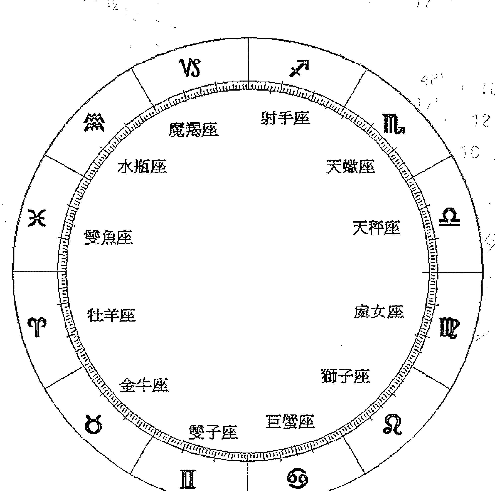
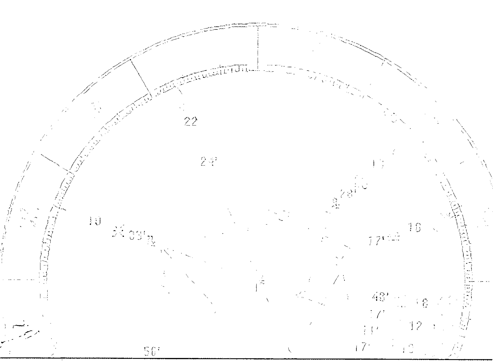

# 心理占星学全书

## 【推薦序】令人期待的占星書

作為占星愛好者與研究者，非常開心魯道夫與 Claire 從心理層面著手寫這本書。占星作為新世紀的神祕顯學，檯面上的存在總是被迫依附著「算命」這個主題來凸顯其價值，但事實上，一直以來，占星最被記憶的部分是來自可以深入個人心理分析，甚至作為心理學家療癒病人的輔助「工具」。當事人星盤會神奇地反應出個人的心理狀態，進而影響其行為與命運，這才是占星最迷人且最神奇之處，也是很多人學習占星的動力來源。

不過，學習占星的過程卻是相當「枯燥」的，必須從理論原型學起，其過程與「心理分析」幾乎八竿子打不著，距離尚遠，這也是很多人進入占星殿堂後難以消化與突破的一塊，因為無法速成。現在，突破制式占星課本硬邦邦的寫法，用心理的角度直接切入，等於是幫助大家省略掉「從原型到理解而後發揮」的過程，直接呈現出可以應用的部分，對苦於無法立即運用的人來說，是相當實用的入門書，真的很棒。

目前市面上除了少部分的譯作之外，國內的占星學者就屬魯道夫最有心引介國外最新消息，且最有系統於課本的撰寫，風象的他寫起作來又是快手，聽說也已擬定一系列占星書系要介紹給大家，配合上 Claire、Jupiter 兩位占星生力軍的加入，台灣占星界終於有了自己的系統，真的很令人期待呢。

唐立淇 2008.11.16
(本文作者為知名星座專家)

## 【作者序】心靈的鍊金術——透過占星瞭解轉化與重生的歷程

我十分嚮往古代的鍊金術，雖然我的目的不是要把鉛變成黃金或求得不死靈藥，但是卻十分嚮往這些偉大鍊金術士的天人合一思想，他們從鍊金的過程中，體驗到人生的轉變，如何把原始的元素或把鉛、鐵冶煉成貴重的黃金，這也象徵著從一個不完整的人透過生命的演練與轉化，來成為一個完整的個體——這也是心理分析大師容格所說的個體化過程。

總是有不少朋友寫信來問我，要如何進行個人的轉化？星盤當中的盲點與負面特質是不是就暗示著無法轉化成功？我常被這一類的問題弄得哭笑不得。首先，關於「轉化」這個概念，許多人都將它視為一個特殊的生命歷程，就好像是要煉丹成仙一樣，不知道要擦多少瓶的 Aura-soma 彩油，或是找到什麼咕魯（Guru）大師幫你啟動拙火或加持灌頂；又有人說不是每個個案的諮商都適合使用心理占星學，因為他們不是那麼敏感，無法察覺細微的生命變化。我想這些人都有一個共同的錯誤觀念，那就是將心理占星學與生命的成長看得太超俗太遙遠。

就如同許多人讀了史蒂芬·阿若優（Stephen Arroyo）的《占星·業力與轉化》仍百思不解，為什麼轉化只要看土星與外行星，難道其他行星就沒有轉化的效力嗎？事實上，這樣的質疑是對的，每一個行星都是我們生命的課題，阿若憂之所以只提到外行星，是因為外行星在行運的移動當中暗示著可能會經歷重大轉變的時刻，可能是危機可能是威脅，而這樣的時刻就很有可能是重要的轉捩點（關於這些過程請參考春光出版的《占星流年》），最重要的是：我們從什麼樣的角度來看待生命。

這些外行星所暗示的挑戰、困境或絕境，就如同鍊金術士在製作魔法石的過程中（《哈利波特》故事中使人長生不老、把鐵變黃金的魔法石），在最後階段必須經過至少三次的死往與重生的轉變，讓魔法石黑化腐敗煉製成白化，這裡可以得到將金屬變白銀的白色魔法石，最後透過再一次重生，讓魔法石赤化成爲最完整的魔法石，擁有神聖的性質。人生中，我們經歷過的許多重大危機與絕境，就是使我們的生命變得更完整的必經之路，如同以前提過的蘇美女神伊安娜、冥府女神波賽鳳或為求得愛洛斯回頭的賽姬，透過走出最灰暗的絕境獲得力量與永生。身為凡人的我們在這些時候或許真的瀕臨死亡的威脅，或者見到親人的離去，或者精神與心靈是槁木死灰的狀態，但若能堅強自己的意志，一步一步走出這樣的境界，就會獲得比其他人更強大的生命力量、智慧、知識與勇氣——這就是轉化。

但是轉化的步驟，卻不只存在於外行星的 Transit 時刻而已，事實上，轉化可以存在於生活的每一分鐘、每一個時刻，只要你關注你的內心（察覺），就是轉化的開始。

心理占星學並不是一門艱深的學問，而是透過星盤的符號解讀來認識自己和世界，在心理占星學當中，自我察覺是一切功課的開始，透過對自我的瞭解與認識，透過與他人互動的投射來瞭解自己的另一面，這些轉化的課題其實在生活當中就可以開始。

然而這一切的轉化的第一步驟，都要從瞭解自我做起，這也是《心理占星學全書》本書的目的，讓我們透過對星盤上每一顆行星在心理意涵上的暗示，重新認識自己，展開轉化工作的第一步驟，就如同鍊金術士要將平凡的物質變成金子前，必須先分析該物質的特性，接著再依照這個物質的屬性，透過不同的方式冶煉、昇華、蒸餾、萃取，以及一連串象徵性的死亡與重生的步驟，將鉛塊變成金子，而學習占星術的我們，利用對生命與自我的理解，能幫助自己和他人朝著成長的路前進。

魯道夫 2008.11.15

## 【作者序】讓你更瞭解自己的「心理占星學」

「心理占星學」這個名詞聽起來雖然嚴肅，但其實只是把占星著墨在更多關於認識自己、內在特質、自我整合……這些方向罷了，當我們對自己的瞭解不同了，很多時候做的選擇或是反應的方式自然就會改變，這是我最推崇心理占星學的地方，就像天后麗茲·葛林（Liz Greene）說的，她覺得心理占星學可以應用在各個方面——不管是要做偏向轉化治療工作或是專門占卜未來的占星師。希望讀者能夠把這本書當作提供另外一種詮釋角度的工具書，或只是單純拿來對照自己都好。

這本書能夠被催生出來首先當然要感謝魯道夫，沒有他不要說出書了，恐怕連倫敦都待不下去；還有 Marian 與 Yancy 這兩位小妹妹，多謝照顧了！這一路上，我在香港的好友 Mandy、Lilian 不論在精神上與實體上都給了我很大的支持與幫助，還有三不五時就會寄 email 來關心的 Barry，超令人感動的！台灣要大感謝的名單怎麼樣都列出不完：親愛的摯友 Pauline、大美女經紀人念靜愷、遠嫁法國的 Jessica、正在日本工作的 Joanne、緊急伸出援手的 Charles……在此獻上一萬個感謝還有香吻（如果有漏掉的請多多包含）。

最後要感謝我最親愛的爸爸、媽媽、哥哥、妹妹、弟弟……不論我去到哪裡，你們都永遠在我心中。

謹以此書獻給我最熱愛的台灣與香港，我永遠的家。

Claire Can 2008.11.17

## 【寫在前面】不同的占星視野

許多人和占星師互動時，常有不愉快的經驗，就有學生曾問我：「月亮天蠍的女人一定是爛命一條嗎？」只因爲前一位老師舉了一個企業家私生女的星盤證實，月亮在天蠍座就是二媽生的命。

也有號稱心理占星學派的老師，會指著客戶的星盤說：「你就是因爲天王星（或土星）在婚姻宮，所以才會離婚。」這類荒謬且宿命的說法，與其歸咎於某些占星學派的立論，倒不如說是占星師本身的觀念過於傳統，不懂得與時俱進有關。

不只占星師有這些問題，前來求助的客戶也會有同樣的盲點。過去的占星師在遇到客戶詢問「我什麼時候會走出感情的困境？」、「什麼時候會紅鸞星動？」、「何時會遇到 Mr Right？」時，或許會大膽預測當事人何時結婚，但現代的占星師往往不肯正面回答。

究竟這是爲了什麼呢？難道現在的占星師已經沒辦法做出精準預言了嗎？事實上並非如此，而是因爲社會環境的變化，爲生命增加了更多變數，同時因爲時代環境的改變，人與人之間的互動模式也改變了。

在古代就算你不出門，還是有機會把自己嫁出去，只要你的父母和媒婆多使點力就行，但試問，今天有多少人肯透過媒妁之言結婚呢？更何況，過去人們的互動多半集中在小村落裡，但今日卻可以在一個小時內，去到數百公里外的地方。因此，對於命運的預測自然要更加客觀才可以，而這也是現代占星師，特別是心理占星師所著重的分析特點。

因此，當現代占星師被問到類似的問題時，最常回問對方的是「你什麼時候給過自己機會？」、「什麼時候踏出妳的閨房走到外頭，去幫自己創造和別人互動的機會？」

就如同我的一位好朋友，經常抱怨找不到女朋友，每次遇到我就問我桃花何時會開？事實上，以他每天下了班就回家打電動的習慣，就算不看星盤也知道桃花爲何不開。

相信聰明的讀者也已經看出問題所在，如果自己大門不出、二門不邁的，或是跟我的朋友一樣下班回家玩電動，除了自己養的小狗之外，不再和其他人有進一步的互動，當他來問你何時桃花開時，你敢不敢給他明確的日期呢？就算看到他有一卡車行星陸續入戀愛宮，我都不敢這樣說。

因為，如果他一直很封閉，不願意和人接觸，也不願意認識新的朋友，就連舊的朋友都迴避的話，那麼他也只能看到窗外一整株漂亮的桃花盛開，而無法去親自享受。

後來，我陸陸續續和那位朋友聊了許多，而事實上，他也很清楚自己個性的問題，雖然希望有個親密伴侶，一旦發現對方黏他黏很緊時又會想跑，明知自己很難輕易付出情感，卻又期待一場長長久久的戀情能快速降臨，說到後來，他的條件越開越多，卻沒有發現自己的戀情總在重複著一個主題——他期待別人黏他，可是當他發現對方黏他時，他又想跑，而這或許跟他下降在天秤，月亮卻在水瓶有關。但當我指出他的問題時，他只問我一句話：「這種狀況何時會改變呢？」

我要再請教各位，如果你是我，你會這麼說？

你會真的傻到去認真研究星盤，看他二次推運或月亮、金星或太陽弧推運中是否有什麼眉目，而後推算出日期，告訴他：「嗯！到三十八歲那年，一切都會好轉的，你會遇到一個有點黏又不太黏的人，並且從此百年好合……」

我知道有很多熱心助人的初級占星師，或觀念傳統的占星師會這麼做，但我不會，不是我不懂得觀察這些生命的變化與占星流年的技巧，而是當生命對你提出變化的要求時，如果你不去呼應它，不願意去改變自己，那一切都是白搭。所以我最後對那位朋友說：「當你開始採取行動改變自己時，一切就會開始跟著改變了！」

朋友對我這一番話頗不以爲然，認爲這些話任何人都會說，又何必要一個占星師來告訴他呢？又說如果他付錢去找一個占星師，占星師這樣回他，他是絕不會付錢的！而我也只能回答，命運掌握在自己手上，就算占星師說你今年會紅鸞星動，但如果你整天把自己關在房間裡，最後什麼事也不會發生的！

就因爲很多朋友看待占星的方式，非常宿命且傳統，因此，心理占星學所提供給我們的另一個視野，才更加珍貴。心理占星學並非要推翻傳統占星學，而是提供了另一套更具人文思維，並以人性與實際的角度來切入的命運觀點。

而這種思維方式，提供給那些願意接受命運挑戰，重視自我身體、心智與靈性成長的朋友們。

## 第一部 占星符號與心靈密碼
ASTROLOGICAL SYMBOLS AND THEIR PSYCHOLOGICAL MEANING

占星學也暗示著一個人的個性從出生之時就存在了，同時對占星學的認識或許可以幫助我們理解這種發展進入成人自我意識的種子天性。

麗茲·葛林
(Liz Greene，心理占星中心創辦人與現任校長)

### 第一章 認識星盤上的符號

#### 星座的定義與符號

**白羊座（Aries）**
（又名牡羊座）

黃道上的第一個星座，開創的火象星座，基本的定義包括自我、衝動、競爭挑戰，心理占星學中，白羊座與自我意識及優先、第一和競爭有著強烈的連結，在占星學上，白羊座的象徵符號為羊角，而火星為白羊座的守護星。

**金牛座（Taurus）**

黃道上的第二個星座，固定的土象星座，占星學上認為金牛座與物質金錢有關，且追求實際與穩定的生活。在心

理層面上，金牛座暗示著擁有物質所帶來的安全感，以及對於能力（力量）的獲得。金牛座的占星符號為牛頭的簡化，而金牛座的守護星是金星。

**雙子座（Gemini）**

黃道上的第三個星座，變動的風象星座，在占星學中代表溝通、媒介、傳遞、思考與兄弟姊妹，心理層面的意涵代表著自我與他人的溝通或心靈內外的溝通。雙子座的符號如同羅馬數字的二（II），象徵著神話故事中代表雙子座的孿生兄弟，其守護星是水星。

**巨蟹座（Cancer）**

黃道上的第四個星座，開創的水象星座，基本的定義包括家庭、母親與飲食的關係，心理占星學中認為巨蟹座與安全感的需求有關，強調自我情緒的表現，同時象徵著養育以及被養育的互動。在占星學的符號上，巨蟹座的符號是蟹鉗的縮影，也有人解釋為母親的乳房，而巨蟹座的守護星為月亮。

**獅子座（Leo）**

黃道上的第五個星座，固定的火象星座，其基本定義為戲劇、表演、娛樂與賭博，在心理層面上，獅子座與自我目標、自我中心、自我實現、創造、娛樂等事物有關。獅子座的符號是獅子尾巴，而獅子座的守護星是太陽。

**處女座（Virgo）**

黃道上的第六個星座，變動的土象星座，在占星上的基本定義是重視細節的、實際觀點的性格。心理占星學中，認為處女座代表著人們再次利用感官能力來探索內外在的差異，因而產生觀察、比較、分析與批評，同時也產生了衝擊。處女座在占星學上的符號為女子的頭髮，守護星為水星。

**天秤座（Libra）**

黃道上的第七個星座，開創的風象星座，在占星學上，天秤座與婚姻、法律、合約有關，在心理層面上代表著對等關係、人我互動、伴侶關係等。天秤座的符號是一個看似天秤的希臘文字「Ω」，並在其下方加上一橫，而天秤座的守護星是金星。

**天蠍座（Scorpio）**

黃道上的第八個星座，固定的水象星座，其性質包括事物的結合、死亡與重生、激烈的轉變等。在心理層面的意涵中暗示著心中的黑暗面，自己不願意面對的傷口與醜陋的事件，同時也與控制欲望和生存意志有關。天蠍座的符號為蠍子尾部的刺針，其守護星在傳統上為火星，同時冥王星是天蠍座的現代守護。

**射手座 (Sagittarius)** (又名人馬座)

黃道上的第九個星座，變動的火象星座，其基本性質包括了宗教、哲學、高等教育、擴張領域、成長、國際事務、長途旅行等。在心理層面上，意味著世界的探索（藉此延伸出旅行、國際事務與教育等特質）與自我的發展，射手座的符號為箭頭，在占星學中守護星為木星。

**摩羯座 (Capricorn)** (又名山羊座)

黃道上的第十個星座，又稱山羊座，開創的土象星座，基本的定義包括實際、嚴肅、追求成就等，從心理占星的角度來看，代表自我在眾人面前的呈現、組織架構，重視實際執行、成就與社會地位。在占星學符號上，摩羯座符號代表著羊頭魚身，而摩羯座的守護星是土星。

**水瓶座 (Aquarius)** (又名寶瓶座)

黃道上的第十一個星座，基本的定義包括友誼與社群關係，具有強烈的人道主義與改革精神。心理占星學派認為，水瓶座的改革特質是一種超越自我的精神，以及遠大的理想與目標，甚至代表著一群人共同的目標。水瓶座的符號為波紋。在傳統占星學中，水瓶座歸土星所管，而現代的占星師認為，水瓶座應該由天王星管轄，所以土星與天王星都可視為水瓶座的守護星。

**雙魚座 (Pisces)**

黃道上的最後一個星座，變動的水象星座，其基本定義為感性的、慈悲的、犧牲的、具有強烈的藝術性格。在心理層面上，雙魚座代表著打破自我與他人界線的無我境界，由這一層定義來發展雙魚座的慈悲精神，同時雙魚座也常代表一種失去自我的渾沌狀態。雙魚座的符號為兩個相背對的括弧，並由一條線串起，象徵著黃道上的兩條魚和連結著它們的繩索，雙魚座的傳統守護星為木星，而現代守護星為海王星。

#### 行星的定義與符號

**太陽 (Sun)**

太陽系的中心，在占星學上視為重要的發光星體之一。傳統占星學中，太陽象徵著男性、君王、自我、父親、丈夫等，在現代占星學中，太陽代表自我、自我呈現、精力活力。在心理層面上，常描述著個人追求的事物，及對於想要成功的憧憬；在世俗占星學上代表國家元首，在醫療占星學中則代表著心臟、背部、脊椎、脾臟。此外，太陽守護著獅子座。

## 第一部 占星符號與心靈密碼
ASTROLOGICAL SYMBOLS AND THEIR PSYCHOLOGICAL MEANING

## ☽ 月亮（Moon）

在占星學中，月亮是重要的個人指標，象徵著日常生活、飲食、母親和童年等，心理層面上包含了個人需求、情感、情緒反應等。在世俗占星學中，月亮與人口、農業有關；在醫療占星學中，月亮與乳房、消化系統有關連。雖然月亮是地球的衛星，不過在占星學中稱呼行星時，有時也會把月亮包含在其中。此外，月亮守護著巨蟹座。

## ☿ 水星（Mercury）

太陽系最接近太陽的行星，其基本定義包含思考、學習、自我與他人的溝通、兄弟姊妹手足等。在心理層面上，水星象徵著自我意識的表達、自我意識與無意識的溝通管道等。在醫療占星學上，水星與手、肺部、神經系統有關；在世俗占星學中，水星象徵著新聞、教育、通訊與交通。此外，水星守護著雙子座與處女座。

## ♀ 金星（Venus）

太陽系的第二顆行星，是傳統占星學的吉星，代表喜事與女性，金錢與貴重金屬；在現代占星學上，金星與和平、協調、美感、戀情、藝術、喜歡的事物有關。心理層面上，與個人價值觀有密切的關連，心理占星師認為，金星具有和緩與削弱其他行星性質的作用。此外，金星守護金牛座與天秤座。

## ♂ 火星（Mars）

太陽系的第四顆行星，其基本意涵包括行動、自我實現、自我保護、防衛、攻擊。心理占星學認為，火星與生存意志有關，進而也與性慾產生連結。傳統占星學將火星視為凶星，認為火星與戰爭屠殺等流血事件有關。在醫療占星學中，火星與血液、發燒、發炎以及刀傷有關。火星守護牡羊座，並且與冥王星共同守護天蠍座。

## ♃ 木星（Jupiter）

木星是太陽系中最巨大的行星，傳統占星學中屬於帶來幸運的吉星。現代占星學對木星的基本定義包括信念、態度、信仰、宗教、哲學、高等教育與國際事務等。心理上的意涵為個人的成長與信念。一個人木星所在的星座與宮位是他的信念與信仰的所在，同時也可能是他生活中較為幸運部分。在醫療占星學中，木星與肝臟有關。木星在占星學中守護射手座，且與海王星共同守護雙魚座。

## ♄ 土星（Saturn）

太陽系的第六顆行星，在傳統占星學中，土星為距離最遠的行星。傳統占星學認為土星是一顆帶來厄運的行星，在現代占星學中，其基本定義包括保護、限制、冷漠、經驗、長輩等。心理層面上的定義為壓抑、恐懼、擔憂與過去的不愉快經驗。在世俗占星學中，土星與權力機構、管理機構、大型組織有關。在醫療占星學上，土星與骨骼、牙齒和皮膚都有關係。

## ♅ 天王星（Uranus）

太陽系的第七顆行星，在占星學上定義為超越的、改革的、反叛的、混亂失序的、具有人道精神與理想主義的，也與電磁和高科技有關。在心理層面的意涵是超越固有傳統的、超越自我的，從這一層的意思引發了改革與革新的意涵，同時也因為超越自我的意涵，結合了人與人之間的合作關係。由於天王星被發現的時刻正值十八世紀的革命風潮，以及打破階級的自由開放思想開始出現，於是天王星也具有這一層平等的意涵。天王星在占星學中，是水瓶座的現代守護星。

## ♆ 海王星（Neptune）

太陽系的第八顆行星，在占星學中，海王星象徵著藝術、幻象、理想化的境界，且與宗教、犧牲、將力量弱化或想法單純有關。在心理層面上，海王星象徵著模糊的意識狀態，以及理想的境界。而世俗占星學認為海王星與宗教、藝術、影像、景氣繁榮或景氣擴張有著密切的關連，同時也有占星師認為，地震與海王星有著密切的連結。在醫療占星學上，海王星多半被認為是暈眩、體力虛弱、病毒感染、藥癮、毒癮、藥物中毒、瓦斯中毒，或是與精神虛弱、精神狀態不佳有關。

## 冥王星（Pluto）

普魯托（Pluto）是希臘羅馬神話冥府主神的羅馬名稱，在占星學中具有掩埋與重生、劇烈蛻變及被隱藏的事情（多半與傷痛有關）的意思。心理的層面上象徵著最原始的生命力量，和求生意志與生命的延續——性愛。在星盤中，冥王星所在的宮位與星座，代表著被我們遺忘的事情，以及容易帶來傷痛與引發內心黑暗面的部分。世俗占星學認為，冥王星常帶來令人恐懼的蕭條、大量的傷亡或戰爭等不愉快的事情。

| 宮位 | 現代意涵與心理意涵 |
| :--- | :--- |
| 第一宮 | 我所呈現的自我 |
| 第二宮 | 價值觀、物質安全感、能力 |
| 第三宮 | 學習、溝通、思考 |
| 第四宮 | 情緒出口、安全感、家庭關係、雙親之一 |
| 第五宮 | 創造力、創意、自我目標 |
| 第六宮 | 規律的事務、日常事務 |
| 第七宮 | 對待他人的態度、與他人的關係 |
| 第八宮 | 他人的金錢、權力控制、內心黑暗面 |
| 第九宮 | 信念、崇高的精神、自我的發展 |
| 第十宮 | 社會地位、公眾形象、雙親之一 |
| 第十一宮 | 自我的超越與改革 |
| 第十二宮 | 心理的無意識層面 |

## 凱龍星（Chiron）

凱龍星被認為與傷痛和醫療有關，由於凱龍的軌道穿越了土星與天王星，土星代表限制天王星所象徵的改革力量，同時也代表著業力干擾我們的地方，這不正好就符合了凱龍星的解釋，它來回於限制與改革之間，幫助我們不斷成長，並提醒我們靈魂傷痛所在的位置，建議我們該如何面對。

## 北月交（North Node）

是黃道和月球軌道的北邊交點，現代占星師視北月交為精神與心靈成長的途徑。

## 南月交（South Node）

是黃道和月球軌道的南邊交點，現代占星師認為，南月交為我們所習慣適應、感到舒適的地方，有些時候在星盤上不會顯示南月交的圖案，因為南月交永遠在北月交的正對面。

## 宮位 (House)

占星術中，將黃道依據某些點（通常為天頂與上升），再次分割成十二個宮位，稱為「House」，每一個宮位掌管生活中的不同層面（見P.21表），這些宮位都由上升點作為第一宮的起點。

## 相位 (Aspect)

指行星與行星或命盤上的上升點、基本點或特殊點之間形成特殊度數，常見的相位包括了0度（合相）、30度（半六分相）、45度（半四分相）、60度（六分相）、90度（四分相）、135度（八分之三相）、150度（十二分之五相）、180度（對分相）等。

相位也有前後的容許誤差，又稱為「角距」（Orb），例如：月亮雖然沒有和太陽重疊，但在太陽的前後8度內，仍會被某些占星師視為合相。不過，在不同的流年系統中，判斷相位容許度的標準也會有所不同，大約都在4度之內。

## ♂ 合相 (Conjunction)

當行星與行星或基本點之間相距0到8度時，稱為「合相」。許多占星初學者常誤以爲合相是一種吉相，事實上從古至今，合相在占星學中並不全然是好的相位。在傳統占星學中，與火星、土星、南月交點的合相都屬於凶相，而與金星、木星的合相則可視爲吉相，而今日的占星學認爲，產生合相的行星性質會交互影響，例如：金星與土星合相時，土星會約束金星的歡愉，而金星會緩和土星的嚴肅。

傳統占星學上認爲，四分相爲破壞與阻礙的凶相，心理占星學則認爲，這個相位具有壓抑挑戰的能量，通常是由性質類似但目的或方向不一的事件所引發的困擾。

### 強硬相位（Hard Aspect）

在現代占星學中稱「對分相」、「四分相」爲強硬相位，在傳統占星學中這些相位有凶相位的定義，但今日占星學家認爲，強硬相位具有強大的能量，促使事件的發生，卻不一定代表吉凶。

### 柔和相位（Soft Aspect）

柔和相位是近代占星學的相位分類法中的一種，占星師將「三分相」、「六分相」定義爲柔和相位。傳統占星學視這樣的相位爲吉相，但從人文與心理占星學的角度來看，柔和相位的影響力道比較弱且溫和，不像強硬相位一樣容易導致事情的發生，卻也容易帶來讓人不舒服的狀況。

### ♆ 對分相（Opposition）

兩顆行星之間，或行星與基本點、特殊點間呈180度的角度時，稱爲對分相。傳統占星學將對分相視爲凶相，主破壞，而心理占星學認爲，此相位代表著我們投射在他人身上的情感和陰影，與伴侶或合作事物有著密切的關係。對分相不如一般人所認爲的直接衝突，在心理占星學中，對分相也有與他人合作的象徵。

### △ 三分相（Trine）

兩行星或行星與基本點、特殊點之間形成120度的相位。在傳統占星學上，三分相是一個吉相，在心理占星學中，三分相具有包容與融合接受的意涵，占星師認爲這樣的行星角度所產生的共鳴多半是正面的，也能讓行星發揮較具建設性的影響力，但有時也會爲當事人帶來盲點與惰性。

### □ 四分相（Square）

兩行星或行星與基本點、特殊點之間形成90度的相位，稱爲四分相。

### ✶ 六分相（Sextile）

在星盤中，兩行星或行星與基本點、特殊點之間形成60度的相位，稱爲六分相，是主要相位之一。傳統占星學認爲六分相帶來吉利，而心理占星學研究認爲，此相位與機會、技巧、應用、友誼有關。但值得注意的是，雖然六分相是主要相位，但通常被視爲影響力稍弱，這也是爲什麼多數占星師在主要相位中，給予六分相的角距容許值，比其他主要相位來得小，多半只給到前後4度。

## 六敏感相位（Sensitive Aspect）／十二分之五相（Quincunx）

兩行星或行星與基本點特殊點之間形成150度的相位，也有人稱之爲「補十二分相」或「Inconjunt」。傳統占星學認爲，此相位與財產、健康的不幸和死亡有關。而心理占星學認爲，這個相位與刺激、心理上的盲點有關，認爲人們無法正視問題而有愧疚感，並促使自己不斷地修正態度，但也有占星師認爲，合盤中出現這樣的角度，有利於增加雙方的互動，故稱爲敏感相位。

## 本書常用到的重要占星學名詞

### 角或角宮（Angular）

在占星學上指的是星盤上的四個重要基本點：上升點（Ascendant）、下降點（Descendant）、天頂（Medium Coeli）、天底（Imum Coeli），在出生圖中，行星與四個點產生合相時稱爲「合軸星」（Angular Planets），且會帶來明顯的個人特質。

### 上升點（Ascendant，標作ASC.）

又可簡稱爲「ASC.」，是黃道與東方地平線的交界，每四分鐘移動1度，大約每兩小時換一個星座。

在現代占星學的定義中，上升點被視爲自我的呈現，當我們與外界互動時所呈現的那一面，以及影響我們如何與外界社會互動。心理占星學常將上升點與容格（C. G. Jung）的「人格面具」（Persona）作比較。

### 上升星座（Rising Sign）

上升點所在的星座，被視爲我們與外界互動的模式，與我們給外界的人格印象，例如，一個太陽在獅子座的人，很可能因爲他的上升在巨蟹座，而給人較爲害羞的感覺。

### 下降點（Descendant）

又可簡稱爲「DSC.」，是黃道與西方地平線的交界，爲第七宮的起點。傳統占星師認爲下降點代表伴侶，同時認爲下降點代表弱勢的地位，以及不良的健康與身體，但現代占星師認爲下降點象徵著自我與他人之間的互動模式，也代表著婚姻和合夥關係。同時認爲行星在下降點的影響力，並不亞於行星在天頂或上升的影響力。

### 天頂（Medium Coeli）

簡稱「M C」，又稱「Mid Heaven」，是所在地子午線和黃道在空中的交點。在占星學中，天頂與上升星座是計算宮位的標準，在許多非等宮制的分宮法中，天頂為第十宮的起點。天頂在占星學上的意義為個人的社會地位、名聲與職業傾向。

傳統占星學認為天頂象徵著父親，但近代占星學認為天頂與天底都可能是雙親的其中一方，且因人而異，需要占星師仔細的判別。在世俗占星學中，天頂代表政府、執政黨與國家元首。此外，天頂與天底的軸線，與上升點和下降點的軸線為命盤中的重要軸線，這四個點被視為命盤上的基本點。

### 天底（Imum Coeli）

簡寫為「I C」，星盤中第四宮的起點，與天頂呈180度相對，在占星術中，I C與第四宮有根源、雙親、家庭的意涵。天底在過去並不被重視，因為占星師認為行星落入天底無法產生影響力，而在心理占星學中，天底被視為進入內心世界的入口，也是一個人表達情感與安全感的位置，也暗示著童年的家庭經驗，因此，天底在心理占星學中的地位可說相當重要。

### 上升軸線（Ac/Dc Axis）

是指星盤上連結上升點與下降點的軸線，在占星學中，這條軸線上的行星，具有強烈的個人特質表現。同時這條軸線的星座，也表示了自我與他人之間的互動模式，在占星學同樣重要的還有M.C.和I.C.軸線。

### 界線（宮頭）（Cusps）

星盤上宮位的終點與起點的分界線，界線在占星學中佔有相當重要的地位，任何位於界線上的行星，都被視為對該宮所管理的事情具有強大的影響力，同時有占星師認為，當行星落在界線之前5度時，對下一宮也會發揮一定程度的影響力。

### 命主星（Chart Ruler）

命主星就是上升點所在星座的守護星，亦是一張出生圖的守護星。在占星學中，出生圖的守護星，往往是太陽與月亮之外，另一個代表此人的象徵，出生圖守護星所落的星座與宮位，及與其他行星的相位，也會對此人的性格與命運產生某一程度的影響。

### 守護星（Ruler，又名支配星）

在占星學中，每一個星座或宮位都有其相關連的守護行星，稱為「Ruler」或「Dispositer」或「Lordship」。同時在傳統占星學中，當行星進入其守護關係的宮位與星座時，都代表著相對的強勢。若進入守護星座或宮位對面的星座或宮位時，則代表著該行星影響力減弱。在本書的應用中，因為每顆行星所暗示的事件可能與其所守護的宮位有關，所以在這裡列表如下。

舉例來說，你的上升是射手座，那麼守護射手座的木星就是你上升的守護星也是命主星，而你的第二宮，因為宮頭起點落在摩羯座，所以土星是你第二宮的守護。

| 星座 | 現代守護星 | 傳統守護星（參考用） |
| :--- | :--- | :--- |
| 牡羊座 | 火星 | 火星 |
| 金牛座 | 金星 | 金星 |
| 雙子座 | 水星 | 水星 |
| 巨蟹座 | 月亮 | 月亮 |
| 獅子座 | 太陽 | 太陽 |
| 處女座 | 水星 | 水星 |
| 天秤座 | 金星 | 金星 |
| 天蠍座 | 冥王星 | 火星 |
| 射手座 | 木星 | 木星 |
| 摩羯座 | 土星 | 土星 |
| 水瓶座 | 天王星 | 土星 |
| 雙魚座 | 海王星 | 木星 |

# 星盤繪製——使用「www.astro.com」繪製星盤

很多人都想要畫自己的星盤，可是不知道該怎麼辦，網路上有一套免費的軟體叫作「astrolog」，對於初學者來說是一套相當適合的軟體，如果要談到進階功能仍然勉強可以撐得過去。如果你不想下載軟體，那麼你可以試著使用「astro.com」這個網站的線上畫占星盤系統，不但可以在上面畫出生圖，還可以使用進階功能，去作合盤組合盤、行星過運推運、太陽弧正向推運、太陽回歸，還有很多到了進階階段才會用到的占星圖技巧，都可以在「astro.com」用，如果你沒有錢買一套進階軟體的話，那麼「astro.com」會是你的最佳選擇。

Step 1 進入「www.astro.com」之後選擇第一欄「Astrodienst Services」的第三個選項「Free Charts」。

Step 2 這時候你會看到一個英文介面，詢問你是否曾經輸入繪製命盤的資料。如果你是第一次來這個網站使用這個功能，就按No。

Step 3 若你之前曾經在這裡畫過個人星盤，請移動滑鼠到右下方，找出「Chart Drawing, Ascendant」這個選項按下去，這時會直接跳到以前畫好的命盤。若你要繪製新的盤，請將滑鼠移到右上方「Add a new person」，接著進行步驟四。

Step 4 這時候你會被要求輸入姓、名、性別（一定要選，否則無法畫圖），出生的年、月、日、時間，最後在「國家」上選擇你的國家（例如台灣），然後打上你出生的地點，例如「Taipei」等，盡量選擇住家附近的大城市比較容易找到。

Step 5 這個網站的夏令時間是自動幫你選擇的，1980年3月到10月在台灣出生的人，已經取消夏令時間，但因為在這裡仍然會自動跳選，所以要注意一下，記得把出生時間往後調一個小時。

Step 6 看到上述畫面時就可以按下「Continue」鍵，就會看到你的出生圖了，同時注意，這時候頁面的左上方，會有一個「Guest user」的編號，一旁還有「Login/out」，如果你以後會常常使用這個網站畫星盤，建議你註冊一個帳號（免費的），這樣子你就可以畫許多張命盤，沒有註冊的「Guest」只能畫三張命盤，註冊之後可以有1000張命盤的容量！

Step 7 如果你是在你自己的電腦上使用的話，那麼這個網站應該會記住你的帳號，你下次上「astro.com」時就可以直接進入「Free chart」去看你畫過的盤了。

Step 8 當你再一次進入「astro.com」按下「Free chart」之後會出現不同的畫面，注意右下角「Horoscope Chart Drawings」的選項，按第一個選項「Chart drawing, Ascendant」你就會進入到你上次畫的星盤，如果你想要重新畫另一個人的命盤，可以在進入「chart drawing」後，在圖的右上方有一行「Add a new person」，按下去就可以畫另一個人的命盤。

Step 9 當你有兩張以上的星盤時，你每次進入時都會先跑出第一個人的星盤，然後你可以用圖的左上方，「Horoscope for xxx」這個下拉選單來選擇你要看的星圖，然後按「Go」，就會看到另一張圖。

### 第二章 心靈原型

十二星座依據時節與特性，又可以被劃分成三種模式與四大元素，其中的四大元素無論古今中外、東西方占星學都有提及。我個人在解讀星盤的過程中，也常訝於模式與元素對個性的影響力，並不禁感嘆——老祖宗真的很有智慧啊！

#### 三種模式：開創、固定、變動

##### 開創星座（Cardinal Sign）

牡羊座剛好是春分，巨蟹座是夏至，天秤座是秋分，摩羯座是冬至，這四個星座位於每個季節的開端，因此開創星座的特色就是——開啓新事物、主動出擊、喜歡主導。

牡羊座是出了名的喜歡新挑戰，Push！Push！Push！永遠在推動新事物；巨蟹座就像一家之主、紅樓夢裡面的王熙鳳，關於維護家庭、保護家族、守衛家園的一切大大小小由她決策；天秤座是智慧的雅典娜女神，捍衛人際關係裡的公平與正義，她手上的寶劍用來保護英雄與勇敢的戰士，讓人類的文明得以進化；摩羯座鎖定目標向上爬，有草就啃，有地方就攀，還有比摩羯們更會善用時間與資源的嗎？

開創星座強的人自然行動力強、喜歡開創、適合當領導人，不喜歡被人事物或是環境所限制，遇到問題絕對不會停在原點，而是不斷的推動與闖關——牡羊座拚命地用頭去頂，殺也要殺出一條血路來；巨蟹座就像「Mother Bear」，膽敢威脅他/她的家人小心吃不完兜著走；天秤座運用三寸不爛之舌，加上超強的公關手腕，黑的也可以說成白的；摩羯座絕對知道如何不擇手段達到目的。

要瞭解開創星座，我們最好回頭探討一下「Cardinal」這個字，它來自於拉丁文的「Cardo」的字根，暗示著「重要關鍵與樞紐」。注意關鍵與樞紐這兩個字所帶來的重要性，要知道縱使是懷柔的天秤、親切的巨蟹、沉默的摩羯，對於自身的看重，絕不輸給在那裡大聲嚷嚷的牡羊，只要是開創星座都有一個自我設定的原則在心中，好友Jupiter老師曾跟我說，天秤不過就是比較有禮貌的牡羊，再怎麼有禮貌，還是希望你照著他的想法去做，我完全同意。

這些的特質的另外一面有可能造成——老是在開創新事物，卻不能好好收尾，無法跟別人合作，也討厭受人指揮，老是要在生命中製造危機，或是尋找麻煩（好像沒有挑戰刺激，就無法顯現自己的硬骨頭）。我們常在電影或電視中看到有人遇到麻煩時大聲喊著：「Do something!」而開創星座正是這些遇到問題會二話不說去做的人，或許你會看見牡羊座閉上眼睛，衝上前去亂砍一通，或許你看見巨蟹座正在那裡情緒混亂，瘋狂搬沙袋準備自我防備，或是天秤座這時拚命打電話看能不能搬到救兵，或是摩羯座早已經在八百年前就把狀況都演練好，正在複習他的101套危機處理劇本，但是相信我，他們都在Do something！

##### 固定星座（Fixed Sign）

位於每個季節的中段，這樣的時節最適於用來打好基礎、建設家園、累積糧食、承接開創星座開頭的工作，穩定的、固定的、確實的執行或是維護，直到下個季節的轉換，因此固定星座的特色就是穩健、持久、專注、耐力、一致性、可依賴的。

固定星座一定要有東西可以抓住，彷彿船隻要在茫茫大海中下錨才能安頓。對於金牛座來說，沒有什麼比擁有物質更實在、更有安全感的事，因此金牛座對賺錢超有興趣，不斷地想要累積房子、車子、銀子；獅子座的自尊是無價之寶，你／妳曾見過哪隻不驕傲的獅子嗎？多半為了維護自尊與顏面，打腫臉充胖子也會死撐的；而天蠍座執著於感情，不管是一個人或是一段情，都可以讓天蠍要死要活的、久久不能放手；至於水瓶座，沒有比這個星座更堅持的了——人類永遠可以進化、世界永遠可以進步，並且不斷計畫著革命！

因為太過於固定與守成，固定星座容易落入抗拒改變、不知變通或是不願放手的狀態。明明公司已經面臨破產還是不想結束、分手幾十年了還是無法釋懷、股票跌成壁紙還是不想拋售……要固定星座放棄緊緊抓住的東西簡直就是要命，卻又是最終逃避不了的功課。

##### 變動星座（Mutable Sign）

位於春夏交替季節的雙子、位於夏末秋初的處女、位於秋天結束冬日正要開展的射手，還有寒冬之末萬物即將甦醒的雙魚，這四個變動星座具有超強的適應能力，面對不同的環境變化可以應付自如、充滿彈性、多才多藝……

雙子座總是充滿好奇地探索新事物，哪裡有趣就往哪裡鑽；處女座是最具彈性的土象星座，就像神奇的馬蓋先，光靠一把瑞士刀，就可以解決各種疑難雜症；射手座天生愛趴趴走，世界對他／她們而言是一座神奇好玩的遊樂場；雙魚座則是出了名的飄忽不定難以捉摸，就像水流沒有固定的方向（除了總是往低處流）。

這些星座有個很強的共通點——興趣，只要是有趣的事物就願意停留下來探險摸索，否則改變心意、拍拍屁股走人一點也不是難事，這也是為什麼這些星座在感情世界總是惡名昭彰：雙子座花心愛劈腿、處女座老愛批評挑剔舊情人、射手座美其名熱愛自由、雙魚則是出了名的多情與濫情。

變動星座需要小心太過變動，他／她們總是神經質的想要轉往不同的方向、一顆老是驛動的心永遠無法安定下來……這樣的特質當然不適合用在強調紀律規範、一成不變的工作或是一夫一妻、從一而終的婚姻。男要入對行、女要嫁對郎，該如何選擇與安排，就是靈活的變動星座所要學習的功課。

#### 四大元素

風、火、水、土各有其不同的能量，強烈影響個人的個性特質與表現方式。不過，萬物天生就會朝平衡和諧的狀態發展，且往往在個人還未察覺的狀況下，就已經自動搜尋周圍環境及人際關係中自己最缺乏的元素來輔助自己。

在我從事多年的占星諮詢工作中，同樣可印證這種現象。來找我看星盤的客戶不是缺乏土象，就是缺乏火象元素，這些個案像是早已經知道我是太陽魔羯、上升射手似的，不由自主的往我這邊靠攏，這就是每個人都會在無意識當中打開雷達，搜索自己需要的元素，以及靠近具有這些元素的對象。

##### 風象星座——代表頭腦

風象星座最擅長抽象的語言思考，無論是邏輯推理、理性分析或溝通表達，最堅持「我思故我在」，好像在腦海中把念頭想清楚了，就真的看見它們被實現的樣子。雙子座總是多方地蒐集資訊，天秤座總是要不斷平衡他人的觀點，水瓶座腦中更是充滿稀奇古怪的點子。

風象星座的理性思考可以保持看待事物的客觀性，這也造就這些星座超強的社交能力，因為抽離不涉入個人情感，風象星座跟各式各樣的人都可以客觀的交流，卻也經常被批評為冷漠沒感情，行星落入這些星座時，常帶給人君子之交淡如水的感覺。

缺乏真實情感交流又不切實際的風象，最常見的批評就是只會表面功夫、光說不練或是想太多，既不能理解水象需要被傾聽的需要，也不喜歡土象帶來的一堆限制，還是火象特質最能啟發風象的自信與行動力。

##### 火象星座——代表能量

就像太陽高高掛在天空賜給宇宙萬物生命力，火象星座總是給人自信、意志力強、熱力四射、直來直往、樂觀積極的印象。牡羊座是永遠都停不下來的火車頭，獅子座的魅力總是讓人不敢逼視，射手座的精力多到像過動兒。

對於火象星座而言，最重要的就是「自我認同」，例如：牡羊座一定要當第一、獅子座一定要受人肯定、射手座非得找到人生意義不可，行星落入這些星座會顯得比較自我中心，因為太專注於表達自我而忽略別人的存在，常被批評為太過自我、給人壓迫感，或對其他人不夠敏感。

火象最喜歡風象來搧風點火，行動力超強的火象星座加上風象這個狗頭軍師，簡直就可以征服全世界，卻相當討厭水象星座黏黏膩膩的情緒化，還有沉重得令人窒息的土象星座。

##### 水象星座——代表情緒

天生就是水做的，不管是喜怒哀樂的淚水，還是欲望橫流的口水，總是被情緒與欲望驅動的水象，天生比其他星座纖細敏感。巨蟹座一定要體貼才能當個好媽媽，天蠍座最懂得善用人性的弱點或欲望來達到目的，也唯有雙魚的慈悲與同理心才能造就德雷莎修女。

佛洛伊德（Sigmund Freud）曾說：「所謂的正常人，不過是比較可以壓抑情緒而已。」偏偏水象就像擁有特異功能，總是可以捕捉到別人細微的情緒變化，甚至是直接吸收進來，搞到與自己的糾纏不清。這樣的特質很適合當藝術家、音樂家、詩人……等需要豐富情感交流的創作者，也適合來照顧別人，或是運用在治療師、心理分析這類需要同理心的工作。

行星落入這些不知道畫下界限，或適時抽離情緒的水象星座時，容易有過於情緒化、歇斯底里、依賴他人等危險；本身沒有固定形狀的水象，在遇到紮實穩固的土象時自然覺得超級有安全感，卻最討厭風象不請自來的分析與答案，或是火象的粗魯自我又不善解人意。

##### 土象星座——代表身體

行星落入土象總是帶給人穩健實在的感覺，因為土象代表身體，是我們的自我最具體的呈現，也因此土象星座最能與身體的感官連結，也最知道如何在實際的物質世界運作，也因此，金牛座是累積資產的高手，處女座最知道養生之道，摩羯座則是出了名的工作狂。

腳踏實地的好處就是有很高的執行力，懂得善用身邊的工具與資源，並且有效率、有毅力的完成事物。行星落入這些星座時，也會多了幾分穩健但略顯保守的特質，因此土象的另一面就是缺乏彈性、小心謹慎、固執守舊，有時也顯得缺乏想像力與自信……凡事一定要實際的才有用，人生自然會減少許多可能性。

這些土象無法輕易表露自身的情感，遇到情緒豐沛的水象自然備受吸引，卻相當討厭風象的只會說不會做，或是火象的衝動與無法信任感。

## 十二星座的心理原型

在以容格學說為主的「精神分析心理學」（Psychoanalysis）中，「原型」（Archetype）這一詞佔有相當重要的地位。所謂的原型是指，對於一個物件或一個人物的普遍性與理想化的描述，容格將原型應用在精神分析中，以存在人類生活中的神話與傳說、宗教故事來描述人類共有的原型，這樣的方式也進而被心理占星師們應用在占星分析上。

大家一定會覺得很奇怪，占星的書籍上解說了許多，為什麼還要透过神話或寓言來描述這些內容，這不是多此一舉嗎？事實上，我們應該瞭解一件事情，每一位占星師都有著自身的包袱，其個性、教育程度、信仰與生活經驗，都會在他的一言一行中帶來重要的影響，於是在他寫作或講解星座特質時，這些個人條件的影響很容易在不自覺時表露出來，同時影響到他人對這個星座特質的觀點。

舉例來說，一個太陽在天蠍座或第八宮的人，會覺得接觸與天蠍座相關的生死禁忌是一種榮耀的事情，然而一個土星在天蠍或第八宮的人，他對天蠍或第八宮的感受可能相當糟，以至於日後講述天蠍與八宮時都可能帶著負面色彩。

這些都很可能在不自覺的狀況下，影響到這位占星師的分析與判斷，且不僅對占星師自身有所影響，甚至可能對被諮商的人產生巨大的傷害。

為了避免這種現象，占星師可使用星座原本特質的描述，巧妙的避開個人主觀的影響。例如，下方是天蠍這個星座原本的特質——

> 天蠍座原型：生與死、禁忌、深層的、控制的、隱藏在表面之下的（資源與能力）、掩埋與重生、毀滅與再生。

但是對於一個太陽在天蠍座的占星師，他可能會把自身對太陽的體驗，加入天蠍原型，於是有可能會出現下面的描述，在對天蠍座的描述中強調與力量、榮耀有關的特質——

> 天蠍座原型：生與死的強大力量、禁忌、深層的、隱藏在表面之下的榮耀、自我的掩埋與重生、毀滅與再生。

對於一個土星在天蠍的占星師，他可能會把自身對土星恐懼的體驗，加進天蠍的原型中，產生的描述如下，強調了與恐懼壓力有關的特質——

> 天蠍座原型：生與死的恐懼、禁忌的限制、深層的壓力、恐懼的控制、隱藏在表面之下的恐懼、掩埋與重生、毀滅與再生。

如果能透過一些與十二星座相關，或相對應的神話故事的分析，找出個別星座的原型，亦即從這些不同版本的故事中萃取出相關的特質，再從不同的神話或書籍中來比較找出一個星座的原型（原意），避開在描述中造成的不必要誤會。

### 牡羊座

*開創的火象星座

太陽進入牡羊座的這一天，是古代的新年，氣候回暖，花草開始綻放，動物們也在這時候從冬眠中甦醒，為了搶奪食物而打鬥，或是為了搶奪伴侶而活力十足地賣弄風騷。牡羊座凡事搶第一的特質，不但由氣候的特質而來，同時也因為這時候生命的能量旺盛，為了爭奪生存的溫飽與繁衍後代的機會，而開始挑戰他人，大自然的變化賦予了牡羊座帶來新生的強大能量。

*守護星——火星

火星在心理占星學中，有著加速與刺激的特質，象徵著自我實現與保護，延續生命的意念相當強大，在原始的生活中，必須跑得比別的動物快、比別的動物強壯才不會被吃掉，也才有能力搶到食物，也要比同類更具有競爭性才能爭取到異性的交配意願，進一步的繁衍後代。從這裡我們也可以看到，牡羊座與其守護星火星的相互輝映。

*神話故事

在心理占星學中，占星師們喜歡用神話來探討一個星座的原型，這個星座的特質，會沾染到每一個進入這個星座範圍的行星，對於3月21日到4月20日左右出生的人，太陽正好就經過這個區域，於是透過太陽所展現的自我主體，來發揮牡羊座特質，同樣的，若其他行星經過牡羊座，會從該星的層面來發揮牡羊特質，例如：月亮的安全感或金星的價值觀，會在進入牡羊座時，與牡羊的新生、活力與挑戰結合。

我們不妨透過希臘神話與牡羊座相關的故事來討論。牡羊座的原型（注意，不只是太陽牡羊座喔！）與金羊毛（Golden Fleece）的故事有關，金羊毛保護國王之子佛力克索斯（Phrixus）與赫蕾（Helle）逃過糊塗國王與惡毒後母的詭計。小公主赫蕾掉入海中，只有王子佛力克索斯安全抵達海的另一端，並且犧牲金羊獻給天神宙斯（Zeus），並把金羊毛送給答應收留他的國王阿爾特斯（Aeetes）。

故事並沒有因此結束，同一個時間，鄰國的國王埃森（Aeson），將王位讓給他弟弟培利亞司（Pelias），並把他的兒子傑森（Jason）送到人馬凱龍（Chiron）那裡去受訓，國王要培利亞司答應等他的兒子傑森長大之後，要把王位傳給傑森。

但傑森長大回來要求繼承王位時，培利亞司卻不肯，且設計在款待傑森的宴會上，請人朗誦關於金羊毛的詩篇，說真正有勇氣的英雄應該找到金羊毛。血氣方剛的傑森為了證明自己的勇氣，當場許下諾言要去找到金羊毛，而培利亞司也承諾他取回金羊毛時願以王位相授，這就是傑森王子率領他的好友上阿古號（Argo）去取金羊毛的原因。

傑森到了阿爾特斯的國度說明來意，國王也不加以阻擋，說只要傑森能夠制伏兩頭火牛通過挑戰，並且將龍牙在田地裡播種就可以取回金羊毛。眾人知道龍牙種到土裡就會長出一隊兇惡的士兵殺掉播種的人，傑森也不是呆子，他誘惑了阿爾特斯的女兒——女巫美蒂雅（Medea），答應事成之後跟她結婚，被愛情沖昏頭的美蒂雅，於是用了魔法幫助傑森取得金羊毛。

取得金羊毛的傑森帶著他的夥伴和美蒂雅回到他的國度，但是培利亞司卻遲遲沒有以王位相授，美蒂雅運用詭計讓培利亞司的女兒們殺了培利亞司，卻因為事跡曝光，使得傑森與美蒂雅都被趕出了國家。傑森流浪到柯林斯城，柯林斯的國王十分欣賞傑森，想要把女兒嫁給他，傑森二話不說就答應了，被拋棄的美蒂雅決心復仇，不但用毒藥殺死公主，也殺死了他和傑森的兒女，最後，傑森孤獨的在世間流浪直到死去。

從這兩個與金羊毛有關的故事中，我們都看到了牡羊座面對挑戰的不怕危險，與牡羊座特質中明顯的競爭特質，傑森的一關闖過一關，他征服完金羊毛之後要征服王位，征服完美蒂雅之後，又要征服其他女性。牡羊座的特質就是停不下來的挑戰，就連喜好和平的金星進入牡羊座之中時也一樣。

太陽進入牡羊座的人，挑戰就是讓他生命發光發亮的事物，他絕不怕困難，只怕無聊，「挑戰」才會替他帶來太陽的生命力；而月亮在牡羊座的人，挑戰則是他面對內心不安和恐懼的方式，每當有人侵入他的私人領域，就會刀槍拳腳相向，就算你是他的情人，他也會企圖在言語或生活細節中和你一較高下，如果沒有讓他有那種勝過他人的感受，月亮在牡羊的，將會覺得氣惱鬱悶，這時候只會惹出更多麻煩。

| 牡羊座 |
| --- |
| 任何行星進入牡羊座都會擁有下列特質：開始、開啓、自我、積極、主動、勇敢、衝動、直接、尋求挑戰，追求冒險。 |

### 金牛座

*固定的土象星座

金牛是固定星座與土象星座，因此，重視實際且不喜歡改變，就成了金牛座特質中相當引人注意的一環。金牛的重視物質與感官成爲一種特色，而這些物質與感官上的滿足，都能夠帶給金牛座安全感。任何行星到了金牛座都會感受到那種對於物質與穩定的需求，以及不慌不忙、以不變應萬變的特質。

唯有象徵行動的火星，進入金牛座後是弱勢的局面，火星以行動著稱，且習慣主動採取行動，這也是爲什麼火星無法享受在金牛座的安穩。同時，像是溫和與優雅這些顧慮，自然讓火星無法在金牛座大顯身手。

力量、物質、感官、實際、安全感是占星師們最重視的金牛座字眼，在世界文明的發展過程中，「牛」一直有著物質豐饒的意涵，在許多上古文明中我們都可以看到類似的圖像，早期的巴比倫與埃及文明發展的時期，春分點就正好落在金牛座之上，也使我們不得不重視金牛座本身具有的孕育生產的意涵。

*守護星——金星

若說固定星座特質造就了金牛座死硬派的個性，但土象星座帶給他們願意與現實妥協的性格，那麼金星則會在適當的時候替金牛座發揮柔軟的身段，例如：當日、月或其他個人行星落入金牛座時，我們會依據該行星不同的意涵來展現柔軟的身段向現實妥協。同時，金星也替金牛座帶來溫和的特質，以及加強對美與藝術還有感官的感動。

*神話故事

在古代文明中，有一支消失的文明與金牛座有關，我們或許在神話故事中聽過，這個消失的文明叫作「米諾安文化」（Minoan），你可以發現，在神話故事中聽到許多與米諾安有關的事物幾乎都離不開「牛」，而米諾安在希臘故事中是一個強大且富足的國度，當它興盛的時候，周圍的希臘鄰邦都必須稱臣進貢，這個國家位於今日希臘的克里特島（Crete）上，我們透過考古學家挖掘出來的遺址以及文物，可以看到這個文明對於「牛」的熱愛，牛一直以來也與女神崇拜有關。

米諾安或巴比倫（Babylon）地區常會發現一些女神像，這些女神的雕塑往往會有巨大的胸部或誇張的臀部，象徵著豐富的生產力，這些女神也往往與埃及的伊西斯（Isis）或希臘羅馬文化的維納斯（Venus）有著關連。

走一趟克里特島，我們常會發現許多與牛有關的圖片或雕塑，這時候我們不禁想到，與金牛座有關的神話中，宙斯化身金牛載著歐羅巴（Europa）穿越海洋所到達的陸地，正是克里特島，這是巧合嗎？

讓我們從歐羅巴的故事來尋找一些與金牛座有關的原型吧！很多人都說這個故事聽到不要聽了，好色的宙斯強行擄走歐羅巴，歐洲因此以她命名，但是這干金牛座啥事呢？很多同學在上魯道夫老師的課之前也常有這樣的念頭，認為星座神話是鬼扯，但事實上，我們常能在這些神話中，看到與星座特質相關的小細節。

歐羅巴，這位美麗的非尼基（Phoenicia）公主，某一日在睡夢中夢見了兩位男子正在爭吵，並且請她評理，其中一位男子說：「我是掌管亞洲大陸的神，妳居住在亞洲，所以妳是屬於我的。」但是另外一位男子卻說：「不對！不對！歐羅巴不屬於妳的，上天已經將歐羅巴賜給我了。」

歐羅巴醒來後，由於根本猜不透夢中的意義，而這天的天氣又大好，因此很快就忘了夢中的怪事，和其他女孩們一同去外頭踏青。這時，在天上觀察人間的天神宙斯在看到美麗的歐羅巴時，不由得心動了起來，但鑑於歐羅巴身邊圍繞著一群女子，他也不想粗魯的就把歐羅巴給帶走（這是冥王黑帝斯才會做的事），於是宙斯將自己變成了一頭純白美麗又有著金色牛角的牛，出現在眾人面前。

女孩們見到這頭美麗的金牛，不知不覺的被吸引過去，然而金牛卻不讓任何人觸碰，讓女孩們稱奇，這時歐羅巴也走了過來，忍不住被這頭牛的美麗給吸引，儘管有些害怕，歐羅巴仍伸手去碰，奇怪的是，這頭美麗的牛並不拒絕歐羅巴的觸碰，反而變得相當溫馴，甚至可以允許歐羅巴將花環套在牛角上。於是大家就慫恿歐羅巴坐上牛背，但就在歐羅巴坐穩之際，金牛開始拔足狂奔，女孩子們嚇了一大跳，歐羅巴更是慌忙地緊緊抓住金牛的角，深怕不慎摔下去。

而後，金牛載著歐羅巴遠離陸地朝著海洋跑去，跨越了海洋之後，來到了克里特島，恢復原貌，並表明自己是天神宙斯，因為愛上歐羅巴的美麗才變成金牛將她帶來這裡。最後，就如同大家所熟知的，宙斯與歐羅巴一同生下了孩子，在克里特島上建立了王國，並且將這塊區域以歐羅巴的名字命名，也就是今日的歐洲（Europ）的由來。

故事說完了，不知道你們是否看出了神話中對於金牛特質的描述呢？如果還沒有，那麼我們來觀察一下吧！故事一開始的重點，常常被人以爲不重要而捨棄，事實上兩位男子在爭論歐羅巴的擁有權，是這個故事的最精要，卻被很多人遺忘了，兩位男子其中一位是亞洲，另一位自然是以歐羅巴的名字命名的歐洲了，稍微對星座有點概念的人都會告訴你，「擁有」是金牛座的重要關鍵詞。

此外，宙斯被歐羅巴的「美麗」吸引，女孩與歐羅巴都被金牛純白的身軀、華麗的牛角給吸引，也象徵「感官」對金牛的重要性，無論是視覺、聽

| 金牛座 |
| --- |
| 任何行星進入金牛座都會擁有下列特質：實際、固執、穩定持久、不輕易妥協、美麗的、有價值的事物，注重感官、豐富資源。 |

## 第一部 占星符號與心靈密碼
ASTROLOGICAL SYMBOLS AND THEIR PSYCHOLOGICAL MEANING

覺、味覺、嗅覺，甚至觸覺都相當重要。同時，化身金牛的宙斯小心翼翼地一步一步吸引著歐羅巴，過程中一直都非常溫柔，直到歐羅巴完全信任他騎到他身上時，才拔足奔跑，這些都是明顯的金牛特質，採取緩慢而且謹慎的行動，不像是牡羊一樣的急躁，或雙子一樣的匆忙。

太陽在金牛座的人唯有在達到物質上的目標，展現力量、能力，並處於一種穩定的環境之下時，才會有榮耀的感覺。缺乏豐富物質條件或穩定的環境時，他們仍然能夠忍受。但是月亮在金牛座的內心世界裡，與物質有著緊密的聯繫，物質生活的不穩定及貧乏欠缺，都會讓他們在生活中感到相當的緊張沮喪，並且造成嚴重的焦慮狀態，我們常看到這樣的例子，所以物質生活的穩定性對於月亮在金牛座的人來說更爲重要，他們也會「謹慎」地預防自己落入三餐不繼的狀況。

月亮與每日的生活有關，也與飲食有關，這也可以解釋爲什麼當月亮進入金牛座時是處於得利（Exaltation）的狀態了，因爲金牛特質所重視的物質安全感，正好能夠替月亮重視生活的特質帶來一種穩定安全與舒適的狀態。

## 雙子座

*變動的風向星座

在性質中，雙子座屬於變動星座，這組星座包括了雙子、處女、射手與雙魚，他們都位在季節調整的時刻，也因此具有強烈明顯的調節、調整特質，也因爲處於一種過渡的狀態與流動的特質，所以雙子座顯得較不安定，且往往兼具兩種調性。

風性星座則賦予了雙子座重視知性的思考，三個風向星座以三種視野在觀察學習，而雙子座的觀察角度，比較偏向鄰近的事物及生活實用的角度，更重要的是要快速且容易攜帶傳播，才能夠符合這個星座本身的流動特質。

*守護星——水星

水星在心理占星學中掌管了傳播、溝通、思考和學習，受到守護星的影響，雙子座強調傳遞訊息、傳播資訊，以及強調知性的層面，這都是屬於水星的動態，且較爲活潑的陽性層面。

*神話故事

雙子座的故事許多人都知道，宙斯化身天鵝色誘斯巴達王妃麗妲（Leda），一夜溫存之後斯麗妲竟然生下了兩顆蛋，其中一顆生出了卡司特（Castor）與波呂克斯（Pollux）這對孿生兄弟，另一顆蛋生出了海倫（Hellen）與克力汀娜斯塔（Clytemnestra）。

在我們所熟知的故事中，天空中的雙子指的是卡司特與波呂克斯這對兄弟，事實上這對兄弟並非完全相同，其中，波呂克斯是宙斯的兒子，具有神性，而卡司特是斯巴達國王的骨肉，是凡人，然而他們從小形影不離地生活在一起，分享一切，兩位王子也都相當活潑好學，對許多事情感興趣，並喜歡一同參與冒險，卡司特擅長馬術與戰車，波呂克斯則擅長拳擊，他們一起參與了許多英雄事蹟。

就這樣，兩兄弟吃住都在一起且相當有默契，彼此的情感也很深，但在某一次的戰鬥中，卡司特重傷死亡，波呂克斯雖然也受傷了，但因他是神的血脈，所以不會死亡。因此，眼見從小一起長大的兄弟竟然死去時，波呂克斯於是向他的父親宙斯祈求，最後，宙斯聽從他的心願，讓卡司特與波呂克斯分享生命，於是有一半的時間兩人共同活在天上，而另一半的時間裡，兩人必須在死亡的國度中度過。

在這個故事中，我們看見了雙子座常被強調的兄弟情誼、友誼、分享與學習。其中，一半在天上、一半在陰間的特質，不但有分享珍貴事物的意涵，同時也暗示著每人身上同時有黑暗與光明（陰性與陽性、男性與女性）的特質。因此，雙子座重視交流這兩種特質，太陽雙子座透過瞭解這種特質來讓自己感到快樂榮耀，而月亮雙子座則透過瞭解這種特質，來讓自己的生活變得安穩。

許多心理占星學家相當重視這個深入黑暗死亡國度的意涵，因為我們看見的雙子座，多半只有他們與人互動的那一面，亦即活潑好動、善於調節的部分，然而雙子座有許多的陰暗面，有時就連他們自己也都無法參透。

但同時，他們天生所擁有的能力，也總是能夠幫助他們在關鍵時刻找到逃離尷尬現場的途徑，讓自己免於停在那裡面對最難堪的場面。只是很可惜的是，這麼一來，雙子座又錯過了認識自己的機會。

我的老師梅蘭尼·瑞茵哈特（Melanie Reinhart）本身就是一個雙子座，她說雙子座總以爲傳遞訊息給他人是他們的使命，他們的生活常常忙碌到沒時間認識自己，或因自己的經驗讓他們不願意去面對陰暗的自己、不成熟的自己。

然而，選擇面對或逼迫去面對自己陰影與黑暗面，才是雙子座完成個體化的一個重要步驟，有的人自發性地去體驗，有人則等到命運之神將不可抗拒的力量加諸在他們身上時，才肯面對。（你可能不知道，要叫變動星座的人主動面對挑戰有多難！）

雙子座
任何行星進入雙子座都會擁有下列特質：分享、溝通、傳播資訊、彈性應變、二元性、多變性、不斷的調整、容易分心、擅長人際關係、不安定的、緊張的。

## 巨蟹座

*開創的水象星座

從占星師所使用的「回歸黃道」（Tropical zodiac）來看，夏至這一天就是太陽進入巨蟹座的開始，事實上，因爲回歸黃道不使用天體的恆星作爲衡量座標，所以春分、夏至、秋分、冬至，成爲訂定回歸黃道座標的重要標準，這也是爲什麼春分的牡羊、夏至的巨蟹、秋分的天秤與冬至的摩羯，被稱做開創星座，因爲他們是訂定標準的重要關鍵。

*守護星——月亮

巨蟹座是水象的開創星座，由於開創星座的特質是以自身爲主，因此自身的情緒與感受，就成爲巨蟹座判斷生活大小事情的重要標準，而月亮的守護，也成爲另一種巨蟹座受到情緒影響的重要解釋。巨蟹座的不安全感很重，來自於他們對於周圍變化的敏感，與過去的影響。這裡的過去比較像是過去的生活經驗以及童年體驗。

但無論如何，巨蟹座仍是「開創星座」，因此仍有以自我爲主的特質，又因屬於水象星座，因此他們關注的是自己的感覺。

「保護與養育」是巨蟹座的另一種特質，這層保護可以從小小的家庭爲基本單位，擴展到任何和自我有關連的人，包括「有血緣關係的」或「我這一國的」，接著可能是國族與民族的認同，最後也可以擴散到宇宙中。

*神話故事

容格學派的心理占星師們，喜歡用天后西拉（Hera）爲了保護家庭送出巨蟹攻擊海克力士，視爲巨蟹座的典型象徵。但同時，我們也可以透過狄蜜特（Demeter）對於人類的照顧，以及失去女兒後讓大地陷入荒蕪的表現，來看出親情與情感對巨蟹的重要。

但現在，我選擇和大家分享另一個更適合描述巨蟹座的故事——佛經中的鬼子母神的故事。

在佛經中記載著餓鬼訶利帝母（Hariti）爲了養育她五百個孩子，於是每天都到人間去抓走人類的小孩來養育自己和孩子，人們深受其苦，於是向佛陀求救。因此，佛陀帶走了訶利帝母最愛的小兒子藏在缽中。

訶利帝母回家後發現失去愛子，於是發了瘋似的上天下海去尋找，最後終於找到了佛陀。佛陀於是要她將心比心，體會他人失去兒子的心情，然而，訶利帝母仍堅持如果不食人類，那麼餓死的將會是自己，佛陀於是答應從僧團每日的供養中施予餓鬼。從此，訶利帝母就變成了佛教的天神護法之一，也成爲婦女與嬰兒的保護神。

從這個簡短的故事中，我們可以看到巨蟹座所尋找的生命路徑，從瞭解自身的需求（家庭、食物與情緒），轉變爲將心比心的同情與瞭解，逐漸體會到慈悲、捨棄自我的主體，並透過接受、分享與贈與，最後轉而成爲保護者保護他人。

佛經鬼子母神的故事，更貼近了巨蟹特質的保護（人類要求佛陀的幫助以及鬼子母保護子女）、親情（鬼子母尋子）與養育（餵食與食物有關的問題），以及巨蟹座必須理解的，自己族類與非我族類的區別與歧視。當巨蟹能夠明瞭這一部分，放下種族或非我族類的區別時，才是真正將水象星座的無私與慈悲發揮到極致，就像鬼子母從餓鬼變爲嬰兒與婦女保護神的過程一樣。

忽略自己情緒以及安全感需求的巨蟹（太陽、月亮或上升或星群在巨蟹），就如同變成護法之前的餓鬼，或許以爲自己有顧慮到他人，但卻不知道自己的需求與情緒的不安、敏感，如同鬼子母神的飢餓，會造成他人的困擾，同時所保護的對象多半僅限於與自己有關的人（子女、親屬甚至血緣與國族）。然而，這種安全感飢餓的狀態，一方面需要去認真體會，另一方面卻也需要領悟自己是不能將這層安全感繫於他人身上的。

我認識許多巨蟹座都有這種希望保護他人的欲望，同時希望透過保護他人或供養他人，換得他人的連結與他人所提供的安全感，於是忽略了自身最重要的事務，認爲自己是爲他人犧牲，卻得不到自身想要的滿足，最後心中產生了怨懟，正如同四處掠食的訶利帝母，在飢渴與不安的輪迴中打轉，而產生了濃烈的愛憎情仇。

認識自己內心不安的巨蟹，瞭解到自己必須先滿足自身的需求時，就如同面對佛陀說出「若不吃人我們會餓死」的鬼子母，認識自身的需求與不安之後，先滿足自身對安全感的需求，接著才能夠將這種照顧與保護擴及到他人身上。

唯有如此，巨蟹的照顧與保護才能夠昇華，並成就對眾人的愛。此時，巨蟹座的歸屬感會擴大到與宇宙相連結，而不只是侷限在一個家庭、一個團體、一片土地、一個種族之上，所得到的愛、安全感、歸屬感及成就感都會是滿滿的。這也是許多巨蟹座強的人，希望選擇保護他人或者照顧他人爲職業，好來滿足這種需求。但需謹記，若不先照料好自己的情緒需求與安全感，那麼這些對他人的保護其實是相當脆弱的。

|巨蟹座|
|---|
|進入巨蟹座的行星都會擁有下列特質：孕育、滋養、保護和防禦、家庭、易受感情和情緒的影響、豐富的想像力和感受力、重視安全感。|

## 獅子座

*固定的火象星座

在占星學中，火象星座象徵著立即的行動、自我認同，直接展現自己的想法與特質，以及毫不掩飾，這就是獅子座的特色，同時又因爲固定星座的影響，讓他們行不改名、坐不改性地堅持自己的態度，這也可能造成當他們受到挑戰時，越不肯退讓與改變。

*守護星——太陽

在占星學中，獅子座屬於固定的火象星座，而連結這兩個關鍵字就成爲「固定的火」，亦即永恆的火。一般人想到的火時，不外乎火柴或打火機，就連火爐中燃燒的火，都必須不斷添加燃料才會燃燒，又怎麼會有永恆的火呢？事實上是有的，那就是——太陽。

太陽是太陽系的中心，所有星體都繞著太陽打轉，而且提供光和熱，並帶來生命。因此，太陽正是獅子座的守護星，受到守護星的影響，我們都知道獅子座的人喜歡受人仰望，希望自己活像個太陽一樣，一方面受人尊敬，另一方面帶給人光、熱和活力。

在神話原型中，我們最常提到的就是海克力士（Hercules）這個希臘英雄人物，在認識海克力士的過程中，也能幫助我們瞭解獅子座的特質。海克力士是宙斯的私生子，因爲私生子的身分遭受西拉的憎恨，然而西拉多次的刁難，卻只是讓海克力士顯現出他的英勇，因此宙斯與西拉之間也常爲了海克力士僵持不下，彼此勾心鬥角。

原本，宙斯想盡辦法要讓海克力士變成最偉大的國王，然而西拉用計謀讓海克力士晚點出生而失去這項榮耀，於是宙斯又想辦法要讓海克力士喝到西拉的奶而長生不死，並說服西拉讓海克力士在挑戰完十二件苦差事之後成爲神人。而這十二件苦差事，包括收服鎳米雅的刀槍不入獅子（之後還把皮穿在身上）、征服九頭蛇等豐功偉業，當然，在過程中也不斷受到西拉的阻擾。

其中，征服九頭蛇的故事相當精采，九頭蛇不但全身都是毒，而且更擁有一個永生不死的頭，海克力士在挑戰九頭蛇的過程中，遇到最大的困難就是，每當海克力士砍斷九頭蛇的一顆頭時，那個傷口就會立即重生出兩、三顆頭出來，讓麻煩不斷增加。海克力士最後只好叫來擔任自己車伕的姪子幫忙，在海克力士砍下九頭蛇一個頭時，立即用火把將九頭蛇的傷口烙起來，好讓新的頭不會長出來，最後再將那個長生不死的頭埋在巨石底下。最後，海克力士將九頭蛇的毒血塗在自己的弓箭上，作爲殺敵的利器。

海克力士就連死亡也相當傳奇。在一次出遠門時，他和新婚再娶的妻子要渡過大河，河邊的人馬內修司（Nessus）提議他可以載著海克力士美貌的妻子渡河，但當他們接受人馬內修司的提議時，內修司非但沒有把海克力士的妻子載過河，反而載起她拔腿就跑，並試圖侵犯她，海克力士於是抓起弓箭射殺了內修司（上頭塗有九頭蛇的毒血）。

臨死之前，內修司爲了報復，蠱惑海克力士的妻子收集自己沾染上劇毒的血液，騙她說這血液是愛情的魔藥，能挽回情人的心。因此，當海克力士和妻子來到另一個國家，他的妻子因爲擔心海克力士迷上這個國家的公主，於是將內修司的血塗在海克力士的袍子上，海克力士一穿上袍子、碰到毒血（內修司與九頭蛇的毒血）時，立即感到痛苦不已，但此時袍子已經緊緊的黏住他的身體，於是海克力士只能以死尋求解脫。

最後，他派人搭起了高大的火葬場，擺上了自己最終愛的木棒與獅子皮，並祈禱他的父親宙斯賜予他死亡好解除痛苦，於是，宙斯送出了一道雷電，火葬場頓時燃起了熊熊的烈火，將海克力士的身軀焚化。

然而，海克力士真的死了嗎？事實上，死亡的只是他的肉體，由於是神之子且喝過西拉的母奶，海克力士早已具有神的資格，宙斯送出的神火只是消除了他的凡人身軀。

而故事的結局是，宙斯在奧林匹斯山上迎接他的兒子。爲了解開海克力士與西拉之間的恩怨，甚至安排西拉收養海克力士，並進行出生儀式，讓海克力士象徵性的從西拉的裙子下鑽出，代表他是由西拉所生的兒子，而化解了兩人（神）之間的恩怨。

而獅子座的特質中，也有這種相當戲劇化的特質——英雄的特質。太陽在獅子座的人透過這樣的呈現自我來榮耀自己，讓自己覺得像英雄一般傑出且與凡人不同。而月亮在獅子座的人，對於受到他人注目這件事情相當敏感，這件事情就如同他們每天的三餐一樣，不吃不可，因此月亮在獅子座的人總是賣力地表演，反而比太陽在獅子的人更愛現，只是因爲月亮的隱藏特質，因此總是帶給人悶騷的感覺。

無論是太陽在獅子、月亮在獅子或上升在獅子，人生中都有另一個重要的課題要面對，那就是——自身引以爲傲的非凡特質，以及與之相對的凡人或陰暗特質。因爲英雄仍舊是人，沒有絕對的完美，然而獅子座的問題就在於努力的要呈現自己光明與亮眼的一面，並企圖隱藏、殺死自己的黑暗面（例如：九頭蛇代表著殺不死的情緒與陰暗面，人馬內修司則代表無法控制的瘋狂狂亂）。

如果長期忽略這些特質，獅子座會被這些問題嚴重困擾，海克力士的故事就在告訴我們，壓抑或忽略自身的的情緒及瘋狂舉動，及不檢視自己的問題，都會帶來更多的困擾。

## 處女座

*變動的土象星座

在變動星座中，處女座算是最爲實際而且腳踏實地的，但是這個位於夏秋交界的星座，具有了兩個季節交替時的過渡特質，帶來變動、不安定、調整、調節的特質。變動星座通常都顯得比較靈活，雙子座的頭腦思考想法靈活，射手座的行動過程保有彈性，雙魚座擅長在不同的情緒中切換，而土象的處女座則習慣在實際的生活中調節，卻也受到務實態度的限制，在靈活身手中有較多顧忌。

*守護星——水星

許多人認爲水星不像是處女座的守護星，事實則不然，若你瞭解到每一件事情都有不同的層面，那麼我們就可以用這種靈活的層面來看待水星的守護。水星守護另一個星座是雙子，在精神上，雙子顯露較多動態的部分，諸如：聯絡、溝通、流動的靈活等，但雙子在實務方面卻顯得「靜態」許多。而水星守護的處女座，雖然運用水星的分析、比較、觀察，卻不說也少溝通，但是在實際作爲上受到土象影響，卻顯得「動態」許多。

*神話故事

神話故事中，米諾斯（Minos）國王因爲背叛對海神的承諾，海神於是憤怒地讓他的妻子生下牛頭人身的怪獸米諾陶（Minotaur），米諾陶脾氣暴躁且兇殘，常常抓起人就吃，國王羞憤地叫來全世界手最巧的工匠代達羅斯（Daedalus），建造一座迷宮將米諾斯困在其中，代達羅斯此時也因爲擔心他學生的技藝即將超越他，而動手殺害了他正在逃亡的學生，便答應替米諾斯國王服務。他蓋好這座奇特的迷宮之後，米諾斯國王爲了不讓米諾陶的祕密流傳出去，便把代達羅斯和其子伊卡魯斯（Icarus），一起關在克里特島上。

代達羅斯一心想帶愛子離開自己建造的這座迷宮，無奈他雖是建造的工匠，自己卻身陷其中，找不到離開迷宮的路。最後，在代達羅斯用蠟和羽毛，巧手打造了兩對翅膀後，父子倆才配戴 上翅膀，飛離了克里特島。

在裝上翅膀離開迷宮之前，代達羅斯一再交代伊卡魯斯，不可飛得太低，以免翅膀太靠近海面，沾濕了羽毛；也不可飛得太高，以免太陽的熱度將翅膀上的蠟融化。伊卡魯斯滿口答應，父子倆便展翅飛向大海去。

代達羅斯在前頭飛著，一心以爲兒子會跟隨著他的路線飛翔。誰知伊卡魯斯越飛越得意，完全忘記了父親的叮嚀，看著沿路奇異美妙的風景，他忘形地朝著耀眼的太陽不斷飛去，然而，太陽的溫度融化了伊卡魯斯翅膀上的蠟，等他發現時已經太晚，翅膀已經融化，而年輕的伊卡魯斯就在驚慌中失去了一對翅膀，並墜落海中。

代達羅斯殺害了學生，在飽受喪子之痛時，也對自己的所作所爲滿懷罪惡感。最後，他來到了西西里島上，以自己的巧手打造了能在火山地區居住的洞穴，且替國王建築一座堅固的城堡，並以愛神阿佛洛黛蒂（Aphrodite，羅馬神名爲維納斯）的神廟和精巧幾可亂真的手工蜂窩作爲貢品，受到西西里島上科卡羅斯國王的款待。

而米諾斯國王爲了不讓米諾陶的祕密流傳出去，千方百計要找回代達羅斯，終於找到了西西里島上。幸好代達羅斯與科卡羅斯（Cocalus）國王使計殺死了米諾斯國王，才能安心的在西西里島居住，並共同培育了許多工匠與藝術家。只是在晚年期間，他仍因殺害自己學生的愧疚，及失去愛子的傷痛，而抑鬱終老。

從這個神話故事中，我們可以看見代達羅斯與處女座相關的幾種特質，例如：因爲缺乏自信而做出的錯誤判斷，且因這個錯誤判斷而不斷感到罪惡等。此外，處女座有如同工藝家一般細密的心思，且重視「每一個細節」，從飛出迷宮的故事中就可看見：「檢查」、「調整」、「小心翼翼控制細節」等特質。這是因爲他們記住了這個教訓——無論飛得太高或飛得太低，都會造成無法彌補的傷害。此外，代達羅斯常因爲愧疚而讓自己受制於他人，例如：替米諾斯蓋迷宮，替科卡羅斯國王蓋城堡與神殿。這當中也可看見處女座常見的愧疚、不安、擔心，及贖罪等情結。而在現實生活中，處女座則透過服務他人來贖罪、平撫自己的不安。

處女座是黃道上的第六個星座，與最後一個星座「雙魚座」遙遙相對，同時擁有的共通性就是——「奉獻」。只是，雙魚座犧牲無私的精神來服務宇宙，而處女座則奉獻有形的事物或勞動來服務他人。兩者都有服務奉獻的意味在，只是方式層次不一樣。

處女座
進入處女座的行星都會擁有下列特質：分析、調整、實際、服務、重視細節、控制管理。

## 天秤座

*開創的風象星座

天秤座屬於開創星座的風向星座，開創星座重視自我，且喜歡採取主動，許多人說天秤座被動，那其實是一種障# 第一部 占星符號與心靈密碼
ASTROLOGICAL SYMBOLS AND THEIR PSYCHOLOGICAL MEANING

  眼法。天秤座是一個重視優雅的星座，其主動不會像是牡羊那麼粗魯明顯，也不像摩羯那麼冷冰冰，風象星座的他們重視思考與人際，並擅長用無形的招數在周圍部署下綿密的人際網絡，他們很可能在許多年前就已經開始對你下功夫，先是噓寒問暖、關心呵護，這樣一來，在他們需要援手時才有人幫忙撐腰。

  秤，一直到托勒密（Claudius Ptolemy）的時代，才獨立成爲一個個體。因此，正義女神的神話與天秤座有著重要關連。在黃金時代，人們善良，人與神都居住在一起，正義女神阿斯特莉雅（Astraea）也在人間維持正義和公平，然而因爲人類的墮落，神逐漸離開了人間回到天界，只有少數的天神留在人間，正義女神也是其中一。當人類的白銀時代來臨，接著人們的爭吵越來越多，天神們紛紛離開了，只留下正義女神仍堅信人類可以被教化，直到鐵器時代最後，人類紛紛鑄造武器開始殺戮，正義女神才終於受不了地離開了人間。

## 守護星——金星

  金星守護著人與人之間的相處，透過與人的關係、藝術與美學、音樂這些美麗事物，來拉近他們與別人的距離。風象星座同樣替天秤帶來了審慎與思考，若真的要龜毛與計較，我想天秤是不會輸給處女座的，只是金星讓他們替你留了些情面，不把話說得太難聽，也不把話說死。

  同時他們不僅在意自身與他人的距離，也在意每個人之間的距離，於是他們常常會扮演那種牽線者、媒人婆的角色，讓雙方都達成需求。

## 神話故事

  在古代的占星師眼中，天秤座並不存在，原先被視爲是天蠍座的角爪之一，後來也被劃分爲正義女神手中的天枰，一直到托勒密（Claudius Ptolemy）的時代，才獨立成爲一個個體。因此，正義女神的神話與天秤座有著重要關連。在黃金時代，人們善良，人與神都居住在一起，正義女神阿斯特莉雅（Astraea）也在人間維持正義和公平，然而因爲人類的墮落，神逐漸離開了人間回到天界，只有少數的天神留在人間，正義女神也是其中一。當人類的白銀時代來臨，接著人們的爭吵越來越多，天神們紛紛離開了，只留下正義女神仍堅信人類可以被教化，直到鐵器時代最後，人類紛紛鑄造武器開始殺戮，正義女神才終於受不了地離開了人間。

  在心理占星學上，天秤座象徵著我與他人的對等關係，這也和他們的符號天秤有關。此外，天秤代表公平客觀，但請注意一下，黃道上十二個星座不是動物就是人類，雖然有人說是天秤座是女神手上拿著秤，但事實上女神的位置是處女座，而天秤才屬於天秤座。這暗示了一個太陽、月亮在天秤座都不願意承認的小祕密，我們都知道動物性的星座，容易有動物性的情緒與激動不安，卻有著原始的生命力，而人性星座擁有著人的理智與客觀，但是天秤這個用來衡量公平與否的「物件」，有時常讓人覺得他們的觀點不夠「人性化」，雖然他們客觀且公平，也懂得從不同的角度來替你著想，但卻少了一點「情緒」與「熱情」。

**天秤座**
進入天秤座的行星都會有下列特質：人我的關係、伴侶、連結、平衡，柔和、美麗的、討厭紛爭、仲裁、法律。

# 天蠍座

  就像先前提過的，固定星座需要抓住些什麼來證實自己的存在，對於水象星座來說，想要緊緊抓住不放的就是感受，以及對安全感的渴求。此外，對有形物質與存在的質疑，以及對於情感的在乎，這些都是固定的水象星座想要緊緊抓住不放的事情。

  火星是天蠍座的傳統守護星，所以天蠍座具有火星的競爭及求生存的特質，然而這樣的特質來到天蠍座時，讓這種競爭從物質轉向內在精神的追求，因此天蠍座總希望情感與精神，能替代肉體永久的存在。這也符合另一個守護星冥王星的特質，冥王星代表隱藏、掩埋，而後再次被發現，且有無法透過表象來觀察的特質。

  我們可以從天蠍座的神話來理解天蠍座的陰暗個性。話說驕傲的獵人奧列翁（Orion）大言不慚地說天底下沒有他懼怕的生物，這句話惹惱了大地之母蓋亞（Gaia），於是放出了一支巨大恐怖的蠍子來報復奧列翁，因此天蠍常和復仇、陰暗等字眼扯上關係。

  如果從時節的觀點來觀察，十月底天蠍座的時間在北半球緯度較高的地區，日照的時間非常明顯地縮短，許多古代的傳說或民俗不約而同的認為，這個時節是諸神潛入地下過冬的季節，或是死靈活躍的時候（萬聖節）。黑夜的神祕增長，也會讓人們心頭的憂鬱和恐懼逐漸增加，天蠍座的人習慣隱身在黑暗中、不喜歡過度曝光，如同守護他們的希臘冥府之神黑帝斯（Hades），不但擁有隱形的盔甲，沒有必要更是不肯離開黑漆漆的冥府。

  而十一月左右的短暫陽光，照亮了黑暗中隱藏的事物，天蠍座擁有相同的力量，總是能夠找出事物的隱藏價值，或重重黑暗的幕後真相，如同羅馬神話中的冥府之王普魯托，擁有隱藏在地底的巨大財富，只有他才知道這些財富的位置及價值，所有與普魯托的故事都與天蠍座息息相關。

  天蠍座的人無論太陽、月亮，都期待著一種深入與深刻的智慧，不深入陰暗（死亡、黑暗、心理學或神祕事物）中就無法取得的智慧，這不是膚淺的人所能夠瞭解，從這些神話中就可以看出黃道上的第八宮天蠍座為何總是和死亡、恐懼、神祕、心理學、隱藏的人事物，以及巨大的價值等扯上關係。

  在心理層面上，天蠍座與心理的無意識層面有著重大的連結，這一點正好符合了無意識的那種隱藏的巨大寶藏的特質。我們可以從容格的無意識討論中，找出許多天蠍座的特質，無意識來自於成長過程中不愉快事物的累積，生的動力、性愛與死亡。天蠍座所涉及的無意識，可以是個人的無意識，也可能帶點集體無意識的色彩，我們成長過程中的不安、恐懼在這裡堆積，等著日後某些事件發生時，個人情緒無法處理或負荷過重時，引發危機。

  而事實上，無論太陽或月亮在天蠍都擅長玩弄那套控制火侯或引爆的危機處理技巧，但也要小心連自己都被炸傷的危險，與其玩弄控制火侯的技巧，或許太陽、月亮天蠍都更應該深入瞭解自身內心的恐懼為何，瞭解那些過去的不愉快，這或許會讓你更痛苦，但學會面對自己的傷痛，將會讓你更無畏懼，也更能夠處之泰然的面對一切。這時月亮在天蠍能夠安穩地過日子，並且用這種力量來照顧保護別人，太陽在天蠍則能擦亮自己的生命聖杯，用它來榮耀生命的一切，並帶給他人光和熱。

**天蠍座**
進入天蠍座的行星都會擁有下列特質：對於深度的渴望、為了生存而戰、深入探索與瞭解、強烈的安全渴望（嫉妒操控都來自於此）、結束與重生、掩埋與被發現、與他人深度的結合。

# PSYCHOLOGICAL ASTROLOGY 心理占星學全書

## 神話故事

## 固定的水象星座

## 守護星——火星與冥王星

# 射手座

### 變動的火象星座
  變動的火象星座象徵著行動上的調整和調節，在面對自己和未來的生活中不斷做好準備，但是就在未來迎面而來之時，他們又停不下來地去替另一個未來做準備。變動星座讓他想去準備調節任何事情，而火象星座則代表在行動及自我層面上的多變與調節性。

### 守護星——木星
  射手座的守護星是木星，也就是眾神之神宙斯（羅馬人稱朱彼得，不是邱比特喔），同時也是樂觀、幸運的象徵。由於木星正好是太陽系中最龐大的一顆行星，暗示著射手座自然展現的尊貴與驕傲，當然自我膨脹也是一個值得注意的缺點。

### 神話故事
  在射手的圖像中，半人半馬的形體正說明了他們混合複雜的個性——人性與獸性兼具。射手的神話故事其實就來自凱龍與人馬族群，人馬族群居住於不受拘束的荒野中，勇敢善戰又熱情，但在喝了酒之後卻很容易狂亂，這也說明了射手性格中較爲原始的部分。

  然而人馬之中較爲特殊的是凱龍，凱龍並非一般的人馬，他是宙斯的兄弟，也是神，生下之後就被父母遺棄，但卻透過學習成長，成爲先知與英雄的導師。我們可以從這簡短的描述中，看到射手的二元性質：勇敢喜歡冒險，樂於接受挑戰，同時卻也擁有著深思熟慮、洞見未來的能力。因此，射手座的人也常在神性與原始的兩個極端間擺盪。

  我們可以從凱龍、人馬和木星來瞭解射手座，因此其特質就是重視追求真理，並探索深度的知識，同時強調一種寬廣的視野。如果說，與射手對宮的雙子，暗示著當下與實用的知識，那麼射手就代表人們看待事情的態度與背後的人生哲學。相較之下，射手的視野通常比較寬廣，且考慮到未來。

  不過，就如同囂張不受拘束的人馬，射手座不但無法被物質給限制，也不願意在思想上受到限制，但在某方面，他們卻常受限於一種倫理或哲學的觀念，這來自於他們所追求的真理與人生的意涵。

  太陽在射手座的人，追求這份真理時，會結合火象的行動力與人馬獸性的不受約束，他們常直接且大剌剌的表現出自己的信念，有時會讓人覺得可笑，但卻絲毫不影響他們的自信。你或許會說射手喜歡享樂、喜歡開趴、飲酒作樂，這些或許都沒錯，不過這通常只是表象。當然他們很可能一輩子停留在重視下半身獸性的階段，但你仍會遇到一些射手在玩樂冒險開趴之外，也喜歡探索深層的知識與人生的意涵。

  月亮講求的是一種需要，一種養分，加上射手象徵的知識、高等學問、國際觀、哲學觀點、信念、信仰，因此月亮在射手每天的生活，都需要補給這些養分，他們喜歡看書、和人討論，喜歡深入的主題報導與研究報告，而非快速瀏覽的最新資訊（那屬於雙子）。

**射手座**
進入射手座的行星都會擁有下列特質：追求成長、帶來夢想、追求自由不受約束、從生命中解放、從傷痛中遺忘、從智慧中開脫、衝動、熱情、狂亂、冒險（投機），並與哲學、高等教育、信念、國際貿易等有關。

# 摩羯座

### 開創的土象星座
  摩羯座是開創的土象星座，太陽經過摩羯座時正值北半球的冬至點，日照最短的一天，太陽在經過摩羯後開始往北半球移動，日照時間也逐漸增加，許多人也將這個時節視爲一年的起點。開創星座的摩羯座對自身的重要性有一定的認同，成就與對社會的貢獻是摩羯座審核自身與他人的標準。

  土象星座都有著務實的態度，他們都知道事物不可能無中生有，不可能在空中建築起城堡，對摩羯座來說，人事物的好壞取決於他們的架構，一件事物的架構是否完整，或只是虛有其表，一個人做事是否有方法、重視程序倫理？他們認為如果做事都能夠按部就班的話，那麼就可以避開許多問題。然而對他人來說，摩羯有時太過重視秩序，常顯得不近人情，或者太過官僚。

  摩羯座是黃道上的第十個宮位，與社會的顯要及回饋有關，同樣的，開創的自我重要性在這裡得到了呼應，這也是為什麼摩羯座的人常被人說有野心，這裡的野心來自於他們處於先天的第十宮的顯要位置，渴望被人重視矚目，也渴望以自身的經驗回饋社會，替社會建立起一些穩定實用的架構。

### 守護星——土星
  土星在占星中掌管時間與限制，受到土星的影響，摩羯座是天生的懷疑論者與經驗論者，如果先前沒有體驗過，他們對於許多事情的第一個態度是保持懷疑、保持距離（限制），直到他們有足夠的時間觀察，有足夠的時間體驗，他們才會去相信一件事情。土星讓摩羯座對沒有體驗過的一切都採取保守的態度，小心的去揣測並且避開失敗，這就是摩羯座最有名的是謀略，這也是為什麼他們較少失敗的原因。

### 神話故事
  摩羯座的神話原型中最常被人應用的，就是希臘神話中的牧神潘恩(Pan)，他是山林之神，上半身是人形，下半身則是山羊頭上卻長著角，他不但是羊群之神，同時也掌管著山野、鄉村、民謠和鄉村的音樂。在神話故事中被我們常常提起的，莫過於潘恩變成山羊死在尼羅河的故事，但是如果我們不仔細研究希臘神話，就沒辦法從死山羊的故事中挖掘出太多與摩羯座有關的資訊。

  事實上，潘恩是相當古老的神，有人說他誕生的時間甚至在宙斯之前，他不但用他的號角鼓舞戰鬥中的奧林匹亞(Olympia)眾神，同時將恐懼帶進了敵營泰坦之神（Titan）的心中。潘恩給了月神（同時也是狩獵之神）阿爾黛蜜斯[Artemis，羅馬人稱黛安娜(Diana)]第一條獵犬，也教導阿波羅預言的技巧，然而他的神祕身分卻讓他隱藏在神話故事中，這也相當符合摩羯座的低調。

  這樣的低調我們也可以從另外一個與潘恩相關的習性瞭解，傳說中潘恩十分的好色（他也是早期的繁衍之神），但因爲長相醜陋容易受到他人的拒絕，也因此變得沒自信，於是他發展出另一套策略，他常尾隨在他所喜歡的人身後，等到時機成熟時，才會突然的跳出來向那個人求愛。無論成功或失敗，這些故事在神話中屢見不鮮，在傳說中潘恩有時候甚至會和他的同黨集體行動，無論這個描述正確與否，我們都知道，潘恩的行動不但低調，而且總是有計畫的安排。

  許多人都知道「恐慌」（panic）這個字眼，請注意字首pan——代表著這個字也與潘恩有關。除了我們剛才提到的他將恐懼帶進了泰坦的心中，讓奧林匹亞眾神贏得大戰，以及在我們最常聽到的神話故事中，在眾神位於尼羅河畔的宴會受到提豐（Typhon）攻擊時，他慌亂地變成了半羊半魚跳入河中而淹死，同時在雅典人與波斯人的大戰中，據說潘恩也因為偏愛雅典人，而將恐懼散播到波斯人的心中。

  我們從神話中看到了摩羯座的原型，有組織計畫的行動，來自於沒自信的小心翼翼行動，經驗的傳承等等。太陽在摩羯座的人把秩序、經驗與事物的架構看得相當重要，從這些事物中他們才能夠清楚的去執行與創作事物，一旦他們體驗到架構與經驗所帶來的好處，他們就會樂此不疲。

  但別以爲月亮在摩羯就和這些無關，事實上月亮在摩羯的情況比太陽在摩羯更嚴重，因爲他們把架構、秩序、經驗、重要的地位，當成生活中不可或缺的必需品，如同每天都要吃的食物一樣。生活中，他們對架構與秩序的要求，比起太陽在摩羯更爲強烈，生活中若是少了秩序，不會讓太陽在摩羯的人痛苦，只會讓他們覺得不夠好，但是卻會強烈地造成月亮在摩羯的人的痛苦。

**魔羯座**
進入魔羯座的行星都會擁有下列特質：強調組織性、架構、踏實、平穩、實際、記取教訓、謹慎小心、有野心、追求成就。

# 水瓶座

### 固定的風象星座
  水瓶座是風象的固定星座，擁有固定星座的頑強與頑固，以及對自我和原則的堅持，同時也擁有風象星座重視溝通以及對於知識、理智的強烈需求。同時風象星座在體驗周圍的一切時，十分強調思考與分析。三個風象星座用三種不同的視野，雙子用近距離有效實際快速的觀察、掃瞄並分享知識，天秤座從對等的水平角度來觀察與分析、討論，而水瓶這個強烈受到天空之神烏拉奴斯（Uranus）影響的星座，則採取鳥瞰的方式，取得最大的視野，就如同衛星照片一樣，能夠觀察到最大的局面。

### 守護星——土星與天王星
  天王星與土星同時影響著水瓶座，然而在神話故事中，兩顆行星所代表的神卻是相互對立的，土星象徵著守舊，而天王星象徵著改革與解放，兩個性質相異的行星守護著水瓶座時，往往激起這個星座的極端走向，在兩極中無從妥協時只能夠選其一，要不就激進開放，不然則是固執的死硬派，這時常讓水瓶座充滿矛盾。同時，土星與天王星共同擁有的冷漠與疏離感，也形成了水瓶最顯眼的特質。

### 神話故事
  我們可以從神話故事中觀察出一些水瓶座的特質，在天地開創的時候，大地之母創造出了天空之神烏拉奴斯，然後與他結合創造了萬物(創造萬物、開創未來)，除了生下泰坦之神之外，還包括了許多恐怖的怪獸。不過，由於烏拉奴斯取得了天空與世界的統治權，他對於這群怪獸的處理方式就是將他們關到地獄裡去。

  此舉引起大地之母的憤怒，與烏拉奴斯交涉，烏拉奴斯卻不肯接受(固定星座的固執)，還給怪物自由。於是大地之母給了小兒子克諾斯(Chornos)一把鐮刀，要他去推翻烏拉奴斯的統治，克諾斯來到天上將烏拉奴斯閹割，其性器就掉進海中，並誕生了維納斯，而烏拉奴斯則詛咒克諾斯，將來會被他的兒子取代。

  水瓶座的改革與改變特質，可以從世界創造後所帶來的改變，以及後來克諾斯推翻烏拉奴斯的局面來看待。當世界需要改變時，就會需要這種水瓶的改變特質，同時我們也看出水瓶座自視甚高的態度。在眾神中，烏拉奴斯獨攬大權，就像水瓶座總希望自己在群眾之中，永遠是最特殊的一個，如同天空中的老鷹，俯瞰地上的一切都是平等，但只有他高高在上。事實上水瓶座與他對面的獅子座相似，都有一種自視甚高的態度，獅子座透過火象與太陽的熱情展現，而水瓶則透過風象的知性，與天王星、土星的冷漠來展現。從這裡我們也觀察到，水瓶座是一個強調自由且不受約束的星座。

  然而烏拉奴斯確有一種高度的理想化，不願意看見事物醜陋不堪的一面，同時也因為天空之神的高高在上，而無法看到一些實際問題的細節，加上過度自我，常造成與人的衝突。水瓶座要求理性與合理，神話故事中的怪獸與大地之母，象徵著情感、情緒、憤怒與怨恨，水瓶座常置之不理，最後卻引發更多困擾。

  水瓶座象徵著人們對於過去的不滿所產生的改變，自由、科技、進步以及對於這些事物的著迷，很多人說水瓶座具有人道與社會精神，過去我也這麼認為，但近年來我認爲水瓶座的人道主義是一種對於未來與理想的嚮往，同時只願意將知識、權力與自己認同的人分享，與雙魚座那種完全無我的慈悲截然不同。

  太陽水瓶座要求自己能夠在知性與知識上展現一種高度，能夠有綜觀全局的眼光，以及對未來的開創，在群體中展現獨樹一格的態度。月亮在水瓶會以知識及這種獨特性來滋養自己，相對來說，月亮在水瓶對於知識、自由、未來與獨一無二的感受等需求更爲強烈，這些事物能替月亮水瓶座帶來安全的感受及生活的踏實感，就如同是魚離不開水一樣重要。

**水瓶座**
進入水瓶座的行星都擁有下列特質：改革的、反叛的、不尋常的、未來的、遠見的、人道精神的、孤獨的、解放的。

# 雙魚座

### 變動的水象星座
  大家每每談起雙魚，就會說浪漫溫柔多情，好吧！你們要這麼認爲，就這麼認爲吧！可千萬不要給雙魚座的紫色煙霧彈給迷惑了，他們的確親切和藹，可是如果你們就此認定他們是天真可愛的，那你就大大的錯了。

  變動的水象星座擅長以調節和調整的特質來面對情感，他們是情感的傳播與聯繫者，且注定在人世間體驗感情的變化。在日常生活中，感覺的調整對他們來說相當重要，在不同的狀況之下，他們甚至可以是變色龍，只是沒讓太多人發現而已。

### 守護行星——木星與海王星
  在海王星被發現之前，雙魚座一直是由木星守護，木星在傳統的占星中有著宗教情懷以及神職人員寬懷慈悲的特質，海王星被發現後，占星師們認爲其特質更適合描寫雙魚座，因爲海王星的消融自我與藝術特質，更符合雙魚座在情感世界的表現。

### 神話故事
  許多人都知道，雙魚座的由來是從維納斯與邱比特（Cupid）在眾神宴會中受到攻擊，因而變成兩條魚的神話而來，維納斯爲了怕和自己的兒子失散，所以用繩子把兩人綁在一起。

  希臘史詩〈奧德賽〉（Odyssey），描述英勇的希臘將官奧德賽經歷萬劫才從戰場上回到家門的故事。話說希臘軍隊包圍特洛依城（Troy）久久攻打不下，這時候希臘軍隊中的軍官奧德賽獻計，打造一隻藏有軍隊的木馬〔據說這是雅典娜（Athene）的啓示〕，並假裝撤退，讓特洛依居民不疑有他地將木馬推入城門中，並歡樂的慶祝。就在特洛依城撤防時，藏在木馬中的希臘士兵們就溜出來，殺得特洛依城血流成河。

  奧德賽在立下這等大功之後，率領著他的同袍準備回國，途中經過一個小島，於是和他的同袍們上了小島探險。他們不小心闖入了獨眼巨人的洞穴，並在那裡飲酒作樂，獨眼巨人發現時，可不打算輕易的放過他們，於是堵住了洞口，並且一天抓一個士兵來吃。聰明的奧德賽爲了逃脫，因此獻上了濃烈的美酒，獻酒時獨眼巨人問他叫什麼名字，狡猾的奧德賽則回答說：「我叫『沒有人』。」並趁著巨人喝醉後，戳瞎獨眼巨人的眼睛，並逃回船上。

  巨人痛醒後發現自己瞎了，於是大聲的向他的同胞求救，其他巨人紛紛趕來問獨眼巨人怎麼回事，獨眼巨人痛得大喊：「沒有人弄瞎了我！沒有人弄瞎了我！」其他巨人誤以爲獨眼巨人只是喝醉了胡鬧，根本就不理會他。

  之後，獨眼巨人跌跌撞撞來到海邊，知道奧德賽他們要搭船逃跑，於是抓起能夠抓到的東西朝他們扔過去，無奈眼睛看不見怎樣也瞄不準，獨眼巨人這才向他的父親——海神波賽頓（Poseidon）求救，並要他的父親詛咒奧德賽永遠無法回到家裡，除非見識過同伴一個一個死去、只剩他孤單一人時，才能回到家中。

  於是在海神的阻擾與獨眼巨人的詛咒之下，奧德賽一行人在海上不斷的漂流，就算是思念家鄉也不知道該怎麼前往，直到奧德賽隨行的士兵們一一老死之後，奧德賽才終於回到家，而他的妻子仍在家中等待丈夫的歸來。

  變動星座的雙魚擅長調整、調節，許多雙魚座喜歡聰明裝糊塗（有些喜歡糊塗裝聰明），這都十分類似聰明機靈的奧德賽，但別忘記海王星更是雙魚座的守護星。這個故事中值得注意的是，海王星及雙魚座永遠回不到家的那種鄉愁，這個鄉愁來自於時不我予的感覺，也因此雙魚座常有一種無法活在這個現實世界的感受，像是船上的奧德賽和他的同胞們——家，永遠在另一端，生命的另一端。

  而奧德賽在海上航行過程中，親眼看見自己親如手足的夥伴們一一死去，才能踏上返家之路的情節，這也暗示了雙魚座的慈悲與同情的根源，夥伴的死亡也是他的死亡，以及人們生活中最需要面對的孤單等。這些特質在雙魚座的性格中相當的明顯。回到家中的奧德賽，已經不是當年英勇的將官，而是經歷風霜、瞭解人生悲苦的老人。

  海王星在近代占星學中常被視爲是病毒的代表，在這裡又有另一個巧合了，我們的電腦最討厭的東西不就是病毒和「木馬程式」？利用僞裝去消耗掉他人的資源，恐怕是一個想要作惡的雙魚座最厲害的手段了。

  慈悲、迷途、同理心去感受他人，是雙魚座的特質，如同奧德賽得親眼看著夥伴死去才能回家，這種深刻的體驗造就了雙魚座對他人痛苦的敏銳感知。

**雙魚座**
進入雙魚座的行星都會有下列特質：慈悲的、包容的、犧牲的、混亂、迷失、遺忘、迷糊、敏感、感情豐富、深情。

## PSYCHOLOGICAL ASTROLOGY 心理占星學全書

  見自己的同袍死去，雙魚座的人對他人受苦的憐憫也往往感同身受，但在自己人生的旅途中，他不但迷了路，更迷失了自我，如同晚年的奧德賽不再是英勇的將官，而必須背負著同袍的死亡及其所帶來的痛苦，這時的他已經失去了「我」的特質，而成爲一行人的代表。

  另一方面，鄉愁、孤獨、同情、慈悲等情緒，同時也是雙魚座最大的浪漫。只有在這樣的環境中，太陽在雙魚座的人才會走出肉體的限制，去追求另一端的靈性發展，而非被肉體給侷限住。而月亮在雙魚座的人在情感上，將這些悲天憫人的情懷發揮得更徹底，也唯有在靈性的發展及自我奉獻中，才能找到心靈的平靜。

### 第三章 我的追求與需求

  你的自我與追求——太陽

  太陽星座的定義雖然已廣為眾人所知，但在心理占星學中的太陽，卻有一定的界線和範圍，而不是像一般人那樣，總是將太陽星座的意義擴大解讀。

  在心理占星學中，太陽所在的星座象徵「自我意識」的特質，亦即你所認識的自己，你感受到的自己，而非「別人」直接感受到的。同時要提醒的是，在心理學中，我們還有許多人格特質隱藏在自我意識之外，例如：容格所說的個人無意識或集體無意識，這些也是「自我」的一部分，卻不是心理占星學中太陽所能夠表現的。

  心理占星學認為星盤中的太陽，是我們脫離母體與家庭的保護，成就自己的途徑，是自己主動追求成功與表現，讓他人看見並認知自己的方式。就如同太陽每天從東方升起，直到天頂受眾人的仰望一般。每個太陽星座都有不同的方法榮耀自己，也有不同的目標。

  太陽星座與月亮星座，雖然擁有相同的特質，卻有不同程度的表現與滿足。心理占星學的太陽星座暗示著，我們為了變成英雄，為了照亮別人，所努力的途徑及習慣應用的武器或技巧，例如：風象習慣使用人際關係及理性，水象星座習慣使用情感作為武器，火象星座以行動和勇氣做為武器，而土象則以實際的方式來應變。

  太陽也和男性有關，在女性星盤中的太陽除了象徵自我之外，也代表著自己內心中的男性特質之一（其他的男性特質還包括火星與土星），這些男性特質除了表現在自己身上之外，也可能投射到父親及男性伴侶身上。

  太陽的星座與宮位和相位之所以重要，原因在於這是我們最容易意識到，卻也最容易誤解的部分，誤以爲自己就是這樣，卻忽略了這只是「真正自我」的一小部分。但我們也不必急著小看太陽的重要性，因爲追求、挑戰太陽星座相關的事物，不但會帶給我們成就及光榮的感覺，更會帶給我們一種照亮世界的偉大感受。

#### 太陽星座的意涵

- 太陽星座暗示著我們追求成長的途徑。
- 太陽星座象徵著我們要當什麼樣的英雄，擁有什麼特質，及習慣應用什麼樣的武器來面對人生、克服困難。
- 太陽星座暗示著，做到哪些事情會讓我們覺得成功、榮耀、驕傲。
- 太陽星座象徵著我們所意識到的那個自己。
- 太陽星座象徵著內心的男性特質，除了表現在自我身上之外，也會投射到男性親屬（特別是父親）與伴侶身上。

## 第一部 占星符號與心靈密碼
ASTROLOGICAL SYMBOLS AND THEIR PSYCHOLOGICAL MEANING

##### 太陽在牡羊座

  身爲黃道中的第一個星座，牡羊座像是一團猛烈燃燒的烈火，充滿許多潛能與可能性。太陽牡羊座的人覺得自己可以做任何事、可以征服全世界，如果沒有這麼一個充滿自信、精力、戰鬥力的牡羊揭開黃道十二宮的序幕，如何給我們一段精采刺激的旅程呢？

  火象星座本來就代表能量與自信，對生命充滿了正面樂觀的想法，牡羊座又是其中的開創星座，更加上行動與精力高人一等，凡事一定要「當第一」、充滿競爭性，對於牡羊而言，生命是一場接著一場的戰役，牡羊在競爭、戰鬥、挑戰中感覺到自己的存在，體驗到實現自我的滿足感。

  太陽在牡羊座的人總是在找尋生命中的戰場，不管那場戰役是關於考試、工作、愛情或物質……在過程中，太陽牡羊座感到興奮與滿足，越戰越勇，也讓他／她們更加相信自己的力量。一旦完成目標、結束戰役，對牡羊而言反而是個詛咒！這會讓他們懷疑，接下來生命還可以做些什麼？戰利品或是結果不是真正最重要的，對於太陽牡羊座的人，真正重要的是在挑戰中認識自己、相信自己、感受到自己的力量，他／她們是永遠在尋找下一隻巨龍去征服、下一座城堡去攻陷的武士。

  這個年輕的武士幾乎要「相信」自己可以征服全世界了，那些荷爾蒙作祟的青少年或是火氣太大的古惑仔，動不動就要嗆聲、講不到三句就要幹架，牡羊座這團熊熊的烈火如果沒有經過火候的調控，頂多就是一團烈火——可以開頭不能成事，可以破壞沒有建設。占星天后麗茲·葛林（Liz Greene）常常說，年輕的牡羊們非得要經過一些流年帶來的磨練，或是學會整合土象的腳踏實地，才能讓熊熊烈火燒出個所以然來，唯有成熟的牡羊才能當個實現自我，同時又能服務別人的武士。

  牡羊座的特質若能運用在運動員、軍人、警察、賽車手或消防員身上，不但總是第一個跳出去冒險，還可以帶動全隊士氣；但在大公司或是團隊合作上，牡羊座的自我中心及對權威的挑戰卻總是帶來災難。他／她們的字典裡沒有「別人」，也沒有「合作」這些字眼，太陽牡羊座就像一頭蓄勢待發的鬥牛，只會把焦點與心思完全放在紅色的旗幟上，若要他／她們這時候去顧忌說鬥牛士會不會痛，或是觀眾喜不喜歡看，那只會讓鬥牛變殘廢，或讓表演變難看……

  畢竟，顧及別人的感受是天秤座的本能而不是牡羊座的，這也是為什麼這兩者會在軸線的兩端，而婚姻也總是成為牡羊座一生最難征服的戰場！要如何在成就自己與配合他人之間取得平衡？在平凡安逸的日子中繼續保有挑戰與刺激？恐怕是牡羊們一生中最不願意踏上，也最難取得勝利的戰役。

##### 太陽在金牛座

  我的占星啟蒙老師常說：「如果二十年後要開小學同學會，先找金牛座的準沒錯，保證這二十年沒搬過家、沒換過工作、連老爺車都是同一台……」占星天后麗茲．葛林也說：「對於金牛座而言，生命只有兩種階段——改變前與改變後。」

  金牛座屬於固定的土象星座，土象是所有元素之中最具體、最實在、最能面對現實的；固定星座則需依附或掌握某種固定的東西才有安全感，因此對於金牛座而言——只有看得見、聞得到、摸得著、聽得到、碰得到的「具體」、「有形」事物，才是最真實的。

  很多金牛一生以工作賺錢、擁有物質、累積資產為目的，不管是物品還是人，金牛都秉持一貫擁有、愛護、維持的態度，所以他們通常能成為出色的收藏家，也會是忠誠一生的伴侶。

  金牛座身處的五月正是播種之後、需要每日好好耕耘灌溉的時節，唯有確實的工作與耐心的等待，才能等到農作物成熟與豐收的來臨。金牛座的耐性來自於掌握自然事物生長的特性，他／她們的行動或許緩慢，但是啟動之後絕對充滿毅力、堅持到底；千萬別想要催促牛兒的自然步調，否則發起牛脾氣來，可是會讓人吃不完兜著走的。

  金牛座的守護星是金星，當這顆熱愛美麗與享樂的行星，進入金牛這個五感發達的星座時，自然寵壞牛兒對於感官品味的挑剔。因此舉凡熱愛美食的老饕、追求流行的設計師、天分過人的音樂家……隨處可見金牛的影子。金星賦予金牛對於美好事物的鑑賞能力，並且要牛兒對內心的欲望起而追求，在擁有物質的過程中，同時也提升自我價值，就像著名的美妝廣告所說的——因為我值得！

  也因為美好事物的牽引，金牛會踏踏實實的努力工作，並讓自己充分沉浸在感官的娛樂享受之中；不同於摩羯座永遠要有下一個目標，牛兒是可以停下來好好享受現有的一切，而不願意再動的，也因此，「改變」對於金牛座來說，不僅是活生生硬要把他／她們自美好的滿足中抽離，更會引發他／她們對改變及未知的恐懼，不少金牛寧願就這麼穩固的、安全的（無聊的）……度過一生。

  只想抓住有形物質的金牛看不見也不信任無形事物的價值，任何超越具體形式的精神思想、抽象概念、生命信念……都引發不起金牛的興趣。太過追求物質安全感的結果，就是只能被牢牢牽制在地面，無法向更廣闊的天空，或更多的可能性發展。

  這或許正是現在資本主義社會所想要追求的，但如果沒有給自己機會去體驗心靈層面更深刻的感受，或是看穿物質世界背後隱藏的意義，這樣的人生或許是安全穩固的人生，卻也只能是安全穩固的人生。

##### 太陽在雙子座

  在英國聽遍各大名師的課程，每次說到雙子座時，幾乎都異口同聲用「花蝴蝶」（或是社交花）來形容。

  想像一下，這邊飛飛、那邊停停，每朵花停留不超過三十秒的花蝴蝶，在萬紫千紅的春天裡輕盈飛翔的樣子，完全說明了雙子座的特徵——愛玩的、輕盈的、有趣的、短暫的……不需要太無聊的細節或是太嚴肅的承諾，因為那對美麗的翅膀可是承擔不了太重的負擔。

  雙子座屬於變動的風象星座，靈活的反應與機智的口才自然不在話下。無論面對各種階層的人、各種顏色的皮膚、各式各樣的場合，雙子座永遠可以打開話匣子；電視機、新聞、報紙、雜誌、收音機、手機……更是太陽雙子座必備的用品，每天知道世界上發生什麼大事比今天晚餐要吃什麼來得重要，也因此很多雙子座在媒體界、新聞界、電視廣播等靠嘴巴吃飯的地方，找到了發揮的舞台。

  對於雙子座這個雙胞胎，生命中最重要的關鍵字剛好也是兩個——溝通與社交，不講話會死、不出門也會死，所以每天的生活就是「出門去講話」，難怪有些人天生適合當計程車司機（每天在移動，又可以和不同的人聊天），或是語言學校的老師（雙子座對語言很有興趣，又可以認識各國不同人種）。

  太陽雙子座溝通的本質在於訊息的傳播與分享（至於這個訊息有沒有用那是處女座的事，或是這個訊息背後有什麼意義那是射手座的事），就像個傳聲筒，負責把不同的訊息傳佈給不同的人知道，有時候也會發揮中間人的角色，把各式不相關的人事物拉攏在一起，簡單來說就是一個「人肉 Internet」。守護星是訊息之神漢米斯（Hermes），祂是眾神之間的訊息傳遞者，雙子座充分扮演好在人間的這個角色。

  所有的風象星座都是人來瘋，但也是標準的君子之交淡如水，畢竟人際的交集僅限於頭腦層次、知識層面，大家在 Party 中喝喝酒聊聊天很好，但當你想跟雙子座談心事時，你／妳會突然間發現——「啊，人咧？怎麼不見了？！」雙子座既不擅長應付黏膩貼身的感情，也不能夠被任何不自由的關係綁住，越是想要抓住他／她們，就越要跑給你／妳追，真的不理他／她們反而會因為好奇又跑回來……可能一輩子都在跟你／妳玩躲貓貓的遊戲。

  這個永遠年輕、永遠不想長大的孩子——想想那些最愛問問題、好奇地東摸摸西看看的五、六歲小朋友，就可以想像黃道中掌管第三宮，代表溝通、思考模式的雙子座，在這個人間的目的只不過是充分發揮好奇心去探索世界，然後分享給周圍的人知道。他／她們或許膚淺、沒有深度、不想揹負責任、不能跟你／妳暢談心事……但對於一個孩子，又怎麼能要求太多呢？

##### 太陽在巨蟹座

  巨蟹座的守護星是月亮，象徵母親。母親的直覺與情緒感應總是神準，才能照顧那些還未可以開口說話、只能用哭鬧表達需求的小嬰兒。強烈母性特質帶來的影響，巨蟹座總是可以敏感地察覺到其他人情感上的細微轉變，或是深埋底下的情緒暗流。這支「情緒」天線總是二十四小時開張，隨時在接收周圍環境，甚至自然氣候的變化，本身已經很情緒化的巨蟹，加上深受周圍的影響而不自知，經常處於情緒的漩渦中而差點溺斃。

  這是巨蟹的特長也是詛咒，敏感的情緒是所有藝術家、音樂家創作的泉源，作品如果不是來自內心便無法引起共鳴，因此太陽巨蟹座的人可以成為優良的演員、詩人或是創作者，也絕對適合從事照顧別人的工作，像是護士、幼稚園老師，然而，毫無防衛地吸收周圍情緒的結果，很容易令巨蟹座感到迷惘與困惑，老是在情緒的波浪中起起伏伏，卻搞不清楚這是自己的還是別人的影響。

  或許巨蟹自知應付不來這樣的敏感性，所以一律先用堅硬的外殼把自己保護起來，跟別人的距離總是保持三呎以上（既然無法區分來自別人的情緒，乾脆一律擋掉算了），因此巨蟹總是給人害羞、自我保護的感覺，因為堅硬的外殼底下可是柔軟脆弱的肉呢，如果受了傷，就是真正受傷了，怎麼可以不好好防衛自己呢？

  母性特質的另一面，就是照顧與滋養，難怪巨蟹座掌管人體的胸部與胃部，都是屬於滋養別人（分泌乳汁）或是滋養自己（消化吸收）的器官。巨蟹座表達關心的方式總是用吃的，不停的用食物餵養別人來表示愛意，如果對方拒絕食物，也等於拒絕了愛意（下次記得吃光光啊），我去巨蟹座朋友家裡，總是不停地在吃吃喝喝，跟他／她們聚會交流的場所也永遠離不開餐廳……然而這樣溫暖關懷的背後也隱藏著隱晦的黑暗面，就像所有不被感恩的母親，老是為先生小孩犧牲付出，卻又得不到回報時，就會充滿怒氣、自憐，或是使出情緒勒索的殺手鐗。

  親密的情感交流就是巨蟹的食物與滋養，也難怪這個星座老是給人依賴、黏人、需要被需要的感覺，極度害怕被拋棄就想要抓得更緊，抓得太緊令人窒息，也越讓他／她們更容易被拋棄。

  老是橫著走的螃蟹，不論在行動上或是情緒面也是出了名的不直接（或是難搞）。永遠不會直接行動，總是躲在岩石下靜靜等待，等到所有的人都失去興趣了，再偷偷跑出來。情感上的表達也像標準的水象星座，無邊無際讓人摸不著方向，老是拋出煙幕彈，就是不說出內心真正的想法，好像別人都應該會讀心術，了解他／她們內心真正的感受，這尤其會讓沒耐性的火象星座抓狂，或是讓凡事都要講清楚說明白的風象星座挫敗到死。

  已經有這麼敏感纖細的母性特質，月亮這顆守護星還要來興風作浪，讓多愁善感的體質再加上週期性的變化。畢竟月有陰晴圓缺，又掌管潮汐變化，加上巨蟹寄居於海水與陸地的交口，自然也隨著潮汐起居。春天來臨時，巨蟹座充滿創意與生機，可以充分發展創造力、開創事物，並滋養萬物成長，冬天來臨時就需要冬眠，這時候的巨蟹座顯得孤僻自閉遠離人群……這個星座的人，應該掌握這種週期性的生命韻律，讓自己有精力時好好創作，完成後也要適當的沉潛休息。

##### 太陽在獅子座

  每個太陽獅子座的人都可以驕傲到像是尾巴翹起來的孔雀，畢竟黃道十二宮中有誰可以這麼幸運，擁有太陽神阿波羅來當自己的守護星。

  阿波羅多才多藝，不僅擅長音樂、藝術、醫藥、劍術……還是孩子們的守護神，守護著孩子們的純真、潛能與創造力。太陽獅子座的人也像個永遠的小孩，唯有當他／她們與自己內在的創造力接觸時，才能夠真正的發光發亮。

  屬於火象星座之中的固定星座，本身沒有特定形式的火焰，卻硬是要被固定下來，獅子座注定比其他兩個火象更充滿衝突。如同所有的火象需要相信生命的可能性與信心，讓獅子們願意忠誠的，是那個未來看得見的遠景，只要可以看到潛能與希望，獅子能一生一世忠於一項使命或是一個愛人。

  這顆總是高高掛在天上的大火球，散播的熱力與能量帶給宇宙萬物生命，人們景仰祂、膜拜祂、崇敬祂，這樣的守護神所守護的星座似乎也繼承了需要受人喜愛、崇拜、仰慕的特性，畢竟每個獅子座心中最大的恐懼，就是成為一個平凡、平庸或是一點都不特別的人，沒有眾人矚目眼光的獅子座只會像是燃燒殆盡的隕石……黯然滑落。

  追求眾人仰慕的眼光，成為許多太陽獅子座一生的職志，加上天生散發的王者氣質、領袖風範、才華洋溢或是萬人迷特質，也的確總是受到別人的注目，很多獅子座就這麼踏上表演的舞台或是加入明星的行列；就算沒有名人光環加持，也總是手提LV包包、開著B字頭轎車，或是擁著名模出入各場合……這樣的獅子座理應心滿意足睡牠的大頭覺，卻為何仍不安的在森林之中來回踱步呢？

  就像《與神對話》書中所說：「我們每個人都是神的化身——每個獅子座都是阿波羅；阿波羅看不見自己的才華與創造力，唯有透過人類的展現可以看見自己。」太陽在獅子座的人內在擁有源源不絕的創造力，這個創作力渴望被塑造、被誕生、被實現，不管那是透過插了一盆花、煮了一桌菜、寫了一本書，還是順利完成了一個專案……唯有在這個被展現的創作力中，太陽獅子座才可以體會到自己的獨特與不凡，也才能成爲一個真正相信自己、肯定自己、讚賞自己的王子，而非一個依靠別人眼光或是仰慕過活的乞丐。

  如果不曉得王子與乞丐的區別，獅子座就只能停留在一般的刻板印象中，無論以驕傲、愛現、浮誇、自以爲是、愛慕虛榮……什麼形容詞描述他／她們都可以，充其量也不過是披了一張假虎皮的小花貓，騙得了別人卻騙不了自己（其實也騙不了別人），終有一天要傾聽內心的召喚，成爲真正的阿波羅！

##### 太陽在處女座

  當別人聽到你／妳是處女座時，通常會馬上問說：「你／妳很愛整齊嗎？」似乎準備這輩子都不用再見面了，事實上，我也很討厭別人對處女座的刻板印象。

  處女座的熱愛整齊不是在於衣服有沒有摺好、檔案夾有沒有按照字母順序排列，處女座的整齊與秩序是內心層次的，身爲土象星座——處女座也延續重視實用、重視有形物質的特性，只不過不像摩羯座那樣一定要追求成就與權力，或是金牛座那麼重視金錢與物質；身爲變動星座的處女，通常可以更靈活的應變環境及整合事物。

  太陽處女座的人一生的關鍵字就是「秩序」，所有的東西都要找到一個方式去分別、歸類，這樣才可以加以熟悉運用變成「有用」的事物；如果不是有用的，很抱歉，根本進不了處女座知識的殿堂，直接就被刪除掉或是當作不存在……所以愛情或麵包哪個重要？應該追求理想還是顧好現實？別拿這種無聊的問題去煩他／她們吧！

  想像一下電影中，當阿湯哥在螢幕前將景象先後排序，太陽處女座的人也隨時在對身邊的人事物過濾，標準很簡單——實際、有用、安全感……就是正確的，只要是正確的就是好工作（確保每個月薪水都會進帳），就是好的另一半（確保結婚後不會有不想要的驚喜，像是突然有個前妻或窮爸爸跑出來），就是好朋友（確保不會要求作保又人間蒸發），這樣的特質讓處女座成爲一個有效率、自律、有用的好人甚至模範生，至於浪漫啊、感性啊、即興好玩啊……這些字眼還是盡早忘了吧！

##### 太陽在天秤座

  從牡羊座到處女座，各個星座都還圍繞在「自己」的目標、金錢、才華……之中，到了天秤座，終於開啓了「我們」的世界。

  天秤座是最重視美麗、和諧、公平、優雅的星座，少了他／她們，這個世界會少了很多藝術品、精品、畫廊、王子公主的優良禮儀、美麗玫瑰伴隨的燭光晚餐……等。同樣受金星守護的天秤座，或許沒有金牛座這麼重視感官的享受，但對於美麗與和諧的要求，可是從日常用品、衣服飾品、居家環境……一路延伸到人際關係與所有場合。

  屬於風象的天秤座，最擅長的就是運用理性的分析、參考各人的意見，尋求一個最公平、最和諧的處理方式，這個模式可以套用在工作上、人際關係上，甚至婚姻關係上。天秤座對待任何事物心中都有一把尺——對於什麼是「美」、什麼事「好」、什麼是「正確」、什麼是「優雅」……他／她們的要求非常高，因此太陽天秤座是天生的藝術家、經紀人、外交官、公關或談判高手；當他／她們的對相星座老早就依自己的意見開始行動時，天秤座還在整合所有人的需求以尋找一個最佳的合作方案，也難怪老是被冠上「猶豫不決」的標籤，實在是因為他／她們有太多人的因素要考量。

  心中的這把尺是太陽天秤座的法

## 第一部 占星符號與心靈密碼
ASTROLOGICAL SYMBOLS AND THEIR PSYCHOLOGICAL MEANING

    寶，卻也是折磨一生的緊箍咒。有了這個標準，天秤座才可以平衡左右不同的觀點，尋求出一個折衷的解決之道；雖然有些時候可能變成老是愛持相反意見，你／妳說東，他／她們偏要說西，好像非得把兩邊的觀點都呈現出來才叫公平。但當考量太多變得無法真正做自己時，有時候甚至連自己要什麼都搞不清楚了；如果真的按照心意去做，又要擔心那個「太過自私」的罪惡感，會悄悄地跑到耳邊來騷擾。

    而另一個緊箍咒，就是追求優雅與和諧，凡事都要美美地經過包裝，金牛座會選擇一家真正老饕會去的美味餐廳，而天秤座則是因為氣氛好、食物擺設很美或是餐具漂亮而去。天秤座受不了骯髒、混亂、粗魯、醜陋……我沒見過任何一個天秤座的朋友不是美美的出門、不是在一個裝潢得好好的地方工作、更沒見過像大聲公或是潑婦一樣的吵架，他／她們既做不出不優雅的動作，更鄙視粗魯的行爲，最多就是轉身走開再也不理你／妳這個野蠻人而已。

    身為黃道之中最需要被人喜愛的星座，不少天秤座更是以成爲萬人迷爲目標，如果有人不喜歡他／她們，那可是會令其心碎而死的。爲了受人喜愛，耍心機、用手腕、電眼、甜嘴、裝可愛……可說是樣樣來，喜歡的人被迷得團團轉，不喜歡的人只有一個「假」字可以形容，這樣的批評其實也不過分，因爲天秤座在面對「情緒」這一塊是非常「假」的，他／她們對於情緒避之唯恐不及，因爲情緒太過原始、太不清楚、更不優雅……怎麼可以允許自己是生氣的、歇斯底里的、嫉妒的、貪婪的？！完全壓抑情緒的結果，不是在哪天突然無厘頭的爆發，就是身體健康莫名奇妙出一堆狀況……這或許是理性的風象星座怎樣也想不透的地方。

##### 太陽在天蠍座

    我常常覺得選擇誕生在這個星座的人很勇敢，不知道是不是嫌前世的日子過得太平淡，今生想玩高難度的遊戲？因爲太陽天蠍座的人，注定這一生都會充滿危機與挑戰。

    這樣說不是要詛咒天蠍座，如果說中了也請千萬不要恨我。因爲由冥王星所掌管的天蠍座，怎樣都脫離不了危機、死亡、轉化、重生……這樣的色彩。冥王星是地獄之神，因爲太害怕死亡乾脆成爲掌控死亡的主人，天蠍座因此承接了這樣的特性——越是陰暗隱晦的角落越是藏身之地，越是死亡危險的禁地，就越是想要探索。

    那雙銳利深邃的雙眼，總是要穿越人們臉上的表情符號，探索內心真正的動機或是情緒暗流。天蠍座是不會滿足於表面膚淺的標準答案，也不安於平淡無奇的太平日子；掌管第八宮這個屬於人類原慾與轉化重生之地，天蠍座知道人類最原始的動物性——那個爲了生存繁衍可以互相廝殺的原罪詛咒，不論再怎樣掩飾否認都洗刷不掉;他/她們總是冷眼笑看著他人內心的衝突劇碼,同時品味著自己內心的千百種複雜滋味。情緒就是這樣強烈地主導著天蠍座的生命,或是反過來,天蠍座總是用情緒來運作整個生命。屬於水象星座又是固定星座的天蠍,表面上雖然一副冷酷無所謂的樣子,其實內心比誰都更渴望穩定長久的親密關係所帶來的安全感,極端敏感的他/她們比任何人都更容易受傷,更害怕被背叛。

    如果沒有主動去惹一隻蠍子,牠是絕對不會舉起毒蠍攻擊你/妳的;偏偏這世上難有恆久忠誠的愛情,蠍子在投入感情之前彷彿已經預見分離的心碎,種種情緒矛盾衝突之下,難怪天蠍總是演出敢愛敢恨、愛恨情仇……等等關於背叛、第三者、情殺、歇斯底里這些比小說更加荒謬怪誕的人生戲碼。

    正因爲一顆纖細敏銳的心太容易被刺痛,所以天蠍座非常小心選擇靠近身邊的人,如同黑社會老大擔心臥底或是被黑吃黑,總是精心巧妙地設立檢測的關卡,要贏得一個天蠍座的友誼或愛情,需要耐心等待和努力,就像接近狐狸的小王子——每天固定同一時間、一天只踏出一小步……但有時就算耗盡一生的氣力也未必會成功。

    不是他/她們不願意相信別人,當天蠍真正敞開心扉,露出一顆柔軟脆弱的心時,如果遭到拒絕或背叛,往往會變成致命的打擊,痛苦久久不能散去、傷口遲遲無法癒合,這也是為什麼有些天蠍終其一生都受困在執著、佔有、嫉妒、憎恨……這些黑暗情緒的深淵裡,永遠無力掙脫。

    難道天蠍座吃飽沒事做硬要給自己找麻煩嗎?這樣自虐受苦的背後到底在追尋什麼?象徵天蠍的原型,除了顧名思義的蠍子外,還有浴火鳳凰,每一次的危機就是轉機,每一次的死亡就是重生,天蠍座的生命需要淬煉才能提升,天蠍座的靈魂需要淨化才能救贖。

    痛苦會把蠍子們的心撕裂,但透過這過程好像靈魂的雜質也被蒸發了,而經過種種危機挑戰的天蠍,再次出現時往往會蛻變成另一個全新的人。無論是沉淪救贖,關鍵都在「情緒」,難怪許多天蠍座會成爲醫生、心理學家或治療師,這些都是在賤金屬之中淨化雜質的鍊金術士。

##### 太陽在射手座

    半人半馬加上手上拿著一隻箭的符號,完全說明了太陽射手座的特質——就像一匹野馬老愛到處奔騰,就像一枝在弦上準備發射的箭矢,永遠都沒有停下來的一天。

    要了解射手座的特質,一定要探討守護神宙斯,這位天界上最風流最愛播種的天神,偏偏有位愛吃醋的老婆,不管天后如何防堵破壞,天神看到喜歡的美女還是追;一方面是真的好色吧,一方面也喜歡玩貓抓老鼠、老鼠刺激貓的遊戲。難怪射手座多數有一雙淘氣的大眼睛及天生的幽默感，畢竟世界對他／她們而言就是一座超級大的遊樂場，越是刺激好玩的越可以引發興趣，朝九晚五或例行公式只會悶到死。

    太陽射手座老是在改變、老是在旅遊、老是在尋找意義……別人是用兩隻腳在前進，他／她們是用四條腿在飛奔。哪裡有好玩的、新鮮的、沒試過的，射手座一定跑第一，像個永遠不想長大的小孩，這個世界還有這麼多有趣、值得探索的地方，怎麼可能把時間浪費在已經做過的事情上呢？！不管那是一份工作，還是一段關係，除非這份工作可以提供到處旅遊的機會，或這個伴侶也喜歡跟著一起上山下海，否則對大家而言都是災難。

    生命是關於擴展而不是固定，是冒險而非安全。如同所有的火象星座，那把熊熊烈火需要變換的可能性，需要在燃燒的物質中體會到自己是誰，如果用土壤固定住，只會讓他／她們窒息。要讓一個太陽射手座的人憂鬱很容易，只要每天逼他／她們做重複同樣的事，看不到任何改變的未來；要治好憂鬱症也很簡單，只要把最珍貴的自由還給他／她們。射手座是十二個星座之中最需要自由的，關在籠裡不會變家禽，只會是死馬一條。

    但可別因為射手座愛玩好動的個性，就以爲他／她們是膚淺的，射手座在追尋著生命的意義、在探索著自己是誰……這些永遠無解的問題，就像所有的孩子一樣，遊戲的目的不是爲了拿獎盃，而是在那個過程中去認識自己的潛能或是可能性，而這些就是他／她們最終生存的意義！

    太陽射手座需要「意義」，就像魚兒需要水，那是與生俱來的天性，非得擁有才可生存。這個意義通常是理想化的，最好是放諸四海皆準的真理。也因此射手座同時成爲十二星座中最具哲學或宗教思想的，否則還有什麼地方更可以找尋到意義呢？

    選擇當一個崇高的哲學家或是思想家沒什麼問題，卻苦了周圍的朋友或是伴侶，不喜歡接受拘束、限制、細節的射手座，經常把自己的生活搞得一團糟，讓身旁的人看了捏一把冷汗，不知道他／她們是天生幸運，總能遇到貴人相助，還是就因爲總是有貴人相助，所以永遠學不會教訓。

    不過，天性善良、喜歡幫助別人的他／她們，走到哪裡都可以認識一堆好朋友，對於射手座而言，最好的關係就是朋友，可以當他／她們的朋友，才有機會當他／她們的愛人。

##### 太陽在摩羯座

    這個半羊半魚的怪獸是土象星座之中最奇特的，上半身的摩羯特質讓他／她們見山就爬，不達目的絕不罷休；而下半身的魚兒盡是往神祕深邃的海洋裡鑽，這個組合讓摩羯座在完成物質世界的成就之前可以極盡努力、積極、世故；也讓他／她們在人生的後半期可以返老還童，成為天眞爛漫的智慧老人。

    身爲土象星座之中的開創星座，摩羯座是最具野心、最刻苦耐勞、最目標導向的現實主義者，台灣的經營之神王永慶或是日本的阿信阿嬤都是經典的代表！不論再艱難的環境，羊兒都可以靠隙縫中的雜草維生，努力爬向山頂。對摩羯座而言，克服萬難完成目標不但不 足為懼，甚至可以帶來無限的成就感，因為他／她們深信一分耕耘、一分收穫，唯有實力才能戰勝一切。

    摩羯座的守護星是土星，在希臘神話中有很多關於土星的故事，其中土星也是時間之神。「時間」與「架構」是太陽摩羯座的關鍵字——不論任何事物都以建構一個經得起時間考驗的組織／架構／規劃為出發點，包括工作要選可以做到老的（王永慶跟阿信到老都不退休）、車子要開經濟實惠的（維修費用一定要考量進去）、婚姻是要維持一輩子的（有沒有愛不是最重要的）。

    十二星座之中，只有摩羯座是反過來運作的。當別人在享受童年或陷入愛河的時候，羊兒們在閉關讀書或是辛苦工作；當別人進入中年危機，上有老母下有妻兒，被人生的重擔壓得喘不過氣來時，摩羯座卻開始越活越天眞、越活越美麗。

    或許是羊兒的宿命吧，大多數的太陽摩羯座都有個早熟的童年，或許是家中經濟的重擔或責任，讓他／她們形成人生以奮鬥為目的，若要生存就要好好努力的價值觀；也正因為願意接受人生中的限制與挑戰（土星的功課），因此磨練出來的謙卑與智慧，反而讓成熟之後的他／她們更加懂得順天知命、怡然自得。

    羊兒要征服的山有兩座，外面那條崎嶇陡峭的山路算是容易的，反正吃點苦、努力些總是可以達到終點，最難的是心裡面那座不論怎麼努力、都覺得自己不夠好的山巔。這個「不夠好」、「不夠完美」的聲音是摩羯座最大的敵人，卻也是最好的貴人，因為覺得不足不夠，羊兒們會比一般人更加努力、更加堅持，最後反而成為專業人士或是大師——那些在速食店一路做到店長經理，或是證照資格考一堆的專業人士，可以說是摩羯座的天下。

    有趣的是，這個世故、實際、物質的星座，卻出了很多有名的靈性大師——像是葛吉夫（G. I. Guardjieff）、克里希那穆提（J. Krishnamurti），結合摩羯頭與魚尾巴的摩羯座，知道說除非先照顧好這個物質世界的實際需要，否則鑽進神祕的靈性世界只是空談；或是他／她們在現實世界的磨練中，領悟出靈性世界的奧祕……不少羊兒會在三十歲前後，經驗兩種截然不同的人生，不管是要做摩羯還是魚兒，整合這兩者的奧祕，就是太陽摩羯座一生的道路。

##### 太陽在水瓶座

    占星天后麗茲·葛林常常說處女座被誤會了，其實水瓶座才是十二星座之中最追求完美的——希望人類不斷進化再進化，相信世界永遠可以更好！這顯然是反映出守護星天王星的觀點，然而水瓶座的另一個守護星——土星卻覺得這是癡人說夢，還是盡早接受現實、面對現實——這個世界沒有完美這件事！

    可憐的水瓶座卡在兩位守護大神之間，戰爭還沒開打，水瓶已經動彈不得，更不要說身爲風象的固定星座所帶來的衝突與矛盾，怎麼越是黃道後面的星座，越是充滿複雜情結呢？

    風象本應是充滿彈性的、沒有固定形狀，也不可捉摸，水瓶的固定在於緊緊抓住自己的思想或觀點，天王星的反叛、原創，加上土星的謹慎、懷疑，一旦形成了某種理念，別人很難輕易說服或是改變；水瓶也從不聽信別人的說法或採用沒有經過求證的意見，不管是邏輯、理性、分析或研究……水瓶都是風象星座中的佼佼者。

    大家都說水瓶座崇尚自由、平等、博愛，對於保護動物、全球暖化、西藏人權……這些議題最是關心，的確，許多民運份子或是示威遊行都是水瓶座帶頭的，其中最出名的就是美國前總統林肯解放黑奴。水瓶座堅信人類應該更進步、世界可以更美好，只要我們不斷的改進改進再改進，彷彿有天就可以完全去除掉不完美的基因。

    然而這也造成他／她們在關係上最大的矛盾：可以熱衷於群體／社會／世界，卻無法跟任何人親密！有句屬於水瓶座的名言——「I love humanity, it's people I can't stand.」（我熱愛人類，但是我真的受不了人們）。水瓶座不能忍受自身或別人的不完美，於是認爲將所有的心力都寄託在人類整體的提升上，就可以不用直接去面對那些討人厭的缺點了。

    這個世界上有水瓶座的存在真是人類的一大福音，畢竟有林肯總統人類才可以更平等，但是對於水瓶的家人或是愛人可就辛苦了。水瓶座老是給人一種抽離、冷酷的感覺，維持某種禮貌上的距離，卻無法與任何人建立親密的關係，他／她們可以爲了理想上街遊行不吃不睡，但是當你／妳想要聊聊心事的時候，卻馬上逃之夭夭，不要說跟別人親密，連跟自己親密都困難。

    水瓶座就像所有的風象星座，是不懂得怎麼處理情緒的，只有頭腦可以處理的東西才是安全的，情緒絕對不在那個範圍裡面！他／她們既不懂得怎麼處理自己的情緒，又怎麼可能跟別人有情感上的交流呢？當然，並不是說水瓶座就沒感情，不會談戀愛結婚，但起碼我沒見過會把「我愛你／妳」掛在嘴巴，或是把肉麻當有趣的水瓶情人。

    水瓶座是超級崇高的人道主義者，卻也常天真得可以，畢竟這絕對不是個理想的世界。因此，水瓶座應該學著把對整體人類的熱情，稍稍運用在自己或是周圍的人身上，在人類還沒有完美之前，還是可以先好好享受身為人類的樂趣。

##### 太陽在雙魚座

    照理來說，越到後面的星座越追求靈性，也越能兼容前面星座的特性，身爲十二星座的最後一位，雙魚充分扮演了稱職的角色，甚至過火到——根本就不想待在這個世界上。

    我認識的雙魚座沒有一個不喜歡逃避現實的，魚兒喜歡自由自在、無拘無束，高興的時候吃吃東西，沒事的時候游來游去。魚兒是沒有目的、沒有親人、沒有家園、沒有東西需要抓住的，偏偏令人討厭的現實總是不放過魚兒，面對帳單、工作、婚姻……這些又硬又難掙脫的枷鎖，跑得掉的魚兒早就不見蹤影，跑不掉的人在心不在，但最慘的還是那些直接躲到酒精與毒品裡面去麻痺自己的魚兒。

    身爲變動的水象星座，雙魚自然是最不固定、最沒有定性的星座，簡單來說就是——善變。一年換三百六十五個老闆不稀奇，同時有兩三個情人也很正常……畢竟，不能流動的一灘死水怎能養活魚兒呢？雙魚需要改變，如果周圍不能提供這樣的環境，雙魚只好自己創造一個劇場，這也是爲何他／她們的生命經常總是一團混亂。

    雙魚喜歡幻想又有充沛的想像力，劇場、電影、音樂、舞蹈、藝術、攝影……經常可以見到魚兒的影子，他／她們的天線是向天空伸展去接收宇宙訊息，又不受現實世界的規範拘束，創造出來的東西自然超乎平常。就像那些介於天才與瘋子之間的藝術家，雙魚需要一個土象或風象的經紀人、好朋友或是另一半來幫助他／她們與現實接軌，否則很容易迷失自己，找不到回家的路。

    魚兒敏銳的天線除了可以接受上天的靈感，也可以吸收周圍人的情緒，就像所有的水象星座，總能直覺地偵測到別人的情緒暗流。雙魚要比其他水象更容易失去自我的界線，就像乾燥的海綿只會不斷吸收，搞到自己幾乎在情緒的大海中溺斃，卻不曉得這到底是自己還是別人的憤怒、恐懼或是悲傷。這樣的天分如果運用在照顧別人或治療的行業中自然如魚得水，但是不知保護自己的雙魚可能會陷入太過情緒化、自找麻煩或是混亂瘋狂的境地。

    就像魚兒向下游的天性，雙魚這一生都渴望回歸海洋的懷抱，他／她們潛意識裡追求與宇宙／大我／神祕經驗合一，就像嬰兒回到母親的子宮中那種親密連結、融爲一體的感受，難怪魚兒總是追求浪漫的愛情，或是忘我地沉浸在藝術的創作中，因爲唯有如此才能稍微接近相同的感受。

    「To serve or to suffer!」(服務還是受苦)，這是雙魚一生的課題，沒有自我才可以融入大我，對雙魚來說，私人的目標與成就不是那麼重要，卻不能容忍還有人在饑餓、戰爭、疾病中受苦，懂得捨棄私我去服務世界的雙魚，常常因此而完成真正的自我；但沒有自我又不知該往何處的，則很容易變成依附別人的懶骨頭，或受人利用，甚至淪落在憂鬱症、毒品、酒精等各式的上癮症中而無法自拔。

#### 我的太陽星座課題

    閱讀完上面的章節之後，相信你一定對自己的太陽星座有更多的瞭解，現在透過一些小小的討論，讓小魯老師和Claire老師幫助你更瞭解自己吧！最後請記住，不要急著說不準，抱持客觀的態度從多方面切入，如果上文所說的太陽星座無法滿足你，那麼建議你可以回到星座原型的章節，來瞭解更多關於這個星座的原型。同時也要提醒你，太陽在星盤上所落入的宮位，和太陽在星盤上與其他行星產生的相位，都會增加影響我們個人表現的變數，而這些變數我們會在稍後的章節中學習到。

    我的太陽星座在_______座

1. 我想要成為擁有什麼特質的英雄呢？我習慣用什麼武器來克服我的人生困難？
   例如：我的太陽在巨蟹座，我想要成為一個保護照顧其他人的英雄，就算默默無聞也沒關係，我習慣使用情感的關懷以及情緒性的攻擊做為武器……（這些問題都不是簡答題，如果你能夠盡量發揮，寫得越多，對自己的幫助就越大。）
2. 做哪些事會讓我覺得成功榮耀驕傲呢？
   例如：我的太陽在天秤座，當我與他人產生對等且溫和的關係時，我就會感到榮耀。
3. 我所意識到的自我是什麼樣的？我是怎樣的一個人？
4. 我可以利用哪些事情來提升我的生命力和活力？
5. 我和父親的關係？我眼中的父親？
6. 我眼中的男性該有什麼樣的特質？我認為我自己會有什麼樣的特質？
7. 我與男性伴侶之間的關係？（如果你的伴侶不是男性的話，可以不用回答）

#### 你的情緒與需求——月亮

    月亮在占星學中象徵著我們情緒上的安全感，無意識的一部分，這個部分會透過立即的情緒反應來表現，有時候就像是一種反射動作，或者說直覺的感受。例如：當我們遇到挑戰或危險之前，立即就有的一種預感，或者當你突然因為某件事、某句話感到激動不愉快時，這可能都是月亮星座代表的無意識裡的不安所引發的警告。月亮星座也暗示著潛在我們內心中的不安，以及容易覺得被侵犯或有危險的地方。

    這些情緒上的不安全感，基本上來自於我們的生活體驗，特別是由童年生活中的不愉快經驗所引發的。因此，月亮也暗示著我們如何被養育長大，以及我們與母親的關係，也代表照顧自己（照顧別人）的方式。

    此外，月亮星座也是我們內心中女性原型之一（其他還包含金星與海王星），我們可能會把女性原型表現在自己身上（特別是女性），也可能將這樣的原型投射到身邊的女性（母親、妻子、情人）身上。

##### 月亮星座的意涵

* 照顧、滋養——代表喜歡的食物、胸部（哺育他人）與胃部（自己吸收消化）、精神上需要什麼
* 過去——重視祖先、家庭、根源／過去的習慣與記憶
* 情緒、感覺、安全感——需要別人、需要被需要、情緒化、情感交流
* 直覺——本能、無意識、感應別人的能力
* 女性特質——自己的女性特質、男性的內在女性原型的一部分
* 母親——母親的特質、與母親的關係
* 與伴侶的關係

##### 月亮在牡羊座

    我在台灣最好的朋友之一，就是月亮牡羊座，雖然外表溫柔婉約，像極了日本療傷系的女明星，可是我常常笑她骨子裡是個男人，才可以一個人跑去充滿黑手黨的義大利自助旅行兩星期；另外一個定居在美國的月亮牡羊座女生，甚至還說她要去考FBI呢！

    衝！衝！衝！對月亮牡羊座來說，生命就是一條追逐夢想的跑道，由於牡羊座是火象中的開創星座，所謂的開創星座就是會主動去爭取、去行動、去改變，火象尤其充滿了能量與自信。月亮牡羊座不論男女都相當自我、勇敢與獨立，既不喜歡別人告訴他們該怎麼做，也不像月亮天秤座，什麼事都要手牽手一起行動，月亮牡羊座必須從行動及克服挑戰的過程中，得到自信與安全感。

    月亮是我們內在的情緒與感受，來到牡羊座就變得很直接、很沒有耐性，

## 第一部 占星符號與心靈密碼
ASTROLOGICAL SYMBOLS AND THEIR PSYCHOLOGICAL MEANING

如果他/她們想要什麼東西，不但是「我要」，而且是——「我、現、在、就、要」。

我曾經在倫敦碰到一個個案，週末才學完占星，馬上就預約了週一看星盤的時間（別人都不用休息的嗎？）；如果有什麼不開心，月亮牡羊座也不會像水象一樣彆扭或難搞，他/她們會直接擺出一張臭臉，或是脫口說出不滿意的地方；當別的父母還在想辦法哄騙在超市地上又哭又鬧，硬是要買糖果的小鬼時，月亮牡羊座已經頭也不回地走開，要不要跟上來隨便你。

行動，是月亮牡羊座的標籤，我很懷疑他/她們一出生就被輸入了「做什麼都好過沒事做」的指令，當別人還在喝咖啡聊是非的時候，月亮牡羊座已經開始抖腳提議要續攤，如果是欠缺行動力與信心的人，非常適合與他/她們做朋友。不過要小心——月亮牡羊座的行動像是少裝了煞車，不管是講話還是動作，經常「咻」的一聲就衝出去了，旁人很容易被掃到颱風尾，神經很大條的他/她們還會一臉無辜說：「我不知道這樣你會痛耶……」

火象也代表本能（直覺）式的反應與無窮的潛力，牡羊座就像獵人，靠著直覺就知道獵物的動態，並靠著自信與獵物搏鬥。月亮牡羊座的人需要在生活中製造挑戰與刺激，太過平凡平順的人生不僅男生受不了，就連女生也會覺得無聊，這時候就會開始抱怨生活、抱怨工作、抱怨伴侶……要讓月亮牡羊座發洩多餘精力的最好方法就是把難度升級——買一堆 DIY 的家具回家，找幾個新市場去開發，或是勾引幾個備胎，他/她們喜歡競爭喜歡挑戰，越是需要花費時間精力越是會上癮。

月亮牡羊座的人需要相信自己是特別的、有潛力的、有可能性的，生活如果只有工作與帳單那簡直是一種詛咒，月亮牡羊座需要被賦予使命、需要被挑戰與激發潛力，他/她們相信生命是一場追逐夢想的跑道，不斷地衝衝衝，期待在中繼站贏得每回合的小勝利。身爲月亮牡羊座的家人或伴侶，很難擁有安定、有保障的生活，但月亮牡羊座的热力與速度同樣也會讓生活充滿繽紛色彩；與其拿生活的牢籠困住他/她們，不如讓熱汽球起飛去貼近天空，你/妳會發現自己的生命也因此多了更多可能性。

##### 月亮在金牛座

月亮在土象星座的人，身體就是最重要的殿堂，尤其是受金星守護的金牛座，更是懂得利用身體感官好好享樂的幸運兒。

掌管愛與美麗的維納斯，幫助月亮金牛座把五官感受發揮到極致——敏銳的審美觀可以鑑別出最佳的品味、靈敏的鼻子懂得享受香水帶來的刺激、挑剔的味蕾非美食不可、精準的音感可以創造出音樂家，就連觸覺感受都高人一等，在傳統占星學中，月亮金牛座就是好命的象徵，懂得吃好的穿好的，絕對是優良的消費者。

要讓月亮金牛座快樂很簡單，滿足這些基本的感官享受人生就已經及格，剩下的就是累積房子、車子、銀子、孩子，來讓自己的人生滿分。他／她們沒有摩羯座的胸懷大志，也沒有處女座的服務精神，只是想過舒適享樂的生活而已，並在設定實際的物質目標之後，有耐心的、毅力的、緩慢的前進。

對於土象星座而言，只有看得見、摸得著、可以用的東西才實際，月亮金牛座尤其是！他／她們對於具體的事物才有「擁有」、「累積」的興趣。人生就像一場大富翁——累積最多的資產就是贏家，月亮金牛座天生很愛錢、很懂得賺錢、也很懂得投資，你越愛錢、錢就越愛你，我看到的月亮金牛座多半都是小富翁。

月亮金牛座也是我見過最愛買房子的星座，擁有自己的房子不但可以帶來安全感，還可以舒舒服服地窩在家裡，但就因為愛吃、懶惰，加上喜歡賴在超級舒服的大沙發，過了中年之後要非常小心體重的問題。

金牛是固定星座，土象已經很傳統、很守舊、很實際，土上加土的金牛則完全應驗——「牛牽到北京還是牛」。如果可以住同一棟房子五十年，跟同一位伴侶生活五十年，做同一份工作五十年，月亮金牛座不但不覺得煩悶，根本就是超愛這種熟悉、固定的感覺；一旦面臨改變，月亮金牛座不僅打從心底抗拒到底，身體也會跟著出毛病，要讓月亮金牛座的伴侶分手很難，但是如果經常搬家或是換工作，應該很快就可以達到目的。

牛兒的溫和脾氣及慢動作也是出了名，像英國女皇總是高雅有禮的出現在公眾場合，從沒見過她擺臭臉或是失態過。月亮金牛座的人天生穩定、溫和的好脾氣，既不愛與人競爭也不喜歡高調，除非哪個搞不清楚狀況的傢伙（通常是沒耐性的火象星座），膽敢逼迫月亮金牛座改變緩慢的生活節奏，那牛脾氣發作起來可會讓人吃不了兜著走。

除此之外，我真的想不到月亮金牛座的人有什麼好挑剔的，只要吃飽喝足就可以滿意的生活真的很簡單，如果可以讓我自己畫一張星盤，下輩子我也想嘗試貴婦命的月亮金牛座。

##### 月亮在雙子座

身為月亮雙子座的媽媽一定會累死，這個好奇寶寶學會說話之後，不僅每天 365 問把人煩死，還要媽媽每三分鐘就想出一個新故事、每五分鐘就變出一個新玩具……而後，這個小寶貝還是在十分鐘後就開始覺得無聊。

月亮雙子座最大的需求就是人際間的互動與溝通，很少看到月亮雙子座會喜歡待在家裡刺繡寫書法、靜靜的享受一個人的生活，那不是瘋了就是憂鬱症。雙子座是標準的人來瘋，只要混在人群中精神就來了，不用喝酒也不用嗑藥就 Natural high。當月亮巨蟹座害羞地縮在角落觀察人群時，月亮雙子座已經繞場一周，跟每個人打過招呼了；當月亮魔羯座擺出撲克臉裝嚴肅，月亮雙子座已經談話聲、笑聲不斷地把整個氣氛搞熱了；他／她們永遠是最受 Party 歡迎的人物，也是天生的主持人或搞笑高手。

月亮雙子座充滿好奇心與強烈的求知欲，每件事都要知道一點，但是也僅止於那麼一點，他／她們是那種每天都要看電視新聞，卻對長篇大論的政論社論沒興趣的人。雙子座的守護神——水星本來就是訊息的傳播者，雙子將這個天分發揮到極致，無論什麼階層、什麼話題、什麼場合，都可以充分扮演好這個角色。

愛社交、愛互動的月亮雙子座超級討厭煩悶無聊的例行公事，如果得要不說話、不能動、乖乖坐在椅子上辦公事，不用超過三分鐘就會開始咬筆桿、抖二郎腿、嘆大氣，像個過動兒般渾身不自在；同一件事如果重複三次以上，也會開始嘴角下垂、眼神渙散、錯誤百出。為免誤人誤己，月亮雙子座還是去找靠嘴巴吃飯或是經常需要旅遊的工作才是王道。

超級愛趴趴走的內心，讓月亮雙子座永遠覺得下一件事比較好玩、別人的場子比較熱，總是要去打聽最新的八卦消息，可以每天參加很多 Party 不會膩，愛玩好動的結果——月亮雙子座很容易把時間精神浪費在別人的事情上，卻無法好好完成最重要的工作，開了一堆頭卻收不了尾，也很容易讓他／她們心情不好、煩躁不安。

太容易 High 翻天，自然也容易心情低落，月亮雙子座要小心像躁鬱症那樣大起大落的心情起伏，但是卻不知道怎麼處理情緒（所有的月亮在風象星座都一樣）。他／她們以爲用「說」的就可以把情緒忽略掉，卻不會真正去「感受」、「體會」那些情緒，到頭來反而把周圍的人搞得更迷糊，怎麼說的跟表現出來的都不一樣呢？

對於月亮風象的人而言，只有「頭腦」可以表達的東西才是清楚的、有條理的、安全的；情緒絕對不在那個範圍之內！然而感覺就是要有「感」才有「覺」，用到頭腦的就是想法，而不是感受了。

除了沒耐心、不定性、不愛承諾、三分鐘熱度這些缺點外，月亮雙子座絕對是最有趣、最好玩的玩伴，跟他／她們在一起絕對不用擔心無聊，只要你／妳不會太讓人覺得無聊，否則月亮雙子座會跑得比誰都快，又去追逐下一個比較有趣的人生。

##### 月亮在巨蟹座

巨蟹座的守護星本來就是月亮，月亮回到自己的家當然覺得舒服自在，可以輕易的發揮照顧他人、滋養他人、溫暖關懷的特質。

打從心底、不論男女都有強烈的母愛特質，從食物的滋養、生活起居的照顧，到感情方面的撫慰……月亮巨蟹座會用實際、體貼的行動來表達對於身邊親密的人的關愛，當身邊的人被照顧得好好的、所有的需求都被滿足了，自己也會覺得很開心，就像母親滿懷笑容地看著懷裡的寶貝吃飽喝足，安詳地入睡。

這種接受與給予之間的親密互動就是月亮巨蟹座最重要的精神糧食，這是他／她們快樂、安心、滿足的必要條件。我很少看到月亮巨蟹座真正疏離家人的，就算人到了國外也會經常打電話回家，或是經常把父母掛在嘴邊；雖然同樣是水象星座——天蠍座是愛人在哪裡，家就在哪裡；雙魚座是愛在空氣裡，四海都可以為家，而巨蟹座則是走到天涯海角，永遠會跟家人保持親密的聯繫。

月亮巨蟹座的人重視家庭，也重視過去，有了穩固的根部才能向外伸展，去接觸更多的世界，這個根部是他／她們的家人、他／她們的過去。為什麼月亮巨蟹座念舊——童年的小被子發臭發爛都不肯丟、已經分手好幾年的男女朋友還是念念不忘、老房子都快倒塌了死也不搬，因為那都是「自己」的一部分，丟棄了就像離家了，會有是一種難以言喻的失落感。

月亮巨蟹座的內心是非常敏感脆弱的，身爲母親一定要敏銳，否則如何感應嬰兒的需求？但卻不是所有人都知道如何應付這樣的敏感度。有強烈的同理心或是直覺並不是一件好玩的事，當別人無心卻傷害到你／妳，悉心的付出卻得不到回報……這些情緒上的傷害或是拒絕，會深深刺傷月亮巨蟹座柔軟的內心。

為了要保護脆弱的內在，他／她們不得不用堅硬的外殼保護自己，這個保護色其實非常內隱而且極度難纏，月亮巨蟹座不會明說或是硬碰硬，也不知道少了哪根筋，他／她們覺得感情的事說穿了就沒意思了，好像全天下的人都要會讀心術，破解他／她們內在深處層層上鎖的內心。月亮巨蟹座會發揮水流迂迴前進的最高境界，或是螃蟹打橫走的天性；發脾氣、鬧性子、一哭二鬧三上吊……沒完沒了，就是不肯講清楚說明白，搞得沒耐性的火象星座想要殺人，直來直往的風象星座想要撞牆。

沒辦法，因為月亮巨蟹座就是「不講道理」！只有感情才是唯一的溝通符號，除非先感受到自己的情緒被重視、自己的心情被傾聽、自己的內心被明白，否則再怎麼吵、怎麼戳、怎麼抗議，都只是會讓他／她們縮回自己的硬殼裡。要月亮巨蟹座放下大鉗子打開心房，請學習小王子接近狐狸的精神——一次一小步、每天同一時間、持續個幾「年」應該就 OK 了。一旦變成家人了，月亮巨蟹座也會用真誠還有忠心一輩子保護你、守護你，讓你驀然回首——螃蟹永遠在那裡！

##### 月亮在獅子座

如果太陽獅子座的人喜歡站在舞台上發光發亮、享受眾人注視的目光，月亮獅子座就是垂著木簾聽政的慈禧太后，需要得到的注意力或是仰慕一點也沒有比較少。

我還滿喜歡月亮獅子座的，雖然骨子裡愛競爭，希望成為大家的焦點與中心，可是他／她們也很善良大方、熱愛分享、喜歡幫助朋友。

月亮落在獅子座的人，也表示他／她們的母親像個獅子座，我幾乎可以想像這位女士站在化妝鏡前，利用差不多一百種工具來整理她的頭髮，然後驕傲地回過頭來問月亮獅子座的小朋友說：「我是不是這個世界上最漂亮的女人？」當然，她也會很慷慨地讚美自己的子女是全世界最特別、最棒的小孩，這對月亮獅子座的小朋友來說，就跟牛奶及睡眠一樣重要，少了這樣的讚賞與肯定，他／她們的自我也很難長大。

月亮獅子座的人因此比太陽獅子座的人更需要舞台，因為這是內心的渴望與安全感的來源，彷彿如果自己不是這個世界上最特別的人，就沒有人會愛他／她們了。然而月亮獅子座對這個需求，卻沒有太陽星座這麼自覺，他／她們只有在失去舞台，或是別人比他／她們更受歡迎的時候，才體驗到生存受到威脅的恐懼，這時候我們就會看見月亮獅子座突然間變成 Drama Queen，或是誇張地張牙舞爪要吸引注意力，演變成誰是森林之王的戰爭。

「要成為最特別的才值得被愛」的信念成為困住月亮獅子座一生的咒語，不論是在內心中、工作上或一段關係裡，月亮獅子座都需要得到這份證明，他／她們需要外在權威的肯定、需要公司頒給冠軍的獎章、需要伴侶愛慕注視的眼光。獅子是絕對不容許被忽視或認為理所當然的，如果要讓一個月亮獅子座的人付出得心甘情願，哪怕只是一件小禮物或一個小動作，只要我們記得感謝感謝再感謝……再兇惡的大老虎也會變成乖巧的小家貓。

月亮獅子座天生具有領袖魅力與創造力，別忘了獅子座可是受到多才多藝的阿波羅守護，有些人打從內心裡熱愛演藝工作，或是在生活中充分發揮創意，他／她們對於自己還有生命都有遠大的遠景，而且充滿自信與活力地去達成。只要是火象星座都具備了熱切的行動力與信心，不會甘於受困在生活的現實或是限制中，月亮獅子座尤其深信自己是特別的，是落入凡間的神人，不能只安於平凡安全的生活，不論男女一定要在生活或是工作的某個領域中找到發揮潛能的出口，否則內在兇猛的獅子不僅會攻擊別人，更會傷害自己。

就算是好萊塢的大明星也會有光環退去、謝幕退出的時候，月亮獅子座卻一輩子都不想離開大舞台，如果不能在智慧、心智或才華上持續精進，讓自己與別人都肯定，我們可能會看到一個八十幾歲還擦著藍色眼影、穿著辣妹裝的老阿嬤（的確還是會讓人想要多看兩眼啦）。

##### 月亮在處女座

月亮處女座的人在內心裡建構了一個屬於自己的世界，那個世界有點自閉、有特定的規矩、有特定運作的方式，外人很難真正進入，也很難去改寫遊戲規則。

哪怕只是個簡單的小動作，月亮處女座就是要在這些大大小小的模式、習慣、儀式中開展每一天——像是早晨的咖啡、晨間的新聞、櫃子上按照筆劃擺設的書籍……別以爲很多人都會這樣做，問題是別人偶爾沒這樣不會抓狂，月亮處女座卻會焦慮到像是天塌下來，有些太過極端的甚至會有類似強迫症的徵兆，那都是因爲內心的焦慮不安引起的。月亮在土象星座的人其實都很抗拒改變，處女座尤其害怕失去內心世界特有的秩序，混亂不明的狀況會讓他/她們相當恐懼。

處女象徵著純淨與完整，還未讓其他人進入打擾自己的世界，所以月亮處女座的人很懂得安排自己的生活，一個人也可以自給自足，甚至有些時候很需要自己的空間來把自個兒的內心世界整理清楚。

月亮處女座擅長告訴別人「該怎麼做」，他/她們多半有個很愛嘮叨、很會管東管西的媽媽，整天告訴小孩該做些什麼。內心裡，月亮處女座也希望做個「有用的人」，當可以協助別人「處理」問題的時候，才會覺得自己是有價值的，這也是所有土象的共同特質——重視實際的、有用的、物質的。

但是月亮處女座卻不像魔羯那麼有野心，也不像金牛一定要有錢才會有安全感，月亮處女座只是需要感覺到自己是有用的，不一定想要追求成就或物質，甚至面臨太大的壓力，反而很容易精神緊張，安身立命在一份穩定但可以服務別人的工作，反而更適合他/她們。

一旦內心的安全感面臨到威脅，月亮處女座可能會不自覺地開始批評別人，先把別人的頭咬掉來掩飾自己的焦慮不安，周圍的人莫名奇妙地被攻擊了，卻不知道發生什麼事，除非讓月亮處女座去面對自己不安的原因，才不會陷入互相攻擊的情況。

月亮在土象星座的人都需要回歸到身體中，才能找到真正的安全感，所以土象星座可以說是最容易快樂或是滿足的。對於月亮處女座，每天例行中的生活按照自己的秩序、計畫來走，就是最基本、最重要的事，彷彿把環境打掃乾淨了，自己的內心也會變得清晰……難怪他/她們這麼重視養生之道，不管是食物、生活作息或居家環境，他／她們不一定有潔癖或是把家裡弄得很整齊，可是一定有自己的一套方法或是邏輯，每天把這些基本功課做好了，月亮處女座的心就會安了一半。

這些人或許更需要學習的是「信任」，就像對宮星座的雙魚，在一片混亂未知中仍然可以放鬆的擁抱生命，這將是他／她們內心安全感最大的挑戰。

##### 月亮在天秤座

一想到月亮天秤座，我就會想到駕著戰車、拿著寶劍、四處維護和平的雅典娜女神，雖然金星維納斯也是天秤座的守護星，但談到月亮天秤時卻比較接近雅典娜的特質。

比起月亮金牛座的貪圖享樂與舒適，雅典娜女神帶給月亮天秤座的影響，還是那個一定要平衡的天秤。不論是人事物都一定要追求的平衡點，都是非常理性層面的觀點，一點都不涉及情感面的考量。

很多人都說月亮天秤座很重視關係，通常會早婚或終生都有伴侶，很少會形單影隻，更沒聽說過單身主義的。的確，月亮天秤座非常需要伴侶，就像英國皇室的傳統——出席社交場合一定要成雙成對，天秤也一定要另一半來補足自己，否則好像生命就不夠平衡。

這完全是出於理性面的考量，月亮天秤座的心中對於世界該如何運作有一套理想化的看法，他／她們可不是像水象星座，是因爲害怕孤單而超級黏人，別以爲月亮天秤座是很感性的，只要是風象，一律討厭情緒這種混沌不明又黏膩不堪、有理也說不清的東西。月亮天秤座完全是出於外交官的心態，認爲要有伴侶才是優雅的、符合某種形象的、有禮儀的，才是「正確的」。

月亮天秤座的心中自有一個美麗優雅的理想世界——大家很文明的在一個平衡和諧的環境中相處。他／她們對於自己還有別人的期望都很高，如果別人達不到這個標準，月亮天秤座也可以很挑剔、很批評、很毒舌，他／她們會用很優雅的方式包裝，絕不會粗魯地跟別人硬碰硬。對於伴侶的要求尤其很高，雖然很知道如何妥協或是運用靈活的外交手段維持雙方的關係，但真的吵起架來，月亮天秤座可是非贏不可，別忘了，天秤座也是天生的辯論高手、律師人才。

只要是風象星座，人際間的溝通互動就非常重要，月亮天秤座除了非常重視伴侶關係，在一般的人際關係上也巴不得成爲萬人迷，最好走到哪裡都受人歡迎，哪怕是只有「一個人」不喜歡他／她們也會讓人抓狂。爲了受人喜愛，月亮天秤座很知道對方要什麼也很會給。我就看過一個當公關的女生，前一秒還在跟我批評誰誰誰的不是，下一秒接電話時卻可以在臉上綻出一朵大大的笑容，戴上面具粉飾太平的功力，簡直可以拿最佳女演員。

風象星座也都很需要新鮮空氣，就算是重視伴侶的天秤，也討厭黏人依附的親密關係，他／她們要的是理性的、清楚的、公平的……失去自由的月亮天秤座會變得很易怒暴躁，如果找不到出口，甚至會因為感到絕望而染上憂鬱。

不斷調整自由與關係的平衡、自己與別人的平衡，會是月亮天秤座終生的功課。

##### 月亮在天蠍座

月亮是我們本能反應、是內在真實的情緒，月亮天蠍座常隱藏著熾熱的活火山在心口，讓情緒一直在累積、翻騰、累積、翻騰……爆發只是遲早的事。

這樣巨大的情緒能量，連自己都害怕釋放出來會是什麼樣子，更不要說別人怎麼可能承受得住。所以月亮天蠍座時常是隱藏且壓抑的，他／她們很難相信別人可以接受真正的自己，但是心裡裡卻又強烈的渴望與別人親密的接觸。

就像所有的月亮在水象星座都渴望與別人融為一體，感情就是食物、氧氣，不是好不好的問題，而是沒有一定會死。在與別人打開心房真心交流之時，水象才能感受到安全感、舒服自在，或是回到家的感覺。天蠍座是水象之中的固定星座，更是希望緊緊依附、抓住一段固定的關係，才能有真正的安全感——不管那是親情、愛情，還是友誼，絕對出了名的忠誠，絕對出了名的害怕背叛，因為那不只是一段關係的結束，更是內心安全感的崩塌，完全攸關生死的問題。

天蠍座受冥王星守護——強烈、熾熱、熱情、極端……這股情緒動能在體內蘊藏流竄，等待一個適當的出口爆發。月亮天蠍座做任何事情的背後，一定有個強烈的情感動機，而往下探測的結果最後都是為了愛，不像巨蟹的愛從家人出發、雙魚座的愛可以昇華到宇宙，天蠍的愛就是為了某個人，不論男女，感情都是這輩子致命的功課。

這麼渴望與人親密連結、真心交流的天蠍座，卻也是最孤獨、最壓抑的人種。他／她們太清楚情緒的複雜度與致命性，也對別人背後的動機一目瞭然，雖然有時候寧願不要把人性看得那麼清楚，因為並不是所有人都可以接受人類黑暗、幽微、原始、求存……的本能。月亮天蠍座不自覺地就會去偵測周圍人事物底下不為人知的暗流，他／她們可以是很好的心理學家，也可以化身為操控人類原始欲望的魔鬼。

這個操控的本能，實在是因為太害怕失去！身為水象之中的固定星座，天蠍座不會笨到相信緊緊抓住一段關係就可以帶給自己安全感，但卻仍是執迷不悟的往火坑裡面跳，就像飛蛾撲火違背所有生物求存的天性，天蠍就是要一段濃烈的情感來證明自己的存在，卻往往在感情還沒開始之前就已經預見了結束。越是害怕結束，越是想要操控，但# 第一部 占星符號與心靈密碼
ASTROLOGICAL SYMBOLS AND THEIR PSYCHOLOGICAL MEANING

越是想要操控，又越快令這段關係走向結局……

冥王星弔詭的地方，就是在黑暗、隱晦、痛苦的危機中激發潛能，只有真正去到死地才有重生的可能性。月亮天蠍座的人是天生的 Drama Queen——他／她們的生命就像磁鐵，不斷地吸引危機、轉折、衝突……比本土連續劇還要誇張好幾倍的戲碼。或許唯有在情感完全的燃燒之後，才能淨化雜質，並讓月亮天蠍座學會——唯有自己先接受、擁抱自己內在那座活火山，適當的爆發不僅沒有殺傷力，還可以變成旅遊景點，否則突然的大爆炸可是會整個毀滅整個村子呢！

##### 月亮在射手座

熱愛天文學的人一定知道，木星是所有行星中體積最大的，這顆膨脹、擴展、巨大的行星也帶給月亮射手座一顆驛動的心。

月亮射手座可能有個愛思考、富哲理的母親，從小就灌輸很多生活觀、世界觀、宗教觀……長大後他／她們也愛學習哲學、宗教或異國文化，彷彿月亮射手座的身心可以安住在自己的想法與理念中。

月亮射手座就像太陽射手座一樣，也一定要找到生命的意義與方向，月亮尤其是我們受到滋養與感覺安全的模式，如果在生活中失去意義，會讓月亮射手座完全不知道活著要幹嘛，也因此，平凡、穩定、安全的家庭生活很難滿足月亮射手座，他／她們的母親也多半嚮往家庭以外的生活，幸運的小朋友可能有個熱愛交友、生活圈很大或到處旅行的母親；如果因為小孩的牽絆而留在家庭的，小孩一定會感受到母親的失落與無奈，就算母親在家，也感受不到心在身邊。

或許月亮射手座真的不適合傳統的家庭生活方式，自由自在或嬉皮式的生活理念可能更可以安頓他／她們的身心。不是說月亮射手座就不可以結婚生小孩，我就看過一個個案的父親，一年有一半的時間不在家裡，老是在世界各地飛來飛去做生意，可是一回到家就會帶小孩出去玩或是做運動。讓月亮射手座按照自己的理念來安排生活，好過把他／她們拴在家裡發霉發酸。

月亮射手座天生喜歡冒險、熱愛刺激，人生以好玩為目的！他／她們有點像頑皮的愛神邱比特，有時候只是因為惡作劇就去興風作浪，那雙淘氣的大眼睛，只有在想著鬼主意的時候才會靈活的轉來轉去。月亮射手座也很愛分享自己的生活觀與哲學觀，希望別人因此受到啟發，或對生活更有靈感；別人有時候很難理解他／她們對於分享的熱情，怎麼有人會像牧師或傳道士一樣自己找上門？如果月亮射手座真的去從事教學、傳播、出版社的工作也很適合，有人付錢讓自己做熱愛的事，天底下還有比他／她們更幸運的人嗎？

有些人渴望穩定安全的家庭生活，像是月亮金牛或巨蟹，搬一次家可能要大半年的時間才能恢復元氣；月亮射手座卻希望四海為家，甚至沒有家也沒有關係，他／她們的心在哪裡家就在哪裡，他／她們的家在不斷的增長見聞中、他／她們的家在不斷的學習思考中。只要可以即興的、隨緣的發展自己的生活的方式，月亮射手座是天性樂觀也很容易開心的，熱愛自由的他／她們沒有太多的欲望，就像每天啃麵包、喝白開水也要去自助旅行的背包客，如果可以把旅途中的趣事分享出來出版，那就更讚啦，這簡直就是月亮射手座夢想中的生活方式。

##### 月亮在魔羯座

母親是第一個進入我們生命中的愛人，母親對待我們的方式會一輩子停留在腦海裡，就算有一天長大離開家了，母親還是如影隨形地跟在我們身邊。

月亮魔羯座的小朋友，從小就沒有母親，卻有個教官，這並不是一件好玩的事；母親可能從小就嚴格地教導許多責任與規矩——要有紀律、要聽話、把自己照顧好不要麻煩別人……當不小心跌倒，母親可能不是溫柔地擁入懷中，而是斥責不准哭、趕快站起來，這是為什麼月亮摩羯座的人鮮少顯露出情緒或是溫暖的一面，因為不但得不到關愛，還會受到批評。事實上，他／她們的情緒絕對不比十二星座任何一個少，只是極端的壓抑與控制，卻往往在預期不到的地方洩漏出來——我在香港看過一個個案曾說，她從來不跟別人講自己的心事，卻很愛看電影，因為只有在電影中才可以透過主角去釋放情緒。

不像黏人的水象星座超級害怕孤單，月亮魔羯座一個人也不會怎麼樣，可以用工作、運動、目標、學習……等等「有用」的活動把時間填滿；這不代表他／她們喜歡一個人，內心裡其實很渴望從小沒有感受到的家庭溫暖，但人際關係上卻沒有辦法真正與別人親密交流，就算有好朋友，也可能幾根手指就數完了。

月亮魔羯座也是天生、終生的工作狂，就算沒有錢的工作都好過沒有工作，工作讓他／她們有安全感、有價值感，是治憂鬱的最佳良藥。他／她們也是很有天分的經理人或資源管理者，喜歡用最少的資源創造最大的效益，勤勞及節儉的天性可以媲美日本的阿信阿嬤；或許不懂得表達對子女的關愛，但絕對會是個盡責、努力工作養家的好父母。

安全感和穩定，就是月亮魔羯座人生中最重要的關鍵字——先找份有保障的工作、存錢買房子、準備好醫療保險、計畫退休基金……如同所有的土象星座，月亮魔羯座也抗拒改變、不喜歡生命中突如其來的變化球；他／她們需要在固定的作息、熟悉的環境中安定自己的身心，既缺乏彈性因應變化，也不喜歡失控的感覺……很多月亮魔羯座寧願守著一個身心枯竭的生活，像是沒有前途的工作，或是早已沒有感覺的婚姻，也不願冒險失去安全感。

雖然這把月亮魔羯座形容得像工蟻一樣，而事實上，他／她們的人生真的是以工作為目的，就連休閒娛樂都是經過安排的——跟老闆打高爾夫球是為建立人脈、上健身房是為消耗卡路里，絕對不是單純為好玩。這麼努力工作的背後其實是為補償從小缺乏的關愛——生活被工作佔據，不但是壓抑情感的好方法，還可以從中獲得缺乏的肯定與價值感。

而這麼辛苦的背後，終究是為聽見別人說一句：「你／妳是值得被愛的！」所以，身為月亮摩羯座的親朋好友，請趕快日行一善，在他／她們還沒過勞死之前多說幾次，工蟻馬上化身蜜蜂，雖然還是辛勤工作，但起碼可以享受親情或是友誼甜蜜的樂趣。

##### 月亮在水瓶座

基本上我還滿喜歡月亮水瓶座的，他／她們永遠有令人意想不到的 Idea，對於世界有獨特、原創的看法……只要不當月亮水瓶座的家人或是愛人就一切 OK！

受天王星掌管的水瓶座，並不喜歡情緒這種混沌不明的東西，就連重視情緒與感覺的月亮都一樣，落到水瓶座也只能默默的壓抑或閃躲掉，對於月亮水瓶座來說，探討或是溝通自己的情緒是件令人困窘、毫無防備的事，就像要在親朋好友面前把自己脫光光，No way！

月亮在土象星座的人可能熱愛食物、熱愛享受，月亮風象星座的人則需要頭腦、心智上的刺激，尤其是與不同的人群溝通超越種族、國家、文化、性別……的看法，我認識的很多月亮水瓶座不是很關心全球暖化、環保、歧視這類問題，就是很熱心參與各種組織與團體，彷彿在關心全人類共同的議題時，他／她們也能體會到與群眾連結在一起的感覺。

這就是月亮水瓶座最奇怪的地方——跟家人或愛人太親密時會讓他／她們無法呼吸，處在團體或是群眾運動中卻感覺很自在。如果說月亮射手座是四海為家，月亮水瓶座就是四海之內皆兄弟。我就有一個月亮水瓶座的朋友，在他心中把朋友分類得好好的：哪些是一起打球的、哪些是一起去夜店的、哪些是工作上的交際……每個朋友都只能看見他的某個面向，或許這樣他才能禮貌適當的保持好特定的距離。

是的！適當、優雅、理性地處理情緒及人際間的親密，可能是所有月亮風象星座都需要，水瓶座尤其需要個人的獨立空間，他／她們在情緒上有一定的負荷程度（而且飽和點還滿低的），月亮水瓶座常需要從人群中抽離去放空自己的思緒。在兩人關係中，這樣的自由度尤其重要，佔有欲太強或是太控制的伴侶都不適合月亮水瓶。

別以為月亮水瓶座是沒有情緒的人，其實月亮風象星座的人在面對情緒的時候很脆弱，只要是頭腦無法分析清楚的東西都讓他／她們覺得很沒有安全感，最好的方式就是理性的分析或是維持適當的距離。風象代表空氣，受天王星這顆追求改革、變化、新奇掌管的水瓶座，尤其需要獨立與自由，如果剝奪了他／她們呼吸的空間，月亮水瓶座不僅失去活力，嚴重的還可能會得憂鬱症呢。

身為月亮水瓶座的家人或愛人，如果不能尊重還有接受這些特質，可能會抱怨他／她們太過冷漠、疏離、不容易接近，久而久之也會讓月亮水瓶座的人覺得自己是不是有問題，或是像某位名歌手唱的「我不好愛」——其實每個人都有不同的特質與需求，只要適當的讓月亮水瓶座有喘息、放空的空間，他／她們不但會很感激，還很希望關係保持下去呢。

##### 月亮在雙魚座

月亮的需求就像我們待在母親體內的感覺，我們需要被暖暖的包圍、受到滋養、與母親完全融為一體。月亮雙魚座這個小寶貝就像落到一個虛無飄渺的太空之中，星辰就是被蓋、大地就是家園，一生都渴望回歸到與宇宙萬物合一的感覺，卻怎麼樣都找不到一個實體的家。

這份渴望獲得安全感、獲得滋養的感受卻很難得到滿足，造成月亮雙魚座的人經常利用一些容易上癮、沉迷的物品或習慣，來取代這種精神上的渴望：把自己灌醉去體驗那種茫然的感覺，或是乾脆待在藥物的世界中與現實脫節，無論如何就是不想要待在這個世界上，去接受生命中那些堅硬、無情的挑戰。

月亮雙魚座要的不是生存，這個世界上的金錢、名利、成就、地位都不重要（對水象星座都是），如果沒有一個感情歸屬為前提，所有的事物都失去了意義，所有的一切都只是為了體驗愛與被愛的感覺，不管是家人、情人、朋友……月亮雙魚座都渴望與對方建立親密的關係，他／她們也經常有過度依賴的問題。

然後這份「愛人與被愛」的感覺，卻不是單單一個愛人、家人或朋友就可以滿足的，因為他／她們渴望的是最終與神／存在融為一體的感受，在還沒有察覺之前的月亮雙魚座，會以為找到真愛就是今生的目標，卻往往在得到之後覺得更加失落——當衷心企盼的靈魂伴侶，居然還是不能解除內心飢渴的感受，那唯有靠上癮的習慣或是藥物來麻痺自己了。

當然不是所有的月亮雙魚座都注定成為酒鬼、賭神，或是互相依賴（codependency）的上癮者，這份與神性結合的終極渴望，如果可以找到超越個人欲望的抒發管道，反而可以昇華為奉獻給人類的大愛。無論那是慈善事業或藝術，因為月亮雙魚座有比別人更加豐富的想像力與靈感，藉由藝術、創作、直覺，反而可以忘卻內心無名的失落感。這就是月亮雙魚座最弔詭的地方——越是想要滿足渴望，越是覺得迷失，完全把自己奉獻出去時，卻找到家的感覺；德雷莎修女無私無我的照顧那些無家可歸的遊民，卻多了全天下的義工來當她的子女。

我認識很多月亮雙魚座，都是天生的治療師或是藝術家，他／她們感情豐富，可以察覺到比常人更加纖細的感受，也有很敏銳的同理心去體會別人的快樂與悲傷。月亮雙魚座或許難免在生活中有些小小上癮的壞習慣，像是愛吃甜食的怪獸、整天發呆做白日夢，還是一不小心又愛上不該愛的人……但是這些小小的發洩不但可以減輕自己想要逃避、不想待在這個世界的心情，又不至於真正脫離現實，造成更大的麻煩，或許這些小小的耽溺不但是必要的，而且還有益身心健康。

#### 我的月亮星座課題

閱讀完上面的章節之後，相信你一定對自己的月亮星座有更多的了解，現在透過一些小小的討論，讓小魯老師和 Claire 老師幫助你更了解你自己吧！最後請記住，不要急著說不準，抱持客觀的態度從多方面切入，如果上文所說的月亮星座無法滿足你，那麼建議你可以回到星座原型的章節，來了解更多關於這個星座的原型，然後再回到這裡回答下列問題，從月亮所影響的下列主題來更了解自己，同時也要提醒你，月亮在星盤上所落入的宮位，和月亮在星盤上與其他行星產生的相位，都會增加影響我們個人表現的變數，而這些變數我們會在稍後的章節中學習到。

我的月亮在______座

1. 我每天的需求是？
   例如：我的月亮在雙子座，我每天的需求是溝通。
2. 我在缺乏什麼的狀態之下會覺得緊張不安？
   例如：我的月亮在天蠍座，我在缺乏深入瞭解自己與他人時，會覺得緊張不安。
3. 我的情緒反應容易透過什麼特質來表現？
4. 我和母親的關係有什麼特質？
5. 我和伴侶的關係中有什麼特質？我和女性伴侶關係中有什麼特質？
6. 我用什麼樣的事情來讓自己每天都覺得滿足？
7. 我用什麼樣的態度來照顧需要被照顧的人？

### 第四章 自我的呈現

#### 你的溝通與思考脈絡——水星

在心理占星學中，水星象徵溝通模式、思考模式，也象徵著我們有興趣討論的事物。在星盤上，水星所落入的位置，絕對不會和太陽相距太遠，永遠在 28 度以內。水星落入的星座會顯示出我們溝通與思考上的特色，例如水星在火象星座會讓思考溝通呈現直線方式，一根腸子通到底，有話直說，就算你是溫吞吞的太陽金牛座，當有一個牡羊水星時，說話還是很直接帶刺的。

不同於傳統占星師對於水星逆行的負面評價，在心理占星學上，水星的逆行代表著我們的思考特質開始朝內心發展，關注內在心靈的事件及思考的脈絡，自我檢視、自我反省，而非像絕大多數人一樣，習慣將注意力與關注力放在外界。

##### 水星在牡羊座

火象星座是標準的直接與坦然，身為火象中的主導星座，牡羊座更是敢於冒險與創新。水星牡羊的思想比別人更加開放，相信各種可能性，對事情抱有正面樂觀的看法，「Nothing is impossible!」是他們最好的座右銘。

在溝通上，水星牡羊座也非常直接，想到什麼就說什麼，內心真實的想法不經意的就會脫口而出，好處是表裡如一，對於他們的說法不用多加揣測；但是發起脾氣來也是得理不饒人，那些在路上看到別人亂開車，或是亂插隊會直接「嗆聲」的很可能就是水星牡羊座。

水星牡羊座特別在溝通與自我表達方面有很強的競爭性，別人越是挑戰他們的說法越是講得激動，因此很適合參加辯論比賽、遊行抗議，或是幫別人吵架，但這樣的特質卻不適合發揮在客戶服務、公關公司，或是外交聯誼等，需要婉轉、技巧、多加考量的行業。

火象星座的直覺力比別人強，他們本能的就知道事情該怎麼處理、成功性有多高、怎麼去應變環境……別人常常說他們衝動、未經思考，其實是行動力跑在頭腦前面，就像在叢林中光憑著直覺，就知道哪裡有危險的獵人，當風象星座還在研究動物腳印的時候，水星牡羊座的寒毛已經豎起來了，所以水星牡羊座要學習相信自己的內在聲音（Insight）。

牡羊座的另一個特點就是「快」，當水星的溝通思考結合牡羊座的速度，變成了思考快、說話快、反應快，他們沒有耐性好好表達自己，更難乖乖聽別人說話，遇上慢吞吞的土象會抓狂、遇上哭哭啼啼的水象一點同情心都沒有。要跟水星牡羊座的上司報告之前，最好謹守電梯三十秒的原則——想好重點、擬好頭條，保證大家都可以準時下班回家，雖然半夜十二點還是可能接到電話，因為他們又臨時想到什麼了。

##### 水星在金牛座

比起牡羊座這個急驚風，金牛座是標準的慢郎中，水星金牛座不僅思考的時間比別人長、講話的速度比別人慢，有時還會口吃。

金牛座是十二星座之中最踏實、最實際、最穩健的，大家可以想像一個忠厚老實、從不作弊的模範生，既不會想走捷徑也不會想超車，就是一步步的往目的地前進，所以水星金牛座通常不是一個只會讀考古題的學生，多半是到半夜還在熬夜、喝蠻牛拚命。

很難解釋他們為什麼就是比別人慢半拍，如果問他們一個問題，過了三十秒……只見他們眼珠轉啊轉……還在轉啊轉，好像要把事情從頭想到尾、從東想到西、順時鐘逆時鐘都想過一遍……在沒有想清楚之前，他們是絕對不會開口說話，或開始行動的；然而，一旦想得清清楚楚之後，水星金牛座就再也不會改變心意了，一方面因為他們真的很固執，二來要他們在重新想一遍？！媽呀，連不是水星金牛座的我都覺得累了。

金牛座最重視的就是安全感、有保障、溫暖舒適，所以水星金牛座所有的心思都放在如何找份穩定的工作、建構安全的生活、享受舒適的物質。水星金牛座愛賺錢也愛花錢，雖然不一定會每天記帳，但是多少錢進來多少錢出去，絕對是掌握得一清二楚，因此他們很適合銀行業、會計業或經商。

由於金牛座受金星守護，對於美自然也很有概念，舉凡：設計師、鑑賞家、精品買賣等都會是他們的強項，有些人甚至天生一副好歌喉（因為水星代表聲音、金牛座代表美麗），標準的唱的比說的好聽。

##### 水星在雙子座

水星回到家當然火力全開——好奇心、分享資訊、學習新知、喜愛旅遊，或是愛八卦、愛探聽隱私、愛說長道短……都算在內，他們最討厭無聊、最害怕不能講話、最恐懼沒有朋友。「靠張嘴」吃飯準沒錯，不管是記者、廣播、小學老師、公關或是業務員。

體內同時有對雙胞胎的水星雙子，也喜歡同時思考兩件事，邊工作的時候邊上網訂旅遊計畫，看電視的時候同時跟朋友聊天……只要同一件事重複三次、持續三十分鐘以上，水星雙子座可能就會開始無聊了，起碼要翻一下八卦週刊或是打開收音機；但因爲同時輸入大量資訊，訊息一閃即過，缺乏吸收消化的機會，讓他們可以是很好的資訊傳播者，卻未必是有自己深入見解的思想家。

腦袋與嘴巴之間像是蓋了條超級高速公路，只要腦袋開始運轉就希望與別人分享他們的收穫，雙子是風象之中的變動星座，不停的認識新朋友、拓展關係、認識新朋友、拓展關係……不但是天分也是生活中的神聖儀式，人際網路=資訊網路=生活網路，對人際的開放及對環境的開放，讓他們比別人多了好幾扇窗戶去認識這個世界。

憑著對新鮮人事物及環境的好奇，水星雙子座也是終生學習的好學生，他們就像剛剛學會走路還有說話的小 Baby，急於去用手、用腦、用溝通去探索、實驗這個世界；他們非但不害怕改變、適應力超強，更加喜歡心智上的刺激與挑戰。他們就像真實版的 msn、facebook、youtube、google……就算有天網路世界當機，只要有水星雙子座，這個世界就可以連結起來。

##### 水星在巨蟹座

人們常說巨蟹座情緒化，因為情緒就像電波，會設定水星巨蟹座每天與世界接軌的頻道。如果感受到愛、溫暖與安全，他們可以化身為聖母瑪利亞，伸出溫暖的雙手去擁抱每一個人；如果感受到被拒絕、冷漠或是威脅，他們也可以馬上退縮回自己的世界，瞬間將周圍的環境降溫五度。

天生就比別人還要纖細的敏感度，讓水星巨蟹座的思想、溝通或表達方式都渲染上主觀、感性的色彩。他們直覺的就可以感受到別人內心的想法，特別懂得用『情』去打動人心，所以水星巨蟹座會是最好的銷售人員或談判專家，感性的訴求讓人無法用理性抵抗；然而，如果他們封閉起敏感的心靈，完全的防衛自己的時候，一句話也可以狠狠的刺傷人心，就像母親永遠知道小孩的弱點，不管我們再怎麼優秀、再怎麼了不起，母親的一句話也可能讓我們跌落谷底。

巨蟹座畢竟是受月亮守護的，水星在這裡會將心思放在如何讓自己更安# 第一部 占星符號與心靈密碼
ASTROLOGICAL SYMBOLS AND THEIR PSYCHOLOGICAL MEANING

  全、更受到滋養、更能夠滿足需求……所以他們可能比別人花更多時間與心思在逛超市、貨比三家買家具，或是在文具店買記帳本；工作上的選擇也可能以安全、有保障、可以兼顧家庭生活為優先，或者家人就是他們最強的工作動力。

  凡是水象星座都是比較直觀也比較主觀的，水星巨蟹座第一眼就會知道自己喜不喜歡你，第一印象進入腦袋之後通常就很難被改變了；要建立他們對自己的信任，需要花很長一段時間，一旦破壞就得重新慢慢開始……然而如果建立彼此信任與關懷的模式，水星巨蟹座絕對是最貼心的小天使（如果現在這個年代還有人在玩這樣的遊戲）。

##### 水星在獅子座

  水星獅子座的人很以自己的知識為榮，在溝通或是表達自己的時候，希望別人認為自己是聰明的、有才華的、值得仰慕的。他們也的確知道很多東西，學習本身對他們來說就是一種樂趣，也是自我認同的一部分，他們會專心汲取自己有興趣的、可以展現創意與才華的相關技巧或知識，一方面滿足自己的學習渴望，另一方面也讓自己有成就感。

  獅子是火象之中的固定星座，火象是非常有創意的、充滿可能性的，固定星座則是以專注、穩定與持久著稱；水星獅子座的人想法很宏觀、專注大方向、穩定與一致，因此也很具備領袖特質。

  然而水星獅子座的驕傲與固執，也會讓人有自以爲是、聽不進別人的意見的感覺；他們當然不喜歡認錯、不喜歡在別人面前顯得愚笨、更討厭爲別人改變心意。獅子可是森林之王，水星獅子座最驕傲的就是自己的想法與頭腦，每次開口都希望講話有風，就算沒有掌聲，也要感覺到認同。

  他們既討厭小心眼、愛八卦或膚淺的星座，也不欣賞變來變去、沒有想法或是眼光狹隘的人——卻不知道自己在別人眼中超級主觀！一旦好惡的印象決定了就難以改變。他們欣賞與自己一樣有自信又有才華的人，對於弱者絕不同情；雖然一山不能容納兩隻獅子，遇到跟自己一樣自以爲是的人會直接擺出「結屎面」，但是如果對方也展現氣勢與實力，有時候反而博得水星獅子座的欣賞，畢竟有優秀的對手才能襯托出自己的了不起。

  雖然不愛認錯又固執、驕傲、自以爲是……水星獅子還是有火象星座的真誠、直接與坦率，順著毛梳外加三不五時稱讚一下，水星獅子座還是有成爲好朋友的潛力的。

##### 水星在處女座

  占星天后麗茲·葛林就是水星處女座（寫到這裡應該讓很多人爽翻天吧），每次看她上課，桌上擺著一份她早已準備好密密麻麻、整整齊齊的筆記，一整天的課上起來絕對讓人物超所值——聽天后一堂課、勝自己苦讀十年書。

  水星處女座的她總是可以把抽象、艱難、複雜的話題，用絕對精準、清晰、完整的架構解釋得清清楚楚；水星處女座的她也可以把看似簡單、表面普通的話題，用多元的面向、條理分明的層次，講到最核心、最精隨的重點……還需要講更多關於水星處女座的優點嗎？

  處女座的關鍵字就是——分門別類、釐清、辨識（discrimination），既不是所謂的要求完美也不是愛挑剔批評。水星處女座在接觸到新知識的時候，絕對會好好的學習、吸收、消化、分類、應用……在自己腦海中建構一套資料處理程式——什麼是有用的、什麼該怎麼用、什麼需要丟棄、什麼是關鍵……或許他們沒有水星雙子座的快速反應與機智，但是資訊到他們手上，絕對可以被重新組裝，變成實用、精準、有效的。

  就是因為太過實際與精準，不論好的一面與壞的一面，水星處女座一律研究得清清楚楚，土象星座常把浪漫、好玩、幻想完全扼殺，如果看愛情片，他們會說這種劇情只有在電影才會出現，有人炫耀剛買的新車時，他們會說一出廠就折價一半，連超市買一送一的優惠，也能被他們說成羊毛出在羊身上。不想被氣死的火象與水象常想直接把他們的嘴巴封住，風象早已忍不住開始嗆聲……有時太過清楚也少了樂趣，畢竟，人生嘛，難得糊塗。

##### 水星在天秤座

  水星進駐到本來就是風象星座的天秤座，不管在社交、表達或溝通都是棒棒棒。天秤座的關鍵字是平衡，擅長從正反、左右兩邊的角度來詮釋事物，有了水星這顆思考型的頭腦，更是將天秤的理性與客觀發揮到極致。

  水星天秤座超適合當律師，你跟他講東他就把西也加進來，你跟他講誰的壞話他就跟你講好話，你買了一樣好東西他會跟你講缺點……想知道自己是不是太主觀的人，可以跟水星天秤座的人當好朋友，保證你可以看到很多自己想法以外的世界，如果是愛講話、想要發洩情緒的水象星座，可能要離他們遠一點，因為講沒兩句就會冷掉或被氣死。

  水星天秤座很喜歡社交活動及頭腦心智上的刺激，中古歐洲盛行的沙龍文化就是最好的代表，想必那些有錢有閒，可以在自家客廳款待來自世界各地的作家、畫家、詩人的女貴族就有很強的水星天秤座，一方面要有極強的社交手腕與口語表達能力，另一方面也要涉獵廣泛的知識，引領討論不同的話題。

  我就有一位水星天秤座的好朋友，本身已經有碩士學位，在世界級的公司工作，下班後回家還是跟擁有博士學位、正在創業的先生暢談工作相關的話題，兩人可以一路從飯廳聊到客廳，甚至聊到浴室……。

  水星天秤座不喜歡讓自己的情緒影響判斷力，只要卡在情緒裡，平常再怎麼冷靜客觀的頭腦就會突然當機（還記得頭腦發達的風象星座最害怕情緒這種混濁不堪的東西嗎?），如果你發現水星天秤座突然開始挑三揀四、尖酸刻薄或是動不動就掉眼淚，肯定是理性與感性那支天秤壞掉了。或許，他們的功課，就是學習如何平衡頭腦與情緒，而不是把情緒完全壓抑掉。

##### 水星在天蠍座

  水星跑到神祕的天蠍座也變得愛玩猜謎與心機，水星天蠍座絕對比別人有深度、愛思考動機、愛猜測別人的心意。天蠍是天生的偵探或是間諜高手，那些孫子兵法、欲擒故縱、聲東擊西……應該都是水星天蠍座想出來的。天蠍有洞悉別人弱點與心思的本領，水星自然將這項專長加倍發揮。

  水星這個訊息之神坐落在水象星座，無論如何是不會清楚或是客觀了，去到天蠍座則是完全的隱藏與主觀。因為天生有洞察別人動機的本事，也害怕自己的心思被別人看穿，他們總是語帶保留或是非常重視隱私。正面來看，他們可以擁有優秀的策略思考、談判籌碼、說服高手，但如果他們想要心機、耍手段，也可以甜言蜜語把別人騙上斷頭台，對方還會感激到痛哭流涕呢!

  水星天蠍座愛猜謎、愛猜忌的壞毛病，可能把全天下的人都先想成壞人，總懷疑——對方對我好是有目的嗎?他為什麼要說這句話呢?有時候真想對他們大喊：「你真的想太多了!」卻又不免佩服他們的想像力與說服力，去寫黑色小說或陰謀論，應該不怕沒有靈感。

  水星天蠍座可以很專注也很深入，一旦開始想一個題目絕不輕易放棄，我就有個朋友可以花幾個月的時間，上網蒐集資料，推斷911根本不是恐怖攻擊，這樣的長才也很適合用在市場研究，或李昌鈺博士這類的鑑識專家。

  水象的直覺與主觀，會讓第一印象變成水星天蠍座的重要參考，一旦決定了日後也很難改變心意，或許他們最需要學習的就是開放心胸，給自己也給別人更多的二次機會。

##### 水星在射手座

  許多占星老師常說：「天底下最適合做業務員的有兩種星座，一個是雙子（標準的社交花蝴蝶），另一個就是一開口就沒完沒了的水星射手座。」

  水星落到愛思考、永遠在追求意義、希望啓發別人的射手座，自然將全部心思都放在學習哲學、宗教、生命意義、國外文化……他們很愛看小說，自己更是最好的說故事專家。如果你幫他們記帳的話，會發現他們的錢不是花在買書、上課，就是在旅遊；如果你開口問他們的夢想，三天三夜都講不完。

  射手座的人一定要有目標與遠景，專注在大方向，絕對忽略小細節（除非命盤中有很強的土象星座或是土星）；如果說水星雙子座適合做八卦雜誌周刊記者，水星處女座適合做講求精準與事實的新聞記者，那麼水星射手座就是寫夢想小說啓發別人的高手（三者錯置絕對都是災難）。

  水星射手座需要在生活中找尋意義，他們喜歡把心思花在夢想的追尋上，他們更希望藉由分享可以啓發更多人，因此他們的頭腦可以化成一個公式：學習→思考→分享，三者同等重要。

  因為永遠看著更遠的方向、永遠想著更大的藍圖，固定、公式化、注重細節的事物對他們而言顯得太過侷限；水星射手座如果沒有土象星座幫忙定住，很容易把高樓蓋在天空中，而不知道如何落實；身爲火象中的變動星座，他們的遠景與理想更是三天一小變、五天一大改。他們的確擁有豐富的想像力、直覺力與啓發人心的哲思，如果可以找到合適的分享工具，例如：教學、寫作、口語傳播……對自己與別人都是很好的貢獻。

##### 水星在魔羯座

  魔羯座絕對不樂觀、也不屬於幽默的人種（除了黑色笑話或是英國人的「乾」幽默），水星在這裡也習慣將事情想得很糟——一個小測試考不好就覺得自己的人生完蛋了、稍微漲個原物料就害怕要關門大吉……難怪水星魔羯座的人老是看起來一副愁眉苦臉或認真嚴肅的樣子，他們真的應該把自己擔心的事一一記錄下來，然後看看兌現了多少，才能好好嘲笑自己的庸人自擾。

  這樣精明、認真、嚴肅的好腦袋用在企業、工作、讀書絕對頂呱呱，用在「經營」人生未免辛苦了點（只有魔羯座才會覺得人生需要經營）；事事都要精打細算、發揮最大邊際效應的他們，可能連休息時間都要規劃在有用、有經濟價值的活動上，例如：打高爾夫球是為了順便擴展人脈……很少看見他們單純爲了「好玩」或是「興趣」而去做什麼。他們的腦袋裡天生設定了人生就是要努力打拚的應用程式，或許只有仙逝的那天，才是關機的時刻。

  魔羯座本來對目標、成就、工作就是非常的積極進取，水星在這裡更是將所有的心思都放在執行計畫上，那些工作表、時間表、工作日誌……應該都是水星魔羯座發明的，再遠大的目標也可以切割成每天要執行的工作計畫；他們或許沒有水星在風象星座的人聰明，但絕對是最有毅力與執行力走到最後一步的贏家。

  或許他們不懂得捷徑或策略，卻很會運用周圍的資源來輔助自己，只要想像山羊在怎麼貧瘠的山坡地都可以餵飽自己，就可以知道水星魔羯座白手起家的樣子，因此水星魔羯座會是天生的經理人、組織架構者、資源管理者……雖然有時他們不懂得授權，老是覺得別人沒有他們做的好、嚴格控制到讓人喘不過氣來。

  不要說與別人分享親密的情感交流，所以他們可以熱愛人權、熱愛平等……卻無法跟身邊的好朋友「搏感情」。

##### 水星在水瓶座

  水星跑到這個怪咖星座，自然想法也變得稀奇古怪，不但天生有很多出人意外的妙點子，更有崇高的理想與精神。「明天會更好」、「你是我的兄弟」、「四海一家」……這些歌應該都是水星水瓶座寫的，真不知道該稱讚他們理想崇高，還是太過天真？

  水星水瓶座還有綜觀整合的能力，他們擅長把不同的東西兜在一起，發揮全新／加乘的效益，當然也有獨特的原創性與創新發明能力，偉大的發明家愛迪生，正是太陽、水星、海王星合相水瓶座，還有合相土星在雙魚座，才能把好點子落實下來變成商品。所有的水星水瓶座們好好加油吧，肯創新、肯嘗試，總有出頭天的機會。

  水星水瓶座的人希望這個世界更進步、人類更文明，他們可能真的成爲馬丁路德金這樣的民權運動領袖，想像他開慷激昂的高呼「我有一個夢」的時候，真的是完完全全的活出他的水星水瓶座，我也相信每個水星水瓶座的骨子裡，都有一個超乎我們這個世代的理想，唯有他們才能比我們領先好幾步看到未來，也唯有他們才能啓發我們往前跳躍一大步。

##### 水星在雙魚座

  凡是魚兒就希望有一天可以回歸大海，徜徉在無邊無際的海洋中與宇宙萬物融爲一體，水星進到這麼虛無飄渺的星座，連想法都由線性變成脫線，本來可以直走的路線硬是要360度兜一圈。

  這個世界本來就是互相連結的啊，水會變成水蒸氣、變成雲、變成雨、變成水、變成魚……要怎麼把這環環相扣的龐然大物用一句話解釋清楚呢？所以水星雙魚座在表達的時候會跳來跳去，再回到原點，其實他們一點都沒有離題，怎麼別人就是聽不懂？!

  水星雙魚座的表達像詩歌、像繪畫、像舞蹈……用想像的可以，用思考的就當機，他們每一句的表達背後都充滿想像與情愫，可以引發大家心中隱隱牽絆的情懷；或者他們根本就是大家的傳聲筒，水星雙魚座在潛意識裡可以接收大家內心的渴望，他們表達出來的東西究竟是自己的，還是集體潛意識的……只要看作品的銷售程度就知道。

  水星雙魚座的人也有催眠或是通靈的潛力，在與別人溝通的時候可以完全調到對方的頻道，人家常常說水星雙魚座就像變色龍，有同理心到像你的雙胞胎，這樣的特異功能如果發揮好，很適合用在心理治療、藝術創作、小說創作等等之類的工作。

  就像所有的藝術家都照顧不好自己的日常生活，水星雙魚座也經常因爲自己的神經大條而造成災難，經常迷路、老是遲到（或是根本就忘記約會，變成不到）、找不到鑰匙、掉錢包／手機／護照……這些都是常有的事。最好避開需要注意細節、太過嚴肅的工作場合，免得自己不小心踩到髒水就算了，還要潑得旁邊的人一身濕。

#### 我的水星星座課題

  閱讀完上面的章節之後，相信你一定對自己的水星星座有更多的瞭解，現在透過一些小小的討論，讓小魯老師和Claire老師幫助你更瞭解你自己吧！最後請記住，不要急著說不準，抱持客觀的態度從多方面切入，如果上文所說的水星星座無法滿足你，那麼建議你可以回到星座原型的章節，來瞭解更多關於這個星座的原型，同時也要提醒你，水星在星盤上所落入的宮位，和水星在星盤上與其他行星產生的相位，都會增加影響我們個人表現的變數，而這些變數我們會在稍後的章節中學習到。

我的水星星座在_______座

1. 我的思考模式通常帶有什麼樣的特質？
2. 我在溝通的時候會展現出哪些特質？那麼我該注意哪些問題？
3. 我在學習後可以善用哪些特質？
4. 我在和我鄰近的人事物（兄弟姊妹、好友、鄰居、社區）的互動上有哪些特質？

#### 你的價值觀與女性原型——金星

  大部分的人都覺得金星代表愛情與享樂，從金星的星座可以看出我們欣賞另一半的特質、看出我們喜歡什麼東西，事實上，這都是源自我們內在的價值觀——我們覺得什麼是美麗的、珍貴的、帶給我們愉悅感與快樂的……因此，金星其實是「自我」的延伸、太陽的助手——透過我們欣賞、珍惜、追求的事物，也傳達出「我是誰」的訊息，不然怎麼會有那麼多人要買名牌、開好車，或以身為XXX的男／女朋友為榮呢？

  然而，如果我們忘記了外在的一切其實都是內心的延伸，我們很容易在得到想要的物質、關係、名牌、珠寶之後，還是覺得空虛，還是覺得缺乏愛。宇宙的鐵律是——唯有我們先愛自己、我們才懂得如何去愛別人；唯有我們先重視自己、覺得自己值得，我們也才能享受到擁有某些物質的樂趣。

  金星是我們透過珍愛的人事物，來幫助我們更加瞭解自我的價值、更加懂得欣賞自己，也更加懂得愛人與被愛，唯有我們傾聽與尊重它的渴望，它才能回報我們浪漫的愛情與快樂的享受。

  傳統的占星師認為，金星的逆行帶來失去愛情的能力，而在心理占星師的眼中，逆行的金星象徵著一種探索內心價值的渴望，而不是如同其他人一樣，渴望外界所給予的評價，對於事物的喜好有一套自己的標準，而不是他人可以輕易影響的。金星逆行的人必須做的，就是回歸到內心，去尋找真正的自我價值、自我的情感，以及自身女性象徵的投影為何。

##### 金星星座的意涵

* 金星的星座暗示著，我們認為哪些事物特質是有價值、值得珍藏的。
* 金星的星座暗示著，我們認為哪些事物特質是美麗的、和諧的。
* 金星的星座象徵著，透過哪些特質可以提升我們的自我價值。
* 金星星座也象徵著一個人女性原型中的一部分，女性多半認同在自我身上，男性則投射在身邊的女性身上。
* 金星的星座象徵著我們用哪些方式，來換得我們所喜愛的人、事、物（情人、興趣、愛情、收藏品）。

##### 金星在牡羊座

  對於開創的火象金星牡羊座來說，任何事情的價值與美麗都在速度與挑戰程度，也就是說一件事情要有許多人競爭才會顯得珍貴，但是這場競爭遊戲也不能拖太久，拖得太久就失去這件事情或這個人的珍貴性質。也因此，金星牡羊對於喜歡的東西也不會保存太久，因為新的挑戰很快就會出現，那些具有挑戰性的事物才是有價值的，所以，去挑戰他人與克服困難，就成了金星牡羊座提升自我價值的事情。

  對喜歡競爭、喜歡挑戰的金星牡羊座來說，愛情最好玩的時候，就是在剛開始追求的那個階段，看似不可能，越是很多競爭對手、難度高越是的遊戲，金星牡羊座玩得越是起勁。男的可以在妳家門口守候或每天接送上下班，女生也可以遠渡重洋追到國外去，雖然每個人都難免有「越得不到的越想要」的複雜情結，但是對於金星牡羊座——「Playing hard to get.」(裝做很難追的樣子)，這招還真的滿有效的。

  金星牡羊座追求的過程比結果重要，當成爲男女朋友或是度完蜜月的那一天就會開始覺得無聊了。或許不像以前那麼經常打電話了，寧願往外跑也不待在家裡、動不動就想要改變找刺激。金星牡羊座本來就不是個顧家型、穩定負責任的好爸爸（這些就交給金星金牛座、巨蟹座、魔羯座吧），但絕對會是經常帶小朋友去運動、打球、爬山、學開車的好教練。

  金星牡羊座的男人好像都有點大男人主義，女生也會是小辣椒一枚，在關係中老是扮演主導、掌握決定權的角色，別以爲這樣他／她們就喜歡軟弱、順從的小男／女人，太過平順也等於太過平淡，有時候遇上無法馴服的獵物，反而讓金星牡羊座更加興致高昂；但這並不是要教你跟金星牡羊座比誰講話比較大聲，而是要保有自我的獨立性與自主性，當金星牡羊座覺得還沒有完全征服你／妳，就會一輩子都還在享受追求的樂趣。

##### 金星在金牛座

  金星回到金牛座這個家，屬於守護的位置，金星在這裡完全發揮了它的和平、優雅、柔和的特質。金星星座在心理上象徵著能挑起我們興致的事物，對於金星金牛座來說，舉凡視覺、聽覺、味覺、觸覺、嗅覺……都可以引發金星金牛座的愉快興致（包括了情感與欲望）。此外，受到固定星座與土象星座的暗示，金星金牛認爲事物穩定持久實用才是有價值的，察覺自身所擁有的資源與能力，就能夠提升金星金牛的自我價值。這些感官事物都會讓金星金牛感到興奮，所以要吸引金星金牛座，就從這些地方下手吧——煮一手好菜抓住他／她們的胃、擦些誘人的香水、放些動人的音樂製造氣氛……但最重要還是：彼此之間的性愛是否令人滿意？少了這一味，再怎麼樣美好的感官享受，都無法滿足金星金牛座最基本的欲求。

  對於金星金牛座，愛情關乎兩件事——性愛與穩定，這樣說好像太把他／她們簡單化了。事實上金星金牛座真的不太複雜，他／她們的欲望很實際，既不太相信靈魂伴侶這種事，也不吃精神

## 第一部 占星符號與心靈密碼
ASTROLOGICAL SYMBOLS AND THEIR PSYCHOLOGICAL MEANING

上的糧食這一套，可以觸摸的肉體比較重要，可以吞下肚的美食才是極品。一旦身邊有了好看、契合，又可以做愛做的事的伴侶，金星金牛座很少會像金星牡羊座沒事找事做。

穩定與安全感是另一個重要關鍵，金星金牛座在情感上屬於慢熱型，從各方面考量伴侶是否符合實際的需求之後（經濟上／相處上／肉體上／個性上……），才會許下重要的承諾，而一旦許下了就是一輩子的事，也難怪他／她們要花這麼久的時間去思量了。

如果希望有個實際、懂得享受、又穩定的伴侶，金星金牛座會是很多人眼中的好先生／好太太。他／她們會把伴侶當成一件珠寶、家具或是銀行存款一樣的「擁有」，把對方嵌入自己生活的馬賽克拼圖之中，牢牢實實的變成生命的一部分，這也是為什麼金星金牛座討厭變動，一旦改變了可是連生命的地基都動搖了。

##### 金星在雙子座

在心理上，金星指出了我們喜愛事物的特質，以及有價值的事物特質，對於金星雙子來說，有價值的事物包括了可以變化的、變動的、交流的、能夠溝通聯絡他人或是具有交換特質。例如：金星金牛座可能不會覺得一把多功能瑞士小刀好過一把耐用的金門菜刀，但是喜歡靈活變化的雙子，就會認爲同時有十多種用途的瑞士小刀，不但物超所值，而且美觀。金星雙子的人藉由與鄰近人事物的交流與認識，來提升自我的價值。

在愛情上，金星雙子座的戀人很需要心智上的刺激，對於頭腦方面的需求可能太過肉體的親密，我就見過一個男生個案，抱怨跟金星雙子座的女友性生活很不滿意，因爲女方對性不是很需要，也不喜歡跟男友（金星天蠍座）談心，只喜歡看電視或跟朋友出去泡夜店。金星雙子座不管在愛情上、社交上都是標準的花蝴蝶，不過純粹是為了好玩。

「好玩」其實是跟金星雙子座戀人相處的關鍵字，他／她們不是天蠍座（愛到要死要活的濃烈太有壓力），也不是巨蟹座（馬上就想到結婚生一堆小孩的承諾太沉重），金星雙子座喜歡輕盈的、朋友般的、有趣的戀愛關係。每認識一個新戀人就爲自己打開一扇新窗戶，可能因此學會法文、愛上做菜或是懂得聽歌劇……這些新鮮感、好奇或生活圈的擴展，是讓他／她們喜歡跟你／妳在一起的原因，一旦固定了、沉悶了、公式化了，就會不自覺地想要改變，別忘了雙子可是風象之中的變動星座，變心或劈腿的速度可是與火象的變動星座射手座有得拚喔。

##### 金星在巨蟹座

巨蟹座象徵著以情感爲主軸的過去式思考，童年或熟悉的事物，都會替金星巨蟹帶來一種特殊的價值，對於金星巨蟹來說，情感是無價的，親情更是無價的，而事物的價值在於物品的歷史年份，以及和「自己」的關連性，一張兒時被母親抱在懷中的照片的價值，高過一張金箔。金星巨蟹常透過心理上的歸屬感來評斷自我價值，有時卻常常造成自己患得患失的心態，但若能轉化成散播愛心、照顧他人，就可以提升自我價值。

只要是巨蟹座就一輩子離不開母親！不管是超級愛／黏或是超級討厭。跟母親感情好的，就算結婚也會每天打電話回家（不論男女），討厭母親的就很害怕伴侶像母親般控制、煩人、囉唆……有些甚至因此恐懼進入婚姻。

金星巨蟹座的男生尤其容易有複雜的母親情結，如果他很愛母親，那麼這個世界上沒有任何一個女人可以比得上媽媽；如果他討厭母親般的女人，那他很可能對親密關係又愛又怕，甚至不婚。我看過一個個案，一旦跟女友在一起久了，感覺就像家人，也無法再跟對方做愛了……

要當金星巨蟹座的戀人很麻煩，老是要橫著走的螃蟹在感情方面尤其彆扭與難搞，喜歡上別人很少直接表白，要不就在你／妳面前晃兩三個月不知道在幹嘛，要不就是用盡心機要你／妳先愛上他／她們，暗中觀察你／妳的一舉一動來證明對自己的心意，一個人生悶氣也不說哪裡出了錯……到底是為什麼要這麼保護自己呢？所有的水象星座都很害怕感情上的傷害，因為他／她們很多情、也很容易受傷；天蠍可以復仇、雙魚可以閃躲，而巨蟹的硬殼下面則是柔軟脆弱的肉……一旦受傷了是真的很痛的，而且久久無法釋懷。

如果不介意金星巨蟹座的自我防衛與情緒化，他／她們會是很多人理想的好爸爸／好媽媽，結婚後絕對以家庭為重心，把自己的伴侶與小孩照顧得好好的，用盡畢生的心力為自己的家人蓋一座溫暖堅實的堡壘，並因此找到自己最需要的安全感與歸屬感。

##### 金星在獅子座

金星的特質在獅子座的熱情催化之下，心目中有價值的事物也需要有發光發熱的特質，或能夠被呈現在舞台上的特質，說得清楚一點，金星獅子的價值觀可以是很浮華的，因為一件物品的價值在於它的光彩奪目，以及能否引起周圍眾人的讚嘆，但別忽略了獅子同樣是固定星座之一，所以除了光彩奪目之外，最好還要能夠永恆持久。同時，金星獅子也透過呈現自己的成就與達成目標，來提升自我的價值。

在情感上，愛神進入獅子這個尊貴、驕傲、皇家的星座，自然表達的方式也跟著華美絢麗起來。戀愛對於金星獅子座來說，是藝術、是享受、是自戀的延伸，除了月亮星星摘不下來，其他可以用來襯托戀愛感受的禮物或場合，金錢根本不是問題。跟金星獅子座談戀愛就像在享用浪漫奢侈的法國晚餐，在裝潢氣氛的催化下，紅酒的醇美可以令人醉倒一整晚……也唯有這樣的戲劇化、奢華與品味，才能夠襯托出金星獅子座對於愛情的願景。

太陽／月亮獅子座的小朋友需要成為母親眼中獨特的寶貝，金星獅子座也需要戀人的仰慕與讚賞。可以愛上特別的你／妳，他／她一定也是很棒的戀人；把你／妳當成王子公主般寵愛，他／她自己也是國王皇后。沒錯，說到頭來一切都還是爲了自己，金星獅子座再怎麼愛你／妳，也比不上愛自己多，千萬別把主角搞錯了。

然而，王子公主不可能每天生活在童話世界裡，生活再怎麼多采多姿，也不可能每天都像好萊塢電影，金星獅子座並不擅長待在現實的平凡及限制中，那會抹殺他／她們的熱情與創意……還好金星獅子座是個忠誠的伴侶，比起其他兩個火象星座已經固定許多。獅子的驕傲與自戀，也不容許情人劈腿或是背叛，這對金星獅子座來說，根本就是不可能發生的事！怎麼可能有人比他／她們更特別呢？千萬別想要利用競爭或吃醋，來贏得金星獅子座的注意力，否則重視忠誠的金星獅子座，可以固執地一輩子都不原諒你／妳！

##### 金星在處女座

處女座的土象特質，讓人認爲任何事物都必須具有實用的特質才算是有價值的，而變動的土象星座讓他們在實用特質上，多了一種比較與分析的明顯特性，好的物品必須是細緻且實用、耐用的，美麗的人必須是細心且符合溫良恭儉讓的美德。老實說，處女座並不懂得完美是什麼，但是他們絕對知道什麼是「不完美」。金星處女座可以藉由身體的關注，以及精確的分析能力，來提升自己的自我價值。

之前在香港看過一個個案，已經三十好幾了居然從來沒有談過戀愛，他其實各方面條件都不差，可是老是要追那些條件非常非常好的女生……寧願三十幾歲從來沒有戀愛過，也不要委屈自己去跟不夠好的女生在一起；所幸最後讓他成功追到一位心儀的女孩子，把對方呵護得像是公主，有一次到我的工作室時，女孩子忘記脫鞋了，他也不跟她直說，直接蹲下來幫她把鞋脫掉。

金星處女座對於自己想要什麼樣的伴侶，其實是非常清楚的，包含個性、職業、長相、身高、體重、三圍……金星處女座討厭模糊不清或是混亂失控，不會在莫名奇妙的情況下愛上對方，或與對方發生關係，他／她們心中的那把尺不僅對自己，對別人的要求也很高，既不是衝動購物型的人，也不會閃電結婚或學人家奉子成婚。

金星處女座很喜歡照顧對方，天生喜歡服務別人的特質，用在伴侶身上剛剛好，就像天下所有爲孩子好的母親，金星處女座的體貼與照顧，有時候也會讓對方覺得備受監控與督促，一句「我是為你／妳好」的大帽子壓下來，讓人不忍心拒絕好意卻又覺得快要窒息，有時候他／她們的那把尺刻度太細了，慢慢的也讓你／妳養成——不洗澡不能上床、襯衫一定要燙得平整、內褲跟襪子要分開洗的習慣。

「不」字衝出口，「金星天秤座的人會有祕密情人，可是絕對不會離婚。」她說。

##### 金星在天秤座

回到家的金星天秤座非常的舒服自在，可以把美麗、和諧、平衡的兩性關係發揮到極致，不僅是表面上還是相處上，都要秉持溝通、協調、公平……的原則經營（或是包裝？）和諧美麗的兩性關係，他／她們的一張嘴可以處理家中的大小事物，而且絕對公正公平。

婚姻制度簡直就是專為金星天秤座的人設計的（或者根本就是金星天秤座的人發明了婚姻制度），如何在關係中平衡自我與他人、平衡合作與犧牲、平衡付出與回饋，金星天秤座可以有條有理的分析出來，讓人以爲是在跟兩性專家或婚姻諮詢顧問說話。

在心理占星學上，金星天秤認爲事物的價值在於其優雅的程度，溫和柔美的程度、平衡的程度，例如：一定要符合豐腴而不臃腫、細瘦而不乾扁的穠纖合度，才可以稱得上美。由於風象星座與人際關係和知性體認有關，這兩件事情就成了金星天秤提升自我價值的主要事件。

他／她們充分發揮風象星座的特質，傾向於與伴侶溝通所有的優缺點、行得通的行不通的……我很少看見金星天秤座跟別人吵架，甚至連大小聲都很少見，但如果把他／她們逼到極點，發起飆的金星天秤座也會把周圍的人都嚇死，難怪天秤座也是屬於律師的星座。

我在占星的周日班有個優雅的老同學，年紀大約五、六十歲，不論說話的語氣還是動作舉止，都讓人充分體會到金星天秤座的優雅與美感。某日在跟她分享我的感情現狀時，她幽幽地訴說自己有個祕密情人好多年了，問她爲什麼不乾脆離婚？只聽見她連續三個

金星天秤座可能是大家眼中的超完美嬌妻或是新好男人，不但個性溫和、舉止優雅、家裡總是漂漂亮亮的，就像現實版的皇室婚姻生活；別忘了天秤畢竟是個風象星座，或許他／她們擅長溝通、包裝（就像「慾望師奶」裡面的Bree），但是親密關係聽不懂頭腦的語言，只能夠透過情感或情緒來交流，就像要在愛人面前赤裸裸地展現自己，但是愛漂亮的金星天秤座，卻如何都不想脫下華美豔麗的晚宴服。

##### 金星在天蠍座

傳統上的占星學，金星在天蠍座是陷落的位置，本來喜歡分享、和諧、愉快的金星，落在充滿嫉妒、佔有欲強、愛恨糾纏的天蠍座，與金星代表的輕鬆、祥和、平靜相違背，於是在傳統的占星中認為金星在此處為弱勢。

但從心理占星的角度來看，金星天蠍展現了另一種層次的美麗與價值觀，既深層且緊密。對金星天蠍來說，事物若能有不被普通人看出來的價值或美麗，就是一件珍貴的事物，事物若是能永垂不朽則更具價值。金星天蠍的人用深入瞭解自己的內心（包括陰影恐懼與黑暗），來提升自我價值。

天蠍是水象之中的固定星座，需要緊緊抓住一樣東西才能擁有安全感，金星天蠍偏偏抓住的是最不可能永恆的愛情，往往在愛情還沒有開始之前，就已經預見了結束，卻仍然無法克制的執著下去……越是想要掌控，對方越是想要逃跑，金星天蠍座反而把自己推入了最想要逃開的恐懼。

金星天蠍座沒有灰色地帶，愛與恨都是百分之百。我曾經在香港看過一個個案，她的男友拖了半年了，還無法決定是否要移民去香港與她在一起……如果一個金星天蠍座愛上了妳，不是來不來的問題，而是時間的問題。金星天蠍座分手後，很少與舊情人還能做朋友的，一旦離開了就是完全的斷絕過去，彷彿唯有這樣才能讓自己繼續往前走……很難想像當初愛得要死要活的戀人，再回首居然比不上擦身而過的陌生人。

金星天蠍座天生有一種磁鐵般的魅力，讓人想要靠近又覺得捉摸不定，愛上他／她們就像愛上吸血鬼，雖然可以享受暗夜的驚險刺激，卻也可能要付出慘痛的代價。金星天蠍喜歡深沉、充滿力量、有挑戰性的戀人，自己也同樣散發著神祕、複雜、充滿難度的吸引力。

但或許可以救贖金星天蠍座的，不是他／她們夢寐以求的恆久愛情，而是在一次次的心碎絕望中蛻變重生，套句某位智慧導師說過的話：「A heart broken is a heart opening.」（唯有心碎才能把心打開），這或許是金星天蠍座一輩子也難以吞下的解藥。

##### 金星在射手座

希臘神話裡的天神宙斯是出了名的愛播種，卻偏偏有個愛吃醋與「抓猴」的老婆，天后西拉盯得越緊，宙斯就偷吃得更勤，兩人經常在上演背叛與報復的戲碼……受到木星掌管的射手座也充分發揮熱愛自由與變動的特質，愛情生活十分精采刺激。

身爲火象之中的變動星座，金星射手座的情人外向熱情、喜歡到處調情，也很享受戀愛的火花，他／她們就像法國人——把調情與曖昧當成是家常便飯，不但無傷大雅而且有益身心健康。晨跑的時候、旅遊的途中，甚至咖啡廳擦身而過的瞬間……都可以譜出意外的戀曲，小小的調情快速延燒成熱戀的火花，卻也可能在黎明升起時就已經冷卻殆盡。

金星射手座絕對是有趣的情人，去高山滑雪、去海邊衝浪、到處認識新朋友、每天去不同的夜店，跟他／她們在一起就像流連在兒童樂園——充滿不同的驚喜與變化。如何拴住這匹愛玩又好動的野馬呢？野馬如果馴服成家禽，就少了當初的刺激與好玩了，可是如果不甘心隨時被劈腿，或時常搞失聯根本找不到人，又可以怎麼辦呢？對於金星射手座來說，最重要的關鍵字就是「自由」，可以自由的去調情、去追求喜歡的人、去享受戀愛的火花……他／她們才能保有最吸引人的創意與精力。愛上這樣的大孩子，除了信任還是信任，如果有個瞭解又能包容的空間，孩子玩累了還是會想要回家的。

在心理占星學上，金星射手座認爲智性上的成長是一種珍貴的價值，來自遠方與存在未來的事物，也都具有相當的價值，他們會以立即的行動去追求成長，並爭取自己的未來來提升自我價值。

##### 金星在魔羯座

我有個金星魔羯座的好朋友，常常問我退休金的問題、老了誰要養我、都不會擔心錢不夠嗎？（別忘了金星也是關於價值觀、對金錢的概念）

這位小姐對於愛情一點幻想也沒有，老是很實際的提醒我們——對方有穩定的工作嗎？有房子有車子嗎？爸媽好相處嗎？會不會分擔家務？有沒有不良嗜好？如果以上有任何一條答案出錯，請提供詳細資料補充說明。

我的占星啓蒙老師常說：「金星魔羯座＝沒有金星，因爲魔羯座的實際、世故、穩重、負責任……把金星的唯美浪漫全都扼殺了。」金星魔羯座追求安全感與穩定的生活，他／她們以結婚爲前提交往，既不喜歡浪費時間，也不相信王子公主童話般的生活；婚前就會簽訂協議書，要生幾個小孩、何時開始儲蓄買保險，也都想得很清楚。

與魔羯座相關的身體部位是牙齒、皮膚與骨骼，如果金星位於魔羯座合相上升，可能會擁有一副美麗的牙齒、光滑的肌膚或是均勻的骨架。別以爲重實際的金星魔羯座一點也不性感，土象象徵身體，他／她們其實對於身體的碰觸或需求也很敏感；金星魔羯座看似孤僻、不喜歡社交生活，但是骨子裡比任何人都更加渴望擁抱的溫度，只不過基於安全與經濟的考量，這老是擺在慾望前面，才會讓人忽略了嚴肅的表情底下，那個等待解放的身體。

「認真的男人／女人最美麗」這句話很適合套用在金星魔羯座身上，他／她們的愛情，也多半發生在辦公室或是與工作有關的地方。金星魔羯座欣賞積極、認真、實際、負責任的人……自己也會因爲專注、專業的神情而悄悄的吸引了愛慕的眼光而不自知呢。在心理層面上，金星魔羯的人，也認爲有組織與計畫的事物是值得信賴的，同時耐用耐操又實用的東西也非常珍貴，並期許自身能夠成為這樣的人，同時透過生活體驗與時間所帶來的智慧累積，來提昇自己的自我價值。

##### 金星在水瓶座

金星水瓶座從來就不是個親密的愛人，在他／她們的眼中，整個人類、團體、朋友的重要性遠遠大過於愛人，除非愛人也是有共同理想興趣的道友。

金星水瓶座非常重視自由與自主性，討厭任何黏膩、依附、失去自我的關係，他／她們很少對別人顯露內心的情緒，很大的原因是連自己都搞不清楚；像情緒這種無法用頭腦分析清楚，又會影響理性判斷的東西，應該要趕快被進化掉，遑論去接近甚至討論！金星水瓶座如果連自己都無法親密了，更何況跟其他人呢？無論那是家人、愛人或是朋友。

金星水瓶座重視過程多於結果，絕對不是以結婚為前提交往。天王星是顆移動、進化、改變的星，受掌管的水瓶座也喜歡新奇的、特別的、變化的經驗，如果細數金星水瓶座的愛人，可能會發現居家型、玩樂型、才華型、貴族型、叛逆型皆有。他／她們總是可以看見某個讓人心動的特質，是目前的伴侶缺乏的，然後整顆心就不受控制的移動過去……請不要因此就冠上花心的罪名，因為追求不同的體驗，本來就刻印在他／她們的基因中。

像天蠍座那樣愛得要死要活的濃烈愛情，不是他／她們的菜，像雙魚座那樣浪漫多情的王子公主童話，也從來不會發生，金星水瓶座的愛情總是有點異於常人。為了要保有自己原來的生活與空間，他／她們可能會「剛好」愛上在異地工作的戀人，寧願維持同居生活也不要結婚，或者愛上比較另類的人，像是藝術家、環保份子或是不按牌理出牌的人……尊重自己的金星水瓶，或是善待戀人的最好方式——就是保有自主性與空間，讓雙方都可以自由地來去，讓關係可以輕盈的展現。

基本上，金星水瓶認爲一件事物的珍貴在於其革新之處，或與其他事物不同的地方。從某種程度來說，水瓶金星會認爲每個人、每件事物都有其價值，但如果其特點是其他人或其他事物都擁有的時候，就變得平凡無奇、一點也不珍貴。金星水瓶的人透過志同道合的友人，以及不斷的改變自我來提升自己的自我價值。

##### 金星在雙魚座

許多金星雙魚座都有不食人間煙火的感覺，不在乎金錢、也不在乎社會地位，甚至還會與一些真正有問題的人交往，像是有毒癮、酒癮、賭癮問題的人，好像越是如此才越能顯出愛情的可貴。金星雙魚座的人需要被需要，愛情中摻雜著自我犧牲的色彩，有些人也常因此人財兩失……到底是愛情的神聖救贖了他/她們平凡的生命，或者是愛情只是另一個逃避現實生活的出口呢？

金星雙魚座的愛人溫柔、多情、依賴，在親密關係中可以輕易的放掉自我，讓對方充分體會到愛與被愛的感覺，然而，並不是所有的王子公主都有幸福的結局，現實生活中也不是只要有愛就可以解決所有的問題。金星雙魚座可以是最浪漫的愛人，卻不一定是最忠誠的愛人，他/她們很可能一不小心就愛上別人，或因爲同情、已經拒絕太多次、不想再拒絕了等等原因，而上演劈腿外遇的戲碼，讓旁邊的人抓破頭都想不通的原因，對他/她們而言卻再自然不過。

或許金星雙魚座愛上的只是「愛情」，因為他/她們很少真正看清楚，到底愛人長什麼樣子，這個愛人也可以是藝術、音樂、繪畫或詩歌……他/她們需要的只是一個可以與神聖連結的通道，讓自我消融在其中，重新體驗到與宇宙合一的感覺。

金星雙魚在心理特質上，將愛的特質發揮到了無私與無條件的大愛上，也透過這樣的實踐來提升自我的價值，而金星雙魚也認為，不具形象的事物才是美麗且有價值的，於是他/她們常常認為精神上的成就才是最可貴的。

#### 我的金星星座課題

閱讀完上面的章節之後，相信你一定對自己的金星星座有更多的瞭解，現在透過一些小小的討論，讓小魯老師和Claire老師幫助你更瞭解你自己吧！最後請記住，不要急著說不準，抱持客觀的態度從多方面切入，如果上文所說的金星星座無法滿足你，那麼建議你可以回到星座原型的章節，來瞭解更多關於這個星座的原型，同時也要提醒你金星在星盤上所落入的宮位，和金星在星盤上與其他行星產生的相位，都會增加影響我們個人表現的變數，而這些變數我們會在稍後的章節中學習到。

我的金星星座在_______座

- 1. 我認為哪些人事物特質是珍貴的？我的身上有哪些特質符合這樣的特質呢？例如：我的金星在處女座，我認為實用且連細節都相當在意的人事物，是珍貴且美麗的。我雖然不夠完美，但是我常常能夠注意到事物問題的細微之處，且提出有用的建議，這是我的珍貴特質也是我的自我價值。
- 2. 我認為哪些事物的特質是和諧的美麗的？
- 3. 我還可以透過哪些事物來提升我的自我價值呢？
- 4. 當我喜歡一件事情或一個人的時候，我傾向用什麼樣的方式來換取這一樣我喜歡的事物或來吸引我喜歡的人的注意？
- 5. 我在愛一個人的時候常表現出什麼特質？

## 第一部 占星符號與心靈密碼
ASTROLOGICAL SYMBOLS AND THEIR PSYCHOLOGICAL MEANING

#### 你的原始欲望與男性原型
——火星

火星在傳統占星學上，可是背負了不少罪名——憤怒、攻擊、具侵略性、人類原始的慾望（例如：性），甚至代表死亡……然而，火星也是代表我們的自信與行動力，及如何努力去獲得想要的事物。如果沒了火星，很多理念或是計畫都只能漂浮在半空中而無法成形。

因為家庭的教育或社會的規範，當我們表達火星的時候，難免會受到很多批評與限制，爸爸媽媽可能會說：「如果亂發脾氣會沒人要喔！」在學校吵架鬧事也會被訓斥或記警告；我們或多或少都很恐懼自己內在的火星，不自覺的或特意的壓抑，就算有時候忍不住火山爆發，不用等別人批評，我們已經開始責備自己……彷彿退化到小時候做錯事那個被責備、被處罰的小朋友。

火星也代表精力與企圖心，當壓抑掉了憤怒，我們也同時埋葬了自己生命的活力，有些人表面上看似濫好人，其實根本不是因為修養很高，而是覺得表達了也沒用……如果連自我表達的信心都沒有，我們又如何能完成生命中更大的夢想，對生命充滿熱情呢？

火星其實是太陽的武器，就像霹靂遊俠需要夥計，或是馬蓋先需要瑞士刀（天哪，舉這些例子馬上暴露出自己的年齡），火星與我們自我主張（self-assertion）的能力息息相關，就算這個能量比較原始、粗糙，像是原始山頂洞人的蠻力，我們有時候也需要這頭蠻牛來保護自己或是幫助他人啊，難道白白讓人插隊，或是看著自己的女友被吃豆腐嗎？

如果不能適當的表達自己的火星，不僅在追求想要的事物上會有困難，我們的身體上、情緒上都會受到影響，很多的偏頭痛、胃痛、胃潰瘍……都是這樣產生的。如果可以依據星座的特性找到適合表達火星的方式，這頭蠻牛也能在重要時刻登場，成為榮耀鬥牛士的公牛！

在心理占星學家的眼中，火星的逆行帶來一種過於向外發展的內心探索力量，而且火星逆行的人，不急著去展現強烈的自我，只有「我」有意願的事情我才會去做。採取防禦的措施勝過於主動攻擊他人，非到了重要的關頭，才有可能逼逆行的火星採取行動。

##### 火星星座的意涵
* 火星的星座暗示著，我們如何行動以獲得想要的事物。
* 火星的星座暗示著，我們怎麼面對／表達內在的憤怒。
* 火星的星座象徵著，我們受到威脅、攻擊時會如何反應。
* 火星的星座也代表著我們心目中的男性原型之一（其他還包括太陽與土星）。

##### 火星在牡羊座

火星回到自己原本的家，有點像是山頂洞人拿著大榔頭，走到哪裡都橫衝直撞，不小心撞到周圍的人，還不知道人家會痛。

我有個火星牡羊座的好朋友，每次她跟我講話的時候，就覺得她整張臉突然出現在我面前，甚至有種被侵入的感覺；每次一起吃飯，還沒有問過我同意與否，就會直接把筷子伸過來就夾走我盤中的食物……牡羊座本來就很自我中心，現在有自己的天神當靠山，更加忘記了這個世界還有別人的存在。

然而牡羊座也是戰士與先鋒，他／她們很勇敢、喜歡冒險、挑戰，火星牡羊座的人很適合開發新市場、當個運動選手，或是做別人沒有做過的事，相信那些騎單車或搭熱汽球環遊世界的冒險家／運動員，都有顆很旺盛的火星。

牡羊座本來就充滿競爭性、喜歡當第一，火星牡羊座的人更是要當領袖，很多人因此自己創業當老闆，要不也很會挑戰權威，他／她們不是群體合作的高手，更不喜歡接受命令或是服從別人。火星牡羊座充滿鬥志與好勝，越是難度高的越是想要獲得，別人要是阻擋了去路，火星牡羊座也會馬上採取行動去對抗，一點都不會客氣或拖延。

如果遇到挑戰或威脅，火星牡羊座會啟動全身的腎上腺素，馬上正面迎敵，像是美國那些數到三就拔槍的西部牛仔，就算拚個你死我活，也要出一口氣，有時候會因為意氣用事、任性衝動，而製造很多麻煩。火星牡羊座具競爭性與攻擊性，而且有高昂的鬥志，光是開戰的氣勢就可以嚇退對方。

天生愛冒險、愛尋求刺激又愛開快車的火星牡羊座，也很容易出意外，或不小心撞得鼻青臉腫，在從事高危險的活動或是競爭之前，一定要先做好安全措施。

## 火星金牛座

火星這個急先鋒進到金牛座這個慢郎中，再怎麼沒耐性的人也會緩慢下來，但毅力與體力卻相當驚人。

金牛座最重視的就是物質的穩定性與安全感，火星在這裡，自然所有的欲望都在此燃燒。火星金牛座的人對於物質欲望非常強烈，也會努力以行動去達成想要的目標。我在台灣看過一個個案，家裡開公司非常有錢，可是對於金錢仍然覺得不夠、不夠、不夠……甚至對於兄弟姐妹也計算得很清楚，不愧是最喜歡賺錢與理財的金牛座。

金牛座的節奏本來就比較慢，可是一旦啟動了就會堅持到底，與喜歡起頭卻老是收不了尾的雙子簡直就是對比。火星金牛座的人或許會輸在起跑點上，可是火星的精力，為本來耐力就很強的金牛注入了更多的能量，因此對於自己專注的事物可以非常持久，加上高穩定性，火星金牛座對於目標的努力簡直就是終生事業。

金牛座對於接觸得到、可以實際運用、帶來感官享受的事物才有興趣，火星金牛座因此在行動上非常明確，每向前一步，就希望累積一點成果，只要最終有具體、明確的成果出來（例如：金錢、資產的回饋），就是他／她們最大的動力。

如果遇到攻擊或受到威脅，火星金牛座可以非常固執，不論旁人如何勸說都不願改變。一般來講，他／她們很有耐性、脾氣溫和，但是一旦被逼到極限，火星金牛座也會大發牛脾氣、死硬任性的撐在原地，如果要惹火一個火星金牛座，侵犯是掠奪他／她們辛苦累積下來的資產絕對是地雷，你馬上就會見到一頭氣到鼻孔噴氣的公牛衝過來。

##### 火星在雙子座

火星雙子座的人，通常說的比做的厲害，他／她們有很多想法、新奇的點子或是創業的念頭，可是真正可以執行出來的……請幫我問一下身邊的火星雙子座，順便做個統計研究吧。

雙子座的人最喜歡分享資訊，並與人群交際互動，其實所有的風象星座都有點人來瘋，雙子座只要混在人群中，就會不自覺的穿梭來回，對於有興趣的人事物嘰嘰喳喳聊個不停；火星為雙子座注入很多能量與熱情，不少人因此成為跑趴高手，或是熱愛當個Party主持人。

雙子座的人喜歡同時做兩件事以上，火星在這裡更加強化了這個好動、沒耐性的特質，很多人不論講話、動作各方面的速度都很快，沒什麼性子等待別人，也很討厭沒事做；做什麼事情都希望快速完成、喜歡抄捷徑、也討厭冗長的計畫……很多事情拖太久，就會讓火星雙子座喪失興趣，或根本不想開始了。

火星雙子座很擅長表達自己的主張或想法，在學習或反應上都很快速。他／她們也是標準的三分鐘熱度，喜歡變化，並學習不同的事物；卻相當討厭公式化與煩悶，一年可能換好幾個老闆，興趣一路從跳舞到蒐集明信片都嘗試過，但是卻沒有一樣可以持續到成為終生的嗜好。

火星雙子座擅長開啓很多新計畫、新想法，但最後都沒有收尾或是根本忘記了，身邊的家人朋友通常早就習慣他／她們的空頭支票或善變了。

火星雙子座在遇到威脅或攻擊的時候，嘴巴上的炮火很猛烈，不經意的就脫口說出傷人的話語，但是事後卻很後悔。火星也代表速度，很多時候想法或理念，不經大腦思考就衝出口，或許因為資訊傳遞的速度太快，缺乏嚴謹或是不注意細節，做決定時也常會顯得太過衝動。

##### 火星在巨蟹座

大家都知道螃蟹是橫著走路的，火星雖然直接、火爆、衝動，來到巨蟹這麼扭捏、情緒化、隱藏式的星座，也只能從正面迎擊變成游擊戰了。

火星巨蟹座在商場上是出了名的精明與難纏，他／她們對周遭的人事物很敏感，又知道如何動之以情；遇到困難或強敵時，火星巨蟹座知道怎麼閃避與繞道，美國大軍不就是因爲這樣在越戰中吃足苦頭的嗎？

巨蟹是非常受情感驅動的，尤其非常重視自己的家人、安全與歸屬感，如果招惹到他／她們最關心的對象，火星巨蟹座就會像保護小熊的 Mother Bear，沒有任何東西可以阻擋得了，我想當初日本的神風特攻隊應該招攬了不少火星巨蟹座，才能爲了自己的家人與國土不惜犧牲生命。

火星巨蟹座的人將大部分的時間、精力，都用在建構一個安全的屏障，來保護／照顧自己心愛的家人，他／她們為了擁有自己的房子、養育自己的家人而辛苦付出，只要回到家時感受到家人間的情感與支持，再怎麼犧牲奉獻都是值得的。

當螃蟹受到威脅時，通常馬上就縮回去自己的洞穴裡，火星巨蟹座也是一樣，當感受到危險或是害怕受傷時，他／她們會用堅硬的外殼保護自己，不論男女都喜歡冷戰或避不見面，一旦防衛起來，可要花很久的時間才能讓他／她們再次打開心扉；有些則是用兩隻大夾子展開攻擊，火星巨蟹座也很懂得如何在情感上給對方致命的一擊。

巨蟹座也掌管胃部，如果火星代表的憤怒與攻擊性無法合適的發洩，那麼就可能轉向內在攻擊自己，火星巨蟹座便可能會有胃痛／胃潰瘍這些症狀，或是暴飲暴食利用吃來發洩，有些則是因爲太過情緒化吃不下飯……這些都是火星巨蟹座應該想辦法疏通自己情緒的徵兆。

##### 火星在獅子座

本來就很自我中心、精力充沛、敢於表達自己的火星來到獅子座，自然變成火上加油，這不僅是一頭獅子，還是一隻年輕、氣焰茂盛、想要稱王的獅子。

火星的能量注入驕傲的獅子，讓原本就很相信自己、希望才華可以發光發亮的獅子更加驕傲，他／她們渴望向世人展現自我，走到哪裡都是大家的中心與焦點；火星獅子座也很愛玩、很即興、很有創意，很適合表演工作，不論男女都需要找到自己可以發揮的舞台。

火星獅子座一定要當領袖、一定要是鎂光燈的聚焦點，他／她們很難服從別人，或成爲幕後工作者。我在倫敦看過一個個案，問我是否應該放下現有的工作繼續去進修，因爲他想要創業，我覺得給火星獅子座的最好建議，就是勇敢邁向自己的舞台，即使那表示要繼續進修或冒險也要前進，否則火星獅子座的火氣也是會攻擊自己的。

火星獅子座最讓人受不了的地方，或許就是他／她們的太過自信、自我中心，或覺得自己永遠是對的，獅子本來就很驕傲，加上火星的氣焰更自以爲是……不過火星獅子座也真的很有才華，或許我們有些時候要學學他／她們相信自我的態度，才能好好發揮創造力。

可能因爲太過優秀、太過搶眼了，火星獅子座最可能因爲遭人嫉妒而遇到攻擊，不過他／她們不會因此示弱或收斂自己的光芒，而會繼續頂著愛現、自我中心、驕傲的批評向前衝。不過，火星獅子座就算再怎麼享受光芒，也不會用欺騙或是下流的手段，驕傲的獅子座才不屑降低格調呢，所以他／她們的正直與誠實，最終還是可以贏得別人的肯定。

##### 火星在處女座

野蠻原始的火星能量，來到這個超級克制、嚴謹、自律的處女座，就像一個很粗魯的人穿上西裝、打上領帶，就算再怎麼想要無賴撒野，也會覺得備受限制與規範。

英國已故的黛安娜王妃便是火星處女座，就算她跟查理斯王子再怎麼鬧不合，在公眾場合中她依然保持良好的皇室風範；我有個火星處女座的好朋友，認識她五年從沒看過她發脾氣的樣子，就算生氣還是可以很有條理的把對方不對的地方一一指正出來，不過相對的，處女座的自制與嚴謹也讓火星失去了原有的活力與熱情，我也很少看到她隨性的大笑或脫序過。

火星處女座在行動上很謹慎，對於每個細節都很注意，尤其在行動之前會先做好良好的計畫、分析與思考，確保自己按照正確的方式、最有效率的步調在做事。處女座本來就擅長分析與邏輯思考，而且非常務實，他／她們會在各方面——預算、成本、效率、人事……等都做好充分的考量。火星處女座也有很高的道德觀念，而且非常正直，對於想要的事物，寧願憑自己的實力一步步去贏取，也不會想要投機或是靠運氣，更不會爲了目的就出賣自己的良知，是每個老闆都希望擁有的工作夥伴。

處女座最關心實際有用的事物，所以火星處女座多半都把時間花在工作上，他／她們很認真、很嚴謹、效率高、作品也很完美……只是很容易因爲要求完美做過頭，而成爲工作狂。

當火星處女座受到威脅或攻擊時，處女座天生擅長挑剔或是批評的特質便會充分發揮出來，因爲對自己的要求很高，他／她們很容易一眼就可以看出對方的缺點或毛病，可以把對方批評得體無完膚又讓人無話可說，我那位火星處女座的好友，就經常給我很多工作上與生活上的建議，雖然有時候真的實際或誠實得令人聽不下去。

##### 火星在天秤座

火星天秤座是當律師的人才，火星的火力與能量拿來注入重視公平與正義的天秤座，自然是最佳的辯護高手。

天秤座是很理性的風象星座，受金星守護的他／她們，尤其重視和諧的人際關係與環境，加上清晰的表達能力、優雅的行爲舉止，天秤座的人可以利用自身的魅力來獲得想要的事物。但火星的能量在這裡是陷落，因爲火星是很自我中心的、充滿精力的企圖心，爲了自己想要的目標，可以完全忽略旁人的存在，火星在天秤座卻要先考量到大家的利益，不能自在的行動，也因此降低了火星的行動力與企圖心。

對周圍的人而言，火星天秤座是很令人舒服的，既不會像火星牡羊座這樣粗魯自我，也不會讓別人感受到侵略性，但對於火星天秤座本身就要很小心，因爲考慮太多他人的需求或觀點，而強迫自己妥協；有時候因爲要平衡不同的觀點，火星天秤座也可能變得很猶豫不決，一件事情要前前後後想很久，結果還是可能在最後一刻翻案，這讓火星的行動力與戰鬥力大大降低，往往在反覆思量之後，還是沒有結果出來。

火星天秤座的人在面臨威脅或挑戰時，有時候會爲了辯論而辯論，不自覺就會跳到與別人反對的立場，僵持在相對的觀點，或許是天生要尋求平衡的特性，但也讓雙方變成在玩「我是對的」遊戲。火星天秤座尤其注重在關係中的平衡角色，如果不自覺的話，很容易把不滿都投射在對方身上——自己永遠是理性客觀的，而別人都是不講理或是充滿敵意的。火星天秤座可能會因爲太過理性取向，而忽略了自己的情緒，當在道理上僵持不下、辯得你死我活的時候，火星天秤座如果可以先表達自己的不滿的地方，或許才是協調出一個雙贏結果的第一步。

##### 火星在天蠍座

天蠍座的守護星不論火星還是冥王星，都爲天蠍座注入了同一個特性——熱情的、性感的、具有影響力的，或是攻擊性的、原始的、復仇的……

天蠍座的人本來就強烈的受到情感的驅動，對於自己在乎的人占有欲與控制欲都非常強烈。火星天蠍座的人可以是熱烈的情人、非常的性感，並愛得轟轟烈烈；然而如果遇到情人的背叛，他／她們也可以把絕對的愛轉化成絕對的恨，用最令人害怕的方式展開報復行動。

天蠍座是水象中的固定星座，需要在情感上找到依託才能有安全感，偏偏天蠍座又無法相信別人，因爲太清楚每個人都有黑暗、原始的欲望，所以火星天蠍座變得很懂得利用人類的欲望來勾引他人、從中達成自己想要的目標；但是超越個人欲望的天蠍座，也可以利用這份天賦來發揮巨大的影響力，像是那些由罪犯變成偵辦專家，或是幫助別人轉化自我的心理醫生。

火星天蠍座因爲害怕失去控制，可能會變得很執著、很極端……二十四小時監視情人的動向或直接奪命追魂叩，他／她們敢愛敢恨，情緒的強度不是一般人可以承受的，我在香港就看過一個個案，她與男友都是火星天蠍座，好的時候覺得對方是靈魂伴侶，但吵起架來每次都有令人想要從住家跳下去的衝動。

火星天蠍座最怕別人來搶奪他／她們既有的利益或是愛人，當受到威脅或攻擊的時候，火星天蠍座內心熾熱的情感動力，絕對會讓他／她們成為最恐怖、最難纏的敵人，尤其知道躲在暗處等待最好的時機，復仇的心態也不會因為時間的過去而消逝，然而這樣做不僅傷害別人也困住自己。火星天蠍座需要學習在情感中轉化，藉此找回自己真正的力量。

##### 火星在射手座

火星到了火象，愛玩撒野的程度就比其他星座強三倍，火星射手座雖然沒有牡羊座的橫衝直撞，或是獅子的驕傲愛現，但是趴趴走、冒險、四處遊蕩的浪子／女生活，還是讓很多人無法想像。

知名的奧修社區的占星師德帕克（Dr. Deepak）就是火星射手座，他在四十幾歲時拋下了大學教授、心理醫生的頭銜及漂亮的房子，在印度的普那社區一待就是二十幾年，現在的足跡從台灣、香港又飄流到巴里島去，火星射手座會把時間精力都放在追求生命的意義與方向，對他／她們而言，這些比安全感、金錢、成就更加重要。

火星射手座的人重視體驗重於結果，生命是在一連串的冒險與拓展之中完成。射手座是火象之中的變動星座，永遠在移動中藉由找尋真理、拓展眼界、開闊生活圈，讓自己不斷的成長與提升……那支箭永遠要瞄向遠方的某一個點。

火星射手座絕對是有趣的同伴，如果希望過一種嬉皮、流浪、背包客的生活，他／她們可以很即興、想到什麼就去做、隨遇而安、打破旁人的規矩；太過隨性的結果就是非常不嚴謹、不喜歡接受責任或限制、遇到麻煩就一走了之……絕對會讓土象或水象的人超級沒有安全感。

拍拍屁股走人，常是火星射手座面對攻擊或是威脅的應對方式，他／她們不執著任何東西，像是金錢、工作、地位……統統可以捨棄，唯一不能放棄的就是自由與體驗，火星射手座寧願放下一切離開，也不願意為了任何現實侷限了自己，或許他／她們給自己的藉口就是——追求生命的過程比結果重要，卻可能永遠都無法體會，有些事情如果堅持下去會有不一樣的風景。

##### 火星在魔羯座

火星只要落到重視實際、物質、成就的土象星座，就會把精力都用在有用的事物上，摩羯座身爲土象之中的開創星座，更是標準的工作狂。

我在倫敦看過一個個案，每天都把行事曆排得滿滿的，他很擅長把大計畫拉出每天要完成的時間表，然後按表操課去執行，他所展現的自制力與毅力，讓我覺得他不論做什麼都會成功。

火星摩羯座最傲人的，就是很有野心，追求成功與成就的動力超強，而且意志力過人，那些「千里之行始於足下」、「愚公移山」的故事都是說給這些人聽的，他／她們相信一分耕耘一分收穫，或許沒有火星在風象星座的人聰明或擅長分析，可是努力認真的本質，加上堅持到底的毅力，時間拉長下來，通常會成爲最後的贏家。火星魔羯座也可以成就別人眼中的Mission Impossible（不可能的任務），尤其是時間很長，需要嚴格控制成本、人力，克服很多難關的計畫，他／她們可以展現過人的資源管理、權威控制及克服困難的毅力。

火星是很原始、衝動的能量，魔羯卻是很謹慎、害怕失敗的。火星落到魔羯座可能大大減少了本能的直接反應與自信，變得懷疑自己的能力，或需要再三評估才敢行動。火星在火象星座如果不滿意生活的現狀，可能早就採取行動了，火星魔羯座卻可能爲了安全感或是害怕失敗，而試圖保住婚姻或工作，不管在精神上或體力上，都可以逼著自己硬撐。

如果遇到挑戰或威脅，火星魔羯座會咬緊牙根、緊握拳頭，但是依然謹慎的、權威的主導局勢，基本上他／她們本來就是不容許挑戰或威脅的，爲了保護自己的既有資源與成就，火星魔羯座可以不惜全面開戰，而且也願意長期抗戰。

##### 火星在水瓶座

在我看過的很多個案中，我還滿欣賞火星在水瓶座的，他／她們雖然也很自我，但行爲舉止不像火象那麼具侵略性或自以爲是，而是給人一種理性優雅不容侵犯的感覺。

水瓶座是很群體的星座，他／她們不太重視自身的利益或目標，卻很希望把自己奉獻給更大的群體及共同的遠景，並把火星能量都注入這裡。我看的個案不論在職場上或是團體組織中，都爲了大家共同的目標而奮鬥。

因爲火星水瓶座的眼界很廣，可以看到大家不同的特點而整合起來，所以他／她們在思想上、行動上常比別人創新或有獨特的見解，加上在群體中的火星水瓶座，能夠很理性客觀的處理事物，也經常成爲領導人或是意見領袖。

火星只要在風象星座，就可以透過理性的思考而減少衝動、粗魯的特質。水瓶座對於整個人類群體的進步與進化很有興趣，他／她們也擅長群體間的人際互動，因此可以成爲很好的組織者或領導者，或成立經營各種不同的協會、俱樂部，不管是公益性質的活動，或是## 第一部 占星符號與心靈密碼
ASTROLOGICAL SYMBOLS AND THEIR PSYCHOLOGICAL MEANING

  創業（招攬會員、成立俱樂部）的方式，都很適合火星水瓶座。

  水瓶座本來就是比較叛逆或是特立獨行的，我很欣賞他／她們可以勇敢做自己、不在乎別人的想法。火星水瓶座在遇到衝突或威脅時，可能會不按牌理出牌，或是一副什麼都不在乎的態度讓人沒轍，有些則是會故意反叛，或是硬要違背別人的期望。如果不知道怎麼對制火星水瓶座小孩的，父母親可以觀察看看是不是越逼迫他／她們越是拗，如果真是如此，不如一開始就命令與期望相反的方向，反而火星水瓶座會不小心中了圈套。

##### 火星在雙魚座

  原本很衝動、很有精力、很原始的欲望，來到雙魚這個消融、沒有邊界、虛無飄渺的星座，什麼行動力都軟化了、什麼欲望也多半都停留在想像中。

  火星雙魚座可能實際上真的沒什麼體力，他／她們不適合從事太過身體勞累的工作，像是搬運工人或運動選手，可能馬上就會癱在地上直接申報工作傷害；在行動上，火星雙魚座也失去了原有的衝勁、精力或企圖心，他／她們對於金錢、成就、名氣雖然很嚮往，卻很少真正化成行動去追求。火星雙魚座比較嚮往印尼群島上捕魚維生的居民生活，每天捕完魚就可以坐在沙灘上，望著大海發呆。

  火星雙魚座因為無法將精力或行動力直接發揮出來，不少人變成爲策略高手——懂得用最省力的方式來達到目標。有些人天生有種魅力，可以吸引想要的資源來幫助他／她們獲得想要的事物，這不一定用在不好的地方，很多的表演工作者就是因爲知道觀眾要些什麼而獲得成功。

  很多火星雙魚座的人都有藝術家的特質，因爲雙魚座想像力豐富又有很多靈感，若懂得把火星的執行力發揮在正面的地方，可以幫助雙魚座將這些想像力或是靈感化成形式，不管那是美妙的音符、繪畫或是舞蹈。雙魚座最終的渴望就是消融自我，與宇宙融爲一體，火星在這裡也代表把精力能量都專注在這個方向，有不少人因此對靈性成長，或是透過藝術的追求來體會忘我的境界。

  火星雙魚座好像脾氣都很好，或許對很多事情沒有像別人那麼在意，也不喜歡與別人產生衝突；如果感受到威脅或攻擊，火星雙魚座可能無法採取堅硬的立場或是拿出力量去抗爭，比較容易成爲無助的受害者，或者是逃避、閃躲問題，假裝麻煩根本不存在。

#### 我的火星星座課題

  閱讀完上面的章節之後，相信你一定對自己的火星星座有更多的瞭解，現在透過一些小小的討論，讓小魯老師和Claire老師幫助你更瞭解你自己吧！最後請記住，不要急著說不準，抱持客觀的態度從多方面切入，如果上文所說的火星星座無法滿足你，那麼建議你可以回到星座原型的章節，來瞭解更多關於這個星座的原型，同時也要提醒你火星在星盤上所落入的宮位，和火星在星盤上與其他行星產生的相位，都會增加影響我們個人表現的變數，而這些變數我們會在稍後的章節中學習到。

我的火星星座在________座

- 1. 我總是透過什麼方式來展現我的力量？
- 2. 我如何去取得我所想要的事情、我所追求的目標？
- 3. 我怎麼面對與表達內在的憤怒？
- 4. 當我受到威脅、攻擊時，我會如何反應呢？我回擊的武器又是什麼？
- 5. 當我無法展現自己時，我的反應是什麼？當我覺得自己被壓抑或無法展現自我時，是否身體上常出現某些特殊症狀？

### 第五章 發展挑戰與生命的課題

#### 你的信念與成長方式——木星

  木星與土星在心理占星學中，都被稱為「社會行星」，這兩顆行星象徵著我們與社會的互動發展過程，木星象徵著我們如何獲得啟發、如何看待世界，希望如何發展，而土星則象徵我們的擔憂、憂慮，以及我們所必須承擔的責任。

  木星在占星中與天神宙斯有關，木星的英文名稱「Jupiter」來自於宙斯的拉丁文名字，在宙斯取得掌管天界的權力之前，克諾斯（土星）是天界中所有眾神的神，他因為推翻他的父親烏拉奴斯（天王星），而被他的父親詛咒有一天他也會被自己的小孩推翻王位，土星於是吞下所有自己的小孩。在所有的孩子中，幸運的宙斯是唯一沒有被吞到肚子裡面去的，其他像是波賽頓（海王星）與黑帝斯（冥王星）都難逃被吃掉的厄運。

  也因此，木星成為幸運之神，對於生命總是抱持著樂觀、正面、充滿希望的信念。木星宙斯同時是掌管法律與宗教的天神，命盤中的木星會引領我們不斷的學習與探索，直到我們擁有一套看待世界、宇宙的觀點。

  天神宙斯最有名的就是有個愛吃醋的天后西拉，就算西拉再怎麼防堵與限制，宙斯還是愛到處偷吃播種，運用創意與才華去追求心儀的對象，木星也因此象徵我們不斷擴展、成長、播下新種子的能力，雖然生命中難免充滿限制與拘束，但是我們仍然可以去嘗試、去體驗、去追求夢想。

  宙斯身為宇宙無所不知的天神，可以俯瞰人間的一切善良與邪惡，木星也引領我們把眼界拉高去追求生命中的真理，木星所在的星座會是我們的生命信念、追求意義與成長的表達方式。

  當木星在星盤上逆行時，暗示著我們對於擴張與成長都更爲審慎，而且無論家庭環境或者外界社會如何變化，總是有一種孤獨面對成長過程的感受，對於他人所宣揚的信念也比較謹慎，需要透過一段時間的觀察，以及內心的審視才會決定是否接受。

##### 木星星座的意涵

- 木星的星座暗示著，我們對於生命的信念、世界觀、宇宙觀。
- 木星的星座暗示著，我們追求的意義與夢想。
- 木星的星座象徵著，我們擴展、冒險、成長的方式。

## PSYCHOLOGICAL ASTROLOGY 心理占星學全書

##### 木星在牡羊座

  木星牡羊座對生命充滿正面的信念，牡羊座是火象之中的開創星座，相信自己有很多潛力與可能性可以去追求想要的理想，木星在這裡注入了更多的信心與渴望。

  木星也代表擴張與成長，木星讓牡羊座的理想與熱情加乘，從正面來看，木星牡羊座相信沒有什麼事是辦不到的，他／她們很敢冒險、勇於嘗試，在別人眼中相當的勇敢、敢於創新；木星牡羊座既不重視傳統，也不太甩權威，他／她們只相信自己，有時也難免太過自我中心或是自以爲是。

  牡羊座本來就喜歡冒險與刺激，木星在這裡更是天不怕地不怕，不管對於宗教、哲學、靈性成長……木星牡羊座都保持開放的態度、願意去接觸與探索，就算周圍的人反對或嘲笑也不害怕，對於他／她們而言，走一條別人沒有嘗試過的路比安全的路有趣多了。也因此，木星牡羊座的世界觀或價值觀，多半是自己建立出來的，既不順從家人的安排，也不太依照社會的規範，還好，只要是火象星座對生命都抱持著正面的信念，他／她們對自己、對世界、對生命等都充滿信心。

  牡羊座的人渴望實現自己所有的可能性，希望開創新的格局、在某些領域中成爲第一，木星也有很強的領導特質，木星牡羊座因此特別適合創業或當自由的SOHO族，卻很難服從權威或是團隊合作，除非別人也有真材實料。

  木星牡羊座最大的缺點就是太過衝動與樂觀，往往還沒有評估實際狀況之前已經「碰」的一聲往下跳，或是擴充太快、過度投資……牡羊座的速度本來就很快，木星的加乘效果，更讓木星牡羊座過度衝動，並顯得超級沒耐性，就算付了很多次代價還是學不乖。

##### 木星在金牛座

  在金牛座的世界裡，只有實在的、可以用的、具體的東西才是真實的。木星落入這麼土象的星座，世界觀從天空拉回地面，傾向從物質的角度看世界。

  木星金牛座覺得擁有豐盛富足的物質生活，是所有一切的基礎，如果不能讓自己先吃得好、住得好，談什麼宗教、信仰、理想……都是不切實際，他／她們的生命信念是——努力踏實的工作累積金錢財富。金牛座本來就喜歡物質享受，加上木星的擴充，讓木星金牛座對於舒適享樂程度的要求很高，喜歡到處享受美食，或是把家裡佈置得漂漂亮亮的。

  木星金牛座的宗教觀或世界觀，通常與他/她們的自我價值連結在一起，像是清教徒認爲把世間的工作做好就是修行與敬拜，應該要努力工作、努力賺錢、努力捐錢，有些人則是相信上帝會提供給他/她們一切所需要的，練習滿足的安於自己的物質生活中。

  木星的追求成長與擴張，落在踏實的金牛座，便傾向於以穩健緩慢的步調來前進，就算進修或旅遊，木星金牛座一定會兼顧理想與現實，繳了超貴的學費，就必定是預期新的學位可以提供給自己更好、更舒適的生活品質。

  木星金牛座教導我們怎樣去享受物質世界，卻也有可能變得太過耽溺於物質享受，那些名牌的設計、絢麗奢華的享受，都擁有不少木星金牛座的忠實粉絲，這當然是他/她們辛苦工作換來的成果，但要小心太過貪心、只看重物質，或永遠都覺得不滿足。畢竟木星最終是要引導我們提升自己到更寬廣的角度去看世界，木星金牛座有一天若能超越物質層面的意義，學習欣賞從精神面或是哲學面的觀點去與世界連結，將會獲得很大的成長。

##### 木星在雙子座

  雖然木星在雙子座是陷落，那是因爲追求人生意義與方向的木星，落到左耳進、右耳出的資訊處理機雙子座，停留在表面，而缺乏思考與深刻的觀點；然而這只是層次高低的問題，對於資訊或是知識的熱愛則是相同的。

  木星雙子座對於宗教、哲學、生命的意義等抽象思考不太熱衷，他/她們喜歡馬上可以應用在生活中的資訊，像是今天新聞發生了什麼大事、明天出門時天氣會怎樣……至於那些長篇大論的宗教觀點、哲學問題可能會讓木星雙子座想要打瞌睡。他/她們的世界觀也經常在改變，那跟最近買了什麼新書，或是認識了什麼新朋友有關。

  木星雙子座的人成長與擴張生命的方式最主要還是透過交友，不管是網路上認識的，還是經常見面聊天八卦的對象。我在台灣的木星雙子座好友就經常跟我分享她去聽了XXX的演講、看了什麼最新的電影，還介紹最有人氣的部落格給我……等等，讓身在倫敦的我還是能與台灣的訊息接軌。

  木星雙子座喜歡與有趣的、有內涵的、知性的人交往，才能藉此接觸到多元又豐富的資訊；對他/她們來說，分享與吸收一樣重要，在一進一出之間，木星雙子座通常能找到自己生命的意義。

  熱愛學習、表達、溝通的木星雙子座，可以好好將天分發揮在教書、記者、媒體工作者……雖然失去了木星該有的深度與哲思，但還是可以帶給這個世界更加多元化又有趣的訊息傳遞。

  投資房地產而獲益，或是去到哪裡都可以住到好房子，我就在倫敦看過一個個案自己沒有房子，一年四季就應邀到朋友的渡假小屋去幫忙看房子或生活，聽起來令人覺得很神奇，卻也很羨慕他的好運氣。

##### 木星在巨蟹座

  木星巨蟹座很重視家庭、傳統與守舊的觀念，在他／她們的信念中，家人是最重要的一切。

  家庭是社會中的最小單位，很多傳統的社會文化都是依據家庭觀念發展出來的，木星巨蟹座相當重視這樣的傳統觀念，他／她們一生會以這個爲基礎，照顧自己的家人與所屬的環境，也唯有這樣才能符合終生的信仰。

  巨蟹座代表母親，木星巨蟹座的小孩在宗教觀或是世界觀都深受母親的影響，很多人會一輩子繼承母親的信念；家族過去的歷史或教導，也會遺傳到木星巨蟹座，這樣的觀念根深蒂固，長大後也很難改變。

  巨蟹座最大的夢想，就是保障自己的家園，在家人的情感中感受到安全感與歸屬感，木星巨蟹座的人渴望擁有一個完整美滿的家庭，加上木星豐盛、擴展的特質，他／她們可能因此有個大家庭、好幾代同堂或經常在辦家庭聚會。家庭就是天堂與樂園，也是木星巨蟹座追求的意義與理想。

  木星的豐盛富足也可能反應在巨蟹座代表的不動產上面，有些人可能因為因為傳統守舊的觀念，木星巨蟹座的人不太喜歡創新或是冒險，除非家庭發生重大的變故，不然很難動搖他／她們對於家庭的想法；然而木星如果要引導我們提升到更寬廣的世界，有時候會要我們剪斷小家庭的臍帶去體驗，世界也可以成爲我們的家園，有些人因此在精神上或靈性上有重大的突破。然而對於木星巨蟹座而言，最難也最重要的第一步，就是離開自己緊緊依附的小家庭。

##### 木星在獅子座

  本來就是愛玩好動又多才多藝的神祇阿波羅，遇上宙斯這位全知全能的宇宙大神，可以想像木星獅子座的人會是怎樣的自信與樂觀。

  在獅子座的世界裡面，本來就是自己最重要，畢竟全宇宙都是繞著太陽運轉的，不是嗎？木星獅子座的世界是以自己爲中心，其他的人事物都是來輔助完成夢想的工具，並且欣賞仰慕他／她們的才華，這樣說並不表示木星獅子座都是自戀狂（雖然多少有點這種味道），但是相信自己、發揮自己，才是他／她們最重要的生命意義。

  木星也是很善良大方的，喜歡幫助別人、伸張正義的，加上獅子這個森林之王，木星獅子座除了喜歡當領袖，也很樂於分享，他／她們對生命充滿正面的信念，雖然跟木星牡羊座一樣都很自我中心，但木星獅子座會希望看到別人開心，尤其是因為「他／她們的貢獻」而開心。

  獅子座很多才多藝，木星的豐盛富足擴大了這些才華，很多木星獅子座不僅很多興趣嗜好，也比較容易因此成名致富，有些則很適合往電影、戲劇、舞台發展。木星獅子座喜歡的東西多少帶點誇張、絢麗、浮華的色彩，彷彿唯有這樣，才能襯托出自己的獨特與價值。

  木星獅子座成長的方向，就是不斷的學習與發揮自己的天分，在越來越相信自己中，也對生命抱持著正面的信心與熱情。我看過的木星獅子座只要找到自己的舞台，都滿容易快樂的，雖然多少會有點太過誇張或戲劇化的成分，好像如果沒有觀眾的欣賞，演出什麼都沒有意義。然而可以發揮與擴展自己的天分仍然是最重要！這是讓木星獅子座以自己為榮，對生命及人群充滿熱情最主要的關鍵。

##### 木星在處女座

  處女座講究秩序與自律，在自己的世界中追求完美與貢獻，木星的注入強化了這些特質，也讓木星處女座成為人生以奉獻為目的完美主義者。

  木星處女座一定要建構一套正確、有秩序、符合道德觀念的世界觀，他／她們相信工作與努力的價值，認為只有透過認真、自律、正確的工作，才能成為有用的人並藉此服務社會，最重要的不是金錢或是地位的肯定，而是可以實際的做些有用的事。

  木星處女座也相信，唯有練習才能創造完美，唯有注意細節才能百分之百的正確，他／她們會著眼於小地方，對自己、人事物、道德標準的要求都很高，唯有符合高標準的宗教、信仰、價值觀念，才能贏得木星處女座的肯定。

  木星處女座會先篩選外界的資訊，包括宗教觀與世界觀，唯有符合自己內在的秩序與邏輯才會加以納入應用，以此作為待人處世的標準。要能夠成為木星處女座信奉的宗教或精神領袖，想必是那些道德標準很高，也致力幫助很多人的信仰，像是深入貧窮的非洲傳道，或講求普渡眾生的佛教，就有可能充滿著木星處女座的足跡。

  木星這個大剌剌的天神，來到處女這個嚴謹、注意細節、講求完美的星座，可能不是件舒服的事，就像一個動作很粗魯、很隨性、很好動的人，硬要嚴守規矩出席非常講究的場合，木星的遠見與抽象思考能力可能會被處女座過度注重細節、自律、重視實際抹殺，而失去了原有的廣度與深度；然而木星處女座卻可能在這些實際平凡的事物中體驗宇宙的真理，就像有句著名的禪師話語——成道之後要做些什麼呢？不過就是打掃、挑水。

##### 木星在天秤座

  天秤座最擅長的就是分析左右兩邊的觀點，藉此用和諧的、平衡的角度看世界，講求公平與正義的木星強化了這項特質，這讓木星天秤座成爲最能夠展現中國人陰陽平衡的模範生。

  占星天后麗茲·葛林就是木星天秤座，我每次參加她周日班的座談會，都對她佩服得五體投地，木星代表的公平與正義強化了天秤座的理性分析及平衡的特質，每當她闡述一個觀點的時候，一定會由廣到深、由左到右將最重要的精髓，用最清晰的架構表達出來。麗茲·葛林成名的代表作，就是幫土星平反了在傳統占星學中代表死亡與厄運的惡名，讓世人得以從正面的角度重新認識土星，由此可見木星天秤座的平衡觀點，可以發揮多大的價值。

  天秤座的世界講求的和諧與平衡，都需要在關係中才能學習，因此木星天秤座需要透過關係來讓自己成長，他／她們雖然不一定是婚姻的愛好者（大家別忘記宙斯雖然結了婚，還是很愛偷吃的），卻很需要關係帶來的安全感，不論是生活或工作，木星天秤座都喜歡有夥伴一起進行；然而，身爲風象的天秤座又很需要自由、需要擁有新鮮的空氣可以呼吸，木星尤其超級熱愛自由！因此，如何在關係中學習成長，又能保有個人空間，是木星天秤座最大的功課。

  木星天秤座對於理想的關係模式有著詳盡的看法，沒有任何人像他／她們這麼重視關係的平衡，對於如何分擔義務、溝通互動、在單獨與共同之間巧妙的進退……木星天秤座都可以說出一番道理。

  只不過善於辯解的他／她們，雖然總是可以說服對方，卻不一定會完全遵守自己制定下來的規則，或許關係真的不是件容易的功課，木星天秤座在進入關係之前都會非常猶豫，或是像宙斯一樣在婚前玩夠了，才願意定下來。

##### 木星在天蠍座

  天蠍座總是透過自己主觀的角度看世界，木星在天蠍座的生命信念會與感情層面緊緊聯繫，如果深愛的人被奪走了生命，他／她們可能很難相信上帝，或是希望相信還有來生，這樣才有機會與所愛的人再相聚（天蠍座也代表死亡之後轉化重生的能力）。

  木星天蠍座的信仰與世界觀，因此完全奠基於內心的情感世界，天蠍座很需要在情感上有所寄託，才會覺得有安全感，而且對象通常是執著於某個人，木星天蠍座卻可以幫助天蠍把對象拉到某個信仰、哲學或抽象思考，並在想法或理念中找到感情寄託。因為內在情感的驅動力很強，木星天蠍座有可能成爲某種教派或是思想的狂熱份子，因為這不只是某種想法而已，而是他／她們賴以維生的安全感來源。

  然而，天蠍座成長的方式卻是死亡之後的重生，木星天蠍座可能要在一切過去所仰賴的思考信念都崩潰之後，才有機會突破自己而有所轉化與成長，這樣的成長進化過程的確比別人更加辛苦，但這些親身體驗卻非常具有強度與深度，也因此，當木星天蠍座有機會分享這些體驗與學習時，通常會是非常有影響力的精神導師。

  天蠍座的極端與強烈，有可能讓木星天蠍座太過固執，而不容許別人有其他的選擇，像過去十字軍東征迫害異教徒的行動，就很像木星天蠍座會做的事，因為太害怕自己內心的信念價值崩潰，就算運用暴力也要確保自己的安全，這就是木星天蠍座可能展現的黑暗面，除非他／她們願意去檢視內心真正缺乏安全感的議題，才能建立一套可以安住身心在其中的想法或信念。

##### 木星在射手座

  射手座本來就是木星的家，木星射手座的學習與成長可以作為全人類的啟發。我在台灣最敬重的朋友就是木星射手座，她本身在美國留學過，擁有碩士學位，目前在一家國際級的個人與企業培訓公司擔任高階主管，她自己經常到處飛來飛去，參加各種研討會與訓練……不論在生活與工作上，都是木星射手座的最佳詮釋。

  木星射手座的生命就是不斷的成長與擴張，他／她們喜歡學習、到處旅遊，藉由每次的拓展提升自己的眼界與價值觀，不論是在水平面所接觸到的異國文化，還是垂直面的研究學習，都讓木星射手座延伸豐富了自己的思想與信念，他／她們的錢幾乎都花在上課、買書及旅遊上面。

  木星射手座的生命意義，除了自身的成長與擴展，就是引領別人、啟發別人，他／她們樂於分享自己的理念與想法，並因此希望其他人也能夠豐富自己的生命，木星射手座自己就是活生生最好的例子，有時候甚至不用特意的分享就可以啟發別人。或許最適合木星射手座的職業就是大學教授、導遊，或出版編輯……在自己一路的成長學習中，還可以同時分享給別人，真是最符合木星射手座的天職。

  知識並不代表智慧，如果學習的東西沒有與生命的體驗結合，很容易只是困在理論的象牙塔中，木星射手座的生命除了不斷的學習成長，也可能成為真正有智慧的人，如果他／她們懂得運用自身的體驗，吸收消化所有的學習之後產生自己的觀點，木星射手座不但可以分享出智慧，還可以成為很多人的精神導師。

  木星射手座也要小心太過自滿，因為自己看的東西、去過的地方比別人多，就以爲自己什麼都知道，這樣可以進來的東西就越來越少了，就算宙斯## PSYCHOLOGICAL ASTROLOGY 心理占星學全書

貴為宇宙全知全能的大神，仍認為每一天都是全新的一天，還是永遠可以有新體驗的。

##### 木星在魔羯座

魔羯座最重視的，就是透過努力的工作累積實力，獲得渴望的地位成就及別人的肯定，木星在此強化了這些特質，成為木星魔羯座奉行一生的信念。

魔羯座的保守、傳統與悲觀，其實不是木星最好發揮的位置，木星的正面信念、積極與樂觀在魔羯，難免被扯了後腿，本來衝衝衝的個性變得擔心風險，想要成長／提升／擴充，卻又擔心更多的責任與壓力，木星魔羯座的成長與學習因此減低了兩三成。但也因為土象的實際與負責，讓有時候太過衝動或理想化的木星可以把理想落實下來，而且魔羯座擅長建構嚴謹且經得起時間考驗的事物，木星魔羯座因此可以成為社會中的棟樑砥柱，建構大規模又有效能的企業／建築／組織。

跟Claire合寫這本書的作者魯道夫就是木星魔羯座，他在亞洲創辦了第一所媲美英國專業占星教學的學院，當Claire不斷鼓勵他這是個很棒的理想（木星牡羊座很會帶頭叫別人衝衝衝），他看到的卻是更多的責任與壓力，但也代表他將這個理想看成是件嚴肅而且重要的事，行動之前考量的時間或許比較久，一旦完成了卻是可以確實執行與長久經營的規劃。

木星魔羯座如果沒有身邊的家人朋友稍稍提醒一下，可能生命中所有的信念都與努力工作有關：唯有認真工作的人才會有成就、唯有辛苦打拚才會有收穫……木星引導魔羯座的成長通常比較晚成，魔羯座要在收割工作的收穫之後，才有心思與智慧來體驗生活中的其他滋味，有些在退休之後投入公益事業，有些捐出大部分的財產回饋社會，就連他／她們所成立的基金會，也會充滿木星魔羯座的色彩，絕對是用最少的資源發揮最大的效益，但又可以長久的經營下去！

##### 木星在水瓶座

水瓶座本來就有一套理想世界的運作模式，對於這個社會可以怎樣進步、人類可以怎樣更進化，早就有清晰的想法，木星在此只是給予強烈的信心與肯定。

掌管水瓶座的天神烏拉奴斯（天王星）是第一個創造宇宙秩序的人，對於怎樣才是完美的社會自有一套想法，現在的人類遠遠比不上這個理想。水瓶座完全繼承了這套理念，他／她們清晰的頭腦與客觀的態度，總是看見人類的不完美，加上另一個宇宙全知全能的宙斯大神進駐，讓木星水瓶座對於自己的理想世界深具信心，這輩子就是要讓人類更完美為職志。

只要是腦袋還正常的人，應該都會笑木星水瓶座是頭殼壞去！我們都明白，只要身爲人類一天，就怎樣都擺脫不了天生的劣根性，木星水瓶座卻還是可以崇高（或天眞）地相信，人類一定可以越來越進步！另一個同時守護水瓶座的土星就實際得多，老是提醒水瓶座，人類永遠都逃離不了的現實與限制，可憐的水瓶座就這麼夾雜在自身的矛盾衝突中，這是木星水瓶座永遠都參不透的課題。

無論如何，木星水瓶座還是熱衷的參與／成立／領導各式各樣的團體或組織，像是保護地球、愛護動物、促進和平……都可以看到他／她們的足跡。木星水瓶座也會是團體中的領導者／組織者／意見領袖，並藉由分享、溝通、協調自己的理念而凝聚眾人的力量一起努力，在這當中，木星水瓶座也找到自己人生的方向與意義。

我在香港的好朋友就創辦了詞曲創作人的音樂協會，因爲她的引導而讓一群原本不認識的人聚在一起，因爲共同的理念與願景，提供了許多的支持給彼此，這是木星水瓶座的天分，也是對團體最好的貢獻。

##### 木星在雙魚座

木星在繞行了黃道一周之後，終於回到另一個家，可以想像有多麼開心自在，受木星與海王星共同掌管的雙魚座，讓木星可以發揮射手座之外的另一面；雙魚座的終極信念就是魚兒的回歸大海之旅，人類也可以回歸到天人合一，與宇宙萬物融爲一體的境界。

木星雙魚座像是投錯胎的人，他／她們的世界觀就是要放棄自己的世界觀，他／她們的信仰就是要回歸自己的內心。木星雙魚座有著比一般人更加敏銳的直覺與感受力，如果他／她們願意去傾聽內心中那個細小微弱的聲音。

木星雙魚座也有天生的菩薩心腸，雙魚本來就是樂於犧牲自我的利益幫助他人，木星也是樂善好施的分享家，木星雙魚座在付出的時候比獲得更快樂，他／她們也因此像是受到天使的眷顧，既順從生命之流的安排，也樂於接受所有來到生命中的一切。

我在香港也有個好朋友就是木星雙魚座，年近半百的他看起來像三十歲，因爲受到內心的呼喚放棄了原本投資銀行的高薪厚職，轉而投身音樂創作的行列……他常常跟我分享做過的夢境或直覺，最讓我欣賞的還是他單純的內心與對生命的接受態度，或許正是因爲常保赤子之心，才能讓外表看起來這麼年輕。

木星雙魚座的人在這麼煩擾的塵囂，仍可以淨心的修行，不管那個管道是音樂、藝術、冥想……還是單純的活在當下，真理自在他／她們的內心之中；雖然不是所有的木星雙魚座都懂得這條回家的路，有些在半路上迷路了，掉進酒精、迷幻藥、各式各樣的耽溺之中，但是回家的路始終在，腳上的紅舞鞋未曾離開，只要記得輕輕敲兩下……

#### 我的木星星座課題

閱讀完上面的章節之後，相信你一定對自己的木星星座有更多的瞭解，現在透過一些小小的討論，讓小魯老師和Claire老師幫助你更瞭解你自己吧！最後請記住，不要急著說不準，抱持客觀的態度從多方面切入，如果上文所說的木星星座無法滿足你，那麼建議你可以回到星座原型的章節，來瞭解更多關於這個星座的原型，同時也要提醒你，木星在星盤上所落入的宮位，和木星在星盤上與其他行星產生的相位，都會增加影響我們個人表現的變數，而這些變數我們會在稍後的章節中學習到。

我的木星星座在________座

- 1. 我的宇宙觀、世界觀具有哪些特質？
- 2. 我的生命信念有哪些特質，我用什麼態度來實現我的信念？
- 3. 我用什麼樣的態度去追求夢想和理想？
- 4. 我用什麼樣的態度，來面對個人的成長或生命中的冒險？

#### 你的生命課題與挑戰
——土星

在木星那一篇有提到過，在希臘神話中，克諾斯（土星）因為最終都逃不過父親烏拉奴斯（天王星）的詛咒，而被自己的兒子宙斯（木星）推翻王位，因此土星象徵著與生俱來的宿命、逃不過的限制與挫折……在所有的行星中，土星也因此背負了「凶星」、「厄運」、「死亡」等罪名。

其實，我們每個人都有土星，土星所在的星座與宮位的確象徵著我們懷疑自己、認為自己不夠好、不值得被愛、不值得成功的地方，因為心裡的恐懼，而吸引了外在的挫折、壓力、限制；我們都害怕或是討厭土星，第一個反應不是想刻意忽略就是想盡量逃避。

然而生命中受挫最多的地方，通常也是我們成長最多的地方。想想看，如果每件事都很順利、生活無憂……誰還會想要主動去學習、成長、突破自己呢？因為覺得自己不足，我們才會加倍或是持續的努力，最後累積的實力不但獲得別人的肯定，還讓我們對自己建立信心，這是別人無法給我們、別人也無法帶走的珍貴的禮物。

土星的考驗就像來了一輛大卡車把我們從頭到腳輾過一遍，過程雖然痛得我們唉唉叫，但是經過之後才發現原來我們的筋骨這麼強壯、意志力這麼頑強，如果這樣都還死不了，往後的挑戰與磨練都只是增強我們的體格而已，「吃苦當吃補」真的不是風涼話。

土星所在的星座，象徵著我們體驗到挫折、恐懼、困難的地方，但也因此學習到生命的智慧，或成為某個領域的大師；它雖然不代表我們有好日子過，卻保證只要我們好好學習一定會有相對的收穫，這點土星可是既公平又實際的。

心理占星師認為，土星的逆行是一種建立個人責任的暗示，土星在星盤上象徵著社會所給予我們的責任及規範，在逆行時，我們透過種種生活的影響，建立起屬於自己的一套規範，擁有自己的王國城堡與世界，那是他人牢不可破的世界，我們要求自己規範自己，而非接受他人的規範，及他人賦予的責任。

##### 土星在牡羊座

牡羊座是好勝好強的、凡事都要當領袖、要衝第一的，土星在這裡卻會讓牡羊座缺乏自信、懷疑自己、害怕自己不夠好……

土星星座的意涵
- 土星的星座暗示著，我們懷疑自己、受到限制、感覺困難的方式。
- 土星的星座暗示著，我們因為挫折學習到的生命智慧。
- 土星的星座象徵著，我們經過練習成為大師的地方。

土星牡羊座每當要表達自己、採取行動的時候，耳邊就會有個聲音提醒說：「算了吧，怎麼夠資格呢？」「別開玩笑了，要是輸了多丟臉！」，因為內心害怕失敗的恐懼，讓土星牡羊座自己限制自己，還沒有行動之前，已經讓自我懷疑消耗了不少能量。

土星在占星學中也象徵「父親」，土星牡羊座可能小時候被父親否定過，或不論自己再怎麼努力，就是得不到父親的肯定，所以土星牡羊座做很多事情都是為了「證明自己」，好像要達到什麼之後，自己才會是OK的，這種感覺就像是追著前面紅蘿蔔跑的驢子，永遠都覺得自己不夠好。

土星最終要教導牡羊座——不需要跟別人比較，只需要不斷超越自己。因為土星牡羊座太需要證明自己是OK的，在很多方面都拚了命要當超人，希望證明自己是最棒的最好的，但在累得半死的同時，卻不知道為了什麼？土星要教導牡羊座停下腳步，只要相信自己就不需要跟別人比，這樣一來，才能因此勇敢走自己真正想走的路。

牡羊座其實有很多潛能，最大的本錢就是因為相信自己的可能性而願意去冒險；土星卻讓牡羊座的馬力大打折扣，每次要往前衝的時候，就被無形的自我懷疑往後拉，而錯失了最好的時機。

另一方面，土星的限制與懷疑卻也可以提醒愛衝愛現的牡羊座——在還沒有評估自己的實力之前，別急著往下跳，避免因爲準備不足、落入小孩玩大車的境地而失敗。經過土星考驗及時間累積的牡羊座，因爲清楚自己的實力反而更能掌握時機，懂得在可能性及現實之間做更精準的評量，反而有機會實現自己更多的理想。

##### 土星在金牛座

對於金牛座來說，最重要的就是物質上的穩定與安全感，土星在這裡卻讓金牛座很不放心，就算拚命努力工作、累積了很多財富，還是覺得不夠不夠，就像很多有錢人銀行存款已經上億了還在喊窮。

金牛座喜歡所有具體的事物，透過擁有美好的物質而讓自己體驗舒適的生活；土星卻讓金牛座對於物質超級沒有安全感，這種恐懼要不就是督促金牛座拚命賺賺賺，然後死命看住自己擁有的東西；有些則很極端的乾脆放棄理財或是儲蓄，假裝金錢根本不重要。

土星在這裡，最終還是要教導金牛座認識金錢或資產的價值，如果只是看著銀行的幾位數字在那裡跳來跳去，是無論如何都無法保證自己今生會無憂無慮的；除非相信自己賺錢的能力與自我價值，土星金牛座才可以相信——自己無論在什麼狀況下都可以「掙得」想要的生活，才能因此找到最終的安全感。

本來就已經很踏實、很固執的金牛座，加上土星的進駐更是「土」到不行，難怪會是土象之中的固定星座。土星金牛座在行動上可能會有太過緩慢、堅持己見、缺乏彈性的缺點；但也可能因為踏實、認真、堅持，而比別人更懂得累積財富與理財，套句不知道誰說過的至理名言——你要愛錢，錢才會愛你。

我在倫敦看過一個個案，在音樂的全盛時期賺到了人生中想要的房子與跑車，這幾年因為音樂產業的衰退，也失去了所有的資產，可是他並沒有因此就放棄做音樂的夢想，仍然相信自己的天分加上持續的努力，慢慢的又摸索出另外一條路。而現在，他對於金錢觀、自我價值比過去更有自信，雖然仍然看重金錢，並以此作為自己最大的動力，可是最重要的是，相信自己的能力一定可以為自己提供豐盛富足的生活的信心。

##### 土星在雙子座

雙子座原本很愛發表意見、傳遞資訊、參與人際間的交流互動，土星進入雙子座卻讓他／她們在表達的時候猶豫了起來，害怕自己講得不對、害怕別人會覺得他／她們不夠聰明……

聽起來一點都不像雙子座對吧？本來機智幽默又喜歡八卦的雙子座，居然變得沉默寡言、惜字如金……因為怕說錯、怕被別人嘲笑而寧願不說，簡直完全抹殺掉了雙子座的天分與特質——這可能是因為雙子座小時候說話時，被批評過或嘲笑過，因而造成這樣的陰影。

因為土星的限制與恐懼，也可能讓某些雙子座過度補償——讀很多書來證明自己是聰明的，或在說話之前經過很謹慎的思考與評估避免說錯，在遇到別人懷疑自己的聰明才智時變得很防衛……這些都是土星雙子座可能表達出來的負面特質。然而因為土星的挑戰與考驗，也會讓本來說話不負責任或老愛東家長西家短的雙子座變得更有邏輯與謹慎，因此加強了思考與表達能力，這就是土星可以帶給雙子座的禮物。

土星的嚴謹與架構，讓本來左耳進右耳出的雙子座在思考或是表達上變得更有條理、也更加注重細節，雖然減緩了雙子座學習與反應的速度，卻讓他／她們的吸收更紮實；另一方面，土星的謹慎態度，也讓客觀的風象星座適合從事科學、研究分析、新聞報導一類的工作。

我在倫敦看過一個土星雙子座，身為大學的心理系教授，相當的博學多聞，家裡的藏書簡直就是一個小型圖書館，雖然已經是大學教授的身分，卻還是覺得不足，就算傾家蕩產也還要去學新東西——這有可能是土星雙子座的過度補償。土星雙子座唯有面對自己內心的恐懼——就算不知道所有問題的答案也是OK的，才能放下心中的焦慮不安，進而發揮自己可以分享很多實用的資訊的天分。

##### 土星在巨蟹座

唉喔！好痛喔！一寫到土星巨蟹座，我就忍不住要喊疼，因為敏感脆弱的巨蟹碰上冷酷嚴肅的土星，就代表從小就要面對被拒絕的恐懼。

我在倫敦看過一個個案，小時候因為父母的離異而被爺爺奶奶帶大，從小就覺得自己爸爸不疼媽媽不愛，長大後自然對家庭關係或親密關係感到害怕；但在大家眼中，他卻是個標準的好好先生，很會付出與照顧別人。

土星巨蟹座代表小時候的家庭環境可能缺乏溫暖，尤其缺乏父親的肯定，父親可能因為工作或其他因素不在身邊，就算住在家裡也可能缺乏情感上的交流；土星代表責任與義務，父母或許提供給小孩應有的照顧與養育，卻缺乏情感上的溫暖交流，小孩感受不到父母的關愛或是家庭的溫暖。

在這樣的狀況下長大的小孩很容易覺得自己不夠好或是不值得被愛，是不是哪裡出了問題才會有這樣的結果？因為從小就被拒絕，很容易讓他／她們為了避免自己再受傷害，而把內心完全封閉起來。土星可以冷酷得像巨蟹座的硬殼，不但把心門鎖得死死的，有時還會為了防衛自己，舉起兩隻大鉗子展開攻擊，身邊的朋友或是愛人就算費盡了力氣，也很難突破土星巨蟹座防衛的高牆。

「學習愛自己」就成為土星巨蟹座最大的功課，雖然我們沒有辦法回到過去糾正小時候的錯誤，但是有位心理學家說過：「我們可以在心中重塑自己的童年，而且永遠都不會太遲！」土星巨蟹座要學習無條件的愛自己，無論好不好都可以欣賞、包容、滋養自己……唯有從內心發展真正的自我之愛，巨蟹座才可以收到土星帶來的珍貴禮物。

成熟之後的土星巨蟹座，不僅會對家人朋友持續堅定的付出，也會懂得先滋養照顧自己，這種從內在出發的安全感，才能讓土星巨蟹座放下大鉗子，願意從黑暗陰冷的洞穴走出來，重新享受溫暖的陽光。

##### 土星在獅子座

獅子最重要的就是自信與自傲，透過工作或創意上的發揮來表達自己，也才能因此找到自我肯定與生命的意義，土星在此卻讓獅子座產生自我懷疑：自己真的夠好嗎？萬一丟臉怎麼辦……

獅子座的小朋友需要覺得自己是特別的、有才華的，才能因此被欣賞或是被愛，所以獅子努力想要成為獨特的或是達到別人的期望，但也因為這樣忘了要真正做自己，或是活出自己想要的。其實我們每個人心中都有個獨特的內在小孩，不需要別人的掌聲已經是獨一無二，然而卻很容易因為要得到父母的愛或其他人的欣賞，選擇成為大家想要的樣子……

獅子是很驕傲的，哪怕只是一點點的否定或批評，都會讓獅子座的小朋友懷疑自己是隻小貓，長大之後每次遇到自我表達的場合就會有陰影，這樣的恐懼與限制，讓土星獅子座不敢去嘗試或真正的發揮自己。

土星教導獅子座唯有相信自己，成為自己內在的權威，不以別人的眼光與肯定為目標，才能勇敢的表達自己，做自己，這樣獅子座才能真正展現自己的獨特性，讓內在小孩自在的表達出來，也才能享受生命的樂趣，這將是土星帶給獅子座最大的禮物。

只要是獅子座都要找到自己的舞台，土星的資源管理與架構規劃，都可以發揮在獅子座領域，像是寫作、舞台劇……等等關於自我表達的行業；或許，土星的恐懼與自我懷疑還是有好處的——可以教導獅子學會謙卑，否則自以爲是的獅子，可能永遠都聽不進去別人的意見。

##### 土星在處女座

土星這個嚴肅、謹慎、保守的老人家來到注重細節、講求正確與效率的處女座，應該是蠻合襯的，只要不會變得太過挑剔、苛求或控制。

處女座也是土象星座，土星在土象星座都是比較自在的，可以自然的把能量發揮在實際的層面上。處女座以注重內心與外在的秩序聞名，土星讓處女座更加科學化、有架構、經得起時間的考驗，因此特別適合像會計師、工程師、醫生……這些需要精準與正確流程的行業。此外，政府官員或公益組織中的行政工作也很適合，因為處女座有很強的服務精神。

處女座是出了名的認真、努力工作、超級自律，加上土星的毅力與耐力，土星處女座一旦設定目標，就會仔細訂出時間表與每日進度，然後按表操課堅持到完成目標。有些人喊著減肥時仍在狂吃，土星處女座一旦擬出瘦身計畫，可是會把食物熱量表、運動消耗的卡路里都背得滾瓜爛熟，甚至成爲營養師或瘦身專家。

然而，處女座本身太過在乎細節、害怕犯錯、容易緊張焦慮……可能會因為土星而加重，土星本來就很控制、很有權威，如果有個土星特質很強的老闆，不但會盯得很緊也不太授權，而處女座又是很害怕失控的，因此土星處女座會很謹慎、仔細的規劃事情應該發展的方向，並且做足準備讓事情按照預期的方式進行。

然而宇宙自有它的定律，這個世界唯一不變的就是「變」，如果太過執著控制，硬要事情照著自己的計畫發生，土星處女座很容易因為害怕失控，而太過神經質或是焦慮，不少人因為這樣而有偏頭痛、失眠，甚至皮膚、骨頭、神經系統方面的問題。

##### 土星在天秤座

土星天秤座在傳統的占星學是曜升的位置，雖然心理占星不強調這些「廟、旺、弱、陷」的關係（因為每個行星的特質在不同的星座，只是表現方式會受到影響）。但是套句魯道夫老師的話——我們可以不用記那些，可是要知道為什麼傳統占星學會這樣詮釋。因為在了解這些傳統占星學名詞的同時，也可以幫助我們了解行星與星座的關係。

天秤座強調公平與正義，最擅長的就是讓天秤的兩端靜止不動、達到左右平衡的狀態，這是天秤座一生追求的理想，尤其會反映在合作與婚姻關係上。土星是很實事求是、嚴謹的、科學的，進駐到這麼客觀與理性的星座，讓土星天秤座可以是最好的律師人才，或是協調談判幫助雙方達成共識的專家。

反映在合作或是婚姻關係上，土星天秤座很擅長說理，他／她們對於合作形式、婚姻中的責任義務、每個人應該扮演的角色都有很「理想化」的觀點，為什麼強調「理想化」呢？別忘了所有的風象星座都是喜歡用腦不用心的，天秤座擅長用分析、理性、邏輯化的觀點來處理人事物，不喜歡因爲個人主觀的感情因素而有所偏頗，土星天秤座可以把人際與婚姻關係的理論說得頭頭是道，卻未必可以真正經營出溫暖、有愛意、充滿感情的親密關係。

太過強調公平與正義的結果，讓原本就容易猶豫不決的天秤座更加容易陷入兩難；土星同時也代表恐懼，在天秤座的土星會害怕自己的決定不夠公正客觀而更加遲疑，所以土星天秤座適合當律師去平衡相反的觀點，卻不一定適合當法官去作出決策。

我在倫敦一個土星天秤座的個案，把一個半小時的時間都佔用掉了，因爲每當我提出一個建議時，他／她們總是可以馬上反駁出另一個觀點……

##### 土星在天蠍座

土星在哪裡，恐懼就在哪裡，天蠍座是哪裡有危險，他／她們在幾千公里外就嗅到了；土星進入天蠍座，這讓保護自己的蠍子老是翹起尾巴準備攻擊。

自我保護與自我控制，成為土星天蠍座的主要色彩，雖然巨蟹座也是自我防衛的，但是天蠍的濃烈色調在於想要壓抑本身火焰般的熱情，卻又在表面上裝作冷酷無情。天蠍座比任何人都希望寄託於一份忠誠的、熱烈的、長久的關係……卻也害怕把自己給出去之後，會被拒絕、被傷害、被背叛……所以土星天蠍座要不就是很ㄍ一ㄥ，在進入關係前先把人拒於千里之外，就算進入關係也會隨時提高警戒，一有危險就馬上會有劇烈的反應。

天蠍座的另一個特點是「執著」與「佔有」，尤其是害怕別人來搶奪自己心愛的事物，對於舊愛也很難放手，土星又追求穩定、安全感與控制，土星天蠍座因此對於自己的隱私或珍愛的事物相當隱密，很難真正敞開心扉去信任別人

## 第一部 占星符號與心靈密碼
ASTROLOGICAL SYMBOLS AND THEIR PSYCHOLOGICAL MEANING

或與人分享。一旦面臨到威脅或是恐懼，他／她們內在的情緒會強烈的翻騰到甚至失控的地步，像是嫉妒、執著、憤怒……或許是不讓自己有被這麼強烈的情緒淹沒的危險吧，土星天蠍座才會寧願一開始就冷酷的、疏離的，先把別人阻隔在外。

然而土星的耐力與韌性，加上天蠍座克服危機與挑戰的能力，也讓土星天蠍座可以成就一般人認定很困難的事物，因為堅強的意志力、善用資源、勇於面對挫折，一旦決定要做些什麼，不達目的絕不罷休等特質，不論是在工作上、任務上或是感情上，都展露無遺。

但這股巨大的、猛爆性的、持續的能量可以有正面的創造力，也有可怕的破壞力，可以用來成就自己，也可能用來自我傷害（就像有人失戀可以甩掉林志玲的體重，也有人暴肥或得厭食症），端看當事人怎麼運用。

##### 土星在射手座

愛玩、愛跑、愛嘗試的射手座，受到土星這個嚴肅、悲觀、傳統守舊的智慧老人進駐，除了共通點是增長智慧之外，兩者幾乎是往相反的方向在互扯後腿。

射手座喜歡追求高等的知識、教育、宗教、哲學，不論是水平面——到處旅遊、見識異國文化，或是垂直面——繼續攻讀碩士與博士學位，射手座都是不停的學習與成長。然而土星卻是

非常實際與傳統的，土星射手座可能受父親、傳統教育的影響很深，而對於其他抽象的、哲思的文化觀與世界觀不是那麼開放，或是會依循有架構的、學院派的、很嚴謹的方式去拓展更高層面的知識。

土星也會讓原本愛旅遊、愛冒險的射手座收斂不少，因為考量到更多實際的問題而不敢冒太大的風險，土星因此讓射手座的行動力與追求理想的熱情都減少三分；然而土星的實際也可能讓太過衝動或理想化的射手座踏實起來，原本飄在天空中的想法可以找到落實的方式，理想成真的機會也比較高。

土星這個智慧老人通常是越老越天真，年輕的時候因為現實的考驗或是命運的打擊，可能顯得太過早熟或悲觀，然而經歷過生命的磨練之後，反而可以從平凡的生活中醞釀出珍貴的智慧，不但更能夠接受來到生命中的所有一切，也可以幽默地微笑以對。

射手座本來就對生命充滿著正面的信念，加上樂觀幽默的天性，一直把世界當成個巨大的遊樂場，有了土星的進駐，雖然在早期會壓抑了冒險、成長的精神，但是經過時間與生命的累積之後，淬煉出的智慧卻是更加真實的。射手座是天生的哲學家，如果可以分享出自身的生命智慧，將會是很多人的精神導師。

##### 土星在魔羯座

土星回到自己原本的家，本來的特質全都可以自在的發揮，這個加倍的土星或加倍的摩羯座，對於樹立社會的規範、規則、組織、系統、架構……有很大幫助。

魔羯座象徵山羊在任何艱苦的環境都可以運用身邊的資源，一步一步邁向山頂的目標；魔羯座也希望藉由努力認真的工作，慢慢獲取自己想要的成就與地位，土星魔羯座常在各個領域由基層做起，經過時間的累積成為經理人、總裁或政府的高官，他／她們因為累積了實力，加上自身的專業與努力，最後不但獲得成功，也成為某個領域的權威。

土星魔羯座會很介意別人是否認同與肯定自己的工作成就與社會地位，也很害怕失敗或失去別人的尊敬。土星在希臘神話中是在推翻自己的父親後才獲得王位，魔羯座的野心與追求成就，有時候也會被冠上不擇手段，或踩著別人往上爬的惡名。

然而我也看過非常正直、嚴謹、自律的摩羯座，他／她們的成功與成就完全是來自高度的自制力與努力的工作。我以前公司的老闆就算前天晚上跟客戶應酬到半夜，隔天早上還是準時六點起床去跑操場，就是這樣的毅力與自律，讓他一路從會計師升到公司合夥人。

占星天后麗茲·葛林有本關於土星的著作——《Barriers and Boundaries》

(阻礙與界線)，你也可參考；土星雖然帶來諸多挑戰，讓魔羯座比較晚成，但是耕耘一定會有收穫。

土星魔羯座在生命中會很真切的感受到現實帶來的阻礙與限制，土象的他／她們會比較認命，既不會像風象一樣反抗加諸在身上的現實，也不會像火象一樣拍拍屁股走人；實際的土星魔羯座會用時間與努力解決問題，在險惡的環境中求生存，並達成最終的目標。

##### 土星在水瓶座

水瓶座受到土星與天王星的共同守護，我看過的個案中也呈現了兩種不同的類型，土星水瓶或許沒有天王星水瓶那麼反叛與特立獨行，但是冷漠疏離、理性客觀的色調還是很一致。

水瓶座最在乎的就是全體，尤其是人類的進化與文明的進步，不管是用參與組織團體的模式，還是擁抱靈性成長這條路，他／她們對於整個人類、社會、地球自有一套固定的想法與理想，這份理念會很堅持，就算無法獲得他人的認同也不會改變自我。

土星一方面代表組織架構的能力、願意背負責任、願意投入承諾；另一方面卻也代表封閉與限制，因為恐懼無法融入群體，而選擇隱藏自己的性格，拉開與人之間的距離。土星水瓶座在面對人群的時候，可能呈現兩種不同的性格——一是很願意投入團體，甚至主動扮演起組織者、策劃者的角色，協助溝通

／分享／傳播團體共同的信念與訊息；
另一種卻可能在團體中非常不自在，因為害怕人際間交流帶來的壓力與負擔，而寧願拉開與人群間的距離，反正只要不要與任何人太過靠近，就不會有被依賴或被批評的危險。

然而水瓶座始終要在群體或共同的使命之中完成自我，水瓶座的象徵符號是一個倒水侍者，知識像水流一樣被分享出來而讓全體人類更加進步；土星雖然讓水瓶座反叛、特異的行為壓抑不少，但也可能因此更能具體的落實水瓶座的原創思想。

土星水瓶座可以很客觀、很批判的看待這個不完美的世界，也因此看到還有很多進化與改革的空間；或許就是因為把自身的不完美都投射到這個世界上，土星水瓶座才不會被自我批判與自己的缺點給卡住了。因此，號召並投入某些活動或許不只是做公益，而是讓土星水瓶座自身的不完美，彷彿也因此有被進化的機會。

##### 土星在雙魚座

代表邊界、限制、實際的土星，卻進入虛無飄渺又脫離現實的雙魚座，只能不斷的在夢想與實際之間拉扯、親密與疏離之間游移。

土星是我們生命中覺得不足、害怕、受到否定的地方，雙魚座的領域是屬於直覺的、靈感的、潛意識的……土星在雙魚座卻對這些領域很陌生，有些人寧願很理性、很控制，也不要去涉足神祕學、心靈成長、情緒感覺這些領域。

有些土星雙魚座則是很害怕與人親密，雙魚座希望找到靈魂伴侶，在愛中與對方融為一體，土星卻害怕這種自我消失的感覺。我在倫敦看過一個個案，總是女朋友一個換過一個，無法跟任何人定下來，雖然表面上都是因為不同的因素分手，但是如果不能去面對內心真正的恐懼，土星雙魚座也可能變得很會欺騙自己。

有些人則是覺得自己在理想與現實之間拉扯，土星想要穩定、安全感，雙魚座表現的形式卻是捉摸不定的，土星雙魚座因此常覺得，不論自己怎麼努力還是無法掌控事情的結果，因此選擇放棄或是藉由一些逃避現實的方式，例如：酒精、大麻等放逐自我的方式，來向現實生活抗議。

土星在雙魚座其實是種很不踏實的感覺，很多人寧願不去感受內心的感覺，免得被無邊無際的黑洞吸進去，然而把頭腦與內心切割的土星雙魚座，看似逃離了一個巨大的陷阱，卻也弄丟了開啓出口的鑰匙，如果不能去面對內心的空虛與焦慮，那個假裝聽不見的內心聲音，還是會在夢境中或偶爾恍神的時候，提醒土星雙魚座它的存在。

土星雙魚座的表現形式也可以是很具創造力的，雙魚座可以透過藝術、攝影、電影、小說……這些富有想像力的

方式來表達，土星本來僵硬堅固的界限被雙魚座消融了，因此表達出的形式將會充滿想像力，並引發人們內心最真實的渴望。

#### 我的土星星座課題

閱讀完上面的章節之後，相信你一定對自己的土星星座有更多的瞭解，現在透過一些小小的討論，讓小魯老師和Claire老師幫助你更瞭解你自己吧！最後請記住，不要急著說不準，抱持客觀的態度從多方面切入，如果上文所說的土星星座無法滿足你，那麼建議你可以回到星座原型的章節，來瞭解更多關於這個星座的原型，同時也要提醒你，土星在星盤上所落入的宮位，和土星在星盤上與其他行星產生的相位，都會增加影響我們個人表現的變數，而這些變數我們會在稍後的章節中學習到。

我的土星星座在_______座

- 1. 我在哪方面的表現容易受到限制？
- 2. 我容易懷疑哪些事物？我用什麼樣的態度來表現或面對我的懷疑？
- 3. 什麼樣的態度與事件特質（與你的土星星座相關）容易讓我受到挫折？
- 4. 我將透過不斷練習哪些事情（與你的土星星座相關），而成為一位專家？

### 第六章 生命的轉捩點

從土星之後的天王星、海王星與冥王星都屬於世代行星，在心理占星學中，這三顆行星暗示著人類的集體無意識如何影響我們，讓我們更瞭解生命本身的意涵，而天王星則代表著我們對於人生的理想，以及心目中接近完美的遙遠夢想。

天王星在希臘神話中與天空之神烏拉奴斯有關，在大地初開創時只有大地之母蓋亞存在著，蓋亞希望能夠創造更多的生命，於是天空之神烏拉奴斯從她的子宮孕育而生，並且和蓋亞結合創造了天地，烏拉奴斯負責支撐天空，並成為世界的第一位管理者。

而後，烏拉奴斯與蓋亞一同生下了許多與烏拉奴斯同樣形體的泰坦神，最小的兒子就是農神克諾斯〔Chornos，羅馬人稱他薩坦（Saturn），也就是土星〕。但是烏拉奴斯與蓋亞也同時生下了許多三頭六臂或面貌恐怖的怪物，烏拉奴斯不顧蓋亞的要求與感受，堅持不讓這些怪物出現在天空與土地上，把他們關入地下世界（回到大地之母的肚子中）。

蓋亞因而心生不滿，並叫來有野心的農神薩坦，給他一把鐮刀要他去推翻烏拉奴斯，薩坦也早因為烏拉奴斯的獨斷獨行而心生不滿，於是埋伏在陰暗處，趁著烏拉奴斯不注意時用鐮刀閹割了烏拉奴斯，烏拉奴斯的血滴到了人間，生出了復仇女神厄尼斯（Erinyes），而他被閹割的性器掉入地中海的賽浦路斯（Cyprus），生出了愛神阿佛洛黛蒂（Aphrodite，羅馬神名為維納斯 Venus，也就是金星）。

從這個神話故事中，可以了解天王星在心理占星的意涵，天空之神的出現象徵著世界從一片混沌黑暗中的最大改變，這些改變是由希望和夢想而生（蓋亞因為夢想而有了烏拉奴斯），就如同一個人從日復一日的生活中，察覺出了渴望改變的「想法」，一個理念或夢想。

許多人認為天王星所象徵的叛亂，就如同故事中農神薩坦的叛變一樣。沒錯，但從原始的神話故事中我們就能瞭解，叛亂並非天王星的本意，叛亂來自於改變、改革，人們有了理想與夢想之後，開始出現了追求改變的行動，這才

#### 因理想而做的破壞與改革——天王星

PSYCHOLOGICAL ASTROLOGY 心理占星學全書

是天王星的原型——因理想而展開的改變或改革行為。

烏拉奴斯的出生起因於蓋亞的希望和夢想,所以天王星的本意,其實也代表著理想與思想的產生,這些可能是偉大的理想或天馬行空的幻想,畢竟天王星是掌管空氣的,這些念頭與想法,來自於天上而不屬於人間,真要在人間執行總有實際上的困難。而這些困難也象徵我們追求夢想時容易遇到的狀況,以及過分要求完美或不切實際的態度,此時,天王星所展現的能量是一種激烈的、冷漠的、劇烈的、分割的、破壞的特質。

同時,當天王星能量在影響我們時,雖然是一整個世代都會受到影響,但我們卻容易感受到孤獨,這個孤獨是來自於內心擁有一種夢想一種理想,因而有了高人一等的感受,也因此天王星在心理占星學中的另一種重要的特質,就是不尋常、不平凡與不普通。

而天王星的星座,則代表每個世代擁有什麼樣色彩的理想與理念,以及會對哪些事物擁有想要去改變、改革,讓它臻於完美。屬於這個星座的事物,將會因爲一種「追求完美理想」的念頭而引發改革,而且通常是相當劇烈的。由於三王星的逆行時間較長,幾乎有一半的人擁有逆行的三王星,因此心理占星學家傾向不解釋三王星的逆行。

##### 天王星在牡羊座
1927-1935,2010-2019

除了西元1927年到1935年間,天王星即將在2010年進入牡羊座,這是一個相當值得觀察的時刻,出生於這個時代的人,將解放與牡羊座相關的特質,其中最重要的就是「自我意識」。我們可以說,這些人將會比其他人更不願意受到其他人或任何組織的約束。

如同紅衛兵一樣,這個世代的人用速度極快、力道猛烈,帶有血腥殺戮特質的方式,來改革任何他們看不慣的事物。由於牡羊的開創火象特質使然,任何阻礙這些人展現自我的事物都會受到嚴厲的反擊,甚至在這些阻礙出現前,這些人已經衝動地想去做些什麼,來預防他人對自己的理想造成阻礙。

| 天王星星座的意涵 |
| :--- |
| 天王星的星座暗示著我們這個世代的人的共同理想、共同夢想和共同的希望。 |
| 天王星的星座暗示我們這個世代的人所冀望改變的地方,大刀闊斧改革的方向與態度。 |
| 天王星的星座暗示著我們這個世代與其他世代不同的地方、優於其他人的地方。 |
| 天王星的星座暗示著我們這個世代容易冷漠以對、容易割捨的事情,以及割捨事物的態度。 |

ASTROLOGICAL SYMBOLS AND THEIR PSYCHOLOGICAL MEANING

天王星在牡羊座的人常會展現出「我就是不一樣」的特質，而且通常是一整個世代的人都如此。往好的方面想，這些人很強調自己的獨立特質，說難聽一點，甚至有可能對什麼事情都看不順眼，只要和自己無關的一切，他們都能冷漠以對的破壞。

##### 天王星在金牛座 1935-1942

天王星上一次進入金牛座，正是二次世界大戰如火如荼的時刻，在這個環境下成長的人，首先面對的就是殘破的一切、缺乏的物質資源、貧困的環境、脆弱的身體，並且很可能一瞬間就被子彈帶走生命，而原子彈的出現，更讓一整個城市在片刻間就化爲廢墟。

因爲這些因素，使得出生在這時代的人對物質採取極端的態度，有些人對物質世界會感到極端不信任，有些人卻懷抱著夢想，希望在物質世界做更多突破，例如：創造更堅強的房屋結構、更快速的生產物質方式、更能對抗天災蟲害的糧食、健全的金融的制度等。

不過有趣的是，代表劇烈變動的天王星在受到金牛座影響後，對於改變將採取較爲謹慎且和緩的態度，不會像前一個世代那麼猛烈，這些人面對改革與改變時，剛開始會有抗拒的態度，但最終仍會透過務實的想法與理念，讓這些改變慢慢發生。

##### 天王星在雙子座 1942-1949

天王星落在雙子座暗示人們在思考與溝通方面，容易有太過理想化的期待，對於生活中的常識、溝通，甚至交通的方式等，都有著一種強烈改革動力。同時這世代的人對於基礎教育的重視更勝於其他世代，也因此產生改革基礎教育的動力。

從另一方面來看，天王星在雙子座會讓人用靈活調節的方式，來追求夢想或處理改革的事物，在追求理想的過程中，他們會結合一小群人共同協調分工，很少一意孤行，追求理想的過程中若遇到問題，也願意以溝通或更靈活的手段來處理，而非硬碰硬。

天王星象徵著劇烈的變動，而雙子座擅長調節溝通，使得這個世代的人遭遇劇烈變動時，也容易以雙子座的溝通與理智來面對，他們願意去理解變動的原因，並從中思考與學習，本身也習慣於變動的環境中，因此並不會像是固定星座一樣對於改革改變那麼排斥，反而靈活地以不斷的小改變，來取代一次翻天覆地的大革命。

##### 天王星在巨蟹座 1949-1955

熟悉的感受及安全感，是天王星落入巨蟹座這世代的人，在面對新事物時所考慮的第一要件，但矛盾的是，這些要求與改革、變遷通常是衝突的。當天王星落入巨蟹座時，理想夠不夠美好，

PSYCHOLOGICAL ASTROLOGY 心理占星學全書

事物該不該改變，全在於他的感覺對不對，如果感覺不對，且沒有一種認同的感受時，他們可能會相當排斥事物的改變。

家庭的型態、父母與子女的關係、養育子女的方式，或是醫病關係等，都與巨蟹座有關，從傳統的眼光來看，這世代的人會用極端的態度來面對這些事物，有些人急著掙脫，切割自身與家庭的連結（別忘記天王星與解放的關係），有些人則是努力去改變這些關係中傳統且窒礙難行的部分。

同時，人們也開始切割自身與家庭的關係，例如：過去大家庭的傳統生活方式，因為工業化及都市化等社會變遷而出現改變，人們對於家庭的模式與定義也開始有了新的觀感，例如：核心家庭的出現，以及家族中長輩權威與影響力的降低等。

##### 天王星在獅子座 1955-1962

在心理占星學中，獅子座的位置會帶來類似太陽的效應，亦即落入獅子座的行星，也可能是我們想要榮耀與發光發熱的一部分。從某個角度來看，天王星進入獅子座的世代，是一個求新求變、勇敢追求理想的世代。最近的一次天王獅子座時代是西元1955-1962年，這世代的人利用天王星的未來夢想進行式來榮耀自己的生命，同時也展現出這個世代集體的驕傲與自信。

天王星的解放特質將這世代的人從集體社會的運作中釋放出來，受到天王星的鼓勵，展現自我特質、與眾不同，甚至成爲一位革命（改革）英雄等，都是被鼓勵且容易受到矚目的。也因此，這世代的人在這樣的社會運作中，更容易從群體的束縛中被釋放出來。

在心理占星學中，這個世代對於追求理想有著其他世代所沒有的勇氣，而科技、創新與改變等和天王星相關的事物，也能夠替這一群人帶來自信。用熱情與自信追求理想，用改變來榮耀自身，可說是這一個族群的特寫。

##### 天王星在處女座 1962-1968

在作家道格拉斯·柯普蘭（Douglas Coupland）所著的《X世代：速成文化的故事》（Generation X: Tales for an Accelerated Culture）中，我們看到作家對X世代的描寫，這群對未來不抱希望、擁有中高學歷的人們，領著低薪、擁有較差的福利、從事服務業，正是西元1962-1968年出生於天王星在處女座之下的明顯特質。

X世代在某種定義上意味著被排除的世代，在他們之前的時代，那些認爲自己與眾不同的天王獅子們，就如同天子驕子般自恃甚高，在天王獅子的眼光中，天王處女（甚至更後面）的族群，簡直就是一群普通的藍領螞蟻。

但從心理占星來解讀，天王處女的優點正是實際，比起天王獅子老是將心思放在發光發亮的未來，這一群人默默

ASTROLOGICAL SYMBOLS AND THEIR PSYCHOLOGICAL MEANING

的將改革的目標投注在每天生活中能夠用到的事物上，用細心的態度及每日的實踐，來讓生活變得更美好。

這些人或許沒有想要成為革命英雄的偉大目標，但卻讓改革更貼近於每天的生活。從其他方面來看，這些人用細心、分析、服務、實際的作爲、關注細節及關注自身健康，來改變每一天的生活。

##### 天王星在天秤座 1968-1975

西元1970年前後，當天王星進入代表婚姻與人際關係的天秤座時，我們看見許多關於婚姻制度的挑戰，隨著這個世代的成長，人們也開始質疑婚姻生活是不是如同傳統所定義的一男一女、互相照顧到老的關係。因此，諸如人我關係的改革、婚姻關係的改變，正是天王星在天秤座時極力要挑戰的目標。

天王星在這裡要我們看清楚，人與人之間的互動的真正意義，並非由年齡、宗教、性別、法律規範所能限定的，舊有的法律約束是否能夠適應新的環境改變，這些都是天王星落入天秤座的世代所應該思考的。

單身貴族、同性戀、離婚率的提高，從表象上看來，是一種對於傳統婚姻制度的挑戰，但事實上這也意味著，這世代的人追求一種更接近完美理想的互動關係。

同時天王星在天秤座暗示著，我們可以透過與人合作來達成自己的理想，

從自身與他人關係中的認識未來，同時透過知性思考、追求理想等過程，來引導自己朝向更美好的生活。

##### 天王星在天蠍座 1975-1981

位在天蠍座的天王星將改變的目標轉向深層的內心世界中，天蠍座象徵著情感的執著，天王星的進入則是要將人們從對情感的執著束縛中釋放出來，也要人們挑戰過去陰影所造成的內心恐懼，無論是透過內心革命或性愛態度的革命。

然而這個步驟卻十分不容易，天王星想要將天蠍所擁有的執著與固執和深層的恐懼連根拔起，需要長久和強大的力量，這一來一往的拉扯與抗拒的力量，將在這一個世代的人身上留下清楚的印象，卻也是這一個世代的人所擁有的偉大力量的來源。

天王星在天蠍座的世代，用深入內心世界、情感世界的方式幫助自己克服恐懼，透過對神祕或未知事物的瞭解，來提升自己的心靈，並透過對性愛的瞭解來增進未來的幸福，這都是促成他們朝未來前進的力量。

然而天王星在天蠍座的人，由於要面對固定星座特質的頑強抗拒，與水象的情感衝動，常常不容易輕易接受改變，也不容易輕易展開行動，往往要等到情緒與內在的感受負載到達極限後，才會用極端的手段來追求改變。

##### 天王星在射手座 1981-1988

天王星自由奔放的能量進入了射手座後，就如同脫韁野馬一般的狂奔，從能量展現的特質來看，這將會是一個快速變動的時刻，如果你無法想像這是一個什麼樣的年代，那麼請你回顧一下1981-1988年之間全球的變化，這段時間的變化之快，是先前人們完全無法想像的。

因此，這個世代常會用一種相當積極樂觀的態度，來面對未來的夢想與成長，但看在保守人士的眼裡，這種快速的改革，及不深思熟慮的方式，無疑會帶來災難。

天王星在射手座的世代們，追求的是思想探索上的自由，一方面要求宗教思想的自由，但也可能表顯出從道德教條與宗教中的解放。同時，這個世代的人們也藉由高等教育、異國文化、信念與信仰的探索，來提升自我心靈的成長。

##### 天王星在摩羯座 1988-1996

在星座的原型中，摩羯座象徵著管理秩序以及事物的架構，任何有組織與計畫性的事物都與摩羯座有關，當天王星進入摩羯座時，天王星的夢想與理想會被投射在這些事物上，我們可以看見天王星進入摩羯座的九○年代，許多大型組織（國際組織或國家機構）及超大型的商業組織（跨國企業），相繼興起了改革的風潮，人們寄望著更接近理想的管理模式。

這個世代的人，對制度架構與任何一種倫理秩序有著夢想，也因此會希望透過制度的改革、管理模式的改革與傳統事物的再造等，來達成這些理想。此外，摩羯是開創的土象星座，這也使得這世代的人以更積極、實際且謹慎的態度，來面對改革與追求夢想。同時要提醒的是，這世代的人可以透過對於權力、組織架構的運作的瞭解，來建構一個更美好的未來。

##### 天王星在水瓶座 1996-2003

天王星是水瓶座的守護星，當天王星進入水瓶座時，就如同回到了自己家一樣。在占星學中，水瓶座與科技、改革、人性關懷有關，因此，當天王星進入水瓶座時，無論在資訊科技、生化科技或醫療科技上，都有著關鍵性的突破。

在三個風象星座中，水瓶座代表的是一種鳥瞰式的俯視觀點，一種大格局的表現，也因此這個世代的人對於全世界的變化都相當在意，他們常認為人類應當互相合作才可能擁有未來，但他們仍認為，每個人仍應保有個人的特色。同時，這個時代的人也最不畏懼改變，會以健全且理智的態度來面對。

## 第一部 占星符號與心靈密碼
ASTROLOGICAL SYMBOLS AND THEIR PSYCHOLOGICAL MEANING

##### 天王星在雙魚座 2003-2011

雙魚座是變動的水象星座，對於事物的細微變化相當敏感，這個星座強調心靈、藝術、宗教等不形體事物的層面。在天王星進入雙魚座的時刻，人們對於心靈、精神活動會有不同的觀點，認為這些事物是改變人類未來的關鍵，因此我們看到許多心靈的成長團體，不同層面的心靈探索與研究都在這一個時代中出現。

在藝術、宗教和心靈成長的範疇中，我們可以看到有別於以往的改革，新型態藝術的出現，以及新的宗教組織的形成，甚至可以看到許多結合宗教與心靈成長的團體在運作。

天王星在雙魚座的人在追求夢想時，往往會以感受與感覺作爲出發點，卻又隨著周遭環境的變化，不斷調整自己的態度，對於環境的變化雖然能夠及時回應，但也很容易在變動中迷失方向，因此，在追求理想的時候，這群人也常是比較隨性，且目標不明確的。

#### 我們的天王星星座課題

閱讀完上面的章節之後，相信你一定對這個世代的天王星星座有更多的瞭解，現在透過一些小小的討論，讓小魯老師和Claire老師幫助你更瞭解你自己吧！最後請記住，不要急著說不準，抱持客觀的態度從多方面切入，如果上文所說的天王星星座無法滿足你，那麼建議你可以回到星座原型的章節，來瞭解更多關於這個星座的原型，同時也要提醒你天王星在星盤上所落入的宮位，和天王星與其他行星產生的相位，都會增加影響我們個人表現的變數，而這些變數我們會在稍後的章節中學習到。

我的天王星星座在_______座

- 1. 我們這個世代的共同夢想與共同理想出現在哪方面？
- 2. 我們這個世代急著去改變哪些事物？
- 3. 什麼樣的特質與事件，可以替我們這個世代的人帶來自我改變與成長？
- 4. 我們這個世代的人容易對哪些事情冷漠以對，甚至採取抽離切割關係的方式？

#### 因夢想而引發的狂熱與熱誠——海王星

海王星在心理占星學中有著相當複雜的定義，就如同許多初學者對海王星的瞭解一般，「錯覺、幻想、欺騙」往往讓我們對海王星有著不確定的體認。在希臘神話中，對於海神波賽頓的描述並不多，波賽頓是克諾斯（土星）的兒子，和其他兄弟姊妹一樣，除了宙斯之外，所有克諾斯的子女都被他吞到肚子裡去，以防止有人取代他成爲天界的霸主。然而有些版本則說，波賽頓的母親以羔羊代替了波賽頓，讓他逃過了一劫，因此占星學中對海王星的第一個定義「犧牲」就可以由此得知。

波賽頓、宙斯與黑帝斯三兄弟在擊敗以薩坦爲首的泰坦神之後，以抽籤的方式分配掌管的世界，宙斯抽中天空，黑帝斯抽中了地府，波賽頓則抽中了海洋。而在希臘時代，人們對於海洋的依賴遠比我們想像來得重要，要在茫茫大海中航行需要精準的航海技術，否則很容易因爲幻覺而在海上迷航。而海王星在心理占星學中所掌管的，也正是幻覺與迷失。

幻象、幻覺與不切實際等特質，常是心理占星師們描寫海王星時會用到的詞彙，這一點我們可以從神話故事中來印證。在希臘神話中，波賽頓爲了取得雅典的守護權而與雅典娜競賽，兩人分別送給雅典城邦一份禮物，雅典娜送給人們橄欖，橄欖可以搾油、食用，同時具有和平的意涵，而波賽頓則劈開大地，送給人們一道噴泉。這原本對缺水的雅典人來說是相當珍貴的，但由海神所賜予的噴泉是鹹的，並不能飲用，最後雅典人選擇雅典娜。而無法飲用的泉水也像海洋中的海市蜃樓一樣，只是一種幻象，這些幻象不具形體，或者說不符合人們的期待，且不具有實際用途，而這也是海王星的特質之一。

在早期的航海神話中，我們能看到人們對海神的祈禱與祭祀，唯有海神的保護才能夠確定行船的平安，海上旅行的平安與順暢，在當時不但象徵著漁貨的豐收，同時也象徵著商業交易的熱絡，正因爲對漁貨豐收與商業買賣的熱誠期待，使得人們有勇氣踏向一條具有危險的貿易途徑——熱誠、狂熱、夢想與探險等，鮮少被人提及的海王星重要意涵，在心理占星學中，這些意涵卻遠比迷失還要來得具有海王星的原型。

在另一個版本中，海神被克諾斯吞掉了，他和兄弟黑帝斯同樣都具有被害人的特質，因此海王星與冥王星，在心理占星學中象徵著兩種遭遇命運殘酷挑戰的回應方式，海王星的模式為逆來順受、逃避、迷失、遺忘或沉浸在痛苦或幻覺中，而冥王星則是藉由瞭解挑戰、痛苦與恐懼的真相，而成爲命運的主人。

由於三王星的逆行時間較長，幾乎有一半的人擁有逆行的三王星，因此心理占星學家傾向不解釋三王星的逆行。

##### 海王星星座的意涵

- 海王星象徵著這個世代的人的夢想與冒險的方向。
- 海王星象徵著這個時代中哪些事物容易帶來狂熱與迷失。
- 海王星象徵著這個世代的人們容易為了狂熱的夢想而犧牲的事物。
- 海王星象徵著這個世代中人們對於幻覺、藝術與宗教、精神的看法。

## 第一部 占星符號與心靈密碼
ASTROLOGICAL SYMBOLS AND THEIR PSYCHOLOGICAL MEANING

##### 海王星在牡羊座 1861-1874

受到牡羊座的熱情與勇氣特質影響，這世代的人們樂於追逐夢想與幻覺，一旦感受到夢想的渲染他們就會蜂擁而上，毫不猶豫的將生命的一切付出，熱情與勇氣是他們追求夢想的方式，就算是最後發現這很可能是幻覺與幻象，也不會一直沉浸在悲傷中，很快的投入下一個目標中。

海王星在牡羊座象徵人們對個人主體性有著狂熱，且會企圖排除任何束縛限制、瘋狂追求個人的自主性與自由，並且會呈現在藝術、宗教方面，甚至以冒險的方式呈現。

在占星學中，事物的發展可以有不同的方向的解釋，例如：牡羊的象徵是個人，而海王星的象徵是狂熱、宗教、精神、藝術，如果說海王星在牡羊座的時代，可能在某方面因爲追求個人主體性的狂熱，而犧牲其他事物，那麼相反過來的，也可能因爲追求藝術、精神、宗教領域的夢想，而去犧牲掉個人利益或自由。

##### 海王星在金牛座 1874-1888

金牛座在占星學中象徵著物質與資源的累積，以及穩定的物質環境所帶來的安全感，這個世代出生的人在物質、物質安全感及資源的觀點上，容易受到海王星的影響。海王星有著迷失的特質，此時暗示著人們很可能迷失在物質的堆積中，但也很有可能暗示著物質的消失與消融，因此，這世代的人對於物質的觀點有一種抽象且模糊不清的憧憬，可能認爲物質能夠解決一切的問題，有可能瘋狂地相信看得見、摸得著的物質，甚至寧願爲了物質的穩定或資源的開發，而犧牲其他的事物。這一個世代顯示了集體無意識中對於生存與溫飽的恐懼，然而過度仰賴物質的環境，很容易造成其他的問題。

從元素來看，海王星受到土象星座的影響，容易以實際的觀點來看待理想中的事物，此時或許會讓美夢變得有些不完整，但卻更容易落實。對於海王星的虛無飄渺來說，土象星座的好處是能夠落實他們的幻覺，壞處卻是讓他們瞭解自己的多數夢想可是需要付出相當的努力才有可能實現。

而從性質來看，海王星落入固定星座的金牛座，讓人們對於夢想理想的實踐更爲小心翼翼，所以雖然這世代的人對物質的開發及依賴有些過度，本意仍是小心翼翼地在實現他們夢想中的世界。

##### 海王星在雙子座 1888-1901

雙子座象徵知識與溝通，加上海王星的狂熱意涵，使得這世代對理性與溝通有一種過度期待的崇拜，也正因爲這樣的崇拜，讓人們在交通與通訊科技上有著突飛猛進的改變。十九世紀末期，交通工具與通訊的發達，使得資訊傳播開始變得便利，若我們查詢一下歷史就會發現，當時電話、電報與無線電收音機的技術，在海王星經過雙子座的十九世紀末、二十世紀初快速的發展，替人們帶來了縮短溝通距離的夢想，這種發展背後的力量，就是一種對於縮短人與人之間距離的狂熱的大眾心態。

同時，海王星在雙子座帶來對教育的夢想，特別是基礎教育，海王星會激起這個世代的人們對教育普及的期待，期盼教育能帶來更美好的生活與夢幻，當時在許多地區和國家，人們都迫切的展現了他們對教育普及的渴望，期待著知識、教育與理性，能夠帶來更美好的生活。

##### 海王星在巨蟹座 1901-1914

海王星顯示著社會大眾在某一個時期所共同投射的夢想與狂熱，當海王星經過不同特質的星座時，就暗示著那些特質正好是人們盲目投射心中夢想的目標。在巨蟹座時，我們容易將這層關注投射在照顧與被照顧的關係上，以及我們生命中最重要的歸屬感，巨蟹座與這種原型有著明顯的關連，對於食物照顧養育方式的期待，對於家庭功能，以及女性母親所扮演角色的重視。

有趣的是，巨蟹與女性有關，在這一段時期中，女性爭取自身的參政與投票權也相當活躍，我們看見了另一種形式的海王巨蟹特質——女性的理想與夢想。而這樣的期盼表現在民族情感上特別明顯，西元1901-1914年之間，世界各國紛紛展開了以民族覺醒爲主題的革命，人們對於家庭與民族血緣關係懷抱著夢想，認爲只要國家民族強壯，人民就可以獲得更美好的生活，於是狂熱的民族主義，也成爲海王星在巨蟹座的世代所容易表現出來的特質。

##### 海王星在獅子座 1914-1929

獅子座象徵人們的自我呈現，在心理占星學中認爲，任何進入獅子座的行星在某些程度上，也可以是我們用來發光發熱的特質。因此，當海王星這樣的世代行星進入獅子座時，很可能就是讓這世代的人，透過海王星的夢幻、狂熱、重視藝術等特質來發光發熱。

因此，這世代的人們可以藉由藝術、影像、戲劇、宗教、精神、靈修或犧牲這一類的事，來彰顯自己的存在。

西元1914-1929年出生的人就有這樣的價值，我們不妨看看當時的社會環境背景，在北美無論是爵士樂、新藝術、達達主義或超現實主義的影響，都讓整個二○年代在歐美有著黃金二○年代的美譽。

由於海王星進入與自我表現有關的獅子座，會帶來一個人對於自我能力的迷惘，會使得這世代的人不知道自己的才華在哪裡，不知道自己的目標在哪裡，一次大戰中「迷失的一代」也證實了這樣的特質。

但這只是海王星與獅子結合的一種面向，另一層面向則是人們認為美好的未來將會蓬勃的發展，甚至認為世界上沒有任何不可能的事，但這個世代的人們也常迷失在過度自信中。

##### 海王星在處女座 1929-1943

海王星在處女座的時代，替人們帶來了對於工藝、技術、勞工與勞動生產的推進浪潮，心理占星學家在看待這一波推進力量時，認為背後有一種狂熱和夢想。在西元1929年，海王星進入處女座時正值二次世界大戰，因為戰爭的緣故，工業生產與醫療、科技似乎都被一股巨大又快速的浪潮推進著。

包括美國德國對於火箭系統的競爭，醫療及藥物的進步，就連納粹與日軍利用戰俘與百姓做殘忍人體實驗的背後，都與這種對於醫療科技的狂熱有關，進而讓自己或他人在這股浪潮下做出犧牲。

這種狂熱同時也模糊了道德與倫理的界線，處女座的其中一種特質就是區分、分別界限為何，然而這一條界限在這時也開始消失了，對於平等的要求也成為一種浪潮，諸如：女性與男性的不平等、殖民國與被殖民國的不平等，甚至是窮人與富人之間、勞工與雇主之間，這也正好是社會主義或共產主義在各國產生重要影響的時刻。

##### 海王星在天秤座 1943-1956

天秤座的原型與伴侶、人際互動與平等、平權有關，當海王星進入天秤座時，掀起了與這些事件相關的浪潮。出生在這世代的人們，對於平等、平權有著極大的憧憬，認為許多問題的根源就在於不平等，只要人人都能平等和諧的相處之後，許多問題便得以解決，海王星的夢幻與過度激進的熱誠出現在這裡，並從不同的層面切入。

而婚姻及合作關係是天秤座的另一個特質，人與人的關係在此時被賦予極大的重要性，甚至誇張、誇大了它的功能。在這時人們所關注的，不是自己如何看待這個世界，而是別人如何看待自己。

從某個角度來說，婚姻關係或合夥關係、聯盟的關係，也透過海王星的慈悲與同理心的特質來彼此認同，更進一步的加強了人與人、組織與組織、國家與國家之間的緊密聯繫。

##### 海王星在天蠍座 1955-1970

天蠍座在心理占星學中與深層的心理有關，特別是內心深處的恐懼與害怕，這些原型其實都來自於一個共同的意涵：「隱藏的事物」。而海王星在天蠍座的時代，以及這個年代出生的人，會對這些隱藏的事物產生一種狂想，並堅信這些看不見的事物隱藏著宇宙的奧祕。也因此神祕學、玄學、心理學、針對微小事物（肉眼看不見）的探索、微生物，或任何以微米、毫米科技的探索，都使人們相信未來更可以靠這些事物而變得更美好。

天蠍座也象徵著力量與控制，其中有相當程度的連結來自於生存的恐懼，基於對生死的恐懼，海王星在這個世代的人們之中引發了兩種作用力，一種是對於生物與基因科技的控制，例如：優生學或基因的研究，基因改造的期待與夢想都是1970年代的大事，另外一種態度，則是以慈悲與無我的情懷來看待生與死，想要讓人們從生與死的苦惱中解脫，或獲得更大的力量，而宗教、靈修、神祕學與心理學都是一種途徑。

##### 海王星在射手座 1970-1984

未來、自由、成長、冒險都是相當射手座的原型，這些關鍵詞中的任何一個在遇上海王星的狂熱與夢想時，都會讓人有一種火上加油的感受。

在心理占星師眼中，這是一個無法控制的成長年代，只要是以未來、成長為名，都可以在這個年代得到瘋狂的支持，冒險與探險幾乎完全地失去了限制，在海王星進入射手座的年代，人們首次闖入太空登陸月球，超音速協和號客機打破了音速的限制，使得洲際飛行旅行開始變成家常便飯。人們對於速度與成長陷入著魔的狀態，彷彿這個世界的物產可以不斷地膨脹下去。

##### 海王星在魔羯座 1984-1998

摩羯座象徵著由秩序所帶來的安定，這個世代的人對秩序的觀念有不同的看法。某一方面來說，管理成為一門熱門的學問，人們渴望藉由管理來創造更美好的物質世界，當然海王星無限上綱的特質也讓管理無所不在，甚至連心靈及精神世界都可以藉由管理與控制的力量，來達到更美好的境界，例如：諸多大型且有組織的心靈中心，與宗教機構慈善團體。

在現實生活中，透過對於管理、秩序與組織架構的狂熱發展，帶來了許多大型機構的成立，同時透過大型機構帶來了更多的夢想。海王星不只是狂熱而已，有些時候也會帶來虛弱與模糊，古老的制度與老舊的機構因為過度僵化無法運作，而逐漸失去功能，被淘汰或弱化的功能在這個時代屢見不鮮。

同樣的，人們對於摩羯座所代表的經驗、管理與秩序，也可能有著模糊的看法，以至於一方面呈現出無限制的擴張發展，另一方面則完全將經驗管理與秩序視爲無物。

##### 海王星在水瓶座 1998-2011

「自由」與「未來」是水瓶座的重要關鍵字詞，就如同先前的海王射手一樣，迷失與狂熱遇上了自由與未來，就像是航向了無盡的太空，永遠沒有盡頭的前進，不會有限制，也不會有終點。彷彿透過海王星的重視精神與藝術的特質，人類的未來就可以無限的延伸下去。

除此之外，同時陷入狂熱與迷失的事物，還有人性與科技。首先來談談人性，水瓶在占星中有一種強調人性珍貴的特質，以人爲本、關懷人類與環境互動的特質。在海王水瓶的世代，我們對於人性及以社會關懷爲出發點的思想寄予厚望，許多人會瘋狂地獻身於這些行業。同時我們的確看到我們所處的海王水瓶時代，瘋狂的信仰科技，甚至會陷入一種科學迷信與科技萬能的迷惘中。

然而行星與星座的影響總是雙向的，海王可以造成我們對水瓶的科技迷惘，反過來水瓶的科技與理性特質，也會影響我們對於藝術、宗教、精神、身心靈的看法，或是將理性、人性與科技的理論應用在其中。

##### 海王星在雙魚座 1847-1860、2011-2026

海王星進入了自身守護的雙魚座，自然會引起強烈的反應。當行星回到它所守護的星座時，通常會讓那一整個世代充滿該行星的特質，海王星的特質可以視爲雙魚的輝煌年代，對於藝術與美學的狂熱將會充滿在我們的生活中，同時精神與身心靈的信仰，慈悲與同理心的實踐，或許會讓這個世界充滿了善與美的氣氛。

有趣的是，上一個海王星在雙魚的時代，正好是馬克斯與恩格斯寫下共黨宣言的時刻，而當時的馬克斯主義充滿濃厚的悲天憫人色彩，希望打破窮人與富人的界線，試著想想，在當時的保守與階級制度嚴重的社會底下，所接築的「沒有階級、國家無界限、財產公有、各盡所能、按需求分配」等信念有多麼美好，以至於讓整個世代迷失在這樣的信仰洪潮中，甚至爲了這個信念而犧牲。

或許下一次在西元2011年時，類似的信念會再重新出現，不一定是舊有的共產或社會主義，或許會有不同的慈悲、平等的觀念或信仰會被提出，且讓我們拭目以待。

同時，海王星位於雙魚的年代，爲了藝術、信仰或更高層次的精神生活而犧牲，是一種相當正常的事，因為「犧牲」正是海王與雙魚的共同主題，在心理占星學上，尤其不能忽略這個特質。

#### 我們的海王星星座課題

閱讀完上面的章節之後，相信你一定對這個世代的海王星星座有更多的瞭解，現在透過一些小小的討論，讓小魯老師和Claire老師幫助你更瞭解你自己吧！最後請記住，不要急著說不準，抱持客觀的態度從多方面切入，如果上文所說的海王星星座無法滿足你，那麼建議你可以回到星座原型的章節，來瞭解更多關於這個星座的原型，同時也要提醒你，海王星在星盤上所落入的宮位，和海王星與其他行星產生的相位，都會增加影響我們個人表現的變數，而這些變數我們會在稍後的章節中學習到。

我的海王星星座在________座

- 1. 我們這個世代對於宗教、藝術、精神世界的看法？
- 2. 我們這個世代急著去做哪些事情的探險，常常迷失在哪些事物中？
- 3. 什麼樣的特質與事件，可以引發我們這個世代的人的狂熱，為此犧牲在所不惜？
- 4. 我們這個世代的人容易對哪些事情或事件產生慈悲的同理心，甚至有犧牲的念頭？

## 第一部 占星符號與心靈密碼
ASTROLOGICAL SYMBOLS AND THEIR PSYCHOLOGICAL MEANING

#### 待發掘的恐懼與寶藏
——冥王星

冥王星在心理占星學中，有著相當精采且戲劇化的地位，許多占星初學者只以簡單的認定來定義冥王星，我問過許多初學者對於冥王星的看法，暴力、恐怖是我最常得到的答案。沒錯，這的確是冥王星的特質，但卻不是冥王星的本質。而在遇到許多看過占星大師阿若優（Stephen Arroyo）《占星·業力與轉化》（Astrology Karma & Transformation）一書的讀者，總是對於阿若優的理論十分著迷，卻多半不瞭解冥王星為什麼和轉化有關。

要瞭解心理占星學對冥王星的看法，得回到神話故事中的原型來看。在神話中，冥府之神黑帝斯是克諾斯的三個兒子之一，黑帝斯一出世時就被自己的爸爸吞下，造成他一出生就面對黑暗與恐懼，這樣的人最痛恨的也就是黑暗死亡與恐懼，然而命運的作弄之下，再從父親的肚子中被釋放出來之後，他又因為抽籤再一次的被分配到了死亡的國度，因為這些原因，冥王必須學會瞭解和掌控黑暗和恐懼，來適應陰暗的死亡世界。

我們在介紹海王星的章節中，曾說冥王與海王代表著兩種遭遇巨大傷害的反應，海王選擇遺忘與幻想，而冥王則選擇接受恐懼、通過考驗，進一步取得轉化重生的力量。

「控制」是冥王星最常被點出來的另一個特點，尤其是控制自己的憂慮與不安。看不清自身恐懼的冥王星會想緊緊抓住其他人事物（被解讀為控制）以獲得安全感，而清楚自身恐懼的冥王星，則學會控制自己、挑戰自己，對他人放手，甚至反過來去挑戰面對恐懼本身，成為恐懼的控制者。

所以，當我們面對星盤上的冥王星時必須記住這一點，瞭解恐懼本身，而不是讓周圍的人感到害怕。許多人說冥王星是恐怖份子，是加害者，但別忘了，這些人在先前也可能是一個被害者，然而他接受挑戰、熬了過來，選擇成為力量的控制者與管理者。只是，其中某些人選擇利用這樣的力量幫助別人，而其他人則選擇了加害他人。

在傳說中，冥王擁有一件隱形的盔甲，羅馬人也相信冥王普魯托（黑帝斯的羅馬名）掌管著埋藏在地下的寶藏，這些神話都暗示著看不見的事物，因此冥王星也與看不見的事物有關，特別是被隱藏、被埋藏起來的事物與寶物，必須透過挖掘、調查、研究才能發現。

黑帝斯象徵死亡後再重新出現，成為控制恐懼的主宰，而普魯托則代表等待被挖掘的寶藏。星盤中，冥王星的位置，往往暗示著我們對此事有一種生死交關的迫切危機感，需要透過冥王星的考驗才能夠突破限制，促成生命的轉化，唯有通過這些考驗，我們才能夠獲得活下去的力量。只是，人們通常會在這件事反覆受到考驗，歷經失望、恐懼，而後才有可能體會冥王星所代表的轉化。

當我們結合冥王星隱形與巨大的力量時，我們就能得到肉眼看不見的力量，這些力量的取得，要你親自到黑暗的國度去走一遭，要你親身的體會痛苦與挑戰，唯有這樣，才能取得他人無法擁有的力量。

在心理占星學中，冥王星也和神祕學、心理學有關，當一位心理諮商師要成為諮商師之前，也必須成為一位尋求諮商的求助角色，好親身體驗處於無助與痛苦的煎熬。

此外，由於三王星的逆行時間較長，幾乎有一半的人擁有逆行的三王星，因此心理占星學家傾向不解釋三王星的逆行。

##### 冥王星星座的意涵

*   冥王星所在的星座，象徵著我們用什麼樣的態度來面對最原始的生存法則——「適者生存」，象徵著我們這個世代認為該在哪些事情上淘汰掉不合時宜的部分，讓真正需要的部分經過時間的考驗後保留下來。
*   冥王星的星座往往代表了這一個世代所感到恐懼、害怕與擔憂的事情，是這一個世代的人們共同擁有的陰影以及禁忌事物。
*   冥王星所在的星座象徵著這世代的人對哪些事物有著關乎生死的危機感。
*   冥王星所在的星座象徵著我們在哪些事物上會拋棄原本天真的想法，深入事物隱藏的真相研究瞭解，最後發現其最真的意涵，而獲得力量。

##### 冥王星在牡羊座 1822-1851

冥王星在牡羊座帶來這個世代的人對自我的存在有著迫切的危機感，這個世代在無法充分表達自我時，就如同失去了生命力以及瀕臨死亡的威脅一樣。也因此，這個世代的人，必須拋棄原本對「自我」、「意志」的天真想法，深入的去討論研究「我是誰」、「我生存的目的」，這些聽起來相當哲學的討論。

上一次冥王星在牡羊座時，哲學家們確實在「意志」與「主體」的議題上有著重新的認識，康德、叔本華到存在主義的先驅齊克果，對於這些主題有著精采的探討，正因爲冥王星在牡羊座，使得人們對「我」與「存在」有迫切想要重新認識的危機意識。此外，由於牡羊座的影響，這些追尋的過程通常會刪去過多的綴飾，例如：「宗教」或「神學」等影響，去認識最原始的「自我」與「存在」。

冥王星在牡羊座的時代，會使人們用激烈且直接的行動來面對內心的恐懼，那種害怕自我不存在與自我主體消失的恐懼感，會迫使這個世代的人採取行動，去討論研究發現這些關於生存的主題。冥王星也與生存有關，透過牡羊座的行動與熱情，這世代的人會用牡羊座的積極態度，爭取各種生存機會（冥王星代表）。

##### 冥王星在金牛座 1851-1883

金牛座象徵著這個世界的物質與資源，冥王星經過此處時，暗示著人們對於物質、物體、身體、生物、能量、資源將會有一番徹頭徹尾的改觀。首先，人們容易激起對物質及地球資源重要性的認識，人們很容易體驗到誰掌握了資源（金牛），就掌握了生存的力量（冥王），於是，人們開啓對於資源物體的重新探索挖掘及研究。

讓我們來看看在冥王星經過金牛座時，人們透過哪些研究，開啓了對物質極度依賴的社會。首先可以看到，這個時代幾乎是達爾文發表演化論與物競天擇理論的年代，同時這時代還包括了石油工業、電力、炸藥的發展。炸藥在歐洲的出現，徹徹底底顛覆了物質世界，而諾貝爾發明炸藥的時間，正好就是冥王星在金牛座的時刻，炸藥不但被應用在開採礦物上，同時也應用在戰爭中，造成更劇烈的死傷，這些都徹底改變人們對物質及力量的看法。

##### 冥王星在雙子座 1883-1913

冥王星在雙子座的世代，對於雙子座所掌管的溝通、學習、思考、知識等事物上，有一番全新的認識。人們對於知識與教育，有種生存危機的迫切感受，彷彿失去這些事物就喪失了生存的力量，於是這個世代的人透過對於知識、語言、學習、教育上的瞭解，發現了「知識即是力量」的意涵，對於生活周遭事物瞭解更多，就越能夠掌握對於生活與生存機會的控制。

而言語也是另一個雙子座的特質，在面對生存的議題時，這個時代的人們會發揮語言的功用，並發揮冥王星的控制與影響力，以確保自己生存的機會。在另一方面，受到雙子座的影響，人們開始用理性與理智且實用的態度（雙子），來探索未知的事物（冥王星）。

風象星座除了與頭腦有關之外，也與社會的互動有關，而雙子代表著這層關係中最基礎的互動，包含與兄弟姊妹或鄰居、同儕等互動。一方面察覺到彼此的威脅與競爭，另一方面也察覺到必須透過與這些人合作，才能獲得更高的生存的機會，是冥王星在雙子世代必須學會的事情。

##### 冥王星在巨蟹座 1913-1938

在我的《占星全書》中曾討論過，冥王星進入巨蟹座時，會帶來當時社會對於國家民族的覺醒的特質，心理占星學家認為這樣的特質，除了巨蟹座本身有家園與家族的意思外，想要對自身根源的重新挖掘與探索，也相當容易帶起這樣的風潮。

對於整個世代的人來說，因為恐懼或疑惑自己是從何而來、屬於哪裡，透過這層共同的疑問，人們開始反思跟自己出身有關的問題，並像漣漪一般，從家庭、家族，進一步推展到地區、國家與民族。

這世代的人透過內心情緒、血緣連結與家族，甚至是生命源頭的探討，來重新定義歸屬感和安全感的問題，而恐懼也來自於對家庭父母的失去或依戀。當這個世代的人，深入內心瞭解這些與安全感有關的疑問時，就會像是獲得重生的力量，帶來更多的勇氣與無畏的精神。

##### 冥王星在獅子座 1938-1958

在冥王星進入獅子座時，獅子座所掌管的創造力會經過冥王星的整頓與洗禮，以全新的風貌展現在世人眼前，但我們千萬不能忽略冥王星展現力量的方式，並非直接讓創造力無中生有，而是透過一連串命運的挑戰，讓我們意識到創造力的重要性。

冥王獅子讓我們對自己的表現感到不滿，甚至很可能會覺得自己過去那些表現應該消失或加以摧毀，直到我們重新定義什麼是自己所要呈現的，什麼是最原始的創造與力量時，才會再一次將這些特質發揮出來。

如同神話故事中的黑帝斯與波賽鳳，在心靈上透過深入內心黑暗的審視而得到的珍貴自我，是這一個世代人的驕傲。這個年代有許多重要的心理占星師，都具有強烈的冥王獅子特質，這些人並非天生下來就是偉大的心理占星師，能洞悉人性，而是在經歷許多挑戰，學習黑帝斯與波賽鳳走出黑暗的幽谷時才獲得強大的力量，這也成為他們生命中發光發亮的事件。

這一個世代的人或許經過威權的統治與戰火的洗禮，而瞭解到可以自由的自我表達的珍貴，同時這些人也瞭解到爭取自我權益與展現自我，能夠帶來更多力量。

##### 冥王星在處女座 1958-1971

冥王星進入處女座會帶來工業及醫療的推動力，這些改變的背後有一股冥王星所帶來的迫切危機感受，反映在當時人的心中，冥王星所進入的星座，都會讓當代人對該星座的事物有一種生存危機感，而在占星學上，處女座與工業、技術、衛生等事物有著密切的關連。

這或許是這時期因為某些因素，使得工業的製程以及公共衛生的管理受到挑戰或無法發揮效應，接著人們開始察覺到公共衛生與工業技術的事情，將會是影響人類生死存亡的重要關鍵，才進一步在受苦中尋求改變這些事物的關鍵。

而處女座的特質在於區分物體的實質差距，一般人常說的「潔癖」，只是這種功能的其中一項而已。冥王星的挖掘探索，加上處女座的分析與應用，使得這世代的人傾向探索事物的細微差距，從中去尋找影響人類生存的關鍵，或是公司獲利的關鍵。

也因此造成整個世代擁有一種對於細節差距的在意，以及對不同膚色人種、性別、國籍的分辨等共同特質，別忘記，「discrimination」除了辨別、區別的意思，還有歧視的意味在。

##### 冥王星在天秤座 1971-1984

天秤座在黃道中強調對等的特質，及重視對話的特質，在這當中更延伸出對等關係、平等關係及伴侶關係的重要性。在心理占星學中，天秤座強調的就是人我之間，當冥王星來到這一個位置時，同樣的引起了不小的波動，大至國家的互動及權力結構的重新洗牌，小至人們每日生活中對於「人我關係」以及「伴侶關係」的危機意識。

無論當時的環境如何，冥王星在天秤座暗示著整個世代對於「平等」和「人與人之間的關係」都必須重新再教育，或許之前對人權或性別、種族差異的覺醒，使得人們迫切的需要去追求平等、平權，甚至不惜用激烈的手段來爭取，這都是將冥王的危機意識應用在追求平等的表現。

當然冥王星也迫使著這一代的人們，對於人與人的關係，特別是「伴侶」關係作一番重新的審視，這個世代的共同特質，不但是去重新檢視婚姻的價值，刪除婚姻中不適切的部分，更透過重新瞭解伴侶的結合（伴侶的合作），來瞭解生存的意義以及獲得生存的力量。

##### 冥王星在天蠍座 1984-1995

人們總喜歡說冥王星回到自己的星座，帶來多麼強大的能量或磁場云云，事實上對於心理占星學家來說，冥王星回到了他所守護的星座，不過就是另一個重複強調冥王本身特質的時代來臨。這世代的人會對於挖掘、探索（冥王星式的動作）神祕事件、心靈深處恐懼的意涵、超越物質的事物或隱藏在表象之後的事物，都有著迫切的需求，那樣的需求就如同想要去爭取求生的機會一樣。

當然從這裡我們觀測到另一件事情，生死本身也一直都是天蠍座的特質之一，這個世代受到冥王星進入天蠍的暗示，顯示著人們不由自主的要去探討生死的議題。無論是從科學角度的基因科技或者突破死亡的限制，或從玄學、心理學的角度來探索生前與死後的狀態，或是從哲學與宗教的角度，瞭解生與死之間的偉大奧祕。

同時必須注意的是天蠍座對於價值觀互動的瞭解，兩個價值觀之間的結合與融合，成為冥王星在天蠍座的世代所關注到的重點，這並非一個零合遊戲，對於天蠍來說，能夠融合與結合的才是贏家，而不是控制或毀滅他人價值觀，就看這個世代的人們是否有學到這一點了。

##### 冥王星在射手座 1995-2008

如果你的記憶力不差，就會回想起一些與冥王星進入射手座的相關事件，因為冥王星在西元1995-2008間都在射手座運行，超音速客機協和號突然停飛，蘇聯與美國的太空計畫紛紛進度落後或停擺，這當中也引發人們對於外太空探險、向外探索的質疑。而在宗教的事件上，我們看見了許多宗教與世俗政治的交錯，例如：911事件、回教地區對西方社會的抗議等等。

射手座的關鍵字中相當重要的就是「信念」，以及人們對未來的看法，這些特質遭遇到冥王星的嚴重挑戰，使得我們必須去看得更清楚未來在哪裡？什麼是我們的信念？同樣的，透過宗教延伸出來的問題也是信念的問題，究竟該為自己的信念付出多少？以及信念到底是什麼？也是一個值得探討的問題。

在射手座的另一個關鍵字——「擴張」方面，人類究竟能擴張多遠？速度能飛多快？這些究竟有沒有意義？許多國家都開始討論自己高等教育究竟出了哪些問題？這是一個有趣的現象。事實上人們想問的是，人類的成長與學習，究竟能夠到什麼地步，究竟替我們的社會帶來了什麼幫助或影響，也是我們在這時候會想探索的。

##### 冥王星在摩羯座 1762-1777、2008-2024

接下來這一段對我們來說相當重要，因為我們正處於冥王星進入摩羯座的年代，從現在起一直到西元2024年之前，冥王星都會一直帶有摩羯座的特質，對於摩羯座象徵的世俗事物帶來挑戰，那意味著向權威、管理和統治挑戰。

而另一方面，也可能在數年之後提供給政權更大的力量，因為這段時間人們不斷的思索，我們要什麼樣的管理模式，要什麼樣的政權，該怎麼去淘汰不合時宜的政權與統治管理方式。上一次冥王星出現在摩羯座時，一方面有新型態國家的出現，同時人們對政權的批判聲浪也越來越大、越明顯。

冥王星一方面帶來人們對於組織、統治的恐懼心態，同時也對所謂的管理、規劃、統治的念頭有著不同的看法，透過淘汰的方式，刪除不合時宜的組織與管理方式，同時透過探索與搜尋，建立起適合未來的組織型態和管理方法。

無論是商業組織或政治組織，都是這一時刻被關注與改造的焦點。但是透過這樣的改造，才會帶來更強的組織機器，這或許是另一方面令人們害怕恐懼的源由。

##### 冥王星在水瓶座 1777-1798、2024-2044

水瓶與射手是黃道上兩個與未來相關連的星座，他們也都帶著成長的意涵，冥王星在西元2024年之後就會進入水瓶座，暗示著人們對於成長必須有一番新的定義，人類的未來、人類的夢想、這一個世代的共同目標，都需要透過冥王星的考驗來重新檢視，究竟有哪些共同目標是需要的，而哪些共同目標是不切實際的，都會在冥王星的嚴選淘汰之下消失。

上次的冥王星進入水瓶座時，正值法國大革命爆發，這股浪潮讓人們開始對於君主政治的不適切，做出了反應與選擇。

而科技與未來也在冥王星的審視之下，脫離黑暗時期再一次的對人們產生影響。在上次冥王星進入水瓶座的時代，科技的快速發展讓人不敢想像，工業革命在這時進行得如火如荼，當然這樣的動力也多少來自於冥王星的迫切危機感受，這個世代的人們，對科技是又愛又怕，愛的是期待科技能夠幫助人們解除危機感受，但另一方面又害怕科技對世界造成不可彌補的傷害。

更有趣的是，水瓶座一直被視爲和革命改變有所關連，在過去這些都被視爲反叛的同義詞，在這個時代，人們在嚴格審視後，對革命和改變有了新的定義。

##### 冥王星在雙魚座 1978-1822、2044-2068

冥王星在雙魚座，帶來一種對於藝術文化發展以及精神生活的迫切危機感受，在這樣的時代，一些過去被埋沒的藝術概念、藝術精神或宗教的概念，有可能透過挖掘出土的方式，改變了人們原本的生活。

冥王星同時也會透過嚴格篩選的方式，讓人們瞭解在這些虛無飄渺的思想中，哪些是對這個時代有用的，哪些對這個時代是沒有用處的。特別在這個雙魚代表的末世時代，更需要冥王星嚴格的把關，來淘汰那些不適合新時代的怪力亂神言論。

在藝術對心靈的啓迪上，冥王星以深入心靈的方式來刺激人們，如何從原始的生存危機中取得創作的動力，人們可以透過哪些隱藏在集體無意識中的生存掙扎與恐懼，來作爲藝術文化創作的動力，以及瞭解世界運作的方式，對於人們的心靈演化也有一番新的體認。

冥王星的控制與壓力也可能會展現在心靈上，我不敢預言它會用何種方式展現，卻敢說其結果，是人們瞭解到慈悲力量大過於控制與壓迫。

#### 我們的冥王星星座課題

閱讀完上面的章節之後，相信你一定對這個世代的冥王星星座有更多的瞭解，現在透過一些小小的討論，讓小魯老師和Claire老師幫助你更瞭解你自己吧！最後請記住，不要急著說不準，抱持客觀的態度從多方面切入，如果上文所說的冥王星星座無法滿足你，那麼建議你可以回到星座原型的章節，來瞭解更多關於這個星座的原型，同時也要提醒你，冥王星在星盤上所落入的宮位，和冥王星與其他行星產生的相位，都會增加影響我們個人表現的變數，而這些變數我們會在稍後的章節中學習到。

我的冥王星星座在__________座

1. 我們這個世代對於哪些特質的事物有著生存危機感受？
2. 我們這個世代容易藉由哪些事物的影響，透過淘汰與深入探索而獲得新的生命力量？
3. 什麼樣的特質與事件，可以替我們這個世代的人帶来自我的深度瞭解與生存力量的再發現？
4. 我們這個世代的人容易對哪些事情有著更嚴格嚴苛的要求，將不適合的淘汰出局？

# 第二部
心靈的十二種面向。
生活的十二個領域
TWELVE HOUSES : TWELVE DOMAINS OF YOUR LIFE

我們經由那個被稱作誕生的生死交關過程來到這世界，就算是一個相對來說較不複雜的出生過程，對母子來說都伴隨著極度的危險。這一份脆弱被銘記而且停留在上升點的位置，也因此我們從這個地方開始這段想要在世界留下記號的旅程。

梅蘭尼·瑞茵哈特
(Melanie Reinhart，國際占星大師)

### 第一章 第一宮
——自我的呈現（上升星座 ASC.）

在心理學的觀點中，第一宮表示自我的呈現，是我們對於外界的呼應所給予的回應。簡單的說，上升星座是一種自我形象塑造的呈現，尤其是在成長的過程中，「我」想要變成什麼樣的人。

在家庭環境與學校、社會環境中，有我們所喜歡的對象，也有我們不喜歡的對象；有我們喜歡的事情，也有我們憎恨的事情，這些外界的刺激對內在的自我產生了一些心理上的效應，我們會吸取那些自己喜歡的人事物，成為自我的一部分。但在與外界互動的過程中，也並非所有面向的「我」都能被外界所認同。

#### 太陽在第一宮

第一宮除了代表此人的個性與帶給他人的感受之外，也代表了自我通往外界的途徑，掌管了我們呈現在他人眼前的形象，此形象將會表現出太陽所在星座的色彩與特質。這個外界形象包含了身體、行為、外表與個人態度，就像戴著一個對外展示的面具。

當太陽落入代表個人特質的第一宮時，向外展示出自己的自信與強烈的個人色彩（這個色彩由星座決定），將自己是否舉足輕重這件事情，視爲證實自己存在的決定性指標，並在追求成功與被他人重視的挑戰中，證實自己的存在及價值，體驗並取得自我實現後的滿足感。只不過在心理學中，除了所謂的自我意識之外，還隱藏了許多人格特質，因爲太陽在第一宮所表現出來的自我形象，往往來自於成長過程中自己與他人的互動經驗。

我們的世界觀與生活觀都與第一宮密不可分，這裡也包括了童年經驗，例如：小男生在哭鬧時，會被大人灌輸「男孩子不能哭」、「這是不勇敢的行爲」、「你繼續哭也沒有人會理你」之類的觀念。這些訊息與正在哭泣的自我產生了衝突，於是，下次小男生遇到挫折，又有了想哭泣的念頭時，他會考慮他的哭泣行爲是否會被他人接受，而決定是否要表現出勇敢。

在這個過程中，自我表達與表現模式都會受到太陽的影響，改而採取他人能夠接受的模式來呈現自我，這就是太陽在第一宮的效應，左右你對外界展示的形象與行爲模式，使他人能夠明顯的感受到太陽能量對此人的影響。

太陽在第一宮的人通常很重視自我

## 第二部 心靈的十二種面向·生活的十二個領域
TWELVE HOUSES : TWELVE DOMAINS OF YOUR LIFE

實現，以自我為中心，合作觀念薄弱，可能會出現一味要求他人配合的情形。在心理意識上，強勢太陽容易使人想要位居於重要位置，擁有積極爭取權力或影響力的活力與勇氣，這多半來自於希望被人注意，與希望自己具有影響力的心理有關。透過生命的力量去追求自我，透過自我的追尋讓自己發光發熱，甚至成為英雄、受到他人的崇拜，這是太陽在第一宮的人的願望。

在此位置，太陽能量帶來強大的驅動力，有助於實現夢想，完成想要追求的事務，但切記，還是要築夢踏實。

#### 月亮在第一宮

月亮代表需求、情緒感受、伴侶關係及過去的經驗。月亮落入第一宮時，旁人將明顯感受到這些人的自我情緒表現，他們容易帶給別人情緒多變的印象，這些人不會掩飾自己的情緒起伏，因為這就是「我」的表現。他們也許既情緒化又容易激動興奮，易怒或動輒得咎，總需要有人來滿足自己的需求，時而對人大方，時而有些過分的要求別人，一向以自我為中心的態度，給別人有如坐雲霄飛車般高低起伏的情緒感受。

月亮在這個位置的人，常常會像個愛耍賴的孩子般，難以控制自我的情緒與情感，不時需要有人陪伴，就如同嬰兒需要母親哺乳，本能的對別人有著相當多的要求。一旦需求無法被滿足，就會直接展現出情緒反應（月亮在魔羯、天蠍、金牛、水瓶等位置時，此反應比較不明顯）。

月亮在第一宮的人對於伴侶、朋友、母親、女性等人的一舉一動特別敏感，因為他們從童年起，就開始與母親或家中的女性長輩維持密切的關係，在相濡以沫中互相喜愛也互相照顧，長久以來，受到她們的潛移默化，影響他們對自我需求與自我認同的定義，所建立的童年經驗將表現在每天的日常生活中。

這些人必須找出本身的需求為何，透過需求的滿足來撫平內心的不安。有幸找到願意滿足這種需求的伴侶或朋友時，也要以投桃報李的心態來回饋他們的需求，千萬不要成為一個只求收穫，不願付出的自私鬼，否則，下次對他人有所要求時，恐怕就無法得到期望中的回應。

#### 水星在第一宮

當水星落入了代表思考與溝通的第一宮時，這些人的思考能力相當活躍，溝通技巧也很靈活，通常給人能言善道的印象，自我表達的態度也很積極，但多半將溝通焦點與主題集中在自己的身上，給人自以爲是、自我意識強烈的感覺，往往帶給人不考慮到他人感受的印象。這些人在溝通上非常積極，因爲任何形式或風格的「發聲」與演說，都是「我」的表現，十足的「我思我說故我在」，甚至自詡爲偉大的演說家與思想家。

水星在一宮的人將溝通視爲與外界互動的主要橋樑，不斷的透過思考與溝通接觸周圍的事物。受到水星多變性質的影響，他們越是急著表達自我，卻容易造成反效果，因爲過於活躍而多變的思考模式，會讓別人眼花撩亂，搞不清楚他們到底要做什麼，甚至覺得這些人說話天花亂墜、太過急躁輕浮。

水星的多變性質除了反應在意識與心理層面上，讓人像傳信鴿一樣忙著疏通關係、傳遞消息，在行爲上也很難安定下來，不僅樂於以學習、旅遊、交流、溝通，作爲自我成長的主要目標與方向，更經常與鄰近的友人、兄弟姐妹密切的溝通交流，不斷的透過自我表現，來發揮水星的力量。

#### 金星在第一宮

金星位在與個人特質相關的第一宮時，會帶來溫暖與和平的特質。這些人態度總是親切和善，讓身邊圍繞著許多朋友，營造出溫暖而平和的唯美氣氛。金星在一宮的人對外總是表現出彬彬有禮、優雅迷人、富有品味的形象，自我感覺良好的自戀態度，也是希望能換取別人對自己的喜愛，來確立自我價值。

從心理層面來探討，金星在一宮的人在自我呈現的時候，爲了展現溫暖、討人喜歡的一面，同時也會削弱第一宮的個人特質，讓自我「變弱」，藉以增進自己與他人的關係，希望溫和可愛的自己能夠換取他人善意的回應，所以，通常無法拒絕別人追求的攻勢，因爲他們就是需要別人的奉承與注意力，來證明自己的價值與魅力。

金星位在第一宮的人，非常重視自己和他人的關係，通常會採取以和爲貴的方式交往。金星的交換特質將會影響他們的自我呈現，他們往往先對別人表現出關懷，然後「期待」著對方給他們同等的回饋，從付出與回收中建立與他人的關係。

#### 火星在第一宮

第一宮代表自我的呈現，讓火星位在這裡的人像是有用不完的充沛精力，一旦有目標出現，不經思索就拚命往前衝刺，充分展現火星的衝勁與競爭特性，這些人特別適合當運動員與軍人。火星的力量有利於自我實現，全力達成自己的目標、貫徹自己的意志。

除了命盤上受到天秤、天蠍、魔羯、金牛影響的人之外，火星一宮的人就像拚命三郎一般，什麼事都先做再說，因爲火星會讓人迫切的想要展現自我，急著去實踐每一件事，只要察覺到一個問題點或發生一點小狀況，就會急著要去行動、去回應，總認爲與其讓狀況找上門，不如先發制人，早點衝上去先把它們統統解決掉，因而塑造了草莽英雄般「亂槍打鳥」式的行事風格。

這個位置也因爲火星與一宮的雙重特性，讓人充滿自我防衛與攻擊性的強烈自我意識。實際上，這些人只是以實現自我為第一目標，不顧慮他人感受，別人卻可能會認爲他們十分自私，因為覺得自己被利用了，而將他們定義成爲達目的不擇手段的人。這種情況很可能引發人我之間的利益衝突，火星在一宮的人也可能爲了維護自我名聲或展現自我，而去挑戰他人，甚至帶來紛爭或法律問題。

什麼都「馬上要」，讓他們很容易因爲行動過於急躁魯莽，而造成身體上的意外傷害，像是頭部外傷。此外，也暗示著經常發燒，或發生任何頭部發炎症狀的可能性。

#### 木星在第一宮

第一宮象徵著自我與自己，上升點附近的位置也暗示了自我呈現的方式，木星落入這個位置，在信念與第一宮的自我相互結合之下，爲這些人帶來了強烈的自信與樂觀開朗的態度，在行動上給人誇張、戲劇化的印象。受到木星膨脹性質的影響，讓木星在一宮的人認爲自己無所不能，所擁有的天生好運氣，讓自己總能得分獲勝。

在心理層面上，木星的擴張性讓木星在一宮的人有種強烈的想法，想要去發展自己，提升自我成長。他們可能會覺得自己的運氣很好，也覺得自己的想法是對的，既然如此，就應該將正確的信念大肆宣揚、推薦給別人。木星往往帶來一種自我膨脹的感受，讓他們以行動去擴張自己的影響力，也會想要表現出自己善良和樂的一面。

有時候，也可能因爲過度的自我膨脹或過剩的自信，因而帶來一些事件，像是刺激冒險，甚至是非法的犯罪事件。木星在一宮的人可以藉由學習與研究任何事物，將這種追求冒險與刺激的動力，轉化爲自我的發現、信念的建立與精神新世界的追尋。

#### 土星在第一宮

土星在第一宮或是位於上升點附近時，暗示著這些人在與外人互動時，將土星的諸多特質和自己的人格特質劃上等號。他們希望別人認爲他們是非常嚴謹、實際、仔細、重視倫理、專業、具有野心，但有時也容易給人小家子氣、心胸不夠寬大、太過嚴肅、官僚或無法親近的感受。

在心理占星學的課題上，我們往往會去討論，是什麼樣的成長背景，促使這些人希望他人認爲自己是如此的謹守本分，是不是因爲某些事情造成自信不足？是否給自己太多壓力？是否因爲過度的保護自我，而無法與他人有更進一步的親密互動？

土星在一宮時，往往讓人們不敢勇敢地表現出自我，對自我懷疑得相當嚴重，不敢以真面目示人，或是在表現自我時，太過緊張或處處受到限制。在生活中，這些人會透過不同的方式，不斷的質疑自己的表現、自我的成就，或擔

#### 天王星在第一宮

天王星在第一宮時，我們將天王星的獨立、特殊與自我劃上了等號。這樣的人生來就要與他人有所不同，他們相信每一個人都應該是獨特的個體，絕對沒有誰和誰是完全相同的。所以，當他們聽到那種「我們的性格非常相似」、「我們的長相非常相似」之類的話，絕對快樂不起來，因為他們希望外界認識的他們，是一個絕對、唯一、獨特的個體，僅此一家，別無分號。

天王星的冷漠，讓這些人以一種超然的立場來面對人我關係。但是，在某些時候，這些人不太容易與其他人打成一片，因為他們對自己與他人的特殊要求，看在他人眼中，不僅覺得這個人是個怪胎，還很有可能是一個難以親近與理解的怪胎。

許多天王星在第一宮的人，總有著相當精采且與眾不同的人生。當他們還沒有準備好時，或許會抱怨為什麼人生中有停止不了的驚嚇（雖然這樣的人不多見），但第一宮與上升點都象徵著人們面對外界的態度，天王星在這裡暗示著這些人應該要選擇自己獨創的人生道路。

世界上或許有些人能夠接受父母替他們安排的人生，但天王星在第一宮的人絕對不會接受。他們對自己的人生擁有強烈的理想色彩，以及對於自由的渴望，那絕對不是可以由長輩來建議，甚至是代為安排的。這些人只有靠著與外界事物的切割分離，來尋找與眾不同的自己，並且開創屬於自己的人生道路。

##### 土星在一宮的個案分析

我在法國見過這樣一個個案，一個博士候選人在學界的表現令人稱讚，但是他卻嚴重的自信心不足，許多教授給的大好機會都被他莫名其妙的毀掉，甚至到最後不願意完成自己的學業，淪落到超市當收銀員，不過，他卻相當自豪他是最準時、最不容易出差錯的收銀員。

更有趣的是，他雖然清楚這是他心理上的重大課題，卻不願意去面對。他說，從小到大，父親從來都不滿意他的表現，於是他努力念書，卻無法突破自己給自己的困擾，因而否定掉自己所有的機會，淪落到這個下場。

土星在一宮的人，生活中重要的課題，就是透過不斷的挑戰與考驗來建立自我、建立自信，而非活在恐懼與陰影底下。或許可以透過自身星盤上，凱龍星與三王星所在的星座與宮位，來幫助自己突破土星限制的障礙。

#### 海王星在第一宮

有趣的是，擁有海王星在第一宮的人，雖然不一定會受到海王星的影響而成為藝術家或精神導師，但或多或少都有些我們所說的「藝術家性格」，對於許多事情並不是那麼在意細節，更重要的是，有時候他們給人感覺是糊里糊塗，很讓一旁的人擔心。

「自我的迷失」可能會用不同的方式來展現。它可以是透過幻想或表演或情感的驅使，忘記自己的身分地位，可以是獻身於某一志業或夢想而完全投入，它也可以是深受酒精毒品或其他事物的影響，醉生夢死。因為第一宮與上升點象徵著自我的存在，而海王星透過種種不同的特質來模糊這條界限，它可以是精神的、藝術的、夢想的、迷失的、狂熱的。最常被人提到的莫過於以下較負面的特質，包括了迷失在毒品酒精中，或者受到他人的利用與欺騙，為了他人犧牲自我等等。

但海王星的特質並非全然的負面，用在正面的用途上，它可以產生一股追求夢想的狂熱動力。海王星的狂熱被許多東方占星師忽略（過度簡化海王星的定義），事實上，這股動力往往能夠推動生活的美化與成長。擁有海王星在第一宮的人可以利用這股力量，不怕危險的去追求「真正的自我」，同時，自我的消失也可以應用在慈悲與同理心上，對於他人所受的苦難能夠感同身受，而非以個人主觀的評價來衡量他人，這是促進人我互動的好策略。但是，也必須注意界限和範圍，因為如果身陷其中，完全失去自我也不是一件好事。

#### 冥王星在第一宮

位於第一宮的冥王星要人們認清的是自我，這樣的人往往擁有比起他人更根深固的我執觀念，對於放下自己或配合他人感覺到深刻的危機，也往往在與他人相處的課題上，遭遇到許多困難。在這些過程中，有時他們會因為感覺到他人或團體的排擠，而喪失自我或自信，拒絕與他人往來互動。

冥王星接近第一宮與上升點的時候，對外常顯示出對力量的渴望（權力、體力、控制他人）。我們必須瞭解到，這些動作根源於內心的恐懼與不安，就像是溺水的人想要抓住任何一種漂流在海面的東西一樣，也不管對方是否願意，是否承受得起，反正就是要緊緊抓住。冥王星在上升點與第一宮的人往往因此而讓他人無法輕易靠近。

這些人必須做的事情，是透過對自我的深入探索（宗教、心理學、神祕學、玄學），瞭解究竟是什麼原因讓他們如此的保護自己，害怕失去自己的立場，然後，他們必須學會面對自我最深刻的恐懼，學會放下自我，放下執念，來征服自己最恐懼的事物。這就是自我力量的象徵，也是冥王星的轉化過程。

### 第二章 第二宮
——價值與力量

當我們深入心理層面時會發現，自我價值觀在心理占星學的第二宮佔有重要的地位，當你的二宮起始星座落入某一個星座時，自己的價值觀就受到那個星座的影響，例如：二宮在土象星座的人，就會重視實用的物質。更進一步的，二宮也和物質帶給我們的安全感有著密切的關連，二宮起始星座顯示了什麼樣的物質能夠帶給我們安全感。

雖然我們的消費模式、對金錢的態度，以及賺錢的方式還是一般人比較想要瞭解的部分，但是學習占星時，你不能只注意到這些。心理占星的二宮除了物質之外，還包括能力與能量，以及獲得能量來源的方式，因此，在這裡我們可以理解到，為什麼古代占星師比魯尼（Al biruni）認為二宮也與飲食有關連。

#### 太陽在第二宮

第二宮在占星學上的主要意涵是資源與能力，也代表著個人的物質觀與安全感，在古典占星學上則包含了錢財與資產、有價物品等。太陽位於第二宮的人相信有形物質具有其重要性，重視感官的呈現，因而容易忽視無形事物的價值，例如：那些超越具體形式、抽象存在的精神思想、思維概念、生命信念等，都無法引起這類人的興趣。過度追求物質安全感的結果，不但不容易擺脫現實的桎梏，反而容易被「地面上」的東西牢牢牽制住，因而無法向外發展。

太陽在此位置的人，往往將生命經歷耗費在追逐金錢物質上，金錢在生命中佔有相當重要的份量，擁有、愛護、維持的態度可以說是安全感的主要來源。太陽星座所在的星座將會影響個人一生的財務表現，其中以太陽星座在金牛、巨蟹、獅子、天蠍等的人較爲重視物質。

雖然太陽的特質讓這些人重視物質的擁有，自己是否重要、是否成功的指標也仰賴物質與能力的表現，但是不可否認的，太陽落入第二宮的人對於物質追求的貪欲，受到太陽帶來「追求」特質的影響，常常會讓他們忘了潛在的危險，如果無法控制貪念，就很可能帶來麻煩，例如：大量擴張自己的信用，或是利用貸款購買自己能力所不及的高價品等等。這些外在的問題往往肇始於內心的價值問題，因此，透過瞭解自我價值而感到成功與重要性，是太陽在二宮的人的重要課題。

事實上，第二宮也與肉體的完整性息息相關，太陽在第二宮的人，多會重視自己的身體健康，並維持不錯的健康狀況。可以試著體驗心靈層面不同深度的感受，或是思索物質世界背後隱藏的意義，為看似安全穩固的人生帶來新的契機。

#### 月亮在第二宮

第二宮掌管著物質生活，月亮在此一位置的人，受到月亮無意識與不安的直接影響，對於物質與金錢有著過於敏感的反應與強烈的需求。不管是受到過去經驗或童年成長的影響造成月亮的不安，物質與金錢將主導這些人的情緒與安全感，就像是幼童對從小使用的一條毛巾或陪伴在側的絨毛玩具，總有著難以割捨的強烈依戀。

就如同傳統的卜卦占星學中對月亮的描述，它帶有「遺失」的意思。月亮代表一種心理需求的投影，當它的投射標的落到第二宮所掌管的物質上，便讓人下意識的想要滿足許多物質上的需求，以有形的物質建立內心無形的安全堡壘。但是，單單滿足日常生活的需求仍然不夠，這些人就像是墜入物質追求的無底深淵，永遠不能滿足的不安全感將持續循環、累積，讓人繼續追求更多的資產。

這樣的狀況往往也會造成過度依賴金錢或某些物品的現象，有種類似戀物癖的情結。月亮在二宮的人會認定某些物品對他們來說別具意義，或是下意識覺得需要某個東西在身邊，儘管不見得真的「需要」它，而只是一種情感的投射。有些人會出現明顯的行爲表現，像是透過物質消費或囤積來建立安全感，如同花錢買快樂的購物狂一般，因為心情不穩定、情緒不佳而瘋狂刷卡血拚，或是因為情緒起伏而做出一些對於財務相當不利的決定。

在與伴侶或他人的互動上，除了會以物質去衡量別人外，這些人也容易感到緊張不安，對於借出去的金錢和物品有著無法收回的不信任感，別人向他們借東西也會特別感覺不舒服。他們甚至將私人的財務狀況視爲最高機密，不想跟別人討論，這些都是因爲月亮的恐懼與不安投射在物質層面上所致。

所以月亮在第二宮的人，最好能避免情緒性的財務決定，像是因爲恐懼與不安而不理性消費，任意購買奢侈品或是衝動投資。這些人需要以更冷靜、謹慎的態度進行消費或做出財務決定，不然，將更容易引起患得患失的不安。

#### 水星在第二宮

水星位在第二宮的人，對金錢物質與投資交易這類的資訊特別有興趣，善於掌握金錢、掌控物質，不斷思索物質與金錢的意義，並透過學習金錢價值與資訊交流的過程，來建立自我價值。

當水星落在代表物質的第二宮時，讓水星所代表的交易行爲更爲明顯，這些人經常從事頻繁的金錢活動，經常進行採購或銷售，也促使他們不習慣將錢留在身邊，資產的收支會有頻繁的異動。金錢物質是流動的觀念，將促使他們不斷檢視整理自己的財務狀況，不管錢多或錢少，都會想要利用一些大大小小的工具來進行投資，不管進行的投資是否真的能夠獲利，總是期待在固定收入之外，再爲自己帶來些許的額外收入。

就因爲金錢隨時處於流動的狀態，便容易造成支出增加，因此，要特別注意與金錢有關的訊息和法律文件。在過於頻繁的金錢活動中，可能帶來一些風險，例如：陷入資金周轉的問題，或是陷入收入停滯的狀態。

#### 金星在第二宮

金星是第二宮的守護星，落在代表金錢物質的這個位置，表示我們會以金錢物質來妝點人生、美化自己，透過追求金錢與物質來確立自己的價值。金星在二宮的人喜歡擁有美好的事物、不虞匱乏的金錢，不時享受佳餚美味，過著舒適安逸的生活，都能讓他們累積自信、感到滿足。在處理金錢事務上，也善於透過投資與理財，爲自己帶來豐碩的報酬。

在情感上，金星在第二宮的人需要透過實際形體來確認，需要對方拿出一些證明來換得情感上的安全感。如果對方沒有採取行動或拿出實質證明，他們將很難感受到對方的愛意。對金星在二宮的人來說，「擁有」才是感情的證明，會有物質或利益至上的傾向，他們通常會被擁有藝術鑑賞品味、具有經濟能力的女性吸引。

然而人們所看到的表象，都是金星在第二宮的外顯特質。事實上，這些事情暗示著建立自我價值觀是一件極爲重要的事情，否則，他們很容易將所謂的自我價值投射在外界的事物中。在尋找自我價值的過程裡，他們可能會期待他人給予指引，但是若過度依賴他人或外界的觀點，很可能會失去尋找自我價值的真正意涵。

#### 火星在第二宮

第二宮象徵著物質、資源、能力、與物質帶來的安全感，火星位在第二宮的人對於這些事物有著強烈的需求，對於物質或金錢展現相當程度的敏感度、野心與欲望，對於任何能夠賺錢的機會都躍躍欲試，將所有精力投注在金錢的追求上。

這些人之所以迫切渴望並積極追求物質與金錢，源自於對生活安全感的強烈需求。同時，我們也必須探索心理層面的因素，瞭解他們是否在成長過程中，曾經有過對於失去物質依靠的恐懼。因爲火星位在第二宮，就是將火星所帶來的生存恐懼，明顯地表現在物質能力與物質安全上，對金錢與物質產生## 第二部 心靈的十二種面向，生活的十二個領域
TWELVE HOUSES : TWELVE DOMAINS OF YOUR LIFE

競爭心與佔有欲。基於火星對於安全的追求，這些人會盡力保護自己擁有的財產，當別人想要覬覦他們的金錢、財產或物品時，會特別容易被激怒，或是覺得很不舒服；當別人想要入侵他們的地盤，或試圖接近他們時，通常也會激發強烈的自我防衛本能。

火星一頭熱的猛勁，往往會讓火忘了顧慮到安全與穩定，甚至可能讓人衝過頭，這時，只要記得稍加自我提醒，就可以讓衝出去的火車頭煞一下車。第二宮同時也象徵著肉體，受到火星帶來強勁動能的影響，如果不妥善運用與控制這些動能，就有可能造成受傷或意外的發生。所以，最好保持規律的運動來消耗火星的能量，避免強大的火星能量帶來負面影響。

#### 木星在第二宮

木星落入與金錢、物質、能力相關的 second house 時，木星所象徵的無形富足感，將帶來金錢物質上的好運，同時也擴大了我們對物質安全的需求，讓我們擁有一些物質上的信仰。也許認爲看不到、摸不著的事情難以相信，因此我們認爲金錢物質和擁有能力都是相當重要的事情，也因爲擁有擴大自己財富的力量，使賺錢變得相當容易，在投資理財上好運連連。

「來得快，去得也快」，木星的力量讓我們輕鬆獲得想要的資源與能量，但木星擴散的能力也讓我們把金錢、物質擴散出去，以換取精神上的滿足與愉快，像是花錢買東西來取悅自己，或是捐錢佈施、幫助別人來獲得心靈上的富足。因爲在心理上，木星象徵著一種無形的富足感，這時，我們會把這種非常精神或心靈上的富足感也視爲一種財富，而事實上，這就是自我價值的最佳證明。

值得注意的是，木星同時也帶來一些冒險與尋求刺激的心態，讓我們過度自信而失去警覺。如果過度揮霍或太重視物質，也可能促使我們走上冒險的道路，像是擴張自己的金融信用借貸，對於金錢物質等資源過度貪婪，或是進行一些非法的金融理財手法等，所以要盡量以精神的富足來取代物質的貪婪。

#### 土星在第二宮

在心理占星學中，土星的憂慮反映在與二宮有關的物質層面上，帶來了警惕的作用，讓人容易擔心自身的財務狀況，以及物質生活上的安全感，但這也讓當事人因此而受惠，不至於真的窮困潦倒。土星在第二宮的人或許在物質生活上容易有不滿足，或者時時刻刻感到不安，但真的窮到一文不值的機率卻很少發生。

物質上的憂慮讓這些人不斷去累積更多的金錢與財富好保護自己，不讓自己挨餓受凍。但許多時候，我們仍看見土星在二宮的人無法滿足於安穩富足的生活，事實上，可以說再多的財富都無法滿足他們，他們仍會不斷的在外追求財富的累積，或者建立各種物質生活上的保障。或許是過去的經驗讓這些人相信物質環境的不可靠，所以必須不斷的累積更多的物質，好在問題發生時，有足夠的物資來應付。

心理占星師們並不認爲這是一個全然的病態問題，也不認爲土星在二宮的人就容易窮困潦倒，我們更關注在這些人的價值觀上，究竟出了什麼問題，過去是否經歷過關於金錢和物質所帶來的問題，或者是否在成長的過程中，對於自身價值的質疑，例如：「我不夠好」、「我不值得他們如何如何待我」等等，又例如男尊女卑帶來的自我貶抑，在東方的社會是很常見的土星二宮或凱龍二宮的問題。

外在財富的追求或物質的累積，並無法輕易的滿足這些人的內心憂慮和陰影，必須回過頭來關照自己的自身價值，瞭解問題的根源，給予自己更多的肯定，來彌補過去所造成的傷痛，這才是土星在二宮的人一生中最大的挑戰，這麼做也才不會被物質的世界給過度限制住。同時，我們必須知道三王星與凱龍的星座與宮位，這是幫助我們解除土星詛咒的一個重要關鍵。

#### 天王星在第二宮

受到天王星的影響，越是獨特的人事物，越具有唯一性，越容易被這些人視爲有價值的事物，如同珍貴的寶藏一樣。天王星在第二宮，暗示著這些人習慣用一種超然而又疏離的態度來檢視自己的自我價值，在他們的成長過程中，某些事件的發生促使著他們對所謂的價值與傳統與他人有著不同的觀點。

從某方面來說，他們有一種獨特的價值衡量系統，同時也不喜歡被任何事情給羈絆影響，因爲對於這些人來說，天王星所代表的自由與獨立、獨特或希望，很可能就是最珍貴的寶藏。於是，他們對於受到物質世界影響的傳統價值觀無法認同，並認爲既然物質無法帶來安全感，那麼又何必將一切的成就與價值都寄託在這上面呢？

天王星位在第二宮時，一個人的獨立、自主與獨特性，就是一個重要的能力，同時，創造與改革事物的能力也是此人可以善加應用的寶藏。天王星被心理占星師視爲世代共同的理想特質，或許此人正可以將這一種世代共同的獨特理想、思想（特質），以具體的方式呈現出來，或者將整個世代的共同夢想（對未來的期待）以具體的方式呈現，這不但是此人的能力，同時也可能是此人獲取金錢溫飽的方式。

#### 海王星在第二宮

海王星的迷失可以從不同層面來觀察，對於物質世界的迷惘是一個重點。海王星有一種將事物太過簡化的特質，當海王星在第二宮時，這種簡化的特質讓我們關注在金錢物質議題時，會無緣無故的忽略了物質有牽扯上其他事物的能力，例如：有人會認爲金錢、權力、貪污、醜聞統統都是綁在一塊的，然而，海王星在第二宮的人卻很少會做這種聯想，甚至因爲海王星本身強調精神特質，而不把物質當作是很重要的一回事。

某些心理占星師認爲，海王星在二宮的人不重視形體與物質，必須歸咎於海王星的消融特質，因爲海王星所到的宮位，該宮的特質都很容易消失，但這並非海王星的唯一特質，因爲『迷失』更能夠貼近於海王星的原型。

海王星在第二宮時，帶來了迷失的物質安全感，因此，我們很可能開始對物質世界感到迷惘。所謂物質觀的迷惘不一定是沉迷於物質安全感的追求中，也可能是感受不到物質所帶來的安全感，同時，也很可能是不知道自己擁有哪些能力或價值，將會形成自我價值觀的混淆，這可以說是海王星在二宮所帶來的危機，也是最值得關注的一點。

海王星的迷失迷惘，很可能讓一個人不知道自己有多重要，或者讓人忽略了自身的重要性，於是輕易的出賣自己，或者任他人踐踏自己，或者迷失在他人的價值觀中，同時認爲自己相當的可憐，像是一文不值的奴隸或垃圾一般。許多海王在二宮的人十分耽溺於這樣的幻想中，我見過許多個案，樂此不疲卻又抱怨自己容易遭人利用。

事實上，瞭解自身重要性與建立自己的價值觀，可以與人分享但又不會任人宰割，是海王星在二宮的人必須學習的功課。

#### 冥王星在第二宮

冥王星在這一宮只有一個目的，要我們認清物質與力量的真諦，也就是去思索靠著它們，我們是否就能夠生存下去。冥王星之所以不討人喜歡，就在於它展現的方式十分不溫和，甚至可以說是極爲不人道。因爲在命盤二宮的冥王星習慣先摧毀有形的物體和資產（身體），或者掩埋糟蹋這些人的自我價值與能力，讓他們無所適從好一陣子。

大多數的人可能會因此放棄自我的價值，認爲自己沒有能力，認爲自己不重要也不值得人家疼愛，但是，願意接受挑戰的人將會真正進入物質世界的核心，瞭解到物質、財富和形體是什麼，究竟物質對生命有多少意義，透過一連串的生命事件，來重新建立起自我的價值，一旦瞭解這些真義，就可以獲得力量。但是，要瞭解這些意涵，有人用了十年的時間，也有人花了一輩子。

第二宮的冥王星，要我們徹底去檢視自己價值觀。對價值有著不安全感的人們，會將自己的價值寄託在物質上，以豪宅轎車、存款數字來證明自己的「身價」、「自我價值」。我們可以去檢視——爲什麼這個人會這樣？爲什麼他會這麼迫切的需要物質來建立價值和安全感？我們會發現一部分的人在童年生活時，曾因爲家中經濟狀況不善，經歷過生存的恐懼，一部分人的體驗是因爲害怕，而緊緊抓住了物質。

如同電影「亂世佳人」中的郝思嘉說過的名言：「即使要我去撒謊，去偷、去騙、去殺人，上帝作證，我也不要再挨餓了，上帝作證，我再也不要挨餓了！」這些人會繼續經歷冥王星的挑戰，直到他們放下了對物質、能力、有形價值的執著。那些瞭解物質在生命價值的人，不會害怕失去一切，反而能夠從物質中獲得更重要的力量。

當然，冥王星不是要我們完全的放棄形體與物質，冥王星是來平衡我們的價值觀，將錯誤的觀點全都抹去，讓我們知道不能太過於重視物質，但也不要輕視物質的存在意涵。

### 第三章 第三宮——溝通與學習

第三宮代表我們對周遭環境的認知，生命中初次的探索過程，簡單的自我表達，以及對於周遭事物的認知與命名。這是一種具體的認知，與第九宮所代表的抽象認知有著明顯的差異。這同時也顯示了小時候的學習環境對我們的影響，在二到四宮的行星往往可以反應出我們的童年生活，之前提過的二宮代表著童年時的物質環境，第三宮代表著童年時與他人的互動，即「同學、玩伴、老師、校園生活」等。

此外，在傳統占星學中，第三宮屬於降宮的位置。傳統占星學認爲降宮裡的行星多半「無三小路用」，因此在傳統占星師眼中，太陽或命主星落入三宮的人，多半被認爲成不了大器，也有點像我們常說的「小時了了」，但是，在現代的占星學裡，我們並不會做出如此武斷的判斷，特別是經過法國占星師與統計學家高葛林（Gauquelin）的研究之後，發現降宮位置的行星特別靠近角宮時，影響力反而大過了角宮行星的影響。

不可否認的，太陽或一宮守護星進入三宮造就了許多創意驚人的作家，例如：知名童話作者安徒生、法國文豪雨果、英國文豪王爾德，及帶給孩童無數歡樂的華德·迪士尼。此外，以幽默言語著稱且被選爲「最偉大的英國人」的英國前首相邱吉爾（又有多少人知道他拿過諾貝爾文學獎呢？），我們還能說這些人是「無三小路用」嗎？當然不！

#### 太陽在第三宮

第三宮代表個人心智、基礎學習、語言模式、溝通模式、短程旅行與鄰近的人事物。太陽在第三宮的人不斷地進行溝通、消息傳遞與分享，像個報馬仔一樣，不斷把小道消息傳佈給不同的人，或是擔任中間人角色，把各種不相關的人事物拉攏在一起，串聯起一個小型的資訊網絡。這些人帶有雙子座的社交風格，表示與鄰近的人事物，包括與兄弟姊妹、鄰居、好友之間的關係向來是他們的生活重心，他們對旁人具有父親般的影響力，彼此的互動也能爲他們帶來更多的活力與自信。

不過，太陽落入這個位置也容易讓人將重點放在生活周遭許多瑣碎的事物上。有時候他們會被周圍的大小事物給吸引，忙著處理其他事情，而忘記了真正重要的工作，像是自己應負的責任，或是生命中需要被滿足的基本需求。受到這些生活瑣事的轉移，他們常會出現眼光短淺的現象，看不見長期的影響，忘記了人生重要的目標。

對於太陽在此位置的人而言，太陽的能量將有助於對外溝通能力的發展，減少因溝通而產生的誤會，不以曖昧不明的方式表達。一般而言，這些人小時候在溝通能力、語言學習與人際關係上都有不錯的表現，不過，也會出現只有三分鐘熱度或學習時注意力無法集中等情形。

由於太陽所代表的自我中心與主觀意識會讓部分的人只顧著發表，拚命將自己的觀念灌輸在別人身上，而忘記聆聽也是溝通過程中相當重要的一環，因此，多多豎耳傾聽他人的建議，將有助於改善這種情形。而適時的短期學習與短程旅行，跳脫現有的生活，將太陽能量引導至正確的方向，則能為生命帶來更多新意。

#### 月亮在第三宮

月亮落在第三宮的人，會在溝通、學習、消息傳遞與分享的過程中，獲得滋養與哺育，撫平不安的情緒，從與生活周遭的互動中建立安全感。他們的表達能力和溝通技巧雖然都不差，卻容易受到情緒起伏與心情變化的影響，過度解讀別人話語與問候背後的意義，或是使用情緒化的語言與他人溝通，甚至在情緒不穩定時，以言語攻擊別人。

雖然別人毫不在意日常生活的對話，但這些人卻會不自覺的去猜想他人話語背後的意涵，過度解釋對方爲什麼要特別來跟他們打招呼，也可能會對鄰居或熟人的言行產生猜忌、懷疑與不信任。

就如同月亮在雙子座的人一樣，月亮在第三宮的人會給人多嘴的感覺，以喋喋不休的方式來宣洩情緒，平復他們內心的不安，因此常被認爲是廢話特別多的人。他們緊張兮兮的說話方式特別急促，通常會一古腦兒的將大量的資訊丟給別人，讓人頭昏腦脹、抓不到頭緒，甚至感到不耐煩。

許多占星家認爲月亮的不安與童年經驗有關，那些表面聽似沒有意義的廢話背後，其實暗藏著內心的缺口，那些資訊需要經過仔細的分析，才能發現此人原來這麼擔心這些問題。這時候，可以和別人討論小時候的回憶，不管是歡樂的時光，或是不堪回首、痛苦難當的經歷，都可以從這些事件的背後，找到影響情緒的回憶與問題的根源。

第三宮也與日常生活環境有關。在情緒不穩定或受到創傷時，回到故鄉去走一走，或是重溫童年的舊夢，回到熟悉的環境，都將有助於滿足內心的需求。因爲與幼時玩伴、老同學或鄰居親人的交流所帶來的親切感，總能撫平內心的不安，能夠從他們身上獲得心靈的平靜，重新取得能量。

#### 水星在第三宫

水星在第三宫象徵著學習、溝通與討論。當水星落入這個與雙子座守護的位置，這些人的思考與溝通能力顯得特別活躍，多半具備聰明機智的頭腦，也擅長人我之間的智力交流。對於身邊事務的好奇，對待各種特質的友善，也讓他們在溝通的過程中，不斷擴展心智的彈性與寬度。不過，他們說話或思考事情的方式通常十分的急促多變，語氣中容易帶給他人急躁的感受，這都是受到水星不安定與急著改變的特性所影響。

水星的力量展現在三宮上，對於學習來說，在增強學習動力的同時，也讓人不容易定下心來，學習持續力較差，比較適合採取短暫而密集的學習方式。在工作或從事商業行爲時，反而會廣泛收集意見，多方觀察學習，不會急著下定論，再三考慮後才做出決定。

水星在第三宫也會增強與親友之間的互動關係，兄弟姊妹、死黨朋友、親戚、鄰居都是經常往來的重要溝通對象，有許多機會與這些人聚會、討論或者八卦。此外，水星往往會造成性方面的不安定，需要更多的行動來消耗能量，多多踏青、郊遊與短程旅遊，就可以達成這樣的目的。

#### 金星在第三宫

金星在象徵著生活周遭事物的第三宫時，帶來了愉快的生活，通常有著快樂且受歡迎的童年。第三宫象徵著與周圍環境的關係，與鄰居或兄弟姊妹的互動，金星在第三宫的人多半能充分的享受朋友、鄰居和兄弟姊妹帶來的溫暖與喜悅，也容易跟青梅竹馬、鄰居等對象談戀愛，也容易被聰明機智、活潑靈敏、辯才無礙的女性吸引。

第三宫也象徵著言語與溝通，受到金星的影響，讓當事人的溝通方式具有社交性質，因為愛好和平的天性，讓話題避開爭論與爭議，喜歡與他人談笑或是說些比較無關緊要的事情，因此談話內容容易流於嬉笑、八卦或不重要的瑣事。金星在第三宫的人對於藝術頗有天分，常在寫作、藝術、繪畫上有不錯的表現。

然而，金星在第三宫的人在學習態度上較爲鬆散，可能有些好逸惡勞或是滿足於現狀，也可能在課業上依賴其他人。此外，他們也頗具商業頭腦，能維持不錯的人脈和金源，投資目標可以放在日常生活會接觸到的事情，或鄰近的人事物上面。

#### 火星在第三宫

心理占星學上認爲，火星所在的宫位代表著我們積極進行的事物幾乎是攸關生死，有種「不做這件事情就會影響到生存」的驅動力，所以，火星在第三宫的人會迫切的需要溝通，需要和兄弟姊妹鄰居打交道，需要四處趴趴走，才會感覺到自己的存在，有一種自我實現的滿足與安全感。

火星第三宮的人在學習上也是衝勁十足，卻不太有耐心，甚至有些人從小就像是過動兒或機關槍一樣靜不下來，無法長時間專注在一件事情上，讓老師很傷腦筋。我們可以從火星所在的星座，判斷他的學習模式，也許是急躁而虎頭蛇尾，也可能是乖乖牌，一步一腳印的踏實學習。

火星的衝勁與急迫性往往會讓他們在與人溝通時，讓人感覺到急躁而不耐煩。他們講話急匆匆的口氣，會讓人誤以爲是在吵架或爭執，這都是因爲太過急躁與強烈的自我保護特性所造成。

第三宮也掌管鄰近交通，在交通及短程的旅行上，火星的衝力讓人們在出門時也緊張兮兮，在行動中不由自主的急躁起來，也可能因爲魯莽或粗心大意，而發生一些意外事故或傷害。

#### 木星在第三宮

在心理層面上，木星掌管信念、信仰與精神成長，也包括了宗教哲學與高等教育。從某一個角度來看，木星位在第三宮，就是把信念與信仰拉到較爲務實的生活層面，使得童年有傑出的表現。由於第三宮同時掌管了與兄弟姊妹、親戚、鄰居或鄰近地區間的關係，彼此的接觸相當頻繁，大多能夠拓展生活領域，但卻不是每件事情都會帶來木星幸運的感受。

木星位在象徵溝通的第三宮，讓我們對溝通產生一種很強烈的感受，想要透過溝通或書寫的方式將事情表達出來，讓人明白，但是，木星卻往往使人在言語或溝通時過度膨脹，出現誇大、打腫臉充胖子或欺騙他人的行爲。然而，我們也可以將木星的特質轉換成與遠方的溝通，以及對外國語文和異國文化的興趣，透過這種方式來滿足想要透過言語擴張影響力的念頭。

呼應木星在第三宮能量的最好做法，就是「學習」。知識與學習受到木星的影響，進而有了擴張的機會，可盡量利用木星的能量來成長，多學一些有趣好玩的東西，以利擴展自己的智識與技能。同時，透過學習將可以發現，自我的信念的確存在於生活裡的小事物，因此，對生活中每一件事物的體認，都將成爲證實自我信念的重要步驟。

#### 土星在第三宮

土星在三宮在某些層面上有著類似於土星雙子的特質，在學習、溝通、閱讀、思考、交通，以及與兄弟姊妹、同學、鄰近人事物的關係上，總是「必須」特別小心謹慎。若是不謹慎，就如同我，會遇到許多對文字挑剔的人，來「幫助」我完成這份工作。

土星在三宮的人相當在意自己的言語和溝通的方式，在成長的過程中，很有可能會遭遇到這方面無法避免的挫折，也因此，對於這類事物更爲小心謹慎。許多個案顯示，土星在三宮的人習慣用更為仔細、繁瑣的方式來表達自己，深怕一個不注意會留下什麼話柄，或者少解釋了什麼而引起誤會。

但有些時候，他們會在特定層面的事物，用一種不在乎或逃避的方式，來面對曾經遭遇過的挫折。但別忘記了，人們可以透過在不斷失敗和挫折中的學習，進一步的成爲專家，因此，這些人多半也因為長久的文字思考與溝通訓練，而成爲該方面的高手，如作家、國文老師、作文老師、溝通談判高手，但是，這些特質都難免會使這些人的言語表達多了一些實際、現實、冷漠的成分。

第三宮也暗示著我們和鄰近環境的互動，周圍環境的人事物都和第三宮有關，而與鄰人還有兄弟姊妹的關係，是土星在第三宮的人需要謹慎的事情。在許多時候，土星在三宮的人會覺得他們與鄰居、兄弟姊妹有著較為嚴肅或沉重的關係，甚至是認爲這些人是替自己帶來麻煩的人，或者因爲種種因素而和這些人保持距離。

若能學會如何以負責任的態度來面對這一層關係，或用分工合作的方式與這些人產生互動，在某些時候對土星在三宮的人會有更好的幫助。

#### 天王星在第三宮

天王星在象徵才智與溝通的第三宮時，往往就如同我們所說的「天才與瘋子只有一線之隔」。天王星強烈活躍的能量，往往讓這些人用非常快速的方式進行溝通或思考，這種速度比起他人，甚至比自己能夠察覺到的速度還要來得快，也因此，當他們在和他人談話時，旁人常有一種聽不懂他到底在說什麼的感受。因爲他們的思考與說出口的話語之間常常有一大段距離，有時候你還在和他討論十分鐘前發生的事件，這個人已經在思索明天要做哪些工作。

這些人不僅僅在思考與溝通的速度上令人驚訝，在思索的主題上也往往與眾不同。他們不喜歡自己的觀點受到他人影響，所以喜歡採取不同的觀點。天王星在第三宮的人喜歡用綜觀全局的方式來觀察事物，也因此他們可以利用較爲深遠且寬廣的角度來思索，特別是在日常生活的事物上，常常會不由自主的顯現出這樣的特質。

第三宮的天王星往往替這些人帶來一些困擾，例如：在日常生活中，他們會用太過疏遠的距離或太過客觀的態度來觀察許多事情，會讓周圍的親友感受到太過疏離且無法親近的感受。或許第三宮的天王星要他們透過客觀的角度，觀察旁人認爲與自己切身相關的事物，來瞭解生命所受到的束縛與壓力是什麼，他們不但可以藉此帶給他人一些新的觀點，也可以藉此解放自己的束縛。

#### 海王星在第三宮

許多人都說海王星會削弱能力，但是事實上，這一層解釋在三宮往往說不# PSYCHOLOGICAL ASTROLOGY 心理占星學全書

過去。我看過的個案中，許多從事廣告、行銷的人常擁有海王星在三宮的特質，原因在於削弱與消融是海王星的迷失特質，然而，迷失的特質用在與三宮有關的溝通上卻不是削弱，而是迷惘，他們可能會讓自己掉入思緒的死胡同，也可能使他人掉入他們所構築的海王星式夢幻中。

說到這裡，許多人可能會拍桌大喊「騙子」。許多觀念較爲傳統的占星師會跟一般人一樣，認爲三宮的海王星具有被欺騙與欺騙他人的能力，這一點我並不否認，但是，我們必須回到核心中，海王星在此處帶來的並非欺騙，而是因爲夢幻所引起的狂熱，就如同在沙漠中找水的人，一旦看見海市蜃樓，就會瘋狂的向前進，直到脫水渴死爲止。

海王星的夢幻特質帶來了一種狂熱，運用在溝通與思考上時，往往會讓人們只看見事物美好的部分。別說他欺騙你了，就連他自己也是被海王星欺騙的對象，當他們完全信服於海王星所帶來的夢想時，他們的雙眼就被遮蔽起來，對於其他的事物完全視而不見，接著，他們會運用自己的想像力，將這些美夢優點渲染得更豐富，並且傳播給其他人。

那些有勇氣到海外進行傳教的傳教士裡，就有許多人擁有這樣的夢想和勇氣。一方面，他們的思考擁有海王星的狂熱與重視精神的特質，另一方面，這些傳教士多半都有著慈悲的奉獻精神。

在占星學上，有人常說海王星代表著直覺，也有人說這是一種纖細的敏感。正因爲海王星消除自我的態度，容易使海王星在第三宮的人吸收他人的感受，而誤以爲那是自己的感受，也讓他們很容易去感覺周圍發生的事情，然後成爲其中一部分。好處是他們的適應力很強，並且容易知道他人的想法，但這樣的接觸卻容易讓他們失去獨立思考判斷的能力，而嚴重的被他人左右，這些事情都是特別需要注意的。

#### 冥王星在第三宮

在心理層面上，第三宮象徵著思考與溝通，冥王星有所謂掩埋與深入挖掘的意涵，我們必須深入去挖掘言語的力量。命盤上有冥王星在第三宮的人，在成長過程中，可能有一些痛苦與難堪的記憶，讓他們瞭解到說哪些話可以傷害到別人，或者他人的話不一定會顯露出真相。他們通常會有好一段時間，對於溝通、語言、思考、學習感到相當灰心，但也有可能反過來，因此而深入地去挖掘語言、知識和學習的重要性，透過深入瞭解這些事物來取得控制的力量。

事實上，冥王星就是要我們瞭解到溝通與知識是一種力量。擁有冥王星在第三宮的人，會不斷與內心做無意識的溝通，並透過這些線索，展開認識過去傷痛與恐懼的工作。

同時，冥王星的習慣是去看穿隱藏在事物背後的真相，在我們對外溝通時，不斷地想要去挖掘「背後的祕密」。我們有可能輕易洞悉他人背後的意涵，也可能是疑神疑鬼的懷疑每個人所說的話、所做的事，過度的猜疑可能會直接影響到我們與親朋好友之間的關係。而冥王星也要我們深入的探討、挖掘我們和兄弟姊妹、鄰居的關係。

在第三宮的冥王星暗示著，學習與知識正是這些人的轉化關鍵。他們或許是那種早年學習較爲適應不良的人，這可能造成對於學習的恐懼，他們必須體認到學習雖然有些痛苦，卻能夠帶來新的生命道路。冥王星在三宮的人需要很長一段時間的挖掘，才能找出學習對他們的重要意涵，一旦發現了這一個轉化的關鍵，他們就會獲得強大的生存力量。

### 第四章 第四宮
——心靈的原鄉

天底又稱IC，是拉丁文「Imum Coeli」的縮寫，「Imum」是低的、底部的意思，而「Coeli」是天的意思。傳統占星師認為天底是一切事件的結束，因此把第四宮與死亡作連結。占星學認為天底象徵著我們的根，也就是我們從何而來，但在實體上，第四宮可以是家人（特別是父母或撫養我們的人），也可以是我們居住的房子或土地、國家等。此外，第四宮的起點IC也象徵著我們與上述人事物之間的關係。

現代占星師則認為，每個人對父親與母親的感受都不同，想要去分辨MC（天頂，Medium Coeli）是父親或母親，需要作更多仔細的研究與分析，並從MC與IC附近的行星所象徵的意涵，去仔細推敲對應當事人與父親或母親之間的關係。

從心理的角度來看，我們可以清楚的表示，四宮的感受是一種「歸屬感」，一種我們與所屬地方或人的連結，我們與家庭之間的關連（不管是所謂的原生家庭，或是你所組織的家庭，它們都會為你帶來歸屬感）。這也就是為什麼我們會把第四宮的意思擴大到國家與民族的感受，因為有時候這種同文同種的關係，也會造成一種歸屬感。當你對一個地方有了歸屬感之後，就不會覺得孤單，甚至會有更多的安全感。

第四宮同時也是一種安全感的象徵，代表心靈所需要的安全與撫慰，以及在何種環境之下覓得了安全的感受，就會像是回到了家一樣。

#### 太陽在第四宮

當太陽落入掌管家庭、國族與根源的第四宮時，這些人會以家庭為重心，將生命能量傾注於家庭及其成員上，在心理上也深受家族歷史或男性成員的影響。他們希望成為家中的主導者，保護家族成員，甚至在雙親年邁後，也能反過來成為雙親的照顧者，甚至扮演起實質上「父母親」的角色。

太陽位在這個宮位，象徵著父母與家庭生活在生命裡佔有舉足輕重的地位，也可能將這種情結加以延伸，將熱情與力量擴大到國家與民族，化為大愛，為自己的國族發光發熱。

在物質層面上，第四宮也代表居住的地方，使人特別在意居住環境的品質，力求營造一個舒適的居住環境，像是採光與通風是否良好，對家人健康是否有所影響，他們會積極建構一座保護自己與家人的安全堡壘。

第四宮在心理占星學有不同詮釋。心理占星學大師史蒂芬·阿若優認為，第四宮也代表人們心靈深處對安全的需求，以及對寧靜的渴望，如同心靈的原鄉。太陽在此位置，部分的人容易受到週期性情緒波動的影響，具有敏感纖細、多愁善感的特質，所以透過對週期性生命韻律的掌握，調整自己的步調，將有助於安撫個人不安的情緒。

那些在原生家庭、童年或過去受過傷害的人，可以試著將重心擺在家庭和自我上，在與家人的互動中，尋求內心的平靜，或是多去參加心靈成長團體，接受心理諮商師提供的意見，多接觸心靈成長活動，以治療過去自己在心靈與情緒上受到的創傷。

#### 月亮在第四宮

第四宮象徵著家庭、私人領域的事物，月亮位在第四宮就像是回到了溫暖的家，帶有守護星巨蟹座愛家、愛鄉土的意涵，同時也代表著個人情緒與安全保護，讓精神或情緒充滿了對安全與寧靜的渴望，有被照料與被保護的需求，他們將月亮所代表的情緒與感情，朝著第四宮這個出口傾注。

這些人相當重視家庭與血緣關係，對家庭抱有深刻的感情，亟需家人和親密伴侶的支持，在生命中建立平靜的私人領域，就像是一個舒適安全的祕密花園，在那裡一邊休憩，一邊培育著心靈的寧靜花朵。

對於月亮位在第四宮的人而言，面對不安與情緒創傷時，真正重要的並非在外追求成功，而是先創造一個舒適安定的家庭或私人空間，在那裡休息療傷，取得足夠的能量，唯有先滿足這樣的基本需求，才能毫無後顧之憂地向外發展。第四宮也是面對無意識、情緒與過去創傷的窗口，月亮的不安與緊張使人無法輕易面對那些不舒服的經驗，因此需要親友的陪伴與照顧，尤其是那些真正深入瞭解他們的朋友和家人。

就因為這些不安與恐懼，讓月亮在四宮的人更想拚命抓住過去的人事物，沉溺在過去的回憶中，或是寄託在身邊的親密伴侶身上，深怕失去他們而牢牢將對方箝住，卻沒有發現自己越是害怕失去他們，就越容易陷入緊張不安的狀態，甚至使情緒失控，傷害到自己或他人。

學會如何獨自面對、處理慌亂的情緒，正是這些人必須面對的重要課題。一旦他們做到了，就表示他們已經長大，可以獨自滿足自己渴望被照顧的需求，就算是離開母親的臍帶與乳房，也可以安全無憂地存活下去。

#### 水星在第四宮

水星落入與家庭有緊密關連的四宮時，代表這些人與雙親之間的關係良好，通常有著頻繁的互動，在思考與溝通上容易聚焦在家庭關係、居家環境等，家庭的教育帶來了長遠而深入的影響。在心中建立一個穩固的「內心之家」以後，他們便能更安心的遊遍五湖四海，「四處為家」。

在水星的助力下，他們可以清晰地表達感受，輕而易舉地透過交談或閱讀來瞭解別人的想法，就像是天生的詩人或作家，總是能夠透過文字或語言盡情揮灑。除了對歷史、環保、植栽、居家生活與健康感到興趣之外，水星還能夠幫助他們思考與表達對家庭價值的看法，也能順利推動他們和家庭成員間的溝通關係，但卻也可能帶來挫折與壓力，這時，只要「繼續溝通」，就能取得雙方都可以接受的共識。

第四宮也與意識表層的情緒有關，水星讓人們經常檢視內心的處境，探索自己對精神上安全感的需求，在遇到問題時，可能會喚起過去的遭遇與經驗，使人可以透過對過去事件與心中感受的檢視，找出與目前問題最類似的經驗，幫助釐清癥結。也就是說，過去的經驗將有助於解決現在的問題，甚至溯及過往，連同過去的問題一併解決。

#### 金星在第四宮

當金星落入第四宮時，代表這些人通常與家庭長輩有著和諧的關係，尤其是受到女性長輩的疼愛與幫助。家庭環境是這些人生活的重心，比起出外社交應酬，他們更喜歡待在家中當宅男宅女，或在家裡招待親友。他們對待伴侶親切、體貼，給人溫馨的感覺，會將母親的形象投射在自己喜歡的對象身上。

第四宮在占星學上的意涵，還包含了人們的根源、與父母親的關係、情緒的浮現等。金星的力量讓這些人表現出和諧的個人情緒，也不吝於對他人表現出關懷之情，但是，在他們對他人付出關懷時，很可能也期待著他人回應他們的情感需求，就算不一定說得出口，因此，他們也常因為別人沒有察覺，而感到些許失落。但基本上，他們會讓自己維持著一定的和諧程度。

金星在第四宮的人也會將心力投注在居家佈置上，營造一個具有品味、舒適溫暖的居家環境，不時進行一些家具擺飾的調整，或是購買品質不錯的生活用品、裝飾品或家具，就像是一個室內設計師或生活大師。因為在心理層面上，舒適的環境能夠安定他們的心靈，舒適的家庭也會使他們更加喜歡待在家裡，懶得出門。

#### 火星在第四宮

火星在第四宮會激發我們與雙親的關係，包括那些養育我們長大、被我們視爲父母的人。我們和他們有著緊密的互動，他們的一舉一動也容易引發我們的危機意識，在自認爲對他們盡心盡力時，也要注意自己的行動是否違背到他們的意願，因而發生爭執與衝突。

火星的力量會促使人們採取主動出擊的態度，讓落入第四宮的人熱愛家庭生活。火星在第四宮的人會將大部分的精力花在家庭事務上，逛大賣場、改變裝潢陳設或居家布置、烹飪烘培等等，常常為了房地產或房屋的事情而奔波，也喜歡在家裡進行一些手工DIY。

在心理層面上，第四宮是外界事物通往心靈的入口，也是內在情緒對外的出口，火星四宮的人拚命表現對家人的熱情與關愛，但也必須留意到，自己的一頭熱是否會影響到周遭人們的生活，因為火星的自私與侵略性，讓他們經常不顧他人意見而率性行動，往往會引發家庭衝突。

火星就像是攪亂一池春水的石頭，喚醒隱藏在內心的過往，讓火星在四宮的人做一些緬懷童年的事情，沉浸在美好的懷舊氣氛中，但這也可能會引發他們在童年時不願意面對的恐懼與不安。

火星所引起的莫名焦躁，讓身邊的人覺得他們動輒得咎，這是因為火星刺激到某個情緒出口，稍有風吹草動就會讓他們釋放出不安的情緒。這些找不出原因的不安與焦躁，往往會影響他們在工作職場或婚姻關係的表現，因為它們來自心靈深處，解決之道是，盡量不要讓自己太過情緒化，或是因爲一時衝動而有所行動。

#### 木星在第四宮

在物質層面上，第四宮與父母、家庭、家族有關，木星在這個位置讓人們很有機會從家庭中得到有形與無形的富足感。在心理層面上，第四宮則關乎一個人的過去、心理感受、安全與歸屬感，木星的力量容易擴張心理的感受，很可能讓人在情緒表達上有戲劇化的誇張表現，讓雞毛蒜皮的小事變成驚天動地的大悲劇。

某方面來看，木星會擴大我們的「家」。從精神層面來看，木星四宮的人把所有同在一個屋簷下的人都視爲家人，或是將家人的定義擴大到非血親的人們身上，可能包括朋友、同學或同事等人，這是因爲第四宮所掌管的歸屬感被木星擴大了。不管是搬家、改建房屋或是投資房地產等事情，他們都能在從事這些活動時，得到精神上與實質上的多重收穫。

木星擴張的效應也會爲他們的家庭和根源帶來許多有趣的發展。木星落在天底與第四宮的位置也代表著，越接近這些事情，越能夠爲他們帶來自信，不管是探討自己的過去，與父母多加接觸，來一段尋根回溯之旅，去研究家族歷史與演化等事情，都能夠爲他們帶來許多歡樂與趣味，以及精神成長上發展與刺激。

#### 土星在第四宮

土星在第四宮是一個相當明顯的指標，我們知道土星若出現在上升、天頂、下降、天底四個重要位置附近（前後8度）時，都會明顯地展現在個人的人格特質上，也就是說，這些人很容易會表現出土星的嚴肅、實際與憂慮。然而，當土星位在天底時，這些嚴肅、實際或是不安的特質，很明顯的與童年、家庭生活或父母家族之間有著密切的關連。

或許傳統的占星師會認爲土星位在四宫或天底附近的人，有著破碎的家庭，在社會上的發展也會受到限制，但我們的研究發現並非如此。不過我們也發現，土星在四宫的人往往對家人或者家庭關係，容易感到一股壓力或不舒服的感受，與家人之間不容易擁有親密的互動（有時甚至嚴重到恐懼的程度）。

對於心理占星師來說，土星在第四宫的人必須去探索的是歸屬感上的不安，透過深入探索童年與父母間發生的事情，找回這種來自於生活根源的不信任與不安全感。他們通常會不斷地在生活中尋求與他人的連結，但另一方面又礙於安全感缺乏，而無法完全信任自身與家人之間的關係。

土星四宫的人最常遇到的課題，就是一方面痛恨來自於家庭或父母所帶來的問題，這些問題可能是生活責任、壓力、期望，甚至是來自於父母的傷害、家族紛爭或長輩遺留下來的問題，但另一方面，卻怎麼也無法從中逃脫。土星在第四宫的人必須去檢視心裡對安全與歸屬感的渴望，透過檢視自己與家庭父母之間的關係，把過去的心結解開，以緩和與長輩之間的關係，處理與自身根源相關的認同危機，並解決個人情緒安全感的問題。

#### 天王星在第四宫

象徵心靈與精神改革的天王星進入第四宫時，暗示這些人將藉由家庭事件、家族關係或許多與歸屬感、安全感有關的事件，來創造屬於自己的生活。我之所以在一開頭就這麼說，是因為我常聽到許多人強調，天王星在此會帶來破碎的家庭（基本上，許多人認為天、海、冥在第四宫都會對家庭有傷害）。

或許對於一個擁有傳統家庭概念的人來說，天王星在這個位置帶來了許多他不願見到卻發生在家庭的事情，例如：家庭成員的分離與獨立，或是彼此之間冷漠的關係，與父母之間的隔閡或距離。的確，在一個人的成長過程中，這些狀態很可能會引發日後在歸屬感與安全感上的強烈渴求與自我保護，同時，也會直接影響到此人處理伴侶關係的態度。

天王星的切割特質，讓大多數的人有一種從家庭被徹底分割出來的感受，在成長的過程中，或多或少有「我不屬於這個家庭」，或「我的父母（或其中一方）並沒有給我足夠的溫暖，我得靠自己或另外尋求不同的保護與慰藉（歸屬）」的感覺。

這些人在過去很可能擁有不同於一般的家庭型態，甚至在日後對家庭功能的寄望並不多，在未來也或許會發展出屬於自己的特殊家庭型態，例如：與朋友、同事有著類似家人的關係，或者選擇獨身，或者分隔兩地的家庭狀態。

然而，我們必須瞭解到，天王星除了破壞之外，也暗示著解脫與創新，有些人的確在這種創新觀念的家庭中成長。而無論如何，我們都可以瞭解，天王星落入第四宮或天底附近，暗示著這些人必須透過創造出不同的家庭來重建生活，也必須重新建立起一套與眾不同的歸屬感，或者不再依靠強烈的歸屬感作為內心安全的憑藉。

對他們來說，或許獨立、不依賴他人才是永遠保有安全感的最佳模式。然而，很少有人願意選擇這條較爲艱辛的道路，而會一再的將自身的安全感託付在他人身上（丈夫、子女、情人、朋友、團體國家等），接著，便很可能在生命中的某些時刻，對於這樣的寄託再一次感到失望。

#### 海王星在第四宮

海王星在第四宮，帶來了對於家庭與心靈上的安全感的迷失，我們大體上可以看出海王星在星盤上的效應，包括了心靈上的迷失與缺憾。透過這樣的感受，讓人一方面搞不清楚他們想要的安全感究竟為何，另一方面卻讓他們瘋狂追尋某種更高層次的心靈安全感，甚至願意爲此奉獻出生命。

這一方面是因爲海王星相當靠近四角而引起的強烈個人特質，但另一方面，我們可以說因爲迷失迷惘，加上了海王星的狂熱，使他們像是追尋海市蜃樓般地，朝著一個不確定的目標前進。這種存在於人們心靈中的集體無意識力量太過於強大，有些時候會讓人們顯得與現實環境脫節。

許多抱持著傳統觀念的占星師會說，海王星合相下降的人擁有破碎或不美滿的家庭，可能擁有精神狀況混亂或酒精中毒的父母，同樣的話你會在土星與三王星出現在四宮時聽到。我並不否認，有些時候海王星暗示著對家庭概念的模糊，或者對家庭認知的混亂，「很可能」來自於破碎或不美滿的家庭。

但事實上，我也見過許多家庭美滿的人擁有第四宮的海王星，在他們出生的家庭環境中，很可能有人具有強烈的藝術、宗教、精神靈修特質，同時，他們所描述的家庭背景如同完美的神仙家庭一般，讓人無法挑剔。

無論真實的童年家庭生活是否幸福，這些人都相當樂於再去製造另一個夢幻神仙家庭，來延續童年的幸福或者彌補缺憾，而海王星鼓勵這些人爲了這些夢想而犧牲，但某些時候，他們也可能會有一種受到欺騙或成爲被害者的感受。這些人必須檢視的是，自我的歸屬感與安全感真的能夠建立在童話故事的泡沫之上嗎？

許多時候，海王星在四宮讓人們接受了童話故事或他人所敘述的甜蜜家庭，將他們的安全感與歸屬感建立在其上，並且願意為這個夢想來犧牲，可是卻常常遇到現實生活的挫折，而又無怨無悔。海王星在第四宮的問題必須回到現實層面來解決，擁有夢想的家庭，但又不至於被幻覺遮蔽；感受他人、吸收他人的經驗，卻不受其左右；為夢想的家庭以及為家人犧牲，也還要顧及到自己，這些都是值得努力的目標。

海王星要我們透過為家庭而迷惘、狂熱、犧牲與悔悟，來體認到無常，並學會用平常心來面對及包容這個社會所賦予家庭的定義，與自身和他人的家庭遭遇。

#### 冥王星在第四宮

冥王星位在第四宮，暗示著一個人對於家庭關係、血緣關係與雙親關係上的難題。事實上，對於過去事件無法忘懷，就是上述問題的根源。在童年生長的環境中，遭遇到的問題讓這些人失去了心靈上的歸屬感，簡單的說，這是一種被遺棄的孤獨感受，而人們會用不同的方式來面對這種情結，有的人排斥任何親密的關係，有的人則是不斷的尋找依附，好讓自己能夠安定下來。

但事實上，這兩種做法都過與不及。冥王星在四宮的人必須瞭解情緒、安全感和歸屬感在人生中的重要意涵，究竟這件事情重要到什麼地步？是不是重要到攸關生死？或是我們可以完全的摒棄？（注意！若你的冥王星在第三宮，但是距離IC大約五度以內，那麼，也請參考冥王星在四宮的解釋。）

在心理占星學中，冥王星有一種深入調查的味道，冥王星要這些人檢視第四宮管理的歸屬感與安全感，這可能暗示著早年父母的身心與生存遇上了重大的危機，例如：死亡、重病或離去。嚴重的沮喪讓他們對「歸屬於誰」這件事有著嚴重的害怕與恐懼，深怕這種被遺棄的關係會帶來「我」的死亡。

除此之外，冥王星也可能藉由家庭問題，來提醒他們檢視自我的歸屬感與安全感，像是與父母有嚴重的衝突，或是心裡的陰影、童年的不愉快（這可能是過去從不知道的家庭問題，也可能是醜聞）。

因為冥王星象徵著彼此之間的不安全感，這些人常感受到父母深深的控制，很可能是父母為了保護子女或者對子女有過多的要求，卻被誤會為一種自私的想法或利用。無論是何種表現方式，冥王星在四宮的人都要重新挖掘家庭、歸屬感的意義，重新檢視自己與父母的關係，去認識家庭與父母，並且發現他們的重要性。

如果你的冥王星與天底（IC）合相，那麼在你的生命中，極有可能發生極端冥王星特質的事件（請參考本書對冥王星的描述）。這件事情通常極為難受，且帶來一種宿命的無奈，有可能改變你的人生道路，若你選擇面對，並且發揮堅強的意志力，坦然無畏地走過去，將會獲得強大的生命力。

### 第五章 第五宮——自我的目標

現代的占星學將創造力、自我目標與第五宮作連結，這是因為在黃道的第五個星座獅子座與第五宮相互呼應，同時也與太陽產生了連結，而衍生出「自我呈現」、「創造力」，及「自我目標」的意涵。

從心理發展的過程來說，這是經過一個沉澱階段（四宮）之後的自信與發光發熱。占星大師霍華·薩司波塔斯（Howard Sasportas）認為這一宮的自信與歡愉，就如同是火象星座燃燒般的自我呈現。在第一宮時，它只是燃燒，卻不知道為了什麼，只為燃燒自己而燃燒，但經過一番經歷後，來到第五宮，卻是一種想展現出個人的體驗，想去影響他人，而且也是一種想將快樂帶給別人的燃燒。

我們可以看出，第五宮位在代表「自我呈現」的第二象限，同時十分接近「與他人互動」的西邊，因此這個位置就代表與他人互動時，會呈現出來的性格特質，並結合了與它相關連的太陽與獅子座的自信。但是，它畢竟是一種十分自我的呈現，並以自我的歡愉與目標為依歸。至於創造力，更是第五宮古典定義「子女」的另一種呈現，生命的本身就是一種創造的過程。

#### 太陽在第五宮

在占星學中，太陽守護著黃道上的第五宮，代表自我創意的表現與歡樂的事物。受到太陽神阿波羅守護，讓太陽落入第五宮的人感受到像是回到家裡一般的舒適自在，衷心相信生命充滿了可能性，對自己的獨特性與創造力深具信心，愉悅的透過創意表現來發光發熱，渴望成為一個真正的王者與領袖，追求眾人仰慕的眼光。

在心理占星學上，第五宮與自我目標的實現有關。太陽在第五宮的人擁有排除外在干擾、完成自己設定目標的充沛活力之外，內在也擁有源源不絕的創造力，這種創作力將透過大大小小的事物發展與表現，儘管只是插了一盆花、煮了一桌菜、寫了一篇文章等小事。

他們的內心總是渴望自己的創意能夠被塑造、被誕生、被實現，唯有不斷的展現創作力，跟藝術沾上邊，才能夠體會到自己的獨特與不凡。培養一些興趣嗜好，或從事一些美術、藝文創作工作，能夠將太陽充沛的能量引導入這些人的生活中。

此外，他們在娛樂時也同樣得心應手，不管是休閒活動或嗜好，都能與創意結合，為自己和別人的生活帶來娛樂與歡笑。他們對愛情也充滿了憧憬與期待，當愛情的渴望出現時，也能積極的去追求每一段愉快的時光，沉浸於每一段戀愛關係中。跟小孩、子女的互動關係良好，也是生活中非常重要的一部分，他們把小孩當作「創作」的一種形式，也希望自己在子女的生活中扮演起吃重的角色。

除了遊戲之外，第五宮也與愛情、娛樂事務有關。對愛情與快樂的渴望會帶來焦慮，但月亮會引導人們尋找愛情或歡樂的事物，來撫平內心的不安。他們特別重視內心的歡愉，將那些會帶來快樂的事物放在第一順位，盡情培養自己的興趣，因為趣味的生活將帶來光與熱。月亮也帶來了豐富的幻想與浪漫的情懷，對愛情的渴望所激發出來的化學作用，將有助於他們在藝術與文學創作上的表現。

#### 月亮在第五宮

第五宮象徵著創造力與自我目標，月亮在這個位置的人，呈現出有如青少年階段的自我認同需求，建立自我的意識成為最重要的事。他們在遊戲玩耍之時，也希望自己能從父母家庭的保護傘中獨立，成為一個被別人承認的「獨立自我」，並渴望人生的第一次戀愛趕快展開，卻也帶來了少年維特的不安與煩惱，讓情緒反應充滿戲劇性。

不過，月亮往往也引導人們朝向錯誤的方向，充滿患得患失的情緒。如果想藉由歡笑來隱藏心中的不安，只是強顏歡笑的與朋友相伴，很容易在表面的歡樂中逃避自己的真實需求。如果可以與朋友或情人真心交談與互相安慰、撫平不安，才能感到真正的滿足。

就像是一個初出茅廬的年輕演員，即使沒有豐富的舞台經驗，也希望能以自己與生俱來的舞台魅力來贏得他人的目光與掌聲。月亮在五宮的人總是迫不及待地想展現自己的成就或計畫，將自己的情緒與感受大鳴大放，以引起他人的注意。但危險的是，如果他們表演得不是很精采，只得到觀眾稀稀落落的掌聲與迴響時，這種不符合期待的失落感將會引發另一波情緒的危機。

第五宮也與子女有關，喜歡小孩、照料他人也是月亮在第五宮的人的拿手強項。這些人可以藉由這種方式來滿足情緒上的需求，但他們對待他人的態度卻有情緒化的表現，可以試著透過情感交流，來促進情緒安定。

#### 水星在第五宮

水星在掌管娛樂與愛情的第五宮時，讓人把思考方向放在情人、孩子身上，還有那些既好玩又有創意的事情上頭，因此，他們總是散發出愉快與歡樂的訊息。水星化身為感情上的傳訊使者，是名副其實的「談」戀愛高手，總能透過一通簡訊、一封情書、一個來電邀約，清楚而明白的傳達愛意。

另外，他們也熱愛各種心智遊戲，透過這些方式來吸引別人，同時也被吸引。水星落入這個位置的人，表達方式往往充滿創造力與藝術性，腦筋靈活而充滿創意，總會有神來一筆，因此在藝術創作與設計上有不錯的表現。

第五宮也代表自我呈現以及子女，讓這些人能與子女溝通良好，以啓發性的教育方式來引導子女的發展，透過討論來分享對文化與藝術的心得。

但是，在平時的表達上要特別留意，水星在第五宮的人可能會受到水星自我意識的限制，開一些自以為有趣的玩笑，讓人感到難堪或不舒服。就因為玩笑太過於自我，或是將腦筋花在娛樂、賭博、冒險、遊戲等有關的事務上，容易給人玩物喪志的觀感。

#### 金星在第五宮

當金星位在象徵愛情的第五宮，將有利於戀情的進展，會帶來甜蜜的戀情。這些人在與他人的互動時，只要展現自我風格與物質品味，就可以吸引許多異性的眼光，金星將帶來協調與溫暖的情感生活。金星在第五宮的人相信物質會讓生活更美好、更舒適，喜歡奢華的生活品味與享受，有著不錯的生意頭腦，既會賺錢也會花錢，也很懂得用金錢物質來討好情人。

金星所在的宮位是人們發現自我價值的地方，當它進入第五宮時，人們可透過自我的呈現與創造的事物來認同自我的價值。如果你有任何的嗜好或興趣，將它鑽研到一定的程度時，你的自豪與自信將會展現出來，也進一步的提升自己的價值。

金星在第五宮的人也能經營出不錯的親子關係，跟他們的互動時，氣氛總是和諧愉快。第五宮在占星中也代表著創造和娛樂，他們宛如天生就是吃喝玩樂的高手，喜歡涉足熱鬧有趣的場所，充滿創意且適合創作，總有豐富的靈感可以進行大量的藝文創作，呈現自我創意。

可是，金星的舒適特性也容易讓他們紙上談兵，可能僅僅將金星的能量以娛樂的型態呈現，沒有辦法成為專業人士。

#### 火星在第五宮

在占星學上，第五宮代表著愉快的事物，讓火星在這個位置的人將精力投注在追求愛情、子女與自己的興趣上，讓他們顯得活潑好動、創意有趣，玩樂跑趴也總是衝第一。

這些人會將時間精力花在小孩身上，不受控制或生病受傷的小孩將成為他們四處奔波的主因，或是他們會自告奮勇的擔任起別家小孩的臨時保母。如果這些人把自己的寵物當作狗兒子、貓女兒一樣看待，一副狗爸貓媽的架勢，也是火星位居五宮的表現。

在心理層面上，第五宮象徵著自我的呈現與自己的目標。受到火星的激發，讓這些人把力量花在自己喜歡的事物上，這些事物變成了「我就是這樣」的替代品，他們像拳擊手在運動場上受到挑釁一般，演出生死格鬥，來表現出火星攸關生存的動能與衝勁。像是喜歡運動的人，就算不是職業選手，也會拿出要在運動場上奪牌拿獎的力氣，跟別人拚個你死我活，來證明自己生存的價值。

當這樣的生存意志為五宮帶來競爭的氣氛時，無論是多麼靜態的娛樂都會變成自我呈現的工具，讓別人感受不到「好玩」的成分，但他們多半一點也不在乎，只管自己有沒有得勝，因而可能引發爭執與衝突。

火星在第五宮讓人們迫切需要透過愛情來證明自己，喜歡一個人就會直接表達出來，並以行動證明。在被人拒絕或出現競爭者時，他們很容易變得惱怒或沮喪，因為戀愛不再只是單純的戀愛，而是生存意願面臨了挑戰。

#### 木星在第五宮

在傳統占星學中，第五宮掌管子女與喜歡的事務，也代表著我們對感興趣及喜歡的事情所抱持的方法與態度。當木星的力量與第五宮結合時，帶來了五宮與木星的雙重歡愉，讓這些人積極去發展自己的興趣，特別是與木星有關、帶有知性成長意味的興趣與嗜好，或是去他們喜歡的地區旅遊，以及享受親子互動的無窮樂趣。

也因為他們常覺得有太多好玩的事情要做，興趣廣泛之下，讓自己的時間不夠用，什麼事情都沾一點，最後往往落到一事無成的下場，然而，木星帶來的喜悅心情卻絲毫不受影響。但是，受到木星帶來過度擴張的影響，他們往往過分樂天、沉迷於遊戲中，特別容易沾染刺激或冒險的事，因此也要特別謹慎，不要讓自己做出非法或傷害他人的事情。

木星在第五宮讓他們容易享受到愛情的擴張成長，和愛情帶來的幸運與愉快，使得他們什麼戀愛都想談。然而，過分的自信與刺激冒險的追求，也可能為他們帶來劈腿與多彩的情感關係。

#### 土星在第五宮

許多西方占星師用「創造力的阻礙」來說明土星在第五宮的狀況，但是對許多人來說，「創造力的阻礙」是一個模糊的字眼，許多人甚至無法理解，但是，如果我們用傳統占星師的解釋來說明土星在第五宮的狀況，或許就會很清楚了。傳統占星師認為，五宮與愛情、興趣、子女有關，土星在第五宮可能會少子，甚至膝下無子。你想一想，子女是不是一個人一生中最重要的創造呢？我們更常聽到父母形容子女是自己快樂的泉源。

古代的占星師以實質層面來定義五宮，而心理占星師們則以心理狀態，來描寫五宮所代表的創造與喜愛。創造的原動力來自於一種自我呈現的積極心態，說得更白話一些，就如同許多人所說的「愛現」，這也是為什麼有這麼多人會說獅子座愛現，畢竟它的位置就在黃道上的第五宮。而土星所代表的擔憂與不安進入星盤的第五宮時，會讓當事者用小心謹慎和不安的態度，來看待他們所呈現出來的事物，雖然都和過去的事物有關（土星代表過去）。

當心理占星學家在研究這一層問題時，多半會從兩方面下手，其一是來自於自信的問題，也就是對於自我是否擁有足夠的信心，是否有勇氣呈現自己喜愛的事物；另一層問題則是自我價值的問題，在成長的過程中所遭遇到的否定，是否直接貶抑了一個人對自我價值的認定。

在心理占星學中，這兩者都會直接造成人們無法盡情的表現自我，或許這些人用自我限制的方式，來告訴自己和他人「我辦不到」或「我不快樂」，但事實上，他們要說的卻是「我覺得我沒有用」、「我覺得我不夠好，因此不值得人愛」，或者「我沒什麼事是值得驕傲與自豪」，更因為這樣，心生「我怎麼可能像他人一樣快樂開朗？」、「我怎麼可能去盡情的展現自己的喜好？」等念頭。

土星在第五宮的不但必須去瞭解喜好與喜愛的真正意涵，同時得透過再一次認清自我的價值，建立起愛人與被愛、尊重人與被尊重的能力，透過這樣的實踐，最後才能呈現出踏實且深厚的創作力。

#### 天王星在第五宮

天王星在第五宮中，會讓人們在所喜歡的事情上，強烈展現出與眾不同的特質。第五宮的心理特質是一種強烈的自我呈現，這當中包含了對自我的認同，以及自我價值的感受。

天王星進入第五宮，暗示著這些人認為獨立和與眾不同的特質，是他們能夠表現出來的特質。這樣的人多半不喜歡和他人一樣，一窩蜂的去從事相同的娛樂活動，也只有表現出與眾不同，他們才會感受到自我呈現的滿足感。

例如：當所有人在假日還躲在昏暗的KTV包廂裡唱歌時，天王星第五宮的人就可能喜歡一個人騎著單車四處走，可是，當大家一窩蜂的在假日要騎單車出去玩時，他卻會將單車鎖在家裡，另外再去找一些更特別的活動。第五宮是我們所喜愛的人、事、物，當天王星在第五宮時，人們喜歡的特質就是「與眾不同」。

提到喜歡的人事物，我們就不能不提到愛情。既然天王星在五宮的人喜歡的特質是與眾不同，那麼我們或多或少可以知道，這些人所喜歡的對象不可能太平凡，也因此，在情感的探索過程中便多了不少刺激與冒險，或許也可以說不安穩或不順暢，但是，太過平凡穩定的感情模式大概也無法吸引這些人。天王星在第五宮的人很容易遇到一個問題，就是當這一段戀情不再新鮮有趣、不再特殊時，是否就要選擇抽身了呢？許多擁有天王星在第五宮的人，不斷追求情感上的新鮮、刺激、冒險，但事實上，他們卻遺忘了一件相當重要的事情——人們所喜歡的人事物，不過是在反應對自我的期待，應從自身改變起，而不是透過外物的追求，讓自身的感情狀態變得如此不穩定。

#### 海王星在第五宮

海王星在第五宮時，人們的目標以及所喜愛的事物，就如同一個強烈的漩渦，讓他們不由自主地被捲進去。當然，很少人在被海王星漩渦捲入的初期有任何怨言，因為他們幾乎是心甘情願，為了他們的目標或喜歡的人事物在做所謂的犧牲、奉獻。

海王星位在第五宮的人，常常有一種悲劇情結（希臘式的或好萊塢式的），他們為了喜愛的事情，必須犧牲另一項喜愛的事情；為了喜愛的人，放棄心愛的小狗；或者，必須為了照顧子女，放棄喜歡的情人，其中最有名的例子，莫過於為了迎娶所愛而放棄王位的英國國王愛德華八世，或者大家比較熟悉他的另一個名字——溫莎公爵。

「犧牲」是海王星的重要特質。因為所愛的人犧牲而造成了遺憾，因為犧牲卻得不到所愛的事物而遺憾，海王星一方面讓這些人乘風破浪，瘋狂追尋某一個特定的目標（愛情？興趣？子女？），但在另一方面，卻要他們捨棄某些事物。魚與熊掌不可兼得，這是一個再平常也不過的道理，然而，海王的纖細敏感卻讓這些人容易為了其他喜愛的事物而悲傷。

這些故事都被海王星的豐富幻想力給渲染得極為淒美，這些強烈的海王星特質，若不藉由藝術創作、藝文創作，或者透過小說電視來抒發（陪著故事中的男女主角哭泣），那麼，這些人的精神與心靈很可能會融解在海王星的漩渦中。

相同的，這些人也可以藉由犧牲自我，服務他人，或者透過宗教藝術創作，提升精神層次，來避開這樣的影響。然而，有一個最根本的問題，我十分建議擁有海王星在第五宮的人問一問自己：為什麼你這麼迫切的想要證明自己？或者，你（真的）認為自己應該要去犧牲嗎？

#### 冥王星在第五宮

簡單來說，星盤上的第五宮與喜歡的事物有關（包括了興趣與愛情，喜歡的人、情人、子女、寵物等），把喜歡的物品當成了收集品，但在心理占星師的眼中，它們都與心理層面上的自我呈現與自我創造有關，更深入的來看，這與自我的身分識別有關。進入第五宮的冥王星要人們重新檢視這些事物對生命的意義，也暗示他們可以透過重新瞭解喜愛對生命的真正意義，瞭解愛的真諦。

當冥王星在第五宮的人，可能會有難以表現自我的困難，無法表達出自己的喜好，無法表達出自己的愛，甚至可能會以他人無法接受的方式，表現出他們的喜好。從事藝術創作的人可能無法突破，或者愛情可能會出現危機，與情人之間的相處出現許多問題。

在心理占星學中，我們認為，自身價值觀的扭曲（二宮、金星、二宮與五宮守護星）都可能暗示著問題的根源，唯有探索根源，才能夠解開心中的結。我在法國求學時，遇到了一位來自緬甸的年輕畫家，因為情感的困擾以及創作的瓶頸來向我求助，當我思索這兩個問題時，不由自主的將問題關注在第五宮的冥王星與二宮土星的四分相。

在幾次諮商並建立互信關係之後，我才請他回憶這些相關的事情。原來，他的父親在抗爭中被人槍殺，當時還是青少年的他認為自己無法保護父親，是個沒有用的兒子，甚至常常質疑自己當初如果不是學畫，或許還能夠挽回父親一命。

冥王星在第五宮，用不同的殘忍手法剝奪了人們喜歡的事物，讓他們質疑起人生的目標，這個陰影與恨意卻會成為他創作的最大動力，但也使得他無法在感情的世界裡，順利的表達情感。

### 第六章 第六宮——生活的態度

第六宮掌管職場上的人際關係，特別是指「與部屬之間」的關係，或是那些職位較低於我們的人，對於世俗占星學而言，則代表工業與勞工階級、疾病與公共衛生系統等。當然，我們也要談談第六宮掌管的身體健康，第六宮的起始點，多半暗示著身體有哪方面應該注意。

現代占星學的第六宮有了較多的變化，對個人而言，代表著每日的工作、身體與健康、規律的生活等等，特別是行星進入第六宮時，會替此人的日常生活增添一些不同的意義。

同時，第六宮也象徵著落實在第五宮發揮的創意與才華，如何將這些光鮮亮麗的點子變得更貼近生活，去調整想法中不切實際或是過於華麗的部分。尤其，當點子還在創意階段，一些沒有顧及到的細節都會在第六宮時跑出來。

第六宮可讓夢想中的目標變得更接近現實，沒有第六宮的實踐，一切都只是空想。所以，在這裡我們可以辨別出來，第六宮的工作包括了我們每天實踐的工作，第六宮的星座與行星是我們貼近每天生活的方式。至於第十宮是代表社會地位、自我經營、我們與公眾的互動，這些其實也與第六宮努力的堆積無關聯。

#### 太陽在第六宮

第六宮掌管著每天的工作、日常生活的瑣碎事物，太陽在這個位置的人與處女座有所連結，同樣重視實用性，認為有形物質更具有價值，也許沒有其他土象星座那般崇高的理想或偉大的目標，但卻能腳踏實地的處理日常瑣事，並透過這些程序維護內心層次的整齊與秩序。

這些別人看來只是繁瑣的日常小事，他們卻以正面的態度來對待，因為對他們而言，生活細節是一個不得不面對的課題，認同實際、有用、安全等價值，透過處女座般分析與控制的特質，對每天的生活事物與細微末節進行分析與檢視，好讓自己的生活更有規律、更加完美。如果別人必須上戰場才能成為英雄，那麼太陽六宮的人在每天的生活中，便成就了一個平凡英雄。

對工作認真負責，善於區別與分析的特質，讓他們成為超級糾察隊。為了維持一定的秩序，太陽位於六宮的人很擅長壓抑自己的渴望，總是要求自己以理性平和的方式與人溝通，嚴格自律、處處控制的結果，卻容易造成神經緊張，累積不小的心理壓力，可能造成神經與消化系統的問題。

這些人就像是天生的超級服務員，不求金錢權力等社會地位，願意犧牲自我，以服務他人為己任，幫助別人重整秩序或解決問題。在自己的專業領域上，通常也是扮演著腳踏實地、默默耕耘的阿信角色，就算當上老闆也會事必躬親。這些人可以透過參與社會服務，發表對自身所處環境的意見，將諸多想法和批評投入社會改造與社會公益，不失為善用太陽能量的好方法。

#### 月亮在第六宮

第六宮掌管著工作、與下屬的關係以及日常生活的瑣碎事物。月亮在這個位置的人將每天的生活細節放大檢驗，不管是日常飲食、身體健康和心靈層次都很重視，只要發現細微變化，都可能帶來情緒的不安，容易因為發現一點點小毛病而過度恐慌；實事求是、身體力行的工作態度也經常受到情緒影響，這很可能是工作上的不滿造成神經緊張，影響自己的身心健康。

第六宮具有高度的服務精神，月亮讓人們經常出現需要自我犧牲、成全他人的妄想，無論現實狀況是否真的如此。這種無意識去犧牲自己利益的行為，卻可能讓他們感到委屈。就算是得到犧牲小我的壯烈感，卻很可能因為不必要的犧牲而帶來更多的挫折感，累積更多的情緒需求。

但是，當充滿情緒需求的月亮落在具有壓抑特性的第六宮，常常會讓他們不由自主的想要以理性來壓抑並掌控自己的情緒。情緒沒有出口，無法正常紓解，讓他們感到更不自在，所累積的緊張情緒讓他們更加緊張，甚至在壓力變大的情況下，會將所有蓄存的情緒轉為憤怒與防衛，甚至開始嚴苛地批評他人與嫌棄自己。

此時必須做的就是放鬆自己，卸下防衛機制與緊張態度，學著正視自己需要被安撫的需求，將積壓的情緒表達出來。不必在乎這樣的方式是否合理，因為過度的壓抑自己敏感的神經，更容易造成身心不適。

#### 水星在第六宮

水星位在自身守護的第六宮，為了平日的工作、服務他人、強身健體，讓這些人將思考活動集中在每日行程中，將健康與生活的資訊融入每天的生活裡。他們也熱衷於與他人溝通和討論，總是會在談話中提起這些內容，這些人的例行公事總會帶有濃厚的水星風情。

也因為這樣，第六宮的水星在思考與心靈活動中，讓原本週而復始的日常生活變得更為實際。他們會用比較嚴肅與實際的觀點來看待周遭的人事物，在實際執行的問題上，也能夠透過詳細的分析與反覆的思索來找出問題，讓自己## 心理占星學全書

有更好的表現。他們不但有反應迅速、行動敏捷、機智靈活的職場表現，也很重視工作環境中人際關係的經營，跟上司、同事、下屬都能進行良好的溝通，在彼此的對話與互動中取得更實用的資訊。此外，他們也很能遵守職場上的規範，對於專案計畫的執行進度也很能掌控。

在身體健康上，有些人要特別注意水星所代表的神經系統、呼吸系統與循環系統等，以及水星所在星座所代表的健康狀況。

#### 金星在第六宮

金星位在象徵著每日規律生活的第六宮時，讓人們能夠體會日常生活中的樸實美感，就算是不起眼的瑣碎事物也能讓他們覺得舒適愉快。在工作環境中，他們能維持不錯的職場關係，喜歡輕鬆的工作氣氛，也容易在工作場合上「吃窩邊草」，與下屬、同事或客戶日久生情。

不過，金星的鬆懈特質不太適合第六宮的勞動性質，期望有個錢多、事少、離家近的好工作，會讓他們在工作態度上，出現得過且過或依賴他人的情形。位在第六宮的行星都是必須每天辛苦琢磨的，或許他們夢想成爲藝術大師、音樂大師，但是如果沒有勤勞不懈的練習（很可惜金星在六宮真的容易讓人鬆懈），就很難在未來發揮專長。

金星在六宮的人往往會忽略身體健康的維護，體會重視生活品味之餘，也要重視飲食與健康，要特別注意喉嚨、腎臟、甲狀腺、生殖系統與飲食等問題。如果輕忽了健康，很可能會帶來隱憂。

#### 火星在第六宮

火星落入第六宮時，將會影響人們的工作，因為火星的求生本能促使他們身體力行且事必躬親，工作的態度會非常認真，並且強調親力親爲，也會對底下部屬造成影響，強迫別人跟他們一樣的作息，一旦有人牴觸他們的規則，很可能會引發他們的生存危機意識，而產生衝突。

他們的積極與急迫，容易帶給下屬或他人壓力，若能將態度修改爲服務他人，便能適當的抒發火星的能量。

雖然現代占星學不完全將火星視爲凶星，但火星仍具有高溫、利器、傷害、強大能量等意涵。火星位在與每日工作、身體健康有關的第六宮時，提醒人們要注意日常生活，特別需要以實際行動來保護自己的安全。這些人可以透過每天的鍛鍊，培養很好的體力。

從占星的觀點來看，規律的身體勞動或每天的工作可釋放火星的能量，能量就不會累積起來，對健康造成威脅，或是因爲強大的能量，而造成衝動下的意外傷害。另外，每天規律的運動與體力消耗，還能自然的提高免疫力，減低生病機率。

## 第二部 心靈的十二種面向·生活的十二個領域
TWELVE HOUSES : TWELVE DOMAINS OF YOUR LIFE

#### 木星在第六宮

當第六宮所代表的每日例行事務與身體健康，遇上了木星的擴張與成長，為他們的每日例行事務帶來理想與發展，讓他們每天執行自己的信念，將崇高理想與現實生活結合，不管是傳播宗教理念，還是認真執行他們篤信的事情，他們每天都在進行讓心靈和精神有所成長的修煉或課程。

木星位在重視細節的第六宮，每一個細微末節，生活中的一朵小花、一根小草都可能是帶來幸運和自我成長的關鍵。在傳統占星觀念中，木星屬於吉星，認爲它會在人們辛勤付出之後，帶來豐富的獎賞與好運。

一體兩面的是，木星也很可能促使他們在日常工作中，擴大自己的領域範圍，增加許多原本不屬於他們的工作。往好的方面發展，這可能是職務的擴張，但若是在不好的層面，則代表可能要去處理許多下屬無力處理的問題。

也因為在工作上付出太多心力，引發了健康問題，讓他們更加重視身體保健，將規律運動、節食養生、控制體重等事情視爲每日必需工作，確實執行存在腦海中的健康信念。這些人要特別注意的是，因爲過度的勞動或飲食帶來健康的危機，尤其是與肝臟系統相關的疾病。

#### 土星在第六宮

第六宮是星盤上強調實際與實用的宮位，更是與我們每天生活息息相關的宮位，許多人以工作或健康來看待這一宮，但這樣只看到了這一宮表面的影響，透過土星在六宮的解說，或許你更能明瞭第六宮的意涵。

土星在第六宮的重要狀態是：我們必須將土星的特質，在每天的生活中表現出來。第六宮在我們的星盤上代表的是一種實用狀態，而土星更是所有行星中最強調實用與實際的一顆，在這樣的組合之下，土星在六宮的人，強調用如履薄冰的態度來面對生活中的每一件事。然而我們必須回頭想想看，每天戰戰兢兢地生活，是否會有哪些問題發生呢？是的，長期處於緊張狀態之下，無論身體或心靈都無法放鬆，自然容易遇到一些和緊張焦慮有關的疾病，這是我們應該注意的。

並非每個土星在第六宮的人都會遇到這樣的問題，關鍵在於這些人是否有在生活中「每天」發揮土星的特質，用「簡單」、「穩定」、「實際」、「緩慢」的態度來過每一天、處理每一件事情，任何一種超越土星講求實際原則的事物，都會立即引起土星的焦慮，更遑論活在講求效率生活中的人，在無法緩慢且穩定的過日子時，所遭遇的的挫折與焦慮將透過時間的累積引發身心問題。

土星在六宮的人應該關注的，並非急忙回應外界的責任要求，那只會帶來更多焦慮，這些人應該關注的，是對於自己每一天生活中的責任，對於身體和生活的責任，用仔細、小心與緩慢且有規劃的態度來面對每一天的生活，用這樣的方式來回應土星，減少壓力所帶來的衝擊。

#### 天王星在第六宮

天王星有一種非比尋常的特質，不甘於平凡，也不喜歡遵循常軌。當天王星在第六宮時，人們就必須在生活範疇與工作領域裡，發揮這些不甘於平凡、喜歡與眾不同、具有創造力、創造特殊與驚奇的特質。

天王星強調的是創造與改變，這些人必須在每天的生活中，從事一些創造或改變的事務，他們通常會在科技部門、研發部門裡從事研究工作；就算是在一般的行政或其他部門，在工作中包含了發揮創意、改進工作狀態與模式的部門或職位，也可以讓他們充分的發揮天王星的不尋常特質。

打破傳統與常軌是天王星的本质，天王星在第六宮的人就算是個上班族，也希望在每天的工作中有不同的變動與挑戰，他們很不喜歡日復一日重複相同的動作，若是違背這種天性，很可能會引發身心上的不適應。

談論到與第六宮有關的健康，我們首先得認識天王星的特質。在占星學中，天王星代表一種激烈的活躍狀態，就如同強大的電流一般，讓人們產生動能。如果天王星在六宮的人沒有在生活中善用，並釋放這些激烈的能量，那麼這些動力就很容易以焦慮、不安、煩躁的特質出現，越是壓抑，之後的反應將越是激烈。

所以，占星師們常建議天王星在六宮的人要保持不斷的活動狀態，像是勞動工作、腦力激盪或是從事運動等，否則，天王星的躁動長期累積下來，引發的問題將無法輕易解決，會造成健康的危機，包括精神上的焦慮不安，甚至更爲嚴重的病徵，也可能是身體上的突發病變，更常見的是意外傷害。

#### 海王星在第六宮

在占星學中，海王星、雙魚座和第十二宮有著相互的關連，相對的，海王星的特質與第六宮或處女座就顯得有些格格不入。當然，如果我們因此就說此人命不好，也未免太過武斷，但的確有些人會因而感到沮喪。占星師要知道的是，在心理占星中再怎麼格格不入的特質也有可以發揮的地方，同時透過更多的挑戰，人們會在生活中獲得更多的心得。

海王星模糊與迷惘的特質，應用在第六宮的生活領域，最需要注意的就是區分事物細節的能力。或許海王星出自於慈悲心態而一視同仁，或者永遠處在夢境中分不清現實，所以很容易造成許多無法區別的狀況。

去細分生活事物的是非黑白，或將不同事物歸類，是第六宮的範疇，但對於海王星在第六宮的人來說，必須付出更多的努力，才能夠做出一些分辨。海王星往往會模糊了區分事物的能力，使人感到沮喪，或者必須付出更多的努力來獲得具體的成果（如果他們真的希望如此）。

海王星的犧牲與沉迷，是許多人能輕易看見的表徵，事實上，這樣的特質來自於對理想的狂熱追求與奉獻，而應用在生活中卻有許多種不同的狀態，例如：有些人從事的工作可能與宗教或社會服務有關，有人可能瘋狂的追求某些事物，如藝術、影像、音樂、精神成長、靈修，或從事與化學、藥品相關的工作。

有趣的是，海王星雖然相當具有精神與藝術特質，但另一方面，它的特質卻很可能讓一個人在工作領域裡，表現出沉迷且不規律的狀態，我們甚至可以說這樣的人為了每天的工作而犧牲奉獻，或者迷失在每天的工作中。

#### 冥王星在第六宮

冥王星在第六宮時，透過人們對每天生活中的例行工作來進行轉化，這樣的過程在一開始，人們可能會因為恐懼或內心中的陰影，而忽略應該注意的生活細節，也可能是忽略自己的身體健康，以及身體發出的警訊，最後因為這些因素而有所病痛，或者在工作中遭遇到重大的挑戰與困難。透過正視這樣的問題，重新喚起人們對健康的關注，以及每天必須謹慎面對許多事物。

當冥王星在第六宮時，它要人們嚴肅看待每天生活的細節，也會影響工作以及與部屬之間的關係。冥王星會讓這些人產生質疑，去思索——「這樣的工作究竟價值在哪裡？」

冥王星在六宮有可能因為危機意識過強，而導致人們對於權力與控制欲望的無度索求，那種緊張的危機感或許可以透過冥王星所守護的宮位來查詢（星盤上以天蠍座為起點的宮位）。這些危機意識會讓他們緊緊抓住工作上的每一個細節，不想因此而失敗，讓他們更想去「控制」住每一個可能的變數，使得一同工作的人無法喘一口氣。

雖然有人會說他們有權力癖與控制欲，但事實上，當事人並不這麼覺得，他們只是希望將工作以完美的成果來呈現。這種生存危機可能會反映在每天的生活工作中，使得他們無法以平常心來看待，最後的結果可能會因為健康或公司的因素，而被迫離開他們緊緊抓住的工作。

這些人可能因此感到憤恨，認爲別人不感激他們辛勞付出的一切，或者埋怨上天為何這樣作弄自己。但事實上，冥王星帶來的是一個學習的機會，這些人必須瞭解內心中的危機感，挖掘其根源來化解緊張和焦慮，同時重新瞭解生活規律的脈動，重新瞭解身體的重要性，藉此獲得重生的健康和生活。

### 第七章 第七宮
——人我之間（下降點 DSC.）

從現代的占星學來分析，第七宮就是第一宮對外在社會的延伸，第一宮掌管「自我」，而第七宮相對的就掌管「他人」，而這個「他人」仍和當事人維持著重要、平等的關係。這些關係通常會有契約或法律的約束力來加以規範，例如：結婚證書或合作契約等，所以第七宮也代表著法律問題。

由於與第一宮遙遙相對，第七宮在個人的星盤上佔有重要的地位。一個人與外在世界的結合，首先反映在婚姻上，所以第七宮第一個重要的執掌就是「婚姻」。落入第七宮的星座代表一個人對婚姻的態度，以及此人希望挑選什麼樣的伴侶。

然而，心理占星學將第七宮解釋為「我與他人的關係」，這裡的「他人」被定義為「與我地位相等」的人（在第七宮又有「平等」的意涵），所以合作夥伴、公開的競爭敵手都是第七宮所掌管。

#### 太陽在第七宮

太陽在第七宮的人，極為重視自己與他人之間的互動關係，相信「人我合作」會帶來更大的效益，不吝於向他人求助，也願意伸出援手，能仔細考慮別人的感受，並從與他人互動的過程中找到自我、確認自己的重要性。

太陽在這個位置具有風象天秤座的特色，思維上習慣運用理性分析，參考歸納出各人的意見後，不斷平衡左右不同的觀點，以尋求一個最公平、最和諧的處理方式。這個行爲模式可以套用在生活中各個層面，不管是工作、人際關係，甚至是婚姻關係。

第七宮掌管所有的人際互動，合作與妥協通常伴隨著競爭與衝突，太陽在第七宮的人早已認清事情並沒有絕對的好與壞，卻可能為了平衡而讓自己的立場有所偏頗，或為了反對而反對。

追求完美的平衡，用心中的那把尺去衡量所有事物的美醜與對錯，因此能夠進一步發展這些特質，成為藝術家、經紀人、外交官、公關人員或談判高手。但也因為考慮的因素太多，在其他人早就起而行動之時，太陽在此位置的人卻還停留在整合歸納的階段，希望找到每個夥伴都能認同的最佳合作方案，為了追求折衷之美，猶豫不決反而造成事情的延宕。

這些人很可能為了受人喜愛，過度包裝自己以掩飾原始的情緒，不允許自己表現生氣、歇斯底里、嫉妒、貪婪等負面情緒，過於理性可能讓心理和身體狀況失去平衡，歸咎到最後，問題往往出在於他們太過在意別人的眼光，希望從別人的認同中找到自我。但事實上，真正的自我只存在自己的內心中，而非外界。

#### 月亮在第七宮

月亮在掌管伴侶與合作事物的第七宮時，讓這些人很重視與伴侶、合夥人與團隊夥伴間的相處，對人際關係有著高度的期待，對美滿的婚姻充滿幻想。他們亟需別人所給予的安全感，不容易被滿足讓他們在精神上更加緊張，因此，與人的互動與相處有了更多不安的情緒，有人為伴的需求更加強烈，對伴侶的依賴程度也很高。

月亮位在第七宮的人對伴侶有更多的要求，希望對方能夠與自己形影不離，特別需要有人陪伴在身邊、傾聽他們說話、滿足他們的需要。他們容易對伴侶關係有很多幻想與憧憬，高度渴望伴侶的關注，需要經營一種黏巴達式的互動關係，一旦這些需求沒有被滿足，便很容易掉進情緒的泥淖中。他們需要對自己知之甚詳的伴侶，不然這種「愛的暴食症候群」容易讓他們吃醋，或覺得對方不夠關心自己，並造成伴侶間的負面爭執。

第七宮同時也掌管合作搭檔與競爭關係，他們對於競爭與合作的互動張力也很敏感，面對他人的挑戰時會沒有安全感，很容易出現情緒化的反應。他們的不安與焦慮也可能會引發對方的不滿，在面對競爭對手時，也很可能讓自己的情绪成為致命的弱點，對這些狀況的擔憂讓他們變得更焦躁不安。

這時，必須承認自己需要他人的幫助，任何滿足自己需求、有人陪伴的安全感都能減少負面情緒。就算身旁沒有伴侶，一個好朋友、一個善於聆聽的死黨，都能撫平不安分的情緒。但是，這些負面情緒也必須小心控制，避免讓這些情緒淹沒自己，讓伴侶關係潰堤。

#### 水星在第七宮

第七宮代表著我們與他人之間的平等關係，掌管婚姻伴侶、地位平等的合作夥伴等密切關係。水星七宮的人相當重視與他人的溝通，將此視為學習成長的一部分，以自己的智力為基準，透過與他人的交流來贏得對方的重視。

重視客觀，不僅讓自己的思考與觀點容易受到他人影響，也能夠從他人的角度出發，易於與人溝通，並能夠理解他人想法，善於表達自己的想法讓他人瞭解，讓水星七宮的人相當適合投入伴侶間問題的思考與分析。

水星讓他們在伴侶的取決與選擇上，特別重視伴侶間的溝通、機智與才能，這些條件都將凌駕於外貌長相。他們傾向選擇善於表達、有才能的人才，期待另外一半也是自己的心智夥伴，因為他們不希望因為溝通而帶來衝突與誤會，難以溝通的情況會為他們帶來挫折感。

這些人適合與他人共同學習、寫作、出版、教學與法律等事務，他們也特別注意因為文件往來或溝通不良所產生的法律問題。

#### 金星在第七宮

稱爲「婚姻伴侶宮」的第七宮，其實還包括了我們與他人的關係，以及與他人的合作。金星位在第七宮，就像天生的公關人才，與生俱來的迷人特質讓人樂於親近，貼心有禮的態度讓他們有著不錯的人緣，總能維持著溫暖和諧的人際關係，是一個非常有利於伴侶關係，以及與他人合作的位置。

金星落入第七宮多半暗示著與伴侶之間的互動良好，彼此的關係既甜蜜又愉悅，結合藝術或物質的交流也讓彼此更加契合。但是，在婚姻或伴侶生活中，金星的出現讓這些人沉浸於喜悅中，卻也很可能讓他們過度依賴別人的付出，再說，自己的付出並不一定能夠得到期待中的回報，就算他們感到失望或有些不愉快，大多也是採取退讓的方式，強調以和為貴。

現代心理占星學家建議，他們應該委婉的表達自己的立場與心中的期望，而不是默默的退讓或隱忍。然而有趣的是，金星在第七宮的人很少願意這麼做，他們往往認為如果這麼做，就像是「要來的」一樣，顯得自己很沒價值。

事實上，金星在第七宮的人也常仰賴另一半的評價來定義自我價值，這一點往往更加強了這個人對於伴侶的依賴，以及不太願意表現出自己的想法和需求。在伴侶關係上，這些狀態所引發的問題都是他們必須注意的。

#### 火星在第七宮

在占星學上，第七宮暗示著婚姻伴侶、合作夥伴、法律事物，以及與對等夥伴或競爭對手之間的關係。當火星位在這個位置，破壞了七宮所需要的平等、和諧與和平氣氛，讓他們與他人的合作中，為了自己的利益與他人引發爭論或衝突，所帶來的競爭經常會引發危機。

因為他們不但會積極和這些人展開實際的行動或合作關係，也因為火星帶來強烈的競爭色彩，讓他們很容易採取法律行動來維護自己的利益，在面對競爭敵手時引發正面衝突，都是火星意涵的表現。

第七宮也代表人們的生活伴侶，俗稱為「夫妻宮」。雖然單身的人們會很積極的尋找伴侶，但已經處於伴侶生活中的人，也會有「非做不可」的想法，透過某些行動來刺激他們的伴侶關係，讓伴侶關係出現一種張力與能量，如果不適當地抒發調解，這種能量很可能會轉變為負面的爭執與爭吵。解決之道是與伴侶共同籌畫一些活動，將能量導為正向，使兩人的互動更具意義。

#### 木星在第七宮

大家都知道第七宮掌管婚姻關係，木星在這個位置同樣帶來了禍福相倚的影響，讓人們的另一半充分發揮其影響力，帶來快樂與成長，婚姻成爲這些人重要的信念。木星在第七宮的人相當重視與他人的互動，深信自己不應該單獨存在，需要與夥伴合作、共同努力，因為與他人合作常常會替他們帶來好運。只不過，木星也會讓他們變得有些貪心，或是太過大意、輕忽合作細節而帶來麻煩。

木星帶來愉快婚姻關係的同時，也可能將他們婚姻中的合夥關係給擴大了，讓婚姻具有更多的意涵，像是他們的仁慈與寬大為伴侶關係帶來幸運，卻有可能因為過度自信而喪失危機感與警覺心，忽略了伴侶關係的質變。木星在七宮也可能暗示他們想要從婚姻中解脫、爭取個人自由，甚至在婚姻之外進行冒險與刺激的外遇，因而提高了離婚的機率。

在占星學中，第七宮有著更廣泛的意涵，包括人與人之間的互動、他人帶來的影響，也包括了法律上面的問題。因為木星在七宮會將人們與他人的合作或合夥關係擴大，他人很可能帶給這些人相當強烈的影響，啟發他們、帶給他們精神上的成長與進步，同時也擴展了視野。

同時，木星在七宮的人與具有木星特質的人也會有頻繁互動，像是有智慧、體型高大或龐大，甚至是外國人，也可能是一個快樂的人，但也可能是一個說話誇張、愛說謊話、說話不算話的人。但需注意的是，木星七宮的人也容易出现婚姻關係外的伴侶。

#### 土星在第七宮

第七宮在占星學上與「人我關係」有著明顯的關連，但許多人都誤以爲第七宮只管婚姻，事實上，第七宮掌管了一切的平等關係，如合夥關係、伴侶關係、競爭關係，無論友善或不友善，都與第七宮有關。

土星在第七宮時，非常明顯的讓人們對生活中的人我關係，採取了更爲謹慎的態度，許多時候在第七宮的土星會嚴格地要求他人，這是基於對於他人的不信任、懷疑，有些時候他們容易拒人於千里之外，無法和他人太過親近。

土星在第七宮的人實質上感受到的，往往是一種渴求穩固和實際的伴侶關係，但是卻又常常在伴侶關係中，出現威權管理與控制的相處模式，或者因爲太過講求實際，而扼殺了伴侶生活中的許多可能。土星在第七宮的人很可能把伴侶關係當作生意一樣來經營，戰戰兢兢，卻又錙銖必較，或者太過嚴肅，使伴侶生活變得有些乏味。

土星的課題就在告訴人們，伴侶關## PSYCHOLOGICAL ASTROLOGY 心理占星學全書

  係（合作關係）並不如想像的輕鬆或簡單，不能等閒視之。如果能夠以負責任的心態來面對，就可以避開許多麻煩，但某些人又會渴望伴侶生活中的浪漫，因此有一種無法忍受的感覺。

  更重要的是，我們必須回到問題的根源去尋求解答。由於土星代表著過去的陰影，當我們探討土星在第七宮的個案時，不妨先從過去與家庭和父母之間的關係切入，若沒有明顯的印象，則進一步地探索在成長過程中，任何「伴侶」或「合作」互動上是否有過不愉快的記憶。

  我們發現，人們多半會在無意識中，在自身的伴侶與合作關係上，複製父母親的親密關係。

#### 天王星在第七宮

  我經常會遇到許多初學者拿著星盤，指著位在第七宮的天王星，面露擔憂地問我：「聽許多人說這樣的星盤會離婚，是真的嗎？」或者會說：「那我會找到一個很冷漠的伴侶嗎？」面對這些問題，我一方面覺得好笑，一方面覺得無奈。

  事實上，位在四個角的天王星都會在我們的生命中出現明顯的特質，即天王星的冷漠疏離與要求自己獨立獨特，然而，很多人卻都忽略了這一點，當星盤上天王星位居於第七宮時，更是容易讓人們產生一種迷思，誤以為那是別人的疏離、別人的獨特，而非自身的問題。

  事實上，天王星在第七宮的人本身很容易用一種理智與抽離的狀態來面對人我關係，特別在伴侶關係上，並不喜歡完全受伴侶的控制。如果今天順其所願，遇到一個非常黏人的伴侶，或者控制欲非常強烈的伴侶時，第七宮有天王星的人搞不好會馬上拔腿就跑，也不管自己先前抱怨過：「為什麼我會遇到疏離的伴侶？」或總是問：「為什麼我會離婚？」

  天王星在第七宮的人必須透過觀看生命全局的方式來面對伴侶關係，最常擔憂的往往是那些傳統價值觀的困擾，離婚是不好的？疏離是不好的？如果是一段無法契合的關係，那又何必勉強在一起？如果兩個人都在親密關係中失去了自我，受到對方的控制，那麼這段關係又有什麼意義？

  事實上，天王星在七宮的人本身就不喜歡被他人牽絆，並不是很期待黏膩的親密關係，同時必須去尋找自身的獨特性與獨立的優越感，而不是將它寄託在伴侶身上。這並不是說這些人就不會擁有幸福的婚姻或一定會離婚，而是必須建立起雙方都認同彼此仍需要擁有自我的獨立空間，並且為了創造更美好的未來而結合，而不是奉父母之命或子女之命而結合，或是在婚姻關係中就夫唱婦隨，失去自我。

  第七宮的天王星透過婚姻合作與伴侶關係，解開了對於傳統觀念的迷思，也透過對這些事情的重新瞭解而獲得新的成長機會，不再受到過去的困擾。

#### 海王星在第七宮

  為了他人或伴侶關係而犧牲奉獻，只為了追求夢幻的理想，是我們常常在海王星七宮的人身上看到的。無論這些人究竟是為了「伴侶」而犧牲自己，或是為了追求「美好的伴侶關係」而在所不惜，他們常在伴侶關係中表現了「迷失」的特質。

  無論是自我的迷失，或是尋找迷失的另一半，他們可能會想要藝術家的另一半，最後又忍受不了那種不修邊幅或不切實際的藝術家性格，但卻仍繼續犧牲沉迷。或者他們可能會對另一半有著相當高的期待，於是頻頻抱怨另一半的缺點，或者抱怨找不到另一半，但事實上，這種出現在伴侶關係的問題並非來自於另一方，而是因為他們常常將自我投射在對方身上。

  海王星在七宮時，會讓人想要變成藝術家，卻可能因為種種因素（自認能力不足或沒有足夠的環境支持等等），而將這樣的責任投射到所追求的伴侶身上，然後，再從他們身上看見自己為什麼不能，或不願意成為一個藝術家。

  他們也可能在伴侶關係中過度高估自己的能力，悲天憫人的希望為他人奉獻一切，因此往往會吸引許多需要幫助的人過來，榨乾此人的精力與生命。而對某些海王星在七宮的人來說，另一半無論做什麼都是完美的（這更是迷失的一種），直到盲目了大半輩子之後，才發現自己的另一半原來有那麼多問題。

  這時，海王星的另一種特質出現了——犧牲與悔恨，或許有些人用衣帶漸寬終不悔的方式，來表現出他們的犧牲與奉獻，但是在某些狀況下，海王星會讓人看清事實的真相，而產生「我被愚弄了」、「我被欺騙了」，或者「我怎麼這麼傻」的感受，這往往是人們在經歷海王星課題的感受。

  從夢（幻想）中清醒過來是一件相當痛苦的事情，但卻帶領著人們在伴侶關係中認識自己。在這層關係中感覺被他人欺騙，往往是一開始自己就在欺騙自己，高估自己的能力；而期待一個更完美或更具有藝術精神的另一半的人，必須去做的是在自己身上找到這些特質，然後停止去要求他人做自己做不到的事情。

#### 冥王星在第七宮

  冥王星的生存危機感受與象徵伴侶關係的第七宮產生連結時，暗示著這些人的重要人生課題將透過伴侶關係來轉化，但也別忘記，在冥王星幫助人們轉化的過程中，有些必要承受的痛苦。

  因為在過去的生活影響之下，人們並不能輕鬆的看待伴侶關係，有些時候必須用相當嚴肅的態度，就彷彿是沒有處理好與他人的關係，這些人就會毀滅一樣的感到恐懼，有時候甚至會有「我若是沒有你，一定會活不下去」的悲劇情結。在伴侶關係上緊緊地抓住對方，在合作關係上、敵我關係上，小心翼翼地控制任何因素，這種態度來自於剛才提到的恐懼戒慎。

  第七宮的起點又稱「下降點」，在占星學中是一個相當重要的位置。當冥王星與下降點接觸時，暗示著冥王星那種無法抗拒命運的重大危機將出現在生活中，容易展現在伴侶關係間。自身的不安全感會讓他們希望對方多給一些關懷，或者感覺到對方無法滿足他們的需求。

  其實，他們在意的是安全感與關注，想要身心緊密的結合，但是又說不出口，這些都可能以憤怒、爭執、威脅的方式，出現在伴侶生活中。

  回過頭去尋找這種對安全感的渴望是相當重要的，藏在過去生活的陰影裡，像是父母親的問題，容易在這時候被投射在婚姻與伴侶生活上。如果能夠瞭解隱藏在問題背後的問題，加上對伴侶的體諒，或許就能突破冥王星所帶來的挑戰，進而擁有更穩定的伴侶生活。

  合作夥伴或競爭對手的問題也是一樣，冥王星象徵著人們所感受到的恐懼與威脅，展現在人我關係上的危機，促使人們去檢視自己對伴侶或合作關係是否過度依賴，或是在生活中的恐懼不安，是否來自於自我與他人的關係的拔河。我們必須瞭解到，冥王星所帶來的，是要我們深入思考伴侶或競爭關係的真正意涵，並從中獲得成長的力量。

### 第八章 第八宮
——深層的渴望

  從心理占星學的角度來看，第八宮與內心深層的恐懼有關，甚至有心理占星師認為，一個人的無意識層面與第八宮有著緊要的連結。我認為這個道理說得過去，但事實上，個人的無意識牽涉甚廣，幾乎每一顆行星、每一個宮位的陰暗面，都會被吸納進集體無意識上。

  同時，第八宮是第二宮的延伸，既然第二宮掌管個人的財務，那麼第八宮就是個人財務的延伸，包括投資（股票、期貨等）、保險、透過經理人的理財工具（如共同基金），以及從他人那邊得到的財產（像是遺產與贈與），或是你與他人在金錢上的合作表現。但歸到心理層面時，第八宮又代表著他人的價值，以及他人價值觀對你的影響。

  四、八、十二這三個宮位代表著人們對內心世界一層比一層更深的感受。若第四宮是人們可以挖掘探究的安全感層面，那麼第八宮的深度絕非普通人能夠獨自去面對與挖掘的，這涉及到長久以來就一直困擾著人們的生死問題、生存問題。

  想一想，原始人為了活下去，必須面對多少恐懼，而這些記憶深植於我們的信仰文化與記憶中，於是有了禁忌，於是有了鬼神的崇拜，於是必須結合他人的物質與能量（八宮是七宮的第二宮）而活下去。

#### 太陽在第八宮

  當太陽位在掌管個人內心深層渴望的第八宮時，所代表的性與死亡是很難以文字描述的。許多剛接觸占星的初學者對第八宮有著模糊的感受，無法清楚表達此宮的意涵，其實這就是天蠍座帶給人們的感受——既神祕又隱晦不明，脫離不了危機、死亡、轉化、重生的色彩。

  在心理占星學中，第八宮代表隱藏在心靈深處的自我，可能是我們不願意面對的事情，如傷痛、欲望、野心，以及無法理解的事物。這些我們不願意承認與面對的事物，平時會被理智與意識壓抑，卻會造成強烈不安的情緒。

  第八宮所隱藏的感受與事物，通常經由長時間的累積而擁有巨大的心靈能量，這些情緒構成生命樂章的主題旋律。太陽在此位置的人，表面的冷漠與內心對親密安全感的渴望，形成極大的反差。他們重視物質資源的分配，與他人透過物質關係的交流成為生活重點，而藉由身體性愛交流心靈感受，也是這些人所重視的。

  就像是心理學所說的，所有的執著、佔有、嫉妒、憎恨等黑暗情緒，形成一個無法掙脫的情緒深淵。這些心靈衝突像個突襲者，突然浮現在意識表層，造成個人心靈與行爲上的重大衝擊，在情緒瞬間爆發的時候，也會為生活帶來巨大的改變。太陽在這個位置的人能藉由心靈深處的強烈渴望，來帶動實質生活的轉變，進行著結束、改變與重生的心理程序。

  如同瀕臨死亡威脅的人可以與獅子放手一搏，而擊退獅子成爲英雄，太陽八宮的人擁有的力量，同樣也是來自於生死危機的感受，只有在遇到危機時，才能發揮本身強悍的能力。這樣的人，自己也不知道為什麼常常將自己推入陷阱與危機中。

  心理占星師認為，這是一種追求力量的表現，他們最需要做的，就是認真去感受內心的渴望，多多與內在的自我對話，以降低自我衝突，並認清理智與思考是無法解決此時的問題，改用感覺與感受去體會與滿足心中的欲望，或是透過心理諮商人員的協助，將更能面對這些在太陽光芒下，不易被看見的傷痛與黑暗。

#### 月亮在第八宮

  第八宮代表著性、恐懼、禁忌、神祕學與死亡。月亮在這個位置的人容易被這些黑暗事物所吸引，卻也可能為他們帶來恐懼與不安。那些埋藏在心靈深處的不愉快經驗，像是地雷般潛伏在無意識中，隨時可能引爆他們的情緒。

  從心理占星學的層面來看，第八宮與月亮都與個人的無意識層面有著相當緊密的關連。月亮在第八宮就像自己的影子，是一個與主體同時存在的另一個自己，就如同容格心理分析中所提到的陰影，那個你不接受或討厭的自己。對於那些陰暗層面，像是性與肉體關係，都令人更加敏感、有更多的需求，甚至是恐懼。

  第八宮也與死亡有關，當月亮在這個位置時，讓人們對於死亡感到不安，對心理學、醫學、神祕學感到好奇，這些學問幫助人們去挖掘黑暗深處的祕密。其實，你大可接受這個原本不熟悉的自我，面對並承認自己也有這樣的一面，接受自己需要這些黑暗力量，安撫照料這個層面，讓平時壓抑的陰暗面有一個發洩的出口，如此一來，對自我的精神成長與狀態將有正面幫助。另外，也可試著尋求精神層次的扶持與支柱，透過宗教與哲學的書籍或許能穩定情緒。

  在傳統的占星學中，第八宮掌管他人的財務與物品。月亮八宮的人對他人的物品有所需求，需要他人的金錢幫助，從其他人的物品或身體能夠獲得安全感。但這些人要小心與他人的合資，或金錢上的交流，這往往會替他們帶來不安與麻煩。

  對權力的著迷也會讓他們想要掌控一切，主導事情的變化與發展，想要控制他人的思想和行動，積極的與有力人士合作、與權力結合，能夠讓他們感到安全而滿足。但是，這些無意識的權力需求卻往往讓他們在被束縛，卡在陷阱中動彈不得。

#### 水星在第八宮

  水星位在這裡，通常具備了不錯的投資觀念，對於市場消息也很敏銳，對於投資和交易也能做出正確的判斷。在與他人金錢相關的事務上，也有很多活動與交流，有相當多的機會與他人從事合資或交易，因此在這方面要小心。

  傳統的占星學對第八宮的解釋，為麻煩與障礙，也與性、死亡、遺產、內心的恐懼有關，這不僅讓水星八宮的人對於黑暗事物充滿了興趣，甚至把它當成知識學習的好題材。不過，他們在言語表達上可能會有困擾，思考的內容也可能偏向心靈深處的黑暗面，他們善於表達心中的不安、不滿，以及性愛、金錢等心靈深處的欲望。

  在心理與人文占星學上，水星位在第八宮（代表複雜心靈深處）的人，可能隱藏著強烈的心靈與激烈的情感，常常在無意識中透過夢境，或不經意間脫口而出的話，來表達深藏於心靈深處的渴望與不安。這些人最好注意聆聽心底所發出的訊息，甚至以筆記、日記或部落格等方式記錄自己的言行，才能更加了解自己不安的原因，以及那些潛在的欲望。

  水星在八宮也暗示著，這些人會透過無意識的言語，宣洩過去累積的負面自我，但他們也能透過檢視與分析來瞭解自己，讓自己有更多的成長機會，必要時，也可尋求心靈諮商師的幫助，找出自己心靈深處的祕密。

#### 金星在第八宮

  第八宮代表心靈深處的不安，促使金星在這個宮位的人，對於愛情有著高度佔有欲，渴求與他人維持更緊密的關係。對他們來說，性與愛、靈與肉都要能契合，才是真愛的表現；有和諧的性生活，才有美滿的愛情生活。他們傾向以物質、金錢、性愛、藝術等事物來安撫內心深處的恐懼，容易被尤物型的性感女神或帶有神祕氣質的女性所吸引。

  由於內心中的不安，這些人必須檢視第八宮的金星所代表的自我價值，與他人價值的結合。他們為了成為別人眼中有用的人，或是希望證實自己在別人眼中的價值，往往會任人擺佈。

  事實上，如果他們更深入自己的內心，將會發現他們瞭解許多別人不明瞭的事物，他們看得見別人只憑表象無法判斷的事物價值，也因此，這些能力成為他們更勝於他人的特質。透過這樣的方式，從而建立起自我的價值，是金星第八宮擺脫他人價值影響的重要步驟。

  金星位在第八宮的力量，使人們與他人的身體、物質、金錢維持著和諧的交流，不但經常獲得他人的財務援助或金錢贈與，也讓他們在與別人共同從事投資合作時，有著相當不錯的收益。金星在第八宮的人很適合從事財務管理的相關職務，能成為不錯的投資顧問或基金管理人。

#### 火星在第八宮

  火星身為第八宮與天蠍座的傳統守護星，這適得其所的位置為火星帶來強大的能量，卻因為第八宮代表的心靈深處，讓他們無法馬上察覺自己內心的恐懼。這些恐懼多半來自過去受到的壓抑或外界的刺激，因此，當火星落入這個位置時，將深深刺激人們內心深層的不安全感，迫使人們感受到生死轉變與黑暗事物的恐懼。

  火星的力量驅動人們展開一些行動，想要更深入的瞭解自己的心靈，或是去探索自己不知道的過去與事物，深入瞭解自己的黑暗面。這些行動往往會帶來對生活以及對自我認識的改變，同時也帶來了自我蛻變。

  性愛也是火星與第八宮共同擁有的象徵意義，代表生物為了克服死亡限制、延續生命的行動。這種生物繁衍的本能、與他人在身心靈上緊密結合、佔有他人身體，或是透過性愛來轉變兩人關係、克服恐懼的意涵，正是火星在第八宮的表徵。

  火星與第八宮的雙重力量，讓這些人對性充滿熱情與好奇，性愛對他們的意義非常複雜，甚至具有神祕宗教儀式的意味，與對方的身心靈更為貼近，將有助於撫平心中的慌亂與不安。

  第八宮也有分享與處理物質金錢的意味，這些人在與他人或伴侶分享資源的同時，可能因為利己與分享的衝突而引發爭執。因此，學習如何控制自己的操控欲或貪婪欲望，同時也能維護自身利益，成為他們必須面對的重要課題。

#### 木星在第八宮

  當代表著擴大的木星，位在代表人們無意識黑暗面的第八宮時，人們常會擴大內心無名的恐懼，深入研究去瞭解性、死亡等神祕事物，讓他們變得比較迷信，對於許多禁忌或是心理深層的憂慮等，抱持著「寧可信其有」的態度。

  另外一方面，也因為他們深信心理作用的影響力，引發探索內心深處未知領域的需求，可能會學習心理學、進行靈修、神祕學活動等，透過冒險犯難的精神，探索未知的心理或靈性的世界，並利用這個層面的影響，來驅動與進行自我改變的實際行動，透過他人實際的幫助來認識內心的恐懼與黑暗面、改變自己，或是學會面對內心的黑暗恐懼。

  由於第八宮也暗示著他人的物質資源，具有管理重整的意涵，讓這些人常可獲得他人的物質援助與贈與，或是在他們與他人的財務互動中取得一些好處，與伴侶之間的財產或身體的互動也更有趣而頻繁。

  透過投資或借貸而得到金錢，或得到傳統占星學中所代表的「遺產」，也都可能會發生，因為木星讓他們在取得「他人的金錢」上，擁有更多的可能性與好運氣。

#### 土星在第八宮

  在占星學上，第八宮是相當複雜的宮位，涉及第八宮的事物往往有一種危機性，讓人感覺到緊張。八宮所涉及的生命奧祕是一種相當原始的生命動力，土星在第八宮挑起人們對生命（活著）的恐懼，往往讓他們跟溺水的人一樣，想要抓住一些事物換得安全感，如同台灣俗諺說的「捏怕死，放怕飛」。

  八宮的土星讓人們對生活中所掌握的事物感到憂慮，一方面怕無法掌握，另一方面又怕抓得太緊、太過依賴而扼殺了某些機會，因此在無意識中，會帶來金錢、性慾，與他人金錢物質或身體上的關係，及心理上的憂慮。

  土星在此往往因為許多無名的擔憂，搞得人們神經兮兮，第八宮的不安與恐懼往往讓人們感到害怕。土星在第八宮的人相當重視恐懼與害怕的探討，就像是要抓出隱藏在內心具有形體、叫作「恐懼」的怪物一樣，他們不斷的對內心的憂慮和恐懼下定義，想出各種策略來應對。土星在第八宮的人往往對心理學有著十分強烈的好奇心，也有許多人對於神祕事物、宗教、神學、玄學的領域大感興趣，想要進一步的探索。

  第八宮展現在生活層面，象徵著我與他人的連結，物質上與他人的合作與連結，精神上一種緊密的交流與結合。相對於第二宮的自我價值，第八宮暗示著他人的價值觀，土星在第八宮的影響，暗示著人們經常關注在價值觀上的主題上，容易陷入惡性循環中，這往往起源於對自身價值觀的懷疑，而在無形之中開始接受他人價值觀的影響，甚至很有可能放棄保護自身的利益，進一步任人利用自己，接著，察覺到他人的侵犯與利用時，便開始保護自我，不再接受他人的建議，並建立起一套封閉的機制，以保護自我價值。

  土星並非要來處罰人們或是帶來什麼報應，透過一次又一次的金錢、身體、互信和生存危機的挑戰，土星八宮要人們一次又一次的明確定義自我的價值在哪裡，他人存在的價值又是什麼。

#### 天王星在第八宮

  在心理占星學中，我們認為第八宮所帶來對於生命、神祕事物的恐懼不安，以及生與死的奧祕有關，這些或許被人稱作「黑暗的力量」，或是隱藏在內心，許多人不願面對的事情隱藏的一種生命活力。天王星在這裡帶來了騷動與刺激，我們對這些事物的感受不同於他人，並可能透過這些事情來打破過去的束縛。

  許多人認為第八宮代表恐懼、害怕、不安，但事實上，第八宮象徵著肉眼無法立即觀察的事物，也就是說，如果人們深入的探索，或許就能明瞭這些不安來自於何處。知識與新觀念所帶來的力量就是天王星的特質，應用在第八宮上，如同人們用先進儀器去探索地殼底下藏有哪些東西，也好比人們用心理學去解開無法解釋的心理機制。

  也正因為如此，我們很少看到天王星在第八宮的人，因為神祕生死、性愛、禁忌而感到恐懼，相反的，這些事情往往替這群人帶來活躍的動力，不同的見解將為他們帶來更多的生命活力，然而這些能力並非與生俱來。在他們全然排除對第八宮的恐懼之前，仍然受到這些人類共同的憂慮恐懼所影響。受到第八宮天王星的影響，這些人很可能在成長過程中，因為某些因素，要自己不受他人價值觀的影響，這是一種獨特的態度，一方面想要緊緊抓住他人帶來的安全感受（可能是控制他人），但另一方面卻想要脫離他人的控制，這並非雙向、也不是平等的互動，更有可能切斷他們在親密關係中的緊密聯繫。

  天王星常常用分離的方式，幫助人們成長，但對於渴求緊密連結的八宮事物來說，這是很大的痛苦與挑戰。許多時候，這種切割與分離是為未來著想，但並非當事人或對方都能有所領悟，所以，這樣的舉動很可能帶來許多怨對，但其中的掙扎卻也可能是他們朝未來前進的最大動力。

#### 海王星在第八宮

  如同我們知道海王星的複雜性，可能是犧牲、混亂、狂熱，但卻代表一種途徑——用來追求完整自我的理想狀態，透過對第八宮事物的單純設想或理想狀態來展開追求，這很可能包括了在性愛上的追尋，對於性愛有著過多的幻想，但也可能將性愛看得相當神聖且具有精神性，認為性愛是一種奉獻，也可能是自覺在財務或性愛上成為犧牲品。

  海王星在第八宮所能表現出來的狀況，往往比起傳統占星師認為的性愛混亂或財務狀況混亂來得複雜。從心理占星學來看，海王星在八宮的人在財務與性愛上的表現只是一個表徵，事實上，這暗示著此人希望透過實現他人價值觀、與他人結合的方式，來提升自我到更完美舒適的境界。

  心理占星學認為，三王星分別象徵著人類集體無意識中的力量，海王星往往代表對於生命源頭（子宮羊水中的舒適混沌狀態）的嚮往。在這個境界中，我們與另一個人（母親）不分彼此的分享一切，甚至可以說我們的一切都依賴著母親，也因此，海王星所在的宮位特別容易喚起這樣的記憶。而第八宮所暗示與他人的關連（性愛、共同財物）正好能夠輕易的與這層嚮往產生共鳴，特別在性愛上，這些人追求的往往是精神滿足的完整狀態，有的人需要許多伴

## 第二部 心靈的十二種面向，生活的十二個領域
TWELVE HOUSES : TWELVE DOMAINS OF YOUR LIFE

侶，而有的人卻不需要伴侶。
無論這些人是否濫交，或完全摒棄性生活，或者在財務上不負責任，海王星所指引的課題卻是對他人價值觀的迷惘，甚至成為其下的犧牲者。八宮的問題往往會引發出生命中的重大危機，原因在於如下的自問：「為何我必須為了他人的價值觀而犧牲？」或者：「為何我對他人的價值觀如此狂熱？我自己的價值觀又是什麼呢？」
海王星在二、八宮的軸線上，往往會讓人有這一層迷惘，自我價值觀的建立可能透過對性愛關係的意涵，或者伴侶財務關係、危機處理、對恐懼害怕事物（死亡）的認識等等。這些議題並非三言兩語就能輕易解決，可能需要占星師與個案用更多的時間來做探討。

#### 冥王星在第八宮

冥王星進入了與它性質相同的第八宮，暗示著人們應該透過挑戰自身的恐懼來轉化成長，整個過程可能十分隱晦曲折，因為在第八宮所代表的神祕幽暗，在心靈世界中都得在黑暗裡摸索，你不知道會出現哪些事件，但是你已經感覺到這些事情，將威脅到你的生存與自我價值。
冥王星在第八宮的人必須比誰都勇敢，因為他們挑戰的是恐懼本身，是生與死的恐懼。許多人認為第八宮和冥王星的共同特質是死亡，然而死亡只是一部分，八宮與冥王星所掌握的特質是生命的奧祕，當冥王星進入第八宮時，這層意涵更加深刻，讓人們在無意識中，想要對生命的起源與結束，有更深入的瞭解。
性是另一件非常第八宮的事情，在心理占星中，我們認為這是自身與他人身體的結合，同時也是心靈上的深入結合。冥王星落入八宮暗示著，這些人透過更深層結合的挑戰，來體驗親密關係的真正意涵。冥王星的執念可能暗示他們相當在意自身在對方眼中的表現，用自己的身體來取悅對方，但他們可曾想過在親密課題上，自己為何總是屈身求愛？
第八宮暗示著我們怎麼看待或接收他人的價值觀。冥王星在第八宮的課題是問自己——為什麼總是隨著他人的價值觀來改變自己？就如同電影「落跑新娘」中的女主角，不知道自己真正喜歡吃的蛋要怎麼做，是炒蛋、水煮蛋、煎蛋，或只吃蛋白？跟不同的人在一起就吃不同的蛋，卻沒有自己最喜歡的一種，這暗示著自己拋棄自身的價值，被他人的價值觀嚴重影響。冥王星要人們透過曲折的路程，找回自己值得被愛的理由，而不再是別人眼中的附屬品。

### 第九章 第九宮——信念與成長

過去在解釋第九宮的時候，我們往往侷限於宗教、哲學、大學和旅行，一如這個宮位星座的守護行星木星的本意一樣，方向十分寬廣，讓初學者有點抓不住。

在心理占星學中，第九宮就是自我成長的意涵，我們提高了生命的視野，想要看得更遠一點；從地理環境來說，這就解釋了國外與長途旅行為什麼與第九宮有關；人們得透過深度的學習來成長，於是這又涵蓋了研究所與大學的學習。但是更重要的是，「信仰」這個關鍵詞常常讓我們頭痛，很多人都說自己不信宗教，那該怎麼辦呢？

事實上，因為我們的成長需要方向，所以在生活中會有一些「信念」。古代占星師認為第九宮與外國、旅行、宗教、哲學有關，這也是為什麼我們一直被侷限在這裡的原因。

從心理的層面來看，一、五、九宮都象徵著「自我」，一宮的直接呈現，五宮的意識到自我目標的存在，到了九宮是該做些改變的時候了，這時我們想要的是「長大」與「成熟」。

#### 太陽在第九宮

太陽在掌握宗教哲學與國際事務的第九宮，將為這些人帶來寬闊的視野。這些人相當重視人生信念與心靈成長，將生命力量投注在自己相信的事物上，包括了宗教、哲學、學術理論、生活中的信念等。

這些人總認為生命就是要不停的向外擴展，冒險是為了自我的實現，在不斷變化與燃燒中體會到自己的存在，將目光傾注在生命的意義上，思索著自己究竟是誰？自己有能力完成哪些事情？就像是哲學家或思想家一般，對意義與信念的追尋讓他們的生命不斷散發光芒。

太陽進入第九宮的人重視成長、夢想與自由，他們對未來的重視遠勝過其他人。活到老學到老，透過任何一種形式的學習都能讓他們樂在其中，因為成長對他們來說非常重要，也只有在成長的過程中，他們才會發現自己的存在，「人類因為夢想而偉大」這句話，就相當於第九宮的標題。

他們認為夢想使人成長，有未來才有希望，於是他們會直接將生命之路的方向鎖定在未來的目標上，勇於出發，有趣的是，這些人很少真正到達當初設定的目的地，也很少真的到達任何目的地。因為他們相當重視生命成長的過程，也希望為了未來保持靈活的彈性，所以每當外界有所變化時，他們就會不自覺的改變自己的目標，即使重視未來，但也相當享受當下的生活。

太陽在第九宮也代表著長程旅行或長期旅居海外，這些人多半熱愛旅行、關心國際事務。在海外旅行中增廣見聞，或與來自遠方的人見面，這些都能為他們的生活增添許多色彩。

對於新知的渴望，有助於新想法的產生，他們會主動接觸新的理念，像是重新回到學校學習，或是參加各種成長團體、宗教團體的活動，為精神與信仰帶來新的刺激，也能成為帶動自我成長、改變自我，或建構出屬於自我理念的主要驅動力。

#### 月亮在第九宮

第九宮掌管著自我成長、宗教哲學和你所相信的事情，也掌管國際事務與旅行。月亮在第九宮對於知識、信念與真理有著高度的渴求，這些人可能無法忍受一成不變的生活，無法停頓下來，需要不斷的汲取新知、學習成長，如果生活停滯不前或單調不變，那種窒息感將造成情緒的不安。這時，可以透過長途旅行、資訊的填補與滋養、深入的學術研究與討論，或是人生信念與宗教信仰的追求，來恢復生活的平靜。

月亮在第九宮的人渴望對自我有更深刻的瞭解，需要更多的成長體驗。占星大師羅伯·漢（Robert Hand）認為，月亮在此位置其實違背了月亮對安全舒適環境的需求，第九宮的冒險精神讓月亮感到不安，月亮所帶來的不穩定性，可能會讓遠途旅行充滿變數，增加許多旅途上的困擾。

如果改而從事心靈之旅，透過靜態的心靈旅程，比較能符合月亮的特質，在享受舒適環境的同時，也能兼顧到成長的需求。為了擺脫逐漸感到乏味的固定生活，可以重拾某一門感興趣的學問，在家裡看看探索頻道、國家地理雜誌或是與旅遊相關的書籍，也可以進行靈修或是心靈探索的工作，這些都是平撫情緒的好方法。

這些人的宗教信仰很可能會受到童年經驗或父母的影響，這些懷疑與質疑卻是接觸宗教的點金石，讓他們進一步去探索宗教的本質。

#### 水星在第九宮

第九宮的自我成長與提升意味相當濃厚，當水星落入這個宮位時，代表人們經過上一階段的意識與無意識整合之後，將重新出發，為自己帶來精神層面的提升。這些人常常會透過對世界或精神層面更深入的學習與思考，來引導自己成長。

水星在九宮的人透過學習外國語文、瞭解異國文化、旅行或進修，甚至接觸宗教文化活動等過程，來達成自我提升的目標，為自己帶來愉快且舒適的人生旅程與心靈體驗。

「讀萬卷書，不如行萬里路」是水星在這個位置的最佳寫照，讓這些人擁有出國留學、環遊世界、旅居海外的精采經歷，透過研究與旅行來進行個人的擴張，從中證明自己的生活哲理，與世界溝通過程中的所見所聞，將不斷的與自我信念印證。此外，他們也會像傳教士或專屬使者一般，成為理念的開拓者與領導者，積極對外宣揚自己的信念。

#### 金星在第九宮

在一般觀點中，第九宮與研究、宗教、哲學、長途旅行有關，金星讓人們在高等教育的領域和與外國相關的事物，像是外國語言與國際事務上等，都有不錯的天分。他們到國外旅遊或與外國人接觸時，也會有不少發生異國戀情的機會，本身也容易被外國人吸引。
這些人喜歡到國外旅行、與外國人接觸、交談或談戀愛，和外國人交換想法和生活哲學，為他們帶來心靈的啟發，維持和諧愉快的人際關係，並激發出溫和舒適的感受。
在心理占星學中，第九宮也象徵著自我的信念、自我的成長與擴張，讓這些人對宗教、哲理充滿興趣與喜好。金星帶有趨簡避繁的特質，讓他們的研究流於表面，使這些人在接受高等教育時較不認真，有種淺嘗輒止的態度。
他們也喜歡接觸宗教或哲理，卻不一定會深入研究，也不會造成內心的覺醒或大徹大悟，多半只是輕鬆享受一段愉快而充實的心靈時光。但如果他們能認真去鑽研自己的信念，去發現美的真正意涵，就可能會透過這樣的動作，建立一層重要的自我價值，而發揮金星在第九宮的心靈特質。

#### 火星在第九宮

從心理占星學的層面上來看，這個宮位象徵著人們的深層思考與信念，與人們所相信的理念和宗教，讓他們很容易成為宗教的熱情擁護者，積極參與傳教與佈道的行動。
在占星學上，第九宮與國際事務有關。火星讓這些人對國際事務充滿狂熱，積極追求與海外國際、智性成長相關的事物，想要出去擴展視野的動力，讓他們常常會抓住一個理念，就去做深入研究，反覆實驗其中的可行性，或是追尋他們的信念與所相信的事情。火星在這個位置所帶來的力量，讓人們衝動地去執行或宣揚這個信念，甚至為了這個信念發動保衛信仰的聖戰。
不過，受到火星的影響，當別人質疑他們的信念時，他們會不由自主的覺得自己賴以維生的信念被挑戰了，很可能突然採取保衛信念的動作，像是攻擊別人，或以行動展現出他們對於信念的熱誠，因為這些行動帶給他們生存下去的能量。這時候，請盡可能保持客觀與開放的態度，才能帶來知性的成長，避免衝突發生。

#### 木星在第九宮

當木星落入彼此間有著緊密關連的第九宮時，兩者共有的特質常會帶來精神與心靈上的高度成長，其中涵蓋了理念、信仰、自我成長、精神啓發等。木星在第九宮的人會透過研究學習、到國外旅遊留學、接觸宗教哲學等事情，拓寬自己的視野。

呼應木星與第九宮兩者重複的主題，因爲第九宮所代表的事物太過抽象，而使高度成長的能量讓人有不切實際的感受，使人只能領會精神與哲理的特質。另外，木星在第九宮為大學生、研究生、學者及打算移民的人帶來幸運與啓發，拓展心靈的各種可能性。

但是，木星與九宮高度重複的性質，也會讓信念與自信佔據了所有的思考，讓這些人出現自視過高、不懂裝懂的情況，反映出他們自以爲是的心態。唯有學會謙虛、抱持著「三人行必有我師」的學習與探究精神，才能在木星的帶動下有所成長。

#### 土星在第九宮

許多傳統的占星師認爲，土星在第九宮對於第九宮所掌管的高等教育帶來嚴重的妨礙，甚至有許多占星師大膽斷言，這樣的人無法接受高等教育，或許這句話在大學生滿街跑的現代，必須要修正一下（二○○八年台灣學生只要考七分就能被大學錄取）。並不是占星學不準確，而是在心理占星學中，以厄運來看待土星的標準實在太過膚淺。

九宮掌管的是高等教育與個人的信念，我們的確見過許多土星九宮的人，無法順利的完成高等教育，或放棄接受高等教育的機會，但是，如果因此就認定這些人對社會無用，未免太過武斷。

事實上，我們必須轉而過來討論九宮與土星的定義。在心理占星學中，雖然土星一方面代表了限制與壓力，但另一方面卻也代表了實際與保護，而九宮有一種成長和未來發展的信念，一般人循著這個信念的發展來成長。

土星在第九宮的人所遵循的準則就是小心翼翼，不要躁進，並以實用爲主。這些人要用認真的眼光來面對自身的信念，並希望去落實信念，但希望與現實之間往往有些差距，而在他們的成長過程中，必須要面對的就是理想與現實兩者差距的衝擊。

這些人或許幻想著一步登天，或許等待家人或他人供他們出國唸書，或許自身的實力不足以考上特定的科系，或是自身的特質並不符合某些科系，或因父母、他人的影響而選擇不適合自己的科系。也就是說，當這些人所發展的道路太過冒險、不切實際或不符合自身的需求時，自然的生命便會用停頓與壓力等方式，替他們帶來修正的機會，迫使這些人選擇較爲穩定的成長道路，更進一步的明白生命中對於穩定踏實、實際實用的信念（人們往往到了多年以後，才明瞭生命的用意）。

#### 天王星在第九宮

信念與成長道路是最具有第九宮特色的字詞，第九宮的星座與行星往往描述人們所相信的事物，或者那些被人們奉為圭臬的事情，以及人們透過哪些方式來找到它們。天王星在第九宮，像是這些人必須透過革命或叛變，重新找到他們真正相信的事情。

先別被這些刺激的字眼給驚嚇到，舉一個最簡單的例子：在成長過程中，我們都會遇到這樣的機會，去證實原先相信的聖誕老人並不存在。這個例子非常符合天王星在第九宮的特質，我們在某些時候放棄了原先的信仰，對於未來也有全然不同的觀念。

「幻滅是成長的開始」，是天王星在第九宮的重要特色。這樣的星象位置，往往讓人們在一刻之間對過去深信不疑事物感到失望，這些事情當然比發現世上沒有聖誕老公公更有震撼力。在當下，這些人很容易感受到失望、不適應、憤怒或孤單，因為他們握在手上最驕傲、最與眾不同的「信念」在一瞬間被摧毀了。

有趣的是，在那當下，他們並不會如此沮喪，因為天王星所破壞的事物，往往與他們所渴望的解脫有關，在破壞之後，他們會找到新的信念與生活態度。九宮的高等教育、旅遊以及異國文化，受到天王星的影響，都將成爲他們踏上新的人生道路的關鍵，不但可能因此讓他們變得與眾不同，也可能讓他們因而完全改變自己的生活。

九宮所代表的是成長道路，信念（所相信的事）是路上的指標，天王星破壞舊的信念，卻帶給人們相當激烈的成長。許多人可能因為不適應，而擁有比較極端的信念，無論是否真的如此，這些人的成長過程與信念都不會與他人相同，或許多了些顛簸，或許不是全然的平坦順暢，但卻都給予自己脫離限制束縛的方式，帶來新的生活體驗。

#### 海王星在第九宮

海王星所在的宮位讓人有一種烈士情結，想奮不顧身的為了這個領域而犧牲。在第九宮所掌管的領域中，我們可以看見一些為了信念、宗教信仰而奮不顧身的案例，當然，如果我們從海王星的另一層面來解釋，或許也可以看見某些人成爲宗教或某種信念的犧牲者。

這時你可能會說，海王星的影响為何如此極端？但我必須告訴你，我不過是點出了海王星多樣性表現的其中兩種。有時候，海王星會藉由不同的特質來表現，例如：想要藉由宗教或旅行來逃避痛苦，而剛才所討論的奉獻與犧牲往往是相同的事情，他們所擁有的是相同的動力。我們一再解釋那種狂熱的動力，來自於一種更高層次的精神狀態，或對完整安寧生命的期盼與幻想。

海王星在第九宮的人往往迫切希望融入一種更高的精神境界中，因為他們很可能相信，找到一種信念（人生觀、哲學或宗教信仰），就可以幫助他們從痛苦中解脫（重回母體境界那種無我的舒適），於是，這些人可以為了這樣的夢想而放下一切（甚至放下生命）。我們可以理解，由於太過狂熱與急躁，或許就容易有偏差或不值得的犧牲出現。

海王星的迷惘，常常出現在這些人追尋更高層次生活的挑戰中，例如：在學習中受挫、信仰了欺騙人的神棍、對於某種理念感到失望，或者突然發現宗教信仰並不能幫助他們從痛苦中解脫。

如果你瞭解海王星透過它的作用力，來教導人們什麼是生活無常，就會知道為什麼會有這麼多人在海王星的領域之下，遭遇了狂熱卻又有種被欺騙的無助感受。因為唯有透過這樣的經歷，人們才學會一方面對夢想抱持著信心，另一方面卻不至於太過狂熱，或有過度的幻想。

#### 冥王星在第九宮

第九宮的冥王星要人們對於信念進行一番徹底的檢視。在冥王星的影響下，人們對於信念的看法相當極端，可能擁有相當虔誠的宗教信仰，或者是對某些想法（主義）深信不疑，但是，這卻要經歷人生的挑戰，甚至可能放棄原先的想法與世界觀，最後再重新檢視對信念的看法，從中獲得成長的力量。

冥王星在此不只透過對於信念的挑戰，來促使人們成長，同時也帶來了學習與擴展的挑戰。這些人的信念通常是經得起考驗的，然而經過一番挑戰洗禮所帶來的信念，通常會相當的堅定，讓人不輕易放棄。

第九宮因為具有強烈的未來色彩，帶來了成長的特色，在一般占星學中，這一點反而被忽略掉了。人們因為有理想、有夢想（信念）而成長，有時候，冥王星在第九宮的人，其成長特質就與神話中冥王星的遭遇相似。在他們的成長過程中，容易遇到挑戰與打擊，以致於他們對未來沒有信心，也很可能對成長不抱希望。

冥王星透過生命中的某些事情，讓他們對未來感到懷疑；透過黑暗的观点來證實，就算再怎麼艱苦的人生還是要活下去，而為了求生存必須做的事情，很可能就會成為這些人最艱深的信念。冥王星要他們檢查，究竟他們的信念能否幫助自己存活下去？對未來有沒有幫助？

「學習與研究」是九宮的另一個特質。這裡所指的学习，是引領人們成長的事物，在九宮的行星對他們產生不小的幫助。冥王星在此暗示著引領他們成長的事物，必須透過不斷的挖掘研究才會出現，不是那種輕鬆快樂、一蹴可及的速食文化，更不可能是那種即刻開悟，永世解脫的事情。冥王星將第九宮的智慧深深的埋藏在心靈深處，只有透過不斷的考驗與挖掘，才能夠獲得冥王星那擁有力量的智慧。

### 第十章 第十宮
——名聲與志業（天頂 MC）

在傳統的占星學中，天頂被認為是崇高的廟堂，例如：權力當局、政府機關，同時，它也代表著生意或社會地位的成功。威廉·李利（William Lilly）認為，榮譽、尊貴、豪華的特質都是第十宮，也認為它和職業、母親有關。

在現代人文與心理占星學中，我們認為，天頂與第十宮象徵著一個人在公眾面前的表現，如何面對大家，或大家如何看待他，最容易表現的就是職場生活。同時，第十宮象徵著有組織、有架構的生活，以及擁有豐富經驗的生活階段，希望將過去努力所獲得的經驗展現出來（可能同時包含了前世，如果你相信的話），回饋給社會。

第十宮所擁有的行星往往是別人看到我們的一面，還記得我說要如何觀察天頂嗎？仰頭、仰角是人們觀察第十宮的方式，同時也是暴露在大家都看得到的地方。所以，你往往會發現許多名人都有明顯的第十宮特質，為什麼呢？因為他們顯而易見的特質就如同行星閃耀在天頂一樣，「十分容易就觀察得到」。

#### 太陽在第十宮

相對於第四宮的心靈原鄉，第十宮代表人們與外界社會的互動。太陽在第十宮天頂時，人們會渴望外界將眼光投射到他們身上，在意大眾與社會對他們的評價，讓他們將生命經歷傾注於公眾形象的建立，以及對外界的付出與互動。

太陽在這個位置的人很注重自己的職業與社會地位，以在社會上所扮演的角色來判斷自己的重要性，可說是深具野心、刻苦耐勞、最具目標導向的現實主義者。

太陽在第十宮的人往往充滿了企圖心，致力於顯示出自我的能力與重要性，具有強烈的社會成就動機，對自我有遠大的期許，往往將心血投入在事業與職場表現，希望擁有充分的權力能影響他人，但卻要注意自己的能力是否能掌握所擁有的社會資源，畢竟在穩固的基礎架構下，更有實現野心的可能。

在心理層面上，他們會透過工作職場來表現與外界的互動。這樣的互動與別人對他們的正負面評價有著直接的關連，而他們也會因為這些評價的影響，產生自我懷疑或建立自信心，為自己的社會地位下一個定義。
事實上，這些評價與反應都促使人們認真的面對真實的自我，以及他們是否盡了對社會和眾人的責任。如果他們沒有盡力，或有太多的虛假幻想，那麼，將很有可能遭受到他人無情的批評，而那種永遠不完美的自我缺憾感，將是促使他們努力與堅持下去的力量。
傳統的占星學中，第十宮也象徵人們與父母間的關係。有些人可能必須負起家庭中照顧者的角色，容易產生家庭與事業難以兼顧的衝突，卻又不能輕忽其中一個。因為對他們來說，安內和攘外同樣重要，如果犧牲了公眾領域，將會讓他們無法認同自我；但一旦忽略了私人領域的責任，他們也可能限制自己的對外發展。

#### 月亮在第十宮

當月亮位在掌管公共場合與職業領域的第十宮，生活重心不再是內心，而是將需求轉移到外界，讓月亮十宮的人相當重視事業成就，以及自己在眾人面前的表現。他們不在乎自己的私生活被攤在陽光下，如同那些真人實境電視節目的主角，唯有在別人的目光注視之下展現生活點滴，他們才能感到安全與舒適。
如同名人般，將自己的隱私公諸於世，這些人渴望將自己的情緒需求展現在公眾領域，對外界或職場給予的評價相當敏感，渴望聽到好的回應，如果得到負面評價時，將會嚴重影響他們的情緒，引起緊張與不安。
如果別人對他們的表現視而不見，他們也會感到相當沮喪。月亮在這個位置的人有種自己找到公眾舞台與觀眾的能力，他們在外在環境中透過各種方式盡力表現以引人注意，或是透過照顧和幫助他人的方式來換取注意力，強烈擁有成為政治、演藝圈等公眾人物的欲望。對於成功與榮耀的需求，讓他們必須活在聚光燈與掌聲中，不然就會顯得鬱鬱寡歡。
月亮在第十宮特別接近天頂時，這些人會充分展現月亮的特質，那種在眾人眼中關懷照顧他人的形象，是他們努力營造的，或許是他們本身也想獲得他人的關懷與照顧，於是選擇先釋放出這一層訊息。
同時，他們必須注意的是，當月亮與天頂天底軸線相當靠近時，暗示著母親或女性長輩對他們的影響相當明顯，對於照顧人與被人照顧，有種過於在乎而緊張兮兮的感覺，十分渴望照顧他人且擁有子女，這或是因為童年不愉快的經驗。但他們之中有某些人卻選擇不要被人照顧，也不願擁有子女，這些都需要再加上月亮的星座與相位來判斷。

#### 水星在第十宮

將演說與對談的舞台拉到鎂光燈下，水星位在第十宮的人非常重視與公## PSYCHOLOGICAL ASTROLOGY 心理占星學全書

  眾的溝通，就像是當紅的名嘴在政論節目或談話性節目中滔滔不絕，這些人希望自己的言行在大眾面前展現，並讓他們留下深刻的印象。這些人就像是天生的發言人，能輕易的在眾人面前發表演說或表達自我，具有說服公眾、讓人接受他們想法的才能，他們往往會積極的發表、投書報紙、接受訪問。

  這些人在溝通與學習上也具有目的性，學習的成就動機很高，希望透過溝通來獲得組織、團體與高層的認同。水星在第十宮，特別接近天頂時，人們會充分展現水星的特質，那種在眾人眼中滔滔不絕、機智善辯、博學多聞的形象，是他們積極努力建立的。

  十宮的水星也可能暗示著，這些人對於所屬的公司、組織或國家有著較多的關注，將思考集中在這些面向上，透過大量的觀察與溝通，再將他們的想法回饋給所屬的公司、單位、組織等，也可能是代表公司進行商業談判或達成協議。這個位置的水星對於作家、公眾人物、單位發言人、商人、經理人、記者、學者、學生等身分特別有利。

#### 金星在第十宮

  金星在第十宮或與天頂接近時，是施展個人魅力的大好位置，許多擁有廣大粉絲的偶像明星或公眾人物，都有這個天生具有觀眾緣的位置。金星的力量讓他們非常注意在公眾眼中的外表形象與行爲表現，對外展現自己的優點，與公眾或媒體有著良好的互動關係，人氣很旺。

  第十宮也象徵著人們的社會地位、與老闆的關係。金星的協調性與受人喜愛的特質，讓他們在職場上發揮自己的魅力，因而有不錯的社會地位；也讓他們和老闆相處得不錯，輕易在他人面前展現自己的優點。

  不過，在事業發展上，金星安逸的特質也容易讓人失去事業心，因爲人緣太好而好逸惡勞；在感情關係與自我價值上，有時候太容易受到外界社會的影響或公眾的評論，往往會有「父子騎驢」的現象，不知道該怎麼做才好。或許他們必須回頭檢視自己的價值觀，以及爲什麼他們總是想要討好別人的問題根源。

#### 火星在第十宮

  第十宮與天頂象徵著一個人的社會地位、與上司的互動，以及與家庭長輩的關係等。火星落入靠近天頂的這個位置，讓人們汲汲營營於追求職場上的表現，十分在意公眾看待自己的眼光，總是卯起勁來，在事業上打拚。

  因爲這些人透過社會地位、職場表現，以及公眾的形象來證實自己的存在，都是受到火星所代表的生存危機的影響，讓他們將畢生精力投注在完成事業野心上，而忽略了生命的其他層面。

  火星在第十宮與天頂時，讓他們不允許自己無所事事，對手邊忙碌的工作也會全力以赴去完成，也會以超高標準來看待自己的行動。不過，因為火星具有衝動、破壞的能量，如果火星能量如果沒有及時得到釋放，可能會引發與上司、老闆、政府機關、社會大眾、家人父母、配偶，甚至是自身形象的嚴重衝突。

  受到火星衝動與利己的影響，他們的行事風格顯得相當激進現實，常以自身利益為出發點。每當遇到與他人利益或家人利益產生衝突時，也容易引發內在精神、外在行動，或與他人關係上的衝突。火星在第十宮可以算是一個良好的位置，但強大的能量若不能適當運用，所帶來的衝突很可能會造成自身困擾。

#### 木星在第十宮

  因為在傳統上，第十宮與個人的名聲、職業有關，而木星又是吉星的關係，所以，木星位在代表個人與社會連結的第十宮時，接近天頂的位置顯示這些人將會獲得好名聲，在工作上有貴人長官提拔，讓他們在職場上無往不利，的確為這些人帶來了名利雙收的社會地位。

  然而，木星所代表的幸運與過度膨脹，卻如同雙面刃的兩邊，為他們的個人名聲帶來好處的同時，卻也讓他們以誇張、「膨風」的方式對外說出虛構不實的言論或事情，再加上尋求刺激與冒險的特質，甚至讓他們因為過度自信，而在公眾面前做出了違法的事情，後續甚至可能因事跡敗露而引發危機。

  另一方面，第十宮也象徵人們對社會的回饋狀態，以及人們與組織或當權者的互動，透過與公家機關、公司、老闆等對象間的互動，都能讓他們得到許多好處。更重要的是，積極去關懷社會大眾，將自己的優勢回饋給社會上需要幫助的人，做一個樂善好施的「員外」，更能呼應木星「人人為我，我為人人」的能量。

#### 土星在第十宮

  土星在接近天頂的位置顯示著，此人容易將土星嚴肅壓抑等諸多心理特質展現在眾人的眼前，無論此人願意不願意，土星的嚴肅、認真、實際、具有控制與權威性的態度，很容易透過此人對眾人的談話或互動中表現出來。

  心理占星師比較好奇的是，人們從哪裡學到這樣的態度？我們發現，這些人或許成長在管教比較嚴格的家庭中，或受到環境的影響，習慣了威權管理方式。這也使得這些人在展現他們的社會地位時，不由自主的表現出類似的態度，也給公眾一種較為冷漠、嚴格、不近人情的感覺，這同時和他們希望整個社會認為他們是要求嚴格、可以託付重任的形象相符合。

  第十宮與職業有關，但在心理占星學上認為，在這個位置顯示人們學會將生命回饋給社會。土星象徵著秩序、管理、嚴格與實際，為了能夠合理的管理這個社會，那麼，規矩與秩序都是必須的。

  同時，所謂的人情或例外都有破壞秩序的危險，因此不被這些人所接受。這些人對於自身有著重大的期許，但他們學習到，成功並非一蹴可及，所以他們瞭解必須耐心的等待，一步一步的邁向成功。他們的野心並非看不見，但卻相當具有計畫性，而且有耐心，有些時候，這些人會為了成功而去從事一些他人覺得委屈的工作，或者在工作職場上加倍的付出，常被人認為是工作狂，或重視社會名聲更勝過於其他事情，例如：友情、愛情、家庭親情。

  同樣的，我們不能忽略，第十宮的位置也代表人們與父母之間的關係，過去成長環境所賦予的管教方式，或生活環境中所遇到的限制與困難，阻隔了此人與父母的關係，造成了稍微冷漠的互動。對他來說，和父母在一起或是身為父母的身分，包含了重大的責任，並不是什麼天倫之樂，或「我的家庭真可愛」之類的夢幻調調。

#### 天王星在第十宮

  你不用花太多力氣，就能在人群中辨識出天王星靠近上升、下降、天頂、天底的人，他們都十分喜歡把「特立獨行」這四個字呈現在眾人的眼前，所有在第十宮或接近天頂的行星，都是人們用來呈獻在公眾面前的自我特質。

  天王星在這個位置，使這些人用與眾不同、特立獨行、冷漠疏離、不受約束來偽裝自己。他們希望他人看到的自己，是不會受到世俗與他人約束的角色，同時也因為如此，他們不太容易與他人太過親密。他人對這些人的好奇與神祕感，多半是出自於他們公然的輕視常規，或挑戰社會秩序背後的動機。

  這些人喜歡散發出奇特的氣息讓人注意到他，這也散發出另一個訊息：「我非常人，非我族類請和我保持距離。」就如同那些說「規矩是為了凡夫俗子所設」，或「只有傻瓜才要繳稅」這一類話語的人，都十分像是天王星在第十宮所會說的話。

  十宮就像是我們的志業，一份重要的志願、偉大的職業。許多占星師認為，十宮的行星是人們貢獻與回饋給社會的事物。天王星在十宮的人，用自己與眾不同與打破社會規則秩序的行動來啓發世人，生活或許可以多些不一樣的選擇。就算這些人在生活中容易因為自己的隨性自私而千夫所指，但就如同他們最愛的一句話——規矩是用來打破的，他們在無意之間打破了許多人認爲理應如此的運作方式，也可能在無意之中解開了許多人內心的束縛。

  不過，在私領域裡，天王星在第十宮的人往往會與家人或伴侶維持冷漠疏離的狀態，最常見的是與父母之間的冷漠關係。無論傳統或現代占星師都認爲，十宮與四宮多少象徵著人們與父母之間的互動，而天王星在這裡似乎切斷了這一層連結的感受。

  多數時候，我們能從這些人對父母的觀感，找出為什麼他們希望自己如此的不同，為什麼他們不願意和其他人一樣（同一國的）。這當中，有時候也牽涉到內心的安全感議題，值得當事人與占星師去探索。

#### 海王星第十宮

  在整本書的書寫過程中，每每寫到海王星的段落，我就有一種「再怎麼寫也無法寫盡」的感受，就如同在這裡，若要我描寫海王星在十宮（或天頂）可能適合的職業時，就包含了演藝人員、畫家、音樂家、任何一種藝術表演從業人員，但他們也可能是宗教人士、傳教士，或是任何為他人奉獻的社工人員或社會福利團體的成員。

  另外，調酒師、化學工程人員、藥劑師、毒梟都有可能，也或許是精神導師、政客、靈媒、靈療者、算命師、騙徒或神棍（基本上，這些職業與騙徒都有許多相似點）。

  無論我怎麼寫海王星，它總是有讓你無法捉摸的一面，然而有趣的是，這些人卻在公眾眼中有著幾種相似的形象，像是形象極為美好的人，或是社會悲劇的犧牲品。無論是英國已逝的黛安娜王妃，或是被暗殺的美國前總統約翰·甘迺迪以及他的遺孀賈桂林·甘迺迪·歐納西斯，都是集這兩種形象於一身的最佳代表。

  海王星在十宮吸引了人們將集體意識中的美麗與哀愁，一古腦兒的投射在他們身上。一個人若擁有海王星在第十宮，那麼，在公眾領域就相當容易招來如此兩極化的評價。

  正因為第十宮是我們所努力營造的公眾形象與社會地位，當海王星進駐十宮，某些人會獲取海王星的典型理想，努力營造個人美好的一面，而當某些醜聞發生時，他們也能很順利的將這些事情轉換成為社會悲劇，讓自己成為犧牲者，而傷痛與罪過則由整個社會來共同承擔（黛安娜王妃的悲劇再一次證實了這樣的作用）。我們不斷地探討海王星的影響時，發現了這種個人無力承擔的特殊現象。

  事實上，海王星所在的第十宮告訴我們，這些特質都與成長過程中，與雙親長輩之間的關係，或與當權者（或是力量的掌握者，如學校、政府等管理機構）的互動關係有關，使他們對於權力或社會架構抱持一種崇高的夢想。這不一定代表他們擁有權力野心，事實上，他們也可能對社會抱有烏托邦式的幻想。

  為了追求更完美理想的社會，他們展開狂熱的追求、付出與奉獻，或者追逐理想典型的父母親形象，使得這些人的形象非常能夠獲得人們的認同，將心中的聖人或完美形象投射在他們身上。但我們也很可能發現，這些人因為對社會地位與權力的迷惘，而成爲名聲與權力的犧牲者。

  因此，體認到名聲與權力的無常，對於自我能力以及自我身分便能清楚的認知，或更確切的做法，進一步去瞭解內心中對於父母親帶來的影響，以及對於權力名聲的看法，或許都能幫助第十宮有海王星的人，使他們不至於迷失在公眾所狂熱投射的形象之下，同時也可避免不必要的犧牲。

#### 冥王星在第十宮

  天頂象徵著人們所展現的公眾形象，而由天頂而起的第十宮，正是人們在公眾領域的表現，在公開場合中的形象，也代表了他們的社會地位。冥王星若在天頂附近，帶來的可能是一個強而有力的形象，同時不能被人輕易摸透，在這些特質中，多少帶些神祕與恐懼。

  在第十宮中的冥王星，帶來了對人性的透視，以及深刻瞭解權力運作的道理，然而卻不一定會讓人躍居於第一線。由於性格中強烈的不安全感，他們多半傾向從事幕後的工作，然而，他們的才華與能力往往會讓許多人注意到他們，可無論是私生活曝光，或帶著強烈神祕的色彩，在公眾的眼中都很少有正面的評價。

  第十宮也象徵著人們與權力機構的關係，人們如何看待當權者，如何與社會回應互動。無論在公司這類的商業組織，或是黨派、國家，不管這些人願不願意，第十宮在冥王星都會讓他們因為內心的生存危機感受，而很快的被捲入權力遊戲中。

  或許透過冥王星的特質，他們很快就能嘗到權力的滋味，但冥王星卻會在無形之中引導他們陷落與沉淪，進入權力與機構的黑暗面，瞭解到權力與力量究竟是怎麼影響人們的生活，讓他們認清權力與組織究竟是怎麼回事，最後，透過這些深刻的觀察與體驗（有時帶著強烈的傷痛），來明瞭權力與生存的價值。

  而父母之間的互動，則是第十宮的另一個特質。冥王星在第十宮或天頂附近時，人們與父母之間的緊密連結，可能暗示著一種負面的情結，讓他們一方面被深深吸引著，另一方面卻可能因爲父母過度的控制欲望，使他們急迫的想從父母身邊逃開。

  當冥王星在第十宮（或接近天頂時），必須謹慎處理自己和父母之間的關係，透過認識他們的想法與生活背景，瞭解到自己與他們是不同的個體。必要時，可與心理諮商師討論以幫助自己，因爲日後的老闆、上司與當權者在生命中，也可能具有相同的影響。

### 第十一章 第十一宮
——突破自我的方式

  要明確知道十一宮的意涵，首先要瞭解，十一宮是第五宮的延伸，第五宮對個人意涵最重要的是「目標」，所以，十一宮是將個人的目標延伸得更遠，我們可以說那是「未來的目標」，超越現在的目標，那麼也可以是夢想、願望。

  或者，如果說第五宮是「自己的目標」，那麼十一宮就是「我們共同的目標」，在這裡就出現了「社團」的意涵，擁有共同目標的人聚在一起所帶來的友誼，才是十一宮所代表的友誼。

  同時，占星大師薩斯波塔斯認為，十一宮與水瓶座都有那種「超越現況」的殷切渴望，但這個念頭一般人無法達成，於是需要更多力量的結合，包括了社會的資源（十一宮是十宮「社會」的第二宮「資源」），包括有共同目標的朋友，當然更重要的是，自己要對未來懷抱著夢想與希望。

  許多初學占星的朋友都知道十一宮代表著社團與朋友，然而有人說三宮也代表朋友，兩者究竟有何差別？首先，我們從相識的程度來看，三宮的朋友熟識的程度較高，屬於死黨或姊妹淘之類，然而，十一宮是在廣大外界社會所結識的朋友，所以交友範圍也就更廣闊了。

#### 太陽在第十一宮

  第十一宮掌管我們對自己的期待與理想，同時也影響我們的社交生活、志同道合的朋友與社團。太陽在這位置的人往往充滿了個人理想，相信只要不斷的自我改造，將會讓人類更進步、世界更美好。深具人道精神與社會平等，期望自己能夠超越現在的自我，成為團體中的領導者，熱鬧的社交生活將佔去這些人大部分的時間，但也能持續認識更多新朋友，或是加入不同的團體。

  為了要實現個人的理想，達成夢想，或是為自己或社會做出貢獻，這些理念都成為行動背後的推動力，引發他們加入新的團體，或去認識新的朋友，驅使他們接觸新的領域和環境，都是希望能從中追尋「太陽所代表的自我」。

  不過，也就因為身處團體之中，很難發展出「某個特定自我為中心」，個人與團體間衝突的互動關係，讓他們容易感到挫折與沮喪，甚至會否定自己。

  就像是水瓶座般，既要充滿彈性、不可捉摸，卻又必須以穩定的思想或觀點作為理念的基礎；要充滿原創與反叛的理想性，卻又堅持以謹慎與懷疑的態度驗證。這種內心辯證的程序不斷進行著，讓太陽位在這個位置的人一旦接受某些理念，就很難輕易被說服或改變，他們不輕易聽信別人的說法或採用沒有經過求證的意見，在邏輯、理性、分析或研究上，他們都能有所堅持。

  這些社交生活中常見的心理問題，透過學習平衡自我與團體關係的方法，可幫助他們理解個人很難從團體中輕易發現自我的價值。這些人可以試著體會團體的社會力量與共同價值，也要在這中堅持自我價值，不要迷失，在觀察與分析間體會出自我與他人的不同之處。

#### 月亮在第十一宮

  在占星學中，第十一宮被視爲與人際關係、團體有關的宮位，月亮在這個位置，可以說是對於結黨成群需求的開始。介於第三宮的手足鄰居和比起第七宮的伴侶關係，第十一宮所代表的人物象徵在社交生活中所認識的朋友，可以說是興趣相投與志同道合的組合。月亮讓我們需要這些社團成員、小組成員或成長團體的夥伴，渴望與他們產生更密切的行爲互動與情緒交流，一起完成長遠的夢想，就能獲得心靈上的滿足。

  月亮在第十一宮的人很需要這些朋友的支持，需要人群的圍繞，渴望團體間的緊密互動，卻深怕因此而失去個人的空間。期間所產生的不安，讓他們處於渴望被瞭解又害怕暴露隱私的矛盾中，只有試著瞭解情緒上的敏感反應，認知正負面是同時存在的，面對並接受這樣的情緒變化，才能更享受與朋友共同分享和交流的好時光，也就可以將這種情緒的力量引導至更需要發展的地方。

  不過，童年的回憶也可能讓他們在團體互動中突然引發不愉快的感覺，像是聯想到兒時玩伴或痛苦回憶，這些回憶都會反應在當下，自己與他人的互動中。不妨將這些過程視爲修補心靈創傷的好機會，重新修正過去在童年人際互動中不愉快的經驗，從現在開始修正自己的態度，就能讓現在的友誼撫平過去的痛苦。

#### 水星在第十一宮

  在傳統占星學中，十一宮與朋友社團有關，讓水星落入這個水瓶座守護位置的人，在社交上非常積極活躍，激發了這些人對團體夥伴的溝通關注及分析能力，能和同一個團體的成員有密切的知性交流，所擁有的良好溝通技巧，能針對某些主題交換意見，或和成員一同籌畫某些事情，具備團體活動力與組織力。

  對志同道合的夥伴表達自我夢想，彼此展開討論與計畫，將會讓這些人實現夢想的計畫更爲詳盡，但也必須小心在頻繁接觸時，容易與朋友產生溝通上的誤會。

  從心理與人文占星學的觀點來看，他們透過與朋友或團體夥伴的溝通互動，來幫助自己超越原本的限制或去實現夢想。他們很需要人群的支持，需要同道的意見，渴望團體間的互動與溝通，享受與朋友分享與交流的好時光，一起完成夢想或投入社會運動或公益活動，在平等與社會公益的前提下，集體「自我超越」。

#### 金星在第十一宮

  在傳統占星學中，第十一宮象徵著朋友、社團、有共同目標或興趣的人，讓金星位在這裡的人相當重視自己與團體間的互動關係，維持著相當不錯的人際關係，輕鬆遊走在各個團體中仍游刃有餘，是團體眼中的當紅炸子雞，也容易在志同道合的朋友中找到戀愛對象。金星在第十一宮往往也暗示著，這些人可以透過相同志趣的朋友，找到自我的價值，同時也透過超越原來的自我，來增進自我的價值。

  從心理角度來解釋，我們希望藉由第十一宮來超越原有的自我，而朋友或有共同目標的人或社團，成為其中不可或缺的條件。金星讓他們與外界的關係十分良好，適合多多參與朋友或社團的活動，雖然不一定要成為團體中的主導者，卻很需要被朋友包圍著的感動。

  不管是認識新朋友、加入新團體，或在會議組織中與他人有良好的互動，都能帶來舒適、溫馨、愉悅的感受，也可利用與朋友或團體間的互動，來達成共同目標，或完成個人無法獨自完成的事情，在不犧牲自己的利益的前提下，達到金星利人利己的目標。

#### 火星在第十一宮

  火星位在與社群關係有關的第十一宮時，理想主義與人道精神讓這些人成為公益活動的急先鋒，在社交生活上也十分積極活躍，容易把大部分的力氣花在朋友們身上，尤其是那些具有共同理想、共同目標的同道中人，但過度積極的態度會給人家些許侵略性與壓迫感。

  由於火星在十一宮為自我改造帶來了強大的動能，如果沒有超越現況、完成共同理想的行動，過多的火星能量會讓他們和其他人處不好，身邊的朋友可能覺得他們易怒難搞、脾氣又差。

  為了超越目前的狀況，十一宮所代表的社團關係與共同目標，成為驅使他們奮力向前的重要心理動力，並在火星的驅動下超越目前的狀況，以完成十一宮象徵的理想、願景與長遠目標。因此，他們很適合採取團體策略，集結眾人的力量去完成一件事情。

  只不過，火星的自我特質往往會引發一點小問題，讓他們在以自身利益為主的「自我」，和犧牲小我、完成以群體目標為主的「大我」之間，感覺到左右兩難。唯有先慎選團體，看看哪個團體較符合他們的目標，等找到適合的團體，再來發展共同目標，才不會讓他們常常在自身利益與群體目標間擺盪，苦# PSYCHOLOGICAL ASTROLOGY 心理占星學全書

苦掙扎。

#### 木星在第十一宮

理想化色彩濃厚的第十一宮，十分適合木星信仰與信念的發展，讓人想超越「故我」，或跳脫自我設限的小框框。木星位在代表著渴望美好崇高境界的十一宮時，木星的擴展力會將這些事情化爲這些人的信念，認爲它們有進一步執行的需要。

這時，他們會將眼光放遠，不再原地踏步，因爲木星的能量讓他們迫切的想去做一些改變，不只是改變自己，也想擴大範圍，改變周圍的人，投身於社群團體中。不過，因爲木星並不是一個具有強烈執行能力的象徵，就算不時出現新的信念與想法，但想要落實就需要太陽或火星這類具有行動力的行星去刺激才會讓他們付諸行動、確實執行。

傳統中，十一宮與朋友、社團息息相關。如果從占星大師薩斯波塔斯認爲的心理狀態來看，就因爲十一宮代表著超脫「原我」的狀態，除了自我的改變動力之外，還需要一些外來的「朋友」力量，或和他們有共同目標的人們，讓他們向外尋求支持，接觸新的朋友，特別是那些能夠拓展他們精神與視野的人，並加入新的社團，分享共同的信念與目標。

與志同道合的朋友組成爲社團或組織，將木星擴張與冒險的力量發揮在十一宮，就能透過追求自我超脫與尋找理想狀態，以及做出改變與付出的過程，得到可觀的好運與回報。

#### 土星在十一宮

若你瞭解十一宮除了友情與社團之外，也象徵我們的夢想、對未來的期待，就會明白土星在這裡，對這個主題會造成了某種程度的冷漠與限制。從現實層面來看，土星在這個宮位會讓人在某種程度上，以現實與物質條件來選擇朋友。

事實上，因爲土星的實際條件影響了個人的未來期待，使得他們期待中的未來是一種穩定踏實的生活，也因此他們會選擇擁有類似條件或類似夢想的人來結交。但我們也常見到土星謹慎與恐懼的特質，這使得土星在十一宮對於交友十分小心，或許是擔憂朋友會對他們造成限制與阻礙。

在這些人的生活經驗中，或多或少曾對友人失望過，遇到小人或遭人背叛，使他們對於他人的接近採取戒慎的態度，不輕易接受，有趣的是，我們也發現，這些人不太容易接受（或感受不到）他人的關愛。

土星的恐懼與不安來自於過去，同時，我們若瞭解土星的特質不包含對未來的重視，就會知道與其選擇未來的發展，土星寧可牢牢地抓住現在，也因此，土星在第十一宮的人並不期待生活能更美好，而是生活能否永遠像現在一樣，不要再有任何變數來影響，這一點和第十一宮的特質完全相左，也因此，土星在十一宮讓人們拒絕改變生活的因素，包括人、事、物。

相當有趣的是，我們去探討這些內容時，往往會發現，這些人並非對未來完全不抱任何希望，但總會去貶低未來的價值，或不認爲改變或未來會帶來更好的生活。某部分的他們小心謹慎地面對這些改變，某部分的人則完全拒絕未來改變的可能性。擺脫過去陰影的糾纏，學會用踏實的態度面對人生和未來，重燃希望，是土星在十一宮的人該學會的課題。

#### 天王星在十一宮

天王星在十一宮，像是到了一個與其本身特質相似的領域。天王星與十一宮都有改變、改革的意味，也都有開創的意涵，許多占星師往往不知道該如何解釋這種狀態。

事實上，十一宮的天王星暗示著人們必須透過生活中的創意與改變，來創造出與眾不同的生活。或許他們的生活被許多事物困住了，但天王星在十一宮的人永遠有突破困境的希望和想法，就像神話故事中擁有希望寶盒的潘朵拉一樣，這些人對生活永遠都不會放棄，就算遇到了所有的困難與挑戰，十一宮的天王星永遠會替這些人帶來希望。

我們不能直接斷定這些人是否樂觀開朗，是否悲觀宿命，但相當有趣的是，他們在遭遇任何狀況時都還抱有一絲希望，這一點希望幫助他們在未來生活中不斷向前。這些人都有與眾不同的特質，是他們成長的動力，天王星在十一宮的人認爲平凡與墨守成規，將會扼殺他們的未來，也因此他們喜歡在生活中做些改變，同時保持自己的獨立特質。他們認爲自己需要一些朋友，但卻不能因此而失去個人的特質。

在占星學中，天王星擁有分離、冷漠與切割的特質，對於十一宮所掌管的社團關係，這並不是十分的協調，畢竟分離冷漠的社團關係相當少見。但是，別忘了天王星有另一個定義叫作「獨特」，有趣的是，我們會發現，天王星在十一宮的人往往擁有許多怪異的夥伴，這些夥伴特立獨行，不容易接受他人的命令與指揮，同時，也相當容易驕傲的視他人如無物。在這樣的夥伴組合中，這些人滿足了獨立特殊的要求，另一方面也滿足了自己需要與同類互動的滿足感。

#### 海王星在十一宮

在心理占星學中，十一宮有一種對未來的期盼，一種遙遠的目標與夢想，通常也暗示著人們對未來的看法，或者人們如何達成未來目標的方式，同時，在這裡，我們所關注的不只是個人的目標，還有眾人的目標。海王星進入十一宮，我們可以從這些層面來切入瞭解。

位在十一宮的海王星替人們帶來了對未來夢幻式的期待，但往往會因爲太過夢幻而陷入困境，然而另一方面，這種對未來的熱誠與期待，讓人們不由自主的朝著這個遙遠的夢想前進，他們可以犧牲奉獻一切，就只為了成就一個美好未來的夢想。

由於十一宮暗示著眾人的目標與回饋社會的態度，使海王星在十一宮的人會用不求回報的態度來獻身於眾人的目標，這些人一旦有了偉大的目標，往往會不由自主的與周圍相同志趣的人結合。海王星有種讓人不分彼此的特質，在十一宮中，因為這種共同的目標而結合，像是參加義工社團，但從另一方面來看，這些人也透過與相同志趣的朋友的結合，感受到海王星那種與更高層次自我的結合。

或許我們會說，這些人可以為了偉大的目標去犧牲，在群體中，這樣的人有時會扮演極為熱心助人的角色，因為他們透過存在於眾人的生活，而遺忘了自我。然而我們也注意到，當海王星的狂熱失去控制的時候，很容易造成個人或社會的損失，這些人往往在海王星的變幻無常中，感到強烈的挫敗感。或許我們可以說，海王星透過夢幻與現實的操作層面，讓人們瞭解到理想不可能一步登天，與眾人有關的理想更是如此，不會因為個人的犧牲而立即改變。

雖然我們常看到的是海王星美好的一面，或者說為了未來或眾人犧牲是偉人的情操，但心理占星師認為，這也相當值得回過頭去檢視個人價值系統，以及自我認同的建立過程。在這些過程中，去瞭解究竟是為了什麼原因，讓他們甘願（樂於）犧牲自我以成就眾人？唯有如此，才能使人們在追求偉大的目標時，不至於迷惘或做出無謂的犧牲，而以不卑不亢的態度朝著未來前進。

#### 冥王星在第十一宮

第十一宮代表對理想生活的憧憬，那些事情似乎遙不可及，但又會引導人們去改變他們的生命，然而，冥王星在第十一宮卻很容易讓他們對這種改變產生畏懼，或許在成長過程中，他們經歷過一些關於劇烈改變的不愉快經驗，或看過一些人懷著美夢而落入失敗的局面，於是，這些印象牢牢地烙印在腦海裡，使他們對那些急著去擁抱未來、擁抱夢想的人事物，有著一定的戒慎程度。

在十一宮的冥王星暗示著因為一些生活事件，讓人們對夢想、未來的遠景被徹底改變了。在占星學中，第十一宮代表朋友社團，然而在心理層面上，它代表人們對未來的遠景。當冥王星進入第十一宮時，要人們仔細挖掘自己的夢想與對未來的憧憬，但有許多人會被這些事件給嚇阻，反而不敢對未來懷抱夢想，也不想改變自己，然而，冥王星很可能透過種種挑戰，要他們認清理想與未來的重要性，從恐懼排斥到再一次勇敢的懷抱夢想、發現理想和未來，這將會為他們帶來巨大的前進動力。

團體的動力是十一宮的另一種特質，這裡的「團體」常被人誤解為朋友，事實上，這裡指的是志同道合的朋友、擁有共同目標的人，當冥王星在十一宮時，人們必須透過與這些友人的互動，來改變他們的生活。

然而，冥王星所展現的特質相當曲折，且具有強烈的挑戰性。他們可能會覺得危機出現在自己與這些友人的關係上，卻無法快刀斬亂麻，因為這種關係往往是互相影響的共生結構，讓人們無法輕易切斷。在透過掙扎與傷痛之後，人們可以瞭解到，人與人擁有共同目標時應該如何運作，同時也讓它們瞭解這種互動關係背後的意涵。

### 第十二章 第十二宮——體驗人生的完整

心理占星師把十二宮與容格精神分析的「無意識」做結合，在某些狀態下，這兩者的確非常相似，甚至可以說十二宮是「集體無意識」，但是，建議大家不要侷限於這樣的描述，或將占星與精神分析一對一的配對。容格的「集體無意識」，描述著全人類在演化過程中，所累積的共同經驗與象徵，這和十二宮所描述渾沌未明的神祕世界有所相通。

同時，若我們結合前述對集體無意識與子宮的描述，十二宮都有「我不能獨立作主」、「我受到他人強烈影響」的感受。由於在十二宮並沒有「我」這個字，於是，這個主體成爲漂流在母親羊水或人類浩瀚知識累積裡的一個小不點。

當我們還在母親的子宮裡，我們沒有知覺，也沒有所謂的「自我意識」，甚至不知道自己是誰，那是一個什麼樣的狀態，我想誰也說不出口（這也是為什麼大家一遇到十二宮常常會變啞巴），但我們可以知道的是，在這種狀態下，「我」這個主詞肯定是消失了。我們存在母體溫暖的羊水中，什麼都不知道、什麼都不用做，唯一的任務是休息、吸收養分、準備出生。

#### 太陽在第十二宮

第十二宮屬於因果與業力的宮位，象徵著「隱藏的敵人」。太陽在第十二宮的人，太陽的力量變得模糊，讓這些人明顯的與世區隔、自我封閉，就像雙魚座的人沒有自我，必須在自我渙散後，才能融入大我。對這些人來說，個人的目標與成就並不重要，因爲世界上還有許多人在受苦受難，捨我去服務世界的結果，往往會造成自我的無所適從。

十二宮也代表著障礙與困境。太陽在這個位置的人，會出現許多當下無法理解的困擾與麻煩，可能是童年的創傷經驗，或許是在過去或前世有未完成的責任，也可能是以前犯錯經驗所引發的後果。

在心理占星學上，十二宮也象徵著潛藏在心靈意識最深處的問題，與第八宮的隱晦不明很類似，但範圍不僅止於個人領域，而是牽涉到更複雜、涉及層面也更廣泛的深處問題，因爲這些問題往往隱藏得更隱密，很難經由個人的思考或分析來了解與體會。

修補問題可以從自我認識與審視問題開始，必須務實的去面對問題，循著蛛絲馬跡找出事情的跡象，抽絲剝繭發現問題的根源，主動展開錯誤修正、自我療傷，以主動、負責的態度來解除所承受的傷痛與悔恨。若是拒絕面對過去，很可能會像是落入陷阱般的動彈不得，不斷重複著相同的問題。

而太陽在第十二宮，也象徵著透過正視問題的力量來治療自我，並從傷痛中找到生命的力量。這些人也可以嘗試透過宗教的力量，或心理諮商師的幫助找出問題所在，藉由各種活動來治療與面對自己的傷痛，像是心理諮商、心靈成長、宗教信仰、哲學思想、參與公益活動等等，將自我與宇宙的大我做結合。

#### 月亮在第十二宮

第十二宮對於月亮來說，是一個真正屬於自己的神祕位置，讓人更加重視私生活的隱密性。人們的內在精神生活受到許多不明因素的影響，可以解釋為容格所描述的「集體無意識」，包含了全人類所共同擁有的不安與恐懼。

十二宮的月亮讓人們的情緒被隱藏起來，認爲自己很渺小，只需要一個不被打擾的安寧環境，自己一個人默默的品嘗心靈生活。月亮在第十二宮的人非常低調，文靜的個性會將他們的情緒隱藏起來，不對外表現，沒有交流的封閉生活，讓他們常常分不清理想與現實的界限。

孤僻、喜歡一個人獨處，讓人們常有孤獨的感受。在遠離喧囂、遠離人群的安全隱密環境裡，會有更多機會平靜的面對自己，與自己做更多的心靈對話，找到那些關於自己是誰，自己為什麼存在的答案之後，需要才會浮現，也才有需要的追求。

第十二宮也暗示著障礙與困境，童年經驗或母親與女性長輩帶來的影響，可能在無意間造成情緒的困擾，讓人感到莫名的焦躁與不安，這時，可以試著回想童年的不愉快經驗，也許就能得到舒緩或解答。複習或重新演練那些在過去已經學會的事物，都有助於發揮月亮在第十二宮的力量。

十二宮是我們認識宇宙運行法則的宮位，透過十二宮內的行星讓我們瞭解到，我們是如何看待宇宙萬物的運作方式。透過陰晴圓缺的變化，月亮帶來了無常的感受，我曾聽一個月亮在十二宮的朋友說「世界上唯一不變的真理就是——變」，這句話很符合月亮給人的無奈感。

在第十二宮，月亮的需求渴望回到寧靜的出生前狀態，不喜歡與他人交流，但是，經過人生歷練後的月亮十二宮，已提升到可為眾人奉獻的層面，這些人可望在生活中找到宇宙運行的道理，並為了照顧眾人而奉獻自己。

#### 水星在第十二宮

水星位在象徵麻煩與障礙的十二宮，讓人在溝通與學習上不順暢，容易陷入思考中，雖然水星的力量讓人們的思緒非常豐富，卻受到許多干擾而無法順利表達，因而帶來了許多語言溝通或文件往來上的問題。月亮在第十二宮的人適合透過書信表達自己的情感，含蓄的與別人溝通，他們具有深入事物內層的筆法，擁有成爲作家的潛質。

無法順利與他人溝通，受到十二宮隱藏與祕密意味的影響，這些人容易給人惜字如金或沉默寡言的印象。因為他們不想讓別人瞭解他們的想法，希望將溝通與想法掩蓋或隱藏起來，變成不爲人知的祕密。

水星的力量讓人們對神祕與未知的事物感到好奇，可以朝更深層的集體無意識挖掘，將隱藏在心靈深處的事物挖掘出來。這些人可以透過宗教、解夢、占卜、催眠、心靈成長，甚至是心理諮商，來瞭解心靈深處的陰影與痛苦，解讀它們所釋放的訊息。因為水星在十二宮的人認為，即便是情緒與精神層面的學習和溝通，也能與宇宙萬物的運作融合，成為無形的力量。

#### 金星在第十二宮

金星位在十二宮的人不喜歡引人注意，行事非常低調，但內心卻充滿著敏感與孤寂，心頭不時會浮現對人際關係、情感關係與金錢物質的不安全感。這種不安多半來自無意識或童年經驗的影響，他們雖然渴望愛情，卻害羞得不敢表達，因此戀情總在檯面下進行。

十二宮使自我消失的特性，讓人們將愛擴展到宗教與宇宙的境界，願意為不幸的人付出關愛。受到金星的影响，他們容易忽略內心的不安或恐懼，改用其他方式來彌補，像是關注別人的需要或幫助，或藉由情人朋友的陪伴，來轉移自己心頭的恐懼，他們不想真正面對與探索讓自己害怕的源頭與原因。

這樣一來，就很有可能會錯過檢視與面對問題的最佳時刻。要知道，藉由幫助別人來轉移自己的注意力只是暫時的，唯有真正面對問題，深入去探討，才是根本的解決之道。

#### 火星在第十二宮

在傳統占星學中，象徵著障礙與隱藏的敵人，讓十二宮並不是一個很好的行星位置，當火星落入這個位置，將會為人們帶來困難與麻煩，像是災禍降臨或小人作祟。十二宮是犧牲的位置，火星所代表的自我與行動要用在犧牲上，因此特別需要受到正向精神的引導，如果將精力投注在宗教與慈善事業上，將使人們更有活力，最適合火星在第十二宮的人。

從心理占星學的角度來分析，火星位在十二宮的人受到深層無意識與心靈狀態的影響，容易使行動失焦，無法集中力氣，讓火星像是做白工一樣，看不見努力的成果，甚至容易因為這些原因而感到惱怒，讓自我無從展現。

這些人所需要的是稍事休息，並自我檢視過去所做的行動有哪些是合適的，哪些是不合適的。適時反省與休息，可減少衝動行事的情形發生，以隨緣的態度來面對，將更能累積火星的能量。

#### 木星在第十二宮

在古典占星學中，十二宮被認爲是最具果報與業力的宮位，卻也被認爲是最不幸的位置，就算是木星這樣的吉星，一旦落入第十二宮，也無法發揮趨吉避凶的能力。然而，現代的業力占星學派卻將十二宮視爲一個休息的地方，木星擴張與帶來幸運的能量在此能稍事休息，十二宮代表的強烈因果與業力影響所造成的苦悶，也能因爲木星的幸運逃脫能力，在緊要關頭發揮作用。

木星所代表的信仰與信念，要從十二宮去追尋，人們很可能先短暫失去信仰或理念上的依據，甚至不知道什麼是真實且值得相信的事，這種難受的感覺會讓人陷入低潮，或覺得未來毫無希望。當木星位在第十二宮，人們必須放下自我，從內心去體會全宇宙共生共存的深刻感受，簡單的說，就是佛家的慈悲，在無我的境界下，與他人擁有相同的感受，成爲宇宙眾人的一份子，領悟到自己和他人並沒有什麼不同。

從心理占星的層次來看，十二宮代表人們脫離自我意識的狀態，以及深層的無意識狀態。心理學大師容格認爲，這裡所講的無意識包含了全人類過去的體驗，像是禁忌、恐懼、生存經驗等。我們在這裡能與他人，甚至整個宇宙完全融合成一體。

因爲木星所代表的希望就隱藏在人類最深層的內心之中，必須穿透十二宮的無底深淵去搜尋，這時，只要不拋棄希望，木星所代表的發展與幸運就會像神奇超人一樣，在我們最需要的時候適時出現。

#### 土星在十二宮

許多喜歡討論業力的占星師認爲，土星加上十二宮的組合，真是再業力也不過的了，這種組合往往會給人強烈的宿命感受。土星在十二宮的人，很早就有所謂靈性或神祕事物的經驗發生在生活中，也因此，他們對命運、宿命、業力等問題有許多好奇。

無論你喜不喜歡土星在占星學的定義，別忘記土星是我們心靈最佳的保護機制，能避免我們受到傷害。然而，在一切都化爲無形的十二宮，土星的限制與保護同時也會化爲烏有。在生活經驗中，這些人或許有種無法保護自己的恐懼感，也可能嘗試在生活中建構起一些夢想。但是，這些夢想往往在頃刻間消失無蹤，使他們對於建立自己的世界或自我保護等，或多或少抱持著悲觀宿命的態度，或直接逃避承擔建構自我世界的責任。

從心理占星學的角度來說，位在十二宮的土星，會讓人們重新檢視並體認人類總和記憶中恐懼。人們對未知的事物感到擔心害怕，就如同原始人認爲打雷是上天的震怒，生病是神明的懲罰，絕大多數土星在十二宮的人，態度從害怕恐懼到小心翼翼的求證，都是爲了去瞭解那些所謂未知的神祕恐懼，那些無法用文字語言或科學證實的事物，一方面讓他們害怕，一方面又吸引著他們。

從心靈的角度來看十二宮的土星，可讓人們瞭解宇宙運作的真理。就如同上文所說明的，這些人的生活中有著不斷建立與失去的事件發生，看見自己或他人辛苦努力的心血白費，也同時會讓這些人想要進一步瞭解，自己究竟做錯了什麼？或老天爺爲什麼要這樣開他們的玩笑？

這些人很少會相信「即刻開悟，永世解脫」的道理，但也不會立即就向命運的力量屈服，不過，他們卻會透過一步一步的小心認證，到最後發現「C'est la vie.」（法語：生活不過如此）的踏實且常懷平常心的道理。

#### 天王星在十二宮

十二宮的事物包括了那些人們存在於集體無意識中的事物，那些可能只存在於傳說與神話中，對生存的掙扎、對上天的敬畏，以及對宇宙的瞭解，事實上，這些事物之所以被心理學家稱作「無意識的狀態」，是因爲它們早就被人們給遺忘了。天王星在第十二宮時，人們必須從這塊完全陌生的領域出發，來創造出全新的世界觀。

天王星在第十二宮的人透過對未知事物的瞭解，或對宇宙與人生神祕事物的探索，帶來了一種從舊生活中解脫，重獲新生的感受。但事實上，十二宮的領域往往是言語最難以形容的生活層面，簡單的說，第十二宮沒有具體的事物，卻又是包含了最多神祕真理的地方，我將它稱爲「宇宙運行的真理」。

天王星在此，代表著這些人可能必須揚棄過去腦中所擁有的宇宙運行法則，去創造出新的概念。我們常見這些人與他人有著截然不同的宇宙觀，特立獨行又與眾不同，如果在過去的世界認爲地球是宇宙的中心，那麼，這些人應該就是那些認爲太陽才是宇宙中心的人。他們透過對宇宙觀念的破壞與創新，來建立全新的秩序。

就某方面來說，這些人具有某種神祕先知的角色，不過，卻不是那種公開讚揚新理念的先知，反而比較像是伽利略、哥白尼等爲了改變世界觀念而犧牲的烈士。一方面，這些人擁有截然不同的世界觀，但另一方面，十二宮的隱密性暗示著這些人在某種情況下，必須祕密的、不能光明正大的進行著他們的改革，然而，他們卻很可能是新觀念的先驅者，新世界的奠基者。

#### 海王星在十二宮

在現代的占星觀點中，我們往往會

## 第二部 心靈的十二種面向·生活的十二個領域
TWELVE HOUSES: TWELVE DOMAINS OF YOUR LIFE

去關注那些星盤上被「重複強調」的特質，例如：木星在與它相關的射手座或第九宮，或火星在與它相關的牡羊座或第一宮。對於海王星來說，雙魚座或十二宮也同樣是一個被強調的重點。

星盤上擁有海王星在十二宮的人，常常擁有纖細的感受力，會用感覺去體驗生命，進而擁有對藝術或精神或神祕學領域的天賦（這些天賦往往被我們用來描寫太陽或月亮或星群在雙魚座或十二宮的人）。然而，同樣的特質也往往會帶來同樣的問題，這些人太容易受到環境的感染，常有失去自我的感受，有時甚至不知道自己的言語或行動為何不受自己控制，或無法被自己理解。

心理占星學認為，海王星與十二宮都暗示著存在於集體（大眾）的無意識特質，在許多狀況之下，這些人容易以無意識的表現取代個人對意識層面的控制，有些人甚至不清楚自己有這樣的特質，因而在生活中遭到他人的利用或欺騙。

在本書中，我們不僅一次強調海王星所在的宮位，象徵著我們對那一個宮位的事物容易陷入狂熱，為之著迷且失去自我，甚至因為這個目標而展現出犧牲自我的特質。要知道海王星狂熱的動力，來自於對生命源頭那寧靜與無我狀態的嚮往，那種熱誠如同鮭魚瘋狂的朝著出生地迴游過去般的強烈。

有時，他們可以熱誠（瘋狂）的告訴他人，他們正為了夢想中的世界而奉獻（犧牲），但是有些時候，他們卻像是無頭蒼蠅一樣的迷失方向（別忘記迷失也是海王和十二宮的共同特質），而且從事一些無謂犧牲地舉動。

這些人在生命的某些時候，會理解到這一切的努力如同一片「虛無」，這時，與先前的狂熱相比，會產生了巨大的落差，而造成身心的不適應。海王星在十二宮的人若能及早瞭解到，這個世界或這個世代的偉大夢想的確存在著，但不可能只憑著狂熱與感受就順利達成，夢想必須是一點一滴建構而成，他們必須透過感受他人的感受，以及犧牲與奉獻的慈悲精神，來瞭解宇宙運行的方式，或許所受到的衝擊就不至於如此強烈。

#### 冥王星在第十二宮

十二宮在心理的層面中，象徵著人們隱藏在意識深層的部分，而冥王星也有同樣的特色。當冥王星在十二宮時，這些人不斷想去挖掘那些隱藏在人類集體意識中的禁忌層面，簡單的說，這些人有種挑戰禁忌的衝動，然而，在真正實行這樣的行動之前，這些人會有很長的一段時間，對於所謂的禁忌或觸及社會邊緣的事物完全沒有任何的興致。

冥王星象徵著人們過去所逃避的問題與黑暗面。心理占星學家認為，那些過去被人們所隱藏或排斥的人格，會累積在內心的陰影中。十二宮有這一層陰影的意味，而冥王星同時也有挖掘的意涵，所以當冥王星進入這裡，常會逼迫人們去體驗這些人類共同遺忘的事件，或是一些不愉快的記憶。

十二宮也是一種自我消失或自我犧牲的方式。當冥王星進入第十二宮時，這些人可能會因爲感受他人的傷痛，或太過融入他人的痛苦，而忘記了自我的存在，他們可能會對他人遭受命運無情的作弄或他人遭受到的暴力事件，發揮他們的同理心，這在心理占星師的眼中，就代表著他們的自我消失，融入了他人的體驗中。

當冥王星在這個位置，人們透過這一層關係，體會命運的無常與真理，然而，這就是命運要教會他們的事情嗎？事實上並沒有這麼簡單。從冥王星的神話原型中，我們知道冥王星最恐懼的就是命運的作弄，然而，它卻要人們深入去瞭解它，並學會成爲命運的主人，無論命運如何作弄他們，還是要勇敢站起來面對。透過瞭解命運的方式來獲得生存的力量，這才是冥王星在十二宮的真正意涵。

## 第三部 心靈力量的交互作用
ASPECT : INTERACTIONS OF PSYCHOLOGICAL DYNAMICS IN THE CHART

相位描述劇情，它們敘述事實上發生哪些事情，對人們來說，相位的結構描述心理學家所謂的「情節」……換句話說，在那些可能被稱作「命運」的事情當中，相位扮演重要的角色，因為它們敘述了那些我們必須面對的事情。

蘇·湯普金(Sue Tompkins，倫敦占星學院創辦人)

### 第一章 太陽的相位

在占星學中，最主要討論的相位有：合相、對相、強硬相位（90度與比較輕微的45度）與柔和相位（120度與比較輕微的60度），其中，又以合相的影響力最大，兩顆（或是以上）行星等於像雙胞胎一樣，不管走到哪裡都是手牽著手，行星的發揮特質不再是原本單獨的樣子。

但在心理占星學中，並不會特別強調什麼相位是好或什麼是不好，如90度一定是「凶相」或是「歹命」，120度就是天生幸運。首先，行星原本的特質是最重要的，例如：木星與金星的能量都是比較樂觀或和諧的，兩者的結合就算是強硬相位，也不會差到哪裡去；而像是火星、冥王星都代表死亡與破壞，那麼，柔和相位也不會給人開心愉悅的感受。

再者，心理占星強調的，是藉由了解星盤來認識自己，接受自己，進而整合自己。不管是所謂好與壞的相位，如果我們可以全盤接受，就可以轉化負面特質，進而體驗到更完整的內在，唯有擁抱自己的黑暗面，才能真正的發揮光明面。

占星天后麗茲·葛林甚至認為，在面對強硬相位的時候，因為緊張、衝突、壓力，反而會形成或累積更多能量，個人因而有更強的學習成長動力；反觀120度的柔和相位，因為使用起來很順手，人們反而就安逸了，或是根本察覺不到它的存在。

每個人的星盤都很複雜也很獨特，就像生命中的功課都是與眾不同的，就算是相位一樣，也會因為個人的反應方式不同，而產生不一樣的結果，唯有透過察覺與學習，才能找到隱藏在相位背後珍貴的寶藏與禮物。

#### 太陽與月亮的相位

在心理占星學中，太陽與月亮的關係扮演著重要的角色。太陽是我們的自我實現、今生想要完成的使命，是我們「有意識」的行動，也象徵內在的男性能量；月亮則是我們獲得滋養與安全感的模式，該怎麼做我們才會覺得安全與舒適，是我們求存的本能，所以通常是「無意識」的反應。

太陽要往哪裡去，如果沒有月亮這個加油站，太陽就缺乏動力與能量前進，就像馬斯洛（Abraham Maslow）的自我實現，除非基本的需求被滿足了（月亮的需求——我們需要被滋養、感覺安全），否則就無法向上提升，去談論到潛能發揮這個層次。

##### 太陽與月亮合相

表示個人內在的需求與外在追尋的方向一致，個人內心的衝突較少，可以馬力全開地往目標前進，給人的感覺也很表裡一致，言行舉止與內心的情感相符。然而，如果太陽與月亮合相又在同一個星座，便有可能造成某些特質太過極端的表現，例如：太陽、月亮都在獅子座的人，會非常需要得到大家的肯定與欣賞，不論他們做什麼，都要覺得自己是獨特的、最棒的。

太陽與月亮合相也可以代表父母之間的感情比較好，或兩人的個性很像、行為處事的原則一致等。小孩長大後，也會認爲男女之間的關係應該要像這樣，傾向於尋找跟自己特質相近的伴侶。

太陽與月亮同時代表內在的男性與女性能量，合相表示比較容易整合在一起，然而仍然必須依照星座的特色來詮釋，例如：太陽月亮合相牡羊座，如果是女性的星盤上，給人的感覺是比較男性化的——獨立、自我中心、非常積極；若是合相在巨蟹座，就算是男生也會偏向女性化——溫柔、敏感、情緒化。

##### 太陽與月亮對分相

太陽如果與月亮呈180度，兩邊的特質會互相批評或攻擊對方，當一邊贏的時候，另一邊就會被隱藏起來，或將特質投射到身邊重要的人身上。因爲投射的方式很細微、很隱晦，個人比較難察覺，因此，太陽與月亮180度可能會比太陽月亮90度更難整合，需要個人高度的察覺力才能看見自己的模式。

##### 太陽與月亮四分相

太陽與月亮呈90度時，內在追求安全感與舒適的需求，與外在的目標在打架，內心充滿了衝突與掙扎，還沒有行動之前，能量就已經被耗光。例如：月亮在天蠍座，需要在情感上找到穩定長久的安全感，想要與親密的愛人連結在一起；太陽在水瓶座卻追求自我與獨立，討厭被任何黏膩的關係牽絆而失去自由，個人可能會在感情的態度上忽冷忽熱、忽遠忽近，連自己也不曉得到要怎麼樣，更不要說會把身邊親密的人給逼瘋了。

##### 太陽與月亮的柔和相位

太陽與月亮若是產生120度或60度時，感覺與合相類似——月亮的需求與太陽的方向可以互相配合，個人會覺得自我追尋的旅程中，有內在的安全感與滿足感可以支持。

#### 太陽與水星的相位

因為太陽與水星的距離前後不會相差超過兩個星座，所以，太陽與水星多半在同一個星座，甚至合相，或是位於前後兩個星座。

任何行星與太陽產生相位時，一來太陽的特質會被這個行星渲染，二來太陽也會注入能量與自信到這個行星中。水星是我們的溝通模式、表達能力、資訊分享，還有人際間交流互動的方式。

##### 太陽與水星合相

太陽與水星合相時，太陽的自我認同便會透過水星表達出來，個人會很重視自己的想法與意見、喜歡表達自我或是成為意見領袖等等，因為這些都代表了「我是誰」。此外，太陽的發揮也會受到水星的影響，例如：覺得知識很重要、喜歡心智上的挑戰與刺激，希望被大家認爲是聰明的、知識廣泛的。

有些占星學家認爲，水星如果距離太陽太近（8度之內），水星會被太陽灼燒（Combust）而無法發揮，在心理占星學雖然沒有特別強調這一點，不過，個人可以依照自己的經驗去判斷。在我看過的個案當中，如果水星與太陽靠得很近，個人會比較主觀，覺得自己的想法意見一定是對的；如果距離較遠，甚至位於不同的星座，則會相對的客觀。

太陽與水星如果在同一個星座，那麼這個星座的特質就會顯得非常重要，決定了太陽與水星的表達方式。例如：在風象星座，水星的效果就會被放大加乘，個人通常有清晰的頭腦、聰穎的學習，還有良好的溝通表達能力，對於人際間的交流互動也很擅長；如果是在火象星座，太陽會讓水星很有自信、更有創造力的表達自己，但同時也要小心太過主觀，覺得自己永遠是對的；如果是水象星座，則在思考或是表達上會讓情緒影響了想法，雖然傾向於與人分享內心的感受，但也可能過於情緒化；若是在土象星座，則會實際到不行，整天都在思考關於工作或賺錢的事。

太陽與水星如果位於前後星座，仍然要依據不同的星座來詮釋兩者的關係，不過，個人的見解或觀點可以比較客觀，自我認同不會與思考的模式緊緊依附在一起，因此，有較高的察覺力或反省能力。舉例來說，心理學家容格——太陽在獅子座，水星在巨蟹座，兩者沒有相位。如果太陽合相水星在獅子座，可能會太過自己爲是、過度主觀，而且缺乏巨蟹座的敏感度與直覺力，心理治療所必須的同理心或敏銳度可能沒辦法發揮得那麼好；如果合相在巨蟹，非常需要歸屬感與安全感，也不可能有獅子座的勇氣脫離佛洛伊德，甚至自立門戶，開創全新的心理治療派系。

| 太陽 | 月亮 | 水星 | 金星 | 火星 | 木星 | 土星 | 天王星 | 海王星 |
| :--- | :--- | :--- | :--- | :--- | :--- | :--- | :--- | :--- |
| 上升與下降 | 天頂與天底 | 四形相位 | | | | | | |

#### 太陽與金星的相位

因為太陽與金星的角度一定在48度之內，兩者的關係只有合相或是30度（輕微的柔和相）與45度（輕微的強硬相），合相的影響力最強，我們以探討這個關係爲主。

##### 太陽與金星合相

太陽與金星合相時，太陽的自我認同會被金星的色彩渲染——想要受人喜愛、重視品味與才華，並希望在周圍的人事物創造美麗和諧的環境，這會讓原本很自我中心，甚至自以爲是的太陽變得比較能感受到別人的存在，好處是太陽金星更加親和、願意付出或是分享，然而，這也可能讓太陽爲了受人喜愛，而減少了自我的表達，畢竟對太陽而言，最重要的仍然是追尋天命，勇敢做自己。

太陽金星合相如果發揮在才華上，原本多才多藝的天分與創意加上金星的品味與美感，更加容易表現在繪畫、音樂、設計……等藝術或表演領域。我在香港看過的一個娛樂節目男主持人就有這樣的相位，因爲合相在一宮，也讓他有英俊的外表加上良好的觀眾緣，收視率與受歡迎的程度成正比上升。如果太陽金星的合相發揮在社交或是公關方面，個人的魅力與良好的人際關係也讓他們做什麼都更加順利出色，很適合從事外交官、代言人、經紀人的角色。

太陽金星合相也會很重視自我價值，有些人透過追求財富、資產或美好的物質生活來肯定自己，致力於追求金錢、打入上流社會，且希望擁有王子公主般的貴族生活；有些人則是相信自己擁有的獨特天分，藉由發揮潛能來肯定自己，也獲得外界的欣賞與仰慕。

太陽追求的自我實現加上金星重視關係的特質——「愛與被愛」成爲生命中的 重要追尋，唯有當深深的被欣賞或被愛著，才能感受到自己的存在與重要性。在親密關係當中，太陽金星合相喜歡外表出色、個性溫和、才華出眾的伴侶，太過平凡普通的對象絕對無法吸引他們的目光。另一方面，太陽金星合相也會以身爲萬人迷身邊的伴侶爲榮，感覺到「可以跟這麼好的人在一起，表示我也是很棒的」。

##### 太陽與金星的柔和相位

如果太陽金星是柔和相位（30度），個人的創意與才華比較容易發揮，也會有溫和迷人的個性特質，加上良好的外表或是好人緣，可以讓自己很受歡迎。但如果是45度，則要小心太過希望成爲萬人迷，爲了迎合別人的期望，而失去了太陽的自我，或是太過重視物質主義，希望用名牌、奢侈品、誇張的東西，讓自己成爲矚目的焦點，其中有些人會太過耽溺於美好的物質生活享受，而忘了去追尋太陽應該有的自我實現與成長學習。

#### 太陽與火星的相位

太陽本來就充滿自信與能量，加上火星的勇氣與行動力更是銳不可擋。太陽與火星的結合就像是年輕力盛的小伙子，相信自己可以戰勝一切，因此敢衝敢冒險，想到什麼就去做，企圖心旺盛也不服輸，激將法最適合用在太陽火星合相的人身上，因此，這些人有時難免因為太過衝動、太容易被激怒而闖禍。

##### 太陽與火星合相

太陽與火星合相會令陽性能量加倍——一定要當領袖、非常自我中心，有些脾氣太衝的人甚至會有暴力傾向。火星跟冥王星在行星當中都與暴力、破壞、死亡有關，如果火星是拿刀拿槌子去打打殺殺的古惑仔，冥王星就是隱藏在背後、充滿心機的黑社會老大，因此火星的能量如果控制不當，很容易跟別人擦槍走火，引爆衝突，之前英國有個青少年因為不小心被濺到可樂，大白天的就在充滿人潮的牛津街上，當眾拿出小刀將對方割喉，嚇壞了所有的遊客。要消耗太陽火星充沛的精力與腎上腺素，運動或是充滿挑戰的工作是最好的方法，當然也要小心做好安全措施。

火星可以帶給太陽更多的勇氣去追尋天命，太陽也可以幫助火星將精力導引到更有意義的行動，這是太陽火星合相的最好發揮，就像足球場上的運動員、衝入火場救人的消防員，或是在戰火前線採訪報導的攝影記者。在心理占星學中，沒有任何能量是好或不好的，端看個人如何找到適當的發揮場合與時機，太陽火星合相絕對可以完成一般人眼中的不可能任務，成為眾人仰慕的英雄。然而，如果這股能量太過極端，也會給人自我中心、自以爲是、愛發脾氣的暴龍的感覺，不小心傷了別人還不知道人家會痛！要跟太陽火星合相的人合作或相處，不是件容易的事，他們既不服從也很少妥協，尤其好強、好勝、永遠都要當第一。

與太陽有關的相位也象徵與父親之間的關係或是父親的特質，柔和相位表示父親的自信與行動力是很好的身教，因此小孩也很有信心、充滿競爭力；若是強硬相位則容易跟父親起衝突，或是父親的脾氣比較不好。

##### 太陽與火星對分相

太陽如果與火星呈180度，很容易只認同其一，而把另一個投射出去，這是因為兩者都很陽剛、自我中心、要當第一，所以，個人會覺得外面老是有人在跟他作對、很自私、搶著當老大……就像周瑜怨嘆「既生瑜，何生亮」的感慨。

太陽與火星的強硬相位代表兩個能量在互相打架，因為內心充滿挫折與憤怒，很容易吸引外在的衝突、暴力、意外……發生，例如：與他人間不必要的爭吵或競爭，尤其要小心太過好勝、太容易被激怒而引來了暴力，或是心情不好的時候就去飆車發洩，也很容易發生意外。

##### 太陽與火星的柔和相位

太陽與火星的柔和相位，兩者的能量可以互相支持，太陽帶給火星方向與自信，火星帶給太陽勇氣與行動力，或許爆發力沒有合相那麼強烈，但相對的，也可以避免過度衝動或太過好強的情況發生，會是別人眼中開朗又愛運動的陽光男孩／女孩。

#### 太陽與木星的相位

太陽是整個太陽系的中心，本來就充滿了能量、自我中心，遇上木星這個天界之王宙斯，兩者結合在一起，就好像頭上又多了一道光環。有這個相位的人覺得自己簡直就是上天派到人間的使者，有特殊的使命要完成。

##### 太陽與木星合相

太陽的能量、創意與自信因爲木星正面的信念而強化，不僅對於生命有崇高的理想，希望可以發揮天命啓發更多的人，更相信自己一定辦得到。這些特質表現在生涯規劃上，太陽木星合相會選擇那些有意義、有遠景、可以啓發很多人的工作，像是大學教授、哲學家、出版社或是宗教的宣揚人員等等。

太陽木星合相也是天生的領導人，太陽本來就是太陽系的中心，木星也是王中之王，太陽木星合相不但很有領袖魅力，也會不自覺的吸引一堆追隨者，在商界、政治、學術或宗教團體中成爲領袖。太陽的自信與才華，加上木星的大方、樂於分享又具有幽默感，太陽木星合相的人也經常成爲朋友眼中的開心果或受歡迎的人物，有些人因爲有演藝天分，又喜歡成爲鎂光燈的焦點，而成爲閃閃發亮的大明星。

太陽本來就是追求自我實現，木星又一定要追求意義、成長與擴張，太陽木星合相不會只安於平凡安穩的生活，他們的世界需要不斷的向外延伸，像是出國深造、當跑國際線的業務員或外派到世界各地的外交人員，這樣的生活方式最適合他們，否則，太陽木星很容易因爲悶得發慌，而搞出一堆有的沒有的麻煩事。

太陽木星合相因爲老是將眼光放在很遠的地方，要小心因爲太過理想化而不切實際，或不滿足於現狀，老覺得別人家的草坪永遠比較綠。這些人的欲望不斷的擴張擴張再擴張，卻不能滿足於當下的美好，其中有些人總是把希望都放在未來，像是——如果可以出國唸書就好了、如果可以創業成功就好了，卻不願意把現在該完成的事項或責任義務好好執行；另一些人則是眼界太高，一定要當領袖或是重要人物，而不願意從基層做起，或不願先踏入門檻而錯失良機。太陽木星合相也可能自視幸運，認爲好運一定會發生在自己身上，或是有貴人幫助，因而老是跌倒卻學不乖，有時候，則是太過樂觀而錯估情勢，造成過度的擴張或是投機。

太陽與木星有合相、柔和相位的人與父親的關係可能很好，父親很樂觀、自信、有領袖魅力，也會影響小孩子的性格；若是強硬相位，兩者的價值觀或是世界觀可能相衝突，例如：小孩的生涯規劃可能違背父親的期望。

##### 太陽與木星對分相

太陽與木星星180度時，如果是認同太陽抗拒木星的人，可能會覺得周圍的人充滿木星的特質，即太過理想化、不切實際、喜歡說教；如果是認同木星、抗拒太陽的人，則可能會覺得別人太過自我中心或自以爲是，只顧自己的利益，卻不知道要分享或幫助別人。

##### 太陽與木星的強硬相位

內在的信念與自我追尋的方向在打架，個人可能會覺得所接受的宗教觀、哲學觀、價值觀與自我實現的方向相衝突，而不知道該聽哪邊的聲音，或該往哪裡前進。這種人也可能太過理想化、眼高手低，永遠期待未來的美好，卻不想好好把握現在，或完成應盡的責任義務。

##### 太陽與木星的柔和相位

兩者的能量可以和諧的相互支持，太陽想要追求的自我實現受到木星信念的支持且價值觀也相符，讓太陽更有自信與信仰去追求理想，自然成功的機會也比較高。

#### 太陽與土星的相位

占星天后麗茲·葛林對於太陽與土星的關係有很精采的詮釋，她認爲太陽能否發揮自我實現，土星扮演了重要的角色，如果沒有土星的磨練與挑戰，太陽也無法像經過切割的鑽石一樣，發出耀眼的光芒。

太陽是一把熊熊的烈火，雖然有無窮的潛力，但是如果沒有透過具體的形式表現出來，就像空有靈感卻沒有用音符譜成樂譜，太陽需要土星的規範與架構。然而，土星的考驗並不輕鬆，土星是最實際、嚴格、謹慎的教官，它會在生命中的各個領域出考題，如果我們對婚姻有幻覺、在工作上不認真、在金錢上疏忽，甚至忽略身體發出的訊號，土星會要將問題一一爆發出來，讓我們付出實際的代價。我就看過不少個案在土星流年的時候，出現離婚、被裁員、檢查出癌症、信用卡債一堆等狀況。

很多人聽到土星都很害怕，看到自己命盤中有土星的重要相位——合相、對相、強硬相位，即使是柔和相位，都會有種不好的感受，甚至覺得自己很「歹命」。土星的確是嚴厲的，但是想想看運動員的教練，如果不是嚴格的操練

## 第三部 心靈力量的交互作用
ASPECT: INTERACTIONS OF PSYCHOLOGICAL DYNAMICS IN THE CHART

  選手，包括控制飲食、每日訓練、挑戰極限等等，這些選手有可能突破自己的極限而發揮潛能嗎？沒有經過土星考驗的太陽或許是 Good，但絕對不會是 Great。

##### 太陽與土星合相

  太陽合相土星時，太陽的自信與光芒被土星壓住了，容易產生自我懷疑，覺得自己不夠好，還需要更多的時間做準備。這樣的小孩多半有個嚴格冷酷的父親，小時候父親可能不在身邊，或是就算在身邊，也缺乏情感上的溫暖關懷，小孩會覺得是不是自己不夠好，或是哪裡做錯，因而無法得到父親的關愛與肯定。這個聲音會跟著他們一輩子，不論將來多麼成功，都還是覺得自己沒有達到父親的期望。

  如果可以克服這樣的心理障礙，太陽土星會因為覺得自己不足而更加努力，最後因為累積了實力與經驗，而成爲某個領域的大師，就像龜兔賽跑的烏龜，比一般人更加努力與堅持，而獲得最後的勝利。土星的架構、嚴謹、踏實可以提供給太陽很好的規範與自律，讓太陽的才華得以經過良好的訓練，有效的發揮出來。

##### 太陽與土星對分相

  太陽與土星呈 180 度時，個人多半會認同太陽，而將土星投射出去，因而總覺得自己老是懷才不遇，不是遇到嚴苛的老闆，就是環境的限制，例如經濟不景氣、競爭對手太多等問題，總之，外在總有一些權威的人或現實生活、環境因素等限制，讓他們無法盡情發揮。

##### 太陽與土星的強硬相位

  有這種相位的人，雖然有很多夢想希望實現，可是，內在總有個自己不夠好、不值得成功、還沒有準備好的聲音在削弱信心，如果不能先察覺內在的衝突，也會在外界製造不必要的挫折、打擊、限制，甚至破壞自己的成功。

##### 太陽與土星的柔和相位

  就算是個支持的相位，有了土星的影響，太陽終究還是會覺得沉重或者有壓力。然而，土星可以幫助太陽學習謙卑、接受別人的意見，或是願意腳踏實地，一步一步的往目標邁進。

#### 太陽與天王星的相位

  太陽的自我實現受到天王星的影響，追求的層次從個人的成就，提升到了群體的目標，太陽天王星著眼於整個社會、世界或地球的利益，希望社會可以不斷的改革，人類可以不斷的進步。

##### 太陽與天王星合相

  太陽已經很自我中心了，加上天王星的獨立自主，在別人眼中，太陽與天王星合相可能是異類或是怪胎，不但思考的方式異於常人，行事風格特立獨行，有時候甚至為了反對而反對。天王星眼中的社會是不夠完美的，他們總是可以看見需要改革或進化的地方，太陽的自我認同又與天王星結合，個人便會把追求改革與進步當成是自己的天命，有些人的職業就是要倡導某些新觀念，像是男女平等、保護地球、愛護動物等等。

  天王星很有原創思想，也很勇於嘗試，加上太陽的自信與創意，太陽與天王星合相可以發揮很好的創新發明能力，有些人成為產品設計師或開創新事業，有些人則是在網路、科技或資訊產品的領域有很多突破。因為他們不喜歡做別人做過的事，可以跳脫傳統而有嶄新的想法，因此，總是領先社會的潮流，帶動很多新觀念、新事物。

  太陽天王星合相如果發揮得太過極端，個人很容易變得主觀，覺得自己永遠是對的，不能接受別人的想法或意見。天王星尤其反傳統、反權威，不按照別人的遊戲規則，很容易變得太過反叛或為了反對而反對，例如：他們本來想要追求的自主與自由，如果硬要跟別人唱反調，到頭來還是失去了自主與自由。

  太陽天王星合相因為高度的自主性與獨立性，不太適合跟別人合作或當個跟隨者。因為他們有很多新想法，加上思考的速度又快，有時候一般人很難跟得上或認同，因此，自行創業或為自己的工作 SOHO 族可能比較適合。太陽天王星也不能忍受固定、安全、平凡的生活，他們需要追求刺激與變化，如果太過無聊也會在生命中創造一些驚險，而且改變的速度往往讓人措手不及。

##### 太陽與天王星對分相

  太陽與天王星呈 180 度時，因為沒有整合自己內在天王星的能量，總會覺得外在有很多預期不到的變化，迫使個人要做突然且劇烈的改變，或是覺得其他人老是想要改變自己，會變得相當抗拒改變，以確保自己不會失去自主性。

##### 太陽與天王星的強硬相位

  太陽追尋的目標與意義可能與內在想要改革、創新、挑戰的想法相衝突，每當想要改變的時候，就會遇到很多不必要的阻礙或是批評，那是源自於自己內在不同的特質在相互攻擊，需要依靠個人的創意去整合太陽與天王星的能量。有些人會覺得自己好像外星人一樣，不管怎麼做，就是無法融入其他人，但是，他們又擔心如果與別人靠得太近，會失去自我。

  太陽與天王星產生重要相位的人通常有個比較奇特的父親，教育小孩的方式很開放或很民主，或是父親的個性很特別，有些不適應家庭生活而造成與小孩的關係比較疏離。如果是強硬相位，也可能與父親突然分離，或是非常叛逆，無法服從父親的權威。

##### 太陽與天王星的柔和相位

  太陽的自我實現會受到天王星的鼓舞，可以更加創新或是勇敢的表達自己，而天王星的原創思想或是希望社會更進步的理想，受到太陽的能量注入，也會在理念上或行動上更有力量。

#### 太陽與海王星的相位

  需要自我認同、找到定位的太陽卻與虛無飄渺、無邊無界的海王星相遇，這樣的感覺會令太陽很不安，與海王星的相位經常呈現兩極化的反應。

  太陽是內在最重要的精隨，也是我們生命的意義與追尋的方向，與天王星、海王星或冥王星這些外行星有重要相位，都會讓太陽很「不舒服」，因為個人的自我會受到這些外行星所代表的「集體無意識」或是「世代」的影響，而變成要活出大眾的期望，或是把心聲潛藏起來，不能只是單純的做自己。

  海王星代表的集體無意識就是渴望放下自我，提升到更靈性的層次，回歸到與宇宙合一的狀態，太陽的自我被海王星消融，發揮在正面的地方，是追求精神或心靈上的成長，藉由冥想、打坐或是靈修去體會天人合一的境界，或發揮海王星慈悲為懷的大愛，放下個人的利益，去為更多的人服務，就像德雷莎修女就是海王星慈悲的最高發揮。

  另外一種太陽海王星的發揮是在藝術方面，因為海王星有豐富的想像力，又可以接收隱藏在眾人內心裡的渴望，若是發揮在音樂、繪畫、攝影、電影、舞蹈等創作，不但可放下自我，完全融入作品中，也可以打動人們的內心。然而，海王星沒有邊界與消融自我的特質，很容易讓太陽迷失了方向，變得不知道自己是誰、不知道該做什麼、不知道要往哪裡去，因而成爲依賴、無助、迷惘的受害者。

##### 太陽與海王星合相

  其中，尤以合相的力量最強，有些人失去面對生活的能力，只好靠酒精、吸毒、沉溺等方式來逃避現實，讓周圍的人也成爲無辜的犧牲者。

  海王星的另一個危險是躲在自己的幻想世界裡，老是將世界幻想得太美好，或是只看見自己想要看見的事物，例如：覺得這個世界應該沒有戰爭、飢餓、貧窮，卻無法實際做些什麼以改變任何事。

  太陽海王星合相要小心自欺欺人的危險，或是太過理想化，無法適應現實生活。這也可能代表有個吸毒、酒癮或生病的父親，而讓小孩必須爲家庭犧牲，我看過的很多個案是父親好像「缺席」了，不論是實際上或是心理上，無法給小孩應有的保護與屏障。

##### 太陽與海王星對分相

  如果認同太陽投射海王星，便會覺得周圍的人不切實際、逃避現實、整天只活在自己的幻想世界裡；而太過海王星的人很可能把自我投射到周圍的人身上，因為海王星就像變色龍一樣，沒有自己的色彩，卻可以模仿別人，所以，沒有自我的人只好「借用」他人的生活，變成善變又容易被影響的人。

##### 太陽與海王星的強硬相位

  海王星想要提升太陽到更高的層次，卻反而失去了實際生活的立足點，老是追求達不到的理想，卻不斷的失望。適應不良的人甚至會自欺欺人，或扭曲看世界的角度，或與現實生活脫節，至於嚴重的人會用吸毒、喝酒、沉溺於某種事物來逃避問題。

##### 太陽與海王星的柔和相位

  太陽的自我追尋會被海王星提升到更高的層次，讓太陽不再那麼自我中心，他們甚至有更多的同理心來服務人群或奉獻社會。另外，海王星的靈感也可以提升太陽的創造力，使他們成為優秀的藝術家，而用音樂、繪畫、舞蹈、想像力等創作，作為啟發他人的天命。

#### 太陽與冥王星的相位

  冥王星是所有行星之中最隱晦的，它的力量很極端，可以有強烈的破壞力，也有驚人的蛻變轉化能力。冥王星與太陽形成重要的相位，將為個人的自我認同帶來重大的轉變。

  冥王星在占星學中象徵死亡，表現在外在的事件可能就是重大的事故、打擊創傷，讓個人在身體上或心理上有嚴重的危機，甚至瀕臨死亡的感覺。如果通過了冥王星的考驗，個人在重生之後，將會有強韌的內在力量，誕生出更真實的自己，對生命的態度也會完全改觀。

##### 太陽與冥王星合相

  冥王星合相太陽時，個人的自我認同與追求目標都會因為冥王星而蛻變，雖然不一定每個人都會遭遇到重大的打擊或變故，但冥王星的旅程通常是在進入黑暗的盡頭，才能窺見黎明的光芒。個人可能會因為一些重要的轉變，而踏上與當初所想的完全不一樣的路，或是人生的轉折一波又一波，在歷經層層的關卡之後，更加釋放自己內在的力量。

  冥王星是地府之神，使人對於黑暗、地下、神祕的事物有興趣，冥王星合相太陽會讓個人的自我認同更加有深度，不會只侷限在表面，而會往下鑽研到最核心的部分，所追尋的方向通常具有強烈的意義，或是為周圍的人帶來巨大的影響力。太陽冥王星越在危急的時候，越可以發揮內在的力量，扭轉局勢，或是在黑暗的事物當中看到光明的契機，因此，這些人很適合從事危機處理、刑事偵查或心理醫生這樣的角色。

  冥王星的另外一面，就是隱藏在黑暗之中操弄與控制。冥王星因為害怕死亡而成爲地府之神，從這裡就可以看出冥王星的控制欲與深沉的心機。在還沒有察覺冥王星的正面力量前，這些人就會像黑社會的老大，利用與操弄人性的弱點，來滿足個人的欲望，就算是運用暴力、血腥、破壞也在所不惜，如果不是這麼極端，太陽冥王星合相也會讓人變得比較猜疑、不容易相信別人，會躲在暗處觀察他人的一舉一動，卻深深隱藏自己，不讓別人靠近。然而，透過死亡，我們才可以學會如何生活？也唯有透過擁抱冥王星的黑暗面，我們才可以重新整合自己，並體會到內在完整的力量。

  有重要相位的人可能有個冥王星特質很強的父親，非常的高壓強勢，小孩無法反抗，甚至有快要窒息的感覺。另外，也可能是與父親的關係很緊張，又愛又恨，而且充滿爭吵與衝突。

##### 太陽與冥王星對分相

  個人會認爲外面總是有小人或壞人在與自己作對，別人都是心機很重或喜歡利用他人。如果不能擁抱內在冥王星的破壞力，便可能在外在吸引一些暴力或危機產生，因而成爲無辜的受害者。

##### 太陽與冥王星的強硬相位

  個人會比較容易變得愛控制與操弄，因爲害怕危險而變得很保護自己，例如：極端重視隱私、自我保護、隱藏自己，讓他人難以靠近；有些人會變得很強勢、愛主導、想要控制別人，讓人很有壓迫感；另一種情況則是，個人內在有很多猜疑與掙扎，容易吸引外在暴力、戲劇化的事件發生。

##### 太陽與冥王星的柔和相位

  冥王星堅強的力量與蛻變轉化的能量，可以幫助太陽發揮更真實、更有力量的自我，不管面對什麼挑戰，都有堅強的意志力與毅力去克服。此外，冥王星也會幫助太陽追求更有深度的生命，讓太陽的自我追尋有更深遠的影響力。

### 第二章 月亮的相位

  月亮代表內心的需求，任何跟月亮有重要相位的行星，都會影響到我們感覺安全與舒適的模式。

#### 月亮與水星合相

  有此相位的人，透過溝通、表達、學習、人際間的交流互動，來感覺安全與舒適。這些人可能從小就很愛問問題，需要很多心智上的學習與刺激，如果父母親懂得提供適當的教育，會幫助小孩對自己的思考與溝通模式充滿安全感，長大後也會繼續保有好奇心，在生活中不斷的學習與溝通。

  月亮水星合相在思考時，可以感受到內心情緒上的支持，喜歡傾聽內在的聲音，就像在寫日記的時候，順便也把思緒整理清楚，有時候一寫完，人也就感覺舒服多了。這種內在的支持，讓月亮水星更願意運用情感的角度去處理事物，對生活有更細膩的觀察，或用心的體會每件事物，很多的喜劇演員或脫口秀主持人就有月亮水星的合相，從生活中萃取出來的題材，最能夠引發觀眾的共鳴。

  月亮水星合相在與他人的溝通表達上，也很容易因爲情感的交流而產生連結。水星本來就喜歡人際間的互動溝通，但多數都停留在表面上的交集或資訊的交換，有了月亮情感面的支持，與他人間的溝通可以深化到內心的感受，更懂得傾聽與分享，這樣的親密交流也讓自己獲得重要的支持。

  從月亮的重要相位也可以看出母親的特質。月亮水星合相的母親可能很知性，擁有豐富的基本常識，對小孩的教育很重視，也會給予很多心智上的學習與刺激。母親良好的表達能力與多采多姿的社交生活，將在無形中，啓發小孩對於溝通與交友的興趣。

#### 月亮與水星對分相

  如果是認同月亮，而把水星投射出去的人，就會覺得其他人都太過理性客觀，自己只是想要吐吐苦水，需要有人傾聽陪伴，但對方（水星）卻很愛分析講道理；如果是認同水星而投射月亮的人，就會覺得身邊的人太過情緒化、愛哭、過度感情用事。

#### 月亮與水星的強硬相位

  這些人常覺得不論怎麼嘗試去溝通，別人就是不了解內心的感受或需求。這些人也可能是對自己思考與溝通的模式很沒有安全感，在表達情緒時，會遇到困難或很容易令人產生誤解。

#### 月亮與水星的柔和相位

  這些人可藉助內在的情感與頭腦的思考獲得平衡，頭腦幫助內心理清情緒，內心的情感也可以透過溝通表達出來，個人會覺得自己的想法獲得內在充分的情感支持。

#### 月亮與金星的相位

  在占星學中，月亮與金星都代表女性的特質。在女性的星盤中，象徵自己的女性能量，在男性的星盤中就像容格講的「阿尼瑪」（Anima），意即內在的女性原型，容易受到擁有這些女性特質的對象吸引，也因此成爲預測另一半的重要指標。

  雖然月亮與金星同屬女性能量，卻代表著不同的部分。月亮是我們滋養照顧他人的方式，藉由付出與連結，月亮與家人、團體或家鄉產生歸屬感與安全感；金星卻是代表自我價值，我們有多愛自己，重視自身的享樂與歡愉多過關心他人的感受。還沒結婚或生小孩的女性通常是金星導向，一旦有了孩子，很自然的會被月亮的母性特質取代。男性若有月亮金星的強硬相位，則容易困在月亮與金星的衝突中，一方面想要伴侶當個賢妻良母，像媽媽一樣的照顧自己，卻又渴望與情婦間的熱情與火花。

##### 月亮與金星合相

  代表個人的安全感與自我價值相結合，可透過愛與被愛體會到自我的存在。月亮金星可以溫柔的去愛人，把周圍的人照顧得好好的，自己也因此感到很滿足。然而，最重要的是要先學會自我之愛，唯有先照顧好自己，滿足內在的需求，才能因爲自我之愛滿溢出去而分享給別人，否則，將很容易迷失在他人的需求中而失去自我，對別人不斷的付出，希望因此建立很深的連結，進而帶來安全感，倘若如果沒有得到預期中的回報，便覺得很空虛。

  任何合相的發揮都可以很極端，不管是正面或負面的力量都會加乘，月亮金星合相可以是世界上最有愛的人，一生以愛人與被愛爲目的，因爲加倍的女性特質讓他們非常敏感、纖細、情緒化，可以帶給周圍的人有愛、美麗與和諧的環境。然而，也容易讓人淹沒在太多的情緒或欲望中，因爲渴望愛與被愛的感受，或是想要找到安全感或歸屬感的需求太過強烈，個人很容易爲了得到他人的喜愛而失去了自我。

##### 月亮與金星對分相

  這些人常因追求的東西無法帶來內心的滿足，或是因為安全感的需求，而不敢去追求內在的渴望。最常見的例子，就是在追求婚姻的穩定與單身的享受之間猶豫不決，如果不能察覺內心的衝突，不論做哪種選擇都不會感受到真正的快樂。

##### 月亮與金星的強硬相位

  在女性的星盤當中，這可能象徵著母親與女兒之間關係的緊張衝突，母親有可能因為嫉妒女兒，而在無形中貶低女兒的自信，或女兒因為不敢超越母親，而收斂自己的才華或外表。如果是男性的星盤，意味著對於想要的伴侶特質可能很困惑，想要娶一個賢妻良母型的女性回家，卻只有對外面的情婦才能擁有熱情與慾望。

##### 月亮與金星的柔和相位

  內在安全感的需求與想要追求的欲望可以和諧一致，因為懂得愛自己，才能真正去愛別人，在自我價值與付出之間找到很好的平衡點，別人很喜歡跟他們相處，而月亮金星柔和相位也為周圍的環境創造了美麗和諧的氣氛。

#### 月亮與火星的相位

  月亮需要被滋養、保護、感覺安全，而火星卻是代表自我、積極、有時具有侵略性，這兩者的結合就算是柔和相位，也會讓月亮多少感覺到被威脅，或是不太舒服。

##### 月亮與火星合相

  敏感脆弱的月亮與積極、自我中心的火星結合在一起，如果發揮在正面的地方，內在的感覺與情緒可以很直接的表達出來，不像有些人表面說沒事，私底下卻捅了你一刀，或是希望對方會讀心術，可以猜到自己內心的感受。火星的速度是很快的，想到什麼就去做，這也會讓內在的渴望很快的透過行動力去追求。月亮火星合相的人不管要什麼都是「我現在就要」，相對的，也比較沒耐性或是脾氣火爆，很多時候不小心傷害了別人，卻還不知道人家會痛呢。

  火星的另一個正面特質是勇氣，月亮火星的人很清楚自己內在的需要，尤其是關於安全感與歸屬感的基本需求，如果惹到他們的家人，他們就會像母熊一樣，露出尖牙利爪來保衛家園。月亮火星合相也是動物性很強的人，如果吃不好或是睡不飽，保證一張臉比誰都臭，求生存與滿足基本需求的行動力是非常具競爭性的。月亮火星合相也可以變得很防衛自己，因為月亮是很敏感脆弱的，加上火星的攻擊性，會為了避免受傷，先把自我武裝起來，有時候會表現得很強悍，或是先把別人的頭咬掉來表示自己不好惹。

  月亮火星合相如果受到威脅是絕對不會忍氣吞聲的，他們可以在言語上、行動上強悍的反彈回去，開戰的時候，可以說出很傷人的話，可是事後卻忘得很快。只不過這麼衝的脾氣容易傷到周圍的人，有些傷人的話說出口了，可是怎麼都收不回來的。如果內在的憤怒沒有適當的宣洩掉，月亮火星合相的人很容易就把怒氣「吞到肚子裡」，產生胃痛或胃潰瘍的毛病。

##### 月亮與火星對分相

  容易在親密關係中，將自己的火星投射到對方身上，例如：吸引很強勢、自我中心、壞脾氣的伴侶；如果自己是脾氣不好的人，就會追求溫柔、包容、像媽媽一樣永遠都不會離開的對象，但在這樣的關係之中，難免隱藏著潛在的衝突。

##### 月亮與火星的強硬相位

  因為自己內在的憤怒衝突沒有適當的宣洩，容易吸引外在的爭執、挫折、暴力發生，在各種人際關係中，也可能比別人有更多的爭吵。如果自己的母親是很強勢的人，總是侵犯個人的生活空間，長大後，不但會相當討厭像媽媽一樣的伴侶，有些甚至因為害怕伴侶太具侵略性，而不想進入穩定的關係。

##### 月亮與火星的柔和相位

  個人對於內在的需求渴望會有很多的勇氣與行動力去實踐，想到就去做，也比較敢冒險或開創新事物。此外，火星也會讓月亮勇於表達自己內心的想法，勇敢的說出自己的主張，為個人建立良好的界限與伸張明確的原則。

#### 月亮與木星的相位

  月亮與木星有重要相位的人，可能有個很有知識、追求成長或具有虔誠宗教信仰的母親，從小就被灌輸了很多價值觀與人生觀，長大後，也會透過追求高等教育或宗教信仰來獲得安全感。

  有木星特質的母親可能喜歡邀請朋友回來，或是舉辦很多宗教信仰相關的聚會，母親也會很重視小朋友的教育，雖然有時候難免愛說教。有些人則是很寵溺自己的小孩，什麼都給最好的，造成小孩以後貪圖享受，過度放縱自己，只想要追求快樂。另一種木星特質的母親剛好相反，因為覺得自己追求自由與成長的想望被家庭給牽絆住了，因而顯得很不快樂，或整天只想往外跑，無法好好待在家裡，給小孩一個安穩的成長環境。

##### 月亮與木星合相

  月亮與木星合相時，受到木星善良大方、樂於分享的特質感染，會讓這種人成為容易開心滿足，也很喜歡幫助人的人，是大家眼中的好好先生、好好小姐或開心果。木星對各種文化、宗教、## PSYCHOLOGICAL ASTROLOGY 心理占星學全書

  種族、國籍都很開放，加上樂觀隨性的天性，很快就可以跟陌生人打成一片，因而認識一堆好朋友。

  月亮木星合相比任何人更需要自由與空間，這是一匹想要在原野上盡情奔跑的野馬，如果不能隨心所欲的去追求自己的理想，月亮木星會比任何人更加難以忍受平凡、固定、無聊的生活。傳統的家庭或婚姻生活將會是一大挑戰，除非可以給予充分的信任與自由，否則，很多人連長久的關係都不想進入。

  月亮木星合相的人相處起來可以很有趣，他們不拘小節，充滿幽默感又很隨性，如果要從事高難度的冒險或需要自助旅行的同伴，月亮木星合相是最適合的人選，可以讓旅程添加更多的色彩與樂趣。然而，愛玩愛自由的木星也因爲無法忍受平凡生活的枯燥乏味，所以老是想要作怪，或是因爲太愛誇大，或太過戲劇化，給人無法信任的感覺。他們經常因爲不能定下心來好好做事而受到批評，甚至喜歡逃避責任。

##### 月亮與木星對分相

  內在當中追求安全感的渴望與想要成長擴張的心互相對抗，有些人選擇過安逸舒適的生活，卻又羨慕別人可以瀟灑的放下一切；而選擇冒險成長的人，又會羨慕別人舒適享受的生活環境。也有人吸引與自己完全相反的伴侶，變成一個老是往外跑，一個只想待在家裡。

##### 月亮與木星的強硬相位

  有些人太過追求享受或放縱自己，不斷的想要追求更多更多再更多，永遠都不能滿足；有些則是仗著自己人緣好或運氣好，別人會原諒自己無心的過錯，而老是犯同樣的錯誤，不能記取教訓；也有一些人很投機，只想要靠貴人或是運氣，不願意腳踏實地或背負責任。擁有這些特質的人，都會因爲只顧到自己的快樂，而給周圍的人帶來一堆麻煩。

##### 月亮與木星的柔和相位

  月亮的善解人意，加上木星的善良大方，使這些人成爲天性樂觀又喜歡幫助別人的好人。他們對生命與自己都抱持著正面的信念，可以帶給他人很多精神上的支持，並且引導人們追求更有哲思或靈性的生活。

#### 月亮與土星的相位

  月亮與土星有重要相位的人，多半有個冷酷、嚴肅，像教官一般的母親，雖然會負責任的照顧好小孩的起居生活，但卻不會表達內心的溫暖關懷，小孩會覺得自己是不是哪裡不好或做錯了，長大後，最常有的問題就是自我懷疑，或是覺得自己不夠好、不值得被愛。

  遇到這麼實際、嚴格、冷漠的土星，月亮內心追求溫暖、安全感與歸屬感的渴望像被潑了桶冷水，只好把內心的情感或需求都壓抑掉，免得一天到晚體會被拒絕的痛苦。長大後，他們對於親密關係也會很恐懼，因為覺得自己不夠好、不值得被愛，在關係中會一直找尋這樣的證據。只要稍稍被拒絕或覺得對方冷掉了，他們就會非常緊張，根本無法放鬆做自己，或體會在愛中的滋味。

  月亮土星因為壓抑了內心情感的需求，但對於安全感與歸屬感又很渴望，只好利用一些外在的事物來填補內心的空虛，最常見的就是學業或工作，甚至因此變成書呆子或工作狂。在人際關係上，月亮土星也會傾向於付出很多來換取別人的肯定，或是覺得自己因為被需要，所以被接受或被愛。內心裡雖然很渴望與他人溫暖的擁抱或親密的連結，但除非月亮土星可以先學會愛自己，讓感情的泉源先復甦，否則，自己的愛給不出去，別人的愛也無法進來。

##### 月亮與土星合相

  如果發揮在好的一面，母親的個性可能很有紀律、負責任、很穩重，提供小孩健全的成長環境，小孩也學會自我要求，認真努力，懂得為自己的生活做良好的規劃，長大後希望成為「有用的人」，就算很有錢或很有成就，還是希望可以做些什麼來貢獻給社會。

##### 月亮與土星對分相

  因為害怕自己不夠好、不值得被愛，月亮土星可能會在外在吸引一些批評、否定自己的人，像是很嚴苛的老師或不肯定自己的老闆。在學業或工作上，也可能產生一些挫折阻礙，讓他們證明自己是不值得成功的。在親密關係中，也容易吸引冷漠、缺乏情感交流的伴侶，越是努力想要獲得對方的肯定，就越是感受到自己被拒絕。

##### 月亮與土星的強硬相位

  內心追求安全感與歸屬感的需求，會被土星嚴厲的批評或否定，內在會有很多的自我懷疑，想法比較悲觀，也傾向於否定自己。在外在的表現上，會用冷漠、嚴肅或疏離來當作保護色，認為只要別人無法靠得太近，就不會看到自己的缺點，也就可以逃避被批評或拒絕的痛苦。

##### 月亮與土星的柔和相位

  就算是支持的相位，敏感的月亮遇到嚴肅的土星還是感覺辛苦。內在的欲望受到良好的規範，腳踏實地的去追求夢想，或在一開始就設立「合理」的期望。月亮土星也會是很有自律、準時、負責任、誠實、可以信賴的人。

#### 月亮與天王星的相位

  月亮與天王星有重要相位的人,母親可能有強烈的天王星特質,也就是很有主見、有點反傳統,甚至在外面的活動比待在家裡的時間多,小孩與母親的感覺有點疏離。或者母親的個性反覆不定、變化太快,小孩因為無法預期母親的反應,乾脆讓自己不再需要他人,所以,有些月亮天王星的特質就是抗拒與他人太過親密。

  母親是我們的第一個愛人,我們與母親相處的模式會奠下未來一生的基礎。小時候如果覺得母親反覆不定,不敢信任或依賴母親,長大後也不敢依靠任何人,情願保持獨立、自主、完整性。但這與月亮的天性卻是相違背的,月亮希望透過情感的連結,找到安全感與歸屬感,天王星卻切斷了這些連繫,因此,月亮與天王星就算是柔和的相位,也較難感受到人際間親密的情感交流。

##### 月亮與天王星合相

  天王星是一顆追求改變與進化的行星,雖然月亮傾向於舒適、穩定、安全的生活,但天王星卻需要在工作、生活或人際關係中經常的變化與流動。因此,月亮與天王星合相的人,絕不會為了任何人而失去自己,甚至必須不定期的離開人群、放下一切出走,有些甚至特意要將固定下來的生活模式打破,才能在混亂當中,重新體會刺激與變化。

  月亮本來應該是充滿情感的,對於情緒的反應非常敏銳,天王星卻刻意切斷這些天線,因為天王星認為情緒是泥濘混亂的,凡是不完美的都應該被進化,這麼一來,不但對自己的情緒很抽離,也不會與他人進行情感的交流,因此,親密關係通常是個很大的課題。除非得到伴侶的理解,並且能尊重彼此的生活空間,否則,月亮天王星很難下承諾進入一段長久穩定的關係。

##### 月亮與天王星對分相

  月亮需要安全與歸屬感的特質,與天王星善變、需要空間的部分互相對抗。如果自己是比較黏人、追求穩定的一方,可能會吸引不想承諾、比較疏離的另一半;或者情況完全相反,對方的月亮特質讓自己想要逃跑,因此,每段關係都很短暫,或多半是遠距離戀愛。

##### 月亮與天王星的強硬相位

  內在追求安全感與歸屬感的渴望,與想要保持獨立自主的個性相衝突,反應在外在也會造成人際關係的混亂,一下子想要靠近、融入團體,一下子卻又突然抽離,把別人都阻擋在外,不但自己感到困惑,連周圍的人都像在猜謎。在工作與生活中,天王星也不能忍受固定的模式,有時候會為了改變而改變,把自己與他人的生活都搞得一團亂。

##### 月亮與天王星的柔和相位

  天王星的理性客觀可以幫助月亮釐清情緒的變化，不再那麼依附於感覺當中，任由自己被情緒淹沒。另外，天王星的追求改變也可以讓習慣待在安全領域的月亮勇於嘗試與創新，而為生活開創更多的可能性。

#### 月亮與海王星的相位

  月亮的渴望是要透過情感與他人連結，而擁有安全感與歸屬感；海王星則是想要與更大的整體結合，體會到與宇宙萬物合為一體的感受。

  月亮與海王星有重要相位的人，與母親的關係可能呈現兩極化。海王星代表虛幻，這些人小時候母親可能不在身邊，或是因爲酒癮、毒癮、成天作白日夢，就算在身邊，小孩也感受不到母親的存在。另外一種海王星的特質就是自我犧牲，不管是母親為了家庭完全失去自我，或是子女必須為了有酒癮、賭癮、生病的父母犧牲自己的童年。

  海王星的能量是消融的，月亮卻渴望有個實際穩定的家，月亮海王星的人在這個世界上，好像永遠都找不到一個安定的家，或擁有真正的歸屬感。有些人對美滿和諧的家庭有太過理想化的期待，因而總是失望；有些則是乾脆完全放棄世俗的家，轉而尋求心靈成長或是冥想打坐，在自我消融中體會到天人合一的感受。

  海王星豐富的想像力、同理心與直覺力，讓月亮海王星可以成爲天生的藝術家、義工或治療師，無論哪一種角色都需要個人放下自我，去投入創作當中，或是與他人的感受連結在一起。月亮本來就對他人的需求很敏感，海王星又可以接聽眾人集體無意識裡的聲音，甚至將宇宙間的訊息或靈感傳遞到這個世界上，月亮海王星的創作感覺好像被提升到更高的心靈層次，或是引發出人們心裡面最深層的渴望。

  然而，月亮太需要安全感與歸屬感，海王星卻讓需要實際屏障的月亮失去依靠，造成心中難言的不安與焦慮。迷失自我的人只好依附在伴侶、家人、精神導師、偶像等人身上，變成極度的依賴或是共依存者（Codependent），其中有些人會利用酒精、藥物、各種上癮症狀來麻痺自己，以逃避面對現實生活的無力感。

##### 月亮與海王星對分相

  一方面想要在這個世界上擁有一個實際、安全、穩定的家，但另一方面卻又渴望提升心靈到更高的層次，與宇宙的大我融為一體。內心在兩邊跳來跳去，不知道自己到底是要擁抱入世或出世的生活態度。

##### 月亮與海王星的強硬相位

  內心的掙扎衝突通常沒有出口，或找不到可以撫平焦慮的方式，很容易因為想要逃避這些感覺而染上不良的嗜好。即使情況沒有那麼嚴重的人也可能整天做白日夢，或活在自己想像的玫瑰世界中，自欺欺人又不願意看清現實。

##### 月亮與海王星的柔和相位

  月亮與海王星敏銳的感受力、同理心與直覺力可以發揮在正面的地方，例如：當個好的治療師、義工或是照顧他人的工作。內在豐富的感受與想像力也可以找到工具表達出來，透過藝術、表演、創作，引發人們內心裡最深沉的渴望。

#### 月亮與冥王星的相位

  月亮冥王星多半有個嚴厲、愛操控、強勢的母親，冥王星是最善於操弄與控制的，因為很懂得在暗處觀察別人的弱點，然後，善加利用來達到自己的目的，所以，月亮冥王星的小孩有可能因為母親對自己的諸多期望，而活在被緊緊掌控，可是又無法反抗的壓力當中。

  當然，母親不可能像白雪公主的後母那樣陰險毒辣，月亮冥王星的母親操控的方式可以很細微，但影響卻很深遠。輕微的像是監控到感覺快要窒息，母親可以無所不在，連日記信件都會偷看；至於嚴重的像是歇斯底里的母親，利用裝病或是罪惡感來操弄自己的小孩（情緒勒索），這些都是月亮冥王星的黑暗面。

  然而，冥王星既然是死亡之神，對於死亡之後，轉化重生的能力也是無人能比的。冥王星的打擊可以淬煉出個人內在的韌性、力量與堅強的生命力，就像母親是我們最初也是最深遠的影響，如果長大後，可以透過察覺脫離母親的影子，產生內在的蛻變，不僅可以活出真實的自己，也會對於人生徹底的改觀。

  月亮冥王星對於人性的弱點、黑暗面、脆弱具有非常敏銳的觀察力，加上月亮的直覺與感受力，讓不少月亮冥王星是天生的心理醫生、偵查專家或是談判高手。如果要玩黑吃黑或鬥智遊戲，他們輕輕鬆鬆就可以摘下奧林匹克的金牌；若是用在負面的地方，那麼，政治上的貪污、社會上的刑事案件或是在人背後放冷箭、扯後腿的小人都可能有月亮冥王星的色彩。

  在最黑暗的地方通常隱藏了最珍貴的寶藏。在心理學的詮釋下，月亮冥王星就像容格所說的陰影（Shadow），我們越是抗拒、討厭、壓抑的自己，越是需要面對、接受與整合，然而，冥王星通常伴隨著傷口、祕密、不能啓齒的罪惡感，逃避都來不及了，怎麼可能去擁抱呢？不過，生命卻是很奧祕的，月亮冥王星似乎比別人更容易遭遇重大的危機或挑戰，卻也在每次的絕望與痛苦中，淨化自我的雜質，療癒靈魂的創傷。

##### 月亮與冥王星對分相

  有此相位的人，容易把冥王星的特質投射到他人身上，藉口「都是因爲別人心機很重、邪惡、自私、要手段，所以我才……」，把自己塑造成被迫害、無助又無力的受害者。有些人則會吸引很冥王星的伴侶，親密關係中充滿了權力衝突、掌控、操弄、令人窒息的感覺。

##### 月亮與冥王星的強硬相位

  有此相位的人，由於內在的掙扎衝突找不到出口或是硬被壓抑下來，很容易在外在吸引暴力、權力鬥爭，或是越恐懼的事件越會發生，而讓自己真正陷在危機或創傷當中。除非個人可以把內在的破壞力轉化為創造力，否則，不但可能會傷害自己，也會波及身邊無辜的人。

##### 月亮與冥王星的柔和相位

  就算是互相支持的相位，冥王星的黑暗、破壞力、壓迫感，還是令敏感脆弱的月亮感覺到無法呼吸。所幸，冥王星的力量與真實可以幫助月亮去面對危機與挑戰，並在當中擁抱自己的陰影，而體會到更完整的自我。

### 第三章 水星的相位

#### 水星與金星的相位

  任何跟水星有重要相位的行星都會影響我們的思考、學習與溝通表達模式，水星與金星的結合，自然會被金星渲染了美麗與和諧的色彩。

  在思考方面，金星追求和平與優雅，水星因此可以平衡思考事物的正反觀點，不會太過偏頗或極端，凡事也往美好的一面去想，在周圍的環境中創造美麗與和諧的氣氛。

  因為水星與金星相差不會超過75度，可能的相位只有合相、45度（輕微的強硬相位）與60度（輕微的柔和相位）。

##### 水星與金星合相

  在學習方面，水星金星合相的人喜歡藝術、設計、時尚、精品相關的東西，也很適合從事這類產品的經紀、代理或銷售工作。因為平日就喜歡吸收相關的資訊，個人風格很自然的成為最佳的代言人，在學習、吸收、應用方面有加乘的效果。

  不少作家都有水星金星的重要相位，金星美麗的元素可以增添水星的文采，作品可能經常圍繞著與金星相關的題材，例如：描述美麗的大自然或是浪漫的愛情故事。水星與金星都與社交有關，水星本來就喜歡人際間的交流溝通，金星又是最具社交手腕的外交官，水星金星合相的人出現在任何場合，都可以自然融入群體中，甚至馬上扮演起主持人的角色，創造出美好的氣氛。

  水星代表溝通，與金星合相或是柔和的相位，有些人會因此擁有好聽的聲音或好歌喉；其中有些人熱愛語言，尤其喜歡閱讀美麗的文采或詩詞。金星也代表舒適與享樂，水星因此喜歡思考與投資理財相關的主題，可能因此成為財經專家，或是替自己創造更多金錢上的收入。

  水星金星合相如果發揮得太過極端，個人會想要在表面上好好的裝飾自己，不僅打扮、行為舉止、說話方式都力求完美優雅，在人際關係上也傾向於取悅他人，希望自己受到歡迎，而特意表現出某個樣子。有些人則是不想得罪任何人，因而不願意表達不同的意見，或是讓自己的立場顯得膚淺或做作。

  水星的相位可以代表與兄弟姐妹之間的關係，與金星的和諧相位代表與手足之間的的感情不錯，或是有共同的興趣嗜好。

##### 水星與金星的強硬相位

  水星與金星互相批評對方。當水星在表達好奇心或是隨性的聊天八卦的時候，金星可能會批評這樣不夠優雅，會破壞形象；而當金星想要做表面工夫，製造自己很棒、很優雅的包裝時，水星也會批評此爲虛假、膚淺。

##### 水星與金星的柔和相位

  在表達溝通上很有天分，對於語言很有興趣或是喜歡寫作。在人際交流與社交方面，水星金星柔和相位也有很大的幫助，是天生的主持人或外交官。如果發揮在學習、藝術或設計的領域，不但可以學得很快，也可以成爲很好的代理、經紀人或是銷售人員。

#### 水星與火星的相位

  水星是訊息之神，火星是戰神，這兩者碰撞在一起，擦出來的火花可以讓人把語言當作武器，像是專門以批評別人的作品爲職業的評論家或是辯論高手。

##### 水星與火星合相

  火星是很直接、很衝動的，水星火星合相的人心裡有什麼就直接說出口了，既不懂得壓抑，也不會委婉地說明。這樣的好處是非常的直接，別人不用去猜背後隱藏的訊息，但如果太過衝動也會說出一些不好聽或是傷人的話，事後卻懊悔不已。火星的急性子也會讓水星的表達沒有耐性，不能傾聽別人或是讓人好好把話講完，火星的自我中心容易變得只強調自己的意見，而聽不進別人的看法。

  火星的力量注入到水星，在頭腦運作或思考方面，可以帶給自己更多的信心，水星火星合相對於自己相信的事物會勇敢的表達並站穩立場，不像水星金星可能爲了取悅他人而成爲牆頭草，或是只說表面好聽的話。火星的直接與力量也會讓水星的運作比較快速，可以清晰、迅速、有效率做出反應，很適合需要快速發號指令的工作，像是預防災難或救災的指揮官、機場塔台的工作人員等等。火星的衝勁與勇氣也可以爲水星帶來正義感，不畏權威或不受威脅，敢說別人不敢講的話，當然，這些行爲可能會帶來正反兩面不同的後果。

  水星火星合相是天生的評論家或辯論高手，尤其是遇到強勁的對手，更讓他們享受到言語與心智上的刺激。他們平常就喜歡與朋友們討論不同的觀點，如果是將這種特質應用在工作或是成爲職業，也可以發揮辯論的特長。然而，如果發揮得太過極端，則要小心在言語上一定要主導話題，火星的競爭心很強，有時候會變成好辯，一定要得到最後的勝利。

##### 水星與火星對分相

  在表達溝通上可能呈現兩極化的反應，一種是自己表達出火星的能量，溝通比較強勢、主導或是自我中心；另外一種則是把力量投射到別人身上，不管是工作上或是親密關係，變成都要聽別人的，沒有自己的立場，或是老是受委曲，甚至在言語上遭到攻擊，也沒有自信或是不知道怎麼反抗。

##### 水星與火星的強硬相位

  水星也代表與兄弟姐妹之間的關係，所以當事人比較容易與兄弟姐妹產生競爭或是爭吵的情況。此外，火星的能量控制不當也容易在溝通上太過衝動，直接與人發生摩擦，或是喜歡批評別人，甚至故意出口傷人。火星的好勝心也會一定要辯贏對方，為了辯論而辯論，反而會模糊了溝通的焦點。

##### 水星與火星的柔和相位

  火星帶給水星表達所需要的自信與勇氣，敢於表達自我的主張，遇到挑戰的時候，更加可以刺激心智與表達上的運作，遇強則強，很適合當辯論人員。表達的時候很有自信，會堅定的站穩立場，也會增加表達上的說服力。

#### 水星與木星的相位

  水星所主管的雙子與木星所守護的射手基本上是的對分相的星座，一個掌管訊息的流通，強調可以應用在日常生活的資訊，而另一個則是提升知識到哲學、宗教的層次，思考生命中更深遠、更抽象的問題。這兩者都是與溝通、學習、成長有關，就算是強硬的相位，也會強化這方面的特質。

##### 水星與木星合相

  此相位最好的發揮就是把高層次的知識與哲思應用在日常生活中，木星會去思考生命的意義，例如：人活著是爲了什麼？一般人通常不會去想這些事，就算想了對實際生活也沒有什麼幫助，但是，水星木星良好的結合，卻可以把這樣的觀點用來啓發自己或別人，透過寫作或傳播等工具分享出去，讓自己與別人的生命可以成長擴張。

  水星的學習與傳播能力，加上木星的遠見與追求成長的動力，很適合從事教學、出版、傳播或是旅遊類的工作，不但可以滿足自己增廣見聞、擴展生命的渴望，也可以結合興趣與工作，自然可以發揮得很好，而且有深遠的影響力。

  水星的思考模式也會受到木星樂觀、自信、充滿信仰的影響，變成是思考正面的人，不但可以看見事物積極的一面，也可以賦予它更深遠的價值。這樣一來，一方面可以爲了更高的遠景而行動，但也不會忘記把知識落實在平常的生活當中，變成見樹又見林、擁有不## 第三部 心靈力量的交互作用
ASPECT: INTERACTIONS OF PSYCHOLOGICAL DYNAMICS IN THE CHART

同思考層次的人。

水星木星合相要小心，因為水星的善變與好奇心，加上木星的追求成長與擴充，會讓人老是在變化與移動，一顆心定不下來。因為兩者的能量都喜歡豐富多元的事物，會不斷的游移與嘗試，可能變成終生學習的好學生。但是，太過分散能量，有時反而無法真正建立起一套有系統、有價值的思考模式，此外，木星的過度樂觀也可能會讓水星變得投機，在生活或工作上老是希望有貴人幫助，或是期待幸運的好事發生在自己的身上。

水星與木星的合相也可能象徵有很多的兄弟姐妹，或是手足間的感情不錯，會互相幫助或是有財務上的支持與贈與。

##### 水星與木星對分相

有此相位的人比較會排斥與自己不同立場的人，例如：在宗教、生活觀、價值觀上相反的話，容易產生較多的辯論與對抗。此外，他們也有可能是把自己的想法與觀點都投射在別人身上，變成沒有主見或沒有獨立思考的能力，完全受到別人的影響。

##### 水星與木星的強硬相位

有此相位的人容易在把資訊或知識加深加廣的過程中遇到衝突，其中有些人會太過注重瑣碎的事物而找不到意義，也有些人是太過理想化而無法落實在生活當中。另外一種情況，是能量變得太過分散而無法專注，老是停不下來，游移到新東西上面，反而讓自己沒有一套系統化的思考模式或價值觀。

##### 水星木星的柔和相位

有此相位的人可以強化自己的表達、學習或溝通能力，別人會覺得他們擅長分析思考，個性很幽默，想法有遠見，也可以發揮教書、傳播、寫作方面的才華，把自己的意見分享出去，啟發更多的人。

#### 水星與土星的相位

水星與土星有重要相位，就算是柔和的相位也不輕鬆，土星的謹慎、實際與保守還是讓水星無法自由自在的表達自己。

土星是很有架構，又有很強的專注力與耐力，水星土星合相的人或許不會覺得自己很聰明，甚至還覺得自己的反應有點慢，但是，會靠後天的努力來彌補。他們從小求學就會很認真，長大後也會努力工作，就算一開始的表現跟不上別人，也會因為加倍的付出、踏實的學習，加上小心謹慎，給人負責任與信賴感，水星土星通常比較晚成，可是會透過實力的累積而獲取成就。

土星的架構與實際可以讓水星的思考比較系統化，計畫出來的事情不但可以落實，而且經得起時間的考驗。他們的專注力與耐力可以固定在某個領域中持續學習，透過親身的練習而累積實際的經驗，因此，水星土星是最適合學徒制的行業，或是有系統架構的學院式學習；另外，因為缺乏自信，他們也會很在意證書或文憑，透過追求這些憑證來證明自己的實力與價值。

土星的想法比較保守謹慎，因為缺乏自信，所以很需要外在權威的肯定。水星土星的人不會直接表達自己，因為他們害怕犯錯，不是百分之百的肯定就不會隨便表達，再加上害怕說錯要負很大的責任，或是會被嘲笑，因而寧願不說，給人的感覺比較自我壓抑、悲觀、太過嚴肅，也比較難跟陌生人打成一片，或是很快就認識新朋友。

土星的限制也可能讓水星很不舒服，覺得自己不夠聰明，反應也不夠快，因而懷疑自己的思考能力。狀況輕微的人，會依賴外在的權威或專家所說的話，狀況嚴重的人甚至會因為太過悲觀而有憂鬱傾向，老是把事情想到最壞的方面。

##### 水星與土星合相

有此相位的人，有可能兄弟姐妹較少，或自己就是獨生子女。在我看過的星盤中，有很多是長子或長女，因為要照顧弟弟妹妹而背負比較多的責任，更嚴重的甚至是手足會成為負擔，像是實際上有身體、心理或財務上的障礙，而需要提供實際的幫助。

##### 水星與土星對分相

有此相位的人常會造成兩個極端，有些人會較缺乏自信、容易自我懷疑，需要依靠外在的權威來肯定自己，或很依賴證書、文憑或是專家說的話，不敢相信自己的思考與判斷力。相反的，也有人會變得很固執，思考僵硬，一定要按照自己的方式行事，否則就會沒有安全感。

##### 水星與土星的強硬相位

自我懷疑的情形比較嚴重，不論想法是什麼，背後總有個聲音在說「要是說錯怎麼辦？」、「我一定是錯的，別人通常是對的。」，因為悲觀或負面的信念變成自己限制自己，或老是將未來想得很糟糕。

##### 水星與土星的柔和相位

土星的系統化與架構可以提供給水星很好的輔助，讓水星可以專注地學習，並透過親身實踐以累積實力，加上小心謹慎又注意細節，水星土星柔和相位會給人很實在、很正確、有責任感又可以信任的感覺。

#### 水星與天王星的相位

天王星原創的、自我的、獨特的思考能力與水星的溝通表達能力結合，不但會很有自己的主見，創新的理念也會讓他們成為很多新觀念、新發明、新活動的先驅或是散播者。

天王星有很強的創新能力，又喜歡自我的風格，絕對不會跟隨別人的做法，一定要走自己的路，加上水星的思考與溝通能力，他們的新觀念、新發明可能會走在潮流前面。

水星與天王星和諧相位的人，比較容易被大家接受並肯定他們創新獨特的思考能力；如果是強硬相位，則可能因為想法、做法太過極端，讓別人跟不上而產生抗拒或排斥。

##### 水星與天王星合相

天王星的另一個特質就是快速與改變，對於傳統、守舊、制式的東西沒有興趣，加上水星移動的特質，兩者合在一起會加速資訊的吸收與傳播，像是網際網路或病毒的蔓延，透過新奇獨特的方式快速的分享出去。如果運用在好的方面，水星天王星是新科技、新發明的最佳應用者與傳播者；但如果太過極端，則會因為變得太快或焦躁好動，小時候連乖乖坐在教室聽講都有問題，長大後也很容易轉換工作、興趣嗜好。

天王星是出了名的獨立與自我，水星的思考模式受到影響，一方面很難跟別人合作，老是堅持自己的想法，聽不進別人的意見；另一方面則喜歡挑戰傳統或制度，成為師長、老闆或政府眼中的麻煩人物。不過，愛改革、求進步的水星天王星如果獲得良好的發揮，可以成為很多人權運動、男女平等、世界和平等團體組織的工作者，為社會與世界帶來創新的變革與進步。

水星與交通有關，天王星又代表快速，如果是合相或是強硬相位，要小心因為喜歡開快車而出意外。另外，水星也代表旅遊，因此，旅途當中可能會發生令人預料不到的驚險或變化，而讓行程比較多挑戰。

水星天王星與兄弟姐妹的關係可能比較疏離，大家都很有自己的主見，或是各自保有獨立的生活空間。或是他們會有個很天王星的手足，不論在思考或溝通上都跟一般人很不一樣。

##### 水星與天王星對分相

有此相位的人，想法通常比較稀奇古怪，而讓身邊的人無法認同，或是很特立獨行，堅持要做自己，變成無法跟別人打成一片。其中有些人則是把天王星投射到別人身上，可能會很喜歡或很排斥有主見、很獨立、很自我的人。

##### 水星與天王星的強硬相位

有此相位的人常會堅持自己的想法，不容易接受別人的意見，其中有些人還會刻意挑戰權威或傳統，故意持反對意見或是為了改變而改變。也有些人很愛提出新做法、新發明、新活動，卻未必可以落實或是具有實質的意義，而為自己或周圍的人事物製造出許多混亂。

##### 水星與天王星的柔和相位

有此相位的人，天王星的原創思想與改革的理念，可以透過水星好好地表達溝通，別人比較可以接受這些意見，或是肯定他們的創意與出發點，進而帶給這個社會或世界更多新穎的發明，或進步的理念。其中有些人則是對於新觀念或改變比較開放，願意嘗試新事物而讓自己的生活充滿變化與進步的空間。

#### 水星與海王星的相位

海王星的最高渴望就是與更高層次的靈性世界或宇宙萬物融為一體。在海王星的觀點中，所有的東西都是連結在一起的，例如：海洋與水有關，水與魚有關，魚又屬於大海，像這樣的事物怎麼能用一句話，把這些關聯表達清楚呢？

因此，水星海王星有重要相位的人，在思考或表達上都不是按照一般人的線性邏輯在走，而會呈現極端的反應，要不就是跳脫思考的模式而變得很有想像力，或是思緒東跳西跳，讓別人完全聽不懂他們到底要說什麼。

##### 水星與海王星合相

海王星的想像力與靈感可以讓水星海王星的人成為最佳的小說、劇本創作者，或是作詞家、詩人。或許他們在邏輯方面的表達不夠清晰，卻很善於形容天馬行空的想像力，或是無法用一般言語傳達的意境。

海王星也代表無意識與直覺，水星海王星合相可以瞭解潛意識溝通的語言，而為別人解夢或是催眠。其中有些人則運用直覺接收宇宙的訊息，並且傳達出去，就像《與神對話》的作者，認為自己只是把神的話語透過他的筆表達出來，或是像《哈利波特》的作者寫出集體潛意識中，大家內心對於魔法世界與想像力的渴望。

海王星追求放下自我，與宇宙融為一體，因此，水星海王星合相的人很容易變成沒有自己的想法，今天聽到別人說什麼非常認同，明天聽到新的又完全推翻，因為善變或沒有立場不僅把自己搞得很困惑，也會讓人覺得無法給予信賴。其中有些人有模仿的天分，可以隨時變化自己的聲調或表達方式，就像變色龍一樣被身邊的人感染。

海王星的想像力非常豐富，但卻可能不切實際，水星海王星可能活在自己的白日夢當中，或是只會幻想卻無力付諸實現。其中有些人無法面對現實，甚至把海王星善於自欺的特長發揮到極點，狀況嚴重的人會在思想上脫序，例如：有幻想的朋友（Imaginary Friend）或是精神幻覺，狀況輕微的也會缺乏清晰的思考與判斷力，像是有人很健忘、沒有方向感，或是經常做出很離譜的決定。

水星海王星合相的人可能有個藝術家的兄弟姐妹，或是本身的個性迷糊、忘東忘西、太愛幻想。海王星也有自我犧牲的色彩，有些人因此為了手足付出許多，犧牲自己的青春、學業、理想。

##### 水星與海王星對分相

有此相位的人容易活在自己想像的世界中，而與外在的人事物脫節。其中有些人沒有自我的想法，依據身邊重要的人的意見而改變；也有可能是在別人身上投射自己的海王星特質，老是遇上迷糊、沒有方向感、溝通表達不清楚的人。

##### 水星與海王星的強硬相位

有此相位的人，有些會活在幻想的世界裡，自欺欺人且與現實脫節，不是謊言一堆，就是讓人捉摸不定，或是老是被騙，搞不清楚狀況。另外，有些人連日常的事物都處理不好，像是信用卡債一堆，或是不能好好專注在工作上。

##### 水星與海王星的柔和相位

海王星的想像力與直覺可以透過水星發揮，在寫作或創作方面很有靈感，或是運用潛意識的溝通而成爲催眠師、讀塔羅牌、爲別人解夢等等。

#### 水星與冥王星的相位

因為冥王星深入、偵測、喜歡揭露的特質，水星冥王星的人不會接受表象或是他人片面的話語，而是會去探究背後隱藏的訊息或動機，因此，可以成為優秀的心理學家、偵測專家、研究員或考古學家。冥王星是很隱藏自己的，水星冥王星雖然喜歡揭開別人想要隱藏的祕密，但卻很害怕自己內心的世界被察覺，老是發出一堆煙幕彈，或是把訊息加密封鎖。

冥王星也會讓水星的思考變得銳利、直搗核心，善於觀察他人與等待時機。若是發揮在正面的方向，可以有優秀的策略思考能力；若是用在黑暗面，則可能利用別人的弱點來進行操控，以滿足自私的欲望，其中有些人因此變得不相信別人，或是太過猜疑。尤其是被冥王星強烈、執著、極端的一面牽引的人，在想法上可能會太過偏執，就像有強迫症或是被害妄想症的人，可能就有水星冥王星的強硬相位。

##### 水星與冥王星合相

冥王星的特質也有助於在黑暗中看見光明的契機。水星冥王星合相可以在重大的危機或打擊當中，找到轉化的機會或隱藏的禮物，在思考與溝通上也因此可以呈現極度的破壞力或創造力。寫出那些世界末日陰謀論或是療傷系小說的作者可以是同一個人，前者讓社會人心惶惶，而後者則是幫助別人在絕望中看見重生的機會。

水星與冥王星的關係，也可能表現在兄弟姐妹的關係上，彼此間可能有權力鬥爭或爭寵、嫉妒的問題，有些甚至因此在心底埋下創傷，需要轉化與治療。

##### 水星與冥王星對分相

如果自己發揮了冥王星的特質，會變得比較猜疑、不信任別人或是城府比較深；若是把冥王星投射出去，則會遇到那些心機很重、比較強勢或是喜歡操弄的人，而覺得人際關係與工作環境充滿了權力鬥爭。

##### 水星與冥王星的強硬相位

有此相位的人比較容易與他人發生爭吵或權力糾葛、互相爭鬥，會希望擁有比較多的力量或主導局勢，甚至爭奪某個地位或利益。他們的想法也可能比較偏激，看待事情的角度充滿陰謀論，變得容易懷疑他人，或是認為世界是充滿危險的。

##### 水星與冥王星的柔和相位

有此相位的人在思考或表達上比較有深度，可以探究事物的核心，發現背後隱藏的價值，並且用很有影響力的方式表達出去。在危機或不幸的事件當中，也可以看到光明面以及轉化的契機，進而幫助自己或是他人成長蛻變。

| 圖例說明 |
| :--- |
| 太陽 |
| 月亮 |
| 水星 |
| 金星 |
| 火星 |
| 木星 |
| 土星 |
| 天王星 |
| 海王星 |
| 上升與下降 |
| 天頂與天底 |
| 同形相位 |

### 第四章 金星的相位

任何跟金星有重要相位的行星，都會影響到我們內在的價值觀、喜歡或重視的東西、想要追求的物質或欲望。金星與火星的結合最讓人羨慕的地方，就是個人會有充分的自信與行動力去追求想要的事物。

#### 金星與火星合相

金星追求快樂與享受，非常清楚自己要什麼；火星則是很有自信，對於目標會有強烈的行動力去完成。因此，當金星的魅力加上火星的積極，可以想像金星火星合相的人幾乎沒有得不到的東西，金火合相的人又特別有個人魅力，可能長得很好看或是散發一種難以言喻的磁性或吸引力，不管是利用個人的風采或是優秀的社交手腕，都令旁人無法拒絕。

然而，金星與火星都是屬於比較自我的能量，金星最在乎自己的歡愉，火星的眼中也只有自己的目標，金火合相如果表現得太過極端，就很容易變得貪婪縱欲，眼中只有自己的欲望，且會不惜利用個人的魅力去獲得想要的東西。

在占星學中，金星代表愛，火星代表性，金火合相的人對於愛與性都一樣重視。金星並不會主動去追求別人，而是不自覺的散發出魅力，吸引想要的人過來，但火星卻可以很主動的去追求。因此，金火合相的人在愛情或是性愛遊戲裡，似乎也比別人更加幸運，宜靜宜動，也可以享受多元化的角色。

在金火合相的人生命當中，感情關係扮演很重要的角色。在我看過的個案中，金火合相很少會有單身的，就算沒有男女朋友，那也只是很短的一段時間。金火合相的人又特別有魅力，讓人忍不住想要多看幾眼或想要靠近，不少極受歡迎的大明星都有這樣的相位，他們進入感情關係的機會也比別人多很多。

然而，火星也是出了名的佔有欲超強與愛吃醋，金星又很需要受到眾人的喜愛，金火合相如果發現別人比他們更迷人，或是搶奪了他們的風采，也會醋勁大發，展開爭奪戰。

#### 金星與火星對分相

個人可能會在追求美麗與和諧或是表達自己的主張之間掙扎，變成在金星與火星的能量之間拉扯。

#### 金星與火星的強硬相位

個人在追求心中想要的欲望時，容易遇到阻礙或挫折，要不就是想要的東西得不到，或是已經擁有的東西，他們並不珍惜。金星的追求和諧與火星的自我主張，在這裡的衝突會更加嚴重，不論選擇哪一個都不會滿足，而且充滿了挫折或憤怒。

#### 金星與火星的柔和相位

火星的自信與行動力會協助金星去追求想要的東西，而金星也會淡化火星的侵略性，並修正太過粗魯的特質。個人在追求和諧與自我之間，也會比較容易取得平衡。

#### 金星與木星的相位

金星的追求美麗與和諧，加上木星的追求成長與擴張，金木合相的人想要的東西聽起來就比別人多很多。如果是柔和相位，可以讓人珍惜擁有的東西並感到很快樂；若是合相或強硬相位，則可能不論擁有多少都還是不滿足，永遠想要更多、更多、更多。

##### 金星與木星合相

金星重視自我價值，木星又追求生命的意義，金木合相的人很重視知識、高等教育或哲學思考。有些人把所有的錢都花在學習、書本或課程上，也有些人一有錢就出國旅遊增廣見聞，隨著知識、價值觀與世界觀的提升擴展，金木合相的人對自己也有更高的評價。

金星懂得欣賞美好的事物，知道如何善待自己、珍惜自我，木星又很正面樂觀，對於自己與生命都充滿了信心。金木合相的最高發揮就是發揮「吸引力法則」（Law of Attraction），因為相信自己值得擁有美好的事物，真的就吸引事情發生。

然而，金木合相如果發揮得太過極端，金星可能變得很物質主義，像是貪婪、喜歡享受、懶惰等等，而木星又老是望向遠方，覺得別人的草坪永遠比較綠，金木合相的人就像是在追求眼前紅蘿蔔的驢子，無法珍惜當下，永遠都不滿足。

木星的守護神是王中之王宙斯，希臘神話中有許多他的風流事蹟。在戀愛關係中，木星最重視的就是自由，金木合相的人喜歡談戀愛的美好感覺，浪漫的氣氛與熱戀的快感是最重要的，既不是以結婚為目的，也不喜歡拘束限制，更加害怕責任的壓力與負擔。

與金木合相的人談戀愛，可以享受浪漫的情懷、物質的舒適或是即興的樂趣，可是，也要小心木星的缺乏承諾，加上金星的桃花又特別旺，當戀情開始變質或降溫的時候，他們可能一下子就飛奔到新對象的身邊。

##### 金星與木星對分相

有此相位的人容易把眼光都放在遠方，覺得別人的好像更多更好，而不懂得珍惜已經擁有的事物，或無法活在當下，永遠都覺得不滿足。其中有些人把金星的特質投射出去，認爲他人都很物質主義、奢侈浪費、耽溺於享樂。

##### 金星與木星的強硬相位

有此相位的人很容易變得貪婪或太過拜金，不斷的追求金錢與享樂，其中有些人太過放縱自己，喜歡什麼都沒有節制，一直追求更多更多更多。但也有些人很投機，想要依賴運氣、家人或婚姻帶來的財富，不願意好好腳踏實地去努力工作。

##### 金星與木星的柔和相位

金星的追求美麗與和諧，加上木星的大方與善良，金木合相的人樂於分享美好的事物，不論是在物質上幫助別人，或是為周圍的人事物創造更多的美麗、和諧、歡笑。也有些人發揮在藝術或天分上，變成多才多藝、很有才華的人。

#### 金星與土星的相位

心理占星學裡強調行星的能量比相位的影響更重要，像是土星的能量是限制的、壓抑的、自我懷疑的，美麗的金星就算與土星形成的柔和相位，還是忍不住對自己的美麗失去信心，甚至還可能覺得自己真的長得很醜（土星象徵我們的身體）。

##### 金星與土星合相

土星追求穩定與安全感，金土合相的人喜歡實際、可以應用或經濟實惠的東西，他們會很認真的檢視產品的價值、售後服務、品質保證。在投資理財方面，也傾向於保守但穩定的投資，尤其是房地產可能是最鍾愛的選擇。

土星追求成功與社會地位，這讓金星重視的東西很容易變得只剩下工作。對於金土合相的人來說，工作賺錢比生活品質、談戀愛更重要，如果沒有成為一個有用的人，就會完全失去自我價值。

在親密關係中，金土合相的人追求安全感與穩定，他們會情願選擇願意分擔經濟、家務或是很有責任感的伴侶，反而不受外表或甜言蜜語的吸引。有時候，他們甚至會為了經濟或社會地位而結婚，所以，有不少人會與比自己年長的伴侶在一起。

金土合相最容易產生的問題，就是土星的限制讓金星懷疑自我價值。金星## PSYCHOLOGICAL ASTROLOGY 心理占星學全書

本來是很美好的，不需用任何事物來增添自己的魅力，但是，土星會讓金星覺得自己不夠好或是不值得被愛，必須努力做些什麼才能「贏得」別人的肯定與喜愛。因此，他們會拚命努力工作，或是在戀愛關係中不斷付出，卻不能只是放鬆的、信任的、單純的做自己。

金土合相的人如果不相信自我價值，在工作中容易被剝削利用，就算過度付出也不敢跟老闆要求同等的回報。如果是為自己工作的SOHO族，也經常貶低身價，收取過低的費用；在戀愛關係中，金土合相的人如果懷疑自己的美麗，就算遇到好對象還是缺乏自信，不相信對方會愛上真正的自己，而宇宙會聽到我們內在發送出去的信念，到最後，對方也真的跟其他覺得自己美麗的对象跑了。

##### 金星與土星對分相

如果這些人將金星投射出去，便很容易受到浪漫、不實際、喜歡享樂的對象吸引，而對方也會因為經濟或安全保障而跟他們在一起；如果是將土星投射出去的人，便會受到實際、穩重、負責任的人吸引，甚至為了金錢或社會地位而結婚。

##### 金星與土星的強硬相位

有此相位的人很容易因為懷疑自我價值而辛苦掙扎，一方面拚命想要做得更好更好，以證明自己值得被愛；另一方面又挑上錯誤的人來批評或貶低自己。其中有些人就算遇到好對象，也會在無形中把對方推開，因為內心裡有個聲音認爲自己不值得擁有美好的事物。

##### 金星與土星的柔和相位

土星的追求穩定與安全感，會使人成為一個忠誠的好伴侶，而且願意分擔責任與義務，讓人有可以信賴與依靠的感覺。如果是發揮在藝術或創作方面，作品多半兼具美麗與實用，讓人有物超所值的感受。

#### 金星與天王星的相位

天王星的特立獨行結合金星會有與眾不同的品味，金星與天王星的相位會讓人重視創新的事物多過傳統的價值，寧願花錢去買新科技、電腦、資訊產品，也不會想要參加古董或名人二手商品拍賣會。

##### 金星與天王星合相

金星天王星不會追求大家認定的價值，如果社會的潮流都往某個方向走，他們反而硬要走出自己的路，有時候甚至領先世代太多，而讓別人趕不上。尤其是合相與強硬相位的人要小心自己的價值觀、審美觀可能太過先進，明明有很好的想法或創新的發明，卻無法獲得大眾的接受認同。

天王星非常具有原創思想，加上高度的直覺力，有時候突如其來的靈感可以創造出別人想都沒有想過的作品或商品，進而橫掃市場，像是「星際大戰」這種充滿科幻感的作品，或是一推出便賣到缺貨的iPod、Wii。不管是小說、電影、音樂或是資訊產品，都讓人覺得驚奇又愛不釋手，這樣的創作發明也會為金星天王星帶來瞬間巨大的收入(金星同時代表金錢)。

金星天王星在愛情的世界裡，非常需要自主性與獨立性，絕對不會為了任何人而改變自己，也無法妥協自我，不願失去原有的生活空間。天王星並不擅長處理情感，在愛情的關係裡也很難跟人真正親密，對金星天王星的人來說，愛情比較像是興趣嗜好，用來增添生活的樂趣，而很少在生命中佔有重要的位置。

##### 金星與天王星對分相

如果自己是天王星特質很強的人，就會很需要生活空間，希望伴侶也可以獨立自主；反之，則容易吸引不喜歡給承諾，或是反對傳統婚姻模式的人。其中也有些人老是愛上比較奇特、非主流的對象，像是新進的藝術家、音樂家、過著嬉皮生活的人。

##### 金星與天王星的強硬相位

天王星如果遇到衝突掙扎，有時候會突然轉變，速度快得讓人措手不及，就像最後一秒才上演的「落跑新娘」戲碼，讓周遭的人生活大亂。有些時候，天王星就是不能忍受太過安穩或親密的生活，害怕兩人過度靠近後，會失去自我而選擇離開，然後，不斷在戀愛關係中來來去去。

##### 金星與天王星的柔和相位

天王星的原創思想或發明出來的作品比較可以讓人理解接受，因而受到歡迎。在愛情的世界裡，也因爲懂得如何安排以利保有各自的生活空間，而能夠與伴侶享受既獨立又親密的關係。

#### 金星與海王星的相位

金星本來就擁有過人的品味、風格與審美觀，加上海王星豐富的想像力與直覺，金星與海王星的相位常讓人與音樂、繪畫、舞蹈與戲劇扯上關係。

海王星很容易放下自我，與外在的人事物融爲一體。如果在創作中，就會完全融入作品裡而忘了自己，若是表演也會直接進入角色，因此可以成爲優秀的舞蹈家或演員。加上海王星的直覺力可以感應到眾人內心裡的渴望與需求，與觀眾的情感調成同一個頻道，不論是表演或作品都可以深入人心，感動許多人。

金星的美感加上海王星的想像力，創造出來的作品多少帶點夢幻的特質或不食人間煙火的味道。海王星渴望超脫自我的層次，回歸宇宙的懷抱，因此，金星與海王星的藝術也可以啟發人們的心靈，去探討精神方面或靈性成長的領域。然而，太過理想化的海王星有時候會脫離現實，像是有些藝術家或音樂家的作品是嗑藥之後的幻覺所產生出來的。人，像是酒癮、吸毒、賭博或是與現實脫節、無法適應社會的人，等到有一天看清事實，才發現自己像是做了一場大夢。

##### 金星與海王星合相

金星本來就代表情感，重視人際間的和諧與美麗，海王星是更高層次的愛，慈悲的胸懷希望這個世界上沒有受苦的人。金星與海王星合相的人會很有愛心，不求回報的付出，而不只是侷限在自己的小家庭或是愛人身邊，許多令人崇敬的人道主義者或慈善家都有金星與海王星的重要相位，然而，如果發揮得太過極端，金星與海王星的愛也可能摻雜了犧牲的特質，或是不切實際的幻想，好像唯有在愛中受苦，才能獲得救贖。

如果認同海王星而投射金星的人，可能會貶低世俗的價值，壓抑金錢與物質的重要性，太過理想化卻連自己都餵不飽；若是認同金星的人，可能不會想往靈性的方向追尋，只想要安全的待在舒適的享樂當中。

##### 金星與海王星對分相

金星海王星合相在親密關係中，可能是天底下最有愛、最夢幻的戀人，可以付出一切，就算犧牲生命也在所不惜，一旦愛上了就不管對方的經濟條件、外表、成就，而全心全意的與對方在一起。其中有些人則是很重視心靈方面的契合，希望追求的是靈魂伴侶。

容易活在自己想像的世界中，與現實脫節，不管是在財務上充滿了謊言與欺騙，或是在感情上愛上自己的幻覺，而與現實生活中有問題的人交往。另外，財務或感情上的一切混亂，也有可能只是用來逃避現實生活的出口。

##### 金星與海王星的強硬相位

但金星海王星合相要小心的是，可能會活在自己幻想的世界裡，將對方想像得太過美好，或是只看見自己想要看見的形象。因為海王星帶有自我犧牲的色彩，有時候甚至會愛上真正有問題的

##### 金星與海王星的柔和相位

可以在現實生活與想像力之間取得平衡，作品還是可以提升人們的心靈，但又不會太過虛幻。在愛情中，雖然重視心靈的契合，追求靈魂伴侶，但是，也不會有太多的幻覺或是傾向於自欺欺人。

#### 金星與冥王星的相位

冥王星是地底之神，凡是隱藏的、黑暗的、地下的都屬於它的領域。金星與冥王星會特別受到神祕的、有深度的或是隱晦的事物吸引，像是黑小說、悲劇或驚悚電影、與死亡相關主題的藝術。

加上金星也與財務有關，因此金星與冥王星的相位，會讓當事人特別懂得評價別人看不見或是隱藏的事物價值，像是資源回收、收購重建破產的公司，或是探勘地底下的礦藏能源等。

金星與是我們的自我價值，冥王星卻代表破壞之後的重建、死亡之後的重生。金星與冥王星的人可能在生命中遇到一些重大的事故，而讓自己的價值觀完全蛻變。

我在香港看過一個個案，本來是繼承上億家產的獨生子，卻因為父親生意失敗，變成在國際銀行欠了很多錢，到現在還被很多國家拒絕入境，然而，他也因為這樣的劇烈變化，從一個本來什麼都不會的公子哥，變成要靠自身的能力求生存，因而激發了內在的潛能，也徹底改變了自己的價值觀。

##### 金星與冥王星合相

在占星學中，冥王星代表性愛與死亡，或許很多人會覺得奇怪，為什麼這兩件事會扯在一起。心理占星學認為，真正的性愛或親密關係，需要完全放下自我的防衛，與對方融為一體，那其實是人格面具的死亡。金星與冥王星合相通常會經歷情感層面的重大危機，卻也在傷痛與療癒中，完成自我價值的轉化蛻變。

金星與冥王星有很濃烈的情感，對伴侶也有很強的佔有欲與控制欲。因為嫉妒心重、害怕被背叛，他們可能會在暗地裡觀察情人的一舉一動，或是用盡心機、耍盡手段，要把戀人留在身邊。

其實，那是源自內心的不安全感與害怕失去，可是越想抓緊，卻讓對方感覺窒息而越想要逃跑，金星與冥王星反而將自己推入最想逃開的恐懼。冥王星如果發揮得太過極端，也會變得很執著，然而，在愛中真正的蛻變與療癒，卻往往發生在完全放手之後。

##### 金星與冥王星對分相

如果是冥王星特質很強的人，會有強烈的佔有慾，喜歡操弄、控制對方或是耍盡心機手段；若是將冥王星投射出去的人，容易遇到強勢、愛主導或控制的伴侶，要是狀況嚴重的話，甚至會有暴力傾向。有時候需要自己察覺到同樣的模式一再出現，才可能有轉化蛻變的機會。

##### 金星與冥王星的強硬相位

容易因為太過執著而變得喜歡操弄與控制，或是因為嫉妒而上演爭奪、背叛、歇斯底里的劇情。冥王星強烈的熱情可以展現為濃烈的愛或是反面的恨，偏偏有這種相位的人好像唯有在激烈的情感中，才能體會到自己的存在，除非他們願意面對真實，並療癒最深層的傷口，否則，將會一直陷在愛恨糾纏中，不斷的傷害他人或自己。

##### 金星與冥王星的柔和相位

雖然是互相支持的相位，但冥王星的激烈與極端還是讓追求美麗和諧的金星與喘不過氣來。親密關係帶有比較濃烈的色彩，絕對不可能平淡或無聊，只不過偶爾的爭吵或吃醋，並不會演變成強硬相位的激烈戲碼。

### 第五章 火星的相位

#### 火星與木星的相位

火星的行動力加上木星的追求成長擴張，讓火木合相的人精力旺盛，不僅對於學習、旅遊、交友等事物具有超強的行動力，對於自己更是充滿信心，相信沒有自己做不到的事。

##### 火星與木星合相

木星的宗教信仰、對生命的信任，還有遠見理想，將會引領火星的行動，火木合相的人就像對準目標的箭，可以迅速準確的朝著目標前進，因為自信滿滿加上行動背後有強烈的意義支撐，一開始就是馬力十足，就算遇到挫折也不會輕易放棄，反而可以更加激發自己的潛能。火星也帶給木星積極的行動力，幫助木星實現意義的追求，以及理想的實現。正面的信念加上足夠的行動力，火木合相的人成功的機會也比別人高。

然而，火木合相的人如果太過自信，也會變成以爲自己永遠是對的，認爲自己見多識廣或學習的知識、對宗教的信仰比別人高深，就聽不進他人的意見。有些人甚至會強迫別人一定要跟從自己的信念或宗教信仰，就像歐洲中古世紀十字軍東征或是類似的宗教戰爭。

火木合相的人發揮得太過極端，也會變成過度狂熱、衝動、自我膨脹。就像新年新計畫，一開始就訂下許多理想與目標，卻無法實際的評估自己的時間、體力、資源。火星本來就很衝動，再加上木星的過度樂觀，很容易太過高估自己的能力，而變得過度分散，忘了自我節制或衡量現實的後果，就是開了很多新計劃，最後卻都草草收場，或根本就收不了尾。

##### 火星與木星對分相

很容易覺得別人的觀點與自己站在相對的立場，因而老是在玩「誰是對的」的遊戲。因爲火星的自我中心與好勝，到後來可能只是爲了辯論而辯論。然而，火星對相有個奇妙的地方，那就是：在與他人的競爭或抗衡之中，火星的潛能反而會發揮出來。因此，相對觀點的辯論可能讓火木對相的人更加清楚自己的信念。

##### 火星與木星的強硬相位

要小心過度衝動與樂觀造成的後果。因爲忽略現實的衡量，或是不願意接受限制而硬要讓自己衝破頭,結果可能因為事先的策劃不足,走了很多冤枉路,或是根本在一開始就走錯了方向。同時,也要小心對於自己的觀點或目標太過熱衷而變得狂熱,無法接受別人的意見,甚至強迫他人都要接受自己的想法。

##### 火星與木星的柔和相位

火星將木星的理想化爲實際的行動力,而木星的追求意義又幫助火星將能量導引到正確的方向,兩者的互相支持可以幫助個人增加成功的機會。

#### 火星與土星的相位

很多的占星學家都比喻有火土合相或是有強硬相位的人,就像是車子一邊踩油門一邊踩煞車,在要進不進、要退不退之間,消耗了所有的能量。火星是衝動的,唯有在行動中才能發揮潛能與自信,但土星卻是很謹慎保守,在沒有確保自己可以成功之前,絕對不會輕易行動。土星會對火星說:「憑什麼相信自己可以?你根本就還沒有準備好。」但火星會對土星說:「別再婆婆媽媽了,先做了再說吧!」

##### 火星與土星合相

火土合相像兩顆尖銳的石頭在互相摩擦,一個拚命往前衝,一個拚命向後拉,很容易變成突然間的過度前進或過度後退,很多人變成卡在原地動彈不得,等到終於可以行動的時候,也早已經錯過了最佳的時機。

然而,火土合相如果發揮在正面的方向,火星的衝勁與行動力可以受到土星良好的規範,土星提供了嚴謹的架構與執行的時間表,讓火星知道該施多少力、該怎麼施力。這就像是原本只會衝百米的選手在教練嚴格的訓練下,開始懂得調節呼吸與精力,而能參加三千米、五千米的長跑。火星的潛能加上土星的毅力與堅持,讓火土合相的人可以完成別人眼中耗時又費力的艱難任務。

火星是很自我中心的能量,土星又是很固執,兩者結合在一起,可能給人很霸道、很專制的感覺,不但凡事都要自己決定,也不太會授權或是讓別人參與。這樣的人不太能夠當個跟隨者或團隊合作,但卻很適合擔任警政署長、指揮官這種講求紀律與權威的角色。

##### 火星與土星對分相

如果火星特質較強,而將土星投射出去的人,便會覺得外面有很多老古板、愛潑冷水或是限制別人的權威,就像傳統兒子與父親的對抗,或是實際上遇到很多挫折與阻礙,讓自己前進不了;若是認同土星,而將火星投射出去的人,便會批評他人太過衝動、過度自信或是準備不足就倉促行動,讓自己很沒有安全感而變得更想控制。

##### 火星與土星的強硬相位

兩個能量互相打架、互扯後腿。火星要前進的時候，土星就會用自我懷疑、想太多、害怕失敗，拚命將火星往後拉，而火星又想要不顧一切，衝破權威的限制，直接行動去挑戰目標。如果土星贏了，則個人內在會覺得非常挫折，甚至對自己感到很生氣；若是火星贏了，也要小心因爲不顧現實考量而撞得滿頭包，最後付出慘痛的代價。

##### 火星與土星的柔和相位

火星的自信與行動力可以受到土星良好的規範，事先準備充分並訂下實際可行的長遠計畫，加上土星的毅力與自制力確實執行，尤其是越需要長時間投入、越高難度的計畫，越可以顯現火土柔和相位的過人之處。

#### 火星與天王星的相位

火星的自信與動能，加上天王星的原創思想與改革精神，火星天王星的人很勇於創新、突破、擁抱新觀念並付諸行動。當所有人還在接受社會的教條或文化的制約時，火星天王星會是第一個衝出去啟動變革的人。

##### 火星與天王星合相

任何行星跟外行星有重要相位時，都會受到集體無意識的影響，就像火星接收到眾人內心的渴望，將其化爲行動。尤其天王星是訊號超強的接收器，火天合相的人經常成爲社會運動的先鋒或變革活動的提倡者，有時候甚至可以領先好幾個世代，看見未來的趨勢，就像早在一、兩百年前高喊「種族平等」的改革者，可能已經預見了二○○八年會出現第一位美國黑人總統。

很多人都很抗拒改變，面對未知的恐懼大過改變的可能性時，就寧願停留在安全的舒適領域，儘管生命因此受限或是少了很多機會。火天合相的人卻比別人有更多迎接變革的自信與勇氣，這是因爲火星帶給天王星信心，相信改變之後會更好，而天王星也讓火星的行動力有前進的方向，兩者結合是加倍的動能，不僅爲個人的生活開創更寬廣的領域，也成爲社會進步的催化劑。但如果合相的力量發揮得太過極端，也可能因爲改革的理念或手法太過激进，讓旁人無法接受，不僅得到反效果，也會引發混亂。

火星的能量本來就是橫衝直撞，加上天王星的快速，火天合相的人可能從小就是個過動兒，不僅無法坐在教室裡乖乖上課，旺盛的精力也一定要透過適當的運動或刺激的活動才可以抒發。然而，如果火星的自信適當的注入天王星的原創精神，火天合相的人可以是天才的發明家或創業家，提出別人從沒想過的創新產品、創業點子，也很有獨立自主的精神去嘗試，像很多在自家倉庫白手起家的網路或是科技公司。

火星、天王星都是比較快速流動的能量，加乘在一起會讓人容易焦躁不安，如果還不能適當的抒發或控制，身體與精神有時候會負荷不了瞬間爆衝的高壓電流，狀況輕微的人可能需要透過跑步或參加競賽活動，以紓解多餘的精力；狀況太過嚴重的話，就會像有些人突然間精神亢奮，三天三夜跑趴都不用睡覺，一旦洩氣了卻變得低潮憂鬱。

##### 火星與天王星對分相

就像怪咖會看怪咖不順眼，火天對相的人自己很特立獨行，卻也無法接受別人的自我作風。不過討厭歸討厭，他們並不會想要去改變或限制別人。在競爭時，如果對手很強的話，有時候反而會贏得火天對相的人尊敬，彷彿因為有個很強的競爭者，也顯得自己很棒。

##### 火星與天王星的強硬相位

突如其來的創意或提倡的新觀念、新運動可能太過極端先進，讓社會大眾覺得無法接受，或是尋求的手段太過激烈，反而造成周圍的混亂不安。另外，有些人無法好好調適內在突然爆發的精力，因而形成容易極度亢奮又極度疲累的（躁鬱）狀況。

##### 火星與天王星的柔和相位

火星的自信與行動力可以支持天王星的原創思想，新發明或好點子可以化為真正的行動。個人在生命中也勇於創新嘗試，因此，可以為自己帶來更多的刺激與變化。

#### 火星與海王星的相位

任何行星遇到海王星都會被消融掉原有的能量，充滿自信與行動力的火星與海王星形成重要的相位時，就連勇敢的戰神也會變成賴在沙發上不動的大番薯。

##### 火星與海王星合相

火星的精力被海王星消融之後，不僅行動力變低，就連實際上的體能都會變差。他們不適合需要實際體力勞動的工作，像是建築工人或搬運工等，他們都敬謝不敏，但是，他們卻很懂得運用策略思考或創意進行工作，善用迂迴戰術或是最省力的方式去達到目標，讓別人心甘情願的去幫助他們完成工作，發揮在商場上也有不錯的成效。

火海合相的創造力並非只有懶惰這個副產品，火星的行動力為海王星天馬行空的靈感與想像力帶來了活動的形式，尤其是「動態」的表演，像是很多優秀的舞蹈家、演員都有火星海王星的重要相位。海王星尤其可以敏銳的感應到潛藏在眾人心中的渴望與情感，透過火星的動能表達出來，這些舞蹈家與演員正是因為激發觀眾內心的共鳴，才能深深受到喜愛歡迎。

火星與海王星結合的能量如果發揮在私人的目的，就很容易變成欺騙操弄，因為火星原本直接的行動力被海王星的虛無縹緲給遮蓋了，就像迷霧一樣，令人看不清楚方向，因而迷失；加上火海合相的人天生散發一種令人無法抗拒的魔力，包括他們可以敏銳的感應到別人內心裡隱藏的情感渴望，巧妙的、隱晦的、高明的運用手段吸引他人幫助自己完成目標。如果發揮在好的一面，火海合相會是天生的推銷高手，不管推銷的是產品、創意、藝術，或是啓發很多人的精神領袖（海王星具有靈性成長的特質）。

火星也代表憤怒，海王星的能量讓火星無法直接表達怒氣，因此透過消極的方式對抗反而更難搞（Passive-aggressive），像是在暗地裡扯後腿或故意唱反調。其中有些人甚至連自己在生氣都不知道，更難明白在無形中，潛意識裡其實製造了很多風波。

##### 火星與海王星對分相

如果自己的海王星特質較重，通常會把火星投射到伴侶身上，可能會藉由對方活出自己的理想，或是操弄他們去幫助自己完成目標，有時候也會因此失去自我，而把力量都給了對方；如果相反的情況，就會受到迷惘、無助、需要被保護的對象吸引，而讓自己的火星扮演拯救者或英雄的角色。

##### 火星與海王星的強硬相位

內在有很多的渴望卻無法透過實際的行動去達成，容易變得充滿挫折與憤怒，可是又不能直接找到出口。有些人因此透過酒精或藥物濫用來逃避，或是身體上真的呈現疲勞、無力、低落的狀態。另外，也有些人透過欺騙操弄他人的方式，來幫助自己達成目的。

##### 火星與海王星的柔和相位

火星的動能可以幫助海王星的想像力找到合適的形式表達出來，因而成爲優秀的舞蹈家、演員、心靈成長的領袖，或是任何需要想像力與創意的工作。

#### 火星與冥王星的相位

火星與冥王星同是天蠍座與第八宮的守護星，這些地方象徵著人類深層（無意識）裡的欲望，還有與生俱來的天性，就像是性愛、欲望的滿足與求存的本能。

##### 火星與冥王星合相

火星、冥王星的結合不僅為欲望的追求提供巨大的能量，隱藏在潛意識裡的驅動力才是令人無法駕馭的。火冥合相的人可以同時具有極大的破壞力與創造力。

火星本來就代表熱情、精力與動心理占星學全書

力，對於想要的事物會馬上行動去追求，越是碰到挑戰，越是享受征服的快感。冥王星是最隱晦深邃的人類原欲、驅動力，會化身為濃烈的情感，驅動（強迫）我們朝著渴望前進。當這兩個能量加乘在一起，會變成強大的潛能與意志力，對於心中的想望願意付出一切代價去追求，就算面對艱難的阻礙，反而會被激發出更多的鬥志。如果發揮在適當的地方，可以完成別人眼中的不可能任務。若是意識底層的原欲或渴望驅動著，火星冥王星也可以運用心機、陰謀甚至暴力，變身為強勢又獨裁的吸血鬼。

「負面情緒」的背後，其實都隱藏了重要的線索，等待我們去發掘深埋在地底下的寶藏。火星冥王星結合的最高發揮，就是帶給我們充足的勇氣與信心，願意去穿越黑暗恐懼，找到回家的道路。

##### 火星與冥王星對分相

所有的外在都是自己內心的投射，個人尤其要非常小心的去察覺內心的憤怒、挫折、壓力，否則便會認為別人都是充滿敵意，或世界是充滿危險的，反而吸引了緊張衝突或暴力意外的發生。

##### 火星與冥王星的強硬相位

內在的衝突掙扎反應在外面，也製造了很多打擊與危機，個人如果不懂得如何面對轉化，身心的壓力累積到某個極點時，可能會猛然爆發出來，而把周圍的人都嚇壞了。若是自我壓抑的人，憤怒的能量可能會轉向內在，攻擊自己，而有強迫症、太過激烈偏執等行為產生。然而，越是強硬的相位，越是蘊藏了巨大的轉化能量，到底是破壞力或是創造力，端看個人的選擇。

##### 火星與冥王星的柔和相位

火星的精力與冥王星的能量可以展現為極大的創造力或是破壞力，當這股能量化為行動去追求心中渴望的目標時，可以得到適當的抒發並發揮潛能；若是受到阻礙不但會激烈的反擊，有時甚至會無情的傷害自己。有些人沒有察覺到內心裡隱藏的憤怒與挫折，卻在外界吸引了無謂的紛爭、暴力、權力糾葛。另外，有些人則是無意識的產生強迫症或傷害自己的行為，像是暴飲暴食或是自殘行為，都是源自於沒有察覺的負面情緒與憤怒。

火星的行動力與信心結合冥王星轉化蛻變的能量，就算遇到打擊挫折，也會在一次次的磨練中砥礪自己的心志，或是願意鼓起勇氣去面對並擁抱自己的黑暗面，因而發展出更加完整且真實的內在。

火星冥王星是引發我們憤怒、嫉妒、佔有、執著的元兇，卻也蘊藏了內在轉化的能量與契機。我們越是恐懼火星冥王星的魔性，反而越會陷入它的魔掌，唯有面對並擁抱了自己的黑暗面，才可以找到整合轉化的力量。這些所謂

| 太陽 | 月亮 | 水星 | 金星 | 火星 |
| :--- | :--- | :--- | :--- | :--- |
| 木星 | 土星 | 天王星 | 海王星 | 冥王星 |
| 上升與下降 | 天頂與天底 | 四相相位 | | |

287

### 第六章 木星的相位

#### 木星與土星的相位

乍聽之下，木星與土星雖然像是衝突的能量（木星追求成長與擴張，土星卻是壓抑與限制），兩者結合在一起，讓人反反覆覆，什麼都不想做，然後，突然間又做很多來過度補償，不論是在工作、生活、財務等領域都經常會出現「卡住」的狀況。我在倫敦看過一個個案，之前對於信仰、宗教、心靈成長完全抱持懷疑的態度，突然間卻又什麼都想學，不管是西方的占星或是東方的易經。

##### 木星與土星合相

木土合相如果發揮在正面的地方，木星的追求、成長、擴張與土星的嚴謹實際可以互相支持，在有系統的追尋之下，找到個人生命的意義與價值。很多人因此在高等教育、宗教信仰或哲學思考中，提升自己的觀點，然後，透過親身的經驗，去驗證這些信念，甚至成為這些領域的宣傳者與管理人員，將工作、生活與意義做最佳的結合。

木土合相的人如果好好發揮，木星追求的理想與意義將可以透過土星獲得具體的形式展現，他們依據自己的原則與信念而活，並努力在生活與工作當中實踐，只要符合這些理念的事物，就算沒有實質的利益也會確實執行。反之，如果找尋不到意義，就會像是失去方向的船隻，被困在原點無法行動。

木土合相也可能變得很極端，要不就是完全的相信，認為生命一定有其存在的意義，要不就是對生命抱持完全懷疑的態度，例如不相信有任何一個宗教信仰可以完全經得起生活的考驗，因此乾脆放棄探索，轉而將重心都放在物質生活的追求上面。

木土合相也可能為物質生活帶來好運道。木星的豐盛富足加上土星的認真踏實，這些人通常可以經由努力的工作累積令人欽羨的資產，例如：房子、車子、銀行存款。然而，他們在金錢上的觀念可能很兩極，一種是認為越多越好，拚命工作、拚命累積；另一種則是在潛意識裡「恐懼」成為富有的人，土星的自我懷疑，讓他們就算已經擁有很多，還是缺乏安全感，而變成他人眼中富有的窮人。

##### 木星與土星對分相

如果是認同木星，將土星投射出去的人，便會覺得周圍的人都好古板、思想保守，自己想要冒險或追求理想，卻總是受到批評與限制；如果是認同土星，將木星投射出去的人，便會覺得他人都不負責任，且太過理想化而不願意認真踏實的努力工作。

##### 木星與土星的強硬相位

一方面想要追求成長擴張，但是土星會用懷疑、謹慎、保守的態度，讓木星不敢放手前進；而土星的踏實與努力工作，也會被木星的想要冒險給動搖。在極端的樂觀與保守、擴張與限制、冒險與謹慎之間搖擺不定，不是什麼都做不了，就是過度補償做得太多，卻無法找到一個平衡中庸之道。

##### 木星與土星的柔和相位

木星追求的成長與擴張可以在土星的規範與架構下，得到穩健長久的發揮，變成「合理的小心」，就像我們都聽過這麼一句話：「努力去做那些可以改變的，不能改變的就好好接受。」並且有智慧去判斷這兩者的不同。

#### 木星與天王星的相位

木星與天王星其實有很多共同的特點，木星追求真理，天王星追求真實。

木星與天王星有相位的人就算從小被家庭灌輸了宗教信仰，長大後還是會去追尋親身的驗證，他們相信自己比信仰上帝還虔誠，有些甚至會成為無神論者。

##### 木星與天王星合相

木天合相的人很有自己的看法，對所有的事情都很開放，但是，他們只相信親身體驗過的事物，就算送給他們一整套大英百科全書，他們還是寧願用自己的放大鏡去看世界，尤其喜歡創新與嘗試，不受教條的限制約束，就算是一般人眼中的禁忌也不畏懼。像是有些人出生在虔誠的天主教家庭，還是願意去接觸占星、塔羅牌這類「異端」的東西。因為強烈的探索精神讓他們成為天生的冒險家、實驗家，雖然愛誇大的木星會把情節劇情誇張十倍，但是，木天合相的人生的確有可能比一般人更加驚險刺激。

追求自由、刺激與變化是木天合相的另一個特色。木星本來就喜歡自由，天王星又喜歡變化，兩者互相加乘，如果不是高空彈跳或快速飆車這類的挑戰，可能還刺激不了他們的心臟。這也讓木天合相的人無法忍受平凡、安全、固定的生活模式，不管是在學習過程、工作環境或人際關係，充足的自由與個人的空間都是非常重要的，否則，他們一旦想改變，翻盤的速度可以讓人措手不及，而且不惜放下一切就離開了。對他們來說，沒有任何一項名利、成就、財富可以抵得過自由的重要性。

有些占星學家認為，木星天王星的合相或是柔和相位，有可能為個人帶來瞬間的巨大財富。木星本來就代表豐盛富足，天王星是外行星，有很強的天線可以偵測到集體潛意識中需要被創造出來的商機，就像過去很多網際網路或科技新貴，晉升到世界富人排行榜的過程，與累積財富的能力都迅速得令人吃驚。

##### 木星與天王星對分相

如果沒有察覺到自身想要改變或是追求自由的渴望，外在的環境可能會突然發生很多變化，而令個人的生活方式、工作、關係要做很大的改變。可能在經歷過所有的混亂與調整之後，個人才會察覺到，原來內心裡早就隱藏了蠢蠢欲動的念頭。

##### 木星與天王星的強硬相位

木星的追求自由與天王星的追求改變可能來得又快又急，因為內在極速流竄的能量如果無法得到適當的紓解，可能會在瞬間引起巨大的混亂。有些時候刻意要打破規矩、突破體制，卻又缺乏具體、有建設性的做法，加上木星天王星都比較自我，不在乎他人的感受，也不在乎後果，造成的混亂或是留下的爛攤子，可能比強颱過境更麻煩。

##### 木星與天王星的柔和相位

天王星的原創發明或突如其來的好點子，可以透過木星得到良好的發揮，不僅社會大眾可以接受，也可能為自己帶來巨大的獲利。木星也會帶給天王星想要改革、改變的念頭，以及更多的信心，個人會勇於突破現狀或是面對改變，而有越來越寬廣的生活空間。

#### 木星與海王星的相位

木星原本的理想化，經過海王星的渲染又變得更加崇高，因此木星與海王星有相位的人最好的發揮就是慈悲為懷、喜歡幫助別人的慈善家，海王星甚至願意犧牲自我，服務大眾，德雷莎修女就有木海合相的相位。然而，如果太過極端，木海合相的理想化可能顯得天真爛漫，連自己都照顧不好了，還想著幫助別人，或是整天做著美麗的白日夢，卻無力面對並處理現實生活中的問題。

##### 木星與海王星合相

木海合相的人需要追尋意義，被更高的理想啟發，或是充滿想像力的生活空間。他們無法只是為了金錢工作，也不能被侷限在朝九晚五的制式生活裡，讓他們坐在辦公室，不到三分鐘，人就不知道飄到哪裡去了。對於木海合相的人來說，現實生活中的限制、規矩、帳單太過沉重與無聊，不想面對的結果就是活在幻想的國度中，假裝這些東西不存在，甚至潛逃到心靈或精神的世界裡，就像有些人一心一意只想靈修，完全不在乎俗世的事物。

木海合相也要小心太過理想化，而變得只戴著玫瑰鏡片看世界，完全不想去面對那些不夠美好、不夠有意義的事物。人生本來就有全部的面相，如果只堅持要看到生命中美好的一面，很容易因為期望太高而難免理想破滅，有些人甚至因此對生活失望而變成自我放逐。在歐洲，有很多青少年口口聲聲說不想把生命浪費在工作上，卻變成整天坐在路邊乞討的流浪漢，到底是哪種比較浪費青春呢？

木海合相的另一個特質，就是追求心靈成長。木星需要追尋意義，海王星渴望與更高的整體結合，木海合相的人透過精神或靈性的追尋，找到自己生命的意義。其中有些人對於靜坐、冥想、靈性成長很有興趣，甚至成為大家的精神領袖。另外，有些人透過海王星的藝術形式啟發他人，例如：透過小說、電影、表演，提升人們的精神與心靈層次。

##### 木星與海王星對分相

自己心中有很多的理想，看在別人眼中都是不切實際的，整天躲在幻想的世界裡，不願與外面的世界接軌。相反的，也有人完全不敢去作夢、不想去思考生命的意義，把達不到的理想都投射在他人或偶像身上，靠著羨慕別人而活。

##### 木星與海王星的強硬相位

理想太過崇高，完全與現實脫節，甚至有生活或社會適應不良的問題。有些人用出家修行或是躲在靈性的世界裡逃避，也有人活在幻想的國度中，過著自欺欺人的生活。另外，有些人則是太過天真，完全犧牲自己，為他人奉獻，卻變成被利用或欺騙的工具。

##### 木星與海王星的柔和相位

木星的理想經過海王星的昇華，提升到了更高的層次，會更想要追求精神或心靈上的滿足。而海王星豐富的想像力透過木星的擴張，不但可以為自己的生活帶來更多的創造力，也會在無形中啟發周圍的人去追尋生命的可能性。

#### 木星與冥王星的相位

木星冥王星合相的人對於真理有著強烈的追尋，認為只有真實的東西才經得起考驗，只有真實的東西才有力量。他們不會滿足於一般人的想法、社會的期望，甚至是世界的法律，他們所要追求的是宇宙性的真理。因為持續的探索與追尋，木冥合相的人藉此發展出深入的內在洞見與智慧，不但為自己建立一套有深度的價值觀，也為周圍的環境帶來巨大的影響力，就像很多精神導師或宗教領袖。

木星最重視的就是價值觀與信念，冥王星的能量又很強烈執著，木冥合相如果發揮得太過極端，就很容易變成某種宗教、信仰或理念的狂熱份子，認為除了自己之外，別人都是錯的，聽不進他人的意見，甚至會強迫別人一定要接受自己的觀念。

冥王星的特質，是在黑暗之中看見光明的契機，或是在危機挫折之中轉化重生。如果木星對於生命的正面信念注入到冥王星的課題當中，可以幫助個人在面臨挑戰或感到絕望時，仍然對自己與生命保有信心，因而可以看見事件背後的意義，獲得隱藏的珍貴禮物。因此，木冥合相的人雖然可能比別人經歷了更多的打擊與挫折，從事件中轉化學習的成長卻可能徹底改變了生命。

冥王星掌管地下的一切，像是石油、寶藏、煤礦這些實際的物質，或是我們內心層次裡的黑暗面或陰影，都是被深埋在底下，卻擁有超凡價值的東西。木冥合相的人擅長挖掘隱藏的意義或價值，不管是實際的能源探勘，或是內心的學習整合，就像容格所說的「陰影（個人不想面對的內心黑暗面）」其實指出了成長轉化的鑽石途徑。

##### 木星與冥王星對分相

自己可能很固執、獨裁又很強勢，覺得自己永遠是對的，聽不進別人的想法意見；或是吸引了冥王星特質的伴侶，個人都沒有什麼主見，甚至在想法上完全受到控制與主導。

##### 木星與冥王星的強硬相位

因為極端需要找尋意義，個人可能會強烈的執著在某些理念，並且強迫別人一定要接受，好像信念如果動搖了，也會危害到他們賴以維生的基準。這些人不僅有太過主觀的危險，也可能進而攻擊與自己立場想法不同的人。

##### 木星與冥王星的柔和相位

木星為冥王星注入了正面信念，就算在面臨危機或挑戰時，仍然可以對自己與生命保有信心，並且找到事件背後的意義。如果木星願意與人分享自身的學習，冥王星將會轉化為深遠的影響力，成為有智慧的導師或是啟發更多的人。

### 第七章 土星的相位

#### 土星與天王星的相位

土星象徵傳統、保守、安全，天王星卻是創新、突破、冒險。土星天王星合相，一方面傾向於用控制、習慣的模式來面對所有的事物，確保自己是安全的；另一方面又希望可以打破既有的限制，在生活上與環境上不斷改變。如果合相的能量發揮得很好，土星因為熟悉本來的運作體制，天王星又可以帶進嶄新的觀念或做法，土天合相的力量便可以在平穩、健全的架構中逐步更新，不但不會動搖穩固的基礎，變革的方式也會讓大家比較可以接受，進而讓改變發揮最大的效益。

然而，土星天王星的合相或是強硬相位，比較可能發生希臘神話裡的故事情節：薩坦（土星）推翻烏拉奴斯老爸的王位，還順便把他給去勢了。天王星的追求獨立自主在面對土星的權威與控制時，溝通無效就乾脆激烈反抗。

最常見的例子，就是小時候有個嚴肅、專制、保守的父親，小孩卻天生反骨，總是有用不完的精力與闖不完的禍，父親越是打壓，小孩就越是叛逆，長大後，只要遇到與父親類似的權威角色或環境，心中的叛逆因子就隱隱作祟。

##### 土星與天王星合相

土天合相的人變成專門挑戰權威、傳統做法的麻煩人物，就算新的點子真的很有價值，也會因為行事風格或激進的手法，而讓變成為戰爭。土星天王星很像新舊交替的世代，兩方都很難放下自己的成見坐下來好好溝通，就像我們上一代還有因為相親安排結婚的父母，這一代已經掀起未婚生子，甚至同性結婚的潮流。

如果要跨越中間的鴻溝，轉型期間難免遇到衝突與對抗。若是反應在個人身上，土天合相的人也會在傳統與創新之間徘徊，一方面抗拒既有的做法與限制，想要改變的時候，卻又害怕犯錯與失敗，也會讓人變得很不滿於現狀，可是又遲遲無法突破。

##### 土星與天王星對分相

如果認同土星，對外投射天王星，便會覺得外界有很多恐怖份子，不尊重傳統又很叛逆，隨時會威脅到自己的安全與地位，會想要極力打壓新人或去指責不照規矩、不守秩序的人；如果認同天王星，對外投射土星，便會很抗拒權威，想要挑戰或是故意為了反對而反對，就算對方真的很有智慧或經驗，也聽不進任何與自己不同的意見。

##### 土星與天王星的強硬相位

個人想要創新與突破時，很容易被過去的批評或失敗的經驗限制住，但是繼續待在安全穩定的環境中，又覺得很無聊或快要被悶死。很多人會一直拖拖拖，直到有一天再也忍受不了就突然爆發，瞬間改變現有的一切，而造成個人與旁人的生活一團混亂。

##### 土星與天王星的柔和相位

土星幫助天王星在既有的穩健架構下，逐漸引進新做法，讓變革可以被接受，並且發揮最好的效益；天王星也可以幫助土星在舊有的事物中帶出新生命，就像把中國古樂混搭搖滾風格，創作出前所未有的曲風，讓新一代的年輕人重新認識傳統的樂器。

#### 土星與海王星的相位

土星追求實際具體的形式，海王星卻是虛無飄渺，無邊無際；土星最怕海王星這種浮在半空中，捉摸不定的人，非但不負責任而且還會欺瞞，而海王星一碰到土星的疆界與侷限，不管是現實壓力或是所謂的責任義務，都顯得太沉重了。

##### 土星與海王星合相

土海合相的人最常見的衝突就是「責任感與罪惡感」的問題。土星對於現實生活中該做的事或是扮演的角色很清楚，但海王星卻只想要作白日夢逃避。有些人在該工作的時候成天只想著玩，可是，真正跑去玩了卻又擔心工作或充滿罪惡感。如果沒有察覺到這個隱藏的內在模式，狀況嚴重的人可能真的會用生病、精神問題等，看似合理、卻又很無奈的方式無法工作，讓身邊的家人或伴侶承擔更多的責任義務，甚至做出犧牲，卻又無法真正怪罪土海合相的人。

有這個相位的人可能小時候真的有個生病在家的父親或母親，家人因此要犧牲很多或是吃了很多苦，長大後，也覺得生命充滿理想與現實之間的無奈，自己想要的夢想因為實際生活的限制無法完成，生命好像是用來還債的。土海合相最常感受到無奈、無助，卻又沉重、苦悶的感受。

土海合相的人可能很害怕失去控制。土星追求安全與穩定，努力的掌控事物來確保它們按照自己想要的方式進行；海王星的能量卻是全然的臣服與投降，將所有的一切交託給生命之流。土海合相的人一方面很怕失去控制之後的混亂，抓不住任何東西的感覺讓土星超級沒有安全感，但內心裡卻又清楚的知道，這個世界上唯一不變的就是變，除了回歸宇宙的懷抱之外，沒有什麼是可以掌控的。如果無法面對害怕失控的焦慮感，土海合相的人有可能完全逃避現實生活的壓力，躲進自己幻想的世界當中。

土海合相的最高發揮就是把海王星的想像力與直覺，透過土星化為具體的形式展現出來，很多音樂家、藝術家、畫家、演員都有這樣的相位。尤其海王星可以接收到眾人集體潛意識裡的渴望，透過土星轉為具體創作表達出來的東西，會讓人感覺是宇宙傳來的訊息，因而深入人心，可以引起共鳴。

##### 土星與海王星對分相

最常見的就是在理想與現實之間的衝突，要不就是理想太過崇高，根本不切實際，或是被現實生活卡住而完全放棄夢想，不論是哪一種狀況，都將帶給土海對相的人無奈又苦悶的感覺。

##### 土星與海王星的強硬相位

如果因為現實的問題而沒有活出內心的渴望，會覺得自己好像辜負了生命，感到很空虛；或是只想追逐夢想，卻連基本的生活都照顧不好，就像很多藝術家連飯都吃不飽，還會造成別人的負擔。個人可能經常處於土星或海王星的衝突之間，要不就是過度控制，把所有的責任都攬到自己身上，要不是過度失控，讓生活變成一團混亂。

##### 土星與海王星的柔和相位

海王星的夢想可以透過土星的具體形式落實下來，將想像力與靈感化為實際的事物；或是可以兼顧理想與現實，在生活中找到適當的平衡點。

#### 土星與冥王星的相位

土星代表恐懼，與任何行星形成重要相位時，就會恐懼那個行星的特質。

##### 土星與冥王星合相

土星與冥王星合相時，土星會特別恐懼「力量」，不管是外在不可抗拒的因素，例如：天災人禍、世界大戰、經濟大蕭條……個人渺小的能力根本抵抗不了，或是內在巨大的潛力，土星都會費盡力氣，試圖把冥王星的破壞力給壓制住，因為冥王星的毀滅性是很具殺傷力的，不僅可以摧毀自己，也會波及很多無辜的人，就像有人突然把實驗室的病毒拿出來散播。土冥合相的人深深恐懼自己內在隱藏的巨大潛力，擔心一旦失控會造成大規模深遠的破壞。

冥王星雖然代表死亡，也象徵重生，土星又是架構與建設的能量，土冥合相的最高發揮就是大規模破壞之後的重建工作，就像把整個老舊城市全部拆掉重建，或是海嘯發生之後，重建村落的行動。

如果應用在個人身上，土冥合相的## 第三部 心靈力量的交互作用
ASPECT: INTERACTIONS OF PSYCHOLOGICAL DYNAMICS IN THE CHART

人是那種就算受到社會或大環境的迫害，仍然可以在艱困的情況下求存，並發展出驚人的內在力量，例如：維克·法蘭可（Viktor Frankl）全家都死於納粹集中營，卻在完全的絕望中有所領悟，進而創造出意義治療的心理諮商方法。雖然不是每個土冥合相的人都會發生這麼恐怖的遭遇，但是，他們絕對可以在危機或挫折中，找到讓自己重生與重建生命基礎的力量。

土星的自我懷疑加上冥王星的隱藏自我，使得土冥合相的人可能給人很冷酷嚴肅或是自我防衛的感覺，他們也的確會藉著拉開人際間的距離，來避免自己被靠得太近而受到傷害。然而，這道築起的高牆雖然可以把自己保護得好好的，卻也把生命鎖在陰暗冰冷的高塔，除非土冥合相的人願意去面對並擁抱自己內在巨大的黑暗面或破壞力，否則，投射到外界就會有很多的恐懼與敵意，認為外面的世界充滿了危險，每個人都是邪惡的。

##### 土星與冥王星對分相

如果投射到外界，就會覺得自己受到大時代或大環境的壓迫，生命是不公平的，個人根本無力抵抗而成爲受害者；也有可能是外面的世界充滿危險，要很小心的保護自己，成爲想要控制一切、很強勢的人。

##### 土星與冥王星的強硬相位

內在的恐懼與力量彼此衝突，想要藉由控制外在的一切，來確保自己是安全的，內心裡卻很清楚知道生命是脆弱的。有些人因此感到焦慮、惶恐，甚至有被害妄想症。這些內心的混亂也可能吸引外界不公平的事件發生，而讓個人覺得受到迫害或威脅。

##### 土星與冥王星的柔和相位

土星擅長架構與建設，冥王星有去舊迎新的能力，土星、冥王星互相支持的人很適合從事大規模的改建或重整工作。若是應用在個人身上，也會有驚人的復元或重生能力，靠著毅力與意志力從谷底翻身，在每次的化解危機當中，加深內在的深度與力量。

### 第八章 天王星的相位

天王星在命盤中，象徵覺醒與改變。當我們在生活中陷入固定的模式或寧願選擇安全多過自由，天王星的能量就會在潛意識中鼓動，往往在意想不到的時機與領域，猛然讓我們驚醒，就好像植物突然離開溫室的保護，雖然曝露在危險的戶外，但也可以跟更寬廣的大自然共處。

海王星象徵與宇宙更高層次的意識連結，藉著昇華來自俗世中的欲望與渴求，在自我消融中體會到永恆的滿足。海王星會讓我們體會到內在的空虛，好像不論在世俗追求什麼，都無法擺脫那股揮之不去的孤獨感與焦慮，也因此讓人們想要尋求精神方面或心靈成長的出口。

天王星、海王星、冥王星的結合，所影響的層次是在超意識層面的，就像是浩瀚的宇宙直接傳達給內在小宇宙的訊息，訊號雖然隱晦，但是帶來的改變卻是最直接深遠的。

#### 天王星與海王星的合相及柔和相位

天王星與海王星的相位帶給人們的改變，是精神方面多過於實質方面。我們隱約體會到，內在想要追求獨立與自由的渴望（天王星），不想要在現實中被困住，想要從自我中被昇華，以體會與更寬廣的宇宙連結的感受（海王星）。如果個人可以察覺到這個層次精細微妙的引導，生命中的變化雖然可能在瞬間帶來巨大的衝擊，卻也可能喚醒沉睡已久的精靈，展開精神與靈性成長的追求。

表現在比較具體的形式上，天海相位需要找到一個與宇宙接軌的管道，不管是在自己的創作中，或是被別人的藝術感動。當自我被消融在創造力或靈性成長的境界中，天海相位的人可以釋放內在豐沛的精力，也可以獲得在俗世生活中無法被滿足的連結感。也有些人藉由參與有共同理念的團體組織，在與自己屬性相合的群體中，將能量擴散出去，打破種族、性別、國籍、文化等的隔閡，來提升人權、平等、自由。

天王星的原創思想加上海王星的想像力，天海相位的高頻能量好像可以把靈魂的震動頻率提升到更高的層次，與宇宙接軌。有些人的創作像是不屬於地球的，所有的原創思想與靈感超乎一般人的想像。

此外，天海相位的人對生命好像也抱持著更開放的態度與更多的可能性，內心的侷限與疆域被打破或消融，在外界也用奇妙的方式的展現出來，就像天王星人可以四海之內皆兄弟，海王星人可以四海為家。天海相位的人相信，只要內心的頻道調對了，或許我們在集體無意識中就可以直接連結溝通。

#### 天王星與海王星的強硬相位

天王星的追求變化與刺激，加上海王星的逃避與耽溺，也會讓網咖、虛擬世界、藥物或酒精濫用成爲沉迷的管道。躲在這些精神、虛幻、想像的次元中，就可以不用面對每天煩人、沉悶、瑣碎的平凡生活或沉重壓力。因為太過無法接受現實的侷限，這些人變得無法與正常的生活接軌，反而像是迷失在浩瀚星海的飛行船，看似科幻卻找不到回家的路。

#### 天王星與冥王星的相位

天王星透過突發的轉折，讓我們覺醒並啓發個人追求獨立的自我；冥王星則是心靈的鍊金術，在擁抱完整的自己與擺脫老舊的模式之後，找到更真實的力量。天王星冥王星的結合就是超能又精準的雷射手術，為我們的內在帶來快速且永恆的改變。

天王星改變與革新的力量，會讓我們在生活上不斷進步，只要陷於固定的模式或是停止成長，天王星的能量可以瞬間在外界引發轉折，讓人們不得不離開安全舒適的領域，尋求更多的突破，再加上冥王星深入且劇烈的轉化能力，這些改變通常不是可以預期或是可以掌控的。

冥王星陰暗、破壞、極端的特質所帶來的轉變，通常很具殺傷力與震撼性，好像要先把層層的自我保護拆除，才能直達最柔軟脆弱的內心，直接動手術，但是，經過換心手術之後，不僅心臟改變，全身的細胞都要重新經過調整了。

##### 天王星與冥王星合相

天冥合相的人可能因爲外在突然發生的事件，像是工作危機、失戀離婚、親人過世或健康上的問題，因而從此踏上意外的人生。剛開始發生時，可能會讓人措手不及或是太過驚嚇而完全無法接受，但天王星的追求獨立會讓個人在事件之後，脫離了之前的限制與依賴，而冥王星也會打破與摧毀不適合的舊有模式。雖然可能要經過好幾年的時間，才能從一團混亂中重整自己的生活，卻也誕生了更加獨立與真實的自我。

天王星的原創加上冥王星的極端，天冥相位的人有可能成爲世紀鬼才，創造出驚人的作品，或是擁有領先世代潮流的深遠看法，好像他們有天線可以接收到人類的集體無意識，開創出前所未見的事物。就像創作星際大戰電影系列的喬治·盧卡斯，就有天王星冥王星的柔和相位，電影的新奇科幻構想與燈光特技效果不但一推出就大受歡迎，瞬間風靡全球，喬治·盧卡斯的人生與財富也在一夕之間劇烈改變。

天王星的自主性加上冥王星的強烈與執著，也可以讓個人變得很極端、很激進，像是突然間對於某種想法很狂熱，就不顧一切的栽進去，也強迫周圍的人要跟著一起相信，或是用很震撼性的方法來表達自己的訴求，例如：絕食抗議、引火自焚等等。雖然不是每個人都這麼極端，但是天王星的另類想法、反叛性格，加上冥王星的變幻莫測，的確會給人像是不定時炸彈的感覺。

##### 天王星與冥王星的強硬相位

個人會比較自我、反叛或偏激，想法或行爲令人難以接受，也可能爲社會帶來劇烈的動盪。個人也要小心某些衝動或破壞性的行爲，造成的後果不僅要付出巨大的代價，也會強烈地衝擊周圍的環境。

##### 天王星與冥王星的柔和相位

天王星的原創思想將帶來深遠與巨大的影響力，不管是新觀念、新科技或新發明，都有可能爲人類社會帶來跳躍性的進步。個人也比較願意去嘗試冒險與改變，徹底轉換自己的人生。

### 第九章 海王星的相位

#### 海王星與冥王星的相位

海王星會讓人消融自我，放下界限與更高的宇宙萬物融爲一體，冥王星又是內心層面的轉化蛻變，兩者的結合是人類最神祕的體驗。

海王星的呼喚是很微妙的，有時候就算得到了渴望已久的事物，或是生活中的一切都很順遂，我們還是感到有種揮之不去的孤獨與焦慮感，進而想要尋求精神上或心靈上的解脫。冥王星象徵原始的天性與欲望，可以讓人變得偏執狹隘，也可以爲了私人的目標而想要操控掌控他人。

##### 海王星與冥王星合相

海冥相位的影響在我個人的體會，還有看過的星盤中，通常會先由生活中的空虛感或孤獨感展開，就算費盡心機得到了渴望已久的事物仍然不滿足，再加上生活中的某些劇烈變化成爲引爆點，要我們自執著已久的欲望中放手，讓舊有的自我經過淨化，才能展開更高層次、靈性成長的追求。

海王星的特質可以表現在想像力、直覺或心靈成長，透過冥王星巨大深遠的影響力，個人會在這些領域對全體人類有重要的啓發，就像米開朗基羅在梵蒂岡西斯庭大教堂畫的創世紀天頂畫，或當時教宗對於全世界的影響力，都是海冥相位的最佳詮釋。

海冥相位的人要不就是深受當時社會文化的影響，或是反過來企圖運用個人的力量來改變當時的環境，尤其是在信念或宗教方面的影響力，例如：當個人內在隱藏著暴力或是想要傷害別人的欲望，這個世界就會有更多的戰爭與紛亂；相反的，如果對生命抱持正面的信念，也會直接影響集體潛意識中的能量，在無形中散發追求和平的氛圍。

如果發揮在負面的地方，也可能對於整個社會或世界運作的方式適應不良，而想要完全的抽離或是逃避，就像有人藉由宗教或新時代靈性成長的名義，做出完全相反的行爲。我們都聽過神職人員作出令人無法接受的事，或是聽過倡導愛與和平的人，卻是最憤世嫉俗的，這些都是因爲無法接受自己冥王星的黑暗面，而透過海王星的欺瞞投射出去。

##### 海王星與冥王星的強硬相位

可能藉由躲在藝術、宗教、靈性成長的世界中，認為自己可以因此被救贖或淨化，完全把自己的力量給予他人，這就像有人相信買門票就可以進天堂。或是完全消極的放棄，成爲大時代或大環境的受害者，覺得生活充滿了無力與無助的感受，什麼心靈成長都是騙人的、沒有用的。

##### 海王星與冥王星的柔和相位

透過海王星的管道來擁抱冥王星的黑暗面，像是打坐、冥想、藝術創作等，進而整合自己的內在，或是強烈的受到靈性成長、神祕經驗、宗教信仰的吸引。也有人是透過冥王星的熱情與堅持，來幫助海王星發揮，例如：無私的奉獻自己，去為更大的群體服務。

### 第十章 上升點與下降點的相位

心理占星學相當強調四角——上升、下降、天底、天頂的重要性，占星天后麗茲·葛林甚至覺得，四角就像是希臘神話中的神祇透過我們展現神性。任何行星與合相四角，都會對我們的性格造成強烈的影響，別人也會明顯的感受到這些特質。

上升星座每四分鐘就會相差一度，就算全世界有成千上萬的人同一天出生，因為時間地點的不同，也會影響上升星座的位置，因而每個人的星盤都呈現了不同的特色。上升星座是我們看待世界的觀點，就好像是自己與世界接軌的橋樑，我們透過上升星座這個濾鏡來觀察世界，別人也透過這個角度來認識我們，因此，上升星座的重要性與太陽、月亮星座，可說是同等重要。

上升星座是我們與生俱來就擅長發揮的特質，相對的，下降星座就變成最不熟悉的，因為不習慣，所以認爲那是與我們相反的人。其實，上升與下降就像硬幣的兩面，除非我們學習從自身整合這兩者，否則很容易不自覺的受到下降星座的吸引，而選擇互補的另一半。因此，下降星座經常被視爲預測另一半特質的參考，這就是爲什麼有人老是喜歡上同一種類型的人。

如果只是發揮自己的上升星座，而受下降星座的吸引，那麼只是在玩投射的遊戲罷了。尤其是身邊重要的人際關係或親密伴侶多半都是在上演「你／妳讓我變完整了（You complete me）」的電影劇情，例如：上升星座牡羊座的人，很難做到天秤座高雅外交官的角色，他們老是以自我爲中心，根本顧不到其他人的需要，當他們一旦遇到天秤座很強的人出現，就會認爲那是最適合的真命天子／女，日後相處上如果有什麼摩擦或衝突出現，就可以很容易的指著對方的鼻子開罵，卻忘了其實那是自己內在需要學習發展的特質，才能因此覺得完整。

行星若與上升星座形成120度柔和相位，個人可以很容易、很自然的發揮行星的正面特質，就像是與生俱來的天分；若是形成90度的強硬相位，則容易產生內在衝突。

#### 太陽與上升／下降點的相位

##### 太陽與上升點合相

有此相位的人會強烈的展現自信、才華與創意，希望成爲大家欣賞的焦點，很多人因此樂於站在舞台上，或從事表演，或有很多表現機會的工作。太陽也象徵光明與希望，因此看待世界的觀點很正面、積極、樂觀，他們相信自己，也會勇敢追求夢想。

太陽神阿波羅是天神宙斯的孩子，更是整個太陽系的中心，太陽上升合相也因此覺得自己是上天的寵兒，被派到人間是有特別的使命要完成。這些人會很努力追求自己的天命，自我實現成爲太陽上升的人今生最重要的目標。

因為相信自己是宇宙的中心，太陽上升合相的人總是要成爲焦點或領袖，並不擅於當個跟隨者或團隊合作，幸好太陽賦予了個人魅力與領袖特質，很自然的就會站到人前。然而，這也可能變成過度自我，凡事以自己爲優先，別人大多是配角，如果沒有成爲注意力的焦點就會很失落，就算是壞名聲也好過沒有名聲，因此可見很多戲劇化、愛誇大、愛作秀的人都有太陽上升合相的影子。

##### 太陽與上升點形成120度

有此相位的人可以發揮自信、樂觀、有創意等特質。

##### 太陽與上升點形成90度

90度的相位容易因爲太過自我中心而有驕傲、愛現、虛榮等傾向，或是永遠以爲自己是對的、最優秀的，而忽略了他人的意見。

##### 太陽與下降點合相

有此相位的人比較容易造成衝突，因爲需要發光發亮的太陽變成了必須得到身邊重要的人的欣賞與肯定，才能找到自信。太陽合相下降因此變得依賴、妥協、順從，失去了本身應有的光芒，一方面非常希望受到肯定，一方面又生氣自己這麼在乎別人的眼光，不能勇敢的做自己。

如果太陽合相下降把特質投射到對方身上，會想要跟一個有自信、才華且身分重要的大人物在一起，希望以身爲對方的伴侶爲榮，可是，內心裡卻對自己很生氣，並暗自競爭，想要超越對方。這其實是因爲個人內在追求自我實現的渴望，必須要擁抱回這樣的投射，藉著相信自己，發揮才華，才能建立內在的權威。

#### 月亮與上升／下降點的相位

##### 月亮與上升點合相

敏感、纖細、溫柔的月亮合相上升，不論男女都有很敏銳的感受力，可以輕易的察覺到周遭人事物的能量或情緒上的變化，很有同理心，也很會照顧別人。

月亮上升合相就像擁有很多天線在接收周遭的訊息，如果不知道如何分類處理，就很容易被過多的感覺淹沒。明明早上出門的時候還好好的，突然間心情降到谷底，卻不知道是因爲自己不開心，還是吸收了別人的負面能量。其中有些人乾脆把所有的天線都關掉，刻意壓抑自己的情緒感受，而變成是一個堅硬、不喜歡表達情緒的人。

如果懂得保護自己，懂得分辨自己與他人的情緒，月亮上升合相很適合從事照顧他人的工作，就像母親可以感應到嬰兒的需求。他們也可以敞開自己，與對方的感受調成同一個頻道，對方會有被瞭解、被接受、被傾聽的感覺，這是很棒的照顧者或治療師的特質。

月亮上升合相內在的情緒與感覺容易顯現出來，願意分享與表達，別人看待他們也會覺得感性、情緒化，有時候難免主觀（看待事情的角度容易受到情緒的影響）。與太陽合相上升正好相反，月亮是以他人爲優先，傾向於付出，喜歡照顧別人，當身邊的人都被照顧得好好的，自己也會覺得開心與滿足。

##### 月亮與上升點形成120度

有此相位的人容易發揮敏感、直覺、關懷他人等特質，且可以和諧的發揮自己感性或溫柔的一面。

##### 月亮與上升點形成90度

此相位要小心太過敏感、情緒化、鑽牛角尖或老是覺得別人在針對自己，被過多的情緒或感覺淹沒。

##### 月亮與下降點合相

有此相位的人常會將月亮的特質投射到伴侶身上，希望有個溫柔、付出、敏感的另一半，或是希望對方像媽媽一樣的照顧自己。在這段關係中，月亮合相下降會很依賴對方，希望和對方親密、分享情感交流、彼此連結在一起，才會覺得有安全感。有些人甚至因爲太需要親密關係帶來的安全感，而早早踏入婚姻。

然而，如果要學習將月亮的特質整合到自己的內在，就要先將這個滋養、照顧別人的能量拿來滋養、照顧自己，唯有自己成爲自己最親密的人，才不會把所有的安全感都寄託在對方身上。

#### 水星與上升/下降點的相位

水星是天界的訊息傳播者，唯一可以自由來去天界與地府之間的天神，所以，傳遞訊息與移動成爲水星最主要的特徵。因此，水星上升具有資訊分享、學習溝通、人際間交流互動等這些明顯的性格特徵。

##### 水星與上升點合相

水星上升合相的人多半有個聰明的腦袋，可以快速的吸收與傳播資訊，在表達上也有天分，例如：機智的口才或良好的語言學習能力。我看過很多個案，他們都是靠嘴巴吃飯的。

水星上升合相喜歡學習不同的事物，對很多領域都有興趣，卻沒有耐性好好鑽研任何一樣，加上他們喜歡跟各式各樣的人交往，可以藉由人際交流，快速的吸收資訊，也同時把訊息散播出去。本來穿梭在天界地府之間的信差，變成了人間社交圈的花蝴蝶。

「移動」是水星上升的另一個重要特質，他們熱愛變化或旅遊，或許不像木星上升可以放逐自己到國外一流浪就是好幾年，但是，經常的商務旅行或短暫的學習課程非常適合。或許是因為常保好奇心與學習的渴望，水星上升總是擁有年輕的心，且保有年輕的外表。

##### 水星與上升點形成120度

有此相位的人可以發揮快速學習，培養機智的口才與良好的溝通表達能力。

##### 水星與上升點形成90度

此相位要小心能量太過分散，無法專注在任何一件事，或是資訊進進出出沒有經過驗證，讓人有無法信賴的感覺。

##### 水星與下降點合相

有此相位的人容易受到聰明、反應快、口才好或機智幽默的對象所吸引，希望對方帶給自己很多心智上的刺激，藉此擴展生活範圍，認識更多的新朋友。因為水星移動的特質，對方也可能容易喜新厭舊，或是不喜歡承諾束縛，甚至代表容易劈腿，或是有其他很強的興趣嗜好。水星合相下降的人也應檢討自己，是不是因爲自己也還不想定下來，才會選擇這樣一個對象？

#### 金星與上升／下降點的相位

##### 金星與上升點合相

有著象徵愛與美麗的維納斯女神合相上升，金星與上升合相的人會很重視自己與外在的環境是否和諧、美麗與舒適，就像是個天生的外交官，不僅總是把外表打理得好好的，也會在周圍的人事物創造美好的感覺。

金星與賦予個人在品味與藝術方面的才華，因此懂得鑑賞精品、時尚、古董，或是發揮在音樂、舞蹈、設計、繪畫等天分而成爲藝術家、設計師或相關領域的工作者。其中有些人甚至連外表也受到美神的眷顧，就算不是俊男美女，至少會很有人緣。

金星與代表我們重視的東西及內在的價值觀。金星與上升合相會比別人更加懂得欣賞美好的事物、寵愛自己與享受生活。奢侈品或名牌簡直就是爲了他們而創造的，套句某個知名品牌的廣告詞——「因爲我值得！」雖然不至於要依靠物質來證明自己的價值，金星上升的確比其他人更加懂得利用這些美好的事物，讓自己過得更好，也教導這個世界認識「美麗」的價值，不管是透過內在的自我或是外在的事物。

相信自我價值的人可以選擇適合的東西來襯托自己，缺乏的人就算全身名牌看起來也像是地攤貨，或是有些人根本不覺得自己值得擁有任何珍貴的東西。金星合相上升的人可以因爲懂得培養自己而發展內在價值，也可能太過極端變成拜金主義者，一切的事物都以金錢作爲衡量的基礎，那就喪失了維納斯女神要賜給我們最珍貴的寶藏。

##### 金星與上升點形成120度

有此相位的人可以自然的發揮藝術方面的天分或品味，在周圍的環境創造和諧與美麗的氣氛。

##### 金星與上升點形成90度

小心太過物質主義，或是善於做表面工夫，因而忽略了真正的內在價值。

##### 金星與下降點合相

有此相位的人會喜歡追求長相美麗的另一半，希望擁有浪漫唯美的親密關係。在相處中，和諧美麗的氣氛很重要，喜歡跟伴侶去欣賞藝術、表演，或是一起享受美好的物質生活。因爲金星代表美麗與和諧，金星與合相下降通常也是美好婚姻的象徵，個人比較容易遇到外表美麗、個性溫和的對象，但要小心爲了表面上的美好，而在私底下委屈自己或要自己妥協。

#### 火星與上升／下降點的相位

##### 火星與上升點合相

火星是很勇敢的、追求目標、喜歡競爭、充滿行動力。火星上升合相的人相信自己，只要努力沒有什麼做不到的，他們一旦訂下目標就會馬上去行動，而且過程越有挑戰性，越可以激發他們的鬥志，特別適合在商場上的競爭或擔任運動員等競賽活動。

火星是非常原始的欲望之火，這把熊熊烈火代表著很多的可能性。火星上升的人需要證明自己的能力，相信自己的潛能，追求目標的企圖心並不在於結果，而是在過程當中激發內在的能力與相信自己做得到。如果這股能量不能透過適當的管道發揮，很容易變成具攻擊性的破壞力，不管那是向內的自我攻擊，或是外在不當發洩的憤怒或暴力。

火是天地之間最初的能源，擁有很多的可能性。火星上升的人內在有很多潛能可以發揮，然而，這些能量卻不能只是用來滿足個人的欲望，還應該要將## 心理占星學全書

自身變成是神性展現的管道。在服務超越個人化目標的同時，火星上升的人也在當中激發潛能與創造力，因而成就了自己。

##### 火星與上升點形成120度

有此相位的人給人很有自信、充滿競爭力與行動力的感覺，會勇敢的訂下目標，然後馬上開始。

##### 火星與上升點形成90度

要小心太過衝動或是具有攻擊性，因為想要證明自己而變得好鬥、自我中心、佈滿地雷，所以很容易就與他人發生衝突。

##### 火星與下降點合相

有此相位的人容易受到陽剛型、自我中心、積極的人吸引，或許剛開始會覺得這樣的對象很有趣，可以一起從事冒險刺激的活動，享受熱戀中熊熊燃燒的烈火，然而日子相處久了，火星下降可能覺得對方太過自我、喜歡主導又很強勢，太過極端的情況，甚至可能會有暴力傾向。火星下降的人要學會整合自己火星的特質，在關係中也要表達自我，勇敢說出想法或是維護自己的權力。

#### 木星與上升／下降點的相位

##### 木星與上升點合相

木星追求成長與擴張，找尋生命的意義，木星合相上升的人會用正面、樂觀、積極的角度看待世界，對於自己與生命都充滿信心，也因此，總是吸引美好的事情發生，並且感染周圍的能量，創造光明與歡樂的氣氛。

木星上升合相的人喜歡學習與旅遊，希望不斷的擴展自己的見聞、生活圈、朋友。他們很適合可以不斷學習成長的工作，或是需要跨國交流的活動，像是導遊、出版社、學術或宗教交流。

木星上升渴望建立一套世界觀或宇宙觀，做每件事都需要找到「意義」，就算沒有實際的利益也很開心。如果缺乏意義就像失了方向的馬車，四處奔跑卻去不了任何地方。木星上升要在信仰、哲思或宗教中，找到引導自己成長的方向，否則，很容易會迷失在快樂的找尋中，只知道遊戲人間，卻無法為生命真正帶來什麼。

木星合相上升的人也有可能過度膨脹自我，雖然他們不像太陽上升的人一定要成為領袖或是注意力的焦點，但很可能因為太過樂觀或太理想化而顯得不切實際。木星也很難接受束縛與規範，既討厭朝九晚五的工作，也不喜歡因為責任義務而被限制，有些時候甚至會逃避責任，拍拍屁股直接閃人。

## 第三部 心靈力量的交互作用
ASPECT : INTERACTIONS OF PSYCHOLOGICAL DYNAMICS IN THE CHART

##### 木星與上升點形成120度

有此相位的人可以發揮正面樂觀態度，熱愛學習成長，不斷開放自己去接觸新事物等特質。

##### 木星與上升點形成90度

要小心過度自我膨脹，想要投機卻學不會教訓，將事情想得太美好卻不切實際等問題。

##### 木星與下降點合相

有此相位的人會受木星特質的人吸引，例如：樂觀、正面、大方、善良、兼具幽默感。他們每天的生活充滿了變化，有很多預期不到的驚喜、冒險、旅遊，但是，木星也是很追求自由的，尤其討厭承諾與束縛，就像天神宙斯是出了名的愛偷吃，除非可以信任對方並且讓他們充分保有自由，否則一旦感受到壓力，有可能會跑得比飛得還快。

#### 土星與上升／下降點的相位

##### 土星與上升點合相

土星本來就代表賦予事物具體的形式，土星合相上升的人會非常實際，運用謹慎、保守、踏實的態度來面對人生。一方面當然會顯得很努力，是個可依靠、負責任、認真的人，然而，在另一方面，土星的限制與懷疑，不免讓人看待世界的方式比較悲觀，因而變得自我壓抑。

第一宮本來是代表自我表達的宮位，因為土星的謹慎、害怕犯錯，讓就算原本很有自信、勇敢的人也開始自我懷疑了起來，在沒有完全的把握之前，不會輕易的展現自己，性格上顯得沉穩內斂。第一宮又代表早期的環境，這樣的小朋友給人的感覺通常比較早熟內向，甚至封閉自己，不太與外在的世界接觸。然而，土星的考驗歷經時間的累積之後，會讓人散發出成熟與智慧，有些人在過了中年之後，反而越來越灑脫。

土星對於自我的影響最主要的議題是害怕犯錯、被批評，認爲自已不夠好而不值得被愛，因此會壓抑自我的表達，免得顯露太多的缺點；其中有些人則是與人際疏離，害怕與別人靠得太近，會被發現自己不夠完美的地方，以上都會讓土星上升的人顯得不易親近。然而，成熟之後的土星上升會懂得接受生命中的所有面向，包括好與不好、高低起伏，因而可以因為內在的智慧，用天真的態度來面對生活。

##### 土星與上升點形成120度

有此相位的人容易發揮實際、負責任、努力的特質，可以接受環境的限制，且具有很高的執行力。

##### 土星與上升點形成90度

要小心過度壓抑自我，因為害怕犯錯或是被批評而乾脆封閉自我，或是對生命的態度太過負面悲觀，例如：認為人生是充滿苦難的。

##### 土星與下降點合相

有此相位的人容易受到土星特質的人所吸引，選擇踏實、負責任、願意分擔家務、可以提供經濟上安全感的伴侶，但相對的，也會比較壓抑自己的情緒，不懂得情感上的交流溝通，比較不浪漫。有時候，會為了生活保障，會選擇比自己年長或是社會地位較高的對象。

#### 天王星與上升／下降點的相位

##### 天王星與上升點合相

天王星是一顆熱愛自由、有主見、特立獨行的行星，天王星上升的人很有原創思想，喜歡用自己的風格做事，既不喜歡跟隨別人的看法，也不在乎是否被大家接受，給人一種很獨立又獨特的鮮明印象。

天王星就像可以接收宇宙訊息的天線，經常天外飛來一筆別人沒有想過的新奇點子，如果好好運用，可以帶來創新的發明或新做法。然而，很多天王星上升的人因為過於自我或做法比較極端，有時候會讓別人跟不上他們的速度而無法接受，反而會被認為太過激進或叛逆。

天王星上升的人最害怕失去自我，不管是思想、生活空間或工作環境，他們都傾向於改變與改革，尤其會投身於讓整個社會或人類更進步的團體組織中，對他們來說，那遠比兩人或小家庭的親密關係容易面對。太過靠近的距離或固定的模式會讓天王星人覺得快要窒息，追求自由與獨立是他們面對人生的首要條件。

##### 天王星與上升點形成120度

個人會很有自己的主見、原創的思想，也勇於嘗試新東西與迎接改變。

##### 天王星與上升點形成90度

要小心太過特立獨行，就算有很好的想法，卻因為無法融入團體，而無法真正透過改變，為自己或他人帶來利益。

##### 天王星與下降點合相

會把天王星的特質投射到伴侶身上，受到比較自我、原創或是非主流的人吸引。其實，這是自己內在想要像對方一樣，可以勇敢做自己，不在乎別人的眼光或社會的規範；另一種則是把天王星的特質帶到關係中，希望跟伴侶維持相互信任又各自獨立的關係，像是距離戀愛或各自保有生活空間，不會經常見面或過問太多對方的事情。

#### 海王星與上升/下降點的相位

##### 海王星與上升點合相

海王星與金星與都代表愛，金星或許比較世俗，屬於情人或朋友間的情誼；海王星是對於全體人類的大愛，一種悲天憫人的情懷。海王星上升見不得別人受苦，很容易因為對於別人太過感同身受而迷失了自我，這方面很像月亮上升，必須學習分辨自己與周圍的人的情緒感受，否則，很容易被太多的感覺淹沒。

海王星也代表藝術、舞蹈、電影、攝影等喜好，有些則是直接表達在靈性方面。海王星最高的發揮是消融自我，體驗到宇宙萬物合一的感受，因此可以放下自我的疆界，投入在藝術、電影或角色當中。然而，海王星的沒有邊界，也很容易讓個人失去在這個世界運作應有的架構或界限，例如：不夠腳踏實地、老是活在自己想像的世界中、不能夠認清現實的挑戰或限制。

海王星上升的人沒有什麼野心，也不是很在乎世俗間的名利成就，希望藉由與他人、藝術或靈性成長，而體驗到與他人或宇宙合一的感受，如果適當的發揮，可以成為很棒的藝術家或靈性追求者，否則，海王星也很容易變成沒有自我、依賴、迷失方向的人。

##### 海王星與上升點形成120度

可以發揮想像力、藝術方面的才華，或是喜歡幫助他人的特質。

##### 海王星與上升點形成90度

要小心太過依賴、迷失自我、耽溺於某些上癮的事物，以逃避現實生活的限制與苦悶。

##### 海王星與下降點合相

可能受到音樂家、很有藝術氣質或是很靈性的伴侶吸引，但也可能是在生活中有問題的人，像是有酒癮、毒癮的人，無法適應現實社會，老是沉迷在幻想世界。此外，海王星合相下降會很容易用玫瑰色鏡片看對方，只看見自己想要看見的樣子，因而把對方美化了，等到相處久了，才發現其實沒有那麼美好而失望離開，可是，又會一再重複同樣的關係模式。

#### 冥王星與上升/下降點的相位

##### 冥王星與上升點合相

冥王星是很極端、激烈、爆發性的能量，這麼強烈的行星合相上升，自然會影響個人看待世界的角度。冥王星上升的人從不相信事物的表象，別人背後的動機與目的才是他們有興趣的地方。

因為深諳人性的原欲與弱點，太知道人性黑暗面的冥王星，變得無法輕易相信別人，也喜歡把自己隱藏起來，作為自我防衛。要認識或靠近冥王星上升的人，就要像黑社會的古惑仔，必須經過層層的關卡與測試，才能博得老大的信任，他們也真的可以心機很深的利用人類原始的天性來操控別人。但是，如果發揮在正面的方向，可以見到許多心理醫生與治療師都有這樣的相位。

冥王星最重要的象徵就是穿透這些黑暗迷藏，找到背後光明的契機。冥王星合相上升的人，會在歷經一次次的危機與打擊中，剝除不適合自我的舊有模式或包袱，就像鍊金術士把賤金屬去除雜質之後，提煉出純金。越是可以放手迎接轉變的人，越是可以找到真實的自我。

##### 冥王星與上升點形成120度

可以發揮內在的力量與深入的洞察力，在面對危機或打擊的時候，也比較願意面對、學習、轉變。

##### 冥王星與上升點形成90度

要小心會太過強勢，想要主導、利用操控別人或環境來達到自己的目的。

##### 冥王星與下降點合相

會把強勢、操控、獨裁這些特質都投射到伴侶身上，因此會受到那些看似神祕、有吸引力，可是又帶有危險特質的人吸引，或是遇到佔有欲、控制欲很強的情人，在關係中充滿了權力鬥爭與爭吵。其中有些人在經歷重大的感情轉折之後，會有很大的蛻變，例如：找到更真實的自己，或是相信內在的力量。

| 太陽 | 月亮 | 水星 | 金星 | 火星 | 木星 | 土星 | 天王星 | 海王星 | 上升與下降 | 表現與美感 | 圖形相位 |
| :--- | :--- | :--- | :--- | :--- | :--- | :--- | :--- | :--- | :--- | :--- | :--- |

### 第十一章 天頂與天底的相位

在心理占星學中，天底是我們的家庭、過去、根源，以及我們從哪裡來；天頂則是我們站在這個世界的位置、成就、結果，以及我們將往哪裡去。天底就像大樹的根部，唯有往下紮根、吸收養分，我們才能向上生長，在天頂開花結果。因此，天底／天頂這條軸線，象徵著我們如何轉化來自家庭的遺傳與繼承，進而在這個社會、世界有所貢獻。

太陽在我們的命盤中，從上升星座升起，在天頂的位置來到最高點，之後從下降星座開始沉落，在天底是最黑暗的時候，但也象徵著新生前的暗夜，沉寂是爲了再次被誕生。因此，天底是我們無意識的、較難察覺的特質，就像與生俱來的基因，卻不知道自己在一出生時，就已經被設定了這樣的程式；天頂剛好相反，我們的天分被攤在陽光下，所有的成績大家都一目瞭然，我們要學習察覺合相天底的行星，將無意識的行爲提升到意識層次，才能吸收轉化來自家庭的養分，在天頂發光發亮。

#### 太陽與天底／天頂的相位

##### 太陽與天底合相

太陽合相天底可以預期，個人的自我認同會跟家庭背景緊緊連繫在一起，就像是蔣家的第二代或是希爾頓飯店的繼承人。個人的名字與家族的姓氏劃上等號，一方面以家族之名爲榮，另一方面也背負著整個家族的名譽興衰。

然而，太陽終究是要發揮自己的天命，這是一個英雄的屠龍之旅，太陽必須出發去尋找自己的城堡。對太陽合相天底的人來說，這是條不容易的道路，因爲個人跟家族太過認同而失去自我，家庭給的限制與負擔也比其他人多，因此，太陽合相天底的人，必須先征服家庭這個第一個戰場。

##### 太陽與天底形成120度

會重視自己的家庭、保護家人，並希望家族也能以自己爲榮。

##### 太陽與天底形成90度

容易產生個人想走的路與家庭期望相違背，因而必須有所犧牲，或是個人的自我認同與家族的名譽之間有衝突掙扎。

##### 太陽與天頂合相

在傳統占星學上，這是非常好的象徵，有著這麼一顆發光發亮的行星照耀著，自然成功、成名的機會都比別人多。太陽合相天頂，個人會很希望自己的才華被大家看見、欣賞、肯定，重視名聲榮譽、社會地位，希望發揮自己的天命服務更多的人，也因此，經常會成爲注視的焦點或社會上的重要人物。占星天后麗茲·葛林就有這樣的相位。

個人的自我認同也會緊緊的依附於外在的事業或成就上。如果事業成功，因此得到權威與眾人的尊敬，太陽合相天頂會很享受名聲、名人生活，像英國很多商界或某個領域的成功人士都以受封爲爵士爲榮，但是，若失去事業或卸下了名人的光環，也容易陷入極大的失落中。

##### 太陽與天頂形成120度

此相位與合相類似，個人成功、成名的機會都比較高，自我認同也與成就連在一起。

##### 太陽與天頂形成90度

會過度想要成名，重視名聲多過實力，太過愛現，或是發生自我中心的危險。

#### 月亮與天底／天頂的相位

##### 月亮與天底合相

有此相位的人，其個人的安全感完全依附在家庭，與父母的關係通常很親密，也象徵從小的生長環境充滿溫暖與關愛，大概就像小時候唱的兒歌：「我的家庭真可愛，整潔美滿又安康～～」

因爲內心對家人的依附，月亮合相天底不論去到天涯海角，都會與家人保持緊密的聯繫。如果小時候與父母的關係很好，長大後不論怎麼樣都會比較有安全感。潛意識裡與家人的情感緊緊聯繫，月亮合相天底可能會無意識的接收家族的過去，就像韓劇裡的「大長今」，因爲父母的遭遇，拚死也要留在宮廷裡。另外，有些人則是接受了家人的情緒或內在的渴望，因而想要活出大家的期望。

##### 月亮與天底形成120度

與家人的感情很親密，可以獲得家庭帶來的安全感。

##### 月亮與天底形成90度

可能代表內心對於情感或安全感的需求，無法在家庭獲得滿足。

##### 月亮與天頂合相

個人對於大眾的需求或福利非常敏銳，很多人因此可以表達出大眾的心聲，創造出大家內心想要的商品或事業，其他有些人則是很熱心的爭取大眾福利，很多優秀的政治家都有這樣的星盤。

適合從事與「月亮」特質相關的工作，像是滋養、照顧他人的行業。我看過的不少個案都希望開咖啡廳、餐廳或民宿，一方面可以與他人有緊密的連結，另一方面在這些類似「家」的地方工作，也讓月亮天頂覺得很自在、很滿足。

##### 月亮與天頂形成120度

此相位與合相類似，在事業上可以發揮月亮滋養照顧他人的特質。

##### 月亮與天頂形成90度

要小心月亮的情緒化與週期性的高低起伏，可能會影響事業長期穩定的發展。

#### 水星與天底／天頂的相位

##### 水星與天底合相

個人可能自家裡遺傳或繼承了很多的想法與思考模式，或是對於研究家族的過去、歷史背景很有興趣。家裡也可能變成是資訊分享或教育的場所，像是有些父母選擇在家教養自己的小孩。

水星另一個重要的特質就是移動，水星合相天底代表小時候的成長環境可能有比較多的遷移。我看過一個這樣的星盤，小時候搬了十幾次家、轉了三間小學，這樣的小孩長大後有比較強的適應力與彈性，可以機靈的偵測環境的變化，然後謀求應變之道。

##### 水星與天底形成120度

有此相位的人會與家人有很好的溝通與心智交流，家庭也會成爲資訊分享或教育的場所。

##### 水星與天底形成90度

要小心家人間的意見相左與爭吵，或溝通發生誤解，不能瞭解彼此的想法。

##### 水星與天頂合相

水星的特質可以充分發揮在事業上，例如：演說、寫作、出版、傳播、教學之類的工作，別人也比較容易認同他們在傳播、思考或口語表達方面的成就。

水星代表的移動，也可能造成在職場上比別人更多的轉換或流動，有些人經常要在世界各地飛來飛去，有些人則是經常換工作或老闆。如果可以依據水星的特性，選擇比較多元化、需要人際互動、可以不斷學習成長的工作，則可以避免因爲無聊或缺乏刺激，而做無謂的轉換。畢竟水星的能量若被分散了，也無法好好表達發自內在的想法。

##### 水星與天頂形成120度

類似合相，可以在工作上發揮學習、溝通、分享的特質。

##### 水星與天頂形成90度

要小心太過頻繁的轉換工作，或是被表面膚淺的溝通，影響了事業的發展。

#### 金星與天底／天頂的相位

##### 金星與天底合相

和諧美滿又安康的家庭可以跟月亮合相天底媲美，甚至家裡的裝潢與家具會更漂亮，長大後，自己也喜歡把居住的地方佈置得漂漂亮亮的。傳統占星學甚至覺得，這是個適合從事室內設計的象徵。

天底代表家人，金星與合相的人與家人間的感情不僅很好，甚至帶有仰慕或欣賞的成分。我在倫敦看過一個個案，當事人對父親的崇拜，簡直沒有任何男人可以比得上，而且，自己的藝術才華也因爲自覺永遠比不上父親，而沒有好好發揮。

##### 金星與天底形成120度

類似合相，個人會有溫暖、和諧、美麗的家庭生活或環境。

##### 金星與天底形成90度

可能空有美麗的表象，卻沒有實際的情感交流，或是個人的價值觀與家庭有所衝突。

##### 金星與天頂合相

美麗的女神維納斯降臨人世，當然希望被視爲美麗、性感、品味的象徵，像是好萊塢那些迷人的女明星或流行時尚教主，就算沒有鏡頭或藝人的光環，也會把自己打扮得像是王子公主，因此，特別適合從事精品代理、流行時尚、代言人這類的角色。此外，金星擅長的社交手腕與優雅舉止，也很適合從事類似公關或外交官這樣的工作。

工作場合對金星與合相天頂的人也很重要，不只是實際的環境要裝潢得高雅美麗、乾淨整潔，和諧的人事環境也很重要。如果辦公室有小強（蟑螂）或充滿鬥爭，也會讓金星與天頂合相的人受不了而離開。

##### 金星與天頂形成120度

有助於藝術才華或社交手腕的發揮，在事業上得到更多的接受與欣賞。

##### 金星與天頂形成90度

要小心太過愛慕虛榮，只想利用事業追求更多奢侈浮華的享受。

#### 火星與天底/天頂的相位

##### 火星與天底合相

火星代表活躍的生命力與行動力，也代表生氣與憤怒的能量，天底又是無意識裡晦暗不明的地方，火星合相天底很容易把不知名的怒氣發洩在家人身上，最差的例子，就是那些在工作場合受了氣之後，回家罵老婆打小孩的人。

當然，不是所有的火星天底都會這樣，火星同時也是旺盛的生命力與精力，就像孩子的出生讓整個家族充滿了生氣。如果火星發揮得好，也可以為家裡注入生命力與活力，像是有些人喜歡舉辦家庭活動，經常邀請朋友來訪，把家裡的氣氛搞得鬧烘烘。

因為無意識裡的能量較難察覺與整合到人格中，火星合相天底更需要提高警覺，可以藉由打太極、練武術、運動或跑步，發洩多餘的精力，希望在能量疏通之後，讓自己得以清晰地思考，否則，潛藏的憤怒不但容易發洩在無辜的家人身上，也可能吸引暴力或意外發生，就像有人在家中浴室滑倒而摔斷肋骨。

##### 火星與天底形成120度

會將很多精力都花在家庭事物上面，例如：喜歡DIY、在家裡的車庫搞東搞西或鋤草佈置花園。

##### 火星與天底形成90度

要小心將怒氣發洩在無辜的家人身上，或是家人間比較多的爭吵衝突。

##### 火星與天頂合相

在法國科學家高葛林（Michael Gauquelin）的研究統計中，火星合相四角的人是天生的運動家，火星的競爭力、行動力、攻擊性可以充分發揮在運動場上。此外，像是警察、消防員、軍人這類需要體力、力量與腎上腺素的工作也很適合。

火星喜歡挑戰與冒險，可以是很好的開創者，卻未必是最好的執行者，或是守成的人。風險高的新市場或新產品可以指派火星去開發，但是，火星的三分鐘熱度不能專注很久；另一方面，火星的競爭性太強又很難服從別人，也不適合團隊合作或聽從別人的指揮。我看過的很多這樣的星盤都選擇了創業，或是在有個人空間的地方工作，像是跑國際路線的銷售人員，只要業績達到目標，主管不會緊迫盯人。

##### 火星與天頂形成120度

個人的自信、行動力與競爭力將對事業有很大的幫助。

##### 火星與天頂形成90度

有可能因為太過積極、自我中心、缺乏團隊合作精神，因而造成不必要的## PSYCHOLOGICAL ASTROLOGY 心理占星學全書

緊張與衝突。

#### 木星與天底／天頂的相位

##### 木星與天底合相

木星合相天底個人的宗教觀、世界觀很容易受到家庭的影響，幾乎完全繼承父母親的想法，像是從小上教堂的虔誠基督徒。此外，木星象徵的豐盛富足與成長擴張，讓木星合相天底的人不喜歡被困在家裡，熱愛自由的他們會到處跑，到哪裡都感覺像家，或是真的在世界各地置產。

木星合相天底也代表對於潛意識的世界比較有興趣，很多人不在乎外在的世俗成就，而傾向於內在或心靈的成長；有些人則把家裡變成打坐或靈修的場地。木星也是所有行星中體積最大的，木星合相天底的人喜歡寬敞或開放的生活空間，很多人寧願選擇住在郊區，也不能忍受狹小擁擠的都市環境。

##### 木星與天底形成120度

可能自家中繼承了宗教觀與哲學觀，或是在家裡有很多的學習成長，例如在家中打坐、討論靈修。

##### 木星與天底形成90度

有可能因為家庭的緣故，被限制了活動空間或向外發展的自由度，有種被侷限在家裡的感覺。

##### 木星與天頂合相

在事業與成就中找到自己生命的意義，適合從事與木星相關的領域，像是哲學、宗教、高等教育、出版或法官。在法國科學家高葛林的研究統計中，則是適合當演員、政治家、CEO等。因為木星很有創意、幽默感，同時喜歡表演，因此，也很適合扮演領導人的角色。

在傳統占星學中，木星合相天頂跟太陽一樣，都是個很好的象徵。木星是所有行星中的幸運星，比較容易得到好機會，或成功的機率比別人高。傳說有個占星大師在挑選傳人的時候，特地挑了木星合相天頂的人，不是因為他最聰明或最有實力，而是大師知道他將會出名，因此可以把占星學分享給更多的人知道。

##### 木星與天頂形成120度

類似合相，成功或有貴人幫助的機會增加。

##### 木星與天頂形成90度

要小心好大喜功，或太過理想化而不知道如何落實。

## 第三部 心靈力量的交互作用
ASPECT : INTERACTIONS OF PSYCHOLOGICAL DYNAMICS IN THE CHART

#### 土星與天底／天頂的相位

##### 土星與天底合相

土星合相天底的人從小的生長環境可能比較艱苦，經濟上比較緊縮，或是父母親的管教很嚴格，在意小孩的功課表現多過溫暖的關懷。這樣的小孩容易覺得自己要很努力、很努力才可以「贏得」別人的肯定與關愛，如果只是單純的做自己是不夠好的。

土星也代表恐懼，合相天底容易讓人沒有安全感，好像生命中沒有地基，不管到哪裡去都像是漂流的浮萍。為了排除這種焦慮，土星天底可能會想要買房子，或是擁有很多實際的物質來提供安全感。但是，若不能打從內心找到真正的安全感，不論擁有再大再多的房子都沒用。

##### 土星與天底形成120度

個人會對家庭非常的盡責，願意分擔家務，提供經濟上的保障。

##### 土星與天底形成90度

代表家人間的感情比較疏離冷漠，家庭像是個負擔，無法提供溫暖的關懷與慰藉。

##### 土星與天頂合相

適合從事架構、管理、建築的工作，這也是很多科學家與CEO的星盤。土星式的CEO與木星不同，土星是善於資源管理，運用最少的資源，獲得最大的效益；木星則是天生的領導人才，喜歡擴充或多元化的發展。

土星合相天頂也可能延遲個人的成功，因為缺乏自信，所以會比別人更加努力，但需要經過時間與經驗的累積，才能看出他們的實力，就像龜兔賽跑的結局，然而，一旦到達終點，土星會是很好的守成者，可以將大規模、結構健全的企業永續經營。

##### 土星與天頂形成120度

可以發揮土星資源管理、基礎架構、認真負責等特質。

##### 土星與天頂形成90度

容易遭遇挫折，或是背負很多的壓力與工作量，但卻沒有相對的收穫或回饋。

#### 天王星與天底／天頂的相位

##### 天王星與天底合相

有此相位的人好像要把個人從家庭或其根源中拔除，讓人在傳統的家庭環境中得不到應有的歸屬感，甚至會有失根的感受。

有些人就像家中的異類，跟父母或兄弟姐妹的性格都很不一樣，就像是從外太空移民過來的。他們長大後，離開家鄉到異地發展，甚至移民國外的情況也比較多。如果移民後，又沒有真正融入當地的生活環境，就會體會到失根的感受。不過，天王星合相天底的人不會太介意，因為他們對於小家庭或親人本來就不是太過依附，在群體或組織中，反而比較容易找到歸屬感。

##### 天王星與天底形成120度

有此相位的人家中可能有另類的父母親，教育小孩的方式很特別，或是比較開放。

##### 天王星與天底形成90度

家中可能因爲突發事故而有劇烈的改變，或是親人間聚少離多、感情疏離。

##### 天王星與天頂合相

在事業的選擇上，可能偏向高科技、網路、電信等方面的領域，或是比較獨特、非主流的行業，像是占星師、人權組織工作者、創意發明。個人也會想要擁有發揮的空間或是自己做主，因此，適合創業或爲自己工作。

天王星是突然間且一百八十度的大轉變。有些人可能本來還很安穩的待在原有的工作，一早醒來，發現那不是自己想要的，於是就放下一切離開了，讓身旁的人有種措手不及的感覺。另外，有些人則是一直轉換都找不到合適的工作，天王星合相天頂的人不能只是安於一份安全穩定的好工作，他們需要能跟更大的群體連結，或從事有願景的工作。

##### 天王星與天頂形成120度

可以將原創思想、創意發明等先進的觀念帶到工作中。

##### 天王星與天頂形成90度

要小心無法服從權威、反抗傳統，或是爲了反對而反對。

#### 海王星與天底／天頂的相位

##### 海王星與天底合相

家庭本來是一個提供保護的架構、安穩的地基讓我們成長的地方，但海王星卻是抽象的、沒有邊界的、不實際的。海王星合相天底的人，小時候父母可能不在身邊，家人離散或是被親戚帶大，其中有些人則是父母親有海王星的問題，例如：酒癮、毒癮、失業、久病在床，因此，海王星的色彩也可能充滿了犧牲。我看過的個案中有一例，是母親早逝，父親又過著嬉皮式的生活，只好跟祖父母相依爲命。

因爲從沒體會過家庭的滋味，海王星合相天底內心裡雖然企盼有個理想的家庭，卻很難在現實生活中實現。彷彿唯有從宗教、信仰或靈性成長中去體會與萬物合一的感受，那才是內心真正的家。

##### 海王星與天底形成120度

有此相位的人可以四海為家，心在哪裡，家就在哪裡，或是喜歡住在海邊。

##### 海王星與天底形成90度

可能一生漂泊，有找不到家的感受，或是因爲父母有海王星的問題而要犧牲受苦。

##### 海王星與天頂合相

有此相位的人適合從事藝術、音樂、繪畫、舞蹈、攝影、電影之類的工作，因爲海王星充滿想像力與消融自我的特質，使他們可以完全投入在這些工作中。另外，有些人則是發揮海王星慈悲為懷的特性，從事慈善或幫助他人的工作。

我看到很多海王星合相天頂的個案，在他們找到自己的天命之前，都曾經徘徊過一段時間。因爲海王星對於名利成就就沒有太大的野心，也無法只是爲了金錢工作，除非工作的使命符合內心的召喚，否則很容易覺得空虛而離開。心理占星師的建議是：找不到方向是正常的，唯一的依歸就是傾聽內心的聲音，或是先從幫助他人的工作著手。這些人越是可以信任自己的直覺，越是可以找到今生的方向。

##### 海王星與天頂120度

有此相位的人適合從事富有想像力或藝術之類的工作，也可以是幫助他人的慈善機構。

##### 海王星與天頂90度

容易變成不知道自己想要什麼，不停的換工作，卻找不到適合自己的。

#### 冥王星與天底／天頂的相位

##### 冥王星與天底合相

有此相位的人小時候的成長環境可能經歷過一些重大的轉折或危機，有些甚至遇到親人過世或遭遇打擊。這樣的小朋友會覺得生活中充滿危險，突然間發生什麼事就會摧毀原有的生活。

冥王星也象徵著操控、嚴格、令人窒息的壓力。有些冥王星合相天底的人有嚴格的父母親，小孩甚至因此會在身體或心理上造成陰影，因爲害怕自己的空間被侵入，而不敢和別人親密，甚至就乾脆切斷與他人的連結，而變得很自我保護、不輕易洩露自己內心的感受。然而，冥王星也代表堅強的韌性與轉化重生的力量，他們面對或處理危機的能力比一般人強，就算被擊倒了，也可以很快就站起來，並發展出更堅強的內在。

##### 冥王星與天底形成120度

表示家裡雖然遭遇過危機或轉折，然而，度過之後可能反而變得更好。

##### 冥王星與天底形成90度

會因為這些事故造成陰影，讓個人沒有安全感，或是很自我保護。

##### 冥王星與天頂合相

由於冥王星暗藏強大的力量，很會伺機行動，也懂得操控人心，難免會讓人感受到無形的壓力。冥王星合相天頂不一定會直接坐上CEO的寶座直接發號施令，卻可能會在幕後扮演著操控的角色，或是真正握有決定的實權。冥王星合相天頂也可以從事偵查、地底能源探勘、心理醫生、外科手術等之類，屬於冥王星的工作。

冥王星也代表危機與轉化，有些人會在事業上遇到重大的轉折，必須全新重頭來過，因為冥王星會先摧毀那些不適合的，然後帶來更真實的天命。我自己就是從管理顧問公司的工作突然岔開，變成毫不相干的占星師，幸好我的父母心臟夠強壯，才沒有被我氣死。

##### 冥王星與天頂形成120度

可以將潛藏的力量、韌性與深度發揮在事業上。

##### 冥王星與天頂形成90度

有可能因為重大的變故或打擊，而讓事業出現危機，或是在工作場合中有很多權力鬥爭。

PSYCHOLOGICAL ASTROLOGY 心理占星學全書

| 項目 | 說明 |
| :--- | :--- |
| 太陽 | |
| 月亮 | |
| 水星 | |
| 金星 | |
| 火星 | |
| 木星 | |
| 土星 | |
| 天王星 | |
| 海王星 | |
| 上升與下降 | |
| 天頂與天底 | |
| 圖形相位 | |

321

## 第三部 心靈力量的交互作用
ASPECT: INTERACTIONS OF PSYCHOLOGICAL DYNAMICS IN THE CHART

### 第十二章 圖形相位

#### T型三角 (T-Square)

在心理占星學裡，並沒有所謂的「好」或「壞」的相位，占星天后麗茲·葛林尤其強調，像是一般人聽了會皺起眉頭的T型直角（由兩個90度與一個180度組成）反而累積了更多的能量等待爆發。因為90度的衝突很明顯，內在會因為強烈的感受到不舒服，而想要解決困境。如果只有180度（對相），當事人很容易就把自己隱藏壓抑的特質投射到身邊重要的人身上，反而不自覺。T型直角有兩個90度，會讓內在的衝突浮上檯面，雖然這些感覺並不好受，但也因為這樣，個人有了想要改變的動機與欲望。

如果每天的生活過得很舒適安逸，誰還會想要改變呢？命盤中的T型三角雖然讓我們受挫、痛苦、抗拒、撞破頭，但也因此有了成長學習的動力。心理占星學的講師們更認爲，T型直角引爆的能量或是激發潛能的契機，比一般人認爲幸運的柔和相位還要強，其實是隱藏在垃圾堆中的珍貴寶藏呢。

#### 大十字 (The grand cross)

由四顆相差90度（三個星座）的行星形成，因爲每隔三個星座就會是同一個屬性，所以，大十字又可以被區分為開創星座、固定星座與變動星座三種大十字。因為行星之間是90度的強硬相位，能量難免會彼此抗爭、批評、攻擊，當事人經常處於自我分裂或互相矛盾的狀況。為能量太過分散，而無法聚焦往任何方向前進。

#### 大三角（The grand trine）

由三個相差120度（四個星座）的行星組成，因為每隔四個星座就會是同一個元素，所以，又分爲風象、火象、水象與土象大三角。

傳統占星學認爲是好命、好運氣的大三角，在心理占星學裡，反而覺得這是個會令人封閉的能量，即別人進不來，自己也出不去。因爲使用起來太順手、太舒服，反而不會追求成長、擴充或交流。本來應該是難得的天分，最後，卻可能比不上那些因爲覺得自己不足而拚命下苦工的人。

- **火象大三角**
由牡羊座、獅子座與射手座組成。火象代表精力、行動力、自信與創造力，有這個圖形相位的人對自己充滿信心,相信想要的一定做得到,在行動的時候,會感受到內在能量的支持。不過,要小心因為太過自信、覺得自己是最棒的,而不願意與別人合作,更不要說是服從別人了。

- **開創型大十字**
由牡羊座、巨蟹座、天秤座與魔羯座組成，這四個開創星座都具有比較高的主導能量，遇到事情會想要面對，並且積極尋求解決方案，絕對不會退縮或等待別人的救援。因此，擁有開創型大十字的人比起其他類型的大十字，被卡住的能量會減輕許多。

- **固定型大十字**
由金牛座、獅子座、天蠍座與水瓶座組成，這四個固定星座都傾向於追求穩定、堅持自己的想法或執著不能放手，如果再加上大十字互相抗衡，鎖死的能量很容易在原地卡得死死的，不論外在的環境怎麼挑戰，他們就是不想改變既有的模式，是大十字類型當中最需要小心的。

- **變動型大十字**
由雙子座、處女座、射手座、雙魚座組成，這四個變動星座都不定性，經常在改變，讓人覺得無法捉摸。變動型大十字在面對事情的時候，可能傾向閃躲，把問題推給別人或環境，逃避問題完全不想面對，或是乾脆放棄原來的想法，尋找下一個目標。因此，要小心因心太過感性,不懂得運用情感面以外的方式去處理事物,例如:太過情緒化而不喜歡別人理性的分析他們的情緒。

- **土象大三角**
由金牛座、處女座與魔羯座組成。土象代表身體,擁有土象大三角的人會很實際,追求工作、成就、物質等具體的事物,相信一分耕耘一分收穫,所以不管做什麼事,都會努力努力再努力。不過,要小心因為太過追求物質的成功,而無法以其他的角度或觀點去看待生命。

- **風象大三角**
由雙子座、天秤座與水瓶座組成。風象代表頭腦,有這個圖形相位的人對於自己的理性思考、邏輯分析、社交溝通很有自信,做任何事都可以從自己的頭腦裡得到支持。但是,也因此可能太過自以爲是,覺得自己最聰明,因而聽不進別人的意見,或是太過自滿而不願意虛心學習。

- **水象大三角**
由巨蟹座、天蠍座與雙魚座組成。水象代表情感,有這個圖形相位的人對於情緒、感覺比較敏銳,也願意傾聽內心的聲音或直覺,做任何事都可以從自己內心的情感面獲得支持。但是,要小

#### 風箏(Kit)

由一個大三角、一個180度(對相)加上兩個60度形成,因此,圖形的樣子看起來很像風箏。如果只有大三角的能量,可能因爲與生俱來的天分,不用特別努力就可以做得不錯,個人反而不會激發內在的潛能。不過，風箏比大三角多出一個180度,個人在對相的行星中,體會到內在的掙扎衝突,而想要尋求改變或突破,因此,學習成長的動力比大三角更強,加上有大三角的能量支持,風箏的人最終可以成就的格局很大,達賴喇嘛就有這樣的圖形相位。

一般認爲,風箏的頂點(兩個60度聚焦的地方)是學習成長的關鍵,必須從發揮這顆行星的特質著手,才能啟動風箏的能量,而兩個形成60度柔和相位的行星則可以帶給這顆關鍵行星支持的力量。

#### 上帝手指（Yod, the pointer）

由三顆行星組成，包括兩個150度的輕微強硬相位，與一個60度的柔和相位。在心理占星學的詮釋中，150度相位就像穿了會磨角的鞋子而引發的不舒服感受，但也因此激發我們內在的創造力，想要去尋求解決方案。心理占星師認為，上帝手指與無相位都會是我們在無意識中，不斷去追尋探索的事物。

一般認為，上帝手指（也就是兩個150度相位交集的行星）會是整組圖形相位發揮的出口。個人因為內在的不滿足感，一直想要改變以突破現狀，很適合發揮在創造力、藝術或需要持續努力的領域。

#### 星群（Stellium）

三顆以上的行星產生合相的相位，變成連結在一起，行星的能量自然形成加乘擴大的效果，而且，原本的特質不能被單獨詮釋，而是要依照合相的行星群、所在的宮位與星座來探討。

星群的能量因為相互混合加乘，不論發揮在哪個方面，都會有巨大的影響力，變成是個人生命中最重要的領域，會把所有的時間、精力與能量都吸引過去，當然，也可能帶來最多的學習成長。

#### 無相位

心理占星學非常強調無相位。所謂的無相位，是指某顆行星與其他任何行星沒有重要相位（包括合相、90度、120度或180度）。因為行星的能量沒有與其他的行星產生連結，在整個命盤中，顯得特別孤單，或是找不到可以表達的出口。

在人格特質的影響上，這顆行星的能量好像跟其他的部分格格不入，表現的方式因而變得很極端，要不就是隱藏壓抑掉，因為別的行星都不瞭解它；或是過度補償而變得很突兀，突然間讓人覺得怎麼好像變了一個人，過去從來沒有看過這一面。

這顆行星因此代表性格中比較極端的一面，在詮釋命盤的時候，要特別留心它的作用力。許多占星師認為，無相位以及與上帝手指這兩種特殊的相位，都象徵著我們人生中，無意識不斷尋找的事物。

## 第四部
## 發現通往心靈深處的道路
FIND THE WAY TO YOUR INNER SELF

體認帶來改變。透過檢驗我們星盤上的宮位配置，我們不止得到了進入某種領域體會生活最佳方式的線索，同時我們也獲得洞悉那種在內心運作潛在的原型期盼。

霍華·薩司波塔斯
(Howard Sasportas，心理占星中心創辦人)

### 第一章 心靈地圖的整合解讀

每次聽占星天后麗茲·葛林開講，詮釋星盤的時候，總會帶進心理學的東西，把自我內在複雜的人格衝突解構得清清楚楚，然而，再仔細去聽，我發現再深奧的解說其實還是來自於最基本的意義，也就是——只要把星座、宮位、相位的精隨掌握清楚，每個人都可以像天后麗茲·葛林一樣講到個案的心坎裡。心理占星學特別強調瞭解自身內在的特質，多過於對未來的占卜預測，因此在解盤的時候，應著重探討最核心的需求、價值、自我追尋與潛能實現。

雖然這份心理占星學院所採用的星盤分析看似冗長（複雜），卻並不一定要按照這個順序或架構才叫正確。這是個很好的基礎，讓初學者有個依據開始練習，但是，最後還是可以信任個人累積的經驗，發展出自己獨特的方式。

#### 一、初步分析

首先，綜觀的掃瞄全圖，看看行星主要的分佈、元素與性質分析，有沒有合相四角的行星，有哪些明顯的圖形相位。這些都可以幫助我們快速的「感覺」一下星盤，就好像與人初次見面的第一印象，在腦海中約略描繪出一個框架，之後才能依據這個假設，不斷的驗證與填滿細節。

##### ☆行星的分佈是偏下半部／上半部／東半部／西半部

若是偏向下半部（一～六宮），則命盤的功課多半在個人身上，例如：自我價值的追尋（二宮）、創意才華的發揮（五宮）、心裡深處安全感的議題（四宮）等，因爲自己通常看不見自己的弱點，尤其是下半部的課題，需擁有一定的個人高度的察覺力與意願，才可以看清楚內在需要整合的地方；行星若是多數偏向西半部（四～九宮），則代表今生的學習多半與他人有關，不管是小孩或是戀愛對象（五宮）、有承諾的親密夥伴（七宮）或是牽涉性愛、金錢等議題（八宮），別人會像鏡子一樣，反映出我們的功課，雖然這個功課更難（因爲不是掌握在自己手上），但相對的，個人比較容易經由各種關係看見問題之所在。

## 第四部 發現通往心靈深處的道路
FIND THE WAY TO YOUR INNER SELF

##### ☆行星特別集中在某個宮位／星座

此時，這個宮位／星座的重要性或表達特質會被大大的提升，解盤時就要擺放更多的注意力在這個地方，例如：個人如果有很多行星都在獅子座，代表喜歡被欣賞、被注視、發揮自己的獨特性；但如果上述行星落在第七宮，便很有可能把自己想要的特質都投射到伴侶身上，只想跟大人物（就像慾望城市裡的Mr. Big）或是才華洋溢的人交往，以襯托出自己是很棒的，那麼在分析星盤的時候，便要把第七宮對本身獅子座的影響更加著墨探討。

##### ☆元素分析

命盤中風、火、水、土四個元素是否平衡，同樣也是解盤時的一大重點。看過的星盤越多之後，我對於元素的分析就更加著迷。元素會影響我們能量運作的方式，例如：待在土象的人身邊，不經意的就會有種安全穩定的感覺，而風象的人總是帶來有趣的話題或是很多想法刺激。如果命盤中有某個元素特別發達或缺乏，便要特別小心，例如：完全沒有水象的人可能覺得別人怎麼會有那麼多感覺，可以自在的表達情緒，自己卻沒有什麼感受，這些人有時便會想要「過度補償」，可能裝得很有體會的樣子，或在溝通時過度渲染情感，反而給人太過誇張、情緒化的感覺。

##### ☆性質分析

命盤中的開創、固定和變動等性質何者居多，會影響一個人面對生命的態度，或是主要的行爲模式。像是開創性質較強的人喜歡採取主動、掌握局勢，遇到問題會正面迎擊，積極的尋求解決方案，絕不會被動等待別人決定自己的命運；固定星座強的人則是很有耐力與毅力，長久的時間下來，還是堅守在崗位上，但也可能因爲不喜歡改變，而顯得太過僵硬，遇到問題會死撐在原地，而讓自己動彈不得；至於變動星座強的人則是多才多藝，很懂得因應環境來調適自己，卻也經常藉由改變來逃避阻礙。

##### ☆命盤守護星

整張命盤的守護星就是上升星座的守護星。上升星座是我們誕生的那一刻與這個世界接軌的窗口，守護它的行星自然會影響我們看待生命的觀點，成爲性格特質的主要基調。守護星的星座是我們表達能量的方式，宮位則是生命中活動的重要領域，有關的相位也會渲染看待世界的色彩。舉例來說，如果上升星座是射手座，命盤守護星就是木星，那麼木星的星座、宮位與相位都要被加權比重，對於我們人格主要特質的影響，甚至可以與太陽、月亮並列。

##### ☆合相四角的行星

四角就像是身體的骨架，如果沒有這套堅實的架構把我們支撐起來，再怎麼高貴的靈體都無法在這個世界發揮。麗茲·葛林認為，合相四角的行星就像希臘神話裡的神祇，找到了具體的形式將自己展現出來，因此，這些行星的特質會特別明顯，尤其是合相上升的行星，會強烈的影響個人生命中所有的面向。例如：摩羯座上升的人理應給人很踏實、很嚴謹的感覺，但如果上升點與海王星合相，便會模糊了魔羯座本來的架構與界線，而顯得迷糊許多或淡化了野心，但比起雙魚座上升，又有海王星合相的人仍然要好很多，起碼還可以起床上班，或及時交水電費。

##### ☆特殊圖形相位

T直角、大十字、大三角、星群、風箏、無相位等，這些都是重要的圖形相位，明確的指出個人今生的課題所在，可以透過學習發展出來的天分，或是迫切需要被關注以整合到完整人格中的特質。這些圖形相位可以提供快速且重要的線索，讓我們抓住生命中重要的成長方向，而所在的宮位也會是我們將大部分的時間精力投入的地方。例如：如果有人的T直角位於四宮、七宮、十宮，那麼最主要的人生議題就像八點檔最常上演的戲碼，不斷的在工作、婚姻與家庭之間面臨衝突與挑戰，但相對的也帶來學習成長的機會。

#### 二、深度探討

在初步掌握星盤呈現出來的感覺後，接下來就是一步一步深入、拆解內心的主要層面，包括父母親最重要的影響，及早年的生長環境。人家說三歲可以看到八十歲，我們的一生早就被設定在這些最初注入的行爲模式當中，唯有掌握內在的核心信念，才能解析外在的行爲，這也是心理占星學最強調的地方。

##### ☆母親與內在的需求

母親是個人生命中的第一個愛人，帶給我們滋養、照顧、關懷，滿足情感面生存下來的需求，並提供內心最深處的安全感。我們如何接收與回饋母親的愛，將會奠定未來一生「愛人與被愛」的模式，不管是重要的親密關係或是廣泛的人際相處。

在星盤中，月亮代表母親，不管是月亮的星座、宮位與相位都會提供線索，讓我們掌握當事者的母親特質。像是月亮在第九宮，表示母親對於我們的世界觀、宗教觀有很深的影響，長大後也需要建構一套看待世界的觀點，才能覺得有安全感；而有月亮冥王星強硬相位的小孩，多半覺得母親是個強勢、佔有欲很強又愛操控的角色，甚至會有令人窒息的感覺。

有些占星師認為，第四宮代表母親，第十宮則是父親，但心理占星學卻提出與時辰占卜占星學相同的觀點——第十宮象徵母親，十宮內的行星與宮頭的守護星也會代表母親的特質。舉例來說，如果十宮內有火星，表示母親可能是個很直接、充滿精力、強勢主導的人，管教小孩的方式也偏向命令式；十宮宮頭如果是雙子座，那麼水星的星座與宮位、相位則可以透露她如何重視思考學習、表達溝通或教育小孩的方式。

月亮在星盤中，同時也代表我們內心感受到滋養、安全與舒適的模式，這些隱藏在無意識中的渴望，會成爲驅動外在行爲最強烈的動力，如果沒有內心的情感動能，就像沒有汽油的車子一樣，根本跑不動，也無法去追尋太陽想要的自我實現。因此，月亮所在的星座、宮位與相位是窺探內心世界的重要線索，星座會影響個人表達情感的方式，宮位則是可以找到安全感的地方，而重要的相位則對於很多與月亮有關的課題（例如：依賴、上癮、憂鬱、缺乏安全感），提供了重要的線索。

##### ☆父親與使命的追求

父親在每個小孩的心目中，都是英雄、偶像、深深崇拜的模範，希望長大後有一天也會像父親一樣。命盤中，太陽引導我們活出內在的潛能，成爲自己的英雄。太陽的星座、宮位與相位都象徵父親的重要特質，例如：四宮中的太陽表示父親相當重視家族背景，希望小孩延續自己的名聲，就像國外很多小孩都是以父親的名字命名。如何脫離家族認同或父親的影子找到自我，將會是太陽在四宮的人一生重要的課題。

心理占星學將第四宮視爲父親的象徵，四宮內的行星、宮頭的守護星（所在的星座、宮位、相位）都是重要參考。例如：四宮內如果有金星，可能代表父親是個很有品味、美感、喜歡藝術的人，就算本身很有才華，小孩可能會因爲崇拜父親，而永遠活在他的影子底下，覺得自己無論怎麼努力，都達不到父親的成就。

太陽是獨一而二的，每個人都渴望活出內在的潛能，達到自我實現，而父親給了我們一個成爲英雄的典範，但我們終究是要離開家裡，走出自己的道路。太陽的星座是我們表達自我的獨特方式，宮位則是渴望發揮潛能的地方，而相位也會影響與自我相關的議題，像是如何肯定自己與想要追尋的天命。

第五宮因爲受太陽守護的關係，也提供了自我實現的重要線索。五宮內的行星渴望發揮才華、表達自己，活在目光與掌聲之中，但最重要的仍然是活出自已時，所帶來的成就感與滿足感。五宮宮頭的守護星也是另一個指標，它所在的星座、宮位與有關的相位，也可以列入參考。

##### ☆父母親的權威與期望

土星一向代表權威的角色，像是嚴格的教官，對於我們的要求很高，卻未必會給予適當的肯定。土星如果與太陽或月亮形成重要的相位，就算是柔和相位，也會讓我們很在意外界的眼光或權威的評價；若是強硬相位，通常代表有個很嚴格、要求很高的父親或母親，不論再怎麼努力，好像永遠都不夠好，或是需要做很多才能「贏得」別人的愛。這樣的心態會在生命中的各個領域造成重大的影響，像是變成工作狂，來彌補過去缺乏的肯定，或是在愛的關係中迷惘，拚命做很多來證明自己是值得被愛的。

土星如果在第四宮或第十宮的情況與太陽或月亮形成的重要相位類似。土星在四宮可能代表父親有強烈的土星特質，十宮則是代表母親，那麼，小時候可能會覺得父母對於自己的要求很嚴格，卻缺乏情感上的關懷與呵護，因而感受不到家庭的溫暖，或是轉而在職場上拚命要求自己，希望藉此彌補過去缺乏的肯定。

##### ☆早期成長環境

第四宮除了代表父親之外，也可以窺見我們早期的成長環境，就像土星在四宮可能代表小時候家裡的經濟狀況不是太好，或是就算家裡有錢也很節儉，在物質方面無法享受揮霍。此外，四宮宮頭的守護星所在的星座與宮位、相位也可以提供相關的線索。

第五宮與小孩、創意有關，也象徵我們的童年生活，所以五宮內的行星、宮頭守護星的星座、宮位與相位都可以加以探討；第三宮代表兄弟姐妹與早期教育，三宮內的行星、宮頭守護星的星座、宮位與相位都是重點；此外，水星所在的星座、相位與宮位也代表相同的意涵。將三宮、四宮與五宮整合起來，就可以拼湊出一個人的早期成長環境。

#### 三、重要議題

每個人在研究星盤的時候，最主要都是圍繞在生涯規劃、親密關係與金錢價值觀這些議題，如果未來有志成為占星師的朋友，也要先通過這三道必問命題的考驗。心理占星學運用整合性的看法，來幫助個人更加了解自己，唯有真正找到心中的最愛，才能在外界創造我們想要的結果。心理占星學對於這些議題的深入剖析，絕對凌駕在其他各式的工具之上，甚至包括專業的心理學分析呢。

##### ☆生涯規劃

我是誰？這輩子的天命是什麼？如何才能找到自我實現？不論男女老少，只要來看星盤的個案都會問到這個問題。心理占星學整合太陽、月亮、上升（星座）還有天底／天頂的軸線加上六宮，提供了詳細又深入的解析。

###### * 太陽

每個人的太陽都渴望活出最獨特的自我，這位多才多藝的阿波羅天神來到人間一定是有特殊的使命，太陽的星座、宮位與相位提供了最重要的解答，這會是召喚我們前進的最重要引導。

###### * 月亮

人類求存的本能是最強大的，就像馬斯洛的「自我實現」——如果沒有先滿足內在最深層的渴望，還往上談什麼使命、夢想、潛能呢？如果我們是要去屠龍、征服城堡的武士，沒有月亮帶來的情感動能，就會連出發的勇氣都沒有。因此，最符合我們的天命一定也會滿足月亮最基本、卻最強大的需求，月亮的星座、宮位與相位都要納入考量。

###### * 上升（星座）

占星天后麗茲·葛林常說，如果上升（星座）是我們這輩子要演出的電影，那麼，太陽就是劇中的主角。上升（星座）是今生要前進的旅程，這趟旅程是關於「我是誰」。除非上升（星座）、太陽與月亮都被滿足到，否則，任何一個被忽略的聲音都會引發內在的衝突與掙扎。然而，又有幾個人的星盤可以完美和諧一致呢？也正是在這樣的難題中，我們才能激發內在的創意與潛能。

###### * 天底／天頂與十宮

我們從天底家族的根源繼承了可以發揮的天分，經過磨練與規範，在天頂轉化為實質的貢獻。唯有在天底吸收了足夠的養分，才能在天頂開花結果。天頂的守護星提供了生涯規劃的重要參考指標，所在的星座、宮位與相位，強烈的指出我們可以站在這個世界的舞台上被看見、被肯定的地方。十宮中的行星也具有同樣的特質，每顆行星就像可以被列印的名片頭銜，是容易被大家接受、肯定的成就。

###### * 六宮

六宮代表我們每日的例行事務，像是每天的生活習慣或工作環境，我們的成就是在每日生活中，一步一步創造累積出來的，六宮的影響當然也很重要。例如：十宮當中如果有冥王星，可能會想要成為外科手術醫師，六宮的海王星卻讓人迷糊、無法注意細節，那麼，外科醫生這個目標便需要被適當的調整，或是依靠團隊的合作來輔助。

##### ☆親密關係

來看星盤的個案百分之九十九是女生，問的問題也有百分之九十九是關於親密關係，「愛人與被愛」這項課題是我們一輩子問不完也學不會的功課。心理占星學認為，關係是一面鏡子，我們有多愛自己，全都反映在問題叢生的關係當中。月亮是關於我們如何滋養自己，金星訴說了讓自己愉快享樂的祕密，火星的性能量是一切生命力的來源，加上相關的五宮、七宮與八宮，終於為這道神祕與深奧的謎題提供了解答。

###### * 月亮

就像前面所說的，母親是我們最初的愛人，一切情感的交流都是從這裡開始。月亮是關於我們如何感覺到滋養、舒適、有安全感，這是情感面最重要的泉源，如果沒有符合月亮的需求，關係就不可能真正的親密，頂多只是享受一夜情或肉體歡愉的金星與火星。月亮的星座、宮位與相位提供了如何與他人產生連結、緊密感，以及感到安全的線索。

###### * 金星

占星天后麗茲·葛林認為，金星是我們自愛的能力，如果連讓自己快樂、享受、開心都做不到，又怎麼可能會懂得找到適合的對象或關係呢？我們讓自己享受歡愉的同時，也代表了內在的價值觀，就像廣告名言所說的——「因為我值得。」除非可以透過金星的星座、宮位與相位，掌握內在的自我價值，否則，再好的對象出現我們也認不出來，或老是在錯誤的關係中打轉。

###### * 火星

性能量的吸引是人類最原始、最強大的求存本能，有時候連對方的名字是什麼都還不知道，身體的感覺已經把一切訴說清楚。金星是內在的女性原型（Archetype），火星則是男性的，潛意識中，我們自然會被符合這些原型的對象吸引，火星的星座、宮位與相位都會提供引發我們熱情與衝動的線索。

###### * 戀愛對象——五宮

五宮是我們發揮創造力、像個孩子一樣玩耍的地方。戀愛剛開始的時候是最新鮮、最好玩的，豐富的情感與充沛的熱情激發了不少創意。五宮內的行星、宮頭守護星的星座與宮位、相位等，都可以指出我們享受戀愛假期的特質，這裡不求承諾，不求長久，好玩就好！

###### * 有承諾的關係——七宮

從七宮開始，我們將他人納入考量，生命不再只是為了自己，有長久承諾的關係需要很多的妥協、溝通與合作，這對每個人來說，都是不容易的功課。尤其七宮中的行星很容易被我們投射到伴侶身上，讓關係陷入投射與利用的遊戲。如何察覺自我內在的需求，並且從關係中看見自己，可以從七宮內的行星、宮頭守護星的星座與宮位、相位窺見答案。

###### * 親密與防衛——八宮

所謂的親密關係，就是要放下自我的界限，與他人融為一體，不管是身體上的或心理上的，甚至親密到讓自我感覺像是死亡了，才能真正與他人合一，這些都是屬於八宮性愛、他人資源與死亡的課題。八宮內的行星、宮頭守護星的星座與宮位、相位指出，我們在性愛當中的課題，包括能量的運作或感情面、實質利益方面的需求，當然也少不了自我防衛或是在愛中轉化重生的契機。

##### ☆金錢與自我價值

我們對於自己的評價有多高，就會在外界創造同樣的金錢或物質生活。心理占星學認為，月亮是我們懂得照顧、滋養、感覺舒適的需求；金星關於如何寵愛自己、得到歡愉享樂的感受；代表二宮的才能天分是自己可以創造金錢的能力；八宮則是牽涉到他人的資源，這些都有助於我們掌握金錢，以及內在價值觀的面向。

###### * 月亮

月亮所在的星座、宮位、相位，透露出我們滿足基本需求及感覺安全的方式，就像月亮在金牛座懂得吃好的、穿好的、用好的，自然也要很會賺錢；二宮的月亮則是非常需要金錢的安全感，強大的賺錢需求會讓他們努力工作，或是捨不得花錢而變成小氣財神。

###### * 金星

金星所在的星座、宮位、相位則透露我們覺得哪些東西是美麗的、有價值的、可以帶來歡愉享樂的感受。若是金星位在土象，會追求實際的物質，像是車子、房子、鈔票；水象的金星則需要情感上的交流多過實質，要愛情不要麵包；在五宮的金星喜歡追求娛樂，而有金星海王星相位的人，對於藝術的評價可能高過日常生活，連飯都吃不飽了，卻還是會去買藝術品。

###### * 二宮與八宮

二宮內的行星代表可以轉化為賺錢工具的天分或才能，當然也牽涉到自我價值，越是相信自己的人，越是可以發揮這些技藝特長，宮頭守護星的星座、宮位與相位也有同樣的意義；代表他人資源的八宮，則是提供了我們如何關注這些範疇的線索，八宮內的行星，還有宮頭守護星的星座、宮位與相位都與我們如何看待與運用他人的資源有關。

### 第二章 你的傷痛，你的故事
——凱龍（Chiron）

由於天文觀測技巧的進步，在近代占星學中，許多小行星陸續被發現，且應用在占星學當中，例如：大家有所耳聞的穀神星（Ceres）、智神星（Pallas）。但是，這些小行星的引用卻常常激起占星師們的爭論。多數的占星師認為，小行星不具有重要的代表性，但是，熱愛小行星的部分占星師卻認為，這一類小行星的使用，確切的說明了許多個案的狀況。無論如何，小行星的使用在占星學中一直不算是一門顯學，直到1977年軌道怪異的小行星「凱龍」被發現。

凱龍的軌道位於土星與天王星之間，相當奇特的是，凱龍某一部分的軌道穿透了土星的軌道，位於木星與土星之間。西元1988年，天文學家們發現，凱龍不僅是一個軌道怪異的小行星，它具有像是彗星一樣的尾巴，因此，凱龍目前在天文學上被定義為半人馬小行星與彗星。

凱龍從被發現開始，就一直相當吸引占星師們的注意。占星師們不像對其他小行星敬而遠之的態度，反而十分樂於討論凱龍在星盤上的影響，而目前占星學界普遍認為，凱龍與傷痛和治療有關。因為占星師個人信仰與出發點的不同，有人認為凱龍屬於靈魂的傷痛，有人認為凱龍是前世的傷痛，而本書將從心理占星學層面，來探討凱龍在人們的心靈中造成哪些特殊的影響。首先，就讓我們從凱龍的神話原型開始討論起。

在神話中，凱龍的父親是克諾斯（土星的希臘名稱），克諾斯同時也是宙斯的父親，所以，凱龍算是宙斯與希臘諸神的兄弟。有一天，克諾斯遇見了寧芙女神希尤利拉（Philyra），於是便向她求愛，但希尤利拉不願意，遂變成一匹母馬逃走，卻仍然被克諾斯追上而受到強暴（也有反過來說，克諾斯化身成馬，強暴了希尤利拉），希尤利拉因此受孕，生下了半人半馬兒子凱龍，但希尤利拉卻被凱龍的怪樣子給嚇到了，說什麼也不願意再看到這個怪模怪樣的兒子，於是，她將自己被變成了一棵樹，並遺棄了她的兒子。

一出生就被母親遺棄的凱龍，被太陽神阿波羅收養，且在眾神（也有人說是阿波羅與雅典娜）的教導之下，通曉醫術、音樂、武術、占星、預言，因為也擁有神的血統，具有不死之身，但凱龍因為外型與奧林匹斯山上的諸神不太相似，所以，他決定來到人間，與其他的人馬居住在一起。

#### 凱龍的天文與神話背景

與粗野狂傲、喜歡飲酒作樂又容易亂性的人馬不同的是，凱龍擁有許多智慧與技巧，因而有賢者之稱，在希臘各地受到敬重，許多國王貴族將他們的孩子送到這裡來和凱龍學習。賢者凱龍是許多希臘英雄的老師，他的學生包括：著名的冒險英雄傑森王子、在特洛依大戰中大放異彩的阿基里斯（Achilles）、精通醫術的阿斯克樂比厄司（Asclepius），以及大名鼎鼎的希臘英雄海克力士（Hercules）。

凱龍一直與他的妻子、子女和人馬們住在培利翁山區，和少部分的人馬成爲好友。直到有一天，他的學生海克力士來拜訪他，兩人的人馬好友佛魯斯（Pholus）打開了一罈曾經獻給酒神的私藏美酒，然而，酒香卻招惹來喜歡飲酒又容易亂性的其他人馬，爲了爭奪這罈酒，人馬們與海克力士大打出手，海克力士用沾有九頭蛇毒液的毒箭射殺他們，但其中一枝箭卻不幸射中了他的老師。

凱龍誤中了海克力士的毒箭，痛苦不已。雖然他精通醫術，擅長醫療別人，但是九頭蛇的毒素卻是連神都無法醫治的，且由於他是不死之身，這樣的毒又殺不死他，卻必須永遠承受傷口毒素的折磨，一直活在痛苦中。

最後，他向宙斯請求，拿他的不死神性與普羅米修司（Prometheus）交換，才得以從痛苦中解脫。凱龍的智慧與醫術，加上神話中從小被遺棄與被弟子誤傷的痛苦折磨，如何在諸多痛苦中運用自己的智慧，走出生命的道路，就是凱龍星代表的象徵。這也就是爲什麼在心理占星學中，對於凱龍會有如此廣泛的討論。

#### 凱龍的心理原型

##### 被拋棄、雙親所帶來的困擾

在凱龍的原型中，我們看到了許多不同的特點，包括了童年（早期）生活中的陰影，這可能是傷痛或是不愉快或害怕的記憶，這些不愉快通常具有被遺棄、被拋棄的特色（凱龍被父母親拋棄）。雙親或扶養人所帶來的困擾，通常更明顯的與父親、祖父、男性長輩印象所帶來的困擾有關。

##### 教育、學習和我們的專長

凱龍也暗示著我們因爲某些不愉快，而學會了不同的專長，我們往往可以透過這些專長去幫助別人，引領別人成長（凱龍透過被阿波羅的領養，學會醫術武術，被尊爲賢者，幫助他人，教導學生）。同時，在某些程度上，凱龍的學生就等於是他領養的子女，所以，凱龍也往往與教育或領養相關的行爲有心理占星學全書

##### 醫療他人與自己必須面對的傷痛

明顯關連。

凱龍受傷的狀況，就如同我們心中許多無法抹滅的傷痛一樣。在童年時，我們不具有保護自我的能力，因而遭到傷害，這些心靈的傷害很可能沒有完全治癒，反而可能會一直存在心靈中，造成困擾，就如同凱龍可以醫治他人，卻無法醫治自己的傷痛一樣，我們雖然能夠幫別人解決類似的問題，但是，卻很少能夠真正解決自己的問題。我們從許多個案中發現，在生活經驗中，人們有些時候未能完全領悟凱龍所暗示的傷痛（還沒準備好面對自己的傷痛），但卻能輕易的幫助他人解決類似的問題，事實上，這就是凱龍的暗示。

同時，凱龍的傷痛往往在領悟時，會有一種難以承受與面對的感受。你會發現，原來你活在這樣的傷痛之下，自己卻從未察覺，然而，卻是這樣的傷痛拉拔你長大，讓你擁有許多處理事情與解決問題的能力，如同神話故事中，凱龍必須被母親拋棄，才會被阿波羅領養，才學會醫療與武術技巧。

但是，從心理占星學的觀點來說，有些人反應凱龍的方式，並非簡單的被傷害或醫療他人。若一個人長久的察覺到某種痛苦，扭曲了痛苦所賦予的意涵，那麼，他很容易會將這樣的痛苦加害到其他人身上。所以，在某些時候，凱龍也有著加害於他人的意涵。

##### 個人面對的傷痛領域

凱龍所在的宮位以及它對面的宮位，都暗示著我們發生「個人的」心靈傷痛的生活領域，這些傷痛有時具有強烈的無法意識的特質，使人很難察覺得到（那些堪稱凱龍擁有良好相位的人，更是難以察覺這樣的困擾）。凱龍通常在這此生活領域上，顯示出幫助他人的能力，卻很容易忽略自身的困擾。而凱龍的困擾更是一種長期無意識的干擾，讓我們對某些事物或生活領域感到恐懼，或是我們不知道自己的天賦是怎麼得來的。事實上，這些都是在成長過程中，無意識困擾的挑戰之下的產物。

同時，在心理占星師眼中，這樣的困擾帶來一種有趣的現象。凱龍某方面暗示著我們的傷痛困擾，以及不敢面對或表現的地方，但我們往往在凱龍所在的位置幫助他人，同時用一種「羨慕」的眼光看著他人在那個領域獲得解脫或成長，然而，自己卻仍然停留在原來的地方，或者用一種「為什麼是我」的受傷態度，來看待自己的學生子女或幫助的對象。這種受傷的態度又因爲凱龍的神話故事特質，而往往引申到職業所帶來的傷痛與困擾。

凱龍所帶來的羨慕通常不帶有惡意，這種羨慕往往是一種動力，啓動我們對自身傷痛的覺醒，轉而幫助自己去面對這樣傷痛所帶來的困擾，這正是凱龍存在於我們星盤上的最重要意涵。如果我們不以這種態度來面對凱龍的傷痛，就很可能會在無意中產生了強烈的恐懼與怨恨，並在人我關係中，有意無意地對他人造成傷害。

從出生到死亡的解脫，凱龍用他的一生寫下精采的故事，沒有傷痛與被遺棄，就不會學到阿波羅的醫術與武藝，同時，也就沒有那些技巧或領養照顧他人的的本事，凱龍不會有創造驚人傳奇的海克力士，不會有率領英雄們遠征的傑森王子，以及精采不死傳奇的阿基里斯。我們星盤上的凱龍所暗示的，也是同樣精采的故事。凱龍雖然暗示著我們承受的傷痛，但是，他人卻往往看到了光鮮亮麗的一面。

##### 凱龍與心靈傷痛的治療

到這裡我們瞭解到，在一個人的星盤中，凱龍所賦予的最重要意涵，不是擁有多少醫療或幫助他人的能力，而是我們如何透過這些過程，察覺自身的傷痛，並學會去面對，與傷痛達成和平共處。

就像我的學生常問：「凱龍的傷痛能夠痊癒嗎？」或者有人會問：「凱龍的傷痛要如何才能根治呢？」我想，只要是人，都有可能在成長過程中遇到被傷害的時刻，這些傷害可能會讓我們記憶深刻，也可能潛伏在無意識中，等著被引爆。如果你期待用某種方法即刻開悟，一世解脫，那恐怕是痴人說夢。事實上，凱龍是心靈與記憶的傷痛，這樣的傷痛不太可能透過一種有效的藥物或魔法，或幾次的會談就可以完全根治。我們要學會的是，如何用成熟的態度去面對它，而不是逃避它，或妄想自己沒有傷痛。

事實上，凱龍在我們星盤的宮位，暗示著我們必須面對一輩子的傷痛。在我們還沒有領悟到問題的根源時，凱龍的傷痛會用千百種不同的問題來造成困擾。但就算是你認爲你找到了傷痛的根源，仍然需要長久的時間學會「面對」，至於根治，至今仍然沒有一個占星學家可以宣稱找出一種有效治癒凱龍傷痛的方式。原因無他，有許多心靈的傷痛真的必須花上很長的時間來處理的，但第一步是——學會面對。

這就像是醫護人員，在面對無法根治或難以對抗的疾病時，所建議採取的支持性療法。我們一方面在身體與心靈上補充能量，讓身心發展出面對凱龍傷痛的健康態度，自艾自憐、袖手不管或完全忽視凱龍的態度，都有可能造成更嚴重的後果。至於那些少數人所自豪的醫療他人、幫助他人的能力，不過就像是久病成良醫一樣的道理，也不過是個漂亮的副產品。

在整個治療過程中，首先，我們必須認清傷痛是什麼？來自於哪裡？透過解讀星盤、透過催眠或心理諮商，我們都可以瞭解自己的傷痛來自何處。如果可以去理解那些傷害我們的人的背景、原因，以及他為什麼會那麼做，便可以用瞭解、同理和慈悲的態度來和解。

從另外一個角度來看，許多人不願意放下這些傷痛。或許他們會說，傷害已經造成了，而且傷口也不會痊癒，那麼該怎麼辦？最重要的是，知道自己有傷口，但傷口可以帶給自己更強大的力量，也能幫助他人，因此要感謝他們，也就是那些成就自己今日的人。

#### 凱龍的星座

由於凱龍移動的速度較慢，在某些星座中移動長達八、九年，具有世代行星的效果，這往往暗示著在那些年代，人們所必須共同面對的「傷痛主題」。

另一方面，凱龍所在的星座往往暗示我們面對心靈傷痛的方式，例如：凱龍在牡羊座容易使用激進、挑戰的方式來面對自身的傷痛；而凱龍在金牛座，則採取容忍的態度來面對。值得一提的是，由於凱龍本身特殊的運行軌道，當它運行在處女座到射手座這段期間，並不具有世代行星的特質，反而另有所指，這些我們都會在之後做深入的討論。

占星師們在觀察外行星的影響力時，往往透過歷史與社會的變遷來討論，而凱龍也是如此。我習慣從歷史與文化背景來討論，同時，由於凱龍在占星學本身的特殊性質，我們必須從社會文化角度中的弱勢族群來觀察，或是從社會的傷痛事件來切入，因為這樣的環境背景充分的符合凱龍的「局外人」（Outsider）以及受傷的狀態。我們往往會明確的觀察到，凱龍進入十二星座時，整個社會的傷痛以及對待弱勢族群的方式受到相當明顯的影響。我的老師梅蘭尼·瑞茵哈特，就明白的指出了凱龍與女性的關係有著密不可分的連結。

占星師芭芭拉·韓·克勞（Barbara Hand Clow）也指出，凱龍自身的軌道穿越了象徵保守的土星與象徵創新改革的天王星之中，而它的意涵也代表著，透過凱龍的智慧來面對世間新舊事物的變化。土星與天王星之間的關係，往往象徵著保守與改革的對抗，然而，凱龍卻存在於兩者之間，就像是一座橋樑一樣，穿越往返，讓新與舊的事物得以融合，在某種程度上，它化解了群體與群體之間的歧見。

##### 凱龍星在牡羊座

由於凱龍的運行軌道相當特殊，穿越天王星、土星到木星之間，繞完黃道一周需時五十年，平均每一個星座要待上四年多。但因爲凱龍運行軌道及投影的關係，從地球觀察時，它待在牡羊座可長達八至九年，牡羊座是凱龍停留最久的一個星座；經過天秤座時，卻只需要兩年左右的時間。

西元1968年到1977年的明顯特質，就是西方世界的社會運動，關注的焦點逐漸轉向個人的傷痛，我們看到了凱龍在牡羊為了個人的傷痛（凱龍）而戰（牡羊）的精神，人們在此時把焦點關注在「我」之上，凱龍牡羊意味之濃厚可以由此看出。女權運動與同志平權運動的抗爭，就是凱龍在牡羊座的明顯特質，這兩種運動都是對於自身被歧視，及遭遇不平等待遇而引發的社會運動，是爭取自身身分與權力的戰鬥。

在女權運動方面，1970年代經歷了被稱爲「第二波女性主義的運動」，焦點關注在女性的社會與經濟地位的平等爭取，同時，我們關注到有比較積極的激進女性主義出現，將矛頭指向了男性的父權心態宰制女性。這裡我們看到了女性主義的凱龍牡羊，爲自身傷痛而戰，但有趣的是，上一次西方在女權運動較爲激烈的兩次時刻正是1918年之後，凱龍進入牡羊座的時刻。

在同一個時間，同志的平權運動也進展得如火如荼，例如：1961年到1969年6月紐約的石牆運動，是同志運動史上的重要事件；而1973年同性戀從美國精神病學會的分類中被除名，是同志運動重要的里程碑。在這裡，我們看到了凱龍牡羊的特質，在同志爲自身遭受歧視與不平等而戰的情形中，顯露了出來。

如同容格所說的，我們出生在這樣的時代背景下，成長就帶有這個時代的特質。而這一個年代出生的我們在面對傷痛時，會有著明顯而激烈的反應，雖然並非每個人都會表現得如此清晰，但這卻是共同的特質——在面對個人的不公平或歧視以及限制時，願意起而抗爭。

##### 凱龍星在金牛座

凱龍在金牛座的人，在生活中往往有強烈的物質不安全感，金牛座極力想要一個穩定、少有變化的物質世界，這一點在凱龍金牛的年代上更是展現得相當明顯，1976到1984年初出生的人就擁有強烈的凱龍金牛特質，在不斷變化的物質世界中，失去了安全感的影子。物質所帶來的不安，正是凱龍在金牛座時所帶來的明顯主題。

人們的物質生活在70年代末期到80年代初期，一方面遭遇到了劇烈的變化，蘋果二號電腦的誕生，象徵著個人電腦普及的趨勢出現，80年代開始，微波爐、手機這一類的家電用品改變了人們的生活，家庭用的電視遊樂器開始普及，取代了在街頭的投幣式遊樂器。

而在西方文化觀察與歷史學家的眼中，80年代的西方文化被稱爲「貪婪的十年」，人們在高度發展工業與經濟的過程中，再一次興起了另一種中產階級的保守主義與宗教力量，努力不讓社會的變遷改變他們習慣的環境，我們可以從這些影子中，看見凱龍在金牛座的特質。

從另一方面來看，這個時期的凱龍暗示著，人們以容忍或緩慢的態度來處理自身的傷痛（特別是身體、財務與自我價值的傷痛），這或許是爲了謹慎小心的處理自身害怕的議題，但以另一種態度來看，他們害怕的是，對於自己已經習慣的老問題，又何必大動干戈地處理？但有些時候，凱龍這種潛在於無意識的傷痛，套用金牛座的「看得見摸得著才存在」的標準來看，往往很容易會被這些人所忽略，直到這些傷痛透過肉體與實質的形式展現出來時，才會被迫以不情願的方式來面對。

同時，對於物質與身體所帶來的安全感，是金牛座的另一個主題，我們往往看到凱龍在金牛座的人在意身體的脆弱，進而發展出不同的態度去面對。維護自身財產與安全感或幫助他人建立自我價值，是凱龍在金牛（與二宮）主題，建立自己的物質安全，並學會照顧、相信自己的身體所發出的警訊，也相當重要。

利用感官如觸覺、視覺、嗅覺等方式醫療，對於出生在凱龍金牛年代的人特別有用。而這些人也特別擅長利用這些醫療方式，例如：按摩、物理治療、芳香療法、色彩與音樂的療法等。

至於自我價值的相關議題，其實也是凱龍位在金牛座時，被突顯出來的議題，由於這個議題與凱龍在第二宮有著明顯的重複，所以，我們將這個主題放到凱龍在第二宮的篇章做討論（請參考凱龍在第二宮）。

##### 凱龍星在雙子座

凱龍在1980年代中期進入了雙子座，我們從當時社會風氣與弱勢族群的觀察中，的確看到許多凱龍與雙子結合的影子，其中最明顯的莫過於從事社會文化研究的人相當熟悉的「Political Correctness」（又簡稱PC），中文翻譯為「政治正確」。

所謂的「政治正確」，是80年代從美國開始風行的一種稱呼，代表使用中性語言來取代具有歧視性及刻板印象。這種政治正確的態度，我們最常在言語上看到，例如：改用稱呼「非裔」來取代「黑人」，以「身障」取代「殘廢」，以「同性戀」、「同志」取代非常具有敵意的「玻璃」。

從80年代風行的政治正確風潮中，我們可以看得出來，人們對於「語言傷害」的敏感。對於如何「稱呼一個人」，避免觸動他人的傷痛，從這裡我們可以看到明顯的凱龍（傷痛）雙子（言語）的特質。另一種凱龍在雙子的特質，在某方面像是雙子的兩面，一方面保護，另一方面卻帶來傷害，例如：政治正確這個詞，本身不但具有阻止言語或行爲上傷害弱勢族群的意味，但同時卻又具有嘲弄假道學的意味。

要面對凱龍在雙子（三宮）所帶來的問題，就是去察覺那些過去所帶來的傷害，究竟在什麼時候、什麼狀況之下，自己覺得發表感受或與別人溝通是一件非常困難的事情？究竟是什麼樣的痛苦狀況，讓你覺得不再相信過去家人所帶給你的信念或想法？

無論雙子或三宮本身都具有溝通、書寫與學習、調節的特質，所以，在認識自身的傷痛之後，我們慢慢的透過書寫或與周圍的人溝通，來表達出心中的情緒與感受，這是最重要也最困難的練習。

凱龍在雙子所面臨的最大問題就在於表達，但這些人對於言語的敏感、心思的細膩，同時也是一項最大的禮物，他們知道如何避開傷害人的言語，如何利用言語給人幫助，諮商師就需要具備這一類的能力。甚至在經過反覆的練習之後，這些人學會了表達自己真切的情感，利用這些痛苦所付出的代價，來幫助自己也幫助別人，在文字和言語中感動他人。

##### 凱龍在巨蟹座

整個二十世紀，凱龍星兩次進入象徵民族、家庭與母親的巨蟹座，都明顯挑起了民族、種族以及人民的傷痛。1938年，凱龍第一次進入巨蟹座時，全球正捲入了第二次世界大戰的陰霾中，納粹藉由第一次世界大戰德國的民族傷痛起家，在1938年達到了最高潮，此刻兼併了奧地利。1939年德國與當時的蘇俄聯手瓜分了波蘭，1940年正式與英法開戰。

第二次世界大戰在歐亞兩個地區，都為往後的歷史帶來深刻的傷口。而五十年後，1988年6月底到1991年，當凱龍再一次進入了巨蟹座的同時，又一次掀起了第二次世界大戰的歷史傷口，東歐一連串的天鵝絨革命，被前蘇聯控制的國家紛紛脫離了控制，東西德也在這段時間內統一。在我的眼中，兩次凱龍進入巨蟹座所引發的事件，有著高度的同質性及因果關係。

我會在一開始就提起這些，是因為許多人在談到巨蟹座時，往往只想到了家庭、母親，殊不知人民、土地、糧食、國族、種族等問題，也與巨蟹座有密切的關連。但先來點輕鬆的吧！你知道誰是Bill Cosby嗎？或許你沒聽過，但是，如果你跟我的年紀相差無幾，你一定會回答下面這個問題。

你知道1980年代末期到1990年代初期，全世界最紅的連續劇叫什麼名字？相信你一定有聽過「天才老爹」。「天才老爹」這齣情境喜劇從1984年開播一直到1992年結束，並且在1985年到1990年間，在美國不斷奪得最高收視率的戲劇節目。別小看這個節目，在當時可是饒富家庭價值、親子關係、教育問題的節目，別告訴我這和巨蟹座沒有關係。

或許有人會說凱龍在巨蟹座，代表著家庭的問題，或是與母親之間的問題，但是由於凱龍的外行星影響，這是一整個世代的問題，所以通常不會讓你發現。所有凱龍在巨蟹座的人都有一個破碎家庭，但反過來說，凱龍位在巨蟹座的時候，人們關注由家庭生活、親子關係引起的傷痛議題。不過，我們發現凱龍在巨蟹座的人和凱龍在四宮的人相似，很容易在生命過程中，不斷找尋一個可以和自己連結在一起的組織，這是另一種家庭安全感的需求。

凱龍在巨蟹座，讓人們在家庭與歸屬感的議題上感到傷痛，但同時需要以關懷照顧的態度來面對。凱龍在水象星座，促使著人們對於周遭環境的問題感同身受，也因此會以「人飢己飢」的態度來面對。但是，有些時候，這樣的傷痛容易在表達的時候，給他人太過情緒化的感覺，正因爲這些人在面對傷痛時，強烈的情感牽扯很容易就導向非理智的層面。

所以相反的，有些時候凱龍在巨蟹座的人也可能因爲情緒表達的傷痛，而拒絕在表現自身的情緒與情感，同時以理智的方式取代情感訴求。事實上，這些問題都需要透過對於情感的表達，以及安全感與歸屬感的探索來處理。

##### 凱龍星在獅子座

在現代的歷史中，凱龍分別在1941到1943年以及1991到1993年經過了獅子座。當凱龍的傷痛經過了象徵著榮耀、統治、創作、兒童、娛樂、自我的獅子座時，我們看到相同意涵卻不同表現的時代。1941到1943年正是第二次世界大戰進行得如火如荼的階段，1991到1993年全世界都將目光放在蘇聯的解體上，兩者都關係到了統治權的建立與崩解，也都象徵著改變世界政治藍圖的創作在進行，也容易在這時候創造令人注目的英雄。

由於凱龍進入到獅子座之後，停留在每一個星座的期間已逐漸從七至八年，縮短到兩年左右，此時，凱龍對於世俗世界的影響，逐漸不再如此明顯。我個人認爲，從獅子座到射手座之間的凱龍表現，很少能夠透過世俗的事件來觀測，同時從這裡開始，人們緊緊的抓住凱龍，把它當內行星看待，意思是說，將世代的傷痛視爲個人的事務，容易在這裡將生命浪費在舔舐傷口上。

位在這些位置的凱龍，常常讓人們在意自己是否被他人遺忘（容易覺得自我被傷害、被遺忘的另一種解讀方式，是他們是否把那個傷痛的自我放大到無邊無際？），凱龍進入象徵自我身分認同的獅子座，好處是他們肯面對自己的問題，但花太久的時間在上頭，把自己的問題看得太重，卻是一個需要調整的地方。

凱龍在獅子座，在某些時候，就像是別上勳章的傷兵，他們將傷痛與榮耀等同一視。他們也清楚，如果沒有那樣的傷痛，他們也驕傲不起來；同時，他們相當驕傲著，因爲他們的傷痛對於自身以及周圍所帶來的貢獻。他們最大的挑戰，起源於獅子座身分認同的問題及執著的態度。

這些人真正的問題在於——如何放下這份傷痛，如何以平常心看待它。你不可能一邊炫耀著傷痕，卻不覺得它有任何影響；同時，也不可能覺得你的傷痕很普通，卻又為它感到驕傲。別忘記在神話故事中，凱龍因為海克力士的調解而獲得解脫的道路。當我們認識自我的驕傲與眾人一樣平凡，明瞭到我們的貢獻與眾人所付出的一樣，就可以採取這種不卑不亢的態度，來處理自身的傷痛。

##### 凱龍星在處女座

從歷史的觀察來看，第二次世界大戰從1939年開始，由獅子座統治者的傷痛與問題，逐漸擴散到人民的問題。1943到1945年之間，凱龍進入處女座，與處女座相關的日常生活所需與民生用品的困擾開始擴大，工業、農業的生產力受到戰爭的阻擾，物資的運輸是當時各國關心的問題，英國與俄國仰賴著從美國進來的物資，物資的缺乏重複了凱龍處女每日生活的傷痛，而長期處於征戰狀態之下，公共衛生所造成的人口與健康問題，是另一個處女座的特質。

凱龍在處女座是一種心靈狀態上相當值得探討的狀態。首先，我們可以討論關於應對傷痛的方式。在星座的特質上，我們可以說凱龍以一種實際的態度來面對，但這種實際的思考與分析，卻往往會造成個人的嚴重焦慮。當凱龍在處女座時，面對傷痛總有著忍不住探索的焦慮，不斷的分析並檢視傷痛的背後，因此也常出現對於自身傷痛過度焦慮的狀態。

雖然這種狀態容易出現在凱龍獅子、凱龍處女，及凱龍天秤、凱龍天蠍、凱龍射手身上，但凱龍處女以一種獨特的躁動特質來呈現，它在心靈上產生焦慮或罪惡感受。當事人可仔細思索這些焦慮，是否與童年生活所遇到的嚴格管教有關。

另一方面，處女座的特質是調節、調整與控制事物的進度，但凱龍在這個位置暗示著這方面能力的損害。這些人很可能將一切的問題（包括外界的事件，例如：公司的生意失敗，或原先與他無關的社會事件）怪罪在自我身上，促使這些人總是不斷地說「我還不夠好」、「就是因為這樣，他人才會嫌棄／排擠我」。

凱龍在處女座傾向於透過幫助他人來遺忘這些煩惱，但同時卻因為忽略自己，讓自己陷入更焦慮的問題中。或許凱龍在處女座或六宮的人都需要學會，用平常心的態度面對自己與這個世界的不完美，同時學會不完美是可以被接受的，無須焦慮或感到罪惡，這才是較為正確的態度。

##### 凱龍星在天秤座

雖然早在1942年的戰爭時刻，同盟國就已經計畫籌組聯合國，但聯合國真正有實質存在意義的時刻，包括1945年10月25日簽署聯合國憲章，以及1946年1月的第一次會議，都發生在凱龍位於象徵和諧、和平、合作與人我互動關係的天秤座時刻。如同聯合國憲章第一條所強調的——「促成國際合作，以解決國際間屬於經濟、社會、文化及人類福利性質之國際問題，且不分種族、性別、語言或宗教，增進並激勵對於全體人類之人權及基本自由的尊重。」

凱龍在天秤座，象徵著人與人之間的衝突所帶來的傷痛，將反映在個人層面上。凱龍在天秤座的人相當在意與人我關係的主題，在我們的成長過程中，父母的互動是我們學習人我關係的第一個對象，凱龍在天秤座反映了在成長經驗中，對於父母或其他長輩的伴侶關係所帶來的限制與困擾，以致於凱龍在天秤座的人會用較為謹慎、恐懼的態度，來面對自身的伴侶關係。

這些人很可能將所有的工作或過錯都承攬到自身，以避開合作或分攤工作所帶來的困擾，但他們也可能完全的推開工作，不願分攤合作的責任，因為他們無法忍受與他人合作時，所帶來的恐懼和不愉快記憶。然而另一方面，由於這些過多的憂慮，這些人往往成為談判、合作關係、撰寫合約條文的最佳顧問。

雖然凱龍在天秤座，帶來了對於合作和人我關係的憂慮，但最務實與最理智的態度，卻是與他人公平公開的討論這些主題。凱龍在天秤座象徵著人們以理智和平等的態度，來面對人類的集體傷痛。透過聯合國成立的精神，我們就能看到凱龍在天秤座的特質，人們必須合作起來，彼此幫助，一起面對傷痛。

##### 凱龍星在天蠍座

人們對於未知事物總是感到恐懼，特別是對於生命起源與結束有著無比的好奇與恐懼，但是，並非每個人都意識到自身不安全感的源頭，而這些害怕與恐懼，間接的延伸到了日常生活中無意識的心靈反應，以及透過與他人的互動呈現出來。

人們不斷的努力，想要做些什麼讓自己變得不一樣，就像是想要從毛毛蟲變成蝴蝶一樣，成為更「高層的」自己，性愛、靜坐冥想、靈修其實都隱含著模仿生與死的力量，凱龍在這裡加強了這些人對於生與死的恐懼，人們試圖瞭解改變，或是逃避這些力量所帶來的恐懼。

例如：我們看到1997到1998年之間，許多生物科技技術突破的消息，包括了全球第一隻以胚胎複製的羊早已在1996年出生，但是，消息卻到1997年才被公布，於是到了1998年，許多歐洲國家宣布禁止這樣的技術應用在人類身上。我們知道這樣的議題引起許多爭議，宗教的、道德的、實際的問題，激起人們對於生與死力量的崇敬與害怕，因此在這個時候，眾人都不知如何是好。

生的力量促使我們採取種種措施，去面對生存的危機，包括生存、繁衍後代，這些都與我們的性行為有關係。人們對於性愛的關注除了歡愉之外，也在乎背後隱藏了所謂的繁衍後代的競爭。

1998年凱龍經過天蠍座，威而剛正式的在美國核准販售，無獨有偶的，上一次凱龍經過天蠍座的1948年，正好是金賽性學報告（男性版）出版的時刻。

為了生存，不只是繁衍後代的危機被關注到了，生活中的危機也需要去處理，於是，凱龍在天蠍的人對於危機處理的看法顯得過分極端，很容易將周圍的一切緊緊抓住不放。我們必須去探討的是，在成長過程中，因為面對生死問題或生存危機所帶來的不安全感，同時必須理解到，這些事情都是人生的一部分，必須學會去面對。

##### 凱龍星在射手座

凱龍的特殊軌道從獅子座開始，算是進入了近日點，而從射手座開始，則是要離開遠日點，這兩個關鍵的轉換使得人們對於傷痛的事物有著不同的感受。當凱龍在射手座時，傷痛從個人的焦點又轉移到整個世界的宗教、思想、國際事務層面。

凱龍大約從1999年就進入了射手座，一直到2001年底離開，我們看見人們因為信仰與信念之間的差異而傷害彼此。

西方世界與中東世界之間的糾葛，從政治、文化與信仰中的無法認同與誤解，進而造成許多傷痛與2001年的911事件。雖然發生在地球的一個角落，但透過傳媒與科技，我想911是活在這個世界上的人永難忘懷的恐懼。這一個驚人事件的背後，卻也有著射手座的宗教信仰、飛行、國際與傳媒結合了傷痛的意涵。

在這個時代，我們也看到了射手座的樂觀與膨脹特質，人們因為過分樂觀、過度膨脹而造成的傷痛，或者反過來說，人們對於傷痛採取了較為戲劇化的表現方式。我們不可否認，凱龍射手的特質常以一種樂觀或帶點逃避的方式來面對傷痛，或許他們會以說笑來面對悲痛的時刻，但也可能會以逃離逃避來處理這些問題，但真的逼使他們面對的時候，他們又可能展現出一種極度痛苦，且單獨一人無法面對的態度。

射手座常與宗教或信念有著密切關連，在這些人的成長過程中，發生的事情往往讓他們質疑信念（與宗教）的意義，或者相反過來的說，他們積極的認為，只要有樂觀進取的信念，一切都不是問題。例如：只要我相信了這位上師，我就可以立即從痛苦中解脫，這就是所謂射手座過度膨脹的特質。若這些人學會平靜下來，面對這些每個人都會有的傷痛，瞭解到信念與信仰是幫助我們面對痛苦的支持，卻不是完全能讓我們從痛苦當中真正的「解脫」。

##### 凱龍星在魔羯座

當我們觀察凱龍進入魔羯座的50年代，對於社會安全的考量而採取了相對保守的態度，我們可以看到戰後兩大強權的冷戰達到了高峰，美國知名的麥卡錫主義，讓美國的政治、文化與傳播界都瀰漫著一股保守的風氣，政治傾向相左的人互相控告，或者必須做出對國家忠誠的宣示。在這裡，我們看見了強烈的魔羯座事件特質，包括了政治、權力、組織機構所可能造成的傷害。

這一個時刻，權威的掌控更容易造成人們心靈上的陰影，當人們活在一個由權威掌控的童年環境之下，嚴格的父親、師長控制他們的言行舉止，以至於日後他們對於權威體制充滿了迷思，包括了複製這樣的親子關係，或用不同的方式來脫離這樣的控制。就如同我們在文化觀察中，看見敲打世代是如何用他們的行爲（偷竊、對犯罪的迷惘）與創作（蔑視道德規範、渴望自由）來反應這樣的壓力。

不僅如此，魔羯座的守護星土星在神話中扮演不信任子女、吞噬子女的神，而在50年代的美國人們對於青少年問題的憂慮超乎想像。與今日的青少年問題相比，當時的年輕人或許溫馴得跟小白兔一樣，但在當時卻成爲整個社會的憂慮。凱龍在魔羯座讓人們因爲父權的保守與安全、管理、保護而受到傷害，卻又必須屈從於這樣的壓力之下。在文化上，「敲打世代」（Beat Generation）的藝文創作反映了人們在戰後對物質世界的反抗，這造成了我們之後在凱龍水瓶與凱龍雙魚要討論的黑人平權運動及嬉皮運動的浪潮。

事實上，魔羯座的凱龍受到父親的主題和過去生活的恐懼所影響，往往很難輕易擺脫這些傷害。原諒雙親和大環境所造成的影響，並學會和這些事件和解，才能擺脫傷痛與悔恨的控制和影響。

##### 凱龍星在水瓶座

此刻的人們用保守與現實官僚的態度，來處理所謂的傷痛問題，透過管理、壓抑來忽視傷痛所需要的關懷。在實際生活的脅迫與壓力下，人們不得不壓抑傷痛，就算想要反抗也很容易就被制止，而身邊的其他人也可能因為不同的理由而自顧不暇。

沒有任何的壓抑可以完完全全的控制住人們，讓人們繼續忍受痛苦。經歷過在50年代初期的壓抑，到了50年代的末期，當凱龍來到了水瓶座的時刻，期待著傷痛解放的力量開始出現，敲打世代的影响逐漸浮現在文化與生活中。

原本被人視爲瘋子、小偷、罪犯、神經病的敲打世代族群，在文化與創作圈中開始佔有重要的影響地位，這些人被稱作「披頭族」（Beatnik）。他們具有反抗社會的強烈特質，這些人急於挑戰中產階級與社會主流，希望能從這些禁錮中解放，當然，他們也關注在弱勢族群的自由與解放，其中包括了男女平權、同志平權運動、黑人平權運動等。當然，我們也不可忽略馬丁路德·金博士在1955年因爲蒙哥馬利巴士事件而發起的罷乘運動，之後展開了一系列的黑人平權運動。

這些都說明了人們開始傾向過去束縛所帶來的傷痛，試圖爲這些傷痛平反。在文學的創作上，這個時期除了有敲打世代與披頭族的文化特質之外，另一方面，科幻小說的大量發行，暗示著人們期盼透過未來與太空的發展，突破現有的困境，或打破當時的僵局。

如同敲打世代在50年代中期以後的廣大影響，以及年輕人紛紛期待從嚴格的管教中解脫，黑人們不再屈服於白人沙文主義的欺壓，凱龍在水瓶帶來了解放的態度，傷痛不再是需要被壓抑的事情，與別人不同也不再是一種罪過，人們開始替過去被壓抑的傷痛平反。凱龍在水瓶座有一種替人們的傷痛找尋出路的特質，透過對父權、權力或任何形式的控制來作爲反抗。

當我在書寫這段文章時，想起當下我們對於年輕人的擔憂，例如：英國驚人的青少年犯罪，從每天的新聞中，我們都能看到這些青少年間的械鬥或槍擊酗酒，是否也再一次的呼應著凱龍在水瓶座的反抗特質？人們不斷問著「到底我們的社會出了什麼錯」的同時，是否也聽見了這些年輕人在吶喊、要求些什麼？

##### 凱龍星在雙魚座

由於凱龍軌道越接近雙魚座和牡羊座，就越接近它在軌道上的遠日點，同時，凱龍將在雙魚座停留八至九年左右，幾乎整個1960年代，凱龍都位在雙魚座。然而，我們只要研究當時全球的文化特色，就會發現人們用生活中的事物來表現出凱龍的傷痛特質。

最明顯的莫過於美國60年代著名的反戰運動、反傳統運動以及嬉皮文化，我們甚至不用多說些什麼，光是嬉皮文化中的愛與和平、音樂與毒品，就已經發現了相當強烈的雙魚特質，更別說在這個時代裡，歐洲許多國家紛紛在政治上採取左傾的態度。

許多保守人士對嬉皮採取一種貶抑的態度，認爲他們吸毒、不願意參與社會活動，但事實上，嬉皮是用自己的方式參與。同時，文化觀察家認爲，嬉皮運動並非一個有組織性的領導運動，而是相當隨性且鬆散的運動，這一點更是符合雙魚的特質。

同時，我們可以從這人們對於自身存在傷痛的面對方式，來看出凱龍雙魚如何處理傷痛，其中一種是以音樂藝術來抒發，然而，毒品和酒精也是相當具有雙魚特質的解脫方式。事實上，身爲身心靈工作者較有興趣的一點，是在那樣的時代，人們開始對於新世紀、精神與靈修產生興趣。

有些人認為嬉皮使用毒品大麻的另一個目的,是為了追求精神上的寧靜,或提升自己到更高的精神層次,這的確是一種雙魚式面對痛苦尋求解脫的方式。有些人利用毒品、酒精來逃避問題,有些人則藉由這些行爲,來產生自我提升的幻覺。無論有沒有使用毒品、酒精,凱龍在雙魚座的人們往往採取兩極化的方式來面對痛苦,沉溺其中或藉此提升自己到精神與心靈的境界。

#### 凱龍星在第一宮

在占星學中,第一宮象徵著自我、我的身分、我給予他人的形象,以及人我關係的主題。把這個主題與凱龍的主題交叉來看,我們就會發現,凱龍在第一宮的人,對於自身的身分經常帶有一種陰影,有明顯被雙親或其中一方遺棄的感覺。

這種感受並非來自事實,往往只是個人的感受,就算他的雙親都好好待在家裡,就算他的雙親都對他很好,他可能還是會因爲小時候父母只抱妹妹不抱他,而感到「被遺棄了」。我見過一個個案,凱龍結合了上升點,因爲童年母親嫌她的表現沒有其他姊妹出色,因而覺得自己像是被母親拋棄的孤兒。但是對於某些人來說,被遺棄的狀態可能真的發生過也不一定。

凱龍在第一宮往往展現出一些特質,他們很容易忽略關於自身身分的傷痛,而專注在幫助他人、自我呈現與建立自我或醫療他人。自我的意識與呈現有著痛苦的感受,同時,強烈的感覺到自身的傷痛,認爲虛弱的自我容易被限制,或是常常劃地自限,常說「我辦不到」、「我沒辦法從痛苦中解脫」。這些人在傷痛的同時,也會造成他們對實現自我有著強大的恐懼,不願表現自我,藉由隱藏與幻想來逃避。

而表現在第一宮與第七宮的人我關係軸線上,它們往往藉由關注在他人身上的痛苦,以暫時擺脫自身無法解決的問題。例如:他們很可能會否定自我的痛苦,以取悅他人的方式呈現;但也有人透過否定自己,活在他人的世界中,藉由他人來肯定自己,甚至假裝自己是別人。

這樣的人在察覺自身問題,或認爲自己沒有問題、不願意面對自己的問題的時候,很可能會求助於他人,或責怪他人造成自己的困擾,或埋怨他人不願意幫助自己。這些問題往往強烈影響到伴侶關係,有時甚至會表現在傷害他人的身體或蔑視別人的身分上。

我認識的案例中,有凱龍結合上升點的人雖然不一定是醫生,但都有治療他人的強烈能力,他們最大的問題應該是如何與自己的傷痛和平共處。對凱龍在第一宮的人來說,找尋自己存在的意義特別重要,他們必須注意自身的傷痛,同時願意去面對,用成熟的方式面對並加以處理,這樣也可以幫助別人。

如同心理諮商中常說的——我有問題，你也有問題，我不能代替你處理你的問題，我們都只能靠自己來處理自己的問題。

#### 凱龍在第二宮

凱龍在第二宮暗示著，在成長過程中，容易產生自我價值受到傷害的現象。第二宮的價值觀與安全感受到了傷害，這可能是在成長過程中，家庭的經濟狀況或安全感的遭遇，為此人帶來很大的震撼，有時並非劇烈的變化，而是家庭或父母的價值觀所帶來的影響。

我接觸過一個凱龍二宮金牛座的案例，案主的祖父省吃儉用到了吝嗇的地步，造成親緣家庭之間的紛爭，其中關於祖母因病過世，她與父母親都認爲是祖父不願花大錢醫治祖母才會如此，甚至因爲祖父的重男輕女，她那沒有添丁的母親因而遭受家族無情的攻擊，也讓她有自身不如別人的遺憾，這就是一個非常明顯的凱龍在第二宮加上金牛座的例子。個人無法接受來自於父親(祖父)的價值觀，覺得身體受到了傷害，或因爲自己的身體而使他人（在這個案例中是母親）受到傷害。

現代占星學家認爲，第二宮與身體及能力有關。凱龍在第二宮或多或少象徵了此人對於身體的忽略，可能是因爲自身的殘疾，或在成長過程中，對於身體或物質世界的觀察過程中受到傷害，於是有意無意的忽略物質與身體，例如：剛才提出的案主，對自己的身體有著明顯的自卑，有一部分是來自於祖父的重男輕女，使她覺得，女生的身分讓她受到許多限制，或是有種恨自己不爲男兒身的遺憾。

當我們把焦點放在凱龍時，我也建議大家，應該同時觀察此人的金星位置，或第二宮守護星的位置，或第二宮、第八宮的其他行星，最後觀察太陽與土星是否有強硬相位，來突顯出第二宮的凱龍是否要呼應這些與價值觀有關的問題。

凱龍在第二宮的人雖然在成長之後，會明瞭自己無法接受過去長輩所帶來的價值觀，或因身體上所帶來的歧視，但在孩童時的受傷記憶卻十分深刻。他們可能會認爲自己不值得被愛，在成長過程中造成了相當強烈的不安，這個「不值得」會在往後的成長過程中顯現出來。

試想一個人的自我價值觀受到傷害之後，會進一步暗示著「我不值得被愛」，接著可能發展成「我不值得去愛別人」，或者產生對於愛情或人我關係的扭曲，奉獻犧牲自我以換取他人的關愛，例如：覺得自己不值得、不重要，對方最重要，所以自己願意爲對方奉獻一切。這是很浪漫的想法，但卻是扭曲的愛情與價值觀，這一點或許不是凱龍在第二宮的主軸，但是它所暗示的自我價值受傷，卻在心理占星學上明顯與上述事項有著緊密的連結！

#### 凱龍在第三宮

和凱龍在雙子座一樣，凱龍到了第三宮，暗示著第三宮所掌管的思想、溝通、學習、鄰居、兄弟姊妹、童年生活等層面受到了傷害，同時，這些傷害特別容易表現在言語或學習上。有時候，這往往暗示了與父母缺乏溝通，或者父母在溝通和教育的方式上錯誤的對待，對他們造成明顯的傷害。

當人們無法面對童年環境所承受到的打擊與惡劣的對待時，便會在腦子裡留下了明顯的印記，當他們無法承受那種痛苦時，會在心中決定「丟臉死了，我以後不要再這麼說了」、「反正我一定會說錯話，那乾脆不要說，省得被笑」這一類的想法。這也使得凱龍在第三宮的人，在言語上特別謹慎，有時甚至不敢輕易的表達自己的想法。同樣的，在凱龍的影響下，第三宮所主導的其他事件也可能受到傷害，影響日後的發展，嚴重者甚至會引發在心理上的困擾。

除了學習之外，凱龍在雙子座或第三宮，象徵著受傷或脆弱的兄弟姊妹，但也有可能深入人們的內心中，創造出另一個「受傷的雙子的印象」，意即人們將受傷的那一面隱藏起來，但他們會有意識無意識的表現出不同的自我。同時，第三宮與第九宮的軸線是我們必須注意的，凱龍在第三宮的人小時候所建立的想法，很可能會影響到日後的信念；小時候的學習被否定，很可能會表現在對於知識文化或高等教育的精神探討上。

我曾經聽過一位凱龍在第三宮的案主直截了當的對我說：「我就是口拙，越是想把事情解釋清楚就越糟，所以說話常常會造成別人的誤會，就乾脆不說了。」這也是另一種凱龍在第三宮的表現。不同的人選擇不同的方式，來面對凱龍在第三宮所帶來的傷害。

凱龍在第三宮的佛洛依德進入心理世界，探索那些怪異言語的根源。我們也看到小布希用扮演小丑的方式，無意識的言語不斷出差錯，來顯示出他過去所受到的傷害需要被關注。當你遇到凱龍在第三宮卻伶牙俐齒的人時可別驚訝，注意他們的表現，你會發現他們很少真的深入內心的感受中。

言語所造成的傷痛在凱龍第三宮時顯現得特別明顯，個人的思考、對內及對外的溝通，造成的困擾與阻礙都是我們常見的影響。在梅蘭尼老師的課堂上，我們就討論過小布希的星盤，他是一個非常典型的凱龍在第三宮案例，童年以及學習生涯的挫折對他來說，影響相當大。無論你怎麼看待這個人，或許你都會從接下來的故事中明瞭，凱龍在第三宮的真切影響。

#### 凱龍在第四宮

凱龍在第四宮有明顯的家庭傷痛。當凱龍進入了與家庭、父母有關的第四宮時，我們可以從兩方面切入，第一個層面是真實的家庭傷痛，來自於父母，來自於消失、弱勢或不明顯的父親所帶來的影響，或是家庭的問題、暴力與傷害；第二個層面則可以擴大到國家、血緣、種族或心理上的歸屬感。我們往往會看到兩者之間也有密切的牽連。關於血緣種族的部分，我們已經在先前關於「凱龍在巨蟹座」的部分討論過。

凱龍在第四宮時，父母所帶來的傷痛表現得特別明顯，每個人藉由不同的方式去體驗。我們透過之前的討論已經瞭解到，凱龍藉由遺棄與傷害的方式，讓人們感到難受，在第四宮時，則是不斷的重複主題，同時對於家庭與伴侶關係容易存在明顯的牽扯。這樣的人對於伴侶和婚姻關係，往往也會有某種程度的不信任，一方面或許不斷的尋找完美的伴侶，另一方面可能在家庭生活中，以不同的方式忽略家庭的重要，無意之間，在子女身上重複著過去父母對自己的傷害。

透過凱龍展現在醫療他人的特質上，凱龍在第四宮尋求的是一種保護與養育、照顧與被照顧的關係。我們往往看到這些人對人十分和善，關心關懷，然而，許多時候卻遺忘了自身也需要被照顧。若從凱龍的軸線來看，這或許暗示著家庭與社會生活的衝突。當凱龍在第四宮時，有些人會一頭栽進事業中，想藉此填補凱龍在第四宮的家庭層面所帶來的傷痛。

若看到案例有凱龍在第四宮，無須真的在意他父母的狀況，或是他有良好家庭、生活幸福等方面不符合凱龍的形象，而是應該仔細的去探討此人正在努力尋找的事情，仔細的想想這些事情是否與父母親或家族中的傷痛與遺憾有關。當我們在觀察凱龍的影響時，我們可以同時觀察此人的星盤上，太陽、月

##### 小布希的個案分析

案例：小布希的成長過程中有個最重大的震撼，就是在他七歲的時候，妹妹羅蘋因血癌過世（第三宮也與兄弟姊妹有關）。在無數的訪談中，小布希顯得相當在意當時雙親的態度。

他們採取的方式是當作沒有這回事發生，小布希甚至沒有任何機會悼念他的妹妹。對於一個七歲小孩來說，手足的去世是一種巨大的衝擊，但在面臨這種重大失去的時刻，他卻沒有機會表達出他內心的想法。無論是心理學家或是他的母親都承認，這對小布希來說，是成長過程中一個重大的傷害。

接著，小布希在學習過程中，想再一次利用作文的機會表達他失去妹妹的傷痛，可是，因為差勁的表達能力，他的作文被老師奚落，再一次造成了明顯的傷害，不但自我的表達受到挫折，同時在學習上也受到了傷害。這造就了我們所觀察到的小布希，拙於言詞，在重要的場合中常常說錯話，甚至讓人覺得他在扮演小丑。

心理占星學全書

亮、土星、第四宮、第十宮以及它們的守護星狀況，這些都暗示著父母與家庭關係帶來的強力影響。

#### 凱龍在第五宮

雖然在某種程度上，第五宮與獅子座有所關連，但我們更關注第五宮所代表的創作、表現與娛樂的態度。第五宮象徵著人們在成長階段中，開始以自我為主軸，發光發熱的青少年階段，這時候的人們誇張愛現，充滿了戲劇化。

想想看，一個十八歲的女生可能因為同學說一句話而傷心尋死，一個十七歲的男生可能因為女友要分手而弄得槁木死灰，但隨著年紀的增長，這些誇張的表現會慢慢消失，於是，誇張戲劇化的表現與吸引他人注意的特質，也正是讓凱龍位在第五宮的人既驕傲又傷痛的地方。

凱龍在第五宮的人對於生活的樂趣採取極端不同的態度，若不是極爲嚴肅，完全不懂輕鬆幽默的人，就是老愛扮演取悅他人的角色。另外，他們也可能扮演冒險英雄的角色。一般人看見的是凱龍在第五宮的傑出表現，但心理占星師們卻相當在意，隱藏在第五宮的自我表現之後的自我身分識別問題。

遇到凱龍在第五宮的人，你該看的不是他當下的表現，而是要去注意他為什麼會那麼急著想要逞英雄，吸引別人的注意？他青少年的成就或努力是否曾經被人忽略過？（第五宮特別象徵青少年時期的表現）

我們可以仔細檢查出凱龍在第五宮的人的傷痛特質，一方面替他們帶來了驕傲，一方面卻是他們要命的痛。許多凱龍在第五宮的人擁有的創意，讓人激賞或不敢恭維，他們的創意與冒險可能源自於青少年時期的傷痛，但如果仔細檢視他們的成長故事，你會發現他們之所以想吸引人注意的原因，是因為他們不願意再被別人忽略了！

但別忘記了，凱龍所在的宮位也能讓人們在那裡幫助別人。第五宮所象徵的娛樂與才華成爲自身的傷痛，但是，凱龍在第五宮的人卻能夠從他人身上看到那些會發亮的鑽石。這個位置的凱龍，就如同凱龍以導師的身分在挖掘希臘英雄的才華一般，我們發現凱龍在第五宮的人，他們的才華曾經有過被埋沒的經驗，以至於他們更有能力去挖掘他人的才華，這些人可能會是不錯的老師（特別跟運動表演或藝術才華相關部分，讓學生們可以表現出來）。

#### 馬龍·白蘭度的個案分析

以「教父」形象名揚四海的影星馬龍·白蘭度的一生，就是凱龍在第四宮最值得探討的案例。在他的星盤上，我們關注到的不只是凱龍在第四宮，還包括了他本身的太陽與冥王星的四分相，以及日月火星冥王星的T字三角，天王星與象徵家庭和父母的天底結合。

馬龍·白蘭度的童年除了要面對有酒精中毒的母親之外，還要面對有暴力傾向的父親。在他身為人父之後，對家庭的忽視又造成了子女之間的家庭悲劇，最後，他隱居南太平洋小島上，度過餘生。終其一生，他對父親的恨意都是一種強烈的影響，這也暗示了凱龍在第四宮的人對於雙親的複雜情節。在這裡，我節錄一段馬龍·白蘭度在訪談中提及關於父親的話語，來和任何凱龍在第四宮、第十宮的朋友（或是任何願意與父母親和解的人）分享。

> 「我終於明白，我必須原諒父親，否則，我的餘生將在仇恨和痛苦中度過。如果不原諒父親，那麼我也永遠不可能原諒自己，因爲我爲自己做過的很多事感到內疚。現在，我已經原諒了父親，也原諒了自己，雖然我明白，理智的原諒不一定是發自內心的原諒。」

馬龍·白蘭度用他的一輩子來體驗這句話。如果你願意瞭解，願意原諒，那麼，你就不用和他一樣，花上一輩子的時間，繞了一大段的遠路來處理這樣的問題。

## 第四部 發現通往心靈深處的道路
FIND THE WAY TO YOUR INNER SELF

#### 凱龍在第六宮

第六宮象徵著每日的生活，我們在生活中的一舉一動，特別是那些固定發生的事情、每天都會從事的行爲，都與第六宮有關。生活作息、工作、食衣住行，當然也會因此影響到我們的身體健康。

凱龍在第六宮，雖然不至於暗示身體健康上一定會有問題，但卻暗示了這樣的人（或他們的父母親與長輩）很可能因爲太過注意生活中的任何一個小細節，或曾因忽略生活中的小細節而遭遇到挫折感。

但另一方面，凱龍在第六宮的人也會因爲自覺不足，而不斷去學習。在工作上，也常因謹慎認真而獲得美名。不過，這些人仍然常因工作或緊張而得到傷痛。那種小心翼翼的氣氛，就像是過度注重健康所帶來的焦慮，限制這不能吃、那也不能吃，或者會本能地想避開混亂與危險，特別是早期生活中，來自於雙親的陰影與影響。

因此，凱龍在第六宮與「凱龍在處女座」的完美主義，有著同樣的現象。這些人的困難，往往是很難讓傷痛的記憶遠離他們，因爲他們會用第六宮和處女座的方式來處理問題，帶有焦慮的色彩，不斷地分析、鑽牛角尖，甚至成爲一種執念而放不下，或者將所有的罪過歸咎在自我身上。

然而，有許多案例顯示，這些凱龍在第六宮的人由於自身對於處理問題的困擾，或對於健康的憂慮，而極小心的避免問題發生的態度，使得他們容易在某些方面幫助別人，例如：他們可以是很棒的健康管理、物理治療師，或任何一種醫療治療與靈療方面的職業，同時也可以是管理人員，從事生活規劃、醫護或照顧他人的職業。然而，這些卻一再重複他們童年的恐懼，因爲恐懼，想要控制調節每一個步驟與細節，這些問題最終會藉由身體與心靈上的問題而呈現。

凱龍在第六宮的人和凱龍在處女座的人一樣，必須瞭解到自己並非萬能的，也認知到自己在身體或心性上有所不足，並非完人，必須學會去接受與面對那些生命中的混亂狀況，因為那也是正常生活的一部分。同時，應該用正確的態度去保護身體、注意健康，或者用辛勤努力來彌補知識與智慧上的不足，而不是以緊張兮兮的態度來面對。

#### 凱龍星在第七宮

曾經有學生問我：「若說凱龍在哪一宮，哪個領域就會帶來傷痛，那麼，凱龍在第七宮的人是不是只要結婚就會有傷痛？難道這些人就應該忍受傷痛，或一輩子都不要結婚嗎？」

第七宮象徵人我關係，但伴侶關係或許才是第七宮讓許多人覺得更重要的定義，這也使得許多初學者看到凱龍在第七宮時，就會覺得不舒服。凱龍在第七宮的人通常不敢輕易的與人結合或與他人合作，背後往往隱藏著希望保護自己，不要和他人有所接觸的願望，這的確是凱龍在第七宮的影響之一。至於另一種影響，則是這些人在伴侶關係中會過得相當辛苦。

你會發現，這些擁有凱龍在第七宮的人是不錯的合作諮詢或合夥顧問，他們也常常在他人的身邊扮演婚姻顧問的角色，然而，在現實生活中，這些人卻可能曾經吃過許多婚姻的苦。這些傷痛可能源自於父母之間的關係，他們見到或親身體驗過不愉快的伴侶關係，促使他們對婚姻和結合更爲謹慎。人們都從父母的互動上，學會如何與他人互動，而在童年時期學習到不愉快的伴侶互動方式，很可能會令他們對於別人產生強烈的不信任。

或許這些人的成長過程中，有著令人無法信任的雙親，這些人也發誓不再掉入同樣的陷阱中，但我們常常發現，人們會在無意識中挑選擁有類似特質的伴侶，儘管他們極力想避免。須知這不是命運注定，而是習慣的問題，我們在挑選伴侶的過程中，往往會無意識的挑選擁有熟悉特質的對象，不管這些特質是好是壞，甚至會重現父母親的錯誤。

凱龍在第七宮的人在面對伴侶關係與合作關係上的挫折時，常常會以爲錯的是別人，卻沒有發現自己也有問題需要解決；或是認爲錯誤都在自己，別人無需承擔責任。這兩種方式都不是解決伴侶關係問題的最好方式。

事實上，凱龍在第七宮的人，要去正視自身的問題是來自於雙親的影響，才有可能用健康的態度去面對。同時，在伴侶與合作關係上，不要縱容他人，任人予取予求，有些時候必須將界限畫出來。我們看見凱龍在第七宮的人，往往會捨棄了自我，任人宰割，直到自己對人我關係或婚姻完全心碎爲止。事實上，他們若能早點畫出界限，讓對方明瞭自己不願意承擔這些後果，就可以及早避開類似的問題。

#### 凱龍星在第八宮

第八宮的凱龍往往讓人們因為承受過多的傷痛與困擾，而渴望從生活中解脫。許多人討論到，凱龍在第八宮的人對於自殺和死亡有著無比的興趣，但我們必須瞭解其背後的原因，其實象徵著希望逃離問題，一切宛如新生一般，重新開始。

性愛是第八宮透過肉體展現心靈恐懼的一種形式，因此凱龍八宮除了代表性愛方面的困難外，在心理層面上，也代表與他人價值觀的衝突或障礙。但凱龍在第八宮的人不一定有所謂的性功能障礙，但是，在伴侶生活中的性愛，或是伴侶生活的金錢課題上，往往容易產生許多困擾。這些人可能經歷過與伴侶（合夥人）之間不愉快的財務經歷，或在性生活上希望以自己的身體來討好伴侶。

如果你熟讀這本書，你就會知道，我們應該關注在此人的自我價值課題上，尤其當凱龍擁有如此強烈的軸線特質。當它在第八宮時，第二宮的事物也不應該被忽略，因為自我貶抑而容易受到他人傷害的自我價值，我們往往發現這些人對自我價值的貶低，如同在對別人說「我沒有用，歡迎來糟蹋我」，替他人侵佔自己身家安全大開方便之門。另外，他們也可能因為自我膨脹或反擊，在無意之間傷害到他人的自我價值，這些都成為諮商時應該注意的主題。

除了自我價值的貶抑或膨脹所造成的困擾之外，我們也不可忽略第八宮對力量的渴求。事實上，即使不是政客、生意人，仍會對權力產生興趣。我們回顧第八宮的特質就會發現，任何星盤上強調第八宮的人，都會因爲經常要面對強烈的危機感，而像溺水的人一樣，想要緊緊抓住身邊的所有事物。

當凱龍星進入第八宮時，帶來了對於周邊事物的強烈控制感受，若不去明瞭背後的心理因素，只是一味的採取控制他人作爲安全感的來源的話，這些人對於力量、金錢與控制他人的依賴程度就會如同毒癮一樣，無法擺脫。這樣的問題可能來自於許多不同的層面，但也多半擺脫不了父母親關係的影響，以及曾經面對過的生命威脅和生活危機。我們得回到這些人的星盤上來討論，他們生活中的強烈不安來自於哪裡，當然很可能不只是一個因素。

#### 強尼·戴普的個案分析

要瞭解凱龍在第八宮，我們不妨看看知名影星強尼·戴普的案例。除了凱龍在第八宮之外，他的第一宮、第二宮有著強烈的天王火星冥王星合相的星群，暗示著他早年生活在極端不穩定的環境，在他的人格發展中造成了冷漠與獨立的態度。

根據維基百科（wikipedia）的資料指出，他在七歲之前，搬家超過二十次，這對一個兒童來說，造成相當大的心靈壓力。強尼·戴普十五歲時，父母離婚之後，開始表現出自我傷害的傾向，將他在青少年所承受的痛苦變成真實的傷口留在身上。在這裡，我們明顯看見了凱龍在第八宮的自殘傾向，一種希望可以從痛苦中解脫的特質。

他的星盤上，第一宮的天王星與火星，加上第二宮的冥王星與凱龍對分，太陽與凱龍四分相，非常明顯的解釋了在自我身上所留下的痛楚。凱龍同時與日月產生的相位，同時與天底（IC）守護冥王星、產生對分相，也暗示了這些問題來自於父母之間的性與金錢的問題，日後會強烈的展現在他個人的第八宮領域，例如：性愛、與伴侶之間的物質、深層的心理狀態等。

#### 凱龍星在第九宮

第九宮象徵著個人信念的領域，宗教是其中一部分，然而跳脫宗教之外，還有許多包括了引導人們成長的信念也屬於第九宮的範圍。這些信念不一定是宗教形式，有些是科學的理念，有些是人生觀，人們因爲有了這些信念或信仰的支持，才會在成長的路上順利前進。

但是，凱龍在第九宮往往暗示著在成長過程中，原先的理念受到了傷害，進一步質疑起這些信仰，也可能是受到精神導師或所尊敬長輩的傷害，而懷疑自身的信仰。然而，他們又會因爲對於精神生活的不滿足，不停的尋找人生的真理。質疑與猜疑，是這些人面對信仰的基本態度。

但是，占星學家們發現凱龍在第九宮的個案，往往有另一種特殊的特質，我也總是在課堂或講座會場上遇見這樣的人。這些人相當樂觀積極，對於自己與未來相當有信心，他們絲毫沒有所謂的信念問題。

但是，別忘記梅蘭尼老師在他的書中提醒我們凱龍的膨脹特質，正是凱龍在第九宮的人最容易發揮的特質。在傳統占星學中，第九宮是所謂神的位置；在心理占星學中，第九宮也有膨脹、擴大、發展的意涵。這些人往往注意到凱龍有關醫療與教育的一面，這並不是不好，這些人相當好學，且認真的討論跟生命有關、信念有關的問題，但這些人也往往不容易接受他人的想法（信念），同時，因過度自信而讓他們無法聽進任何的建議與話語。

我常開玩笑說，這些人的神性驕傲大過了他們對傷痛的關注。在成長過程中，因爲長輩或雙親的弱勢，造成他們必須積極強勢的建立起一套信念，好靠著這樣的希望來成長。有些時候，這些人會因爲積極與強勢，而用自身的理念來傷害他人。

並不是和凱龍在第九宮的希特勒一樣，會用他所相信的世界觀來屠殺猶太人。這些人不是壞人，只是不太願意用自身的弱點與傷痛來面對世界，只好用驕傲來面對。在這樣的過程中，他們有時會將自己神格化，覺得自己與神無異，可以決定他人的生命走向，這才是危險的地方，到最後，這些人往往會成為過度自信的受害者而嚐到苦果。這些人必須學會謙卑的檢視自身的信仰，尊重他人的信仰與成長方式，才不會使自己受到嚴重的傷害。

#### 凱龍星在第十宮

任何在第十宮的行星都會被我們展現在公眾的眼前（或電視機前），於是，這些人的身上往往背負著特殊的形象，這些形象也與凱龍有關，例如：醫療者、靈療者、教育者、優秀的老師或受傷的人、為了職業而奉獻的人。事實上，這些人對於公眾目光的尾隨是又愛又恨，但任何事情都無法掩蓋這些人對於成為成功社會人士的期待，不過這些人卻喜歡躲在幕後，因此，他們可能是非常棒的幕後推手與幕僚。

這些人知道該如何應對公眾的要求，或建立公眾的形象，但總是很小心的展現自己的形象，或是不輕易在公眾面前露臉。由於這些人對於公眾形象太過在乎，使得他們更容易受到他人的影響與傷害。

從凱龍本身呼應兩個宮位軸線的特質來看，當我們看見凱龍在第十宮時，不得不去注意此人在第四宮與第十宮的軸線問題。由於凱龍和這兩宮的軸線都有父母關係的強烈特質存在，所以，當凱龍落入第四宮與第十宮時，我們應該優先關注的，或許是此人與雙親之間的關係，以及他眼中的父母關係。並非這些人都有很糟糕的父母，或是被父母遺棄，但是在親子互動的過程中，這些人往往會有一些「更好的」見解，或許我們可以說，這是一種對親子關係的不滿。

這些人若成為父母，很有可能有一套十分特殊的父母經，他們渴望成為父母，且迫不及待的想要讓子女知道，自己並不像是自己的父母一樣糟糕。同時，在面對政府權威與上司的管理時，也往往會採取極端的態度，完全順從或是毫不接受管束，這些也都和成長經驗有著相當密切的關連。

凱龍在第十宮的人，無論你願不願意，最好是重新檢視成長過程中，父母親的關係以及他們的管教對你造成的影響——他們是否在哪些時候帶給你一些困擾？他們是忽略、忽視或輕視你？他們對你的限制與壓抑，並不代表你有一對不好的父母，我們也知道，許多時候他們是出自好意，但是卻造成了一些限制。當你重新檢視這些問題的時候，就是替這些問題鬆綁的時刻。

#### 凱龍星在第十一宮

第十一宮象徵著人們對未來的夢想與期盼。當凱龍在這一個宮位時，往往暗示著這個生活領域所遇到的傷害，對此人造成不小的影響。或許他在成長過程中，莫名其妙成為眾人嘲笑的對象；或許他的雙親之一成爲社會事件的主角，使他必須承受眾人的評價而成長。當凱龍進入具有代表集體的宮位時，我們可以說傷痛並非由個人造成，這些人的傷痛往往是由於整個社會、整個世代或整個團體的決定或投射所造成的。

在拿捏自我的未來與公眾的未來或目標上，凱龍在第十一宮往往有著很特殊的表現，是否應該犧牲小我完成大我，是這些人最害怕討論的主題。因為過去的經驗告訴他們，如果太過我行我素，一味追求自我，那麼，那些被眾人嘲笑的恐懼記憶將會再度回來。

但相反的，他們也可能希望掩藏自己，渴望成爲任何團體的一員，同時又因爲害怕被排擠在團體或社群外，最後因爲生活總是圍繞著他人打轉，因而忽略了自己的生活與目標，以另一種形式成爲眾人利益之下的犧牲者。這些人（或他們身邊的長輩）很可能曾經扮演整個社會的代罪羔羊，使他們對於與外界互動感到恐懼與敏感，他們可能希望自由自在，不接受任何的管束。

如果他們因此就與社會斷絕了往來，受傷最大的其實是自身，所幸這些凱龍在第十一宮的人，並不會因爲被傷害就放棄了他們爲社會付出的熱誠。他們往往在某種程度的傷害下就得到了領悟，並很快的學會如何在自我與他人的目標和利益中拿捏分寸。

但憑著自身的經驗，也讓這些人更懂得如何與眾人打交道，並兼顧自身的目標和利益，也能將這些經驗傳遞給身邊有需要的人。第十一宮的未來期盼讓這些人就像從未來世界派來的使者一樣，透過自身傷痛的經驗，傳遞新的訊息。在團體中，他們往往扮演協調與中介者的角色，幫助人們獲得更好的生活。

#### 凱龍星在第十二宮

第十二宮是我們透過情感的連結、強烈的感受力，學習宇宙事物的運行道理，以及發揮慈悲心的地方。由於第十二宮內並沒有所謂的人我分別，也因此，我們可以說凱龍在十二宮時，人們透過體驗他人的傷痛來瞭解這個世界。位在第十二宮的凱龍常常讓人們對周遭發生的事物特別敏感，他們很容易就能感受他人的感覺，設身處地的爲他人著想。

但是，凱龍在第十二宮時，也可能因爲分不清楚究竟哪些問題是自身的，哪些問題是他人的，因而照單全收、概括承受。這源自於對於生命源頭的孤獨感受。所有與海王星、雙魚座、第十二宮的特質產生互動的行星，都會受到這種影響，一種無法忍受因爲「自我」的存在而帶來的強烈孤獨感，會讓他們像是返鄉的鮭魚一樣，奮力地迴游去尋找生命的起源。

無論透過哪些方式，這些人總是非常投入的想要避開生命的孤獨與凱龍所暗示的傷痛。另一方面，他們害怕處於安靜而被人遺忘的地方，一方面，他們對於傷痛該用何種方式處理毫無所知，而在另一方面，他們又渴望跨越生命的限制，去取得更高層的安全感。

凱龍在第十二宮的人對於旁人的傷痛，可以用奉獻或醫治他人的方式去面對，但由於迷惘所帶來的傷痛，卻往往不知道該怎麼面對。有些時候，這些人因為強烈的逃避傾向，不願去面對自身該面對的問題，因此會說不知道問題在哪裡，不知道什麼是問題，但事實上，他們也知道許多地方都會造成他們的困擾，如果不是無病呻吟，就是自己從來不曾認真去面對。

第六宮與第十二宮的軸線告訴我們，首先要區分自身與他人的問題，接著，再用務實的態度去解決自身的問題，而不是長期透過耽溺於他人所帶來的傷痛來逃避。對凱龍在第十二宮的人來說，精神生活或藝術生活的發展有很大的重要性。

#### 凱龍的相位

當凱龍星與其他行星產生合相時，很明顯的，這就是這個人造成心靈創傷的事件。我們可以注意所在的宮位，表示此人所敏感的環境，加上合相的行星表示受創的來源，受創後的行爲往往會有兩極化的反應可以解釋，必須認真面對以求傷口的癒合。

此外，我們必須注意到，凱龍（與其他行星）的合相仍然具有傷痛的意涵，且作用力十分明顯。然而，凱龍（與其他行星）的柔和相位卻暗示著，人們沒有強烈的意識到傷痛所帶來的痛苦，或者人們接受傷痛成爲生命中的一部分，但有時也會忽略它的影響。強硬相位是我們較爲在意的部分，凱龍的傷痛在強硬相位上帶來了明顯的特質，往往讓人們感受到自身或他人的虛弱與傷痛，因而阻礙了想完成的事情。

##### 凱龍與太陽的相位

凱龍與太陽的合相和對分相，明顯暗示著由長輩（特別是男性）所帶來的傷痛與影響，對於人們的自我建立有著重要的傷害，反映在生活中，往往會帶來自憐的嘆息，卻又對他人積極的鼓勵。有時候在發展伴侶關係上，會有某種程度的扭曲。

凱龍與太陽的強硬相位帶來了類似的衝突，但這些人更容易強調那些在生活中，他人無意間所造成的傷痛，或許只是一句話，卻很容易讓他們在意許久。凱龍與太陽的柔和相位暗示著有些早年生活的傷痛，是當事人不願去面對，或是他們從不覺得有影響，在某些時候，這些讓他們驕傲的部分仍被迫去面對自身的傷痛，而展開療傷的旅程。

##### 凱龍與月亮的相位

凱龍與月亮的合相和對分相，都暗示著成長過程中，在自身的需求無法被## PSYCHOLOGICAL ASTROLOGY 心理占星學全書

  滿足的同時，所帶來的心靈受創。人們往往透過拒絕照顧他人和自己的態度來面對，同時，在伴侶關係中產生了明顯的情感交流阻隔，之所以會這樣做，完全是因為——「我不要再受傷了」。

  凱龍與月亮的強硬相位有著類似的主題與體驗，但很容易將這些問題歸咎在自己的身上，或者不明究裡地拒人於千里之外。在心靈探索中，或許我們應該注意成長過程中的經歷，並學會如何照料這個部分。凱龍與月亮的柔和相位同樣暗示類似的問題存在，但當事人卻從未察覺，若本身用太過輕忽的態度處理，就很容易在生活中受到無意識的干擾。

##### 凱龍與水星的相位

  凱龍與水星的合相與對分相，往往顯示在與他人的互動中，無法輕鬆的自我表達，但卻可以對他人的事物侃侃而談。這些人很不喜歡談論自身及痛苦的問題，卻可以精采的引導談話，或者將話題導向其他事物。

  凱龍與水星強硬相位容易讓當事人在無意識中用言語自我否定的情況，但他們卻相當擅長用言語來幫助他人，也知道言語帶來的傷害有多大。這些狀況都可以透過自身成長過程中，是否遭遇過哪些溝通與自我表達的阻礙，來加以面對並治療。

  凱龍與水星的柔和相位雖然不明顯，但相當有趣的是，這些人若仔細聆聽自己鼓勵他人的話語，往往會發現那其實是在訴說自己的經驗。

##### 凱龍與金星的相位

  凱龍與金星的合相、對分相與強硬相位，都暗示著明顯的自我價值的傷痛，而成長過程所發生的事件，會導致這些人對於自我價值採取否定或膨脹的態度，往往因而引發個人在伴侶、情感、財務關係的問題。

  但是，這些人卻對他人的價值建立有著許多幫助。有些時候，這些人會任人予取予求，只因爲他們覺得自己是不重要的。在諮商過程中，這些問題都需要被討論。雖然柔和相位不會讓人有明顯的感受，但事實上，問題仍然存在，只是在等待適當的時機要，當事人去面對同樣的問題。

##### 凱龍與火星的相位

  火星是人們勇敢呈獻自我的特質，同時，也是男性的特質以及生存力量的來源。在凱龍與火星的合相、對分相與強硬相位時，都暗示著成長過程的傷痛對於人們的生存力量及自我呈現有相當程度的阻礙。他們可能會覺得，這世上沒有他們也沒關係，他們沒必要去蹚這些渾水，也不應該愛出風頭。

  同時，凱龍與火星的相位往往暗示著受傷的男性特質，表現在男性身上時，不容易凸顯自身的陽光與耀眼的活力，但在受創時，卻容易表現出極度憤怒，引發身體與心靈的不適，甚至引來意外傷害的發生；對於女性而言，卻可能吸引或照顧這一類的男性。

  凱龍與火星的柔和相位雖然可能讓人有類似的經驗，卻不容易自我察覺。面對任何的火星與凱龍的相位，我們往往需要回過頭去檢視成長過程，是否有類似的傷痛事件，同時學會去面對照料這樣的傷痛。

##### 凱龍與木星的相位

  凱龍與木星的所有相位都暗示著，這些人自認為能瞭解別人的傷痛，並想啟發他們，卻往往會發現他人並非如此認同他們的概念。事實上，他們常忽略自身也有傷痛，他們最驕傲拿手的事物往往來自於最不想讓他人知道的傷痛，甚至自己也想逃避。

  這些問題都暗示著，若他們無法面對自己的問題，那麼，在面對他人的問題時，也會有某種程度的偏頗，甚至明顯的將自己的傷痛說成是他人的問題。放下驕傲，正視自己的問題，就是凱龍與木星有相位的人應該學習的事情。

##### 凱龍與土星的相位

  凱龍與土星的任何相位都暗示著，凱龍與他父親之間的故事在這裡會一再上演。並不是說這些人一出生就會被遺棄，但是，由父親形象所帶來被忽視或被嚴格管束的疑問，都將在日後造成明顯的生命刻痕。

  這些人無法忘懷過去的陰影，用許多不同的方式回應，叛逆或是極度的保護自我。許多案例都顯示，若無法與男性長輩所帶來的傷痛和解，那麼，這些心靈的枷鎖將有可能會封閉生命中的許多可能性。

##### 凱龍與天王星的相位

  凱龍與天王星的相位是一種世代的共同特質，人人都極度渴望從傷痛中解脫，他們所要面對的是由社會所帶來的共同陰影與傷痛。這些人也肩負著一些特殊任務，負責在新與舊的世界中扮演平衡的角色。

  在這些過程中，我們仍要知道，傷痛扮演著幫助我們朝未來前進的角色，若忽略而不去面對自身的傷痛，將很有可能引發由天王星所暗示的分離或意外事件。

##### 凱龍與海王星的相位

  凱龍與海王星的相位同樣是一種世代的影响，這些人希望感受到心靈的孤寂，希望尋求精神解脫的道路，但過程卻極為辛苦。急躁與狂熱將導致這些人難以判斷正確的道路，往往為了一些夢想，或過度感受他人的情緒，而走錯了成長的方向。

  若能有耐心的面對自己，認真檢查自己的感受，瞭解自己真正尋求的解脫為何，就不會一而再、再而三的在心靈成長的道路上，有那麼明顯的挫折感。

##### 凱龍與冥王星的相位

  由於冥王星帶來強大的心靈能量與緊張的狀態，人們往往會因為對於未知事物的恐懼而被傷害，這導致人們缺乏勇氣邁向未知的未來。同時，冥王星也代表生存的力量，凱龍的傷害出現在這個部分時，也證實了這些人為何會對未來懷有躊躇不前的態度。

  這些恐懼所造成的傷害並非個人的，而是整個社會所共同擁有的。必須從自己的傷痛開始瞭解，也只有在瞭解自己為何害怕恐懼，並透過深入心靈來幫助自己之後，才能真的提供他人有用的幫助。

##### 凱龍與上升／下降點的相位

  這些人雖然都有幫助他人的強烈特質，往往對於他人的身心健康能有所貢獻，但是，當凱龍與上升、下降點產生相位時，暗示著在人我關係上會有明顯的衝突，其主要原因來自於成長過程中的傷痛，讓人們在與他人互動時，總有一種無法輕鬆面對的感覺。

  無論當事人有沒有意識到，他們會希望別人明顯的看到自身所背負的傷痛，卻很容易流露出顧影自憐的樣子。我們仍舊可以從凱龍所在的宮位來下手，確切的探討這些問題。

##### 凱龍與天頂／天底的相位

  當凱龍與天頂和天底產生相位時，這些驕傲的特質一再的與這些人的家庭關係重複。無論他們是否對外展現出凱龍的醫療或幫助他人的特質，但真正該關心的是他們過去與家人的關係，特別是與父母之間的問題。

  因為這些特質會間接影響到生活的一切，從內在的情緒、外在與社會的互動，甚至婚姻伴侶關係。這些人若不能正常的看待被遺棄的感受，問題就容易繼續發生。事實上，每個人都有自己問題，這些人的問題並非最特殊，同時也要知道他們的不愉快，往往造就了他們今天的成功。這時候，或許我們應該換一個角度來看到這些傷痛所帶來的結果，而不是一再怪罪過去那些造成傷害的人。

### 第三章 成長歷程的黃金羅盤——南北月亮交點

  如果說凱龍在心理占星學上的應用，是1980年以來的重要新發現，那麼，南北月亮交點在占星學中被重視，可以算是一種重新發現與重新定義的重要工作。

  在過去的占星學中，南北月亮交點並不被重視，許多占星學教材中往往一筆帶過，認為它們的性質類似於土星或木星。但是，在現代的占星學中，有越來越多的跡象顯示，南北月亮交點有著重要的地位，同時認為這兩個端點對於引領人們在生活中成長有著舉足輕重的地位。因此，無論在靈魂業力的討論上，或是心理占星學的討論範圍，南北月亮交點都不再只是星盤上容易被人忽略的兩個點。

#### 南北交點的定義

  首先，我們應該詳細的解釋一下南北交點的定義。南北月亮交點又稱作「南北交」，或者稱作「月亮交點」，是地球繞日軌道與月球軌道的高度的交會點。月球的軌道大約以五度的角度傾斜於地球繞日的軌道（黃道），也就是說，月亮並不是永遠都與地球在同一個高度平面上。

  因為高度的不同，所以，就算是月球與太陽在地球相對的兩側成為一直線時，月球仍不至於完全的被地球給遮住，仍可以因為高度的不同而反射太陽的光芒，這就是每一個月的滿月時刻，我們可以看見月亮完整的反射太陽光芒的原因。

  但如果同樣是滿月時刻，而月亮正好在它軌道高度上，與地球繞日軌道一樣的高度時，月球就像是躲在地球後面一樣，太陽的光芒會被地球給擋住，就算是滿月的時刻，月球仍然無法完整的反應太陽的光芒，這就是我們稱呼的「月蝕」。同樣的道理，也可以應用在太陽與月亮在地球的同一側，但是，月球的軌道高度與地球一樣高時，就很容易擋住太陽的光芒，形成「日蝕」。

  月亮的軌道與地球軌道會有兩個交會的點，一個發生在月亮軌道由南半球向北半球經過的地方，這一個交會點就被稱作北月亮交點（North Node，北交點），另外一端則是月亮由北半球進入南半球的地方，被稱作南月亮交點（South Node，南交點）。

  南北月交點又有別名，稱作龍頭（Dragon's Head）和龍尾（Dragon's Tail），這個概念來自於古人認為，日蝕和月蝕的發生是巨龍吞食太陽或月亮所帶來的影響，於是，將北交點命名為龍頭，南交點命名為龍尾。

  傳統占星師在解釋南北交的時候，往往有一個簡單的應用概念，北交點就如同木星一般，帶來幸運，而南交點就如同土星一般，帶來不幸。近代的占星師認為，南北交正因爲與日月蝕有著密切的關連，因而逐漸看重這兩個點的重要性，同時，他們也以日月蝕發生的概念來解讀南北交的影響力。

  而業力（靈魂）占星師因為相信人類的靈魂在不同的時空中流轉，而南北交則是靈魂與肉體的交界點，這個概念來自於南北交是太陽的黃道（事實上是地球繞日軌道）與月亮軌道的交會點。所以，你在看一些關於南北交的論述時，往往會有一些相當靈魂業力的用詞，例如：解釋南交點的土星特質時，認爲那是你前輩子遺留下來的問題，北交點才是你這輩子要去成長轉化的道路。

  而在心理占星學中，我們不以業力或前世今生作基礎，來討論南北交的特質，同時，也不認爲南北交就真的如此神奇。那些相信前世今生的占星師的說法有他們自己的信仰與立論，但是，他們的說法往往會造成一種錯覺，那就是南交點是不好的、需要摒棄的，而北交點是好的，我們需要朝它前進。

  心理占星學認爲，南北交是人生中成長的指標，象徵著我們的過去與未來的指引。南交點暗示著我們熟悉的事物、成長的環境以及熟悉的行爲模式，而北交點則是我們成長的目標，它可能會帶來一些挑戰，但卻讓我們不斷的成长。

  同時，我們也必須知道，並不是要完全的摒棄南交點的特質，必須記住我們熟悉的環境與擅長的技巧，都有它在生命中的意義，以及需要發揮的時刻，只要記住不被它們限制住，就可以在適當的時候加以使用。同時，占星天后麗茲·葛林也提出南北交需要配對使用，南交點的長處，若沒有經過實踐北交點的訓練，將不具有任何意義。

  從神話的原型來看，我們往往要以龍頭、龍尾以及龍的形象來解讀南北交。在許多的神話故事中，龍負責守護寶藏，當我們想要揭開生命的寶藏，就像是一個英雄想要從外界中得到些什麼時，往往會遭遇到龍的挑戰。北交點的龍頭是我們在想要成爲英雄之路上，接受挑戰的地方，暗示著我們必須去學習的課題，但也不是一天到晚就拚了命的在外衝刺。我們只要記住這個前進的方向，在遇到挑戰時才能明瞭，這是我成長的機會，而不是命運的作弄。

#### 經驗資源的吸收與釋放

  近年來，我的老師梅蘭尼·瑞茵哈特教導我們，以另一種觀點來看待南北交的影響力。被稱作龍頭的北交點，如同我們要吞食日月的地方，是我們透過這個社會吸收資源的地方，無論吸收的是精神或物質，往往會有貪婪而不知道停止的毛病。而南交點則是龍尾，如同龍在這裡釋放日月，是我們釋放個人經驗的地方，那些我們曾經吸收的，現在要回饋到這個社會上。

  這時候你會發現，南北交都暗示著我們與外界社會的互動，而不是說你應該還這個債或還那個債，也因此，南北交常被解釋為與社會的互動和作用力，特別是展現在我們與他人的關係上，南北交都象徵著我們與社會互動的機會點。但有些占星師認為，南交點的特質往往比起北交點更具有所謂的作用力，我想，這與梅蘭尼老師所說的「釋放」與「回饋」，或許有著異曲同工之妙。

#### 星座軸線、宮位軸線

  在觀察南北交時，我們必須注意到一點，這兩個點在黃道上永遠都是對立的，也因此在解讀它們時，不可能只解讀北交點而不解讀南交點。所以，這裡的星座宮位討論也將以星座和宮位的軸線為主。

##### 牡羊座與天秤座軸線

- **南交點在牡羊座，北交點在天秤座**

  在成長經歷中，鼓勵這些人以熱情和行動來展現自我、證實自己的存在。這些人在無意識中，常以自我為主的處理許多生活上的事物。這並沒有不對，但是當他們開始與社會互動的時候，就必須注意到，與他人之間的互動關係將可能會因而產生衝突。

  南交點的牡羊座會讓他們很清楚自己的重要性，也知道該如何表現自己，但是北交點就指出了認識他人的重要性。這些人獲得成長的重要方式，包括與他人產生關連、學會以理智來思考、以對等的觀點來討論。除非他們學會尊重他人，學會與人對等的討論（而不再是自己說了算），否則，他們的自我將不具有重要的意義，也無法得到成長。

  同時，當這些人在學會理智客觀的評判事物，以及懂得如何在人際關係中進退的時候，將會獲得許多好處，但也要記住感謝他人所帶來的好處與懂得回饋。

- **南交點在天秤座，北交點在牡羊座**

  同樣的是他人與自我的主題，但是，清楚的思考邏輯與客觀的態度是這些人的優點。這樣的人可能有不錯的人際關係，可是，在成長過程中，他們或許被要求以他人的利益爲優先，或不要急著表現自己或爭取自己的利益，或者總有人在一旁照料他們，所以他們不必爭先恐後的去替自己爭取些什麼。

  無論如何，在面對外界社會時，不夠積極、不夠自主很容易成爲這些人生活中的大挑戰。或許他們有客觀的思考，能顧及諸多層面，但是自己的感受究竟爲何呢？或許他們有著良好的人脈，但自己又是誰？有什麼特質？這些都是北交點的牡羊座暗示著人們去尋找的事物。

  對於這些人來說，展現熱情主動，重建自我的身分相當重要。從兩個端點的平衡角度來說，這些人不需太努力就能吸引他人來關照自己，但這樣卻無法對生命有所貢獻。

##### 金牛座與天蠍座軸線

- **南交點在金牛座，北交點在天蠍座**

  南交點常常代表人們能夠發揮出來的特質，對於南交點在金牛座的人來說，處理自身的事物並不困難，這包括了自己的身體、財務或使用屬於自己的物品，同時，他們也很清楚知道自己需要什麼東西。

  有些時候，他們會太過重視事物的表象與外界的事物，或現實生活的考量所帶來的安全感，使得他們在成長過程中一旦遇到事物發生變化，就容易產生緊張與不安。對這些人來說，生命的課題其實是學習物質以外的世界，包括了內在心靈的瞭解，與他人分享彼此的物質、身體與價值觀。

  這些人需謹記，瞭解物質、善用物質、累積物質的重要性仍然是他們的優點，不必放棄這些。但是，如果能將這些特質與他人分享，並且學著看透物質背後的情感與精神意涵，就會使他們在完成生命主題的過程中更愉快。

- **南交點在天蠍座，北交點在金牛座**

  在成長過程中，這些人很容易因爲內心的不安，洞察出如何增加安全感與影響力的方式，比如說：深刻瞭解他人能替自己帶來什麼幫助，知道該如何從他人身上得到好處。

  這些影響力加強了他們與別人之間的聯繫，也加強了他們的安全感。但事實上，當他們在檢視生活時，會發現真正屬於自己的事物很少很少，他們就好像過路財神，將這件物品透過自己的手交到他人手上而已，這反而會增加更多的不安。

  北交點在金牛座，要人們像是深入瞭解他人的價值一樣，找出自己的價值，並加以信任，不必再藉由他人的一切爲自己帶來安全感。珍惜當下，善用自己的身體與現在所擁有的資源與能力，在必要的時候，才藉助他人的能力與幫助，這樣才算是邁向成長之路。

##### 雙子座與射手座軸線

- **南交點在雙子座，北交點在射手座**

  這些人的周圍充滿了取之不盡、用之不竭的資訊，他們知道只要動一下腦筋，開口問人，翻翻書、上上網，馬上就能找到想要的答案。這些人需要知道的事情，書本上都有，別人也會告知，但是，這並不會帶給他們太多的成長機會，因為他們從來不用走出門去觀察，也不用深入調查事情，更不用深入的思考。生活周遭的現成答案限制了他們探索真理的欲望，同時也讓他們少有自己的見解。

  北交點位在射手座的意義，就是鼓勵這些人去探索真理，找到自己的信念。當他們能夠勇敢地說出：「我認為——」、「我的想法是——」，而不再只是報紙上說如何如何，專家認爲怎樣怎樣，這些人將會發現，他們透過南交點在雙子座得到的資訊，可以經過仔細思索與整合而變得更有用，讓自己更有信心的面對未來。

- **南交點在射手座，北交點在雙子座**

  這些人相當有自信，且有一套自己的想法，樂觀與自信是他們擅長利用的特質，為了未來著想是南交點在射手座的生活慣性。他們或許從小就被鼓勵要有遠見，而不知不覺的養成了不重視目前狀況的習慣，對於人們提出的警告不太在乎。這些人為了遠大的目標以及追尋生命的意義，可以四處流浪。

  北交點在雙子座提醒這些人，如果能夠多聽聽他人所講的事情，或許可以不必浪費生命繞遠路；如果可以專注於當下，不必四處亂跑的追尋，也可以察覺到生命的甜美。但更重要的是，北交點的雙子座要你從小地方著手，才能一步一步地實踐自己的信念。

##### 巨蟹座與魔羯座軸線

- **南交點在巨蟹座，北交點在魔羯座**

  關懷與照顧他人是南交點在巨蟹座的人的特質，出自於天生樂於照顧別人的特性，這些人總是在意身邊的人在想些什麼、他們的感覺如何，事實上，這些人更想問的是：「他們在不在乎我？」「我做了這麼多事，他們會不會感激我？」從情感作為出發點，也是這些人面對生活的特質之一。

  那些過去與熟悉的事物往往能帶給他們深刻的安全感。然而，北交點在魔羯座提醒了這些人，如果他們照顧他人，為他人犧牲不過就是為了喚起他人對自己的重視，那麼，為什麼不先重視自己？同時，他們也必須學會用務實的態度活在當下，並學會承擔責任及安排事物的先後順序，否則，總是依靠情緒和感覺來做事，將很容易錯過成長的機會。

- **南交點在魔羯座，北交點在巨蟹座**

  對於如何完成一件工作，如何分配工作，什麼人該做什麼事，該在哪個位置，這些工作對南交點在魔羯座的人來說一點也不難。這些人樂於承擔自己的責任，對於未來有許多規劃，同時也相當清楚自己未來的目標在哪裡。

  可是，北交點所在的巨蟹座，卻暗示著這樣的人太過重視外在社會的評價，忽略了內心的安全感，同時，相當實際的作為或許可以滿足自己與他人在物質生活上的需求，但這些人又不斷地問：「那你們要還給我什麼？」他們對於表達自己的情感與感受，有相當程度的困難。

  這些人的課題，是要學會為了自己和家人奉獻，不去計較誰付出的多，瞭解情感世界以及安全感的重要性。若學會瞭解到情感是無法衡量的話，他們所付出的一切實質物品將會更有意義。

##### 獅子座與水瓶座軸線

- **南交點在獅子座，北交點在水瓶座**

  無論哪些事情發生，南交點在獅子座的人總會認爲這件事情與他有關，或者當他人成就一些事情的時候，南交點在獅子座的人會認爲「我應該會做得比他更好」。南交點在獅子座的人相當習慣以自我中心作爲考量，很難去瞭解這世界上每個人都有自己的世界，想要去的地方也不一樣；既然目標不同，爲什麼每個人都必須從他們的出發點來作考量呢？

  事實上，他們的想法並沒有錯，他們應該爲自己所做的每件事情感到驕傲，但是，別人也應該有屬於自己的驕傲時刻，南交點在獅子座的人總不能載歌載舞二十四個小時都不休息吧？

  對這些人來說，若能瞭解到每個人都有自己的目標和表現的時候，而他們也有在台下負責擔任鼓掌大隊的時候，並且在朝著彼此目標前進的路上，回應別人的求助，而非主動去幫別人做決定，便是在著手學習人生中的重要課題了。

- **南交點在水瓶座，北交點在獅子座**

  無論水瓶座或獅子座，都有一種自傲的態度，這些人自身所擁有的能力的確值得驕傲，例如：南交點在水瓶座的人可能相當博學，或看事情看得相當透徹，而且不會拘泥於小地方，總是相當有遠見。雖然如此，但南交點在水瓶座的人卻總是用一種高高在上的態度來看待其他人，與所有的人事物保持著一定的距離，以維持自身的客觀立場。

## 第四部 發現通往心靈深處的道路
FIND THE WAY TO YOUR INNER SELF

北交點在獅子座指出，生命中有許多時候需要以熱情投入參與，當他們習慣了用廣角來俯視生命的長期目標之後，應該開始把眼光放在現在和自己身上，也要學習將客觀的觀點與博學的知識與他人分享，才能讓自己發光發亮。

##### 處女座與雙魚座軸線

- **南交點在處女座，北交點在雙魚座**

南交點在處女座的人擅長的工作是將事情放在顯微鏡下比較與分析。這些人能很清楚的比較出事物的不同，分析事情的脈絡與邏輯，重視每一件事物該有的秩序與步驟。什麼時候該做什麼事情，這些人就像是個大時鐘一樣，上緊了發條，會準時出現在他們該出現的位置，做該做的工作。

然而，生活並不是只有這些，南交點在處女座的人，必須去學習距離產生的美感。大家都知道，柔焦拍出來的模糊照片往往具有修飾效果，雖然不一定真實，但看的人會覺得好過許多。同時，感覺與感受也是他們該學習的事物，他們應該多花點時間去感受，多保留些彈性在時間上，可以多聞聞路邊的花香，可以停下來喘口氣，可以和朋友喝咖啡談心，隨性的出門散散步，透過這些，他們將會發現生活更有意義。

- **南交點在雙魚座，北交點在處女座**

南交點在雙魚座的人很擅長運用感覺，他們往往也很能為他人設身處地的著想，願意和他人分擔痛苦，幫助別人。但是，這樣的人往往太過依賴感覺與情緒了，以至於在現實生活中常遇到一些困擾，例如：許多事情並非「感覺」能夠解釋，許多時候往往不能只看心情做事。

他們犧牲自己去幫助別人，到最後往往還要別人反過來幫忙。建議北交點在處女座的人學習開發一些分析的技巧與對事物實際的批判，將會因此而順利完成該做的工作。同時，運用這樣的技巧，他們會發現，很多時候不必去替別人承擔工作，事實上，如果他們用幫助他人的時間來完成自己該完成的責任，不用麻煩到他人，就已經是在減輕他人的負擔了。

#### 宮位軸線

##### 一宮與七宮軸線

- **南交點在第一宮，北交點在第七宮**

南交點落在第一宮的人，熟悉活在自己的世界中，在成長過程中，或許會透過不同的事件，養成不喜歡依靠他人來做事的感覺，他們往往認為與他人合作會帶來麻煩。在人我關係與伴侶關係上，雖然不太自覺，但卻很容易顯得自我。

有趣的是，他們常會挑選能夠和他「搭配」的夥伴，表面上看起來相當適合，但事實上，多半是由他人來配合他，並從中獲得好處。這樣的人並非有心利用他人，只是在互動的過程中，不習慣與人合作且較少為他人考量。

北交點的成長課題指出，若此人能夠踏出信任他人的第一步，在合作或伴侶關係中平等的對待對方，傾聽伴侶和夥伴的建議，並且不再以自己的角度來觀察，或只關心自己的利益，將可以獲得更多成長所帶來的益處。

- **南交點在第七宮，北交點在第一宮**

南交點在第七宮的人，希望自己能被他人接受，或不願意處於孤單的狀態，於是在某種程度上會依賴或討好他人，成為這個人的特質。就某方面來說，南交點在第七宮的好處是，這樣的人很隨和，能跟任何人相處得不錯，同時也相當受到他人的歡迎。但是，他們卻經常任由他人決定自己的去留，且在這樣的關係中失去自我。或許這樣的人總是在等待他人告訴他「你是誰」，而不是去定義自己——「我是一個怎樣的人」。

北交點在第一宮，建議此人勇敢去走自己的路，找尋人生的方向，而不是嫁雞隨雞，嫁狗隨狗，或者處處要他人的意見和幫助。在成長過程中，這些人早已吸收了足夠的經驗，知道該怎麼客觀的觀察環境、與人相處，那麼，為什麼不利用這些長處來過自己想過的生活呢？

##### 二宮與八宮軸線

- **南交點在第二宮，北交點在第八宮**

南交點所在的宮位是我們熟悉的環境，套用在心理層面上，是一種我們能夠善用且熟識的能力，而第二宮象徵著自我所擁有的資源與價值。南交點在第二宮的人知道該怎麼去增進自己的價值，該怎麼應用自己的能力，以及該怎麼去累積資源。

問題在於，當他們與他人分享時，總會有些不甘願，有時候會顯得太過計較，例如：為什麼我送一個鑽戒，卻只換來一個吻？他們常用自己的價值觀來衡量事物，要他們接受他人的價值觀是一件困難的事情。

北交點的課題指出這樣的人需要瞭解，事物的價值並非它們標籤上的定價，更不是他們花多少時間來累積，而是其背後的意涵。一條情人親手織的圍巾，其價值是無法衡量的。同時，透過接受他人的價值觀，他們將有機會開拓自己的生命，更深入的與對方結合。

- **南交點在第八宮，北交點在第二宮**

南交點在第八宮的人常仰賴感覺，總是能夠很輕易感受到他人帶給自己的好處。這樣的人從瞭解他人所帶來的方便，是擅長控制他人；或者，這樣的人總是期待他人幫自己打分數，從別人的眼中看到自己的價值。這些人依賴的是他人所給予的評價與價值觀，而不是自己的價值觀，有些時候，這個價值觀的問題會導致他們盡是看著別人手上的物品，而不是自己所擁有的東西。

事實上，這些人透過這些方式，是爲了建立一層安全感的保護。北交點在第二宮暗示著，這些人需要透過瞭解自己的價值，瞭解自己的能力，從而建立起自身的安全感，而非仰賴他人，這麼做往往能幫助此人從無形的不安全感中解脫。

##### 三宮與九宮軸線

- **南交點在第三宮，北交點在第九宮**

信念與不同的文化交流是引領此人成長的重要指標。在成長過程中，南交點在第三宮的人很可能會被某些簡單的觀念限制住。就生活層面來說，這些觀念或許相當重要，也對他有許多的幫助，但是卻阻擋了他朝更深刻的學問前進。這樣的人因爲對於生活周圍的人事物相當熟悉（如：鄰居、兄弟姊妹、附近的公園、商店），容易在其中找到溫暖與安全感，但這也容易使他們耽溺於這些地方，裹足不前。

北交點在第九宮暗示著，這些人若能更深刻的瞭解事物的真相，不再只是滿足於手邊的資訊；若能敞開心胸，與不同文化的人多交流，或者是去旅行，將會擺脫許多過去的束縛。

- **南交點在第九宮，北交點在第三宮**

位在第九宮的南交點暗示著，這些人在成長過程中，對許多事物都有著打破砂鍋問到底的好奇心，同時，許多市面上的資訊滿足不了他們，迫使他們自己動手去研究，去圖書館或任何地方挖掘真相。這些人對於知識有種迫切的渴望，無法停止探索，在他們腦中往往有一套根深蒂固的崇高信念，這個信念很可能讓他們對於周圍人們的話題感覺到小鼻子小眼睛，因而不屑參與。

北交點在第三宮建議他們應該從聆聽身邊的聲音開始，將那些知識與偉大的信念落實在生活中，他們將會發現，自己所欠缺的竟然是一些他人認爲最簡單的生活小常識。透過與周圍人們的溝通與互動，不但幫助他們成長，同時，他們將會發現自己過去所獲得的學問有著超越原有的價值。

##### 四宮與十宮軸線

- **南交點在第四宮，北交點在第十宮**

南交點在第四宮暗示著，這些人的安全感與歸屬感建立在熟悉的事物上。他們喜歡回顧過去，對於自己的出身或童年的事物有著割捨不掉的臍帶情結。他們習慣待在熟悉的事物中，但這並不是說他們都是宅男宅女。他們多半喜歡隱藏自己，享受私人的舒適，而不是到外頭去看看不同的世界。

北交點在第十宮召喚著這些人走出熟悉的環境，去建立與社會的互動，將自己的思想、情感和過去的經驗貢獻給社會。他們將會發現，外界的世界不僅是寬廣的，同時也會發現過去的生活中，有許多的擔憂是不必要的。

- **南交點在第十宮，北交點在第四宮**

南交點在第十宮的人很早就被鼓勵站上社會舞台，與他人產生互動。這並不是說這些人很早就「成功」或少年得志，但這些人的確很早就有社會經驗，知道該如何應對進退，他們也習慣當社會人士。當他們的同伴還被稱作某某同學時，還在為了男女朋友而爭風吃醋時，他們已經習慣被人稱爲X先生，並且習於與他人交換名片，聆聽或談論社會上發生的事情。這些人忙碌不堪的適應著社會的現實層面，是那種上午九點工作到晚上九點，回家吃完飯看個電視倒頭就睡的類型。

北交點在第四宮，建議這些人回頭去審視自己內心的需求、情緒與安全感，還有與家人之間的關係，這些早已被社會的冷漠冰凍起來的無形事物。透過認清它們的重要性，這些人才不至於在追求社會地位時失去了方向。

##### 五宮與十一宮軸線

- **南交點在第五宮，北交點在第十一宮**

麗茲·葛林老師稱這條軸線爲「自我身分識別」的軸線，我們都透過這軸線的兩個宮位來塑造自己的身分，例如：我是占星高手、我是理財高手、我是……南交點在第五宮，促使這些人將眼光放在眼前能夠呈現的事物上，通常那也是他們最容易上手或最喜歡的事情。這些人滿足於眼前的成就，認爲無須他人的幫助，自己也可以成功，他們就像是活在自己的象牙塔一樣，有些時候會不知天高地厚。

北交點在第十一宮召喚著他們，不要對同好採取敵意，多去和身邊有相同興趣的人接觸，並在這個時候，將自己的長才貢獻給社會，才會知道原來我的努力有多麼棒！同時，透過同儕的良性互動，將會幫助自己在成長的道路上走得更遠。

- **南交點在第十一宮,北交點在第五宮**

南交點在第十一宮的人總是做著未來會更好的美夢,對於現在的事情總是不太滿意,對於自己一個人完成的事物不能感到滿足,他們會想——如果這些事情能有他人共同參與,那就更完美了。

南交點在第十一宮的人瞭解自己在團體中的地位,也瞭解許多事情必須與他人合作,但這卻讓他們完全忽略了自己該做些什麼。有些時候,共同的合作與目標的確重要,但必須在共同的目標與自我的目標中取得平衡與妥協。

北交點在第五宮就是在問這些人——在這個「當下」你是誰?而不是問他們的願望是什麼。北交點在第五宮要這些人去思考,「自己」喜歡什麼?「自己」要什麼?能夠用什麼來證實自己,而不需要任何他人的參與和幫助?透過這些思考與實踐來建立自信,將會是成長的開始。

##### 六宮與十二宮軸線

- **南交點在第六宮,北交點在第十二宮**

成長的經驗告訴南交點在第六宮的人,應該重視眼前的事物,每天生活中的事情如果能照顧得好就好了,不必再去管其他事情或其他人。於是,這些人習慣了關注在生活中的柴米油鹽醬醋茶,且對生活小事非常精細,懂得許多事情的區別和運作的道理。但是,精明與實際卻讓這些人對感受、夢想產生了限制,就如同在他們想要去感受藝術體驗時,有人拍拍他的肩膀,提醒他該去倒垃圾了。

北交點在第十二宮暗示著,這些人必須學會放下那份精細,從生活小細節中鬆綁,學著用心去感受事物,進入心靈的世界,瞭解人和人之間除了差異性之外,也有相同的處境與狀況,這樣才能提升自己的成長視野。

- **南交點在第十二宮,北交點在第六宮**

這些人對於現況的不滿,會用許多不同的方式來表現,他們或許沒有定性,不會在一個地方待上太久,或者總是逃離現實的狀況,寧願用單純的理想狀態或不可測量的幻想世界來安慰自己。這些人總有些奇特的體驗讓他們相信,另一個世界(前世?下輩子?另一個空間?天堂?)會更好。

而北交點在第六宮提醒他們,不用期待死後才到天堂,或者靈魂出竅、與世隔絕才覺得舒適,他們必須學會照顧自己的身體,改善周圍的現實環境,並完成當下該負的責任,也必須活在當下,他們的願景與美夢才可以實現,這些都必須要透過他們親自動手,才能一步一步的完成。

#### 南北交相位

一般來說，由於南北交的軸線性質，暗示我們必須將南北交作爲一組來討論。同時，占星師們認爲，南北交的相位最明顯的展現往往是在合相上，其次是四分相，至於其他的相位則因爲影響效應不強，比較不被重視。

##### 南北交與太陽的相位

當北交（點）與太陽合相時，此人的自信與自我或者父親（男性長輩）所給予的指引，將是促成此人走向人生成長之路的指標。他將可以透過自身的才華，透過表現自我來不斷的提升自己。

當南交（點）與太陽合相時，暗示著這些人將過去看得太過重要，雖然不排斥未來發展的可能性，但在追求成長的過程中，總因爲一些過去陰影的牽扯而顯得絆手絆腳，透過伴侶關係或許能帶來一些成長的指引。當太陽同時與南北交四分相時，這些人必須理解到，個人的主觀意識會是阻礙自己發揮專長以及成長的絆腳石，因此，在成長的路上必須付出比他人更多的努力。

##### 南北交與月亮的相位

月亮與北交（點）結合的人會發現，在自己的生活中，對於外界、成長這些事物有著相當程度的需要，他們絕對不是那種可以乖乖待在家中，什麼都不做的人。因爲這些人深刻的體會到，成長就是生活中最重要的需求。

當月亮與南交（點）合相時，此人可以輕易的發揮照顧人的特質，但是，卻也容易被這些事物、情感以及過去的因素給綑綁。這些人會誤以爲找到一個外向的另一半，就可以彌補自己的不足，但事實上，他們應該是透過學習這些人，親身踏上與外界互動的成長道路。

當月亮同時南北交四分相時，這些人明顯的感受到個人需求與安全感的牽絆，個人成長的道路會因爲情感、情緒、伴侶、母親與安全感而顯得困難重重，但若能在每一次挑戰中整合自己的情感與情緒力量，將能成就自己，也能幫助他人。

##### 南北交與水星的相位

北交（點）與水星的合相暗示著，知識、學習與溝通將會引領這些人走上成長的道路，透過與周圍人們的互動交流，特別是水星所在星座宮位有關的主題，都能幫助他們有所成長。

若水星與南交（點）產生合相，暗示著他們擅長發揮溝通的特質，學習溝通以及與鄰近的關係，將能幫助他們成就一些事情。但是，這些人不應該因此自滿，仍需要透過與他人的溝通與互動，來發現自己的盲點，走向成長的路途。

當月亮同時四分南北交時，與外界的溝通容易出現問題，這些人不應該爲了他人的誤解而將自己封閉起來，而是需要透過學習溝通的技巧，幫助自己更順利的走向成長的道路。

##### 南北交與金星的相位

北交（點）與金星的合相暗示著，金星所代表的自我價值會因為與外界的互動和成長而增加，但同時也希望以舒適安穩的方式來達到成長的目標。

南交點與金星合相時，人們可以因為自己的過去，而為自己和他人做些什麼，但也容易讓人們眷戀著過去的事物，又因為貪圖熟悉事物環境所帶來的舒適，因而認為與外界的互動不適合自己，錯失了成長的良機，相似的狀況也會發生在南北交與金星產生四分相時。

此外，金星與南北交的四分相還暗示著，自我價值的不足阻礙了自己的發展，有時候必須回到過去探索，透過與他人互動的實踐，在這往返中辛苦地、一點一點地建立起自我的價值。

##### 南北交與火星的相位

具有行動力的火星與北交（點）產生合相時，對於北交（點）的成長目標帶來了一種「非得趕緊去做不可」的感受，但這些人也需要注意因為急迫而帶來的成長挫折。

當火星與南交（點）結合時，這些人傾向去保護過去的資產，將力量放在做熟悉的工作上，而不是去探索新的世界，或許藉由他人的引導與提醒，可以逐步走向成長的道路。

當火星與南北交同時四分相時，急躁以及焦慮所帶來的挫折感可能會在成長的道路上出現多次。這些人容易感受到成長與過去的事物都很重要，卻不知道該怎麼辦。若能學會分清先後順序，並有耐心，將可一點一點完成成長的課題。

##### 南北交與木星的相位

北交（點）與木星產生合相的時候，木星所代表的樂觀與自信，會是推進這些人成長的動力。這些人從自身的信念中，得到了許多幫助，也因此不斷的想要帶給別人同樣的信念。他們可以從旅遊、深入探索某些學問、宗教、哲學當中，獲得成長的力量。

木星與南交點由於相信自己熟悉的環境會帶來更好的生活，但若能夠打開自己的心門去接受他人的觀點，看看別人對生活的想法，聽聽別人相信的事情，將會對自己的成長有許多幫助。

當木星同時和南北交四分相時，他們過度的自信與自滿的態度，很有可能會阻礙自己尋找人生的方向，學會謙卑是首要的工作，但樂觀始終會幫助他們獲得成長的動力。

##### 南北交與土星的相位

北交（點）與土星產生合相時，暗示著成長過程中的事件容易阻礙這些人對未來抱有希望，他們對於外界社會、成長、未來往往帶有恐懼。這些人需要透過耐心以及長時間的探索，來發現自己的成長道路。

當土星與南交（點）合相時，暗示著就算過去的環境是這些人不喜歡的，但他們仍然會希望留在熟悉的環境裡，同時，對於與外界互動的興趣並不高，這使得成長的路途顯得有些困難。

當土星同時與南北交產生相位時，在成長過程中，同樣會受到過去不愉快經驗的干擾，而顯得困難重重，甚至常有挫敗的感受。但占星師認為，越是這樣的挑戰，所帶來的成長意義也越明顯，所以千萬不要輕言放棄。

##### 南北交與海王星的相位

海王星與北交（點）合相，往往強烈地讓這些人認為，靈性和宗教的修練、藝術的訓練是一種幫助心靈成長的方式，同時，透過感受他人的感覺而有所體悟。

當海王星與南交（點）合相時，這些人同樣十分擅長處理這些抽象的事物。他們或許認為比起其他人，自己更有資格談靈性的世界。這些人的感覺的確相當敏銳，若能有一條清楚的心靈成長道路，專心的前進，將會更有成效。

當南北交同時與海王星四分相時，很容易遇到同樣的問題，由於當事人太敏感，使得心靈成長的道路充滿挫折，有時候需要專注在一件事情上，而不是東摸一點、西摸一點，最後一事無成。

##### 南北交與天王星的相位

天王星與北交（點）產生合相時，暗示著在成長道路上，將有一些較為刺激或極端的事件發生，或許這些事件會帶來意外的發現。這些人可能必須去走自己的路，而不是追尋其他人的引導。

南交（點）與天王星合相的人，雖然不至於受到過去的牽扯而感到挫折，同時，還可能因為展現自我的獨特而受到他人的矚目，但是，孤獨與我行我素的態度可能會帶來一些與外界互動的困擾。

當天王星同時與南北交產生四分相時，公眾的態度對於這一小群人產生了影響，這些人很可能有種被社會排擠的感受，需要學會突破他人的限制，走出自己的成長道路。

##### 南北交與冥王星的相位

北交（點）與冥王星結合，暗示著此人擁有強烈的熱誠想要投入社會，他們對於人與人之間的互動，以及社會的未來都相當有興趣，在與社會互動的同時，也幫助自己瞭解生命的意義。

當冥王星在南交（點）時，此人對於深入研究過去比較有興趣，對於外界的互動抱持著比較謹慎的看法，這或許是成長過程中的經驗所帶來的恐懼，也因此，他們限制自己與他人互動，或限制自己走向自己的成長道路。

當冥王星同時與南北交產生四分相時，也有類似的特質，這些人對於力量的運用、對他人的影響力、權力等事情，有著某種程度的恐懼，這些將是他們成長時必須面對的主題，但是，這需要相當長的時間來反覆探索。

##### 南北交與凱龍的相位

當北交（點）與凱龍產生相位時，這些人的驕傲與傷痛就如同刀的兩面，他們可以透過幫助別人、醫療別人而成長。另外，他們瞭解傷痛是成長的一部分，但如果忘記去關心自己的問題，他們的努力或許不會有多大的意義。

當凱龍與南交（點）合相時，往往讓這些人眷戀過去的傷痛，他們同樣可以發揮幫助別人的特質，但卻少了那種積極的態度來面對自身的傷痛，同時，也很容易因爲眷戀沉溺過去的傷痕，阻礙了成長的道路。

當凱龍與南北交同時四分相時，傷痛與害怕的特質會阻礙這些人與人群的交流，他們幫助他人的意願也或許容易被他人誤解。同時，若他們不能察覺自身的問題，很可能會不斷地自怨自艾下去。

##### 南北交與上升下降軸線的相位

北交點與上升點合相時，鼓勵這些人應該勇敢的去呈獻自我。由於南交點合相下降點的關係，暗示著他們可能習慣順從他人，這時候，勇敢的走自己的路，就是邁向成長的開始。

當北交（點）與下降點合相時，與他人的關係和互動成爲引導他們成長的途徑，試著不要那麼自我，將會有更多成長的機會。南北交與上升、下降點同時四分相，暗示著這些人仍然需要透過自我與他人的關係來成長，但是，這當中往往有許多衝突與轉折，需要他們多花一點時間去完成這樣的課題。

無論哪一種跡象都顯示月交與上升下降軸線產生關係的人，必須調節平衡自己與他人之間的互動，不過度依賴他人也不要過分自我，才能在其中獲得更多的成長體驗。

##### 南北交與天頂天底軸線的相位

北交（點）與天頂的合相，暗示著這些人需要朝著外界的互動去成長，而且，他們多半認爲與公眾的互動是一種挑戰，卻樂於去完成，但成長過程中所帶來的影響卻是相當明顯，可能會使人在面對成長道路時感到猶豫。

北交（點）與天底合相暗示著家庭與內心中的安全感應該是此人發展與成長的方向，此人習慣外界社會帶來的忙碌，將會替成長帶來困擾的影響。四分相暗示著受到父母、家庭與外界意見的干擾，心靈成長的路程更顯艱辛，同時，也強烈暗示過去的家庭生活對於此人公眾形象的影響與職業的選擇。

「心理占星學」並不是一門艱深的學問，它提供另一種有別於傳統占星學的解釋角度——比如，傳統上認為天王星、海王星、冥王星等是凶星，但心理占星學將它們視為幫助人們整合自性的趨力，你將可以透過星盤上每一顆行星在心理意涵上的暗示，重新認識自己與世界。

而時代環境日新月異，增加了生命的變數，人與人之間的互動模式也大大改變，因此，命運的預測需要更為客觀才能符合時代的需求，這也是心理占星學著重的分析特點。

本書共分為四部，首先從希臘羅馬神話故事帶你認識星座的心理原型，輕鬆有趣且讓你自然而然瞭解各星座特質，而後一路有系統地進入行星、宮位、相位解說，深入解讀凱龍星與南北月亮交點，星盤的整合解讀，讓你占星知識升級，幫助自己也幫助別人，成為占星專家！
