# 择日占星学

## 作者简介：

洪能平，臺灣省高雄縣人，生於1962年1月13日。畢業於文化大學經濟系、文化大學中國大陸研究所。

目前擔任「天星論命工作群」的總編輯，負責建立占星學中文資料庫、叢書的出版企劃、期刊的籌劃、占星學服務中心的建立，以及推動各大學成立現代占星學研究社。

## 預言書

TEL:8487732


## 寫在出版前面

「觀音山出版社」的創立，可以說是一種巧合。然而，巧合的背後也未嘗不是一種責任感的促動——一種關心於本土文化的責任，甚至也包括了關心於我們所生存的這個美麗寶島的未來發展。於是，「觀音山出版社」雖然只是剛成立，而且規模也不大，但是我們的企圖心卻不小。我們期望對於本土文化的宣傳有所貢獻，期望對於社會知識層面的提升有所貢獻，期望對於台灣的未來發展有所貢獻。我們的努力也許並不能夠完全達到自己的理想目標，但是我們會盡力而為。

「現代占星學系列叢書」是我們所擬訂的第一個長期性的出版計劃，由好友能平君負責整套書籍的企劃。說實在的，對於像我這樣一位有算過幾次命的人來說，算命似乎已經是沒有什麼新鮮感了，甚至認為大可不必算命，免得多花冤枉錢。可是，當我與「天星論命工作群」的好友們接觸以後，我才得知西方文明對於命理有不同於我們的看法，也才稍微懂得何謂現代占星學，而且覺得有必要把國外的命理研究介紹給國人知道，這也是一種知識的傳佈。所以，我決定與「天星論命工作群」一起合作，來進行這項有意義的長期推展工作。

如果以一位知識份子和文化工作者的立場，來看待這套叢書的出版的話，則可能有些人會說我們是在宣傳「迷信」，亦即難道既有的中國傳統數術的迷信還不夠？還有必要拿西方的迷信來補強？其實正好相反，就是因為我們是站在知識份子和文化工作者的立場，所以我們才要出版現代占星學系列叢書。因為現代占星學所強調的是學術性的研究，它不但有大量贊同與支持的廣大群眾，也有大量反對與要求有所證明的廣大群眾，在西方雙方不只是各自提出自己的看法與論證，而且更尋求於科學家的實驗證明，並提出學術性的占星學研究報告與論文。這一切的占星學研究現況，使得現代占星學脫離以往的命理研究格局，走入強調研究方法和科際整合發展方向。所以，我們絕不是在強調迷信，我們的目標反而是在於去除迷信。

最後，我期望各位讀者能夠從社會層面的角度來關心台灣的命理研究現況，使得我們在政經高度發展的同時，也具有現代的命理觀念，而不是停留在古代的命理迷思之中。

楊達福
1995年5月20日 寫於蘆洲

## 序

在古代的四大占星學分枝系統當中(即本命占星學、卜卦占星學、擇日占星學和世俗占星學)，擇日占星學最具有人類可以決定自己之命運的意涵，因為擇日所涉及到的「已經無法有所改變」的條件因素最少。換言之，擇日占星學突顯了人類可以透過對於宇宙的某種運行規律的認知，來決定自己之外在環境的可能性變化。

然而，一方面由於擇日占星學必須應用到天文學上的星曆，來計算出每日的行星位置，以作為擇日的考量，所以在擇日的過程中頗為複雜。另一方面，則是由於中國古代封建王朝的當權者，一直把占星學和天文學的研究列為官方的學問，所以使得擇日占星學成為當權者的專利品。在這兩方面因素的相結合之下，導致擇日占星學在中國民間的應用並不普遍，甚至知道或熟悉擇日占星學的人也並不多。因此，中國民間普遍流傳的擇日原則和技巧，幾乎完全是由八字學的擇日所主導。

可是，隨著時代的演進，特別是計算機和電腦科技的普遍應用，終於使得擇日占星學的計算難題得以克服(這應該包括了所有占星學上的計算難題)，為擇日占星學的普遍化奠定了基礎。再者，隨著民主自由時代的來臨，以及知識的公開與辯論，擇日占星學不再是任何人或特殊團體的專利品，也終於使得擇日占星學得以落實於民間的應用，為擇日占星學的公開化和研究化打開了新的局面。

同時，隨著中西方文化與知識的交流，使得我們逐漸知道西方的占星學家，對於擇日占星學所作的某些實驗和檢證，並且開創新的擇日技巧和原則，甚至有些占星學家提出了不同於古代的擇日看法。而所有這些對於擇日占星學所作的研究，都有必要介紹給國人知道，這除了讓國人普遍地懂得如何在日常生活當中應用擇日占星學以外，也可以讓有心研究現代占星學人們，知道現階段的西方占星學家對於擇日占星學有何看法。

因此，能平君的這本《擇日占星學》，正好可以扮演著介紹者的角色，提供國人有關擇日占星學的某些普遍應用的原則和技巧。此外，本書也可以說是為「天星論命工作群」所訴求的專業性占星學研究揭開序幕，也為中國的占星學研究的公開化和普遍化揭開序幕。因為只要閱讀完本書之後，你就可以知道如何配合電腦上的星曆資料，以及擇日占星學的基本原則，來為自己所要進行的某些事項的開始作擇日，不用求教於任何的算命師了。

最後，我們仍然強調「天星論命工作群」所致力於把現代占星學中文化和本土化的目標。往後我們將逐步地以「天星論命工作群」為基礎，透過書籍的出版來介紹占星學的知識，透過占星學苑來培養專業性的占星學人才，透過電腦資訊的應用來中文化占星學電腦軟體，以及與世界各國的占星學網路進行連繫，透過占星學會的組織來與世界各國的占星學會進行交流，透過與國外合作舉辦的占星學專題研討會，來帶動占星學走向於科際整合的方向，透過會員制的形式來創辦專業性的占星學期刊，透過占星學服務網路的建立，來提供各種與占星學有關的服務與諮詢。我們相信隨著工作伙伴的不斷增加，以及彼此各自發揮自己的專長所在，必然可以很快地帶動現代占星學的研究風氣。

「天星論命工作群」· 指導顧問
呂陽明·彭喜豪 寫於台北市
一九九五年五月二十日

## 自序

在寫完《現代占星學基礎》之後，我依照原定的「現代占星學系列叢書」的出版計劃，兵分以下六路來進行各種占星學書籍的寫作和翻譯。

第一，有關本命占星學和心理占星學的部份，這主要是針對本命盤的論斷來作介紹，諸如人格特質、愛情與婚姻、家庭關係、人際關係、工作與職業、榮格的精神分析與占星學....等，介紹各種本命盤的論斷分析技巧和原則。這一部份也包括了現代占星學的基本概念的深入探討，諸如宮位系統、四大元素、相位的專論、行星的專論...等。

第二，有關流年占星學的部份，這主要是針對流年系統的論斷來作介紹，諸如Transit、Progression、Solar Return、Direction、Lunar Return(流月)、Diurnal Chart(流日)、童運、大運....等，介紹現代占星學上有關未來運勢之發展的預測技巧和原則。

第三，有關現代占星學分枝系統的部份，這主要是針對專業性的占星學研究領域來作介紹，諸如政治占星學(包括了國際政治、政治人物、選舉預測、國家運勢等)、財經占星學(包括了股票期貨、經濟景氣預測、投資等)、世俗占星學(除了政治和財經以外，還應該包括各種天災、種族、地誌等占星學)、擇日占星學、卜卦占星學、醫藥占星學....等，介紹各種比較常見到的占星學專業性研究領域。

第四，有關現代占星學專題探討的部份，這主要是針對現代占星學上的某些特殊技巧，或者是某些比較細微的主題來作介紹，諸如印度泛音盤(Harmonic)、波率泛音盤(Divisional Harmonics)、換置命盤(Relocation)、恒星、小行星群、中點、幸運點、輪迴占星學、德國漢堡學派占星學(Uranian Astrology)、中國占星學、埃及占星學、阿拉伯占星學、印度占星學…等，以專題探討的方式來介紹各種占星學上的特殊論斷技巧和原則。

第五，有關天文學和科學實驗的部份，這主要是針對與占星學有關的天文學理論和科學實驗等來作介紹，諸如平行相位、地球中心系統占星學、太陽中心系統占星學、銀河系統占星學、Michel Gauquelin的研究報告…等，其中除了介紹支持占星學的研究報告以外，也應該介紹反對占星學或推翻現階段占星學理論的研究報告，這一部份主要是以翻譯為主。

第六，有關現代占星學工具書的部份，這主要是編寫各種中文的占星學工具書，諸如星曆、各種宮位系統書、占星學相關字辭典、占星學專業術語辭典、占星學的天文學手冊、心理占星學辭典、醫藥占星學辭典…等，以方便讀者查閱。

本書所談論的擇日，是屬於占星學上的分枝系統之一，因此是歸屬在第三類的書籍當中。就擇日占星學而言，有必要就占星學上的擇日與八字學上的擇日來略作區別與說明。以下是簡單地從現代占星學的兩個面向，來看待傳統的八字學擇日，也許有許多研究八字學的讀者會不表贊同，然而贊同與否並不是本書所要爭論的主題。本書的目的只是在於介紹擇日占星學給讀者知道，至於讀者是否相信擇日占星學，或者認為擇日占星學還是比不上传統的八字學擇日，這都必須透過實際的命例分析來作印證。

首先，八字學是一種古代的命理系統，它固然有天體運行規律上的某些依據，而且在後期的發展過程中，又大量地運用神煞的觀念。然而，它卻存在著一個相當重要的誤差：那就是行星相位的問題。在中國的古代術數當中，只有行星的所在位置，並且以此來決定所謂的吉凶，這是任何古代占星學的基本概念。但是，從現代占星學的角度來看，所謂的吉凶最主要是決定於行星的相位，而不是行星的所在位置(雖然這也很重要)。因此，不管傳統的擇日是如何地藉用神煞(此與恆星的位置有關)來輔助，都無法妥善處理某些行星相位的問題。

當然，這與所謂的精密度的訴求脫離不了關係，因為行星相位的建構，必須在精密的度數範圍之內，而傳統的擇日則比較缺乏這種功能。同時，在現代行星發現以後，天王星、海王星和冥王星的相位關係，更突顯了傳統擇日所存在的問題，因為太陽、月亮和其他行星(特別是命盤的命主星)，都有可能與現代行星形成凶相位，而這在擇日上是必須盡量避開的情況(特別是如果現代行星在命盤中呈現出重要的影響，而且又充滿凶相的話)。

其次，任何的命理研究都無法避開時代和社會背景因素的侷限，所以在古代傳統社會環境下所產生的擇日，自然會與現代社會的複雜性難以配合。以公司的開業為例，傳統的擇日無法妥善配合行業別來作更嚴格的區分(八字學所區分的行業別與占星學有相當大的差距，因為八字學的五行概念不同於占星學上的四大元素和行星徵象)；而且，如果從開業與婚姻的嚴格區分來看，則傳統的擇日雖然有簡單的區分法，但在實證的過程中(用傳統的擇日時間來繪製占星學本命盤)，卻往往可以發現有許多的婚姻擇日，從占星學上來看只能適合於開業，而並不適合於婚姻。同時，由於現代占星學是配合著時代的潮流在走，因此有許多的擇日技巧和應用範圍，並不是古代所能想像得到的。

總之，命理研究是隨著時代的腳步在走，現代占星學上的擇日也不是一朝一夕就建構起來的，它的精細度和擇日種類的區分，有許多都是後期才發展出來的。因此，如果你是一位相當講求精細度的人的話，則擇日占星學很值得你去研究。當然，越精細的東西，也就計算越複雜，需要花下的功夫也就越多了。

第一，擇日占星學上所應用的原則，乃是奠基在本命占星學(包括流年占星學)的原理上。因此，你最好是能夠具備更多的本命占星學的知識，才能對於擇日占星學有更深一層的理解。
第二，如果你想搞清楚中國傳統擇日的原理的話，則現代占星學的研究是你必備的基本條件，因為如此你才能釐清中國術數當中的八字學與占星學之間的關係。
第三，傳統的擇日有它一定的可用性，只是在現代占星學講求更精密的情況下，如果它被時代所淘汰的話，這也只是一種時代演進上的必然過程而已，並不能完全否認它曾經存在過的實用性。

本書純粹是從技術層面著手，所以有許多基本原理的部份，只是略作說明而已，請讀者自行充實。而本書所存在的缺點，也懇請各位讀者多多指正賜教。

「天星論命工作群」・總編輯
洪能平 寫於陽明山
一九九五年五月十五日

## 第一章 基本概念


### 壹、择日的建构与目的

人类对于命运的迷惑，也可以说就是人类探索于命运之形成的最主要的動力來源。这其中，除了表达了人类試圖以自己的聰明頭腦來解開宇宙的許多謎題之外，更具有人类不願意完全屈服于命运的象征。

于是，任何一位占星学家的基本理念，乃在于解开宇宙的某些规律性，并且证明这些规律性与人类的命运有所關聯。同时，也在于提供人类應該如何去運用這些规律性，來创造人类命运的有利走向。在这个基本理念下，任何一位占星学家都不会去主張「宿命論」，因为宿命論乃是「被動」的象征，它不是研究占星學的目的，更不是占星学家的诉求所在。

然而，回顾命理学的研究历史，不管是东方或者是西方的命理研究，命运的從被動者轉變為主動者，乃是相當晚期的事。以西方來說，在基督教主宰一切的歷史時期中，占星學只能在上帝或主教所容許的範圍內活動，那怕是後來的宗教勢力已經逐漸開放占星學研究的活動空間，但是仍然無法脫離上帝對於命运具有主控權。

不过，往后的历史演变，证明了人类的意志的可贵。因为就從文藝復興開始，人类逐漸從上帝的手中脫離，回歸到人类本身。而在占星學的研究領域上，這種趨向帶動了由宇宙力量來取代上帝的地位，並且賦予人类可以自己创造命运的可能性。从此，以人本主义色彩為主軸的占星學逐漸抬頭，一直延續至今，終於建構起「以人為主」的现代占星學。

但是，就中國的命理研究而言，由於整個社會文化背景的因素，以致於很難脫離傳統的宇宙認知模式，也因此命理與宗教、哲學和科學等混為一體，造成宿命論的色彩頗為濃厚。所有這一切的發展現象，一直延續至今，有賴於現代占星學來進行抽離的工作，把現代占星學與科學結合的部份帶入中國的命理研究之中，並賦予它中國人的生命哲學內涵。我認為如此的做法，才能稱之為是中西的命理結合。

可是，就目前的中國命理研究現況來看，似乎並不是那麼容易地可以進行我所認為的「中西命理結合」的理念。相反地，臺灣目前的命理研究走向，正好是有點反其道而行，並不是在脫離宿命論的色彩，而是在逐漸加強宿命論的色彩。其中的關鍵因素，乃是在於很少人可以很清楚地認知到什麼才能稱之為是「現代的命理學」。由於這涉及到如何在現代占星學的研究領域上有所突破的問題，所以我認為有必要略作說明。

如果說要用一段很簡單的話語，來說明現代占星學與中國傳統術數之間的差異的話，那就是：現代占星學所著重的乃是「發生之原因」的詮釋，而中國傳統術數所著重的乃是「事件之現象」的表象統計。換言之，中國傳統的命理研究仍然停留在「不知其所以然」的階段，而只能以經驗上的「知其然」來作印證。

例如，以結婚事件來說，八字學可以透過相刑相剋的原則，來推測出個人可能會在那一年結婚，這種預測存在著一定的推測原則，同時也有許多的經驗事實的證明。然而，現代占星學的推測重點卻不在於此，當然那一年會結婚也是占星學的預測重點所在。但是，現代占星學更著重## 第一章 基本概念

有兩項：一是造成結婚的心理動機是什麼？二是結婚後的婚姻生活，可能會發生什麼狀況？

以前一項來說，現代占星學是依循著心理學的理論來作詮釋。首先，是性衝動的引發，亦即兩性之間的性吸引力建構了兩性發生性互動的可能，這種說法也就是所謂的兩人彼此之間是否有所感應的問題（在占星學上是稱之為遺傳基因的互動，或者是男方的戀母情結是否會與女方的人格特質產生互動，也可以說是女方的戀父情結是否會與男方的人格特質產生互動）。其次，從個人的人格特質著手，看是否有結婚的可能，通俗一點來說，就是個人是否願意為此性互動承擔起責任，這在占星學上的講法是，是否會引發個人採取感情佔有的動機。最後，再配合流年的心理意識的變動，來看那一年的結婚心理動機最強。

從後一項來說，則是看兩人的婚後生活所可能發生的狀況，這可以簡單地歸類為困難與容易兩種。例如，兩人可能會在性生活方面相當調和，但是卻又可能會在金錢方面有所爭執。而如果是有離婚跡象的話，則是要看可能是出自於那一方面的生活領域問題，或者是出自於雙方的人格特質的那一方面有所衝突。

以上的兩項論斷重點，除了從個人的本命盤來作判斷以外，最主要的還是以兩人的合盤來作分析，有時候還必須配合婚姻盤（結婚當時的本命盤，這是擇日占星學的最主要作用），來作更詳細的分析。

話說回頭，現代占星學的這種論斷方式，並不是一朝一夕就建構起來的，它除了延續文藝復興以來的人本主義理念之外，還必須是在心理學高度發展以後，才有可能進行這種方式的詮釋。而這也就是何以稱之為是「現代占星學」的最主要原因，因為現代占星學的論斷方式，已經不同於精神分析學還沒有建立以前的論斷方式。同時，它也突破了以往人類對於命運的看待角度，更突破了人類的宿命論觀點。

然而，中國的傳統術數乃是古代的產物，它有時代上的侷限性。更重要的是，它難以和心理學進行緊密的整合，也因此而難以運用現代占星學上的原因詮釋的論斷方法。但是，有許多懂得占星學的人，並無法看透現代占星學的這種真正內涵，而把占星學視同為與傳統術數一樣，僅從技術層面的角度來看待占星學，形成所謂的「披著占星學外衣」的中國傳統術數研究者。換言之，占星學在此變成是一種純事件的預測工具，拿它的精密度來彌補傳統術數的缺失，重點同樣是在於事件之表象的統計分析，而不是事件發生之原因的詮釋。

就我個人而言，並不反對這種作法，因為它涉及到以下兩項命理學上所謂的論斷習慣的問題。只是，我認為這應該稱之為是「傳統占星學」的論法，而不應該稱之為是「現代占星學」的論法。

首先，從中國傳統術數研究者的論斷習慣來說，要改變傳統命理的論斷方法，也並不是一件困難的事。只是，長期以來，我們一直沈溺在傳統的命理觀念之中，尤其是在陰陽五行之命理徵象的運用格局之中，使得我們積澱了自己的一套論斷法則，如果要我們完全放棄的話，似乎是不可能的。尤其是，我們會時常不自主地走向於傳統的論斷法則，以一種事件似乎是神奇式地發生的角度來看待命運，並且以此來加強自己對於傳統術數的信心，這就在無形中建構起了與研究現代占星學之間的一道牆，不太容易突破或更改。

更进一步地说，由于难以摆脱「命运是充满着神奇」的先验认知，所以时常会反而偏好于阴阳五行之气质的互动感觉，更增添了命运的不可知色彩。也因此，当我们在运用占星学论断技巧的时候，会不自觉地采取这种神秘的感觉方式，其结果就是直接走向于事件发生的终点预测。

换句话说，就是直接把感觉提昇为事件的最后预测，希望能铁口直断地判定某一个人「一定」会发生什么样的事件，而忽略了事件的发生过程的推演，以及造成事件的心理原因。这就造成了中国术数研究者之高手与低手之间的严重差别，所谓的高手就是可以依据自己天生的感觉才能和经验累积，来直接快速地领悟到事件的是否可能会发生，而所谓的低手就是永远停留在摸不着头绪的五行陷阱之中，不知道从那里来作论断和预测。

当然，我并不排除中国传统术数当中所存在的感觉式论断方法的优点，因为任何一位占星学家，也多少必须具备这样的特质，并且应用这种感觉特质来捕捉心理意识的无形力量。只是，现代占星学所讲求的是「实用」二字，它是可以普遍化的，所以应该是每一个人都可以学得到的，也应该是每一个人都可以应用在日常生活当中的。

因此，它的学习过程不应该是只能藉由感觉而已，而应该是可以透过一种逻辑式、演绎式和规则式的方法，来提供给众人使用。如此一来，每一个人才能学得到占星学的基本应用，而不必要事事求助于占星学家。而占星学家的最主要工作变成有二：一是以自己的经验传递，来很快地带领有心研究占星学的人们，进入占星学的研究领域；二是往前发展各种占星学的应用范围，这包括了各种论断方法的发展，以及占星学上的科学实验等。

以上所谈及的内容，先不管读者的你或妳是否可以认同。在此，我可以很自信的告诉你：如果你或妳仍然没有改变命理论断的观念与方法，亦即如果没有先从「心理占星学」，来作为命理论断的切入主轴的话，那你不仅只是永远披着占星学的外衣而已，甚至你将永远停留在占星学研究的皮毛之上，而难以深入精髓之中。因为唯有在原因发生之诠释(心理意识的分析)的摸索当中，你才能领悟到何谓现代占星学，也才能打下星座、宫位和行星之间的互动关系之变化的深厚基础。

其次，从一般民众的论命习惯来看，我们已经长期性地养成了对于命运的世俗性看法。因此，每当我们去求问占星学家，或者是每当我们自己去研究命理的时候，总是会不自觉地把重点放在：我是否会有钱？我何时会发财？我是否会离婚？我是否会当老板？我的工作是否会顺利？等外在生活领域之事件的求问。当然，这是人类的基本安全需求，没有所谓的应该与否可言。

然而，从现代占星学的角度来看，这些外在的生活领域事项，也并不是不可以作论断。只是，占星学偏重的是原因的诠释，并且把原因的诠释结合着改运来进行串连。换言之，并不在于解答你是否会有钱，而是在于说明你对于金钱的心理反应(也可以说是爱钱到底爱到何种程度)、金钱运用的基本态度(保守或大胆)、金钱在与那一方面产生互动时，会比较可以激发起你顺畅的心理意识，以及何时的金钱机运会比较好(这也是从对金钱的自信心来作分析)。同时，更重要的是，透过对于金钱的心理反应，来转变看待钱财的态度，然后达到有钱的目的。

例如，如果太会花钱的话(火星落入第二宫，第二宫宫头又是午宫的话)，当然就必须学习懂得如何节俭，这是很简单的道理。只是一般人可能对于自己的这种太会花钱的行为缺乏自知，而必须透过占星学家的口来说出，或者是透过自己研究占星学，来了解自己的各种人格特质。

当然，如果从一个实际命例的论断过程来看，则在有限的时间范围内，是不可能做到以上的全部说明；也就是说，以上所谈的只是一种「理想状态」。换言之，实际的命理论断往往是一针见血式的，纯从外在生活领域的事件与环境直接着手。这除了时间的有限以外，也与顾客的需求有关，因为没有几位顾客去找人算命，是想要听一些心理分析的，大部份的人都是希望直接切入与生活领域有关的事项，有的甚至只要求在可否之间作回答。例如，询问他所做的这个投资是否可行？只要回答可以或不可以，其他的不用谈了。甚至有些时候，占星学家也必须作某种程度的善意欺骗，而不讲明心理意识上的某些问题。

因此，我最后只能说，研究占星学和成为一位职业的占星学家是两回事。前者可以是兴趣，同时也具有某种程度的实用性。但是后者，则涉及到更多的技巧，至少除了高度的占星学专业技巧以外，还必须具备口才和反应，以及一颗善良的心。而我的占星学的写作，重点是在于提供一种全盘性的说明，包括基本理念和实际技巧。所以，如果你想成为一位职业的占星学家的话，千万不要依样画葫芦地来解说命盘，否则保证你的顾客会越来越少。因为在一般的命理观念还未有多大改变之前，心理分析的解命方式只能是一种辅助，视情况而应用，但它却是提升论断功能的唯一最佳途径。

我的任何占星学写作，其最主要的诉求重点有二：一是传递现代占星学的研究方法，因为心理占星学乃是研究和领悟的必要过程，所以我会特别强调，但这只是一种学习的过程，并不是说在进行实际论断的时候，也完全是如此；二是提供与传统命理有所差异的命运观念，希望一般民众能逐渐改变看待命理的观念，这是一种「理想状态」，也是一项相当长期性的工作。

以下回到针对择日占星学来作说明。首先，何谓择日占星学？可以作如此的简单理解：所谓的择日占星学，就是透过对于宇宙运行规律的认知，并在外在环境有所限制的情况下，以自由意志为主导来选择时间、空间有所调和的某一个点，作为任何一件事项的开始，而使得该事项与当时的时空呈现出顺畅的互动形态，进而使得该事项呈现出吉兆的本质，以及发展趋势的顺利。以上所言，可从以下的几个角度来看。

第一，择日占星学的基本观念，乃是奠基在对于宇宙运行规律的认知，这也是占星学的基本原理。换言之，就是因为我们相信天体的运行足以影响到人类的命运，所以我们才有必要作择日，如果不认为天体的运行会影响到人类命运的话，那么又何需择日？

就在认知到天体的运行会影响到人类命运的前提下，我们自然会想要找寻出较佳的时机，来作为我们推展任何事项的开始，这就是所谓的「好的开始，就是成功的一半」。

第二，任何的择日都具有一定之外在条件上的限制，亦即任何的择日都是有条件限制的，所以也就不可能是十全十美的。例如，如果你对于一个公司的开创已经筹划很久了，并且已经决定在某一段期间内成立，那么该段期间就是一种外在条件上的限制，亦即你只可能在这段期间内，选择一个较佳的时间来作为正式成立的时间。也许在这段期间内，并没有一个很完美的择日时间，但你也不可能就因为要等待一个很好的择日，而因此延迟了公司的开业。所以，择日只能说是尽力而为而已，绝对不要因为一定要有一个很好的择日，而延误任何的时机。

此外，择日的最大限制乃出在于个人本身，亦即自己如果条件不足的话，哪怕是有再好的择日都无法弥补。而所谓的个人条件，不只是针对任何事项所做的事先计划与准备，更包含了个人的人格特质。简单地说，一位懒惰的人，哪怕是找到一个有史以来最好的择日时间，也无法保证事情的成功。反之，一位勤奋的人，哪怕是择日时间是如何地充满着困难之象，只要是具有克服困难的高度意志力的话，则此时择日的凶相反而会变成是激励的动机。

第三，择日所强调的乃是人类的自由意志，亦即人类可以具有选择、利用宇宙时空的权利。这包括了两个方面：一是任何人都可以具有这种权利，宇宙并不会因为你是那一种人而有所限制；二是人类可以依据自己的本身条件，来选择自己所愿意面对的难题，亦即在择日无法十全十美的情况下，我们可以通过择日来观察某些可能会发生的困难，而这些困难是我们自己所愿意接受的挑战。

在此，择日占星学与本命占星学的基本原理是相通的，亦即没有任何一个人的本命盘是完美的，甚至于吉相如果太多的话，则往往会很容易造成懒散之象，而难以有所发展。因此，一个好的择日命盘，还是强调略具凶相的，而不是完全的吉相，因为唯有透过凶相的刺激，才能突显吉相的可贵。以婚姻来说，也许就是因为存着少许的争执，才能突显恩爱的可贵，生活也才不会太单调。

第四，择日是时间和空间的调和，亦即择日不只是时间的因素，而且也与空间相关联。换言之，择日不只是讲求你在那一个时间来开始从事于某一项事项，而且也讲求你在那一个地点来开始从事于某一项事项。因此，择日的命盘绘制，同样地必须具备开始的时间，以及开始地点的经纬度。而这是八字学择日所难以完全具备的条件。

例如，如果在宇宙的某一个具有吉兆的时间点下，分别在台北和北京两地开始从事于某一件事项的话，则两者的意涵是不相同的，因为两者的经纬是不相同的。假设其中一个地点的命宫宫头位置是在固定宫，而另一个地点的命宫宫头位置是在变动宫的话，则两者的择日以前者为较佳。又假设，如果其中一个地点的命主星呈现出吉相并且落入第十宫，而另一个地点的命主星却是落入第九宫的话，则两者的意义也是完全不同的。

第五，择日是用来作为单一事项的开始，亦即择日只能针对单一事项来作分析。换言之，必须严格地区分单一事项的征象意涵，然后才能选择一个适当的择日。所以，并不是每一个吉兆的时间，都可以适用于任何事项的择日。例如，以节食和婚姻的择日来说，两者的特性差异实在太大了，因此一个好的婚姻择日，未必就是好的节食择日。

此外，在单一事项的征象中，往往又可以再作更细部的区分。例如，公司的开业涉及到公司的行业别，以金属业和服务业来说，两者的特性有所差异，所以两者的择日考量也未必完全相同。当然，以行星的分布情况来看，只要是基本上呈现出吉兆的话，都可以说是一个相当不错的择日时间，只是如果能配合行业别来作考量的话，则更能突显出择日的功能。

第六，择日是事项与宇宙的调和，亦即择日是在于评估宇宙的时空本质，并且利用此时空本质的特性，来充实事项的内涵。而其中的最基本理念，乃是在于充分地利用并掌握宇宙刹那间的「时空动能」本质，并将所要进行择日的事项符合于该动能，借助该动能来促使择日事项的本质与未来的发展能够更顺畅。换言之，宇宙的运行并不是人类所能控制的，但是人类却可以通过占星学来掌握宇宙的动能变化。这说起来也许充满着太多的不可思议性，然而往往事实的证明却也是如此地不可思议。

因此，择日就好像是鸟类的飞行一样，天空中的气流变化，并不是鸟类所可以控制的，但是鸟类却可以选择一个好的气流变化来帮助飞行的顺畅。同时，那怕是可能要面对再大的气流阻碍，只要鸟类的飞行能耐相当充分，而且意志力够坚强的话，则还是可以突破乱流而飞达终点的。然而，如果你是一只不良于飞的鸟的话，那么即使是再好的气流来帮助，也恐怕难以飞抵终点！

### 貳、星座

所谓的星座(黄道十二宫)，可简单地看成是人类对地球相对于天体所作的空间划分，并且把这种空间划分以十二种不同的征象来作代表。换言之，黄道十二宫所指的并不是实际天体的星座，而只是十二种区间的划分法，并且用这种划分法来标示出行星的移动位置。

然而，在占星学上，由于这十二种空间的划分，分别具有十二种不同的气质呈现，并且会影响到人类的特质。所以，在择日占星学上，必须依据各种不同的择日诉求，来决定后天十二宫宫头所在的星座，以符合择日主体之最佳特质的呈现。

基于维系中国占星学的传统，在此改以中国传统的黄道十二宫来称呼星座，其与十二星座的对照如下：戌宫(白羊座)、酉宫(金牛座)、申宫(双子座)、未宫(巨蟹座)、午宫(狮子座)、巳宫(处女座)、辰宫(天秤座)、卯宫(天蝎座)、寅宫(射手座)、丑宫(摩羯座)、子宫(宝瓶座)、亥宫(双鱼座)。有关黄道十二宫的详细说明，可参阅拙著的《现代占星学基础》、《占星学家谈星座》和《星座关键字解读》。

一般而言，在择日占星学上，只要大概了解黄道十二宫的三方宫和四正宫的意涵就可以了，而没有必要涉及到其他太多的考量。至于黄道十二宫所涉及到的征象(例如各种行业别的代表等)，虽然可以列入考量之中，但一般而言，最主要的考量因素，还是以行星为主(例如行星所代表的行业别征象)，而黄道十二宫则只是辅助而已。此外，黄道十二宫在择日占星学上的考量，是以四正宫为主要，而以三方宫为次要。以下简单说明黄道十二宫的基本概念，这些基本概念在择日占星学的应用上，可以说是已经足够了。

由于西方占星学所采用的乃是回归时系统，因此四个基本宫(戌宫、未宫、辰宫和丑宫)的宫头，正好是一年四季的春分、夏至、秋分和冬至的开始点。换言之，每当我阳走回到这四个基本点的时候，也就是标志着季节变换的开始。而戌宫的宫头(戌宫0度)是每一年开始的象征，亦即当太阳每年回到戌宫0度的时候，也就是标志着一年的开始(因为有闰年的原故，所以太阳每年进入戌宫0度的时间有些微的差异)。在占星学上，把这四个基本点的宫位，称之为是「基本宫」，而把基本宫之间的两个星座称之为是固定宫和变动宫，它们彼此之间的意涵差异如下：

- 基本宫：包括戌宫、未宫、辰宫和丑宫，是一种促动力量的来源，也可以说是一种行动的指标，具有追寻目标的特质。
- 固定宫：包括酉宫、午宫、卯宫和子宫，是一种坚持立场的意志，也可以说是一种目标的达成，具有向下扎根的特质。
- 变动宫：包括申宫、巳宫、寅宫和亥宫，是一种缓和变换的调适，也可以说是一种适应的智慧，具有因势而动的特质。

在占星学上，四正宫乃是一种基本活动模式的描述，亦即通过四正宫的特质差异，可以看出动力的表达形式，并以此来作为择日的考量因素。而三方宫则是一种基本气质模式的描述，亦即通过三方宫的特质差异，可以看出气质特性的不同，并以此来作为择日的考量因素。换言之，由于每一个基本宫、固定宫和变动宫，都包含了三方宫之中的每一项气质，因此可以藉由三方宫的气质差异，来更进一步地考量到在同一四正宫之下的气质差异。三方宫的气质差异如下：

火象——是一种直觉式的目标之追寻，具有要掌握领导权的特性，同时也是一种精力与活力的展现。戌宫追寻的是一种开创、开拓和先锋的理想，由于是基本宫的原故，所以相当具有永远站在最前线的特质。午宫追寻的是一种注目、集中和表演的理想，由于是固定宫的原故，所以相当具有永远站在众人面前的特质。寅宫追寻的是一种精神、公理和正义的理想，由于是变动宫的原故，所以相当具有不断提升精神领域的特质。火象是主动、积极、热力、独断、自我、阳刚、冒险和领导的写照。

土象——是一种实际性的目标之达成，具有要掌握实质事物的特性，同时也是一种稳固和谨慎的展现。酉宫呈现的是一种管理实质资源的能耐，由于是固定宫的缘故，所以相当具有要拥有的特质。巳宫呈现的是一种安排劳动资源的能耐，由于是变动宫的缘故，所以相当具有要有所思维的特质。丑宫呈现的是一种组织团体资源的能耐，由于是基本宫的缘故，所以相当具有要有所建构的特质。土象是实际、慎重、生产、严谨、安定、细心、建构和服务的写照。

风象——是一种思维性的沟通之展现，具有要掌握社交事物的特性，同时也是一种传递和流动的展现。申宫表达的是一种资讯重新塑造的特质，由于是变动宫的缘故，所以相当具有观念变换的特质。辰宫表达的是一种立场重新评估的特质，由于是基本宫的缘故，所以相当具有诉求均衡的特质。子宫表达的是一种领悟不断扩充的特质，由于是固定宫的缘故，所以相当具有坚持理念的特质。风象是理性、概念、逻辑、符号、聪明、思考、心智和理念的写照。

水象——是一种感觉性的情绪反应，具有要主宰感情领域的特性，同时也是一种敏感和感性的展现。未宫诉求的是一种范围界定内的温情特质，由于是基本宫的缘故，所以相当具有感情包围的特质。卯宫诉求的是一种全部包含的深情特质，由于是固定的缘故，所以相当具有感情独占的特质。亥宫诉求的是一种秘密付出的怜情特质，由于是变动宫的缘故，所以相当具有感情适应的特质。水象是敏感、深层、感受、渗透、持久、積累、波动和隐藏的写照。

黄道十二宫的择日考量，主要是通过后天宫宫头所在的星座位置，以及行星落入星座所呈现的特质等来作评估。

### 參、宮位

所谓的宫位指的是后天十二宫，包括了人类所有的生活领域。也因此，随着人类生活领域的不断扩充，后天宫位所包含的内容也就逐渐地有所扩充。但是，每一个后天宫位本身所具有的类比于先天宫位（黄道十二宫）的特质，则是不会有所变动的（例如，第一宫类比于戌宫，第二宫类比于酉宫，第三宫类比于申宫等，以此类推）。后天宫位的主要生活领域意涵如下：

- 第一宫---- 个人的基本人格、体质、外形、态度、自我、早年生活环境、个人的能力和行动力。
- 第二宫---- 金钱、资产、拥有、欲望、赚钱和花钱的能力、个人的有形资源。
- 第三宫---- 兄弟姐妹、短程旅行、沟通、初级教育、学习能力、语言和意见表达、思考、交通运输。
- 第四宫---- 家庭生活和事务、感情根源、土地、不动产、累积和储藏、安全意识。
- 第五宫---- 孩子、娱乐、宴会和社交、热情、爱情、愉快的事物、创作性的自我表达、赌博、运动、表演。
- 第六宫---- 健康、疾病、卫生、工作、部属、服务、劳工、食物及其消化、营养。
- 第七宫---- 合伙、亲密朋友、夫妻、婚姻生活、公开的敌人、协约、社交事务、交涉。
- 第八宫---- 性能力、死亡、再生、遗产、租税、神秘、玄学、商业、生意。

### 第九宫——哲学、宗教、法律、长途旅行、高等教育、国外事务、理论、远见、长期性的事物。
- 第十宫——职业、老板、行政首长、个人的名望、形象和地位、成就、掌权、野心、荣誉。
- 第十一宫——社会关系、团体、组织、同伴、同事、朋友、个人的希望和期待。
- 第十二宫——秘密性事物及其活动、暗中的敌人、隐退、仁慈、失望、堕落、骗人、自欺、自我毁灭、心灵、冥想。

后天十二宫的择日考量，主要是透过后天宫位内的行星及其相位，以及后天宫位飞星的位置及其相位等来作评估。

### 肆、行星

占星学上所谓的行星，指的是实际太阳系内行运的行星，而太阳和月亮也被当成是行星，所以常用的行星总共有十颗。除此之外，还有所谓的月亮交点、幸运点和其他重要的点等，但是这些点在择日占星学上，倒是没有必要特别地强调。换言之，择日占星学是以十颗实际行星的吉相来作为最主要的考量，特别是强调与该事项本身具有密切关系的行星，必须具有好的相位呈现；亦即，主宰该事项之征象的行星（一般是称之为“征象星”），以及命主星、月亮和命宫内的行星等，成为最主要的择日考量重点。

例如，以婚姻来说，金星和月亮之间的吉相是最佳的考量。又例如，以事业来说，木星和金星之间的吉相是较佳的考量。当然，有时候如果可以配合行星所主宰的行业别征象的话，则会更好。例如，火星与刀有关，金星与金钱有关，海王星与石油有关等。然而，由于行星本身具有吉凶的特质，以及自己独特的气质，所以在择日占星学上，还是必须先多少知道这些行星的独特气质。

## 第一章 基本概念

- 太阳：精力、权力、热力、显要、名望、大胆、气派、高贵、自信、独断、企图、虚荣、高级。
- 月亮：感情、情绪、变动、臆想、生产力、丰富、母性本能、家庭事务、亲切、羞怯、朴素、平凡、储藏。
- 水星：概念、思考、知识、理解、理性、机灵、变换、精明、沟通、口才、活泼、多才多艺、好奇。
- 金星：金钱、报酬、可动产、艺术、美感、和蔼、优美、爱情、流行时尚、娱乐、合伙关系、享乐、恋慕。
- 火星：意外、冒险、爆发、斗争、暴力、狂热、发怒、兴奋、性急、开拓、热情、活力、大胆、草率。
- 木星：幸运、获得、助益、浪费、慷慨、成长、扩充、夸大、成功、宽大、高贵、国外事务、宗教、法律、哲学。
- 土星：结构、组织、限制、严谨、责任、训练、稳健、疑心、耐久、节俭、传统、单调、延迟、僵硬。
- 天王星：突发事件、与众不同、变态、怪癖、发明才能、奇想、革新、现代化、自由思想、人道主义、人权主义。
- 海王星：幻想、错觉、预感、洞察力、透视力、茫然、困惑、混乱、虚弱、秘密、超俗、灵感、迷恋、艺术。
- 冥王星：大变动、消灭、破坏、死亡、专制、暴力、独占、深层、黑暗、重生、报复、情欲、暗中的行动。

以上有关行星特质的解说，可参阅我所写的《现代占星学基础》和《行星关键字解读》。此外，往后我还会写作有关行星专题探讨的书籍。

### 伍、相位

所谓的相位指的是：命盘之中的两个点（包括行星、四个基本点、罗喉、计都、幸运点、中点和其他点等），彼此在特定的度数距离条件下，形成影响命运呈现的互动关系。因此，行星的相位成为是择日的主要考量因素。换言之，只要命盘上的任何两个点具有构成相位的条件时，就会影响到整个命盘的特质呈现，而这种特质可简单地划分为合相、吉相和凶相。一般而言，合相是属于中性的特质，所以择日最主要是在于尽量发挥吉相的特质，而尽量避开凶相的影响，这是择日永远不变的法则。

所谓的吉相指的是：容易、顺畅、调和、舒适、助力、愉快和轻松等意涵，亦即吉相的两颗行星彼此是处在互助的立场。而所谓的凶相指的是：困难、挫折、阻碍、压力、强迫、不顺和破坏等意涵，亦即凶相的两颗行星彼此是处在互斥的立场。这种相位的吉凶特质，再加上行星本身所具有的吉凶特质的话，就形成了择日的另一个永远不变的法则：凶星一定要尽量避开凶相，而且也一定要尽量有吉相来支援！

整体而言，择日上的行星相位的考量，可以依照以下的步骤来进行：

1.  第一，先判断月亮、征象星（主宰该择日事项的主星，一般是包括了命主星以及主宰该事项特质的行星等两者）的相位，尽量地使得它们的吉相突显。此外，凡是具有破坏特性的凶星，必须使得它们的凶相尽量地减到最少，至少也必须有吉相来援助。
2.  第二，相位的选择是以主相位为主，因此次相位虽然也有其作用存在，然而在基于考量因素可能会过多的缘故，所以可把相位的选择范围限定在主相位即可。此时，就要尽量地使得120度（最优先考量）和60度特别突显，而180度则视情况而定，但是90度则要尽量避开，特别是月亮、征象星和凶星等，最好不要有90度产生。
3.  第三，相位有“入相位”和“出相位”的区别。所谓的入相位指的是：在相位的容许度以内，两颗行星即将进入正好（此称之为“正相位”）构成相位的条件。而所谓的出相位指的是：在相位的容许度以内，两颗行星即将离开正好（“正相位”）构成相位的条件。在卜卦占星学上，入相位指示着即将会发生的情况，而出相位则指示着已经发生过的情况。因此，在进行择日考量的时候，吉相位如果又同时是入相位的话，则更能突显吉相的特质；而凶相位如果又同时是入相位的话，则会更突显凶相的特质。所以，如果凶相真的无法避开的话，则可以选择凶相的出相位，以减少凶相的作用。

入相位和出相位的考量会与择日盘的流年运有关，因为择日盘同样是一种命运特质的呈现，所以它也具有流年的特性。而这在占星学上，是把择日盘当成本命盘，然后进行流年的推测。换言之，一个很好的择日盘，它所指示的是本命盘的良好特质，是普遍性的吉相呈现，并不能完全涵盖着流年的全部好运。所以，在择日占星学上，有些占星学家也会特别注意到择日盘的流年运势的表现。此时，入相位和出相位就成为重要的观察重点，特别是入相位。

但是，一般而言，占星学家没有必要去考量到如此多的情况。如果真的要有所注意的话，也只是把重点放在合相行星的入相位之上（特别是命宫内的行星合相，或者是主宰该事项的宫位内的行星合相），因为这种特质会影响到该事项开始后的前几年的运势。可以简单地用度数来看，并且以一度代表一年，所以入相位如果是相差3度的话，则在三年之内，该行星合相的特质会比较具有影响力，因此也不妨列为更进一步的考量因素。

例如，如果一个婚姻择日盘的命宫内，具有月亮和金星形成合相，而且两颗行星是相差5度的话（此时月亮必须要在金星的前面，因为月亮的移动速度比较快，所以成为入相位的主宰者）。那么，以该择日盘来看流年运势的话，则婚后的前五年会特别地亲亲我我、甜甜蜜蜜、你侬我侬，因为月亮正在入相位于金星，而在第五年的时候会特别地具有难分难舍的特性（此时的月亮正好与金星形成合相的正相位），而後则是热度略有降低。但是，婚姻本命盘所具有的月亮与金星的合相特质，还是仍然存在着的。

4.  第四，行星彼此之间的相位关系，时常会形成某种特殊的格局（请参阅《现代占星学基础》中有关相位格局的说明）。而这些特殊的相位格局，往往也会突显出整个命盘的走向，所以相位的格局考量，也是择日上的一个重要的关键因素。

一般而言，是以“大三角型”和“风筝型”列为最优先的考量，而吉相的“等腰三角型”（一个120度和两个60度）也相当不错，特别是在这些吉相的格局当中，如果包括了月亮和征象星的话则更好。当然，“三刑会冲型”是我们所必须避免的（有时候“三刑会冲型”的三个点的行星，特别是顶点的行星，如果有很好的吉相的话，也可以视情况来应用，因为它们所代表的动能比较强大），至于其他的相位格局，则由于变数太多（如“大十字型”），所以没有必要列入考虑之中。

总之，一切的相位格局都是以吉相来作为第一优先的考量，没有必要特意去找一个充满变数的相位格局。这是择日占星学上的一个最常用，而且也是最有用的择日方法：“消去法”！把不必要的去除，找出我们所最想要的。

最后，由于择日占星学与卜卦占星学一样，相当讲究时间之瞬间的准确度，并且以此准确度来作为判断的主要线索，所以命度是一个很重要的关键因素，而这时常就是传统择日所无法达到的要求。因此，在时间精密度的要求下，一定要考量到命度的相位，因为往往在两个小时的时间范围内，行星并不会有太大的移动，然而命度却是会移动30度，其间的差距整整是一个星座的距离。所以，如果说一个事先已经择好的时间，因为某种缘故而延迟或提前，进而造成择日时间的误差的话，那么问题就是发生在命度之上，因为命度可能会由于人为或突发事件的因素，而导致于不是落在我们所预定的星座位置上。一般而言，命度的相位考量也是以吉相为主（特别是与吉星形成吉相），并且尽量避开凶相（特别是与凶星形成凶相）。

## 第二章 择日原则

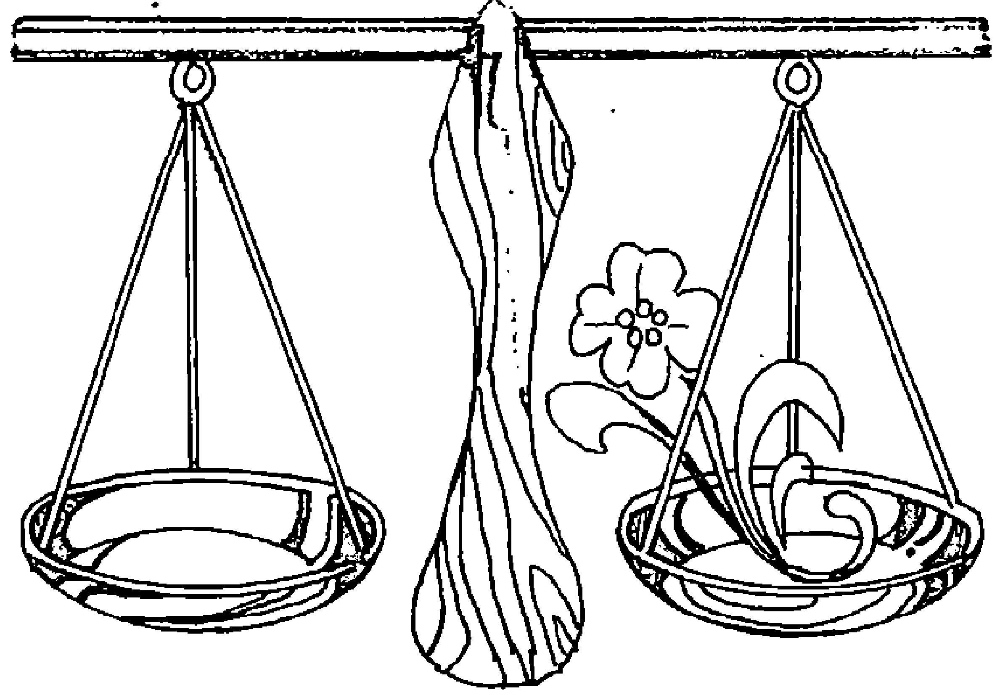

### 壹、择日的条件限制

不管是在教导占星学时面对学生的发问，或者是面对顾客的求问，总是离不开如此的一个问号：我将会遭遇到什么？问号的背后，除了意味着人们对于未来有所担心以外，也意味着人们具有预防的动机。然而，我却时常喜欢反问别人：如果有一天，当你真的遭遇到什么的时候，你会如何？其中，有些人不知道自己的答案是什么，而只说会视情况而定。当然，也有些人会说自己将可能采取什么样的措施。可是，如果万一情况真的发生了的话，又是否真的会去采取自己先前所说过的措施？

以上的开场白，点明了人们对于论命的某些误解。换言之，人们总是认为所谓的论命就只是告诉人们：我将会遭遇到什么？试问，如果我真的很神奇地预测到你将会遭遇到什么，而如果你不具备面对遭遇的勇气，也缺乏克服的意志的话，那么告诉你真象又有何用，岂不加重你的心理负担？倒不如三缄其口，不说为妙，以免多造口业。

因此，存在于“论命”两字背后的玄机，如果真的想要解开的话，重点绝对不在于你将会遭遇到什么，而应该是你将如何面对你的遭遇。两者之间的差异，不只是现代与传统之间的命运观的差异，同时也是人类本身作为主动者或被动者之间的差异。换言之，现代占星学强调的是后者，是在于透过命盘的分析，来解答你在面对遭遇时所可能采取的行为反应，因为你的人格特质。同时，往往也在于说明，可能就是因为你自己的人格特质上的某些缺失，或者是缺乏抵抗力、意志力，所以才会导致事情的发生，也才会让你遭遇到什么。

以上的基本观念贯串于整个现代占星学的理念之中，这当然也包括了择日占星学在内。所以，当你要进行某一项择日的时候，千万不要先验式地认为：此择日会让你遭遇到什么样的好处。而应该把它看成是：此择日会在你面对任何遭遇的时候，增强多少心灵上的意志力。也许，大部份的人无法同意我的说词，但这却是择日占星学的一个基本观念，任何择日都是以此来作为考量的出发点。

以婚姻择日来说，为何命度在固定宫的话，会比变动宫和基本宫来得比较好？理由很简单，婚姻乃是一辈子的事，没有几个人会在结婚的当时就准备要离婚的，因此，婚姻所需要的乃是一种稳固的象征，所以固定宫比其他宫来得好，它象征着增强了婚姻本身的安定之心灵，也象征着在面对婚姻上的任何争执时，都具有克服的意志力，并祝福两人白头到老、永结同心。

因此，如果从心灵或精神的角度来看待择日的话，这就如同第一章中所提到过的鸟类的飞行一样，一个好的择日，会有助于事项本身之心灵与精神的建构，这就好像是助长鸟类飞行的顺畅一样；而一个不好的择日，则会有碍于事项本身之心灵与精神的建构，这就好像是影响了鸟类的顺畅飞行一样。换言之，如果把择日视同为是鸟类飞行时的气流的话，那么此气流绝对不只是环境的意涵而已，它也具备了精神的意涵。所以，任何一个择日的主体（例如，公司本身或婚姻本身），绝对不是简单的环境而已，否则择日主体如何与其他的主体进行互动（例如，公司本命盘与老板本命盘的合盘，或者是婚姻盘与两造的合盘）。

以上的说明，乃是在于强调宇宙之时空的交错，是可以同时赋予人物、事物和环境等象征意涵的，否则择日的观念无从建立。亦即，只要是在时空的某一个点来诞生的话，则不管是人也好，或者是某一事项也好，都应该视同为具有同样的气质特性，只是主体的特性有所差异而已。

然而，就因为主体的特性有所差异，所以有了鸟类与气流之间的不同，也因此，有了择日功能上的限制。换言之，由于鸟类所代表的乃是生物本身，而气流则只是事物的特性，所以两者之间的重要性不能等同而论。也就是说，气流归气流，鸟类归鸟类，两者既存在着有所感应，也存在着有所差异的情况。而这其中正透露着鸟类才是真正的主角，气流只是配角而已，况且这个配角又时常是在变化之中的。所以，择日只能作为是一种配角的角色，它绝对不是主角，真正的主角乃是人类，人才是真正从事该事项的主宰者。

更简单地说，任何一件事项的择日，不管是准备期间也好，或者是已经准备完成而正要进行开展之作业也好，作为主宰者的人本身，才是该事项开始后，能否成功的关键所在。当然，所谓的成功是因人而界定的。然而，就从比较世俗化的层面来看，并且以事业的经营来作说明的话，则主持该项事业者的本命盘，远比择日盘来得重要。同时，在往后事业经营的过程中，所可能面对的困难或阻碍，也是以事业当事人的本命盘和流年盘为主，而公司的本命盘和流年盘，则只是一种合盘的配角而已。

同理，以婚姻来作说明，如果男女两造的本命盘已经呈现出离婚的征兆，而且又无法从合盘来进行化解的话，则此时不管是有多好的择日盘，往往都只能是略作缓和而已。婚姻的择日绝对不可能扮演着婚姻危机之化解者的角色，因为它是事物，而不是人物。不过，能缓和总是比不能缓和来得好，至少缓和是一种生机的来源。因此，如果真的想要解除整个婚姻危机的话，还是要依靠当事人的两造来作诉求。在此，也透露着宇宙的神奇力量，因为往往真的会离婚的一个婚姻，不管你是如何地去找到一个很好的婚姻择日，只要把婚姻的本命盘，拿来与两造的本命盘作合盘分析的话（必须注意的是，时间要相当精确），则往往是呈现出一个很好的婚姻择日，却无法与两造的本命盘作适当的搭配，而这也许就是所谓的造化弄人吧！

因此，从以上的论述，我们可以得知择日存在着许多的条件限制，而这些条件限制有时还真的是难以克服，也因此，很难有十全十美的择日可言。所以，千万不要把择日当成是万能的，也千万不要认为有一个很好的择日，就可以通行无阻。因此，不妨把择日当成是一种调和剂或润滑油，它可以使得事情的进行比较顺畅，但并不能保证事情的一定成功。以下针对择日所存在的某些局限来略作说明。

首先，是择日时间的界定问题。往往一般人，总是认为所谓的择日，指的是事项正式开始的那一刻，并且认为此刻就是该事项的本命盘。在理论上来说，这是正确的。可是，这其中却又存在许多的不确定因素，而第一个不确定因素就是：到底哪一个时刻才真的足以代表事项正式开始的时刻？我用以下的三个举例来作说明。

就个人的出生本命盘来说，出生的时刻只能算是第二主要时间，那是在第一主要时间无法得知，或者是无法确定的情况下，才被拿来使用的。换言之，当精子与卵子第一次接触的那一时刻，才能够算是本命盘的第一主要时间，因为此时才真正是生命个体产生的刹那间。然而，由于我们很难得知这个时间，所以只能以出生的时间来作分析。当然，这两者之间是存在着很紧密的关系，可是也不能说完全没有误差的存在，只能说出生时间是我们比较容易取得的资料。

再以婚姻来说，以现代社会的开放情况而言，绝对不同于古代的传统社会，因为古代的婚姻择日，至少意味着男女双方是第一次上床，所以古代的婚姻择日，可以很明显地界定为是两造第一次性接触的时刻。然而，时代已经不同了，婚前性行为已经不是一件道德的问题（不管订婚与否）。于是，两造的第一次性接触的时刻，已经很难与婚姻择日互相配合了。那么这就产生了如此的一个问题：到底婚姻的本命盘应该是男女双方上床的那个时刻，或者是正式举行婚礼的那个时刻？这与前面所提到的本命盘的情况一样，如果在婚前已经上过床了，则婚姻的择日作用至少有所减少。

换句话说，传统社会是婚礼在前，性关系接触在后；而现代社会则可能是性关系接触在前，婚礼在后。从理论上来看，发生在前面的乃是第一主要时间，而发生在后面的乃是第二主要时间。因此，如果第一主要时间不可知（例如，婚前已经发生过性关系，而忘记了这个第一次双方性接触的时刻的话），则也就只能用第二主要时间了（婚礼举行的时刻）。当然，第二主要时间与第一主要时间彼此之间，是存在着密切的联系关系（亦即在理论上，可以从两性在婚前上床的那一时刻，来决定将来两人是否会结婚），但也存在某些误差。

如果从事业开创的角度来看，则同样地也是如此。尤其是每一项事业的经营，都必须事先经过一段时间的准备、计划，甚至有很多的事业是早就已经事先开始经营了（此时应该算是公司已经在运作了），而公司的开业择日则是在后。如此一来，则应该是公司开始运作的那一时刻，才能算是公司本命盘的第一主要时间，而公司的择日盘则只能算是第二主要时间。只是由于我们比较能够掌握到的是公司正式开业的时间，因此以此来作为公司的本命盘。所以，有许多国家的本命盘，往往并不是刻意择日所造成的，而是因缘际会的结果。也因此，在占星学的研究上，只要是涉及到任何事项的开始，都必须透过事后的发展情况来作印证，以找出一个比较足以代表事项开始的时间。

于是，从以上的说明，我们可以得知某些择日的基本概念：

- 一、任何事情的发展往往是“顺其自然的”，亦即很难以人为的方式来作刻意的强求；
- 二、我们比较能够掌握得到的，往往只是第二主要时间而已，而第二主要时间的作用是比第一主要时间较弱；
- 三、由于第一主要时间与第二主要时间彼此之间，存在着某种紧密的联系，所以我们才可能以第二主要时间来进行预测；
- 四、如果真的要达到一个很好的择日的话，则最好是第一主要时间与第二主要时间彼此之间，能够配合得相当好；
- 五、当我们择出一个相当好的第二主要时间的时候，虽然它可以呈现出第一主要时间的某些特质，但是也并不能完全代表第一主要时间，除非两者是合而为一的；
- 六、当我们择出一个很好的第二主要时间的时候，它的顺畅作用也是有所局限的。

其次，除了以上所提到的时间的不确定因素之外，还存在着人类本身的条件限制，而这些条件的限制，不妨把它看成是一种对于自己本身之条件与能耐的衡量。这就好像是，如果你本身已经拥有一千万了，而且准备要买房子的话，那么这一千万的某种上下额度，就是你的条件限制，因为你不可能想要去买一幢上亿的房子（除非你有把握付得起贷款），也因此只可能会把你的购屋条件，限定在一千五百万或二千万以内。同理，这就好像是鸟类自己的最大飞行能耐，如果是一次只能飞行一百公里，但却勉强飞行二百公里的话，则恐怕会力不从心。

因此，在进行任何择日事项的时候，千万记得要先衡量自己的能耐，不必太刻意去选择一个具有速成特征的时间（除非择日事项本身有此需要，或者是个人的先天条件相当充分），因为自己本身所具有的能耐（例如，事业经营的才能、财力和物力等条件，或者是个人对于婚姻的基本态度等），已经在很大程度上决定了择日事项的成功机率。换言之，千万不要寄望于任何的一个择日，可以很快速地为你带来大量的助益。这其中也呈现出择日的一个重要原则：讲求一种稳定发展的征象。

其三，择日时常会与当事人的本命盘和流年盘产生冲突。这在择日上是一种精密性的讲究，同时也更增添了择日的困难度。简单地说，你也许可以找到一个很好的公司开业时间，可是一旦你把这个择日命盘拿来与你的本命盘作合盘分析的话，却又可能会发现有许多的刑克产生。此时，不可否认这是一个很好的时间，但是对别人来说，也许会是比较有所助益的，而对你来说则是比较没有什么助益。相对地，有些择日时间也许并不是很好，可是一旦与你的本命盘来作合盘分析的话，却有可能会是助益之象蛮多的。

因此，如果把当事人的本命盘和流年盘也列入择日考量之中的话，则更难以找出一个很好的择日时间。所以，在一般的择日考量上，大部份都是只以择日事项为主来作考量，而很少也考量到当事人的本命盘和流年盘。换言之，只要择日事项本身呈现出基本吉兆的话，就已经算是一个相当不错的择日了，因为当事人的本命盘对于择日盘来说，无疑地加深了择日上的限制。

其四，如果个人的本命盘或流年盘，已经呈现出某些情况可能会发生的话，则并不能藉由择日盘的吉兆来作完全的化解。这在前面已经略作说明了，而这也是一种择日上的条件限制。换言之，不可能藉由择日盘的完美，来化解个人本命盘或流年盘所呈现的问题。例如，一个很好的婚姻择日，虽然有助于婚姻的和谐，但并不能保证就因此而可以改变个人对于婚姻的基本态度，因为如果要改变个人对于婚姻的基本态度的话，还是要透过个人格特质上的改变。因此，不妨把择日的作用看成是：可以使得个人本命盘上的吉兆有所加强，也可以使得个人本命盘上的凶兆略作缓和，但却不能完全化解凶兆。

其五，择日无法抵挡大环境或天灾人祸的变故。简单地说，如果整个人环境已经有了某种局限的话，则不管你的人为条件是如何地好，也不管你是如何地去择到一个前所未有的大好时间，都无法抗拒大环境的造化弄人。就以所谓的夕阳工业来说，如果整个经济大环境已经有了明确的迹象，那就不是你个人之力所能改变的。这就好像是鸟类在飞行时，不管气流是如何地顺畅，可是目的地所在的自然环境如果已经被严重地破坏了的话，则飞抵目的地又有何用？此时，恐怕鸟类只好另寻飞行的目的地了。

> 此正所谓的「宁当太平犬，不作战世人」

生逢乱世，又能如何。所以，每一个时代都会有每一个时代的英雄，也都会有每一时代的行业产生，这是时代赋予我们的大环境。也因此，或许我们真的只能当一位「识时务者」的英雄吧！真的足以创造时势的英雄，在历史上又能有几人！

最后，只要是任何一项择日有涉及到另外的第三者的时候，则择日的限制就会更多。最明显的例子就是婚姻盘，因为婚姻并不是单独一个人的问题，亦即并不是单独个人本命盘与婚姻本命盘之间的问题。因此，有时候一个相当不错的婚姻择日，可能会对某一方相当有利，可是却又对另一方不利，甚至容易引发另一方的离婚动机。此时，问题的关键可能就不是在于你个人（这是从命理的角度来看），而是在于对方，也因此更增添婚姻的不确定因素。所以，必须强调的是，婚姻两造的合盘才是最主要的决定因素，它的重要性大于择日盘。

同理，如果一个公司的创立是属于合伙的性质，那么任何一方的本命盘，都有可能会与择日盘产生严重的刑克现象，造成公司拆夥的潜在危机。而有些大型的公司，除了董事长以外，主要的决策人物的本命盘（如副总裁或总经理等），都有可能会与择日盘形成某些刑克的现象。此时，择日很难去克服这些问题，所以这也是择日的一种限制条件。

总之，我所要强调的是：第一，择日没有十全十美的，只能尽可能地追求完美；第二，事在人为远比择日来得重要，有时候顺其自然，也未必不是一件坏事。

## 贰、月亮的重要性

在择日占星学上，有三个很重要的考量点：月亮、太阳和命度。这三者各有不同涵义，其中的太阳是代表着出名、意志和权力，命度则代表着体质、耐和开创，而月亮则代表着感情、生产和想象。同时，占星学家对于这三者的重要性，也各自有自己不同的看法。然而，一般来说，把月亮当成是第一优先的考量因素，则是占星学家的共同看法。换言之，由于月亮本身距离地球最近、影响力颇大，尤其是她的盈亏现象所导致的磁性反应，更是择日占星学所必须特别注意到的。再者，月亮是移动速度最快的星体，所以她也象征着择日事件的变动性，此更增添了她的重要性。

因此，在择日占星学上，针对月亮所作的考量，必须注意到两大基本原则：第一，月亮「绝对不可以」有90度的情况发生；第二，最好是选择从新月到满月的这一段期间。说明如下：

首先，由于任何的择日事件，都具有强调稳定和多产的特质，所以月亮绝对不可以有90度的刑克现象产生，否则，会显示着择日事件的不安定性，以及缺乏生产的能耐。

例如，以事业的经营来说，相当讲求事业的稳定发展，并且诉求于业务量的不断扩充，所以月亮的吉相是第一优先的考量因素。又例如，以婚姻的建构来说，相当讲求家庭事务的稳定发展，并且诉求于感情的不断扩充，所以月亮的吉相是第一优先的考量因素。

除了避开90度以外，月亮最好也不要有多180度的情况发生。这是因为月亮是一颗相当敏感的行星，她的任何凶相都会比其他行星的凶相来得敏锐，都有可能会引发事件的变化。所以，当你想要择一个好日子的时候，首先就是打开星历，把所有月亮有刑剋现象发生的日子去除，然后再来查阅、考量其他的日子。

其次，月亮的盈亏也是一个相当重要的考量因素。依照传统占星学上的看法，是强调一定要避开新月的，而且这种观念可以说已经是一种信仰了。因为在每一个新月重新开始的时候，此时的黑夜被认为是代表着死亡的象征。同时，择日最好也要避开满月的时候，因为满月的引力最强，容易引发情绪的高涨或波动，所以也应该尽量避开。

因此，如果从月亮的盈亏来作择日考量的话，则最好的时段是：从新月开始的三日后（避开阴历的三十或廿九、初一、初二）到满月的前三日（避开阴历的十四、十五、十六）这段期间。因为从新月到满月的期间（月盈），是比从满月到新月的期间（月亏）来得好。一般的说法是，如果择日是选择在月盈的期间，而且月亮又相当具有吉相特质（格局漂亮），同时月亮的移动速度又比平均速度来得比较快的话，则将可以带来比较快速的成功。

其实，在考量月亮盈亏的时候，不应该完全否认月亏期间所可能具有的吉兆。这是因为两者的特性不同，所以不应该等同而论，反而应该分开来看，并且依据择日事件的特质来作考量，没有必要一定是选择月盈的时期。以下是从农业占星学的角度来作简要的说明。

月盈的期间有利于地表之上的农作物的成长，如稻谷、大麦和小麦等，所以月盈期间有利于外显的实质性收入。也因此，在针对企业的创立作择日时，可以选择月盈的期间，因为它可以带来物质、金钱等实质性的收入。然而，同样地也会带来比较明显的竞争和冲突，因为它诉说着一种积极、主动和成长的象征。

月亏的期间有利于地表之下的农作物的成长，如甜菜、胡萝卜等根作物，所以月亏期间有利于内在的精神提升。也因此，如果择日事件有涉及到精神、教育等事项的话，则可以考虑选择月亏的期间。但是，由于月亏所诉说的乃是一种内省、回顾和收敛的象征，所以无法带来实质性的收入。

不管择日是选择月盈或月亏的期间，这当中一定会有月亮与太阳形成90度的情况发生，这种情况不能列入考量之中（因为月亮绝对不能有90度发生），所以这一天必须去除。

由于月亮特别具有变动和生产的特性，所以当我们在进行择日考量的时候，除了月亮的相位以外，也必须注意到月亮所落入的星座位置，因为这会影响到月亮的特质呈现。换言之，当我们在进行择日的时候，我们会对于择日事件的未来发展有所期望，而期望的满足与月亮所在的星座所呈现的潜在力量，有着相当密切的关系，所以应该特别注意到月亮所落入的星座位置。以下针对月亮落入黄道十二宫的潜在能力，作一简要的说明。

### 月亮落入戌宫
先天第一宫的开创精力，使得月亮在此突显了个人主义的气质，并且由于急躁、快速和精力充沛，导致采取有點性急的做法，以及决断上的迅速，所以会比较缺乏充分的计划。以婚姻来说，往往是一种快速决定的婚姻型态；以事业来说，往往是一种开创型和个人型的事业型态。总之，月亮在此指示着并不适合于任何合作型态的择日。

### 月亮落入酉宫
月亮在此是庙旺，特别是月亮与酉宫同样具有生产的特质，所以此宫是月亮的最佳选择，甚至可以说是婚姻择日或事业择日的最佳选择。换言之，以婚姻来说，月亮在酉宫指示着感情上的稳定发展；以事业来说，月亮在酉宫指示着实质收入上的助益与肯定，可以降低事业经营上的财务风险。总之，择日是应该尽可能地选择月亮在酉宫的位置。

### 月亮落入申宫
月亮的变动、生产和想象的特质，在此转换成为沟通能力的发挥，所以除非是强调快速的反应，或者是强调人际关系上的沟通，否则月亮在此并不是一个很好的选择。以婚姻来说，潜藏着太多的变化性，因为指示着婚姻本身具有太多的新奇特质；以事业来说，月亮在此会特别不利于具有例行公事型态的企业，所以只能适用于讲求变化、沟通和知识性的行业。

### 月亮落入未宫
月亮在此虽然是入垣，相当具有生产、温情和亲切的特质。但是，由于未宫是基本宫的原故，所以存在着促进和改变的动机。以婚姻来说，指示着彼此双方在潜意识之中，逐渐进行着主宰家务事务的竞争；以事业来说，指示着心情的波动影响了事业的经营，除非当事人的命度在未宫，或者是未宫的特质强烈，否则多少具有家庭与事业两难的征象。

### 月亮落入午宫
午宫的戏剧性、娱乐性和赌性，在月亮的促动下更形突显。但是，由于午宫是固定宫的特质，所以变动的征象减少。因此，以婚姻来说，虽然指示着彼此双方有点互不相让，但却可以透过共同的兴趣与玩乐来化解僵化的局面；以事业来说，对于期求快速打开知名度比较有利，然而却要避免过度地浪费和挥霍，当事人如果与政治有所关连的话，倒是相当不错的位置。

### 月亮落入巳宫
月亮在此具有见树不见林的特质，所以虽然具有生产和服务的征象，然而实际的利益收入，并不能达到既定的理想。以婚姻来说，潜藏着因为讲求细节、完美，而导致彼此双方相互指责或批评；以事业来说，比较适合于相当讲求售后服务的行业，特别是电脑业，或者是与健康有关的行业。总之，巳宫的实质助益比较倾向于细水长流的类型。

### 月亮落入辰宫
月亮在此造成期求于均衡性，同时又会是比较偏向于精神层面，所以实质性的收入必须透过间接的方式来达成。以婚姻来说，这未尝不是一个好位置，只是辰宫乃是基本宫的特质，所以虽然具有调和的征象，但也具有公开对立的可能，最足以代表婚姻生活的特质；以事业来说，对于具有仲裁、调解、顾问、咨询与合伙性质的行业比较适合。

### 月亮落入卯宫
月亮在此为落陷，因此基本特质的呈现并不是很好，因为会容易造成要完全占有的情绪诉求，比较难以和别人进行融洽的沟通。然而，这却是一个相当具有持续力量的位置，有助于坚持到底地去克服困难。以婚姻来说，情欲的强烈特质会呈现，而要求对方绝对地忠贞；以事业来说，有利于破坏或扫除的行业，如除虫公司、电解的行业，或者是垃圾清除等。

### 月亮落入寅宫
月亮在此会导致不断地期求于有所成长，而且又会是比较偏向于精神层面，因此除非能够具有各种实际经验上的刺激，同时又具有一个可以期待的终极目标，否则会比较难以坚持下去。以婚姻来说，可能会造成对于婚姻的过度精神诉求，并且期望于婚姻生活能够具有各种情趣上的变化；以事业来说，不利于要求在短期之内有所实质收获的行业，而比较有利于长期性的投资。

### 月亮落入丑宫
月亮在此为入弱，整体特质呈现出严谨、保守和拘束的倾向，会特别不利于沟通上的表达，而造成情绪上的压抑。然而，却可以充分地表现出持久的耐力，以及以实际的态度和可行的方法来达成目标。以婚姻来说，是一种比较稳定而缺乏情趣的婚姻形态；以事业来说，有利于长期性野心的达成，所以打开市场的速度会比较慢，可以依靠真材实料来获取口碑。

### 月亮落入子宫
月亮在此无法充分地展现出她的实质生产性，因为子宫所具有的思维特质比较强烈，所以如果有生产可言的话，那也会是比较偏向于精神层面的。然而，由于子宫是固定宫的特质，所以会降低变动的可能，而具有长期性地坚持某种观念的动机。以婚姻来说，感情的深化可能是透过观念的沟通来达成；以事业来说，有利于社交、政党、团体组织等与群众有所接触的行业。

### 月亮落入亥宫
由于月亮也具有想象的特质，所以月亮在此增加了幻想、混乱和神秘的特质，也因此造成择日考量上的限制。同时，由于容易产生许多不切实际的想法，以及比较缺乏落实的能耐，所以通常很少会选择月亮在亥宫的位置（亥宫是变动宫）。以婚姻来说，多少呈现出两造互相有所隐瞒的味道；以事业来说，除非是属于艺术类之需要意境和想象的行业，否则不被列为优先的考量因素。

最后，针对月亮所作的择日考量，还涉及到所谓月蚀（Moon Eclipses）的问题。这种情况的发生，是必须特别注意到当太阳与月亮形成合相或对冲的时候，以及月亮的交点（罗睺和计都）有合相的情况发生时。一般而言，占星学家对于月蚀是采取否定的立场，认为月蚀会带来不利的影响。但是，也有些占星学家则认为还是要视个别情况而定，不能一概而论地否认了月蚀的作用，因为月蚀往往与刺激着个人去采取某种新计划的动力有关。然而，由于发生月蚀的情况并不多见，而且它在占星学上是归属于专题性的探讨，所以在此不多作说明。

## 叁、星座与宫位的考量

在考量月亮的各种情况以后（这往往是择日的第一考量因素），接下来就是考量命度（命宫宫头所在位置）的各种情况。同时，命度的位置考量是与太阳的位置考量互相配合的（参见后面有关太阳的说明）。

由于择日相当讲求动力的展现模式，所以命度所在星座的位置考量，是以四正宫来作为考量的主轴，而以三方宫来作为辅助。因此，当你在进行某一项择日的时候，除非是特殊的情况而有特殊的诉求以外，一般对于命度星座的考量原则有二：第一，以固定宫作为命度乃是首要的选择，其次为基本宫，除非情况特殊，否则变动宫的命度是很少被列入优先考量；第二，注意命度所在的位置度数，尽量不要把命度选在28度以后的位置，因为在28度以后，是代表着变动的气质已经呈现了。以下针对四正宫的特质差异，略作说明。

### 基本宫
是一种开拓、冒险和攻击的象征。因此，如果是诉求开创或开辟一个新领域的话，这是一个不错的选择，因为基本宫具有充沛的精力，以及专注的精神，可以用以面对任何的新的挑战。

以婚姻来说，由于基本宫具有开创的特质，往往需要新鲜事物的刺激，所以除非婚姻生活能维持一定的新鲜感，否则具有日久思变，或者是缺乏耐性的征象。而如果是要选择基本宫来作为婚姻盘的命度的话，是以未宫和辰宫为优先考量，而戌宫和丑宫则其次。

以事业来说，虽然相当具有开拓的能耐，然而在历经短期的精力爆发以后，可能会缺乏长期性的持久力，所以从事业的讲求永续经营的观点来看，这并不是最优先的选择，除非该事业所诉求的是短期性的经营，或者诉求的是打开一条前所未有的新行业。在此，唯一的例外是丑宫，因为丑宫比较具有事业经营上的长期持续力。

### 固定宫
是一种稳定、扎根本和持续的象征。因此，除非是特殊性的例外，否则固定宫是择日的最佳选择。而在四个固定宫当中，以酉宫作为第一选择（酉宫同时也可以说是择日的最好位置）。固定宫所具有的安定和坚持的特质，乃是它之所以被列为优先考量的最主要因素，亦即择日占星学相当讲求持续发展的力量，而不是诉求于短期的速成。

以婚姻来说，固定宫至少可以发挥它的安定力量，减少离婚的可能性。虽然固定宫的四个星座，各有不同的特质呈现，然而只要是稳定的力量足够的话，则星座的特质差异，只是诉说了婚姻生活的不同重点而已。例如，酉宫会倾向于实质事物的考量，午宫会倾向于共同的兴趣与玩乐，卯宫会倾向于感情的深化，而子宫会倾向于精神层面和理念的沟通。

以事业来说，固定宫更具有长期性稳定发展的特质，同时也具有诉求永远立于不败之地的意涵。当然，如果配合上三方宫来看的话，则更可以展现出事业的重点所在。例如，酉宫讲求的是实际性的财政收入，午宫讲求的是知名度和企业形象，卯宫请求的是竞争能力的提升，子宫请求的是群众路线。

### 变动宫
是一种变动、不稳和短期的象征。因此，除非该事项是诉求于相当短期的变动特质，否则最好不要用变动宫来当命度。因为变动宫虽然具有弹性、灵活的特质，而且也具有与别人进行周旋的能耐，然而它的最大致命伤，乃是在于进退之间相当快速，不利于事项的讲求稳定发展。

以婚姻来说，千万不要选择变动宫当命度。以事业来说，由于变动宫也相当不利于生意上的冒险，所以最好也不要选择变动宫来当命度。一般而言，可以选择变动宫来当命度的事项，大致上都是属于社交性质的聚会，它有助于气氛的融洽，而且又会在几个小时以后结束，相当具有短期的变动特质。

在考量命度的星座位置之后，与命度位置互相关连的是四个基本点的位置（此即第一宫、第四宫、第七宫和第十宫的宫头所在位置）。一般而言，一旦命度已经决定了的话，则四个基本点的位置也就已经确定了。然而，除了等宫制之外，其他宫位系统的四个基本点的位置，则未必是同时也落在与命度相同的四正宫星座上，因此也有必要作仔细的观察。如果是采用Placidus系统，而且又要求四个基本点同时落在固定宫的话，则有时候必须些微移动命度的位置（每四分钟走1度）。

由于四个基本点的宫位（始宫），代表着人类生活中最重要的领域，所以它们的影响力也是最重要的。因此，在择日上也必须把四个基本点的特质列入考量之中，这主要是透过第一宫、第四宫、第七宫和第十宫内的行星来作呈现。以下只是简略说明有关基本点宫位的特质和影响，至于行星的部份，请参见后面。

### 第一宫
是最具影响力的位置，所以命宫内的行星值得特别注意。命度代表着该事项的体质、能耐，以及呈现于外在世界的形象，而命宫内的行星会则促动、刺激或缓和命度之特质的展现，亦即命宫内的行星也会表现出该事项的动力特质。总之，可以应用命度的位置以及命宫内的行星，来描述事项本身的基本特性。

### 第四宫
特别是与家庭生活有关，所以如果择日主题是与家庭、家人、家事、房子、房地产、租屋、装璜、摆设布置、土地、不动产和佣人等有关的话，则第四宫内的行星值得特别注意。

### 第七宫
特别是与婚姻生活有关，而事业上的合伙关系也同样是由此宫所主宰，所以如果择日主题是与婚姻、同居、亲密关系、合伙、契约和协定等有关的话，则第七宫内的行星值得特别注意。

### 第十宫
特别是与事业有关，而个人的社会名望也同样是由此宫所主宰，所以如果择日主题是与地位、名声、权力、荣誉、领导、公众和出名等有关的话，则第十宫内的行星值得特别注意。

总之，当行星落入四个基本点的宫位时，其重要性会有所突显。当然，这些宫位内的行星的相位，也就更值得注意了。然而，有时候也还必须注意到这些基本点宫位的宫主星的相位，也就是命主星、第四宫宫主星、第七宫宫主星和第十宫宫主星等的相位。这些宫主星如果刑克太严重的话，是会减弱其他方面的吉兆特质。

最后，如果择日事项有涉及到其他生活领域的特别诉求的话，则某些特定的宫位也要列入考量之中。例如，以生意上的买卖来说，也要考量到第二宫和第八宫，因为这两个宫位与钱财和经营手腕有关。又例如，以教育来说，则也要考量到第三宫和第九宫，因为这两个宫位特别与学习有关。所以，多少也应该考量到择日事项所涉及的某些特定宫位的宫头位置（星座）、宫内的行星以及其宫主星等。

## 肆、行星的考量

在择日占星学上，除了月亮之外，其他行星（包括太阳）的择日考量重点主要如下：

太阳——也是择日上的重要因素，特别是太阳具有能力和显著的特质，并且代表着该事项的自我。因此，太阳在择日上的考量重点主要有二：一是太阳所落入的后天宫位及其相位，如果太阳是落在与择日事项具有相当关联的宫位时，则可以加强该宫位的重要性，又如果再加上吉相位的话，更可以突显出该重要宫位对于该事项的助益；二是太阳与命度可以形成三合相（120度），这是一个相当重要的考量，而且这种情况会是每天发生两次，所以一般来说，每天至少都会有两个比较不错的时间（总共是128分钟）可以作择日，也因此如果择日是被限定在某日来进行的话，则可以选择太阳与命度形成三合相的时间。

例如，每年过完旧历过年之后的初四或初五的开张择日，可以选择太阳与命度形成三合相的时间。同时，由于太阳的移动相当具有规律性，因此太阳与命度形成三合相## 第二章 擇日原則

的時間也相當具有規律性，此時可能就比較無法顧及到命度所在星座的問題了。

命主星——命主星的重要性絕不低於太陽，可以說是僅次於月亮而已，因爲命主星代表著事項本身的整體性。因此，命主星的擇日考量重點主要有二：一是命主星要突顯出吉相位，特別是與木星或金星等吉星形成吉相位，當然也要盡量避開與凶星形成凶相位；二是命主星所落入的後天宮位，除非是基於特別事項的考量，否則一般是選擇落入強勢宮位之中，而不要落入弱勢宮位之中（這裡所謂的弱勢宮位，指的是比較無助於擇日事項的宮位，如第三宮、第六宮、第九宮、第十一宮、第十二宮等），這是因爲命主星所落入的宮位，具有代表著該事項的未來發展趨向的意思。

同時，如果你所選擇的擇日時間是以固定宮來當命宮的話，則此時的命主星便是金星、太陽、冥王星和天王星，所以要特別注意這些行星的位置和相位。其中，如果是午宮坐命宮的話，則在太陽與命主星合而爲一的情況下，太陽的重要性就更加強了。而如果是選擇以卯宮或子宮坐命宮的話，則由於冥王星和天王星都是移動速度相當緩慢的行星，所以就會在先決條件上有了擇日考量空間的限制（亦即命主星所落入的先後天宮的變動性不大），因此最具有擇日活動空間的就是酉宮坐命宮。

其他行星——行星在擇日上的作用，與本命盤的作用相似，都是一種動力形態的展現。因此，可藉由行星的動力本質，來突顯擇日事項的考量方向。以下就行星（除了太陽之外）的本性，以及其所代表的行業徵象來作簡要的說明。

月亮：除了一般性的情緒反應之外，也代表著個人與公眾的接觸（月亮主宰著個人的公眾臉孔，所以與公眾性的活動有關，也可以說是個人之公眾魅力的展現），同時更具有母性和根性的特質。因此，與月亮有關的行業，包括：餐飲業、廚具業、與水有關的行業（例如，咖啡店、水族館、啤酒屋等）、日常用品業、食品雜貨業、公眾事務的行業、與歷史有關的行業、與收集有關的行業、不動產業（例如，土地買賣和房屋買賣）等。

此外，與月亮有關的一項重要的擇日原則是：月亮絕對不可以有空虛（The Void）的情況發生。所謂的「月亮的空虛」，指的是當月亮在離開自己所落入的星座之前，完全沒有與任何其他的一顆行星形成主相位的話。例如，如果月亮是落入申宮23度，而在中宮23度到30度之間，月亮並沒有與任何其他的行星形成主相位（包括60度、120度，或特殊情況的180度）的話，則此時的月亮是處於空虛的狀態。這在擇日上是應該避免的，因爲月亮的力量無法發揮出來（亦即缺乏感應的管道）。

同時，與月亮有關的擇日考量，還包括了月亮的交點（羅喉和計都）。一般而言，北交點（羅喉）是一種吉兆的代表，可以爲擇日事項帶來名聲和保護的力量，所以應該盡量使其落入與擇日事項有關的宮位之中；而南交點（計都）則是一種凶兆的代表，會給擇日事項帶來傷害和錯誤，所以應該盡量使其落入比較無關於擇日事項的宮位之中。然而，由於羅喉和計都一定是處於對沖的位置（兩者正好形成180度），所以要避開計都的不利影響並不容易，因此只能以羅喉之吉兆特質的發揮來作考量。此有關月亮交點的擇日考量，應該列在最後，亦即當其他所有的行星都已經考量過了之後，再來考量交點的問題，所以月亮的交點並不是擇日考量的主軸，而只是輔助性質而已。

水星：除了快速的思考運作以外，也代表著個人的活動空間，同時也與任何比較膚淺或多才多藝的特質有關。因此，與水星有關的行業，包括：與心智活動有關的行業（例如，科學、理論、思想、策劃等）、與計算有關的行業（例如，統計、數學、會計、簿記等）、與寫作和口才或宣傳有關的行業（例如，新聞、雜誌、廣告、廣播、編輯、出版社、印刷業、作家、教育或教師等）、與推銷有關的行業、與溝通有關的行業（例如，電信、電報、郵差、電話、交通運輸等）、旅行業等。

金星：除了迷人和優雅的特質以外，也代表著個人的藝術才能，以及喜歡和休閒的傾向，更具有金錢的特質。因此，與金星有關的行業，包括：與金融和動產有關的行業（例如，銀行業、證券業、珠寶業等）、與藝術有關的行業（例如，音樂、戲劇、電影、建築業、服飾業、美容業、園藝、陶藝等）、與休閒娛樂有關的行業（例如，舞廳、遊樂場、俱樂部等）、特別需要進行社交或仲裁的行業等。

火星：除了具有勇往直前的特質以外，也代表著個人的開創能力和野心，更與任何具有殺傷力或爆發力的特質有關。因此，與火星有關的行業，包括：與火有關的行業、與金屬和切割有關的行業（例如，工程機械、雕刻、牙科、外科手術、理髮師、肉販、鐵匠等）、與軍事有關的行業、激烈的運動項目等。

木星：除了具有擴展和國外的特質以外，也代表著幸運、樂觀和博愛，更與精神層次的提昇和價值觀有關。因此，與木星有關的行業，包括：慈善事業和社會服務的行業、與宗教有關的行業、與法律有關的行業（例如，律師、法官、立法委員等）、哲學家、與國際事務有關的行業、與長程溝通有關的行業（例如，海運、空運等）、高等教育和專家學者等。

土星：除了具有集中和嚴謹的特質以外，也代表著實際、單調和老舊，更與組織和結構的能力有關。因此，與土星有關的行業，包括：例行公事的行業（例如，行政官員、公務員等）、勞動者、農業、土地買賣、製圖業者、土木工程師、經濟學家、裁縫師、與傳統有關的行業等。

與土星有關的一項重要的擇日原則是：除非有特殊因素的考量，否則土星千萬不要落在接近於四個基本點的位置上，或者是落入始宮之中（第一宮、第四宮、第七宮和第十宮）。土星最好的位置是落在果宮（第三宮、第六宮、第九宮和第十二宮），其次是續宮（第二宮、第五宮、第八宮和第十一宮）。這是因爲土星本身具有阻礙和延遲的作用，而所謂的特殊性考量，乃是如果有必要發揮土星之組織和結構能力的時候才使用。

天王星：除了具有獨特和創作的特質以外，也代表著新觀念和新思想，更與未來的展望和科技有關。因此，與天王星有關的行業，包括：與現代科技有關的行業（例如，電子技術、電學、水力學、放射線、航空技術、自動機械業和汽車業等）、心理學家、天文學家、占星學家、與人權有關的行業、任何新型的行業等。

海王星：除了具有想像和藝術的特質以外，也代表著同情、憐憫和仁慈，更與敏感、隱退和神秘有關。因此，與海王星有關的行業，包括：與藝術有關的行業（此與金星的特質略有差異，比較偏向於想像和捕捉意境的特質，例如，寫詩、美術、攝影、電影、戲劇、文學創作等）、與宗教或社會服務有關的行業、玄學家、與神秘主義有關的行業、魔術師、與化學有關的行業（例如，石油、煤氣等）、與醫藥有關的行業、與水有關的行業（例如，船員、海軍、特別是與酒精有關的行業等）、占星學家、天文學家等。

冥王星：除了具有權力掌控的特質以外，也代表著探究、勘察和深沉，更與暴力、秘密的行動及復原能力有關。因此，與冥王星有關的行業，包括：與任何具有偵察和探勘性質有關的行業（例如，考古學家、間諜、偵探、海底探勘者等）、與心靈治療和神秘力量有關的行業（例如，心理分析家、預言家、占卜師、乩童等）、與死亡有關的行業（例如，火葬場和殯儀業者）、與垃圾和廢物處理有關的行業、核子科學家、外科醫生等。

行星的逆行——由於行星的移動速度有快慢的差別，所以從地球的角度來看，會形成行星逆行的現象。在一般的星曆上，行星的逆行是以「R」的記號來作代表。而在十顆行星當中，除了太陽和月亮以外，其他的行星都會有逆行的情況發生。而由於行星的逆行代表著該行星之動力的弱化，或者是該行星之動力以乖氣的方式展現出來，所以在擇日上，應該盡量避免行星逆行的情況產生。

然而，由於外行星逆行的情況相當普遍，所以如果要完全避免的話，似乎是一件相當不容易的事。因此，只能就內行星的逆行情況來作考量；此時，特別需要注意的是水星的逆行，因爲它代表著事情的不順暢，所以一定要避開水星的逆行。

### 伍、恆星的考量

在擇日占星學的考量上，除了十顆行星以外，占星學家也並沒有忽略了恒星的作用。其實，在傳統的占星學上，所謂的「星體」(Star)，不只是指涉了恒星，也包括了太陽、月亮和太陽系的行星在內，所以廣義的星體應該包含了行星和恒星，而狹義的星體，所指的才是所謂的恒星(Fixed Stars)。也因此，在進行擇日的時候，除了行星的考量以外，大多數的占星學家也會運用到恒星的考量因素。這是自古以來就有的擇日原則，至今還仍然使用著。

一般所謂的恒星，在天文學上指的是具有能量，而且可以自行發光的星體，就像是我們太陽系的太陽一樣。其實，恒星也並不是完全不會移動的，只是由於它的移動速度相當緩慢（每72年移動1度），必須在歷經相當長久的時間之後，才能感覺到它們的移動。因此，一般來說，恒星的位置是相當固定的。而恒星在占星學上的運用，特別會與世俗占星學、卜卦占星學和擇日占星學等有關。如果是運用在本命占星學上的話，則會是特別指示著某些難以抗拒的事件，這是因爲占星學家認爲恒星具有某種高度的衝擊力，會對生存地球上的人類的命運造成巨大的影響。

然而，由於恒星的數量相當多，而且與地球的距離也差異頗大，更重要的是恒星本身有等級之分。因此，在占星學的使用上，並沒有必要，也不可能把所有的恒星都列入考量之中。如果從占星學上的恒星專論來看的話，則大概包括了一百顆左右的恒星在內。但是，占星學家最常使用到的則只有十顆，因此以下就針對這經常使用到的十顆恒星來作簡要的說明。

此外，由於占星學上的恆星論斷，時常是以恆星所具有的行星特質來作描述，所以在此次除了列出恆星的位置以外，也同樣地使用了行星的特質來說明恆星的作用。讀者不妨以一種行星氣質上的類比方式來看待恆星，這樣會比較能夠掌握住恆星的特質。同時，一般來說，恆星的應用是相當具有條件限制的，它必須是合相於行星，或者是合相於四個基本點，並且容許度要在1度之內（有些占星學家採用比較廣的容許度），才能顯現它們的影響力。

以下的資料是一九九五年的記錄，讀者可依此而每年增加50秒的距離。

Algol——位在酉宮26度13分，具有火星和土星的特質，會帶來困難、阻礙、失敗、延遲和不幸，所以在擇日時必須避開這個位置。

Alcyone——位在酉宮29度58分，具有月亮和火星的特質，會帶來同情、憐憫、情緒性、感傷和失望，所以在擇日時應該避開這個位置。

Aldebaran——位在申宮9度42分，具有火星的特質，會帶來爆發力、衝動、刑傷、精力和開創，除非擇日是刻意要突顯火星的作用，否則也應該避開這個位置。

Regulus——位在午宮29度44分，具有太陽的特質，會帶來榮耀、名聲、權力、成功和驕傲，此位置比較有利於事業的擇日，而不利於婚姻的擇日。

Vindemiatrix——位在辰宮9度53分，具有土星和水星的特質，會帶來困難、不幸、自制、障礙和失望，所以在擇日時必須避開這個位置。

Spica——位在辰宮23度45分，具有金星和火星的特質，會帶來成功、幸運、錢財、繁榮和吉兆，這是擇日時常會運用到的恆星，它對於事業和婚姻都能帶來好運，特別是事業方面。

Antares——位在寅宮9度45分，具有火星和木星的特質，會帶來暴力、衝突、自信、獨斷和專橫，如果是有必要特別強調事業的開創特質的話，則可以應用此顆恆星，但不要應用在婚姻擇日上。

Vega——位在丑宮15度14分，具有金星和水星的特質，會帶來幸運、成功、錢財、口才和成就，如果是吉星與此顆恆星形成合相的話，則還可以應用，而如果是凶星的合相就應該避免。

Fomalhaut——位在亥宮3度36分，具有水星和金星的特質，會帶來改變、不定、適應、名聲和異動，此與前面的Vega一樣是依據合相的行星來決定其吉凶，但由於此顆恆星的不安定性比較強烈，所以最好還是不要用。

Scheat——位在亥宮29度05分，具有火星和水星的特質，會帶來困難、不幸、意外、失敗和阻撓，所以在擇日時應該避開這個位置。

以上有關恆星的論述，以後有機會的話，我會以專書的方式來作介紹。而除了恆星的考量之外，傳統的印度占星學家，有時候也會以行星的「亮度」來作爲擇日上的考量，亦即會選擇行星的光亮度特強的時候，來作爲事項開始的時刻，這意味著該亮度特強的行星會帶來特別的助益。這同時也是一種比較古老的擇日原則，在現代是比較少用到了，因爲它必須與懂得天文觀察互相配合。

### 陸、本命盤的結合性考量

在處理完以上的所有擇日考量之後，接下來的最後兩項步驟是：一爲考量當事人的本命盤與擇日命盤之間的關係；二爲考量擇日盤的流年運勢，分別說明如下。

首先，擇日盤本身也是一項主體，所以它同樣具有命運徵象的呈現，這也是我們爲何要擇日的原故。因此，擇日盤會與擇日的當事人產生互動關係。換言之，擇日盤與當事人的本命盤彼此之間，就好像是兩個人之間的關係一樣。然而，也就因爲存在著如此的互動關係，所以更增添了擇日的困難度。因爲任何一個良好的擇日本命盤，只能說是擇日盤本身的吉兆，它未必能呈現出當事人的吉兆，甚至有些時候還會與當事人的本命盤產生衝突。

這就好像是男女雙方在朋友的眼中，都是個性很不錯的人，而且各方面的條件也相當能搭配。然而，這卻並不能保證他們兩人的婚姻生活就能很美滿，因爲兩人的命盤的合盤，可能會充滿著太多的衝突性。因此，凡是有涉及到兩造（這兩造並不一定都要是人物）的互動時，都還是必須透過合盤的分析，來觀察是否存在著巨大衝突。

因此，從事業擇日的角度來看，事業經營的主事者的本命盤，必須儘可能地與擇日盤形成良好的互動關係，這可以直接透過擇日盤與當事人的本命盤的合盤來看。此時，考量的原則還是一樣：趨吉避凶。如果能夠充分地發揮吉兆的話，則是最好的情況，否則至少也要盡量避開凶兆。而某些團體組織的擇日，由於參與的人數頗多，並且每隔幾年就會改選一次，此時就沒有必要考量到合盤的問題，而僅就以該團體組織的特性來作擇日考量。所以，事業擇日的配合於本命盤的考量，一般是以中小企業爲主，或者是有必要突顯某一個人的特殊吉兆時，纔會使用到。

再者，從婚姻擇日的角度來看，由於涉及到男女雙方的本命盤，所以就比較複雜。一般的處理方式有二：一是把婚姻擇日盤拿來與兩造的本命盤，進行個別式的合盤分析，亦即包括了婚姻盤與男方本命盤的合盤分析，以及婚姻盤與女方本命盤的合盤分析；二是直接把兩造的合盤命盤拿來與婚姻盤作合盤分析，這裡所謂的兩造的合盤是只有一個命盤而已，它可以由兩種方法來取得，其一是取兩造之相同行星的中間值（例如，男方的太陽在申宮20度，女方的太陽在午宮10度，則合盤的太陽位置是在未宮15度），其二是取兩造出生時間的平均值，並且把這個平均值的時間當成是出生時間來繪製出一個本命盤，而該本命盤即是兩造的合盤。這兩種方法，以前者比較常見，而後者則比較少見，因爲後者的計算比較複雜，必須藉助於電腦來作計算。

在進行擇日盤與本命盤的結合性考量的時候，必須儘可能地突顯金星和木星的吉兆。而在事業擇日上，可以增加太陽的吉兆；而在婚姻的擇日上，可以增加月亮的吉兆。例如，事業盤的木星與當事人本命盤的太陽形成120度；又例如，婚姻盤的月亮與兩造合盤的金星形成120度等。

其次，除了本命盤的結合性考量之外，擇日盤本身也具有流年運勢的走向，所以還是多少要考量到擇日盤的流年運勢。一般來說，事業擇日必須強調前三年的流年好運，以保證事業有好的開始；而婚姻擇日則必須強調前七年的流年好運，以避開七年之癢的難關。

此外，擇日盤的流年運勢也並不是完全獨立的，它也會與當事人的本命盤形成互動關係。換句話說，從過運(Transits)的角度來看，則行星的移動不只是會影響到擇日盤，而且也會影響到當事人的本命盤。因此，擇日的最後一項考量因素是：擇日盤的行星過運位置，要儘可能地與當事人的本命盤的行星形成吉相位，以120度和60度爲最佳選擇（務必特別注意土星的過運）。

從以上各種擇日的考量因素來看，可以得知：要真正達到一個十全十美的擇日命盤，可以說是不可能的。也因此，任何的擇日都可以說是不完美的，這就好像是人生本來就不可能是十全十美一樣，我們只能儘可能地使其完美而已。

最後，我想再次強調的是：當事人的個人本命盤才是決定命運的最主要因素，所以本命盤所呈現的足以克服各種困難的人格特質，才是成功的關鍵所在。千萬不要認爲有一個良好的擇日盤，就可能讓你高枕無憂。記住：天下絕對沒有白吃的午餐！

### 柒、三個擇日命例的介紹

（一）擇日命例：雷根的加州州長就職典禮

就如大家所知道的，前美國總統雷根是一位相當相信占星學的人，特別是雷根的太太南希，更是對於占星學相當著迷。其實，從美國的歷屆總統來看，除了少數幾位根本不相信占星學以外，大多數的美國總統都曾經或多或少地與著名的占星學家有所聯繫。雷根只是由於比較熱衷，所以特別突顯了他對於占星學的愛好，這當然與媒體的宣傳有關。

其實，以美國（歐洲也是一樣）來說，占星學的研究是一項相當公開、而且相當具有商業色彩的專業諮詢工作。占星學家各憑自己的本事來打開知名度，而政治人物對於自己的愛好占星學也不會有所忌諱，甚至願意爲自己所專屬的占星學家作宣傳。這是一種由來已久的傳統，可以說自從占星學在古代是爲任何國王或皇室效勞開始，就一直保持著與政治人物之間的密切關係。以古代的中國來說，也同樣是如此，中國皇帝也有自己專屬的占星學家，而且還列爲公職人員。而在印度則更是設有占星學研究的博士學位，培養專業的占星學家，所以印度的占星學研究，從古至今未曾減弱其影響力，近來更是成爲西方占星學家專業研究的主流之一。

當然，也不可否認地，有許多的政治人物並不相信占星學，希特勒就是一位典型的代表人物。從西方的占星學研究成果來看，在第二次世界大戰以前，德國是西方占星學的權威，當時許多著名的占星學家都是德國人，然而卻由於許多的德國占星學家預測希特勒的失敗而遭到捕殺，只好逃到英國或美國避難，也因此而與英國占星學家進行交流，並且促進美國占星學的研究風氣，轉而使得現在的美國和英國成爲占星學的主要研究重鎮。當然，這也並不是說現在德國的占星學研究就已經沒落了，而只能說與美國和英國來作比較的話，德國已經失去往日的領導地位了，特別是在二次大戰以後，英國和美國的占星學研究，可以說是人才輩出。

在占星學的研究領域上，所謂的漢堡學派就是德國的占星學研究成果的展現，一般稱之爲"Uranian Astrology"，它是由德國著名的占星學家Alfred Witte所提出的，由於它所使用的是所謂的「技術盤」（強調黃道十二宮上的360度），因此更能應用在科學研究之上，並且也能讓占星學的精密度有所提高。而且，從十九世紀末到廿世紀初（大約是從1870~1920），所出版的許多德國占星學家的著作，至今仍然廣受歡迎，並且翻譯成英文而多次再版，所以德國的占星學研究還是相當具有影響力的。

話說回頭，由於雷根總統的相信於占星學，所以他的加州州長就職典禮是事先經過選擇的擇日盤。而此擇日盤之所以會相當轟動，並且成爲美國主要報紙的報導重點，乃是因爲該擇日選擇了一個相當少見的凌晨時間來進行。該擇日盤的資料如下：1967年1月1日，早上00:16，地點是加州的首府Sacramento。雷根的本命盤資料是：1911年2月6日，早上2:00，CST，地點是Tampico, Illinois（北緯41度38分，西經89度48分）。以下僅就擇日盤來作簡單的說明（請參見後面所附的擇日命盤）。

此擇日盤的最明顯特徵，就是金星（丑宮23度08分）、土星（亥宮24度02分）、海王星（卯宮23度33分）和天王星（巳宮24度25分）等形成一個相當有趣的圖形，因爲它們都位在接近於24度左右。這是一種相當專業而現代的擇日技巧，是古時候所沒有的，因爲它涉及到波率泛音盤的運用。以下我就簡單地對此略作說明。

由於雷根乃是一位政治人物，因此太陽（主宰政治活動）所扮演的角色相當重要，特別是雷根本命盤的SUN-DH盤，更是與政治生涯有著密切的關連，而爲雷根作擇日的這位占星學家，就是從這個角度來作爲擇日的考量。

## 在此，先簡單地說明何謂SUN-DH盤（太陽波率泛音盤）。

這種占星學的論斷技巧，是結合了印度的泛音盤和物理學上的量子論所形成的，它最早是由英國著名的占星學家John M. Adderly所提出，而後經由John E. Grigg進行研究和檢證，最後終於肯定了該技巧的運用功能，並且使得占星學的論斷更精密化。DH盤的泛音不同於印度的泛音盤，它純粹是行星的波率泛音，而且每一顆行星都可以進行波率泛音。但是，它的相位容許度只有1度，最多也不能夠超過1.5度。由於整個DH盤的相關論述，涉及到相當多的內容，所以在此無法多作說明，而僅就雷根的這個擇日盤來作講解。

首先，從雷根的本命盤來看（可用前面的雷根出生資料來作計算），雷根本命盤的太陽所在位置是子宮16度26分，可以換算成爲子宮16.43333度（26÷60所得的值，就是小數點的數據），而該數據又等於是黃道帶上的 316.43333度（從戌宮開始，每一個星座累積加上30度）。所以，太陽的所在位置等於316.43333度。

其次，把太陽進行波率泛音，其計算公式如下：（一般是計算到小數點後第五位）

```
1+(316.43333÷360)= 1+0.87898= 1.87898
1.87898× 316.43333= 594.57－360= 234.57
```

計算後的總值，如果是超過360度的話，就必須再扣除360度的數值。結果是等於234度34分，亦即是卯宮24度34分。因此，雷根的SUN-DH盤的太陽所在位置是：卯宮24度34分。

## 雷根加州州長就職典禮擇日盤

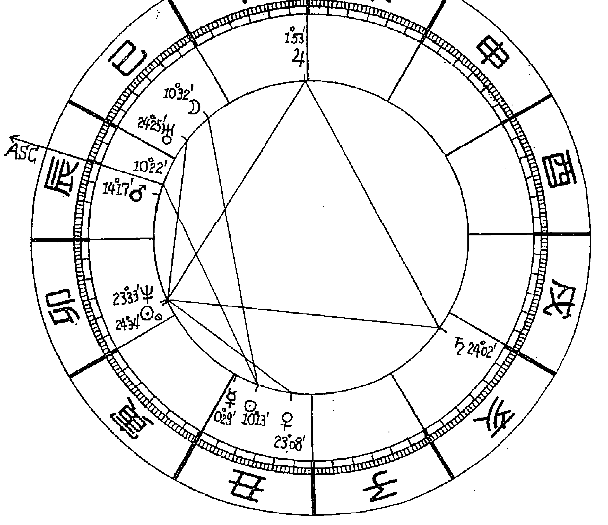

其三，從24度34分的1.5度容許度來看，則範圍的界定應該是從23度04分到26度04分。

最後，把擇日盤上的相關行星的位置拿來作整合，則正好是形成以下的情況：

- 金星：位在丑宮23度08分，正好與雷根的SUN-DH盤的太陽形成60度。
- 土星：位在亥宮24度02分，正好與雷根的SUN-DH盤的太陽形成120度。
- 海王星：位在卯宮23度33分，正好與雷根的SUN-DH盤的太陽形成合相，而此時的海王星正好是擇日盤的第六宮宮主星，與工作有關。
- 天王星：位在巳宮24度25分，正好與雷根的SUN-DH盤的太陽形成60度。

以上全部的整合情形都是吉相，這在占星學的論斷上，可以說是相當有助於雷根的政治生涯，因為所有這些行星都與SUN-DH盤的太陽產生一種強烈的「共振波」。同時，雷根的SUN-DH盤的木星正好與1980年美國總統選舉的本命盤，以及1981年美國總統就職典禮的本命盤，形成一個大三角型。

由於DH盤的精密度要求比較高，所以在一般的擇日占星學上很少使用到，而且這種擇日方法又是古代所沒有，因此也就只有少數的占星學家會去使用它。況且，這種擇日方法的使用，還必須是行星正好位在我們所需要的位置上，所以這是一個相當特殊的擇日盤。同時，在DH盤的使用上，因為雷根所強調的是政治生涯，所以使用的是SUN-DH盤的太陽位置。如果是一般的事業擇日的話，則要使用VENUS-DH盤和MC-DH盤；而如果是婚姻擇日的話，則要使用JUPITER-DH盤、SATURN-DH盤和PALLAS-DH盤（Pallas是小行星群的其中之一）。

此外，雷根的這個擇日盤，還有四個優點：一是海王星、木星和土星，形成一種「分離宮」形態的大三角型；二是月亮和太陽形成三合，而且月亮又與命度形成30度，這有助於緩和太陽與命度所形成的刑剋現象；三是命主星的金星分別與海王星、天王星、冥王星和土星等形成吉相，完全沒有凶相；四是木星（位在午宮1度，相當有利於政治活動）落入第十宮，主相位是吉相。

## 第二章 擇日原則

### （二）擇日命例：英國占星學會的創立

英國占星學會（The Astrology Association，這只是英國占星學會之一而已）的創立時間，也是事先經過擇日的，它的資料是：1958年6月21日，下午7:22，GMT，地點是倫敦。此擇日盤的特色有以下幾點：

第一，金星、太陽、月亮、木星和土星等五顆行星，彼此互相形成緊密的相位關係，特別是月亮成為一個等腰三角型的頂點（同時又與命度形成120度）。此時，雖然月亮與金星形成90度，但由於月亮已經是出相位（代表刑剋已經過去了），而且月亮是吉相等腰三角型的頂點，需要有凶相來輔助其動力的展現。同時，此擇日乃是使用於大型的團體組織，而不是請求實質收入的營業性企業，也不是婚姻性質的擇日，因此月亮與金星所形成的90度，反而具有動力引發的特質。況且，金星（入垣而且是第十宮宮主星）並非凶星，所以此凶相所具有的壓力特質不致於有破壞之象。此外，月亮與太陽所形成的吉相（60度而且又正好是入相位），相當有助於該組織的發展，可以彌補月亮與金星形成90度的不利影響。

## 英國占星學會創立的擇日盤

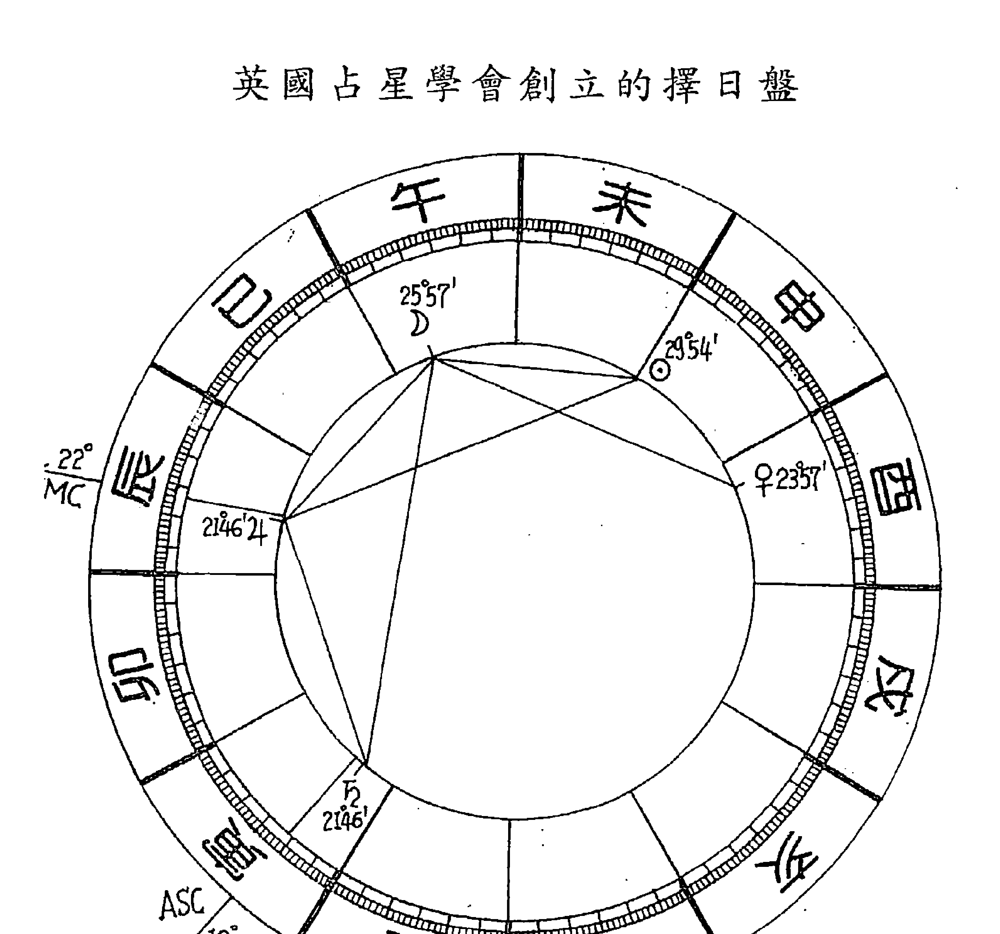

第二，此擇日盤的太陽正好要進入未宮0度，也就是正好是夏至點的位置，此象徵著太陽之熱力的最強。

第三，此擇日盤的木星正好與土星形成60度，此象徵著木星的擴展與土星的結構，正好形成一種互補的形態。而且，木星正好是位在天頂之上，而土星則正好是位在命度之上（這裡所使用的是Placidus的宮位系統，而由於倫敦的緯度比較高，所以命度和天頂的位置會比等宮制來得更接近），更加強了命度和天頂之間的緊密關係。

第四，此擇日盤的木星（也是命主星）正好是位在天頂之上，而且又與恆星Spica相當接近（入相位），更與太陽、月亮和土星等都形成吉相位。

此擇日命例的最大特色，是在於它打破了土星不坐命的規則，並且刻意地突顯了土星所具有的組織與結構的特性，因為土星正好是與木星形成60度，可以使得土星往較好的特質方面去發展。

### （三）擇日命例：伊利莎白一世的即位典禮

此擇日命例是與本命盤進行結合性考量的範例，是由英國女皇的占星學家John Dee所選擇的。它的最大特色主要是擇日盤的金星、木星、太陽和月亮，分別與伊利莎白一世本命盤的太陽、金星和木星等形成吉相，這可以說是一種比較傳統式的擇日方式，其行星的互動情況如下：

1. 擇日盤的金星與本命盤的太陽形成120度。
2. 擇日盤的太陽與本命盤的金星形成120度。
3. 擇日盤的木星與本命盤的木星形成 60度。
4. 擇日盤的月亮與本命盤的木星形成120度。

## 英國女皇伊利莎白一世即位典禮之擇日盤

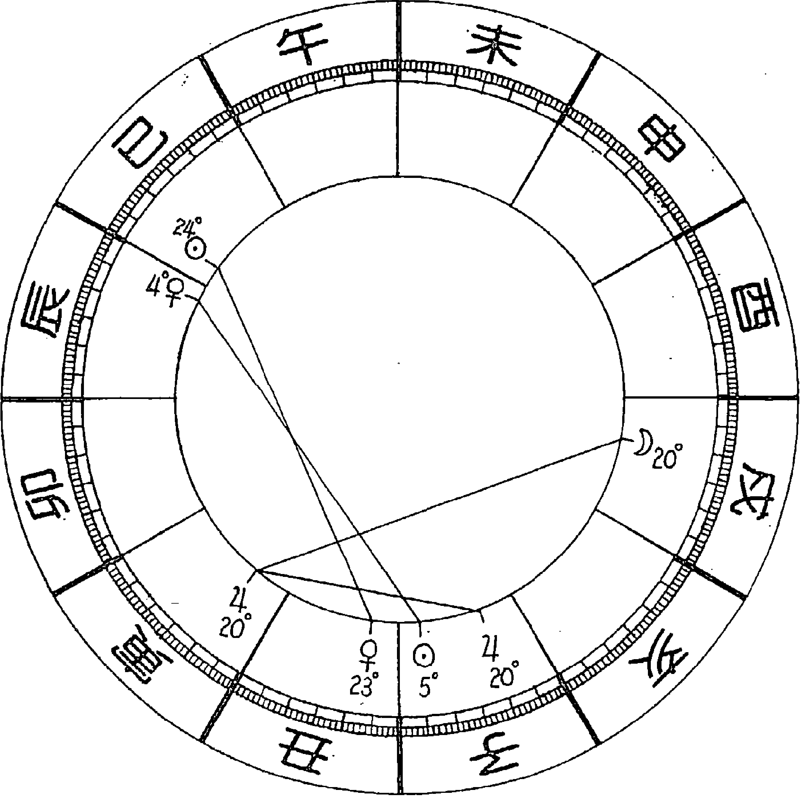

以上三個命例的資料來源，轉引自：The Practical Astrology, by Nicholas Campion, London: Hamlyn Publishing, 1987，其中有關雷根的就職擇日盤，該書所繪製的命盤有所誤差，此處我已修正過了。而從這三個擇日命例之中，我們可以看出擇日原則的考量往往是相當多元化的，完全看占星學家如何去作擇日上的考量，以及如何訴求擇日盤所要突显的重要功能。然而，由于这三个择日盘都是相当专业性的，它不只是由专业的占星学家所择出来的，而且择日的主题也比较特殊，所以往往会不同于一般所经常使用到的事业择日或婚姻择日。在此，提供这三个择日命例，主要是让读知道西方的占星学家，可能会针对某些比较特殊性的择日主题，来作各种比较特殊性的考量。而下一章所谈到的择日范例的说明，才是比较一般性的择日应用。

## 第三章 宏观说明


## 第三章 實例說明

在日常生活的擇日事項當中，以婚姻擇日和事業擇日的應用機會最大。因此，在本章的實例說明方面，特別針對婚姻與事業的擇日多作說明；而其他的擇日事項，則僅作原則性的說明，讀者可依據一般的擇日原則來自行推演。

### 壹、婚姻的擇日

在進行婚姻擇日的舉例說明之前，首先有必要先解決有關婚姻成立之剎那間的時間問題，這是因為占星學相當講求時間的精確性，所以絕對不可以用二個小時（一個時辰）的範圍來作界定。此外，婚姻擇日時間之確立的問題，也涉及到中西婚禮習俗的差異，因此更有必要釐清中西婚禮的特質，以便能真正地確立婚姻盤的成立時間。

依據中國人的傳統婚姻習俗，以及傳統的八字學婚姻擇日來看，通常是以二個小時為範圍（有些人也會把範圍縮小），亦即一個婚姻從新郎車子的出發，直到迎接新娘入門，必須在這既定的二個小時之內完成。所以，時常有些男女雙方住家距離太遠的話，則女方必須事先到男方住家附近的飯店先行住下，以方便男方的迎娶可以在二個小時之內完成。而問題的產生也就在這二個小時之內，因為從擇日占星學的角度來看，這二個小時的範圍涉及到占星學上一個很大的問題，那就是命度是否已經過宮了。

在此，先從西方的婚禮習俗來看。由於西方的婚禮不管是在教堂裡舉行，或者是公證結婚，其婚姻正式成立的時間相當明確。它誕生於男女雙方互相把結婚戒指戴在對方的手上，同時牧師宣告兩人正式成為夫妻，而夫妻雙方也互相宣示彼此的新關係，並接受在場親朋好友的祝福，前後的誤差通常不會超過十分鐘。也因此，西方的占星學家在論斷婚姻生活的時候，可以從婚姻擇日盤來看出某些徵象。有關婚姻擇日盤的論斷，我會在探討婚姻的書籍當中作說明。

然而，中國式的婚姻卻並非如此。當然，如果你是採用西方式的婚禮，或者是公證結婚的話，那麼你的婚姻盤的成立時間，是與前面所提到的原則相同。而如果你是採用傳統式的婚禮的話，就有必要進行時間上的確認，這其中涉及到以下的五個重要時間（不只是婚姻完成過程的二個小時的問題而已）。

- 第一，男方迎娶女方進門的時間。在傳統上，這代表著一個家庭之成員的增加，而如果就小家庭來說的話，則代表著男女雙方互相共同組成家庭的時間。
- 第二，男女雙方為彼此戴上戒指的時間。這個判斷原則與西方式的婚禮相同，只是缺少了牧師的宣告而已。
- 第三，結婚證人宣告兩人正式成為夫妻的時間。這個判斷原則與牧師的宣告一樣，都是在於公開聲明兩人的正式關係。
- 第四，祭拜祖先的時間。這純粹是從中國人的傳統觀念來看的，因為祭拜祖先象徵著夫妻兩人承擔起傳宗接代的責任。
- 第五，宴客正式開始的時間（以放鞭炮為基準）。這代表著接受眾親朋好友的肯認與祝福。

以上的五個時間，專家各有自己的一番說詞，目前還很難有所定論。所以，有經驗的中國占星學家，總是以婚姻歷程中的某些特定事項（例如，生孩子、嚴重的爭吵或外遇等），來進一步地確認真正的婚姻盤。其中，以第一項、第四項和第五項等作爲優先的考量時間，而第二項和第三項則反而列在其次。這除了突顯中西方婚姻習俗的差異以外，也表現了中國人所著重的是家庭組成、傳宗接代和親朋好友的肯認，而結婚證人的宣告和戴上結婚戒指，則反而似乎變成只是一種形式化的動作而已。

就我個人而言，則是偏好採取兩種不同取向的方法，而其區分的原則是，以是否由占星學家來作擇日爲基準。於是，這就形成了兩種不同的考量情況：

- 第一，凡是由傳統八字學擇日所建立的婚姻擇日，其婚姻盤的真正時間，應該是以前面提到的第一項（迎娶新娘進門），以及第五項（第一次宴客時間）來作爲主要的考量時間。這可以先用一個時辰的中間值來繪製命盤（例如，午時的話，則可以先用正午12:00的時間來繪製婚姻盤），然後再依據實際的婚姻生活狀況來作更進一步的確認。如果基於以上二項考量因素所繪製出來的婚姻盤，與實際的婚姻情況差距頗大的話，則此時可以再用其他三項的時間來作考量。
- 第二，如果是由占星學家來作擇日的話，則可以使用西方的婚姻擇日原則。換言之，可以使用戴戒指並互相宣示彼此婚姻關係已經成立的時間，來作爲婚姻盤的時間。我之所以作如此的考量，有兩項主要的理由：一是這個時間比較容易被準確地掌握到，而其他的時間則在控制上會比較容易產生誤差，而且由於各地的婚禮習俗略有差異，所以婚禮的先後次序和內容也可能會有所不同，此更增添了時間上的不確定性；二是「戴戒指」具有它的象徵意義，它代表著男女雙方彼此的「套牢」，這不但是一種責任和義務，更是一種個人生活轉變的象徵，個人從此而脫離了單身的生活。此外，如果從現代生活形態的西化，以及婚禮的簡單化來看，則西方化的婚禮（不一定要在教堂內舉行），似乎越來越符合於年輕一代的實際結婚情況，所以我主張以戴戒指的時間來作爲婚姻生活之開始的指標。

當然，在戴戒指的同時，千萬不要忘記彼此的宣示：「從此刻起，你（妳）就已經成爲我正式合法的先生（妻子）了。」而如果能夠有親朋好友在場祝福，並且還有公證人來作宣示的話，則更能增添結婚時間的確定性。

以上是我個人的看法，也許讀者你會有與我不相同的見解。然而，不管看法上有何差異，都可以透過婚後的生活來作檢證。這可以從婚姻盤的流年運勢，或者是婚姻盤與兩造本命盤的合盤，再配合婚後所實際發生的重要事件等來作判斷。

然而，就如前面所提到過的，這種用婚姻盤來論斷婚姻生活的方法，存在著某種程度的限制性，因爲它必須處在男女兩造合盤的限制之下。換言之，男女兩造之本命盤的合盤，才是影響婚姻生活的最主要因素，而婚姻盤則只是一種附屬的功能。如果婚姻盤不錯的話，則可以增加婚姻生活的和諧性，亦即良好的婚姻盤具有化解兩造個性不和的功能；而如果婚姻盤不好的話，則可能會加強兩造原本不和的壓力，導致增加了婚姻生活上的爭執或困擾。

在擇日占星學上，針對婚姻擇日所必須注意到的幾項考量重點，主要包括：

第一，除了避免月亮的90度和「空虛」的情況發生以外，最好是能夠使得月亮與太陽彼此形成吉相，因為這代表著男女雙方個性的融洽。而如果是月亮與金星形成吉相的話，則代表著感情生活的融洽。

第二，最好是固定宮坐命，亦即命度是位在固定宮之上，這象徵著婚姻生活的長期穩定性。而且愈是位在前面的度數的話（如1度～5度範圍內），則固定的特質愈強。

第三，第一宮宮主星與第七宮宮主星，要儘可能地具有吉相位，甚至最好是兩者彼此即形成吉相位。而由於第一宮和第七宮正好是處於對宮的情況，所以如果是固定宮坐命，而且又要求命主星與第七宮宮主星形成吉相位的話，則只有兩種情況：金星（酉宮）與冥王星或火星（卯宮）形成吉相，以及太陽（午宮）與天王星或土星（子宮）形成吉相。在此，大部份的占星學家並不把火星（與冥王星共同主宰卯宮）與土星（與天王星共同主宰子宮），當成是卯宮和子宮的宮主星，所以通常只是看金星和冥王星、太陽和天王星等兩者是否形成吉相位。

第四，特別注意太陽所在的宮位，要儘可能地選擇太陽是落入具有雙方溝通意涵的宮位，以發揮太陽所具有熱力，也可以說是使得太陽的熱力，從有助於協調婚姻生活的管道發洩出來。因此，太陽應該儘量落入第三宮（溝通）、第四宮（家庭）、第五宮（孩子）、第七宮（合作）、第八宮（性）、第九宮（旅行）、第十宮（名聲）、第十一宮（朋友）等宮位。

第五，儘量避免土星是落在四個基本點上，亦即避免土星是落入第一宮、第四宮、第七宮和第十宮之中。最好是儘可能地使得土星是落入果宮之中，亦即第三宮、第六宮、第九宮和第十二宮之中。而天王星也最好不要落入始宮之中，特別是第一宮和第七宮，因爲這代表着分離和決裂之象。

第六，火星和金星也應該多加注意，因爲兩者與性生活的協調以及愛情的佔有慾有關。火星最好是不要落入第一宮和第七宮之中，因爲這具有夫妻爭吵之象；而金星則最好是落入第一宮和第七宮之中，因爲這代表着愛情上的和諧。

第七，儘量不要有水星和金星逆行的情況發生。因爲水星的逆行代表着彼此的缺乏溝通，而金星的逆行則代表着彼此的愛情力量的薄弱。

第八，特別注意第五宮的情況，因爲第五宮與孩子有關，所以第五宮如果不錯的話，則可以藉由對於孩子的關愛來化解婚姻生活的不愉快。

此外，就一般的婚姻擇日過程來看，包括了以下幾個重要的步驟：

第一，先決定大概的擇日時間範圍。例如，準備在那兩個月的範圍之內結婚，以及是否準備在星期假日舉行。如此一來，則可以先縮小擇日的考量範圍。

第二，在進行擇日之前，最好先考量兩造的本命盤及其合盤，以避免婚姻擇日盤與兩造的本命盤發生嚴重的刑剋現象。此時的考量不必過於要求完美，否則很難進行擇日，亦即要以婚姻擇日盤本身的吉兆來作爲考量的主軸。

第三，如果兩造的本命盤有呈現出離婚徵象的話，就一定要儘可能地利用婚姻擇日來化解。

第四，以「消去法」把比較差的日子和時間先作去除，然後逐步地找出一個最佳的婚姻擇日。

第五，依照中國人的傳統習俗，占星學家應該以紅紙書寫擇日時間，並且用紅紙袋裝好，然後交給顧客。

以下就針對實際的婚姻擇日過程來作說明。現在假設有一對才子佳人，準備在一九九五年的三月～四月之間結婚，並且準備在星期六或星期日舉行婚禮（結婚地點為台北市），現在就為他們進行婚姻擇日。同時，此擇日並沒有考量到兩造本命盤的問題，而僅就結婚的時間來作擇日。如果讀者你要配合兩造的本命盤來作擇日的話，請參閱前面有關結合本命盤的擇日說明。

首先，先列出可能的擇日時間，然後把月亮有90度的日子去除。其次，先用正午（中午12:00的時間）來作擇日的考量。其三，調整命度的位置，儘可能地使命宮落在固定宮上。現在逐步說明如下：

在一九九五年的三月到四月之間，總共有以下的星期六和星期日可供選擇：

- 三月四日（星期六）
- 三月五日（星期日）
- 三月十一日（星期六）
- 三月十二日（星期日）
- 三月十八日（星期六）
- 三月十九日（星期日）
- 三月廿五日（星期六）
- 三月廿六日（星期日）
- 四月一日（星期六）
- 四月二日（星期日）
- 四月八日（星期六）
- 四月九日（星期日）
- 四月十五日（星期六）
- 四月十六日（星期日）
- 四月廿二日（星期六）
- 四月廿三日（星期日）
- 四月廿九日（星期六）
- 四月三十日（星期日）

在以上的這些日子當中，月亮有90度的情況，共有十天，包括：三月四日、五日，三月十九日，四月一日、二日，四月十五日、十六日，四月廿二日，四月廿九日、三十日。於是，只剩下八天可以提供選擇。

其中，又有五天是月亮形成180度的情況，包括：三月十二日，三月廿六日，四月八日、九日，四月廿三日等。所以，如果月亮要完全沒有刑剋，就只剩下三月十一日、十八日和廿五日等三天了，因此可以先看這三天的正午的擇日盤到底是如何，然後再來作其他方面的評估。

從圖一到圖三（參見後面的附圖），分別是三月十一日、十八日和廿五日的正午本命盤（此處只先列出行星的位置，而且相位也只列出主相位而已，其中實線代表吉相、虛線代表凶相）。然後，分別評估這三天的整體命盤的狀況，說明如下：

### 圖一、三月十一日正午

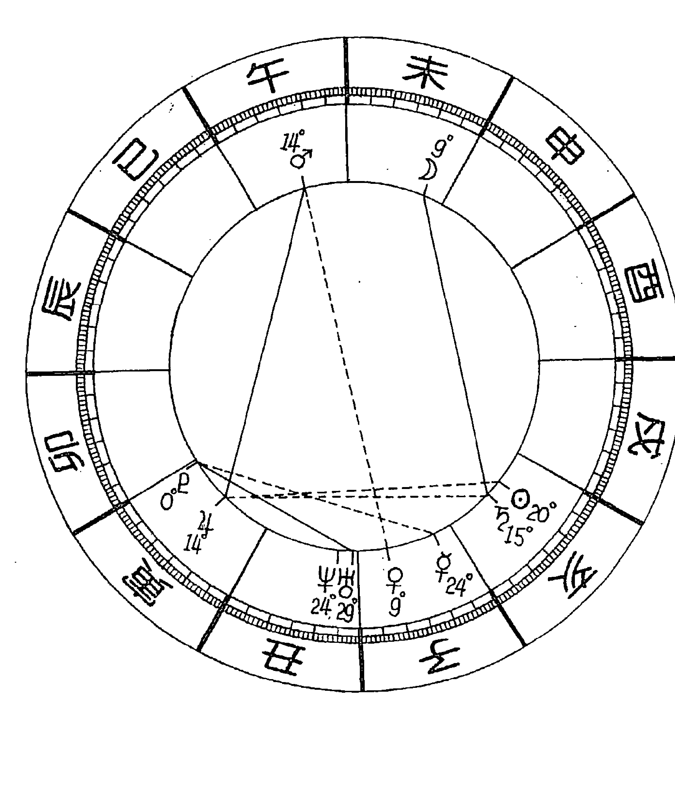

## 圖二、三月十八日正午

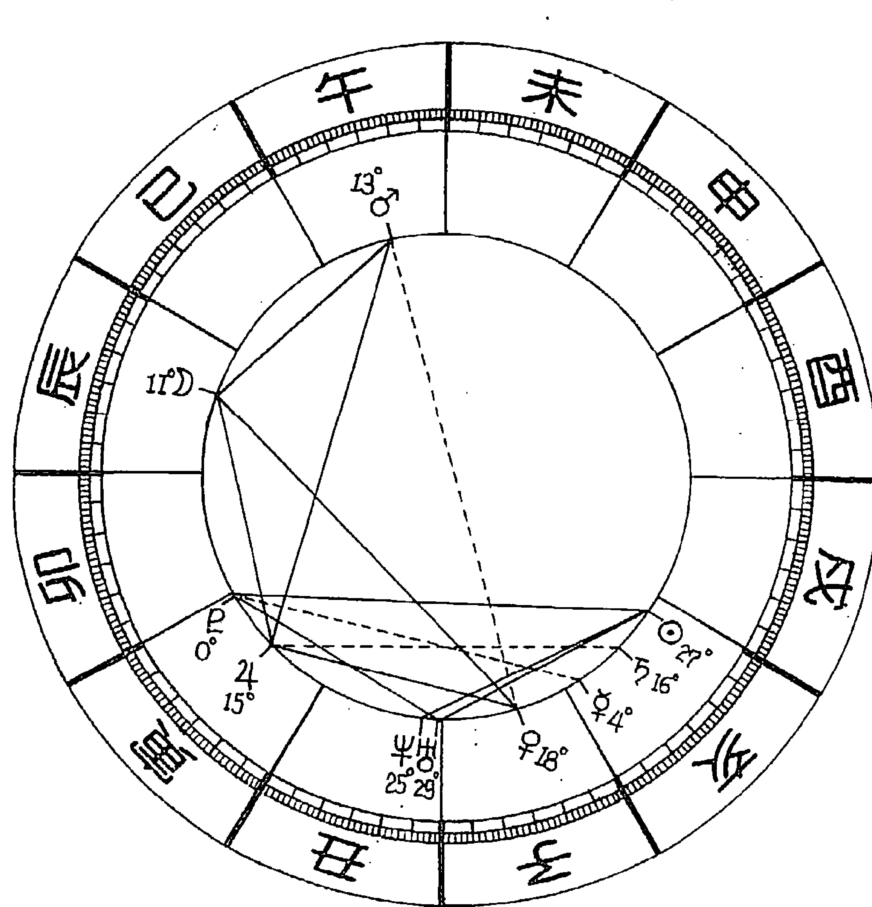

## 第三章 實例說明

## 圖三、三月二十五日正午

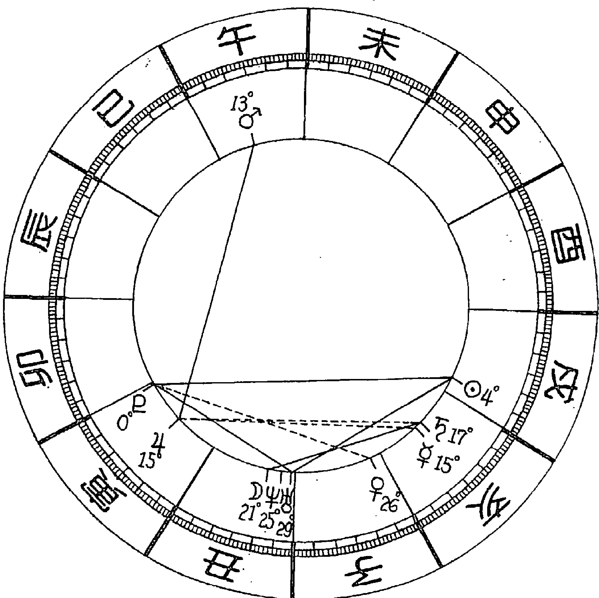

三月十一日（圖一）：只有三個主吉相位，分別是月亮和土星形成120度；火星和木星形成120度；冥王星和天王星形成60度（此吉相位具有同世代的意涵，所以重要性有所減弱）。而主凶相位卻有四個，分別是火星和金星形成180度；水星和冥王星形成90度；太陽和木星形成90度；木星和土星形成90度。整體而言，吉相的徵兆並不強，而且金星也沒有突顯出它有利的一面（吉相）。

三月十八日（圖二）：這個命盤呈現出三個吉相的「等腰三角型」，其頂點的行星分別是月亮、木星和天王星。與圖一來作比較，則增強了月亮的吉相位，特別是月亮和金星形成120度，相當有利於感情生活。因此，整體而言，這是三個命盤當中最好的一個。

三月廿五日（圖三）：這個命盤減少了圖一中之火星與金星的刑剋現象，同時金星與海王星形成30度，可以稍微增加了金星的吉兆，然而月亮的吉相位還是無法與圖二相比。因此，整體而言，應該以圖二來作爲結婚擇日的考量日。

在確定以三月十八日來作爲擇日的考量日之後，接下來就是選擇什麼時刻來進行婚禮。從三月十八日的正午的本命盤來看，則是命度在未宮，而且與月亮形成90度，所以應該避開這個月亮與命度形成90度的情況。換言之，婚姻盤的確立必須延遲到命度是已經走到未宮21度之後，纔不會與月亮形成90度（月亮是落在辰宮12度），而這必須是在下午1:10過後纔有可能。

圖四的命盤是以三月十八日下午1:15所繪製出來的。其中的命度，分別與太陽和冥王星形成一個「大三角型」，可以增強命盤的整體吉兆。然而，該命盤的天王星卻又好是落在第七宮宮頭（基本點）之上，與命度形成180度，對婚姻關係會造成不利的影響，不過由於天王星也同時正好是「風箏型」的頂點，有太陽和木星的吉相位來輔助，所以也不致於有太大的不利。

## 第三章 實例說明

### 圖四、三月十八日下午1:15

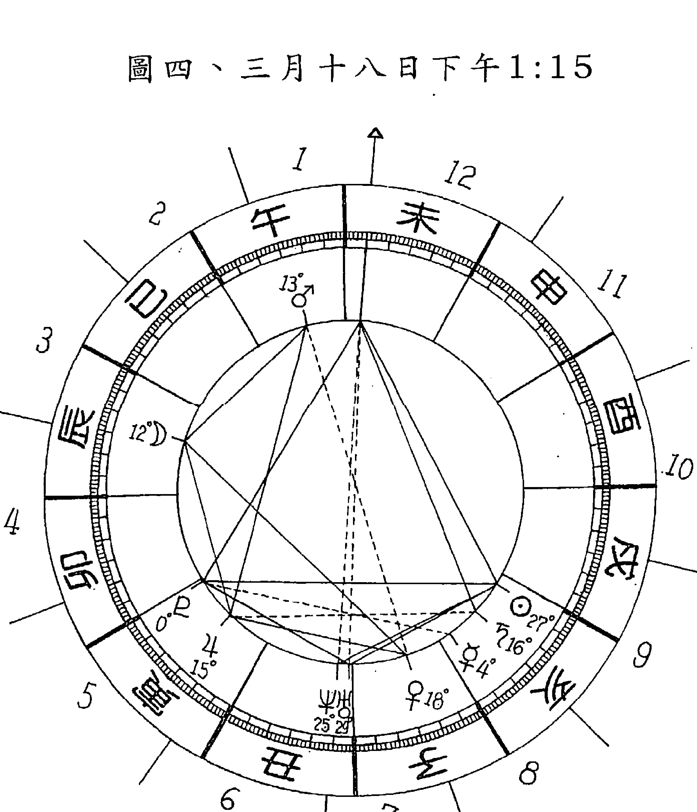

如果說希望能夠避開天王星的不利影響，則必須把時間再延後，以使得天王星是落入第六宮之中。而此時的命度，會正好是落在午宮的位置。這當然是最好的情況，可是這個時間卻必須是在下午2:00過後才有可能。而從一般的中國婚禮過程來看，下午1:00過後的時間，往往已經是宴客快結束了，所以並不能很符合於實際的婚禮過程（這裡指的是如果在中午舉行宴客的話）。也因此，這個婚姻擇日難以取得一個固定宮（午宮）的命度，只能退而求其次地以未宮來當作命度。

圖五的命盤是以三月十八日晚上7:00所繪製出來的。其中的命度，雖然缺乏圖四之中的「大三角型」，但卻可以與火星和木星形成一個吉相的「等腰三角型」。而且，月亮正好是落入命宮之中（圖四中的月亮正好是第一宮的宮主星）；最重要的是，晚上7:00的時間比較符合於正常的宴客時間。

因此，可以選擇三月十八日晚上7:00的時間來舉行婚禮並宴客。當然，此時的擇日盤也並不是固定宮坐命（是辰宮坐命），而且太陽也並不是落入強宮之中。不過，從整體情況來看，這可以說是一個相當不錯的婚姻盤，特別是該命盤除了火星是落入第十一宮以外，其他的九顆行星全部是落入第一宮到第六宮之中，這在占星學上，是象徵著「內向」，可以加強婚姻關係的穩定性。

最後，可以針對婚姻的擇日，作以下的三點結論說明，並作爲本段落的結束。

## 第三章 實例說明

圖五、三月十八日晚上7:00

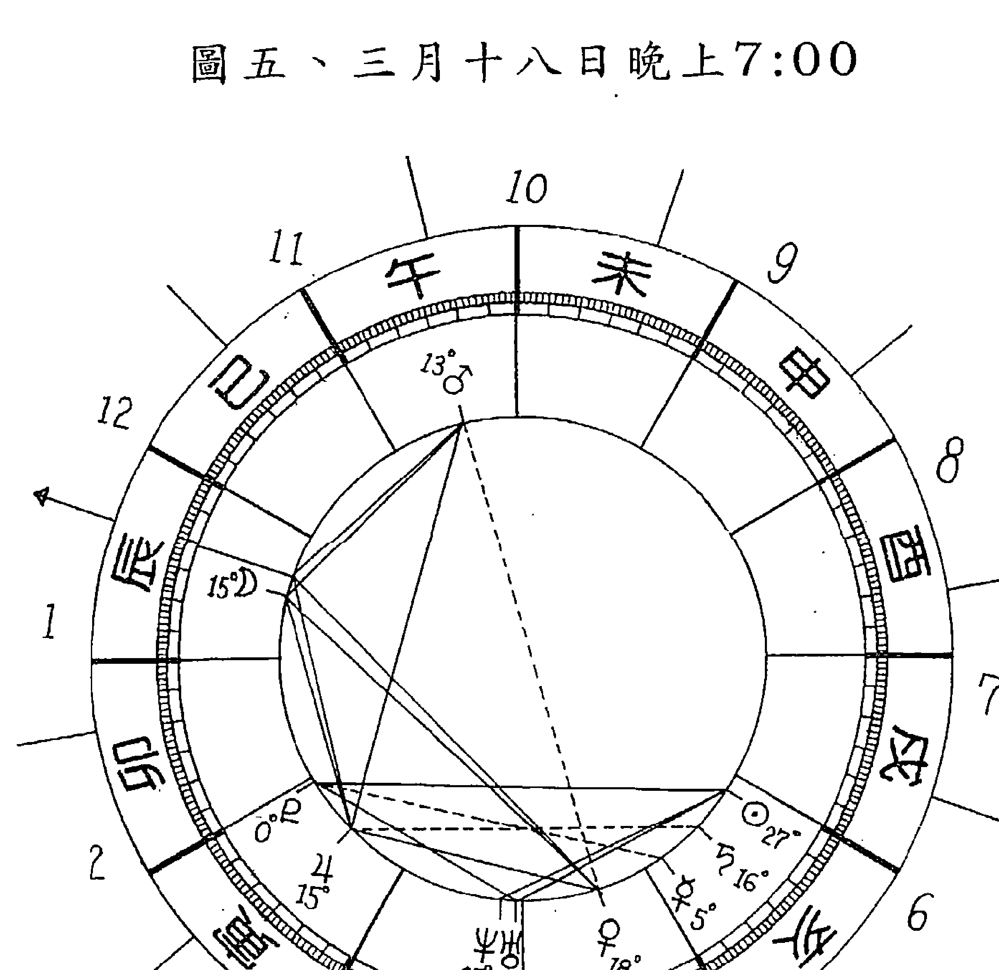

第一，有関婚姻擇日的正確時刻，到底應該是以那一個時刻為準，目前尚無定論。如果依照中國傳統的八字學婚姻擇日來看，則似乎大部份是以迎娶新娘入房的時刻為準，在此我並不排除這個時刻的可能性。而重點的所在則是，由於各地方的婚禮習俗不同，過程也比西方婚禮來得複雜，而且現在又普遍地存在著中西綜合式的婚禮，因此也就更加難以判斷那一個時刻，才真的足以代表婚姻的本命盤。所以，往往只能透過真實的婚姻生活狀況，來作更進一步地明確化。同時，這也可以說是中國占星學家的一個難題，值得作更進一步地研究。

第二，有關訂婚的擇日，可以依照結婚的擇日原則來進行，不必再考量到其他的特殊因素了。不過，由於訂婚的重要比不上結婚，所以還是以結婚的擇日為主。

第三，一般的婚姻擇日時間，最遲也不要拖延到宴客舉行之後，亦即必須在宴客之前或宴客之中完成，因為宴客的過程總是代表著婚禮的即將結束。也因此，中國的婚姻擇日，可以用圖四和圖五兩種類型來作代表。圖四代表著下午2:00是迎娶新娘入門的時間（下午1:45過後，命度就已經進入午宮了，此時可以同時進行戴戒指和祭拜祖先等儀式），而後晚上再來舉行宴客，此時的婚姻擇日時間是在宴客之前（也可以用早上8:00左右的時間來作為迎娶的時間，因為此時的命度可以落入酉宮之中，讀者可自行找出命度正好是位在酉宮4度的時間）。圖五則代表著宴客與婚禮的公開儀式（包括了證婚儀式），此時的婚姻擇日時間是在宴客之中。

### 贰、公司开业的择日

有關公司開業的擇日，大概可分為三種類型：一是新公司的成立；二是新工廠的開工；三是新團體組織的設立。前兩者可以說是屬於同類型的擇日，其所訴求的是實質收入的穩定發展；而後者則是屬於另一種類型的擇日，其所訴求的是群體性的穩定發展。以下是以新公司和新工廠的擇日考量為主來作說明。

首先，就新公司的成立及新工廠的開工來說，其所必須注意到的幾項考量重點，主要包括：

- 第一，先看當事人的本命盤和流年盤。如果當事人的本命盤和流年盤呈現出某些凶兆的話，則占星學家有必要就此凶兆所可能發生的狀況，來作事先的提醒。例如，如果是自己開設新公司，而當事人的本命盤和流年盤的第八宮（主宰生意）及第十宮（主宰事業），呈現出凶兆過多的話，就有必要提醒凶兆的來源。又例如，如果是與別人合夥開設新公司，而當事人的本命盤和流年盤的第七宮（主宰合夥關係）及第十宮（主宰事業），呈現出凶兆過多的話，就有必要分析合夥所可能發生的情況，此時可以使用合夥人彼此的合盤來作分析。

一般而言，當一個人「有心」創業的時候，可以從他的流年過運（Transits）和推運（Progressions）來看出。此時，應該特別注意天王星和天頂的移動位置及其相位關係，因為天王星與獨自開創某些新領域有關，也指示著個人生活領域上的新的變化，而天頂則與事業有關。

此外，在本命盤的考量上，還必須注意到該項事業是否能與當事人產生「共鳴」，以及當事人是否具有當老闆的格局，亦即是否足以獨當一面。

- 第二，除了避免月亮的90度和「空虛」的情況發生以外，最好是能夠使得月亮與太陽彼此形成吉相，因為這代表著品牌的建立（太陽與知名度有關，而月亮則是與群眾有關）。此外，最好是選擇月盈的期間，因為這代表著實質收入的增加。

第三，最好是固定宮坐命，亦即命度是位在固定宮之上，這象徵著事業的長期穩定發展。而且，愈是在前面的度數的話（如1度～5度的範圍內），則固定宮的特質愈強。此時，以酉宮為最佳的選擇，亦即事業的擇日是以酉宮坐命，或者是月亮落入酉宮，來作為擇日的首要原則，因為實質收入（由酉宮所主宰）的重要性，遠甚於其他的有利條件。

第四，一般而言，事業的擇日是以太陽的從戌宮開始（大約是每年的三月廿一日）移動，到辰宮結束（大約是每年的十月二日）之前的這段期間，是比較好的擇日期間。換言之，差不多有半年的期間，太陽是處於比較具有熱力散發之特質的期間，而該期間比較有利於事業的創立。此外，太陽如果能夠與命度形成120度的話，則更可以發揮太陽之熱力的吉兆。

第五，第一宮宮主星、第二宮宮主星、第八宮宮主星及第十宮宮主星等，要儘可能地具有吉相位，甚至最好是它們彼此之間即形成吉相位。而如果是酉宮坐命的話，則命主星為金星，第二宮宮主星為水星，第八宮宮主星是木星，第十宮宮主星為天王星（在此暫時不考慮到「截奪宮」的情況）。

第六，特別注意太陽所在的宮位，要儘可能地選擇太陽是落入於與事業有關的宮位之中（第一宮、第二宮、第六宮、第八宮和第十宮），並且儘可能地具有吉相位。

第七，儘量避免土星是落入於與事業有關的宮位之中（第一宮、第二宮、第六宮、第八宮和第十宮），以及第四宮和第七宮之中（基本點宮位），最好是使得土星落入於與事業比較無關的宮位之中。

第八，也要注意天王星、海王星和冥王星等所落入的宮位，尤其是如果它們具有嚴重的兇相，並且又落入重要的宮位之中，則象徵著事業上的突變（天王星）、失望（海王星）和劇變（冥王星）。因此，這三顆現代行星的相位，至少也要能夠有一個主吉相來輔助。

第九，第二宮內的行星、金星和第二宮宮主星等，如果吉相越多的話則越好，特別是如果能夠與木星形成120度的話，則會是最好的情況。

第十，在作事業擇日的時候，也應該儘量突顯主宰該項事業的行星、星座和宮位等是處於吉兆的情況。例如，水星、申宮、巳宮和第三宮等主宰著出版業，所以如果是成立出版社的話，則應該儘量突顯水星、申宮、巳宮和第三宮等是處於吉兆的情況。

從上可知，如果真的想要取得一個十全十美的事業擇日的話，似乎是一件不可能的事。也因此，我所要再次強調的是，擇日只能在儘可能的範圍內求得完美，而無法十全十美。至於一般的事業擇日過程，包括了以下幾個重要的步驟：

- 1. 第一，先決定大概的擇日時間範圍。例如，準備在那兩個月的時間範圍之內正式成立公司，以及是否準備在正常的上班時間內舉行。如此一來，則可以先縮小擇日時間的考量範圍。

第二，在進行擇日之前，最好先分析當事人的本命盤，以避免當事人的本命盤與事業擇日形成嚴重的刑剋現象。此時的考量不必太過於要求完美，否則將很難進行擇日，亦即還是要以事業擇日盤本身的吉兆來作爲考量的主軸。

第三，如果當事人的本命盤呈現出對於從事該項事業，會具有某些嚴重的凶兆的話，則一定要儘量地利用事業擇日盤來進行化解。

第四，以「消去法」把比較差的日子和時間先作去除，然後逐步地找出一個最佳的事業擇日。

第五，依照中國人的傳統習俗，占星學家應該以紅紙書寫擇日時間，並且用紅紙袋裝好，然後交給顧客。

此外，依照中國人的傳統習俗，在公司成立的時候必須舉行拜拜，而且還要放鞭炮（公司正式成立的時間就界定在於剪彩和放鞭炮的時刻）。在此還涉及到所謂的方位的問題，依照傳統的八字學擇日，必須在當事人的有利方位燃放鞭炮（這裡指的是當事人的八字的旺方，例如，如果當事人的八字喜「金」的話，則可以在「西方」燃放鞭炮，因爲五行中的金主宰著西方，這種作法可以稱之爲是「震氣」）。

如果是採用占星學來進行擇日的話，則同樣可以在當事人的有利方位來燃放鞭炮。只是由於占星學上的方位意涵不同於八字學，所以很可能會產生由占星學和八字學所決定出來的有利方位，彼此會是不相同的。而有關占星學上的方位意涵，是分成先後天十二宮來作不同的界定。就一般常用的占星學方位觀念來看，其方位的排列次序如下：（資料來源可參見：A Modern Scientific Textbook on Horary Astrology with Authentic Chart and Predictions, by Geraldine Davis, 2ed, California: First Temple of Astrology, 1970, p30.）

### 〈先天十二宮的方位指示〉

- 戌：東方
- 未：北方
- 辰：西方
- 丑：南方
- 酉：南偏東
- 午：東偏北
- 卯：北偏東
- 子：西偏北
- 申：西偏南
- 巳：南偏西
- 寅：東偏南
- 亥：北偏西

### 〈後天十二宮的方位指示〉

- 第一宮：東方
- 第二宮：北偏東
- 第三宮：東北
- 第四宮：北方
- 第五宮：北偏西
- 第六宮：西北西
- 第七宮：西方
- 第八宮：西偏南
- 第九宮：西南
- 第十宮：南方
- 第十一宮：東南偏南
- 第十二宮：東南東

由於西方習俗在擇日占星學的應用上，並沒有以方位來結合當事人的本命盤的作法，所以這種占星學上的方位指示，最常使用到的是卜卦占星學（Horary Astrology），可以用來尋找失物，或者是指示了應該前往的方向。

在此，由於先後天十二宮的方位指示，彼此之間存在著些微的差異，所以很難取得一致性。更何況先後天宮的合盤，時常會造成方位上的重疊，而導致判斷上的更加困難。例如，如果命宮宮頭是落在丑宮的話，就形成了東方與南方的重疊現象，增加了判斷上的困難度，而有賴於實際經驗來作分析（這裡指的是卜卦占星學上的方位判斷）。如果要把這種方位意涵應用在擇日占星學上的話，則可以簡單地依據著以下的兩個原則。

第一，先看當事人的本命盤，從本命盤當中找出當事人最有利的先天宮或後天宮的所在位置。例如，如果木星或金星具有很好的吉相位，則可以選擇木星或金星所落入的星座或宮位，來作爲當事人的吉兆方位的界定。

第二，如果當事人之吉兆所在的星座和宮位的方位指示，可以互相配合的話，就直接應用該吉兆的方位（例如，第一宮宮頭正好落在戌宮之上，而且木星坐命，又具有相當不錯的吉相位，就可以選擇東方）。而如果吉兆所在的星座或宮位的方位指示，彼此之間產生衝突的話，則可以依據「星座優於宮位」的方式來選擇方位。

這種「星座優於宮位」的考量原則，乃是因爲後天宮位的方位指示，是與地球表面上的方向移動有關（這是屬於RELOCATION的探討範圍）；而星座的方位指示，則是與宇宙間的氣的變化有關。由於擇日占星學上的吉兆方位，所強調的乃是宇宙之間的氣的良好呈現（這種氣性的特質，在個人出生的那一刻便已經由宇宙所賦予了，而公司成立時放鞭炮的「震氣」，就是意味著震動起當事人的這種與生俱來的氣性），所以應該採取「星座優於宮位」的方位考量原則。也因此，一般所謂的擇日方位的考量，只以當事人的本命盤來作考量，而與公司成立的事業擇日盤無關。

以下就針對實際的事業擇日過程來作說明。現在假設有一個人正準備成立新公司，而時間範圍是在一九九五年的五月～六月之間，並且公司的正式成立是在一般的上班時間內（成立地點爲台北市），現在就來爲此人進行事業擇日。同時，在此也假設並沒有考量到當事人本命盤的問題，所以有關方位的問題省略不談，而且也沒有考量到該項事業本身的屬性。

### 第三章 實例說明

首先，先去除月虧及滿月的期間（陰曆的十四日到隔月的初二），大量地縮小考量的範圍。其次，找出月亮落入酉宮的日子，並且去除月亮有90度的日子。其三，使用正午的時間來作擇日的考量。最後，調整命度的位置，儘可能地使命宮是落在固定宮之上。現在逐步說明如下：

在一九九五年的五月到六月之間，扣除月虧及滿月的期間之後，總共剩下以下的日子可供選擇：

| 五月 | 六月 |
|------|------|
| 二日(初三) | 一日(初四) |
| 三日(初四) | 二日(初五) |
| 四日(初五) | 三日(初六) |
| 五日(初六) | 四日(初七) |
| 六日(初七) | 五日(初八) |
| 七日(初八) | 六日(初九) |
| 八日(初九) | 七日(初十) |
| 九日(初十) | 八日(十一) |
| 十日(十一) | 九日(十二) |
| 十一日(十二) | 十日(十三) |
| 十二日(十三) |  |
| 卅一日(初三) |  |

在以上的這些日子當中，星期日有兩天，分別是五月七日和六月四日，再把這兩天扣除掉，就只剩下廿天了。

然後，從這些日子當中，先找出月亮是落入酉宮的日子。本例中的月亮，正好無法符合該條件（亦即在這些日子當中，月亮並沒有落入酉宮）。於是，可以退而求其次地找出月亮是落入未宮的日子，總共有六天，包括了：五月四日、五日、六日和卅一日，以及六月一日和二日等。

接下來，就從這六天當中去除月亮有90度的情況（以正午的時間來看），總共有兩天，分別是五月五日和卅一日。其中，五月五日的月亮是與金星形成90度，而且是入相位，很難避開；而五月卅一日的月亮，如果要落入未宮的話，則必須在下午三點過後，而如果又要避開與土星形成90度的話，則必須把時間再延長到下午五點過後，在此由於是以正常的上班時間來作考量，所以五月卅一日這一天不列入考慮的範圍之內。剩下來的四天當中，五月四日和六月一日的月亮沒有180度的情況，所以凶相位只有次凶相而已。而五月六日和六月二日的月亮，則是具有180度的情況發生。

現在，可以分別從這四個日子的正午本命盤，來作更進一步的評估。從圖六到圖九（參見後面的附圖），分別是五月四日、六日、六月一日和二日的正午本命盤（此處只先列出行星的位置，而且相位也只列出主相位而已，其中的實線代表著吉相、虛線代表著凶相）。

從這四個命盤當中，可以發現金星所落入的位置呈現出兩種情況：一種是落入戌宮之中（五月四日和六日），而另一種則是落入酉宮之中（六月一日和二日）。由於事業的經營所訴求的乃是實質收入的增加，所以在這可以省略考慮五月四和六日的擇日可能，雖然這兩天的金星、火星和木星形成一個「大三角型」，特別是五月六日的月亮、土星和冥王星也形成一個「大三角型」，然而在基於訴求金星的入垣情況下（金星落入自己所主宰的星座之中），只好放棄五月六日的這個不錯的日子。

## 圖六、五月四日正午

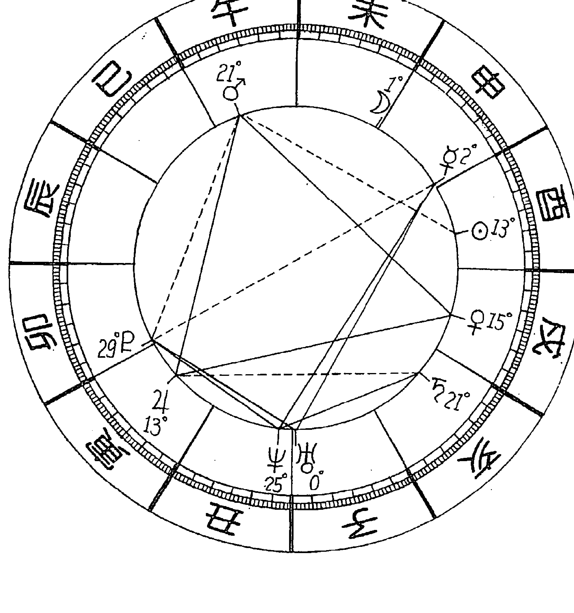

## 圖七、五月六日正午

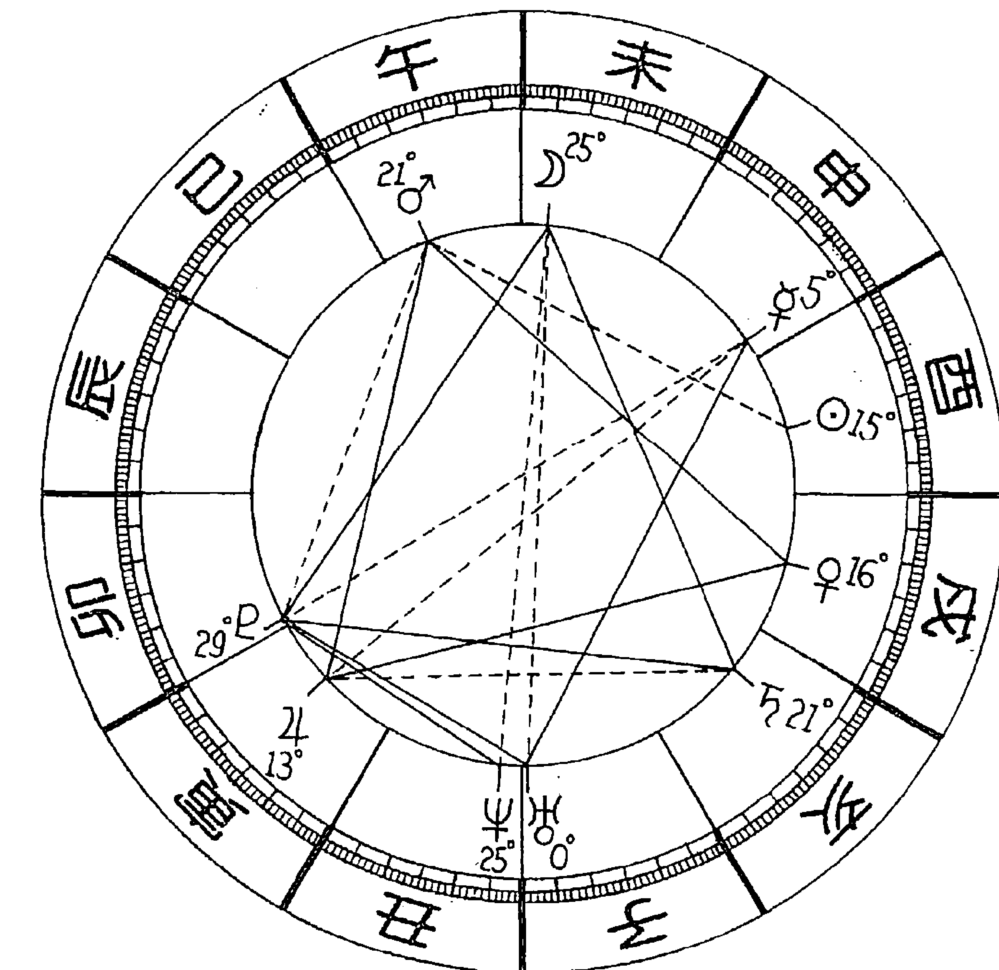

## 圖八、六月一日正午

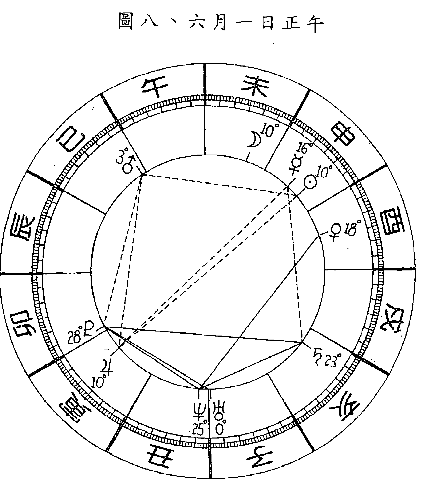

## 圖九、六月二日正午

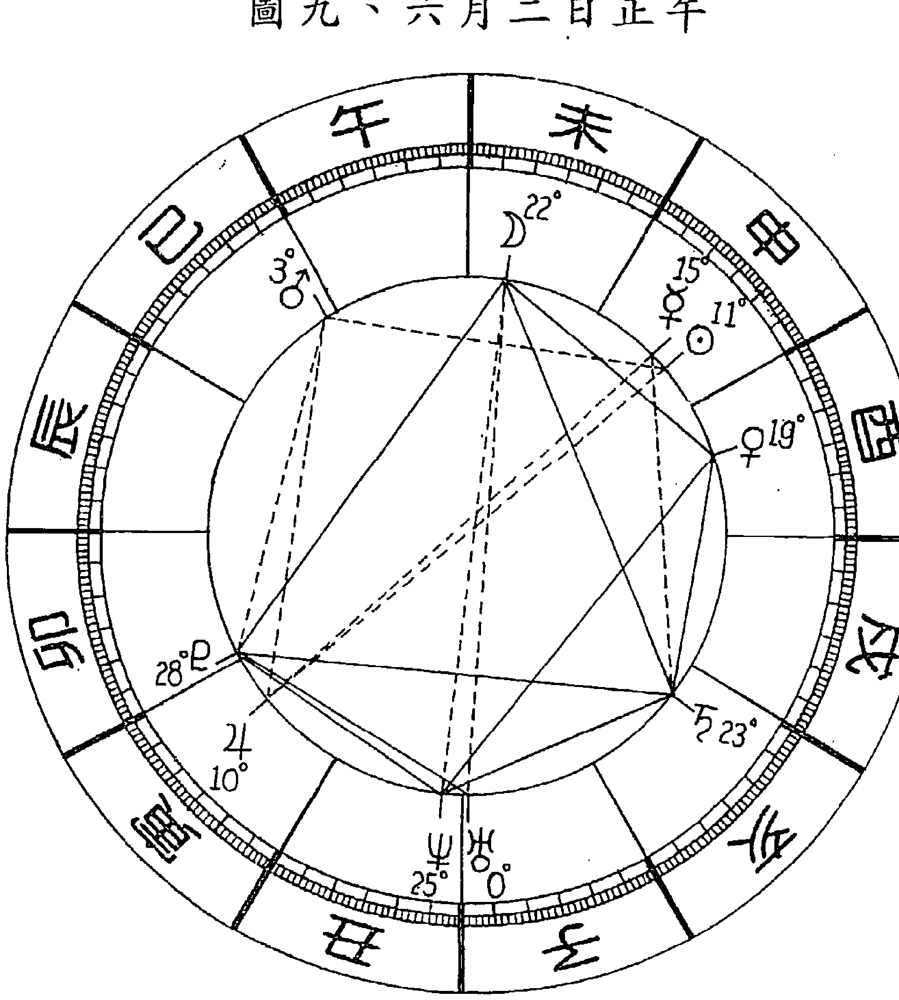

### 第三章 實例說明

從六月一日和二日的正午本命盤來看，則很明顯地兩者都無法避開火星、太陽和木星所形成的「三刑會沖」。再者，六月一日的優點乃在於月亮沒有180度的情況發生，而六月二日的優點乃在於月亮、土星和冥王星形成一個「大三角型」。此時，可以選擇六月二日來作爲擇日的考量日子，因爲雖然該天的月亮有180度的情況，但是月亮、土星、冥王星和海王星等，彼此之間形成一個「風箏型」，可以把吉兆的力量發揮在海王星之上。此外，月亮、金星、海王星和冥王星等，彼此之間形成一個吉相的「矩型」，而土星和金星又同時都是吉相「等腰三角型」的頂點，並且使得整個吉相的格局產生串連。然而，由於六月二日存在著一個「三刑會沖」的凶相，所以如果要以該天來作擇日考量的話，就必須化解掉這個凶相，而這就有賴於命度的移動來作救援。

圖十是以六月二日早上九點四十三分所繪製出來的擇日盤，這個時間的有利點，除了使得命度落入固定宮（午宮）之外，還可以藉由命度分別與水星、太陽形成60度，以及命度與木星形成120度等吉相位，來化解「三刑會沖」所帶來的凶相。此時的命度位置，正好是落在午宮13度，也就是正好是水星（申宮15度）和太陽（申宮11度）的中間值。不過，這個命度卻造成了與金星之間的90度，增強了賺錢的心理壓力，可以說是它的不完美之處。

## 图十、六月二日早上9:43

从整个事业择日盘的行星分布情况来看，很明显地分成两股力量：一股是由月亮、金星、土星、海王星和冥王星等所形成的吉相位的串连；而另一股则是由太阳、水星、木星和火星等所形成的“三刑会冲”，并藉由命度来作化解。因此，整个命盘形成是在吉凶参半情况下的吉相大于凶相，吉相呈现出实质收入的容易取得以及可以累积，而凶相则呈现出赚钱以及积极开创的压力，所以整体而言，这是一个不错的事业择日盘。

# 第三章 实例说明

最后，有关事业的择日，可以再作以下的三点补充说明，并作为本段落的结束。

第一，有关新工厂的开工，可以同样地依据新公司成立的方式来作择日。而象征着新工厂的开工，除了剪彩、拜拜和放鞭炮以外，还必须在择日时间的那一时刻，象征性地开动机器，以代表工厂的正式运作。

此外，有些占星学家特别诉求于与该行业有关的行星，必须处于相当充分的吉兆。对此我并没有特别举例来作说明，读者可以依据前面所提过的事业择日原则，再加上行星所主宰的行业征象来作考量（尽量使得主宰该行业别的行星处于庙旺星座之中，而且吉相位相当突显）。

另外，有关特种行业的择日原则，也同样是依据新公司成立的方式来作择日。只是由于特种行业的营业时间，往往不同于一般的公司，所以在时间的考量上必须以晚上为主。

第二，有关团体组织正式成立的择日，在占星学上有两种不同的确认方式：一种是与新公司的正式成立一样，象征着该团体组织的正式对外公开；另一种则是以申请成立该团体组织的时间为准（亦即申请表填写完成并寄出，而以邮寄出去的时间为准），象征着该团体组织的正式展开运作。大部份的西方占星学家是以后者为主，而在国内则恐怕未必是如此，这与社会和文化情况的差异有关，在此不多作说明，仅提供读者作为意见上的参考。

此外，由于团体组织的性质不同于一般的公司，所以在择日考量上也略有差异。一般而言，团体组织所诉求的乃是“沟通”与“服务”，而不是强调实质收入，所以风象星座的坐命特别显得更重要。当然，在此我也不排除有强调实质性收入的团体组织，或者是以个人崇拜（如歌友会）或野心（如政治性团体）等来作诉求而组成的团体组织。不过，所有的这些团体组织，都必须强调群众基础，而群众基础的建立则有赖于“沟通”和“服务”。因此，读者可以依据风象星座坐命，以及该团体组织所具有的特殊性质和诉求重点等，来作择日上的考量。

图十一是以一九九五年五月五日下午三点十分（地点为台北市），所绘制出来的择日盘，该择日盘是辰宫坐命，而且命度分别与水星和天王星形成一个“大三角型”，有利于与群众沟通，同时火星、金星和木星也形成一个“大三角型”（分别落入第三宫、第七宫和第十一宫），也有助于成员的彼此沟通及组织的扩展。因此，虽然月亮和金星形成90度，但由于不是诉求实质性的收入，所以可说是一个不错的团体组织的择日盘。

第三，有关每年过完农历年之后的新春开张的择日，前面的讨论曾经提到，可以选择太阳与命度正好形成120度的时间。然而，由于该时间通常无法配合公司的上班时间，因此可以改用命度与太阳正好形成60度的时间；而如果是一定要强调命度与太阳正好形成120度的话，就必须把时间再延后四小时（二小时约等于30度）。

## 图十一、1995年五月五日下午3:10(台北市)

图十二是以一九九五年二月三日(大年初四)早上九点四十二分(地点台北市)，所绘制出来的新春开张择日盘，命度在戌宫13度，正好与太阳形成60度，并且使得太阳成为与命度和木星所形成的吉相“等腰三角型”的顶点。

## 图十二、1995年二月三日早上9:42(台北市)

## 参、迁居的择日

所谓的迁居择日，应该更广泛地包括了所有与房子、土地和建筑等有关事项的择日。因此，可以把迁居择日分为三种主要的类别：第一类，是租屋、购屋和购地的择日；第二类，是迁居和落成的择日；第三类，是房子整修和动土的择日。

### （一）租屋、购屋和购地的择日考量

从西方的择日占星学书籍当中，我们可以发现占星学家，在针对顾客有关房屋方面的择日进行咨询的时候，总共有三个重要的择日时间：一是开始进行找房子的时间；二是房屋签约的时间；三是搬进去住的时间。而且，不只是购屋才如此，连租屋也是如此，这是因为老外把购屋和租屋都看成是一样地重要。而我们似乎是特别重视购屋方面，并且大部份的房屋择日，也都只是偏重在搬进去住的时间，而忽略了开始找房子和签约的时间。

先不管是购屋或者是租屋，任何与人们本身居住环境有关的择日，都无法避免“人为条件”的限制。而所谓的人为条件，就是个人或家庭的需求条件，以及房子本身的环境条件，这两个条件其实是合而为一的，也可以称之为是生活环境的利益性考量。换言之，购屋或租屋，都必须先考量到居住者（家庭所有成员）的年龄（看是否有儿童或老人）、生活形态和习惯、购屋的经济条件、阳宅上的方位与格局（这是中国人特别会去注重的）、附近的居住环境（例如，交通和学校等），以及未来升值之可能性的评估等。

在上面所提到的人为条件限制下，来进行购屋或租屋之择日的时候，倒是可以不必太过于细分开始找房子、签约和搬进去住等时间之间的区别，而只要择出一个有利于进行与房子有关之事项的时间就可以了。换言之，只要是与房子之事项有关的话，都可以选择未宫、月亮和第四宫等是处于吉兆的时间，来进行与房子有关之事项的开始。搬进去住是作如此的考量，而找房子和签约也是作如此的考量。

在进行与房子有关之事项的择日的时候，除了一般性的择日原则以外，还应该特别注意下列的几项重点：

第一，尽量选择月亮落入未宫的时间，因为这可以奠定与房子有关之事项的基本有利条件。当然，此时的月亮最好是不要有凶相的情况发生，而如果月亮能够与第四宫宫主星形成吉相的话，则会是最好的情况。

第二，太阳如果是落入第四宫的话，则对于有关房子之事项的影响力会加强，此时必须以太阳的相位来决定是否要选择太阳落入第四宫。换言之，如果太阳的相位不错的话，就可以选择太阳落入第四宫，否则宁可不用，以免破坏了月亮的吉相。同时，由于第四宫是属于基本点的宫位，所以当太阳落入第四宫的时候，很容易与命度形成90度，这种情况必须避开。

第三，如果是针对开始找房子来作择日的话，则可以藉由木星或金星的与命度形成120度（以入相位为主），或者是木星或金星的落入第四宫等来增强吉兆。

第四，如果是针对房屋签约来作择日的话，则必须注意到水星的情况，要尽量避开水星的逆行以及水星的凶相。此外，第三宫和第九宫也要多加注意。

第五，避免“截夺宫”的情况发生（有关截夺宫的说明，请参见《现代占星学基础》），亦即未宫、月亮、水星和第四宫宫主星等，最好不要发生被截夺的情况。

由于购屋或租屋并不一定要在星期假日来进行，所以从每天早上的七点开始，到晚上十点为止，都是可以进行择日的考量时间。而决定择日时间的那一刹那，可以使用开始查阅报纸的房屋广告栏、打电话询问，或者是其他具有实际行动象征的时间来作代表。

至于购地的择日，与购屋的原则相似，同样都是必须在人为条件的前提下来作考量。只是由于土地与土星和丑宫有关，所以必须把土星和丑宫列为重要的考量因素。而如果月亮与土星形成120度的话，则会是一种相当有利的象征。

最后，由于土地的性质与用途差异颇大，所以如果你要求更精密的话，则可以视购地的用途来作更详细的考量。但一般来说，只要再配合金星（主宰实质收入）来作考量就可以了，特别是如果择日盘的VENUS-DH盘没有凶相，而且吉相颇多的话，则象征着有利于购地的实质性收入的增加。

### （二）迁居和落成的择日考量

所谓的迁居，指的是一切已经定案以后，最后搬进去住的行动，其择日的考量原则，也是与前面的购屋或租屋一样，都是以未宫、月亮和第四宫等来作为考量的主角。

依照中国传统习俗的迁居择日来看，其过程远比老外来得复杂，这是因为中国人的传统迁居，涉及到阳宅、安神位和祭拜等传统习俗。因此，在进行迁居择日考量的时候，似乎有必要进行一场中西结合的迁居择日。而在此，有必要作补充说明的是，任何房子的本命盘是以落成并使用的时间为主，所以迁居择日不足以改变房子的本命盘，而只会影响到居住者而已。

以下我综合了中西方的迁居择日原则（前面已经提过的重点，就不再多说了），提示几项必须注意到的重点。而有关阳宅的部份，在此也不多作说明，读者若是有兴趣，可自行参阅有关风水的书籍，或者是求教于经验丰富的风水师。

首先，有关迁居择日的时间确定。在中国传统习俗上，是必须在一个时辰的时间范围内，把重要的床位、家俱或神位（包括祖宗牌位和神明）等安置妥当，比较慎重的人则可能会另外安排安置神明的时间。当然，一切家庭内的如何布置，是必须在事先就已经作好规划，或者是事先就已经求教于风水师了。

然而，在这一个时辰的时间范围内，对于择日占星学来说，还必须找出一个相当明确的时间，以便作为迁居择日的本命盘。在此，可以使用主卧室的床位的安置时间来作认定，因为这表示个人已经迁入并居住了。

其次，有关风水原理对阳宅的影响。这是西方择日占星学所没有的部份，虽然有不少的西方占星学家，对于中国的风水深感兴趣，但一般来说，其研究的程度还不够深入，也就无法配合择日占星学来一起应用了。因此，这可以说是中国人的命理特产，它的应用范围包括了迁居择日、事业择日（指的是公司和办公室的摆设）以及葬礼择日（阴宅）。换言之，只要是涉及到方位的问题，都可以应用风水的方位原理来配合择日占星学，以找出时间和空间都是处于相当有利的能量呈现状态。

此外，由于七十年代以来的换置命盘（RELOCATION）的研究发展，带动了现代占星学进入一种时间和空间的整合性论断的新途径，所以西方择日占星学的最新发展情况是，把以本命盘所建构出来的换置命盘，列为人类在地球上有所移动（特别是长距离的移动）的吉凶判断的首要因素，然后再来选择迁居择日。换句话说，迁入地点的经纬度，对个人来说是一种大环境（这会对个人的本命盘产生影响，进而影响了个人的整个心理状态），而房子本身则只是一种小环境（居住的空间）而已。

可是，就中国传统的风水原理来看，则方位所具有的“气”，乃是一种大环境的意涵，它不会因为你移居到地球上的那一个地点而有所改变，而此时的迁居择日，也仍然只是居于小环境的影响力而已。

其实，从整个阳宅的观点来看，中西方的论点并没有冲突的地方，而只是增加了复杂性和困难度而已。换言之，你可以使用换置命盘和风水原理，来评估大环境的可能影响，然后再依据择日占星学来择出一个不错的迁居时间。然而，这也突显了迁居择日本身之影响力的局限性。

其三，有关屋内布置、摆设和装璜等问题。这除了阳宅的既定条件外（大部份是与方位有关），还涉及到色彩、格局和风味等比较细节的部份。而在占星学上，这大部份是以个人的本命盘来作判断，亦即从个人本命盘所呈现出来的人格特质，以及吉兆方位、吉兆色彩、吉兆风格....等来作诉求。简单地说，就是从个人的本命盘，来看出那些色彩、方位（如果与阳宅原理产生冲突的话，必须以阳宅原理优先），以作为室内设计的参考。因此，以占星学来说，你只要在迁入新房子后，去做一些简单的布置调整，比如换一幅画、改变沙发套的颜色或格局的更动，就可以收改善风水之效。所以，以目前的占星学研究情况来说，似乎有点把风水原理给“内化”到占星学的判断之中了。

从占星学的观点来看，居住环境之中的各项物品，无论是以方位为主的（但必须以阳宅方位为主）、格局、风格、植物、家俱...等，是可以引发个人心理层面上的调和特质。如果呈现调和状况的话，就可以住得比较舒适，因为与个人的心理状态相谐调；而如果呈现出不调和状况的话，就可能会住得比较不舒服，因为容易激发起个人心理层面上的不舒适感，或者是激发起个人脾气的发作。

在此，必须特别强调的是，有关居住布置之吉兆的呈现，在占星学上是以行星的相位来作判断，而绝对不是单凭太阳星座就可以来作决定的。例如，如果你的某一个星座（假设为戌宫），呈现出相当不错的状况的话（假设有木星或金星落入，或者是落入的行星的吉相位很多），就可以使用该星座所主宰的色系（如戌宫主宰红色），来布置你的家庭。千万不要简单地把太阳落入戌宫，就认为红色是你的吉兆色彩，如果此时你的太阳凶相过多（即压力过大），而你又使用红色来布置的话，保证你在家里会时常发脾气，甚至引发事端。在占星学上来说，这绝对是一种凶兆，而不是吉兆。因此，庸俗化的太阳星座所谈的内容，时常不是在助人，而是在害人！也因此，任何一位专业的占星学家，从来就没有忘记扫除低俗化太阳星座的责任。

其四，依照中国人的传统，在搬入新居之后，除了安置床位以外，最好还必须做到下列的三件事，以象征真正地迁入。

- 1. 开火，亦即厨房的正式使用，此时可以煮一锅汤圆，以象征圆满之意。
- 2. 祭拜，亦即告知四方神明。
- 3. 最好是能够在床上小躺一下，大概是一小时左右，以象征床位的正式使用。

最后，有关八字学择日与占星学择日有所冲突的部分。这主要是发生在“冲破”之时间的认定上，以及方位的界定上。以前者来说，由于占星学的精密度比较高，所以有许多八字学择日认为会产生冲破的时间，对于占星学来说则未必，因为占星学的刑克相位具有一定范围的容许度。

就后者来说，由于八字学择日所界定的方位（例如，卯属东方），与占星学有所不同，所以如果你是以择日占星学来作择日的话，就必须依照择日占星学的原则来作考量。因此，凡是涉及到个人本命盘所呈现出来的吉方位，或者是拜拜或放鞭炮等所要面对的吉方位（这也是以当事人的本命盘来作判断），都必须以占星学为准，而不能以八字学为准。但是，有关阳宅本身的方位问题，则必须以风水原理为准。

与房子有关的择日，还涉及到房子的“落成”。这应该算是比较具有重要性的择日，因为落成的择日可以决定一幢房子或大楼的本命盘；亦即所谓的落成择日，就是为大楼选择一个充满吉兆的本命盘。而在时间的确定上，是以落成典礼以及开始正式使用的时间来作认定。

有关落成择日的考量原则，还是与前面所提到过的房屋的择日原则一样，因为它在基本上也是属于房子的性质。只是由于现代的大楼，未必就是用来居住而已，有很多的商业大楼并不具有居住的功能，而纯粹只是商业用途。因此，如果是属于居住型大楼的落成择日，则可以采用一般的房屋的择日原则；而如果是属于商业型大楼的择日，就必须再加上商业性质的考量，特别是有必要突显出金星的吉兆。

有某些大楼的用途，是早就被限制在特定的使用范围内，亦即是为了某种特定的用途才会盖此大楼。譬如说，医院、学校、寺庙、电影院和百货公司等，这些大楼的用途在盖之前就已经被决定了，所以其择日考量必须以该特定用途的吉兆为主。因此，如果你是以择日占星学来作择日的话，就必须考虑该特定用途的主宰行星，以及其所需要的吉兆征象，而如果能够同时配合到房屋择日的基本考量（未宫、月亮和第四宫），则会是更加理想的情况。

### （三）房子整修和动土的择日考量

房屋的整修和动土，与前面的购屋或购地的择日原则相类似。只是整修和动土指的是房屋本身有所变动的意思，重点是在于房屋本身，不同于迁居的重点是在于人本身。因此，房子的整修如果会影响到居住者的话，那也只是间接性的，亦即是透过房屋的变动，然后才影响到居住者。所以，房屋整修或动土的择日，其所诉求的重点是整修或动土之过程的顺利，以及减少对当事人所可能产生的不利影响。

房子整修的择日原则，可以依照购屋的择日原则来进行。只是由于整修涉及到中国传统的某些习俗，所以存在着以下的三项禁忌，这是必须避免的。

- 第一，如果家中有孕妇的话，千万不要进行整修，以免影响孕妇和胎儿。
- 第二，如果家中有祖宗牌位或神明的话，在进行整修的时候，千万不要随便移动或随地乱放。
- 第三，除了真正整修所必须进行的敲打以外，其他的时间（包括平常时候）不可以在家中胡乱敲打。

先不管以上的禁忌是否真的会对居住者产生影响，至少在面对家中尚有长辈在时候，没有必要因为这些细节而发生争执。

再者，有关房屋整修的择日，也同样地涉及到方位的问题，这是西方占星学家所没有谈到的内容，也可以说是中国的特产。如果从中国的传统择日观念来看，必须选择避开与当年年柱形成对冲的方位，以免对居住者产生不利的影响。例如，以一九九五年来说，岁次乙亥，就必须避开“巳”的方位（已亥对冲），也就是要避开在南方进行整修。而如果一定非进行整修或动土不可的话，则其补救的方式，乃是采用迂回的方法，以本例的乙亥年来说，如果要避开南方动土所可能产生的不利影响，则可以改由先从东方开始（亦即先从旁边的方位开始），然后以象征性的敲打方式，依循着东方→北方→西方，最后轮到南方的循环方式来进行，等到南方整修完成之后，也就是正好绕行各方位一周。

其实，中国人的这种传统观念，也并非完全没有道理，因为对冲的观念等同于相位上的180度，是属于主凶相。只是问题的关键所在，乃是占星学上的方位意涵，无法与八字学上的方位观念相配合。因此，如果采用占星学来作整修和动土的择日，而且又要避开对居住者有所不利的方位的话，我认为应该以整修的择日盘来作方位上的考量。只要避开整修或动土的择日盘的火星和土星所在的对冲方位，也就可以了。例如，一九九五年五月十日的土星在亥宫、火星在午宫，而如果要在这一天进行整修或动土的话，则只要避开南偏西（巳宫）和西偏北（子宫）就可以了。这只是我个人的意见，仅提供给读者作参考。

最后，依照中国人的传统观念，所谓的“动土”与“破土”两者在涵义上略有差异，动土与整修相类似，具有变动或更改的意思，而破土则是特别指示着与土地的挖掘有关。所以，动土与整修不一定与土地产生关联，而破土则一定会与土地产生关联。因此，破土在择日的考量上，必须特别注意土星的征兆，尽量突显土星的吉兆，当然也要尽量避免与当事人发生严重的刑克现象。

## 肆、登记的择日

所谓的登记择日，应该更广泛地包括了所有与签约、登记和申请等有关事项的择日。因此，可以把登记择日分为三种主要的类别：第一类，是签约和承诺的择日；第二类，是各种登记事项的择日；第三类，是各种申请事项的择日。

### （一）签约事项的择日

所谓的签约事项的择日，指的是有关于正式书面之承诺的择日，亦即凡是有必要进行书面签约或盖章的事项，都是属于这种类型的择日。而这种类型的择日，其所强调的乃是事物层面的吉兆，并且藉由事物的吉兆来间接地对当事人产生吉利的影响，或者是避免困扰与麻烦。

这种类型的择日，可以依据是否会产生法律上的问题来作区分。换言之，签约不只是一种协定或承诺而已，它还涉及到签约之后所可能会产生的法律问题；而这种类型之择日的目的，就是在使得协定或承诺能够有效地被执行，或者是不会产生法律上的纠纷。以下直接用举例的方式来作说明。

例如，假设台北市正要与国外的某一个城市，缔结为姐妹市。此时的签约仪式乃是一种“非法律性”的事项，双方纯粹是站在友谊的立场来进行协定，因此这种签约仪式的择日目的，所强调的乃是彼此的承诺，也可以说是彼此友好关系的坚定与持续。所以，这种类型的择日考量，必须突显出密切关系上的和谐（特别注意金星、第七宫和第十一宫的吉兆）。而签约择日盘也就是双方关系的本命盘，是以双方签约代表人的签名时间，来作为择日上的时间认定。

又例如，假设某人购买一辆汽车（汽车的本命盘是以出厂的时间为准，所以与签约事项无关），而正要进行签约。此时可能会产生法律上的问题，所以这种签约事项的择日目的，其所强调的乃是确保有关签约事项的顺利进行。因此，这种类型的择日考量，必须突显法律事项的吉兆（特别注意水星、木星、第三宫和第九宫的吉兆）。而签约人的签名时间，也就是该择日事项的本命盘。属于这一类型的择日事项，必须具有法律上的效力认定。但是，与房屋有关的买卖契约，在占星学上则是归属于房屋择日的考量范围。

### （二）登记事项的择日

这种类型的择日比较少见，它除了具有申请的意涵以外，还具有目的性的诉求。所以，这种类型的择日，时常是以目的的所在来作为择日上的考量重点，亦即是以登记的择日来强化追求某种目标的得以顺利进行，而一旦结果有所明朗化之後，該項擇日也就失去其功能了。因此，這種登記事項的擇日，相當講求短期內的成效，所以火象星座的坐命，以及太陽、火星和木星等的吉兆必須突顯。

以政治選舉的參選登記來說，特別需要突顯太陽的吉兆（太陽主宰著政治活動）。當然，如果能夠配合當事人的本命盤來作擇日考量的話，則會是最好的情況。由於政治選舉的參選登記，是屬於比較重要的事項，而且具有面臨對手競爭的壓力，所以才有必要作擇日。至於某些不甚重要的登記事項，是沒有進行擇日的必要。

### （三）申請事項的擇日

一般所謂的申請事項的擇日，指的是要申請成立某個團體組織，或者是要申請某項活動的展開。這種類型的擇日時間，是以申請書的郵寄出去，或者是當面向有關單位送出申請書的時間來作認定。而這個申請事項的擇日盤，往往也就是該團體組織的本命盤（這是某些西方占星學家的看法），或者是該項活動本身的本命盤。因此，有關申請事項的擇日考量，其所強調的乃是該團體組織成立的目的，或者是該項活動展開的目的。至於某些不甚重要的申請事項，是沒有進行擇日的必要。

## 伍、其他事項的擇日

所謂的其他事項的擇日，可以更廣泛地包括了所有生活領域之中的特定事項。當然，如果真的針對每一件事情都要進行擇日，而形成與中國古代漢朝的凡事都要問卜一樣的話（甚至連出門訪友也要問卜），則未免有點「走火入魔」了。因此，我想再度強調「平常心」以及「意志力」的重要和可貴。也因此，以下屬於生活小細節方面的擇日事項，固然可以提供讀者作參考，並且更進一步地深入研究擇日占星學，但絕對不是在於訴求凡事都必須進行擇日。

### (一)節食和減肥的擇日考量

節食和減肥的意思是一樣的，因爲節食的大部份原因都是爲了減肥。只是在擇日占星學的考量上，並不是從減肥的角度來作思考，而是從個人飲食習慣之改變的節食角度來作思考。換言之，節食擇日所訴求的是，希望選擇一個適當的時刻，來作爲個人改變飲食習慣的開始，而該擇日時間能夠賦予個人具有堅持改變飲食習慣的意志力，並且以此意志力的貫徹來達成改變飲食習慣的最終目的。因此，凡是涉及到改變飲食習慣的擇日（例如喫素），都可以依照類似於節食擇日的原則來進行擇日。

在此，我必須再度強調擇日所具有的「意志力」之作用的侷限，因爲擇日盤本身所具有的意志力功能，並不足以與個人本命盤所具有的意志力本性相對抗，所以只能是一種「輔助」的作用而已。換言之，個人之意志力的能否堅持（這可以從本命盤和流年盤來作判斷），佔據著節食之成功機率的一半以上，而擇日盤本身所能發揮出來的節食意志力，是不可能超過一半的。然而，有「助力」總比沒有來得好，所以如果你或妳想要節食的話，倒不妨選擇一個適當的時間來展開節食行動。

由於節食相當具有內心掙扎的意涵，所以節食擇日就完全以儘量減低內心掙扎的痛苦，來作爲擇日的主要考量。換言之，由於這種內心掙扎的根源，乃是在於內心慾望的有所渴求（即食慾），而又必須對這種渴求進行意志上的克制，於是形成渴望與限制之間的掙扎，所以節食擇日就是必須盡量化解這種掙扎的內心情結。

因此，節食擇日的訴求重點有三：一是先確立飲食習慣的完全改變；二是提昇精神層面的作用；三是發揮持續下去的力量。所以，節食擇日除了一般的擇日原則以外，應該特別注意到下列的重點：

第一，在改變飲食習慣方面，可以突顯天王星或冥王星的重要性和吉相。特別是如果命度、太陽或月亮，與天王星或冥王星形成吉相位的話則最好。甚至不妨選擇一個天王星或冥王星，是位在「三刑會沖」之相位格局的頂點（切記：該頂點一定要有主吉相來配合），以強化天王星和冥王星的力量，來顯示個人在生活領域上的徹底改變。

第二，除了月亮的避開90度和「空虛」的情況發生以外，必須強調選擇月虧的期間。在此，月亮的吉兆代表著情緒的穩定，而選擇月虧的期間則代表著精神層次的深化，兩者共同顯示了精神力量的穩定發展。

第三，這種擇日類型的特殊之處，乃是在於不妨可以妥善地應用土星的特質。換言之，可以使得土星落入基本點的宮位之中（第一宮、第四宮、第七宮和第十宮），但是土星必須具有充分的吉相來配合，否則土星自我克制的優點，可能會遭到破壞。土星如果能夠與木星形成120度的話，則會是最好的情況，然而這涉及到土星和木星之運轉周期的問題，所以只能是可遇而不可求。

### （二）戒煙和戒毒的擇日考量

戒煙和戒毒的擇日考量，與節食和減肥的擇日考量一樣，都是屬於生活習慣上有所改變的類型，也都是必須經歷內心掙扎的過程，也都具有強調自我克制以及提昇精神層次的特質。然而，戒煙和戒毒的困難度是要比節食來得更高，這是因為煙毒與第十二宮、亥宮和海王星等有關，特別具有意志力薄弱的徵象，所以必須訴求一種更強烈的意志力的堅持。也因此，戒煙和戒毒的擇日考量，除了具備以上之節食擇日的條件以外，還必須增加下列兩項重要的因素考量：

- 第一，儘量避開貪慾特質的呈現。所以木星和金星必須儘量減少凶相位的呈現，特別是不要與太陽和火星形成凶相位。
- 第二，儘量使得意志力薄弱的特質有所改善。這裡除了強調海王星的吉兆，以及避免海王星的被凶星所刑剋以外，最好是能夠利用擇日盤來改善本命盤的凶兆。一般而言，凡是會沈溺於煙毒之中而難以自拔的人，其本命盤一定會具有抵抗力比較薄弱的情況，所以才會難以拒絕誘惑，或者是希望在煙毒之中取得某種精神壓力上的疏解。因此，可以藉由擇日盤與本命盤彼此之間的合盤，來強化抵抗力，或者是疏解精神壓力。

有關節食和戒除煙毒的開始的那一剎那，並不需要用什麼特別的儀式來作象徵，而只要作一種自我期許就可以了。亦即，必須在擇日時間的那一剎那，對自己的內心訴說著：「就從此刻起，我決定下定決心來進行節食（或戒除煙毒）。」

### （三）追求愛情及尋找工作的擇日考量

這種類型的擇日考量，除了所要追求的目標有所差別以外，其對於希望能夠有所獲得的心理動機是一樣的。因此，這種類型的擇日，可以說是一種具有追求於明顯目標之期待的擇日。

所謂的追求愛情的擇日考量，並不是說可以藉由擇日的作用來保證追求愛情的成功，而是在於透過擇日來強化自己的自信心，以及使得自己在這一段追求的過程中，能夠具有愛情上的調和徵象，既不會感到有太大的壓力（也可以說是佔有慾的高漲），也能夠對於追求之結果的成功與否，採取比較順其自然的態度（這也是一種人與自然之間有所調和的象徵）。

所謂的尋找工作的擇日考量，是與追求愛情具有相同的意涵。換言之，尋找工作的擇日考量，並不是說可以藉由擇日的作用來保證尋找工作的一定成功，而是在於透過擇日來強化自己的自信心，自認爲可以勝任該項工作，以及使得自己在這一段求職的過程中，能夠具有心理上的調適，不被任何的挫折或失敗所擊倒，而把求職過程中所面臨的挫折與失敗，當成是一種理所當然的自然現象。

由於以上兩者皆具有勇於追求的象徵，所以在擇日開始的那一剎那，必須以「行動」來作代表。換言之，除了內心的下定決心以外，還必須採取實際的行動。例如，愛情追求上的實際打電話邀約，或者是尋找工作上的查閱求職廣告等實際行動。

## # 第三章 实例说明

凡是有关于有所「行动」及追求某种「标的物」的择日，除了一般性的择日考量原则以外，应该特别注意下列的重点：

第一，在基于请求「速成」的原则下，可以选择火象星座和风象星座坐命，并且为了尽可能地突显短期内的吉兆，所以除了月亮以外，火星和水星的吉相也相当重要。

第二，一定要使得木星是落入于所要追寻的宫位之中，而且吉相位越多越好。以追求爱情来说，必须使得木星落入第五宫（主宰男女游戏）；而以寻找工作来说，则必须使得木星落入第六宫（主宰工作职业）。此时就可能很难配合上风象星座和火象星座坐命，如果真的是无法配合的话，则以木星落入所要追求之事项的宫位中，来作为最主要的考量。除了木星以外，金星是第二颗可以考量的行星（木星是第一吉星，金星是第二吉星）。

第三，尽可能地使得主宰该项所要追求之「标的物」的行星，是处于吉兆的情况。例如，以爱情的追求来说，必须尽量使得金星、第五宫内的行星和第五宫宫主星等，是处于吉相位的情况。又例如，以寻找工作来说，必须尽量使得第六宫和第十宫内的行星，以及第六宫宫主星和第十宫宫主星，是处于吉相位的情况。

### （四）队伍出发的择日考量

有关队伍出发的择日考量，除了考量到该队伍本身的特质以外（例如登山队的特质就是爬山），还必须依据是否具有「竞争性」来作划分。换言之，可以把所有的队伍出发的择日，分成两种类型：一种是具有竞争、比赛性质的队伍，诸如球队的出赛，其所诉求的是比赛的获胜；另一种是不具有竞争性质的，诸如探险队的出发，其所诉求的是过程的顺利，以及平安的归来。

在出发时间的认定上，如果是有授旗典礼的话，则是以队伍接旗的那一时刻，来作为该次出发的择日盘。而如果是没有正式的授旗典礼的话，则是以成员的集合完成后，即将出发的那一时刻，来作为该次出发的择日盘。由于队伍的出发存在着是否要去有所竞争的差别，所以在择日考量上，除了一般性的择日原则以外，还应该依据是否具有竞争性，而注意到不同的重点。

首先，如果队伍是具有比赛性质的话，则可以依据该队伍是本地的队伍（成立地点为本地），或者是到外地去比赛的队伍等两种不同的情况，来作不同的重点考量。如果是本地队伍的话（在本地进行比赛），则必须突显第五宫的吉兆；而如果是到外地去比赛的话，则必须突显第十一宫的吉兆，亦即必须特别注意第五宫和第十一宫之内的行星及其相位。此外，如果该队伍具有某些特殊性之象征的话（如颜色、图腾等），也可以藉由突显这些特殊性象征的吉兆，来增强胜算。最后，具有比赛性质的队伍出发的择日，可以选择基本宫来作为命宫，以突显该队伍的攻击力。

其次，如果队伍并不具有比赛的性质，而只是属于休闲娱乐性的活动（如登山、郊游等），或者是属于研究访查性的活动（如考查、访问等）的话，其择日原则比较没有什么特别之处，只要依照一般的择日原则来作考量就可以了，亦即只要特别注意到基本点宫位（第一宫、第四宫、第七宫和第十宫）的吉兆就可以了，最多也只是增加与该项活动性质有关的吉兆。例如，登山队伍的出发，可以强调土星的吉兆；而出國訪查隊伍的出發，則可以強調木星、寅宮和第九宮的吉兆。

### （五）書籍出版和節目開播的擇日考量

這種類型的擇日考量，應該是歸屬在事業擇日的範圍內。然而，由於這種擇日類型的重要性，無法與事業擇日相比，而且又大部份同時兼具著「實質收入性」和「溝通服務性」，所以在此特別提出來作更進一步的說明。

換句話說，這種類型的擇日，除了必須強調群眾性以外（諸如讀者與聽眾），還必須突顯實質收入的穩定，才能確保個人魅力的穩定成長。而這種擇日類型的訴求重點，就是在於突顯書籍的銷售量，以及聽眾的廣泛支持。因此，在擇日的考量上，作者和主持人的本命盤與擇日盤之間的合盤，成爲擇日考量上的重點所在。也可以這樣地說，由於這種類型的擇日，特別強調「個人魅力」以及特定的顧客群，所以擇日的重點是當事人，而不是企業體。

因此，這種擇日類型的考量重點，有二項特殊之處：第一，必須結合個人的本命盤來作考量，亦即如果主宰當事人的個人魅力的相關徵象，呈現出凶兆的話，就必須儘量藉由擇日盤來作化解，而且千萬不要使得太陽是落入第十二宮之中；第二，儘量地突顯出與書籍內容或節目內容有關的吉兆，譬如說，如果是出版與占星學有關的書籍，或者是主持與占星學有關的節目，就必須突顯出天王星和子宮的吉兆。而在開始之時刻的確定上，是以書籍裝訂完成的時間，以及正式申請該節目的時間等來作認定。

### (六)用藥與手術的擇日考量

在古代巫醫相當盛行的時候，巫師的用藥時常是還必須配合著擇日來進行。如果純粹從占星學的角度來看，這可以說是一種醫藥占星學與擇日占星學的結合，同時這也與植物的屬性有關（有關植物屬性的歸類，現在是歸屬於「園藝占星學」的研究領域之中）。因為古代的人們認為，如果選擇一個相當適合發揮某種植物藥性的時間來服藥的話，就可以更能發揮該藥物的作用。與這個原理相一致的是，古代的人們也特別喜歡選擇某一顆行星所主宰的時辰，來進行該顆行星所主宰的事項。

古代的這種用藥時間的擇日原則，至今仍然被保留下來，用以詮釋植物、醫藥和擇日之間的某種關係性。然而，這卻只能被當作是一種歷史性的研究課題，已經缺乏實際應用層面的功能了。這是因為現在的藥品，大部份都是屬於化學類的產品，在屬性的歸類上是劃歸於海王星所主宰，而缺乏了古代的植物特性。哪怕是中醫的用藥，在現在來說，也多少都摻雜著化學類的藥品，而難以突顯某種特殊植物的藥效。也因此，沒有必要依據某種特殊植物的藥效，來作為用藥的擇日考量了。

所以，古代的用藥擇日原則，在現代來說，可以說是已經完全沒落了，甚至連醫藥占星學與擇日占星學彼此之間的距離，也越離越遠了。因此，如果你真的想要選擇一個相當有利於治癒某種疾病的用藥時間的話，則不妨記住如此的一個簡單原則：選擇月亮正好是落入主宰該疾病的星座之中，而且月亮的吉相越多越好。當然，如果你能夠懂得更多的醫藥占星學的話，則必然可以選擇出一個相當好的用藥擇日時間，只是似乎無此必要。

與醫藥方面有關的擇日，還包括了各種形式的手術（例如，外科手術和整形美容等），其重要性遠大於用藥。因為任何的手術都會涉及到「血光」，所以特別有需要作擇日。然而，這種手術的擇日，往往在實際應用上也不太容易執行，因為它需要執行醫師的配合。這似乎與所謂的剖腹生產有著相同的難題，亦即如果執行醫師因為某種原故而有所延誤或提前的話，就無法在既定的擇日時間上執行手術了。

有關執行手術的擇日，除了一般性的擇日原則以外，應該特別注意到下列的重點：

- 第一，命度和月亮所落入的星座，最好是正好主宰著手術的身體部位，而且吉相越多越好。例如，如果是胃腸開刀的話，就要特別注意巳宮和未宮。而如果是臉部的美容手術的話，就要特別注意戌宮。
- 第二，由於火星主宰著開刀，所以火星最好是能夠落入廟旺的星座之中，而且要儘量避開與土星、天王星、海王星和冥王星等形成凶相，如果能夠全部吉相的話則最好。此外，火星如果是落入第一宮和第六宮之中的話，則其主宰手術的力量會增強。一定要記得避開月亮與火星，以及命度與火星形成凶相。
- 第三，主宰開刀部位的星座之內的行星，以及主宰開刀部位的行星本身，也都要盡量地突顯出吉兆，至少也必須把凶相減到最少，尤其是不要有凶相的力量大過於吉相的情況發生。例如，如果是心臟開刀的話，則午宮（主宰心臟）之內的行星以及太陽（主宰心臟）的相位，千萬不要有太多的凶相。

### （七）舉辦宴會和盛會的擇日考量

在前面的章節中，已經討論過宴會的舉辦，最好是能夠以變動宮來當命宮。同時，一般所謂的宴會或盛會，是以二個小時來作爲範圍上的界定，這當然並不是一種很硬性的規定，只能說是一種大概的時間範圍而已。再者，大部份宴會的舉辦時間是在晚上，而且是以星期假日爲主，所以這就已經縮小了時間考量的範圍。以晚上六點到八點的這段時間，來作爲宴會開始的基本條件。

由於宴會的形式也差異頗大，所以在一般性的宴會擇日考量上，是以宴會舉辦的目的，以及宴會舉辦的場地來作區分。所謂的舉辦目的，是以該宴會的功能來作認定。例如，有些宴會是以娛樂、聯誼性質爲主，而有些宴會則是具有政治的作用。這種宴會舉辦的目的，大部份都具有「溝通」、「交流」和「社交」的意涵，所以特別強調變動宮、水星和金星的作用。因此，如果是以宴會的舉辦目的來作爲擇日考量的話，則其主要的原則有二：

1. 第一，以變動宮當命宮，並且強調水星和金星的吉兆。如果水星和金星能夠落入第一宮、第三宮、第五宮、第七宮和第十一宮，而且又是落入廟旺的星座之中的話，則會是最好的情況。至於月亮的考量原則，與一般的擇日原則相同。
2. 第二，可以基於宴會本身的舉辦目的，來作特殊性的考量。例如，如果該宴會具有政治作用的話，則可以特別突顯太陽的吉兆，而太陽如果又是落入第一宮、第七宮、第十宮和第十一宮的話則最好。

所謂的舉辦場地的考量，可以簡單地劃分爲屋內（包括家庭附近的庭園範圍在內）和郊外兩種。以前者來說，大部份是屬於聯誼性質的聚會，所以可採用前面所提到的擇日原則。對後者來說，如果是在幾個小時之內就會結束的話（例如，烤肉或賞月等），則其擇日原則與前面相同；而如果聚會的時間比較長的話（例如，露營或夜遊等），則可以採用前面所提到過的隊伍出發的擇日原則。

最後，有些盛會舉辦的時間更長，甚至長達一個月以上。例如，博覽會、圖書展或各種產品展等。此時的擇日原則是與事業的開創一樣，必須依據展覽會的特質來作考量。例如，如果是電腦展的話，則天王星、水星、子宫、巳宮和申宮的重要性突顯。而如果是書展的話，則與圖書、出版等有關的行星、星座和宮位等的重要性突顯。至於其他情況，讀者可自行類推。

### （八）就職典禮的擇日考量

有關各種就職典禮的擇日考量，可以依照前面盛會的擇日原則來進行。然而，如果該項就職典禮具有特殊意義，或者是具有特殊性訴求的話（如前面第二章所舉例的雷根加州州長的就職典禮），就必須進行更仔細的擇日考量。此時所依據的擇日考量重點，全憑占星學家基於特殊性的目的而採取特殊性的訴求。在此無法多作說明，有賴於讀者自行評估。

### （九）葬禮的擇日考量

有關葬禮的擇日考量，可以分成「死人」和「活人」兩種不同的情況。「死人」的部份與陰宅有關，這在中國來說，是屬於比較特殊性的研究，它涉及到風水陰宅，所以在此無法多作提示，而僅就活人的部份來作說明。

簡單地說，葬禮的擇日考量，其實也同樣地是在擇出一個良辰吉時，來作爲葬禮正式舉行的時刻。其擇日的原則，與一般的擇日原則相同，只是就活人而言，必須儘量避開葬禮當時對個人所可能產生的刑剋。換言之，如果葬禮舉行的當時的行星位置，與活人（參與葬禮的人）個人的本命盤產生刑剋現象的話，就應該儘可能地避免參與該項葬禮，或者是儘量縮減參與的時間。

因此，當占星學家在爲葬禮進行擇日考量的時候，必須提示家屬或重要人員，在那些期間內出生的人，可能會與葬禮當天的行星位置產生刑剋，只要特別注意火星和土星的刑剋就可以了。相對地，就參與葬禮的來賓而言，如果自己本命盤的火星和土星，與葬禮當天的運過（Transits）產生刑剋的話（特別注意180度和90度的正相位），最好避免參與該項葬禮。

在本書的結尾，我想簡單地作兩點結論：第一，賦予任何擇日事項產生作用的最主要動力來源，乃是實際執行該事項的當事人，因此當事人才是成功的關鍵所在，所以千萬不可以忽略當事人本命盤和流年盤的判斷，更不可以忘記努力與意志力的可貴。第二，如果說占星學是一種迷信的話，那麼從擇日占星學就可以看出老外的迷信程度，絕對不亞於中國人，然而爲什麼西方許多的學者專家可以接受占星學，並且不把占星學當成是一種迷信呢？其中最重要的一個關鍵因素，乃是在於整個命理詮釋和實證方法上的轉變，而這也就是「現代占星學」的根基所在，希望讀者能夠自行多加體會。

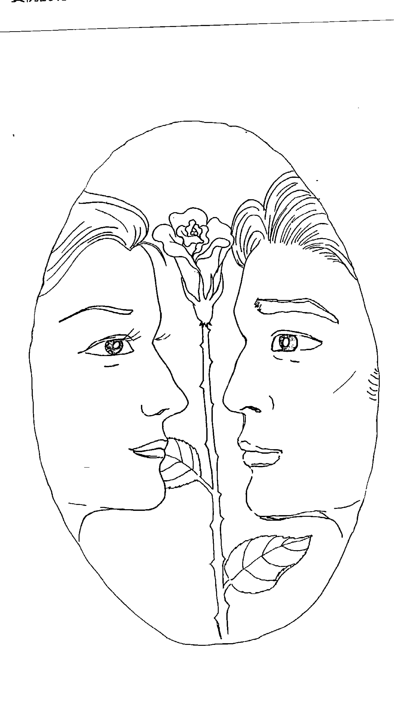

# 附錄：臺灣地區經緯度表

為了方便讀者應用電腦來繪製命盤，在此特別附錄臺灣地區的經緯度表。你只要輸入"-8"(CCT)、出生時間，以及出生地點的經緯度資料，就可以了。

### 《院轄市部份》

| 地名 | 譯名 | 東經（E） | 北緯（N） |
|---|---|---|---|
| 台北市 | Taipei | 121度30分 | 25度03分 |
| 北投區 | Peitou | 121度30分 | 25度08分 |
| 士林區 | Shihlin | 121度31分 | 25度06分 |
| 內湖區 | Neihu | 121度35分 | 25度05分 |
| 南港區 | Nanchiang | 121度37分 | 25度03分 |
| 景美區 | Chingmei | 121度32分 | 24度59分 |
| 木柵區 | Mucha | 121度34分 | 24度59分 |
| 高雄市 | Kaohsiung | 120度17分 | 22度38分 |
| 楠梓區 | Nantuzu | 120度20分 | 22度44分 |
| 左營區 | Tsoying | 120度17分 | 22度42分 |
| 鼓山區 | Kushan | 120度16分 | 22度38分 |
| 旗津區 | Chiching | 120度16分 | 22度37分 |
| 前鎮區 | Chienchen | 120度18分 | 22度36分 |
| 小港區 | Hsiaochiang | 120度20分 | 22度34分 |
| 基隆市 | Keelung | 121度44分 | 25度08分 |
| 新竹市 | Hsinchu | 120度58分 | 24度48分 |
| 香山區 | Hsiangshan | 120度56分 | 24度46分 |
| 台中市 | Taichung | 120度40分 | 24度09分 |
| 西屯區 | Hsitun | 120度37分 | 24度11分 |
| 北屯區 | Peitun | 120度41分 | 24度10分 |
| 南屯區 | Nantun | 120度37分 | 24度08分 |
| 台南市 | Tainan | 120度12分 | 23度00分 |
| 安南區 | Annan | 120度11分 | 23度03分 |
| 安平區 | Anping | 120度09分 | 23度00分 |

### 《台北縣》（Taipei Shan）

| 地名 | 譯名 | 東經 (E) | 北緯 (N) |
|---|---|---|---|
| 石門鄉 | Shihmen | 121度34分 | 25度18分 |
| 三芝鄉 | Sanchih | 121度30分 | 25度15分 |
| 金山鄉 | Chinshan | 121度38分 | 25度13分 |
| 萬里鄉 | Wanli | 121度41分 | 25度11分 |
| 淡水鎮 | Tanshui | 121度26分 | 25度10分 |
| 八里鄉 | Pali | 121度23分 | 25度07分 |
| 瑞芳鎮 | Juifang | 121度49分 | 25度07分 |
| 林口鄉 | Linkou | 121度23分 | 25度05分 |
| 五股鄉 | Wuku | 121度23分 | 25度05分 |
| 蘆州鄉 | Luchou | 121度28分 | 25度05分 |
| 泰山鄉 | Taishan | 121度25分 | 25度04分 |
| 三重市 | Sanchung | 121度29分 | 25度04分 |
| 汐止鎮 | Hsichih | 121度39分 | 25度04分 |
| 新莊市 | Hsinchuang | 121度27分 | 25度02分 |
| 平溪鄉 | Pingchi | 121度44分 | 25度02分 |
| 雙溪鄉 | Shuangchi | 121度51分 | 25度02分 |
| 貢寮鄉 | Kangliao | 121度55分 | 25度02分 |
| 板橋市 | Panchiao | 121度27分 | 25度01分 |
| 永和市 | Yungho | 121度30分 | 25度01分 |
| 中和市 | Chungho | 121度29分 | 25度00分 |
| 深坑鄉 | Shenkeng | 121度36分 | 25度00分 |
| 樹林鎮 | Shulin | 121度25分 | 24度59分 |
| 石碇鄉 | Shihting | 121度39分 | 24度59分 |
| 土城鄉 | Tucheng | 121度26分 | 24度58分 |
| 鶯歌鎮 | Yingko | 121度21分 | 24度57分 |
| 新店市 | Hsintien | 121度32分 | 24度57分 |
| 三峽鎮 | Sanhsia | 121度22分 | 24度56分 |
| 坪林鄉 | Pinglin | 121度42分 | 24度56分 |
| 烏來鄉 | Wulai | 121度33分 | 24度52分 |

### 《宜蘭縣》（I-Lan Shan）

| 地名 | 譯名 | 東經（E） | 北緯（N） |
|---|---|---|---|
| 頭城鎮 | Toucheng | 121度49分 | 24度52分 |
| 龜山島 | Kueishan | 121度56分 | 24度51分 |
| 礁溪鄉 | Chiaochi | 121度46分 | 24度50分 |
| 宜蘭市 | I-lan | 121度45分 | 24度46分 |
| 員山鄉 | Yuanshan | 121度43分 | 24度45分 |
| 壯圍鄉 | Chuangwei | 121度47分 | 24度45分 |
| 羅東鎮 | Lotung | 121度46分 | 24度41分 |
| 五結鄉 | Wuchieh | 121度47分 | 24度41分 |
| 三星鄉 | Sanhsing | 121度39分 | 24度40分 |
| 冬山鄉 | Tungshan | 121度47分 | 24度38分 |
| 大同鄉 | Tatung | 121度31分 | 24度36分 |
| 南澳鄉 | Nanao | 121度48分 | 24度28分 |

### 《桃園縣》（Taoyuan Shan）

| 地名 | 譯名 | 東經（E） | 北緯（N） |
|---|---|---|---|
| 大園鄉 | Tayuan | 121度11分 | 25度04分 |
| 蘆竹鄉 | Luchu | 121度15分 | 25度03分 |
| 觀音鄉 | Kuangyin | 121度04分 | 25度02分 |
| 龜山鄉 | Kueishan | 121度20分 | 25度00分 |
| 桃園市 | Taoyuan | 121度18分 | 24度59分 |
| 新屋鄉 | Hsinwu | 121度06分 | 24度58分 |
| 平鎮鄉 | Pingchen | 121度12分 | 24度57分 |
| 中壢市 | Chungli | 121度13分 | 24度57分 |
| 八德鄉 | Pate | 121度17分 | 24度56分 |
| 楊梅鎮 | Yangmei | 121度08分 | 24度54分 |
| 大溪鎮 | Tachi | 121度17分 | 24度53分 |
| 龍潭鄉 | Lungtan | 121度12分 | 24度52分 |
| 復興鄉 | Fusing | 121度21分 | 24度49分 |

### 《新竹縣》（Hsinchu Shan）

| 地名 | 譯名 | 東經 (E) | 北緯 (N) |
|---|---|---|---|
| 新豐鄉 | Hsinfeng | 120度59分 | 24度54分 |
| 湖口鄉 | Hukou | 121度02分 | 24度54分 |
| 竹北鄉 | Chupei | 121度00分 | 24度50分 |
| 新埔鄉 | Hsinpu | 121度04分 | 24度50分 |
| 關西鄉 | Kuanhsi | 121度10分 | 24度48分 |
| 芳林鄉 | Hsiunglin | 121度04分 | 24度47分 |
| 寶山鄉 | Paoshan | 120度59分 | 24度46分 |
| 竹東鎮 | Chutung | 121度05分 | 24度44分 |
| 橫山鄉 | Hengshan | 121度07分 | 24度43分 |
| 尖石鄉 | Chienshan | 121度12分 | 24度43分 |
| 北埔鄉 | Peipu | 121度03分 | 24度42分 |
| 峨眉鄉 | Omei | 121度01分 | 24度41分 |
| 五峰鄉 | Wufeng | 121度07分 | 24度38分 |

### 《苗栗縣》（Miaoli Shan）

| 地名 | 譯名 | 東經 (E) | 北緯 (N) |
|---|---|---|---|
| 竹南鎮 | Chunan | 120度52分 | 24度41分 |
| 頭份鎮 | Toufen | 120度54分 | 24度41分 |
| 三灣鄉 | Sanwan | 120度57分 | 24度39分 |
| 造橋鄉 | Tsaochiao | 120度51分 | 24度38分 |
| 後龍鎮 | Houlung | 120度47分 | 24度37分 |
| 南莊鄉 | Nanchuang | 121度00分 | 24度36分 |
| 頭屋鄉 | Touwu | 120度51分 | 24度34分 |
| 西湖鄉 | Hsihu | 120度45分 | 24度33分 |
| 苗栗市 | Miaoli | 120度49分 | 24度33分 |
| 獅潭鄉 | Shihtan | 120度55分 | 24度33分 |
| 銅鑼鄉 | Tunglo | 120度47分 | 24度30分 |
| 公館鄉 | Kungkuan | 120度49分 | 24度30分 |
| 通霄鎮 | Tunghsiao | 120度40分 | 24度29分 |
| 泰安鄉 | Taian | 120度55分 | 24度25分 |
| 苑裡鎮 | Yuanli | 120度39分 | 24度27分 |
| 三義鄉 | San-I | 120度46分 | 24度25分 |
| 卓蘭鎮 | Cholan | 120度49分 | 24度19分 |

### 《台中縣》（Taichung）

| 地名 | 譯名 | 東經 (E) | 北緯 (N) |
|---|---|---|---|
| 大安鄉 | Taan | 120度35分 | 24度21分 |
| 大甲鄉 | Tachia | 120度31分 | 24度21分 |
| 外埔鄉 | Waipu | 120度39分 | 24度20分 |
| 后里鎮 | Houli | 120度42分 | 24度18分 |
| 石崗鄉 | Shihkang | 120度46分 | 24度17分 |
| 清水鎮 | Chingshui | 120度34分 | 24度16分 |
| 梧棲鎮 | Wuchi | 120度31分 | 24度15分 |
| 神崗鄉 | Shenkang | 120度39分 | 24度15分 |
| 豐原市 | Fengyuan | 120度43分 | 24度15分 |
| 新社鄉 | HsinShe | 120度48分 | 24度15分 |
| 東勢鎮 | Tungshih | 120度49分 | 24度15分 |
| 沙鹿鎮 | Shalu | 120度33分 | 24度14分 |
| 大雅鄉 | Taya | 120度38分 | 24度13分 |
| 潭子鄉 | Tantzu | 120度42分 | 24度13分 |
| 龍井鄉 | Lungching | 120度32分 | 24度12分 |
| 和平鄉 | Hoping | 120度53分 | 24度10分 |
| 大肚鄉 | Tatu | 120度32分 | 24度09分 |
| 太平鄉 | Taiping | 120度42分 | 24度08分 |
| 烏日鄉 | Wujih | 120度37分 | 24度06分 |
| 大里鄉 | Tali | 120度40分 | 24度06分 |
| 霧峰鄉 | Wufeng | 120度41分 | 24度04分 |

### 《彰化縣》（Changhua Shan）

| 地名 | 譯名 | 東經 (E) | 北緯 (N) |
|---|---|---|---|
| 伸港鄉 | Shenchiang | 120度29分 | 24度10分 |
| 線西鄉 | Hsienhsi | 120度27分 | 24度08分 |
| 和美鎮 | Homei | 120度29分 | 24度07分 |
| 鹿港鎮 | Luchiang | 120度26分 | 24度04分 |
| 彰化市 | Changhua | 120度32分 | 24度04分 |
| 秀水鄉 | Hsiushui | 120度30分 | 24度03分 |
| 福興鄉 | Fuhsing | 120度27分 | 24度02分 |
| 花壇鄉 | Huatan | 120度32分 | 24度02分 |
| 芬園鄉 | Fengyuan | 120度37分 | 24度01分 |
| 埔鹽鄉 | Puyen | 120度28分 | 24度00分 |
| 大村鄉 | Tatsun | 120度32分 | 24度00分 |
| 溪湖鄉 | Chihu | 120度28分 | 23度58分 |
| 員林鎮 | Yuanlin | 120度34分 | 23度58分 |
| 埔心鄉 | Puhsin | 120度32分 | 23度57分 |
| 芳苑鄉 | Fangyuan | 120度19分 | 23度56分 |
| 永靖鄉 | Yungching | 120度32分 | 23度55分 |
| 二林鎮 | Erhlin | 120度21分 | 23度54分 |
| 埤頭鄉 | Pitou | 120度28分 | 23度54分 |
| 田尾鄉 | Tienwei | 120度31分 | 23度54分 |
| 社頭鄉 | Shetou | 120度35分 | 23度54分 |
| 北斗鎮 | Peitou | 120度31分 | 23度53分 |
| 竹塘鄉 | Chutang | 120度25分 | 23度52分 |
| 田中鎮 | Tienchung | 120度35分 | 23度52分 |
| 大城鄉 | Tacheng | 120度19分 | 23度51分 |
| 溪州鄉 | Chiohou | 120度29分 | 23度51分 |
| 二水鄉 | Erhshui | 120度37分 | 23度49分 |

### 《南投縣》（Nantou Shan）

| 地名 | 譯名 | 東經 (E) | 北緯 (N) |
|---|---|---|---|
| 國姓鄉 | Kuohsing | 120度51分 | 24度03分 |
| 仁愛鄉 | Jenai | 121度07分 | 24度01分 |
| 草屯鎮 | Tsaotun | 120度41分 | 23度59分 |
| 埔里鎮 | Puli | 120度57分 | 23度58分 |
| 南投市 | Nantou | 120度41分 | 23度54分 |
| 魚池鄉 | Yuchih | 120度56分 | 23度54分 |
| 中寮鄉 | Chungliao | 120度45分 | 23度53分 |
| 名間鄉 | Mingchien | 120度41分 | 23度50分 |
| 集集鎮 | Chichi | 120度45分 | 23度50分 |
| 水里鄉 | Shuili | 120度51分 | 24度49分 |
| 竹山鎮 | Chushan | 120度40分 | 23度16分 |
| 鹿谷鄉 | Luku | 120度44分 | 23度45分 |
| 信義鄉 | HsinI | 120度51分 | 23度42分 |

### 《雲林縣》（Yunlin Shan）

| 地名 | 譯名 | 東經（E） | 北緯（N） |
|---|---|---|---|
| 西螺鎮 | Hsilo | 120度27分 | 23度48分 |
| 崙背鄉 | Lunpei | 120度21分 | 23度46分 |
| 二崙鄉 | Erhlun | 120度24分 | 23度46分 |
| 林內鄉 | Linnei | 120度37分 | 23度46分 |
| 麥寮鄉 | Mailiao | 120度15分 | 23度45分 |
| 荆桐鄉 | Tzutung | 120度29分 | 23度45分 |
| 虎尾鎮 | Huwei | 120度26分 | 23度43分 |
| 台西鄉 | Taisi | 120度11分 | 23度42分 |
| 褒忠鄉 | Paochung | 120度18分 | 23度42分 |
| 斗六市 | Touliu | 120度32分 | 23度42分 |
| 斗南鎮 | Tounan | 120度28分 | 23度41分 |
| 東勢鄉 | Tungshih | 120度15分 | 23度40分 |
| 土庫鎮 | Tuku | 120度23分 | 23度40分 |
| 大埤鄉 | Tapi | 120度15分 | 23度39分 |
| 元長鄉 | Yuanchang | 120度17分 | 23度39分 |
| 古坑鄉 | Kukeng | 120度33分 | 23度39分 |
| 四湖鄉 | Ssuhu | 120度13分 | 23度38分 |
| 口湖鄉 | Kouhu | 120度10分 | 23度35分 |
| 水林鄉 | Shuilin | 120度14分 | 23度34分 |
| 北港鎮 | Peikang | 120度18分 | 23度34分 |

## 《嘉義縣》（Chia I Shan）

| 地名 | 譯名 | 東經（E） | 北緯（N） |
| :--- | :--- | :--- | :--- |
| 溪口鄉 | Chikou | 120度23分 | 23度36分 |
| 大林鎮 | Talin | 120度27分 | 23度36分 |
| 梅山鄉 | Meishan | 120度33分 | 23度35分 |
| 新港鄉 | Hsinchiang | 120度20分 | 23度33分 |
| 民雄鄉 | Minhsiung | 120度25分 | 23度33分 |
| 竹崎鄉 | Chuchi | 120度33分 | 23度31分 |
| 六腳鄉 | Liuchiao | 120度15分 | 23度30分 |
| 嘉義市 | Chia-I | 120度27分 | 23度29分 |
| 朴子鎮 | Potzu | 120度14分 | 23度28分 |
| 太保鄉 | Taipao | 120度19分 | 23度28分 |
| 番路鄉 | Fanlu | 120度33分 | 23度28分 |
| 東石鄉 | Tungshih | 120度08分 | 23度27分 |
| 水上鄉 | Shuishang | 120度23分 | 23度26分 |
| 吳鳳鄉 | Wuieng | 120度44分 | 23度26分 |
| 鹿草鄉 | Lutsao | 120度18分 | 23度25分 |
| 中埔鄉 | Chungpu | 120度31分 | 23度25分 |
| 布袋鎮 | Putai | 120度09分 | 23度23分 |
| 義竹鄉 | I-Chu | 120度14分 | 23度20分 |
| 大埔鄉 | Tapu | 120度35分 | 23度18分 |

# 附錄：臺灣地區經緯度表

## 《台南縣》（Tainan Shan）

| 地名 | 譯名 | 東經（E） | 北緯（N） |
| :--- | :--- | :--- | :--- |
| 後壁鄉 | Houpi | 120度21分 | 23度22分 |
| 白河鎮 | Paiho | 120度24分 | 23度21分 |
| 鹽水鎮 | Yenshui | 120度16分 | 23度19分 |
| 新營市 | Hsinying | 120度19分 | 23度19分 |
| 東山鄉 | Tungshan | 120度24分 | 23度19分 |
| 柳營鄉 | Liuying | 120度18分 | 23度17分 |
| 北門鄉 | Peimen | 120度07分 | 23度16分 |
| 學甲鄉 | Hsuehchia | 120度10分 | 23度14分 |
| 下營鄉 | Hsiaying | 120度15分 | 23度14分 |
| 六甲鄉 | Liuchia | 120度21分 | 23度14分 |
| 將軍鄉 | Chiangchun | 120度08分 | 23度13分 |
| 麻豆鎮 | Matou | 120度15分 | 23度11分 |
| 官田鄉 | Kuantien | 120度20分 | 23度11分 |
| 楠西鄉 | Nanhs | 120度29分 | 23度11分 |
| 佳里鎮 | Chiali | 120度10分 | 23度10分 |
| 七股鄉 | Chiku | 120度07分 | 23度08分 |
| 西港鄉 | Hsichiang | 120度12分 | 23度08分 |
| 善化鎮 | Shanhua | 120度17分 | 23度08分 |
| 玉井鄉 | Yuching | 120度27分 | 23度08分 |
| 安定鄉 | Anting | 120度14分 | 23度07分 |
| 大內鄉 | Tanei | 120度21分 | 23度07分 |
| 山上鄉 | Shanshang | 120度21分 | 23度06分 |
| 新市鄉 | Hsinshih | 120度17分 | 23度05分 |
| 左鎮鄉 | Tsochen | 120度24分 | 23度03分 |
| 南化鄉 | Nanhua | 120度28分 | 23度03分 |
| 永康鄉 | Yungkang | 120度15分 | 23度02分 |
| 新化鎮 | Hsinhua | 120度18分 | 23度02分 |
| 仁德鄉 | Jente | 120度15分 | 22度58分 |
| 歸仁鄉 | Kueijen | 120度17分 | 22度58分 |
| 龍崎鄉 | Lungchi | 120度22分 | 22度58分 |
| 關廟鄉 | Kuanmiao | 120度19分 | 22度58分 |

## 《高雄縣》（Kaohsiung Shan）

| 地名 | 譯名 | 東經（E） | 北緯（N） |
| :--- | :--- | :--- | :--- |
| 三民鄉 | Sanmin | 120度42分 | 23度15分 |
| 桃源鄉 | Taoyuan | 120度46分 | 23度10分 |
| 甲仙鄉 | Chiahsien | 120度35分 | 23度05分 |
| 六龜鄉 | Liukuei | 120度27分 | 23度00分 |
| 杉林鄉 | Shanlin | 120度32分 | 22度59分 |
| 內門鄉 | Neimen | 120度27分 | 22度56分 |
| 茄萣鄉 | Chiehting | 120度10分 | 22度54分 |
| 湖內鄉 | Hunei | 120度12分 | 22度54分 |
| 美濃鄉 | Meinung | 120度32分 | 22度54分 |
| 茂林鄉 | Maolin | 120度40分 | 22度54分 |
| 阿蓮鄉 | Alien | 120度19分 | 22度53分 |
| 旗山鎮 | Chishan | 120度28分 | 22度53分 |
| 路竹鄉 | Luchu | 120度15分 | 22度52分 |
| 田寮鄉 | Tienliao | 120度25分 | 22度50分 |
| 永安鄉 | Yungan | 120度13分 | 22度49分 |
| 岡山鎮 | Kangshan | 120度17分 | 22度48分 |
| 燕巢鄉 | Yenchan | 120度21分 | 22度48分 |
| 彌陀鄉 | Mito | 120度14分 | 22度47分 |
| 梓官鄉 | Tzukuan | 120度16分 | 22度46分 |
| 橋頭鄉 | Chiaotou | 120度19分 | 22度46分 |
| 大社鄉 | Tashe | 120度20分 | 22度44分 |
| 仁武鄉 | Jenwu | 120度21分 | 22度42分 |
| 大樹鄉 | Tashu | 120度25分 | 22度42分 |
| 鳥松鄉 | Niaosung | 120度21分 | 22度40分 |
| 鳳山市 | Fengshan | 120度21分 | 22度38分 |
| 大寮鄉 | Taliao | 120度23分 | 22度37分 |
| 林園鄉 | Linyuan | 120度23分 | 22度30分 |

# 附录：臺灣地區經緯度表

## 《屏東縣》（Pingtung Shan）

| 地名 | 譯名 | 東經（E） | 北緯（N） |
| :--- | :--- | :--- | :--- |
| 高樹鄉 | Kaoshu | 120度35分 | 22度50分 |
| 里港鄉 | Lichiang | 120度29分 | 22度47分 |
| 鹽埔鄉 | Yenpu | 120度34分 | 22度45分 |
| 霧台鄉 | Wutai | 120度43分 | 22度45分 |
| 九如鄉 | Chiuju | 120度29分 | 22度44分 |
| 三地鄉 | Santi | 120度39分 | 22度43分 |
| 長治鄉 | Changchin | 120度31分 | 22度41分 |
| 瑪家鄉 | Machia | 120度37分 | 22度41分 |
| 屏東市 | Pingtung | 120度29分 | 22度40分 |
| 麟洛鄉 | Linlo | 120度31分 | 22度39分 |
| 內埔鄉 | Neipu | 120度34分 | 22度37分 |
| 竹田鄉 | Chutien | 120度22分 | 22度35分 |
| 萬丹鄉 | Wantan | 120度29分 | 22度35分 |
| 泰武鄉 | Taiwu | 120度38分 | 22度36分 |
| 萬巒鄉 | Wanluan | 120度33分 | 22度34分 |
| 潮州鄉 | Chaochou | 120度32分 | 22度33分 |
| 新園鄉 | Hsinyuan | 120度27分 | 22度32分 |
| 崁頂鄉 | Kanting | 120度30分 | 22度31分 |
| 來義鄉 | Laiyi | 120度39分 | 22度31分 |
| 南州鄉 | Nachou | 120度30分 | 22度30分 |
| 東港鎮 | Tungchiang | 120度26分 | 22度28分 |
| 新埤鄉 | Hsinpei | 120度32分 | 22度28分 |
| 林邊鄉 | Linping | 120度30分 | 22度26分 |
| 佳冬鄉 | Chiatung | 120度32分 | 22度25分 |
| 琉球嶼 | Liuchiu | 120度22分 | 22度22分 |
| 枋寮鄉 | Fangliao | 120度35分 | 22度22分 |
| 春日鄉 | Chunjih | 120度38分 | 22度22分 |
| 枋山鄉 | Fangshau | 120度39分 | 22度16分 |
| 獅子鄉 | Shihtzu | 120度43分 | 22度12分 |
| 牡丹鄉 | Mutan | 120度46分 | 22度08分 |
| 車城鄉 | Checheng | 120度42分 | 22度04分 |
| 滿州鄉 | Manchou | 120度50分 | 22度02分 |
| 恆春鎮 | Hengchun | 120度44分 | 22度00分 |

## 《澎湖縣》（Penghu Shan）

| 地名 | 譯名 | 東經（E） | 北緯（N） |
| :--- | :--- | :--- | :--- |
| 白沙鄉 | Paisha | 119度35分 | 23度40分 |
| 吉貝嶼 | Chipei Hsu | 119度36分 | 23度45分 |
| 西嶼鄉 | Hsihsu | 119度30分 | 23度36分 |
| 湖西鄉 | Huhsi | 119度39分 | 23度35分 |
| 馬公鎮 | Makung | 119度33分 | 23度34分 |
| 虎井嶼 | Huching Hsu | 119度31分 | 23度29分 |
| 望安鄉 | Wangan | 119度30分 | 23度22分 |
| 花嶼 | Hua Hsu | 119度19分 | 23度24分 |
| 將軍澳嶼 | Chianchunao | 119度31分 | 23度22分 |
| 西嶼坪嶼 | Hsihsuping | 119度30分 | 23度16分 |
| 東嶼坪嶼 | Tunghsuping | 119度31分 | 23度16分 |
| 西吉嶼 | Hsichi Hsu | 119度37分 | 23度15分 |
| 東吉嶼 | Tungchi Hsu | 119度40分 | 23度15分 |
| 七美鄉 | Chimei | 119度25分 | 23度12分 |
| 貓嶼 | Mao Hsu | 119度19分 | 23度20分 |
| 東引島 | Tungyin Tao | 120度32分 | 26度19分 |
| 馬祖縣 | Matsu Shan | 119度53分 | 26度12分 |
| 金門縣 | Chinmen Shan | 118度25分 | 24度30分 |

## 《花蓮縣》（Hualien Shan）

| 地名 | 譯名 | 東經（E） | 北緯（N） |
| :--- | :--- | :--- | :--- |
| 秀林鄉 | Hsiulin | 121度37分 | 24度07分 |
| 新城鄉 | Hsincheng | 121度39分 | 24度02分 |
| 花蓮市 | Hualien | 121度36分 | 23度59分 |
| 吉安鄉 | Chian | 121度34分 | 23度58分 |
| 壽豐鄉 | Shoufeng | 121度30分 | 23度53分 |
| 鳳林鎮 | Fenglin | 121度27分 | 23度45分 |
| 萬榮鄉 | Wanjung | 121度23分 | 23度43分 |
| 光復鄉 | Kuangfu | 121度25分 | 23度39分 |
| 豐濱鄉 | Fengpin | 121度31分 | 23度36分 |
| 瑞穗鄉 | Juisui | 121度22分 | 23度31分 |
| 卓溪鄉 | Chochi | 121度17分 | 23度21分 |
| 玉里鄉 | Yuli | 121度18分 | 23度20分 |
| 富里鄉 | Fuli | 121度14分 | 23度10分 |

## 《台東縣》（Taitung Shan）

| 地名 | 譯名 | 東經（E） | 北緯（N） |
| :--- | :--- | :--- | :--- |
| 長濱鄉 | Changping | 121度27分 | 23度19分 |
| 池上鄉 | Chihshang | 121度12分 | 23度07分 |
| 成功鎮 | Chengkung | 121度22分 | 23度06分 |
| 海端鄉 | Haituan | 121度10分 | 23度06分 |
| 關山鄉 | Kuanshan | 121度09分 | 23度03分 |
| 東河鄉 | Tungho | 121度18分 | 22度59分 |
| 延平鄉 | Yenping | 121度05分 | 22度54分 |
| 鹿野鄉 | Luyeh | 121度07分 | 22度54分 |
| 卑南鄉 | Peinan | 121度07分 | 22度47分 |
| 台東市 | Taitung | 121度09分 | 22度45分 |
| 太麻里鄉 | Taimali | 121度00分 | 22度37分 |
| 金峰鄉 | Chinfeng | 121度57分 | 22度36分 |
| 達仁鄉 | Taien | 121度53分 | 22度27分 |
| 大武鄉 | Tawung | 121度54分 | 22度21分 |
| 綠島 | Lutao | 121度28分 | 22度25分 |
| 蘭嶼 | Lanhsu | 121度33分 | 22度25分 |

# 讀者服務回函卡

書名：擇日占星學

謝謝您購買本書！！

這是一個資訊爆炸的時代，每個人都快被周遭的資料淹沒了。請您花約五分鐘時間填寫下表，附回郵寄給我們。您的意見跟您的需要，觀音山出版社將依此表為您作最佳服務，並回贈電腦繪製命盤一張，詳細辦法請參閱下一頁。

## 一、以下問題，請在適當答案下打√

| 項目 | 非常好 | 好 | 普通 | 不好 | 極差 |
| :--- | :---: | :---: | :---: | :---: | :---: |
| (1)您覺得本書內容 | □ | □ | □ | □ | □ |
| (2)您覺得本書文辭流暢程度 | □ | □ | □ | □ | □ |
| (3)您覺得本書校對是否細心 | □ | □ | □ | □ | □ |
| (4)您覺得印刷及封面設計如何 | □ | □ | □ | □ | □ |
| (5)您覺得字體、編排及裝訂如何 | □ | □ | □ | □ | □ |

## 二、請列出本書錯誤之頁數、行號及正確內容。

## 三、請問您目前迫切需要（或喜歡）哪方面的知識？（請列出三種以上）

## 四、您第一次得知有關本書的消息？

- □觀音山出版圖書內附新書介紹
- □雜誌廣告
- □本公司目錄
- □逛書店
- □他人介紹
- □其他

## 五、您收到過本出版社目錄或資料嗎？

- 是□
- 否□

# 現代占星學附贈命盤磁片操作順序

## Astrologer's Assist 3.0 簡易使用說明

首先，先啟動您的電腦（打開電腦電源）。開機後，請依照下列步驟啟動本占星學軟體：

1. 將 Astrologer's Assist 3.0 的磁片放入 3.5 吋磁碟機中。
2. 鍵入 a: 或 b:（您的 3.5 吋磁碟機所代表的磁碟代號）
3. 鍵入 assist

第一次進入 Astrologer's Assist 3.0 的時候，會顯示一訊息那是說尚未輸入任何命盤資料。請按下 ENTER，進入 Astrologer's Assist 3.0 主畫面。

完成上述三個步驟後，就已啟動 Astrologer's Assist 3.0 主畫面。接下來的步驟，將教導您如何使用 Astrologer's Assist 3.0 來排命盤。

1. 在 Astrologer's Assist 3.0 主畫面中，按下 F10 功能鍵。螢幕左上角顯示一組表單。請使用 ↓（向下箭頭鍵）移動光棒至 create chart，再按下 ENTER。
2. 依序輸入命盤資料，每輸入一列後，即按下 ENTER 鍵，使游標移至下一列。全部輸入完畢後，選擇 Placidus 宮位制並按下 ENTER 鍵即可。
3. 若欲顯示命盤，請先按住 CTRL 鍵，再按下 W 鍵。畫面隨即顯示命盤圖。
4. 若欲顯示相位，請分別按下 1、2、3 之數字鍵。
5. 若欲列印，請在螢幕顯示命盤之後，先按住 CTRL 鍵，再按下 P 鍵。

以上只是簡易使用說明，如果您無法啟動 Astrologer's Assist 3.0，或無法繪製命盤，請再來信或電話洽詢。


## § 現代占星學 系列叢書 §

- 01. 現代占星學基礎
- 02. 擇日占星學
- 03. 占星學家談星座
- 04. 星座關鍵字解讀
- 05. 占星學看人格特質
- 06. 占星學看愛情與婚姻
- 07. 占星學看職業與工作
- 08. 占星學看人際關係
- 09. 占星學看家庭關係
- 10. 行星關鍵字解讀
- 11. 宮位關鍵字解讀
- 12. 現代占星學的過運
- 13. 現代占星學的換置命盤
- 14. 輪迴占星學
- 15. 卜卦占星學

### 擇日占星學

### 本書重點

本書除了說明擇日占星學的基本概念，以及擇日占星學的擇日原則以外，還透過實際的擇日命例的分析，來說明幾種比較常見到的擇日技巧，使得讀者可以透過本書而學到如何自己來進行擇日。

本書有助於任何有心研究現代占星學的朋友們，可以更進一步地知道現代占星學的應用範圍。此外，本書也有助於讀者知道現代占星學的擇日，與傳統擇日彼此之間的差異，更可以知道擇日占星學所訴求的時間精密度。

在目前國內對於現代占星學還不是相當熱悉的時候，本書的出版可以為臺灣未來的走向於專業性的占星學研究，提供某些中文化的參考資料，是對於現代占星學充滿好奇的「星星人類」的實用書籍，也是專業命理研究者的研究書籍。