# 揭秘十二宫位


# 驚艷推薦

> 天空在艱難情況下堅持完成了這本鉅作，讓人十分敬佩；內容更是淋漓盡致的展現了天空雙子質「舉一反三＋串連思考」及金牛質「實用主義＋訊息精煉」的獨特風格，能讓初學者快速掌握占星學三方四正精髓，讓占星師透過天空的解讀，對於占星知識產生新穎的思索觀點，這是一本不論新手高手，都會手不釋卷的占星寶典。
> 
> ——西洋占星、塔羅占卜、因果解讀／Lydia 夢洗工作室

> 天空老師又再次使用她生動活潑的想像力，重新詮釋十二星座特質、十大行星彼此碰撞的火花與十二宮位意涵，詼諧機智的口吻，讓艱澀難懂的知識，閱讀起來流暢又輕快，亦充滿話題性。
> 
> ——獅子與貓【塔羅、占星、心靈藝術文創】／Miho s & Felina

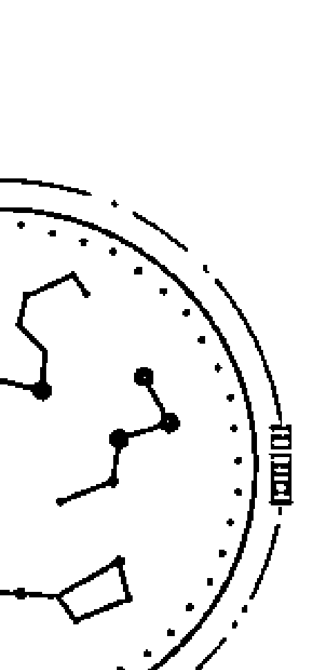

> 「人生就是一部經典」不論你身處在這檔戲的哪個角色，你都必須要好好演繹，即便是裡面的路人甲乙丙丁，都會有自己該走的路徑，就如天空老師所描述，「行星」是演員、「星座」是劇本、而「宮位」就是你最華麗的舞台，看完這本《揭秘十二宮位》絕對會讓您在剖析星盤時，成為一位面面俱到的「導演」，知道如何挖掘每個人那深藏不露的潛能！

——塔羅公癒心創空間／Ricky Otis

> 關於占星初學者你所該知道的事，天空老師都幫你留意到了！此書不僅解說宮位意涵，連相位的解釋與十大行星排列組合都完整解析，其中最愛的部分是談論到因著時代的變遷，天空老師依據她的實務經驗與研究提出對於三王星不同的見解。特別推薦給對於占星感興趣卻又不得其門而入的朋友。

——心靈命理諮詢師／于玥

> 透過天空老師特殊的視角及筆法，帶領讀者看見出生星盤上不為人知的另一面，即使已經深入了解占星的專家也能在當中得到啟發。

——丹尼爾

> 在占星塔羅領域獨樹一格的天空為限，總是能將艱澀難懂的學識，用風趣直白又有智慧的口吻進行闡釋。這本書中，把占星學上的知識與獲得重新打散再組合，讓我們能夠用不同角度來分析星盤影響之下所發展的行為，眾多人物事件的舉例說明，讓你能看透人性，貼近生活。相信你多了這層瞭解，未來對於塔羅占卜的解讀也能更有幫助。你千萬可不能錯過這麼令你觀點煥然一新的學習好機會！

—— 塔羅事典館主／孟小靖

> 非常喜歡天空老師對於占星的闡述方式。這本書的架構深得我心，以非常清晰易懂的描述來切入行星能量與宮位特質。同時，又疊加了不同的行星力量所交互作用的特性表現，具體說明了個人出生圖當中所有的能量呈現。對於初學者以及想要用更白話的方式來理解星盤的讀者，是一大福音！

—— 左西人文空間創辦人、國家諮商心理師、身心靈分享者／陳盈君

> 天空為限的書根本不需要我多置一詞，她文字的靈活很顯然地同時來自她的執業經驗也來自她天生的特質。書中內容觸類旁通，讀來愉快且印象深刻，例子信手拈來，知無不言，這也是學也學不來的。試問到哪裡找這種爽快度破表的占星書呢？——愛智者書窩版主、諮商心理師 鍾穎

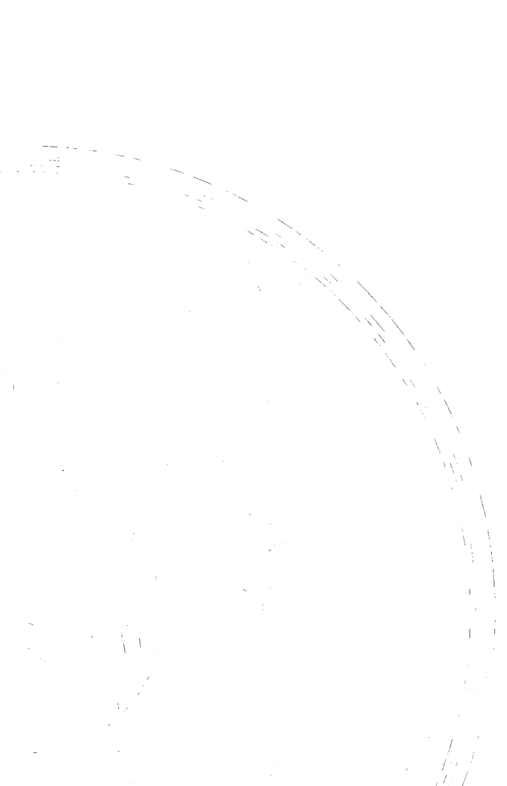

# 自序 宮位潛藏的才能

# Chapter 1 透視十二星座

十二星座元素對照表

四象、三態——十二星座的終極密碼

## ☆ 對宮星座

- 牡羊 & 天秤：超級自我的偏執狂 & 為眾人而戰的正義魔人
- 金牛 & 天蠍：不受干擾的獨立個體 & 凡事上心的接收器
- 雙子 & 射手：蜻蜓點水的態度 & 易燃也易滅的個性
- 巨蟹 & 魔羯：永遠匱乏的安全感 & 油門催到底的控制慾
- 獅子 & 水瓶：贏得人心的王者 & 追求真理的時代先驅
- 處女 & 雙魚：原則變來變去的碎唸王 & 夢幻也精明的雙面人

## Chapter 2 十大行星

## ☆太陽總論：如光芒般最引人注目的特質

- 太陽 VS 上升：自己 vs 他人眼中的「我」
- 太陽 VS 月亮：一攻一守，外在自我 vs 內在真我
- 太陽 VS 水星：舉手投足間的教養 vs 機智的談吐
- 太陽 VS 金星：儀表出眾的貴公子 vs 親切討喜的鄰家女孩
- 太陽 VS 火星：為眾人犧牲小我 vs 世界只有自我
- 太陽 VS 木星：天生自備光環 vs 後天自學成材
- 太陽 VS 土星：光芒萬丈的王者 vs 一路過關斬將的實力派

## ☆月亮總論：女性代表，主掌內在的秘密與感受

- 月亮 VS 太陽（請參見太陽 VS 月亮）
- 月亮 VS 水星：內心千頭萬緒 vs 嘴上舌粲蓮花
- 月亮 VS 金星：內在共感之情 vs 外在社交技巧
- 月亮 VS 火星：凡事以守代攻 vs 凡事先衝一波
- 月亮 VS 木星：家傳守成的富二代 vs 成功的創業者
- 月亮 VS 土星：從底層困境向上爬，逆來順受 vs 等待時機

## ☆水星總論：不受限不受控，百變的萬能翻譯機

- 水星 VS 太陽（請參見太陽 VS 水星）
- 水星 VS 月亮（請參見月亮 VS 水星）
- 水星 VS 金星：靈機應變的話術高手 vs 善於表面友好的外交能手
- 水星 VS 火星：把別人當夥伴 vs 把別人當小弟
- 水星 VS 木星：無所不知的好奇寶寶 vs 追求高深知識的教授
- 水星 VS 土星：活潑淘氣寬以待人 vs 墨守成規嚴謹律己

## ☆金星總論：顏值完勝，喜愛和平也愛滿足五官享受

- 金星 VS 太陽（請參見太陽 VS 金星）
- 金星 VS 月亮（請參見月亮 VS 金星）
- 金星 VS 水星（請參見水星 VS 金星）
- 金星 VS 火星：鄰家妹妹 vs 霸道總裁
- 金星 VS 木星：生活小確幸 vs 人生大豐收
- 金星 VS 土星：幸運不間斷 vs 好事總多磨

## ☆火星總論：侵略性強，原始慾望勃發的行動者

- 火星 VS 太陽（請參見太陽 VS 火星）
- 火星 VS 月亮（請參見月亮 VS 火星）
- 火星 VS 水星（請參見水星 VS 火星）
- 火星 VS 金星（請參見金星 VS 火星）
- 火星 VS 木星：人生高潮迭起 vs 成就一波接一波
- 火星 VS 土星：短跑的衝勁 vs 馬拉松的耐力

| 1 | 1 | 1 | 1 | 0 | 0 | 1 |
|---|---|---|---|---|---|---|
| 3 | 3 | 2 | 1 | 9 | 7 | 3 |
| 9 | 6 | 4 | 0 | 4 | 2 | 3 |

## ☆土星總論：通過無數考驗與磨難，大器晚成的實力派

- 土星 VS 太陽（請參見太陽 VS 土星）
- 土星 VS 月亮（請參見月亮 VS 土星）
- 土星 VS 水星（請參見水星 VS 土星）
- 土星 VS 金星（請參見金星 VS 土星）
- 土星 VS 火星（請參見火星 VS 土星）
- 土星 VS 木星（請參見木星 VS 土星）

## ☆木星總論：用樂觀與大器，造就不凡的幸運

- 木星 VS 太陽（請參見太陽 VS 木星）
- 木星 VS 月亮（請參見月亮 VS 木星）
- 木星 VS 水星（請參見水星 VS 木星）
- 木星 VS 金星（請參見金星 VS 木星）
- 木星 VS 火星（請參見火星 VS 木星）
- 木星 VS 土星：極大的好運 VS 巨大的困難，碰撞出不凡的成就

```
1 1 1 1 1 0 1     1 1 1 1 0 0 1
4 3 3 1 1 7 4     4 3 2 1 9 7 4 5 6 7 3 7 5 2
```

## ☆天王星總論：人類以上靈界未滿，不怕驚世駭俗只怕不夠突破

- 天王星 VS 太陽：看不見車尾燈的先驅 vs 照耀別人也光耀自我的貴族
- 天王星 VS 水星：天才的天文書 vs 秀才的白話術
- 天王星 VS 金星：顛覆眾人的觀點 vs 順服大眾的觀點
- 天王星 VS 火星：可能死灰復燃的休眠火山 vs 隨時引爆的不定時炸彈
- 天王星 VS 木星：在框架外發現新世界 vs 超越世俗但守住規範
- 天王星 VS 土星：不斷挖掘創新未來 vs 代代相傳堅守理論
- 天王星 VS 海王星：超脫「小我」，訴求人道 vs 訴求神性
- 天王星 VS 冥王星：構築未來的發明家 vs 洞悉人性的心理師

## ☆海王星總論：神鬼莫測、大愛無我，但容易被當軟柿子

- 海王星 VS 太陽：對人對己都佛系，寬以待人 vs 嚴以律己
- 海王星 VS 月亮：佛系無我的大愛 vs 無私奉獻的小愛
- 海王星 VS 水星：智慧宗教家 vs 生活知識王
- 海王星 VS 火星：焦點渙散 vs 火力集中
- 海王星 VS 金星：心懷天下超渡有緣人 vs 與人為善但保持社交距離
- 海王星 VS 木星：用心於慈善事業 VS 追求精神躍升
- 海王星 VS 土星：靈性的極端 VS 俗世的極端
- 海王星 VS 天王星 (請參見天王星 VS 海王星)
- 海王星 VS 冥王星：天堂 vs 地獄，神性 vs 人性

## ☆冥王星總論：掌控極端的感情，握有摧毀一切的力道

- 冥王星 VS 太陽：看盡人世險惡 VS 享盡人間榮華
- 冥王星 VS 月亮：秘不示人的深層業力 VS 腦內小劇場
- 冥王星 VS 水星：洞悉世情的人性拆解師 VS 邏輯滿分的行為分析師
- 冥王星 VS 金星：迷死人不償命的放電機 VS 路上常見的帥哥美女
- 冥王星 VS 火星：極端的愛恨嗔痴 VS 直接了當的強取豪奪
- 冥王星 VS 木星：關關難過關關過 VS 吉人自有天相
- 冥王星 VS 土星：轉折離奇的災難片 VS 逆流而上的勵志片
- 冥王星 VS 天王星 (請參見天王星 VS 冥王星)
- 冥王星 VS 海王星 (請參見海王星 VS 冥王星)

# Chapter 3 揭秘十二宮位

## ☆ 宮位前言

- 第一宮：代表「最後的自我」
- 第二宮：代表「擁有的物質與財富」
- 第三宮：代表「天分與溝通」
- 第四宮：代表「外在與內在的私領域」
- 第五宮：代表「帶點偏財運的遊戲宮」
- 第六宮：代表「付出辛勞的職業宮」
- 第七宮：代表「追求平等的公權力與伴侶相互成長的配偶宮」
- 第八宮：代表「生與死、善與惡的極端宮位」
- 第九宮：代表「壯闊自己世界的升級宮」
- 第十宮：代表「一生成就最高的事業宮」
- 第十一宮：代表「世界大同和社會形象」
- 第十二宮：代表「無形無我的靈性與夢境」

234 239 242 244 246 248 251 254 257 263 265 268 270

## Chapter 4 行星座落宮位表現

## 一、太陽在各宮位表現

- 太陽在第一宮 & 太陽牡羊座：真誠不做作的老頑童
- 太陽在第二宮 & 太陽金牛座：談心之前先談錢
- 太陽在第三宮 & 太陽雙子座：演說技巧滿分的意見領袖
- 太陽在第四宮 & 太陽巨蟹座：不可或缺的 Key Man
- 太陽在第五宮 & 太陽獅子座：只要叫我老大，情和義值千金
- 太陽在第六宮 & 太陽處女座：推卸責任是因為太負責任
- 太陽在第七宮 & 太陽天秤座：既是神隊友，也是里長伯
- 太陽在第八宮 & 太陽天蠍座：深入人心底層的暗黑教主
- 太陽在第九宮 & 太陽射手座：集中火力追求新鮮感
- 太陽在第十宮 & 太陽魔羯座：百歲掛帥，老有所成
- 太陽在第十一宮 & 太陽水瓶座：為人類福祉步上街頭
- 太陽在第十二宮 & 太陽雙魚座：在幻想與靈界間悠遊自得

## 二、月亮在各宮位表現

- 月亮在第一宮 & 月亮牡羊座：不是自私！只是更愛自己
- 月亮在第二宮 & 月亮金牛座：手有不動產，心有歸屬感
- 月亮在第三宮 & 月亮雙子座：高智商高敏感，思緒變幻莫測
- 月亮在第四宮 & 月亮巨蟹座：深具母恋情結的情勒專家
- 月亮在第五宮 & 月亮獅子座：悶騷又愛面子，一旦被認定就難逃手掌心
- 月亮在第六宮 & 月亮處女座：念你，是為了你好
- 月亮在第七宮 & 月亮天秤座：猶豫不決，只為了求完美
- 月亮在第八宮 & 月亮天蠍座：凡事都往心裡去，愛與恨加倍奉還
- 月亮在第九宮 & 月亮射手座：在知識的海洋中放飛自己
- 月亮在第十宮 & 月亮摩羯座：永遠做最壞的打算、最好的準備
- 月亮在第十一宮 & 月亮水瓶座：世界和平是王道，低調行善是準則
- 月亮在第十二宮 & 月亮雙魚座：總是佛心來著，鬼牽溜溜走

## 三、水星在各宮位表現

- 水星在第一宮或水星牡羊座：自命不凡，心直口快
- 水星在第一宮 & 水星金牛座：守財，就是最好的理財
- 水星在第二宮 & 水星雙子座：快人快事、快言快語
- 水星在第三宮 & 水星巨蟹座：累積經驗，是為了以不變應萬變
- 水星在第四宮 & 水星獅子座：自以為低調，卻老出鋒頭
- 水星在第五宮 & 水星處女座：不是毒舌，只是誠實
- 水星在第六宮 & 水星天秤座：聰明絕頂，卻總陷入兩難
- 水星在第七宮 & 水星天蠍座：直覺似神通，確認過眼神
- 水星在第八宮 & 水星射手座：知識不夠格，就不屑入眼
- 水星在第九宮 & 水星摩羯座：雄辯是銀，沉默是金
- 水星在第十宮 & 水星水瓶座：我不了解你的明白
- 水星在第十一宮 & 水星雙魚座：入戲太深，夢幻一世

## 四、金星在各宮位表現

- 金星在第一宮 & 金星牡羊座：愛就要大聲說出來
- 金星在第二宮 & 金星金牛座：不走冤枉路、不花冤枉錢
- 金星在第三宮 & 金星雙子座：花花世界裡限量版的花花蝴蝶
- 金星在第四宮 & 金星巨蟹座：愛是恆久忍耐又有恩慈
- 金星在第五宮 & 金星獅子座：你們皆是我的子民，仰慕我是理所當然
- 金星在第六宮 & 金星處女座：打扮得體是禮貌，維持整潔是美德
- 金星在第七宮 & 金星天秤座：先做人，後做事，家和萬事興
- 金星在第八宮 & 金星天蠍座：愛恨的理由只有他知道，別問為什麼
- 金星在第九宮 & 金星射手座：對談可深可淺、情感若即若離
- 金星在第十宮 & 金星魔羯座：迷倒眾生的風度，低調奢華的魅力
- 金星在第十一宮 & 金星水瓶座：熱心公益，不問過程只求結果
- 金星在第十二宮 & 金星雙魚座：萬般過錯只因心太軟

## 五、火星在各宮位表現

- 火星在第一宮 & 火星牡羊座：領頭羊性格，衝鋒陷陣第一名
- 火星在第二宮 & 火星金牛座：獨當一面，永不停歇的印鈔機
- 火星在第三宮 & 火星雙子座：一呼百諾的孩子王
- 火星在第四宮 & 火星巨蟹座：家人虐你千百遍，你對家人如初戀
- 火星在第五宮 & 火星獅子座：想當大家的老大，但常變大家的小弟
- 火星在第六宮 & 火星處女座：目標高遠但不接地氣，大災沒有小病不斷
- 火星在第七宮 & 火星天秤座：爭執是通往和平的荊棘之路
- 火星在第八宮 & 火星天蠍座：席地獄之火而來的復仇使者
- 火星在第九宮 & 火星射手座：人生是一趟華麗的冒險，充滿太多未知的誘惑
- 火星在第十宮 & 火星魔羯座：專制獨裁，威脅施壓都明著來
- 火星在第十一宮 & 火星水瓶座：以天下輿亡為己任，萬死不辭
- 火星在第十二宮 & 火星雙魚座：火力忽大忽小，情緒反覆無常

## 六、木星在各宮位表現

- 木星在第一宮 & 木星牡羊座：遇到挫折也能很快振奮起來，因為他是幸運的代人
- 木星在第二宮 & 木星金牛座：財源滾滾，吃穿不愁
- 木星在第三宮 & 木星雙子座：深入淺出，將高深學問普及化
- 木星在第四宮 & 木星巨蟹座：四海為家，全世界都是故鄉
- 木星在第五宮 & 木星獅子座：在需要與被需要間，獲得成就感
- 木星在第六宮 & 木星處女座：擁有火眼金睛，防患未然的守門員
- 木星在第七宮 & 木星天秤座：公平公正公開是處世原則
- 木星在第八宮 & 木星天蠍座：看透世上難解之謎
- 木星在第九宮 & 木星射手座：沒看過的風景，永遠是最美的風景
- 木星在第十宮 & 木星魔羯座：天生的好運加上些許的努力，就能薄積厚發
- 木星在第十一宮 & 木星水瓶座：活在未來世界，為理念奮鬥
- 木星在第十二宮 & 木星雙魚座：不是迷糊，而是大智若愚

## 七、土星在各宮位表現

- 土星在第一宮 & 土星牡羊座：自我要求高，路遙知馬力
- 土星在第二宮 & 土星金牛座：手上有錢，心靈才安全
- 土星在第三宮 & 土星雙子座：一個眼神看清事實，一句話點破問題
- 土星在第四宮 & 土星巨蟹座：美酒越陳越香，朋友越老越好
- 土星在第五宮 & 土星獅子座：天生的王者，實力比名聲更重要
- 土星在第六宮 & 土星處女座：一絲不苟，只求使命必達
- 土星在第七宮 & 土星天秤座：凡事起頭難，一旦開始就會堅持到底
- 土星在第八宮 & 土星天蠍座：固執到陰魂不散，相處如前世相欠債
- 土星在第九宮 & 土星射手座：好還要更好，永遠都在計畫下一步

## 八、天王星在各宫位表现

土星在第十宫&土星摩羯座：十年磨一剑，出手便是赢家
土星在第十一宫&土星水瓶座：看似随和，实际上比谁都要固执
土星在第十二宫&土星双鱼座：人生如闯关游戏，步步惊心

天王星在第一宫&天王星牡羊座：超然物外，品味思想异于常人
天王星在第二宫&天王星金牛座：追寻真理发挥专长，有幸运外致富
天王星在第三宫&天王星双子座：太正常的人，无法与之当麻吉
天王星在第四宫&天王星巨蟹座：兼爱天下，家庭组成离奇
天王星在第五宫&天王星狮子座：爱情观超尘绝俗，喜爱难解的未知
天王星在第六宫&天王星处女座：成就险中求，好坏两极
天王星在第七宫&天王星天秤座：挑战社会价值，建立非普通婚姻
天王星在第八宫&天王星天蝎座：见解独到，生死观异于常人
天王星在第九宫&天王星射手座：怪胎与天才，只有一线之隔
天王星在第十宫&天王星摩羯座：不甘屈居人下，在事业上踽踽独行
天王星在第十一宫&天王星水瓶座：看似友善，却是推翻旧制的改革者
天王星在第十二宫&天王星双鱼座：深谙宇宙律法，具备异次元沟通潜能

## 九、海王星在各宫位表现

- 海王星在第一宫：迷糊柔弱，不食人间烟火
- 海王星在第二宫：与其累积钱财，不如累积阴德
- 海王星在第三宫：天生是纾压型聊天机，不用担心没话题
- 海王星在第四宫：从小就过着阿信人生，为家人牺牲奉献
- 海王星在第五宫：自欺欺人的恋爱上瘾症
- 海王星在第六宫：耐性无穷无尽，最适合医护工作
- 海王星在第七宫：遇到的配可能是前世相欠债
- 海王星在第八宫：累积宿世福报，无形间突破难关
- 海王星在第九宫：能力与众不同，渴望弃绝世俗
- 海王星在第十宫：灵性产业之王，处处结善缘
- 海王星在第十一宫：大爱无私，建立全新的普世价值观
- 海王星在第十二宫：世俗存在感低，是另类疗法的天才

## 十、冥王星在各宫位表现

- 冥王星在第一宫：跌宕起伏的戏剧化人生
- 冥王星在第二宫：缺的不是小钱，而是大钱
- 冥王星在第三宫：幕后操盘手，需注意车关意外
- 冥王星在第四宫：跟母亲爱恨纠葛，难分难舍
- 冥王星在第五宫：恋爱观强烈奇特，充满致命吸引力
- 冥王星在第六宫：人生以工作为重，拼命到有违常理
- 冥王星在第七宫：铁面无私，却容易与人结仇
- 冥王星在第八宫：命运大起大落，有仇必加倍奉还
- 冥王星在第九宫：遨游异次元，拆解不为人知的历史之谜
- 冥王星在第十宫：熟知黑白两道，谷底往上爬的戏剧化人生
- 冥王星在第十一宫：冷漠自持，只可远观不可亵玩
- 冥王星在第十二宫：注意梦境启示，化解前世业力

## 专栏

- 风象星座的沟通方式
- 火象星座的领导特质
- 天蝎与巨蟹的执着
- 水瓶座的守护星：从土星到天王星
- 土象星座的审美观
- 行星中的「高八度理论」
- 天秤和金牛的美学
- 三王星论断重点
- 容易受骗的女人
- 容易为爱沦落的命盘
- 被降格的冥王星
- 有强力的宫位或星座≠个性如此
- 是否能成为巨星，要看第八宫
- 什么样的人适合学神秘学？

# 自序

## 宫位潜藏的才能

我的金牛座有水星、金星跟木星三颗星，木星跟月亮还在第二宫，月亮差两度就金牛了，双子太阳、金牛水星、金牛金星都在第三宫。所以我的命盘中，金牛质跟双子质最重。金牛跟双子座都很怕麻烦，所以不喜欢找自己麻烦，就是我性格中很重要的部分。

宫位是事情发生的场所领域，第二宫对社会而言是象征农场跟金融经济圈，但个人的第二宫，就代表正财跟不动产，由金牛座守护。行星在宫位，也会带有宫位所属星座的特质，像木星在金牛座，又在二宫，就是双重的金牛，就会特别慵懒、重感官享受。

我虽然双子跟金牛的懒散很严重，但跟写作有关的事我非常认真，很少拖稿，就算没写完也不会超过三个月收尾，虽然出的书不到十本，但我觉得写作是我最重要的能力，不能拖自己后腿。

神秘学是我写作的材料，但为谋生，还必须开发其他的材料，这点我挺认清现实的。虽然除了神秘学之外的书，只有吵架书《麻辣说话术》一本，但我的部落格「天空为限的发声现场」中倒是尝试过很多种文章类型，从政治影视、艺文评论到购物文，我都会尝试写写看。

几年前我因为左脑中风而住院，讲话跟思考都常常会错乱，也会突然当机，脑袋一片空白时，我只记得我要写下去，不然能力如果丧失，以后可能再也找不回来了。所以我在右半身还瘫痪，无法走路时，就坚持要把笔电搬来医院，即使要发呆很久的时间，也坚持要开着电脑，想到一句写一句，以免写作能力永远无法回来。

> 《揭秘十二宫位》就是这种情况之下的产物，我以前不想写占星书，因为我觉得占星太广大了，食谱式的写法哪能写出精髓？但感谢（？）思路变慢，让我有耐心用条列式的方法把占星写出来，虽然解盘解牌速度很缓慢，我还是一直训练自己。

我在写第一本书《十二星座都是骗人的？》时就告诉自己，我可能出完一本书后，就没有第二次机会了，所以一定要卯足全力。那时我的第一只猫咪咕姬过世了，我本来很想放弃，但告诉自己，这可能是唯一一次表现自己的机会，所以无论如何，这次我一定要把书书写完。还好我还有第二次、第三次机会，虽然不是每本都畅销，但很感谢出版社愿意给我支持。

结果没想到《揭秘十二宫位》这本书在我不设限下，完稿后发现居然有二十万个字。

我从来没想过我会这样说自己：「我不是天才，也很懒，但我绝对是个敬业的人，为了自己的前途跟钱，要我多拼命我都愿意。」

「我以我的双子金牛质为傲。

# 天空为限

# Chapter 1
## 透视十二星座

# 十二星座元素对照表

|          | 牡羊   | 金牛   | 双子   | 巨蟹   | 狮子   | 处女   | 天秤   | 天蝎   | 射手   | 摩羯   | 水瓶   | 双鱼   |
|----------|--------|--------|--------|--------|--------|--------|--------|--------|--------|--------|--------|--------|
| 三态     | 开创星座 | 固定星座 | 开创星座 | 固定星座 | 开创星座 | 固定星座 | 开创星座 | 固定星座 | 开创星座 | 固定星座 | 开创星座 | 固定星座 |
| 四象     | 火元素 | 土元素 | 风元素 | 水元素 | 火元素 | 土元素 | 风元素 | 水元素 | 火元素 | 土元素 | 风元素 | 水元素 |
| 守护行星 | 火星   | 金星   | 水星   | 月亮   | 太阳   | 水星   | 金星   | 冥王星 | 木星   | 土星   | 天王星 | 海王星 |
| 守护宫位 | 第一宫 | 第二宫 | 第三宫 | 第四宫 | 第五宫 | 第六宫 | 第七宫 | 第八宫 | 第九宫 | 第十宫 | 第十一宫 | 第十二宫 |

# 四象、三态——十二星座的终极密码

开创 → 固定 → 变动

火象 → 土象 → 风象 → 水象

占星常常会说火象、风象、土象、水象，每个元素各有三个星座，如果看一般的星座书，可能会看不出白羊座跟狮子座有何不同、分不清楚巨蟹座和天蝎座有何不同、双子座跟水瓶座有什么不同。但是一旦加入了四象（火、土、风、水）、三态（开创星座、固定星座、变动星座），就可以看出差异，十二星座＝四象 × 三态的组合。

## 开创星座：

想要成为的那个人，但是你正在成为的途中。东西刚刚生成，正在打地基的时候，所以生命力非常旺盛，类似我们刚刚进入职场还是菜鸟，看起来很有冲劲、很积极。开创宫形态还没固定，因为还在摸索，并未定型，是一「你还没有成为你开创是类似火的能量，开创的意思是「站在起跑点、开始、创新、开创、创始」。代表一

| 相似元素 | 代表含义 | 星座类型 |
| --- | --- | --- |
| 火 | 成长、成就 | 开创星座 |
| 土 | 完成、成熟 | 固定星座 |
| 风、水 | 放手、转变 | 变动星座 |

## 固定星座：

固定宫跟土元素的特质很相近，土也有稳固的意思，就是我进入这个社会了，或者我变成群体当中的一个人了，是「我已经长成了、我的身体很好、机能已经发育完全」。因为成熟了、稳固了，所以缺乏行动力，不容易改变。

## 变动星座：

变动是代表一个准备，准备迈向下一个阶段，自身的特质也开始改变，所以跟可塑性、流动性强的「风、水」特质相近，风和水都可以含纳许多杂质、意见，也可以随环境变化自己的状态。但也因为要迈入不同的阶段，专注力转移，所以有没有耐性、原则，做事不持久等特质。

## ★火象星座：牡羊、狮子、射手

火象代表提升，喜欢追求智慧（但我觉 得通常是「自以为在追求金 钱，不小心变成在追求智 慧」）因为火会不断转化自 我，进入下一个境界。

牡羊座和狮子座比较实际，牡羊是基本宫，有只顾自己立场的特质，再加上火的专注，就会显得特别的幼稚和自我中心，最终目标是能随心所欲不用配合别人、不去管别人怎么看。狮子座跟牡羊最大的不同是狮子在乎别人怎么讲，而牡羊不在乎。因为固定宫类似土元素，是群体主义，在意外界的规范、眼光，所以狮子座的偶像包袱才会这么重，在外对老婆大声一点都有损自己的形象。

射手座是火象变动宫，是三个火象里面求知欲最强的，变动宫没有包袱，会觉得人生在不一样的时间就应该做些不一样的事情。虽然好学，但续航力不强。火元素很专注，做事时会有一定的野心，但变动宫缺乏目标性，所以射手相对没那么偏执，容易分心，当然也容易花心。

## 土象星座：金牛、处女、摩羯

土元素里面，最不像土元素的是处女座。因为处女座是变动宫，与土象冲突。土元素目标性强，但处女座会因为重视细节，忘记目标在哪里，埋头苦干手边的细项，精力常常会分散掉。虽然土象很有原则，但因为变动宫的影响，导致处女座常常今天的原则跟明天的原则不一样，人格分裂的程度显然比双子座还要严重。

金牛座与摩羯座相比，金牛座最土象，因为他是固定星座。土象、固定星座都有被动特质，所以金牛不太管别人的事情，只求自己的日子过得安稳舒适，但土元素会追求物质，金牛座平常很慵懒，在赚钱的时候却显得特别勤劳务实。摩羯是开创星座，有类似火象的主动性和专注，土元素能强化摩羯对达成目标的耐力，所以能在台面下潜伏很久，直到完成内在的野心。

## ✦风象星座：双子、天秤、水瓶

双子座跟风元素根本是同义词，因为双子座是风元素变动宫，这双重风元素，让他永远不知道下一步要干嘛，永远摸不清楚下一个去向，可以自由切换不同模式，从既有状况马上转换到下一个状况。很多人会觉得双子座聪明，但是双子座的聪明是反应快、能临机应变、适应能力好，但真正有远见的是水瓶座。水瓶座是风象固定宫，不但思考迅速，而且推理非常缜密，但也因为是固定宫，对内在认定的真理会坚持到底，不喜欢改变原有的看法、原则、信仰，好在他们固执的只有思维（风元素），对物质权利基本上没什么控制欲或占有欲。

## ✦水象星座：巨蟹、天蝎、双鱼

天秤座内里是基本宫，有近似火象的主观意识，但风象又不喜欢得罪人，所以天秤平常很和善，但到了辩论或是打笔战时一整个会停不下来。开创宫重视行动，所以天秤会以风象的方式频频讲理，希望把错误的思想矫正回来，要你弃暗投明。

水元素有情绪化、好相处、感情用事、柔和被动、依附外力等特点。双鱼座是水象变动宫，适应力非常强，不会输给双子座。看起来深情款款，但很容易适应环境、转换想法。缺点是没有定性，自己都不知道在干嘛；优点是容易升华与超脱，对一件事情执着度不强。

巨蟹座跟天蝎座比较复杂，因为开创宫（火）跟固定宫（土）的特质跟水象相冲突，开创宫和固定宫都希望事情照他们所想的发展，但是水元素其实没什么执行力跟控制力，这会导致巨蟹和天蝎更不安，转而打心理战。开创的特质强化巨蟹的目的性，但因为水元素会拐弯抹角，所以巨蟹不会明说，会尝试用各种不同的方法暗示，在同一件事上一直兜圈。天蝎座也有固定宫的目的性，固定加上土元素的被动，使天蝎不会主动出击，但他愿意为达成目的花时间等待，直到事情自动发展到他要的阶段后才出手收成。

# Chapter 1 透视十二星座

# 对宫星座

## 牡羊+天秤 超级自我的偏执狂&为人而战的正义魔人

「同中有异，异中有同」是对宫的一大特色，而金星跟火星在占星学上，本来就是相对的两颗行星，即使他们不是对宫，各自也拥有「冲突」跟「相像」这两种特质。

| 牡羊 | 天秤 |
| --- | --- |
| 开创星座 | 开创星座 |
| 火元素 | 风元素 |
| 火星 | 金星 |
| 第一宫 | 第七宫 |

牡羊跟天秤的相同点：偏执狂人——牡羊之「人人为我」；天秤之「我为人人」

### ✦ 捍卫主权——牡羊为自我价值；天秤为民主人权

是「偏执」，两个都是偏执狂，只是天秤还会有点理智，会去 Google，牡羊则会没头没脑地坚持自己的偏见跟信仰。

牡羊是火象，又由火星守护，是集所有冲动元素于一身的星座，除非月亮、金星、水星落在比较温和的星座上，否则难掩暴戾之气。但是牡羊并非对谁都凶神恶煞，一旦他下定决心要让别人对他有好印象时，会低声下气到令人无法想像，因为火元素重点在达到目标，为了这目标能排除万难，为此牺牲片刻的自我也在所不惜。

天秤由注重和平的金星掌管，因此他们对每个人都会展现好相处的那一面。因属主观的开创星座，虽然对周围的人很好，但谈到公众事务就会异常偏激。比如有事情请他帮忙，他会欣然接受，但若发现对方没有公德心，他就会发挥风象的辩证之力，大义凛然、滔滔不绝地说教。

牡羊通常是死命地捍卫自己的观点，而天秤是不顾一切地捍卫大家的观点，就像对于公德心与政见，牡羊会觉得「这些都不干我的事，根本懒得管」；天秤就会觉得「我是群体的一员，大家的事就是我的事，我必须要为了众人站出来！」但在天秤在乎的是规定内的事，规定以外的事，他觉得那是个人的自由，我无权干涉。天秤的偏激是社会化的，而牡羊是个人化的。天秤座有金星的包装，所以初见时，是看不出他其实还满容易激动的，但牡羊座是一眼就可以看出来，因为火星什么想法都藏不住。

### ✦不惧冲突——牡羊为个人而战，天秤为大众而战

天秤座是风象，擅长口头争辩，会试图用自己的主观说服他人，而且还自以为很客观，因为他自认为已经做到资料考核了；但他收集的资料，都是佐证他原来的想法，如果正确的话，会被认为是择善固执，如果错误了……其实，也不至于到危害苍生啦！过当的政策推行到一定的地步，不是人家受不了他，就是他受不了别人，但因为天秤毕竟是金星守护，只求好聚好散，不太容易撕破脸，不像火星守护的牡羊座一言不合就翻脸或翻桌。

天秤座的缺点是「地雷」很多，只要你有哪句话不符合他的理念，他就会马上反弹，虽然美其名为「沟通」，但真的遇到重要的事，或遇到真正的坏人，他觉得状况不好处理，就会选择闭嘴。

牡羊座是火星守护，所以不分大事小事、也不分善人恶人，只看他觉得你这个人是否顺眼，一不顺眼就会大打出手。有些人觉得撕破脸很难看，但并不然，我常常说程度适中的冲突是必要的，有时冲突也是一种沟通的方式，冲突完了，知道对方在想什么，就可以坐下来好好谈了。

天秤乍看之下爱好和平，但也会制造出社会跟个人之间的冲突。天秤代表公权力，有时候若与个人权利产生违背时，天秤会站在「多数」的一边，让「少数」的一边觉得自己受到压迫。一个好的冲突只是表达自己意见的一种方法而已，不见得会造成什么不可挽回的后果。

人跟「少数」通常都是牡羊座代表，因为牡羊常常会有个人意见，有时甚至不惜性命，也要为自己捍卫的一方挺身而出（其实就是捍卫自己），那就会跟天秤代表的「多数」形成对立了，所以两边一定会起冲突。这两个星座都是战力满点的开创星座，只是天秤会「说之以理」（其实跟政见辩论是一样的意思），牡羊则是以「武力」来解决。他们相同的地方，是都要争取权利；不同的地方是天秤代表公众，牡羊代表个人。

## 十天秤发展极端则自以为是；牡羊发展极端则假公济私

每个星座发展到极致时，都会有对宫的特质。天秤如果发展到极点就会跳成牡羊的性质，偏执地认为自己的分析都是对的，别人脑袋不清楚又不讲道理，只有自己了解真相，这种自恋的心态，一点都不比牡羊讨喜。牡羊到了极端而发展出天秤的特质时，会凡事喜欢讲大道理，动不动就引经据典来为自己找理由开脱，但实际上根本搞不清楚「不同立场的想法本来就各有不同」，片面地认为世界的规律不会超出自我的认知范围之外，犯了眼界狭小的毛病。

通常在三十岁过后，他们会体认到这种个性给自己带来多大的麻烦，从此果断起来了，这就是发展出对宫牡羊的形态。当然这可能会让他的人缘比年轻的时候差一点点，可是人的年纪一大，太多的人际关系也会给自己造成一些负担，所以失去一些朋友也不算坏事。

## 论盘技巧

有两类星盘比较容易自然发展出对宫特质，第一是行星有三颗以上聚集在同一个星座，第二是太阳进入本命宫（例如太阳狮子在一宫或五宫，太阳巨蟹在一宫或四宫）。

发展对宫特质是好是坏并不一定，因为对宫星座本来就是一体两面，在相位上是对分相，代表这两个特质我都有，但无法决定自己要偏向哪边，所以出现拉扯。但也因为拉扯而让人无法忽略，能让人有意识地思考如何使用这股能量。

# 风象星座的沟通方式

水瓶、天秤、双子都是风象星座，风象的特點是认为大家都可以沟通，双子座是用口才吵赢，天秤座是把道理订出来（类似法律或家规之类的），然后大家照着道理来「讲理」。但对水瓶来说，法律是不够看的，他要的是「真理」，包括任何法律来不及拯救或被遗忘的东西，例如黑人人权、女权或动物权，所以一切大家还没关心而该关心的东西，水瓶都要扳住你的肩膀让你转身看到，如果你不愿意看，他就会纠缠到底，变得跟天秤或双子一样烦人，不过在日常生活中，水瓶倒是没什么意见，算是很好相处。

### 天空金句
SKY GOLDEN SENTENCE

- 牡羊座——我的事就是大家的事，但是别人的事没我的事。
- 天秤座——别人的事就是我的事，我的事不見得是别人的事。

## 金牛 + 天蝎
## 不受干扰的独立个体 & 凡事上心的接收器

|   | 金牛 | 天蝎 |
|---|---|---|
| 三态 | 固定星座 | 固定星座 |
| 四象 | 土元素 | 水元素 |
| 守护行星 | 金星 | 冥王星 |
| 守护宫位 | 第二宫 | 第八宫 |

## 凡事漠然——金牛只在意自己的喜好；天蝎假装不在意其实有目的

金牛座的固定特性表现在性格上，自己喜欢的东西，胜过于外面的一切人事物，别人很难扰乱他们的情绪，因为他们根本就不用别人，所以能够保持自己一贯的平静。金牛座向来不管别人的事，只求别人也不要来管他的事就好了。别人讲的话对他们而言，其实是左耳进右耳出。天蝎座跟金牛座一样自顾自，不一样的地方是，金牛座对自己不感兴趣的人，是真心没感觉，一点都不想知道。天蝎则是对身边的每样事物都很上心，若他真的对你不感兴趣，也会很有技巧地不让你发现。若你明显感受到天蝎座彻底地漠视你，把你视为无物，这其实是他们的心机。天蝎会刻意地展现无感，背后原因很不简单，因为事实可能刚好相反，他是想要用冷漠来引起你的注意。

# Chapter 1 透视十二星座

## ★占有欲——金牛可以爱情与肉体分开进行，天蝎则是全部都想霸占

不管是金牛座或天蝎座，他们固定宫展现的地方，都在于『不放弃』。除此之外，还有一个最大的共同点，就是『很肉欲』。说到性欲最强的星座，大家一般看到书上写的都是天蝎座，但天蝎的欲望扩及感情的任何层面，他要从心到肉体全都占有你。但土元素的金牛座很简单，他可以把爱情跟肉体完全分开，『爱情』可能来自于对家庭的需要，也有可能跟恩情或安定感有关，但『肉体』就完全是肉体的事了，只要你让他觉得安全又好配合，可能就是金牛座的最佳床伴。金牛座讨厌复杂跟麻烦的事，对他们来说，解释爱不爱这件事太麻烦了，他会喜欢把对象定位在一个简单的认知上，朋友、床伴、恋人的分际明确，当然可以融成同一个对象的话是最好的。但如果不行的话，他会希望大家「各司其职」，不要质问也不要吵闹，享受自己可以享受的范围就好了，其他的事不要烦他，让他慢慢想清楚，不然他可能为了省麻烦，直接跟你断联。

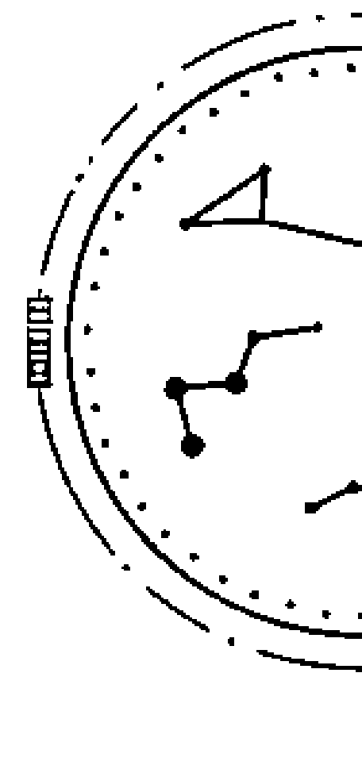

## ✦艺术天分——金牛表现大众化美感，天蝎展现深沉人性

金牛座跟天蝎座的相同点还有一个，那就是「很有艺术天分」，金牛比较接近大众艺术，就是流行音乐跟广告插画；天蝎座比较有个人特色，而且会用艺术来表达他的心理创伤，带点负面能量和深沉的虐心。这是因为金牛座的守护星金星比较世俗，天蝎座的守护星冥王星则专于看透人性，所以天蝎的作品，也会有意无意地表达出他们想刺痛或安抚什么，不像金星是为了娱乐大众，让大家的感官获得高品质的享受，顺便给自己带来名声或财富。我自己就有金牛星群，自认品味好又礼貌周到，不要惹到我的月亮牡羊跑出来时我很优雅啦（笑）！

## ✦金牛发展到对宫容易迷失方向；天蝎则无感迟钝

因为是对宫，当天蝎座一极端时，会表现出金牛座的负面特质——无感迟钝，用他的固定标准来评判世界上所有的事情，来来去去不出那几个讲法，跟天蝎座以往给人的敏锐印象大相径庭。可能是因为天蝎受到伤害后，发觉细心、敏感这优点发展过度反而会为自己带来沉重的压力，所以他们只好自己关掉这些感觉，变成一个迟钝的人。 金牛座拥有发达的感官，但发展过度会沉溺在感官世界里，从艺术到性都有可能，衍生出天蝎执着的负面特质，但沉溺的都是跟肉体有关的事物。从视觉、听觉到性欲，因为感官过度享受，所以容易迷失方向，陶醉在自己的世界里出不来， 这也跟天蝎座的过度自虐跟容易逼疯自己的特质很像。

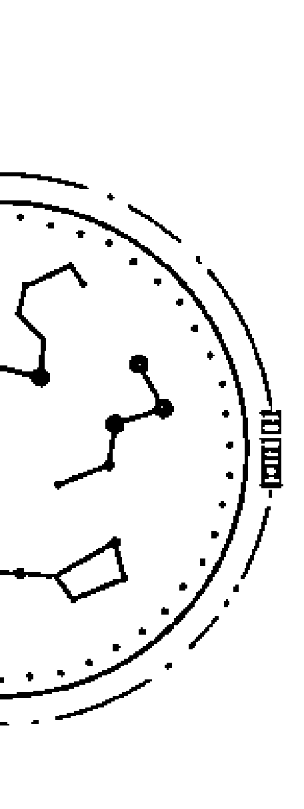

### 天空金句 (SKY GOLDEN SENTENCE)
- 金牛座：爱情跟肉体可以完全分开，大家「各司其职」就好。
- 天蝎座：欲望是感情的任何层面，爱是从心灵到肉体通通占有。

## 双子 ♊ 射手
## 蜻蜓点水的态度 & 易燃也易灭的个性

| 属性 | 双子 | 射手 |
|------|------|------|
| 三态 | 变动星座 | 变动星座 |
| 四象 | 风元素 | 火元素 |
| 守护行星 | 水星 | 木星 |
| 守护宫位 | 第三宫 | 第九宫 |

## ✦ 兴趣多元——双子三分力的优雅，射手全力投入的拼命

双子跟射手都是阳性元素的变动星座，都有着不安定的特质，双子座的风元素跟变动宫本来就很类似，所以比射手还要捉摸不定。火元素比较有热诚，射手的火元素加上变动宫，就是对什么事都真的有热情，但由于火元素只能专注一件事，容易顾此失彼，一旦注意力被引走了，就会完全投入到新的事情里面，要等一个阶段完成后，才又会想起原来的事。

双子座是涣散的风元素，可以一心多用，他们看起来好像很杂乱，实际上却有自己的条理，心里有自己的逻辑。而火元素本性专注，一次只能做一件事，所以射手座虽然兴趣多元，但反而无法排出顺序，想到什么就做什么。也因为这样，射手座给人的感觉比较热血，他们做一件事的时候，都是真的全心投入，有种「拼命」的气势，也比较容易获得别人的信任。不像双子座，虽然游刃有余，从容优雅，但也给人一种没有尽全力的感觉。

## ✦勇于冒险——双子凡事浅尝即止；射手喜欢彻底研究

双子座总给人一种只用三分力的观感，让人觉得他对眼前的事不是那么认真，虽然不见得是事实，因为双子座姿态优雅是天生的，跟有没有尽力无关。对他们而言卯足全力本来就容易出现狼狈感，在没有达成目的之前，也容易给人一种失败的感觉，双子座不喜欢失败，所以就不轻易尝试。这就是风元素加上变动宫的结果，凡事像沾酱油一样不太过认真，以免出现失败的状况，所以狼狈跟失败都比较容易出现在射手座的身上（笑）。

射手座非常勇于尝试，成功的机率也比双子座高出很多。但双子座不轻易尝试的原因，可不是因为谨慎，只是单纯地不想在单件事情上花太多的力气。因为他有兴趣的事太多了，不如每件只做十分之一，这样每件事的感觉都尝到了，虽然不够彻底，但有过瘾的感觉，双子座不喜欢把自己弄得太累。所以我说双子座不是能力很好的星座，但他们是很有潜力的星座，就是那种「高智商低成就」的人。就算成就很高，他还是一定只用了三成力而已，因为双子座真的太懒了。

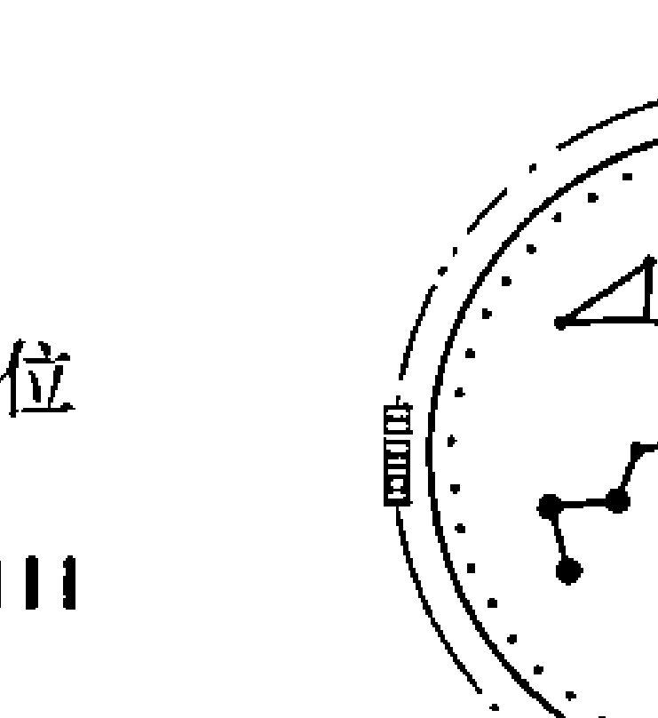

射手座是变动宫，没有其他的火元素那么投入，但比其他火象星座更有变化性和弹性。我们都知道，火元素虽然热情，但某种程度上是非常激进的，变动宫刚好可以为射手座带来一些喘息的空间，不会把自己逼得太死，像牡羊座跟狮子座，就是容易把自己累到半死的星座。射手座比其他火象星座优雅，虽然跟双子座比起来还是狼狈了一点，但那是非战之罪，不管谁站在风象星座的旁边，看起来都会给人气喘如牛的感觉（笑）。

## ✦ 担负责任——双子会理性评估；射手热情过后也逃得快

无论双子座或射手座，都会是很开明的父母，很能跟孩子沟通。出乎意料的，双子座会比射手座还要负责任。射手座当父母这回事是一头热，没想清楚就做了；双子座比较理性，会各方面评估才决定要养育孩子。「热情」是射手座的特质。双子座比较大的特点是「友善」，友善跟热情是差很多的，友善的人没有热情到「不顾一切」的感觉，但也因为会保持距离，对各种事都能考虑得比较周到。

射手座比双子座不怕麻烦，所以也容易给自己惹上麻烦。双子座比较能在事情无法收拾前喊卡，因为风象是出了名的理性，双子座虽然善变，还是比盲目冲动的射手座懂事多了。变动宫已经没有定性了，火象却还对事情有那么强烈的热情，加起来更不利。导致射手座会不负责任地对很多东西燃起热情，一开始的时候什么都好，等到厌烦或负不起责任了，也逃得很快。

## ★面对感情——双子座多角发展；射手座转移迅速

风元素的双子座很容易对事情发生兴趣，但不容易许下承诺，所以大家都说双子座花心，但我觉花心十二星座都会，只是方式不同而已。双子是风象加上变动宫，因为注意力分散得太快，反而不容易真的爱上别人。射手座的火象就常常情绪高涨，很容易投入一件事，投入了以后又很快地变动，反而带给对方更多的伤害。
变动星座的特性是缺乏核心，但双子座很狡猾，在没确定之前，会用各种方法闪躲承诺这件事，虽然会造成很多小小的风波，但给人的不是重大的伤害，比较像是浅浅的伤口；而射手座在刀子划下去之前，因为没在想，所以不会拿捏轻重，造成自己跟对方都难以想象的后果。其实只要是变动星座，都很容造成误解，包括谨慎的土象星座处女座在内。表里如一的双子座跟双鱼座还算是比较好应付的，因为他们的不可信任，从表面上就看得出来，如果你因此受伤，那就是自找的了（摊手）。

## ★双子座发展到对宫会多出深度；射手座发展到对宫能成为主流

射手座跟对宫的双子座一样，兴趣都很多元，不一样的地方，在于双子座是风向星座，所以对每件事都只有短暂、一小段时期的兴趣；射手座则是充满热力的火象星座，他对一样事物的兴趣，至少可以维持到他研究深入了一定的程度为止，因为火象的热力是很集中的，在解决眼前看到的重点之前，他暂时看不到其他东西。但是当他的研究完成以后，也会马上失去兴趣，对他来说，已经研究完的事情，不算是新大陆了，所以会马上失去好奇心。

射手和双子虽然常常半途落跑，但都是很好的知识传播者。双子代表大众化的知识，若发展到对宫射手座的型态，会追求深入的学术智慧。射手追求学术，但他的学术有种在象牙塔里作文章的感觉，若发展出对宫双子的优点，就能突破象牙塔，把高深的知识转化成大众可以接受的语言，吸引许多人接近，从非主流成为主流。

### 天空金句
SKY GOLDEN SENTENCE

双子座——我喜欢你，不代表我爱你。

射手座——我爱你，但不确定明天还爱不爱你。

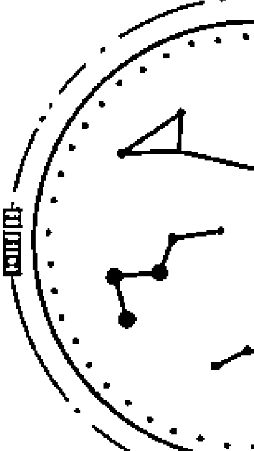

## ## COLUMN 火象星座的领导特质

火有向上燃烧的特质，所以火象星座会不断提升自己，争取冠军。不过牡羊座是个冠军，狮子座则是冠军团队。狮子力求整体的表现，而不是聚焦在自己个人身上，他追求的是群体的荣耀（只要确保他自己也能享受到这个好处），这样他就不用每场战役都亲自出马。毕竟狮子懒洋洋的，如果整个团队都很棒，那么他只要是这个团队中的一员，他的优秀就无人能够否认，而且还有一堆伙伴可以跟他并肩作战。

如果狮子是国王、皇室，牡羊就是将军、强人，但也有孤独（另一个角度来看是独）的意思，因为牡羊和守护星火星都是不合群的。狮子拥有的是人民，都是需要他的协助跟管理的人。

占星界都认为狮子是牡羊的升级版，我认为射手又是狮子的升级版，因为不会那么被别人的眼光左右，可以自由自在地专心做自己有兴趣的事。再升级又回到牡羊座了，但那时就是转化过一次，变成另一个更高阶的自我了。

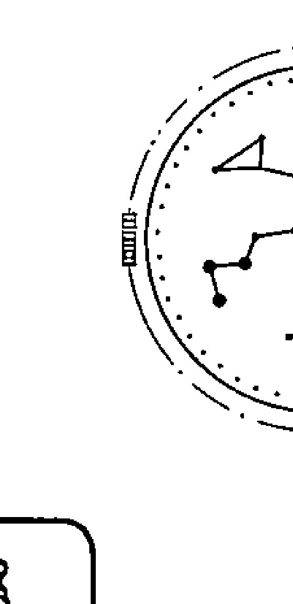

## 巨蟹+魔羯 永远匮乏的安全感&油门催到底的控制欲

|  | 魔羯 | 巨蟹 |
|---|---|---|
| 三态 | 开创星座 | 开创星座 |
| 四象 | 土元素 | 水元素 |
| 守护行星 | 土星 | 月亮 |
| 守护宫位 | 第十宫 | 第四宫 |

## 自信稀缺——巨蟹常陷入自我怀疑，魔羯要取得实质认证

巨蟹座跟魔羯座都很不容易自卑，巨蟹座是你给他多少证据都没用，他哪天被害妄想症发作了，就会觉得朋友私底下一定看不起他，不管平常怎么掏心掏肺都像丢到海底。如果他很有钱，就会怀疑旁人是为了钱才接近他，怀疑大家对他的评价根本不中肯；如果他没钱，就会怀疑朋友是否要利用自己，才与自己交好，妄想大家会因为他没钱而看不起他。魔羯就简单多了，魔羯很容易对自己没自信（尤其是月亮魔羯，巨蟹的守护星掉到对宫里，根本就是落陷），会没来由地自卑，因为是土元素，如果成就跟财富没有达到自己的理想，那心中就会把自己贬得一文不值；但如果得到一个实质的证据，例如高考及格，或拿到了某种专业证明，总之是一个社会上的认证，那他就会突然复活，讲话大声了，走路也抬头挺胸。一般人夸摩羯没用，一定是要有专业考核的机关，对他来说才有公信力，他就可以凭着这个公认的证据，对全世界宣布他已经是「某号人物」了。一般人有了这个证明，只会觉得这是很骄傲的事，但对魔羯来说，那是他在社会立足的基础。其他星座什么证据都没有时，还是可以安然地活着，但是魔羯没有这些证据时，会格外觉得自己没有立足点，也会比一般人沮丧，而且一般人的夸奖他已经听多了，他需要的是来自大机构的肯定，因为那是高于所有人的存在。

巨蟹跟摩羯都有一定的执着度，这一组是水象跟土象，也就是被动（阴性）元素的开创星座。土象的摩羯行动力不强，但很持久，所以有的是时间慢慢耗；水象的巨蟹则是完全没有行动力，但又不想放弃自己想要的，所以就只能用死不放弃的「意念」了。巨蟹的执念比摩羯还恐怖，魔羯会评估事实状况，然后决定下一步要怎么做，在理性的范围之内思考，超出他的承载能力，他就不玩了。但巨蟹有水象的纠缠跟不顾一切，到最后他已经不知道自己原来要的是什么了，因为重点已经不是那样东西，而是「要」的感觉而已，所以就一直执着，死都不放手。就算巨蟹拿到一开始想要的，他还是会有一个「这世界欠我什么」的不满足感，所以就越要越多。这种勒索的性质摩羯座也有，但因为摩羯座是土元素，着重在事实跟物质上的交换，所以都是明刀明枪的物质或权利勒索。但巨蟹是情绪勒索，这是讲不清的，水元素本来就带有「模糊」跟「心灵」的特质，凡事都是自己认定了才算，今天要不到，明天会再换别的方式试试看，后天再动之以情看看，大后天再找你的亲人来跟你劝劝看……就是不放弃，就像蚊子一样，整天在你耳边嗡嗡嗡，不会要你的命，但你又赶不走他。

## ★水磨功夫——同样有耐力，巨蟹执着在情绪；魔羯执着在利益

魔羯和巨蟹都有执着的毛病，但也显得坚强而愿意吃苦，别人在吃那么多苦头之前，就会先阵亡了，摩羯和巨蟹则会死命撑到最后。摩羯座的守护星是土星，耐力超群，不容易受情绪的影响。巨蟹座则是逆来顺受的水元素，加上擅长保护自己的守护星月亮，会在暗处慢慢跟你周旋。

巨蟹座的序号是4，摩羯座是10，4跟10在神秘学中都有完整的意义，但是4只是基础性的完整，不像10是全面性的，有种「滴水不漏」的感觉，所以摩羯比巨蟹更持久、更顽固，也更有耐性。巨蟹是水象星座，比摩羯座多一点可塑性，没有摩羯座那么强硬，他们的顽固是躲在自己的壳里面自怨自艾，守护小小的区域，不像摩羯，是把别人的地盘也划进自己领土之内，用多年的时间慢慢改革。

# # ✦ 巨蟹座发展到对宫会父权主义；摩羯座发展到对宫则会控制思想

巨蟹跟摩羯都容易达成自己的目标，但「情」字永远是巨蟹的死穴，巨蟹容易死在自己的手上，或者死在自己培养出来的人手上，因为他们很心软，不够强硬。但魔羯没有这个问题，魔羯一向非常现实，能打倒他们的是现实利益，而不是什么劳什子感情。

巨蟹座的缺点发展到极致的时候，除了控制别人的行动，更会控制思想，这就变成魔羯座的父权特质了。巨蟹是水象，通常都是居于弱势，得不到也没办法把人怎么样，但发展过度变成魔羯，掌握了生杀大权，自认为有你这个人的「所有权」，你的一举一动必须都顺他的心，不然他就会让你生不如死（巨蟹不管往缺点还是优点发展，都不是好惹的星座，虽然表面上看起来没有什么攻击力，但他的死缠烂打，到最后还是会让人吃不消）。

如果摩羯发展出巨蟹，会从大格局变得小家子气，什么都要念，着眼鸡毛蒜皮的小事，而且没完没了。

## COLUMN: 天蝎与巨蟹的执着

巨蟹座的执着，可以用「地缚灵」的概念来形容，因为自己的执念，被困在死去的地方无法离开，有「拿旧事反复折磨自己」的倾向。有人问，天蝎座跟巨蟹座同是水象，而且是固定宫，那天蝎座也会有地缚灵的特质吗？我说天蝎座虽是水象固定宫，但巨蟹序号是4，天蝎的序号是8，跟巨蟹一样固执但范围大很多。天蝎的守护星是冥王星，复仇的意念强且目标明确，所以天蝎座比较像怨灵或是背后灵，也被束缚，但是束缚在某一个对象身上跟着他到处去，不像巨蟹只能对付进到自己地盘的人。虽然天蝎跟巨蟹都很麻烦，但是巨蟹就跟蚊子一样，嗡嗡嗡一整天，很烦但是不会对你怎么样；天蝎则是像疯狗，你没安抚好他是会咬你一口的。

### 天空金句 SKY GOLDEN SENTENCE
- 巨蟹座— 没被别人打倒，却死在自己的手上。
- 魔羯座— 别人怎么也打不倒，能打倒他们的只有现实利益。

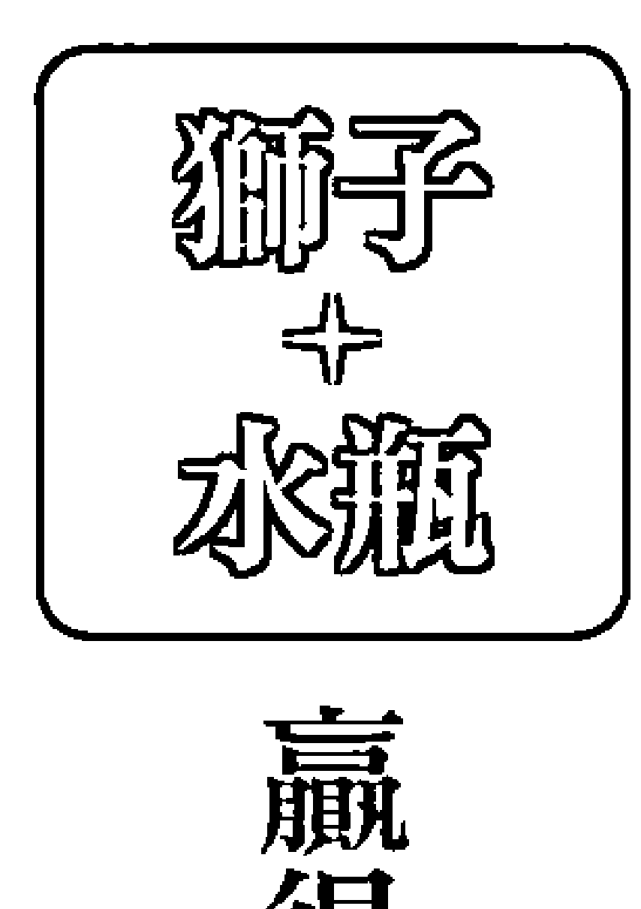

## 狮子 + 水瓶 赢得人心的王者 & 追求真理的时代先驱

|  | 狮子 | 水瓶 |
| :--- | :--- | :--- |
| 三态 | 固定星座 | 固定星座 |
| 四象 | 火元素 | 风元素 |
| 守护行星 | 太阳 | 天王星 |
| 守护宫位 | 第五宫 | 第十一宫 |

## ## ✧ 友善示人 —— 狮子要观感好，水瓶为了众生好

狮子座跟水瓶座之间的共同点，就是对「外人」都很好。狮子是因为想收买人心，会觉得自己谅解别人本来就是应该的；水瓶座则是觉得众生平等，每个人都有缺点、都有不好的地方，必须用人道主义的立场看待众生，给大家一个公平发声的机会。

狮子座虽然重视外人评价，却不会把太多心思放在自己人身上，因为狮子觉得「你们应该了解我」，所以对亲友就懒得花时间做形象。比起对内的评价，狮子更重视外界评价，毕竟对狮子而言面子可比里子重要多了！而且对亲人好是大家都做得到的事，狮子要做的是难一点的事（握

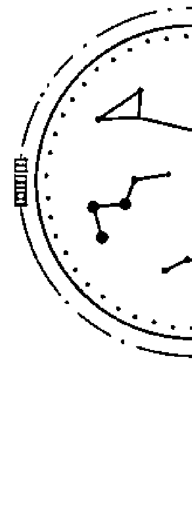

## ✦很有爱——狮子爱照顾人也要面子；水瓶座爱世间万物但不懂人情

狮子座照顾的是「人」，水瓶座也照顾人，但把所有的动物、植物，包括矿物也照顾进去了，如果可以的话，他可能想把鬼跟外星人也一起照顾进去。因为范围太大了，水瓶跟人类之间的关系也就比较疏离，他要用心的地方太多了，没办法一直专注在「人」的身上。
狮子座的缺点就是爱膨风、爱夸大，有时会打肿脸充胖子，那是因为狮子把你视作臣民，需要他的保护和照顾。水瓶座的缺点就是白目，白目来自于不了解人性，他们自以为的了解，都是以研究员的身份对研究物的了解，并没有感同身受，又常常心思不在眼前的人事物上，会让人觉得很不受尊重。这和射手座单纯搞不清楚状况的白目不一样，水瓶是自以为很了解，但解读的方向一点也不符合人情，这样看来，还是狮子座比较有人性。

## ✦非同常人——狮子座是人上人；水瓶座是外星人

水瓶座是「理想主义者」的代表性星座。狮子也是理想主义，只是狮子的理想主义凡人比较## 領先群眾——獅子在物質界稱王；水瓶是引領時代的先驅

容易理解，需要面子、身分等普世價值的認同。水瓶座是覺得世人需要他，要把愛分給全世界，但凡事量一大，就會被稀釋了，所以水瓶跟「單獨個人」之間的關係自然會變得比較淡薄。水瓶雖然很容易給人滿不在乎的感覺，但如果踩到水瓶的地雷，那就算在別人眼中看起來根本沒什麼事，他也會瞬間翻臉，而且還會開始跟你翻舊帳。你覺得他平常都在暗中記你的錯處？但其實他是暗中在忍耐，水瓶座畢竟是固定星座，不管是仇還是愛，他都會記得很清楚。這對他來說是出於理性的需要，水瓶座本身沒什麼人性（笑），當他看起來很情緒化的時候，其實只是在講道理，畢竟水瓶不太擅長地球人的溝通方式，但至少他不會跟水象星座一樣在背後打小報告或抓小辮子，對水瓶座來說，不能當面講出來的話，那在背後也沒什麼好講的，他並不享受在人家背後戳刀的快感（但如果跟水星、冥王星或月亮有剋相的話，我就不敢保證了）。獅子也不太會說朋友壞話，抱怨偶爾會有一些啦！獅子座的心靈是很脆弱的，但他頂多抱怨人家對他不夠好，倒不會講什麼真正的壞話，獅子座覺得如果自己交了個不好的朋友，那表示自己也有問題，獅子是不喜歡承認自己有問題的（但和水瓶一樣，如果跟水星、冥王星或月亮有剋相的話，我就不敢保證了）。

率領所有的人追求物質、名聲跟財富。水瓶座則是先驅者，他們領先的是時間，而不是世俗的物質名聲，會成為時代的革命者，率領大家走向未來（我好像講太多水瓶的好話了，不符合我的風格）。獅子座的目標是當官或當國王，水瓶座則是科學家跟發明家，他要把人類帶到另一個領域，不要不要再處在原來的舊地方。獅子座則是在舊的地方安然自在地過著原來的生活，他當的國王也不會超前於自己以前的認知。

水瓶座也代表科學以及神秘學，這兩者都是超越現在已知的範圍，擴展到更高的層次。下一步則是靈學，那就屬於下一個星座雙魚座的範圍了。神秘學畢竟還是在理性的範圍之內，可以用人類的認知去理解。水瓶座介於兩者之間，比人類的層次更高，但又不到靈學的層次，簡單來說，水瓶座有天線，卻不見得有陰陽眼；收得到一些異於常人的訊息，卻又不至於踏入神鬼的領域，還是保有人性的一面。

## 獅子發展到對宮對萬物一視同仁；水瓶發展到對宮開始在意身邊之人

獅子座發展對宮到水瓶座，會跳脫「人」的範圍，對眾生一視同仁，但如果往壞的方向發展的話，就會自以為是宇宙真理；水瓶如果發展出獅子座特質，就會開始在意周遭的想法，不會與人隔著這麼遠的距離，能將愛澆灌給周遭親友，不再以自己為重，但如果往壞的方向發展，就會變得自以為想法出眾，認為別人的觀點都不值得一提。

## COLUMN 水瓶座的守護星：從土星到天王星

在天王星被發現之前，水瓶座跟魔羯座共同由土星守護，所以水瓶座雖然是多變的風象星座，卻不像大家以為的那麼善變。因為風象管的是思考，而水瓶座是固定星座，所以他一旦認定的觀念，就會死守到最後；但如果他覺得這件事不重要，會秉持風象的精神，也就是凡事無所謂，所以你可能會誤認水瓶座的人很隨和，但我必須告訴你，這是假象，一旦觸碰到他在乎的那些點，他可以比任何土象的人都還要固執，無論你跟他多親近都沒門。

- 獅子座——面子可比裡子重要多了！
- 水瓶座——真理可比法律重要多了！

一般我們都可以在對宮上找到很多相同點，但處女跟雙魚的相同點在很隱晦的地方，那就是他們的『完美主義』。處女座的完美主義很容易理解，不管再小的細節他都非常在意，甚至為了這些細節，願意放棄更大更長遠的目標，因為想把眼前的事搞定，有時就必須犧牲長期的考量了。有人覺得雙魚座散漫出了名，怎麼可能是完美主義？但他们追求的是更全面的圓滿，最終極、屬於水元素的靈魂層面，例如全人類的揚升，世界大同的那一天……一旦完成了，就所有的面向都完成，不用擔心任何其他事了。我們會覺得雙魚很懶，因為他們追求的圓滿是像地球的生態系統

## 處女+雙魚

## 原則變來變去的碎唸王&夢幻也精明的雙面人

## 超完美主義——處女講究細節；雙魚追求圓滿

|            | 雙魚       | 處女       |
|------------|------------|------------|
| 三態       | 變動星座   | 變動星座   |
| 四象       | 水元素     | 土元素     |
| 守護行星   | 海王星     | 水星       |
| 守護宮位   | 第十二宮   | 第六宮     |

般，可以自動維持的這種完美，不然就都乾脆放棄。

處女座是現代難得的存在，在一票自認為有創意、有新想法的人當中，處女座算是力守自己責任範圍，是會把分內之事完美完成的人，這在現代自我英雄主義的情況下，反而是難得的美德。如果企業的代表是魔羯座，員工的代表就是處女座，他們雖缺乏大方向，卻能把所有的細節搞定，又識趣又識相，不會打壓到別人的存在空間，既認真又不搶功，是團體中最不可或缺的角色（雖然他們自己常常在夾縫中求生存）。

## ★ 愛情觀——電流亂竄的處女，關鍵時刻覺悟的雙魚

雙魚是水象的變動星座，給人散漫的感覺，無法集中在某個焦點，只能在精神層面神遊，可他們一旦找到自己的焦點，開始進入了世俗層面，就會發展出對宮處女的特質。我們會看到很多雙魚，像雙魚的時候就很雙魚，迷迷糊糊的，但不像雙魚的時候就會非常精明能幹，又現實又知進退，你幾乎認不出他是雙魚。星座一旦發展出對宮的特質，會變得很難界定。

一向迷糊的雙魚座，在戀愛談到最後的時候，可能因為現實逼到眼前來了，會突然清醒過來，開始計算自己的利弊得失，這時就會變得比處女座還愛計較。雙魚座知道自己難得清醒，所以的一切要趁頭腦還清楚的這個時候都檢討過，免得結了婚以後才要開始修正，那麻煩就大了！

他非常知道現在的重要性，因為這個清醒度有可能接下來就一去不復返了。

## ✦ 耐性大使——處女對事有耐性；雙魚對人有耐心

應該很冷漠的處女座，在談起戀愛時卻一副夢幻的模樣，畢竟是變動星座，在還沒確定對象時，處女並沒有給予承諾，可以放任自己的感情奔馳。可是對他們來說，元配只有一個，所以要精挑細選。我常說，處女座會認定元配，但是會跟很多異性大搞曖昧，對膽小的處女座來說，真的外遇要冒太大的風險了，他的心臟撐不住，享受這種若有似無的感覺就好了。

處女一旦要正式交往或結婚時，土象特質就會發威，大家一事一項都要講清楚，以免日後有糾紛。處女座對他們的元配看起來好像事事不滿，這是因為他把元配當一輩子的伴侶，才會覺得對方處處都不夠完美，但他心裡知道，如果對方很完美的話，那就不會需要他了，對方的不完美是他存在的意義。

處女的耐心是在做事上，對一件事情，就算再複雜，他都可以穩穩地抽絲剝繭，從中理出頭緒。相反的，他對人沒有什麼耐心，常常用不耐煩的語氣和人說話。其實處女座並不覺得自己特別聰明，他覺得自己很平凡，只是願意用心而已，所以無法同理做不好事情的人。處女座是第六宮，6這數字在神秘學裡代表組織，處女座的向心力很強，如果你是那顆破壞大家的老鼠屎，他就會很用力地鄙夷你。處女座常認為自己代表多數，所想所做的都是正確的，很習慣去挑人的錯誤，卻很少檢討自己，事實上，處女很不善於面對自己的錯誤。雙子座跟處女座都是水星守護，但處女座比雙子座愛面子多了，他們不是為了要表現自己了不起，而是害怕犯錯，他不期待自己太出色，只要不妨礙別人就好了。常常一副趾高氣揚的樣子，內心其實對自己的評價並不高，但他至少可以保證自己不會礙到別人的路。

雙魚座是遇到人就被蒸發了，受不了濫情攻勢，對雙魚來說，一個活生生的人在眼前，怎麼忍心去指出他的不是呢？如果傷害到人家怎麼辦？所以非常容易見了人，氣勢就弱掉了。

雙魚是變動星座，注意力是渙散的，對事情的專注力不會太久，在別人眼裡看來，他很容易失去耐性，事實上是因為他關心太多事、太多人了，所以常常在一堆事情之間游移。這個時候你要跟他訴說你自己的難處跟困境，讓他保持注意力在你身上，只要你能勾起他的同情心，你就贏得了全部。

## ✦ 雙魚發展到對宮工作能力超群；處女發展到對宮則浪漫無比

雖然雙魚的特質是散漫，但在職場上常常聽說雙魚工作能力很強，這就是發揮了對宮處女的責任感；處女如果沒有辦法接受自己犯錯，會把做錯決定的責任推到別人身上，這就會顯示出雙魚不負責的缺點。在談戀愛時，挑剔的處女座會大放粉紅電波，這就是對宮雙魚的影響。

## COLUMN 土象星座的審美觀

土象是具體跟肉體的代表，有關感官的事物，就跟土象有非常大的關聯，包括外表的美醜、聽覺的好壞，還有任何物品的觸感，反之，「抽象」的感覺就是渙散的風跟水管理了。物質的土象星座三個部分，金牛座代表的是「設計跟原料」，處女座代表的是「加工過程」，魔羯座代表的是「有用處的成品」。魔羯覺得只有外貌的話會不安全，除了外貌之外，一定要有它的功能性，這樣他才會覺得買回家有價值。外型醜也沒關係，只要看起來耐用就好了。處女覺得他不需要好看的東西，只需要功能，如果有功能又剛剛好看，那就算是額外得到的。如果不好看的話，功能要強一點，如果功能有限的話，外型要漂亮一點，總分達標就好。對金牛座而言，好看的東西就是拿來看，不是拿來用的，但使用的東西，最好也是好看的。如果是功能強，但是不好看的話，金牛就會覺得這個東西沒有價值。所以金牛是以外貌為主，即使是拿來用的東西，也要有一定的美感，功用不強也沒關係，只要漂亮就好。

## + 天空金句 SKY GOLDEN SENTENCE

- 處女座——對重複做細事有耐心，但對人沒耐心。
- 雙魚座——對人有耐心，但對重複做事沒耐心。

## ## 揭秘十二宮位

## Chapter 2 十大行星

## Ten Planets

## # 緒論——行星的同中之異、異中之同

要學習解讀星盤，一開始就是要搞懂「宮位」、「行星」、「星座」這三大元素，宮位像是舞台，行星是演員，而星座是劇本。行星既是演員，就會有不同的人格特質，拿到不同的劇本時自然會用不同方法詮釋。我們常說演技最好的演員就是飾演他自己，當行星拿到合適的劇本或站上合適的舞台，就會發揮百分之百的實力，例如水象行星進入水象宮位，又落在水象星座（但不一定是好事，例如月亮巨蟹座落第四宮，就會太過敏感又缺乏安全感）。

這一章會出現「水星人」、「海王星人」等等的形容，其實每個人的星盤都有這十大行星，若這顆行星落在第一宮，或是他守護的宮位（如水星落在第一宮或三宮、海王星落在第一宮或十二宮），就等於拿到合適劇本、站上合適舞台的演員，會強化這個行星的性格表現，我就簡略的稱為「XX星人」。

下面章節我會比較兩顆行星的異同，這是源於我觀察的結果。我發現有些行星在表現上會有相似之處，但同中有異，例如土星、冥王星都是業力之星，但土星是實際的困難，冥王星是心理上過不去。而異中也有同，即便是天王星和金星這兩顆看似天差地別的行星，也有「對群眾的影響力」這共通點——天王星是改變大家想法的能力，金星是讓大家接受的能力。而且在教學上，最好的方法是類比。比較兩顆星一樣的特點在哪裡，但一樣的特點中，又有哪裡不同，這樣的方式最容易讓學生留下印象，所以我特別把他們分析出來，在比較之後加入相位的分析，這樣就會更清楚兩顆行星會怎麼協同作用。

行星在命盤中的用法有兩種，一種是「宮主星」，例如第三宮的宮頭。如果是金牛座，金牛座的守護星是金星，金星就會變成第三宮的宮主星。三宮代表近距離的人際關係，金星的特點是非常有禮貌、受歡迎，金星如果有好相位，這個人人緣就會很好，評價也很好；如果金星的相位不好，就會展現出金星的負面特質：不真誠、任性、虛榮膚淺……總之，金星若跟其他行星有好相位，就會整併那顆行星的優點，同樣的，跟他形成壞相位的行星，也會合併那顆行星的缺點。宮主星我都拿來看這一個宮位的外在運勢會走向哪裡，例如工作運是六宮，六宮的宮頭落入雙子座，那這個人在工作方面心思靈敏，適合創意型的工作，人脈是他工作上的重點。另外雙子座的守護星水星落入哪一宮哪一個星座，也會影響他工作的取向。

> *宮頭就是宮位的起始點，十二宮位每一個宮位都有一個起點，這個起點就叫宮頭。

## ✦ 宮內星運用方式

行星的另一個用法是「宮內星」，例如水星落入哪一宮哪一個星座，這個人在那個宮位的領域就會展現出這個行星的特質。水星落入第八宮，第八宮管深層意識跟情緒，靈巧多變的水星進入直覺強烈的八宮，如果相位好，就會帶來優點，可以把別人說不出口的情緒跟創傷，用適當的方式表達出來，或是可以經由敘述（因為是水星）來催眠他人，達到放鬆深層情緒的效果；如果是壞相位，第八宮的陰險，加上水星的花言巧語，就會造成更大的危害，他還會覺得自己非常聰明而得意洋洋（但不管相位是好是壞，水星如果在八宮，是真的又聰明又會洞悉人心）。

## ✦ 宮主星、宮內星合併運用

宮主星就是指行星的人格會影響他所掌管的宮位運勢；如果是宮內星，會變成人格展現或事件，就是「發生」在這個領域內的心理特質或個性。例如水星落入第八宮，水星守護雙子座，雙子座又管命主的第六宮（工作宮），那水星八宮對人性的理解跟熟悉，會應用在命主的工作上。這是我個人的用法，但很多人是不管宮主星的落點，就以宮位的宮頭星座本身去解讀。我覺得那樣太籠統了，如果上升一樣星座的人，接下來每一個宮位宮頭落入的星座也差不多，難道都要用一樣的解釋嗎？我一開始自學的時候就覺得這點很不合理，為了增加複雜度，乾脆把宮主星的落點加進去，一開始會覺得很複雜，但熟用了之後，會覺得看盤更清晰了。

## 十大行星與守護星座對照表

| 行星 | 星座 |
|------|------|
| 太陽 | 獅子座 |
| 月亮 | 巨蟹座 |
| 水星 | 雙子座、處女座 |
| 金星 | 金牛座、天秤座 |
| 火星 | 牡羊座 |
| 木星 | 射手座 |
| 土星 | 摩羯座 |
| 天王星 | 水瓶座 |
| 海王星 | 雙魚座 |
| 冥王星 | 天蠍座 |

## 行星相位總論

所謂相位，就是當行星形成某種角度，就會一同合作。相位就像行星的兩人三腳，相似的地方會共同發揮作用，達到加乘的效果；不同的地方會互補或拉鋸。無論是彼此截長補短，或彼此拖累，只要深入了解行星的個性特質和異同處，在什麼樣的情境下，都能從人性的角度推演。因為知性和靈性的交集處，就在於人性。

我認為相位在論盤中佔有非常重要的分量，古典占星中對於廟旺弱陷非常重視，覺得一顆星在什麼星座或宮位，決定了他的表現以及吉凶。但我看過這麼多命盤，覺得相位的吉凶大過於行星的位置，如果行星的相位非常好，那即使他的位置再怎麼不利，也會發揮出良好的一面，頂多只是力量不怎麼強。但強也不代表一定是好的，有時候拿捏得度，能把力道控制得恰到好處，運用在得宜的地方才會有最大效應。有時行星位置是大吉，但相位不好，表示行星的力量用錯了方向，即使落點再怎麼好，也像是出生在良好的家庭，長大的過程受到不好的影響，結果也不見得事事如意。

不過就算是壞的相位，也不代表結果一定是不好的，壞相位是環境或他人給你的考驗，設下一些關卡，讓你想辦法去克服，克服了這個難關之後，你的能力就更上一層樓了。凶相位也是提升自己的管道，就像我們說的越挫越勇，就是有這些不順利，也能砥礪我們對自己有更高的要求，達到以前從不敢奢望的高度。

當然了，星盤有流運，不管是落點不好，或是相位不好，每隔幾天或幾個月，都會有外來的力量（流年行星）給本命的行星帶來各種影響。這就是我們所說的「運」，會幫你的人生注入各種色彩，不管是酸甜苦辣，我們都要嘗一下，才能客觀地看待所有人遇到的事，也才能站在他人的角度揣摩他感受到的事情。

## ## 相位說明

✦ 合相
兩顆行星0°到8°是合相，合相的吉凶，要看行星的吉凶決定。火星、土星、三王星都算凶星（但從宗教、藝術的角度來看，三王星就是吉星），月亮是小凶；太陽、金星、木星是吉星，水星則是大好大壞，因為聰明過度就會大好大壞（笑）。

✦ 六分相
60°是六分相，也就是次吉相，一般來說就是「小吉」。我的看法是，兩顆星處得來，可以互相配合，雖然舒適，但也沒有產生太大的效益。

✦ 三分相
120° 是三分相，也是吉相，一般來說就是「大吉」。兩顆行星碰在一起，不單可以帶出各自的好處，還有兩者相乘的效果，不像六分相只是兩者相加而已。三分相不但各自帶出對方的好處，還能互補跟互相加強，然後產生更大的好處。

星盤相位中，兩個代表性的凶相就是四分相 90°跟對分相 180°，一般來說 90° 是大凶，但現在的占星學改變看法了，認為 180° 才是大凶。我不同意，因為我看了所有的吉相跟凶相，發現它們之間都有一個相通的邏輯：四元素（風、火、水、土）越像的就越合，而三態（開創、固定、變動）越是相像就越不合，可能四元素代表「本質」，三態則是「採用的方式」，採用的方式如果太像，就表示走一樣的路，難免會互相干擾。

差的是三態宮也相同，會互相踩到線。那為什麼國外占星學認為 180° 才是大凶呢？我覺得應該是 180° 就是對宮，元素的陰陽相同（土對水，風對火），元素還有相近的特質，所以不會太差，比較容易起衝突，但也比較容易化解。因為他們的元素相近，彼此更有可能達到共識，目標是一致的。

## ✦ 四分相

90°是大凶，但國外的占星學近年來定為小凶，我也不同意，因為90°的相位是元素和陰陽都不相同，本質上就截然不同。三態宮相同，一遇上必會起衝突。我覺得90°比較凶的原因是，從根本上這兩個星座就覺得對方是跟自己不同世界的人，根本就不會去接近，更沒有互相交流的必要，不合的地方就是永遠僵在那裡，並沒有達成共識的可能性，當然表面上也不容易產生衝突。兩顆星不合如果在個人的命盤裡，將是更難解決的問題，因為你連問題出在哪裡都不知道，也意識不到，所以沒有解決的契機。這個性質就會永遠成為你的致命傷，而且你難以察覺，所以我說這才是最壞的狀況。如果我們看到不合的地方，至少還能去處理，如果看不到的話，就永遠無解了。

+ 吉相位
  - 六分相（60°）
  - 三分相（120°）

+ 凶相位
  - 四分相（90°）
  - 對分相（180°）## 太陽總論：如光芒般最引人注目的特質

太阳是太阳系之王，也是一切的源头，因为是一切的核心点，所有的行星也依靠它存在，算是由它而生（虽然我不知道行星是不是由太阳产生出来的），也算是藉着它而生（至少是因为太阳而存活下来）。

| 项目 | 内容 |
|------|------|
| 守護星座 | 獅子座 |
| 陰陽 | 陽性行星 |
| 四象 | 火象 |
| 守護宮位 | 第五宮 |

太阳的特质是绽放、展现，所以我们一般说的「我是XX座」，就是指自己的太阳所在的星座，因为太阳所在的位置，会特别展现出这个星座的个性，也就是这个星座的特质被太阳鲜明化了，所以在我們眾多複雜的個性中，會格外容易被看到。太陽也代表初步的社交，就是依外在表現出來的樣子，進行初步的交流，大概就像舉個手、點個頭這一類的，如果要開始交談，那就是水星的事了，但水星是離太陽最近的一顆行星，不會相距前後一個星座，所以兩者時常可以合併來看。但太陽比較像人格中的重點，就是把你這個人最核心的地方顯現出來；而水星因為經過潤飾，所以通常帶有偽裝的成分。而且太陽也是十大行星之中最亮眼的，所以就代表你最引人注目的部分，太陽的溫暖跟明亮也讓人感覺很友善，他們因為注意自己的形象，所以通常不會做出太違反常理或人性的事，人格方面是很可以信任的，就算是剋相，了不起也是自戀或誇大，不會太過分。太陽守護獅子座，所以我們通常不會覺得獅子座太難對付，因為獅子座都是明著來的，就算他用盡了心機，也很難逃過別人的觀察，獅子座的心思是很像司馬昭之心，路人皆知，只有他以為別人不知道。如果從這一點來看，不管多壞，別人看起來都還是單純的，因為他要的很簡單，就是面子跟別人的評價，所以其實還滿可愛的（我年紀大了，所以會這麼想，我們要知道，就算是幼稚園的爭執，在孩子的心中還是很嚴重的，所以大家夠成熟了以後，通常都可以對獅子座一笑置之）。這麼明亮又尊貴的太陽，在家庭中的代表，當然就是給予大家保護的「父親」了，在婚後則是「丈夫」，但隨著社會的變遷，也有可能是妻子承擔了太陽的角色，但無論如何，太陽都是保護者跟捍衛者，這個陽性的角色是無法替代的。

## 太阳 + 上升：自己 VS 他人眼中的「我」

### 太阳 + 上升是你别人眼中的样子；太阳是你自以为的样子

| 上升 | 太阳 |
|------|------|
| 守护星座：狮子座 | 守护星座：狮子座 |
| 相同点：自我 | 相同点：自我 |
| 相异点：别人眼中的你 | 相异点：你自以为的样子 |

上升跟太阳都是「自我」，这两个有什么不同呢？我还是要从「相对性」来讲。上升是一宫的宫头，他的对宫是代表他人的七宫，一宫是「他人眼中的你」，尤其是有合作关系的人眼中的你，所以是「你在别人眼中的样子」。太阳是光跟热，引起众人的注目，是你想让别人看到的自己，也就是「你想塑造出的样子」。

如果要分类，简单来说，上升星座代表你的「气质」，也就是没有经过社会的洗礼，你无意中显现出的模样，也可以说是给人的第一眼印象。大家都觉得，第一印象不一定正确，但后来大家认识到的你，也不见得是真正的你，那是社会对你的要求，你必须「展现出来给人家看的模样」，也就是必须扮演的角色。太阳那么明亮，当然一举一动都要符合社会的期待。

很多人会问上升跟太阳，哪一个才是我们的「真我」呢？那你觉得，人家从你的言行谈吐所观察、定义出来的你，跟第一眼看到的你，哪一个才是你真的想当的人？上升星座有两个流行的定义，一个是灵魂的本质，另一个说法是成熟之后的我，其实这两种说法都不是那么精确，但我的确可以从这两种说法，看到上升星座的两个切入点。

我们想想，如果灵魂投胎之前，有一个规划的身分跟工作表，那纯粹的「人性」要放在什么时候展现呢？不管是什么星座什么命盘，三岁的小孩有三岁小孩的共同点，小学的孩子有小学时的共同点，所有青春期的孩子都会思春，这就是我们共同的人性。一直要到成熟之后，恋爱谈完了，跤也都摔过了，更知道自己的意愿跟立场，不会再被荷尔蒙牵着鼻子走，才能真正看清自己的目标是什么，这才是灵魂设定的那个「我」，这时上升我跟社会认定的那个太阳我，就可以各司其职，一起合作追寻真正的自我定位。只是通常都需要太阳我当作面具，用太阳星座的方式来解决麻烦、排除障碍，完成上升真正的想法。所以人家说上升星座是灵魂本质，因为它代表了你生到世间真正的目的。

其實上升的覺醒，還需要木星跟土星的幫忙，因為這兩顆星都是出了社會後所得到的成長，木星是收穫，土星是我們記取的教訓。這兩顆行星跟上升星座結合起來，就可以達到我們真正的目標。

## 太陽領頭在前方開路，月亮殿後在後方守護

### 太陽 + 月亮

### 一攻一守，外在自我 VS 內在真我

月亮跟太陽的相似之處，在於太陽象徵父親，月亮象徵母親，兩者都有很強的保護慾，不同的地方在於太陽是在前方帶領，月亮則是在後方守護，形同太陽是拉力，月亮則是推力。月亮相位的好壞大不相同，如果相位好的話，會是一個很強力的後盾；如果相位不好的話，則是非常重的負擔，尤其可能顯示在女性家人的身上，而且常會拖累你。因為只有家人，你不可能丟著不管的。

| 太陽 | 月亮 | 守護星座 |
|------|------|----------|
| 狮子座 | 巨蟹座 |  |
| 相同点 | 保護慾 |  |
| 相異點 | 太陽在前方領路 | 月亮在後方守護 |

一般在占星最後一堂課，大家被星座、行星、相位……搞得七葷八素的時候，我會給學生們一個救生圈，就是從所謂的太陽、月亮、上升「三大星座」全面性地分析一個人的性格。上升跟太陽都代表了我們的外在形象，承受了所有情緒的月亮，代表的當然就是我們的內在自我，這個我，是跟你很親近的家人或密友才能看到的那一面。

月亮星座不管缺點優點，都是這個人最真實的一面，也是除非面對親近的人，否則不太會展現出來的那一面。月亮承接了很多情緒跟雜思，敏感又小心翼翼，所以要讓他有安全感的人的面前，他才敢把真正心裡的那個我表現出來。月亮是你可能不願意向外人展現的弱點。了解這個人的月亮星座，你才能知道他真正在意的是什麼、擔憂的是什麼，整天胡思亂想的腦袋瓜裡裝的是什麼。

### ✦ 太陽是父親、丈夫；月亮是母親、妻子

月亮給了你安全感，讓你覺得自己的情緒是被接納的。以此類推，月亮也代表家人中讓你最能信任的那個人，他承接了你所有的情緒跟憂思，一般來說，月亮代表母親，結婚後則代表妻子，母親跟妻子，通常是被放在「後盾」的位置，而傳統上丈夫跟父親（太陽）就是代表門面。月亮星座也常常會投射出我們喜歡的另一半的樣貌，所以跟我們同一個月亮星座的人，我們通常會覺得比較親近熟悉，也會比較快結交。

我合盤時常常見到情人或夫妻月亮的相位很多，或在同一個星座，那就是很容易跟對方覺得親近，也容易意見相同，站在同一邊的可能性也比較大。月亮只代表「感覺」，兩個人有可能內在的感覺一致，但外在的個性是大相逕庭的。所以兩個人有共同點時，會覺得很驚喜，我們會覺得這是一種「默契」，而產生似曾相識的感覺，甚至會覺得好像前世就結識了（當然實際上也有可能是真的，但我們無法斷定。通常覺得很有親近感的人，的確很可能上一世就有淵源）。

## 太陽&月亮相位

日為陽，月為陰，太陽跟月亮也代表了人的表裡兩個不同面向，若常常有內外交戰的感覺，這可能就是你的日月星座不同。日月星座截然不同的人，常常在拉鋸，也可能代表你的父母人格特質的差異很大。若呈現凶相位，父母容易不合，或是你的內心和實際表現無法一致，尤其是連星座的陰陽都不一樣的時候，更是常常會互相衝突，導致難以下決定（但不到人格分裂，人格分裂是月亮、天王凶相位）；如果是吉相位，做什麼事都會比較順利，因為你內外沒有糾結，想做的事和真正在做的事情一樣，個性也會比較開朗，讓人容易了解。即便都落在陰沉的天蠍座，也是能讓人一眼就看得出來很難搞（笑）。

## 太陽 + 水星

### 舉手投足間的教養 VS 機智的談吐

| 守護星座 | 相同點 | 相異點 |
| :--- | :--- | :--- |
| **太陽：獅子座** | **善於社交** | **太陽憑藉氣質** |
| **水星：雙子座、處女座** | | **水星憑藉才智** |

✦人際關係中，要深交共患難看太陽；要消遣打屁看水星

太陽跟水星相似的地方，在於兩者都是「言行舉止」給人留下的印象，只是水星更重於口才跟思考邏輯，太陽則重於儀表談吐給人的整體感覺。有些人外表害羞不多話，但是一講起話來，才發現很悶騷，這可能是他的太陽在巨蟹（或第四宮），可是水星卻在廢話很多的雙子座（或第三宮）（水星是距離太陽最近的一顆星，前後通常相差不會超過一個星座）。兩者都是透過「講話」給人印象，只是水星比較接近要嘴皮（也就是看口才），可是太陽卻可以從談吐中，了解他的教養、專業以及真正的思想，想展現在人前的優點及專長；更深層的想法，還是要透過水星才能了解，因為水星是內在的邏輯思考，而太陽只管外顯的人格，是看起來投不投緣，或是表達意見時給你的感覺。我們跟一個人處不處得來，還是要看講話投不投機；水星代表這個人講話是否「討喜」，但要成為多年至交，還是要回歸到人格，這時太陽的比重會佔得比較高。水星善於使用障眼法，如果落點不佳，剛認識時會被水星的幽默風趣迷得七葷八素，最後發現他可能不太可靠。要看這個人真正的特質，還是要參考太陽跟月亮比較準確。

### ★ 協力合作時，太陽會出力；水星會出一張嘴

水星跟太陽都代表人群及友誼，太陽靠的是誠意，水星靠的是聰明才智。太陽會求取別人的認同，水星多了一些操控人心的性质，对水星来说，取得别人的认同太容易了，相位不好的时候，水星甚至有可能把别人玩弄于股掌之中。太阳比较没有那么负面，太阳的相位就算不好，顶多也是自鸣得意而已，不至于对别人形成伤害。在协力合作时，水星只管自己的想法，太阳比较在乎别人的感受（其实是希望别人对他有好评价）。水星聪明的地方，是不会让别人发现这一面，太阳则是容易被看穿。虽然两者都有在友人面前表现自我的面向，但水星靠的是技巧或说话模式来让大家认同自己，太阳则是以实际的作为跟帮助。太阳跟水星如果是吉相位，会用聪明才智造福众生，每个人有问题都会来询问他的意见。我自己是水星和太阳合相，小时候其实功课也没特别好，但大家会找我讨论、问问题，长大后不熟的人也会打电话给我商量心事，就是因为太阳水星比较容易把事情分析出个头绪。水星是距太阳最近的一个行星，前后差距不会超过一个星座，所以不会形成剋相（这两颗行星的夹角通常在28°之内，而负面的相位最少也是90°）。如果行运造成的凶相位，就会自作聪明，但只是要把戏而已，对别人并没有实质帮助，但自己还会得意洋洋；讨论事情时容易把重点放错，或是把焦点带到能卖弄自己聪明才智的地方。

## 太陽 + 金星

### 儀表出眾的貴公子 VS 親切討喜的鄰家女孩

| 太陽 | 金星 |
| :--- | :--- |
| 獅子座 | 金牛座、天秤座 |
| 渴望被崇拜 | 渴望被接納 |

### ✦ 太陽好比素顏美女；金星有裝飾意味，為其打扮上妝

太陽等於是父親的形象，提供生命的力量，是典範跟楷模，就像我們小時候會看著爸爸，假想自己以後在社會上要成為怎麼樣的人，所以太陽表示你在人前想要扮演的角色，決定以什麼樣的面目呈現；這就不只限於外型了（雖然太陽跟金星、上升一樣也包括部分外型的含義），還有氣度、修養和為人處事的態度，以及面對所有人所展現出來的外在形象。金星則是強調表面的「包裝」，掌管「外型跟禮儀」，所以也有偽裝的成分，就是聯誼時想要給別人留下好印象的那一面。金星只在乎要留下好的「感覺」、美美的第一眼，至於未來是否要深交，那不在他的思考範圍內，呈現的是不是事實，也不在他關注的焦點之內。而太陽想要讓別人認同他，雖然外表也很重要，但他真正在乎的是「得體」，會反省自己有沒有把事情做得漂亮，或是會不會做人，他很在意自己的整體形象，不是只有外表。好比做蛋糕，金星管的是糖霜怎麼抹、口味受不受大眾的歡迎，即使不夠健康也不太在乎，只要能討人喜歡，用大量人工添加劑也無妨，這也是金星最常被批評「虛偽」的原因。金星最大的缺點，就是只重視表面形象。太陽雖然也重視表面，可是他的表面卻比金星要深一點點，太陽可能會要求自己的蛋糕要跟時下的華麗甜點不一樣，是養生蛋糕、低糖蛋糕等。太陽希望自己有「功能性」，這也是他最引以為豪的地方。太陽一定要拿出某些值得人讚賞，不怕接受檢視、禁得起考驗，並會得到正面評價的優勢。

### ✦ 太陽重視自己的質感身分，金星重視給人的舒適度

太陽不像金星，只要人家拍拍手就好，他要的是發自內心地稱讚。太陽非常希望自己是對別人有正面幫助的，若有人因他的付出而得到了一些啟發，太陽會非常引以為傲；相反的，如果沒有讓任何人得到好處，太陽就會懷疑自己存在的意義——沒有臣民的話，太陽這個國王又要從何當起呢？幫助、照耀他人，能讓太陽肯定自己的存在。而金星只追求自己被稱讚的那一刻，至於有沒有真的讓別人快樂或是帶給別人好處，他是不太在乎的。金星跟太陽都非常注重形象，金星注意的是自己美不美，有沒有讓人在視覺上感到舒服或自在，換句話說，金星是希望別人「接納」；太陽會開跑車載你回家，希望你能因此「崇拜」他，兩者的高度不同。金星重視自己的外表，因為「外表好看」是可以讓別人接受的原因之一，他的漂亮就像鄰家女孩一樣，不會太有特色，但也不會讓人有高高在上的距離感（金星當然不是沒有優點，這等到金星專文時再來討論吧）！

### ★ 太陽 & 金星相位

太陽金星的吉相位人緣會非常好，因為太陽金星都是外在表現，但太陽是行事作風，金星則是外在風格，兩者兼備的話自然會有吸引力。如果太陽金星是凶相位，就會比較愛慕虛榮，因為太陽金星都代表浮華的表面，為了聽別人的讚美，會做比較多誇張、虛假的舉止，雖然外在美麗，但內在並不見得。

## 太陽＋火星

### 為眾人犧牲小我 VS 世界只有自我

| 守護星座 | 獅子座 | 牡羊座 |
| :--- | :--- | :--- |
| 相同點 | 企圖心 | 企圖心 |
| 相異點 | 聚焦大眾 | 聚焦自己 |

男人克服火星的劣根性後，將邁向太陽

太陽跟火星的相似之處，在於兩者都非常有企圖心，不同的是，火星的企圖心聚焦於自己的身上，但是太陽卻會顧慮到整體，因為太陽愛面子，不會讓任何人吃虧，這也是太陽比較有大眾緣的由來。火星像個小孩子一樣任性，只求自己高興就好，太陽則是希望每個人都滿意，就算自己有一點點犧牲也無所謂，他是大家眼裡的老大，所以總要有點長者風範。

### ✦ 太阳是家长，为大家挺身而出；火星是婴儿，重自己的生存欲望

火星简单来说可以称之为「兽性」，男人的好斗、自私、不顾他人的部分，都藏在火星里。相反的，太阳就是「人格化」的面具，想要展现给别人看的部分，就要看太阳。简单说来，火星代表的是人们未经雕琢的原始性，只考虑到自己；太阳则希望大家的认同，会考虑到公众的公正性，但这些面对社会时培养出来的高尚人格，并不是自然产生的。火星的特质虽然不讨喜，但自己很快乐；太阳则是承担了太多责任，表面上风光，实际上可能背负了很多不喜欢的事。也可以说太阳是男人设定中「理想的自己」，等他们克服所有火星的劣根性，达到最终的成就之后，就会展露出太阳的部分了。

太阳和火星最大的差别是，太阳很像大家的靠山，会多管闲事（在家里他就懒下来了，因为不会给掌声的人，他不需要去讨好，在家的表现还是要看月亮），重视团队成员。火星则是格外自私的人，眼中只有自己想要争取的目标，战力非常强。火星代表了所有层面的「欲望」，这是广义的，我们要活下去，就会生出各式的欲望，包括食欲、自主欲、性欲跟权力欲，虽然在别人眼里不讨喜，但那是喂养我们的根本。也有人用婴儿形容火星，婴儿非常纯真，非常可爱，但因为还没长大，凡事都只顾到自己的需求。

火星不管在东方或西方世界，都被视作战争跟灾难。火星总会搅乱一切的计画，就像婴儿会打断父母的睡眠，各种场合只要有婴儿出现，一定会造成或多或少的混乱。就像前面说的，婴儿因为不懂事，只能感觉到自己的需求，火星也就比太阳自私，因为他没有面子要顾，也不管别人的情绪和想法。

### ★ 太陽&火星相位

火星的所作所为，都出自本能跟情绪，不像太阳会经过审慎评估（月亮也会，但跟太阳的目的不同）。太阳大多代表规矩本身，火星跟水星则是破坏规矩的人，但火星是出自欲望，水星是为了好玩。

如果太阳跟火星吉相位，就会非常有男人味，太阳等于是长大以后的火星，会把火星的劣根性吸收掉，让火星的优点结合太阳的特质，成为一个更成熟的整体，对事情非常有责任感，而且勇于承担，就是一个英雄的形象；如果太阳、火星有凶相位，则会失去太阳的自制，变成一个逞凶斗狠的人（不管是在心理层面还是事实层面上），也很容易失去太阳的公正性，变得格外自私，并会用为别人好的说词来包装自己的私心。

# 揭秘十二宫位

## 太陽+木星

### 天生自備光環 VS 後天自學成材

|  | 守護星座 |
| ---- | -------- |
| **木星** | **太陽** |
| **射手座** | **獅子座** |
| **追求卓越** | **相同點** |
| **重視理想** | **重視現實** | **相異點** |

### ✦ 太陽是政治商場上的王者；木星在學術領域稱霸

太陽跟木星的相似之處，就是兩顆星都是某種「王者」，太陽是眾生之王，木星則是太陽系中最巨大的行星，都有某種尊貴的地位，只是木星的尊貴是知性上的，太陽的尊貴是身分上的。兩者特質沒有太大的差別，因為這兩顆行星都守護火象星座，熱力四射，而且都很友善、願意照顧他人，不一樣的地方是，木星比較重視精神，而太陽比較看重現實；太陽非常在意面子問題，但是木星没有那么在乎虚名。太阳是与生俱来的特质，木星则是比较像后天发展出来的才华。

木星跟太阳都是社会的中坚分子，木星的身份尊贵，太阳也尊贵，但木星的尊贵比较「不实用」，就像哲学家、学者般，有时不是那么接地气，让人难以理解。不过木星带给我们的惊喜会比较多，因为他的聪明才智都是「看不出来」的那一种，平常在你身边时，木星不会显得太难相处，等到他突然拿出实力时，你才会发现「原来他有在思考这个啊？」木星也不是故意隐藏，只是平常他忙着哈拉、与人交际（其实是在研究人，木星是研究者），你看不出他这么有深度。太阳是什么都亮出来，不容易给人惊喜，因为好的东西全都摆在台面上了，大家早就一目瞭然。

### ★ 太阳是一国之君；木星是万人之上的高官

太阳跟木星相像的地方是影响力，他们都很能鼓舞人心，重视社交，如果太阳是国王的话，木星就是大臣跟高官，各有各的任务，而且地位都很显赫。但太阳真的太重视他人的看法了，只要有一点点不好的评价，就够他难受很久，他对自己的批判跟折磨，远比别人给他的责难还多；木星则是比较乐天而且不在乎他人眼光，没跟他明说他的缺失，他就感觉不到。

太阳跟木星的共同点是没有心机、纯真无邪，也就是有点笨。常常有人跟我投诉，说星座书上都说木星守护的射手座多单纯，但是他们觉得射手座其实心机很重。我会反问：「心机重的人会被你看出來嗎？「射手座只是計畫很多，會讓人覺得他隨時在動什麼鬼主意（其實只是餿主意），但只要木星沒有太壞的相位，通常是想歸想，想過就忘了，即使他真的有什麼壞主意，也是來不及實現居多。

## ✦ 太陽 & 木星相位

太陽木星都是身分地位崇高、對人和善的行星，兩個都很光明正大，呈現吉相位時，社會上會有一定的地位和口碑。太陽木星的凶相位會虛張聲勢，因為木星會擴大，太陽又是最大的行星（天文學中太陽是恆星，但占星是天動說，所以在占星學裡太陽是行星）；雖然也會有名聲，但是備受爭議，因為太陽木星都不懂掩飾，光明面和黑暗面都會被看到。太陽木星跟太陽金星凶相不一樣的是，太金是扭捏作態、會散布流言引人注意，因為金星比較女性化，不會大鳴大放。如果是太陽木星，比較像是自鳴得意，容易出洋相。

## 論盤技巧

水星代表天分，木星代表才華；天分是小時候傑出的特質，但才華則是你知道自己有天分後，後天繼續深造而產生的。我自己的分法是，太陽、月亮、水星、金星、火星是看小時候天生的人格；木星到土星則是長大後出社會自己訓練出來的實力。

## 太陽 + 土星
光芒萬丈的王者 VS 一路過關斬將的實力派

| 项目 | 太陽 | 土星 |
|------|------|------|
| 守護星座 | 獅子座 | 摩羯座 |
| 相同點 | 重視成就 | 重視成就 |
| 相異點 | 在乎名聲 | 在乎權力 |

## 太陽天生光芒萬丈、少年得志；土星默默埋首耕耘、倒吃甘蔗

太陽跟土星的共同點，就是兩顆星都掌握權力，只是太陽比較在意他人的感受，土星則是較在乎他人的權益。雖然一般都會覺得土星比較自私，但土星也同時代表社會上的大團體，會在於外，但心中會衡量，怎麼樣才是對大家最有利的。土星在乎的是「我們這一群人」，而不見得是『我自己』，雖然看起來常常會讓人有自私自利的感覺，但如果沒有他來把關，權益就會被別人瓜分掉了。土星守護的摩羯座，對宮是巨蟹，共同點就是比較在乎『自己人』，雖然最重視的也是自己，但如果沒有身邊的親友，他一個人也是無法活下去的，因為巨蟹跟摩羯座都是『守護』跟『保衛』的角色。土星的光芒比較弱，他會在暗處磨練。在其他的地方，他的鋒芒是收斂起來的，所以展現實力的時候往往會讓別人嚇一跳，才發現以前低估他了，土星往往是低調的代表，會把實力留到最後一刻才發揮出來。土星篤信：『做比說來得重要。』也相信成績比所有事前的誇耀重要，會以實際行動來證明每件事。

## ★太陽在舞台上接受眾人擁戴，土星在幕後掌握實權、暗中操盤

土星跟太陽都會追求成就，只是土星掌權，太陽掌名聲。兩者最終的地位都很高，只是太陽早發，土星要等待的時間比太陽還久，但是比較可能掌握實權。土星守護的摩羯座，對不實際的東西不屑一顧，就算買了名牌貨，也不喜歡LOGO打得太大，他要的是真材實料，或是東西本身的功能，對他來說，那比耀眼的名牌重要多了。太陽要的只是這個名牌，因為它穿起來能吸引別人的眼光。從社會成就來說，太陽的成就可能來得比較早，因為名氣和聲望能快速獲取，但土星要的錢和權，就需要時間慢慢累積了。

## 太陽&土星相位

太陽跟土星都可以讓人依靠，不一樣的地方，是太陽給人的感覺親和友善（這點也跟木星比較類似），土星則有權威感，會讓人感覺到壓力。如果要拿現代政治來說，太陽比較像帝制的皇帝，而土星是首相。太陽負責接受掌聲跟營造形象，土星則是做實事。土星常被說大器晚成，但我覺得土星其實從年輕的時候就很優秀，要等到膨風的人消風，要花招的花招被拆穿，大家有點年紀跟閱歷之後，才能看懂土星的好。

太陽和土星都有負責人的意味，所以太土吉相位，本人的形象會非常穩重，而且關心社會問題。土星的責任比較沉重，但太陽樂觀，所以吃苦當吃補，會任重道遠，以迎向光明的心情建設大業；如果是凶相位，理想會處處受阻，完成每一件事都要經歷很多磨難和考驗，功課很多，成功的話很不錯，不成功則會落到窮困的地步。雖然在社會上還是佔有重要地位，但因為太陽的光芒被土星擋住了，別人並不知道你的功勞。就像前一任縣市長發起建設，但功勞都歸給剪綵的下任縣市長，大家都任縣市長，但功勞都歸給下任...讓人鬱鬱而終。

## 月亮總論：女性代表，主掌內在的秘密與感受

| 守護星座 | 巨蟹座 |
| --- | --- |
| 陰陽 | 陰性行星 |
| 四象 | 水象 |
| 守護宮位 | 第四宮 |

月亮是「打從娘胎裡帶出來」的一種本性，一種來自於基因的遺傳，或是家庭的教育跟氛圍所造就的特質。月亮象徵內心柔軟的一面，也就是我們「內心的感受」。月亮代表的是不外顯的部分，就像情緒跟秘密，只有非常親近的人才能窺知到，所以月亮星座也象徵熟人或親人才會看到的個性。女生都比較像自己的月亮星座跟金星星座，因為月亮本身偏女性的特質，金星則代表自己的外型，而感受跟外貌，是女人最在乎的兩個地方。

大部分的書，都用月亮象徵「母愛」，因為那是人類感情中，最深最無私的一種情感。除了愛，月亮也象徵所有感情，不管是正面的或是負面的，包含深層的恨意，畢竟愛跟恨是一體的。如果你不愛，那也沒有機會恨。如果月亮相位不好，愛與恨這兩種相對的情緒並存，就會有越糾纏越深的孽緣。月亮如果走得更深，會轉為冥王星（巨蟹座下一個水象星座是天蠍座），那就沒辦法輕易察覺到了，因為月亮代表「表意識」，但冥王星代表「潛意識」。月亮只是代表記憶、回憶而已，還不到冥王星那樣深不可測。

如果太陽是領導者、王者，月亮相對就是服從者或跟隨者，代表人民或是進貢者，冥王星則象徵更低的階層，如邊緣人、乞丐或是罪犯。但冥王星的關鍵在於「轉化」，也能擺脫所有的枷鎖，突然大躍進，坐上最高的位置。月亮的主題是「自我保護」，他們不敢走出某個保護領域之外，大家可以想想月亮守護星巨蟹座，是個保護慾非常強的星座，不管是保護自己還是保護在乎的人，總之他們會給自己設定一個範圍，沒事不會跨出雷池一步。

## # COLUMN 行星中的「高八度理論」

現代占星學格外重視靈魂轉化，而三王星代表最高層次的精神發展，所以出現行星的高八度理論。但星盤相位是吉相位才會使用，例如金星如果沒有往慈悲發展，就不會走向海王。

| 行星 | 金星 | 水星 | 火星 |
| --- | --- | --- | --- |
| 高八度 | 海王星 | 天王星 | 冥王星 |

## 月亮在各宮位表現

人也分內外兩面，通常太陽代表對外的那一面，月亮代表自己內心的那一面，也就是隱藏起來的那一面。

月亮VS太陽（請參見太陽VS月亮） 063

## 月亮和水星，是人的感性和理性

月亮跟水星近似的地方，在於這兩顆星都代表「心智」，只是水星代表聰明才智，月亮代表直覺與感受。兩顆行星都有助於找到正確答案，只是方向不同，水星是理智的極點，月亮卻是情緒的極點。這兩者都連結到「想法以及感受」，所以水星可以抑制月亮的情緒，就像是以理性來抑制感性一樣。

## 月亮+水星

内心千頭萬緒 VS 嘴上舌粲蓮花

| 屬性 | 水星 | 月亮 |
| --- | --- | --- |
| 守護星座 | 雙子座、處女座 | 巨蟹座 |
| 相同點 | 想法與感受 | 想法與感受 |
| 相異點 | 善於理性說服 | 善於情緒感染 |

## ✦月亮能夠感同身受，水星則是會換位思考

月亮跟水星的共同點就是想像力都很豐富，善於揣測他人的心思，但月亮因為是水象行星，是感覺出來的；水星守護土象的處女座跟風象的雙子座，土象跟風象都是理性推敲型的，所以月亮是莫名其妙地靈感就來了，水星是經過多方觀察跟驗證，得出這樣的結論。月亮其實沒什麼邏輯能力，所謂的思考，其實就是在腦中搜尋經驗，看看有沒有什麼相符的地方，所以容易被經驗綁住，沒辦法看到新的可能性。這一點水星就好多了，不管超出水星的經驗範圍多廣，他還是可以很快地找出新的定義跟模式。

月亮能夠連結別人的情感，水星則是擅長換位思考，兩顆星都可以站在別人的立場，推敲到正確的答案。不一樣的地方是，月亮感覺到的是你的情緒跟結論；水星則可以推敲出連你都沒有發現到的細節。比較起來，月亮是感同身受，水星是旁觀者，月亮比較像靈媒，水星則是像偵探。月亮的答案容易被主見跟情緒干擾，所以研究員最好是水星，水星知道自己在代入，不會模糊人我之間的分際，研究出來的答案比較客觀。不過月亮雖然是非理性的，我們還是不能小看他的功力，因為月亮的直覺非常準確，而且有過去的經驗輔助（月亮代表記憶），可以依過去經驗判斷正確的結果。

月亮有陰晴圓缺，水星則是因為離太陽太近，很難觀測，兩顆星都有捉摸不定的特質。不一樣的是，月亮是水象巨蟹座的守護星，看起來很情緒化，但變化的是他的情緒，他的本質從頭到尾都一樣；水星就不同了，水星是真的從內而外的轉變，他會隨著遇到的人事物改變態度，連水星自己都不知道下一秒會變成什麼。

說起來，月亮是比較好解決的，因為你只要抓住他的第一個點，之後他再怎麼變，都不用在意，但水星就比較難搞定了，他的每個變化原因都不一樣，而且就算同一個原因，表現方式也不見得一樣——換句話說，月亮如果愛你，什麼事他都可以不在乎，水星就算這一秒愛你，下一秒他也不確定自己愛不愛你。

## # ★月亮 & 水星相位

月亮水星如果是吉相位，很容易了解別人，即便是不便說出口的事情，他們還是可以一下就理解，而且比你講得還深，知道得還要透徹，因為他會合併邏輯和經驗推論。如果是凶相位，就會比較會傳播流言蜚語、小道消息或假新聞，因為月亮容易察覺到事件的陰暗面，加上水星的傳播推波助瀾。（月亮比較被動，所以只會探聽，不會主動挖掘負面消息。挖掘是比較有心機和建設性的，由冥王星代表。）

## 月亮 + 金星

### 内在共感之情 VS 外在社交技巧

| 项目 | 守護星座 | 相同點 | 相異點 |
| --- | --- | --- | --- |
| 月亮 | 巨蟹座 | 女人味 | 內在母性特質 |
| 金星 | 金牛座、天秤座 | | 外在女性特質 |

## 月亮被動以守代攻；金星主動化干戈為玉帛

月亮跟金星的相同之處就更多了，月亮代表母親，金星代表美女，這兩顆星都有很重的陰性意味，只是月亮有母性的堅強，金星比較偏女性的柔弱。月亮比較懂得保護自己，遇事是自己躲起來，不正面迎戰；金星則長袖善舞，比較可以運用個人魅力去躲掉本來應該承受的事，或者變成一個更好的結局，因為金星有「精緻化、和平」的意思。

月亮代表女性的本質，金星則代表女性對外展露的部分。女生看自己的月亮星座及金星星座，會比看太陽星座來得準，因為月亮代表的是「陰性」的所有部分，金星代表的則是社會賦予「女性」的面貌，女生的外表要看金星，內在人格則要看月亮，兩者合起來，大概可以知道這個人的表裡。（男生則是要看太陽星座跟火星星座。）金星本來就是很重「表面功夫」的，所以也代表化妝、服裝等外在的打扮。金星擅長包裝，有金星特質的人，很適合從事形象規劃或公關業，服裝業跟珠寶業也可以。月亮比較務實，適合居家安全或守護幼童的行業，例如保姆或護士，因為他們的安全意識很強，也適合從事保險規劃跟工安之類的事務。

## ✦ 月亮金星合相，會有強烈女人味

金星代表的是一個人對外的言談舉止跟外貌，如果命盤中有很強的金星質跟火星質，這個人就很容易成為別人的偶像，因為金星代表親和力，火星代表獨到的特色，金星跟火星如果結合起來，很容易讓人迷戀。如果月亮跟金星合相或同宮，就會有很強的女人味（尤其如果在水象星座或水象宮位），但月亮跟金星都比較低調，不容易突顯特色，看起來就是溫溫和和，也就是古典女人的樣子，雖然討人喜歡，但不一定能讓人留下很深的印象。如果要美到出名，還是要有個人的特色才行，需要火星、木星等火象行星的幫助。

月亮跟金星因為都是女性行星，表現出來的也都是溫和跟配合的那一方，因此適合當幕後的推手。不管發生什麼事，月亮永遠守護你，傾盡自己的所有來幫助你，金星則是在你努力之餘，幫你做好形象，打點好人際關係，在你達到九十九分時，補上最後的一分，讓你變成一百分。雖然金星只是點綴的角色，但在重形象包裝的現在，還是有關鍵性的影響。

## ✦月亮&金星相位

月亮和金星若有吉相位，這個人會非常有耐心、同理心，心地很善良，或是對別人的需求很敏感，特別體諒他人，展現讓人喜歡的女性特質；如果是凶相位，可能愛亂花錢，因為月亮代表存款，金星代表浮誇，會用錢來填補自己的空洞，或對很多事情只看表面就下評論，但本質上還是善良的。其實月金凶相位，不致造成什麼多大的危害，因為他們能力不足（笑）。

## ## COLUMN

**金牛 VS 巨蟹的收集癮**

金牛座是由金星掌管，一向喜歡美麗跟有質感的東西，而且土象加上固定宮，表示他希望美麗的事物永遠保持在最佳狀態，從質料到手工到價值，都可以『封存』起來。他喜歡收集的東西有兩種，一種是可以保值的，例如珠寶、不動產、古董，這些東西不會隨著時間的流逝而掉價，就某種意義上來說，這也可以算是保持一種『最佳狀態』。還有一些日常生活中會買的東西，不管是衣物包包或是任何裝飾性物品，金牛座如果覺得這樣東西他非常喜歡，又捨不得看它使用過度變舊的樣子，就會同樣的東西買兩個，一個是拿來使用，一個是拿來收藏。使用的東西可以不用那麼小心翼翼讓它維持原狀，因為家中已經有一個保持在最佳狀態了。或是極端一點，很多東西買了但捨不得用或不常用，堆了滿屋子都是，然後自己常用或常穿戴的，就是怎麼糟蹋都沒關係的那幾樣。

## Chapter 2 十大行星

巨蟹就不一樣了，巨蟹的守護星是月亮，掌管記憶跟回憶，水象加開創星座的特質，會不斷尋求心理上的滿足跟安全感，想要抓住所有人生經歷，並且需要不斷證明自己在生活上不會有任何危機跟匱乏。巨蟹的收集一樣是分兩種，一種是日常用品的收集，舉凡衛生紙、香水、食物、化妝品……只要是他「慣用」的，都會很怕有缺乏的一天，總是多買幾份備用，跟金牛座不一樣的地方是，這些都是要用的而非常看的，都是消耗品。像手機、穿戴的衣物跟日常使用的東西，他和金牛座不一樣，不會多買一樣新的保存起來，相反的，用得越久越破舊，對他來說就越有回憶、越珍貴，也就越值得收集，反而如果是全新的，對巨蟹座來說，意義就沒那麼大了。

## 月亮✦火星
凡事以守代攻 VS 凡事先冲一波

| 火星 | 月亮 | |
| :--- | :--- | :--- |
| 牡羊座 | 巨蟹座 | 守護星座 |
| 情緒波動大 | | 相同點 |
| 本能為攻擊 | 本能為防禦 | 相異點 |

## ✦ 遇事時，月亮會權衡輕重；火星則意氣用事

月亮跟火星相似的地方就是自私。月亮的自私是經過衡量跟觀察的，是為了自保，火星則是要將好處佔盡。月亮跟火星都是靠「本能」生存，都很在乎自己的權益，只是月亮比較畏首畏尾，什麼都害怕；火星剛好相反，什麼都不管，沒什麼可以嚇到他。月亮不在乎沒有關係的人，但如果親人或是家人，他們會保護到極點，甚至不惜賠上自己的性命，月亮這樣做，是出於直覺，就像動物一樣，要保護自己這個族群的生存權；火星則是一股衝動，憑著滿腔熱血——要保護就保護到底，如果決定捨棄，他就會頭也不回。

月亮跟火星相近的地方，就是他們的自我意識都很強。月亮的自我包含了自己身邊所有的人，像帶著一群小雞的母雞；火星則是需要聚光燈，渴望成為英雄，需要別人成就他。一將功成萬骨枯，如果是相位不好的火星，就不在乎別人的生死。就算是好相位的火星，也只是講義氣，但義氣對火星而言，是一種「為了表示我在乎你，你死了我就一定要幫你討公道，或跟著你去死」的念頭，對人對事都沒有太大的幫助，但外界看起來會覺得已經夠了，火星已經「盡了最大的誠意」，即便這誠意沒有太大的用途，只能表現他的感覺跟熱血。

## ★月亮自虐，沒有攻擊性；火星虐他，絕對戰到底

月亮跟火星都代表「情緒」，但月亮是內心的感受跟情感，溫溫的，就算有攻擊性，也只會自虐而已。火星的情緒一般都是覺得是怒氣，其實不只怒氣，興奮、狂喜，所有高點的情緒，不管是好是壞，都是火星掌管的範圍。火星的情緒是容易延燒到別人的身上，讓別人高興、讓別人害怕或讓別人痛苦，都是火星散發出來的力道。月亮也會影響他人，但不是用強力的方式，是不知不覺中被月亮的經歷或敘述感染，處於月亮營造出來的情緒之中；火星是把他的情緒倒給你，就算你不想接受，也會強迫中獎。

我們都知道，火星的特質是非常激動跟不吐不快的，你要假裝不知道他在想什麼都不可能，火星會抓住你的衣領，逼你面對他的情緒。月亮的情緒是沉澱在心裡，慢慢地自我折磨，不讓別人發現，寧可自己默默承受，這種情緒常常會變成慢性毒藥，這就是巨蟹座為什麼狠不下心，又不能真正放下的原因。月亮畢竟是水象行星，不太會對別人造成危害，了不起就是不幫忙而已，但火星卻有可能拖別人下水，或是讓大家處於不利之境。

如果月亮的本能是「防衛」，火星的本能就是「攻擊」。這兩顆星一起看的時候，能看出我們的動物本能。動物本能通常分兩個面向，一個是火星的「戰」，另一個則是月亮的「逃」，所以從火星跟月亮，可以看出一個人是否有擔當。我都說如果要看一個人遇事的攻擊力和防禦力、反應的速度，只要看這兩顆星就可以知道了。

## ★ 月亮 & 火星相位

月亮火星如果有吉相位，對很多事情都很用心，月亮會劃出領地，火星代表專注，所以對特定的事情挖掘是很深的，會了解得非常深入、掌握得很透徹，但是在自己熟悉的小範圍內，例如家族史；月亮和火星都帶有情緒特質，如果呈現凶相位，情緒起伏會非常大，超出一般人的波動，甚至有躁鬱症、帶攻擊性，但不是肢體，而是語言上的攻擊，因為月亮會抓住你心理層面的弱點。我的火星和月亮就是剋相，很容易意戳中別人的痛點，才有「一針見血」的自我簡介（笑）。

## # 月亮 + 木星
家傳守成的富二代 VS 成功的創業者

### 月亮守住本有的資產；木星擴大營業規模

| 木星 | 月亮 | 類別 |
| --- | --- | --- |
| 射手座 | 巨蟹座 | 守護星座 |
| 財富資產 | | 相同點 |
| 才華創造的財富 | 過去累積的資產 | 相異點 |

月亮跟木星都代表財富資產，只是月亮的財富是累積下來的，木星則是自己開創的財富（除非木星在第二宮或第四宮）。木星就算從小家境不錯，也會自己找到其他可以發展出更高境界的方式，或是用獨特、別人無法取代的才華，爭取自己應得的資源。如果月亮跟木星同宮，就是出身良好，自己又有為有守的意思。簡單來說，月亮是透過祖先取得某些資源（月亮也有親人的意義）。

# ★月亮主保守型投资，木星风险承担能力高

月亮的财富是固守自己原有的，例如抱着一笔存款生利息、或用不动产收租金，但绝对不会乱冒险，因为他们对自己熟悉范围之外的事物不信任。基本上，连要月亮贷款都很难，月亮舍不得利息的部分，他会紧抓住所有钱财，不允许这些钱在自己的视线范围之外。他是极度缺乏安全感的，但也因此失去很多赚钱的机会。所以月亮的钱是慢慢存下来，不是快速赚来的。

木星的钱则是从发现的新事物中获取，以他的才华跟社会地位当资本，快速赚进钱财，所以他赚来的钱，会带来新的人脉或机会，从中生出其他的新方向。木星不只代表钱，也代表教育跟旅游，都是探索我们没有接触过的方向，这也是财富的一环。木星很容易成为显赫人物，因为他勇于一搏，因此赚来的跟赔掉的都很多。如果木星在一个不利的位置，或克相很重的话，很有可能会变成赌性坚强的人，因为木星的心脏够强，又莫名地乐观，就很容易忽略小细节。木星虽然会赚钱，对钱其实并不在意，不像月亮会尽力去避免损失，当然破财的机会就很多，但木星通常可以在各方面赢回他所损失的。

# ✦ 月亮 & 木星相位

月木吉相位，不仅代表财运好，而且做什么事情都会很顺利，如有神助，可能是因为上辈子的福报积得多，或者祖先有积德，自己在心境上也会比较乐观。如果月亮、木星在同一宫，有很高的机会继承家产；如果是凶相位，就会浮夸，花钱如流水。这跟月金的凶相位又不太一样，月金凶相位的钱是花在看得见的地方，如买名牌名车，但月木凶相位的浮夸，是私底下钱花得很凶，但在别人面前不见得会表现出来，例如炒股票赌博（如果是看直播送礼物，是木金相位，因为是花在喜欢的事物上；如果是以前的红包场，就是木月相位，因为月亮代表传统、私人的领域，没那么公开）。

# 月亮 + 土星

# 从底层困境向上爬，逆来顺受VS等待时机

| 项目       | 土星                 | 月亮                 |
|------------|----------------------|----------------------|
| 守护星座   | 摩羯座               | 巨蟹座               |
| 相同点     | 困难                 |                      |
| 相异点     | 实际境遇造成的阻碍   | 想法思绪造成的忧郁   |

月亮跟土星相同的部分，就是都很「忧郁」，土星代表的是困难本身，一个非常大的障碍阻挡在你眼前；月亮则是没有什么事发生时也可以不高兴，一切剧情都是从自己的脑子里幻想出来的。月亮会想象出一大堆剧情，弄得自己担心害怕，到最后却什么都没发生，但是土星只看实际的问题，只解决眼前的阻碍。月亮跟土星的共同点就是对于「困难」并不陌生，而且有完全的心理准备去面对，因为他们一生中的倒霉事见得太多了。

# ★月亮牺牲自我成就他人；土星卧薪尝胆为逆转胜

## Chapter 2 十大行星

# III

# ✦月亮念旧爱复古，土星守旧传统

月亮跟土星都代表怀念跟陈旧，只是土星是墨守成规，月亮则是喜欢寻找怀旧的感觉。土星是土元素行星，重视的是实质上的旧东西，也代表古董跟考古，就是眼睛可以看到的东西；月亮是水元素，代表的都是感情层面的事，例如回忆跟故乡。所以我说月亮很念旧，土星就只是守旧。

土星虽然一开始的立足点低，但至少会累积实力，慢慢往上爬，有朝一日会把自己的成就拿回去，毕竟土星非常现实，没有月亮那么逆来顺受。月亮是就算有什么成就，也是奉献给自己在乎的人比较多；土星至少是为自己而活，最低程度也是为整个社会而活，因为社会是他的同胞，跟他有利害关系，等于是他个人的延伸。

虽然有自己的不满，但是因为对家人孩子的爱，让他们没办法说出口，累积久了，爱就会变成另外一种毒素。

土星跟月亮两者的社会地位都比较低微。我之前写给学生看的占星文章里说“社会底层的人可以用月亮来代表”，有些学生很好奇地问我：“社会底层不是土星吗？月亮应该有一定的地位吧？毕竟是大家的母亲不是吗？在古代社会中，母亲的形象跟地位都是很高的耶！”但是别忘了，母亲是牺牲最多的，别人也期待她们牺牲。月亮之所以小心眼，就是因为过度被要求牺牲，虽然有自己的不满，但是因为对家人孩子的爱，让他们没办法说出口，累积久了，爱就会变成另外一种毒素。

# ★月亮&土星相位

月亮跟土星都代表限制，土星是实质上的限制，例如时间、金钱或距离，但月亮掌管的是概念上的限制，像是近乡情怯、留恋旧情……这一类的心态。两颗星都是守在自己的范围内，月亮的范围比较小，大多以自身或家庭为单位，土星的格局就大多了（是跟月亮比起来而已，但如果跟其他行星相比，土星还是很容易自我设限），但也有一定的范围，例如：同一个国家、同一个种族、同一种语言。两者的相同点是，面对外人，月亮跟土星的戒心都很强，但如果有类似的特质，他们的警戒心就会松很多。「同乡」跟「校友」这两个身份，对一般人来说不痛不痒，但对土星跟月亮来说，会让你觉得跟你是同一国的，比较容易护着你，给你其他人没有的好处。

土月吉相位，会非常顾念旧情，或尊重地方传统、前辈、专业人土。但凶相位这样的尊重就会带来阻碍，因为对什么事都会太过于瞻前顾后、依循传统，无法摆脱前人的窠臼。而且越是自己人，越注重自己在他面前的表现，又丢不得脸，给人死性不改的感觉。

# 水星总论：不受限不受控，百变的万能翻译机

| 类别 | 内容 |
|------|------|
| 守护星座 | 双子座、处女座 |
| 阴阳 | 阳性行星 |
| 四象 | 土象、风象 |
| 守护宫位 | 第三宫、第六宫 |

水星是一颗管沟通也管智商的行星，外号叫做智多星，执掌语言、文字跟符号，事实上只要是跟人沟通的工具，都属于水星的范畴，甚至手语、邮寄项目也在水星的守备区。交通是一种连结，把两个不同地方的人串在一起，邮件、语音也是我们沟通的方式。声音跟文字是讯号上的，直接当面接触当然会让沟通更彻底。

水星是太阳系中离太阳最近的一颗星，两者之间的距离不会超过一个星座，水星总是紧跟在太阳的旁边，只有日出前后的一小段时间内才可以看到，那时水星不会被太阳的光芒掩盖。我们看不到水星横跨天空的运行方式，因为这样，水星跟地球的距离相对来说算近，所以水星是很社

# 揭秘十二宫位

水星是代表人际关系的行星（第二颗就是水星隔壁的金星，也是社会化的行星之一）。

水星在什么星座或宫位，说话就会拥有那个星座的特质。如果水星落在不擅于言辞的星座（例如金牛座），那也没有关系，因为水星不单指说话，而是各种形式的沟通。如果那个星座擅长用肢体语言，或者用眼神来表达他的想法，也算沟通方式的一种。只要能传达意思，不管用什么样的交流方式，都可以达到水星沟通的目的，有时不要太过于伶牙俐齿，反而给人一种诚恳的印象，这也是一种沟通技巧。

水星除了主管语言，当然更直接的是管到我们的思考方式，也包括思考逻辑在内。简单来说，水星就是我们的所思所想。有些人觉得水星也掌管社交，代表人际关系好不好，但是我觉得人际关系好不好，取决于别人喜不喜欢你，所以应该是金星管的。水星口才好不好，但众所周知，口才好不好，只能象征聪明、反应快不快，但聪明的人不见得受人欢迎，有时反而会因为太聪明，引起别人的反感及戒心，觉得讲话太难以招架，所以不喜欢亲近。正确来说，水星应该是象征社交技巧好不好，以及喜不喜欢跟人社交，跟人缘没有直接的关系。至于讨喜与否，跟你社交技巧不相关，因为每个人都不喜欢输，如果有一个你常常说不过他的人，你对他的害怕应该会多过于喜欢。

水星也能显示出学习能力，也就是模仿能力，这是一个基础性的智能，所有的学习都是从模仿而来的。水星守护双子座跟处女座，一个是风象一个是土象，都是理性的元素，而且都属于变动宫，表示这两个星座的脑筋都动得很快，但当然是风象的双子座更胜一筹。土象象征缓慢，所以处女座的思考速度当然就比双子座慢一点，但是也更谨慎，更受旁人的信赖。

水星通常象征军师或大臣，但不是真正的主子。其实水星也不喜欢当主子，他喜欢自由自在，来无影去无踪的比较好！这样反而可以维持他百变的面貌，想做什么就做什么，想当谁就当谁，不用被限制在某个身份之中，所以水星的代表职业也包含骗子跟小偷（需要更高智慧的职业就不是水星主管的，主管智慧的是木星跟海王星）。水星也能看出「适应力」，也就是能否改变自身的性质，以符合环境的需要，像「翻译」跟「货币兑换」，都是改变自身的性质，以适应环境的做法。水星本来就擅长改变，也擅长跟大家沟通，语言及货币的流通，当然也在水星的守备区了。

# 水星VS月亮（请参见月亮VS水星）086

# 水星VS太阳（请参见太阳VS水星）066

# 水星+金星

灵机应变的话术高手 VS 善于表面友好的外交能手

人人好，水星重视沟通技巧；金星和平与人为善

水星跟金星的相似之处，在于两者都很社会化，都是面对人群时需要的特质，只是水星比较重视技巧，金星则注重与人为善，这方面有点像太阳，但相异之处是，太阳是注重整体表现，金星则注重看起来的样子（见金星 VS 太阳）。

水星跟金星还有一个相似之处，就是两者都很友善（如果没有凶相位的话），在大部分的状况下，也都很讨人喜欢（虽然有时候水星的嘴巴比较贱一点）。金星无论何地都很有礼貌，就算是装出来的，也会装得有模有样。水星如果相位不好，他不高兴的时候，说话会非常尖酸刻薄，有时被水星的一句话伤到，会需要很久的时间才能复原，而且你找不到反驳的方法，因为你根本搞不懂自己哪里输了。金星最讨厌的地方不过就是他的自恋，这不会对你有任何损伤，只要你随他去就好了，毕竟金星的攻击力不强，最坏也不过是让你看他不顺眼而已（如果跟火星或冥王星有不好的相位那就另当别论，而且得要坏到极点的相位才有这种可能性，例如90°的克相）。
因为金星还是要面子的，他再不喜欢你，也不会想要招你讨厌，顶多是想要证明他比你受欢迎或比你出色，这都无伤大雅。

| | 水星 | 金星 |
| :--- | :--- | :--- |
| **守护星座** | 双子座、处女座 | 金牛座、天秤座 |
| **相同点** | 社会化 | 社会化 |
| **相异点** | 凭借沟通交流与人交际 | 凭借气质外貌给人印象 |

# ★水星以机智为亮点，金星不说话也讨喜

水星跟金星受欢迎的方式是不同的，水星通常需要经过交谈或交流，你才会发现他的魅力；金星不太需要接触，他表现出的外在气质就是大家都可以接受的样子，但常常会虚有其表。虚有其表也不是什么太严重的事，我是觉得，只要不对别人造成不便，都是可以接受。
水星常常嘴巴很贱，有时这种说话风格，会变成他独特的标记，让人家特别记得他这个人；金星的嘴巴不溜，讲出来的通常都是好话，虽然讨喜但记忆点不强。所以水星比金星容易让人留下印象。

# # ✦金星＆水星相位

金星水星有吉相位时，朋友会很多，金星代表人缘，水星代表社交技巧，所以很会讲话，给人的印象不错；如果是凶相位，就比较会花言巧语，不太值得信任，别人会怀疑你说的是真话还是假话？因为水星会骗人，金星是浮夸。虽然说话会让人感到不可信，可是别人还是会不由自主被吸引，「就算你骗我，但听你说话还满有趣的。」这种特质其实很适合主持综艺节目。我的金星水星太阳三个合相，虽然脾气很不好（月亮牡羊），但从小到大人缘都很好。可能外表看起来人满好的，不过深入交往才会发现是个肃婆（哈）。

# 水星 ＋ 火星

# 把别人当赌伴 VS 把别人当小弟

# 水星会合纵连横；火星则单打独斗

水星跟火星的异同之处，是这两颗星都非常自我，只是水星还会顾及别人的想法，火星则是唯我独尊，水星比火星受欢迎多了（这是以两者的基本性质来说，不加进相位的看法，如果火星的克相比水星严重的话，更会加强这种性质），因为火星不在乎别人。当然火星也是有友善的一面，那就是他决定替你出头或用自己的方式来帮助你的时候，且带有不成功便成仁的壮烈。而水星比火星有技巧多了，也不容易招人讨厌，当然，这是以没有什么特殊相位来说的话，火星有了好相位就会自信得讨人喜欢，水星如果有了坏相位，则会变得太过奸巧，给人一种愚弄他人的感觉。水星要注意的就是他的记忆力很差，只求当下过关就好，过关了也就忘掉了，所以虽然很会编借口，但时间一久就会露馅。

水星是在乎别人的，当然这是指跟自己有关的部分。水星是靠人际之间的交谊而存在的，火星则相反，会觉得少来管我反而更好。其实水星跟火星虽然都很独立，也很有能力，但他们都还是需要别人。水星需要跟他人连结，才能证明自己存在的价值，所以水星会找寻合作者；火星不需要知己，但会征求听他命令行事的人和啦啦队，如果没有其他人或竞争者的目光，他们的英雄风采也就没有意义了。

火星很常单打独斗，别人会有一「只要有他一个就够了」的错觉。的确如果只有他一个，他也会拼命把所有的事都完成。我们都知道，火星是不擅长思考的，如果由他一个人去做全体的事，一定会东漏西漏，完成不了整件事，尤其其他又不善聆听别人的意见，就算自己觉得大功告成、志得意满，很快还是会被人抓出错处，自信会大受打击。水星合作的时候会呼朋引伴，把每个人放在该放的位置，自己实际上没做什么事，适合担任管理职。所以火星和水星如果同在一个团队里，

| 守护星座 | 水星 | 火星 |
| :--- | :--- | :--- |
| 相同点 | 双子座、处女座 | 牡羊座 |
| | 自我 | 自我 |
| 相异点 | 需要他人的合作 | 需要他人的吹捧 |

# ✦水星&火星相位

火星会被水星当小弟使唤，但他还以为自己是老大。
水星跟火星共同的缺点，都是太快下结论，因为两颗都是快速的行星，都懒得想太多，喜欢把事情在最短的时间内完成，就会有一种自己的效率强过别人的错觉。但如果拿掉水星和火星的自信，他们剩下的地方也不多了（哈哈哈），所以这两颗星都可以用孩子气来形容。

水星火星如果有吉相位，这个人不只会讲，而且会做，因为火星是行动力，水星是表达能力，所以表达得很好，执行得也很出色，凡事亲力亲为；如果是凶相位，则显现出水星火星自我的特质，会自私自利，对自己有利的地方就抢功，对自己不利就甩锅。

# 水星是生活知识王；木星是博学多大者

这两颗行星的求知欲很强，木星追求的是高深的学问，水星则擅长收集日常生活中的资讯，求知欲却是一般人可以理解的程度，例如生活小常识、挑出别人的错字、优美的文笔，这些都是大家可以理解的地方。木星的求知欲是在非常学术的层次，类似费马的最后定理或量子力学，因为太高深了，让人觉得知道这些要干嘛？所以不会太崇敬（其实更高维度是天王星跟海王星，天王星是探讨生命真正的意义在哪里？海王星是思考鬼到底存不存在、人到底有没有投胎转世？）。木星跟水星都会让人感到大开眼界，木星让人有知识长的感觉（天王星跟水瓶座也是），而水星比较灵活也比较符合大众的标准。

# 水星+木星

# 无所不知的好奇宝宝 VS 追求高深知识的教授

| 项目 | 水星 | 木星 |
|------|------|------|
| 守护星座 | 双子座、处女座 | 射手座 |
| 相同点 | 求知欲强 | |
| 相异点 | 追求资讯的广度 | 追求知识的深度 |

水星、木星都是社会化的行星，即便理解事情的面向不同，但都还在生活的范围之内，也就是在社会认知的范围之内。不过水星是基础教育，木星是硕博士以上的高等教育，水星当然比较亲民了。

换句话说，水星是常识，层面比较广，木星是知识，程度比较深。如果是水星，他会知道垃圾车几点会到什么地方，木星则是知道政府为什么会这样决定路线，比起来，当然是知道垃圾车几点在哪里对我们来说比较有用。

# ✦ 水星旅游走马看花，木星崇尚深度之旅

水星跟木星相同的地方，在于两颗星都是社交之星，水星以聪明才智说服人，木星则是以才华跟热情说服人。水星的聪明，是与生俱来的聪明，也就是天分；木星的才华，则是了解自己的天分后，后天继续深造的实力。

水星跟木星都喜欢到处玩乐，水星是距离近的国家到处玩玩就好，他的重点在休闲，去不同的地方逛逛、开眼界，但没有什么雄心壮志；木星就喜欢去法国看罗浮宫、去意大利看博物馆，去风景优美的地方写本书。木星的理想都是很大范围的，水星的理想是以不要造成他的麻烦为前提，如果事情太复杂，会扫了水星的兴。水星喜欢在能理解范围内的新资讯，木星则是喜欢追求更高深的知识。

# ✦ 水星 & 木星相位

水星木星的吉相位，会赢得各种阶层的人支持，而且本人的聪明才智有更进一步发挥的方向，水星的天分，配合木星更高层的研究，两者相加让聪明才有升级的可能，而且研究出的成果能让大家都听得懂，变得普及；水星和木星凶相位时，讲话会让人真假莫辨，因为木星的背景和形象很好，让人不得不信，就像穿着西装的骗徒。如果是金星水星的凶相位，骗局比较小，还维持在个人社交圈的层面，但木星水星的骗局会影响到整个社会，因为木星的格局是比较大的，影响的层面也比较广大，很容易演变成社会新闻。

# 水星＋土星
活泼淘气宽以待人 VS 墨守成规严谨律己

| | 水星 | 土星 |
| --- | --- | --- |
| 守护星座 | 双子座、处女座 | 摩羯座 |
| 相同点 | 务实接地气 | |
| 相异点 | 凡事临机应变 | 凡事因循原则 |

✦水星变通能力强；土星以不变应万变

水星跟土星相似的地方，在于两颗星都相当务实。水星比土星乐观（这只是比较级，不论是谁都比土星乐观），水星活在世俗社会中，土星是活在自己构筑出来的天地里，而且一切都要按着他自己的规则来。水星能够协调自己跟他人的差异，但做事时，水星对原则比较满不在乎，犯错对他而言是家常便饭（但挑别人的错他可不手软）。土星却非常害怕被别人反对，至少在别人

水星跟土星的共同点，在于两者都跟逻辑有关，水星是灵活的逻辑，土星则是僵化的逻辑，是一种死板的逻辑。不可否认两颗星都非常重视理性，水星是临机应变，土星则是因循前例。土星把规范守则摆第一，水星也重视这一点，只是水星比较在乎制定规则的原因，对于表面上是否要照章行事，倒是没有那么在乎。对水星来说，自己有一套诠释逻辑的方式，他觉得土星太墨守成规了，这样反而会给自己带来某些绑手绑脚的限制。

# ★水星是活泼小学童，土星是古板老教授

水星跟土星都很注重思考，也很务实，但水星灵活而长袖善舞，土星就是一个老顽固，所以水星代表的是学童，土星代表的是老人，两者之间最大的差异，在于他们适应环境的能力。水星是变色龙，走到哪里，就可以变换成跟那个环境相搭的颜色，与原来的地方自然而然地融为一体，但土星会死守着自己的想法及行为，只跟他同一个年龄层或背景的人合得来，到了新环境就会格格不入。如果要以人物来说的话，水星就是淘气跟意见很多的学童，土星则是会按固定脉络教学的教授，这两者之间，要怎么从互相排斥变成可以欣赏对方的优点？那就要经历很长的时间跟很多心路历程了。

## ★水星&土星相位

水星善於為一件人事物下定義，因為他可以找出最適當、最貼切的名稱，土星則是只有那幾個原則，每一件他遇到的事，都會試圖擠進那少少的幾個觀念之中。大致而言，水星能跟各式各樣的人相處，眼界也更寬更廣，土星則只認得之前在他生命中出現的人的類型，如果不符合他的經驗法則，土星就會直接剔除掉。水星比土星有優勢的地方是寬容度，但對於情誼的維繫是蜻蜓點水；土星比水星有優勢的地方是忠誠度，一旦決定一個人是他的朋友、屬於同溫層，就不會隨意冷落或拋棄他。

水星和土星都很有邏輯，有吉相位的話，思考會非常周到，連可行性和長遠度都考慮進去，如果擬定計畫都是十年大業，會對未來有一定的助益；土星是磨難，水星是思考，如果呈現凶相位，想法立意雖然很好，可惜思考的速度比較慢，有時候過於固執，如果認同一件事，觀念就不容易改變，看到什麼都會照自己的邏輯解釋，因為他覺得自己夠聰明。

## 金星總論：顏值完勝，喜愛和平也重五官享受

| 類別       | 內容               |
|------------|--------------------|
| 守護星座   | 金牛座、天秤座     |
| 陰陽       | 陰性行星           |
| 四象       | 土象、風象         |
| 守護宮位   | 第二宮、第七宮     |

金星是眾所周知的俊男美女星，但我覺得大多數金星人的外表並不是特別精緻或出眾，而是容易被接受，也就是長得有人緣。他們好看的方式不算有特色（除非跟火星或天王星有相位），就是十個人當中，有九個人都會喜歡的那一款——長髮披肩、穿裙子化淡妝，講話輕輕柔柔，這種女生就算外貌不很亮眼，也會博得大多數人的好感；男生的話則是很紳士、風度很好，非常有禮貌，對每個人都很和善，文質彬彬的。這樣的人屬於「大眾款」，就算你沒有愛上他，至少也不太會討厭他，因為他們通常不會得罪任何人。

有人拿金星來代表桃花運、戀愛運，但我認為金星是散發魅力的方式跟管道，不過外表討喜的話，談戀愛是真的比較吃香啦！金星又是大眾都會喜歡的那一型，戀愛機會一定比別人多。這種異性緣，我覺得在相親市場中比較有優勢，因為讓我們愛得要死要活的人，不見得長得很好看，通常是他的性格裡有一種讓人無法割捨的特色，一種致命的吸引力，跟外表無關。金星如果相位不好的話，可能會虛有其表，久了以後讓人家覺得太過膚淺；如果相位好的話，會培養出一種耐看的氣質，就像好酒一樣越陳越香，越看越有味道，反而不容易被淘汰。金星守護的天秤座與金牛座，是出了名的俊男美女星座。天秤座是風象開創星座，勝在整體給人的協調感，全身上下的打扮加上溫和的氣質，容易讓人眼前一亮，但是如果仔細看下去，可能就會發現五官並不是特別有特色。金牛則相反，他們整體看起來可能不是太顯眼，但仔細觀察，可能會發現他們的五官很有質感，可能眼睛特別大、唇形很漂亮，或是穿著有獨特的品味，這些都不是可以一眼察覺的，必須相處久了以後，才會慢慢地發現，這也是土象固定宮的「慢熱、低調」性質。

金星象徵所有的「感官」。在五感之內的事，都是金星掌管，包括視覺、味覺、聽覺、觸覺跟嗅覺，所以金星喜歡好看的、好吃的、好聽的。金牛比天秤注重觸覺跟嗅覺，因為土象星座對身體的感覺特別重視，風向的天秤，只注意看起來的樣子。有人覺得金星代表女生，但現代的兩性界線非常模糊，我把金星定義為接受追求或交朋友的心態，也就是社會上的人際關係，不斷定性別。金星在天秤座會特別注意對人對事是否得體、有沒有留給別人一個呼吸的空間、有沒有禮貌、看起來優不優雅。至於金牛座，他不太管別人心裡感覺，反正他就算在意，也沒有能力去干涉，別人的生活不在土象思考的能力之內，土象最擅長的就是劃分區域，擔心自己有沒有踩到別人的界線。

人類的進步與發展，是火星到金星的過程，金星也代表精緻化、美化人類的本能慾望，但也會變得大眾化、平凡化。人類的「原慾」是由火星代表的，火星粗糙而原始，凡事只求有，也象徵一開始最初的東西。我們都知道，電視剛開始出現時，解析度一定不高，畫面也不精緻，但是新的發明會振奮人心，那時的人對於電視一定趨之若鶩，反而現在電視的功能越來越好，畫質也越來越高，畫質也越來越低，那就跟金星一樣，因為太好、太方便，大家都習以為常了，不像火星草創時期那麼有爆點。

## 天秤和金牛的美學：

這兩個星座都是由掌管愛與美的金星守護。天秤的本質是愛好和平，他愛好和平的目的是因為害怕爭吵，真正「熱愛和平」的積極性原因佔得比較少，「怕麻煩」的原因佔得比較多。真正會主動追求和平的星座是天秤座比較多。天秤喜歡凡事在一種協調、平衡的狀態，因此他怕吵、怕醜、怕顏面失調、場面失控。因此他對別人的關心，通常是以配合他人的方式來展現。有跟天秤近距離相處過的人都知道，他們可不是沒脾氣！只是大部分時間都讓自己保持「平衡」的狀態。偶發性的失控，也沒啥好苛責的。綜觀以上，有沒有發現天秤喜歡的美是比較消極性的？也就是他喜歡的東西像騎腳踏車一樣，總要左右移動把手，才能保持真正的平穩嘛！「沒有不好看的地方」，是一種簡單、平衡、乾淨不多餘，沒有「雜質」的美感。金牛就喜歡「每個地方都要好看」！因為金牛座喜歡「擁有」，只是找不到缺點，不能帶給他感官上的刺激（金牛就是重感官），每一部分都要超出平均水準一點，他才會滿意；他比較能接受某種程度上的失衡（只要不破壞美感），喜愛的「美」也偏向華麗、繁複，「代表意象」強烈的美。金牛座的異性緣，一點都不會輸給天秤座！而且金牛的魅力比天秤有持續性，不過天秤比較容易給人第一眼「驚豔」的感覺。

金星VS水星
（請參見水星VS金星）107

金星VS月亮
（請參見月亮VS金星）089

金星VS太陽
（請參見太陽VS金星）069

## **金星 + 火星**

## **鄰家妹妹 VS 霸道總裁**

### **火星是如何勾引他人；金星是如何吸引他人**

金星跟火星相同的地方，就是這兩顆星都代表「魅力」，金星的魅力是大眾緣很好，火星是像野蠻女友或者火爆浪子那種魅力（壞總裁是冥王星）。火星雖然不符合大眾標準，但是他有一種自己獨特的氣場，你就是會喜歡他的某個特點甚至是缺點，這對你有著致命的吸引力，甚至是一種性魅力。我們都知道，某些人會讓我們感覺他是個好配偶，可以跟他一同養育小孩、共組家庭，但是那跟性吸引力是不一樣的。

| 火星 | 金星 |
|------|------|
| 守護星座：牡羊座 | 守護星座：金牛座、天秤座 |
| 相同點：富有魅力 | 相同點：富有魅力 |
| 相異點：大眾緣、獨特性 | 相異點：大眾緣、獨特性 |

金星代表理性之下的好選擇，但火星則是原始的渴望，非理性而帶有破壞力，而且事過境遷之後，往往想不起當初著迷的原因是什麼。（冥王星的魅力，就等於金星加上火星囉！金星如果跟冥王星有相位，那魅力就會比單純的金星更強了。）

金星是「吸引」別人的方式，但論怎麼「追求」自己喜歡的人、事、物，還是要看會採取主動的火星。火星會撩起人的慾望，火星若和金星有相位，等於把火星加進金星的魅力當中，就顯得不是那麼高不可攀，因為火星的特點本來就不是位在高處，火星是底層的慾望，我們在火星面前也不用在意形象，能表現原始的一面。

### ✦金星走大眾化路線，火星專攻特殊族群市場

以往人們有火星是男人、金星是女人的認知，但我們不可否認，社會上有很多火星型的女人跟金星型的男人。火星型的女人就是八點檔中的女主角，凡事都要無限上綱到讓人抓狂；金星型的男人就是紳士，彬彬有禮又打扮整齊，講話也很委婉周到，永遠知道你心裡在想什麼、喜歡什麼（我個人覺得金星是對於大部分的女生喜歡什麼有基本的認知，每個女生都喜歡的，猜起來也就八九不離十了；不過要命中要害，還是要有火星的直覺）。火星型的女人還會有一個程度的消費群（咦？），如果是金星型的男人，除非有好處，否則很少費心思去猜你喜歡什麼（好吧！這是偏見）。有女人特質的男人，雖可以當姐妹淘，卻少了一點控制不住的魅力，反而有男人特質的女人，因為跟一般的好女生不同，會有獨特的吸引力，讓喜歡上的人無法自拔。

### ✦金星&火星相位

金星火星都是魅力的來源，金星是外表的魅力，火星是個人特色（如果特異的話是天王星）。

如果是吉相位的話，既有人緣也有特色；如果是凶相位，這個人表現個人特色的方式不太能讓別人接受，可能過於激進，不在乎別人的感受，雖然金星在乎人緣，但只重視表面，實際上並不那麼體貼入心。

## ## 金星 + 木星

## ## 生活小確幸 VS 人生大豐收

## ## ✦金星是日常小幸運；木星是階級大翻轉

|          | 木星         | 金星         |
|----------|--------------|--------------|
| 守護星座 | 射手座       | 金牛座、天秤座 |
| 相同點   | 帶來貴人和好運 | 相同點       |
| 相異點   | 拓寬人生格局 | 提高生活品質 |

金星跟木星相同的地方，在於這兩顆星都是占星學中出了名的吉星，兩者都能帶來貴人跟好運。木星的好運比金星更全方位，木星有事業方面的好運，跟貴人方面的走運，而金星只是別人相對來說對你比較友善，財運也是不見得發大財。金星的運氣是讓你的日子過得更舒服，或是得到意外的禮物（金星也代表「禮」）。

金星跟木星相同的地方是豐盛，木星的財富比較大筆，可能會改變生命。金星是得到一點小的偏財或是禮物，能讓生活更優渥或方便一點，不到改變生命的程度，但是呈現的品質也令人滿意了。金星的好運因為沒有太誇張，比較常發生，是每個人都能感受到的小確幸。木星的好運則是像得到諾貝爾獎，可能要長久的行善或是努力，要投入的成本太大了，不是天天都可以有這種結果。如果木星的相位很普通的話，至少會在他所在的宮位領域有傑出表現，雖然不見得很出眾（尤其沒特別在此領域花心力的話），但至少是有天分的感覺。

### ★金星是蜻蜓點水的代言人；木星是深入鑽研的研究者

金星是女性化的行星，所有的溫柔跟親切都是金星所代表，缺點就是有一點膚淺。金星重視表面上的和諧，沒機會更深入，因為既然形式上已經很圓滿了，就沒有什麼需要特別努力的地方。木星則相反，木星喜歡深入鑽研，不像金星蜻蜓點水，木星努力起來，是可以到專家程度的。金星就算再怎麼努力，也只到代言人的程度（簡言之就是花瓶），對一件事情的了解，沒辦法像木星這麼深入而全面。不過金星比木星更擅長包裝，也更會做公關，就很像台灣的藝人送到日本或韓國去，一樣的五官跟本質，卻靠燈光跟造型提高了好幾個層級。我常說金星是賣外殼的，但木星的外型也不會其貌不揚，還是有學者的風範，不會是個書呆子。金星也不是完全沒智慧，他有的是生活中的智慧，例如怎麼穿衣服、怎麼跟人交談，怎麼讓別人留下深刻的印象……這些都木星想也想不通的，也可以說他們的智慧展現在不同的地方。以我們女生而言，需要金星的程度可能比木星更多呢！

### ★金星&木星相位

金木若有吉相位，這個人會很受歡迎，就算沒做什麼事，別人對他的印象也會很深刻、評價很好，社會地位和家世背景也不錯，自備富二代光環；金木凶相位則會揮霍、浪費許多資源，如果純粹是為了面子花錢，會跟太陽比較有關，但金星花錢是為了自己享樂，木星則是手癢。金木畢竟是吉星，就算愛花錢，也不會見底，就算快到山窮水盡，但國庫總會莫名其妙地補充起來。如果是對分相，他會意識到自己這樣花錢，年老比較不保險，所以有自我克制、轉變的可能。如果四分相，自己意識不到花錢有什麼不對勁，就少了改變的機會了。

## 金星 + 土星
幸運不間斷 VS 好運總多磨

|          | 金星           | 土星       |
|----------|----------------|------------|
| 守護星座 | 天秤座、金牛座 | 摩羯座     |
| 相同點   | 緩慢           | 緩慢       |
| 相異點   | 悠然自得的漫步 | 背著沉重包袱前進 |

### ✦金星悠然自得慢步生活；土星艱苦前行好事多磨

金星跟土星相似的地方，在於兩者很「慢」，只是金星代表悠然漫步的好運，土星則代表磨難跟厄運，兩者的吉凶差非常多。金星的速度沒有土星那麼慢，土星需要很久的時間才能成就一件事，正確的形容，應該是「拖磨」。但是如果耐性夠的話，這種拖磨也能拖出一番成就來，畢竟越大的成就跟事業，就需要越長的時間來完成不是嗎？金星往往相反，會因為好運而事半功倍。

### ★金星是純真無邪的少女；土星是看盡人世的老婦

金星跟土星動作都很慢，但金星是喜歡悠哉的活動，土星是身上扛著太重的包袱，沒辦法快速前進。金星享受生活中的小確幸，喜歡躲在自己精心佈置的空間，不愛東奔西跑；土星則不喜歡探索未知的世界，除非那未知有好處給他，例如開發沒見過的市場，不然他會把自己關在一個不需要花太多錢、太多心力的地方。也不是說土星就沒品味，土星不喜歡純粹的裝飾品，土星覺得每件東西的存在都有它的理由，如果光是為了漂亮而存在的東西，土星會嗤之以鼻。土星的品味展現在了解事物的背景、歷史、材料跟做工，對土星來說，這些事才是掌握中的。

土星也是陰性行星，如果以女人比喻，金星是少女，月亮是成熟女性，土星則是看盡世事、了解人情練達的老婦，沒有太多事可以影響她的情緒，也沒太多事可以激起她內心的波瀾，除非是生離死別。

雖然土星代表貧窮跟厄運，但到了晚年，他還屹立不搖時，就等於闖出自己的天地了。年紀大的土星，不再困頓、不再舉目無親，相反的，他還擁有金星跟木星沒有的深厚人脈跟值得信任的朋友。金星是賣萌可愛，一開始人緣就很好，但相處了這麼久，有多少斤兩大家都知道肚明，不過土星的優勢是不會隨著時間而消逝的。

### ✦金星&土星相位

土星是業力之星，兩性關係中一旦有土星的牽扯，關係會延續很久，但是不會太好過，夫妻的合盤中有土星相位時，表示這段關係中責任跟壓力大過於快樂；若是凶相位，可能就會變成互相折磨又分不開的情形。但也不全是壞的，這要取決於雙方金星、土星跟其他行星的相位，若相位不錯，雖然要跨入戀愛的階段需要很久的時間，可一旦在一起的話，兩人之間的連結就會持續很久，就算過了蜜月期，還是會累積出深厚的默契跟責任感，至於是不是糾纏不清、牽扯很久的孽緣，就要看其他的相位以及流年行星推運的狀況了。

金土吉相位會很安分，遵守大家都認同的概念，讓長輩很滿意；如果是凶相位，審美觀或觀念會比較陳舊。兩個都很緩慢，所以會停滯不前，雖然日子過得普普通通，但會安於現狀，不思前進。這兩顆星都比較保守，可能過著日復一日的生活，三十年前跟三十年後看不出有什麼改變。

## 火星總論：侵略性強，原始慾望勃發的行動者

火星是我們常說的「獸性」，也是中國人常說的「狼性」。為了生存下去，要搶奪，要殺戮，為了私慾，可以不顧其他人的權益。火星是競爭的代名詞，勝者只能有一個，火星勢必會剷除其他競爭者，侵略性很強。火星也是直覺，每種動物都會有他的本能，告訴他這個可以做，那個不能做，如果沒有這種天生趨吉避凶的本能，就無法在這世界生存下去了。生存也耗盡火星所有的餘裕，讓他沒時間去琢磨細處。進化這件事，就交給金星了，金星有精緻化的能力，能把火星創造的東西細緻化，但金星無法無中生有。火星非常擅長把沒有的東西創造出來，但創造出來的也只是一個粗胚，若要更美觀、更人性化、更能服務大家的生活，就需要靠金星改良了。火星擁有很強的直覺。直覺跟第六感是不一樣的，第六感是接收到一大堆訊息，你還得去篩選，才知道哪一個是正確的答案；直覺就是只有一個方向，沒有其他的選擇，要做或不做，只有一次的機會。

火星也代表純真的嬰兒。大家可能會覺得嬰兒那麼天真無害，跟具侵略性的火星哪有相似之處呢？但嬰兒是剛創造出來的人類，有人類一切的善惡習性，而且從未受過訓練跟教育，就跟動物差不多。嬰兒為了生存下去，要不顧鄰居的日常生活，也不管父母的作息，他餓了渴了，或感覺不舒服了，就必須要哇哇大哭讓別人注意他，他也沒有判斷別人狀況的能力，以自己為先，這種唯我獨尊就跟火星一樣。

這樣我們就可以得到初步結論了，火星是直覺跟慾望的化身。火星會將所有心力跟焦點集中在生存，長大後，如果不學會競爭，也會被社會排擠出去，或被壓在最下面，得不到更多的資源。

所以火星有競爭慾跟權力慾、控制慾。火星的生存是一種零和遊戲，不是全有，就是全無，這也是我們為什麼會覺得火星非常極端，做一件事就要做到底，不然就乾脆不要做，沒有中間值了。

火星是原創品，通常是粗糙的，他還經過社會的打磨跟拋光（這是金星要做的）。我們會看到火星在一宮或牡羊座的人，性格是直接而明白的，他們不喜歡跟你拐彎，有什麼說什麼，就算要心機，也很容易被看出來（從另一個角度來說，這也是一種可愛，因為瞞不住事情，要騙也騙不成）。依照火星的習性，也懶得花時間跟你說謊，因為他不喜歡做沒效益又浪費時間的事。

為什麼火星會代表戰爭呢？戰爭會把一切的成就都摧毀，回到原先荒蕪的狀態，也就是把一切都打回原形，讓大家必須從一樣的起點重新出發，也就是我們常說的「砍掉重練」。所以大家通常都不喜歡火星，如果火星來了，就表示努力了許久的事要被摧毀。從另一個角度來看，如果成長的方向錯誤，經由火星也可以得到一次重來的機會，因為之前錯誤的方向也一起被推翻了。

| 守護星座 | 陰陽 | 四象 | 守護宮位 |
|----------|------|------|----------|
| 牡羊座   | 陽性行星 | 火象 | 第一宮 |

- 火星 VS 太陽（請參見太陽 VS 火星）072
- 火星 VS 月亮（請參見月亮 VS 火星）094
- 火星 VS 水星（請參見水星 VS 火星）110
- 火星 VS 金星（請參見金星 VS 火星）124

### 火星一次只能專注一件事；木星多管齊下

### 人生高潮迭起 VS 成就一波接一波

木星跟火星都是火象行星，如果有相位，爆發力跟行動力會特別強。木星的範圍很大，程度卻不會鬆散。木星可以一次投入很多事，但都是互相關聯的，所以能觸類旁通，很快就進入更深的領域；火星一次只能研究一個方向，雖然短時間內可以很深入，但長期來說，火星撐不了太久，這就是為什麼火星通常是執行者，木星卻是管理者了。火星一次只能思考一件事，木星卻可以...

| 守護星座 | 相同點 | 相異點 |
| --- | --- | --- |
| 木星<br>射手座 | 行動力強 | 執行者 |
| 火星<br>牡羊座 |  | 管理者 |以同時思考很多事（雖然看起來很天真，卻合乎常理），所以木星可以又深又廣，火星卻只能深而窄了。

## ✦ 火星是自私之首；木星寬大為懷

木星的心胸很寬大，甚至比太陽寬大，因為太陽較重面子，木星則是重視理念。可是看不到別人的難處，他事情太多了，容易為了完成理想而犧牲別人的權益，所以守護的射手座才有「白目」之名。雖然他們發現後也願意改變，但令人搖頭的是，他們通常不會發現。

火星只重視自己的感覺跟想法，是十大行星中最自私的，比月亮更自私。月亮的世界還有「自己人」，火星是只有「自己」。月亮的攻擊力也很弱，危害程度沒有火星那麼大；火星心胸比較狹窄，但他也不是故意的，畢竟心力投注在自己喜歡的東西上都沒有時間了，當然無暇管其他人，他們一次只能關照一件事（火星是出名的四肢發達、頭腦簡單）。

木星跟火星若是有相位，成就一定來得很快，但可能是一次高潮之後，就平息下來很久，然後下一次出擊的時候，可能又換了一個方向，不斷地再創高峰。

## ## 火星&木星相位

火木吉相位，對很多事情都很有行動力，親力親為，而且可以號召很多外援，不需要單打獨鬥，木星代表群眾，形象背景好，有助於實現他的理想，如果在政府機構，有做出德政的美評。如果是凶相位，會變得恣意妄為，因為自己做很多事情都很順利，就不會考慮到別人的立場，有不知民間疾苦的意味。而且木星是高官，火星是一個人的執念，處於重要的地位卻只用單一角度思考，沒有顧慮到每個人的處境是不同的，才會做出不接地氣的政策。

## 火星 + 土星 短跑的冲劲 VS 马拉松的耐力

## ★火星固执有余，耐力不足；土星既顽固又老谋深算

火星跟土星的共同之处是他们都非常固执。火星要求短期之内要看到结果，是百米短跑；土星却是马拉松的精神，不管花多长时间，一定要坚持到最后为止。火星跟土星也非常强硬，都是不好惹的，只是火星会当场爆发，土星却是在背后算计。土星非常坚持，火星也是，只是火星坚持不了多久，若无法在短时间内解决，他就会转而去追求其他的目标了；土星却是坚持到地老天荒，时间久了以后，他们付出的成本多了，就更不容易放下。土星很有耐性的原因，是不喜欢赔本，等不到他们要的结果，就不甘心放弃。火星常常很急躁，容易欲速不达。火星是主动式的行星，如果看不到他们要的结果，就会开口要求或逼迫，常常给人压力过大的感觉；土星不是用说的，他会用他的表现，让你看到自己的不足之处，长久下来，你会发现别人都站到土星那边去，因为土星善于长期规划，让人觉得跟着土星很有保障。

|  | 火星 | 土星 |
| --- | --- | --- |
| 守護星座 | 牡羊座 | 摩羯座 |
| 相同點 | 強硬固執 | 強硬固執 |
| 相異點 | 需要快速得到結果 | 能耐住性子等待 |

## ## ★火星爆氣如轟炸機，土星如高壓悶燒鍋

火星跟土星都是會讓人覺得有壓力的行星，不過他們生氣的方式不一樣。如果作為主管，火星的生氣很容易理解，會朝你大吼大叫，直到他們的氣消為止；土星很在意自己的專業形象，不會大吼大叫，會用扣績效或扣薪水這種實際的方式，讓你知道你並沒有達到他的要求。以力道來說，土星跟火星生氣的程度都很令人害怕。火星是一下子就沸騰，但沸騰完也就沒事了；土星是悶燒鍋，看起來沒什麼，但打開鍋蓋後，一個不注意就被燙傷了。還好如果沒有很好的理由，土星也懶得跟你發脾氣，他會直接開除你（這樣想起來，還是火星比較能應付）。如果像我一樣，是土星跟火星合相的人，一定會常常覺得壓力無所不在。這兩顆星在你的哪一宮，你遇到與這一宮的相關事物時壓力就會特別大，對自己的要求非常嚴苛。如果是工作或讀書相關的宮位，不只你自己覺得很有壓力，你身邊的人都會感受到這股壓力。雖然土星不是一顆到處嚷嚷的星，但會把自己往死裡逼，到極點時，火星就會爆發，波及到其他人。如果只有火星的話，傷害大多是以拳頭互毆的等級；如果只有土星，會悶著頭做事，也只是過勞死而已。但土星跟火星的力道加起來，會變成火力很強的大砲，而且鎖定目標發射，讓人逃都逃不了。

## 火星&土星相位

火星土星如果是好相位，對很多事情會有火星的衝勁，又有土星的續航力，結合得好，會變得專注有耐力，而且火星會加快土星的腳步，堅持到最後得到一定的成果。如果是凶相位，看事情會太過狹隘，因為土星固執，火星也固執，一旦形成某一種偏見，就不會再改變，而且會非常努力推廣自己的看法，不容別人拒絕，也不容別人提出反對意見，顯得偏激。火土都是凶星，共同出現在命宮時，個性會太火爆，所以很多人會不太願意合作，但他們又覺得自己是對的，不知道不順的原因出在哪裡。

## 木星

## 木星總論：用樂觀與大器，造就不凡的幸運

木星是一顆巨大無比的行星，單單一顆木星的分量，比其他所有行星加起來乘以二還要大，僅次於太陽。木星是巨大跟尊貴，也代表希臘神話之王宙斯（羅馬名字是朱庇特），象徵膨脹跟超越。木星代表的東西都是超越世俗層次的，例如藝術或哲學，這些都是非現實的，用來擴大提升自我格局。旅遊也在木星的守護之列，旅遊可以增廣我們的見聞，擴充我們的知識，能提升我們的程度，當然有木星「超越」的意思。藝術、哲學、旅遊都是為了自己內在的知性，所以木星是不在乎世俗的，木星代表世俗中層級較高的那一面，例如學者、教授、藝術家或是探險家，只要是一般人沒有能力做到的事，木星都會很感興趣。他們有超強行動力跟探索能力，會孜孜不倦地探求一切原本不懂的東西，而且越難研究越有趣，因為木星也很有挑戰慾——一顆象徵膨脹跟擴大的行星，怎麼可能願意停留在原地？木星也代表教育，教育的重點就是把一個人從現在的層次拉高到另一個層次，也是提升跟擴張的意思，跟木星的膨脹本質也有關聯，因為學習能擴大自己的視野，讓自己邁向更高的層次。

木星有一個最大的優點，就是樂觀。很多人說木星是幸運星，我覺得他的幸運都可以從好的一面去看，也許一開始是自己的感覺而已，但是感覺久了就變成事實了。例如男人出軌這件事，月亮守護的巨蟹座會怨嘆一輩子，把自己折磨得死去活來，但木星碰到這種事就很看得開。木星的特質是永遠尋求更高的東西，也許會藉此昇華自己的目標，既然丈夫已經不是最重要的了，把自己跟小孩都照顧好，就會變成他更大的成就，長久下來也帶來更大的收穫。

所以木星在命盤中占有重要位置的人（可能在一宮，也有可能在九宮），很容易受別人尊敬，有時是因為他的研究成果跟性格特質，但有些時候，是因為他的人生態度值得借鏡。
木星的缺點是什麼呢？就是過於樂天，容易誤判形勢。可能是一直以來運氣都很好，讓他忘了小心謹慎，但如果在重要時刻出差錯，可是很難彌補的。

木星也代表一生中最亮眼的地方，是出社會後特別顯現出來的才華。這個天分很可能從小時候就萌芽了，但是經由生命的淬鍊跟時間的養成，才真正變成才華顯露出來，而且會持續成長，不太有到達盡頭的時候，所以是一生當中最大的特點。木星可以無限擴張，一直突破原有的限制，把人帶到更高的成就，永遠比上一步的自己還要更好。

+   木星
VS
火星
（請參見火星
VS
木星）
1
3
6

+   木星
VS
金星
（請參見金星
VS
木星）
1
2
7

+   木星
VS
水星
（請參見水星
VS
木星）
1
1
3

+   木星
VS
月亮
（請參見月亮
VS
木星）
0
9
7

+   木星
VS
太陽
（請參見太陽
VS
木星）
0
7
5

木星跟土星兩者都有很大的意思，木星是很大的成就，土星是很大的困難，所以木星是第一吉星，土星則是第一凶星，本質上就是相衝突的，占星界都說這兩顆星是「死對頭」。這兩顆力量這麼強大的行星，一旦對上了必定就是一番糾纏，拉扯起來不分高下，對決後是哪顆星佔上風，就要看當時呈現相位的其他行星的本質，幫上木星或土星哪一顆的忙了。

## ## 木星是第一大吉星；土星是第一大凶星

| 标签       | 土星       | 木星       |
|------------|------------|------------|
| 守護星座   | 摩羯座     | 射手座     |
|            | 巨大       | 相同點     |
| 相異點     | 巨大的困難 | 巨大的成就 |

## ## 木星 + 土星

> > 極大的好運 VS 巨大的困難，碰撞出不凡的成就

我的解法是累積的善業跟惡業都特別多，成就一定不凡。我們都知道，大官或企業家一個小小的動作就可能造福很多人，也可能一個小小的動作就害到不少人，所以善業跟惡業都會特別重。如果是吉相位的話，表示這個人非常有毅力跟決心，因為木星是很大的力量，土星則是持久的耐心，土星的力量也非常強大，只是需要長久的累積過程，才能顯現出來。

土星跟木星兩者都代表巨大的成就，只是木星是巨大的幸運，土星依一般的占星法則來說則是代表厄運。我們想想，誰會極度幸運又極度不幸呢？當然是身分不凡的人啊！我們可以看到歷代有身分地位的人，幸運的時候就眾人擁戴，不幸的時候連被砍頭都有可能（要做到別人願意砍你的頭，表示你也要有一定的能耐才行）。所以土星跟木星遇在一起，無論相位，都表示這個人的人生角色一定很特殊。

## ✦ 木土合相时，必有大事发生

土星和木星眾所周知是死對頭，象徵的人、事、物又兩極化，可想而知一合相，造成的心理衝突有多大！但我不認同這就是個純凶無吉的相位，因為要造成衝突，表示他們各自攜帶的能量都很強；木星是擋不住的幸運，土星是逃不過的壓制，不管正面負面，都有很大的牽制力，這股力量要是能整合、轉化運用，帶給人的提升會有多大啊？

有人說土星跟木星的吉凶特別兩極，我覺得算是這兩顆星相位的一體兩面，即便遭遇土星重大的災厄，木星樂觀的天性也可能不把厄運當一回事，什麼事情在他眼裡都只是小事，算是一種「舉重若輕」的本領。可以說是把土星的重擔，用木星的心態扛起來，用極大的磨難造就極大的成功。

木星跟土星的合相是二十年一次，而美國總統選舉跟我們一樣是四年一次。美國有一個傳統，每五屆就有一屆是在土木合相年當選，神奇的是，土木合相年當選的總統都會被暗殺。土星代表的是極度的封建，木星代表的是極度的開放，這兩者遇在一起時，當然就會有極大的落差，會引起很多爭鬥跟較勁，推升到高點，會去暗殺元首也不足為奇了。

## ## ✦木星&土星相位

木土是吉相位，你的好和優點，都是自己努力得來的，不是別人給的，所以也特別容易掌握成果。就像白手起家的富一代，雖然萬事起頭難，但如果真的做起來，資源不容易被奪走，因為有經驗，就算發現不對勁也可以事先預防；如果是凶相位，運氣雖然很好，但運勢常常會有變化，而且隨時容易發生變故。或表面上只做一點小調動，影響層面卻很廣，因為木星是高官；就像把現金改成消費券，對官員來說只是一個小決策，全部百姓的感受卻很深刻。

# 土星总论：

## 通过无数考验与磨难，大器晚成的实力派

| 属性 | 描述 |
| :--- | :--- |
| 守护星座 | 摩羯座 |
| 阴阳 | 阴性行星 |
| 四象 | 土象 |
| 守护宫位 | 第十宫 |

土星是古人的肉眼所见，最外围、移动也最缓慢的一颗行星，代表迟缓跟老年，也代表僵化跟反应慢。土星在太阳系所有内行星中，的确是走得最慢的一颗星，但他也有「智慧老人」的称谓。土星又有「传承」的意思，也是社会传统的代名词，甚至是整个政府的代名词，因为一个社会发展到成熟，需要好几个世代的时间，更要累积无数前人的心血，以及长期以来的经验跟智慧。我并不觉得土星是一颗凶星（当然吉凶与否最重要的是相位），如果土星有吉相的话，他反而是见多识广的人才，而且凡事都有一定的把握，据我的经验，土星是很少冒险的，非得要胸有成竹才会开始做事。土星会遇到的考验特别多，俗话说：『天将降大任于斯人也，必先苦其心志、劳其筋骨，...』 我觉得这就是土星的写照。他必须把生命中的磨难都先解决了，到最后才能替他的成就让出位置来，也就是把生命的功课都提前做完——土星不是倒霉的行星，只是先苦后甘而已，把问题都解决完，最终的成就也是不凡的。

我的水星在第三宫，又在金牛座，小时候反应和学习速度非常快，可是不会遗漏任何重要的部分，从来不知道迟钝，或者什么都记不住是什么感觉。流年的土星到我本命的第十宫里，代表速度非常缓慢的意思，我觉得非常好奇，什么事情可以让我的速度慢下来呢？结果答案揭晓，在去年底的十月份，我生了一场重病，脑部受到影响，所有感官都变得非常迟缓。前几个月连书都没有办法看，后来经过训练，已经可以看进去一部分了，但是理解能力变得非常差，每一个小段落，我都必须反复看个三、五次，才能理解其中的意思（我终于知道我的学生在听我讲话时是什么感觉了，那是一种很无力、对自己生气的感觉，但是生气也没有用，只能慢慢地熬下去了）。

土星在一个宫位中要走两年半，正因如此才会被当成凶星，实际生活中土星所在之处的磨难很多，而且进展又慢。在人的一生当中，如果成就来得晚，中间又有很多考验的话，就是俗称的『苦命』了，笑得越大声，因为我们也不知道会不会活到成功的那一天。但是有一句西方俗话说：『笑得越晚，成就就越晚，成功的规模就越大，因为大的成就，才需要很多的时间去成长跟累积。』

土星是物质世界的终点站，科学也被归类到土星的范畴里，凡是有一点点奇幻，接近灵质、玄学的部分，我们就会说：「这是以现在科学无法解释的范围。」科学有两个层面，坚守已知的部分，跟突破、革新的部分，这两个部分都是以「可以证实」作为出发点，所以由讲求务实的土星代表。土星的务实在魔羯座身上可以看到，没有经过一定的磨练跟萃取之前，所有答案他都不轻易相信。

土星所在的宫位，代表你最大的弱点所在，也可以说是你花最多时间才能得到结果的地方，因为土星象征困难。土星代表漫长的路途，而且非常辛苦，但是还好，没有一个人的星盘上会只有一颗行星的性质，就算本命盘是这样，也总会有流年的行星来化解，土星的辛苦，总会有其他行星以温和的性质来冲淡几分。我们也可以把土星当成生命的调味品，就算含着金汤匙出生的人，也总会经历失恋或成就不如其他人的困扰，那算是给生命留下一点实际在生活的感觉，不然一切顺遂的话，反而会让我们缺乏成就感。活得越久、领得越多！这句话就是土星最好的座右铭。

土星不是在跟你比出色、比善缘，而是跟你比谁的气长。

## Chapter 2 十大行星

| 土星 VS 木星（请参见木星 VS 土星） | 145 |
| 土星 VS 火星（请参见火星 VS 土星） | 139 |
| 土星 VS 金星（请参见金星 VS 土星） | 130 |
| 土星 VS 水星（请参见水星 VS 土星） | 116 |
| 土星 VS 月亮（请参见月亮 VS 土星） | 100 |
| 土星 VS 太阳（请参见太阳 VS 土星） | 079 |

# 天王星总论：

## 人类以上灵界未满，不怕惊世骇俗只怕不够突破

| 守护星座 | 水瓶座 |
| :--- | :--- |
| 阴阳 | 阳性行星 |
| 四象 | 风象 |
| 守护宫位 | 第十一宫 |

天王星是一颗怪异的行星，他刚被发现时，运行轨道太椭圆了，忽远忽近，有一段时间还被误认为是彗星，因为远的时候太远，不见踪影；近的时候又很近，在非常容易观测到的位置。他最特别的地方是地轴呈九十度，而地球的地轴是二十三度半，也就是说，在我们眼里看来，天王星是躺着自转的。
天王星是人类发现的第一颗外行星，土星是物质界的尽头，天王星则是跨出物质领域的第一颗星（但还不到灵界的层次）。天王星跟土星之间的距离，等同于太阳到土星之间的距离，也就是说发现天王星后，人类认知的太阳系比以前整整多了一倍。如果我们没有发现天王星的话，也不会发现之后的海王星、冥王星，以及库柏带（库柏带中的小行星成千上万，或许代表了更久后我们即将发现的各种事物，毕竟行星的发现通常都跟人类的新发现有着呼应的地方，而库柏带中的未知太多了，或许表示往后人类的进步会远超过现在的想象）。

我都说，天王星把自己缩得非常小，有博爱的特质，但即使缩得很小，还是有自我存在。天王星是走得很前面的人类，相较于其他人来说是比较无私的，但再怎么无私，也是为了全人类、甚至全地球作考量，所以还是有一点为自己的程度，只是要看他们定义中的「自己」是哪一些族群。再怎么超然，天王星还是有他认同的对象，这个认同的对象，就是他们定义中的「自己人」，不管是人类、植物、动物都好，所以他们还是有一定的主体性。这也就是我们常说天王星是外星人的原因（虽然是外星人，但还在「人」的层级内，如果是海王星跟冥王星，就是「神或鬼」，是高是低我们就不论断了）。

天王星也代表冲破最终的难关（难关就是土星），象征跨出物质之外，但又还不到灵性的程度。我认为他是超自然的领域，举凡电波、放射波，还有一大堆奇奇怪怪的异想，都在天王星的范围内。天王星也代表所有奇特的事，因为在土星的范围被压抑很久，到天王星就全部都爆发出来了，所以天王星象征着各种离经叛道跟惊世骇俗。行运如果火星、天王星、冥王星跟木星同时发生相位，常常代表着大祸临头，或是地震（其中两颗同时出现的话就成立）。但天王星在内的话，不会只有灾难，都是有更新的主义或思维等着被展现出来，也就是旧的东西被新的东西突破。他就是要给你很大的震撼，才能推翻以往的观念跟旧例，接受一些以前不能接受的事。

## COLUMN

## ## 三王星论断重点

三王星是外行星，运行的时间比内行星久多了。天王星在一个星座平均停留七年，海王星在一个星座平均停留十四年，冥王星则是十几年到二十几年不等。在命盘上，三王星在哪个星座对你个人的命运来说影响不大，应该先看他们在哪个宫位，因为宫位是个人化的，三王星对个人的影响，还是看宫位比较准。

> Q：九大行星在这三百年内才被陆续发现，以前只有五大行星（水火金木土）时代的人，和现代人命运有什么相同或不同的地方？最近又发现了第十行星，怎么办？

A：天海冥三王星象征的是人类的心理深层结构，文化跟历史都是不断累积成长的，人的心理结构也日益复杂，社会的多元化以及新事物数量也都在短时间内暴增，需要有更多的象征元素，三王星的发现非常符合时代状况，更有其必要性。一成不变的系统，没办法容纳从古到今所有人类社会的现象；如果一套系统沿用几千年而毫无新元素，那才叫不合理。

# 看不见车尾灯的先驱 VS 照耀别人也光耀自我的贵族

| 行星 | 守护星座 | 共同点/差异点 |
|---|---|---|
| 天王星 | 水瓶座 | 共同点：引领大众 |
| 太阳 | 狮子座 | 差异点：在乎全体福祉 |
|  |  | 差异点：在乎世俗名声 |

## 太阳率领众人往前看；天王星率领人类跨世代

天王星掌管的水瓶座，跟太阳掌管的狮子座是对宫，两者的特质一定会有某些相似的地方。我觉得他们的相同点就是：永远走在最前方，并且率领着大家。只是太阳是人群中的最前方，天王星看起来是最前方，其实他已经绕了两圈，也就是说天王星的超前速度，已经超乎我们所能想像的了。太阳跟天王星都是为了全人类，但是太阳希望名声跟荣耀终归还是回到自己的身上，可是天王星是真的无私，只是再怎么无私，还是有他认同的对象……# 天王星与太阳相位

可以先用好自己，反过来帮助其他人。天王星根本不认得世俗名声是什么，只要人类有享受到他创造出来的成果就好了。天王星比较注意整体的提升，他觉得全体才会形成一个“我”，所以我前面说天王星的自我缩得很小，同时也可以可以说他的自我放得很大。

太阳就是我们一般熟悉的贵族，如果相位好，就像《唐顿庄园》中的格兰伯爵一家一样，虽然身份高贵，但是仍旧非常在意自己应尽的责任，把自己的员工当成孩子照顾，还要要求他们的品性跟为人要端正。太阳觉得，展现自己的高贵最好的方式，就是用很高的礼数对待别人。

天王星像科学家一样，为了全人类的福祉而努力，想要做出其他人连想都没想过的东西或事情，虽然不见得在世俗上有一定的地位，但他在其他领域上的成就，已经名副其实是大家的榜样了。天王星在命宫或十宫的人，常常做的是科技类的工作，那些对我们普通人来说像天文书一样的代码跟程序，才是他们生命当中的常态。

太阳跟天王是吉相位时，想法是很有创意的，而且超过世人许多，像智能手机没出现之前，我们没办法幻想这个科技，一旦出现就会大普及。如果是凶相位，自己觉得会大普及，但这个创意可能不符合经济效益，或只有少数人附和，就像坐热气球去上班一样。

# 天才的天文书 VS 秀才的白话术

天王星 + 水星

|      | 水星       | 天王星       |
| ---- | ---------- | ------------ |
| 守护星座 | 双子座     | 水瓶座       |
| 相同点 | 聪明       | 聰明         |
| 相异点 | 能被世人理解的资优 | 超乎世人眼界的智慧 |

## ✦ 同为天才，天王星是越级生，水星是资优生

天王星是水瓶座的守护星，水星是双子座的守护星，两者都是风象星座。占星学上说，天王星是高八度的水星，本质相近，但表现的地方不一样。我常说，最聪明的两个星座是双子座跟水瓶座，但双子座的聪明是小聪明，是比平常人反应快，又在我们可以理解的范围内，跟我们的距离比较近；天王星则是不世出的天才，即使将他的天赋展现在我们眼前，我们也不见得有智慧看得懂。就像有个数学天才，在我面前讲解他如何破解费马的最后定理，我一定也会像鸭子听雷，每一个字都听懂了，但不了解这些字组合起来是什么意思。水星会把你算不出来的算数，用最快的方式心算出来给你，只能靠计算机的平凡人，当然就会觉得很厉害了，不过还是跟我们的境界差不多，只是他速度比较快而已，还在我们的视线范围之内，不像天王星已经到神的等级去了，不在我们的理解范围之内。

# 水星的好通俗易懂，天王星的好非凡夫俗子可解

水星像个一脸聪明相在你面前出现的人，当然会引起人们的尊敬跟爱慕，但天王星的聪明就像亚斯伯格症，你只会觉得这个人怪怪的，连基本礼貌都不懂，能聪明到哪里去？大家应该听过一本书吧！叫《有钱人想的和你不一样》，天才想的当然也跟你不一样。喜欢水星的人很容易理解，喜欢天王星的人通常会被说是品味特殊。喜欢天王星的人，不然就爱到底，因为那种类型的人才能挑动他们的神经；不然就完全不可能看上眼，没有中间值。

但若是没有看到灯，就说这辆车不存在，那就是我们的无知了。天王星跟风象的渊源都特别深。水星好的地方是，他永远只超过你一点点，我们不只用怀疑是不是真的了，因为他就在我们的眼前。天王星厉害的地方，是我们看不到他的车尾灯。

# ★天王星&水星相位

喜欢水星的人就普遍多了，毕竟不管是男是女，我们都有点小聪明，刚刚好够撩起我们的兴趣，如果要放弃的话，也不会受到太大的伤害，所以很容易爱，也很容易散。

天王星跟水星如果是吉相位，想法会非常突出，而且能够造福世人，因为天王星本来就代表大众的利益，虽然特立独行，但大家都能接受，这样的相位很适合写企划书；如果是凶相位，大家会听不懂你想表达的内容，因为不符合众人的逻辑，所以提出的理念只能画空中楼阁。

## 天王星 + 金星

颠覆众人的观点 VS 顺服大众的观点

|        | 天王星                 | 金星                     |
| ------ | ---------------------- | ------------------------ |
| 守护星座 | 水瓶座                 | 金牛座、天秤座           |
| 相同点 | 吸引力                 | 吸引力                   |
| 相异点 | 一眼而明的奇行种       | 人见人爱的大众缘         |

“天王星跟金星的异同之处”这个问题可真是难倒我了，因为在我在印象中，他们根本没有任何相似之处。我苦思了一下，觉得这两颗星的共同点就是对人都非常友善。

金星希望大家可以好好相处，走到哪里都会表现出自己最好的一面，即使是自己不喜欢的状况，也可以勉强忍受，不让对方没台阶下。天王星是因为大家跟他根本不同世界，大家重视的，他都觉得无所谓，所以争这些无谓的东西干嘛呢？他真正向往的，是我们根本不了解的东西，没人会去跟他抢，他当然乐得大方；我们视如金玉的东西，在他眼中可能粪土。这两颗星走的路既然不同，也就没有发生争执的机会了，因为根本没有交集。金星是对每个人都不错，都会去试着跟他们互动；天王星是采用“观察”的角度，远远地冷眼看待大家。

## ✦金星人见人爱但过目即忘；天王星一日爱上就永生难忘

如果以“魅力”来说的话，这两颗星倒是不同的魅力点。金星是大家可以接受的魅力，例如：皮肤好、五官漂亮、头发乌黑亮丽、胸部大、腿长等，这些都很好理解。天王星的魅力就比较让我们无法理解了，例如：呆得很可爱、两眼的距离开开的好像玩偶，或是长得像猪哥亮（我小时候最喜欢的艺人）、长得很像狗（我一直都喜欢狗的忠诚）等。

（补充一点，火星的魅力是：“他看起来很凶，上次打了我一个耳光，可见他很有个性、他超有想法的，连客户都敢骂；他居然敢凶我，从来没有人这样骂过我。”冥王星的魅力是：“他看起来好像有着悲惨的过往，我好好想安慰他。他看起来好像会把我扑倒的样子，我最喜欢这种侵略性强的人了。”）

金星的魅力是大家都认同的美感，就像在台湾，不管什么长相，只要留长发、化淡妆，又穿洋装的话，就是一定的分数之上。天王星不一样，每个天王星人有不同的魅力，就算把他们放在一起，也很难比较。金星人几乎都是同一款式，就像从时装杂志走出来的人，漂亮是漂亮，好看归好看，但就是少了那么点让人一眼而明的特色。

金星很容易找到取代者，天王星不一样，只要你跟他相处过一回，就永生忘不了他，倒不是魅力让人难以遗忘，而是有可能终此一生，你都不会再遇到这么奇怪的人了。

# 天王星 & 金星相位

金星会顺从大家的观点，天王星则会颠覆大家的观点。当金星天王星有吉相位，是别人原本不能接受他，但他会想办法让大家接受；如果是凶相位，就可能会被边缘化。就像电视公司的主流观众的智商只有五岁，金星虽然很笨的，而天王星因为太高智商，没有办法加入他们，最后曲高和寡，被主流所排除。

## 天王星 + 火星

### 可能死灰复燃的休眠火山 VS 随时引爆的不定时炸弹

|        | 火星   | 天王星 |
| ------ | ------ | ------ |
| 守护星座 | 牡羊座 | 水瓶座 |
| 相同点 | 爆发力 | 爆发力 |
| 相异点 | 彻底的推翻 | 彻底的革新 |

天王星跟火星相同的地方是，两者都是爆发力非常强的行星。不一样的是，火星对什么都火爆，天王星则会累积很久，最后才一次爆发，因此火星常常惹事；天王星平常不动声色，但如果发难的话，是一次就会把事情掀到底的。火星只发一次脾气就解决了，下一次再发脾气，一定是新的惹火他的事情。火星不会累积怒气，他当天就要把事情解决掉；天王星则随兴一点，会看情形，突然想起自己好像应该要生气，才会新仇旧恨一起算清楚。天王星会在哪个点上爆发，真的很说不定，就跟我们说他是外星人一样，天王星的理由跟想法，不是常人可捉摸的。火星是暴力，天王星则是彻底的革新。天王星不会只是发脾气，他要把它觉得对大家不利的东西彻底推翻掉，不只是毁灭（毁灭是冥王星的专长），天王星会找出新的、对大家更有利的东西来取代旧有的。如果火星跟天王星有相位的话，这个人做事一定惊天动地（也要看在哪一宫，如果是土象宫位或十二宫，就没有那么容易被别人看出来，也许爆发的只是他自己的小宇宙）。总之，如果有火星特质，一定容易闹得身边的人都被惊动，但只有天王星的话，就是身边的人不感觉得到，但是整个领域（尤其是事业）都会被惊动。换句话说，火星的规模比较小，威胁度比较大，因为火星是很粗暴的，不用动手，光是气势就可以把人吓得发抖；天王星的规模很大，但一开始你可能搞不清发生了什么事，还以为自己置身事外，最后才发现自己位于起爆点。火星生气的程度跟天王星、冥王星比起来，很像小孩子在闹脾气，雷声大雨点小，就算破坏也只是一时的，不会造成永久的伤害；天王星如果发难，推翻的事物是永远无法重建的。

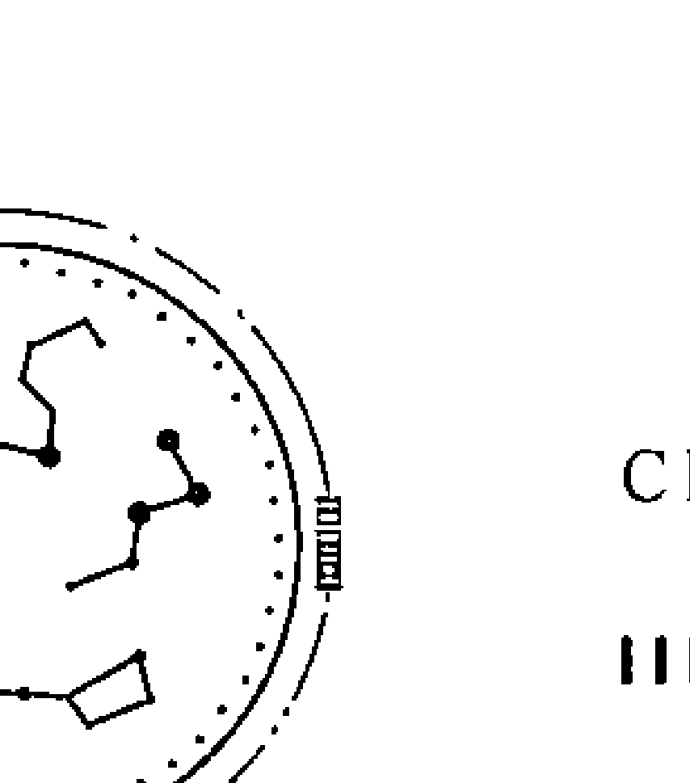

### 火星为自我而战；天王星为真理而战

火星和天王星虽然都火爆，但两者最大的不同是，火星的暴怒通常只是为了自己的情绪，讲起来不见得合理，毕竟他的关键词是“婴儿”，讲理本来就不是他擅长的事；天王星是为了“真理”，他之所以会变成革命者，是因为经过观察跟思考之后，确定他所信仰的真理是大家需要的，但一般人无法接受，只能用破坏性的方式切入。这个真理对他人来说需不需要，其实见仁见智，但天王星是生活在未来的人，常常会预见我们没看到的发展，他的格局跟思路都跟我们一般人不同。如果目前状况没办法改善，不妨给他机会一试，也许会带来前所未有的新气象；也许在某些人眼中是灾难，但至少他解决了眼前的僵局。

### ✦天王星 & 火星相位

火星和天王星都很激烈，火星的激烈是程度上比较过头而已，但天王星会把整个状况颠覆，变成另一种东西。火星代表的意外可能是车祸，但天王星是没有办法复原的残疾。如果本命盘有这样的凶相位，要小心会遭受的事故，可能会夺走某个身体的机能；如果是吉相位，往往灵机一动的想法对自己有益处，就算明知会失败也想尽办法尝试，为自己信奉的真理而战。

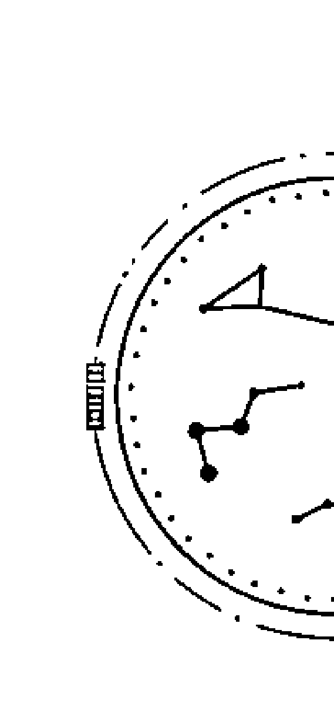

## 天王星+木星

### 在框架外发现新世界 VS 超越世俗但守住规范

| 类别     | 木星     | 天王星   |
| -------- | -------- | -------- |
| 守护星座 | 射手座   | 水瓶座   |
| 相同点   | 跳脱世俗 | 跳脱世俗 |
| 相异点   | 让人心识升级 | 让人跌破眼镜 |

柴米油盐酱醋茶，而是形而上的事物（木星跟土星是相对的两颗星，但木星走到最后，还是得跟土星取得平衡）。天王星跟木星同样是化外之民，勇于挑战现有的一切。木星仍在社会规范之内，他的道德很高，任务是带领我们到更高的层次，让我们可以摆脱物质的束缚，象征的也是平常生活用不到的东西，例如：艺术、哲学、宗教等，这些东西就算消失，我们也照样能过日子，所以木星不是...

# ★木星会为追求理念周游列国；天王星在自我的奇思妙想间悠游

天王星是跳脱土木之上的一颗星，因为他惊世骇俗，会做出我们无法想像的突破，这也是为什么大家说天王星是外星人的原因了。我们想都没想过苹果为什么会掉到树下，即便它已经掉下千万年了，但牛顿的脑袋不知装了什么机关，让他对这件简单的小事产生了疑问，所以他发现了我们想都没有想过的事，这就是天王星类型的科学。

天王星就是我们常说的边缘人，他脑子里在想什么没人能理解，大多数我遇过的天王星人，都在想一些外星人才能理解的问题。天王星常常让人跌破眼镜，可不见得是好的方面，好的坏的都有（就像你遇到一个强吻你的人，他是色狼沙猪的机率，比他是你命中注定的坏总裁的可能性大太多了）。我们不能理解天王星人的内心世界，他可能在想：“我要怎么修理三千光年外来的飞行船，带着地球上所有人回我们的故乡星去。”也有可能是：“我要控制多少食量，才能让我灌下桌上所有的酒而不至于吐出来？”后面的问题非常没有建设性（好，其实两个问题都不算有建设性），但是他思考的态度却一样认真，这就是天王星迷人的地方吧！就算是没什么好想的事，他一样思考得很像一回事，这种对无意义的小事认真的样子，有时候还真有一种奇怪的魅力，也是天王星往往可以吓坏大多数人的原因。

其实仔细想，天王星想的事情也没那么神奇、怪诞或了不起，但因为我们大多数人想不到，就让这个想法显得很突出，也许随着时代演进，那些想法就显得不足为奇了。就很像别人说的，事情说开了后，没什么了不起的，但重点就在你想不到，他想得到。

## ✦木星&天王星相位

木星天王星影响的层面都很广大，如果是吉相位，很多看起来误打误撞的事情，都会有好结果，也许你不抱什么特殊的目的去做，但就是会带给群众很多利益；如果是凶相位，代表你的决定会影响到许多人，而且层面非常广，可能会延续到下一代，例如核电厂的建置。

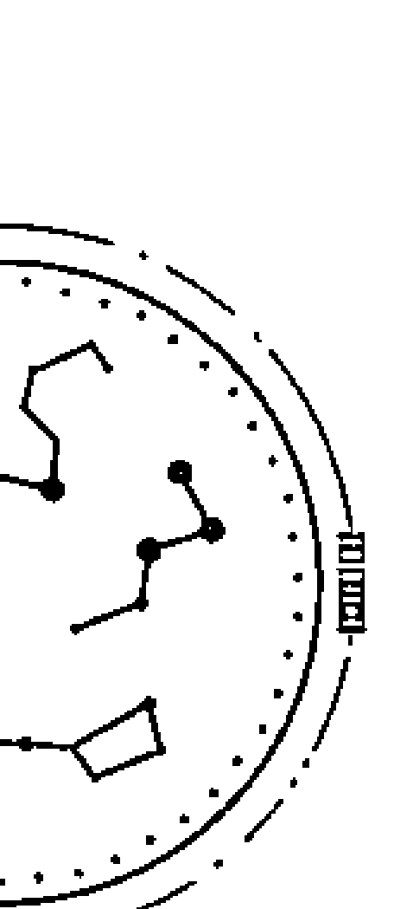

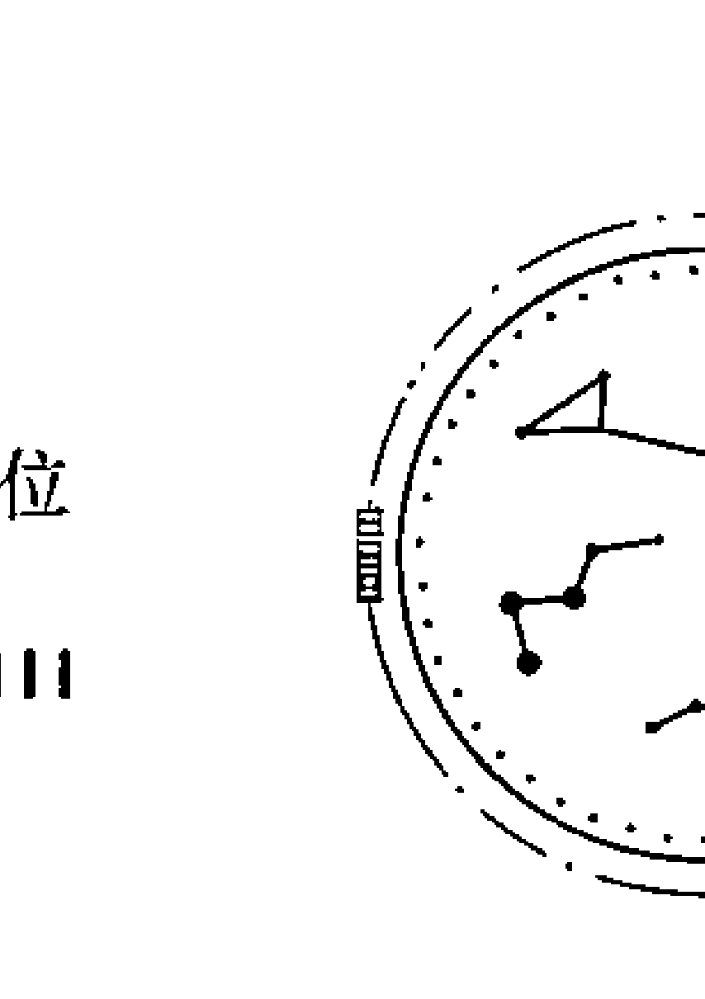

## 天王星 + 土星

### 不断挖掘创新未来 VS 代代相传坚守理论

#### ★土星巩固已知的基础；天王星突破土星的限制

|        | 土星             | 天王星           |
| ------ | ---------------- | ---------------- |
| 守护星座 | 摩羯座           | 水瓶座           |
| 相同点 | 逻辑性           | 逻辑性           |
| 相异点 | 巩固已知的基础   | 在基础上突破     |

天王星是第一颗外行星，土星代表所有物质的限制，天王星则是企图突破这层限制，所以土星是除了物质之外，没有任何事情可以让他心悦诚服。天王星代表的就是无线电波这一类的东西，即使看不到，还是有方法可以确定他们的存在，发挥其作用，能把人类生活推进到我们以前完全无法想像的地步。天王星代表着“未来”，所以天王星掌管的水瓶座，关键词之一就是“预知一”。天王星不只是时间拉长到很久远以后的未来，他还比我们高了一、两个层次，可以看到以前层次看不到的东西。

我看过一则外国单格漫画《对外来世界的想像》，那是一九六〇年代的作品，上面的意思是，未来世界不管走到哪里都会有电视机，你只要投币，就能看到你去的所有地方的资讯。我们都知道，后来的智能手机比这种随处可见的电视机方便多了，但背后的“网络”力量，就不是一九六〇年代的人可以想像的了（这则漫画就是土星思维之下的未来，因为一切的改变都不大，只是更普及、有其他的技术带入而已）。人的想像力还是有局限的，不可能想到他在经验、法则以外的东西，但天王星的想法，就很像外星人或神明，在放了疑问到你的脑袋里，迫使你去找出答案的同时，也把思考范围扩充到以前人类不曾触及到的地方。

科学有两个部分，一种科学是土星式的，严谨地熟读以前的人发现的事情，以合乎逻辑的方式推测；另外一种是天王星式的，一样熟读以前人的成就跟发现，但找出其中不够完备的地方，并与之前的说法相抗衡，企图把更完整的想法带给世人。这也就是为什么天王星是突破传统的意思，因为他势必要与旧有的庞大体系对抗。就像哥白尼提倡地球不是太阳系的中心，真正的中心是太阳，因此受到很多守旧势力的反对，在他临死前，出了《天体运行论》这本提到日心说的著作，引起科学界的抨击，还好他有许多的后续拥护者。旧势力是土星的代表，哥白尼跟伽利略就是天王星的代表。但也不是说土星就全然是坏的，一套理论的成形，必须经由世世代代的巩固，还有提出证明的说法，这些都是实验的成果，一套理论即使不够完备，也会有发挥作用的地方，就像量子力学，虽然最终的答案还没出来，已经帮我们完成了许多事。就算是不完备的理论，也有很多过程上的意义，而不足之处就留给后人思考，找出正确的答案。世世代代的考证下，真理会更形坚固。所以天王星和土星是要相互配合，一面进化，一面巩固。

# ★天王星&土星相位

天王星土星两个一开始都不被大众接受，土星是因身份低微不被接受；天王星比别人超然，凶相位不论地位是高是低，别人都不把你放在眼里，有认同上的障碍问题，但天王星也不求他人认同；如果是吉相位，可以改革以往的观念，变化出更好的想法，因为天王星用土星能接受的方式，颠覆了土星的执着，而且被颠覆后土星也会觉得卸下了肩头的担子。


## 天王星+海王星

### 超脱“小我”，诉求人道 VS 诉求神性

#### 两者都超脱物质世界，天王星是精神上跃进；海王星为心灵上超脱

| 标签     | 天王星         | 海王星         |
| -------- | -------------- | -------------- |
| 守护星座 | 水瓶座         | 双鱼座         |
| 相同点   | 为群体奉献     | 为群体奉献     |
| 相异点   | 为大众掀起革命 | 给予无私的包容 |

天王星逻辑性很强，海王星比较耽溺在感觉中，如果海王星可以拉高他的层次，就变成神性跟灵性了。我们都知道，能够把自己的层次拉得这么高的人不多，通常海王星人只是没主见的滥好人，坏一点的话还会自欺欺人，因为他们不肯正视这个世界。海王星永远活在一片朦胧之中，最好的发展是他们朦胧到最高境界，也就是到了神性的阶段，那时候对他们来说，人跟我之间不再有界线，所有事情也都融为一体了，就是我们常说的“大我”。

## ✦天王星为世人掀起革命；海王星为众生牺牲小我

天王星跟海王星的共同点，是两者都不是物质世界的代表，天王星是精神，海王星是心灵，或许有人会问，这两个不是差不多吗？差多了！精神还是在人性的范围，海王星是到了神性的范围，也就是比人性要高一级。天王星是人道跟公益，海王星是宗教跟艺术，虽然都是为了整体，但天王星还是一个主体，以主体去看个体，还是有他个人的立场，只是这个他是为大家着想的；海王星已经是“无我”，是为了别人而存在的，所以有牺牲奉献的精神。虽然天王星也会奉献，但不会一味地牺牲，他希望整体是共荣的，除非必要，或有相应的回报，也就是天王星的牺牲是有价值的，不然他不会没有回报地牺牲。

海王星是大爱，以世俗的角度，会觉得他很容易轻贱自己，把自己的一切看得没价值，但海王星的包容性跟付出，也是十大行星中最伟大的，他愿意为了所有微不足道的人事物付出。海王星掌管的双鱼座也有一样的毛病，我常劝有海王星或双鱼座特质的人，牺牲自己没关系，但如果你不保护自己，你的家人就会牺牲自己来保护你，会把靠近你的人都拖下水。让靠近你的人都倒霉，可不是一件好事，等于你对万事万物慈悲，但对身边的人却很残忍。

天王星守护的水瓶座，对于众人跟群体都是博爱的，这跟海王星守护的双鱼座的大爱慈悲不一样。双鱼座已经到了神跟高灵的境界，水瓶座则留在人间，因为水瓶还想解救众生，还愿意为了众生兢兢业业，当那个“地狱不空，誓不成佛”的圣人。双鱼座已经看清楚整个世界都是一场因缘聚散罢了。双鱼座愿意牺牲自己帮助大家解脱，水瓶座也愿意自我牺牲，但水瓶座想换来的并不是大家肉体上的生存，而是智性上的提升，这样就能克服痛苦；而双鱼座是希望大家升华到另一个境界，一起脱离痛苦。


## **天王星 + 冥王星**

### 構築未來的發明家 VS 洞悉人性的心理師

|      | 冥王星 | 天王星 |
|------|--------|--------|
| 守護星座 | 天蠍座 | 水瓶座 |
| 相同點 | 敏銳的天線 | 敏銳的天線 |
| 相異點 | 感知人性 | 感知未來 |

## ★天王星跟外星人溝通；冥王星跟冤親債主溝通

冥王星是深入了解人性的行星，他所掌管的天蠍座以「自私」出名，而天王星掌管的水瓶座，則是以「博愛」出名。也不是說冥王星就是全然不好，如果我們要在社會上拼搏，那當然得知道人們要什麼、怕什麼，然後才能給出相應的、投其所好的東西，跟他們交換我們想要的東西。

兩顆星的相同點就是都有著高度的天線，可以接收別人接收不到的訊息。天王星的天線是收到「未來」的訊息，很多我們現在還不知道的東西，都可以透過天王星的天線獲得啟發，所以水瓶座或天王星人，常常是發明家，因為他們能跳脫限制，著眼在更廣大的未來。冥王星的天線，來自於能夠輕易地接收你不想說出口的秘密、你生命中想隱藏的部分，或是你羞於啟齒的事，因為他們對人性中黑暗的一面有直覺性的了解。

天王星跟冥王星兩者對人性都有所洞悉。天王星是以外星人的身分來觀察地球人，可以知道為什麼，但無法感同身受，就像帶著一個距離用顯微鏡去觀察。他知道人類遇到什麼事會有什麼反應，但不知道那是什麼感覺，這就是天王星代表科學家的原因（土星也是科學家，科學家好像都是沒什麼情緒的人才能勝任），天王星通常沒有太多情緒，有的都是理性的行為。冥王星則是從地獄中爬回來，人性的百般滋味他都親身經歷過了，所以可以感受到其中的刻骨銘心，冥王星或冥王星掌管的天蠍座，平常情緒不外露，但他內在可是快把自己折磨死了。

天王星很高冷，冥王星則是看起來很高冷，實際上熱情如火。我接觸過的冥王星人或天蠍座，都愛恨分明，喜歡或討厭都是第一眼就決定，而且貫徹到底。如果他喜歡你，會對你的所有缺點都視若無睹（除非你欺騙他）；如果他討厭你，再怎麼討好都沒用，他會覺得你就是偽裝出來的。

冥王星雖然洞悉人性，但容易被情緒掌管，平常很理智，但一旦遇到大量的情緒，就會被淹沒。

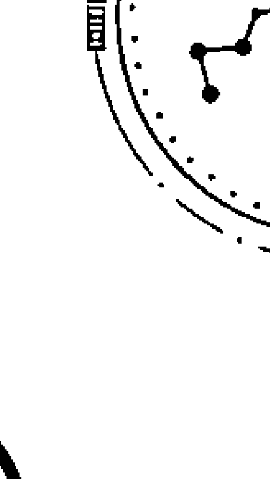

## 海王星總論：

### 神鬼莫測、大愛無我，但容易被當軟柿子

| 守護星座 | 雙魚座 |
|----------|--------|
| 陰陽 | 陰性行星 |
| 四象 | 水象 |
| 守護宮位 | 第十二宮 |

海王星跟天王星一樣，最先發現時被認為是彗星，後來才被確定是行星，也有一番波折。海王星是經過天文學家的計算，才發現「應該有這麼一顆行星存在」，但卻看不到他。後來先由法國天文學家勒威耶發現了他的位置，但過沒多久，又有一位英國的天文學家亞當斯，聲稱自己更早發現海王星，並交出數據，所以發現海王星這個聲譽，由英法兩國共享，可以想見海王星迷茫飄渺的特質。海王星是一顆很難了解的行星，不是因為他跟天王星一樣怪異，而是他看世界的角度太寬了。海王星跟天王星的軌道都很難掌握，對地球而言都難以理解。天王星是外星人，跟人類所處的時空不同；海王星不然就是鬼，不然就是神，跟人類所處的次元不同（不管神或鬼，畢竟都有過當人的時候，所以海王星的想法還是比較好好揣摩的）。

往好處來說，海王星很慈悲跟包容，往壞處來說，就是沒有原則的爛好人，這會造成什麼問題呢？就是會縱容別人在你身上撒野。耶穌就是海王星的代表，犧牲、奉獻，愛所有的世人，但人類不是耶穌，如果這個特質轉化成人性，基本上就是個沒有底線的軟柿子。人很少有像耶穌這麼偉大的情操，有海王星特質的人，常常會自欺欺人，沉浸在自己的世界中無法自拔。所以海王星跟雙魚座也跟所有「上癮」的東西有關，尤其是酒癮、毒癮、菸癮，或更常見的愛情癮。沒有愛情就覺得自己一無是處，因為海王星是一片大海，如果沒有可以依附的東西，就會找不到自己的價值（就連耶穌，也是因為上帝而存在的），所以海王星大多時候都是軟弱的，就像上癮的人。海王星跟太陽的相似之處，是這兩顆星都很單純善良，本來也都是很誠實的，但太陽如果騙自己欺騙人，是他被人利用；海王星會因為被騙，無意中也欺騙別人，但這個「被騙了」，也有可能是他自欺欺人，勉強自己去相信。海王星很容易受騙，或自己騙自己。大家就算被海王星騙，也不要太苛責他，因為海王星本來就迷迷糊糊，被騙後又不長記性。大家只要知道，海王星講的話要再三琢磨，不要一下就相信。但太陽是很有公信力的，他可以為了自己講過的話負責，就算不小心騙人，太陽還是會盡力去補救，或收拾善後。海王星是負不起責任的，就算想要負責，也不知道怎麼負責，最後把一切都歸咎於命運。就光憑太陽有誠意，海王星只會裝可憐這一點，我覺得社會對他們的評價還是公平的。

海王星雖然是大愛，雖然有無比的熱忱，雖然會極力去幫助所有人，但他的資源如果匱乏，身邊的人為了保護他，也會出手相助，無形間都會被拖下水。大愛只是一種理想，大多數人還是生活在俗世。海王星的特質如果放在俗世中，會變成兩種極端，一個是好騙好欺負，另一種可能是性是造成自己跟他人的困惑。

太陽很重視別人對他的看法，海王星則是太容易原諒自己，不只是自己，他也很容易原諒別人，簡單來說就是毫無原則，所以也很容易喪失道德觀。太陽對自己的要求很高，對別人的要求比較低，因為太陽認為自己比別人能幹，理所當然要承受比別人嚴格的要求。我覺得太陽的道德標準應該是比較高的，海王星則有藝術跟宗教情懷，藝術家是標準比較寬，而宗教覺得一切都可以原諒。


## Chapter 2 十大行星

## ☀太陽犯錯後會負責；海王星犯錯後會呆滯

### 海王星 VS 太陽 對人對己都佛系，寬以待人 VS 嚴以律己

| 太陽       | 海王星       | 守護星座 |
|------------|--------------|----------|
| 獅子座     | 雙魚座       |          |
| 善良       |              | 相同點   |
| 對人甚寬，律己甚嚴 | 寬以律己，寬以律人 | 相異點   |

## ✦太陽自我要求高；海王星容易放過自己

太陽很重視別人對他的看法，海王星則是太容易原諒自己，不只是自己，他也很容易原諒別人，簡單來說就是毫無原則，所以也很容易喪失道德觀。太陽對自己的要求很高，對別人的要求比較低，因為太陽認為自己比別人能幹，理所當然要承受比別人嚴格的要求。我覺得太陽的道德標準應該是比較高的，海王星則有藝術跟宗教情懷，藝術家是標準比較寬，而宗教覺得一切都可以原諒。

## 太陽&海王星相位

海王星跟太陽有好相位的話，會很願意照顧別人。海王星本來就很大愛了，只是沒有在世俗生活的能力，加上太陽的話，就可以對整個社會帶來很大的幫助，因為海王星跟太陽的格局都很大。反之，如果是凶相位，就會被有心人士牽著鼻子走，花了很多錢跟力氣，卻無法幫到需要幫助的人。

## COLUMN 容易受騙的女人

「雙魚座」跟「獅子座」這兩個乍看之下南轅北轍的星座，共同致命傷就是容易受騙。我想雙魚座大家很容易可以理解，但是獅子座恐怕在很多人心中都是女強人，照理說事業心強的女生，應該比較會看破別人的手腳，為什麼會被騙呢？雙魚座容易受騙的原因非常明顯，她們容易被自己的感性左右，會去美化、隱瞞自己看到的東西，別人不騙她她也會自己騙自己。然後到了不得不看清事實的時候，她們的逃避性又很強，願意去面對，越逃避就拖得越久，看起來就給人沉溺的感覺，這種人天生有當悲劇女主角的傾向。獅子女呢？她一點都不想當悲劇人物，相反的，因為舞台性很強，她認為自己應該接受的是別人的羨慕，她想當的是天之驕女。可惜的是，她們要的好，標準是別人的眼光，所以會為了保持「好命」的形象，付出很高的代價。換句話說，如果有兩種生活讓她選：一種是實際上很幸福，但旁人看來平淡，第二種是沒那麼幸福，但表面上完美令人稱羨，她毫無疑問會選擇第二種生活。尤其是談感情時，如果遇人不淑，她沒有逃避的性格，但如果放手就表示她不幸福，所以她會出錢出力，想盡辦法讓她的男人像樣一點，然後極力告訴別人這個男人其實是很優秀的，就算暫時沒成就，終究會有冒出頭的一天……如果情況真的完全無法補救了，她會告訴別人，她理想中的生活就是這樣，並不是因為她所託非人或命不好，而是因為她對生命的價值有不同於常人的標準，同時表現得非常滿意、別人不懂也沒關係的樣子。其實就是「愛面子」這種本質的放大版。因為這種沒辦法承認錯誤的個性，很容易讓別人摸清控制她的手法，只要拿她的面子當人質，她就會無計可施，被騙了也只會自己撐住，連麻煩都不會找。雙魚會被同情，而獅子座則是想盡辦法不讓別人有機會同情她，果然，看不出來的軟弱，程度才是更嚴重的啊！


## 海王星 + 月亮

### 佛系無我的大愛 VS 無私奉獻的小愛

|        | 海王星 | 月亮 |
|--------|--------|------|
| 守護星座 | 雙魚座 | 巨蟹座 |
| 相同點 | 秘密   | 秘密 |
| 相異點 | 潛意識的秘密 | 表意識的秘密 |

所以應該是前世的秘密）。不一樣的地方是，海王星代表的是共同的秘密，不是自己個人而已，月亮則是想遺忘卻還是影響自己的秘密，所以是表意識的秘密（海王星跟冥王星是早就遺忘了，海王星跟月亮還有冥王星的共同關鍵詞就是「秘密」，海王星代表的是潛意識中的秘密，月亮則是表意識的秘密。海王星跟月亮相似的地方，就是兩者的第六感都很強，都很容探知別人想隱藏的事情。海王星提得起放得下；月亮會和回憶苦苦糾纏。

## **✦海王星在乎全人類，月亮在乎自己人**

月亮代表的則是自己私人的秘密。冥王星代表的是不堪的秘密，所以海王星跟冥王星的秘密會影響整個社會，或影響自己的好幾世。月亮的秘密則是會影響自己跟家族，也會影響到前世今生，但不會擴及到不相關的人身上。

海王星是一派浪漫天真，月亮則是縮小的冥王星，有很多的愛很情仇，而且這些情緒會一直啃蝕自己。海王星畢竟是代表宗教跟大愛，如果過關，就一切都解放了。月亮則還在掙扎中，因為他只是丙行星，格局跟範圍比較小。海王星是大我，代表自己與他人的共業一直在進行中，因為一切不是自己一人可以決定的，反而就放鬆了。

海王星跟月亮都有高度的情緒意涵，這兩顆行星守護的星座都是水象（海王星主管雙魚座，月亮主管巨蟹座），所以命盤中如果這兩顆星有不好的相位或位置，都容易產生精神方面的疾病，但現在很難區分）。月亮跟海王星都會吸收很多情緒，月亮是內行星，海王星是外行星，所以月亮是個人容易吸收到周遭旁人的情緒；海王星是社會化的，就是到了「無我」的境界。兩顆星都會沾染很多負面的情緒跟故事，月亮是因為對他聽到的東西太重視，容易起共鳴；海王星是因為來者不拒，所以很容易被別人帶著走。

## ★月亮&海王星相位

月亮跟海王如果有好相位，第六感會特別敏銳，本能地避開對自己不利的事；月亮跟海王如果星相位不好，很容易因為要逃避痛苦，染上各種癮頭，尤其是酒癮。

## COLUMN

### 容易為愛淪落的命盤

有一種命盤，負面感情特質特別重，就是海王星跟月亮有牽扯，他們本身的剋相也多；這樣的命盤，我解盤時常用的詞，就是「童話故事情節過重」，活在自己的世界裡，對於感情的需求跟評估標準不同於一般人，在別人眼裡看來的受苦跟委屈，在他們看來反而是一種為愛犧牲的勳章，看起來可憐，自己卻樂此不疲；如果再跟木星成剋相，那麻煩就更大了。光有海王星質，可能終究不堪其苦，但加上木星質（木星等同射手座），是無可救藥的樂觀主義者，遇上「王子」跟「公主」的機會也會增多，年紀越大，內心世界就越脫離現實，「醒過來」的機率更是微乎其微。不過一般能量可以有各種發揮方式，這兩種特質都帶有宗教及藝術的特性，我會建議他們去接觸宗教或公益團體，或培養一項可以全心投入的藝術專長，把「虛無縹緲的犧牲」轉化成「兼愛世人」、「為創作奉獻」，那就跟他們本身的特性符合，可以避免往不利於自己的方向發展。

## 水星是世間的智者；海王星是來世間修行的靈能者

| 守護星座 | 相同點 | 相異點 |
|----------|--------|--------|
| 雙子座、處女座 | 思維超群 | 想法出於邏輯推論 |
| 雙魚座 | 思維超群 | 想法出於感性理解 |

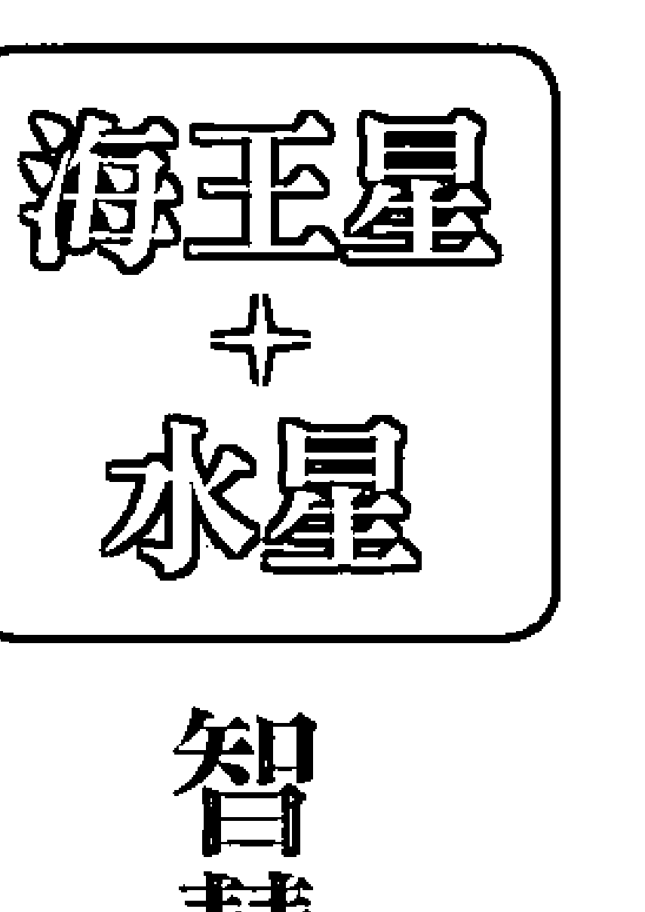

## 智慧宗教家 VS 生活知識王

## ✦ 水星才智超群絕倫；海王星的智慧是與眾生同塵

海王星跟水星的相似之處，是兩者都指腦海中的思維。不一樣的是，水星是邏輯的思維，海王星是幻境的想法，也就是說，水星很理智，海王星很夢幻。海王星的格局比水星大很多，因為海王星是到了宗教跟藝術的層次，而水星在世俗的層次。木星也是宗教跟藝術，但木星介於世俗跟靈性的中間，也就是在世俗的最外層，跟海王星相比較為入世。木星是修行，海王星是已經到了靈性的層面，進入大我之中了。水星雖然也是思維層面，但水星指的是生活中的視野。水星的頭腦很清楚，因為邏輯這種東西是入世的，所以水星如果活在世界上很吃香，因為他具備凡人所需要的一切技能，相反的，海王星如果在世間，可能就整天在夢中或酒醉中，因為海王星還沒到真正的靈性開悟之前，是跟世間格格不入的，為了逃避現實，他必須找一個『夢鄉』，保護自己不受傷害，但也因此，海王星可以了解世界不了解的苦難，不像水星會用邏輯的思考來檢析他們，然後要求對方改正。海王星的大愛可以包容所有的錯誤，這也就是為什麼他也是耶穌的象徵了。包容錯誤之後，當然要昇華，不是任由這些錯誤以錯誤的姿態存在，而是要化為養分，灌注世間所有的尖銳之處，這也就是為什麼海王星是大愛，因為他模糊了人與人之間的邊際，讓大家都成為一體。但水星是強化人跟人之間的不同，因為水星代表聰明才智，是人中龍鳳，當然是不可能是整體，因為水星非常的傑出。水星是世間的能手，海王星則在靈界吃香，我們都是凡人，會比較希望擁有水星的聰明才智，海王星如果尚未開悟，就只是迷迷糊糊的人而已。就算開悟了，表現也不見得很傑出，因為海王星比較像老子跟耶穌，是把自己的姿態降低，跟大家同行。海王星對高高在上沒有興趣，因為他是與眾生同在的。

## ✦ 水星 & 海王星相位

海王星如果跟水星有凶相位，就很會迷路，腦中的思維也不嚴謹，因為水星的銳利清楚被海王星的融合跟大我模糊化了。如果相位不錯，海王星可以昇華水星的聰明才智，把他轉化為更高的智慧，而且大家都可以了解，不會像海王星在開示時，眾生都會有墜入五里霧的感覺；水星有點像奧修，說的道理是誰都聽得懂的。

## 海王星+火星

### 焦點渙散 VS 火力集中

|        | 火星   | 海王星 |
|--------|--------|--------|
| 守護星座 | 牡羊座 | 雙魚座 |
| 相同點 |        | 單純   |
| 相異點 | 單純火爆，容易傷害別人 | 單純無害，容易拖累別人 |

海王星跟火星完全不一樣，海王星極度模糊，火星則是極度集中，海王星可以包容所有，火星則是排除重點以外的事物。海王星跟火星的共同點，是兩者都很容易把自己投入一項事物。海王星是自己投身於其中，與之融為一體，火星則是用盡全力要去得到，但火星我會用「狂熱」來形容，而海王星則是「沉醉其中」。

火星跟海王星的共同點都是「單純」，火星是什麼都不會問就往前衝，海王星是什麼都不會問就接受。火星跟海王星都很容易受騙，只是火星受騙後會發怒，海王星受騙會默默忍受。海王星的逆來順受也不是什麼好事，因為海王星太不懂得保護自己，所以身邊的人會想保護他，也就跟著受難了，這就是「我不殺伯仁，伯仁卻因我而死」，海王星雖然沒有壞心眼，卻還是很容易害到人。

## ✦ 海王星從小就是受氣包；火星長大只會變巨嬰

海王星跟火星都是有點負面的行星。海王星從小就是受氣包，身邊的人做什麼，他都會默默忍受，但海王星的心態很正面，他相信所有人都是善良的，如果命運轉好，海王星也是能接受好運的。我覺得好運會不會降臨，也關係著你有沒有能接受好運的心態。海王星最大的優點就是「相信」，如果你相信，就會允許好事發生在身上。

火星不一樣，火星一直是怒氣沖沖的，相較於海王星的什麼都不問的相信，火星是什麼都不相信。火星的關鍵詞就是「衝動」，他會不問事情原由地想討回公道，所以沒耐心等好事發生，火星會想要當場把帳算清楚，結果往往把自己捲進更大的麻煩中。

## ★火星&海王星相位

海王星跟火星如果有吉相位，就會攜手往更高的地方前進。火星會掃除一切障礙，海王星有宏大的理想，並且相信他會實現，能成就別人無法成就的創舉。就像是多產的藝術家，如果單只有海王星，他可能整天醉死在自己的夢中，但火星有真正的生產能力，因為火星會去實行。如果是凶相位，你可以想像一把火丟進海中的後果是什麼……不過就算一事無成，他還是會活得很開心自我，因為火星跟海王星都不善於負責任。

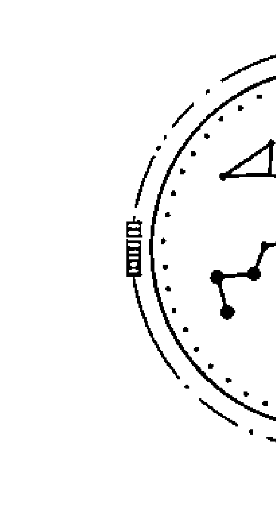

## 海王星 + 金星

### 心懷天下超渡有緣人 VS 與人為善但保持社交距離

|        | 海王星 | 金星   |
|--------|--------|--------|
| 守護星座 | 雙魚座 | 金牛座、天秤座 |
| 相同點 | 友善   |        |
| 相異點 | 與人融為一體 | 溫和有禮，親近不親密 |

## ✦金星保持友善社交距離；海王星你泥中有我、我泥中有你

海王星跟金星最大的共同點，是兩者都很陰柔。不一樣的是，海王星是好欺負，金星則很社會化，會跟人有條有理地討論，最後達成共識。金星是金牛座跟天秤座的守護星，帶有土跟風元素，都是理性的元素。金星的陰柔是一件保護衣，會為了和平自甘成為退讓的那一方，因為金星覺得自己是文明人，樂於展現別人缺乏的禮貌，他相信這樣會讓社會更美好，人與人之間也會更和諧。

## + 金星會裝柔弱可憐，海王星天生就是弱勢族群

友善。但我們都知道，有禮貌帶來的其實是善意的距離，雖然會更親近是沒錯，但不會更親密。海王星就真的可以帶來親密，他是我泥中有你、你泥中有我那一型的，也會願意背上你的一切苦難。就算你沒要求他，他也會主動幫你，而且不求回報，因為海王星的關鍵詞就是「犧牲」、跟「奉獻」。有海王星特質的人在身邊，你很容易被寵壞，但這個寵壞的時間也不會太久，因為很快你就會發現，海王星迷迷糊糊，凡事差不多就好，給你帶來的麻煩大過於幫助。

金星跟海王星還有一個共同特點，就是「慵懶」。金星是樂於享受慢生活的慵懶，海王星是對什麼都覺得無所謂，反正他覺得自己都能吸收，吸收不了時，自會有別人來幫他收拾殘局。這兩顆都是女性化中「柔弱」特質的行星，但金星比較有心機，他有時候只是想節省力氣而裝弱勢；海王星則是真的弱勢，他常常會想表現他有辦法做好，但他一動手，大家就知道他不行了。

## + 金星&海王星相位

金星跟海王星如果相位好的話，會非常有吸引力，女生不用說，就算是男生，也會激起對方的母性，想要保護他。如果相位不好的話，海王星的欺瞞跟金星的理所當然，會自然而然地把自已該負責的事推到別人身上。還有，金星跟海王星的凶相位會帶來虛榮跟浮華，其實虛榮是金星的負面特質，但金星至少知道自己在騙人，再加上海王星，他就會沉入自己編織的謊言中醒不過來。擬人化來說，金星加海王星的凶相位，就是漂亮（金星）、看起來無害（海王星），但隨時可能嫉妒你的女生；但相對來說，也是社會上比較吃香的女性類型，因為他很符合社會上對女性的認知跟要求，是大家眼中「及格」的女性。

## 海王星+木星

### 用心於慈善事業 VS 追求精神躍升

### 木星大智若愚；海王星迷迷糊糊

海王星跟木星的共同點，就是兩顆星都代表不同於凡俗的世間事，兩者都是藝術、宗教。木星又代表哲學、修行，雖然跟其他內行星比起來較不入世，但比起海王星，木星還是接地氣多了。 在海王星沒出現之前，木星同時守護射手座與雙魚座，所以這兩個星座都很孩子氣。木星代表智慧，卻是大智若愚，還滿像金庸小說裡的老頑童周伯通，武功蓋世，社會名望也高，但就是負不起責任，一心追求武術的最高境界，其他什麼都不管。木星也常是博士、高等教育跟藝術。

|          | 木星   | 海王星 |
|----------|--------|--------|
| 守護星座 | 射手座 | 雙魚座 |
| 相同點   | 樂觀善良 |        |
| 相異點   | 大智若愚 | 迷迷糊糊 |

### ✦ 木星追求向上躍升，海王星不是成神成佛，就是淪落社會底層

木星是火象行星，海王星是水象行星，木星可以一路向上，達到至高無上的地位；海王星捨不下眾生，如果救不起別人，就會跟他一起沉淪，所以海王星高起來就到神佛的境界，低下去也有可能是社會底層。

海王星也可以不食人間煙火，但他太善良了，總是忍不住要同理別人，所以沒有辦法讓自己保持沒有前科的紀錄。哪像木星，因為目光全部集中在自己身上，不會沾染上別人的麻煩，這也是木星為什麼會是聖賢之星了。

### ✦ 木星 & 海王星相位

海王星遇上木星，就算是凶相位，頂多就是天兵天將，不會造成多大的傷害，但對於他自己就麻煩了，因為永遠搞不清楚事情的是非對錯，糊裡糊塗的給別人帶來不便。就像以前我們神算館（論壇網站）來了一個講話都講不到重點的網友，一群占星師私底下說：「來賭！看她的命盤中有什麼？」「我猜她有木海剋，後來拿到星盤，果然沒錯！但木海剋就算是不好的相位，這個人也一定很善良，所以我們也就解答了她的問題，不跟她計較了。

如果木星海王星是吉相位，就會是慈善家或慈善團體。但因為木星跟海王星都不善於心機，很容易被人上下其手，一有流年負面相位產生，以前累積的好名聲也就容易付諸流水，這是木海相位要注意的地方。

## ✦ 業力之星，土星象徵困難；海王星代表前世

| 屬性 | 土星 | 海王星 |
|------|------|--------|
| 守護星座 | 摩羯座 | 雙魚座 |
| 相同點 | 緩慢 | 緩慢 |
| 相異點 | 主動決定目標 | 被動讓別人決定目標 |

## 海王星 + 土星

### 靈性的極端 VS 俗世的極端

土星是三王星出現之前，最外圍的行星，所以有很多書也把土星列入外行星，他和三王星都是業力代表，不過海王星是前世的因緣，土星是真正的業力。有人問為什麼這麼多行星代表業力？因為在三王星沒出現之前，總要有行星代表業力，三王星出現之後，土星的負擔就輕一些了（笑）。

### ✦ 土星&海王星相位

土星和海王星都很緩慢，土星的緩慢是因為太過謹慎，做事情特別注重細部，每個地方都要有把握；海王星單純是因為走錯路、搞錯方向、訂錯目標，因為他比較鬆散。迷糊是海王星的特質，雖然走錯路，但心情也比較輕鬆，土星就顯得刻苦許多。土星如果想改變目標，是主動改變目標；海王星改變目標，則是海王星的特質。海王星跟土星可以說是兩個極端的行星，海王星很靈性，土星物質到很僵化；海王星柔軟又善良，土星卻現實又功利；海王星是無邊無際，土星是站定了一個點就死都不肯移動。兩者同樣的特質就是運氣都不太好，土星是除了火星之外的第一凶星，但他的兇惡不是突發式的，而是像水溝一樣，慢慢地、經年累月地堵起來，等到發現時，所有的水流都不通了，要花很多的力氣才能鏟除。土星不像火星，會遇到突發的災難，他比較像是該解決的事未解決，變成以後的麻煩。其實土星海王星這兩顆星本來就不相容，就算是好相位，也會有不適感，就是思想很務實，但遇到的都是你無法理解的事，鬼打牆很久後才會發現，你的方向應該在哪裡。雖然事情最終還是會達成，卻是勞民傷財。土海的兇相位，要實現心中想法會充滿困難，或者做一件簡單的事，都要花上別人無法想像的力氣跟金錢；不管是好或壞的相位，都是付出的比得到的多。

但土星不管是好相位還是壞相位，如果堅守到最後，拿到成果的話，這個成果也不會輕易失去價值，因為是用你的生命換回來的，底子非常扎實。土星有相位的人，不要怨嘆為什麼得到自己想要的東西這麼困難，因為得到了以後，會長存很久的。

## 海王星 VS 天王星（請參見天王星 VS 海王星）173

## ★ 海王星是虛無縹緲的大海；冥王星是黎明之前的黑暗

海王星跟冥王星都是水象星座的守護星，海王星守護雙魚座，而冥王星守護天蠍座。海王星是非常鬆散又模糊的，凡事沒有最明確的定位，凡事都可以接受，代表無盡的包容，也就是「神性」、「大愛」，是靈性書籍常常提到最終的「大我」，不分彼此，與眾人萬物之間沒有任何界線，是水元素的最終型態。冥王星因為是天蠍座的守護星，是固定宮，所以情緒會糾結，是內在最痛...

| 冥王星 | 海王星 |
|---|---|
| 天蠍座 | 雙魚座 |
| 另一個次元 | 守護星座 |
| 相同點 | 相同點 |
| 象徵地獄與人性 | 象徵天堂與神性 |

> > 海王星 + 冥王星
>
> 天堂 VS 地獄，神性 VS 人性

## ★ 海王星目標高遠，窮其一生難以達成；冥王星野心壯大，善惡兩極

苦的時候，像是黎明之前的黑暗。如果說海王星是天堂，那冥王星就是地獄。海王星代表的是神性，冥王星則是人性底層最陰暗的泥淖，也就因為是最底層，冥王星包含了人性的一切，涵蓋了我們從異次元到前世的所有記憶。海王星就是無意識（集體潛意識），不但包容了一切，還消除了它們之間的隔閡，把一切都融為一個整體，達到了更高的境界。

在我們的社會，冥王星的天分比海王星更容易察覺，因為冥王星的慾望很強烈，雖然不動聲色，但還是希望當個王者。就像我們會發現，其實天蠍座的愛現程度跟獅子座不相上下，只是獅子座比較招搖，天蠍座則是希望你自己發現他的好，然後去崇拜他。冥王星代表的是人性，離我們比較近，也更容易看出他的不凡之處，就算沒有超凡的優點，也會幹出超凡的壞事，好讓全世界注意到他。海王星的夢想目標在很高遠的地方，是世界大同，這個夢想可能窮其一生都無法達到，所以不需要太用力去實現。我們會覺得海王星都在做一些虛無縹緲的事，但他認真地覺得那是他心裡想做的事，但沒辦法影響到整個社會，因為他的夢想太大了，只能用靈性、宗教這些途徑去追求。

## 冥王星

### 冥王星總論：

### 掌控極端的感情，握有摧毀一切的力道

| 守護星座 | 天蠍座 |
|----------|--------|
| 陰陽 | 陰性行星 |
| 四象 | 水象 |
| 守護宮位 | 第八宮 |

冥王星是最晚被發現的太陽系行星，在冥王星之外，就是「庫柏帶」，裡面有大約一萬多顆的「類冥王星」，就是質量跟軌道都比較靠近冥王星的行星。冥王星因為離太陽太遠，有三分之二都是冰，很難觀測，就變成了一顆「遙遠又冰冷」的行星，等於跟我們處於完全不同的次元，所以名叫Pluto，也就是神話中掌管冥界的神祇。冥王星是太陽系最外圍的一顆星，代表太陽系的盡頭，即將要進入另外的宇宙空間，所以冥王星也代表極端。生與死、情緒的極愛與極恨、犯罪跟司法，冥王星包括了所有的兩極化，也因此很難相處，不是熱情就是很冷漠，常給人捉摸不定的感覺，就像冥王星難以觀測的本質一樣。

冥王星因為身處最外緣，所以很幽暗，也代表我們的「潛意識」。「表意識」是月亮，就是可以自我察覺到的內心。海王星是「集體潛意識」，也就是集合所有的意識，比現有的次元更高，是整個國家、家族、或地球的意識。冥王星極度遙遠，代表我們自己不知道，屬於前世跟另一個次元的意識，同樣是「我」，但是不同層面的「我」，是當下的「我」無法察覺的。我們可以發現，所有土星之內的「內行星」，代表的都是實體上的「我」，差別是，土星木星代表社會上的自我，其他更往內的行星，代表我們個人化的不同面向。而天王、海王、冥王星，則是超越物質層次，在我們看不到的地方，也就是另一個次元產生作用，但那個次元會回頭影響到我們自身（天王星是外星球，海王星是神佛，冥王星是地獄）。

我覺得冥王星非常多元化，現代占星學也把他定義為高八度的火星，因為冥王星跟火星一樣，都代表了毀滅，但火星格局比較小，代表的只是物質上的戰爭，冥王星是徹底的摧毀。火星就是我們的肉體死了，但靈魂仍然存在；冥王星代表的是「核爆」，是連靈魂都可以摧毀的力量。我覺得就情緒上來說，冥王星也代表更高階的月亮，冥王星跟月亮都有負面的意識，但月亮比較軟弱，沒有反擊的力量，只能折磨自己；冥王星畢竟是冥界之神，力量大多了，可以把人折磨至死（冥王星是天蠍座的守護星，他們的力量就是耳熟能詳的復仇跟記恨）。冥王星的力量不會像火星一樣亂發射，比較像「追蹤導彈」，瞄準之後才發射，所以可以命中目標，不像火星在毀掉敵人之前，就先把自己跟身邊首當其衝的倒楣人炸掉了。火星是無腦的衝動，冥王星卻是比水星還高竿的謀略者。

在智力方面，我覺得冥王星也是更強的水星，因為水星是小聰明，了解人類的思考邏輯跟方向，可以預測人的行為，但比較像經驗的累積，以及觀察後的結論，不像冥王星，是徹底了解人性的脈絡。冥王星可以洞悉最深處的秘密，這點又跟月亮類似。月亮代表的是我們自己隱瞞的秘密；冥王星代表我們已經遺忘，生根在底部，自己很難發現的秘密，大至國家機密、商業機密，乃至我們童年或是前世的秘密，因為太久遠，已經成了我們基因中的一部分，不再浮現到意識上。簡單來說，我覺得冥王星是火星加水星加月亮的綜合體。

## COLUMN
### 被降格的冥王星：

二〇〇六年天文界傳出驚天動地的消息，指出當初發現冥王星時所計算的體積及軌道，用現今的計算算法來看，都被高估了，因此天文學界決議，將冥王星由行星之列除名；

就算按照當初計算出的冥王星質量而言，它能不能被視為行星，就已經備受爭議，現在既然發現它比我們想像中更小更遠，很自然地就應該重新定義它的身份。加上本來天文界宣稱新發現的三顆行星，既然比冥王星還小還遠，自然更不能躋身行星之列了。這下子冥王星的問題就來了：
第一、它已經不是行星，那它對占星界還有沒有意義呢？
第二、它所掌管的天蠍座，是否該回歸為火星掌管呢？
這些問題我想每個人都是心中既定的傾向。不過很顯而易見的是，冥王星縱然不是行星，但相較於北交點、四小行星，它的地位還是比它們高太多了。既然這些虛星跟小行星都被承認它們在星盤上的影響力，冥王星只是被「重新定義」而已，又不是掉下來或爆炸了，只要冥王星還存在，冥王星的意義也就存在，重點只在於它的意義是否還跟原來的相同。至於天蠍座該不該回歸火星掌管，反正只要等著源頭的占星學界大老整合意見，到時發表聲明，我再照著看就是了。總之在我出生時，冥王星還是行星，就算現在冥王星的定義被改變，也不能回溯到我出生那時的狀況，所以我是很悠閒地看待這個變動的。
不過我也不認為冥王星的影響力絲毫不受動搖，如同前言所說，冥王星的影響力雖然不會消失，但會改變。我一直認為行星的意義是隨著時代在變動的，就像早在三王星尚未被發現之前，占星學界就預測到天、海、冥的存在了，甚至連存在型態跟運行方式都心裡有數。占星界並沒有在知道有這三顆尚未發現的行星之時，就把它們納入天宮圖的觀察點當中，仍然乖乖等到天文界真正發現了這幾顆星，才開始把它們列入星盤，觀察它們的影響力。我同意占星界對行星的定義，不需要跟著天文界走，也同意占星跟天文是兩門不同的學科，但天文界對行星的看法跟定義，就代表著俗世大眾對行星的態度，也代表該行星對應的俗世領域（例如冥王星代表政治、核武、偏財、人性弱點），在社會中被以什麼樣的眼光看待。就像代表潛意識及無意識的三王星被發現之前，地球上哪來的「心理學」這門學科？甚至沒有人去思考這個領域的存在，但在人的心理狀態慢慢開始受到重視時，天上也陸續發現了這些外行星。外行星跟潛意識一樣，都是本來就存在而未被發現的東西，人類深層心理被發掘出來，與之對應的外行星也就隨之出現，而發現海王星的差不多時間，跟海王星特質相呼應的電影業也出現了，這就是「天垂象，地成形」。

因此在冥王星的身份面臨改變之際，我比較有興趣的是：冥王星一樣是冥王星，但不再是行星了，那冥王星代表的意義中，跟主權有關的事物，是否跟冥王星一樣也還是存在，卻被貶低了它們的地位跟分量？

冥王星被降格了，但是它並沒有消失，「被降格、除名」是冥王星所遭遇的狀況，另外因為當初冥王星被列入九大行星，是因為它的體積跟距離被誤算，也就等於它是一種「被認清、重要性被扭轉」，就像這些各國的政治領袖，都是背負著人民的重大期待上台，並且一度被認為是走向新世代的領導人（世代交替也是冥王星特質），但如果沒有誠意，很快地整個國家都會受影響，假面具也戴不了多久了。過去的人民奴性是比較重的，所受的教育也不多，因此一個明顯辜負大家期待的政客，還是可以安然無恙的生存下去；現在的人民自我意識抬頭，開始懂得發出自己的聲音，加上冥王星本身就代表了政治性、權謀、黑箱作業以及貪瀆、犯罪等意涵，換言之它也代表了一種「惡勢力」，這顆星被除名就可以觀察出這種惡勢力在地面上的「式微」，因此這種歸冥王星掌管的政治醜態，就在冥王星被降格的同時失去了保護傘。

也許你會問，為什麼反政府的事件，不是對應到天王星這顆「革命之星」的相位呢？

那是因為天王星革掉的是傳統以及陳舊，這些政治領袖雖然勢力大，卻不是穩定、保守政權的象徵，反而大多還曾經有著新世代的理想性！因此他們不是天王星可以革掉的對象，只有等他們自己累積足夠的罪行，爆發出來後自己站不住腳，才符合冥王星本身被發現不夠格後遭到除名的現象。

## 冥王星 + 太陽

### 看盡人世險惡 VS 享盡人間榮華

| 太陽 | 冥王星 | 守護星座 |
|------|--------|----------|
| 獅子座 | 天蠍座 |          |
|      |        | 相同點   |
|      |        | 控制慾強 |
|      |        | 相異點   |
| 在明處統御 | 在暗處操弄 |          |

## ✦ 太陽是皇家貴公子；冥王星管權政軍警法

冥王星跟太陽的相同之處是兩者控制慾都有點強，也都是王者，只是太陽是人間的君主，而冥王星是冥界，也就是心理層面的王者。太陽光明正大，不太知道人間險惡，生性單純，是大家都禮讓的天生貴族，而冥王星人生之路坎坷，知道每個人在每種環境下會產生什麼念頭，能洞悉所有人性的黑暗面跟泥淖，所以也代表犯罪、象徵司法單位。有一句話說：「警察抓賊，要比賊更賊。」說的就是冥王星。

冥王星適合從事政治，做生意也滿適合的，因為這兩者都需要精通人性黑暗面，當然，警察或司法單位乃至律師，也適合冥王星發揮，因為他很擅長把人性玩弄於股掌之間。其實太陽跟冥王星都適合當領頭羊，只是太陽是以身作則，適合擔任表演者、帶領者，在舞台上風風光光，冥王星是用隱晦的方式操控人的心理，在暗處掌權。

## 太陽容易被他人眼光左右；冥王星左右他人眼光

太陽也是某一個領域的常青樹，他雖然熱情奔放，但律己甚嚴，因為太陽很注重形象，會勉勵自己當大家的表率。也因為太陽的光明我們都看得見，所以很容易評斷，雖然是王者，但太陽很怕犯錯，容易被別人的眼光左右。
冥王星則相反，冥王星高深莫測，雖然智商高人一等，但喜歡暗中行事。對冥王星而言，太陽很喜歡證明自己，但火象的他太直白了，心裡在想什麼，像司馬昭之心，路人皆知。冥王星善於說謊跟演戲，又很了解人性，不像太陽那麼坦白，因此能成為幕後操縱的高手。

## 太陽 & 冥王星相位

冥王星如果跟太陽有吉相位，那這個人既聰明又坦率，等於太陽可以照亮冥界。這個人有本事創造秘密，但他不喜歡躲躲藏藏，到了適當時機，會尊重他人的自由意志。雖然有點囉嗦，但給出的建議都非常實用，而且到最後通常都會放手讓你自己作主，因為他相信自己能夠改變你。

冥王星跟太陽如果是凶相位，控制欲會太強，而且容易自以為是，不把任何人放在眼裡。用自己有限的經驗來論斷所有事，妄下斷言、聽不進忠告、死不認錯，常會招來毀滅性的後果。但如果受過足夠多的教訓，他有可能脫胎換骨，成為了不起的人，只是這種機率不大……

## 冥王星 + 月亮

### 秘不示人的深層業力 VS 腦內小劇場

冥王星跟月亮同是水象星座的守護星，一般資料常把他們同樣歸為潛意識的行星，但我覺得月亮是表意識，也就是一般內心的情緒跟感覺，冥王星才是潛意識，至於海王星，那就是更深層的無意識了（也就是集體潛意識）。冥王星很容易牽扯前世今生，畢竟冥王星是代表生死的行星，所有個體的生生世世，都是屬於同一個人的潛意識。兩者的共同點是月亮跟冥王星都代表內心的世界，月亮跟冥王星也都有「秘密」的意味，但

| 類別 | 冥王星 | 月亮 |
|------|--------|------|
| 守護星座 | 天蠍座 | 巨蟹座 |
| 相同點 | 秘密 | |
| 相異點 | 連自己都不知道的秘密 | 不想讓別人知道的秘密 |## 十 月亮鬱鬱寡歡；冥王是反社會人格

月亮的秘密是在自己私密的領域，不想讓別人知道這件事，可能是關於家族跟親人的，不宜昭告天下，或可能對自己的利益有影響。冥王星的秘密是生根於潛意識，接近人性上的秘密，可能連自己都沒發現，但他的行事作風跟思想會透露出來，不用很敏銳的人就感覺得到；另外就是曾經受過傷害，連自己都刻意遺忘的秘密。冥王星相位不好的人，常給人反社會者人格的感覺；月亮相位不好的話，則是有膽小怕事，神經兮兮的形象。

月亮跟冥王星都是自私的，不過月亮會護自己親人的短處，冥王星會向著自己難得認同的人。他們都容易誘發心理疾病，或情緒上的鬱悶。月亮已經很鬱想不開，有被害妄想症了，如果更深一層到冥王星，就會覺得宇宙對自己不公平、全世界都對不起自己。月亮的胡思亂想攻擊不到別人，給自己困擾比較多，真正有殺傷力的是冥王星。

## 十 月亮 & 冥王星相位

月亮代表母親跟親人，冥王星是深層的業力，所以冥王星跟月亮凶相位，甚至只是合相，都有可能對母親的心結很重，我甚至看過例子，是從小受到母親實質上或言語上的虐待。但如果說對母親沒有愛又不盡然，冥王星的感情很深刻，只是會用非常隱晦難解的方式表現出來。
如果冥王星跟月亮是吉相位，這個人會是很好的心理治療師，冥王星讓他深知人性最深層的黑暗面，而月亮能夠給予支持，所以冥王月亮如果相位好，是很溫暖的，可以給個案很好的支援力。


## **冥王星** **+** **水星**

**洞悉世情的人性拆解師 VS 邏輯滿分的行為分析師**

|          | 冥王星 | 水星         |
| -------- | ------ | ------------ |
| 守護星座 | 天蠍座 | 雙子座、處女座 |
| 相同點   | 洞悉人性 | 洞悉人性     |
| 相異點   | 靠第六感推論 | 靠邏輯分析   |

### ✦ 水星以理性邏輯推演；冥王星靠深度直覺

冥王星跟水星的共同點是都很聰明，能夠拆解人性。水星是在智識方面理解一個人為什麼會有這個行為，純粹是分析，運用邏輯預測這個人的下一步行動，很像在寫偵探小說，是以觀察者的身分對待被觀察者，理性重於感性，所以本身的情緒不會有太多波動。冥王星的觀察就是基於刻骨銘心的經驗，容易往壞的方向解讀，因為不幸的是，人性大多會往壞的方向發展，冥王星預測的應驗率也因此特別高，這也是冥王星第六感的特質。相比之下，水星比較客觀，冥王星的偏

### ★水星公正客觀，動口不動手，冥王星為至交兩肋插刀

冥王星跟水星是九大行星中體積最小的兩顆。水星緊跟在太陽旁邊，所以目光清晰，可以看清一切真相；冥王星是最遠的，有三分之二是冰塊，就會用比較負面的心態看人，但也因為這樣，冥王星最了解人性的弱點。水星也了解人性的每一面，他比較客觀，好就是好，壞就是壞，對人性的了解趨於中庸。人性的黑暗是超乎想像的，應驗度往往是冥王星領先，但如果是一些小事，不涉及利益的，還是水星頭腦比較清楚客觀。

冥王星比較像調查員，會幫你挖出私密的真相，而且生死攸關；水星比較像傳播工具或包打聽，收集來的資訊雖然不算重大，但在日常生活中很實用。如果你要調查別人的機密，還是需要冥王星。不過為了不被偏見左右，最好叫水星守護的雙子座或處女座去做調查報告，會比較公正客觀。冥王星的答案不是來自調查，而是直覺。冥王星的直覺就像警察的直覺，是由經驗來決定，所以有時候準有時候不準，但不管準不準，冥王星都堅持自己是對的，與水星對比下顯得不可理喻。如果冥王星認同你，會兩肋插刀；水星會幫你想點子，但不會有義薄雲天的行為。

### ◎水星 & 冥王星相位

冥王星跟水星如果是吉相位，这个人的头脑非常清楚，不管你用什么话术，都没办法模糊他的思考能力，在人性跟商场上可以无往不利；如果水星跟冥王星是凶相位，习惯戴著有色眼镜看人，而且自己催眠自己「从来没看错人」，那些失败的例子，他会直接视而不见，就像经验丰富的警察跟法官，也是有可能造成冤狱。

## 冥王星 + 金星

## 迷死人不償命的放電機 VS 路上常見的帥哥美女

|          | 冥王星 | 金星         |
| -------- | ------ | ------------ |
| 守護星座 | 天蠍座 | 金牛座、天秤座 |
| 相同點   | 魅力   | 魅力         |
| 相異點   | 致命吸引力 | 大眾化魅力   |

### ★金星是花瓶女配角，冥王星是實力派巨星

冥王星跟金星相同的地方是富有魅力，但金星比較容易被人了解。人們會喜歡金星，理由都是很明顯、可以量化，也可以描述出來的，例如：他很幽默、他很漂亮、他很帥，他很體貼……這些大家都會認同的項目。冥王星不一樣，他通常比較沉默，看起來也不愛出鋒頭，但莫名其妙地卻佔住所有人的注意力，就像有句話說：「他講話很小聲，所以我必須仔細聽。」冥王星雖然話不多，但每一句都是重點，因為冥王星深諳人性，知道每個人該如何對付，哪句話可以搔到誰的癢

### ☆ 金星 & 冥王星相位

如果冥王星跟金星的相位好，那就是又漂亮又有特色，容易让人一见难忘，而且会让人对他死心塌地，因为找不到别人可以代替，让追求者产生「非他不可」的感觉；在行销业务方面也很擅长，因为他既得体，又知道客户真正的需要。如果相位不好，魅力也不会因此而消失，反而更致命的吸引力，所以男女之间的占有欲、控制欲就会被加强。如果是凶相位，也会深化他的吸引力，加上冥王星代表的是黑暗的人性，桃色纠纷就会特别多，金星也代表小财，所以常常会扯上金钱。

金星因为社会化，被取代性也很高，毕竟帅哥美女多的是，如果没有特色，就可以互相替换。就像连续剧的男女主角，通常最富有特色跟魅力的就是冥王星，至于最好看的金星，通常是男二或女二，因为他们的功能就是扮演一个条件很好的人。如果要当主角，一定要有人家容易记住的地方（冥王星特质），偶像团体也是，通常大众标准中最好看的金星，人气都没有特色明显的冥王星受注目。金星容易理解，但是也容易被模仿跟取代；冥王星不算特别好，但就「只有他是这样的一，有无可取代性。

## 冥王星+火星

### 極端的愛恨嗔癡 VS 直接了當的強取豪奪

對於目標，火星直接擄人勒所；冥王星要旁人雙手奉上

|          | 火星         | 冥王星       |
|----------|--------------|--------------|
| 守護星座 | 牡羊座       | 天蠍座       |
| 相同點   | 野 心 勃 發   |              |
| 相異點   | 對目標強取豪奪 | 等目標自投羅網 |

在冥王星出現之前，火星就已經是天蠍座的守護星了，火星的慾念也包含在冥王星的貪慾之中。火星的慾望是明顯的、赤裸裸的，發洩完畢就滿足的，但冥王星的慾望更深更廣。火星只要他看得到的地方掌握住就夠了，但冥王星從表象到心理都要控制，佔有的慾望比火星大多了。

如果要別人的東西，火星拿走他就高興了，但冥王星不但要拿走，還要你主動包裝好、繫上緞帶求他收下。冥王星要的就是從裡到外的全然佔有，最好全面被他洗腦。冥王星又喜歡聰明的

### ✦火星瞬即逝，冥王星愛恨到底

對象，所以你最好是很聰明，假裝輸給他，而且如果演技不夠好，他是看得出來的。
冥王星聽起來很難搞？有一個解法，就是讓他愛上你，這個「愛」可以是很廣義的，就是他對你全然服氣，到時候你也不用哄他了，他會自己哄自己，而且技術之高明，任誰都自嘆弗如；有一個例外，就是不要讓他發現你騙他（如果他喜歡你，你真的要騙得很明顯他才會發現），如果破壞了這層信任，冥王星就會轉愛為恨。曾聽說過的天蠍座恐怖行徑都會完全展現，因為冥王星掌管的天蠍座，愛人全心全意，恨起人來也是全心全力。有人說遇到天蠍（冥王星）要躲遠一點，但如果天蠍喜歡你的話，把他利用到底，他還會覺得自己對你有用而感到欣慰，但如果得罪天蠍，躲再遠都沒用，所以最好還是留在他身邊，然後真誠地對他。如果你本來就吸引不了冥王星，那就放水流吧！這不是很好搞的行星，不如讓自己自由一點、也舒服一點，別去蹚這渾水。

### ✦火星 & 冥王星相位

冥王星跟火星如果是吉相位，那真的是成就非凡，有原則又有毅力，如果存心要做好一件事，爆發力是很驚人的，可以讓周邊的人跟著雞犬升天，因為冥王星對朋友很講義氣；如果冥王星跟火星是凶相位，可能会有情绪管理的问题，就算在别人眼里是小事，他还是会耿耿于怀，伤害自己就算了，发起疯来还会想要伤害旁人，而且他不觉得是伤害，只觉得是把妳给他的还给你，即便你并没有对他做什么。


# 揭秘十二宫位

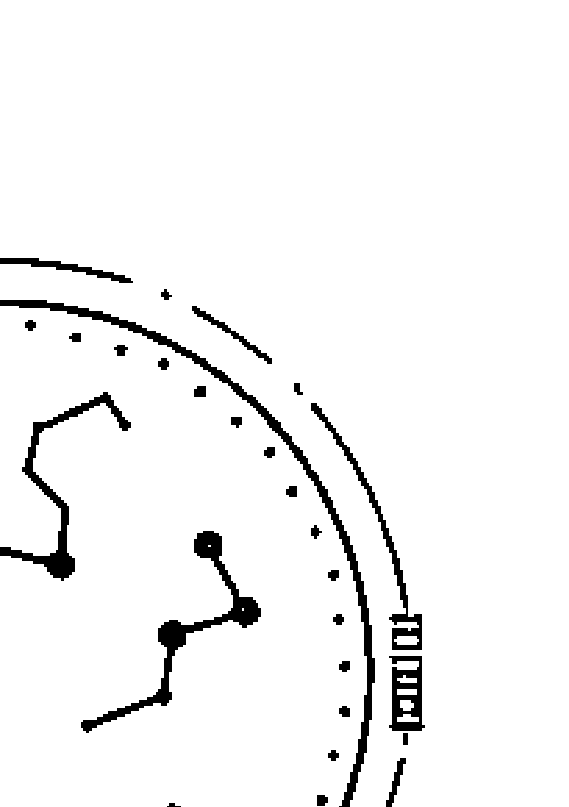

冥王星跟木星也有相同處，冥王星如果光明起來的時候，是很宜人的，甚至能裝得像木星、金星、太陽一樣和善，但也要他對你夠重視，才會願意在你面前表現出好的一面。木星的建設性很強，但興趣廣博，很容易分散心神。若冥王星有設定的目的，以他的執念是什麼都做得到。如果論運氣，木星是出了名的幸運星，冥王星因為業力太多，牽絆也太多，所以得不斷瞻前顧後，沒有木星那麼全然投入。冥王星的運勢是爆發性的，好起來很好，倒楣起來也很倒楣，這要看冥

### ✦ 木星傻人有傻福，冥王星運勢暴起暴落

| 屬性 | 木星 | 冥王星 |
|------|------|--------|
| 守護星座 | 射手座 | 天蠍座 |
| 相同點 | 建設性 | 建設性 |
| 相異點 | 無心插柳柳成蔭 | 費盡心機手段 |

## 冥王星 + 木星

### 關關難過關關過 VS 吉人自有天相

王星跟什麼樣的人混在一起。雖然冥王星對別人的影響力很強，但不可避免的也會被人影響，冥王星雖然聰明透頂，但傻起來的時候，也是不顧一切的。

### ✦木星傻人有傻福；冥王星費盡萬鈞之力

木星本來就傻裡傻氣的了，也喜歡付出（因為他沒在算計），所以收到意外的回饋，給人運氣好的印象。就業力來說，我覺得木星相位好的人，前幾世都積了很多陰德，現在才開始回收。在追求成就的路上，冥王星會費盡千辛萬苦，而木星看起來不費吹灰之力。

其實冥王星跟木星的人都不錯。冥王星因為精通人性，你會覺得他很像你肚子裡的蛔蟲，他所講的都是你認同的想法。而且冥王星把身邊的人照顧得很好，看起來不需要其他人照顧，木星看起來很天兵，隨時需要別人幫一把，這就是傻人有傻福，而且木星本身天真無邪的樣子也很受人喜愛，就算不刻意去討好別人，大家也會不知不覺照顧他。你喜歡木星，是喜歡他本來的樣子，這就是冥王星略遜一籌的地方了。

### ✦木星&冥王星相位

木星跟冥王星如果相位好，又在二、五、八、十等跟財帛、地位相關的宮位，那就算他現在沒沒無聞，但時間一到必成大器，而且竄起的速度很快，有可能是累積很久，但突然在你不注意的時候他就急速發展起來了。如果冥王星跟木星是凶相位，那可能在人生中會摔幾次大跤，但爬起來後，都比跌下去之前升了好幾個層級。

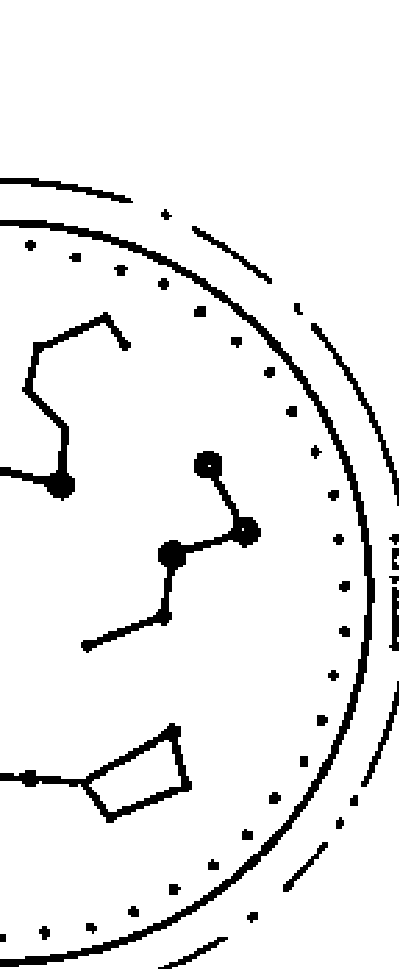

## Chapter 2 十大行星

## 冥王星 + 土星

### 轉折離奇的災難片 VS 逆流而上的勵志片

|          | 冥王星   | 土星         |
| :------- | :------- | :----------- |
| 守護星座 | 天蠍座   | 摩羯座       |
| 相同點   | 業力     |              |
| 相異點   | 轉念就能解脫 | 實際的困難   |

### ★土星逆流而上；冥王星的八點檔人生

冥王星跟土星都是「業力之星」，冥王星比較戲劇化，如果在一宮或八宮，人生會像八點檔一樣精采，什麼三角戀愛啦、搶奪遺產跟公司繼承權啦、跟某人明爭暗鬥啦……這些都只算是小case而已，雖然很讓人煩惱，但只要想得開，就能夠解套。冥王星是必須過的關卡，只要過關了，人生就會豁然開朗。

土星就辛苦多了，因為在外行星尚未出現時，土星是最外圍的一顆星，離太陽最遠、寒冷、公轉數又大，行進的速度非常慢，跟木星是死對頭，代表緊縮與不幸，因為他走得慢，沉重跟過程當中，不會少吃苦頭。

### ★土星時間觀念；冥王星的地雷要偵測

土星很科學，凡事都要眼睛可以看得到的證明，所以也代表物質。土星覺得肉眼可見的才是顛撲不破的事實，對於一切第六感或跟命運有關的東西，都抱著懷疑的態度。土星如果在第一宮（命宮），這個人就會格外重視誠實跟時間觀念。以前還不是用智慧型手機的年代，我都是把命盤印出來再約客人一起看，如果相約遲到小小兩三分鐘，客人通常不會介意，但有一次，我看到命主的土星在一宮，嚇了一大跳，馬上打電話非常慎重地道歉，說我會稍晚兩分鐘。那位女性看起來很親切，她後來跟我說：「我非常欣賞妳的地方就是，有些人覺得晚幾分鐘沒什麼大不了，就會不講了直接晚到，但我個人覺得這樣非常沒禮貌，雖然不是大事，至少應該先講一聲，讓我有心理準備。」土星這種龜毛的地方跟冥王星很像，冥王星雖然不是每一件事跟土星一樣一板一眼，但正常人因為不知道冥王星在意的地雷，還是凡事注意比較好。

### ★土星 & 冥王星相位

土星跟冥王星不管相位好坏，他们在成功的过程中，一定会花费比别人多数倍的心力。如果相位吉的话，成功的程度会倍增；如果相位凶的话，毕竟花了这么多成本，也不至于失败，但心理看世界的眼光可能会比较扭曲。

- 冥王星 VS 天王星（请参见天王星 VS 冥王星）176
- 冥王星 VS 海王星（请参见海王星 VS 冥王星）205

## Chapter 3

# 揭秘十二宫位

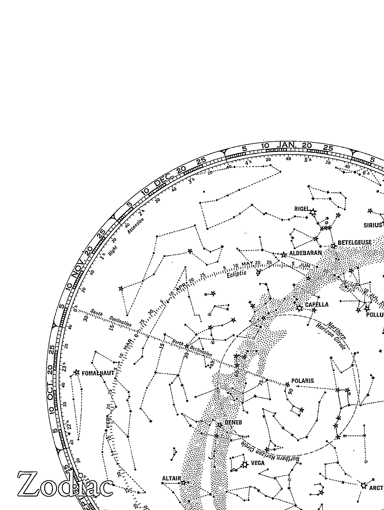

Zodiac

## 宮位前言

宮位跟星座是同一個東西，我們常常說的「牡羊座」，事實上只是標示這個黃道宮位所在的位置附近有這個星座。星座就像是「門牌」，象徵黃道的第一宮跟牡羊座在差不多的位置、第二宮跟金牛座在差不多的位置、第三宮跟雙子座的位置差不多……以此類推，所以各星座應該改名為牡羊宮、金牛宮、雙子宮……

天上的星座各有守護的領域，例如處女座守護工作，如果上班族遇到了什麼波動，就會從處女座的守護行星（水星）跟相位看到端倪；大企業或政府機關發生了什麼事，就會從守護事業的魔羯座中找出跡象（在占星裡，工作和事業並不是同一件事，工作是從事的「職業」，事業則是你的「志業」）。但這是所謂的「天象盤」，是整個世界發生的事件，而我們自己生活中的各個領域，還是要看個人出生時定下的星盤。

宮位是人生的各個領域，星座則是這些領域的性質跟給人的觀感。每個人面對不同的對象，都會展現出不同的面貌，就要看我們在他人人生中的哪個宮位，對他來說是什麼人，不同的人對他有不同的意義，他也會換上不同的言行舉止。如果是大眾對於他的共同印象或定位，是以第一宮（命宮、外貌宮）跟第十宮（事業宮）為主，因為我們剛認識一個人，還是會以他的外在跟成就來定位他。

在很多人的看盤習慣中，行星跟星座的重要性常常高於宮位，但在我看盤的經驗中，宮位的重要性也不亞於行星跟星座，行星如果集中在哪個宮位（術語說是××宮群星雲集），這個宮位的重要性也會被凸顯出來（宮頭位在哪個星座，那個星座的特質也會跟著提升）。所以接下來的內容會比較強調宮位（不同的宮位也可以對應星座），希望大家對於宮位有更深的認識。

在大部分的宮位制裡，上升星座跟第一宮起點的位置都一樣，就算你的上升點在上升星座的第28°，也就是到了那個星座的末端了，第一宮的起點還是會在28°。但如果是「整宮制」（Whole Sign House System）就不一樣了，第一宮的起點會是上升星座的0°，在這種狀況下，第一宮的起點就跟上升點是分開的，第一宮是這個星座的0°，上升點是真實上升所在的位置，不管他是10°還是20°都一樣。我習慣用普拉西度制（Placidus），就是現在最流行的宮位制，因為我會看宮主星、宮內星，雖然比較複雜，但也比較好玩。

| 宫位   | 守护星座 | 别称                     |
| :----- | :------- | :----------------------- |
| 第一宫 | 牡羊宫   | 命宫、外貌宫             |
| 第二宫 | 金牛宫   | 財帛宮                   |
| 第三宫 | 雙子宮   | 兄弟宮、人際宮           |
| 第四宫 | 巨蟹宮   | 田宅宮                   |
| 第五宫 | 獅子宮   | 遊戲宮、子女宮、偏財宮   |
| 第六宫 | 處女宮   | 職業宮、奴僕宮、健康宮   |
| 第七宫 | 天秤宮   | 伴侶宮、契約宮           |
| 第八宫 | 天蠍宮   | 生死宮、疾厄宮、玄秘宮   |
| 第九宫 | 射手宮   | 遷移宮、升級宮           |
| 第十宫 | 魔羯宮   | 事業宮                   |
| 第十一宫| 水瓶宮   | 福德宮                   |
| 第十二宫| 雙魚宮   | 前世宮                   |

## 有強力的宮位或星座≠個性如此

一個人強力的宮位或是星座，只是代表他的「特質」，並不一定是「個性」，到目前為止，還是會有人問我：老師，某某人的命盤ＸＸ座特質很強，但他的個性不像耶！
我舉些例子，像曾有人問我：老師，我認識一個射手座女生，但是她一點都不單純可愛，還很愛講人壞話耶！「我心裡嘆了一口氣，哪個星座沒有愛講八卦的人？又有哪個星座沒有安分守己的人呢？我只反問她一個問題：「射手座對於自己感興趣的事，就會很投入，而且使命感（不見得是責任感）很強，她有沒有呢？」她才突然說：「噢！認真、投入、很愛問東問西、有課程或講座她一定都去……那真的是射手質耶！」
也有人問過我：「天空，歷史上有名的修行人，都一定是同樣那幾種星座的個性嗎？」我說不見得，也許他的命盤中神秘學、修行的際遇很多，但在人格部分不見得就受同樣的特質影響，像歷史上最偉大的覺者：釋迦牟尼佛，他雖然是大徹大悟之人，但是他的人格特質卻不像以上我們提到的各種神秘學相關星座。雖然我不知道佛陀是什麼星座，也不知道他的生日，但是就特質來講，我會認定「金牛座特質」一定佔佛陀命盤影響中的首位；我這樣講時，朋友都很驚訝，金牛座可是個極度執著於世俗的星座啊！

但我們想想，當時悉達多為什麼要出家呢？就是因為他認為人都要面對生老病死，眼下的快樂、美好、幸福，通通都是短暫的、不可靠的、像泡沫一樣的，因此他決心要去追求永恆的生命，才捨下一切的榮華富貴，這些對他來講都「太虛幻」了，他要的是真實、永恆，所以看起來佛陀是離開一切美好的享受，其實真正的本因出自他對生命極度的渴望跟愛戀，所以他要用短暫的捨棄來換得永遠的擁有，至少起因是這樣，他並非一開始就是個超脫世俗的人。從這個角度來看，我們就不會陷入「XX領域的人一定要有XX座」的性質」這種窠臼裡面去了。

## 第一宮

### 代表「最後的自我」

| 守護星座 | 牡羊座 |
| :------- | :----- |
| 三態     | 開創宮 |
| 四象     | 火象   |

第一宮等於牡羊座，代表自我、外表跟氣質。我覺得第一宮代表「最後的自我」，因為每個人都需要累積生命經驗、跟外界碰撞後，到最後才會知道自己想要追求的是什麼，所以有上升星座*等於三十歲以後的命運這說法，事實上沒有那麼硬性地劃分在三十歲；土星在一宮的話，花的時間就要久一點，水星或木星在第一宮的話，在年輕時就可以展現出自己的特質。上升星座除了代表年紀大一點之後的狀況，也同時代表了「靈魂的本質」，我覺得很有道理，因為靈魂的本質本來就是需要經過挖掘跟尋找，當然不會在年紀很小的時候就知道，「人情練達」指的就是

* 上升星座就是第一宮的宮頭

# 揭秘十二宫位

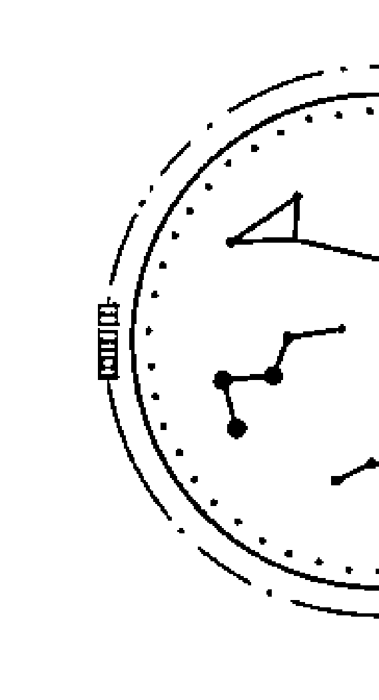

發現自己的本來面目後，可以「順隨天性而不踰矩」，達到這種高度，才是真的找到自我了。

第一宮又叫「本命宮」，影響人的本質是最大的。不同的行星落入同樣的宮位，會有不一樣的強弱表現，在傳統占星學中，以「廟旺弱陷」來表示，但我個人不太用這種論法，因為我發現，只要一個小小的相位，影響就比廟旺弱陷還明顯，也比行星順行或逆行明顯。看這顆行星跟他形成相位的行星本質合不合，我覺得還比較能分出吉凶，就算本質不是太合的星也沒關係，只要跟這個星座本質相合的行星有相位，這顆行星還是可以透過另一顆跟這個星座比較合的行星的接引得到接納，這時行星跟星座不太合的問題也解決了。就像我們對陌生人都會有戒心，尤其的不同行業或是生長背景不同的人，如果可以透過一個背景相似的人做介紹，對他的戒心也會比較降低，就有互相幫忙的可能性了。

行星的廟旺弱陷通常只跟星座有關，但我習慣把宮位也用一樣的邏輯區分，這就只是我個人的習慣而已，大家可以找出自己習慣跟能接受的用法，當然還是要經過驗證，確定無誤之後，這個方法才能用下去。就像天王星跟土星呈三分相，雖然是吉相，但兩顆星的本質相差太多，所以都有不利的因素，或者同時跟火星或三王星有其他不利的相位，才會有比較大的事件。跟善意的吉星，就算形成兇相，也是稍不對盤而已，不會形成太嚴重的後果，除非星座跟宮位說的話，還是相位比較強。廟旺弱陷有個基本觀念就可以，不用太過小題大作。

另外，水星在一宮的話很聰明，但相位不好的話，會過於投機取巧；金星在一宮的話，外表通常都很討喜，但相位不好的話，會給人太沒主見的感覺；木星在一宮的人通常很有正義感，但也會太理想化，反而搞不清楚世界的真實狀況；土星在一宮的話，從小對自己跟外人的要求都特別高。

## 第二宫

### 代表「拥有的物质与财富」

| 项目 | 内容 |
|------|------|
| 守护星座 | 金牛座 |
| 固定宫 | 三态 |
| 土象 | 四象 |

第二宫是在自我之后的下一宫，也就是象征我们「拥有的东西」的宫位，大部分是以物质为主，但如果有三王星、木星跟水星在此的话，通常我也当成是与生俱来或是家传的天分，毕竟二宫是财帛宫，财帛是后天培养，但也可能是才华跟实力转变成实体的呈现，只要可以转化成物质性的财富，我都算在财帛宫当中。第二宫又代表「房地产」，也就是很难抢走的财物，至少想要发现也得经过多道手续，没办法直接拿走，不容易被抢走的东西比较能长久持有，所以不动产是长期财富的代表。如果是工作得到的薪水，也是由第二宫代表。二宫代表生生不息的钱财，类似古代种的田，一年收割完了，明年可以继续再种，是永续的财富，不是赚一次就没有了，虽然比较缓慢，但生命力旺盛，可以永遠持續。薪水也代表沒有賠錢的可能性，是穩定的財源，而且不太容易中斷。

如果在第二宮裡的行星，是輕鬆跟富有的木星、金星，代表你的錢財會來得比較輕鬆。如果相位好的話，可能是有一定財富或名聲的人，如果相位不好，也只是賺錢沒有別人那麼快，但不會無以為繼。如果是凶星，例如代表「缺乏」的土星在第二宮的話，賺錢可能需要比別人還長的時間，土星也可以變成有錢人，只是要犧牲比較多資源交換，也要用很長的時間來慢慢累積。如果火星進入第二宮，代表錢財累積得很快，花起來也很快，好像用「燒」的一樣，因為火星本來就代表快速；水星在財帛宮的話，也會是快進快出，但金額大小沒有火星那麼誇張，水星是小起小落，火星跟冥王星則是暴起暴落。

第二宮也代表賺錢方式，如果是一些輕巧的行星，如金星或水星在其中，賺錢不見得比較快，但賺得比較輕鬆。如果是木星的話，代表家裡留了財產，或是有好的門路介紹給你比較穩定的工作，薪資也合理。太陽在第二宮的話，代表大家對你的信任度很高，名聲跟實力都是你的財源。月亮在二宮的話，不管賺錢的能力好不好，至少很會存錢，相位好的話，還擅長用錢滾錢，不會有缺錢的困擾；如果月亮的相位不好，可能實際上也不會沒錢，但會一直被沒錢的感覺煎熬著，覺得自己的錢怎麼算都不夠用，永遠有更多需要，存了養老費後，還要擔心下一代的生存，一輩子都覺得自己在追著錢跑。

## 第三宫

### 代表『天分与沟通』

| 守護星座 | 三態 | 四象 |
|----------|------|------|
| 雙子座   | 變動宮 | 風象 |

第三宮是常識跟基礎教育之宮，指天生的理解能力，也用來看智商高低，還有跟人應對的反應速度。第三宮是溝通、理解跟表達能力的宮位，代表平行的意見交流，所以第三宮代表同事、同學跟鄰居，也就是一般日常的社交圈。社交技巧要看第三宮，因為是交流跟溝通的『技能』；但人緣好不好要看第五宮了，因為五宮代表受不受歡迎跟領導能力，有時候第三宮好，不見得別人會喜歡你，因為太聰明了，講話不留餘地，反而有些人會恨你恨得牙癢癢的。在三宮內比較能發揮長才的行星是太陽、水星、金星、木星。如果土星在這個掌管交流的宮位（土星一向有溝通障礙）相位好的話，就是溝通比較謹慎細密，但可能喜歡反覆說明，讓某些人覺得不耐煩。雖然是吉相，可是造成別人不好的感覺，也是土星常常出現的問題之一，而且第三宮的速度很快，跟慢慢來的土星不一樣，所以這是宮位跟行星有沒有辦法配合的問題，跟相位吉凶無關。如果相位不好的話，就是別人講什麼你都聽不懂，你講的話別人也都聽不懂。火星在內的話是孩子王，凡事都會帶頭往前衝，如果相位好的話，有克服萬難的能力，而且講話乾脆俐落，沒有贅字；如果相位不好的話，表示凡事衝動又自私，在團體中會為了自己高興而把別人拖下水，還有可能陷他人於不義，誰叫火星本來就我行我素慣了，凡事只顧慮自己的感覺，他的想法決定所有行動，容易給別人帶來麻煩，就算是好相位也難免有這樣的情形。

第三宮也是兄弟宮，跟你同輩的同學、同事都算在內，也許可以看出你的手足跟你之間配合的狀況，互動好不好或是你們之間有無溝通障礙等。木星在第三宮的話，代表你的手足中有老師、教練或是公務員。有火星的話，代表有軍警之類的手足，或是除了軍警還可能是運動員，總之是比較像黑道。水星在第三宮的話，代表你的手足中會有能言善道的人，或是表達能力很好，例如靠文筆吃飯的人。金星在第三宮的人，表示你跟手足之間關係不錯，除非相位不好，導致彼此心防都很重，但至少會維護表面的和平，因為金星是不喜歡起爭執的。土星在第三宮的話，表示在智商上你比同年齡的人成熟，也能讓大家都聽你的意見，但凡事太過深思熟慮，可能會延誤時機。

## 第四宫：代表「外在与内在的私领域」

第四宮代表房子跟住家，但我覺得第四宮代表我們的「私人領域」，就像是別人不可入侵的地盤，物質跟心理上都一樣，就是別人不能觸碰的那塊敏感地方，只要是跟「私人」有關係的，都與四宮相關。四宮不但象徵住家，也象徵我們的「心理」，腦子裡的秘密、回憶跟小小的壞念頭，都藏在第四宮之中。擴大範圍，甚至連自己的辦公桌（因為裡面放著很多私人文件跟用品）、包包（這就不用解釋了吧？）、從自己的房子延伸到自己的房間（不見得每個人都有能力買房子，都可以納入第四宮。跟第四宮比較相配的行星，當然有太陽和木星，代表房子的價值跟房子的增值性高。太陽跟

| 屬性 | 值 |
| --- | --- |
| 守護星座 | 巨蟹座 |
| 三態 | 開創宮 |
| 四象 | 水象 |

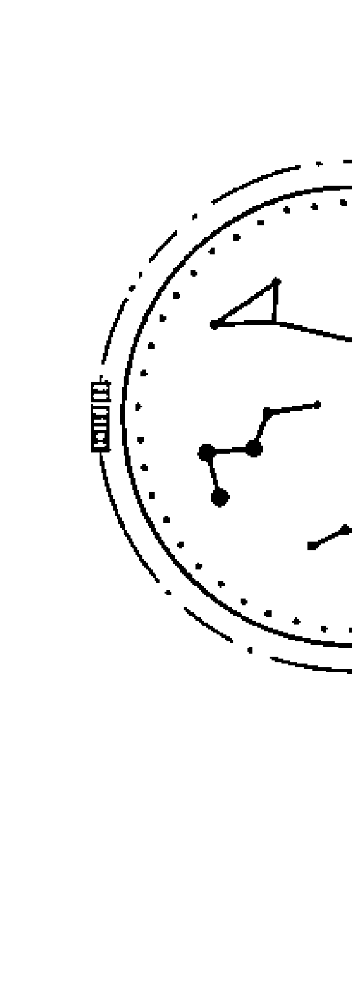

木星也會替心理增加一定的自我價值，就算相位不好，頂多只是不合己意罷了。比方你想要一億的房子，家裡只留給你三百萬的房產，你一樣是得到了，但心理上卻覺得自己吃虧或是匱乏，因為不如你原來想像或預計的那麼「大」，太陽跟木星都象徵豐富，也就是「大」，所以這就是你原本給自己的設定。月亮在第四宮的話，如果以房子來說還不錯，因為代表有安定的住處，但就另一個第四宮管的領域來說則是不太好，那就是「心理」，因為月亮跟第四宮都代表多愁善感，湊在一起顯得神經質。

土星在第四宮的話麻煩比較大，因為巨蟹的對宮，也就是魔羯座的守護星落入對宮的星座或宮中，本來就難以發揮，何況又是本來就「緊縮」的土星？如果土星在第四宮是吉相的話，很可能故步自封，但不會有太糟的結果，只是封閉保守過度，不敢冒險，所以也不容易有大成就。如果相位不好的話，很有可能會家境困頓，或心理上有貧窮的感覺，就是你身上雖然不是沒錢，但過度節省，把自己的生活品質弄得很差，不管實際上有沒有錢，日子都不好過。

四宮簡單來說，就是自己的地盤、管區，也就是自己可以控制的範圍，所以四宮的控制慾非常強。雖然是水象宮位，但也是有戰鬥力的開創宮。四宮不會攻擊別人，但如果你要侵犯他的領域，他拚了命也不會放行。他不會傷人，但如果你要對四宮在乎、保護的人不利，他是會跟你開戰的。雖然四宮是水象，戰鬥力不是很猛烈，但專長是糾纏不休。

四宮代表家人跟親近的人，為了「自己人」可以犧牲一切。四宮的格局不大，力氣也不多，只要你不在四宮的守備範圍內，他是不會管你死活的。

## 第五宫

### 代表『带点偏财运的游戏宫』

| 守护星座 | 狮子座 |
| 三态 | 固定宫 |
| 四象 | 火象 |

第五宫正名是「游戏宫」，也是一般说的恋爱宫或兴趣宫，我觉得可能因为恋爱是婚姻的前奏曲，兴趣也是职业的前奏曲，所以还不是进入正式范围之内的东西，都可以归在第五宫，也就是因为还不正式，一切都有可以选择的空间，并不是真的钉死。第五宫是狮子宫，火象第二个星座守护的宫位，在寻找自我的过程中，开始经历自我怀疑的阶段。我们在学生时代，有一种初生之犊不畏虎的自信，但面对真正的难关时，又开始怀疑起自己来了，这就是自大跟自卑常常会同时出现在第五宫的原因。在第五宫时，我们会争取别人的认同，此外也决定我们要赞成哪些想法、要筛选掉哪些不同的说法。第五宫是对自我价值的认定，「自我」是一件很重大的事，不像在第一宫（牡羊座）那樣全然對自己有信心，因為那時根本還沒有不是自我的想法出現的空間，一切都被「我」給佔滿了，全世界除了我以外，沒有別人存在的餘地。第五宮（獅子宮）是一個具體成形的世界的小首領，在你的生活圈中，當然會成為唯一的主角，這時你有沒有辦法跟別人和諧相處，取得別人的認同跟支持，也就是人緣好不好，把你當老大的人多不多，就取決於第五宮了。他不同於第三宮，第三宮通常只要求自己跟別人有平等來往跟交流的空間，沒有特別要求別人認同，而第三宮因為這樣的無所謂，反而容易取得別人的認同。我們都有這樣的經驗，一個人對評價非常在乎的時候，也就是處在第五宮的狀況下時，就可以光明正大地給他打分數；一個人覺得你給他的分數對他不重要的時候，例如在第三宮時，他就是當他自己，並沒有自己不被喜歡的恐懼，你反而對他比較敬重。一個人的初期自尊是在第五宮中成形的，如果在這個時候夠強壯，在第九宮就可以找到自己真正的方向。要先有好的基礎，站穩腳跟，才能在未來開枝散葉，變得更茁壯，所以第五宮是在一個小型的、初期性的團體中看到你的初試啼聲。

第五宮也代表小型的偏財宮，又稱賭博宮，就是在幸運的狀況下會有的意外財運，但不是真正的收入來源，比較像是天外飛來一筆的幸運，不是可以長期持續下去的。通常第五宮強的人，不會一次得到長期的財源，不過會有很多不定期的額外收入，金額不太大，但足以讓你的生活有一些驚喜，能額外多給自己一點慰勞。如果木星跟金星在第五宮，常常可以收到意外的禮物；火星在第五宮，會有老大的風範，旁邊的人都對你滿信服的，但如果是剋相的話，就會有一點霸道了；太陽在第五宮，相位好的話是很會照顧身邊的人，相位不好的話則是有點自戀。水星在第五宮，交際手腕會非常好，相位好的話，說話讓人如沐春風，相位不好的話，可能語帶刻薄，但又讓人無法反駁。

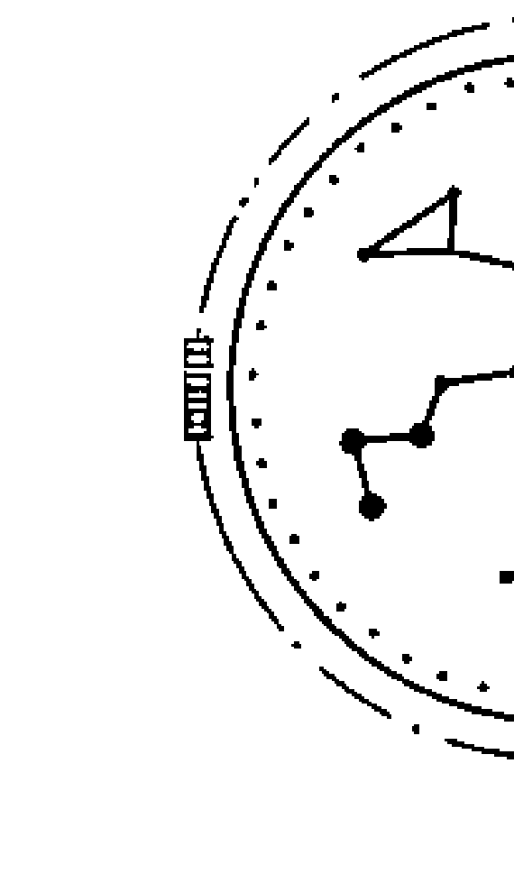

## 第六宫

### 代表「付出辛劳的职业宫」

| 守護星座 | 三態 | 四象 |
|---|---|---|
| 處女座 | 變動宮 | 土象 |

第六宮等於處女宮，在占星學中又稱奴僕宮，相對於下一個土象宮位，也就是第十宮（魔羯座）是代表老闆的宮位，可以看出第六宮仍在路上，第十宮則是到達終點，是物質世界的極致。我覺得上一個土象宮位，也就是第二宮（金牛座）代表原料，第六宮是加工過程，第十宮則是成果，也就是最後一步的成就。

第六宮是所有宮位中，最能代表平衡的一宮，雖然「平衡」這個形容詞一向出現在第七宮，但我覺得第七宮只是追求平衡過程的擺盪而已，第六宮剛好是十二宮的一半，位在正中央，所以第六宮才能達到完全的均衡。而第七宮進入後半黃道宮的起點，所以又要開始動了，對第七宮來說，均衡只是一個出發點，中間還要經過很多掙扎，所以第七宮也是下一個階段的出發點。第六宮是先平衡再掙扎，第七宮是先掙扎再平衡，所以這兩宮都是出了名的優柔寡斷。

第六宮（處女宮）有個毛病，就是太專注在眼前小細節的完美，反而忘記大方向，這也是他們成就有限的原因，因為太常把專注力放在不是重點的地方。而第十宮（魔羯宮）做得比較好，永遠知道重點在哪裡，而且抓得住，不會讓自己的方向迷失。第六宮也強烈地知道自己的社會的應盡義務，因為6* 是個人人為我、我為人人的數字，他不會逃避自己的責任。相對的，他對別人要求標準也很高，因為他已經做完他的事了，如果你不把你的責任也完成的話，整個團體就會崩潰。但可能因為對自己的要求太高了，反而不能坦率地承認自己的錯誤。

第六宮是職業宮，是社會需要你的地方、你能做出貢獻的部分，所以又稱服務宮，也就是代表你出力的部分。像企業提起員工的時候，通常會說：「他在本公司已經服務了××年……」表示員工對公司的貢獻，跟之後要介紹的第十宮「事業宮」又不同了，職業是你為了這個工作奉獻，但事業是這個工作為了你自己而存在。第十宮通常是四十歲以後的職場狀況，也就是你的工作真正穩定下來，開始發揚光大的時候，第六宮通常還是在「賣命」的時候。

第六宮也是健康宮，健康是代表平日保健跟生活方式，第六宮比較像是先天的體質跟免疫力。如果是天災人禍或是遺傳性的疾病，就歸屬在疾厄宮，也就是第八宮。

第六宮有金星跟水星的話，通常表示比較有交際能力，很適合做需要公關交流或文書處理的工作；如果六宮中有太陽的話，表示這個人的歸納能力很強，適合做品管跟醫藥類的工作；如果月亮在第六宮，適合做類似賢內助，也就是中級主管或秘書之類的工作；如果第六宮中有火星，表示他很適合做教育訓練，有木星的話，表示工作上的機會跟貴人會很多，也適合做些規模不大的小生意。

> * 以靈數學的觀點，6代表團體合作。

## 第七宫

### 代表「追求平等的公权力与伴侣相互成长的配偶宫」

| 守護星座 | 天秤座 |
| 三態 | 開創宮 |
| 四象 | 風象 |

第七宮是命宮的對宮，就是配偶宮，跟一宮的自我剛好是相對立的宮位，目的是要從配偶身上找到互補的地方，才能邁向更高的成長。第七宮是伴侶宮，也是契約宮，婚姻只是其中一種可能，凡是要簽定契約的夥伴，都可以納入這個宮位，所以七宮也代表「具體的承諾」。律師算是第七宮的職業，因為七宮是天秤座守護，講究公平性。公平不是自由心證的，當然要有具體的真憑實據，也要有條文跟規範可以參考，要有一份全民都認同的規矩拿來當依據，這個全民的共識就是「法律」，所以第七宮也是法律宮。雖然第七宮跟第十宮都跟法律有關，但我覺得風象的第七宮代表的是訴訟跟法律條文，也就是在爭取平等當中的拉鋸，所以空間比較大，沒有那麼絕對。土象的第十宮則是法官，代表最高憲法，無法更改，凡跟他抵觸者一律無效。風象的第七宮，還是有爭論的餘地，不像第十宮，是無法被挑戰的。

第七宮也可以代表行事時心中的最低標準，也就是無論如何都不能低於這個限度，不然你就會感到難以忍受。第七宮的標準並不嚴苛，他秉持的通常是常識，而且常常帶著對不同族群的諒解，因為他不太願意把任何人排除在規範之外，如果失去太多人，那共識也就不存在了。所以七宮代表的是常規，因為他不針對任何特殊族群，必須盡量擴大範圍，以求規則能適用於所有的人，所以特例通常會被排除在外。第七宮最致力追求的就是平等，他痛恨他認為不公正的事，但這只是大方向而已，他認為每個人的心中都有一把尺，只要不妨礙別人，就可以提出自己的看法跟要求。一旦越過，所有的人會來聲討你，所以第七宮也代表「公權力」，跟第一宮的「自我權力」剛好相反。

大多數人覺得天秤座常會在枝微末節上糾纏不清，但對許多行星落在第七宮的人來說，這些枝微末節才是整件事情的先決要件。七宮中如果剋相重的話，容易演變成用自己的主觀判定所有事情，而且不容許別人有異議，或壓根兒就認為其他可能性沒有存在的空間。這就是所謂的「鄉愿」，自認為自己是善意的，打壓任何「聽起來」可能是惡意的想法。

金星是第七宮（天秤座）的守護星，如果金星在第七宮，代表這個人會盡全力追求平等，如果相位不好的話，可能追求到的只是表象的平等，或短期的平等而已，長期下去就有可能會失衡。金星帶有粉飾的成分，就連他看到的公平也可能是妥協後的成果，並不是真正最終的公平。但第七宮追求到這種表面上的平等就已經不容易了，因為有那麼多人要求公平，為了讓大家都滿意，只好挑個最簡單的方式，大家各讓一步就好。我們都知道法律上被判刑的人，有些是過重，有些則太輕，但是團體生活就是這樣，沒辦法量身訂做，得要有個共同的標準才有規範可以遵守。

水星在第七宮的話，會很喜歡做仲裁，凡事都會講出一個道理來，但做不做到沒人知道，反正他的目的也只是要把自己的思緒整理跟表達出來而已。火星在第七宮的話，會全力追求公平。火星是對宮牡羊座的守護星，所以處在對宮第七宮算是落陷的，火星的本性非常主觀，跟第七宮的平等有所衝突，他必須找到自己的平衡點，不然價值觀就會無以為繼。太陽在七宮的話，會把自己的評論看得太過重要，不知道旁人可能根本不在乎，以至於給自己太大的壓力。

## 第八宫

### 代表「生与死、善与恶的极端宫位」

| 守護星座 | 天蠍座 |
| 三態 | 固定宮 |
| 四象 | 水象 |

第八宫是關於生與死的宮位，又稱生死宮或疾厄宮，醫學也由第六宮跟第八宮來代表。第六宮跟健康有關，如果生病了，要檢查出是哪裡出毛病，多的地方切掉，少的地方補上去，維持在平衡狀態就可以算是健康了。第八宮是一個極端的宮位，生與死、愛與恨，都是一體的兩面，都同時在第八宮表現。第八宮所謂的疾厄不只是生病，意外也算在內，只要跟生死有關的事，例如醫院、殯葬業，都是在八宮管轄的範圍。第八宮也是司法宮，不但代表軍警，也代表「黑道」，因為第八宮本來就象徵相反的兩個極端，極善跟極惡都是同一個判斷標準，只是分屬在不同的兩端而已。第八宮跟第九宮都是出了名會「追根究極」的宮位，尤其第八宮更要越挖越深，直到把所有。的秘密挖出來為止。第八宮又稱「玄秘宮」，代表我們無法參透的一切，也代表我們所有尚未發現的秘密。第八宮在現代占星學代表「心理分析宮」，因為八宮是人性的煉獄，任何想隱藏的都可以從裡面翻出來，包括遺失的性格、潛意識，或已經忘記的往事。八宮行星多的人，抓到一個小小的線索，就可以看出你目前心理遭遇的困難。第八宮象徵的東西很多，在命盤上最常看的就是「偏財運」，不是第五宮那種小小的意外禮物，而是達到官商勾結那種程度的大錢。第八宮代表所有人性的黑暗面，政治當然也跟第八宮脫不了關係，而金錢是象徵人性黑暗的最好代表物，所以大偏財當然也跟第八宮脫不了關係囉！對面的第二宮是正財，也就是付出同等努力或商品，獲取一定的報酬。第八宮代表中樂透、得到遺產、贍養費等等，也就是不勞而獲的金錢。因為沒有付出相對的代價，第八宮的錢財通常到最後都會消失。本身的能量跟你拿到的錢財能量不吻合，也有「不義之財」的意義。除非你能把自身能量提升到跟你到手的錢是吻合的程度，才能保住這些錢。木星在第八宮的人，有獲得大筆錢財的運氣，而且錢財跟貴人是一起出現的，如果是不好的相位，有可能要出賣別人才能成就自己的利益。水星在第八宮的人非常聰明，因為水星本來就是雙子座的守護星，雙子座是最機靈的星座，第八宮又代表深層的智慧，兩者合起來，就擁有可以通曉世俗的最高能力了。金星是魅力，第八宮則是代表謎樣的吸引力和性愛，所以金星或火星在第八宮的人，性魅力是很強的。太陽在第八宮的話，代表能夠把大家百思不解的事想出一個頭緒來，因為太陽代表光明，第八宮代表深層的秘密，太陽在第八宮，就是把本來不為人知的事攤到陽光下。月亮在第八宮，代表用情頗深，一旦有了困難也很難掙脫，因為月亮跟第八宮都是不饒過自己、會找自己麻煩的占星代表。

## Chapter 3 揭秘十二宫位

### # COLUMN 是否能成為巨星，要看第八宮

隨便打開一本占星書，都會說「表演」這個項目是由獅子座（五宮）掌管，更有大量的資料直接稱五宮為演藝宮。我認同第五宮跟「自我展現」有關，但演藝圈或藝術家，做的不只是展現自我這件事而已，他們其實更著重在「催眠他人、塑造自己」；網路上的名人命盤很多，就我記得的藝人朋友的命盤，反而都集中在天蠍座或第八宮，或冥王星性質很重；簡而言之，我看到的，演藝圈中天蠍質強的人，比獅子座多很多。
所以每次看盤看到有天蠍質（太陽天蠍座、太陽在第八宮、冥王星一宮的人）都會加入「自我推銷」這特質，通常會有某些部分的藝術性。天蠍質的表演跟自我表現，比獅子質（太陽獅子座、太陽在第五宮、太陽在第一宮）來得細膩又不著痕跡；獅子的表現，就是他有自信準備萬全時（大部分獅子都很害羞，這是因為他沒準備十足時根本不想讓人看到，可能躲了一年就是為了表現一天，因此大部分時間都處在內斂狀態），會跳出來把他的東西都秀給大家看，然後沾沾自喜等著大家鼓掌（但態度上會一副很謙虛的樣子，鼓掌完後，只要沒聽到什麼負評他就高高興興，很謝謝大家支持他，同時也覺得自己表現不錯，然後回家準備下一次演出。獅子質是愛表演，但能表現出多少東西很難說，天蠍質不是愛喳呼，但會累積很多讓人不得不看到的東西。天蠍人最喜歡玩那種「我也是千百個不願意呀！」的遊戲，他不會直接說出、表現出他想讓你看到的東西，而是會用一種誘導、暗示的方式，把你的思想往他想要你去的地方帶，最後你根本會以為這個想法是發自你自己內心，完全不是他造成的。為什麼在演藝圈或表演界中，天蠍質比獅子質好生存呢？因為大眾媒體上的表演，跟那種在家人同事同學面前「秀」一「秀」的表演可不一樣。你很直白一下子全部敞開來給人看？抱歉，這種愛現的人太多了，刺激不了觀眾的神經，除非你是另一個業界的人，願意上台來講解你的專業（如謝震武），或是你就堅持當個演藝圈公務員，恰如其分，雖然不是魅惑人心，但會成為觀眾熟悉信任的臉孔（如張小燕、湯志偉）。獅子質只代表「出現在大家眼前，是個公眾人物」，但是要讓他瘋狂，一邊罵他一邊又愛看他……這種人，非要有天蠍質不可。獅子質是把一切搬上檯面讓你觀賞，天蠍質則是搔到你的癢處，就算他藏你也會想去把他翻出來看。

好的藝人不見得一定要美要帥（說真的，長得太完美的人通常會淪為特色不足、沒個性，當配角的機率比較大），因為魅力並不取決於長相。就像很多我們現實生活中的萬人迷不見得是帥哥美女，而是他可能會傾聽你講話、看著你的眼睛，或者跟你同悲同喜……這些都是一種感覺、一種氛圍，需要有極度細膩的技巧，以及對人性的敏銳度才辦得到，而這些都是水象星座的強項，他就是有本事一副想要躲起來的樣子，但是你又沒辦法不看到他，尤其是天蠍質的人。

對於不管是藝人、模特兒，甚至是作家、畫家，我認為擁有天蠍質，會比獅子、射手、天秤、雙魚等出名的藝術星座來得吃香。天蠍質有另一個作用，就是其他星座特質的人會知道自己在表演，但天蠍質很容易過度沉溺跟認同自己扮演的角色，因此很難抽身，甚至會改變自己原有的人格特質。如果不夠成功，變得過度膨風、自戀、說謊、不承認失敗等，也都會是天蠍相位不好時的展現方式。

## 第九宫
代表『壮阔自己世界的升级宫』

| 守护星座 | 射手座 |
| :--- | :--- |
| 三态 | 变动宫 |
| 四象 | 火象 |

第九宫是迁移宫、外出宫，我觉得更贴切的名称是升级宫，因为九宫是把圈子扩大，所有往上、往外的发展都在第九宫。九宫有对外发展的意思，不会侷限在原地。相对的，也有自由跟扩张的意思。第九宫通常是国外旅游宫，不守在原来的地方，要去没去过的地方看一看，「进修」是第九宫的目标，代表往更高的方向去，不会停留在原来那个相对来说低阶的程度，「出国留学」是最好的代名词，就算不去国外念书，至少去增广见闻，也有「进修」的意思。

第九宫代表的是「哲学」跟「艺术」，也就是我们日常生活中不需要的东西，这些都是更高层次的思想追求。就像学业，我们基本上会认字，也知道一加一等于二，但是再更往上一层，就不一定是生活所需了，第九宫通常都是到大学、硕士以上的程度，因为不念硕士不会饿死，更高的學歷是一種對自己的要求，而不是生活必需品。相對來說，太高的學歷代表一種「奢侈品」，沒有錢就念不成。九宮的重點雖然不是生活品味，卻代表廣博的見聞，我們可以沒這個東西在手上，卻不能不認識這些東西。「搬家」也在第九宮的範圍內，因為要過另一種跟原來截然不同的生活，代表某種生活層面的提升，就算這不是你預期的，還是要做出改變。總括來說，第九宮是鼓勵你追求更好、更高的世界，層次也必須跟著提升，以免追去了以後，又被那個世界拋下。第九宮是要擴張自己，讓自己能適應更多層面，不管到達任何地方，都可以跟那個地方的人相安無事，而且能很快地融入。第九宮是你的自我擴張能力，不管你到了哪裡，都有往上爬的力量。九宮是不斷地追求自我成長，多學一點東西、多到幾個國家遊歷、多看一點書，這樣盡了力去配合世界後，就不需要世界來配合你了，你也會越來越自由，因為走到哪裡都可以生存得下去。

## 第十宫
代表「一生成就最高的事业宫」

| 守护星座 | 三态 | 四象 |
| :--- | :--- | :--- |
| 摩羯座 | 开创宫 | 土象 |

一般来说，除了整宫制以外，第十宫的起点又称「天顶」，是一张命盘的顶点，代表一个人生命中的高峰。我前面说过，二、六、十都是土象宫位，也代表生命中物质显现的过程，第二宫是「原料」，第六宫是「加工过程」，第十宫是「成果」，也是事实呈现出的最后样貌，白话说来说，就是我们的「成就」。第六宫代表工作，是我们在社会上贡献自己努力、技巧混口饭吃的时候，但十宫是我们真正展现自我的时候。在自我方面，我认为是一、五、九、十宫为一组，也就等於「个人的自我」、「团体中的自我」、「超越个人化的自我」、「到达社会大众眼中的最高自我」，也就是一生的成就，在物质世界中达到的顶点。依数字学来说，10是所有物质的极致，超过10以後，就脱离物质世界，到达了精神层面，11是人性、公益跟博愛，12是宗教、靈性跟慈悲，所有我們可以想像到現實中的擁有物，都在十宮中實現完畢。10除了我們擁有的物質，也代表我們在社會中擁有的身價，因為名聲、名譽跟評價，都是可以「變現」的東西。
10又代表自我的最高高度評價，也就是我們這一生在死之前，總共「結餘」多少殘值。太陽在第十宮的話，代表這一生會有很高的名望，也對別人很有影響力跟操控權。太陽就是權威的代表，太陽在第十宮，代表工作上非常有成就，可以影響到很多人。除了一家公司的老闆之外，通常太陽第十宮也會出現在公眾人物身上，因為太陽在第十宮，代表不管用什麼型態，焦點都會集中在他身上。我見過很多太陽在第十宮或十一宮的人，從事跟演藝圈或現場表演相關的工作，相位好的話，當然是名利雙收；相位不好的話，出峰頭時並非光明正大，也有可能是早期名聲非常好，但由於之前位置爬得太高，失去光芒時也會摔得特別重。
月亮在第十宮且相位好的話，從事的大多是照顧別人的工作，或是給予他人心靈撫慰跟支持；相位不好的話，則善於在別人背後搞小動作，或是利用別人的弱點。水星在十宮的話，大部分從事的是提供創意或策略的工作，類似顧問跟軍師；如果相位不好的話，則是提供餿主意，或是落給外人把柄，名聲弄得很臭而不自知。金星在十宮的話，通常是關於「形象包裝」的工作；不管是名聲還是外型，總之是「帶給大眾好感」的工作，也就是廣告或公關之類的工作，如果相位不好的話，會給客戶帶來不合效益的名聲，或引起出乎意料的結果，但金星跟水星都不是太凶的星，所以如果不是跟三王星形成的凶相位，結果都不至於不可挽回。

國外的占星學也流行一種看法，第十宮一般是父親宮，第四宮是母親宮，但他們近來認爲第十宮是家庭的重心，覺得重心比較在母親身上，父親反而是配角，所以就改成第十宮代表母親，第四宮代表父親。我不同意，因爲第十宮還有老闆跟元首的含義，所以第十宮象徵的是一種「父權」，也是強權的意思。我認爲父親是在你前方作爲示範的人，母親則是在背後支持你想法的人，母親的功能不是帶領你，而是推動你。第四宮還有家庭、房子跟「領土」的意思，喜歡劃出自己的小小範圍，把範圍內弄得舒舒服服，在自己的世界裡默默經營，不想去跟外面廝殺，所以第四宮代表家庭，也代表小範圍。我認爲凡是自己的包包、抽屜、房間，跟自己的心理，具有「私人」意味的都應該劃進第四宮。父親應該是面對公衆的範圍，因爲父親通常是影響你進入社會後產生的心態跟做事方式，而比較少私人交集的部分。所以第十宮代表事業跟社會，代表你的老闆或主管、元首，當然也代表父親了。如果月亮在第十宮，表示家中的主導權掌握在你的母親手上，或是你的父親把母親的責任擔起來了；反之，如果太陽在第四宮的話，代表母親把父親的責任擔起來了。我覺得父或母的重點應該是在行星而非宮位上，所以父親應該看太陽跟第十宮，母親應該綜合第四宮跟月亮，這樣會比較準確。

## 第十一宫
代表「世界大同和社会形象」

| 项目 | 内容 |
| :--- | :--- |
| 守护星座 | 水瓶座 |
| 三态 | 固定宫 |
| 四象 | 风象 |

第十一宮已經超越了十，也等於超越了物質跟個人的層次，所以第十一宮代表群體跟博愛。

第十一宮外面的世界非常廣大，但個人還是存在，只是佔的位置非常小，代表他跟全體比起來是微不足道的，所以第十一宮有著非常寬闊的心胸，他體諒所有的人。水瓶座還是跟第十一宮有些許差異（其他星座跟象徵的宮位通常差異不大），第十一宮代表一整個群體，水瓶座跟第十一宮一樣的地方是水瓶座有廣大的理想，這來自於風元素，但水瓶座也是固定宮，雖然對小事都不太在意（因為風元素），可是只要變成他的理念，就會死都不肯妥協，就算賠上一切也在所不惜（固定宮）。平常的小事水瓶座都非常和善好講話，大部分的人會以為他很好商量，那是因為大部分的事對他來說都是小事，可一旦他在意，並且堅持了，為理想付出代價了，就會覺得這是他對他人生來說最重要的大事了（雖然這種大事很稀少），為了想證明他付出的一切是值得的，他願意其他的事都不做來換取這個理念的實現。

第三宮是代表同事、同學、同輩之間的溝通，第七宮是代表合約跟承諾，第十一宮則是代表世界大同。雙子座是取巧式的口頭上吵贏，沒什麼後續的效益跟好處，朋友之間意見不同而已；天秤座是一定要凡事有憑有據，要有公證人，要把講的東西都白紙黑字寫下來；水瓶座則是大家要有共同的理想，一旦有人的想法不一樣，就無法成局了，所以白紙黑字保障不了什麼，因為每個人有自己的理念，大家各有各的自由。水瓶座雖然對自己的想法很堅持，但也不喜歡強迫別人，他只是咬定自己相信的東西，誰都無法改變他的想法。有一句話我覺得是針對第十一宮說的：「我不同意你的意見，但我誓死捍衛你表達意見的自由。」歷史上有很多科學家，提出的理論都無法見容於當時的學術界跟社會，但他們相信自己觀察出來的事實。記住，不是看到的，因為眼睛看到的東西也會騙人，所以水瓶座是用他卓越的觀察跟推論能力得到結論。

說到聰明，第一個想到的會是雙子座（第三宮），因為第三宮跟我們的距離比較近，聰明的方式也是我們比較可以了解的，大家對他的認同度也會比較高。第十一宮講的根本就是我們想都沒想過的範圍，所以當然沒辦法判斷對錯，只有相信或不相信而已，相信的就會全然吹捧，不信的就會嗤之以鼻。第十一宮又代表「社會形象」，第十宮代表的是「社會地位」，地位跟形象是不一樣的，地位代表實質方面的成就，社會形象則是以他一生做過的事作為論斷的重點。

## 第十二宫
代表「无形无我的灵性与梦境」

| 守护星座 | 三态 | 四象 |
| :--- | :--- | :--- |
| 双鱼座 | 变动宫 | 水象 |

所以可塑性是最大的。在十二宫中，变化性最强的就是第三宫（双子宫）跟第十二宫（双鱼宫）。
第十二宫代表灵性跟梦境，第十一宫代表科学，两者都是超越人类的存在，但是等级还是不一样。第十二宫无法脱离整体而存在。也因为无我，第十二宫什么都可以，但也可以什么都不是。第十二宫就是彻底「无我」了，因为他跟世界融为一体，他就是整个世界，整个世界就是他，个人自我变得很小，以世界上其他事物的存在为重。第十一宫代表公益跟正义，也就是真理，但跟博爱不同，「博爱」代表兼爱，但还是有「我」「他人」的分别，还有「自我」的存在，只是那个自我变得很小。第十二宫是最后一宫，在这里，原本的小爱化成大爱，小我也化为无我了。跟第十一宫的博爱不同，「博爱」代表兼爱，但还是有「我」「他人」的分别，还有「自我」的存在，只是那个自我变得很小，以世界上其他事物的存在为重。第十一宫代表公益跟正义，也就是真理，但跟博爱不同，「博爱」代表兼爱，但还是有「我」「他人」的分别，还有「自我」的存在，只是那个自我变得很小。第十二宫是最后一宫，在这里，原本的小爱化成大爱，小我也化为无我了。

第十一宫代表「大我」，第十二宫代表「无我」，因为第十二宫是虚无缥缈的，代表「另一个世界」。我们想象中的世界跟梦境都是另一个世界，没有具体的存在，所以第十二宫又代表我们逃避时会遁入的地方；不管是什么形成的「上瘾」，毒瘾、酒瘾跟恋爱瘾，都在第十二宫的虚似世界中，因为第十二宫必须逃离自己，才能用另一种形式存在。心理学、神秘学是第八宫，代表任何我们还没碰到，但藏在潜意识之中的世界，是人类还没完全了解的部分；科学跟命理则是第十一宫，因为命理还是有逻辑的架构，有理论有传承；灵学就是第十二宫了，因为灵学是完全无形的东西，宗教跟艺术也被归类在第十二宫，这些都是「难以名状」的存在，我们无法具体描述它们，所有艺术的存在都只是其中一部分而已，有多少个艺术家，就有多少种艺术形式，艺术没办法模仿也没办法复制，只能意会得到它们的存在。

第十二宫有时又像一个大熔炉，把所有可能的存在性丢进来。别忘了，第十二宫也是「无我」，所以包含了所有「小我」的存在，打破所有小我的疆界，让我们都成为同一整体，变成一个更高的自我。第十二宫除了「上瘾」这个比较负面的代表，也有「升华」这个正面的意义——把我们提升到更高的层次。

太阳在第十二宫的话，很多人会觉得太阳被「藏」起来了，因为第十二宫是虚无的，而太阳要发光发热，但我通常会解释为太阳在第十二宫代表的领域，例如宗教或艺术上发光发热，那也是另一种遮掩，因为在一般人的世界中，觉得宗教跟艺术不算「正式」的成就，如果相位不好的话，真的有可能逃避现实，或染上什么不好的瘾头。月亮跟第十二宫都属于心灵层面，他的话，就是迷迷糊糊了。水星代表思考能力，在第十二宫如果相位好的话，是可以触类旁通；相位不好的话，就是思考能力全失，相位好的话，则是对灵学跟艺术特别「狂热」；这就是太阳跟火星的不同，毕竟火星的专注力容易丧失，容易变成散弹打鸟，就看你的焦点投注在哪里了。火星在第十二宫的话，跟太阳有点相似，相位不好的话会动力全失，相位好的话，则是对灵学跟艺术特别有热情。金星在第十二宫，很容易在感情上变成地下情人又摆脱不了；如果相位好的话，我觉得在爱情上会特别看得开，没有负担，因为第十二宫本来就是无形的，所以很容易变成某一个形状，也很容易改变。金星在第十二宫的话，第六感会特别敏锐，也会有灵学跟艺术方面的天分，跟神鬼也会有天生的感應。

## Chapter 4 行星座落宮位表現

## Constellation Performance

## 一、太陽在各宮位表現

太陽代表一個人散發出來的氣場，也代表基礎的人際關係跟最淺層的社交（人緣要看水星、金星跟太陽）。

### —— 太陽在第一宮&太陽牡羊座 ——
### 真誠不做作的老頑童

太陽在第一宮的人，也會帶有獅子座的特質，因為第一宮是本命宮，太陽則是獅子座的守護星，我以前的書裡就寫過一個案例，有個人的太陽跟上升都在雙魚座，她卻覺得自己沒有任何雙魚座的特質，我坐在旁邊聽，突然靈機一動，問她：「你是不是喜歡誇張的打扮？粗線條，不喜歡計較較小事，大方助人又熱心，還很愛面子？」她問我怎麼知道？一臉驚訝的樣子。很簡單，因為太陽是獅子的守護星，當然就會擁有獅子座的特性。即使你的第一宮或太陽星座不在獅子座，只要太陽在第一宮，就會展現出太陽獅子座的特質。

獅子座跟牡羊座同是火象，第一宮也是火象宮位，太陽在此，火象的特性也會被強化，這是最真誠的宮位，因為火象星座本身就有誠實不做作又童真的一面，加乘之下顯得特別孩子氣。可能是太陽比較重視別人評價的關係吧？若是太陽落在第一宮的牡羊座，不會像其他牡羊座這麼火爆。如果太陽相位不好的話，有可能會打腫臉充胖子，或把不是自己的成就都算到自己身上。

太陽在這個宮位雖然誠實，但也不是沒有想騙人或自私的時候，只是通常都很不容易識破，久而久之，他就不再白費力氣了，在某種程度上，算是有點自知之明。只是如果太陽的相位差一點，他可能會常常當眾出醜而不自知。這可能也是太陽在第一宮或牡羊座可愛的一面吧？

### 太陽在第二宮&太陽金牛座
### 談心之前先談錢

第二宮和金牛座都重視物質，太陽在這一宮的人會很務實，格外在意感官能夠接收到的事物，包括視覺、聽覺或嗅覺，所以是個感官享樂主義者，也會意外地現實，凡事都希望可以用眼見的獲利評估來衡量，聽到太抽象的事情，意識上會無法理解。第二宮或金牛座的人只能接收具體的觀念，至少也要有具體的形容或比喻，才能在他的腦中構築出形象，讓他的想像有個現實的基礎。

# —— 太陽在第二宮 & 太陽雙子座 ——
演說技巧滿分的意見領袖

方向可以依據。
太陽掌管的獅子座是固定星座，加上掌管第二宮的金牛座也是固定星座，兩個固定星座加起來，格外地頑固，所以太陽在這個位置，會比其他位置來得更固執。

太陽在第二宮或金牛座的人喜歡任何有價值的事物，如果隨著時間過去，價值會隨之升高的更好，例如不動產或古董。少數太陽在雙魚座、水瓶座或其他水象星座的人，也可以接受在抽象領域有價值的事物，在太陽第二宮的人眼裡，即使現在很抽象，只要未來有發展性，有把這種抽象象事物變現的可能，都是值得期待的，尤其是有增值性的東西，他不在乎要等久一點。在他的腦中，凡事都會折合成現金，就算不是現金，也要折合成對他有現實價值的事物，也就是等值交換。跟這樣的人來往，可能很麻煩，也可能少見地簡單，因為凡事清清楚楚，把所有的利弊得失攤開來講，要就要，不要就不要，事情反而很單純。第二宮（金牛）跟太陽都不愛拐彎抹角，凡事挑明了講，可以省去很多繁瑣的過程。

太阳守护的狮子座跟守护三宫的双子座一样，都很重视人际关系，所以太阳在第三宫或双子座，会特别在意自己的社交技巧，尽量在每个人的面前表现出好相处的样子。

第三宫是人际宫，太阳在内可能代表这个人是意见领袖或点子王，或是他的意见很受重视，在社交上非常吃香，是个极受欢迎的人。第三宫的机智加上太阳的不作，形成了比较少见的搭档，一般聪明的人会被认为心眼较多，也比较会耍心机，但太阳的真诚跟第三宫双子座的「聪明（奸巧）」刚好形成对比，融合成开朗，却又罕见的有话直说的人（应该是懒得说谎吧？）。

太阳三宫的人讲话很有技巧，可以捧高人又不会得罪人，因为第三宫跟双子座都不喜欢得罪人，自保的技巧也非常高明。如果太阳相位不好的话，就善于利用自己的好形象，达成私人的目的，或者可以说他不管做什么好事，都有背后的计划。

太阳在第五宫或狮子座的人，很难做到不卑不亢，不过太阳在第三宫，就会是个人缘极好的人，因为人际关系对他来说就跟吃饭一样简单，他可以收放自如，拿捏得恰到好处，不会露出破绽。对他来说，演技是一种天生本能，或许这种演技中也揉合着真心（因为太阳就是真我）。跟第三宫的沟通技巧组合起来，本来就是真话中参杂着部分假话，在谎言中又有着一部分的事实，连他自己都不能完全划分清楚。

## 太阳在第四宫&太阳巨蟹座

### 不可或缺的Key Man

太阳在第四宫或巨蟹座，等于在狭小的范围中取得自己的成就或是占有一席之地。就我的理解是，在冷门的行业或是已经快要失传的行业中拥有自己的地位，虽然格局或范围不大，却占有执牛耳的地位。或是这个行业的范围不小，他却掌握一个重要零件或是关键技术的公司，虽然公司不是很大，却是不可或缺的一环。

第四宫跟巨蟹座都代表房子或土地，他的主力也可能是跟家庭相关的行业，并且在其中取得不是很大，却足够呼风唤雨的地位，或是心力都放在家庭上，家人是他最大的成就。太阳四宫很适合从事家庭基金或是家管的工作，只要能让他掌权，他不在乎工作的内容或是性质。也许他会特意挑一些很冷门的行业，这样就能确保竞争者不会太多。这个位置的聪明之处，就是在很小的地方取得很高的地位。我们都知道，就算在小公司里，只要名片上的身份是老板或高级主管，就足够让人肃然起敬了。

有时太阳在第四宫也会过于低调，因为他觉得树大招风，宁可在自己的小小天地享有自己一定的成就就好，只要他重视的人肯定他就够了，其他人的看法根本不重要。或是他有另一个秘密的网路身分，或在专业领域中家喻户晓，只是这个了不起的身分他不公开，这样既可以享有他的地位，又可以享有他的隐私。

# 太阳在第五宮 & 太陽獅子座

只要叫我老大，情和義值千金

太陽本來就是獅子座的守護星，這等於是行星回到了本命宮，這是個會過度膨脹自我的落點，
你要說他討人厭的話，有時候是有那麼一點點啦！但是也滿好應付的。我就跟學生說過一個笑
話：獅子座的人非常大方，願意幫你付錢，替你做一些能力範圍內的麻煩事，只要你在完事以後，
記得給他拍拍手，不用付錢也不用回報，給他一些虛名就可以搞定了，因為獅子重視別人的尊重
跟肯定大於其他一切。如果太陽的相位不好，他會因為過度自戀而付出過大的代價，可能是錢，
也可能是失去其他重視的東西，但是他怕丟臉，所以吃了虧也不會聲張。這會讓對方食髓知味，
一口咬定，愛面子愛到連裡子都失去了，就是在說這種狀況。
如果太陽的相位好，對自己的要求會非常高，凡事一定要做到最亮眼最棒為止。他對自己的
斤兩拿捏得很好，知道自己的實力在哪兒，又到什麼程度，沒有把握絕不出手，因為他很怕丟臉，
與其做出丟臉的事，不如什麼事都不要做。但他對別人的表現很寬容，因為他覺得你沒有他的天
才及能力嘛，也不能要求太多。但是他自己可不一樣，自己比別人有能力，理所當然應該接受更
高的要求。其實真正的王者是太陽在第一宮或第十宮，這兩個位置可以靠自己的實力拚出天下，
而不只是眾人的吹捧。第五宮只是在同溫層中佔了老大的位置，而且族群還是少數，但獅子座就

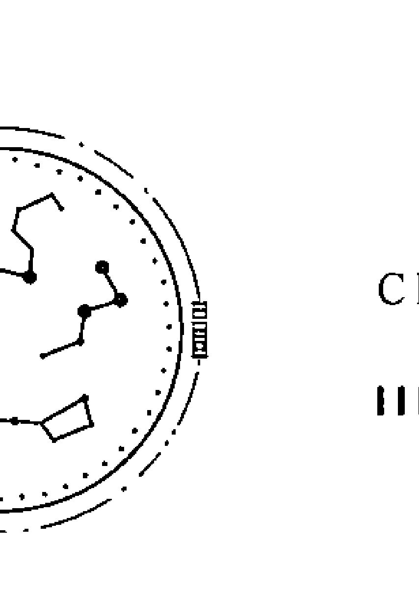

是看不开，如果连这么一小群人他都搞不定，从何说更大的事业呢？他一定要在他眼见的範圍内称王，不然对更大程度、更高的境界会没有足够的信心。

第五宫是恋爱宫，太阳这颗位高权重的行星在此，与其说在感情上呼风唤雨，不如说他对恋爱非常重视，因为那是他肯定自己的方式之一。他是来找观众的，或是找被他保护的人，或者找可以跟他匹配的对象，为的是要让别人羨慕。至少他在恋爱中的名声还算不错，也就是有「留给人家探听」的余地。所以跟太阳五宫恋爱的好处是，只要相位不太差，通常他的恋爱对象是不会吃亏的！

# ——太阳在第六宫&太阳处女座——

### 推卸责任是因为太负责任

太阳跟处女座的共同点是很喜欢照顾比他弱势的人，而且两个都非常负责任。也许有人会反驳处女座负责任这点，就我的观察，通常处女座的女生比较敢做敢当，而男生有时会推卸责任，是因为内心有「求完美」的压力，做不到时也不敢承认，只好把错推到别人头上，让自己的良心比较好过。但是女生不那么在意社会眼光，比较能勇于面对自己的过错，也比較勇于承担。

# 太陽在第七宮&太陽天秤座——既是神隊友，也是里長伯

太陽是非常溫暖善良的行星，太陽跟天秤座的共同點就是人際關係非常好。太陽是喜歡當大佬，天秤座是善於講理，所以太陽在天秤宮的特色就是喜歡講公道話。雖然是維護正義，理壞掉的人、事、物當成自己的使命，所以也很適合當醫生。這個落點有時會因為責任感太重，容易太投入，把自己搞得身心俱疲，最後只好放棄。這個狀況的元凶在於太陽而不是第六宮，只要有太陽才會這麼不計得失，把自己的一切都丟下去，最後得不償失。這就是太陽在第六宮的缺點吧？他太習慣當拯救者了，容易把自己搞出心理壓力來，只有適時脫離，才能夠調適自己。如果出現壞相位，有可能因為壓力太大，索性都不管了，出現極度不負責任，凡事都一推二五六的案例。

基於十二宮是他的對宮，我覺得神職人員也滿適合太陽六宮的，畢竟又有誰比神明更尊貴，更值得服侍呢？

# 揭秘十二宫位

但是也會站在弱勢那一邊，不會趨炎附勢，會把所有的事從每個角度都看一遍，確定自己沒有遺漏任何觀點，再用最和善的方式講道理。 太陽是大家的老大，一定會幫弱者出頭，而天秤座的守護星金星，擅長與人相處，所以太陽七宮非常善於處理人際關係、非常有人緣。如果你不是弱勢者，那跟天秤沖上就麻煩了，他會鍥而不捨地跟你爭論到最後，即使他的本意不是要跟你爭執，而是想跟你溝通，但太陽的強勢加上天秤宮的咄咄逼人，還是很難不讓人聯想到吵架。等你氣呼呼時，他卻一臉優雅地跟你討論正事的樣子，一點都沒動怒，一副「我只是在跟你講道理啊！」的樣子，真的會覺得不知道他是狀況外，或只是在耍你。太陽七宮這落點，有時難免讓人覺得虛偽，如果加上不好的相位，就很難避免這種誤會了。 第七宮是配偶宮，太陽在此，表示你的另一半可能名聲地位頗有來頭，也有可能外表特別體面，讓你覺得很有些面子，或特別有保護慾，無論如何，他都不太會讓你受到委屈。太陽七宮的人，配偶特別適合拿來炫耀，因為不管在內在外，他都滿值得誇耀的，就算沒有什麼優點，也會在別人的面前表現一副神隊友的樣子，不會讓你漏氣。

# ｜太陽在第八宮&太陽天蠍座｜

### 深入人心底層的暗黑教主

這是表面上看起來有點衝突的位置，因為太陽代表光明，第八宮卻代表最深的黑暗，也是最底層的地方，太陽跟第八宮組合在一起，會不會把太陽原有的光明遮蔽了？有可能，但只要相位不太差，我覺得正好相反，太陽能把原來藏在黑暗裡的東西表現出來，也就是照亮它，把深層的東西挖出來，會帶給我們更多收穫，讓我們看清楚更多事情。如果積壓的秘密或是醜聞爆發了，有可能就是流年太陽走到天蠍座，這是一個掀開黑暗面的相位，把所有不堪的東西都爆出來，讓它有修正或照亮的機會，有契機搞清楚自己真正的問題在哪裡。這個相位特別適合做「研究」，因為第八宮本來就是還深藏著的知識，太陽去把這些深層的東西挖出來，展現在世人眼前，當然是研究的行為囉！
如果深層的東西能夠被我們探知，當然是一件好事，因為這代表學問的增進，所以這個宮位也代表心理學，因為人的大腦思想是最深層、也最難得知的領域，太陽八宮可以本能地發現真相，進而挖掘。
太陽在第八宮或天蠍座，對於一些人家說不出口的事，會憑著本能的直覺感受到，特別容易探測秘辛，即使別人沒有說出口，他用常理去推敲，也可以得出八九不離十的結論，這個特質最

## # 太阳在第九宫 & 太阳射手座 —— 集中火力追求新鲜感

适合当医生了，因为能知悉病人说不出口的感觉或是症状。如果有坏相位，就会使用这能力来刺探别人的隐私，或是不想说出口的悲惨经验。他有把别人不想说的事公诸于世的倾向，是宛如侦探或间谍的潜能。跟善于厘清表面问题的太阳七宫比起来，太阳八宫能解决的是深层问题。

太阳跟木星都有尊贵的意涵，只是木星的尊贵是精神面的，太阳的尊贵是实质地位上的。

射手座常常被说热爱知识跟学问，他所代表的旅游，除了实质的旅游，也是意识层面的旅游。

太阳也象征最想让外界看到的形象，落在第九宫，会希望自己看起来是个很有知识、很大器的人，随时可以把人带入不同的精神世界，让人觉得你不同凡响。

太阳九宫不喜欢聊一些日常五四三，比较高层次的思辨，或为他人带来新见解。只要是能带给人新的观点，无论是国外的见闻、专业领域的新知，乃至艺术上的见解、宗教上的体会，都会让太阳九宫的人觉得很满足。

# 太阳在第十宫&太阳魔羯座

### 百岁挂帅，老有所成

太阳在第九宫的人，虽然不觉得很常旅游，至少会接触很多国外的网站或杂志，因为他以“知识资料库”自居。太阳喜欢照顾大家，而九宫喜欢给予别人前所未见的东西，所以太阳九宫的人，就算没有亲身经历过，也能就收藏的资料讲得头头是道。或是你原本就了解的事物，他会找出另一个切入点，让你重新去领会，再经历一次，让你在原有的事物上发现更高的层次。让别人提升到和自己同样的层次，对这颗太阳来说是莫大的欣喜，因为如果层次一样，你们就可以一起飞翔，互相增长见闻了。

总之，太阳在第九宫的人，都有一种尊贵的气息，这种尊贵并不是有钱或有地位，而是见识上的广博，而且乐意分享。大家都会很仰慕他，也愿意跟他交换知识，他的所见所闻就越来越多 样了。

太阳跟魔羯座相似的地方，就是两个星座都是王者，只是狮子座享有荣耀，魔羯座掌握实权及利益。魔羯座不喜欢虚名，但喜欢别人对他的肯定及信任，更喜欢的是随之而来的好处，他的

控制慾比獅子座太多了，獅子只要你的讚賞，魔羯座卻是想要你人生的控制權，對魔羯來說，要就全拿，只有一點點掌聲，感覺就像在開玩笑似的。沒有帶來實際好處的東西，在魔羯的眼裡就是無用的東西。

第二宮（金牛座）、第六宮（處女座）、第十宮（魔羯座）是同一組，都屬於土象。在我的分類裡，第二宮代表擁有的資源，第六宮代表創作的過程，第十宮代表產出的成果。第十宮代表物質世界中，人生最高的成就，也就是一生的頂點，所以第十宮的宮頭在占星學中又稱「天頂」。

太陽代表名聲，第十宮代表利益，所以代表王者的太陽位於第十宮，就是有名有利，而且第十宮是長期利益，會留存很久，越老越能享有。太陽魔羯的人自信來得很晚，他要做出第一項成績之後才能開始肯定自己，不然之前一直都在戰戰兢兢的狀態。跟月亮十宮一開始的非常自信心不同，太陽十宮從一開始就相信自己總有一天會有成就，只是不確定運氣什麼時候來臨。

我認識很多駐場歌手，很湊巧的，不管是什麼星座，大部分人的星盤都是太陽在第十宮，太陽在第十宮有「名人」的意涵，就算不是名人，至少也是面對大眾的工作。我有個學生去當兵時，幫同胞看星盤，看到他的命盤是太陽在第十宮，然後越看越覺得這張臉很熟悉，突然想起來，他是一個童星，只是長大以後息影了，當年還算家喻戶曉呢！

魔羯座是土象，土象要實質的好處，也比較聚焦在自己身上，但土象是陰性元素，比較不重名聲，要的是實際的利益，所以跟第十宮結合起來，就是有名又有利。太陽十宮如果早年就有成就，這成就就會一直延續到中年以後，即使改行，也會做出一番很不錯的成績，不會只是曇花一現。

# 太陽在第十一宮&太陽水瓶座

### 為人類福祉步上街頭

太陽掌管的獅子座跟水瓶座是對宮，代表兩個星座之間有相似之處，對宮一向是同中有異，異中有同，這兩個星座的共同點是「大眾」，也一樣有無私的成分。水瓶座比獅子座更無私，因為獅子座是為了自身的名譽，水瓶座則是為了全人類。不過水瓶座跟獅子座一樣是固定宮，有固執的一面。

太陽的特質本來就是想要別人的肯定，風象又是不注重自己利益的人，太陽十一宮將兩個特質結合起來，更是非常無私，所以代表的就是「公益」，

他追求的是全人類的福祉，甚至地球上全部生物的福祉。他認為人類跟所有生物有著一樣的權利，追求權利不分性別、不分人種，也不分物種，這種思想從小時候就生根了，而且終其一生都不會改變。太陽在這裡，好的地方是善於利用自己的名聲，

替自己想要達成的事情鋪路，畢竟名聲是很好用的東西，對於關心全世界比關心自己更多的太陽十一宮，名聲是他的工具而不是目的。

大家記得水瓶座是不管他人閒事的吧？只有為了公眾的事情才會插嘴，或者在他眼中看起來會妨礙他人的事情，覺得應該挺身而出，他基本上不會為了自己的好惡去評判他人的行為，只有為了公眾的事情才會插嘴，

在他眼中看起來會妨礙他人的事情，覺得應該挺身而出，他基本上不會為了自己的好惡去評判他人的行為，只有為了公眾的事情才會插嘴，或者在你危害到他心中那個標準時，他才會開口。在十一宮的太陽，更會為了公義跟公道上街遊行。

# 太阳在第十二宫&太阳双鱼座

### 在幻想与灵界间悠游自得

太阳跟双鱼座相似的地方，在于两者都很天真。太阳是不相信别人，因为他觉得质疑别人对自己的形象有害；双鱼座就真的搞不清楚状况，虽然在某些人眼里会觉得他很可爱，但实际合作时，这种特质就令人困扰了，完全要看你从哪个角度去看。

太阳在第十二宫有光芒被藏起来的意思，太阳是要在天上大放光明的，而十二宫是深海，太阳被藏下去，就没办法发挥原有的光与热了。但太阳也可能因此照亮十二宫，摊开大家平日不常见的事情，可能是秘密，可能是心底深处的创伤，如果被太阳照到，这一切就显得没什么大不了的。

太阳在十二宫，对抽象的事物特别有天分，因为双鱼座是水象变动宫，象征朦朦胧胧不清，对所有的人都搞不懂的抽象事物，反而会有特别的直觉，不需要经过逻辑分析才会认知到，举凡艺术、灵学、梦境等，越模糊的事，太阳十二宫越有天分。

太阳跟双鱼相反的地方，在于太阳非常清晰明亮，但十二宫却是暧昧不明。太阳进入十二宫，可以把本来模糊的地方清晰化，整体也会变得更加正面。太阳跟双鱼都会为别人著想，如果太阳在这里，会用自己的号召力，召集更多人一起从事帮助别人的工作，或一起追求心灵上更高的境界，因为十二宫代表的是灵性，这跟九宫的「修行」不一样，十二宫是释放本具的天赋。

## Chapter 4 行星座落宫位表现

十二宫双鱼座本来只是想而已，行动力并不强，虽然很有艺术天分，但没有余力製造作品。如果太阳在内，想展现自己的欲望就会加强，会变得更爱现、希望大家都知道自己的才华，所以更有可能被人发掘，更有可能出名。掌管双鱼座的海王星，也掌管电影跟动画。电影是一个建立在虚幻上的工业，如果太阳在十二宫，有可能在电影艺术方面有成就，甚至可以到家喻户晣的程度。

# ## 二、月亮在各宫位表现

# ### 月亮在第一宮&月亮牡羊座 —— 不是自私！只是更愛自己

人分內外兩面，太陽代表對外的那一面，月亮代表內心的一面，也就是隱藏起來的那一面。

第一宮就是我們的命宮，太陽在裡面我們很好理解，但凡事低調的月亮在愛表現的第一宮，我們就很難捉摸了。月亮生性躲躲藏藏、有話不直說，月亮在第一宮，就是月亮的猶豫跟三心二意會在外表顯示出來。如果相位不是太好，會給人扭扭捏捏的感覺，男生會呈現女性特質，但現在這個社會，有女性特質的男性還滿受歡迎的（像我個人就很喜歡）。而呈現的是女性的正面特質還是負面特質，就要看相位來決定了。

第一宮是本命宮，膽小、戀家又怕生的月亮，落在大無畏的牡羊宮，會緊緊抓住每一個跟他有關係的人，並且相挺到極點。月亮牡羊只會認自己人，因為月亮本來就代表小範圍，牡羊也只聚焦在自己身上，其他人自然不在他關心的範圍內。

月亮掌管情绪，如果落在冲动的牡羊座，这个人的情绪会非常强烈，有什么感觉就一定要说出来或表现出来，不像单纯的月亮（巨蟹座）那么会自保。单纯的月亮是自己心里难受得要死，却打死都不肯让别人知道，牡羊座不一样，他不高兴时一定弄得天下皆知，而且别人最好也跟他一起不高兴（月亮嘛！感觉是第一名，加上牡羊的自我，就会更幼稚）。因此月亮在牡羊座就是自己的情绪最重要，不太管别人心里的感觉，即使你跟他说了，他也无法想像，更无法体会。整体来说，月亮牡羊比太阳牡羊自我，太阳牡羊至少在外人面前要做个样子，月亮牡羊则是自己的感觉最重要，别人我管你去死。月亮牡羊对于国仇家恨非常重视，他非常在乎自己的状况，平常常可以不管整个社会，但是国家的国格被侮辱时，月亮牡羊的保护欲一定会马上跳出来，因为这是跟他「自身」相关的事。月亮也有保护家园的本能，虽然国家社会的范围大，不在月亮跟牡羊的圈子内，但是情感上的认同，对月亮牡羊来说很重要。毕竟那是存活下去的基石，如果国家跟家没了，他也就无法存活了，活下去并保有自己拥有的一切，是月亮牡羊最在乎的事情。

## 月亮在第二宮&月亮金牛座

手有不動產，心有歸屬感

這是疑神疑鬼的月亮在十二個星座或宮位中，最有安全感的落點了！只要相位不太差，月亮多疑又多慮的個性，在實實在在的第二宮或金牛座，會得到很好的安撫，不會像在其他宮位一樣，動不動就覺得自己有危險。月亮最恐怖的就是喜怒無常，常常會因此逼死自己或其他人。但在現實生活中，實際上並沒有發生什麼事，一切是他心裡的小劇場爆炸而已，而月亮落在第二宮或金牛座，能夠讓這股情緒安定下來。

月亮需要安全感，金牛是土象固定宮，兩個加起來，會把一切屬於自己的東西都抓住並存下來。二宮對於資產的累積有著超人的能力，但是對於開源就不太行了。月亮金牛只在固定的軌道上能走得好，如果要他突破跟創新，那可是戳到他的痛處了。月亮膽小，金牛座緩慢，這兩者加起來，一切都以保守為出發點，就算要創業，也必須在傳統的產業中，且有許多前例可以參考，才不會那麼不安。我有客人是日水瓶（風象固定宮）月金牛（土象固定宮），他說他覺得最幸福的事，就是每天做重複的事情。

沒有火象跟水象這些情感元素，只有風跟土這種理性元素，所以喜歡規律的情境。

月亮在土象固定宮的第二宮，除非水星到了第三宮或雙子座（或是第九宮／射手座、第七宮／天秤座），不然可能會很沉默，因為事情沒有定論之前，他不喜歡妄下結論，就算心裡有很多想法，也不太會輕易表達，頂多是說句風涼話而已；第二宮最會的就是當不沾鍋了，因為月亮對跟他沒有關係的人，不太愛管閒事，頂多只是看看笑話或看看熱鬧而已，除非與他的利益相關，才會看到他慷慨激昂發言或有所行動。此外，如果水星在多話的相位、月亮在第二宮，大多數講出來的話都跟心裡想的不一樣。月亮在金牛座，跟藝術非常有緣分，可能很會畫畫也可能很會唱歌，反正總有一種特殊的美感及鑑賞力，所以可能往鑑定師的方向發展。如果不愛這種風花雪月的事，就會對不動產特別有興趣，畢竟月亮代表家庭，金牛座又代表資產，這兩者合起來，就是代表不動產跟裝潢業，也就是房子。如果月亮金牛沒錢買房子，也會把看預售屋當成興趣，走進房子時，就開始他心中的幻想，而且總有一天會實現；月亮在第二宮，對於擁有固定資產這件事可是非常執著的，而且裝潢自己的房子，能夠讓他有一種成立了自己王國的感覺，這是完全屬於他的地方，別人都不能侵犯，這也是月亮在第二宮最重視的部分——歸屬感（如果有第九宮／射手座的太陽或星群，或是十一宮／水瓶座的太陽或星群，這種傾向就不會那麼嚴重）。月亮在金牛座，如果相位好的話，會喜歡美食跟漂亮的東西（尤其金星同宮或有相位，這個特質會更明顯）。讓他最有歸屬感的是他的收集品，能使他感覺自己是豐盛而安全的，因為想要的東西全都拿到，從此不會再缺乏了；不動產是會帶來安全感的東西，存款跟保單也是，「擁有」能給他滿足感，讓他不再需要追求更多事物，沉浸在這些東西的包圍之中就夠了。

## 月亮在第三宮&月亮雙子座

高智商高敏感，思緒變幻莫測

月亮二宮相位不好的話，佔有慾會過強，甚至自己明顯不需要的東西，也不願意放手，囤在家裡不知道要幹嘛，可能佔有本身給了他一種安全感。但囤積太多事物，反而會給自己造成太多的負擔。

月亮有一種特質，位於哪個星座，這個星座的本質就是他私下的那一面。有些人會覺得雙子很多話，但是在這裡，不見得會把他多話多變的那一面表現在外，因為那是太陽跟水星的事。月亮在第三宮或雙子座，他私底下頭腦動得比你能看到的部分快多了，也更加不受限制，因為在腦子裡想事情，總比表現出來容易得多。月亮是一顆多變的行星，雙子座也是十二星座裡變化度最大的星座，這兩者加起來，變幻莫測的程度遠超過太陽在雙子座的人。月亮的性質比較陰暗，所以月亮三宮懷疑別人，或對別人抱有不滿的可能性比較高，也因此想要算計別人。雙子座的聰明才智讓他很輕易就能達成這些目的，所以更無法收手。如果月亮相位不好的話，很容易變成小奸小惡的人，或是變成真正的小人，因為他不管有什麼目的，都讓別人無法猜測也無法預防；如果相位好的話，思緒會特別敏銳，可以猜測到別人說不出來的心思，簡單來說，雙子座是高智商，月亮則是高敏感，這兩者結合在一起的時候，就是無敵的了！頭腦想不通的部分，還可以依賴月亮的直覺及第六感，等於沒有什麼事情可以瞞過他了。如果你覺得身邊有人的月亮在第三宮或雙子座，但好像笨笨的，也很無感，開始懷疑我說的是否正確時，那可能是他的月亮跟木星或太陽形成了剋相，所以有點天真，也有點搞不清楚狀況，他猜測的事情常常是自作聰明、自以為是，或是他把你瞞得太好了，依你的腦袋，猜不出來他真正的想法。

月亮在三宮，最讓他有安全感的是自己解決問題的能力，只要有這種能力，他就不用怕外界的侵害，遇到什麼事都可以轉危為安，這種「化解」、「轉化」的技巧，讓他覺得自己遇到任何事都有辦法安然度過。

如果相位好的話，月亮三宮會是個心思非常細密的人，因為月亮的敏感加上雙子座的聰明才智，會把一切都看在眼裡，卻不會聲張，等到有必要時再出手。他是一個見聞廣博，卻又守得住秘密的人，這兩個特質很少出現在同一個人身上。相位不好的話，會有很多陰暗的想法，而且小動作很多，因為他擅長瞄準別人的缺點，然後在必要時加以攻擊，可能他不會時時觀察你的弱點在哪裡，但需要找到你的弱點時，也絕對不會含糊，而且會迎頭往你最在乎的痛點打下去，雖然危害不會很久，卻令你難以忘懷；但這都是能夠解決的範圍啦！因為月亮跟雙子座的格局都沒有很大，幹不出什麼大壞事來。

## Chapter 4 行星座落宮位表現

## 月亮在第四宮&月亮巨蟹座

### 深具戀母情結的情勒專家

月亮在巨蟹座，等於回到本命宮，因為巨蟹座就是由月亮守護的。月亮在巨蟹座的人，情緒會特別多變且顯露在外，也就是所謂的情緒化，內心的波濤洶湧無法掩飾，因此常常波及到旁人。

如果相位好一點的話，這顆月亮有可能讓大家都感覺到溫暖親切，視朋友如家人。他常常會因控制慾太強而干涉別人的自由，雖然說是出自好意，但巨蟹就是會不由自主地擔心太多，就算不關他的事也一樣，一旦他把你當成重要的人，就會把你和自己視作共同體，完全沒辦法置身事外，就算你沒要求他也一樣，因為那是一種自然而然的反應，記得吧？月亮代表本能。我自己親身的案例是，當我跟一個陌生人的月亮和第四宮有交集的話，就會感覺他非常親切，即使我們兩人之間沒有什麼共同點也一樣，那是一種與生俱來的關係，就像天生的家人一樣。

進入第四宮的月亮，等於加強版的巨蟹座！也因此特別容易擔心，也容易管太多（不管相位好壞都一樣）。如果相位不好的話，更有疑神疑鬼的特質，有時候會演變成被害妄想症，嚴重一點甚至會六親不認，因為他活在自己的情緒裡，讓想像取代了現實。這種不安感，只能交給歲月解決了，但巨蟹座可不是想得開的星座，變成對家人展開情緒勒索的可怕老人機率會大一點（可能別忘了我說過，過度發展的月亮，會變成冥王星，那可是非常恐怖的老人家）。我碰過幾個案例，是母子雙方的合盤，當一方的月亮合相另一方的第四宮宮頭或宮內的時候，這個孩子就會特別地戀母，有剪不斷理還亂的情結。錢財方面，我認識很多巨蟹座，要他掏錢出來，就好像要他的命一樣，巨蟹座對錢是只進不出的。月亮巨蟹又特別注重生活所需的日常用品，每次經過大賣場、10元商店或特賣會，他們都忍不住要進去逛一逛，好像不趁這個時候多囤點貨就會吃虧一樣。他必須知道也確保他生命中習慣或熟悉的一部分，會永遠留在他的生命中，讓他永遠不會感到匱乏，因為這是安全感的來源。如果這顆月亮跟火星、土星或水星有相位的話，就會比較怕麻煩，只買需要的東西了；如果月火的相位又跟木星另外有相位的話，他可能會因為恐懼缺乏，而產生一種今朝有酒今朝醉的心態，反而變得非常奢侈，行星跟行星之間的相位有很多種變形，要小心地注意每一個相位的連結。有一個日月都是巨蟹的男生回應：「我一次擁有四種香皂，每天輪流使用，把其他三種先收在浴室的小櫃子裡。表面上『想要每天感受不同質地與香味，並且滿足『囤積』的安全感』，事實上是『這樣就可以放心地大量使用，並期待接下來的第五、六、七、八種香皂』，然後其他非生活必需品則是死都不買（或者鎖定很久然後放棄），這根本是變態呀！（可以設想一下，哪一顆行星不太需要安全感，月亮如果跟這顆星產生相位的話，就會解開這個魔咒了。）」月亮四宮如果相位好的話會是奉獻型的人。以前有個男人想要追求我媽媽，甚至我媽媽不在家的時候，也會每天來打理我們小孩的日常生活，他本職是薪水很高的工程師，卻要到我家來做長工，我都覺得不太好意思，但是他卻樂在其中。有一天我們正在吃他煮的晚餐的時候，他用一臉幸福的表情看著我們，然後默默吃起他碗裡的東西，我好奇地問他那是什麼？他不好意思地說，這是他小孩昨天晚上吃剩的飯。我問了他的出生資料，發現他果然是月亮巨蟹。他還有巨蟹座的另一個特點，一般男人劈腿，通常都是想左擁右抱，但是巨蟹的心態，比較像是這兩個女人都擁有我，對兩邊都非常照顧。像這個叔叔早就有女朋友，在我家做牛做馬的時候，他女朋友還會打電話來問他今天忙什麼？他都說在工作，而且還會輕聲細語地跟女朋友說：「老婆，不用擔心我啦！我愛妳喔！」我覺得這也是巨蟹座沒有安全感的表現，因為他隨時擔心會失去現有的感情，因此一定要囤積下一段，免得失去這一，就什麼都沒有了（我們當然還是會跟媽媽打小報告，我媽媽最後也沒有接受他的追求。由於我爸爸媽很早就離婚了，所以我並不反對他們各自另外發展感情）。

月亮在第四宮或巨蟹座，如果相位不好的話，很有可能歇斯底里。遇到不如己意的事，就會如同世界末日一樣，牽拖到所有人，把小事化大是他的專長。如果你是他的配偶或血親的話，他對你的要求會更高，而且希望你對他的事能夠再重視一點，如果是男人的話，愛嫉妒跟小心眼的特質，一點都不輸給女人。如果相位好的話，就非常溫暖體貼，他對你的付出，就像他對你的要求一樣全心全意，但是哪天心情不好，有可能會玉石俱焚！因為月亮本來就是情緒化的行星，不管相位好壞，他的心情永遠都是陰晴不定的（如果水星、金星或土星跟月亮在同宮位置，可能會理智一點點）。月亮巨蟹座看事情會比較保守，他怕自己過度樂觀，到最後會讓自己很失落，所以都維持一種不要想得太好的習慣。保守過度的話就會變成悲觀，但這也能說是一種危機意識。

## 月亮在第五宮 & 月亮獅子座

悶騷又愛面子，一旦被認定就難逃手掌心

月亮是「隱性」的意思，跟太陽在獅子座不同的地方是，月亮獅子座的人比較接近「悶騷」，他會在心裡觀察一切、比較一切，暗暗地打分數，替自己評分，然後暗自懊惱或得意（如果太陽在陰性特質的星座，他更是什麼都不會講）。月亮的觀察力，讓他比太陽獅子座多了一分細膩與直覺，他不像太陽獅子座只想要掌聲而已，月亮獅子座會比較到很深層的部分。例如「他對我的誇獎是不是出自真心？」「依他的生命經驗，這個誇獎是不是很特別、夠不夠優秀？」「他有沒有什麼弦外之音？」——就是這些想法讓月亮獅子座想太多，所以會忽喜忽悲，別人搞不懂他怎麼了？不是正在誇獎他嗎，他怎麼看起來不太高興的樣子？月亮獅子座的人可能想到，你對每個人都是同樣地讚美，因此你的誇獎只是一種客套話，自己的表現並沒有太出色。可能你的誇獎非常真心，也非常有誠意，但他就是不滿意，因為你有哪些地方講得不完美。獅子座在十二星座中最光明正大，月亮是心裡的想法，即便想隱藏，最終還是會表現出來。月亮在第五宮或獅子座，很多應該是OS的話都會出口，因為他實在藏不住，如果月亮在水象、土象宮位，或是跟陰性行星有相位的話，這種情況會改善很多。如果在火象星座或宮位，難免會把所有想法表達在臉上，或是用暗示的方法說出來，例如講反話表達他的不滿，或是拐彎抹角罵人，或是他其實很想不著痕跡地表現，但是非常失敗，全世界都看得出來。

月亮獅子座是暗中的王者，智商也不低，是個難搞的對象。他的情緒比起月亮巨蟹座來說不多遑多讓，只是月亮獅子座難以掩飾，會用各種方式來強調他的感覺，月亮巨蟹座則比較難看出在想什麼。

月亮第五宮或獅子座必須確定有人會永遠支持他，最好是忠心耿耿的程度，不會有哪天為了小小的原因而背叛他，當然他自己也不會背叛別人，他喜歡兄弟義氣相挺或是肝膽相照的感覺，他受傷害的機會很大，但是他的誠意是不容置疑的。

雖然這個世界不是他想像的那麼單純，他常常把「一輩子」掛在嘴邊、放在心上，而且非常認真。

第五宮是戀愛宮，月亮在此的人，會把自己談戀愛的對象當成家人一樣經營。也許你們還沒論及婚嫁，但是月亮就代表已經成為一體，他甚至可能像你的爸爸或媽媽，對你的事情很有干涉的慾望，可能會非常黏人，或是對你的佔有慾望非常強，對你的好朋友都會感到吃醋，甚至會歇斯底裡，沒有理性可言。雖然他非常愛面子，有時面對狀況時會裝得很大方，但是月亮跟獅子座或第五宮的控制慾都很強，一切可能都有秋後算帳的傾向。

月亮也代表太太或媽媽，在男性的星盤上，如果月亮在獅子座，他娶的人一定有哪裡是他引以為傲的，可能是外表特別漂亮，也有可能是特別有才華或是特別聰明。

## 月亮在第六宮&月亮處女座

唸你，是為了你好

處女座是一個服務的星座，月亮處女座不像太陽處女座的人那麼愛付出，因為月亮是很愛計較的行星，會不斷暗中評比你的付出跟他的付出差多少、有什麼不同、公不公平？如果他覺得自己的付出沒有收到相等的回報，就會停止付出；處女座畢竟是務實的土象星座，講究公平。月亮在六宮或處女座，對這個世界有他的一套標準，而且會嚴格衡量達到標準的程度。他會觀察力，讓他成為心理研究家。為什麼月亮處女座不會表現出他有這麼高的智力呢？因為月亮處女座很低調，覺得自己不應該展現出來，轉而欣賞聰明的人或是囂張而自信的人，這些人有著他沒有的特質，因此格外吸引他，但是這跟他本身的道德標準又不太一樣，所以月亮處女座會想要糾正這些人。月亮處女座表現出來的碎碎念或是愛挑剔的程度，可能勝過太陽處女座，尤其跟他熟了以後，更會發現他多麼麻煩。如果你成為他的家人，他會為你付出一切，不管什麼麻煩都會幫你扛下來，即使嘴上抱怨，言語也常常尖刻，但還是會負起責任，因為他覺得跟你在一起，就是他的命了！處女座也是變動星座，不是完全的那麼忠誠，只是對自己的道德面有潔癖，所以他通常只是搞搞曖昧，不會真的出軌。換對象太麻煩了，會打破他原先建立的規矩，而且他的心臟並沒有很強，就算有其他喜歡的人，他也只是每天想想，每天重新掙扎一次，到晚上睡覺時還是決定回復常軌。凡事若有清楚明確的規定，會讓月亮處女很有安全感，但還是要預留一點小小的空間，讓月亮處女有喘息的機會。我覺得太陽雙子加月亮處女（或金牛、摩羯），會是完美的爸爸跟老公。因為輕鬆的雙子座加上負責的土象星座，不僅負責，且不會給家人壓力。我爸爸就是日雙子加月亮處女，常常有朋友問我：「你這樣做，你爸爸會不會反對／不高興？」我都回答：「不會，我爸爸對我忠心耿耿」「我看過的好男人也都是太陽雙子、月亮魔羯或處女，雖然太陽雙子月亮金牛還沒看過，這樣的人，應該是孩子做什麼都懶得有意見（笑）。」月亮在第六宮如果相位好的話，對什麼事都有一定的嚴格標準，而且會執行得非常徹底，連旁人沒有告知的細節也會顧及到。如果相位不好的話，不只是疑神疑鬼，還可能因為他的猜想，找一些罪名給你安上去，就像電視劇裡負面形象的檢察官，如果他懷疑你，就一定要想辦法證明你是有罪的，似乎這樣才能讓他保住面子，到了偏執狂的地步。

## 月亮在第七宮&月亮天秤座

猶豫不決，只為了求完美

天秤座是以公平正義出名的，如果月亮在這個宮位，可能只是心裡有很高的標準，不見得會說出來干涉別人，但內心會思考，怎麼樣才能更公平、更好？因為月亮就是想法多於做法，也無法說出來。月亮在第七宮或天秤座，有一種凡事都想要追求真相的本能，會不斷衡量、不斷比對，直到得出自己真正滿意的答案為止。太陽在天秤，常常只求交代得過去，讓別人沒話講就好了，實際上倒是沒有那麼要求嚴格。月亮天秤不一樣，他會小心地比對每個細節，非常講究權利義務，只求做到完美（可能也不是面面俱到啦！只要自己定下的範圍內達到就好了，但是相信我，在這個範圍內也不是簡單的事）。因為沒有說出口，就比較沒有被反駁的機會，所以更加堅持己見，慢慢在心中形成一種堅定的鐵則，所以月亮天秤比太陽天秤還要固執，還好是風象星座，跟他說理還是說得通的。如果你講的道理，明顯比他有說服力，他就會承認並且臣服。承認事實是月亮天秤的優點之一，這也是很多人覺得天秤脾氣很好的原因。遇到該堅持的事情時，天秤還是會拿出開創星座的精神奮戰，而且不喜歡讓步。月亮在天秤宮，會非常在乎你對他的重視度，也會不斷以此來衡量你愛他的程度。讓月亮天秤有安全感的地方，就是公平正義得到實現，並且要讓他看到。就算不是公開的也沒有關係，他必須知道凡事最終還是有個公平的結局，私下討回公道也沒有關係，只要讓他知道真相，他就可以安心了。第七宮是配偶宮，月亮在此，雖然是法律帶來的關係，但是他真的把你當成血親看待，也會跟你從今往後不分彼此，甚至把你當成小孩子來寵愛。即使有一天離婚，他也很難割捨下你，對他來說你是永遠的家人，如果有了小孩，這種狀況就更明顯，他是一個拿不起放不下的人。月亮有剋相且在第七宮的話，有可能會死纏爛打，或是為了一點小事就歇斯底里，可能也很愛記恨。

天秤座是由金星守護，一開始他會非常講理，因為金星本來就代表理性溝通，而且非常配合對方，但是因為有月亮，等到關係確定或是結婚以後，就會跟你算舊帳，而且會變得不可理喻。如果相位好的話，可能會給你一種親密無間的感覺。

月亮在天秤座的缺點是，常會在心裡批判別人，卻又不願意乾脆把話說出來，反而出現「只有我才知道真相」的錯覺，但知道的真相卻沒有經過驗證。因為月亮只敢想想而已，很可能越想越偏激，也可能陷入自我爭論中，在心裡不斷提出質疑，又自己想辦法合理化，反反覆覆，弄到最後搞不清楚該相信的是什麼了。

月亮在天秤座的優點是非常在乎對錯，就算大家都已經忘記追究一件事了，他還是會將事情的始末記得牢牢的。此外，月亮守護的巨蟹座跟天秤座都是開創星座，有著絕佳的衝勁。月亮天秤座即使決定做一件事之前非常優柔寡斷，一旦確定方向之後，他就會不達目的誓不罷休，因為天秤座是風象，月亮是水象行星，雖然中間可能會繞點圈子，但是目標始終沒有離開他的腦海。

## 月亮在第八宮&月亮天蠍座

凡事都往心裡去，愛與恨加倍奉還

月亮是一顆敏感容易受傷的行星，落在負面情緒很多的天蠍座，更加容易受傷了，動不動就想不開，覺得全世界都在跟他作對，覺得別人對他不懷好意，如果相位好的話會減輕這種被害妄想症（是的，月亮天蠍是月亮巨蟹的負面加強版，還會因為覺得自己受委屈而產生報復的心態，不像月亮巨蟹只是躲起來自怨自艾。天蠍是會採取行動的，輕則不理你，重則對準你的要害、踩到你的痛處，讓你實際受到損傷）。相位不好的話，愛或恨都特別濃烈，情緒非常容易暴起暴落，徹底發揮天蠍座極端的特質。

月亮代表母親或家人，如果月亮在天蠍座或第八宮，大部分跟媽媽或家人有著難解的心結，可能是小時候受到不公平的對待，也可能是被害妄想症出現。我常常看到有些孩子其實滿受父母疼愛，但由於父母比較嚴格，對孩子的要求跟獎懲的標準不一樣，造成孩子的誤解或過度想象，覺得自己受到父母虧待，久而久之便滋生恨意。或是從小就失去了父親或母親（月亮其實只代表母親，但只要是可以依靠的家人，我都把他們算在月亮內），所以對自己沒有依靠的命運也會產生不平。如果相位好的話，月亮在天蠍座其實可以提升自己的程度，因為天蠍不只代表更深的智慧，也代表挖掘出更深的內在。月亮天蠍觀察能力非常強，也有著敏銳的第六感（雖然跟妄想症有點類似啦！但是好的相位也讓他非常準確，不好的相位才會變成疑神疑鬼；雖然依古典占星學理論，月亮在天蠍就是落陷，偏向負面的解讀較多，但我覺得相位的影響，還是贏過廟旺落陷）。月亮在八宮的缺點是因為第八宮掌管安全感（跟第四宮很像，這兩宮都跟恐懼有關），落在天蠍宮時，他的不安全感會更嚴重，時時覺得自己受到威脅，不過也會因此練就出防禦能力，會居安思危，在必要時自保。相位不好的話，會把身邊所有人都當成假想敵，心神不寧，惶惶終日，有時還因太過渴望保護自己而錯怪好人。對！就是我們常常看到黑道電影裡出現的情節，由於樹敵太多，擔心別人來報復；一旦引起他的疑心就直接把你定罪了，容易不分青紅皂白地出手。請記得天蠍座就代表黑道，很容易因為恐懼而失去理智。要讓月亮天蠍有安全感，首先必須讓他掌握敵人的弱點，確保隨時可以置對方於死地。雖然他不見得想害人，但是他知道自己立於不敗之地時，反而不太會出手攻擊，只有在缺乏安全感時才會亂開槍，那時的受害者更多。總之，要讓月亮天蠍覺得自己是安全的，他才能保證其他人的安全。

月亮在第八宮的優點是非常搞得清楚狀況，什麼事都瞞不過他的法眼，因為他有著超強的第六感跟冷靜的分析邏輯，智力也高人一等。雖然他不太喜歡發言或出鋒頭（太陽、水星在火象星座或雙子座的話則例外），但是在狀況不明的時候，會忍住什麼都不要講，是非常沉得住氣的人。

實際上，我覺得月亮在第四宮或巨蟹座，狀況也只比月亮在第八宮或天蠍座好一點而已，甚至難纏的程度更勝於天蠍。天蠍畢竟是喜歡一刀兩斷的，巨蟹卻有可能纏夾不清，不像天蠍一樣要死要活有個定論。

## 月亮在第九宮&月亮射手座——在知識的海洋中放飛自己

我們都知道射手座是很開朗又正面的星座，膽小又負面的月亮落在這裡，最正面的好處是讓射手有了月亮帶來的持續力。好奇心強的射手座，容易凡事有興趣卻不長久。雖然有火象星座的集中性，讓他還是可以研究到某個深度，但是到了這個程度以後就停下來了，因為射手座是變動宮，目標很容易改變。射手座比起對宮的雙子座，好一點的是風象跟火象的差別，火象比風象深，所以射手維持在同一件事情上的時間比雙子久。風象跟火象都沒有耐性，雖然有月亮幫忙，但月亮的力量是隱藏性的，還是難敵射手座的變幻莫測。月亮的謹慎觀察性質，放在愛研究的射手座上，會让他注意到别人不在意的地方。相位好的話，會特別小心又特別有深度，好的月亮射手很博學，因為他對引發自己興趣的事都會認真對待，不妄下定論，一定要研究出可以說服自己的道理後，才會確定出一個可以說服他人的結論。比較累的地方是，月亮的好奇心很重（月亮很好奇，只是月亮寶寶不說，因為月亮沒有安全感，凡事都想知道，看看別人有沒有在他背後搞什麼鬼），加上射手的研究性質，會讓自己有做不完的功課。月亮跟射手座的性質完全相反，月亮是憂鬱又小心翼翼的，射手座對自己的好運氣充滿信心，這兩者結合在一起，讓他的運氣不錯卻還是保有謹慎的態度。不像太陽射手容易得意忘形，月亮射手會把自己的研究先藏起來，免得樹大招風，直到自己有結果後才自信地公諸於世，這樣反而讓自己注意的事受到保護，不用太快面對外界的考驗，有時間去沉澱及成長。

月亮在第九宮或射手座，缺點是容易被騙，尤其是自認絕不會受騙的狀態下，特別脆弱且容易下手，因為他們對自己的智力有著絕對的自信，反而容易輕敵而誤判。月亮射手座的優點是凡事都帶著正面的思考態度，就算心中有隱憂，也會全力鼓勵自己，有時候會成功把自己安撫下來，最後就逢凶化吉了，這是火象成功突破月亮的心魔的狀況。

要讓月亮射手有安全感，他必須知道自己是自由的，如果有了一個永久的家或有人會永遠等他，他反而可以哪裡都去，繞完世界一圈後，最後再回家休息，這就是家對他的意義——最後不會沒有地方可去。擁有的知識可以給他帶來安全感，如果世界上有他不知道的事，那危險實在太大了，知道越多就越安全，所以月亮射手或第九宮，會有蒐集情報跟考取證照的嗜好。

## 月亮在第十宮 & 月亮魔羯座——永遠做最壞的打算、最好的準備

月亮守護的巨蟹座是魔羯座的對宮，兩個星座是相沖的，月亮落在魔羯座或第十宮，等於落到不合適的星座。但我一貫秉持著的想法，宮位的影響比不過行星相位的影響，所以如果月亮跟其他行星有好相位，一樣可以帶出好結果。尤其跟木星、水星或金星有好相位的話，影響就格外重要了。因為這個位置實在滿負面的，沒有強力的好相位的話，很難撥亂反正。魔羯座的守護星是土星，月亮跟土星的共同點就是有點憂鬱，凡事習慣做最壞的打算。月亮加上魔羯當然容易有悲觀的傾向，優點是凡事先做最壞的心理準備，反而容易出現驚喜。就算本命的月亮沒有什麼好相位，也會有流年行星來幫忙啊！總有一些流年的行星會跟本命的月亮產生好相位的時候，這時就是因為你耐心跟謹慎帶來收穫，或是長久的等待有了成果的時候。這個落點對時間格外有耐性，只要時間一久，再怎麼不好的狀況，都有可能像好酒一樣越陳越香。魔羯座本來就是老運很好的星座，月亮又有著無比的耐心，有點「一等久了就是你的」的意味。月亮魔羯就是比誰活得長，活到最后的人就贏了，可以收割所有的成果、看到別人看不到的風景，所以千萬要撐下去，雖然生命對你來說可能是艱苦的考驗，可是到最后的收穫也會比別人豐盛。月亮在此，磨難會比別人多，畢竟魔羯座的守護星土星是老年跟耐心的行星（也是出了名的第一凶星，代表阻礙跟困難），月亮則是代表內心感受的行星，依我看盤的經驗，這些磨難都是會有收穫的。魔羯座的成就雖然晚，但是比別人大很多，可以維持到生命終了了，也就是越晚享受，享受得越多。土星有「大器晚成」的意思，偉大的政治人物都是晚年才在社會上發跡的；魔羯座也代表政治、社會，甚至國家，因為格局很大，要建構的事非常多，得窮盡一生的時間去經營。

聽說百分之七十以上的國家元首，在魔羯座或天蠍座都有重要的行星，這兩個星座是出奇有耐心的星座，但是魔羯座的格局又比天蠍座更大。魔羯座比較注重實戰，天蠍座比較注重心理戰，當然魔羯座也會打心理戰，但通常是現實上的需要，他不做多餘的事，不像天蠍是沒事也要一耍下來證明自己的實力。月亮在魔羯座或第十宮的人可能帶點陰沉的性格，如果太陽星座在比較樂天或溫和的星座，就會讓他的氣質可親一點。

月亮魔羯座擁有越多，越有安全感，他可能會嫌現有的東西格局太小，不能保障他的永久生存，所以有貪得無厭的傾向。他不知道生命中的哪一刻需要什麼東西，所以會不分種類地累積，有什麼就收集什麼，尤其權力跟地位比其他的東西更需要，這兩項是不分時間地方跟對象，都可以派得上用場，這樣才能給他真正的安全感。從另一方面來說，也是一種沒有自信的表現，因為他必須藉由外在的成就來定義自己。

月亮在第十宮如果是好相位，凡事沉得住氣，會很有耐心地等待好機會到來，雖然等待的時間比他預期的久很多，但是對他來說，等著就等著唄，不等時間也是一樣會過去，等待一個可以期待的未來，至少還有一點收穫。如果相位不好的話，則會有自卑的表現，因為月亮覺得自己天生就比別人弱勢（他其實很優秀，就是出在自信不夠而已，但他就是沒辦法理直氣壯）。月亮本來就比較畏縮，而且在第十宮，是容易展現在公眾眼前的宮位，雖然到晚期才比較明顯，可是老實才反而沒自信，也代表混得不太好。月亮十宮好一點的狀況就是會居安思危，他不管在什麼狀況下都能保有危機意識，但缺點是無論什麼時候都無法放鬆。

## 月亮在第十一宮&月亮水瓶座 世界和平是王道，低調行善是準則

月亮重隱私，十一宮水瓶宮則是公開示眾，這個行星跟宮位非常衝突。月亮需要安全感，水瓶座需要世界和平，除此之外，月亮水瓶覺得一切都是假的或無用的。他們可能相信科技或科學，覺得自己不是世界上最聰明的人沒有關係，反正世界上天才這麼多，總有一些人可以保障人類未來的安全，他只要安安分分地盡自身義務就好了。天才有天才應盡的義務，平凡人有平凡人應盡的義務，矛盾的是，他自己往往就是天才的一員，只是他覺得自己並沒有什麼了不起的地方，這個世界還是讓給更厲害的人去拯救吧！自己在可能反而壞事，這不是因為他沒有自信，而是他很有自信自己並不是天才。
月亮水瓶座的安全感來自於了解這個世界是安全的，例如醫藥或科技發達，這樣他們就可以躲在自己的空間中做自己的事情，反正這個世界有其他人去操心，自己也因此名正言順的不去理人，覺得這個世界少了他並沒有什麼影響嘛！他可能會對其他人很友善，但並不是真正的關心，覺得那些有困難的人比較需要他，至於活得好的人，去過自己的日子就好啦！應該也不需要他干涉吧？所以順理成章地當世外高人或是去修行，整個宇宙才是他的容身之處。或許這也是另一種形式的自私吧？「人類需要我拯救的時候，我可以做點好事，可是平常我不希望這種事情纏住我。」

月亮跟水瓶座都很固執，月亮水瓶座認定了一件事，是不會改變的，如果希望他改變的話，不要勸他，只要給他理由去思考，他覺得這個理由成立，就會自己決定要改進到什麼程度，不需要別人給建議。月亮水瓶很有主見、能力又很強，不喜歡解釋更不喜歡交代原因，所以不要想藉由爭辯來說服他。他只會默默微笑，不反對也不贊成你，一切彷彿都不關他的事，但是他心裡會靜靜地分析，靜靜地下結論，只是不會跟你討論。

月亮水瓶座不喜歡别人太關注他，這樣他觀察別人的時候，就不會被發現了。月亮水瓶很喜歡暗中觀察人，自己可能偷偷做筆記，去分析探討，但是不說任何話（太陽在聒噪或是愛熱鬧一點的星座，可能會改變這種個性。在雙子座或獅子座這種公眾星座更好，可能話會多一點，但是跟你講的不見得是他心裡真正想的，他覺得對你來說他自己想什麼不重要，他自己知道就好了），反正這只是他觀察這個世界的一種方式。其他時候，月亮水瓶都會跟人保持距離，他不是不關心人，實際上他很關心，只是不喜歡管事而已。

月亮在水瓶座或十一宮，優點是會暗中給予幫助，他喜歡做到無聲無息，覺得對方知道太多了是給自己惹麻煩，只要看到自己的貢獻有好結果就好了。缺點是眼中只看得到自己想看的東西，如果不在自己預設的範圍內，就算看到了也不會承認，是一個超級固執又主觀的人。別人就算告訴他他的盲點，他也不太理會，以為自己看透了整個世界，卻不知道那個世界只存在他的腦海裡。

## 月亮在第十二宮&月亮雙魚座——總是佛心來著，鬼牽溜溜走

月亮是易感的行星，雙魚座的想東想西也不遑多讓，這兩者結合起來，可說是超級敏感。兩者相反的地方是月亮很憂鬱，但是雙魚座的守護星海王星卻很樂觀（有可能是搞不清楚狀況，因為無知所以快樂）。海王星憂鬱的時候，會知道自己想太多，但就是沒有辦法控制自己，而月亮是整個人已經變成憂鬱本身了。

月亮在第十二宮，同情心會特別強，也特別看不得催淚的新聞或電影，可能別人沒有什麼反應時，他已經淚眼汪汪了。雙魚座會擴大感動的範圍，月亮又加強了感受性，一點點情緒進來，就會擴大好幾倍，還會勾起其他回憶，想到一大堆不相干的事，更加悲從中來。如果太陽在水瓶座或魔羯座的話，會比較可以剋制，但內心還是波濤洶湧。

月亮在雙魚座或十二宮，不管實際上或是別人眼裡，都有一點精神官能症的感覺。月亮雙魚不僅容易，也特別容易理解。藉由宗教、靈性、藝術治療中尋求慰藉，總之他對抽象跟無形的東西特別有親近感，也特別容易體會別人的苦難，進而對自己的苦難比較容易釋懷。

融入雙魚座的大愛中，也讓月亮受了雙魚座的正面影響，把月亮的鑽牛角尖打開了一個出口，不然他的情緒一翻轉起來，可是沒有盡頭的。月亮雙魚或十二宮也很適合去修行，因為人類沒有辦法安慰他，只有神的力量能讓他感覺到幫助跟安慰，也可能讓他覺得有更大的存在當靠山；藝術也是同樣的道理，藝術本來就是一種更高層次的存在。月亮雙魚需要一種取之不竭的東西，例如故事啊！情緒啊！這樣才能讓內在的感性運作，而他也只有索取，月亮雙魚的同情心跟慈悲心是無人能及的，只要他做善事，是沒在管自己的極限的，可能過度用力，還會造成不可彌補的損失，這就是月亮雙魚的缺點：不會自保。月亮其實非常現實，可是位在雙魚座，一旦戳中他的弱點，他很快就會棄械投降，因為他受不了感性的召喚。對月亮雙魚座而言，無形又有力的東西，比較可以給他安全感，因為世人都太狹隘了，沒辦法提升他。只有十二宮的廣闊溫暖跟柔軟，可以安慰喜歡躲在角落中流淚的月亮，而且雙魚的支持是源源不絕的，這才能給月亮足夠的力量，不然換成別人的話早就被月亮煩死了。所以月亮在雙魚，就好像住在河水或井水旁邊一樣，不至於匱乏。月亮在第十二宮或雙魚座的缺點是意志不堅又容易胡思亂想，容易被別人三言兩語說動，人家說的『人牽不走，鬼牽溜溜走』，就是在形容月亮雙魚。他好像對於做錯誤決定有著奇怪的天分，總是會正確無誤地選擇錯誤的方向。月亮在雙魚座的優點是非常寬容，可以愛人如己，可以同理所有的人，並出自真心地協助他們，可能也因此替自己種下很多善緣。他不是沒有私心，而是在遇到重要事情的時候，可以拉高自己的眼光，站在別人的角度去想，我覺得這更是非常難得。

## Chapter 4 行星座落宫位表现

## 三、水星在各宫位表现

水星是我们的智商跟逻辑思考，奠基于表意识，管的是思考运行，跟情绪比较无关，却能影响情绪。

## 水星在第一宫&水星牡羊座——自命不凡，心直口快

第一宫是本命宫，任何行星在這裡，都能展現出該行星的特質，不一樣的是，牡羊非常直接坦率，水星卻是凡事拐著彎走的，這兩者結合在一起，會把一般要繞著圈子講的話，直截了當的告訴你，而且不會有半點罪惡感，因為他就是直來直往嘛！很奇怪的是，這樣也不太會引起人們的不快，因為他講的都是實話。不像火星牡羊座直接到帶有侮辱或攻擊的意味，水星牡羊就只是把常識講給你聽而已，水星在第一宮，還是一些本能帶來的社交能力，他能夠不說謊地把事實清楚地表達出來，這比水星雙子需要更高的技巧和才華。這或許可以表示，需要說謊的人其實還不夠聰明，所以用謊話來打圓場，如果你夠聰明的話，就可以既不說謊又不得罪人，不會得罪人當然就不會有罪惡感了。殊不知這種態度最容易給自己帶來麻煩。如果你夠聰明的話，反而知道低調一點比較不容易引起批評或嫉妒。但水星牡羊太有自信了，他相信以自己的聰明才智，没人能把他怎麼樣，即使把他腦筋裡的主意全部告訴你，他也不相信你有能力做得跟他一樣好。他是大無畏的，根本不怕你知道他在想什麼，他相信除了他自己以外，别人是想不通的（事實上也有幾分道理）。水星牡羊在團體中常常是搶先發言的人，不是愛出鋒頭，只是他不說是不快樂，也不害怕自己被别人嘲笑，反正别人笑他，他也聽不到。他的意見還真的都有聽的價值，因為都是不假思索的直覺，沒有經過琢磨的東西，往往就是最終也是最正確的答案，如果多加思考，常常又回到一開始的那個答案。他的腦力就是他的特色，也是他面對世界的方法。

## 水星在第二宫&水星金牛座——守财，就是最好的理财

第二宮是財帛宮，水星在此表示他賺錢的方式非常靈活，可能在別的領域頭腦沒有那麼好，但是只要講到錢，腦筋就會特別靈光。他對跟自己財產有關的事會天線全開，本來想不通的事特別有靈感，在理財方面也有特別的天賦，但不是天才型那種，是他長期鑽研，才累積出來這等功力。水星金牛凡事如果沒有足夠的經驗，不會輕易下定論（一次的經驗還不足以說服他）。水星在第二宮，講求證據也需要是多元化的，要從每個角度證明過才能取信於他。此外，他對於能收藏、增值的東西有收集的興趣，也獨具慧眼，能看到别人看不到的價值。不像純粹的金牛座，只能看到現金，水星可以挖掘出别人沒看到的部分，並開發出專屬的價值。水星對於自己感興趣的事情，會投入很多精力跟時間，如果一開始沒辦法抓住他心思的東西，他會直接放棄，可一旦引起他的興趣，就不只是學習而已，會到「研究」的程度。

## 水星在第三宫&水星双子座——快人快事、快言快语

水星本來就是雙子座跟第三宮的守護星，水星落到雙子座，等於回到自己的地盤，是能夠展現自己全面性的地方。這個全面性優點跟缺點都有，優點就是反應快速、思想靈敏、聰明伶俐，學習的速度非常快；缺點是膚淺、思考不深入、凡事都只看表面，習慣於太快太隨便就下定論。有些人被他的靈活多變弄得眼花撩亂，但有些人對這種隨便又輕浮的個性不耐煩。所以大家還覺得水星代表人際關係嗎？水星只代表一種社交技巧而已，喜歡或不喜歡的人都有，想當然耳，雙子座的人緣自然也是好壞參半。

水星雙子座不但聰明外露，比牡羊座嚴重的地方是，自己還會刻意強調。水星在雙子座或第三宮的人，都非常愛現，如果是不能顯露給別人看的一面，他就沒有了了解跟學習的興趣了，因為不能拿出來給别人看的東西，對他來說沒有什麼實際的意義。

水星在雙子座或第三宮非常適合從事大眾傳播相關產業，因為他永遠有話要對外界說。如果水星在雙子座，跟木星或太陽有什麼壞相位的話，就會不懂得自制，自我過度膨脹（但在第二宮、第四宮、第八宮、第十宮或十二宮的人，可能會謙虛一點）。相位如果是好的，會有正義感或是助人為樂的特質。跟木星有好相位的話，會研究更深的學問，因為射手代表高深知識（水星在雙子座／第九宮的話也有這種傾向）。更有可能會寫書，因為雙子座代表新聞跟大眾文學，如果雙子跟射手的特質都具備，更能深入淺出地表達，成為知識推廣者。（射手質太重，可能會曲高和寡，因為射手是自己看得懂就好，不會在意別人的感覺，雙子座才會非常在意别人看不看得懂，因為雙子愛現嘛！别人看不懂的話，他要現到哪裡去？）

## 水星在第四宮&水星巨蟹座——累積經驗，是為了以不變應萬變

水星是思考模式，巨蟹是舊有的思維，水星在巨蟹座，表示非常注重經驗法則，凡事一定要他自己親手做過，找出屬於自己的理論，進而形成一種固定的思考模式。當他抓住這個模式後，就會表現得非常好，做的過程中不需要思考。若換一樣新的重點給他，他又會馬上被難住了，表現得非常遲鈍，好像有智力障礙一樣。但這其實是誤會，事實上水星巨蟹非常聰明，只是過於保守，對於沒經驗的事情，一開始抓不到重點會很害怕。對於人也是一樣，他只信任熟人跟家人，因為這些人的行為模式是他所了解的，面對這些人的一言一行，他可以不假思索地做出反應，甚至能經過腦中的沙盤推演得到結論。如果你的反應超出他的預期，他可能會有點不知所措，但隨即因為對你的了解，很快地適應過來，反擊的速度快到你根本不知道他有慌張過。巨蟹座只是受制於經驗，實際上智力還是非常高的。巨蟹座非常護短，包括水星巨蟹在內，他比較不能應付新事物，所以會保護既有的東西。做新的計畫時，他不習慣沒有範本參考，所有新東西都必須是有前例的，這樣他才放心，才能讓事情做得很好。如果你想難倒他，很簡單，只要提出他沒有做過的事情就可以了。但是他累積經驗的速度可能超出你的預期，有時候你以為他不知道該如何應對時，他腦中就已經有很多相關經驗。

## 水星在第五宮 & 水星獅子座

### —— 自以為低調，卻老出鋒頭

前人的經驗最容易誘發出他的新想法，他非常善於運用經驗，出神入化的程度讓你以為前幾天認錯了人，之前他有這麼聰明嗎？水星四宮或巨蟹座會儲存、吸收所有記錄下來的事情，所以喜歡三十六計或古聖先賢的故事，像是一休和尚、紀曉嵐等，他堅信歷史可以給我們所有的答案。

獅子座最喜歡出鋒頭，水星在此當然會想出很多新主意（或是餿主意），不像一般的獅子座只要人家給他拍手就好，水星獅子還要顯現出他的智力高於常人。能難倒別人的東西，像是智力測驗的題目最合他的胃口，因為獅子座喜歡證明自己可以做到別人做不到的事。雖然我們對獅子座的印象是有時候有點傻傻的，但水星獅子真的非常聰明，而且他不在乎把自己腦子裡想的東西全部攤在你眼前，時不時把自己的專長或研究掛在嘴邊；會這樣做是怕你沒意識到他有多傑出（這也是愛現的一種），只是有時候一件事太常做，就會失去它的稀奇性。就算沒有炫耀的意味，水星獅子也不會吝於貢獻他的聰明才智，很難不讓人發現。

水星獅子跟水星巨蟹有很相像的地方，水星巨蟹善於自我攻擊，凡事往悲觀的地方想；水星獅子雖然非常樂觀，也沒那麼悲情，但有時太在意別人對他想表達的事的看法，容易陷入焦慮。

他一旦安慰起自己來，也會陷入自欺的程度，甚至會拉著別人一起聽他講給自己聽的故事。獅子座雖然有足够的自信，但有時會怕自己不能取信於人，怕別人不知道他有多好，或是不相信他有這麼好，因而陷入這種無謂的煩惱中。事實上好不好並不需要別人認證，但是水星沒有太陽這麼好的自信（如果太陽的相位不好，有可能自信被減弱），水星會想盡辦法去證明，最好不用他開口，就可以讓你發現到（但他通常會忍不住開口）。有時為了掩飾自己的愛現，還會使一點障眼法，讓你把焦點轉移到別的地方，以為他在講別的事，實際上他的重點卻是再明顯不過了，以至讓人聽了覺得很可笑，這就是獅子座的自信與自卑的一體兩面。

第五宮是戀愛宮，水星在此會喜歡聰明的人，至少要有能讓自己拿得出去獻寶的才華，他很喜歡炫耀自己的情人，對他來說，能炫耀代表自己的眼光條件都很好，才配得上這麼好的人；跟太笨的人在一起的話，表示自己的程度也差不多。如果合盤相位不好的話，兩個人有可能常常斗嘴，或是因為意氣之爭而鬧得不可開交。

## 水星在第六宮&水星處女座——不是毒舌，只是誠實

水星在第六宮或處女座的人，智力通常滿高的，因為水星是軍師，也是處女座的守護星。水星處女跟水星巨蟹相似的地方，在於兩者都非常善用他得到的資訊，只是水星巨蟹的焦慮程度比較嚴重，水星處女雖然也會焦慮，但是都著眼在可以看見的困難上，不像水星巨蟹，都在焦慮一些自己想像出來的事情。水星處女也比水星巨蟹擅長傳遞資訊，畢竟水星主管思考，如果落在水象的巨蟹座或第四宮，難免會有一些模糊的地方，因為他受制於自己的舊有經驗。處女座雖然是土象星座，畢竟是變動宮，會在變化之中把持住自己的原則，還是能享有某些靈活度，不像水星巨蟹的變化通常不是基於事實，而是基於自己的情緒。

六宮本來就有強迫症，水星進到裡面，發揮挑毛病的功力，更容易給人壓迫感了。水星處女總是講實話，而且不怕傷害到別人，他的重點只是把事實講出來，不像水星雙子，可以很有技巧地說出來。水星處女可以磨練的專長，是怎麼樣把自己的嘴賤程度再加強，雖然狠毒的程度比不上水星天蠍，但是也很夠瞧了。

水星處女對自己跟別人的要求都很高，有時到了嚴厲的地步，但他不覺得自己嚴厲，只是覺得這是每個人應該做到的事情，有什麼疑問嗎？這種性格如果做品管是挺不錯的，只是有時會誇大自己的原則，事實上他也沒有那麼遵守制度，只是會講得自己好像很看重這件事一樣。或者原則多變，永遠讓你搞不懂他的標準在哪裡。我們會覺得處女座負責任，但水星注重的是想法，水星處女常常在心裡找合乎邏輯的理由，幫自己脫罪，只要找到藉口說服自己盡力了，就可以擺脫事情沒完成的罪惡感，這是水星處女靈的一面。水星處女最擅長的就是找藉口，這個特質有時在太陽或月亮處女身上也可以看到，因為水星守護的星座在太陽或月亮，有時會加強水星的力量。

## 水星在第七宮&水星天秤座——聰明絕頂，卻總陷入兩難

天秤座的在意他人，不是真正在意別人感受，而是在意自己的形象（太陽也在意形象，但他希望你心悅誠服，因此容易沮喪）。水星天秤特別注意自己的觀察力，為了要給出正確、中肯的評價，有時會陷入兩難，因為他不能得罪人，同時也不能太縱容別人。每一件事都是無法兩全的，因此水星天秤觀察過每個面向後，還是無法得出簡單又易懂的結論。就像法官的判決書一樣，每件事的原因跟結論都一定要仔細敘述，不是三言兩語就能打發的，連開庭也要開很多次。因為沒辦法快刀斬亂麻，可能會造成人際上更多的糾紛，所以讓水星天秤非常苦惱。可是他沒發現到，拖拖拉拉不是來自事情本身，而是來自他優柔寡斷的個性，第七宮也是配偶宮，如果水星在此，代表你挑選的配偶聰明見識多，或是講話很有趣，可能會教你很多新奇古怪的事，雖然不到不起眼的程度，不過拿來跟別人獻寶閒聊也夠了。除了水星之外，天秤座也很能聊，而且有好為人師的傾向。教導別人是水星的強項，但是天秤座比較守規矩，水星在天秤，教的東西不會太標新立異，而是在主流範圍內可以接受的程度，天秤座畢竟是風象宮，是要傳達資訊給社會大眾的宮位。

## 水星在第八宮&水星天蠍座

### —— 直覺似神通，確認過眼神

水星在這個宮位，跟在第六宮或處女座差不多嚴謹，而且非常聰明。只是在天蠍座的水星，比在處女座多了一點無法言喻的直覺，很多事情沒有證據也沒有線索，他就是可以憑本能推論出來。水星代表思考能力，天蠍座代表神秘的第六感或直覺，水星如果相位不好的話，可能有多疑的傾向（水星處女也會多疑，但至少是有根據，不會天外飛來一筆就產生某種疑慮。水星處女跟水星天蠍都講究邏輯，只是除了邏輯之外，水星天蠍還有其他太多訊息來源，所以容易產生太多雜念）。

水星天蠍容易凡事往壞處想，就算是相位好的水星，也容易想到最壞的打算，他覺得這是未雨綢繆，但有時會過度悲觀。雖然做好最壞的打算是比較保險啦！但是水星天蠍的過度焦慮，把本來沒那麼壞的事情想到最壞，等於在詛咒自己，有時會因為自己的悲觀付出代價，就像是為了本來不必借的錢付利息一樣（太陽或月亮天蠍也會這樣，相位如果不好，情況就更慘烈）。

水星擅長思考，天蠍座有神祕的洞察力，當兩者結合起來，會有類似通靈的直覺，如果相位好的話，幾乎沒有事情可以瞞過他的眼睛，有些事情就算你覺得根本沒有顯出任何破綻，但是很奇怪的是他就是會知道。我有一個水星天蠍的朋友就有這種能力，他平常對我的朋友都非常友善，甚至不會講任何人的壞話，但是有一天，我帶了一個剛認識的朋友去找他，他只是在旁邊看，後來他把我叫到一邊，偷偷跟我說：「那個女的是你的朋友嗎？」我說：「對啊！剛認識的，她很漂亮吧？要不要我幫你介紹一下？」他一臉不高興的跟我說：「不用，我覺得你最好少跟她接近，她給我的感覺不太好，我不喜歡她。」我滿吃驚的，他根本可以算是沒跟對方說過話啊！我替我的朋友講話，但是他堅持：「我覺得她是那種只要有一點點讓她不高興，她就會整妳的人，心眼很不好，我就是不喜歡她。」我只好跟他打官腔，說我會多注意的。果然過了一個多月之後，我就是被這個朋友用很多名義發黑函了！她到處講我的壞話，而且講的都是沒有什麼實際例子的事情，例如我很驕傲，我很看不起人（我真的想不出來，我有哪裡得罪她了，後來我才知道她太陽月亮都在巨蟹座，本來就有被害妄想症），我自認跟她認識以來，關係都很不錯啊！所以搞得我一頭霧水。後來我把這件事告訴水星天蠍這朋友時，他一臉得意的告訴我：「對不對？我是不是早就告訴過妳了？」此外，水星代表任何跟外界溝通的能力，以及任何感官方面的觀察能力，包括視覺、聽覺與嗅覺在內，而天蠍座表示超乎常人感官的能力，會有一點點通靈能力或接近通靈的判斷力，因此水星天蠍的感官異常敏銳，甚至可能有陰陽眼。

## 水星在第九宮&水星射手座 —— 知識不夠格，就不屑入眼

水星是學問高深的木星，兩者本來就有相對立的部分。雙子座水星代表初階教育，也就是國中以下程度的教育，木星則是大學以上的教育，所以射手座也代表教育界。水星在射手座不分相位，對高深的事比較有辦法，如果程度太淺的問題，他反而會不知所措，如果你問他一等於多少，他可能覺得這是個陷阱，想太多了卻不知道答案就近在眼前。跟水星天蠍座一樣，習慣把事情想得太複雜。

水星是表達能力跟寫作能力，射手座代表出版業，所以水星射手跟出版業非常有緣。水星雙子的寫作風格是讓大眾都看得懂，老少咸宜；水星射手就比較有深度了，太淺薄的東西會入不了他的眼。水星在射手座，能把一件大家很難理解的事，轉換成大家可以理解的語言，深入淺出的能力相當好。射手座傾向把事情想得太複雜太困難，若水星射手相位好，可以加強他的理解程度，化解吸收學問的阻力，讓他可以接觸更多常識，不再關在象牙塔裡。簡單來說，射手座有把事情複雜化的傾向，水星可以讓他變得容易吸收。如果相位不好的話，可能他會簡化過頭，省略太多步驟，沒講到重點，結果反而讓人更不容易理解；或是把容易理解的東西講得很深奧，變得格外模糊不清。

## 水星在第十宮&水星魔羯座

### —— 雄辯是銀，沉默是金

水星跟魔羯座都代表高超的智力，不同的是水星的速度很快，魔羯座的守護星是以緩慢跟保守出名的土星，所以水星魔羯座或第十宮，消化資訊的速度可能有點慢，但得出來的結論卻是無懈可擊的。土星就是花很長的時間，尋找不管從哪個角度都無可挑剔的結論。水星魔羯座思考事情總是看到悲觀的一面，這是魔羯座守護星土星的憂鬱性質所影響。如果是好相位的話，水星魔羯座反而能夠看到別人看不到的危機，並且在別人都還沒意識到問題前，就開始未雨綢繆。

水星在魔羯座若相位不好，土星會占上風，讓水星的聰明才智無用武之地，反而會被拖慢速度，造成怎麼想都想不通的卡關結果，需要長久的時間跟經驗才能換取到答案。水星魔羯的人，需要實體的東西建立安全感，他一定要拿到筆記或書本才會有踏實的感覺，因此會陷入收集資料的牢籠中。我的水星雖然不在魔羯座，可是也在土象的金牛座，有收集的癖好，所以家裡書滿為患。魔羯座雖然有收集實體的癖好，卻也是實用主義者，如果過期沒用到的資料，他也會定期丟掉，但水星魔羯座要收集的東西不只是書本，如果他有研究的興趣，可能連研究器材都會準備得很完整。

水星射手座知識高深卻很喜歡教導別人，水星魔羯座卻習慣低調地研究自己有興趣的事物，自己內心得出來的結論，遠比向別人宣傳重要多了。對水星魔羯來說，在心裡放得越久，越能得出正確的答案，有去蕪存菁的效果。

水星代表話語溝通，魔羯則以沉默出名，水星魔羯將兩者結合的結果，就是心裡OS很多，沒有得出自己滿意的答案就寧可什麼都不講，或是講了半天後沒有得到結論，寧願回家慢慢思考。

水星魔羯很注重道德，至少表面上看起來非常守規矩，就算不守那個環境的規矩，至少也會守一種公認價值觀的規矩（如果水星在魔羯座，卻在第一宮或十一宮、十二宮的話，則有不同的狀況，第一宮跟第十一宮只守自己內心認同的規矩，第十二宮則是規矩隨時在變）。

## 水星在第十一宮&水星水瓶座

### —— 我不了你的明白

水星是世俗的聰明才智，守護十一宮的水瓶座是特殊的天才，雖說是天才，卻超過一般人能理解的範圍，因此水星水瓶座在別人眼中可能只覺得他是一個怪咖，非常有自己的特色跟風格，加上固定宮絕不妥協的固執，讓別人看不懂他的傑出。

水星如果在十一宮，這個聰明的格局會被放大，變成不只是小聰明而已，超過了一般人做事的範圍，也超過了我們的理解。就像愛因斯坦站在我們面前，我們可能也覺得他是個怪老頭，無法知道他聰明在哪裡。不像水星射手的聰明，還在我們可以理解的範圍。任何人都可以感受到水星的傑出，但水星水瓶座聰明的程度，我們是連車尾燈都看不到，離我們太遙遠了。

水星水瓶好奇心非常強，習慣性地會打斷或岔開話題，他實在太想知道問題的答案，所以顧不得禮貌，當然更有可能是他根本沒發現這樣是很沒禮貌的事。水星牡羊也可能如此，不過水星牡羊根本就不在意有沒有禮貌；水星水瓶是很重視禮貌，但往往有更重要的事讓他忘記禮貌。

水星水瓶的思想非常前衛，他可能滿心關心動物跟樹木，或任何跟公益有關其他人卻沒注意到的事；也可能整天鑽研太空的相關知識，更有可能一心研究古文明。由於水瓶座是固定宮，一般星座書說他變來變去並不是真的，他非常堅守並捍衛自己的理念，不管你多少事情想要說服他，在他沒有找到說服自己的理由之前，不會輕易被你說動的，這也是我們常常發現水瓶座固執到討人厭的原因。但是如果不在他堅持的範圍之內，他可是很好相處的，一臉友善，聽到什麼都不會反對，頂多只是很好奇，非要打破砂鍋問到底而已。他對於自己興趣範圍內的高深事物都很了解，會收集非常多的資料，反而對於大家都知道的常識，表現出一副第一次聽說的樣子，所以大家說水星水瓶座是怪胎也情有可原了。

## 水星在第十二宮&水星雙魚座

### —— 入戲太深，夢幻一世

水星是一顆思考性很強的行星，守護十二宮的雙魚座卻是以迷糊出名的星座，當水星位在雙魚座或十二宮，會受到雙魚座水象變動宮的影響，原本的聰明才智全消失了，讓人印象深刻的只有他的浪漫和天真。如果相位好的話，他會對抽象思維特別有天分，並且超出常人可以理解的範圍（第十宮是物質世界的頂點，第十一宮第十二宮就到了超越人類現實世界的程度），在宗教、靈性跟藝術上有特別的專才，至少有特別的鑑賞力或理解能力。相反的，對於一些大家都能理解、有脈絡的事，他學習起來反而有點困難。

水星雙魚座迷路跟陷入疑惑的可能性很高，因為水星管思考，雙魚座則是造成混淆的高手，水星如果相位不好又在這個位置，當然會邏輯不清楚，或者不善於思考卻自信滿滿（雙魚座代表盲目的樂觀），造成更嚴重的後果。如果相位好的話，水星雙魚特別敏銳，能夠看到別人看不到的東西（當然也包括陰陽眼在內，因為水星掌管視覺，雙魚座則是界線不存在，包括人鬼之間的界線。水星在天蠍、巨蟹或射手座，也有相同的可能性）。

水星水瓶跟水星雙魚一樣的地方，在於他關心的事都跟常人不一樣。水星水瓶關心的是社會的公平正義，例如環保跟動保，即使對流浪動物完全沒興趣，也會覺得牠有生存在世界上的權利，人類無法剝奪這個生存權。水星雙魚的想法則是出於慈悲，他覺得其他動物都被人類欺壓好可憐，應該要保護牠們不被欺負。水星水瓶的觀點是全體都是一樣的，他關心的可能是瀕臨絕種的動物，或是明顯受苦的動物，但是水星雙魚，只關心出現在他周圍的動物，因為他看到了，感情就是不一樣，那會有一種特殊的連結，叫做「緣分」（我知道看到這裡，有人可能會嘆氣）。

## 四、金星在各宮位表現

金星是我們對自己外在言行帶給人的印象，會非常注重別人是否喜歡自己。跟太陽不一樣，太陽要的是自尊，金星重視的是別人是否尊敬自己。

## 金星在第一宮&金星牡羊座——愛就要大聲說出來

牡羊座的守護星是火星，金星若在火象宮位會有獨樹一格的魅力。他可能會罵人，但是罵起人來讓人如沐春風，或覺得他講得太對了，怎麼以前沒有其他人發現這一點呢？覺得金星牡羊有一種獨到的觀察力，居然願意花這麼多時間來觀察，想必對自己的要求特別高，或是特別關心。「一針見血」也是金星牡羊的魅力之一，因為一宮就是命宮，也是牡羊宮。金星在一宮或牡羊座，不善於掩飾自己的感覺，他可能直白得令人生氣，但也有些人覺得這樣很可愛，至少不需要去猜測他在想什麼，非常容易了解。他可能不是不想掩飾，只是掩飾得很失敗，越想掩飾反而越弄巧成拙，可就是有人覺得他這樣傻得可愛。他如果喜歡你時，是會寫在臉上的，這種笨拙往往有著另類的魅力，代表這個人在你面前是完全敞開的，不用去猜測他的心思（如果跟火星或冥王星有不好的相位，有可能獨裁或火爆一點）。

牡羊座的強勢分兩種，他喜歡你時不容你拒絕，他討厭你時也是玩真的。雖然金星牡羊座受金星的含蓄影響，他的拒絕可能修飾過，但你還是很明顯知道那是拒絕。「呃……我不能跟你出去，因為你知道的，我不喜歡傷害人。跟你出去，我如果講話不太客氣或太直接的話，可能會讓你覺得很無趣，無法保持禮貌的話就太糟了。我們還是通通電話就好，這樣你比較不會看到我臉上的表情，我也比較好思考要怎麼對你客氣一點……」——如果聽不懂意思的話，那也不能怪他了。

和金星牡羊座談戀愛，接吻跟牽手可能都是他主動（不管性別為何），但是由於金星的影響，他會覺得自己很迂迴地暗示你（例如故意約你去看恐怖片或遊鬼屋，或說要跟你玩吃同一個麵包的兩頭的遊戲），是你自己抗拒不了他的魅力所以太衝動。他不知道他的想法都會寫在臉上，這也是金星牡羊可愛的地方，別人就不用擔心自己表錯情、會錯意了。如果水星也在牡羊座的話，他可能更單刀直入。水星牡羊座喜歡直接，雖然直接，也是滿有技巧的，就算講得很繞圈子，也不會讓人誤解他真正的想法，水星牡羊座總是有辦法把他的命令傳達給你。

## 金星在第二宮 & 金星金牛座——不走冤枉路、不花冤枉錢

金星是金牛座的守護星，金星在金牛座代表非常注重美感。如果不是長得特別漂亮，至少特別有品味。特別喜歡漂亮的人，對於外表的要求比金星天秤還高，金星金牛也特別喜歡打扮或是漂亮精緻的東西。我自己就是金星金牛座，會收集逼真像人的洋娃娃，也喜歡買包包，現在因為身材的關係沒辦法買太多漂亮衣服，但是年輕的時候，我曾經趁百貨公司週年慶期間，連續好幾個星期每天晚上下班後就去逛街跟血拼衣服。金星是小財，第二宮是財帛宮，金星進了第二宮，雖然不至於大發，但也吃穿不愁。二宮金牛座非常看重不動產，因為金牛座是土象固定宮，渴望有個安身立命的地方，那是他的城堡，更是放置收藏品的地方，金星代表享受，因此金星金牛對室內裝潢會比對房子的地點還要關心，在舒適的家裡收集自己覺得漂亮的東西，被收藏品包圍，可能是他一生的夢想。金星和月亮都掌管某些美感方面的天分。金牛座對應喉嚨，所以金牛座很愛吃，唱歌也很好聽。月亮跟金星同時也代表女性，因此月亮金牛、金星金牛的美女跟會唱歌的人都特別多。金牛座也擅長音樂或畫畫，他的作品是大眾可以欣賞的程度。如果要我定義的話，金牛座代表美術或大眾藝術，但不是真正的藝術層面，因為真正的藝術通常比較深層或驚世駭俗，金牛座喜歡舒服，就是不會嚇到人的程度，也不會讓人無法理解或接受，畢竟金牛座是土象固定宮嘛！本身就無法理解太難的東西，腦袋是精明卻不太聰明。他注重東西的實用性，無法理解抽象化的事物，不知道畫一些看不懂的東西要做什麼，所以達利跟畢卡索一定不在金星金牛青睞的範圍（如果金星跟天王星、冥王星或海王星有相位的話則是例外）。

金星金牛座如果相位不好的話，會以外表取人或取物，不太重視內涵，那可能會吃虧，尤其是為了中看不中用的東西花了冤枉錢，但下次還是無法抗拒名牌或外表的誘惑。如果相位好的話，美感特別強烈，還非常有鑑賞能力，如果木星也在金牛座的話，適合當鑑定師或設計師，因為木星跟金星都代表貴重的東西。

金牛座非常注重保值，尤其喜歡室內佈置，因為他喜歡漂亮、可以看到摸到碰到的東西。他的品味不錯，能找出物品獨特的亮點，且非常注重質料跟耐看度，寧可花十萬塊買一個可以用十年的東西（或是可以欣賞十年，這點跟魔羯座一樣），也不要花十塊錢買只能用一個月的東西。金牛座非常注重CP值，如果他要花一萬塊買東西，那個東西一定至少看起來像是三萬塊。

# 金星在第二宫&金星双子座——花花世界里限量版的花花蝴蝶

金星本来就是讨喜的行星，三宫更是以社交技巧出名，这两种特性结合在一起，会很有人缘（除非金星有不好的相位）。讲话或唱歌的声音可能很好听，也可能专门会讲讨人高兴的话，从来说不得罪人（就算得罪人也是一种高明且隐喻的方式），因为三宫代表讲话的声音跟技巧，金星代表美化。

第三宫是我们日常社交范围内常见到的人，举凡邻居、同事、同学都在三宫的范围。金星三宫当然很吃香，因为金星本来就是会飘出香气、给人好感的行星，你会看到金星三宫或双子座的人，身边拥着大量闺密。跟人的来往如果不要太深入，凭金星的可爱、体贴、有礼貌，多交几个红粉知己对他来说根本一点问题都没有！

由于金星跟双子座都是很前面的行星星座，难免有点肤浅（其实越前面的星座越单纯，最单纯的就是牡羊座，金牛座也很单纯，但加入了一点占有欲）。双子座懂很多其他人不知道的资讯（算不上知识，只能算是常识而已），再加上金星喜欢粉饰，如果相位不好，金星双子讲话有可能天花乱坠，但其中的可行性跟实用性并不高。反之如果相位好的话，金星体贴他人，双子座又很会想办法，他所讲的话都切合实际，不会离我们的生活太遥远，给的建议也不会很难做到。


金星双子讨人喜欢的地方，在于他好像什么都懂，也什么都有兴趣。其实他懂的有限，只能唬唬外行人罢了，就算如此，他毕竟涉猎的范围比一般人广，聊天是不成问题的，只要他不以专家的身份说话就好了。

金星双子有吸引群众的魅力，却没有长久经营的耐心，没办法花时间深入了解对方，顶多弄懂对方的行为模式，也知道对方脑子里在打什么主意（归功于双子座）。只是久了以后会索然无味，因为金星双子要摸清这些东西太容易了，时间一长便会觉得缺乏挑战性。金星不会跟你决裂，只是把这个朋友摆着，也不会得罪，因为他喜欢每个人都好来好去。金星双子座看起来相当友善，即使他心里对你有什么意见，还是会习惯性地带着微笑，因为金星跟双子座的本质都跟友善有关。

金星双子的喜好很复杂，他喜欢的人或东西常常本质上是完全相反的。我是金星在第三宫，年轻时常希望我的数个暧昧对象结合成同一个人就好了，因为他们有不同的优点，一个陪我看电影、一个陪我买衣服、一个跟我讨论书本，所以往往到最后，跟每个人都只停留在朋友的程度。

金星双子常常被误会成花心，觉得他好像谁都喜欢，他的友善也很容易吸引人。可是这里要申明一件事，对金星双子来说，他表现出来的是很好聊，对谁都不排斥，但跟喜欢是完全不同的事。

事实上金星双子很难有长久的专注力，对人的好感都还没有进化到喜欢的程度就不见了，因此你觉得他是谁都喜欢，事实有可能是谁都不喜欢，只不过对人很好而已。一般人的认知是：我喜欢你，所以对你很好；而金星双子的认知是：我没有讨厌你，我为什么要对你不好？与其说花心，我觉得这根本是一种无心，以至于容易让别人受到伤害。可是他觉得一切根本就是误会，结果又让别人产生「他这个人没良心」的印象。

## 金星在第四宫&金星巨蟹座
爱是恒久忍耐又有恩慈

金星在巨蟹座的话，非常在意对方有没有给他熟悉感或安全感，至少让他有可以依靠的感觉，也许是金钱上的安定，或是无条件的支持。他对于归属有非常强烈的认同感，可能会着迷于前世自己跟谁有缘分的故事，甚至心心念念地想要找到这个有缘人。更有可能对小时候喜欢过的人念念不忘，以至于会放大对方的重要性，把折磨自己当成一种享受，因为「心有所属」对金星巨蟹来说是很重要的事。

我如果看到这样的星盘，通常会建议他去写言情小说，这样可以把脑海里上演的剧情全部写出来，再怎么幻想过度或荒诞不经都没关系，反正那是生活乐趣。如果要在现实生活中追求这样的爱情，那可就辛苦了，毕竟没有人有义务要满足别人对安全感的幻想（金星在天蝎座的不安全感也很强，可是金星天蝎至少在不信任你时会分手或做出其他决断；而金星巨蟹不满意对方却又不愿意分手，只想要无止境的「沟通」。

金星在第四宫，表示他就算面对非常亲近的人也会保持礼貌，他不觉得可以利用你们之间的关系，对你要求不合理的事，他做什么都会在乎自己讲不讲理、合不合逻辑，但随着关系的亲近，要求可能逐渐加深；他要求你了解他，也会尽他所能来了解你，虽然不太可能，但他希望你们之间有着全心的默契。他不会要求你付出什么实质的东西，但需要心心相印（当然，一些小小的礼物不在此限，那是一种感觉跟心意，不算是有收买的意味）。

如果金星有很好的相位，他就会非常讲理、非常体贴，因为金星代表体贴，巨蟹座则是有家人般的默契。相位很糟的话就会非常任性，并且把你的忍受当成是爱的表现或示爱的方式，巨蟹座最擅长情绪勒索了（这种特质在月亮巨蟹身上更常出现）。

金星主掌品味，巨蟹座喜欢有传统意义或复古的东西，例如古董或民俗艺品、蓑衣、陶碗、陶窑等古代的生活用品，因为巨蟹喜欢跟生活相关的东西。金星金牛跟金星巨蟹都喜欢收集，只是金星金牛喜欢全新又精美的东西；金星巨蟹则喜欢有生活痕迹，也就是记录某些记忆的东西，而不只是喜欢它们的外形，对他来说，这是一种无可取代的情怀。

## Chapter 4 行星座落宫位表现

## 金星在第五宫&金星狮子座
你们皆是我的子民，仰慕我理所当然

金星非常善于表现自己的魅力，狮子座也是耀眼的星座，两者相加一定非常抢眼，但又不失女人的柔媚。行星在第五宫常会过于强势，金星却非常有女人味，如果是男生，就会非常温柔体贴——即使他的温柔只是想要表现男性魅力。不管是男生或女生，金星狮子座会出乎意料的低姿态，男生认为低姿态是自己的风度，不把这看成是示弱的表现，相反的，这是他表现高贵、绅士情操的方式。金星跟狮子座都是与人为善的元素。金星代表跟人好好相处，狮子座则喜欢对别人好，有着老大的性格。狮子座非常大方，对钱跟友情都不吝啬，而金星乐于接受别人的好意。金星狮子座喜欢别人对他有超乎寻常的支持跟认同感，只要你不吝于赞美他、送礼物给他，满足他被奉承的感觉，他当然也会投桃报李，而且假如有天他送礼物给你，一定是非常有价值跟品味的东西。金星狮子座喜欢俊男美女，不然至少要有让他可以夸耀的地方，特别聪明、事业特别强，不过相较之下，他最重视的还是外表，没办法，金星就代表「包装」。狮子座不只是控制欲强，也愿意付出很多，一般来说，如果你对他好，他对你的程度会超出你的预期。狮子座绝不辜负别人，尤其对你有好感的话。如果相位不好，可能会非常虚荣浮夸，甚至你对他的好，也被他当成自己的装饰品或战利品，这就有点自恋跟讨人厌了。有时很奇怪，取得他欢心的方式，不是过度讨好他，而是先不理他后，再装作被他征服的样子，让他觉得你的臣服特别尊贵，也觉得自己达成一项不可能的任务，特别能满足他的虚荣心，如果金星相位不好的话更是如此。狮子座本来就比较会讨好那些原来不认同他的人（原本就认同他的人，已经是他的臣民了，对他好本来就是应该的），所以你会看到太阳或金星狮子座，对不熟的人反而比较好，因为他需要别人的认同，有什么事比化干戈为玉帛更能显现他宽厚的心肠呢？他喜欢「以德服人」，也喜欢「用事实说服别人」，更喜欢做别人做不到的事，证明自己不同于常人。
狮子座喜欢引人注目，金星狮子可能没太阳狮子严重，可是仍然希望别人夸奖他的品味，如果能找出跟别人不一样的地方就更好了。金星狮子的打扮通常是耀眼而明亮的，如果有钱的话，会穿名牌的限量品，以彰显自己的品味不同于常人，也可能选定某个自己喜欢的图形，全身上下都穿戴这个「自己的标志」；没钱的话，可能穿着全身金色布料或挂满亮片的服装，至少要有特殊的造型，总之他要人家第一眼就看到他的不一样。有时也会买些别人明显买不起的东西，但是可能转手就送给买不起的人了。
金星是代表恋爱的行星，第五宫是恋爱宫，金星在第五宫可能比太阳在第五宫更重视恋爱。金星狮子的架子摆得比太阳狮子还高，太阳对自己的爱人比较好，因为太阳有保护者的意味，而金星则是接受爱慕的那一方，被追求者的身份当然比主动追求的那一方要高。金星本来就是万人迷，金星在第五宫，也代表交往的对象外型非常不错，对方在你的朋友群中，欢迎的程度甚至可能超过你自己。金星喜欢搞定、好相处的人，能让他有面子，对他很好也是条件之一。真正的交往的对象不见得要长得多好看，但要表现出非常为他倾倒的样子，让他在别人面前有面子就够了，如果你同时能表现出臣服于他的样子就更好了。金星狮子座不喜欢追求别人，而是喜欢勾引别人来追求他。

## 金星在第六宫&金星处女座——打扮得体是礼貌，维持整洁是美德

金星代表美感，第六宫是中规中矩，当金星在处女座或第六宫，他的审美观并不是要多有特色，而是要干净、清洁，在他的眼里，凡事收纳整齐才是最顺眼的，不需要太抢眼或是太独特（除非跟火星或是天王星有相位）。第六宫是凡事要在范围之内，需要循序渐进，一切都照着既定的程序来，不可以超出某个中间值，不然他会觉得浑身不自在。金星处女喜欢按照场合做合宜的打扮，不过度保守，但也不能失去美感，对他来说，漂亮是一种礼貌，不是用来标榜自己的方式，有点日本人的感觉。第六宫就是一个顺势而行的宫位，他也代表生活中每一件习惯成自然的事，自然而然会去做，不用什么特别的转换。

金星代表人情味，处女座则非常保守，所以平常满和善的（因为金星），而且也不喜欢没礼貌的人。遇到原则问题，就比别人坚持多了。受金星影响，他会好好说，沟通不成也不太会拿出强硬的一面，而是转个弯，绕个圈子重新申明自己的意见，总之就是来软的，使出水磨功，一点一滴侵蚀你的意志。不知道怎么搞的，你某天就突然觉得他的想法也不错，或是他讲久了，你就以为自己也是这样想的。如此一来不用起冲突，又可以达到他的目的。金星代表异性缘跟恋爱，金星处女座会要求对象就算不是长得特别出众，至少温和有礼、好好相处、不会得罪人、坚持原则又不会跟人起冲突……这么说来，条件还满多的。但是他自己非常得体友善，就算心中对某些事情很介意，他不说的时候，你看不出来他哪里不高兴，因为金星有粉饰的本能，他凡事都挑好的方面来说；处女座又是变动宫，滑溜得很，内心可能刚硬如铁，行为却非常有礼，不过内在的标准还是不照外界的意见，而是他自己心里的那把尺。金星在第六宫或处女座，不愿意对人不礼貌，而且不论对人对己，设下的要求跟标准都很高。他对自己比较宽容，因为他相信自己凡事都有个底限，别人却不见得这么自制。他的标准用在自己身上有比较多的变通性，你会觉得他面对不同的事情永远都有不同的标准，都有他自己的理由，什么话都是他在讲，即使前后矛盾，他还是脸不红气不喘。

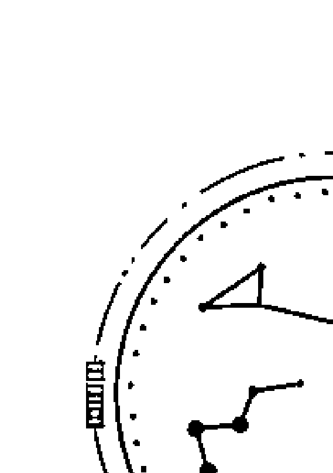

## 金星在第七宫&金星天秤座
### 先做人，后做事，家和万事兴

金星是天秤座的守护星，金星进入本命宫，会让他非常在意别人的看法，也很注重自己的外表、礼仪还有家教。不论何时何地，他都不愿意得罪人，或让别人看到他执拗的一面。他非常注重形象，也注意自己的遣词用字，虽然有时候会修饰过度，反而让人觉得不舒服，但是他也会检视自己。如果觉得自己什么都做得不错，就会把你的反应视为你的家教不够或是嫉妒，毕竟金星注重人际关系，能有什么不礼貌的地方吗？何况天秤是出了名的长袖善舞，问题一定不是出在自己身上——金星进入天秤座的人难免有一点自恋。金星天秤座非常爱吃，尤其喜欢甜食，因为金星是注重感官享受的行星。金星在天秤座时，太阳一定不会超过前面或后面两个星座，也就是太阳一定在狮子、处女、天秤、天蝎或射手（水星则不会超过前面或后面一个星座），都是注重社会化的星座；这些星座有了金星天秤的加持，让他们注重自己的形象到了夸张的地步，无论如何也不愿意让人留下坏印象，即使说谎也要保护自己的仪态。因为天秤座的影响，绝大部分的时间还是非常公正或老实，但是以不得罪人为前提。他会对隔着一个安全距离的事件保持公正，而面对自己身边的事情时，就有点受到人情的影响了。由于他擅长演说（天秤是风象），会用说话技巧把事情说到谁都不得罪，尽量不偏离事实，又让你怪罪不到他。再者，金星擅长沟通，就算是最容易吵架的夫妻关系，金星也能尽量做到就事论事。如果相位不好的话，可能会得理不饶人，有时候甚至会惹得对方恼羞成怒。

金星是天秤座的守护星，金星的性质大过风象跟开创星座的影响，公平正义的部分就会相对比较弱。他比较注意人际关系，也比较在乎不要得罪人，虽然还是会讲公道话，相较之下是可以优先让步的选项。金星天秤比较擅长讲到谁都不要生气，两边都安抚，简单来说就是乡愿（太阳在天秤也一样，只要相位不好就有乡愿的倾向。天秤毕竟是风象跟金星的组合，又是讲求原则的开创星座，很难维持平衡，因此更要求自己和别人的平衡，一旦看到不平衡的事情，内心会开始失衡），虽然标准还是在他心里始终没有变过，但讲出口来就不是这么一回事。天秤座也有脱离这个矛盾的时刻，通常在他们三十岁过后，体认到这种个性给自己带来多大麻烦，从此就果断起来了，讲话也变得干脆利落，因为也不可以这样一辈子讨论下去啊！当然可能会让他的人缘比年轻时差一点，可是人的年纪一大，太多人际关系会给自己造成负担，所以失去一些朋友，还在可以忍受的范围（太阳天秤也有这样的倾向，金星天秤更明显，因为太阳跟金星都掌管人际方面。当然水星也是跟别人交流的行星，也会显现出这一面）。

金星在天秤座，通常男生特别有绅士风度，而女生虽然外表不错，内的心态是非常阳性的。风象星座好像最不分性别，也对性别最没有任何偏见。金星天秤的外型都不错，真正相处起来，会发现天秤座其实不太有弹性，因为他对于自己的想法非常固执，却自以为不会给人压力，他以为讲话温和就代表不会引人反感，这种态度反而更令人感到头痛。

金星在天秤座，如果相位不好的话，可能让人误以为花心，实际上他只是很爱交朋友，因为太温和、太有礼貌，让对方觉得他对自己有好感。金星天秤在感情上引起别人误会的话，会觉得非常为难又抱歉，他会试图弥补一切，例如给你礼物或什么补偿，不像双子座一副完全跟自己无关的样子。
如果金星天秤相位好的话，在每个人眼里都是非常得体的，会让他朋友满天下，就算不太熟的人，对他的第一印象都非常有好感，要深入认识以后，才会发现他难相处的地方。如果两个人命盘形成的相位够好，说不定终其一生都会觉得他非常温和。
第七宫是配偶宫，所以金星在这里时，配偶在他眼里起码要是俊男美女，但他的弹性也很大，只要在还不错的范围就好，不会要求太苛刻，重点是要看得顺眼，相处起来很舒服。我觉得金星在天秤座，可能会跟好几个异性的关系都非常好，最后看自己跟谁比较有缘分，或许金星是风象的关系，他欣赏的范围很宽广，每个人在他眼中都有自己可爱的地方。相信我！长得不算特别精致出众的人，反而让人感到亲切，所以追求者也会特别多，就像沈家宜的类型，既漂亮又不会让人觉得太有距离感。

## 金星在第八宫&金星天蝎座
爱恨的理由只有他知道，别问为什么

金星是审美观，也代表不到性行为程度的欲望。当金星进入喜欢亲密关系的天蝎座，他的感觉通常会用肢体碰触来表示，如果他喜欢你的话，绝不可能忍住不碰触，因为第八宫是深处的亲密感觉。金星则是通过感官来表达，因为金星就是感官享受，拥抱、亲吻或抚摸都在金星的范围内。

金星代表吸引力的一部分，位于天蝎座，表示吸引力不见得来自漂亮的外表，也不见得来自于和善的个性（天蝎座并不和善），而是来自不知何处的魅力，一种说不上来的感觉。你不知道自己被他什么地方吸引，自然而然就被他吸过去了，而且一旦爱上就没有理由。我以前曾经写过情书，说：「我喜欢你，找了很久也找不到理由，那就说明，以后我也找不到不喜欢你的理由了。」但我心中OS没有说，我这句话有语病，正确的逻辑应该是：「我找不到喜欢你的理由，这就表示我以后不喜欢你也不需要理由了。」

八宫就是这样，爱跟恨都很极端！因为金星在里面，所以爱跟温和的成分会比恨大很多。
他如果对你有好感，不管是恋爱还是友情方面，都会用尽各种手段讨好你，即使讲出跟他理念相违的话也在所不惜，因为那时他眼中只有你，只有要你高兴的念头。金星会让他对你保持礼貌，但是你从他平常与你的互动，就知道你在他心目中的地位了。

金星在天蝎座或第八宫，爱跟恨大概都是第一眼决定，从此以后不太会改变（天蝎是固定宫）。不论你做了多好的事，对他多诚恳，如果他已经决定不喜欢你，就不会搭理。有金星的影响，顶多让他表面上对你客气一点，实际上还是不会有任何改变——金星天蝎非常擅长皮笑肉不笑。如果他第一眼就决定要喜欢你，不管你做了什么无可原谅的事，他还是会挺你，除了骗他是大禁忌以外。只是金星在此，他还是会用一种默默离开、默默疏远的方式，毕竟金星不喜欢跟人撕破脸，这种渐进式的绝交，让你连说不的机会都没有。金星在天蝎座或第八宫，不只是表面上的魅力，会给予性的诱惑和暗示，撩人也会搔到别人的痒处。如果相位不好，可能会暗中报复对方，只是受金星影响，通常都还是很要面子的，闹得再严重都不会到台面上，可能暗中讲对方坏话而已。这是因为天蝎座很会记恨，金星不擅长撕破脸，再怎么针对对方都会包装在一般礼节里，不会真的把事情做绝。但不管表面上再客气，旧恨还是很难消掉的。

## 金星在第九宫&金星射手座——对谈可深可浅、情感若即若离

金星是讲求享受的行星，射手座喜欢各种没见过的东西，所以金星射手座不像金星金牛座一样只吃固定口味的东西，金星射手勇于尝试，可能敢吃昆虫啊、毒蛇啊！一些其他人光是听到名字就怕的东西，或去挑战超级大辣的麻辣锅。对他来说，这种自虐的东西，每吃一次就是经历一场冒险，让他非常有成就感（又不用真的上山下海，金星就算要冒险也会以懒惰又舒服的方式）。

九宫代表旅游，也代表出国跟进修，但金星不喜欢过苦日子，所以会找一个完全可以配合他的团队跟行程。如果要念书，就要挑金星习惯的语言跟生活方式，量身打造自己的课程，金星可没有迁就别人的习惯，永远会找最轻松的方式做事。

射手座代表高等知识，金星代表一般知识或常识。如果金星在九宫或射手座的相位好，可能有接近双子座的能力，可以深入浅出，把很难的东西消化成常人可以理解的语言，而且可深可浅，不管是哪个程度都有办法跟你聊，毕竟社交高手射手座，加上万人迷金星，走到哪里都有办法让人留下好印象。由于射手座的影响，你可能觉得他真有学问，除了喜欢之外还带点崇敬，他的解释方式不会让你有距离感，又因为金星的影响，他可以配合你的程度，让你不用追赶得那么辛苦。

一般射手座常常一下子就把目标落在很远的地方，就算你跟不上，他也没兴趣等你，顶多把他见识过的事情告诉你，至于你有没有办法理解，那不在他的关心范围。请别说他不够朋友喔！他已经尽力了，总不能为了你听不懂，就放弃他探险的时间吧？但是金星射手座不同，他会关心你的理解状况，毕竟金星跟射手座都很重视朋友。

金星射手若相位不好，会使表达能力不太精确，因为金星只能讲最表面的事情，射手座则是要讲的事情太多，一下子讲不清楚。

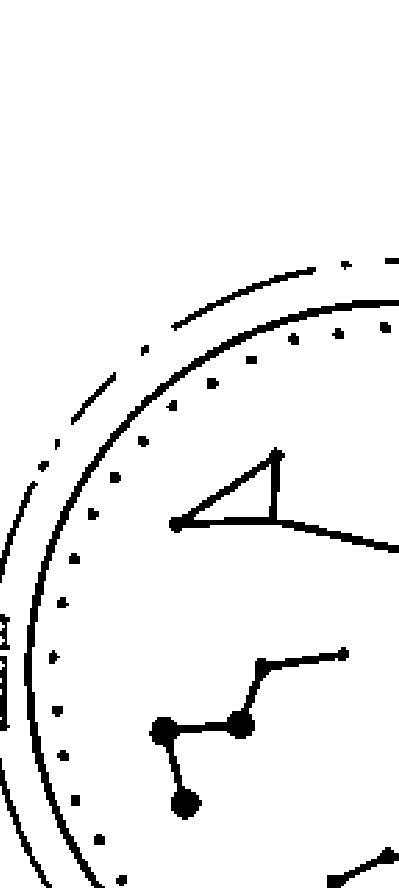

金星跟射手座的共同点是两者都有点状况外，尤其如果相位不好的话，甚至相位很糟糕时，就会边缘得非常严重，白目到了极点。射手座本来就是白目的代表，金星虽然很注重别人的看法，但常常自我感觉良好。就算得罪人，如果不在他关心的范围，他也懒得去理睬，基本上他只要觉得自己没有对不起你就好了。在这种状况下，就算你很生气，也不太能对他发怒，因为说到底，他就是很明显的没有恶意嘛！他已经尽他的努力了，如果你不能接受，那也不是他的错。

## 金星在第十宫 & 金星摩羯座 —— 迷倒众生的风度，低调奢华的魅力

金星在第十宫的话，比金星在金牛座遵循传统。如果是女人会很有妇德，如果是男人会非常绅士风度。金星总是跟人好来好去，男人有金星的影响，更会让别人觉得舒服，因为他看起来很有原则，又没有大男人沙文主义的一面；相反的，他非常替别人着想，又很有责任感。虽然他能做的都是大家常常挂在嘴上的美德，没有太特别的地方，但是如果能把大家挂在嘴上的事都做到，已经很了不起，何况他一旦觉得自己有义务做到，下一次你就不用再提醒他。金星摩羯表现大男人的一面，就是觉得他应该把你照顾好。不管男生或女生都有这种责任感。

那是他天生的认知，在他心里生了根，从来不用高压或命令的口吻跟你说话。相反的，他觉得自己有义务让你快乐，不然好像有什么事没做好一样。摩羯座本来就觉得自己凡事有责任，加上金星的影响，他会更加谦和，不管发生什么事，都会先看自己有没有哪个地方做得不对，然后才追究你该负责任的地方。

金星是审美品味，摩羯座是传统，所以金星摩羯座不喜欢太过花俏的东西，他喜欢低调的物品，最好是非常昂贵的，没有名牌标志，因为他要的是东西本身的价值。他喜欢名牌，却又不喜欢大剌剌地秀出来，他喜欢自己身上穿戴的东西看起来平凡无奇，实际上却身价非凡。就好像古装剧里面，外表不起眼的人突然拿出尚方宝剑一样，一旦他显出真实身份，就要每个人都尊崇他，而且可不是用钱这么庸俗的东西喔！那是一种无法言喻的尊贵身份，没有人可以取代。

金星摩羯座也喜欢落在他身上的压力，这会让他觉得自己有价值。就算没有人交代任务给他，他也会揽一些责任在身上，这是表现自己的最好方式，也是他的魅力所在。毕竟现代社会中，俊男美女很多，但是能知道自己的责任，又不会给别人造成压力的人很少。这就是他最稀有的价值，总有识货的人会懂的。

## 金星在第十一宫&金星水瓶座——热心公益，不问过程只求结果


金星是比较媚俗的行星，水瓶座却是特立独行的星座。金星落在水瓶座，一样是爱漂亮，但是他喜欢不从众的风格，例如哥德风、科幻风，或是一身破破烂烂的装扮。他的金星想要表达自己的诉求，但水瓶座往往不是大家可以接受的方向。金星水瓶觉得自己这样穿根本就美爆了，是别人不懂欣赏，但如果大家都不喜欢，他还是会有一点失落啦！毕竟金星非常注重人际关系。

水瓶座虽然跟人保持距离，其实还是非常喜欢人群，只是他会用另一种角度观察这些人，他是站在一个研究者的视角，因此金星水瓶还是希望大家可以接受他（但是不接受也就算了，反正对他自己没有什么实质的损失）。水瓶座是固定宫，希望大家可以接受他的价值观，却不会为了别人的想法改变自己，反正水瓶座是风象星座，善于调整自己的心态。金星水瓶座会用一种保持距离的方式跟人亲近，可能透过网路，也可能只透过电话，或透过某个公立组织，这样他可以观察你，而你观察他都无所谓，反正你是无法了解他的。

金星对性别没有什么概念，什么性别在他眼中的差异都不大，他不会有性别歧视。如果他是男生，会很有绅士风度，因为水瓶座天生就很友善的关系；如果她是女生，也不会表现出柔弱的样子，反而会跟天秤座一样满有英气的，而且头脑中没有要用自己的性别来占便宜的念头。同性恋或双性恋者跟金星或水瓶座的关系都满大的，可能同时跟落在水瓶座的行星产生相位。如果是男同性恋，火星也会牵涉其中。不过这可能是前一个时代的占星相位，因为水瓶座代表前卫跟独特。之前在同性恋还是少数的时代，同性恋通常会跟水瓶座有相位，而我觉到了近几年，同性恋已经是越来越普遍的状况，所以可能不会跟水瓶座有特殊的相位（以大世纪来说，现在快要进入宝瓶时代，因此性别概念也会变得越来越开放且平等）。金星水瓶的美感很独特，会喜欢上一个人，不是因为他帅或美的关系，而是对方有他的特色，有不同于所有人的地方。可能他喜欢这个人的鼻子或手，或是其他人难以理解的特质，对金星水瓶来说，这些特点是非常重要而有魅力的。金星水瓶不要求别人一定要了解自己，只要大家没有冲突就算了。他其实非常有爱心，因为水瓶座本来就是社会公益的星座，非常关心全世界的人甚至动植物，金星又重视和谐，这个落点把金星跟水瓶座人性化的面做了最好的结合，而公益也是金星跟水瓶座最大的共同点。只有金星的话，可能会有一点肤浅跟自私；只有水瓶座的话，可能会曲高和寡。唯有两者结合在一起，跟群众既不会太远也不会太近，远到足以保持客观的立场，又近到可以了解他们的状况。公益本来就要有点特立独行才能坚持下去，要不管其他人的冷漠，或其他人泼的冷水。水瓶座是最适合公益的星座，他本来就相信自己的理想，固定宫没有在管其他人说什么，他只要看到最后的结果，就觉得一切都值得了。

## 金星在第十二宫&金星双鱼座

### 万般过错只因心太软

金星跟双鱼座都是女性化的代表，如果男生有这样的落点，表示这个人非常好相处，几乎到了没有原则的地步；若是女生的话，反而有点难搞。双鱼座特质的女生，常常搞不清楚自己要什么，把大家都拖进浑水里，而且她常常旁若无人地觉得自己有权利跟义务对别人好，更加深了这种混乱的性质。金星双鱼座的女性化，可以到最好、最温柔、最和善的地方，也有可能难以忍受。双鱼座处于水象变动宫，一切都在变动之中，没有特定的个性，所以好起来会很好，坏起来也是让人无法苟同。

金星双鱼座的人，浪漫是他的优点也是缺点，如果喜欢这一点的人，会觉得被他带向一个奇幻世界；不喜欢这一点的人，会觉得被他带向一个没有章法的世界。双鱼座非常梦幻，而金星比较实际，金星双鱼可能没有他自己想象的那么无私。金星的好是经过盘算的，双鱼座则给了他一个自己什么都不计较的幻觉，让他对自己造成误解。金星双鱼座的本性还是善良的，就算金星有那么一点自私，但还是在人性的范围之内。更何况双鱼座傻气的本性，让他再怎么坏也不至于造成太大的伤害，因为金星没有杀伤力跟攻击性，双鱼座又没有什么实质的力量。金星是有幻想的力量啦！但是想归想，反正做不到，他爱怎么幻想就让他怎么幻想吧！）

金星在双鱼座如果相位不好的话，通常容易落入幻想之中，自导自演，给对方造成很大的困扰，而且会波及到其他人。最严重的状况，就是有着类似妄想症的反应，在自己的心里编造了所有的故事情节，而且信以为真，以为这就是事实。金星也代表编造事实的能力，如果火星同样在这里，状况就更一发不可收拾，会完全不承认自己的错误。如果相位好的话，有成就时会是一个大慈善家。金星双鱼座的心肠非常软，如果月亮或海王星也同时在这里的话，他会对所有人的苦难感同身受。金星、月亮、海王星都是非常阴性的行星，双鱼座也是阴性的星座，如果这些行星落入双鱼座，就会加强女性的慈悲特质，容易为别人奉献一切，甚至有投身宗教的可能，或者非常喜爱灵疗，对他来说，这是一种比较容易拯救世界的方式。金星双鱼座非常注重缘分，不管是谈恋爱还是做生意，他最吃你们前世有缘这一套，但也只是为自己错误的眼光，找一个错不在自己的理由罢了。


## 五、火星在各宫位表现

火星代表一个人最强的欲望，也代表不假思索的情绪、凡事的动机。

### 火星在第一宫&火星牡羊座——领头羊性格，冲锋陷阵第一名

火星如果在第一宫，就像前锋一样，凡事一马当先，想到什么就做什么，不经过大脑，只凭动物本能行事，给人攻击性很强的感觉。就算刻意收敛，那股杀气还是会透露出来，不管怎么掩饰或修饰，还是嗅得出那种气味。大家应该会很惊讶，这么阳刚的组合，直觉居然是很强的。火星跟第一宫都是火元素，火元素的直觉是动物的求生本能，没有犹豫不决的考虑，一股脑儿朝该去的方向拔腿就冲，就像动物感觉到危险，不用等着看清楚，马上拔腿就跑一样。火星在一宫靠的不是感觉，而是直觉！火星在第一宫或牡羊座，会充满杀手或军人的气息，凡事明快、下手利落，宁可做错不可放过，适合担任武器商或刀具商。或是面目狰狞，一副运动员的样子，常常会是肌肉很健美的人，因为第一宫管的是外表。如果是女生，个性干脆，不管漂亮不漂亮，都很有特色。火星代表“突出”，不像金星一样亲切温和。如果要形容火星的外型，我会用“抢眼”这两个字，火星特质重的女生，常让男人死心塌地，因为她有着鲜明的言行跟性格，爱上火星女的男人不多，一旦爱上了，就无法自拔。

### 火星在第二宫&火星金牛座——独当一面，永不停歇的印钞机

火星是爆发力，二宫是安稳，如果火星在第二宫或金牛座，赚钱方式会是一次一大笔，不是源源不绝的。就像薪水，你花完了，下个月还会再进来，也像房地产，利用房子出租收租金，收入就是永续的。

第二宫等于自己的所有物跟所有权，第二宫的占有欲特别强，不是为了安全感，单纯是喜欢拥有的感觉。也代表“房地产、不动产”，因为第二宫是土象又是固定宫，喜欢长长久久不容易变动的东西。第二宫也代表正财运，就是长期的、稳定的、不会随社会变迁的收入。

火星二宫的人赚钱欲望非常强烈，我有个朋友的妈妈在卖火锅料，一个冬天就赚足一年的收入，但她在其余时间也不会停下来休息，因为火星的赚钱欲望非常强烈，她就用多出来的时间去找寻其他商机。

火星是一人独当所有的事，通常是老板或 solo。他不喜欢身边有太多人给意见，就算给了他也不会听，还觉得很嘈杂。火星一向是独断独行，成败也是一个人负责，所以不太适合团队。很适合创业，但因为他一个人没办法管所有的事，事业规模不会太大，如果公司要扩充，他会干脆卖掉公司，自己再另外创业。

火星二宫适合当领头羊，不适合当管理者，因为他的冲劲是一时的，效期过了，热度也就过了，他需要不断有新的刺激。也很适合开个人工作室，自己可以完全掌控事务，能为自己带来最大的利益。


### 火星在第三宫&火星双子座

#### 一呼百诺的孩子王

火星通常独来独往，火星落在三宫，身後可能会跟着一群追随者，但他的想法还是以“自我”为中心。火星不容易感同身受，也不能理解自己以外的人的想法，而第三宫代表日常的人际关系，就像邻居、同学、同事这种近距离的人际关系，显示的是我们平常的做人态度，也就是最基本的社交能力。

第三宫善于揣摩别人的心态，是基本的朋友圈。火星以自我为主，火星在第三宫，就等于在社交圈内是一个领导者，大家都很佩服他的看法。如果相位不好的话，可能是他不太在乎别人的看法，大家也不太想反驳，就默默跟随了。在第三宫的小小范围内，不太容易出现什么大差错，与其说火星在第三宫很受大家尊敬，不如说大家选择不跟他计较（笑）。毕竟火星的代表人物是“婴儿”，旁人也都容易让着他。

但火星在第三宫，会把自己的想法套用在别人身上，如果对方跟他是同类的人，就会觉得火星三宫观察力敏锐，根本就是心理学天才！如果不是同温层，就会觉得对方自以为是，成见非常深。因为火星看起来非常有自信，就算受到批评，也只会觉得别人在乱贴标签。

火星第三宫的优点是号召力很强，一旦决定做什么事，大家都会跟着他的脚步，如果做了一些好事，就会形成朋友圈的一股风潮，带大家往好的地方走；如果是蠢事（通常不至于到坏事），就会形成一股奇怪的风潮，还好火星的续航力不久，虽然是蠢事，通常很快就转移注意力了。

火星在第三宫，虽然头脑不是很灵光，但会带着大家傻傻地往前冲，成为社交圈中的孩子王（虽然带头的都是比较幼稚的事，但还是很有趣）。不论做什么事，大家第一个反应都会想阻止，但最后反而被牵着鼻子走。


## Chapter 4 行星座落宫位表现

### 火星在第四宫 & 火星巨蟹座

#### 家人虐你千百遍，你对家人如初恋


第四宫是家庭跟亲近的人，火星在第四宫，代表在越亲近的人面前，越不会收敛个性，负面情绪通常都由亲近的人承受。火星在第四宫的优点，是对家人非常有责任感，虽然平常会闯祸，但家人有事，也会第一个站出来，冲动地承担责任，果断地想把事情解决。如果你有个火星在第四宫的家人，最好的方法就是尽量给他找麻烦，因为他会承担下来；如果你不找麻烦，就等着他来找你的麻烦。火星在第四宫，他的家里永远没办法平静，一直有风波出现，与其被找麻烦，不如你找他的麻烦，这样等到他哪天惹出麻烦了，你也比较能平衡（笑）。火星很急躁，容易妄下论断，给家人冲动的印象。火星巨蟹如果在外人面前形象很好，就容易造成家人的误会，觉得他都听别人的，自己人的意见都否定，最常见到的，就是他觉得外人讲的都是对的，自己家人讲的都是错的。事实上他不见得觉得外人讲得都对，只是没办法很快的判定，因为对外人不了解；他觉得他对家人非常了解，所以很快就可以知道家人讲的是错的（当然这也有可能是他的误解，他可能没有自己想的那么了解自己人）。火星本来就形单影只，火星四宫常常会觉得在家里不被肯定。这可能是真的，也可能是火星太过自我本位主义，觉得家人不够重视他，也更想掌控家人，也就是这种占有欲，让火星四宫跟家人的距离更远。火星四宫的控制欲越强，越容易迎来反弹，尤其本来应该温暖的家庭，用强势的态度逼人认同，常常会适得其反。如果火星四宫能自立自强，有可能成就更大，反过来照顾家人，不只是寻求家人的认可，这样反而更能表现出自我价值。

### 火星在第五宫&火星狮子座

#### 想当大家的老大，但常变大家的小弟

第五宫是“自我表现”的一宫，大家可能认为火星狮子座或火星在第五宫的人非常自我，但火星在第五宫不但不会更强势，反而非常注重自己的形象。火星在这里会变得比较收敛，很注意自己的一举一动，小心不要造成不好的观感。对放肆、不管他人的火星来说，在第五宫让他更能在意别人的眼光、更留心自己的言谈举止，倒也是一件好事。火星五宫内在也会想掌控他人，为了得到别人认同，会想争取别人的好感，以至于失去自我。第五宫也是恋爱宫，火星在内，代表在谈恋爱时，需要对方全心认同。因为希望变成对方心中最好的对象，很多地方常常表现得不是太武断，就是太想得到对方肯定，不管是哪种表现，都代表他对恋人太过在意，在恋爱史中，太强势跟太顺从两种状况会不停地轮替，一直无法找到自己的定位，在情场打滚很久，因为太紧张，要到很晚才能修成正果。

恋情常常受挫，让火星五宫更心系恋爱这件事，身边朋友会觉得他有异性没人性。事实上也是，因为恋爱是火星五宫成就感的来源，让他常常忘记其他朋友也是很重要的，其实他不是不在意朋友，只是有点失衡而已。

第五宫也是子女宫，火星代表重心集中，所以孩子可能不多，但会给孩子最好的教育跟栽培。管教的方式可能太强势，造成亲子之间不和，跟恋爱一样，越在意就越用力，反而造成对方的反抗。要把这股热情用正确的方式表达，才不会造成亲子压力，多看看亲子教育的书，吸收专家的意见，以火星五宫的投入程度，相信会做得很好。

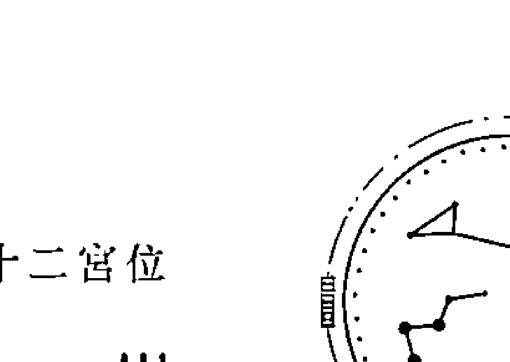

### 火星在第六宫&火星处女座

#### 目标高远但不接地气，大灾没有小病不断

第六宫是工作宫，也是处女座守护的宫位，本来就是很偏执的一宫，再加上偏执的火星，代表在工作方面，对自己跟别人的要求都很高。因为是独大的火星，常常把对自己的要求，转嫁到同事身上。虽然工作很用心，但常常把气出在别人的头上。

火星在处女座或第六宫做事很用力，却不是那么精细，常常把目标订得太高，但不够全面，所以只做到其中一面，其他都忽略掉了。给人“独裁”的印象，即使事实不是这样，外在却表现出有功自己揽、有错就推到别人头上的状况。只要点出事实，火星六宫是很愿意负责任的，不过除非有话直说，用暗示的方式，火星六宫是听不懂的。但台湾社会不是那么直接，造成火星六宫常态性地推卸责任。

火星在处女座或第六宫，工作范围落差很大，有可能是努力工作，也有可能是外科医生，总之都是需要付出很大心力和体力的项目，只要跟尖锐物品或劳动有关的工作都算在内。

第六宫也是健康宫，火星来得快去得快，不太会生大病，倒是常常受伤，或是得一些不严重的小病。火星六宫会觉得自己很健康，但疾病不来则已，一来就是大事，可能平日不常生病，中年後一病难愈。还是要注意保健，最好多上瑜伽或气功之类的课程，也可以调和内在性格，不然火星六宫在工作方面，容易做个半死，同事却觉得他独裁又爱邀功。在团体之内，火星六宫容易被排挤，如果态度温和一点，就算是同样的言语跟行为，也会让人产生比较好的观感。

### 火星在第七宫&火星天秤座——争执是通往和平的荆棘之路

第七宫比较特别，因为是天秤座主掌的配偶宫。如果火星是你的宫主星（宫头落入火星掌管的牡羊座）在婚姻中你是主导的那一方；如果火星是宫内星（火星在第七宫内），表示容易遇到掌控欲很强的另一半，很容易发生争执、甚至暴力事件。总的来说，双方常常会争夺主导权，婚姻容易不和谐。

双方虽然常常起冲突，却不不容易分开，因为火星代表一方依赖另一方，可能是在经济层面完全仰赖另一半供应，也可能因为性爱合拍而无法断然分开。无论如何，最好的方式是找一个共同的工作或兴趣，这样就算争吵，也有很大的谈和空间。

第七宫也代表合伙人宫，我觉得很合理，因为我本来就觉得婚姻不是建立在爱情之上，而是建立在生活的互相需要上。婚姻就是找家庭的合伙人，必须分工合作，把彼此的权利义务划分清楚，这样如果出问题，也比较容易找出问题的源头在哪里。

火星七宫最常见的，就是跟合伙人意见不合，常常是南辕北辙，但就是因为大不相同，才会互相需要。婚姻也是一样，两个人各自是不同的特质，才能合成一个整体。最好的解法就是把火星当成“通往和平的冲突”，冲突可以讲出彼此的意见，然后再带来和平。所以天秤座（第七宫）才会是金星掌管，冲突的目的，是为了达到真正的和平。在象征和平的天秤宫，有火星进入，代表不管再大的冲突，都是朝和平迈进的。

学生都问说敌人跟配偶不是相反吗？我说敌人通常也是最了解你的人，所以杀伤力更大。最好的朋友一旦反目，就会变成最大的仇敌，因为没有人比他更了解你、更能砍到你的要害。夫妻要离婚时，也都最清楚对方的财产有多少、最在意的事是什么，所以也能造成最大的伤害。如果火星进了第七宫，更是能一刀毙命。

### 火星在第八宫&火星天蝎座

#### 席地狱之火而来的复仇使者

第八宫代表所有的欲望，也代表情绪跟潜意识，如果也代表欲望的火星进入，更说明这个人的野心很大、欲望无穷，容易做出不可挽回的事。第八宫既是黑道也是白道，我们常听到一句话说‘警察就是贼头’，因为所有的资源掌握在手上，也就有条件干出更大的坏事。第八宫是生死宫、医学宫，象征医院跟坟墓相关的问题，火星进入八宫，比火星进六宫更适合成为外科医生。火星对什么事都非常深入，是很好的研究员，对什么事情都能抽丝剥茧到最深入的阶段，而且“很快地”发现别人没发现的事情，可以观察到隐藏的疾病或细菌，或是在遗传学上取得成就。

第八宫也代表神秘学，火星落在八宫，表示对人性探索的欲望无穷。虽然火星并不主宰思考，但进入第八宫，变成能快速敏捷地抓住最深层的人性，并且比谁都善用。

有一句占星界的老话，叫“手榴弹丢进汽油桶”。火星跟第八宫都非常火爆，火星只是引信，而第八宫里蕴藏着最多的燃料。火星在第八宫，不但脾气火爆又会记仇，因为是固定宫，不会轻易忘掉，新仇旧恨通常一并发作。如果只有火星还好解决，火星只会对付眼前的事，时间过了，火星就忘了，但八宫会记到地老天荒，所以火星八宫的犯罪事件特别多。火星跟八宫欲望都很强，很容易不满足，觉得全世界都欠他，有向全世界索债的心态。

第八宫也是巨大财富宫，火星进入，会用最快的方法得到巨款。来得最快的是横财，所以火星在八宫，很可能是罪犯；相反的，因为非常了解罪犯的心态跟作为，也有可能是执法者，没有人比他更了解犯罪行为了。

## 火星在第九宫与火星射手座 — 人生是一趟华丽的冒险，充满太多未知的诱惑

第九宫是旅游宫，其实我觉得九宫代表了不在我们日常生活中的一切，就是没有他还是可以生活的事物，像哲学、艺术、宗教……是人类要追求的更高境界。第九宫是火象的最后一宫，是人类的过渡阶段。9这个数字代表“转化”，简单来说，是我们从平凡的人类变成超凡自我实现的最后一个阶段。火星在第九宫很适合当背包客，因为第九宫跟火星都有探索的精神，适合到处探险。火星有冒险犯难的精神，加上第九宫的好奇心，凡事无畏无惧。除了肉体上的探险，精神上也很漫游，尤其是没有外援的时候，更能引发火星无惧的勇气。就算没有人帮忙，他也一定要成就一些事，很像科学怪人的创造者，独立于整个学界之外，能研究出自己专属的事物。而且火星很叛逆，他跟天王星都有研究出与先前理论完全不同的结论，推翻原有事物的精神。第九宫跟射手座也代表了海外，就是要踏出我们原来的范围。其实我之前的背包客，就是“冒险家”的简化版本，尤其火星九宫热爱探索别人不曾涉足的领域，又热爱学术跟研究，所以也很适合当发明家。九宫也是司法院，如果火星进入，代表会是个很好的法官，因为九宫对真理有极端的执着。

天秤座（七宫）会是很好的律师，但七宫执着的不是真理，而是社会规范，也就是我们大家遵守的规矩，天秤座认为每个人都守规矩，社会才能运转，跟九宫希望世界尽善尽美是不一样的层次。

## 火星在第十宫与火星魔羯座 —— 专制独裁，威胁施压都明着来

第十宫（魔羯座）是土象的最后一宫，也是物质世界的最后一站，是我们世俗的最高成就，也代表我们的社会地位。由于第十宫是物质世界的最高层，代表上司、长官或官员、主宰社会的人，也就是“政府机关”，广义来说，也代表社会跟国家，所以有着传统跟专制的特性。我们都知道魔羯座是老顽固，第十宫就是顽固的土象的最高峰，而且是基本宫，所以不像阴性的土象星座那么温和，魔羯座的野心是非常大的。

到了社会的最高峰，我们都希望自己的事业有所成就，但火星代表的不是广大，而是专注。如果开公司，表示人员不多，但每个员工能力都非常强。甚至是一人独大，例如亿万收入的保险员，或是掌握了某样专利的人士。因为火星通常不需要别人，自己一个人就够了。火星象征掌权者，在家中通常代表父亲（国外现代占星学认为代表母亲，但从其他代表物来看，我不认同这个解释，还是拿第十宫来看父亲。不管父亲或母亲，家中掌权的人就是第十宫掌管的。火星在第十宫，代表父亲比较急性子，也很有可能很专制，但压力没有土星第十宫那么重，因为火星都是明着来的，只会叫骂，不像土星，什么都不说，却暗暗对你的经济、住家、人际关系施加压力。我认为火星比土星好对付，因为火星如果解决了，就是解决了，他不会记仇，也不太会有后患。不像土星、月亮或冥王星，后患是无穷的。

火星在每一宫都很自私，只有在十一宫会为了理念奉献自己，其实我觉得这也是一种自私，只是比较博爱的自私。火星十一宫会为了自己的理念，把身边的人都拖下水，但如果他的目标

## 火星在第十一宫与火星水瓶座——以天下兴亡为己任，万死不辞

第十一宫（水瓶座）很特别，它在第十宫之后，代表物质的阶段已经过去，接下来是精神的阶段。火星在这里，会追求自己的卓越，十一宫有革命的意味，加上火星，很容易变成烈士，如果找到了真理，他会不顾一切地投入，因为十一宫很博爱，不太在意自我，但火星是很重的自我，火星在十一宫，就会以天下兴亡为己任，他的自我就是为所有人卖命。

是正确的，会带动大家一起奉献，这也是好事。火星在十一宫，投入的常常是环保、动保，或医疗项目等大方向，这些都是亟欲改革，但一般人投入不算多的领域。火星的投入是整个身心都奉献进去，他不懂得什么叫克制，火星在十一宫，常常会让人觉得太过偏激，也常为了自己的理念，做出过激的事情。例如为了动物而牺牲人类（但我觉得这是正确的，因为我们人类欠动物植物太多了），或把自己的财产一毛不剩地投入。火星在十一宫，是个人意志与群体利益之间的结合。因为“我都是为了大家着想啊”，发展到某种程度，就是以这些公益的事，来为自己的行为背书，所以也容易变成独裁者。火星的迫力很强，又为了全世界好为名，如果有非常不好的相位，会变得像纳粹或共产党。

## 火星在第十二宫与火星双鱼座

### 火力忽大忽小，情绪反覆无常

就像火把掉进大海一样，集中性跟热力都不见了，一下就被熄灭。如果十二宫的星座不能加强火星的力量，这颗火星就会消极而软弱无力。转换成人性来说，就是遇到该生气的事，还是会犹豫该不该生气，也很难有事来激起火星十二宫的热情，这个人就温温的，看来没有什么坚持的事。 在这个落点有两种可能，一种是有爆发的动力，但是被双鱼宫的能量包住，所以也冲不起来；另一种是在灵性的范围里很有动力。 十二宫跟十一宫类似的地方，在于这两宫都是比较接近全人的领域。在大家觉得无所谓的地方，像艺术、宗教领域，反而会激起热情，因为那不太是私人的事，比较是形而上的层次。跟十一宫一样，火星在十二宫比较会为了自己的理念、理想而激动；跟十一宫不一样的地方是，十一宫是社会大众的事，十二宫仍然是自己了解的事，只是提高了层次，为了慈善跟大爱而付出。 火星容易不满，但进入十二宫，他的不满就是隐隐约约的，自己也说不上来。我们觉得火星十二宫的人脾气很好，但遇到在乎的事情，就会一反常态大爆发，让人觉得反覆无常。火星做事都是很尽力的，但十二宫善于逃避现实，所以火星在十二宫，逃避现实的能力更是出神入化，不只骗过别人，连自己也骗过。 十二宫是很女性的宫位，某些妈妈就很像火星十二宫，对于自己在乎的事不敢面对，反而换个地方发泄，就像对老公不满，转而处罚小孩，因为看起来杀伤力没有那么大，也就做得心安理得。火星在十二宫最重要的事，就是学会面对自己，不要用一些崇高的东西来包装自己真正的怒气跟欲望。

## 六、木星在各宫位表现

木星是一个人的天分所在，水星也是天分，但水星比较是天生的才气，木星则是经过锻炼后，显现出来的才华。

### ——木星在第一宫与木星牡羊座——

遇到挫折也能很快振奋起来，因为他是幸运的代言人

木星是第一吉星，位于命宫中，当然是拥有特别好运的人。牡羊座的特质，可能会把这种好运当成理所当然，觉得自己运气好是应该的，一旦遇到一点点小小的阻碍，就会觉得老天在跟他作对，遭受的打击也会特别大。还好木星跟牡羊座都是乐观的占星元素，就算打击很大，也不会持续很久，毕竟木星跟牡羊座（火星）都是速度非常快的元素。

木星在牡羊座，如果出现坏相位的话，会非常骄傲自大。虽然不会像木星在狮子座一样，觉得自己不可一世，或自觉身份尊贵，却会认为自己的能力比其他人强，其他人让着自己是应该的，甚至有点别人欠他的感觉；这股自信不知道从哪儿来。会特别不讲理，有时错得非常明显了，木星牡羊还是可以睁眼说瞎话，因为木星跟牡羊座都没有什么羞耻心。还好木星很社会化，因此也只是讲话强势，不至于引起其他暴力纠纷。同时，他也觉得命运之神是站在自己这一边的，可以特别愿意付出自己的能力来帮助别人，但是这不算什么同情心。牡羊座没有什么同理心，木星也只注意自己有兴趣的东西，那种善良是直觉性的，觉得别人好可怜，帮助人对他来说不是难事，干脆就做个顺水人情好了。对木星牡羊来说，自己的资源是永远用不尽的，与其说他真的幸运，不如说是这种自觉的幸运加强了他的好运。就算看到困难也毫不犹豫，持续往前冲，有时困难就在他还没注意到的时候跨越了，要等到回过头来才会发现，觉得很惊险地松了口气，然后又往往下一个目标冲过去。这当然是优点也是缺点，还好不会造成太严重的后果。

## 木星在第二宫与木星金牛座

### 财源滚滚，吃穿不愁

第二宫是财帛宫，象征正财，也就是稳定型的收入。木星也代表财运，而且是巨大的财运。木星在金牛座或二宫的话，可以想见财运是非常好的，不只是短期的好，更是长久性的好。就算木星在这里有坏相位，但因为本身就是吉星的关系，底子还是不会太差，顶多多一点磨难而已。我的月亮跟木星都在第二宫，木星是无相位，月亮是纯凶无吉，这样说来好像不利的因素比较多。我刚出社会时，有一阵子手头比较紧，但租的房子是亲戚家的，我妈妈就联络好亲戚，若是欠房租，他们也不会逼得太紧，至于其他生活花费，有朋友随时可以救助我，也总是会有人请我吃饭，所以底子算是不错的；就算再不济，打电话回家找爸爸，爸爸一定二话不说给我钱，因此基本上算是没有吃到什么苦啦！就是心理的压力非常大，一直觉得自己没有成就很丢脸，可是却没有什么人责难过我。这就是月亮的克相，月亮的重点在于心里的感受，木星却让我不愁吃不愁穿，就是会自己逼自己而已。

木星是变动星座（射手座）的守护星，金牛座是土象固定宫，木星代表好运，土象第二宫代表稳定，所以木星在第二宫，纵使不会一次就发一笔大财，可是财运长久以来都非常好而且稳当，有时间去探索自己想做的事，这就是木星的作用。木星会东看看西看看，金牛座则是吃穿不愁，什么事都不用担心，才有空闲时间玩那么多的花样。木星在第二宫跟不动产或珠宝特别有缘，从父母或长辈那里继承财产的可能性很高。有木星在第二宫的运气，并不太需要为生活烦恼，可以用力追求自己有兴趣的事物。

木星跟第二宫都和艺术相关，也代表个人的美感。木星在第二宫有本钱追求风花雪月，但一定是看得到的实物，才符合第二宫需要的务实。文学上的美感也在其涵盖的范围，例如修辞学或诗词。

木星跟第二宫是非常能够互相帮助的。木星如果相位不好的话，顶多是因为想赚钱，投资太多失败的项目，但还是不会伤到底子，就当成是经世济民吧！如果到了老年，也必须当时的行运相位很差，才会落到比较平凡的后果，但跟其他人比起来已经很好命了，是木星自己在高处太久，才会觉得平凡的自己很悲惨。这就是所谓的『命太好』吧？

## 木星在第二宫与木星双子座——深入浅出，将高深学问普及化

木星守护的射手座，跟第三宫双子座是对宫，所以木星跟双子座之间的共同点是追求新知。相异点是木星代表宏大的知识、高深的学问、国外的文化，双子座则是生活中的一切，例如电视上可以看到的众娱乐、生活常识，并不是太高深。木星在双子座的话，等于结合两者的优点，擅长深入浅出地解说专业知识，也会不断提升自己的学养，他有兴趣进一步探讨大众知道的事，并且找出别人从来没有定义过的部分。就是把一般的想法，找出更深的细节，或是整理出具有参考价值的资料，用自己的方式消化资讯之后传达给别人。非常适合当老师，因为老师就是把高深的知识，用大家都能了解的方式传授给别人。

木星在双子座如果是克相的话，凡事都会被简化，或是从一大堆定义中挑出大家都知道的部分，当成自己的想法来发表，会洋洋得意地讲些没什么大不了的事，别人在心里讪笑却不自知。因为木星不知道，也不在乎别人的想法，双子座则根本就把别人的想法放在心中，总归来说就是白目。如果相位好的话，一定会非常博学多闻，因为木星的学问程度非常高，双子座又能触及大家的想法，并找出最好的表达方式，当然是能想又能讲了。别人想不通的事，木星双子座却能轻易地找到解方，从高深的学术研究，到脑筋急转弯的答案，他都可以想出意想不到的解答，似乎在脑袋里有个特别的回路，可以轻易串起不同事物的关联。再者，木星会放大这个宫位的特质，也就是扩大层面，而双子座擅长打破不同领域之间的界线，所以木星双子座可以轻易点出别人没有抓到的特点，并且清楚地指出来，让你觉得他的想法不仅破天荒，而且非常有主见。他不需要故弄玄虚，或讲一些艰深的用语、术语来博得别人的尊崇。

## 木星在第四宫与木星巨蟹座 四海为家，全世界都是故乡

木星跟巨蟹座是两个截然不同的元素。木星生性爱好自由，常常东奔西跑，对于国外有探索的兴趣，越没见过的国家或东西，越是兴致盎然，木星很好奇，陌生的东西会激发他去了解的欲望；巨蟹座却非常恋家又守旧，不喜欢陌生的事物，害怕没接触过的一切，又极端保守，总要待在熟悉的地方，才会有一点安全感。

第四宫代表家庭、自己的地盘，但木星这么爱到处跑跳，第四宫当然是关不住他的。反过来，木星可以把这个家庭的格局扩大，也可以把自己的地盘弄得很尊贵。木星在第四宫，不但不会被家庭关住，反而可能让这个家庭展现在大家眼前，也就是“光耀门楣”，等于扩大了他家庭或国家的能见度。

木星在巨蟹座，理论上而言，应该会激起他对家庭的需求，但是木星会把巨蟹座对家庭的定义扩大，可能会四海为家，对整个世界都有一种乡愁，想要探索每个不知道的地方，把这些地方通通摸清楚之后，才会有比较安全的感觉。若把这些地方都纳入他的资料库，就没有什么他不了解的东西了。也就是说，把所有不了解的东西变成库存存档，让木星巨蟹有安全感，但我们都知道，要把整个世界都弄清楚是不可能的，所以木星巨蟹就有了不断追求的动力。木星在巨蟹座或第四宫，即便跑遍了全世界，故乡在他心中还是占有最重要的位置。也许多星巨蟹就是藉着跑遍各个地方，来突显家在他心中的特别性跟重要性。如果他没有见识过其他地方，也许家乡在他心中就会变成一个无聊之地，他就是要藉由了解全世界，来比对出自己家乡的美好。木星在巨蟹座或第四宫，可能家人就是他的贵人，或是他家庭的社会地位很高，受人尊敬，让他有一个很好的生长环境。木星也代表贵人跟社会地位崇高，如果木星在第四宫，若是相位好的话，可能会参加无国界帮其他难民盖房子的组织，因为他要把家的价值带给全世界，让每个人都能感受家的美好；或是参加各地帮孤儿找家的活动，媒合孤儿跟想要领养孩子的夫妇，具体地实现他心中家的价值。如果相位不好的话，会终终生寻寻觅觅，却找不到可以安定下来的地方；或是对自己的家感到非常厌倦，觉得外面的一切才是最好的，但跑遍了全世界，还是找不到一个有归属感的地方；也或许生活逼得自己无法停下脚步，不断地迁来迁去，有种居无定所的感觉。木星在巨蟹座或第四宫的使命，就是自己要去找出家的意义，这样才能真正给自己安全感。木星巨蟹可能帮助别人建立家园，然后从中体会到家对他的意义。或是找出新的定义，发现一个他以前从来不知道的家的运作方式。毕竟木星巨蟹就是扩大、提升家的格局，也许传统的家庭没有给他太多意义，他要用自己的方式实现家的最高原则，让自己无论在哪里都可以感受到温暖。

### —— 木星在第五宫与木星狮子座 ——
在需要与被需要间，获得成就感

或是不用到这么高的层次，只要当一个房屋仲介员，帮别人找到合适的房子，或是做室内装潢，帮人打造一个舒适的家，就是木星巨蟹实现使命的方式。木星巨蟹也可能常常去国外考察，把外国的新东西带回台湾，帮助自己的同胞建立最好的居住品质。

木星在狮子座是个很不错的落点，木星是射手座的守护星，狮子座也是火象星座，两者都有火的特质，但不像牡羊跟火星喜欢冲突竞争，所以是和平的火象星座。木星跟狮子座都是喜欢为别人谋福利的元素。木星希望大家都持续进步、维持和平；狮子座本来就是大家的老大，喜欢看到别人因为自己得到幸福的样子，那会让狮子座非常有成就感，也会彰显出他的重要性。
木星在狮子座会奉献自己的力量，推动所有能替大家带来改善的项目。我觉得木星狮子座很适合当成功学讲师，对木星来说，最重要的就是突显自己的价值，如果也能同时提升别人，那他在别人眼中更是功德无量了。这就非常合了木星狮子座的胃口，可以帮助别人，又让自己享有荣耀，是最理想的状况。木星跟狮子座都喜欢帮助他人，木星喜欢跟人交融，得到更多新的想法，狮子座则希望从别人的眼里，反射出自己的价值。木星在狮子座或第五宫，即使相位不好，产生的结果也不会太差，因为木星本身就是一颗吉星，狮子座又是地位极崇高的星座，再怎么样，这个组合也不会坏到哪里去。顶多只是事情没有照他预期的发展，让他有点受挫，却不会沦落到很差的地步。如果土星或月亮在相位的组合中，就会带来多一点磨难或心情上的沮丧感，但是最后还是会有好结果的。木星在狮子座如果相位好的话，可以想像一定会非常有地位，至少知道怎么抬高自己的声望。有声望的话，做什么事都会容易许多，他就是以名抬人，再以自己的表现，加强自己的名声。木星跟狮子座都与名声有关，会先出名，然后才有钱。对木星狮子来说，名声本来就重于一切，如果没有显示出自己的存在对别人来说有多大的价值，其他的一切都没有了。第五宫是恋爱宫，木星在此，代表恋爱机会很多，也容易惹出许多剪不断理还乱的感情债。不过狮子座在恋爱中的风评非常好（如果相位凶，狮子座可能非常自私又自恋，也要看他谈恋爱的对象是谁而定，如果他跟你的合盘上行星有相克的位置，那有两种可能，一种是他被你吃得死死的，另一种是你就是他的粉丝，你的存在只是为了帮他喝采而已）。木星在狮子座，恋爱对象会是一个让他觉得能衬托自己的人，有可能是外表非常出众，有可能是很有钱或很有身份地位，也有可能是在某些领域中是非常有名望的人，总之会有一个特别突出的地方，让木星狮子座觉得跟这个人谈恋爱，能增加自己的价值感。

## 木星在第六宫与木星处女座——

### 拥有火眼金睛，防患未然的守门员

木星是一颗广大无边，容易给人散漫印象的行星，进入了处女座，可以说是补了这颗星最大的不足。木星跟处女座的共同点，都是要把一件事做到极致。木星到了处女座，处女的强迫症有可能会再加强，但是不会到吹毛求疵，或给人带来困扰的地步，顶多只是把事情要求得更精确，想要得到最大的正确值而已。

六宫代表工作，木星是吉星，表示在工作上会有很大的改变跟进展。还可能有异地缘，工作上需要和国外接触，例如常常出差，或是引进外国的新奇事物，能透过工作提升自己，也玩得很快乐。

毕竟木星是一颗吉星，除非相位非常差，不然不太会造成不可收拾的后果。木星处女座可以一眼就发现别人没发现的缺失。如果担任品管，可以事先预防很多可能发生的状况，例如别人都没发现，可能会造成很大损失的失误，木星处女就可以看出来，他的防范能力无人能及。此外担任财务方面的顾问也非常合适，他可以看见别人没看到的危机。处女座其实没有什么原创的能力，只能因循前例来避祸，可是木星本来就有前瞻性，又有扩大性，所以能以此类推，发现很多别人看不到的潜在危险。处女座这防范未然的高手，加上木星扩大了这种特质，能看到跟处女座不同的层面，等于没有什么事情可以逃过他的法眼。不管从哪个角度来看，他都可以找到围堵错误的方法。木星在处女座如果相位不好的话，变得容易钻进细节里爬不出来，反而失去了大方向，或是放大某些小缺失，忘记这根本就不是事情的重点，把自己逼入绝境；其实事情本来是很好解决的，但是木星处女座又让它复杂化了。如果相位好的话，适合担任投资公司的主管或老板，因为处女座有找出缺点的能力，木星有着好运与贵人运，这是投资事业很需要的特质。这落点也很适合当新产品的研发人员，新的东西总是有些难以预料的BUG，木星处女座可以把这种可能性降到最低，让新产品容易比其他同类型的产品突出，也会让错误不至于太大，至少控制在能收拾的范围。

### # 木星在第七宫与木星天秤座
公平公正公开是处世原则

木星有为官的意思，天秤座也像公务员，所以木星在天秤座，有可能当上法官或立法人员、律师，或是做调解纷争之类的工作。天秤座本来就有和平的意味，而木星代表巨大的主权，跟天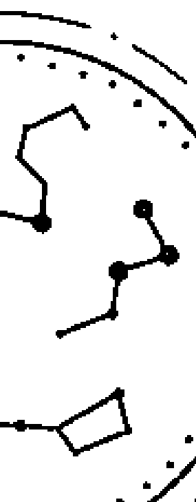

天秤座的公平、公权力非常搭，两者都有仲裁者的感觉，而且是以和平为最高目标，所以也可能成为国际协调者。

木星象征执法单位，七宫也是。七宫为什么有执法的意味呢？因为七宫很注重公平，遇上不合理的事一定会想办法纠正，天秤宫又是基本宫，发现不对的地方，会不顾一切去捍卫。年轻时可能还受守护星金星影响，对别人比较退让，过了三十岁之后，那股正义感就按捺不住了，那时就会像迟来的青春期，开始有叛逆的言行。

木星天秤座非常重视自己的形象，不只是外表，连自己的态度和给人的印象都非常要求，不希望自己有偏见，务求达到公正。我们都知道这种角色不容易扮演，所以木星天秤会尽量谁都不得罪，这样才能给自己留有转圜余地。他们一旦发现自己犯下意见上的错误，不管错误多小，或是时间过了多久，都会要求自己立刻更正，而且一定要昭告天下。天秤座注重表面上的公平跟规则，但至少表面上要做到，没有人可以知道或是置评，但至少表面上要做到，不然怎么让人家相信他的脑袋里是公正的？

木星天秤座或第七宫，如果相位不好的话，会执着于字面上的意思，跟人陷入没必要的辩论战里。他拿出来的证据，通常只是书上说的或听别人谣传的，木星天秤却非常相信这种经过书本认证的东西，而且不疑有他。他自认为非常客观又公正，一旦接受了某种想法，就把这件事当成了真理，陷入愚昧而不自知的固执。如果相位好的话，他凡事讲求证据，深入求证，甚至可以写一本论文来自我辩证，但因为大多数的事情本来就是各有各的立场，站哪边都不对，木星天秤又要求自己绝对公正，很可能到最后也得不出结论。他比较适合写没有结论的社会观察，因为木星本来就是出版业，天秤座又是求证及辩论，让他把一大堆的理论写到书里面去，会比在嘴巴上啰啰嗦嗦更能让人接受。

第七宫也是婚姻宫或合伙人宫，木星入内，代表嫁娶的是受人注目的对象，也代表会受人钦羡。跟人合伙做生意有很大的斩获。木星代表新机会，也代表透过婚姻提升自己的社会地位，或是进入一个可以大展拳脚的领域，总之是透过与他人的连结，让自己进入更高的殿堂。

## 木星在第八宫&木星天蝎座

### 看透世上难解之谜

八宫对心理学有一定的研究，对神秘学中理性的部分也有独到的见解，会把深奥的事情做出更多宽广的延伸，很适合当教授、博士或医生。木星八宫会精通一样才能后，又去涉猎其他的部分，一生不停地学习，把精通的东西变得更多样化。如果是医师，最后可能中医西医都精通，还可能再去研究自然疗法或灵疗，一层一层推演下去，最后走上修行的路线，或者把所有治疗方式融合成一个大方向，用一个简单的方式囊括所有范围。

当然不只医学，凡是深奥的学问都包含在八宫。木星天蝎当然也可能精通困难的外语，因为木星代表国外的文化，天蝎座则是困难的项目，而且木星跟天蝎座都能深入探索文化的意涵。木星天蝎也可能是非常优秀的艺术家，天蝎座本来就是美感独到的星座，木星则有特殊的观点，两者加起来会拥有不流于俗的审美观，并且能以自己的观点说服全世界，或者说是镇压住全世界。木星在天蝎座，如果是不好的相位，会变得非常顽固，而且发现不到自己的问题。有着无理的乐观，有自我欺骗的倾向，别人劝也劝不听。试了一次失败后，不会马上踩刹车，只觉得是时机不对或运气不好，想再多尝试几遍，是标准的不到黄河心不死，到最后有可能赔上所有的身家。这样的特质很适合当科学家，科学家为了自己研究的项目，赔上一切也没有什么好奇怪的，只是看成果有没有价值而已。就算今生没有结果，也能“化作春泥更护花”，给后代参考的资料。这也显示了木星跟天蝎座的共同特质，木星是造福大家，天蝎座代表生与死，失败的研究资料能在他人手上获得新的契机重生。天蝎也有矿产的意思，木星天蝎容易留下很多资源，待后世慢慢挖掘，过了几代以后，得到更大的发展。木星在天蝎如果是好相位，会非常富有。木星本来就是富贵的象征，天蝎座代表有一定的财力，而且不会有良心的困扰。他会有力地做出任何决断，当机立断绝不手软，所以能除去很多不必要的困扰，为自己的成功争取更多空间。木星代表宽广的范围，天蝎座代表深邃的程度，木星在天蝎座，像是全面性的深度，而且木星调整了天蝎的固执。木星是射手座的守护星，变动性本来就很强，又能把范围扩张得更大，让固定的天蝎座比较有变通的能力。

## 木星在第九宫&木星射手座——没看过的风景，永远是最美的风景

木星在射手座或第九宫，如果是不好的相位，会呈现出大家最愤慨的射手特质——无脑又白目。木星非常乐观，看不清楚现实的丑恶，落在守护的射手座上，等于强化木星的特质，当身边的人已经知道事实是怎么一回事的时候，他还在状况外，相信一切都会变得美好。

木星讨人厌的地方在于他不是完全没有心机，只是他在算计别人的时候很容易被发现，自己却不知道其实路人皆知，依旧对自己信心满满，在旁人眼中就是又笨又自以为聪明。其实这也是一种天真，一种对人的不设防，木星射手常常把大家想得太简单了。

木星不代表笨，毕竟木星范围是很宽广的，只是他重视的地方跟大家不一样。我们可能注重的是生活细节，木星却能看到其他人看不到的项目，例如网络购物的大数据、人工智能的哲学观，这些我们平常不会去思考的问题。对木星来说，探索这些事情就是他的日常生活，因为木星的生活目标就是不断发掘没看过的事物，不断抛弃过去，追求未来。

木星在第九宫，如果相位好的话，个性非常宽容。木星不会跟人计较，反正发生过的事情，也就等于是旧的事情了，对他来说目标永远在前方，他才没空跟你一起回忆这些老掉牙的过去呢！但这也代表记忆力不好，因为他不太在乎过去的事（除非那跟知识或学术相关，或是刚好月亮同宫）。

## 木星在第十宫&木星魔羯座——天生的好运加上些许的努力，就能薄积厚发

木星在射手座或第九宫，左右铭就是“学无止境”，永远放眼未来。他会极度爱探险、爱旅行、爱探索所有自己没见过的东西，木星对未知的项目，特别有想把它弄清楚的兴趣，受不了有自己不知道的事。木星是喜欢自己囊括一切的，不过他虽然是领先者，并不想当一切的主人，等到搞清楚以后，就觉得可以离开了，不需要继续停留在原点。木星没有执着度，是永远的变动者，永远在寻求下一个更好的可能性。不会恋栈现有的成就，认为所有的“现在”都是不够好的，没做过的事永远是最好的事，没看过的风景永远是最美的风景。

第十宫是事业宫，也是一生中成就最高的时刻，跟土星相反，木星在此成就可能来得比较早，因为木星代表年轻人，跟土星代表的老人不一样，土星在第十宫的话是大器晚成。木星跟火星就是少年得志，在象征生命中年或晚期的第十宫出现火星或木星，都代表成就来得比其他人早。我们看第十宫，通常看的都是人在四十岁之后的运势。火星代表婴儿，木星代表孩童，木星在第十宫，也就是年轻人的行星加上中年之后的宫位，中和之下当然就是青年这年纪了。

木星非常有抱负和远景，第十宫对自我的要求很高，木星在第十宫的话，对自己非常有展望，雄心勃勃，少了木星满不在乎的性质。第十宫要求事情的完整度，木星在第十宫，代表别人没要求的事，他自己也会要求自己，不是做到完成就够了，而是要做到“比任何做过这件事的人都还要好”。还好在这里的是轻松的木星，不然其他严肃的行星入第十宫，有对自己过于严苛、逼坏自己的感觉。

木星在第十宫，出现不好相位的时候，会在需要拼命的地方，反而表现得太轻松。第十宫是人生重要的一环，木星代表散漫，木星十宫相位不好的话，常会在不需要严厉的时候对自己严厉；该认真的时候，又想放自己一马，以致在错误的时候做出不合时宜的判断。但是毕竟是木星本身是吉星，就算不合时宜，也不会有太严重的后果。跟工作相关的宫位，火象行星本来就会发挥非常好的力量。如果出现好相位的话，可能是研究者中的佼佼者，或是地位高于其他人的教授，或是某些主流企业中的经营者。木星就是杰出的人，但是他对于钱财跟地位并没有特别的需求（虽然第十宫会为他带来一定的社会地位）。除了第十宫的地位之外，木星也代表天生的地位，木星不需要特别追求，天生就带有这个命格，即生下来运气就比其他人好，身份也会高于其他人。

守护十宫的魔羯座，本来就是很有野心的星座，木星这颗狂放的行星进入，就会把魔羯的计划搬上台面。本来魔羯座的成就都是自己的事，因为木星进入，变成有外力影响，木星在十宫，反而不能按照自己的意愿，安静隐密地做自己的事。其实这是有好处的，因为十宫多少有点守旧，而且冥顽不灵，木星这颗活泼的星可以打开十宫的视野，让他更敢于冒险，成就也会更大。

## 木星在第十一宫&木星水瓶座——活在未来世界，为理念奋斗

木星跟水瓶座共同的特点是他们的心思都不在当下，而且都关怀全人类的福祉。成熟一点的木星水瓶，会用一辈子的精力投入某一个公众议题，慢慢地做出成就。木星有吸引大家注意的能力，水瓶座则代表公众，所以能吸引到志同道合的人，并且让每个人都发挥出最大的潜力。或是找到非常好的赞助者或协办单位，把众多资源结合起来，并且站在领头的地位。不过他会保持一种旁观的心态，“别人骂我，我只要当成是一只蚂蚁在骂另一只蚂蚁就好了，这样就不会生气。”这句话是木星水瓶座的思考逻辑，因为木星是放大，水瓶座是抽离，木星在此当然会加强水瓶座的特质，而且加重了不照一般人想法的习性。

木星水瓶非常善于判断哪个价值体系是正确的，或是下一步应该探讨的事。由于木星代表新世代，水瓶座又代表未来的价值观，所以上一个世代，木星水瓶可能是争取女权或人权，这在当时社会是非常前卫的，但是到了现在，却变成一般的普世价值了。这一代的木星水瓶可能会争取同性恋者的成家权或是动物权，但当这些变成普世价值的时候，木星水瓶的重心又会改变。

木星水瓶关注别人还没注意到的东西，因为觉得没人帮助它们，自己应该出一分力让问题被看见，帮忙争取些什么，他代表某种革命者，也适合当某个理念的教主。因为木星水瓶的身份是先驱者，等到争取的事情变成大家都认同的事情时，他就没有什么可以奋斗的了，要赶快转往下一件事或下一个方向。

木星水瓶的缺点是，有些事情以客观角度来说是错的，木星水瓶却会为了奇怪的个人观点或特别的原因一直坚持下去，而且从头到尾都不知道自己哪里不对，甚至可能发展出更大的错误，因为他不相信以前相信的事情是错的。可能他信奉的观点是对的，但是随着时间过去，大家需要的东西已经不同，价值观也改变了。例如在上一个年代，女人为了表示自己也有能力，学男人穿起西装跟垫肩，但是到了现代，大家都转而赞成认同自己天生的特质。木星水瓶本来就不擅长随着环境而改变，所以他可能还留在旧有的信念里面。

木星水瓶座的优点是，对未来的展望性跟实践性非常强。很多时候大家都还没发现问题，但是他不知道透过什么管道或什么样的思考逻辑，直觉地发现了问题所在。大家觉得他有某种奇怪的预知能力，而且不管别人怎么反对或攻击，都不会改变自己的信念。大家有没有发现，这跟缺点是一样的？只是在于这件事是什么事而已，看他有没有选对边站，这点非常重要。他一旦选了边，就再也不会改变了，就算他坚持的东西是错的也一样。

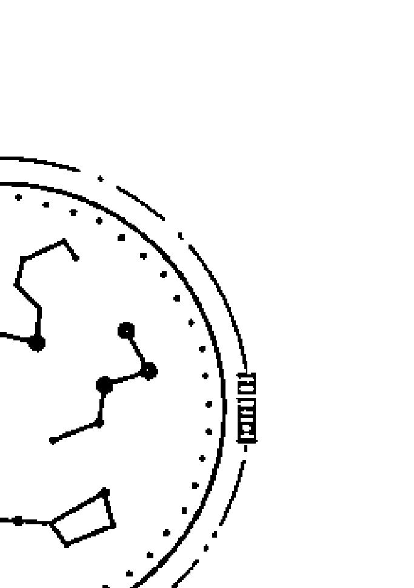

## 木星在第十二宫 & 木星双鱼座

### 不是迷糊，而是大智若愚

在海王星被发现之前，双鱼座的守护星是木星，木星跟海王星的共同点是都可以升华。不同的地方是木星只能往上，海王星却可以到达任何地方，因为大海是无边无界的，不分上下左右，所以双鱼座可以往上爬升，也可以沉沦；双鱼座可以是神明，也可以是孤魂野鬼。

就是因为海王星的这种性质，让双鱼变成最不受限制的星座，海王星加上水象跟变动宫，就有着任何的可能性。

木星代表往上提升，又是火象行星，木星在双鱼座，给双鱼座带来一点世俗的特质，也给容易模糊方向的海王星一个很好的目标。木星跟海王星相同的地方是宗教性，但是木星比海王星多了一点学识的成分。木星代表知识，海王星代表灵性，木星加上海王星的性质，就有升华为“大我”的可能，也就是超凡脱俗。他跟大部分的人都可以合得来，因为他对谁都能感同身受。

木星跟双鱼座的另一个共同点是艺术，艺术既是人类更高的层次，也不限发展的方向，艺术什么界限都没有，即使是赌鬼或酒鬼（任何上瘾都跟双鱼座有关，因为双鱼座代表沉溺，连毒瘾也是），对这个世界也有自己的一套看法跟价值观，这就是双鱼座的不受限制。木星双鱼比较像是世间认同的艺术家，或是艺术领域的教授。木星一直都太高高在上，不能了解所有人的感觉，因此木星双鱼座会活在精神层次的世界，可能在灵性、艺术，也可能在治疗界有所成就（也有可能变成精神病患）。这也是木星双鱼通常不被世人认识的原因，因为他擅长的事情，通常不是世俗承认的部分。就像电视剧中有阴阳眼的人，必须避开世人的目光，以免惹来麻烦。他在暗处比较有发挥的空间，或者他生来就知道在暗处才有发光的必要，不是光芒四射的类型。木星在双鱼座，如果相位不好的话，会有木星的白目加上双鱼座的迷糊，让身边的人受不了，觉得这个人到底是怎么活下来的？不过木星的贵人本来就很多，而且木星看起来毫无心机，让人对他没有戒心，双鱼座也是一副懵懵懂懂的样子，善于流露自己无助的一面，会激起别人的保护欲，惹人怜惜（不管男生女生都一样），有时他也没有装得很可怜，但是旁人对他就是会有一种莫名其妙的同理心，觉得他很需要帮忙的样子。就是因为这样，有时剥夺了他学习的能力。木星在双鱼座如果相位好的话，会非常有智慧，跟他倾诉碰到的困难，他不知道为什么就是了解正确的答案，能够给你建议。即使没有发生在他身上的事，他也好像有经验的样子，我想因为双鱼座是老灵魂，对于一切多少有点“好像经历过”的印象，有浑然天成的智慧，加上木星的影响，让他们好像有种高于常人的洞见，跟相位不好时，像智障儿的表现完全不同（笑）。所以木星在双鱼座不是被人认为很笨很天真，就是让人觉得智慧超群，好像很难取得中间值，总之不会像是普通人。

## 七、土星在各宫位表现

## 土星在第一宫&土星牡羊座

### 自我要求高，路遥知马力

土星所在的宫位代表一个人的缺陷所在，也是罩门，你的人生往往在这一关绊倒，要历练很多次，才能过得了关卡。

第一宫是命宫所在，代表一生命运的缩影。土星在这里，代表一生之中的考验很多，也代表成就没有那么容易取得，一定要经过很多颠簸，才能在最后一刻有所斩获。牡羊座的守护星是火星，跟土星遇在一起，这样的人会非常偏执。火星是短时间内会很坚持，土星则是坚持到最后一刻，火星跟土星加乘，可见压力非常大，因为他们从头到尾都会要求自己做到最好。我自己的火星跟土星就合相在第六宫，第六宫代表工作，我的工作之一是写作，每写完一本书，不是编辑看过就可以了。为了让每个人都看得懂，我还会找一个有阅读障碍的朋友看过，确定他可以看一遍就完全看懂，我才会交稿，因为不希望我的读者还要花很久的时间思考字义，那对第三宫很强的我来说是一种否定。土星在牡羊座的人极度难沟通，认定的事情就一定要照他的方式来完成，他常常先爆冲以后再踩刹车，在半路上犹豫不决。土星总是希望自己凡事做到最好，不太容许自己犯下错误，常常思考了半个以后，就突然随便下一个决定，然后再陷入悔恨当中。如果相位不佳的话，两颗星之间就无法协调，造成拉扯的状况，形成更大的压力，把自己逼到极点。土火合相是压力最大的相位，喜欢凡事逼自己，连没有人要求，随便做做也没关系的事情，也想做到尽善尽美，这种自虐源自天生的性格。

土星在一宫如果是好相位，优点是会越挫越勇，不管什么磨难都没办法阻挡土星的坚持跟牡羊的决心，他会把每一次失败当成下一次做得更好的经验，希望自己更上一层楼。土星在牡羊座的人不会轻易认输，他不相信自己做不到（牡羊座的自信），就算成果不尽理想，也会认为是时间不够多，不然自己一定可以做到尽善尽美（土星的固执）。往好处看的话，的确是一个不可多得的人才。正因为这样要求自己比要求别人多的个性，会取得很大的成绩，这种成绩不是短期表现而已，而是长久的品质（土星除非落在水象宫位，否则都有过度严厉的倾向，也会太过鞭策自己，容易给自己制造太大的压力）。

## 土星在第二宫&土星金牛座 —— 手上有钱，心灵才安全

第二宫是财帛宫，土星在这里的话，表示这个人对物质的安全感非常低，需要鞭策自己不断追求保障。土星二宫可能为了财务安定，付出很大的代价，可能把梦想跟自己的才华都赔上，甚至把一切都拿来以现金计价。土星二宫可能从父母身上继承到艺术天分或比较抽象的特质，但是如果一切不能变成现实的物品，他还会觉得非常不踏实。最好的物质代表就是现金了，如果不能衣食无忧的话，他会觉得一切都是白搭，就算能衣食无忧，如果不是长期的、永久的，他还是会觉得明天不知道在哪里。

比起有好的发展但需要冒险的工作，土星二宫可能倾向选择低薪而有保障的工作，最好是公务员。如果有终生雇用制，他一定会非常卖命地去保有这份工作，比起薪水低，他更担心的是会中断，土星讨厌任何不在规划内的事情，除非木星或火星同宫，或是有一些好的相位。如果月亮同宫，担忧的情况更是会变本加厉，因为月亮本来就代表安全感，遇上压迫感很重的土星，时常会觉得自己的生存受到威胁。

金牛宫也代表感官，土星在此，感受力比较迟钝，尤其是触觉跟嗅觉，除非有水星或金星同宫，或跟水星、金星有着良好的相位。

土星在金牛座，如果相位好的话，代表他的一生都在规划中，一切也都按部就班地前进，假以时日，可以累积出自己的一番成就，虽然需要用很长久的时间去铺陈，但一切都会得到报酬，不会白费。土星在金牛座会摒除任何可能做白工的机率，他一定要有十足的把握才会出手，对于自己的眼光跟判断也很有自信。其他的不说，关于金钱投资方面，他就不会出现判断错误的事，就算一时错误，凭他的信心跟毅力，也会很快把损失补回来。土星在土象星座，如果相位好的话，会有非常出色的计算能力，评估风险的能力也很强。

土星在金牛座或第二宫，如果相位不好的话，可能终其一生都容易事倍功半，或是努力了很久的事却化成泡影，例如快退休了还被公司开除，或是做生意被骗，或总是做薪水跟付出不成比例的工作，但讽刺的是，这些都是他自己决定的。土星在第二宫，判断力不会很差，可是胆子小，例如跟你天花乱坠地保证一定会有最高利率的金融产品，到最后都是坑钱的比较多，土星在第二宫，一向容易掉进这种陷阱中。

## 土星在第三宫&土星双子座——一个眼神看清事实，一句话点破问题

土星是一颗老化跟迟缓的行星，双子座则是俐落又快速。两颗星有同样的优点，就是很聪明，只是土星的聪明需要时间累积，双子座的聪明却是天生的，年幼的时候就显露出来了。不过双子座的聪明，到了年纪大时，会显出一点疲态，可能人家早就看腻了他耍的把戏；土星则是越老越有智慧，随着年龄增长，土星的经验也越丰富，就显得比同龄的人技高一筹了。

土星落在掌管沟通协调的第三宫，在沟通方面会显露出双子座少见的耐心。双子座会假装一副很有耐心的样子，其实都是用话术在打哈哈，但土星在双子座的话，对于事情会有一种全盘的了解，然后推敲出最好的办法，抽丝剥茧地找到问题的源头，把事情慢慢地解决掉。虽然不像一般双子座行动那么快速，但是不至于太慢。

土星在双子座，如果相位好的话，会聪明得非常全面，你可能觉得他是随口给的建议，可是详细推敲起来，才知道想得很周到，从现在到未来，已经有了全套的对策，而且细节令你吃惊，或许你从来没有想到这么细的地步。年龄对他是一项有利的条件，双子座都只在年纪小或年轻的时候很聪明，老了就被看破手脚，但土星是越老越聪明，可以补双子座的不足。土星非常注重精确性，不像一般双子座会随随便便地判断，他会考究得非常详细，而且因为双子座对所有疑点都很有兴趣。

## 土星在第四宮&土星巨蟹座

### 美酒越陳越香，朋友越老越好

會不斷追究，基本上沒有什麼事可以耍他，畢竟靈活又精確的人可不多見。

土星在雙子座或第三宮，如果是不好的相位，思考會顯得很遲鈍，或是用很快的速度做出錯誤判斷，但是你怎麼跟他解釋也解釋不通，因為他好像天生少了一根神經，就是有一個關鍵點想不通，而且非常堅持己見。受到土星影響，等他年紀再大一點以後，就會稍微了解當年的你在講什麼了，但在年輕的時候，腦袋比同年齡的人還要不靈活，就只能說：時間可以解釋一切。土星雙子因為一直都很聰明，至少在他自己的理解裡，都是別人不了解他的優秀，不是他自己搞不清楚別人的意思，所以會特別固執。老了以後更是非常自以為是，自己認定的想法會寧死不屈，或是看起來同意別人了，其實卻是以表面上的同意或附和來敷衍人，私底下還是堅持自己的意見。

土星代表收縮，第四宮則是關在自己的世界裡，土星又是巨蟹座對宮「魔羯座」的守護星，所以土星在此極為不利。土星不管在任何宮位，都是一顆凶星，但我覺得如果時間過得夠久，這個落點也會發展出自己的優點。土星本來就是一顆需要時間的行星，只是在第四宮這個善於防衛土星在第四宮，通常跟家人的感情交流不會很密切，或是從小就在家以外的地方，跟家人交流感情的時間不夠，或溝通方式有問題，以至於產生了心結或誤會。這不是不可解的，土星需要花一些功夫或時間，才會了解彼此的用心。土星本來就不善於溝通，在第四宮會更加自我保護，更不容易講出心裡的話，但是對家人的防衛心也這麼重，就會把最容易到手的助力往外推了。如果家族性本來就比較沉默的話，就連想幫對方的話也說不出口，但心中對家人的感情其實很重，因為土星是非常重視家人的。土星重視的是家人之間的關係這個事實，不像巨蟹座重視的是感情，但是土星跟巨蟹座都覺得血緣關係是他生命中很重要的部分，外人難以取代。他覺得家人本來就是一個整體，本來就應該不分彼此。

土星在巨蟹座如果相位好的話，會有非常念舊的感覺，甚至非常注重傳統的習俗跟儀式，可能對於什麼時候該拜拜、什麼時候是什麼神明生日，或者哪一位長輩的忌日在哪一天都記得清清楚楚。對同年齡的年輕人來說，他很像個食古不化的人，但傳統文化可能就是保存在這些人手裡。他對於傳統非常重視，對老一輩的觀念也非常看重，例如人一定要重視孝道、不要隨意浪費，不然會遭天打雷劈。

土星在巨蟹座的相位如果不好的話，可能對已經過世的人比較有感情，對現存的家人比較有隔閡，因為他不太習慣跟活生生的人溝通，有的話也是習慣用干涉或命令的方式。土星本身就是權威的象徵，不太喜歡解釋，巨蟹座則是覺得不需要解釋，你也應該知道他在想什麼，好像你有權通靈的能力。他自己又常常會錯意，但是他會執拗地認為一定是如此。土星在巨蟹座的人更是頑固，即使你跟他解釋過了，他還是堅持己見，甚至認為是你自己不夠了解自己，他比你自己更知道你在想什麼。

## ——土星在第五宮&土星獅子座——

### 天生的王者，實力比名聲更重要

土星跟獅子座都是強勢的王者，只是土星是幕後的操盤手，獅子座則是在台前接受榮耀。獅子座不太需要從別人那裡得到財富跟好處，他覺得自己生來就擁有一切，至少以他的實力，要得到財富跟榮耀都不是問題，所以他有絕對的自信，跟土星有一點自卑的狀況不一樣。土星隨著時間過去，也慢慢證明了自己的實力，雖然不是一副萬民擁戴的樣子，私底下他對自己還是肯定的，只是沒有大聲招搖而已。

土星在獅子座，對於實力比名聲要重視，他覺得如果沒有實力，就算得到名聲也會不堪一擊。他不能接受自己在任何狀況下有丟臉的可能性，會防堵任何被考驗的機會，正因為如此，他心裡常常天人交戰，會在出鋒頭跟隱藏實力之間拉扯不下，他當然也知道名聲對自己有好處，而且這種兩難情況時時誘惑著他，但又很害怕哪一天準備不夠的時候，會有出醜的可能。土星跟獅子座的共同點，就是非常害怕失敗，因此要練習幾百次以後才願意在人前展現。這個落點讓獅子座害怕出醜的心態勝過於追求掌聲，獅子座的臉皮本來就很薄，加上土星更是不能接受失敗，哪怕就這麼一次。

土星在獅子座，如果相位好的話，會有一種君臨天下的感覺。因為他既重視名聲，也重視實際上的表現，結果就是裡外都表現得非常好，讓人心服口服。隨著年紀越大，威望越強，到最後可能會把這份肯定傳到後代，變成一種世襲的智慧，讓別人覺得他真是虎父無犬子，把這份信任從上一代延伸到下一代。

土星在獅子座如果相位不好的話，會加強土星的負面特質，他會長久地自我質疑，就算別人已經給過他無數次的肯定，他對自己還是一直處在懷疑的狀態。土星總是對自己的肯定不夠多，一直到老都無法克服，除非有金錢跟地位來幫他提供證明，不然他不相信誇獎這種東西，因為那些都太虛了。

土星在獅子座終其一生懷疑的重點都在自己身上，別的事情也引不起他的興趣。即使得到了一點點肯定，馬上就會被自己更多更高的要求打敗，因為土星不要一次兩次的勝利，他想要長久的資源跟保證。獅子座則希望成功能永久地保存在自己身上，所以更加戰戰兢兢。


## 土星在第六宮 & 土星處女座

### 一絲不苟，只求使命必達

處女座是非常挑剔的星座，可是處女座的守護星是水星，又是變動星座，所以他不太敢正面承擔責任（相較之下，女生反而比較有勇氣，大概是這個社會對女生的要求沒那麼高，做不到也不用承擔什麼責難吧！男生可能有一堆人盯著，更不敢出面說自己要負責了，因為很怕人家看見他沒盡到責任）。一般書上寫的處女座都太有擔當了，不太像真正的處女座。處女座的責任感的確非常強，如果沒有做到自己該做的事就很自責，所以盡量不把責任攬到身上，有時還會逃避，或是把事情推到別人身上。面對工作，他就不太會推拖，畢竟這關係著他的未來，他在工作上是使命必達的人，不管要使出多麼不要臉的手段，都一定會把事情辦成。

土星是個對自己高度要求的行星，掌管機械，也代表著精密工藝，精確度比處女座高出太多了，處女座只是在檢查方面非常細膩，但在工作能力方面並沒有土星那麼一絲不苟。所以我們要知道那只是「主義」，其實處女座自己不太能做到，他只是擅長挑別人的毛病，需要土星在此，才能真正達到最佳的發揮。但土星在此，也代表處女座的困難就在此，土星在處女座，真的容易把自己逼到極限，然後出現身心的問題。

土星在處女座，如果是壞的相位，會給自己跟旁人都帶來極大壓力，土星的好處是只看整體，但是加上處女座，還會要求各種細節，這樣當然會把所有人都逼瘋。土星處女座常常忘了這一點，他覺得事情要做就做到最好，但是又很節省，對於人力成本跟材料成本都沒有那麼大方，變成要他把別人交代的事做到完美，自己卻沒有什麼原創性。土星在處女座的優點是，他會是精密工作的良好從業人員，例如鐘錶的製作，或是太空總署的軌道計算，甚至是古董的鑑定，只要與一切需要規則制式模式有關的工作型態，土星處女都可以執行得很好，但是卻沒有什麼創意空間。現在這個社會每個人都很注重創意，卻沒有能力把基本的事情處理好，在這個部分，土星處女就派上用場了。他可以算是火眼金睛，哪裡有不對勁馬上就可以抓出來，這種能力是很多企業需要的，創意交給另外的行銷企劃負責就夠，土星處女把「稽查人員」的身份做好就可以了。

## 土星在第七宮 & 土星天秤座

### 萬事起頭難，一旦開始就會堅持到底

大家都說天秤座代表法律，在我的分類法裡面，我卻覺得天秤只代表訴訟的層面，土星守護的魔羯座代表憲法。天秤是可以講理的金星跟風元素，只是開創星座讓他非常堅守原則。土星守護既是土象又是開創星座的魔羯，魔羯座的信念是絕對不可動搖的，因此土星在天秤座，會讓天秤座比較無法展現出金星的一面，變得過度墨守成規，甚至是冥頑不靈。天秤座雖然講理，但不太會考慮實際狀況，很多時候跟天秤座討論，會有他在照本宣科，甚至打高空的現象。天秤座太注重理論了，光是維持理論上的平衡就已經花掉他所有力氣，當然沒有餘力管實際情況，但是他又很愛滔滔不絕，好像一切講完就當做到了，實際上事情都還沒起步。土星在這裡可以解決掉這個缺點，因為土星最大的優點就是腳踏實地，這跟喜歡空談的天秤座是絕佳的互補。土星在天秤座也很適合當老師，因為他謹守本分，絕對不會講出沒有經過驗證的話。即使有事實認證過，土星天秤也會去比較不同時期的狀況，是個非常實事求是的人，因為土星善於把所有事情具體化。土星在天秤座，會把聽起來好像可行的事，實際拿來驗證看看，如果結果不如他的預期，會想辦法修改流程，因為土星對於事情的精準度要求非常高，調和了天秤座只在大方向著墨的特點。土星在天秤座的好處就是實際執行理念，不會流於空談。土星也代表障礙，他非常清楚地知道，這些講出來的道理化成事實會有什麼樣的麻煩。你可能覺得他好像有點預知能力，怎麼事情還沒開始做，就可以預見會遇到什麼問題了？事實上，是因為土星的經驗夠多，已經在他腦中形成一個資料庫，所以他不會重蹈覆轍。

土星在天秤座時，社會適應力非常良好，因為土星本來就注重整體；天秤座也是社會化的代表，喜歡人群。土星雖然不善於跟人交際，但他非常注重一切規範，不會讓自己得罪任何人，或是做出什麼不恰當的事。土星在天秤座或第七宮的缺點是，在實際開始執行一件事之前，好像做這件事會要他的命一樣，因為他已經預想到了種種困難，懷疑自己克服這件事情的能力，所以總是一「再說再看看」，這就是土星不容易開始做一件事的缺點。但是一旦開始做了，就會堅持到最後。天秤座不會輕易轉移目標，開創星座是對著目標直直衝過去的，即使風象也無法改變天秤座的固執，天秤座一旦認為是對的，就一定要做到底，不管這件事會讓他付出多大的代價。但要願意走到開端，還是要花費很大的耐心。土星天秤的相位如果不好的話，非常固執己見，什麼道理都說不通，因為他只相信自己心中那套標準。天秤座本來就很固執，他有絕對的信心認定自己是對的（可能也因為見識不廣的關係吧？）何況土星在這裡，讓天秤座的固執變本加厲，也可能是土星加重了天秤座的主觀性。土星的態度比較嚴厲，加上天秤座愛發表高論，容易讓人覺得自以為是。人緣也比較容易遇到問題，或是對別人犯下的錯誤沒有寬容之心。

## 土星在第八宮&土星天蠍座——固執到陰魂不散，相處如前世相欠債

土星跟第八宮都管「業力」，只是土星的業力都集中在物質層面，例如貧窮、肢體殘障，或是先天性的疾病，比較不是用心理治療就可以解決的，因為那是明明白白放在生活中的困難，不是正面積極就可以解決的事。明天要繳房租你卻沒錢了、車子壞了，這些要實際物質面的方法來解決的事就是土星的象徵，由不得你自欺欺人或閃躲。

第八宮的業力比較特別，像是心理層面中的「相欠債」，受害者本人也在共犯結構內，就像前面寫過的月亮，自己放不下，卻又怪別人拖著他。第八宮更加重這狀況，對方扮演加害者，他自己就心甘情願當受害者，而且除了受害之外，又懷抱自責，更讓自己脫離不了這樣的局面。第八宮比較容易超脫的是，只要心念一轉，事情也就解決了，至少在物質層面上不會有什麼損傷，打起精神來，就不會有人看到你心裡的殘缺，在別人眼裡依然是正常的，所以我覺得相對之下算是好解決的（當然有人覺得相反，這是每個人的價值觀，沒有什麼對錯）。

土星在第八宮等於物質面的困難，也形成了心理的傷害，兩者加乘作用下，等於被天羅地網圍住。土星在天蠍座，會在自己心裡打上解不開的結，而且不斷地逼迫自己、責問自己。他有重生的能力，卻缺乏重生的機會，也把自己捆綁在原地，而且是自己不想走，因為他覺得一定要把這件事想通，就像數學解不開就不願意做其他事的人一樣，被自己困住了。土星在天蠍座如果相位好的話，非常有韌性，研究不出一個結果絕對不放棄。就算得到了答案，也會追根究柢，要走到下一步、追求下一個答案，當大部分的人滿足於目前得到的答案時，土星第八宮依舊會繼續探索。在沒有得到最後的真理之前，他沒辦法進行別的事，因為土星跟第八宮都代表「專注」。如果相位不好，固執超過了正常人的程度，會有點陰魂不散的感覺，非得要把自己最後一分力氣都耗盡才甘心；諷刺的是，雖然土星第八宮致力於追求答案，但他常常也是阻礙答案的問題之一，越是用力，答案就離得越遠，等於用盡所有力氣在把答案推開。

## 土星在第九宮&土星射手座——好還要更好，永遠都在計畫下一步

土星跟第九宮的共同點是火力集中，只是土星往更深的地方挖掘，第九宮是拓展更多方向，向外延伸，追求更廣的領域。土星跟第九宮都有追求更進一步的意思，第九宮的特質比較輕鬆活潑，但土星在內，會對自己在意的東西特別嚴肅，一點都不開玩笑，符合第九宮積極挖掘的意味，只是態度比較嚴謹。而且因為土星代表中規中矩、一板一眼，會加深第九宮火象的集中性。

第九宮如果有土星在內，代表對於自己感興趣的事非常專注，而且挑毛病的精神比處女座還強。這是因為九宮有追求更高更廣的企圖，處女座只是避免犯錯而已，沒有太多想要更進一步的念頭。由於第九宮代表精益求精，永遠都在計劃下一步，永遠都想去更好更高的地方。土星在第九宮，會收斂第九宮廣闊無際的意志，集中在土星想追求的深度目標，或是把很廣的東西收攏到幾個重點，然後集中追求。在愛情方面，異於太陽射手座的花心，土星射手座在感情方面會追求讓自己更上一層樓的機會，不會有太多對象，以免分散精神跟注意力。他會鎖定一個目標，長期經營，以求在最少的對象身上得到最大的收穫，不見得是名聲跟錢財，有可能是責任的分擔。所以這個伴侶，要非常有能力，也非常有擔當才行。土星在第九宮如果相位好的話，可以一改第九宮缺乏責任感的特質，把多重的責任都搞定。雖然煩雜，可是不會漏掉任何一環，好像雜耍的特技演員可以同時要好幾個盤子一樣，而且弄得妥妥貼貼，還可以從中發展出更好的新方向。土星在第九宮是同時想追求深度跟廣度的人夢寐以求的相位，因為他可以兩者兼顧。如果相位不好的話，會過度逼迫自己，現有的事都做不完了，還想發展更多方向，到最後把自己搞得焦頭爛額，而且對自己非常苛求，不允許犯下任何程度的錯誤。也因為要求很高，非常難達到，但如果有成就的話，會特別出色。

## 土星在第十宮&土星魔羯座——十年磨一劍，出手便是贏家

土星在魔羯座的話，是大器晚成的意思，不過就算晚成還是大器，所以前景可期，只是得折騰很久的時間。土星代表傳統的強權，既古板又守舊，像是某些企業家，以為自己掌握了權力，一切就高枕無憂，可大肆利用強權，占有市場上的貨架，聘請強大的律師來打擊對手。土星的好處就是應該要盡的責任，他不會隨便丟棄，因為土星代表「負責」，他沒辦法拋棄原有的東西，原有的東西對他來說，就像生了根一樣，不管那是責任，還是頑固的一面。土星在魔羯座相位不好的話，會有暴君的感覺，既固執又霸道，而且非常強硬，那種權力感不輸給太陽第十宮。土星第十宮的強硬是暗中運作，不會直接攤牌，就算你想要阻止他做某些事，也看不到他的動態。他很擅長遮掩，這是土星「暗中」的特質（土星代表收縮，當然什麼事都是暗著來），等他的事情做完以後你才會發現，已經來不及阻止了，他會鋪陳很久後才開始行動，可謂老奸巨猾。土星第十宮很適合政治界跟商業界，這兩個圈子都是出了名的需要手腕，所以經驗豐富的人可說是如魚得水，而且很擅長觀察、瞄準別人的要害。魔羯座本來就是土星掌管的星座，在這個位置加強了他土象的特質。魔羯座也是有強烈目標性的開創星座，加上土象跟土星，讓魔羯座多了一分野心，這分野心不會輸給獅子座。只是獅子座是火象，又是太陽掌管的，比較注重名聲，而魔羯座比較注重實際利益跟實權。如果英國皇室本身是獅子座，那麼首相就是魔羯座了，因為首相掌握的是實權，而名聲跟掌聲則由皇家來享有。

## 土星在第十一宮&土星水瓶座 看似隨和，實際上比誰都還要固執

土星本來就比較有威嚴，加上水瓶座或第十一宮的疏離，可能給人很強的距離感。這個落點的好處是對世人都很博愛，沒有重要理由的話，平常都很隨和大方。當固執起來時，受土星不善於跟人溝通的影響，跟平常的反差就更大，也讓人覺得好像格外不講理。如果相位不好的話，容易被主流社會排擠，因為土星加上固定星座水瓶呈現出來的結果，就是頑固又自以為是，深信自己一定是對的，認為反對他的都是庸俗之人，所以更加討人厭了。土星水瓶座算是極度沒有人緣的落點，另一個可能的原因是他非常不善於經營自己的形象，引用的說法都太艱澀，讓人難以接受，甚至給人一種賣弄、固執的印象，造成大家對他畏懼三分。實際上他更怕別人，土星象徵沒有自信，繼而轉變成因為自卑而自大，更讓別人無法接受。不過土星加上固定宮，做研究都會很深入，不像其他風象星座很容易分心，反而能夠注意到一般疏忽的地方，而且在別人不當一回事時，就已經鑽研下去了。相位好的話，是非常有天分的科學家相位，凡事只求證據，不會被自己的主觀所蒙蔽。追求答案非常嚴謹，一般隨隨便便的證據他是不會採信的，會像日本人或德國人做研究，只有經過最細微考驗的答案，才足以說服他。

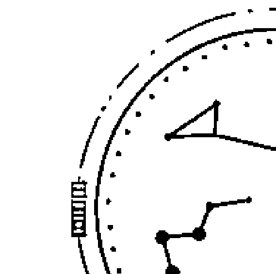


## 土星在第十二宮&土星雙魚座 —— 人生如闖關遊戲，步步驚心

土星是一顆密度很高的行星，放到極度稀釋的第十二宮，由於本質上非常衝突，不是土星被淹沒在第十二宮裡，就是第十二宮的變化性被土星擋住。因此要消化比別人還長的時間，才能得出正確的結論，而且中間還要繞很多冤枉路。

土星在第十二宮，最明顯的狀況是，把想要的東西實體化會遇到特別多困難，可能關卡非常多，好不容易解決一件事後，還有更多麻煩在後面等著，也無法藉由過往累積的經驗應付，因為困難類型完全不同，好像不斷在越級打怪一樣。我也不排除這可能是因為土星在第十二宮，導致變通能力太差，把本來很簡單的事弄得非常複雜。

土星很會抓重點，但是在第十二宮時，代表每次抓的重點都不一樣，得把所有重點合起來，才會看到這件事的全貌。可惜這對土星在第十二宮來說是艱難的任務，因為土星是障礙，第十二宮是渙散，土星跟第十二宮合起來，可能記憶力跟理解力都不太好，就像那種要比別的同學用功三倍才能取得差不多成績的人。土星相位好的話，會把非常困難的知識，整理出一般人容易理解的說法，但依舊需要花很長的時間，因為土星本質是「困難」，第十二宮又搞不清楚方向。相位不好的話，要不斷地繞圈子，最後才能發現自己追求的是什麼，也可能因為夢想太多，又不切實際，所以把人生弄得阻礙重重。

第十二宮有太多雜質，其中卻蘊藏著精華，如果你把原來的功課做完，可以接受下一階段的挑戰了，第十二宮對你來說，就是一種「昇華」；如果前面的人生功課你做得渾渾噩噩，第十二宮可能會讓你回到另一個起點，從頭再來，但累積到生命的後半段時，就有可能贏別人了！因為不管天生再聰明、天分再強，「經驗」是永遠無法取代的。

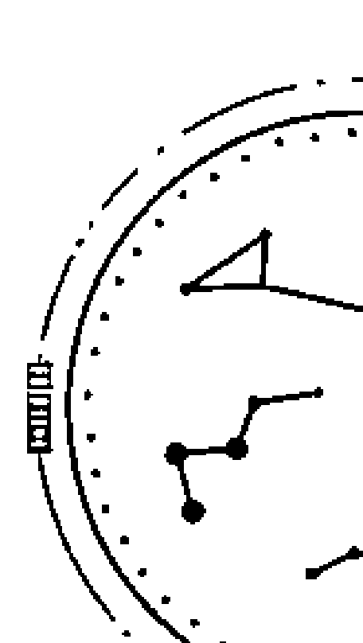## 八、天王星在各宮位表現

### 天王星在第一宮 & 天王牡羊座——超然物外，品味思想異於常人

天王星是你想要推翻的一切，可能是你深惡痛絕的勢力，也有可能是長期給你考驗的觀念，但這份考驗格局比土星更大，需要花更多的力氣去對付。天王星如果在第一宮，這個人可能穿著打扮跟平常人有很大的相異處，好的話就是品味出眾，壞的話就是品味怪異。天王一宮可能興趣跟喜好讓大家難以理解，例如觀測螞蟻的生存型態、研究外星球上的生物，或喜歡中世紀的打扮，除了他自己之外，其他人都覺得很怪異。這也代表天王一宮常常遇上怪異的人，可能是宅男、瘋狂收藏者，也可能是性別取向特殊的人（同性戀、雙性戀或無性戀都包含在內）。

天王星象徵高科技，落在第一宮很可能對高科技類的工作感興趣，不管是程式人員、網路從業者或通訊工具的研發者。雖然不一定是這方面的從業人員，但他對手機、電腦、人工智慧等高科技的東西，一定有比別人更多的認知。

天王星落在第一宮的話，看事情也比其他人更超然，我們覺得很嚴重的事，在他眼裡可能根本不值得一提，因為他的著眼點本來就跟你們不同。相反的，我們覺得沒什麼的事，在他眼裡可能是一件很嚴重的大事，例如一隻狗在路上被撞死了，我們覺得是常有的事，天王星人卻會徹夜擬出一份地下通道的企劃案，希望以後不要再發生，他覺得那攸關全地球生物的平衡，所以不能不謹慎。

### 天王星在第二宮&天王金牛座——追尋真理發揮專長，有意外致富

天王星如果在第二宮（財帛宮），代表錢財方面是大進大出，財運比一般人來得波濤洶湧，從赤貧到鉅富都有可能。也可能為了堅持理想，把自己搞得一文不名，等他的發現得到認同或肯定時，錢財就滾滾而來了。對天王星二宮來說，錢不是重點，而是他要告訴我們的事被接受了，錢只是附屬而來的東西。不過天王星二宮也可能推翻自己現有的成就，因為天王星從不吝於挑戰既定的觀念，就算是一手建立的帝國，只要他覺得哪裡不對勁，是不惜全盤顛覆的，這也是他財運不穩定的原因。錢對天王星來說不是最重要的事，重要的是真理。

他可能任職科技業，就算不是科技業，也可能是公司裡非常擅長電腦或電子設備的能手，誰的手機有搞不懂的地方，都可以去問他。雖然他可能不是以這個為主業，但長久地玩下來，也可以發展成副業。天王星不在乎錢，他可能只賺到名聲或友誼，變成下一份工作也未可知，因為時間久了，他學到的經驗跑也跑不掉。

我覺得新冠肺炎造成很多課程需要遠距進行，就是天王星在金牛座所導致的。金牛座代表實質的關係，天王星代表拉開距離，是網路跟電波的象徵，兩者結合起來，就是遠距接觸了。

### 天王星在第三宮&天王雙子座——太正常的人，無法與之當麻吉

天王星如果在第三宮，對每個人都很好、很友善，但不到稱兄道弟的地步，不知道為什麼，你總覺得他有一股淡淡的距離感，如果是一般同事或同學，這種距離感在情理之內，所以大家通常不會多想。他會聽你說話，但自己的事不會說給你聽，對大家而言，這種關係反而是負擔最輕的，有人際相處上有一個垃圾桶，而且不會把自己的垃圾倒給你，有什麼比這更划算的事呢？但天王星三宮不是沒有垃圾，而是他的垃圾就算告訴別人，別人也不知道該怎麼回應。會造成天王星煩惱的事情，對一般人而言太陌生了，無法進入他的情境中，他很了解這一點，所以不會花力氣敘述。

天王星的秘密只會在同溫層之間交換，我們這些俗人是聽不懂的。

如果天王星在第三宮，結交的朋友都有絕技在身，這種人跟正常人合不來，但是跟天王星三宮就特別有話聊，因為他的腦子裡裝了一堆奇奇怪怪的東西，一般人也聽不懂，跟那些怪人講頻率就很合，所以就會組成一支怪人團體。

一些我們平常沒機會認識或遇到的人，對天王星第三宮的人而言是家常便飯，他很容易跟各種領域的怪傑相談甚歡，至於正常人有沒有機會跟他交朋友呢？有的，他很樂於跟人交往，但你會覺得跟天王星三宮就是有種說不出來的隔閡，彼此談的話題沒辦法全然交融。或許我們跟每個朋友都只有某一部分特別談得來，不能全面性地交融也不是什麼大問題，人與人之間或多或少都有隔閡，這都在正常的範圍，不到可以大驚小怪的地步（笑）。

### 天王星在第四宮&天王巨蟹座——兼愛天下，家庭組成離奇

天王星如果在第四宮，對家人的態度可能不會很親密，但是很友善，因為天王星本來就不會跟人太親近，就算是家人也不例外。在他眼中，眾生都是平等的，不管是血親，還是陌生人，他一律維持友善的態度。有的人朋友很少，跟每個朋友的關係都很緊密，但天王星得跟全世界都保持著一定的關係，跟每個人的親密度就會變淡薄了。天王星的心很大，他很博愛，希望對每個人都付出自己的關愛，所以跟每個人的交集不多，雖然淡薄，他一定會保持一定程度的關心。別想著天王巨蟹會常常跟你喝咖啡閒話，他沒有那種功夫，他重視的是真正需要關心的事。你的工作或婚姻如果遇到什麼大問題，他一定會盡其所能給你他能給的幫助，但他覺得這是你自找的，也只會維持一種友善的態度，不會隨意抨擊，就只是帶著善意默默地祝福而已。

天王星的家庭組成一定很特別，可能家庭成員中有大家公認的「怪胎」，也可能是家庭的組成比別的家庭複雜。如果相位好的話，可能不是海王星的大愛，但他是風元素行星，會以理智的方式給予他能給的幫助。他是博愛主義者，覺得每個人都需要他的關心，但他的關心之中，沒有包含太多的愛。愛這種東西太私密了，他有的只是友善跟關懷，他覺得這樣就很夠了。對很多人來說，這樣的確能讓人感受到沒有壓力的善意，因為愛太沉重了。如果你覺得受到很大的恩情，想奉還，他大概也不會放在心上。

### 天王星在第五宮&天王獅子座——愛情觀超塵絕俗，喜愛難解的未知

除了戀愛之外，任何跟興趣、愛好相關的事，都在第五宮的範圍之內，專長以外的興趣也是，所以第五宮又叫遊戲宮。到成為真正的專長之前，都還在嘗試的階段，戀愛也是結婚的前奏曲，第五宮就是凡事變成正事之前嘗試的階段，所以有一種非正式的意思。天王星如果在第五宮，戀愛跟興趣常常都是別人沒辦法理解的，也可能對科學實驗或外星人之類的事充滿熱誠，凡是有嘗試跟實驗性質的事，都能引起他的注意，因為他就是有著無窮的好奇心。

天王星在第五宮，表示會喜歡的人，通常是別人無法理解的對象，但就是這種特別的地方，讓他覺得對方與眾不同。天王五宮不會在意別人的看法，只要自己喜歡就夠了，還會引以為傲，覺得：「大家都不了解他的好，只有我能看出來。」甚至會覺得別人談的戀愛很無聊。天王星的心臟特別強，要引起他注意必須有很大的特點（或說怪點），不然撼動不了他的神經。

對於大家都沒興趣或不敢嘗試的事，天王五宮反而會有一股好奇跟好強的心態，想要一探究竟，有時候是主題太複雜，有時候是看起來太艱深，但是這些都難不倒天王星，他就是對於別人無法解開的謎特別有興趣。

### 天王星在第六宮&天王處女座——成就險中求，好壞兩極

天王星在第六宮的話，跟高科技一定很有緣分，很可能身處在高科技產業界，當然身心靈界也跟天王星很有緣。論產業規模，高科技業比身心靈大多了，所以我們在日常生活中比較容易遇到從事高科技業的天王星。如果你容易遇到身心靈界的天王星，很可能你就是這個行業中的一份子。

天王星有著強烈的好奇心，非要把他看到的每一道謎題都弄清不可，第六宮是循規蹈矩的宮位，天王星跟第六宮結合起來，很像水瓶座的本質（水瓶座的守護星是天王星，雖然是風象，卻是墨守成規的固定宮，所以水瓶座跟天王星的相似，沒有其他星座跟自己的守護星那麼接近。天王星是人來瘋，水瓶座有風象的理性，加上固定宮的自制，雖然私底下也是瘋瘋癲癲的，但表面

天王星若在第六宮，在工作上一定常有一些奇奇怪怪的遭遇，從最好的到最壞的都有可能。例如：做實驗時有雜質飄進來，結果研發之下，發現是一個重要的菌種；或是大家都放棄的項目，他卻在這個主題上做出一番成績。總之很容易跌破大家眼鏡，好像極度的好運跟壞運都可能在不同的時刻降臨在他身上。天王六宮如果有了好運，那就是全業界的福氣，天王星不是會藏私的人，他有什麼發現，一定會公諸於世，因為他也需要別人來幫他檢視（天王星的過動兒特質，有可能鬧出一些誤解）。天王星是走在最前面的人類，他有著肩負人類未來的重擔，關於這一點，他是不會逃避的。

### 天王星在第七宮&天王天秤座——挑戰社會價值，建立非普通婚姻

第七宮是象徵伴侶或合作對象的宮位，天王星在第七宮的話，代表相處的對象是個不可輕忽的人物，不管是特別好或特別壞，總之就是個不同凡響的人物。並不是地位特別高或特別有錢，而是他的想法特別不同，也許會想到很多未來世界的需要、人類未來的志業。好的話是特別有志向，不好的地方是特別看不清楚現實，活在自己的夢境中，還會批評別人沒有夢想、沒有前瞻的觀念。事實上他的前瞻，也不過是看到一小塊大家不認同的部分罷了。

有天王星伴侶的話，就得承受很多異樣的眼光，畢竟婚姻是公開在大眾眼光下、很世俗的生活，如果在婚姻方面不同於旁人，就會承受很多壓力，四面八方的批判聲會隨之而來。即使配偶不在乎，也或多或少會造成你的困擾，天王七宮可能沒辦法享受傳統婚姻中的好處，卻要為了維護關係，付出很多額外的代價。另一方面，天王七宮也可以享受很多傳統婚姻中享受不到的好處，例如以夫妻合作聞名天下，或是有個名聞天下的伴侶（雖然他在身邊的時間可能不多）。

天王星在第七宮，最常見的是有個在外東奔西跑的伴侶，因為天王星象徵廣大的世界，勢必不能把他綁在身邊。天王星是屬於全人類的，不能獨佔，如果願意跟大家共享，那他心裡有一塊地方還是你的；如果想獨佔他，就會發現，他不屬於任何人。

天王七宮的伴侶可以同時存在很多地方、很多境界，最可能的是——人好好地在你身邊，你卻不知道他神遊到哪裡去了。這位伴侶看起來很穩定，卻需要絕對的自由，就算限制了他的人身，也阻擋不住他去外面探索的決心。

### 天王星在第八宮 & 天王天蠍座——見解獨到，生死觀異於常人

天王星是一顆非常敏銳的行星，就跟雷達一樣，什麼事都探測得到。第八宮已經很敏感了，而天王星是連不該知道的東西也會察覺，所以天王星在八宮，做什麼研究都會非常仔細，也因為接收到的訊息太多，整理出來時，就會是一部鉅著的分量。

天王星是革命的行星，第八宮是人性，我覺得天王星在八宮，對人性跟心理學有自己獨到的看法，跟一般人很不一樣，所以也常會發現傳統觀點看不到的地方。

前面的篇幅提過，第八宮代表人性的各種慾望，所以天王星在八宮的人，容易有獨特的性癖好。加上第八宮是藝術創作，可能會寫出很棒的官能小說，或是畫出驚世的春宮圖。比較容易發現的是，他對於人性心理的闡述。你會驚訝於天王星八宮對不是發生在自己身上的事，也能敘述得歷歷在目，因為他們有很好的套入能力，發生在別人身上的事，也能轉化成自己的經驗，然後加入自己的想法再重述一遍。

八宮是偏財，天王星是突然，所以天王星在八宮，可能金錢方面會大起大落，好的話是中樂透或繼承遺產，不好的話則是大規模的破財。不管好壞，都會改變生活的規模，因為第八宮的事無論大小，都會對生命有很大的衝擊。

天王星八宮的另一種衝擊是對生死的領悟，天王星在掌管生死的第八宮，可能會經歷跟親人、愛人或寵物的突然分離，於是想跟另一個世界接觸，所以天王八宮對神秘學或靈學有或多或少的了解，但這只是契機而已。天王星在八宮本來就對神秘學有與生俱來的天分，這個生死的衝擊，只是他接觸靈學的一個理由。

### 天王星在第九宮&天王射手座——怪胎與天才，只有一線之隔

天王星是很特異的行星，天王星在第九宮，雖然可能是科學家，但探究的都是別人沒碰過的領域，有可能是曾經被提過，但不受重視的方向。除了高科技之外，也可能是超自然的事物，不同於第八宮，第九宮是學術方面的研究。天王星在第九宮，有可能是科學相關工作人員，但是經由科學，找出超自然背後的真相。看過電影的人就知道，很多時候，我們以為靈異現象跟神鬼有關，但探尋到最後，往往是科學的原理。

九宮也是教育宮，天王星在九宮，代表會重視特別的教育，例如自然教育或其他先進的教育體系也有可能是特殊教育，因為天王星代表天才，但很多天才小時候都被認為有學習障礙。不管是天才還是學習障礙，都符合天王星的特徵，也就是跟一般小孩不同，有自己的思考模式，需要不一樣的引導。

第九宮喜歡浸淫在學術的象牙塔裡，加上天王星，代表他常常埋首於自己的研究，對別人的事不太關心，就是那種「十年寒窗無人問，一舉成名天下知」的人，很可能被視為怪胎。

其實我覺得天王星九宮有必要出去走走，了解其他人的想法，這樣跟別人更有溝通的方向。

由於這種不同於他人的特質，與其說天王星九宮會信奉什麼宗教，不如說他會變成教主。範圍當然不限於宗教，有可能在科學上發現全新的方向，讓人信奉他為一方之主，或變成某一種學說的創始者，像是佛洛依德發展出潛意識，弟子榮格則發展出集體潛意識，這都是跟以往完全不同的方向。

### 天王星在第十宮&天王魔羯座——不甘屈居人下，在事業上躑躅獨行

天王星代表不安定跟大起大落，十宮代表事業，表示他的事業不是獨霸一方，推翻以前的同類型事業，就是被同業排擠。而這有可能是同一種事業的前後期，一種行業在新開始時，大家因為不了解而排斥，等之後得了獎或有什麼突破，就轉而變成大家的目標。不管是前期還是後期，都是比較孤獨的。天王星不是走在大家之前，就是走在非常後端，所以很少有同行的人。

十宮也代表主管跟長者，天王星在十宮常常被認為是叛逆的，所以跟長輩、主管的關係不是很好。但這群長輩之中，可能有跟他同類的人，給他很大的支持，變成天王十宮出頭的契機。他的工作通常不持久，就算持久，很可能在退休之前辭職。天王星本來就不適合屈居於人下，等到有一天衝動起來，就抵抗不了自己想創業的想法，畢竟他在職場上通常不被了解。

第十宮也代表父親，可能他的與眾不同遺傳自父親，父親不是特別崇高的人，就是被視為一事無成，不管是哪一種，都是社會上的異類。如果不是父親，也可能是長官或被他視為標竿的人，這些在社會上不見得成功的人，在天王十宮的心裡，卻會被視為典範。

### 天王星在第十一宮&天王水瓶座——看似友善，卻是推翻舊制的改革者

十一宮跟九宮有點像，兩宮都追求真理。不一樣的是，九宮還在社會的範圍之內，只是離人群比較遠，十一宮根本就是只活在自己的世界。天王星也是自絕於人群，天王星剛好就是十一宮（水瓶宮）的守護星，落入十一宮裡面，他創造的就不只是九宮的新理論或新見解了，而是劃時代的發明，例如手機或絕症的醫療法。

天王星進十一宮，就是天王星回歸本位。十一宮是公眾宮，也是人際關係宮，但他的人際關係跟第三宮不一樣，第三宮是跟身邊人的人際關係，十一宮是大眾的人際關係，因為範圍很廣，就顯得疏離。天王星十一宮關心的事情很多，所以對每一樣事情的關注力都不強。對他自己而言，事情只有「非常專注」跟「漠不關心」兩種態度，但他的漠不關心也沒有冷漠的感覺，在別人眼裡還是友善的。天王星在十一宮，大家對他的觀感普遍很好，只是不太容易變成親近的朋友。

如果可以跟他變成朋友，那就是志同道合的革命情感了，只可惜這樣的人不多。天王星在十一宮的人際關係不太是一對一的，大多是社團或政黨之類的群聚關係，通常都是新興的政黨，如果是老舊的政黨，就不符合天王星十一宮的人道主義了。跟火星十一宮不一樣，天王星十一宮若想掀起革命，通常不是推翻舊制的個人，而是推翻舊制的團體（天王星在一個星座會待七年，所以常常是年齡相近的人聚在一起，也符合這個團體性的形象）。

### 天王星在第十二宮&天王雙魚座——深諳宇宙律法，具備異次元溝通潛能

天王星跟雙魚座兩者都具有天線般的接收能力，只是天王星比較集中，雙魚座則比較渙散、需要過濾，所以天王星在十二宮，有可能會通靈，因為十二宮是靈性跟夢境，天王星是天線，海王星是第六感，冥王星則是秘而不宣的事物，落入玄秘的十二宮跟第八宮，都可能對另一個世界或次元特別敏銳。

如果遇到靈異的事，我們通常覺得來自冥界，但天王星在十二宮，有可能是來自另一個次元或外星球。天王星代表奇異或驚嚇，所以不管來自哪個世界，通常都是不太愉快的體驗。就算不愉快，如果靜下來細細咀嚼，還是會學到一些新東西。就是因為不了解，才會錯愕，等了解之後，一切就沒那麼可怕了。

不只靈界，天王星在十二宮，對古老文明也有特殊的連結，因為古老文明也是那個時代的科學，是站在當時的最頂端。雖然天王星十二宮會尋找信仰，但這個信仰並不是迷信，天王星一定會把一切都搞清楚後再崇拜的。

與其說天王星十二宮了解靈界，不如說他了解這個宇宙，因為靈界也是這個宇宙的一部分。天王星走一宮要七年，所以是一個世代的行星。上一次天王星進雙魚座在二〇〇三年，這個世代的人通常比其他人敏感，有特殊能力或是會通靈的比例很高；天王星是博愛，十二宮（雙魚座）是大愛，天王星在十二宮常常會創造出新的理論或事物；如果本命盤中的天王星也在十二宮，有可能會成為宗教的新代表人物，當時出生的孩子們現在也快長大了，讓我們拭目以待吧！

## 九、海王星在各宮位表現

海王星是模糊跟混亂之星，他在的宮位，代表你的那個部分無法掌握，也常被別人牽著鼻子走。（海王星十四年走一宮，比較少遇到海王星在其他星座的人，所以只論宮位就可以了）。

### 海王星在第一宮——迷糊柔弱，不食人間煙火

第一宮是命宮，也是上升星座，外型也會在第一宮展現出來，但經過多年觀察，我覺得說外型不太精確，因為真正的外型要看你宮主星的落點是什麼星座什麼宮位，還有跟什麼行星有相位。光看上升點的話，我覺得顯現出來的是「氣質」跟「打扮風格」，就是別人第一眼會接收到的印象。海王星在第一宮，通常給人的感覺比較柔弱，如果是男生，就是比較文質彬彬或文弱，需要人家保護的樣子。

第一宮既然是命宮，海王星在這裡就會比較弱勢，甚至可以說是好欺負。如果跟水星或冥王星有好相位，就很善於操縱人的內心，扮豬吃老虎，看起來很無害，手腕卻很高明。大部分的人都願意跟海王一宮親近，就算吃了虧，也不會真的太計較，因為無論怎麼想，就是無法想像海王一宮對他們有害的樣子，這就是海王星會迷惑人的特質，讓人搞不清楚狀況。

海王星在第一宮，會讓這個人有有點迷茫的感覺，如果是年輕人的話會覺得滿可愛的，但如果年紀很大了，還一副搞不清楚狀況的樣子，可能就讓人覺得厭煩了。海王星的特點就是小事迷糊，大事精明，你覺得他好騙，真的要佔他便宜時，他又會突然清醒無比。因為守護的雙魚座對宮是處女座，如果遇上跟利益相關的事，他會自動切換成處女座模式。

海王星也代表藝術，海王星在一宮，讓人看起來比較沒有現實感，像不食人間煙火的仙女。不好的地方是，因為看起來不太聰明，外人常常想要欺負。人類畢竟不是沙包，被欺負久了，也會生出一些自我防衛的能力，海王星要戰起來也是不容小覷的，畢竟大多數的人都站在他那一邊。

大部分的時候，海王一宮生出來的不是防衛能力，而是逃避的能力。海王星有一個重要的特質，就是容易「上癮」，不管是愛情癮、性愛癮、菸癮、毒癮、酒癮（尤其是酒癮），因為海王星對這個世界不太能適應，常常想要找個逃避的地方，就會讓自己輕易地沉迷進入另一個世界，而且很容易把別人拖下水。我常常訓誡上升在雙魚或海王一宮的人：「你或許覺得沒必要保護自己，但當你開始缺乏，要幫你的就是你的家人了，所以無法自立等於變相在掠奪家人。」這也是我要送給海王一宮的人的話。

## Chapter 4 行星座落宮位表現

## 海王星在第二宮——與其積錢財，不如積陰德

海王星是毫無邊界的行星，落入掌管錢財的第二宮，就是花錢如流水。別人（例如火象行星）花的錢都會展現在衣著或物質上，至少能看出他們的名牌、跑車是花了大錢，但海王星在二宮，錢都不知道用到哪裡去了，就像一捆捆鈔票都丟進水裡一樣，完全看不出錢在哪裡產生了作用。

最直接的說法，他有可能因為扛不起現實責任的壓力，拿錢去買醉，小說常會寫不得志的作家，往往染上酒癮或賭癮，那就是海王二宮面對現實壓力的直接反應。

我覺得海王星在二宮，最好的進財方式是成立宗教，因為他不喜歡跟人家談錢，成立宗教看起來不那麼市儈，就像師父可以說：「我不在乎錢，我連五塊錢長什麼樣子都不知道。」這種生活態度很適合海王二宮，因為沒概念，花錢也不會有什麼罪惡感，宗教是一種很好的逃避工具，又有崇高的包裝，很適合海王星的形象。而且海王星迷迷糊糊，如果有什麼紕漏，他也許什麼都不知道，都是周邊的人主導的，罪都不及他身上。

海王星在二宮對錢有些滿不在乎，最好不要把錢交給他管，就算他沒有要揮霍的意思，錢到最後還是會全數消失，因為他不在乎別人怎麼用他的錢，心裡想著就算全數捐出（這也是宗教上運用錢財的方式），事後還是能用其他形式回到自己身上，花掉總比被拿去做壞事好。

## 海王星在第三宮

### 天生是紓壓型聊天機，不用擔心沒話題

碰到個案的命盤是海王星在三宮時，我會勸他與其累積錢財，不如累積陰德，反正他的存款總會因為各種原因不見，那就拿去做看不到，但自己知道的善事吧！這樣還會博得慈善家的名聲。反正錢本來就是要拿來花的，那就選擇對自己有好處的方式吧！

海王星是來者不拒的行星，加上跟誰都能當朋友的第三宮，這落點會廣結善緣。海王星沒有原則，就算有，也會在事到臨頭時堅持不了，人家隨便盧一下就跟著別人走了，所以常常變成濫好人。海王星在別人的印象中，是從來都不會拒絕別人的。他並不是真的那麼可憐，而是有其他自保的方式，那就是做事沒重點，往往會搞砸，下一次就不會有人想找他幫忙了，所以不用擔心海王星三宮會當好人當得太勞累（笑）。

海王星三宮平常看起來傻傻的，大部分都是因為他對很多事不計較，忍不住要用善意的角度來看這世界，他沒有辦法相信在他眼前的人會有什麼壞心眼。不過如果講到更高的人生哲理，你會發現有很多我們陌生的事，海王星三宮都已經想得很透徹了。

## 海王星在第三宮

海王星三宮會是個「很好聊」的人，雖然聊的內容不見得有建設性，但不管你丟出什麼話題，他都會很努力地想接下去，因為他一向不習慣讓別人難堪，可以從內子宮聊到外太空，但聊的過程常常抓不到重點，你要及時把他拉回來。海王三宮的話題是比較模糊沒有焦點的，如果只是想殺時間，這一點就無所謂了，如果想要聊些正經的事，最好還是找別人。海王星在第三宮的優點是，就算只是閒聊，都能產生出靈感（這是對他有用，對你不見得），就像隨時在寫詩。所以不要談正事，聊風花雪月的事倒是不錯。海王三宮寫情書不見得文采很好，但莫名其妙的就是能打動人心。跟這樣的人相處，如果凡事隨緣，不要太在意，就可以跟他一起飄浮在半空中，紓解日常的身心壓力。

## 海王星在第四宮

海王星在第四宮很悲情，可能從小就為家庭犧牲付出，很少得到回報，有時候也不是家人故意的，但不知不覺麻煩事都落在他身上，而海王四宮也推拒不了。海王星在四宮有一個很大的缺點，那就是跟他關係親近的人，不管告不告訴他難處，他都會很敏銳地發現，而且沒辦法出手相助，雖然海王星能幫的忙不多，但已經足夠擾亂自己了。第四宮也是自己的地盤，海王四宮會常常涉足宗教場所，例如廟宇、教堂，有可能家裡佈置了很多藝術品，或者擺滿到處收集來的工藝品。第四宮非常捍衛自己的地盤，但海王星界線模糊，家裡常常聚了一大堆朋友，把海王四宮的家當成自己家（笑）。其實就我個人來看，海王星在四宮，因為不太會拒絕，也讓家裡堆滿了不是那麼喜歡的東西，如果要有完美理想中的家，我覺得可以去玩線上佈景遊戲，不但可以發揮自己的天分，也不會隨時被別人的想法入侵，除非你開電腦給大家玩，不然你建立的空中樓閣，別人是沒有辦法動什麼手腳的（大笑）。海王星在第四宮的人，應該會特別喜歡穿越劇，因為第四宮象徵過去的歷史根源，又很念舊。海王星主掌跟夢境有關的事，會喜歡像看電視劇那樣做了一場大夢的感覺。不用自己親身去冒險，又跟著經歷了那些悲歡離合，當然很過癮。海王星在第四宮的麻煩是，他可能有賭癮、酒癮的家人，但海王星又無法對家人棄之不顧，所以他的災難通常會越來越擴大，直到把自己的人生賠下去。海王四宮唯一能做的事，就是瞭解每個人有自己的功課，如果替別人承擔，別人也會失去經歷的機會，這不是在幫他，而是在害他。

## 海王星在第五宮——自欺欺人的戀愛上癮症

海王星跟第五宮（獅子宮）是看來截然不同的兩者，但我發現他們有個共同點，就是愛做夢。海王星本來就是夢境的掌管者，獅子座則是不管遇到什麼壞人壞事，為了不讓自己的眼光被質疑，都會拼命幫對方辯護，因為看錯人或不會看人，也是很丟臉的事，獅子座是沒辦法接受自己眼光有問題的。如果海王星第五宮，自欺欺人的能力恐怕連海王雙魚都比不過，因為獅子座為了維護自己的面子，什麼樣的苦都可以吞下去。

第五宮是戀愛宮，海王星在內，有可能相信言情小說中的情節會出現在現實生活，回頭來說，這也是一種自欺欺人，他會相信別人都不相信的事，不管聽起來有多不合理。他要維持自己心中那個夢想的殿堂，就算賠上了金錢或心力，都會設法讓美夢成真，這也是第五宮倔強的地方。

第五宮也是子女宮，如果海王星在這裡，表示你的孩子很有神明緣或宗教天分，或很有藝術天分。

五宮也是遊戲或興趣的所在，海王星如果相位不好，很容易有賭癮，第五宮本來就是賭博宮，加上容易上癮的海王星，無論電玩、打牌或任何興趣，都很容易讓他一頭栽下去。我覺得最明顯的是有愛情癮，因為第五宮是戀愛宮，有異性簇擁會讓他覺得自己很有價值，也就克制不住自己在愛情裡打滾了。海王星雖然帶有欺瞞的意涵，但我覺得海王星不常騙人，都是被騙居多。如果海王星在五宮，就有可能主動去騙人了，但騙的原因不是要錢或要好處，只是無法面對自己闖出來的禍。第五宮是死要面子的獅子座守護，他只好用一大堆謊言包裝自己。相位不好的話，別人要找的可能不是。

## 海王星在第六宮

### 耐性無窮無盡，最適合醫護工作

海王星是治療，第六宮是工作宮跟健康宮，海王星在第六宮，有可能從事醫護工作，或是按摩、推拿類的治療師。他熱衷於調整不正常的人體，海王星又有極大的愛心跟包容心，就算不在醫界，也會用各種方法來治療他人，很多靈療師也有這個相位。他雖然迷糊，但必要時非常細膩，很容易發現我們沒看到的事，不管是生理或心理。海王星六宮在治療方面有特殊天分，往往可以發現別人無法發現的問題，對患者也很關心。海王星的愛本來就是取之不盡用之不竭的，不只醫術上對肉體的治療，他也常常擔任病患的心理支撐。

處女座（第六宮）跟雙魚座（十二宮）都是奉獻服務的宮位，海王星在第六宮，就是兩者合而為一，可以從任何具體的事物中，抽絲剝繭找出問題的根源。海王星還是會把第六宮帶壞，海王星的耐心無窮無盡，不管遇到什麼事，都堅持要把落水的人救起來。所以很多聖者的海王星會在六宮或十二宮，但在一般情況下，我們可以預見這樣的結局，就是自己也跟著滅頂。另一方面，第六宮是下屬宮，海王星下屬絕對不是什麼能幹的人，所以海王六宮常常會被下屬拖累，往好處想，也許就是下屬的訓練，讓海王六宮變得能力卓絕。

海王星六宮最讓我喜歡的是，第六宮也代表小動物，如果海王星在這裡，他對動物的愛跟奉獻意識是很深的。如果他能運用海王星的感染力來帶動大家救治動物的意識，帶起慈善的風潮，我覺得是海王六宮最理想的狀態。

## 海王星在第七宮

### 遇到的配偶可能是前世相欠債

第七宮除了配偶跟合夥人，也有敵人的意味。如果海王星在第七宮，你會遇到什麼樣的敵人呢？很好搞定嗎？並不是。他會用道德論點來打壓你，例如大家相信他，是因為他做了很多善事，或他公認是個好人，如果你跟他為敵，所有人都會站到他那一邊，自己只能挨打了。

海王星在配偶宮，表示你遇到的另一半，是跟你前世相欠債的人，這種情形通常都是互相的，有可能你們對彼此都付出非常多，但對方沒有辦法收到。如果這顆海王星象徵的是你的合夥人，那反而好多了，因為夫妻之間常會有「他應該為我做什麼」的執念，但一般成年人對外人會比較客氣，不會將對方的付出視作理所當然。如果合夥人出了狀況，海王七宮還會覺得對方是你的逆境菩薩；如果是夫妻，就沒辦法用這麼寬容的角度看待了。

第七宮也代表某些自己不願意面對的弱點，海王星在第七宮，表示無論外在看起來是什麼樣子，內心通常都是柔軟的，也因為你覺得這是自己的弱點，不輕易在人前展現，如果願意深入探索，可能會突破某些自小就有的障礙。這就是為什麼跟你相反的人通常會成為你的配偶，因為我們不見得願意面對自我，要運用配偶來照見自己的弱點。

但凡命運共同體的人，都要看七宮，如律師跟當事人、醫師和病患。婚姻是最明顯的命運共同體，夫妻不見得個性同質性很高，通常需要彼此挑戰，以達到更高層的自己，所以命運才會把你們安排在一起，要去細細深研。為什麼你會找了這麼一個人進入你的生命中，一定要你看清一些盲點。


## Chapter 4 行星座落宮位表現

## 海王星在第八宮

### 累積宿世福報，無形間突破難關

第八宮是自私、佔有慾又強的宮位，海王星則非常柔軟平和，落在排他的第八宮，慾望還是無窮，但多了一些利他的本能。第八宮的愛或恨是很極端的，但海王八宮的表現比較溫和，如果第一眼就不喜歡你，頂多不太理睬你，因為恨要動用太多情緒跟力量了。如果你沒做什麼針對他的事，海王八宮就算討厭你，也懶得跟你計較。

海王星是福報，第八宮則是他人之財，海王星落第八宮，前世一定有很多福報，這輩子會在意想不到的時候來到你的生命中，可能是迷迷糊糊就拿到了他人的遺產或禮物。雖然這是好運，但有可能引來旁人的嫉妒或覬覦（有時乍看之下是好運，接著就引來許多是非）。海王星在第八宮的人，可以常常捐錢做善事，化解一些奇怪的怨氣。

第八宮已經夠深層了，海王星的存在卻更深，到了集體潛意識的地步。海王星在八宮，除了對神秘學跟藝術很有天分，也會有莫名其妙的通靈能力，因為海王星沒有界線，第八宮又是集眾人意識所成的資料庫。第八宮是很黑暗的一宮，代表人性中的陰暗面，加上海王星的「上癮」特質，所以容易對非法之事一頭栽入，但海王星本性善良，大多是第八宮的環境把海王星給拉了下去。

海王星跟八宮都跟監獄有關，海王星的影響力無人能及，加上第八宮的說服力，很適合去當教誨師。海王八宮的人常誤入歧途，但也容易改邪歸正，非常適合現身說法，給犯錯的人們一個好的指引。

海王星在八宮容易成為潛在的教主，很多上不了檯面的事，海王八宮都是幕後的主導者。比起光明正大地傳法，海王八宮更適合曖昧的身分，因為海王星的修為指導會因為每個人的特質而有所不同，所以是很個人化的，往往能替人量身打造、指點一條專屬的明路。

## 海王星在第九宮 能力與眾不同，渴望棄絕世俗

海王星九宮適合擔任藝術或外語的教授或講師，因為海王星是藝術，第九宮是教育宮，他可以經由藝術或宗教（有沒有發現，藝術跟宗教是海王星跟第九宮的共同點）把人從原有的層次昇華，海王九宮小時候可能並不出色，長大了卻往往跌破眾人眼鏡，表現得非常優秀。第九宮的範疇，不是在死背跟複誦老師教的理論，而是去消化自己得到的資料，所以第九宮是高等教育宮，需要自己花精神研究，而非老師說什麼就是什麼。第九宮凝結出來的學問，是自己消化後的結晶。

海王星在第九宮，雖然不一定能獲得眾人認同，但在他身邊的同類人，大概都會承認他與眾不同的能力。只可惜他喜歡躲在幕後，或隱身於團體中，很少獨自出來面對大家，就算有，也需要其他人當掩護，這樣他比較有安全感。海王九宮喜歡一層薄霧罩著自己的感覺，讓人看得到，又看不太清楚。他不喜歡自己赤裸裸的，雖然沒有見不得人的事，但本能地會想要隱藏跟自己相關的一切，「模糊」對他來說，是一個保護殼，可以幫助他逃避自己不想面對的世俗。

海王星跟第九宮相同的地方，就是「昇華」。他善於把一切微小不起眼的事情，提升到人類能夠看到的偉大境界，就像很多事經過教育跟宗教的包裝，可以變得不同於尋常。海王星在第九宮的人，在一生中的某個時段會有強烈的「出家」念頭，因為他嚮往更高的境界，探索高於宇宙的一切。老實說，如果要探尋更高的一切，並不適合透過人為的宗教，因為人間的宗教有太多雜質存在，你不知道這個宗教源頭的本質是錢還是私人利益，最好不要跟隨特定人士的道路。透過什麼都可以成道，有人透過藝術成道，有人透過痛苦的人生成道，凡事的終點都一樣是成道，你躲不過這個人類最終會到達的地方。

## 海王星在第十宮

### 靈性產業之王，處處結善緣

海王星代表宗教領域，第十宮則是世俗的企業跟社會上的成就。海王星在十宮，最簡單的解釋就是經由行銷開運商品而成功。海王星代表業力，第十宮的守護星土星也是業力，如果要償還最多的善業，最好的方式就是擴大行善，讓大家都能參與這善的意念，才能一次創造出最多人為善的事件。

從事治療的行業或替宗教服務，也是創造善業最快的方式，但要小心，因為治療師或宗教人士常常一個不注意，就會自以為是——自以為在行善，其實更多是在控制他人。十宮的控制欲非常強，很容易覺得自己在對其他人好，實際上卻在剝削他人。這也不能怪他，因為第十宮判斷是非的觀念都是來自於具體事物，所以他們很容易創造出「贖罪券」之類的商品——概念是付出越多事物，越可以消除罪業，這樣算對，也算不對，因為世俗錢財的確是付出的一部分，但更多的懺悔要來自於真心。某種程度上，錢表示你的用心，數字大小不重要，重點在這筆錢對你來說是捨得到捨不得的程度，如果你會心疼的數字還是果斷地付出，這才代表你願意付出代價。

海王星也常是公眾人物，只是會戴著一層面紗，讓人家看不清楚真正的面貌，像是配音員、廣播人物，或是影子寫手，都有可能是這個落點。

第十宮也代表父親宮，海王星在這裡，可能是父親在家庭中沒有存在感，也可能是他為人很慈善，但你覺得好像是把他捐出去了一樣。他雖然人很好，對家裡似乎起不了作用，唯一的好處是對孩子很和善，還有幫家人累積了不少善緣。

## 海王星在第十一宮 大愛無私，建立全新的普世價值觀

海王星代表付出跟慈善，十一宮代表公益事項，海王星是大愛，兩者加起來，就有為公眾事務捐軀的心態。十一宮也是人際宮，跟第三宮不一樣的是，第三宮代表身邊的人，例如朋友、鄰居、同學、同事，十一宮代表更大更廣的層面，例如同志（性傾向跟不是性傾向的都是）、同一個政黨、同一個社團。第三宮的交情是因為地理位置近，自然而然變成朋友；十一宮是長大以後去結交跟自己理念相同的人，例如攝影同好會、柯粉、韓粉，這都是自己真正的喜好，不是命運為你安排的，比較有自主意味在裡面。

同樣的，海王星在這裡，代表你的慈善不是單純因為別人看起來好可憐，而是經由理性判定這個地方需要你，如果你不參與，這件事就不會有好結果。海王星在十一宮，常常會加入社運相關社團，因為十一宮非常理性，不會像其他宮位的海王星一樣，捐了錢就算了。海王星十一宮雖然悲天憫人，但他也要確定自己的付出達到真正的效果，還要知道可以怎麼改善。

海王星在十一宮常常是公認的大善人，因為十一宮也代表「公眾形象」（十宮代表的是「社會地位」）。十一宮比較形而上，是你在社會上得到的公評，也就是大家對你的看法。海王星跟十一宮都有「眾人」的意涵在內，通常你不會是一個人行動，大部分是有團體當你的後援，擴大出去，形成一個新的社會價值觀。

海王星在一個星座會待十四年，二〇一二以後入了雙魚座，所以這十四年中出生的孩子，都有熱衷公益的傾向，尤其是動保跟環保，接著就凝結成普世的價值觀，之後的人類就會常態性地關心地球上的萬物了。

## 海王星在第十二宮

### 世俗存在感低，是另類療法的天才

海王星是雙魚座（十二宮）的守護星，這個相位等於海王星回到了本命宮。海王星本來就模糊，十二宮則是隱退、消融，海王星在十二宮，等於成天沉浸在自己的小世界裡，有可能是酒鬼或賭鬼，也可能像創作者沉浸在自己的幻想世界中。海王十二宮一旦投入自己的興趣，就像從世界上消失一樣，久久看不到人，存在跟不存在沒什麼兩樣。

十二宮跟海王星都與睡眠、夢境有關，其實一整天醉酒、一整天吸毒，跟睡一整天也沒什麼兩樣（笑）。不同的是，海王星跟十二宮的靈感都特別強，可能會做預知夢，也可能收到另一個世界來的訊息。海王星在十二宮的人，靈媒的天分會高於一般人。

海王星跟十二宮都是治療宮位，但不適合醫學，因為海王星跟十二宮都迷迷糊糊的，如果要歸到以精確科學為主的醫學界，可能沒有容許他犯錯的空間。他適合靈療或另類療法，催眠療法也不錯，像元辰宮、上部世界這一類的解讀，海王十二宮都有著異稟天賦。

如果海王星十二宮的相位不好，可能整天在替自己犯的錯收尾，但海王星平常廣結善緣，有很多人願意「挺」他們，只是這種挺通常不太理性。我常問一個問題：「如果有人跟你借錢，你會不會借？」大部分的人會回答看是我什麼人。但不對，你要不要借他錢，不是看你跟他的交情，而是看他的償債能力。海王星在十二宮是很善（迷）良（糊）的人，只是不善於遵守承諾，他通常是最後來贖罪，而不是把自己該做的事如期做好。


## 十、冥王星在各宮位表現

## 冥王星在第一宮

### 跌宕起伏的戲劇化人生

冥王星是終極的黑暗業力之星，冥王星在某個宮位，代表你跨越不了的障礙。不像土星的障礙只是現實世界中的，冥王星的障礙是全方位的，籠罩住整個人生。

我說過第一宮是外表散發出來的氣質，冥王星在此，初次見面時，他就會把對你的觀感很直接地表達出來。如果他喜歡你，就會熱情幽默；如果他對你沒有特別的興趣，那就比冰還冷，很少是中間值。冥王星是天蠍座的守護星，跟天蠍相關的宮位跟行星，一向都是愛恨分明。他一見傾心的機率很小，大部分是冷冷的態度，戒心非常重。他一旦對你交心，那就是地久天長，除非你背叛他的信任，否則其他的事冥王一宮都可以找理由替你開脫。如果你騙他，他也會無情到讓你打從心底寒起來。

第一宮是命宮，如果冥王星在此，人生會非常戲劇化，有時覺得是命運弄人。但憑良心說，大部分都是自己造成的，因為冥王一宮不喜歡平淡的人生，厭惡正常跟平凡，就算沒什麼事，也喜歡興風作浪。雖然不像雙子那麼明顯，但會暗暗地操控人心，在掀起風波時冷眼旁觀，老實說我覺得這不算惡意，只是無聊罷了（攤手）。

冥王星在一宮或八宮，藝術才華有目共睹，就算不是藝術家，工作在他手上也會被藝術化。喜歡突顯人性的作品，因為在他眼裡，繪畫、戲劇、音樂，都只是表達人性的管道。

冥王星的第六感很強，深知人性醜陋的一面，對別人的隱私跟秘密有非常強烈的直覺，因為不多見，大部分都無法擺脫人性卑劣、主觀的那一面。冥王一宮早就認清人性如此，不會不忍，所以往往能洞燭先機，很適合當策劃、適合解盤，不管是命盤還是股票盤。

## 冥王星在第十一宮——缺的不是小錢，而是大錢

冥王星在二宫，代表就算有正财，也是大起大落的，适合担任企业的经营者。第二宫(金牛座)跟第八宫天蝎座是对宫，有相似的特质，就是占有欲也非常强，所以有收集的癖好，喜欢的东西要全部拿到手，尤其如果本来是别人拥有的，拿到手的感觉更过瘾。
冥王星掌管的天蝎座跟第二宫的金牛座都是固定宫，对事物的偏见非常深，自己觉得是择善固执，在别人眼里只是冥顽不灵罢了。冥王二宫想要拥有的欲望，是从物质到心灵，全部都要属于他。如果你有冥王二宫的恋人或家人，他会常常检视你的忠诚度，如果不合他的意，他不会大吵大闹，只是会用精神折磨来惩罚你。不过在他人眼中，都会觉得再也没有比他更好的恋人了，实际上的甘与苦只有你自己知道。
绝对不要跟冥王二宫抢东西，如果他赢了还好，如果输了，不管时间过多久，冥王二宫都会连本带利地追讨回来。不管这样东西是不是他应得的，总之如果他要，那就是他的，就算原本属于你，他也会觉得你是觊觎者，会用上全部心力与你竞争，尤其是名利。其实是名利，我觉得还能理解，但如果是在别的地方，我会觉得冥王星老是活得这么用力，真的太累了。
冥王星通常要的不只是小钱而已，他看上的有可能是国产或企业，是攸关他跟他人生死的项目，这么大的东西，抢夺起来比较能满足自己的占有欲。相反的，如果是小利小益，他还满大方的，冥王二宫不在乎花些小钱来收买人心。如果你不认同我前面写的，觉得自己认识的冥王二宫明明很大方啊！但事实也许是他真正要的，已经远远超乎你所想像的范围跟程度了。

## ——冥王星在第三宫——幕后操盘手，需注意车关意外
第三宫是身边的人际关系，冥王星在这里就是大家的老大。虽然掌权，却不是招摇式的，比较习惯在幕后操盘，你看到他的时候可能觉得没什么大不了，他却有决定你生死的权力。
第三宫是学习宫，冥王三宫无论对什么好像都有很强的天分，因为他观察力非常敏锐，很快可以抓到那样事物的重点，虽然是后天的，你会觉得他熟稔的样子看起来简直就是与生俱来的本能。而且通常你讲一，他们已经知道二三（但没有到三跟十那么厉害，那是水星才有的特殊能力），冥王星通常是从旁人的表情跟姿态，判断对方想表达的是什么。
冥王星跟神秘学有关，但在第三宫，会把神秘学玩弄于掌上。大家都是用认真的态度来对待神秘学，只有他把神秘学当作游戏。心理学也是一样，大家都觉得这是一门深奥的学问，但冥王星三宫觉得这只是基本常识而已，我们都是人类不是吗？既然是人类就应该知道人性的特质不是吗？对于人性相关的事，他都举重若轻。如果遇上冥王三宫跟我说想念心理系，我通常会叫他别浪费时间，因为人性他已经很了解了，去上学只是替他本来就知道的东西安上专有名词而已（其实知道专有名词也不无小补啦！至少跟别人沟通时比较容易举例）。
冥王星是生死之星，三宫掌管交通，所以外出时需要特别留意。平常本来就容易出小车祸，如果遇到行星冲克的时候，可能会危及生命。其实我觉得好的解法就是直接去开赛车，就算是玩线上游戏也可以，因为这样就能应和冥王星在三宫这个落点，又不至于出意外。

## 冥王星在第四宫
### 跟母亲爱恨纠结，难分难舍
冥王星在第四宫，显示他自小就很没有安全感，就算家庭健全，也常常没来由地怕失去家人，或害怕亲近的人离你而去，对身边的人非常依赖。第四宫跟第二宫一样是占有欲非常强，第二宫只要占有有形的事物，第四宫则是从有形到无形都要掌握。其实我觉得这样并没有不好，只是容易患得患失，把自己吓得要死，又不见得真的会发生什么事。第二宫比第四宫好的地方是第二宫的心灵比较强壮，不像第四宫感情脆弱。所以冥王星在二宫，有的就是霸气，但进了第四宫，不仅没办法把别人压得死死的，还把自己吓得要死。
四宫我通常采传统的观点，觉得这是代表母亲，冥王星在四宫，表示他跟妈妈好像前世相欠债，但又没那么简单，因为如果合不来，不要一起住就好了。冥王星通常是爱恨交织，恨的时候，可能会出现亲人之间不该出现的杀气，要毁灭对方时，又发现对方是自己的镜子。没办法，冥王星是生死之星，四宫是住家，居家附近可能有坟场、医院或殡仪馆什么的。也可以当风水，代表附近曾经发生过什么命案，或住家曾经被征收或不合理地收购，这块土地的拥有者跟买主之间结下了梁子。
冥王星四宫对自己的家庭有种又爱又恨的模糊感，如果要深究，可能其实也没发生什么严重的事，不值得有这么重的心结。这时我常常会建议去催眠，也许他跟家人前世之间有什么恩怨，到现在还放不下或无法释怀。冥王星四宫的心结其实不止这些，如果找得到的就尽量解开，这样人生道路也会走得比较轻松。

## 冥王星在第五宫
### 恋爱观强烈奇特，充满致命吸引力
第五宫是恋爱宫，冥王星在此，可是很有性魅力的，就算不高调，远远的人家就闻得到冥王五宫的费洛蒙，会吸引一大堆狂蜂浪蝶。狮子（第五宫）跟天蝎（冥王星守护的星座）都是非常自恋的星座，冥王星在第五宫，对象常常会因为他抛弃闹自杀，但这就变成他的光荣事迹了。
还好第五宫的心肠不差，倒是不至于闹出情杀，但情场纠纷不会少、性欲也很强烈，而且喜欢尝试新花样。冥王五宫的性欲虽然强，能满足他要求的人可能不多，所以他们有可能不喜欢跟真正的人类交手，转而使用2D人物或充气娃娃来满足他无边无尽的幻想。我觉得这样不错，至少不会给别人找麻烦，如果遇到合拍的人，就一定是真爱了，因为可以在性爱方面完全配合他的人不多。冥王五宫的优点是整个世界对他来说都很有趣，不管做什么，他一定会想到一些有创意的方式，很适合当企划或编剧，因为冥王星很戏剧化，第五宫又是娱乐产业。有时因为生长的环境，从事风尘行业也有可能，但他一定会是红牌。冥王星适合搜刮金钱，但第五宫常常见义勇为，所以他赚的钱，很多时候会转手捐出去或帮助落难的人。第五宫是子女宫，冥王星代表阴暗或找不到踪影，要不然就是无子嗣，要不然就是这个孩子在社会上发挥不了正面的作用，可能误入歧途？但我说过，冥王星是相对的两极，也可以当军警或生意人，这样就可以把负面转为正面的了。第五宫是赌博宫，冥王星又是商业之星，不管有没有正职，都可以尝试玩票性质的小生意，例如传销。传销是一个舞台，正符合冥王五宫喜欢风光的心态，而且传销都限定在某个族群之内，符合冥王星不要太高调的要求（虽然已经很高调了）。也可以组一个他有兴趣的社团，常常办活动，例如摄影协会或卡拉OK同好会，不管是哪个团体，冥王五宫都会施展出过人的领导能力，获得大家的敬重。

## 冥王星在第六宫
### 人生以工作为重，拼命到有违常理
第六宫是工作宫，由处女座守护，冥王六宫对工作可以说是非常偏执，因为处女宫本来就要求完美了，加上冥王星，会提出很多不合理的要求。恐怖的是，冥王六宫还真能够以身作则，然后享受那种“别人做不到的事但我做得到的”优越感。
冥王星在五宫时，会追求一些华而不实的场面，到了第六宫，很多事在别人的标准里是一种浮夸，但冥王六宫可是认真地觉得这是低标。第六宫是部属宫，由于冥王六宫非常严格，手下的人不然就阵亡，不然就是功力大成后功高震主，变成威胁。所以还是中庸一点比较好，这样冥王六宫的周身世界不会不是天才就是白痴，没有任何可以正常相处的人（笑）。冥王六宫手下训练出来的人就算跳槽，也一定会是职场上抢手的人才。
冥王星第六宫的人，不知道是不是上辈子做了什么坏事，所以在工作上卖命如斯。我之前是传播业的，同事常常说一定是上辈子没做好事才会入行（我是唱片宣传，上辈子只是骗骗人而已）。如果是当综艺节目的执行制作，上辈子就有可能是偷窃，如果是戏剧节目的执行制作，那上辈子一定杀人放火作恶多端。但不要太认真，这是业内自怜的笑话而已。总之冥王星在六宫，就是纯然地为了工作而活。所以也要奉劝冥王六宫，别人还有他的日常生活，你把工作当成世界上唯一的重心，但别人不见得是这样啊！
冥王星六宫不仅是生活上的洁癖，道德洁癖也很强，在黑白之间界线分明，容不下一点点的模糊。第六宫也是健康宫，这样长期的紧绷，会给自己身心带来极大的压力，肠胃可能会不太好，这点多注意。

## 冥王星在第七宫
### 铁面无私，却容易与人结仇
第七宫是配偶或合伙人，也可能是法律双方的当事人，因为第七宫是天秤座守护，天秤是成对的，缺了另一半，就没有办法把事情完成。冥王星很偏执，如果冥王星在第七宫，不是你对婚姻很偏执又死心眼，就是你有个偏执狂配偶。第七宫的问题比第五宫更大，第五宫只是恋爱而已，大不了就一拍两散，第七宫是经过法律跟众人的认证，如果要分开，要经历各种关卡跟考验，常常落得两败俱伤。尤其冥王星在此，那个厮杀可不是普通等级的争吵，可能会闹上警察局。
冥王星的偏执，在第七宫中有很正面的发挥，天秤座追求公平正义几乎到了病态的地步，冥王星本来就很变态，来到第七宫，不会只是律师或检察官的程度，几乎可以写一部司法史了（就算不用写的，他也会以身作则，盯着他经手的每个案件，是不是勿枉勿纵？）若写犯罪小说可以很出色，因为冥王七宫脑中的案件够多，而且每个细节都记得清清楚楚，冥王星又迷恋戏剧化，这些素材在他的脑中交织，等整理出来一个脉络时，现成就是一部精彩的推理作品了。
第七宫是敌人宫，冥王星在七宫，喜欢的人会觉得包青天就是你，公正不阿，没有利益或私情能动摇；讨厌你的人也很多，而且是恨之欲其死的程度。但冥王七宫通常不自觉，因为他不会在有自觉的时刻意去得罪人，通常都是在处理工作时，做了必要的事，挡了他人的财路，或暴露了别人的罩门，所以别人就把他视为眼中钉了。但冥王星在此也不是好惹的，如果他发现需要跟你作战，就会火力全开，旁人也讨不了好。所以冥王星七宫的人生，常常一直在跳脚，不是自己找别人麻烦，就是别人来找麻烦。

## 冥王星在第八宫
### 命运大起大落，有仇必加倍奉还
冥王星在第八宫，灾难比火星进第八宫还严重。冥王星比较隐性，不会马上爆发，但那更恐怖，如果像火星一样马上就发作，之后就会学乖了，也不会累积更多仇恨值。冥王星八宫的人，一开始会不动声色，所以在不自觉的状况下，旁人又得罪了他千百次，而且冥王星记忆力很好，一次都不会忘掉，这些事汇总起来后的反扑，是非常可怕的。
冥王星是天蝎座的守护星，这个落点等于冥王星回到了本命宫。第八宫是生死极端之宫，冥王星的偏执在这里，到了不可理喻的地步。只要资讯输入他的脑中就会定型，几乎是一辈子都翻不了盘，这不仅对他身边的人有坏处，对他自己也不好。人是会变的，但冥王八宫的脑袋不会变，不管过了多久，冥王八宫还是会用他对你的第一印象评断你。
冥王星在第八宫跟火星在第八宫一样性欲强烈，但冥王星的耐力比火星强，他可以长时间的暧昧跟挑逗，把气氛炒到最高点后再行动。他的性爱剧本不是一件事，而是一齣戏，从生理到心理都必须非常满足，很适合玩角色扮演。
第八宫是固定宫，又跟大偏财有关，像是中乐透或赌六合彩，跟第五宫有点像，但规模比第五宫大多了。冥王八宫也常常投资股票或经手大生意，金钱的进出非常庞大，在人生旅途上，容易大起大落。

## 冥王星在第九宫——遨游异次元，拆解不为人知的历史之谜
冥王星在九宫，对于医学或心理学的研究很深入，有时甚至跨足到宗教领域。九宫是高学历、高等教育，冥王星深谙人性，冥王星在九宫不管有没有学位，对于人性的解读能力都是一流的。
很适合担任犯罪侧写的工作，因为他看出来的行为（犯行），就可以回推出凶手当时的心理状态，以及他的动机从何而来。为什么我不说他通灵呢？因为冥王星九宫比通灵的层次更高，指导灵已经跟他合而为一了，他不需要透过更多管道来听指导灵的声音，什么事情都会浮上他的意识让他知道，他不用再借助潜意识了。
除了心理学，冥王星在九宫也有很高的艺术才华，甚至可能是老师或教授。冥王星会深入人性，搞懂每个行为跟作品背后的脉络（同理可证，杀人犯的杀人方式跟现场也是他的“作品”），分析作品，就可以大致知道这个人的心态，以及下一步要做什么（冥王星九宫如果愿意进入司法单位（但大部分对艺术比较有兴趣），会有很多创见，也会引导出前所未有的理论。
九宫是旅游宫，冥王星是异次元，如果去逛元辰宫或上下部世界，或经由催眠进入前世，功率都满高的。冥王星九宫代表“去异世界旅游”，如果是平常的出国旅游，可以让他学到很多东西，但注意保险要买高一点，并挑选安全有信用的航空公司。
九宫代表广度，冥王星代表深度，冥王九宫的人研究起一件事情来，不管有什么玄机都会被他拆解，挖掘出其中不为人知的秘密。我觉得他很适合去考古，因为历史上的秘密很多，都是亟欲解开的，我相信冥王星的直觉跟第九宫的渊博知识，可以解开很多不解之谜。

## 冥王星在第十宫
### 熟知黑白两道，谷底往上爬的戏剧化人生
冥王星掌管第十宫，只要相位不太差，人生最后的成就会有一定水准。第十宫不是像第六宫一样的职业宫，职业宫象征用技能换取薪水跟社会的认同；第十宫是事业宫，人这一生真正的成就，就看社会地位都要看第十宫。冥王星心思缜密，格局又大，对人性有根本性的了解，对于做事业来说，没有比他更全面的行星了。冥王十宫在政治、商界或医界会有名气，成就就算稍小，也是社会的上层阶级。
冥王星代表见不得光的一面，在第十宫可能需要熟悉黑白两道，并做出协调跟平衡。可能会在比较黑暗面的地方工作，例如监狱或殡葬业。因为了解人性，知道怎么去平衡善恶，不会落入一方的窠臼里。冥王星最人性化的优点是，他知道善跟恶有彼此依存的价值，不管身在哪一边，他都善于利用另一边的力量来做出非常大的发挥。第十宫跟冥王星相似的地方是这两者都信仰权威，在冥王十宫身边的人，常常会感受到很大的压力，就算他故作和善，还是会有意无意地带来压力。魔羯宫比较传统，会是不由分说地权威式控制，完全不容你反驳；冥王星比较了解人性，所以冥王十宫会让你自投罗网。不管从哪方面来说，冥王星在第十宫的掌控欲很强，也是因为他控制欲很强，才能成就别人无法成就的事业，抵挡别人不能抵挡的压力。这个人如果是你的家长或上司，你会觉得无时无刻被监控，阴魂不散。
土星（摩羯座的守护星）代表贫穷跟卑贱，冥王星代表垃圾，所以两者遇在一起，可能出身不是很好，但等于从泥泞中长出来，接下来再怎么刻苦的环境都可以忍受。魔羯在有所成后容易看不起别人，冥王星是天生就自以为比全世界聪明，冥王十宫的了解人性，很可能是善于看出别人的弱点并加以攻击，而且攻击得非常到位。
冥王星十宫是吃得苦中苦的人，不顺对他来说已经是常态了。我不需要说什么，需要提醒的反而是成功后，自以为一切不可能再出问题的状况下，要提防被人从背后捅一刀。

## 冥王星在第十一宫
### 冷漠自持，只可远观不可亵玩
十一宫是世俗评价宫，冥王星在十一宫不见得非常知名，但在相关的专长领域中，他的确为人所知，受到普世拥戴，不是偶像明星那种型态，而是大家都很敬重。冥王星的冷漠跟十一宫的疏离，让众人只敢远观不敢亵玩（笑）。大家对冥王星十一宫的评价都是他可以看到别人看不到的地方，或者对很多事有预知能力。说预知也没错，因为冥王星十一宫看得够宽够广，能先一步得知别人不知道的资讯。十一宫需要找到同好，但冥王星在此，要找同类可就有点难了。冥王星的标准非常高，范围也很窄，要挤进那个小圈圈并不容易，大多数人也觉得没必要。十一宫重的是理念，要那么清高聪明，又没有相应的好处，所以朋友自然比较少。他也不需要太多朋友，找他的人，大多是来寻求指引或求助的。冥王星十一宫如果真的筹组结社，可就不是开玩笑的了，因为冥王星的意志惊人，非常难缠，决心要做一件事时会死缠烂打，放下身段也可以，就是要你站到他这一边。十一宫关心的事跟全地球的资源分配脱不了关系，尤其是护树、保护濒临绝种的动物，或推翻某个政府组织。所以我才说如果要推翻政府体制，最需要的就是冥王星或天王星在十一宫的人了。如果你是冥王星在十一宫，一定会认同：朋友贵精不贵多。朋友是精挑细选的，但如果是粉丝，也就是你的追随者，则是多多益善。因为冥王星的魅力无人能及，十一宫会把这波魅力传到很远的地方，请善用这股力量。

## 冥王星在第十二宫——注意梦境启示，化解前世业力
十二宫是睡眠之宫，也是无意识之宫，梦境对冥王十二宫很重要，它会带来很大的启示跟生活中的启发。我们白天生活的一举一动，都储藏了很多资讯，白天接收的讯息太多，容易混乱，晚上只有自己一个人的时候，反而可以理出头绪。十二宫是双鱼宫，有些真相不忍心去看，但冥王星在此，会全力挖掘那些人们不忍明视的真相。
冥王星在十二宫比冥王八宫更难捉摸，冥王星八宫过去的一举一动跟情绪，可以转化为事实，出现在你的生命中，所以可以明确地抓住相对具体的事实是什么。十二宫会把一件事情拆解成很多部分，让你不知道源头在哪儿，也就无从解决，那种飘忽又隐约的情绪，隐藏的悲伤跟哀痛更为深层。
冥王星在十二宫不只要检视自己，也要注意身边频繁发生的状况。十二宫是世界的一面大镜子，有时要让你看到的事，可能会从周围的人跟环境中显示出来，你觉得在看别人演出，实际上就是自己的反射。这也是十二宫慈悲的地方，藉由别人来隐喻自己，让你不会冲击太大，也更能从容地面对问题。
十二宫跟八宫都是前世之宫，只是十二宫的事件更难以抵挡，你可能隐约知道会发生什么事，但没有办法阻止它。冥王星在十二宫很容易经由自己身上的事，感受到别人遇到同样事件的喜怒哀乐，所以同情心更广泛，仇恨心却不会太重。十二宫是渺茫之宫，再深重的情绪，在十二宫都很容易被化解。如果是恶业，就会发生大事，但让它在这一世解决，不再延续到来世，也是冥王十二宫的功课。

## COLUMN
什么样的人适合学神秘学？
“神秘学”是一个很大的范围，凡是现代科学不可解之事，或是从古代流传下来的探讨主题，都有可能变成神秘学的一部分。所以神秘学有可能是指心理学，也有可能是灵学、宗教层面，各种可能性都有，我最常见下列几种人，对神秘学有独特的天分：
- ① 八宫人：
群星落在八宫的人，对于生命主题的探讨特别有兴趣，对神秘学的认知跟研究，都是以人为本的。如果没研究神秘学，很可能就转往心理学或犯罪学的领域发展了。对于别人来说没办法接受跟消化的事，他都可以轻易理解，因为他对人生跟宇宙的看法，本来就跟社会、众人灌输他的不一样。神秘学的神秘跟难以置信之处，对他来说反而比一般的价值观还要合理，还要让他能够接受。这样的人通常第八宫或是天蝎座很强，“很强”的意思有几种，例如：有二颗以上的行星进入、守护星（冥王星）或宫主星落入、太陽或木星或月亮落入、太陽跟守護星有著良好的相位、三王星落入。

- ② 九宮人：

這種人對神秘學的興趣來自於對學術領域的著迷，可能他會收集各種語文版本的資料，但他對印證的興趣，大過於跟命主交流，不見得是學得最快、最有天分的，大多是學得最久、最深入的，這樣的特質是第九宮或射手座強，也就是：落入第九宮的行星有三顆以上、三王星落入九宮、九宮宮主星跟三王星有著良好相位。

- ③ 十一宮人：

再來是十一宮或水瓶座強，這樣的人對於神秘學的興趣及天分，在於「檢測」它，對他來說，神秘學是一項有待解開的未來科學。在眾多神秘學項目中，他對「預知」最有興趣，不管是透過學術推測，或是無形的訊息、超能力，這種人在研究神秘學的同時，可能同時在研究科學、醫學、幽浮學、天文學等不同的項目。而且對他來說，神秘學跟這些學問之間並沒有什麼不同，都是有待解開的謎團，他不會因為外人的眼光，把神祕學納入旁門左道之流。這是個最善於把神秘學邏輯化的真理追求者，這種命盤可能是：十一宮或水瓶座有三顆以上行星落入、三王星落入十一宮、十一宮宮主星跟三王星有好相位。

- ④十二宮人：

這個宮位就如同前文所述，出了名的靈性強，對於神秘學的興趣，來自於對不同次元世界的憧憬。這種人敏感細膩，有過於受到外來能量干擾，雖然第六感極強，但也很容易有氣場上的混亂，造成失眠或是神經質的問題。由於他對接收力特別強，很容易接收到一些無形的「訊息」。不善於用邏輯跟學術的方式來接觸神秘學，比較適合往靈學、超能力的路線發展。十二宮強的特質：十二宮或雙魚座有三顆以上行星落入，三王星落入十二宮、月亮落入十二宮。

- ⑤三王星人：

三王星就是天王、冥王、海王星，這三顆行星本身就跟神秘學有著緊密的關係。三王星除了落入以上的神秘學宮位，會給予命主神秘學天分外，一旦三王星位居命盤中的重要位置，例如第一宮、天頂、與太陽同宮或合相、三王星之間互有相位或同宮、三王星跟太陽或是月亮或是木星有好相位，這樣的人跟神秘學的緣分，有時不是顯現在天分的方面，而是他這一生中，非常容易碰上跟神秘學有關的人士，或是在工作、社交領域中，都會碰到神秘難解的人事物。備註：如果沒有上述特質的，並不代表「沒有」神秘學天分，以上只是我看過最明顯的幾種特質。

