# 星座决定我爱你

用占星與塔羅為你找到真命天子
——但該甩的時候還是要甩掉——

# 推薦專文

> ◎天空為限老師用全新的創意結合占星與塔羅知識，幫我們解答感情當中不同階段的各種疑惑，堪稱愛情迷宮中的指路明燈，誠心地推薦給大家。
——塔羅教父丹尼爾

> ◎很開心看到天空老師新書出版的消息，更興奮的是這本占星書以愛情主題為切入點，透過非常生活化的節奏引領大家認識自己的內心世界，不僅可以了解自己與他人，更能掌握自身優勢與魅力，進而能協助生活中全方位的人際關係。天空老師在書中有非常詳盡清楚的介紹，一看就懂、恍然大悟，值得大家收藏。
——陳盈君 左西人文空間創辦人

> ◎塔羅與星座在占卜使用中，時常相互對應聯想。天空為限老師延續一貫的幽默口吻，把艱澀難懂的占星知識化成生活中的情境，以不同階段的愛情角度來分析行星宮位的狀態，輕鬆的了解星座對人個性上的影響，讓人在會心一笑的文字中收穫良多！
——塔羅事典館主：孟小靖

◎淺顯易懂的說法將每個行星與星座搭配在一起，讓不懂得星座的你也可以輕鬆無負擔的上手，書中更加入塔羅牌的占卜，讓你也可以為自己占卜出屬於自己的愛情運，清楚的知道從單身到結婚的九個階段該怎麼去用心面對。
——資深塔羅教師  竇咖咖

> ◎對於西方命理感興趣卻又不知該從何著手的朋友很適合這本書，此書透過占星學結合塔羅牌讓你能夠更了解自己的愛情模式、更懂得心儀對象的態度、更客觀且具體地了解彼此關係的狀態與資源；天空老師用相當白話的方式讓我們跟自己與戀人的占星命盤更加貼近，也讓我們能夠運用書中的塔羅牌解析來增加自己的實占經驗，倘若一時找不到適合的占星師或塔羅師來幫你解惑，這本書會是你最佳的命理師！
——于玥心靈命理諮商師

> ◎閱讀這本書就像現場聆聽天空為限老師的教學，她不用尖澀難懂的用詞遺字，也不過度使用燒腦的咬文嚼字，以她一派輕鬆、幽默帶著睿智的教學態度，將外人難以窺探的塔羅牌與占星，毫不違和地巧妙地結合。如果未對此領域有深入研究，豈能有此功力。這本書誠摯地推薦給遙望神祕學已久的你。
——宇色／靈修暨塔羅牌作家

◎天空老師完美融合了擅長的塔羅分析及對占星學的深入鑽研，料理出這本「色、香、味俱全」，論點獨到，精闢準確，幽默中透出敏銳人性觀察的著作，不管你對於占星是否理解，都能透過本書，更好的掌握關係，享受愛情。
——夢洗愛情及關係諮詢師／西洋占星師／塔羅占卜師

◎天空老師擅長用生活化方式敘述艱深的占星理論，此書主題明確的聚焦在愛情，從感情的初期到步上紅毯，循序漸進的從行星來解說過程的趣味，搭配每章節使用塔羅占卜，不會讓人看的頭昏眼花，反倒能樂在其中！
——獅子與貓／Milhos&Felina

◎一般人對占星、牌卡，總脫不了「需要一些天份」才能理解的刻板印象，但事實上，邏輯清晰、系統化的概念架構，更是占卜中不可或缺的基礎，天空老師在這本書中，精確的先幫你先理解自身特質，再理解短期運勢在你身上會發生的作用，不需要天份過人，你依然可以透過本書掌握要點，更深入神秘學的世界。
——Desire塔羅占星・能量調整／曹巧巧

◎你再也不用費心拔花瓣，緊張地問「他愛不愛我」了！有這本結合占星與塔羅的《星座決定我愛你》，你會知道對方的個性和想法，讓你成功告白、享受熱戀、和平分手，或幸福甜蜜地步入禮堂。一本幫助肯定自己與了解伴侶的愛情全方位教戰守則！
——安德魯，心靈牌卡授課講師、【神秘部落】※安德魯的心靈療癒充電站※版主

◎無論看起來星盤還是解讀塔羅，天空都是我所見過將這些知識運用的最有邏輯並且最接地氣的老師，無需複雜的牌陣，只要給她一張塔羅牌，她就能像是曾經到過案發現場一般，鉅細靡遺的說起來龍去脈，相信命運，我們都活在命運裡，天空的新作《星座決定我愛你》無疑的就是為了在愛情中總是鬼打牆或是鬼遮眼的人們提供了一盞明燈，期待這本新作的上市！
——英國IFA認證資深芳療師／Ruby

◎看過許多千篇一律的星座愛情書，再比對天空老師最貼近現實的剖析，您會發現即便對星座或塔羅都是麻瓜等級，也能輕鬆閱讀且吸收運用在愛情實戰裡，完全不用追隨網紅的撩哥撩妹語錄，就能透徹對方的愛情模式與慣性，這就是一本最接地氣且值得推薦的愛情分析字典！
——塔羅公癒心創空間／Ricky Otis

> > 只有邏輯超強的天空老師，配合豐富的實務經驗，才有辦法運用人生感情的各種階段來精闡闡述行星性格，並且直達每個人的心底。
——貝絲天使星座尋夢

> > 天空老師的書一直都是我必收藏的，用詞很精準，不會模稜兩可！「天空式」的邏輯，切入點會讓初學者跟進階者都有新的視野去理解！新書採用了占星塔羅的結合，除了可以當想算命時的解答書外，更是增加自我了解的指南！
——檸檬萊姆內在解讀空間／Katie Lian

> > 天空為限老師總可以信手拈來，將晦澀的神秘學詞彙轉化為貼近生活的比喻，妙語如珠，令人拍案叫絕。新作中占星搭配塔羅的組合更讓我驚喜，將常見的感情問題化為條列說明，連初學者也能快速上手，極為實用。
——愛必

> > 本書為一本能快速上手且實用的戀愛寶典，能點燃一盞自我察覺之明燈，幫助你在各種戀情議題中突破迷障，找回關係中彼此真切的樣貌。
——寓言盒子

> > 世界上最難得到完美解答的事情，大多集中在感情上，尤其是愛情，在天空老師的書中，過往的糾結，可以從星象中得到解答，未來的可能，則可以透過塔羅去探索，本書便如同一個永遠守在讀者背後，溫柔體貼的老師，為讀者們拂開戀愛中的大小阻礙，讓人能夠更坦然的面對愛情的同時，也能夠解消對於愛情的煩惱。
——沒力史翠普 yucaio

◎我在超過五年前看完天空老師的書，就迫不及待跟她約時間見面，老師透過星盤啟發我的作家之路，寫出了《自媒體百萬獲利法則》，也很期待《星座決定我愛你》能帶領你了解自己，完成天命。
——自媒體百萬獲利法則 梅塔

◎一如既往地有別於市面上的星座書，老師總是能夠用精闢及幽默的文字，一針見血地戳中該星座在不同行星上的表現方式及行為模式，一語中的的神準頭讓人還未意識到時已點頭如搗蒜噴噴稱是，引人發噱！
——鬧鬧

◎《星座決定我愛你》透過七行星加上上升星座來理解當下的狀況，加上塔羅的大阿爾克納牌解析，讓觀看此書的讀者能馬上做運用，就算是不會占卜的讀者也能很順利的看清楚事情的真相！
——承紳

# 占星是「命」，塔羅是「運」

> PS：我知道標題不夠精確，但這是短時間之內用來讓人快速理解的方法。

無論東方的紫微斗數、八字或西方的占星，都是以出生呼吸第一口氣的時間劃畫自己的「命盤」，命盤是人生的地圖，從命盤中可以看出你天生的任務，你擁有的特質、外在的表現、內心的想法以及追求。讀懂命盤，就像看懂地圖一樣，可以規劃適合自己的旅程，完成誕生到這世界上的使命。

星座命盤的主角，就是「行星」。每顆行星都有不同的特質，也分別代表你先天的性格，和生命中出現的不同人物。占星學常靠七大行星分析人遇到不同對象、在不同環境下，會有什麼樣的反應。而我在《星座決定我愛你》中，將古典占星中的七大行星分配給九個不同的戀情階段，你可以利用書本最後附錄的表格，查找自己或對方出生時的行星落點位置，清楚的了解自己容易受什麼樣的對象吸引、該以什麼樣的心態面對愛情、吵架時要怎麼制服對方、該以什麼樣的方式相處比較融洽等。不過，光了解自己適合什麼還不夠，因為感情中永遠都會遇上舉棋不定的時候，永遠有不知道該如何是好的時候，此時就可以靠塔羅指點迷津。九個感情章節的後半部，我各會提出一個當下最想要問的問題，運用塔羅解答接下來『三個月』內會出現什麼樣的事件。你可以照『塔羅占卜法』單元的指示抽牌，然後對照書上的解答分析自己的狀況，做出決定。我們說「聽天由命，事在人為」，行星如果代表先天的命運和性格，塔羅牌就代表「人為」，希望大家都能靠這本書了解自己，精準出擊，找到自己的真命天子（女）！

## 占星學中的七大行星——了解自己先天的個性

### 太陽

占星學是天動說，太陽和月亮在地球的角度看起來是它們在動，所以太陽和月亮也列在「行星」之內，每一顆行星，都掌管人類生命不同的部分，都有著不同的性情、代表不同的人物，我們能察看自己的星盤中，行星的落點星座來了解自己。

太陽代表我們的自身，我們外在的言行舉止，都在太陽掌管的範圍之內。太陽是獅子座的守護星，所以有想保護所有人，帶領所有人前進的意念。太陽能力很強，但性格卻比較懶，幫人出主意的時候興致勃勃，但不一定會親自執行，所以也能代表工作場合的老闆。太陽注重形象，一直都有偶像包袱，他覺得自己是大家的表率，是別人的模範，背負重責大任，有很強的男性特質。所以占星中女性太陽的落點星座，也代表她會選擇的丈夫。

### 月亮

月亮代表我們內在的真實人格，也象徵情緒。一個人的外在表現是看太陽星座，但心裡真正的想法、情緒卻是隨著月亮星座而走的。情緒就像潮起潮落，起伏非常大，所以月亮也代表女人。要看女人的真實性格，就要看月亮，她不講別人就不可能知道，女人的秘密最多了（笑）。月亮有地盤性跟家庭性，對於自己的領土範圍，捍衛能力是很強的，對於自己擁有的東西，佔有欲也很強。因為這些女性特質，也讓它在占星學中，代表男人的媽媽和太太。

### 水星

水星是一顆非常聰明的行星，主管我們的理解能力、溝通能力，跟我們分析一件事物的能力，也因為如此，它非常擅於處理人際關係，很多事情在水星不帶感情的眼裡，都能一目了然，很多別人搞不懂的事，水星也一眼就能明白。但水星只是淺層的聰明，而不是智慧。水星落點星座強的人（如在雙子座、處女座），都很能言善道，爭論的時候，可以很快的抓到重點，而且立刻能釐清所有對自己有利的地方，在別人還沒反應過來時，他已經把結論做好了，而且你要想好幾天，才能想到可以反駁他的話。在吵架的時候，水星是不可或缺的決勝點。

### ♀ 金星

金星是地球上肉眼能看到最亮的一顆行星，散發的光線如珍珠般溫潤，自古就是美好和諧的象徵，占星學中將金星視作愛情星、桃花星，是男性心目中所喜歡的女性類型——擁有出眾，卻不會給人壓力的良好儀表。如果你希望自己的對象帶出去讓人稱羨，看金星準沒錯。因為金星代表談吐禮儀、社交上的應對進退和個人品味。如果你的對象帶出去讓人稱羨，看金星準沒錯。

金星的思考層次只停留在外表，不需要深入辨析的事情，她的生活重點就是把自己打理得漂漂亮亮，跟大家和樂相處。在約會階段，最看重一個人的表現，金星就是這時候會顯露出的美好形象。

### ♂ 火星

火星會反應出每個人生氣跟衝動時候的樣子，人平常時候的情緒是月亮，激動時的情緒就會由火星反應出來——興奮、生氣、狂喜、激情時都是火星。在占星學中，火星也代表人的原始本能，也就是性慾，如果金星是親吻跟愛撫，火星就是性行為本身。在關係中，金星跟火星比較接近『玩伴』，太陽跟月亮則比較像家人。女生可以用火星代表她的男朋友，太陽代表老公；男生則用金星代表女朋友，月亮代表老婆。進入親密關係時，很需要運用火星的能量激發和燃起彼此的渴望。

### ♃ 木星

木星是太陽系之中最大的一顆星，它比其他的行星加起來乘以二都還要大，所以代表了所有高於人類層次的事物，例如哲學、藝術、學術界，總之就不是一般柴米油鹽醬醋茶的範圍。從正面解釋，木星代表偉大跟聖人；如果從負面解釋，就是花心跟不定性。

木星和水星一樣也代表社交，不過水星代表日常性、近距離的社交；木星是海外的、遠距離的社交，或是跳脫日常範圍的社交。在這本書中，會用『如果分手了』這章節，從木星落點告訴你適合往什麼方向學習和成長，因為木星喜歡自由自在到處探索，在不同的領域自我提升。

### ♄ 土星

這是跟木星完全相反的一顆行星，木星代表膨脹跟擴大，還有極高的自尊，土星代表的是緊縮跟限制，如果位置不好的話，通常代表自卑的意涵，木星代表人生正巔峰，土星是老化跟遲緩。土星運行的速度一向很慢，可是因為慢，所以很周到謹慎，能夠長期默默耕耘，終至成功。土星跟木星兩者都會有社會成就的意涵，但木星是天生好運，土星是要奔波跟拼搏多年，才能一點一滴的累積，乍看之下好像木星的運氣比較好，但土星因為是長久的累積，所以也比較不會失去。這本書用土星說明，相處遇到問題時，你最難調整，但也最需要調整的地方。

## 二十二張大阿爾克那——占卜近三個月的狀況

星座適合人格分析，塔羅牌卻是預測短期運勢最快、最直接的方式。塔羅牌總共有七十八張，分為大阿爾克那和小阿爾克那，他們可以分開獨立使用，本書介紹的二十二張塔羅牌，就是大阿爾克那。大阿爾克那雖然只有二十二張，但它是塔羅牌的精華，如果要點出重點、想要知道目前的狀況，已經很足夠了。

現在讓我們來介紹這二十二張牌。

0，愚人
愚人牌的代號是0，象徵一切都還沒開始，所以有無限的可能性。愚人之所以叫愚人，是因為他就像一張白紙，沒有既定的觀念，也不在乎外界的評價，能打破社會常軌。這有好處也有壞處，好處是沒有框架，因此能自由發展；壞處是，如果自己漫無目的，很多可能也會因此無疾而終。

在感情世界裡，愚人象徵從未接觸過的對象，他的價值觀可能跟你南轅北轍，或生活圈跟你完全不同，這當然會引起你的好奇心，但同時也引來抗拒。愚人心靈是最自由的，很多事情都不放在心上，看似提得起放得下，但如果愚人代表的是對象，淡泊名利的特性可能會讓你覺得這段感情對他而言無關緊要；如果是代表自己，要注意可能會因為沒有想太多而受人利用。

### Ⅰ，魔術師

魔術師從 0 進階到 1 號，象徵他開始了解社交跟社會的規範，而且精於此道。魔術師掌握豐富的資源，但就只是資源而已，並不代表具體的成果，不過已經可以把人唬得一愣一愣，由此可知魔術師是多麼善於言辭，多會鼓動人心。魔術師會運用高超的智力和手腕指出他人失當的地方，吸引別人買他的帳，如果天時地利人和，真的會變出驚人的成果；但有時候就只是空口說白話，魔術師代表能言善道的對象，會逗你開心，但說到不一定能做到，因為他想的永遠比做的快。

### II. 女祭司

在受到魔術師鼓勵之後，女祭司發現自己還有不足的地方，所以靜下來，潛心研究，是一張安靜、出世的牌。就算周遭很紛擾，女祭司還是可以保持自己思慮的專注性。女祭司可能只會被動地接受，沒辦法以同樣的熱情回應你，但是大家都知道她的心思是善良的，而且不會給任何人帶來麻煩。感情中若遇到女祭司，請別被她淡漠的微笑嚇到，畢竟是她在思考一些更重要的事情！

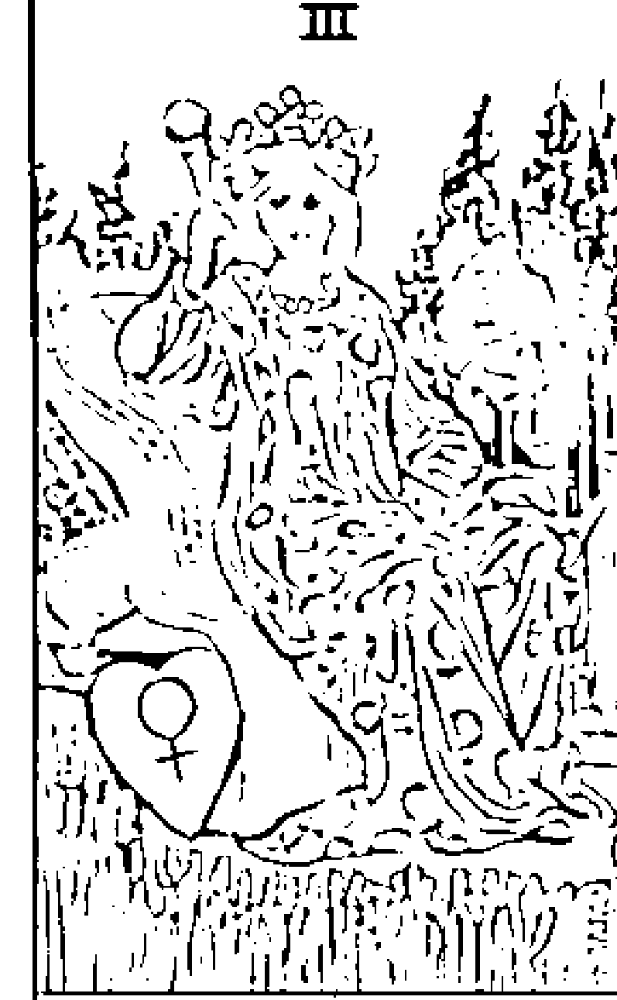

### III. 女皇

女皇跟女祭司完全相反，她完全活在人群當中，一顰一笑都帶有人情味，長相雖然不見得比女祭司漂亮，但卻有親和力，就像一個偶像團體之中，會紅的不見得是最帥最美的那一個，而是有獨特魅力跟才華的那個人，也就是『大家看得最順眼』的人。女皇雖然沒有女祭司的靈性，但能夠自然地跟你們共存，這是一種世俗的智慧。她跟魔術師有點像，都是公關界的好手，因為他們都知道別人在想什麼、需要什麼，所以能在人際關係中悠然自在。與魔術師不同的是，女皇與人群的互動帶有更多溫度，能在不知不覺中擄獲人心。

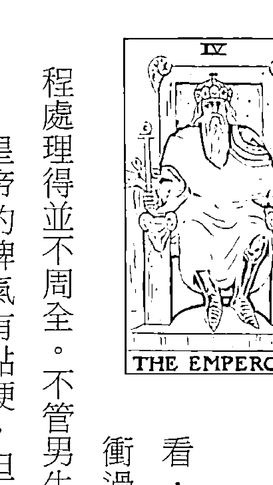

### IV. 皇帝

皇帝行動性非常強，想到什麼就一定要做，就一般觀點來看，就是一個急躁的人，但不會半途而廢，立定了目標就會直衝過去，好處是會很快地達成目標，壞處是因為衝太快了，過程處理得並不周全。不管男生女生，如果抽到皇帝牌，就代表需要另外一半幫忙善後。

皇帝的脾氣有點硬，但決心跟意志力是很強的，他會用非常熱烈的方式示愛，讓你覺得自己就跟公主一樣，但若達成目標，他的興趣消退了，你可能就要適應前後之間的落差了。

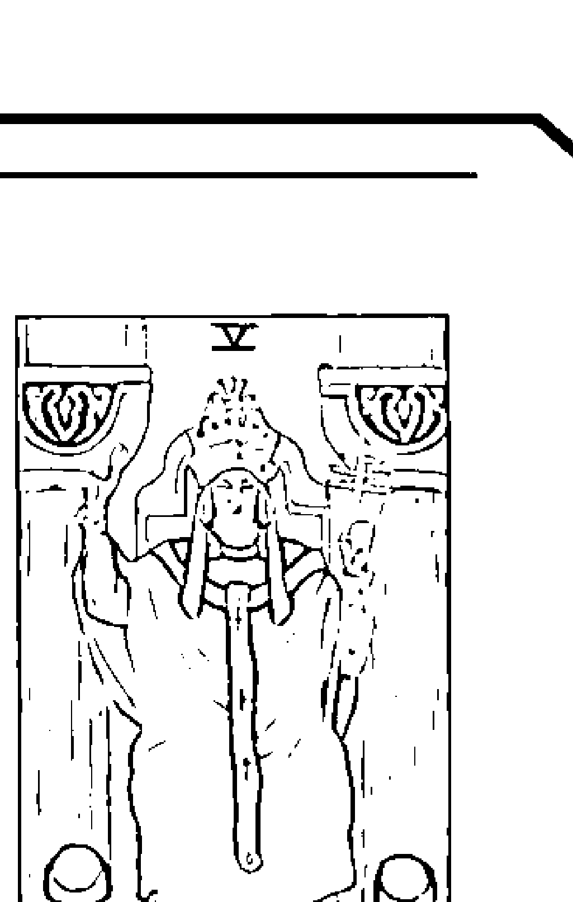

### V. 教皇

教皇是跟皇帝完全相反的稳重男性，是能遵守定下来的规矩，做事四平八稳的人，会以团体利益为考量，因此可以弥补皇帝的不足。如果皇帝是老板，他可能就是总经理，所有的事情都要经他审核过后，才能真正成案。
教皇是能让人很有安全感的对象，他可以关注很多细节，保障你所有的需求，但情趣略嫌不足（想要情趣还是去找皇帝吧）！如果在步入婚姻的阶段，教皇无论在性格、经济、未来规划上都是很可靠的队友。若他代表女生，应该是管理阶层，历练丰富而且个性很稳重，不太容易情绪化。

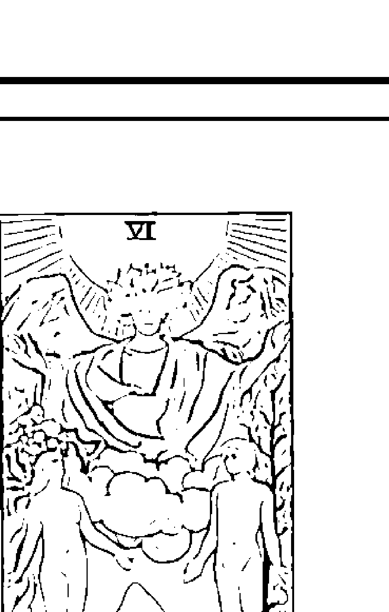

### VI. 戀人

戀愛關係只有在熱戀期才會覺得對方有吸引力，進入穩定期後，反而是磨合的開始。戀人牌是指剛認識時吸引對方的好感，但那個好感可以撐多久，就不一定了，因為人很容易「因了解而分開」。
抽到戀人牌雖然代表彼此相互吸引，但動作要慢一點，因為走近之後，那個感覺不一定會往愛情邁進，也有可能往親情或友情邁進，戀人代表令人放鬆的關係，不單單指愛情。但話說回來，愛情也可以奠基在友情跟親情之上。若是在一段穩定的關係中抽到戀人，表示兩人興趣很接近，而且溝通良好，相處充滿各種可能性，不會給彼此太多限制，這種自在的狀態，使彼此還是充滿吸引力。

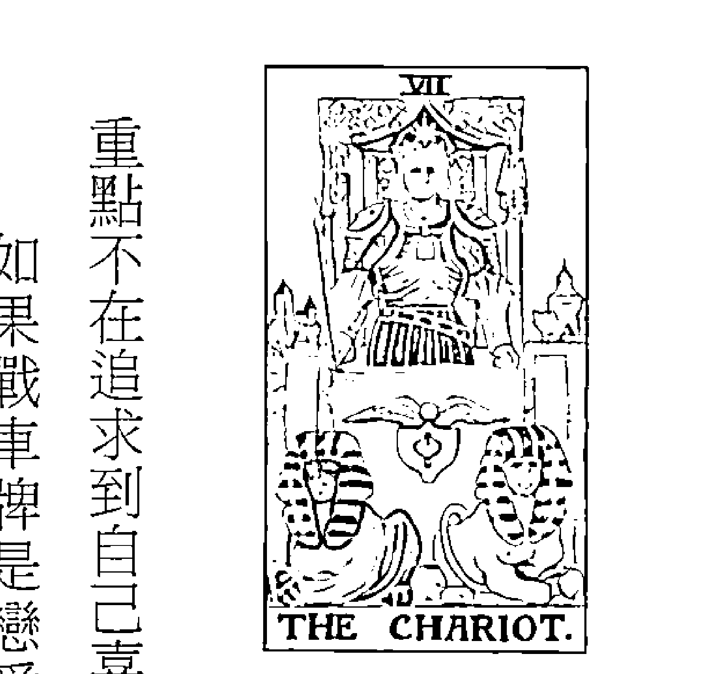

### VII. 戰車

戰車牌和皇帝牌不一樣的是，他擅於守護而不擅主動出擊，戰車對於不在乎的事，並不會顯現出占有欲，但是遇到他想保護或捍衛的人事物時，攻擊力就會變得猛烈。戰車牌的重點不在追求到自己喜歡的新事物，而是保護自己珍惜的既有事物。

如果戰車牌是戀愛對象，好處是他會不離不棄，而且非常呵護你，但如果你想離開，他也是很難擺脫的對象，因為他非常地念舊，很難斷捨離。對於沒有安全感的人來說，這樣的個性真是如獲至寶，會帶給你前所未有的安全感；但對於喜歡自由自在的人來說，這種執著像是怨念一樣，讓人脫不開身。

### VIII. 力量

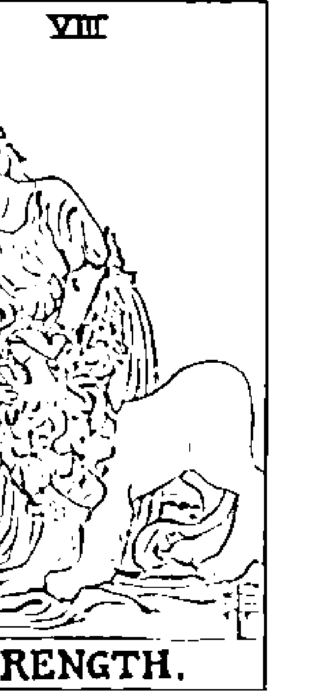

大家通常會把力量講成一張很猛烈的牌，但如果是這樣，那跟皇帝也沒差別啊！我覺得它代表長期的、慣性的，隨著時間過去，會慢慢加深加強的力道，所以在愛情方面，這算是最好的牌之一了，因為代表時間越久，愛得越深。
「慣性」對交往來說有好有壞，好的是他已經習慣你，適應不了其他人；壞的是你們的相處中，對方的占有欲會太強，有時分開一下都不行，你突然不在，對方會覺得很不方便（笑），但從某些角度來說，這樣或許也不錯。

### IX. 隱者

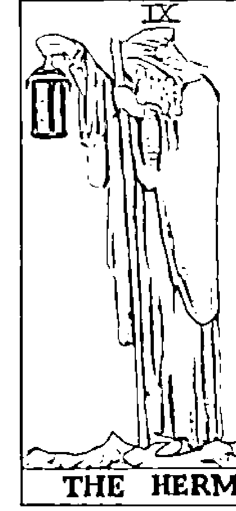

在能量極強的力量牌之後，隱者開始要從世俗中抽身。隱者重視心靈的能量，外在表現一向很孤獨、冷漠，你可能會覺得他似乎沒什麼異性緣，但其實是他自己的標準太高，並不是沒有人要。隱者不容易被他人影響，他如果定下規則，就會遵守到底，就算找不到對象時，他也不會降低自己的標準，無論這標準是否切合實際。在工作的方面，隱者可以把事情辦得一絲不苟，但在愛情裡就顯得很壓迫又沒什麼情調了。比起戀人，隱者更適合當你的同事或下屬（笑）。感情穩定的狀態抽到隱者，表示缺乏交流，可能各自忙於工作，或是生活磨掉了你們的情趣。

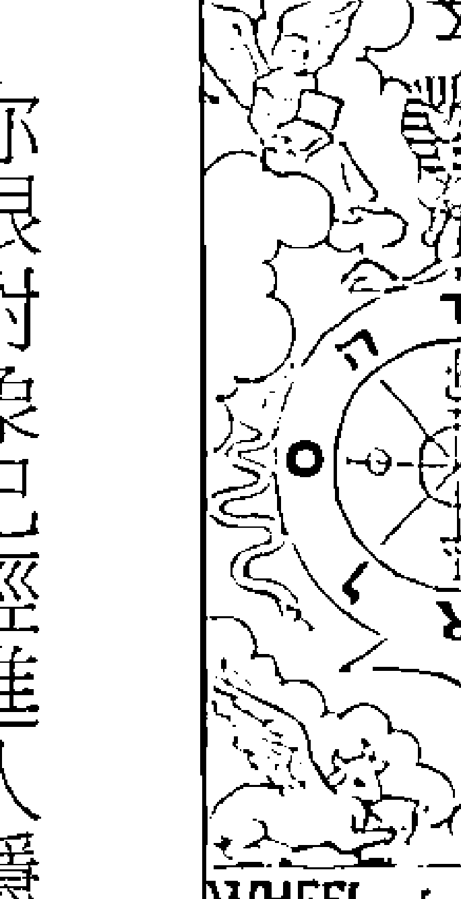

### X. 命運之輪

走過隱者韜光養晦的過程，接下來的命運之輪，代表即將展開新的一頁。這是一張非常幸運的牌，但是在愛情中，幸不幸運就沒那麼好說了。因為他幸運的地方是桃花很多，但如果你跟對象已經進入穩定期了，當然不會希望他還有那麼多的選擇。但還好，命運之輪也有學習的意味，抽到這張牌，也有可能代表對方要出國洽公，或是學習新的事物，心思會從你身上轉移一下下。如果是在單身時期或分手後抽到這一張就非常好，不僅桃花多，還有很多機會增廣自己的見聞，不但會遇見比以前更好的人，自己也會因此成為更好的人。

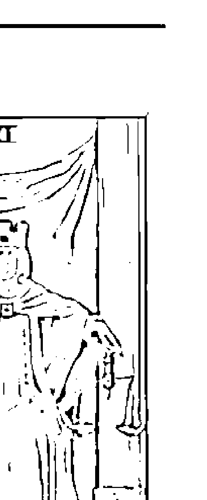

### XI. 正義

正義這名詞看起來跟愛情沒有太大的關係，但在婚姻當中它是很重要的，因為結婚跟權利義務比較相關，兩方要負擔多少家用、多少家事，並不是愛來愛去就可以解決的，抽到這張牌，代表彼此對在一起的承諾跟誠意。如果在結婚前後出現這張牌，代表兩個人都夠成熟，可以負擔起自己的義務，但如果是在談戀愛時出現，就暗示兩個人的感情生活太無趣了，好像沒有太多的浪漫，只有各自要負擔的權利義務，不過雖然平淡，但至少不會出現太多紛爭。

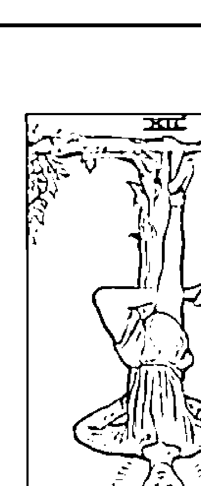

### XII. 吊人

吊人是一張充滿無奈的牌，不管在什麼問題中出現，它都代表形勢比人強，周遭的狀況箝制著你的意念，不能隨著自己的意志決定作為，所以只能等最困難的情勢過去，才能恢復自己的意志。如果在愛情上出現這張牌，代表你沒辦法掌握狀況，只能被對方牽著鼻子走，也代表對方可能是很強勢的人。

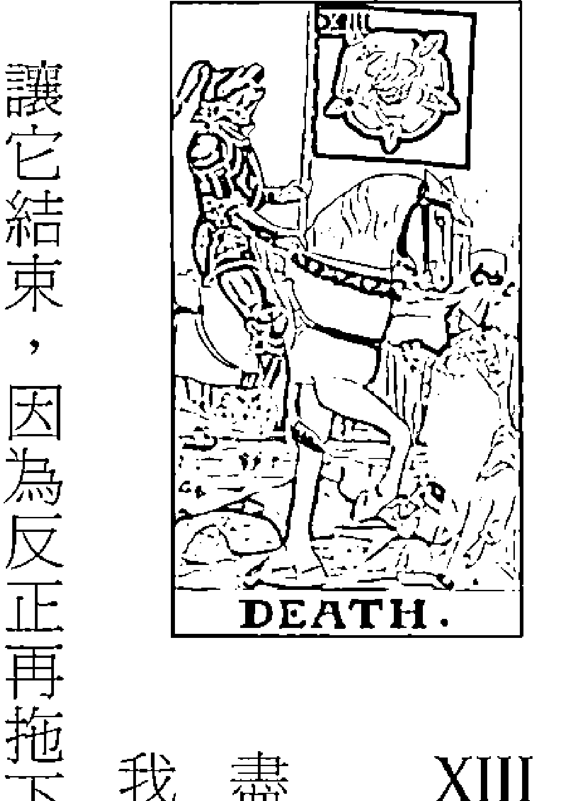

### XIII. 死神

抽到這張牌，代表你處於弱勢，除非有別人來幫忙，或運氣變好，才能重新掌握主控權，否則只能修身養性，等待厄運過去。往好處想的話，抽到這張牌也是休息的時機，不用急著做出什麼決定，趁這個機會好好沉潛、學習，等屬於自己的時機到來之時，才有實力把握良機。

如果吊人是一張需要休息的牌，那死神就是所有力氣都用盡，事情到此為止，不會再有任何變化了，如果抽到這張牌，我會建議讓事情全都結束，如果餘情未了，那就用自己的力量讓它結束，因為反正再拖下去，也沒有新的可能性了，不如全部斬斷，才能「置之死地而後生」。

在愛情裡出現這張牌，代表所有的希望都已經沒了，既然如此就大膽去做些以前不敢做的事，反正最差也不過如此，不如就讓它壞到底，然後全部捨棄。但要當心不要積習難改，再一次重蹈覆轍喔！

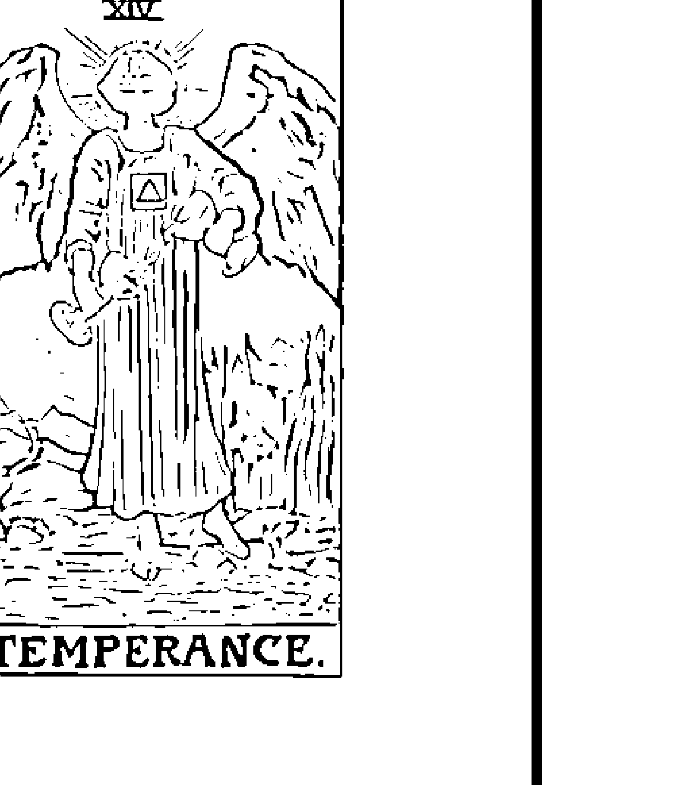

### XIV. 節制

度過死神那張牌，代表撐過最不好的時刻了，接下來的節制牌代表覺悟過後的成長，只會進不會退，此時我們更上一層樓，將進入一個新的境界。在愛情中抽到節制，代表雙方很適合步入另一個階段，也就是交往或結婚，因為兩個人已經很有默契了，不管出現什麼狀況，都可以拿出同心協力的精神來面對。婚後一段時間抽到節制牌，表示比起婚前，兩個人的默契更是合拍，甚至什麼話都不用說，就「心有靈犀一點通」。

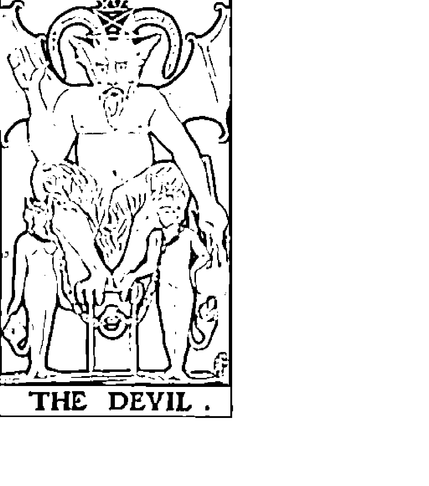

### XV. 惡魔

惡魔緊接在節制之後，也就是兩人相互依賴，達完美平衡後，開始出現新的慾望，也因此誕生新的不滿。就像兩個人結婚久了，開始會有自己的立場，比較沒那麼替對方著想，甚至會開始挑剔對方，出現怨懟，在日常生活中壓力開始蔓延。惡魔重視金錢、物質以及感官的享受，這些人類的原慾很容易戰勝純然的感情，很多人會覺得問感情抽到惡魔代表第三者，但我認為與其說第三者，不如說出現肉體或金錢的誘惑，跟感情不一定相關。畢竟惡魔更重視從對方身上得到感官的享樂跟金錢，容易因為一時的貪念出現意外，而這些都有目的性，並不算是真愛。惡魔也有綑綁、束縛的意味，也代表執著，它出現時你所面對的問題並不容易解決。

### XVI. 塔

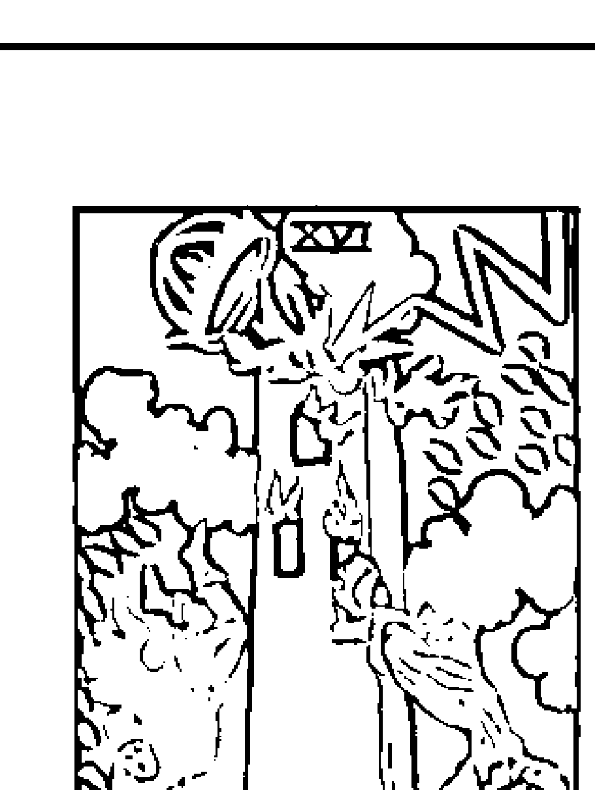

塔是一張充满意外的牌，接在惡魔之後，我們就可以知道，如果凡事只為自己著想，那就會有很多累積的不滿爆發出來，最後步入毀滅。它是突如其來的災難，你會覺得殺傷力特別大，並不是因為災害本身的威力，而是因為沒有防備之心。在穩定的感情裡出現這張牌，兩人的關係可能因為突如其來的爭吵而中止，或是近期會發生跟兩人有關，難以預測的重大事件。若對象是塔，代表對方脾氣不好，或者在感情上剛受過傷，需要一段時間修復。

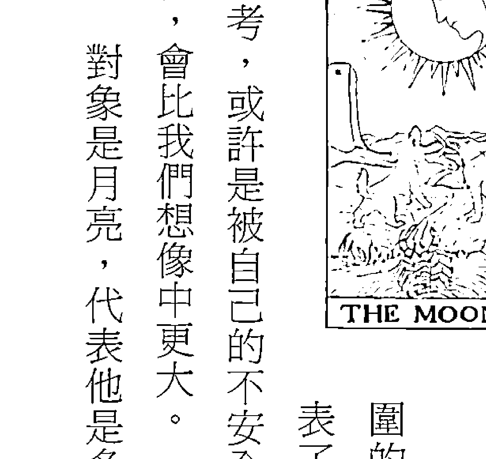

### XVII. 月亮

月亮只會在夜晚的上空現身，昏暗的光線讓你看不清周圍的狀況，四周充滿無從防範的危機。月有陰晴圓缺，它也代表了情緒化，而情緒是因為猜疑而來，此時我們沒有辦法理性思考，或許是被自己的不安全感蒙蔽，或許是被他人欺騙或隱瞞，總之，月亮帶來的傷害，會比我們想像中更大。
對象是月亮，代表他是多疑的人，或是個性很害羞、心思很細密，你可能要花很多時間關懷對方的情緒。在戀愛中抽到，表示可能會出現挑撥離間的人，或是第三者，總之是需要你提高警覺的一張牌。

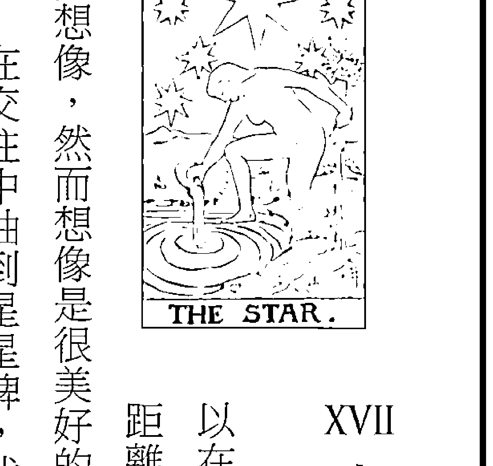

### XVIII. 星星

星星在遙遠的夜空中，也代表我們無法接觸到的地方，所以在戀愛方面，就代表遙不可及的人跟暗戀的感情，也代表遠距離戀愛，總之都是碰不到的對象。因為沒辦法接觸，所以只能想像，然而想像的是美好的，只有在登陸了以後，才會看到星星坑坑疤疤的表面。
在交往中抽到星星牌，代表遠距離戀愛，但如果物理距離不遠的話，有可能是心的距離很遙遠，但表面上都很和氣，感覺不出什麼異樣，卻有潛伏的問題待浮現、解決。

### XIX. 太陽

太陽是一張耀眼的牌，它出現時，整個世界都是站在你們這一邊的，因為太阳能照亮一切的黑暗，讓秘密公諸於世。聽起來跟月亮相反對不對？是的，經過了重重的考驗，本來在暗中害怕擔心的事，都可以浮上檯面了，也被大眾認同，不用承受隱瞞的痛苦。
然而在感情穩定的狀況下抽到太陽，代表你們的感情達成了階段性的目標，目前看起來也很順遂，充滿正能量，但大家都對你們的耀眼習以為常，也放很多關注焦點。

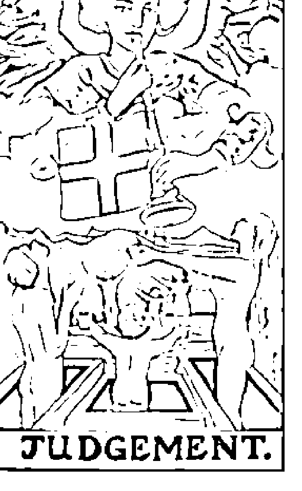

### XX. 審判

審判是一張算總帳的牌，不管過去有多少恩怨，抽到審判牌的話，就要一次解決掉，因為審判代表推翻過去，展開全新的模式，而全新的模式，會帶來全新的結果！簡單說來，這張牌就是顛覆。如果是在愛情中出現這張牌，那就是要你找一個跟之前的對象完全不一樣的人，這樣你的愛情才會有新的可能性，相處方式也要全面革新。如果在穩定的感情中抽到審判，可能也要反省一下目前的相處模式，以免有一天其中一方會突然爆發而離開。

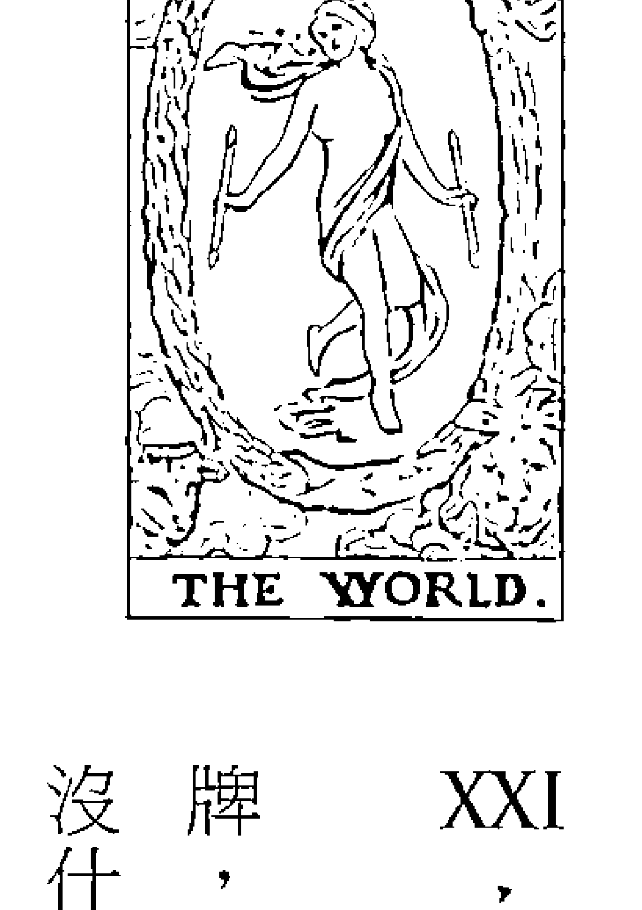

### XXI. 世界

世界是大阿爾克那裡的最後一張，代表凡事都順遂、圓滿的牌，此時什麼問題都不用擔心，唯一的缺點就是日子太過重複，沒什麼新意。如果你對現在的相處很滿意，它就是一張完美的牌，但如果你渴望的是突破，那就會覺得世界的守舊有點無趣。對象是世界，代表他是保守穩重的人，但有時會有冥頑不靈的缺點，但修成正果的可能性非常大，雖然不會在很短的時間內結婚，但卻會廝守很長的時間。

## 塔羅占卜法

### 一、問問題、洗牌

心中默念問題，若是替別人占卜，請他靜下心道出問題，然後將整副牌朝順時針方向徹底洗乾淨，整理整齊後，牌面朝下橫放在面前。

### 二、切牌

然後將整副牌分成上、中、下三落，選擇中間一落牌作為最上落牌，疊在另外兩落牌之上。

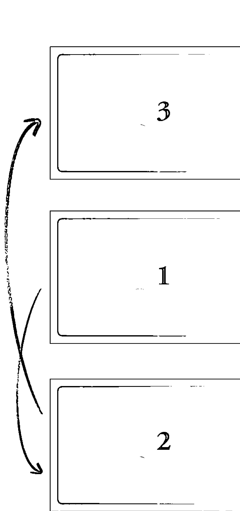

### 三、抽牌

把整副牌攤開呈扇形，靜下心來選擇一張（如果沒有靈感，也可以選最左邊數來第七張牌），將紙牌由左向右翻開。

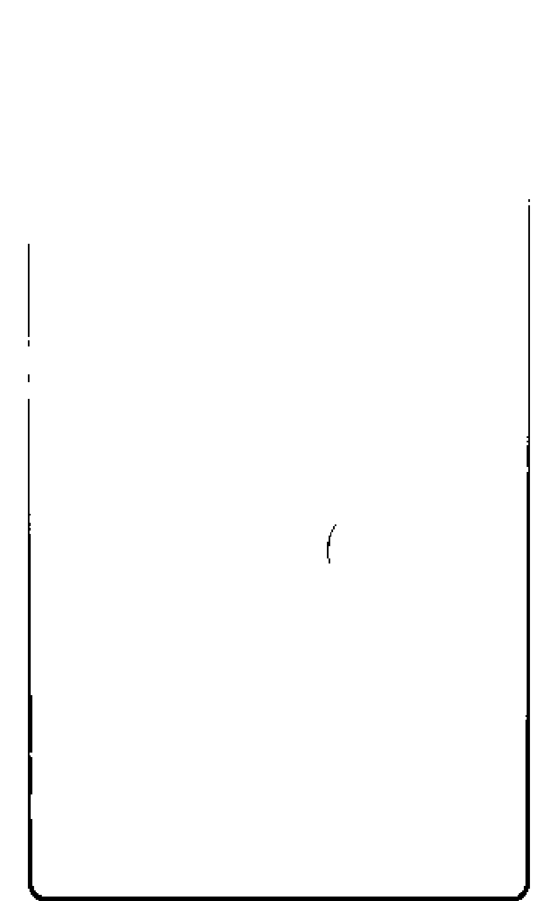

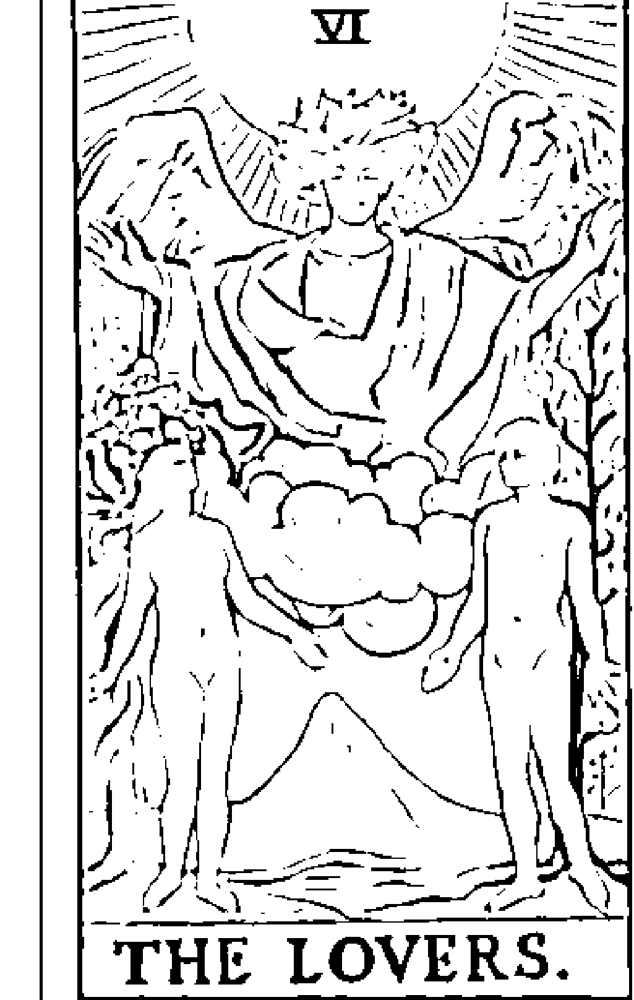

# CHAPTER 1

## 單身時期
學會如何跟
自己相處

## 一、單身時期（儲備期、充電期）

很多人常常會把「單身」，看成是不同戀愛階段之間，無可奈何的空白期，覺得沒有對象的時間，是沒有重心、缺乏動力的。但其實單身期間，正是很好的沉潛期，你可以整理思緒，想想過去的戀情始末，每一個細節都會讓你發現自己未發覺，或是不想承認，或是不敢奢望的某些特質，無論是好還是壞。當一個人學會怎麼跟自己相處時，才能跟身邊的人相處。

## 十二星座月亮——透視你的本性

我們一般說的「我是什麼星座」，指的都是太陽星座，太陽星座是外在、容易被人感受到跟看到的那一面，但我們的本性，則是要看我們出生那一刻，月亮所在的星座。尤其是女生，受自己月亮星座的影響，會比受太陽星座影響來得大。（若女生太陽星座在獅子座，則會受太陽影響較大，男生月亮星座在巨蟹座，也會受月亮影響較大。）

月亮代表本性，是因為月亮代表的是我們真正的感受跟情緒，還有內心深處的聲音，不管你表面上呈現出來的是什麼樣的個性，內在才是真正的你。

我們常常不知道自己要的是什麼，如果你自認要的是有錢的對象，也許你需要的只是被保護的感覺；如果你自認要的是逆來順受的對象，也許你只是希望，有人可以無條件地認同你的存在價值——先知道自己要的是什麼，才會知道，什麼樣的人才能真正給你歸屬感。

### 1. 月亮在牡羊座

牡羊座是出了名的火爆星座，太陽在牡羊座的人，常常給人莽男魯女的印象，頭腦也常常少一根筋；但是月亮在牡羊座的人，比太陽在牡羊座的人多了一份細膩，雖然一樣不太用大腦，但月亮牡羊的反應敏捷，直覺強烈，有種狩獵者的動物性本能，你喜歡的對象通常沒有太統一的類型，只是天時、地利、人和的狀況下，他出現了，而你覺得就是他！確認自己感情的過程非常果斷迅速。大家都以為這樣的人，應該是個王子公主症候群患者，實際上月亮牡羊的保護欲非常強烈，你喜歡「完全專屬你個人」的人事物，所以你要的，是在全部或某方面特別依賴你的人，讓你可以投入自己全部的熱情跟注意力，月亮牡羊呵護起人來，可是令人意外的周到跟細心；所以如果你的情人對你的要求太簡單，反而會讓你覺得英雄無用武之地，越難搞的情人越能證明你的本事；有人說那是犯賤，但我相信你絕對不是（握拳）。

### 2. 月亮在金牛座

月亮在金牛，是一個跟太陽在金牛一樣實事求是，但又不會失去生活樂趣及感官品味的星座。通常月亮在金牛座的人，對自己的人生有足夠的安全感，所以不喜歡太複雜的人事物，喜歡好看好聽好吃好玩的，不要太困難就好，標準的「想過好日子」的星座。所以你在挑對象時，會希望對方的外型雖然不一定是像明星般出眾，但要化妝也好看，五官端正氣質不錯即可，「耐看」、「可塑性強」勝過於打扮得像聖誕樹一樣，卻滿街都是的人工帥哥美女。對於愛人的個性，其實你不會有太嚴苛的標準，是活潑飛揚到讓你搞不懂也好，平穩溫和到讓你能輕易掌握也好，只要他認定自己是你的伴侶，願意一直在你的身邊，最後的重點是「不要找你麻煩，不要常常叫你思考太複雜的事」，這樣就可以一直持續相處下去，讓你越來越離不開他。歸納出以上整篇文字的重點了嗎？那就是，你需要一個讓你可以一輩子懶下去的人。

### 3. 月亮在雙子座

太陽在雙子座的人已經夠善變了，月亮在雙子座的人，不但善變還加上情緒化，雖然沒有太陽雙子那麼外顯，但內心很需要各種新刺激，也喜歡注意不同的人，很容易淪為花心，因為不管是什麼樣的人，都不能滿足你全方位的好奇心，往往需要好幾個對象，才能組合出你理想中的情人，雙子座是出名的捉摸不定，而月亮更讓他發揮得更為淋漓盡致。
但這種人格無解，只能任由你漂泊嗎？其實還是有幾種對象適合你。一種是比你還要沒耐性的人，他不會跟隨你的腳步，因為他自己轉換速度就快得很，而你的好奇心會讓你放下自己的事看看他在做什麼，這就讓他反客為主了；一種是對你的善變淡然處之，不管你怎麼變，他都不會拉住你，只是站在原地等你，等你轉了一圈回來發現他還在，發現他是個不會綁住你也不會離棄你的人，不受約束的自由，反而讓你可以安心定下來。

### 4. 月亮在巨蟹座

這是月亮落入一個極度缺乏安全感，甚至有被迫害妄想症的星座，不管再多的保證、承諾，只要一點點風吹草動，就會讓你的信心全面崩盤，沒什麼事你也很容易找到一些點，來幻想自己有多委屈、有多不值得，但是叫你離開你又愛他，於是悲悲切切哭了起來，但是等你哭完，你會發現他傳簡訊問你今天在幹嘛？原來外面什麼事都沒發生，一切都是你內心的小劇場。對於這種折磨自己也折磨別人（而且對方還不知道自己為什麼被折磨）的月亮巨蟹來說，要有很強的心臟，才擋得住你的負面情緒，也許樂天到極點的陽光派男孩女孩會拯救你逃離悲觀的世界，但更有可能救到一半不耐煩就丟下你自己走了；所以你更適合的是很有耐心但腦袋不太好的人，他們聽你的指責跟攻擊不會被傷害，因為聽不懂你拐來拐去在說什麼，只想著等你哭完要去哪家餐廳吃飯；但你有可能還是嫌這樣的人太粗鈍太不了解你，剩下的唯一選擇，就是找個跟你一樣的人捉對廝殺，看互相折磨到最後是誰先撐不住，或是乾脆結婚纏鬥一輩子。因為愛情有狀況你會傷心，沒啥狀況你會覺得其中有詐，所以你需要那個重重傷害你然後又來療癒你的人。（笑）

### 5. 月亮在獅子座

太陽獅子座的人很驕傲，月亮獅子座的人不但驕傲，還希望別人覺得他一點都不驕傲。這種內外矛盾的心態，會讓他常常處在一種欲言又止、欲語還休的狀態，老為了當好人而把光環往外推，回家又自己咬棉被哭泣。但月亮獅子的本性不愛計較，再怎麼覺得自## 6，月亮在处女座

太阳在处女座的人很啰嗦，月亮在处女座的人却极为羞怯，羞怯是好听的讲法，讲难听一点是爱搞神秘又有点自虐狂。大家都可以知道，优柔寡断的星座不外乎双子啦、天秤啦、双鱼啦！但我跟你保证，月亮在处女座的人，比上述星座都还要优柔寡断，但我们看不到月亮处女座的内心挣扎，因为你挣扎到最后往往是没有结果，维持原议，所以可以用很平稳的口气说出始终如一的答案，没有人知道在相同的答案背后，已经有一千次的思考跟重新抉择。我不得不说你们抗压性非常强，因为没有任何正常人，可以忍受自己每一天都重新抉择。在重复一种无用的模式。太阳或月亮在处女座的人，都非常喜欢聪明可爱的情人，但到最后往往会选择最实用的配偶，因为你们找自己麻烦已经找得够多了，不需要再多出另外一个麻烦的人，甚至你们可能会刻意选择有很多缺点，但无论怎么努力都无法进步的人，因为你们欣赏努力的过程，但如果对方真的进步到让你挑不出毛病，你就会开始陷入自己不够好的恐慌，或也可能因为没事可做而恐慌，所以对方绝对不能太完美。

## 7，月亮在天秤座

不管是太阳还是月亮在天秤座，都拥有一项很少情人会拥有的美德，那就是『讲理』。所以你自己跟你身边的人，常常怎么看、怎么想，都觉得你是一个打着灯笼也求不到的好伴侣，凡事只要能给你一个结构完美、理由充足的说法，你通常都会管理自己的情绪，让自己不要胡搅蛮缠，但是很奇怪，你就常常遇不到好伴侣，或甚至很长的时间没有伴侣。这是因为谈恋爱不是用逻辑可以规划的，太过相信合理性，往往不是让你变得太过无趣，就是太过好骗，这两者都是恋爱中的大忌，你永远是友达以上恋人未满。你适合的不是用太多言语，一切都用行动证明的人，因为你只能检视语言的结构，却没有分辨一句话背后真正涵义的能力，所以话太多的人容易把你搞迷糊，你又容易为了怀疑别人而自责，不如干脆找一个沉默是金的人，就不用把力气浪费在仔细分析他话中的涵义，可以真正地去看到他的行为了。

## 8，月亮在天蝎座

这是一个大家听到都会倒抽一口气的星座，太阳在天蝎大多是迫害他人，纤细敏感又不善于往外发展的月亮，落在天蝎座里，就常常变成自己内心的冲突，以及没办法不自责的戏剧化性格；月亮天蝎的内心小剧场，绝对不会比月亮巨蟹少，只是月亮巨蟹算是疑神疑鬼，月亮天蝎更是升级成草木皆兵，尤其月亮代表熟悉感，越亲近的人越让你放不开，也越容易伤害到你，这些不愉快的记忆，都很累积成你的阴影。其实月亮天蝎适合什么样的人，不用我来告诉你，因为你们喜欢或不喜欢一个人，都不是别人说了算，你爱上了就连拿刀也砍不断，不爱你了一千个理由也没用，你们要注意的，是你们常认为了解对方，但其实只了解他的行为模式，并不了解他的感觉，要适时地逼自己放下「我比你更了解你自己」这种一厢情愿的认定，才有机会听到对方真正的声音。只要你听到了，其他的就不需要我教你了。

## 9，月亮在射手座

这是一个非常好的组合，太阳跟射手座，两者都有小孩子的特质，组合起来往往会演变成白目，但月亮较为敏感纤细，落入射手座，会比月亮落入其他星座的人来得乐天单纯，但没那么莽撞幼稚（「没那么」这三个字是相对性的，我不保证没人会这样骂你），你更多的是好奇心跟探索整个世界的勇气，感觉上你是个可爱的人，有时可能也会被说是个没常识的人。麻烦的是，情人的种类也有可能是你想要探索的项目，而且你一旦好奇起来，没什么事情可以阻止你去行动，所以……大家常讲的「花心」可能没有冤枉你，只是你的夸张程度没有太阳在射手座的人严重，当然，也或许只是没有像太阳射手那么容易被发现而已。总之你适合聪明、冒险心十足，常常给你惊喜，而且把重心放在他自己而非你身上的对象，这样他才能永远让你在他身上有新发现。这就像是厚一点的书，可以让人读比较久。

## 10，月亮在摩羯座

这是月亮落在一个有点吃亏的位置，摩羯座自律甚严，如果是太阳在摩羯的人，两者相加会产生出一种隐性的自信，外表低调内在却很有自信，但是代表真实本性的月亮落入了摩羯座，却会对自己做任何事都有着过度的完美主义，甚至超过处女座。而且你就算表现得是全公司或全班第一，还是会念念不忘自己没有做到完美的地方，平常虽然可以暂时忘记，但只要有人一提起，你就没有办法忘掉自己那些其实并不严重的过失，而且你不相信自己如果犯错，还会值得被爱；这真是我们这种自我感觉良好的人，最好选择一个缺点比你更多，心思散漫却个性单纯的人，第一可以让你转移焦点，不要放大自己无法理解的一件事（笑）。你觉得自己的价值来自于自己能做到多好，如此自虐的人，看到你这种人时无法理解的一件事（笑）。你觉得自己的价值来自于自己能做到多好，如此自虐的人，看到你这种人时无法理解的一件事（笑）。你觉得自己的价值来自于自己能做到多好，如此自虐的人，看到你这种人时无

第二是，你对别人的不完美，比对自己的不完美宽容多了，如果你还可以帮助这个不成材的情人慢慢成长，那种成就感会使你相信自己真的很有用。

## 11，月亮在水瓶座

说真的，我不知道你适合什么样的人，我不是说你不正常，事实上你可能也就跟大家都一样正常，例如你可能会说「我喜欢帅哥／美女」，非常正常！但是当你介绍所谓的帅哥美女给我们认识时，会让我们发现，我们对帅哥美女的定义，跟你的定义像是两个星球的生物，这就有点异常了。不管太阳或月亮在水瓶，都是乍看之下很正常，但那种正常却有着异常的内涵。其实在爱情市场中，有月亮水瓶的存在是件好事，你们是那种非主流的消费群，很多男女不符合婚姻或爱情市场上的普遍价值，但你仍然可以从客观看来不好的条件当中，挖掘出属于你主观的美好特质。而且月亮水瓶爱上一个人，就是爱上他独特，但可能不被社会接受的一面，例如易感的男生或强悍的女人，对月亮水瓶来说，没有什么对或错，有的只是他欣赏或是不欣赏的那些面。爱上月亮水瓶，或被月亮水瓶爱上的人，这段恋爱不见得轰轰烈烈，但你会惊喜地发现，原来在他眼中，你的独特远超过自己的想像。但月亮水瓶爱人的方式很奇怪，需要独立性强的人，才不会被你吓到。

## 12，月亮在双鱼座

双鱼是个柔软的星座，配上多愁善感的月亮，会心地软到自己都觉得困扰，也许你的太阳落在一些强硬、冷静的星座（如摩羯座），人家会觉得你毫无人性，但是一旦跟你熟悉，看到你月亮在双鱼座的真实本性，就可以知道你这个人，基本上到了人家可以对你予取予求的程度。月亮双鱼没办法对别人的苦难视而不见，没办法假装这个世界不存在丑恶，常常因为太鸡婆而蹚浑水，可悲的是，往往月亮双鱼没把别人救上岸，却自己跟着掉进海里，所以蹚了无用的浑水。这时你需要的伴侣，是一个可以理解你的软弱跟悲伤，却可以不让情绪跟着你波动的冷静型人格，不然你每次为了不懂保护自己而落难时，爱你的人往往跟着倒霉，就像骨牌一样，需要有个现实一点的人，来中断骨牌倒塌的局势。至于你说冷血的人会不会欺负你？当然会，但是被一个人欺负，总比被所有人欺负来得好吧？

## 塔罗牌测验：『我在半年内，感情世界将会是什么样的状况？』

还在单身的你，可以藉由塔罗牌，预测一下半年内，你的感情生活会起什么样的变化。但是要记住，即使塔罗牌告诉你真爱即将出现，中间这一段时间，你也必须把自己的日子过好。人的好坏是相对性的，如果塔罗牌告诉你，即将出现一个条件很好的情人，请记住这个「条件很好」，是以你自身的条件下去比对的，你让自己越好，出现的这个人就会越杰出喔！

### 0，愚人

抽到这张牌，不管你现在想像的是什么，当爱神降临，状况一定会超乎你的想像，也超乎你以往在感情方面的经验值。你可能爱上从来没有考虑过的对象、卷入不伦恋，或者轻微一点的，只是遇上一些让你无法理解他们行为的奇怪追求者。

### I，魔术师

抽到这张牌，代表你半年内的感情世界，在别人眼里看来多采多姿，甚至有可能觉得你花心，但实际上这些走得很近的对象，是「人人有机会，个个没把握」，每个人都还在交朋友的阶段，真正要跟哪一个定下来，还需要一段观察期。

### II，女祭司

抽到这张牌，表示这半年中你可能有喜欢的对象，但却是一种暧昧不明的状况；可能两个人的个性都太内向，没有人主动出击，也可能你自己评估过后觉得机会不大，所以决定把这份感情默默放在心中。要想找到突破点，可能要等到半年过后。

### III，女皇

抽到这张牌，表示这段时间中，你的爱慕者会有增加的趋势，桃花也旺到让自己吃惊，虽然可能还没出现让你决定「就是他了」的人，但你仍然享受这种众星拱月的生活；这段时间会让你学会肯定自己，以及让你认清自己的魅力到底在哪里。

### IV，皇帝

抽到这张牌，表示你这半年中会遇到一见倾心的对象，很快就进入打得火热的阶段，即使你故意放慢脚步，其实也已经完全把心思放在对方身上了。这种激情的过程会让人飘飘然，只是如果没有好好经营，火花要熄灭也是很快的喔！

### V，教皇

抽到这张牌，表示半年内的确有值得考虑的人出现，但不是天雷勾动地火的邂逅，比较像是循一般的方式，例如亲友介绍、职场伙伴，或是联谊认识的对象；跟这种人的爱火得要慢慢培养，而且要先建立起双方对未来的共识后，加温的速度才会快喔！

### VI，恋人

抽到这张牌，表示在这半年中，你会遇到一个特质跟你完全相反，在你的生活中从未遇过的类型的人，但你却深受他的吸引，觉得他带给你很多不同的视野。这段关系会不会发展成正式的交往还没有定数，但最少也会到达知己的阶段，是一场美好的相识。

### VII，战车

抽到这张牌，表示你这半年内将会心有所属，但过程并不梦幻美好，也许因为背景的差异，或是其他客观条件的不同，你们的恋情无法受到身边人的祝福，或是你心中始终有个关卡过不去；但又没办法轻易放下这份感情，可能要进入长期抗战啰！

### VIII，力量

抽到这张牌，是非常美好的事，表示在这半年中，你会遇到好的对象，并且在各方面，对方都远胜你以前交往过的对象。更好的是，这段感情不会一开始火热，却很快进入冷淡期，而是历久弥新持续加温，是值得长久交往的正缘喔！

### IX，隐者

抽到这张牌，显示在之后的半年内，都不会出现让你觉得心动或满意的对象，一部分原因是因为你的眼光太高，一部分原因是因为生活圈子较小，自然不容易遇到合意的人。应付这种状况，就是多增加自己的社交活动，藉由上课或旅游拓展自己的人脉圈为佳。

### X，命运之轮

抽到这张牌……嗯，不能说没有桃花，事实上还不少，但是都是偏缘而不是正缘，可能在半年内，就有好几个火速交往又分手的人，或是快要在一起最后又告吹的对象；虽然还没定下来，感情生活倒也是不寂寞的，而且机会多，总是比没机会来得好。

### XI，正义

抽到这张牌，表示你可能不喜欢把时间花在谈一些没有结果的恋爱上，对于感情，采取的态度是大家先提出自己对未来的要求，再看看适不适合正式交往。可能是有点不浪漫的，但这张牌表示，半年内出现终生伴侣的机率很大，出现的不见得是最喜欢的，却是最适合的人。

### XII，吊人

抽到这张牌，其实有点坐困愁城的意味，问题通常不出在你身上，可能是身边有可能的对象都死会了，或是爱你的人跟你爱的人总不是同一个，条件不差但总是受到命运的捉弄，这种无奈的状况，要等半年过了之后，才会出现转机喔！

### XIII，死神

抽到这张牌，等于是「倒吊人」牌的强化版，象征你可能对于爱情暂时处于一种心灰意冷的状态，或是再怎么强迫自己，也没办法对前一任情人死心；在这种时候，我的建议是不要逼自己，毕竟真正地把自己整理好、准备好，下一段感情才会有成功的可能性。

### XIV，节制

抽到这张牌，要大大的恭喜一下，这表示在半年内，你将会遇到像是心灵伴侣一样的对象，你们不见得是同一类型的人，却很能欣赏跟包容彼此的不同，而且会愿意调整自己，并培养出专属于两人之间的默契，是让人羡慕的爱情运呀！

### XV，恶魔

抽到这张牌，表示你在这半年内碰上的对象，有点像是冤亲债主，会带给你很多的考验，甚至心情的波动，但又对你吸引力十足；这份功课可能不是短时间内可以解决的，因为这个对象要带给你的不见得是幸福的未来，而是来逼你面对自己的缺失。

### XVI，塔

抽到这张牌，会让人吓一跳，因为表示半年内，你还得接受一次打击，可能是得知前任情人某些你不知道的秘密，虽然已经分手，却还是让你受到震撼；也许是本来以为出现下一任情人，却以争吵收场。幸好再怎么不愉快，都只是小小插曲，半年后就会豁然开朗啰！

### XVII，星星

抽到这张牌，表示在这半年内，你可能会经历恋爱的感觉，但却不是进入一段稳固的关系内。可能是单方面爱慕一个遥不可及的对象，可能是交了一个远距离的恋人。

### XVIII，月亮

抽到这张牌，有可能在这半年之中，你会经历感情上的困境，例如陷入三角习题中，或是跟旧爱藕断丝连，就算没有那么不顺利，你也总是觉得心上有一些放不下的事，可能是你还有一些情绪问题没有解决，所以无法迎接新恋情，要告诉自己时间会冲淡一切。

### XIX，太阳

虽然太阳看起来是一张很阳光正面的牌，但还是少了一点恋爱该有的情调。这张牌表示你会遇到一些各项条件都不错的追求者，决定权也在你的手上，但这些人就是缺乏那么一点点触动你内心的浪漫感。但如果你放下过多期待，其实这些人也都是良缘，重点在你的心态。

### XX，审判

抽到这张牌，表示这半年内你不急着找对象，你会回想以往的恋爱，到底是哪里出了问题？并且抽丝剥茧，检视自己的内心，改变自己的心态，等半年后你破茧而出时，对爱情的观念以及选择对象的眼光，将会大幅进步，跟过去有一百八十度的不同。

### XXI，世界

这张牌虽然象征维持现状，但半年内你仍然有可能遇到正缘，只是遇到归遇到，真正交往或是喜欢上彼此，可能要超过这半年才会发生。但是这段期间内结识的对象，通常会是交往很久也很认真的，值得给自己多一点时间观察并培养感情。

# CHAPTER 2

## 第一次邂逅

## 二、第一次邂逅

上升以前比较没有知名度，拜命理节目所赐，现在也广为人知了。上升就是出生时东方地平线与黄道交界处所落星座，因为是太阳升起的地方，也代表世界看到你的样貌，你给别人的第一印象。
因为上升星座每两个小时就会换一轮，所以没有办法依日期来推算，现在网路上有很多网站，只要输入正确的出生日期和时间，就可以查询得到。
如果不知道自己出生时分的人，可以到户政事务所查询自己的出生证明，上面有登记医院记录的出生正确时间，以前还要去出生的那间户政事务所才能办理，现在比较方便，全台的户政事务所都连线了，所以随便找一家，用自己的身分证，然后付20元工本费，就可以查到自己的出生时间了。

## 上升在十二个星座的分析

上升点所在的星座，是一个很有趣的面向。上升星座的说法很多，它象征一个人的外貌形象，也象征一个人超过中年之后的性格趋势；就我的经验，上升星座是我们对一个人完全不了解时，光看他散发出来的感觉，跟外貌呈现出的样子，会对他产生的「第一印象」。

有人说既然是「第一印象」，那代表上升星座象征的是一个人最肤浅的部分吗？其实不是，是因为我们每个人有很多对自己的期许跟错觉，自己看自己，跟别人看自己总是一样的，我们的言行举止也会影响别人对我们的看法，但在什么话都还没开始交谈的第一眼，其实别人感受到的，就是我们无意识中想要散发出来的感觉，不是打扮或条件，而是你心中怎么看待这个世界，外在就会呈现出来，例如你对这个世界是喜欢还是讨厌，你对人群是想融入还是排斥，这些特质，在经过社会化的交谈之后，大多会被隐藏起来，但第一眼感受到的东西通常是最纯粹的。

因此我认为，了解上升星座，知道别人对你有什么第一印象，在你刚见到心仪的人时，就可以掌握自己散发出来的气质跟感觉，知道自己容易给人什么感觉，就能调整自己的言行。

### 1，上升点在牡羊座

以宫位来说，上升牡羊在工作、爱情各方面，都很有责任感，也很有正义感，因此人家见到你的第一印象，通常是你直率、带点天真，不那么在乎自己个人立场的那一面。有人会问牡羊座不是都很自我吗？上升点是代表散发出来的第一种感觉，在气质上有一种我行我素的味道，反而会让人觉得单纯好相处。也因为牡羊座常常在短时间内就认定一件事，然后就心无旁骛地投入，所以给人的印象是单刀直入，明快果断，有时带点鲁莽，但这种风格，有时会让人觉得很可爱，而且不用对你有太多戒心。面对喜欢你或接近你的人，你要多花一点时间观察，以免他们是第一眼被你吸引，但之后反而会承受不住跟你更接近后的相处模式。

### 2，上升点在金牛座

上升点落在这个星座，会赋予你一种沉稳、踏实的感觉，可能你不太擅长或是不太愿意打扮，但是反而不会变成那种街上到处都是的拷贝外型，五官的特色更容易被发现，能吸引到那些喜欢你原来样子的人。上升金牛虽然不喜欢过度打扮，但仍然给人一种注意自己外型，并且干净得体的感觉，而且很会看场合，让人觉得相处起来很舒服，甚至会觉得这样的人天生丽质，就像那种不化妆皮肤反而看起来比较好的女生。总之上升点落在金牛座的人，是不追流行也不赶时髦的，你喜欢以原貌面对这个世界，当然我也不能否认，这一部分是因为懒惰的因素（笑），面对来接近你追求你的人，你可以适时地打开心房，时刻意给对方一点机会，因为在茫茫人海中，他第一眼就被你的真实本性吸引了。

### 3，上升点在双子座

如果你的上升点落在双子座，那么不管你是高矮胖瘦，都会给人一种灵活聪慧的印象，这种形象不只是能让你异性缘变好，而是不管异性、同性缘都会不错，因为你外在看来就是一个很耐斯，不会把事情看得太严重的人，给人一种不管发生什么事、不管是谁，都可以跟你轻松相处的感觉，而且无论你到了几岁，都还是会带几分「学生味」，无论心理再怎么复杂老成，外表就是会有一种清新感，而且比起上升牡羊，也少了那份白目的调。面对接近你或追求你的人，你当然可以跟大家当个朋友，但必须注意的事，如果这些人当中，真的有哪个让你动了心，请千万要把跟他来往的方式、态度，跟其他人做个区隔，否则你很容易看起来是人人好，不爱你的人会错意，你爱的人却以为他对你来说并不特别，很快就放弃了。

### 4，上升点在巨蟹座

这是一个含蓄内敛的星座，上升点落在巨蟹座时，代表别人对你第一眼的印象是不会太健谈（但实际上不一定，要看太阳跟水星才知道），或是会觉得你有点害羞，所以不敢贸然接近你；这有时会让你误以为自己不太受欢迎，其实是很多人怕吓到你，下意识的会觉得迂回的靠近你是比较恰当的做法。另外一种人，会觉得你可能很需要伺候或保护，所以不敢随便跟你建立关系。通常的状况是，因为你感觉是比较被动的那一方，追求你或接近你的人，虽然方式迂回，却不太容易放弃，因为你看起来不太像是会拒绝别人的人，他们都觉得自己意志只要够坚定，就可以改变你的想法，所以面对不喜欢的人，不要太心软，免得真正的真命天子／女被挡在人群之外，就算喜欢你也没办法靠近你。

### 5，上升点在狮子座

这个组合说吃香很吃香，说吃亏也很吃亏，一方面这个相位会赋予你亮眼的外型（不管是天生丽质还是打扮出来的），让你在人群中会一眼就被发现，但另外一方面，上升在狮子的人看起来往往很强势（不像太阳狮子还比较谦恭有礼的感觉），容易让人还没认识你，就给你冠上：势利、不好搞、强势、不好惹……的既定印象。但不管是太阳、月亮，还是上升点在狮子的人，往往很重视其他人的感觉，并且不管再怎么骄傲，对其他人都是充满善意的。對於接近你或追求你的人，你可能覺得一下就接受會很沒面子，但是接受以後你會轉身變成弱勢的那一方，這個習慣千萬要調換過來，對於追求者不管接受還是拒絕，請保持微笑，真正跟對方在一起之後，請維持尊嚴。

## 6，上升點在處女座

這個組合的人，給人的第一印象就是有點自律甚嚴，甚至壓抑的感覺，不管你的本性是怎麼樣，人家通常都會主動把你歸類為循規蹈矩的人，你的眼神或是舉止，也真的會帶有一種可以看穿所有細節的感覺，基本上來說，大部分的人會覺得你值得信賴，但是不好親近，或是好像有種靠近你就開始會被打分數、品頭論足的恐懼（雖然不見得是這樣）。另一種上升點在處女座的人，如果在命盤中有受剋的現象，就容易變得顧人怨，或是讓人覺得「嚴以律人，寬以待己」。上升在處女的人面對追求者或是接近你的人，基本上就算很高興，也不容易流露出情緒，很容易讓人打退堂鼓，如果你希望自己的親和力再強一點，請多微笑，並且不要對身邊的人事物露出挑剔的眼神，想追求你的人才能鼓起勇氣啊！

## 7，上升點在天秤座

這個組合的人很辛苦，因為你們想要傳達給別人的自我印象，跟別人感受到的往往相反。上升點在天秤座的人，會盡量展現自己識大體、公正、客觀、優雅的一面，你們很少會讓自己真正的想法或主觀意識，跑出來干擾你平常跟人的來往，應對進退都非常得宜；但也許正因為這樣，很多人真正認識你之後，會被你真正的個性和想法嚇一大跳（驚喜或驚嚇都有可能），因為沒有辦法在剛認識時，就篩選出跟你本性合得來的人，你就會花很多時間在處理不適合的人際關係，或是拒絕別人對你不切實際的期待上。面對接近你或追求你的人，請不要太早就講出你真正的想法，應該等到先觀察了解對方後，再讓他慢慢習慣你的行事作風，一次顯露一點點，以你的優雅應該可以讓對方不知不覺地接受。

## 8，上升點在天蠍座

這個組合的人，我個人覺得很占便宜，因為上升在天蠍會給人一種深沉的感覺，至於 是陰暗還是有深度，就端看個人解讀；但是至少不會被當成好騙的人，充滿夢想的少男少女，明明腦袋裡什麼都沒有，還是可以讓人的內心世界充滿想像，在愛情市場上算是受歡迎的。上升點在天蠍的人，不太喜歡把自己內心的想法一下就翻出來，常常語焉不詳，但 內心有時候根本就已經有確定的答案了；我建議你面對追求者或接近你的人，喜歡就撲上去（這個應該不用我建議），不喜歡的話，就把拒絕的話講得再明白一點，因為你的樣子，

## 9，上升點在射手座

很多人看到這個組合，就會直覺反應：「這個人的外表就是蹦蹦跳跳的吧？」這倒不一定，射手座有很多面，因為上升點的特質不是全部顯示在性格中，所以上升射手的人，跟太陽射手有些出入。上升點在射手的人，通常有一雙無法集中固定視線，或是充滿好奇的眼睛，對於自己有興趣的事會非常投入，但因為是真心喜歡，仍然會給別人一種興高采烈的童心未泯感。喜歡學習跟旅遊，永遠不想讓自己的人生停在某一刻，所以會讓人覺得難以捉摸，或甚至是太有深度的學究樣，會讓人覺得難以高攀，很容易就會放棄你了。對於接近你或喜歡你的人，如果你也喜歡他，就主動跟他分享，或把他帶進你的世界吧！

## 10，上升點在魔羯座

這個組合的人，不管本性再怎麼親切溫和，在第一眼，還沒開口時給人乍看的印象，都是會覺得：「有點嚴肅。」、「好像挺成熟的。」、「最好不要跟他亂開玩笑。」常常在年紀輕時，就被人家認為是什麼大人物或長官，這不是五官樣貌或打扮的問題，是上升魔羯就是散發出一種正經、不可褻玩的距離感，跟一般印象中的「年輕人」實在不太一樣；但這種認真感，會讓人覺得可信、值得託付情感，也是上升魔羯的優點。因為這樣，所以魔羯通常不是交遊太廣闊的人，除非有個雙子或是射手的太陽星座來支援你。這樣的人，面對追求你或喜歡你的人，不要用太久的時間來琢磨，因為敢追求你的人一定是鼓足了勇氣，不管接受或拒絕，請保持最大的和善度，以免斷了自己的後路。

## 11，上升點在水瓶座

跟上升魔羯的人一樣，上升點在水瓶座的人會有種距離感，不同的是，上升水瓶的感覺比上升魔羯的人溫和、友善，所以上升水瓶並不是真的拒人於千里之外，相反的，你可能還很樂於跟人相處，但是「跟人有互動」跟「真正地融入團體」畢竟不是同一回事，就像瓶就是給人一種外星人、異類的感覺，但比太陽水瓶吃香的地方在，上升水瓶比較容易引起別人的好奇感，也容易欣賞你；你面對接近你的人或是追求者，請認真地問自己喜不喜歡對方？喜歡的話，請努力表現出社會化的一面，別讓對方因為跟不上你的步調而放棄。不喜歡的話，你也不用特別做什麼，因為對方是撐不久的。

## 12，上升點在雙魚座

這個組合的人很容易受到幫助或受到同情，不管你們需不需要。看來溫和友善是別人對你們的一種迷思，這種外表強大到，有時即使別人已經跟你們認識了好一段時間，見識過你們的牙尖嘴利、無禮刻薄，或是強悍直白，仍然沒辦法擺脫你是隻小白兔這種感覺，會本能地保護你或是小看你。就我來看，這種外在氣質可以說是一種保護色，軟化你所有的攻擊性，但也容易讓你在拒絕人時不被當一回事，被纏上的機率非常高，而且你發脾氣也沒人會怕你，除非你太陽或月亮在牡羊或天蠍。面對接近你或追求你的人，如果你喜歡對方，盡可能表現你的無助跟無能，但如果是不喜歡你的人，你的「講清楚」通常是無效的，你的樣子總會讓別人覺得還有討價還價的餘地，或是你的想法隨時會軟化，這就給別人無謂的希望，建議直接有多遠閃多遠。

## 塔羅牌測驗：『請問我跟這個人，可能會往什麼方向發展？』

### 0，愚人

你們兩人未來的發展方向，可能會超乎你的預料，可能你本來對他有一點浪漫期待，最後卻發現對方只適合當姊妹淘或哥兒們；或是你本來沒感覺的人，卻在無預期的狀況下天雷勾動地火。這張牌是代表事情完全超乎你的掌控範圍。

### I，魔術師

最終會變成什麼樣的關係，短時間內還無法定論。但至少這段時間內，你們是很聊得來的，也會習慣性地跟對方聯絡，分享很多生活心情，甚至常常一起出遊。但相處得太好，有時反而會失去一點期待感，本來雙方可能都有點曖昧，到最後太熟悉，就真的停留在朋友階段。

### II，女祭司

這種狀況比較難處理，會出現這張牌，表示你們兩個都有可能是內向，或是 在感情上很怕受傷害的人；雙方都已經很明顯地有情愫了，卻就是沒有人敢跨前那一步；也有可能是其中一方就是很享受這種盡在不言中的純愛感，這段關係要突破，可能需要再多相處一段時間。

### III，女皇

你們兩人可以說是非常相配的一對。不但雙方的親友都很看好你們的感情，在社會成就、背景、家庭狀況上來看，兩人也很有門當戶對的感覺。這段感情不見得是很熱烈的激情，比較像是在你們兩人各自的社交圈中，沒有比對方更理想的對象了。

### IV，皇帝

你們很有可能是其中一方對另外一方，或是雙方都對彼此一見鍾情。這張牌是熱情洋溢的，可能對方就是你們追尋已久的類型，或者是他勾起你們一些對其他對象從來沒有過的感覺，可以在短時間內就打得火熱。問題是可能在一起之後，才開始去了解對方，時間越久，有可能摩擦就越多。

### V、教皇

你們很有可能往長久交往的穩定關係發展。因為這張牌本身，說明了兩個人都不喜歡在感情中飄飄蕩蕩的感覺，只要發現了有共識的對象，就很願意定下來；在愛情上的觀念跟要求是有點傳統，但是不奢求戲劇性的愛情是有好處的，如果在愛情上受過傷害的人，這種穩定的關係是有療癒性的。

### VI、戀人

這段關係會比較像是『類戀人』，也就是兩個人可能都喜歡對方，但又覺得不知道有沒有其他更好的可能性，所以遲遲沒有給出承諾，但要真的放棄卻又捨不得，因為你們兩個人在性格本質上是真的互補。所以這張牌有很大的可能性，是認真地當了很久的普通朋友後，有一天就突然結婚了。（若很快在一起就反而會分手。）

### VII、戰車

抽到這一張牌，表示你們的關係長期會處在一種煎熬、互相猜測、互相折磨的狀況，不是不喜歡對方，但偏偏老是錯過在一起的時機點，卻又對彼此念念不忘，甚至分別交男女朋友後，還是有可能記掛著對方。抽到這張牌，心臟要夠強，當機立斷才能從漩渦中爬出來（交往或一刀兩斷都算）。

### VIII，力量

這張牌是充滿能量跟正面意念的，不管是問什麼事情，抽到這張牌都象徵順利的過程跟美好的結果。你們的關係會很穩定地發展，而且雙方對感情都是很有誠意的，不會帶著玩玩的心態來作出承諾。而且在交往之後，兩個人對彼此的包容力也都很強，感情會持續加溫。

### IX，隱者

你們兩個人都很欣賞對方，但是吸引力還不足以讓你放下生活中的事，去經營彼此的關係。可能是你本來就習慣一個人過日子，也有可能是覺得對方雖然吸引你，但就是有什麼條件不符合你的理想，所以你很難積極起來，總之這段關係，可能會走向久久聯絡一次的狀況。

### X，命運之輪

看得出你們對彼此都很感興趣，甚至發現兩人有一樣的興趣、共同的朋友，在一開始時，光是想到對方，連做夢都會偷笑，你們讓對方的生活充滿了愉悅。但一段時間之後，新鮮感有點降低，維持這段關係就需要考驗了。也有可能是另外出現了更吸引你的對象。

### XI，正義

這個人可能在剛開始認識時，不會引起你太大的注意，只覺得他什麼都好，但就是缺少一種決定性的優點。在你轉而跟其他更有趣的人交往之後，你會發現人有大優點就會有大缺點，而這個人剛好每個面向都及格，沒有給你驚喜卻也不會讓你失望，反而你最後就落到他的手上了。

### XII，吊人

你們的關係可能不是以「喜歡」為開頭，而是一種「需要」，類似互相依賴或互相傷口的感覺；在一起一陣子後，你可能會發現對方並不是合適的對象，但又因為心軟，或是已經住在一起等現實的因素，沒辦法在短時間內分手，其他的機會又沒抓住，只能繼續再努力下去了。

## XIII 死神

你們其實對雙方都沒什麼好奇心，有很大的可能是，一開始就對彼此没啥好感或興趣，或是就客觀條件考量上，覺得對方還不錯，但相處起來真的是擦不出什麼火花，甚至根本沒話講；不要因為看不到其他機會就先將就著交往，那很可能會浪費掉很多時間。

## XIV 節制

出現這張牌，在感情上來說是非常美好的。這張牌象徵你們喜歡對方的程度，都足以使你們作出重大的改變。而且你們不但很適合當情人，也很有可能同時是對方最好的朋友。在一起的話，你們會是最有默契的一對戀人，之後若沒有修成正果，也一樣會維持友善和諧的關係。

## XV 惡魔

這個人也許可以說是你的剋星，也有可能你是他的剋星。你們吸引對方的動機通常不太純正，可能你們符合對方某些想像跟期待，就一頭栽進去了，根本沒有時間也沒有機會認識對方真實的一面，除非有自虐的傾向，否則建議是一段不要開始的關係，不是因為容易分手，而是容易明明不合卻還是結婚了，遺害更久。

### XVI，塔

不管現在看起來，對方有多麼美好，或是多麼有誠意，未來都很有可能因為一些事件，造成雙方的衝突。有可能是兩人不合的本性慢慢顯露出來，也有可能是問題不出在個性上，而是兩個人一起面對人生的考驗時，沒有辦法通過試煉，因此互相傷害。如果在交往前就已經不和，那就不要勉強了。

### XVII，星星

你們可能在一開始都對彼此印象很好，但太在意對方的感覺、太過小心翼翼，反而讓關係停留在初識的階段，遲遲無法前進。當然也有可能是工作、背景上的差異，或是遠距離的因素讓感情無法前進。但不管有沒有發展成戀人，對方都是值得維持聯絡的心靈伴侶。

### XVIII，月亮

這張牌會讓你們在初相識時，就有一種似曾相識或命中註定的感覺，你可能對他比對你以前交往過的所有戀人都執著，而且沒有具體的理由讓你這樣做。但最可能他的表現會跟你的期待完全不同，甚至會有第三者出現，在追求愛情的同時，也要記得多多保留一些。

### XIX，太陽

出現了這張牌，象徵你們的前途一片光明燦爛，當然成為正式戀人的機率很高，甚至是雙方的朋友圈都已經認識對方，並且覺得你們很相配。嚴格說來沒有什麼太大的缺點，只是一切都很順理成章，如果你追求的是戲劇性或羅曼蒂克，太過順利的過程可能會讓你有點不珍惜。

### XX，審判

這個人的出現，我不敢斷言對你來說是吉是凶，他很有可能為你的生活帶來巨大的轉變，救你脫離以往的苦海，或讓你以往天真的信念開始崩解，兩者都有可能。這段關係不管有沒有在一起，結果是好是壞，都會幫助你在短時間內快速成長，在你個人的生命中，算是一個轉捩點。

### XXI，世界

你在跟對方剛認識時，可能都覺得彼此還不錯，但進展的步調非常緩慢，有好幾度甚至可能讓你覺得跟對方根本已經失聯。但是關係就在一直沒有進展卻也沒有結束的狀態下，慢慢地穩定下來扎了根，最後很有可能一交往就到了論及嫁娶的程度。

# CHAPTER 3

## 三、約會階段

剛開始進入約會階段時，是每個人展現出自己最好一面的時候。這時我們見到的彼此不一定最真實，但是為了讓對方喜歡自己，一定會表現出最大的誠意，展現出自己最可愛迷人的那一面。

但常常我們想要讓對方看到的那一面，跟後來知道對方真正喜歡上我們的地方，不見得是同一點（笑），這時我們就要參照金星星座。金星掌管一個人對外表現出來的樣子，代表我們的打扮、審美觀（也就是品味）、談吐禮儀、應對進退，也就等於是我們的「包裝」。就女生來說，金星星座象徵他喜歡的女孩是什麼樣子，異性緣如何，以及他是否擅長討情人歡心。以下的文章，就是從金星星座看出你最吸引人的地方在哪裡。

## 金星在十二星座

### 1，金星在牡羊座

老實說，金星星座會表現出來的面貌，通常是我們有點做作的那一面，也就是經過我們刻意營造跟篩選，想讓別人看到的表面功夫；但是金星在牡羊座的人，這種刻意感會減低很多，最吸引人的魅力就是你的直率跟誠實。一般太陽或月亮在牡羊座的人會有點魯莽或白目，但幸好金星本身就注重禮節，因此金星進入牡羊，會是恰到好處的坦率跟天真可愛（只要你不是剛好火星也在牡羊座）。跟金星在牡羊座的人相處，不用猜測、不用拐彎抹角，會讓人心情很自在，也更容易投入。

### 2，金星在金牛座

金星落入金牛座，等於回到了家，金星在這個星座的人，格外重視談吐的禮節跟教養，很多現代人已經不在乎的事，例如含蓄、視場合說得體的話、常用敬語……這些可能會被視為有點「老派」的德行，反而是金星在金牛座的人展現出來的特殊魅力。你的謹守分寸跟稍微有點保守的特質，在這種速食戀愛的時代中反而會抬高身價，因為誰都看得出你不是隨隨便便就會接受一個人，因此在你願意接納對方時，對方會有被一個識貨的行家認可的榮幸。

### 3、金星在雙子座

落在雙子座的金星，實在會造成很多情感上的撲朔迷離，金星這顆星代表你散發出來的魅力，而雙子座又是千變萬化、老少咸宜，因此你不管跟誰相處，都能表現出像是為對方量身訂做的魅力；對你來說，不管對方怎麼對你，你都可以作出最好的回應，但別人不知道你是跟誰都可以相處的，會以為這是一種專屬於你跟他之間的契合感。因此金星在雙子座的人，無庸置疑的很有異性緣，但這股魅力是施展在你自己真正喜歡的人身上，或是老是引來一些你意想不到的追求者，就很難說了。

### 4、金星在巨蟹座

在金星落入巨蟹座的人身上，我們通常會感受到一股被重視跟被照顧的溫暖，你最大的魅力，就是你一旦喜歡上這個人，他就會非常明確地感受到，他自己對你來說有多麼地特別，這可能會讓對方受寵若驚，但也有可能讓他得意忘形；但是你並不在乎寵壞自己的情人，你只希望他了解並回應你的愛。一剛開始都是沒問題的，但久了之後，你的掌控慾會漸漸展現出來，並且讓情人感到不自由或是受到太多的控制，所以盡量要記得，把「關心」跟「干涉」之間的分寸拿捏好，才不至於讓這段感情無疾而終。

### 5，金星在獅子座

獅子座是一個光芒萬丈的搶眼球座，金星位於這個星座，當然在打扮或是天生的長相上，就有著吃香的特質；而且金星對於自己的優點，不管是髮型、身材，還是衣著，都是不吝於展現的，所以很容易吸引一大堆閒雜人等。但金星在獅子座的人，對於自己喜歡的人，不見得會主動去追求，但是會在他眼前晃來晃去，希望他注意到你的好，其實在算是明示了，這種又像是大方，但又帶點羞澀的態度感覺很可愛，加上金星獅子也很願意付出、照顧別人，所以你在愛情世界裡當然是很討喜的。

### 6，金星在處女座

應該要風情萬種的金星，落入謹慎保守的處女座中，會讓人覺得有點不妙，畢竟處女座認真又帶點神經質的特性，通常很難被当成一種魅力來看待。但其實不然，有些人會被位於處女座的金星那種壓抑、欲拒還迎的態度吸引住。處女座的「嘴硬」也會讓一些人覺得著迷，當你一本正經地說出一些違心之論時，是很容易被看穿的，但對方有可能更想引起你的注意，所以金星在處女座的人不能說是異性緣很好，但仍然會吸引一些口味特殊的追求者（笑），而且追求你的人忠誠度都很高。

### 7，金星在天秤座

除了金牛座之外，金星同時也掌管天秤座，大家可能會認為天秤座本身就很受歡迎，金星在天秤座的人桃花運一定是爆表囉？其實不見得，金星在天秤座的人雖然跟誰都可以聊天來往，但心裡的標準還是挺嚴格的，而且別人跟你隨便聊聊很愉快，但真的要進一步認識，就會發現你其實沒那麼好聊了。金星天秤座的人通常氣質優雅、舉止得宜，但若要戀情進一步突破，可能要適時地表現一些缺點，或是稱之為弱點，這樣才有人性化的一面，別人才能放鬆心情，跟你真正熟悉起來。

### 8，金星在天蠍座

當金星落到天蠍座這個以莫名其妙的電力出名的星座，你的魅力就不太是可以用言語跟文字分析得出來了，好看、優雅、氣質……這些魅力可能你都有，也可能都沒有，但你就是可以不講一句話，就讓在場每個異性都注意到你。有些金星天蠍以性感出名，有些金星天蠍則是有一種能看透別人的眼神，總之如果有人被你吸引住，就算問他為什麼，他可能也說不出所以然來，畢竟你的魅力是一種氛圍跟電流，不是客觀條件上的優劣。你在約會期間，只要做好你自己，對方就很容易跟著你團團轉了。

### 9，金星在射手座

強調氣質跟禮儀的金星，落入愛熱鬧、愛玩的射手座，實在很難稱得上優雅，但是很多在社會上工作的人，受夠表面禮儀那一套，這種人就很容易被你的多采多姿吸引。金星射手的魅力在於對任何事都有好奇心跟研究精神，看著你在投入一件事情時的歡樂跟認真，就很容易被帶進你的世界裡大開眼界。你看來單純白目，但卻又令人驚訝地見識廣博，會喜歡你的人，通常也跟你一樣對整個世界都有好奇心。在約會期間，不用侷限在靜態的吃飯、看電影上，你可以盡情地把對方帶入你有趣的生活，他見識過後，會更想進入你的世界。

### 10，金星在魔羯座

魔羯座是個冷靜，情緒不輕易流露出來的星座，象徵魅力的金星落入這個星座，很難表現出風情萬種的樣子，很多時候金星會被魔羯座限制住，很少人感受得到金星魔羯的魅力；但很難發現，並不代表沒有，金星魔羯的魅力是認識越久越會中毒，越陳越香的那種，跟你一開始正經八百的樣子比起來，在你放下戒心後表現出來的單純與輕鬆感，會讓人一旦跟你相處後就不想離開，對你的感情是相處越久越會加溫，在魅力方面，金星魔羯屬於後來居上的類型，別人很難愛上你，一旦愛上就很難放下你。

### 11、金星在水瓶座

一般人在愛情中，可以擁有的魅力，不是在外貌，就是在條件上，但金星在水瓶的人，發射出來的魅力是小眾化的，而且完全無法歸類。如果別人喜歡你，不管你的優缺點他都會當成魅力值來看，但不受你吸引的人，不但自己不會愛上你，還會很奇怪為什麼世界上有人會愛上你這種怪咖？而你自己喜歡別人時，會吸引你的點也不是可以評量的客觀條件，你重視的是一個人的特別程度跟有趣程度。我認為在約會期間你不用特別包裝什麼，不喜歡你真實面目的人，讓他離開就好，你有你自己特定的「消費群」（笑）。

### 12、金星在雙魚座

這是一個容易受寵也容易受騙的星座，雙魚座有一種奇異的天真感，給人一種不食人間煙火的感覺，就算你是一個精明現實的人，只要金星落入雙魚座，不管是男是女都會讓人想照顧你、保護你；金星雙魚常常給人一種迷糊、沒辦法自己單獨面對這個世界的感覺，女生柔弱得讓人想保護妳，男生會讓人覺得不忍心讓你獨自面對世間的磨難，這容易養成金星雙魚的依賴性。在約會期間，我建議不管對方再怎麼呵護你，你都要培養自己的獨立性，畢竟越不需要對方照顧，你在愛情中就越有主導權。

## 塔羅牌測驗：「他對我來說，是個合適的對象嗎？」

感情這回事，沒有絕對的完美情人，每一個對象都是「有一好，沒兩好」；我們喜歡一個人，要同時認清他的侷限性，欣賞他的優點，理解他的缺點（要不要包容，其實視你自己的感覺而定，感情這回事不一定要怎樣）。你不能喜歡他的誠實又嫌他不會哄你，喜歡他讓你自由卻又怪他不夠在乎你，喜歡他的率直瀟灑卻又嫌他不夠細心……，這樣不只是找對方麻煩，也是找你自己的麻煩。

這個測驗，就是經由塔羅牌來告訴你，這個人出現在你面前，要帶給你的人生體驗是什麼，你就好好享受這個人為你的生命帶來的樂趣，不要再把他做不到、也不該是他為你做到的事，拿來苛求他了。

### 0、這個人跟你剛剛開始相處時，你對他可能有很多的不認同，因為他的想法不只有跟你不同而已，幾乎是挑戰、顛覆你的價值觀，你會完全無法理解他的思考模式、他的行為，乃至于他講的話：……，但是日子久了之後，你的視野會慢慢被他「撐」開，以前對你來說不可思議的想法，也慢慢覺得沒有那麼難以接受了。這是一個幫你打破舊有框架和信念的對象，會不會長久很難說，但肯定讓你難忘。

### I、魔術師

這個人跟愚者一樣，會帶給你一些新的觀點和生命視野，但不同的是，跟魔術師相處起來愉快多了，他不會硬要打破你的信念，也不會挑戰你，他只是像個導覽員一樣，告訴你人生有許多事，比你原來過的生活要新鮮有趣多了，你會在不知不覺中，慢慢接受他的影響，讓你的思考變得寬廣許多，也不容易再回到舊有的模式中。這是一個帶著你一起在生命地圖中尋寶的有趣對象。

### II、女祭司

這個人也許有對你釋出一點情意，但你想求證時，又發現他可以裝得好像什麼事都沒有一樣，是一個矜持到了極點的人。這種若有似無、若即若離的關係，反而容易讓你陷得更深，卻搞不清楚他的心意到底是什麼。但他其實內心對你是有感情的，但他太過謹慎，太怕受傷害，因此連他自己都不太擅長正面承認自己的感覺。這樣的人出現在你生命中，是要讓你培養耐心，知道怎麼面對微妙的曖昧情愫。

### III、女皇

這個人親切和善，是難得一見好相處的人，不但外表體面出眾，跟他一起走在路上也會有身價提高的感覺，他也可以讓你身邊所有的人都能接納他；脾氣好又講理，在感情世界中，這樣的對象是很多人夢寐以求的。這個人的出現，也許是要補償你以前在愛情上吃過的虧，讓你相信自己還是受老天眷顧的人，會有一段平穩愉悅的感情生活。

### IV、皇帝

這個人熱情如火，追求你時會讓你覺得頭暈目眩、招架不住，約會時他也常常給你驚喜，或是挖空心思討好你，在這段時間內，你會覺得自己好像被捧到雲端一樣。但是越熱情的人越容易後繼無力。蜜月期過後，他的態度可能前後差異過大，會讓你覺得失落。但也許這段過程，就是要給你一段如偶像劇中男女主角般的體驗。

### V、教皇

這個人雖然有點一板一眼，會讓人覺得沒有挑戰性，但如果你是在愛情中受過折磨的人，這種對象也許就是你要的；他說會打電話就會打電話，說會出現，就能夠讓你在愛情中，感受到很少人給得起的安全感，而且只要你願意，他是會把你放進未來人生的規劃中的，如果你不奢求激情，只求穩定的關係，這個人還真的是挺不錯的伴侶。他要帶給你的，就是一個可以稱之為避風港的懷抱，是很適合定下來的對象。

### VI、戀人

這個人的生活很多采多姿，看過很多書，知道很多你從來不知道的新鮮玩意，他跟你的來往過程中，會讓你的人生動起來，勇於挑戰很多自己以前沒想過的事物。他的個性很有可能跟你是兩個極端，也有可能他帶你嘗試的事物，都是你一向排斥的，但是在他引領下，打開自己的接受度，你就會再也不想回到以前的生活了。這個對象的出現，是想讓你放鬆，不要太汲汲營營地追求名利，要好好享受自己當下的人生。

### VII、戰車

這個人帶給你的糾葛跟曖昧，比起女祭司那張牌，可以說是有過之而無不及；跟這個人相處，是需要長期抗戰的，他有很多的心結、很多的不安，就算已經進入正式交往的階段，他還是希望你用各種不同的方式保證對他的愛，往往磨到你耐性盡失，卻又不忍心丟下他。這個對象的出現，也許是要你明白，很多時候任情人予取予求，也不見得能讓他滿意，你必須有勇氣讓你喜歡的人，自己面對自己的問題，認清你不是救世主。

### VIII、力量

這個人可以算是最理想的伴侶類型了，大概每一個人對一個情人的要求條件，他都是符合的；他可以承擔許多責任但又配合你的想法，可以溫柔體貼但又獨立自主，長得好看卻又不喜歡招蜂引蝶……算是一個對自己的愛情品行要求很高的人，工作、背景等各方面的客觀條件也都很優。這樣看來算是一定可以修成正果的對象？那就很難說了，你面對的考驗就是——這樣一個完美的對象，會不會反而讓你覺得無聊，因為凡是人都難免有點犯賤的。

### IX、隱者

這個人還挺奇怪的，要說他喜歡你嘛！對你說話的口氣也沒有比對路人好到哪裡去。要說他不喜歡你嘛！他又很愛注意你，很愛管東管西，而且會莫名其妙替你承擔一些事；總結來說，這個人接近你時，你可以感覺到他對你的「重視」！但重視不代表溫情也不代表體貼，就像家長說「為你好」的事情永遠不會是你想接受的事情一樣。要不要繼續跟這個人走下去，就看你要的是什麼，他可以數十年如一日的責任感強烈，但需要呵護的人會被他傷到心的。

### X、命運之輪

這個人的交遊廣闊，年紀也許不大，閱歷卻非常豐富，讓你有種大開眼界，獲得很多知識，甚至覺得自己是站在巨人肩上看世界的感覺；這樣的人當然非常吸引你，麻煩的是，他也吸引很多其他人；而這個人的心也還不想定下來，他覺得還有好多的事情跟好多的人等著他挖掘，他並不想停留在現在這一刻。你只有兩種選擇，一種是跟著他去體驗這世界但不要纏住他，另一種就是他想走時就讓他走，說不定他轉轉又回來了，千萬別動綁住他的念頭。

### XI、正義

這個人就像是你的親友長輩會喜歡的晚輩一樣，有著穩定的個性、正常的工作，思考方向符合大眾價值觀，懂禮貌又不會讓老人家覺得他是難以理解的人，沒有太多深沉複雜的個性，基本上約會三次左右就可以把他摸得很清楚了。如果你想要的是穩定地一起面對未來人生的對象，他就非常適合，相處起來很和諧，不會太順著你卻也不會無理取鬧，但是要看你對未來人生的規劃是不是跟他一樣，因為他的人生已經定型，如果你還想有改變，就容易跟他起爭執。

### XII、吊人

這個人可能在眾人眼裡，條件並不優，可能有原生家庭或是前一段婚姻的擔子要背，也有可能對整個社會來說，他雖然人不壞，卻不具備這個時代需要的競爭本性，基本上不管能力好不好，都很容易有隨波逐流的傾向。如果要跟這樣的人發展下去，你必須有很強烈的母性或保護本能，才不至於被他拖累。在約會期間他就很容易表現得沒主見，凡事都要你決定，這時你就應該開始思考，你能不能永久適應這種相處模式了。

### XIII、死神

這個人可能沒辦法帶給你什麼東西，基本上他需要你來幫他的成分比較多。他有他個人獨特的魅力和優點，但你身邊的人可能都不會喜歡他，因為他不屬於高度社會化的人，有一點固執而且很難溝通的傾向，甚至你自己跟他都不見得能夠順利地交流想法。這種對象出現在你生命中，有可能是想要考驗你，能不能不受外界人的影響，堅持過自己想要的生活？因為這張牌的對象是很會綑綁住你的，你只能擺脫，或厲害到能拉他一把。

### XIV、節制

這個人可以說是跟你心有靈犀一點通，他在外界眼光看來，可能不是條件最好的人，但卻是最適合你，也讓你覺得是相處起來最自在的對象。你們可能在一開始約會的時候，就已經承認彼此都不是完美的人，但是雙方的缺點在對方眼中卻都可以變成優點，或是根本不在乎這件小事，可以說是天生的一對。出現這種對象，是上天要給你一個可以相互扶持的人，他不會帶領你，而是陪著你共同成長。

### XV、惡魔

這個人可以說是你天生的剋星，其實你們還是互相吸引的，卻又沒辦法不試探對方，有時甚至到了有點互相考驗、傷害的地步；但是要說你們合不來嘛，如果你們各自跟其他比較不相斥的對象來往，你們可能還會互相想念，是一種剪不斷理還亂的關係。這樣的對象很容易讓你再跟他相處的過程中，就不知不覺付出太多忘了分寸，想離開又不甘心已經付出過的，不管要走要留，你要弄清楚的是歡喜做就要甘願受，自己選的就要自己承擔。

### XVI、塔

這個人的脾氣不太好，情緒起伏很大，講好聽一點是愛恨分明，講難聽一點是EQ過低；很多事情本來就不是非黑即白，他的腦袋卻無法平衡兩者，總是處在一種不然大好不然大壞的心情當中，做事情也容易孤注一擲，不是全有就是全無。在他跟你約會的這段期間中，可能會對你有種偏執的占有欲，涉世未深的人就很容易把這種感覺解讀為愛；實際上這種對象要告訴你的，就是認清，就算一個人愛你，你也未必改變得了他。

### XVII、星星

這個人會帶給你一種距離感，也許是他的表達方式就是很特別，特別到你無法理解他對你有什麼感覺；也有可能是他就是慢熱，在你已經對他傾心的時候，他卻還覺得你們是剛認識的人；最好的狀況是你們之間的距離是地理上的而不是心理上的，這樣比較不傷人。這種對象出現在你生命中，是讓你把他當一個精神上的寄託對象，而不太適合跟他相處，一直處於朋友階段，是他最討人喜歡的樣子。

### XVIII、月亮

這個人的心靈是纖細敏感的，對於你的一舉一動他都很在意，並且可以解讀；要問他是不是喜歡你？當然有一定的喜歡成分在，但是由於這個人太過自我保護，在確定你喜歡上他之前，他不會投入太深，也有很多秘密保留不會讓你知道。這個人在約會的過程中，就會告訴你很多他生命中的傷口跟陰影，以及他希望從你身上得到什麼樣的支持。但是你要記得不要太容易熱血沸騰，如果想幫助他，你只能是一種助力，而不是背起所有責任。

### XIX、太陽

這個人是非常光明正大、個性鮮明可愛的，大體上來說是一個體面又理想的伴侶，但如果你對愛情是有點期待、有一點幻想的人，可能就會嫌這個約會對象情趣不太夠，他總是有話就說、有要求就提出來，少了一點猜測對方心思的不安，沒有這種不安也就少了很情調。基本上來說，這樣的對象跟你約會時，沒什麼大毛病可挑，你們很容易變成公開的一對，如果你很需要身分上的肯定，他會是個很有擔當的伴侶。

### XX、審判

這個人出現之前，你可能在好幾段重複狀況的關係中不斷地打滾，也就是說，不斷在同一個地方摔倒，卻怎麼樣也爬不起來。你可能常常自問，我的愛情就是這樣了嗎？我就註定只能遇到同一類人嗎？在他出現之後，一切都有了轉機，他愛你的方式會讓你覺得，原來你值得受到這麼好的對待。但這張牌出現也不全然都是美好的，如果過去你是對愛情漫不經心的人，這個對象就會是你的冤家，你以前所有的招數在他身上都不管用，保重吧！

### XXI、世界

這個人穩定、成熟、理智，社會地位高又有經濟能力，比較有可能出現的缺點是，對很多人來說，他可能無趣老成了點，不管他年紀大不大。基本上他算是一個很好的對象，但你可能得再經過一些時日，才有那個眼光認清他真正的優點是什麼，所以你們之間感情的培養期，或者說糾葛期，可能會比你們所想像的還要久一點。先把彼此當朋友看待，要求就比較不會那麼高，也才有可能撐過前面這一段互相探索的時期。

# 第四章 從曖昧期到正式交往

愛在曖昧不明時最美麗，因為在約會過程中，都是一段試探期，大家都極力表現出自己最好的一面，所以也談不上真正深刻的彼此了解；但是在慢慢進入穩定期之後，兩個人都要開始接觸到對方比較「日常」的那一面了，相愛容易，相處卻難的原因，就是雙方沒辦法互相接受不再浪漫、不再用把對方捧在手心上的方式相處，而對方在一般生活中顯現出來的「真面目」，可能會因為落差較大，讓你沒有心理準備。

月亮星座是面對親近的人時最明顯的性格，一個人回家關起門來，家人會看到的就是月亮星座的那一面了，包括很多價值觀和習慣，也都包括在月亮星座的範圍內；先認知一下對方月亮星座的特性，才會有心理準備。

## 對方的月亮在十二星座

### 1、月亮在牡羊座

這是個直接又熱情的星座，月亮落在牡羊座，他會在你面前，把牡羊座直白到帶點莽撞的性格表露無遺，想做什麼說什麼，在行動之前，大家可能已經先從他的臉上看到了，雖然有時很白目，但只要抓到他的行為模式，就可以知道怎麼掌控他，萬無一失。不過他一次只能注意一件事，他偶爾投入在別的事情上時，並不表示就是對你冷淡了；有時候衝動就是霸氣，他一旦決定對你好，也是好到很徹底的喔！

### 2、月亮在金牛座

這個位置挺不喜歡跟別人交代事情的，他傾向於要你認為「我該做的事就是自己會去做，如果我沒做就是我不想做，逼我也沒用」，是一個自我性很強的組合，太陽在金牛座還比較愛分享，月亮金牛座則是凡事在肚子裡打算，要做就自己去做，但他倒不是愛裝神祕，純粹是懶得跟別人交代，也懶得解釋，跟他相處，可能要有很強的信任感，以及不會想太多的腦袋，不然會過度解讀他的行為而產生困擾，但實際上他什麼也沒在想。

### 3、月亮在雙子座

不管他的太陽星座在哪裡，只要月亮在雙子座，跟你相處的就會是一個幽默而不愛計較的輕鬆伴侶，即使他有個土象的太陽星座讓他在外沉默或嚴肅，都不會改變他帶有喜感的天生本性；但如果他的外在形象是正直或嚴謹的，深入相處後發現了月亮雙子這一面，你可能會開始有危機感，或覺得他沒有你一開始以為的那麼可靠，這就需要多一點的心理調適了，其實他只是不受控，但也做不出什麼傷害性太大的事。

### 4、月亮在巨蟹座

這個星座的月亮會是很好的照顧者、支持者，他跟一般人相反，大家可能是約會階段表現得很美好，交往後就露出真面目；但月亮巨蟹則是再怎麼熱烈追求，都保持著一點戒心跟距離感，但是等到真正交往之後，他的體貼跟無微不至會越來越明顯，是很有親近感的情人，但同時你可能會覺得他的占有欲和控制欲讓你有點喘不過氣來，這部分需要長期的溝通跟調適，如果你可以把他當成愛黏人的小孩看，就比較能適應了。

### 5、月亮在獅子座

跟月亮獅子的情人相處，可能會讓你覺得有點辛苦，因為他是一個面子至上的人，就算內心對你有柔軟的一面，也很難放下身段表現出來；他需要很多的崇拜和肯定，如果你是那種比較低调或不習慣誇讚伴侶的人，會相對吃力。不過月亮獅子好的地方是，他一旦認定了你，對你會非常慷慨大方，也願意在外人面前給足你面子，是能夠讓你感到被捧在手心的情人，前提是你得先滿足他的自尊心。

### 6、月亮在處女座

這是一個內心可能對你深情款款，但越愛你就越挑你毛病的人，因為他們的不安全感甚至不會輸給巨蟹座；越喜歡一個人，就越怕自己會控制不住對他太好，到最後會無法自拔，所以他們的愛情總帶著一點克制跟矜持的成分，再怎麼愛，願意表現出來的程度永遠只有一半不到，但是這種人，你跟他相處越久，對他就越重要，因為他最重視的並不是新鮮感，是一起跟他經歷很多事的那種不可取代感，就算他口頭上不承認也一樣。

### 7、月亮在天秤座

這個情人正式交往後，說好相處也好相處，說難相處也難相處，因為他其實不會有太多情緒上的喜怒，個性算是平和的人，問題是他常常會激怒別人。月亮天秤的人原則很多，導致他就算跟親近的人講起話來，也很愛長篇大論地說理，讓人難以忍受。但幸好這個人對外的態度很一致，就算面對最親近的人，尊嚴也不能受到一絲一毫的侵犯，但好的地方是，他們除了你的「尊重」、「崇拜」之外，其實也不要別的，因此通常都是光明正大的正派人物，不會騙你、坑你、占你便宜，只需要你在姿態上稍微降低一點身段，其他的地方他都會很為你著想，也很大方和善，只是需要你假裝聽他的話，算是不難應付的情人。

### 8、月亮在天蠍座

跟這種情人交往，會是大喜大悲，他的性格很戲劇性，會讓人覺得刺激，也可能讓人覺得受不了，完全看你的性格而定。他對你會有很多的試探和要求，就算你已經說了一千次你愛他，他還是會要你再證明第一千零一次，缺乏安全感的程度比起巨蟹座有過之而無不及。而且他為了得到證明，常常會不斷試探你的底限，看看你到底願意為了他付出多少；跟他相處你必須嚴守底線，不要息事寧人，因為他是會得寸進尺的。

### 9、月亮在射手座

不管他外表呈現什麼樣子，這個人的內心一定是愛自由的。往好的方向發展，他對你的好奇會持續很久，並努力不懈地了解你；往壞的方向發展，他這種好奇心可能就會用在你之外的很多人身上了。這種人你永遠不可能讓他定下來，也不可能讓他停止探索，最好的方式就是，你不斷地擴大自己的格局，學一些新玩意兒，最好是他不懂的東西，這樣他就會跟著你的腳步，想知道到底什麼東西這麼吸引你？這就有可能讓他停留在你身邊了。

### 10、月亮在魔羯座

落在魔羯座的月亮，比太陽在魔羯的人溫和，相較於太陽魔羯的野心勃勃，月亮魔羯比較擅長躲在你背後當推手，幫你策劃一切，他們仍然有魔羯的功利和實際，只是月亮會讓他們比較想為了自己愛的人打算、努力，而不是為了自己。你在跟月亮魔羯相處時，有很多特權，可以任性，可以抓狂，可以做很多超出範圍的要求，他都會包容都會做到，只要他愛你。但是不要騙他，這個人一旦真的被傷到心，翻臉起來也很徹底。

### 11、月亮在水瓶座

比較起來，太陽在水瓶座的人是交遊廣闊的，月亮在水瓶是對於整個世界，跟廣大的人群都抱持著好奇心，但他比較喜歡躲起來觀察而非走出去跟大家交朋友，所以月亮水瓶雖然乍看之下沒有太陽水瓶那麼嚴重的距離感，但他們的問題更嚴重：跟他們交往，千萬不要帶著一般的價值觀，而是弄清楚他的價值觀，然後配合他，因為月亮水瓶雖然奇怪，卻不複雜，他們雖然有點特別，但這種特別也是十年如一日，多用點耐心去弄清楚就夠了。

### 12、月亮在雙魚座

在雙魚座的月亮，內心的易感跟柔軟無人可比，對於情人的包容度恐怕也是最大的，如果你的情人是月亮雙魚，那我會覺得你有好日子過了，除非你喜歡的對象是君王或女王型的。他們的缺點就是太情緒化，而且常常搞不清自己的感覺，但比起同是水象星座的天蠍跟巨蟹，月亮雙魚卻又好多了，至少沒有侵略性。跟月亮雙魚的情人在一起，你不會受到很多挑戰，問題是他可能很容易被拐走，或是因為心軟跟別人攪和不清，你要夠有定力和理性，才能不被他逼瘋。

## 塔羅牌測驗：「我要用什麼樣的方式告白？」

曖昧時期再怎麼美好，一直沒有進展也是令人煩惱的，不管你是想要告白，或是想要吸引對方來向你告白，都要有技巧的，因為曖昧期間的人心靈都很脆弱（笑），一點風吹草動可能就會讓人卻步，所以我們必須釋放正確的信息，才能突破兩人之間的關卡。

### 0、愚人

抽到這張牌的人，可能你在想什麼、下一步動作是什麼？對方都掌握得八九不離十，對他來說你很好理解，這樣他會不急著想抓住你。你想增進他對你的好感，就會別出心裁，做出一些跟你平常信念不一樣的事，例如害羞的人在大家面前告白，活潑的人用非常認真莊重的態度說明自己的心意，才能吸引住他的注意力，才能讓他的心鬆動起來。

### I、魔術師

這是一張花樣很多的牌，你說魔術是騙人的把戲，但又可以創造真實的東西。這張牌最重要的特點就是要「有趣」，最好的方式是你用不經意，或是好像在開玩笑的方式，把你的愛意夾雜在訊息裡面傳達給他，這種若有似無的告白，反而會讓對方越來越注意你，想知道你下一步打算怎麼辦，不知不覺，他的注意力就會在你身上越放越多了。

### II、女祭司

在這張牌象徵的意思中，含蓄跟內斂是最好的方式。牌是在告訴你，也許你已經覺得得到了不出來內心就要爆炸的程度了，但對方的感覺跟你並不同步，在他的感覺中，他還在觀察你，你們的感情還在慢慢滋長中，他並不覺得現在已經到了需要攤牌的階段了喔！你應該再多一點耐心，讓他對你的感覺也慢慢加溫，要用貼心的方式，等待他愛上你的時候。

### III、女皇

這張牌表示你們兩個都是「上道」的人，對於愛情規則，什麼程度該怎麼進展，也都很熟悉了；出現這張牌，表示你既然想告白，那應該是兩個人的來往跟感情已經真正到了可以交往的地步。不需要做什麼石破天驚的告白，也不需要太大的戲劇性，只要用大家都能懂的方式，用信，用鮮花，用禮物，然後非常誠懇地正式告白，表達出誠意，應該就OK了。

### IV、皇帝

出現這張皇帝，表示你或是對方，或你們兩個人都太過小心翼翼，很容易錯過重要時機的人，抽到這張牌可能是在暗示你，天賜的良機早就已經出現了，你卻還在磨磨蹭蹭，應該要快狠準地出擊了。請你用單刀直入的方式表達愛意，還要聲勢浩大，例如當著許多人的面做出語氣肯定的告白，他會招架不住這種赤裸裸的愛意的。

### V、教皇

在告白時抽到教皇這麼莊重的牌，代表你或對方，是把感情的事看得非常慎重的人；談戀愛不是愛來愛去高興就好了，還會考慮自己跟對方未來的人生計畫是否可以同步，經濟能力是否足夠，個性是否相配或互補……這種應該比較是枝枝節節的事。這樣的關係要告白，一定要有一個共同目標，然後告訴對方他也在你未來的計畫之中，他會覺得比較有保障。

### VI、戀人

這張牌表示你們已經被對方深深地吸引，也許性格南轅北轍，互補性卻很強，雖然沒有到熱戀的地步，卻覺得對方已經是生活中不可或缺的一號人物。不過出現戀人牌，反而不用急著告白，因為你們對彼此的信任度還不是很夠，只是現在的感覺太美好，讓你忘了考慮真正交往時要注意的一切，太快踏入情侶關係反而會互相猜疑，應該再多當一陣子朋友。

### VII、戰車

這是一張暗示需要長期抗戰的牌，但是在感情方面，這也是一張非常執著的牌，屬於無怨無悔等候的那種。抽到這張戰車牌，你的感情可能會陷入膠著，表示你如果現在告白，也得不到很明確的回覆，反而讓對方覺得你一直在等著，可以不用太注意你，讓你們進展的速度又變得更慢，建議應該要常常出現在他身邊，但不要太明顯地表現愛意，讓他的生活中慢慢少不了你的存在。

### VIII、力量

抽到這張可以說是萬事皆吉的牌，要恭喜你了，力量牌象徵既熱烈又長久的感情。一般來說，我們都會想一些比較奇巧的告白方式，但是抽到力量牌則告訴你，你要靠的是實力，也就是你並不用太刻意的告白，只要跟對方相處時，表現出你的優點以及誠意，其實對方就會認為你是一個很好的對象，到了這一步，「告白」也等於只是一個形式了，不管用什麼方式都很容易成功。

### IX、隱者

抽到隱者牌，我想告白的事可能要再延好一段時間了。這張牌顯示，其實你也還不是真正了解對方，或是很清楚自己的心意，又或者是，有可能你還沒有從愛情的陰影當中抽身，目前沒有辦法全心全意投入下一段感情。既然心態上還沒調整好，你也不用太急著定下來或給出承諾，因為太勉強的事情，往往都很難維持下去，你還需要維持一段單身的時間好好思考。

### X、命運之輪

如果抽到的是這張命運之輪，等於牌在告訴你，告白的形式一點都不重要，重要的是你平常傳達給對方的感覺。有可能你喜歡的人是一個推崇個人性或獨立性的人，或是他不喜歡太過黏膩的關係；命運之輪是建議你做自己，就算沒有對方的陪伴，也能把日子過得精彩有趣，這樣他才會越來越想待在你的身邊，到時不用告白，你們也會自然而然在一起了。

### XI、正義

抽到這張牌，表示你們是很相配的一對，但並不是愛得死去活來那種，而是你們來往的過程中，發現雙方的價值觀、背景、對未來的期望都還滿相近的，跟兩人身邊其他對象比起來，沒有比對方更適合的了。所以你可以隨時隨地，用任何理由告白，對方應該早就已經決定要跟你交往看看了；重要的是怎麼跟對方一起經營共同的未來。

### XII、吊人

在曖昧時期抽到這張牌，表示整個狀況對你來說不太有利，牌的意思是目前的時機並不成熟，你的勝算也不大，現在告白失敗率很高。很可能是他目前身邊有其他更喜歡的對象，或是比你條件更好的對象，也有可能讓他掛念的舊情人又出現在他身邊讓他分心，總之，雖然他不是沒有考慮你，但現在他的重心並不在你身上，還是再等一陣子，讓他釐清自己的感覺後再說。

### XIII、死神

我想對方可能對這段關係的定義跟你不同，你才會抽到死神這張牌，也許你覺得兩個人是可能往情侶的方向進展的關係，對方的認定卻跟你不同，他可能也並不知道你對他的感情；也或許這是一段分分合合的關係，要分捨不得，要在一起卻又互相傷害。這張死神牌是建議你，徹底地放棄這段關係，開始另一段新生活，等你們都變成跟現在不同的人，或許有可能以全新的狀態展開一段新關係。

### XIV、節制

如果是在要告白時抽到這張節制，表示所謂的「告白」，只是一種展現誠意，跟向其他人宣告的儀式而已；其實你們早就把對方當成自己人生的伴侶了，在各方面的相處也都很契合，是默契十足的一對。如果要表明心意，與其送花或搞一些浪漫的宣言，不如開始建立兩個人共同生活的重心，讓雙方的社交圈結合在一起，轉變單身的生活方式，會來得更有意義喔！

### XV、惡魔

抽到惡魔牌，表示你雖然可以告白，但是太過著急，反而會降低你在這段關係中的身價；其實會抽到這張牌，就表示你們的緣分很深，但是在一起卻會想改變對方配合自己，很容易陷入痛苦，但是要你們們分開，卻又覺得生命中若有所失，不痛苦卻很空虛。這張牌說，與其用告白的形式，不如引誘對方來跟你告白，捏造假情敵或是任何可以激起對方佔有慾的方式，都會有用的，但交往起來一定不輕鬆，要再考慮一下。

### XVI、塔

這是一張很積極卻又一翻兩瞪眼的牌，會出現這張牌，表示這段關係可能拖拖拉拉很久，或是你投注太多心力在這件事情上，以至於影響了日常的生活方式，這張塔牌在暗示你要趕快作個了結。如果你告白，可能得不到一個清楚的 YES 或 NO，也有可能就是一直得不到答案，你才會一直耗費時間在上面，這時出現塔，就是告訴你，再努力最後一次，如果還是沒有結果，就要乾脆地放棄，免得阻礙你未來的桃花。

### XVII、星星

這是一張很夢幻的牌，讓人憧憬，在日常生活中卻很難碰得到。這表示你喜歡的那個人，一直期待很像電影或是童話中的情節，像有人為了他去做一些費盡千辛萬苦，或是沒有人會想得到的事情。這種告白的方式不是花時間就可以想得出來，必須在平常的相處中，就去記住對他來說意義重大的人事物，或是他有什麼樣的心願，在你可以做到的範圍內替他達成，展現你的誠意。

### XVIII、月亮

抽到月亮牌，我想你正在曖昧的對象，可能還有很多你不了解的地方，他應該有很多煩惱和憂慮，或是一些不堪的回憶在困擾著他，這時他很需要一個心靈上的伴侶。抽到這張牌，是在告訴你，不用去做一些錦上添花的浪漫告白，他需要的東西是比較實際的，例如可以在他需要時就陪在他身邊，或是不管知道他再多缺點你都不在乎，如果讓他看到你的這一面，他就會非你不可。

### XIX、太陽

在告白的狀況上抽到太陽牌，表示一切都會順利的。你不需要想什麼花招，或是搞太多節目，你只要非常正式地告訴他，你對他的感覺，以及你對他的感情，他就會接收到的。也許在他過往的感情經驗中，有得不到肯定的經驗，或許他曾經談過見不得光的戀愛，只要讓他感受到，你會對他坦白、透明，並且會讓身邊所有人都知道你們的關係，成功率就非常大了。

### XX、審判

這是一張很有戲劇效果的牌，如果想讓對方知道你的心意，可能口說無憑，必須拿出一點證明來；審判牌代表的意思是徹底的轉變，如果告白抽到這張牌，表示你得做出重大的改變或犧牲，才足夠證明你的誠意。講歸講倒是也沒什麼太可怕的事啦！例如說你為了對方而戒菸，或是為了對方放棄一些生活方式，只求能跟他順利進展下去，這樣的誠意就足以打動對方了。

### XXI、世界

這張牌的出現，是在告訴你，對方也許要的並不是告白啦、承諾啦，這些很表面的東西，在感情中，世界牌代表的是一種長久沉澱後的平靜喜樂；抽到世界牌的愛情關係，不是憑一時的感動就可以成就的，必須經過長期的考驗跟醞釀，才會得到最深切的信任跟互相依賴。所以抽到世界牌，要表白心意最好的方式就是，不管對方發生什麼事，你都要讓他知道你就在身邊，不能有一點猶豫，這就是比言語更好的告白了。

# CHAPTER 5

## 五、進入親密關係

在占星學中，代表「性」的行星是火星，也就是MARS——戰神。火星是代表我們個人本身的性衝動，以及會被撩起情慾的點；通常最好是搭配金星來看，金星是看浪漫的情感，但也包括接吻、擁抱、撫摸等前戲性質的親密關係。而激動、想征服別人，以及占有、控制的慾望，都要看火星，所以除了交往之後的性行為，要從曖昧期進入交往，也必須有火星點燃對彼此的渴望，才能把感情往前推進一步，我們可以說，火星是一個推進器，或是爆發點，代表的是動物方面的本能，能引燃兩人之間的激情；有些人會覺得，在床上可以看到的，是對方完全從社會化的身分中解放出來的樣子，也許那才是真正的本性。

## 火星在十二星座

### 1、火星在牡羊座

這等於是火星落入得勢的位置，火星的任何特質，都會在牡羊座中被加強；火星在牡羊座的人，性慾很容易被燃起，就算只是不經意的碰觸，或是穿的衣服稍稍性感一點，都可能隨時勾起他的慾望；跟火星牡羊的性生活雖然可以用過癮來形容，但可能有點重量不重質，如果沒有好的金星來支撐，火星牡羊的性愛是比較不細膩的，有點像激情的搏鬥，時間久了玩不出新花樣，就會很快索然無味，或也有可能迷上新興趣就忽略性愛，所以盡量不要在交往的初期，就把新鮮感都用光了。

### 2、火星在金牛座

在牡羊座的火星很猛，但是比較接近「發洩」，金牛是一個緩慢又重質感的星座，跟這樣的人在一起，會擁有很注重「氛圍」的性愛；火星金牛不會很公式化地說：「我今天想做，晚上有沒有空？」也不會千篇一律，令人意外的，火星金牛很擅於前戲跟調情，在床上會把情人的每一種可能性都挖掘出來，不是短暫的器官接觸而已。可能今天他對你升起慾望，從白天、傍晚就開始調情，營造出浪漫又帶點情色的氛圍，醞釀到了夜晚才正式開戰，會讓你的身心都得到滿足。

### 3、火星在雙子座

理論上來說，火星落在喜歡新鮮感、好奇心強的雙子座中，會有一種對性愛技巧充滿興趣的研究精神，會想試試看各種姿勢跟情節，不過這是好的那一面；從另外一面來說，火星雙子雖然對性愛很有嘗試精神，但可能把重點放在玩樂、研究上，一分心，就忽略你有沒有從這段性愛中得到滿足了。對他來說，一切都很有趣，今天沒有盡興、沒有高潮，也許下次換個方式試試？但如果你在性方面有特殊的喜好跟模式，他可能很難配合你，因為他不習慣長期用同一種方式，他喜歡開發新的可能性。

### 4、火星在巨蟹座

雖然巨蟹座是個安靜內斂的星座，但其實耐心跟毅力是很強的；火星搭配上巨蟹座，光是聽這個組合，就可以想像深入又炙熱的性愛畫面。火星在巨蟹靠的不是花招跟技巧，而是心理誘導，他很知道在性愛方面要怎麼欲擒故縱，怎麼點燃對方的渴望跟滿足你的時機點，並且跟火星巨蟹的性愛會帶著滿滿的愛意，是偏向激情纏綿的那種。但是如果雙方之中有一方的感情淡了，整個性愛的品質就會下降得非常快，很快就會沒辦法繼續下去，

### 5、火星在獅子座

火星在獅子座的人，通常對性愛是很有興趣的，而且它覺得性也是他肯定自己的一個舞台；服務性其實很強的獅子座，在床上比較在意滿足對方，因為他覺得滿足對方就表示他的性能力是獲得肯定的。跟火星獅子的性生活，想讓他賣力，就要針對你喜歡、享受的地方大力誇獎，並且要告訴他，你以前所有的情人都不及他，一旦他覺得你懂得賞識，他再也不願意讓你失望了，因為他不想砸自己的「招牌」（嗯……），至於要他改進的地方，就淡淡帶過，他自己會去反省檢討的。

### 6、火星在處女座

嗯……落在處女座的火星嘛！其實我可以說這是個滿不利於火星的位置；大家都知道處女座注重細節，但火星的衝動跟熱情是需要一鼓作氣的，但在處女座確認完那種燈光亮不亮、你剛剛洗澡用的沐浴乳香味、床單乾不乾淨……所有瑣碎小事的細節，宣布可以開始後，足以讓你的熱情冷卻掉一大半了。而且他對性愛沒什麼冒險精神，除了床上其他地方對他來說都是難以想像的，一個情緒不好或有掛心的事，他的熱度就會冷下來並難以再點燃。這個人需要長期的調教跟開發，如果你對性愛胃口不大，也許還是有可以磨合的一天。

### 7、火星在天秤座

天秤座也是個不利於火星的星座，因為太有條有理的星座，對追求刺激跟衝動的火星來說，有點像是要把它熄滅掉一樣。火星天秤跟火星處女有點像，都喜歡追求細節，很囉嗦，火星天秤比較擅於把一般認知中會做到的事做完就好了。他在做愛過程中，可能不是跟著感覺走，而是覺得你服務完，那換我了，是很想討好你啦！但常會害人熄火；而且火星天秤有懶散的傾向，一陣子慾望強的時候很賣力，等興頭過了又會好一段時間冷落你，但基本的義務他一定會盡，可能得長期的溝通，才會找出雙方都滿意的模式。

### 8、火星在天蠍座

這個位置應該能讓火星發揮得淋漓盡致，火星落入天蠍座，就是俗稱的「手榴彈丟進汽油桶」，不但爆發力強烈，持續力也非常驚人的好組合。火星在天蠍座的人，若無其他地方受困或受剋，應該找不到比他更好的性愛對手了，不但天生的能力很強，他也很會營造氣氛跟劇情，挑起你深層的情慾爆發，他總是簡單的一句話就能引爆你的慾望，有研究報告說「容易高潮的人，真正的關鍵點在於想像力，而非性器官」，這就是在說火星天蠍了，他永遠知道在床上需要做什麼、說什麼，才能引出對方最激情的那一面。

### 9、火星在射手座

火星射手跟火星雙子有一點兒類似，都是喜歡變化多端，嘗試各種新可能性的組合。不過畢竟射手座是火象星座，對不同性愛方式的投入程度，還是比火星雙子來得高，跟火星雙子座的人做愛，比較像是好朋友兼床伴，但火星射手還是能讓人感受到激情的一面。火星射手對性愛的變化，不是隨意看個A片或是聽說什麼就來嘗試的，他還是會以你們以往的性愛為基礎，看看可以從其中做什麼變化，嚴格說來是性愛再升級，而不是單純的變化而已。如果你在性愛方面喜歡新鮮感，他會是一個不錯的對象。

### 10、火星在魔羯座

很多人想到以沉悶跟無聊出名的魔羯座，就對這顆火星不抱希望了，覺得這種人的性愛一定非常的刻板跟公式化。你錯了，位於魔羯座的火星，是我覺得火星好落點的前三名之一。魔羯座觀察力強，沉穩，做事精準！他的熱情跟爆發力潛藏在安靜的外表之下，所以在床上你可能會感受到意外的驚喜，而且他們是最有可能一次比一次表現得好，在失去新鮮感後，還能讓你對他的慾望越來越強烈的神奇人物；但他的強項不在花招多，而是找出征服你的方式就哪幾套，但百試不厭。

### 11、火星在水瓶座

在水瓶座的火星……可以說是一顆很詭異的火星（話說回來，哪顆星落在水瓶都會變得很詭異），他對性愛的需求並不強烈，或者說是，對正常性愛的需求不強烈。你會看到帥哥美女在他面前他坐懷不亂，但挑起他情慾的卻是一個讓眾人跌破眼鏡的對象。同樣的，在床上他也是常常畫錯重點的人之一，比較常見的是例如有戀髮癖、戀足癖，這種跟一般人的欲望不太相同的模式；也有可能是位於奇怪位置的性感帶（我聽說有人在額頭的，我真的想不通），他可能是有特殊性愛癖的族群，沒有一致的性愛習性，就要看看你能不能適應了。

### 12、火星在雙魚座

落在雙魚座的火星，我認為是想得比做得厲害。可能腦子裡構思很多劇情，用言語把你挑逗得慾火焚身後，真正做起沒幾下就結束了，或是前戲很長後戲也很足，就是在重要階段有點力不從心的味道。但他絕對不是性能力不佳，他只是需要天時地利人和。跟這樣的人上床，可能無法期待太快的節奏，但他在床上是個體貼的伴侶，只要做得到，就願意為你做任何事，所以就給他多一點耐心吧！

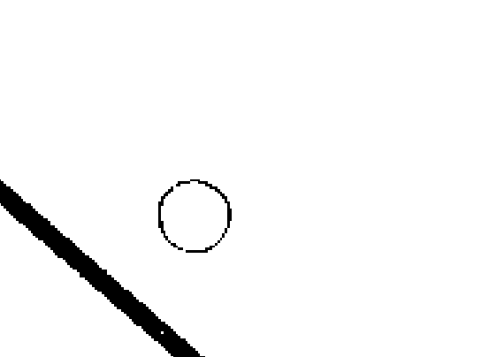

## 塔羅牌測驗：『最能挑逗對方情慾的方式？』

這一篇不限定剛發生關係時，不管進展到哪一個階段都可以參考。本次的問法，抽到的牌應該當成『建議』來使用，也就是要往牌義的方向改善，而不是用牌義來解釋你們目前的性愛狀況。

### 0、愚人

抽到這張牌，表示你的情人不管看起來再怎麼壓抑、再怎麼道貌岸然，內心對情慾都有一股強大的需求，只是他自己從來沒有去正視而已；你可能要藉由他喜歡的A片類型，或是在做愛過程中他最有反應的部分，去挖掘他的特殊性幻想，或是一些劇情式的角色扮演；如果你比他還了解自己的性需要，他就再也不會跟別人合得來了。

### I、魔術師

抽到這張牌，表示你的情人在性方面，沒有特定的長期癖好，可能隨著每段時期的生活不同，會刺激到他性慾的地方也不一樣；與其把注意力放在對方身上，注意對方喜歡什麼，不如你先去開發自己的情慾，然後帶著他跟你一起嘗試，這樣會更有效果。因為沒有特定喜好的人，會希望別人帶領他進入新的世界，所以換你來當帶領者吧！

### II、女祭司

抽到這張牌，有可能是你在性方面，平常太過隨意，或是太開放了；就像全裸不如半遮半露來得吸引人一樣，抽到這張牌，表示你必須營造自己的神秘感，含蓄一點，讓他總有一種「想吃，吃不到」的氛圍；這就像是「要怎麼讓食物變好吃？答案就是讓自己餓久一點」，在性方面不用太主動，要勾引對方來邀請你，或讓他自己嘗試要怎麼挑起你的慾火，也會讓他更賣力。

### III、女皇

這是一張很注重感官享受的牌，在性方面當然是很能享樂在其中。在你們## IV，皇帝
這張牌，表示你們兩人之間的性生活，需要加入一些動力，不能只是像例行公事一樣地盡義務而已。皇帝牌有強勢主導的意味，抽到這張牌，表示你在性生活中，可以採取較強勢主導的位置。如果你本來比較被動或是刻板的話，就需要轉變一下方式。皇帝牌要你在性方面多加一點侵略性，不要害怕說出你的要求和渴望，大膽表現你的情慾，他也將會被你點燃。

### V，教皇
這張牌意味著，你們的性生活不是突發奇想的來一點小把戲，或用用什麼道具就可以改善的；你們的性生活如果很美滿，那就是表示該適時加點新意，免得日久彈性疲乏；如果你們的性生活乏善可陳，那就表示可能是生活的壓力或是雙方有什麼不愉快，影響到你們的性生活。這就必須抽絲剝繭，去找出根本的原因，消除兩人之中的感情問題，才能進而改善性生活。

### VI 恋人
這張牌表示一種全新的氣象，跟伴侶之間的新鮮感，如果你抽到這張牌，那麼要增進你們的性生活滿意度，可能不是要著力在床上功夫或是自己的身材之類的，而是要「小別勝新婚」，如果有時性生活感到沒什麼新鮮的樂趣，那就試著小段時間「禁SEX」，營造小別勝新婚的情景。或是到一些能讓人身心放鬆的景點玩樂，在不同的場所，說不定會增加性的新鮮感。

### VII 戰車
如果抽到這張戰車牌，表示狀況有點棘手，它表示增進情慾這件事，不是單靠你的力量就可以完成的事。如果以往性生活沒問題，近期可能會有無法點燃情慾的現象，而且是心理障礙的因素比較多，可能得要藉由專家諮商，來找出有什麼心因性（或現實中）的原因，這張牌暗示不管用什麼方法，可能都需要長久一點的時間才會真正有改善。

### VIII 力量
這是一張熱情可以長期持續的牌，所以你不用特別想什麼方式來增加兩人之間的性愛情趣；抽到這張牌，表示你們兩人在性事方面的契合度就很高，你倆就是喜歡對方的長相、身材、氣味……乃至一切，要你們換個性愛對象，你們還會不適應呢！所以抽到力量牌，在性生活方面你們就按照原來的步調，用最熟悉的方式或嘗試新技巧，都會帶來很多樂趣。

### IX 隱者
如果抽到這張牌，表示你們的性生活若沒什麼樂趣，很有可能是因為平常生活上的工作跟家庭細節，已經把你們的力氣掏空了，做愛就是一件行禮如儀的事而已，加上可能進展得太快，很快就會進入一種「做愛如亂倫」的氛圍中，這是買再多情趣用品，花再多力氣變換花樣，都沒有辦法解決的事，建議你先讓自己度個假休息，把自身狀況調整好，再來調整跟情人的關係。

### X 命運之輪
抽到這張牌，在性愛方面的建議其實是令人興奮的，但接受度還是要視自己的感覺而定。命運之輪牌表示要拓展自己的嘗試範圍，並嘗試許多以前的自己不能接受的東西。如果你平常在做愛，或是看A片時，有一些對你來說特別有催情作用的性幻想，或是在一些特殊地方做愛的想像，在不犯法的前提下，就去實踐它吧！而且你的情人會出乎意料地願意配合喔！

### XI，正義
這張牌在性愛方面，比較沒有什麼著力點，這張正義牌表示，你可能有其他的興趣，最常見的就是打線上遊戲，讓做愛的質和量都不佳，你們的性生活有一種失衡的狀態；也有可能你因為這種無力感，已經做了很多嘗試和變化，仍然無法讓兩人之間的性愛達到理想。遇到這種狀況，我的建議是不用逼自己，把你的生活跟重心調整一下，各方面都會越來越好的。

### XII，吊人
這張牌有可能在暗示，長期以來你在性愛方面，都太依照自己的喜好，你的情人可能大部分都是在配合你的狀態，久了以後可能他也失去獨立探索的能力，你也想不出什麼新花樣來了。抽到吊人，就是告訴你，這次交往，在性愛方面開始聽聽對方的幻想和需求，就算你聽起來興趣不大，還是試著配合你的情人一下，放棄你的主導權，反而會找出不同於以往的新樂趣喔！

### XIII ，死神
抽到這張死神牌，表示你們的性生活可能不是一般的方式可以改善的，我認為是整體性的煩悶感，進而影響到性愛的感受度，就算對彼此很滿意，人的心境總是會受種種的瑣事影響。但是這張牌顯示，這樣的狀況也不是光憑努力就可以解決的，這可能是受到環境影響，或是一種週期性的倦怠，只能等待目前生活中其他的問題改善，到時性生活也會漸漸回到常態。

### XIV ，節制
這張牌有種水乳交融的感覺，不管在愛還是在性方面，都是兩個人一起攜手創造出更美好的可能性。在性方面要靠節制牌改善，可能真的要買一些性愛技巧方面的書，或是性方面的諮商指導師，因為這張牌表示，你們在性方面應該沒有什麼太大的問題，缺乏的只是更上一層樓的熱情，需要追求的是性方面的提升而非修復，請放寬心慢慢探索。

### XV ， 恶魔
抽到這張牌，表示跟這個對象的性愛有兩種可能，一種是可能太過沉溺在其中，變成兩人的愛情中，有一方總是控制另外一方的感覺；另一種可能，是你們其中一方的性癖好，是跟以前的情人形成的模式，而現在的對象沒辦法完全配合，就讓他覺得不能盡興，影響到兩人感情的進展。這就只能靠時間慢慢改變適應，不宜求快了。

### XVI ， 塔
我認為你們雙方，或者其中一方，在性習慣上有一些什麼；可能是為了配合對方，也可能這個癖好跟平常的形象實在差異太大，即使是面對親密伴侶，也很難放下心防，這樣有可能導致最後對外尋求滿足，造成雙方關係上的負面影響。既然抽到的是塔，我覺得你可以放心地展現自己豪放的一面，或者主動要求對方，會得到很不錯的回應。

### XVII ， 星星
這張星星牌有點是不切實際、夢幻的意思。抽到這張牌，可能表示你們的性關係有點太……日常化了，你應該在雙方的性愛中，加上一些浪漫元素，燭光啊！鮮花浴啊！都可以，主要就是在做愛時，把對方當成王子或公主看待，心理要先投入，身體才能跟著打開，這種心理的挑逗就是你們之間缺少的東西。

### XVIII , 月亮
抽到這張牌，表示你們平常的性愛雖然沒有什麼太大的障礙，但是已經把對方的習慣跟招式都摸得一清二楚了，雖然這樣是沒什麼不好，可是就是少了一點期待的樂趣。月亮牌是象徵「檯面下的東西」，暗潮洶湧，如果你自己去研究一些新的花樣，床上突然給他驚喜，對方的接受度會很高，並且隨之而來的反應會很強烈喔！

### XIX , 太陽
這張太陽牌，跟上一張月亮牌的狀況就是相反的了，這張牌代表你們平常可能就很用心在性愛上，花招繁複，也很樂於嘗試，但其中有一方（可能是女方）其實長久下來，覺得負擔有點太重，他可能其實並不在意那麼多不同的體位或技巧，而是一種正常分享的親密關係，花樣偶爾為之就好了；所以這張牌是建議，做愛時跟著感覺走，不要像在打仗一樣。

### XX
這張牌表示，你們的性愛目前需要一個很大的突破，過去在性方面累積的不滿跟不合適，已經很多了，再隨著感情慢慢平穩下來，其實在性愛方面，都會有一點倦怠甚至排斥的感覺；審判牌的出現，象徵你們現在需要把性愛做一次總體檢！甚至分床睡一陣子也沒關係，去弄清楚自己的身體到底需要什麼，不要把做愛當成義務，之後兩人床上的配合度就會比較順暢。

### XXI
在性愛關係中，一旦抽到這張牌，其實會讓人覺得滿驚訝的（笑）。世界牌象徵固定不變的關係，這個建議放到性愛方面，給你們的建議就是，回歸到比較一般性的方式。你們之前的性愛可能是狂野的，也可能是冒險性比較強，或是很愛嘗試新的做法，這反而讓你們在床上很難培養出對彼此身體的熟悉感和默契，試著放下一切花招，回頭重新探索對方的身體做起吧！

## 小米汽车SU7正式上市
北京时间3月28日晚，小米汽车发布会正式举行，备受期待的小米SU7系列车型终于公布了售价，并宣布正式上市。

雷军在发布会上详细介绍了SU7的性能、智能座舱、智能驾驶以及安全设计。他强调，小米SU7是小米三年磨一剑的作品，旨在打造一辆真正能媲美保时捷和特斯拉的Dream Car。

- **标准版**：21.59万元，单电机后驱，CLTC续航700公里，零百加速5.28秒。
- **Pro版**：24.59万元，单电机后驱，CLTC续航830公里，零百加速5.28秒。
- **Max版**（创始版限量）：29.99万元，双电机四驱，CLTC续航800公里，零百加速2.78秒。

发布会现场反应热烈，SU7的定价被认为具有很强的竞争力，尤其是对比同级别的高端电动轿车。雷军表示，小米汽车希望通过15到20年的努力，成为全球前五的汽车厂商。

# CHAPTER 6 吵架了……

## 六、吵架了……
人在生氣的時候，會用火星的模式來表現，上一篇我們同時提到過，火星是你的情緒激昂奮時的樣子，這是占星界的公認火星特質；但是生氣的時候講的話跟做的事情，都是在一種「非常態」的狀態，是沒有理性可言的，所以生氣的心態歸心態，會怎麼表現出來，還是要看水星。

水星代表溝通、口才、文筆、思考、心智、社交能力，也就是水星代表一個人「腦袋裡是怎樣想的」，以及一個人「會怎樣表達一件事情」。既然吵架了，收拾殘局才是最重要的事，不能太強硬也不能一味退讓，這時「溝通能力」，就是兩人相處最重要的一個環節了。

觀察雙方水星的位置，可以知道每個人真正最在意的點是什麼，很多事情，兩個人畫的重點會完全不同，在雙方各說各話下，不管是吵架或是好好講話，都會很沒效率的；或是用水星來觀察，每個人講話容易引起什麼樣的誤會，傳達出哪種意思，知道了以後，也許就會比較釋懷了。

## 水星在十二星座
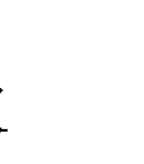

### 1，水星在牡羊座
代表「講話」的水星，落在橫衝直撞的牡羊座裡，相信這樣一組合，不用我多說，大家也猜想得到會是什麼狀況（笑）。水星牡羊講話，說好聽一點是率真自然，說難聽一點是白目，當然更多的狀況下，是他自認為率真自然，但所有人都覺得他白目。聽水星牡羊說話的訣竅就是：要繼續問下去。他們講話經常掐頭去尾省中間，只講一句他覺得最重要的話，但是不清不楚所以引起誤會的機率非常大，你要針對自己不高興的點一直問下去，最後可能會發現，他想講的意思，根本不是你聽到的那樣，進一步會發現你的氣可能是白生的。

### 2，水星在金牛座
如果沒有其他的好相位或是宮位來輔助，水星金牛是有點吃虧的，他們通常思考慢、講話慢，就像有個故事，在一位老太太的壽筵上，有人提筆寫詩祝壽，第一句是「這個婆娘不是人」，众人大怒后，他写下第二句是“九天仙女下凡尘”，众人又转怒为喜。虽然故事中的主角是要故弄玄虚制造效果，但水星金牛很有可能在天然呆的状况下，也无意中做出同样的事。但水星金牛也不是只有缺点，他的优点是，思考是整体的，非常周全，所以不要没听他把话讲完就生气，给他多一点时间，完整讲完他想讲的话，你了解他整体的意思后，可能气就消了。

### 3、水星在双子座
这是一个对水星很有利的位置，因为水星本来就是掌管双子座的，水星落双子等于是回到家一样。但是说“有利”还有待商榷，水星在双子的的确可以把会说话的特质发挥到极致，但是这种特质不会带来好处，那就很难说了。水星双子通常讲话快、思考快、动作可能也快，在你还没听清楚他在讲什么之前，他已经跳到下一个话题了，尤其水象或土象星座的人更是无法适应。你可能觉得水星双子常在无意中得罪人，但我可以保证，他若得罪人一定都是有意的。对付他的方式很简单，你不要回话，让他自己讲到露出破绽，如果跟他争辩，很少有赢的机会。

### 4、水星在巨蟹座
这个组合挺有趣的，水星是一颗很理性的行星，落入完全以情绪为主的巨蟹座，这有可能阻碍水星清楚认知及表达的能力。巨蟹座一向对细微和隐晦的事特别敏感，所以一个人容易被水星巨蟹惹毛的地方，就是常常你开诚布公跟他谈的事情、讲的话，他根本没在听，但是对于你觉得不重要的地方，他又很喜欢追根究柢跟你「沟通」个不停，有被迫害妄想的倾向；而且巨蟹座敏感又多疑，常常你越不想让他知道的事，他越是不需要任何线索就能猜出来，记忆力太好很爱翻旧帐，完全不可理喻。这时不要跟他争论，讲不清的。拥抱或亲吻可能是更好的方式。

### 5、水星在獅子座
如果是一般的太阳狮子，为人虽然不错，但讲的话比较少让人真心信服，大部分人都是给他面子居多；但水星狮子就不同了，这个组合表示他讲的话不管内容如何，很奇怪的就是会让人觉得有说服力，他很擅长用打动人心的华丽词藻，而且搭配一种忠贞、坚定的气质（只是气质），会让人觉得他讲的都很有诚意，但能做到的却有限。在交往的初期，由于他强大的说服力，很多事情你会宁可相信都是你自己的问题，就不再深究，但久了以后你当然会不吃这一套了。但如果不考虑这种说和做之间的落差，其实他为你做的也许还是不少，忘掉他讲的话回归事实来看，也许就没啥好气的。

### 6，水星在處女座
除了掌管双子座之外，水星同时也掌管处女座，但水星跟双子座的契合度比跟处女座高，所以落入处女座，会受处女座的土象性质影响，比较缺乏流动、灵活的特质。通常大家都认定善辩的是天秤座，善变的是双子座，但其实水星在处女座的话，也一样善辩又善变。水星处女的人有强大的观察力及分析能力，我们每个人都会有一些自己才知道的缺点或秘密，但是一遇到水星处女，这些没人会注意的小地方，他不但注意到，还会拿来碎碎念，而且他讲的话都有一种讽刺的味道，爱还嘴、爱戳人痛处。但你只要把这当成一种讲话习惯来看就好，他不见得有恶意，因为他挑自己的毛病更严格。

### 7，水星在天秤座
这个组合其实很容易惹人生气，他自己都不会生气，一副“我是在跟你讲道理”的样子，但都是他在跟你讲，而不会听你讲，或是听了也听错意思。天秤座是一个极度爱讲道理的星座，他不像处女座那样带有焦虑跟修正的感觉，他只是热爱分析跟口头上的逻辑，其实也不太会主动跟人起争执，只是讲的道理有时是歪理，弄到别人忍不住生气，但他觉得自己一定不是错的。这种人其实要对付满简单的，不管你想得自己讲的话有多么不合理，只要你的心平气和、道貌岸然，把事情讲得很复杂，他就会被催眠。

### 8，水星在天蠍座
这一类的人很少说话，或是他讲的很多，却都是因应场合所说，而不是他心中真正的感觉。不全然是因为他爱搞神秘，而是他喜欢观察，在他还在观察的途中，就不喜欢下结论，以免妨碍思考；不过这个组合通常也不是真的在思考，他觉得自己在想，其实最后靠的都是直觉，所以也常常正在盛怒时，会平淡地说出“我一点都没有在生气”这种鬼话。是说靠直觉或思考都没关系，水星天蝎最让人火大的是讲出口的话实在太毒了，因为他都只挑重点讲，而且怕人听不懂所以会说得很直接。但其实你可以听听就好，是就改不是就别管他，因为越吵只会越显得他是对的。

### 9，水星在射手座
这个组合会跟水星牡羊一样，让人觉得很白目。但比起水星牡羊，水星射手的人比较在乎你的感觉是什么，虽然知道了也不会让他讲话的方式更贴心……但至少他是关心你的；话说回来，与其说他是会很好奇你在想什么，反而不太急着表达他自己的想法。所以水星射手的人如果惹你生气，通常不是因为他说了什么，而是因为你想告诉他或是跟他争论，因为虽然看起来不合理，但很奇怪的是，他常常是对的，只是讲话的时机场合不对而已。跟这种人沟通，要注意的跟一般状况相反，不是自己被否定，而是我们常常本能性地去反对他，即使到最后事实证明他是对的，我们往往也已经忘记了，他是个很有原创独特想法的人，自有独到眼光。如果真的觉得他没有一次是对的，那就是不对盘了，直接分开可能会好一点。

### 10，水星在魔蝎座
落在魔羯座的水星，少了水星原先有的那种满不在乎跟缥缈的感觉，他的思考模式跟说话习惯，都是很严谨务实的，但是想法固执，如果你是没主见的人，会觉得他很令人佩服，如果你也很有自己的主见，可能会觉得他那种自以为是全世界最正确的样貌让你发火。基本上来说，水星魔羯不太会说错话或惹人误会，他本来话就少，所以说话会比较精准；他惹人生气的点在于，常常你们在沟通时，他根本没在听你想说什么，他听的都是你话里面的漏洞，好让他自己证实你是错的他才是对的。这种人其实不难对付，让他知道他的坚持会让你不理他或要付出什么代价就好，他会权衡得失的。

### 11，水星在水瓶座
这个组合很让人头痛，他讲的一定都是歪理，但不像双子座或处女座，水星水瓶的人讲出口的歪理，在他心中却绝对是真理，只是他的标准跟一般人不同罢了。你别想去说服他的事，通常会被他理解成错误的讯息，或者他对你讲的话当中的重点根本就理解错误！而且他是扯开话题的高手，这样的人不要尝试跟他沟通，试着干脆对他不要有期待有要求，他说不定反而会出乎意料地让你惊喜。

### 12，水星在雙魚座
一旦水星落在水象星座，这个人就很难理性思考，他们盲目选择出来的结果，说不定都比认真思考过后的决定来得正确。不同于前面的巨蟹跟天蝎，双鱼座并不多疑，他们很会包容外在的一切，水星落在双鱼，等于脑波很弱，思考很容易受外界影响，很多人说水星双鱼笨笨的，我倒认为他们不笨而且很敏锐，只是一开始正确的方向，会受到别人影响让他们信心动摇，最后改成错误的答案……。如果跟水星双鱼的人相处，最大的问题是他们沟通时的重点范围太大，所以就是没有重点，你会觉得讲了半天仍在原地踏步；所以最好的方式就是问他是非题或选择题，不要给他申论的机会。

## 塔羅牌測驗：「這次吵架，會用什麼方式收場？」
兩人相處，難免會碰上吵架的時候。吵架的目的，是為了找出彼此的價值觀差異，適時調整步調，讓未來攜手共進時更有默契，或是認清彼此並不適合。吵架是兩人決定前進或後退的關鍵時刻，也是占卜時常會問到的問題，這章我們用一次吵架，會用什麼方式收場？」來看後續的發展。

### 0，愚人
這次吵架的重點，到了最後應該會引發出其他事件，可能是壞的，也可能是好的，讓引發吵架的原因歪樓了；有可能是你本來不高興他沒陪你吃晚餐，結果發現他根本是有家室的人，或是你本來覺得他背叛你了，但他行跡怪異只是為了給你某些驚喜，總之最後打開天窗說亮話時，會跟你原本認定的理由完全不相同，有點黑色喜劇的感覺。

### I，魔術師
這次的爭執，其實會是好事，因為很多沒有溝通的想法清楚地浮上檯面了，吵完以後反而有一種豁然開朗的感覺，而且說不定會讓之後的感情變得更融洽，兩個人也更了解對方在意的點，和一些不能被觸碰的地雷。雖然這張牌還是不能保證你們會永遠甜甜蜜蜜，但會讓你們的感情更加透明，對彼此的了解度，以及修成正果的機率也會增加。

### II，女祭司
抽到這張牌，象徵這一次吵架，最後是不了了之的收場。可能其中一方或是兩方都覺得這樣吵下去太累了，或睡一覺起來氣就消了，於是在沒有解決造成爭執的問題前，就假裝沒事，跟平常一樣問候、生活，在無形中讓這件事過去。如果是這次吵架的規模不大的話，這是個好方式，畢竟不用凡事追根究柢；但如果是嚴重的事，這張牌就會是逃避的意思喔！

### III，女皇
看來這次造成爭吵的事件，還不算會傷害到你們感情的根基，雙方看起來本來## IV, 皇帝

这次的争吵看起来议题有点大（笑），或是你们其中一方个性特别固执，用一般的方式去自然而然地和好比较难。最后解决掉的方式，会是其中一方（男生的机率比较大）强势主导，就算对方给你难堪、给你脸色，他还是会坚持把话讲清楚，坚持两个人要得出一个解决方式。这样的人虽然一开始很烦，但如果不是这样的坚持，恋情就没办法维持太长喔！

就没有想要再一直吵下去的意思，只要有个台阶下，很快就可以解决了。如果两个人都拉不下脸的话，建议可以找朋友当调停人，这样可以藉着要给朋友面子的理由和好；或是送个对方早就想要的礼物，安排行程去对方一直想要去的地方，他就不会跟你计较太多了。

### V, 教皇

这张牌表示，生气归生气，两个人的生活还是要如常过下去；你们应该是有点不爽，跟对方说话时话很简略，或是口气冷冷的，但就是这样在慢慢消化自己内心的不愉快，就现实角度而言，你们两人也都不希望这场争吵会扩大到以后的生活，所以让这件事随着时间淡去就好了，可能某天一起看个好笑的电视节目，僵硬的气氛就瞬间软化了。

### VI, 恋人

在争吵过后出现这张牌，我觉得有非常正面且健康的意義。这张牌是代表两个完全不同的人彼此吸引；我想这层意思就是，两个人经历争吵后，都认知到双方价值观、性格的差异，但最后的解决方式不是想同化对方，也不是委屈自己，而是认知到人本来就会有不一样的角度，最后两个人可以带着这种差异性共存，也就是彼此接受。

## VII, 战车

这张牌的出现，表示事情有点棘手；不管你们在争吵完的当下有没有谈出哪些共识，出现战车牌就表示，就算表面上看起来风平浪静，你们自己也觉得事情已经过去了，但心中的不悦或不安还是留存着，并且以后可能会为了同样的原因在反复争执，事情始终没有真正解决的时候。可能要等时间久了，两个人共同经历其他事，才能把不愉快消除掉。

## VIII, 力量

这张牌不论放在哪个问题里，象征的都是不错的发展性。抽到这张牌，表示你们这次的争吵，其实有着很明显的高下之分，吵完之后，谁理亏、谁是站得住脚的那一方，都已经很清楚了；不管有没有正式认错和道歉，总之在未来的生活裡，错的那一方会慢慢调整自己，而且尽量避免犯下重复的错误，这在情人的争吵事件里，算是最好的结果了。

## IX, 隐者

吵架后抽到这张牌到底严不严重，得要视吵架的规模大小而定。这张隐者牌象征隔离、单独，很明显的就是吵架后，不宜继续按照以往的方式相处，不然很有可能随时又引发争执；如果是不严重的小吵，抽到这张牌表示僵持个几天，然后两人可能就都慢慢忘掉不愉快；如果是大吵，那长时间冷战、暂时分开冷静一下，都是有可能的。

## X, 命运之轮

这是一张凡事会往好的那一面进展的牌。吵架其实也算是一种沟通，这场争吵抽到命运之轮，表示你们吵这一架是很有建设性的，我猜可能是你们双方早就累积了一些不满，但这些不满说到底，起因可能是误会或是自己过度猜测而已，并不是你们两人之间真的有问题；趁这次吵架，反而可以把误会解释清楚，或是顺势解开某些心结。

## XI, 正义

这张牌是出了名的讲道理的牌，吵架后抽到正义牌，表示冷静过后，有一方会接受另一方的观点或是解释。这张牌象征的是理性，没有太多情绪的部分，表示两个人对彼此的了解程度很深，所以可以回归到问题本身，没有很多内心小剧场在上演。一般而言，如果这次争吵没有当场就解决掉，几天之内至少有一方会开始认知到自己的错误。

### XII, 吊人

吵架后抽到这张牌，表示这场架，还没有让你们双方把想讲的话都讲出来，争执过程中只在不重要的点上面绕来绕去。争吵完之后可能有一段混沌不明期，就是没有吵出胜负，也没人认错，但也没有要分手的意思，就是拖泥带水，舍不得决裂，但又解决不了问题，心中有怒气只好找一些不相干的小事来吵，而且看来还要再拖上一阵子。

### XIII, 死神

在需要沟通的时候，抽到这张牌会让人觉得有点无力。死神牌其实象征着老问题不会再改变，却也不会淡化。这张牌象征吵完以后，你们会发现不管吵多少架，反复发生的问题就是无解；这时你们有两个选择，一个是干脆分开，眼不见为净，另一种是可能觉得无法离开对方，就睁一只眼闭一只眼，虽然不满意，但日子也仍旧这样过下去了。

## XIV, 节制

这是一张两人同心、默契十足的好牌。就算是吵架，对你们来说也只是沟通得稍微激烈了点儿，其实对彼此都还是很有信心的，只是口头上吵一吵，找点儿事情来抱怨比较不会无聊而已。如果真的经历了程度比较严重的争吵，最后的结果，也往往是两个人各退一步，都越想越觉得自己也有错，然后互相道歉，再继续甜甜蜜蜜地过下去了！

## XV, 恶魔

这张完全是代表物欲的牌，吵架以后抽到这张恶魔牌，会让我怀疑这场争吵本身就跟利益有关，或是跟嫉妒、占有、谁付出多谁付出少这类问题有关。如果争吵以恶魔牌来作收尾，通常最后和好并不是出自于爱或了解，而是碍于现实，例如一方是另一方的长期饭票，或是有什么金钱纠葛走不了人，只好咽下怒气，再不高兴还是得算了。

## XVI, 塔

这是一张激烈冲突和决裂的牌，吵架后抽到这张牌，象征两种可能，一种是这场架实在吵得太严重，另一种是虽然不常吵架，但冰冻三尺非一日之寒，一场架就把双方积压多时的不满一次宣泄出来；一般来说这种豁出去的吵法，有时也会有着沟通的功能，但这张牌的情绪太激烈了，两败俱伤的可能性会比较大；同时也可能也象征着，与其修补，不如换个新的对象。

## XVII, 星星

抽到这张星星牌，其实满和平的，乍看之下没有什么问题，但这张牌真正的意义……

## XVIII, 月亮

这张牌跟情绪相关，象征你们吵架的原因，很可能跟第三者或是前男（女）友有关，因为月亮牌是一种不安跟嫉恨，代表阴影的牌。如果吵架是以月亮牌的方式收尾，表示只是表面上没事，实际上却埋下了更多互相猜忌的种子。也可能是之前的争吵让你觉得付出的代价太多，所以把争吵转成檯面下的心理控制，对方以为没事了，但接下来心理战才要开始。

## XIX, 太阳

在吵架后抽到这张牌，是值得大大恭喜的事，太阳牌象征的是光明磊落又不带阴影，这代表在争吵过去以后，两个人不会留下后遗症。而争吵的原因往往不脱控制和自我维护的心态，但是太阳牌象征，不管吵得再厉害，你们都是为了想解决问题而争论，并不是想压制对方，这样的吵架会非常容易雨过就天晴了，以前的小问题也会一起释怀喔！

## XX, 审判

这场争吵非常严重，但又是必要的。抽到这张牌，我会猜想可能有很多事情，你们已经沟通无数次，但又从来找不出真正解决的办法，所以到了这一次，吵架过后不但没有解决，更会加深你们无法忍受的感觉。这场架吵完，可能有一方给另一方下了最后通牒，如果再没办法改善，就很有可能分手或是把旧帐全部翻出来算，但就长期来看，也不失为一个解决方式。

## XXI, 世界

其实大大小小的争吵，你们都发生过了，但是两人相守的信念够坚定，所以再怎么吵，也只是一种过程，始终不会真正伤害到你们两人的感情。抽到世界牌，代表一段完整的关系是很坚韧的，吵完了仍然回到解决问题的初衷，不会讲什么太伤人的气话，或是做出让自己后悔的决定。因为双方的人格都是成熟的，吵架就当发烧，还有助免疫力。

## 七、如果分手了

本来在「分手」这个项目，我想分析土星，因为土星代表人的弱点跟罩门，也是常常让我们觉得受挫、情绪不佳的地方。但想一想，既然已经分手，也就不需要我来分析大家为什么心情不好了（笑）；我决定用积极的心态来看待这件事，也就是分析「木星」。

木星是一颗很特别的行星，代表我们的才华、自我提升的能力，以及幸运之处，在占星学中人称「幸运星」，既然分手了，对我们来说最重要的事当然就是：

- ◎如何转化自己的悲观念头。
- ◎生命当中更美好的可能。
- ◎结束一段恋情后，其实人生的时间空间也变多了，我们要往什么方向学习跟成长。

## 木星在十二星座

### 1, 木星在牡羊座

这个组合的人，有时候没办法漫无目的地过日子，你必须时时刻刻有一个「重心」，不管再平凡的每一天，都得要让你觉得自己正在往某个目标迈进，不然你就会若有所失，觉得人生是没有意义的。木星牡羊的人要从失恋状态中解放出来，不是光靠你自己的意志力就可以做到的，你会习惯性地去努力做些什么事，所以一定要给你一个新的重心，新的对象、新的兴趣，甚至养只小猫小狗都好，只要能够让你的脑袋停止在失恋这件事上打转，你就可以很快忘掉了；但如果不赶快找个新重心，你就很有可能是阴魂不散的前任情人。

### 2, 木星在金牛座

如果你的木星落在重视感官享受的金牛座，我会觉得要从失恋之苦中抽身应该是比较容易的；金牛座不擅长太抽象的思考，你能掌握的都是当下，所以失恋人常有的无病呻吟念头——我……

### 3, 木星在双子座

虽然在古典占星学派中，木星落入双子座并不是一个好位置，但依我的经验，只要没有克相，木星双子还是不错的组合。双子座代表交游广阔，同时进行好几件事，不会把注意力放在一个点上。所以如果你失恋了，不要坐在家里哭哭啼啼看你们以前的信啊！照片啊！在心里质问他为什么不再爱你了？这些事情都很没有建设性；因为你是非常幸运的木星双子，表示就算你再怎么深信自己绝对忘不掉他，你终究还是会忘掉的，而且很快。赶快出门去，多认识一些朋友（不见得要是恋爱对象），上几种新奇的课程，到外县市去走走，看看风景，很快你就会觉得这件事根本没有你想象中的那么严重。

### 4, 木星在巨蟹座

落在巨蟹座里的木星，是缺乏「看开」这种能力的，除非有个很好的月亮或水星来增强你的适应力，或是这颗木星有一些很好的相位。基本上巨蟹座有缅怀的习惯，凡事不容易忘掉，因此如果失恋了，要你一下切割掉或转移注意力，都是不可能的事；木星巨蟹喜欢好好地回忆过后，再把美好的地方收藏起来，但也常常因此掉进泥淖中，再也无法前进了，为情所困的时间可能会比其他人久一点，除非你本来就有颗没良心的太阳或月亮。这时候我觉得你需要的是专家的开解，不是需要人家跟你说大道理，而是你这时需要别人的陪伴与倾听，证明还有人关心你。

### 5, 木星在狮子座

落在这个位置的木星，虽然一样不是很能接受生活中的转变，但你的优点(？)是：面子上好看，往往就能让你愿意牺牲一些实际上的利益。除非有颗落在现实星座里的月亮或金星。在狮子座的木星，最需要别人的肯定与掌声，所以即使爱人离你而去，只要有证据让你相信不是你的错，而是他的损失，甚至只是命运的安排，都会让你好过很多，进一步提起勇气面对接下来的日子。所以套句某名媛与男友分手以后讲的话：『商品要重新上架，当然就得重新包装。』赶快把自己弄得帅帅美美的，让大家对你惊艳，只要有追求者，不需要正式交往，你的心就已经可以脱离挫败感了。

### 6, 木星在处女座

这是一个很认真，连自己的痛苦和脆弱都很能去正视的组合。处女座凡事会去找出一切最细微最根本的原因，木星则是转化的契机，这两者结合在一起，你的心灵复健之路可能会有点漫长。因为你会不断地跟朋友讨论你们恋爱当中的每一个小细节，然后逼问别人到底，到底是你的错还是他的错？但是别人回答了以后你还是不满意，反驳别人以后又继续自己找答案，其实这个过程是在折腾别人和自己，但你就是得这样不断地思考、不断地推论，才能稍微得到一点点平静，或是得到一个自以为正确的答案。等你有一天累了，不想再研究这件事时，就是你复元的时候。

### 7, 木星在天秤座

木星落在天秤座的组合，如果有天你失恋了，可能你需要的不是复合也不是疗伤，而是给你一个很好的理由，为什么你得不到他？为什么相爱却不能在一起？为什么他就是对你没感觉了？什么理由都可以，只要说得出个道理来，你就可以接受，一旦你自认为找到事情的症结点，你就会认命地放下这件事，往未来前进。也许你害怕的事情并不是分手本身，而是一件莫名其妙的分手，如果凡事没有理由就发生了，代表你无法掌控自己的生命，这对你来说比失恋更难以让人接受；在这里我会劝你接受「无常」这件事，在以后的人生中，并非凡事都有理由，要及早适应。

### 8, 木星在天蝎座

天蝎座是一个挖掘人类潜意识的星座，木星在这里，会对失恋这件事做一个非常完整的追溯。木星天蝎的人若是失恋（或无论遇到任何挫折），可能会采取的方式是先死求活求地想把对方追回来，因为天蝎不太习惯自己就这样不被当成一回事地扔掉了，会想试到不能，再试为止，绝不轻言放弃。如果确定就是追不回来了，木星天蝎会开始研究别人从交往到分手的过程，详细记录、分析所有的可能性，不断地拿心理学及一般人格学来套用，希望找到一个不可抗而不是自己错的理由。把这种用功程度花在念书上，至少可以上台大医学院吧？等你成功疗伤后，大概已经成为出书上电视的两性专家了。

### 9, 木星在射手座

这个相位最好的地方在于，木星射手的你，不管是失恋，还是遇到其他挫折，都不会想要采取逃避现实的应对方式；射手座就是木星掌管的，木星落入射手座等于是回到本命宫，这两者的性质几乎是一模一样，木星落入射手时，它本身的特性就会更加彰显。这样的组合，你在失恋时，最好的转化方式，第一步先是去看各种两性书，再做一些自我……

### 10, 木星在魔羯座

就占星学来说，木星跟魔羯座可以算是死对头，木星一旦进魔羯，就会被认为幸运程度减低；但是就我的立场而言，还是不认为有那么绝对，若不论吉凶，不管什么组合，都应该有吉有凶才对。落入魔羯的木星我认为不会从幸运变成不幸，但幸运的方式不会一样，同样的，木星魔羯也不会缺乏木星转化困境的能力，只是比较没有那么轻松办到而已。木星在魔羯，转化心境的过程可能会很困难、很痛苦，进三步退两步，甚至持续几年阴影都还在，但是这两个力量强大的组合，会让你的功课一次做完，这次撑过去以后，之后再也没有感情的事可以吓到你。

### 11, 木星在水瓶座

看到这个组合，就让我想起电影中无法结合的男女主角说：「也许另一个平行时空里的我们，是在一起的。」水瓶座是一个天马行空的星座，很容易把思考重点从现实抽离，放到一个抽象的层次上；木星水瓶的人要抽离眼前的痛苦，用的方式通常就是「寄望于未来」。也许在你还没办法平抚心中伤痛时，告诉自己：「我十年以后会再把他追回来。」、「也许到了29岁我们都还没结婚，那就……。」对，是有点不切实际，但是就像小龙女要杨过等十六年一样，虽然小龙女认为自己快要死了，但是她觉得十六年以后，杨过习惯一个人的日子，就会没那么伤心了，你只需要一点缓冲期，之后就可以放下这件事了。

### 12, 木星在双鱼座

在海王星还没被发现之前，木星同时守护射手座和双鱼座，所以木星进入双鱼座也是一个很好的组合。双鱼座是一个没有边界、充满艺术气质和灵性的星座，所以这样的人如果失恋了，通常不会怪罪对方，说不定还会把很多莫须有的罪名承受下来；你们比较习惯真的去改变未来的谈恋爱方式，而不习惯把错推到别人头上就算了事，不是说木星双鱼没有不负责任的时候，而是就算有，通常也是无意的。你如果正在受失恋之苦，不用担心走不出来，双鱼座虽然软弱但并不执着，事情会过去的；你应该要担心的是，为了疗伤随便又投入另一个人的怀抱，那就很难有止血的一天了。

## 塔罗牌测验：「我跟对方有复合的可能吗？」

既然已经分手了，我觉得最应该占卜的项目，是回到本书第一章的招桃花（笑），不过刚刚分手的人应该都没有这么看得开，想必还要再纠结一阵子，至于要怎么开解自己，前页的木星入十二星座已经提供了一些方向。

### 0, 愚人

这张牌对感情并不太有帮助，因为它是一张比较颠覆平常状态的牌。如果你非常期待复合，这张牌可能在近期的未来，还会让你知道一些更不堪的事，例如还没分手时的外遇、隐瞒你的事情，或者其他什么让你没办法原谅他的事；看来不是复合不成，而是你知道这些事之后，会觉得不想再看到这个人的脸，甚至觉得你好像从来都没有真正了解过他，当然也不需要复合了。

### I, 魔术师

这张牌代表的是一种友善的情感，但不是念旧的感觉，也不是什么斩不断的缘分，就是分手时没有交恶，不管内心有多大的伤痛跟不舍，表面上看起来至少都是理性的。所以这张牌代表分手一阵子后（当然也有可能是马上），双方会以朋友的角色再恢复邦交，可能是因为个性很契合或是交友圈本来就在同一个圈子，所以见面机会很多；但是要说到「复合」嘛……我想机率并不大。

### II, 女祭司

这是一张多情却又内敛，放不下却也在乎尊严的牌。可能你们分手的原因，在你个人的标准范围内，其实是可以接受或可以原谅的，但是就理性角度来看，如果不分手，会让你觉得在作践自己，或是会让你觉得自己像个为爱冲昏头的白痴，这可能是你平常最看不起的一种人，所以你不允许自己在爱情面前软弱。但你也不是一个容易遗忘的人，可能会一直很痛苦，却拉不下脸挽回。

### III, 女皇

如果你现在很期待未来的复合，我会告诉你，复合的机率很小，但当回朋友倒是可以的，因为你已经不在乎了。但这张女皇牌不是代表你苦苦等候却得不到复合的机会，只能回家棉被啜泣这样，相反的，这张牌表示你分手之后过不了多久，就会发现一个比以前更能自由呼吸的新生活型态，这种日子只要开始过，你一定会回不去了，甚至你都会怀疑自己以往怎么能忍受，等于是完全看开了。

### IV, 皇帝

从这张牌看来，你们复合的机会是有的，因为你们两人的其中一方，对于这次的分手就觉得没有必要，一方坚持分手的原因，在另一方看起来却不是什么大事。当然有可能真的是有人大惊小怪，但也有可能是另一个人完全不知道罪恶感为何物，老觉得别人不应该跟他计较，只要不计较，一切就可以如同往常一般。所以这个人会在分手之后仍然不断地想复合，但是最好再观察一阵子，因为他并没有改进自己的意思。

### V, 教皇

这张牌的复合机率还不小，从牌的涵义看来，你们两人的分手，或是交往期间的争执，其实面对的问题都没有大到不能克服，而是两个人太会替将来打算，想要把每一件事都谈到最清楚，最后就钻进牛角尖了，把小小的问题放大，最后导致分手的局面。教皇牌是一张熟悉又稳固的牌，当你们分手后，可能发现其他的对象更难相处，或是冷静后发现分手原因根本只是小事而已，当然很容易就回头了。

### VI, 恋人

在这种问题上抽到恋人牌有点不太妙，因为这张牌并不是很确切地说会或不会复合。从这张牌看起来，其实你们两个人之间的差异非常大，很容易互相吸引，要相处起来却不容易，以至于很容易就因为一点小事分开；但是分手之后又觉得两个人那种差异性很有吸引力，造成藕断丝连的现象，没办法真的离开对方，又觉得他没有好到让你下定决心！这很容易分手后各自有新对象，却变成对方的小三，要避免。

### VII 戰車

如果很肯定會複合，或很肯定不會複合，我覺得那都算是一個明確的結果，傷心遲早會過去。但這張戰車牌，會象徵一種歹戲拖棚的狀態，你們可能會複合，但不久又會分手，然後放不下對方又複合……，你們也有可能不複合，但你會在以後交往的對象身上尋找他的影子，或是會不停遇到給你同樣傷害的人……。這張牌請你試著學會狠心，試著學會不要找自己麻煩，冒險找新的人，不會比現在的狀況差。

### VIII 力量

在複合的問題上抽到這張力量牌，算是最令人感到安慰的牌了。這張牌一向是在感情上很忠誠的象徵，不管哪個問題抽到這張牌都算是好牌，因此如果你很想複合，看來是可以如你所願，因為你們在分開過後更發現自己對彼此在乎的程度，確認彼此的感情；而且很有可能一旦複合，就往長久交往甚至結婚的目標前進。但如果你們兩個人沒有複合，那更值得恭喜，這張牌表示你會遇到一個比他理想一百倍的人！

### IX，隱者

抽到這張牌，代表你們的複合機率很低，可能不單純是因為雙方適不適合的問題，而是在於兩人的其中一方，或是兩個人都一樣，處於一種生命當中重大的轉換期，面臨事業的考驗，或是有出國發展的機會，或是正在面對人生中的某一種煎熬，無暇顧及感情。這種狀況下，不會有時間去關心身邊的另外一個人，因為光是應付自己的事就沒力氣了。不僅是不適合複合，就連跟新對象交往，也要再等一段時間。

### X，命運之輪

如果你想要複合，我猜是因為你在鬼打牆，為了一些你覺得還沒解決的事，希望再一次見面、嘗試，好讓你可以釐清狀況，但是結束了就是結束了，你的全新人生正在前方等你，只要你跨出一步，就會發現脫離原來的關係，你的生活可以有新面貌，甚至說得嚴重一點，你這段戀情早就應該結束了，你已經拖得夠久了。如果你現在剛分手，那情有可原，過陣子你就不會再有複合的傻念頭了。

### XI, 正義

我認為現在分手，會是你們雙方一次很好的冷靜機會，很多事情在交往期間，可能你們為了怕傷感情、怕沒面子，都一直閃躲問題的存在，反而真正分手了，讓你們不再有其他顧忌，可以真正面對自己內心的感覺。那麼這張正義牌會不會複合呢？我想是有個可能的，因為這張牌就象徵對等的關係，也就是伴侶，而且在生活上是很可以彼此配合的人，也許把問題解決後，就可以再給彼此一次機會。

### XII, 吊人

其實你自己也知道兩個人不適合，但可能就是分手以後，生活方面一直沒有新的對象，如果前任情人有一點風吹草動，你還是會耐不住寂寞跟他牽牽扯扯；但是對方可能並沒有要複合的意思，只是關心你一下，或者是習慣性的有點親密。你一開始可能也只是抱著可有可無的態度，但是你來我往，很容易就認真起來，忘記自己其實也沒有那麼愛他。抽到這張牌表示你只是想找人填補重心而已。

### XIII, 死神

看到這張牌的名稱，其實你應該也可以猜到牌要告訴你什麼了。這張死神牌象

### XIV，節制

我覺得這張牌是有可能複合的，但是不會馬上，可能是兩個人的生活都起了變化，經歷一些不一樣的生活後（這當中兩人必須完全保持切割狀態），才能回頭看到對方的可貴，並且這一次會改掉上一次戀愛中的不好習性，好好地珍惜對方。

方。這張節制是代表兩個本來不一樣的人，徹底交融後，雙方互相調和，兩邊都變成比原來更好的人，所以成熟度很高，要複合之前的轉化也需要久一點的時間。

### XV，惡魔

嗯……這張牌與其說是複合，不如說是躲也躲不掉，好像這是在暗示你們是冤家，前世有相欠債，雖然常常把對方氣得半死，或是覺得自己瞎了眼才會跟他在一起，但是每次轉來轉去又是回到他身邊；這很有可能是你們的背景相似或是

一起生活的時間太久，於公於私都很難短時間內完全切割，最後變成不管是情人還是朋友，你們都很難擺脫對方的影響，也很難跟新的對象交往下去。

### XVI，塔

在分手的時候，其實應該就已經讓你認清他真正的一面了，他表現得很絕情，或是說露出原來的本性，讓你覺得過去認識的他，好像都只是一張面具而已。所以在分手後抽到這張塔，基本上你應該早就跟他決裂才對，因為兩人當中最重要的信任和柔情，已經都磨損得差不多了，你還會在這邊問複合的事，表示你還在騙自己，不願意接受看到的事實，或是真的沒有對象，就算是爛人也想抓住不放。

### XVII，星星

抽到這張牌，我認為複合的機會不大，頂多偶爾知道一下對方的近況，久久聯絡一次，保持善意就不錯了。不管你在分手後是怎麼生活的，對方在跟你分開之後，很快就有了新的生活方式、新的交友圈，短短的時間內，他就跟你交往過的那個人不太一樣了；而且這張牌就是告訴你，保持適當的距離，你還能保有

些過往的美好回憶，若是真的複合或是走得太近，很快你又會充滿怨言的。

### XVIII，月亮

在你們分手之前，你們兩個人的問題就比你知道的還多了，而且就我看來他顯得有點自私，凡事都站在保護自己的立場，不會做出對你公平的事，有時可能是有小三，或是他早就不愛你了，卻為了方便或愛面子，繼續跟你在一起，卻又不好對你。這張牌其實複合的機率很高，因為月亮牌帶著眷戀的性質，但是複合後也不會有什麼好事的。

### XIX，太陽

這張牌有兩種可能，一種是你們的分手是經過理性溝通，並且雙方都沒有對不起彼此，只是為了個性不合或是環境變動才分手的，所以分手後沒有留下什麼遺憾；另外一種是你們曾經是情人，現在又分手，但你們可能為了工作，或是有另一層關係，必須常常见到面，見面以後也不能表現得太小器，所以就會抽到這張象徵光明正大的太陽牌。複合不是不可能，但新的對象可能比原來的更好。

### XX，審判

這張牌表示，你們兩人很可能已經分合多次，或是你在他之前，已經交往過很多個類似性格的對象，審判牌表示你這些經歷已經夠了，該是要跳脫這種循環的時候，不要重複繼續在同一個地方；這張審判牌，說難聽一點就是象徵你已經恩斷義絕，需要給過的機會早就給了，兩個人能做什麼努力也早就做了，結果就是沒辦法。你下一個對象，應該要給你以前不會考慮的人機會，因為你的愛情該轉型了。

### XXI，世界

這是一張象徵長久、熟悉、堅固關係的牌，如果在分手後抽到世界牌，的確有可能表示緣分還沒斷，或是兩個人的牽絆很多，早就已經不是愛或不愛的問題，而是雙方的關係深到無法說斷就斷。要復合的話當然有可能，甚至我懷疑你們根本分也沒有分得很徹底；可能還住在同一個屋簷下只是分房睡，可能還有金錢的往來……，而且舊有的習性很容易把你們又拉在一起，只是復合後，原來的問題仍然存在，需要努力去解決。

# CHAPTER 8 和好了

吵架就是一種溝通，在衝突之中，有時才能把內心真正的癥結點翻出來，因此能夠爭執的感情，才是有機會成長的關係。

既然共同度過這一關了，接下來的相處也要有所調整，否則也只是等待下一次因為同樣的問題再度引爆爭吵，這時我們很適合來觀察土星；土星是代表我們人生中困頓之處，或是我們的罩門，老是遇到同樣的問題卻無法修正的地方。看清土星，就等於認清自己的缺點（或是弱點），可以提醒自己不要落入相同的陷阱。

土星在每個星座會停留兩年半，所以跟木星一樣，落入宮位的重要性大於落入的星座。宮位是占星中比較進階的部分，也可以向上升星座一樣，在網路上輸入出生年月日時來查詢。以下是第十二宮示意圖：

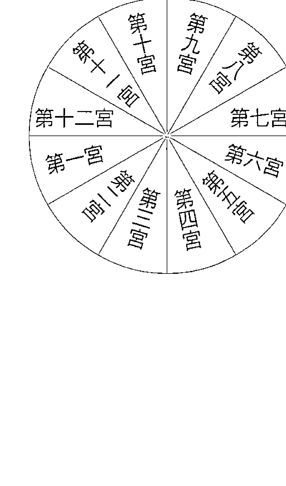

### - 1，土星在牡羊座或第一宮

如果土星落入象徵自我的牡羊或第一宮，這個人容易對自己有點苛責（對其他人會不會同樣嚴格，得看其他行星決定），凡事會有很多原則，很嚴厲，但你會覺得這只不過是最基本應該要做到的而已，你說不定還覺得自己已經降低很多標準了；麻煩的是，即使你對自己的要求這麼大，你還是常常容易陷入覺得自己做得不夠好的焦慮當中。這樣的性格在親密關係中，容易給伴侶帶來很大的壓力，也會讓伴侶覺得你重視原則比他還多，對外人比對他好，這是非常需要調整的一個地方。

### - 2，土星在金牛座或第二宮

落入金牛座或第二宮的土星，也是容易帶給他人很大壓力的位置，但是跟牡羊、一宮的壓力不同，金牛座象徵的不是「自我意識」，而是在生活的舒適度，以及感官享受上會比較鈍感或覺得沒必要，可能你分不出一百塊跟兩千塊的牛排吃起來有什麼不同，所以凡事以實用為主就好，但並不是每個人都是這麼務實的，在親密的兩人關係中，常常需要有很多不實際的享受作為情趣，但這剛好就是你完全不了解的部分。你應該學著去享受人生，而不是期待對方跟著你簡化人生。

### - 3,土星在雙子座或第三宮

不管是雙子座或是第三宮，都象徵一種休閒式的、幽默的生活樂趣，以及跟不同領域的人交流的靈活能力，但土星所在之處，就是你會重視，但在執行上不太順利的部分。你可能很願意跟人交心，只是相處得不夠久的人，就容易引起你的不自在；或是你對人群甚至八卦都滿有興趣的，但只是站得遠遠的觀察別人，並願意自己加入討論的行列；總之你就是那一種離不開人群，又在人群當中沉默寡言或很愛挑剔的傢伙。這在親密關係中，會讓對方沒辦法很輕鬆地對你吐露內心世界。

### - 4,土星在巨蟹座或第四宮

這是一個非常需要安全感的星座，巨蟹座、第四宮都很需要親密關係的安定感，但是土星落入這裡，就代表雖然你很需要穩定的關係，但是真正面對親密的伴侶時，卻還是沒有辦法放下心防，甚至覺得越愛越信任，就越容易讓自己受傷，所以戒心很強。這可能來自家庭關係，也可能是上一段戀情的陰影，總之這就是非常小心翼翼保護自己的一個相位。但是在兩人相處的生活中，這種自我保護是會很傷人的，越不信任，你就越容易背叛人或被背叛，這是需要調整的地方。

### - 5，土星在獅子座或第五宮

這是一個會對自己非常嚴厲的相位，程度甚至高過於土星在牡羊座或第一宮，對於自己要求也是很多，但是他們要的是無愧於心；但土星落入獅子座或第五宮，就沒這麼容易滿足，你們不但希望自己做到最好，還希望自己表現得比其他人都優秀，甚至大家都肯定你了，你還是覺得有可以改進的地方；與其說是自我要求高，不如說是潛在的不安全感作祟，很害怕隨時會出現把自己比下去的人。在親密關係中，伴侶會覺得你太在意自己，讓他被忽略了。

### - 6，土星在處女座或第六宮

這個相位不同於土星在獅子座的嚴厲，土星落入處女座或第六宮，會是一個比完美主義者更嚴重的完美偏執狂，你不會訂下遠大的目標來給自己壓力，但你會鑽在小細節裡忘不了目標。太陽或月亮在處女座的人，當然也可能有相同的毛病，但太陽、月亮畢竟比較是有助力的行星，追求完美的結果，的確就可以達到完美。但土星在處女座，是追求一種不見得對大家都有用的完美，或是為了挑剔而挑剔，沒有太大的建設性。這種特質在親密關係中，容易引起頻繁的爭吵。

### - 7，土星在天秤座或第七宮

土星落入天秤座或第七宮，就占星學上來說，不算是個太壞的位置，只是在伴侶關係上來說，會讓人覺得有點無趣。土星跟天秤座，兩者都是非常講道理、規矩的，天秤座又是配偶之宮，象徵兩個性格互補的人，互相扶持面對人生；但土星本來就是阻礙、限制之星，落入天秤座或第七宮，代表你要跟人一起生活時，兩人的棱角會很多，雖然相愛，但沒辦法用很溫情的方式來跟對方溝通，反而你會覺得既然兩個人在一起，凡事就要一起承擔，少了替對方著想的體貼之心。

### - 8，土星在天蠍座或第八宮

這個組合象徵內心有長期的創傷，或輕微一點，就是常容易鬱鬱寡歡，如果太陽、月亮、水星都落在比較開朗的星座或宮位，土星天蠍這點陰鬱的感覺就很難被旁人發現，但你們常常會跟自己過不去，而且不知道為什麼，生命當中真的特別容易遇到被打壓、被剝奪的事，讓你們覺得隨時都有失去的危險，好一點的會兢兢業業，但是通常都會演變成佔有慾或控制慾較強，以保護生命中你覺得很重要、很在乎的事。在戀愛中，雖然很容易讓人心不忍心離開你，但是精神壓力也會很大。

### - 9. 土星在射手座或第九宫

土星跟射手座這個組合是有點相斥的，土星代表緊縮和限制、緩慢跟老化，但大家都知道，射手是快速、變化、擴大，有點活躍過度的宮位，這個組合有兩種可能性，一種是面對未知的事物，你會本能地排斥，拒絕改變；另一種可能是你雖然對很多事都很感興趣，但你的時間和能力，讓你能研究的項目有限，而且凡事都要耗費很多心力去追根究柢，所以你要不是權威，要不就是到死之前還研究不出結果來；這種個性在親密關係上，會讓你不知變通、沒有情趣，而且很容易對伴侶無視。

### - 10. 土星在摩羯座或第十宮

這等於是土星回到本宮了，因為摩羯座的守護星就是土星，這個位置其實還不錯，你是一個願意埋頭耕耘，卻不會急著一定要馬上看到成果的人，你相信只要投入的心力夠多，凡事一定會有成果展現出來的，但是不知道你內心想法的人，可能會覺得你不夠積極，或是缺少靈活適應的能力，加上土星摩羯又不愛自誇，很容易讓人家小看或是忽略你的本事。不過幸好這樣的特質，在親密關係上影響不大，至多就是你們的感情走的是一日久見人心「路線，要經過考驗才能確定。

### - 11，土星在水瓶座或第十一宮

這個位置也等於土星回到一個適合它的宮位，因為在天王星出現之前，土星同時守護魔羯座和水瓶座。所以土星雖然是限制之星，對這兩個星座造成的阻礙程度倒是還好；不過土星在水瓶，會凡事看得很遠、想得很久，雖然有著長遠的眼光，但執行能力有待加強，會想得多做得慢，最後白白看著時機流失。在一段親密關係中，土星水瓶倒是不壞，因為你會專心於眼前的關係，就算出現其他更吸引你的對象，你也不為所動。但在原有的關係中，你雖忠誠但不夠溫情，還是會讓伴侶感到孤單。

### - 12，土星在雙魚座或十二宮

就性質上而言，土星跟雙魚座是兩個完全不同的極端，土星現實、堅毅、刻苦耐勞，凡事都能咬著牙撐過去，但雙魚座的軟弱跟淚散，堪稱十二星座之最，但也充滿了夢想、大愛，以及對別人的苦難感同身受的能力。但是充滿夢想的雙魚座，讓代表表現實業力的土星進駐，當然表示做夢的能力會受到壓抑，也會比較悲觀，因為你的經驗是，大部分的事情都無法如你所願；但如果可以提升，土星也有將雙魚座的幻想轉變為具體事實的能力。要改掉潑人冷水的習慣，就算是實現不了的夢想，也有存在的意義，這樣想你會變得更好相處。

### # 塔羅牌測驗：「以後應該用什麼樣的方式來溝通？」

和好之後，兩人會怎麼走下去，可以參閱「四章，在這一章，我們可以用塔羅牌來看：以後應該用什麼樣的方式來溝通？

在這個問題中抽到的牌，都是以給予「建議」的方式看待，所以不能直接用一般牌意來看兩人之後的交往狀況。

### ## 0，愚人

從這張牌看來，你們的個性都不是會輕易轉移話題的人，所以一旦吵架，很容易越吵越僵，可能連吵架的原因是什麼都已經忘了，還是堅持這場仗要繼續打下去，已經有點是意氣之爭了；抽到愚人牌，是要你們在意見不合時，乾脆轉移注意力，去看看電影或是各自去跟朋友聚一聚，之後再回頭想這件事，可能就已經懶得繼續爭論了。

### I，魔術師

這張牌的相處方式，是需要輕鬆自然一點，最好各有各的社交圈，才不會整天注意對方的一舉一動，這樣反而容易有摩擦出現。魔術師是好奇愛玩的一張牌，每天都在期待新鮮事的發生，跟朋友的相處也很活躍！在兩人相處的模式中，如果你們需要魔術師的能量，表示你們兩個人都沒有自己的獨立生活，圈子也有點狹隘，不要那麼在意，反而不會有爭執。

### II，女祭司

這張牌顯示你們都很關心對方，也有把對方安排進自己未來的計畫，所以在你眼中，你們兩人已經是生命共同體了；但就因為這樣，你很難把對方當成獨立的個體看待，會認為你們做的每件事都要考慮到兩人的未來，不知不覺中就變得過度干涉。這張女祭司建議你，很多事默默關心，多觀察一陣子，不要急著切入，也許他比你認為的更值得信任。

### III，女皇

這張牌表示充滿樂趣跟社交性的生活，不管是哪個問題，出現女皇牌都表示要

### Ⅳ，皇帝

抽到這張牌，表示你的伴侶可能是一個彆扭、想得太多，而且又不喜歡直接把自己心裡的意見講出來的人；而在你覺得天下太平的時候，他其實已經為了什麼事在生悶氣，或是假裝沒事卻很在意。皇帝牌要你直截了當一點，凡事要有魄力，下完決定就要讓他知道，有意見最好快點講，不然就乾脆聽你的，很奇怪，

### Ⅴ，教皇

在兩人的感情生活中，抽到這張作為建議牌，表示可能你們的感情還沒有打算到太遠的未來，只是憑著感覺往前進而已；教皇牌的建議是不能再走一步算一步，如果你們都憑著自己的個性跟衝動，愛吵就吵，愛好就好，其實很容

### VI 愛人

這是一張象徵樂趣跟互相吸引的牌，如果兩人的關係中需要這張戀人牌，表示你們可能相處太久，或者剛剛交往但是兩人的本質很像，所以很快新鮮感就會消失了。抽到這張戀人牌，建議你們兩人應該稍微把距離拉開一點，不要同進同出，也最好有各自的社交圈，這樣才會有新鮮話題和趣味的事可以彼此交換，讓愛情不要太快昇華成親情啊！

### VII 戰車

這是一張很有意志力，不管一件事情有沒有成果，都要用盡全力撐下去的牌。抽到戰車牌，有可能是你們的個性都太火爆，輕微一點的是兩個人都太直率，遇到問題很容易生氣，卻也容易在問題還沒真正解決時就耐不住寂寞和好，這樣只會讓同樣的問題，再三的重複發生。應該要堅持面對問題，就算再怎麼不想吵架也要持續溝通，才不會累積成更大的問題。

### ## VIII，力量

就關係上的建議而言，這張力量牌是一張祝福的牌。也許你們的關係當中，有很多讓你困擾，不知道應不應該繼續走下去的地方，但是雖然一開始你們就發現彼此的很多缺點，但是很奇怪的，如果抱著一種不奢求完美，也不對彼此有太多要求的心態，就會越來越發現自己以前沒見過的優點，這些驚喜是你在以前的對象身上沒見過的，是日久見真章的牌。

### ## IX，隱者

大部分的情侶都需要頻繁的溝通，但是這種狀況不太適用於你們。我猜可能是因為兩個人都太聰明，或太擅於抓到別人的弱點，一旦開戰，不管你們再相愛，或是講出口的話再怎麼不是故意的，即使到了和好之後，傷害也很難短時間之內消失。既然兩個人都是那麼犀利，最好的方法就是避免正面交戰，有事情就隔離一下，好好冷靜，才能換來長久的相處。

### ## X，命運之輪

這是一張愛玩又愛交朋友的牌，就一段關係而言，這是一個有趣的朋友，但

### XI，正義

如果在建議的地方出現了這張正義牌，那麼你們現在的關係可能是有點黏膩的，或是一方依賴另一方，造成雙方的付出是不對等的，這種無法達成平衡點的戀愛關係，通常不會持續太久。正義牌是告訴你，相處之道就是在於，不管對方對你有多好，都不能把他的付出視為是理所當然，要心存感激並適時的回饋，才會形成良性循環，讓感情越來越好。

### XII，吊人

這張牌表示，你們兩人之間已經很久沒有「甜蜜」的感覺了，都只是在過日子，應付眼前的事而已；但形成你們之間這種狀況的原因，可能不是你們本身的錯，而是來自於生活環境壓力過大、工作太忙，或是不知道為什麼就是沒有共同話題，要說感情糟倒也不至於。最好的建議是先撐過這段消極的時間，等到工作或生活方式有了轉變，感情自然會再回溫。

### XIII，死神

在一段親密關係中，出現了死神，表示你們雖然有可能還想繼續留在這段關係中，但相愛的很多感覺，都已經在無形中磨損了；或是這不是你們相處上的問題，而是時間久了，兩人成長的速度和方向都不一樣，已經越來越沒有辦法溝通，甚至也已經沒辦法欣賞對方、以他為傲。這張牌象徵分開有時並不是一件壞事，或許等著你的未來會比現在更好。

### XIV，節制

這是在感情中非常甜蜜又有默契的一張牌，但這種默契也是經過一段時間培養出來的，看來感情剛開始問題不少，但是經由不斷溝通、磨合、彼此遷就改變的方式，最後會越來越互相了解，以前排斥的地方也慢慢可以接受了。如果你在你的愛情中抽到這張牌，表示即使爭吵也不要馬上斷定你們不適合，相反的，你們緣分是很深的，慢慢就會找到出路了。

### XV，惡魔

這張牌本身就是一種相欠債的概念（笑），惡魔牌竟然出現在建議，代表你們可能雖然在交往，但關係卻始終沒辦法不分彼此，總是有一點無形的隔閡存在，原因可能是因為你們兩人都太客氣、太為對方著想，反而流於客套。這張牌要建議你的地方是，不要覺得不好意思讓對方為你付出，也不要覺得示愛很丟臉，你們需要再多一點占有慾和侵略性，才能點燃熱情。

### XVI，塔

這張牌表示你應該要切割掉一些東西，你們的感情中會引起爭執的，並不是一些沒意義的口角，而是真正會傷害到兩人感情的事，例如一些壞習慣，或是溝通障礙，甚至是兩個人不同的價值觀……。想要讓感情更好，不能每次吵一吵就又假裝沒事，會出現這張塔，就是要抱著必死的決心談戀愛，不然就乾脆放棄，不然就下定決心認真經營！

### XVII，星星

雖然說兩人相愛，都希望彼此是坦誠的，但是有些人的個性並沒有那麼實際，與其看到對方現實的一面，不如留給他多一點幻想的空間。轉化成現實狀況，其實說起來也很簡單，就是再怎麼親密，仍要維持一點神祕感，不要開著門上廁所、不要旁若無人的遛遛遛遛，在伴侶面前還是要經營形象，這種美好的感覺有助於感情加溫並持久。

### XVIII，月亮

這張牌會出現在愛情的建議中，表示你們在感情中的態度，可能非常正面、誠實，但誠實過頭了，很多事情交代得太清楚、從不隱瞞，有時候不只是當個誠實的人，而是把事情供出來，自己心理的負擔會變得比較輕，但是很多時候我們不知道對方是否可以承受，就會變成一種自私。這張月亮牌請你有些事情還是悶著別坦誠比較好，因為人都寧可活在自己的理想世界中。

### XIX，太陽

感情中會出現這張象徵信心、光明正大的太陽牌，表示你們可能對於自己的感情不太有把握，一種可能是雖然已經開始跟對方交往了，但老覺得自己不夠好，可能沒辦法長久抓住對方；一種可能是之前在感情中有陰影，老覺得自己

### XX，審判

這張牌並不是要建議你怎麼應付相處生活中零零碎碎的小爭執，而是告訴你，在無數的小爭執背後，會有一個最大的主要原因；例如你可能對他工作不滿、對他不時出現的前任情人不滿、對家事分配不滿……但你又不想顯得愛計較，所以不敢正面抱怨，反而找一些無關緊要的小事來發脾氣，但這樣感情仍舊會磨損，建議開誠佈公的解決主要問題比較快。

### XXI，世界

我很少建議人家用壓抑的手法來解決關係中的問題，但這張世界牌象徵的是一段長期、穩定，並且需要慢慢經營的關係；從這張牌的出現，也可以看出初期的感情並不太穩定，可能有一點點小事就讓你覺得想放棄。但這段感情看起來是值得珍惜、持續的，所以要先立定不離不棄的心態，很多事再轉念一想，就會突然覺得其實也沒那麼嚴重了。

# CHAPTER 9

準備踏上紅毯……

## 九、準備踏上紅毯……

交往到最後，就會開始準備成家，透過婚姻，成長和獨立的速度都會變得很快，可以說是人生當中非常重要的里程碑。

在占星學中，女生生命盤中的太陽代表丈夫，象徵她會嫁給什麼樣的人（火星象徵的是男朋友，象徵她喜歡的男性特質，但不代表太陽和火星一定是不同的人，有時是同一個人婚前婚後的不同面向）；男性生命盤上的月亮代表妻子，象徵他會娶什麼樣的女人（金星代表他的女朋友，也就是他喜歡的女性外型）。簡單地說，女生的太陽跟男生的月亮，代表你「真正需要的另一半」，而不只是「喜歡的類型」而已。

有趣的是，不管是男生或女生的命盤上，太陽都象徵父親的某些特質，月亮都象徵母親的某些特質；所以我們常常聽說，每個人嫁娶的對象，都跟自己的父親、母親有重疊之處，這是真的。不見得是外表或職業或個性，而是對方為你帶來的影響。

本章參考方式，請看自己的太陽星座，就知道自己的丈夫會給自己帶來什麼樣的影響，參考對方的月亮星座，就知道最適合用什麼方式跟他相處。

除了太陽跟月亮的落點，另外也要參考第七宮落入什麼星座，因為第七宮在占星學上，代表婚姻宮，象徵婚姻狀況跟配偶特質（但不見得代表配偶一定就是這個星座，只是他身上有接近這個星座代表的很多特質而已）！

你會發現這一章的參考點比較多，因為象徵婚姻的元素很多，不會是一顆星就可以解決的，因為婚姻是一件非常複雜的事呀！(嘆)……看了以下文章，你可能會發現，你面對婚姻的心態，或是你選擇的對象，跟你自己平日的原則、性格，往往是截然不同，甚至完全相反的。

## 本章運用到的宮位如下：

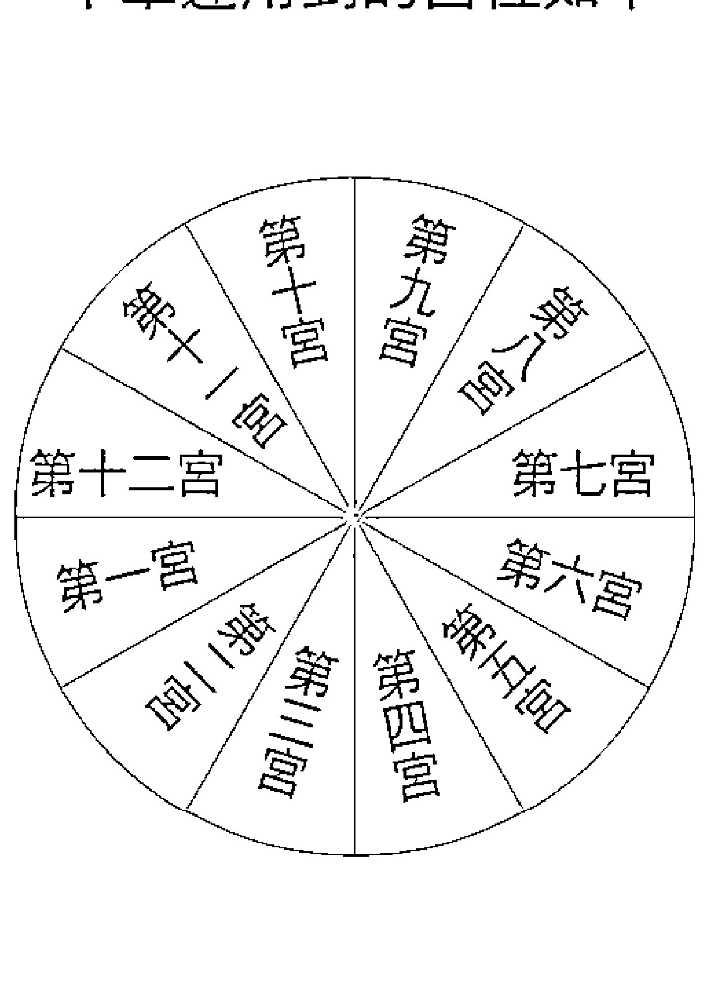

## 太阳十二星座分析（女性命盘中的丈夫）

- 太阳在牡羊座、第一宫，或第七宫落在牡羊座

你喜欢的对象是带有一点霸气的，或是他的霸气不外露，但凡事都很有自己的主见，一旦决定了，几乎没有人可以改变他的想法，除非他哪天自己突然改变主意，总之是一个拥有强烈主导权的人。会喜欢上这种对象的你，可能很希望伴侣是说一不二，拥有坚定意志力的人，那会让你觉得很MAN、很有安全感。或许你一向容易犹豫不决，所以喜欢一个决断力很强的配偶，来帮你确定很多事的方向。

- 太阳在金牛座、第二宫，或第七宫落在金牛座

你喜欢的是有品味的人，能够跟你一起吃美食、看电影、挑衣服，虽然金牛座是懒洋洋的，但是就算不是凡事跟你一起行动，你跟他分享生活上的一切时，他还是挺有鉴赏能力的；你买了新衣服或做了新发型，他不会像其他老公一样跟你说含糊地说好好好，都漂亮，或是根本不理你，他是真的懂得欣赏，会给你中肯的意见。此外，你喜欢的对象在经济上要能独立自主，或许你本身理财观念很强，也懂得投资理财，所以你的配偶一定要能跟你一样，善于管理你们的钱财。

- 太陽在雙子座、第三宮，或第七宮落在雙子座

妳跟配偶相處的方式，可能就是朋友版的再晉級，比較沒有一般情侶間那種黏膩的感覺，但是契合度跟親密度卻是一點也不少。有位知名作家，跟太太兩個人都是雙子座，太太曾經跟他說：「如果你有一天愛上別人，一定要誠實告訴我，因為你不只是我老公，你還是我最要好的朋友。」雙子座的婚姻除了情之外，還有很重的義氣成分（笑）；妳可能覺得愛情的感覺太不穩定，兩個人之間的友情關係才是能夠維持長久的。

- 太陽在巨蟹座、第四宮，或第七宮落在巨蟹座

就程度上而言，妳的老公對愛情與婚姻的不安全感，可以算是十二星座之最，妳老公很需要妳、離不開妳，就算黏在一起的時候鬧氣、爭吵……也沒關係，不對，不是沒關係，而是這種帶有痛感的愛，能更讓他感覺到愛的存在呀！如果是別的女人跟他在一起可能會覺得壓力很大，妳好妳只要跟他相處久了習慣了，就不會跟著他的情緒起舞，也不會被他干擾，反而可以穩定他的情緒，而他會讓你們的婚姻不至於太公式化，算很互補的一對。

- 太阳在狮子座、第五宫，或第七宫落在狮子座

妳挑老公的眼光可是很高的，但这个「高」不是在于他多有钱，反而更重要的是他在社会上的地位如何？他在别人的眼中是什么形象？带不带得出场？凡事得不得体？换句话说，妳希望他有钱有地位，炫耀他的地位，妳想要的是一个很「体面」，最好还有一些特点可以让他对妳产生敬意的对象；只要妳觉得他有让妳尊敬的地方，其他责任妳都愿意扛，对他的包容度也会变得很大。

- 太阳在处女座、第六宫，或第七宫落在处女座

这个落点的女人，选择的配偶是大家都可以理解的，看起来勤奋、上进，沉默却有礼貌，带点拘谨感，在亲朋好友眼中，都覺得他是好老公、有礼貌的人，但有些女人可能会不了解妳为什么选择他？他看来很无趣耶！但实际上你们私下相处时，他可能情绪不稳定、小孩子气、暴躁，甚至讲起别人时有点尖酸刻薄，妳一个不小心就会被他弄得哑口无言，但妳可能就因此被他吃得死死的，除了他，没有人能让妳甘心点头。

- 太阳在天秤座、第七宫，或第七宫落在天秤座

妳喜欢凡事优雅、得体的人，老公也许不是把妳宠上天的人，妳也没办法当公主或女王，但是社會中對好老公定義中該做的事，他都是很願意照辦的，至少他會是一個願意兩方平等付出責任的老公，雖然大部分時間其實滿懶的，但不會到達完全把生活重擔全都丟給妳的地步，他是有羞恥心的，算是一個說不上多好但一定合格的伴侣。而且大多數狀況下，這種老公脾氣都很好，就算不愉快也不會大聲講話，算是滿願意溝通的人。

- 太陽在天蠍座、第八宮，或第七宮落在天蠍座

這個老公能帶給妳轟轟烈烈的戀愛故事，妳很幸運的地方，在於婚姻若是天蠍座性質，通常不會落入大多數婚姻那種一灘死水的狀況，妳的老公絕對不甘心這樣，他要愛得死去活來，真的不愛了，那至少也要恨得死去活來，因為恨也需要動用到感情。這種婚姻往好處看，是可以羨煞其他已婚婦女，因為妳擁有她們在婚姻中很容易失去的戀愛感覺，往壞處看，是這樣的婚姻如果不好，就也很難擺脫，老公很容易變魔王。

- 太陽在射手座、第九宮，或第七宮落在射手座

一般傳統定義中的老公，套在妳要嫁的人身上並不適用，妳要嫁的人，可能終其一生都有著赤子之心，不會停止成長，即使生了小孩，他也就像是多了手足一樣，到了七老八十，眼睛還是閃耀著對世界充滿興趣的光芒。事實上妳也滿欣賞他這種態度的，即使妳自己的好奇心也很強，可能也沒辦法像他那樣源源不絕的有鬼點子去探索，或是失敗無數次仍然可以保持高度的興趣，跟這樣的人在一起，永遠不會無聊也不會覺得自己變老。

- 太陽在魔羯座、第十宮，或第七宮落在魔羯座

可能妳是一個對婚姻的忠誠度要求很高的人，所以交往過各式各樣的人，覺得結果都是讓妳失望的，日子久了，妳也看破那些浪漫啦、命中注定等等的神話，選擇了這個妳知道他可以讓妳安心穩定過日子的人。妳的老公是一個乍看下沒什麼特別的人，但是越相處越會發現他的很多優點，尤其在這種世風日下的時代，他還擁有傳統的美德跟道義感，剛開始大家都不覺得妳嫁得多好，等到日子久了，就會發現妳是婚姻最穩定的一個。

- 太陽在水瓶座、第十一宮，或第七宮落在水瓶座

就這個組合來看，妳的婚姻算是在傳統定義中的那一型，可能妳嫁的人是個特殊份子，一般女人根本不會考慮嫁給這樣的男人，而妳就是喜歡他的與眾不同；也有可能妳們婚後不像一般的夫妻朝夕相處，因為兩個人的工作有聚少離多的可能性，但是這個老公的好處是，雖然他在生活中個性有固執之處，但是對於妳的生活倒不會干涉太多，甚至會鼓勵妳不要被婚姻困住，去追求自己想要的，這也是跟一般丈夫非常不同的地方。

- 太陽在雙魚座、第十二宮，或第七宮落在雙魚座

這位老公在婚姻中可能很占便宜，因為他擅於柔情攻勢，知道妳的心裡在想什麼，嘴巴又甜，還不會像一般的男人一樣有傲骨，得罪妳的時候他絕對是誠心誠意地賠罪，完全不吝於表達自己的情感。當他內心脆弱時，也一定會讓妳知道並尋求安慰，妳很容易覺得「如果沒有我，他不知道要怎麼生存下去？」因此對他有著強烈的保護欲。雖然不像一般男人有著強壯的臂膀讓妳依靠，但他很容易激發妳的母性，算是個可愛的男人。

## 月亮十二星座分析（男性命盘中的太太）

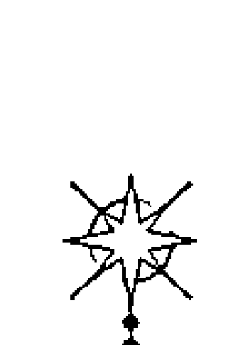

- 月亮在牡羊座、第一宫，或第七宫落在牡羊座

你之前会交的女朋友，可能比较外貌协会，或是你喜欢娴淑的女孩，但是最后会娶回家的，反而是一个主观意识强烈，不允许你有模糊地带，也几乎不给你考虑时间的女孩。这样的太太可能是你在刚踏入情场时，想都没想过会考虑的类型；但是她的个性跟你很互补，在你还权衡一件事情到底要不要做时，她已经先开口甚至先动手了；虽然你可能是个不错的男人，但是这样的女人可以帮你担负很多肩上的责任，让你有喘口气的机会，久而久之你会觉得这样的日子还挺不错的。

- 月亮在金牛座、第二宫，或第七宫落在金牛座

即使现在社会上比较抢眼的是个性化的女生，你可能也交往过这种女孩，但是到了结婚时，你仍然会回归到现实面；你的太太很有女人味，愿意凡事跟你有商有量，但你需要她獨立她也不會太依賴，打扮不會太前衛，大多數時候是洋裝或一般認知中女孩子的穿著，不管在任何場合她都不會失禮，還保有很多現代社會中已經不被在乎的美德，在受夠了很多公主脾氣時，你會覺得這樣的女孩比較能給你獨立的人格，也能尊重並理解你，對於很多你不想解釋的事，她也懶得追問或根本沒發現，是個理想太太。

- 月亮在雙子座、第二宮，或第七宮落在雙子座

你的太太不是一般傳統女性，雖然她也並不前衛，仍然算是大部分人會欣賞的知性、可愛女孩，五官也許不是非常美麗，眼神跟表情卻可愛聰慧；個性輕鬆幽默，不拘小節，也沒有太嚴重的兩性差別觀念，算是好相處的女孩。但是她雖然好相處卻並不好打發，她聰明到可以判定很多事並不重要，所以跟你計較也沒有意義，但是如果真的有什麼不對勁，她也絕對看得出來，所以如果等到婚後，你會發現跟她相處的生活，並沒有當男女朋友時想得那麼輕鬆！但只要別太誇張，這樣的太太不會生太久的氣。

- 月亮在巨蟹座、第四宮，或第七宮落在巨蟹座

這個太太可能在婚前是很惹你憐愛的，你覺得除了你世界上沒有其他人能保護她，或是你的憐愛之心雖然沒有那麼重，但是她為了你為了這份感情盡心盡力不分彼此，不像一般愛占便宜的女人，你會覺得不娶她就太對不起她了。但是到了婚後你會發現，她並不是一個那麼楚楚可憐的女人，相反的她很堅強，為了家，為了老公，為了孩子，她會投入全部的心力。也許事不關己時會覺得這樣的太太很理想，但真正遇上了，就會有一種被控制和被占有的感覺，可能需要長時間的磨合跟溝通。

- 月亮在獅子座、第五宮，或第七宮落在獅子座

我認為你娶的太太，可以算是最理想的了。當你配偶的女人非常在意自己身為一個太太應盡的責任，不但要求自己外在要美，內在也要是個好女人；這樣的女人常常自認為是難搞的，或是覺得男人都要忍受她，事實上她們除了氣焰囂張一點，或偶爾做出一點小小的任性撒嬌，男友如果不計較，她就覺得你對她還不錯了，是個雖然愛面子，但其實對自己的要求遠超過你對她的；這樣的太太只要尊重她、讚美她、假裝怕她，她就會是一個最完美最不給人壓力的太太。

- 月亮在處女座、第六宮，或第七宮落在處女座

你會娶一個就客觀條件、未來相處這些「實際」方面而言，最適合你的太太，如果問你「愛不愛你太太呢？」你會理所當然地認為，能符合你要求的女人，就等於已經得到你的愛了。你的婚姻責任感很重，夫妻雙方都重視該做的事多過於想做的事，所以不太會為了經濟問題或想保持自由而不生小孩（除非有其他更實際的理由），也不會覺得單身時不開夥，婚後就也理所當然的要買便當吃，你們的婚姻不見得是甜蜜或浪漫的，但我認為你所組織的婚姻，會是最像一個家庭該有的樣子。

- 月亮在天秤座、第七宮，或第七宮落在天秤座

你娶的太太很有趣，也許在大家眼裡她是漂亮的或充滿女人味，但她實際上不太常仗著女人的身分要求特殊待遇，相反的，她是很可以講理，願意扛起屬於自己的那一半責任，甚至也不太知道怎麼撒嬌的女人。但是她會讓你尊敬，因為你總覺得她不管在什麼場合、遇到什麼事情，都能從容不迫地做出得體的應對，彷彿從來不會出錯一樣。這樣的女人私底下相處起來，沒有表面上看起來那麼有女人味，但是對你來說卻很好理解，還不到應付不來的程度，她也懶得太囉嗦，你們個性是很相配的。

- 月亮在天蠍座、第八宮，或第七宮落在天蠍座

月亮天蠍這樣的的位置，可能在家裡時跟媽媽的糾葛就已經很深了，如果相位不好，可能有一種擺脫不掉母親控制的感覺，雖然不見得喜歡，但你已經習慣當一個女人全部的重心，所以容易娶到同樣的太太，甚至當別人警告你時，你會覺得：「沒有哇！這個女孩很愛但我很開明。」但你忘了她不是你媽媽，開明是因為她還沒取得主導權，也只跟你媽媽相比之下開明而已，因為你已經失去正確的判斷力了。婚後夫妻間的勾心鬥角會很多，但又不會輕易分開，也算某種程度的緣分深厚吧？

- 月亮在射手座、第九宮，或第七宮落在射手座

你會娶的對象，在某種程度上來說，是個讓人很難想像她進入婚姻樣子的……小女生，所謂的小不是指年紀而言，而是她童心未泯的性格。常常迷迷糊糊，或是整天東奔西跑不安於室，實在很難想像她會是任何人的太太。但婚後出乎意料的，她會是一個不錯的配偶，因為她凡事不往心裡去，不會緊迫盯人，又有自己的專長、興趣跟社交圈，不會太過黏膩，如果你不是個大男人主義的人，會覺得這樣的太太挺好的。

- 月亮在魔羯座、第十宮，或第七宮落在魔羯座

你的太太可能是一個自我要求很高的人，相對而言，即使她覺得自己並沒有要求你什麼，但跟別的女人比起來，已經算是對你比較嚴格的了。很妙的是，也許你就是欣賞她這種「對未來有打算，想必是一個對自己選擇的丈夫很謹慎」的女人，所以不會輕易改變自己。

- 月亮在水瓶座、第十一宮，或第七宮落在水瓶座

我想你應該是一個觀念新穎的男人，對自己要求很多，卻很願意給妻子大範圍的自由，但與其說你是思想開放，我覺得更有可能是你很看不起那些束縛太太的男人，覺得他們那是沒自信的表現，所以你更不願意讓自己看起來這麼沒用。你的太太可能在她的專業領域表現非常優秀，也很有可能她雖然優點很多，但大部分男人卻不太喜歡把這一類女人娶回家當老婆，而你卻以自己可以支持她為傲。或是你雖然也曾想過娶一個傳統型的太太會讓大家都滿意，無奈你自己就是不會愛上那種人，最後就順著自己的感覺走了。

- 月亮在雙魚座、第十二宮，或第七宮落在雙魚座

你的太太也不是一般人想像中適合當人妻的女人，她大部分的時候單單純純、迷迷糊糊，也不太會管錢的事情，比起當個太太，她更適合當人家的女兒。但也許你是一個很容易給自己精神壓力的人，雖然大多數時候你要求完美，但是如果娶一個同類型的女人放在身邊，更會讓你覺得沒有可以喘口氣的一刻，所以你寧可娶一個常常需要你照顧她、嘮叨她、挑剔她毛病的人，因為其實這才是讓你比較可以放鬆的對象；太完美的妻子，反而會挑起你覺得自己不夠好的焦慮感。

## 星座查詢表

### 太陽星座查詢表

| 日期 (左) | 時間 (左) | 狀態 (左) | 日期 (右) | 時間 (右) | 狀態 (右) |
|-----------|-----------|-----------|-----------|-----------|-----------|
| 1988年06月21日 | 11:56am | 太陽進入巨蟹座 | 1985年01月20日 | 10:57am | 太陽進入水瓶座 |
| 1988年07月22日 | 10:51pm | 太陽進入獅子座 | 1985年02月19日 | 01:07am | 太陽進入雙魚座 |
| 1988年08月23日 | 05:54am | 太陽進入處女座 | 1985年03月21日 | 12:13am | 太陽進入白羊座 |
| 1988年09月23日 | 03:29am | 太陽進入天秤座 | 1985年04月20日 | 11:25am | 太陽進入金牛座 |
| 1988年10月23日 | 12:44pm | 太陽進入天蠍座 | 1985年05月21日 | 10:43am | 太陽進入雙子座 |
| 1988年11月22日 | 10:12am | 太陽進入射手座 | 1985年06月21日 | 06:44pm | 太陽進入巨蟹座 |
| 1988年12月21日 | 11:28pm | 太陽進入魔羯座 | 1985年07月23日 | 05:36am | 太陽進入獅子座 |
| 1989年01月20日 | 10:07am | 太陽進入水瓶座 | 1985年08月23日 | 12:35pm | 太陽進入處女座 |
| 1989年02月19日 | 12:20am | 太陽進入雙魚座 | 1985年09月23日 | 10:07am | 太陽進入天秤座 |
| 1989年03月20日 | 11:28pm | 太陽進入白羊座 | 1985年10月23日 | 07:22pm | 太陽進入天蠍座 |
| 1989年04月20日 | 10:39am | 太陽進入金牛座 | 1985年11月22日 | 04:51pm | 太陽進入射手座 |
| 1989年05月21日 | 09:53am | 太陽進入雙子座 | 1985年12月22日 | 06:08am | 太陽進入魔羯座 |
| 1989年06月21日 | 05:53pm | 太陽進入巨蟹座 | 1986年01月20日 | 04:46pm | 太陽進入水瓶座 |
| 1989年07月23日 | 04:45am | 太陽進入獅子座 | 1986年02月19日 | 06:57am | 太陽進入雙魚座 |
| 1989年08月23日 | 11:46am | 太陽進入處女座 | 1986年03月21日 | 06:02am | 太陽進入白羊座 |
| 1989年09月23日 | 09:19am | 太陽進入天秤座 | 1986年04月20日 | 05:12pm | 太陽進入金牛座 |
| 1989年10月23日 | 06:35pm | 太陽進入天蠍座 | 1986年05月21日 | 04:28pm | 太陽進入雙子座 |
| 1989年11月22日 | 04:04pm | 太陽進入射手座 | 1986年06月22日 | 12:30am | 太陽進入巨蟹座 |
| 1989年12月22日 | 05:22am | 太陽進入魔羯座 | 1986年07月23日 | 11:24am | 太陽進入獅子座 |
| 1990年01月20日 | 04:01pm | 太陽進入水瓶座 | 1986年08月23日 | 06:25pm | 太陽進入處女座 |
| 1990年02月19日 | 06:14am | 太陽進入雙魚座 | 1986年09月23日 | 03:59pm | 太陽進入天秤座 |
| 1990年03月21日 | 05:19am | 太陽進入白羊座 | 1986年10月24日 | 01:14am | 太陽進入天蠍座 |
| 1990年04月20日 | 04:26pm | 太陽進入金牛座 | 1986年11月22日 | 10:44pm | 太陽進入射手座 |
| 1990年05月21日 | 03:37pm | 太陽進入雙子座 | 1986年12月22日 | 12:02pm | 太陽進入魔羯座 |
| 1990年06月21日 | 11:32pm | 太陽進入巨蟹座 | 1987年01月20日 | 10:40pm | 太陽進入水瓶座 |
| 1990年07月23日 | 10:21am | 太陽進入獅子座 | 1987年02月19日 | 12:50pm | 太陽進入雙魚座 |
| 1990年08月23日 | 05:20pm | 太陽進入處女座 | 1987年03月21日 | 11:52am | 太陽進入白羊座 |
| 1990年09月23日 | 02:55pm | 太陽進入天秤座 | 1987年04月20日 | 10:57pm | 太陽進入金牛座 |
| 1990年10月24日 | 12:14am | 太陽進入天蠍座 | 1987年05月21日 | 10:10pm | 太陽進入雙子座 |
| 1990年11月22日 | 09:47pm | 太陽進入射手座 | 1987年06月22日 | 06:10am | 太陽進入巨蟹座 |
| 1990年12月22日 | 11:07am | 太陽進入魔羯座 | 1987年07月23日 | 05:06pm | 太陽進入獅子座 |
| 1991年01月20日 | 09:47pm | 太陽進入水瓶座 | 1987年08月24日 | 12:10am | 太陽進入處女座 |
| 1991年02月19日 | 11:58am | 太陽進入雙魚座 | 1987年09月23日 | 09:45pm | 太陽進入天秤座 |
| 1991年03月21日 | 11:02am | 太陽進入白羊座 | 1987年10月24日 | 07:01am | 太陽進入天蠍座 |
| 1991年04月20日 | 10:08pm | 太陽進入金牛座 | 1987年11月23日 | 04:29am | 太陽進入射手座 |
| 1991年05月21日 | 09:20pm | 太陽進入雙子座 | 1987年12月22日 | 05:46pm | 太陽進入魔羯座 |
| 1991年06月22日 | 05:18am | 太陽進入巨蟹座 | 1988年01月21日 | 04:24am | 太陽進入水瓶座 |
| 1991年07月23日 | 04:11pm | 太陽進入獅子座 | 1988年02月19日 | 06:35pm | 太陽進入雙魚座 |
| 1991年08月23日 | 11:12pm | 太陽進入處女座 | 1988年03月20日 | 05:38pm | 太陽進入白羊座 |
| 1991年09月23日 | 08:48pm | 太陽進入天秤座 | 1988年04月20日 | 04:44am | 太陽進入金牛座 |
| 1991年10月24日 | 06:05am | 太陽進入天蠍座 | 1988年05月21日 | 03:56am | 太陽進入雙子座 |

| 日期 | 時間 | 狀態 |
|------|------|------|
| 1995年04月20日 | 09:21pm | 太陽進入金牛座 |
| 1995年05月21日 | 08:34pm | 太陽進入雙子座 |
| 1995年06月22日 | 04:34am | 太陽進入巨蟹座 |
| 1995年07月23日 | 03:29pm | 太陽進入獅子座 |
| 1995年08月23日 | 10:35pm | 太陽進入處女座 |
| 1995年09月23日 | 08:13pm | 太陽進入天秤座 |
| 1995年10月24日 | 05:31am | 太陽進入天蠍座 |
| 1995年11月23日 | 03:01am | 太陽進入射手座 |
| 1995年12月22日 | 04:17pm | 太陽進入魔羯座 |
| 1996年01月21日 | 02:52am | 太陽進入水瓶座 |
| 1996年02月19日 | 05:01pm | 太陽進入雙魚座 |
| 1996年03月20日 | 04:03pm | 太陽進入白羊座 |
| 1996年04月20日 | 03:10am | 太陽進入金牛座 |
| 1996年05月21日 | 02:23am | 太陽進入雙子座 |
| 1996年06月21日 | 10:23am | 太陽進入巨蟹座 |
| 1996年07月22日 | 09:18pm | 太陽進入獅子座 |
| 1996年08月23日 | 04:23am | 太陽進入處女座 |
| 1996年09月23日 | 02:00am | 太陽進入天秤座 |
| 1996年10月23日 | 11:19am | 太陽進入天蠍座 |
| 1996年11月22日 | 08:49am | 太陽進入射手座 |
| 1996年12月21日 | 10:06pm | 太陽進入魔羯座 |
| 1997年01月20日 | 08:42am | 太陽進入水瓶座 |
| 1997年02月18日 | 10:51pm | 太陽進入雙魚座 |
| 1997年03月20日 | 09:54pm | 太陽進入白羊座 |
| 1997年04月20日 | 09:03am | 太陽進入金牛座 |
| 1997年05月21日 | 08:18am | 太陽進入雙子座 |
| 1997年06月21日 | 04:20pm | 太陽進入巨蟹座 |
| 1997年07月23日 | 03:15am | 太陽進入獅子座 |
| 1997年08月23日 | 10:19am | 太陽進入處女座 |
| 1997年09月23日 | 07:56am | 太陽進入天秤座 |
| 1997年10月23日 | 05:15pm | 太陽進入天蠍座 |
| 1997年11月22日 | 02:47pm | 太陽進入射手座 |
| 1997年12月22日 | 04:07am | 太陽進入魔羯座 |
| 1998年01月20日 | 02:46pm | 太陽進入水瓶座 |
| 1998年02月19日 | 04:55am | 太陽進入雙魚座 |
| 1998年03月21日 | 03:54am | 太陽進入白羊座 |
| 1998年04月20日 | 02:57pm | 太陽進入金牛座 |
| 1998年05月21日 | 02:05pm | 太陽進入雙子座 |
| 1998年06月21日 | 10:02pm | 太陽進入巨蟹座 |
| 1998年07月23日 | 08:55am | 太陽進入獅子座 |
| 1998年08月23日 | 03:59pm | 太陽進入處女座 |
| 1991年11月23日 | 03:36am | 太陽進入射手座 |
| 1991年12月22日 | 04:53pm | 太陽進入魔羯座 |
| 1992年01月21日 | 03:32am | 太陽進入水瓶座 |
| 1992年02月19日 | 05:43pm | 太陽進入雙魚座 |
| 1992年03月20日 | 04:48pm | 太陽進入白羊座 |
| 1992年04月20日 | 03:56am | 太陽進入金牛座 |
| 1992年05月21日 | 03:12am | 太陽進入雙子座 |
| 1992年06月21日 | 11:14am | 太陽進入巨蟹座 |
| 1992年07月22日 | 10:08pm | 太陽進入獅子座 |
| 1992年08月23日 | 05:10am | 太陽進入處女座 |
| 1992年09月23日 | 02:42am | 太陽進入天秤座 |
| 1992年10月23日 | 11:57am | 太陽進入天蠍座 |
| 1992年11月22日 | 09:26am | 太陽進入射手座 |
| 1992年12月21日 | 10:43pm | 太陽進入魔羯座 |
| 1993年01月20日 | 09:23am | 太陽進入水瓶座 |
| 1993年02月18日 | 11:35pm | 太陽進入雙魚座 |
| 1993年03月20日 | 10:40pm | 太陽進入白羊座 |
| 1993年04月20日 | 09:49am | 太陽進入金牛座 |
| 1993年05月21日 | 09:01am | 太陽進入雙子座 |
| 1993年06月21日 | 04:59pm | 太陽進入巨蟹座 |
| 1993年07月23日 | 03:50am | 太陽進入獅子座 |
| 1993年08月23日 | 10:50am | 太陽進入處女座 |
| 1993年09月23日 | 08:22am | 太陽進入天秤座 |
| 1993年10月23日 | 05:37pm | 太陽進入天蠍座 |
| 1993年11月22日 | 03:07pm | 太陽進入射手座 |
| 1993年12月22日 | 04:26am | 太陽進入魔羯座 |
| 1994年01月20日 | 03:07pm | 太陽進入水瓶座 |
| 1994年02月19日 | 05:21am | 太陽進入雙魚座 |
| 1994年03月21日 | 04:28am | 太陽進入白羊座 |
| 1994年04月20日 | 03:36pm | 太陽進入金牛座 |
| 1994年05月21日 | 02:48pm | 太陽進入雙子座 |
| 1994年06月21日 | 10:47pm | 太陽進入巨蟹座 |
| 1994年07月23日 | 09:41am | 太陽進入獅子座 |
| 1994年08月23日 | 04:43pm | 太陽進入處女座 |
| 1994年09月23日 | 02:19pm | 太陽進入天秤座 |
| 1994年10月23日 | 11:36pm | 太陽進入天蠍座 |
| 1994年11月22日 | 09:06pm | 太陽進入射手座 |
| 1994年12月22日 | 10:23am | 太陽進入魔羯座 |
| 1995年01月20日 | 09:00pm | 太陽進入水瓶座 |
| 1995年02月19日 | 11:11am | 太陽進入雙魚座 |
| 1995年03月21日 | 10:14am | 太陽進入白羊座 |

| 日期 | 時間 | 狀態 | 日期 | 時間 | 狀態 |
|------|------|------|------|------|------|
| 2002年02月19日 | 04:13am | 太陽進入雙魚座 | 1998年09月23日 | 01:37pm | 太陽進入天秤座 |
| 2002年03月21日 | 03:16am | 太陽進入白羊座 | 1998年10月23日 | 10:59pm | 太陽進入天蠍座 |
| 2002年04月20日 | 02:20pm | 太陽進入金牛座 | 1998年11月22日 | 08:34pm | 太陽進入射手座 |
| 2002年05月21日 | 01:29pm | 太陽進入雙子座 | 1998年12月22日 | 09:56am | 太陽進入魔羯座 |
| 2002年06月21日 | 09:24pm | 太陽進入巨蟹座 | 1999年01月20日 | 08:37pm | 太陽進入水瓶座 |
| 2002年07月23日 | 08:15am | 太陽進入獅子座 | 1999年02月19日 | 10:47am | 太陽進入雙魚座 |
| 2002年08月23日 | 03:17pm | 太陽進入處女座 | 1999年03月21日 | 09:46am | 太陽進入白羊座 |
| 2002年09月23日 | 12:55pm | 太陽進入天秤座 | 1999年04月20日 | 08:46pm | 太陽進入金牛座 |
| 2002年10月23日 | 10:18pm | 太陽進入天蠍座 | 1999年05月21日 | 07:52pm | 太陽進入雙子座 |
| 2002年11月22日 | 07:54pm | 太陽進入射手座 | 1999年06月22日 | 03:49am | 太陽進入巨蟹座 |
| 2002年12月22日 | 09:14am | 太陽進入魔羯座 | 1999年07月23日 | 02:44pm | 太陽進入獅子座 |
| 2003年01月20日 | 07:53pm | 太陽進入水瓶座 | 1999年08月23日 | 09:51pm | 太陽進入處女座 |
| 2003年02月19日 | 10:00am | 太陽進入雙魚座 | 1999年09月23日 | 07:31pm | 太陽進入天秤座 |
| 2003年03月21日 | 09:00am | 太陽進入白羊座 | 1999年10月24日 | 04:52am | 太陽進入天蠍座 |
| 2003年04月20日 | 08:02pm | 太陽進入金牛座 | 1999年11月23日 | 02:25am | 太陽進入射手座 |
| 2003年05月21日 | 07:12pm | 太陽進入雙子座 | 1999年12月22日 | 03:44pm | 太陽進入魔羯座 |
| 2003年06月22日 | 03:10am | 太陽進入巨蟹座 | 2000年01月21日 | 02:23am | 太陽進入水瓶座 |
| 2003年07月23日 | 02:04pm | 太陽進入獅子座 | 2000年02月19日 | 04:33pm | 太陽進入雙魚座 |
| 2003年08月23日 | 09:08pm | 太陽進入處女座 | 2000年03月20日 | 03:35pm | 太陽進入白羊座 |
| 2003年09月23日 | 06:47pm | 太陽進入天秤座 | 2000年04月20日 | 02:39am | 太陽進入金牛座 |
| 2003年10月24日 | 04:08am | 太陽進入天蠍座 | 2000年05月21日 | 01:49am | 太陽進入雙子座 |
| 2003年11月23日 | 01:43am | 太陽進入射手座 | 2000年06月21日 | 09:47am | 太陽進入巨蟹座 |
| 2003年12月22日 | 03:04pm | 太陽進入魔羯座 | 2000年07月22日 | 08:42pm | 太陽進入獅子座 |
| 2004年01月21日 | 01:42am | 太陽進入水瓶座 | 2000年08月23日 | 03:48am | 太陽進入處女座 |
| 2004年02月19日 | 03:50pm | 太陽進入雙魚座 | 2000年09月23日 | 01:27am | 太陽進入天秤座 |
| 2004年03月20日 | 02:48pm | 太陽進入白羊座 | 2000年10月23日 | 10:47am | 太陽進入天蠍座 |
| 2004年04月20日 | 01:50am | 太陽進入金牛座 | 2000年11月22日 | 08:19am | 太陽進入射手座 |
| 2004年05月21日 | 12:59am | 太陽進入雙子座 | 2000年12月21日 | 09:37pm | 太陽進入魔羯座 |
| 2004年06月21日 | 08:56am | 太陽進入巨蟹座 | 2001年01月20日 | 08:16am | 太陽進入水瓶座 |
| 2004年07月22日 | 07:50pm | 太陽進入獅子座 | 2001年02月18日 | 10:27pm | 太陽進入雙魚座 |
| 2004年08月23日 | 02:53am | 太陽進入處女座 | 2001年03月20日 | 09:31pm | 太陽進入白羊座 |
| 2004年09月23日 | 12:30am | 太陽進入天秤座 | 2001年04月20日 | 08:36am | 太陽進入金牛座 |
| 2004年10月23日 | 09:49am | 太陽進入天蠍座 | 2001年05月21日 | 07:44am | 太陽進入雙子座 |
| 2004年11月22日 | 07:22am | 太陽進入射手座 | 2001年06月21日 | 03:37pm | 太陽進入巨蟹座 |
| 2004年12月21日 | 08:42pm | 太陽進入魔羯座 | 2001年07月23日 | 02:26am | 太陽進入獅子座 |
| 2005年01月20日 | 07:22am | 太陽進入水瓶座 | 2001年08月23日 | 09:27am | 太陽進入處女座 |
| 2005年02月18日 | 09:32pm | 太陽進入雙魚座 | 2001年09月23日 | 07:04am | 太陽進入天秤座 |
| 2005年03月20日 | 08:33pm | 太陽進入白羊座 | 2001年10月23日 | 04:25pm | 太陽進入天蠍座 |
| 2005年04月20日 | 07:37am | 太陽進入金牛座 | 2001年11月22日 | 02:00pm | 太陽進入射手座 |
| 2005年05月21日 | 06:47am | 太陽進入雙子座 | 2001年12月22日 | 03:21am | 太陽進入魔羯座 |
| 2005年06月21日 | 02:46pm | 太陽進入巨蟹座 | 2002年01月20日 | 02:02pm | 太陽進入水瓶座 |

| 日期 | 时间 | 状态 |
|------|------|------|
| 2008年12月21日 | 08:04 pm | 太阳进入摩羯座 |
| 2009年01月20日 | 06:40 am | 太阳进入水瓶座 |
| 2009年02月18日 | 08:46 pm | 太阳进入双鱼座 |
| 2009年03月20日 | 07:43 pm | 太阳进入白羊座 |
| 2009年04月20日 | 06:44 am | 太阳进入金牛座 |
| 2009年05月21日 | 05:51 am | 太阳进入双子座 |
| 2009年06月21日 | 01:45 pm | 太阳进入巨蟹座 |
| 2009年07月23日 | 12:35 am | 太阳进入狮子座 |
| 2009年08月23日 | 07:38 am | 太阳进入处女座 |
| 2009年09月23日 | 05:18 am | 太阳进入天秤座 |
| 2009年10月23日 | 02:43 pm | 太阳进入天蝎座 |
| 2009年11月22日 | 12:22 pm | 太阳进入射手座 |
| 2009年12月22日 | 01:47 am | 太阳进入摩羯座 |
| 2010年01月20日 | 12:28 pm | 太阳进入水瓶座 |
| 2010年02月19日 | 02:35 am | 太阳进入双鱼座 |
| 2010年03月21日 | 01:32 am | 太阳进入白羊座 |
| 2010年04月20日 | 12:29 pm | 太阳进入金牛座 |
| 2010年05月21日 | 11:33 am | 太阳进入双子座 |
| 2010年06月21日 | 07:28 pm | 太阳进入巨蟹座 |
| 2010年07月23日 | 06:21 am | 太阳进入狮子座 |
| 2010年08月23日 | 01:27 pm | 太阳进入处女座 |
| 2010年09月23日 | 11:09 am | 太阳进入天秤座 |
| 2010年10月23日 | 08:35 pm | 太阳进入天蝎座 |
| 2010年11月22日 | 06:14 pm | 太阳进入射手座 |
| 2010年12月22日 | 07:38 am | 太阳进入摩羯座 |

| 日期 | 时间 | 状态 |
|------|------|------|
| 2005年07月23日 | 01:40 am | 太阳进入狮子座 |
| 2005年08月23日 | 08:45 am | 太阳进入处女座 |
| 2005年09月23日 | 06:23 am | 太阳进入天秤座 |
| 2005年10月23日 | 03:42 pm | 太阳进入天蝎座 |
| 2005年11月22日 | 01:15 pm | 太阳进入射手座 |
| 2005年12月22日 | 02:35 am | 太阳进入摩羯座 |
| 2006年01月20日 | 01:15 pm | 太阳进入水瓶座 |
| 2006年02月19日 | 03:25 am | 太阳进入双鱼座 |
| 2006年03月21日 | 02:25 am | 太阳进入白羊座 |
| 2006年04月20日 | 01:26 pm | 太阳进入金牛座 |
| 2006年05月21日 | 12:31 pm | 太阳进入双子座 |
| 2006年06月21日 | 08:25 pm | 太阳进入巨蟹座 |
| 2006年07月23日 | 07:17 am | 太阳进入狮子座 |
| 2006年08月23日 | 02:22 pm | 太阳进入处女座 |
| 2006年09月23日 | 12:03 pm | 太阳进入天秤座 |
| 2006年10月23日 | 09:26 pm | 太阳进入天蝎座 |
| 2006年11月22日 | 07:02 pm | 太阳进入射手座 |
| 2006年12月22日 | 08:22 am | 太阳进入摩羯座 |
| 2007年01月20日 | 07:01 pm | 太阳进入水瓶座 |
| 2007年02月19日 | 09:09 am | 太阳进入双鱼座 |
| 2007年03月21日 | 08:07 am | 太阳进入白羊座 |
| 2007年04月20日 | 07:07 pm | 太阳进入金牛座 |
| 2007年05月21日 | 06:12 pm | 太阳进入双子座 |
| 2007年06月22日 | 02:06 am | 太阳进入巨蟹座 |
| 2007年07月23日 | 01:00 pm | 太阳进入狮子座 |
| 2007年08月23日 | 08:08 pm | 太阳进入处女座 |
| 2007年09月23日 | 05:51 pm | 太阳进入天秤座 |
| 2007年10月24日 | 03:15 am | 太阳进入天蝎座 |
| 2007年11月23日 | 12:50 am | 太阳进入射手座 |
| 2007年12月22日 | 02:08 pm | 太阳进入摩羯座 |
| 2008年01月21日 | 12:43 am | 太阳进入水瓶座 |
| 2008年02月19日 | 02:49 pm | 太阳进入双鱼座 |
| 2008年03月20日 | 01:48 pm | 太阳进入白羊座 |
| 2008年04月20日 | 12:51 am | 太阳进入金牛座 |
| 2008年05月21日 | 12:00 am | 太阳进入双子座 |
| 2008年06月21日 | 07:59 am | 太阳进入巨蟹座 |
| 2008年07月22日 | 06:54 pm | 太阳进入狮子座 |
| 2008年08月23日 | 02:02 am | 太阳进入处女座 |
| 2008年09月22日 | 11:44 pm | 太阳进入天秤座 |
| 2008年10月23日 | 09:08 am | 太阳进入天蝎座 |
| 2008年11月22日 | 06:44 am | 太阳进入射手座 |

### 月亮星座查询表

| 日期 | 时间 | 状态 |
|------|------|------|
| 1985年01月01日 | 08:34 am | 月亮进入金牛座 |
| 1985年01月03日 | 07:57 pm | 月亮进入双子座 |
| 1985年01月06日 | 04:14 am | 月亮进入巨蟹座 |
| 1985年01月08日 | 09:25 am | 月亮进入狮子座 |
| 1985年01月10日 | 12:38 pm | 月亮进入处女座 |
| 1985年01月12日 | 03:13 pm | 月亮进入天秤座 |
| 1985年01月14日 | 06:08 pm | 月亮进入天蝎座 |
| 1985年01月16日 | 09:48 pm | 月亮进入射手座 |
| 1985年01月19日 | 02:29 am | 月亮进入摩羯座 |
| 1985年01月21日 | 08:41 am | 月亮进入水瓶座 |
| 1985年01月23日 | 05:04 pm | 月亮进入双鱼座 |
| 1985年01月26日 | 04:06 am | 月亮进入白羊座 |
| 1985年01月28日 | 04:52 pm | 月亮进入金牛座 |
| 1985年01月31日 | 04:57 am | 月亮进入双子座 |
| 1985年02月02日 | 01:53 pm | 月亮进入巨蟹座 |
| 1985年02月04日 | 06:58 pm | 月亮进入狮子座 |
| 1985年02月06日 | 09:08 pm | 月亮进入处女座 |
| 1985年02月08日 | 10:10 pm | 月亮进入天秤座 |
| 1985年02月10日 | 11:48 pm | 月亮进入天蝎座 |
| 1985年02月13日 | 03:10 am | 月亮进入射手座 |
| 1985年02月15日 | 08:29 am | 月亮进入摩羯座 |
| 1985年02月17日 | 03:38 pm | 月亮进入水瓶座 |
| 1985年02月20日 | 12:38 am | 月亮进入双鱼座 |
| 1985年02月22日 | 11:44 am | 月亮进入白羊座 |
| 1985年02月25日 | 12:27 am | 月亮进入金牛座 |
| 1985年02月27日 | 01:08 pm | 月亮进入双子座 |
| 1985年03月01日 | 11:22 pm | 月亮进入巨蟹座 |
| 1985年03月04日 | 05:23 am | 月亮进入狮子座 |
| 1985年03月06日 | 07:39 am | 月亮进入处女座 |
| 1985年03月08日 | 07:47 am | 月亮进入天秤座 |
| 1985年03月10日 | 07:49 am | 月亮进入天蝎座 |
| 1985年03月12日 | 09:33 am | 月亮进入射手座 |
| 1985年03月14日 | 01:58 pm | 月亮进入摩羯座 |
| 1985年03月16日 | 09:12 pm | 月亮进入水瓶座 |
| 1985年03月19日 | 06:52 am | 月亮进入双鱼座 |
| 1985年03月21日 | 06:21 pm | 月亮进入白羊座 |
| 1985年03月24日 | 07:06 am | 月亮进入金牛座 |
| 1985年03月26日 | 08:00 pm | 月亮进入双子座 |
| 1985年03月29日 | 07:09 am | 月亮进入巨蟹座 |
| 1985年03月31日 | 02:45 pm | 月亮进入狮子座 |
| 1985年04月02日 | 06:20 pm | 月亮进入处女座 |
| 1985年04月04日 | 06:51 pm | 月亮进入天秤座 |
| 1985年04月06日 | 06:11 pm | 月亮进入天蝎座 |
| 1985年04月08日 | 06:20 pm | 月亮进入射手座 |
| 1985年04月10日 | 08:59 pm | 月亮进入摩羯座 |
| 1985年04月13日 | 03:05 am | 月亮进入水瓶座 |
| 1985年04月15日 | 12:33 pm | 月亮进入双鱼座 |
| 1985年04月18日 | 12:18 am | 月亮进入白羊座 |
| 1985年04月20日 | 01:12 pm | 月亮进入金牛座 |
| 1985年04月23日 | 01:59 am | 月亮进入双子座 |
| 1985年04月25日 | 01:22 pm | 月亮进入巨蟹座 |
| 1985年04月27日 | 10:08 pm | 月亮进入狮子座 |
| 1985年04月30日 | 03:21 am | 月亮进入处女座 |
| 1985年05月02日 | 05:19 am | 月亮进入天秤座 |
| 1985年05月04日 | 05:16 am | 月亮进入天蝎座 |
| 1985年05月06日 | 04:57 am | 月亮进入射手座 |
| 1985年05月08日 | 06:15 am | 月亮进入摩羯座 |
| 1985年05月10日 | 10:43 am | 月亮进入水瓶座 |
| 1985年05月12日 | 06:58 pm | 月亮进入双鱼座 |
| 1985年05月15日 | 06:26 am | 月亮进入白羊座 |
| 1985年05月17日 | 07:23 pm | 月亮进入金牛座 |
| 1985年05月20日 | 07:59 am | 月亮进入双子座 |
| 1985年05月22日 | 07:02 pm | 月亮进入巨蟹座 |
| 1985年05月25日 | 03:51 am | 月亮进入狮子座 |
| 1985年05月27日 | 10:02 am | 月亮进入处女座 |
| 1985年05月29日 | 01:36 pm | 月亮进入天秤座 |
| 1985年05月31日 | 03:05 pm | 月亮进入天蝎座 |
| 1985年06月02日 | 03:34 pm | 月亮进入射手座 |
| 1985年06月04日 | 04:37 pm | 月亮进入摩羯座 |
| 1985年06月06日 | 07:54 pm | 月亮进入水瓶座 |
| 1985年06月09日 | 02:48 am | 月亮进入双鱼座 |
| 1985年06月11日 | 01:26 pm | 月亮进入白羊座 |
| 1985年06月14日 | 02:11 am | 月亮进入金牛座 |
| 1985年06月16日 | 02:42 pm | 月亮进入双子座 |
| 1985年06月19日 | 01:21 am | 月亮进入巨蟹座 |
| 1985年06月21日 | 09:29 am | 月亮进入狮子座 |
| 1985年06月23日 | 03:30 pm | 月亮进入处女座 |
| 1985年06月25日 | 07:46 pm | 月亮进入天秤座 |
| 1985年06月27日 | 10:36 pm | 月亮进入天蝎座 |
| 1985年06月30日 | 12:30 am | 月亮进入射手座 |
| 1985年07月02日 | 02:22 am | 月亮进入摩羯座 |
| 1985年07月04日 | 05:39 am | 月亮进入水瓶座 |
| 1985年07月06日 | 11:45 am | 月亮进入双鱼座 |
| 1985年07月08日 | 09:21 pm | 月亮进入白羊座 |
| 1985年07月11日 | 09:44 am | 月亮进入金牛座 |
| 1985年07月13日 | 10:22 pm | 月亮进入双子座 |
| 1985年07月16日 | 08:50 am | 月亮进入巨蟹座 |
| 1985年07月18日 | 04:21 pm | 月亮进入狮子座 |
| 1985年07月20日 | 09:28 pm | 月亮进入处女座 |
| 1985年07月23日 | 01:09 am | 月亮进入天秤座 |
| 1985年07月25日 | 04:15 am | 月亮进入天蝎座 |
| 1985年07月27日 | 07:12 am | 月亮进入射手座 |
| 1985年07月29日 | 10:22 am | 月亮进入摩羯座 |
| 1985年07月31日 | 02:28 pm | 月亮进入水瓶座 |
| 1985年08月02日 | 08:35 pm | 月亮进入双鱼座 |
| 1985年08月05日 | 05:45 am | 月亮进入白羊座 |
| 1985年08月07日 | 05:42 pm | 月亮进入金牛座 |
| 1985年08月10日 | 06:29 am | 月亮进入双子座 |
| 1985年08月12日 | 05:24 pm | 月亮进入巨蟹座 |
| 1985年08月15日 | 12:56 am | 月亮进入狮子座 |
| 1985年08月17日 | 05:12 am | 月亮进入处女座 |
| 1985年08月19日 | 07:43 am | 月亮进入天秤座 |
| 1985年08月21日 | 09:52 am | 月亮进入天蝎座 |
| 1985年08月23日 | 12:37 pm | 月亮进入射手座 |
| 1985年08月25日 | 04:26 pm | 月亮进入摩羯座 |
| 1985年08月27日 | 09:32 pm | 月亮进入水瓶座 |
| 1985年08月30日 | 04:26 am | 月亮进入双鱼座 |
| 1985年09月01日 | 01:44 pm | 月亮进入白羊座 |
| 1985年09月04日 | 01:27 am | 月亮进入金牛座 |
| 1985年09月06日 | 02:25 pm | 月亮进入双子座 |
| 1985年09月09日 | 02:08 am | 月亮进入巨蟹座 |
| 1985年09月11日 | 10:21 am | 月亮进入狮子座 |
| 1985年09月13日 | 02:47 pm | 月亮进入处女座 |
| 1985年09月15日 | 04:31 pm | 月亮进入天秤座 |
| 1985年09月17日 | 05:17 pm | 月亮进入天蝎座 |
| 1985年09月19日 | 06:42 pm | 月亮进入射手座 |
| 1985年09月21日 | 09:50 pm | 月亮进入摩羯座 |
| 1985年09月24日 | 03:12 am | 月亮进入水瓶座 |
| 1985年09月26日 | 10:53 am | 月亮进入双鱼座 |
| 1985年09月28日 | 08:43 pm | 月亮进入白羊座 |
| 1985年10月01日 | 08:36 am | 月亮进入金牛座 |
| 1985年10月03日 | 09:36 pm | 月亮进入双子座 |
| 1985年10月06日 | 09:55 am | 月亮进入巨蟹座 |
| 1985年10月08日 | 07:30 pm | 月亮进入狮子座 |
| 1985年10月11日 | 01:08 am | 月亮进入处女座 |
| 1985年10月13日 | 03:10 am | 月亮进入天秤座 |
| 1985年10月15日 | 03:12 am | 月亮进入天蝎座 |
| 1985年10月17日 | 03:06 am | 月亮进入射手座 |
| 1985年10月19日 | 04:38 am | 月亮进入摩羯座 |
| 1985年10月21日 | 08:59 am | 月亮进入水瓶座 |
| 1985年10月23日 | 04:30 pm | 月亮进入双鱼座 |
| 1985年10月26日 | 02:48 am | 月亮进入白羊座 |
| 1985年10月28日 | 03:00 pm | 月亮进入金牛座 |
| 1985年10月31日 | 03:58 am | 月亮进入双子座 |
| 1985年11月02日 | 04:28 pm | 月亮进入巨蟹座 |
| 1985年11月05日 | 03:01 am | 月亮进入狮子座 |
| 1985年11月07日 | 10:12 am | 月亮进入处女座 |
| 1985年11月09日 | 01:46 pm | 月亮进入天秤座 |
| 1985年11月11日 | 02:28 pm | 月亮进入天蝎座 |
| 1985年11月13日 | 01:53 pm | 月亮进入射手座 |
| 1985年11月15日 | 01:57 pm | 月亮进入摩羯座 |
| 1985年11月17日 | 04:30 pm | 月亮进入水瓶座 |
| 1985年11月19日 | 10:43 pm | 月亮进入双鱼座 |
| 1985年11月22日 | 08:45 am | 月亮进入白羊座 |
| 1985年11月24日 | 09:07 pm | 月亮进入金牛座 |
| 1985年11月27日 | 10:06 am | 月亮进入双子座 |
| 1985年11月29日 | 10:22 pm | 月亮进入巨蟹座 |
| 1985年12月02日 | 08:56 am | 月亮进入狮子座 |
| 1985年12月04日 | 05:10 pm | 月亮进入处女座 |
| 1985年12月06日 | 10:32 pm | 月亮进入天秤座 |
| 1985年12月09日 | 12:55 am | 月亮进入天蝎座 |
| 1985年12月11日 | 01:13 am | 月亮进入射手座 |
| 1985年12月13日 | 01:00 am | 月亮进入摩羯座 |
| 1985年12月15日 | 02:16 am | 月亮进入水瓶座 |
| 1985年12月17日 | 06:54 am | 月亮进入双鱼座 |
| 1985年12月19日 | 03:40 pm | 月亮进入白羊座 |
| 1985年12月22日 | 03:41 am | 月亮进入金牛座 |
| 1985年12月24日 | 04:43 pm | 月亮进入双子座 |
| 1985年12月27日 | 04:42 am | 月亮进入巨蟹座 |
| 1985年12月29日 | 02:41 pm | 月亮进入狮子座 |
| 1985年12月31日 | 10:42 pm | 月亮进入处女座 |
| 1986年01月03日 | 04:43 am | 月亮进入天秤座 |
| 1986年01月05日 | 08:40 am | 月亮进入天蝎座 |
| 1986年01月07日 | 10:44 am | 月亮进入射手座 |

| 日期 | 時間 | 狀態 |
|------|------|------|
| 1986年04月12日 | 11:50pm | 月亮進入雙子座 |
| 1986年04月15日 | 12:40pm | 月亮進入巨蟹座 |
| 1986年04月18日 | 12:09am | 月亮進入獅子座 |
| 1986年04月20日 | 08:18am | 月亮進入處女座 |
| 1986年04月22日 | 12:44pm | 月亮進入天秤座 |
| 1986年04月24日 | 02:12pm | 月亮進入天蠍座 |
| 1986年04月26日 | 02:16pm | 月亮進入射手座 |
| 1986年04月28日 | 02:44pm | 月亮進入摩羯座 |
| 1986年04月30日 | 05:09pm | 月亮進入水瓶座 |
| 1986年05月02日 | 10:31pm | 月亮進入雙魚座 |
| 1986年05月05日 | 07:03am | 月亮進入白羊座 |
| 1986年05月07日 | 06:00pm | 月亮進入金牛座 |
| 1986年05月10日 | 06:26am | 月亮進入雙子座 |
| 1986年05月12日 | 07:17pm | 月亮進入巨蟹座 |
| 1986年05月15日 | 07:12am | 月亮進入獅子座 |
| 1986年05月17日 | 04:40pm | 月亮進入處女座 |
| 1986年05月19日 | 10:39pm | 月亮進入天秤座 |
| 1986年05月22日 | 01:01am | 月亮進入天蠍座 |
| 1986年05月24日 | 12:56am | 月亮進入射手座 |
| 1986年05月26日 | 12:14am | 月亮進入摩羯座 |
| 1986年05月28日 | 01:00am | 月亮進入水瓶座 |
| 1986年05月30日 | 04:58am | 月亮進入雙魚座 |
| 1986年06月01日 | 12:46pm | 月亮進入白羊座 |
| 1986年06月03日 | 11:45pm | 月亮進入金牛座 |
| 1986年06月06日 | 12:26pm | 月亮進入雙子座 |
| 1986年06月09日 | 01:15am | 月亮進入巨蟹座 |
| 1986年06月11日 | 01:09pm | 月亮進入獅子座 |
| 1986年06月13日 | 11:17pm | 月亮進入處女座 |
| 1986年06月16日 | 06:33am | 月亮進入天秤座 |
| 1986年06月18日 | 10:31am | 月亮進入天蠍座 |
| 1986年06月20日 | 11:32am | 月亮進入射手座 |
| 1986年06月22日 | 11:00am | 月亮進入摩羯座 |
| 1986年06月24日 | 10:54am | 月亮進入水瓶座 |
| 1986年06月26日 | 01:18pm | 月亮進入雙魚座 |
| 1986年06月28日 | 07:37pm | 月亮進入白羊座 |
| 1986年07月01日 | 05:56am | 月亮進入金牛座 |
| 1986年07月03日 | 06:32pm | 月亮進入雙子座 |
| 1986年07月06日 | 07:17am | 月亮進入巨蟹座 |
| 1986年07月08日 | 06:54pm | 月亮進入獅子座 |
| 1986年07月11日 | 04:47am | 月亮進入處女座 |
| 1986年07月13日 | 12:36pm | 月亮進入天秤座 |
| 1986年01月09日 | 11:42am | 月亮進入摩羯座 |
| 1986年01月11日 | 01:05pm | 月亮進入水瓶座 |
| 1986年01月13日 | 04:43pm | 月亮進入雙魚座 |
| 1986年01月16日 | 12:03am | 月亮進入白羊座 |
| 1986年01月18日 | 11:15am | 月亮進入金牛座 |
| 1986年01月21日 | 12:11am | 月亮進入雙子座 |
| 1986年01月23日 | 12:11pm | 月亮進入巨蟹座 |
| 1986年01月25日 | 09:46pm | 月亮進入獅子座 |
| 1986年01月28日 | 04:49am | 月亮進入處女座 |
| 1986年01月30日 | 10:08am | 月亮進入天秤座 |
| 1986年02月01日 | 02:17pm | 月亮進入天蠍座 |
| 1986年02月03日 | 05:30pm | 月亮進入射手座 |
| 1986年02月05日 | 08:01pm | 月亮進入摩羯座 |
| 1986年02月07日 | 10:35pm | 月亮進入水瓶座 |
| 1986年02月10日 | 02:33am | 月亮進入雙魚座 |
| 1986年02月12日 | 09:25am | 月亮進入白羊座 |
| 1986年02月14日 | 07:40pm | 月亮進入金牛座 |
| 1986年02月17日 | 08:16am | 月亮進入雙子座 |
| 1986年02月19日 | 08:37pm | 月亮進入巨蟹座 |
| 1986年02月22日 | 06:21am | 月亮進入獅子座 |
| 1986年02月24日 | 12:54pm | 月亮進入處女座 |
| 1986年02月26日 | 05:05pm | 月亮進入天秤座 |
| 1986年02月28日 | 08:05pm | 月亮進入天蠍座 |
| 1986年03月02日 | 10:51pm | 月亮進入射手座 |
| 1986年03月05日 | 01:56am | 月亮進入摩羯座 |
| 1986年03月07日 | 05:44am | 月亮進入水瓶座 |
| 1986年03月09日 | 10:51am | 月亮進入雙魚座 |
| 1986年03月11日 | 06:06pm | 月亮進入白羊座 |
| 1986年03月14日 | 04:05am | 月亮進入金牛座 |
| 1986年03月16日 | 04:23pm | 月亮進入雙子座 |
| 1986年03月19日 | 05:02am | 月亮進入巨蟹座 |
| 1986年03月21日 | 03:34pm | 月亮進入獅子座 |
| 1986年03月23日 | 10:38pm | 月亮進入處女座 |
| 1986年03月26日 | 02:21am | 月亮進入天秤座 |
| 1986年03月28日 | 04:04am | 月亮進入天蠍座 |
| 1986年03月30日 | 05:21am | 月亮進入射手座 |
| 1986年04月01日 | 07:27am | 月亮進入摩羯座 |
| 1986年04月03日 | 11:14am | 月亮進入水瓶座 |
| 1986年04月05日 | 05:06pm | 月亮進入雙魚座 |
| 1986年04月08日 | 01:12am | 月亮進入白羊座 |
| 1986年04月10日 | 11:38am | 月亮進入金牛座 |
| 1986年10月16日 | 06:15am | 月亮進入白羊座 |
| 1986年10月18日 | 02:38pm | 月亮進入金牛座 |
| 1986年10月21日 | 01:15am | 月亮進入雙子座 |
| 1986年10月23日 | 01:37pm | 月亮進入巨蟹座 |
| 1986年10月26日 | 02:01am | 月亮進入獅子座 |
| 1986年10月28日 | 12:15pm | 月亮進入處女座 |
| 1986年10月30日 | 07:00pm | 月亮進入天秤座 |
| 1986年11月01日 | 10:18pm | 月亮進入天蝎座 |
| 1986年11月03日 | 11:18pm | 月亮進入射手座 |
| 1986年11月05日 | 11:48pm | 月亮進入摩羯座 |
| 1986年11月08日 | 01:29am | 月亮進入水瓶座 |
| 1986年11月10日 | 05:32am | 月亮進入雙魚座 |
| 1986年11月12日 | 12:17pm | 月亮進入白羊座 |
| 1986年11月14日 | 09:25pm | 月亮進入金牛座 |
| 1986年11月17日 | 08:27am | 月亮進入雙子座 |
| 1986年11月19日 | 08:45pm | 月亮進入巨蟹座 |
| 1986年11月22日 | 09:23am | 月亮進入獅子座 |
| 1986年11月24日 | 08:44pm | 月亮進入處女座 |
| 1986年11月27日 | 04:54am | 月亮進入天秤座 |
| 1986年11月29日 | 09:07am | 月亮進入天蝎座 |
| 1986年12月01日 | 10:05am | 月亮進入射手座 |
| 1986年12月03日 | 09:29am | 月亮進入摩羯座 |
| 1986年12月05日 | 09:27am | 月亮進入水瓶座 |
| 1986年12月07日 | 11:54am | 月亮進入雙魚座 |
| 1986年12月09日 | 05:52pm | 月亮進入白羊座 |
| 1986年12月12日 | 03:11am | 月亮進入金牛座 |
| 1986年12月14日 | 02:42pm | 月亮進入雙子座 |
| 1986年12月17日 | 03:09am | 月亮進入巨蟹座 |
| 1986年12月19日 | 03:43pm | 月亮進入獅子座 |
| 1986年12月22日 | 03:28am | 月亮進入處女座 |
| 1986年12月24日 | 12:59pm | 月亮進入天秤座 |
| 1986年12月26日 | 07:02pm | 月亮進入天蝎座 |
| 1986年12月28日 | 09:17pm | 月亮進入射手座 |
| 1986年12月30日 | 08:53pm | 月亮進入摩羯座 |
| 1987年01月01日 | 07:55pm | 月亮進入水瓶座 |
| 1987年01月03日 | 08:38pm | 月亮進入雙魚座 |
| 1987年01月06日 | 12:51am | 月亮進入白羊座 |
| 1987年01月08日 | 09:16am | 月亮進入金牛座 |
| 1987年01月10日 | 08:40pm | 月亮進入雙子座 |
| 1987年01月13日 | 09:18am | 月亮進入巨蟹座 |
| 1987年01月15日 | 09:44pm | 月亮進入獅子座 |
| 1986年07月15日 | 05:54pm | 月亮進入天蝎座 |
| 1986年07月17日 | 08:32pm | 月亮進入射手座 |
| 1986年07月19日 | 09:09pm | 月亮進入摩羯座 |
| 1986年07月21日 | 09:18pm | 月亮進入水瓶座 |
| 1986年07月23日 | 10:59pm | 月亮進入雙魚座 |
| 1986年07月26日 | 04:05am | 月亮進入白羊座 |
| 1986年07月28日 | 01:14pm | 月亮進入金牛座 |
| 1986年07月31日 | 01:19am | 月亮進入雙子座 |
| 1986年08月02日 | 02:02pm | 月亮進入巨蟹座 |
| 1986年08月05日 | 01:25am | 月亮進入獅子座 |
| 1986年08月07日 | 10:41am | 月亮進入處女座 |
| 1986年08月09日 | 06:02pm | 月亮進入天秤座 |
| 1986年08月11日 | 11:35pm | 月亮進入天蝎座 |
| 1986年08月14日 | 03:15am | 月亮進入射手座 |
| 1986年08月16日 | 05:21am | 月亮進入摩羯座 |
| 1986年08月18日 | 06:45am | 月亮進入水瓶座 |
| 1986年08月20日 | 08:55am | 月亮進入雙魚座 |
| 1986年08月22日 | 01:32pm | 月亮進入白羊座 |
| 1986年08月24日 | 09:37pm | 月亮進入金牛座 |
| 1986年08月27日 | 09:01am | 月亮進入雙子座 |
| 1986年08月29日 | 09:39pm | 月亮進入巨蟹座 |
| 1986年09月01日 | 09:05am | 月亮進入獅子座 |
| 1986年09月03日 | 06:03pm | 月亮進入處女座 |
| 1986年09月06日 | 12:33am | 月亮進入天秤座 |
| 1986年09月08日 | 05:10am | 月亮進入天蝎座 |
| 1986年09月10日 | 08:39am | 月亮進入射手座 |
| 1986年09月12日 | 11:27am | 月亮進入摩羯座 |
| 1986年09月14日 | 02:07pm | 月亮進入水瓶座 |
| 1986年09月16日 | 05:28pm | 月亮進入雙魚座 |
| 1986年09月18日 | 10:34pm | 月亮進入白羊座 |
| 1986年09月21日 | 06:28am | 月亮進入金牛座 |
| 1986年09月23日 | 05:15pm | 月亮進入雙子座 |
| 1986年09月26日 | 05:43am | 月亮進入巨蟹座 |
| 1986年09月28日 | 05:36pm | 月亮進入獅子座 |
| 1986年10月01日 | 02:55am | 月亮進入處女座 |
| 1986年10月03日 | 08:59am | 月亮進入天秤座 |
| 1986年10月05日 | 12:32pm | 月亮進入天蝎座 |
| 1986年10月07日 | 02:47pm | 月亮進入射手座 |
| 1986年10月09日 | 04:53pm | 月亮進入摩羯座 |
| 1986年10月11日 | 07:46pm | 月亮進入水瓶座 |
| 1986年10月14日 | 12:03am | 月亮進入雙魚座 |
| 1987年04月21日 | 05:46am | 月亮進入水瓶座 |
| 1987年04月23日 | 09:03am | 月亮進入雙魚座 |
| 1987年04月25日 | 01:43pm | 月亮進入白羊座 |
| 1987年04月27日 | 08:07pm | 月亮進入金牛座 |
| 1987年04月30日 | 04:44am | 月亮進入雙子座 |
| 1987年05月02日 | 03:40pm | 月亮進入巨蟹座 |
| 1987年05月05日 | 04:05am | 月亮進入獅子座 |
| 1987年05月07日 | 04:04pm | 月亮進入處女座 |
| 1987年05月10日 | 01:27am | 月亮進入天秤座 |
| 1987年05月12日 | 07:04am | 月亮進入天蠍座 |
| 1987年05月14日 | 09:38am | 月亮進入射手座 |
| 1987年05月16日 | 10:36am | 月亮進入摩羯座 |
| 1987年05月18日 | 11:45am | 月亮進入水瓶座 |
| 1987年05月20日 | 02:27pm | 月亮進入雙魚座 |
| 1987年05月22日 | 07:25pm | 月亮進入白羊座 |
| 1987年05月25日 | 02:39am | 月亮進入金牛座 |
| 1987年05月27日 | 11:57am | 月亮進入雙子座 |
| 1987年05月29日 | 10:59pm | 月亮進入巨蟹座 |
| 1987年06月01日 | 11:25am | 月亮進入獅子座 |
| 1987年06月03日 | 11:56pm | 月亮進入處女座 |
| 1987年06月06日 | 10:19am | 月亮進入天秤座 |
| 1987年06月08日 | 05:01pm | 月亮進入天蠍座 |
| 1987年06月10日 | 07:50pm | 月亮進入射手座 |
| 1987年06月12日 | 08:03pm | 月亮進入摩羯座 |
| 1987年06月14日 | 07:46pm | 月亮進入水瓶座 |
| 1987年06月16日 | 08:56pm | 月亮進入雙魚座 |
| 1987年06月19日 | 12:56am | 月亮進入白羊座 |
| 1987年06月21日 | 08:11am | 月亮進入金牛座 |
| 1987年06月23日 | 05:56pm | 月亮進入雙子座 |
| 1987年06月26日 | 05:22am | 月亮進入巨蟹座 |
| 1987年06月28日 | 05:52pm | 月亮進入獅子座 |
| 1987年07月01日 | 06:32am | 月亮進入處女座 |
| 1987年07月03日 | 05:51pm | 月亮進入天秤座 |
| 1987年07月06日 | 02:00am | 月亮進入天蠍座 |
| 1987年07月08日 | 06:00am | 月亮進入射手座 |
| 1987年07月10日 | 06:41am | 月亮進入摩羯座 |
| 1987年07月12日 | 05:50am | 月亮進入水瓶座 |
| 1987年07月14日 | 05:39am | 月亮進入雙魚座 |
| 1987年07月16日 | 08:05am | 月亮進入白羊座 |
| 1987年07月18日 | 02:09pm | 月亮進入金牛座 |
| 1987年07月20日 | 11:32pm | 月亮進入雙子座 |
| 1987年01月18日 | 09:12am | 月亮進入處女座 |
| 1987年01月20日 | 07:06pm | 月亮進入天秤座 |
| 1987年01月23日 | 02:28am | 月亮進入天蠍座 |
| 1987年01月25日 | 06:31am | 月亮進入射手座 |
| 1987年01月27日 | 07:39am | 月亮進入摩羯座 |
| 1987年01月29日 | 07:18am | 月亮進入水瓶座 |
| 1987年01月31日 | 07:28am | 月亮進入雙魚座 |
| 1987年02月02日 | 10:15am | 月亮進入白羊座 |
| 1987年02月04日 | 04:57pm | 月亮進入金牛座 |
| 1987年02月07日 | 03:24am | 月亮進入雙子座 |
| 1987年02月09日 | 03:55pm | 月亮進入巨蟹座 |
| 1987年02月12日 | 04:20am | 月亮進入獅子座 |
| 1987年02月14日 | 03:23pm | 月亮進入處女座 |
| 1987年02月17日 | 12:44am | 月亮進入天秤座 |
| 1987年02月19日 | 08:01am | 月亮進入天蠍座 |
| 1987年02月21日 | 01:05pm | 月亮進入射手座 |
| 1987年02月23日 | 03:54pm | 月亮進入摩羯座 |
| 1987年02月25日 | 05:07pm | 月亮進入水瓶座 |
| 1987年02月27日 | 06:08pm | 月亮進入雙魚座 |
| 1987年03月01日 | 08:39pm | 月亮進入白羊座 |
| 1987年03月04日 | 02:13am | 月亮進入金牛座 |
| 1987年03月06日 | 11:29am | 月亮進入雙子座 |
| 1987年03月08日 | 11:24pm | 月亮進入巨蟹座 |
| 1987年03月11日 | 11:52am | 月亮進入獅子座 |
| 1987年03月13日 | 10:54pm | 月亮進入處女座 |
| 1987年03月16日 | 07:31am | 月亮進入天秤座 |
| 1987年03月18日 | 01:54pm | 月亮進入天蠍座 |
| 1987年03月20日 | 06:30pm | 月亮進入射手座 |
| 1987年03月22日 | 09:47pm | 月亮進入摩羯座 |
| 1987年03月25日 | 12:18am | 月亮進入水瓶座 |
| 1987年03月27日 | 02:46am | 月亮進入雙魚座 |
| 1987年03月29日 | 06:14am | 月亮進入白羊座 |
| 1987年03月31日 | 11:50am | 月亮進入金牛座 |
| 1987年04月02日 | 08:18pm | 月亮進入雙子座 |
| 1987年04月05日 | 07:34am | 月亮進入巨蟹座 |
| 1987年04月07日 | 08:03pm | 月亮進入獅子座 |
| 1987年04月10日 | 07:24am | 月亮進入處女座 |
| 1987年04月12日 | 04:01pm | 月亮進入天秤座 |
| 1987年04月14日 | 09:39pm | 月亮進入天蠍座 |
| 1987年04月17日 | 01:01am | 月亮進入射手座 |
| 1987年04月19日 | 03:20am | 月亮進入摩羯座 |

| 日期 | 時間 | 狀態 |
|---|---|---|
| 1987 年 10 月 25 日 | 08:54am | 月亮進入射手座 |
| 1987 年 07 月 23 日 | 11:14am | 月亮進入巨蟹座 |
| 1987 年 10 月 27 日 | 12:31pm | 月亮進入摩羯座 |
| 1987 年 07 月 25 日 | 11:49pm | 月亮進入獅子座 |
| 1987 年 10 月 29 日 | 03:26pm | 月亮進入水瓶座 |
| 1987 年 07 月 28 日 | 12:24pm | 月亮進入處女座 |
| 1987 年 10 月 31 日 | 06:19pm | 月亮進入雙魚座 |
| 1987 年 07 月 30 日 | 11:59pm | 月亮進入天秤座 |
| 1987 年 11 月 02 日 | 09:40pm | 月亮進入白羊座 |
| 1987 年 08 月 02 日 | 09:04am | 月亮進入天蠍座 |
| 1987 年 11 月 05 日 | 02:02am | 月亮進入金牛座 |
| 1987 年 08 月 04 日 | 02:41pm | 月亮進入射手座 |
| 1987 年 11 月 07 日 | 08:19am | 月亮進入雙子座 |
| 1987 年 08 月 06 日 | 04:47pm | 月亮進入摩羯座 |
| 1987 年 11 月 09 日 | 05:12pm | 月亮進入巨蟹座 |
| 1987 年 08 月 08 日 | 04:35pm | 月亮進入水瓶座 |
| 1987 年 11 月 12 日 | 04:45am | 月亮進入獅子座 |
| 1987 年 08 月 10 日 | 04:03pm | 月亮進入雙魚座 |
| 1987 年 11 月 14 日 | 05:28pm | 月亮進入處女座 |
| 1987 年 08 月 12 日 | 05:13pm | 月亮進入白羊座 |
| 1987 年 11 月 17 日 | 04:45am | 月亮進入天秤座 |
| 1987 年 08 月 14 日 | 09:40pm | 月亮進入金牛座 |
| 1987 年 11 月 19 日 | 12:41pm | 月亮進入天蠍座 |
| 1987 年 08 月 17 日 | 06:01am | 月亮進入雙子座 |
| 1987 年 11 月 21 日 | 05:13pm | 月亮進入射手座 |
| 1987 年 08 月 19 日 | 05:20pm | 月亮進入巨蟹座 |
| 1987 年 11 月 23 日 | 07:30pm | 月亮進入摩羯座 |
| 1987 年 08 月 22 日 | 05:57am | 月亮進入獅子座 |
| 1987 年 11 月 25 日 | 09:13pm | 月亮進入水瓶座 |
| 1987 年 08 月 24 日 | 06:22pm | 月亮進入處女座 |
| 1987 年 11 月 27 日 | 11:40pm | 月亮進入雙魚座 |
| 1987 年 08 月 27 日 | 05:33am | 月亮進入天秤座 |
| 1987 年 11 月 30 日 | 03:37am | 月亮進入白羊座 |
| 1987 年 08 月 29 日 | 02:45pm | 月亮進入天蠍座 |
| 1987 年 12 月 02 日 | 09:07am | 月亮進入金牛座 |
| 1987 年 08 月 31 日 | 09:22pm | 月亮進入射手座 |
| 1987 年 12 月 04 日 | 04:15pm | 月亮進入雙子座 |
| 1987 年 09 月 03 日 | 01:03am | 月亮進入摩羯座 |
| 1987 年 12 月 07 日 | 01:20am | 月亮進入巨蟹座 |
| 1987 年 09 月 05 日 | 02:21am | 月亮進入水瓶座 |
| 1987 年 12 月 09 日 | 12:42pm | 月亮進入獅子座 |
| 1987 年 09 月 07 日 | 02:37am | 月亮進入雙魚座 |
| 1987 年 12 月 12 日 | 01:29am | 月亮進入處女座 |
| 1987 年 09 月 09 日 | 03:36am | 月亮進入白羊座 |
| 1987 年 12 月 14 日 | 01:35pm | 月亮進入天秤座 |
| 1987 年 09 月 11 日 | 07:01am | 月亮進入金牛座 |
| 1987 年 12 月 16 日 | 10:39pm | 月亮進入天蠍座 |
| 1987 年 09 月 13 日 | 01:59pm | 月亮進入雙子座 |
| 1987 年 12 月 19 日 | 03:30am | 月亮進入射手座 |
| 1987 年 09 月 16 日 | 12:22am | 月亮進入巨蟹座 |
| 1987 年 12 月 21 日 | 05:06am | 月亮進入摩羯座 |
| 1987 年 09 月 18 日 | 12:50pm | 月亮進入獅子座 |
| 1987 年 12 月 23 日 | 05:20am | 月亮進入水瓶座 |
| 1987 年 09 月 21 日 | 01:12am | 月亮進入處女座 |
| 1987 年 12 月 25 日 | 06:13am | 月亮進入雙魚座 |
| 1987 年 09 月 23 日 | 11:55am | 月亮進入天秤座 |
| 1987 年 12 月 27 日 | 09:09am | 月亮進入白羊座 |
| 1987 年 09 月 25 日 | 08:28pm | 月亮進入天蠍座 |
| 1987 年 12 月 29 日 | 02:39pm | 月亮進入金牛座 |
| 1987 年 09 月 28 日 | 02:47am | 月亮進入射手座 |
| 1987 年 12 月 31 日 | 10:29pm | 月亮進入雙子座 |
| 1987 年 09 月 30 日 | 07:05am | 月亮進入摩羯座 |
| 1988 年 01 月 03 日 | 08:18am | 月亮進入巨蟹座 |
| 1987 年 10 月 02 日 | 09:49am | 月亮進入水瓶座 |
| 1988 年 01 月 05 日 | 07:48pm | 月亮進入獅子座 |
| 1987 年 10 月 04 日 | 11:39am | 月亮進入雙魚座 |
| 1988 年 01 月 08 日 | 08:34am | 月亮進入處女座 |
| 1987 年 10 月 06 日 | 01:37pm | 月亮進入白羊座 |
| 1988 年 01 月 10 日 | 09:16pm | 月亮進入天秤座 |
| 1987 年 10 月 08 日 | 05:00pm | 月亮進入金牛座 |
| 1988 年 01 月 13 日 | 07:34am | 月亮進入天蠍座 |
| 1987 年 10 月 10 日 | 11:04pm | 月亮進入雙子座 |
| 1988 年 01 月 15 日 | 01:51pm | 月亮進入射手座 |
| 1987 年 10 月 13 日 | 08:33am | 月亮進入巨蟹座 |
| 1988 年 01 月 17 日 | 04:11pm | 月亮進入摩羯座 |
| 1987 年 10 月 15 日 | 08:34pm | 月亮進入獅子座 |
| 1988 年 01 月 19 日 | 04:01pm | 月亮進入水瓶座 |
| 1987 年 10 月 18 日 | 09:03am | 月亮進入處女座 |
| 1988 年 01 月 21 日 | 03:29pm | 月亮進入雙魚座 |
| 1987 年 10 月 20 日 | 07:47pm | 月亮進入天秤座 |
| 1988 年 01 月 23 日 | 04:35pm | 月亮進入白羊座 |
| 1987 年 10 月 23 日 | 03:39am | 月亮進入天蠍座 |
| 1988 年 04 月 28 日 | 11:37pm | 月亮進入天秤座 |
| 1988 年 01 月 25 日 | 08:38pm | 月亮進入金牛座 |
| 1988 年 05 月 01 日 | 09:35am | 月亮進入天蠍座 |
| 1988 年 01 月 28 日 | 04:04am | 月亮進入雙子座 |
| 1988 年 05 月 03 日 | 04:49pm | 月亮進入射手座 |
| 1988 年 01 月 30 日 | 02:13pm | 月亮進入巨蟹座 |
| 1988 年 05 月 05 日 | 09:53pm | 月亮進入摩羯座 |
| 1988 年 02 月 02 日 | 02:06am | 月亮進入獅子座 |
| 1988 年 05 月 08 日 | 01:36am | 月亮進入水瓶座 |
| 1988 年 02 月 04 日 | 02:54pm | 月亮進入處女座 |
| 1988 年 05 月 10 日 | 04:38am | 月亮進入雙魚座 |
| 1988 年 02 月 07 日 | 03:34am | 月亮進入天秤座 |
| 1988 年 05 月 12 日 | 07:23am | 月亮進入白羊座 |
| 1988 年 02 月 09 日 | 02:37pm | 月亮進入天蠍座 |
| 1988 年 05 月 14 日 | 10:23am | 月亮進入金牛座 |
| 1988 年 02 月 11 日 | 10:34pm | 月亮進入射手座 |
| 1988 年 05 月 16 日 | 02:34pm | 月亮進入雙子座 |
| 1988 年 02 月 14 日 | 02:34am | 月亮進入摩羯座 |
| 1988 年 05 月 18 日 | 09:07pm | 月亮進入巨蟹座 |
| 1988 年 02 月 16 日 | 03:23am | 月亮進入水瓶座 |
| 1988 年 05 月 21 日 | 06:54am | 月亮進入獅子座 |
| 1988 年 02 月 18 日 | 02:44am | 月亮進入雙魚座 |
| 1988 年 05 月 23 日 | 07:12pm | 月亮進入處女座 |
| 1988 年 02 月 20 日 | 02:36am | 月亮進入白羊座 |
| 1988 年 05 月 26 日 | 07:46am | 月亮進入天秤座 |
| 1988 年 02 月 22 日 | 04:54am | 月亮進入金牛座 |
| 1988 年 05 月 28 日 | 06:02pm | 月亮進入天蠍座 |
| 1988 年 02 月 24 日 | 10:47am | 月亮進入雙子座 |
| 1988 年 05 月 31 日 | 12:56am | 月亮進入射手座 |
| 1988 年 02 月 26 日 | 08:13pm | 月亮進入巨蟹座 |
| 1988 年 06 月 02 日 | 04:57am | 月亮進入摩羯座 |
| 1988 年 02 月 29 日 | 08:12am | 月亮進入獅子座 |
| 1988 年 06 月 04 日 | 07:33am | 月亮進入水瓶座 |
| 1988 年 03 月 02 日 | 09:06pm | 月亮進入處女座 |
| 1988 年 06 月 06 日 | 10:01am | 月亮進入雙魚座 |
| 1988 年 03 月 05 日 | 09:30am | 月亮進入天秤座 |
| 1988 年 06 月 08 日 | 01:05pm | 月亮進入白羊座 |
| 1988 年 03 月 07 日 | 08:25pm | 月亮進入天蠍座 |
| 1988 年 06 月 10 日 | 05:03pm | 月亮進入金牛座 |
| 1988 年 03 月 10 日 | 04:55am | 月亮進入射手座 |
| 1988 年 06 月 12 日 | 10:15pm | 月亮進入雙子座 |
| 1988 年 03 月 12 日 | 10:26am | 月亮進入摩羯座 |
| 1988 年 06 月 15 日 | 05:21am | 月亮進入巨蟹座 |
| 1988 年 03 月 14 日 | 01:04pm | 月亮進入水瓶座 |
| 1988 年 06 月 17 日 | 03:00pm | 月亮進入獅子座 |
| 1988 年 03 月 16 日 | 01:40pm | 月亮進入雙魚座 |
| 1988 年 06 月 20 日 | 03:03am | 月亮進入處女座 |
| 1988 年 03 月 18 日 | 01:47pm | 月亮進入白羊座 |
| 1988 年 06 月 22 日 | 03:55pm | 月亮進入天秤座 |
| 1988 年 03 月 20 日 | 03:09pm | 月亮進入金牛座 |
| 1988 年 06 月 25 日 | 02:56am | 月亮進入天蠍座 |
| 1988 年 03 月 22 日 | 07:24pm | 月亮進入雙子座 |
| 1988 年 06 月 27 日 | 10:12am | 月亮進入射手座 |
| 1988 年 03 月 25 日 | 03:29am | 月亮進入巨蟹座 |
| 1988 年 06 月 29 日 | 01:55pm | 月亮進入摩羯座 |
| 1988 年 03 月 27 日 | 02:55pm | 月亮進入獅子座 |
| 1988 年 07 月 01 日 | 03:28pm | 月亮進入水瓶座 |
| 1988 年 03 月 30 日 | 03:48am | 月亮進入處女座 |
| 1988 年 07 月 03 日 | 04:34pm | 月亮進入雙魚座 |
| 1988 年 04 月 01 日 | 04:02pm | 月亮進入天秤座 |
| 1988 年 07 月 05 日 | 06:38pm | 月亮進入白羊座 |
| 1988 年 04 月 04 日 | 02:24am | 月亮進入天蠍座 |
| 1988 年 07 月 07 日 | 10:27pm | 月亮進入金牛座 |
| 1988 年 04 月 06 日 | 10:25am | 月亮進入射手座 |
| 1988 年 07 月 10 日 | 04:17am | 月亮進入雙子座 |
| 1988 年 04 月 08 日 | 04:16pm | 月亮進入摩羯座 |
| 1988 年 07 月 12 日 | 12:11pm | 月亮進入巨蟹座 |
| 1988 年 04 月 10 日 | 08:08pm | 月亮進入水瓶座 |
| 1988 年 07 月 14 日 | 10:11pm | 月亮進入獅子座 |
| 1988 年 04 月 12 日 | 10:23pm | 月亮進入雙魚座 |
| 1988 年 07 月 17 日 | 10:18am | 月亮進入處女座 |
| 1988 年 04 月 14 日 | 11:46pm | 月亮進入白羊座 |
| 1988 年 07 月 19 日 | 11:21pm | 月亮進入天秤座 |
| 1988 年 04 月 17 日 | 01:31am | 月亮進入金牛座 |
| 1988 年 07 月 22 日 | 11:08am | 月亮進入天蠍座 |
| 1988 年 04 月 19 日 | 05:13am | 月亮進入雙子座 |
| 1988 年 07 月 24 日 | 07:38pm | 月亮進入射手座 |
| 1988 年 04 月 21 日 | 12:09pm | 月亮進入巨蟹座 |
| 1988 年 07 月 27 日 | 12:06am | 月亮進入摩羯座 |
| 1988 年 04 月 23 日 | 10:34pm | 月亮進入獅子座 |
| 1988 年 07 月 29 日 | 01:24am | 月亮進入水瓶座 |
| 1988 年 04 月 26 日 | 11:15am | 月亮進入處女座 |
| 1988 年 11 月 01 日 | 12:03am | 月亮進入獅子座 |
| 1988 年 11 月 03 日 | 12:02pm | 月亮進入處女座 |
| 1988 年 11 月 06 日 | 01:03am | 月亮進入天秤座 |
| 1988 年 11 月 08 日 | 12:43pm | 月亮進入天蠍座 |
| 1988 年 11 月 10 日 | 10:04pm | 月亮進入射手座 |
| 1988 年 11 月 13 日 | 05:10am | 月亮進入摩羯座 |
| 1988 年 11 月 15 日 | 10:34am | 月亮進入水瓶座 |
| 1988 年 11 月 17 日 | 02:31pm | 月亮進入雙魚座 |
| 1988 年 11 月 19 日 | 05:11pm | 月亮進入白羊座 |
| 1988 年 11 月 21 日 | 07:02pm | 月亮進入金牛座 |
| 1988 年 11 月 23 日 | 09:12pm | 月亮進入雙子座 |
| 1988 年 11 月 26 日 | 01:20am | 月亮進入巨蟹座 |
| 1988 年 11 月 28 日 | 08:56am | 月亮進入獅子座 |
| 1988 年 11 月 30 日 | 08:00pm | 月亮進入處女座 |
| 1988 年 12 月 03 日 | 08:54am | 月亮進入天秤座 |
| 1988 年 12 月 05 日 | 08:49pm | 月亮進入天蠍座 |
| 1988 年 12 月 08 日 | 05:52am | 月亮進入射手座 |
| 1988 年 12 月 10 日 | 12:03pm | 月亮進入摩羯座 |
| 1988 年 12 月 12 日 | 04:24pm | 月亮進入水瓶座 |
| 1988 年 12 月 14 日 | 07:52pm | 月亮進入雙魚座 |
| 1988 年 12 月 16 日 | 11:03pm | 月亮進入白羊座 |
| 1988 年 12 月 19 日 | 02:11am | 月亮進入金牛座 |
| 1988 年 12 月 21 日 | 05:44am | 月亮進入雙子座 |
| 1988 年 12 月 23 日 | 10:38am | 月亮進入巨蟹座 |
| 1988 年 12 月 25 日 | 06:00pm | 月亮進入獅子座 |
| 1988 年 12 月 28 日 | 04:28am | 月亮進入處女座 |
| 1988 年 12 月 30 日 | 05:09pm | 月亮進入天秤座 |
| 1989 年 01 月 02 日 | 05:31am | 月亮進入天蠍座 |
| 1989 年 01 月 04 日 | 03:06pm | 月亮進入射手座 |
| 1989 年 01 月 06 日 | 09:12pm | 月亮進入摩羯座 |
| 1989 年 01 月 09 日 | 12:30am | 月亮進入水瓶座 |
| 1989 年 01 月 11 日 | 02:30am | 月亮進入雙魚座 |
| 1989 年 01 月 13 日 | 04:36am | 月亮進入白羊座 |
| 1989 年 01 月 15 日 | 07:37am | 月亮進入金牛座 |
| 1989 年 01 月 17 日 | 11:59am | 月亮進入雙子座 |
| 1989 年 01 月 19 日 | 05:59pm | 月亮進入巨蟹座 |
| 1989 年 01 月 22 日 | 02:03am | 月亮進入獅子座 |
| 1989 年 01 月 24 日 | 12:34pm | 月亮進入處女座 |
| 1989 年 01 月 27 日 | 01:01am | 月亮進入天秤座 |
| 1989 年 01 月 29 日 | 01:46pm | 月亮進入天蠍座 |
| 1989 年 02 月 01 日 | 12:29am | 月亮進入射手座 |
| 1988 年 07 月 31 日 | 01:23am | 月亮進入雙魚座 |
| 1988 年 08 月 02 日 | 01:54am | 月亮進入白羊座 |
| 1988 年 08 月 04 日 | 04:26am | 月亮進入金牛座 |
| 1988 年 08 月 06 日 | 09:46am | 月亮進入雙子座 |
| 1988 年 08 月 08 日 | 05:54pm | 月亮進入巨蟹座 |
| 1988 年 08 月 11 日 | 04:27am | 月亮進入獅子座 |
| 1988 年 08 月 13 日 | 04:46pm | 月亮進入處女座 |
| 1988 年 08 月 16 日 | 05:50am | 月亮進入天秤座 |
| 1988 年 08 月 18 日 | 06:09pm | 月亮進入天蠍座 |
| 1988 年 08 月 21 日 | 03:51am | 月亮進入射手座 |
| 1988 年 08 月 23 日 | 09:43am | 月亮進入摩羯座 |
| 1988 年 08 月 25 日 | 12:00pm | 月亮進入水瓶座 |
| 1988 年 08 月 27 日 | 12:00pm | 月亮進入雙魚座 |
| 1988 年 08 月 29 日 | 11:31am | 月亮進入白羊座 |
| 1988 年 08 月 31 日 | 12:27pm | 月亮進入金牛座 |
| 1988 年 09 月 02 日 | 04:16pm | 月亮進入雙子座 |
| 1988 年 09 月 04 日 | 11:37pm | 月亮進入巨蟹座 |
| 1988 年 09 月 07 日 | 10:16am | 月亮進入獅子座 |
| 1988 年 09 月 09 日 | 10:47pm | 月亮進入處女座 |
| 1988 年 09 月 12 日 | 11:50am | 月亮進入天秤座 |
| 1988 年 09 月 15 日 | 12:07am | 月亮進入天蠍座 |
| 1988 年 09 月 17 日 | 10:21am | 月亮進入射手座 |
| 1988 年 09 月 19 日 | 05:41pm | 月亮進入摩羯座 |
| 1988 年 09 月 21 日 | 09:41pm | 月亮進入水瓶座 |
| 1988 年 09 月 23 日 | 10:50pm | 月亮進入雙魚座 |
| 1988 年 09 月 25 日 | 10:29pm | 月亮進入白羊座 |
| 1988 年 09 月 27 日 | 10:29pm | 月亮進入金牛座 |
| 1988 年 09 月 30 日 | 12:43am | 月亮進入雙子座 |
| 1988 年 10 月 02 日 | 06:42am | 月亮進入巨蟹座 |
| 1988 年 10 月 04 日 | 04:33pm | 月亮進入獅子座 |
| 1988 年 10 月 07 日 | 05:01am | 月亮進入處女座 |
| 1988 年 10 月 09 日 | 06:02pm | 月亮進入天秤座 |
| 1988 年 10 月 12 日 | 05:56am | 月亮進入天蠍座 |
| 1988 年 10 月 14 日 | 03:55pm | 月亮進入射手座 |
| 1988 年 10 月 16 日 | 11:44pm | 月亮進入摩羯座 |
| 1988 年 10 月 19 日 | 05:02am | 月亮進入水瓶座 |
| 1988 年 10 月 21 日 | 07:55am | 月亮進入雙魚座 |
| 1988 年 10 月 23 日 | 08:57am | 月亮進入白羊座 |
| 1988 年 10 月 25 日 | 09:24am | 月亮進入金牛座 |
| 1988 年 10 月 27 日 | 11:00am | 月亮進入雙子座 |
| 1988 年 10 月 29 日 | 03:33pm | 月亮進入巨蟹座 |

## 227 星座决定我爱你

| 日期 | 時間 | 狀態 |
| :--- | :--- | :--- |
| 1989年01月02日 | 05:31am | 月亮進入天蠍座 |
| 1989年01月04日 | 03:06pm | 月亮進入射手座 |
| 1989年01月06日 | 09:12pm | 月亮進入摩羯座 |
| 1989年01月09日 | 12:30am | 月亮進入水瓶座 |
| 1989年01月11日 | 02:30am | 月亮進入雙魚座 |
| 1989年01月13日 | 04:36am | 月亮進入白羊座 |
| 1989年01月15日 | 07:37am | 月亮進入金牛座 |
| 1989年01月17日 | 11:59am | 月亮進入雙子座 |
| 1989年01月19日 | 05:59pm | 月亮進入巨蟹座 |
| 1989年01月22日 | 02:03am | 月亮進入獅子座 |
| 1989年01月24日 | 12:34pm | 月亮進入處女座 |
| 1989年01月27日 | 01:01am | 月亮進入天秤座 |
| 1989年01月29日 | 01:46pm | 月亮進入天蠍座 |
| 1989年02月01日 | 12:29am | 月亮進入射手座 |
| 1989年02月03日 | 07:24am | 月亮進入摩羯座 |
| 1989年02月05日 | 10:46am | 月亮進入水瓶座 |
| 1989年02月07日 | 11:50am | 月亮進入雙魚座 |
| 1989年02月09日 | 12:19pm | 月亮進入白羊座 |
| 1989年02月11日 | 01:48pm | 月亮進入金牛座 |
| 1989年02月13日 | 05:25pm | 月亮進入雙子座 |
| 1989年02月15日 | 11:40pm | 月亮進入巨蟹座 |
| 1989年02月18日 | 08:35am | 月亮進入獅子座 |
| 1989年02月20日 | 07:35pm | 月亮進入處女座 |
| 1989年02月23日 | 08:05am | 月亮進入天秤座 |
| 1989年02月25日 | 08:56pm | 月亮進入天蠍座 |
| 1989年02月28日 | 08:25am | 月亮進入射手座 |
| 1989年03月02日 | 04:53pm | 月亮進入摩羯座 |
| 1989年03月04日 | 09:34pm | 月亮進入水瓶座 |
| 1989年03月06日 | 10:58pm | 月亮進入雙魚座 |
| 1989年03月08日 | 10:36pm | 月亮進入白羊座 |
| 1989年03月10日 | 10:25pm | 月亮進入金牛座 |
| 1989年03月13日 | 12:16am | 月亮進入雙子座 |
| 1989年03月15日 | 05:30am | 月亮進入巨蟹座 |
| 1989年03月17日 | 02:16pm | 月亮進入獅子座 |
| 1989年03月20日 | 01:39am | 月亮進入處女座 |
| 1989年03月22日 | 02:23pm | 月亮進入天秤座 |
| 1989年03月25日 | 03:09am | 月亮進入天蠍座 |
| 1989年03月27日 | 02:51pm | 月亮進入射手座 |
| 1989年03月30日 | 12:25am | 月亮進入摩羯座 |
| 1989年04月01日 | 06:40am | 月亮進入水瓶座 |
| 1989年04月03日 | 09:32am | 月亮進入雙魚座 |
| 1989年04月05日 | 09:49am | 月亮進入白羊座 |
| 1989年04月07日 | 09:09am | 月亮進入金牛座 |
| 1989年04月09日 | 09:36am | 月亮進入雙子座 |
| 1989年04月11日 | 01:04pm | 月亮進入巨蟹座 |
| 1989年04月13日 | 08:33pm | 月亮進入獅子座 |
| 1989年04月16日 | 07:40am | 月亮進入處女座 |
| 1989年04月18日 | 08:31pm | 月亮進入天秤座 |
| 1989年04月21日 | 09:11am | 月亮進入天蠍座 |
| 1989年04月23日 | 08:37pm | 月亮進入射手座 |
| 1989年04月26日 | 06:12am | 月亮進入摩羯座 |
| 1989年04月28日 | 01:28pm | 月亮進入水瓶座 |
| 1989年04月30日 | 05:59pm | 月亮進入雙魚座 |
| 1989年05月02日 | 07:48pm | 月亮進入白羊座 |
| 1989年05月04日 | 07:54pm | 月亮進入金牛座 |
| 1989年05月06日 | 08:05pm | 月亮進入雙子座 |
| 1989年05月08日 | 10:20pm | 月亮進入巨蟹座 |
| 1989年05月11日 | 04:26am | 月亮進入獅子座 |
| 1989年05月13日 | 02:33pm | 月亮進入處女座 |
| 1989年05月16日 | 03:07am | 月亮進入天秤座 |
| 1989年05月18日 | 03:45pm | 月亮進入天蠍座 |
| 1989年05月21日 | 02:50am | 月亮進入射手座 |
| 1989年05月23日 | 11:51am | 月亮進入摩羯座 |
| 1989年05月25日 | 06:59pm | 月亮進入水瓶座 |
| 1989年05月28日 | 12:12am | 月亮進入雙魚座 |
| 1989年05月30日 | 03:23am | 月亮進入白羊座 |
| 1989年06月01日 | 04:58am | 月亮進入金牛座 |
| 1989年06月03日 | 06:04am | 月亮進入雙子座 |
| 1989年06月05日 | 08:21am | 月亮進入巨蟹座 |
| 1989年06月07日 | 01:33pm | 月亮進入獅子座 |
| 1989年06月09日 | 10:30pm | 月亮進入處女座 |
| 1989年06月12日 | 10:31am | 月亮進入天秤座 |
| 1989年06月14日 | 11:10pm | 月亮進入天蠍座 |
| 1989年06月17日 | 10:08am | 月亮進入射手座 |
| 1989年06月19日 | 06:39pm | 月亮進入摩羯座 |
| 1989年06月22日 | 12:56am | 月亮進入水瓶座 |
| 1989年06月24日 | 05:34am | 月亮進入雙魚座 |
| 1989年06月26日 | 09:04am | 月亮進入白羊座 |
| 1989年06月28日 | 11:44am | 月亮進入金牛座 |
| 1989年06月30日 | 02:09pm | 月亮進入雙子座 |
| 1989年07月02日 | 05:21pm | 月亮進入巨蟹座 |
| 1989年07月04日 | 10:38pm | 月亮進入獅子座 |
| 1989年07月07日 | 07:07am | 月亮進入處女座 |
| 1989年07月09日 | 06:31pm | 月亮進入天秤座 |
| 1989年07月12日 | 07:07am | 月亮進入天蠍座 |
| 1989年07月14日 | 06:28pm | 月亮進入射手座 |
| 1989年07月17日 | 02:59am | 月亮進入摩羯座 |
| 1989年07月19日 | 08:32am | 月亮進入水瓶座 |
| 1989年07月21日 | 12:05pm | 月亮進入雙魚座 |
| 1989年07月23日 | 02:40pm | 月亮進入白羊座 |
| 1989年07月25日 | 05:10pm | 月亮進入金牛座 |
| 1989年07月27日 | 08:15pm | 月亮進入雙子座 |
| 1989年07月30日 | 12:31am | 月亮進入巨蟹座 |
| 1989年08月01日 | 06:43am | 月亮進入獅子座 |
| 1989年08月03日 | 03:21pm | 月亮進入處女座 |
| 1989年08月06日 | 02:28am | 月亮進入天秤座 |
| 1989年08月08日 | 03:04pm | 月亮進入天蠍座 |
| 1989年08月11日 | 03:00am | 月亮進入射手座 |
| 1989年08月13日 | 12:11pm | 月亮進入摩羯座 |
| 1989年08月15日 | 05:55pm | 月亮進入水瓶座 |
| 1989年08月17日 | 08:44pm | 月亮進入雙魚座 |
| 1989年08月19日 | 09:58pm | 月亮進入白羊座 |
| 1989年08月21日 | 11:10pm | 月亮進入金牛座 |
| 1989年08月24日 | 01:39am | 月亮進入雙子座 |
| 1989年08月26日 | 06:15am | 月亮進入巨蟹座 |
| 1989年08月28日 | 01:14pm | 月亮進入獅子座 |
| 1989年08月30日 | 10:29pm | 月亮進入處女座 |
| 1989年09月02日 | 09:48am | 月亮進入天秤座 |
| 1989年09月04日 | 10:23pm | 月亮進入天蠍座 |
| 1989年09月07日 | 10:47am | 月亮進入射手座 |
| 1989年09月09日 | 09:11pm | 月亮進入摩羯座 |
| 1989年09月12日 | 03:58am | 月亮進入水瓶座 |
| 1989年09月14日 | 07:03am | 月亮進入雙魚座 |
| 1989年09月16日 | 07:37am | 月亮進入白羊座 |
| 1989年09月18日 | 07:24am | 月亮進入金牛座 |
| 1989年09月20日 | 08:20am | 月亮進入雙子座 |
| 1989年09月22日 | 11:55am | 月亮進入巨蟹座 |
| 1989年09月24日 | 06:46pm | 月亮進入獅子座 |
| 1989年09月27日 | 04:33am | 月亮進入處女座 |
| 1989年09月29日 | 04:15pm | 月亮進入天秤座 |
| 1989年10月02日 | 04:52am | 月亮進入天蠍座 |
| 1989年10月04日 | 05:28pm | 月亮進入射手座 |
| 1989年10月07日 | 04:42am | 月亮進入摩羯座 |
| 1989年10月09日 | 01:00pm | 月亮進入水瓶座 |
| 1989年10月11日 | 05:32pm | 月亮進入雙魚座 |
| 1989年10月13日 | 06:38pm | 月亮進入白羊座 |
| 1989年10月15日 | 05:52pm | 月亮進入金牛座 |
| 1989年10月17日 | 05:22pm | 月亮進入雙子座 |
| 1989年10月19日 | 07:13pm | 月亮進入巨蟹座 |
| 1989年10月22日 | 12:48am | 月亮進入獅子座 |
| 1989年10月24日 | 10:17am | 月亮進入處女座 |
| 1989年10月26日 | 10:11pm | 月亮進入天秤座 |
| 1989年10月29日 | 10:55am | 月亮進入天蠍座 |
| 1989年10月31日 | 11:22pm | 月亮進入射手座 |
| 1989年11月03日 | 10:44am | 月亮進入摩羯座 |
| 1989年11月05日 | 08:06pm | 月亮進入水瓶座 |
| 1989年11月08日 | 02:22am | 月亮進入雙魚座 |
| 1989年11月10日 | 05:04am | 月亮進入白羊座 |
| 1989年11月12日 | 05:08am | 月亮進入金牛座 |
| 1989年11月14日 | 04:20am | 月亮進入雙子座 |
| 1989年11月16日 | 04:55am | 月亮進入巨蟹座 |
| 1989年11月18日 | 08:51am | 月亮進入獅子座 |
| 1989年11月20日 | 04:58pm | 月亮進入處女座 |
| 1989年11月23日 | 04:25am | 月亮進入天秤座 |
| 1989年11月25日 | 05:12pm | 月亮進入天蠍座 |
| 1989年11月28日 | 05:28am | 月亮進入射手座 |
| 1989年11月30日 | 04:24pm | 月亮進入摩羯座 |
| 1989年12月03日 | 01:41am | 月亮進入水瓶座 |
| 1989年12月05日 | 08:43am | 月亮進入雙魚座 |
| 1989年12月07日 | 01:06pm | 月亮進入白羊座 |
| 1989年12月09日 | 02:56pm | 月亮進入金牛座 |
| 1989年12月11日 | 03:15pm | 月亮進入雙子座 |
| 1989年12月13日 | 03:52pm | 月亮進入巨蟹座 |
| 1989年12月15日 | 06:45pm | 月亮進入獅子座 |
| 1989年12月18日 | 01:20am | 月亮進入處女座 |
| 1989年12月20日 | 11:47am | 月亮進入天秤座 |
| 1989年12月23日 | 12:18am | 月亮進入天蠍座 |
| 1989年12月25日 | 12:34pm | 月亮進入射手座 |
| 1989年12月27日 | 11:09pm | 月亮進入摩羯座 |
| 1989年12月30日 | 07:35am | 月亮進入水瓶座 |

| 日期 | 時間 | 狀態 |
|------|------|------|
| 1989年11月18日 | 08:51am | 月亮進入獅子座 |
| 1989年11月20日 | 04:58pm | 月亮進入處女座 |
| 1989年11月23日 | 04:25am | 月亮進入天秤座 |
| 1989年11月25日 | 05:12pm | 月亮進入天蠍座 |
| 1989年11月28日 | 05:28am | 月亮進入射手座 |
| 1989年11月30日 | 04:24pm | 月亮進入摩羯座 |
| 1989年12月03日 | 01:41am | 月亮進入水瓶座 |
| 1989年12月05日 | 08:43am | 月亮進入雙魚座 |
| 1989年12月07日 | 01:06pm | 月亮進入白羊座 |
| 1989年12月09日 | 02:56pm | 月亮進入金牛座 |
| 1989年12月11日 | 03:15pm | 月亮進入雙子座 |
| 1989年12月13日 | 03:52pm | 月亮進入巨蟹座 |
| 1989年12月15日 | 06:45pm | 月亮進入獅子座 |
| 1989年12月18日 | 01:20am | 月亮進入處女座 |
| 1989年12月20日 | 11:47am | 月亮進入天秤座 |
| 1989年12月23日 | 12:18am | 月亮進入天蠍座 |
| 1989年12月25日 | 12:34pm | 月亮進入射手座 |
| 1989年12月27日 | 11:09pm | 月亮進入摩羯座 |
| 1989年12月30日 | 07:35am | 月亮進入水瓶座 |
| 1990年01月01日 | 02:07pm | 月亮進入雙魚座 |
| 1990年01月03日 | 06:54pm | 月亮進入白羊座 |
| 1990年01月05日 | 10:03pm | 月亮進入金牛座 |
| 1990年01月08日 | 12:01am | 月亮進入雙子座 |
| 1990年01月10日 | 01:52am | 月亮進入巨蟹座 |
| 1990年01月12日 | 05:05am | 月亮進入獅子座 |
| 1990年01月14日 | 11:02am | 月亮進入處女座 |
| 1990年01月16日 | 08:19pm | 月亮進入天秤座 |
| 1990年01月19日 | 08:16am | 月亮進入天蠍座 |
| 1990年01月21日 | 08:42pm | 月亮進入射手座 |
| 1990年01月24日 | 07:24am | 月亮進入摩羯座 |
| 1990年01月26日 | 03:21pm | 月亮進入水瓶座 |
| 1990年01月28日 | 08:49pm | 月亮進入雙魚座 |
| 1990年01月31日 | 12:33am | 月亮進入白羊座 |
| 1990年02月02日 | 03:26am | 月亮進入金牛座 |
| 1990年02月04日 | 06:12am | 月亮進入雙子座 |
| 1990年02月06日 | 09:28am | 月亮進入巨蟹座 |
| 1990年02月08日 | 01:54pm | 月亮進入獅子座 |
| 1990年02月10日 | 08:14pm | 月亮進入處女座 |
| 1990年02月13日 | 05:11am | 月亮進入天秤座 |
| 1990年02月15日 | 04:35pm | 月亮進入天蠍座 |
| 1990年02月18日 | 05:05am | 月亮進入射手座 |

| 日期 | 時間 | 狀態 |
|------|------|------|
| 1989年08月17日 | 08:44pm | 月亮進入雙魚座 |
| 1989年08月19日 | 09:58pm | 月亮進入白羊座 |
| 1989年08月21日 | 11:10pm | 月亮進入金牛座 |
| 1989年08月24日 | 01:39am | 月亮進入雙子座 |
| 1989年08月26日 | 06:15am | 月亮進入巨蟹座 |
| 1989年08月28日 | 01:14pm | 月亮進入獅子座 |
| 1989年08月30日 | 10:29pm | 月亮進入處女座 |
| 1989年09月02日 | 09:48am | 月亮進入天秤座 |
| 1989年09月04日 | 10:23pm | 月亮進入天蠍座 |
| 1989年09月07日 | 10:47am | 月亮進入射手座 |
| 1989年09月09日 | 09:11pm | 月亮進入摩羯座 |
| 1989年09月12日 | 03:58am | 月亮進入水瓶座 |
| 1989年09月14日 | 07:03am | 月亮進入雙魚座 |
| 1989年09月16日 | 07:37am | 月亮進入白羊座 |
| 1989年09月18日 | 07:24am | 月亮進入金牛座 |
| 1989年09月20日 | 08:20am | 月亮進入雙子座 |
| 1989年09月22日 | 11:55am | 月亮進入巨蟹座 |
| 1989年09月24日 | 06:46pm | 月亮進入獅子座 |
| 1989年09月27日 | 04:33am | 月亮進入處女座 |
| 1989年09月29日 | 04:15pm | 月亮進入天秤座 |
| 1989年10月02日 | 04:52am | 月亮進入天蠍座 |
| 1989年10月04日 | 05:28pm | 月亮進入射手座 |
| 1989年10月07日 | 04:42am | 月亮進入摩羯座 |
| 1989年10月09日 | 01:00pm | 月亮進入水瓶座 |
| 1989年10月11日 | 05:32pm | 月亮進入雙魚座 |
| 1989年10月13日 | 06:38pm | 月亮進入白羊座 |
| 1989年10月15日 | 05:52pm | 月亮進入金牛座 |
| 1989年10月17日 | 05:22pm | 月亮進入雙子座 |
| 1989年10月19日 | 07:13pm | 月亮進入巨蟹座 |
| 1989年10月22日 | 12:48am | 月亮進入獅子座 |
| 1989年10月24日 | 10:17am | 月亮進入處女座 |
| 1989年10月26日 | 10:11pm | 月亮進入天秤座 |
| 1989年10月29日 | 10:55am | 月亮進入天蠍座 |
| 1989年10月31日 | 11:22pm | 月亮進入射手座 |
| 1989年11月03日 | 10:44am | 月亮進入摩羯座 |
| 1989年11月05日 | 08:06pm | 月亮進入水瓶座 |
| 1989年11月08日 | 02:22am | 月亮進入雙魚座 |
| 1989年11月10日 | 05:04am | 月亮進入白羊座 |
| 1989年11月12日 | 05:08am | 月亮進入金牛座 |
| 1989年11月14日 | 04:20am | 月亮進入雙子座 |
| 1989年11月16日 | 04:55am | 月亮進入巨蟹座 |

| 日期 | 時間 | 狀態 |
|------|------|------|
| 1990年05月24日 | 03:00pm | 月亮進入雙子座 |
| 1990年05月26日 | 02:37pm | 月亮進入巨蟹座 |
| 1990年05月28日 | 04:34pm | 月亮進入獅子座 |
| 1990年05月30日 | 10:09pm | 月亮進入處女座 |
| 1990年06月02日 | 07:33am | 月亮進入天秤座 |
| 1990年06月04日 | 07:22pm | 月亮進入天蠍座 |
| 1990年06月07日 | 07:58am | 月亮進入射手座 |
| 1990年06月09日 | 08:10pm | 月亮進入摩羯座 |
| 1990年06月12日 | 07:06am | 月亮進入水瓶座 |
| 1990年06月14日 | 03:56pm | 月亮進入雙魚座 |
| 1990年06月16日 | 09:53pm | 月亮進入白羊座 |
| 1990年06月19日 | 12:42am | 月亮進入金牛座 |
| 1990年06月21日 | 01:14am | 月亮進入雙子座 |
| 1990年06月23日 | 01:10am | 月亮進入巨蟹座 |
| 1990年06月25日 | 02:26am | 月亮進入獅子座 |
| 1990年06月27日 | 06:46am | 月亮進入處女座 |
| 1990年06月29日 | 02:50pm | 月亮進入天秤座 |
| 1990年07月02日 | 02:01am | 月亮進入天蠍座 |
| 1990年07月04日 | 02:34pm | 月亮進入射手座 |
| 1990年07月07日 | 02:38am | 月亮進入摩羯座 |
| 1990年07月09日 | 01:03pm | 月亮進入水瓶座 |
| 1990年07月11日 | 09:28pm | 月亮進入雙魚座 |
| 1990年07月14日 | 03:34am | 月亮進入白羊座 |
| 1990年07月16日 | 07:25am | 月亮進入金牛座 |
| 1990年07月18日 | 09:30am | 月亮進入雙子座 |
| 1990年07月20日 | 10:44am | 月亮進入巨蟹座 |
| 1990年07月22日 | 12:32pm | 月亮進入獅子座 |
| 1990年07月24日 | 04:21pm | 月亮進入處女座 |
| 1990年07月26日 | 11:18pm | 月亮進入天秤座 |
| 1990年07月29日 | 09:41am | 月亮進入天蠍座 |
| 1990年07月31日 | 09:59pm | 月亮進入射手座 |
| 1990年08月03日 | 10:06am | 月亮進入摩羯座 |
| 1990年08月05日 | 08:17pm | 月亮進入水瓶座 |
| 1990年08月08日 | 03:52am | 月亮進入雙魚座 |
| 1990年08月10日 | 09:10am | 月亮進入白羊座 |
| 1990年08月12日 | 12:53pm | 月亮進入金牛座 |
| 1990年08月14日 | 03:40pm | 月亮進入雙子座 |
| 1990年08月16日 | 06:12pm | 月亮進入巨蟹座 |
| 1990年08月18日 | 09:11pm | 月亮進入獅子座 |
| 1990年08月21日 | 01:33am | 月亮進入處女座 |
| 1990年08月23日 | 08:20am | 月亮進入天秤座 |

| 日期 | 時間 | 狀態 |
|------|------|------|
| 1990年02月20日 | 04:26pm | 月亮進入摩羯座 |
| 1990年02月23日 | 12:51am | 月亮進入水瓶座 |
| 1990年02月25日 | 05:46am | 月亮進入雙魚座 |
| 1990年02月27日 | 08:14am | 月亮進入白羊座 |
| 1990年03月01日 | 09:43am | 月亮進入金牛座 |
| 1990年03月03日 | 11:40am | 月亮進入雙子座 |
| 1990年03月05日 | 03:05pm | 月亮進入巨蟹座 |
| 1990年03月07日 | 08:26pm | 月亮進入獅子座 |
| 1990年03月10日 | 03:48am | 月亮進入處女座 |
| 1990年03月12日 | 01:11pm | 月亮進入天秤座 |
| 1990年03月15日 | 12:24am | 月亮進入天蠍座 |
| 1990年03月17日 | 12:55pm | 月亮進入射手座 |
| 1990年03月20日 | 01:00am | 月亮進入摩羯座 |
| 1990年03月22日 | 10:25am | 月亮進入水瓶座 |
| 1990年03月24日 | 04:03pm | 月亮進入雙魚座 |
| 1990年03月26日 | 06:12pm | 月亮進入白羊座 |
| 1990年03月28日 | 06:26pm | 月亮進入金牛座 |
| 1990年03月30日 | 06:44pm | 月亮進入雙子座 |
| 1990年04月01日 | 08:51pm | 月亮進入巨蟹座 |
| 1990年04月04日 | 01:50am | 月亮進入獅子座 |
| 1990年04月06日 | 09:44am | 月亮進入處女座 |
| 1990年04月08日 | 07:45pm | 月亮進入天秤座 |
| 1990年04月11日 | 07:18am | 月亮進入天蠍座 |
| 1990年04月13日 | 07:47pm | 月亮進入射手座 |
| 1990年04月16日 | 08:12am | 月亮進入摩羯座 |
| 1990年04月18日 | 06:49pm | 月亮進入水瓶座 |
| 1990年04月21日 | 01:54am | 月亮進入雙魚座 |
| 1990年04月23日 | 04:54am | 月亮進入白羊座 |
| 1990年04月25日 | 05:01am | 月亮進入金牛座 |
| 1990年04月27日 | 04:13am | 月亮進入雙子座 |
| 1990年04月29日 | 04:42am | 月亮進入巨蟹座 |
| 1990年05月01日 | 08:13am | 月亮進入獅子座 |
| 1990年05月03日 | 03:21pm | 月亮進入處女座 |
| 1990年05月06日 | 01:28am | 月亮進入天秤座 |
| 1990年05月08日 | 01:23pm | 月亮進入天蠍座 |
| 1990年05月11日 | 01:56am | 月亮進入射手座 |
| 1990年05月13日 | 02:19pm | 月亮進入摩羯座 |
| 1990年05月16日 | 01:29am | 月亮進入水瓶座 |
| 1990年05月18日 | 09:48am | 月亮進入雙魚座 |
| 1990年05月20日 | 02:25pm | 月亮進入白羊座 |
| 1990年05月22日 | 03:38pm | 月亮進入金牛座 |

| 日期 | 時間 | 狀態 |
|------|------|------|
| 1990年11月27日 | 10:04pm | 月亮進入白羊座 |
| 1990年11月30日 | 12:36am | 月亮進入金牛座 |
| 1990年12月02日 | 12:22am | 月亮進入雙子座 |
| 1990年12月03日 | 11:27pm | 月亮進入巨蟹座 |
| 1990年12月05日 | 11:59pm | 月亮進入獅子座 |
| 1990年12月08日 | 03:41am | 月亮進入處女座 |
| 1990年12月10日 | 11:04am | 月亮進入天秤座 |
| 1990年12月12日 | 09:28pm | 月亮進入天蠍座 |
| 1990年12月15日 | 09:44am | 月亮進入射手座 |
| 1990年12月17日 | 10:34pm | 月亮進入摩羯座 |
| 1990年12月20日 | 10:57am | 月亮進入水瓶座 |
| 1990年12月22日 | 09:46pm | 月亮進入雙魚座 |
| 1990年12月25日 | 05:41am | 月亮進入白羊座 |
| 1990年12月27日 | 10:03am | 月亮進入金牛座 |
| 1990年12月29日 | 11:22am | 月亮進入雙子座 |
| 1990年12月31日 | 11:02am | 月亮進入巨蟹座 |
| 1991年01月02日 | 10:58am | 月亮進入獅子座 |
| 1991年01月04日 | 01:02pm | 月亮進入處女座 |
| 1991年01月06日 | 06:37pm | 月亮進入天秤座 |
| 1991年01月09日 | 04:00am | 月亮進入天蠍座 |
| 1991年01月11日 | 04:07pm | 月亮進入射手座 |
| 1991年01月14日 | 04:59am | 月亮進入摩羯座 |
| 1991年01月16日 | 05:02pm | 月亮進入水瓶座 |
| 1991年01月19日 | 03:21am | 月亮進入雙魚座 |
| 1991年01月21日 | 11:23am | 月亮進入白羊座 |
| 1991年01月23日 | 04:57pm | 月亮進入金牛座 |
| 1991年01月25日 | 08:04pm | 月亮進入雙子座 |
| 1991年01月27日 | 09:22pm | 月亮進入巨蟹座 |
| 1991年01月29日 | 10:03pm | 月亮進入獅子座 |
| 1991年01月31日 | 11:44pm | 月亮進入處女座 |
| 1991年02月03日 | 04:05am | 月亮進入天秤座 |
| 1991年02月05日 | 12:05pm | 月亮進入天蠍座 |
| 1991年02月07日 | 11:23pm | 月亮進入射手座 |
| 1991年02月10日 | 12:14pm | 月亮進入摩羯座 |
| 1991年02月13日 | 12:16am | 月亮進入水瓶座 |
| 1991年02月15日 | 09:55am | 月亮進入雙魚座 |
| 1991年02月17日 | 05:09pm | 月亮進入白羊座 |
| 1991年02月19日 | 10:23pm | 月亮進入金牛座 |
| 1991年02月22日 | 02:09am | 月亮進入雙子座 |
| 1991年02月24日 | 04:55am | 月亮進入巨蟹座 |
| 1991年02月26日 | 07:13am | 月亮進入獅子座 |

| 日期 | 時間 | 狀態 |
|------|------|------|
| 1990年08月25日 | 05:58pm | 月亮進入天蠍座 |
| 1990年08月28日 | 05:57am | 月亮進入射手座 |
| 1990年08月30日 | 06:21pm | 月亮進入摩羯座 |
| 1990年09月02日 | 04:47am | 月亮進入水瓶座 |
| 1990年09月04日 | 12:01pm | 月亮進入雙魚座 |
| 1990年09月06日 | 04:20pm | 月亮進入白羊座 |
| 1990年09月08日 | 06:54pm | 月亮進入金牛座 |
| 1990年09月10日 | 09:04pm | 月亮進入雙子座 |
| 1990年09月12日 | 11:52pm | 月亮進入巨蟹座 |
| 1990年09月15日 | 03:53am | 月亮進入獅子座 |
| 1990年09月17日 | 09:21am | 月亮進入處女座 |
| 1990年09月19日 | 04:36pm | 月亮進入天秤座 |
| 1990年09月22日 | 02:06am | 月亮進入天蠍座 |
| 1990年09月24日 | 01:53pm | 月亮進入射手座 |
| 1990年09月27日 | 02:35am | 月亮進入摩羯座 |
| 1990年09月29日 | 01:49pm | 月亮進入水瓶座 |
| 1990年10月01日 | 09:40pm | 月亮進入雙魚座 |
| 1990年10月04日 | 01:40am | 月亮進入白羊座 |
| 1990年10月06日 | 03:05am | 月亮進入金牛座 |
| 1990年10月08日 | 03:48am | 月亮進入雙子座 |
| 1990年10月10日 | 05:31am | 月亮進入巨蟹座 |
| 1990年10月12日 | 09:19am | 月亮進入獅子座 |
| 1990年10月14日 | 03:23pm | 月亮進入處女座 |
| 1990年10月16日 | 11:26pm | 月亮進入天秤座 |
| 1990年10月19日 | 09:26am | 月亮進入天蠍座 |
| 1990年10月21日 | 09:09pm | 月亮進入射手座 |
| 1990年10月24日 | 10:02am | 月亮進入摩羯座 |
| 1990年10月26日 | 10:13pm | 月亮進入水瓶座 |
| 1990年10月29日 | 07:16am | 月亮進入雙魚座 |
| 1990年10月31日 | 12:08pm | 月亮進入白羊座 |
| 1990年11月02日 | 01:28pm | 月亮進入金牛座 |
| 1990年11月04日 | 01:06pm | 月亮進入雙子座 |
| 1990年11月06日 | 01:11pm | 月亮進入巨蟹座 |
| 1990年11月08日 | 03:28pm | 月亮進入獅子座 |
| 1990年11月10日 | 08:50pm | 月亮進入處女座 |
| 1990年11月13日 | 05:10am | 月亮進入天秤座 |
| 1990年11月15日 | 03:40pm | 月亮進入天蠍座 |
| 1990年11月18日 | 03:39am | 月亮進入射手座 |
| 1990年11月20日 | 04:31pm | 月亮進入摩羯座 |
| 1990年11月23日 | 05:05am | 月亮進入水瓶座 |
| 1990年11月25日 | 03:26pm | 月亮進入雙魚座 |## 233 星座决定我爱你

| 日期 | 時間 | 狀態 |
|------|------|------|
| 1991年02月28日 | 09:52am | 月亮進入處女座 |
| 1991年03月02日 | 02:07pm | 月亮進入天秤座 |
| 1991年03月04日 | 09:10pm | 月亮進入天蠍座 |
| 1991年03月07日 | 07:37am | 月亮進入射手座 |
| 1991年03月09日 | 08:13pm | 月亮進入摩羯座 |
| 1991年03月12日 | 08:27am | 月亮進入水瓶座 |
| 1991年03月14日 | 06:07pm | 月亮進入雙魚座 |
| 1991年03月17日 | 12:37am | 月亮進入白羊座 |
| 1991年03月19日 | 04:39am | 月亮進入金牛座 |
| 1991年03月21日 | 07:36am | 月亮進入雙子座 |
| 1991年03月23日 | 10:28am | 月亮進入巨蟹座 |
| 1991年03月25日 | 01:44pm | 月亮進入獅子座 |
| 1991年03月27日 | 05:42pm | 月亮進入處女座 |
| 1991年03月29日 | 10:49pm | 月亮進入天秤座 |
| 1991年04月01日 | 06:03am | 月亮進入天蠍座 |
| 1991年04月03日 | 04:01pm | 月亮進入射手座 |
| 1991年04月06日 | 04:19am | 月亮進入摩羯座 |
| 1991年04月08日 | 04:57pm | 月亮進入水瓶座 |
| 1991年04月11日 | 03:14am | 月亮進入雙魚座 |
| 1991年04月13日 | 09:44am | 月亮進入白羊座 |
| 1991年04月15日 | 01:02pm | 月亮進入金牛座 |
| 1991年04月17日 | 02:41pm | 月亮進入雙子座 |
| 1991年04月19日 | 04:19pm | 月亮進入巨蟹座 |
| 1991年04月21日 | 07:05pm | 月亮進入獅子座 |
| 1991年04月23日 | 11:29pm | 月亮進入處女座 |
| 1991年04月26日 | 05:37am | 月亮進入天秤座 |
| 1991年04月28日 | 01:36pm | 月亮進入天蠍座 |
| 1991年04月30日 | 11:42pm | 月亮進入射手座 |
| 1991年05月03日 | 11:55am | 月亮進入摩羯座 |
| 1991年05月06日 | 12:50am | 月亮進入水瓶座 |
| 1991年05月08日 | 11:59am | 月亮進入雙魚座 |
| 1991年05月10日 | 07:30pm | 月亮進入白羊座 |
| 1991年05月12日 | 11:06pm | 月亮進入金牛座 |
| 1991年05月15日 | 12:01am | 月亮進入雙子座 |
| 1991年05月17日 | 12:13am | 月亮進入巨蟹座 |
| 1991年05月19日 | 01:30am | 月亮進入獅子座 |
| 1991年05月21日 | 05:02am | 月亮進入處女座 |
| 1991年05月23日 | 11:11am | 月亮進入天秤座 |
| 1991年05月25日 | 07:42pm | 月亮進入天蠍座 |
| 1991年05月28日 | 06:22am | 月亮進入射手座 |
| 1991年05月30日 | 06:41pm | 月亮進入摩羯座 |
| 1991年06月02日 | 07:40am | 月亮進入水瓶座 |
| 1991年06月04日 | 07:33pm | 月亮進入雙魚座 |
| 1991年06月07日 | 04:21am | 月亮進入白羊座 |
| 1991年06月09日 | 09:07am | 月亮進入金牛座 |
| 1991年06月11日 | 10:33am | 月亮進入雙子座 |
| 1991年06月13日 | 10:17am | 月亮進入巨蟹座 |
| 1991年06月15日 | 10:14am | 月亮進入獅子座 |
| 1991年06月17日 | 12:08pm | 月亮進入處女座 |
| 1991年06月19日 | 05:05pm | 月亮進入天秤座 |
| 1991年06月22日 | 01:19am | 月亮進入天蠍座 |
| 1991年06月24日 | 12:17pm | 月亮進入射手座 |
| 1991年06月27日 | 12:49am | 月亮進入摩羯座 |
| 1991年06月29日 | 01:46pm | 月亮進入水瓶座 |
| 1991年07月02日 | 01:49am | 月亮進入雙魚座 |
| 1991年07月04日 | 11:28am | 月亮進入白羊座 |
| 1991年07月06日 | 05:47pm | 月亮進入金牛座 |
| 1991年07月08日 | 08:39pm | 月亮進入雙子座 |
| 1991年07月10日 | 09:01pm | 月亮進入巨蟹座 |
| 1991年07月12日 | 08:35pm | 月亮進入獅子座 |
| 1991年07月14日 | 09:13pm | 月亮進入處女座 |
| 1991年07月17日 | 12:34am | 月亮進入天秤座 |
| 1991年07月19日 | 07:44am | 月亮進入天蠍座 |
| 1991年07月21日 | 06:18pm | 月亮進入射手座 |
| 1991年07月24日 | 06:55am | 月亮進入摩羯座 |
| 1991年07月26日 | 07:48pm | 月亮進入水瓶座 |
| 1991年07月29日 | 07:32am | 月亮進入雙魚座 |
| 1991年07月31日 | 05:17pm | 月亮進入白羊座 |
| 1991年08月03日 | 12:31am | 月亮進入金牛座 |
| 1991年08月05日 | 04:51am | 月亮進入雙子座 |
| 1991年08月07日 | 06:44am | 月亮進入巨蟹座 |
| 1991年08月09日 | 07:09am | 月亮進入獅子座 |
| 1991年08月11日 | 07:37am | 月亮進入處女座 |
| 1991年08月13日 | 09:57am | 月亮進入天秤座 |
| 1991年08月15日 | 03:38pm | 月亮進入天蠍座 |
| 1991年08月18日 | 01:11am | 月亮進入射手座 |
| 1991年08月20日 | 01:34pm | 月亮進入摩羯座 |
| 1991年08月23日 | 02:25am | 月亮進入水瓶座 |
| 1991年08月25日 | 01:48pm | 月亮進入雙魚座 |
| 1991年08月27日 | 11:00pm | 月亮進入白羊座 |
| 1991年08月30日 | 05:57am | 月亮進入金牛座 |
| 1991年09月01日 | 10:59am | 月亮進入雙子座 |
| 1991年09月03日 | 02:17pm | 月亮進入巨蟹座 |
| 1991年09月05日 | 04:12pm | 月亮進入獅子座 |
| 1991年09月07日 | 05:36pm | 月亮進入處女座 |
| 1991年09月09日 | 07:53pm | 月亮進入天秤座 |
| 1991年09月12日 | 12:42am | 月亮進入天蠍座 |
| 1991年09月14日 | 09:18am | 月亮進入射手座 |
| 1991年09月16日 | 09:04pm | 月亮進入摩羯座 |
| 1991年09月19日 | 09:55am | 月亮進入水瓶座 |
| 1991年09月21日 | 09:18pm | 月亮進入雙魚座 |
| 1991年09月24日 | 05:52am | 月亮進入白羊座 |
| 1991年09月26日 | 11:56am | 月亮進入金牛座 |
| 1991年09月28日 | 04:24pm | 月亮進入雙子座 |
| 1991年09月30日 | 07:57pm | 月亮進入巨蟹座 |
| 1991年10月02日 | 10:58pm | 月亮進入獅子座 |
| 1991年10月05日 | 01:44am | 月亮進入處女座 |
| 1991年10月07日 | 05:02am | 月亮進入天秤座 |
| 1991年10月09日 | 10:04am | 月亮進入天蠍座 |
| 1991年10月11日 | 06:01pm | 月亮進入射手座 |
| 1991年10月14日 | 05:11am | 月亮進入摩羯座 |
| 1991年10月16日 | 06:03pm | 月亮進入水瓶座 |
| 1991年10月19日 | 05:49am | 月亮進入雙魚座 |
| 1991年10月21日 | 02:28pm | 月亮進入白羊座 |
| 1991年10月23日 | 07:53pm | 月亮進入金牛座 |
| 1991年10月25日 | 11:08pm | 月亮進入雙子座 |
| 1991年10月28日 | 01:37am | 月亮進入巨蟹座 |
| 1991年10月30日 | 04:20am | 月亮進入獅子座 |
| 1991年11月01日 | 07:47am | 月亮進入處女座 |
| 1991年11月03日 | 12:14pm | 月亮進入天秤座 |
| 1991年11月05日 | 06:10pm | 月亮進入天蠍座 |
| 1991年11月08日 | 02:22am | 月亮進入射手座 |
| 1991年11月10日 | 01:18pm | 月亮進入摩羯座 |
| 1991年11月13日 | 02:05am | 月亮進入水瓶座 |
| 1991年11月15日 | 02:29pm | 月亮進入雙魚座 |
| 1991年11月18日 | 12:07am | 月亮進入白羊座 |
| 1991年11月20日 | 05:45am | 月亮進入金牛座 |
| 1991年11月22日 | 08:20am | 月亮進入雙子座 |
| 1991年11月24日 | 09:25am | 月亮進入巨蟹座 |
| 1991年11月26日 | 10:39am | 月亮進入獅子座 |
| 1991年11月28日 | 01:15pm | 月亮進入處女座 |
| 1991年11月30日 | 05:49pm | 月亮進入天秤座 |
| 1991年12月03日 | 12:33am | 月亮進入天蠍座 |
| 1991年12月05日 | 09:35am | 月亮進入射手座 |
| 1991年12月07日 | 08:41pm | 月亮進入摩羯座 |
| 1991年12月10日 | 09:26am | 月亮進入水瓶座 |
| 1991年12月12日 | 10:18pm | 月亮進入雙魚座 |
| 1991年12月15日 | 09:01am | 月亮進入白羊座 |
| 1991年12月17日 | 04:04pm | 月亮進入金牛座 |
| 1991年12月19日 | 07:18pm | 月亮進入雙子座 |
| 1991年12月21日 | 07:53pm | 月亮進入巨蟹座 |
| 1991年12月23日 | 07:39pm | 月亮進入獅子座 |
| 1991年12月25日 | 08:25pm | 月亮進入處女座 |
| 1991年12月27日 | 11:37pm | 月亮進入天秤座 |
| 1991年12月30日 | 06:06am | 月亮進入天蠍座 |
| 1992年01月01日 | 03:32pm | 月亮進入射手座 |
| 1992年01月04日 | 03:09am | 月亮進入摩羯座 |
| 1992年01月06日 | 03:59pm | 月亮進入水瓶座 |
| 1992年01月09日 | 04:50am | 月亮進入雙魚座 |
| 1992年01月11日 | 04:19pm | 月亮進入白羊座 |
| 1992年01月14日 | 12:59am | 月亮進入金牛座 |
| 1992年01月16日 | 05:50am | 月亮進入雙子座 |
| 1992年01月18日 | 07:22am | 月亮進入巨蟹座 |
| 1992年01月20日 | 06:56am | 月亮進入獅子座 |
| 1992年01月22日 | 06:24am | 月亮進入處女座 |
| 1992年01月24日 | 07:47am | 月亮進入天秤座 |
| 1992年01月26日 | 12:37pm | 月亮進入天蠍座 |
| 1992年01月28日 | 09:21pm | 月亮進入射手座 |
| 1992年01月31日 | 09:08am | 月亮進入摩羯座 |
| 1992年02月02日 | 10:08pm | 月亮進入水瓶座 |
| 1992年02月05日 | 10:49am | 月亮進入雙魚座 |
| 1992年02月07日 | 10:14pm | 月亮進入白羊座 |
| 1992年02月10日 | 07:32am | 月亮進入金牛座 |
| 1992年02月12日 | 02:03pm | 月亮進入雙子座 |
| 1992年02月14日 | 05:26pm | 月亮進入巨蟹座 |
| 1992年02月16日 | 06:13pm | 月亮進入獅子座 |
| 1992年02月18日 | 05:47pm | 月亮進入處女座 |
| 1992年02月20日 | 06:07pm | 月亮進入天秤座 |
| 1992年02月22日 | 09:13pm | 月亮進入天蠍座 |
| 1992年02月25日 | 04:29am | 月亮進入射手座 |
| 1992年02月27日 | 03:35pm | 月亮進入摩羯座 |
| 1992年03月01日 | 04:33am | 月亮進入水瓶座 |
| 1992年03月03日 | 05:09pm | 月亮進入雙魚座 |
| 1992年03月06日 | 04:05am | 月亮進入白羊座 |
| 1992年03月08日 | 01:02pm | 月亮進入金牛座 |
| 1992年03月10日 | 08:01pm | 月亮進入雙子座 |
| 1992年03月13日 | 12:49am | 月亮進入巨蟹座 |
| 1992年03月15日 | 03:19am | 月亮進入獅子座 |
| 1992年03月17日 | 04:13am | 月亮進入處女座 |
| 1992年03月19日 | 04:56am | 月亮進入天秤座 |
| 1992年03月21日 | 07:24am | 月亮進入天蠍座 |
| 1992年03月23日 | 01:18pm | 月亮進入射手座 |
| 1992年03月25日 | 11:08pm | 月亮進入摩羯座 |
| 1992年03月28日 | 11:44am | 月亮進入水瓶座 |
| 1992年03月31日 | 12:22am | 月亮進入雙魚座 |
| 1992年04月02日 | 11:00am | 月亮進入白羊座 |
| 1992年04月04日 | 07:16pm | 月亮進入金牛座 |
| 1992年04月07日 | 01:32am | 月亮進入雙子座 |
| 1992年04月09日 | 06:16am | 月亮進入巨蟹座 |
| 1992年04月11日 | 09:44am | 月亮進入獅子座 |
| 1992年04月13日 | 12:08pm | 月亮進入處女座 |
| 1992年04月15日 | 02:11pm | 月亮進入天秤座 |
| 1992年04月17日 | 05:12pm | 月亮進入天蠍座 |
| 1992年04月19日 | 10:41pm | 月亮進入射手座 |
| 1992年04月22日 | 07:43am | 月亮進入摩羯座 |
| 1992年04月24日 | 07:39pm | 月亮進入水瓶座 |
| 1992年04月27日 | 08:17am | 月亮進入雙魚座 |
| 1992年04月29日 | 07:10pm | 月亮進入白羊座 |
| 1992年05月02日 | 03:07am | 月亮進入金牛座 |
| 1992年05月04日 | 08:25am | 月亮進入雙子座 |
| 1992年05月06日 | 12:08pm | 月亮進入巨蟹座 |
| 1992年05月08日 | 03:06pm | 月亮進入獅子座 |
| 1992年05月10日 | 05:56pm | 月亮進入處女座 |
| 1992年05月12日 | 09:05pm | 月亮進入天秤座 |
| 1992年05月15日 | 01:15am | 月亮進入天蠍座 |
| 1992年05月17日 | 07:25am | 月亮進入射手座 |
| 1992年05月19日 | 04:15pm | 月亮進入摩羯座 |
| 1992年05月22日 | 03:44am | 月亮進入水瓶座 |
| 1992年05月24日 | 04:23pm | 月亮進入雙魚座 |
| 1992年05月27日 | 03:50am | 月亮進入白羊座 |
| 1992年05月29日 | 12:11pm | 月亮進入金牛座 |
| 1992年05月31日 | 05:15pm | 月亮進入雙子座 |
| 1992年06月02日 | 07:56pm | 月亮進入巨蟹座 |
| 1992年06月04日 | 09:34pm | 月亮進入獅子座 |
| 1992年06月06日 | 11:27pm | 月亮進入處女座 |
| 1992年06月09日 | 02:34am | 月亮進入天秤座 |
| 1992年06月11日 | 07:29am | 月亮進入天蠍座 |
| 1992年06月13日 | 02:31pm | 月亮進入射手座 |
| 1992年06月15日 | 11:49pm | 月亮進入摩羯座 |
| 1992年06月18日 | 11:20am | 月亮進入水瓶座 |
| 1992年06月20日 | 11:59pm | 月亮進入雙魚座 |
| 1992年06月23日 | 11:59am | 月亮進入白羊座 |
| 1992年06月25日 | 09:26pm | 月亮進入金牛座 |
| 1992年06月28日 | 03:11am | 月亮進入雙子座 |
| 1992年06月30日 | 05:39am | 月亮進入巨蟹座 |
| 1992年07月02日 | 06:14am | 月亮進入獅子座 |
| 1992年07月04日 | 06:39am | 月亮進入處女座 |
| 1992年07月06日 | 08:31am | 月亮進入天秤座 |
| 1992年07月08日 | 12:57pm | 月亮進入天蠍座 |
| 1992年07月10日 | 08:19pm | 月亮進入射手座 |
| 1992年07月13日 | 06:17am | 月亮進入摩羯座 |
| 1992年07月15日 | 06:03pm | 月亮進入水瓶座 |
| 1992年07月18日 | 06:43am | 月亮進入雙魚座 |
| 1992年07月20日 | 07:05pm | 月亮進入白羊座 |
| 1992年07月23日 | 05:32am | 月亮進入金牛座 |
| 1992年07月25日 | 12:38pm | 月亮進入雙子座 |
| 1992年07月27日 | 04:03pm | 月亮進入巨蟹座 |
| 1992年07月29日 | 04:37pm | 月亮進入獅子座 |
| 1992年07月31日 | 04:02pm | 月亮進入處女座 |
| 1992年08月02日 | 04:21pm | 月亮進入天秤座 |
| 1992年08月04日 | 07:19pm | 月亮進入天蠍座 |
| 1992年08月07日 | 01:58am | 月亮進入射手座 |
| 1992年08月09日 | 12:02pm | 月亮進入摩羯座 |
| 1992年08月12日 | 12:06am | 月亮進入水瓶座 |
| 1992年08月14日 | 12:50pm | 月亮進入雙魚座 |
| 1992年08月17日 | 01:10am | 月亮進入白羊座 |
| 1992年08月19日 | 12:06pm | 月亮進入金牛座 |
| 1992年08月21日 | 08:33pm | 月亮進入雙子座 |
| 1992年08月24日 | 01:35am | 月亮進入巨蟹座 |
| 1992年08月26日 | 03:13am | 月亮進入獅子座 |
| 1992年08月28日 | 02:46am | 月亮進入處女座 |
| 1992年08月30日 | 02:11am | 月亮進入天秤座 |
| 1992年09月01日 | 03:41am | 月亮進入天蠍座 |
| 1992年09月03日 | 08:55am | 月亮進入射手座 |
| 1992年09月05日 | 06:08pm | 月亮進入摩羯座 |
| 1992年09月08日 | 06:08am | 月亮進入水瓶座 |

| 日期 | 時間 | 狀態 |
| :--- | :--- | :--- |
| 1992年12月13日 | 06:46am | 月亮進入獅子座 |
| 1992年12月15日 | 08:56am | 月亮進入處女座 |
| 1992年12月17日 | 11:35am | 月亮進入天秤座 |
| 1992年12月19日 | 03:21pm | 月亮進入天蠍座 |
| 1992年12月21日 | 08:43pm | 月亮進入射手座 |
| 1992年12月24日 | 04:06am | 月亮進入摩羯座 |
| 1992年12月26日 | 01:45pm | 月亮進入水瓶座 |
| 1992年12月29日 | 01:28am | 月亮進入雙魚座 |
| 1992年12月31日 | 02:05pm | 月亮進入白羊座 |
| 1993年01月03日 | 01:28am | 月亮進入金牛座 |
| 1993年01月05日 | 09:36am | 月亮進入雙子座 |
| 1993年01月07日 | 02:05pm | 月亮進入巨蟹座 |
| 1993年01月09日 | 03:47pm | 月亮進入獅子座 |
| 1993年01月11日 | 04:21pm | 月亮進入處女座 |
| 1993年01月13日 | 05:32pm | 月亮進入天秤座 |
| 1993年01月15日 | 08:43pm | 月亮進入天蠍座 |
| 1993年01月18日 | 02:31am | 月亮進入射手座 |
| 1993年01月20日 | 10:48am | 月亮進入摩羯座 |
| 1993年01月22日 | 09:01pm | 月亮進入水瓶座 |
| 1993年01月25日 | 08:48am | 月亮進入雙魚座 |
| 1993年01月27日 | 09:27pm | 月亮進入白羊座 |
| 1993年01月30日 | 09:33am | 月亮進入金牛座 |
| 1993年02月01日 | 07:11pm | 月亮進入雙子座 |
| 1993年02月04日 | 12:55am | 月亮進入巨蟹座 |
| 1993年02月06日 | 02:49am | 月亮進入獅子座 |
| 1993年02月08日 | 02:29am | 月亮進入處女座 |
| 1993年02月10日 | 01:59am | 月亮進入天秤座 |
| 1993年02月12日 | 03:26am | 月亮進入天蠍座 |
| 1993年02月14日 | 08:12am | 月亮進入射手座 |
| 1993年02月16日 | 04:23pm | 月亮進入摩羯座 |
| 1993年02月19日 | 03:05am | 月亮進入水瓶座 |
| 1993年02月21日 | 03:12pm | 月亮進入雙魚座 |
| 1993年02月24日 | 03:50am | 月亮進入白羊座 |
| 1993年02月26日 | 04:09pm | 月亮進入金牛座 |
| 1993年03月01日 | 02:50am | 月亮進入雙子座 |
| 1993年03月03日 | 10:10am | 月亮進入巨蟹座 |
| 1993年03月05日 | 01:34pm | 月亮進入獅子座 |
| 1993年03月07日 | 01:49pm | 月亮進入處女座 |
| 1993年03月09日 | 12:48pm | 月亮進入天秤座 |
| 1993年03月11日 | 12:45pm | 月亮進入天蠍座 |
| 1993年03月13日 | 03:39pm | 月亮進入射手座 |
| 1992年09月10日 | 06:55pm | 月亮進入雙魚座 |
| 1992年09月13日 | 07:00am | 月亮進入白羊座 |
| 1992年09月15日 | 05:45pm | 月亮進入金牛座 |
| 1992年09月18日 | 02:38am | 月亮進入雙子座 |
| 1992年09月20日 | 08:54am | 月亮進入巨蟹座 |
| 1992年09月22日 | 12:14pm | 月亮進入獅子座 |
| 1992年09月24日 | 01:05pm | 月亮進入處女座 |
| 1992年09月26日 | 12:57pm | 月亮進入天秤座 |
| 1992年09月28日 | 01:49pm | 月亮進入天蠍座 |
| 1992年09月30日 | 05:38pm | 月亮進入射手座 |
| 1992年10月03日 | 01:29am | 月亮進入摩羯座 |
| 1992年10月05日 | 12:54pm | 月亮進入水瓶座 |
| 1992年10月08日 | 01:37am | 月亮進入雙魚座 |
| 1992年10月10日 | 01:33pm | 月亮進入白羊座 |
| 1992年10月12日 | 11:48pm | 月亮進入金牛座 |
| 1992年10月15日 | 08:05am | 月亮進入雙子座 |
| 1992年10月17日 | 02:32pm | 月亮進入巨蟹座 |
| 1992年10月19日 | 06:58pm | 月亮進入獅子座 |
| 1992年10月21日 | 09:26pm | 月亮進入處女座 |
| 1992年10月23日 | 10:39pm | 月亮進入天秤座 |
| 1992年10月26日 | 12:04am | 月亮進入天蠍座 |
| 1992年10月28日 | 03:31am | 月亮進入射手座 |
| 1992年10月30日 | 10:22am | 月亮進入摩羯座 |
| 1992年11月01日 | 08:44pm | 月亮進入水瓶座 |
| 1992年11月04日 | 09:11am | 月亮進入雙魚座 |
| 1992年11月06日 | 09:18pm | 月亮進入白羊座 |
| 1992年11月09日 | 07:15am | 月亮進入金牛座 |
| 1992年11月11日 | 02:46pm | 月亮進入雙子座 |
| 1992年11月13日 | 08:17pm | 月亮進入巨蟹座 |
| 1992年11月16日 | 12:22am | 月亮進入獅子座 |
| 1992年11月18日 | 03:27am | 月亮進入處女座 |
| 1992年11月20日 | 06:02am | 月亮進入天秤座 |
| 1992年11月22日 | 08:53am | 月亮進入天蠍座 |
| 1992年11月24日 | 01:04pm | 月亮進入射手座 |
| 1992年11月26日 | 07:40pm | 月亮進入摩羯座 |
| 1992年11月29日 | 05:20am | 月亮進入水瓶座 |
| 1992年12月01日 | 05:23pm | 月亮進入雙魚座 |
| 1992年12月04日 | 05:46am | 月亮進入白羊座 |
| 1992年12月06日 | 04:12pm | 月亮進入金牛座 |
| 1992年12月08日 | 11:36pm | 月亮進入雙子座 |
| 1992年12月11日 | 04:03am | 月亮進入巨蟹座 |

## 235 星座决定我愛你

| 日期 | 時間 | 狀態 |
|------|------|------|
| 1993年06月18日 | 05:08am | 月亮進入雙子座 |
| 1993年06月20日 | 12:01pm | 月亮進入巨蟹座 |
| 1993年06月22日 | 04:24pm | 月亮進入獅子座 |
| 1993年06月24日 | 07:17pm | 月亮進入處女座 |
| 1993年06月26日 | 09:45pm | 月亮進入天秤座 |
| 1993年06月29日 | 12:37am | 月亮進入天蠍座 |
| 1993年07月01日 | 04:29am | 月亮進入射手座 |
| 1993年07月03日 | 09:51am | 月亮進入摩羯座 |
| 1993年07月05日 | 05:16pm | 月亮進入水瓶座 |
| 1993年07月08日 | 03:10am | 月亮進入雙魚座 |
| 1993年07月10日 | 03:11pm | 月亮進入白羊座 |
| 1993年07月13日 | 03:35am | 月亮進入金牛座 |
| 1993年07月15日 | 02:01pm | 月亮進入雙子座 |
| 1993年07月17日 | 09:05pm | 月亮進入巨蟹座 |
| 1993年07月20日 | 12:46am | 月亮進入獅子座 |
| 1993年07月22日 | 02:23am | 月亮進入處女座 |
| 1993年07月24日 | 03:40am | 月亮進入天秤座 |
| 1993年07月26日 | 06:02am | 月亮進入天蠍座 |
| 1993年07月28日 | 10:15am | 月亮進入射手座 |
| 1993年07月30日 | 04:28pm | 月亮進入摩羯座 |
| 1993年08月02日 | 12:36am | 月亮進入水瓶座 |
| 1993年08月04日 | 10:45am | 月亮進入雙魚座 |
| 1993年08月06日 | 10:39pm | 月亮進入白羊座 |
| 1993年08月09日 | 11:20am | 月亮進入金牛座 |
| 1993年08月11日 | 10:45pm | 月亮進入雙子座 |
| 1993年08月14日 | 06:41am | 月亮進入巨蟹座 |
| 1993年08月16日 | 10:38am | 月亮進入獅子座 |
| 1993年08月18日 | 11:38am | 月亮進入處女座 |
| 1993年08月20日 | 11:36am | 月亮進入天秤座 |
| 1993年08月22日 | 12:31pm | 月亮進入天蠍座 |
| 1993年08月24日 | 03:49pm | 月亮進入射手座 |
| 1993年08月26日 | 09:58pm | 月亮進入摩羯座 |
| 1993年08月29日 | 06:43am | 月亮進入水瓶座 |
| 1993年08月31日 | 05:19pm | 月亮進入雙魚座 |
| 1993年09月03日 | 05:21am | 月亮進入白羊座 |
| 1993年09月05日 | 06:08pm | 月亮進入金牛座 |
| 1993年09月08日 | 06:13am | 月亮進入雙子座 |
| 1993年09月10日 | 03:31pm | 月亮進入巨蟹座 |
| 1993年09月12日 | 08:48pm | 月亮進入獅子座 |
| 1993年09月14日 | 10:18pm | 月亮進入處女座 |
| 1993年09月16日 | 09:43pm | 月亮進入天秤座 |

| 日期 | 時間 | 狀態 |
|------|------|------|
| 1993年03月15日 | 10:29pm | 月亮進入摩羯座 |
| 1993年03月18日 | 08:54am | 月亮進入水瓶座 |
| 1993年03月20日 | 09:10pm | 月亮進入雙魚座 |
| 1993年03月23日 | 09:50am | 月亮進入白羊座 |
| 1993年03月25日 | 09:58pm | 月亮進入金牛座 |
| 1993年03月28日 | 08:44am | 月亮進入雙子座 |
| 1993年03月30日 | 05:10pm | 月亮進入巨蟹座 |
| 1993年04月01日 | 10:19pm | 月亮進入獅子座 |
| 1993年04月04日 | 12:10am | 月亮進入處女座 |
| 1993年04月05日 | 11:54pm | 月亮進入天秤座 |
| 1993年04月07日 | 11:32pm | 月亮進入天蠍座 |
| 1993年04月10日 | 01:10am | 月亮進入射手座 |
| 1993年04月12日 | 06:28am | 月亮進入摩羯座 |
| 1993年04月14日 | 03:39pm | 月亮進入水瓶座 |
| 1993年04月17日 | 03:32am | 月亮進入雙魚座 |
| 1993年04月19日 | 04:13pm | 月亮進入白羊座 |
| 1993年04月22日 | 04:06am | 月亮進入金牛座 |
| 1993年04月24日 | 02:24pm | 月亮進入雙子座 |
| 1993年04月26日 | 10:44pm | 月亮進入巨蟹座 |
| 1993年04月29日 | 04:36am | 月亮進入獅子座 |
| 1993年05月01日 | 07:56am | 月亮進入處女座 |
| 1993年05月03日 | 09:18am | 月亮進入天秤座 |
| 1993年05月05日 | 09:59am | 月亮進入天蠍座 |
| 1993年05月07日 | 11:39am | 月亮進入射手座 |
| 1993年05月09日 | 03:55pm | 月亮進入摩羯座 |
| 1993年05月11日 | 11:44pm | 月亮進入水瓶座 |
| 1993年05月14日 | 10:52am | 月亮進入雙魚座 |
| 1993年05月16日 | 11:24pm | 月亮進入白羊座 |
| 1993年05月19日 | 11:13am | 月亮進入金牛座 |
| 1993年05月21日 | 09:05pm | 月亮進入雙子座 |
| 1993年05月24日 | 04:36am | 月亮進入巨蟹座 |
| 1993年05月26日 | 10:00am | 月亮進入獅子座 |
| 1993年05月28日 | 01:44pm | 月亮進入處女座 |
| 1993年05月30日 | 04:17pm | 月亮進入天秤座 |
| 1993年06月01日 | 06:22pm | 月亮進入天蠍座 |
| 1993年06月03日 | 09:02pm | 月亮進入射手座 |
| 1993年06月06日 | 01:27am | 月亮進入摩羯座 |
| 1993年06月08日 | 08:43am | 月亮進入水瓶座 |
| 1993年06月10日 | 06:58pm | 月亮進入雙魚座 |
| 1993年06月13日 | 07:13am | 月亮進入白羊座 |
| 1993年06月15日 | 07:17pm | 月亮進入金牛座 |

| 日期 | 時間 | 狀態 |
| --- | --- | --- |
| 1993年12月21日 | 08:20am | 月亮進入白羊座 |
| 1993年12月23日 | 09:04pm | 月亮進入金牛座 |
| 1993年12月26日 | 08:42am | 月亮進入雙子座 |
| 1993年12月28日 | 05:42pm | 月亮進入巨蟹座 |
| 1993年12月30日 | 11:59pm | 月亮進入獅子座 |
| 1994年01月02日 | 04:13am | 月亮進入處女座 |
| 1994年01月04日 | 07:30am | 月亮進入天秤座 |
| 1994年01月06日 | 10:28am | 月亮進入天蠍座 |
| 1994年01月08日 | 01:34pm | 月亮進入射手座 |
| 1994年01月10日 | 05:17pm | 月亮進入摩羯座 |
| 1994年01月12日 | 10:25pm | 月亮進入水瓶座 |
| 1994年01月15日 | 06:06am | 月亮進入雙魚座 |
| 1994年01月17日 | 04:44pm | 月亮進入白羊座 |
| 1994年01月20日 | 05:21am | 月亮進入金牛座 |
| 1994年01月22日 | 05:31pm | 月亮進入雙子座 |
| 1994年01月25日 | 02:52am | 月亮進入巨蟹座 |
| 1994年01月27日 | 08:34am | 月亮進入獅子座 |
| 1994年01月29日 | 11:36am | 月亮進入處女座 |
| 1994年01月31日 | 01:34pm | 月亮進入天秤座 |
| 1994年02月02日 | 03:51pm | 月亮進入天蠍座 |
| 1994年02月04日 | 07:15pm | 月亮進入射手座 |
| 1994年02月07日 | 12:01am | 月亮進入摩羯座 |
| 1994年02月09日 | 06:18am | 月亮進入水瓶座 |
| 1994年02月11日 | 02:25pm | 月亮進入雙魚座 |
| 1994年02月14日 | 12:49am | 月亮進入白羊座 |
| 1994年02月16日 | 01:20pm | 月亮進入金牛座 |
| 1994年02月19日 | 02:04am | 月亮進入雙子座 |
| 1994年02月21日 | 12:21pm | 月亮進入巨蟹座 |
| 1994年02月23日 | 06:43pm | 月亮進入獅子座 |
| 1994年02月25日 | 09:25pm | 月亮進入處女座 |
| 1994年02月27日 | 10:05pm | 月亮進入天秤座 |
| 1994年03月01日 | 10:43pm | 月亮進入天蠍座 |
| 1994年03月04日 | 12:54am | 月亮進入射手座 |
| 1994年03月06日 | 05:26am | 月亮進入摩羯座 |
| 1994年03月08日 | 12:17pm | 月亮進入水瓶座 |
| 1994年03月10日 | 09:10pm | 月亮進入雙魚座 |
| 1994年03月13日 | 08:00am | 月亮進入白羊座 |
| 1994年03月15日 | 08:27pm | 月亮進入金牛座 |
| 1994年03月18日 | 09:27am | 月亮進入雙子座 |
| 1994年03月20日 | 08:51pm | 月亮進入巨蟹座 |
| 1994年03月23日 | 04:35am | 月亮進入獅子座 |

| 日期 | 時間 | 狀態 |
| --- | --- | --- |
| 1993年09月18日 | 09:15pm | 月亮進入天蠍座 |
| 1993年09月20日 | 10:54pm | 月亮進入射手座 |
| 1993年09月23日 | 03:56am | 月亮進入摩羯座 |
| 1993年09月25日 | 12:21pm | 月亮進入水瓶座 |
| 1993年09月27日 | 11:13pm | 月亮進入雙魚座 |
| 1993年09月30日 | 11:29am | 月亮進入白羊座 |
| 1993年10月03日 | 12:13am | 月亮進入金牛座 |
| 1993年10月05日 | 12:24pm | 月亮進入雙子座 |
| 1993年10月07日 | 10:41pm | 月亮進入巨蟹座 |
| 1993年10月10日 | 05:29am | 月亮進入獅子座 |
| 1993年10月12日 | 08:31am | 月亮進入處女座 |
| 1993年10月14日 | 08:45am | 月亮進入天秤座 |
| 1993年10月16日 | 08:02am | 月亮進入天蠍座 |
| 1993年10月18日 | 08:28am | 月亮進入射手座 |
| 1993年10月20日 | 11:47am | 月亮進入摩羯座 |
| 1993年10月22日 | 06:52pm | 月亮進入水瓶座 |
| 1993年10月25日 | 05:18am | 月亮進入雙魚座 |
| 1993年10月27日 | 05:39pm | 月亮進入白羊座 |
| 1993年10月30日 | 06:19am | 月亮進入金牛座 |
| 1993年11月01日 | 06:11pm | 月亮進入雙子座 |
| 1993年11月04日 | 04:22am | 月亮進入巨蟹座 |
| 1993年11月06日 | 12:01pm | 月亮進入獅子座 |
| 1993年11月08日 | 04:43pm | 月亮進入處女座 |
| 1993年11月10日 | 06:40pm | 月亮進入天秤座 |
| 1993年11月12日 | 06:59pm | 月亮進入天蠍座 |
| 1993年11月14日 | 07:22pm | 月亮進入射手座 |
| 1993年11月16日 | 09:35pm | 月亮進入摩羯座 |
| 1993年11月19日 | 03:10am | 月亮進入水瓶座 |
| 1993年11月21日 | 12:30pm | 月亮進入雙魚座 |
| 1993年11月24日 | 12:30am | 月亮進入白羊座 |
| 1993年11月26日 | 01:12pm | 月亮進入金牛座 |
| 1993年11月29日 | 12:47am | 月亮進入雙子座 |
| 1993年12月01日 | 10:13am | 月亮進入巨蟹座 |
| 1993年12月03日 | 05:30pm | 月亮進入獅子座 |
| 1993年12月05日 | 10:42pm | 月亮進入處女座 |
| 1993年12月08日 | 02:02am | 月亮進入天秤座 |
| 1993年12月10日 | 04:03am | 月亮進入天蠍座 |
| 1993年12月12日 | 05:40am | 月亮進入射手座 |
| 1993年12月14日 | 08:09am | 月亮進入摩羯座 |
| 1993年12月16日 | 12:56pm | 月亮進入水瓶座 |
| 1993年12月18日 | 09:00pm | 月亮進入雙魚座 |

## 237 星座决定我愛你

| 日期 | 時間 | 狀態 | 日期 | 時間 | 狀態 |
|------|------|------|------|------|------|
| 1994年06月25日 | 07:12pm | 月亮進入水瓶座 | 1994年03月25日 | 08:09am | 月亮進入處女座 |
| 1994年06月28日 | 12:44am | 月亮進入雙魚座 | 1994年03月27日 | 08:44am | 月亮進入天秤座 |
| 1994年06月30日 | 10:10am | 月亮進入白羊座 | 1994年03月29日 | 08:16am | 月亮進入天蠍座 |
| 1994年07月02日 | 10:23pm | 月亮進入金牛座 | 1994年03月31日 | 08:45am | 月亮進入射手座 |
| 1994年07月05日 | 11:10am | 月亮進入雙子座 | 1994年04月02日 | 11:42am | 月亮進入摩羯座 |
| 1994年07月07日 | 10:16pm | 月亮進入巨蟹座 | 1994年04月04日 | 05:48pm | 月亮進入水瓶座 |
| 1994年07月10日 | 06:40am | 月亮進入獅子座 | 1994年04月07日 | 02:52am | 月亮進入雙魚座 |
| 1994年07月12日 | 12:45pm | 月亮進入處女座 | 1994年04月09日 | 02:10pm | 月亮進入白羊座 |
| 1994年07月14日 | 05:13pm | 月亮進入天秤座 | 1994年04月12日 | 02:47am | 月亮進入金牛座 |
| 1994年07月16日 | 08:34pm | 月亮進入天蠍座 | 1994年04月14日 | 03:46pm | 月亮進入雙子座 |
| 1994年07月18日 | 11:09pm | 月亮進入射手座 | 1994年04月17日 | 03:39am | 月亮進入巨蟹座 |
| 1994年07月21日 | 01:30am | 月亮進入摩羯座 | 1994年04月19日 | 12:39pm | 月亮進入獅子座 |
| 1994年07月23日 | 04:40am | 月亮進入水瓶座 | 1994年04月21日 | 05:53pm | 月亮進入處女座 |
| 1994年07月25日 | 10:00am | 月亮進入雙魚座 | 1994年04月23日 | 07:37pm | 月亮進入天秤座 |
| 1994年07月27日 | 06:33pm | 月亮進入白羊座 | 1994年04月25日 | 07:17pm | 月亮進入天蠍座 |
| 1994年07月30日 | 06:13am | 月亮進入金牛座 | 1994年04月27日 | 06:50pm | 月亮進入射手座 |
| 1994年08月01日 | 07:03pm | 月亮進入雙子座 | 1994年04月29日 | 08:07pm | 月亮進入摩羯座 |
| 1994年08月04日 | 06:18am | 月亮進入巨蟹座 | 1994年05月02日 | 12:34am | 月亮進入水瓶座 |
| 1994年08月06日 | 02:26pm | 月亮進入獅子座 | 1994年05月04日 | 08:50am | 月亮進入雙魚座 |
| 1994年08月08日 | 07:40pm | 月亮進入處女座 | 1994年05月06日 | 08:02pm | 月亮進入白羊座 |
| 1994年08月10日 | 11:06pm | 月亮進入天秤座 | 1994年05月09日 | 08:50am | 月亮進入金牛座 |
| 1994年08月13日 | 01:55am | 月亮進入天蠍座 | 1994年05月11日 | 09:43pm | 月亮進入雙子座 |
| 1994年08月15日 | 04:53am | 月亮進入射手座 | 1994年05月14日 | 09:24am | 月亮進入巨蟹座 |
| 1994年08月17日 | 08:19am | 月亮進入摩羯座 | 1994年05月16日 | 06:55pm | 月亮進入獅子座 |
| 1994年08月19日 | 12:36pm | 月亮進入水瓶座 | 1994年05月19日 | 01:29am | 月亮進入處女座 |
| 1994年08月21日 | 06:29pm | 月亮進入雙魚座 | 1994年05月21日 | 04:51am | 月亮進入天秤座 |
| 1994年08月24日 | 02:56am | 月亮進入白羊座 | 1994年05月23日 | 05:49am | 月亮進入天蠍座 |
| 1994年08月26日 | 02:15pm | 月亮進入金牛座 | 1994年05月25日 | 05:44am | 月亮進入射手座 |
| 1994年08月29日 | 03:06am | 月亮進入雙子座 | 1994年05月27日 | 06:20am | 月亮進入摩羯座 |
| 1994年08月31日 | 02:55pm | 月亮進入巨蟹座 | 1994年05月29日 | 09:24am | 月亮進入水瓶座 |
| 1994年09月02日 | 11:36pm | 月亮進入獅子座 | 1994年05月31日 | 04:07pm | 月亮進入雙魚座 |
| 1994年09月05日 | 04:30am | 月亮進入處女座 | 1994年06月03日 | 02:32am | 月亮進入白羊座 |
| 1994年09月07日 | 06:55am | 月亮進入天秤座 | 1994年06月05日 | 03:14pm | 月亮進入金牛座 |
| 1994年09月09日 | 08:26am | 月亮進入天蠍座 | 1994年06月08日 | 04:01am | 月亮進入雙子座 |
| 1994年09月11日 | 10:27am | 月亮進入射手座 | 1994年06月10日 | 03:19pm | 月亮進入巨蟹座 |
| 1994年09月13日 | 01:46pm | 月亮進入摩羯座 | 1994年06月13日 | 12:28am | 月亮進入獅子座 |
| 1994年09月15日 | 06:44pm | 月亮進入水瓶座 | 1994年06月15日 | 07:13am | 月亮進入處女座 |
| 1994年09月18日 | 01:31am | 月亮進入雙魚座 | 1994年06月17日 | 11:44am | 月亮進入天秤座 |
| 1994年09月20日 | 10:32am | 月亮進入白羊座 | 1994年06月19日 | 02:17pm | 月亮進入天蠍座 |
| 1994年09月22日 | 09:48pm | 月亮進入金牛座 | 1994年06月21日 | 03:31pm | 月亮進入射手座 |
| 1994年09月25日 | 10:40am | 月亮進入雙子座 | 1994年06月23日 | 04:38pm | 月亮進入摩羯座 |

| 日期 | 時間 | 狀態 | 日期 | 時間 | 狀態 |
|------|------|------|------|------|------|
| 1994 年 12 月 30 日 | 01:44am | 月亮進入射手座 | 1994 年 09 月 27 日 | 11:11pm | 月亮進入巨蟹座 |
| 1995 年 01 月 01 日 | 01:57am | 月亮進入摩羯座 | 1994 年 09 月 30 日 | 08:49am | 月亮進入獅子座 |
| 1995 年 01 月 03 日 | 02:40am | 月亮進入水瓶座 | 1994 年 10 月 02 日 | 02:33pm | 月亮進入處女座 |
| 1995 年 01 月 05 日 | 05:53am | 月亮進入雙魚座 | 1994 年 10 月 04 日 | 04:53pm | 月亮進入天秤座 |
| 1995 年 01 月 07 日 | 01:01pm | 月亮進入白羊座 | 1994 年 10 月 06 日 | 05:21pm | 月亮進入天蠍座 |
| 1995 年 01 月 09 日 | 11:58pm | 月亮進入金牛座 | 1994 年 10 月 08 日 | 05:48pm | 月亮進入射手座 |
| 1995 年 01 月 12 日 | 12:56pm | 月亮進入雙子座 | 1994 年 10 月 10 日 | 07:46pm | 月亮進入摩羯座 |
| 1995 年 01 月 15 日 | 01:19am | 月亮進入巨蟹座 | 1994 年 10 月 13 日 | 12:09am | 月亮進入水瓶座 |
| 1995 年 01 月 17 日 | 11:33am | 月亮進入獅子座 | 1994 年 10 月 15 日 | 07:20am | 月亮進入雙魚座 |
| 1995 年 01 月 19 日 | 07:37pm | 月亮進入處女座 | 1994 年 10 月 17 日 | 04:58pm | 月亮進入白羊座 |
| 1995 年 01 月 22 日 | 01:52am | 月亮進入天秤座 | 1994 年 10 月 20 日 | 04:35am | 月亮進入金牛座 |
| 1995 年 01 月 24 日 | 06:30am | 月亮進入天蠍座 | 1994 年 10 月 22 日 | 05:27pm | 月亮進入雙子座 |
| 1995 年 01 月 26 日 | 09:34am | 月亮進入射手座 | 1994 年 10 月 25 日 | 06:13am | 月亮進入巨蟹座 |
| 1995 年 01 月 28 日 | 11:25am | 月亮進入摩羯座 | 1994 年 10 月 27 日 | 05:00pm | 月亮進入獅子座 |
| 1995 年 01 月 30 日 | 01:05pm | 月亮進入水瓶座 | 1994 年 10 月 30 日 | 12:20am | 月亮進入處女座 |
| 1995 年 02 月 01 日 | 04:09pm | 月亮進入雙魚座 | 1994 年 11 月 01 日 | 03:43am | 月亮進入天秤座 |
| 1995 年 02 月 03 日 | 10:13pm | 月亮進入白羊座 | 1994 年 11 月 03 日 | 04:18am | 月亮進入天蠍座 |
| 1995 年 02 月 06 日 | 08:11am | 月亮進入金牛座 | 1994 年 11 月 05 日 | 03:46am | 月亮進入射手座 |
| 1995 年 02 月 08 日 | 08:43pm | 月亮進入雙子座 | 1994 年 11 月 07 日 | 04:04am | 月亮進入摩羯座 |
| 1995 年 02 月 11 日 | 09:13am | 月亮進入巨蟹座 | 1994 年 11 月 09 日 | 06:52am | 月亮進入水瓶座 |
| 1995 年 02 月 13 日 | 07:28pm | 月亮進入獅子座 | 1994 年 11 月 11 日 | 01:08pm | 月亮進入雙魚座 |
| 1995 年 02 月 16 日 | 02:50am | 月亮進入處女座 | 1994 年 11 月 13 日 | 10:44pm | 月亮進入白羊座 |
| 1995 年 02 月 18 日 | 07:58am | 月亮進入天秤座 | 1994 年 11 月 16 日 | 10:44am | 月亮進入金牛座 |
| 1995 年 02 月 20 日 | 11:54am | 月亮進入天蠍座 | 1994 年 11 月 18 日 | 11:41pm | 月亮進入雙子座 |
| 1995 年 02 月 22 日 | 03:12pm | 月亮進入射手座 | 1994 年 11 月 21 日 | 12:19pm | 月亮進入巨蟹座 |
| 1995 年 02 月 24 日 | 06:10pm | 月亮進入摩羯座 | 1994 年 11 月 23 日 | 11:32pm | 月亮進入獅子座 |
| 1995 年 02 月 26 日 | 09:14pm | 月亮進入水瓶座 | 1994 年 11 月 26 日 | 08:04am | 月亮進入處女座 |
| 1995 年 03 月 01 日 | 01:16am | 月亮進入雙魚座 | 1994 年 11 月 28 日 | 01:16pm | 月亮進入天秤座 |
| 1995 年 03 月 03 日 | 07:33am | 月亮進入白羊座 | 1994 年 11 月 30 日 | 03:17pm | 月亮進入天蠍座 |
| 1995 年 03 月 05 日 | 04:53pm | 月亮進入金牛座 | 1994 年 12 月 02 日 | 03:11pm | 月亮進入射手座 |
| 1995 年 03 月 08 日 | 04:55am | 月亮進入雙子座 | 1994 年 12 月 04 日 | 02:45pm | 月亮進入摩羯座 |
| 1995 年 03 月 10 日 | 05:38pm | 月亮進入巨蟹座 | 1994 年 12 月 06 日 | 03:56pm | 月亮進入水瓶座 |
| 1995 年 03 月 13 日 | 04:25am | 月亮進入獅子座 | 1994 年 12 月 08 日 | 08:27pm | 月亮進入雙魚座 |
| 1995 年 03 月 15 日 | 11:49am | 月亮進入處女座 | 1994 年 12 月 11 日 | 05:06am | 月亮進入白羊座 |
| 1995 年 03 月 17 日 | 04:14pm | 月亮進入天秤座 | 1994 年 12 月 13 日 | 04:57pm | 月亮進入金牛座 |
| 1995 年 03 月 19 日 | 06:51pm | 月亮進入天蠍座 | 1994 年 12 月 16 日 | 05:59am | 月亮進入雙子座 |
| 1995 年 03 月 21 日 | 08:57pm | 月亮進入射手座 | 1994 年 12 月 18 日 | 06:23pm | 月亮進入巨蟹座 |
| 1995 年 03 月 23 日 | 11:31pm | 月亮進入摩羯座 | 1994 年 12 月 21 日 | 05:11am | 月亮進入獅子座 |
| 1995 年 03 月 26 日 | 03:10am | 月亮進入水瓶座 | 1994 年 12 月 23 日 | 01:57pm | 月亮進入處女座 |
| 1995 年 03 月 28 日 | 08:20am | 月亮進入雙魚座 | 1994 年 12 月 25 日 | 08:25pm | 月亮進入天秤座 |
| 1995 年 03 月 30 日 | 03:28pm | 月亮進入白羊座 | 1994 年 12 月 28 日 | 12:16am | 月亮進入天蠍座 |

| 日期 (左) | 時間 (左) | 狀態 (左) | 日期 (右) | 時間 (右) | 狀態 (右) |
|-----------|-----------|-----------|-----------|-----------|-----------|
| 1995年07月05日 | 03:52am | 月亮進入天秤座 | 1995年04月02日 | 12:59am | 月亮進入金牛座 |
| 1995年07月07日 | 09:13am | 月亮進入天蠍座 | 1995年04月04日 | 12:50pm | 月亮進入雙子座 |
| 1995年07月09日 | 11:33am | 月亮進入射手座 | 1995年04月07日 | 01:39am | 月亮進入巨蟹座 |
| 1995年07月11日 | 11:42am | 月亮進入摩羯座 | 1995年04月09日 | 01:11pm | 月亮進入獅子座 |
| 1995年07月13日 | 11:23am | 月亮進入水瓶座 | 1995年04月11日 | 09:36pm | 月亮進入處女座 |
| 1995年07月15日 | 12:42pm | 月亮進入雙魚座 | 1995年04月14日 | 02:18am | 月亮進入天秤座 |
| 1995年07月17日 | 05:27pm | 月亮進入白羊座 | 1995年04月16日 | 04:11am | 月亮進入天蠍座 |
| 1995年07月20日 | 02:21am | 月亮進入金牛座 | 1995年04月18日 | 04:52am | 月亮進入射手座 |
| 1995年07月22日 | 02:24pm | 月亮進入雙子座 | 1995年04月20日 | 05:55am | 月亮進入摩羯座 |
| 1995年07月25日 | 03:15am | 月亮進入巨蟹座 | 1995年04月22日 | 08:41am | 月亮進入水瓶座 |
| 1995年07月27日 | 03:04pm | 月亮進入獅子座 | 1995年04月24日 | 01:54pm | 月亮進入雙魚座 |
| 1995年07月30日 | 01:11am | 月亮進入處女座 | 1995年04月26日 | 09:42pm | 月亮進入白羊座 |
| 1995年08月01日 | 09:20am | 月亮進入天秤座 | 1995年04月29日 | 07:54am | 月亮進入金牛座 |
| 1995年08月03日 | 03:25pm | 月亮進入天蠍座 | 1995年05月01日 | 07:53pm | 月亮進入雙子座 |
| 1995年08月05日 | 07:11pm | 月亮進入射手座 | 1995年05月04日 | 08:44am | 月亮進入巨蟹座 |
| 1995年08月07日 | 08:50pm | 月亮進入摩羯座 | 1995年05月06日 | 08:53pm | 月亮進入獅子座 |
| 1995年08月09日 | 09:27pm | 月亮進入水瓶座 | 1995年05月09日 | 06:29am | 月亮進入處女座 |
| 1995年08月11日 | 10:46pm | 月亮進入雙魚座 | 1995年05月11日 | 12:24pm | 月亮進入天秤座 |
| 1995年08月14日 | 02:43am | 月亮進入白羊座 | 1995年05月13日 | 02:49pm | 月亮進入天蠍座 |
| 1995年08月16日 | 10:29am | 月亮進入金牛座 | 1995年05月15日 | 02:57pm | 月亮進入射手座 |
| 1995年08月18日 | 09:40pm | 月亮進入雙子座 | 1995年05月17日 | 02:38pm | 月亮進入摩羯座 |
| 1995年08月21日 | 10:22am | 月亮進入巨蟹座 | 1995年05月19日 | 03:43pm | 月亮進入水瓶座 |
| 1995年08月23日 | 10:11pm | 月亮進入獅子座 | 1995年05月21日 | 07:43pm | 月亮進入雙魚座 |
| 1995年08月26日 | 07:47am | 月亮進入處女座 | 1995年05月24日 | 03:14am | 月亮進入白羊座 |
| 1995年08月28日 | 03:12pm | 月亮進入天秤座 | 1995年05月26日 | 01:48pm | 月亮進入金牛座 |
| 1995年08月30日 | 08:50pm | 月亮進入天蠍座 | 1995年05月29日 | 02:07am | 月亮進入雙子座 |
| 1995年09月02日 | 12:56am | 月亮進入射手座 | 1995年05月31日 | 02:58pm | 月亮進入巨蟹座 |
| 1995年09月04日 | 03:44am | 月亮進入摩羯座 | 1995年06月03日 | 03:15am | 月亮進入獅子座 |
| 1995年09月06日 | 05:47am | 月亮進入水瓶座 | 1995年06月05日 | 01:42pm | 月亮進入處女座 |
| 1995年09月08日 | 08:10am | 月亮進入雙魚座 | 1995年06月07日 | 09:10pm | 月亮進入天秤座 |
| 1995年09月10日 | 12:18pm | 月亮進入白羊座 | 1995年06月10日 | 01:02am | 月亮進入天蠍座 |
| 1995年09月12日 | 07:24pm | 月亮進入金牛座 | 1995年06月12日 | 01:49am | 月亮進入射手座 |
| 1995年09月15日 | 05:49am | 月亮進入雙子座 | 1995年06月14日 | 01:05am | 月亮進入摩羯座 |
| 1995年09月17日 | 06:15pm | 月亮進入巨蟹座 | 1995年06月16日 | 12:52am | 月亮進入水瓶座 |
| 1995年09月20日 | 06:16am | 月亮進入獅子座 | 1995年06月18日 | 03:15am | 月亮進入雙魚座 |
| 1995年09月22日 | 03:57pm | 月亮進入處女座 | 1995年06月20日 | 09:34am | 月亮進入白羊座 |
| 1995年09月24日 | 10:48pm | 月亮進入天秤座 | 1995年06月22日 | 07:37pm | 月亮進入金牛座 |
| 1995年09月27日 | 03:19am | 月亮進入天蠍座 | 1995年06月25日 | 08:02am | 月亮進入雙子座 |
| 1995年09月29日 | 06:29am | 月亮進入射手座 | 1995年06月27日 | 08:55pm | 月亮進入巨蟹座 |
| 1995年10月01日 | 09:10am | 月亮進入摩羯座 | 1995年06月30日 | 08:59am | 月亮進入獅子座 |
| 1995年10月03日 | 12:00pm | 月亮進入水瓶座 | 1995年07月02日 | 07:33pm | 月亮進入處女座 || 日期 | 時間 | 狀態 | 日期 | 時間 | 狀態 |
| :--- | :---: | :--- | :--- | :---: | :--- |
| 1996 年 01 月 07 日 | 11:29am | 月亮進入獅子座 | 1995 年 10 月 05 日 | 03:37pm | 月亮進入雙魚座 |
| 1996 年 01 月 09 日 | 11:29pm | 月亮進入處女座 | 1995 年 10 月 07 日 | 08:43pm | 月亮進入白羊座 |
| 1996 年 01 月 12 日 | 09:51am | 月亮進入天秤座 | 1995 年 10 月 10 日 | 04:07am | 月亮進入金牛座 |
| 1996 年 01 月 14 日 | 05:25pm | 月亮進入天蠍座 | 1995 年 10 月 12 日 | 02:12pm | 月亮進入雙子座 |
| 1996 年 01 月 16 日 | 09:22pm | 月亮進入射手座 | 1995 年 10 月 15 日 | 02:20am | 月亮進入巨蟹座 |
| 1996 年 01 月 18 日 | 10:05pm | 月亮進入摩羯座 | 1995 年 10 月 17 日 | 02:43pm | 月亮進入獅子座 |
| 1996 年 01 月 20 日 | 09:14pm | 月亮進入水瓶座 | 1995 年 10 月 20 日 | 01:10am | 月亮進入處女座 |
| 1996 年 01 月 22 日 | 09:03pm | 月亮進入雙魚座 | 1995 年 10 月 22 日 | 08:10am | 月亮進入天秤座 |
| 1996 年 01 月 24 日 | 11:36pm | 月亮進入白羊座 | 1995 年 10 月 24 日 | 12:03pm | 月亮進入天蠍座 |
| 1996 年 01 月 27 日 | 06:20am | 月亮進入金牛座 | 1995 年 10 月 26 日 | 01:55pm | 月亮進入射手座 |
| 1996 年 01 月 29 日 | 04:44pm | 月亮進入雙子座 | 1995 年 10 月 28 日 | 03:15pm | 月亮進入摩羯座 |
| 1996 年 02 月 01 日 | 05:10am | 月亮進入巨蟹座 | 1995 年 10 月 30 日 | 05:25pm | 月亮進入水瓶座 |
| 1996 年 02 月 03 日 | 05:44pm | 月亮進入獅子座 | 1995 年 11 月 01 日 | 09:18pm | 月亮進入雙魚座 |
| 1996 年 02 月 06 日 | 05:20am | 月亮進入處女座 | 1995 年 11 月 04 日 | 03:22am | 月亮進入白羊座 |
| 1996 年 02 月 08 日 | 03:27pm | 月亮進入天秤座 | 1995 年 11 月 06 日 | 11:37am | 月亮進入金牛座 |
| 1996 年 02 月 10 日 | 11:34pm | 月亮進入天蠍座 | 1995 年 11 月 08 日 | 09:55pm | 月亮進入雙子座 |
| 1996 年 02 月 13 日 | 04:54am | 月亮進入射手座 | 1995 年 11 月 11 日 | 09:57am | 月亮進入巨蟹座 |
| 1996 年 02 月 15 日 | 07:26am | 月亮進入摩羯座 | 1995 年 11 月 13 日 | 10:36pm | 月亮進入獅子座 |
| 1996 年 02 月 17 日 | 07:59am | 月亮進入水瓶座 | 1995 年 11 月 16 日 | 09:58am | 月亮進入處女座 |
| 1996 年 02 月 19 日 | 08:11am | 月亮進入雙魚座 | 1995 年 11 月 18 日 | 06:13pm | 月亮進入天秤座 |
| 1996 年 02 月 21 日 | 10:03am | 月亮進入白羊座 | 1995 年 11 月 20 日 | 10:39pm | 月亮進入天蠍座 |
| 1996 年 02 月 23 日 | 03:13pm | 月亮進入金牛座 | 1995 年 11 月 22 日 | 11:56pm | 月亮進入射手座 |
| 1996 年 02 月 26 日 | 12:13am | 月亮進入雙子座 | 1995 年 11 月 24 日 | 11:48pm | 月亮進入摩羯座 |
| 1996 年 02 月 28 日 | 12:11pm | 月亮進入巨蟹座 | 1995 年 11 月 27 日 | 12:15am | 月亮進入水瓶座 |
| 1996 年 03 月 02 日 | 12:46am | 月亮進入獅子座 | 1995 年 11 月 29 日 | 03:01am | 月亮進入雙魚座 |
| 1996 年 03 月 04 日 | 12:10pm | 月亮進入處女座 | 1995 年 12 月 01 日 | 08:54am | 月亮進入白羊座 |
| 1996 年 03 月 06 日 | 09:39pm | 月亮進入天秤座 | 1995 年 12 月 03 日 | 05:42pm | 月亮進入金牛座 |
| 1996 年 03 月 09 日 | 05:03am | 月亮進入天蠍座 | 1995 年 12 月 06 日 | 04:35am | 月亮進入雙子座 |
| 1996 年 03 月 11 日 | 10:29am | 月亮進入射手座 | 1995 年 12 月 08 日 | 04:44pm | 月亮進入巨蟹座 |
| 1996 年 03 月 13 日 | 02:05pm | 月亮進入摩羯座 | 1995 年 12 月 11 日 | 05:23am | 月亮進入獅子座 |
| 1996 年 03 月 15 日 | 04:14pm | 月亮進入水瓶座 | 1995 年 12 月 13 日 | 05:24pm | 月亮進入處女座 |
| 1996 年 03 月 17 日 | 05:51pm | 月亮進入雙魚座 | 1995 年 12 月 16 日 | 03:06am | 月亮進入天秤座 |
| 1996 年 03 月 19 日 | 08:17pm | 月亮進入白羊座 | 1995 年 12 月 18 日 | 09:00am | 月亮進入天蠍座 |
| 1996 年 03 月 22 日 | 12:59am | 月亮進入金牛座 | 1995 年 12 月 20 日 | 11:08am | 月亮進入射手座 |
| 1996 年 03 月 24 日 | 09:03am | 月亮進入雙子座 | 1995 年 12 月 22 日 | 10:45am | 月亮進入摩羯座 |
| 1996 年 03 月 26 日 | 08:06pm | 月亮進入巨蟹座 | 1995 年 12 月 24 日 | 09:55am | 月亮進入水瓶座 |
| 1996 年 03 月 29 日 | 08:35am | 月亮進入獅子座 | 1995 年 12 月 26 日 | 10:50am | 月亮進入雙魚座 |
| 1996 年 03 月 31 日 | 08:12pm | 月亮進入處女座 | 1995 年 12 月 28 日 | 03:11pm | 月亮進入白羊座 |
| 1996 年 04 月 03 日 | 05:23am | 月亮進入天秤座 | 1995 年 12 月 30 日 | 11:21pm | 月亮進入金牛座 |
| 1996 年 04 月 05 日 | 11:53am | 月亮進入天蠍座 | 1996 年 01 月 02 日 | 10:30am | 月亮進入雙子座 |
| 1996 年 04 月 07 日 | 04:19pm | 月亮進入射手座 | 1996 年 01 月 04 日 | 10:55pm | 月亮進入巨蟹座 |
| 1996 年 04 月 09 日 | 07:29pm | 月亮進入摩羯座 | 1996 年 04 月 09 日 | 07:29pm | 月亮進入摩羯座 |
| 1996 年 04 月 11 日 | 10:09pm | 月亮進入水瓶座 | 1996 年 04 月 11 日 | 10:09pm | 月亮進入水瓶座 |
| 1996 年 04 月 14 日 | 01:00am | 月亮進入雙魚座 | 1996 年 04 月 14 日 | 01:00am | 月亮進入雙魚座 |
| 1996 年 04 月 16 日 | 04:44am | 月亮進入白羊座 | 1996 年 04 月 16 日 | 04:44am | 月亮進入白羊座 |
| 1996 年 04 月 18 日 | 10:08am | 月亮進入金牛座 | 1996 年 04 月 18 日 | 10:08am | 月亮進入金牛座 |
| 1996 年 04 月 20 日 | 05:56pm | 月亮進入雙子座 | 1996 年 04 月 20 日 | 05:56pm | 月亮進入雙子座 |
| 1996 年 04 月 23 日 | 04:26am | 月亮進入巨蟹座 | 1996 年 04 月 23 日 | 04:26am | 月亮進入巨蟹座 |
| 1996 年 04 月 25 日 | 04:44pm | 月亮進入獅子座 | 1996 年 04 月 25 日 | 04:44pm | 月亮進入獅子座 |
| 1996 年 04 月 28 日 | 04:46am | 月亮進入處女座 | 1996 年 04 月 28 日 | 04:46am | 月亮進入處女座 |
| 1996 年 04 月 30 日 | 02:22pm | 月亮進入天秤座 | 1996 年 04 月 30 日 | 02:22pm | 月亮進入天秤座 |
| 1996 年 05 月 02 日 | 08:40pm | 月亮進入天蠍座 | 1996 年 05 月 02 日 | 08:40pm | 月亮進入天蠍座 |
| 1996 年 05 月 05 日 | 12:04am | 月亮進入射手座 | 1996 年 05 月 05 日 | 12:04am | 月亮進入射手座 |
| 1996 年 05 月 07 日 | 01:53am | 月亮進入摩羯座 | 1996 年 05 月 07 日 | 01:53am | 月亮進入摩羯座 |
| 1996 年 05 月 09 日 | 03:39am | 月亮進入水瓶座 | 1996 年 05 月 09 日 | 03:39am | 月亮進入水瓶座 |
| 1996 年 05 月 11 日 | 06:31am | 月亮進入雙魚座 | 1996 年 05 月 11 日 | 06:31am | 月亮進入雙魚座 |
| 1996 年 05 月 13 日 | 11:03am | 月亮進入白羊座 | 1996 年 05 月 13 日 | 11:03am | 月亮進入白羊座 |
| 1996 年 05 月 15 日 | 05:26pm | 月亮進入金牛座 | 1996 年 05 月 15 日 | 05:26pm | 月亮進入金牛座 |
| 1996 年 05 月 18 日 | 01:48am | 月亮進入雙子座 | 1996 年 05 月 18 日 | 01:48am | 月亮進入雙子座 |
| 1996 年 05 月 20 日 | 12:18pm | 月亮進入巨蟹座 | 1996 年 05 月 20 日 | 12:18pm | 月亮進入巨蟹座 |
| 1996 年 05 月 23 日 | 12:27am | 月亮進入獅子座 | 1996 年 05 月 23 日 | 12:27am | 月亮進入獅子座 |
| 1996 年 05 月 25 日 | 12:56pm | 月亮進入處女座 | 1996 年 05 月 25 日 | 12:56pm | 月亮進入處女座 |
| 1996 年 05 月 27 日 | 11:33pm | 月亮進入天秤座 | 1996 年 05 月 27 日 | 11:33pm | 月亮進入天秤座 |
| 1996 年 05 月 30 日 | 06:25am | 月亮進入天蠍座 | 1996 年 05 月 30 日 | 06:25am | 月亮進入天蠍座 |
| 1996 年 06 月 01 日 | 09:38am | 月亮進入射手座 | 1996 年 06 月 01 日 | 09:38am | 月亮進入射手座 |
| 1996 年 06 月 03 日 | 10:28am | 月亮進入摩羯座 | 1996 年 06 月 03 日 | 10:28am | 月亮進入摩羯座 |
| 1996 年 06 月 05 日 | 10:47am | 月亮進入水瓶座 | 1996 年 06 月 05 日 | 10:47am | 月亮進入水瓶座 |
| 1996 年 06 月 07 日 | 12:23pm | 月亮進入雙魚座 | 1996 年 06 月 07 日 | 12:23pm | 月亮進入雙魚座 |
| 1996 年 06 月 09 日 | 04:26pm | 月亮進入白羊座 | 1996 年 06 月 09 日 | 04:26pm | 月亮進入白羊座 |
| 1996 年 06 月 11 日 | 11:11pm | 月亮進入金牛座 | 1996 年 06 月 11 日 | 11:11pm | 月亮進入金牛座 |
| 1996 年 06 月 14 日 | 08:17am | 月亮進入雙子座 | 1996 年 06 月 14 日 | 08:17am | 月亮進入雙子座 |
| 1996 年 06 月 16 日 | 07:09pm | 月亮進入巨蟹座 | 1996 年 06 月 16 日 | 07:09pm | 月亮進入巨蟹座 |
| 1996 年 06 月 19 日 | 07:22am | 月亮進入獅子座 | 1996 年 06 月 19 日 | 07:22am | 月亮進入獅子座 |
| 1996 年 06 月 21 日 | 08:05pm | 月亮進入處女座 | 1996 年 06 月 21 日 | 08:05pm | 月亮進入處女座 |
| 1996 年 06 月 24 日 | 07:33am | 月亮進入天秤座 | 1996 年 06 月 24 日 | 07:33am | 月亮進入天秤座 |
| 1996 年 06 月 26 日 | 03:47pm | 月亮進入天蠍座 | 1996 年 06 月 26 日 | 03:47pm | 月亮進入天蠍座 |
| 1996 年 06 月 28 日 | 07:57pm | 月亮進入射手座 | 1996 年 06 月 28 日 | 07:57pm | 月亮進入射手座 |
| 1996 年 06 月 30 日 | 08:45pm | 月亮進入摩羯座 | 1996 年 06 月 30 日 | 08:45pm | 月亮進入摩羯座 |
| 1996 年 07 月 02 日 | 08:05pm | 月亮進入水瓶座 | 1996 年 07 月 02 日 | 08:05pm | 月亮進入水瓶座 |
| 1996 年 07 月 04 日 | 08:09pm | 月亮進入雙魚座 | 1996 年 07 月 04 日 | 08:09pm | 月亮進入雙魚座 |
| 1996 年 07 月 06 日 | 10:42pm | 月亮進入白羊座 | 1996 年 07 月 06 日 | 10:42pm | 月亮進入白羊座 |
| 1996 年 07 月 09 日 | 04:45am | 月亮進入金牛座 | 1996 年 07 月 09 日 | 04:45am | 月亮進入金牛座 |
| 1996 年 07 月 11 日 | 01:55pm | 月亮進入雙子座 | 1996 年 07 月 11 日 | 01:55pm | 月亮進入雙子座 |
| 1996 年 07 月 14 日 | 01:07am | 月亮進入巨蟹座 | 1996 年 07 月 14 日 | 01:07am | 月亮進入巨蟹座 |
| 1996 年 07 月 16 日 | 01:31pm | 月亮進入獅子座 | 1996 年 07 月 16 日 | 01:31pm | 月亮進入獅子座 |
| 1996 年 07 月 19 日 | 02:16am | 月亮進入處女座 | 1996 年 07 月 19 日 | 02:16am | 月亮進入處女座 |
| 1996 年 07 月 21 日 | 02:10pm | 月亮進入天秤座 | 1996 年 07 月 21 日 | 02:10pm | 月亮進入天秤座 |
| 1996 年 07 月 23 日 | 11:42pm | 月亮進入天蠍座 | 1996 年 07 月 23 日 | 11:42pm | 月亮進入天蠍座 |
| 1996 年 07 月 26 日 | 05:19am | 月亮進入射手座 | 1996 年 07 月 26 日 | 05:19am | 月亮進入射手座 |
| 1996 年 07 月 28 日 | 07:13am | 月亮進入摩羯座 | 1996 年 07 月 28 日 | 07:13am | 月亮進入摩羯座 |
| 1996 年 07 月 30 日 | 06:47am | 月亮進入水瓶座 | 1996 年 07 月 30 日 | 06:47am | 月亮進入水瓶座 |
| 1996 年 08 月 01 日 | 06:03am | 月亮進入雙魚座 | 1996 年 08 月 01 日 | 06:03am | 月亮進入雙魚座 |
| 1996 年 08 月 03 日 | 07:09am | 月亮進入白羊座 | 1996 年 08 月 03 日 | 07:09am | 月亮進入白羊座 |
| 1996 年 08 月 05 日 | 11:38am | 月亮進入金牛座 | 1996 年 08 月 05 日 | 11:38am | 月亮進入金牛座 |
| 1996 年 08 月 07 日 | 07:51pm | 月亮進入雙子座 | 1996 年 08 月 07 日 | 07:51pm | 月亮進入雙子座 |
| 1996 年 08 月 10 日 | 06:58am | 月亮進入巨蟹座 | 1996 年 08 月 10 日 | 06:58am | 月亮進入巨蟹座 |
| 1996 年 08 月 12 日 | 07:28pm | 月亮進入獅子座 | 1996 年 08 月 12 日 | 07:28pm | 月亮進入獅子座 |
| 1996 年 08 月 15 日 | 08:06am | 月亮進入處女座 | 1996 年 08 月 15 日 | 08:06am | 月亮進入處女座 |
| 1996 年 08 月 17 日 | 07:53pm | 月亮進入天秤座 | 1996 年 08 月 17 日 | 07:53pm | 月亮進入天秤座 |
| 1996 年 08 月 20 日 | 05:47am | 月亮進入天蠍座 | 1996 年 08 月 20 日 | 05:47am | 月亮進入天蠍座 |
| 1996 年 08 月 22 日 | 12:42pm | 月亮進入射手座 | 1996 年 08 月 22 日 | 12:42pm | 月亮進入射手座 |
| 1996 年 08 月 24 日 | 04:17pm | 月亮進入摩羯座 | 1996 年 08 月 24 日 | 04:17pm | 月亮進入摩羯座 |
| 1996 年 08 月 26 日 | 05:08pm | 月亮進入水瓶座 | 1996 年 08 月 26 日 | 05:08pm | 月亮進入水瓶座 |
| 1996 年 08 月 28 日 | 04:49pm | 月亮進入雙魚座 | 1996 年 08 月 28 日 | 04:49pm | 月亮進入雙魚座 |
| 1996 年 08 月 30 日 | 05:18pm | 月亮進入白羊座 | 1996 年 08 月 30 日 | 05:18pm | 月亮進入白羊座 |
| 1996 年 09 月 01 日 | 08:22pm | 月亮進入金牛座 | 1996 年 09 月 01 日 | 08:22pm | 月亮進入金牛座 |
| 1996 年 09 月 04 日 | 03:10am | 月亮進入雙子座 | 1996 年 09 月 04 日 | 03:10am | 月亮進入雙子座 |
| 1996 年 09 月 06 日 | 01:31pm | 月亮進入巨蟹座 | 1996 年 09 月 06 日 | 01:31pm | 月亮進入巨蟹座 |
| 1996 年 09 月 09 日 | 01:53am | 月亮進入獅子座 | 1996 年 09 月 09 日 | 01:53am | 月亮進入獅子座 |
| 1996 年 09 月 11 日 | 02:26pm | 月亮進入處女座 | 1996 年 09 月 11 日 | 02:26pm | 月亮進入處女座 |
| 1996 年 09 月 14 日 | 01:50am | 月亮進入天秤座 | 1996 年 09 月 14 日 | 01:50am | 月亮進入天秤座 |
| 1996 年 09 月 16 日 | 11:16am | 月亮進入天蠍座 | 1996 年 09 月 16 日 | 11:16am | 月亮進入天蠍座 |
| 1996 年 09 月 18 日 | 06:27pm | 月亮進入射手座 | 1996 年 09 月 18 日 | 06:27pm | 月亮進入射手座 |
| 1996 年 09 月 20 日 | 11:11pm | 月亮進入摩羯座 | 1996 年 09 月 20 日 | 11:11pm | 月亮進入摩羯座 |
| 1996 年 09 月 23 日 | 01:38am | 月亮進入水瓶座 | 1996 年 09 月 23 日 | 01:38am | 月亮進入水瓶座 |
| 1996 年 09 月 25 日 | 02:43am | 月亮進入雙魚座 | 1996 年 09 月 25 日 | 02:43am | 月亮進入雙魚座 |
| 1996 年 09 月 27 日 | 03:47am | 月亮進入白羊座 | 1996 年 09 月 27 日 | 03:47am | 月亮進入白羊座 |
| 1996 年 09 月 29 日 | 06:27am | 月亮進入金牛座 | 1996 年 09 月 29 日 | 06:27am | 月亮進入金牛座 |
| 1996 年 10 月 01 日 | 12:06pm | 月亮進入雙子座 | 1996 年 10 月 01 日 | 12:06pm | 月亮進入雙子座 |
| 1996 年 10 月 03 日 | 09:15pm | 月亮進入巨蟹座 | 1996 年 10 月 03 日 | 09:15pm | 月亮進入巨蟹座 |
| 1996 年 10 月 06 日 | 09:12am | 月亮進入獅子座 | 1996 年 10 月 06 日 | 09:12am | 月亮進入獅子座 |
| 1996 年 10 月 08 日 | 09:48pm | 月亮進入處女座 | 1996 年 10 月 08 日 | 09:48pm | 月亮進入處女座 |
| 1996 年 10 月 11 日 | 08:57am | 月亮進入天秤座 | 1996 年 10 月 11 日 | 08:57am | 月亮進入天秤座 |
| 1996 年 10 月 13 日 | 05:42pm | 月亮進入天蠍座 | 1996 年 10 月 13 日 | 05:42pm | 月亮進入天蠍座 |
| 1996 年 10 月 16 日 | 12:07am | 月亮進入射手座 | 1996 年 10 月 16 日 | 12:07am | 月亮進入射手座 |
| 1996 年 10 月 18 日 | 04:35am | 月亮進入摩羯座 | 1996 年 10 月 18 日 | 04:35am | 月亮進入摩羯座 |
| 1996 年 10 月 20 日 | 07:49am | 月亮進入水瓶座 | 1996 年 10 月 20 日 | 07:49am | 月亮進入水瓶座 |
| 1996 年 10 月 22 日 | 10:21am | 月亮進入雙魚座 | 1996 年 10 月 22 日 | 10:21am | 月亮進入雙魚座 |
| 1996 年 10 月 24 日 | 12:51pm | 月亮進入白羊座 | 1996 年 10 月 24 日 | 12:51pm | 月亮進入白羊座 |
| 1996 年 10 月 26 日 | 04:14pm | 月亮進入金牛座 | 1996 年 10 月 26 日 | 04:14pm | 月亮進入金牛座 |
| 1996 年 10 月 28 日 | 09:36pm | 月亮進入雙子座 | 1996 年 10 月 28 日 | 09:36pm | 月亮進入雙子座 |
| 1996 年 10 月 31 日 | 05:59am | 月亮進入巨蟹座 | 1996 年 10 月 31 日 | 05:59am | 月亮進入巨蟹座 |
| 1996 年 11 月 02 日 | 05:17pm | 月亮進入獅子座 | 1996 年 11 月 02 日 | 05:17pm | 月亮進入獅子座 |
| 1996 年 11 月 05 日 | 05:55am | 月亮進入處女座 | 1996 年 11 月 05 日 | 05:55am | 月亮進入處女座 |
| 1996 年 11 月 07 日 | 05:25pm | 月亮進入天秤座 | 1996 年 11 月 07 日 | 05:25pm | 月亮進入天秤座 |
| 1996 年 11 月 10 日 | 02:00am | 月亮進入天蠍座 | 1996 年 11 月 10 日 | 02:00am | 月亮進入天蠍座 |
| 1996 年 11 月 12 日 | 07:23am | 月亮進入射手座 | 1996 年 11 月 12 日 | 07:23am | 月亮進入射手座 |
| 1996 年 11 月 14 日 | 10:42am | 月亮進入摩羯座 | 1996 年 11 月 14 日 | 10:42am | 月亮進入摩羯座 |
| 1996 年 11 月 16 日 | 01:14pm | 月亮進入水瓶座 | 1996 年 11 月 16 日 | 01:14pm | 月亮進入水瓶座 |
| 1996 年 11 月 18 日 | 04:01pm | 月亮進入雙魚座 | 1996 年 11 月 18 日 | 04:01pm | 月亮進入雙魚座 |
| 1996 年 11 月 20 日 | 07:34pm | 月亮進入白羊座 | 1996 年 11 月 20 日 | 07:34pm | 月亮進入白羊座 |
| 1996 年 11 月 23 日 | 12:11am | 月亮進入金牛座 | 1996 年 11 月 23 日 | 12:11am | 月亮進入金牛座 |
| 1996 年 11 月 25 日 | 06:22am | 月亮進入雙子座 | 1996 年 11 月 25 日 | 06:22am | 月亮進入雙子座 |
| 1996 年 11 月 27 日 | 02:40pm | 月亮進入巨蟹座 | 1996 年 11 月 27 日 | 02:40pm | 月亮進入巨蟹座 |
| 1996 年 11 月 30 日 | 01:30am | 月亮進入獅子座 | 1996 年 11 月 30 日 | 01:30am | 月亮進入獅子座 |
| 1996 年 12 月 02 日 | 02:10pm | 月亮進入處女座 | 1996 年 12 月 02 日 | 02:10pm | 月亮進入處女座 |
| 1996 年 12 月 05 日 | 02:21am | 月亮進入天秤座 | 1996 年 12 月 05 日 | 02:21am | 月亮進入天秤座 |
| 1996 年 12 月 07 日 | 11:32am | 月亮進入天蠍座 | 1996 年 12 月 07 日 | 11:32am | 月亮進入天蠍座 |
| 1996 年 12 月 09 日 | 04:54pm | 月亮進入射手座 | 1996 年 12 月 09 日 | 04:54pm | 月亮進入射手座 |
| 1996 年 12 月 11 日 | 07:12pm | 月亮進入摩羯座 | 1996 年 12 月 11 日 | 07:12pm | 月亮進入摩羯座 |
| 1996 年 12 月 13 日 | 08:14pm | 月亮進入水瓶座 | 1996 年 12 月 13 日 | 08:14pm | 月亮進入水瓶座 |
| 1996 年 12 月 15 日 | 09:44pm | 月亮進入雙魚座 | 1996 年 12 月 15 日 | 09:44pm | 月亮進入雙魚座 |
| 1996 年 12 月 18 日 | 12:55am | 月亮進入白羊座 | 1996 年 12 月 18 日 | 12:55am | 月亮進入白羊座 |
| 1996 年 12 月 20 日 | 06:11am | 月亮進入金牛座 | 1996 年 12 月 20 日 | 06:11am | 月亮進入金牛座 |
| 1996 年 12 月 22 日 | 01:19pm | 月亮進入雙子座 | 1996 年 12 月 22 日 | 01:19pm | 月亮進入雙子座 |
| 1996 年 12 月 24 日 | 10:14pm | 月亮進入巨蟹座 | 1996 年 12 月 24 日 | 10:14pm | 月亮進入巨蟹座 |
| 1996 年 12 月 27 日 | 09:10am | 月亮進入獅子座 | 1996 年 12 月 27 日 | 09:10am | 月亮進入獅子座 |
| 1996 年 12 月 29 日 | 09:44pm | 月亮進入處女座 | 1996 年 12 月 29 日 | 09:44pm | 月亮進入處女座 |
| 1997 年 01 月 01 日 | 10:28am | 月亮進入天秤座 | 1997 年 01 月 01 日 | 10:28am | 月亮進入天秤座 |
| 1997 年 01 月 03 日 | 08:59pm | 月亮進入天蠍座 | 1997 年 01 月 03 日 | 08:59pm | 月亮進入天蠍座 |
| 1997 年 01 月 06 日 | 03:24am | 月亮進入射手座 | 1997 年 01 月 06 日 | 03:24am | 月亮進入射手座 |
| 1997 年 01 月 08 日 | 05:51am | 月亮進入摩羯座 | 1997 年 01 月 08 日 | 05:51am | 月亮進入摩羯座 |
| 1997 年 01 月 10 日 | 05:59am | 月亮進入水瓶座 | 1997 年 01 月 10 日 | 05:59am | 月亮進入水瓶座 |
| 1997 年 01 月 12 日 | 05:53am | 月亮進入雙魚座 | 1997 年 01 月 12 日 | 05:53am | 月亮進入雙魚座 |
| 1997 年 01 月 14 日 | 07:25am | 月亮進入白羊座 | 1997 年 01 月 14 日 | 07:25am | 月亮進入白羊座 |
| 1997 年 01 月 16 日 | 11:44am | 月亮進入金牛座 | 1997 年 01 月 16 日 | 11:44am | 月亮進入金牛座 |
| 1997 年 01 月 18 日 | 06:55pm | 月亮進入雙子座 | 1997 年 01 月 18 日 | 06:55pm | 月亮進入雙子座 |
| 1997 年 01 月 21 日 | 04:29am | 月亮進入巨蟹座 | 1997 年 01 月 21 日 | 04:29am | 月亮進入巨蟹座 |
| 1997 年 01 月 23 日 | 03:51pm | 月亮進入獅子座 | 1997 年 01 月 23 日 | 03:51pm | 月亮進入獅子座 |
| 1997 年 01 月 26 日 | 04:26am | 月亮進入處女座 | 1997 年 01 月 26 日 | 04:26am | 月亮進入處女座 |
| 1997 年 01 月 28 日 | 05:19pm | 月亮進入天秤座 | 1997 年 01 月 28 日 | 05:19pm | 月亮進入天秤座 |
| 1997 年 01 月 31 日 | 04:44am | 月亮進入天蠍座 | 1997 年 01 月 31 日 | 04:44am | 月亮進入天蠍座 |
| 1997 年 02 月 02 日 | 12:44pm | 月亮進入射手座 | 1997 年 02 月 02 日 | 12:44pm | 月亮進入射手座 |
| 1997 年 02 月 04 日 | 04:39pm | 月亮進入摩羯座 | 1997 年 02 月 04 日 | 04:39pm | 月亮進入摩羯座 |
| 1997 年 02 月 06 日 | 05:18pm | 月亮進入水瓶座 | 1997 年 02 月 06 日 | 05:18pm | 月亮進入水瓶座 |
| 1997 年 02 月 08 日 | 04:34pm | 月亮進入雙魚座 | 1997 年 02 月 08 日 | 04:34pm | 月亮進入雙魚座 |
| 1997 年 02 月 10 日 | 04:33pm | 月亮進入白羊座 | 1997 年 02 月 10 日 | 04:33pm | 月亮進入白羊座 |
| 1997 年 02 月 12 日 | 06:59pm | 月亮進入金牛座 | 1997 年 02 月 12 日 | 06:59pm | 月亮進入金牛座 |
| 1997 年 02 月 15 日 | 12:53am | 月亮進入雙子座 | 1997 年 02 月 15 日 | 12:53am | 月亮進入雙子座 |
| 1997 年 02 月 17 日 | 10:15am | 月亮進入巨蟹座 | 1997 年 02 月 17 日 | 10:15am | 月亮進入巨蟹座 |
| 1997 年 02 月 19 日 | 09:52pm | 月亮進入獅子座 | 1997 年 02 月 19 日 | 09:52pm | 月亮進入獅子座 |
| 1997 年 02 月 22 日 | 10:38am | 月亮進入處女座 | 1997 年 02 月 22 日 | 10:38am | 月亮進入處女座 |
| 1997 年 02 月 24 日 | 11:22pm | 月亮進入天秤座 | 1997 年 02 月 24 日 | 11:22pm | 月亮進入天秤座 |
| 1997 年 02 月 27 日 | 10:53am | 月亮進入天蠍座 | 1997 年 02 月 27 日 | 10:53am | 月亮進入天蠍座 |
| 1997 年 03 月 01 日 | 07:58pm | 月亮進入射手座 | 1997 年 03 月 01 日 | 07:58pm | 月亮進入射手座 |
| 1997 年 03 月 04 日 | 01:37am | 月亮進入摩羯座 | 1997 年 03 月 04 日 | 01:37am | 月亮進入摩羯座 |
| 1997 年 03 月 06 日 | 03:52am | 月亮進入水瓶座 | 1997 年 03 月 06 日 | 03:52am | 月亮進入水瓶座 |
| 1997 年 03 月 08 日 | 03:56am | 月亮進入雙魚座 | 1997 年 03 月 08 日 | 03:56am | 月亮進入雙魚座 |
| 1997 年 03 月 10 日 | 03:34am | 月亮進入白羊座 | 1997 年 03 月 10 日 | 03:34am | 月亮進入白羊座 |
| 1997 年 03 月 12 日 | 04:40am | 月亮進入金牛座 | 1997 年 03 月 12 日 | 04:40am | 月亮進入金牛座 |
| 1997 年 03 月 14 日 | 08:53am | 月亮進入雙子座 | 1997 年 03 月 14 日 | 08:53am | 月亮進入雙子座 |
| 1997 年 03 月 16 日 | 04:54pm | 月亮進入巨蟹座 | 1997 年 03 月 16 日 | 04:54pm | 月亮進入巨蟹座 |
| 1997 年 03 月 19 日 | 04:09am | 月亮進入獅子座 | 1997 年 03 月 19 日 | 04:09am | 月亮進入獅子座 |
| 1997 年 03 月 21 日 | 04:59pm | 月亮進入處女座 | 1997 年 03 月 21 日 | 04:59pm | 月亮進入處女座 |
| 1997 年 03 月 24 日 | 05:33am | 月亮進入天秤座 | 1997 年 03 月 24 日 | 05:33am | 月亮進入天秤座 |
| 1997 年 03 月 26 日 | 04:39pm | 月亮進入天蠍座 | 1997 年 03 月 26 日 | 04:39pm | 月亮進入天蠍座 |
| 1997 年 03 月 29 日 | 01:38am | 月亮進入射手座 | 1997 年 03 月 29 日 | 01:38am | 月亮進入射手座 |
| 1997 年 03 月 31 日 | 08:03am | 月亮進入摩羯座 | 1997 年 03 月 31 日 | 08:03am | 月亮進入摩羯座 |
| 1997 年 04 月 02 日 | 11:55am | 月亮進入水瓶座 | 1997 年 04 月 02 日 | 11:55am | 月亮進入水瓶座 |
| 1997 年 04 月 04 日 | 01:40pm | 月亮進入雙魚座 | 1997 年 04 月 04 日 | 01:40pm | 月亮進入雙魚座 |
| 1997 年 04 月 06 日 | 02:19pm | 月亮進入白羊座 | 1997 年 04 月 06 日 | 02:19pm | 月亮進入白羊座 |
| 1997 年 04 月 08 日 | 03:23pm | 月亮進入金牛座 | 1997 年 04 月 08 日 | 03:23pm | 月亮進入金牛座 |
| 1997 年 04 月 10 日 | 06:31pm | 月亮進入雙子座 | 1997 年 04 月 10 日 | 06:31pm | 月亮進入雙子座 |
| 1997 年 04 月 13 日 | 01:04am | 月亮進入巨蟹座 | 1997 年 04 月 13 日 | 01:04am | 月亮進入巨蟹座 |
| 1997 年 04 月 15 日 | 11:24am | 月亮進入獅子座 | 1997 年 04 月 15 日 | 11:24am | 月亮進入獅子座 || 日期 | 時間 | 狀態 |
| --- | --- | --- |
| 1997年07月20日 | 03:26pm | 月亮進入水瓶座 |
| 1997年07月22日 | 04:00pm | 月亮進入雙魚座 |
| 1997年07月24日 | 05:05pm | 月亮進入白羊座 |
| 1997年07月26日 | 07:55pm | 月亮進入金牛座 |
| 1997年07月29日 | 01:04am | 月亮進入雙子座 |
| 1997年07月31日 | 08:40am | 月亮進入巨蟹座 |
| 1997年08月02日 | 06:28pm | 月亮進入獅子座 |
| 1997年08月05日 | 06:16am | 月亮進入處女座 |
| 1997年08月07日 | 07:16pm | 月亮進入天秤座 |
| 1997年08月10日 | 07:47am | 月亮進入天蝎座 |
| 1997年08月12日 | 05:40pm | 月亮進入射手座 |
| 1997年08月14日 | 11:41pm | 月亮進入摩羯座 |
| 1997年08月17日 | 01:57am | 月亮進入水瓶座 |
| 1997年08月19日 | 02:00am | 月亮進入雙魚座 |
| 1997年08月21日 | 01:45am | 月亮進入白羊座 |
| 1997年08月23日 | 02:59am | 月亮進入金牛座 |
| 1997年08月25日 | 07:00am | 月亮進入雙子座 |
| 1997年08月27日 | 02:14pm | 月亮進入巨蟹座 |
| 1997年08月30日 | 12:18am | 月亮進入獅子座 |
| 1997年09月01日 | 12:27pm | 月亮進入處女座 |
| 1997年09月04日 | 01:29am | 月亮進入天秤座 |
| 1997年09月06日 | 02:07pm | 月亮進入天蝎座 |
| 1997年09月09日 | 12:53am | 月亮進入射手座 |
| 1997年09月11日 | 08:17am | 月亮進入摩羯座 |
| 1997年09月13日 | 12:04pm | 月亮進入水瓶座 |
| 1997年09月15日 | 12:56pm | 月亮進入雙魚座 |
| 1997年09月17日 | 12:25pm | 月亮進入白羊座 |
| 1997年09月19日 | 12:25pm | 月亮進入金牛座 |
| 1997年09月21日 | 02:44pm | 月亮進入雙子座 |
| 1997年09月23日 | 08:35pm | 月亮進入巨蟹座 |
| 1997年09月26日 | 06:14am | 月亮進入獅子座 |
| 1997年09月28日 | 06:28pm | 月亮進入處女座 |
| 1997年10月01日 | 07:31am | 月亮進入天秤座 |
| 1997年10月03日 | 07:56pm | 月亮進入天蝎座 |
| 1997年10月06日 | 06:40am | 月亮進入射手座 |
| 1997年10月08日 | 02:59pm | 月亮進入摩羯座 |
| 1997年10月10日 | 08:26pm | 月亮進入水瓶座 |
| 1997年10月12日 | 10:58pm | 月亮進入雙魚座 |
| 1997年10月14日 | 11:24pm | 月亮進入白羊座 |
| 1997年10月16日 | 11:15pm | 月亮進入金牛座 |
| 1997年10月19日 | 12:26am | 月亮進入雙子座 |

| 日期 | 時間 | 狀態 |
| --- | --- | --- |
| 1997年04月18日 | 12:00am | 月亮進入處女座 |
| 1997年04月20日 | 12:34pm | 月亮進入天秤座 |
| 1997年04月22日 | 11:18pm | 月亮進入天蝎座 |
| 1997年04月25日 | 07:29am | 月亮進入射手座 |
| 1997年04月27日 | 01:29pm | 月亮進入摩羯座 |
| 1997年04月29日 | 05:48pm | 月亮進入水瓶座 |
| 1997年05月01日 | 08:49pm | 月亮進入雙魚座 |
| 1997年05月03日 | 10:58pm | 月亮進入白羊座 |
| 1997年05月06日 | 01:04am | 月亮進入金牛座 |
| 1997年05月08日 | 04:23am | 月亮進入雙子座 |
| 1997年05月10日 | 10:17am | 月亮進入巨蟹座 |
| 1997年05月12日 | 07:35pm | 月亮進入獅子座 |
| 1997年05月15日 | 07:43am | 月亮進入處女座 |
| 1997年05月17日 | 08:25pm | 月亮進入天秤座 |
| 1997年05月20日 | 07:07am | 月亮進入天蝎座 |
| 1997年05月22日 | 02:46pm | 月亮進入射手座 |
| 1997年05月24日 | 07:49pm | 月亮進入摩羯座 |
| 1997年05月26日 | 11:20pm | 月亮進入水瓶座 |
| 1997年05月29日 | 02:17am | 月亮進入雙魚座 |
| 1997年05月31日 | 05:18am | 月亮進入白羊座 |
| 1997年06月02日 | 08:40am | 月亮進入金牛座 |
| 1997年06月04日 | 12:57pm | 月亮進入雙子座 |
| 1997年06月06日 | 07:04pm | 月亮進入巨蟹座 |
| 1997年06月09日 | 03:59am | 月亮進入獅子座 |
| 1997年06月11日 | 03:44pm | 月亮進入處女座 |
| 1997年06月14日 | 04:33am | 月亮進入天秤座 |
| 1997年06月16日 | 03:46pm | 月亮進入天蝎座 |
| 1997年06月18日 | 11:38pm | 月亮進入射手座 |
| 1997年06月21日 | 04:00am | 月亮進入摩羯座 |
| 1997年06月23日 | 06:19am | 月亮進入水瓶座 |
| 1997年06月25日 | 08:10am | 月亮進入雙魚座 |
| 1997年06月27日 | 10:40am | 月亮進入白羊座 |
| 1997年06月29日 | 02:25pm | 月亮進入金牛座 |
| 1997年07月01日 | 07:36pm | 月亮進入雙子座 |
| 1997年07月04日 | 02:33am | 月亮進入巨蟹座 |
| 1997年07月06日 | 11:48am | 月亮進入獅子座 |
| 1997年07月08日 | 11:21pm | 月亮進入處女座 |
| 1997年07月11日 | 12:19pm | 月亮進入天秤座 |
| 1997年07月14日 | 12:20am | 月亮進入天蝎座 |
| 1997年07月16日 | 08:56am | 月亮進入射手座 |
| 1997年07月18日 | 01:40pm | 月亮進入摩羯座 |

| 日期 | 時間 | 狀態 | 日期 | 時間 | 狀態 |
| --- | --- | --- | --- | --- | --- |
| 1998年01月23日 | 01:20pm | 月亮進入射手座 | 1997年10月21日 | 04:49am | 月亮進入巨蟹座 |
| 1998年01月25日 | 08:36pm | 月亮進入摩羯座 | 1997年10月23日 | 01:14pm | 月亮進入獅子座 |
| 1998年01月28日 | 12:26am | 月亮進入水瓶座 | 1997年10月26日 | 12:59am | 月亮進入處女座 |
| 1998年01月30日 | 02:08am | 月亮進入雙魚座 | 1997年10月28日 | 02:03pm | 月亮進入天秤座 |
| 1998年02月01日 | 03:21am | 月亮進入白羊座 | 1997年10月31日 | 02:14am | 月亮進入天蠍座 |
| 1998年02月03日 | 05:26am | 月亮進入金牛座 | 1997年11月02日 | 12:23pm | 月亮進入射手座 |
| 1998年02月05日 | 09:12am | 月亮進入雙子座 | 1997年11月04日 | 08:29pm | 月亮進入摩羯座 |
| 1998年02月07日 | 03:00pm | 月亮進入巨蟹座 | 1997年11月07日 | 02:32am | 月亮進入水瓶座 |
| 1998年02月09日 | 10:57pm | 月亮進入獅子座 | 1997年11月09日 | 06:32am | 月亮進入雙魚座 |
| 1998年02月12日 | 09:11am | 月亮進入處女座 | 1997年11月11日 | 08:41am | 月亮進入白羊座 |
| 1998年02月14日 | 09:17pm | 月亮進入天秤座 | 1997年11月13日 | 09:45am | 月亮進入金牛座 |
| 1998年02月17日 | 10:11am | 月亮進入天蠍座 | 1997年11月15日 | 11:08am | 月亮進入雙子座 |
| 1998年02月19日 | 09:54pm | 月亮進入射手座 | 1997年11月17日 | 02:37pm | 月亮進入巨蟹座 |
| 1998年02月22日 | 06:24am | 月亮進入摩羯座 | 1997年11月19日 | 09:39pm | 月亮進入獅子座 |
| 1998年02月24日 | 11:04am | 月亮進入水瓶座 | 1997年11月22日 | 08:34am | 月亮進入處女座 |
| 1998年02月26日 | 12:39pm | 月亮進入雙魚座 | 1997年11月24日 | 09:29pm | 月亮進入天秤座 |
| 1998年02月28日 | 12:42pm | 月亮進入白羊座 | 1997年11月27日 | 09:39am | 月亮進入天蠍座 |
| 1998年03月02日 | 01:03pm | 月亮進入金牛座 | 1997年11月29日 | 07:26pm | 月亮進入射手座 |
| 1998年03月04日 | 03:19pm | 月亮進入雙子座 | 1997年12月02日 | 02:37am | 月亮進入摩羯座 |
| 1998年03月06日 | 08:28pm | 月亮進入巨蟹座 | 1997年12月04日 | 07:56am | 月亮進入水瓶座 |
| 1998年03月09日 | 04:47am | 月亮進入獅子座 | 1997年12月06日 | 12:05pm | 月亮進入雙魚座 |
| 1998年03月11日 | 03:36pm | 月亮進入處女座 | 1997年12月08日 | 03:22pm | 月亮進入白羊座 |
| 1998年03月14日 | 03:58am | 月亮進入天秤座 | 1997年12月10日 | 05:59pm | 月亮進入金牛座 |
| 1998年03月16日 | 04:49pm | 月亮進入天蠍座 | 1997年12月12日 | 08:35pm | 月亮進入雙子座 |
| 1998年03月19日 | 04:54am | 月亮進入射手座 | 1997年12月15日 | 12:25am | 月亮進入巨蟹座 |
| 1998年03月21日 | 02:38pm | 月亮進入摩羯座 | 1997年12月17日 | 07:01am | 月亮進入獅子座 |
| 1998年03月23日 | 08:58pm | 月亮進入水瓶座 | 1997年12月19日 | 05:02pm | 月亮進入處女座 |
| 1998年03月25日 | 11:42pm | 月亮進入雙魚座 | 1997年12月22日 | 05:34am | 月亮進入天秤座 |
| 1998年03月27日 | 11:48pm | 月亮進入白羊座 | 1997年12月24日 | 06:04pm | 月亮進入天蠍座 |
| 1998年03月29日 | 11:06pm | 月亮進入金牛座 | 1997年12月27日 | 04:04am | 月亮進入射手座 |
| 1998年03月31日 | 11:37pm | 月亮進入雙子座 | 1997年12月29日 | 10:44am | 月亮進入摩羯座 |
| 1998年04月03日 | 03:12am | 月亮進入巨蟹座 | 1997年12月31日 | 02:56pm | 月亮進入水瓶座 |
| 1998年04月05日 | 10:40am | 月亮進入獅子座 | 1998年01月02日 | 05:55pm | 月亮進入雙魚座 |
| 1998年04月07日 | 09:26pm | 月亮進入處女座 | 1998年01月04日 | 08:43pm | 月亮進入白羊座 |
| 1998年04月10日 | 10:04am | 月亮進入天秤座 | 1998年01月06日 | 11:52pm | 月亮進入金牛座 |
| 1998年04月12日 | 10:55pm | 月亮進入天蠍座 | 1998年01月09日 | 03:43am | 月亮進入雙子座 |
| 1998年04月15日 | 10:50am | 月亮進入射手座 | 1998年01月11日 | 08:45am | 月亮進入巨蟹座 |
| 1998年04月17日 | 09:03pm | 月亮進入摩羯座 | 1998年01月13日 | 03:48pm | 月亮進入獅子座 |
| 1998年04月20日 | 04:38am | 月亮進入水瓶座 | 1998年01月16日 | 01:31am | 月亮進入處女座 |
| 1998年04月22日 | 09:00am | 月亮進入雙魚座 | 1998年01月18日 | 01:44pm | 月亮進入天秤座 |
| 1998年04月24日 | 10:27am | 月亮進入白羊座 | 1998年01月21日 | 02:33am | 月亮進入天蠍座 |

| 日期 | 時間 | 狀態 | 日期 | 時間 | 狀態 |
| --- | --- | --- | --- | --- | --- |
| 1998年07月28日 | 03:16pm | 月亮進入天秤座 | 1998年04月26日 | 10:09am | 月亮進入金牛座 |
| 1998年07月31日 | 03:44am | 月亮進入天蝎座 | 1998年04月28日 | 09:59am | 月亮進入雙子座 |
| 1998年08月02日 | 03:44pm | 月亮進入射手座 | 1998年04月30日 | 12:03pm | 月亮進入巨蟹座 |
| 1998年08月05日 | 01:16am | 月亮進入摩羯座 | 1998年05月02日 | 05:53pm | 月亮進入獅子座 |
| 1998年08月07日 | 07:27am | 月亮進入水瓶座 | 1998年05月05日 | 03:48am | 月亮進入處女座 |
| 1998年08月09日 | 11:01am | 月亮進入雙魚座 | 1998年05月07日 | 04:19pm | 月亮進入天秤座 |
| 1998年08月11日 | 01:09pm | 月亮進入白羊座 | 1998年05月10日 | 05:09am | 月亮進入天蝎座 |
| 1998年08月13日 | 03:05pm | 月亮進入金牛座 | 1998年05月12日 | 04:46pm | 月亮進入射手座 |
| 1998年08月15日 | 05:47pm | 月亮進入雙子座 | 1998年05月15日 | 02:37am | 月亮進入摩羯座 |
| 1998年08月17日 | 09:56pm | 月亮進入巨蟹座 | 1998年05月17日 | 10:27am | 月亮進入水瓶座 |
| 1998年08月20日 | 04:02am | 月亮進入獅子座 | 1998年05月19日 | 03:59pm | 月亮進入雙魚座 |
| 1998年08月22日 | 12:24pm | 月亮進入處女座 | 1998年05月21日 | 07:03pm | 月亮進入白羊座 |
| 1998年08月24日 | 11:02pm | 月亮進入天秤座 | 1998年05月23日 | 08:05pm | 月亮進入金牛座 |
| 1998年08月27日 | 11:25am | 月亮進入天蝎座 | 1998年05月25日 | 08:26pm | 月亮進入雙子座 |
| 1998年08月29日 | 11:55pm | 月亮進入射手座 | 1998年05月27日 | 09:59pm | 月亮進入巨蟹座 |
| 1998年09月01日 | 10:18am | 月亮進入摩羯座 | 1998年05月30日 | 02:40am | 月亮進入獅子座 |
| 1998年09月03日 | 05:16pm | 月亮進入水瓶座 | 1998年06月01日 | 11:24am | 月亮進入處女座 |
| 1998年09月05日 | 08:45pm | 月亮進入雙魚座 | 1998年06月03日 | 11:17pm | 月亮進入天秤座 |
| 1998年09月07日 | 09:51pm | 月亮進入白羊座 | 1998年06月06日 | 12:03pm | 月亮進入天蝎座 |
| 1998年09月09日 | 10:16pm | 月亮進入金牛座 | 1998年06月08日 | 11:34pm | 月亮進入射手座 |
| 1998年09月11日 | 11:40pm | 月亮進入雙子座 | 1998年06月11日 | 08:47am | 月亮進入摩羯座 |
| 1998年09月14日 | 03:22am | 月亮進入巨蟹座 | 1998年06月13日 | 04:00pm | 月亮進入水瓶座 |
| 1998年09月16日 | 09:51am | 月亮進入獅子座 | 1998年06月15日 | 09:30pm | 月亮進入雙魚座 |
| 1998年09月18日 | 06:53pm | 月亮進入處女座 | 1998年06月18日 | 01:22am | 月亮進入白羊座 |
| 1998年09月21日 | 05:58am | 月亮進入天秤座 | 1998年06月20日 | 03:46am | 月亮進入金牛座 |
| 1998年09月23日 | 06:22pm | 月亮進入天蝎座 | 1998年06月22日 | 05:27am | 月亮進入雙子座 |
| 1998年09月26日 | 07:03am | 月亮進入射手座 | 1998年06月24日 | 07:42am | 月亮進入巨蟹座 |
| 1998年09月28日 | 06:27pm | 月亮進入摩羯座 | 1998年06月26日 | 12:08pm | 月亮進入獅子座 |
| 1998年10月01日 | 02:50am | 月亮進入水瓶座 | 1998年06月28日 | 07:56pm | 月亮進入處女座 |
| 1998年10月03日 | 07:18am | 月亮進入雙魚座 | 1998年07月01日 | 07:06am | 月亮進入天秤座 |
| 1998年10月05日 | 08:29am | 月亮進入白羊座 | 1998年07月03日 | 07:44pm | 月亮進入天蝎座 |
| 1998年10月07日 | 07:58am | 月亮進入金牛座 | 1998年07月06日 | 07:20am | 月亮進入射手座 |
| 1998年10月09日 | 07:47am | 月亮進入雙子座 | 1998年07月08日 | 04:24pm | 月亮進入摩羯座 |
| 1998年10月11日 | 09:54am | 月亮進入巨蟹座 | 1998年07月10日 | 10:51pm | 月亮進入水瓶座 |
| 1998年10月13日 | 03:29pm | 月亮進入獅子座 | 1998年07月13日 | 03:21am | 月亮進入雙魚座 |
| 1998年10月16日 | 12:32am | 月亮進入處女座 | 1998年07月15日 | 06:44am | 月亮進入白羊座 |
| 1998年10月18日 | 12:03pm | 月亮進入天秤座 | 1998年07月17日 | 09:33am | 月亮進入金牛座 |
| 1998年10月21日 | 12:36am | 月亮進入天蝎座 | 1998年07月19日 | 12:19pm | 月亮進入雙子座 |
| 1998年10月23日 | 01:15pm | 月亮進入射手座 | 1998年07月21日 | 03:45pm | 月亮進入巨蟹座 |
| 1998年10月26日 | 01:04am | 月亮進入摩羯座 | 1998年07月23日 | 08:50pm | 月亮進入獅子座 |
| 1998年10月28日 | 10:39am | 月亮進入水瓶座 | 1998年07月26日 | 04:35am | 月亮進入處女座 || 日期 | 時間 | 狀態 |
| --- | --- | --- |
| 1999 年 01 月 31 日 | 04:17am | 月亮進入獅子座 |
| 1999 年 02 月 02 日 | 09:41am | 月亮進入處女座 |
| 1999 年 02 月 04 日 | 05:58pm | 月亮進入天秤座 |
| 1999 年 02 月 07 日 | 05:07am | 月亮進入天蠍座 |
| 1999 年 02 月 09 日 | 05:37pm | 月亮進入射手座 |
| 1999 年 02 月 12 日 | 05:07am | 月亮進入摩羯座 |
| 1999 年 02 月 14 日 | 01:52pm | 月亮進入水瓶座 |
| 1999 年 02 月 16 日 | 07:37pm | 月亮進入雙魚座 |
| 1999 年 02 月 18 日 | 11:06pm | 月亮進入白羊座 |
| 1999 年 02 月 21 日 | 01:28am | 月亮進入金牛座 |
| 1999 年 02 月 23 日 | 03:54am | 月亮進入雙子座 |
| 1999 年 02 月 25 日 | 07:10am | 月亮進入巨蟹座 |
| 1999 年 02 月 27 日 | 11:46am | 月亮進入獅子座 |
| 1999 年 03 月 01 日 | 06:06pm | 月亮進入處女座 |
| 1999 年 03 月 04 日 | 02:35am | 月亮進入天秤座 |
| 1999 年 03 月 06 日 | 01:24pm | 月亮進入天蠍座 |
| 1999 年 03 月 09 日 | 01:45am | 月亮進入射手座 |
| 1999 年 03 月 11 日 | 01:50pm | 月亮進入摩羯座 |
| 1999 年 03 月 13 日 | 11:31pm | 月亮進入水瓶座 |
| 1999 年 03 月 16 日 | 05:26am | 月亮進入雙魚座 |
| 1999 年 03 月 18 日 | 08:10am | 月亮進入白羊座 |
| 1999 年 03 月 20 日 | 09:08am | 月亮進入金牛座 |
| 1999 年 03 月 22 日 | 10:07am | 月亮進入雙子座 |
| 1999 年 03 月 24 日 | 12:37pm | 月亮進入巨蟹座 |
| 1999 年 03 月 26 日 | 05:25pm | 月亮進入獅子座 |
| 1999 年 03 月 29 日 | 12:34am | 月亮進入處女座 |
| 1999 年 03 月 31 日 | 09:51am | 月亮進入天秤座 |
| 1999 年 04 月 02 日 | 08:49pm | 月亮進入天蠍座 |
| 1999 年 04 月 05 日 | 09:07am | 月亮進入射手座 |
| 1999 年 04 月 07 日 | 09:38pm | 月亮進入摩羯座 |
| 1999 年 04 月 10 日 | 08:19am | 月亮進入水瓶座 |
| 1999 年 04 月 12 日 | 03:29pm | 月亮進入雙魚座 |
| 1999 年 04 月 14 日 | 06:42pm | 月亮進入白羊座 |
| 1999 年 04 月 16 日 | 07:05pm | 月亮進入金牛座 |
| 1999 年 04 月 18 日 | 06:40pm | 月亮進入雙子座 |
| 1999 年 04 月 20 日 | 07:30pm | 月亮進入巨蟹座 |
| 1999 年 04 月 22 日 | 11:06pm | 月亮進入獅子座 |
| 1999 年 04 月 25 日 | 06:06am | 月亮進入處女座 |
| 1999 年 04 月 27 日 | 03:48pm | 月亮進入天秤座 |
| 1999 年 04 月 30 日 | 03:13am | 月亮進入天蠍座 |
| 1999 年 05 月 02 日 | 03:36pm | 月亮進入射手座 |
| 1998 年 10 月 30 日 | 04:53pm | 月亮進入雙魚座 |
| 1998 年 11 月 01 日 | 07:23pm | 月亮進入白羊座 |
| 1998 年 11 月 03 日 | 07:10pm | 月亮進入金牛座 |
| 1998 年 11 月 05 日 | 06:12pm | 月亮進入雙子座 |
| 1998 年 11 月 07 日 | 06:43pm | 月亮進入巨蟹座 |
| 1998 年 11 月 09 日 | 10:34pm | 月亮進入獅子座 |
| 1998 年 11 月 12 日 | 06:40am | 月亮進入處女座 |
| 1998 年 11 月 14 日 | 05:58pm | 月亮進入天秤座 |
| 1998 年 11 月 17 日 | 06:40am | 月亮進入天蠍座 |
| 1998 年 11 月 19 日 | 07:11pm | 月亮進入射手座 |
| 1998 年 11 月 22 日 | 06:43am | 月亮進入摩羯座 |
| 1998 年 11 月 24 日 | 04:40pm | 月亮進入水瓶座 |
| 1998 年 11 月 27 日 | 12:14am | 月亮進入雙魚座 |
| 1998 年 11 月 29 日 | 04:30am | 月亮進入白羊座 |
| 1998 年 12 月 01 日 | 05:50am | 月亮進入金牛座 |
| 1998 年 12 月 03 日 | 05:30am | 月亮進入雙子座 |
| 1998 年 12 月 05 日 | 05:31am | 月亮進入巨蟹座 |
| 1998 年 12 月 07 日 | 08:01am | 月亮進入獅子座 |
| 1998 年 12 月 09 日 | 02:26pm | 月亮進入處女座 |
| 1998 年 12 月 12 日 | 12:43am | 月亮進入天秤座 |
| 1998 年 12 月 14 日 | 01:16pm | 月亮進入天蠍座 |
| 1998 年 12 月 17 日 | 01:46am | 月亮進入射手座 |
| 1998 年 12 月 19 日 | 12:52pm | 月亮進入摩羯座 |
| 1998 年 12 月 21 日 | 10:15pm | 月亮進入水瓶座 |
| 1998 年 12 月 24 日 | 05:42am | 月亮進入雙魚座 |
| 1998 年 12 月 26 日 | 10:59am | 月亮進入白羊座 |
| 1998 年 12 月 28 日 | 02:01pm | 月亮進入金牛座 |
| 1998 年 12 月 30 日 | 03:21pm | 月亮進入雙子座 |
| 1999 年 01 月 01 日 | 04:16pm | 月亮進入巨蟹座 |
| 1999 年 01 月 03 日 | 06:34pm | 月亮進入獅子座 |
| 1999 年 01 月 05 日 | 11:49pm | 月亮進入處女座 |
| 1999 年 01 月 08 日 | 08:56am | 月亮進入天秤座 |
| 1999 年 01 月 10 日 | 08:49pm | 月亮進入天蠍座 |
| 1999 年 01 月 13 日 | 09:21am | 月亮進入射手座 |
| 1999 年 01 月 15 日 | 08:27pm | 月亮進入摩羯座 |
| 1999 年 01 月 18 日 | 05:09am | 月亮進入水瓶座 |
| 1999 年 01 月 20 日 | 11:37am | 月亮進入雙魚座 |
| 1999 年 01 月 22 日 | 04:22pm | 月亮進入白羊座 |
| 1999 年 01 月 24 日 | 07:51pm | 月亮進入金牛座 |
| 1999 年 01 月 26 日 | 10:29pm | 月亮進入雙子座 |
| 1999 年 01 月 29 日 | 12:57am | 月亮進入巨蟹座 |
| 1999年08月06日 | 07:55am | 月亮進入雙子座 |
| 1999年08月08日 | 09:52am | 月亮進入巨蟹座 |
| 1999年08月10日 | 11:57am | 月亮進入獅子座 |
| 1999年08月12日 | 03:25pm | 月亮進入處女座 |
| 1999年08月14日 | 09:25pm | 月亮進入天秤座 |
| 1999年08月17日 | 06:42am | 月亮進入天蠍座 |
| 1999年08月19日 | 06:32pm | 月亮進入射手座 |
| 1999年08月22日 | 06:57am | 月亮進入摩羯座 |
| 1999年08月24日 | 05:46pm | 月亮進入水瓶座 |
| 1999年08月27日 | 01:48am | 月亮進入雙魚座 |
| 1999年08月29日 | 07:06am | 月亮進入白羊座 |
| 1999年08月31日 | 10:39am | 月亮進入金牛座 |
| 1999年09月02日 | 01:24pm | 月亮進入雙子座 |
| 1999年09月04日 | 04:10pm | 月亮進入巨蟹座 |
| 1999年09月06日 | 07:29pm | 月亮進入獅子座 |
| 1999年09月08日 | 11:56pm | 月亮進入處女座 |
| 1999年09月11日 | 06:18am | 月亮進入天秤座 |
| 1999年09月13日 | 03:11pm | 月亮進入天蠍座 |
| 1999年09月16日 | 02:35am | 月亮進入射手座 |
| 1999年09月18日 | 03:12pm | 月亮進入摩羯座 |
| 1999年09月21日 | 02:36am | 月亮進入水瓶座 |
| 1999年09月23日 | 10:46am | 月亮進入雙魚座 |
| 1999年09月25日 | 03:29pm | 月亮進入白羊座 |
| 1999年09月27日 | 05:49pm | 月亮進入金牛座 |
| 1999年09月29日 | 07:21pm | 月亮進入雙子座 |
| 1999年10月01日 | 09:32pm | 月亮進入巨蟹座 |
| 1999年10月04日 | 01:13am | 月亮進入獅子座 |
| 1999年10月06日 | 06:41am | 月亮進入處女座 |
| 1999年10月08日 | 01:54pm | 月亮進入天秤座 |
| 1999年10月10日 | 11:01pm | 月亮進入天蠍座 |
| 1999年10月13日 | 10:20am | 月亮進入射手座 |
| 1999年10月15日 | 11:03pm | 月亮進入摩羯座 |
| 1999年10月18日 | 11:13am | 月亮進入水瓶座 |
| 1999年10月20日 | 08:29pm | 月亮進入雙魚座 |
| 1999年10月23日 | 01:40am | 月亮進入白羊座 |
| 1999年10月25日 | 03:23am | 月亮進入金牛座 |
| 1999年10月27日 | 03:34am | 月亮進入雙子座 |
| 1999年10月29日 | 04:11am | 月亮進入巨蟹座 |
| 1999年10月31日 | 06:50am | 月亮進入獅子座 |
| 1999年11月02日 | 12:10pm | 月亮進入處女座 |
| 1999年11月04日 | 07:58pm | 月亮進入天秤座 |
| 1999年05月05日 | 04:10am | 月亮進入摩羯座 |
| 1999年05月07日 | 03:37pm | 月亮進入水瓶座 |
| 1999年05月10日 | 12:15am | 月亮進入雙魚座 |
| 1999年05月12日 | 04:49am | 月亮進入白羊座 |
| 1999年05月14日 | 05:53am | 月亮進入金牛座 |
| 1999年05月16日 | 05:08am | 月亮進入雙子座 |
| 1999年05月18日 | 04:42am | 月亮進入巨蟹座 |
| 1999年05月20日 | 06:41am | 月亮進入獅子座 |
| 1999年05月22日 | 12:20pm | 月亮進入處女座 |
| 1999年05月24日 | 09:30pm | 月亮進入天秤座 |
| 1999年05月27日 | 09:05am | 月亮進入天蠍座 |
| 1999年05月29日 | 09:37pm | 月亮進入射手座 |
| 1999年06月01日 | 10:04am | 月亮進入摩羯座 |
| 1999年06月03日 | 09:35pm | 月亮進入水瓶座 |
| 1999年06月06日 | 06:56am | 月亮進入雙魚座 |
| 1999年06月08日 | 01:02pm | 月亮進入白羊座 |
| 1999年06月10日 | 03:39pm | 月亮進入金牛座 |
| 1999年06月12日 | 03:46pm | 月亮進入雙子座 |
| 1999年06月14日 | 03:16pm | 月亮進入巨蟹座 |
| 1999年06月16日 | 04:11pm | 月亮進入獅子座 |
| 1999年06月18日 | 08:15pm | 月亮進入處女座 |
| 1999年06月21日 | 04:12am | 月亮進入天秤座 |
| 1999年06月23日 | 03:19pm | 月亮進入天蠍座 |
| 1999年06月26日 | 03:50am | 月亮進入射手座 |
| 1999年06月28日 | 04:10pm | 月亮進入摩羯座 |
| 1999年07月01日 | 03:18am | 月亮進入水瓶座 |
| 1999年07月03日 | 12:31pm | 月亮進入雙魚座 |
| 1999年07月05日 | 07:18pm | 月亮進入白羊座 |
| 1999年07月07日 | 11:21pm | 月亮進入金牛座 |
| 1999年07月10日 | 12:59am | 月亮進入雙子座 |
| 1999年07月12日 | 01:27am | 月亮進入巨蟹座 |
| 1999年07月14日 | 02:27am | 月亮進入獅子座 |
| 1999年07月16日 | 05:42am | 月亮進入處女座 |
| 1999年07月18日 | 12:24pm | 月亮進入天秤座 |
| 1999年07月20日 | 10:30pm | 月亮進入天蠍座 |
| 1999年07月23日 | 10:48am | 月亮進入射手座 |
| 1999年07月25日 | 11:08pm | 月亮進入摩羯座 |
| 1999年07月28日 | 09:51am | 月亮進入水瓶座 |
| 1999年07月30日 | 06:24pm | 月亮進入雙魚座 |
| 1999年08月02日 | 12:46am | 月亮進入白羊座 |
| 1999年08月04日 | 05:06am | 月亮進入金牛座 |
| 2000 年 02 月 09 日 | 08:14am | 月亮進入白羊座 |
| 2000 年 02 月 11 日 | 02:17pm | 月亮進入金牛座 |
| 2000 年 02 月 13 日 | 06:20pm | 月亮進入雙子座 |
| 2000 年 02 月 15 日 | 08:44pm | 月亮進入巨蟹座 |
| 2000 年 02 月 17 日 | 10:11pm | 月亮進入獅子座 |
| 2000 年 02 月 19 日 | 11:53pm | 月亮進入處女座 |
| 2000 年 02 月 22 日 | 03:23am | 月亮進入天秤座 |
| 2000 年 02 月 24 日 | 10:02am | 月亮進入天蠍座 |
| 2000 年 02 月 26 日 | 08:11pm | 月亮進入射手座 |
| 2000 年 02 月 29 日 | 08:44am | 月亮進入摩羯座 |
| 2000 年 03 月 02 日 | 09:13pm | 月亮進入水瓶座 |
| 2000 年 03 月 05 日 | 07:26am | 月亮進入雙魚座 |
| 2000 年 03 月 07 日 | 02:51pm | 月亮進入白羊座 |
| 2000 年 03 月 09 日 | 07:59pm | 月亮進入金牛座 |
| 2000 年 03 月 11 日 | 11:45pm | 月亮進入雙子座 |
| 2000 年 03 月 14 日 | 02:51am | 月亮進入巨蟹座 |
| 2000 年 03 月 16 日 | 05:43am | 月亮進入獅子座 |
| 2000 年 03 月 18 日 | 08:50am | 月亮進入處女座 |
| 2000 年 03 月 20 日 | 01:00pm | 月亮進入天秤座 |
| 2000 年 03 月 22 日 | 07:20pm | 月亮進入天蠍座 |
| 2000 年 03 月 25 日 | 04:45am | 月亮進入射手座 |
| 2000 年 03 月 27 日 | 04:51pm | 月亮進入摩羯座 |
| 2000 年 03 月 30 日 | 05:32am | 月亮進入水瓶座 |
| 2000 年 04 月 01 日 | 04:08pm | 月亮進入雙魚座 |
| 2000 年 04 月 03 日 | 11:21pm | 月亮進入白羊座 |
| 2000 年 04 月 06 日 | 03:27am | 月亮進入金牛座 |
| 2000 年 04 月 08 日 | 05:58am | 月亮進入雙子座 |
| 2000 年 04 月 10 日 | 08:17am | 月亮進入巨蟹座 |
| 2000 年 04 月 12 日 | 11:17am | 月亮進入獅子座 |
| 2000 年 04 月 14 日 | 03:20pm | 月亮進入處女座 |
| 2000 年 04 月 16 日 | 08:36pm | 月亮進入天秤座 |
| 2000 年 04 月 19 日 | 03:37am | 月亮進入天蠍座 |
| 2000 年 04 月 21 日 | 01:00pm | 月亮進入射手座 |
| 2000 年 04 月 24 日 | 12:47am | 月亮進入摩羯座 |
| 2000 年 04 月 26 日 | 01:40pm | 月亮進入水瓶座 |
| 2000 年 04 月 29 日 | 01:05am | 月亮進入雙魚座 |
| 2000 年 05 月 01 日 | 08:49am | 月亮進入白羊座 |
| 2000 年 05 月 03 日 | 12:49pm | 月亮進入金牛座 |
| 2000 年 05 月 05 日 | 02:22pm | 月亮進入雙子座 |
| 2000 年 05 月 07 日 | 03:15pm | 月亮進入巨蟹座 |
| 2000 年 05 月 09 日 | 05:03pm | 月亮進入獅子座 |
| 1999 年 11 月 07 日 | 05:47am | 月亮進入天蠍座 |
| 1999 年 11 月 09 日 | 05:16pm | 月亮進入射手座 |
| 1999 年 11 月 12 日 | 06:00am | 月亮進入摩羯座 |
| 1999 年 11 月 14 日 | 06:43pm | 月亮進入水瓶座 |
| 1999 年 11 月 17 日 | 05:16am | 月亮進入雙魚座 |
| 1999 年 11 月 19 日 | 11:50am | 月亮進入白羊座 |
| 1999 年 11 月 21 日 | 02:21pm | 月亮進入金牛座 |
| 1999 年 11 月 23 日 | 02:12pm | 月亮進入雙子座 |
| 1999 年 11 月 25 日 | 01:31pm | 月亮進入巨蟹座 |
| 1999 年 11 月 27 日 | 02:23pm | 月亮進入獅子座 |
| 1999 年 11 月 29 日 | 06:14pm | 月亮進入處女座 |
| 1999 年 12 月 02 日 | 01:30am | 月亮進入天秤座 |
| 1999 年 12 月 04 日 | 11:37am | 月亮進入天蠍座 |
| 1999 年 12 月 06 日 | 11:27pm | 月亮進入射手座 |
| 1999 年 12 月 09 日 | 12:13pm | 月亮進入摩羯座 |
| 1999 年 12 月 12 日 | 12:58am | 月亮進入水瓶座 |
| 1999 年 12 月 14 日 | 12:13pm | 月亮進入雙魚座 |
| 1999 年 12 月 16 日 | 08:27pm | 月亮進入白羊座 |
| 1999 年 12 月 19 日 | 12:44am | 月亮進入金牛座 |
| 1999 年 12 月 21 日 | 01:38am | 月亮進入雙子座 |
| 1999 年 12 月 23 日 | 12:52am | 月亮進入巨蟹座 |
| 1999 年 12 月 25 日 | 12:32am | 月亮進入獅子座 |
| 1999 年 12 月 27 日 | 02:36am | 月亮進入處女座 |
| 1999 年 12 月 29 日 | 08:19am | 月亮進入天秤座 |
| 1999 年 12 月 31 日 | 05:39pm | 月亮進入天蠍座 |
| 2000 年 01 月 03 日 | 05:32am | 月亮進入射手座 |
| 2000 年 01 月 05 日 | 06:23pm | 月亮進入摩羯座 |
| 2000 年 01 月 08 日 | 06:51am | 月亮進入水瓶座 |
| 2000 年 01 月 10 日 | 05:57pm | 月亮進入雙魚座 |
| 2000 年 01 月 13 日 | 02:46am | 月亮進入白羊座 |
| 2000 年 01 月 15 日 | 08:33am | 月亮進入金牛座 |
| 2000 年 01 月 17 日 | 11:20am | 月亮進入雙子座 |
| 2000 年 01 月 19 日 | 11:59am | 月亮進入巨蟹座 |
| 2000 年 01 月 21 日 | 12:00pm | 月亮進入獅子座 |
| 2000 年 01 月 23 日 | 01:12pm | 月亮進入處女座 |
| 2000 年 01 月 25 日 | 05:13pm | 月亮進入天秤座 |
| 2000 年 01 月 28 日 | 01:01am | 月亮進入天蠍座 |
| 2000 年 01 月 30 日 | 12:19pm | 月亮進入射手座 |
| 2000 年 02 月 02 日 | 01:09am | 月亮進入摩羯座 |
| 2000 年 02 月 04 日 | 01:28pm | 月亮進入水瓶座 |
| 2000 年 02 月 07 日 | 12:01am | 月亮進入雙魚座 || 日期 | 時間 | 狀態 |
|---|---|---|
| 2000年05月11日 | 08:42pm | 月亮進入處女座 |
| 2000年05月14日 | 02:28am | 月亮進入天秤座 |
| 2000年05月16日 | 10:19am | 月亮進入天蠍座 |
| 2000年05月18日 | 08:10pm | 月亮進入射手座 |
| 2000年05月21日 | 08:02am | 月亮進入摩羯座 |
| 2000年05月23日 | 08:59pm | 月亮進入水瓶座 |
| 2000年05月26日 | 09:03am | 月亮進入雙魚座 |
| 2000年05月28日 | 06:03pm | 月亮進入白羊座 |
| 2000年05月30日 | 11:01pm | 月亮進入金牛座 |
| 2000年06月02日 | 12:34am | 月亮進入雙子座 |
| 2000年06月04日 | 12:29am | 月亮進入巨蟹座 |
| 2000年06月06日 | 12:45am | 月亮進入獅子座 |
| 2000年06月08日 | 02:59am | 月亮進入處女座 |
| 2000年06月10日 | 08:02am | 月亮進入天秤座 |
| 2000年06月12日 | 03:57pm | 月亮進入天蠍座 |
| 2000年06月15日 | 02:18am | 月亮進入射手座 |
| 2000年06月17日 | 02:27pm | 月亮進入摩羯座 |
| 2000年06月20日 | 03:25am | 月亮進入水瓶座 |
| 2000年06月22日 | 03:49pm | 月亮進入雙魚座 |
| 2000年06月25日 | 01:53am | 月亮進入白羊座 |
| 2000年06月27日 | 08:13am | 月亮進入金牛座 |
| 2000年06月29日 | 10:54am | 月亮進入雙子座 |
| 2000年07月01日 | 11:08am | 月亮進入巨蟹座 |
| 2000年07月03日 | 10:40am | 月亮進入獅子座 |
| 2000年07月05日 | 11:23am | 月亮進入處女座 |
| 2000年07月07日 | 02:52pm | 月亮進入天秤座 |
| 2000年07月09日 | 09:49pm | 月亮進入天蠍座 |
| 2000年07月12日 | 08:07am | 月亮進入射手座 |
| 2000年07月14日 | 08:27pm | 月亮進入摩羯座 |
| 2000年07月17日 | 09:25am | 月亮進入水瓶座 |
| 2000年07月19日 | 09:43pm | 月亮進入雙魚座 |
| 2000年07月22日 | 08:05am | 月亮進入白羊座 |
| 2000年07月24日 | 03:39pm | 月亮進入金牛座 |
| 2000年07月26日 | 07:58pm | 月亮進入雙子座 |
| 2000年07月28日 | 09:28pm | 月亮進入巨蟹座 |
| 2000年07月30日 | 09:23pm | 月亮進入獅子座 |
| 2000年08月01日 | 09:28pm | 月亮進入處女座 |
| 2000年08月03日 | 11:31pm | 月亮進入天秤座 |
| 2000年08月06日 | 05:07am | 月亮進入天蠍座 |
| 2000年08月08日 | 02:33pm | 月亮進入射手座 |
| 2000年08月11日 | 02:43am | 月亮進入摩羯座 |
| 2000年08月13日 | 03:41pm | 月亮進入水瓶座 |
| 2000年08月16日 | 03:39am | 月亮進入雙魚座 |
| 2000年08月18日 | 01:40pm | 月亮進入白羊座 |
| 2000年08月20日 | 09:29pm | 月亮進入金牛座 |
| 2000年08月23日 | 02:53am | 月亮進入雙子座 |
| 2000年08月25日 | 05:57am | 月亮進入巨蟹座 |
| 2000年08月27日 | 07:15am | 月亮進入獅子座 |
| 2000年08月29日 | 07:56am | 月亮進入處女座 |
| 2000年08月31日 | 09:37am | 月亮進入天秤座 |
| 2000年09月02日 | 02:00pm | 月亮進入天蠍座 |
| 2000年09月04日 | 10:09pm | 月亮進入射手座 |
| 2000年09月07日 | 09:48am | 月亮進入摩羯座 |
| 2000年09月09日 | 10:44pm | 月亮進入水瓶座 |
| 2000年09月12日 | 10:30am | 月亮進入雙魚座 |
| 2000年09月14日 | 07:58pm | 月亮進入白羊座 |
| 2000年09月17日 | 03:04am | 月亮進入金牛座 |
| 2000年09月19日 | 08:20am | 月亮進入雙子座 |
| 2000年09月21日 | 12:13pm | 月亮進入巨蟹座 |
| 2000年09月23日 | 02:58pm | 月亮進入獅子座 |
| 2000年09月25日 | 05:02pm | 月亮進入處女座 |
| 2000年09月27日 | 07:23pm | 月亮進入天秤座 |
| 2000年09月29日 | 11:29pm | 月亮進入天蠍座 |
| 2000年10月02日 | 06:53am | 月亮進入射手座 |
| 2000年10月04日 | 05:44pm | 月亮進入摩羯座 |
| 2000年10月07日 | 06:32am | 月亮進入水瓶座 |
| 2000年10月09日 | 06:33pm | 月亮進入雙魚座 |
| 2000年10月12日 | 03:48am | 月亮進入白羊座 |
| 2000年10月14日 | 10:03am | 月亮進入金牛座 |
| 2000年10月16日 | 02:17pm | 月亮進入雙子座 |
| 2000年10月18日 | 05:36pm | 月亮進入巨蟹座 |
| 2000年10月20日 | 08:42pm | 月亮進入獅子座 |
| 2000年10月22日 | 11:52pm | 月亮進入處女座 |
| 2000年10月25日 | 03:30am | 月亮進入天秤座 |
| 2000年10月27日 | 08:26am | 月亮進入天蠍座 |
| 2000年10月29日 | 03:44pm | 月亮進入射手座 |
| 2000年11月01日 | 02:02am | 月亮進入摩羯座 |
| 2000年11月03日 | 02:40pm | 月亮進入水瓶座 |
| 2000年11月06日 | 03:10am | 月亮進入雙魚座 |
| 2000年11月08日 | 12:57pm | 月亮進入白羊座 |
| 2000年11月10日 | 07:08pm | 月亮進入金牛座 |
| 2000年11月12日 | 10:26pm | 月亮進入雙子座 |
| 2000年11月15日 | 12:20am | 月亮進入巨蟹座 |
| 2000年11月17日 | 02:19am | 月亮進入獅子座 |
| 2000年11月19日 | 05:16am | 月亮進入處女座 |
| 2000年11月21日 | 09:37am | 月亮進入天秤座 |
| 2000年11月23日 | 03:35pm | 月亮進入天蠍座 |
| 2000年11月25日 | 11:33pm | 月亮進入射手座 |
| 2000年11月28日 | 09:59am | 月亮進入摩羯座 |
| 2000年11月30日 | 10:26pm | 月亮進入水瓶座 |
| 2000年12月03日 | 11:20am | 月亮進入雙魚座 |
| 2000年12月05日 | 10:16pm | 月亮進入白羊座 |
| 2000年12月08日 | 05:22am | 月亮進入金牛座 |
| 2000年12月10日 | 08:46am | 月亮進入雙子座 |
| 2000年12月12日 | 09:47am | 月亮進入巨蟹座 |
| 2000年12月14日 | 10:10am | 月亮進入獅子座 |
| 2000年12月16日 | 11:33am | 月亮進入處女座 |
| 2000年12月18日 | 03:04pm | 月亮進入天秤座 |
| 2000年12月20日 | 09:13pm | 月亮進入天蠍座 |
| 2000年12月23日 | 05:59am | 月亮進入射手座 |
| 2000年12月25日 | 04:55pm | 月亮進入摩羯座 |
| 2000年12月28日 | 05:25am | 月亮進入水瓶座 |
| 2000年12月30日 | 06:26pm | 月亮進入雙魚座 |
| 2001年01月02日 | 06:10am | 月亮進入白羊座 |
| 2001年01月04日 | 02:51pm | 月亮進入金牛座 |
| 2001年01月06日 | 07:40pm | 月亮進入雙子座 |
| 2001年01月08日 | 09:07pm | 月亮進入巨蟹座 |
| 2001年01月10日 | 08:43pm | 月亮進入獅子座 |
| 2001年01月12日 | 08:27pm | 月亮進入處女座 |
| 2001年01月14日 | 10:06pm | 月亮進入天秤座 |
| 2001年01月17日 | 03:04am | 月亮進入天蠍座 |
| 2001年01月19日 | 11:39am | 月亮進入射手座 |
| 2001年01月21日 | 10:56pm | 月亮進入摩羯座 |
| 2001年01月24日 | 11:43am | 月亮進入水瓶座 |
| 2001年01月27日 | 12:38am | 月亮進入雙魚座 |
| 2001年01月29日 | 12:32pm | 月亮進入白羊座 |
| 2001年01月31日 | 10:20pm | 月亮進入金牛座 |
| 2001年02月03日 | 04:51am | 月亮進入雙子座 |
| 2001年02月05日 | 07:55am | 月亮進入巨蟹座 |
| 2001年02月07日 | 08:19am | 月亮進入獅子座 |
| 2001年02月09日 | 07:36am | 月亮進入處女座 |
| 2001年02月11日 | 07:50am | 月亮進入天秤座 |
| 2001年02月13日 | 10:57am | 月亮進入天蠍座 |
| 2001年02月15日 | 06:06pm | 月亮進入射手座 |
| 2001年02月18日 | 05:00am | 月亮進入摩羯座 |
| 2001年02月20日 | 05:53pm | 月亮進入水瓶座 |
| 2001年02月23日 | 06:43am | 月亮進入雙魚座 |
| 2001年02月25日 | 06:18pm | 月亮進入白羊座 |
| 2001年02月28日 | 04:03am | 月亮進入金牛座 |
| 2001年03月02日 | 11:32am | 月亮進入雙子座 |
| 2001年03月04日 | 04:20pm | 月亮進入巨蟹座 |
| 2001年03月06日 | 06:27pm | 月亮進入獅子座 |
| 2001年03月08日 | 06:43pm | 月亮進入處女座 |
| 2001年03月10日 | 06:49pm | 月亮進入天秤座 |
| 2001年03月12日 | 08:45pm | 月亮進入天蠍座 |
| 2001年03月15日 | 02:18am | 月亮進入射手座 |
| 2001年03月17日 | 12:05pm | 月亮進入摩羯座 |
| 2001年03月20日 | 12:36am | 月亮進入水瓶座 |
| 2001年03月22日 | 01:26pm | 月亮進入雙魚座 |
| 2001年03月25日 | 12:43am | 月亮進入白羊座 |
| 2001年03月27日 | 09:47am | 月亮進入金牛座 |
| 2001年03月29日 | 04:58pm | 月亮進入雙子座 |
| 2001年03月31日 | 10:22pm | 月亮進入巨蟹座 |
| 2001年04月03日 | 01:53am | 月亮進入獅子座 |
| 2001年04月05日 | 03:45am | 月亮進入處女座 |
| 2001年04月07日 | 04:58am | 月亮進入天秤座 |
| 2001年04月09日 | 07:05am | 月亮進入天蠍座 |
| 2001年04月11日 | 11:52am | 月亮進入射手座 |
| 2001年04月13日 | 08:23pm | 月亮進入摩羯座 |
| 2001年04月16日 | 08:11am | 月亮進入水瓶座 |
| 2001年04月18日 | 08:59pm | 月亮進入雙魚座 |
| 2001年04月21日 | 08:14am | 月亮進入白羊座 |
| 2001年04月23日 | 04:53pm | 月亮進入金牛座 |
| 2001年04月25日 | 11:10pm | 月亮進入雙子座 |
| 2001年04月28日 | 03:48am | 月亮進入巨蟹座 |
| 2001年04月30日 | 07:23am | 月亮進入獅子座 |
| 2001年05月02日 | 10:15am | 月亮進入處女座 |
| 2001年05月04日 | 12:50pm | 月亮進入天秤座 |
| 2001年05月06日 | 04:03pm | 月亮進入天蠍座 |
| 2001年05月08日 | 09:06pm | 月亮進入射手座 |
| 2001年05月11日 | 05:12am | 月亮進入摩羯座 |
| 2001年05月13日 | 04:21pm | 月亮進入水瓶座 |
| 2001年05月16日 | 05:00am | 月亮進入雙魚座 |
| 2001年05月18日 | 04:38pm | 月亮進入白羊座 |
| 2001年05月21日 | 01:28am | 月亮進入金牛座 |
| 2001年05月23日 | 07:09am | 月亮進入雙子座 |
| 2001年05月25日 | 10:40am | 月亮進入巨蟹座 |
| 2001年05月27日 | 01:11pm | 月亮進入獅子座 |
| 2001年05月29日 | 03:38pm | 月亮進入處女座 |
| 2001年05月31日 | 06:42pm | 月亮進入天秤座 |
| 2001年06月02日 | 10:56pm | 月亮進入天蠍座 |
| 2001年06月05日 | 05:00am | 月亮進入射手座 |
| 2001年06月07日 | 01:26pm | 月亮進入摩羯座 |
| 2001年06月10日 | 12:19am | 月亮進入水瓶座 |
| 2001年06月12日 | 12:53pm | 月亮進入雙魚座 |
| 2001年06月15日 | 01:02am | 月亮進入白羊座 |
| 2001年06月17日 | 10:34am | 月亮進入金牛座 |
| 2001年06月19日 | 04:37pm | 月亮進入雙子座 |
| 2001年06月21日 | 07:38pm | 月亮進入巨蟹座 |
| 2001年06月23日 | 08:54pm | 月亮進入獅子座 |
| 2001年06月25日 | 09:58pm | 月亮進入處女座 |
| 2001年06月28日 | 12:10am | 月亮進入天秤座 |
| 2001年06月30日 | 04:30am | 月亮進入天蠍座 |
| 2001年07月02日 | 11:16am | 月亮進入射手座 |
| 2001年07月04日 | 08:22pm | 月亮進入摩羯座 |
| 2001年07月07日 | 07:34am | 月亮進入水瓶座 |
| 2001年07月09日 | 08:05pm | 月亮進入雙魚座 |
| 2001年07月12日 | 08:33am | 月亮進入白羊座 |
| 2001年07月14日 | 07:10pm | 月亮進入金牛座 |
| 2001年07月17日 | 02:23am | 月亮進入雙子座 |
| 2001年07月19日 | 05:52am | 月亮進入巨蟹座 |
| 2001年07月21日 | 06:41am | 月亮進入獅子座 |
| 2001年07月23日 | 06:30am | 月亮進入處女座 |
| 2001年07月25日 | 07:11am | 月亮進入天秤座 |
| 2001年07月27日 | 10:21am | 月亮進入天蠍座 |
| 2001年07月29日 | 04:48pm | 月亮進入射手座 |
| 2001年08月01日 | 02:16am | 月亮進入摩羯座 |
| 2001年08月03日 | 01:54pm | 月亮進入水瓶座 |
| 2001年08月06日 | 02:30am | 月亮進入雙魚座 |
| 2001年08月08日 | 03:03pm | 月亮進入白羊座 |
| 2001年08月11日 | 02:21am | 月亮進入金牛座 |
| 2001年08月13日 | 10:53am | 月亮進入雙子座 |
| 2001年08月15日 | 03:49pm | 月亮進入巨蟹座 |
| 2001年08月17日 | 05:21pm | 月亮進入獅子座 |
| 2001年08月19日 | 04:52pm | 月亮進入處女座 |
| 2001年08月21日 | 04:21pm | 月亮進入天秤座 |
| 2001年08月23日 | 05:54pm | 月亮進入天蠍座 |
| 2001年08月25日 | 11:00pm | 月亮進入射手座 |
| 2001年08月28日 | 08:04am | 月亮進入摩羯座 |
| 2001年08月30日 | 07:48pm | 月亮進入水瓶座 |
| 2001年09月02日 | 08:31am | 月亮進入雙魚座 |
| 2001年09月04日 | 08:57pm | 月亮進入白羊座 |
| 2001年09月07日 | 08:15am | 月亮進入金牛座 |
| 2001年09月09日 | 05:37pm | 月亮進入雙子座 |
| 2001年09月12日 | 12:09am | 月亮進入巨蟹座 |
| 2001年09月14日 | 03:13am | 月亮進入獅子座 |
| 2001年09月16日 | 03:38am | 月亮進入處女座 |
| 2001年09月18日 | 03:00am | 月亮進入天秤座 |
| 2001年09月20日 | 03:29am | 月亮進入天蠍座 |
| 2001年09月22日 | 07:07am | 月亮進入射手座 |
| 2001年09月24日 | 02:52pm | 月亮進入摩羯座 |
| 2001年09月27日 | 02:05am | 月亮進入水瓶座 |
| 2001年09月29日 | 02:49pm | 月亮進入雙魚座 |
| 2001年10月02日 | 03:06am | 月亮進入白羊座 |
| 2001年10月04日 | 01:58pm | 月亮進入金牛座 |
| 2001年10月06日 | 11:11pm | 月亮進入雙子座 |
| 2001年10月09日 | 06:16am | 月亮進入巨蟹座 |
| 2001年10月11日 | 10:50am | 月亮進入獅子座 |
| 2001年10月13日 | 12:55pm | 月亮進入處女座 |
| 2001年10月15日 | 01:26pm | 月亮進入天秤座 |
| 2001年10月17日 | 02:06pm | 月亮進入天蠍座 |
| 2001年10月19日 | 04:51pm | 月亮進入射手座 |
| 2001年10月21日 | 11:12pm | 月亮進入摩羯座 |
| 2001年10月24日 | 09:28am | 月亮進入水瓶座 |
| 2001年10月26日 | 09:55pm | 月亮進入雙魚座 |
| 2001年10月29日 | 10:12am | 月亮進入白羊座 |
| 2001年10月31日 | 08:46pm | 月亮進入金牛座 |
| 2001年11月03日 | 05:10am | 月亮進入雙子座 |
| 2001年11月05日 | 11:41am | 月亮進入巨蟹座 |
| 2001年11月07日 | 04:31pm | 月亮進入獅子座 |
| 2001年11月09日 | 07:47pm | 月亮進入處女座 |
| 2001年11月11日 | 09:52pm | 月亮進入天秤座 |
| 2001年11月13日 | 11:44pm | 月亮進入天蠍座 |
| 2001年11月16日 | 02:52am | 月亮進入射手座 |
| 2001年11月18日 | 08:44am | 月亮進入摩羯座 |
| 2001年11月20日 | 05:57pm | 月亮進入水瓶座 |

| 日期 | 時間 | 狀態 | 日期 | 時間 | 狀態 |
|---|---|---|---|---|---|
| 2002年02月25日 | 03:33am | 月亮進入獅子座 | 2001年11月23日 | 05:52am | 月亮進入雙魚座 |
| 2002年02月27日 | 03:46am | 月亮進入處女座 | 2001年11月25日 | 06:19pm | 月亮進入白羊座 |
| 2002年03月01日 | 02:47am | 月亮進入天秤座 | 2001年11月28日 | 05:03am | 月亮進入金牛座 |
| 2002年03月03日 | 02:53am | 月亮進入天蠍座 | 2001年11月30日 | 12:59pm | 月亮進入雙子座 |
| 2002年03月05日 | 05:59am | 月亮進入射手座 | 2001年12月02日 | 06:28pm | 月亮進入巨蟹座 |
| 2002年03月07日 | 12:52pm | 月亮進入摩羯座 | 2001年12月04日 | 10:15pm | 月亮進入獅子座 |
| 2002年03月09日 | 10:56pm | 月亮進入水瓶座 | 2001年12月07日 | 01:10am | 月亮進入處女座 |
| 2002年03月12日 | 10:57am | 月亮進入雙魚座 | 2001年12月09日 | 03:57am | 月亮進入天秤座 |
| 2002年03月14日 | 11:33pm | 月亮進入白羊座 | 2001年12月11日 | 07:10am | 月亮進入天蠍座 |
| 2002年03月17日 | 11:59am | 月亮進入金牛座 | 2001年12月13日 | 11:32am | 月亮進入射手座 |
| 2002年03月19日 | 11:19pm | 月亮進入雙子座 | 2001年12月15日 | 05:50pm | 月亮進入摩羯座 |
| 2002年03月22日 | 08:01am | 月亮進入巨蟹座 | 2001年12月18日 | 02:44am | 月亮進入水瓶座 |
| 2002年03月24日 | 01:06pm | 月亮進入獅子座 | 2001年12月20日 | 02:10pm | 月亮進入雙魚座 |
| 2002年03月26日 | 02:39pm | 月亮進入處女座 | 2001年12月23日 | 02:44am | 月亮進入白羊座 |
| 2002年03月28日 | 02:03pm | 月亮進入天秤座 | 2001年12月25日 | 02:08pm | 月亮進入金牛座 |
| 2002年03月30日 | 01:25pm | 月亮進入天蠍座 | 2001年12月27日 | 10:37pm | 月亮進入雙子座 |
| 2002年04月01日 | 02:53pm | 月亮進入射手座 | 2001年12月30日 | 03:37am | 月亮進入巨蟹座 |
| 2002年04月03日 | 08:01pm | 月亮進入摩羯座 | 2002年01月01日 | 06:07am | 月亮進入獅子座 |
| 2002年04月06日 | 05:08am | 月亮進入水瓶座 | 2002年01月03日 | 07:35am | 月亮進入處女座 |
| 2002年04月08日 | 04:58pm | 月亮進入雙魚座 | 2002年01月05日 | 09:26am | 月亮進入天秤座 |
| 2002年04月11日 | 05:39am | 月亮進入白羊座 | 2002年01月07日 | 12:44pm | 月亮進入天蠍座 |
| 2002年04月13日 | 05:54pm | 月亮進入金牛座 | 2002年01月09日 | 05:59pm | 月亮進入射手座 |
| 2002年04月16日 | 04:54am | 月亮進入雙子座 | 2002年01月12日 | 01:18am | 月亮進入摩羯座 |
| 2002年04月18日 | 01:57pm | 月亮進入巨蟹座 | 2002年01月14日 | 10:43am | 月亮進入水瓶座 |
| 2002年04月20日 | 08:18pm | 月亮進入獅子座 | 2002年01月16日 | 10:00pm | 月亮進入雙魚座 |
| 2002年04月22日 | 11:34pm | 月亮進入處女座 | 2002年01月19日 | 10:34am | 月亮進入白羊座 |
| 2002年04月25日 | 12:21am | 月亮進入天秤座 | 2002年01月21日 | 10:46pm | 月亮進入金牛座 |
| 2002年04月27日 | 12:15am | 月亮進入天蠍座 | 2002年01月24日 | 08:22am | 月亮進入雙子座 |
| 2002年04月29日 | 01:13am | 月亮進入射手座 | 2002年01月26日 | 02:11pm | 月亮進入巨蟹座 |
| 2002年05月01日 | 05:06am | 月亮進入摩羯座 | 2002年01月28日 | 04:27pm | 月亮進入獅子座 |
| 2002年05月03日 | 12:48pm | 月亮進入水瓶座 | 2002年01月30日 | 04:39pm | 月亮進入處女座 |
| 2002年05月05日 | 11:46pm | 月亮進入雙魚座 | 2002年02月01日 | 04:46pm | 月亮進入天秤座 |
| 2002年05月08日 | 12:21pm | 月亮進入白羊座 | 2002年02月03日 | 06:38pm | 月亮進入天蠍座 |
| 2002年05月11日 | 12:31am | 月亮進入金牛座 | 2002年02月05日 | 11:21pm | 月亮進入射手座 |
| 2002年05月13日 | 11:01am | 月亮進入雙子座 | 2002年02月08日 | 07:10am | 月亮進入摩羯座 |
| 2002年05月15日 | 07:31pm | 月亮進入巨蟹座 | 2002年02月10日 | 05:16pm | 月亮進入水瓶座 |
| 2002年05月18日 | 01:51am | 月亮進入獅子座 | 2002年02月13日 | 04:53am | 月亮進入雙魚座 |
| 2002年05月20日 | 05:58am | 月亮進入處女座 | 2002年02月15日 | 05:25pm | 月亮進入白羊座 |
| 2002年05月22日 | 08:17am | 月亮進入天秤座 | 2002年02月18日 | 05:56am | 月亮進入金牛座 |
| 2002年05月24日 | 09:38am | 月亮進入天蠍座 | 2002年02月20日 | 04:46pm | 月亮進入雙子座 |
| 2002年05月26日 | 11:22am | 月亮進入射手座 | 2002年02月23日 | 12:15am | 月亮進入巨蟹座 |
| 2002年05月28日 | 02:58pm | 月亮進入摩羯座 | 2002年08月30日 | 07:43pm | 月亮進入雙子座 |
| 2002年05月30日 | 09:36pm | 月亮進入水瓶座 | 2002年09月02日 | 05:10am | 月亮進入巨蟹座 |
| 2002年06月02日 | 07:39am | 月亮進入雙魚座 | 2002年09月04日 | 10:30am | 月亮進入獅子座 |
| 2002年06月04日 | 07:51pm | 月亮進入白羊座 | 2002年09月06日 | 12:12pm | 月亮進入處女座 |
| 2002年06月07日 | 08:04am | 月亮進入金牛座 | 2002年09月08日 | 11:57am | 月亮進入天秤座 |
| 2002年06月09日 | 06:26pm | 月亮進入雙子座 | 2002年09月10日 | 11:52am | 月亮進入天蠍座 |
| 2002年06月12日 | 02:13am | 月亮進入巨蟹座 | 2002年09月12日 | 01:49pm | 月亮進入射手座 |
| 2002年06月14日 | 07:37am | 月亮進入獅子座 | 2002年09月14日 | 06:50pm | 月亮進入摩羯座 |
| 2002年06月16日 | 11:21am | 月亮進入處女座 | 2002年09月17日 | 02:55am | 月亮進入水瓶座 |
| 2002年06月18日 | 02:10pm | 月亮進入天秤座 | 2002年09月19日 | 01:19pm | 月亮進入雙魚座 |
| 2002年06月20日 | 04:42pm | 月亮進入天蠍座 | 2002年09月22日 | 01:11am | 月亮進入白羊座 |
| 2002年06月22日 | 07:43pm | 月亮進入射手座 | 2002年09月24日 | 01:54pm | 月亮進入金牛座 |
| 2002年06月25日 | 12:01am | 月亮進入摩羯座 | 2002年09月27日 | 02:25am | 月亮進入雙子座 |
| 2002年06月27日 | 06:39am | 月亮進入水瓶座 | 2002年09月29日 | 12:56pm | 月亮進入巨蟹座 |
| 2002年06月29日 | 04:03pm | 月亮進入雙魚座 | 2002年10月01日 | 07:54pm | 月亮進入獅子座 |
| 2002年07月02日 | 03:49am | 月亮進入白羊座 | 2002年10月03日 | 10:51pm | 月亮進入處女座 |
| 2002年07月04日 | 04:14pm | 月亮進入金牛座 | 2002年10月05日 | 10:50pm | 月亮進入天秤座 |
| 2002年07月07日 | 02:58am | 月亮進入雙子座 | 2002年10月07日 | 09:57pm | 月亮進入天蠍座 |
| 2002年07月09日 | 10:31am | 月亮進入巨蟹座 | 2002年10月09日 | 10:22pm | 月亮進入射手座 |
| 2002年07月11日 | 03:04pm | 月亮進入獅子座 | 2002年10月12日 | 01:46am | 月亮進入摩羯座 |
| 2002年07月13日 | 05:39pm | 月亮進入處女座 | 2002年10月14日 | 08:55am | 月亮進入水瓶座 |
| 2002年07月15日 | 07:39pm | 月亮進入天秤座 | 2002年10月16日 | 07:08pm | 月亮進入雙魚座 |
| 2002年07月17日 | 10:13pm | 月亮進入天蠍座 | 2002年10月19日 | 07:14am | 月亮進入白羊座 |
| 2002年07月20日 | 02:02am | 月亮進入射手座 | 2002年10月21日 | 07:56pm | 月亮進入金牛座 |
| 2002年07月22日 | 07:27am | 月亮進入摩羯座 | 2002年10月24日 | 08:15am | 月亮進入雙子座 |
| 2002年07月24日 | 02:42pm | 月亮進入水瓶座 | 2002年10月26日 | 07:07pm | 月亮進入巨蟹座 |
| 2002年07月27日 | 12:04am | 月亮進入雙魚座 | 2002年10月29日 | 03:17am | 月亮進入獅子座 |
| 2002年07月29日 | 11:39am | 月亮進入白羊座 | 2002年10月31日 | 07:54am | 月亮進入處女座 |
| 2002年08月01日 | 12:16am | 月亮進入金牛座 | 2002年11月02日 | 09:25am | 月亮進入天秤座 |
| 2002年08月03日 | 11:42am | 月亮進入雙子座 | 2002年11月04日 | 09:10am | 月亮進入天蠍座 |
| 2002年08月05日 | 07:58pm | 月亮進入巨蟹座 | 2002年11月06日 | 09:05am | 月亮進入射手座 |
| 2002年08月08日 | 12:26am | 月亮進入獅子座 | 2002年11月08日 | 11:04am | 月亮進入摩羯座 |
| 2002年08月10日 | 02:02am | 月亮進入處女座 | 2002年11月10日 | 04:31pm | 月亮進入水瓶座 |
| 2002年08月12日 | 02:38am | 月亮進入天秤座 | 2002年11月13日 | 01:42am | 月亮進入雙魚座 |
| 2002年08月14日 | 04:02am | 月亮進入天蠍座 | 2002年11月15日 | 01:38pm | 月亮進入白羊座 |
| 2002年08月16日 | 07:28am | 月亮進入射手座 | 2002年11月18日 | 02:23am | 月亮進入金牛座 |
| 2002年08月18日 | 01:18pm | 月亮進入摩羯座 | 2002年11月20日 | 02:23pm | 月亮進入雙子座 |
| 2002年08月20日 | 09:17pm | 月亮進入水瓶座 | 2002年11月23日 | 12:47am | 月亮進入巨蟹座 |
| 2002年08月23日 | 07:12am | 月亮進入雙魚座 | 2002年11月25日 | 08:56am | 月亮進入獅子座 |
| 2002年08月25日 | 06:48pm | 月亮進入白羊座 | 2002年11月27日 | 02:37pm | 月亮進入處女座 |
| 2002年08月28日 | 07:30am | 月亮進入金牛座 | 2002年11月29日 | 05:51pm | 月亮進入天秤座 |
| 2002年12月01日 | 07:14pm | 月亮進入天蠍座 | 2003年03月04日 | 09:30pm | 月亮進入白羊座 |
| 2002年12月03日 | 07:58pm | 月亮進入射手座 | 2003年03月07日 | 09:37am | 月亮進入金牛座 |
| 2002年12月05日 | 09:40pm | 月亮進入摩羯座 | 2003年03月09日 | 10:37pm | 月亮進入雙子座 |
| 2002年12月08日 | 01:55am | 月亮進入水瓶座 | 2003年03月12日 | 10:06am | 月亮進入巨蟹座 |
| 2002年12月10日 | 09:50am | 月亮進入雙魚座 | 2003年03月14日 | 06:01pm | 月亮進入獅子座 |
| 2002年12月12日 | 08:59pm | 月亮進入白羊座 | 2003年03月16日 | 09:50pm | 月亮進入處女座 |
| 2002年12月15日 | 09:42am | 月亮進入金牛座 | 2003年03月18日 | 10:42pm | 月亮進入天秤座 |
| 2002年12月17日 | 09:42pm | 月亮進入雙子座 | 2003年03月20日 | 10:38pm | 月亮進入天蠍座 |
| 2002年12月20日 | 07:26am | 月亮進入巨蟹座 | 2003年03月22日 | 11:33pm | 月亮進入射手座 |
| 2002年12月22日 | 02:45pm | 月亮進入獅子座 | 2003年03月25日 | 02:49am | 月亮進入摩羯座 |
| 2002年12月24日 | 08:03pm | 月亮進入處女座 | 2003年03月27日 | 08:53am | 月亮進入水瓶座 |
| 2002年12月26日 | 11:53pm | 月亮進入天秤座 | 2003年03月29日 | 05:27pm | 月亮進入雙魚座 |
| 2002年12月29日 | 02:41am | 月亮進入天蠍座 | 2003年04月01日 | 04:05am | 月亮進入白羊座 |
| 2002年12月31日 | 05:01am | 月亮進入射手座 | 2003年04月03日 | 04:21pm | 月亮進入金牛座 |
| 2003年01月02日 | 07:44am | 月亮進入摩羯座 | 2003年04月06日 | 05:23am | 月亮進入雙子座 |
| 2003年01月04日 | 12:00pm | 月亮進入水瓶座 | 2003年04月08日 | 05:33pm | 月亮進入巨蟹座 |
| 2003年01月06日 | 06:59pm | 月亮進入雙魚座 | 2003年04月11日 | 02:51am | 月亮進入獅子座 |
| 2003年01月09日 | 05:16am | 月亮進入白羊座 | 2003年04月13日 | 08:01am | 月亮進入處女座 |
| 2003年01月11日 | 05:47pm | 月亮進入金牛座 | 2003年04月15日 | 09:38am | 月亮進入天秤座 |
| 2003年01月14日 | 06:05am | 月亮進入雙子座 | 2003年04月17日 | 09:16am | 月亮進入天蠍座 |
| 2003年01月16日 | 03:51pm | 月亮進入巨蟹座 | 2003年04月19日 | 08:54am | 月亮進入射手座 |
| 2003年01月18日 | 10:28pm | 月亮進入獅子座 | 2003年04月21日 | 10:25am | 月亮進入摩羯座 |
| 2003年01月21日 | 02:31am | 月亮進入處女座 | 2003年04月23日 | 03:02pm | 月亮進入水瓶座 |
| 2003年01月23日 | 05:22am | 月亮進入天秤座 | 2003年04月25日 | 11:02pm | 月亮進入雙魚座 |
| 2003年01月25日 | 08:09am | 月亮進入天蠍座 | 2003年04月28日 | 09:56am | 月亮進入白羊座 |
| 2003年01月27日 | 11:26am | 月亮進入射手座 | 2003年04月30日 | 10:26pm | 月亮進入金牛座 |
| 2003年01月29日 | 03:31pm | 月亮進入摩羯座 | 2003年05月03日 | 11:26am | 月亮進入雙子座 |
| 2003年01月31日 | 08:45pm | 月亮進入水瓶座 | 2003年05月05日 | 11:42pm | 月亮進入巨蟹座 |
| 2003年02月03日 | 03:56am | 月亮進入雙魚座 | 2003年05月08日 | 09:41am | 月亮進入獅子座 |
| 2003年02月05日 | 01:47pm | 月亮進入白羊座 | 2003年05月10日 | 04:26pm | 月亮進入處女座 |
| 2003年02月08日 | 01:59am | 月亮進入金牛座 | 2003年05月12日 | 07:39pm | 月亮進入天秤座 |
| 2003年02月10日 | 02:42pm | 月亮進入雙子座 | 2003年05月14日 | 08:12pm | 月亮進入天蠍座 |
| 2003年02月13日 | 01:17am | 月亮進入巨蟹座 | 2003年05月16日 | 07:43pm | 月亮進入射手座 |
| 2003年02月15日 | 07:59am | 月亮進入獅子座 | 2003年05月18日 | 08:05pm | 月亮進入摩羯座 |
| 2003年02月17日 | 11:19am | 月亮進入處女座 | 2003年05月20日 | 11:01pm | 月亮進入水瓶座 |
| 2003年02月19日 | 12:47pm | 月亮進入天秤座 | 2003年05月23日 | 05:44am | 月亮進入雙魚座 |
| 2003年02月21日 | 02:11pm | 月亮進入天蠍座 | 2003年05月25日 | 04:01pm | 月亮進入白羊座 |
| 2003年02月23日 | 04:48pm | 月亮進入射手座 | 2003年05月28日 | 04:32am | 月亮進入金牛座 |
| 2003年02月25日 | 09:12pm | 月亮進入摩羯座 | 2003年05月30日 | 05:30pm | 月亮進入雙子座 |
| 2003年02月28日 | 03:25am | 月亮進入水瓶座 | 2003年06月02日 | 05:25am | 月亮進入巨蟹座 |
| 2003年03月02日 | 11:28am | 月亮進入雙魚座 | 2003年06月04日 | 03:21pm | 月亮進入獅子座 || 日期 | 時間 | 狀態 |
| :--- | :---: | :--- |
| 2003 年 06 月 06 日 | 10:50pm | 月亮進入處女座 |
| 2003 年 06 月 09 日 | 03:27am | 月亮進入天秤座 |
| 2003 年 06 月 11 日 | 05:36am | 月亮進入天蠍座 |
| 2003 年 06 月 13 日 | 06:12am | 月亮進入射手座 |
| 2003 年 06 月 15 日 | 06:40am | 月亮進入摩羯座 |
| 2003 年 06 月 17 日 | 08:46am | 月亮進入水瓶座 |
| 2003 年 06 月 19 日 | 02:02pm | 月亮進入雙魚座 |
| 2003 年 06 月 21 日 | 11:06pm | 月亮進入白羊座 |
| 2003 年 06 月 24 日 | 11:16am | 月亮進入金牛座 |
| 2003 年 06 月 27 日 | 12:12am | 月亮進入雙子座 |
| 2003 年 06 月 29 日 | 11:48am | 月亮進入巨蟹座 |
| 2003 年 07 月 01 日 | 09:11pm | 月亮進入獅子座 |
| 2003 年 07 月 04 日 | 04:14am | 月亮進入處女座 |
| 2003 年 07 月 06 日 | 09:17am | 月亮進入天秤座 |
| 2003 年 07 月 08 日 | 12:41pm | 月亮進入天蠍座 |
| 2003 年 07 月 10 日 | 02:47pm | 月亮進入射手座 |
| 2003 年 07 月 12 日 | 04:21pm | 月亮進入摩羯座 |
| 2003 年 07 月 14 日 | 06:40pm | 月亮進入水瓶座 |
| 2003 年 07 月 16 日 | 11:14pm | 月亮進入雙魚座 |
| 2003 年 07 月 19 日 | 07:23am | 月亮進入白羊座 |
| 2003 年 07 月 21 日 | 06:49pm | 月亮進入金牛座 |
| 2003 年 07 月 24 日 | 07:40am | 月亮進入雙子座 |
| 2003 年 07 月 26 日 | 07:20pm | 月亮進入巨蟹座 |
| 2003 年 07 月 29 日 | 04:14am | 月亮進入獅子座 |
| 2003 年 07 月 31 日 | 10:24am | 月亮進入處女座 |
| 2003 年 08 月 02 日 | 02:46pm | 月亮進入天秤座 |
| 2003 年 08 月 04 日 | 06:11pm | 月亮進入天蠍座 |
| 2003 年 08 月 06 日 | 09:10pm | 月亮進入射手座 |
| 2003 年 08 月 09 日 | 12:02am | 月亮進入摩羯座 |
| 2003 年 08 月 11 日 | 03:24am | 月亮進入水瓶座 |
| 2003 年 08 月 13 日 | 08:22am | 月亮進入雙魚座 |
| 2003 年 08 月 15 日 | 04:03pm | 月亮進入白羊座 |
| 2003 年 08 月 18 日 | 02:53am | 月亮進入金牛座 |
| 2003 年 08 月 20 日 | 03:40pm | 月亮進入雙子座 |
| 2003 年 08 月 23 日 | 03:42am | 月亮進入巨蟹座 |
| 2003 年 08 月 25 日 | 12:43pm | 月亮進入獅子座 |
| 2003 年 08 月 27 日 | 06:23pm | 月亮進入處女座 |
| 2003 年 08 月 29 日 | 09:40pm | 月亮進入天秤座 |
| 2003 年 09 月 01 日 | 12:00am | 月亮進入天蠍座 |
| 2003 年 09 月 03 日 | 02:32am | 月亮進入射手座 |
| 2003 年 09 月 05 日 | 05:52am | 月亮進入摩羯座 |
| 2003 年 09 月 07 日 | 10:16am | 月亮進入水瓶座 |
| 2003 年 09 月 09 日 | 04:09pm | 月亮進入雙魚座 |
| 2003 年 09 月 12 日 | 12:09am | 月亮進入白羊座 |
| 2003 年 09 月 14 日 | 10:52am | 月亮進入金牛座 |
| 2003 年 09 月 16 日 | 11:31pm | 月亮進入雙子座 |
| 2003 年 09 月 19 日 | 12:03pm | 月亮進入巨蟹座 |
| 2003 年 09 月 21 日 | 10:00pm | 月亮進入獅子座 |
| 2003 年 09 月 24 日 | 04:01am | 月亮進入處女座 |
| 2003 年 09 月 26 日 | 06:46am | 月亮進入天秤座 |
| 2003 年 09 月 28 日 | 07:52am | 月亮進入天蠍座 |
| 2003 年 09 月 30 日 | 08:59am | 月亮進入射手座 |
| 2003 年 10 月 02 日 | 11:24am | 月亮進入摩羯座 |
| 2003 年 10 月 04 日 | 03:48pm | 月亮進入水瓶座 |
| 2003 年 10 月 06 日 | 10:20pm | 月亮進入雙魚座 |
| 2003 年 10 月 09 日 | 07:09am | 月亮進入白羊座 |
| 2003 年 10 月 11 日 | 06:06pm | 月亮進入金牛座 |
| 2003 年 10 月 14 日 | 06:44am | 月亮進入雙子座 |
| 2003 年 10 月 16 日 | 07:39pm | 月亮進入巨蟹座 |
| 2003 年 10 月 19 日 | 06:37am | 月亮進入獅子座 |
| 2003 年 10 月 21 日 | 01:55pm | 月亮進入處女座 |
| 2003 年 10 月 23 日 | 05:22pm | 月亮進入天秤座 |
| 2003 年 10 月 25 日 | 06:06pm | 月亮進入天蠍座 |
| 2003 年 10 月 27 日 | 05:56pm | 月亮進入射手座 |
| 2003 年 10 月 29 日 | 06:39pm | 月亮進入摩羯座 |
| 2003 年 10 月 31 日 | 09:42pm | 月亮進入水瓶座 |
| 2003 年 11 月 03 日 | 03:54am | 月亮進入雙魚座 |
| 2003 年 11 月 05 日 | 01:05pm | 月亮進入白羊座 |
| 2003 年 11 月 08 日 | 12:29am | 月亮進入金牛座 |
| 2003 年 11 月 10 日 | 01:14pm | 月亮進入雙子座 |
| 2003 年 11 月 13 日 | 02:09am | 月亮進入巨蟹座 |
| 2003 年 11 月 15 日 | 01:44pm | 月亮進入獅子座 |
| 2003 年 11 月 17 日 | 10:35pm | 月亮進入處女座 |
| 2003 年 11 月 20 日 | 03:38am | 月亮進入天秤座 |
| 2003 年 11 月 22 日 | 05:21am | 月亮進入天蠍座 |
| 2003 年 11 月 24 日 | 05:02am | 月亮進入射手座 |
| 2003 年 11 月 26 日 | 04:33am | 月亮進入摩羯座 |
| 2003 年 11 月 28 日 | 05:52am | 月亮進入水瓶座 |
| 2003 年 11 月 30 日 | 10:31am | 月亮進入雙魚座 |
| 2003 年 12 月 02 日 | 06:58pm | 月亮進入白羊座 |
| 2003 年 12 月 05 日 | 06:31am | 月亮進入金牛座 |
| 2003 年 12 月 07 日 | 07:26pm | 月亮進入雙子座 |
| 2003 年 12 月 10 日 | 08:09am | 月亮進入巨蟹座 |
| 2003 年 12 月 12 日 | 07:38pm | 月亮進入獅子座 |
| 2003 年 12 月 15 日 | 05:04am | 月亮進入處女座 |
| 2003 年 12 月 17 日 | 11:41am | 月亮進入天秤座 |
| 2003 年 12 月 19 日 | 03:15pm | 月亮進入天蠍座 |
| 2003 年 12 月 21 日 | 04:13pm | 月亮進入射手座 |
| 2003 年 12 月 23 日 | 03:56pm | 月亮進入摩羯座 |
| 2003 年 12 月 25 日 | 04:17pm | 月亮進入水瓶座 |
| 2003 年 12 月 27 日 | 07:13pm | 月亮進入雙魚座 |
| 2003 年 12 月 30 日 | 02:10am | 月亮進入白羊座 |
| 2004 年 01 月 01 日 | 01:04pm | 月亮進入金牛座 |
| 2004 年 01 月 04 日 | 01:58am | 月亮進入雙子座 |
| 2004 年 01 月 06 日 | 02:36pm | 月亮進入巨蟹座 |
| 2004 年 01 月 09 日 | 01:37am | 月亮進入獅子座 |
| 2004 年 01 月 11 日 | 10:34am | 月亮進入處女座 |
| 2004 年 01 月 13 日 | 05:35pm | 月亮進入天秤座 |
| 2004 年 01 月 15 日 | 10:31pm | 月亮進入天蠍座 |
| 2004 年 01 月 18 日 | 01:17am | 月亮進入射手座 |
| 2004 年 01 月 20 日 | 02:24am | 月亮進入摩羯座 |
| 2004 年 01 月 22 日 | 03:11am | 月亮進入水瓶座 |
| 2004 年 01 月 24 日 | 05:32am | 月亮進入雙魚座 |
| 2004 年 01 月 26 日 | 11:11am | 月亮進入白羊座 |
| 2004 年 01 月 28 日 | 08:47pm | 月亮進入金牛座 |
| 2004 年 01 月 31 日 | 09:18am | 月亮進入雙子座 |
| 2004 年 02 月 02 日 | 10:02pm | 月亮進入巨蟹座 |
| 2004 年 02 月 05 日 | 08:46am | 月亮進入獅子座 |
| 2004 年 02 月 07 日 | 05:00pm | 月亮進入處女座 |
| 2004 年 02 月 09 日 | 11:12pm | 月亮進入天秤座 |
| 2004 年 02 月 12 日 | 03:56am | 月亮進入天蠍座 |
| 2004 年 02 月 14 日 | 07:33am | 月亮進入射手座 |
| 2004 年 02 月 16 日 | 10:13am | 月亮進入摩羯座 |
| 2004 年 02 月 18 日 | 12:28pm | 月亮進入水瓶座 |
| 2004 年 02 月 20 日 | 03:29pm | 月亮進入雙魚座 |
| 2004 年 02 月 22 日 | 08:47pm | 月亮進入白羊座 |
| 2004 年 02 月 25 日 | 05:32am | 月亮進入金牛座 |
| 2004 年 02 月 27 日 | 05:23pm | 月亮進入雙子座 |
| 2004 年 03 月 01 日 | 06:10am | 月亮進入巨蟹座 |
| 2004 年 03 月 03 日 | 05:14pm | 月亮進入獅子座 |
| 2004 年 03 月 06 日 | 01:16am | 月亮進入處女座 |
| 2004 年 03 月 08 日 | 06:28am | 月亮進入天秤座 |
| 2004 年 03 月 10 日 | 10:01am | 月亮進入天蠍座 |
| 2004 年 03 月 12 日 | 12:57pm | 月亮進入射手座 |
| 2004 年 03 月 14 日 | 03:52pm | 月亮進入摩羯座 |
| 2004 年 03 月 16 日 | 07:11pm | 月亮進入水瓶座 |
| 2004 年 03 月 18 日 | 11:25pm | 月亮進入雙魚座 |
| 2004 年 03 月 21 日 | 05:31am | 月亮進入白羊座 |
| 2004 年 03 月 23 日 | 02:13pm | 月亮進入金牛座 |
| 2004 年 03 月 26 日 | 01:34am | 月亮進入雙子座 |
| 2004 年 03 月 28 日 | 02:22pm | 月亮進入巨蟹座 |
| 2004 年 03 月 31 日 | 02:05am | 月亮進入獅子座 |
| 2004 年 04 月 02 日 | 10:40am | 月亮進入處女座 |
| 2004 年 04 月 04 日 | 03:48pm | 月亮進入天秤座 |
| 2004 年 04 月 06 日 | 06:22pm | 月亮進入天蠍座 |
| 2004 年 04 月 08 日 | 07:50pm | 月亮進入射手座 |
| 2004 年 04 月 10 日 | 09:33pm | 月亮進入摩羯座 |
| 2004 年 04 月 13 日 | 12:32am | 月亮進入水瓶座 |
| 2004 年 04 月 15 日 | 05:26am | 月亮進入雙魚座 |
| 2004 年 04 月 17 日 | 12:27pm | 月亮進入白羊座 |
| 2004 年 04 月 19 日 | 09:43pm | 月亮進入金牛座 |
| 2004 年 04 月 22 日 | 09:11am | 月亮進入雙子座 |
| 2004 年 04 月 24 日 | 09:55pm | 月亮進入巨蟹座 |
| 2004 年 04 月 27 日 | 10:10am | 月亮進入獅子座 |
| 2004 年 04 月 29 日 | 07:57pm | 月亮進入處女座 |
| 2004 年 05 月 02 日 | 02:00am | 月亮進入天秤座 |
| 2004 年 05 月 04 日 | 04:36am | 月亮進入天蠍座 |
| 2004 年 05 月 06 日 | 05:07am | 月亮進入射手座 |
| 2004 年 05 月 08 日 | 05:18am | 月亮進入摩羯座 |
| 2004 年 05 月 10 日 | 06:49am | 月亮進入水瓶座 |
| 2004 年 05 月 12 日 | 10:56am | 月亮進入雙魚座 |
| 2004 年 05 月 14 日 | 06:05pm | 月亮進入白羊座 |
| 2004 年 05 月 17 日 | 03:58am | 月亮進入金牛座 |
| 2004 年 05 月 19 日 | 03:48pm | 月亮進入雙子座 |
| 2004 年 05 月 22 日 | 04:34am | 月亮進入巨蟹座 |
| 2004 年 05 月 24 日 | 05:05pm | 月亮進入獅子座 |
| 2004 年 05 月 27 日 | 03:49am | 月亮進入處女座 |
| 2004 年 05 月 29 日 | 11:16am | 月亮進入天秤座 |
| 2004 年 05 月 31 日 | 03:03pm | 月亮進入天蠍座 |
| 2004 年 06 月 02 日 | 03:49pm | 月亮進入射手座 |
| 2004 年 06 月 04 日 | 03:13pm | 月亮進入摩羯座 |
| 2004 年 06 月 06 日 | 03:13pm | 月亮進入水瓶座 |
| 2004 年 06 月 08 日 | 05:42pm | 月亮進入雙魚座 |
| 2004 年 06 月 10 日 | 11:49pm | 月亮進入白羊座 |
| 2004 年 06 月 13 日 | 09:39am | 月亮進入金牛座 |
| 2004 年 06 月 15 日 | 09:44pm | 月亮進入雙子座 |
| 2004 年 06 月 18 日 | 10:36am | 月亮進入巨蟹座 |
| 2004 年 06 月 20 日 | 11:04pm | 月亮進入獅子座 |
| 2004 年 06 月 23 日 | 10:06am | 月亮進入處女座 |
| 2004 年 06 月 25 日 | 06:46pm | 月亮進入天秤座 |
| 2004 年 06 月 28 日 | 12:12am | 月亮進入天蠍座 |
| 2004 年 06 月 30 日 | 02:14am | 月亮進入射手座 |
| 2004 年 07 月 02 日 | 02:01am | 月亮進入摩羯座 |
| 2004 年 07 月 04 日 | 01:22am | 月亮進入水瓶座 |
| 2004 年 07 月 06 日 | 02:28am | 月亮進入雙魚座 |
| 2004 年 07 月 08 日 | 07:08am | 月亮進入白羊座 |
| 2004 年 07 月 10 日 | 03:54pm | 月亮進入金牛座 |
| 2004 年 07 月 13 日 | 03:45am | 月亮進入雙子座 |
| 2004 年 07 月 15 日 | 04:39pm | 月亮進入巨蟹座 |
| 2004 年 07 月 18 日 | 04:54am | 月亮進入獅子座 |
| 2004 年 07 月 20 日 | 03:41pm | 月亮進入處女座 |
| 2004 年 07 月 23 日 | 12:38am | 月亮進入天秤座 |
| 2004 年 07 月 25 日 | 07:04am | 月亮進入天蠍座 |
| 2004 年 07 月 27 日 | 10:43am | 月亮進入射手座 |
| 2004 年 07 月 29 日 | 11:55am | 月亮進入摩羯座 |
| 2004 年 07 月 31 日 | 11:55am | 月亮進入水瓶座 |
| 2004 年 08 月 02 日 | 12:39pm | 月亮進入雙魚座 |
| 2004 年 08 月 04 日 | 04:04pm | 月亮進入白羊座 |
| 2004 年 08 月 06 日 | 11:26pm | 月亮進入金牛座 |
| 2004 年 08 月 09 日 | 10:34am | 月亮進入雙子座 |
| 2004 年 08 月 11 日 | 11:20pm | 月亮進入巨蟹座 |
| 2004 年 08 月 14 日 | 11:27am | 月亮進入獅子座 |
| 2004 年 08 月 16 日 | 09:48pm | 月亮進入處女座 |
| 2004 年 08 月 19 日 | 06:07am | 月亮進入天秤座 |
| 2004 年 08 月 21 日 | 12:33pm | 月亮進入天蠍座 |
| 2004 年 08 月 23 日 | 05:05pm | 月亮進入射手座 |
| 2004 年 08 月 25 日 | 07:45pm | 月亮進入摩羯座 |
| 2004 年 08 月 27 日 | 09:07pm | 月亮進入水瓶座 |
| 2004 年 08 月 29 日 | 10:33pm | 月亮進入雙魚座 |
| 2004 年 09 月 01 日 | 01:47am | 月亮進入白羊座 |
| 2004 年 09 月 03 日 | 08:20am | 月亮進入金牛座 |
| 2004 年 09 月 05 日 | 06:26pm | 月亮進入雙子座 |
| 2004 年 09 月 08 日 | 06:49am | 月亮進入巨蟹座 |
| 2004 年 09 月 10 日 | 07:03pm | 月亮進入獅子座 |
| 2004 年 09 月 13 日 | 05:13am | 月亮進入處女座 |
| 2004 年 09 月 15 日 | 12:50pm | 月亮進入天秤座 |
| 2004 年 09 月 17 日 | 06:23pm | 月亮進入天蠍座 |
| 2004 年 09 月 19 日 | 10:29pm | 月亮進入射手座 |
| 2004 年 09 月 22 日 | 01:35am | 月亮進入摩羯座 |
| 2004 年 09 月 24 日 | 04:09am | 月亮進入水瓶座 |
| 2004 年 09 月 26 日 | 06:57am | 月亮進入雙魚座 |
| 2004 年 09 月 28 日 | 11:00am | 月亮進入白羊座 |
| 2004 年 09 月 30 日 | 05:27pm | 月亮進入金牛座 |
| 2004 年 10 月 03 日 | 02:55am | 月亮進入雙子座 |
| 2004 年 10 月 05 日 | 02:54pm | 月亮進入巨蟹座 |
| 2004 年 10 月 08 日 | 03:21am | 月亮進入獅子座 |
| 2004 年 10 月 10 日 | 01:56pm | 月亮進入處女座 |
| 2004 年 10 月 12 日 | 09:30pm | 月亮進入天秤座 |
| 2004 年 10 月 15 日 | 02:09am | 月亮進入天蠍座 |
| 2004 年 10 月 17 日 | 04:57am | 月亮進入射手座 |
| 2004 年 10 月 19 日 | 07:07am | 月亮進入摩羯座 |
| 2004 年 10 月 21 日 | 09:39am | 月亮進入水瓶座 |
| 2004 年 10 月 23 日 | 01:15pm | 月亮進入雙魚座 |
| 2004 年 10 月 25 日 | 06:26pm | 月亮進入白羊座 |
| 2004 年 10 月 28 日 | 01:38am | 月亮進入金牛座 |
| 2004 年 10 月 30 日 | 11:13am | 月亮進入雙子座 |
| 2004 年 11 月 01 日 | 10:53pm | 月亮進入巨蟹座 |
| 2004 年 11 月 04 日 | 11:30am | 月亮進入獅子座 |
| 2004 年 11 月 06 日 | 10:59pm | 月亮進入處女座 |
| 2004 年 11 月 09 日 | 07:18am | 月亮進入天秤座 |
| 2004 年 11 月 11 日 | 12:00pm | 月亮進入天蠍座 |
| 2004 年 11 月 13 日 | 01:54pm | 月亮進入射手座 |
| 2004 年 11 月 15 日 | 02:33pm | 月亮進入摩羯座 |
| 2004 年 11 月 17 日 | 03:41pm | 月亮進入水瓶座 |
| 2004 年 11 月 19 日 | 06:40pm | 月亮進入雙魚座 |
| 2004 年 11 月 22 日 | 12:11am | 月亮進入白羊座 |
| 2004 年 11 月 24 日 | 08:18am | 月亮進入金牛座 |
| 2004 年 11 月 26 日 | 06:26pm | 月亮進入雙子座 |
| 2004 年 11 月 29 日 | 06:11am | 月亮進入巨蟹座 |
| 2004 年 12 月 01 日 | 06:49pm | 月亮進入獅子座 |
| 2004 年 12 月 04 日 | 06:57am | 月亮進入處女座 |
| 2004 年 12 月 06 日 | 04:41pm | 月亮進入天秤座 |
| 2004 年 12 月 08 日 | 10:42pm | 月亮進入天蠍座 |
| 2004 年 12 月 11 日 | 12:53am | 月亮進入射手座 |
| 2004 年 12 月 13 日 | 12:41am | 月亮進入摩羯座 |
| 2004 年 12 月 15 日 | 12:09am | 月亮進入水瓶座 |

| 日期 | 时间 | 状态 |
|---|---|---|
| 2005年03月20日 | 09:16pm | 月亮进入狮子座 |
| 2005年03月23日 | 09:07am | 月亮进入处女座 |
| 2005年03月25日 | 06:57pm | 月亮进入天秤座 |
| 2005年03月28日 | 02:27am | 月亮进入天蝎座 |
| 2005年03月30日 | 07:54am | 月亮进入射手座 |
| 2005年04月01日 | 11:46am | 月亮进入摩羯座 |
| 2005年04月03日 | 02:30pm | 月亮进入水瓶座 |
| 2005年04月05日 | 04:45pm | 月亮进入双鱼座 |
| 2005年04月07日 | 07:29pm | 月亮进入白羊座 |
| 2005年04月09日 | 11:49pm | 月亮进入金牛座 |
| 2005年04月12日 | 06:57am | 月亮进入双子座 |
| 2005年04月14日 | 05:05pm | 月亮进入巨蟹座 |
| 2005年04月17日 | 05:16am | 月亮进入狮子座 |
| 2005年04月19日 | 05:24pm | 月亮进入处女座 |
| 2005年04月22日 | 03:24am | 月亮进入天秤座 |
| 2005年04月24日 | 10:21am | 月亮进入天蝎座 |
| 2005年04月26日 | 02:43pm | 月亮进入射手座 |
| 2005年04月28日 | 05:31pm | 月亮进入摩羯座 |
| 2005年04月30日 | 07:54pm | 月亮进入水瓶座 |
| 2005年05月02日 | 10:43pm | 月亮进入双鱼座 |
| 2005年05月05日 | 02:36am | 月亮进入白羊座 |
| 2005年05月07日 | 08:03am | 月亮进入金牛座 |
| 2005年05月09日 | 03:31pm | 月亮进入双子座 |
| 2005年05月12日 | 01:20am | 月亮进入巨蟹座 |
| 2005年05月14日 | 01:17pm | 月亮进入狮子座 |
| 2005年05月17日 | 01:45am | 月亮进入处女座 |
| 2005年05月19日 | 12:25pm | 月亮进入天秤座 |
| 2005年05月21日 | 07:45pm | 月亮进入天蝎座 |
| 2005年05月23日 | 11:37pm | 月亮进入射手座 |
| 2005年05月26日 | 01:10am | 月亮进入摩羯座 |
| 2005年05月28日 | 02:10am | 月亮进入水瓶座 |
| 2005年05月30日 | 04:11am | 月亮进入双鱼座 |
| 2005年06月01日 | 08:10am | 月亮进入白羊座 |
| 2005年06月03日 | 02:22pm | 月亮进入金牛座 |
| 2005年06月05日 | 10:36pm | 月亮进入双子座 |
| 2005年06月08日 | 08:48am | 月亮进入巨蟹座 |
| 2005年06月10日 | 08:39pm | 月亮进入狮子座 |
| 2005年06月13日 | 09:20am | 月亮进入处女座 |
| 2005年06月15日 | 08:56pm | 月亮进入天秤座 |
| 2005年06月18日 | 05:19am | 月亮进入天蝎座 |
| 2005年06月20日 | 09:39am | 月亮进入射手座 |
| 2004年12月17日 | 01:25am | 月亮进入双鱼座 |
| 2004年12月19日 | 05:55am | 月亮进入白羊座 |
| 2004年12月21日 | 01:55pm | 月亮进入金牛座 |
| 2004年12月24日 | 12:32am | 月亮进入双子座 |
| 2004年12月26日 | 12:38pm | 月亮进入巨蟹座 |
| 2004年12月29日 | 01:13am | 月亮进入狮子座 |
| 2004年12月31日 | 01:31pm | 月亮进入处女座 |
| 2005年01月03日 | 12:19am | 月亮进入天秤座 |
| 2005年01月05日 | 07:54am | 月亮进入天蝎座 |
| 2005年01月07日 | 11:38am | 月亮进入射手座 |
| 2005年01月09日 | 12:07pm | 月亮进入摩羯座 |
| 2005年01月11日 | 11:08am | 月亮进入水瓶座 |
| 2005年01月13日 | 10:55am | 月亮进入双鱼座 |
| 2005年01月15日 | 01:33pm | 月亮进入白羊座 |
| 2005年01月17日 | 08:09pm | 月亮进入金牛座 |
| 2005年01月20日 | 06:25am | 月亮进入双子座 |
| 2005年01月22日 | 06:42pm | 月亮进入巨蟹座 |
| 2005年01月25日 | 07:20am | 月亮进入狮子座 |
| 2005年01月27日 | 07:23pm | 月亮进入处女座 |
| 2005年01月30日 | 06:10am | 月亮进入天秤座 |
| 2005年02月01日 | 02:46pm | 月亮进入天蝎座 |
| 2005年02月03日 | 08:18pm | 月亮进入射手座 |
| 2005年02月05日 | 10:30pm | 月亮进入摩羯座 |
| 2005年02月07日 | 10:25pm | 月亮进入水瓶座 |
| 2005年02月09日 | 10:00pm | 月亮进入双鱼座 |
| 2005年02月11日 | 11:21pm | 月亮进入白羊座 |
| 2005年02月14日 | 04:21am | 月亮进入金牛座 |
| 2005年02月16日 | 01:21pm | 月亮进入双子座 |
| 2005年02月19日 | 01:12am | 月亮进入巨蟹座 |
| 2005年02月21日 | 01:53pm | 月亮进入狮子座 |
| 2005年02月24日 | 01:43am | 月亮进入处女座 |
| 2005年02月26日 | 11:56am | 月亮进入天秤座 |
| 2005年02月28日 | 08:18pm | 月亮进入天蝎座 |
| 2005年03月03日 | 02:28am | 月亮进入射手座 |
| 2005年03月05日 | 06:08am | 月亮进入摩羯座 |
| 2005年03月07日 | 07:47am | 月亮进入水瓶座 |
| 2005年03月09日 | 08:33am | 月亮进入双鱼座 |
| 2005年03月11日 | 10:07am | 月亮进入白羊座 |
| 2005年03月13日 | 02:10pm | 月亮进入金牛座 |
| 2005年03月15日 | 09:45pm | 月亮进入双子座 |
| 2005年03月18日 | 08:45am | 月亮进入巨蟹座 |

| 日期 | 时间 | 状态 |
|---|---|---|
| 2005年09月23日 | 01:07am | 月亮进入双子座 |
| 2005年09月25日 | 10:13am | 月亮进入巨蟹座 |
| 2005年09月27日 | 10:02pm | 月亮进入狮子座 |
| 2005年09月30日 | 10:42am | 月亮进入处女座 |
| 2005年10月02日 | 10:23pm | 月亮进入天秤座 |
| 2005年10月05日 | 08:00am | 月亮进入天蝎座 |
| 2005年10月07日 | 03:24pm | 月亮进入射手座 |
| 2005年10月09日 | 08:41pm | 月亮进入摩羯座 |
| 2005年10月12日 | 12:05am | 月亮进入水瓶座 |
| 2005年10月14日 | 02:04am | 月亮进入双鱼座 |
| 2005年10月16日 | 03:39am | 月亮进入白羊座 |
| 2005年10月18日 | 06:06am | 月亮进入金牛座 |
| 2005年10月20日 | 10:48am | 月亮进入双子座 |
| 2005年10月22日 | 06:43pm | 月亮进入巨蟹座 |
| 2005年10月25日 | 05:49am | 月亮进入狮子座 |
| 2005年10月27日 | 06:27pm | 月亮进入处女座 |
| 2005年10月30日 | 06:12am | 月亮进入天秤座 |
| 2005年11月01日 | 03:25pm | 月亮进入天蝎座 |
| 2005年11月03日 | 09:54pm | 月亮进入射手座 |
| 2005年11月06日 | 02:16am | 月亮进入摩羯座 |
| 2005年11月08日 | 05:30am | 月亮进入水瓶座 |
| 2005年11月10日 | 08:22am | 月亮进入双鱼座 |
| 2005年11月12日 | 11:23am | 月亮进入白羊座 |
| 2005年11月14日 | 03:04pm | 月亮进入金牛座 |
| 2005年11月16日 | 08:11pm | 月亮进入双子座 |
| 2005年11月19日 | 03:44am | 月亮进入巨蟹座 |
| 2005年11月21日 | 02:12pm | 月亮进入狮子座 |
| 2005年11月24日 | 02:41am | 月亮进入处女座 |
| 2005年11月26日 | 02:54pm | 月亮进入天秤座 |
| 2005年11月29日 | 12:32am | 月亮进入天蝎座 |
| 2005年12月01日 | 06:28am | 月亮进入射手座 |
| 2005年12月03日 | 09:39am | 月亮进入摩羯座 |
| 2005年12月05日 | 11:36am | 月亮进入水瓶座 |
| 2005年12月07日 | 01:46pm | 月亮进入双鱼座 |
| 2005年12月09日 | 05:03pm | 月亮进入白羊座 |
| 2005年12月11日 | 09:46pm | 月亮进入金牛座 |
| 2005年12月14日 | 04:00am | 月亮进入双子座 |
| 2005年12月16日 | 12:04pm | 月亮进入巨蟹座 |
| 2005年12月18日 | 10:18pm | 月亮进入狮子座 |
| 2005年12月21日 | 10:39am | 月亮进入处女座 |
| 2005年12月23日 | 11:26pm | 月亮进入天秤座 |

| 日期 | 时间 | 状态 |
|---|---|---|
| 2005年06月22日 | 10:49am | 月亮进入摩羯座 |
| 2005年06月24日 | 10:37am | 月亮进入水瓶座 |
| 2005年06月26日 | 11:07am | 月亮进入双鱼座 |
| 2005年06月28日 | 01:55pm | 月亮进入白羊座 |
| 2005年06月30日 | 07:47pm | 月亮进入金牛座 |
| 2005年07月03日 | 04:27am | 月亮进入双子座 |
| 2005年07月05日 | 03:08pm | 月亮进入巨蟹座 |
| 2005年07月08日 | 03:11am | 月亮进入狮子座 |
| 2005年07月10日 | 03:56pm | 月亮进入处女座 |
| 2005年07月13日 | 04:07am | 月亮进入天秤座 |
| 2005年07月15日 | 01:45pm | 月亮进入天蝎座 |
| 2005年07月17日 | 07:30pm | 月亮进入射手座 |
| 2005年07月19日 | 09:24pm | 月亮进入摩羯座 |
| 2005年07月21日 | 08:54pm | 月亮进入水瓶座 |
| 2005年07月23日 | 08:13pm | 月亮进入双鱼座 |
| 2005年07月25日 | 09:24pm | 月亮进入白羊座 |
| 2005年07月28日 | 01:55am | 月亮进入金牛座 |
| 2005年07月30日 | 10:05am | 月亮进入双子座 |
| 2005年08月01日 | 08:53pm | 月亮进入巨蟹座 |
| 2005年08月04日 | 09:10am | 月亮进入狮子座 |
| 2005年08月06日 | 09:53pm | 月亮进入处女座 |
| 2005年08月09日 | 10:06am | 月亮进入天秤座 |
| 2005年08月11日 | 08:32pm | 月亮进入天蝎座 |
| 2005年08月14日 | 03:44am | 月亮进入射手座 |
| 2005年08月16日 | 07:08am | 月亮进入摩羯座 |
| 2005年08月18日 | 07:36am | 月亮进入水瓶座 |
| 2005年08月20日 | 06:53am | 月亮进入双鱼座 |
| 2005年08月22日 | 07:05am | 月亮进入白羊座 |
| 2005年08月24日 | 10:03am | 月亮进入金牛座 |
| 2005年08月26日 | 04:46pm | 月亮进入双子座 |
| 2005年08月29日 | 02:57am | 月亮进入巨蟹座 |
| 2005年08月31日 | 03:14pm | 月亮进入狮子座 |
| 2005年09月03日 | 03:55am | 月亮进入处女座 |
| 2005年09月05日 | 03:49pm | 月亮进入天秤座 |
| 2005年09月08日 | 02:08am | 月亮进入天蝎座 |
| 2005年09月10日 | 09:58am | 月亮进入射手座 |
| 2005年09月12日 | 02:52pm | 月亮进入摩羯座 |
| 2005年09月14日 | 04:59pm | 月亮进入水瓶座 |
| 2005年09月16日 | 05:23pm | 月亮进入双鱼座 |
| 2005年09月18日 | 05:45pm | 月亮进入白羊座 |
| 2005年09月20日 | 07:50pm | 月亮进入金牛座 |

| 日期 | 时间 | 状态 |
|---|---|---|
| 2006年03月29日 | 04:31am | 月亮进入白羊座 |
| 2006年03月31日 | 05:03am | 月亮进入金牛座 |
| 2006年04月02日 | 07:54am | 月亮进入双子座 |
| 2006年04月04日 | 02:19pm | 月亮进入巨蟹座 |
| 2006年04月07日 | 12:25am | 月亮进入狮子座 |
| 2006年04月09日 | 12:58pm | 月亮进入处女座 |
| 2006年04月12日 | 01:46am | 月亮进入天秤座 |
| 2006年04月14日 | 01:05pm | 月亮进入天蝎座 |
| 2006年04月16日 | 10:18pm | 月亮进入射手座 |
| 2006年04月19日 | 05:10am | 月亮进入摩羯座 |
| 2006年04月21日 | 09:52am | 月亮进入水瓶座 |
| 2006年04月23日 | 12:40pm | 月亮进入双鱼座 |
| 2006年04月25日 | 02:11pm | 月亮进入白羊座 |
| 2006年04月27日 | 03:28pm | 月亮进入金牛座 |
| 2006年04月29日 | 06:00pm | 月亮进入双子座 |
| 2006年05月01日 | 11:17pm | 月亮进入巨蟹座 |
| 2006年05月04日 | 08:21am | 月亮进入狮子座 |
| 2006年05月06日 | 08:20pm | 月亮进入处女座 |
| 2006年05月09日 | 09:08am | 月亮进入天秤座 |
| 2006年05月11日 | 08:22pm | 月亮进入天蝎座 |
| 2006年05月14日 | 04:53am | 月亮进入射手座 |
| 2006年05月16日 | 10:56am | 月亮进入摩羯座 |
| 2006年05月18日 | 03:17pm | 月亮进入水瓶座 |
| 2006年05月20日 | 06:38pm | 月亮进入双鱼座 |
| 2006年05月22日 | 09:23pm | 月亮进入白羊座 |
| 2006年05月25日 | 12:00am | 月亮进入金牛座 |
| 2006年05月27日 | 03:20am | 月亮进入双子座 |
| 2006年05月29日 | 08:37am | 月亮进入巨蟹座 |
| 2006年05月31日 | 04:55pm | 月亮进入狮子座 |
| 2006年06月03日 | 04:18am | 月亮进入处女座 |
| 2006年06月05日 | 05:07pm | 月亮进入天秤座 |
| 2006年06月08日 | 04:38am | 月亮进入天蝎座 |
| 2006年06月10日 | 01:00pm | 月亮进入射手座 |
| 2006年06月12日 | 06:16pm | 月亮进入摩羯座 |
| 2006年06月14日 | 09:31pm | 月亮进入水瓶座 |
| 2006年06月17日 | 12:05am | 月亮进入双鱼座 |
| 2006年06月19日 | 02:54am | 月亮进入白羊座 |
| 2006年06月21日 | 06:23am | 月亮进入金牛座 |
| 2006年06月23日 | 10:51am | 月亮进入双子座 |
| 2006年06月25日 | 04:50pm | 月亮进入巨蟹座 |
| 2006年06月28日 | 01:09am | 月亮进入狮子座 |
| 2005年12月26日 | 09:58am | 月亮进入天蝎座 |
| 2005年12月28日 | 04:38pm | 月亮进入射手座 |
| 2005年12月30日 | 07:32pm | 月亮进入摩羯座 |
| 2006年01月01日 | 08:14pm | 月亮进入水瓶座 |
| 2006年01月03日 | 08:44pm | 月亮进入双鱼座 |
| 2006年01月05日 | 10:45pm | 月亮进入白羊座 |
| 2006年01月08日 | 03:10am | 月亮进入金牛座 |
| 2006年01月10日 | 10:01am | 月亮进入双子座 |
| 2006年01月12日 | 06:51pm | 月亮进入巨蟹座 |
| 2006年01月15日 | 05:32am | 月亮进入狮子座 |
| 2006年01月17日 | 05:49pm | 月亮进入处女座 |
| 2006年01月20日 | 06:47am | 月亮进入天秤座 |
| 2006年01月22日 | 06:25pm | 月亮进入天蝎座 |
| 2006年01月25日 | 02:35am | 月亮进入射手座 |
| 2006年01月27日 | 06:26am | 月亮进入摩羯座 |
| 2006年01月29日 | 07:07am | 月亮进入水瓶座 |
| 2006年01月31日 | 06:33am | 月亮进入双鱼座 |
| 2006年02月02日 | 06:49am | 月亮进入白羊座 |
| 2006年02月04日 | 09:36am | 月亮进入金牛座 |
| 2006年02月06日 | 03:36pm | 月亮进入双子座 |
| 2006年02月09日 | 12:33am | 月亮进入巨蟹座 |
| 2006年02月11日 | 11:45am | 月亮进入狮子座 |
| 2006年02月14日 | 12:13am | 月亮进入处女座 |
| 2006年02月16日 | 01:07pm | 月亮进入天秤座 |
| 2006年02月19日 | 01:10am | 月亮进入天蝎座 |
| 2006年02月21日 | 10:32am | 月亮进入射手座 |
| 2006年02月23日 | 04:10pm | 月亮进入摩羯座 |
| 2006年02月25日 | 06:11pm | 月亮进入水瓶座 |
| 2006年02月27日 | 05:55pm | 月亮进入双鱼座 |
| 2006年03月01日 | 05:20pm | 月亮进入白羊座 |
| 2006年03月03日 | 06:25pm | 月亮进入金牛座 |
| 2006年03月05日 | 10:38pm | 月亮进入双子座 |
| 2006年03月08日 | 06:40am | 月亮进入巨蟹座 |
| 2006年03月10日 | 05:43pm | 月亮进入狮子座 |
| 2006年03月13日 | 06:23am | 月亮进入处女座 |
| 2006年03月15日 | 07:11pm | 月亮进入天秤座 |
| 2006年03月18日 | 06:56am | 月亮进入天蝎座 |
| 2006年03月20日 | 04:39pm | 月亮进入射手座 |
| 2006年03月22日 | 11:35pm | 月亮进入摩羯座 |
| 2006年03月25日 | 03:18am | 月亮进入水瓶座 |
| 2006年03月27日 | 04:31am | 月亮进入双鱼座 |

| 日期 | 時間 | 狀態 | 日期 | 時間 | 狀態 |
| --- | --- | --- | --- | --- | --- |
| 2006 年 10 月 02 日 | 11:18am | 月亮進入水瓶座 | 2006 年 06 月 30 日 | 12:16pm | 月亮進入處女座 |
| 2006 年 10 月 04 日 | 01:28pm | 月亮進入雙魚座 | 2006 年 07 月 03 日 | 01:05am | 月亮進入天秤座 |
| 2006 年 10 月 06 日 | 01:31pm | 月亮進入白羊座 | 2006 年 07 月 05 日 | 01:09pm | 月亮進入天蠍座 |
| 2006 年 10 月 08 日 | 01:06pm | 月亮進入金牛座 | 2006 年 07 月 07 日 | 10:11pm | 月亮進入射手座 |
| 2006 年 10 月 10 日 | 02:11pm | 月亮進入雙子座 | 2006 年 07 月 10 日 | 03:22am | 月亮進入摩羯座 |
| 2006 年 10 月 12 日 | 06:25pm | 月亮進入巨蟹座 | 2006 年 07 月 12 日 | 05:44am | 月亮進入水瓶座 |
| 2006 年 10 月 15 日 | 02:39am | 月亮進入獅子座 | 2006 年 07 月 14 日 | 07:00am | 月亮進入雙魚座 |
| 2006 年 10 月 17 日 | 02:17pm | 月亮進入處女座 | 2006 年 07 月 16 日 | 08:41am | 月亮進入白羊座 |
| 2006 年 10 月 20 日 | 03:18am | 月亮進入天秤座 | 2006 年 07 月 18 日 | 11:46am | 月亮進入金牛座 |
| 2006 年 10 月 22 日 | 03:52pm | 月亮進入天蠍座 | 2006 年 07 月 20 日 | 04:40pm | 月亮進入雙子座 |
| 2006 年 10 月 25 日 | 02:52am | 月亮進入射手座 | 2006 年 07 月 22 日 | 11:27pm | 月亮進入巨蟹座 |
| 2006 年 10 月 27 日 | 11:43am | 月亮進入摩羯座 | 2006 年 07 月 25 日 | 08:27am | 月亮進入獅子座 |
| 2006 年 10 月 29 日 | 06:13pm | 月亮進入水瓶座 | 2006 年 07 月 27 日 | 07:37pm | 月亮進入處女座 |
| 2006 年 10 月 31 日 | 10:09pm | 月亮進入雙魚座 | 2006 年 07 月 30 日 | 08:26am | 月亮進入天秤座 |
| 2006 年 11 月 02 日 | 11:46pm | 月亮進入白羊座 | 2006 年 08 月 01 日 | 09:06pm | 月亮進入天蠍座 |
| 2006 年 11 月 05 日 | 12:04am | 月亮進入金牛座 | 2006 年 08 月 04 日 | 07:08am | 月亮進入射手座 |
| 2006 年 11 月 07 日 | 12:46am | 月亮進入雙子座 | 2006 年 08 月 06 日 | 01:13pm | 月亮進入摩羯座 |
| 2006 年 11 月 09 日 | 03:49am | 月亮進入巨蟹座 | 2006 年 08 月 08 日 | 03:43pm | 月亮進入水瓶座 |
| 2006 年 11 月 11 日 | 10:39am | 月亮進入獅子座 | 2006 年 08 月 10 日 | 04:09pm | 月亮進入雙魚座 |
| 2006 年 11 月 13 日 | 09:19pm | 月亮進入處女座 | 2006 年 08 月 12 日 | 04:23pm | 月亮進入白羊座 |
| 2006 年 11 月 16 日 | 10:13am | 月亮進入天秤座 | 2006 年 08 月 14 日 | 06:02pm | 月亮進入金牛座 |
| 2006 年 11 月 18 日 | 10:45pm | 月亮進入天蠍座 | 2006 年 08 月 16 日 | 10:08pm | 月亮進入雙子座 |
| 2006 年 11 月 21 日 | 09:12am | 月亮進入射手座 | 2006 年 08 月 19 日 | 05:05am | 月亮進入巨蟹座 |
| 2006 年 11 月 23 日 | 05:23pm | 月亮進入摩羯座 | 2006 年 08 月 21 日 | 02:35pm | 月亮進入獅子座 |
| 2006 年 11 月 25 日 | 11:40pm | 月亮進入水瓶座 | 2006 年 08 月 24 日 | 02:08am | 月亮進入處女座 |
| 2006 年 11 月 28 日 | 04:19am | 月亮進入雙魚座 | 2006 年 08 月 26 日 | 03:01pm | 月亮進入天秤座 |
| 2006 年 11 月 30 日 | 07:28am | 月亮進入白羊座 | 2006 年 08 月 29 日 | 03:54am | 月亮進入天蠍座 |
| 2006 年 12 月 02 日 | 09:25am | 月亮進入金牛座 | 2006 年 08 月 31 日 | 02:55pm | 月亮進入射手座 |
| 2006 年 12 月 04 日 | 11:07am | 月亮進入雙子座 | 2006 年 09 月 02 日 | 10:33pm | 月亮進入摩羯座 |
| 2006 年 12 月 06 日 | 02:04pm | 月亮進入巨蟹座 | 2006 年 09 月 05 日 | 02:12am | 月亮進入水瓶座 |
| 2006 年 12 月 08 日 | 07:54pm | 月亮進入獅子座 | 2006 年 09 月 07 日 | 02:55am | 月亮進入雙魚座 |
| 2006 年 12 月 11 日 | 05:33am | 月亮進入處女座 | 2006 年 09 月 09 日 | 02:23am | 月亮進入白羊座 |
| 2006 年 12 月 13 日 | 06:00pm | 月亮進入天秤座 | 2006 年 09 月 11 日 | 02:31am | 月亮進入金牛座 |
| 2006 年 12 月 16 日 | 06:40am | 月亮進入天蠍座 | 2006 年 09 月 13 日 | 05:02am | 月亮進入雙子座 |
| 2006 年 12 月 18 日 | 05:06pm | 月亮進入射手座 | 2006 年 09 月 15 日 | 10:58am | 月亮進入巨蟹座 |
| 2006 年 12 月 21 日 | 12:38am | 月亮進入摩羯座 | 2006 年 09 月 17 日 | 08:16pm | 月亮進入獅子座 |
| 2006 年 12 月 23 日 | 05:47am | 月亮進入水瓶座 | 2006 年 09 月 20 日 | 08:07am | 月亮進入處女座 |
| 2006 年 12 月 25 日 | 09:42am | 月亮進入雙魚座 | 2006 年 09 月 22 日 | 09:06pm | 月亮進入天秤座 |
| 2006 年 12 月 27 日 | 01:03pm | 月亮進入白羊座 | 2006 年 09 月 25 日 | 09:52am | 月亮進入天蠍座 |
| 2006 年 12 月 29 日 | 04:08pm | 月亮進入金牛座 | 2006 年 09 月 27 日 | 09:14pm | 月亮進入射手座 |
| 2006 年 12 月 31 日 | 07:16pm | 月亮進入雙子座 | 2006 年 09 月 30 日 | 05:57am | 月亮進入摩羯座 |

| 日期 | 時間 | 狀態 | 日期 | 時間 | 狀態 |
| --- | --- | --- | --- | --- | --- |
| 2007 年 04 月 07 日 | 12:56am | 月亮進入射手座 | 2007 年 01 月 02 日 | 11:13pm | 月亮進入巨蟹座 |
| 2007 年 04 月 09 日 | 11:32am | 月亮進入摩羯座 | 2007 年 01 月 05 日 | 05:17am | 月亮進入獅子座 |
| 2007 年 04 月 11 日 | 07:19pm | 月亮進入水瓶座 | 2007 年 01 月 07 日 | 02:21pm | 月亮進入處女座 |
| 2007 年 04 月 13 日 | 11:38pm | 月亮進入雙魚座 | 2007 年 01 月 10 日 | 02:15am | 月亮進入天秤座 |
| 2007 年 04 月 16 日 | 12:46am | 月亮進入白羊座 | 2007 年 01 月 12 日 | 03:05pm | 月亮進入天蠍座 |
| 2007 年 04 月 18 日 | 12:10am | 月亮進入金牛座 | 2007 年 01 月 15 日 | 02:09am | 月亮進入射手座 |
| 2007 年 04 月 19 日 | 11:50pm | 月亮進入雙子座 | 2007 年 01 月 17 日 | 09:44am | 月亮進入摩羯座 |
| 2007 年 04 月 22 日 | 01:51am | 月亮進入巨蟹座 | 2007 年 01 月 19 日 | 02:12pm | 月亮進入水瓶座 |
| 2007 年 04 月 24 日 | 07:42am | 月亮進入獅子座 | 2007 年 01 月 21 日 | 04:47pm | 月亮進入雙魚座 |
| 2007 年 04 月 26 日 | 05:26pm | 月亮進入處女座 | 2007 年 01 月 23 日 | 06:52pm | 月亮進入白羊座 |
| 2007 年 04 月 29 日 | 05:44am | 月亮進入天秤座 | 2007 年 01 月 25 日 | 09:29pm | 月亮進入金牛座 |
| 2007 年 05 月 01 日 | 06:40pm | 月亮進入天蠍座 | 2007 年 01 月 28 日 | 01:10am | 月亮進入雙子座 |
| 2007 年 05 月 04 日 | 06:46am | 月亮進入射手座 | 2007 年 01 月 30 日 | 06:18am | 月亮進入巨蟹座 |
| 2007 年 05 月 06 日 | 05:18pm | 月亮進入摩羯座 | 2007 年 02 月 01 日 | 01:17pm | 月亮進入獅子座 |
| 2007 年 05 月 09 日 | 01:46am | 月亮進入水瓶座 | 2007 年 02 月 03 日 | 10:34pm | 月亮進入處女座 |
| 2007 年 05 月 11 日 | 07:27am | 月亮進入雙魚座 | 2007 年 02 月 06 日 | 10:16am | 月亮進入天秤座 |
| 2007 年 05 月 13 日 | 10:14am | 月亮進入白羊座 | 2007 年 02 月 08 日 | 11:09pm | 月亮進入天蠍座 |
| 2007 年 05 月 15 日 | 10:46am | 月亮進入金牛座 | 2007 年 02 月 11 日 | 10:56am | 月亮進入射手座 |
| 2007 年 05 月 17 日 | 10:36am | 月亮進入雙子座 | 2007 年 02 月 13 日 | 07:38pm | 月亮進入摩羯座 |
| 2007 年 05 月 19 日 | 11:43am | 月亮進入巨蟹座 | 2007 年 02 月 16 日 | 12:33am | 月亮進入水瓶座 |
| 2007 年 05 月 21 日 | 04:02pm | 月亮進入獅子座 | 2007 年 02 月 18 日 | 02:29am | 月亮進入雙魚座 |
| 2007 年 05 月 24 日 | 12:26am | 月亮進入處女座 | 2007 年 02 月 20 日 | 03:06am | 月亮進入白羊座 |
| 2007 年 05 月 26 日 | 12:17pm | 月亮進入天秤座 | 2007 年 02 月 22 日 | 04:04am | 月亮進入金牛座 |
| 2007 年 05 月 29 日 | 01:10am | 月亮進入天蠍座 | 2007 年 02 月 24 日 | 06:45am | 月亮進入雙子座 |
| 2007 年 05 月 31 日 | 01:04pm | 月亮進入射手座 | 2007 年 02 月 26 日 | 11:51am | 月亮進入巨蟹座 |
| 2007 年 06 月 02 日 | 11:08pm | 月亮進入摩羯座 | 2007 年 02 月 28 日 | 07:31pm | 月亮進入獅子座 |
| 2007 年 06 月 05 日 | 07:12am | 月亮進入水瓶座 | 2007 年 03 月 03 日 | 05:33am | 月亮進入處女座 |
| 2007 年 06 月 07 日 | 01:20pm | 月亮進入雙魚座 | 2007 年 03 月 05 日 | 05:25pm | 月亮進入天秤座 |
| 2007 年 06 月 09 日 | 05:23pm | 月亮進入白羊座 | 2007 年 03 月 08 日 | 06:15am | 月亮進入天蠍座 |
| 2007 年 06 月 11 日 | 07:27pm | 月亮進入金牛座 | 2007 年 03 月 10 日 | 06:35pm | 月亮進入射手座 |
| 2007 年 06 月 13 日 | 08:23pm | 月亮進入雙子座 | 2007 年 03 月 13 日 | 04:31am | 月亮進入摩羯座 |
| 2007 年 06 月 15 日 | 09:46pm | 月亮進入巨蟹座 | 2007 年 03 月 15 日 | 10:45am | 月亮進入水瓶座 |
| 2007 年 06 月 18 日 | 01:26am | 月亮進入獅子座 | 2007 年 03 月 17 日 | 01:25pm | 月亮進入雙魚座 |
| 2007 年 06 月 20 日 | 08:50am | 月亮進入處女座 | 2007 年 03 月 19 日 | 01:40pm | 月亮進入白羊座 |
| 2007 年 06 月 22 日 | 07:44pm | 月亮進入天秤座 | 2007 年 03 月 21 日 | 01:17pm | 月亮進入金牛座 |
| 2007 年 06 月 25 日 | 08:25am | 月亮進入天蠍座 | 2007 年 03 月 23 日 | 02:11pm | 月亮進入雙子座 |
| 2007 年 06 月 27 日 | 08:22pm | 月亮進入射手座 | 2007 年 03 月 25 日 | 05:52pm | 月亮進入巨蟹座 |
| 2007 年 06 月 30 日 | 06:02am | 月亮進入摩羯座 | 2007 年 03 月 28 日 | 01:04am | 月亮進入獅子座 |
| 2007 年 07 月 02 日 | 01:21pm | 月亮進入水瓶座 | 2007 年 03 月 30 日 | 11:29am | 月亮進入處女座 |
| 2007 年 07 月 04 日 | 06:50pm | 月亮進入雙魚座 | 2007 年 04 月 01 日 | 11:43pm | 月亮進入天秤座 |
| 2007 年 07 月 06 日 | 10:56pm | 月亮進入白羊座 | 2007 年 04 月 04 日 | 12:34pm | 月亮進入天蠍座 |

| 日期 | 時間 | 狀態 |
| --- | --- | --- |
| 2007 年 07 月 09 日 | 01:53am | 月亮進入金牛座 |
| 2007 年 07 月 11 日 | 04:10am | 月亮進入雙子座 |
| 2007 年 07 月 13 日 | 06:41am | 月亮進入巨蟹座 |
| 2007 年 07 月 15 日 | 10:47am | 月亮進入獅子座 |
| 2007 年 07 月 17 日 | 05:42pm | 月亮進入處女座 |
| 2007 年 07 月 20 日 | 03:54am | 月亮進入天秤座 |
| 2007 年 07 月 22 日 | 04:17pm | 月亮進入天蠍座 |
| 2007 年 07 月 25 日 | 04:27am | 月亮進入射手座 |
| 2007 年 07 月 27 日 | 02:17pm | 月亮進入摩羯座 |
| 2007 年 07 月 29 日 | 09:12pm | 月亮進入水瓶座 |
| 2007 年 08 月 01 日 | 01:39am | 月亮進入雙魚座 |
| 2007 年 08 月 03 日 | 04:42am | 月亮進入白羊座 |
| 2007 年 08 月 05 日 | 07:16am | 月亮進入金牛座 |
| 2007 年 08 月 07 日 | 10:02am | 月亮進入雙子座 |
| 2007 年 08 月 09 日 | 01:38pm | 月亮進入巨蟹座 |
| 2007 年 08 月 11 日 | 06:43pm | 月亮進入獅子座 |
| 2007 年 08 月 14 日 | 02:03am | 月亮進入處女座 |
| 2007 年 08 月 16 日 | 12:06pm | 月亮進入天秤座 |
| 2007 年 08 月 19 日 | 12:13am | 月亮進入天蠍座 |
| 2007 年 08 月 21 日 | 12:41pm | 月亮進入射手座 |
| 2007 年 08 月 23 日 | 11:19pm | 月亮進入摩羯座 |
| 2007 年 08 月 26 日 | 06:31am | 月亮進入水瓶座 |
| 2007 年 08 月 28 日 | 10:30am | 月亮進入雙魚座 |
| 2007 年 08 月 30 日 | 12:23pm | 月亮進入白羊座 |
| 2007 年 09 月 01 日 | 01:36pm | 月亮進入金牛座 |
| 2007 年 09 月 03 日 | 03:32pm | 月亮進入雙子座 |
| 2007 年 09 月 05 日 | 07:09pm | 月亮進入巨蟹座 |
| 2007 年 09 月 08 日 | 12:59am | 月亮進入獅子座 |
| 2007 年 09 月 10 日 | 09:12am | 月亮進入處女座 |
| 2007 年 09 月 12 日 | 07:32pm | 月亮進入天秤座 |
| 2007 年 09 月 15 日 | 07:37am | 月亮進入天蠍座 |
| 2007 年 09 月 17 日 | 08:20pm | 月亮進入射手座 |
| 2007 年 09 月 20 日 | 07:47am | 月亮進入摩羯座 |
| 2007 年 09 月 22 日 | 04:13pm | 月亮進入水瓶座 |
| 2007 年 09 月 24 日 | 08:52pm | 月亮進入雙魚座 |
| 2007 年 09 月 26 日 | 10:21pm | 月亮進入白羊座 |
| 2007 年 09 月 28 日 | 10:16pm | 月亮進入金牛座 |
| 2007 年 09 月 30 日 | 10:34pm | 月亮進入雙子座 |
| 2007 年 10 月 03 日 | 12:57am | 月亮進入巨蟹座 |
| 2007 年 10 月 05 日 | 06:30am | 月亮進入獅子座 |
| 2007 年 10 月 07 日 | 03:05pm | 月亮進入處女座 |
| 2007 年 10 月 10 日 | 01:57am | 月亮進入天秤座 |
| 2007 年 10 月 12 日 | 02:13pm | 月亮進入天蠍座 |
| 2007 年 10 月 15 日 | 02:57am | 月亮進入射手座 |
| 2007 年 10 月 17 日 | 03:00pm | 月亮進入摩羯座 |
| 2007 年 10 月 20 日 | 12:50am | 月亮進入水瓶座 |
| 2007 年 10 月 22 日 | 06:57am | 月亮進入雙魚座 |
| 2007 年 10 月 24 日 | 09:19am | 月亮進入白羊座 |
| 2007 年 10 月 26 日 | 09:05am | 月亮進入金牛座 |
| 2007 年 10 月 28 日 | 08:14am | 月亮進入雙子座 |
| 2007 年 10 月 30 日 | 08:54am | 月亮進入巨蟹座 |
| 2007 年 11 月 01 日 | 12:54pm | 月亮進入獅子座 |
| 2007 年 11 月 03 日 | 08:46pm | 月亮進入處女座 |
| 2007 年 11 月 06 日 | 07:48am | 月亮進入天秤座 |
| 2007 年 11 月 08 日 | 08:18pm | 月亮進入天蠍座 |
| 2007 年 11 月 11 日 | 08:58am | 月亮進入射手座 |
| 2007 年 11 月 13 日 | 08:59pm | 月亮進入摩羯座 |
| 2007 年 11 月 16 日 | 07:26am | 月亮進入水瓶座 |
| 2007 年 11 月 18 日 | 03:09pm | 月亮進入雙魚座 |
| 2007 年 11 月 20 日 | 07:20pm | 月亮進入白羊座 |
| 2007 年 11 月 22 日 | 08:16pm | 月亮進入金牛座 |
| 2007 年 11 月 24 日 | 07:29pm | 月亮進入雙子座 |
| 2007 年 11 月 26 日 | 07:09pm | 月亮進入巨蟹座 |
| 2007 年 11 月 28 日 | 09:25pm | 月亮進入獅子座 |
| 2007 年 12 月 01 日 | 03:47am | 月亮進入處女座 |
| 2007 年 12 月 03 日 | 02:03pm | 月亮進入天秤座 |
| 2007 年 12 月 06 日 | 02:30am | 月亮進入天蠍座 |
| 2007 年 12 月 08 日 | 03:09pm | 月亮進入射手座 |
| 2007 年 12 月 11 日 | 02:49am | 月亮進入摩羯座 |
| 2007 年 12 月 13 日 | 12:58pm | 月亮進入水瓶座 |
| 2007 年 12 月 15 日 | 09:13pm | 月亮進入雙魚座 |
| 2007 年 12 月 18 日 | 02:50am | 月亮進入白羊座 |
| 2007 年 12 月 20 日 | 05:35am | 月亮進入金牛座 |
| 2007 年 12 月 22 日 | 06:13am | 月亮進入雙子座 |
| 2007 年 12 月 24 日 | 06:20am | 月亮進入巨蟹座 |
| 2007 年 12 月 26 日 | 07:56am | 月亮進入獅子座 |
| 2007 年 12 月 28 日 | 12:49pm | 月亮進入處女座 |
| 2007 年 12 月 30 日 | 09:38pm | 月亮進入天秤座 |
| 2008 年 01 月 02 日 | 09:32am | 月亮進入天蠍座 |
| 2008 年 01 月 04 日 | 10:12pm | 月亮進入射手座 |
| 2008 年 01 月 07 日 | 09:40am | 月亮進入摩羯座 |
| 2008 年 01 月 09 日 | 07:11pm | 月亮進入水瓶座 |

| 日期 | 時間 | 狀態 | 日期 | 時間 | 狀態 |
|------|------|------|------|------|------|
| 2008 年 04 月 13 日 | 02:32pm | 月亮進入獅子座 | 2008 年 01 月 12 日 | 02:43am | 月亮進入雙魚座 |
| 2008 年 04 月 15 日 | 09:08pm | 月亮進入處女座 | 2008 年 01 月 14 日 | 08:20am | 月亮進入白羊座 |
| 2008 年 04 月 18 日 | 06:11am | 月亮進入天秤座 | 2008 年 01 月 16 日 | 12:10pm | 月亮進入金牛座 |
| 2008 年 04 月 20 日 | 05:01pm | 月亮進入天蠍座 | 2008 年 01 月 18 日 | 02:28pm | 月亮進入雙子座 |
| 2008 年 04 月 23 日 | 05:07am | 月亮進入射手座 | 2008 年 01 月 20 日 | 04:05pm | 月亮進入巨蟹座 |
| 2008 年 04 月 25 日 | 05:45pm | 月亮進入摩羯座 | 2008 年 01 月 22 日 | 06:22pm | 月亮進入獅子座 |
| 2008 年 04 月 28 日 | 05:24am | 月亮進入水瓶座 | 2008 年 01 月 24 日 | 10:49pm | 月亮進入處女座 |
| 2008 年 04 月 30 日 | 02:04pm | 月亮進入雙魚座 | 2008 年 01 月 27 日 | 06:38am | 月亮進入天秤座 |
| 2008 年 05 月 02 日 | 06:46pm | 月亮進入白羊座 | 2008 年 01 月 29 日 | 05:36pm | 月亮進入天蠍座 |
| 2008 年 05 月 04 日 | 07:55pm | 月亮進入金牛座 | 2008 年 02 月 01 日 | 06:07am | 月亮進入射手座 |
| 2008 年 05 月 06 日 | 07:17pm | 月亮進入雙子座 | 2008 年 02 月 03 日 | 05:49pm | 月亮進入摩羯座 |
| 2008 年 05 月 08 日 | 07:04pm | 月亮進入巨蟹座 | 2008 年 02 月 06 日 | 03:08am | 月亮進入水瓶座 |
| 2008 年 05 月 10 日 | 09:12pm | 月亮進入獅子座 | 2008 年 02 月 08 日 | 09:42am | 月亮進入雙魚座 |
| 2008 年 05 月 13 日 | 02:50am | 月亮進入處女座 | 2008 年 02 月 10 日 | 02:15pm | 月亮進入白羊座 |
| 2008 年 05 月 15 日 | 11:49am | 月亮進入天秤座 | 2008 年 02 月 12 日 | 05:32pm | 月亮進入金牛座 |
| 2008 年 05 月 17 日 | 10:59pm | 月亮進入天蠍座 | 2008 年 02 月 14 日 | 08:19pm | 月亮進入雙子座 |
| 2008 年 05 月 20 日 | 11:18am | 月亮進入射手座 | 2008 年 02 月 16 日 | 11:11pm | 月亮進入巨蟹座 |
| 2008 年 05 月 22 日 | 11:55pm | 月亮進入摩羯座 | 2008 年 02 月 19 日 | 02:52am | 月亮進入獅子座 |
| 2008 年 05 月 25 日 | 11:48am | 月亮進入水瓶座 | 2008 年 02 月 21 日 | 08:09am | 月亮進入處女座 |
| 2008 年 05 月 27 日 | 09:36pm | 月亮進入雙魚座 | 2008 年 02 月 23 日 | 03:47pm | 月亮進入天秤座 |
| 2008 年 05 月 30 日 | 03:49am | 月亮進入白羊座 | 2008 年 02 月 26 日 | 02:06am | 月亮進入天蠍座 |
| 2008 年 06 月 01 日 | 06:14am | 月亮進入金牛座 | 2008 年 02 月 28 日 | 02:22pm | 月亮進入射手座 |
| 2008 年 06 月 03 日 | 06:05am | 月亮進入雙子座 | 2008 年 03 月 02 日 | 02:31am | 月亮進入摩羯座 |
| 2008 年 06 月 05 日 | 05:18am | 月亮進入巨蟹座 | 2008 年 03 月 04 日 | 12:19pm | 月亮進入水瓶座 |
| 2008 年 06 月 07 日 | 06:04am | 月亮進入獅子座 | 2008 年 03 月 06 日 | 06:49pm | 月亮進入雙魚座 |
| 2008 年 06 月 09 日 | 10:06am | 月亮進入處女座 | 2008 年 03 月 08 日 | 10:22pm | 月亮進入白羊座 |
| 2008 年 06 月 11 日 | 05:58pm | 月亮進入天秤座 | 2008 年 03 月 11 日 | 12:13am | 月亮進入金牛座 |
| 2008 年 06 月 14 日 | 04:53am | 月亮進入天蠍座 | 2008 年 03 月 13 日 | 01:54am | 月亮進入雙子座 |
| 2008 年 06 月 16 日 | 05:19pm | 月亮進入射手座 | 2008 年 03 月 15 日 | 04:39am | 月亮進入巨蟹座 |
| 2008 年 06 月 19 日 | 05:50am | 月亮進入摩羯座 | 2008 年 03 月 17 日 | 09:06am | 月亮進入獅子座 |
| 2008 年 06 月 21 日 | 05:31pm | 月亮進入水瓶座 | 2008 年 03 月 19 日 | 03:27pm | 月亮進入處女座 |
| 2008 年 06 月 24 日 | 03:30am | 月亮進入雙魚座 | 2008 年 03 月 21 日 | 11:45pm | 月亮進入天秤座 |
| 2008 年 06 月 26 日 | 10:44am | 月亮進入白羊座 | 2008 年 03 月 24 日 | 10:08am | 月亮進入天蠍座 |
| 2008 年 06 月 28 日 | 02:45pm | 月亮進入金牛座 | 2008 年 03 月 26 日 | 10:10pm | 月亮進入射手座 |
| 2008 年 06 月 30 日 | 04:00pm | 月亮進入雙子座 | 2008 年 03 月 29 日 | 10:40am | 月亮進入摩羯座 |
| 2008 年 07 月 02 日 | 03:53pm | 月亮進入巨蟹座 | 2008 年 03 月 31 日 | 09:32pm | 月亮進入水瓶座 |
| 2008 年 07 月 04 日 | 04:19pm | 月亮進入獅子座 | 2008 年 04 月 03 日 | 04:51am | 月亮進入雙魚座 |
| 2008 年 07 月 06 日 | 07:07pm | 月亮進入處女座 | 2008 年 04 月 05 日 | 08:22am | 月亮進入白羊座 |
| 2008 年 07 月 09 日 | 01:32am | 月亮進入天秤座 | 2008 年 04 月 07 日 | 09:18am | 月亮進入金牛座 |
| 2008 年 07 月 11 日 | 11:37am | 月亮進入天蠍座 | 2008 年 04 月 09 日 | 09:28am | 月亮進入雙子座 |
| 2008 年 07 月 13 日 | 11:49pm | 月亮進入射手座 | 2008 年 04 月 11 日 | 10:47am | 月亮進入巨蟹座 |
| 2008年10月17日 | 06:25pm | 月亮進入雙子座 | 2008年07月16日 | 12:18pm | 月亮進入摩羯座 |
| 2008年10月19日 | 07:41pm | 月亮進入巨蟹座 | 2008年07月18日 | 11:39pm | 月亮進入水瓶座 |
| 2008年10月21日 | 10:35pm | 月亮進入獅子座 | 2008年07月21日 | 09:04am | 月亮進入雙魚座 |
| 2008年10月24日 | 03:41am | 月亮進入處女座 | 2008年07月23日 | 04:19pm | 月亮進入白羊座 |
| 2008年10月26日 | 10:49am | 月亮進入天秤座 | 2008年07月25日 | 09:12pm | 月亮進入金牛座 |
| 2008年10月28日 | 07:48pm | 月亮進入天蠍座 | 2008年07月27日 | 11:55pm | 月亮進入雙子座 |
| 2008年10月31日 | 06:42am | 月亮進入射手座 | 2008年07月30日 | 01:11am | 月亮進入巨蟹座 |
| 2008年11月02日 | 07:13pm | 月亮進入摩羯座 | 2008年08月01日 | 02:22am | 月亮進入獅子座 |
| 2008年11月05日 | 07:59am | 月亮進入水瓶座 | 2008年08月03日 | 05:02am | 月亮進入處女座 |
| 2008年11月07日 | 06:39pm | 月亮進入雙魚座 | 2008年08月05日 | 10:32am | 月亮進入天秤座 |
| 2008年11月10日 | 01:24am | 月亮進入白羊座 | 2008年08月07日 | 07:28pm | 月亮進入天蠍座 |
| 2008年11月12日 | 04:02am | 月亮進入金牛座 | 2008年08月10日 | 07:10am | 月亮進入射手座 |
| 2008年11月14日 | 04:11am | 月亮進入雙子座 | 2008年08月12日 | 07:40pm | 月亮進入摩羯座 |
| 2008年11月16日 | 03:53am | 月亮進入巨蟹座 | 2008年08月15日 | 06:53am | 月亮進入水瓶座 |
| 2008年11月18日 | 05:10am | 月亮進入獅子座 | 2008年08月17日 | 03:42pm | 月亮進入雙魚座 |
| 2008年11月20日 | 09:16am | 月亮進入處女座 | 2008年08月19日 | 10:08pm | 月亮進入白羊座 |
| 2008年11月22日 | 04:22pm | 月亮進入天秤座 | 2008年08月22日 | 02:36am | 月亮進入金牛座 |
| 2008年11月25日 | 01:54am | 月亮進入天蠍座 | 2008年08月24日 | 05:47am | 月亮進入雙子座 |
| 2008年11月27日 | 01:15pm | 月亮進入射手座 | 2008年08月26日 | 08:18am | 月亮進入巨蟹座 |
| 2008年11月30日 | 01:47am | 月亮進入摩羯座 | 2008年08月28日 | 10:52am | 月亮進入獅子座 |
| 2008年12月02日 | 02:43pm | 月亮進入水瓶座 | 2008年08月30日 | 02:21pm | 月亮進入處女座 |
| 2008年12月05日 | 02:21am | 月亮進入雙魚座 | 2008年09月01日 | 07:46pm | 月亮進入天秤座 |
| 2008年12月07日 | 10:37am | 月亮進入白羊座 | 2008年09月04日 | 04:03am | 月亮進入天蠍座 |
| 2008年12月09日 | 02:46pm | 月亮進入金牛座 | 2008年09月06日 | 03:12pm | 月亮進入射手座 |
| 2008年12月11日 | 03:30pm | 月亮進入雙子座 | 2008年09月09日 | 03:43am | 月亮進入摩羯座 |
| 2008年12月13日 | 02:40pm | 月亮進入巨蟹座 | 2008年09月11日 | 03:16pm | 月亮進入水瓶座 |
| 2008年12月15日 | 02:26pm | 月亮進入獅子座 | 2008年09月14日 | 12:04am | 月亮進入雙魚座 |
| 2008年12月17日 | 04:40pm | 月亮進入處女座 | 2008年09月16日 | 05:36am | 月亮進入白羊座 |
| 2008年12月19日 | 10:24pm | 月亮進入天秤座 | 2008年09月18日 | 08:55am | 月亮進入金牛座 |
| 2008年12月22日 | 07:38am | 月亮進入天蠍座 | 2008年09月20日 | 11:17am | 月亮進入雙子座 |
| 2008年12月24日 | 07:13pm | 月亮進入射手座 | 2008年09月22日 | 01:50pm | 月亮進入巨蟹座 |
| 2008年12月27日 | 07:55am | 月亮進入摩羯座 | 2008年09月24日 | 05:14pm | 月亮進入獅子座 |
| 2008年12月29日 | 08:41pm | 月亮進入水瓶座 | 2008年09月26日 | 09:52pm | 月亮進入處女座 |
| 2009年01月01日 | 08:24am | 月亮進入雙魚座 | 2008年09月29日 | 04:07am | 月亮進入天秤座 |
| 2009年01月03日 | 05:45pm | 月亮進入白羊座 | 2008年10月01日 | 12:29pm | 月亮進入天蠍座 |
| 2009年01月05日 | 11:45pm | 月亮進入金牛座 | 2008年10月03日 | 11:14pm | 月亮進入射手座 |
| 2009年01月08日 | 02:10am | 月亮進入雙子座 | 2008年10月06日 | 11:47am | 月亮進入摩羯座 |
| 2009年01月10日 | 02:13am | 月亮進入巨蟹座 | 2008年10月09日 | 12:02am | 月亮進入水瓶座 |
| 2009年01月12日 | 01:41am | 月亮進入獅子座 | 2008年10月11日 | 09:25am | 月亮進入雙魚座 |
| 2009年01月14日 | 02:34am | 月亮進入處女座 | 2008年10月13日 | 03:01pm | 月亮進入白羊座 |
| 2009年01月16日 | 06:34am | 月亮進入天秤座 | 2008年10月15日 | 05:28pm | 月亮進入金牛座 |
| 2009年04月22日 | 10:07pm | 月亮進入白羊座 | 2009年01月18日 | 02:24pm | 月亮進入天蠍座 |
| 2009年04月25日 | 02:44am | 月亮進入金牛座 | 2009年01月21日 | 01:30am | 月亮進入射手座 |
| 2009年04月27日 | 05:01am | 月亮進入雙子座 | 2009年01月23日 | 02:17pm | 月亮進入摩羯座 |
| 2009年04月29日 | 06:39am | 月亮進入巨蟹座 | 2009年01月26日 | 02:55am | 月亮進入水瓶座 |
| 2009年05月01日 | 08:57am | 月亮進入獅子座 | 2009年01月28日 | 02:09pm | 月亮進入雙魚座 |
| 2009年05月03日 | 12:39pm | 月亮進入處女座 | 2009年01月30日 | 11:24pm | 月亮進入白羊座 |
| 2009年05月05日 | 05:53pm | 月亮進入天秤座 | 2009年02月02日 | 06:05am | 月亮進入金牛座 |
| 2009年05月08日 | 12:48am | 月亮進入天蠍座 | 2009年02月04日 | 10:10am | 月亮進入雙子座 |
| 2009年05月10日 | 09:52am | 月亮進入射手座 | 2009年02月06日 | 12:03pm | 月亮進入巨蟹座 |
| 2009年05月12日 | 09:09pm | 月亮進入摩羯座 | 2009年02月08日 | 12:43pm | 月亮進入獅子座 |
| 2009年05月15日 | 10:00am | 月亮進入水瓶座 | 2009年02月10日 | 01:41pm | 月亮進入處女座 |
| 2009年05月17日 | 10:15pm | 月亮進入雙魚座 | 2009年02月12日 | 04:37pm | 月亮進入天秤座 |
| 2009年05月20日 | 07:24am | 月亮進入白羊座 | 2009年02月14日 | 10:51pm | 月亮進入天蠍座 |
| 2009年05月22日 | 12:34pm | 月亮進入金牛座 | 2009年02月17日 | 08:56am | 月亮進入射手座 |
| 2009年05月24日 | 02:30pm | 月亮進入雙子座 | 2009年02月19日 | 09:25pm | 月亮進入摩羯座 |
| 2009年05月26日 | 02:58pm | 月亮進入巨蟹座 | 2009年02月22日 | 10:03am | 月亮進入水瓶座 |
| 2009年05月28日 | 03:47pm | 月亮進入獅子座 | 2009年02月24日 | 08:58pm | 月亮進入雙魚座 |
| 2009年05月30日 | 06:20pm | 月亮進入處女座 | 2009年02月27日 | 05:21am | 月亮進入白羊座 |
| 2009年06月01日 | 11:17pm | 月亮進入天秤座 | 2009年03月01日 | 11:30am | 月亮進入金牛座 |
| 2009年06月04日 | 06:45am | 月亮進入天蠍座 | 2009年03月03日 | 03:56pm | 月亮進入雙子座 |
| 2009年06月06日 | 04:25pm | 月亮進入射手座 | 2009年03月05日 | 07:06pm | 月亮進入巨蟹座 |
| 2009年06月09日 | 04:00am | 月亮進入摩羯座 | 2009年03月07日 | 09:24pm | 月亮進入獅子座 |
| 2009年06月11日 | 04:52pm | 月亮進入水瓶座 | 2009年03月09日 | 11:34pm | 月亮進入處女座 |
| 2009年06月14日 | 05:29am | 月亮進入雙魚座 | 2009年03月12日 | 02:47am | 月亮進入天秤座 |
| 2009年06月16日 | 03:46pm | 月亮進入白羊座 | 2009年03月14日 | 08:26am | 月亮進入天蠍座 |
| 2009年06月18日 | 10:18pm | 月亮進入金牛座 | 2009年03月16日 | 05:24pm | 月亮進入射手座 |
| 2009年06月21日 | 12:59am | 月亮進入雙子座 | 2009年03月19日 | 05:19am | 月亮進入摩羯座 |
| 2009年06月23日 | 01:11am | 月亮進入巨蟹座 | 2009年03月21日 | 06:04pm | 月亮進入水瓶座 |
| 2009年06月25日 | 12:50am | 月亮進入獅子座 | 2009年03月24日 | 05:05am | 月亮進入雙魚座 |
| 2009年06月27日 | 01:47am | 月亮進入處女座 | 2009年03月26日 | 12:58pm | 月亮進入白羊座 |
| 2009年06月29日 | 05:27am | 月亮進入天秤座 | 2009年03月28日 | 06:06pm | 月亮進入金牛座 |
| 2009年07月01日 | 12:22pm | 月亮進入天蠍座 | 2009年03月30日 | 09:35pm | 月亮進入雙子座 |
| 2009年07月03日 | 10:11pm | 月亮進入射手座 | 2009年04月02日 | 12:30am | 月亮進入巨蟹座 |
| 2009年07月06日 | 10:08am | 月亮進入摩羯座 | 2009年04月04日 | 03:32am | 月亮進入獅子座 |
| 2009年07月08日 | 11:03pm | 月亮進入水瓶座 | 2009年04月06日 | 07:02am | 月亮進入處女座 |
| 2009年07月11日 | 11:41am | 月亮進入雙魚座 | 2009年04月08日 | 11:24am | 月亮進入天秤座 |
| 2009年07月13日 | 10:38pm | 月亮進入白羊座 | 2009年04月10日 | 05:25pm | 月亮進入天蠍座 |
| 2009年07月16日 | 06:25am | 月亮進入金牛座 | 2009年04月13日 | 02:01am | 月亮進入射手座 |
| 2009年07月18日 | 10:36am | 月亮進入雙子座 | 2009年04月15日 | 01:29pm | 月亮進入摩羯座 |
| 2009年07月20日 | 11:48am | 月亮進入巨蟹座 | 2009年04月18日 | 02:18am | 月亮進入水瓶座 |
| 2009年07月22日 | 11:28am | 月亮進入獅子座 | 2009年04月20日 | 01:50pm | 月亮進入雙魚座 |

## 267 星座决定我愛你

| 日期 | 時間 | 狀態 |
|------|------|------|
| 2009年10月26日 | 03:07am | 月亮進入水瓶座 |
| 2009年10月28日 | 03:42pm | 月亮進入雙魚座 |
| 2009年10月31日 | 01:54am | 月亮進入白羊座 |
| 2009年11月02日 | 08:40am | 月亮進入金牛座 |
| 2009年11月04日 | 12:50pm | 月亮進入雙子座 |
| 2009年11月06日 | 03:42pm | 月亮進入巨蟹座 |
| 2009年11月08日 | 06:23pm | 月亮進入獅子座 |
| 2009年11月10日 | 09:30pm | 月亮進入處女座 |
| 2009年11月13日 | 01:22am | 月亮進入天秤座 |
| 2009年11月15日 | 06:26am | 月亮進入天蠍座 |
| 2009年11月17日 | 01:25pm | 月亮進入射手座 |
| 2009年11月19日 | 11:01pm | 月亮進入摩羯座 |
| 2009年11月22日 | 11:11am | 月亮進入水瓶座 |
| 2009年11月25日 | 12:07am | 月亮進入雙魚座 |
| 2009年11月27日 | 11:05am | 月亮進入白羊座 |
| 2009年11月29日 | 06:30pm | 月亮進入金牛座 |
| 2009年12月01日 | 10:22pm | 月亮進入雙子座 |
| 2009年12月04日 | 12:00am | 月亮進入巨蟹座 |
| 2009年12月06日 | 01:06am | 月亮進入獅子座 |
| 2009年12月08日 | 03:06am | 月亮進入處女座 |
| 2009年12月10日 | 06:49am | 月亮進入天秤座 |
| 2009年12月12日 | 12:34pm | 月亮進入天蠍座 |
| 2009年12月14日 | 08:26pm | 月亮進入射手座 |
| 2009年12月17日 | 06:33am | 月亮進入摩羯座 |
| 2009年12月19日 | 06:39pm | 月亮進入水瓶座 |
| 2009年12月22日 | 07:40am | 月亮進入雙魚座 |
| 2009年12月24日 | 07:37pm | 月亮進入白羊座 |
| 2009年12月27日 | 04:22am | 月亮進入金牛座 |
| 2009年12月29日 | 09:08am | 月亮進入雙子座 |
| 2009年12月31日 | 10:42am | 月亮進入巨蟹座 |
| 2010年01月02日 | 10:41am | 月亮進入獅子座 |
| 2010年01月04日 | 10:55am | 月亮進入處女座 |
| 2010年01月06日 | 01:02pm | 月亮進入天秤座 |
| 2010年01月08日 | 06:03pm | 月亮進入天蠍座 |
| 2010年01月11日 | 02:10am | 月亮進入射手座 |
| 2010年01月13日 | 12:55pm | 月亮進入摩羯座 |
| 2010年01月16日 | 01:16am | 月亮進入水瓶座 |
| 2010年01月18日 | 02:16pm | 月亮進入雙魚座 |
| 2010年01月21日 | 02:35am | 月亮進入白羊座 |
| 2010年01月23日 | 12:34pm | 月亮進入金牛座 |
| 2010年01月25日 | 07:07pm | 月亮進入雙子座 |

| 日期 | 時間 | 狀態 |
|------|------|------|
| 2009年07月24日 | 11:26am | 月亮進入處女座 |
| 2009年07月26日 | 01:31pm | 月亮進入天秤座 |
| 2009年07月28日 | 06:59pm | 月亮進入天蠍座 |
| 2009年07月31日 | 04:11am | 月亮進入射手座 |
| 2009年08月02日 | 04:09pm | 月亮進入摩羯座 |
| 2009年08月05日 | 05:07am | 月亮進入水瓶座 |
| 2009年08月07日 | 05:32pm | 月亮進入雙魚座 |
| 2009年08月10日 | 04:21am | 月亮進入白羊座 |
| 2009年08月12日 | 12:45pm | 月亮進入金牛座 |
| 2009年08月14日 | 06:22pm | 月亮進入雙子座 |
| 2009年08月16日 | 09:11pm | 月亮進入巨蟹座 |
| 2009年08月18日 | 09:55pm | 月亮進入獅子座 |
| 2009年08月20日 | 10:00pm | 月亮進入處女座 |
| 2009年08月22日 | 11:12pm | 月亮進入天秤座 |
| 2009年08月25日 | 03:18am | 月亮進入天蠍座 |
| 2009年08月27日 | 11:20am | 月亮進入射手座 |
| 2009年08月29日 | 10:44pm | 月亮進入摩羯座 |
| 2009年09月01日 | 11:41am | 月亮進入水瓶座 |
| 2009年09月03日 | 11:57pm | 月亮進入雙魚座 |
| 2009年09月06日 | 10:11am | 月亮進入白羊座 |
| 2009年09月08日 | 06:15pm | 月亮進入金牛座 |
| 2009年09月11日 | 12:16am | 月亮進入雙子座 |
| 2009年09月13日 | 04:17am | 月亮進入巨蟹座 |
| 2009年09月15日 | 06:37am | 月亮進入獅子座 |
| 2009年09月17日 | 07:56am | 月亮進入處女座 |
| 2009年09月19日 | 09:29am | 月亮進入天秤座 |
| 2009年09月21日 | 12:57pm | 月亮進入天蠍座 |
| 2009年09月23日 | 07:45pm | 月亮進入射手座 |
| 2009年09月26日 | 06:20am | 月亮進入摩羯座 |
| 2009年09月28日 | 07:06pm | 月亮進入水瓶座 |
| 2009年10月01日 | 07:22am | 月亮進入雙魚座 |
| 2009年10月03日 | 05:17pm | 月亮進入白羊座 |
| 2009年10月06日 | 12:32am | 月亮進入金牛座 |
| 2009年10月08日 | 05:45am | 月亮進入雙子座 |
| 2009年10月10日 | 09:46am | 月亮進入巨蟹座 |
| 2009年10月12日 | 01:01pm | 月亮進入獅子座 |
| 2009年10月14日 | 03:45pm | 月亮進入處女座 |
| 2009年10月16日 | 06:30pm | 月亮進入天秤座 |
| 2009年10月18日 | 10:23pm | 月亮進入天蠍座 |
| 2009年10月21日 | 04:51am | 月亮進入射手座 |
| 2009年10月23日 | 02:42pm | 月亮進入摩羯座 |

| 日期 | 時間 | 狀態 |
|------|------|------|
| 2010年04月30日 | 10:40am | 月亮進入射手座 |
| 2010年05月02日 | 06:03pm | 月亮進入摩羯座 |
| 2010年05月05日 | 04:52am | 月亮進入水瓶座 |
| 2010年05月07日 | 05:33pm | 月亮進入雙魚座 |
| 2010年05月10日 | 05:26am | 月亮進入白羊座 |
| 2010年05月12日 | 02:44pm | 月亮進入金牛座 |
| 2010年05月14日 | 09:16pm | 月亮進入雙子座 |
| 2010年05月17日 | 01:44am | 月亮進入巨蟹座 |
| 2010年05月19日 | 05:05am | 月亮進入獅子座 |
| 2010年05月21日 | 07:58am | 月亮進入處女座 |
| 2010年05月23日 | 10:50am | 月亮進入天秤座 |
| 2010年05月25日 | 02:19pm | 月亮進入天蠍座 |
| 2010年05月27日 | 07:17pm | 月亮進入射手座 |
| 2010年05月30日 | 02:45am | 月亮進入摩羯座 |
| 2010年06月01日 | 01:10pm | 月亮進入水瓶座 |
| 2010年06月04日 | 01:33am | 月亮進入雙魚座 |
| 2010年06月06日 | 01:46pm | 月亮進入白羊座 |
| 2010年06月08日 | 11:40pm | 月亮進入金牛座 |
| 2010年06月11日 | 06:07am | 月亮進入雙子座 |
| 2010年06月13日 | 09:47am | 月亮進入巨蟹座 |
| 2010年06月15日 | 11:53am | 月亮進入獅子座 |
| 2010年06月17日 | 01:41pm | 月亮進入處女座 |
| 2010年06月19日 | 04:15pm | 月亮進入天秤座 |
| 2010年06月21日 | 08:15pm | 月亮進入天蠍座 |
| 2010年06月24日 | 02:10am | 月亮進入射手座 |
| 2010年06月26日 | 10:24am | 月亮進入摩羯座 |
| 2010年06月28日 | 08:52pm | 月亮進入水瓶座 |
| 2010年07月01日 | 09:09am | 月亮進入雙魚座 |
| 2010年07月03日 | 09:43pm | 月亮進入白羊座 |
| 2010年07月06日 | 08:24am | 月亮進入金牛座 |
| 2010年07月08日 | 03:45pm | 月亮進入雙子座 |
| 2010年07月10日 | 07:35pm | 月亮進入巨蟹座 |
| 2010年07月12日 | 08:52pm | 月亮進入獅子座 |
| 2010年07月14日 | 09:15pm | 月亮進入處女座 |
| 2010年07月16日 | 10:24pm | 月亮進入天秤座 |
| 2010年07月19日 | 01:42am | 月亮進入天蠍座 |
| 2010年07月21日 | 07:51am | 月亮進入射手座 |
| 2010年07月23日 | 04:41pm | 月亮進入摩羯座 |
| 2010年07月26日 | 03:38am | 月亮進入水瓶座 |
| 2010年07月28日 | 04:00pm | 月亮進入雙魚座 |
| 2010年07月31日 | 04:40am | 月亮進入白羊座 |

| 日期 | 時間 | 狀態 |
|------|------|------|
| 2010年01月27日 | 09:59pm | 月亮進入巨蟹座 |
| 2010年01月29日 | 10:09pm | 月亮進入獅子座 |
| 2010年01月31日 | 09:23pm | 月亮進入處女座 |
| 2010年02月02日 | 09:43pm | 月亮進入天秤座 |
| 2010年02月05日 | 12:56am | 月亮進入天蠍座 |
| 2010年02月07日 | 08:07am | 月亮進入射手座 |
| 2010年02月09日 | 06:45pm | 月亮進入摩羯座 |
| 2010年02月12日 | 07:23am | 月亮進入水瓶座 |
| 2010年02月14日 | 08:22pm | 月亮進入雙魚座 |
| 2010年02月17日 | 08:28am | 月亮進入白羊座 |
| 2010年02月19日 | 06:52pm | 月亮進入金牛座 |
| 2010年02月22日 | 02:44am | 月亮進入雙子座 |
| 2010年02月24日 | 07:24am | 月亮進入巨蟹座 |
| 2010年02月26日 | 09:04am | 月亮進入獅子座 |
| 2010年02月28日 | 08:52am | 月亮進入處女座 |
| 2010年03月02日 | 08:34am | 月亮進入天秤座 |
| 2010年03月04日 | 10:17am | 月亮進入天蠍座 |
| 2010年03月06日 | 03:41pm | 月亮進入射手座 |
| 2010年03月09日 | 01:13am | 月亮進入摩羯座 |
| 2010年03月11日 | 01:42pm | 月亮進入水瓶座 |
| 2010年03月14日 | 02:42am | 月亮進入雙魚座 |
| 2010年03月16日 | 02:29pm | 月亮進入白羊座 |
| 2010年03月19日 | 12:28am | 月亮進入金牛座 |
| 2010年03月21日 | 08:25am | 月亮進入雙子座 |
| 2010年03月23日 | 02:12pm | 月亮進入巨蟹座 |
| 2010年03月25日 | 05:35pm | 月亮進入獅子座 |
| 2010年03月27日 | 06:55pm | 月亮進入處女座 |
| 2010年03月29日 | 07:21pm | 月亮進入天秤座 |
| 2010年03月31日 | 08:42pm | 月亮進入天蠍座 |
| 2010年04月03日 | 12:53am | 月亮進入射手座 |
| 2010年04月05日 | 09:10am | 月亮進入摩羯座 |
| 2010年04月07日 | 08:51pm | 月亮進入水瓶座 |
| 2010年04月10日 | 09:45am | 月亮進入雙魚座 |
| 2010年04月12日 | 09:29pm | 月亮進入白羊座 |
| 2010年04月15日 | 06:52am | 月亮進入金牛座 |
| 2010年04月17日 | 02:05pm | 月亮進入雙子座 |
| 2010年04月19日 | 07:37pm | 月亮進入巨蟹座 |
| 2010年04月21日 | 11:41pm | 月亮進入獅子座 |
| 2010年04月24日 | 02:23am | 月亮進入處女座 |
| 2010年04月26日 | 04:16am | 月亮進入天秤座 |
| 2010年04月28日 | 06:31am | 月亮進入天蠍座 |

| 日期 | 時間 | 狀態 |
|------|------|------|
| 2010年11月03日 | 01:17pm | 月亮進入天秤座 |
| 2010年11月05日 | 02:17pm | 月亮進入天蠍座 |
| 2010年11月07日 | 04:31pm | 月亮進入射手座 |
| 2010年11月09日 | 09:38pm | 月亮進入摩羯座 |
| 2010年11月12日 | 06:34am | 月亮進入水瓶座 |
| 2010年11月14日 | 06:24pm | 月亮進入雙魚座 |
| 2010年11月17日 | 06:56am | 月亮進入白羊座 |
| 2010年11月19日 | 06:01pm | 月亮進入金牛座 |
| 2010年11月22日 | 02:44am | 月亮進入雙子座 |
| 2010年11月24日 | 09:11am | 月亮進入巨蟹座 |
| 2010年11月26日 | 01:59pm | 月亮進入獅子座 |
| 2010年11月28日 | 05:32pm | 月亮進入處女座 |
| 2010年11月30日 | 08:14pm | 月亮進入天秤座 |
| 2010年12月02日 | 10:43pm | 月亮進入天蠍座 |
| 2010年12月05日 | 02:00am | 月亮進入射手座 |
| 2010年12月07日 | 07:19am | 月亮進入摩羯座 |
| 2010年12月09日 | 03:33pm | 月亮進入水瓶座 |
| 2010年12月12日 | 02:41am | 月亮進入雙魚座 |
| 2010年12月14日 | 03:13pm | 月亮進入白羊座 |
| 2010年12月17日 | 02:47am | 月亮進入金牛座 |
| 2010年12月19日 | 11:32am | 月亮進入雙子座 |
| 2010年12月21日 | 05:18pm | 月亮進入巨蟹座 |
| 2010年12月23日 | 08:49pm | 月亮進入獅子座 |
| 2010年12月25日 | 11:13pm | 月亮進入處女座 |
| 2010年12月28日 | 01:37am | 月亮進入天秤座 |
| 2010年12月30日 | 04:50am | 月亮進入天蠍座 |
| 2010年08月02日 | 04:09pm | 月亮進入金牛座 |
| 2010年08月05日 | 12:53am | 月亮進入雙子座 |
| 2010年08月07日 | 05:45am | 月亮進入巨蟹座 |
| 2010年08月09日 | 07:19am | 月亮進入獅子座 |
| 2010年08月11日 | 07:00am | 月亮進入處女座 |
| 2010年08月13日 | 06:45am | 月亮進入天秤座 |
| 2010年08月15日 | 08:31am | 月亮進入天蠍座 |
| 2010年08月17日 | 01:38pm | 月亮進入射手座 |
| 2010年08月19日 | 10:17pm | 月亮進入摩羯座 |
| 2010年08月22日 | 09:38am | 月亮進入水瓶座 |
| 2010年08月24日 | 10:10pm | 月亮進入雙魚座 |
| 2010年08月27日 | 10:48am | 月亮進入白羊座 |
| 2010年08月29日 | 10:34pm | 月亮進入金牛座 |
| 2010年09月01日 | 08:14am | 月亮進入雙子座 |
| 2010年09月03日 | 02:44pm | 月亮進入巨蟹座 |
| 2010年09月05日 | 05:40pm | 月亮進入獅子座 |
| 2010年09月07日 | 05:50pm | 月亮進入處女座 |
| 2010年09月09日 | 05:02pm | 月亮進入天秤座 |
| 2010年09月11日 | 05:25pm | 月亮進入天蠍座 |
| 2010年09月13日 | 08:54pm | 月亮進入射手座 |
| 2010年09月16日 | 04:32am | 月亮進入摩羯座 |
| 2010年09月18日 | 03:36pm | 月亮進入水瓶座 |
| 2010年09月21日 | 04:14am | 月亮進入雙魚座 |
| 2010年09月23日 | 04:45pm | 月亮進入白羊座 |
| 2010年09月26日 | 04:15am | 月亮進入金牛座 |
| 2010年09月28日 | 02:07pm | 月亮進入雙子座 |
| 2010年09月30日 | 09:44pm | 月亮進入巨蟹座 |
| 2010年10月03日 | 02:18am | 月亮進入獅子座 |
| 2010年10月05日 | 03:58am | 月亮進入處女座 |
| 2010年10月07日 | 03:51am | 月亮進入天秤座 |
| 2010年10月09日 | 03:54am | 月亮進入天蠍座 |
| 2010年10月11日 | 06:13am | 月亮進入射手座 |
| 2010年10月13日 | 12:22pm | 月亮進入摩羯座 |
| 2010年10月15日 | 10:24pm | 月亮進入水瓶座 |
| 2010年10月18日 | 10:51am | 月亮進入雙魚座 |
| 2010年10月20日 | 11:22pm | 月亮進入白羊座 |
| 2010年10月23日 | 10:27am | 月亮進入金牛座 |
| 2010年10月25日 | 07:45pm | 月亮進入雙子座 |
| 2010年10月28日 | 03:12am | 月亮進入巨蟹座 |
| 2010年10月30日 | 08:35am | 月亮進入獅子座 |
| 2010年11月01日 | 11:47am | 月亮進入處女座 |## 水星星座查詢表

| 日期 | 時間 | 狀態 |
| :--- | :--- | :--- |
| 1985年01月12日 | 02:23am | 水星順行進入摩羯座 |
| 1985年02月01日 | 03:42pm | 水星順行進入水瓶座 |
| 1985年02月19日 | 07:40am | 水星順行進入雙魚座 |
| 1985年03月07日 | 08:10am | 水星順行進入白羊座 |
| 1985年05月14日 | 10:05am | 水星順行進入金牛座 |
| 1985年05月31日 | 03:42am | 水星順行進入雙子座 |
| 1985年06月14日 | 12:10am | 水星順行進入巨蟹座 |
| 1985年06月30日 | 03:36am | 水星順行進入獅子座 |
| 1985年09月07日 | 03:36am | 水星順行進入處女座 |
| 1985年09月23日 | 07:14am | 水星順行進入天秤座 |
| 1985年10月11日 | 02:50am | 水星順行進入天蠍座 |
| 1985年11月01日 | 12:44am | 水星順行進入射手座 |
| 1985年12月05日 | 03:47am | 水星逆行進入天蠍座 |
| 1985年12月12日 | 06:40pm | 水星順行進入射手座 |
| 1986年01月06日 | 04:41am | 水星順行進入摩羯座 |
| 1986年01月25日 | 08:32am | 水星順行進入水瓶座 |
| 1986年02月11日 | 01:21pm | 水星順行進入雙魚座 |
| 1986年03月03日 | 03:58pm | 水星順行進入白羊座 |
| 1986年03月12日 | 01:29am | 水星逆行進入雙魚座 |
| 1986年04月17日 | 08:29pm | 水星順行進入白羊座 |
| 1986年05月07日 | 08:32pm | 水星順行進入金牛座 |
| 1986年05月22日 | 03:25pm | 水星順行進入雙子座 |
| 1986年06月05日 | 10:06pm | 水星順行進入巨蟹座 |
| 1986年06月26日 | 10:17pm | 水星順行進入獅子座 |
| 1986年07月24日 | 05:54am | 水星逆行進入巨蟹座 |
| 1986年08月12日 | 04:56am | 水星順行進入獅子座 |
| 1986年08月30日 | 11:28am | 水星順行進入處女座 |
| 1986年09月15日 | 10:30am | 水星順行進入天秤座 |
| 1986年10月04日 | 08:20am | 水星順行進入天蠍座 |
| 1986年12月10日 | 08:32am | 水星順行進入射手座 |
| 1986年12月30日 | 07:09am | 水星順行進入摩羯座 |
| 1987年01月17日 | 09:07pm | 水星順行進入水瓶座 |
| 1987年02月04日 | 10:35am | 水星順行進入雙魚座 |
| 1987年03月12日 | 08:58am | 水星逆行進入水瓶座 |
| 1987年03月14日 | 03:38am | 水星順行進入雙魚座 |
| 1987年04月13日 | 04:21am | 水星順行進入白羊座 |
| 1987年04月29日 | 11:39pm | 水星順行進入金牛座 |
| 1987年05月14日 | 01:50am | 水星順行進入雙子座 |
| 1987年05月30日 | 12:27pm | 水星順行進入巨蟹座 |
| 1987年08月07日 | 05:16am | 水星順行進入獅子座 |
| 1987年08月22日 | 05:36am | 水星順行進入處女座 |
| 1987年09月07日 | 09:52pm | 水星順行進入天秤座 |
| 1987年09月29日 | 01:21am | 水星順行進入天蠍座 |
| 1987年11月01日 | 10:23am | 水星逆行進入天秤座 |
| 1987年11月12日 | 05:40am | 水星順行進入天蠍座 |
| 1987年12月03日 | 09:33pm | 水星順行進入射手座 |
| 1987年12月23日 | 01:39am | 水星順行進入摩羯座 |
| 1988年01月10日 | 01:28pm | 水星順行進入水瓶座 |
| 1988年03月16日 | 06:06pm | 水星順行進入雙魚座 |
| 1988年04月05日 | 06:02am | 水星順行進入白羊座 |
| 1988年04月20日 | 02:40pm | 水星順行進入金牛座 |
| 1988年05月05日 | 03:42am | 水星順行進入雙子座 |
| 1988年07月12日 | 02:32pm | 水星順行進入巨蟹座 |
| 1988年07月29日 | 05:18am | 水星順行進入獅子座 |
| 1988年08月13日 | 01:29am | 水星順行進入處女座 |
| 1988年08月31日 | 04:26am | 水星順行進入天秤座 |
| 1988年11月06日 | 10:56pm | 水星順行進入天蠍座 |
| 1988年11月25日 | 06:04pm | 水星順行進入射手座 |
| 1988年12月14日 | 07:53pm | 水星順行進入摩羯座 |
| 1989年01月03日 | 03:43am | 水星順行進入水瓶座 |
| 1989年01月29日 | 12:24pm | 水星逆行進入摩羯座 |
| 1989年02月15日 | 02:07am | 水星順行進入水瓶座 |
| 1989年03月11日 | 02:07am | 水星順行進入雙魚座 |
| 1989年03月28日 | 11:13am | 水星順行進入白羊座 |
| 1989年04月12日 | 05:36am | 水星順行進入金牛座 |
| 1989年04月30日 | 04:00am | 水星順行進入雙子座 |
| 1989年05月29日 | 07:08am | 水星逆行進入金牛座 |
| 1989年06月12日 | 04:34pm | 水星順行進入雙子座 |
| 1989年07月06日 | 08:51am | 水星順行進入巨蟹座 |
| 1989年07月20日 | 05:05pm | 水星順行進入獅子座 |
| 1989年08月05日 | 08:57am | 水星順行進入處女座 |
| 1989年08月26日 | 02:20pm | 水星順行進入天秤座 |
| 1989年09月26日 | 11:28pm | 水星逆行進入處女座 |
| 1989年10月11日 | 01:53pm | 水星順行進入天秤座 |
| 1989年10月30日 | 09:53pm | 水星順行進入天蠍座 |
| 1989年11月18日 | 11:10am | 水星順行進入射手座 |
| 1989年12月07日 | 10:29pm | 水星順行進入摩羯座 |
| 1990年02月12日 | 09:08am | 水星順行進入水瓶座 |
| 1990年03月04日 | 01:14am | 水星順行進入雙魚座 |
| 1990年03月20日 | 08:03am | 水星順行進入白羊座 |
| 1990年04月04日 | 03:40pm | 水星順行進入金牛座 |
| 1990年06月12日 | 08:24am | 水星順行進入雙子座 |
| 1990年06月28日 | 04:44am | 水星順行進入巨蟹座 |
| 1990年07月12日 | 07:50am | 水星順行進入獅子座 |
| 1990年07月29日 | 07:12pm | 水星順行進入處女座 |
| 1990年10月06日 | 01:43am | 水星順行進入天秤座 |
| 1990年10月23日 | 09:47am | 水星順行進入天蠍座 |
| 1990年11月11日 | 08:07am | 水星順行進入射手座 |
| 1990年12月02日 | 08:17am | 水星順行進入摩羯座 |
| 1990年12月26日 | 07:05am | 水星逆行進入射手座 |
| 1991年01月14日 | 03:53pm | 水星順行進入摩羯座 |
| 1991年02月06日 | 06:19am | 水星順行進入水瓶座 |
| 1991年02月24日 | 10:33am | 水星順行進入雙魚座 |
| 1991年03月12日 | 06:40am | 水星順行進入白羊座 |
| 1991年05月17日 | 06:39am | 水星順行進入金牛座 |
| 1991年06月05日 | 10:20am | 水星順行進入雙子座 |
| 1991年06月19日 | 01:41pm | 水星順行進入巨蟹座 |
| 1991年07月04日 | 02:08pm | 水星順行進入獅子座 |
| 1991年07月26日 | 09:04pm | 水星順行進入處女座 |
| 1991年08月20日 | 05:38am | 水星逆行進入獅子座 |
| 1991年09月11日 | 01:11am | 水星順行進入處女座 |
| 1991年09月28日 | 11:27am | 水星順行進入天秤座 |
| 1991年10月15日 | 10:01pm | 水星順行進入天蠍座 |
| 1991年11月04日 | 06:42pm | 水星順行進入射手座 |
| 1992年01月10日 | 09:44am | 水星順行進入摩羯座 |
| 1992年01月30日 | 05:14am | 水星順行進入水瓶座 |
| 1992年02月16日 | 03:03pm | 水星順行進入雙魚座 |
| 1992年03月04日 | 05:50am | 水星順行進入白羊座 |
| 1992年04月04日 | 08:21am | 水星逆行進入雙魚座 |
| 1992年04月15日 | 01:28am | 水星順行進入白羊座 |
| 1992年05月11日 | 12:06pm | 水星順行進入金牛座 |
| 1992年05月27日 | 05:15am | 水星順行進入雙子座 |
| 1992年06月10日 | 02:27am | 水星順行進入巨蟹座 |
| 1992年06月27日 | 01:16pm | 水星順行進入獅子座 |
| 1992年09月03日 | 04:01pm | 水星順行進入處女座 |
| 1992年09月19日 | 01:42pm | 水星順行進入天秤座 |
| 1992年10月07日 | 06:14pm | 水星順行進入天蠍座 |
| 1992年10月30日 | 01:03am | 水星順行進入射手座 |
| 1992年11月22日 | 03:44am | 水星逆行進入天蠍座 |
| 1992年12月12日 | 03:58pm | 水星順行進入射手座 |
| 1993年01月02日 | 10:47pm | 水星順行進入摩羯座 |
| 1993年01月21日 | 07:24pm | 水星順行進入水瓶座 |
| 1993年02月08日 | 12:19am | 水星順行進入雙魚座 |
| 1993年04月15日 | 11:17pm | 水星順行進入白羊座 |
| 1993年05月04日 | 05:51am | 水星順行進入金牛座 |
| 1993年05月18日 | 02:53pm | 水星順行進入雙子座 |
| 1993年06月02日 | 11:58am | 水星順行進入巨蟹座 |
| 1993年08月10日 | 01:41pm | 水星順行進入獅子座 |
| 1993年08月26日 | 03:06pm | 水星順行進入處女座 |
| 1993年09月11日 | 07:19pm | 水星順行進入天秤座 |
| 1993年10月01日 | 10:12am | 水星順行進入天蠍座 |
| 1993年12月07日 | 09:03am | 水星順行進入射手座 |
| 1993年12月26日 | 08:46pm | 水星順行進入摩羯座 |
| 1994年01月14日 | 08:24am | 水星順行進入水瓶座 |
| 1994年02月01日 | 06:34pm | 水星順行進入雙魚座 |
| 1994年02月21日 | 11:15pm | 水星逆行進入水瓶座 |
| 1994年03月18日 | 07:59pm | 水星順行進入雙魚座 |
| 1994年04月10日 | 12:29am | 水星順行進入白羊座 |
| 1994年04月26日 | 02:26am | 水星順行進入金牛座 |
| 1994年05月10日 | 05:10am | 水星順行進入雙子座 |
| 1994年05月28日 | 10:53pm | 水星順行進入巨蟹座 |
| 1994年07月03日 | 07:55am | 水星逆行進入雙子座 |
| 1994年07月10日 | 08:14pm | 水星順行進入巨蟹座 |
| 1994年08月03日 | 02:06pm | 水星順行進入獅子座 |
| 1994年08月18日 | 08:45am | 水星順行進入處女座 |
| 1994年09月04日 | 12:57pm | 水星順行進入天秤座 |
| 1994年09月27日 | 04:57pm | 水星順行進入天蠍座 |
| 1994年10月19日 | 02:11pm | 水星逆行進入天秤座 |
| 1994年11月10日 | 08:43pm | 水星順行進入天蠍座 |
| 1994年11月30日 | 12:38pm | 水星順行進入射手座 |
| 1994年12月19日 | 02:25pm | 水星順行進入摩羯座 |
| 1995年01月07日 | 06:17am | 水星順行進入水瓶座 |
| 1995年03月15日 | 05:33am | 水星順行進入雙魚座 |
| 1995年04月02日 | 03:27pm | 水星順行進入白羊座 |
| 1995年04月17日 | 03:53pm | 水星順行進入金牛座 |
| 1995年05月02日 | 11:18pm | 水星順行進入雙子座 |
| 1995年07月11日 | 12:56am | 水星順行進入巨蟹座 |
| 1995年07月26日 | 06:19am | 水星順行進入獅子座 |
| 1995年08月10日 | 08:15am | 水星順行進入處女座 |
| 1995年08月29日 | 10:10am | 水星順行進入天秤座 |
| 1995年11月04日 | 04:50pm | 水星順行進入天蠍座 |
| 1995年11月23日 | 06:46am | 水星順行進入射手座 |
| 1995年12月12日 | 10:57am | 水星順行進入摩羯座 |
| 1996年01月02日 | 02:10am | 水星順行進入水瓶座 |
| 1996年01月17日 | 05:27pm | 水星逆行進入摩羯座 |
| 1996年02月15日 | 10:39am | 水星順行進入水瓶座 |
| 1996年03月07日 | 07:52pm | 水星順行進入雙魚座 |
| 1996年03月24日 | 04:01pm | 水星順行進入白羊座 |
| 1996年04月08日 | 11:19am | 水星順行進入金牛座 |
| 1996年06月14日 | 05:38am | 水星順行進入雙子座 |
| 1996年07月02日 | 03:34pm | 水星順行進入巨蟹座 |
| 1996年07月16日 | 05:57pm | 水星順行進入獅子座 |
| 1996年08月02日 | 12:17am | 水星順行進入處女座 |
| 1996年08月26日 | 01:31pm | 水星順行進入天秤座 |
| 1996年09月12日 | 05:17pm | 水星逆行進入處女座 |
| 1996年10月09日 | 11:07am | 水星順行進入天秤座 |
| 1996年10月27日 | 09:01am | 水星順行進入天蠍座 |
| 1996年11月15日 | 12:36am | 水星順行進入射手座 |
| 1996年12月04日 | 09:49pm | 水星順行進入摩羯座 |
| 1997年02月09日 | 01:51pm | 水星順行進入水瓶座 |
| 1997年02月28日 | 11:52am | 水星順行進入雙魚座 |
| 1997年03月16日 | 12:12pm | 水星順行進入白羊座 |
| 1997年04月01日 | 09:48pm | 水星順行進入金牛座 |
| 1997年05月05日 | 10:34am | 水星逆行進入白羊座 |
| 1997年05月12日 | 05:49pm | 水星順行進入金牛座 |
| 1997年06月09日 | 07:21am | 水星順行進入雙子座 |
| 1997年06月24日 | 04:40am | 水星順行進入巨蟹座 |
| 1997年07月08日 | 01:30pm | 水星順行進入獅子座 |
| 1997年07月27日 | 08:46am | 水星順行進入處女座 |
| 1997年10月02日 | 01:38pm | 水星順行進入天秤座 |
| 1997年10月19日 | 08:09pm | 水星順行進入天蠍座 |
| 1997年11月08日 | 01:42am | 水星順行進入射手座 |
| 1997年12月01日 | 03:20am | 水星順行進入摩羯座 |
| 1997年12月14日 | 01:59am | 水星逆行進入射手座 |
| 1998年01月13日 | 12:20am | 水星順行進入摩羯座 |
| 1998年02月02日 | 11:14pm | 水星順行進入水瓶座 |
| 1998年02月20日 | 06:21pm | 水星順行進入雙魚座 |
| 1998年03月08日 | 04:30pm | 水星順行進入白羊座 |
| 1998年05月15日 | 10:05am | 水星順行進入金牛座 |
| 1998年06月01日 | 04:05pm | 水星順行進入雙子座 |
| 1998年06月15日 | 01:34pm | 水星順行進入巨蟹座 |
| 1998年07月01日 | 07:55am | 水星順行進入獅子座 |
| 1998年09月08日 | 09:52am | 水星順行進入處女座 |
| 1998年09月24日 | 06:13pm | 水星順行進入天秤座 |
| 1998年10月12日 | 10:46am | 水星順行進入天蠍座 |
| 1998年11月02日 | 12:02am | 水星順行進入射手座 |
| 1999年01月07日 | 10:02am | 水星順行進入摩羯座 |
| 1999年01月26日 | 05:31pm | 水星順行進入水瓶座 |
| 1999年02月12日 | 11:27pm | 水星順行進入雙魚座 |
| 1999年03月03日 | 07:07am | 水星順行進入白羊座 |
| 1999年03月18日 | 05:15pm | 水星逆行進入雙魚座 |
| 1999年04月18日 | 06:03am | 水星順行進入白羊座 |
| 1999年05月09日 | 05:20am | 水星順行進入金牛座 |
| 1999年05月24日 | 05:21am | 水星順行進入雙子座 |
| 1999年06月07日 | 08:21am | 水星順行進入巨蟹座 |
| 1999年06月26日 | 11:39pm | 水星順行進入獅子座 |
| 1999年08月01日 | 02:56am | 水星逆行進入巨蟹座 |
| 1999年08月11日 | 11:49am | 水星順行進入獅子座 |
| 1999年08月31日 | 11:15pm | 水星順行進入處女座 |
| 1999年09月16日 | 08:54pm | 水星順行進入天秤座 |
| 1999年10月05日 | 01:14pm | 水星順行進入天蠍座 |
| 1999年10月31日 | 04:24am | 水星順行進入射手座 |
| 1999年11月10日 | 03:52am | 水星逆行進入天蠍座 |
| 1999年12月11日 | 10:06am | 水星順行進入射手座 |
| 1999年12月31日 | 02:48pm | 水星順行進入摩羯座 |
| 2000年01月19日 | 06:19am | 水星順行進入水瓶座 |
| 2000年02月05日 | 04:11pm | 水星順行進入雙魚座 |
| 2000年04月13日 | 08:14am | 水星順行進入白羊座 |
| 2000年04月30日 | 11:51am | 水星順行進入金牛座 |
| 2000年05月14日 | 03:11pm | 水星順行進入雙子座 |
| 2000年05月30日 | 12:33pm | 水星順行進入巨蟹座 |
| 2000年08月07日 | 01:36pm | 水星順行進入獅子座 |
| 2000年08月22日 | 06:12pm | 水星順行進入處女座 |
| 2000年09月08日 | 06:24am | 水星順行進入天秤座 |
| 2000年09月28日 | 09:29pm | 水星順行進入天蠍座 |
| 2000年11月07日 | 06:18pm | 水星逆行進入天秤座 |
| 2000年11月09日 | 03:48am | 水星順行進入天蠍座 |
| 2000年12月04日 | 04:26am | 水星順行進入射手座 |
| 2000年12月23日 | 10:02am | 水星順行進入摩羯座 |
| 2001年01月10日 | 09:26pm | 水星順行進入水瓶座 |
| 2001年02月01日 | 04:05pm | 水星順行進入雙魚座 |
| 2001年02月07日 | 03:27am | 水星逆行進入水瓶座 |
| 2001年03月17日 | 02:00pm | 水星順行進入雙魚座 |
| 2001年04月06日 | 03:11pm | 水星順行進入白羊座 |
| 2001年04月22日 | 04:07am | 水星順行進入金牛座 |
| 2001年05月06日 | 12:57pm | 水星順行進入雙子座 || 日期 | 時間 | 狀態 |
|---|---|---|
| 2004年04月13日 | 09:05am | 水星逆行進入白羊座 |
| 2004年05月16日 | 02:46pm | 水星順行進入金牛座 |
| 2004年06月05日 | 08:45pm | 水星順行進入雙子座 |
| 2004年06月20日 | 03:49am | 水星順行進入巨蟹座 |
| 2004年07月04日 | 10:52pm | 水星順行進入獅子座 |
| 2004年07月25日 | 10:00pm | 水星順行進入處女座 |
| 2004年08月25日 | 09:40am | 水星逆行進入獅子座 |
| 2004年09月10日 | 03:20pm | 水星順行進入處女座 |
| 2004年09月28日 | 10:13pm | 水星順行進入天秤座 |
| 2004年10月16日 | 06:58am | 水星順行進入天蠍座 |
| 2004年11月04日 | 10:40pm | 水星順行進入射手座 |
| 2005年01月10日 | 12:06pm | 水星順行進入摩羯座 |
| 2005年01月30日 | 01:35pm | 水星順行進入水瓶座 |
| 2005年02月17日 | 01:45am | 水星順行進入雙魚座 |
| 2005年03月05日 | 09:39am | 水星順行進入白羊座 |
| 2005年05月12日 | 05:10pm | 水星順行進入金牛座 |
| 2005年05月28日 | 06:42pm | 水星順行進入雙子座 |
| 2005年06月11日 | 03:05pm | 水星順行進入巨蟹座 |
| 2005年06月28日 | 12:06pm | 水星順行進入獅子座 |
| 2005年09月05日 | 01:51am | 水星順行進入處女座 |
| 2005年09月21日 | 12:40am | 水星順行進入天秤座 |
| 2005年10月09日 | 01:15am | 水星順行進入天蠍座 |
| 2005年10月30日 | 05:06pm | 水星順行進入射手座 |
| 2005年11月26日 | 07:59pm | 水星逆行進入天蠍座 |
| 2005年12月13日 | 05:12am | 水星順行進入射手座 |
| 2006年01月04日 | 05:25am | 水星順行進入摩羯座 |
| 2006年01月23日 | 04:41am | 水星順行進入水瓶座 |
| 2006年02月09日 | 09:22am | 水星順行進入雙魚座 |
| 2006年04月16日 | 08:17pm | 水星順行進入白羊座 |
| 2006年05月05日 | 04:25pm | 水星順行進入金牛座 |
| 2006年05月20日 | 04:51am | 水星順行進入雙子座 |
| 2006年06月03日 | 07:23pm | 水星順行進入巨蟹座 |
| 2006年06月29日 | 04:12am | 水星順行進入獅子座 |
| 2006年07月11日 | 04:04am | 水星逆行進入巨蟹座 |
| 2006年08月11日 | 11:57am | 水星順行進入獅子座 |
| 2006年08月28日 | 03:31am | 水星順行進入處女座 |
| 2006年09月13日 | 05:08am | 水星順行進入天秤座 |
| 2006年10月02日 | 12:40pm | 水星順行進入天蠍座 |
| 2006年12月08日 | 01:50pm | 水星順行進入射手座 |
| 2006年12月28日 | 04:54am | 水星順行進入摩羯座 |
| 2007年01月15日 | 05:24pm | 水星順行進入水瓶座 |
| 2007 年 02 月 02 日 | 05:25pm | 水星順行進入雙魚座 |
| 2007 年 02 月 27 日 | 11:13am | 水星逆行進入水瓶座 |
| 2007 年 03 月 18 日 | 05:25pm | 水星順行進入雙魚座 |
| 2007 年 04 月 11 日 | 07:04am | 水星順行進入白羊座 |
| 2007 年 04 月 27 日 | 03:14pm | 水星順行進入金牛座 |
| 2007 年 05 月 11 日 | 05:18pm | 水星順行進入雙子座 |
| 2007 年 05 月 29 日 | 09:03am | 水星順行進入巨蟹座 |
| 2007 年 08 月 05 日 | 01:14am | 水星順行進入獅子座 |
| 2007 年 08 月 19 日 | 09:01pm | 水星順行進入處女座 |
| 2007 年 09 月 05 日 | 08:03pm | 水星順行進入天秤座 |
| 2007 年 09 月 28 日 | 01:19am | 水星順行進入天蠍座 |
| 2007 年 10 月 24 日 | 11:39am | 水星逆行進入天秤座 |
| 2007 年 11 月 11 日 | 04:32pm | 水星順行進入天蠍座 |
| 2007 年 12 月 01 日 | 08:21pm | 水星順行進入射手座 |
| 2007 年 12 月 20 日 | 10:42pm | 水星順行進入摩羯座 |
| 2008 年 01 月 08 日 | 12:46pm | 水星順行進入水瓶座 |
| 2008 年 03 月 15 日 | 06:43am | 水星順行進入雙魚座 |
| 2008 年 04 月 03 日 | 01:44am | 水星順行進入白羊座 |
| 2008 年 04 月 18 日 | 05:06am | 水星順行進入金牛座 |
| 2008 年 05 月 03 日 | 04:03am | 水星順行進入雙子座 |
| 2008 年 07 月 11 日 | 04:12am | 水星順行進入巨蟹座 |
| 2008 年 07 月 26 日 | 07:48pm | 水星順行進入獅子座 |
| 2008 年 08 月 10 日 | 06:52pm | 水星順行進入處女座 |
| 2008 年 08 月 29 日 | 10:53am | 水星順行進入天秤座 |
| 2008 年 11 月 05 日 | 12:00am | 水星順行進入天蠍座 |
| 2008 年 11 月 23 日 | 03:09pm | 水星順行進入射手座 |
| 2008 年 12 月 12 日 | 06:12pm | 水星順行進入摩羯座 |
| 2009 年 01 月 01 日 | 05:57pm | 水星順行進入水瓶座 |
| 2009 年 01 月 21 日 | 01:36pm | 水星逆行進入摩羯座 |
| 2009 年 02 月 14 日 | 11:39pm | 水星順行進入水瓶座 |
| 2009 年 03 月 09 日 | 02:55am | 水星順行進入雙魚座 |
| 2009 年 03 月 26 日 | 03:54am | 水星順行進入白羊座 |
| 2009 年 04 月 09 日 | 10:21pm | 水星順行進入金牛座 |
| 2009 年 05 月 01 日 | 06:52am | 水星順行進入雙子座 |
| 2009 年 05 月 14 日 | 07:38am | 水星逆行進入金牛座 |
| 2009 年 06 月 14 日 | 10:36am | 水星順行進入雙子座 |
| 2009 年 07 月 04 日 | 03:18am | 水星順行進入巨蟹座 |
| 2009 年 07 月 18 日 | 07:09am | 水星順行進入獅子座 |
| 2009 年 08 月 03 日 | 07:09am | 水星順行進入處女座 |
| 2009 年 08 月 26 日 | 04:23am | 水星順行進入天秤座 |
| 2009 年 09 月 18 日 | 11:19am | 水星逆行進入處女座 |
| 2009 年 10 月 10 日 | 11:36am | 水星順行進入天秤座 |
| 2009 年 10 月 28 日 | 06:09pm | 水星順行進入天蠍座 |
| 2009 年 11 月 16 日 | 08:28am | 水星順行進入射手座 |
| 2009 年 12 月 06 日 | 01:24am | 水星順行進入摩羯座 |
| 2010 年 02 月 10 日 | 05:04pm | 水星順行進入水瓶座 |
| 2010 年 03 月 01 日 | 09:27pm | 水星順行進入雙魚座 |
| 2010 年 03 月 18 日 | 12:11am | 水星順行進入白羊座 |
| 2010 年 04 月 02 日 | 09:09pm | 水星順行進入金牛座 |
| 2010 年 06 月 10 日 | 01:36pm | 水星順行進入雙子座 |
| 2010 年 06 月 25 日 | 06:31pm | 水星順行進入巨蟹座 |
| 2010 年 07 月 10 日 | 12:29am | 水星順行進入獅子座 |
| 2010 年 07 月 28 日 | 05:46am | 水星順行進入處女座 |
| 2010 年 10 月 03 日 | 11:03pm | 水星順行進入天秤座 |
| 2010 年 10 月 21 日 | 05:19am | 水星順行進入天蠍座 |
| 2010 年 11 月 09 日 | 07:44am | 水星順行進入射手座 |
| 2010 年 12 月 01 日 | 08:19am | 水星順行進入摩羯座 |
| 2010 年 12 月 18 日 | 10:51pm | 水星逆行進入射手座 |

| 日期 | 時間 | 狀態 |
|---|---|---|
| 2001年07月13日 | 06:37am | 水星順行進入巨蟹座 |
| 2001年07月30日 | 06:17pm | 水星順行進入獅子座 |
| 2001年08月14日 | 01:06pm | 水星順行進入處女座 |
| 2001年09月01日 | 08:39am | 水星順行進入天秤座 |
| 2001年11月08日 | 03:51am | 水星順行進入天蠍座 |
| 2001年11月27日 | 02:23am | 水星順行進入射手座 |
| 2001年12月16日 | 03:55am | 水星順行進入摩羯座 |
| 2002年01月04日 | 05:40am | 水星順行進入水瓶座 |
| 2002年02月04日 | 12:58pm | 水星逆行進入摩羯座 |
| 2002年02月14日 | 01:15am | 水星順行進入水瓶座 |
| 2002年03月12日 | 07:31am | 水星順行進入雙魚座 |
| 2002年03月29日 | 10:44pm | 水星順行進入白羊座 |
| 2002年04月13日 | 06:11pm | 水星順行進入金牛座 |
| 2002年04月30日 | 03:25pm | 水星順行進入雙子座 |
| 2002年07月07日 | 06:32pm | 水星順行進入巨蟹座 |
| 2002年07月22日 | 06:42am | 水星順行進入獅子座 |
| 2002年08月06日 | 05:53pm | 水星順行進入處女座 |
| 2002年08月27日 | 05:13am | 水星順行進入天秤座 |
| 2002年10月02日 | 05:50pm | 水星逆行進入處女座 |
| 2002年10月11日 | 01:22pm | 水星順行進入天秤座 |
| 2002年11月01日 | 06:43am | 水星順行進入天蠍座 |
| 2002年11月19日 | 07:30pm | 水星順行進入射手座 |
| 2002年12月09日 | 04:21am | 水星順行進入摩羯座 |
| 2003年02月13日 | 08:57am | 水星順行進入水瓶座 |
| 2003年03月05日 | 10:02am | 水星順行進入雙魚座 |
| 2003年03月21日 | 08:15pm | 水星順行進入白羊座 |
| 2003年04月05日 | 10:38pm | 水星順行進入金牛座 |
| 2003年06月13日 | 09:28am | 水星順行進入雙子座 |
| 2003年06月29日 | 06:15pm | 水星順行進入巨蟹座 |
| 2003年07月13日 | 08:10pm | 水星順行進入獅子座 |
| 2003年07月30日 | 10:06pm | 水星順行進入處女座 |
| 2003年10月07日 | 09:26am | 水星順行進入天秤座 |
| 2003年10月24日 | 07:20pm | 水星順行進入天蠍座 |
| 2003年11月12日 | 03:20pm | 水星順行進入射手座 |
| 2003年12月03日 | 05:37am | 水星順行進入摩羯座 |
| 2003年12月31日 | 04:04am | 水星逆行進入射手座 |
| 2004年01月14日 | 06:52pm | 水星順行進入摩羯座 |
| 2004年02月07日 | 12:18pm | 水星順行進入水瓶座 |
| 2004年02月25日 | 08:57pm | 水星順行進入雙魚座 |
| 2004年03月12日 | 05:44pm | 水星順行進入白羊座 |
| 2004年04月01日 | 10:57am | 水星順行進入金牛座 |

## 火星星座查詢表

| 日期 | 時間 | 狀態 | 日期 | 時間 | 狀態 |
|------|------|------|------|------|------|
| 1990年04月21日 | 06:09am | 火星順行進入雙魚座 | 1984年08月18日 | 03:50am | 火星順行進入射手座 |
| 1990年05月31日 | 03:11pm | 火星順行進入白羊座 | 1984年10月05日 | 02:02pm | 火星順行進入摩羯座 |
| 1990年07月12日 | 10:43pm | 火星順行進入金牛座 | 1984年11月16日 | 02:08am | 火星順行進入水瓶座 |
| 1990年08月31日 | 07:40pm | 火星順行進入雙子座 | 1984年12月25日 | 02:37pm | 火星順行進入雙魚座 |
| 1990年12月14日 | 03:56pm | 火星逆行進入金牛座 | 1985年02月03日 | 01:19am | 火星順行進入白羊座 |
| 1991年01月21日 | 09:06am | 火星順行進入雙子座 | 1985年03月15日 | 01:06pm | 火星順行進入金牛座 |
| 1991年04月03日 | 08:47am | 火星順行進入巨蟹座 | 1985年04月26日 | 05:13pm | 火星順行進入雙子座 |
| 1991年05月26日 | 08:18pm | 火星順行進入獅子座 | 1985年06月09日 | 06:40pm | 火星順行進入巨蟹座 |
| 1991年07月15日 | 08:35pm | 火星順行進入處女座 | 1985年07月25日 | 12:04pm | 火星順行進入獅子座 |
| 1991年09月01日 | 02:37pm | 火星順行進入天秤座 | 1985年09月10日 | 09:31am | 火星順行進入處女座 |
| 1991年10月17日 | 03:04am | 火星順行進入天蠍座 | 1985年10月27日 | 11:16pm | 火星順行進入天秤座 |
| 1991年11月29日 | 10:18am | 火星順行進入射手座 | 1985年12月15日 | 03:00am | 火星順行進入天蠍座 |
| 1992年01月09日 | 05:46pm | 火星順行進入摩羯座 | 1986年02月02日 | 02:28pm | 火星順行進入射手座 |
| 1992年02月18日 | 12:37pm | 火星順行進入水瓶座 | 1986年03月28日 | 11:48am | 火星順行進入摩羯座 |
| 1992年03月28日 | 10:04am | 火星順行進入雙魚座 | 1986年10月09日 | 09:00am | 火星順行進入水瓶座 |
| 1992年05月06日 | 05:35am | 火星順行進入白羊座 | 1986年11月26日 | 10:35am | 火星順行進入雙魚座 |
| 1992年06月14日 | 11:55pm | 火星順行進入金牛座 | 1987年01月08日 | 08:20pm | 火星順行進入白羊座 |
| 1992年07月27日 | 02:59am | 火星順行進入雙子座 | 1987年02月20日 | 10:44pm | 火星順行進入金牛座 |
| 1992年09月12日 | 02:06pm | 火星順行進入巨蟹座 | 1987年04月06日 | 12:37am | 火星順行進入雙子座 |
| 1993年04月28日 | 07:38am | 火星順行進入獅子座 | 1987年05月21日 | 11:01am | 火星順行進入巨蟹座 |
| 1993年06月23日 | 03:41pm | 火星順行進入處女座 | 1987年07月07日 | 12:46am | 火星順行進入獅子座 |
| 1993年08月12日 | 09:10am | 火星順行進入天秤座 | 1987年08月23日 | 03:51am | 火星順行進入處女座 |
| 1993年09月27日 | 10:14am | 火星順行進入天蠍座 | 1987年10月09日 | 03:27am | 火星順行進入天秤座 |
| 1993年11月09日 | 01:29pm | 火星順行進入射手座 | 1987年11月24日 | 11:19am | 火星順行進入天蠍座 |
| 1993年12月20日 | 08:34am | 火星順行進入摩羯座 | 1988年01月08日 | 11:24pm | 火星順行進入射手座 |
| 1994年01月28日 | 12:05pm | 火星順行進入水瓶座 | 1988年02月22日 | 06:15pm | 火星順行進入摩羯座 |
| 1994年03月07日 | 07:01pm | 火星順行進入雙魚座 | 1988年04月07日 | 05:44am | 火星順行進入水瓶座 |
| 1994年04月15日 | 02:01am | 火星順行進入白羊座 | 1988年05月22日 | 03:42pm | 火星順行進入雙魚座 |
| 1994年05月24日 | 06:36am | 火星順行進入金牛座 | 1988年07月14日 | 04:01am | 火星順行進入白羊座 |
| 1994年07月04日 | 06:30am | 火星順行進入雙子座 | 1988年10月24日 | 06:56am | 火星逆行進入雙魚座 |
| 1994年08月17日 | 03:15am | 火星順行進入巨蟹座 | 1988年11月01日 | 08:16pm | 火星順行進入白羊座 |
| 1994年10月04日 | 11:48pm | 火星順行進入獅子座 | 1989年01月19日 | 04:10pm | 火星順行進入金牛座 |
| 1994年12月12日 | 07:36pm | 火星順行進入處女座 | 1989年03月11日 | 04:51pm | 火星順行進入雙子座 |
| 1995年01月23日 | 07:40am | 火星逆行進入獅子座 | 1989年04月29日 | 12:37pm | 火星順行進入巨蟹座 |
| 1995年05月26日 | 12:08am | 火星順行進入處女座 | 1989年06月16日 | 10:10pm | 火星順行進入獅子座 |
| 1995年07月21日 | 05:20pm | 火星順行進入天秤座 | 1989年08月03日 | 09:35pm | 火星順行進入處女座 |
| 1995年09月07日 | 02:59pm | 火星順行進入天蠍座 | 1989年09月19日 | 10:37pm | 火星順行進入天秤座 |
| 1995年10月21日 | 05:02am | 火星順行進入射手座 | 1989年11月04日 | 01:29pm | 火星順行進入天蠍座 |
| 1995年11月30日 | 09:57pm | 火星順行進入摩羯座 | 1989年12月18日 | 12:56pm | 火星順行進入射手座 |
| 1996年01月08日 | 07:01pm | 火星順行進入水瓶座 | 1990年01月29日 | 10:10pm | 火星順行進入摩羯座 |
| 1996年02月15日 | 07:50pm | 火星順行進入雙魚座 | 1990年03月11日 | 11:54pm | 火星順行進入水瓶座 |# 金星星座查詢表

| 日期 | 時間 | 狀態 |
|------|------|------|
| 2002年03月01日 | 11:04pm | 火星順行進入金牛座 |
| 2002年04月14日 | 01:35am | 火星順行進入雙子座 |
| 2002年05月28日 | 07:42pm | 火星順行進入巨蟹座 |
| 2002年07月13日 | 11:23pm | 火星順行進入獅子座 |
| 2002年08月29日 | 10:37pm | 火星順行進入處女座 |
| 2002年10月16日 | 01:38am | 火星順行進入天秤座 |
| 2002年12月01日 | 10:26pm | 火星順行進入天蠍座 |
| 2003年01月17日 | 12:22pm | 火星順行進入射手座 |
| 2003年03月05日 | 05:17am | 火星順行進入摩羯座 |
| 2003年04月22日 | 07:48am | 火星順行進入水瓶座 |
| 2003年06月17日 | 10:28am | 火星順行進入雙魚座 |
| 2003年12月16日 | 09:22pm | 火星順行進入白羊座 |
| 2004年02月03日 | 06:04pm | 火星順行進入金牛座 |
| 2004年03月21日 | 03:39pm | 火星順行進入雙子座 |
| 2004年05月07日 | 04:45pm | 火星順行進入巨蟹座 |
| 2004年06月24日 | 04:50am | 火星順行進入獅子座 |
| 2004年08月10日 | 06:14pm | 火星順行進入處女座 |
| 2004年09月26日 | 05:15pm | 火星順行進入天秤座 |
| 2004年11月11日 | 01:10pm | 火星順行進入天蠍座 |
| 2004年12月26日 | 12:04am | 火星順行進入射手座 |
| 2005年02月07日 | 02:32am | 火星順行進入摩羯座 |
| 2005年03月21日 | 02:02am | 火星順行進入水瓶座 |
| 2005年05月01日 | 10:57am | 火星順行進入雙魚座 |
| 2005年06月12日 | 10:29am | 火星順行進入白羊座 |
| 2005年07月28日 | 01:13pm | 火星順行進入金牛座 |
| 2006年02月18日 | 06:42am | 火星順行進入雙子座 |
| 2006年04月14日 | 08:58am | 火星順行進入巨蟹座 |
| 2006年06月04日 | 02:42am | 火星順行進入獅子座 |
| 2006年07月23日 | 02:52am | 火星順行進入處女座 |
| 2006年09月08日 | 12:18pm | 火星順行進入天秤座 |
| 2006年10月24日 | 12:38am | 火星順行進入天蠍座 |
| 2006年12月06日 | 12:58pm | 火星順行進入射手座 |
| 2007年01月17日 | 04:54am | 火星順行進入摩羯座 |
| 2007年02月26日 | 09:32am | 火星順行進入水瓶座 |
| 2007年04月06日 | 04:49pm | 火星順行進入雙魚座 |
| 2007年05月15日 | 10:06pm | 火星順行進入白羊座 |
| 2007年06月25日 | 05:26am | 火星順行進入金牛座 |
| 2007年08月07日 | 02:01pm | 火星順行進入雙子座 |
| 2007年09月29日 | 07:56am | 火星順行進入巨蟹座 |
| 2008年01月01日 | 12:01am | 火星逆行進入雙子座 |
| 2008年03月04日 | 05:58pm | 火星順行進入巨蟹座 |

| 日期 | 時間 | 狀態 |
|------|------|------|
| 1996年03月24日 | 11:12pm | 火星順行進入白羊座 |
| 1996年05月03日 | 02:16am | 火星順行進入金牛座 |
| 1996年06月12日 | 10:42pm | 火星順行進入雙子座 |
| 1996年07月26日 | 02:32am | 火星順行進入巨蟹座 |
| 1996年09月10日 | 04:02am | 火星順行進入獅子座 |
| 1996年10月30日 | 03:13pm | 火星順行進入處女座 |
| 1997年01月03日 | 04:14pm | 火星順行進入天秤座 |
| 1997年03月09日 | 03:47am | 火星逆行進入處女座 |
| 1997年06月19日 | 04:27pm | 火星順行進入天秤座 |
| 1997年08月14日 | 04:41pm | 火星順行進入天蠍座 |
| 1997年09月29日 | 06:22am | 火星順行進入射手座 |
| 1997年11月09日 | 01:33pm | 火星順行進入摩羯座 |
| 1997年12月18日 | 02:37pm | 火星順行進入水瓶座 |
| 1998年01月25日 | 05:26pm | 火星順行進入雙魚座 |
| 1998年03月05日 | 12:18am | 火星順行進入白羊座 |
| 1998年04月13日 | 09:04am | 火星順行進入金牛座 |
| 1998年05月24日 | 11:42am | 火星順行進入雙子座 |
| 1998年07月06日 | 05:00pm | 火星順行進入巨蟹座 |
| 1998年08月21日 | 03:16am | 火星順行進入獅子座 |
| 1998年10月07日 | 08:28pm | 火星順行進入處女座 |
| 1998年11月27日 | 06:11pm | 火星順行進入天秤座 |
| 1999年01月26日 | 08:01pm | 火星順行進入天蠍座 |
| 1999年05月06日 | 05:34am | 火星逆行進入天秤座 |
| 1999年07月05日 | 11:54am | 火星順行進入天蠍座 |
| 1999年09月03日 | 03:29am | 火星順行進入射手座 |
| 1999年10月17日 | 09:35am | 火星順行進入摩羯座 |
| 1999年11月26日 | 02:56pm | 火星順行進入水瓶座 |
| 2000年01月04日 | 11:01am | 火星順行進入雙魚座 |
| 2000年02月12日 | 09:04am | 火星順行進入白羊座 |
| 2000年03月23日 | 09:25am | 火星順行進入金牛座 |
| 2000年05月04日 | 03:18am | 火星順行進入雙子座 |
| 2000年06月16日 | 08:29pm | 火星順行進入巨蟹座 |
| 2000年08月01日 | 09:21am | 火星順行進入獅子座 |
| 2000年09月17日 | 08:19am | 火星順行進入處女座 |
| 2000年11月04日 | 10:00am | 火星順行進入天秤座 |
| 2000年12月23日 | 10:37pm | 火星順行進入天蠍座 |
| 2001年02月15日 | 04:06am | 火星順行進入射手座 |
| 2001年09月09日 | 01:50am | 火星順行進入摩羯座 |
| 2001年10月28日 | 01:19am | 火星順行進入水瓶座 |
| 2001年12月09日 | 05:52am | 火星順行進入雙魚座 |
| 2002年01月19日 | 06:53am | 火星順行進入白羊座 |

| 日期 | 時間 | 狀態 |
|------|------|------|
| 1985年01月04日 | 02:23pm | 金星順行進入雙魚座 |
| 1985年02月02日 | 04:30pm | 金星順行進入白羊座 |
| 1985年06月06日 | 04:51pm | 金星順行進入金牛座 |
| 1985年07月06日 | 04:01pm | 金星順行進入雙子座 |
| 1985年08月02日 | 05:10pm | 金星順行進入巨蟹座 |
| 1985年08月28日 | 11:38am | 金星順行進入獅子座 |
| 1985年09月22日 | 10:52am | 金星順行進入處女座 |
| 1985年10月16日 | 09:03pm | 金星順行進入天秤座 |
| 1985年11月09日 | 11:07pm | 金星順行進入天蠍座 |
| 1985年12月03日 | 09:00pm | 金星順行進入射手座 |
| 1985年12月27日 | 05:17pm | 金星順行進入摩羯座 |
| 1986年01月20日 | 01:35pm | 金星順行進入水瓶座 |
| 1986年02月13日 | 11:11am | 金星順行進入雙魚座 |
| 1986年03月09日 | 11:31am | 金星順行進入白羊座 |
| 1986年04月02日 | 04:19pm | 金星順行進入金牛座 |
| 1986年04月27日 | 03:10am | 金星順行進入雙子座 |
| 1986年05月21日 | 09:46pm | 金星順行進入巨蟹座 |
| 1986年06月16日 | 02:52am | 金星順行進入獅子座 |
| 1986年07月12日 | 12:23am | 金星順行進入處女座 |
| 1986年08月08日 | 04:46am | 金星順行進入天秤座 |
| 1986年09月07日 | 06:16pm | 金星順行進入天蠍座 |
| 1987年01月07日 | 06:18pm | 金星順行進入射手座 |
| 1987年02月05日 | 11:02am | 金星順行進入摩羯座 |
| 1987年03月03日 | 03:55pm | 金星順行進入水瓶座 |
| 1987年03月29日 | 12:20am | 金星順行進入雙魚座 |
| 1987年04月23日 | 12:07am | 金星順行進入白羊座 |
| 1987年05月17日 | 07:55pm | 金星順行進入金牛座 |
| 1987年06月11日 | 01:15pm | 金星順行進入雙子座 |
| 1987年07月06日 | 03:49am | 金星順行進入巨蟹座 |
| 1987年07月30日 | 02:49pm | 金星順行進入獅子座 |
| 1987年08月23日 | 10:00pm | 金星順行進入處女座 |
| 1987年09月17日 | 02:12am | 金星順行進入天秤座 |
| 1987年10月11日 | 04:48am | 金星順行進入天蠍座 |
| 1987年11月04日 | 07:04am | 金星順行進入射手座 |
| 1987年11月28日 | 09:51am | 金星順行進入摩羯座 |
| 1987年12月22日 | 02:29pm | 金星順行進入水瓶座 |
| 1988年01月16日 | 12:03am | 金星順行進入雙魚座 |
| 1988年02月09日 | 09:04pm | 金星順行進入白羊座 |
| 1988年03月06日 | 06:21pm | 金星順行進入金牛座 |
| 1988年04月04日 | 01:07am | 金星順行進入雙子座 |
| 1988年05月18日 | 12:27am | 金星順行進入巨蟹座 |

| 日期 | 時間 | 狀態 |
|------|------|------|
| 2008年05月10日 | 04:19am | 火星順行進入獅子座 |
| 2008年07月02日 | 12:21am | 火星順行進入處女座 |
| 2008年08月19日 | 06:03pm | 火星順行進入天秤座 |
| 2008年10月04日 | 12:33pm | 火星順行進入天蠍座 |
| 2008年11月16日 | 04:26pm | 火星順行進入射手座 |
| 2008年12月27日 | 03:30pm | 火星順行進入摩羯座 |
| 2009年02月04日 | 11:55pm | 火星順行進入水瓶座 |
| 2009年03月15日 | 11:20am | 火星順行進入雙魚座 |
| 2009年04月22日 | 09:44pm | 火星順行進入白羊座 |
| 2009年06月01日 | 05:18am | 火星順行進入金牛座 |
| 2009年07月12日 | 10:56am | 火星順行進入雙子座 |
| 2009年08月26日 | 01:15am | 火星順行進入巨蟹座 |
| 2009年10月16日 | 11:32pm | 火星順行進入獅子座 |
| 2010年06月07日 | 02:10pm | 火星順行進入處女座 |
| 2010年07月30日 | 07:46am | 火星順行進入天秤座 |
| 2010年09月15日 | 06:37am | 火星順行進入天蠍座 |
| 2010年10月28日 | 02:47pm | 火星順行進入射手座 |
| 2010年12月08日 | 07:48am | 火星順行進入摩羯座 |

| 日期 | 時間 | 狀態 |
|------|------|------|
| 1991年07月11日 | 01:11pm | 金星順行進入處女座 |
| 1991年08月21日 | 11:07pm | 金星順行進入獅子座 |
| 1991年10月07日 | 05:12am | 金星順行進入處女座 |
| 1991年11月09日 | 02:35pm | 金星順行進入天秤座 |
| 1991年12月06日 | 03:20pm | 金星順行進入天蠍座 |
| 1991年12月31日 | 11:19pm | 金星順行進入射手座 |
| 1992年01月25日 | 03:14pm | 金星順行進入摩羯座 |
| 1992年02月19日 | 12:40am | 金星順行進入水瓶座 |
| 1992年03月14日 | 07:56am | 金星順行進入雙魚座 |
| 1992年04月07日 | 03:15pm | 金星順行進入白羊座 |
| 1992年05月01日 | 11:41pm | 金星順行進入金牛座 |
| 1992年05月26日 | 09:18am | 金星順行進入雙子座 |
| 1992年06月19日 | 07:22pm | 金星順行進入巨蟹座 |
| 1992年07月14日 | 05:06am | 金星順行進入獅子座 |
| 1992年08月07日 | 02:25pm | 金星順行進入處女座 |
| 1992年09月01日 | 12:09am | 金星順行進入天秤座 |
| 1992年09月25日 | 11:31am | 金星順行進入天蠍座 |
| 1992年10月20日 | 01:46am | 金星順行進入射手座 |
| 1992年11月13日 | 08:48pm | 金星順行進入摩羯座 |
| 1992年12月09日 | 01:49am | 金星順行進入水瓶座 |
| 1993年01月04日 | 07:54am | 金星順行進入雙魚座 |
| 1993年02月02日 | 08:38pm | 金星順行進入白羊座 |
| 1993年06月06日 | 06:01pm | 金星順行進入金牛座 |
| 1993年07月06日 | 08:21am | 金星順行進入雙子座 |
| 1993年08月02日 | 06:38am | 金星順行進入巨蟹座 |
| 1993年08月27日 | 11:48pm | 金星順行進入獅子座 |
| 1993年09月21日 | 10:22pm | 金星順行進入處女座 |
| 1993年10月16日 | 08:13am | 金星順行進入天秤座 |
| 1993年11月09日 | 10:06am | 金星順行進入天蠍座 |
| 1993年12月03日 | 07:53am | 金星順行進入射手座 |
| 1993年12月27日 | 04:09am | 金星順行進入摩羯座 |
| 1994年01月20日 | 12:27am | 金星順行進入水瓶座 |
| 1994年02月12日 | 10:04pm | 金星順行進入雙魚座 |
| 1994年03月08日 | 10:27pm | 金星順行進入白羊座 |
| 1994年04月02日 | 03:20am | 金星順行進入金牛座 |
| 1994年04月26日 | 02:24pm | 金星順行進入雙子座 |
| 1994年05月21日 | 09:26am | 金星順行進入巨蟹座 |
| 1994年06月15日 | 03:23pm | 金星順行進入獅子座 |
| 1994年07月11日 | 02:33pm | 金星順行進入處女座 |
| 1994年08月07日 | 10:36pm | 金星順行進入天秤座 |
| 1994年09月08日 | 01:12am | 金星順行進入天蠍座 |

| 日期 | 時間 | 狀態 |
|------|------|------|
| 1988年05月27日 | 03:02pm | 金星逆行進入雙子座 |
| 1988年08月07日 | 07:21am | 金星順行進入巨蟹座 |
| 1988年09月07日 | 07:37pm | 金星順行進入獅子座 |
| 1988年10月04日 | 09:14pm | 金星順行進入處女座 |
| 1988年10月30日 | 07:19am | 金星順行進入天秤座 |
| 1988年11月23日 | 09:34pm | 金星順行進入天蠍座 |
| 1988年12月18日 | 01:55am | 金星順行進入射手座 |
| 1989年01月11日 | 02:07am | 金星順行進入摩羯座 |
| 1989年02月04日 | 01:15am | 金星順行進入水瓶座 |
| 1989年02月28日 | 12:59am | 金星順行進入雙魚座 |
| 1989年03月24日 | 02:32am | 金星順行進入白羊座 |
| 1989年04月17日 | 06:52am | 金星順行進入金牛座 |
| 1989年05月11日 | 02:28pm | 金星順行進入雙子座 |
| 1989年06月05日 | 01:17am | 金星順行進入巨蟹座 |
| 1989年06月29日 | 03:21pm | 金星順行進入獅子座 |
| 1989年07月24日 | 09:31am | 金星順行進入處女座 |
| 1989年08月18日 | 09:58am | 金星順行進入天秤座 |
| 1989年09月12日 | 08:22pm | 金星順行進入天蠍座 |
| 1989年10月08日 | 11:59pm | 金星順行進入射手座 |
| 1989年11月05日 | 06:13pm | 金星順行進入摩羯座 |
| 1989年12月10日 | 01:00pm | 金星順行進入水瓶座 |
| 1990年01月16日 | 11:24pm | 金星逆行進入摩羯座 |
| 1990年03月04日 | 01:50am | 金星順行進入水瓶座 |
| 1990年04月06日 | 05:12pm | 金星順行進入雙魚座 |
| 1990年05月04日 | 11:51am | 金星順行進入白羊座 |
| 1990年05月30日 | 06:13pm | 金星順行進入金牛座 |
| 1990年06月25日 | 08:14am | 金星順行進入雙子座 |
| 1990年07月20日 | 11:40am | 金星順行進入巨蟹座 |
| 1990年08月14日 | 06:04am | 金星順行進入獅子座 |
| 1990年09月07日 | 04:20pm | 金星順行進入處女座 |
| 1990年10月01日 | 08:12pm | 金星順行進入天秤座 |
| 1990年10月25日 | 08:03pm | 金星順行進入天蠍座 |
| 1990年11月18日 | 05:58pm | 金星順行進入射手座 |
| 1990年12月12日 | 03:18pm | 金星順行進入摩羯座 |
| 1991年01月05日 | 01:03pm | 金星順行進入水瓶座 |
| 1991年01月29日 | 12:44pm | 金星順行進入雙魚座 |
| 1991年02月22日 | 05:02pm | 金星順行進入白羊座 |
| 1991年03月19日 | 05:45am | 金星順行進入金牛座 |
| 1991年04月13日 | 08:10am | 金星順行進入雙子座 |
| 1991年05月09日 | 09:28am | 金星順行進入巨蟹座 |
| 1991年06月06日 | 09:17am | 金星順行進入獅子座 |

## 金星星座查询表

| 日期 | 时间 | 状态 |
| --- | --- | --- |
| 1998年04月06日 | 01:37pm | 金星顺行进入双鱼座 |
| 1998年05月04日 | 03:16am | 金星顺行进入白羊座 |
| 1998年05月30日 | 07:32am | 金星顺行进入金牛座 |
| 1998年06月24日 | 08:27pm | 金星顺行进入双子座 |
| 1998年07月19日 | 11:17pm | 金星顺行进入巨蟹座 |
| 1998年08月13日 | 05:19pm | 金星顺行进入狮子座 |
| 1998年09月07日 | 03:24am | 金星顺行进入处女座 |
| 1998年10月01日 | 07:13am | 金星顺行进入天秤座 |
| 1998年10月25日 | 07:06am | 金星顺行进入天蝎座 |
| 1998年11月18日 | 05:06am | 金星顺行进入射手座 |
| 1998年12月12日 | 02:33am | 金星顺行进入摩羯座 |
| 1999年01月05日 | 12:25am | 金星顺行进入水瓶座 |
| 1999年01月29日 | 12:17am | 金星顺行进入双鱼座 |
| 1999年02月22日 | 04:49am | 金星顺行进入白羊座 |
| 1999年03月18日 | 05:59pm | 金星顺行进入金牛座 |
| 1999年04月12日 | 09:17pm | 金星顺行进入双子座 |
| 1999年05月09日 | 12:28am | 金星顺行进入巨蟹座 |
| 1999年06月06日 | 05:25am | 金星顺行进入狮子座 |
| 1999年07月12日 | 11:18pm | 金星顺行进入处女座 |
| 1999年08月15日 | 10:11pm | 金星逆行进入狮子座 |
| 1999年10月08日 | 12:50am | 金星顺行进入处女座 |
| 1999年11月09日 | 10:18am | 金星顺行进入天秤座 |
| 1999年12月06日 | 06:41am | 金星顺行进入天蝎座 |
| 1999年12月31日 | 12:54pm | 金星顺行进入射手座 |
| 2000年01月25日 | 03:52am | 金星顺行进入摩羯座 |
| 2000年02月18日 | 12:43pm | 金星顺行进入水瓶座 |
| 2000年03月13日 | 07:36pm | 金星顺行进入双鱼座 |
| 2000年04月07日 | 02:37am | 金星顺行进入白羊座 |
| 2000年05月01日 | 10:49am | 金星顺行进入金牛座 |
| 2000年05月25日 | 08:15pm | 金星顺行进入双子座 |
| 2000年06月19日 | 06:15am | 金星顺行进入巨蟹座 |
| 2000年07月13日 | 04:02pm | 金星顺行进入狮子座 |
| 2000年08月07日 | 01:32am | 金星顺行进入处女座 |
| 2000年08月31日 | 11:35am | 金星顺行进入天秤座 |
| 2000年09月24日 | 11:26pm | 金星顺行进入天蝎座 |
| 2000年10月19日 | 02:18pm | 金星顺行进入射手座 |
| 2000年11月13日 | 10:14am | 金星顺行进入摩羯座 |
| 2000年12月08日 | 04:48pm | 金星顺行进入水瓶座 |
| 2001年01月04日 | 02:14am | 金星顺行进入双鱼座 |
| 2001年02月03日 | 03:15am | 金星顺行进入白羊座 |
| 2001年06月06日 | 06:24pm | 金星顺行进入金牛座 |
| 2004年11月22日 | 09:31pm | 金星顺行进入天蝎座 |
| 2004年12月17日 | 01:10am | 金星顺行进入射手座 |
| 2005年01月10日 | 12:56am | 金星顺行进入摩羯座 |
| 2005年02月02日 | 11:42pm | 金星顺行进入水瓶座 |
| 2005年02月26日 | 11:07pm | 金星顺行进入双鱼座 |
| 2005年03月23日 | 12:25am | 金星顺行进入白羊座 |
| 2005年04月16日 | 04:37am | 金星顺行进入金牛座 |
| 2005年05月10日 | 12:14pm | 金星顺行进入双子座 |
| 2005年06月03日 | 11:17pm | 金星顺行进入巨蟹座 |
| 2005年06月28日 | 01:53pm | 金星顺行进入狮子座 |
| 2005年07月23日 | 09:01am | 金星顺行进入处女座 |
| 2005年08月17日 | 11:05am | 金星顺行进入天秤座 |
| 2005年09月12日 | 12:14am | 金星顺行进入天蝎座 |
| 2005年10月08日 | 09:00am | 金星顺行进入射手座 |
| 2005年11月05日 | 04:11pm | 金星顺行进入摩羯座 |
| 2005年12月15日 | 11:57pm | 金星顺行进入水瓶座 |
| 2006年01月02日 | 04:08am | 金星逆行进入摩羯座 |
| 2006年03月05日 | 04:36pm | 金星顺行进入水瓶座 |
| 2006年04月06日 | 09:20am | 金星顺行进入双鱼座 |
| 2006年05月03日 | 06:24pm | 金星顺行进入白羊座 |
| 2006年05月29日 | 08:41pm | 金星顺行进入金牛座 |
| 2006年06月24日 | 08:31am | 金星顺行进入双子座 |
| 2006年07月19日 | 10:41am | 金星顺行进入巨蟹座 |
| 2006年08月13日 | 04:20am | 金星顺行进入狮子座 |
| 2006年09月06日 | 02:15pm | 金星顺行进入处女座 |
| 2006年09月30日 | 06:02pm | 金星顺行进入天秤座 |
| 2006年10月24日 | 05:57pm | 金星顺行进入天蝎座 |
| 2006年11月17日 | 04:02pm | 金星顺行进入射手座 |
| 2006年12月11日 | 01:33pm | 金星顺行进入摩羯座 |
| 2007年01月04日 | 11:31am | 金星顺行进入水瓶座 |
| 2007年01月28日 | 11:32am | 金星顺行进入双鱼座 |
| 2007年02月21日 | 04:21pm | 金星顺行进入白羊座 |
| 2007年03月18日 | 06:00am | 金星顺行进入金牛座 |
| 2007年04月12日 | 10:15am | 金星顺行进入双子座 |
| 2007年05月08日 | 03:28pm | 金星顺行进入巨蟹座 |
| 2007年06月06日 | 01:59am | 金星顺行进入狮子座 |
| 2007年07月15日 | 02:27am | 金星顺行进入处女座 |
| 2007年08月09日 | 09:00am | 金星逆行进入狮子座 |
| 2007年10月08日 | 02:49pm | 金星顺行进入处女座 |
| 2007年11月09日 | 05:04am | 金星顺行进入天秤座 |
| 2007年12月05日 | 09:29pm | 金星顺行进入天蝎座 |
| 1995年01月07日 | 08:06pm | 金星顺行进入射手座 |
| 1995年02月05日 | 04:11am | 金星顺行进入摩羯座 |
| 1995年03月03日 | 06:10am | 金星顺行进入水瓶座 |
| 1995年03月28日 | 01:10pm | 金星顺行进入双鱼座 |
| 1995年04月22日 | 12:07pm | 金星顺行进入白羊座 |
| 1995年05月17日 | 07:22am | 金星顺行进入金牛座 |
| 1995年06月11日 | 12:18am | 金星顺行进入双子座 |
| 1995年07月05日 | 02:38pm | 金星顺行进入巨蟹座 |
| 1995年07月30日 | 01:32am | 金星顺行进入狮子座 |
| 1995年08月23日 | 08:43am | 金星顺行进入处女座 |
| 1995年09月16日 | 01:00pm | 金星顺行进入天秤座 |
| 1995年10月10日 | 03:48pm | 金星顺行进入天蝎座 |
| 1995年11月03日 | 06:18pm | 金星顺行进入射手座 |
| 1995年11月27日 | 09:23pm | 金星顺行进入摩羯座 |
| 1995年12月22日 | 02:23am | 金星顺行进入水瓶座 |
| 1996年01月15日 | 12:30pm | 金星顺行进入双鱼座 |
| 1996年02月09日 | 10:31am | 金星顺行进入白羊座 |
| 1996年03月06日 | 10:01am | 金星顺行进入金牛座 |
| 1996年04月03日 | 11:25pm | 金星顺行进入双子座 |
| 1996年08月07日 | 02:12pm | 金星顺行进入巨蟹座 |
| 1996年09月07日 | 01:06pm | 金星顺行进入狮子座 |
| 1996年10月04日 | 11:21am | 金星顺行进入处女座 |
| 1996年10月29日 | 08:02pm | 金星顺行进入天秤座 |
| 1996年11月23日 | 09:34am | 金星顺行进入天蝎座 |
| 1996年12月17日 | 01:34pm | 金星顺行进入射手座 |
| 1997年01月10日 | 01:32pm | 金星顺行进入摩羯座 |
| 1997年02月03日 | 12:27pm | 金星顺行进入水瓶座 |
| 1997年02月27日 | 12:01pm | 金星顺行进入双鱼座 |
| 1997年03月23日 | 01:26pm | 金星顺行进入白羊座 |
| 1997年04月16日 | 05:42pm | 金星顺行进入金牛座 |
| 1997年05月11日 | 01:20am | 金星顺行进入双子座 |
| 1997年06月04日 | 12:18pm | 金星顺行进入巨蟹座 |
| 1997年06月29日 | 02:38am | 金星顺行进入狮子座 |
| 1997年07月23日 | 09:16pm | 金星顺行进入处女座 |
| 1997年08月17日 | 10:31pm | 金星顺行进入天秤座 |
| 1997年09月12日 | 10:17am | 金星顺行进入天蝎座 |
| 1997年10月08日 | 04:25pm | 金星顺行进入射手座 |
| 1997年11月05日 | 04:51pm | 金星顺行进入摩羯座 |
| 1997年12月12日 | 12:48pm | 金星顺行进入水瓶座 |
| 1998年01月10日 | 04:58am | 金星逆行进入摩羯座 |
| 1998年03月05日 | 12:14am | 金星顺行进入水瓶座 |
| 2001年07月06日 | 12:44am | 金星顺行进入双子座 |
| 2001年08月01日 | 08:18pm | 金星顺行进入巨蟹座 |
| 2001年08月27日 | 12:12pm | 金星顺行进入狮子座 |
| 2001年09月21日 | 10:09am | 金星顺行进入处女座 |
| 2001年10月15日 | 07:42pm | 金星顺行进入天秤座 |
| 2001年11月08日 | 09:28pm | 金星顺行进入天蝎座 |
| 2001年12月02日 | 07:11pm | 金星顺行进入射手座 |
| 2001年12月26日 | 03:25pm | 金星顺行进入摩羯座 |
| 2002年01月19日 | 11:42am | 金星顺行进入水瓶座 |
| 2002年02月12日 | 09:18am | 金星顺行进入双鱼座 |
| 2002年03月08日 | 09:42am | 金星顺行进入白羊座 |
| 2002年04月01日 | 02:39pm | 金星顺行进入金牛座 |
| 2002年04月26日 | 01:56am | 金星顺行进入双子座 |
| 2002年05月20日 | 09:27pm | 金星顺行进入巨蟹座 |
| 2002年06月15日 | 04:16am | 金星顺行进入狮子座 |
| 2002年07月11日 | 05:09am | 金星顺行进入处女座 |
| 2002年08月07日 | 05:09pm | 金星顺行进入天秤座 |
| 2002年09月08日 | 11:07am | 金星顺行进入天蝎座 |
| 2003年01月07日 | 09:07pm | 金星顺行进入射手座 |
| 2003年02月04日 | 09:27pm | 金星顺行进入摩羯座 |
| 2003年03月02日 | 08:40pm | 金星顺行进入水瓶座 |
| 2003年03月28日 | 02:14am | 金星顺行进入双鱼座 |
| 2003年04月22日 | 12:18am | 金星顺行进入白羊座 |
| 2003年05月16日 | 06:58pm | 金星顺行进入金牛座 |
| 2003年06月10日 | 11:32am | 金星顺行进入双子座 |
| 2003年07月05日 | 01:38am | 金星顺行进入巨蟹座 |
| 2003年07月29日 | 12:25pm | 金星顺行进入狮子座 |
| 2003年08月22日 | 07:35pm | 金星顺行进入处女座 |
| 2003年09月15日 | 11:58pm | 金星顺行进入天秤座 |
| 2003年10月10日 | 02:56am | 金星顺行进入天蝎座 |
| 2003年11月03日 | 05:42am | 金星顺行进入射手座 |
| 2003年11月27日 | 09:07am | 金星顺行进入摩羯座 |
| 2003年12月21日 | 02:32pm | 金星顺行进入水瓶座 |
| 2004年01月15日 | 01:16am | 金星顺行进入双鱼座 |
| 2004年02月09日 | 12:20am | 金星顺行进入白羊座 |
| 2004年03月06日 | 02:12am | 金星顺行进入金牛座 |
| 2004年04月03日 | 10:57pm | 金星顺行进入双子座 |
| 2004年08月07日 | 07:00pm | 金星顺行进入巨蟹座 |
| 2004年09月07日 | 06:15am | 金星顺行进入狮子座 |
| 2004年10月04日 | 01:20am | 金星顺行进入处女座 |
| 2004年10月29日 | 08:39am | 金星顺行进入天秤座 |

## 木星星座查询表

| 日期 | 时间 | 状态 |
| --- | --- | --- |
| 1985年02月06日 | 11:35pm | 木星顺行进入水瓶座 |
| 1986年02月21日 | 12:05am | 木星顺行进入双鱼座 |
| 1987年03月03日 | 02:41am | 木星顺行进入白羊座 |
| 1988年03月08日 | 11:44pm | 木星顺行进入金牛座 |
| 1988年07月22日 | 08:00am | 木星顺行进入双子座 |
| 1988年12月01日 | 04:54am | 木星逆行进入金牛座 |
| 1989年03月11日 | 11:23am | 木星顺行进入双子座 |
| 1989年07月31日 | 07:51am | 木星顺行进入巨蟹座 |
| 1990年08月18日 | 03:30pm | 木星顺行进入狮子座 |
| 1991年09月12日 | 02:01pm | 木星顺行进入处女座 |
| 1992年10月10日 | 09:27pm | 木星顺行进入天秤座 |
| 1993年11月10日 | 04:17pm | 木星顺行进入天蝎座 |
| 1994年12月09日 | 06:55pm | 木星顺行进入射手座 |
| 1996年01月03日 | 03:23pm | 木星顺行进入摩羯座 |
| 1997年01月21日 | 11:13pm | 木星顺行进入水瓶座 |
| 1998年02月04日 | 06:52pm | 木星顺行进入双鱼座 |
| 1999年02月13日 | 09:22am | 木星顺行进入白羊座 |
| 1999年06月28日 | 05:30pm | 木星顺行进入金牛座 |
| 1999年10月23日 | 01:48pm | 木星逆行进入白羊座 |
| 2000年02月15日 | 05:38am | 木星顺行进入金牛座 |
| 2000年06月30日 | 03:35pm | 木星顺行进入双子座 |
| 2001年07月13日 | 08:03am | 木星顺行进入巨蟹座 |
| 2002年08月02日 | 01:21am | 木星顺行进入狮子座 |
| 2003年08月27日 | 05:27pm | 木星顺行进入处女座 |
| 2004年09月25日 | 11:24am | 木星顺行进入天秤座 |
| 2005年10月26日 | 10:52am | 木星顺行进入天蝎座 |
| 2006年11月24日 | 12:43pm | 木星顺行进入射手座 |
| 2007年12月19日 | 04:12am | 木星顺行进入摩羯座 |
| 2009年01月05日 | 11:41pm | 木星顺行进入水瓶座 |
| 2010年01月18日 | 10:10am | 木星顺行进入双鱼座 |
| 2010年06月06日 | 02:30pm | 木星顺行进入白羊座 |
| 2010年09月09日 | 12:47pm | 木星逆行进入双鱼座 |

## 金星星座查询表（续）

| 日期 | 时间 | 状态 |
| --- | --- | --- |
| 2007年12月31日 | 02:02am | 金星顺行进入射手座 |
| 2008年01月24日 | 04:06pm | 金星顺行进入摩羯座 |
| 2008年02月18日 | 12:22am | 金星顺行进入水瓶座 |
| 2008年03月13日 | 06:51am | 金星顺行进入双鱼座 |
| 2008年04月06日 | 01:35pm | 金星顺行进入白羊座 |
| 2008年04月30日 | 09:34pm | 金星顺行进入金牛座 |
| 2008年05月25日 | 06:52am | 金星顺行进入双子座 |
| 2008年06月18日 | 04:48pm | 金星顺行进入巨蟹座 |
| 2008年07月13日 | 02:39am | 金星顺行进入狮子座 |
| 2008年08月06日 | 12:20pm | 金星顺行进入处女座 |
| 2008年08月30日 | 10:41pm | 金星顺行进入天秤座 |
| 2008年09月24日 | 10:59am | 金星顺行进入天蝎座 |
| 2008年10月19日 | 02:30am | 金星顺行进入射手座 |
| 2008年11月12日 | 11:25pm | 金星顺行进入摩羯座 |
| 2008年12月08日 | 07:37am | 金星顺行进入水瓶座 |
| 2009年01月03日 | 08:36pm | 金星顺行进入双鱼座 |
| 2009年02月03日 | 11:44am | 金星顺行进入白羊座 |
| 2009年04月11日 | 09:00pm | 金星逆行进入双鱼座 |
| 2009年04月24日 | 02:53pm | 金星顺行进入白羊座 |
| 2009年06月06日 | 05:06pm | 金星顺行进入金牛座 |
| 2009年07月05日 | 04:22pm | 金星顺行进入双子座 |
| 2009年08月01日 | 09:27am | 金星顺行进入巨蟹座 |
| 2009年08月27日 | 12:11am | 金星顺行进入狮子座 |
| 2009年09月20日 | 09:32pm | 金星顺行进入处女座 |
| 2009年10月15日 | 06:46am | 金星顺行进入天秤座 |
| 2009年11月08日 | 08:23am | 金星顺行进入天蝎座 |
| 2009年12月02日 | 06:03am | 金星顺行进入射手座 |
| 2009年12月26日 | 02:17am | 金星顺行进入摩羯座 |
| 2010年01月18日 | 10:34pm | 金星顺行进入水瓶座 |
| 2010年02月11日 | 08:10pm | 金星顺行进入双鱼座 |
| 2010年03月07日 | 08:33pm | 金星顺行进入白羊座 |
| 2010年04月01日 | 01:35am | 金星顺行进入金牛座 |
| 2010年04月25日 | 01:05pm | 金星顺行进入双子座 |
| 2010年05月20日 | 09:05am | 金星顺行进入巨蟹座 |
| 2010年06月14日 | 04:50pm | 金星顺行进入狮子座 |
| 2010年07月10日 | 07:31pm | 金星顺行进入处女座 |
| 2010年08月07日 | 11:48am | 金星顺行进入天秤座 |
| 2010年09月08日 | 11:44pm | 金星顺行进入天蝎座 |
| 2010年11月08日 | 11:22am | 金星顺行进入天秤座 |
| 2010年11月30日 | 08:19am | 金星顺行进入天蝎座 |

## 土星星座查詢表

| 日期 | 時間 | 狀態 |
| :--- | :--- | :--- |
| 1983年08月24日 | 07:58pm | 土星順行進入天蠍座 |
| 1985年11月17日 | 10:13am | 土星順行進入射手座 |
| 1988年02月14日 | 07:57am | 土星順行進入摩羯座 |
| 1988年06月10日 | 01:14pm | 土星逆行進入射手座 |
| 1988年11月12日 | 05:29pm | 土星順行進入摩羯座 |
| 1991年02月07日 | 02:55am | 土星順行進入水瓶座 |
| 1993年05月21日 | 01:21pm | 土星順行進入雙魚座 |
| 1993年06月30日 | 04:04pm | 土星逆行進入水瓶座 |
| 1994年01月29日 | 07:47am | 土星順行進入雙魚座 |
| 1996年04月07日 | 04:54pm | 土星順行進入白羊座 |
| 1998年06月09日 | 02:14pm | 土星順行進入金牛座 |
| 1998年10月26日 | 02:32am | 土星逆行進入白羊座 |
| 1999年03月01日 | 09:31am | 土星順行進入金牛座 |
| 2000年08月10日 | 10:41am | 土星順行進入雙子座 |
| 2000年10月16日 | 08:30am | 土星逆行進入金牛座 |
| 2001年04月21日 | 06:03am | 土星順行進入雙子座 |
| 2003年06月04日 | 09:31am | 土星順行進入巨蟹座 |
| 2005年07月16日 | 08:34pm | 土星順行進入獅子座 |
| 2007年09月02日 | 09:51pm | 土星順行進入處女座 |
| 2009年10月30日 | 01:12am | 土星順行進入天秤座 |
| 2010年04月08日 | 02:44am | 土星逆行進入處女座 |
| 2010年07月21日 | 11:16pm | 土星順行進入天秤座 |
| 2002年08月02日 | 01:21am | 木星順行進入獅子座 |
| 2003年08月27日 | 05:27pm | 木星順行進入處女座 |
| 2004年09月25日 | 11:24am | 木星順行進入天秤座 |
| 2005年10月26日 | 10:52am | 木星順行進入天蠍座 |
| 2006年11月24日 | 12:43pm | 木星順行進入射手座 |
| 2007年12月19日 | 04:12am | 木星順行進入摩羯座 |
| 2009年01月05日 | 11:41pm | 木星順行進入水瓶座 |
| 2010年01月18日 | 10:10am | 木星順行進入雙魚座 |
| 2010年06月06日 | 02:30pm | 木星順行進入白羊座 |
| 2010年09月09日 | 12:47pm | 木星逆行進入雙魚座 |
