# 星座羊皮卷

# 信奉占星术的部分名人

**弗兰西斯·培根（1601-1626）** 水瓶座
这位提出“知识就是力量”的科学家，也热衷于星相学，努力“净化”这门学科。

**维克多·雨果（1802-1885）** 双鱼座
他像《巴黎圣母院》中的那位主教一样，信奉星相学，难以自拔。

**J.P.摩根（1837-1913）** 白羊座
这位操纵美国经济的大财阀，笃信星相学，经常就生意上的事务请教占星师。文森特·亚当斯，除了摩根，亚当斯的顾客还包括英王爱德华七世等人。

**威廉·莎士比亚（1564-1616）** 金牛座
在他最失意的日子里，曾听从星相学家的建议，投奔一位与自己同属“土相”星座的贵族门下，从此飞黄腾达。

**玛丽莲·梦露（1926-1962）** 双子座
这位名满全球的性感女神，从小家庭坎坷，悲观宿命。她很关心自己的死期，但星相学家不愿意告诉她。36岁时，她自杀身亡。

**史泰隆（1947-）** 巨蟹座
为了使将来的子女有个好星相，他曾同妻子商量怀孕的日期。有位占星师曾让他小心重型机械，不久以后，在一家健身房，他被重型器械砸伤了一块肌肉。

**卡尔·荣格（1875-1961）** 狮子座
他仔细研究了432个来询者的星相，发现星相学对于研究精神病人很有帮助。

**伊丽莎白女王一世（1533-1603）** 处女座
她的星相顾问是位博士，喜欢用水晶球占卜。为了奖励他的贡献，女王让他主管圣保罗大教堂。

**恺撒大帝（前100年-前44年）** 天秤座
他自认为是上天派到人间的救世者（“天秤”），帝国事务全部都要根据星相来决定。

**西奥多·罗斯福（1858-1919）** 天蝎座
这位雄健有力的美国总统精通星相学，他把自己的生辰天宫图放在一个棋盘上，每天加以研究。

**查尔斯·戴高乐（1890-1970）** 射手座
当他还只是一个上尉时，有星相学家预言他将成为法兰西的统治者。在他一生中，曾数次请教星相学家和手相师。

**约翰尼斯·开普勒（1571-1630）** 摩羯座
他是继哥白尼之后第一个公开支持太阳中心说的天文学家，他认为：“占星学是大自然给予天文学的一个附属学科。”

ISBN 7-80155-657-7/B·3
定价：19.80元

# 星座羊皮卷

[日] 近藤贞子 [中] 富强 合著

中国物价出版社

# 图书在版编目(CIP)数据

星座羊皮卷／(日)近藤贞子，(中)富强著．—北京：中国物价出版社，2003.12
ISBN 7－80155－657－7

Ⅰ．星... Ⅱ．①近... ②富... Ⅲ．星座－关系－血型－通俗读物 Ⅳ．B848.6－49

中国版本图书馆CIP数据核字(2003)第099881号

书 名：星座羊皮卷
作 者：(日)近藤贞子 (中)富强
责任编辑：王 群
出版发行：中国物价出版社
地 址：北京市西城区月坛北小街2号院3号楼(100837)
电 话：编辑部(010)68034118 读者服务部(010)68022950
发行部(010)68021338 68020340 68024335 68033577
经 销：新华书店
印 刷：北京瑞城印刷有限公司
规 格：880×1230毫米 1/32 印张10 250千字
版 本：2003年12月第1版
印 次：2003年12月第1次印刷
书 号：ISBN 7－80155－657－7／B·3
定 价：19.80元

## 前言

星相学起源于古巴比伦王朝，至今已有 4000 年历史，留下了很多神奇的故事。

从地球看出去，太阳好像是绕地球转，而太阳在一年之中，所走过的路径称为“黄道”，所通过的十二个星座，称做“黄道十二宫”。星相学认为，十二宫与人体的特定部位相应，直接影响人的性格与命运。根据日月五星坐标和黄道十二宫的位置，以及它们之间复杂的几何关系，再利用占星天宫图，可以找出天人之间的对应关系。

西方星相学与中国古代历法有相似的地方。农历的春分（3 月 21 日）就是白羊座的起始日，而秋分（9 月 23 日）就是天秤座的起始日。每个星座，大致对应两个节气。对于二十四节气的科学性，东西方有目共睹。既然不同的节气会带来不同的气候，那么，不同的星座为什么就不能带来不同的性格呢？

在当今的世界各地，尤其是欧美国家，有很多报纸每天都在专栏里谈当天的命势图。而在日本，除了星座之外，流行的还有血型。据日本社会事务调查小组透露，在政党竞选、商业招标等重大活动中，候选人首先都要标明自己的血型。在近年来的各种社会表格中，85% 的表格都有“血型”一栏。东京的社会问题专家井上博幽默地说：

> 现在在我们日本，有许多人可以忘掉自己的姓名，但他们却不会忘记自己的血型。

星座很神秘，血型也有点神秘；星座有准确的地方，血型亦然。我们这本书谈的是星座，同时也用血型对星座进行了细分，星座语焉不详的地方，由血型来交代。不过，对于星座和血型，绝不能迷信。即便是有史以来最著名的星相学家诺查丹玛斯，也在其经典著作《星相学宝鉴》中说：“所有星相学家都相信，天体主宰着地球上的事情。但亚里斯多德却说，只要谨慎，还是可以绕开星座所带来的厄运。人需要神灵的保佑，但更要依靠自己的明智。……本书最大的秘密是：要活得好才能死得好，如果既要活得好，又要死得好，就得有最好的身体。……这本书只是休闲之作。”我们这本书也是一样：只是休闲之作。

近藤贞子 富强
2003年11月于北京大学

## 星座与血型

你的星座，取决于你的出生日期；你的血型，取决于父母的遗传。两者结合，会影响你的方方面面。

### 第一节 上升星座及十二星座的黄道位置

#### 一、关于上升星座

上升星座，我们可以这样理解：它是指一个人出生的时候，由出生地延伸到东方地平线，并由此向外延伸到黄道上所指的星座。所以，如果想要确定自己的上升星座，就得知道自己准确的出生日期、时间，最好能够精准到“时”和“分”,另外，还得知道自己出生地的确切经纬度。当然，这种苛刻的要求，大多为了占卜具体的事情，而大略的星座运程不需如此。

上升星座所包含的意义广泛而深远。在此，我们只向大家做一通俗简略的介绍。

上升星座的地位非常重要，它是占星学中出生图上“定宫”的主要起始点。上升星座是第一宫的起点，而第一宫对人格的影响非常显著；另外，受第一宫影响的还有性情、健康、体格、容貌以及个人爱好等。其实，上升星座所表现的特性，与太阳星座①所表现出来的形式相同，所以，在得知自己的上升星座后，也就可以参考该星座在太阳星座中的解析了。

> ① 太阳星座，反映的是人与太阳之间的关系。

上升星座能够反映一个人与生俱来的本能的人格，但这种人格反应是不会在面对陌生人及很多人的时候表现出来的。

占星学有几千年的历史，内容非常深广，本书只能大略地交代星座的基础知识，也就是十二星座的知识。

#### 二、十二星座的黄道位置

白羊座(Aries)，又称牡羊座，是黄道十二星座的第一个星座，相对星座为天秤座，守护星为火星，位于黄经0度起到30度前的区间。

金牛座(Taurus)，是黄道十二星座的第二个星座，相对星座为天蝎座，守护星为金星，位于黄经30度起至60度前的区间。

双子座(Gemini)，是黄道十二星座的第三个星座，相对星座为射手座，守护星为水星，位于黄经60度起到90度前的区间。

巨蟹座(Cancer)，是黄道十二星座的第四个星座，相对星座为摩羯座，守护星为月亮，位于黄经90度起到120度前的区间。

狮子座(Leo)，是黄道十二星座的第五个星座，相对星座为水瓶座，守护星为太阳，位于黄经120度起至150度前的区间。

右图是一幅15世纪的欧洲民间版画。画面上有两个光体以及五个行星，其间联系紧密。比如，土星的符号是水瓶座和摩羯座，拐杖表示信仰，而镰刀则表示死亡。

处女座 (Virgo)，又名室女座，是黄道十二星座的第六个星座，相对星座为双鱼座，守护星为水星，位于黄经 150 度起至 180 度前的区间。

天秤座 (Libra)，是黄道十二星座的第七个星座，相对星座为白羊座，守护星为金星，位于黄经 180 度起至 210 度前的区间。

天蝎座 (Scorpio)，黄道十二星座的第八个星座，相对星座为金牛座，守护星为冥王星，位于黄经 210 度起至 240 度前的区间。

射手座 (Sagittarius)，又称人马座，是黄道十二星座的第九个星座，相对星座为双子座，守护星为木星，位于黄经 240 度起至 270 度前的区间。

摩羯座 (Capricorn)，又名山羊座，是黄道十二星座的第十个星座，相对星座为巨蟹座，守护星为土星，位于黄经 270 度起到 300 度前的区间。

水瓶座 (Aquarius)，又名宝瓶座，黄道十二星座的第十一个星座，相对星座为狮子座，守护星为天王星，位于黄经 300 度起到 330 度前的区间。

双鱼座 (Pisces)，黄道十二星座的第十二个星座，相对星座为处女座，守护星为海王星，位于黄经 330 度起到 0 度前的区间。

### 第二节 星座分类及特性

#### 一、星座分类

##### 二分法

星座可按阳性和阴性分为两类。

阳性：白羊座、双子座、狮子座、天秤座、射手座、水瓶座。阳性星座的人大多是积极进取、做事主动的理想主义者。

阴性：金牛座、巨蟹座、处女座、天蝎座、摩羯座、双鱼座。阴性星座的人大多是性格内向、做事虽不太主动但有谋略的人。

##### 三分法

将星座按本位型、固定型、变通型分为三类。
- 本位型：白羊座、巨蟹座、天秤座、摩羯座。此类星座的人适于做领导者。
- 固定型：金牛座、狮子座、天蝎座、水瓶座。此类星座的人适于做组织者。
- 变通型：双子座、处女座、射手座、双鱼座。此类星座的人适于做传授者。

##### 四分法

将星座按火、土、风、水分为四类。
- 火相星座：白羊座、狮子座、射手座。
- 土相星座：金牛座、处女座、摩羯座。
- 风相星座：双子座、天秤座、水瓶座。
- 水相星座：巨蟹座、天蝎座、双鱼座。

火相星座的人精力旺盛，做事干净利索，感情豪放而热情，但持久性稍差，有时较欠稳重，有些粗心。
土相星座的人慎重、理智，做事稳重牢靠，对待感情率真执著，但有时会放不太开而缺乏自信。
风相星座的人思维发散，有极强的想像力，语言表达能力强，擅长社交，但性格不太稳定，有时会有情绪化倾向。
水相星座的人宁静如水、情感细腻，有敏锐的直觉和洞察力，但有时想法会不太现实，容易受情感左右。

在这三种分类中，以四分法最为常见，因为它包含了二分法（火相、风相为阳性，土相、水相为阴性），而且其表现也较明显，可作为一般人的基本分类法。一般来说，火、土、风、水四种类别中，火和风相处较好，风助火势，火借风威；土和水相处不错，同为大地之子，水乳相融。风相星座的人冷静、理智，火相星座的人热情、奔放，这两种人在一起时，风相星座的人往往以理性辅助火相星座的人，并能指导其切实行行动。土相星座的人在感情方面稳重如大地，而且持久，水相星座的人往往感情过分敏感而不够持久，于是土相星座的人往往关怀、安慰水相星座的人，二者若能相辅相成，则趋于完美。这几种关系有点像不同血型之间的那种辅助关系，不过，似乎没有血型那么复杂和深刻。

#### 二、星座特性

| 星座 | 属性 | 形态 | 守护行星 | 关键性格 | 出生日期 |
|------|------|------|----------|----------|----------|
| 水瓶座 | 阳性 | 风 | 天王星 | 个性独立，仁爱 | 1.20 ~ 2.18 |
| 双鱼座 | 阴性 | 水 | 海王星 | 易受外界影响 | 2.19 ~ 3.20 |
| 白羊座 | 阳性 | 火 | 火星 | 独立性极强，性急 | 3.21 ~ 4.20 |
| 金牛座 | 阴性 | 土 | 金星 | 占有欲持久 | 4.21 ~ 5.20 |
| 双子座 | 阳性 | 风 | 水星 | 善交际，适应力强 | 5.21 ~ 6.21 |
| 巨蟹座 | 阴性 | 水 | 月亮 | 敏感，做事稳重 | 6.22 ~ 7.22 |
| 狮子座 | 阳性 | 火 | 太阳 | 标新立异，勇猛 | 7.23 ~ 8.22 |
| 处女座 | 阴性 | 土 | 水星 | 细致，分析能力强 | 8.23 ~ 9.22 |
| 天秤座 | 阳性 | 风 | 金星 | 公正团结 | 9.23 ~ 10.22 |
| 天蝎座 | 阴性 | 水 | 冥王星 | 专一、热情、执着 | 10.23 ~ 11.21 |
| 射手座 | 阳性 | 火 | 木星 | 独立性强，善创新 | 11.22 ~ 12.21 |
| 摩羯座 | 阴性 | 土 | 土星 | 审慎,有理想,工心计 | 12.22 ~ 1.19 |

（表中所列日期为阳历，查阅星座时应以自己的阳历生日为准）

在欧洲某些低纬度地区，十二星座被依照时间顺序排成四类，接近于“春”、“夏”、“秋”、“冬”四季。

### 第三节 血型与人的性格

#### 一、血型简介

1901 年，奥地利医师兰斯坦纳发现了血型，从此以后，越来越多学者认为血型与人的性格有一定关系，并致力于此项研究。1984 年以来，日本某些著名作家经过对日本社会的调查研究，撰写了不少关于血型与性格的书，影响深远。不仅普通人热衷于鉴定血型，连一些政府机关、大型工商企业也以血型作为雇用员工的选择标准，甚至有人在考虑婚姻大事时也增加了血型的因素。

如果我们对血型进行比较分析，就不难看出，血型与性格的关联是实际存在着的。有的研究者甚至认为，血型对世界各国、各民族的性格特征有一种巨大的潜在影响，甚至将血型与人类历史及政坛的风云变化联系起来。

#### 二、A型人——追求完美且乐于奉献

A型血的人具有无私奉献、一心为公的精神。他们处事得当，积极助人，强调情感的投入；但较喜独处，戒心很重，别人很难进入其心灵深处。

##### A型之最

- 1. 最易抑郁，容易情绪化；
- 2. 最易让人同情；
- 3. 最多话，唠叨，不达目的不罢休，但有时不能全面地考虑问题；
- 4. 最重情感,尤其是爱情,喜欢怀内抱有实物的感觉；
- 5. 最不贪吃，最爱饮柠檬汁。

###### 性格特征
黑胆汁，内向、善思考，不够乐观。

###### 智力与情感
满腹才华，创造能力强，富有音乐细胞；崇尚完美，凡事三思而后行，考虑周全、严谨、目标明确；对他人的反应敏感，乐于奉献，责任心强；追求理想不遗余力。

###### 喜欢的对象
不讲奢华，不求艳丽，比较朴实；做事认真且勇于实践；耳聪目明，自信果断；能够以家为重并善于理财。

###### 恋爱特性
极易紧张而手足无措，不愿让对方发现自己忐忑不安的情绪；腼腆害羞，即使是面对自己所钟情的人，也难于主动地去接触。

###### 作为家长
喜欢与孩子相处，并愿意帮助孩子做事，认为无私奉献是份内之事；能够让孩子自由发展，并重视其特长的培养；对一切都抱有较高的期望值，追求完美而且不能容忍错误的出现，要求一切有条不紊、按部就班。

###### 作为朋友
谨慎地选择自己的朋友；不喜欢张扬，甘愿默默奉献，决不会哗众取宠；忠诚而值得信赖，是倾诉的最佳人选；对别人的问题能全力以赴，很关心他人；情感丰富又易受感动，追求理想化的友情。

###### 对待事业
做事有条理、有计划，讲求实效，重视结果；在做事过程中善于思考并能及时发现问题，能主动有效地寻求解决办法；善于逻辑思维，如运用数据、目录等来分析并解决问题；做事时要求自己胸有成竹，力求完美，并给自己制定较高目标，自始至终都能努力去做。

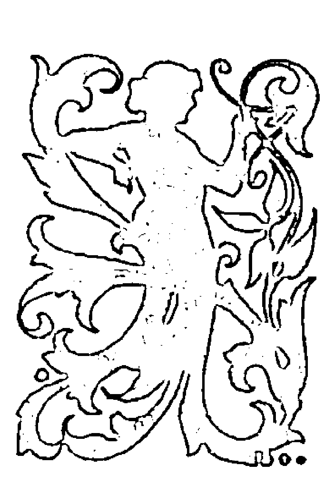

#### 三、B型人——感情丰富且幽默风趣
B型血的人性格直爽，开门见山，不讲心计，有爱心、同情心，愿意广泛交友，且交际能力强；做事不够理智，有时会凭直觉及主观印象，甚至会不计后果地蛮干下去；“重要的是过程而不是结果”在他们身上表现得最为明显。

##### B型之最
- 1. 最会自不量力，订下天大的目标，但方向感不够明确；
- 2. 最懒，好吃，有时说话不切实际，甚至会不考虑后果；
- 3. 最多情也最薄情，容易感情用事，但为人热心，最不会拒绝别人；
- 4. 最喜欢裸睡，最爱喝咖啡；
- 5. 最喜欢逛街购物。

###### 性格特征
多血质，开朗，善言辞，乐观。

###### 智力与情感
健谈，富有幽默感，能潇洒自如地吸引对方；感情丰富且真诚，充满激情，表现欲强，而且善于舞台表演；好奇心浓，不工心计；重现实，但情绪不够持久，有时略显孩子气。

###### 喜欢的对象
仪态娴雅，穿着得体，富有内涵，言谈举止得当，开朗向上，善于言辩。

###### 恋爱特性
B型人能够很恰当地将自己展示于人，总是给人留下较完美的第一印象，所以，仅凭初次见面的感觉，是难以判断B型人的态度的。

###### 作为家长
愿为家庭的幸福而全力付出，不计得失，并能取得良好成效，赢得孩子及孩子的朋友们的喜爱。

###### 作为朋友
充满热情，乐于结交朋友，而且关爱朋友，喜欢赞扬别人；激情饱满，容易兴奋，令人羡慕；不计较小事，能主动认错；讨厌沉闷，喜欢即兴的活动。

###### 对待事业
工作主动，愿意开拓新的领域，注重表现，有很强的创造力；朝气蓬勃，充满干劲，做事麻利，愿意与他人合作并鼓励他人的工作。

#### 四、AB型人——充满自信且热爱和平
热衷于和平运动，能够很热心地做一些公益事业，可以为了公众的事务奔波而不辞劳苦，不计个人得失。但是不太顾及他人意愿，做事独立性太强，自我意识过重，对于集体团队活动热情不够，有时会被人误解。

##### AB型之最
- 1. 最矛盾且敏感，机灵睿智；
- 2. 最奇怪，行动有时会出人意料，情绪易波动；
- 3. 最不果断，最没常性，且易激动；
- 4. 最偏食，吃东西时间不固定，睡觉时也不够安稳；
- 5. 最喜欢到处跑，不喜欢太固定的方式，时间观念不够强。

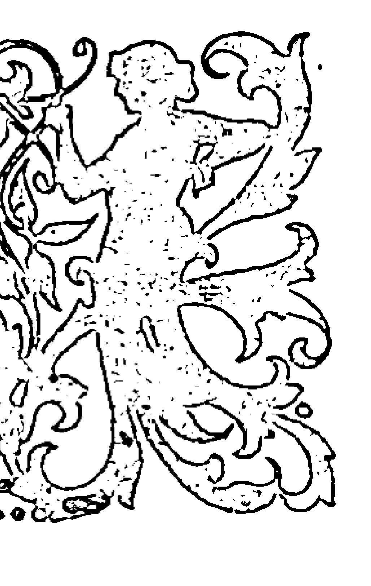

###### 性格特征
属于粘液质，沉着理智，不善于主动交友。

###### 智力与情感
通常会与世无争，对事物的处理不会太主观、太冲动，常以局外人的角色来调节事态或提出建议；做事理智而且有条理，最擅长于对事物作比较分析。

###### 喜欢的对象
体面有气派，清新爽朗但又不失朴素典雅，喜欢谈论有关学术性、艺术性的话题。

###### 恋爱特性
孤傲独立，即使直觉对方不错，也不会让对方有所察觉；通常会以平静且略显冷淡的方式处之，表面上好像漠不关心，但细心的人会注意到，当他仔细观察对方的行动时，就表示他已经对对方有好感了。

###### 作为家长
对于家庭责任能说到做到，以身作则；不会主动挑起矛盾；处理问题冷静公正，但热情不够。

###### 作为朋友
不会苛求于人，能努力维系友情，可是一旦发生裂痕便难以愈合。

###### 对待事业
自我意识浓厚，不喜欢哗众取宠，有随遇而安的倾向。

#### 五、O型人——追求浪漫且做事执着
不轻易做出决定，但通观全局后一旦下定决心就不会动摇；善恶分明，嫉恶如仇，值得信赖；在生活上追求情趣，重朋友，交往广泛。

##### O型之最
- 1. 最酷且追求时尚，做事执着不易动摇；
- 2. 做事最彻底，不留情面；
- 3. 最善言辩，爱恨分明且敢爱敢恨；
- 4. 最爱休息且嗜睡，不挑食；
- 5. 最喜欢饮酒，爱外出运动，如旅游。

###### 性格特征
黄胆汁，开朗、好动、豁达。

###### 智力与情感
意志坚如磐石，精力充沛且做事主动，积极要求改变现状；不易受情感左右；不怕失败，充满自信，能把握自己的一切；适于做领导者。

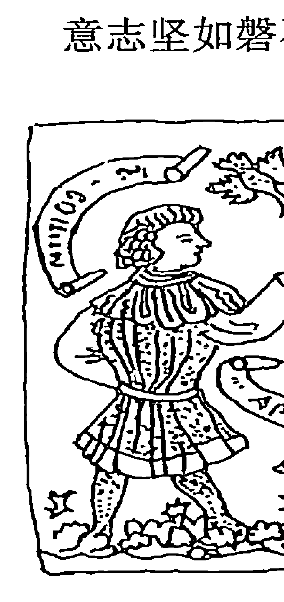
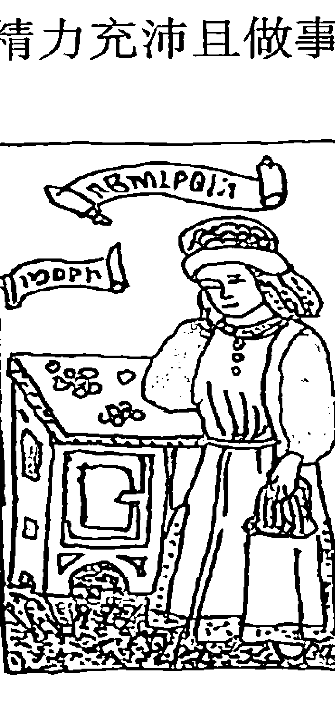
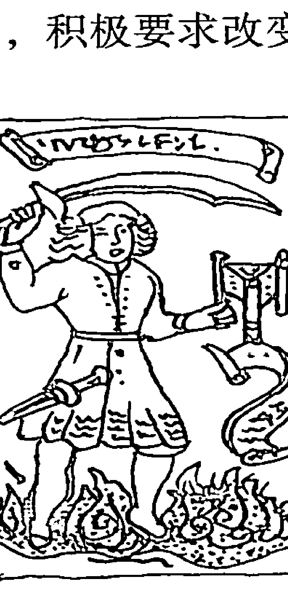
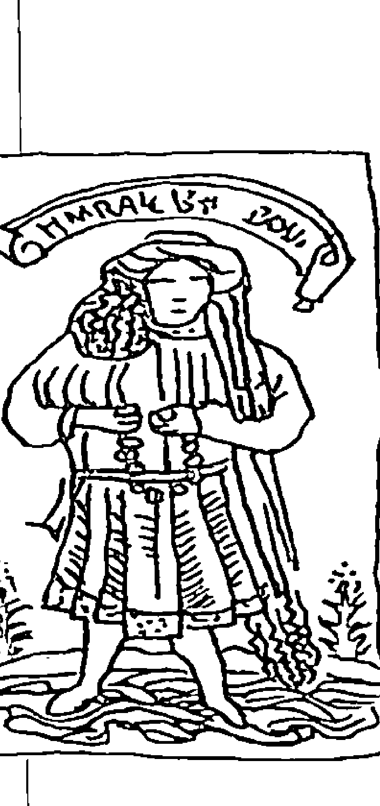

人类很早就发现，在我们身体里流动着的液体会直接影响生理和性格。中世纪还没有发现血型，但是产生了“体液学说”。以上是一幅中世纪木刻，专门反映不同体液所带来的性格特征。从左至右：多血质，抑郁质，黄胆质，粘液质。这与现代以来的血型学说相当吻合。

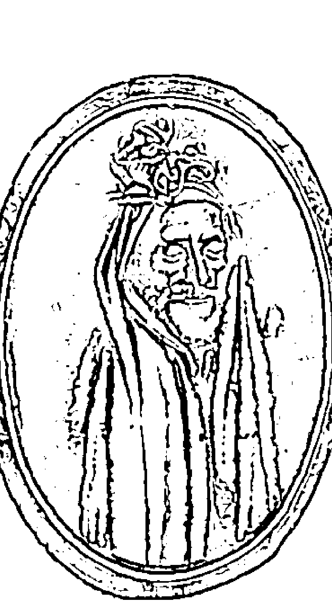

###### 喜欢的对象
能跟得上时代，充满自信，性格活泼，善于言谈而且富有幽默感。

###### 恋爱特性
海阔天空地交谈，把自己的优秀之处充分展现，如列举出自己的成就，以此来吸引对方，但有时会弄巧成拙，被人取笑。

###### 作为家长
乐于行使自己的权力，胸有成竹，目标明确，鼓励家人实践；善于持家，一切有条不紊。

###### 作为朋友
因主观能动性过强，朋友不会太多；但会非常重视朋友，愿意为大家服务；善领导及组织活动，不易出错，应变力强。

###### 对待事业
目标明确，做事实事求是，动作干练麻利；运筹帷幄，善于领导，能把握全局；不怕困难，一旦确定目标便勇往直前，不怕失败。

我们知道，人的血型、星座各不相同，有关血型、星座与人的详细内容将在以后各章中具体介绍。

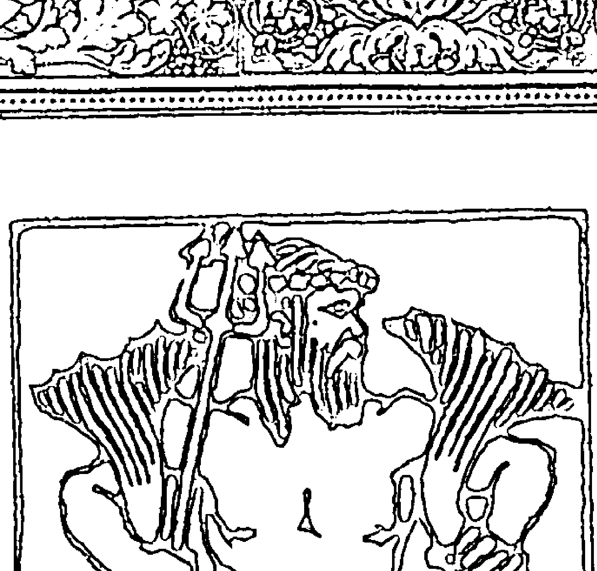

## 水瓶座
特征：理想主义，心怀仁爱；待人热情，富有亲和力；思想前卫，追求时尚的事物及生活方式。

### 第一节 水瓶座简介

#### 一、水瓶座的传说
女神荷蓓是负责宴会上为众神们倒酒的，但她最近的态度愈来愈傲慢，于是诸神们不想再让她担任倒酒的工作了。但是，宴会上没有人倒酒怎么行呢？

众神们让宙斯来解决这个问题。宙斯为此而伤透了脑筋。突然，他脑海中浮现出一个俊美的身影：“对啊！为什么不让被诸神评定为人间第一美少年的葛尼梅德来做这件事呢？”

葛尼梅德接到宙斯的命令后，便负责在宴会中斟酒的工作。

一天，宙斯在葛尼梅德的瓶子中倒入智慧之泉，告诉他：“如果你愿意留在这里服侍我，我会让你永远保持现在的俊美模样。”

宙斯原以为葛尼梅德会非常感动，但葛尼梅德却说：“我只希望能在人间过着平凡而快乐的日子。”宙斯没料到葛尼梅德竟然会违背他的意愿，就大声咆哮起来：“葛尼梅德！连我的话你也敢不听？！”

恼羞成怒的宙斯把葛尼梅德从特洛伊的皇宫里劫持到奥林帕斯山上，强迫他永远为诸神斟酒，葛尼梅德只好暗中寻找机会逃亡。

一次宴会之后，葛尼梅德看准机会，丢下酒壶，转身往奥林帕斯山下逃。但他毕竟只是个凡人，宙斯发现他逃走，只略施法力，便赶上了跑得气喘如牛的葛尼梅德。“你太不知天高地厚了！”宙斯在空中声嘶力竭地喝道，“我要惩罚你，让你在空中永远动弹不得！”话音刚落，葛尼梅德的身影便被定在了空中。他手中依然握着智慧之泉，但再也无法逃走了。

就这样，在南方天空中出现了由许多小星星组合成的一个星座，好像一个少年将水瓶里的水倾倒出来一般，这便是水瓶座。

#### 二、水瓶座(Aquarius)概况
生日：1月20日至2月18日

星座代表人物：
- 拜 伦（1月22日）
- 莫扎特（1月27日）
- 罗斯福（1月30日）
- 舒伯特（1月31日）
- 里 根（2月6日）
- 狄更斯（2月7日）

水瓶座是思想前卫、理性而自重的星座；不喜欢被条框限制，接受新事物的能力强，心胸广阔仁爱。与射手座不同的是：此星座的人更注重思想境界的升华。

##### 水瓶座的个性魅力
博爱和极高的艺术天分、不断创新的欲望，使你内涵丰富而又不易捉摸。同时，你又不失童稚之心，处事得当，使人不能不喜欢你。

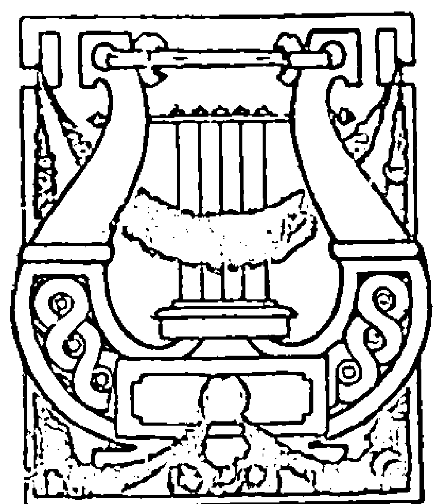

##### 水瓶座的性格特征
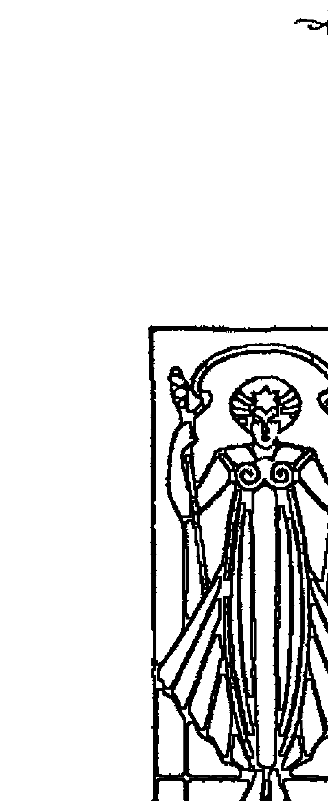

此星座有“天才星座”和“未来星座”之称。它的守护星是天王星，守护神是希腊神话中的智慧大神——乌拉诺斯，此神通晓天文、地理，并能预知未来。所以此星座的人具有远见，创新性强，聪明而富于理性，不保守，追求新的事物及生活方式。

水瓶座的你，理想主义和人道主义色彩非常明显。你倡导和平，充分尊重个性的发展，对人热情友好，珍爱每个人的生命。你不为旧制所绊，具有改革精神。你相信和尊重科学，推理力和创造力较强，遇事多三思而后行。

在与人交往上，你具有很强的亲合力，而且健谈。你对自己的信念很是执著，是个理想主义者，但值得一提的是，当遇到爱情问题时你就会变得非常实际。你不会特别拘泥于形式，所以可能会出现与情人同居的情形。水瓶座的你虽然个性突出，但并不张扬。

##### 水瓶座的财运
不拘小节的特性，使你对钱财不是很在意，年轻时更为明显，总是相信“千金散尽还复来”，所以容易浪费。成立家庭之后，你会慢慢地现实起来，并能不断积累财富，晚年生活较好。

##### 水瓶座的理想恋人
因为你才华出众，所以智慧型的人与你最为匹配。他(她)一定要具有较高的知识层次，善于言谈，能自如地应对各种场面。另外，因为你喜欢结交异性朋友，所以你的恋人要具有博大的胸怀，应该性情柔和，成熟而宽容。

##### 水瓶座的恋爱技巧
你总能给人以意料之外的惊喜。你非常重视感情，一旦爱神降临，便会不计回报地付出。与水瓶座的人相恋，要保持自己给他（她）的新鲜感，距离产生美，让他（她）捉摸不定，这会对他（她）更有吸引力。

##### 水瓶座小档案

| 守护星 | 天王星（象征智慧及变数） |
| :--- | :--- |
| 守护神 | 智慧之神乌拉诺斯 |
| 幸运石 | 红色石榴石 |
| 幸运色 | 青色度的蓝绿 |
| 幸运日 | 礼拜三 |
| 幸运数字 | 4、8 |
| 幸运地点 | 繁忙的地方和大都市 |
| 最欣赏的星座 | 双子座 |
| 最信任的星座 | 金牛座 |
| 最佳学习对象 | 狮子座 |
| 最佳工作搭档 | 双鱼座 |
| 最易被影响的星座 | 天蝎座 |
| 最易掌握的星座 | 双鱼座、金牛座、处女座、射手座 |
| 最需注意的星座 | 白羊座、巨蟹座、天蝎座、摩羯座 |
| 同类型（风相）星座 | 双子座、天秤座 |
| 对立星座 | 狮子座 |
| 80% 协调星座 | 水瓶座 |
| 90% 协调星座 | 白羊座、射手座 |
| 100% 协调星座 | 双子座、天秤座 |

##### 水瓶座女性的性格、情感
水瓶座的你不会随波逐流、人云亦云，为人处世有自己的原则。你的理想主义色彩十分浓重，让人觉得不够理智。有时你会做出常人意想不到的事情，以至于让人觉得不可理喻，这在爱情问题上尤为明显。你是个爱情至上的人，尤其当金星或月亮处在你的生辰天宫图中时。

你的爱情生活充满浪漫色彩。但一见钟情在你身上不易发生，因为你希望情感慢慢地积累沉淀，所以你的爱情常以友情开始。对你来说，时刻保持独立自主的乌托邦式的爱情生活更有吸引力，因此，如果想与你成为恋人或组成家庭，就必须要尊重你的人格独立。只有这样，你们的爱情之树才会常青不衰。

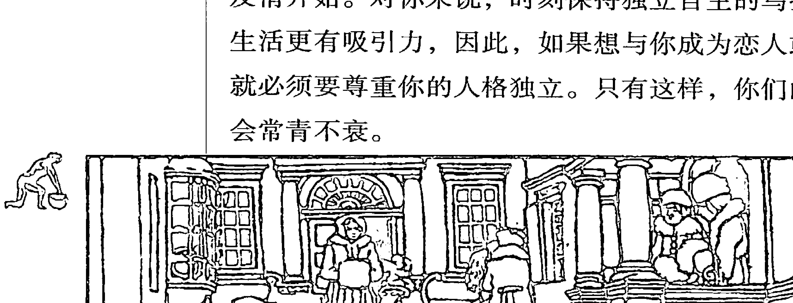

你心地纯洁，渴望理想化的完美爱情，但也可能因此而变得不通情理，显得你冷淡无情。要想让你的爱情永驻，对方就要时刻给你以爱的希望，不然爱情将一去不返。你一旦被丘比特之箭射中，便会全心付出，把自己所有的真诚、爱恋都奉献给自己的爱人，甚至连生命也在所不惜。

与水瓶座女性相宜的男性：双子座男性具有好奇心，而且待人热情真诚，会成为你理想中的恋人，共同的爱好会使你们生活美满；狮子座男性容易喜欢上你，你们会是志同道合的恋人或夫妻；天秤座男性的才智和对理想爱情的追求，也能激起你的爱恋。

##### 水瓶座男性的性格、情感
由于受土星影响，水瓶座男性的性格一般比较孤立，甚至会冷漠孤傲。你热衷于思考哲学问题，如：我来自何处？又去向何方？你极为理性，但不失幽默风趣，乐于与人沟通交流，并对一切充满了好奇。水瓶座男性中年的时候，可能会出现人生中较大的变动，甚至会改变人生之路，原有的生活方式，冲破一切去追求自己的理想。

水瓶座的你，内心世界丰富，并且让人难于窥视。通常，你会给人以质朴直爽的印象，但内心会有冲出世俗的激情，常会陷入矛盾之中。你待人热情，乐于助人，但在一些特定情况下，你会反应冷淡甚至不通常理。

你做起事来不愿循规蹈矩，不能接受太多的束缚。友情对你来说会重于爱情，因为爱情会在一定程度上束缚人，而且会使人痴迷而忽视了理智。但这并不意味着你会拒绝爱情，只是你有时会把爱情理想化，从而对现实的爱情打不起精神。

与水瓶座男性相宜的女性：狮子座女性会与你情投意合，她们都有王者之欲，且才华出众；双子座女性会与你和睦相处，并能从精神和事业两方面不断促你进步；天秤座女性温柔淑雅，富于个人魅力，能激发你的艺术灵感。

### 第二节 水瓶座与血型的关系

#### 一、水瓶座/A型

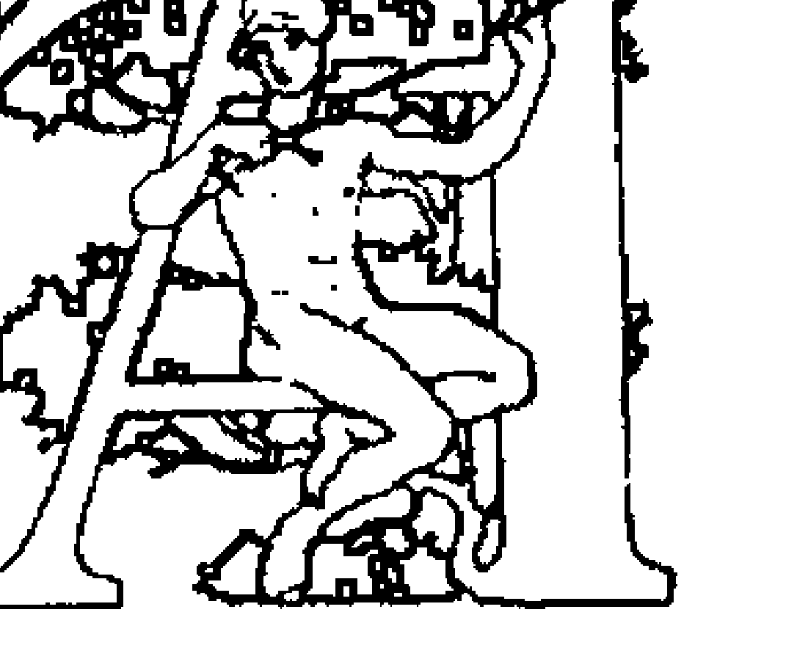

##### A型水瓶座的气质、性格
水瓶座本身带有一定的固执性，但不会轻易显示出来，所以你仍会给人以随和自如的印象。但A型血与水瓶座的结合，会让你的固执性显露出来。你会拥有细致的观察力、强烈的好奇心，但待人似乎不够柔和。你是性情耿直的人，从不屈服，对于逢迎阿谀的小人更是不屑一顾。

你感情细腻，对每个人都不会吝啬你的爱心。但你的弱点是过于理想化，从而会被人误认为缺乏情趣，觉得你有些冷傲。过于冷静及理智、太重视原则等特点，会影响你与周围人的关系。你的两重性格明显，如能扬其所长，避其所短，则能使你博得众人的钦佩与友情。

A型血与水瓶座的配合，实在是非同一般，因为这两者组合在一起，本身就是一组矛盾。所以，在你身上会时常显示出不和谐的因素，使你成为矛盾的结合体。水瓶座的人，不会满足于日复一日地重复每日的生活，而是喜欢空中飞鸟式的自由闲散；另外，水瓶座有很强的创新精神。但是A型血却有着与水瓶座相反的特征，大多思想保守，不想打破原有的平稳，优点是比较注意与人交流，是典型的遵纪守法之人。

A型水瓶座兼有以上两种特质，可以这样来形容：思想上的巨人，行动上的矮子。虽然你有独特的见解及思想，但在行动上却难于实践。多数情况下，你会选择较保守的方式，但又可能突然决定要有所改变。这让人觉得你是个充满矛盾的个体，即在思想和行为上不够统一，让人难以捉摸。

注意！不要把自己凌驾于现实之上，理想固然美好，但如果太过，则容易迷茫。要知道，现实是不可忽视的。

##### A型水瓶座的事业
在你看来，精神需求高于物质需要。你认为，事业是施展个人才华、展现自身价值的一种途径，而不是为了单纯的物质需要。管理大型企业，或任职于形式主义作风严重的职业场所，你是没有兴趣的；你性格潇洒，不愿受约束，所以，限制太多的单位会影响你才智的发挥。单调重复类似机器的工作，你是不能长久去做的。

水瓶座的你，才艺双全，如果能从事你所满意的工作，会取得很好的效果。比较适合你的工作有科学家、发明家、技术人员，此外，作曲家、作家、设计家、摄影家等职业都可以发挥你的长处。比较抽象的工作，如天文学、心理学、航空事业及文化传播业，也有你施展才华的空间。

注意！职业类别的选择固然非常重要，但职业环境的好坏也会影响你的成就。

##### A型水瓶座的财运
你比较重视精神需求，对于物质享受则没有太高的奢望。所以，你不会沉迷于赚钱的狂热之中，而是能够甘于平凡。纵然你有赚钱的天赋，也不会充分地去利用它。在你看来，衣食不愁就可以了，所以，即使你已经有了一定的财产，也不会意识到拿它来投资。你觉得金钱不是万能的，因为你看到了太多因追求钱财而失去人性的现象，你不想重蹈他人之覆辙。

对于钱财，你不是很在意，没有什么长远计划，如果你手里有钱，就会今朝有酒今朝醉。你没有意识到要把钱做为一种财产而保留，更想不到拿钱去生钱。但是，贵人自有天助，天王星是你的守护神，它会带给你意想不到的财运。所以，只要你认真对待事业和生活，财源便会如泉水一般涌来。

注意！利用你的才能多做一些工作，会使你的生活更宽松一些，但不要总把过多的现金带在身上。

##### A型水瓶座的爱情
“钻石恒久远，一颗永流传”，这便是你对爱情的态度，即追求永恒和完美。

在你心中，爱情是至高无上的。你不会因失去过爱情而拒绝爱情，也不会只停留在对性爱的追求上。你理智而冷静，能洞察到隐藏在爱情之中的私欲，所以你绝不轻言爱情。你的恋爱过程，通常是由友情逐渐发展成爱情，一见钟情很难在你身上发生。你不会轻易被谁迷惑，对于有功利色彩的感情，你是不屑一顾的。

即使身处爱河之中，你也会保持清醒的头脑，绝不会做出过火的举动。表面看来，你似乎并没有把爱情放到最重要的位置，可一旦遇到你所钟情之人，你便会毫无保留地付出一切，让对方感受到你的爱无处不在。但是，你不喜欢束缚，如果对方显示出要干涉你的迹象，你会很不高兴。在第三者看来，你或许有些不近人情，甚至冷漠。实际上，你所追求的爱情是以个体的独立为前提的，那种盯梢式的爱情是你最厌烦的。

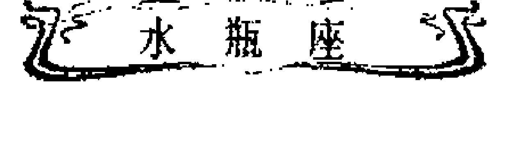

你对性爱的欲望不很强烈，不会让性欲支配你的行动。因此，你绝不会对一个自己不爱的人发生“性趣”，更不会陷入纠缠不清的婚外恋之中。你有很强的审美意识，注重品味，强调自我，即使在性行为的过程中，也会表现得若即若离，忽冷忽热，这会导致对方的失望。如果你能全身心地放松，可能会获得更好的效果。

你在性方面比较传统，但并不保守。你认为性是自由的，而且不反对同性恋，算得上是个解放主义者。但思想上的认可并不意味着你会把它付诸行动，你认为想一想是可以理解的，但要做就得深思熟虑才行。

注意！收敛一下你的任性与专横，回归天然，可以增添恋爱的情趣。

##### A型水瓶座的婚姻
在结婚的方式上，虽然你很想别出心裁一下，但最终还是会选择比较传统的方式举行婚礼。你虽然向往新奇，但对于婚姻这样隆重而严肃的大事，还是缺乏足够的勇气去尝试新的形式。

你提倡自由自在的婚姻生活，不喜欢给对方以太多的约束，甚至不反对分居，这在很多人看来是不可理解的。当然，你在追求个人理想境界的同时，也会顾及到现实情况，虽然会有奇奇怪怪的想法，但不见得带来让人无法接受的行为。

为，最终还是会屈服于现实。

注意！不要因为任何原因而草率结婚。要知道，不够慎重的婚姻是难以幸福的，两情相悦才有幸福可言。

##### A型水瓶座的家庭

A型水瓶座的你，希望配偶能够理解并支持你，这样你也会从家庭中汲取力量。在家庭生活中，即使你心有不满，也不会显露出来。在你看来，应该求同存异，如果双方都能以大局为重，家庭生活便可稳固发展，而对于子女来说，这样的家庭也会给他们带来无穷的乐趣。你希望家人能够如同朋友一般，所以你不会以家长的身份来肆意地指东道西。夫唱妇随，彼此宽容，这样建立起来的家庭会是美满幸福而令人羡慕的。

在处理家庭矛盾时，你会以宽大的胸怀去体谅对方。你希望家庭生活平静而美满，所以不会横生事端去制造战争。虽然你有可能发生婚外恋，但那往往是如朋友般的感情，不会危及到家庭；即使最终影响到了家庭而离婚，也绝不是因为你做了什么越轨之事。

#### 二、水瓶座/B型

##### B型水瓶座的气质、性格

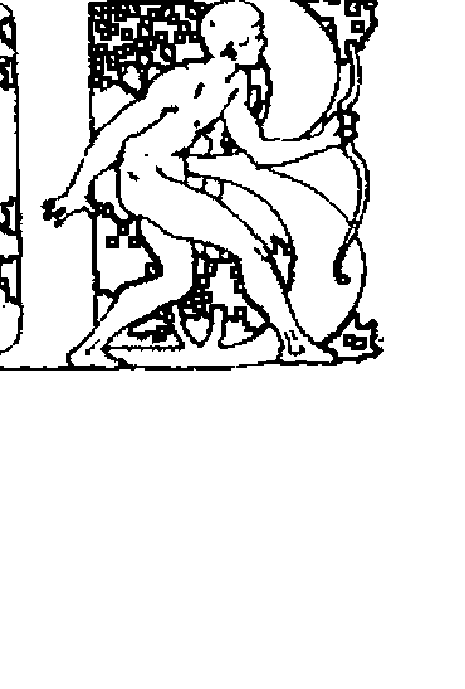

B型水瓶座的你，关注全人类、全世界的风云变化，具有高瞻远瞩的胸怀，不会受现实的羁绊，更不会利欲熏心。你有着不同凡响的能力，但同时也清晰地认识到个人的能力是有限的，对于人类世界甚至整个自然界来说，个体就如大海中一滴水那样微乎其微。你认为，个人价值的体现便是如何为全体而付出。

你有着很强的求知欲，对于宇宙、自然或一切未知的现象，都想去探索一番。对于你所不能解释的现象，你会十分执著地去研究。你会用科学理性的观点去看待你周围的事物，决不会糊里糊涂、人云亦云。所以，做研究探索的工作对你是非常适合的。不过，你太喜欢刨根问底，而且又不易听取他人建议，所以会让人认为你有高谈阔论的爱好。你会突发奇想，但常常不太实际。你自己也能体会到，你之所以不被人认同，是因为你的思想太过超前，无法在短期内实现，从而更使常人无法企及。

你对于自由的追求是很强烈的，任何束缚对你来说都难以忍受。在你看来，功名利禄皆是身外之物，你不屑于去追求，甚至连爱情和婚姻，你都采取不冷不热的态度。你不希望有太多的限制，而是喜欢让理想插上翅膀，自由地翱翔。

如果你真想达到这种境界，那你就必须时刻保持人格的独立，同时还要不受世俗的影响，不然，你的追求将会与现实相矛盾，你的人生之路也会由此而不够平坦。所以，你应该客观地看待现实，把自己的理想与现实结合起来，这会更容易取得切实的成效。

注意！重视独立的人格，就要忍受孤独，并把现实与理想最大限度地调合起来，不要因为过于追求理想境界而忽略了现实的美好事物。

##### B型水瓶座的事业

B型水瓶座天性喜好自由，所以最好选择能自由发挥的工作；而过于刻板或保守的工作，最好不要去尝试。另外，已被别人计划好的工作也很不适合你，因为这种工作不利于发挥你之所长。自由业可能更适合你，做个自由老板会有不错的前景。总之，你在选择事业时，一定要考虑到自身特点，只有能够充分展示你自己的职业，才能让你有英雄用武之地，才会有一番成就。

比较适合你的职业如：科研、广告、大众传播、出版业的策划与制作、评论家、广告撰文、设计师、美术、音乐等等。不适合你的职业如：事务性工作或手工艺，因为这些工作不利于你创造力的发挥。通常情况下，你遇到失败会丧失信心，从而采取退缩或放弃的态度。其实只要你再努力一番，就很有可能柳暗花明又一村了。

注意！自由创业很适合你，要充分发挥你的创造特长，施展你的才华。

##### B型水瓶座的财运

对你来说，别人带给你的财运有时会比你本身的财运更强。所以，你应该不断扩大人际交往面，并让人注意到你的优势，一旦遇到伯乐，你就会财源滚滚。但在拓宽人际关系时，要注意节俭，这是你改善财运的关键之处。你的财运不错，但因为你不会盲目拜金，所以你不容易大富大贵。

你认为，赚钱只是一种能让自己更加快乐和自由的手段，所以你不会过于看重金钱。你很少储蓄，时常给人以浪费的感觉。在你看来，友情远远重于金钱，因此你花在交际上的费用不是个小数目。有些人可能对你的过分豪爽有些不满，但你并不在乎，而你的朋友们则因为了解你而对你的潇洒作风大为赞赏。

注意！你对金钱的忽视，会使你空有好运气，最终得到的财富并不太多。如能学会理财，会使你的生活更好。

##### B型水瓶座的爱情

B型水瓶座的你，爱情淡如丁香，恋至生死的狂热在你身上较难实现。虽然你对求知有绝对的热情，但对感情却很淡然，较少激情。这是因为你重视的不是儿女私情，你的精神境界更为高远，你所关爱的是全人类。

B型水瓶座的你，豪爽而坦诚，珍重每一份友情，因此朋友众多。在爱情方面，你没有独霸心理，所以轻易不会直接追求谁，对你来说，水到渠成才是上策，因此，你的爱情会是日久生情式的。最初两人在一起，必如朋友一般交往、谈心，不会谈论风花雪月及儿女私情。
你不反对性爱，所以有可能由情而生性。有性之后，对方并不一定能将你牢牢拴住，它可能只是增添了你们之间的情意而已，但也可能一切依然如旧。基于此，即便你与对方分手了，也不会过度悲伤；而且，你的分手会是快刀斩乱麻。对于感情，你不会过多地沉迷其中。这说明你很早熟。实际上，很多 B 型水瓶座的人对性都不太保守，可能会较早地体会性经历。
你思想开放，并不拒绝由性而生情，但是，你不会因此而将自己归属于谁。反过来说，你也没有控制情人的欲望。“己所不欲，勿施于人”，你希望别人也如此对待你。所以，如果你的情人想要全身心地控制住你，那他（她）一定会适得其反：你会因此而十分不悦，甚至会立刻与情人分道扬镳。所以，能和你相交的情人，都会和你有着同样的特点。
注意！律人先律己。你在向别人提出要求时，应该首先想想自己能否做到。有付出，才会有收获，爱情更是如此。

> “己所不欲，勿施于人”

##### B型水瓶座的婚姻

B型水瓶座的你，不想过多受限于婚姻。你的观念比较前卫，不在意传统意义上的夫妻分工。在形式上，你会自由恋爱而结婚；你崇尚自由，那种古老的相亲方式，你认为不够自然。你晚婚的可能性更大一些，如果太早结婚，你也许会受不了家庭的束缚，从而使婚姻不够幸福，甚至会以悲剧结束。一般看来，B 型水瓶座的人对自由的婚姻非常向往，即使组成家庭之后，也希望各自独立，能自由地追求自己的理想。因此，B 型水瓶座的人应该在充分享受过单身生活之后再考虑结婚。

此型的你，在选择配偶时，最好能选择和你性格相近的人。如果比较保守的人和你在一起，生活情趣会大打折扣。尤其是女性，会因为向往自由而被丈夫误解，甚至导致婚姻失败。因此，在择偶时一定要三思而后行。B 型水瓶座的你，一旦寻觅到理想中的伴侣，就会与之厮守终生，婚姻会相当稳固。

注意！如果你必须要在工作与家庭之间做一选择的话，建议你以家庭为主，待来日有机会时再立业也不迟。

##### B 型水瓶座的家庭

你强调尊重家庭中的每个成员，并给他独立自由的空间。当家庭内有矛盾产生时，你决不会通过争吵来解决问题，所以，你的家庭会不见硝烟，气氛会十分活跃。你的乐观开朗必然会影响家庭中每一个人，防止矛盾的产生。此型的你，不会过多纠缠于柴米油盐等琐事。你不奢求非富即贵的生活，所以即使生活中有些小小意外发生，你也不会因此而觉得生活拮据。总的来讲，你的生活会是稳定而幸福的。

B 型水瓶座的女性有着大度的心胸。你赞成自由的生活，而且重视自身价值的实现，比如外出找工作实现自己的理想。如果想让你做一个全职家庭主妇，你会坚决反对。不过你要注意，追求理想是可以的，但不能因此忽视了家人。要在追求自身价值的同时，保有对家庭的关爱，这样才会鱼与熊掌兼得。

B 型水瓶座的男性在家庭中不会摆出家长的架子，你也不希望妻子过多地干涉自己，一些鸡毛蒜皮的小事，你会让夫人去处理。

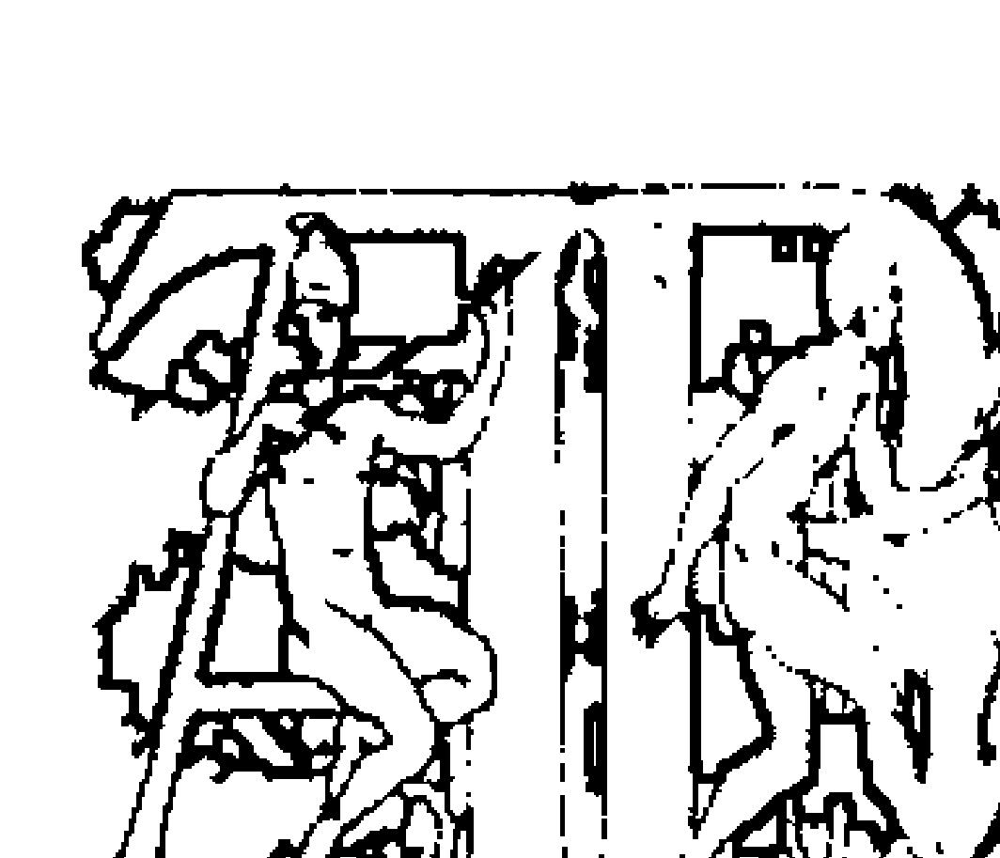

#### 三、水瓶座／AB型

##### AB 型水瓶座的气质、性格

AB 型水瓶座的你，可以用一部井然有序的机器来比喻，就像一台精密的电脑。在十二星座里，你可称是“智多星”。你的突出特征就是“理性”，无论何时，你都会拥有理智及客观的态度。对于生活，你总是保持着敏锐的洞察力，但却不会被其所累，非常超然。

AB 型水瓶座的你，习惯于以科学的态度为人处事。别人一开始接触你时，往往会感到有些不适应，因为大多数人不太接受过于理智而又苛求完美的人。因此，你可能会时常被人疏远，让人觉得你不够感性。但如果他们能和你相处一段时间，就会感受到你的和蔼可亲、善解人意。水瓶座本身具有的友善和好人缘，能够帮你走出困境，你身旁的人也会因为对你的了解而改变原有的观点，最终会被你所征服，成为好朋友。

遇到问题，你总是可以换不同方式思考，即使再复杂的问题，通过你的多角度分析，也能做出正确判断，这是你的过人之处。所以，人们有问题时会很自然地想到你，他们信任你的能力，于是求助于你。你活跃的思想、独到的见地，常会让人刮目相看。

你的性格也与众不同。你思考问题的角度，不拘于常理；你所从事的事业，也大多独具创造精神。在他人眼中，你是杰出的，你超常的理性让你总能预知于他人之前，让别人只能在后面不停地追赶你。用“先知先觉”来形容你是非常适合的，因为你总会比别人更早地找到问题的关键。

当你把构想付诸行动时，通常会打破常人做事的方法。这既是你的优点，但也有可能成为你的弱点。在强调自我的

##### AB 型水瓶座的事业

如果你喜欢某项工作，那么在熟悉情况之后，你会发挥独特的作用，给整个工作带来意想不到的进展。你的个性使得你不会长期地委屈自己，如果你不满意现有的工作，就不要留恋一时的平稳及收入；纵然你会因此而不断转业，但只要能在最后获得成功，那就值得一试。道路是曲折的，但前途是光明的。

最适合你的职业，是能够让你自由发挥的工作，充满艺术气息或是不受太多约束的自由业比较适合你，如：作家、记者、大众传播及处理流行咨询的工作，这些职业能扬你所长。

注意！不要委屈自己做不感兴趣的工作，否则难以自由施展你的才能，难以实现你的抱负。

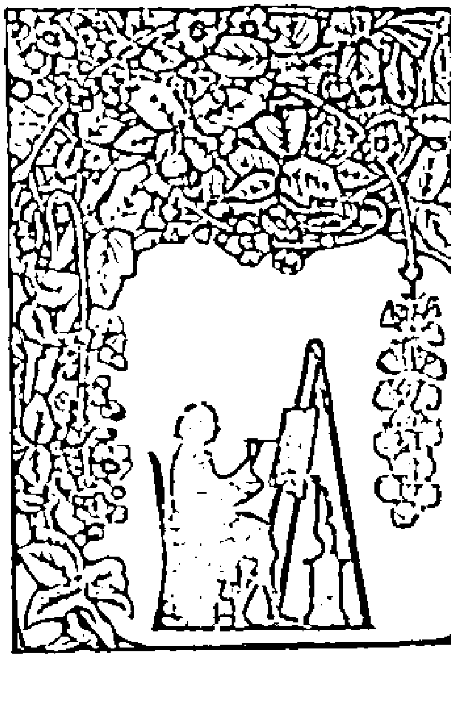

##### AB 型水瓶座的财运

你会有高过一般人的收入，但你为了追求生活的质量，支出也会高于常人。你对金钱不够重视，所以财富在你身上来去匆匆。AB型的人大多不愁衣食，但因为不重视财富的积累，理财能力较差，再加上出手阔绰，所以手头总是难以拥有大量财富。建议你要学会理财，这样才可使生活更有保障。庆幸的是，你天性乐观开朗，不管是否有钱，都不会影响到你的情趣。

如果你能成为富翁，那往往不是因为事业。你良好而广阔的人际关系，常常会给你带来出人意料的财富。另外，你在赚钱方面有自己独特的方法，例如，靠发明或事业上的成绩得到金钱资助等。

注意！加强你的理财观念。要拥有一定的储蓄，以备不时之需。

##### AB型水瓶座的爱情

在你看来，爱情是双方自然而主动的吸引，不应该有所谓的牺牲或是迁就。你的爱情会极为自然地萌发。虽然你的爱情可能没有波折，并不惊心动魄，浓情蜜意也不甚多，但是由于你能真心付出，照样会有幸福美满的家庭。

AB型水瓶座思想超前，知性十足，这在你的恋爱观中体现得较为明显。爱情对你来说，是从友爱不断发展而来的。在你身上，刻骨铭心的生死恋发生的机率较少，但当心仪的人出现在你面前时，你也会及时抓住。在恋爱过程中，你们会彼此信赖，忠于对方。世俗的择偶标准并不会限制你，在你看来，爱情是彼此间心灵的照耀，外在形式合适与否并不重要。

你的恋爱过程与一般人不同，总的来说是理智而冷静的爱情。一见钟情的浪漫情怀，以及旷日持久的爱情游戏，很难在你身上出现。你的爱情开始的时候，可能连你自己都不能分清是友情还是爱情，你们会由朋友做起，经历一段时间之后，才发现原来彼此才是最好的人选。你不会刻意地追求罗曼蒂克情调，但这并不意味着你轻视爱情，实际上，你是把爱情看得太过神圣，因而不想轻涉爱河。

对于性，你并不保守，但决不会被性欲支配而丧失理智。肉体上的欢愉并不是你的最终目的。你认为，由情而生性，才是顺理成章。那种以性为目的的追求，是你所不齿的。

注意！让自己再浪漫一些，充分享受爱的激情吧！

##### AB 型水瓶座的婚姻

对你来说，婚姻只是一种外在的形式，对你不会有太大的约束力。你认为，夫妻之间应该有精神上的共鸣，同时又要保持相对独立的自由空间，这一点更为重要。这种想法并不表示你会随便地对待婚姻，当你迈进结婚礼堂之后，理性会让你意识到身为丈夫或妻子的神圣职责。在向往个人自由的同时，你同样会责无旁贷地担负起自己应尽的责任，成为一个理想的伴侣。

由于你自由开明的恋爱观，那种靠父母之命、媒妁之言而促成的婚姻，你是概不接受的。你的理想婚姻是双方自由自愿的结合，不需要任何附加因素。“男大当婚，女大当嫁”的说法在你这里是行不通的。你不会轻易步入婚姻的礼堂，你所爱的人应该是让你敬重、喜爱，而且能携手同老的人。

##### AB 型水瓶座的家庭

在家庭生活中，你不会比婚前有太多的改变，你会一如既往地对待对方，强调平等的夫妻地位。你不会是摆大男人架子的丈夫，也不会是万事依赖别人的妻子。你希望保有婚前的自由，彼此不要太多限制。此型的女性不会甘心放弃职业而成为家庭主妇，而是会继续进步并追求梦想。

事业与家庭生活之间的矛盾，你能通过你的聪明才智逐一解决。但要注意的是，不可对副业投入太多热忱，以免使婚姻关系发生危机。AB 型水瓶座的婚姻多是幸福的，但偶有失和，就难以挽回，想要勉强维持现有关系是很困难的。你的理智会告诉你：长痛不如短痛。另外，你的自由特性也会使你尽快和对方分手。如果不想让这样的悲剧发生，就要努力使夫妻拥有共同的朋友及社交圈子，这样，遇到问题时可以共同面对，有效预防悲剧的发生。

注意！夫妻要力求建立共同的社交圈，当发生问题时，不要过多强调自己的立场。

#### 四、水瓶座/O 型

##### O 型水瓶座的气质、性格

你开朗直爽，人缘极好，朋友们都乐于与你相处，不愿分开，一旦离别，会产生无尽的思念。你重视这份情感，善待生活中的每一个人。你喜欢思考，善于创新，能为别人所不为之事，令人耳目一新。所以，任何人与你相处，都会感到生活的快乐和新意。值得一提的是，有时候你过于标新立异，言行显得有些古怪，会让人始料不及。

友情对你来说极为重要。与人相处时，你会设身处地为对方着想，让对方在充分自由的空间内与你交往。同样，你也希望自己能够自由自在，如鱼游水不受羁绊。O 型的人本身就具有广泛的社交性，所以，不论任何场合，只要有你在，就不会冷场，而且会气氛活跃。如水的清澈自如，使你与人交往起来游刃有余。

水瓶座非常理想化，但你并不会脱离实际，而是能够将现实与理想相结合，调整自己的心态和情绪。因此，即使你看起来有些松散，但绝不会玩世不恭、虚度年华。你会珍视现实生活中的每一天，同时对未来充满希望。O 型的现实主义与水瓶座的理想主义在你身上得到和谐的统一，这正是你的过人之处。

处世圆滑、务实主义在你身上也有所体现。O 型人大多性格随和，因此，与人难以相处的情况在你身上极少出现。水瓶座是有些脱离现实的，但 O 型血质恰恰对此加以调和，从而使你刚柔兼备。

你会积极地追求理想，哪怕身处逆境，阻力重重，也不会轻言放弃。虽然你有时言辞欠妥，但最终能把握尺度而不被人讨厌，因为你虽然情绪上已慷慨激昂，但却能保持头脑的冷静，能够比较理智地审视自己的言行。

你对周围的一切都极为敏感。在生活中，你会以得体的言行展现个人魅力，表现出与众不同的特质。你的真诚与坦率能使与你交往的人感到自然放松，所以交往的人会非常广，这一长处使你受益匪浅。

注意！对待朋友一定要一视同仁，让他们感受到你的情意，千万不要让你的朋友觉得你厚此薄彼。哪怕是对自己讨厌的人，也要保持基本的礼节。

##### O 型水瓶座的事业

你思维敏捷，能很好地处理人际关系，并且将这种良好的人际关系运用在工作上。但是，水瓶座有一种特性是思想观点比较激烈，如若不加注意，会影响到你与人相处的气氛，甚至会与人发生矛盾。

你时常有标新立异的想法，建议你将其付诸工作之中。O 型水瓶座的你，会用有别于常人的眼光看待周围的人和物，善于想象和创新。你会将别人不在意的事物拿来研究，把它们加以调整，取得意想不到的成功。

你的另一个优点是有着极强的感染力和凝聚力。在工作中，你不喜欢受到太多束缚，如果你的领导比较专横，那你决不会为了金钱而屈服于他，你会宁肯丢掉饭碗也不会委屈自己的尊严。你不太喜欢类似于政府机关的事务，那会让你感到枯燥无味。为了缓解事业上的厌烦，你会发挥你性情温和的长处，主动与周围人来往，并真诚地对待他们，这也会使你的事业获益不少。

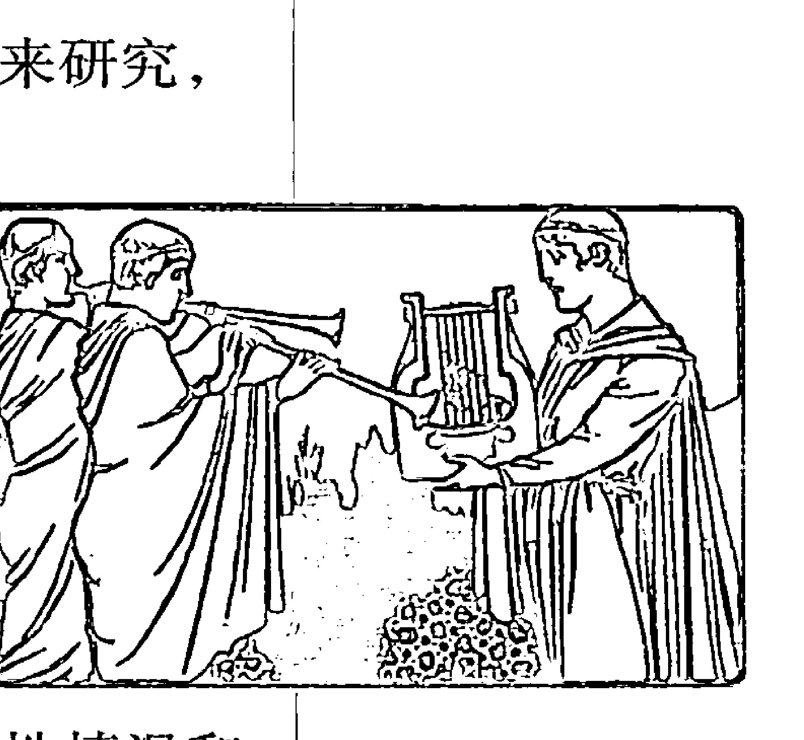

比较适合你的职业如：艺术家、作家、医生、发明家、节目主持人、科学家、律师、飞机驾驶员、天文学家。注意！发挥你的独特想像力及创新精神，那么你的成功会指日可待。

##### O 型水瓶座的财运

O 型水瓶座的你，功利心不重，对于金钱和社会地位并不向往，因此颇能安贫乐道。由于对金钱没有过多兴趣，所以不善于储蓄。你对亲朋好友慷慨大方，会对你倾你所有。为了事业或是爱好，只要能达到你的理想，你会不遗余力地去付出。你相信“千金散尽还复来”，追求的是完美的效果。

你相信，只要付出就会有回报，努力耕耘的背后肯定是丰硕的成果。也许你并不腰缠万贯，但你的才智再加上你的知己，会使你生活得舒心而快乐。年轻的你，不需要刻意储蓄，但如果你能合理地用手中的财富来投资，你的付出肯定会有很大回报。你会拥有一笔珍贵的财富，当然不只是物质上的。

注意！不要把钱锁在柜子里，那样它是不会生财的，要想办法让钱活起来，这样才有可能创造更多的财富。

##### O 型水瓶座的爱情

O 型水瓶座的你，爱的方式与众不同，常常别具匠心地想出新鲜而有趣的办法。你会很注意约会时的仪表，与恋人在一起时你会非常有情趣，让你的恋人时刻处在轻松愉快之中。你的示爱方式会很直接，开门见山地表达你的情感，爱就爱了不爱就算。因此，如果对方不够直爽，你会不喜欢。你不愿拖泥带水，即使恋爱失败让你心如刀绞，外表上也会显得很坚强，装成无所谓的样子。

O 型水瓶座的你，恋爱经历会充满浪漫色彩。你会满怀遐想，把自己放在“海阔凭鱼跃、天高任鸟飞”的境界里。
在恋爱时，你不会轻易把情感托付于人，但会很顾及对方的感受。虽然你会在选择之初慎重考虑，但不会落入俗套而讲究门当户对，爱的感觉在你心里才是第一位的。你追求浪漫，所以音乐会、剧场、美术馆都会是你的约会佳处。你认为艺术会陶冶人的性情，能提高爱情质量。

对于 O 型水瓶座的你来说，情重于性，你会满怀激情，但却会理智地把握自己的行动。你坚信“两情若是久长时，又岂在朝朝暮暮”，因此，哪怕是激情燃烧之时，你也会保持冷静的头脑，不会做出失态之事。你很重视床笫之间的柔情蜜意，并对此充满希望。因为你的浪漫，你会尽可能想出更多的办法来营造罗曼蒂克的气氛。

对于爱情，你不会不计后果地去追求，追求的不是冒险和刺激，而是相对稳定的情感。值得一提的是，水瓶座本身具有很强的逆反性，一旦这一特点表现在性上，就可能发生有悖常理之事。

注意！即便是在情深之时，也不要盲目崇拜。如果能放下自己的架子，尤其是在性方面更主动些，则会更加完美。

##### O 型水瓶座的婚姻

O 型水瓶座的你，因为在恋爱过程中已经很现实而理智地了解过对方，所以，一切会顺理成章地发展下去。但你有时会太注重理性，这会影响到双方的感情。在组成现实的家庭之后，矛盾会显现出来，你可能会被日常生活中的琐事所累，感到有些失望。这时候，你会考虑非常实际的问题：“他(她)的工作有保障吗？”“我当初应该再慎重一些，他(她)真的最适合我吗？”诸如此类。要知道，世间事物无完美，婚姻一旦确立，那么脱离现实的理想就应该克制。婚姻生活是否幸福，关键在于两人婚前的爱恋在婚后能否继续发展，婚后如能不断温情，时常给爱情之树灌以营养，那么现实中的琐碎之事也会自然化解。

你对恋人应该有长远的考虑，在你认为胸有成竹之后，才可以论及婚嫁。三思而后行，婚姻才会平稳维系。在现实生活中，要注意培养自己的情趣，这样才能使过于琐碎的婚姻增加一些浪漫。

注意！你有极强的想像力和表现欲，这是你的长处；但要量力而行，否则会适得其反，让家人有疲惫之感。

##### O 型水瓶座的家庭

O 型水瓶座的家庭不会缺少生趣。你性情豪爽，不保守，会努力寻找生活的乐趣，以此心态组成家庭，你的家庭必能保持新鲜和活力。你是很重感情的人，对于爱人和孩子，你会尽可能地与之融洽相处，与他们真诚交流，所以你会有个令人称赞的和睦之家。

如果家庭内部发生矛盾，你会挺身而出，毫不拖拉，果断地处理问题，不会对矛盾置之不理而任其升级。不过，你偶尔也会出其不意地做出一些决定，使家人不甚理解。你可能会沉迷于某种事物，从而忽视了家人，甚至会让家人担心。还好，你是重视家庭的，当你发现自己已经远离了亲人时，会主动回归家庭。总的来讲，你是个重视家庭、有责任感的人，你的家庭会因为你的努力而更加和美。

## 双鱼座

特征：情感细腻，多幻想，常把自己放在自创的梦境中，是十二星座中最多情的；洞察力强，柔弱而神秘，令人爱怜。

### 第一节 双鱼座简介

#### 一、双鱼座的传说

掌管爱与美的女神阿芙罗狄特带着爱子厄洛思在河边散步。她正在教厄洛思体验大自然之美，以此让他心里自然而然地散发出爱意。碧蓝的晴空，翠绿的草地，清澈的河水，悦耳的鸟声，盛开的百花，还有什么比这更令人沉醉呢？

母子俩自由地徜徉于大自然中，却没发现一双恐怖的绿色眼睛正瞪着他们。它就是曾经大闹诸神宴会的怪物“地疯”，这天它睡够了，离开洞穴到外面伸懒腰，没想到正好碰上阿芙罗狄特母子二人。

地疯满怀恶意地想：“既然他们这么高兴，不如让我送他们一件永远难忘的礼物！”于是他猛地在母子二人身后大喊一声，并且做了一个鬼脸！

“啊！”阿芙罗狄特吓得花容失色，急忙抱起厄洛思跑到河边，纵身一跳，水流中马上多了一大一小两条鱼。她用一条银色的丝线将他们的尾巴绑在一起，这样一来，他们便不会分开了。

阿芙罗狄特和厄洛思的母子深情感动了宙斯。宙斯把他们变成鱼后的身影放在天空中，成为双鱼座。

在十一月下旬的南方天空中，当夜幕低垂时，会出现两条鱼的形状，在两条鱼之间，还有一条带子将他们连在一起，这便是双鱼座。

#### 二、双鱼座(Pisces)概况

生日：2月19日至3月20日

星座代表人物：
- 华盛顿(2月22日)
- 查理五世 (奥匈帝国皇帝) (2月24日)
- 雨果 (2月26日)
- 伊莉莎白·泰勒 (2月27日)
- 贝尔 (电话发明人) (3月3日)
- 周恩来 (3月5日)

双鱼座情感细腻、富于幻想。此星座的人常为情字所困，多愁善感是其突出特征。天性柔弱，但乐于奉献，绝不会随意中伤他人。

##### 双鱼座的个性魅力

你因为过于浪漫而显得不够理智，但却因此而带有一股不可阻挡的魅力。丰富的想像力和同情心，让你看上去既神秘又让人不由自主而生怜爱之情。

##### 双鱼座的性格特征

双鱼座有着深沉而厚重的历史感，其中包含了太多的内涵，所以在情绪方面起伏非常大。你天性敏锐，富于文学修养，感情细腻，这种种素质组合到一起，使你拥有了无与伦比的艺术天才，在音乐方面更为突出。

双鱼座的人充满神性、魔性，理解力和观察力都极强。但你自我约束力较差，又善变，这使得你具有不够果断、缺乏自信、神经过敏的缺点。双鱼座的女人更是柔情似水、百媚千娇。双鱼座的星座形态是两条鱼，但各往相反的方向游，一只向上，一只向下：没有比这更能代表你特征的事物了，它准确而形象地体现了双鱼座的复杂性格。

你常会不自觉地陷在灵与欲之间，把自己放在一种自创的梦幻里。你充满幻想，而且会常将这种幻想的情结移到现实之中，让人觉得你不够现实。你是仁爱的，有着舍己为人的牺牲精神；你敏感、善良、慈爱、宽容、不求名利、柔顺，而且感情异常丰富，称得上是十二星座中最“多情”的一个。

##### 双鱼座的财运

你的性格使你容易轻信于人，所以在为人处世方面要多加小心才是。你对于金钱的重视程度不够，而且经济观念淡薄，花起钱来没有计划，所以你有时会为钱而烦恼。

##### 双鱼座的理想恋人

双鱼座天真纯朴，甘于奉献。纵使被骗，仍不思后退，不计对方过失。这样看来，诚实且忠心的恋人是最适合你的。至于那些甜言蜜语却没有真心的人，你一定要退避三舍。你的恋人要具有包容力，这样才不至于因你易动肝火而离开你。

##### 双鱼座小档案

| 属性 | 内容 |
| :--- | :--- |
| 守护星 | 海王星（象征着高超的幻想力） |
| 守护神 | 希腊—波西顿 |
| 幸运石 | 血石 |
| 幸运色 | 各种色度的薄荷色 |
| 幸运日 | 礼拜五 |
| 幸运数字 | 5、8 |
| 幸运地点 | 海边或近水的城市 |
| 最欣赏的星座 | 巨蟹座 |
| 最信任的星座 | 双子座 |
| 最佳学习对象 | 处女座 |
| 最佳工作搭档 | 白羊座 |
| 最易被影响的星座 | 射手座 |
| 最易掌握的星座 | 白羊座、双子座、天秤座、摩羯座 |
| 最需注意的星座 | 金牛座、狮子座、射手座、水瓶座 |
| 同类型（水象）星座 | 巨蟹座、天蝎座 |
| 对立星座 | 处女座 |
| 80%协调星座 | 双鱼座 |
| 90%协调星座 | 金牛座、摩羯座 |
| 100%协调星座 | 巨蟹座、天蝎座 |

##### 双鱼座的恋爱技巧

你感情细腻而敏锐，才艺双全，有着天生的艺术细胞。你待人慈善，热情诚恳，而且容易为情所动。你对于外界诱惑的抵制力不够，所以要注意控制自己，这样才能最终获得美满。

##### 双鱼座女性的性格、情感

双鱼座女性柔情如水。你易于与人相处，生来就具有让人难以抵御的非凡引力。你是一个浪漫而富于幻想的人，总是对生活充满热望，但你的应变能力较差，需要有人怜爱和保护。你与别人不同的是，你喜欢由别人把一切都安排好，而不愿自己去费尽心机地思考。所以，你就像天真可爱需要人照顾的孩子，你希望爱人能时刻将你视为珍宝。

你会用你的一生去追求，让自己的生活丰富多彩。也许你的恋人并不是你的梦中情人，但你还是会热情、真诚地投入他的怀抱。你对于爱情是忠贞的，甚至会为此而不惜一切。因此，你的爱情生活会充满神秘色彩，你可能会走向两个极端：要么一切由人，要么全力追求柏拉图式的爱情。

虽然你性格柔弱，但在激动人心的大事面前，或遇到什么突如其来的变故之时，却能够保持稳定的情绪，这是常人所不及的。不过，在日常生活中，你的性格不够稳定，会让人觉得有些反复无常。你很容易被人用感情所左右，从而听凭别人的支配。建议你学会说“不”，这是保护自己的好方法，但你实施起来会有些困难。

你的兴趣比较单纯，物质欲望不很强烈，你追求的是精神世界的沟通与交流。因此，你的丈夫应该是比较善于理财的才好。

与双鱼座女性相宜的男性：处女座的男性坦诚而成熟，能够理解并尊重你；天蝎座的男性会主动向你表示好感，并能用浪漫的情调来打动你的心，而你也喜欢他的男性气质和力量；巨蟹座的男性在性格上与你有些类似，因此你们更容易心有灵犀一点通，从而建立自然和谐的关系。

##### 双鱼座男性的性格、情感

双鱼座男性有着让人捉摸不定的神秘感，他人无法了解你想什么或你要什么。这一点与海王星的影响有关。乌托邦的思想倾向会在你身上体现出来。在生活上，你不会有太多的原则，得过且过，但你在困难或矛盾面前是不会退缩的。有时你会幻想奇迹的出现，不过真的要你做出决定时，你又会犹豫不定。

你害怕孤独，所以很容易受到团体的吸引和影响。外界的一切都会在你的思想中留下印迹，甚至是不可磨灭的;可你仍然会让自己的思绪飞到虚无缥缈的世界中，或者陶醉在音乐、绘画、诗歌和幻想的美好意境中。

你会成为男性中高尚品德的典范，但同时也有可能走向另一极端，成为朝三暮四的人。对待爱情，你的主动性较差，期待对方的积极主动，所以你的伴侣最好能力很强，能指导你的言行。由于在恋爱问题上缺乏主动性，任人选择和追求，所以你的婚姻有可能受他人影响，不够幸福。

双鱼座的男性多数比较理想化，对现实认识不够。但你对金钱不会吝啬，当有朋友需要帮助时，你的同情心会让你毫不犹豫地倾囊而出，真诚相助。

与双鱼座男性相宜的女性：处女座女性会是你的得力助手，她严谨而能干，能扶助你的事业，而且善于理财，在家庭责任上也会主动承担；巨蟹座女性的温情，天蝎座女性的欢愉，都会使之能与你友好相处。

### 第二节 双鱼座与血型的关系

#### 一、双鱼座／A 型

##### A 型双鱼座的气质、性格

A型双鱼座的你，最突出的特点就是具有双重性格。你的思想与你的行为有着难以调和的矛盾，你有时会自己和自己争论。你崇尚灵魂的神圣，容易被崇高的精神所感染，但矛盾的是，你对庸俗的事物也很乐于接受。因此，你既想成为正人君子，但又难免产生龌龊之心。你的双重性格，让人觉得你复杂而不可理解。幸好，你还是向往平凡的生活，在现实生活中，你会尽力让自己保持清醒。

你外表温驯，内心同样不够果敢，生性柔和而内向。因为你非常善良，所以容易被人利用，而当你有所发觉时，往往为时已晚。庆幸的是，不管状况如何糟糕，你仍能充满希望，可见你的适应能力非常人能比。

A型双鱼座的你，是善解人意的。你愿意帮助别人，当有人身处危难之中时，你决不会袖手旁观，而是会挺身而出，即使因此受到牵连，也无怨无悔。用“舍己救人”来形容你，一点儿也不夸张。你的热情如同灿烂的太阳，不惜用自己的温暖去抚慰大地。这种伟大的精神，主要来源于你的守护星海王星的影响，另外，A型也生来就有为人服务的性格。

你的胸怀宽广如大地，让人可望而不可及。因此，你不仅让人觉得善良、友好，同时也会让人觉得深不可测。人们会努力地想要进入你的思想境界，却难以达到。这或许就是你的博大精深吧。

你的情绪变化比较明显，喜、怒、哀、乐在你身上的起伏很强烈。你对人坦诚，但这样最容易被人所伤。你在真心对人时，不会计较是否值得，也不会考虑到回报，因此，当你发现你的真情被小人利用之时，受到的打击不异于晴天霹雳，这种痛苦对你来说是无法形容的。

注意！不要顾及太多别人的看法，你就是你，用你的勇气与果敢向人证明你的力量！

##### A 型双鱼座的事业

A型双鱼座的你，由于容易受人影响，所以在现实的浪潮中，可能会随波逐流，这会造成你人生经历的多变性。要想不被外界所干扰，你的意志就显得尤为重要。你要尽快确立航向，寻找适合的工作，这样才能施展才华，让你全身心地投入到事业中。假如你已在从事你所钟爱的事业，那么不管外界环境如何，只要倾尽全力付出，都会有佳绩回报。

如果你想在社会中实现自身的价值，那么职业的选择就举足轻重。你最好从事可以充分发挥海王星所赋予的韵律感及美感的职业，倘若你的潜能得以发挥，那你的前途将不可限量。适合你的工作如：画家、小说家、诗人、音乐家、歌唱家等；另外，主导时尚的职业，例如，美容师、服装设计师、模特儿等，你也可以有所作为；如果你有兴趣的话，算命师或心理学者也可一试。

注意！明确目标，向着既定的方向不断努力，就会获得成功。

##### A 型双鱼座的财运

A 型双鱼座的你，与世无争，常把自己的思维放飞到想像的空间，陶醉在自我欣赏的境界里。这种特点当然无助于你的财运。倘若你想财运亨通的话，那就要在人际关系上多花一些心思，保持与旁人的友好关系，充分展示你的个人魅力，活跃于各种社交场合，让人们认识到你的才华，这样才能有助于你的发展。

你的财运并不是很好，而你又不会全力追求金钱，再加上赚钱的能力欠佳，所以大富大贵的机会对你来说很少。平时与人交往，你不吝啬花钱，甚至会对人解囊相助，这会使你有经济危机出现。幸亏，你的才智和直觉出众，会助你的财运。

如果你能从事艺术类事业，那么你的经济状况会比较好；倘若再有贵人相助，那你更会一夜成名，财运也会越发的强。一定要让大家认可你的才华，这对你能否成功非常关键。

注意！能不受金钱约束是你的高人之处，但在慷慨助人之时，也要考虑一下自己。

##### A 型双鱼座的爱情

A 型双鱼座的你性格柔弱，对外界的压力缺少反抗，在面对困难的挑战时，又难以勇敢地面对。所以，如果你的爱情遇到阻碍，你会因为缺乏勇气而放弃对爱情的追求。另外，因为善良，你不会拒绝别人，所以当对方坚持不懈地追求时，你可能会因此而就范。你过分注重对方，迁就于人，这可能会使你的爱情此起彼伏，但最终却毫无结果。幸好，你的个人魅力很强，在恋爱过程中如能分辨真情与假意，恰当地把握自己的情感，是能够找到真心爱人的。

你的爱情如同你的性格一样，让人觉得难以揣测，深如大海。你纯情如天使，但同时也具有迷惑人的魔力。你会在“灵与肉”之间摇摆不定，因此会在无意之中把对方俘虏，让对方与自己同悲同喜。当然，你并不是一个玩弄感情的人。你的爱虽然被动，但确是真诚的，如果对方不明确示意，你会把自己的爱慕之心深深珍藏，默默祈求上苍相助。

爱及性对你来说都是极为重要的，如同鱼儿离不开水一样。鱼和熊掌兼得时，灵和肉的完美结合会让你感到无与伦比的满足。对 A 型双鱼座的你来说，爱情的极至便是灵与肉的统一。阳光之下，你是一位纯洁的天使；当夜幕低垂，在罗曼蒂克的气氛之下，你会毫无拘束地放纵自己，全身心地享受爱的愉悦。

值得注意的是，一贯能很好把握自己的你，在达到爱的极至之时，会不由自主地沉溺其中，不思自拔。你很清楚，这是非常不理智的，但你对性过于沉迷，所以会难于控制。由此看来，你对待爱情应该有个长远的打算，不要为了一时之娱而贻误终生。在谈情说爱之时，你的理智要清醒，以免陷得太深，不能脱身。

注意！遇到真爱再倾情付出，不要因为顾及对方面子而拖泥带水。

##### A 型双鱼座的婚姻

你要把爱情和婚姻好好考虑一番再做决定，不要太多地受对方感情的影响。听之任之的态度会让你的婚姻生活不够和谐，会产生很多烦恼。总的来说，你要多跟异性交往，这样可以让你慧眼识珠，待爱情降临时，才会应对自如。不要急于结婚，或许你可以试一下相亲的方式，因为在相亲之前，你会通过他人介绍而对对方有一定的认识。

你会慢慢体会到，一时的冲动并不是爱情，美满的家庭才是人最终的港湾，是让你疲倦时回归的彼岸。同时，家庭也是一块试金石，人的本性会在家庭生活中自然地体现出来。如果婚前不够理智，那么婚后很容易发现理想与现实之间的距离，彼此都会感到失望。不过，如果你能保持乐观向上的态度，不因此而沉沦，还是可以让自己摆脱困境的。

注意！不要因为对方背叛了你而丧失理智，要冷静地思考，找一下症结所在，这样才有可能保住你的家庭和你的幸福。

##### A 型双鱼座的家庭

A 型双鱼座的女性，极有可能成为贤妻良母。你会成为孩子们心中和蔼可亲的妈妈、丈夫心中温柔贤慧的妻子。婚后，你能把家庭之事处理得井井有条，但你内心仍然渴望做个事业型女人。不过，在现实生活中，你因为缺乏积极的行动力，所以，最终也只能想想而已。此型的男性会喜欢妻子安心于内，做好一日三餐，相夫教子，这是 A 型双鱼座男性的理想家庭。

你情感丰富，在婚姻的道路上会有些坎坷。你也许会经历一连串有花无果的爱情，失恋会给你造成无以言表的伤害。不过这不会影响你对爱情的追求，当你遇到理想情人并与之组成家庭之后，你会全力以赴地做一个理想的丈夫或妻子。为了家庭的幸福、爱人的赞赏，你会不惜去做任何事情。

在性生活方面，你会充满激情。如果你发现你的爱人已有变化，或者移情别恋，你的报复心会让你以牙还牙。当然，这样做的最终结果会十分凄惨。所幸的是，如果你的伴侣能够以真情与你相处，那你的家庭生活会十分幸福美满。

#### 二、双鱼座／B 型

##### B型双鱼座的气质、性格

B型双鱼座的你，感情比理智要重。你对周围的事物很敏感，能洞察到他人心思中的细微变化。你的观察能力很强，看问题准确而透彻。因为你过于敏感，别人的一点点反应都会在你心里发生作用，所以你心里往往很乱。实际上，也许对方并没有什么特别的意思，只是说者无心听者有意罢了，你却因此而平添许多无谓的烦恼。

B型双鱼座的人，内心世界犹如大海般不可估测。你比较重视精神生活，在你看来，物质生活虽是必要的，但不是最重要的。你对现实生活采取淡然处之的态度，你所追求的是美与梦想。你敏锐的感觉能力及表达能力，使你更适合于在艺术上有所造诣。

你的好奇心极为旺盛，所以你可能会为宗教世界的神秘而着迷，对灵异现象也有特殊的关切。对于周围所发生的事，你都会持有浓厚的兴趣，你想把它们弄清楚，不然决不罢休。你有着广泛的兴趣，涉猎面甚广，但由于定性稍差，所以你的兴趣难以持久发展。

你比较容易受他人影响，没有主见，让人觉得你个性不够稳定。你自己也觉得，时常顾及他人意见是一件令人苦恼的事，但你又难于改变。

在你身上存在着一些矛盾，面对失败你可能会看不开，但也可能以超然的态度处之。这即是双鱼座的性格和 B 型气质在你身上的体现。面对现实，你可能刚开始时表现得胆怯而情绪低沉，但最终又能以豁达的态度解决。体现在情绪上，是比较多变而不够稳定，如若情绪好，则很易相处。

你能宽以待人，令人愉快。你善待周围的一切人，决不会只顾自己而不考虑他人，但这也正是你的弱点，你会因此而不愿对人说“不”，这种性格对你是不利的，让你吃亏你都不知道。

注意！不要因为过于善良而被坏人利用。

##### B 型双鱼座的事业

B 型双鱼座的你，可贵之处在于很能利用自己出众的感觉，提出独到的见解。在选择职业时，你最好选择能够把你独有的幻想力、直觉、敏锐性发挥得淋漓尽致的工作。如果你能依照自己的艺术天赋来选择职业，那么就可能有机会随兴发挥，成就一番事业。

适合你的行业如：音乐家、画家、设计师、诗人、作家、演员、舞蹈家、占卜师等等。在这些领域里，你可以一显身手。你的音律、节奏感都很强，音乐和舞蹈的创作表演也不妨一试。

过份实际且竞争激烈的工作对你来说是不适合的，尤其是关于钱这方面的职业必须避免。你的经商运气不会很好，要慎于此道。但如果你只是负责接待客人的工作，由于你不错的人缘和气质，你是可以做得很好的。

注意！发挥你的长处，在适合你的天地里一显身手。对于从商，要慎重考虑。

##### B 型双鱼座的财运

B 型双鱼座的你花起钱来大手大脚，而且，你是个讲面子的人，同朋友一同吃喝时，你一定不会让他人付款，并不是说别人想要赖你，是你根本不给别人付款的机会。

B型双鱼座的你，对于金钱不屑一顾，对数字也没有任何概念。你没有赚钱的欲望，而是觉得衣食不愁就可以了，有钱当然好，但没钱也用不着烦恼。这就是你的金钱观。

你如果上街购物，一定会将钱花净了回来。遇到想买的东西，你会毫不吝啬地买来，甚至不会考虑它是否有用、需不需要。因此，要让你有所储蓄、积聚财富，是不大可能的事。你若想生财，最好是利用你的兴趣从事副业，例如，古董收藏或艺术品买卖。

注意！出手别过于大方，要知道钱财得来不易，节俭为好。不要轻易地借钱给别人，因为你很可能会收不回来。你不会因人不还钱而去索账，所以最好不要轻易借人。

##### B型双鱼座的爱情

B型双鱼座的你，会认真对待每一次爱情，是个可以为爱而不顾一切的人，你甚至能够容忍对方的刁蛮与任性。你用自己的宽容包容对方，赤诚相待，希望能与所爱的人长相厮守。你的感情极为浓烈，可是一旦失恋之后，令人不解的是，你竟然反应轻微，伤感对你来说稍纵即逝。你会很快以新的恋情来充实自己，让人不可思议。旁人会觉得你是个情场中的常客，而且运气不错。

你的恋爱并不以婚姻为目的，但也不是因为精神空虚而只想找个伴来暂解无聊。你认为爱情是神圣的，是精神上的交流。在恋爱的道路上，你可能不只爱过一次，一见钟情在你身上也不为过。但是，这样的恋情多半来去匆匆，因为你实在多情而且敏感，善于变化。

B型双鱼座的男性和女性都独具个人魅力，对异性有着较强的吸引力，这一点在女性身上更为突出。你会是万绿丛中一点红，抢人眼目。被异性追求在你身上是再平常不过的事，而且，你对于追求者的海誓山盟又很难拒绝，因为你天生就是个情种，不会做无情之事。通常，你会等着别人来向你示爱，但因追求者众多，你又不知该如何选择，由此会引出此起彼伏的恋爱故事。若想让你主动对他人表示好感，对你来说是件难于启齿的事。

B型双鱼座的你，对性是有自己的理想的，也比较热衷于此。你觉得性能催化你的爱情，如果缺少性爱，爱情就是不完美的。另外，你有着沉迷于性的可能，如果不能很好地把握自己，你可能会沉溺于性的迷狂之中而难以抽身，并且造成不可挽回的遗憾。

注意！感情丰富不是坏事，但切勿变成滥情，在爱情中更应谨慎从事。

##### B型双鱼座的婚姻

B型双鱼座的你，会有不只一次的恋爱经验，这得归功于你的异性缘。很少有B型双鱼座是通过相亲而结婚的，不过你并不排斥这种方式。你是个重感情的人，会因爱而神魂颠倒，从而不够理智，甚至会不加思考便决定结婚。你对现实考虑得不是太多，一旦原本甜蜜的爱情因为现实的磨练而归于平淡，你就会盯着对方的缺点，怅然若失。现实会让你学会理智，而你的婚姻如果失败，也多源于此。

B型双鱼座的你，如果能遇到自己的心爱之人，婚后会过着幸福愉快的生活。但如果你在婚后发现配偶不是你所爱之人，你是不会委屈求全的，毅然地走出围城是你的必经之路。当然，你不会孤独一生，而是会继续寻找你的幸福，遇有合适人选自然会再进婚姻之门。

##### B型双鱼座的家庭

B型双鱼座的女性虽然在婚前追求者甚多，甚至会有绯闻传出，但婚后却会是个专一的好妻子，而且会是个很懂得照顾孩子的好妈妈。不过，你对家务不太擅长，要注意别让家里太乱了，不然会影响生活的情趣。

B 型双鱼座的男性有着极强的家庭责任感，在你心目中，妻子儿女是不可忽略的。尽管年轻时你可能不太安分，但步入婚姻之门后，会变得安分而稳重，一心一意地呵护着爱人及孩子。让人佩服的是，B 型双鱼座的你虽然有多次的恋爱经验，可是一旦结婚，会对伴侣非常忠贞。

注意！最好选择能与你互补的伴侣，这对你来说是至关重要的。因此，婚前一定要慎重考虑，多观察对方的优缺点，不要因一时冲动而影响了一生的幸福。

#### 三、双鱼座 / AB 型

##### AB型双鱼座的气质、性格

AB 型双鱼座的人个性矛盾，时常处于抉择之中。你有时会理性地认为，世间的事物皆在掌握之中，于是开始积极计划人生，但很快你又陷入情绪的操纵之中，对现实的不完美之处耿耿于怀。“优柔寡断”是你性格中极大的弱点，不够果断的性格会影响你能力的发挥。

你的性格温柔有加，过于柔顺。有时甚至不能坚持自己的观点，会因为环境的压力而退缩，放弃自己的原则。遇事缺乏果断的个性，会使你错失良机，给别人留下“懦弱”、“表里不一”的感觉。缺乏自信是你的致命弱点。你对自己的决策能力常持怀疑态度，所以会过度依赖别人的看法，给人以缩头缩脑的印象。

你的情绪变幻不定，但你本质上是个极重感情的人，情绪的变化，只是因为外界环境变化了而已。你会因为阳光明媚而满心欢喜，也会因为秋天的落叶而心怀忧愁。你有些过于自谦，不会与人争强斗胜，更不会张扬自我。你温和坦诚，从不想与人发生矛盾，因此在别人心中，你是谦和的，不会与谁勾心斗角，能够赢得众人的好感。

你会设身处地为人着想。你会用宽大的胸怀原谅别人的错误，即使牵连自己也无怨无悔。对待朋友，你更是亲和友善。对于你现存的环境，你通常不会主动地想去改变它，这使你看上去有些消极，但也令人惊叹于你的平稳。因此，你虽然情绪易变，却能兼具稳重的特性。

注意！随和是必要的，但原则还是要坚持。应该培养乐观的人生态度，让自己更自信，不要总把希望寄托在别人身上。

##### AB 型双鱼座的事业

AB 型双鱼座的人大多以淡薄的心态处事。因此，竞争性强、讲究效率及手段的工作，对于你来说是很不适合的。你不想有什么大起大落，只求平平安安每一天，对于尔虞我诈更是一窍不通。由此看来，商业以及竞争激烈的服务业，你最好不去尝试。如果你已经在从事跟别人竞争的工作，那么必须要谨慎地选择自己的工作伙伴，同时，你也要有自己的一定之规，不能轻易受人摆布。

AB 型双鱼座的人比较适合文化及社会服务类的工作。在这些行业中，工作压力不是太大，而且 AB 型双鱼座的气质及心灵手巧的天分，会让你工作业绩不错。适合你的工作如：美术、音乐、自由创作、各种设计工作。这些职业最适合你内敛型的性格。另外，你善良温柔又愿意自我奉献的本能，也适合做医生、护士、慈善工作，你会从中获得人生的乐趣。不管从事任何工作，培养自信心对你来说都是重要的，这样别人才能对你产生信心。

注意！信心是你事业能否成功的关键，在做事之初你就要立定志向，要知道，妥协和放弃是你的致命弱点。

##### AB 型双鱼座的财运

你不是个贪婪的人，对金钱没有过多奢望。丰衣足食，全家温饱，平平淡淡地生活，对你来说已经足矣，而这是不难达到的。你对钱的计划性不强，不自觉地浪费甚至挥霍无度，会是你致富的最大阻力。如果你想拥有财运，就要发挥你个性上的优点，同时要借助朋友和事业伙伴的合力。对你一生财运有重要影响的，首先就是你平日的人际关系，人际关系愈好，你的财富就愈可能增加。

注意！虽然你的财运不佳，但凭借你个性上的优点及事业伙伴的援助，一样可以拥有相当多的财富。

##### AB 型双鱼座的爱情

AB 型双鱼座的你，在初次接收到爱情讯号时，多半会感到意外，不太敢确定。你会保持冷淡的态度，注意与对方保持距离，担心因为自己的理解误差而让彼此不欢而散。当你真的进入恋爱阶段后，你会变得毫无保留，真诚地面对对方。因为羞涩，你可能不会在人前对所爱的人明确示爱，但你会抓住两人独处的机会，在恰当时机向对方倾诉爱恋之心。不过有些时候，因为你的羞怯，可能会使你错失良机而造成终生遗憾。

你是个至情至性的人，会注重自己的奉献，而不会太多考虑回报。你希望一心一意地爱人与被爱，这对你来说都是幸福的。你对爱情很专一，在你看来，玩弄感情或多角恋爱是不可接受的，你不想在神圣的爱情中加入任何杂质。爱情是你生命中的转折点，你会为了爱而不顾一切，甚至会有些盲目。

另外，你性格中的善良让你不会强硬地拒绝别人，这会在无意中给别人带来痛苦。在你的爱情生活中，如果有第三者出现，你会陷入迷茫之中，你的性格弱点使你很难迅速地解决好这一问题。之所以会出现第三者，正是因为你缺乏决断力的弱点：新欢与旧爱，你都不愿伤害。但这样的结果常常是大家都受到伤害，待到事情结束时，你才能重新找回自己。因此，每一次爱神的降临，你都会像经历一场战争一般。

注意！要勇敢地面对爱情，主动表示对对方的好感，制造与异性独处的机会。不要因为你柔弱的内心而难以拒绝你所不爱的人，因为不想伤害别人而不说“不”，会让你陷入两难境地。

##### AB 型双鱼座的婚姻

AB 型双鱼座的你，对于伴侣的要求非常明确，就是“爱”。如果没有爱情，即使对方是潘安再世、西施投胎，也不能激起你的爱情之火。相爱才是最重要的，这就是你的婚姻观。你会用自己的努力去营造属于自己的爱的港湾，你不在意物质享受，而是追求精神境界的水乳交融。但这种感情至上的观点，有时会造成不切实际的结合。婚后的生活琐事，柴米油盐酱醋茶，这些需要的不仅是爱情，更多的是耐心及责任。

组成家庭之后，恋爱时的情趣及甜蜜会被生活中的平淡所取代。而 AB 型双鱼座的人多数不善于解决生活中的挫折和困难，因此当初的爱情很可能被现实所淹没。所以晚婚比较适合你，因为你的逐渐成熟会使你对婚姻更加理智。若能达到这一境界，则能缔结白首偕老、恩爱愈恒的坚固恋情。岁月留给你的不是沧桑，这是其他星座血型所不可企及的。

注意！不要听信他人的甜言蜜语，一旦进入爱情陷阱，想抽身是极为艰难的。

##### AB 型双鱼座的家庭

结婚之后，AB 型双鱼座的男性多数会成为温柔体贴的好丈夫，女性也会以贤妻良母的标准来要求自己。日常生活虽然是平淡无奇的，但夫妻两人也能在举案齐眉的境界里体会出浓浓深情。

你的婚姻会是甜蜜美满的，如果没有意外发生，你永远是旁人羡慕的楷模。但不幸的是，AB 型双鱼座的人比较容易发生婚外恋。这恐怕是因为，人到中年，你风华正茂，正是大家欣赏的典型。你天性之中带有的优柔，一旦遇到第三者不可抗拒的力量，就会明知是陷阱也往里跳，这当然会影响到你的家庭，从而造成不幸。当然，你不是刻意地要伤害谁，所以你会因为歉疚而想自我惩罚。因爱而累，是你难以摆脱的结局。为了防止这种情况给你造成的伤害，你必须提防别人过度的热情和关心，在与他人交往时要处处小心，不要因为伴侣暂时的淡漠无情而产生报复的心理。

#### 四、双鱼座/O型

##### O 型双鱼座的气质、性格

O 型双鱼座的你，如果能突出 O 型的冷静、理性的气质，会成为令人惊叹的直爽型人物。但是从多数情况看，O 型双鱼座的你，还是会脆弱而沉溺于感情之中不易自拔。

你为人处世非常温和，大家都会评价你是个好人。你的心里充满浪漫色彩，所以会比较情绪化，总是在内心憧憬着自己美好的梦想。无论你是男是女，都会淡泊名利，以超然的态度对待一切。即便你因此而失去些什么，仍然本性难改，一如既往。

由于你善良而温和，所以会有小人乘机而入，你要时刻保持警惕才能使自己少受伤害。不要让自己被别人所左右，否则你可能会迷失自己，这就是你最大的弱点。所以，如果你能遇到真心对你的人，一定要抓住他，有他的保护，你会减少一些不必要的麻烦。

你可能是最好商量的人了，原则在你这里没有多少体现。O 型气质的特点，使你能以极为宽厚的胸怀去对待人，而双鱼座的气质，比 O 型还要柔和。你会十分尊重别人的意见，几乎令人怀疑你是否有原则。你会很关注别人，甚至关注得过分，由此而忽略了自我。你会不由自主地去与他人保持步调一致，这就是你缺乏主见、独立性差的体现。基于这种性格，你在一些平凡小事上，也会表现得不够果断。这是你须备加重视的弱点。

你虽然性格柔和，但绝对不失正义之心。如果遇到不平之事，你会挺身而出。你以平等的目光看待一切，胸怀博爱而宽广，会让身旁的人油然而生温暖的感觉。

你追求内心中的理想境界，所以在现实生活中，你会有观点不明的倾向。你对于自己的目标不甚明了，可能会经常改变决定，虽然这不是故意的，但你犹豫不决的态度会让人难以接受。

注意！走自己的路吧，不要怕别人说。过于在意别人容易失去自我，不妨多多坚持自己的原则。现实生活需要有美好的向往，但要把理想与现实有机结合起来才行。

##### O 型双鱼座的事业

如果双鱼座的特性在你身上体现明显，那么你在做事的过程中会犹豫不定，而且坚持性不够。你会很在意别人的看法，哪怕别人稍有意见，你就可能因此而动摇，甚至会不假思索地听命于人。这种性格将成为你事业中的拦路虎，因为这种缺乏主见的行为方式，会让别人无法信赖你。试想，如果你被人认为是不可信赖的，你的事业怎么可能一帆风顺呢？

所以，必须增强你的责任感，加强自我意识。如果你能积极主动，让人体会到你的坚强与毅力，你的事业就会逐渐有成。你有着极强的爱心，且会体谅他人，所以适合你的职业如：老师、护士、海洋学家、公关人员、水产养殖员等。你的浪漫性格、艺术天分，如果做一名舞蹈家、作曲家或作词家，将会有所作为。

注意！对待你的事业，要态度明确，让旁人清楚地看到你的决心。建议你在做出决定的时候，首先要心中有数。在工作中，你要不断检查自己的工作情况，及时处理好相关问题。

##### O型双鱼座的财运

O型双鱼座的你，稳定性较差，为人处世的原则性不够强。长此以往，你会从中吸取教训，从而有一套应对变故的方法，这样，当下次矛盾发生时，就能够从容面对，减少钱财的损失。当然，更有效的策略是从根本上杜绝变故的发生，其方法是增强自己的果断性，遇事有明确的态度，不要总把希望寄托于人，以免落得竹篮打水一场空。

你比较注重表面的繁华，所以有时会一掷千金。你丰富的同情心让你在借钱给人的时候不加考虑，有时借出的钱会如流水一去不回，这是因为你太容易相信别人，以至于会被陌生人诈骗钱财。这样的事在你身上可能会多次出现，但你却无所谓，这恐怕要归功于你“钱财乃身外之物”的心态。所以，哪怕你的生活出现经济危机，你照样会是个乐天派，而旁人会认为你有些傻。还好，善有善报，你常能得到意想不到的贵人的帮助。

你的财运不错，但你不够节俭，往往不能控制自己的欲望，遇到喜欢的东西，常会满载而归，因此你的积蓄不会太多。

注意！幸福不会自己从天上掉下来，如果只想依赖他人，等着别人的帮助，很有可能陷入意想不到的纠缠之中，从而骑虎难下。

##### O 型双鱼座的爱情

O 型双鱼座的你，总会抱着甜美的幻想不放，当真的有俊男靓女出现在眼前时，你就会把他们当做自己的理想情人。你会以为自己恋爱了，而实际上这只能算是恋爱的前奏而已。你很容易掉入爱情的漩涡里，因此你的恋爱经历会比常人丰富。

你感情丰富，但这并不意味着你会处处留情。在外人看来，你似乎很容易改变你的感情，其实，这并不是因为你不够专一，而是因为你太易动摇了，很容易被人情所打动。不过，O 型双鱼座的你，会认真对待每一次恋爱，会真心付出。在爱情之中，你是不会有杂念的。用多情来形容你比较适合，你会沉浸在自己的多情梦幻中难以自拔。

一旦爱神降临，你就会与平日判若两人。在幸福的爱河里，你会如鱼得水般欣喜自如，甚至会感染周围的人，让大家都为你而快乐。对于你之所爱，你会不计回报地付出，这点在女性身上更为明显。你会小鸟依人，做个典型的贤妻良母，不会让自己做出一点儿有伤身份之事。O 型双鱼座的男性也会有类似表现，你可能不太坚持自己的原则，甚至听从夫人之命，这也不足为怪。

你认为爱情是神秘而浪漫的，但你清楚地知道爱情有时会受到各方面因素的影响，爱之深后面可能就是伤之重。但不管怎么说，你都会义无反顾地投身于爱情之河，因为爱的力量实在太强大了，你无法抗拒。有了爱情的滋润，你会变得更加美丽。由于你的多愁善感，所以与你相恋必定会别有一番情趣，可以说，你是个极佳的恋爱人选。

如果 O 型的理智在你身上有很好体现，那么你会较好地把握自己；但如果 O 型的理智在你身上体现不够，你的性格就会过于柔顺，不够果断，凡事得过且过，而且会比较容易受他人影响，你会难以分辨自己是否真爱对方，因为你会被对方的情感所左右。

你的情感摇摆不定，这种特点也会相应地反应到你对性的观点上，有时你会给人以处处留情之感。若为女性，人们会认为你过于开放，“水性杨花”，其实这并不是你的本意，只是因为你对他人的追求不够理智而已。如果你能够很好把握自己，这些问题就会迎刃而解了。

注意！要有敢于否定的勇气，这样会使你更加理智与勇敢，以避免卷入情感漩涡之中。

##### O 型双鱼座的婚姻

婚姻对 O 型双鱼座来说非常重要，因为家庭生活会让你感受到稳定和幸福。有些时候，你可能会无端地心烦意乱，这是因为你对对方的依赖性太强了。你会要求对方时时刻刻关心你、照顾你，在外人看来，你显得似乎有些自私。

但如果 O 型唯美的特性能能够体现在你身上，那么就能够对你的忽左忽右加以约束，这样也会避免被他人指手划脚。

要想达到最理想的婚姻境界，你必须要克服自己随遇而安的弱点。如果你的配偶能够对你温柔有加，而且能在各方指导你，你的婚姻会更美满。所以，你的对象应该具有可靠又值得信赖的特点，由此而建立起来家庭，相对来说会更稳固一些。在稳定的婚姻生活中，你可以逐渐改变婚前的一些弱点；有了对方的关爱与支持，你应对各种状况的勇气也会有所增强。如此看来，婚姻能否成功，关键在于你是不是找到了一位值得托付终生的人。如果你的对象和你有着一样的弱点，感情也比较脆弱而且不够稳定，做事也欠果敢，那么，一旦遇到问题时，你们两个就只能面面相觑了。

注意！既然迈进了婚姻的殿堂，就要多为家庭着想。男性要承担起应有的责任，保护自己的爱人；女性则应努力克服婚前的弱点，这样家庭生活才会幸福。

##### O 型双鱼座的家庭

O 型双鱼座的人，最需要伴侣的支持与帮助，所以有时看起来不太敢于承担责任。所以，即使夫妻俩相爱至深，但是对方一旦发生婚外情，那么一场家庭之战就会不可避免，夫妻间的感情基础再牢，也会受到不可估量的影响。因此，要想维系你较易受到伤害的婚姻，你就要付出更多的努力去维护它。

对于 O 型双鱼座的男性来说，也许年龄较长的女性比较适合你。O 型双鱼座的女性则可能会有恋父情结，喜欢年龄比较大或者如兄如父的人来做自己的丈夫。总而言之，伴侣的选择，会直接关系到婚后家庭生活的幸福与否。若选择得恰到好处，则 O 型双鱼座的男性有可能成为诚实可靠的好丈夫，而 O 型双鱼座的女性，在幸福的家庭生活之中，也会逐渐增强自信，一改往日的优柔寡断。

如果你们的夫妻关系发生裂痕，那么极有可能会给双方造成深远的影响。你本身多愁善感，可能会从此一蹶不振，天天在哀声叹气中度日，那么你的幸福也会随之一去不返。

## 白 羊 座

特征：精力旺盛，极具热情；非常自信，意志坚定，不见结果决不罢休，是十二星座中最具男性气概的英雄型。

-   元素：火元素族
-   季节：春季
-   主宰行星：火星

### 第一节 白羊座简介

#### 一、白羊座的传说

迪萨亚国王马斯塔和王后妮菲莉以及他们的两个孩子（儿子弗列克和女儿荷伦）一起过着很快乐的生活。

国王的另一个妃子叫伊娜，她心里一直在盘算着：“如果能害死妮菲莉的孩子，国王就不会再喜欢她了，到时候，我自然可以成为王后！”

有一年，迪萨亚王国发生可怕的大旱灾，农作物没有收成，人民生活十分困苦。“英明的国王！”伊娜对马斯塔国王说，“一定是天上的神祇生气了，所以才会发生这种事，你得快点想办法啊！”马斯塔国王忧心忡忡地回答：“如果天上的神真要惩罚我们，那我们是很难躲过这场劫难的啊！”伊娜故作神秘地说：“那倒不见得！”然后又吞吞吐吐地说：“办法是有，只怕国王不答应。”

“快说！”马斯塔国王迫不及待：“为了拯救人民，什么方法都得试试！”伊娜假装难过地说：“如果国王肯把王子和公主献给天神宙斯，肯定可以平息他的怒火。”

国王考虑再三，终于下了一个痛苦的决定：“就照你的提议去做吧。”

国王身边有一位侍臣，听到国王的决定后，赶紧来到王后的寝宫，告诉她伊娜的阴谋。王后很震惊：“伊娜竟然想出这么狠毒的计谋!竟然忍心伤害无辜的孩子！”

伊娜担心国王变卦,打算马上举行祭典。王后知道事不宜迟,就赶到祭祀天神的庙，真诚祈祷。天上的宙斯得知事情的经过,大为震怒：“他们竟敢冒充我的名义做这种事!”宙斯派天使将一只全身长着金毛的白羊交给妮菲莉,告诉她：“叫你的孩子坐上这只羊,它会带他们到安全的地方。告诉你的孩子,当白羊载着他们飞的时候,千万不要回头看！”

妮菲莉把兄妹二人抱上白羊的背，哭着说：“小心坐好，这只神奇的羊会带你们到安全的地方，路上不管发生什么事，你们都不可以回头看！”

金毛的白羊带着兄妹二人飞走了，伊娜听到消息，立刻派大军追赶。妹妹荷伦忍不住回头看了一眼，忽然，她大叫一声，便掉进大海里了，白羊频频回头，无奈它也救不了荷伦。

伤心的弗列克来到一个叫安地士的王国，不久，他和公主结婚，为了感谢天神宙斯，送了许多宝贵的礼物给他。

宙斯高兴极了，把那只金毛的白羊放在群星之中，成为白羊座。在十二月下旬的黄昏,南方天际有一个大三角形,便是白羊回头的形状。

#### 二、白羊座(Aries)概况

生日：3月21日至4月20日

-   巴赫(3月21日)
-   黑泽明 (3月23日)
-   拉斐尔 (3月28日)
-   安徒生 (4月2日)
-   卓别林 (4月16日)

能量巨大，充满活力，是白羊座的突出特点。你是做事率直、不计后果的类型，但你并没有害人之意，善良是你的本性。

##### 白羊座的个性魅力

白羊座天生自信，这使你魅力十足。你会随时显现出积极有为和奋发上进的个性特征。你是个极具热情、充满理想的人。

##### 白羊座的性格特征

白羊座是十二星座中的第一个星座，是万物之始的代表。你的心里充满强烈的好奇心、求知欲。你有着坚定的意志力，决不会低头服输，不会屈服于任何势力，不惧艰难险阻，敢于创新求异。你争强好胜，认为第一非你莫属，从不甘心落在别人后面。

你是个精力充沛、敢于实践的人，面对外界的阻力，你会有十足的战斗力，不见结果决不罢休。你有极强的自我意识，时刻都信心百倍，不会坐等天上掉馅饼，而是积极主动地争取。你不畏艰难，但有些固执。你做事有时欠考虑，但并不盲目。综合看来，你是个有竞争力、热情且永远天真未泯的人。

##### 白羊座的财运

白羊座的人慷慨而乐观，不重视金钱，却会有不错的收入，如果能多注意理财，会使你生活更美好。

##### 白羊座的理想恋人

你是个非常自信的人。你有自信的资本，因为你精力旺盛，活力充沛。你相信，只要努力，肯定会取得成功。一旦你确定了目标，就会朝既定目标勇往直前。你是强者，所以生性软弱的人对你是没有吸引力的，能与你相配的恋人一定是能力很强的人。你的恋人应该是八面威风，受人信赖，重要的是一定要像你一样信心百倍。白羊座的人多数不拒绝早婚。虽然你看似粗枝大叶，但会喜欢做家事。

##### 白羊座的恋爱技巧

白羊座是十二星座中最具有伟男人气概的英雄型。你有着“舍我其谁”的好胜心，但可能会恰恰因此而失败，所以，在你强大的气魄之下也有令人担心的一面。在爱情上，如果有人对你发动猛烈的攻势，而后又欲擒故纵，那你一定无招架之力。

##### 白羊座小档案

| 守护星 | 火星(象征能量与精力) |
| :--- | :--- |
| 守护神 | 希腊—阿瑞斯 罗马—马尔斯 |
| 幸运石 | 紫水晶、钻石 |
| 幸运日 | 礼拜二 |
| 幸运色 | 鲜红色 |
| 幸运地点 | 大都市 |
| 幸运数字 | 6、7 |
| 最欣赏的星座 | 狮子座 |
| 最信任的星座 | 巨蟹座 |
| 最佳学习对象 | 天秤座 |
| 最佳工作搭档 | 金牛座 |
| 最易被影响的星座 | 摩羯座 |
| 最易掌握的星座 | 金牛座、巨蟹座、天蝎座、水瓶座 |
| 最需注意的星座 | 双子座、处女座、摩羯座、双鱼座 |
| 同类型(火相)星座 | 狮子座、射手座 |
| 对立星座 | 天秤座 |
| 80%协调星座 | 白羊座 |
| 90%协调星座 | 双子座、水瓶座 |
| 100%协调星座 | 狮子座、射手座 |

##### 白羊座女性的性格、情感

白羊座的女性不会甘心当家庭主妇，纵然在家，你也会更多地要求丈夫听命于你。你希望全家能和你保持步调一致，你的命令不容违背。你想证明你的能力给众人看，让大家看到你的价值，所以，如果你不能投身于社会，每日闷在家中，会非常难受。

白羊座的女性倘若能找到一位志同道合的终身伴侣，并且他能够在事业上给予你支持，那么你的潜能将得到充分发挥，从而成就一番事业。不过这要建立在你与丈夫互相尊重的基础之上。

白羊座女性崇尚无拘无束的生活，有着争强好胜的性格。你做事极为较真，为了理想可以不顾一切阻力。你身上充满斗志，是个典型的新时代女性。你性格直爽，勇往直前，百折不挠，在很多人看来，你刚强有加而温柔不够。

你有着鲜明的个性。豪情满怀时会无法控制自己，对于你所爱慕的男性，你会主动向他表示好感。所以，你多会处在追求男性的位置。

与白羊座女性相宜的男性：你若和射手座的男性结为伴侣，一定会携手共进；你若能与狮子座的男性组成家庭，这对于你的前程会非常有帮助；天秤座的男性，容易使白羊座女性对他产生好感，你能很容易让他听命于你，而他也会让你柔情似水。

##### 白羊座男性的性格、情感

白羊座男性可是非同寻常之辈。你希望时刻受到人们的重视，更想被人敬佩，于是你会通过与众不同的行为来吸引大家的目光。你想让人们知道，你的能力是不容怀疑的。你不会被失败吓倒，总是豪情满怀，勇往直前。拖泥带水是你无法忍受的，做事力求干练是你的特点。

你的生活节奏紧张而有序，做起事来充满激情，甚至达到狂热。你希望人们按你的意愿行事，但你决不会做出失信于人的事；虽然做事可谓勇猛，但不会出格。一事当前，畏惧心理在你身上是不可能出现的，知难而上才显出你的男儿本色。

白羊座男性的爱情生活是激情荡漾的。你的激情会感染你的恋人，并对她产生强大的引力。假如她对你还有所犹豫，你会义无反顾、坚持不懈，直至将她征服。

与白羊座男性相宜的女性：双鱼座女性会用她特有的魅力激发你的情感，你们将会满怀激情和幻想，生活也会因此而生机勃勃；天秤座女性对你有很大的吸引力，该星座的女性会因为你出类拔萃的能力而对你无限钦佩；狮子座女性会与你志趣相投，她能理解你的激情，在事业上不断给你支持；射手座女性若和你组成家庭，你的生活会充满别具一格的浪漫色彩。

### 第二节 白羊座与血型的关系

#### 一、白羊座/A 型

##### A 型白羊座的气质、性格

白羊座的你，做事有极强的原则性，不管是面对理想还是现实，你都有自己的一定之规。你可以控制自己的言行，也能约束自己的情感，但当你投身某事之时，也会全力付出。

你做事果断，不思后退，即使面对挫折也信心百倍。但是，你有时会在自身内部产生矛盾，使自己陷入思想斗争之中。不过 A 型的特质会把你的矛盾心理加以调和，如果能取血型与星座之所长，你将有着骄人的成就。

A 型有时会比较保守，做事很谨慎。所以，你在表现出 A 型特性时，对事情的想法会有些传统，行动上也相应地消极，纵然人们都觉得你该有所行动，你也会迟疑不决，难于突破。

A 型的特点是习惯于防守，进取性不强，而白羊座的人却正好相反。A 型白羊座的人倘若前进，则可发挥自身优势，但退守却会难于施展才华。若能将二者优势结合，则进可攻、退可守，常战常胜。如果你错误地结合了二者的缺点，那只能以失败告终。因此，在你身上出现矛盾时，自我调节是十分必要的。

注意！原则当然要有，但不要过于固执，要注意吸取他人之长。

##### A 型白羊座的事业

A 型白羊座的你，事业能否不断发展并最终获得佳绩，关键在于你的性格。如果你能很好地调节自己，就很有可能获得成功；但如果不能克服性格上的弱点，就会使你的才华难以施展，尽管你有好运气，也只能望洋兴叹。

对于事业，你会因为一时没有机会而心烦意乱，这是因为缺乏耐性所致。耐性的缺乏甚至会让你想到放弃原有的理想。可是，一旦你明确了目标，就会不惧艰难险阻，义无反顾，斗志十足。

比较适合你的职业如：广播、新闻、时装、证券交易等的营业部门或开发部门。

注意！抓住你年轻时的机遇，但要慎重选择。

##### A 型白羊座的财运

如果你的白羊座特征胜过 A 型特征，那么，你只要对金钱全力以赴，就会财源滚滚。不过，你更希望的是名利双收，因此你会去努力追求名誉、地位，而且不惜花费钱财。你财运不错，而且你总幻想着有意外之财降临，所以你会把大量资金投入到事业上，并希望能顷刻成名、瞬间而富。

如果 A 型特征胜过白羊座特征，那么你会非常踏实。你会优先考虑全局，以稳固为目标，不喜欢高风险的投入，相对来说，你更喜欢细水长流、积少成多。不过，因为你过于求稳，所以会失去很多机会，想要大富大贵是不太可能的。

你的一个弱点表现在金钱上就是：如果遇到不顺心的事，你便拿钱来当出气筒，仿佛花掉了金钱就丢掉了烦恼。另外，当身处逆境的时候，你没有耐性去等待东山再起，常常会因此而招致一些祸端。

注意！你性格率直，因此要注意审时度势，遇事多加考虑，不要因一时义气而被人利用。

##### A 型白羊座的爱情

A 型白羊座的你，爱情会如火如荼。当你遇到心爱的人时，你会神情激荡，难以控制自己。不过，A 型的特性会在此时显现作用，让你保持冷静，这样你才不至于鲁莽行事，行动上才会中规中矩。

你比较容易陷入爱河。其他血型的白羊座人可能会马上采取行动，只有 A 型的你会显得比较稳重，激情在心中放纵，外表则保持冷淡。你缺乏将爱情表白出来的勇气，可能会为情所困，痛不欲生。但当你和对方都已明示之后，你的内心之火便会一发而不可收，让对方和你一起激情荡漾。

你外表冷漠，内心狂热。爱情来临时，你会如坐针毡。火山终有喷发之时，当你无法继续保持沉默的时候，就会勇敢地向对方表白。倘若对方对你也同样爱慕，你会如孩子般欢呼雀跃，甚至不能自己；如果不幸被回绝，你就如大难临头一般，甚至会想到一死了之。

你对自己有一定的了解，知道自己不能忍受爱情的失败，所以你会十分谨慎地面对爱情。你一旦表白爱意，那一定是经过深思熟虑的。当你坠入爱河之后，会把对方看得比你还重，甚至认为爱情重于生命，对方成了你生活的全部希望。

你会爱得死去活来，但长久的爱情在你身上不太多见。你不善于将自己的感情如淙淙流水般慢慢渗透，而是一泄千里，来时风雨交加，或如人潮奔涌，但会来去匆匆，瞬时间就销声匿迹。此型的你，恋爱时间一般不会太久，常常短期内便见分晓，纵然是分手，也不会拖泥带水。

像对待爱情一样，你对性也是很热衷的，但并不是欲罢不能。你的性生活也会速战速决，所以你一开始可能不会协调得很好，这可能是因为 A 型白羊座的人从容欠佳吧。

注意!因你羞于表白，所以会有单相思现象。不过，在向对方表白之前，你要慎重考虑，以免为情所伤。

##### A 型白羊座的婚姻

你对婚姻的看法很实际，不过你不喜欢由相亲的传统方式来认识对方。你会有多次恋爱的经历，是个追求自由恋爱的弄潮儿。你的理想是拥有稳固的家庭，但也希望能时刻拥有罗曼蒂克的婚姻生活。A 型白羊座的你，认为爱情是自由的，而且你也不追求爱得天长地久；但你认为婚姻是要持久的，它会关系到社会，这是极为重要的。

你对婚姻有着很理性的看法，很务实。你会走着和常人一样的路子，遵守社会秩序与习惯。你觉得婚姻和社会密不可分，为大局着想，你会慎之又慎地对待结婚。所以你在面对婚姻时，会考虑得比较周全，选择配偶时，也会以既定的标准来衡量，生怕稍有闪失而造成终生悔恨。A 型白羊座的你，虽然在恋爱时会有些冲动，甚至是轰轰烈烈地开展你的爱情，但若谈到婚姻，你却出奇地冷静。你会将现实因素细细思索一番，不会让情感冲晕头脑。

A 型白羊座的你，多数会把恋爱和婚姻区分对待。你不会轻易地谈婚论嫁，除非觉得已经是万事俱备只欠东风。由于你过分小心谨慎，再加上你自恃过高，标准定得过高，往往会错过真情，所以晚婚是很有可能的。

不过，万事总有例外，A 型白羊座中也有早婚者。你若早婚，想必是因为热恋时不够理智，未加深思熟虑就步入结婚礼堂，但婚后会发现双方有很多不适合的地方。这样，如果不能很好调和，那么在现实的矛盾之中，婚姻就会慢慢了无生趣，最终导致婚姻的失败。

> 注意！不要因一时冲动而草率地走入婚姻的殿堂。

##### A 型白羊座的家庭

你在家庭生活中也不属于安分守己的类型。你的家会是朋友们常聚的场所，亲朋好友常来常往，使你的家庭欢乐无限，热闹无比。

A 型白羊座的女性会成为贤妻良母，而男性则可能会有一些家长作风，希望家中成员能听命于己。如果你是此型的女性，很可能是标准的家庭主妇，但你的天性会让你不甘心把自己埋没在柴米油盐之中。你会积极地外出工作，实现自己的人生价值。同时，你很想鱼和熊掌兼得，不会因为事业而忽视了家庭。对于孩子，你会尽母亲所能，对他们严格管理，你知道溺爱不是爱他而是害他。

#### 二、白羊座/B 型

##### B 型白羊座的气质、性格

B 型白羊座的你，让人觉得有些大大咧咧，甚至有时会顾前不顾后。所以，你在前进道路上会因鲁莽而碰壁，弄得自己浑身是伤。这与你做事前欠考虑、计划不周是有关系的。

你有时会急于将想法付诸行动，决策过快，别人还在考虑、犹豫时，你已经精神百倍地出发了。你的特征就是一旦决定便要雷厉风行，不愿考虑太多。当然，你的行动也会激发你继续思考。才思敏捷，做事果敢，这是你取胜的利器。假若让你遇上做事优柔寡断的人，你是最不能忍受的了，更糟的是，你率直的性格会让你毫无遮拦地把你的不满公之于众。

现在的社会是争分夺秒的竞技场，稍有放松便会被淘汰出局。所以，你的果断与勇敢，再加上壮怀激烈、不达目的决不罢休的斗志，会使你有着比常人更多的机会，更容易在这社会中功成名就，即使你无意争名夺利，也会让众人羡慕。

你是在温暖的春日出生的，性格如同春日般和煦，阳光明媚而且充满希望。你是最具有上进心的星座。你知道生命有限，正所谓“生有涯而学无涯”，所以你会抓紧一切时间，让自己的生活充满朝气和活力。你不愿意满足现状，所以会付出自己所能去探索未知世界，而且会通过自己的努力奋斗，去拥有一片更为广阔的天空。说你是个追求理想的冒险家，并不为过。你有着大海般的胸襟，扶助弱小是你的本性。在他人处于危难之中时，你会路见不平拔刀相助，犹如及时之雨。面对敌人时，你也会真刀真枪，光明磊落地对之宣战。你讨厌以小人的心计来对付人，哪怕是面对你的敌人。你敢爱敢恨，纠缠不断在你是不可能的。你做事向来光明正大，有理讲在当面。但是，因为你过于直截了当，有可能不易被人接受，如果你不加以注意，便会无意之中对人造成伤害，这当然不是你所愿意看到的。

基于你的率真性格，你会不自觉地成为大家瞩目的中心。你给人的印象是清新亮丽的，你不会过多地计较个人恩怨，这更使人为你的大度所感动，从而愿意与你交往。

注意！自信是你的长处，但若过分则会变成自傲，这对你当然是不利的。做事不要太固执，否则会被人认为顽固不化。

##### B型白羊座的事业

B型白羊座的你，积极活跃，适合有挑战性的工作。在竞争激烈的商业社会中，你会显现出超人的才华，越是困难，越能显出你不屈不挠的本色。相反，若是波澜不惊的环境，你大胆、积极的行动力反而难以发挥。

你激情有加而耐性不够，所以那些需要经过长时间磨炼才有成果出现的工作是不适合的。但是，你如果从事雕刻、工艺等倒可能发挥才华。琐碎的工作，单调的研究生涯，处处惟命是从的行业，都不适合你。你的工作环境应该是奋发向上，充满挑战，这样才能发挥你之所长。你要注意的是，对人要谦恭有礼，这是从事各行业都需要的，太过自傲只能影响自己的发展。

在国际事务中担任角色，更容易施展你的才能，你焕发的精神及卓越的行动力，会使你对此类工作游刃有余。另外，适合你的工作还有：记者、大众传播、企业、市场开拓、公关、宣传等，讲求速度的赛车运动也十分适合你。如果你目前的工作让你无从施展，那你应该及早跳槽，别浪费了自己的才能。

注意！你会因高傲而让上级或长辈觉得你不够礼貌，不要因此而引起他们的反感，不然会影响你事业的发展。

##### B型白羊座的财运

B型白羊座的你，对于赚钱是主动而积极的。可以说你生财有道，如果做股票的话，可能会得心应手。你的财运属于攻势，如果能扬你所长，把握机会，你会财运亨通的。不过，你不太知道节俭，很可能会挥金如土，遇到喜爱之物，你会不惜巨资，却不考虑它是否有价值。

你的一生会如大江之水，波涛汹涌。你会积极追求财富，把人生当成赌场，用尽所有财产与之一赌。如果成功了，你会顷刻暴富，如果不幸失败了，你会血本无归。因此你的一生会是起伏不定的。

你出手阔绰，开朗豪爽的性格，让你对朋友慷慨有加。你会在付账的时候挺身而出，这决不是你所刻意追求的，因为你向来不晓得钱要珍惜。因为这个，你的财富会很快付之东流。

要想让你的财运更好，就得更主动地去开拓你的社交范围，因为人际关系的好坏直接影响着你的财运。你应该充分施展才华，使你的生活更为优越。到了晚年，你会逐渐趋于稳定。

注意！不可视金钱为儿戏，小心玩火自焚！人到中年，最好有某种程度的节制。

# 白羊座/B型

##### 爱情

B型白羊座的你，对于爱情是无私的，你的爱人会从你的言行中感受到你的款款深情。为了爱，你真诚奉献，可以不惜一切，就如太阳会随时把阳光洒向大地一般。你的爱情是辉煌的，如流星般耀眼，但不够持久，仿佛昙花一现，美丽却稍纵即逝。

你的爱情会是轰轰烈烈的，因为你一旦投身于爱河，便会失去应有的理智。情人眼里出西施，你会把你的恋人过于理想化，直到分不清情感与现实。这样一来，你可能会忽视对方的缺点，而且不顾及他人的意见。你可能认为自己找到了真爱，但当你冷静之后，你会认清爱人的真实面目，于是你便像从天堂坠入地狱一般，陷入极度迷茫之中，很快，你的如鲜花般艳丽的恋情便会画上句号。

那种小河流水式的爱情是不适合你的。你的爱情大多惊心动魄，直截了当，但你也会因此而失去很多获得真爱的机会。还好，你会真诚对待你的每一次恋情，虽然短暂但却是绚丽的。一见钟情在你身上很容易发生，甚至快得不可思议；而且，你对于爱情的激烈程度，又让常人难以企及。你是如此的激情荡漾，让你的爱人如入天堂，因备受宠爱而激动异常。所以，如果你能刚柔并济的话，那么你的爱情之果会是异常甜美而幸福的。

如果你的爱情被人拒绝，那对你来说不异于晴天霹雳，你会因此而消沉，觉得对方不近人情。不过，你是不会为此而纠缠不休的，这是因为你有着敏感的自尊心。假如让你追求一个曾经对你说“不”的人，你会觉得极没面子，所以会选择放弃。

B型白羊座的你，既然决定爱了，就不会有太多的顾虑，哪怕对方是有妇之夫或有夫之妇，或者你们门户悬殊，即使旁人再反对，你也会一如既往地追求。你所想的就是要与他（她）长相厮守，困难越大越会坚定你的信心，你会不顾后果，不达目的决不罢休。

注意！真情可贵，所以你要慎重，别过于激烈，以免使自己受伤。

##### 婚姻

B型白羊座最常见的婚姻类型，恐怕就是一见钟情到闪电结婚，快得让人难以置信。B型白羊座的男性或女性，对于自己的理想情人的追求，决不会依赖外界帮助，所以相亲、被人介绍，这都是你所不喜欢的，你一定要通过自己的努力来寻找真心爱人。

但是，你在迈进婚姻之门时可能不够稳重，甚至连你的婚期都会有些草率。你可能和对方相识不久，便决定佳期。对于正沉醉于爱河的你来说，此时旁人的建议是听不进去的。你一心要走进结婚礼堂，对于婚姻中的现实问题并没有过多考虑。你觉得如果两人共同面对，没有不可解决的问题。

注意！在决定结婚之前要深思熟虑，不要因一时冲动而结婚，否则，当你发现对方并不适合你时，悔之已晚。

##### 家庭

B型白羊座的你，遇事极强调自我，假如你的伴侣不是一位温文尔雅的人，那么你的家庭可能会因此而出现矛盾。如果你有幸找到了一位与你志同道合的人生伴侣，你会尽全力把家庭经营得生机勃勃，充满活力。

值得一提的是，B型白羊座的人大多数的离婚期在20~30岁之间，这是当初过于年轻、考虑不够成熟而造成的后果。

B型白羊座的女性不会安心做贤妻良母，结婚之后，照样积极投身于社会。你想拥有自己的事业，让大家注意到你的价值。靠嫁个好人而幸福地生活，你认为是不光彩的。

B型白羊座的男性有着极强的责任感，可以称得上是模范丈夫。你是妻子可以依靠的大丈夫，但同时也有着大男子主义倾向，在处理事务时必须以你为准，不虚心听取妻儿的意见。“我说了算”，以此来指挥全家的行动，因此家人会觉得你有些独裁。

# 白羊座/AB型

##### 气质、性格

AB型白羊座的你，非常适合现代社会，因为你有果敢、不畏险阻的个性。你会比别人有更多的机会，因为你天生便具有领袖气质，喜欢领导别人。你性格中潜藏着冷静和理智，而且极富行动力。你如同开拓者，向着既定的目标前进，哪怕千难万险，也不会退缩。

在人群之中，你很快就会脱颖而出，成为大家注目的焦点。你有着不怒自威的气势，在众人眼中你是极具魅力的。你才华出众，气质独特，而且刚直不阿，待人热情，自然而然地会被人信赖。

你性格的另一特点是：你的冷静和理智是深藏不露的。你有着极大的抱负，雄心万丈，甚至野心勃勃。你生性强硬，喜欢支配人，可你却能成功地让别人误以为你只想帮助朋友而已。人们看到的是你潇洒的外在举止，却不知在你高谈阔论的背后，藏着鲜为人知的深谋远略。

对于别人的意见，你一般不予考虑，在你的意识中，只有你才是正确的，没必要听别人的建议。听命于人？你不会考虑。做个应声虫是你最看不起的。不服输是你的个性，如果有人比你强，你会用实力和他一决高低。

这种个性总给人一种“舍我其谁”的感觉，但你要注意，过于自信，会被人认为是以卵击石，这显然会影响到你的前途。另外，不够持久也是你的弱点之一，速战速决常常让你获得成功，但如果是持久战，恐怕你就难于应付了。

你信奉的是：先下手为强，后下手遭殃。所以你事事主动在前，可是，善始善终对你来说有些困难。如果你不能协调好全局，恐怕会前功尽弃。

注意！虎头蛇尾是难以成功的，善始善终才会有所收获。

##### 事业

AB型白羊座的你，性格独立，因此自由创业比较适合。你要给自己制定一个比较远大的奋斗目标，然后义无反顾地努力去做，这样你的成功会是预料之中的。如果你总是寄人篱下，那么要想有一番作为是十分困难的。

如果你觉得自己创业有困难，可以选择规模较大的企业工作，这样也能有所发展。因为你是自信的、有斗志的，如果在小单位供职，会让你觉得委屈了自己，也难以发挥你的优势。

AB型白羊座的女性绝大多数是职业妇女，因为你性格独立、不服输。此型的女性多半能成就自己的一番事业，成为女中强人。你若从事副业，也会有成功的机会。

注意！要抓住机会，再加上你勇往直前的个性，成功是必然的。

##### 财运

你有着极佳的财运，而且有理财的头脑，生活会很富足，不会有为柴米油盐而着急的时候。不过，你也不太可能一夜巨富，总的来说，你会过着比较平稳的日子。

如果你想到了老年仍然能够不为金钱所累，那么年轻的时候就要注意节俭。让你节俭，是不太容易的事，因为在你看来，太在意金钱是为人小气，这是你不能容忍的。你生性豪爽，不想被人看作吝啬鬼，因此，你会在结账的时候主动出钱，这会浪费你很多的金钱。另外，你有着强烈的购买欲，一旦遇到喜欢的东西，哪怕是倾家荡产也要把它买下；对于休闲的花费，你也不太计较，这当然会影响到你财富的积累。

注意！便宜害穷人，不要因为看上去便宜而大肆购买，浪费的是你自己的财富。

##### 爱情

AB型白羊座的你，爱情经历可谓丰富，但最终可能会回到起点，与初恋情人百年好合。这是因为你们相互了解得透彻，只是一开始大家会走些弯路，等到蓦然回首，才发现真爱就在身边。

你性格爽直，充满激情，而且敢于行动，恋爱中的各种阻挠对你来说都不值一提。如果你已经钟情于谁，就会毅然决然地勇往直前，哪怕对方早已心有所属，你也照追不误。你更多地考虑自己的情感，认为只要你喜欢，就应该去争取，因此那些世俗礼教是不会对你有约束力的。你的行为会让人觉得你简直是狂热无比。

AB型白羊座的你，谈恋爱的方式也是直截了当的。你不会给对方很长时间慢慢考虑，那种不明不暗的态度你是极为讨厌的。

在有了爱情之后，你会顺理成章地发展到性。你很开放，会采取主动、积极的态度。但你并不是性欲强烈，只是在有了爱情之后才会有性的冲动，而且不会让自己沉溺其中而难于自拔。

注意！即使在热恋之时，也要理智，要多从对方的角度考虑问题。

##### 婚姻

AB型白羊座的你，一般会在发生恋情后较短的时间内就走入礼堂，称得上是闪电结婚。你们可能在相识之初就已钟情了，这和你的积极主动有关。你是拒绝相亲这一途径的，听命于人不是你的性格，而且这样的方式也激不起你的兴趣。

如果你决定要走上婚姻礼堂的红地毯，别人是无法阻止的，哪怕你的父母也无能为力。你甚至会为此与家人不和，离家出走也不是不可能。你认为婚姻要由自己作主，不用旁人来干涉。不过，在这样的情况下，你可能有很多问题没来得及细细考虑就贸然结婚，因此婚姻不幸的例子不少见。实际上，因激情而失去理智，与你的AB型性格是有些不符的，而这对你来说也是有百害而无一利的。

你会有不只一次的恋情，这些恋爱经历是你的财富，你会在其中学会很多，最终认识到什么样的人才是最适合你的。在经历了多次的恋爱之后，你会对婚姻有更加清晰的认识，从而选择自己的最佳人生伴侣。因此，早婚并不适合你，最好到适婚年龄再考虑结婚。当你的性格已经成熟，一切都有了一定的基础之后，再谈婚论嫁也不迟。这是你婚姻幸福的一个前提。

注意！婚姻乃人生大事，即便事业有成，如果一生孤独，也是不完美的。

##### 家庭

AB型白羊座的男性在成家之后，会持有一家之主的气派。你会是全家的支柱，让妻子信赖，让孩子佩服。而此型的女性，则会是精明能干的贤妻良母。如果你找到了最适合的人生伴侣，那么你的家庭就再幸福不过了，会过着“只羡鸳鸯不羡仙”的日子，家庭气氛也会轻松活泼。

对于家中事务，你会事无巨细地过问，因此会让家人觉得你过于话多。AB型白羊座的人，如果有独身主义倾向，多半是因为跟已婚者交往，或是精力并没有放在儿女情长上，这会以女性居多。

# 白羊座/O型

##### 气质、性格

O型白羊座的你，会有不错的人缘，但有时会分不清情和理。你做事麻利、干练，粘粘乎乎的风格在你身上是不可能出现的。你极强调自我，当然这并不意味着要处处以你为主。生就的不低头的性格，让你从不退缩，如果想让你时刻听从别人的领导而唯唯诺诺，是不可能的。你事事争先，如果落在别人后面，会心有不甘，因为做领头雁才是你的性格。因此，你给人以充满豪情壮志之感，而且你很有把握全局的能力。

O型属于分析判断型。此型人在做事之前会把事态分析清楚，当一切尽在掌握之中后，才采取行动。但有趣的是，白羊座的你求胜心太切，所以有时会在没有完全考虑好之前，就付诸行动。这样快地将想法付诸行动，虽然也有可能成功，但一般情况下会因考虑不周而以失败告终，也许到头来是白忙一场。

O型白羊座的你，性格直爽、果断，毫不拖泥带水。如果遇到阻力，你不会被吓倒，不会因挫折而低沉。面对任何事，你都会积极地采取行动，所以会给人以争强好胜之感。O型特有的浪漫思想与白羊座爽快的特征相结合，组成了独特的你。

O型白羊座的你，虽然会充满斗志，但又极富感情色彩。你不喜欢与人纠缠不清，但很重人情。如果遇到弱者，你会挺身而出，帮助弱小。你绝不会依赖于人，但你不反对别人把你当做依靠。这是由于你有保护别人的心理，也是你充满自信的表现。你在人群之中是出类拔萃的，人们会不自觉地以你为中心，这便是O型白羊座与众不同之处。

你重视自己的人生价值，不想虚度光阴。在你屈居人下的时候，你可能看起来很平常，可一旦有机会出头，你便会一发而不可收。不需多久，你便会后来居上，这就是你的潜力。

注意！你性格直爽，会受人之托、忠人之事，但注意不要被小人利用。

##### 事业

O型白羊座的你，自我意识浓厚，敢作敢为。如果你是一家之长，那么你可自主经营；如果你有自己的爱好，可以尝试成为自由学者或专家。如果你能将各方面因素协调好，必能有所成就。死板而了无生趣的职业是绝对不适合你的，假若你在大公司应职，那么一定要隐藏你强烈的自我意识，抓住机会施展自己的才能。

你身上具有很强的社会性，在社会交往中能够八面玲珑。你调节自我的能力很不错，因此能够适应各种环境。你宁做鸡头，不做凤尾，所以，即便是女性，也会以超出常人的热忱对待工作，因为你把工作看作对自我能力的重大考验。

适合你的工作有：业务部门、开发部门等，至于财务或总务之类的工作，你做起来会有困难。

注意！要尽早找到合适的职业，如果想要变换工作，则要慎重考虑。目标确立之后，才有成功的可能。

##### 财运

O型白羊座擅长投机性的事业。你有较好的预见性，对于市场的风云变化能很快地掌握。因此，如果你投资股票，可能会有所收获。你做事讨厌拖泥带水，所以做短期就能见效的事业比较适合你。

你会积极投身于赚钱的大潮之中，会有不错的收入。不过你不太在意金钱，因此最终可能不会有太多积蓄。其实你也知道储蓄的重要，只是在行动时常常欠考虑。人到中年后，你会逐渐懂得节俭。如若不然，你虽然不至于为生活而发愁，却难有稳定的财产。

注意！你会有不错的财运，但不要挥霍。

##### 爱情

O型白羊座的你，虽然性格豪爽，但在恋爱过程中却会心细如丝，哪怕是恋人的细微变化也逃不过你的慧眼，你会运用你的智慧和激情来征服你的恋人。不过，因为你太过自信了，有时会吓走你之所爱。

当遇到你所钟情之人，你会果断地采取行动，对方会在最短时间内体会你的情意。不过，这并不意味着你会鲁莽行事，你能够恰当地把握好尺度，不让人感到唐突。

“敢爱敢恨”是你的特性。当你坠入爱河之时，就决定了你会倾情付出。你希望能够得到恋人的明示，以求有所结果，那种马拉松式的爱情，你是不喜欢的。同理，如果你失恋了，你也会在最短的时间内调整好自己的情绪，不会就此而沉迷。因此，你的恋情多半是闪电式的，速战速决是你恋爱的特点。不过，你对待恋爱的态度是认真的，那种游戏人生的态度你是没有的，你只是在爱情上比一般人进展得稍快而已。

O型白羊座的你，对于性没有过强的欲望，但你追求浪漫，于是地点的选择和气氛的营造对你来说是很重要的。那种一切只为性的行为是你不屑一顾的。你认为，由爱进而到性才是顺理成章的。在恋爱过程中，你不会被传统的规范所束缚，这对常人而言是难以接受的。因此，你有可能会被人误解，说你不够重情。

注意！在行动之前要做好充分准备，包括心理上和生理上的，不要盲目地采取行动。不然，你将有可能尝到爱情的苦果。

##### 婚姻

对O型白羊座的你来说，应该懂得生活是不可能时时浪漫的。婚姻生活是现实而具体的，如果你当初是因一时的激情而误入婚姻之门，那么一旦接触到生活本身，便会发现许多不尽人意之处。所以，你要在婚前充分地了解对方，这样才不至于因冲动而酿成苦果。

对你来说，相亲方式是不适合的。那是一种被动的形式，与你的积极性格是相矛盾的。多数O型白羊座的人会在年纪轻狂之时，因一时冲动而定下终身，但当进入到婚姻生活后才发现，爱情并不可以当饭吃。

一般来讲，O型白羊座的你，在25岁到30岁左右可能会遇到合适的终身伴侣。不过，作为男性，你可能更倾向于在外奔波，而此型的女性也不会甘于做家庭主妇，所以你们可能每日都在各自忙碌。

注意！婚前一定要充分考虑，过于求快地成家，可能会因彼此不够了解而最终解体。早婚对你来说是不适合的，晚婚更牢靠。

##### 家庭

O型白羊座的你，有很强的社交能力，朋友会特别多，你家也就成了时常相聚的热闹场所。倘若你是女性，虽有可能是家庭好主妇，但是，如果被家庭所累，时间久了会心生不满，所以O型白羊座的女性即便成家了，也会努力地追求自我的事业。

O型白羊座的男性同样地是事业重于家庭：“好男儿志在四方，岂能安心于小小的安乐窝？”你有着极强的事业心，这自然会影响到你对家庭的付出。你甚至会在婚后去外面寻找野花，自认为这是应酬过程中必不可少的一环。所幸的是，你不会沉迷其中，不会导致家庭破裂。

## 金牛座

特征：稳重而踏实，待人诚恳，内心仁厚，令人信赖；行事谨慎，讲求理性，多属大器晚成的类型。

### 第一节 金牛座简介

#### 一、金牛座的传说

有一天，天神宙斯经过某个国家，看见该国公主非常美丽。回到天上之后，仍然对美丽的公主念念不忘。

公主时常到她的牧场与牛群一起玩耍。一天，她照例出现在牧场，发现在牛群之中，有一只特别会唱歌的牛，歌声非常悦耳动听，于是她不自觉地走过去，无法自拔地爱上了这头牛。突然，这头牛背起公主朝天空飞去。

原来这头牛是宙斯的化身，因为无法抑制对公主的思念，决定来向公主表白。公主接受了宙斯的爱，两人一起到天上生活。

宙斯为纪念那表白爱情的地方，就以公主的名字欧罗芭做为那片土地的名字。那片土地就是今天的欧洲大陆。

金牛座的神话故事是十二个星座中惟一描绘爱情的故事，打破了一般人认为金牛座缺乏浪漫的错误印象。

#### 二、金牛座(Taurus)概况

生日：4月21日至5月20日

星座代表人物：

- 莎士比亚（4月23日）
- 摩斯（电报发明人）（4月27日）
- 马克思（5月5日）
- 弗洛依德（5月6日）
- 柴可夫斯基（5月7日）

金牛座给人的印象是稳重而踏实。此星座的人在做事前总会考虑再三，胸有成竹之后才会付诸行动，一旦去做就很有把握成功，因此会大器晚成。

##### 金牛座的个性魅力

你的稳重是大家有目共睹的。同时，你又有慈善的胸怀，看到别人有困难总会热情相助。你总是让人觉得可以信赖，人们会因你平易近人的性格而愿意接近你。

##### 金牛座的性格特征

金牛座是黄道的第二个星座，是“土象星座”的第一个星座，故也称“土象的婴孩”。如同这个名称所示，你忠诚、善解人意、实际、不浮夸、率真、负责，凡事讲求规则及合理性。你乐于接受新鲜事物，而且愿意去研究它、验证它。

金牛座的人力求完美，会给自己提出严格的要求。你称得上是一头干劲十足的“牛”：有着强烈的欲望，想要独霸一方。你的另一特点是：带有忧郁和压抑的气质。当你的能量聚积到一定程度时，会如同大江大河一般不可阻挡。

金牛座的人是十二星座中最勤勉的，你吃苦耐劳、坚韧## 金牛座的财运

你的财运主要靠你的性格。金牛座的人是沉稳有加的，而且对人总是满怀热情，让人时刻感受到你可以信赖。你为人随和，能保持豁达的人生态度，这一切都让你魅力无限。其结果是人气很旺，能从各个方面引来财运，尤其是中年以后。

##### 金牛座的理想恋人

你希望生活稳定，这样你会觉得踏实而幸福。宽敞的住房，愉悦的心情，这一切会让你感受到生活的美好，觉得幸福无比。因此，适合你的恋人，应该也有柔和的性格、稳重的气质，这样你们二人会相得益彰，生活幸福。

##### 金牛座的恋爱技巧

你为人正直善良，待人诚恳仁厚，不过你偶尔会有依赖于人的想法。质朴的气质，再加上你对生活没有过高的奢望，所以你让人觉得很踏实可靠。如果你的恋人能够了解你的特性，视你如兄如父，用真情与你相处，你们肯定会走向幸福的生活。

##### 金牛座女性的性格、情感

金牛座女性是一个理想的家庭主妇。你精明强干，处理问题的能力很强。你能给周围的人带来快乐，高超的烹饪技术会让家人和朋友赞不绝口。有趣的是，这一星座的你很有，可能是养花能手，你的住所会充满多彩的鲜花或茂盛的绿色植物。你有着蓬勃的生命力，希望自己的生活生机勃勃。当你的生活充满活力，当你的孩子健康快乐地成长时，你会体会到人生至乐，感受到无比的幸福。

你是一个精力充沛、身体健美、生活欲望强烈的动人女性。你的生活会充满女人味儿，有着不凡的魅力。你希望你的人生是完美的：恋爱、结婚、家庭、孩子和美味佳肴，这些都是你所向往的。

金牛座的女性性格偏于内向。你经济上渴望独立，当你看到别人比自己强时，会感到很不舒服，这是你的嫉妒心在作怪。不过，当你找到了人生真爱，就会成为一个最贤惠、最专一不二的好妻子。

中年以后，如果生活不顺利，你的性格容易发生变态，心情抑郁、烦躁、极度自私，你可能因此而去寻求物质和精神上的安慰。

与金牛座女性相宜的男性：你若与处女座的男性结合，将有助于建立稳定和幸福的家庭；金牛座的男性能弥补你性格上的空白，尽管共同生活中难免会有些摩擦，但生活的活力会使你得到精神上的满足；你会与摩羯座的男性携手并进，会在工作上互相帮助，在生活上互相体贴、照顾。

##### 金牛座男性的性格、情感

金牛座的男性有着善于思考的特性，同时也是个追求享乐的人，生活中的美味佳肴对你来说是必不可少的。对待婚姻，你首先考虑的是这种结合是否对诸方都有利，因此门当户对在你看来是十分必要的。你的理想妻子应该是一个既能承担家庭生活的责任，又能帮你料理财政的人。你希望美好的爱情中充满佳肴的芳香，所以你的妻子如果是烹饪能手就再好不过了。你渴望和谐的爱情生活，这会让你的婚姻更加幸福。

金牛座的你，对新生事物适应较慢，不愿意轻易改变自己的生活习惯。你向往安定的生活，稳定而持久的生活环境对你至关重要，你追求的是世外桃园的安闲与舒适。这种性格使你不会急功近利，活得舒缓自得，感情节奏也会变化缓慢。不过，天性厚重的你，一旦情欲之门被人打开，则会一发而不可收。但总的来说，你在生活中趋于求稳，不喜欢素不相识或萍水相逢的人闯入你的生活。无论在爱情上，还是在物质的追求上，你都是以可靠和安全作为权衡利弊的主要标准，这都源于你思想和性格中沉稳的特性。

金牛座的人性格平稳，很少发脾气。不过，一旦发作则会让人大吃一惊，甚至会使人毛骨悚然。

家庭和孩子是你生活的中心，是你欢乐和自豪的资本。尤其孩子，是你终生夙愿的寄托，你希望青出于蓝而胜于蓝。

与金牛座男性相宜的女性：你若与生辰星位在处女座或摩羯座的女性结为伴侣，生活会充实、和谐和友爱，这两个星座的女性在体贴丈夫、管理家务和照顾子女方面各有所长；你与生辰星位在天蝎座的女性会情投意合，但你们两位个性很强的人不常相逢。

### 第二节 金牛座与血型的关系

#### 一、金牛座／A型

##### A型金牛座的气质、性格

A型金牛座的你，为人十分正派，最厌恶虚伪不实及故弄玄虚。在待人接物上，你会以诚相待，把自己毫不掩饰地展示给人，而且有一说一有二说二，不会夸大其辞，也不会吞吞吐吐。你颇有责任感，会将别人交付于你的事当作头等大事来办。你很讲义气，明礼重义，受人滴水恩会以涌泉相报。

你做事极度求稳。你认为一件事情若想成功，如建塔一般，地基必须打稳，只有基础牢靠，塔才能建得高。所以，你会培养坚强的意志力及耐力、毅力，这些都将成为你日后努力奋斗的根基。同时，你十分有耐心，做事讲求原则，绝不拖拖拉拉，哪怕是火烧眉毛，你也会忠于职守，决不会为个人私事而耽误了工作。

A型金牛座的你，向来从容不迫，不轻易尝试冒险性的活动。你宁可多花时间、多费力气，也会选择一条安全的路线。做事三思而后行，是你的突出特点，你会将全盘细细考虑，将可能发生的情况一一列举，然后才付诸行动，每一步都稳扎稳打。在采取切实行动时，你的脚步会十分迟缓，哪怕是做决定的时候，也会比别人花费更多的时间，因此你会让人觉得不够干练，雷厉风行的作风在你身上很少体现。旁人甚至会说：黄花菜都凉了，你还在不紧不慢地考虑呢。

由此看来，急性子的人多半不喜欢和你打交道，因为他们忍受不了这种慢拍的方式。但事物总要一分为二地看，由于你性情缓慢，做起事来格外谨慎小心，会事先拟订周密的计划，所以你成功的可能性就非常大，失误的情况就非常少。

你会比较固执地相信自己的判断，对于别人的建议一般不予考虑，你觉得自己深思熟虑出来的应该是正确的。你有着分明的好恶，讨厌或喜欢在你看来一定要界线清楚，所以你有时不够圆滑，不善于随机应变。还好，虽然你的内心固如磐石，但在现实生活中，你却极少与人发生冲突，因为你不会给人挑刺。

从外表上看，你是一个相当随和的人，不会鲁莽行事，能够控制自己的情绪，以大局为重，力求团结。但在你的内心深处，感情起伏却十分剧烈，如果遇到忍无可忍之事让你发作，那就会如天崩地裂一般，让人防不胜防，因为这能量在你心中已聚积很久。总的看来，你是一个外表温和但内心固执的人，且具有强烈的自信，虽然平易近人，但本质上是一个自我意识极强的人。

注意！情绪不好的时候要注意调节，不要等问题严重后难以控制。你有时过于固执，不知变通，缺乏灵活性，要尽量协调好与他人的关系。

##### A型金牛座的事业

A型金牛座在选择职业时，求稳会是第一标准。你会考虑这份工作是否安定、长久，你是否能以从容不迫的态度来工作。你工作起来是稳重踏实的，但由于你的开拓精神欠佳，所以不适合外交或业务方面的工作。你比较善于维持现状，因此，适合你的工作如：会计、人事、总务等实务工作。

你的音乐天赋很不错，嗓音优美，感情丰富，如果朝声乐家或歌手的目标努力发展，会有辉煌的成果。此外，文物、古董、宝石的鉴定、书法也都是适合你的工作，在这些领域里你都可以一显身手。

你对数字的反应颇为灵敏，对金钱的概念尤其敏锐，可以尝试在金融界发展。另外，你的嗅觉及味觉也十分敏锐，对于美的事物、愉快的事物的感触能力也很强，所以，厨师、雕刻家、画家、设计师等艺术性的工作也比较适合你。

注意！在工作中要注意和同事搞好关系，积极自我推销会更有助于你的事业发展。

##### A型金牛座的财运

A型金牛座的你，生活十分简朴，但在精神需求方面，你是舍得花费金钱的。在你看来，精神粮食是不可马虎的，所以你会不惜重金去买一本书或去观看一次高水准的音乐会。你注重礼节，在待人接物上非常讲究，即使是送给朋友的一点小纪念品，你也会思之再三，决不会小里小气。

你有定期存款的习惯，所以你的财富相当稳定。你对金钱非常有概念，善于理财，一分一厘都不会浪费。不过你并不吝啬，该花的钱你是不在乎的。由于你平日生活简朴，很早就知道储蓄金钱，到了年老时会拥有一笔可观的财富。

你的财富是因节俭而来，所以你会选择最安全、风险性最低的投资或储蓄途径，那么银行则会是你的首选之处了。如此未雨绸缪，使得你金钱宽裕，即使年老了，也无需为金钱而烦恼。另外，你从事土地买卖的财运不错，假以时日，定有成就。

注意！节俭是很好的理财观，但还要知道用钱去生钱，这样才能财源永驻。

##### A 型金牛座的爱情

A 型金牛座的你并不是能够一见钟情的人，你的情感总是在你的牢牢掌握之下，你不会轻易地爱上别人，也不会任意和异性交往。这样一来，即使你的交际圈子非常广泛，但往往多为同性朋友，异性朋友实在是少之又少。因此，你的恋爱机率比较低。

A 型金牛座的你会为情所苦，因思念对方而茶不思饭不想，无心做其他事情。你含蓄的性格使你即使面对心爱之人也难以启齿表达你的爱恋，你会面红耳赤，手足无措，不知如何向对方示爱。因此，你极有可能患上严重的单相思，而对方却全然不知。

如果你不敢当面表达，可以用电话或书信的方式来传情。也许这对你来说也不够自如，因为你不知如何将你的爱恋向对方倾诉。你可能因此而错失良缘，当对方已经心有所属时，才追悔莫及。倘若你能鼓起勇气，向对方吐露爱意，而且能获得对方的回音，那么通常可有幸福的结果，步入结婚礼堂，白首偕老。

虽然你不会轻易示爱，但谈起恋爱后，会将你的优势一展无遗。你认真地对待爱情，情感稳定，热烈而执著。你的恋情即便是历尽沧桑，也会保持原有的温度，而且会如酒一般，时间愈久，爱意愈醇厚。只要对方不变心，你会终其一生厮守着对方，确实是难得的忠情之人。

你是一个情感很专一的人，会把全部深情奉献给对方，所以对方的一举一动都会牵动你的心弦。对方会成为你生命中不可缺少的组成部分，你会为了恋人而做任何事。因为你如此执著，所以会有着强烈的嫉妒心，不能容忍对方跟异性开个玩笑，或说些比较轻浮的话。你对此类事情非常敏感，甚至会进一步干涉对方的行动。极端情况下你会因此而失去应有的理智，做出令人意料不到的事，弄得最后双方都痛苦至极，不知如何是好。

一般而言，A 型金牛座的你，做事不会让人有唐突之感。所以你有了理想的对象后，一定会把对方介绍给家人，让家人有进一步的了解，在受到众人的肯定与接纳后，才会准备结婚。在你看来，恋爱的最终结果是要结婚的，这二者不能孤立地去看待。你在选定恋爱对象之时，就已经考虑到将来的婚姻了。

你的恋爱历程一般会进展缓慢，由爱进入性的过程会很漫长。虽然你对性爱有兴趣，但行为上却是谨慎保守的，不会轻易品尝禁果。尤其是女性，即使订婚了，还是会守身如玉，直到结婚才会以身相许。你认为性生活要名正言顺才行。

注意！要适当控制自己的情绪，不要过多约束对方的行为，以免适得其反。

##### A 型金牛座的婚姻

A 型金牛座的你，将结婚看作人生的一个新起点。所以，你会慎之又慎地对待婚姻。在婚姻的形式上，你喜欢盛大的婚礼，希望让所有亲朋好友都来分享你的喜悦，也期待在众多亲友的祝福声中踏上新的旅程。而婚后，你仍将一如既往地保持原有的态度：认真而诚恳。你会是一个好妻子或好丈夫，会尽你所能让婚姻更加美满。

A 型金牛座的你，可能更适合结婚而非恋爱。你觉得婚姻比恋爱稳定，恋爱虽然美好，充满了罗曼蒂克的幻想与遐思，却没有安全感，不像结婚，可以获得法律的保障，可以如磐石般踏实稳固。

由于你稳重的性格，所以早婚的机率不大，但也不会到了适婚年龄还是孤家寡人。如果你是一位女性，你会比较注重周围人对你的看法，所以到了适婚年龄，你肯定会选择适当的人委托终身。相亲对你来说是比较常见的方式，甚至你的恋爱也多由相亲开始；虽然你也向往罗曼蒂克的恋情，但又认为经由别人介绍安排的婚姻较为可靠，而且有保障，所以你的美满姻缘可能是由相亲而始。

##### A型金牛座的家庭

A型金牛座的女性比较适合做一个贤妻良母型的家庭主妇。结婚之后，这一类女性往往倾向于把工作辞掉，安心在家相夫教子。你有着很强的经营家庭的能力，凡与家庭有关的事情，都能处理得妥妥当当，绝对不需家人操心。在家庭中，你精明能干，对自己信心十足，认为整个家庭都是属于自己的领域，一旦你的丈夫干涉你做事，或要你完全听命于他，你就会很不开心，二人会因此闹得很不愉快。

A型金牛座的男性对家庭极有责任心，为了维持生计而在外面努力奔走，再苦再累也无所谓。你会忠于妻子，不会拈花惹草，是一位标准丈夫。不过，你有一点儿大男子主义，不喜欢妻子到社会上去工作，也不怎么帮妻子分担家务，你主张夫唱妇随，观念有些保守。

A型金牛座的你，无论是男性还是女性，做事都极有条理。你会在事前将一切考虑周全，把家庭生活安排得井井有条，决不会让家人因柴米油盐而发愁。因此，你的家庭生活会稳定而祥和，而且晚年更能享受到家庭的温暖。

注意！对待你的孩子，要放开手脚，适当地让孩子吃些苦。

#### 二、金牛座 / B 型

##### B型金牛座的气质、性格

你本身带有一点儿超越主义的味道，将功名利禄看作身外之物。你与世无争，但对自己感兴趣的事情能全心投入。你有着较强的逆反心理，一旦降临自己身上的事情跟你的原则相违背，或外在压力加身，你就会发自内心地起来反抗。不过，你的思维过程及行动节奏仿佛总是比别人迟缓了些，所以，即使反抗，也显得不怎么激烈。由此看来，金牛座的人不适合也不会喜欢从事需要立即反应的工作或活动，因为，在面对突发事件时，你缺乏随机应变的能力。

你是个安于闲散的乐天主义者，尽管身处竞争激烈的社会，你依然不为所动。“采菊东篱下，悠然见南山”，你会陶醉其中，将一切世态炎凉看淡，犹自享受生活的乐趣。

全体一致的集体生活是你无法忍受的，你早已习惯我行我素，坚持生活在自己的天空下。不过，你的想法是务实的，决不会异想天开，对于超自然或人类无法了解的神秘事物，你是不感兴趣的。“耳听为虚，眼见为实”是你的信条。你会循规蹈矩地去将自己的理想付诸实践，脚踏实地，一丝不苟。你能认清方向，看透自己，不过，在思想行动上的谨小慎微会让人觉得你不够积极。

尽管你做事谨慎，却很欣赏行事利落、思想果断的人，这大概是异性相吸吧。时间长了，你会看到自身的弱点，对于自己的不够积极、缺乏决断力的特点，会产生排斥甚至批判的心理。你也希望能做事干脆利落一些，幻想自己有朝一日也能雷厉风行。

注意！悠然自得并非无所追求，与世无争不等于怯弱保守，这是你要注意的。要好好训练自己，加快步伐，不求超越别人，但至少要和他人并驾齐驱。

##### B 型金牛座的事业

B 型金牛座的你，对于美有着独到的鉴赏力，再加上稳重的性格，所以从事宝石鉴定工作及艺术品买卖，可能很有前途。倘若你的目标定在艺术事业上，肯定会有所作为。在美术方面，你可朝雕刻、工艺方面发展。还有，你学习声乐可能比玩乐器更容易技高一筹。另外，烹饪工作也能让你拥有一定的业绩。切记，不要坐等机会，而是要努力争取机会，这样才有助于你事业的发展。

你很可能是大气晚成。你不喜变动，所以一生的职业变动不会太大。对你已经从事的工作，你会奉献毕生的精力，努力认真。长此以往，自然能够获得上级的赏识。持之以恒、坚持不懈是你成功的法宝。

B 型金牛座的你，不喜与人争权夺利，因此不适合需要辩才和协调能力的外交工作，营业员一类的工作是不适合你的。比较适合你的工作如：经济、金融业，若从事与不动产相关的职业，也可奋斗出一番天地。

##### B 型金牛座的财运

B 型人认为钱财乃身外之物，如果你的 “B 型” 气质胜过 “金牛座” 的话，那么你赚钱的动力便会受到影响。不过，总体来讲，B 型金牛座的钱财运还是相当旺盛的。你经济头脑很强，对数字很敏感，而且有比较强烈的赚钱欲望。在十二个星座之中，你与钱结缘最深，所以才谓之 “金牛”。

你不会死守金钱不放，一旦看到自己想要的东西，你会有强烈的购买欲，但你求稳的性格会让你有所犹豫。你的生活会是比较平稳的，但因你性格的矛盾性，你要想人前显贵也不是很容易。到了晚年，你情绪化的个性被磨平了，财富的累积也会随之增加，而且可能会拥有很多不动产。注意！你的财运不错，但做事前要把全局考虑好，要采取安全切实的增值方法。

##### B 型金牛座的爱情

B 型金牛座的爱情，是真诚又务实的。花前月下，罗曼蒂克，在你看来不能当饭吃也不能当衣穿。你不喜欢甜言蜜语，但在心里会十分认真、诚恳。B 型金牛座的男人有时会向往逢场作戏的恋爱游戏，但由于个性所至，往往最后弄假成真。所以，在跟异性交往时，你应该警告自己不要鲁莽行事，千万不要让自己陷入爱情漩涡而难以自拔。

B 型金牛座的你，憧憬的是稳固而持久的爱情。你害怕被情所伤，所以在没有肯定把握之前，会时时不安。一旦对方有所承诺，爱情便如日月星辰，不因时间而变质。在表面上，你可能给予对方宽大的自由空间，但在内心里，你会将对方的一言一行都牢牢记住，仔细分析。因为你占有欲很强，不能忍受对方的感情有一丝瑕疵。

你是个谨慎小心的人，在恋爱这件事上也不例外。一般来说，当你有机会和异性交往时，你会首先考虑对方适不适合你，然后再考虑是否要与对方继续。你甚至会想到如果结婚，你们婚后的生活会如何。如果对对方没有十足的把握，你不会轻开情感之门。所以，一见钟情这种爆炸式的爱情是不可能发生在你身上的，但因此你的爱情可能不够激情，太过冷静客观，缺乏温度。

即使察觉到异性的爱意，你也不会立刻向对方示爱。如果对方的爱意非常明确，你会因为过度紧张而不知所措。在爱恋的表达方式上，你总是很笨拙，甚至会让对方觉得你有些唐突而滑稽。不过，很多时候，就是因为这种纯纯的爱，B型金牛座的你在性爱方面，最初是不太透彻的。但只要双方情投意合，欲火便不由自主地燃烧起来，这时你才体会到什么是欲火中烧。一般来说，B型金牛座的人性欲都相当强烈。金牛座的女性对性通常是抱持谨慎态度的，但“B型”金牛座的女性则不然，可以说，B型金牛座的你是个相当不错的恋人。如果能宽容待人，性格再随和一些，你会是个百分之百的好恋人。

注意！对待爱情的确应该认真，但过分较真则会影响爱情的发展。

##### B型金牛座的婚姻

如果你是B型金牛座，那么你要感谢命运的安排了，因为，你的婚姻大都是幸福而美满的，在此型中，分居与离婚的比例微乎其微。

这种类型的人大都早婚，很少人超过适婚年龄仍然未婚。在人生伴侣的选择上，你有自己的一定之规。即使遭到阻挠，也要坚持到底，如果想让你服从别人的意愿是不大可能的。此型的你，经由相亲而结婚的例子不少，但你会以自己的标准来决定，如果不是十分满意，你不会接受。

B型金牛座的女性对家人的照顾可说是无微不至。你会时刻关心着家人的衣食温饱，但你对于做家务不怎么擅长，也不热衷。B型金牛座的男性可能会比较霸道，喜欢摆一家之主的架子，极少采纳别人的意见。不过，这是对别人，对妻子你绝对是百依百顺、爱护备至，而且会为她而暂时放下自己的傲慢，让她来作主一些事。总的来说，你是个可靠的好丈夫。

##### B型金牛座的家庭

B型金牛座的你，最大的人生追求就是拥有一个温馨的家。结婚之前，你相当谨慎地选择伴侣，婚后则十分珍惜这份情缘。你天生对于家庭有依恋感，期望保护别人，这种倾向会有助于你组建家庭。年轻时的你，可能因为过分谨慎小心而视婚姻为畏途，但最终还是会回归到常人之轨，与你所爱的人组成家庭，享受生活的乐趣。

你对家有着极强的责任感，你会非常努力地使自己的家庭安定而幸福，努力营造“家”的感觉及气氛。但有时你显得理想化，让人觉得不切实际。在生活中，你会有些自我矛盾：面对一些小事时，你可能会心烦意乱；但当重大矛盾出现时，你却能冷静理智，更让人不理解的是，你也可能对其视而不见，袖手旁观。

可见，你的内心呈现两面性，有时差异颇大。你能够以宽容的态度对待外人，但对家人可就大不相同了：在家里，你的情绪会不够稳定。你认为家是可以完全放松的地方，心情好时，你会表现出令人惊讶的温和，可是一旦发起脾气，则会暴跳如雷。你的情绪如天上的云，难以预测，来时风风火火，但很快又会风平浪静。

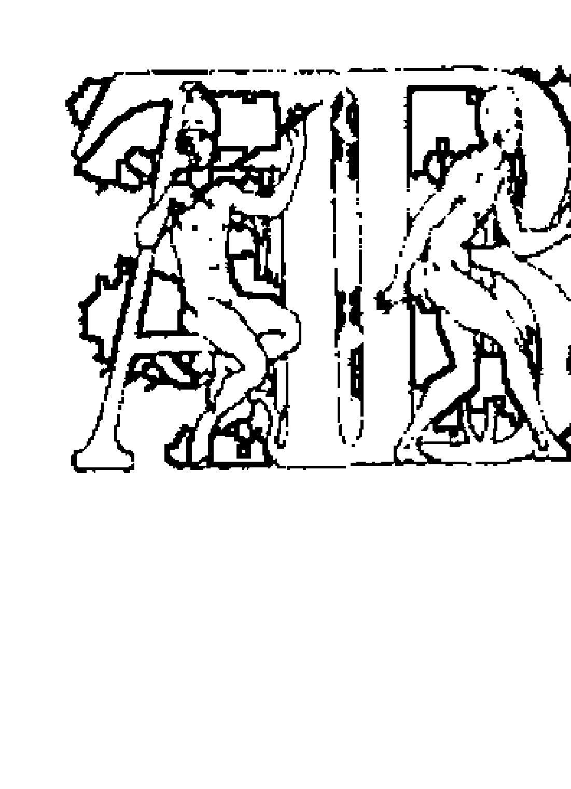

注意！对内对外都要保持应有的仪态，即使是面对最亲近的人，也不能放任自己。跟家人相处也要待之以礼，控制自己的情绪，这样可以使你的家庭更加圆满和谐。

#### 三、金牛座/AB 型

##### AB 型金牛座的气质、性格

AB 型金牛座的你，对人以和为贵。无论何时，你都会微笑着面对这个世界，最让你反感的事，莫过于用武力解决问题。你会给人以老好人的印象，但若有人侵犯到你的内心深处，你也会据理力争，决不会屈服。

AB 型金牛座的人理性很强，甚至会让人觉得缺少人情味。实际上，你虽然重视实际利益，却并非无情，而是个充满爱心和温情的人。虽然你外表看起来很理性，有些不通情理，但事实上你是严在外而慈在内，只是不轻易示人罢了。AB 型金牛座的你给人最初的感觉往往是既严肃又难以接近。你做事总是三思而后行，让别人觉得无法跟你深交，难以进入你的内心世界。

金牛座重视实际利益，而 AB 型的特点是理性至上，两者配合起来的你，则是沉着、稳重的结合体。在你身上，决不会有任何意气用事的事发生，所以，你的温柔而多情很难被别人体会到，这会让你错失很多结交朋友的机会。如果你能将内心的柔情展于世人，那么你的生活会有很大的转变。

你内心多愁善感，对美及艺术有自己独特的鉴赏力。你有着广泛的兴趣，但这些兴趣大都与现实利益有关系，这恐怕源于你重视现实的性格。

你的经济观念很强，对钱很重视，如果在经济上出了问题，你的情绪会变得非常冷漠，显得任性而情绪化，因为这破坏了你原有的安定。为了避免这些状况发生，你会更加审慎，凡事都想得十分仔细。

注意！勇敢地展现你的自我吧，让人看到你的温情，走入你的世界，了解你的内涵。另外，不要太死板，许多事不妨变通一下，这样更易解决问题。

##### AB 型金牛座的事业

AB 型金牛座的你，有着不错的经济头脑，能在金融机构中游刃有余。如果你有胆量从事投资、实业等，成功的希望相当大。

你目光敏锐，判断力强，善于接受新鲜事物，再加上你的理性，如果从事技术工作，会有很好的发展。你的艺术感觉很强，音乐家、画家、庭园设计、装饰品销售等都很值得一试。你还可以扩大经营范围，也有致富的可能。一开始就选定目标，坚定不移，持之以恒，是你成功的保证。

注意！要稳扎稳打，不要一有不满即轻率辞职，要避免中途更换行业，尤其是中年之后。

##### AB型金牛座的财运

你财运不错，虽不一定能富比豪门，但你决不可能陷入贫困。但是，财运佳并不代表你会有飞来之横财，一夜暴富在你身上是不可能的。你的财运属于稳当型，如果你又能守财、储蓄，就更能致富。

实际上，你的财运好是因为你较会理财，同时注意储蓄。也许别人会觉得你有些守财，但实际上你对钱财并没有太多的奢望，只是想让自己生活富足一些罢了。你没有偏财运，所以不能有侥幸之心去做冒险之事，另外，想要以赌来致富则是切不可为的。

注意！把握好你的财运，学会理财，你的富足生活是没有问题的。

##### AB型金牛座的爱情

AB型金牛座的你，对待爱情也是稳健而踏实的，激情燃烧而难于控制的情况在你身上很少见，因为这有违你追求平和的本性。你喜欢柔如春风般的感情，不相信一见钟情。在恋爱过程中，你很少会积极主动地展开攻势，所以对方可能会以为你是个冷淡的人，其实，你嘴上虽说不在意，内心却是相当认真的。

你所渴望的爱情是两人在人生之路上携手并进。你会细细品尝爱的甜蜜与苦涩，纵然有风云变化，都会始终如一。你不想有太多激烈的变化，因此在选择对象时，会充分了解在前，这样才会觉得胸有成竹，当然这也是你人生观的体现。

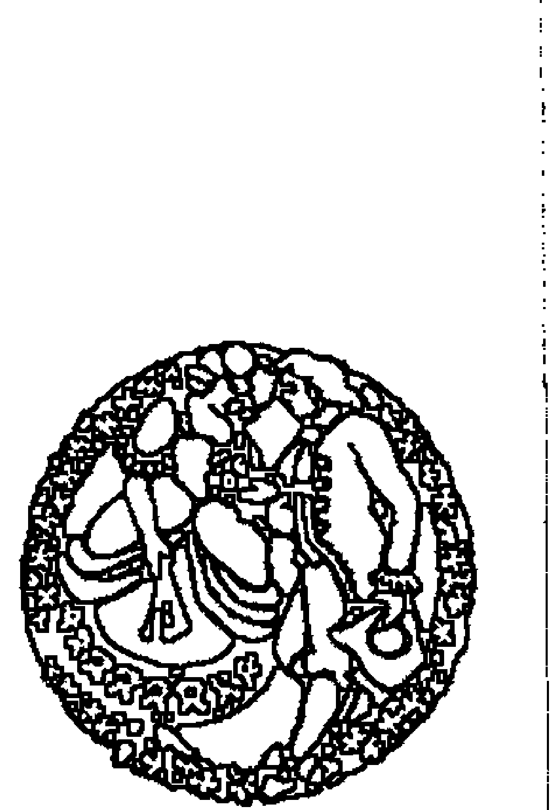

你的爱情像和风细雨，又如小桥流水，最终会瓜熟蒂落，水到渠成。你的爱情历程会是因相识而相知，在双方深入了解之后，进而更深一层交往，这时你已没有了最初的顾虑，不再伪装，只用一颗心真诚相待。当你和恋人赤诚相待时，两颗心才能真正结合，从而携手进入礼堂。

如果失恋，你会表现得若无其事，但那颗情感丰富的心却早已是遍体鳞伤、难以修复了。有些 AB 型金牛座的人与爱人分手后会难以接受现实，甚至会萌生报复之念，最终导致悲剧的结局。不过大多数情况下，你求稳的性格会限制你的言行。第三者的角色你是不想充当的，发生畸恋的机会微乎其微。

你对性抱有好奇心，但决不会鲁莽行事，只有在建立了深厚的感情基础之后，你才会尽情地去享受激烈、深情的性生活。

注意！遇到心爱之人，就要勇敢表白，否则当爱随风而去，则悔之晚矣。机不可失，时不再来！

##### AB 型金牛座的婚姻

AB 型金牛座的你，会经历爱的迷惑，当云雾散尽之后，最终还是会选择朴实无华的婚姻，平静地走完一生。在结婚之前，你会仔细地思忖再三，你是个既追求爱情，又不会凌驾于现实之上的人。

AB 型金牛座的你，在经过爱情的洗礼之后，对婚姻会有更加客观的认识，会实际地去考虑婚后的生活应该如何。盲目地为了爱情而结婚甚至导致一生不幸的悲剧，在 AB 型金牛座的身上很难发生。你是那种最理性化地对待情感的人，你会比常人更清醒地认识到，物质基础是精神追求的前提。当然，你并不是拜物狂，而是有着一颗赤子之心，即使婚后数年，仍不改新婚时的深情。经过时间的磨练，你的真情会愈发地宝贵。

注意！安分守己是每个人都必须的，这样会减少婚姻中的波澜。别轻易接受诱惑，以免遗憾终生。

##### AB型金牛座的家庭

你会极端重视家庭。为了保证家庭的完整，你会和对方相互扶持，共同面对一切。如果出现了家庭危机，你会全力补救，寻求沟通的可能。在你的性格中，是有着矛盾性的，你一方面会全力维持家庭的和谐，另一方面又难以克制自己想要出轨一下的念头。幸好，你的理智往往会阻止它的发生。

你会尽力保持家庭的明朗气氛，因为你不愿家庭中有任何不快。你会是个好丈夫或好妻子，是个可靠的伴侣。你会将一生投入到自己的家庭里，让爱人信赖，家庭和睦。

但是，当你的子女长大成人之后，你觉得生活的重担已有所放松，这时你想要风流的念头又会不由自主地冒出来，如果你不能多加克制，就可能会功亏一篑，一生英名付之流水。

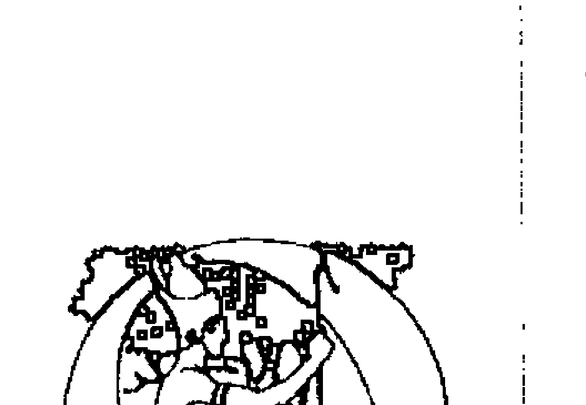

#### 四、金牛座/O型

##### O型金牛座的气质、性格

你是从容不迫的实践者，做事稳重可靠。你不想与人争先，也不想吃现成的馒头，凡事都会通过自己的努力来解决。你认为求人不如求自己，这样的路走起来才踏实。你在做任何事时都有条不紊，O型的意志力在金牛座的细心及从容的配合下，往往能发挥出最大的能量。

你的深思熟虑让人觉得你的行动太过迟缓，这正是你沉稳性格的体现，只是不被人理解而已。这种保守的行为模式在事业方面可能会产生正面的作用，但也可能产生反面的作用。因为你犹豫不决，所以可能会失去很多机会。在当今竞争激烈的社会里，效率是关键，O 型金牛座的你，往往因为不够果断而吃亏。

你的优势是：耐心、毅力。但如果你不能主动掌握稍纵即逝的运气，不能及时抓住机遇，缺乏敏锐的反应，那么成功的机会将大大减少。不过反过来说，你不会因为过于焦躁而做下错误的判断。你会迈着稳健的步伐，朝着既定目标不断前进，绝不会无功而返。

注意！在选择职业时，一定要充分考虑到自身的特点，避免从事违背你天性的工作，否则将难于发展。

##### O 型金牛座的事业

O 型金牛座的你，有耐心而且意志坚定。对于变化激烈、流动性强的工作，你是难于适应的。如果工作中的随机事件太多，就需要八面玲珑的性格，这些都与你的沉稳性格恰好相反，你若从事此类工作，则很难发展。你的作风平稳笃实，所以很适合进入财务部门及金融机构工作。你有着成功的潜能，只要能得到适合的工作，你就会满腔热情，全力以赴，就会出人头地，在某个领域中独占一席之地。如果从事的工作与你气质不符，你就会百无聊赖，反应迟缓，当然也就难以取得成绩了。

注意！能否找到合适的工作，是你人生中的关键。要时刻充满自信，这是成功的开始。

##### O 型金牛座的财运

你的财运可说是得天独厚。虽然你无法在短期内顺利地赚进大把钞票，但是，你擅长积蓄，到了中年就可拥有相当的财富。你深谋远虑，未雨绸缪，所以不会为钱而忧愁。

就占星术来说，金牛座之所以谓之“金”，是表示你与金钱十分有缘。因此，这个星座的你，有着出众的经济头脑，对于金钱特别有概念且执著，财运也就特别好。

O 型金牛座的你，如果在金钱方面无所作为，想必是 O 型的投机性质在你身上过于突出。你会有些冲动，会因一时冲动而导致失败。

注意！要时刻提防你的投机心理。人生变幻莫测，不要一听说有利可图，就不假思索地投资。

##### O 型金牛座的爱情

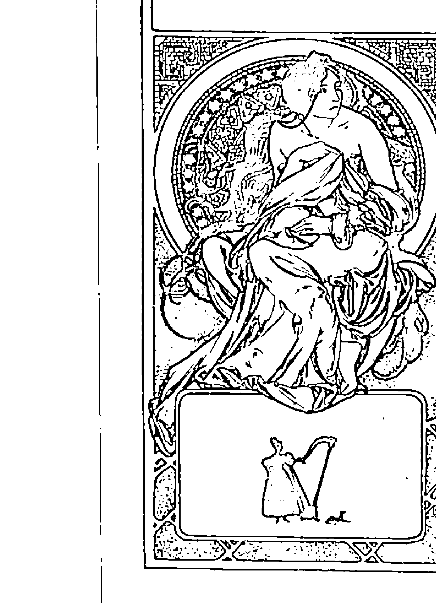

O 型金牛座的你，性格朴实敦厚，你的恋爱目的很明确，那就是以结婚为最终目标。因此，你在恋爱过程中会小心谨慎，担心一失足成千古恨。在选择恋爱对象时，你会考虑再三，而你的情感也是由一点点的好感逐渐滋生出爱苗。你不会轻易做出任何明显的表示，只会在心里盘算，将一切都好好思量一番。

O 型金牛座的你，不会把爱情看作游戏，不会为贪图一时快乐而跟异性发生关系。你的爱情可以维持很长的时间，因为你的爱情理想就是要长相厮守，永不分离。你一般不会主动提出分手，有时明知彼此个性不合，但你怕伤害了对方，也迟迟不肯言明。你的耐性会让你坚持到最后。

在日常生活中，你与人交往的能力并不是很强，但能维持人际关系的协调。跟异性交往时，你会比平时更加谨小慎微，总是让人觉得有些拘谨。你对于谈恋爱的耐心远胜过一般人，如果你决心去爱，那么即使如马拉松一样漫长，你也会用你非凡的毅力来坚持到底。虽然你也有感情充沛的时候，但决不会被感情冲晕头脑，你天性中的谨慎会让你及时收敛脚步。

闪电恋爱在你身上极少发生，要想让你的婚姻速战速决，更是不可能的。由于你太过缓慢的步调，所以在有些时候，当你意识到自己已经爱上某人时，对方可能早已心属他人，这时你纵有天大的本事，恐怕也回天无力了。所以，O型金牛座的你在谈恋爱时，一定要抓住时机。

你对性是慎之又慎的，如果没有婚姻形式的保障，你是不太可能与异性发生关系的。不过一旦结婚，你的婚姻生活会充满浓情蜜意。在性生活方面，你不太富于技巧变化。但你的性欲极为强烈，尽管你步调缓慢，却能清楚地表达出心中浓烈的爱意，并且能使对方感到充分的满足。

注意！抓住机会不要放，处理爱情问题时要果断一些，不要平白失去好运。

##### O型金牛座的婚姻

O型金牛座的你，如果能保持夫妻生活步调的协调一致，那么你的婚姻将会是幸福美满的。你不大可能早婚，对你来说，晚婚更能掌握幸福。你不想追求变化大及刺激多的生活方式，家庭的平静、温暖、幸福和安祥才是你所期盼的。因此，伴侣的选择就显得尤为重要。你如果太早结婚，多半不会幸福，因为你缺乏经验，对异性的鉴赏能力不够，加上自己又不轻易改变志向，在这种条件下结婚，对人对已都是极不明智的，弄不好可能会遗憾终生。

但是反过来说，如果你迟迟没有结婚，待到年华逝去才知道着急，你也可能会犯下和前面相同的过失。所以，你对婚姻的态度除了稳重之外，还要勇敢地面对它，要相信自己的判断力，总是迟疑不决可能会错失良机，让真爱与你擦肩而过。

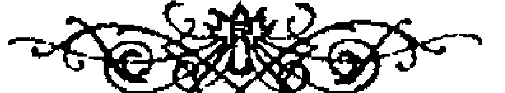

你在 25 岁之后，便会接受相亲的方式，并可能由此走入婚姻之门。其实，这并不是最适合你的方式，可你会因为不够果敢而难以拒绝。你可能会因为不忍伤了对方而在尚未了解对方之前便草率结婚，这会成为你今后婚姻不幸的种子。尤其是女性，更要慎重行事，不能因一时迁就而抱恨终生。

注意！尽量避免冲突的出现，一旦发现问题，要及时解决。

##### O 型金牛座的家庭

O 型金牛座的你，希望拥有一个欢乐而且温馨幸福的家。不过在家庭生活中，你的固执可能会影响到夫妻的和睦。O 型金牛座的女性，对家庭、事业很难兼顾得宜，这样也会使家庭气氛受伤。如果实在想借工作来减轻家庭的经济负担，可以选择一些可在家中从事的家庭副业。

此型的你，结婚之后会忠于自己的伴侣，不会朝三暮四。如果你的伴侣性急又喜好刺激，那么一旦在婚姻生活中发现问题，就要及时解决，拖泥带水和纠缠不清的处理方式只会对双方的感情造成莫大的伤害。

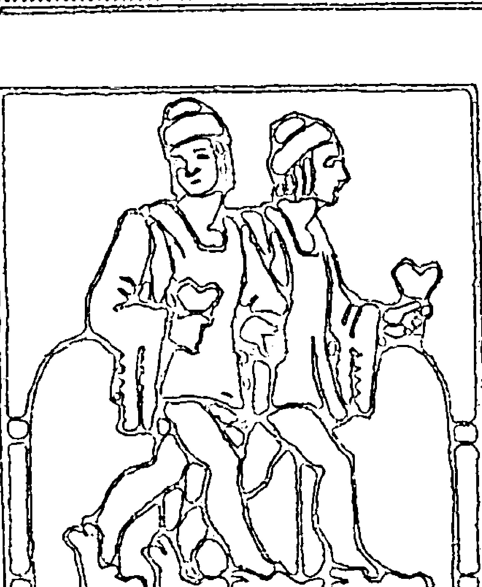

## 双子座

特征：喜欢新事物，是十二星座中好奇心最强的；双重性格，充满矛盾，变化莫测；感情上显得轻浮，工作上缺乏耐心。

### 第一节 双子座简介

#### 一、双子座的传说

斯巴达国王的王妃莉妲长得国色天香。天神宙斯听到这个消息，明知道天后希拉会不高兴，但还是利用夜晚，悄悄来到莉妲窗前偷看。

宙斯在窗外看呆了，赞叹道：“真是难得一见的美女啊！”但是怎么接近她呢？宙斯变成了一只白天鹅，用喙轻轻啄着莉妲的窗户。莉妲走到窗前一看，原来是一只漂亮的白天鹅。

莉妲爱怜地对天鹅说：“天色这么暗了，你是不是找不到回家的路？”天鹅垂着头，莉妲伸手把天鹅抱进屋子，柔声说：“今晚你就睡在我这里吧！”

宙斯化身的天鹅取得了莉妲的信任。晚上，莉妲向天鹅诉说心事，突然间，天鹅消失了，出现在她面前的是一位满脸微笑却又带着一份威严的翩翩绅士。莉妲大吃一惊：“你是谁？”宙斯答：“不要害怕，我是天神宙斯啊！”宙斯诉说心中的爱意，赢得了莉妲的好感。从此以后，只要斯巴达国王不在，宙斯便化为天鹅来陪伴莉妲。一年之后，莉妲为宙斯生下一对双胞胎儿子。

斯巴达国王为两个儿子取名为波力凯斯和卡士德尔，教他们各种武艺。一次战斗中，卡士德尔被敌人刺中要害，临死之前说：“哥哥，你一定要替我报仇啊！”
波力凯斯抱着弟弟的身体失声痛哭，下定决心为弟弟报仇。后来，终于打败敌军，如愿以偿。突然，宙斯出现在波力凯斯面前，问他：“波力凯斯，你和卡士德尔都是我的孩子，你愿意跟我回到天上吗？”
波力凯斯吓了一跳，宙斯于是把当年自己变成天鹅与莉妲相恋的事告诉了他。他问宙斯：“你能使卡士德尔复活吗？”宙斯沉吟了一会儿，说：“我能把你们兄弟变成天上的星座，如此一来，你们就能永远不分开了。”
宙斯把两兄弟的身影放在群星之间，成为我们看到的双子座。三月上旬的黄昏时分，南方天空有两颗一样亮的星星，左边为波力凯斯，右边为卡士德尔，他们正在天河中快乐地嬉戏呢！

#### 二、双子座(Gemini)概况

生日：5月21日至6月21日

##### 星座代表人物：

- 玛丽莲·梦露（6月1日）
- 宋美龄（6月4日）
- 王子（歌手）（6月7日）
- 理查·史特劳斯（6月11日）
- 亚当·斯密（6月16日）
- 威廉王子（6月21日）

双子座的突出特点就是变化莫测，而且是瞬息万变。双子座的人有双重性格，令人难以捉摸，包括双子座本人也会为自己的矛盾性格而苦恼。对于事业与爱情，双子座有着美好的前景，若用心经营，会有完美结局，但多变的性格会使其难以预料。

##### 双子座的个性魅力

你有着强烈的好奇心，向往丰富多彩的生活。你的机灵乖巧，让你魅力无限。你满怀赤子之心，在你身上洋溢着青春的活力，让人时刻感受到你勃勃的生机。双子座的你有着比常人更充沛的能量、思考力，但你也因此而需要比别人更多的时间去调整生理与心理。

##### 双子座的性格特征

双子座是充满矛盾的。在你身上，善良与邪恶，快乐与忧郁，温柔与残暴，积极与消极，动与静，明与暗，同时存在。因此，你会表现出两种或多种人格，你的瞬息万变会让人难以理解。如此矛盾的你很难遇到合意的人，所以迟迟不能结婚，看似无所谓，其实是有泪不轻弹。

你是多才多艺的，处理事务的能力很强。你生性聪明、才思敏捷、目光敏锐，追求新的概念及做事的方法。

你精力旺盛、能言善辩、斗志昂扬、志向远大，人际关系非常好，你的朋友也多如你一样伶牙俐齿。你思维敏捷，但相应地，你变换主张也比常人要快。受水星的影响，你通常无法控制自己的思考力，会因为用脑过多而导致神经衰弱。

##### 双子座的财运

你有着胜于常人的偏财运，常能获得意想不到的钱财。但是你不善理财，不知储蓄，而且有浪费的倾向。

##### 双子座的理想恋人

你好心强，而且不易满足。你对一切都要求很多，有时连你自己也弄不清自己到底想要什么，但你却乐此不疲，不断地变换着花样。所以，你的恋人应该是能言善辩、兴趣广泛、社交能力强的人才适宜。热情而诚实的人会是你的理想对象。

##### 双子座的恋爱技巧

你精灵古怪，常会被人看作不安分的家伙，因此你的爱情不宜静等，如果对方能把握住你的命脉，采用缓兵之计，你就只能束手就擒了。

##### 双子座女性的性格、情感

双子座的女性理智很强，能够分析风云变化的形势，做出正确的抉择。但冰雪聪明的你，神经会有些过于敏感。

你对爱情充满向往，相应地，你也会有丰富的爱情生活，如果在你的星座图上带有金星的痕迹，那么你的爱情将更加艳丽多彩。你思维广阔，对一切事物都抱有美好的幻想，你的情感也如春天般绚丽。你期待着美好、欢乐、幸福的爱情生活，时刻充满着希望。

即使有烦恼，你也会用工作，或者用自己天性中的活泼来缓解它。你很容易就让别人喜欢上了，不过你若想得到真情也并不是顺手拈来的。因为你过于敏感，可能因为一点小事就失去什么。如果对方能明智地把握你的性格特点，那么想要与你相知就不难了。

你喜欢富于变化的生活，希望能够时刻有新鲜感，平平淡淡的日子难于激发你的情感。散步、郊游或旅行，开阔一下眼界，换换生活环境，与朋友们一起聚聚，这些都是你生活中不可缺少的一部分。你性格开朗，周围的人会不由自主地被你感染。但如果你经常处于兴奋之中，会影响你的精力和体力。

与双子座女性相宜的男性：水瓶座的男性与你结合，会使你的生活内容发生质的变化，你会因此而提高自己的文化修养；射手座的男性能让你的生活充满新的气息，你们的家庭将是充实的、自由的和浪漫的，并会成为亲朋好友相聚的场所；天秤座的男性若能与你相知，会让你的艺术才能得到发挥，甚至能让你进入更高层次的社会生活。

##### 双子座男性的性格、情感

双子座的男性充满神秘色彩。你千变万化，会在处于高潮的时候激流勇退，转变自己的方向，因此在外人看来你是捉摸不定的。你的天赋表现在积极思考的习惯，以及不拘一格的思维方式，这使你很适合从事脑力劳动。不过，你的体质有些弱。

对于爱情，你往往不能直接表态，而是用外表的不在意来使自己免受伤害。最让你快乐的是大家能倾听你的议论，而爱情则次之。成家之后，对于家庭生活中的责任，你重视程度不够，喜欢“无事一身轻”。你的家庭将更多地成为你发表议论和朋友相聚的场所。你希望生活没有太大的压力，在工作上你也不喜欢有过多的约束。

你很善于与人打交道，社会交往能力极强。你知道怎样与人相处，怎样让别人信任和器重。你有艺术家气质，能言善辩，风趣幽默，有你在的场合，气氛一定是活跃而热烈的，不会让人感到寂寞。如果让你离开朋友、伙伴或者频繁的社交活动，你会怅然若失。

与双子座男性相宜的女性：天秤座的女性待人热情、感情细腻、富有激情、喜欢交际，会让你生活美满丰富；生辰星位在射手座的女性会是你志同道合的人生伴侣，她会喜欢你无拘无束的性格；水瓶座的女性智力超群、敢于创新，而且重视友谊，会使你的事业更上一层楼。

### 第二节 双子座与血型的关系

#### 一、双子座/A 型

##### A 型双子座的气质、性格

A 型双子座的你，精力充沛，喜好运动，对自己充满信心。对于任何事情，你都不会自始至终地听命于人，但为了顾全大局，你有时也会改变一下自己的原则。

你是十二星座中好奇心最强烈的，对任何事情都感兴趣，都想做进一步的探索。你对事物的悟性很强，但很可惜的是缺乏耐心，等你五分钟的热情衰退之后，便会心生厌倦。坚持到底的韧性在你身上较难体现，所以你可能涉猎很广，却只是略知皮毛，不仅做事时如此，交朋友也如此。

A 型双子座的你善于交际，会很快地结交朋友，但也会迅速地遗忘朋友。新朋老友不断交替，这样一来，虽然朋友甚多，但难有真正的知己。你很重视你的人际关系，一旦周围的气氛有了新的变化，你会仔细观察，抓住时机，借此建立新的人际关系。你夫妻之间的关系比较冷淡，因为你总把自己置身事外，觉得家如旅馆；你怕孤独，却又跟人保持距离，是一种非常矛盾的性格。

你动作敏捷而轻快，如行云流水，活动量大，喜爱具有危险性及刺激性的事情，并能从中发挥你优异的能力。你向往无拘无束的生活，适应力极佳，做事洒脱。在固定的场所做固定的工作，会令你觉得过于拘束。不过，A 型的你，又具有保守的性格，所以你的理想也会随之发生变化，自由奔放的生活，平静安定的日子，会交替地出现在你的愿望之中。

你是标准的两面性格，让人觉得你变幻莫测，难于看到你的庐山真面目，所以人们会认为你原则性不强。如果你在A型方面的性格比较显著，将可获得较为安定的生活；若双子座的性格较为强烈，那么即使表面上看似安定，内心里仍会向往自由的生活，想要挣脱枷锁，飞往广阔的天地。

注意！为人要随和一些，如果太多尖刻，会影响到自己的人际关系。

##### A型双子座的事业

A型双子座的你拥有巨大的能量，能够及时获取信息，并将之分析运用。你的守护神被称为“传播之星”，它带给了你非同小可的能力：你搜集情报的正确性及迅速性，真是无人可及。当今社会，信息的获取直接影响到事业的成功，而你恰恰是最具备这种能力的。所以，你会活跃于各种媒体之中，适合你的职业是新闻、电视、杂志等有关舆论的工作。你也可以从事广告、宣传、交通、教育等职业。另外，由于你的口才良好，适应性强，因此律师、外交官等工作也挺适合你。还有，由于你接受事物的能力特别优异，因此对于尖端技术也能掌握。

你事业成功的关键，在于职业选择得当与否。你的弱势是性格上缺乏耐心及毅力，所以并不适合从事需要耐性的单调以及笨重的工作。倘若你不幸从事了这些行业，也无法维持长久，更不会有超水准的表现了。你行动如风，来无影去无踪，应变能力十分迅速，如果不好好发挥这些优势，则难成大器。你性情善变，意志不坚定，且缺乏集中力，从事一般的工作不容易成功。

注意！你多才多艺，若能增强创意及毅力，会让你大有所为。

##### A型双子座的财运

A型双子座的你，在青年期到中年期这一段时间财运最为旺盛。如果能抓住机遇，再增强耐性，不过于轻飘，很有可能成为一位大富翁。你一般会把求知欲摆在首位，至于物质需求则列为次要，但你的财运的确非常好，而且你也具有这方面的才能，应该可以有一番成就。

但是，如果你不能控制你的善变，再加上耐心不够，则会使即将到手的财富与你擦肩而过。少数 A 型双子座属于努力储蓄的踏实派，一般是因为 A 型特征胜过双子座的特征，且他们手里都是小数目的金钱，也无太大作为。大多数 A 型双子座的人都是挥金如土的，不知道计划用钱，出手相当阔绰。

注意！要克服你不稳定的弱点，以免被小人利用。

##### A 型双子座的爱情

大部分 A 型双子座的人在谈恋爱时，都会表现出双子座的特性，显得比较轻浮，对感情不很专注。你把感情看得很淡薄、很单纯，那种“为伊消得人憔悴”的情况是不太可能在你身上出现的。即使有一天你失恋了，你也不会怎么在乎，而只是“挥一挥手，不带走一片云彩”。然后，你会一如既往地继续追求新的对象。所以，你可能人到暮年，还不能体会真爱之味，想让你坠入爱河是不太容易的。

你有双重特性，即 A 型的保守与自我压抑，还有双子座的善变。因为这种双重性，你的恋爱会如天边的云，阴晴不定，变幻莫测。沉稳与轻浮在你身上都有所体现。你甚至会游戏爱情，玩世不恭，所以荡人心魄的激情你是没有的，你的恋爱更会像小溪流水，非常轻松愉快。

你喜爱自由自在、无拘无束的生活，认为一旦跟对方真心相爱，就会彼此约束，永不自由，这是你极不愿意的。所以你有些花心，很少对一位异性着迷而专情如一。你的理智与冷淡，让你即使身处爱河，也能以局外人的角度审视自己。这是冷静、客观的表现，却掩藏着虚伪及自私。同时与两人恋爱在你身上是常有的现象，你甚至会拥有众多的情人。你只为了自己的娱乐而戏耍对方，但终会有一天，脚踩空船，翻身落水。

> 注意！真爱才能长久，不要因年轻气盛而误了幸福！

##### A型双子座的婚姻

A型双子座的你，崇尚自由的爱情，态度又不够认真，反抗的意识较为强烈。男性往往惧怕婚姻的束缚，避之唯恐不及，女性对婚姻也是淡然处之，不屑一顾，因此抱独身主义者大有人在。你的性情如风云一般变幻不定，即使结婚了，也不会在同一个地方久留。其实，你婚后应该在家附近工作，这样才不会有机会让自己体会到家庭的欢乐，才能使自己的心情稳定下来，所以你不适合出外到远地工作。

A型双子座的你，性格矛盾而复杂，喜欢安定与向往自由同时存在，因此，你在婚姻上也会形成矛盾与挣扎，这会对你的婚姻有很大的影响。若A型特征较强，你可能会早婚，而且生活的基础奠定得颇为稳固；若双子座的特征较强，你可能终其一生都在游戏中度过，而且乐此不疲，没有一丝成家的念头。

> 注意！不要过于随便地对待人生，不然婚姻不幸会是必然结局。你的婚姻生活容易横生枝节，所以慎重地对待生活更为必要。

##### A型双子座的家庭

你很喜欢交朋友，所以你的家最好坐落于比较热闹的市区。你的家里会时常有许多朋友登门，热闹异常。而你和配偶却会关系平淡，在亲密之间仍保持着某种程度的距离，你们都比较强调各自的独立。纵然你发现对方有了婚外情，你也不会声嘶力竭地争吵，而是会以其人之道还治其人之身，让对方难过，从而缓解你的不满。

A型双子座的你，若身为丈夫，表面上你似乎对妻子温和亲切，但内心深处却是颇多心计。如果你身为人妻，那么虽然聪明能干，非常贤慧，却往往温情不够。你更多地会成为职业女性，生活匆促而忙碌。你更乐于与朋友相聚，或是到外面去学些才艺，而不愿常呆在家中。这对你的孩子有些好处，让孩子们见多识广不是坏事。

#### 二、双子座／B型

##### B型双子座的气质、性格

B型双子座的你，具有双重人格，但你能将二者较好地调和起来，帮助自己达到目标。你的处事方式多样，但又不失原则，这一点确实是无人可及。如果你是典型的B型双子座，那你一定是个好奇心特别重的人，凡是有兴趣的事情，你都要亲自去尝试；你兴趣广泛，对什么事都要求根问底，不问明白不罢休。

你的接受能力强，是个博闻强记的人，能很快地掌握新生事物。你能言善辩，文采出众，能够把所知所学融会贯通。你能把一件事描述得比事件本身更加生动精彩，这得力于你卓越的口才。所以，幽默机智的你，是个很受欢迎的演说者。

你具有开朗明快的气质，反应灵敏，行动迅速。你好动而不喜静，要想让你温文尔雅恐怕没那么容易。你能够处变不惊，对于突发事件的应变能力很不错。观察力敏锐是你的另一特点。你做事不认死理，善于变通，在别人印象里，你一天四处奔波，却不知道你究竟要做什么，而你自己却能自得其乐。

你最大的优点得算是能进能退了。你不会因失败而垂头丧气，当然，不同的事件你会有不同的反应。虽然你表面圆滑，但你所坚持的原则不容改变。你的头脑会随时都保持着冷静、理智，这使得你遇事不慌，总能保持客观的分析能力。

你的性格可说是理智重于情感。不过，在你果断的个性中，也隐藏着优柔寡断的一面。原因可能在于你过于客观，在分析事情时，很少流于偏颇，这也是你考虑事物全面的一个反映，总是一分为二地看待问题。

注意！沉默是金是有道理的，切勿逞口舌之快，应该多听取别人的意见。

##### B型双子座的事业

B型双子座的你吸收能力极强，新闻记者、广播、公共关系及业务推销都是不错的选择。另外，你也可以考虑与语言有关的职业：广告方案设计、编辑、律师、播音员、翻译工作，你都可进行尝试。你要注意不能随意地转换职业，否则对你的成功极为不利。

B型双子座的你，有能力在本职之外再从事一些副业，而且第二职业可能会带动你本职的发展。你即使拥有多种工作，也能八面玲珑，但是，刻板的、需要一个人单独面对的工作是不适合你的，研究工作、手工艺、公务员、银行员等等单调而死板的工作，是难于让你施展才华的。

注意！尽可能多地让自己进行尝试，这对你有的利的。

##### B型双子座的财运

B型双子座的你广结善缘，赚钱的机会很多，财运自然也不差。重视朋友，与他人保持良好的人际关系，会有助于你的财气。你机灵透顶，如果从事股票投资，可能会大有收获！你的财运特征是：如果你从事副业，可能会比你的本职更易发财。

钱财对你来说犹如过眼云烟，来去匆匆。你最讨厌的就是小里小气，在你看来，钱财是身外之物，如果过分重视，无疑是一种俗气的表现。你是不会钻到钱眼里去的，所以一点儿都不小气；不过你天生有理财的能力，虽然出手大方，但还算懂得节制，所以你的生活会是衣食无愁的。综合看来，你的财运虽然流动性大，但并没有不安定的因素。

注意！善待每一位能给你带来好运的朋友。

##### B型双子座的爱情

B型双子座的你，生性敏锐，能够深入对方的内心世界。你天生好奇心强，觉得跟多位异性交往，尝试不同的爱情滋味，是件愉快的事。如此看来，你的爱情自然如风般飘忽不定，激情过后就觉得了无生趣。你的善变性格让你总是很快地转移方向，去寻找新欢。

你表面上是多情，但实质则是无情啊。你不喜欢粘粘乎乎的爱情，爱或不爱，你的态度总是很明朗。你极为豪爽，哪怕失恋了也不会受伤太深，因为你会很快寻找新的目标。你的善变让人难以适应、难以接受。

你性格独立而且理智，谈起恋爱也是如此。你自己不够专一，所以你对恋人的要求也不会太高，争风吃醋在你身上是很少见的。你认为每个人都是自由的，每个人都有选择最适合自己的情人的权利；同样，更换情人也是自由的，这无需向谁报告。自由恋爱，无牵无挂，是你谈恋爱时追求的最高境界。

但正因为如此，你很难得到真情。在你的感情世界里，一切如过眼云烟，无声无息。你忽略了真情，而真情才是爱情中最珍贵的。你过于理智的爱情，令人感到没有生趣；而如果把对方看穿了，也就失去了爱情的魅力。爱情需要浪漫，需要包容对方的缺点。但你太不浪漫了，哪怕身处爱河，也能客观地分析这段感情，所以你不会鲁莽从事，甚至会从第三者的角度来审视自己的爱情。可能正因为你太过理性而缺少激情，所以才把恋爱当成游戏。

B 型双子座的你是个相当早熟的人，所以你可能年纪很轻时便有过性经验。一般情况下，你会把性和爱区别对待。你不会因为性关系的发生而丧失理智，你的性欲并不是很强，而且能够理智地加以控制。

注意！恋爱时，理智和激情最好能调和一下，爱情是需要浪漫的。

##### B 型双子座的婚姻

你在年轻的时候，可能想要躲避婚姻。然而实际上，B 型双子座的人极少能终其一生都保持单身，因为你强烈的好奇心想让你体会家的感觉。但你的婚姻多是欠考虑的：因为一时激情而迈进结婚礼堂，而且在迈入之时就没有想到要白头携老。因此，B型双子座的离婚率也偏高。

B 型双子座以晚婚为宜。因为，只有当你经历了人生的起伏变化之后，你的人格才会渐趋成熟，你的婚姻才会更为美满而长久。从本性上看，结婚并不是你一生中必须经历的过程，你认为婚姻会约束你的言行，只要有个真心的异性朋友，你便觉得甚为满足，此生无憾，不会在意形式上的婚姻。这种天性在年轻时尤为显著，待年纪渐长，才会有所改变。

你在选择伴侣时，会考虑能接受你生活方式的对象。你希望对方同你观点一致，不要对两个人的未来存有太多的期望。如果对方想要天长地久，那会让你感觉承受的压力太重，甚至有喘不过气的感觉。如果你的对象也是 B 型双子座，就要注意：不要太过自由，否则整个生活会显得毫无秩序，这样的婚姻也是难于持久的。

注意！你要选择能接受你生活方式的伴侣，对方不能对婚姻有太多的期望，否则，婚姻对你来说就只是一种束缚。

##### B型双子座的家庭

B型双子座的你，会平等对待家庭中的成员，甚至会把孩子当作朋友，而且能与之交心。你本性是喜好交际的，而且待人宽容，能为他人着想，朋友自然也就很多；朋友间常来常往，让你的日子过得热热闹闹的。你的家庭生活，可能洋溢着一股率真而自由的气氛，而你的对象会是那种独立性较强、比较坚强的人。

你们夫妻之间的情意并不深，男性会以工作为重心，而做妻子的也不甘心闷在家中，会是个有事业心的女性。B型双子座的女性在跟婆婆相处时，需特别花费心思，要以和为贵，别为小事发生冲突，这是很重要的。为了一家人的和谐，做某种程度的忍让是值得的。

注意！你最好将家安在交通便利、行动自由的地方，以便与朋友们共同寻找快乐。

#### 三、双子座／AB型

##### AB型双子座的气质、性格

AB型双子座的你，十分有头脑，学得快记得牢，做事能够提纲挈领，并能很快将所学用于实践。对于已经掌握的本领，你能活学活用。在你面前似乎没有困难可言，你能以不变应万变，不管外界如何变化，都能很快地应对自如。

你的新点子层出不穷，一有机会便付诸行动，言辞巧妙多变，行动积极而灵活，让人防不胜防。出其不意是你的特长，你往往因此出奇制胜。你整日马不停蹄，手脑不停地运转，让人对你充满好奇，却无法企及，他们很难知道你又会有什么新把戏出台。

你对许多事情都有好奇心，而且一旦念头产生便付诸实行，通常都能做得有声有色。但你的热情不持久，激情一过便立刻冷却，即使原先投入了极大的心力，也会在所不惜地放弃。对于那些要耗废时间才能有所结果的事，AB型双子座的你是没有兴趣一试的。你的求知欲过强，让人觉得你什么都想管，难免给人以好事之嫌。

你有时太过干脆，让人觉得你很随便；有时又过于谨慎，让人难以把握。旁人对你的一举一动很难拿得准，不知你所想何事，所做为何。你最好能不议论别人的是非，把握分寸，做个有原则的人，否则便会影响你与人之间的关系。如果你与人产生了矛盾，你会很容易钻人牛角尖，闷闷不乐，这会让人觉得你不够爽朗。

AB型双子座的你，性格复杂得令人难以想象。你非常善变，时时呈现不同的面貌，每个时间你所表现出来的态度都不尽相同，有时甚至会自相矛盾，如变脸术一般。你千变万化，难以确定，这种双重性格会让你的内心不停地冲突、挣扎，让你自己大受其苦，旁人也觉得你难以理解。如果能尽量调和自己，会让你为人处事更加从容。另外，有什么想法尽量发表出来，多跟人沟通，否则别人会误以为你工于心计。

注意！虽然你多才多艺，但却往往苦于无发展的机会，这多半是因为你缺乏耐心及集中力。要想成功，就多培养自己的耐性及集中力吧！

##### AB型双子座的事业

双子座从事副业会大有发展，如果能加强人际关系，则会更有帮助。你可以通过广泛结交朋友来建立丰富的人际关系，这些人际关系会为你带来更宽广的事业前景，伴之而来的将是良好的财运。

AB型双子座的你，在选择职业时首先要考虑的就是自由，如果没有自由，你不会接受。在自由的前提下，哪怕是要面对波动与浮沉，你也在所不辞。因此，你适合富有变化的工作，如果能在工作中自由发挥，充分体验到工作的愉快，你很快就能崭露头角。比较适合你的工作如：记者、编辑、作家、播音员等，这些工作自由度较大，很适合具有独特辩才与敏捷思维的你。另外，对于一些语言方面的工作，你也能愉快胜任，例如：翻译、速记、律师、推销员等。公务员是不适合你善变的性格的：早已定型的人生，怎能让追求变化的你有所作为呢？

选择了适合的职业，只是你成功的基础。你的稳定性不够，会使成功的机率左右摇摆，成功和失败往往就在一念之间。

注意！多方面发展，多培养自己的稳定性，必能出人头地。

##### AB型双子座的财运

你如果能发挥AB型双子座特有的合理性格，善于安排收支状况，定能稳赚不赔，坐拥财库。然而，你的多变会使你的财运呈中下势，并不是很好。当然，这不是说你会穷困潦倒。如果你的生活平平淡淡，没有太多的财富，更多的原因是你不在意钱财所致。

其实财神并没有冷淡你，你有不错的偏财运，经常从事副业所赚的钱会比本职的收入还要丰富。虽然你不会短时间内大富大贵，但是也会有持续不断的财源。

注意！要学会理财，储蓄是绝对必要的。你的财运并不很旺，所以，守财也是致富的方法之一。

##### AB型双子座的爱情

你对待爱情可以说是冷漠无情。这种态度怎么可能让对方满意呢？对方会觉得你不够真诚，从而为你们的爱情埋下隐患。由此看来，你的爱情一般不会长久，总是昙花一现，而且还没有昙花的美丽——这会让你总处在飘摇不定之中。

你并不是要游戏爱情，但你的表现确实令人不敢恭维。你觉得一生只有一份爱情是不够的，而要受婚姻的束缚更是令你如坐针毡。你不向往稳定而持久的爱情，你的过于自由而冷淡的恋爱会伤害到对方，也会让你与真情失之交臂。其实，在这纷纷扰扰的世界中，每个人都是需要一些温暖感情来抚慰的。

因为你对爱情不专一，所以会有不只一次的恋爱，脚踩两只船在你也不是罕事。这是因为你不想成为对方的俘虏，你宁可要短暂刺激的爱情生活，也不要永恒的依恋。对于别人的看法，你会不屑一顾，你觉得恋爱是个人的事，没必要考虑他人。

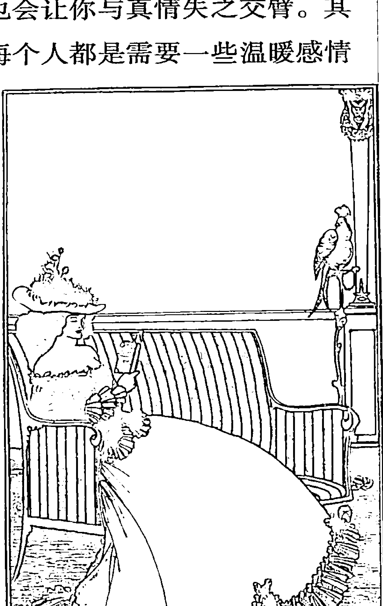

AB型双子座的你，在恋爱时也体现着双重性格。你对恋爱的态度忽冷忽热，时而激情满怀，时而毫无兴趣。对待爱人，你一会儿如胶似漆，一会儿又形同路人，这会让对方难以接受。你即使处在恋爱之中，也会让理智占据头脑，不让自己陷入爱情的漩涡。

你诙谐幽默的言谈虽然可以使爱情保持一定的新鲜度，但因为你过于理智，所以总与狂热的爱情和燃烧的官能感受无缘。你的恋爱方式会有些玩世不恭，你并不十分在意双方是否有感情，只要能融身其中享受快乐就已满足。你跟对方的交往方式是冷淡而又公开的，不像别人会卿卿我我、花前月下，你的行为甚至会让人觉得有些古怪。

你对性方面也比较冷淡，不十分渴望，但也不会刻意排斥，只不过视其为恋爱中的一小部分罢了。你对性多是抱着尝试的心理，不过想亲身体验一番而已，而且会在其中冷静地思考人生。你并不把性关系视为爱情的保证，也不想以此来维系感情，给人一种对爱情不负责任的印象。

注意！你的冷淡无情会使对方心灰意冷。如果你想要体验爱情的真谛，就应该用心去经营一个永恒的爱情。

##### AB型双子座的婚姻

AB型双子座的你，向往的婚姻模式是彼此自由、互不干涉，如果有一方做不到，违背了约定，那么这段婚姻必然会破裂，而AB型双子座无情的个性会促使你断然分手。对于分手，你不会有纠缠不清的思绪，你认为该分就要分，快刀斩乱麻是你的个性。

通常情况下，你觉得结婚会使自己失去很多自由，因此你对家庭没有太多的期望。你不认为结婚是人生必经的过程，也不渴望天长地久的婚姻，你觉得，与其让自己陷入婚姻的囹圄，不如选择单身日子来得消遥自在。不过，矛盾的你，并不排斥婚姻，总觉得两人如果能像朋友一样只是彼此开心，但不互相牵制，那倒也是美事一桩。

注意！选择合适的伴侣对你来说是非常重要的，除非对方能完全接受你的观念，否则还是不要结婚的好。

##### AB型双子座的家庭

AB型双子座的你，在拥有家庭之后，不会停止婚前的一切社交活动，家更像你的旅馆，不会特别有家的气氛。由于你对夫妻感情持着顺其自然的态度，如果彼此不过多束缚，能给对方以充分的自由空间，那么你也不会做出伤害家庭的事。任性的你如果在婚前谨慎一些，能寻觅到一位知心爱人，让对方因为了解你而宽容你，你们就可以拥有幸福美满的婚姻。

你对于婚姻和家庭是不够热衷的，对于婚后的生活，也没有什么计划，一想到如何赚钱、存钱、花钱，如何养家糊口，如何教育孩子，你就头痛。所以你可能更倾向于独身，对于一个家庭的经济基础或是未来的发展等问题，根本不愿考虑。你的想法让人觉得不可理解，所以，你要谨慎地选择结婚对象，否则婚姻会重重地伤害两个原本无辜的人，当然其中一人就是你自己。

#### 四、双子座/O型

##### O型双子座的气质、性格

O型双子座的你，有着敏锐的感觉，对于变化的事物反应尤其灵敏。你能很快地获取信息，不断地接受新鲜事物。无论何时何地，你都会侃侃而谈，但见解却缺乏独到之处。你才学广博，如果能拥有特别而又完整的个性，将会近于完美。你外向爽朗，不拘小节，但是意志及毅力显得有些欠缺。比方说，你有着强烈的目标意识，但如果在实施的过程中稍有不顺，就会放弃原有目标，改变方向。这是你性格上的弱点。

O型双子座的性格特征，一言以括之，就是复杂多变，且乐于将千变万化的想法付诸行动。你活泼乐观，但又是矛盾的，静与动，勇敢与畏缩，会同时在你身上体现。你会因此而有些迷茫，在做决定时，会有些不知所措，到最后会比较轻率地下决定。你会有一心二用的情况，同时追求两个目标，这自然会分散你的能量，这时要让你做抉择，会很困难。

你处世圆滑，不管什么情况下，都会因地制宜、随机应变，想法、行事不认死理，因此你有着很强的适应力。但你有时不够虚心，对于他人的一些失误会表现出不够宽容的倾向。

你的求知欲强，好奇心胜，兴趣更是广泛。如果你对一件事物产生兴趣，立刻就会展开行动。同时追求二三个目标，在你也是极有可能的。但是，你的兴趣不够持久，当激情过后，就会把做了一半的事抛在脑后，一点儿也不在意。于是在别人眼中，你是样样都知道，但又知之不精。

注意！发扬你兴趣广泛的优点，但要坚持不懈才能获得成功。

##### O型双子座的事业

O型双子座的你，博学多才，具备广泛的知识和敏捷的行动力。你处理问题的能力极强，行动机灵、敏捷，所以适合你的行业很多。富于变化的职业更适合你的性格，若从事相关行业，你的应对能力及判断能力会充分地发挥作用。

你的运气是不错的，但努力及耐性则不够。如果你想要在事业上有所成就，首先就应加强自己的耐性及毅力，然后再加上百分之百的努力。

注意！要尽早确立自己的奋斗目标，朝三暮四是难有结果的，想要成功则更是难上加难。

##### O型双子座的财运

O型双子座的你，理财观不强，对储蓄致富是不感兴趣的。如果你手中有了一笔财富，就会心中犯痒，想用来尽情享受一番。所以，即使你有存款，也难以增加，因为你对金钱是缺乏耐性的。

你在赚钱的行动上也缺乏耐性，所以你的计划虽好，却会时常在实际行动中遭到失败。由此看来，你若是想经商致富，应该多多实践，培养耐心及能力。另外，你不适合独立经营生意，如果与人合作，成功的可能性会大些。你多才多艺，能同时经营多项副业，但要注意的是，不能喧宾夺主而忽视了你的本职。

注意！做事要踏实，不要总想着投机取胜。如果你能把副业所赚的钱积蓄起来，到了中年便会拥有可观的财富。

##### O型双子座的爱情

O型双子座的你，追求恋爱的意愿很强烈，却喜欢比较平和的恋爱方式。虽然有善变的性格，但你在恋爱时会冷静地处理一切，能把对方的一切看得非常清楚。你的恋爱会如清水般透明，双方的个性会展露无遗，这样的恋爱对今后切实的婚姻生活好处甚多。

不过，你谈恋爱的态度是富有变化的，会让对方摸不清你的情绪，这可能源于你自身的矛盾性格。你的态度会忽冷忽热，这样的心理，有时会使你同时爱上两个人。

O型双子座的你能冷静地约束自己的感情，这使你虽然身处复杂的情感之中，也不会随便陷入爱的漩涡。你和异性交往的态度大都是非常明朗的，但是，由于你性情多变，恋爱很难成功。你和对方陷入热恋的可能性不大，哪怕是发生了性关系，你仍能与之淡然相处。因此，你的恋爱方式不会给双方造成太多的伤心，日后也不会发生纠纷，更不会牵扯不清。如果你能在年轻时就找到一位情投意合的对象，会使你的生活时刻充满新鲜感，也许会此生稳定。

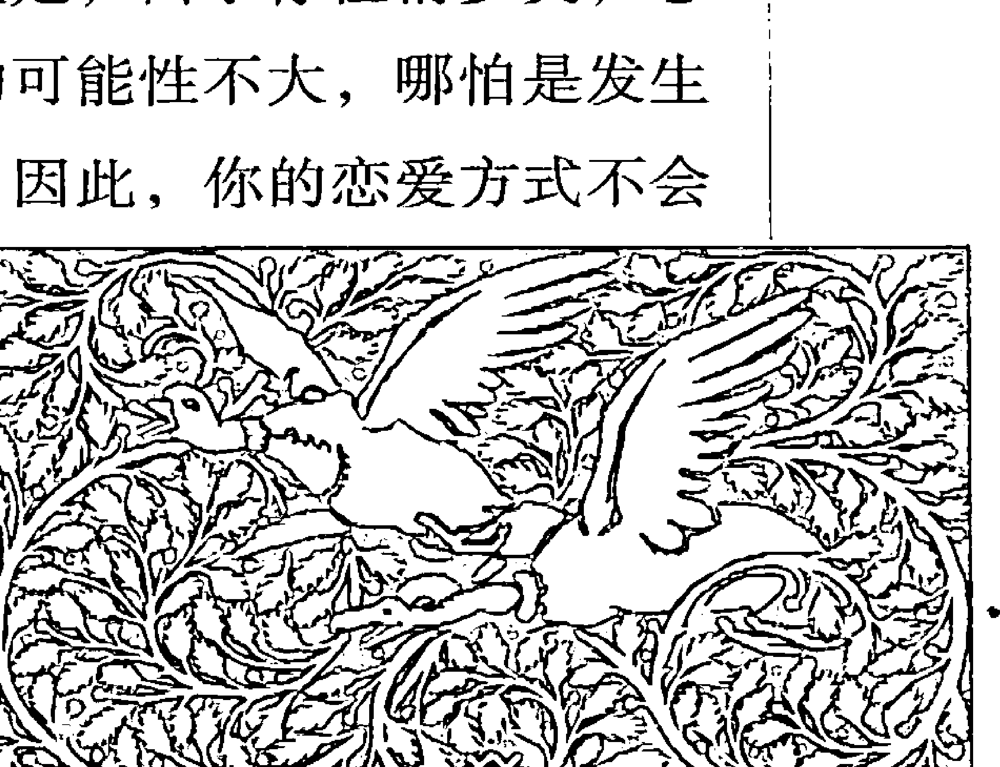

你对异性及性爱的好奇心极为旺盛。在性方面你是比较开放的，所以，如果有了爱意，会很自然地发展到肌肤之亲。不过，即使在发生性行为时，你也会保持一份清醒，把这一切看做是你性知识的积累。

注意！不要把爱情视为游戏，玩火必然自焚。要精心地挑选你的恋爱对象。

##### O型双子座的婚姻

你在选择伴侣时会十分挑剔，你会理智地衡量对方的一切，例如经济能力、外表的吸引力、内在美，等等。即使在恋爱的时候，你也不会时盲目地喜欢对方，你总不忘记以冷静的头脑来衡量对方。所以，O型双子座的婚姻大多会是理智型的，如此婚姻虽然缺乏热情和戏剧性，但会顺利维持下去。

注意！要想成就幸福美满的婚姻，必须培养你的热情。

##### O型双子座的家庭

你有着超人的悟性，判断力极强，因此在家庭生活中，你极少做出愚蠢荒谬的事。什么样的人适合做你的伴侣，你往往是心知肚明的。但是，你偶尔也会因热恋的激情而结婚，虽然浪漫有加，却潜伏着危险。当激情退却，面对现实时，一旦发生矛盾，就什么都来不及了。情人眼里的西施也不复存在，代之以可以触摸的一切，因此而影响家庭生活。所以，你对成家要考虑周全，然后再付诸行动。

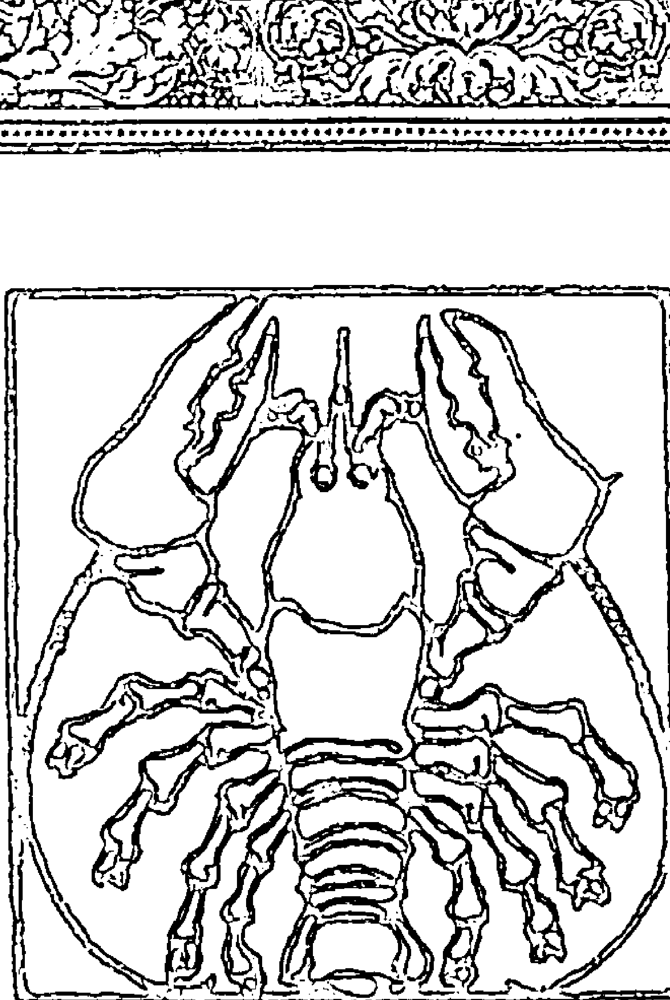

## 巨蟹座

特征：最需要永恒的爱与安定，非常注重家庭；为人慈爱，善解人意，是十二星座中最有母性的，男性亦然。

* 元素：水元素族
* 季节：夏季
* 主宰行星：月亮

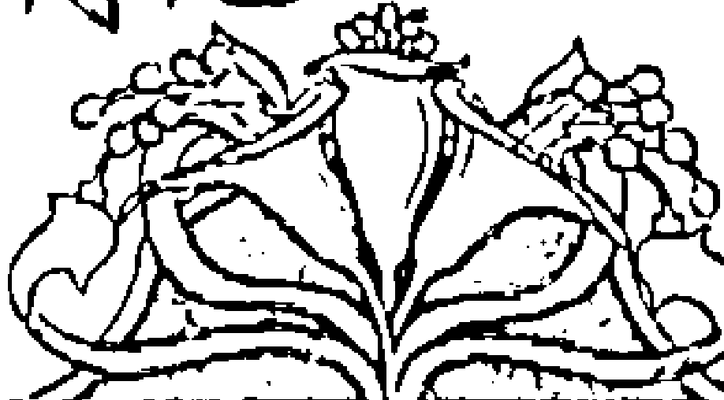

### 第一节 巨蟹座简介

#### 一、巨蟹座的传说

宙斯第一眼看到凡间美女雅美娜时，便被她灿烂的笑容给吸引住了。“真是人间绝色啊！”宙斯心里赞叹道。

宙斯展开攻势，很快便获得了她的芳心。不过，他们之间的关系一直是瞒着天后希拉的。然而，雅美娜怀孕的事最后还是传到了希拉耳朵里，希拉决定给宙斯和雅美娜一个教训，“你们的儿子虽然半神半人”，希拉诅咒道，“但他并不一帆风顺，一生中必须接受12种危险的挑战”！

不久，雅美娜生下一个健壮的儿子，取名为海克力斯，他天生拥有神力，长大后成了举世闻名的大力士。“我是天下第一强者！”海克力斯骄傲地说。

而这正中了希拉的诡计，她派人告诉海克力斯：“你必须要历经12种磨难，打败怪兽，才能成为真正的勇士！”海克力斯毫不犹豫地接受了挑战，出发寻找躲在阴暗角落中的大怪物。

有一次，海克力斯与一头巨大的九头蛇怪西格拉展开生死决战。由于他已经通过了好几次考验，希拉难免有点担心。“我决不让你通过这次考验！”希拉恨恨地说，并悄悄地指派一只大魔蟹前去帮助西格拉。大魔蟹趁海克力斯不注意的时候，伸出巨大的螯夹住了他的脚。
海克力斯疼痛不已，怒上心头，低头骂道：“哪来的怪物？竟敢妨碍我和九头蛇怪决战！”盛怒之下，猛地躲开西格拉的攻击，一转身，用另外一只脚把大魔蟹踩死了！
希拉为了感谢大魔蟹的尽忠职守，把它的身形放在天空中成为巨蟹座。三月下旬的黄昏，在偏南方会出现一个星团，被蟹壳包围住，这便是巨蟹座。

#### 二、巨蟹座(Cancer)概况

生日：6月22日至7月22日

星座代表人物：
- 杜邦（企业家）（6月24日）
- 海伦·凯勒（6月27日）
- 泰森（6月30日）
- 黛安娜王妃（7月1日）
- 福特（美国总统）（7月14日）
- 海明威（7月21日）

巨蟹座最需要的是爱与安定。但巨蟹座的人生性多疑，会让别人觉得缺乏安全感。还好，带着母爱光辉的巨蟹，会为了真爱而心甘情愿地付出。

巨蟹座的个性魅力

忠实、可靠、幽默而风趣，富于情感变化，有着难以言表的神秘魅力。

巨蟹座的性格特征

巨蟹座是十二星座中最具母性的星座，男性亦然。你为人慈爱，善解人意，待人宽容，对家人与好朋友都非常忠诚。你性格豪爽，为人大方，对处于危难的人会热情相助，你希望人们需要你。

巨蟹座的人具有旺盛的精力和敏锐的感觉，有洞察一切的能力。你有着很强的记忆力，好奇心强烈，想像力也极丰富。你的守护星是月亮，月亮的阴晴圆缺会时刻反映你的内心。你喜欢探索别人的秘密，却把自己隐藏得很好。

大部分巨蟹座的人道德意识极强，自尊心也很强，性格上比较内向、羞怯。你可能表面上很放得开，但内心却是缺乏自信的。你对于新环境的适应性较差，虽然对新的事物很感兴趣，但你的本质却是很传统、恋旧的。你总是能意识到自身的双重个性，或者说，你对自身情绪的感受力特别强。

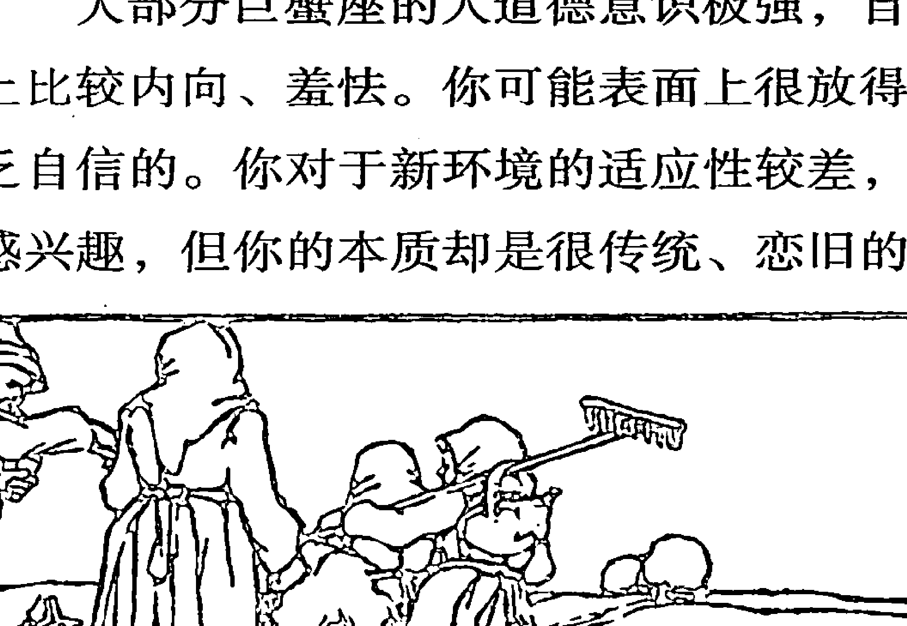

巨蟹座的财运

你有着很好的经济头脑，能够合理安排自己的财产，会过着比较平稳的生活。

巨蟹座的理想恋人

一句话，你可以为了爱情而放弃一切。为了家庭，你会无悔地付出。因此，你的恋人应该能满足你这种希望，他(她)要擅长社交，要对你忠贞而诚实。你喜爱肌肤之亲，所以对方性感与否也是重要条件。

巨蟹座的恋爱技巧

你情感丰富而且充满柔情，重视家庭，但有着较强的占有欲，所以你的恋人应该性格宽厚而温和，不能对你有过激言辞，对方如能对你多加肯定，会让你信心百倍，如若横加指责，你们就会走到尽头。

巨蟹座小档案

| 守护星 | 月亮(象征情绪和感觉) |
| :--- | :--- |
| 守护神 | 希腊—阿特密斯 罗马—戴安娜 |
| 幸运石 | 珍珠和月长石 |
| 幸运色 | 银色、白色 |
| 幸运日 | 礼拜五 |
| 幸运数字 | 8、3 |
| 幸运地点 | 近水或水上的地方 |
| 最欣赏的星座 | 天秤座、天蝎座 ✔ |
| 最信任的星座 | 天秤座 ✔ |
| 最佳学习对象 | 摩羯座 |
| 最佳工作搭档 | 狮子座 |
| 最易被影响的星座 | 白羊座 |
| 最易掌握的星座 | 狮子座、天秤座、水瓶座、金牛座 |
| 最需注意的星座 | 处女座、射手座、白羊座、双子座 |
| 同类型(水象)星座 | 天蝎座、双鱼座 |
| 对立星座 | 摩羯座 |
| 80%协调星座 | 巨蟹座 |
| 90%协调星座 | 处女座、金牛座 |
| 100%协调星座 | 天蝎座、双鱼座 |

巨蟹座女性的性格、情感

巨蟹座的女性身上带有浓厚的母性，母爱之情在这一星座的女性身上得到了充分的体现。你一旦有了家庭，就会将全部精力投入到教育和培养孩子上，为了孩子你可以付出一切。

青年时代，你会比别人更多地受到家庭的影响，有时会因此而影响到你的婚姻。你对往事总是难以忘怀。你会经常反思自己，以便更加清醒地认识自己。你喜欢明朗而深邃的音乐，崇尚简单而流畅的艺术，追求深沉而婉约的理想。

你对一切充满幻想，本性天真而温柔。你很开朗，而且童心不泯，有时会显得不够成熟。你很专情，但有时会分不清到底哪一位更应该珍惜。你渴望别人的信任，在人前你会柔情似水，风趣幽默，而且充满诗情画意。

但是，你的神经过于敏感，有时难以自控。在无声无息的生活中，你会形成忧怨哀愁的性格。你渴望宁静、和谐与安全的生活，会时常陶醉在自己的小天地里。但是，死气沉沉的气氛、枯燥的生活是你不能接受的。你希望你的住所能够陶冶你的性情，并会为之努力。你渴望从一个年长的男性那里得到父爱或保护。

与巨蟹座女性相宜的男性：与天蝎座的男性相处，会激发你炽热的情感；生辰星位在摩羯座的男性会理解你的心意，带来你所需要的安慰和爱护；双鱼座的男性会与你志同道合，共享人生之乐。

巨蟹座男性的性格、情感

你不喜欢热闹的场所，而是向往美好的旅行和奇异的探险，这显示了你文静而浪漫的一面。在现实生活中，你是稳重而有魅力的人，遇事有自己独到的见解。对待事业和生活，你会极其认真，然而有时会显得顽固不化，如果旁人违背了你的意愿，你不会通融，会把自己的意见坚持到底。你性格内向，而且生性过于敏感，这会使你很容易由于别人有意或无意的怠慢而情绪变坏。你遇事常常会想到以逃避来解决，那些纠缠不清或不愉快的事情你不想招惹，因为你知道自己很容易受各种烦躁不安的影响。

从表面上看，你的性格是充满温情而喜欢顺从的。你在完全属于自己的空间内，在与妻子、孩子或知己相对时，会充分地展现自我，抒发出内心的情感。你待人平和，容易相处，很愿意帮助人。

巨蟹座的你非常需要别人的信任，而且对异性情感的需求很强烈。在你的一生中，母亲对你有着至关重要的影响，因此，你在选择恋人时也会受到母亲潜在的影响。巨蟹座男性的真正幸福是在孩子身上，你会把自己全部的父爱献给他们。家庭对你来说是最重要的。你真诚的父子之情也会为你带来精神上的稳定与平衡。

与巨蟹座男性相宜的女性：你与热烈的天蝎座女性能产生激情；生辰星位在摩羯座的女性能够让你在繁忙的工作中获得轻松；你会喜欢与你同样充满温情的、爱幻想的双鱼座女性。

### 第二节 巨蟹座与血型的关系

一、巨蟹座／A型

#### A型巨蟹座的气质、性格

巨蟹座的支配星是月球，主掌着人类的感情，象征着母性的爱，所以你身上会有极强的母性化倾向。你心地善良，感情细腻，对于弱小充满了同情怜爱之心，对于暴力行为，会坚决抵制。你对一切都感觉敏锐，平静的时候波澜不惊，但若稍有风吹草动，你心中就会泛起层层波浪。你的感性化可能让你在做决定时不够理智，无法客观地分析事物，这会影响到别人对你的信赖。
你的爱如大海般深沉，同样，对于恶势力你也恨之入骨，这样鲜明的爱恨有时会影响到你的人际关系。你喜怒哀乐的变化过于明显，这会让人觉得你过于情绪化。但在一般情况下，你态度柔和，待人热情，会让大家觉得你的脾气是很温顺的。不过，若有什么事情让你不如意，你会立刻板起面孔，对人极为冷淡。你有时会认死理，这会让你心情愈加恶劣，从而对人更加冷漠。其实，你只要稍微控制一下自己的情绪，便会是一个更受欢迎的人。

你是个讲原则的人，重视生活常识，喜欢安分守己、脚踏实地过日子。这说明你比较传统。你对往事念念不忘，想让你改变原有的生活方式或创造新的事物，是非常困难的。你可能会稍做一些让步，但不喜欢动摇原来生活的根基。

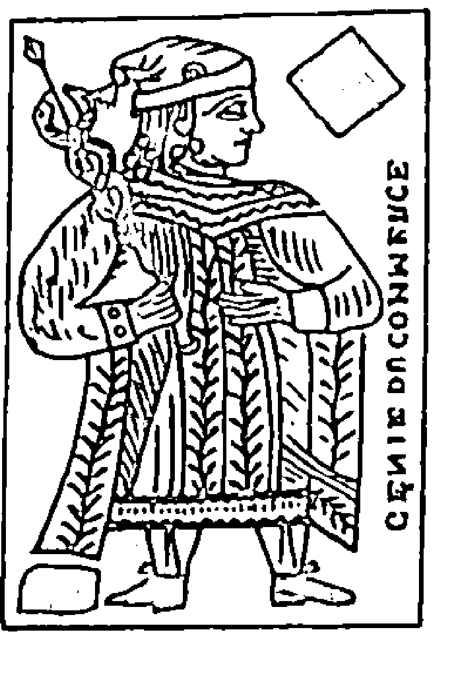

你的社会属性非常明显，即对自己的国家、民族及生活习惯非常热爱，同时，你有着很强的团队合作精神。巨蟹座的你，重视朋友的程度是其他星座所不能比的，但你可能会因此有结党之嫌，而且会让人觉得你有些自私。无论你置身任何集团之中，你只与情投意合、谈得来的人交往，这样你的人际关系便显得不够宽广，从而会影响到你的前途和发展。

注意！不要只把眼光放在自己的小家之内，应该努力地开拓视野，这对你的发展更有好处。

#### A型巨蟹座的事业

A型巨蟹座的你，有着极强的耐性，无论从事什么工作，都能贯彻始终，很少有半途而废的情形发生。在事业上，如果你有幸遇到志趣相投的合作伙伴，那你就会如鱼得水，施展自如。所以，在你的事业中，最好能有一位好的搭档来与你共同奋斗，这样你更容易功成名就。不过，你有时会不够理智，做事缺乏果敢，而且难于听取别人的意见，如不加以注意，会影响到你与搭档的关系，从而影响事业的发展。

你对家庭情有独钟，喜欢一个舒适、安全的居住环境。

所以，最适合你的职业应该是有关建筑或室内设计的工作。你有女性化的倾向，凡事总以家庭为重，即便你是男性，你的顾家意识也超出常人。你会为家而牺牲自我，若你是女性，就会是个典型的贤内助，无私地为家庭而奉献。因此，你适合从事的职业，以能发挥你天生细腻的感情的工作为主，例如护士、保姆、小儿科医生等等。另外，有关食品的工作，例如厨师等，你也可以很称职，因为你是比较喜欢美食的。

注意！ 要增强你的理性，克服情绪上的弱点，这样你的人际关系会更好，事业也会因此而不断发展。

#### A 型巨蟹座的财运

A 型巨蟹座的你，理财能力很强，善于储蓄。这是因为你重视家庭，关爱孩子，要为家庭的将来着想。不过，你的储蓄观过强了，以至于让别人认为你小气，这会在不经意间拉开你与朋友的距离，你的人际关系会因此而受到影响。

但你的财运确实不错。你的财富是日积月累型的，你会选择最稳妥而且没有风险的存钱方法，愈到晚年，你的财富愈丰富，生活得愈舒适。你很会精打细算，懂得收支平衡，你会从每个月的薪水中拨出一定数目存人银行，其余则妥善运用。

在生活中，你不会因一时冲动而大手大脚地花钱。买东西时你会慎重考虑，认为合算才会购买。正是这节俭的作风让你的生活没有后顾之忧，安安稳稳。入不敷出的情况在你身上是不可能发生的。

注意！在储蓄的同时，你要知道该花的钱是不能省的，否则会落下吝啬之名。

#### A 型巨蟹座的爱憎

A 型巨蟹座的你，谈恋爱时并不需要特别的甜言蜜语，过分地粘粘乎乎你是不喜欢的。你不会为了追求时代的潮流而趋炎附势，你觉得只要双方真心相待，便“我心足矣”。至于约会的地点，你并不会太在意，你注重的是两人之间的感觉，铺张浪费的场面你觉得是没有必要的。

你更喜欢两人一起的小家庭氛围，喜欢跟所爱的人一起分享生活的情趣。你们在共同参与一件事时，会更容易体会到亲密无间的感觉。A 型巨蟹座的你，母性强烈，注重家庭，谈恋爱会以结婚为前提，决不会玩世不恭，也不会为了爱而觅死觅活，因此你的恋情多数是波澜不惊的。

A 型巨蟹座的男性会有女性化倾向。你外貌文质彬彬，有时显得啰嗦，让人难以适应。在谈恋爱时，你会不断地向对方讲述你的童年轶闻，而且多以家人为话题，这是因为家庭对你的影响太过深远。A 型巨蟹座的女性是典型的贤妻良母。你会对恋人倍加关心，充分表现出温柔体贴的一面，谁若有幸娶你为妻，真是受到上天的眷顾了。

你谈恋爱的目的非常明确，那就是结婚。你会将对方设想成你的配偶，幻想未来的婚姻生活。你希望两人能相互理解，相互扶持，建立起幸福美满的爱情小巢。与异性交往时，如果你觉得对方并不是合适人选，你就不会给他(她)机会，更不会发展到爱情。你一开始谈恋爱，便会把对方带到家中。你重视家人对他(她)的看法，想让对方能够和家人相互了解。你所做的这一切，都是为将来的婚姻打基础。

你过多的现实考虑会使你的恋爱过程显得有些平淡，除了安定之外，便没有什么荡人心魄的了。那种闪电式的爱情，顷刻间坠入情网的浪漫，是很难发生在你身上的。你对性的渴望并不强烈，如果你是女性，更是如此，因为你更注重重精神上的感觉。所以，你很少会做出冲动的事情。

> 注意！恋爱时要张弛得当，追得太紧有时会适得其反。

#### A 型巨蟹座的婚姻

因为你的恋爱目的明确，所以你的恋爱史会比较短暂而单纯。如果你认为已经找到了符合自己条件的恋人，而且对方也愿意和你组织家庭，那么，在亲朋好友的支持下，你会很快与爱人筑成爱的小巢。

如果你的家庭出现了危机，你会以孩子为中心，为了孩子的健康成长，你可能会放弃自己的理想。孩子是你眼中最珍贵的，是孩子让你有了维系婚姻的动力。因此，你有可能非常宠爱孩子，甚至会变成溺爱，这对孩子是极为不利的。试想，如果他们连独立生存的能力都没有，将来靠什么在这社会中生存？

> 注意！不要过分地疼爱孩子，应该让孩子有些锻炼的机会。吃些苦对孩子不是坏事。

#### A 型巨蟹座的家庭

巨蟹座的你，是十二星座中最家庭化的一个类型。如果你是妻子，那么肯定很会相夫教子，你会全心全意照顾自己的家庭，努力把女性的所有角色充当好。你会为家庭而无私付出，为了孩子你可以奉献一切，对他们宠爱有加，而且会很重视对孩子的教育，希望有朝一日孩子成为你的骄傲。

你若是 A 型巨蟹座的男性，那么你会兼具本座女性的优势。做事时你会充分考虑到家庭，你会主动帮助太太做家务，母性的倾向会让你对孩子耐心而体贴。你很有生活情趣，会通过自己的双手让家庭更加温馨而幸福。你会是个名副其实的模范丈夫。

#### 二、巨蟹座/B型

##### B型巨蟹座的气质、性格

B型巨蟹座的你，生性质朴，最不能接受冠冕堂皇的花架子和不着边际的言谈。与人相处时，你不会惺惺作态。你对周围的人和事都十分关心，而且心肠慈善，看到别人有难，自会出手相助。不过，即使你去助人，也不会大张旗鼓。你是刀子嘴豆腐心，不喜欢说什么好话，却能实实在在地助人。

与人交往时，你会赤诚相见，与朋友处得亲如一家。你非常渴望友谊的滋润，如果没有友情，你会觉得孤独而寂寞。但你可能会不得已而孤独，因为你的朋友很难做到你所要求的知无不言、言无不尽。毕竟，再亲密的朋友也需要有一点自由空间。

你对友情的要求很高，对朋友的选择非常谨慎。对于好友，你会以诚相待，不分彼此。但在你的性格中，热情和冷淡同时存在，所以你的表现也因此而矛盾，让人难以看到你的内心深处。“道似无情却有情”，是你的真实写照。

你直觉敏锐，感情丰富。你会让理想的翅膀任意遨游，蓝天白云，小桥流水，都会让你浮想联翩。你喜欢比较舒缓的生活节奏，安静而祥和的意境会让你心驰神往。你重视人生，渴望生活的完美，因此对于生活中的矛盾和冲突，你会努力地将自己置身事外，只顾享受自己的理想。

B型巨蟹座的你，个性鲜明而独特。你的爱博大而宽广，在帮助别人时，不计回报，对方的衣食冷暖都是你所关心的。你的感情细腻而丰富，因此在考虑事情时难免有缺乏理性的表现。你努力地要分析事实，但最后总是分不清情况，难以明断。

你对环境的适应性比较强，对于外界的风云变化，你会以自己的坚强意志为基础，决不向困难妥协。B型巨蟹座的女性可能会让人觉得不易亲近，这不奇怪，如果你胸怀不够宽广的话，自然会影响到你的女性魅力，人际关系也会随之受损。

注意！以平和的态度对人，这会让你的交际更加广泛。做事时要注意理智，如果感情用事的话，最后吃亏的是自己。

##### B型巨蟹座的事业

B型巨蟹座的你，统观全局的能力稍微欠缺，而且创造力也不太强。所以，你比较适合从事公司里实务方面的工作，最好不要自己组织公司当老板，比较适合于你的工作如：总监、人事经理等。如果你是女性，那么可以尝试美容美发业，开一间美容屋或化妆品专柜，你会经营得比较顺手。另外，幼儿园老师、童装设计师、玩具设计师等也比较适合你。

就你的运势来看，从事有关衣、食、住、行的行业，可为你带来一笔财富。室内设计师、服饰店、食品公司、超级市场等跟大众有直接关系的工作，比较适合你，在这一领域里你会有所作为，但你的店应该比较照顾大众层次，最好不要经营高级店。

注意！如果你想自成一家，就要先培养创造力和策划力，增强自己的实力。

##### B型巨蟹座的财运

B型巨蟹座的你，不宜投机，而是应该稳扎稳打，步步为营，这样才能积累财富。想要瞬间暴富，你是没有这个运气的。你追求的是稳定的生活，会时刻考虑到家庭生计。你有存钱的习惯，经济观念也很强，因此大致上来说，你的财富会和你的年龄成正比，愈上年纪，财富的积累也愈多，晚年的生活会非常富裕而安定，不用为钱发愁。

不过，你的节俭有时会弄巧成拙。比如，你会图便宜而不舍得花大钱买好货，结果得不偿失。你不太注意日常的娱乐，因此当你觉得压力太大而想放松的时候，会由于一时冲动而把好不容易节省下来的钱一股脑全花光。如果你的个性中有此倾向，那么你的财富积累到了一定程度便不再增加。

注意！生财有道，不要妄想靠投机来取胜，否则最终可能会血本无归。

##### B 型巨蟹座的爱情

B 型巨蟹座的你，性格中较少主动，谈恋爱时也总是居于被动地位。你是个感情丰富的人，但因为性格过于小心谨慎，所以别人很难得到你的感情。你喜欢阅历丰富的人，觉得这样的人会比旁人更懂得真情的可贵。这可能源于你追求安定的性格吧。

一般情况下，B 型巨蟹座的人都有单恋的倾向，纵使你心中已经激情荡漾，却难于表达出来。你会天真地认为，一切尽在不言中，对方会感觉到你的，但结果却往往是错失良缘，落得人去楼空。你甚至会幻想着对方已经成为你的梦中情人，但你在行动上却很难将梦想实现。其实，你自身条件优越，只要再勇敢些，就会让你的梦中情人因此而感动，你也就有可能结得美满姻缘了。

你喜欢稳妥的恋爱方式。你谈恋爱从不玩心眼儿，也不会抱着游戏态度。你恋爱的目的就是要最终走上婚姻礼堂的红地毯，所以你在选择对象时，会深思熟虑，直到找到一个与你志同道合的人为止。

如果你是 B 型巨蟹座的女性，往往会是标准的贤妻良母。你谈恋爱的方式与其他星座不同。你喜欢带着恋人四处拜访亲朋好友，希望得到亲友的肯定与祝福。到恋人家中作客，你必定很自然地挽袖下厨做羹汤。B型巨蟹座的男性基本上与同血型、同星座的女性相同，所欣赏的对象也是那种能够相夫教子的传统女性。

在性的方面，你不会接受没有爱情的性行为。你认为有情之后才能有性，否则是不认真的。但如果你与对方情投意合，你对性也会积极而主动。

注意！再勇敢一些！幸福与你只有一尺之遥，只等你去努力争取了。

##### B型巨蟹座的婚姻

B型巨蟹座的你不拒绝相亲的方式，年龄到后，一般会成家，极少人上了年纪仍然是孤独一身。如果过了适婚年龄而没有适当的对象，你会让自己尽快成家，因为B型巨蟹座的你观念比较传统，不愿让人看作另类。

你与人为善，跟邻人处得很好，会主动帮助他人。你一切以大局为重，在家庭中更是如此。但是，巨蟹座的人到了中年之后，会特别想尝试一下外遇的滋味。你的家庭责任感会让你对自己的邪念有所控制，所以你很少会付诸行动。婚姻对你的人生实在太重要了，你不想冒这个险。

注意！千万不要玩火自焚，婚外情虽然刺激，但会让你付出昂贵的代价。另外值得一提的是，B型巨蟹座的女性很喜爱孩子，容易变成溺爱。

##### B型巨蟹座的家庭

B型巨蟹座的你，非常重视家庭。结婚之后，你会比单身时更努力工作，个性也变得更加沉稳。你有着宽广的胸怀，在日常生活中，即使夫妻两人意见分歧而发生争执，你也会让着对方，因为你认为家就应该温馨和平，不能因一时的情绪而扰乱了安宁，毁坏了和谐。你会极尽宽容之道，让家庭生活更美满、更幸福。

B 型巨蟹座的女性会把家当作自己的全部。你会非常顾家，婚后多半会辞去工作，甘心做家庭主妇，家中事无巨细都会亲自过问，把家里的一切收拾得干净整洁。B 型巨蟹座男性很有生活情趣，你会留心地将值得纪念的日子记在心中，用实际行动来表达对家的眷恋。你是个典型的模范丈夫，也会是个受孩子欢迎的好爸爸。

#### 三、巨蟹座／AB型

##### AB型巨蟹座的气质、性格

AB 型巨蟹座的你，是属于谨慎而敏感的人。如果有人不断地表达对你的好感，要与你交心，你会在心里推测对方到底为什么这样做。你会因此而更加小心翼翼，不想让人轻易进入你的内心世界。你外表上还是心平气和的，可心里会严阵以待。如果有人能看穿你，你会觉得自己像是被脱光了衣服站在众人面前，于是会心情忧郁，非常压抑，而且久久无法释怀。这种情况下，你极有可能变得偏激，并通过刺伤别人来平静自己的内心。

AB 型巨蟹座的你，给人的最初印象是做事有条不紊，冷静而理性。实际上，你很有可能是个感情重于理智的人。你自我保护的意识很强，时刻做好应对各种突发事件的准备。不过当你回到家里，或是一人独处时，你就会撤去防范之心，如果此时有突如其来的事情刺激了你，你的反应必是相当激烈。你总是用理性的外表来保护自己，以免让感情受到伤害，这会让人觉得你有些自闭。其实，让别人多了解自己，可以得到更多的知己，同时也可以趁机磨练一下自己。千万别太闭塞。

AB 型巨蟹座的你，很是善解人意。你能很敏锐地了解别人内心的烦闷，而且总是耐心地为别人排解纷争。你仪态儒雅，待人不笑不说话，如果别人有困难找你帮忙，你肯定会极尽所能热心相助。即使是对自己不很喜欢的人，你也能保持应有的礼貌，你觉得与任何人相处都要温和有礼，这样才能赢得大家的好感。

AB型巨蟹座的你，在与人发生矛盾时，不会失去理智。你会以大局为重，以和为贵，决不会义气用事。如果问题严重，你可能会选择躲避，不想让矛盾升级，“退一步海阔天空啊”！如此的你，当然不可能和别人打架闹事。你虽然热心助人，但却不会去管闲事，因为你最怕不和谐的气氛，所以永远保持中立，而且会如和平鸽一般，为有误会的双方调解。这种角色会让你有相当不错的人缘。

从 AB 型巨蟹座的本性来看，你并非真的特别喜欢照顾别人。你之所以积极地帮助他人，最终目的还是保证自己平和的心境。这样的心理特点更证明，在十二星座中，巨蟹座是属于自我防卫能力最强的，有时因为过于保护自己，会变成过度的个人主义。

注意！别过分地封闭自己。敞开心灵之窗，会发现天高地阔，令人舒畅，这也会使你的心态更加平和。

##### AB 型巨蟹座的事业

你是现实主义者，所以在选择职业时绝对不会脱离现实。在寻找职业时，你常会走上一段艰辛漫长的路。你的事业发展可能不会一帆风顺，想要稳定下来并不容易，所以，你最好能找一些跟生活密切配合的工作，比如，服饰生意、食品业、房地产买卖等，在这条道路上你更容易成功。

如果不从这些行业着手，你可以另外寻找跟大众直接接触的工作，例如公共事业、服务、顾问、创意等等。假如你是女性，可能在婚前更适合于这些工作，一般情况下，你在结婚之后会完全以家庭为重，专心在家做个贤妻良母。

注意！挫折和坎坷是每个人前进中必然会遇到的，它是人生的试金石，如果你勇敢地面对，不放弃进取之心，成功的大门会永远为你敞开。

##### AB 型巨蟹座的财运

AB 型巨蟹座的你，最好的致富途径应该是储蓄。平衡收支会让你的财富稳中有升，另外，定期存款，选择信誉良好的股票投资，投资不动产，都是你不错的致富之道。你的财运不够宽广，不过还是能够不断地积累财富。

你的财运相当稳定，但不太可能一夜暴富，因为你没有偏财运。所以，你要扎扎实实地努力，慢慢积累财富，不要期望天上掉馅饼这类美而不实的事。如果你要投资股票，一定要三思而后行，要有自己的主见，以免受骗上当。另外，赌博、投机事业只会给你带来坏运道，你是难以承受这种大起大落、惊心动魄的刺激的。而且，你的魄力不够大，难以当机立断，所以，一旦跟投机事业沾上边，多半会损失惨重，血本无归。

注意！投机事业千万碰不得，稳扎稳打，才会使你的财富稳中有升，储蓄是你最好的理财之道。

##### AB 型巨蟹座的爱情

AB 型巨蟹座的你，感情丰富，一旦谈起恋爱，会如兄长般把对方照顾得无微不至，更会以无比的包容与对方相处。在平常情况下，你看起来一副充满理性的模样，相当冷静，这或许是因为你过于用理智保护自己，不想为情所伤。可是，当你坠入情网之后，便会情如泉涌，一改往日的冷淡，甚至达到忘我的境界，将自己完全沉浸在爱河之中。

对于恋人所提出的要求，你会尽力满足。虽然表面上你不一定言听计从，但是在内心深处会对恋人的一切都很重视，决不会轻易拒绝或离开对方。总之，在行为处事上都理性十足的你，一遇到感情问题，便无所适从了。恋爱中的你会表现得失魂落魄，旁人很容易就能看出你在恋爱。

AB 型巨蟹座的你，内心充满柔情蜜意，却矜持着不表现出来，等到对方主动发出爱的讯息，你才肯有所回应；在对方没表明态度之前，你虽然满心期待，也不会主动采取行动，宁愿让自己心里七上八下地猜测。

你一般是被动地等待爱神的光顾，这种等待的心态使你很难寻觅到真正的感情。所以，单恋的情况在你身上较多，你会因此而痛失所爱，只能暗自伤心落泪。爱情与你失之交臂，怎能不让你痛心疾首呢？

AB 型巨蟹座的人多愁善感，但对过去的恋情却不会耿耿于怀。这可能因为你太过现实，会让自己尽可能地少受伤害。如果你想获得真正的恋情，就要收起你用来保护自己的冷淡言行，别因冷漠而引起别人的误解，从而失去获得真爱的机会。

AB 型巨蟹座的你，一旦进入爱情的浪潮，就会完全疯狂地失去理智。爱火一旦点燃，就会一发而不可收。你会全心投入，很自然地由爱到发生性关系。你对性是比较开放的，这令人难以理解。

注意！冷淡只会让人畏而远之，既然你心中期待爱情，何不让爱情之火代替你的冷漠？这样你的爱情会更加美好而幸福。

##### AB 型巨蟹座的婚姻

AB 型巨蟹座的你，并不奢求轰轰烈烈的恋爱，你的理想是：在一场平凡的恋爱之后，二人携手走入结婚礼堂。你希望自己的一生能风平浪静地度过，或许别人觉得这样的恋爱缺少激情，但是，这却是你理想中最踏实、最幸福的归宿了。

此型的你，一旦走入婚姻礼堂，便会以家庭为生活的重心。如果无法建立一个安定幸福的家庭，你也就不会维持爱情，因为在你看来，没有结果的爱情是毫无意义的。你会立刻放弃原有的对象，再去寻找适合你的终身伴侣。可以说，婚前的你是非常理智的，为了婚后的稳定与幸福，你会不惜多花一点时间寻找结婚对象。你不想因一时冲动而陷入错误的婚姻，造成一生的悔恨。

AB 型巨蟹座的女性会乐于在家中相夫教子，如果谁选择你做为终身伴侣，是他的福份。而此型的男性通常工作都非常勤奋，是个保护妻子、儿女不遗余力的好丈夫。你很明确自己想要什么样的人来结婚，一般情况下，你都能以美满的婚姻证明自己眼光正确。

注意！家庭生活虽然现实，但不可以缺少情趣。多一些温情吧，这会让夫妻关系更为和谐。

##### AB 型巨蟹座的家庭

AB 型巨蟹座的你，在考虑结婚之前，会慎重地将对方的条件与你的标准一一对比。你会考虑得非常周全，对方不仅要适合你，还要适合你的家庭，因为你希望能获得亲朋好友的肯定及祝福。你要求对方一定要同你一样顾家，而且你会考虑到非常现实的条件，希望对方能够量入为出，懂得节俭。其实，这些条件只不过是你追求平稳的表现罢了。

你的家庭会是和睦而幸福的。不过，由于你太重视现实，所以对一些事情你可能处理得不够豁达，这会使家庭缺少一些生活情趣。你的家庭虽表面上和谐，却谈不上亲密、美满。你甚至会现实到不通人情的地步，甚至会认为最甜蜜的夫妻生活也只是为了养育下一代，这当然会引起对方的反感。

不过，对于家庭中所发生的一切争执、摩擦，你都能以和谐为主要原则，让事态逐渐冷却，慢慢消化。即使像外遇这样严重的事故，你也会顾全大局，为了给孩子一个完整的家庭，你可能会委曲求全，尽力维持家庭的存续。

#### 四、巨蟹座/O型

##### O型巨蟹座的气质、性格

O型巨蟹座的你，性格上比较保守，你会遵守世俗的观念和传统的生活形态。不过，对于生活中那些无价值的繁文缛节，你是有勇气摒弃的。如果你的性格中有突变成分，那么你可能会改变自己的生存方式，不过，你很可能因改变得太过火而有些不合时宜。实际上，你的生活态度和价值观都相当保守，即使有部分的思想改变，你仍然不会走在时代尖端。

你具有强烈的恻隐之心，情感细腻，感觉敏锐。你能清楚地分辨敌人或伙伴，这是 O 型巨蟹座的你与生俱来的特性。你对自己的言行有一定之规，而且希望向能够发挥聪明才智的团体靠拢，你的性格使你很容易赢得他人的好感和支持。你对奇异事物的感知能力较强，相信机遇，为此，上天也会特别照顾你，幸福会出其不意地降临到你头上。

你是典型的热爱生活的人，绝对不会产生与现实生活脱节的想法。虽然你的感情很丰富，但绝不会向往乌托邦，而是一切立足于现实。这或许是由于 O 型气质的缘故。你有极强的适应能力，生活中的千变万化不会打破你原有的准则。但你不会固执到顽固不化，而是会根据现实情况调整自己。不过，你不会主动地改变现状。

你对势力范围的界限区分得一清二楚，对于陌生者的闯入，你是十分反感的。你在潜意识里把自己的生活领域规划出来，而你就是这个范围内的主人。你会对你的亲朋好友相当照顾，但对远近亲疏分得很清楚，对于你认为不相干的人，你会显得异常冷淡，懒得付出自己的感情。所以，你对待人的态度，取决于你是把他当作朋友还是路人甚至是敌人。

注意！不要过分地固执，这会影响你的人际关系。

##### O 型巨蟹座的事业

你在工作上最不利的因素，便是人际关系容易发生问题。因为，你总以既定的好恶标准来对待周围的人，而且，你缺乏知人之明，只凭初次印象来判断人，这往往会与实际情况有出入。你对事情的看法过于求实，有时会显得死板，这会让你觉得你眼光不够长远而且缺乏变通。

你天生便具有得天独厚的能力，只要不断努力，成功是指日可待的。但要注意戒骄戒躁，在成功之后，也要与人友善相处，避免因年轻气盛而有失谦和敦厚，只有这样，你的朋友才会越来越多。

你有着极强的适应环境的能力，对职业也有广阔的适应能力。比较适合你的职业是有关衣、食、住的职业，也就是与现实生活有密切关系的职业。你不适合从事脱离现实的学术研究工作，在企业方面最适合担任总务及会计工作。

注意！争强好胜的念头不要太强，要有知人之明，这会有助于你的成功。

##### O 型巨蟹座的财运

O 型巨蟹座的你，如能兼收并蓄，再加上知人善任，那么必有一番作为。至于投机性的事业，你最好少碰为妙，除非你对某种投机性事业有极为深入的了解。你必须先彻底分析自己所获得的资料，然后再采取行动，这样成功的可能性会大些。

你对金钱具有特别的洞察力，如果能发挥这一长处，发财是必然的。你天生在不动产方面有特别的好运，可以尝试。你懂得以财生财，会把积蓄下来的钱巧妙地加以利用，这样你的财源便会滚滚而来。

假如你在金钱上有了损失，必定是因为让小人有了可乘之机。你虽然善于赚钱，却没有知人之明。你会轻易地信赖别人，甚至会委托别人管理你的金钱，这当然会让人有机可乘了。

注意！对于钱财不要太贪，要谨慎交友，时常奉承你的未必就是你的朋友。

##### O型巨蟹座的爱情

O型巨蟹座的你，独占欲和嫉妒心都特别强烈，不能容忍对方稍有二心。当然，你也会同样要求自己。你情感细腻，对你的爱人会百般体贴，极尽关怀之能。你的感情升温会比较慢，但你能慢慢地将对方的心牢牢把握，这正是你的过人之处。

你在恋爱时能保持相当的冷静。你比较沉稳而专情，频繁地更换情人再你是不可能的。但你可能做出超常之举，即可能爱上不该爱的人，比如已经成家的人。这可能是因为你具有恋父情结或恋母情结的缘故。

恋爱中的你，会变得比平日更为谨慎。你能够尽情享受爱情，但绝不会放任自流，做出越轨之事。你在对方态度尚未明朗化之前，会保持应有的距离，不让自己轻入情网。这情形对O型巨蟹座的女性来说尤其明显。经过一段时间之后，如果双方确已陷入热恋之中，你才会放松下来。

O型巨蟹座的你，一旦明确了自己的爱情，你们的关系就会突飞猛进。你对性的需求是强烈的，所以，一旦发生了亲密的关系，就会控制不了内心的激情。不过，你对性行为不都是大胆主动的，尤其是女性，无论如何都不会改变被动的传统。O型巨蟹座的女性对性行为是有点儿保守的，但却有着不同于人的魅力而让对方着迷。

如果有了性爱作基础，你们双方的爱情就会变得十分坚固。在这种关系下，小小的挫折是不会导致你们分手的。不过，你有着强烈的占有欲及嫉妒心，这会影响到你的爱情，可能你的感情过于浓厚，让人有些承受不起吧！因此，分手的例子也是大有人在。但你的分手非常困难，因为你不够勇敢。

注意！对于爱情不要勉强，强扭的瓜不甜，乱麻还需用快刀。

##### O型巨蟹座的婚姻

你渴望安定美满的婚姻生活，希望它能天长地久。如果你的恋爱迟迟没有进展，而且亲朋好友不停地给你压力，也许你会妥协，在没有找到真爱之前就步入婚姻的殿堂。你性情柔顺温婉，很少会强硬地反对什么。你极有可能因相亲而结婚。你渴望平和而稳定的婚姻，所以会尽最大努力维护你的婚姻，即使夫妻间有了问题，你选择的也是忍耐。

巨蟹座的女性是贤妻良母，这是大家有目共睹的。你擅长理家，会把你的婚姻经营得井井有条。你往往会是别人羡慕的对象，你辛苦建立的家庭也会成为别人眼中的模范家庭，洋溢着温馨和幸福。但是，你的柔顺会让你在婚姻出现问题时采取躲避的态度。

注意！鸟美在羽毛，人美在心灵，所以对于结婚对象的选择，内在美比外在美更重要；至于其他的次要条件，不妨把标准稍微放宽一些。

##### O型巨蟹座的家庭

O型巨蟹座的你，具有浓厚的家庭至上的倾向。你把温馨甜蜜的家庭做为精神堡垒，而你自己则是这座城堡的主人。你的性格比较传统，但是你的家庭要比传统家庭更为活泼开朗。

对于已经组建的家庭，你会尽一切努力去维持，即使夫妻间有了矛盾，你也不会轻易离婚。你认为离婚对于双方都会造成莫大的损失，要你放弃好不容易才建立起来的家庭是极为困难的。即使你的婚姻并不美满，你也绝不轻易离婚。其实，只因为爱惜家庭就下不了放弃不幸婚姻的决心，这只能说是一种愚笨的执著。

你有着很强的处理家事的能力，但你的婚姻不一定如你所愿；你会以最大限度的忍耐来经营，可效果有时并不理想。已经没有感情的夫妻关系对双方而言都是一种痛苦，你甚至以牺牲自己的幸福来维持夫妻间名存实亡的关系，但这只会加深双方的痛苦，让你们双方都在郁闷中度日。

## 巨蟹座

## 狮子座

特征：追求气派，喜欢引人注目、被人崇拜；勇猛，霸气十足，是十二星座中最威严的，有贵族气息和王者风范。

### 第一节 狮子座简介

#### 一、狮子座的传说

当宙斯和雅美娜所生的儿子——海克力斯呱呱坠地后，宙斯便知道海克力斯受到了天后希拉的诅咒。宙斯对雅美娜说：“你放心，我们的儿子不会有事的！”

心虚的宙斯不敢违抗希拉，只能尽力照顾海克力斯，让他能够自保，而宙斯做的第一件事便是赐给他无穷的神力。

海克力斯面临的第一个挑战是杀死尼密亚魔狮。尼密亚魔狮巨大无比，还拥有一身刀枪不入的毛皮，这足以让其他人打退堂鼓，但海克力斯却毫不退缩。他背起弓箭和佩剑，四处寻找尼密亚的下落。

在幽暗的森林中，海克力斯终于发现了这只目露凶光的巨大狮子。“咻！”箭笔直地射出去，但是一碰到尼密亚的身体便被弹开。又射了一箭，结果还是一样。海克力斯拔出长剑，往尼密亚身上砍去，宝剑竟然弯了！

尼密亚发怒了，向海克力斯扑来。海克力斯顺手拔起身旁的一棵大树，狠狠打在尼密亚脸上，击中了要害。

宙斯知道海克力斯打赢了，心里很高兴。为了纪念这一决战，宙斯把狮子的身影升上天空，成为狮子座。

四月下旬，在黄昏时的南方天际，可以看到一个被倒放的问号，这便是狮子座。

#### 二、狮子座(Leo)概况

生日：7月23日至8月22日

星座代表人物：

- 萧伯纳（7月26日）
- 圣罗兰（8月1日）
- 舒曼（8月4日）
- 拿破仑（8月15日）

这是一个追求华丽气派的星座。狮子是森林之王，当然希望时刻被人崇拜、被人簇拥，是不会甘于寂寞的。这是一个有着巨大能量的星座，勇猛，果敢，为人讲义气，受人喜爱。

##### 狮子座的个性魅力

狮子座的人能量充沛，但会有些霸气和骄横。这种独特的气质让你独具一番风采。你的风趣和幽默可以使与你相处的人轻松自在。你时刻追寻自我，热情奔放的性格让人羡慕。

##### 狮子座的性格特征

在十二星座中，狮子座最有威严，而且让人感到力量无穷。你受人尊重，做事相当独立，知道如何运用能力和权术以达到目的。在你身上体现着贵族气息和王者风范。

你是阳刚的代表，如日中天。你宽宏大量、开朗向上，做事光明正大、不拘小节。不过，你会有专制、顽固、傲慢、独裁的倾向，而且会暗中注意他人的行动。

你志向远大，心中充满正义感，面对不平，会高举正义之剑，与之一决高下。你会尽最大努力发挥自己的能量来伸张正义，扶助弱小。对弱者你会悲天悯人，对自己则充满信心。你有着很强的组织能力，善于领导他人，做事有条理，能充分发挥你之所长，使成果具有建设性、原创性，是个行动派。

在你的身上也不乏浪漫情调。你向往美丽的事物，愿意将自己的成就示之于人，从而博得人们的赞美与敬佩。你珍视生命，但有些追求享乐。你勇敢，做事有原则，不会鲁莽行事。而且，你有温情，对人友善、体贴、慷慨大方，很容易交朋友，人缘当然也不错。

##### 狮子座的财运

你为人豪爽，对待朋友慷慨大方，所以你的金钱主要用于朋友交际方面。不过，交友广泛也会给你带来更多财源，所以你不会缺钱用，更不会为钱发愁。

##### 狮子座的理想恋人

你渴望时刻受人瞩目，这会让你体会到被人重视的幸福。如果大家众星捧月般对待你，你会感到非常愉快。你相信自己有吸引人的能力，这要得力于你的才干与外貌。你的恋人应该是大方开朗而自信的人，这样才能博得你的欢心。同时，对方要有健壮的体魄，这才与你更相称。

##### 狮子座的恋爱技巧

狮子座的你是重情重义之人。你心无二意，会积极主动地追求爱情，但却不会轻易向人低头。对方若能避开你的锋芒，出现问题后能主动解决，则可与你相守白头。

##### 狮子座小档案

| 属性 | 值 |
|------|------|
| 守护星 | 太阳(象征热情和活力) |
| 守护神 | 希腊—阿波罗 罗马—阿波罗 |
| 幸运石 | 红宝石 |
| 幸运色 | 金色、橘色 |
| 幸运日 | 礼拜日 |
| 幸运数字 | 5、9 |
| 幸运地点 | 宽阔的处所 |
| 最欣赏的星座 | 天秤座、射手座 |
| 最信任的星座 | 天蝎座 |
| 最佳学习对象 | 水瓶座 |
| 最佳工作搭档 | 处女座 |
| 最易被影响的星座 | 金牛座 |
| 最易掌握的星座 | 处女座、天蝎座、双鱼座、双子座 |
| 最需注意的星座 | 天秤座、摩羯座、金牛座、巨蟹座 |
| 同类型(火象)星座 | 射手座、白羊座 |
| 对立星座 | 水瓶座 |
| 80%协调星座 | 狮子座 |
| 90%协调星座 | 天秤座、双子座 |
| 100%协调星座 | 射手座、白羊座 |

##### 狮子座女性的性格、情感

狮子座女性是非常热情而好客的。你喜欢经常不断地、而且风风光光地招待自己的亲朋好友。狮子座的你能力很强，充满自信，你会用尽所能让人们看到你的光辉灿烂，从而赢得众人的赞美。你不会甘心屈居人下，成为强者才是你的理想；如果你的愿望受挫或努力失败，会激发你更加强烈的权欲思想。

这一星座的你从不承认失败，但如果你理想的婚姻不幸破裂，你会受到极大的打击，情绪变化非常激烈，并且短时间内难以恢复。

为了实现你所期待的爱情，你将不惜任何代价为之奋斗。你会把追求爱情当作你的人生夙愿。你的性格高傲而自负，如果谁想博得你的青睐，恐怕必须具备超常的能力，他必须有能力带给你光明的前景，否则你不会将自己托付于他。

与狮子座女性相宜的男性：

- 射手座的男性能让你的生活更上一层楼，而且可能带你经历奇异的旅行生活
- 水瓶座的男性能让你春心萌动，他不象狮子座那么雄心勃勃，但他能带给你稳定而和谐的生活
- 白羊座的男性若与你结合，会助你完成一番伟业

##### 狮子座男性的性格、情感

狮子座的男性气宇不凡，你的热情和威望使你的事业和理想能获得成功。如果没有了理想，没有了忠诚，你仿佛也随之而消失了一般。你心胸开阔、目光远大，有排除困难和驾驭形势的才能。你做事认真细致，总希望能把每件事都做得完美无缺，并希望通过你的努力，使周围的人能够欢乐幸福。你乐于与朋友你来我往，人们很容易对你产生敬重和钦佩之情。但高傲是你性格中的突出特点，偶尔会伤害人。

狮子座的你有着宽厚的胸怀，感情强烈。对于爱情，你无限向往，会用自己的真诚去赢得异性发自肺腑和毫无保留的爱。面对你钟情之人，你会全心全意地保护、关心、照顾她，让她感受到你的无比强大。你会与对方赤诚相待，情坚如石，让对方时刻陶醉在幸福和舒适豪华的生活中。

婚后的你，家庭是你欢乐的王国，你会非常喜爱自己的孩子，会竭尽所能地让妻子雍荣华贵，让她成为你梦想中的偶像。你的妻子会因为你而令众人羡慕，成为最幸福、最光彩夺目的女性。

你的婚姻会是成功的，爱情生活将充满欢乐与幸福。狮子座的你对妻子的要求是必须忠贞，稍有不检点的行为，你都不能容忍，更别提她红杏出墙了，这种对爱情的背叛会激起你的狂怒。

与狮子座男性相宜的女性：白羊座和射手座的女性能和你志同道合，因为你们有相同的热情及共同的生活情趣；生辰星位在水瓶座的人若与你结合，你们会有事业上的共同愿望，并且都追求高雅舒适的生活。

### 第二节 狮子座与血型的关系

#### 一、狮子座／A型

##### A型狮子座的气质、性格

大多数A型狮子座的人，会具有狮子座开朗活泼的气质，而朴实安静的A型个性在你身上是受到抑制的，表现在行动上，更是显出狮子座的特征。

狮子座的你自信心极为强烈，但往往会因为过于自信而有自傲之嫌。你追逐名利和荣耀，做事会有独裁的倾向，难以接受别人的意见，且无法忍受别人对你的冷落。你希望自己是高高在上的，以此来满足自己的虚荣心。还好，你本身就具有贵族之气，有领导者及指挥官的威仪。

你喜欢指挥别人，想让自己成为一个位高权重、受人称许的领导人物。在童年时代，你天性中的这一特点就有所显露。在与其他孩子的活动中，你总能发挥出你的领导才能，这会使你大出风头，成为老师、同学瞩目的焦点。你个性活泼，很受欢迎，会成为孩子们的中心人物。长大成人之后，你仍然一如既往，永远想做站在顶点的领导人。

A 型狮子座的你，性格是两重性的。在你身上，阳光和阴暗，消极和积极，总是相互交错，这就形成了你十分奇特的性格。有时你表现出狮子座天真浪漫的气质，有时又显出A型保守、内向而羞涩的气质，这会让人难以揣测，无法对你做出单一的评价。

A 型狮子座的你，当 A 型特征较为显著时，那么你往往会把野心藏在心里，使自己看上去比较循规蹈矩。你心胸广大，这是你天性中的优点，不过，有时强势也会变成弱势，你会因此而容易受到周围人的鼓动及诱惑，无法抗拒别人的奉承和巴结。

A 型有着强烈的自我保护倾向，如果你又野心勃勃，则极有可能成为一个残暴的独裁者，甚至会不分清红皂白地去欺凌那些无力抵抗的善良人士，而你自己则会摆出成者王侯的模样。这种做法只不过是为了满足你一时的欲望，但却会伤害一些无辜的人。你本质上是憎恨卑劣、崇尚光明的，但却容易被小人利用。

如果你同时兼具 A 型及狮子座的优点，那么你会以进取的精神，开创出一片自己的天地。此时的你，一方面霸气十足，另一方面也能尊重社会的秩序及传统的礼教，从而赢得大众的支持，功成名就，真正地做到独领一出戏。总的看来，不管你是何种气质，你的成就都离不开众人的支持，支持愈多，成功的机会愈大。

注意！亲贤臣，远小人，以求获得更多人的肯定与支持，这样才会成为众人瞩目的王者。

##### A型狮子座的事业

如果你的 A 型气质较浓，那么幕后策划的工作会比幕前的工作更适合你。你有成为王者的欲望，喜欢凌驾于众人之上，扮演一个指挥若定的领导者。但你不善于与别人沟通协调，所以难于与他人步调一致；你只会站在最前头发号施令，而这样的做事风格容易得罪人，失去民心，所以你还是尽量退到幕后比较好。

你可能比较有领导的气派，所以适合那些能够施展特殊才能的职业。你的表演能力很强，又有得天独厚的创造力，一举一动都颇具威严，所以很适合演员、歌手、模特儿等工作。另外，你很喜爱华丽的事物，而且你本身就气宇不凡，给人雍容华贵的感觉，所以从事珠宝、皮革等高级品事业也比较适合。

如果你能把狮子座充沛的体力与 A 型人的敏锐冷静有机结合，去开创一番天地的话，则不难成为一名成功的企业家、政治家或商人。你心胸广大，重视秩序，计划周密，这都将使你成为行业中的佼佼者。你的一个缺点是过于独断专行，如果能发挥 A 型气质，加以控制，则大有可为。

注意！你性格中有些霸气，如不加以注意，得意忘形，会使你与成功无缘。

##### A 型狮子座的财运

A 型狮子座的你，财运旺盛，在十二星座之中属于上乘，你甚至有可能得到意外之财。但是你挥金如土的个性会让你的财富如风云不定，最后可能落得竹篮打水一场空，再多的财富也都会成为过眼云烟。狮子座的你，绝不会为了省钱或想储蓄而节制自己，对于你想要的东西，你根本不会计较它是否昂贵，而是会毫不犹豫地把它买下来，并不会考虑后果。

如果 A 型特征在你身上突出一些，你还是有可能储蓄一点钱财的，但你的储蓄还是为了享受，而非为了生活保障，所以，存下来的钱不知不觉间又很快花掉了，不容易累积成一笔财富。对于金钱的浪费，应该说是你的性格所致，你最看不起的就是小里小气、缩手缩脚。在你的行为中，是找不到节俭二字的，以致无形中养成用钱过分大方、任意浪费的不良习惯。

注意！财运好了要抓住时机，不要为了试运气而投机赌博。对自己的好运不要过于自信，不要将所有财富孤注一掷于投机事业或赌博上，否则会落得两袖清风。

##### A型狮子座的爱情

A型狮子座的你，即使在谈恋爱时，也会追求王者风范。你的爱情会是热闹华丽、明朗愉快的，如一台精彩的戏剧，引人注目。如果A型气质在你身上较为突出，那么你会有稍强的自控能力，会让自己的恋爱不至于招来太多的非议。不过，你一旦谈起恋爱，表现出的多半是狮子座天真浪漫的特征。

你不会将爱情藏在心底，即使在众人面前，也会毫不顾忌地表现亲热，不在乎别人惊讶或嘲笑的眼光。因此，你的约会场所不定，不会像一般人那样选择花前月下，你不想把自己和情人隐藏起来，相反，你更愿意在阳光之下光明磊落地大谈恋爱。

你在选择恋爱对象时，会非常注重对方的外貌，这可能源于你过强的虚荣心，也正是你个性的体现。不管你的经济条件如何，你都会得意地挽着心爱的人，正大光明地招摇过市，充分享受恋爱的快乐。你挥霍的个性会使你的恋爱过程充满趣闻，很有戏剧性。

A型狮子座的女性性格自负，自尊心极强，绝不会轻易向男性低头。奇怪的是，你一旦谈起恋爱，却愿意抛弃自尊及倔强，表现得出奇地妩媚而多情、温柔而可爱。不过，能打动你的人绝非平庸之辈，必定是出类拔萃的人才，在社会上拥有相当的声望及地位。如果对方条件不够好，空有满怀激情，你是不会接受他的。

大多数的狮子座男性有着传统的恋爱观，对女性都有强烈的追求本能，而且时刻充满责任感，想要保护对方。你会对自己心爱的人展开疯狂的追求行动。你很注重女性的容貌，所以一旦碰到漂亮且富有心计的女子，则只有俯首称臣的份了。你会被对方所控制却不自知，沾沾自喜，心甘情愿地付出一切。

对于性，你的要求并不强烈，不至沉溺于性爱。你对性的处理不会粘粘乎乎，无论男女，只要觉得对方不适合自己，便会即刻抽身而出，决不拖泥带水，而且表现得坦然大方，丝毫没有感伤之情。

注意！鲜花固然美丽，但总会有凋谢的时候，过于重视容貌，会错过你的真情。要知道，一个人的内涵更为重要。

##### A 型狮子座的婚姻

男性的你会如骑士一般追寻美梦，充满激情，而且这种激情不会因年龄的增长而衰退。不过，一旦婚姻的新鲜感消失，你对妻子的热情就会一天天递减。你甚至会觉得对方已不再重要，于是你可能会去外面拈花惹草，寻找新的猎物，以追求激情。

对于 A 型狮子座的你，婚姻并无任何特殊意义。你会把婚姻置之不理，即使别人有很多怨言，你也不会放在心上，你会继续放荡不羁、游戏人间。这样下去，婚姻破裂是必然的。

注意！在婚姻方面，要真情付出才会有回报。在生活上要注意节俭，以免晚景凄凉。

##### A 型狮子座的家庭

狮子座女性婚后多半会喜欢呆在家中。不过，你只是想做一家之主，对于家务劳动，你是不喜欢做的。在子女的教育方面，你也很难做到全心地付出。孩子偶有过错，你是不忍心多责备的。你性格大气，所以不会为一些小事而整天唠唠叨叨。你的孩子在你极自由的管教方式之下，会无拘无束地成长，这对孩子倒不失为一件好事。你的放手会让孩子养成独立的性格。你当然是一个好母亲，在培养孩子独立自主的能力方面，有着独到之处。

A 型狮子座的男性对于家庭也没有太多的关心，对孩子也比较宽松。在孩子的心目中，你只是偶尔带他们出去玩的朋友而已，而你也只有在这个时候才放下领导架子。你对婚姻没有太多的责任感，有些游戏人生。如果你的妻子是一个很有主见且独立的人，肯定会和你分手。不过，与众不同的是，你们分手之后，仍能维持朋友关系，实在难得。

你的恋爱绮丽多姿、浪漫甜蜜，而且不失华丽气派。但在结婚之后，你们将归于平淡，生活十分平凡。其实，纵然人生如戏，最终也会归于平淡。恋爱只是人生中的一个阶段而已，充满了幻想，而结婚却是现实的，天长日久，自然要以平淡告终了。

#### 二、狮子座/B型

##### B型狮子座的气质、性格

B 型狮子座的人一般都心胸宽广，很少为小事而斤斤计较。你个性直爽，不掩饰自己的情感，很能照顾人，是性情中人。你性格独立坚强，具有领导者的强大气质，不过在内心深处也有害怕孤独的弱性。

你是个忠心耿耿的人，对人赤诚有加。你很倔强，但也有着天真顽皮的一面，而这种性格会让你更加可爱，魅力独具。但如果调节不好，你可能会比较强调自我，让旁人觉得你有些任性与骄傲。这时如果你心情不好，便可能一发不可收拾地放纵自己，而此时你的赤子之心也会大打折扣。所以，你要学会控制自己的情绪，对人对事不要过于强求。

B型狮子座的你，有着鲜明的个性。你待人肝胆相照，喜欢把自己的情感完全表现出来，毫不隐瞒。强调自我是你的突出个性，所以你的情感也十分激烈，在你看来，平淡无奇的生活是没有意义的，所以你常会勇敢地打破传统，大胆行动。你的思想张力十足，行事时锋芒毕露，惹人瞩目。

你有远大的理想，重视权力与名誉，雄心勃勃。因此，你会出类拔萃，与众不同。B型的人多半具有广泛的兴趣，而狮子座则不然，所以B型狮子座的你，兴趣可能会比较单一。不过，这倒能使你的目标更加明确，更义无反顾地努力前进。即使失败了，你也不会一蹶不振，你有着东山再起的信心及勇气。

注意！要注意与人平等相处，这才是真正的大将风度，你也会因此而前途无量。

##### B型狮子座的事业

B型狮子座的你，有着出众的创造力，能够准确把握时代的脉搏，接受新鲜事物的能力很强。在考虑职业时，你可以选择大众传播或广告策划等新兴的行业。如果你的艺术天分有机会得以发挥，演艺事业也是个不错的选择。

你的事业虽然会有很多的波动，但成功的希望还是很大的。长久地屈居人下，你是不会甘心的。你的领导能力出众，再加上大胆的作风，可以试着经营一家属于自己的公司，拥有自己的事业。除了自组公司之外，能运用才能及技术的自由职业也很适合你。

此型的你，应尽量避免从事实务性的工作，年复一年的重复而枯燥的工作不能发挥你的才干，会大大减少你成功的机会。

注意！选择适合自己性格的职业，不要勉强自己从事死板的实务性工作。另外，在经营自己的事业时，要稳扎稳打，这样才会顺利地获取成功。

##### B 型狮子座的财运

B 型狮子座的你，对于钱财不太在意。你总是出手很大方，幸好，即使你把钱花个精光，也有本事把它赚回来。你之所以热衷于追求财富，并不是为了攒下钱财，而是为了追求由钱财带来的地位及权势。你储财的较好办法是：购置不动产。因为，你的财运虽佳，却没有投机的好运。

B 型狮子座的人对金钱比较热衷，对于生财之道脑筋动得很快。你很有可能成功，却不知道把赚的钱储蓄起来。你的观点是钱可以生钱，通常你会把盈余利用起来，从事其他的工作或事业，是个典型的企业家型的人物。不过，你的财运不太稳定，时强时弱。

注意！钱财都是身外之物，生不带来死不带去，不要过于追求财富，平淡的生活也是一种幸福。

##### B 型狮子座的爱情

B 型狮子座的人，无论男女，即使在恋爱时也不想失去领导的威严。这一点在男性身上尤为突出。当你激情满怀时，会十分宠爱对方，可是，一旦降温之后，就是一副事不关己的样子，让人备受冷落，此时谁也挽回不了你的心。

对于感情的事，你绝不会低声下气，男性更会表现出唯我独尊的气派，不会为了求婚而向女性俯首称臣，这是你的自尊心绝对无法容许的。你觉得恋爱是相互的情感体验，是彼此关怀、彼此平等的，不应单方面乞求对方的施舍。

B 型狮子座的你，谈起恋爱有激情，可是一旦热情消失，就显得很冷漠。你的恋爱过程如夏日雷雨一般，来去匆匆，却轰轰烈烈。你去寻找恋爱对象，是因为心中充满了热情和爱意，是因有情才去找人爱，而不是因有人可爱而生情。你的交际面广，所以交往的异性朋友也会很多，因此你会有丰富的恋爱经验。在激情满怀但尚未言明的阶段，你会觉得自己时刻都在思念着对方，甚至茶不思、饭不想。不过，你不会因此而觉得恋爱不好，相反，你会想：既然爱慕对方，那么就勇敢地表白吧。如果你的求爱被拒绝，你并不会垂头丧气，这往往会激发你追求对方的决心，让你越挫越勇。特别是 B 型狮子座的男性，更会咬定青山不放松，只要还存有一丝希望，就会千方百计地去争取最后的胜利。这或许源于你不肯屈服的特性吧！你不承认会有自己做不到的事情。越是得不到，对你的引力就越大。

恋爱时你可能不是十分理智，尤其是男性。你可能在没有充分了解对方时，就不惜花费巨资购买礼物送给对方，以此求得美人一笑，这当然让人觉得有些鲁莽。如果你和对方已经情投意合，你们便会展开轰轰烈烈的恋情。你们会经常地约会，并且注意约会地点的选择，多半是气氛好、消费高的高级餐厅。

注意！B 型狮子座的人，无论男女对性都比较开放，有些男性甚至认为性是一种游戏。不过，没有真情怎能开出艳丽之花？要多想想对方的感觉，多一份体贴，这样才会共享美好生活。否则，最终伤心的会是你自己。

##### B 型狮子座的婚姻

B 型狮子座的你，考虑结婚的首要条件是你们二人是否性格相合。对于此外的条件，你不太在意。你觉得如果两人志不同、道不合，一定会造成意见分歧，沟通不好，很容易婚姻不幸，甚至导致离婚或分居的结果。B 型狮子座的人自我意识很强，一旦双方性格不合，便决意离婚，毫不依恋。

如果你是 B 型狮子座的女性，那么如何与对方的家人相处会是个很重要的问题。你性格独立性太强，有时又难免任性，所以和长辈生活在一起，你会觉得不够自由，处处要有所顾忌。而你又不喜欢别人插手你的事，所以，如果你与婆婆的个性不幸相悖的话，那家中就会鸡犬不宁。

B 型狮子座的女性，即使在婚后，也不甘于放弃自由的生活，仍会坚持理想，继续工作，希望能跟丈夫站在同一个水平上，有平等的地位及机会。B 型狮子座的男性虽然不喜欢家务的繁琐，但对待妻子还算是温柔体贴。你会比较虚心听取妻子的意见，工作上的事情，也会跟妻子讨论。不过，对妻子谈的家长里短，你却不乐意听，你不喜欢妻子太过唠叨。

> 注意！要细心感受对方的存在，婚姻不是只有责任，还需一份真实的爱。

##### B 型狮子座的家庭

B 型狮子座的男性或女性大多向往充满自由的生活，可是一旦结婚之后，又相当有责任感。男性会努力做个好丈夫，让妻子觉得自己可以依赖。你会尽最大努力给太太一个安全、幸福的家。而女性也会尽全力辅佐自己的爱人，让他事业有成。你不仅能把家务料理好，对先生的工作也能给予很多建议。

要注意的是，如果嫁给 B 型狮子座的男性为妻，最好是胸怀广大、开朗向上，那些婆婆妈妈的杂七杂八的事情不要都拿到家里来说，这样爱人才能在劳累一天之后感到家的温馨与祥和，得到全身心的放松。B 型狮子座的人虽然相当有责任感，但是并不因此愿意受到家庭的羁绊。你会将更多的精力投入到事业上，如果因家务而烦恼，就会非常不耐烦，有时甚至会因此而暗度陈仓，寻求刺激。

#### 三、狮子座/AB型

##### AB型狮子座的气质、性格

AB型狮子座的你表现欲强，自尊心更强，你认为要么不做，要做就做最好的，必须要得到众人的赞赏及喝彩才算成功。这样的性格，若能掌握得当，会抬高你的身份，但如果过分求之，则会弄巧成拙，受到别人的嘲笑，也可能会因此而难以找到知己。

如果你被人拒之门外，你不会大发雷霆，而是会保持风度，决不跟人正面冲突。你性格中有着世故的一面，所以你会把不满的情绪隐藏得很好。不过，你虽然没有将不满发泄出来，但心里却难以平静，内心的矛盾挣扎会让你如坐针毡。你不愿意接受别人的建议，做事强调自我，因此常给人自以为是的感觉。如果你不能很好调节内心的矛盾，表面仪态稳重，而内心却思潮起伏，那你可能因此成为孤家寡人，会有自恃清高的嫌疑。

AB型狮子座的你，天生带有让人望而生畏的威严，可以说是不怒自威。你做事勇猛果敢，决不畏首畏尾。在众人之中，你总是处于中心位置，惹人眼目。你魅力独特，性格豪爽不羁，经常出入于社会名流之中。你能让万人瞩目，多半是凭借天生的气质。而你能让众人折服的主要原因是，你虽然给人威严的感觉，但却不是傲慢不可接近，具有大将风度，让人钦佩！

你虽然高傲，却能与人平等相处，有时谈笑自如，不失纯稚乐观的气质。你能够有收有放，具有王者风范，如此气质，当然会让人产生值得依赖之感。你天性热心，对于别人的求助总是尽力相帮，受人之托，忠人之事。但你会很注意别人对你的反应，若是自己的付出得不到回报，那么虽然你表面上若无其事，但内心却很不是滋味，会长久地耿耿于怀。

注意！要理智地看待别人的赞美，不要头脑发热，失去原有的冷静，否则你会被糖衣炮弹击中，在品尝甜美的时候有所损失。

##### AB 型狮子座的事业

AB 型狮子座的你，雄心勃勃，对自己有很高的期望值，你想依靠自己不凡的实力，在事业上独领风骚。你所向往的职业，多半是领袖级的，如经理、经营者、实业家、议员等，而你的个性也适合从事这些职业，因为这些职业可以让你英雄有用武之地。其他适合你的工作有模特儿、演员、明星、设计师及各类事业的负责人等等。尤其演艺事业，更是属于你的领域，因为你打心底里希望人生如戏。

在你的起步阶段，可能会有一些挫折，但这是成功的必经之路。不过，你的性格是不畏艰险的，不知道什么叫退缩。在风云变化的起伏之中，你总会找到属于自己的机会和发展空间。让你寄人篱下是不可能的事，你迟早会抽身而出，为自己闯出一片新天地。

注意！掌握良好的人际关系，对你的事业有莫大的帮助，建立和谐的人际关系，会让你的成功指日可待。

##### AB 型狮子座的财运

AB 型狮子座的你，财运属于中上，无论怎么不走运也能维持不错的生活水准。当然，如果你毫无节制地浪费，也会陷入穷困。一般而言，以钱生钱的方式可以使你致富，要你一点一滴地存钱，则没有什么意义。你的运气是比较旺的，好像有贵人相助一样，总能化险为夷，令人羡慕，所以，只要好好努力，肯定会有一笔可观的财富。

但是，你的财运不够稳定，经常呈现两个极端，不是大富大贵的财主，就是穷困潦倒，而这最终要取决于你努力与否。如果你能把握机遇，再加上你的斗志与勇气，肯定会有所收获；反之，机不可失，时不再来，等失去之后再想要就没那么容易了。

注意！有财运是你的幸事，但若想坐等现成、守株待兔，也难免穷困潦倒。

##### AB 型狮子座的爱情

AB 型狮子座的人都有野性的感情。但是，人间贵在真情，在享受性的快感时，不要忘记真爱。还好，你是个多情的人，如果你钟情于某人，就会倾尽所有，如果觉得这段恋情值得继续，就会更加至情至性，全心付出，恨不得让全世界都知道你恋爱了；如果不幸被对方回绝，这恐怕是最伤你自尊的事了；爱人如果移情别恋，你则会忍无可忍。性格激烈的你，为了挽回自尊，会非要采取一些手段不可，甚至会产生报复之心，伤害对方，最后造成无法弥补的痛苦。但事过之后，你会很快风平浪静，恢复往日容颜。你能够把不快丢到九霄云外，让自己继续享受生活。这种激烈的恋爱方式容易使你在失去理智的情况下铸成大错，所以，千万不要感情用事。

AB 型狮子座的你，恋情会如太阳般耀眼夺目。你对爱情很主动，不会傻等爱情降临，而是给自己创造机会，不断争取。你谈恋爱的对象一定是千挑万选的，因为你凡事都讲求体面，自然要挑选能拿得出手的人来与你谈情说爱，觉得这样才与你的气派相配。

你谈恋爱时，会极尽浮华之能，不体面的恋情你是不屑一顾的。你求爱的技巧是一流的，你会在大庭广众之下向对方展示你的激情，以甜言蜜语让恋人答应你的要求，陷入你编织的情网。你是情场高手，对待恋爱能够收放自如，时而冷淡，时而热情，令对方完全被你控制，所以你很容易就博得美人的青睐。你要求你的恋人不仅外貌要出众，在心灵上也要与你相通，可见你的标准之高了。

注意！恋爱中的失败是正常的，不要因此而失去理智，天涯何处无芳草，天下谁人不识君呢？人海茫茫，自然有一位最理想的伴侣等着你。

##### AB 型狮子座的婚姻

AB 型狮子座的你，恋爱方式当然是自由恋爱，而结婚的目的是要给自己的恋情画上一个最完美的句号。这会是一个很浪漫的婚姻。如果你的婚姻受到阻力，你会为了爱情不顾一切，甚至可能携恋人离家出走。一般情况下，你最后都能好梦成真，跟你心爱的人结合。不过，你对于婚姻的考虑并不现实，对婚后的生活没有计划。你只是用心体会着爱情的甜蜜，如欣赏好戏一般。你会安排一个华丽的婚礼，浪漫与气派是不能少的。

你将恋爱也看得如戏一般，将自己放在戏中主角的位子上。所以有时你会草率地步入礼堂，在以后的日子里，如果婚姻有所变化，你会拿出应变危机的本事，尽力不让恋人有任何不满的地方。你做事不允许自己失败，对待婚姻亦是如此，即使有裂痕出现，你也会尽全力补救。若真的婚姻失败，你也能坦然面对，不让人因此而看低了你。你的婚姻最好是由自己慢慢选择，相亲的方式不适合你的性格。

注意！不要轻易听信他人之言。自信地去寻找你的另一半吧！结婚之后要善待对方，这样才能相濡以沫，幸福一生。

##### AB 型狮子座的家庭

AB 型狮子座的你，会相当珍视自己的家庭。为了维持来之不易的婚姻，AB 型狮子座的男性会成为一个好丈夫，而女性则是忠实的好妻子。你能很好地处理家庭事务，善于管理家庭的财务状况。你尊重家中的每一个成员，因此家庭十分和睦，发生离婚、分居的机会简直微乎其微。如果你觉得对方没有尊重你，做事太过自私，那么你会非常不快；假如发现对方不忠，你会大发雷霆，从此家中便会硝烟弥漫，你不会轻易原谅对方，因为 AB 型狮子座的人不能容忍别人对自己的背叛，你不愿被人们当作茶余饭后的笑谈。如果对方能珍视这个家，谨守本分，那么这桩婚姻将是无人可及的。

#### 四、狮子座／O型

##### O 型狮子座的气质、性格

O 型狮子座的你，乐观、开朗、向上，就像太阳一般，心中时刻充满光明。你有很强的权力欲，会不由自主地向更高权力奋斗；而当你爬到众人之上时，很有可能变得自满、骄傲，甚至成为目中无人的独裁者。你会把社会看作一个展示自我能力的大舞台，而你则是这舞台上的主角。在日常工作生活中，你这种旁若无人的态度经常会引起周围人的不满。

狮子座的你，渴望色彩富有变化的人生，不能接受灰暗的生活和行动迟缓的人。你认为，人生一世，就是要轰轰烈烈，而平淡无奇的生活是难以忍受的。你会想尽一切办法来满足你的自尊心。你性格如火，再加上 O 型积极的行动性，所以做起事来总是雷厉风行。

O 型狮子座的你，经常会路见不平拔刀相助，这与你喜欢挑战的性格有关。无论是对人还是对事，你都会在瞬间放弃平淡无奇的对象，转向更具挑战性的对象。如果你要吸引别人，那么对方也必须具有勇往直前的个性，而且要富于变化。因为你内心的骄傲不容许你一再重复做相同的事。你精力充沛，视野广阔，具有旺盛的行动。如果遇到阻碍，你决不会回头，而是会立刻改变方向，追求另一片新天地。

你在行动的同时，总不忘为自己做一番宣传。这种自豪的态度如果演变成傲慢，并且表现在行动上，你就会成为令人厌恶的对象。不过，O型的气质能巧妙地控制狮子座这种过分自信的性格，使你尊重别人，不计较旁人的过失，并巧妙地让你的下属自我反思。面对意志消沉的人，你能用天生爽朗活泼的个性来同化对方，这恰恰表现了一个领袖应有的胸襟和气度，所以你的人缘会非常好。

O型狮子座的你，因性格所限，所以，即使你对人表示友好，也会在无形中让对方感到压力。你的出发点原是一番好意，只是你那种带有强迫的态度，需要注意。

注意！你的自傲及嚣张会影响到人际关系，真正的王者不是以武力来征服人的。

##### O 型狮子座的事业

O型狮子座的你，运气极佳，大概上天也眷顾你这森林之王。你只要运用本身旺盛的精力，无论从事何种职业，成功的可能性都相当大。要注意的是，你喜欢与人斗智斗勇，如果这种倾向过于明显，你可能会被其他人孤立。

O型狮子座的你，自我表现欲很强，喜欢充满华丽色彩的生活。所以你适合从事新兴行业，不适合朴实无华的生活，也不适合呆板的职业。比较适合于你的工作如：演员、歌手、模特儿这一类，这些工作都能吸引众人的注意力，使你容易感受到时时被人瞩目的乐趣。

如果你想充分运用你优秀的领导才能，那么企业的创业者或是教师应该最适合不过了。另外，你还可以试试做个设计师、画家等，这一类工作都极为自由，不会使你有拘束感，况且O型狮子座的你本身便具有得天独厚的艺术气质，从事与艺术有关的工作，必能愉快胜任。

注意！克服你性格中的霸气，这样才能更好地与人合作，才有机会让大家看到你的不凡能力。

##### O型狮子座的财运

O型狮子座的你，财运极强，非其他星座可比。你往往不费吹灰之力便财源滚滚，让人只有羡慕的份。你的人际交往能力强，在筹措资金时，常能获得朋友的赞助。遗憾的是，你有时会弄丢你的好运气，这主要是受到狮子座气质的影响，若能充分发挥O型冷静及敏捷的行动力，那么你的财源则不会白白消失。

所以，抓住机遇对你来说是非常必要的。不过，如果你想凭借自己的好运气而投机，那只会让你陷入无底的深渊，而且一旦陷入其中就难以自拔。此型的你，储蓄观念淡薄，所赚的钱总是迅速地花光。但你豪爽的性格会让你即使借钱也要愉快地到处游玩，然后才拼命工作来填补亏空。

注意！光靠财运是不行的，对生活要有个长远打算，适当的储蓄是必要的。积少成多，才会让你的生活时刻潇洒自如。

##### O型狮子座的爱情

O型狮子座的你一旦产生了爱慕之意，便会直截了当地表白自己的心意。要想让你柔情如水，恐怕不太可能。不过，你会谨慎地选择约会地点，尽量给对方以特殊的感受，设法营造出完美的爱情场景。你觉得谈情说爱是要有气氛的，这样你才能从对方含情脉脉的眼神中感受到爱情的喜悦，享受幸福的感觉。不过，你恋爱时，也是勇猛有加而温柔不够。能吸引别人的目光，这就是你的快乐。

对于恋爱，你会光明磊落地进行，从不隐藏恋情，反而会把自己的恋情公之于众。纵然失恋，你也会强打精神，马上开始物色新的对象。你渴望的是惊天地泣鬼神的爱情。你不会把恋情埋藏在内心深处，而是希望对方能够感受到你全部的感情，明白你的爱意如火般浓烈。

O型狮子座的你，把人生看作大舞台，幻想着戏剧化的生活，所以你会想尽办法让生活丰富多彩。你的恋爱会是绚丽而迷人的，积极且快乐。你擅长选择相称的舞台及角色，把自己设想成戏剧中的主角，陶醉在恋爱的气氛中，分不清是戏还是真实的人生。

如果你O型的气质较强，那么激情之中尚能冷静，能够仔细衡量双方的未来。不过一般来说，O型狮子座的你，往往会在激情荡漾中迷失方向，甚至找不到自己。你喜欢在富于浪漫气氛的场所谈恋爱。

你的恋爱充满了激情，相比之下，你性行为的模式就显得清淡了。精神上的恋爱对你更为重要，当然，你的恋爱并不是柏拉图式的，只是你从发生感情到进一步的肌肤之亲，是要经过一个阶段的。你这种将身心完全投入的恋爱方式给人以非常现代的感觉，不过，尽管你热烈地谈恋爱，却不会轻易与对方发生更深层的关系。只有你们冲破了这种断层之后，双方的关系才会转变成亲密，那么在你内心最深处的深情就会缓缓流露出来。

注意！人生确实如戏，但这出戏不是你一个人就能唱好的，要适时地考虑到对方的心情，才能达到完美。

##### O型狮子座的婚姻

O型狮子座的你，在恋爱及结婚的观念方面与众不同，很难被人接受。恋爱时的你激情涌动，但对于婚姻却反应冷淡，或者可以说，你只想谈恋爱，而没有考虑到结婚。你会急切地追求浪漫，情绪高昂，但要你面对现实问题，你的激情就逃之夭夭了。对你来说，恋爱是回事，结婚又是一回事。

你认为恋爱是人生舞台中浓墨重彩的一笔，但婚姻却是平淡无味的。对于婚姻，你抱着不折不扣的现实态度，只要一谈到结婚，O型冷静的特征就立刻加强了。狮子座的你所选择的配偶一定是才艺双佳的，不然怎能与你的贵族气派相匹配呢？惟有如此，才能满足你强烈的自尊心。

注意！追求浪漫的激情是无可厚非的，但千万不可因一时的激情而毁掉自己辛苦建立的幸福生活。

##### O型狮子座的家庭

O型狮子座的你，婚后也会追求浪漫的生活。女性不太擅长处理琐碎的家务，而是喜欢外出工作或者与丈夫一起外出交际应酬，这会使丈夫头疼不已。你的优点是很喜欢小孩子，不仅对孩子的教育很热心，而且喜欢抽空和孩子一起玩耍。O型狮子座的男性，不想过多地受到家庭的束缚，会对家中的事务表现得不够关心，但却有着领导的欲望，这会给妻子带来莫大的烦恼。

O型狮子座的你，如果在组成家庭后无法接受现实生活，依然沉醉在恋爱时期的浪漫梦想里，那么对方一定会很失望，甚至掀起家庭风波。有幸的是，你天生具有活泼开朗的个性，所以，即使夫妻吵架也不会引起离婚。虽然你认为人生如戏，不免有些游戏人生，但是O型的现实主义特征会使你避免做出愚蠢的事情，以致破坏了家庭生活。总的来看，你的家庭气氛会是向上的。可是，如果你过于任性，就会引起对方的不悦，所以，即使在家里，面对自己最亲爱的家人，也要尽量控制一下自己的情绪。

## 处女座

特征：苛求完美，有些挑剔；生活上和精神上都有点洁癖；理性，冷静，分析力强，做事有条不紊；节俭。元素：土元素族 主宰之星：水星。季节：夏季。

### 第一节 处女座简介

#### 一、处女座的传说

农业女神蒂朱提经常带着女儿蓓雪芙，在田野里巡视人们耕种的情形。在农民因为辛苦工作而汗流浃背时，蓓雪芙总是轻轻地吹气，为他们带来一阵和风，减轻他们的辛劳。

一天，冥王汉得士见到了蓓雪芙，深深被她吸引住了，决定把她抢回去。汉得士施展法力，弄得天昏地暗。当一切都恢复平静后，侍女们发现蓓雪芙不见了，急忙去禀报蒂朱提。

蒂朱提大惊失色，再也没心情巡视农作，而农民们失去了鼓励，也使得田园渐渐荒芜了。被汉得士掳走的蓓雪芙已经成为冥后，但她想念母亲，想念地上的阳光和花草！

这时的人间已经陷入一片严寒之中，但蒂朱提一点都不在乎，她现在只想找回自己的女儿。河中仙子看不过去，于是偷偷告诉蒂朱提：“你的女儿是被冥王抓走的！”

蒂朱提赶到冥府，向汉得士索要女儿，冥王冷峻地回答：“现在蓓雪芙是冥府之后，我和子民需要她如阳光般和暖的笑容！”蒂朱提只好向天神宙斯求助。宙斯说：“我会和汉得士交涉，让他把女儿还给你，可是，你必须让大地恢复生机才行。”

蒂朱提答应道：“只要能找回蓓雪芙，我会比以前更加努力工作。”宙斯于是命令冥王让蓓雪芙回到她母亲身边。

汉得士不敢不从，但又想：“不能这么轻易就让她离开！”于是就假装忧伤地告诉她：“你母亲要你回去，我们都舍不得，这六种水果是我们送给你的礼物，你就吃了吧！”蓓雪芙不知有诈，把水果都吃完了。

母女重逢，蓓雪芙向母亲诉说这些日子在冥府里的见闻。“临走之前，冥王还请我吃了六种好吃的水果呢！”蓓雪芙天真地说。

蒂朱提吓了一大跳：“这表示你必须留在冥府啊！”说着就带她去找宙斯，这时汉得士也来了。蓓雪芙不知如何是好，很是可怜。宙斯想了一会儿，说：“蓓雪芙，你就六个月在地面上陪母亲，剩下的六个月住在冥府里吧！”

蒂朱提只得接受这项命令。从此以后，当蓓雪芙从冥府回到人间时，人间也跟着一片生机盎然，农民也把握这个时机耕种、收成。六个月后，蓓雪芙回到冥府，人间就愈来愈寒冷，农民只能靠贮藏食物过日子。

因为蒂朱提的母爱，人间从此有了春夏秋冬四季，所以宙斯把她的身影放在群星之中，成为处女座。六月下旬的黄昏，南方天空可以看到处女座，蒂朱提的左手还拿着稻穗呢！

#### 二、处女座(Virgo)概况

生日：8月23日至9月22日

##### 星座代表人物：

- 哥德（8月28日）
- 威廉·艾伦（波音公司总裁）（9月2日）
- 路易十四（法国国王）（9月5日）
- 伊莉莎白一世（英国女王）（9月7日）
- 劳伦斯（文学家）（9月11日）
- 大卫·考波菲尔（魔术师）（9月16日）

处女座的人向往真善美，不过会因此而有些挑剔。这个星座的你有时会不够自信，常觉得自己不完美，从而忧心忡忡。但生性中的洒脱会让你重振精神。

##### 处女座的个性魅力

你的最大魅力就在于刚柔并具。你外表柔弱，但内心坚强，纯洁而善良。你聪颖无比，有很高的艺术修养。你天性勤奋，正所谓天道酬勤，你会因此而魅力四射。

##### 处女座的性格特征

处女座的人一般比较现实，但是又能将幻想与实际相调和。你做事细心周到，谨慎而有条理，并且非常理性，甚至冷酷。你的分析能力极强，能够透彻地将事态看清楚，并对此进行有力的评价与判断。你做事力求完美，不喜欢半途而废；对任何事都能在考虑成熟之后再有条不紊地付诸行动。你做什么事都很投入，而且好学、好奇，求知欲旺盛。

你对自己要求完美，从不妥协让步，对工作有着极强的热情。你外表安静沉默，对外力的冲突，总是采取逃避的方式，这可能源于你本性中的内向、胆怯和孤独。在你比较自信的时候，做事会变得大胆而主动。你是个完美主义者，极度厌恶虚伪与不正当的事。无论何时，你都保有一颗赤子之心，充满了对过去的回忆及对未来的梦想。

##### 处女座的财运

你比较重视金钱，比较节俭，并善于理财，你不会大手大脚地花钱，生活会比较平稳。

##### 处女座的理想恋人

处女座的你性格沉稳，理性十足，但会因为太过理智而有些脱离现实。你的理想对象是冷静踏实的人，没有智慧的异性是不会引起你注意的。对方要同样理性，而且做人要稳重，这样才适合当你的恋人。但要配合你的步调相当不易，他必须要有能力主导有些霸气的你。

##### 处女座的恋爱技巧

处女座是天真可爱的，即使成年之后仍不乏童稚之心。而且你勤奋好学，喜欢运动，极有人缘。但你会有些胆小，常因害羞而不敢与人接触，这会让你时有寂寞。因此，若与处女座的你相恋，要有宽广仁厚的胸怀，并要对你小心呵护。

##### 处女座小档案

| 项目 | 内容 |
|---|---|
| 守护星 | 水星（象征知性和工作） |
| 守护神 | 希腊—汉密斯 罗马—墨格利 |
| 幸运石 | 红缟玛瑙 |
| 幸运日 | 礼拜三 |
| 幸运色 | 灰色 |
| 幸运数字 | 8、4 |
| 幸运地点 | 小城市 |
| 最欣赏的星座 | 摩羯座 |
| 最信任的星座 | 射手座 |
| 最佳学习对象 | 双鱼座 |
| 最佳工作搭档 | 天秤座 |
| 最易被影响的星座 | 双子座 |
| 最易掌握的星座 | 天秤座、射手座、白羊座、巨蟹座 |
| 最需注意的星座 | 天蝎座、水瓶座、双子座、狮子座 |
| 同类型（土象）星座 | 摩羯座、金牛座 |
| 对立星座 | 双鱼座 |
| 80%协调星座 | 处女座 |
| 90%协调星座 | 天蝎座、巨蟹座 |
| 100%协调星座 | 摩羯座、金牛座 |

##### 处女座女性的性格、情感

处女座的女性做事心细如丝，甚至会让人觉得有些过分。你非常注重自己的安全，不喜欢做没有把握的事情。你会是一个相当出色的贤妻良母，懂得如何体贴、照顾自己的亲人，使他们心情愉快、身体健康。为了家庭的幸福，你会无怨无悔地承担起家庭生活的责任。不过，你期望别人对你的付出能够认可，并希望被人需要。

你很关心别人的衣食冷暖，但你自己的身体却可能不是很好，因此你要注意自己身体的休养。在你身上，有一种内在魅力，不会受外界干扰而改变。你有着浪漫的性格，谦逊有加但自信不够，因此，你与现实生活总是保持一定的距离。你会为了别人而放弃自己的幸福，为别人贡献出自己的全部精力，默默地为人奉献而不计回报。

与处女座女性相宜的男性：双鱼座的男性性情温和、怯懦，你们会相处得很好，过着相敬如宾的和谐生活；摩羯座的男性若与你结合，你们会志同道合，为远大的生活目标而努力，持久不变的感情会使你们生活美满；与金牛座的男性结合，会有一个美满舒适的家庭，孩子也将很出色。

##### 处女座男性的性格、情感

处女座的男性是既认真又有强烈责任心的人，会一丝不苟地做好本职工作，是值得信赖和依靠的。多数情况下，你更喜欢与人一起合作，愿意在专家、教授或领导者的指导下做协助工作。你会因此而得不到相应的利益，但是，做好本职工作是你不变的信念，也是你引以自豪的最大心愿，所以你不会为小利而计较。

你不喜欢突发事件。当你内心波涛汹涌时，看上去会显得不知所措，只好用持续不断的自我克制来使自己平静。你会是个遵纪守法的人，向往的生活也是平淡而安定的。婚后，你会把家庭生活安排得相当有条理，各项家庭行动都预先周密考虑，让一切按部就班地进行。

与处女座男性相宜的女性：摩羯座的女性若与你组成家庭，你们会通过共同努力丰衣足食；生辰星位在双鱼座的女性会与你相处融洽，因为她和你一样，慎重和不喜欢出风头，也不喜欢在生活中冒各种风险；金牛座的女性若与你结成夫妻，你们会一起分享安定和谐的小康生活。

### 第二节 处女座与血型的关系

#### 一、处女座/A型

##### A型处女座的气质、性格

A型处女座的你，血型本身的气质和占星学上的性格是相吻合的。你温文尔雅，有着严谨的生活态度，做事踏实而稳重。你不会粗枝大叶地对待任何事，更不会有什么怪异之举，处处合乎礼法。你做事崇尚完美，不会与人争名夺利。你对自己有恰如其分的评价，会尽自己所能做好份内之事。你能够找到自己合适的位置，不会不知深浅地行事。你安静而淡泊名利，颇有君子风度。

不过，你过于固执的脾气有时会让人觉得不近情理，于是对你敬而远之。其实，你感情丰富而细腻，颇具同情心，看到有人处于弱势，会尽力去资助他、关心他，不求任何回报。你爱恶分明，如果看到不顺眼的事，会毫不留情地加以指责，因此你又会给人以尖酸刻薄的感觉。

你是一个纯洁而善良、谨慎而怯懦的人。你要求一切都一尘不染，不喜欢别人乱动你的东西、侵犯你的生活空间。因此旁人会认为你很小气，说你为小事而斤斤计较。你有时确实会为一点小事而认真，这让你有些难以接近。你有洁癖，总希望一切都完美而纯洁，眼里容不下一粒沙子。如果有人亵渎了你圣洁的领域，你会毫不客气地将其逐出，而且会为此大发脾气，令人觉得莫名其妙。

你的自尊心极强，而且极度自信。你有敏锐的洞察力、正确的判断力，总喜欢对人对事发表一番评论，而且往往直抵本质，毫不留情。你会因此而得罪一些人，但你却不以为然，这会使你受到一些人的排斥。如果你不是如此锋芒毕露，应该是很受欢迎的。

你的求知欲强，凡事总要弄个明白，而且常常会因为好奇而做出一些不合时宜的事。你太过于追求完美的特性会让人觉得你在鸡蛋里挑骨头，为此，旁人会觉得你难以接受，会因此把你拒之门外。A型处女座的你守势方面较强，如果能把性格上的优点加以发挥，就会严格地遵守道德规范，且明哲保身，造就自己。但如果你不能抑制自己的缺点，则会成为狭隘的利己主义者。

注意！努力扩大自己的社交范围，多与人沟通，取人之长，补己之短。

##### A型处女座的事业

A型处女座的你，外表沉默，能够冷静地看待周围的一切，并具有很强的批判能力。如果当一名评论家，而且有胆量，一定可以独占一席之地；如果胆量不够，那么可以当个学者或思想家。你工作上的态度很严谨，做事有始有终，必定能得到领导的认可与赏识。在单位，你默默无闻，虽不张扬，却起着重要的作用，能够得到同事的尊重。

你有很强的处理事务的能力，踏实而稳重，定会受到领导的器重，很适合秘书、会计等工作；因为你做事能坚持到底，所以公务员、园艺家或钟表修理等技术性工作都比较适合你。但你过于慎重，行动上缺乏主动，这会影响你的发展。你安于现状，创新意识不够强，没有远大的抱负，恐怕很难有辉煌的成就。

注意！不要甘于默默无闻的生活，应该树立远大的志向。

##### A型处女座的财运

A型处女座的你，虽然不大可能天降巨富，但绝不至于为生计而发愁。你的生活十分稳定，虽然收入不多，但因为你能精打细算，控制家庭开支，所以会有一定的余额，而你会将其储蓄起来，以求长远打算。你很有可能找个符合自己兴趣的副业，以此来增加收入。天道酬勤，你的勤劳会让你正业及副业都兼顾得很好，使家庭生活更加宽裕。

你是有长远打算的人，平日花钱知道节俭，直到拥有一笔相当的数目时，你才会觉得未来的生活无忧，可以安心地过日子。随便地挥霍金钱对你来说是不可能的，你会仔细安排每一笔费用，这难免让人误认为你是铁公鸡一毛不拔。不过，真正了解你的人知道你并不是见钱眼开的小气鬼，该出手时你是不会吝啬的。而且，你一旦遇到生活困苦的人，或急需用钱的朋友向你借钱时，你也会慷慨解囊。

注意！制定切实可行的计划，这样有助于你实现自己的目标，能让你的生活更加富足。

##### A型处女座的爱情

A型处女座的你，性格有些柔弱，对待爱情也是小心翼翼，生怕自己会承受不住挫折而受到伤害。这样一来，即使遇到你喜欢的人，也往往因为不敢表达自己的感情而错失良机。这一点与狮子座的大胆热情截然相反，与双子座则颇为类似。因此，此型的你恋爱的节奏比较迟缓，当你心意初定时，可能已经机缘尽失了，对方可能已经心有所属，投向别人的怀抱了。

你对恋爱是非常认真的，你会真心诚意地爱着对方，设身处地为对方着想，关怀照顾得无微不至。你非常善解人意，忠于自己的恋人，实在是再也找不到比你更忠实、更专情的伴侣了。你会对他（她）死心塌地，做无私的奉献，令对方感动不已。

谈恋爱时，如果你还不能明确对方的态度，那么你会心神不定，苦恼不已。你对爱的表现相当坦诚，不会有一点儿欺瞒之举。你希望对方能信赖你，这样你才能安心地谈恋爱，对未来充满信心。不过，你自己不够积极主动，总是跟对方保持着一段距离，交往不易深入，这一点往往令对方困惑不已。

你不喜欢热闹喧华的场所，也不向往冒险的爱情，所以你的约会地点会是远离喧嚣之地，幽雅而安静。对于性，你是比较积极的，且好奇心颇重，喜欢尝试各种技巧，充分享受性爱的乐趣。但你的神经过于敏感，且对爱情过分执著，常给对方爱到无法呼吸的感觉，对方可能会因此而对你有所不满，当对方再也无法承受这种负荷的时候，可能就会离你而去。

注意！遇到情投意合的知己并不容易，要扩大生活圈子并丰富自己的性格，试着去接受别人，这样才有恋爱的机会。

##### A型处女座的婚姻

A型处女座的你，决定结婚时会非常慎重，所以婚姻相当稳固。A型处女座的人认为婚姻是人生大事，决定结婚对象时，会考虑得非常周到，除了反复观察对方是否适合自己之外，连对方的家世以及家人的血型等等都要一一详加调查，待完全清楚、确定没有问题之后，才会着手准备结婚的一切事宜。

你对待婚姻过于谨慎甚至有些神经质的性格，会使你的结婚比恋爱困难得多。你要想找到合适的结婚对象会很困难，你的条件太多，对方往往会因此而退却，不敢与你共结连理。所以，要等到你步入结婚礼堂的那一天，可以说是难上加难！

注意！把自己投身到大自然中去，这会缓解你人际间的紧张关系。

紧张关系，消除疲劳。

##### A 型处女座的家庭

A 型处女座的你，从小家庭观念就很强。结婚之后，对家庭的感情会更加深厚，而且会喜欢呆在家里做自己喜欢的事，不愿到外面去。你把家当作你生活、休息的地方，更是你精神的寄托所在，温馨而幸福的家庭会让你的心灵获得安宁。你秉性忠厚而善良，对家庭又有特别的责任感，因此做丈夫的会对妻子绝无二意，做妻子的也会对丈夫忠贞不二。你的家庭生活会按正常轨道运转，除了每日工作之外，你极少外出，只呆在家里看书或看电视，陪家人聊聊天，生活既规律又平静。

A 型处女座的男性喜欢干涉家务事，凡事都要自己动手才放心，对家庭支出也要一一过目，夫妻之间往往因为一些小事而闹得不愉快。你不喜欢让妻子成天抛头露面，这会让妻子对你很不满。但此型的男性是值得尊敬的，你会为了家庭而全心奉献，事事总先考虑到家人。而且，为了使日后生活无忧无虑，你会小心地控制开支，储蓄财富。这种爱护家人和亲友的心意当然会得到回应。

#### 二、处女座／B 型

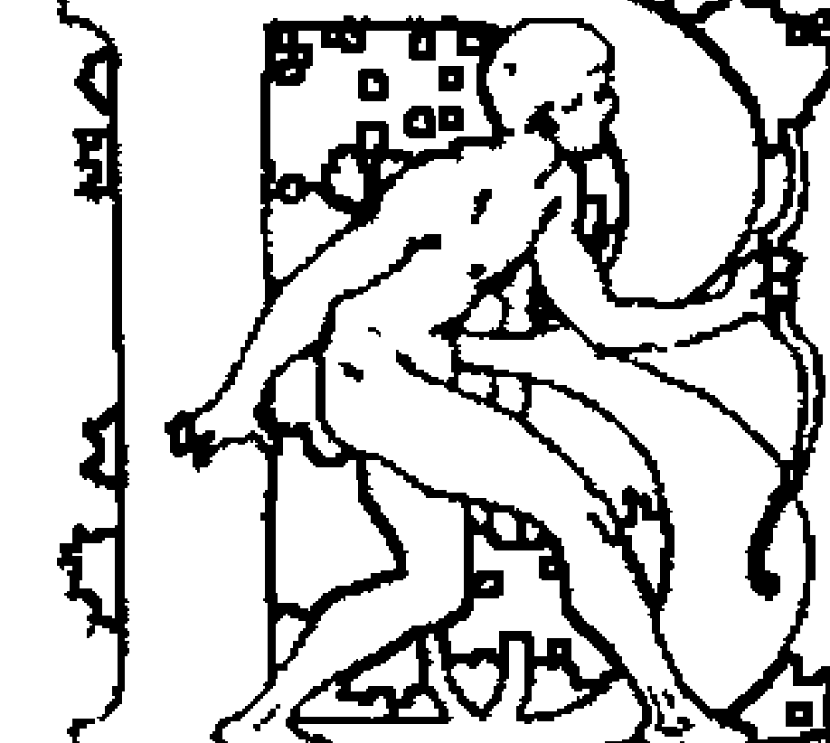

##### B 型处女座的气质、性格

B 型处女座的你，有着浓烈的好奇心，学习勤勉，有着良好的学习态度。你的兴趣广泛，可能会特别喜好分析性的研究。对于处理细节问题，你有着很强的能力，但在统筹大局方面则显得心有余而力不足。所以，你对事情的看法可能会因为分析过度而陷入细枝末节的纠缠中，放不开手脚。由于你的分析能力甚强，因此不管大事小事，你都要分析、评论一番，而且，因为你太过较真，往往批评得有些尖酸刻薄。其实，你应该把心胸放开阔些，对人对己都要宽容，否则会失去朋友，那就得不偿失了。

处女座的人多半都生性清洁，甚至会有相当严重的洁癖，这会让身边的人疏远你。你可爱善良，但性格有些软弱，常常为没有达到尽善尽美而感到内疚和不安。你不允许自己感情用事，时刻以理智的态度处理问题。B型与处女座两者之间是有着矛盾的：B型人的性格乐观直率，行动非常积极，不过略微缺乏周密计划的谨慎态度；而处女座则做事一丝不苟，且略带神经质，最厌恶半途而废、无法贯彻始终的人。这种矛盾性格会让你时刻处在自我挣扎之中，使你在做事时犹豫不决、心神不宁。与你初识的人可能会觉得你这个人很乐观，快人快语，容易相处，而事实上，你是个过于谨慎的人。你很少把自己的内心世界公之于人，尤其是关于感情方面的。

你对待工作是认真而踏实的，会很规矩地完成它，而且，如果没有亲自看它做好，便觉得不放心。但在日常生活中，你会判若两人，你会经常丢三落四，要不就迷迷糊糊，显得有点儿懒散。你对事情的态度也会反映出你的矛盾性格，可能刚才还犹豫不定，但马上却又目标明确了，让人觉得你有些庸人自扰。你向往着自由自在的生活，不受任何牵绊，但你在意的东西实在太多了，这会让你无法真正放松，因此也很难得到真正的心灵自由。

处女座的人出生的时候，如果没有受到太阳、木星或火星的影响，那么你将会满足于一般的平稳生活，而不会胸怀高远的志向。你会对未来没有太多的自信，未知的一切都会使你感到不安全。你要求自己的工作做得无懈可击，希望别人注意到你的价值，这些在你看来要比雄心壮志更为重要。

注意！对人对事不要过于较真，有时你需要得过且过，人生中的许多事情并没有绝对的对和错，宽容大度会让你生活得更开心。

##### B型处女座的事业

B型处女座的你，身体状况不适合从事过于劳累的工作，那些很费体力、纷繁琐碎的工作不要去尝试。你的数字观念很强，因此实务方面的工作比较适合你，比如：税务、会计、银行职员等。此型的你，年纪渐长之后，职位会愈趋稳定，不过，到了一定的程度时，便很难再往上升迁了，相当可惜。

你若从事有关语文方面的工作，会更能发挥你的特长。很多B型处女座的人文学修养很高，如果你有此优势，可以试试新闻杂志、出版业、评论或是写作等职业。而你最擅长的莫过于做评论家了，因为你面对不符合你理想的事物难以视而不见，你希望大家都能知道它的缺点所在，并希望能一一改进；面对他人的文学作品时，你的态度更是这样。因此，从事学术研究，或是在教育机关、医疗、社会福利部门工作，你也能有很不错的成就。

注意！你的身体状况决定你不能从事需要太多体力的工作，从事实务方面的工作或富于理性的工作会比较适合你。

##### B型处女座的财运

B型处女座的你，财运比较平稳。因为你对人对事都小心翼翼，所以会以很安全的方式来对待你的财产。赌博投机等事是与你无缘的。你并没有太强的金钱欲，只是希望生活安定而已。所以，你的储蓄也不会太多，而你也很少放纵自己随便地花钱。到了晚年，你会有比较稳定的财富，但是，由于个性所致，你很难成为巨富。

在你看来，精神享受要远远高于物质需求，所以你对于钱财并不是十分看重。不过，你的金钱运势算是相当稳定而可靠的。你对于金钱很有计划，很少出现入不敷出的情形，可以说是个勤俭致富型的人。由于这种良好的习惯，你的财运会随着年龄的增加而更加旺盛，愈近晚年，生活愈富足。注意！忠实的理财方式，以及固定的金钱收支，会使你拥有稳定的财富，可以从事投资行业以增加财富。

##### B 型处女座的爱情

B 型处女座的你，心中充满了柔情蜜意，对异性充满好奇，但是又过分拘谨害羞，不敢轻易接受异性。你所希望的恋爱方式重在精神交流，所以在选择伴侣时，你的首要条件是能跟对方心灵相通，至于对方的外表，便不是十分重要了。

你属于比较理智型的，两人约会时，极少卿卿我我的交谈，你希望多了解对方的内涵及学识，因此会把话题引向这方面，然后侃侃而谈。在别人看来，这似乎缺少了一点浪漫的恋爱气氛。这是因为处女座的人偏向理性，当然，有时也是因为你要掩饰自己的热情。

B 型处女座的女性在少女时期就经常在梦中编织纯纯的恋情，可真地谈起恋爱，却怎么也没法跟对方自然地相处，而且态度消极，所以你单相思的情况较多，若因此而没机会携手真爱，实在令人遗憾。多数情况下，B 型处女座的女性对男人有恐惧心理，很难忍受男性肌肉发达的身体及气味，你觉得人要冰清玉洁，即使无意间跟男性肌肤相触，你也会觉得厌烦，久久无法适应。

B 型处女座的你，追求的是精神恋爱，但与此同时你还是比较现实的，相当注重感情与现实的利害关系。你希望对方给你安定、幸福的保证，而你会用实际行动来珍视这段情缘。

不过，你对性是比较冷淡的，你应该改变自己，不要完全排斥性。要知道，跟你所爱的人结合为一体，也是一种完美的爱。B型处女座之所以对性有一种抗拒心理，是因为有洁癖的个性，对于肉体的接触及性欲觉得难以接受；另外，小心谨慎的天性使你害怕跟异性发生肉体关系之后自己会受到伤害，所以你无法积极地享受性爱的快乐。

注意！如果你是B型处女座的女性，勇敢些吧，幸福近在咫尺，不要让它变成天涯。

##### B型处女座的婚姻

你属于晚婚型，不过一旦结婚，就极少波动，相当稳定。你之所以晚婚，是因为你小心翼翼的性格，以及你的洁癖；若不是十分合意，你是不会结婚，那与你要求完美的性格不相符。在决定结婚之前，你会三思而后行，把方方面面考虑周全，为此你可能会不够放松。可是一旦突破了心理障碍，整个人就变得特别积极而且快乐。

结婚之后，你会为婚姻的安定及幸福而努力，即使对方有些行为令你不满，你也会压抑自己，你不想看到婚姻的失败，为此你会顾全大局；但如果你的不满升高到极点，无法忍受，那么你就不会再试图沟通、协调或委屈求全——因为这有悖于你追求完美的性格——此时，你会不加思索便决定离婚。如果你的B型气质较为浓厚，那么你有可能再找到第二次爱情。

注意！不要因小而失大。要时刻关注你的婚姻，因为最终的破裂可能就因为一点点小事。应该适时倾吐不满，这样才能缓解危机，才能使婚姻幸福长久。

##### B型处女座的家庭

B型处女座的你，会努力使家庭生机勃勃，井然有序。不过，你的双重性格有时会在家庭生活中体现出来。比如，作为家庭主妇，你一般会把家里整理得整齐洁净，可是有时又会放任自流，只顾沉迷于一件自己感兴趣的事。你有时为家庭经济细细打算，可是一会儿又嫌麻烦，对一切听之任之。B型处女座的男性也是如此，有时很勤劳地帮太太多做家务，有时却又以工作为借口，故意躲避家务。不过，你的生活会因此而富于变化，多姿多彩。你要注意的一点是：碰到不如意的事时，不要对孩子发脾气。

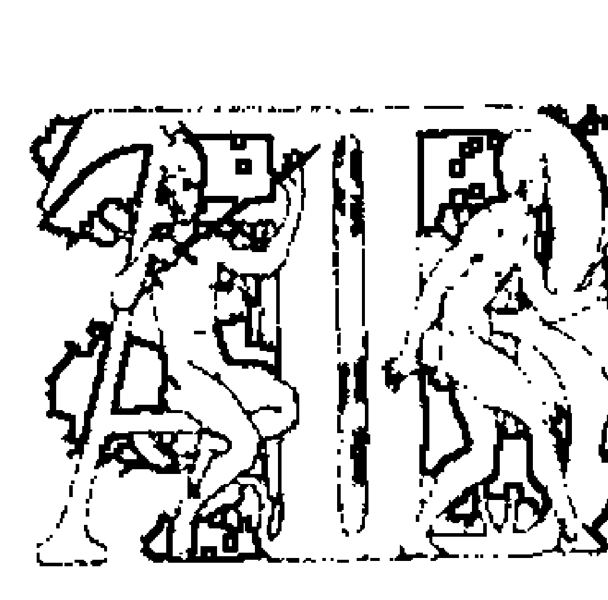

#### 三、处女座／AB 型

##### AB 型处女座的气质、性格

AB型处女座的你，求知欲极强，对任何事情都很认真，非要弄得清楚明白，绝不能有一点儿含糊不清，因此你会让人觉得有些吹毛求疵。如果你的合作伙伴做事粗心，你一定很受不了，因为你是那种做事不能有一点闪失和疏漏的人，否则就会觉得良心不安。

如此的你，会是各行各业都欢迎的人才。你工作细致，对自我要求很高，做事力求尽善尽美，自然使上司赞赏器重。因此，你做事成功的可能性极大，不会因考虑不周而失败。总之，你是个心细如丝的人，工作态度兢兢业业，苛求完美。

在你身上，有着强烈的批判精神。而且，你分析问题的能力敏锐而独到。你对于任何事情都有周详的计划，会将一切通盘考虑之后再付诸行动，所以，一切都会依循你的设计而发展，全盘皆在你的控制之中。你对事情的应变能力颇强，处理事务的能力也是一流的，对于突发的状况你通常能应付得当，不留破绽。

AB型处女座的你，在冷漠的外表下，有着一颗充满幻想的心。这就形成了你性格中的矛盾。表面上，你冷漠、尖锐，但独处时你却陶醉于自己的美丽梦幻中。你会把自己的房间装饰得漂漂亮亮，成为自己的一方乐土；你喜欢不同的房间摆设，会想尽办法把家装扮成理想中的王国。但你的这些特点都是不易被人所知的。你内心里是个注意精神享受和生活品质的人，若与你交往深入，则不难发现你心中的柔情。其实，如果你能把内心世界呈现出来，调和一下你冷淡的外表，会显得更迷人。

你过分执著，固守原则而不变通，这会让人觉得你古板、不通人情。你对人要求严厉，常会让人承受不了，自然也会因此而得罪人。所以，你要注意自己批评事情时的态度，不要过于尖刻，否则会变成一个小心眼的人，容易陷入口舌之争。

注意！敞开你的心扉，让别人来分享你丰富的精神生活，你会发现生活原来如此美丽。

##### AB 型处女座的事业

AB 型处女座的你，独立性强，头脑冷静，分析能力强。由此看来，比较适合你的职业有经理、税务员、会计师、银行职员、秘书等。需要动脑的工作，如翻译、通讯、速记员、评论家、制作人等也能让你发挥特长，有所成就。AB 型的人大都能兼顾副业，不妨找些有兴趣的工作，相信必能有意外的收获。

你在学生生涯中要认真地对待考试，如果能在此阶段取得所需要的知识或学位，将会终生受益。你的步调极快，如果与别人合作，会觉得碍手碍脚，难于施展，成功的机率也相对降低很多。另外，你需要安静的环境，一旦受到干扰，就难以获得成功。

注意！发挥你的独立性，勇敢地创造自己的一番事业，坚持不懈定能有所成就。

##### AB 型处女座的财运

AB 型处女座的你，生活会是比较平稳的。此型的你不会奢望贵族生活，只想拥有简单安逸的日子。年轻的时候，你就能够为将来打算，你会注意储蓄，以备日后生活之需。你安安分分地工作，把节余下来的钱存人银行，这会使你拥有一定的财产。但你的财运不是很好，应谨防小人的陷害。

你对任何事情都有洁癖，甚至连金钱都认为是不干净的东西，这当然会影响到你财富的积累。AB 型的人多会认为钱财乃身外之物，觉得为此而劳碌终生是不值得的，你宁可把金钱花在精神生活的享受上。处女座的人最看不得别人游手好闲，认为每个人都应凭真本事去赚钱，不义之财是不可接受的。所以，你会规规矩矩地从事每一项工作。你给人的印象自然是清廉耿直、公私分明。

注意！副业所得最好能全部存起来，这样比较稳当，本业所赚的钱用来作为生活费。

##### AB 型处女座的爱情

AB 型处女座的你，视爱情为神圣无比的事。在恋爱过程中，你会随时求证：“这爱情是否我所追求的？”你会给对方许多考验，对方只有锲而不舍才能过关斩将，最终成为你的终身伴侣。

在恋爱过程中，你是被动的。你把爱情看作冰山上的雪莲，觉得它遥不可及，你没有勇气去自己采摘，而是将希望寄托于人，希望有心人来灌溉滋润它。所以，你会将这份感情一直隐藏在心底，即使喜欢上某个人，也不会轻易表现出来。你会一直处于揣测之中，表面上却装作若无其事的样子。不过，你会在暗中观察对方的一举一动、一言一行，当确定对方就是你所追求的理想之后，才会表达你的爱意。不过你的步伐是比较缓慢的，经历相当长的一段时间后，才能进入热恋阶段。

处女座的人大多都会有些洁癖。你更重视精神恋爱，所以对性是不积极的。对于性，你也有好奇心，但是，因为你的保守性格，所以不会轻易去尝试。很多时候，AB 型处女座难于找到爱情，就是因为把爱情看得过于纯洁完美。而现实大多不会和理想完全相符，执著的你会因此而一等数年。一般来说，AB 型处女座的你从精神恋爱到发生肉体关系必须经过很长一段时间，少女的矜持、羞涩会一直持续到婚前。在恋爱中，害羞的你会不由自主地心跳加速，面对异性，你总是难以应对自如。

注意！理想中的爱情固然美丽，但那只是成人童话而已，现实中的爱情应是两人相知相携，共走人生的旅程。

##### AB 型处女座的婚姻

你对于结婚对象挑得非常严格，那是因为你太过于追求完美了。在选择对象的时候，你会细细地将对方从头至脚地打量，用近乎苛刻的眼光来衡量对方，从经济能力到社会地位，从日常生活细节到为人处事，都被你列入考虑的范围，可以说是事无巨细，面面俱到。因此，要成为你的人生伴侣绝非易事。如果你是经由相亲而结婚，那么相亲过程必定是不简单的，对方除非是历经考验而痴心不改，否则很快就会被你淘汰。

对于结婚，你会发挥出所有的能力，将一切准备得有条不紊，从订婚到结婚之间也必须有计划。当你发现对方有不可原谅的毛病时，那么即使已走入礼堂，你追求完美的性格也会让你毅然退婚，不会听取任何人的意见。事实上，理想与现实之间都是有差距的，你必须把两者划分清楚。鲜花好看却不能长久，你必须要面对现实才行。

注意！多一些温情，少一些挑剔，你的婚姻会因此而完美。

##### AB 型处女座的家庭

AB 型处女座的家庭生活会是幸福美满的。女性会是贤妻良母，把家中的一切照顾得面面俱到。你会温柔地对待丈夫，重视孩子的教育，你的家庭也会因你的付出而如童话般美满。而男性，婚后会是个体贴顾家的好丈夫。

你们夫妻之间的感情会令人羡慕不已。但是，你生性喜好批判一切，有时候会为一些家常小事而与人斤斤计较。这种性格自然会影响到家庭的和睦气氛，而且，过于好辩会让人觉得你不同人情世故，夫妻之间的裂痕也常因此而起。所以，对于你尖锐的性格，你要加以克制才行。

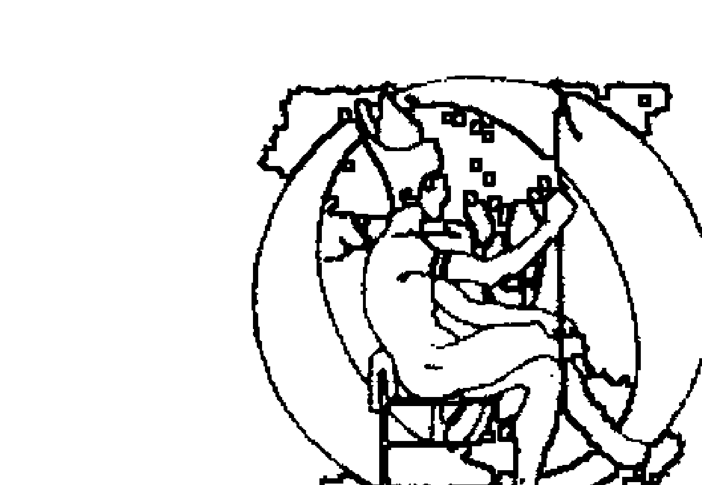

#### 四、处女座/O 型

##### O 型处女座的气质、性格

O 型处女座的你对自己的要求极严，对待别人也不会放任自流。你用自己的标准来评判周围的人，先仔细观察别人的行为，然后在心里做冷静的判断。你的评价能力是很强的，相当具有客观性。你对待一切都一丝不苟，但如果太过如此，就会被别人认为难以接近，不易相处。处女座的女性很敏感，对人难免有些苛求，不容别人有错。如果你能将 O 型的柔和与此相调和，就可以让处女座的敏感神经收敛一些，这样，你会更易被人接受，人际关系会更为和谐。

O 型处女座的你，生性勤劳，充满责任感，做事一板一眼，很难突发奇想而打破常规。由于你做事总是深思熟虑，所以行动上会让人觉得天衣无缝。你头脑聪明，即使面对意外状况，也能不慌不忙地处理。你会把一切计划得井井有条，以此来展示你的不凡能力。由于你充满理智的智慧，可能会让人误认为你冷漠，其实，你的本性是真诚而爽快的。

你的道德观明确，决不会做出有悖理法之事。生活里的你会过于追求清洁，同样，对人对事你也喜欢清清爽爽、干干净净、明明白白。你讨厌稀里糊涂的事情，对于拖泥带水更是深恶痛绝。所以，你给人的印象是严肃有余而明快不足。

O 型处女座的你，会永保纯真而浪漫的的特性。你心明如镜，无论置身于什么环境，都能出淤泥而不染，濯清涟而不妖，“清水出芙蓉，天然去雕饰”是你所追求的理想境界。不过，你做事过于求细，有时会让你陷于小节而忽略了大局，如果你能发挥 O 型的开阔眼光和积极行动性，就可能弥补这项缺点。

注意！要与他人平等融洽地相处，这会让你更多地领会人间真情。

##### O 型处女座的事业

O 型处女座的你，处理事情冷静沉着，思维缜密。无论从事何种行业，你都会稳中求胜。但你性格有些保守，如果总是拘泥于此，则难有大的发展，要试着突破自己才能另有一番作为。

你可能更适合受聘于人或与人合作，自己单干不适合你的性格。朴实的工作会比较适合你，比如：财务员、资料处理员、秘书等。这些工作虽不是身处要职，但却是企事业单位中不可缺少的关键。你做事极有耐心，踏实稳重，不管什么工作交给你，你都不会粗心应付，由此看来，打卡员、校对员等也比较适合你。如果你发挥天性中的勤勉，再加上你的聪明才智，也有可能成为独挡一面的学者或专家。

注意！如果你想要事业有成，应该选择一位具有崇高理想及爽朗个性的人来做你的事业伙伴。

##### O型处女座的财运

O型处女座的你，财运一般。你不会有天降贵人的好运，想要瞬间而富不太可能。但是，你生活比较节俭，会精打细算，而且能精确地控制收支，擅长储蓄。在外人看来，你可能过于重视金钱，可实际上，你并不吝啬，该花钱的时候你不会小气。

那种无谓的浪费，你是绝对不干的。但是，你有时会因为要保全面子、维护自尊（或者说虚荣）而突然挥金如土，这是要小心避免的。

注意！要把眼光放长远些，不要总盯住部分不放，不要只算小账不算大账，这是不利于你的财富积累的，正所谓因小而失大。

##### O型处女座的爱情

一般O型的人爱憎分明，对于恋爱会全身心地投入。然而O型处女座的你却与之完全不同，你的恋情多是比较隐秘的。你对感情很忠贞，对待性更是慎之又慎，生怕因为自己的一点点举动而使对方不快。O型处女座的女性更是典型的清纯派，你讨厌粗暴野蛮的性行为，即使有了感情，也会严守界限，不会随便发生关系。处女座的你是理智的，对待性也能理性地分析，即使发生了肌肤之亲，也能保持冷静的头脑。

你是丰富而多情的，只不过做事谨慎，不喜欢直白的情感，而这也体现了你的天真与纯情。那种视爱情为游戏，以此来寻找感官刺激的行为，是你所鄙视的。你会让自己的多情深藏不露，即使对方并不明了你的心意，你也会始终不渝地爱着对方，并且无私地祈祷上天赐给你的爱人幸福、快乐。

你的爱情因纯真而可贵。有时候，你的天真会让你在恋爱时显得有些不够成熟。你的清纯是永远也不会失去的，即使你长大了，谈起恋爱来仍是小心翼翼。不过，如果你总是不能勇敢地向对方表白，那就成了令人苦恼的单恋，可能因此而失去与真爱相逢的机缘。其实，在恋爱之中，挫折、失败正如试金石一般考验着人们的心理素质，如果你过于小心谨慎，会影响你得到真爱的机会。

注意！爱情是需要激情的。理智固不可少，但若过于谨慎，真情来临时不及时抓住，那就太可惜了。

##### O 型处女座的婚姻

O 型处女座的你，性格保守而传统，追求的是精神境界的相知相爱。你会理性地对待婚姻，不会因为一时的激情而失去客观标准，不会草率地进入结婚礼堂。婚后，你会把家庭生活打理得有条不紊，各项家庭计划都预先周密考虑。

O 型处女座的女性会是个标准的贤妻良母。不过，你不要因为太重视家庭而把自己限在一定的生活范围内，这会影响你的视野。另外，如果你在生活中过于注意细枝末节，做事就可能不够果断。

O 型处女座的男性能够稳重地面对工作，如果家中有什么风波，因为你有些心思重，会久久不能释怀。如果你能用 O 型爽朗的个性来加以调和，可能会比较轻松地解决问题，你的家庭会更加美满快乐。

注意！夫妻之间必须要敞开心扉，以诚相待，这会让你们的生活更加幸福。

##### O 型处女座的家庭

O 型处女座的你，对于人生伴侣的选择是三思而后行的，你会冷静地分析，在没有十足把握之前是不会轻举妄动的。对于家庭生活，你会慎重地处理一切，无论经济方面、居住环境方面、教育孩子方面，你都会深思熟虑后再采取行动。

## 天秤座

特征：公正，冷静；有艺术天分，但有时会把一切都当作艺术和游戏；非常重视爱情；举止高雅，略显柔弱。

### 第一节 天秤座简介

#### 一、天秤座的传说

很久以前，人类与神祇是可以互相往来的。为了维持人间的正义和公平，宙斯派正义女神雅丝特莉来到凡间。雅丝特莉手里拿着天秤，用它来衡量善与恶，判断人间的是非曲直。

这天，为小事争吵的市井小民来到雅丝特莉面前，要求她判断羊属于谁，雅丝特莉只用天秤一衡量，马上就知道是谁在说谎了。雅丝特莉耐心地劝告他们：

> 只要努力工作，你就可以拥有很多你想要的东西，为什么非要贪求别人的物品呢？

大家都觉得雅丝特莉的话很有道理，再三道谢后才回去。

当国与国之间为了领土问题而几乎引发战争时，雅丝特莉也会苦口婆心地规劝。由于她处事公正，所以受到了凡间人民的推崇，宙斯对她的工作也满意极了。

日子一天天地过去，雅丝特莉发现，向她要求裁判的人愈来愈少了。

> 人类终于了解正义的真谛了！

雅丝特莉欣慰地说。她想了解进步之后的人类如何相处，但是，眼前所看到的情景却让她大为震惊！

偷窃、贫穷、战争、死亡像瘟疫般四处蔓延。原来，人类邪恶的一面并没有因为正义的存在而改变，反而更变本加厉了。
雅丝特莉心里难过极了，她没料到自己长久以来的心血全都白费了。她把天秤放到了群星当中，心里存着一丝希望——每当夜深人静，人类抬头看着天上的天秤时，能够重新燃起对正义的热爱，从而诚心悔改。
在七月上旬的黄昏，南方天空中会出现一个椅子形的星座，这便是衡量着人间公平和正义的天秤座。

#### 二、天秤座(Libra)概况

生日：9月23日至10月22日

星座代表人物：
- 凯撒（9月23日）
- 刘德华（9月27日）
- 甘地（10月2日）
- 哈维尔(捷克总统)(10月5日)
- 撒切尔夫人（10月13日）
- 诺贝尔（10月21日）

天秤座的人爱美，害怕空虚。你与人交往的能力很强，可以说是八面玲珑，但是若过于面面俱到，有时也会吃力不讨好。你很爱动脑筋，但若用脑过度则会神经衰弱。

##### 天秤座的个性魅力

天秤座的你追求真善美，向往和谐。你天性善良仁厚，有同情心，性格柔顺，对人休贴、热情。你多愁善感，带有贵族气息，极具个人魅力。

##### 天秤座的性格特征

天秤座的你，会公正客观地看待事物，能为他人着想，性格较开朗。你是个多情的人，尤将爱情视为最重。因为你感情特别丰富，所以有时会显得多愁善感。你是个非常值得信赖的人，别人告诉你的秘密你会守口如瓶；同样，你的感情也不会轻易外露。

在你身上，理想和现实是交替存在的，所以你的性格极端矛盾。你可能是和平的使者，但也可能是斗士，是个很矛盾的人。受金星的影响，你的理解能力和艺术鉴赏力都很强，但往往会把任何事物都当做艺术和游戏。你有着很强的创作才能，能做个出色的艺术家。你比较有人缘，但有时对金钱不够大方。

##### 天秤座的财运

天秤座的你有正财而无偏财，因此勤恳工作是你生财的正路。

##### 天秤座的理想恋人

你的个人修养很好，内心平和，喜欢生活在轻闲优雅的气氛中。你的好奇心很强，内心深处总想不断接受新鲜事物。你不太听取别人的建议，有些固执。你的恋人如果善于创新、有个性而且做事认真，会比较适合你。

##### 天秤座的恋爱技巧

你本性正直，情感丰富，而且为人热心，当人有事相求时，你会尽力相帮。但你有时欠稳重，而且很容易受感动。如果喜欢你的人能对你有所了解，用心与你相处，自会马到成功。

##### 天秤座小档案

| 属性 | 详情 |
|------|------|
| 守护星 | 金星(象征爱与美的结合) |
| 守护神 | 希腊—阿弗罗狄特 罗马—维纳斯 |
| 幸运石 | 青橄榄石 |
| 幸运色 | 青蓝色 |
| 幸运日 | 礼拜五 |
| 幸运数字 | 6、9 |
| 幸运地点 | 社交活动场所 |
| 最欣赏的星座 | 水瓶座 |
| 最信任的星座 | 摩羯座 |
| 最佳学习对象 | 白羊座 |
| 最佳工作搭档 | 天蝎座 |
| 最易被影响的星座 | 巨蟹座 |
| 最易掌握的星座 | 天蝎座、摩羯座、金牛座、狮子座 |
| 最需注意的星座 | 射手座、双鱼座、巨蟹座、处女座 |
| 同类型(风象)星座 | 水瓶座、双子座 |
| 对立星座 | 白羊座 |
| 80%协调星座 | 天秤座 |
| 90%协调星座 | 射手座、狮子座 |
| 100%协调星座 | 水瓶座、双子座 |

##### 天秤座女性的性格、情感

天秤座的女性拥有一颗充满慈爱的心灵，希望生活中时刻充满快乐，希望众人瞩目于你。你有着怡人的风姿，这会使人们对你产生深情和好感。你是理想的贤妻良母型，能够运用你的温柔来化解生活中的摩擦，给家庭生活带来欢乐和平静。但如果你的爱人不能让你的感情继续升温，那么你可能会很失望。若你的丈夫能对你关怀备至、体贴入微，就会使你甘心情愿地付出而不计回报。你将爱情看作生活中的头等大事，如果得不到爱情，那么你可能会为艺术而献身，这恐怕是你追求完美的另一种体现吧。艺术会成为你的理想，而且你也能在此领域里施展自己的全部才华。但你的性情较为闲散，若要取得成就，就必须克服自己的闲情逸致。你虽然喜欢广泛地涉猎，但对某一项艺术则很难持之以恒。

你的性格温柔有加，甚至有些软弱。你很容易与人相处，有些自我陶醉。生活上的你依赖感较强，希望丈夫是你生活中的支柱，若要你独自面对问题，你会有些手足无措。有幸的是，你总是能够找到体贴、关心自己的知己。

与天秤座女性相宜的男性：双子座的男性会对你情有独钟，他妙趣横生，儒雅潇洒的气质会让你觉得好梦已经成真了；白羊座的男性会被你的魅力所吸引，如果你们能做到真诚相待，生活会幸福而美满；水瓶座的男性能充分理解你，易和你发生真情。

##### 天秤座男性的性格、情感

天秤座的你，鉴赏美的能力很强，丑恶与强暴都会让你深恶痛绝。你希望自己周围的人都亲密无间、和睦相处。你一心想使别人满意，有时会因此而表现出自身的弱点。你淡薄名利，与世无争，愿意把时间用在对美好爱情的追求上。你的命运将随着婚姻的实现而确定下来。

你对异性极富魅力。你乐于猜测她们的心理，倾听她们的心声，理解她们的感情。你会是一个难得的蓝颜知己，又会是一个理想的伴侣。你力争让大家都满意，这并不是为了谄媚于人，只是你自己内心情感的流露而已。你会对自己的妻子关怀备至、体贴入微，但却难免朝三暮四。

你待人友好，善与人相交。你有着冷静的头脑、得体的举止和高雅的谈吐，这会使你风度翩翩。你害怕孤独和寂寞，因此，婚姻对你起着极其重要的作用，甚至会成为你人生的转折点。你渴望爱情，需要倾诉衷情，希望有更多的朋友。你的全部幸福将取决于你所建立的各种关系。

与天秤座男性相宜的女性：双子座女性的社交能力和活泼的性格，对你引力极强；水瓶座的女性会在艺术、美学方面与你情投意合，能够安抚你的敏感性格；白羊座的女性热情而主动，能征服你的心，让你沉浸在爱情的幸福中；处女座和巨蟹座女性的真诚和安静的性格，会给你的生活带来永恒的温馨和甜蜜。

### 第二节 天秤座与血型的关系

#### 一、天秤座/A 型

##### A 型天秤座的气质、性格

A 型天秤座的你对于世间的黑暗和丑陋深恶痛绝，无论何时何地，你都会为真善美而战。在性格上，你是既公正客观，又潇洒自在。

A 型与天秤座这二者在特性上有着矛盾的地方。A 型人相当重视平时认真努力所获得的成果，不喜欢无目标的、过于自由的生活。但天秤座却热爱自由，不喜欢受到任何约束，喜欢悠然自得地生活，比较讲求随遇而安，事业上也会如水一样自如，因势而流不会强求。

如此不同的两种性格趋向对你都有作用，就看是哪一方面在起主导作用了。如果你兼有 A 型的踏实稳健及天秤座的优雅自然，那么你将表现出有教养、有魅力的形象，令人十分着迷。在社会中，你会四面迎合、八面玲珑，会以一颗开朗的心赢得人们对你的敬仰及推崇。而且，你不会因为一时的喜怒哀乐而影响你对事物的判断，开朗的性格中很有理性，对人对事都富于责任感，是大家模仿的典范。这些素质综合在你身上，会让你在社会上极有威望。

但是，如果 A 型的严肃拘谨及天秤座的散漫无纪起主导作用，那么你将会成为一个不易相处的人。你的自尊心会极强，不能接受别人对你的任何指责，你会因为一点小事而恼羞成怒，态度恶劣，更别说接受别人的忠告了。因此，你会给人以任性而不讲理的感觉，很缺乏人情味。

但极端的事物是很难出现的，如果你稍加注意，就可避免成为一个极端的人。一般而言，两种趋向会在你身上形成微妙的组合，千变万化，所以，即使同是 A 型天秤座的人，所表现出来的性格也会有所区别。无论你表现出何种风貌的性格，你的聪明慧黠，只要稍加努力都会放出夺人异彩。

注意！尽量让自己以朝气蓬勃的形象出现在别人的面前，这样你会更加魅力无比。

##### A 型天秤座的事业

A 型天秤座的你，工作稳定，不会有大起大落。你在事业上的发展属于中年运，30 岁之后是你成功与否的关键，同时也会影响你晚年时的生活。这个时期对你来说十分重要，如果能把握住机会，努力奋斗，会取得相当不错的成就；但如果不幸踏错路，或者努力不够，就要平平淡淡地度过一生了。

A 型天秤座的你，有着较强的工作能力，不过性格上不够果敢，凡事不会积极主动、全力以赴地去做，这会让人觉得你懒散、不上进，你也会因此而使成功的机率大大降低。所以，你在选择职业时，一定要找一个跟你兴趣相合的工作，这样才能让你有兴趣去做，并保持对于工作的热忱，增加办事的干劲。

此外，由于你十分注重服饰及仪态的优雅，所以劳力型的工作不适合你，这会让你觉得有损形象。你对工作环境的要求也相当高，必须置身于清静优雅的环境，这样才能发挥自如。比较适合你的职业如：广播、娱乐业、服装业等，策划性质的工作不适合于你的发展。

注意！对工作要充满激情，这样做事才会有效率，获得成功的机会也会更大些。

##### A 型天秤座的财运

你的财运如你的职业、人生运势一样，属于平凡稳定型。你不会突发横财、一夜暴富，也不可能突然破产、一贫如洗，总之，你的财运不会让人有大起大落之感。

你能够广拓财源，拥有一定的财富，但是你不想让人觉得你是个铁公鸡一毛不拔，因此你花钱很厉害。等到中年之后，状况可能会有一些好转。这时的你会懂得量体裁衣，虽然舍得花钱，但不会越出自己的能力范围，A 型的自制力会让你控制自己，保持收支平衡。

注意！不要因想发财而去投机，更不要去赌博。

##### A 型天秤座的爱情

A 型天秤座的你，无论做什么事都不会太热衷，而是采取淡然处之的态度，在恋爱上也不例外。即使你已经心有所属，也不会让对方有所察觉，表面上会装成一副若无其事的样子，掩饰自己的真情。这会使对方弄不明白你的心意，为此而心神不宁。

你是极富个性魅力的，颇能吸引异性的注意，所以你的恋爱运气不错，即使你自己不去主动追求，喜欢你的人仍会找机会接近你，这种魅力会让那些容貌平庸的人十分羡慕。

此外，你的交际能力极强，是个很活跃的人，在你身旁常会有一群异性围绕着你。对于异性，你信心十足，但并不表现出来，只是轻松而优雅地享受着恋爱，接受异性对你的倾慕。你对自己的恋人也不会主动表现，甚至显得有些冷淡，但这会让对方更加迷恋你，大概这就是你的欲擒故纵之技吧。

你具有 A 型的自制力，兼具天秤座的优越感。实际上，你并非不懂风情，只有真正进入状态，你才会流露出内心的感情，并知道如何让情人满足，快快乐乐地谈恋爱。此外，你的服装搭配十分讲究，言谈举止儒雅而有风度，与你这样的人谈恋爱，对方会有很大的满足感。

A 型天秤座的你属于早熟型，但你对性还是十分克制的。尽管对性的好奇心很强，但 A 型的自制力会让你不被热情冲昏了头，不会随随便便由恋爱发展到性爱。但是，以金星为支配星的天秤座，对性的观念开放而自由。所以，你对性虽然谨慎却不排斥，反而会去积极了解有关的性知识。也许你并没有丰富的性经验，但你的性知识及观念却远比一般人丰富，很容易让人误认为你是个性经验丰富的老手。

你最可能遇到的情人是性方面的高手。在你年轻的时候，如果爱上一位比你年长又具有高超性技巧的人，你可能会沉迷于性爱之中。幸好，这种情况不会持续太久，待到双方的热情减退之后，你们单纯的性关系也会因此而告终。

> 注意！在性上不要过于夸张，以免引起对方猜疑。过于丰富的技巧会让对方误认为你是情场老手，对此要多加注意。

##### A 型天秤座的婚姻

A 型天秤座的你，恋情和婚姻是不太一致的。你会追求恋情的浪漫，但却希望有一个平实的婚姻。你希望能以从容而优雅的态度来生活，在你眼中，对方的学识、品性、容貌等等都要很优秀才行，如果对方的条件不能令你满意，你绝不会和他(她)携手踏上婚姻的礼堂。

对于婚姻，你最看重的一点就是对方的容貌。只要对方长相不错，你就会兴趣大增，大有以貌取人之势。但谈及婚嫁，你就变得十分慎重与现实，你会以敏锐的眼光及优越的审美观挑选未来的另一半，绝不会被爱情所迷惑，更不会草率地对待婚姻。因此，你的婚姻成功的可能性很大。此型的你早婚并不多见，基本上都是到了适婚年龄才结婚。

因为你的恋爱经历很多，身旁总有倾慕你的异性相随，所以你自恃过高，这会使你错失许多良缘。不过，你最终还是能找到很好的终身伴侣。

注意！内在的美要重于容貌的美，忽视内涵只能让你与真爱无缘。

##### A 型天秤座的家庭

A 型天秤座的你，对待婚姻是慎重的，因此结婚之后，你和另一半都会是好丈夫或是好太太。你会拥有温馨、有趣而又多姿多彩的家庭生活，让你如鱼游大海一样悠闲自在，给人以轻柔曼妙、十分舒畅的感觉。这会让邻居们羡慕不已，都喜欢跟你们打交道，邻里之间会十分和睦。

你喜欢生机勃勃的气氛，所以你会把家里环境布置得美妙、生动而自然，置身其中，会让人觉得浑身舒畅。有时，你为了逞一时之强，为了证明婚后自己魅力犹在，你可能会到外面去风流一宿，但大都适可而止，不会伤害对方过深。

A 型天秤座的女性一般不太喜欢做家务，希望丈夫能为你分担。而男性除了欣赏妻子的美貌外，也多能体谅妻子的辛劳，时常主动帮忙料理家务，照顾孩子，使家庭气氛更为和谐、融洽。此外，你对孩子的教育方式比较自由，因此很受孩子的信赖及敬爱，是孩子心目中的好爸爸或好妈妈。

#### 二、天秤座/B型

##### B型天秤座的气质、性格

你开朗向上，很少出现忧愁的情绪，即使生活不很顺利，也不会消沉。你不想让人看到你无精打采的样子，会努力保持潇洒自如的风采。你向往无拘无束的生活，不太能够吃苦，所以你不喜欢辛苦的工作。你的唯美观让你不愿劳心劳力地去做苦差事，你甚至觉得以劳力求生存有伤自尊。

此型的你，有着行动的欲望，却并不会十分努力去实践；你做事时考虑太过全面，又太在意别人的看法，所以有时会显得犹豫不决。如果你能挑战自我，努力尝试，会为你的生活增添一些色彩和动力，使你更具活力。

你的性格带有天秤的特性：公正无私，不偏不倚。你总是保持着客观冷静的头脑，能很正确地判断事物的好坏、善恶。你见解独特，明辨是非，能够很好地处理问题与矛盾，你的判决绝对公正无私。你最深恶痛绝的就是人类的自私自利，以及无穷的欲望。你甚至会挺身而出，劝诫世人放弃对物质及名利的追逐。

你崇尚唯美，不容许肮脏的事物污染了灵魂，最瞧不起受物欲支配的人。你会为和平而努力，极少因为某件小事而跟人争吵，即使不得已与人发生矛盾，你也能采取冷静的商谈方式，寻求解决之道。这时，你不会大动肝火，也不会以粗暴强硬的方式解决问题，但往往效果很好。你是个很有能力的人，行事有弹性，情绪极平和，让人觉得你非常成熟稳重。情绪失常的情景极少出现在你身上。你深谙处世哲学，不轻易得罪别人，努力与每个人友好相处。不过，你的过于圆滑，倒是容易被误认为处心积虑地讨好别人，这有些得不偿失。

##### B 型天秤座的事业

你的社交能力极强，头脑冷静，判断力强，业务员或服务业会比较适合于你，在这方面你前途无量。你最突出的才能还体现在对美的感觉和艺术事业上，从事美术监督、广告撰文、服饰设计、发型设计、电视节目制作等都大有可为。30 岁之后，你的职业运开始走上坡路，可以一直持续到晚年。

B 型天秤座的你，职业运是大器晚成。在职业选择上，你最好能选择自己有兴趣的自由职业，而那些单调的工作、需要耗费过多精力及耐心的工作都不适合你，最好能够避免。你不喜欢工作环境中有太多的约束，过于刻板保守的工作会令你浑身不舒服，其结果常使你另谋职业。

注意！你吃苦耐劳的毅力不够，如果能多培养恒心及毅力，成功的可能性会更大。

##### B 型天秤座的财运

你的财运取决于你的人际关系，如果有着良好的人际关系，你的财运也会随之上升。你谙于世故，脑筋灵活，所以能够和人合作，而且能互惠互利。你在娱乐方面的人际关系会为你带来好运，不妨加强自己在这方面的投入。到了晚年，此型的你多能过着非常富裕的生活。

你对赚钱并没有过高的要求，也不会想在众人面前显富，你甚至会觉得金钱与地位会带给人某种程度的束缚。你有极强的消费欲望，但是，你慎重的个性会让你冷静地对待消费。你会想着为家庭攒下一定的积蓄，以备不时之需。35 岁之前，你会比较潇洒地对待金钱，并会用钱让自己生活得更舒服些，但随着年龄的增长，你会考虑到现实状况及年老时的依靠而开始存钱，而且通常都能有相当丰厚的储蓄。
注意！广结善缘会让你的财运稳中有升。

##### B型天秤座的爱情

B型天秤座的你，会很理智地对待爱情，你认为爱情不过是人生的插曲，应使它快快乐乐，如游戏般轻松愉快，而要让你全身心地付出，你会觉得太累了。因此你有时会视爱情如游戏。你的爱情观很开放，会同时跟两位以上的异性交往，自己的恋人如果跟其他的异性朋友交往，你也不会在意。你能很好地处理多角关系，不会让任何一方受到伤害。
你在追求爱情的时候，为了让对方倾心于你，会毫不吝啬地付出激情，而且懂得运用许多求爱的手段和技巧。但是对方一旦钟情于你之后，你的热情就会立即冷却，马上想去重找新欢。总之，你的恋情会不够稳定和长久，移情别恋在你身上并不少见。
你在做任何事情时，自尊心总是在第一位，包括在恋爱的时候。所以，在恋爱的过程中，如果有意料之外的情况出现，如你的爱人离你而去等等，你会装作若无其事。你认为丧失理智地做一些疯狂的事，有伤你的身份及自尊。所以，当你的恋情结束时，你会采取淡然处之的办法与对方拜拜，你要让自己时刻都表现出超人的风采及胸怀。
你很重视自己的仪表，在衣着及修饰上都小心在意。你天生具有十分卓越的社交手腕，且气质不俗，让人觉得你风流倜傥、玉树临风。这些优越的条件很容易让你成为偶像般的人物。你会给人非常好的印象，会吸引不少异性的眼光，再加上你追求异性的手段丰富，所以你的恋爱经历很多，在恋爱的道路上并不寂寞。
天秤座的爱情是很重视性的成分的，否则你便觉得没有生趣。不过，如果爱情结束，这层关系也就终止了。

注意！真爱有时是需要放弃自尊的，因维持面子而羞于主动，会让你与爱情擦肩而过。不要对所爱的人过于冷淡，否则会让人觉得无情。另外，爱情是需要忠贞的，应该多控制自己。

##### B型天秤座的婚姻

B型天秤座的你，会严格挑选自己的结婚对象，如果对方不能达到你的标准，你决不会迁就。你要求结婚对象具备相当高的知识水准及修养，你不能容忍自己的另一半让外人觉得拿不出手。B型天秤座的女性，会要求对方有一定的经济实力，而且要有自己的事业；而男性则要求新娘才貌双全。

因为你的条件过高而且不易变通，所以你难以找到合适人选，总是不尽如意。另外，虽然你也向往婚姻，但又怕婚后受到太多约束，所以不可能早婚。B型天秤座的你，多半是由自由恋爱而结婚的，这可能因为你的恋爱运比较旺盛。一般情况下，到了适婚年龄时你会步入结婚礼堂，婚后也比较安定。B型天秤座很少会轻率地离婚，这跟你的自尊心有关，你觉得婚姻不美满或者离婚都是十分伤害自尊的事情。

注意！婚姻是双方的，过于强调自我，往往会引发婚姻矛盾。另外，重视生活品质的同时，千万不要过于浪费。

##### B型天秤座的家庭

B型天秤座的你，会拥有一个平稳的家庭。你相当尊重个人独立自主的权限，自我意识极强，认为家庭中的每个成员都应该拥有自己的空间。因此，你会给每个家庭成员以自由。你本身就不喜欢家庭的束缚，不希望阻碍个人的发展，所以才会如此宽厚地对待家人。

B型天秤座的女性，不会只甘心于做家庭主妇，在结婚之后会继续发展自己的兴趣，热衷于社交活动。你一般不喜欢做家务，有时会忽视了家庭的重要性，但事有得失，因你较少操劳家务事，所以能常葆青春美丽。你会非常重视自己的形象，无论在家或在外面，都会保持风度与礼貌。此外，你会非常尊重孩子，重视生活趣味。不过你可能会有轻易浪费、过于奢华的倾向。

#### 三、天秤座/AB 型

##### AB 型天秤座的气质、性格

AB 型天秤座的你，气质华贵，仪态万方，能够受到大家的青睐。你的社交能力极强，对于各种场合都能应对自如。不管置身何处，你都能表现出从容、怡然的神态，姿态总是优雅得无懈可击。在人群中你来去自如，谈笑风生，给人温文儒雅而成熟稳健的印象。

你是个非常理智的人，情绪的反复无常在你身上绝少体现，所以很难看到你慌慌张张、手足无措的模样。无论何时何地何事，你能都冷静面对，不卑不亢，即使身处纷繁复杂的局势，你也会处乱不惊，努力和别人沟通协调，尽量缓和事态，希望能大事化小、小事化了。

在排解纠纷时，你具有极强的协调能力。你做事沉稳，而且充满正义，当事人都愿意接受你的调解，天秤座的公正精神在此时的你身上得到了充分体现。你像伸张正义的法官一样，判断世间的不公和不义，而且往往能获得当事者的信服。那些粗俗卑劣的行为是你最为不齿的，在你的眼中，世界上的一切都应是和谐美好的，所以你会尽最大努力惩恶扬善。

不过，有时你过于追求绝对的平和、均衡，会让人觉得你有些胆小畏缩，认为你处处讨好别人以求和谐。对此，你应该多加注意，尽量避免迟疑不定的情形出现。

其实，人与人之间发生一些矛盾是很正常的，这反而能让大家进一步互相了解，从而促进彼此之间的感情。如果你过于敏感，急着调停，就会有些小题大做了。路是自己走出来的，不能让别人对你起决定作用，考虑到别人是对的，但处处从别人的角度出发，那么自我何在呢？切记，不要让温文儒雅变成优柔寡断，要勇于表达自己的立场，让别人真正了解你，这才会显出你的君子本色。

注意！不要过分追求均衡，因为这会影响你人际关系的发展。坚持自己的原则，让别人认识真正的你，才是有效的处世之道。

##### AB 型天秤座的事业

AB 型天秤座的你，向往快乐而且美丽的人生，你的这一特性也体现到了事业上。你比较适合的职业，是和众人一起合作的职业。你的交际能力很强，可以选择和大众直接接触的工作，运用机智取胜的工作也很适合你。你交友广泛，广大的人际网络可以使你事半功倍。你天性优越的美感，更可以发挥与众不同的创意，让你在工作中不断取得骄人业绩。

比较适合你的工作如：贸易公司外务员、公关代表、接待员、大使、外交官、律师、调解委员等等。另外，影剧明星、演员、设计师、模特儿、艺术家等都可以充分发挥你的美感，让你工作起来得心应手。需要注意的是，那些花体力、用心思的工作最好能够避免。

AB 型天秤座的你，如果能充分运用性格上的优势，肯定会在社会上如鱼得水，成就一番事业。你不妨再从事副业，不过一定要选择符合自己兴趣的工作。副业经营得法，会让你有不错的收入，也有助于你本业运势的好转。

注意！你有着得天独厚的美感，善加利用必能成就一番事业。

##### AB型天秤座的财运

AB型天秤座的你，财运是比较本分的那种，不太可能获得天降横财的机会，因为你没有偏财运。你不会花太多的心思去赚钱，觉得为金钱而忙碌一生不值得，那会影响你享受人生的机会。因此，面对钱财，你会保持十分清醒的头脑，不因富而变质，也不因穷而改节。

其实，上天赐予你不凡的条件，若能善加利用，就能够生活富足，关键在于你做与不做。你的财运比较平稳，没有特殊的大起大落，不需为生活担忧。此型的你，最好不要去从事投机事业，例如地下投资公司、炒股票、期货买卖等。另外，你必须要注意收支平衡，讲究生活的享受是可以的，但必须在能力范围之内，否则会形成财务危机。

注意！千万不要想以投机取胜。平稳的财运虽不会让你成为富豪，但也会让你从容地生活。平稳的生活就是福。

##### AB型天秤座的爱情

AB型天秤座的你，魅力无穷，因此你也自恃颇高。你的爱情标准很高，要求近乎完美，稍有不合意之处，就会被你淘汰掉。所以你会较频繁地更换恋人，这会让人觉得你有些花心，用情不够专一。实际上，你会理智地考虑自己的言行，不会为情感而纠缠不清。你对待爱情是比较理性的，并不是那种为了爱可以牺牲一切的人。

AB型天秤座的你，对待感情也同样要求和谐、优雅，所以那种为爱而生、为爱而死的惊心动魄在你身上很少有机会体现。你的世界里只有美丽和谐的恋情，非常舒畅。其实你也向往刻骨铭心、荡气回肠的爱情，但是你更重视华丽炫目的形式。因此，你会不断追求新的恋情，在你看来，爱情如昙花一现，美丽而短暂，如此而已。

你追逐华丽的爱情，有时甚至会视爱情如游戏。为爱情牺牲这种悲壮的事你不会去体会，你甚至会不以为然。你谈起恋爱时是热情奔放的，但是理智会调和你年轻的心，使你能够在爱情游戏中收放自如。不过，你的爱情会因为太过理智而缺少一点浪漫。

AB 型天秤座的你，认为性也是表达感情之美的一种方式。你认为爱情到了某种程度，性自然就水到渠成了。这并不是说 AB 天秤座的人都是肉欲主义者，但此型人的确很懂得追求肉体欲望的满足。令人惊奇的是，你在享受性所带来的快感时，仍然能保持理智。

注意！不可游戏人生，爱情要付出真情才会有回报；要在理想与现实之间取得平衡，这会让你的爱情更加绚丽多彩。

##### AB 型天秤座的婚姻

AB 型天秤座的你，在婚姻问题上也会力求完美。你对终生伴侣的选择非常严格，人格、外貌、衣着、经验、内在涵养等无一不在考虑之列。你会宁缺勿滥，不会让自己有所迁就。不过，在决定结婚的时候，别人的意见往往会成为关键所在，这可能由于你比较注重他人的看法吧。因为你对于婚姻是如此地讲究，在经过严格挑选之后才决定结婚，所以成功的可能性很大，多数都会是幸福美满的婚姻。

注意！不要因一时冲动而演成婚外情，那会导致不可收拾的结局。

##### AB 型天秤座的家庭

AB 型天秤座的你，有着温文尔雅的性格，你的家庭生活也会因此受益。即使夫妻两人吵架，教养甚佳的你也不至于暴力相向。你的家庭生活是和平而富于民主精神的，你天生就知道尊重别人，能够广纳良言，不会摆出一家之主的架子，遇事总是与家人商量好再做。
AB 型天秤座的女性结婚之后大都扮演开朗美丽的女主人角色，是让丈夫永远引以为傲的伴侣。而此型的男性家庭责任感强，会努力工作来保障一家拥有富足的生活。你相当重视形式上的庄重，所以如果对方在婚后有什么失礼的行为，你会非常反感，常常因此而产生家庭矛盾，甚至必须以离婚收场。

你对于生活中的一切都很在意，如果对方不注意自己的仪态，没有良好的生活习惯，你都是不可忍受的。你过于在意自己的形象，不能允许对方破坏了你的面子。当你们的感情出现裂痕之后，你可能会去寻求外遇的刺激，虽然有时只是为了一时的发泄，但的确会对婚姻造成伤害。婚姻是要两个人一起来经营的，时时自省，宽于待人，在要求对方的同时，也应先要求自己，这样才能拥有幸福美满的婚姻。

#### 四、天秤座/O 型

##### O 型天秤座的气质、性格

天秤座的你，在处理问题时会不偏不倚，力求公正。你是温柔的和平主义者，那种声嘶力竭的争斗，面红耳赤的吵闹，是最令你深恶痛绝的。你会给人良好的第一印象，这是因为你天生就知道如何让对方赞许，而且很懂得待人接物的礼节。

O 型天秤座的你有唯美主义倾向，这也是你性格及气质上的最大特征。不管做什么事情，你都会力求完美，比如你会慎重地选择你的服装，会时常吸引众人的目光。另外，你善于言谈，使接触你的人不会感到厌烦。不过，一味注重唯美，会让你有流于形式之嫌。还有，你天性不够勤勉，有好逸恶劳的倾向。如果这种性格强烈地显露出来，就会使你成为令人厌烦的人物。

你做事干净利落，不会迟疑不决，这是 O 型天秤座最明显的特征。正因如此，你的周围随时都聚集了许多人。你交际甚广，喜欢与朋友们快乐而和谐地聚在一起，但是，聪明的你明白适可而止，不会沉溺其中。

O 型人是非分明，但这种极端性对天秤座来说，就有些麻烦了。O 型天秤座的人既有可能是左右摇摆、犹豫不定的类型，也有可能是好恶分明的明朗型，不过，这两种处世态度也有并存的情形，在这种情形下，你会根据当时的情况来选择自己的反应。

注意！大方地与人交往，过分小心谨慎可能会使你的行为流于形式，以这样的态度与人交往，会显得不够亲切。

##### O 型天秤座的事业

O 型天秤座的你，社交能力极强，消息非常灵通。你如果能正确处理情报，就可以减少失败的可能性，并以此弥补你的勤勉不足。不管从事何种职业，站在何种岗位，你都能巧妙地运用你的交际能力，再加上你爽快的个性，很容易受人欢迎。

O 型天秤座的你，不热衷于以实力去奋斗，如果必须发奋才能成功的话，你很难有所成就。不过，你只要能掌握周围的情况，就会充分发挥天赋中的敏捷性，如此方不至于被社会淘汰。

能充分发挥美感的职业都很适合你，例如设计师、美容师、流行顾问。另外，你对数字也比较敏感，因此税务人员、会计师、程序设计员你也可以尝试。如果能善加利用社交能力，也可尝试外交官、推销员或活跃于演艺界。

注意！世上没有免费的午餐，要想有所成就，付出一定的辛劳是必不可少的。

##### O 型天秤座的财运

你的财运平平，没有得天独厚的好运，却也不至于潦倒不堪。这种不强不弱的运势，恰好可以维持一般水准的生活。储蓄虽然是最平凡的生财之道，但是你若能量入为出，花费尽量控制在能力范围之内，也会有充裕的生活。

O 型天秤座的你，即使生活不很富足，但你那根深蒂固的审美意识也不容许你为了蝇头小利而失去尊严。由于虚荣心作祟，即使你的生活十分勉强，你也会注重自己的衣着，让自己出入体面。假如天秤座喜好奢侈的气质过于强烈，你的生活恐怕会陷入困顿。

注意！不要太过虚荣，这会破坏你平稳的财运，要知道，面子并不是最重要的。

##### O 型天秤座的爱情

O 型天秤座的你，向往充满浪漫而且色彩华丽的爱情，要求自己的恋爱也要有贵族气派。你哪怕是以第三者的身份介入恋爱中，也会让这份感情激情荡漾，但你可能会因此而成为人们茶余饭后闲谈的话题。你对异性有很强的吸引力，这是 O 型天秤座的特色。你既有丰富的话题，又有生动的谈话技巧，而且善于巧妙地安排约会时间，抓住时机表现自己的社交能力和魅力，这些综合起来，你便无人能比了。

不过，你对爱情的主动性不够，很少主动追求异性，总是安静地等待对方出击。你相信自己的魅力，只要有爱情降临，你就能使之灿烂无比。你在做内心感情的表白时，如果 O 型是非分明的气质较强，就会直截了当地开门见山；如果天秤座的气质较强，你可能会犹豫不决，缺乏果断，而这种若即若离的态度会令对方不悦。

O 型天秤座的你在性爱方面就显得保守多了，远没有对待爱情的激情。你重视平衡，担心自己迷失于性爱之中，深怕别人以此来束缚你，那种缠绵悱恻的亲密关系对你来说反而是精神上的负担。然而，如果跟心爱的人一起，在罗曼蒂克的气氛下，你就不会矜持了，惟有在这种浪漫的气氛中，你才会尽情地享受性爱的乐趣，O 型天秤座的女性更是如此。

注意！要培养自己慧眼识珠的能力，过于在意别人的看法是对爱情的不负责，只有你自己才知道你想要的是什么样的人。

##### O 型天秤座的婚姻

单身时的你总是沉醉在爱情的乐趣中，最喜欢和异性在情场中追逐戏耍。但是，面对结婚的问题，你会非常认真。你特别重视平稳而均衡的状态，所以即使与对方相爱，也不会毫无节制地行事，更不大可能婚前同居。此型的你，最怕受到舆论的指责，所以你不会授人以柄。

一旦到了适婚年龄，你就会有强烈的结婚意愿，因为你不想成为大家眼中的另类。这种为结婚而结婚的情形在 O 型天秤座者中相当普遍。你有极为丰富的常识，并且具有来自传统社会的保守性，所以你会遵循现实的标准来选择最好的配偶。你所选择的婚姻多半不会遭到亲朋好友的反对，相反，你大都是带着众人的祝福走进礼堂的。你对自己的婚姻满有把握，信心十足。

注意！要想婚姻生活幸福美满，就要克制自己大手大脚的缺点，而且要多为家庭主动付出。此外，还需保持自己的独立性，避免过分依赖别人，以免给别人带来心理压力。

##### O 型天秤座的家庭

O 型天秤座的你，婚后会成为热爱家庭、热爱工作的好丈夫或好妻子。同时，你仍然会留意自己的装扮，会将家庭布置得充满美感，周围的人都会觉得你很具有现代感。

女性的你，绝对不愿在家做个守财奴。尽管你本身并没有职业妇女的才干，可你依然保持着不容他人稍有怠慢的脾气。不过，若丈夫的友人到家里来拜访，你会热情招待，尽到身为人妻的本分。男性的你，即使结婚好几年了，也会继续追求年轻的女孩，甚至还会在外面拈花惹草。

此型的你，无论男女，依赖心都很强，因此，你在家庭中不会有独裁的倾向。你的配偶如果属于神经质的类型，会很难忍受你的依赖心理。但是，天秤座的你具有极强的均衡感，所以夫妻间很少会产生严重分裂。而且，你很重视别人的看法，所以你会尽力做出让步，即使有时错不在己，你也会低头认错。

## 天蝎座

特征：神秘狡黠，令人费尽猜疑；强悍不屈，争强好胜；很不安分，有时爱搞破坏。

### 第一节 天蝎座简介

#### 一、天蝎座的传说

亚利安是海神波塞顿的儿子，长得高大英俊，是一名出色的猎人。在一次打猎的途中，他遇到了其尔斯国王安诺尔的女儿——梅洛珀，对她一见钟情，因此费尽心思想接近她。

梅洛珀公主对这位英俊的猎人也颇有好感，可国王安诺尔却不这么想。安诺尔对亚利安说：“你要是能把其他国家所有的猎物全都打死，并送过来，我就把公主嫁给你。”

“一言为定！”亚利安向国王敬个礼，便转身离开了。过了几天，安诺尔国王正在吃早餐，一名侍臣跑进来，惊慌地说：“大王，外——外面堆满了猎物啊！”

安诺尔实在不愿意把女儿嫁给这位年轻猎人，就百般敷衍。亚利安无奈，只好留下参加酒宴，当大家酒酣耳热的时候，他悄悄溜到梅洛珀公主的房间，互诉相思之苦。

安诺尔国王知道后大怒不已，向酒神戴蒙塞斯抱怨。酒神想帮他，就拿了一瓶酒给他，并且说：“亚利安只要喝下这瓶酒，便会沉睡不醒，到时候你把他眼睛弄瞎，再将眼珠子丢到沙滩上，他就再也见不到你的女儿了。”
安诺尔依计行事，挖出了亚利安的眼睛，把他的身体丢到山上。亚利安醒来后，才明白自己中了诡计。
亚利安求铁神沃肯帮忙，沃肯代他向太阳神阿波罗求助，阿波罗使亚利安得以复明。亚利安重见光明后的第一句话是：“没有任何东西能躲过我的箭！”天后希拉听到这句话很不高兴，决定惩治自大的亚利安。
这天，亚利安走在路上，希拉派了一只巨大的毒蝎子偷袭亚利安。亚利安当场毒发身亡，而他倒下的巨大身躯也把蝎子给压死了。
希拉为了感谢蝎子的尽忠职守，便把它放在天上成为天蝎座。在七月下旬的黄昏，南方地平线上有一个由16颗星星排成的S形星座，这便是天蝎座。

#### 二、天蝎座(Scorpio)概况

生日：10月23日至11月21日

星座代表人物：
- 比尔·盖兹（10月28日）
- 哥伦布（10月30日）
- 爱德华七世（英国国王）（11月9日）
- 孙中山（11月12日）
- 蒙哥马利（11月17日）

##### 天蝎座的个性魅力

天蝎座的你有着一颗不安定的心，大多神秘狡黠，令人费尽猜疑，因此也使你充满了魅力。你有时很执著，但有时好搞破坏；你对待爱情立场鲜明，没有中间地带；你做事有着明确的目标，会奔着目标勇往直前。

##### 天蝎座的性格特征

天蝎座个性强悍，不知屈服，为人争强好胜，对自己有着非常高的要求，总是以实际行动来不断填补内心深处的欲望。你有着敏感的神经，神秘的探视能力，做事比较主观；虽然有着敏锐的观察力，但往往仍靠直觉判断。你的情感细腻而丰富，但有些以自我为中心，对别人的观点完全不予理会。你看起来很平静、温文儒雅、沉默寡言，但内心却波涛汹涌，你是个深情而且多情的人。

天蝎座的人有明确的奋斗目标，非常有毅力，以坚持到底的斗志和战斗力，稳扎稳打地朝目标前进。你行动时会果断而大胆，是敢作敢当的类型。你有强烈责任感，意志坚定，做事有条理，希望能够统领一切。

另外，你对生命的奥秘充满向往，永远精力充沛地想要探索未知领域。

##### 天蝎座的财运

你有着相当不错的财运。不过，你会比较讲究排场，在购物时会崇尚高贵的货品，所以花销很大。

##### 天蝎座的理想恋人

天蝎座的你，对待爱情忠贞不二。你会很珍惜与对方亲密相处的每一分、每一秒，因此，天真、甜蜜型的人才能符合你的要求。你的恋人若能对你充满温柔，而且能理解你的心意，你们肯定会长相厮守，会是恩爱而美满的一对。你不想让对方从你身边溜走，所以你们可能会相识不久就结婚。

你虽然多疑，但却很容易被感动。

##### 天蝎座的恋爱技巧

总的说来，你是属于内秀型的，锋芒藏而不露。你崇尚精神世界，善于算计，表面看上去冷傲孤立，其实内心里正义感强烈，深怀激情，对人也非常大方。所以，与你恋爱的人，必须小心与你相处，不要让你忧郁或沮丧，这样你们才能友好相待。

##### 天蝎座小档案

| 守护星 | 冥王星（象征着转变） |
| --- | --- |
| 守护神 | 希腊—普鲁特 罗马—黑帝斯 |
| 幸运石 | 黄玉 |
| 幸运色 | 暗红色 |
| 幸运日 | 礼拜二 |
| 幸运数字 | 3、5 |
| 幸运地点 | 近水的地方 |
| 最欣赏的星座 | 双鱼座 |
| 最信任的星座 | 水瓶座 |
| 最佳学习对象 | 金牛座 |
| 最佳工作搭档 | 射手座 |
| 最易被影响的星座 | 狮子座 |
| 最易掌握的星座 | 射手座、水瓶座、双子座、处女座 |
| 最需注意的星座 | 天蝎座、白羊座、狮子座、天秤座 |
| 同类型星座 | 双鱼座、巨蟹座 |
| 对立星座 | 金牛座 |
| 80%协调星座 | 天蝎座 |
| 90%协调星座 | 摩羯座、处女座 |
| 100%协调星座 | 双鱼座、巨蟹座 |

##### 天蝎座女性的性格、情感

你对待感情是自私的，而且有着较强的嫉妒心理。如果你的爱情里出现了对手，你会产生强烈的报复心。只要关系到你的切身利益，你就会毅然决然地拿起武器反抗，而且毫不留情。不过，你对自己也是有些残酷的，尤其是在爱情问题上。

在复杂而激烈的情感变化中，你才能感到自己的存在和欢乐。生活中的风云变化正是你所期待的，你有能力去迎接和面对一切。当你找到了称心的情人时，你会成为一个出色的伴侣。你勇敢、任劳任怨，能在艰苦的考验中表现出一个人最无私的品质。

与天蝎座女性相宜的男性：巨蟹座的男性性格比较温顺，他会随时随地在意你的观点；生辰星位在金牛座的男性是你的理想选择，你们的生活会是浪漫而充满魅力的；另外，你与双鱼座的男性也会情投意合。

##### 天蝎座男性的性格、情感

天蝎座的你，有着顽强的毅力，任何磨难对你来说都不算什么，你的坚定信念会让你时刻斗志昂扬，它会帮你扫除前进道路上的一切障碍。

你善于猜测别人的弱点，尤其善于抓住女人的弱点和触动她们的情思。对待爱情，你会十分主动，你认为只要心意是好的，可以不太计较形式。

你欲望强烈，做事有些偏激，这会让你充满激情却没有明确的方向。不过，就是在这矛盾之中，你才能感到人生的真正乐趣。由于你具有坚韧不拔的精神，所以你能为他人所不能为之事。如果你能冲破自己的本性，就能从内心自我折磨的桎梏中解放出来，释放出巨大的精神力量，从而拥有超凡脱俗的创造力。

与天蝎座男性相宜的女性：狮子座的女性讲求实际，具有勇敢的性格，会把你从抑郁和错综复杂的顽念中解脱出来；生辰星位在金牛座且受金星影响的女性，是你志同道合的伴侣，你们无论是精神生活还是物质生活都会达到和谐；巨蟹座的女性温柔善良，你们的感情将会十分融洽，生活会充满色彩；双鱼座的女性会使你真正感受到生活的欢乐。

### 第二节 天蝎座与血型的关系

#### 一、天蝎座/A型

##### A型天蝎座的气质、性格

A型天蝎座的你，想知道自己的天性特点么？那你不妨想一想蝎子的特性。这是一种其貌不扬的小动物，但体内却含着剧毒，如果有谁胆敢冒犯，它会毫不留情地用尾部的钩子螯人，并将毒液注入人体内，将人置之死地而后快。A型天蝎座的你，在一定程度上带有了它的特性。你会时常不由自主地产生强烈的竞争意识，甚至会与人决斗。

A型天蝎座的你，渴望的是充满激情的生活，那种平淡如水的生活你是不甘忍受的。对于比自己优秀的人，你有强烈的嫉妒心，你甚至会将嫉妒转化成憎恨，如果不能让对方败在你的脚下，你是不肯善罢甘休的。同样地，你也绝不容许你信赖的人背叛自己。

在你身上，动和静是一对矛盾，同时存在于体内。平时，你性情内向、保守而安静、温和而从容，不热衷交际，整天将自己放于自己的小世界中。你是一个极富神秘色彩的人，不希望陌生人闯入你的内心世界。不过，你深藏在内心的激情却丝毫不会逊于旁人。

你逞强好胜，同时又勇敢而坚韧，这与你给人的初次印象完全不同。当面临挑战时，你的豪情会喷涌而出，让人看到一个完全不同的你。你会发挥你的机智与果敢，无论多难办的事情都能处理得干净利落。

注意！要适当地控制自己内心的激情，否则可能会伤害到自己和他人，要学会冷静地面对问题。

##### A 型天蝎座的事业

A 型天蝎座的你，性格坚韧而果敢，有着非凡的实践能力，无论任何工作都能有始有终、贯彻到底。你有着异常敏锐的直觉，再加上 A 型细心固执的个性，使人感觉你与生俱来便有一股强大的力量。你做起事来势如破竹，锐不可挡，攻无不克，战无不胜。如果你沉积许久的野心得以展现，肯定会放射出耀眼的光芒。

你具有独特的思考方式，有着超强的逻辑能力，因此，考古学家、推理作家及精神科医生这些工作会比较适合你。另外，你灵敏的感应能力及对灵异界强烈的探索欲望，使得你可以做宗教思想家或占卜师。天蝎座的你，对于运动有着独特的天赋，加上天生的敏捷、坚强的意志力及韧性，可以在体育领域内一显身手。

注意！做事要以诚为本，要主动与人交流，加强与人的协作意识，这样才能让你事业有成。如果人际关系不顺畅的话，可能会影响到你的成就。

##### A 型天蝎座的财运

你的财运不错，而且你懂得量入为出，所以很容易积少成多，迅速致富。你有着勤俭节约的好习惯，但并不吝啬，必要的开销你是毫不吝惜的。对于你的亲朋好友，你更是喜欢慷慨解囊，经常会无条件地施以援助。

你天生直觉力极强，若从事投机事业，也能赚上一笔数目可观的意外之财，而且还往往超过固定收入的金额，有可能成为巨富。不过，你是个深藏不露的人，即使发了一笔横财也不会呼朋引伴、大宴宾客，以显示自己的财富。你是一个喜怒哀乐不形于色的人，绝不轻易向他人表露自己的内心情感。

注意！“风水轮流转”，你不可能永久地财运旺盛，所以最好不要沉迷于投机生意，以免身陷泥潭而无力自拔。

##### A 型天蝎座的爱情

你对待恋爱是真挚而充满激情的。一旦开始恋爱，便会全心投入，发挥你特有的观察力，去探求对方的心意，将对方牢牢地握在手中。你渴望忠贞而持久的爱情，所以在你充满激情地追求对方的同时，也期望所爱的人永远忠于自己，不要做出背叛自己的行为。

天蝎座的人嫉妒心特别强，在恋爱时更会很明显地表现出来。你的爱憎是无比鲜明的，爱不成则可能转为恨。如果你发现自己的恋人跟其他异性说笑，你的独占欲会让你立刻产生强烈的反应；当发现所爱的人背叛了你时，你会对其恨之入骨，恨不能让对方立即在这世界上消失掉。

你极具魅力，虽然言语不多，却很能吸引异性的注意。在你的恋爱过程中，动作总是多于甜言蜜语，因为你认为这种方式最直接也最适当。由于这种观念，你会迷恋对方的身体，甚于对其思想、才华及品德的欣赏。而且，无论男女，你的精力都极为旺盛，持续力强，技巧多样而高明，需要很长时间才能满足。

一般来说，你的恋情会同时伴随着性，没有性的吸引，你就不会疯狂地爱上对方。你所需要的不仅是精神上的爱，这是永远不能满足你的欲望的。除了拥有对方的心之外，你更想占有对方的身体，惟有在对方的身心都属于你之后，你才会拥有成功的喜悦。

注意！过强的嫉妒心会在伤害对方的同时也伤害你自己，爱情应该是美好的，不要让这幸福最终以惨烈的悲剧收场。

##### A型天蝎座的婚姻

你对待爱情是非常忠贞的，一旦心有所属，就会义无反顾地坚持到底，结婚也就成了顺理成章的事。你对结婚的态度十分认真，对结婚对象的选择非常谨慎，所以有可能会晚婚。

此类型的你，会倾注全力去追求爱情，但有时结果却不尽人意，这恐怕是因为你强烈的嫉妒心所致。度量狭小的A型特征若在你身上表现突出，会导致你们夫妻之间的裂痕产生。你一旦发现对方可能有背叛你的行为，满腔的妒火便会炽烈地燃烧起来，此时任何的辩解都无异于火上加油。

注意！相互信任是夫妻关系中必不可少的，过度的猜忌可能会轻易摧毁你们苦心经营的爱巢。试想，你若连最起码的信任都没有，为什么要与对方结婚呢？

##### A型天蝎座的家庭

A型天蝎座的你，婚后的家庭生活会十分富有情趣，这大概是因为你感觉十分敏锐，想像力也很丰富的缘故吧。你们夫妻两人会和睦相处，很少发生矛盾，也不会以打架、吵闹来发泄不满的情绪。即使你们有了问题，通常也会以沉默的冷战来表现自己内心的气愤。不过，孩子会成为你们之间的纽带，为了给孩子一个完整而幸福的家，你们都会做些让步，让天性中的责任感发挥作用，努力地去维护你们的家庭。

#### 二、天蝎座/B型

##### B型天蝎座的气质、性格

B型天蝎座的你，有着深邃的思想，而且充满神秘色彩。你具有相当犀利的洞察力，能在顷刻间直入事物本质，任何表面现象都不能阻止你发现其实质。但你不会滥用你的长处去揭发别人的隐私，相反地，你常冷眼旁观这个世界，虽然沉默但反应敏锐。你能清楚地看穿别人的心思，自己的心思却深藏不露。

你对人有较强的戒备心理，不想让人轻易进入你的内心深处。即使是至亲好友，你也不会任意打开心扉，让人自由出入。虽然你的性格如此特别，但并不给人以沉闷之感。在众人面前你能谈笑风生，给人的印象是相当平易近人的。事实上，你的内心世界非常复杂，在你柔和的外表之下，内心却潜伏着一股强劲的爆发力。

B型天蝎座的人志向远大，对于既定的目标会自始至终地努力去做，锲而不舍，很少有放任自流的情形出现。你是个相当执著的人，能够从容地面对失败，并且能很快重燃斗志，这点相当令人敬佩。

你的求知欲极强，对于神秘的世界、死亡的真义、人的心灵、社会的最深层结构，你都饶有兴趣地想弄个明白。愈是神秘的事物，你越想去探究它。你对于人体的奥秘尤其感兴趣，若从医会很有前途。

注意！敞开你的心扉，让更多的阳光进入，给朋友以了解你的机会，这样你会生活得更加快乐。

##### B型天蝎座的事业

B型天蝎座的你，调查能力颇强，遇事往往有独特的见解以及深刻的思考。而且，多数B型天蝎座的人身体都会有超人的耐力，工作起来非常有干劲。你的事业心很强；成功的机会很多。你比较适合相对稳定的环境，专心发展你之所长；如果自己创业，并不十分可行，可能会有重重阻碍。

你适合的职业如：科学研究、技术开发、医生、检察官等。你从事研究工作，可能比起伏激烈的商业来得可靠。另外，你若从事体能训练也不错。

注意！不要坐等机会，要努力培养自己的能力，若能有一技在身，会有更好的发展。

##### B型天蝎座的财运

B型天蝎座的你，深谙储蓄致富之道。你投机的运势很差，所以最好能够避免此道。通常，B型天蝎座女性会把金钱全部交给男朋友，但不幸的是，男朋友往往会沉迷于投机事业，把你的积蓄全部花光。若你是女性，最好不要为恋爱花冤枉钱，而男性则不要沉迷于赌博、投机事业。

B型天蝎座的你，年轻时可能守不住钱财。你的赚钱能力并不是十分强，甚至会发生经济困难。大约到了中年，你的财运会好转，如果能把握这个时机，努力存钱或是做安全性较高的投资，必能有一定的收获。B型天蝎座的人，很少有一夕致富的情形，所以，日积月累才是你的正路。有幸的是，你可能会有贵人相助，这时候千万别吝于回报。

注意！滴水之恩当涌泉相报，没有他人当初的付出，怎会有你现在的成就呢？

##### B型天蝎座的爱情

B型天蝎座的人有着极强的占有欲，觉得两人既然彼此相属，便不应有任何间隙。你一旦找到了理想中的爱人，就会对对方投入所有的关注。你的恋情最初是埋藏心中的爱苗，这时你只会给对方热情的眼神、默默的关注；待到时机成熟了，你会猛然间非常坦白，发挥你锲而不舍的精神去追求。你会是个很令人欣赏的情人，在感情上颇为用心。如果对方背叛了你，必定会在你心中造成很深的伤害，报复的火焰会在你心中升起。失恋之后的B型天蝎座会更加深刻地思念对方，悲痛万分，无法自拔。

B型天蝎座的你，具备一种吸引异性的神秘气质而不自知。你是个相当有原则的人，即使你的魅力吸引了异性，让对方执著地爱上你，但如果你对对方并没有爱意，你是不会随便将就的。此型的你，对待恋爱是极为认真的，决不会仗着自己的魅力而玩弄别人感情，可说是个正人君子。

B型天蝎座的人对于性是非常慎重的。若不是两人已浓情蜜意，你不会轻易尝试。在性方面，你也有着极强的独占欲，想要完全地占有对方。你不会借技巧或是大胆的行为，而是凭旺盛的精力及浓浓的爱意让二人心灵相合。

注意！不要让嫉妒伤害了原本美丽的爱情，在两情相悦的热恋期，宽厚仍是不可缺少的，记得留给对方独立自由的空间。

##### B型天蝎座的婚姻

你的内心是充满激情的，但婚姻不能光靠激情。你若是能多尝试几次恋爱，在有了经验的基础上再考虑婚姻，必能找到更合适的结婚对象。而且，随着年龄的增长，阅历的不断丰富，你原有的观点会有所改变，这有助于你未来的婚姻生活。

你在结婚对象的选择上，会有自己的主见，即使得不到亲友的肯定，你也会坚持己见，而且心意会更为坚定。你重视爱情超过了现实生活，只要有爱情便觉得心满意足，至于其他条件并不会放在心上。但是，你年轻时的热情可能在婚后现实生活的磨练下烟消云散，也许冷静之后发现两人个性根本不合，这时，恋爱时的激情已经没有了，剩下的只有满腹的幽怨和悔恨。

注意！婚姻是神圣的，不要被一时的激情冲晕了头脑，以免温度退却，只剩下遗憾。

##### B型天蝎座的家庭

B型天蝎座的你，对家庭很依恋，你渴望家是你的一片静土，不想让外界过多的纷扰打破这种宁静。你会努力使家中成员和睦相处。你希望家人都能关注你，因此你多少给人自私的印象。

B型天蝎座的你，对外总是表现得随和又亲切，让别人觉得你外向而且幽默，可是一回到家中，你好像变了个人，不苟言笑，如果遇到不称心的事，还可能一言不发地过上好几天。这实在是令人难以理解的事。还好，你性格沉稳，不会轻率地发脾气，即使心情再恶劣，还是会格尽职守。对孩子的管教方式，此型的你，最好不要太强迫他照着你自己的意思办。

#### 三、天蝎座/AB型

##### AB型天蝎座的气质、性格

你给人的外在感觉是平和，甚至有些冷淡，但让人不可预料的是，你的内心深处蕴藏着无比巨大的智慧与激情。你总是将自己置身事外，以冷静的眼光看待周围的一切。在你身上，AB型的冷静、理性、孤芳自赏的气质表露无遗。

直到有一天，你将真正的自己展示在人前，人们才发现一个完全不同的你。你可谓是“不鸣则已，一鸣惊人”，你会一改往日的平静与冷漠，变得充满激情和力量。但你很快又会恢复先前的平和。你不居功自傲，也不与人争名夺利。在激情之后，你会一如既往地保持着沉默寡言、温和平庸的举止。你对外界的事情一般反映冷淡，仿佛事事与你无关；你独自生活在自己的一片天地里，自得其乐。不过，即使是在这种“超脱”的境界里，你也会时刻保持着锐利的洞察力及敏感的直觉。别人看不清你，也猜不透你，弄不好会觉得你心机太深、非常狡猾。

AB 型天蝎座的你，不擅长与人相处，是个标准的独来独往的人，并不期望在别人的帮助下完成工作。你把自己放入一个四面高墙的院落中，不让外人了解、窥探你的行踪；同时，你对于自己长处和功绩淡然处之，所以人们会觉得你冷傲，你可能会因此而成为大家敬而远之的对象。

你做事要求自己必须胸有成竹，否则不会透露半点形迹。你能保持长时间的冷静和无时无刻的谨慎。没有把握的事情你不做，没有根据的话你不说。你要求你的朋友也要有板有眼，一定要有档次，因此，你周围的气氛总是特别冷淡，没有来往的人群和知己。其实，如果你让自己稍微谦和一些，就可以变成大家最值得信赖的朋友。

你最不能容忍的就是朋友的背叛，如果有人背叛了你，那么 AB 型的复仇意识和天蝎座的顽固执著相混合，会使你变得更沉默寡言，如冷血一般，对陌生人不会表露任何热情。

注意！要试着学一学与人相处，只要你用心去做，就可拉近与别人的距离，这会让你体会到有朋友的幸福。

##### AB 型天蝎座的事业

AB 型天蝎座的你，做事沉稳，凡事三思而后行，若能再有个长远的规划，那么你的事业则是事半功倍了。你的性格沉稳，所以不要频繁地转行，选择稳当可靠的职业比较合适，太富于冲击性、挑战性，或者必须要借助人际关系的职业，你做起来会觉得不顺手。因此，你最好朝高深的专业领域发展，这会发挥你性格中的特长，不但可以拥有稳定的收入，发展的潜力也无穷。比较适合你的职业有：医师、心理学家、天文学家等，另外，艺术品鉴定或侦探，你也可一试。AB 型天蝎座的你会是第一流的专业好手，但设计及艺术创作之类并不适合你的性格。

注意！稳当可靠的职业能够让你充分发挥才华，要高瞻远瞩，全力发挥，必能成就一番事业。

##### AB 型天蝎座的财运

AB 型天蝎座的你，财产继承方面有些偏财运。你的个性让长辈喜欢，你精明、机警、有自信，因此长辈愿意将财富交给你管理，他们希望你能凭此力而有更大的发展。此外，影响你财运的关键是：扩大自己的信用及值得信赖的形象，这会使你财运大增，虽不一定成为巨富，但会非常富裕。

你的财运是会受到你的心理状况的影响的，试想，如果你总是将自己与世隔绝，又怎能有机会遇到财神呢？只有敞开胸怀，广纳八方宾客，才能让你财运亨通。另外，你的财运比较晚，因此，能否耐心等待便成为致富与否的又一关键。时机未到之时，你要安心等待，必有成功之时。

注意！要取得周围人的信任，这样才有助于你的财运。另外，你要有相当的耐心来等待时机来临。

##### AB 型天蝎座的爱情

AB 型天蝎座的你，对待爱情是要求完美的，所以你对恋爱对象的选择是不会马虎的，对方要有出众的容貌、身材、气质等，不能有一点含糊。不过，若是心灵相通，你又有可能将所有这些都弃之不顾，可能只因动人的一笑就让你决定终身厮守。有时你会陷入单相思之中，这会让你觉得无人能与你相知，心中的痛苦无人愿意倾听，于是你会变得异常冷漠，任凭岁月磨灭心中的情感，而对方可能对此毫不知情。

爱情，对 AB 型天蝎座的人来说，是神圣且庄重的。当你融身于爱情之中时，会卸下以往的重重面具，让心仪的人看到你全部的热情与温柔。

看见真正的你。不过，此型的你，由于平常神秘惯了，即使是在热恋之中，也不够大方，凡是约会必定选择比较隐秘的地点，悄悄避开别人耳目。你觉得必须这样才能拥有安全的二人世界，才能让两人的真情在黑暗及沉默中做到充分的沟通。

AB 型天蝎座的你，个性有分裂为两个极端的危险。当面对爱情时，冲突会更加明显，你极可能因爱而痴狂，在过于冲动时伤害对方。不过，这种浓烈的感情被对方接纳之后，你们就会冰释前嫌，更加相知相爱。这时的你，会彻底融化对方和自己，形成一个完整的个体，不再分开。

恋爱时如此，那么一旦离别，痛苦会更加令人难耐。如果对方提出分手，你可能会因爱而生恨，甚至会产生强烈的报复心。你会因此而对全体异性不满，要经过很长的时间，理智才会重新发生作用，使你从过去的创伤中找回自我，开始正常的生活。

注意！情到浓时情亦薄，这样会让你少受些伤害，当冲突出现时，应保持 AB 型人原有的强烈理性。

##### AB 型天蝎座的婚姻

AB 型天蝎座的你，对待婚姻的态度是慎重而计划周全的。不过，你在经过理智的选择之后，结婚对象往往并不是自己梦中的偶像，这是因为你的理智让你选择了现实。这样理智的婚姻，即使婚后出现破绽或伤痛，也很难发展到离婚的地步。你们虽没有永葆爱情的高温，但总结多次失败经验所寻找到的对象，总是比较可靠而稳定的。

AB 型天蝎座的你，性格有些畏缩，可能会因此而经历多次失恋的痛苦，在你踏入结婚礼堂之前，可能已有了很多次恋爱失败的经历。这些痛苦的教训让你明白婚姻是不能凭空架在感情之上的，要想生活得幸福美满，还是选择老老实实的平凡对象来得实在。

注意！不要因家庭而忽略了拓展交际范围，良好的人际关系会更有助于你家庭的幸福和谐。

##### AB 型天蝎座的家庭

AB 型天蝎座的你，会拥有一个坚定而稳固的家庭，家庭会成为你不变的港湾，成为你心灵的归宿。不过，AB 型天蝎座的你，婚后只重视亲戚的送往迎来，不大在意邻里间的来往，这可能是因为你对陌生人抱有戒心，不愿随意扩大交际圈，以免招惹是非。

AB 型天蝎座的女性会是忠贞的好妻子，不会在家庭中争夺地位，而是安心地做着份内之事，任凭岁月夺走往日的容颜而无怨无悔。AB 型天蝎座的男性会是值得依靠的好丈夫，以家庭作为事业之外的第二生命。你会在成家之后一改往日的多情，不再轻易掉入爱情的陷阱，所以较为可靠。总的说来，AB 型天蝎座的你，婚前婚后的改变缘于你个性里反复出现的热情和冷漠的特性，婚后的家庭生活平静而现实，使你理性的一面明显起来，而无法自我控制的冲动则逐渐退却不见。

#### 四、天蝎座／O 型

##### O 型天蝎座的气质、性格

O 型天蝎座的你，与人交往的态度不够积极主动，可是一旦找到志同道合的人，就会充分信任对方，坦诚地跟对方交往。你有着敏锐的第六感觉及丰富的想像力，所以能很快地深入到对方的心里。你的好恶明确，对于与你个性不合的人，会表现得比较冷淡，更不会去曲意逢迎。你有些沉默寡言，而且不够随和，这会让人觉得你难以接近。

你诚实守信，言必行，行必果，你的朋友会对你绝对信任。不过，你不想让他人窥探你的内心世界，于是便故意隐瞒，把自己封闭在内心世界里，不与人交流，把自己弄得神秘兮兮的。你的独占欲相当强，认为是你的东西，绝不轻易松手，所以很容易卷入纠纷。你意志力坚韧，稍显顽固，但不会明显地暴露在行为上。对于别人的意见和建议，你虽不明确反驳，却依然会依照自己的理念而采取行动，在大家看来，你处事不够变通。

你的性格很难用一句话来解释清楚。O型的气质是：富有弹性而冷静，而且对时间、场合的反应极为灵敏。天蝎座的特性是：个性顽强，信念坚定，固守自我领域。O型天蝎座的你，集此二者于一身，自然会有冲突发生。即使同是O型天蝎座的人，因个体差异也会出现某种程度的不同。即使在同一个人身上，也会根据时间、地点的不同，而表现全然不同的个性。

总的来看，你还是天蝎座的色彩更浓些，O型的气质只是给了你少许调和而已。你的突出个性是意志力极强，你平时并不张扬，跟人初次见面时，并不会让人感受到你的锋芒；而实际上，你拥有强硬的意志力，稳固得令人吃惊。

注意！不要表现得过于神秘，这会让人对你善意的诚心产生误解。

##### O型天蝎座的事业

O型天蝎座的你，有着极强的责任感，做事有板有眼，绝不会粗心大意。一般说来，你是心怀野心的，只是深藏不露罢了，如果你能发挥不怕困难的坚强意志力，定然会如愿以偿。

影响你成功的关键是：人际关系的好与坏。你善于拼搏，但与他人的协调性不够强，往往有太过自我的缺点。要知道，集思广益才能攻无不克，一个人的力量毕竟是有限的，惟有发挥集体力量才能把工作做得更好。因此，你要时刻注意把自己与集体的关系调整好，否则很难获得成功。

在职业的选择上，心理学家、医生、作家及企业界的研究与开发工作都比较适合你的敏锐性及洞察力。另外，你与生俱来的强健体力，也适合从事船员、导游、警察、职业运动员等职业。

注意！努力扩大自己的人际交往范围，要尽量和朋友、同事交换意见，这肯定会对你有所帮助。

##### O型天蝎座的财运

O型天蝎座的你，财运属中上乘。你花钱的方式十分得当，所以你会手有节余，而且你会把它们储蓄起来。你天性慎重，对于未来总有一些计划，因此，生活上不会有经济困难。你有偏财运，除了工作上的固定收入外，你还会获得遗产及彩票等意外之财。

你很会理财，但这并不意味着你为人吝啬。你对于投资事业方面胆量极大、很有魄力，而且当机立断，决不摇摆不定。在这种情形下，你竟能获得幸运之神的眷顾，实在是出人意料。如果你天性中天蝎座的独占欲十分强烈，那么你也也许会出现爱财如命的倾向，在有了相当成就之后，你可能会误入歧途，或者接受不义之财，这些都是因为你太注重金钱了。

注意！你理财能力很强，但在投资事业时，要懂得三思而后行。

##### O型天蝎座的爱情

O型天蝎座的你，对感情的独占欲很强，一旦产生了爱情，就要求得到对方全部的感情。你会很忠诚地对待你的爱人，当你被对方欺骗时，你内心愤怒的程度会超过一般人的想像，甚至会产生很强的报复心理。但如果你身上O型冷静思考的特征较强，就能使你悬崖勒马。

你谈起恋爱来常会出现截然不同的两种倾向，当O型气质较为强烈时，你会对喜欢的人清楚地表达爱意；但天蝎座的气质较为明显时，你的爱情就会采取马拉松长跑的姿态了。一般说来，天蝎座的气质在恋爱的时候会起主导作用，此时你的态度会显得强硬无比，这时是需要O型的冷静性来加以调和的。

你对爱情有相当的耐力，经久不衰，可以长久地痴情于对方。如果你和对方是同事关系，那么你就会时刻如影随形般跟着他（她）。你渴望全身心地投入爱情之中，一旦展开恋情，便会全心全意陶醉在爱河里，无论付出多少代价都可以。

天蝎座的人性能力很强，并且很关心对方的反应，无论男女都是一样。你可能会给人以贪图生理享受的印象。

注意！在享受激情的同时，也要考虑对方的立场，懂得珍惜自己的感情，真正的爱情是建立在相互尊重的基础之上的。

##### O型天蝎座的婚姻

你对待婚姻有自己的主见，不会因为一个人感到很寂寞就草率地考虑结婚。你最不喜欢依赖别人，认为一个人可以活得很好。你有着强烈的责任感及诚实性，不会轻易地走进结婚礼堂。

O型天蝎座的你，在婚后也渴望拥有自己的世界。即使是夫妻在一起的时候，你也会设法找出一点时间，做片刻的小憩，用来面对内心深处的自我。你这种古怪的行为，如果对方不能很好地理解，就会造成夫妻间微妙的裂痕。但一般说来，即使夫妻间有了一些小问题，你也会恰当地处理，除非是对方犯了很严重的过失，否则你不会轻易舍弃夫妻的情份。另外，你十分疼爱孩子，为了孩子，你会更有耐心，绝对不会随便离婚。

注意！过于追求自我而忽略了配偶的感觉，容易产生问题。在你寻找自我的时候，千万别忘了对方的存在。

##### O型天蝎座的家庭

O型天蝎座的女性决不会做出格之事，对丈夫将一直保持忠实的态度。对夫妻间事务的分担，也能恰到好处。你对丈夫的工作不会干涉，而男性也不会对家中之事太多插手。

O型天蝎座的男性不仅给妻子物质上的享受，更重视妻子精神上的享受。你对孩子的教育很热心，但不会给孩子太多的压力。

## 射手座

特征：向往自由，极不喜欢受限制；好奇心强，什么都想尝试；爱好运动及旅行；积极乐观；有时过于多情。

### 第一节 射手座简介

#### 一、射手座的传说

在古希腊的大草原中，驰骋着一个半人半兽的族群。“半人半兽”代表着理性与非理性、人性与兽性间的矛盾挣扎，这就是“人马族”。

人马族里只有一个例外——奇伦。奇伦生性善良，对待朋友尤以坦率著称，所以在族里十分受人尊敬。

有一天，希腊最伟大的英雄海克力斯来拜访他的朋友——一个人马族人。这位幼年即用双手扼死巨蛇的超级大力士，一听说人马族擅长酿酒，也不管这酒是人马族的共有财产，便强迫他的朋友偷来给他享用，否则就打死他。这个人马族人迫于无奈，只好照办了。

正当海克力斯沉醉在酒的芬芳中的时候，酒的香气弥漫了整个部落，所有人马族人都赶来厉声斥责。海克力斯怒气冲天，抓起神弓追杀人马族人，人马族人仓皇逃至最受尊敬的族人奇伦家中。

奇伦在家中听见了屋外万蹄奔踏及惊慌的求救声，想都没想，开门直奔出去，说时迟那时快，海克力斯拉满弓射出去，一下子射中了奇伦的心脏，善良无辜的奇伦就这样为朋友牺牲了生命。

天神宙斯听见人马的嘶喊，于是赶来，用双手托起奇伦的尸体，往天空一掷，奇伦瞬间化成数颗闪耀的星星，成为“人马座”，也就是我们所说的“射手座”。

#### 二、射手座(Sagittarius)概况

生日：11 月 22 日至 12 月 21 日

星座代表人物：

- 戴高乐（11 月 23 日）
- 威廉·布莱克（诗人）（11 月 28 日）
- 邱吉尔（11 月 30 日）
- 马克·吐温（11 月 30 日）
- 伊莲诺（奥运游泳金牌得主）（12 月 6 日）
- 福楼拜（12 月 13 日）

这是一个向往自由、充满浪漫色彩的星座，不过有时过于多情。射手座的人极不喜欢受限制，性情坦率，常会伤了人也不自觉，但却有着可爱的天性。

##### 射手座的个性魅力

射手座的你，是个神圣的完美主义者，好奇心强，开朗乐观，这是你无穷魅力的根源。你的天性总是能够自然流露，阅世再多也不世故，而是如儿童一样坦率自然，因此更加让人喜欢。

##### 射手座的性格特征

射手座的你，充满阳刚之气，胸怀宽大，待人体贴，重视公理与正义的伸张。你外向、健谈，喜欢新的经验与尝试，尤其是运动及旅行。你崇尚自由，不肯妥协，是个兼具人性与野性的结合体。你精力充沛且活动力强，有着远大的理想，何时何地都不会放弃希望和理想。不过，射手座的你，对情感不够专一，也不够稳定。你会始终追求一个能完全属于自己的生活环境，但有时显得过于自由主义了。你无论做什么都追求速度，生性活跃而乐观，待人热情，喜欢聚会，是个享乐主义派。射手座的守护神是希腊神话中的宙斯，他是宇宙的主宰和全知全能的众神之王。受宙斯的影响，你幽默、刚直、率真，并且对人生的看法富含哲理性，你希望自己如太阳般将火热的生命力及快感传达给别人，所以你的人际关系很好。

##### 射手座的财运

射手座的你，有着相当不错的财运。在工作方面及娱乐方面，都可获得不同凡响的收入。

##### 射手座的理想恋人

射手座的你，追求自由豪放的生活，时刻充满激情。你对自认为正确的事会全力以赴，而且奋斗时最感幸福。所以，你的恋人应该是冒险心旺盛的人，而且做事要像你一样百分百付出才行；对方要充满热情，有活力，这样才适合与你相恋。

##### 射手座的恋爱技巧

射手座的你，天生好动，好奇心强，崇尚自由，喜欢冒险，任何规矩对你来说都是一种束缚。你喜欢新奇，而且不怕人家议论，所以，如果你的恋人能投你所好，让你不断有新鲜感受，就会牢牢地将你俘虏。

##### 射手座小档案

| 守护星 | 木星(象征狂热与力量) |
| :--- | :--- |
| 守护神 | 希腊—宙斯 罗马—朱彼特 |
| 幸运石 | 绿松石 |
| 幸运色 | 紫色 |
| 幸运日 | 礼拜四 |
| 幸运数字 | 9 |
| 幸运地点 | 开阔的户外 |
| 最欣赏的星座 | 白羊座 |
| 最信任的星座 | 双鱼座 |
| 最佳学习对象 | 双子座 |
| 最佳工作搭档 | 摩羯座 |
| 最易被影响的星座 | 处女座 |
| 最易掌握的星座 | 摩羯座、双鱼座、巨蟹座、天秤座 |
| 最需注意的星座 | 水瓶座、金牛座、处女座、天蝎座 |
| 同类型(火象)星座 | 白羊座、狮子座 |
| 对立星座 | 双子座 |
| 80%协调星座 | 射手座 |
| 90%协调星座 | 水瓶座、天秤座 |
| 100%协调星座 | 白羊座、狮子座 |

##### 射手座女性的性格、情感

射手座的你，追求情感的自由；性格纯真，如水般透明；充满活力，浑身焕发着旺盛的精力。你思想单纯，爱好体育运动，内心总是充满欢乐，向往纯真而理想化的爱情。

步入婚姻之门后，你会成为一个贤妻良母，而且在家中地位极为重要。你关心丈夫和孩子的幸福，同时对他们充满了尊重。同样，你也渴望得到别人的尊重，希望自己的付出能被人认可。

与射手座女性相宜的男性：白羊座的男性充满激情，会与你相处得十分融洽；与生辰星位在双子座的男性结为伴侣，你们的生活将会是充满朝气的乐园；狮子座的男性若与你结合，会组成一个幸福美满的家庭。

##### 射手座男性的性格、情感

射手座的你，性格坚韧不拔，能做到常人不能做到之事。你极有主见，欲望强烈，这会使你时常激情荡漾，但若激情过分，则会感到有些茫然，也会因此而稍显忧郁。不过，正是在这样的境界里，你才能更深切地体会到人生的真正价值和乐趣。

当你能够冲破自我的时候，就会从世俗的条条框框中彻底挣脱出来，生命的力量会如山洪暴发般势不可挡，同时拥有令人难以想像的创造力。

- 双鱼座的女性会使你真正感受到生活的欢乐
- 狮子座的女性讲求实际、勇敢，她能改变你的性格，让你更轻松和快乐
- 生辰星位在金牛座且受金星影响的女性与你志同道合，你们会在精神和物质上达到完美的统一
- 巨蟹座的女性温柔顺从，你们的感情将会十分融洽，生活会充满情趣

### 第二节 射手座与血型的关系

#### 一、射手座/A型

##### A型射手座的气质、性格

A型射手座的你，具有开朗、亲切的态度，颇讨人喜欢。但你过于追赶潮流，令人不敢恭维。对你的直率无心之言，了解你的人不会计较，反而觉得这正是你可爱之处，但不了解你的人常会因为你的信口开河而不愉快，甚至会断绝与你来往。

你热衷于追求知识和理想，为了达到目的，不惜付出巨大代价。你有着鲜明的正义感，对被歪曲的事实及不正常的事会坚决抵制，并且热切地希望自己有能力将世间的黑暗统统铲除。你有着聪慧的头脑，反应非常灵敏、迅速。你目光犀利，体内蕴藏了巨大的力量，如同勇猛的射手，能够迅速果敢地行动，并常能一矢中的。

将射手座和 A 型两方面的特征融合起来，就形成了你神秘、令人难以理解的个性。A 型的特点让你很重视传统道德及社会规范，生活中安分守己，做事时沉着冷静，不会做出人意料之事；你有着与众不同的思想观念及崇高的理想，但不会轻易付诸行动，总是在心中不断思忖。可是，射手座的性格却恰巧相反：极度向往自由豪爽的生活，自我意识强烈，为了满足自己永无止境的好奇心，会不惜遭到众人的指责；此外，你对理想的追求十分执著，会果敢地采取行动，不达目的誓不罢休。

由此看来，A 型射手座的人会具有双重性格：理性与本能并立，正义与邪恶同在。你有时大胆，有时拘谨，有时追求真理，有时又沉迷于玩乐之中，这让你的性格矛盾重重。再加上 A 型重视现实的气质，就更让人觉得难以捉摸。不过，你能在矛盾中求得调和，让自己处乱而不惊。

你的矛盾性格让人很难与你相知。有时，你会让人觉得缺乏耐性。你只对自己感兴趣的事付出高度的精力，而且能果断地采取行动，但是对其他事则容易产生厌倦之感，这会让人觉得十分可惜。射手座的你是知性及野性的结合，总的看来，你思考多于行动，对事情抱有强烈的求知欲，但缺乏冒险的勇气。不过，你会笑看人生得失，并能保持继续作战的斗志。

注意！要及时抓住时机，采取行动，不然再好的计划也会成为空谈。

##### A 型射手座的事业

A 型射手座的你，对知识的渴求非常强烈，对充满刺激性和趣味性的游戏也极感兴趣。你会有丰富的知识，再加上你严谨的工作态度，那么只要从事适合你的职业，肯定可以赢得别人的信赖。对于富有挑战性与变化性的职业，你都能胜任。如果你能多培养自己的耐心，将工作坚持到底，就更能发挥你的才华，获得成功的可能性也会相对提高。

能发挥你才华的职业如：宗教家、律师、法官、大学校长等。此外，与文学相关的小说家、诗人、翻译家等工作也不错。如果你具有运动细胞，也可以当一名职业田径选手等。如果你的工作并不适合你，你就无法发挥所长，就很难取得成就。但只要你选择了真正适合自己的职业，根据兴趣及能力发展下去，必能有所作为。

注意！要拿出勇气，去寻找真正适合于你的工作，这样才能有所发展。

##### A 型射手座的财运

A 型射手座的你，社会能力极强，如果能很好地利用广泛的人际关系，多交些能人志士，肯定会使你的财运也随之增强，而且带动你事业的成功。你对金钱的态度是慷慨大方的，不过，在你还没有财富可以大方的时候，要尽量养成节约的习惯。要知道，不管何时，你不受束缚的个性都会影响你财富的积累。

你把精神生活看得高于物质生活，用起钱来不会有太多考虑。你并不向往一夜速富，但你会为了某种目的而不辞辛苦地工作，赚取大笔金钱，以此来满足自己的欲望。而你用钱娱乐时，会把当初赚钱的辛苦忘得一干二净。你的人生态度是：工作时努力付出，玩乐时也要尽情享受，大有今朝有酒今朝醉的倾向。

由此，你的生活不会太稳定，生活状态会因财富的变化而起落。另外，你热情又多变的极端性格也会影响到你的财运。你若能较好地调节自己的情绪，肯定会大大增加你成功的可能性。你在股票、不动产、古董方面如果能发挥才能，将为你带来一笔财富；天生对速度的敏感，使你也能在赛马场上获得好运。

注意！要尽量用钱来生钱，你并不适合保守型的储蓄致富。

##### A型射手座的爱情

A型射手座的你，渴望获得忠诚的爱情。对方如果并没有全心全意地爱你，你宁可舍弃不要，你不会让自己的感情有一丝的勉强。所以，你在谈恋爱时，会慎重选择你所交往的对象。你的求知欲极强，对于有兴趣的事物，一定会积极地去探索，直到全盘了解为止。对于恋爱也是如此，若遇到了让你心动的对象，你会竭尽全力去追求，努力了解对方，你会从头至脚将对方清清楚楚地看个明白。

你的恋爱过程会是清晰而明朗的，决不会在没弄清自己的感情前就盲目行动。在约会时，你谈话的内容、动作、语调都会极富情趣，让对方感到轻松愉快。而你的恋人会如你一样，具有相当程度的知性，这样你们才会情投意合，不至于陷入沉闷而尴尬的气氛中。如果你觉得自己真心爱着对方，便会大大方方、诚诚恳恳地去追求，让自己沉溺在激情之中，享受身心结为一体的喜悦。

你的择偶态度异常冷静。你会很重视对方的学业、事业及家庭背景等条件。

业，如果对方缺乏求知的精神及积极的行事态度，那么纵然有万种风情，你也没兴趣与他（她）深入交往。对于性，你的观点是很明确的，你认为如果两情相悦，灵与肉的结合是很自然的事。你的热情及技巧很能得到对方的共鸣，而且你也很会营造气氛，谱出美妙而和谐的乐章。对于性，你不想受太多约束，也没有一点儿责任感，因此常在不经意的情况下伤害对方，同时给自己带来烦恼。当你的爱情冷却之后，你们之间的性关系也到此为止。由此可知，你的爱情是知与情的交织、灵与肉的结合，会是让人刻骨铭心的爱情。

注意！爱情的魔力会让你痴狂，但不要为此而将一切都置于脑后，除了爱情，你还有许多必须要做的事呢。

##### A 型射手座的婚姻

A 型射手座的你，有着丰富的恋爱经历，私生活充满风流韵味。但当你面对婚姻问题时，会慎之又慎。你不会俯首听命于任何一个人，这时的你会与恋爱时判若两人，变得稳重而本分。不过，你对于婚姻的态度不够稳定，加上你的适应力不强，如果早婚，婚姻容易遭致失败。所以你不妨等到心理成熟之后，再安心建立家庭。丰富的人生经验会使你的思想成熟起来，这时你才会有美满的婚姻。

你喜欢无拘无束，因此婚姻对你来说总是一种无形的束缚。在外人看来，你的婚姻幸福而美满，但你却不能满足于此，你不想受此约束，又不知如何摆脱，很是苦恼。幸好，你虽然有这种想要解脱的念头，但你的责任感会使你尽到做丈夫或妻子的本分，不会弃家庭而不顾。可是你太渴望自由了，会设法在不影响家庭的前提下，尽量想办法满足自己的求知欲与好奇心。

注意！夫妻双方如果能培养共同的兴趣，在人生的道路上，对婚姻的维系会大有助益。

##### A 型射手座的家庭

A 型射手座的你，家庭气氛明朗而和谐，夫妻双方的地位平等。不过，你的情绪不够稳定，夫妻间会因此而产生矛盾，导致双方失和。如果你能意识到自己的弱点，与对方平心静气地沟通，承认自己的错误，那么你们会因此而将心的距离拉得更近。

A 型射手座的女性，会在做好家庭主妇的同时，保有自己原来的兴趣，不放弃参与社会活动。你既能将家事安排得井井有条，又能充分发挥与人交往的才能。此型的你是一个健康而活泼的女性，你的活力会给家庭带来无限的生机，使孩子得以自由自在地成长，让丈夫也感染你的青春及活力。此型的男性虽不愿受家庭的束缚，但也会有家庭责任感，并为家庭的幸福而努力。

A 型射手座的你，天性中有着多面性的特征，你的变化无常，会使对方有些应接不暇，难以应付。所以，对方必须个性温和，适应力很强，才能配合你多变的性情，才适合做你的伴侣。事实上，只要你的配偶能够与你情投意合，你多半可以维持一个和平而充满朝气的家庭。

#### 二、射手座/B 型

##### B 型射手座的气质、性格

B 型射手座的你，对金钱、名利没有野心和欲望。你重视形而上的精神世界，热衷于追求知识和汲取人生的经验，因此，你的人生经验会相当丰富而多彩多姿。

你最讨厌行动受到限制，或是不能随自己的意志行事。你极少顾忌世俗的眼光，所以做起事来积极而大胆。不过，行事谨慎对你更为有利。你的内心世界对每个人都是开放的，直爽而且诚实，这点总是给人留下相当不错的印象。然而，你在人际关系上显得不够积极，也不懂得如何掩藏和保护自己。

B型与射手座两者之间有许多共同之处，而你就是这类血型加上这类星座的典型代表。B型与射手座二者都强调自我意识，随兴所至，性格有些放荡不羁，并且都有着极强的好奇心，对任何事都有兴趣钻研，不过，对于好奇的事物，很难保持长久的热情，也不会沉溺其中；此二者都有很强的适应力，遇事能够变通，能屈能伸，处事灵活。射手座与B型的微小不同是：射手座更自由奔放且热情，而B型则比射手座更重实际。

你的弱点在于：虽然你做事时精力非常集中，但缺乏耐心及毅力。由于你的思考和行动都异常敏捷，再加上崇尚自由意志的心态，所以你做事经常随兴所至，不太有持续性。你可能已经辛辛苦苦地付出了很多，可是一旦感到厌倦，就会很快地转移注意力，令人惋惜。你做事经常半途而废，以至于唾手可得的成功与你失之交臂。你行动敏捷，做什么都会比别人早一步，再加上头脑灵活，才华出众，所以成功的机会很多。但是，你应该尽量避免性急和容易厌烦所带来的损失。

注意！要培养与人合作的能力，在集体中，切记要收敛轻率的毛病。不守秩序，过于自由，常会给人给已带来不必要的麻烦。

##### B 型射手座的事业

B 型射手座的你，适合多元化的工作，在职业运气方面会充满变数。选择职业时，最好能够选择以才取胜的工作；另外，如果你想同时从事几项工作，那么它们之间应该是密切相关的才行。由于你才能颇高，所以成功的机会不小；遇到挫折别失望，再坚持一下，就会是柳暗花明又一村了。

B 型射手座的人必须做自己感兴趣的工作，否则很难做出成绩。单调、刻板的工作，以及必须承受压力的职业，都会妨碍你的发展。比较适合你的职业如：作家、旅行家、摄影师等。另外，有关学术方面的工作，也大有可为。但要注意的是，你得稍微克制一下自己易变的脾气，否则，成功的机会必将离你而去。

注意！要选择适合你特点的职业，不然的话，你的才能将无从发挥。

##### B 型射手座的财运

B 型射手座的你，财运并不是十分稳定，千辛万苦赚来的钱财，会因为你挥金如土的习性而无法留住。你不妨用现有金钱置办一些资产，这样待你年老之时，可以用来维持生活。你赚钱的欲望不强烈，并不想大富大贵，你赚钱的目的只是为了应付起码的开销。

B 型射手座的你，重视的是精神世界，你希望人生充满丰富的色彩，艳丽而夺目，所以你不愿为了赚钱而过分劳累。不过，你的头脑聪明灵慧，极富赚钱手腕，这让你有可能在短时间内赚进大笔钱财，甚至能很快富甲一方。能否实现这样的财富，关键在于你是否想去赚钱。不管怎么样，你花钱总是很大方，不在乎花费多少，只要高兴就好。总的看来，你是没有金钱观念也不热衷于赚钱的乐天派。

注意！要稳扎稳打，这样才能将钱财赚到手。要注意理财，否则，你的财富会如流水般不易保存。

##### B 型射手座的爱情

B 型射手座的你，一旦谈起恋爱，激情将势不可挡，甚至让人有些担心。你恋爱的时候，是根本不考虑现实的。你是个十分热情的人，谈起恋爱来真诚而且热烈，会毫无保留地奉献出自己的身心。每一次恋情你都是全心全意，你的激情让你不去考虑对方的身份是否合适，哪怕对方已有家庭，或者年纪悬殊，你都不会在意，你认为只要喜欢，其余的都不重要。

在爱情的路上，你总是寻寻觅觅，这恐怕是因为你性情多变吧。你会因发现新欢而忘却旧爱，所以给人以花心的感觉。不过，你的本质并不是轻浮之人，因为，你不会脚踏两只船，在与原有恋人分手之前是不会去寻找新欢的。你对待恋爱很主动，对方的外表容貌并不是你最关注的，你会因对方内在的美丽及修养而爱慕不已，这是极为可贵的一点。不过，因为你的轻率，会让许多真爱从你的身边溜走，实在让人可惜。

如果爱情受到挫折，你会快刀斩乱麻，潇洒地离开，决不会死缠活赖、黏黏糊糊。你有能力安然面对，你会甩甩头挥袖而去，至于逝去的恋情，并不会让你肝胆欲裂。

与你如火的激情相比，你的独占欲和嫉妒心却非常淡薄，你不想完全占有对方，也希望自己拥有绝对独立的自由。B型射手座的女性更是视独立自由为第一位，不希望自己完全地托付给谁，也不想被爱情所左右，或被谁所控制。总的来说，B型射手座的人对性都是比较开放而自由的，而且认为性与爱是可以分开的。所以，你可能没有爱却有了性。

注意！对待爱情要慎重，若忽略了现实，那么爱情就会成为空中楼阁，是靠不住的。

##### B 型射手座的婚姻

B 型射手座的你，在婚后仍不会改变追求自由的意愿，所以你的结婚期应该晚一点才好。如果早婚，大都是年轻时的激情所致，但这一时冲动而选择的婚姻，其成功率会较低，因为双方并不是十分了解，所以离婚的可能性就很大。B型射手座的男性讨厌被妻子控制动向，女性则厌恶成为家务事的机器，都害怕婚姻成为自由的绊脚石，因此会一拖再拖造成晚婚。

不过，在经过多次恋爱之后，你会慢慢成熟，这时婚姻成功的可能性就很大了。B型射手座的你，通常是由自由恋爱而步入结婚礼堂的，相亲的形式与你崇尚自由意志的性格并不相符。男性婚后若仍拥有自由，会对妻子也十分宽大而且明理，但你可能因为太过自由而忽视了妻子的感受。

注意！婚姻有时是座城，既然进了城，就要遵守城中的约定，超过了范围，便可能打乱原有秩序，甚至会危及婚姻。

##### B 型射手座的家庭

B 型射手座的你，无论男女，婚后的生活方式都会依然保持婚前的一些特性，并没有太大的区别。你认为婚姻是两人互相为伴、白头偕老，而非互相牵制、束缚对方，所以你的家庭生活是自由自在、无拘无束的，即使有了孩子也是如此。你以平等的态度对待孩子，这会让你们如朋友般相处，家庭的气氛轻松而且富有生机。

B型射手座的女性事业心强，热衷于自己的兴趣，所以一般情况下，你的家庭观念不是十分浓厚。你的独立性很强，不想依靠丈夫，也不想把丈夫如奴隶般加以控制，你甚至会宽容他在外面的风流韵事。总之，对你而言，只有保持一小片属于自己的天空，才能获得幸福。B型射手座的男性更是自由成性，但要注意的是：不可过于放纵自己，你不负责任的直接后果很可能是妻离子散，你应该仔细想想自己对家庭的责任。

#### 三、射手座/AB 型

##### AB 型射手座的气质、性格

AB 型射手座的你，天性中就拥有迅速的集中力，做一件事时专心致志，精力集中，你知道，三心二意是与成功无缘的。你头脑冷静，思维敏捷，勇于决断，是敢想敢做的人。你富有冒险精神，不怕失败，百折不挠。

你在行动上具有爆发力，勇往直前，不惧怕途中的任何艰难险阻。对于未知的领域，你总是忍不住要去尝试一下，以便亲身体验其中滋味。你会打破沙锅问到底，不弄清楚不罢休。

你既可爱又富于魅力，虽然有时恒心及毅力欠佳，但这些都无损于你的可爱，人们乐于与你相处。你是个单纯的人，在你看来，黑与白任何时候都是界限分明的，不能模棱两可，所以你为人处事也很直爽，不会绕来绕去兜圈子，更不会昧着良心说瞎话。你做事讲求干净利落，但是却过于善变，当初的信誓旦旦能很快地被你抛于身后。

你最大的弱点就是做事不能善始善终。你做事的耐性不够，持续性不强。可能因为你的冲力过于勇猛了，所以当你停下来时，已经没有耐心、更没有力气去打扫战场了。幸好，你并不惧怕失败，反而会觉得失败也是一种经历，它能让你总结经验教训。你决不会因失败而意志消沉，而是会在跌倒的地方爬起来，准备好之后，再投入到下一次战斗。你是个击不倒、打不败的强人。

注意！“坚持到底就是胜利”，这句话之所以流传广泛，一定是有道理的。再坚持一下吧，成功就在一步远的前面等着你。

##### AB 型射手座的事业

AB 型射手座的你，善变化，富于冲劲，拥有多面的兴趣，因此发展也是多方面的。在选择职业时，你要充分考虑到自己的兴趣爱好，做自己喜欢的事情，这样才能更有机会成就一番功名。如果你对所从事的职业没有热情，没有成功的欲望，又怎能全力以赴地投入你的精力呢？如此想要获取成功，也就难于上青天了。

生性善变的你可能会不停地寻找新的工作，你可能并没有明确的目标，可能只是一时感到厌烦就另谋高就了，有时，换工作的原因只是为了改变一下心情而已。但奇怪的是，转业带给你的却是更多成功的机遇，让你更容易功成名就，这可能是因为频频转业为你积累了很多经验吧。

适合你的职业大部分跟海外、旅行有关，国际贸易、国际谈判、文化交流等，都是最好的选择。这些职业非常适合你的个性，会让你不断地面对挑战，同时也能满足你的野心。另外，你若做个职业运动员，例如网球运动员，也可有杰出的成绩。出版业、服务业甚至自行开班教授才艺，你都可以一试。以你的个性来看，不适合自己的工作不如不做。

注意！在选择职业时一定要慎重，适合你做的工作才值得珍惜。

##### AB 型射手座的财运

你的财运趋于两种极端，既可能大富大贵，也可能是靠别人施舍而生存的穷人。

AB 型射手座的你，在赚取财富上具有非凡的才能。你头脑灵活，赚钱的手段繁多，对商场直觉敏锐，能够在国际市场或股票市场中周旋，赚取大笔财富。

不过，你要小心些才能守住财富。因为你不重视金钱，会不惜巨资用来享受生活，挥金如土的性格会让你的金钱来也匆匆，去也匆匆。你的配偶或朋友如果了解并关心你的话，能够帮助你守住钱财。如果你不幸没有很好的运气，再加上不知节俭，那么很可能陷入贫困。

注意！财富难得，三分靠运气，七分靠能力，能赚钱还要会用钱，否则空落个过路财神，最终依然两手空空。

##### AB 型射手座的爱情

AB 型射手座的你，对爱情有同样惊人的爆发力及冲劲。你炽热的情怀一旦遇到心仪之人，就会如火山喷发般来势凶猛，让对方丝毫没有考虑的余地，瞬间就与你双双坠入爱河之中。你对待爱情犹如面对战争，冲力十足，激情满怀，即使遇到挫折也不思回头。你的风采及气质最终会将对方俘虏，你的直率和速度使得爱情的进展也突飞猛进。

射手座的爱情可以说是无人能拒的。你们会相互爱慕，互相追逐，没有任何一方能主动停止。但奇怪的是，狂热之后，你的内心会突然冷静下来，甚为理智地思考你们之间的距离，并由此而预想到将来。而这一时期的冷静会让你有机会重新审视你的爱情，冷静分析之后，你会明确地做出决定：如果合适，就再续前缘；若发现双方有不适合的地方，则及早收手，避免一错再错、愈陷愈深。

AB 型射手座的你，无论是男性还是女性，对待爱情都是十分主动的。你会大胆地向对方倾吐心中的爱慕，你的柔情蜜意会让对方陷入你的情网而难以自拔。你对爱情是真诚而直接的，喜欢开门见山地表白心意，开朗爽快的行动才是你求爱的特色。

你头脑中的冷静会控制你的激情，因此，你始终能保持适度的风范。即使你的爱情遭到回绝，你也不会恼羞成怒。此时，AB 型特有的理性及射手座的豁达会使你具有大将风度，能够颇具风度地从爱情中退出。很快，你就可以恢复原本爽朗愉悦的心境。你的每一次恋爱都会成为你成长过程中不可缺少的磨练。

注意！不要视爱情如游戏，游戏人生的结果必定是游戏了自己。要付出恒久的真情才可能得到真正的感情，来去如风的爱情很可能让你与真爱无缘。

##### AB 型射手座的婚姻

AB 型射手座的你考虑婚姻时，完全以两人的感觉为第一，而除此之外的现实问题则不予考虑。因此你的婚姻会是绝对自由的结合，当然会充满激情，而且富于浪漫色彩。你的婚姻会是非常现代的，与传统的形式完全不同。

你尊重自己的配偶，不想给对方过多限制，并不要求对方事事都听命于你，因为你觉得这不符合你追求自由的心意。你热爱自由，不愿被对方束缚或控制，当然也不愿过分干涉对方的行动。AB 型射手座的男性，婚后仍能保持一份朝气和活力，而幸福的婚姻会使你更加精神焕发。

但是，你追求自由的想法过于强烈了，如果婚后仍然丝毫不加克制，那么你的婚姻多会以失败告终。你不会过多地将精力放在婚后的家庭上，而你的善变更让你的婚姻危机四伏。不过，如果你们能够多多交流，杜绝误会，还是可以实现自由而幸福的婚姻的。

注意！用你的真情善待你的人生伴侣，注意夫妻间的沟通及体谅，多分一些精力给家庭，你的婚姻会因此而更加幸福美满。

##### AB 型射手座的家庭

自由、平等、互助，是你建立家庭的原则。你认为家庭是夫妻两人的共同财产，二者在家庭中应该具有绝对平等的地位，不存在谁领导谁、谁听命于谁的问题。你会和你的伴侣一起持家，共同担负起家的责任。AB 型射手座的女性会把自身的朝气带进家庭，婚后仍可能保有一份充满挑战性的工作，夫妻两人共同建立一个新时代的家庭。

你躁动不安的性格会让你长期地在外漂泊，所以在你内心深处，很希望拥有一个静如港湾的甜蜜爱巢。对你来说，家庭实际上并不是一个束缚或枷锁，它会让你在疲惫之后得到全身心的放松。不过，由于你独特的个性，你不会将双方放在传统的角色上，那是有悖于你追求自由的意愿的。

#### 四、射手座/O型

##### O 型射手座的气质、性格

O型射手座的你，同时具备 O 型的唯美意识及射手座的艺术性，所以，你的美感会超出常人的水平。你很注重精神上的追求，同时不断地增强自身的修养。你崇尚真理，并致力于研究此中奥妙。你对哲学及宗教很感兴趣，甚至有预测未来的神秘能力。

O 型射手座的人对一切都表现出非凡的热情，会精神百倍地工作、游乐、恋爱。你从不吝啬自己的能量，希望将它们完全释放出来，有时甚至会激情过度，所以，你有时也许会被看做是个轻佻的人。平心而论，你确实情感不够稳定，变化无常，可能刚才还充满热情，现在却毫无兴致了。你会很快地将注意力转移到别处去，这是因为射手座具有忽冷忽热的特征。

你热情百倍的时候，可能会信誓旦旦，而一旦激情冷却，则会若无其事，毫不关心。这种反复无常的个性常把周围的人弄得不知所措。不过，无论如何，你都会保持朴实且天真的态度，这正是你的可爱之处。人们会因为你的可爱而宽容你，这对你的人际关系极为有利。不过，由于你的心思太过率真，所以，你一旦发现有人图谋不轨，就会立刻爆发激烈的愤怒。

O型射手座的你，性格开放且富于适应性。你全身洋溢着明朗的气氛，即使跟人初次见面，也会大方而自然地与人交往。你与人交往的能力极强，能在短时间内与别人打成一片。你不怕风雨，爱好自由，处事得体，心胸开朗。你最讨厌那些条条框框，总想追求充分的自由，希望能任意驰骋。因此，你也非常重视别人的自由，你会尽最大可能设身处地为别人着想，所以你很少干涉或影响别人。

O型的特征是行动敏捷，而射手座更是充满了机动性。O型射手座的你将二者有机结合起来，就成了果断迅猛的类型。你的判断力极强，所以你总是方向明确，极少失误，而且你的速度会比常人快很多。

注意！善变是你的天性，你要对此稍加注意，否则反复无常会使你失信于人，既失信再取信就很难了。

##### O 型射手座的事业

O型射手座的你，有着强烈的上进心及高度的工作热忱。你追求自由，向往无拘无束的未来。你喜欢按照自己的意志行事，而且有丰富的创造力，所以你最不能忍受重复做同一件工作。即使在非常优厚的条件下，你也拒绝成为大公司的一员。你精力旺盛，积极向上，只要做自己想做的事，就有可能取得骄人业绩。

O型射手座的你，最适合有创造性的自由职业，比较适合你的职业有：律师、作家、诗人、教师等。此外，射手座的你对语言有着常人不可及的天赋，再加上O型多方面的社会性，所以你也很适合从事空中小姐、观光导游、语言教师、翻译员等职业。不过，如果你对工作有了厌倦的情绪，也许会马上转移你的热情，这是O型射手座的你最易犯的毛病。

毛病。所以你要多提醒自己，当工作中出现厌烦情绪时，最好能以耐心来完成它，只有这样才能走上成功之路。

注意！保持轻松的心情去工作，无论多么枯燥乏味的工作，都要用你的快乐之情去感染它，这样你会更加轻松地面对工作。

##### O型射手座的财运

O型射手座的你，财运是极不稳定的。财富好像对你没有吸引力，你或许连收入也不能固定。你对钱财看得很淡，不会为了赚钱而四处奔波。你认为金钱乃身外之物，有钱没钱不重要，金钱并不是万能的，快乐不是用钱能够买到的。所以，你不会处心积虑地去赚钱。

值得庆幸的是，你如此看轻财富，却会有贵人相助。O型的你，做事会考虑到现实利益，所以一般不会两手空空就四处游荡。此型的你在生活上多是宽裕的，但你心中没有储蓄的观念，因此也就很难有存款。只要你手中有了钱，就会想把它花掉，不会想到将来如何。而且，你待人豪爽，与人交往时，无论如何都会自掏腰包，决不想让别人破费。

如果你是O型射手座的女性，那么你得到贵人相助的可能性极大。你甚至用不着去求人，对方就会主动地慷慨解囊。你若是O型射手座的男性，那你则有可能遇到有力的投资者，让你能够专心从事自己喜爱的工作。

注意！有钱不是万能的，但没钱却是万万不行。你不必特别排斥金钱，更不能不去挣钱，要知道，餐风饮露的生活在现实中是不大可能的。

##### O型射手座的爱情

你会用非常热情的方式表白爱情，而且直截了当。你谈起恋爱时，可能会出现截然不同的两种倾向：可能会陷入追求高雅的精神恋爱中，也可能会一开始就明确地表现在行动上。

恋爱中的你会十分尊重对方，当然，你也想保有自己的自由。若是爱情中途夭折，纵然是曾经情深如海，你也不会为此而寻死觅活。你会努力将对方从你的心里驱逐出去，分手后也就是一般的普通朋友了。你不喜欢缠绵不清的爱情，即使在热恋中，你也很少出现难分难舍的情形，如果分手，你更不会纠缠不休。

O型射手座的你，会选择志同道合的人作为恋爱对象。你会很注重对方的性情以及修养水平，你希望你们能够并肩作战。恋爱中，你很注重双方地位的平等，不想因为恋爱而丢失了自我，不想使自己爱好自由的天性受到束缚。

O型射手座的你，对待性是不保守的，而且也是干净利落的，你不会沉溺在性爱中，更不会以性来维持双方的关系。你认为，性爱是要双方共同努力才能获得的，应该使双方身心愉悦才行。

注意！真爱无价，像自由一样珍贵。适当的让步并不是迁就，它会让你的爱情更加幸福持久。

##### O型射手座的婚姻

你崇尚自由，向往着无拘无束的生活。实际上，你的性格并不适合组织家庭。你不会按常理行事，可能到了适婚年龄仍然是单身；你并不在意别人的看法，认为一切要顺其自然。此型的你，即使是在恋爱之后结婚，也会逐渐感觉到家庭是不够自由的，它会让你的行动和精神都有所束缚。所以，你不会急于走入婚姻的殿堂，更不会勉强结合。

当你恋爱时，总是激情付出，将自己完全置于爱河之中，所以通常都能迅速地走入结婚礼堂。不过，一旦进入现实的婚姻生活，你马上就会觉得婚姻真如围城一般，让生性喜好自由的你浑身都不自在。因此，婚后的你也许并不是理想的丈夫或妻子，虽然你也想努力做个好丈夫或好妻子，但一想到种种条条框框，就望而却步。在这种情况下，如果你不能很好地调节自己，就会迷失而茫然。

注意！不要因一时的感情冲动而破坏了幸福美满的婚姻，婚姻不是儿戏，真情付出才会有真情回报。

##### O型射手座的家庭

O型射手座的你，家庭观念很淡薄，经常不爱回家，对家务事更是没有兴趣。不过，你还是具有强烈的责任感及诚实性，你会大度地对待伴侣对你的不满，努力做到夫妻间的互敬互谅。不过，你的耐性不够好，所以时间长了会对家庭产生厌倦。还好，夫妻间偶尔的不快并不会影响到你们的情感，相反，小吵小闹会增进双方的感情。

你追求心灵上的自由，因此也不想剥夺配偶的自由，所以，你组成的家庭多半是开放型的。你的天性会使你竭尽所能地追求更丰富多彩的美好世界，有时难免想冲出家庭这个小世界。当你对于平凡的夫妻生活感到厌烦时，就会想去寻求新的刺激。这时的你如果不能正确处理的话，就有可能变成夜不归宿的丈夫或妻子。如果你的伴侣能够及时将你拉回，还不至铸成大错，否则，你就会影响到家庭的稳定了。

## 摩羯座

特征：严谨古板，沉稳老练；决策果断，不屈不挠，有过人的意志和耐力；很少表露真情，但为人可靠。

- 元素：土元素族. 季节：冬季.
- 主宰行星：土星

### 第一节 摩羯座简介

#### 一、摩羯座的传说

牧神潘恩下半身是羊，上半身是人形，却有着山羊角和山羊胡须。他最喜欢吹笛子，而且吹得非常好听，因此每当诸神要举办宴会的时候，总是会邀请他参加。

这天，众神又在尼罗河畔举行酒宴，潘恩当然也在受邀之列。有人提议：“每次都让潘恩表演，实在太辛苦他了，今天，不如由我们各自拿出看家本领轮番表演，你们说好不好？”

众神一致叫好，于是大家都使出拿手绝活。轮到潘恩，他不慌不忙地拿起笛子，当第一个音符从他指间流出时，原本吵闹的诸神全部静了下来，专心聆听他的演奏。

“是谁？是谁打扰了我的美梦？”一个愤怒的声音从远处传来。原来，当优美的笛声在尼罗河畔传开时，怪物“地疯”正在睡梦中，竟被笛声吵醒了。

发了狂的地疯冲出它居住的洞穴，循着笛声来到诸神宴会的地方。众神们被突然刮起的大风吓了一跳，然后又看见一只庞大的怪兽正朝他们奔来！诸神们吓得纷纷躲避。地疯生气地朝潘恩狂奔而去，潘恩这才发现情形不对，急忙往尼罗河中跳，希望变成一条鱼逃走。

没想到潘恩跳水的地方相当浅，所以当他下半身变成鱼尾巴时，露在水面上的身体依然保持原来的模样。宙斯觉得潘恩半羊半鱼的化身十分有趣，就把这个样子摆到天空中，成为摩羯座。

九月下旬的南方天空中，黄昏时会出现一个倒立而且不完整的三角形，左边的星星是尾巴，右边的两颗星则代表羊头上的角。

#### 二、摩羯座(Capricorn)概况

生日：12月22日至1月19日

星座代表人物：

- 亚历山大一世（俄国沙皇）（12月23日）
- 霍华休斯（飞机大王）（12月24日）
- 毛泽东（12月26日）
- 牛顿（1月4日）
- 凯普勒(天文学家)（1月6日）
- 马丁·路德·金（1月15日）

摩羯座是个严谨古板、沉稳老练的星座，虽然总是让人觉得有些呆板，但这样的人是稳重而可靠的，不管是在事业或爱情上，皆能以此取胜。

##### 摩羯座的个性魅力

摩羯座的你，不屈不挠，决策果断，不会只凭感情做事，工作勤恳，努力上进。所有这些综合在你身上，就形成了你独特的个性和魅力。

##### 摩羯座的性格特征

摩羯座的你，大多体格健壮，有过人的耐力，意志坚定，性格如山羊一样稳健踏实。你有时间观念，有责任感，会努力地树立自己的威望和名声。你擅长知识和经验的积累，很有领导和统观全局的能力。你善于交际，活力充沛，目标明确，有正义感。你重视现实利益及物质保障，对于宗教或神学的理解能力也强于凡人。另外，你对人文科学的逻辑概念非常清楚，有哲学天赋。

不过，你的性格较为内向，有时让人觉得你高高在上，神态严厉，其实你只不过以此来掩饰自己内在的脆弱而已。你的性格略带忧郁、孤独、保守，没有安全感，也欠缺幽默感。你心怀大志，到中年期才会渐渐有成，属于大器晚成的类型。有时候，为了实现成功的目标，你会采用一些残忍无情的策略。但对待爱情，你会是很浪漫的。

##### 摩羯座的财运

你的财运要靠你的勤奋和努力来获取，你没有投机或赌博的运气，应该勤俭节约以积累财富。

##### 摩羯座的理想恋人

摩羯座的你，对未知的事非常谨慎，做事沉稳，这种性格体现在感情上，就是对恋爱不够大胆。只有了解并珍惜你的人，才能与你谈恋爱；而对你来说，只有当你觉得能与对方有所发展时，才会继续这段感情。所以，你的恋人应该是积极乐观，有意志力、稳重而诚实的人，而且为人要随和。

##### 摩羯座的恋爱技巧

你的个性有些挑剔，性格暴躁而且自私，不易被人征服。你具有自我保护的本能，会把大大小小的恩怨牢记于心，所以与你恋爱的人必须要胸怀宽广，温柔有礼。

##### 摩羯座小档案

| 守护星 | 土星(象征绝对的理性) |
| --- | --- |
| 守护神 | 希腊—克罗诺斯 罗马—萨登 |
| 幸运石 | 截子玛瑙 |
| 幸运色 | 暗绿色 |
| 幸运日 | 礼拜六 |
| 幸运数字 | 3、7 |
| 幸运地点 | 远离嘈杂和刺激的隐蔽地点 |
| 最欣赏的星座 | 金牛座 |
| 最信任的星座 | 白羊座 |
| 最佳学习对象 | 巨蟹座 |
| 最佳工作搭档 | 水瓶座 |
| 最易被影响的星座 | 天秤座 |
| 最易掌握的星座 | 水瓶座、白羊座、狮子座、天蝎座 |
| 最需注意的星座 | 双鱼座、双子座、天秤座、射手座 |
| 同类型(土象)星座 | 金牛座、处女座 |
| 对立星座 | 巨蟹座 |
| 80%协调星座 | 摩羯座 |
| 90%协调星座 | 双鱼座、天蝎座 |
| 100%协调星座 | 金牛座、处女座 |

##### 摩羯座女性的性格、情感

摩羯座的女性有很大的勇气和很强的能力去处理自己生活中的一切事情，是个颇有自知之明的人，而且独立性极强。你惟一需要的就是别人对你的理解和信任。你总是力图用理智去支配自己的行动，力争不犯任何错误。你的事业心胜过情感上的需要，希望自己的生活能有可靠的物质保障，这样才感到踏实。

在爱情方面，你会让对方来主动出击。一旦找到了理想的爱人，你就会全身心地投入到生活中去，而且无怨无悔。如果你的爱情受到了意外的挫折，你会把注意力转到事业上去寻求安慰，以此来求得精神上的平衡。

如果土星在你的生辰天宫图中影响力较强，或者你与月亮或金星的关系太近，那么你的情绪将充满忧郁。

与摩羯座女性相宜的男性：金牛座的男性若与你结合，能建立一个安定和睦的家庭；巨蟹座的男性，会受到你的青睐，他的温情会使你的性格开朗起来；与处女座的男性结合，你的生活会幸福而美满。

##### 摩羯座男性的性格、情感

摩羯座的男性，情绪里经常带有忧郁的成分，很少表露自己真正的感情，性格比较孤独。你只有在知己之间，或是被人信任的时候，脸上才会露出笑容。而多数情况下，你总是沉默不语，思想经常处于犹豫不定的状态中。

你对待生活一丝不苟，有高度的责任感，一切按章办事。如果你有激情，也肯定是由雄心和权力欲激起的。平时你辛勤地耕耘，工作态度严谨，你不太信赖别人，事必躬亲。时间能检验一切，它能证明你的成功。

你对女性小心翼翼，你甚至怀疑她们感情的真诚度。你的感情，外人是很难触及到的，只有当你真心爱慕一个女性的时候，蕴藏于心的真爱才能迸发出来，而且这种爱是经得起考验的。婚后，你仍然会注重事业，不过你对伴侣非常忠诚，对家庭有极强的责任感。

与摩羯座男性相宜的女性：处女座的女性能够和你在互相尊重的基础上建立一个安定和睦的家庭；生辰星位在巨蟹座的女性温顺娴雅，能理解你，并会带来你所需要的温情和安慰。

### 第二节 摩羯座与血型的关系

#### 一、摩羯座／A型

##### A型摩羯座的气质、性格

A型摩羯座的你，认真、谨慎的个性非常突出，为人处事朴素而踏实。你对未来充满了信心，相信今日的辛勤付出，他日定会有硕果回报。外界的困难并不能阻挡你前进的步伐，你常常会逆流而上，以与生俱来的韧性默默承受，一步一个脚印地朝成功的目标逐步迈进。无论遇到什么样的困难，你都不会停步不前，你决不会在困难面前承认自己的无能，相反会以百倍的努力继续向前。

你的自尊心极强，为达目的不辞劳苦，面对挫折不屈不挠。你完全凭着自己的真才实学，脚踏实地地工作，这种坚韧不拔的精神和孜孜不倦的工作态度终会让你有辉煌的成就。

摩羯座的你胸怀如同大地一般坚实而稳固，并且兼具宽容之心。再加上A型所具有的特征，你会如运行在轨道中的日月星辰，极少可能有出轨现象。你很传统，那些感官享乐，被你视为阻碍前进的绊脚石，对你来说，只有努力不懈地迈向未来，才能让心里感觉充实。

你完全相信自己的能力，认为这个世界上最可靠的就是自己。这样的性格使人难于了解到你的真实想法，而你也不会轻易地相信别人，更不要说接纳别人了。你对别人的不信任，自然会影响到你和朋友的关系，要与你相知是极为困难的，所以你一般生活在孤独之中。你给人的印象是与名利无缘。其实你并不真的如此消极，别人很难想像，在你内心深处会藏有追逐名利的野心，它无时无刻不在准备着，一旦有机会，就会一鸣惊人。

你过于古板的性格会影响到你与人交往的能力，甚至会形成阻力。不过，如果人们对你有所了解，发现了你的优点，意识到了你的能力，你就会成为旁人所信赖和尊敬的首选人物。如果你能对人再宽厚些，做事更圆滑些，会更有助于你的成功。你天生努力而持久，因此最后极有可能后来者居上，接受别人的掌声和欢呼。但是，你若过于努力，会让人觉得你个性孤僻，难于合群。试想，若整日都在奔波，生活的乐趣何在呢？

注意！多与人交往，让人看到你的优势，让你的人生色彩绚丽多姿，这样你的生活会更加充实。

##### A型摩羯座的事业

A型摩羯座的你，虽然表面冷漠，实际上却积极进取，有着超强的工作能力。所以，你不管从事实务方面的工作，还是要追求艺术人生，都能有所成就。你的成绩并不是上天赐予的，而是靠你不断向上，付出了千辛万苦才获取的。

适合你的职业有数学家、化学家、教师、药剂师、宗教家、律师、插花教师、音乐家等；不适合你的职业有外交官、设计师以及与大众传播有关的工作，你不善与人交往，这些职业你做起来会有困难。

注意！也许你年轻时并未有太大成就，但只要贯彻始终地坚持自己所选择的事业，必有成功之日。

##### A型摩羯座的财运

A型摩羯座的你，年轻时可能没有太多财富，因为你的财运来得比较晚。过了中年，你的财运会一直上升，达到很了不起的程度。你虽不能短时间致富，但以你的耐性及毅力，终能后来居上。你理财的能力很强，从年轻时代就知道如何妥善地保管金钱，你勤于储蓄，在守财方面会非常稳妥。你生来对金钱反应灵敏，钱财只要进了你手，就不会轻易流出。你的财产如同小溪汇大河，会慢慢地而且不断地增加。你不显山不露水，但可能成为一位大财主。

另外，你取财是讲道义的，不义之财决不会要。你投机的运气不佳，因此更要远离不义之财，只要你不陷入其间，那么至少可以维持一个小康的生活。你可能会投资其他副业，想以此来聚敛财富，但常常会弄巧成拙，甚至血本无归。因此，你还是安安分分地守住本业吧，努力奋斗，财运自然会稳中有升。

注意！该花钱的时候不要小气，过于吝啬，会引得旁人反感。

##### A型摩羯座的爱情

A型摩羯座的你，对任何事情都很谨慎，对待爱情也会小心翼翼。你不会轻易地相信别人，对异性更是采取避之为好的态度。因此，你的恋爱机会不多，当爱神降临到你身上时，你可能已经年岁不小了。即使你很喜欢对方，你也会将爱慕之情藏在心中，只是静静地旁观，直到有一天被对方察觉，此时的你已无处可逃，才会向对方倾吐你的感情。你的恋情因为你的谨慎而显得孤寂，与那来势凶猛的激情完全不同。

一般而言，你的爱情之花是朴实而真诚的，虽不引人瞩目，却自有它的魅力。在没有遇到心仪之人时，你会无声无息地等待。你并不渴望如胶似漆的爱情故事，而是向往真实而自然的感情，只有这样的感情才能滋润你的心灵。你更希望自己的爱情能如山间清泉，虽然没有风驰电掣的激情，但却独具清新而自然的魅力。

你对于恋爱是很理智的，而且目的明确。如果不是为结婚，你是不会与对方恋爱的。如果双方没有结婚的可能，你就会理智地控制自己的情感，不让它继续滋生。你在恋爱上的最大缺点是：自制心理过强，不能让对方及时地明了你的情意，所以爱情之花难以开放。如果你能放松心情，勇敢而巧妙地表达出自己的感情，那么你会拥有非常迷人的爱情之花。

你对性是比较保守的，甚至会去刻意压抑，但跟真心相爱的人结合之后，你会放开原有的顾虑。在性生活方面，你的体验较晚，这并不是因为你缺乏性欲，而是你的保守观念及强烈的抑制心使你不敢纵情而为。当你的爱情瓜熟蒂落之后，你会和心上爱人携手人生之路。此时的你会将以往积蓄在心的情欲全部倾泻而出，对方会被你无限的深情所包围。你的爱意如陈年之酒，时间越久越甘醇。婚后的你会一改以往的拘谨，被压抑的欲望也可获得释放。

注意！对待爱情要勇敢些，不要总是畏缩不前，否则，恐怕爱神也不会照顾你了。勇敢地向对方表白吧，总比闷在心里要强。

##### A 型摩羯座的婚姻

A型摩羯座的你，对待任何事情都会很拘谨，在谈恋爱时也会如此。所以你的恋爱过程极为漫长，而晚婚的情况也就比较多了。但是，你可能从很早就开始设计你的婚姻了，只是迟迟不见行动而已。这是因为你极为理智，考虑现实的因素会超过感情，如果你觉得对方不适合做你的伴侣，你是不会与其发展爱情进而结婚的。

在选择对象时，对方的容貌不是你最关心的，你重视的是对方的教养、学识、经济能力等等。你的婚姻是非常理智而现实的，你注重内涵，外在的华而不实的东西你不会在意。你的婚姻是不以浪漫为标志的：男性要娶的是一位能掌管家务、维持家庭和谐的贤妻良母；女性要找的是个能够踏实工作和持家的可靠丈夫。在这样的基础上组建的婚姻，实在是稳固之极。

注意！晚婚也不必焦急，安心地等待吧，自然会有一枝爱情之花是属于你的，不要被他人的意见左右。

##### A 型摩羯座的家庭

A型摩羯座的你，在婚前可能让对方觉得难以沟通，但组成家庭之后，你就会用自己的努力，去做一个诚实而负责的伴侣。你的家庭责任感极强，为了家庭会无悔地付出。另外，你对孩子也极为疼爱，看到家人快乐，你会觉得付出再多的辛苦也值得。

你若为女性，会非常理解“女为悦己者容”这句话，你会特别在意自己的装扮，会充满柔情，尽可能把家布置得再温馨一些，这样，辛劳一天的先生回到家中，会感到无比的幸福惬意。如果你是男性，那么应该待人再亲近些，这会让你的孩子更喜欢你，家庭的气氛也会因此而更加活泼。

你生性有些呆板，又不善言辞，所以要学着对家人说些温柔体贴的话，这会使你的家更温馨。因为你稳重踏实等优点，所以你对家的感觉会后劲十足，老而弥坚。所以，愈到晚年，你会愈懂得享受生活的情趣。

#### 二、摩羯座／B型

##### B 型摩羯座的气质、性格

B型摩羯座的性格与气质，很难用一句话来概括，这是因为你的血型与星座的特性是不够统一的。无法统一的两种因素在你身上互相影响，便形成了与众不同的你。

摩羯座的人考虑事情比较周全，但是，过分的小心谨慎可能会影响你行动的敏捷性，从而影响你的成功。摩羯座的人在人际交往能力上不是很强，而且多数会处于被动状态。B型的人社交范围广，能很好地处理人际关系，这会有助于事业、婚姻、财运等各方面的成功。另外，果断、积极是B型的突出特征，一旦下定决心，就会义无反顾地去做。

B型摩羯座的你，同时拥有上述两种特征。你有一定的社交能力，但会慎重地选择交往的对象，如果你还不能透彻地了解对方，是不会将对方作为朋友的。此型的你，受到B型与摩羯座两种因素的相互影响，内心难以统一，不过，你若能将二者的优势结合起来，则会比别人更容易获得成功。

B型摩羯座的人大多有强烈的出人头地的愿望，这是摩羯座特征在你身上的反映。勇者无畏，所以你成功的机会也颇大。你若能克服过分谨慎、生性多疑的缺点，尽量以宽容的态度对人，那么成功的可能性会更大。

你有着较强的耐力，做事不辞辛苦，会抓住点滴时间来努力奋斗。你可以废寝忘食地做一件事，不荒废一点光阴。为了你的理想，你会激情满怀，执著地追求，这时的你早已把外界的纷繁复杂置之度外，因此会让人觉得你孤立于人群之外。

你的好奇心很强，对于未知的事物，你都有兴趣一探究竟，而且不会满足于肤浅的了解。你做起事来会非常较真，而且精力集中，坚持不懈。这正是你能获得成功的原因。

对于娱乐休闲活动，你并没有太高的热情，因为你觉得玩乐、休闲是既浪费时间又耗费金钱的活动。在你的心中，只有实现自己的理想才是第一重要的事。因此，你放在人际关系上的精力就显得过少，这会让你觉得你冷漠又无情。

注意！做事不妨大胆一些。另外，别因为过于追求理想而忽略了人生中许多美好的事情，拥有多彩的人生才会更加充实与幸福。

##### B型摩羯座的事业

B型摩羯座的你，适合多种事业。你会以后天的努力来弥补先天条件上的不足。你的事业可以说是“千锤百炼出深山”，而且一出头就了不得。你的内心有着旺盛的能量，加上你后天的不懈奋斗，成功是意料之中的事。

你的事业运十分旺盛，虽会遇到许多磨难，但你的毅力与勤奋会帮助你战胜重重困难，最终获得成功。你的奋斗历程可能会需要很长时间，但只要你能够坚定不移地向着既定目标努力，成功是毫无疑问的。

综上所述，扎实的研究活动及能够磨练技术的职业、实务性的工作等会比较适合你，而那些变动性大，而且需要迅速完成的工作，就很难让你施展才华了。千万不要随便地更换目标，朝三暮四是没有成功希望的。

注意！成功眷顾勤奋而扎实奋斗的人，想要凭空就有收获只是白日做梦罢了。

##### B型摩羯座的财运

财运之神不会过早地光顾你。B型摩羯座的你，年纪愈长，财运愈旺。你年轻时的孜孜追求，不断的奋斗，再加上你善于储蓄，经济观念发达，所以，到了晚年，你肯定可以尽享清闲之福。

最适合你的致富方法应该是储蓄。不过，从事艺术品及珠宝金饰的收集买卖也是可以的。知识是你财运的催化剂，如果年轻时努力学习，让自己变得博学多才，财运自然会随之增强。你没有投机运，因此投机事业最好不要染指，无论是赌博还是股票，都不要去做。

你知道金钱对人生的重要性，甚至觉得钱财是人生存的基础，这种想法会在你的言谈举止中有所流露。于是，人们可能会觉得你是贪财之人。这是你需要加以注意的：金钱固然重要，但它并非万能；真情无价，它是无法用钱来衡量的。

注意！金钱不是万能之物，不要因为过于小气而冷落了你的朋友。拥有真情才是人生的幸福所在。

##### B型摩羯座的爱情

B型摩羯座的你，对待爱情真诚而执著。不过，你羞于表达，在爱人面前很腼腆，甚至让人觉得有些傻里傻气，很有可能因此而让爱人离你而去。这都是因为你过于拘谨，你可能常会因此而垂头丧气。其实，你可以向亲朋好友请教，让他们帮你排除心中的顾虑，这样才能更加从容地面对知心爱人。

此型的你，一旦遇到钟情之人，便会目的明确，希望能与知心爱人走进结婚礼堂。即使在谈恋爱时，话题也多和现实有关，你会设想你们的未来，共同憧憬美好的婚姻生活。不过，这种缺少浪漫情调的恋爱有时会让你的恋人心生不满，但你可以问心无愧地说，你是真情付出了。

你认为爱情必须是纯真的，所以谈恋爱时会全心全意地付出。但因太过用心，所以一旦爱情夭折，你会难以接受这个打击。表面上，你仍然会平静得和往常一样，但是心中却早已伤痕累累，那悲痛欲绝的痛楚只有你自己才能体会。

对待爱情，你持着非常慎重的态度；另外，你面对异性时，不是很有信心，因此，你的爱情之神会姗姗来迟。你渴望的是地老天荒的爱情，你怕一旦真情付出，若如石沉大海，会让你无颜以对。你不会只追求一时的热情，你觉得爱情应该是永恒的，因为怕受伤害，于是你选择了逃避。

不过，你在内心深处十分渴望爱情。你追求的是能够真正陪伴一生的结婚伴侣，而不是把爱情作为生活中的调味品。你觉得婚姻是爱情的保证，这样才更容易永久地保存爱情。正因如此，你的恋爱观谨慎得近乎严肃，会让你慎之又慎地选择恋爱对象。

B型摩羯座的你，对于性通常抱有保守而慎重的观念，女性更是如此。不过，当你步入婚姻之门后，还是会表现出热情的一面。

> 注意！挫折会让人进步，失恋并不一定是坏事。塞翁失马，焉知非福？天涯处处有芳草，人间到处有真情。

##### B型摩羯座的婚姻

B型摩羯座的你，一生最大的心愿便是要拥有一个幸福美满的婚姻。为了这一目标，你在日常生活中会注意节俭，工作上会踏实而努力，所赚来的钱会非常有效地加以利用，绝对不会奢侈浪费。因此，即使你结婚之初并不富有，但是通过你的不懈奋斗，你的生活水准会稳中有升，让旁人羡慕。此时的你，会感叹自己拥有了一个完全属于自己的家。

你对待婚姻非常慎重，通常会晚婚。有不少B型摩羯座的人是经由相亲而结婚的，因为你觉得相亲的方式比较可靠。也就是说，你能在事前对对方有所认识，而且可以有家人的意见作为参考。

你对待异性的态度非常明朗。如果你喜欢对方，便会一心一意地相待，忠诚而执著；相反，对于不中意的人，你是不会顾及面子而与对方交往的。摩羯座的女性在结婚前会把对方的一切情况统统考虑周全，会了解对方的经济状况，以及事业是否能够有所发展，等等。这一切都因为此型的人对婚姻有着非常现实的态度，现实的利害关系会驱使你决定是否结婚。所以，哪怕对方的人品再好，若只是一介书生，没有经济基础，你也是不会考虑结婚的。至于B型摩羯座的男性，所看重的是女性的持家能力，并不挑剔容貌。

> 注意！B型摩羯座的女性，不要因为孩子而影响了你对丈夫的付出。

##### B型摩羯座的家庭

你一般会晚婚，不过，因你婚前的慎重，所以一旦结婚，将会非常安定。你是个很有家庭情趣的人，非常注重家庭的欢乐氛围；忠实于自己的配偶，不管所嫁何人，所娶何人，都会让对方因与你结合而感到心满意足。

B型摩羯座的女性必定会是个理家能手。你善于处理家务，能够很好地控制家庭的开支。在厨房中，你会是个烹饪高手，能够细心地投合家人的胃口。可以说，你是个标准的贤妻良母。不过，你有时过分重视实际，这会让你觉得你少了一点儿女人的柔情。当然，你对丈夫也是充满情意的，只不过话题多半绕着生活中的柴米油盐打转，这会让丈夫感觉有些乏味。如果你不对此加以调节，有可能会影响到你们的夫妻关系。另外，你会非常地重视孩子，但别忘了在关爱孩子的同时，兼顾一下备受冷落的丈夫。

如果你是 B 型摩羯座的男性，会是一个有着极强家庭责任感的好丈夫。在妻子眼中，你虽然不善言谈，但却是个埋头苦干、扎实稳重的好丈夫。你会将无声的关爱化为行动，该说的话你不一定都说到，但该做的事你一定都能做到。

#### 三、摩羯座/AB 型

##### AB 型摩羯座的气质、性格

AB 型摩羯座的你，给人的印象是：时刻拥有亲切的笑容，待人稳重，处事态度冷静而从容。你从不轻易将自己的心思暴露于人前，你总是努力让大家看到你的完美，不想让人知道你的任何缺点。

你性格柔顺，谨小慎微。你做事总是不紧不慢，扎扎实实地前进，极有耐性。你愿意和集体在一起，这样大家可以相互有个照应。你的生活原则是踏实谨慎，一步一个脚印，稳扎稳打，为了最终的成功，你甚至会不惜辛苦地绕远，以求牢靠。你不会贪小便宜抄近路，这有悖于你要求安稳的性格。

你总是默默无闻地埋头苦干，靠自己的耐性及毅力走到最后一步，在没有获得最终的成功之前，你是不敢稍有懈怠的。因此，你是个绝对可靠的人，不管遇到任何艰难险阻，你都能处乱不惊，拥有别人望尘莫及的毅力。

有时候，朋友们会觉得你过于循规蹈矩，但你却依然我行我素，所以严肃古板是你给人的第一印象。AB型的特性是缺乏安全感，所以你害怕将自己完全展现在众人面前，担心受到别人无心的伤害。摩羯座的谨慎个性会将你保护起来。于是，你把自己放在了四面是墙的围城之中。

你对待别人和气、友善，但不会轻易吐露心事，除非你已经把对方当成知己，但要成为你的知己是非常难的。如果你能以爽朗的性格面对朋友，就会建立起更好的人际关系，不要因为害怕无心的伤害而回避真挚的友谊。

注意！人生如同大舞台，是需要多种色彩的，别过度封闭自己，要尽可能开朗地与人相处，这样生活会更美好。

##### AB型摩羯座的事业

AB型摩羯座的你，性格坚毅自信，能够清晰地剖析自己，正确估量自己的能力，所以一般都会获得成功。在做事情的最初阶段，你可能进展缓慢，但这并不表示你的能力不如别人。你后劲十足，善于打持久战，速战速决不是你的长项。

你个性沉稳，所以比较适合坚守工作岗位，在稳定中求发展。比较适合你的工作在政治、经济方面，你所拥有的坚强毅力、专门的学识，以及百折不挠的精神，都能让你在这类工作中伸缩自如。而且，你行事向来有条有理，不太可能犯重大差错，所以你从政从商均宜。不动产、土木营建等行业及科学家、医师等，你也可以一试。

注意！坚守工作岗位，稳扎稳打，只要发挥你坚毅的本性，定能功成名就。

##### AB型摩羯座的财运

AB型摩羯座的你，财运不会过早到来，因此你早年可能处境不佳，但以后会慢慢转入正轨，不必再为衣食而忧虑。你的个性适合以万无一失的方法存钱，培养储蓄习惯是你成为富翁的第一步，积少成多是你致富的秘诀。你虽然天性努力，但并没有什么外财。依靠遗产或横财而致富，不太可能在你身上实现，你可能人到中年仍然处于白手起家的创业阶段。不过，你的财运会随年龄的递增而增加，非常平稳地上升，最终会拥有相当了不起的财富。投机事业并不适合你，你最好不要期望以此致富。

注意！善于理财是你的一生之宝，储蓄致富是你稳妥的守财之道。

##### AB型摩羯座的爱情

AB型摩羯座的你，性情平淡，即使已对某人产生爱意，也往往要经历很长时间后才能自觉到这一点。而你又会用很长的时间酝酿，然后才能鼓起勇气向对方表白。这种性格会使你的恋情进展得相当缓慢。你的爱情往往是在不经意间产生的，而且以暗恋的形式居多。你的恋爱方式是稳重型的，对象多半来自你所熟悉的人，因此你们能够很自然地交往。你们会逐渐由信任发展到互相依赖，再慢慢地发展为爱情。一见钟情的恋爱方式，或要以心计取胜的爱情，你是不屑一顾的。你会冷静地面对爱情，不会沉溺于激情，但正是这份稳重和耐性，才能开出无比绚丽的爱情之花。

马拉松式的爱情旷日持久，是人心的试金石，只有经过磨练的情侣，才会肝胆相照、赤诚相待。你们会因此而拉近距离，更加密不可分。对待恋爱，你是极其理智的，道德感及社会上的习俗戒律会让你始终循规蹈矩，虽然有时在某种气氛的撮合下，你们双方都会有些冲动，但 AB 型摩羯座的你总会及时刹车。这样的个性有时可能会让你觉得尴尬，但却更能赢得对方的信赖及敬爱。

你对性是有好奇心的，而且比一般人更强，只是你的理智会抑制你的激情。你的爱情是中规中矩的，安定而平稳，虽然有些平凡，却是渴求安静的人所企望的。如果你能再主动一些，你的爱情必定有光明灿烂的未来。

注意！不要在爱情的道路上灰心，因为你绝对是个具有耐力的长跑选手，肯定可以赢得最终的胜利。

##### AB型摩羯座的婚姻

AB型摩羯座的你，宁可独身也不愿草率结婚。你要求婚姻必须要以稳定为基础，所以，经济条件是你择偶的重要标准。另外，你会相当重视对方的相貌、学识，或者说，你比较讲究门当户对。选择伴侣是你一生中最重要的抉择，你不会鲁莽行事，即使已过了适婚年龄，你也不会为此而慌不择路。晚婚对你来说是有益的，这样可以让你有充足的时间去选择真正有内涵的伴侣，经历考验后，你的婚姻会十分平稳，因为一时争执而离婚的情形不可能发生在你们身上。你会倍加珍视生活中的幸福时光，对于生活中的痛苦，则会努力忘却。

注意！爱情还是需要浪漫的，过分考虑现实条件，虽然能让婚姻稳定，却会缺少甜蜜的感觉。

##### AB型摩羯座的家庭

AB型摩羯座的你，会拥有一个令人羡慕的家庭，能够夫唱妇随、携手白头。如果你是男性，会有着极强的家庭责任感，会处处为家考虑，是个好丈夫、好爸爸。你非常重视家庭的安定，为了达成这个目标，你会任劳任怨，不计回报，用尽所能完成呵护家庭的义务。

如果你是女性，则性格温柔婉转，能够很好地操持家务，是个好妻子、好妈妈。你会让丈夫全身心地投入到事业中去，决不会因家庭琐事而让他分心。对子女，你会全身心地付出，期望他们将来有所成就，并完成自己未能达成的愿望。

#### 四、摩羯座／O 型

##### O 型摩羯座的气质、性格

O 型摩羯座的你，性格沉稳，脚踏实地，循规蹈矩，能够以不变应万变，是个埋头苦干的实践家，天生就知道默默耕耘。你做事谨慎，不冒失，习惯于固守自己的意见不放，但并不与人争执，只是用行动来维护你的观点。你对逆境有极强的忍耐力，百折而不挠。

O 型摩羯座的你，不会慨叹命运，但身上充满悲剧色彩，总是显得闷闷不乐。你个性保守又任性，再加上循规蹈矩，难免给人以冷漠的印象。所以一般而言，你会让人难以接近。不过，你如果能用 O 型富于弹性的气质加以调节，就能让人觉得平易近人了。其实，你有一颗充满热情的心，并不缺乏热情和幽默。

虽然你显得有些呆板，但这并不会影响你的魅力，你对自己要求极高，这会让你看起来令人敬畏，但同时也会征服很多人。不过，你有时会让人扫兴，因为你不善于和大家调侃，你总是显得形单影孤，甚至会破坏原有的气氛。

注意！严以律己固然没错，但若能再平易近人，则会有助于你人际关系的发展。

##### O型摩羯座的事业

O型摩羯座的你，会给自己制定切合实际的目标。你相当有才干，拥有深藏不露的野心，而且做起事来不会手下留情。你身怀巨大的潜能，更有充沛的精力及斗志，这些都有助于你的成功。可能你目前处境不佳，但你会不断寻找机会，为了达到目标，你会不惜牺牲部分利益。

O型摩羯座的你选择职业时，最好能选择稳固、安定的职业。比较适合你的职业有：公务员、教师、会计师等。若是想发挥你天生的音乐才能，也可做个声乐家或作曲家。此外，如数学家、测量技术员、电脑程序设计师等工作，你也可尝试一番。

注意！你很有可能成功。不过，你应该尽量与人友好相处，开心过好每一天，这种幸福不会轻于你成功的喜悦。

##### O型摩羯座的财运

O型摩羯座的你财运平平，但却是个理财高手。你掌握经济的能力甚强，能够合理地花钱，即使钱多也不会大手大脚。你的观念是，君子爱财，取之有道，所以你很讲究赚钱的方法。你认为，付出就应该有回报，按劳取酬天经地义。你不会为了钱而不择手段，但却有可能在不知不觉中赚进大笔财富。

摩羯座的人具有强烈的自尊心，再加上O型的唯美意识，你可能会成为一个极好面子的人。为了维护虚荣，你可能会讲求奢华的气派，这会让你不自觉地浪费不少钱财。假 如你能发挥特有的反省习惯，或者亡羊补牢，还不算晚。

注意！善于理财的同时，不要过分计较每一分钱的花法，否则会让人觉得你是个守财奴。

##### O型摩羯座的爱情

在你严肃的外表下，是一颗贪婪、好色的心，你会小心看管你的好色心态，不让外人知晓。但是，你惯于凝视异性。在恋爱时，你是非常谨慎的，是那种既认真又诚实的类型。你把自己的心意小心翼翼地收藏起来，轻易不会让人明了，所以别人也就很难看到你内心澎湃的激情了。

O型摩羯座面对爱情的时候，会把自己伪装成一副毫不在乎的样子，但实际上却会以犀利的目光，去伪求真。适合于你的恋人必定是能充分满足你的野心及自尊心的人。你不会只注重对方的容貌，哪怕对方有很强的经济能力，但若内心软弱，你是没有兴趣的。你希望找到一个和自己势均力敌的伴侣，对方要具备充分的能力及向上心，而且要能尊敬周围的人。对于谈恋爱，你的态度不够明朗，你没有挣脱一切的勇气，总是在爱与不爱之间左右摇摆。

O型摩羯座的你拥有旺盛的精力，对性的兴趣相当浓厚。你渴望的是浓烈的爱情，表白感情的方式也是直截了当的，这使得外表严谨高贵的你在性爱的表现上十分奔放，甚至会沉迷在性爱之中。因此，若你是女性，会成为极具风情的华丽艳妇；若你是男性，即使中年以后，也会利用自己的魅力去迷惑年轻女性。

> 注意！如果不能很好地调和你拘谨的外表与贪婪的内在，就会使对方不知所措。

##### O型摩羯座的婚姻

O型摩羯座的你，婚姻观很现实而且可靠，一旦结了婚，就会发挥独特的忍耐力及向上心，决不允许自己的婚姻逊色于人。此型的你，无论男女，婚后都会成为好丈夫或好妻子。不过，由于你的责任心很强，而且又充满独立性，所以你不会对配偶撒娇，而是时刻保持着严谨的态度。

你在恋爱时是十分理智的，会思虑再三，经过详密且周全的考虑后，才决定结婚。因此你的婚姻会是很理性的，少有失误出现。

摩羯座的男性会选择贤妻良母型的女性做妻子，这样你就可以专心于自己的事业。若是女性，就会选择能让自己信赖并且有一定经济基础的人当丈夫，使自己能够全心全意守卫着家庭。

此型的你，不管何时都会对自己的能力有十足的信心，所以不会为了小事而大发脾气，引发家庭战争。不过，你若发觉对方有什么缺点，也会直截了当地加以指责，而且态度毫不客气。

注意！试着学学打开天窗说亮话，这样可能更容易解决问题。另外，不要用自己的标准苛求别人，对孩子更不能强求。

##### O型摩羯座的家庭

你非常重视孩子，会尽可能给孩子一个良好的环境，但是却不会溺爱孩子。此型的你，是遵守纪律的典范，自然也会对孩子有相同的要求，但有时会过于严厉，让孩子不敢和你亲近。如果你能以O型多面的社会性来节制自己，就会使性格柔和一些，在处理家庭关系上也就更从容了。由于你有充沛的体力，所以常会将其他人看成弱者，这会影响你的人际关系。

你理性十足，其实，在你严肃的外表下，充满着人性的温暖。不过，你过于重视自己的面子，不管你是父、母、夫、妻或为人子，总会囿于面子而坚持你所说过的话，即使家庭有了矛盾，你也会保持原有的严肃，但你决不会吵闹，而是把问题憋在心里。这样做的结果，自然是影响了家庭关系的和谐，你和伴侣之间的关系也会因此而更加疏远。

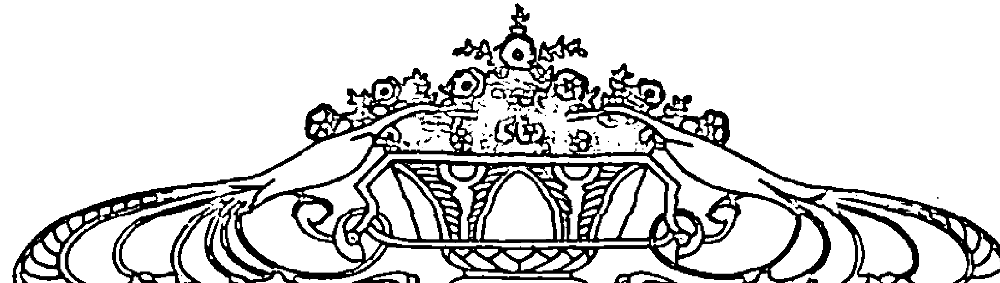