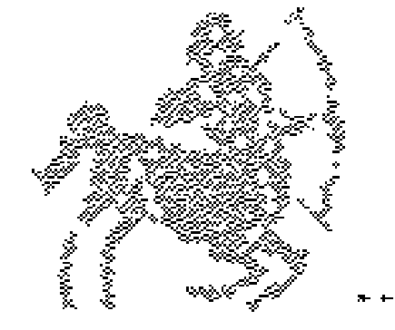
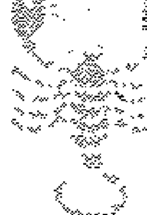
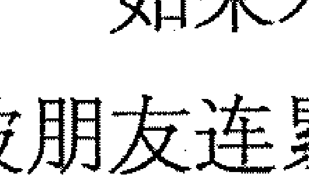
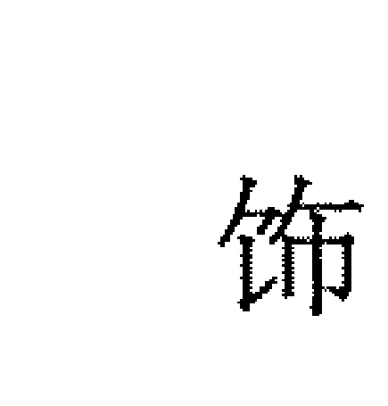
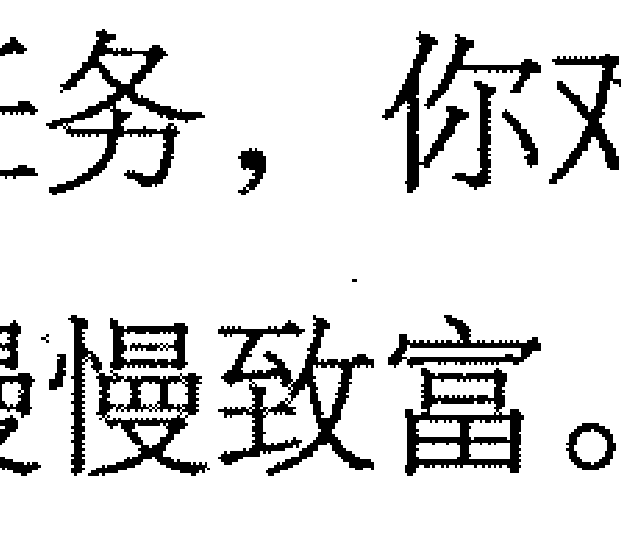
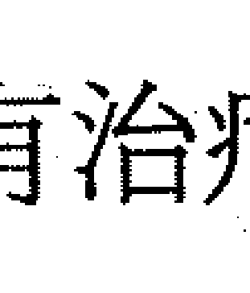
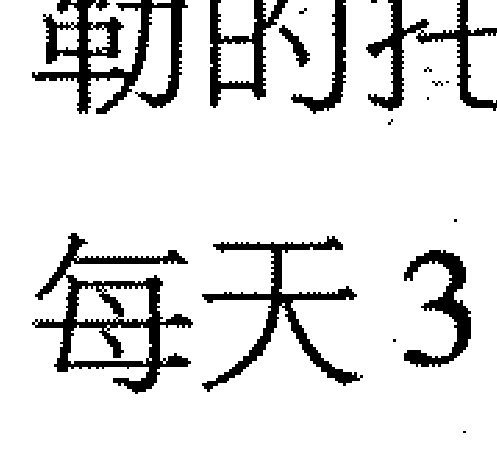
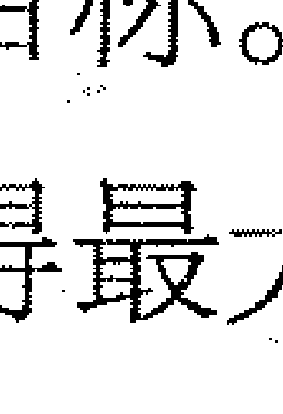

# 星座识人2：解密12星座事业与健康

- 看星盘 全解12星座生命的意义，事业前程，身心灵健康的奥秘。
- 星象学 唤醒喜悦的力量，如法改变人生。

心灵小狗星象网倾情奉献，百万星座粉丝热切期待！

> > 通过广播、电视、互联网，整个世界铺天盖地朝我们而来。似乎我们拥有了全部，却又丢失了自己。为何不缓缓脚步？借欣麟的新书，观内心，享静谧，认知自己。
> >
> > ——CCTV知名主播 谢颖颖

> > 季欣麟结合投资科学与星象，给人知命运命的新视角。
> >
> > ——中国台湾远雄集团董事长 李至春

> > 欣麟老师是集理性的投资理财专业、感性的星象命理天分与锐利的社会观察家于一身的奇人，也许就因为他的多面优异专长，使得他面对来找他解惑的人时，除了可以“排盘看诊”外，也能“开方治疗”——提供在现状下较适合你的应对方法。
> >
> > ——朗绪家居服电子商务负责人 王小凤

# 序 人生如梦似影——穿越星盘，领悟事业与健康终极指南

2011年11月14日，黄历上，诸事不宜。

这一天，我再次在北京遇见了我的密宗上师夏坝活佛，他是有名的四川藏区麻通寺的主持，信徒万千，也是少见能将佛法清晰演绎，不拐弯抹角的传法人。第一次见识他的风范，是在沈阳北塔寺，他能将大威德金刚的观想及仪轨，解释得十分易懂和简洁，在零度的东北雨季中，我醍醐灌顶。

我依稀记得他传法时的开心大笑，就像一笑，要打破所有人的我执和偏颇。

星象学是一场逦迤而来的考验之旅，想要轻巧度过人生，不深究人生哲理的人，或是只想求得安全、速效解脱的人，是不能获得星象学的深意的，即便入宝山也将空手而回。

相反的，想与人生做一场精彩搏斗，勇敢面对自己缺陷的人，却能在星象学当中，学会无尽的智慧与灵光。这道光，可指引一条非常快乐的修行路线。

夏坝活佛在北京世纪金源大饭店客房开示道，人分成四种根性——

第一种人，是无才无德。这种人因为愚钝，事情做不好，但又因为无德，不肯面对自己的缺点，总是把责任归咎到别人身上，终日埋怨他人，于是永远无法得到人生的悟道与进步。他们身处在黑暗之中，而不自知。

第二种人，是无才有德。这种人虽然事情做不好，却因为有德，会反省自己的缺失，去改进，也不会跟人去顽强计较、怪罪他人，由于对人以诚，会得到某些贵人的支持，犹如撑了一把雨伞，可以渐渐避开人生的雷电与风雪。他们从黑暗走向光明之路。

第三种人，是有才无德。这种人才华洋溢、很有能力，但是缺乏德性，总想抄捷径，别人20年完成的事，他们总想投机1年做完；对待别人，也以机巧，不以诚心待人，因此可以获得短期利益，却不能聚人，事业根基也不稳。这种人爬得愈高，跌得愈深，媒体或众人会关注他们迅速爬升的风光，却不会关注他们快速跌落谷底的失落。

第四种人，是有才有德。他们不断完善自己的个性，用德行圆满来面对人生，稳扎稳打。因此，他们的事业根基很稳，众人也会崇拜他们的德行，而不离不弃地追随他们。他们有机会得到最快乐圆满的人生。

> > 上师说，活在世上，快乐也是一天，不快乐也是一天。但是快乐的基础，不是你有多少钱、有多少名气，而是你去掌握快乐的秘诀，也就是追求德行圆满、诚实无碍的生活。

> > 佛法的精意是：人如果追求德行圆满的生活，不断改善自己的缺点，将可以得到最快乐的人生。这也是事业与健康的最深刻根源。

星象学能够帮我们什么呢？佛教靠不断持咒、仪轨、观想、静坐、修心，来达到破除缺点或“无明”的愚昧；星象学则透过深层了解自己的意识、潜意识、生活潜力、情绪潜力、身体潜力、道德根性，看穿命运之轮，来自我决定与自我觉醒。

透过星象的眼睛发现，如果你正在往悬崖飞奔，你是否会惊讶不已？很多人正在任由根性肆虐，做自我毁灭与像极自杀的行为。

命运之轮也是学习之轮，星象学是很好的法门与工具，让我们看到真实的自己、完整的自己。

先观世音，也就是觉察，然后用慈悲与智慧，来面对处理，再达到觉悟。

我从小学就开始研究星座。生命的轨迹，都在星座星盘的演绎下，一一兑现，人生就像是一场相对论的录像，在每个星盘人生选择的坎口，做出决定，按下按钮后，新的人生情境，就哗一下，给我神奇的答案。

由于本命水星在我的正财宫位，于是，每次择业，都会面临两种职业选择（水星象征多元机会），大学一毕业，完全没有经验的我，就破天荒以新人身份，进入滚石唱片做唱片企划专员，老鸟主管也说，你们真是幸运，滚石几乎很少这样招募无经验的新人。

同时，我投递的另一个简历，是当时台湾最大财经出版集团天下文化出版集团的旗下财经刊物《远见》杂志，竟然也录用了我。

在唱片企划和财经记者两者当中，几个月的挣扎下，我最终选择了后者。后来，我成为《远见》杂志有史以来年纪最轻的主编，也是第一位进入中国内地全方位采访互联网行业的记者（详见台湾天下文化出版《深入中国》一书）。

2007年，我面临了另一次职业选择。那时，我在内地做《投资有道》《融资中国》两本杂志的副社长兼总编辑，意气风发的老板，将整个杂志集团卖给了新华财经传媒，并且顺利在美国纳斯达克上市。我开始思考，那时近15年的媒体生涯，似乎总在重复几件简单的事。

虽然，水瓶座的我，因为有一颗土星主宰，喜欢将专业进行到底，但从事传媒行业那么久，我的另一颗主宰的天王星告诉我，应该有所变革了。
所以，我开始创办心灵小狗星象网（minddog.cn），把我潜心研究20年的星象学，分享给所有读者。我陆续在《时尚先生》《投资与合作》《职场》《投资快报》等媒体，发表星座文章，心灵小狗博客也得到一定好评，有超过505万的点击数。我并且在2011年出版了我的星座书《星座识人——季欣麟解密12星座财富与爱情》，并得到当当网第一周该类第2名、金融界读书网站第1名的好成绩。该书得到了我的好友中央电视台主持人谢颖颖及台湾地产大亨远雄房地产董事长李至春的推荐，并获得凤凰网、《南方都市报》、《京华时报》、台湾《天下》杂志的专门报道。
这两次职业选择，铸就了现在的心灵小狗和季欣麟，也让我现在可以在这里跟大家诉说星座故事。
我认为，两次职业转折都是很智慧的选择。这不是我天纵英才，而是挖掘星盘指示，逐步顿悟的结果。
很多人忽略了，比起金钱、名声，时间是最大的人生成本。走过流金岁月，说的就是时间如黄金流沙般，转瞬消逝。
如果能留住时间，做当下对自身最有意义的事，就是最好的事业规划和健康法则。
如何能做到呢？星盘就是生活大海迷雾中的最佳指南针。
第一步，你要把人生想象成一部电影。也许你的落魄，就是为了成功，做最好的准备。你的心酸，就是为了幸福，而吞下的最后一滴泪。这是突破“我执”最好的方法，透过电影的讲解及慧眼，你会变得活力十足，不再哀怨自怜，因为自苦，是阻碍进步的最大心魔。

第二步，你可找一位合格的星象师咨询。你把星象师的话，就当做是剧情大纲梗概，不要太容易就陷入自己的情绪悲喜，如果你觉得这位星象师说得不清楚或你听不懂，可以多找几位。

这个目的在于，透过这些讲解，一步步看清，自己的人生剧本及生涯使命目的。聆听星象师讲解时，不要执著于成败结果，要集中心力，重视过程如何发生，为何发生。

第三步，厘清人生使命目的之后，开始检视每天的生活，有多少事情，在做符合人生使命规划的事。建议你做成表格，逐一审查。把事业生活当中，那些符合人生使命目的的事，加强重复，把那些不符合人生使命的部分，逐步减少删除。

第四步，在那些符合人生使命的事项中，找出最让你兴奋激动的一件事，每天去做。

我常引用《秘密》一书的话“兴奋和喜悦是人生成功的最佳燃料”。透过星盘，我们要的不是其他，而是找出自己兴奋与喜悦的源头，然后不停地活化它。

很多人读了《秘密》之类的书籍，却不知道如何依照自己的本性，来执行完善。通过星座学星盘的了解，你可以透视12星座的“根性”所在，找到合适的兴奋生活的方法。跟随我的几本书，你会觉得，做到这些一点也不难，甚至是场华丽的冒险。

《秘密》作者朗达·拜恩（Rhonda Byrne）在新作《力量》中写到执行秘密的技巧，她说，

> > “你生来就注定要拥有精彩的人生！你生来不是为了挣扎度日；你生来不是为了过那种喜悦时刻寥寥可数的人生；你生来不是为了一星期五天辛苦工作、而周末快乐时光却稍纵即逝；你生来不是只能带着有限的能量过日子，每天在一日将尽时，都感到精疲力竭；你生来不是为了担心或是害怕；你生来不是为了受苦。你是为了什么活着？”

> “你本来就应该尽情体验生命、拥有你想要的一切，同时充满喜悦、健康、活力、兴奋与爱，因为那才是精彩的人生！”

我想，上师活佛说的有德行的生活，即是哈哈大笑、无所隐匿的人生。我很愿意分享星座学这个强效的工具，帮助你脱离苦厄，迈向幸福之路。不要怀疑！读完这本亚洲顶级星象师的书，你会很快找到 12 星座的秘密成功之道。

在我研究星座星盘 20 年的历程中，我帮助过很多国内外企业家、明星、社会名流，在命运转瞬之间，完成自己的人生梦想，并且找到事业、健康的平衡之路。

当你找到人生使命，并且付诸实现之时，就是“点亮”自己灵魂的关键时刻。一旦你点亮自己的灵魂，就像一支传递中的美丽蜡烛，你也可以轻易地点亮其他人。

世界之所以有黑暗，是因为太多人找不到人生的出路，找不到喜悦生活的兴奋点，于是，他们宁愿伤害别人，让别人痛楚，而使自己感觉到一丝欣慰，因为，别人也是这样的痛苦，别无二致。

这样的心理黑暗及嫉妒心，造就了人生的万劫不复、战争饥荒与天灾人祸。

一旦一个人真正幸福了，就会希望别人也幸福无虞，甚至会挺身保护别人的幸福。这就是我说美丽的蜡烛。蜡烛之火可以殷殷传递，造就人生辉煌的美景。

活化你兴奋喜悦的源头，让它像永不止息的泉水，同时，点燃你的生命之火，传递照亮。这就是我们一生能够做到，最大的功德和真实使命，比任何慈善事业，都更能帮助这个社会。

如果你心存嫉妒黑暗，即使你去做任何慈善事业，都是假相和形式，完全对社会没有益处，反而会导致灾殃地震。
如果你心存良善美好，即使你什么事都没做，也会圆满照耀你的周遭朋友，进而消弭任何祸害。

这是星象学能够告诉我们最浅显易懂的秘密。掌握这个秘密，你可以进一步消除身体所有不适感和疾病。因为，星象学相信，90%的疾病，都和你的心理状态相关。

人千万不要低估自己的神性能量，只要找到兴奋喜悦的源头，就是任何无解疾病的特效药。

在研究星座20年的历程中，我最深的理解是，人生就是一场繁复修行，而且只能上升，不能回头。真正明了星盘秘密的人会知道，星盘就是象征一个螺旋形的上升的通道，通向宇宙的真实光明喜悦。

我们来到人间，看似随机杂乱的组合，却是完美无瑕的课程和享受（只是有些人不觉得是享受）。星盘已经解释了一切，只看你有没有费心去体悟。

做星象师这么多年，我看见很多来测算咨询的人，带着疑问而来，解除疑惑而去。也有很多人始终听不懂真意，还是用自己的“有色眼镜”，看着自己的“悲惨人生”。

这是因为，这些人并未“发愿修行”，随着业力混沌而生活，就算知道人生结果，只是兔死狐悲、因事成败而悲喜，对人生的成长，于事无补。

事业健康的累世旅程，事实上，就是一场修心、修身、修德的大戏。对每个独特的个体来说，星盘会显示出来你今生的“业力地图”，根据这张地图，你可以选择创造自己的人生路径。

你会说，事情既然都已经有定数，为何还可以创造选择呢？那是因为，你的地图是告诉你，你的“根性”（或者说个性、习惯、喜好）。

“根性”优劣，不是我们可以掌握，但是只要透过“全观”，彻底了解自己的个性、习惯和喜好，你就会知道，人生很多事情，没有逻辑，是因为我们的“根性”，也没有逻辑。

例如，同样面对恋人离开，有的人采取激烈的自杀，也有人重新找到人生奋斗的目标。一位射手座的军人朋友，面临情变，女友弃他而去，找了一个更有钱的对象，他立志要创业成功，于是花了5年奋发图强，在天津自己开了一家广告公司，由于当年天津还没有很多替银行、房产公司做高端活动的公司，他这几年做得十分成功，买了一部雷克萨斯房车，这成功是因为他离去女友的刺激。当然也有人，受到这种刺激，只会怨天尤人，找理由消沉下去。这就是“根性”的影响。

看透星盘，就是一段领悟你自己“根性”的曼妙旅程。在九大行星的带领之下，你会发现，自己的个性有美妙光亮和混沌黑暗的两面。简而言之，不论你运程是吉是凶，只要你唤醒喜悦的能量，把美妙光亮的一面，挖掘显露出来，你就能获得殊胜华丽的事业与健康人生。

看透自己的“业力地图”——想象自己要的人生——唤醒喜悦的能量——如法改变人生，这四个步骤，就是这本书要告诉你的核心秘密。看完本书，你不论是穷是富、是快乐或忧烦，你都可以轻易掌握改变自己人生命运的法则，靠星象学，创造奇迹。

生活的真心喜悦，可以打破诸事不宜的阻碍。看到这本书，就是你发愿喜悦的第一步，体味到生涯的喜悦时，别忘了记录下来，到我的网站（minddog.cn）与我们分享。

# 基础篇

## 看透“业力地图”：1小时精通事业健康线

- ☆ 吃芒果，还是吃西红柿
- ☆ 土星星座：压力规范与隐藏的陷阱
- ☆ 木星星座：理想与解脱之道
- ☆ 第六宫：获得健康与工作的逻辑
- ☆ 第十宫：毕生生涯的终极密码

## 基础篇 看透“业力地图”：1小时精通事业健康线

### 吃芒果，还是吃西红柿

很多的星友，在找我咨询时，问的问题，就显露出他们的人生设定方向：是否能和这家合作公司会谈成功？是否该接受这份合约？何时可以得到回复？这笔正财的金额大约多少？

这些问题背后的潜台词，是大家对于事业的方向，已经拟定。因为知道我要吃芒果，所以我去找商家买芒果。但大家有没有想过，万一，老天对你此生的设定规划，不是要吃芒果呢？

人生注定会走一些弯路，有些人走的短些，有些人一直走到年老，才知道自己今生的志业，但也有少数人永远没有冀求，在迷茫中，庸庸碌碌过完一生。

如果你是抱着正确信念，来学习星象学，你会知道，星象学最大的作用，在于指引你的人生“必经之路”，透过这些“必经之路”，来完成此生的志业。

只有志业得到完满，人生才能得到完满。你会觉得，特别幸福，特别感恩，因而无怨无悔。

2011年过世的苹果电脑创办人乔布斯，应该没想到，自己…已在20年前发明电脑的图形处理界面，被微软比尔·盖茨“剽窃借鉴”，变成Windows操作系统；自己却会在20多年后，凭借iPhone的苹果平台重新夺回图形处理界面的王座，一雪前耻；更没想到的是，自己会在达到事业高峰的时候，面对胰腺癌的折磨，撒手人寰。

双鱼座的乔布斯经历了科技产业“基度山恩仇录”的一生，虽然短暂，但他活得十分精彩。也象征着双鱼座因果循环、贵人小人交织的命运特质。

事业是人一生除了情感之外最大的追求。简而言之，人是为了来这世上贡献什么，实现自我，进而留下典范。但不是每个人都在年轻的时候，像Facebook的创办人20岁出头，就了解自己的事业方向，创立了市值几十亿美元的上市公司。有人像肯德基爷爷一样，要到60多岁才创业，才找到人生事业的寄托。

也有事业人几经波折。像美国地产大亨特朗普一样，青年得意，建造了以自己命名、酒店式的辉煌写字楼，但是壮年历经美国房地产泡沫，负债10亿美元，到中年东山再起，甚至上电视教人创业经营。

每个人一生充满了奇迹和惊喜。现在成功，不代表会一直成功；现在落魄，也不代表未来会持续消沉。这就是命运奇妙的转折，不可预知未来的可爱之处。

但星象学却提供了预知的工具。学会星象学，不单单是让你知道你何时“发达成功”，知道如何善用自身优势，抓住命运转折点；也让你知道花无百日红，何时会遭遇“歹运”，如何提前预防，使自身从容面对。

日本平价服饰品牌优衣库（UNIQLO）的创办人柳井正（Tadashi Yanai），出身西服裁缝世家，大学毕业在知名百货商场佳世客（JUSCO）工作，坚持不到一年就辞职，那时绝对没想到自己会借由改造老旧的家族企业，一举变成为身价61亿美元的日本首富（2009年全球排名第十）。

他著书《一胜九败》，说明新项目成功背后，都是因为从失败中学会总结经验传承。

事实上，大多数人的人生的确是一胜九败。能够经历失败而不倒，甚至怡然以对的，就是最后的优胜者。

从星象学来看，为何失败呢？就是脑袋没有“开窍”，没有找到自身事业的方向感，更不会有事业的“全局观”。

> 如佛家所云：“我有明珠一颗，久被尘劳关锁；今朝尘尽光生，照破山河万朵。”讲的是佛性，能对事业通明，也是悟通佛性的一种境地。

大家应该领悟，通过星盘，就是要看穿人生的目的与方向。

有经验的星象师会从个人星盘的土星、木星，特别是第十宫的位置，来判别一个人的事业方向与成功的方法。

有时，你会发现，你的人生是来吃西红柿，而不是吃芒果，人生奋斗的方向，错了很长一段时日。但没有关系，之前的弯路，也是安排好的学习之路，一旦你阅读了这本书，你将轻易预见自己的事业道路，走回事业正轨来。

本书另外一个要探究的领域，是健康。我曾准确预测过，内地一位资深经纪人什么时间会得脑部疾病，主要的原因是什么。结果她果然患脑部肿瘤，现在还未完全恢复，曾经捧红过国内一线偶像的她，事业也陷入停滞状态。

射手座的宏基集团创办人施振荣在电脑行业风起云涌的时代，曾因为连做了6次心脏瓣膜手术（很可能是狮子座相关宫位出问题），而从宏基集团董事长位置退下来，位居二线。

双鱼座的乔布斯在2005、2009年都饱受癌症的困扰，2009年还成功做了肝脏移植手术，但在2011年10月还是难逃死神召唤。从1955年2月24日乔布斯的星盘来看，他的木星、天王星都在象征癌症的巨蟹座，到2011年10月的土星、太阳、金星、水星在天秤座会合，与巨蟹座呈现困难的90度相位时，肾脏（天秤座）及内分泌（巨蟹座）失调丧失作用，导致死亡。从星盘来看，未经过手术，是内脏自然衰竭而死。

健康和事业，是人生发展的一对孪生兄弟，不能独活。事业的发展，要靠健康精力来达成。我们发现，一个人如果要事业成功，他的精力往往都呈现强盛的状态。更有书籍表示，事业发展是由性驱力所驱动，控制好性能量的流动，就能掌控事业成功的秘诀。从星座学来看，这在某些成功人士的星盘上，能够得到佐证，但并非全都如此。

如何培育滋养好事业健康这对孪生兄弟，是人生的重要功课，本书就是揭示事业健康成长的终极指南。用星象学来看事业与健康，有时比你去做职业心理测验（只能看出你的能力，却不能看出你的心灵潜能），比你去医院做健康检查（只能看到现在，不能看到未来，只能看到结果，却不能看到致病心理机制），来得更神效。

因为，星象学的职能在于“直指核心”。星象师不该总是谈论一些边缘的因果，或者一些枝微末节，而是要直接找到每个人的核心力量及病根，才能开出药到病除的心灵药方。你同样可以去做职业心理测验、去医院健康检查，但是更要去深研自己的星盘，找到终极秘诀。

人生是该吃芒果，还是吃西红柿？读完本书，你自己透过命盘，就可以找到明智的答案。

## 基础篇 看透“业力地图”：1小时精通事业健康线

## 土星星座：压力规范与隐藏的陷阱

小时候，觉得考试是苦，每当期末考试的前一夜，总是辗转难眠，仿佛承受很大的使命与考验，害怕考不好，会失去很多。

到了20岁左右，觉得恋爱是苦。总是担心恋人在某个时刻会突然不爱自己，幸福会像青鸟一般消失无影。这种占有的苦，是人生很难挣脱的坛城。

步入社会之后，名利财富是苦。总觉得名利的争夺、财富的赚取，比起别人，自己总慢好几拍。总在担心，能不能顺利地安养晚年，能不能让家人过更好的生活，害怕事业一夕之间，土崩瓦解。

你回忆这些感受，就是土星象征的磨炼、恐惧、辛苦、奋斗。土星在星象学中，有很重要的地位，在你的星盘中，土星意味着你的限制、苦痛、考验和学习。

如果和其他重要行星相位好（30、60、120度），代表你的苦痛会比较容易转化学习，化为成果；如果和其他行星相位不好（90、180度），代表你要花比较多的精力和时间，来克服这些限制与缺点。

土星的磨炼，不像其他行星，如海王星、水星的作用，比较隐晦，而是会有一定的“产出”和“结果”。例如签成合约、买到房子、学会一定的技术和学问、得到财产之类。

“不经一番寒彻骨，哪得梅花扑鼻香”，指的就是土星的作用。一般人，会觉得人生皆苦，事实上，如果能从苦中“浴火重生”，星象学认为，就能得到很好的报偿。

土星每29年走完12星座，因此在每个星座，大约停留2年半，在同样时间段出生的人，都属于同一个土星星座。代表这两年半期间出生的人，有一样的使命和考验。回到个人星盘，更重要的是要看，土星落在自己的哪一个宫位，来判别人生事业和健康的考验在哪里。

土星是摩羯座的守护星，配合所在宫位，可看出一个人适合从事哪方面的事业和工作，一个人如果土星相位不强，通常无法发展很大的事业。土星代表你事业努力的原则和方向。土星星座请搜索“网易星座”之星盘查询。

每个人的土星星座是“业力”最好的代名词。怎么说呢？它代表我们人生最执著的一个点，我们的执著可以获得成绩，但同时执著也代表着偏执，必然有最不完美的缺陷存在。

土星代表一个人的成事能力及执行力的能量所在，同时也代表一种局限力。这个暗示是，你的能力，最后会把你自己困住。例如，你很会精算赌博，但过度依赖之后，总有一天，你会输得精光。你很会用美色迷惑人，达成目的，但总有一天，你会被卷入自己无法控制的情况。

土星，既是能力，也是枷锁。我们以为获得就是人生稳定成就的表现，但一旦执著过头，就会遭到反噬，得到这件事情的负面报应。

土星要让我们明白的是，所有的执著都有局限和误区。有些人积攒财富一生，却变成了守财奴；有些人期望获得学术的冠冕，却变成了学术骗子；有些人不断寻求感情，却发现只寻求到激情色戒；有些人渴求名声，却营造了假面人生。

土星呼喊着，这些执著背后，带来的是不自由啊！我们透过这些执著，看穿了真实而不愿承认的自己，但最终是要找到自在解脱的心灵道路。

参透利用土星的力量，要掌握“成、住、坏、空”的四阶段秘诀。首先要利用这股能量来成就自己的物质、事业、名声、健康等，到了一定程度，要学习加码运用（住），用于无形，慢慢地，你要检讨这方法的缺点，推倒重来（坏），创新这个能量方法，最后，你要放弃这个方法（空），用空性来运筹人生，你会发现不需要土星，也能成就事业，那是因为，所有的能量都可综合，都已经存在你的大脑当中。不需要只执著于一种成就法门。

成住坏空每个阶段，正常都需要修炼一个土星轮回30年时间，全部圆满就是120年的光阴。人一生很难修行圆满四个土星轮回，但只要保持开放的悟性和练习，我相信可以大幅缩短这个时间（时间也是土星的概念，执著于时间，就会受限于一种流程的信念，花多少时间，能完成多少事情，事实上，可以靠信念及悟性来打破这种时间计量的执著）。

土星也是研究慢性病和致命疾病的很好指标。当你患有长期的病症，就可从你的土星当中解剖出一定的“病根”，星象学在这方面的研究，十分具有启发性。你的所有疾病，是身心灵不平衡所导致，其中，土星的不良相位及执著影响，通常扮演根本的角色。

如果你只是勤于用药，而不改变自己的心灵状态和生活惯性，通常这些慢性病，只能“治标而不治本”。

在某个时间点，病症会“再度光临”。因为你的生活“业力”从未丝毫改变，疾病的温床存在着，就会促进疾病枝繁叶茂。

对于患有“不治之症”的人来说，土星通常是罪魁祸首。但相反的，透过研究土星的影响，也可能治愈这些奇怪的病症。

有经验的星象师，可以透过一个人的星盘，来解读出每个人的土星问题，从而找到改变每个人健康的密码。可以实行心理咨询的辅助改变个性、药石学的辅助经由宝石、草药、精油来改变能量（我会着手写一本书，专门讨论这些方法）。

星盘中的土星，铸就我们的肉身和行为准则，每个人的根性不同，应该用不同的治愈方式，才能达到最佳的效果。

目前星象学的秘密，还只被看到灵光一角。星象学是一门突破科学藩篱的整合（holistic）科学，里面的象征符号环环相扣，相互牵引，相生相克，值得更深一步地挖掘勘验。

#### 白羊座

土星在白羊座的人，在发展自我和提出自己的想法、欲望时，会得到过度的控制，以至于在主张自我的时候比较谨慎。但这样的人有比较强的个人坚持能力，个人的能量场比较稳定，精力比较持久充沛。

土星在白羊座代表他们受到生存环境的限制，所以需要学习发展个人的创造力、耐力和自助力。

说话直来直往，不愿浪费时间在无意义的事情上，只有能带来实质金钱的项目，他们才会感兴趣。适合做新型创业，设计建立独到商业模式。他们的现金流周期不易太长，最好从事每天收取现金的行业，如餐饮、旅馆、古董、典当行业。

土星在白羊座如果相位好的话，适合做事业拓展和开创，他们勇气十足，能够踏实筑梦；如果相位不好，则会不够勇敢、畏首畏尾、过度急躁、逞凶斗狠，造成入狱、住院手术、诉讼等灾难危机。

如果头部出现问题，如头痛、发烧、脑瘤、脑出血之类，代表事业、情感、人生出现很大压力，要及时采取相关的生活补救。也有人会脸部猛长痘痘。

#### 金牛座

土星在金牛座的人比较保守谨慎，他们内心希望能够靠物质积累和勤奋努力，达到自己的人生理想，而这理想通常是一个金钱数字或是房地产。他们服膺世界的法则，不是去改革社会，而是采取传统的方式，在原有的平台、产业上获取应得的报偿。他们享受一份努力，一分收获的“工薪”式的回报模式，喜欢稳定的回报。

根据土星落在的宫位，他在这宫位的部分，会特别务实，甚至怀疑、没安全感，他需要得到一种确切的凭据，如房产、金钱、合约，来证实这宫位的存在。

他内心追求看得到的东西，通常是物质或是实际的作为，他不太容易为名气所骗，因为内心里他看到的是本质。他希望拥有房产、珠宝等物质，来表示自己的成功与众不同。他追求稳定的关系和频率，内心不希望有太多意外，这些物质或事情的稳定感，给他幸福的感觉。他们有时会压抑自己的需求，为了成全大局或是人际的和谐，但积压久了，会在不适当的场合爆发出来。

土星相位如果很好，有中年成业发达的运势，可以把数十年的专业，慢慢积累，毕其功于一役，获得业界良好的名声和实力；如果土星相位不好，则会过度执著于自己的想法，保守而不敢扩张，或者总是找不到自己的专业，过着庸庸碌碌的生活。也容易理财不当，或是感情纠结不顺。

如果喉咙干痒、甲状腺肿大，可能代表事业感情出现很大问题，需要及时医治及改变生活形态。我的土星就在金牛座，当感情遇到很大波折的时候，就出现过甲状腺肿大的身体反应。

#### 双子座

土星在双子，代表这个人会压抑自己的公关能力或口才，是比较谨慎面对公开场合的人。除非有十足的把握，他不会表露自己的绝顶聪明。他们需要训练自己的表达能力。

土星在双子，也可以在贸易方面获得很好的长期利润。他会充分运用传统的交易方式，来达成自己人生的目的。

相位好的话，会充分运用合约及公关技巧来运作商业；相位不好的话，会有公关、合约上的难解问题，年轻时的学业也会很困难。

他内心有两种以上的原则，对情感来说，他们希望有爱情的部分，也希望有丰足的面包，希望有幽默的部分，也希望有沉稳的个性。所以面对情感选择来说，一开始，他内心总是举棋不定，但一旦确定之后，除非关系很恶化，他们为了维系家庭、情侣关系，却也愿意保持十分的任劳任怨，甚至十分专情。因为，他内心就是个青少年，不习惯有离婚的剧情发生，但反而会遭遇自己或父母离婚。

要小心肺结核、肺病、四肢冰冷、四肢受伤等情况，这象征事业和感情出现不想要的变数，要好好调理心情和饮食。

#### 巨蟹座

土星在巨蟹具有很强的商业能力，但是他们会隐藏起来，因为他们在精算的过程中，会发现隐藏是有利于别人判断的失误，他们很早就懂得“扮猪吃老虎”的商业哲学。

他会极力用不同的努力，来完成各种商业细节流程，也会很快地捕捉到商业对手的心理，因为隐藏的不安全感，他会把每个商业细节考虑得很好，因而获得成功。

他内心有最温暖的照顾情绪，也有最不安的害怕。他愿意照顾恋人，是因为自己内心很怕被抛弃。他很希望有回到子宫的安全感，没有人会遗弃他，所以他百般地表现，很敏感地关注爱人的情绪，就为了有个内心的安定感。但是，一旦被背叛，他总是不可置信，会自我欺骗。由于不安全感太重，他总是表现得十分情绪化和善感。

相位如果很好，土星巨蟹的人会是精明成功的商人，也会有很好的家庭关系，他们的直觉力很强；如果相位不好，则容易陷在情绪蔓延的泥沼，超级没有安全感，也不敢表达自己的感觉和感情，商业方面的能力很难培养。

一旦情绪波动太厉害，内心纠结长期积累，荷尔蒙会出现分泌失调，子宫及乳房都会产生异状，要十分小心。

#### 狮子座

土星狮子座的人，要靠领导管理来实现事业理想。他有稳健的领导潜力，能够安排资源和人力到最需要的地方，因而获得成功。

土星狮子座的人对于人员架构、权力安排特别有天生能力，如果能管理凝聚一个团队，就是他发达成功的开端。

他内心要的是别人的赞赏和崇拜，就像王者一样，不断有人呵护他的感受，不断给他溢美之词。他很希望能领导一个家庭，并且在感情上不断给家人无忧的照料。如果有能力，他会不惜花钱在家居、装潢、家电上，去显示自己的成功富裕。他内心也是个诚实的孩子，希望可以找到伴侣一起玩耍，不用心机地坦诚对待。

相位良好的时候，土星狮子座是最值得信赖的领导，他们会结合实际情况，来运筹帷幄，达到人力乘法效果；如果相位不佳，则会抑制他的领导力，或是徒有领导的样子，但却做不成事情，会听信谗言，对阿谀奉承毫无抵挡能力。

当心脏和背部出现问题时，就代表领导管理方面出了问题，或者是恋情、友情遭到背叛。

#### 处女座

土星在处女座的人，十分相信学习有用的东西，会带来人生的提升，他也执著于服务别人，从而带来价值。

土星处女座的人擅长完成细节的流程，并且追求实用事务的完美性。他坚持在过程细节中，将事情完善，有时会见树不见林。

他内心很没自信，同时也希望透过把事务安排得完美、井井有条，来显示自己的能力。他很愿意为家人服务，但因为要求尽善尽美，自己压力太大，就会对亲近的人，不断唠叨。他会说“这都是为你好啊”，但其实是在显示自己的压力实在太大了。他很有正义感，能为不平的事挺身而出。

土星在处女座会压抑他的学习力，但是他却觉得必须学习，才能成长，于是强迫学习的个性，会让学习成为一个苦差事。

土星相位好的，会展现常青树式的学习人生，并且是极佳的行政人员；土星相位不佳的，有可能不想陷入细节，讨厌学习，过着浪荡不羁的人生。

当肠胃、神经系统出现不舒服警讯时，就代表事业感情的压力，已经过头，最终都会有神经紧张、神经质的后遗症。

我的母亲心里一直觉得我父亲不是因为爱她才娶她，自己也在年轻时因为外婆的干预，放弃过一段真实的感情，对于感情的完美要求，让我母亲先是患有胃溃疡，后来则是出现神经紧张和神经质的情况，对所有生活细节都不满意，喜欢批评，觉得不对，没有安全感。这就是典型的土星处女座问题。

#### 天秤座

土星在天秤座的人，特别注重公平权力关系，希望有来有往，权力平衡的观念，使得他容易变成极佳的仲裁中介人员。

他对于美感有一种传统的要求，希望展现出世人认可的美感，因此崇尚一种贵气的生活美学形态。

他内心很在意别人的评判和感觉，他希望做个好人，让人际关系协调和谐。为此，他习惯忍住不说自己内心的感觉和需求，造成他的内心紧张，最后，这种紧张会爆发在自己最亲近的另一半身上。人们有时会被他评判过度冷酷，但这只是他为了缓解自己内心的压力。一般来说，在还没撕破脸，压力还不大的时候，他还是会待人如绅士淑女，很尊重他人的选择和看法。当然，有时候是因为他们自己做不了决定。他内心很要求规则上的公平，也是他很可爱的地方。

土星天秤座的人如果相位好，天生具有魅力，而且能够运用魅力，并且能够协调别人所无法协调的争端，并能够在人事物当中，达成和谐；如果相位不好，则要花比较多的时间，来化解内心不平衡的感觉，总觉得别人亏欠自己，或是变得不容易与人合作。

如果肾脏出现肿瘤或其他问题，代表内心隐藏了某种愤恨不平的感受，或压抑了不和谐怒气，要改变心态，身体才会好转。

#### 天蝎座

土星在天蝎的人，是很会掌控权力的人，他善于透过影响力来操纵商业和政治，并且软硬兼施，吸引别人的支持。他很会透过暗箱操作来引导时局，也会靠控制别人的作为，来彰显自身的能力。一般在其所在的宫位，会有特别的影响力及忍耐力。他的目标感很强烈，权力与性欲是他追求的人生重点。

他就算是俊男美女，也都会怀疑自己的吸引力。他有很深的情感，却又不知如何表白。在内心，他们爱憎分明，却不尽然都表露出来。他爱的能力很强，可以坚持爱一个人很久的时间，然后慢慢变成亲人的感觉，他能直觉感受到别人的意图和欲望，所以通常很能跟别人深度聊天，并且治愈对方的心病。到最终，他的爱能够升华成人类的大爱。

相位好的话，会成为具有魅力的领袖，也会顺利操纵商业和政治，朝向自己的目标前进；相位不好的话，会在政治斗争当中，成为牺牲品，或是花很长的时间来学习政治权力争夺。

从动物界求偶来看，性吸引力强弱，事实上是最明显的权力斗争。土星天蝎的人，致力于这方面的胜算，通常可以获得他们想要的结果。如果性器官、子宫、卵巢、前列腺出现问题，代表有权力斗争失势的潜在问题，需要慢慢恢复。

## 基础篇 看透“业力地图”：1小时精通事业健康线

#### 射手座

土星在射手座代表很重视宗教道德在人生中扮演的指导角色，他会有追求一种形而上理想的决心和毅力。

他对海外事务有一定的掌控能力，喜欢在海外扩张或者追求一种稳定的兴趣，他的运气是累积福分得来，喜欢做善事。

他觉得要付出努力，才能得到运气，他对人生谨慎地乐观，崇尚有道德的人生。

他内心自视很高，有很高的道德标准和要求。他认为，就算别人成功和富裕，也不尽然值得尊重，他觉得对朋友有义气，对道德原则有坚持的人，才值得尊重。他很热情，不会记仇，他总是看着远方的理想，不会在意现在的卑微。他是野心很大的人，一旦尝过胜利的滋味，就会去征服更大的战场。在感情上，他是认准一个自认为极品的人，就能忍受对方所有的情绪，也会开导对方。

相位好的，可容易得到地位的提升，在高等学习上有很好的成绩；相位不好的，容易表面崇尚道德，却很难避免掩耳盗铃的私下败德行为，会压抑自己的扩张欲望，导致一事无成。

理想得不到完成，或是遭逢不幸的命运，会让他肝脏、大腿出现明显的问题，是开始调整心态及行为的警告。

#### 摩羯座

土星在摩羯座是回到自己的守护星座，也是擢升的位置，代表他在事业权力的缔造上，有很深的努力与决心，他觉得事业的成功，就代表人生的完胜。

他会对世俗的价值十分尊崇，并按照商业政治的游戏规则来努力实现自己的人生梦想，有大器晚成的命运趋势。通常这种人很有韧性的特点，会完全展现在土星所在的宫位相关的领域。

他内心对权位很不安，他希望自己有名声职位，因此而被别人尊敬。他表达情绪十分严谨，会严肃看待别人的行为，但自律太严，如果星座相位不好，有可能出现忧郁的情况。他们喜欢表达有用的情感，就是说明一些事，表现权威感，让对方去做。一般自己的情绪十分压抑，除非让他总是讨厌的人，他会大发一场脾气，平常都彬彬有礼。

土星的相位如果良好，他会在一定的职业努力之后，得到很高的权位及做事能力；如果相位不佳，就要付出比一般人成倍的努力，才能成就大业。

当权力的安全感不在，或是事业压力太大，皮肤、骨骼、牙齿都会出现健康问题，平常要特别注意这些部位的保养。

#### 水瓶座

土星在水瓶座，象征愿意用不寻常的方式，来执行自己的理想，他有传统的包袱，却也希望打破传统，创造属于自己的人生框架。

他们习惯采取渐进式的革命，在符合传统要求的情况下，暗度陈仓，破坏原来的做事原则，创造一种新世代的做事理念和方式。

他钻进一件事情之后，就会沉浸其中，直到完全吸收事物的精髓之后，才脱身出来，用这样的经验，来从事一件不完全相干的事务。跨界、跨产业的经营，是他的强项。

他内心很喜欢个性上的挑战，希望知道所有事情的底细。如果向他倾诉，你要情感出轨，如果诚实面对，他还可能为你想个方法来解决。他们有时表现出对情感毫不在乎，但这其实是他的保护色。因为他不懂得热情如何展现和表示，他只会说出自己的想法。由于表情太过冷静，很多的表白都让人觉得在跟外星人沟通，而怀疑他的诚意。但其实，内心里他比任何人都在乎，都执著。

土星相位好的话，他能够很精确地融合传统与现代，做出很惊人的创新，活出很创意的人生；相位如不好，可能所有的创新却变成空中楼阁，也缺乏执行力。

如果事业感情上的冲击太大，循环系统、小腿、脚踝都会出现机能障碍，有可能有心血管疾病、脚踝扭伤，这都是体内机能不平衡的警讯。

#### 双鱼座

土星在双鱼座是现实主义者，但也会包装起理想主义的外观，他终其一生，要决定自己是要服膺现实主义，为社会进行危机处理及修补，还是完全奉献自己，成为慈善救赎的理想家。

他是矛盾的个体，比一般人更深切、直觉地了解人世间的现实风雨，但也知道唯有牺牲自己的利益，才能带来更大的利益与救赎。

他内心很善良，但不懂得如何拒绝，面对真正的感情却很害羞、胆小，不敢相信和表示。直到对方离去，他可能才意识到自己曾很深爱过对方，后悔不已。他期盼得不到的浪漫，很会说一些承诺，但有时无力去完成，如果面临情绪压力，他会选择逃避。回到原点，他不知道自己要的是什么，可能是人世间的温暖情愫，也可能是一场疯狂的恋爱，更可能是跟外星人谈恋爱。

土星相位好的话，他会具备心想事成的能量，有效结合梦想和现实，达成世俗的任务；相位不好的话，则有逃避现实，迷信甚至沉迷药物或情欲的危险。

当脚掌、脚部出现扭伤问题的时候，通常是事业感情遭遇危机的时候，双鱼土星的问题，无法经由世俗方式，迅速解决，往往需要透过心灵疗法来根治。

## 三 木星星座：理想与解脱之道

木星的福佑给我们的启示是，老天总是安排一支尚方宝剑给每个人，看你如何在生命的幽谷来使用。

使用得好的话，你的人生会获得很大的提升。仔细观察每支宝剑，都是一种健康正面的心灵状态体现，如果想获得运气，你就要密切掌握好自己的心灵状态。

木星是贪婪的许愿树。你要学着去平衡与谦虚，找到合适的解脱出口。先想利人，才可能利己。

木星是心想事成的预言。挖掘你最深的理想之后，你要勇敢地去思考、创造，就可以拥有你想要的美好人生。

我永远不会忘记，当流年木星进入我的偏财宫位时，我在上海一年多时间里买卖5套公寓，得到不错的收益。而且，房屋挂牌不到2个月，就顺利卖出。

我的一位明星经纪人朋友，则在木星进入她生育宫位时，以42岁的年纪，去美国顺利产下自己的第一胎男婴。

每个人一生中，都有属于自己的好运时期。木星所在的宫位或星座，就是代表你的好运所在。

一个人的事业，如果能够和自己的好运相关，当然就会有比较好的发展潜力。

木星的体积是地球的 300 多倍，也是九大行星之中，最大的一颗。因此，木星象征的是理想的扩张及解脱之道。

往好的方面发展，木星可以把你的优点放大，视野放宽，往不好的方面发展，木星会加重你的缺点，也会让事情恶化、不可收拾。

在解读每个人的星盘“业力地图”时，木星就是很值得研究参考的要素（木星星座请搜索“网易星座”之星盘查询）。

木星主掌射手座。人为何能得到幸运，是因为你从事自己“有兴趣”“符合志向”“完善理想”的事情。如果，你觉得自己的运气不佳，可能起始点都没有找对，你没有找到自己的志趣所在。

木星一年走一个星座。在星象师研究一个人的星盘时，木星也是最好的指南针，告诉星象师，每个人在每个年份所行的运势，哪方面最强盛。

有个星友告诉我，他做生意最赚钱的那几年，仿佛是关上门，钱都会从门缝里塞进来。这就是一种木星的意象：一旦走到旺运，所有的相关元素，都会成倍扩张。

我们看到很多企业家、明星，白手起家，在某个特别的年份，赚到自己的第一桶金，销售掉最多的产品，往往都是流年木星走到最好位置的时候。

一个人当事业面临到重大挑战时，也通常是流年木星走到最不好位置的时候。

木星具有好运成倍，坏运也成倍的作用。能掌握好一个木星运势，通常可以连旺4年左右，同样遇到一个不好的木星运势，就会连衰4年。

所以检视你的“业力地图”，木星可以给你成功与失败的幽微启示。

## 基础篇 看透“业力地图”：1小时精通事业健康线

### 白羊座(或第一宫)

你的理想是成为一名勇敢的战士，在某个产业中攻城略地，获得第一名的地位。

你是一个有创业冲劲和潜力的人，你适合去开创新的领域、新的客户、新的产品，任何行业只要是第一个做，成为领头羊的你，都会有很大的胜算。如果成为某个领域的名人，就会带来好运。

你是天生人气王，在镁光灯下，你可以充分展现自己，得到别人的热情支持。因此，需要在公众视野里频频出现的事业，都很适合你，例如明星、发言人、代言人。别人会感受到你的热度和诚恳。

你个性急躁、总是想冲第一，不耐烦别人动作太慢，你有单打独斗的能力，但要学习合作，才能得到更大的成功。

如果相位不好，你可能兴趣太广，太过奢侈，在金钱和承诺上不谨慎、粗心大意，对人鲁莽，过度饮食可能带来肥胖的问题。

### 金牛座(或第二宫)

你的理想是拥有很大的资产，用这些资产，可以享受豪华的生活。

你天生有财运。从事银行、珠宝、金融管理、饮食相关行业，可以轻易赚到第一桶金。只要慢慢存钱，就会有好运。

你有稳健经营的心态，一步步积累资产，通常能掌握一门正财专业，靠此专业，获得别人的认可。

由于对金钱有慷慨的态度，相位好的话，会愈给愈多，相位不好的话，则有过度奢侈的行为发生。

木星金牛座的人内心会感觉自己就是有钱人、有产阶级，因为拥有金钱对他们来说，有很甜蜜的感觉，也因此会吸引到更多的财富。

木星在金牛座的人，最重要是找对事业方向，这样就会比一般人有成倍的收益。

### 双子座(或第三宫)

你的理想是与人建立友善互助的关系，生意对你来说，就是互相帮助，交换资讯和价值。

在工作上，只要能够掌握好沟通的技巧，就会得到好运。短途旅行也能带来更多的机会。

木星在双子座的人，有很快的反应能力，学习力很强，对流行事物也特别敏感。激发自己对新事物的学习及赤子之心，给自己带来很多新的运气。

歌唱、演讲、旅行都能给你带来动力和喜悦。贸易则是获得成功很重要的行动，互通有无，做中间人、中介、媒人，都有成功的运道。不要常待在家里，要多参加研讨会、舞会、朋友聚会等公关场合。

家族可能会有帮助你的兄弟姐妹，他们在某个领域，有一定的影响力和财力。

### 巨蟹座（或第四宫）

你的理想是拥有一个完美、互相关怀的内在家庭，可能是原生家庭、婚姻家庭或是工作团队，你可以用自己的资源来滋养照顾这个家庭，也希望别人来滋养照顾你。

你有天生的家庭运和老人缘，只要从事和家庭、女性、房产有关的行业，都能得到好运气。通常可靠自住房地产，慢慢积累财富。你可能出生于不错的家庭，或者有很好的道德教养，或者有中上的家族财富。

木星在巨蟹座的人具备细心、温柔、照顾别人的母性光辉，就算是男生也会比较有温柔的一面。

你有特别的计算天分，对于小型商业会不会赚钱，有一定的直觉力。

只要启动你对家庭的温暖感情，把家里布置好，做宅男宅女的生意，都会如有神助。家族情感是你最大的能量。

相位好的话，可从家庭获得安全感和冲劲，相位不好的话，会有家族的心理矛盾，并且过度情绪化。

### 狮子座（或第五宫）

你的理想就是有好的恋情，生活变得多彩多姿。你的魅力十足，需要一个好的舞台展现出来。

当有好的恋情，就会有好的运气。你的桃花很多，但要好好选取，如果遇见好的桃花，偏财及创业都会很旺。

有很好的股票投资运，别人赔钱的时候，你都有可能赚钱；游乐场、运动场、艺术馆都是很好的开运场所，年节也可小赌一把。

木星在狮子座，如果是主管，你有大公无私的管理风格及技巧，会让你深受爱戴。同时参加艺术文化相关活动，有助于你的运势提升，自己也可从事艺术创作。

木星在狮子座如果相位良好，有最佳的创业运，适合自己当老板。孕妇小孩相关或是国际名牌相关的产品，都很旺运。如果相位不好，则是会有很多烂桃花造成困扰，或从多次的创业失败中学习，再接再厉。

### 处女座（或第六宫）

你的理想是有很好的工作和服务机会，能透过这些工作，给别人带来价值。你希望有很好的健康养生的生活形态。

你只要找到很好的工作，就会有很好的运势。要维持工作和健康的平衡，让自己在一种健康的工作形态里面贡献心力。你在求职方面，有比较好的运气。会遇见赏识你能力的主管，给你一定的发挥空间。你只要不断忠诚地付出，就会得到应有的报偿。

木星在处女座，从事健康、行政、管理、图书馆、出版相关的工作，都有好的运势。

木星在处女座，有比较强的工作热情和投入感，可以感染别人，让彼此工作更有干劲。

如果木星相位不好，会遇见工作上的人事斗争，或是从事不适合自己的工作。

### 天秤座（或第七宫）

你的理想是希望让在乎的人都开心，能够在政治上如鱼得水，获得大家的喜爱。你也希望享受舒适和谐的生活。

你只要找到相信自己的团队，就会很有运气。你适合装扮得体高雅，出席高级的宴会，可以给你带来婚姻事业的机运。

你的运气是协调众人的争端，从中获得让彼此得到利益。你会有不错的结婚运，通常可以找到比较好的伴侣，在事业和生活上来帮助你。

木星在天秤座的人，适合做法官、书记、律师、公关传播业、奢侈品行业，他们会得到工作上的支持和客户的喜爱。

木星在天秤座的人，要掌握好合作关系，可以找合作伙伴来做生意，通常会因此吸收到不错的资源。与另一半保持良好信任关系，可以旺夫或旺妻。他们对婚姻抱持乐观态度，也可能有好几段的婚姻。如果相位不好，就会面临合作争端多、合作破局等困扰，或是伴侣争吵不休，因而离婚。

### 天蝎座(或第八宫)

你的理想是在爱情及事业上能够掌权，扮演领导位置，改变你的伴侣和事业伙伴，达成不可能完成的人生高度。

你有性感的特质，会吸引人们来到你的身边，他们会被催眠，按照你要的方式前进。对于外表好的人来说，身体的吸引力是你不错的资源。如果外表一般，你则会凭借直觉发现别人的需求，从而进一步说服对方，顺从自己的方式。

如果能够找到特别爱你的贵人，你就掌握了人生发球权，可以暗中完成完美的人生地图。

木星天蝎座的人，有很好的权力运，总是能在关键时刻站对位，获取更大的权力利益。也会有很强的执行力和忍耐力，去影响周遭的人。你很能探索别人的隐私。

木星在天蝎座的人，有很好的偏财运和遗产运，性生活也比较圆满。有机会通过大乐透、伴侣得到财富。从事医疗、殡葬行业，也特别有发展。

相位不好的话，容易因为贪婪、花费不知节制而破财，也容易沉溺性爱。

### 射手座（或第九宫）

你的理想在于追求世间真理与义气，为了要证明真理的存在，你愿意付出很多。你也可能投身于宗教活动之中，从中得到安宁。你最终想要有一个独立自在的人生，不受别人牵制影响。

你只要做自己感兴趣的事，就会得到好运，最好是研究很久、很深的兴趣，有独到的见解。你在人生哲学当中，有自己的看法，要按照道德生活，也会获得神助。

木星在射手座是上升的格局，代表你天生具有运气，不缺钱花，也会很容易得到别人的赏识，十分有活力，一部分的人会有很好的运动细胞，喜欢跳远、田径等运动。打官司的话，都容易获胜。

木星在射手座会有很好的高等学习运，可以出国深造，或是修读博士，高等学府对你有开运的作用。海外运很强，适合到外地发展。很有慈善心，会参与慈善活动。

如果木星相位不佳，则会喜欢扮演上师、导师的角色，但却无法做到高道德的要求。也可能在海外发展受挫。

### 摩羯座（或第十宫）

你的理想是在事业上有所成就，因此得到旁人的尊敬。你喜爱在大机构做事，事实上，大机构也给你带来好运。

你只要能够坚忍不拔，在一项事业中长久努力，愈老就愈发好运。所以，选择一项未来会有发展的事业，长期投入，就会有很大的成绩。你可从基层做起，可以了解整个产业，然后一步步爬到高层。

木星在摩羯座的人，是建构社会传统价值最好的工匠，你们愿意在世俗的框架下，完成自己的理想，不会怨天尤人，是完全现实主义者。也因为传统法规道德，能让你一展所长，得到地位的提升。采矿、财务、资产管理、总务采购，都是你们能够出头的行业。

木星在摩羯座，会让你的事业得到大环境及贵人的支持，加快成功的脚步。只要认准一个方向，你就会有成倍的果实收获。你是事业发展的幸运儿。

你会容易受人赏识，爬到社会的高层，变成给别人建言的导师。

如果木星相位不佳，则会在事业上争斗频繁，或变成跋扈、骄傲、自以为是的上司。

### 水瓶座(或第十一宫)

你的理想是能够大胆改革既有现状，创新生活形态，并能交往一群志同道合的好友，彼此分享相同的信念。

你的运气来自各种社会团体，你可成为社会团体的组织者、鼓吹者，为了一股理想去奋斗。只要心中的理想之火不灭，你的运气就会持续下去。

你可轻松说服别人，接受你的理念，你也可以用创意的方式来改变社会现状与自己的人际关系与生活。适合从事 IT、互联网、生物科技研发、新媒体、手机通讯、灵修、装置艺术等改变传统产业的行业。

木星在水瓶座的人具有与众不同的创意和气质，敢于突破传统，也容易从传统当中吸取养分，创造新的事物。

木星在水瓶座，通常可以交往到卓越杰出的朋友，你的朋友通常慷慨正直，会成为你事业、生活、感情的贵人。你也容易成为社团、社会活动中的风云人物。

如果木星相位不好，你可能会太过在乎朋友的出身，或是被朋友连累，遭遇官司。

### 双鱼座(或第十二宫)

你的理想是浪漫的感情，透过这种感情经验，物我合一。更进一步，你追求一种宗教灵修的心灵解脱，找到内心真正的平静无暇。

你只要透过祈祷、观想、创作，不断感觉到灵感的提升、感情的升华，你就能够拥有心想事成的力量，获得幸运之神的关注。

你的运气来自于你的亲人、爱人、工作伙伴之间的情感奉献及升华，你只要做一件善事，往往就会有各种贵人来帮助你。你们遭逢危机时，总有救兵出现。

木星在双鱼座的人，有很强的情感敏感度和直觉力，因此很适合从事艺术创作、广告、制鞋匠，与人有关的销售、基金会、心理治疗师、歌手等行业。通常你的贵人很多，属于傻人有傻福。

木星在双鱼座的人，心地十分善良，由于常常做善事，具有不错的福气，晚来有钱有依靠。对人很愿意牺牲付出，也适合遁入空门，从事宗教灵修的工作。

木星相位如果不好，会产生败德的思考，另外，会无意识让自己陷入险境，看看有没有人来营救。

## 第六宫：获得健康与工作的逻辑

我曾帮内地一位风云一时的经纪人解读星盘，那时她的选秀节目当红，旗下艺人事业正要起飞，她每天加班没日没夜。从她星盘看出，她大量的工作压力，会导致头部的损伤问题，我特别提醒她要注意。

没想到，她是由不得自己、很要面子的狮子座，仍然醉心工作，一两年后，朋友就通知我，她因为脑瘤住院，所有工作，全部停摆，当红艺人只能交给其他人管理，应验了我的预言。

国内外很多的企业家也因为病痛缠身而无法自拔。俗话说的“财多身弱”，事实上常常指涉的是一种错误的工作惯性和心理状态，所积累而成。

身体和工作无法分割。你用你的身体来服务社会，并且采取一定的服务风格和模式，这种服务就是工作，服务所需要用到的是你的健康身体。

由于这种相关性，因此，在星象学上，每个人的第六宫，就代表一个人的健康和工作运势。

宫位的判定，跟出生时间，有很大的关系，一般相差15分钟，就有可能会有一个宫位的差异。如果不确定知道自己出生时间的人，建议找有经验的星象师，帮你校对出准确的出生时间。这样，才能正确的找出第六宫。第六宫请搜索“网易星座”之星盘查询。

第六宫的宫头星座，可以反映出一个人工作和健康的特点。在此宫头星座中，你可以找到自己需要注意的身体部位，也可看出工作风格和强项。在此宫位落入的行星，也可代表你个人健康和工作的独特特质，相位的好坏，则是反映出个人健康和工作的优势与劣势。

如果该宫位，没有行星落入，则可参考宫头星座象征的行星，在自己星盘的位置和相位，来判定第六宫问题（见附表一）。

## 附表一：第六宫宫头星座象征行星、主宰身体、工作注意问题

| 宫头星座 | 象征行星 | 影响部位 | 注意问题 |
|----------|----------|----------|----------|
| 白羊座 | 火星 | 头部 | 暴怒、急躁 |
| 金牛座 | 金星 | 喉颈部及甲状腺 | 压力、隐忍 |
| 双子座 | 水星 | 肩膀、手臂、神经系统 | 思虑过度、疑心 |
| 巨蟹座 | 月亮 | 胸部、乳房、消化道 | 情绪化、悲观 |
| 狮子座 | 太阳 | 心脏、脊椎、背部 | 控制欲、脾气大 |
| 处女座 | 水星 | 神经系统、胃、肠 | 神经质、细节癖 |
| 天秤座 | 金星 | 肾脏 | 讨好别人、权力平衡 |
| 天蝎座 | 冥王星及火星 | 性器官 | 占有欲望、过度投入 |
| 射手座 | 木星 | 臀部、大腿及肝脏 | 工作过量、野心太大 |
| 摩羯座 | 土星 | 膝盖、皮肤、骨骼、牙齿 | 忧郁、责任感太强 |
| 水瓶座 | 天王星 | 小腿、脚踝及循环系统 | 反叛心、情绪压抑 |
| 双鱼座 | 海王星 | 脚 | 上瘾、逃避压力 |

## 基础篇 看透“业力地图”：1小时精通事业健康线

举例来说，如果你的第六宫是狮子座，没有行星落入，你就可以参考自己太阳所落的宫位和相位，太阳如果落在事业宫、和第一宫的月亮呈现90度，就代表你因为事业常带来矛盾情绪化的反应，会让你心脏（狮子座太阳主宰）发生一定的病变，长期严重的话可能心律不齐、心脏衰竭。

每个人如果能掌握自己第六宫的特性，就可以发挥优点，提防缺点的产生。你可以自己提醒自己来改善，如果不能自觉养成习惯，建议找一位合格星象师来做潜意识和行为的调整转运。

很多星象师用落入第六宫的行星来判别事情，但我认为，第六宫的宫头更能显示出一个人的基本状态，宫头就像是一家酒店的环境风格，行星则是住进去的人，或是管理人员。

利用你第六宫的环境，再配合精明的人员，就能达到最好的结合功效。也可用土壤和花朵来比喻，你有什么样的土壤，就适合种植不同的花朵。如果背道而驰，就会窒碍难行，造成苦难、困难的状态。

#### 白羊座

第六宫在白羊座的人，工作风格属于即知即行、行动派、效率导向，你在乎快速完成结果，不重视过程、流程的堆积，对于目标和排名的敏感度、掌控度都比较高。

你喜欢第一时间完成任务，并且用别人无法达到的效率时间，来证明自己的成就感。对于没有尝试过的工作，有种挑战欲望，能够用自己的方式，通常是爆发力和行动力，来证明自己超越了挑战。

由于自己常常能完成不可能的工作挑战，在公司中容易变成霸道专横的主管，对下属的工作极端要求；但另一方面，却很容易对需要帮助的朋友，伸出救援的双手。

在办公区域布置或放置红色物品，佩戴钻石或铁饰，都有明显的开运作用。

#### 金牛座

第六宫在金牛座的人，是很认真的执行者，你尊崇社会基本的做事方法和专业，稳稳当当地进行工作，不喜欢工作上有太大挑战或意外。

金牛座不善于经营新的人际关系，你喜欢和熟悉你工作习惯的老同事共事，你喜欢规律的朝九晚五的工作形态。

只要把工作交给你，你会用全部努力来执行，因为你相信一份耕耘一分收获，天下没有免费的午餐。

你适合从事比较务实的工作，或者是具备艺术气息的工作。通常身体健康，在工作上不疾不徐，具备优雅的工作风范。

在办公区域布置或放置淡蓝色、绿色物品，佩戴翡翠或铜饰，都有明显的开运作用。

#### 双子座

六宫双子的人在工作场合对人事物十分敏感，能够做快速的反应与改变，喜欢经过沟通，尽可能多地了解别人的想法和需求。在工作上，能够圆滑处理很多人际关系问题。

你是公司的智多星，有很多的商业点子，可以很快地反应执行出来，是很合适的市场营销人员。你可以同时处理手上多件事情，游刃有余；也因为太过聪明，有时会想走捷径办事。

由于对信息和人之间的关系，考虑较多，想得也比较周全，容易在工作领域，因为思虑过多、选择过多，而丧失机会，需要沉静下来。你的小道消息很多，很多人因此接近你，想了解更多八卦。

但六宫双子的人，通常在工作上机会很多，贵人和小人也多，只要能够聪明地与上下属沟通，很多问题，迎刃而解。你像父亲一样对待你的下属，只要对方忠心，你就有护短的习惯。

你是很好的中间人，年纪大了之后可以靠人脉轻松做交

#### 巨蟹座

六宫巨蟹的人，工作有很强的精算心理，你知道要花多少时间精力，来完成这份工资所需的工作量。如果老板收服你的内心，你会更加努力工作加班，从不会埋怨；如果老板让你觉得不是自己人、惹人寒心，你会只做规定内的事，甚至有时间的话，趁人不知，会偷空兼差。

对工作有不安全感，工作上会有情绪化倾向，常常需要人事物安抚。喜欢的同事，会当做家人一样对待，也习惯在公司经营自己喜爱的人际小圈圈。

六宫巨蟹会愿意为了自己有情感的对象，加班工作或是承担对方的工作，替自己人打卡，是你们认为很够义气的行为。

士为知己者死。对工作贵人直觉性很强，会想办法去接近工作上可以帮助自己的人。当发生公司派系斗争时，是保皇派成员。

适合与社区、市民、女性、母婴、养生相关的工作。

在办公区域布置或放置银灰色物品，佩戴珍珠、银饰，都有明显的开运作用。

#### 狮子座

六宫狮子座擅长于管理工作，可以朝向主管职位规划，他们在工作发言、组织活动上，很有大将之风，喜欢得到工作方面的赞美。

如果在年轻的时候，培养好专业和高远眼光，壮年将是很强的领袖人物。可以得到下属的支撑，成为耀眼的企业权威人物。但身体活力可能不足，需要保养身体。

不适合做太多细节执行的事，一方面会太拘泥方法顺序，造成执行的困难和人际关系的不合。但在统领项目方面，可以把资源搭配得很好。宫内相位不好的话，可能用生病来引起别人的注意。

在办公区域布置或放置橘红色物品，佩戴红宝石或金饰，都有明显的开运作用。

#### 处女座

六宫处女座的人，工作风格强调流程和细节掌握，你善于将有用的人事物集结起来，把没有用的人事物删除。所以适合从事行政、人力资源相关工作。

你严谨面对每个工作的动作，有工作洁癖的倾向。表面谦虚学习的态度，容易得到培训的机会，或者得到长官的喜爱。

你做自己认为对的事，不认同随波逐流的和稀泥做法。你适合安排规划整个商业的法规和规则，把细节掌握得很好。有完美主义倾向，工作容易拖延完成。

喜欢逻辑性很强的工作，也适合可以逐步成长、永续成长的公司，不喜欢一成不变的传统氛围，总在思考改进流程、产品的可能。

在办公区域布置或放置深咖啡物品，佩戴缠丝玛瑙，都有明显的开运作用。

#### 天秤座

六宫在天秤座的人，工作上非常在意别人的眼光，希望获得同事、上司的认可，因此，在工作、人际上，你付出很多的努力，基本是为了别人而生存。

因此，很适合从事服务客户、公共关系、美的行业、奢侈品行业。你可以在工作场合穿着优雅得体，说着最合宜的话语，从而得到别人喜爱。

你最怕工作中遭到不公平对待，这会打击你的工作积极性，甚至愤而离职。一种不平衡的心态，会让你做出各种过激的反应，一反平日的温和有礼。

你有能力让两个不合的人，言归于好，这种协调纵横的能耐，是你成功最大的原因。对你来说，和气就能生大财。

在办公区域布置或放置蓝色物品，佩戴蓝宝石、玉饰，都有明显的开运作用。

#### 天蝎座

六宫天蝎的人，是在工作上低调，却目标感很强的人，你知道在关键时候，说何种话语来自保或是进攻。

你相信工作要忍耐，具备野心，才会有成就。平常你会隐藏这种野心，慢慢隐秘地来构筑自己的权力花园。

你善于采取战略性思维，来处理工作事务。工作上，你能很快瞄准目标，并且直觉到你的贵人所在，用权力来处理事务，获得成绩。

根据新英格兰星象学院的督导教授苏克依（Sakoian）的说法，“六宫天蝎的人要透过工作与服务，来使自己的精神获得新生。”你可以从工作挑战中成就自己，整个人脱胎换骨，成为一个新的人。

权力架构的掌控是很重要的主题。如果工作上面临很大斗争挫折，你可以从这些斗争中，很快复原，浴火重生，得到更大的力量。

在办公区域布置或放置深红色物品，佩戴猫眼石、蛋白石、钢饰，都有明显的开运作用。

#### 射手座

六宫射手座的人，对工作有种乐观和志气，总认为自己可以达成“不可能的任务”，把项目最大化。你重视工作的道义和道德，工作志向远大，但做事有时候会“不着调”，有粗心大意的倾向，但在重要事务上，你会看得很细节，要求做到一丝不苟。

你走运不走运，完全在于你是不是能抓到重点。一旦你把真正重要的事务，放在放大镜下检视，做到完美，你的成功将是不可限量的。如果你庸庸碌碌，代表你抓到的都是枝微末节。

你的工作往往符合社会发展大趋势，你也会遇见贵人，因此得到升迁发财的机会。但不能松懈下来，一旦粗心大意，有可能再度大意失荆州，回到原点，甚至更惨。

你很慷慨大方地帮助工作方面的客户和伙伴们。你的热情和奉献，可以感染工作团队里的每一个人，因而获得支持。

要避免做违背职业道德的事，有可能因为你的大胆，你会失去更多，或完全让别人不信任你。

在办公区域布置或放置紫色物品，佩戴黄宝石、黄水晶，都有明显的开运作用。

#### 摩羯座

六宫摩羯座的人，对工作责任特别在意，会如实严谨完成任务，你对工作有很大的企图心，但你愿意从基层做起，然后慢慢致富。

认为工作的权力是长幼有序。你的服从，让你得到第一个工作的贵人和升迁机会，因此，你常常愿意在一旁，辅佐你的上司成功，如果能够有智慧选对好上司，你很有机会成为他的接班人。

如果成为主管，你喜欢用带兵的方式，来训练部署，要求纪律严明。你如果能坚守纪律，有积沙成塔的坚忍毅力，成功通常是属于你的。

由于你对事物的悲观想象，会让你在工作上，由于太过担忧，反而真的出现困难，你要吃苦当吃补，咬着牙渡过难关时期。要避免压力过大导致忧郁。

你工作组织能力很强，只要形成系统，会造就很强大的团队。你的工作自尊也很强，不会主动要求权位，比较实用实力来让别人，黄袍加身于你身上。如有别人刺伤你的工作尊严或嘲笑你的工作努力，平常内敛的你，会不惜一斗。

在办公区域布置或放置深灰色物品，佩戴紫水晶、绿松石，都有明显的开运作用。

#### 水瓶座

六宫水瓶座的人，创意、想象力十足，很会做跨界的结合，或研发全新的产品及系统。如果能结合学习和创新，你会得到不可想象的好运势。

你会用智慧思考，跳跃性地去执行方案，用聪明独特的方法，来达成工作目标。但有时不按牌理出牌，也会有失误的情况发生。

你不喜欢接受长官管束，因而很适合做自由工作者、创作者、研发工程师等独立工作。如果能和一群为了理想的朋友，从事民间社团、非营利机构、基金会工作，也会很有成绩。

你有时想的多，做的过少。可以增强自己的行动力，就会有开运的作用，因为去做了，机缘之门才会为你打开。你在工作中具有爱心，对待同事就像朋友一样，可以和谐地合作完成工作。在办公区域布置或放置蓝绿色物品，佩戴海蓝宝石，都有明显的开运作用。

#### 双鱼座

六宫在双鱼的人，平常时候不显示出自己的能力，当危机出现时，你可以很快地处理，显示出自己优越的工作能力。

工作起来，你比较喜欢和人处好关系，对你来说，一群喜欢的人在一起工作，才是最愉快的事。不是很重要的工作，你可能会拖过截止时间，或者甚至逃避责任。如果工作压力太重，你也会陷入忧郁状态，或者酗酒、脚部出现问题，暂时逃避去休假。

但一旦你发现，唯有你才能处理的事情出现，你就会马上处理好，获得上司的肯定和喜爱。

因为你善心帮助工作同事。你的工作贵人会变得很多，别人也很乐意帮你介绍工作机会。

经过多年，我发现，第六宫的秘密在于，你给出什么，就会回报你什么。你诚心服务牺牲了，就会得到健康完满的报偿。

## 第十宫：职业生涯的终极密码

每当流年木星进入一个人的第十宫（事业宫），他的事业直觉和发展能量，会突然提升起来。有人开始创业，有人开始一个新的事业生涯，有人突然转行。

我在木星经过事业宫的时候，在一家媒体集团担任高管，这家媒体，当年被美国风投收购，在纳斯达克上市，我人生第一次拿到股票选择权并套现。

事业宫冥冥中给你的启示，不可小觑，你要观察木星经过你事业宫时的每一事件，就会得到你的成功密码。木星一年走一个宫位，每次木星经过事业宫之后，还要12年后，才会再光临。因此，当木星突然“照亮”你的事业版图时，你可以一窥自己事业的全貌。你可能会做对一些事情，也可能做错一些事情，透过分析这些行动，就像拼图的吉光片羽，会拼凑出你的事业人生。

我当时，事实上是得到贵人的帮助。集团的社长范祖德给了我很大的发挥空间，并架构了金融上市的框架，至今我仍十分感谢他。这也显示出我事业宫的特色，有贵人来协助成长，并且需要打造团队合作，就能十分成功。当时很多老同事后来一直都有很多的合作机会，也是一种贵人合作格局。

很多人，在一生中，没有领悟到自己事业的真谛，不知道自己生涯追求的目标是什么，因此，在生活当中，载浮载沉，寻不到停靠港湾。

如果你觉得人生彷徨，星象学把毕生生涯的终极密码，藏在每个人的第十宫中。一个人一生中必须完成的使命，创造事业的方式，事业的终极目标，都可在第十宫中，看到端倪。花点时间，不难了解，自己到底适合如何发展事业。

一旦明了事业的航程及航向，也就可以掌握了事业发展的根本及重点。

每个人独特的使命。因为这个使命，老天会赋予你独特的能力和能量。你会逐渐了解，对别人重要的，对你可能不是那么重要，对别人困难的，对你可能不是那么困难。

所以，每个人完成事业的方式，是不可放在同一天平上去比较；每个人有自己的事业道路和发挥重点。

你的快乐，常常是取决于第十宫的能量是否强盛、流畅，因为事业发展顺遂合乎自己的人生目标，你的自我实现感与幸福感最高。

命不可独论。在星盘的启示中，事业宫（第十宫）、工作宫（第六宫）和财富宫（第二宫），分别隔了120度的合相，是相辅相成的作用。看事业宫，同时要参考自己的二、六宫，来领略出相辅相成的方式。

事业宫是人生目标理想，就像船的航向。
工作宫是完成理想的最佳方式和商业工作模式，包含身体状态，就像驾驭船只的方式和风格。

财富宫是获取及运用财富资源的方法，就像船票、船只财务管理的模式。

事业宫看来最不实际，但却是驱使人生工作、财富的风帆和舵，航向不清的话，人生航程会走得辛苦艰难。就像在战场必须有战略一般，分析事业宫就是拟定你人生战略，最好的参照。

第十宫宫头在那里，也就揭示了你的人生幸福之道（第十宫请搜索“网易星座”之星盘查询）。

#### 白羊座

第十宫在白羊座的人，就像一个出外打猎的专业猎人，他们不惧黑暗、凶猛的野兽，不断开拓新的狩猎场所，只为了照料家人三餐，看到他们的微笑感激。

你适合开创性的事业，包含没人做过的、市场初创的、新商业模式的、销售扩张阶段的事业，你都可以有更大的发挥。各类业务销售、运动员、创业家、母婴行业、新商业，都是可发展的方向。

勇气是你这一生要挑战的事业关键。你不希望被人管束，希望证明自己的独立与快速效率。因此，创业、独立拥有自己的事业版图，是你这一生很重要的挑战和机会。

追求成就感，是你所有事业成功的密码。在事业上，你要有一夫当关的气魄，掌握先机，然后用数字或成绩来说话。你只要一步步冲刺自己的目标，会比别人更快，积累出很大的事业基础。你们有收集事业奖状、奖杯的习惯，这些奖杯，就是你奋斗的标记和圣杯。

你会复制别人的成功模式，但你绝对要完成得更有效率和更有规模。

你喜欢成为勇者，去照顾弱小，不论男女，都具备母性的光辉。所以，找到那些你最心疼的弱者，可能是父母、爱人、小孩，他们可以激励你面对人生事业的勇气。

永远探索新内地。对你来说，能够第一个完成别人无法做到的目标，会是很大的成就和鼓舞。不断挑战新的高点，是你的事业成功哲学。事业成功之后，让亲人得到完满的幸福，这是你的目标。

#### 金牛座

第十宫在金牛座的人，就像一个经营高级当铺、银楼的老板或是私人银行保险箱的经理，不断积累财物，以利息、红利、保管费作为主要收入，最后拿到这些财物后，希望过着奢华、有品质的美丽生活。

专业、可信赖是你事业成功的关键。你适合在传统行业中，建立自己的专业信誉，稳定完成自己系统的建制，在一定的专业游戏规则中，获取你专业的报偿。

稳步成长，是你事业成功的哲学。不求暴富，而是靠一点一滴的血汗努力，获得业界的认可和信赖，并且一砖一瓦，逐步构筑自己的王国。这样最坚固，也最能抵抗风雨。

行事依循正确主义，像牛一样努力，并坚持执著正确理念。只要你长期坚守一种商业道德和社会规范，如 “童叟无欺”“君子有通财之义”之类，并按照这种规范来行事、努力工作，往往成功在望。

你努力的目标是要过着爱与美的人生，要积累很大的财富，有好的房子、食物、娱乐，并能享受很好的性爱关系。

最终目标是要得到物质世界的完整。用正直专业的方式，获取财物，从而成为豪门。拥有豪宅、跑车游艇、奢侈服饰、名画珠宝等，都是你成功的象征。

#### 双子座

十宫双子的人就像古代郑和下西洋，坐着当时最新科技的船舰，乘风破浪，带着满船货物，到另一国度进行互通有无的贸易，交换最新奇的信息，过着最变幻多端、有趣的人生。

懂得互通有无、穷则变变则通的哲学，是你事业成功的要素。你要快速察觉到别人的需求，甚至创造别人的需求，来灵活从事商业活动。

你可以追求瞬息万变、海外冒险的人生，对你的事业目标来说，只要在变动当中，找到事业乐趣，就是很好的发展途径。别人在变化中，可能会很不适应，你却可在各种事业变局中，在转职、异地发展、降职升职中，找到自己独特的发展机会。

从事跟媒体、信息、贸易零售、新科技相关的事业，可为你带来突破的机遇。特别是销售大众喜欢、当下流行的产品，可以为你创造商机。

你的生涯目标，就是当好媒介中间人，敏锐协调解决上下## 巨蟹座

十宫巨蟹的人，就像一个精明的杂货店老板娘，每天计算着流水账，为每天的业绩起伏而开心、难过，但她最大的幸福，是来自有亲密感情的家庭生活。

你事业成功的秘诀，在于对商业的敏感和精算。你能找到最能赚钱的生意，经营得有声有色，但不善于大生意的扩张斗争。如果能够把事业做大，往往是有家庭或亲密伴侣帮助的结果，可打造成功的家族企业。

你人生的目标，在完成成功的商业生活外，主要是建立一个温暖亲密的家庭。这家庭，也可纳入你在乎的朋友，你们能够彼此分享最私密的爱意和情感，你要靠这样的人际关系，来滋养自己的内心。

团结凝聚你的家庭情感，彼此亲情相依，是你最有成就感的事情。只要家人子女得到情感物质上，无微不至的照顾，你就觉得人生满足。你这一生，要找到、组织这个家庭，到最完美的相处状态，你可得到身心的平衡和喜悦。

#### 狮子座

十宫狮子座的人，就像是一国的国君，天生具备领袖风范，每天日理万机，有很多的资源和人力可供驱使，最大的心愿是得到臣民的爱戴。

你成功的关键，就是资源与人才的领导，一旦坐上领导的位置，你就有机会呼风唤雨撒豆成兵。你天生具有诚实、大公无私的管理风范，可以得到下属的支持和信任。

你的人生目标是掌控一个自己的事业王国，从而得到声誉。为了完成这个目标，你必须训练自己的领导管理技巧。当你掌握足够资源，可用自己独特的方式，把事业管理得非常顺畅，把最合适的人，放在最合适的位置，把资源预算运作得完美无缺。

在众人知晓的领域，得到良好名声，可以给你很大满足。

这个宫位的人，也有人是在享受爱情、付出爱情上，得到最大满足。像小孩一样，和爱人建立起浪漫、忠诚的关系，一生追求灵魂相属的伴侣。在爱情关系上，你可展现散发最大的光和热，因此感到莫名的幸福感。

#### 处女座

十宫处女座的人，就像一个图书馆管理员，把不同用处的书籍，归属到不同的角落，并且因井井有条、一丝不苟而自豪。最大的满足感，来自物有所用，完美的布局。你的成功关键在于行政流程的完美掌握，和有用事物的充分利用管理。你要发展逻辑思考，可训练成非常强大的流程武器，进而建立各种商业系统法规。你的人生目标，就是做“正确”的事情，因而得出正确的结果。对于事业的完美坚持与逻辑，可以让你成为业界的常青树。不断地思考学习，有助于你提升事业运势。你可因此更新换代，得到更好的市场商机。你可快速思考出，如何将资源有用地服务他人。正义也是一种逻辑思考，当你选对领导，帮助对的人，你的运势也会跟着上升。图书馆愈大，人生愈成功。你的人生使命，就是用有智慧的方式，服务更多人，一旦服务影响更多人，你就会更加成功。

#### 天秤座

十宫在天秤座的人，就像是一个社会名流，当粉丝越多，才华与财富越增长，就会绽放出越强的光芒。你的满足感来自影响力的广大深远和交际平台的提升。你的优势强项在于社会活动的表现及仲裁能力的提升。你如果能够培养出名人的优雅风范和能力，就能获得更大的成功。你通常可在交际平台上，找到自己的贵人，他们会想借由你的影响力，帮助他们的事业，所以不断地给你资助与资源。

你的人生目标就是成为某个领域的名流人物，并且有着丰富圆满的婚姻与爱情。你可培育自己的贵人俱乐部，有计划地提升自己的交友圈子和社交圈。你很适合在外交事务、商业谈判、社交俱乐部、艺术创作、艺能界、媒体行业发挥自己的能力。

一旦名气出众，财富和奢华就会降临到你身上，娶个豪门妻子或是嫁入豪门，都很有机会。你的社交圈层次就代表你的发展状态。你要追求优雅高尚的生活方式，享受最顶级的社交环境和艺术品品位。

如果能有很完美和谐的婚姻和爱情，你才会觉得人生圆满。因此，要使自己成为良好的伴侣。

#### 天蝎座

十宫天蝎的人，就像是一个跨国公司的总裁，每天要处理各部门的人事斗争，架构好每个地区的权力架构，自己的婚姻生活也充满了欲望和争斗。最大的满足感，是来自权力掌控后的人生意义体悟，身心灵的投入修炼。

你成功的关键，是在控制发展自己的欲望，特别是权力欲望，到达一个比较强盛的状态。你要学习如何扩张自己的欲望，用自己的能力，得到权力加持。

你的人生的目标，分成两个部分，一个是欲望权力的高度成就，另外是内心的沉潜、宗教的修持。

权力的霸气，让你成长。你要用正当的谋略，达到权力的高峰，掌控最多的人力、人心，你才会觉得人生有成就感，如果在一个市场竞争，你则要占据最大的市场份额。

宗教的沉潜，让你升华。一旦得到人世间的权力，你就要反省权力的反噬和贪念，权力是用来造福人群，而不是用来满足一己贪欲。你要进行身心灵的探索，让自己彻悟人生，学习去帮助更多的人。

你的使命在于心灵成长的探索。你可以因为自己的体悟，而拥有治疗别人的能力，甚至具备直觉力、洞察力，可以探寻人生宇宙的修行秘密。

#### 射手座

十宫射手座的人，就像是一个诺贝尔奖得主，为了研究一门科学，殚精竭虑，领略学术的最高峰，并与世人分享成果。最大的满足感在于，人生意义的探索与完成。

你的事业成功秘诀在于，你要选择自己有理想、有兴趣的事业，并且坚持道德勇气，去采取正当的行动，一旦你有理想，你的事业版图，就会如获神助，扩展地比想象中还快。你要享受自己的事业，就像研究自己最喜爱的事物，从事自己最擅长的体育活动，乐在其中，你的成功几率，就会比别人大。

你的人生目标，是能够完成一种理想的旅行，追求社会道德的完善，帮助需要帮助的人。海外相关的合作、宗教机构、基金会、旅行业、运动行业都会给你带来事业的运气。

在事业上，你愈慷慨、愈乐于助人，你的运气就会愈好，因为别人也会来帮助你，失之东隅，收之西隅。由于射手座是幸运的木星主掌，你的事业扩张运很强，可以不断提升自己的理想目标，一般都会幸运地达成。

你的幸福感来自理想标准的达到，仿佛替世间增加了一件完美的事物，自己也获得了极大的报偿。

#### 摩羯座

十宫摩羯座的人，就像是一位年长的部长，在政府服务多年，终于晋升，在这期间，他经历了所有的事业考验，坚韧地度过很多权力复杂的难关，最终呼风唤雨。他的满足感在于，意志力的呈现和别人的尊敬，他最后不需要再看人眼色，可以做自己想做的事。

摩羯座本身就主宰事业宫，因此，十宫摩羯的人，会经历事业的各种挑战，靠毅力来一步步爬到最高的位置。你可选择一个传统的行业，默默耕耘，要学会吃苦，年深日久，你就可以成为行业的霸主。

成功的密码在于毅力和持久，你可能是大器晚成的代表，但是每个努力，一步一脚印，都不会白费。你的事业根基，也会比别人更稳固。花了很长时间积累，所以，一旦爬上来，你不容易再掉下去。

你的人生生涯目标，就是传统事业的成功，获得社会的地位与尊崇。你的权力和影响力很大，你不需要说话，别人就会服从理解。

你可在上流社会得到认可和地位。也因为长期的努力贡献，收到终身成就般的礼遇。你可享受所有权力背后的好处。但最重要的，因为你的成就，你成为社会建制的中坚分子，是

#### 水瓶座

十宫水瓶座的人，就像是爱迪生般的科学革命家，他在没有人相信他的情况下，经历了各种失败，发明了电灯，还创立了百年企业GE电气。你的创新能力，超凡绝伦，最大的满足感，在于创意、革命能够实现。

你事业成功的秘诀，在于不妥协地坚持创新，改变行业的规则、打破陈规，创造新的商务模式，发明研发新的产品，只要长期深入研究，不断创新方式，你的事业就会得到很大的成就。因此，你很适合在互联网IT业、生物科技、媒体通讯业发挥你的创新能力。

你的人生目标，在于发掘事物的本质，找到人生的智慧泉水，你因为获知领悟了人生的精义，能够超脱人生烦恼，活得十分超然自在。

爱迪生等发明家在发明创新的背后，事实上，也在研究事物不变的根源特质，也就是道家所说的“道”。你的生涯，就是把智性成长，放在第一位，达到一种宇宙融通的生活智慧。

因着这种智慧，你可以从容运用、获取人世间的资源，活得自在喜悦。

#### 双鱼座

十宫在双鱼的人，就像一名电影导演，活在想象的人生里，并且记录下生命的喜怒哀乐，敏锐地感受人性的需求，却有时候想逃避人生，活在自己电影的世界里。最大的满足感是，情感在电影里的升华，感动全部观众。

你的成功关键是，确定人生的目标、不再被动逃避，奉献自己给最爱的家人或事业，不要漂浮不定、举棋不定。你潜在很强的执行力和直觉力，只要你想完成的事业，几乎都可以完成，只是你不愿定下心耕耘，抱着逃避侥幸的心态。

你有比别人丰沛的想象力，可以发挥在事业成就上，经过训练，你能成为一个心想事成的专家。在所有需要想象力的事业上，包含电影业、音乐、建筑业、服务业都可给你不错的舞台。

你的生涯目标是，透过你的事业奉献，成果能够让所爱的人感动，获得亲情、爱情或友情。所以，在事业中，你要善用你的正面情感力量，来激励自己，获得更大的事业前进动力。因着这种互动的情感，你会感觉到人生的美妙及感动。

一分成十二，十二汇合成为一。事业宫落在十二星座，象征着你今生需要完成的生涯理想或梦想，朝着这个方向前进，今生你会比较早修行成功，达到事业的高峰；事实上，每个人都汇集了十二星座的梦想，才会成就完满人生，但不可能太过贪心，需要一步步向前挖掘。

事业宫通常含藏两种人生目标，一种是事业发达的模式方法，一种是事业成功的精神层面。例如，白羊座的事业发达模式是用开创力，扩张事业版图，精神层次是勇气的发掘；金牛座是学会用专业，来积攒财富，精神层次是爱与美的享受；双子座是学会贸易之道，精神层次是体味事业人生变化之趣；水瓶座是跨领域的创新，精神层次是智慧自在的事业追求（见附表二）。

记住，一定要先抓住精神层次的追求，再套用用合适的事业模式及工作模式（见第四章），这样才能有最好的事业提升效果。

第一篇是星座创造成功四部曲的第一步，这四步骤我再重复一次：看透自己的“业力地图”——想象自己要的人生——唤醒喜悦的能量——如法改变人生。

一旦觉察到自己今生的生涯目标，你就开启了星座学的修行之门，等于看透了星座“业力”地图，可以很快进入想象自己要的人生阶段。

附表二：第十宫宫头星座象征人物、发达模式及成功精神

| 宫头星座 | 象征人物 | 发达模式 | 成功精神 |
| :--- | :--- | :--- | :--- |
| 白羊座 | 猎人、战士、创业家 | 创业、销售 | 勇气、爆发力、成就感 |
| 金牛座 | 当铺老板、私人银行经理 | 专业、积累 | 稳健、爱欲满足 |
| 双子座 | 商人、股票交易员、演说家 | 贸易、公关沟通 | 灵活、趣味 |

## 基础篇 看透“业力地图”：1小时精通事业健康线

续表

| 宫头星座 | 象征人物 | 发达模式 | 成功精神 |
| :--- | :--- | :--- | :--- |
| 巨蟹座 | 杂货店老板、女性产品销售 | 小型商业、女性事业 | 温柔爱心、情绪感受力 |
| 狮子座 | 国王、总经理、表演家 | 领导管理、资源整合 | 大公无私、爱情 |
| 处女座 | 图书馆管理员、行政总裁 | 行政、培训学习 | 实用感、正确主义 |
| 天秤座 | 社会名流、艺人、外交官 | 人际交涉、艺术事业 | 优雅平衡、爱情婚姻 |
| 天蝎座 | 总裁、医师、心理治疗师、星象师 | 政治权力、医疗治愈 | 身心灵修炼、直觉力 |
| 射手座 | 诺贝尔奖得主、旅行家、牧师 | 新商业扩张、基金会 | 乐观、宗教道德情操 |
| 摩羯座 | 政府官员、传统行业老板 | 传统行业、资产管理 | 毅力、受人尊崇 |
| 水瓶座 | 发明家、创意人员 | 高科技、新商业模式 | 创新力、自由独立 |
| 双鱼座 | 电影导演、作家、危机处理人员 | 情感创作、危机处理、慈善事业 | 心想事成、牺牲奉献 |

# 事业篇

## 想象自己要的人生：12星座事业成功蓝图

- 12星座明星名人的事业密码
- 你最想知道的12星座事业与健康话题

### 12星座明星名人的事业密码

我常常在想，世间的事情，愈简单的道理，应该是愈颠扑不破的道理。星座学也是如此。

一个星座的成功名人，能够用一种特殊的方法，达成人生事业目标，同样的，你只要抓住最简单的行事精髓，你可以用自己的方式，来创造自己的灿烂人生。

没有什么神秘复杂的地方，只要提醒自己，每日按照本书提示的星座事业成功方法，你也可以轻易完成人生使命，过着幸福的日子。

先了解星盘里的土星、木星、工作宫、事业宫是了解自己独特根性的第一步骤，第二步骤就是要从别的成功例子里，想象自己要的人生。

找到成功典范（Role Model）很重要，你可从他们身上，领略到十二星座成功的精髓。你要相信，这些名人传记中描述的，也是最寻常的人生故事，只要按照步骤行事，你也可以创造属于自己的成功传奇。

你可参照自己的太阳星座（一般人熟知的星座）和第十

#### 白羊座——开拓型的人生:微软 CEO 史蒂夫·鲍尔默、宜家公司创始人英瓦尔·坎普拉德、休·海夫纳、成龙

白羊座以高效、独立、勇气，来建立自己的事业蓝图。你即知即行，当别人还在考虑的时候，你已经付诸行动。尽管行动不一定完美，但是，对于抢占第一商机来说，你可是完全有发言权。

首先是独立，创业是你成功的起点。你只要想象拥有一个自己的事业，能够按照自己的战略方式来经营，就会给你很大激励感。白羊座独立性很强，非常有勇气，你不喜欢别人干预你的做法，你通常可以用最具效率的方法，独自完成工作。

再就是成就感驱动。你最大的优点是，可以从一些小的项目开始努力，只要有一点成绩，你都会感觉到成就感。

最后是第一名心态。你宁为鸡头，不做凤尾。在任何领域，你只要冲到第一，你就会再度燃起事业激情。所以，建议你开创一种新的商业模式或业种，做这个细分领域的第一名，你就可以愈做愈大。当然你的复制力也很强，但记住不要去跟风，可以在别人的模式中，做些微调整，创造出自己独特的事业模式。

白羊座很讲义气，你可用此精神，铸造一个家庭般的创业团队，用“彼此义气”将大家绑起来，可以获得更大成功。你可想象“桃园三结义”之类的军团，就是你可采取的团队模式。

宜家家居集团的创办人英瓦尔·坎普拉德（Ingvar Kamprad）就是白羊座的成功代表。1926年3月30日出身于瑞典一个农场主家庭的他，于2008年81岁高龄时，以310亿美元排名福布斯全球第七。英瓦尔·坎普拉德生于瑞典南部的斯莫兰省，祖父是德国移民，经营着一个农场；外公是当地首屈一指的富商，经营房地产和农场。可能是受家传影响，坎普拉德的母亲也精于商道，夏季将自家农场出租给度假的游客，收入不菲。

白羊座连创业都要比别人早，坎普拉德从少儿时代就做过些小打小闹的批发转零售类小生意。5岁时，坎普拉德向附近的住家出售火柴；7岁时，他开始骑着自行车向地域更广的住家售货。他发现可以通过邮购在斯德哥尔摩以低廉的价格大批量地购买火柴，再以很低的价格单个出售。

从火柴开始，他扩展到出售花籽、贺卡、圣诞树装饰品。小男孩从销售中发现了巨大的赚钱乐趣，他说，“那是一种惊喜，当你发现自己能够如此便宜地买进各种东西，然后再以稍高一点的价格卖出时，你就会感受到这种惊喜。”

在瑞典，他首先开创了低价邮购的商业模式。一开始他只是卖圣诞卡、自来水笔等文具用品，1943年坎普拉德开始印制名为“宜家通讯”的小报（1951年正式发展为宜家的商品目录册，到2009年以27种语言和56个版本印刷近2亿册）。1948年，宜家有了第一位雇员，但实际还是坎普拉德一个人的公司，家人及陆续增加的几位雇员主要是起个帮手的作用。

白羊座享受的是创业的成就感，并不讲究排场。坎普拉德至今仍然开着一辆15年前买的旧车，乘飞机出门向来只坐经济舱，甚至有人常看到他在当地的宜家特价卖场淘便宜货。

不仅如此，坎普拉德基本不穿西装，而且总是光顾便宜的餐厅，还会为买了一条像样的围巾、吃了一顿瑞典鱼子而心疼老半天。

白羊座由火星主宰，性和勇气是白羊座成功的发动机。花花公子集团的创办人休·海夫纳（Hugh Hefner），1926年4月9日生于美国芝加哥。

休·海夫纳于1953年创办《花花公子》杂志，它不但成为全美最畅销的成人杂志，而且行销全球。该杂志使海夫纳成为百万富翁和风流人物。时过境迁，他却永不落后。80岁的海夫纳已经失去了一半的听力，他在花花公子大厦接受美联社记者采访后，努力了多次才终于站起来。尽管这样，2010年5月，休·海夫纳迎娶第三任妻子、年仅24岁的英国金发美女模特克丽丝泰尔·哈里斯。

1953年秋天，27岁的海夫纳向亲友借了8000美元，花500美元买下梦露半裸照的版权，创办了《花花公子》，这本创刊号卖出了5万多册的奇迹。整个美国都在为这本前所未见以女性裸体为主、谈性、谈爱、谈生活品位、谈如何休闲的男性杂志而激动。他的豪宅是新歌德式的庞大建筑，陈列着毕加索、莫奈甚至约翰·列农的画，如果不了解卧室的整张地板是沙发床，忽略一些色情小道具，这就是个有19世纪70年代气质的豪华宫殿，里面住着海夫纳的三个女友和一位前妻，花园里养着鹦鹉、犀鸟和孔雀。

白羊座在爱情上的追求，是你成功的动力。但建议，要维持兴趣，不要太过杂乱，反而会影响事业。

地域市场的开拓，也是白羊座的强项。1954年4月7日出生的成龙是继李小龙之后，第二个征服好莱坞的华人巨星，1984年的《红番区》，让他站稳在好莱坞的地位，其全球电影票房已经超过100亿元。

> 吸引力密码：你可以像成龙、海夫纳及坎普拉德一样，成为行业中的第一。白羊座要想象自己用勇气和憧憬，征服了自己所在的产业，获得行业领头羊的角色，同时，保持着对爱情的热情，创造独有的事业庄园。你要去爱你的工作，每天3次，想象红色闪耀的光线，笼罩你的全身。

#### 金牛座——稳健型的人生：柳传志、贝克汉姆、芭芭拉·史翠珊

金牛座以专业、淡定、执著、努力的精神，来打造自己的事业蓝图。往往在一个行业中，积累了足够的专业和信心，你就能发光发热。

首先，你的执著与努力，让你可以忍受积累期的孤单，你的长期内功锻炼，让你在所在行业，有着别人无法超越的认知和专业。“一分耕耘，一分收获”是你的事业哲学。
其次是淡定，你不太会被其他事业诱惑吸引，你总是愿意坚持自己的道路，直到看到黎明曙光。当别人为了新潮行业动心，不断跳槽，你却能择善固执，选择自己的道路。
最后是你的稳健精神，你愿意一步步更新，也不愿一步登天。稳健精神使你长期受到业界的重视，不敢轻忽你的真实实力。

成功之后，你会用有质量、优越的生活，来犒赏自己。

1944年4月29日出生的联想集团创办人柳传志，就是金牛座很重要的代表。他年轻时勤工俭学，20多年来，柳传志致力于高科技产业化的探索和实践，不断引领企业开展自主创新，走出了一条具有中国特色的高科技产业化道路，使联想集团的技术实力和市场份额，跻身世界同行的前列。

他创业之前，厚植实力。柳传志曾在科学院计算所外部设备研究室做了13年磁记录电路的研究。柳传志说，“虽然也连柳传志淡定坚持做大的理想。柳传志认为，同样是卖馅饼，也可以有立意很高的卖法，比如，通过卖馅饼，开连锁店。

> “柳传志对立意高低有一个比喻：“北戴河火车站卖馅饼的老太太，分析吃客都是一次客，因此，她把馅饼做得外面挺油，里面没什么馅，坑一把是一把，这就是她的立意。”

柳传志强调立意，是因为他明白，只有立意高，才能牢牢记住自己所追求的目标不松懈，才能激励自己不断前进；其次，立意高了，自然会明白最终目的是什么，不会急功近利，不在乎个人眼前得失。

就凭这简单的做大思维，他努力经营，获得巨大的成功。联想集团成为世界上第二大的计算机公司，他也成为中国标志性的商业领袖。

1975年5月2日出生的英国足球明星贝克汉姆是另一个金牛座传奇。他名列“福布斯2011球员收入”榜首。

物质的欲望让金牛座的人可以义无反顾地努力。13岁时，小贝收到了伦敦的托特纳姆热刺俱乐部的邀请，小贝在自传中，是这样描述的：

> “托特纳姆热刺队的出价很慷慨，一份长达6年的合同：两年上学，两年在青年队训练，两年成为职业球员。一个念头在我的脑子里闪过，到18岁的时候，我能开一辆保时捷了。”

朝着全方位明星发展的他，在美国享有 100 万美元的周薪。在他退役之后，也可以顺理成章地加盟好莱坞。一时之间，当时甚至有传言他即将是 007 的下一任人选。

物质丰沛，是金牛座可以使用的想象蓝图。2007 年贝克汉姆移民美国，他拥有一家自己的足球学校。这不但为小贝夫妇带来了可观的收益，更令他在当地赚足了镁光灯和报纸头版。有人预计，在美国的 5 年里，他会获得 2.5 亿美元的巨额收入。足球界的首富非他莫属。后来这个预言轻松成真，贝克汉姆创造了自己的香水品牌。

由于金星主掌，金牛座在艺术方面的天分，也有独特过人之处。很多著名的艺术家、歌手，都是金牛的子民。1942 年 4 月 24 日生于纽约州纽约市布鲁克林的芭芭拉·史翠珊（Barbra Streisand），是美国唱片史上销量第一的女歌手，共发行过 61 张专辑。

她的才华与生俱来，天生珠润般的歌喉，让她很快受到重视。她一岁时丧父，1960 年开始成为俱乐部歌手。1962 年她与哥伦比亚唱片公司签约并发行了第一张唱片，1963 年她赢得两个格莱美奖，成为最年轻的“年度最佳专辑”大奖得主，随后她在百老汇上出演音乐剧《妙女郎》，以其改编的影片获得奥斯卡影后桂冠，并在 CBS 的电视节目中获得巨大成功。

芭芭拉·史翠珊早期接受媒体访问时常形容自己是“会唱歌的女演员”。历经 40 年的演艺生涯之后的她势必不止于此，1999 年美国娱乐周刊尊称史翠珊为“天后之母”（Mother Of Diva），因为其具有天后不可或缺的歌唱天赋，略微大牌的脾气以及对完美的坚持。正因为这些天赋与坚持，她才能够在流行瞬变的演艺界屹立不摇，甚至成就了多少男艺人都做不到的事。

她的优雅气质和对情感的执著，是金牛座的典范。金牛座必须找到自己的爱情，不管是贝克汉姆还是芭芭拉·史翠珊，他们都不辞辛苦，找到自己的爱侣，这种爱与美的坚持，是他们事业成功背后，最大的推动力。

金牛座善于在一个行业中积累资源，因而获得成功。坚持理念也是他们成功的原因。芭芭拉·史翠珊一直是美国民主党的重要支持者，也是女权主义的倡导者。

吸引力密码：首先认准你要奋斗的一门专业领域，凭借柳传志、贝克汉姆、芭芭拉·史翠珊般的专业、专注、淡定及择善固执的生活理念，你可稳健发展出自己的康庄大道。金牛座的动作慢，也相对有耐心，只要一步步坚持下去，就会结出丰硕成果。你要去爱你的爱人，每天3次，想象绿色闪耀的光线，笼罩你的全身。

# 事业篇 想象自己要的人生：12星座事业成功蓝图

#### 双子座——聪慧型的人生：唐纳德·特朗普、堤义明、马蔚华

双子座以灵活机智、善于沟通观察、富有交易技巧，来建立自己的事业蓝图。你反应超快，当别人还在犹豫的时候，你已经想到答案，并且想到后面别人会采取的步骤，从而发展你的战略。尽管有时耍小聪明而吃亏，但是，你总能凭自己的聪明灵巧，获得事业的机会，和别人的喜爱。

- 首先是机灵，能进入交易、贸易世界，是你成功的起点。双子座反应能力很强，非常具有戏剧化的天分，你喜欢沟通，你通常可以给人留下效率很高的印象。

- 其次是观察力的敏锐。你最大的优点是，可以猜到事情发展的流程，猜想别人的顾虑和想法，进而去沟通协调，完成任务。你们很快就能观察到公司最不为人注意的八卦及关键的人事关系，可以说是小道消息的专家。

- 最后是创造有趣的人生。在任何领域，你只要感觉到有趣的人、有趣的事物，你就会再度燃起事业激情。所以，建议你找到相对有兴趣的事，不要跳跃、跳槽得太快，你就可以积累比别人更多的资源。当然你的适应力也很强，可以针对不同的人事物，做出聪明的应对。

我的一个双子座的朋友，到一家企业工作，可以在半年内把所有公司的资源、客户，都拿到手上，很快地再去创业。

双子座善于演戏，人缘极佳，所以是很好的推销者。你心地很像一个青少年，如果别人惹你，有时你会逞凶斗狠，但其实内心十分善良。用你良善的心，去体会人生的有益之处和趣味所在，可以让你的事业，慢慢发达起来。

穷则变，变则通，是你信奉的事业哲学。由于双子座的机变能力，常常能转危为安，或者抓到机会，趁势而起。

双子座善于化危机为转机。1946年6月14日出生的美国地产之王唐纳德·特朗普（Donald Trump），30多岁就因地产致富，成为暴发户，过着奢华生活；但是90年代美国地产泡沫使他负债超过10亿美元，被规定一顿饭不能超过10美元；之后，他在一场晚宴后，意外得到新结识银行家的资助，浴火重生，并且在美国电视网开创了自己的电视节目，教导别人如何创业。

他善于制造舆论话题，公关手法一流。唐纳德·特朗普的家位于纽约的高尚住宅区，在他豪宅的客厅中央，伫立着巨型大理石喷泉。生活奢侈的特朗普也是美国最招摇的富翁。他在纽约第五大道公寓的门都镀上黄金，以显示他是多么与众不同。

他的媒体曝光率非常高，喜欢跟摇滚明星似的，每次亮相都美女环绕，所以他非常喜欢做跟美女相关的事情，环球小姐大赛正是他和NBC一起支持的活动；他还喜欢和超级模特结婚。全美散布着以他的名字命名的高楼大厦、游艇。特朗普成为美国传媒热衷的人物，《间谍》杂志宣称“特朗普是一个浅薄庸俗的暴发户”，而美国著名讽刺连环漫画《杜恩斯比利》的主编也把特朗普作为头号攻击对象。

特朗普善于以创新模式来卖房子。他率先把写字楼全盖成像酒店一样，有着金碧辉煌的大堂，以及优良的物业服务。有名的纽约特朗普大楼，就是他的代表作之一。特朗普大楼最顶楼三层，大约3000平方米的空间，细节装潢采用青铜、黄金与大理石。价值超过5000万美元，也是纽约市最值钱的公寓。

生于1934年5月29日的西武集团接班人堤义明的人生极具传奇色彩，他从妾生子到世界首富，20年间，他购买了日本1/6的土地，拥有1650亿美元的庞大家产。

由于双子座的学习力惊人。堤义明与其他企业家最大的不同之处在于，他做生意是“大小通吃”，大至日本国土重建计划，小至一间十几平方米的雪糕店，他全都涉猎。这种无所不钻的经营方式，在日本没有第二人敢做。在堤义明的领导下，西武集团迎来了大丰收：日本近1/6的土地被其购置。

双子座很懂得大众营销之道。他们深知顾客就是上帝，顾客就是一切。

曾八次荣登美国《福布斯》杂志世界首富的日本企业家堤义明讲了他爷爷的故事：一个乞丐来买包子，他亲自收钱，亲自给包子。别人问他为什么不为经常光顾的老顾客亲自服务？他说，大多数有正常经济能力的人来买包子，是很正常的事，一个乞丐攒了钱来买包子是极不容易的，因此，我要亲自服务。那么，为什么不送给他呢，他说，他本来是乞丐，但今天他是顾客，他需要的不仅仅是几个包子，同时也需要得到做顾客的尊严，如果不收钱，反而会羞辱了他。最后他讲了一句至理名言，“我们的一切都是顾客给予的。”

招商银行的行长马蔚华是最早秉持服务至上理念做金融生意的典范。双子座的马蔚华，快速学习了台湾的信用卡系统，最早在银行业推展各种不同的信用卡，从而使招行成为信用卡发卡量最大的银行。

双子座有一种特殊人际魅力，可以赢得很多人的爱戴，如果能够言行一致，事业的力量将会十分惊人。由于吸收力太强，你的人生十分精彩，十分戏剧化，跟你过一年的生活，就好像活了十年。

吸引力密码：你要能集中你的聪明在商业上，想象唐纳德·特朗普、堤义明、马蔚华的灵机应变和商业头脑，你是在事业上最容易开窍的一群人。但如果你玩心太重或是野心不够大，就可能平平凡凡过一生。你应该有勇气，去追寻更大的梦想。你要去爱你的生活细节，每天3次，想象黄色闪耀的光线，笼罩你的全身。

#### 巨蟹座——商业型的人生：美国石油大王洛克菲勒

巨蟹座以商业敏感度、精算技巧、精英团队，来建立自己的事业蓝图。你十分细心，可以感觉到商机的存在，别人都还在分析观察的时候，你已经知道如何去执行。但有时你野心不大，或者太关注于情感和家庭的琐细事务，以至于无法在事业上全力冲刺。

- 首先是商业敏锐度，能直觉掌握获利点，是你成功的起点。巨蟹座有一种敏锐了解别人需求的直觉，而且只要是你熟悉喜爱的人，你会愿意去照顾满足这个需求，因而得到别人支持。

- 其次是精算技巧。你最大的优点是，尽管数学不一定强，但你可以自然算出一笔账，知道哪个环节，可以赚到钱。因此，你缺的只是行动力和情感支持。

- 最后是创造情感的人生。在任何事业领域，你只要感觉到人与人之间情感的亲密，你就会愿意付出你的精力，来滋养你所喜爱的团队及家人。

很多唱片圈的巨蟹座巨星都是把同事当做家人对待的，例如李宗盛、张艾嘉、任贤齐等。因为，音乐是巨蟹座传递情感很重要的媒介。

巨蟹座也是最容易发展家族企业的星座，最有名的是美国洛克菲勒家族。

在商业界，提起美国洛克菲勒家族的财富盛名，用“家喻户晓，妇孺皆知”来形容绝不为过。

美国早期的富豪，多半靠机遇成功，唯有洛克菲勒例外。他并非多才多艺，但异常冷静、精明，富有远见，凭借自己独有的魄力和手段，白手起家，一步一步地建立起庞大的石油帝国。

家庭对于巨蟹座的影响，十分巨大。1839年7月8日，约翰·洛克菲勒出生于纽约州哈得逊河畔的一个名叫杨佳的小镇。他的父母个性截然不同：母亲是个一言一行都皈依《圣经》的虔诚的基督教徒，她勤快、节俭、朴实，家教严格；父亲却是个讲究实际的花花公子，他自信、好冒险，善交际，任性而以自我为中心。洛克菲勒作为长子，他从父亲那里学会了讲求实际的经商之道，又从母亲那里学到了精细、节俭、守信用、一丝不苟的长处，这对他日后的成功产生了莫大的影响。

他一生恪守“不俭则匮”的准则，还引申出自己的结论：“只有数字作数。”19岁的他就跟父亲以10%的年息，借了1000美元，加上自己的800美元，和合作伙伴克拉克创立了自己的公司。

巨蟹座的冷静商业直觉和细心，是别人所不能及的。洛克菲勒刚开始来到产油地，眼前的一切，令他触目惊心：到处是高耸的井架、凌乱简陋的小木屋、怪模怪样的挖井设备和储油罐，一片乌烟瘴气，混乱不堪。洛克菲勒透过表面的“繁荣”景象，看到了盲目开采背后潜藏的危机。

冷静的洛克菲勒没有急于回去向克利夫兰的商界汇报调查结果，而是在产油地的美利坚饭店住了下来，进一步作实地考察。他每天都看报纸上的市场行情，静静地倾听焦躁而又喋喋不休的石油商人的叙述，认真地做详细的笔记。

经过一段时间考察，他回到了克利夫兰。他建议商人们不要在原油生产上投资，因为那里的石油已经过度开采而需求有限，油市的行情必定下跌。他说，要想创一番事业，必须学会等待，耐心等待是制胜的前提。

果然，不出洛克菲勒所料，由于疯狂钻油，油价一跌再跌，那些钻油先锋一个个败下阵来。

3年后，原油一再暴跌之时，洛克菲勒却认为投资石油的时候到了，这大大出乎一般人的意料。他与克拉克共同投资4000美元，与一个在炼油厂工作的英国人安德鲁斯合伙开了一家炼油厂。安德鲁斯采用一种新技术提炼煤油，使安德鲁斯－克拉克公司迅速发展。

才20出头的洛克菲勒做生意已颇为老练。他在耐心等待，冷静观察一段时间后，决定放手大干了。可他的合作者克拉克这时却举棋不定，不敢冒风险。两个人在石油业务的决策上发生了严重分歧，最后不得不各分道扬镳。

根据传记记载，在拍卖公司产权时，两人都不肯放弃他们原来的经纪行在安德鲁斯－克拉克公司的股权，彼此喊价的情景十分激烈。洛克菲勒已下定决心要投入石油生意，因此每次都毫不犹豫地喊出比克拉克更高的标价，直到最后克拉克哭丧着脸说：“我不再抬价了，约翰，这股权是你的了。”26岁的洛克菲勒终于取得了胜利。他后来在回忆这个具有决定性意义的时刻时说过：“这是我平生所做的最大决定。”从此，他把公司改名为“洛克菲勒－安德鲁斯公司”，满怀希望地干起了他的石油事业。

洛克菲勒意识到必须把企业扩大才能抵御惊涛骇浪的冲击。后来他联合了两位资金雄厚、信誉很好的投资合作者，创建了资本额100万美元的标准石油公司。

巨蟹座的商业野心不断扩张延伸，从不会放弃任何获利的机会。从没有美国企业像标准石油公司一样，几乎独占石油市场。1879 年底，标准公司已控制了 90% 的全美炼油业。到了 1880 年，全美生产出的石油，95% 都是由标准石油公司提炼的。

巨蟹座的最高境界是奉献的情感，把家族之爱，扩大成社会之爱。洛克菲勒的名言是，“在我眼里金钱像粪便一样，如果你把它散出去，就可以做很多的事，要是把它藏起来，它就会变得臭不可闻。”

洛克菲勒从少年时期领到第一份薪水开始，就固定将其中 1/10 捐给教会，直到去世。随着他往后财富的增加，这份捐助也跟着增加，主要是教育与医药方面。北京的协和国际医院最早也是洛克菲勒赞助的。

吸引力密码：巨蟹座的人，要事业成功，必须学习洛克菲勒的托拉斯精神，学习他的精明和冷静。你要去爱你的家人，每天 3 次，想象银灰色闪耀的光线，笼罩你的全身。

#### 狮子座——国王型的人生:李嘉诚、亨利·福特、拉里·埃里森

狮子座以善于管理统御、沉着、大公无私，来建立自己的事业蓝图。当你坐上领导的位置，你很擅长资源的运用和人力的配置，当别人还在发愁如何管理的时候，你已经把团队整合的服服帖帖，大家一心向前。尽管有时会收到阿谀小人的影响，而决策失误，但只要立即认错改正，还是大有作为的。

- 首先是领袖魅力，管理是你成功的起点。狮子座面对大场面，能沉着应对，大家都会折服于你的领袖风范。

- 其次是资源整合和规划。你最大的优点是，由于你的大公无私，可以把一堆人事物做最好的搭配和规划，能够很轻松地整合军团，去面对战斗。你的规划能力一流，能够用兵遣将于无形。

- 最后是能够燃起别人的信心。有你的带领，你的事业热情和努力，就会燃起大家的事业信心，觉得前途是美好的。所以，建议你不要窝在背后，要勇于出来带领团队，你的热诚和单纯，会感动你的工作团队，为着目标，大幅冲刺。

狮子座私底下很像小孩子，你可用此精神，梦想你最高远的事业蓝图，然后，用你的规划步骤，一步步实现。你的工作要求很高，也很爱面子，所以，执行效果通常都在中上的品质，打造你的事业王国，不是难事。

亚洲首富李嘉诚，就是狮子座的典范之一。他管理引用人才，有独到的见解。白手起家的李嘉诚，在长江实业集团发展到一定规模时，敏锐地意识到，企业要发展，人才是关键。一个企业的发展在不同的阶段需要有不同的管理和专业人才，而他当时的企业所面临的人才困境较为严重。李嘉诚克服重重阻力，劝退了一批创业之初，帮助他一起打江山的“难兄难弟”，果断起用了一批年轻有为的专业人员，为集团的发展注入了新鲜血液。与此同时，他制定了若干用人措施，诸如开办夜校培训在职工人，选送有培养前途的年轻人出国深造，而他自己也专门请了家庭教师。

狮子座大公无私的管理风格，成就更大的事业版图。在李嘉诚新组建的高层领导班子里，既有具有杰出金融头脑和非凡分析本领的财务专家，也有经营房地产的“老手”，既有生气勃勃、年轻有为的香港人，也有作风严谨善于谋断的西方人。可以这么说，李嘉诚今日能取得如此巨大的成就，是和他回避了东方式家族化管理模式分不开的。

狮子座以规划能力见长。福特汽车创办人亨利·福特 (Henry Ford) 就是著名代表。他是世界上第一位使用流水线大批量生产汽车的人。他的生产方式使汽车成为一种大众产品，它不但革命了工业生产方式，而且对现代社会和文化起了巨大的影响。

几乎每个星期，福特公司都会对机器或工作程序进行某些改进。生产规模很小的时候，工厂曾需要 17 个人又累又脏地专门清理齿轮的毛边；有了专门的机器，4 个人能轻松干几十个人的活。曾有 37 个人专门弄直炉子里的凸轮轴，用了新型炉子之后，产量大增之下也只要 8 个人……

亨利·福特是那个时代最优秀的魔法师之一。流水线模式使汽车生产从作坊跨进了工厂时代，进而为现代工商业带来了革命。

爱情是狮子座事业奋斗，最好的动力。李嘉诚出身寒门，却娶了富家千金庄月明，并且用创业初期赚的 63 万港币，给庄月明在香港深水湾道买了房子，他追庄月明很多年，一直到35 岁才感动庄月明父母，娶得娇妻。

1989 年 12 月 31 日夜，李嘉诚携夫人出席在君悦酒店举行的迎新年宴会，夫妇俩容光焕发，是宴会上最“抢镜头”的一对伴侣。不料翌日下午，庄月明却突发心脏病，于医院逝世，年仅 58 岁。

当时李嘉诚也才 60 出头，身体硬朗，精神奕奕，又是富豪，因此不乏主动示爱的美女。香港不少富商都以绯闻为荣，但李嘉诚始终如一块白壁。港人都知道李嘉诚和庄月明情深似海，所以至今竟无人向他提及续弦之事。

吸引力密码：有了爱情滋润，狮子座只要秉持着做事原则，敢于像小孩一样去梦想自己的事业王国，就会凭着管理纵横的能力，开创广阔的天地。你要去爱你的梦中爱人，每天3次，想象橘色闪耀的光线，笼罩你的全身。

#### 处女座——行政型的人生：股神巴菲特

处女座以实用感、行政能力、完美主义，来建立自己的事业蓝图。你十分重视细节的完美程度，可以快速把有用、没有用的资源与人力，归类出来，架构很好的行政系统。尽管有时见树不见林，因而缺乏大的战略，但是你的虚心学习和谦虚的外表，往往可以给你带来事业上的好运。

- 首先是行政细节的掌握，能能够把每个流程细节的执行做好，是你成功的起点。处女座有一种正确主义的逻辑思考，可以帮助你在事业经营上，有自己的坚持和追求，不至于走歪路。

- 其次是你的实用感很强，能分辨什么样的做事方式所达到的实际效用，所以，可以高效率地来完成任务，不会天马行空，白费力气。你最大的优点是，尽管有时完美主义到头，你还是能够虚心受教，不断学习进步。

- 最后是不懈的服务精神，你以能为别人服务为荣，并且能够把服务做到很细节，因此会得到别人的支持和感激。

1930年8月30日出生的股神沃伦·巴菲特（Warren Buff-## 事业篇 想象自己要的人生：12星座事业成功蓝图

巴菲特，是全球著名的投资商，生于美国内布拉斯加州的奥马哈市。

处女座的择善固执个性，非常明显。他只喝自己投资的樱桃可口可乐、只吃Dairy Queen的冰淇淋。许多人认为“不要把所有鸡蛋放在同一个篮子里”，这样即使某种金融资产发生较大风险，也不会全军覆没。但巴菲特却认为，投资者应该像马克·吐温建议的那样，把所有鸡蛋放在同一个篮子里，然后小心地看好它。

> “不要把所有鸡蛋放在同一个篮子里”

> 把所有鸡蛋放在同一个篮子里，然后小心地看好它。

在2008年的“福布斯排行榜”上财富超过比尔·盖茨，成为世界首富。巴菲特再捐市值19.3亿美元股票。在第11届慈善募捐中，巴菲特的午餐拍卖达到创纪录的263万美元。2010年7月，沃伦·巴菲特再次向5家慈善机构捐赠股票，依当前市值计算相当于19.3亿美元。这是巴菲特2006年开始捐出99%资产以来，金额第三高的捐款。

他的价值投资法，事实上，就是一种处女座的投资哲学。价值投资并不复杂，巴菲特曾将其归结为三点：把股票看成许多微型的商业单元；把市场波动看作你的朋友而非敌人（利润有时候来自对朋友的愚忠）；购买股票的价格应低于你所能承受的价位。“从短期来看，市场是一架投票计算器。但从长期看，它是一架称重器”——事实上，掌握这些理念并不困难，但很少有人能像巴菲特一样数十年如一日地坚持下去。巴菲特似乎从不试图通过股票赚钱，他购买股票的基础是：假设次日关闭股市或在五年之内不再重新开放。

> “从短期来看，市场是一架投票计算器。但从长期看，它是一架称重器”

透过这些严密的投资哲学方法，巴菲特获得了不可思议的成功。他投资美国运通、富国银行、中国石油，分别得到五到八倍的获利。

他靠处女座不断学习的劲头，成为投资界的常青树。

吸引力密码：处女座希望自己成为“有用的人”，并且会为此付出很大努力。如果你是处女座，你也可以想象自己择善固执的事业人生，坚持学习下去，你的事业会愈做愈大。你要去爱你自己，每天3次，想象咖啡色闪耀的光线，笼罩你的全身。

#### 天秤座——交际型的人生：邵逸夫、丁磊、郭台铭

天秤座以外交辞令、优雅风度、公平正义、身心平衡等特质，来建立自己的事业蓝图。你拥有别人没有的魅力和优雅气质，你可以打造自己的VIP俱乐部，晋身上流社会。当别人还在事业基层摸爬滚打的时候，你已经飞上枝头当凤凰。你很容易得到别人的喜爱及贵人的支持。

首先你是纵横协调、处理人际问题的专家，贵人的信任是你成功的起点。天秤座个人魅力很强，站出来就是镁光灯的焦点，你可获得别人很好的第一印象，别人也以和你交往为乐。

其次是天生的公平正义感。你最大的优点是，可以从别人的争端中，找到彼此能够协调沟通的点，来做一个公平的裁判，并得到双方的认可信任。

最后是爱、婚姻与美感的运气。在任何领域，你只要有营造一种人际间的美感及和谐，你就会得到好运。所以，建议你经营一段好的婚姻，可以帮助你的事业成功。因为爱与美是天秤座的主宰能量。我跟一位三十多岁还在等待结婚的女性好友说，“每个人都在月老这边排队，只要坚持排下去，月老就会处理，而且，先安排的，不一定最好，排在后面的，往往很有趣，除非你自己心灰意冷，先脱队，否则一定要虔诚排下去。”婚姻桃花的能量，可以无时无刻帮助天秤座。

稳定的伴侣会给天秤座稳定的力量。1971年10月1日出生的网易创办人丁磊，创业初期就交往了现在的太太。两个人在广州认识，那时的丁磊刚刚开始创业，一无所有。“公司除我之外只有3个员工，他们家都在广州，每天最晚9点就回家了，我一个人趴在电脑前都要工作到1点、2点，就连坐在飞机上或者坐在出租车上，甚至是吃饭时，我想的都是Internet。女友对我这一点非常反感，但是还是毫无怨言地陪伴着我，我加班到几点她就陪到几点。那时要是没有她的陪伴与支持，我不知道我能不能支持下去。我的爱情伴着我的创业。”

我们发现，结了婚的天秤座徐熙媛大S，也比婚前更有自信和女人魅力。

天秤座适合在一些高端会所、豪华游轮、名牌精品店、大使馆出没，结交一些绅士名流。

1907年10月4日出生的邵逸夫，生于浙江宁波镇海，后移居香港，他是香港电视广播有限公司主席，电影公司邵氏兄弟的创办人之一，香港著名的电影发行商。

在电影圈，邵逸夫交往的都是社会名流或明星，这符合天秤座的好运途径。1974年，由于贡献突出，他获得英女王颁发的CBE勋衔。1977年，再获英女王赐予爵士头衔。

天秤座有了团队，就能发挥战力。作为一名优秀的制片人，他懂得组建什么样的队伍来实现意图。邵氏影城全盛时期，员工超过1300人，被外国传媒誉为“东方的好莱坞”。

天秤座名流荟萃成大业。邵逸夫叱咤影视圈和商界八十载，除了拥有邵氏兄弟和TVB电视台两家上市公司，在新加坡也持有大量物业，保守估计其私人资产值超过100亿港元。他还打造了香港演艺圈TVB“黄金一代”，周润发、周星驰、梁朝伟、刘德华、郭富城、刘嘉玲等顶尖巨星，乃至大导演杜琪峰等都出自TVB训练班。

#### 吸引力密码：

天秤座有时因为得天独厚的魅力，常常让他们疏于努力，或是被人宠坏。天秤座的人，要想象一个高雅艺术般、充满爱的人生，同时保持勤奋，就可以在生命中找到绽放的活力。你要去爱你的婚姻，每天3次，想象蓝色闪耀的光线，笼罩你的全身。

#### 天蝎座——枭雄型的人生：比尔·盖茨、马化腾、李彦宏、潘石屹

天蝎座以善于权力布局、战略执行、忍耐力、性驱动力，来建立自己的事业蓝图。当大家对权力架构，还在你争我夺的时候，天蝎座已经找到自己的生存攻略，并且安排了天衣无缝的上位计划。尽管有时会遇到阻碍，但这正是考验天蝎座耐力最好的时刻，你会不辱使命，甚至不择手段，拿着令旗，打前锋杀敌。

首先是谋略过人，权力掌控是你成功的起点。天蝎座面对权力争夺场面，往往可以冷静、沉着、带煞气的应对，很快地用不同攻略，战胜对手。很多计划是在隐秘当中进行，杀对手于无形。

其次是忍耐力居12星座之首。你最大的优点是，由于你的忍耐力，你可以在任何形势下生存，并且浴火重生，得到更大的新生力量。困苦对你来说，反而是磨炼心智最好的时候，可以将你的忍耐力发挥到极限，同时展现你的复原能力。

最后是能够身心灵修炼。你的事业就是一种身心灵修炼的道场，通过这些尔虞我诈的商场历练，你可以获得自己的生存哲学和对宇宙的领悟，进而去帮助社会，进化成长。天蝎座的直觉力很强，所以也天生具备疗愈别人的能力。

天蝎座私底下很像一个修道人，你可用此精神，修炼出你最高远的事业蓝图，然后，用你的直觉力，一步步实现。你的工作情操很高，也很爱吃醋，所以，你会把权力都掌控在自己手里，但是，只要最后的结果是帮助到周边的人成长进步，你的事业就会愈做愈大。

我们发现，身边天蝎座的朋友，有时会出现和尚、小尼姑的神情，虽然五蕴未除，甚至沉溺在性爱当中，但是，天蝎座的人总能在这些权力物欲当中，找到自己的修道目标和人生境界。

天蝎座的战略眼光，是成功的要素。1998年腾讯创办人马化腾（1971年10月29日出生）当时邀请四位伙伴一起创业，虽然主要资金由马所出，他却自愿把所占的股份降到一半以下，为47.5%。“要他们的总和比我多一点点，不要形成一种垄断、独裁的局面。”而同时，他自己又一定要出主要的资金，占大股。“如果没有一个主心骨，股份大家平分，到时候肯定出问题，同样完蛋。”如今，四位创业伙伴，都还留在腾讯，一起奋斗。

天蝎座有一种决胜的目标和野心，让你立志高远。比尔·盖茨（Bill Gates）告诉他的大学老师要在30岁的时候成为百万富翁，而在他31岁的时候他已经成为亿万富翁。盖茨知道自己以后会很有钱，但没想到会这么有钱。

天蝎座总是能够将潜能发挥到极致。2011年9月，比尔·盖茨以590亿美元身家登上2011年“福布斯400位最富有美国人排行榜”榜首，这已经是他连续第18年名列榜首。

发挥直觉力，天蝎座很早就知道自己的能力是什么。1955年10月28日，比尔·盖茨出生于美国西海岸华盛顿州的西雅图的一个家庭，在中学比尔·盖茨是一名出色的学生，在他13岁时候就开始了电脑程式设计，而且以极端个人主义闻名。17岁的时候，盖茨卖掉了他的第一个电脑编程作品——一个时间表格系统，买主是他的高中学校，价格是4200美元。

天蝎座的霸气，无人能敌。一旦发现了自己的能力之后，就会在那个领域做到第一。1995年Netscape声势如日中天，浏览器的市占率高达90%以上。盖茨如梦初醒，宣示微软将大力拥抱互联网。1997年的时候，微软IE浏览器的市占率已经达四成。

找到身心灵合拍的伴侣，则是天蝎座的成功基础。盖茨的夫人梅琳达，本来是微软的主管，她和比尔盖茨的志趣相投。盖茨夫妇在很多问题上的看法都不谋而合。两人的兴趣惊人地相似，他们甚至喜欢读同一本书，有时等不及对方读完就抢过去读。所以，后来他们的家庭图书馆在订购图书时，每本书都订两本。

盖茨与梅琳达还经常玩猜谜、拼图等智力游戏。他们二人还喜欢参加挑战性强的活动。一次，他们参加朋友的婚礼，婚礼的主要节目就是请来宾们参加雪地追狗比赛。盖茨与梅琳达在零下30度的阿拉斯加一起跋涉了43公里，不仅毫无怨言，还觉得乐在其中。他们还和朋友一起到非洲度假。但是爱欲纠葛，也是天蝎座的事业主题。1999年，在盖茨与梅琳达结婚后，微软帝国中又出现了一位吸引盖茨目光的女雇员——斯特凡妮·宙赫尔。斯特凡妮从商学院毕业后，进入微软，担任营销经理。她颇善交际，不仅工作井井有条，而且身材婀娜，长相可人。天蝎座主宰性器官，如果说梅琳达和盖茨是志趣相投，斯特凡妮和他就是性趣相投。从第一次约会晚上开始，两人便经常出入酒吧、豪华饭店，甚至阿姆斯特丹的红灯区。从斯特凡妮身上，盖茨感受到了爱的甜蜜。因为从前他太专心工作了，花在女人身上的时间太少了。斯特凡妮到德国微软办事处工作后，比尔还经常通过电子邮件向她表述爱意。其中有一封邮件回忆了他们在旧金山初次约会的那个夜晚：“海风吹拂，月光皎洁，我们依偎在一起，没有距离。”后来，他们之间往来的信件都被收入《微软卷宗》一书，作为微软公司的宝贵遗产。斯特凡妮最终找到了微软霸权的背后秘密。逐渐地，盖茨迷恋斯特凡妮到了痴迷的地步，他甚至让斯特凡妮参加微软的机密会议，看到了许多不为人知的内幕。一次，盖茨带她到英格兰参加微软董事会。会上，高级经理们讨论了支付“反向赏金”（微软“贿赂”的代名词）的问题，这是盖茨挤垮竞争对手的一种非法手段。这次会议让斯特凡妮想一想都觉得不寒而栗。天蝎座的爱情掌控欲，让人想逃脱。对于盖茨的痴情，斯特凡妮越发觉得恐怖。终于，她决定与盖茨一刀两断。在美国司法部开始对微软进行垄断案调查之后，斯特凡妮毅然与盖茨对立。她站在法庭上，指证盖茨使用非法手段竞争。斯特凡妮的证词令许多人大吃一惊，对于微软公司来说，她的证词是一次致命的打击。知情的华尔街经纪人纷纷抛售微软股票，一时间，盖茨的个人财产损失高达80亿美元。

吸引力密码：天蝎座的你要掌控好自己的事业野心和霸气，想象自己的权力帝国，逐步累积并且壮大。你要去爱你的伴侣，每天3次，想象深红色闪耀的光线，笼罩你的全身。

#### 射手座——理想型的人生：迪士尼、何鸿燊、李开复

射手座以乐观、道德感、扩张力，来建立自己的事业蓝图。你用正面乐观的观念，来描画自己的人生蓝图，当别人还在忧愁挂虑的时候，你已经跨出了成功的第一步。尽管梦想不一定马上成真，但是，对于扩张自己梦想，调整成新的商业模式来说，你完全有发言权。

首先是乐观敢想，做自己喜爱的有兴趣的事情是你成功的起点。射手座梦想冲劲很强，非常有感染力，你不喜欢别人只说不做或是看别人好戏，你通常可以用最具扩张性的方法，把工作的杠杆调到最高，获得成倍的效应。

其次是道德感。你最大的优点是，可以不偏不倚，按照自己的人生准则来做事，并且以身作则，完成理想。由于受到信赖，道德感给你带来很多贵人和别人没有的机会。

最后是一加一等于三的心态。你只要一开头做事，就希望事业能够成倍数扩张，并且能够想到扩张需要的所有资源及流程。所以，建议你在快速成长的产业，启动一个项目，再快速扩张，做这个细分领域的成长先锋，你就可以愈做愈大。当然你也很幸运，一旦开始扩展，资源和贵人就会突然出现，出乎你的想象；但记住不要志得意满，太过骄傲，如果不懂得谦虚，有可能迅速回到创业原点，重新开始。

射手座很讲友情，你可用此精神，铸造一个具备友谊和信任的团队，用“理想目标”将大家绑起来，可以获得更大成功。“团契”“兄弟会”之类的军团，就是你可采取的团队模式。

射手座善于复制梦想，并且将梦想做大。1901年12月5日出生的华特·迪士尼（Walter Elias Disney）就是射手座的著名代表，他是美国著名导演、制片人、编剧、配音演员和卡通设计者，并且和其兄洛伊·迪士尼（Roy O. Disney）一同创办了世界著名的华特迪士尼公司。华特迪士尼的很多作品让他成为全球著名的人，包括他投资拍摄了《白雪公主》《木偶奇遇记》等很多知名的电影，还有米老鼠等动画角色，也是他，让迪士尼乐园成为可能，开创了主题乐园这种形式；此外，他在电视节目《迪士尼奇妙世界》的主持让无数美国人民无法忘怀。他获得了48个奥斯卡奖提名和7个艾美奖。华特迪士尼是世界上获得奥斯卡奖最多的人。

射手座善于传播理想和欢乐。迪士尼就创造了人间虚拟乐园。他拥有全球5个迪士尼度假区、11个主题乐园，以及两艘巨型邮轮——迪士尼海上巡航线。

射手座的扩张性，有时也会发展到婚姻上。1921年11月25日出生的澳门赌王何鸿燊，以他的庞大家族，而为人乐道。

何鸿燊能够成为澳门首富，是由于他坚守自己的经营之道，也就是从商的道德感。有人曾向他打听成功秘诀，何鸿燊说：我没有什么秘诀，一是做事必须勤奋；二是锲而不舍，有始有终；三是一定要有好帮手；四是待人忠实，做事雷厉风行。钱，千万不要一个人独吞，要让别人也赚。做生意一定要懂得有取有舍，有的虽可获一时之利，但无益于长远之计，宁可舍弃，不可强求。勤劳努力，战胜困难，才是最大的资本。没有到收工钟响已经洗干净手的人，一定是老板最看不起的人，也是人生不会成功的人。他说，他睡觉时一直都养成了一个习惯，就是在枕边放一个本子。如果有什么念头，或者梦见什么重要的事情，就会醒来记下再睡。这就是何鸿燊经常说的“要有隔夜心”。

射手座具备乐观的幽默感，能化危机于无形。当打黑英雄重庆市副市长王立军因长期超负荷工作，精神高度紧张，身体严重不适，经同意，现正在接受休假式的治疗时。射手座的创新工场创办人李开复在微博中称：“李开复因长期超负荷工作，精神高度紧张，身体严重不适，现正接受治疗式的休假，期待两周后返回岗位（当真，不是开玩笑的）。”这充分显示出射手座的幽默正直个性。

吸引力密码：如果你是射手座，或是第十宫在射手座，给自己一个理想吧，不要再认为事物会阻碍你，只要你开始像何鸿燊一样努力坚持奋斗，不要偷懒，射手座就会吸引来无数的资源和贵人，成为事业的幸运儿。你要去爱你的理想，每天3次，想象紫色闪耀的光线，笼罩你的全身。

#### 摩羯座——坚忍型的人生：张瑞敏、张亚勤、周杰伦

摩羯座以坚忍、刻苦、责任心和有信誉的精神，来打造自己的事业蓝图。在一个行业中，你从基层做起，一砖一瓦，积累实力和权力，就能发光发热。

首先，你坚忍和刻苦，不断接受磨炼，从中学习到难得的经验。你的长期经营，可让你在所在行业创造出值得信赖的名声和品牌。一步一脚印，是你的事业哲学，你以身作则，刻苦经营自己的权力王国。

其次是责任心，你只要接受了任务，就会付出120%的努力来完成。当别人打混摸鱼的时候，你已经在构筑事业的一砖一瓦，责任心使你的事业基础比其他人都夯实。

最后是你的可信赖度，你愿意先付出努力，来得到别人的认可信赖，你很尊重别人，也希望别人能尊重你。

成功之后，你会过着很有名誉、受人尊崇的生活。业界教父、教母的形象，是你的目标。

稳扎稳打是摩羯座的天性。1949年1月5日出生的海尔集团董事长张瑞敏有一个著名的“斜坡球体论”，说企业好比斜坡上的球体，向下滑落是它的本性；要想使它往上移动，需要两个作用力——一个是止动力，保证它不向下滑，这好比企业的基础工作；一个是拉力，促使它往上移动，这好比企业的创新力。这两个力缺一不可。

摩羯座还会先想到最坏的状况，然后防微杜渐。张瑞敏就说过，“永远兢兢业业，永远如履薄冰。”

摩羯座总是先做好准备，先练好内功。1979年1月18日出生的亚洲流行乐天王周杰伦就是如此，1999年知名主持人、经纪公司老板吴宗宪与周杰伦约定10天时间，如果能写出50首歌，帮他从中选出10首出唱片。周杰伦马上夜以继日的创作，10天时间，周杰伦拿出了50首歌，每一首都写得漂漂亮亮，谱得工工整整。

摩羯座努力不落人后。2012年周杰伦以其特有符号“真爱·范特西”而命名的KTV，1月9日在西安盛大开业。据介绍，“真爱·范特西”筹划两年，斥资数千万，从前期策划到后期的营销，周杰伦都亲力亲为。

#### 吸引力密码：

如果你是摩羯座，你就要做一个实力派的代言人，先吃点苦，来磨炼内功，因为你的水坝建筑特别坚固，未来也就不会害怕洪水来袭。你要去爱你的责任，每天3次，想象深咖啡色闪耀的光线，笼罩你的全身。

#### 水瓶座——革命型的人生：柳井正、奥普拉·温弗莉

水瓶座以理性逻辑、跨界创意、专注研究的优势，来建立自己的事业蓝图。你很能把事物做横向纵向的逻辑联结，得出有智慧的结论，当别人还想不清楚的时候，你已经找到了问题的根节点和答案。尽管想的总比做的多，但是，在创新能力上，你最具备发言权。

首先是独创性，创意执行是你成功的起点。水瓶座逻辑性很强，有天马行空的想象力，不喜欢太过传统的做法，你通常可以用最具智慧的方法，独力完成工作。

其次是沉迷专注研究。你最大的优点是，可以从你感兴趣的学问开始研究，由于好奇心的驱使，不断深入，变成该学问或专长的大师级人物。

最后是自由主义。你不愿被人管束，以拥有自由自在、独立的人生为目标。在任何领域，你只要发挥创意，就会创造与众不同的价值。所以，建议你从你所在的行业开始，有的放矢，整合传统与革新，做出新的产品或服务模式，你就可以愈做愈大。

水瓶座非常客观独立，你可用此精神，研发出一个很好的产品，并且找到志同道合的“道友”团队，来支持你，就会有跨越性的成功。

2010年，全球首富比尔·盖茨和“股神”沃伦·巴菲特的财富因金融危机纷纷缩水时，日本迅销株式会社主席兼首席执行官、优衣库的创始人柳井正却“因祸得福”，以76亿美元的身家成为日本新首富，并位列全球富豪第89位。他是1949年2月7日出生的水瓶座企业家。

柳井正具备水瓶座的创新经营思维。他能用一件夹克或一件内衣掀起时尚热潮，并在世界各地制造出优衣库风潮；他还会与来自世界各地的独立音乐厂商、设计师、艺术家合作，将T恤变成艺术品，使最普通的T恤衫成为每一季最值得期待、每个人都能买得起的收藏品。

柳井正曾在接受CNN采访时，建议女记者去买一条宽松牛仔裤，“上一季的修身、紧身牛仔裤已经不流行了”。他还大力推销羊绒连衣裙，“这可能会是今年秋冬最流行的单品，我建议你最好去买一件。”吉尔·桑达（Jil Sander），这位以洁简著称的设计女王，因不满老东家PRADA而从时装界隐退。谁也不知柳井正用了怎样的办法，说服了她重回时尚界。

但创新革命是需要勇气与成本的。柳井正以他著写的《一胜九败》，来说明他的经营勇气与执著。他表示，做十次新的尝试，会有九次失败。以他的观察，一些成功的经营者甚至尝试一百次只有一次成功，经营本身就是错误尝试的累积，失败。是家常便饭。水瓶座具有一炮而红的运气。1954年1月29日出生的美国脱口秀女皇奥普拉·温弗莉（Oprah Winfrey），是美国第一位黑人亿万富豪。30出头，奥普拉就凭以自己名字命名的《奥普拉·温弗瑞秀》，成为无可争议的“脱口秀女皇”。照她的话，主持脱口秀节目实在有些歪打正着，因为她根本不是当记者的料，才得到了脱口秀的“美差”。“我采写新闻很不成功，差点儿被解雇。当时新闻部主任付给我的年薪是2.2万美元，他们认为这样太便宜我了，所以让我去主持早晨5点半开始的5分钟访谈节目。”电视史上最高收视率的脱口秀节目就此诞生。随后，她又自开制作公司，把节目收归旗下，兼任老板和主持人。
由于水瓶座的坦率不羁，她不介意谈论自己年少轻狂吸毒、被强暴的过往。于是，一干明星也前仆后继，来谈论自己的私密：妮可离婚了来找她诉苦；朱丽娅·罗伯茨怀孕了找她秀肚子；汤姆·克鲁斯在她的脱口秀上展示芭比女友凯蒂·赫尔姆斯；就连桀骜不驯从不将别人放在眼里的“坏小子”西恩·潘，在她面前都乖乖讲述起他与麦当娜那段失败的婚姻。奥秘何在？原来，为启发嘉宾“实话实说”，奥普拉常常不惜将自己的一些秘密作为“交换条件”，并和嘉宾一起抱头痛哭或是仰天长笑。就是这般直接而坦诚的态度，让嘉宾们原原本本地抖出了各自心里话。奥普拉创新出一种主持风格，这脱口秀真正成为美国妇女的心理会客室及必看节目。
她还很会创新营销。在节目上直接送豪华汽车给每个现场观众，还送302名电视忠实观众与奥普拉及200位工作人员同游澳大利亚，共送出了700万美元，创下电视史上从未有过的大奖记录。

吸引力密码：这就是水瓶座，为了让世人惊讶而生，别人做过的，你就不要再做。如果你是水瓶座，不要害怕你最不羁的创意，要起而行，把这些创意一一实现，你就能获得最丰盛的人生礼物。你要去爱你的创意和生活，每天3次，想象蓝绿色闪耀的光线，笼罩你的全身。

#### 双鱼座——因果型的人生：史提夫·乔布斯、爱因斯坦

双鱼座以想象力、浪漫、危机管理能力、牺牲奉献精神，来打造自己的事业蓝图。往往在一个行业中，发掘了自己的梦想，就能够心想事成，把梦境变为现实。
首先，你的想象力和情感结合，使你可以轻易在心里把事业蓝图描绘出来，并且吸引来帮助你的资源和贵人。踏实筑梦是你的事业哲学，如果有个清晰目标，你很愿意为了梦想去奋斗。但有时你会想逃避，或者会看不清目标，这就是你要注意调整自己的时候。
其次是危机管理能力，平常你可能养尊处优，可一旦遭遇困难危险，不能逃避的时候，你就会被激发出危机处理的能力，你会意识到所有现实的处境，做出最好的应对攻略。
最后是你的牺牲奉献精神，你愿意为喜爱的人、热爱的事业，牺牲奉献所有。这样的精神，让你的事业能量达到最高，成功自然离你不远。成功之后，你会用浪漫、充满感情的生活，来犒赏自己。
双鱼座人生的因果循环很快，通常会在现世完成。1955年2月24日出生的史蒂夫·乔布斯（Steve Jobs），是苹果公司的创办人之一，曾任该公司董事长及首席执行官等职位，亦是皮克斯动画制作公司的创办人，并曾任首席执行官。
乔布斯经历了因果循环的一生。他一开始迎战微软，认为微软盗窃了苹果的图形处理界面，创造了视窗软件平台，但他后来以iPhone的无线处理平台，又超越了微软。当他正要享受战胜的喜悦时，却因为癌症，在2011年10月撒手人寰。
乔布斯的星盘当中，就带有梦想成真、心想事成的能量格局。他创造了麦金塔电脑、iPod、iPhone、iPad等知名数码产品，亦曾七次登上《时代杂志》的封面，被认为是全球最为成功的计算机科学家以及商人之一。
双鱼座的艺术直觉很强。1986年乔布斯花费1000万美元（70%的股份）从乔治·卢卡斯手中收购了卢卡斯旗下位于加利福尼亚州Emeryville的电脑动画效果工作室，成立独立公司皮克斯动画制作室。该公司最初曾以销售制作动画的电脑及制作动画的软件获利，并曾销售设备给迪斯尼。乔布斯入主公司后，除了运作软硬件销售的主业更提携制作3D动画作品的人才，使动画制作逐渐成为公司的主业。乔布斯即使在公司开支整体削减的情况下，仍愿意私自掏钱支持动画制作部门。在软硬件销售陷入困境之际，约翰·拉萨特制作的动画片《锡铁小兵》获得了1988年奥斯卡动画短片奖，提振了公司的名声。迪斯尼最初曾打算挖角拉萨特，但感谢乔布斯支持的拉萨特决意留下，迪斯尼于是与皮克斯签订3D动画制作协议。在之后10年，该公司成为了众所周知的3D电脑动画公司，并在1995年推出全球首部全3D立体长篇动画电影《玩具总动员》。这家公司在2006年被迪士尼收购，乔布斯也因此成为迪斯尼最大的股东。
乔布斯自称对书法美术的素养，使他对电脑软件字形美学处理特别重视。后来创造的iPhone也以造型美观、界面艺术感强烈，受到消费者热烈追捧。
但欺骗带来因果。乔布斯于2006年、2007年间陷入股票选择权倒填日期以图获利的污点，乔布斯宣称苹果电脑董事会曾开会给予他股票选择权，但事后查阅会议记录，该会议不曾存在。他极力说明此为无心之过，但苹果财务长傅瑞德（Fred Anderson）则表示，乔布斯对选择权倒填从头至尾知情。
有资料显示，乔布斯喜爱耍小手段以达到个人目的。这包括读书时期他曾为了获得自己想做的装置的某个电子零件，打电话到该零件生产商称自己希望测试此电子零件的功能，从而让对方无偿发送此零件给他。在与沃兹·尼亚克合作开发雅达利主机游戏《突出重围》时，原本说好获得的资金对半分成，但雅达利向乔布斯支付了若干美元后，乔布斯告诉沃兹·尼亚克对方只是支付了700美元，所以沃兹·尼亚克只获得了350美元，但该案全额5000美元。
双鱼座的一生，通常是贵人与小人，都会频繁出现，当然，一般好事做的多，贵人就会多些。双鱼座的爱因斯坦也受过小人的威胁。中学时爱因斯坦放弃了德国国籍，可他并不申请加入意大利国籍，他要做一个不要任何依附的世界公民。大战过后，爱因斯坦试图在现实的基础上建立他的世界和平的梦想，并且在“敌国”里作了一连串“和平”演说。他的思想和行动，使他险遭杀身之祸：一个抱有帝国主义野心的俄国贵族女刺客把枪口偷偷对准了他；德国右翼刺客们的黑名单上也出现了阿尔伯特·爱因斯坦的名字；希特勒悬赏两万马克要他的人头。为了使自己与这个世界保持“和谐”，爱因斯坦不得不从意大利迁到荷兰，又从荷兰迁居美国，而且加入了美国国籍。
吸引力密码：如果你是双鱼座，你要抱着把梦想实现的决心，好好踏实筑梦，并且一路上多行善事，你的贵人就会如泉涌而来，帮助你完成大业。你要去爱你的梦想，每天3次，想象海绿色闪耀的光线，笼罩你的全身。

### 你最想知道的12星座事业与健康话题

从事业和健康话题的星座排名，可以了解12星座的优势及特色。

#### 1. 哪个星座最会赚钱

爱财是人的天性，但有些星座的人，更愿意付诸行动，每天思考如何求财。可参考你的太阳及金星星座。

##### 第一名：金牛座——存钱是人生最大快乐

金牛座主宰物质宫，他们最大的人生目的就是金钱的积累。可能有些金牛座不太同意这样的说法，但金星主宰的金牛座大都喜爱累积漂亮的珠宝、美丽的服饰、金钱、地产。他只要看到存款往上涨，就会很高兴，兴奋程度超越其他星座。所以，很多在金牛座有好的星盘相位的人，我都会鼓励他们多积累财物，这会让他们心情万分愉悦。
金牛座希望物质生活处于增长状态，是存钱很厉害的族群，通常是靠坚持专业、专注一个行业而得财。

##### 第二名：双子座——有钱才是老大

双子座非常聪明，他们经常思考，人生忙忙碌碌是为了什么，想到最后，结论是有钱才是老大，有的双子座甚至会觉得钱大于人生价值，变得不择手段求财。

##### 第三名：摩羯座——权力全要靠金钱堆积

摩羯座内心希望别人尊重他，他发现，一旦有了金钱，别人就会特别尊重他。摩羯座从穷小子白手起家，很希望靠金钱来堆砌，成为一方首富，或者靠金钱爬上权力高峰。摩羯座出了很多优秀的代表，如老虎伍兹、周杰伦等。他们会很娴熟地靠金钱来运作事物。

##### 第四名：射手座——理想的实现依赖金钱

射手座的理想要靠金钱来实现，他们天生并非最爱钱，但是要做事业，或者是完成理想时，他们发现，实现理想，要靠金钱。射手座有很贪婪、具备野心的一面，做起生意，通常会变得比其他星座都爱钱。

### ② 哪个星座的男性最容易成为富豪

未婚女性想寻觅潜力股老公的话，可参考他的太阳和上升星座，来看看他是否具备豪门的潜质。

##### 第一名：处女座——永续学习，择善固执（巴菲特）

处女座虽然看起来温温和和，但一旦认定一件事情是对的，他就会一直坚持下去，他不会放弃。如巴菲特投资一个公司，他肯投资十年以上，而且他一直在学习投资的细节和法则。处女座不停地寻求更新换代，比如他希望知道最新的微博话题，了解最新的趋势，他永远像一个空瓶子一样，不停去吸收各种各样的知识养分。
因为不停的永续学习，处女座可打败其他星座，成为长线投资的最大富豪。他在行政上面的能力也很强，狮子座的行政能力属于管理能力，而处女座的强项在于，能够快速安排流程，决定什么可用、什么不可用的高效行政能力。
结合择善固执和行政能力，所以处女座成为具备富豪潜质的第一名。

##### 第二名：狮子座——管理大师，格局宏伟（李嘉诚）

狮子座是天生的管理大师，看得很远，气度恢弘。为什么狮子座比天蝎、摩羯的富豪指数还要高呢？狮子座具有一种很厉害的纵观全局的格局和高度。他很会运用人和金钱，来达成整个团队的高尚目的。所以说，很多的管理方面的大师，一些著名CEO，都是狮子座。美国前总统克林顿、长江实业创始人李嘉诚、优酷的CEO古永锵都来自狮子座。

##### 第三名：天蝎座——谋略出众，耐力惊人（比尔·盖茨）

天蝎座有一个想法或具体目标的时候，他们就会非常专注于这个目标。他们会不择手段达成任务。当年，天蝎座的比尔·盖茨，果断地偷了苹果乔布斯图形界面的点子，把它放到Windows上，于是他就成功了。
天蝎座知道什么事情能在市场上受欢迎，他们直觉性非常强。另外，他的耐力惊人，12星座当中，天蝎是能忍耐最多事情的人，他可能有很多的压力，经历过很多挫折，但他并不当回事儿，而是会把负面的压力，变成一种成功的燃料。这就是天蝎座成功的原因所在。

##### 第四名：摩羯座——运营缜密，待人严格（王永庆）

摩羯座整个生活的重心就是事业。他们运营缜密，待人严格。他们很严谨地看待每一个工作细节。他们通常带人严格，对自己也严格。所以，他们很容易带出一个纪律严明的铁甲部队。摩羯座的人善于等待时机来成功。

### ③ 哪个星座喜欢在职场上挖墙角

##### 第一名：天蝎座——为达目的不择手段

天蝎座有一个自己赋予自己的责任跟使命感，为此他会觉得其他什么都不重要。如果朋友挡住他的去路，他必须扫除障碍，甚至会做出一些挖墙脚的事情来。

##### 第二名：双子座——此一时彼一时

双子座属于变动宫，对双子座来说，由于时间改变了环境也改变了，所以我的思考已经跟一个月前不同或者跟三天前不同，必须采取不同的做法，朋友就会觉得被双子座挖了墙角。双子座有时可能会快速叛变，加入到新派系中去，完全是突然体悟到此一时彼一时，对感情也会这样。

##### 第三名：摩羯座——权力斗争不可避免

摩羯座遇到权力斗争不可避免的时候，他就会当机立断牺牲朋友或者其他人。也不是他说没有道义感，但只能跟朋友说抱歉，没办法通融。

##### 第四名：双鱼座——危机处理牺牲他人

大部分时间里，双鱼座都是非常温和的，把残酷的自己包装隐藏起来。但事实上，双鱼座在危机处理的时候，会有牺牲他人的做法。当他觉得情况非常危急的时候，双鱼座会启动生存机制，去挖别人墙角。他内心虽然知道不对，他会觉得是被迫去做，而给自己借口。但是他通常会毫不犹豫，很快地做出决定。

### ④ 哪个星座最擅长职场上位

每个星座在职场上位的技巧不同，可以参考太阳和第六宫来判别。

##### 第一名：天蝎座——暗自谋划拉党结派

天蝎座善于战略安排。如果他想做成一件事，会把所有细节事先安排好，做好战略部署，之后才会找老板，最后，老板只能说你真的太能干了，就是你了。
有野心的天蝎座就像职场上的小导演、小编剧。他会挖坑让主管跳进去，从而得到他想要的工作及职位。

##### 第二名：白羊座——业绩说话毫不客气

白羊座只要有一定的业绩，就会毫不客气地到处去讲——“上个月那个单子就是我做的”，“上次那个问题，就是我搞定的”。他的宣传之下，人家觉得这公司原来就只有他做的最好。当然事实并非如此，但是在白羊座上下公关的操作下，老板大多会莫名其妙选择他们。

##### 第三名：双子座——主动试探长官心意

双子座的脑子里，总有各种怪异的想法在不停地高速旋转——“我是不是应该加薪了”，“我是不是应该比这个人好一点”，“为什么应该他上位，不是我上位”。
因为想法很多，有时他就会跑去问上司，“是不是这工作应该给我”。主管被他问多了，也会想到，说不定他真的可以，于是，双子座就得到了自己想要的工作。双子座很聪明，当他的工作能力不错，业绩也不错的时候，他们上位的机会就非常大，上司会认为，只有双子座来跟我说这说那，其他人都只是安安静静地工作，所以双子座比较具有大将之风。

##### 第四名：狮子座——我来领导一切

狮子座是领导力很强的星座，不管在社团还是公司，他们24小时在寻找领导别人的机会，展现自己的领袖魅力。事实上，他们也很有领导能力，他的形象会让人觉得，他来一切都能搞定。
很多老板看到狮子座的那种风范，就会很看好他们。因此，狮子座很容易争取到工作的机会，在很多人还在你推我拉的时候，他会主动请缨，气势震慑到所有人，他就上位了。狮子座也是很有担当的人，会直接承担责任。

### ⑤ 哪个星座最容易开始一段不单纯的办公室恋情？

有些人会利用自己的美色，在工作上获取好处。如何避免这种类型的是非在自己身上发生，可以参考对方太阳和火星。

##### 第一名：巨蟹座——精挑细选好上位

不要只看巨蟹座平常文静的外表，事实上巨蟹会算一笔账，精算工作中哪些人对他有利，然后他就会思考如何透过这个关系，好好上位。他们喜欢窝边草，很多巨蟹座女明星会跟男主持人、制作人有暧昧关系的，但是他们跟双子座不同，他不是投机性、尝试性的，他们把这看做是经过缜密的思考的一个生意。

##### 第二名：双鱼座——秘密搞暧昧不寂寞

双鱼座每天都在幻想各种各样的恋爱场景，办公室也是其中一种。双鱼座因此可以在工作上额外得到贵人相助。即便是很短暂的恋情，也能对双鱼座在事业上有所帮助。除非对方太过纠缠，双鱼会辞职逃掉，此外他们从不会说分手。只要对方表现也还可以，他就会默默接受暧昧的办公室恋情。

##### 第三名：双子座——利益交换下的爱

双子座很聪明，是天使和魔鬼的化身，他们不自觉地不停做一些运算，然后找到上位的良机。在他进行运算的时候，有时就会牵扯到爱情，当爱情能给予他很大的利益时，他就会想，交换一下无妨，试试看吧。因为双子座的这种投机心态，使他就很容易用爱情和暧昧去交换工作上的利益。

##### 第四名：狮子座——被主管当做替代品

狮子座做下属的时候，很容易被上司当作权力或欲望的替代品。狮子座服务和行政的能力很强，个性也强，当他们认为上司的优点值得他佩服时，他们常常会变成上司的助理兼情人。

### ⑥ 12星座如何以权谋私

- 白羊座：招聘美女帅哥来养眼
白羊座是火象星座，他们做招聘的时候，会青睐帅哥美女。他认为，具备同样能力的两个人，裙子穿的短一点更好。如果你的上司是白羊座，你要特别注意打扮穿着，外表要亮眼。

- 金牛座：让下属为自己做家务事
金牛容易公私不分，专业部分他会自己做成，周边服务后勤的工作，甚至自己的家务事，都会交给下属来做。

- 双子座：多要几张优惠打折券
双子座很希望别人给他一张签名的入场券，或者是一本签名图书，他会以此作为公关手段，换回更多的社交特权。

- 巨蟹座：接私活不嫌多
巨蟹座脑袋里有一个小算盘，我做本职工作需要4个小时，那多出来的3个小时，为什么不做点其他的事情。他会用公司的资源设备，去接一些私活。

- 狮子座：事业爱情不分家
狮子座他们最需要就是生命的活力与爱情，他掌控的第五宫就是爱情宫。他觉得，自己的事业跟人生、爱情是合一的，会利用工作中的权力，寻觅爱情。

- 处女座：能够多报账是大本事
处女座本身行政能力特别强，他们很会钻制度空子，比如在公司规定的框架下，增加一些报账项目多报账。他觉得这是他的本事，更是合情合法的。

- 天秤座：用公款发展自己的人脉
天秤座善于用公司的钱请人吃饭，利用公司资源发展人脉。

- 天蝎座：暗自安插人马等篡位
天蝎座一旦拥有权力，就会想要更大的权力，他会慢慢展开行动，逐步渗透，安插心腹，最后他拥有自己的人马。

- 射手座：难兄难弟都来找差事
射手座有点小权，以前的难兄难弟都会来找他，而他又特别重视朋友，不好意思拒绝。

- 摩羯座：得势后什么私都敢谋
摩羯座是最厉害的谋私者，没有得势之前，他们通常非常乖，但是得势之后，他什么都敢干。

- 水瓶座：公款消费绝不手软
水瓶座公款消费绝不手软，只要在预算范围内，一定要最好的。例如说给他们500块的住宿标准，他们就一定要住满500块，而不会不好意思。

- 双鱼座：倒买倒卖从中得利多
双鱼座平常循规蹈矩，但是遇到大利益的时候，他就毫不犹豫地出手。例如说可能本来卖8倍市盈率，他可能卖到12倍，中间4倍他就会拿走。

## 7 12星座老板最喜欢的节日礼物

送礼要送到心坎里，特别对老板要更加周到、用心、谨慎。可参考他的太阳及第二宫。

- 白羊座：实用家电
别看白羊座平常不着边际，但他收礼物可不希望收到一些没用的东西。他的物质观偏向经久耐用，越实用的东西他越高兴。他喜爱实用的东西，比如加湿器、吹风机、微波炉等。

- 金牛座：流行潮品
别看金牛座老板平常那么保守，非常严肃、拘谨、专业，但是事实上送他正经八百的节日礼物，他会觉得很无聊。他最喜欢流行潮品，但又舍不得买。所以要送他最新的潮物，比如最近流行的服饰、IT产品等，都能让他觉得自己十分年轻，而感到开心。

- 双子座：家居用品
双子座平常喜欢在外交际，但是事实上他是很恋家的，有时候他喜欢窝在家里面，遇到双子老板，你送他家居用品就没错了。每天他在家里看到你送的东西，他对你的感情就不一样了。

- 巨蟹座：名牌包包
巨蟹座平常很会算计，除非打折，他是不愿去买名牌货的。你送他LV的钥匙圈或者小包等名牌，他就会觉得非常的受用，他认为名牌是身份地位的象征，终于有人知道他这么有质感了。

- 狮子座：办公用品
狮子座平时很威风、有气势，但是事实上他很粗心，常忘了办公桌缺什么，他可能缺一个漂亮的文具盒，或者是一个摆设，一个琉璃纸镇，你把他缺的办公用品的买好，他就会很开心，用到这些办公用品的时候，他就会想到你。

- 处女座：漂亮衣物
处女座喜欢漂亮的东西，他郊游休闲的时候，总要穿一些漂亮的衣服。你可以送他漂亮领带，他一定会很高兴，觉得这你是对他品味的赞美，终于有人知道他审美观很棒了。

- 天秤座：养生宗教
天秤座很受人欢迎，他会收到各种各样的礼物，所以要引起他的注意，你要送一些不同的。天秤座很喜欢人家说他很有心灵的追求，所以他们很希望人家送他一些宗教类的书籍、念珠等。养生类的物品，他们也很喜欢，如瑜珈垫子、果汁机等，他觉得终于有人理解他的内涵了。

- 天蝎座：旅游用品
天蝎座工作十分投入，就像一位大将军，他身心都投入他的工作，所以他会觉得自己不够放松。你可以送他旅游相关的礼物，如旅行刀、美容小套装、背包，总之便携一点的比较好。

- 射手座：管理书籍
射手座的学习力非常强，他很喜欢了解分析一些大企业是怎么运作的。他的物质宫在摩羯，他喜欢事业上的学习和管理，所以你要买一些管理书籍给他，他会惊喜你真的知道他的品位。此外，送成功人士的自传也是不错的选择。

##### 摩羯座：IT潮物

摩羯座喜欢IT方面的新潮物品，如无线遥控的音箱等。他们喜欢IT潮物，内心也挺新潮。有着新潮和活力感觉的礼物，会让他印象深刻。

##### 水瓶座：哈根达斯

水瓶座不善于保存东西，常常把礼物乱丢，所以你送他一个套装的哈根达斯产品或是冷冻食品，他就会很高兴。而且冷冻食品是水瓶座的幸运物，他会觉得印象深刻而记住你。

##### 双鱼座：运动器材

双鱼座的物质宫位是白羊座，他平常不是很想运动，但总是想象着要开始运动，你可以帮他买运动器材，他会很高兴，觉得自己的梦想终于完成了。

## 2012年十二星座做什么行业事业运旺？

- 白羊座：家居、房地产行业
- 金牛座：股票期货、娱乐表演行业
- 双子座：健康保健、服务业、金融业
- 巨蟹座：设计行业、婚庆业、美容业
- 狮子座：基金业、殡葬业、医疗、博彩业
- 处女座：研究研发、海外旅游业、宗教相关事业、小说家
- 天秤座：会展业、公家机关、国企
- 天蝎座：SNS 交友网站、科技业、公关业、公益事业
- 射手座：身心灵事业、出版业、培训事业
- 摩羯座：演讲、名嘴、代言人、经纪人行业、体育行业
- 水瓶座：热门行业、财富管理、理财师
- 双鱼座：广告业、媒体行业、作家、歌手

## 什么星座最容易过劳死？

可参考你的太阳和第六宫，来预防工作压力过大产生的健康问题。

第一名：狮子座——精神压力、心脏病发

狮子座是太阳主宰的星座，他们比较强大，做起事来也是最尽心尽力的，因为他比较爱面子，喜欢统领三军的感觉。但千军万马统领起来耗费能量是非常大的，他的高超管理能力耗费能量、精力又很多，所以他很容易健康受损。狮子座象征是太阳，太阳主宰的是心脏部位，狮子座特别要注意心血管方面的问题。

第二名：双子座——神经敏感、手脚冰冷

双子座由水星主宰，所以他本身有神经敏感的特质，对所有事情的反应就特别的敏感，声音、气味、动作、颜色他都反应的非常快，因此他容易消耗很多精力，如果工作过度操劳，要处理太多信息、太多的事件的话，他就会有失眠、手脚冰冷的情况，然后就发现体质很弱，甚至严重的话，就容易出现过劳死。

##### 第三名：水瓶座——太过执著、免疫低下

水瓶座比较会创新革命，但革命需要很大能量，所以有时候他会在某时间点突然超支，身体会感到不适。

水瓶座容易免疫力低下，抵抗力很弱，一旦没办法掌握工作和生活，他就会过度透支自己的能量去改变，容易造成过劳死。

另外，他对某些事情会太过执著，钻进去就出不来，不断的思考、演练，会伤害身体。水瓶座主宰的是脚踝，要特别小心小腿抽筋，以及免疫低下、抵抗力弱。

##### 第四名：摩羯座——忧郁倾向、骨质疏松

摩羯座是12星座中责任感最强的，他主宰皮肤与骨骼，长期积累的压力，会使皮肤出现粗糙或者干燥的状况，骨骼或牙齿也会有骨质疏松的情况发生。

当工作压力超过负荷，或团队里面发生小问题时，摩羯座很容易归罪于自己，觉得都是自己的错，造成忧郁倾向。摩羯座要特别注意一些慢性病。

## 12星座易受哪些轻伤

12星座分别主宰身体的不同部位，通常这些部位是特别要保护的部位，那当这个星座特别焦虑的时候，这些部位都会感到不适。可参考太阳及第六宫。

- 白羊座：头部
- 金牛座：喉咙、颈部
- 双子座：四肢、肩膀
- 巨蟹座：胸部
- 狮子座：心脏部位
- 处女座：上腹部、肠胃
- 天秤座：肾脏、下腹部
- 天蝎座：生殖器
- 射手座：大腿
- 摩羯座：骨骼、皮肤、牙齿
- 水瓶座：小腿、脚踝
- 双鱼座：脚部

## 2012年12星座健康问题及预防

- 白羊座：肠道、神经系统、大腿运动伤害——不要太急躁、生气
- 金牛座：肾脏、皮肤、骨骼——不要心理压力太大
- 双子座：生殖器、荷尔蒙——避免烂桃花、改善失眠
- 巨蟹座：肝脏、臀部、大腿——不要发脾气
- 狮子座：骨骼、牙齿、皮肤、膝盖——工作管理压力调节
- 处女座：循环系统、脚踝、血管——多运动
- 天秤座：脚、神经系统——控制情绪压力
- 天蝎座：肌肉、头部——作息规律
- 射手座：喉咙、淋巴——注意保暖不要受寒
- 摩羯座：手臂、肩膀、肺部、忧郁——多交朋友、心情愉快
- 水瓶座：胃、结肠、乳房——不要急躁、保持安全感
- 双鱼座：心脏、背部、脊椎、皮肤——规律运动

# 健康篇

## 唤醒喜悦的力量：12星座身心灵平衡指南

★ 找寻你的挚爱：12星座身心灵密码

★ 12星座精油开运书

★ 12星座宝石开运书

### 找寻你的挚爱：12星座身心灵密码

一念天堂，一念地狱。

当你已经在心里想象出自己事业成功、身体健康的样子，并且，每天无时无刻，有空就想象每个成功细节，至少三次以上，但是，有时你会发现，事与愿违的事情，还是不断发生。那就是在提醒你，你与成功、健康的能量，不在同一个频率里，你可能远离了正能量，坠落到自我放逐的负能量里。

很多人，不懂得爱自己，不懂得如何找到身边值得开心的事物，于是，完全失去了迈向成功的力量。因为，保持挚爱、喜悦、兴奋的情绪，才能驱动吸引所有好的人、事、物，来到我们身边。如果，你自己也不喜欢自己，命运之神也不会喜欢你，把好的事物，带到你身边。

人有正面和负面的情绪，当负面情绪太强，就会扮演主导地位，让你“失运”，吸引各种困难、阻碍、忧愁前来；当正面情绪很强，超越了临界点，就会让你“好运”，吸引各种助力、善念、贵人前来。

星座学可以让12星座的人，在心里描画出理想愿景之后，找寻到喜悦燃烧的热量，每个星座都有会让自己喜悦，停留在快乐、兴奋情绪点的方法。包括，你欣赏自己的个性、外貌、能力，进而用适合自己的独特的精油、宝石作为导引，迅速唤醒自己喜悦的能量。

很简单，你只要用挚爱的物件包围自己，维持在高能量的状态，你就可以驱邪避凶，甚至获取成功的频率和力量。例如，你一定要有自己最爱的恋人或家人的照片、迷恋偶像的照片、宠物，你要让他们的能量，包围着你，他们会护卫你，走向健康成功；你要进行自己最喜爱的兴趣活动，去登山、跑步、跳舞、旅行、看电影；你也要佩戴自己喜爱的宝石、穿着自己喜爱颜色的衣物、点燃自己最爱气味的精油，让自己疲劳、沉闷的心绪，舒缓提升起来。从细节开始爱护自己，然后去爱护他人，试图多给别人他们想要的。

作为星象师，最好的一部分是，我总是给来咨询的朋友们，他们最想要的解答，最好的、最适合他们的转运方法，然后，我会用爱心祝福他们，让他们踏出咨询空间之后，尽量能产生自己的喜悦力量。

爱和喜悦，越给越多。你要让自己沐浴在爱里，对熟识的、不认识的人，都释放出爱的能量，心里祝祷，去祝福你最爱和不相干的人，你会发现，你给出去的善意和爱心，会迅速回到你的身边，你身边充斥着美好的人事物。

你要记着“真爱无敌”，是诚心地付出爱，让世界得以成长转变、不断进步、不断美丽；也是诚心地付出爱，让我们能够和社会、他人结合在一起，互相支援帮助，得到快乐和喜乐。缺乏爱，则带来愤怒、忧郁、天然灾难、战争、瘟疫、绝症等恐怖的能量。

不要舍近求远，逼自己去喜欢没感觉的事物。上天有赋予每个星座独特的“根性”，你就从最容易接近、喜爱的能量开始，你的人生将因此而神秘改变！

12星座的人，如何开启和提升喜悦的能量呢？

#### 白羊座

我给白羊座最好的建议是，你要在自己擅长的领域，多从事竞技比赛。可以是运动项目：赛车、游泳、田径、登山、自行车、健美；可以是销售业务能力；可以是艺术：绘画、歌唱、民族技艺，任何奇怪的比赛都无所谓，甚至你可带自己的宠物去比赛，在各类比赛当中，你只要得到名次，就要记住喜悦时刻的每个细节。

在你的生活中，不断在心底播放这个喜悦时刻，把奖牌挂在最醒目的地方，不断对自己说，我是最好的，我是最值得被爱的。竞争对你是好事，可以提升你的能量到最高层次。不要嫉妒别人的成功，而是要学习别人的精神，把自己的能力发挥到极致极限，就是白羊座最大的成功。

你要记住，享受竞赛的过程和成就，你就会得到更大的健康和成功。

成功密语：白羊座是代表自我价值的宫位，喜欢沉浸在自我实现的满足及理想中。愈能自我实现的白羊，就会愈成功。你们内心是个小孩，如果流于贪玩、不负责任，就会逐欲、浪荡一生。

白羊座最有价值的是他们的勇气和直率。只要能把勇气用在有价值的事业上，通常可以有大成就。

爱情密语：别把照顾人当做自己的天职，要学会被人照顾！

#### 金牛座

我给金牛座最好的建议是，你要放下矜持，去寻求一段美好的爱情。在爱情当中，你要享受每个浪漫的时刻，学会付出，以得到更多的喜悦。

你可以和最心爱的人去看夜景、旅行、烛光晚餐、看电影，记住每个最浪漫的细节，提醒自己，你是最懂得爱情的人，也是最能付出的人。当你的爱侣，感受到最满足的时刻，也就是你最好的喜悦时刻。

不断在你的生活中，在心底播放这个喜悦时刻，把爱人的照片挂在最醒目的地方，摆放他们送的礼物，不断对自己说，我是最好的，我是最值得被爱的。浪漫爱欲对你是好事，可以提升你的能量，到最高层次。不要嫉妒别人的爱情，而是要学习别人的浪漫精神，把自己的爱欲发挥到极致极限，就是金牛座最大的成功。不要害怕失恋，你可记取这段恋情当中最好的部分，再去寻找下一个对的人。

你要记住，享受情爱幸福的过程，你就会得到更大的健康和成功。

成功密语：金牛座是代表物质的宫位，沉浸在物质累积的满足中，愈能发挥自己专业的金牛座，就是愈成功的人士。你们内心很期待完美的家庭生活，要有优裕的美食与家饰。

金牛座最有价值的是他们的执著和善良。只要能把执行力用在有价值的事业上，通常可以享有名利与美满的爱情生活。

爱情密语：要问问另一半，他的真正需求，而不是一股脑把你认为对的、好的，加诸别人身上！

#### 双子座

我给双子座最好的建议是，不断地求取知识和精神乐趣，让你的人生围绕着有趣的人事物，去观察他们的不同，并且付出爱和关怀。

你可能是很擅长下棋、烹饪的一个人，你就要用自己的聪明，不断地完善这些技艺，变成寿司达人、地图达人、铁道达人、单车达人、旅馆达人、美食达人等。你汲取这些知识，获得的精神乐趣，会给你带来最喜悦的时刻。

不断在你的生活中，在心底播放这个喜悦时刻，把兴趣物件挂在最醒目的地方，并且跟你最爱的人分享，不断对自己说，我是最好的，我是最值得被爱的。知识和兴趣可以提升你的能量，到最高层次。不要嫉妒别人的兴趣，而要学习别人的精神，把自己的兴趣知识发挥到极致极限，就是双子座最大的成功。

你要记住，享受知识的乐趣和欢笑，你就会得到更大的健康和成功。

成功密语：双子座是代表初级学习的宫位，你们对世俗的事情、最流行的资讯，总是搜集学习得比别人快。因此，你们可以不费吹灰之力，把事情搞懂。也是因为太聪明，他们也比其他星座的人，懂得偷懒过关。如果双子座能够有摩羯座一半的努力，可能早就当大老板了！

双子座最有价值的是他们的机灵与无邪的思考。只要能把执行力加强，找到方向后，尽量坚持，就可以享有精彩的财富人生。

爱情密语：爱情试探、伶牙俐齿适可而止，多听听挚友的建议，不要聪明反被聪明误！

#### 巨蟹座

我给巨蟹座最好的建议是，去照顾爱护你的家人，并且把喜爱的人，也当做自己的家人。你要好好去布置你的房间和客厅，让它充满全家人的情感和乐趣，你要知道每个家人的喜好，根据他们的喜好，去安排照顾他们。

你能直觉到每个人的情绪高低，你要乐于去关注家庭的每个需求，把家里弄得温馨而和谐。如果有小孩、宠物，要尽情和她们嬉戏，珍惜、享受和家人的每次欢笑。正面情感的付出，会很快给你带来人生喜悦的动力。当家人给你投注感激的眼神，就是你最喜悦的时刻。

不断在你的生活中，在心底播放这个喜悦时刻，把家人照片挂在最醒目的地方，不断对自己说，我是最好的，我是最值得被爱的。和家人温柔地沟通情绪，可以提升你的能量到最高层次。不要嫉妒别人的亲情，而要学习别人的精神，把自己对家人的感情发挥到极致极限，就是巨蟹座最大的成功。

你要记住，享受与家人之间的欢笑和喜悦，并且把别人也纳入你的家庭来照顾，你就会得到更大的健康和成功。

成功密语：巨蟹代表家庭宫，你们赚钱是为了充实及丰富家庭生活，以获得安全感和温馨的幸福。

巨蟹座最有价值的是照顾家人及经商能力。只要能克服内心的不安，你就能毅力惊人，打造完美丰盛的家园。

爱情密语：不要害羞，用你的柔情和关照，去抚慰周遭心灵受苦的人！

#### 狮子座

我给狮子座最好的建议是，你要找到自己闪耀发光的舞台，可能是在事业上，可能是在家庭里，可能是在余兴表演的兴趣中。在这些领域，你要成为镁光灯的焦点，并且得到别人的赞赏和喜爱。

就像小孩子玩耍的愉悦心情。你可组织一个朋友聚会，在聚会上，你做主持人，做些自己擅长的表演，或者说一段鼓励人心的话或是笑话；你也可参加论坛、讨论会，发表一段有影响力的演讲；你可学习一门艺术，开画展、电影展或演唱会。总之，你要勇于表现自己，让别人发现你的活力、热情和善良诚实，因而决定喜欢你。你要把这种众人爱戴的感觉，每个细节都记录下来，这是你很重要的喜悦时刻。

不断在你的生活中，在心底播放这个喜悦时刻，把表演录像、感谢函放在最醒目的地方，不断对自己说，我是最好的，我是最值得被爱的。和你的粉丝互动沟通，可以提升你的能量到最高层次。不要嫉妒别人的吸引力，而要学习别人的精神。把自己的活力加强到极致极限，就是狮子座最大的成功。你要记住，享受众人爱戴的喜悦，并且也去支持爱戴别人，你就会得到更大的健康和成功。

成功密语：狮子代表爱情宫。太阳主宰狮子座，是阳刚的代表，这样的特质，反映在狮子女身上，使得狮子女都具备集阴阳于一身的个性。你们对外就像是大姐头，带着捍卫小鸡的勇气和母性，但是对内常常是不知道如何流露自己弱点、爱极面子的女强人。

狮子座最有价值的是，你们能够化危机为转机的管理能力，你们内心的热情，也能融化风雪，照顾周边的人。

爱情密语：要张大眼睛，选对婚姻、合作对象（可多听理性友人的建议），并且学会“示弱”“撒娇”，就会获得完美的爱情人生！

#### 处女座

我给处女座最好的建议是，你要永续学习一门“手艺”，可能是做生意、编织、烹饪、投资学、写作等等，你要乐于从事这项手艺，并且把这门手艺当成是服务社会、你爱的人的方式，当你的手艺服务得到别人欣赏，你就要记住那个喜悦时刻的每个细节。

你要每天从事这门手艺，例如，你爱织毛衣，工作再忙，你也要抽空出来，织半个小时的毛衣，并且想象你爱的人，穿在身上的样子。如果你爱烹饪，你就每周找时间，做饭给你爱的家人、爱人、同事吃。

不断在你的生活中，在心底播放这些喜悦时刻，把手艺作品挂在最醒目的地方，如果是做生意，你就把公司赚钱的证明，挂在墙上，不断对自己说，我是最好的，我是最值得被爱的。服务别人可以提升你的能量到最高层次。不要嫉妒别人的手艺，而要学习别人的精神，把自己的手艺发挥到极致极限，就是处女座最大的成功。

你要记住，享受服务别人的过程和成就，你就会得到更大的健康和成功。

成功密语：处女座代表青少年学习宫，你们自我要求很严格，但有时被物质所惑，失去人生真正的方向。处女座最有价值的是注重细节和正义感。只要能跟对团队与老板，你们会是最佳忠臣。你们在专业领域，能够芳名远播。

爱情密语：当你在评价另一半的时候，另一半也在评价你，建议你放轻松，贵人自然会相助！

#### 天秤座

我给天秤座最好的建议是，你要跟别人合作，做些你喜欢挚爱的事情。你喜欢有人陪伴，去看电影，去逛街、逛书店，去运动。你要投注精神与爱意，在你的伴侣关系、工作合作关系中，让关系变得愉悦、和谐、合拍，当这种默契频繁出现，你和合作伙伴的眼神交接时，就是你最喜悦的时刻。例如，与篮球队友配合得很好，因此获得冠军；合唱团比赛，大家合作无间，把合音唱到极致完美；合力划船，最后抢先穿越到达线；和伴侣分工和谐，家庭和睦。这些默契，都是你最喜爱的财宝。

不断在你的生活中，在心底播放这个喜悦时刻，把奖牌、合作伙伴的照片挂在最醒目的地方，不断对自己说，我是最好的，我是最值得被爱的。合作对你是好事，可以提升你的能量，到最高层次。不要嫉妒别人的伴侣，而是要学习别人的精神，把自己的合作关系发挥到极致极限，就是天秤座最大的成功。

你要记住，享受合作的过程和成就，感受别人的支持和爱护，你就会得到更大的健康和成功。

成功密语：

天秤座的主宰星是金星。金星代表的是美感与物质生活。天秤座有原则的个性加上公关的精巧，适合去做特别助理、行政、表演等工作，你们对事物的理解，具备天生的公平正义感。任何的公关难题，天秤座都能找到一种人际互动的方式，来使其圆满。成功的天秤座常能在某个行业因为团队合作的精良或是表演的杰出，位居明星的地位。

适合天秤座最好的投资，是学习团队的凝聚及开发美感事业。你们可以是很好的领袖人才，也会是天生的艺术表演家。你们会透过人际关系的运筹帷幄及合作，得到财富人生。

天秤座最有价值的是良好的人际关系和天生美感。你们在意所有人的看法，并能够取得大多数人的好感，但要小心过度为之，将失去自我。

爱情密语：

当你不清楚你要的是什么的时候，真正的公平不会到来，静心聆听自己内心的声音！

# 健康篇 唤醒喜悦的力量：12 星座身心灵平衡指南

#### 天蝎座

我给天蝎座最好的建议是，各种的灵修、瑜伽、宗教、心灵学习、星象学，都能让你觉得心灵平静。灵修也能剥除欲望的杂质，让你通过领悟性、权力的欲望，达到修行的更高境界。当你用瑜伽、禅修、教堂告解、心理咨询、星象咨询等方式，获得更健康平衡的能量时，就是你最喜悦的时刻。

你可以读自己喜欢的书，听自己最爱的音乐，照顾自己的小孩，照顾自己的爱人，来进行心灵的净化及提升。因为你是为爱而生，你愿意为自己爱的人事物，付出极多的情感。记住这种情感的美丽和纯净，这就是你的喜悦时刻。

不断在你的生活中，在心底播放这个喜悦时刻，把灵修工具或佛像挂在最醒目的地方，不断对自己说，我是最好的，我是最值得被爱的。沉思冥想可以提升你的能量到最高层次。不要嫉妒别人的占有物，而要学习别人的精神，把自己的精神层面发挥到极致极限，就是天蝎座最大的成功。

你要记住，享受灵修的过程和成就，对别人付出大爱情感，你就会得到更大的健康和成功。

**成功密语：** 天蝎座是代表业障修炼的宫位，他们很爱自家人，很了解人世间的残忍，愈能挖掘生存潜力的天蝎，就是愈成功的人士。

天蝎座最有价值的是你们的耐心和真心。只要能把耐心用在有价值的事业上，通常有真心的贵人相助，就能有大成就。

**爱情密语：** 放下你的掌控欲，用你的甜蜜笑容去征服每个人！

#### 射手座

我给射手座最好的建议是，你要不断培养自己的兴趣，并且不断提升道德感。你的兴趣，就像是一个宗教的祭坛，是你和宇宙上天沟通的工具和媒介。只要你的兴趣不断地产生生活力，你就能不断从上天获得成功的启示。

有些射手座喜欢开车，有些喜欢运动，有些喜欢研究历史，有些喜爱旅行。这些兴趣，不需要有任何功利目的，却能带来最好的身心灵平衡效果，还能帮射手座得到人生的挚爱。当你无所求，而从这些兴趣当中，得到一些宇宙启示的时刻，就是你最喜悦的时刻。对你的朋友进行有道义的支持，慷慨帮助别人的时候，也是你最喜悦的时刻。

不断在你的生活中，在心底播放这个喜悦时刻，把冲浪板、好友照片挂在最醒目的地方，不断对自己说，我是最好的，我是最值得被爱的。正义感对你是好事，可以提升你的能量，到最高层次。不要嫉妒别人的帮派家族（志趣相投的社团），而是要学习别人的精神，把自己的帮派家族发挥到极致极限，就是射手座最大的成功。

你要记住，享受有道义、符合道德的过程和成就，并且慷慨慈善，你就会得到更大的健康和成功。

**成功密语：** 木星（道德理想上的完美、张扬夸大）主宰的射手座，给射手女一种脱离世俗的绝美感，就好像有神秘光环围绕在身上四周，让其他女人顿时成为庸脂俗粉。你们都善于流露一种超凡气质，不完全是性感，而是一种美感的追求和理想。

射手座最有价值的就是一种高标准道德，这种高标准只有在射手人的手中，才可以被实现。拥有仗义相助的朋友，也是你们的成功秘诀。

**爱情密语：** 做你自己，量力而为，不要尝试负担自己承担不了的爱情责任！

#### 摩羯座

我给摩羯座最好的建议是，由于你太过严肃地看待事物，让你失去了很多喜悦快乐的机会，你要放松自己，去做任何会让你觉得开心的事情，并且定期去做。例如，和喜爱的人聊天、去做全身按摩、看一场马戏表演、看你最爱偶像主演的电视剧、吃一顿大餐。你的内心具备幽默的细胞，你要透过各种方法，把它开发出来。

权力的掌控让你喜悦，但你要知道，权力是为了社会正义及道德架构的维持，要训练自己的能力去掌控权力，做一个受人尊崇的人。这就是你最喜悦的时刻。

不断在你的生活中，在心底播放这个喜悦时刻，把受人尊崇的证据挂在最醒目的地方，不断对自己说，我是最好的，我是最值得被爱的。乐在努力吃苦，对你是好事，可以提升你的能量到最高层次。不要嫉妒别人的权位，而是要学习别人的精神，把自己的实力发挥到极致极限，就是摩羯座最大的成功。

你要记住，享受累积实力的过程和成就，并且乐于分享权力，你就会得到更大的健康和成功。

**成功密语：** 摩羯座代表事业宫，对事业的野心和毅力，帮助社会成就伟业，也帮助你们自己成功。注重企业社会责任，格局能够放大的摩羯座，能量十分惊人。

摩羯座最有价值的是，你知道如何与世界连接和不懈的毅力，你们知道现实世界要什么，然后永不停止追寻自己的事业目标。如果能够把社会需求和自我价值结合在一起，他们会获得最大的成功。

**爱情密语：** 谈感情不是做事业，放松一点，就能要到自己想要的！

#### 水瓶座

我给水瓶座最好的建议是，你要在追求自由创新上，不断寻求力量。你在各种创新革新的活动中，可以获得力量和喜悦。你最深的渴望，是拥有独立而自由自在的生活，你要相信自己可以做到。你要找到志同道合的好友，和他们分享新知及生活流行经验，透过这些友情的交流，你会觉得十分喜悦、有活力。一旦你在生活上、事业上，完成一件有创意的创举，你就会得到很大的心灵力量，觉得这是你最好的喜悦时刻。

每天累积你的创举，不断在你的生活中，在心底播放这个喜悦时刻，把这个创举的每个细节，写在你的日记里，不断对自己说，我是最好的，我是最值得被爱的。创意思考对你是好事，可以提升你的能量到最高层次。不要嫉妒别人的创意，而是要学习别人的精神，把自己的创意发挥到极致极限，就是水瓶座最大的成功。

你要记住，享受创意革新的过程和成就，并且交到各种好朋友，你就会得到更大的健康和成功。

**成功密语：** 适合水瓶座最好的投资是投资自己，充实自己后，好的商业创意、理想或理念，可以替你们带来意想不到的财富。

运气好的水瓶座赚的是意外偏财，除了刚才说的理想、创意财，突如其来的好运，也会让你们身价翻倍。水瓶座要勇于追求自我，提出理想抱负，做时代的先驱，就有机会累积天大的资产。

**爱情密语：** 释放自己，不要隐藏心意，爱人已经在你身边！

#### 双鱼座

我给双鱼座最好的建议是，你要发展自己的同情心和慈善义举，你的心地很善良，如果有计划地去帮助别人，并且抱着温暖的感情去支持帮助别人，会让你获得很大的喜悦。你可去做义工、参加慈善义演等。

你还可让自己的想象力驰骋起来，去想象你最爱的生活状态，例如最好的住宅、最好的旅行、最美的爱人、最佳的度假场所、最好的上司。如果你人生经历过这些美妙的情境，就把每个细节记录下来，不断回想。

不断在你的生活中，在心底播放这个喜悦时刻，把旅游、住宅照片挂在最醒目的地方，不断对自己说，我是最好的，我是最值得被爱的。想象力及付出情感对你是好事，可以提升你的能量到最高层次。不要嫉妒别人的成就，而要学习别人的精神，把自己的想象力发挥到极致极限，就是双鱼座最大的成功。

你要记住，享受梦想的过程和成就，并且行慈善事，存慈善心，你就会得到更大的健康和成功。

**成功密语：** 双鱼代表福德宫，一般你们有福气享有钱财，而且不会缺钱。

双鱼座最有价值的是他们的善心奉献和梦想。只要能心想事成，驱除被动的情绪，你们可为世界造就美丽的心灵和物质花园。

**爱情密语：** 爱情不是人生的全部，你要理性对待！

## 12 星座精油开运书

2011 年，我随朋友两次前往尼泊尔，拜访了佛陀悉达多的出生地——蓝毗尼，据说，这个地方原来是印度最美丽的郊区花园。印度公主，即佛陀的母亲第一次到蓝毗尼就爱上了这片彩色花园，于是，她决定长住下来，并且在一座城堡里，生下了悉达多王子，也就是佛陀释迦牟尼。

我在蓝毗尼，望着这一片平原土地，空气清新，在佛陀修道的菩提树前，想象着当年的繁花艳景，十分感动。

我们可以靠着大自然的礼物，也就是各类花草的精华，来驱动喜悦的力量，进而净化心灵，回溯到最美好的时光，创造新的精彩盛景。

芳香疗法（Aromatherapy）结合星象学（Astrology），会发生十分奇妙的作用。十多年前，我就开始使用精油，我曾用过不同的精油配方，改变过星友的事业状态和爱情状态，效果十分惊人。

有一位超过适婚年龄的 40 多岁金牛座男士，我靠着布置玫瑰和迷迭香的精油能量场，快速让他桃花增加，一下子有了很多约会对象。在睡前可以点燃精油灯，滴6-8滴沐浴，效用可以延续2-3天。

后来，他的可选对象多到无法抉择，我建议他使用白松香精油，稳定他的神志，增强判断力，后来他顺利和一位小姐稳定下来相处。

只要找到你最喜爱的味道，你可以快速提升你的精神能量场。一进入泰国曼谷的悦榕酒店（Banyan tree），你会闻到泰国著名的柠檬草（Lemongrass）的味道，半岛酒店则有茉莉花（Jasmine flower）的精油味道，这些味道，都能让你自然放松、精神突然兴奋起来。

有名的香格里拉酒店“气”能量疗养店（Chi Spa）则是把花草精油，调成金、木、水、火、土等五行能量，根据个人体质，选择适合自己的精油，来做按摩疗养。

从星象学来看，精油开运做法，非常简单，你首先找到自己的第六宫（健康工作运）、十宫（事业运、头脑清楚）、五宫（爱情投资运）、八宫（性爱偏财运）的宫头星座，就可用这宫头星座的精油，来提振这方面的运势。

首先，找到比较纯净天然的精油，买个精油灯，然后，每天睡前及起床的时候，用点燃法（1小时）或泡澡沐浴法（45分钟），每周使用4次以上。记得在点燃、沐浴时，冥想漂亮的该星座幸运色光线，照在自己身上，5分钟（见附表三）。

冥想完光线之后，你可放自己喜爱的音乐，尽量想象你最喜爱的人事物，如宠物、比赛得奖、爱人、好朋友的趣事、你喜爱的旅行等等。

一般经过一个月后，你就会感觉，在你宫头宫位相关的运势，有很大的提升，你对这方面运势的感觉，也变得比较自信且愉悦。

我相信，香味会唤醒我们累世的记忆和能量。例如，在某一世，你结婚时用的是甜橙的香味，甜橙精油就会带给你喜悦和谐的感受；某一世，你升官搬家用的是檀木的家具，檀木香味就会唤醒你升官事业的喜悦感受。

当你对某些气味不喜爱的时候，你可迅速改换一种，以免唤起你累世记忆中，不好的能量。

从今天开始，就开始自己的星象精油之旅吧！

-   **1. 白羊座——绿薄荷精油 (Spearmint)**

    强烈的阴性精油，可以冷却体温，愈合伤口。如果白羊座头部头痛、发烧，这款精油可以快速降温、镇静。拿来泡澡不宜太多，可以 1 水缸水加三滴绿薄荷，搭配 4 - 5 滴黑胡椒精油 (black pepper)、1 滴檀香精油 (sandalwood) 或迷迭香精油 (rosemary) 不然水温会下降太多；点燃精油灯，则看精油灯大小，一般是 4 - 5 滴绿薄荷精油就可，不用搭配。绿薄荷精油对于平衡神经系统，有很大的安定作用，但孕妇和幼儿不适用，她们可使用狮子座、射手座的精油来替代绿薄荷。

-   **2. 金牛座——玫瑰精油 (Rose)**

    玫瑰精油是“精油之后”，最好的玫瑰精油产于保加利亚的大马士革玫瑰，十分昂贵（世上有上千种玫瑰，只有四种可以做精油，5000 公斤的玫瑰，只能产出 1 公斤精油），适合掌管物质宫位享受雍容华贵生活的金牛座，也是保养皮肤滋润度很高的精油，对女性补血、调整经期，有很好效果。玫瑰精油对抗皱纹、消肿、美白的功效很强，甚至对身体整个系统几乎都有提振作用，玫瑰被称为爱情的精油。摩洛哥玫瑰（Morocco Rose）是偏阴性的精油，适合女性使用，大马士革玫瑰（R. damascena）是偏阳性的精油，适合男性使用，澳大利亚也有不错的玫瑰精油。

-   **3. 双子座——薰衣草精油（Lavender）**

    在莎士比亚《冬天的故事》戏剧中，薰衣草精油曾被用于中年男人，或更年期的父亲，帮助他们平稳情绪。薰衣草是中性（阴偏阳）的精油，应用非常广泛，也是最受欢迎的精油之一，可拿来辅助抑制忧郁症，也有人拿来安眠，对于神经容易紧张的双子座来说，是很好的平衡及喜悦精油。欧洲人把薰衣草称作是“蓝药水”，有迅速冷却、平衡、顺畅呼吸道及降血压的功效，低血压的人不宜使用太多。

    我曾拜访日本北海道的有机薰衣草田，日本人把薰衣草做成精油、香皂、酒类、食品，这种高山有机薰衣草，比一般薰衣草昂贵。我的工作宫在双子，于是我喜欢在办公室点燃薰衣草精油，或摆放薰衣草香皂洗手。

-   **4. 巨蟹座——天竺葵（Geranium）**

    天竺葵属于阴性精油，最高级的天竺葵是从花瓣中萃取，对于女性荷尔蒙有很好的调理作用，男性也可以使用，刺激淋巴排毒。巨蟹象征乳房及子宫，天竺葵可以让这些部位，保持温润健康。据说天竺葵因此有恢复青春的效用，它的气味刺激，也有迅速提振精神的功用。除了点燃精油灯、泡澡之外，可以用20毫升的甜杏仁油加上6滴天竺葵精油、3滴薰衣草精油，拿来按摩大腿、肚子，有消除水肿、橘皮组织、排毒瘦身的作用，也可减轻蜂窝型组织炎的痛苦。

-   **5. 狮子座——迷迭香（Rosemary）**

    莎士比亚在名剧《哈姆雷特》中说，“迷迭香是为了帮助记忆，亲爱的，请您牢记。”哈姆雷特王子利用迷迭香，来记住复仇的决心。迷迭香是阳性激励型精油，可以帮助记忆、增强勇气，让你活力充沛，充满精力和爆发力。由于刺激性高，孕妇、高血压的人，要小心使用。

    迷迭香挥发速度快，带些樟脑味道，对于提振团队士气及领导力，有不错的效果。对在压力下的狮子座的消化系统、神经系统平衡镇定，也有卓越功效。狮子座如果不喜欢迷迭香的刺激，也可用月桂精油（Bay Laurel）替代。

-   **6. 处女座——洋茴香精油（Aniseed）**

    希腊人把洋茴香当做帮助消化的药草，由于对镇定消化道有卓越功效，因此对于主管上腹部、胃消化系统的处女座，具有很好的效用。洋茴香是香料类阳性精油，含醚量高，有放松舒缓的作用，甚至有人拿来当做麻醉剂，可以迅速止痛，但刺激性大，要微量小心使用。

    洋茴香具有放松作用，可帮助处女座消除神经紧张和肠胃不适。如果喜欢烹饪，可在家做一些希腊洋茴香面包，作为处女座的开运食品。

-   **7. 天秤座——紫罗兰花精油（Violet）**

    在莎士比亚《仲夏夜之梦》一剧中，紫罗兰、薰衣草、茉莉被当做催情调香的配方。紫罗兰花型虽美，但通常是在它的叶部萃取精油，它属于半阴半阳，非常平衡的精油，适合追求平衡和谐的天秤座。它可以激起金星主掌天秤座的爱情和谐感，而且对于免疫系统及癌症治疗，也有一定功效。

    天秤座举棋不定的时候，紫罗兰精油可以安抚你不安的情绪；如果你有失眠问题，可以用3滴紫罗兰、2滴佛手柑、1滴甜橙，点燃精油灯，可舒缓精神入眠。

-   **8. 天蝎座——茶树精油 (Tea Tree)**

    茶树和我们一般喝的茶没有关系，因为一开始被称作“Ti-Tree”，后来被误拼为茶树“Tea Tree”。茶树属于白千层植物，成树高8米，喜欢生长在潮湿地带，澳大利亚新南威尔斯地区的人们一直有计划地栽种茶树。它的抗菌作用很强，上世纪50年代美国人就用茶树来治疗发炎、杀死葡萄球菌及念珠菌。

    有人对它的杀菌作用寄予厚望，虽然它不能直接杀死艾滋病病毒，但是茶树对于免疫系统有防护的功效。它是可以直接使用在皮肤上的精油，对付泌尿、生殖系统的感染，效果显著，是天蝎座的幸运精油。

-   **9. 射手座——快乐鼠尾草 (Clary Sage)**

    快乐鼠尾草对很多芳疗师来说，是迷醉快乐的圣品，很快能给别人带来放松愉悦的感受，正如同射手座木星给人扩张幸运的感受。它属于阳性快板精油，净化效果很强，会带来幸福感，精油沐浴时，滴8滴在浴缸里，可想象紫色或彩色的光线围绕全身，点燃熏香时，会挥发出坚果的香味，十分振奋人心。

-   **10. 摩羯座——白松香 (Galbanum)**

    白松香是一款很沉静的精油，一般芳疗师会建议拿来做冥想之用，对于摩羯座沉闷的心绪，也会有迅速提振的效果。它是阳性精油，可以先激励人心，再帮助舒缓平复下来，是很好的心灵治疗精油，可以慢慢消除你的忧虑压力和紧张。

-   **11. 水瓶座——黑胡椒 (Black Pepper)**

    这是一款阳性精油，可以帮助手脚冰冷、循环系统不好的水瓶座，快速温暖起来，血液循环更加顺畅。印度人很早就用胡椒来治疗霍乱和痢疾；希腊罗马人知道胡椒可以当做退烧剂；欧洲人用胡椒来治疗尿道炎。

    黑胡椒虽然刺鼻辛辣，但是质地温暖，而且具有催情效果。可用10毫升甜杏仁油、5毫升杏桃仁油、4滴黑胡椒、2滴薰衣草、2滴迷迭香，调和成促进血液循环、排除体内积水的绝佳按摩油，可按摩全身。

-   **12. 双鱼座——苦橙叶 (Petit grain)**

    蒸馏自苦橙树的细枝与叶子，是阴性带有清纯香味的精油，它具备所有柑橘类精油的好处，而且价位还比较便宜。它有抑制皮脂分泌及杀菌功效，是很好的皮肤用精油。它很像是被人忽略的小人物，但很容易和别人融合在一起，因此，深得香水业者的喜爱。用8滴苦橙叶精油、3滴薰衣草精油加入澡缸泡澡，可以有舒缓神经、帮助睡眠的效用。

## 12 星座宝石开运书

要唤醒喜悦的能量，宝石就是结合天地精华，凝结而成的通灵媒介。你手中拿着合适的宝石，进行喜悦的冥想，想象自己幸福的样子，每天练习几次，往往有很大的助运功效，平常佩戴也会很有提升能量的效果。

《红楼梦》中的贾宝玉，在梦里现形，自己原来是莹莹玉石的化身，是石头所生，这预示代表着每个人都有自己的原始宝石能量，只是要在梦里、潜意识里，才能显露出来。

星象学很有效率地从你星盘当中，可以解析出与你正面能量最亲近的宝石种类，然后加以开启利用。19 世纪兴起的宝石学（Gemology）和星象学的结合，可以产生很多具体的疗效、开运功效，许多研究都得到证实。

宝石会找自己的主人，屡试不爽。我常常在帮客户做星象咨询的时候，看看他佩戴的宝石饰品，很让人惊讶的，常常正要开始走运的客户，往往就戴着自己的幸运宝石；运势不佳、还在奋斗的，往往就戴着晦运的宝石。

所以，我们可以从天地精华的宝石身上，找到自信健康的力量，进而改变人生。

摊开自己星盘，你可以佩戴自己本命太阳星座的宝石，全面性调整平衡能量；也可佩戴第六宫宫头星座的宝石，来改善工作、健康状态；佩戴第十宫宫头星座宝石，来清醒头脑、提升事业运势；佩戴第八宫宫头星座的宝石，来提升爱情品质及偏财运。合格的星象师会针对你星盘中最好的宫位与相位，去配搭最合适的宝石种类。不建议戴太多种类的宝石，因为这样能量反而会相互抵消掉。

选购宝石时，要睡眠充足，保持精神状态良好，当你看到宝石，有一种喜爱的感受时，再买入，不要勉强。选购宝石要讲缘分，就像买宠物一样，如果你感觉到那宝石在隐隐呼唤你的名字，它就是会跟你一辈子的宝石。也可根据生肖，来选择佩戴适合的宝石（见附表四）。

建议在佩戴宝石之前，先使用檀香熏过，让过去不好的能量消退，变成全新的宝石，再来佩戴。如果被别人把玩过的宝石，也建议回家后，用檀香熏过再佩戴。

好的宝石，可以给我们带来愉悦的心情及好运，并且可以帮助净化内心，恢复健康，最后使你心想事成。我们可以一步步用宝石奖赏自己，开启自己的星座宝石人生！

-   **1. 白羊座——钻石 (Diamond)**

    早期钻石是男士专用，古欧洲战士的护甲上都镶嵌着钻石，代表守护主人、赶走恶灵、战无不胜的成功能量；到法皇查理七世，才被女性视为寻找真爱、带来幸福的守护石。

    钻石是宇宙中硬度最大的物质，不会被磨损，具有万能、绝对、不灭的象征。就像是一个人的自信与勇气，一旦能战胜## 2. 金牛座——翡翠（Jadeite）

翡翠是硬玉的一种，唯一产地在缅甸。从古至今，翡翠就象征着道德贞洁、事业成功、排除恶灵，是高贵身份的象征。金牛座如果能够修身，在道德上无暇，就会得到翡翠般的声誉，也可以摆脱所有困难和厄运。翡翠也代表坚持忠贞、不畏强权，佩戴翡翠，可以让人心神安定，如贵族般坚持淡定，让人不敢忽视你。

翡翠有冰种透明的、黄的、墨色的、翠绿的各种类别，记得要选购天然、不经人工处理的 A 货。其中墨翠又被认为有聚财的能量。

### 3. 双子座——黑玛瑙（Onyx）

黑玛瑙石是英国维多利亚女王最爱的宝石，可以消除幻想，解除烦恼。很适合想得太多、神经紧张的双子座。也可帮助双子座集中意志力，不要变来变去。

黑玛瑙古代有“第三只眼”的称号。中世纪时，黑玛瑙被认为是“驱赶恶灵的宝石”，波斯人则在暴风雨来临时，燃烧黑玛瑙，他们认为这样能停止风暴。玛瑙还有很多传说，例如，可以保护孩童，防止跌倒；可以让人说出实话；可以让人不做噩梦等。黑玛瑙黑得越均匀、越有光泽度、质地越光滑则越贵。

### 4. 巨蟹座——珍珠 (Pearl)

珍珠和巨蟹座的眼泪有关，佩戴珍珠，犹如佩戴了巨蟹座的温柔心肠，对女性荷尔蒙有很好的平衡效用。

在两亿年前，地球上就已经有了珍珠。国际宝石界还将珍珠列为六月生辰的幸运石，结婚十三周年和三十周年的纪念石。具有瑰丽色彩和高雅气质的珍珠，象征着健康、纯洁、富有和幸福，自古以来为人们所喜爱。珍珠的药效在美肤，因而李时珍在《本草纲目》中写道：“珍珠味咸甘寒无毒，镇心点目；珍珠涂面，令人润泽好颜色。涂手足，去皮肤逆胪；坠痰，除面斑，止泻；除小儿惊热，安魂魄；止遗精白浊，解痘疗毒。……令光泽洁白。”

### 5. 狮子座——红宝石 (Ruby)

印度人称红宝石为“宝石之王”。据说，红宝石有守护石的作用，遇到坏人或毒物，帮助主人挡去灾厄后，宝石会变色。传说亨利八世要和皇后凯萨琳离婚时，凯萨琳的红宝石果真褪色，宗教革命随之发生。

红宝石象征一种正面积极的能量，能够提高一个人的竞争力、洞察力，对人的健康来说，有净化血液的效果，正好和狮子座主掌血液心脏、个人活力相关。红宝石颜色愈红，价格愈高，高等级的被称为“鸽血红”。

### 6. 处女座——缠丝玛瑙 (Sardonyx)

缠丝玛瑙有的红白相间，有的蓝白相间，有的黑白相间，或宽如带，或细如丝，甚为美妙，古称截子玛瑙，是玉雕中经常使用的品种。

缠丝玛瑙经常被作为制作围棋棋子的原料。缠丝玛瑙代表处女座的逻辑思考，可以提升行政管理的运势，对上消化道也有舒缓镇静的好处。

### 7. 天秤座——蓝宝石 (Sapphire)

据说，蓝宝石能保护国土和君王免受伤害，有“帝王石”之称。宝石市场上把深蓝色和带有紫色的蓝宝石称为“男性蓝宝石”，浅色蓝宝石称为“女性蓝宝石”。国际宝石界把蓝宝石定为“九月生辰石”，蓝宝石象征忠诚、坚贞、慈爱和诚实。

### 8. 天蝎座——粉红蛋白石 (Pink Opal)

古希腊人认为，蛋白石里住着一位爱源源不绝、幸福美满的女神，因此，蛋白石象征着幸福、爱、吉祥，能够发挥内涵能量，甚至带来爱的邂逅。有人认为，当蛋白石颜色越发鲜艳时，佩戴者将有好运上身，如果变灰黯淡，则要小心灾难。

当爱情动摇的时候，粉红色蛋白石可以缓解你不安的情绪，并让爱人再度回味起你的美好，是很不错的桃花石。粉红蛋白石也能带来一见钟情的能量，因此享有“丘比特之石”的美称。

### 9. 射手座——黄水晶 (Citrine)

黄水晶自古以来就有“偏财运”“招财”方面的象征，事实上，黄水晶主要是正财的宝石，对于工作事业刚起步的人，会有很大的财富提升作用。

当你心中失去希望的时候，黄水晶可以替你找回勇气。当你受到挫折、情绪不安的时候，黄水晶也能替你安定心神、找到平衡判断的能量。

### 10. 摩羯座——紫水晶 (Amethyst)

紫水晶是价值最高的水晶，古埃及人把紫水晶做成护身符或陪葬品。由于紫水晶掌控人的天顶轮，能够开发一个人的智慧，很多人把紫水晶视为能够过滤不好的桃花、增强灵动能力的宝石。

很多具有特异功能的人，也借由紫水晶来开发自己的能力，洞察力会更加敏锐，甚至可以预测未来。紫水晶的守护作用，据说可以让人不醉、家里不遭小偷、不会中毒等。

### 11. 水瓶座——海蓝宝石 (Aquamarine)

海蓝宝石被认为凝聚了海洋的精华，可以净化身心，排出毒素，进而增强免疫能力。古代欧洲人认为海蓝宝石中住着月神戴安娜，因此可以在人生感情谷底的时候，重新唤起生命活力，从黑暗中找到希望。

佩戴海蓝宝石，可以增强意志力、唤起潜藏的生命力、缓和人际关系，并且使爱情长存、婚姻幸福。佩戴海蓝宝石就像佩戴了一片海洋，具有强大的复原、潜意识能量。海蓝宝石为蓝绿色泽，正是水瓶座的幸运色，高档的海蓝宝石价值不菲，蓝绿颜色深浓。

### 12. 双鱼座——月光石 (Moonstone)

据说在月圆的时候，佩戴月光石，将会得到美妙的爱情，因此，月光石又被称为恋人之石；在下弦月时，将月光石含在口中，可以预知未来，月光石又被称为预言之石；月光石也可预防水肿及身体水分不平衡的问题，所以也被称为健康之石。

事实上，月光石可以提升女性魅力、增强直觉力、安定情绪，是很好的冥想宝石。它能给你情绪上的安定力量，让你和别人心有灵犀一点通。

## 附表三：12 星座开运颜色、宝石、金属、草药香料、花树

| | 颜色 | 宝石 | 金属 | 草药香料 | 花树 |
|---|---|---|---|---|---|
| 白羊座 | 红 | 钻石 | 铁 | 刺山柑、芥末、红辣椒、辣椒粉、洋葱、韭葱 | 金银花、蓟、葫芦、薄荷树、山楂树、某些冷杉 |
| 金牛座 | 粉红、淡蓝、绿、粉色 | 翡翠（祖母绿、绿宝石） | 铜 | 丁香、酢浆草、绿薄荷 | 玫瑰、罂粟花、指顶花、雏菊、报春花、紫罗兰、红色子桂花；榕树、柏树、苹果树、葡萄树、桃树 |
| 双子座 | 黄色及受欢迎色 | 玛瑙 | 水银 | 茴香、媒墨角兰、香菜、香脂草、白英 | 铃兰、薰衣草、铁线蕨、桃金娘、蕨类、坚果树 |
| 巨蟹座 | 银灰色 | 珍珠 | 银 | 虎耳草、马鞭草、龙蒿草 | 树液丰富的树，如枫树；莨苕花、旋花、天竺葵、百合花、睡莲、白色的花 |
| 狮子座 | 太阳从日出到日落的颜色 | 红宝石 | 金 | 藏红花、薄荷、迷迭香、芸香 | 向日葵、金盏花、白屈菜花、西番莲；棕榈树、月桂树、胡桃树、橄榄树、柑橘树 |
| 处女座 | 海军蓝、深咖啡、绿色 | 红纹玛瑙（缠丝玛瑙） | 水银、镍 | 茴香、媒墨角兰、香菜、香脂草、白英 | 坚果树、亮色系蓝或黄色小花 |
| 天秤座 | 浅蓝到深蓝、粉红、淡绿 | 蓝宝石、玉 | 铜 | 薄荷、辣椒 | 大玫瑰、蓝色的花、绣球花、罂粟花、指顶花、雏菊、报春花、紫罗兰、红色子柱花；榕树、杨树、柏树、苹果树、葡萄树、桃树 |
| 天蝎座 | 深红、褐紫色 | 猫眼石（蛋白石） | 钢或铁 | 芦荟、金缕梅、猫薄荷，与白羊座有关的香草 | 杜鹃花、天竺葵、与白羊座有关的花；李树、浓密或多刺的树 |
| 射手座 | 深蓝、紫 | 黄玉（黄宝石） | 锡 | 鼠尾草、茴香、香树脂、香脂草、越橘、琉璃苣、酸模、肉桂、苔藓 | 粉红色花、康乃馨、蒲公英、蓟花；酸橙树、桦树、桑树、橡树、榕树、栗子树 |
| 摩羯座 | 深灰、黑、深咖啡 | 绿松石、紫水晶 | 银 | 大麻、紫草、矢车菊、铁杉、莨菪叶 | 常春藤、三色堇、苋花三色紫罗兰；松树、榆树、紫杉、柳树、山杨、杨树 |
| 水瓶座 | 蓝绿色 | 海蓝宝石（绿玉） | 铝 | 辛辣和特殊的香料，如胡椒 | 兰花、栾树花；果树 |
| 双鱼座 | 海绿色 | 月光石、鸡血石 | 白金、锡 | 菊苣、酸橙、藓类 | 睡莲、海绿色的花；柳树、无花果树、水边的树 |

## 附表四：十二生肖开运宝石

| 生肖 | 五行属相 | 开运宝石 |
|------|----------|----------|
| 鸡猴 | 金 | 白钻 白玉 白水晶 |
| 虎兔 | 木 | 翠玉 绿托帕石 |
| 猪鼠 | 水 | 海蓝宝石 蓝宝石 蓝托帕石 |
| 蛇马 | 火 | 红宝石 玛瑙 |
| 牛龙羊狗 | 土 | 黄玉 黄水晶 黄钻 |

# 心灵篇 如法改变人生：星盘的奥秘与风水的能量

- 启动你的事业线
- 星盘读懂你的健康问题
- 实例个案：摩羯座的资产管理人生

### 启动你的事业线

在每个人的星盘当中，甚至每个人的手掌中，都有一条事业线，当你解析看透、想象、唤醒事业线能量之后，就可以如法改变人生。何谓如法？就是起而行，做到自己每天能够做到最有效率的事，你的一天要么是有效率的一天，要么就是没有效率的一天；要么是成功的一天，要么就是失败的一天。

只要每个行动都带着信心和挚爱的能量，你的每个行动，都会是有效率、成功的行动；反之，你的每个行动都是无效、失败的行动。

如果你给出去的是爱，别人给你的也会是爱。如果你抱怨终日，别人对你也是充斥不满。如果你花了很多时间在抱怨，不如起而行，用喜悦去改变你的人生，人生就会有奇妙的事情发生。

对你不喜爱的事，保持没有感觉就可，不要浪费精力在愤恨不平当中。要花时间，去观察、去享受、去体味，在你身边你最挚爱、最华丽美妙的好事。我每次去香港，都会去镛记烧鹅、板长寿司等知名食店去吃饭，享受最好的食物滋味，精心烤制的烧鹅、北海道空运到港的大海贝，小小的一件事，让我觉得人生十分美满；然后，因缘巧合，我居然一年有机会出差到香港四次以上，继续这个美满的滋味。

心诚则灵。我有几位朋友，一年见不到几次面，但我总想念着他们对我的好，当我持续想两天，他们就会突然打电话给我，甚至会突然来拜访我。

你要全身心地感受宇宙带给你的人生，里面惊人的美丽与爱：也许就在优雅的树梢，有着歌声绕梁的禽鸟；也许就在你的身边，有着爱你如己的父母；也许就在事业的转角，有着更伟大的使命和职务，让你去提升。

人生事业，都充满了心想事成的奇迹。大学时，我想做精致的媒体，毕业后我就进入了月刊工作，每月写出精致的文章；后来，我想要有大房子，结果，我在投资换房了好几个之后，买到了浦东世纪公园200多平方米的房子；我想做星象事业，结果，开始有网站、电视节目邀请我去做主持嘉宾，书籍也顺利出版。

当你对你挚爱的事物，发出呼唤，并且付出爱的时候，宇宙一定会回应你的要求。

但是，人的习惯是，一下爱、一下又不爱；一下呼唤、一下又放弃。我们要知道，无时无刻呼唤、无时无刻付出爱，才能心想事成。

星盘给我们的启示是，在生命节奏的呼吸下，你的名气、财富、关系、家庭、爱情、工作、婚姻、偏财、学习、事业、朋友、修炼都有时间的魔法，在不停轮转，看清你的生命节点，做相关的呼唤，给出相关的爱心，就能收获更大，阻力更小。

例如，轮到你要成名的时候，你就要呼唤感受你的粉丝正在快速增加，名声远播中外。轮到你要事业的时候，你就要启动你的事业线，千万不要待在家里，不事生产。

老子说，“顺势而为。”就是提醒大家，从生命运势的角度，去努力争取自己该得的那一份，去付出爱，把那一份放大，再去嘉惠他人。

从现在这一分一秒起，就要去体会你现在运程当中，正在起飞的能量，对这个现象，付出感恩的心和爱，你会发现，它会因为这样，不断地再飞跃，甚至到达你不可想象的高度。

启动事业线的秘密，在每个人手上，端看你如何付出爱，如何去如法创造实行你的人生梦想。

### 星盘读懂你的健康问题

也许现在的你十分年轻，尚未感觉到健康衰颓的问题；也许现在的你，正遭受健康的危机，岌岌可危。

不论如何，健康的问题始终伴随我们一生；但你可曾想过，健康就是你生命个性、意识、潜意识优缺点的镜像？

就像镜子一样，你的个性优点会展现不同身体位置的健康圆满，你的个性缺点会揭露你的痛苦病症。

拿出你的星盘，看着你的第六宫，是否和其他宫位出现了好的相位（120度、30度、60度）？是否也和其他宫位出现了不好的相位（180度、90度）？
好的相位，通常表示平衡健康的状态，不好的相位，则指出，由于其他宫位及健康宫相关产生的压力、挫折、恐惧、神经质等等负面能量，正在摧毁你第六宫代表的身体部位（见附表三）。

例如，你可能因为被人借钱，损失太多，而感到忧虑、压力，这忧虑影响到你的射手座健康宫，你就会有肝脏出现疾病的可能，你也许会大腿受伤，来逃避转换这种心理忧虑。

也可能你缺乏家庭的安全感和温暖，总是和家人有激烈的冲突矛盾，于是，反应到你白羊座的健康宫，你就常常容易发烧头痛，而且不容易治愈。

我们的身体，是神的宫殿。每个部位的健康状态，均反射出你面对的问题、冲突及矛盾。如果心结不能解开，就会反映在身体上，成为一种病痛，来转移心理的困顿。

寻求传统的医疗技术，只能治标，而不能治本。唯有改变你的心性、生活习惯，对自己身体的所有部位、对自己的人生所有状态，真挚地付出爱心，才可能完全远离病魔的纠缠。

如果你不爱这个世界，你会找各种理由，来让自己毁灭，只是时间早晚而已。如果你学会了爱，可以治疗 80% 的病症，甚至是不治之症。

从现在开始，由衷地爱自己身体的每个部分，爱自己生活的每个人事物，当你消融了人生的痛苦，对别人无条件付出爱，你的身体状态，就会回到孩童一般的健康，看不出岁月的痕迹。

### 实例个案：摩羯座的资产管理人生

资深 PE 人、Carris 国际有限公司董事长全雳是摩羯座，从他的性格来讲，他是比较严谨而相对保守的投资人，适合管理别人的财务；同时又具有坚持不懈、持之以恒的韧性，他从做学生的时候就开始赚钱，做项目投资的时候可以把项目执行的很到位，投自己相对熟悉的行业，不太会参与赌博性很强的项目。

大概因为经常接受接受媒体的采访，面对记者的全雳表现出上升星座巨蟹座十分阳光运动男孩的神态，他穿着蓝色 POLO 衫，露出健壮的上臂肌，很随意地谈起了他的“人生三部曲”——第一步找工作，第二步找工作并赚钱，第三步做自己喜欢的工作并赚钱。在他投资的上海威尔士健身连锁会所里，在摇滚音浪声中，侃侃而谈的全雳显得十分时尚有活力。

> “到目前为止，我的人生还挺顺利、好命的，第一个阶段是做财经记者，采访别人，积累很多资源，认识很多朋友。”

“第二个阶段是做投资，风险投资。第三个阶段是管理企业，其实也是在做投资。” 全雳说，“第一投资别人，第二投资相位旺 从小就懂投资”

全雳的月亮水瓶落在命盘外来财富宫位，并和交友宫的土星呈现很好的相位，他是十分懂得抓住机遇、掌握人脉的青年才俊，MBA、资深财经记者、天使投资人等都是他称号。的确，先后在《证券时报》《21世纪经济报道》等主流财经媒体工作，并担任过中纺投资投资部总经理，投资无锡尚德、聚众传媒、巴士在线，创立 Carris，都是这位 37 岁的全雳做过的事情。

> “从小确实受到家人影响，但是我妈妈从来没有具体教我怎么样裁剪衣服。我家的教育观念，就是要小孩子学会用自己的能力去赚钱，实现自己的需求，我现在觉得这是很好的教育模式。我从小就喜欢投资，比如买卖邮票、做外汇、买保险，这在我看来，是为我的未来做投资。现在回过头来看，投资是人生的艺术，但不能狭隘。”全雳说。

的确，从八九岁的时候，全雳就开始有资产管理的意识。自己赚钱买衣服，自己的生活自己打理。小学三年级开始集邮到高三毕业，票面价值 3000 元左右的邮票卖了 9000 多元；在念大学的时候，跟着别人去做外汇买卖，从中赚取差价；20岁以后开始自己的独立生活，30 岁后开始确立自己的人生坐标。

> 金星双鱼座的他，有很准的投资直觉，并得到了贵人相助。“很多人都说投资很难，其实当你达到一定境界的时候，投资其实很容易，无非就是两个因素：第一看人，第二看行业，我对人的判断很准，至于行业我觉得消费品和服务升级类永远存在机会，这也是我国的经济发展决定的。”全雳说。

事实上，他的金星落在双鱼，对于食物（他投资一德农业）、衣服的行业的直觉和感受都特别强，同时会牺牲自己的感受去帮助别人，具有积福德的心理和奉献精神。

### 事业宫位的挑战及解决方案

开设 Carris 应该算第二次创业了，早在 1999 年，全雳就和别人合伙创立了一个广告公司，但赚钱机会不是很好，并未进入他理想化的操作阶段，而且由于工作太忙，没时间打理，所以他就把这个广告公司交给别人打理。

投资网络直销服饰，与他在投资机构的经历密切相关，2005 年全雳就注意到了 PPG，最初想投资它，但是因为一些原因没有介入。像 PPG 这样的公司，全雳找了很多风投都没有成功，跟几个朋友协商后决定自己做，“两三个月调研收入情况、广告投入情况，接下来是谁去做总经理操盘，人选首先要有设计理念，第二也是买手，第三懂男人服饰，还要把这件事当做自己创业，我们找了很多都不合适，最后我下决心说我来做吧，10 分钟就决定了。”

10 分钟的决定不能说过于草率，但是当时的全雳没有想到，为了这 10 分钟的决定，他将面临很多困难。

他事业宫位带着小人及阻碍，需要化解。在公司成立第四个月的时候，全雳遭受了一次重大的挫败和失落。当时，公司的一个创业核心高管突然去了国外，事前并没有太多征兆，她采购的产品出了很大的质量问题，导致客户大量退货，就在这时候供应商上门催款，工商局说他们违反直销法，媒体也来凑热闹，最紧迫的是，这时候资金链方面也开始出问题。

所有问题都集中在这一时间，这是公司创业以来最大的一场危机。他每天要应付一堆非业务事情，询问的、投诉的、责怪的、威胁的话语整天围绕在耳边。“那段时间我失眠了，我从来没有失眠过，镜子中我看到自己平添了很多白发。有时候晚上我一个人沿着复兴西路，然后到淮海中路，走啊走啊，这样孤独地走了很长时间，我开始怀疑是否应该创业。

我还再走，这时候天开始下雨，我没有躲避，或许冰冷的雨能让我更清醒。”他在自己的日记里这样写道。一个闪电后，他突然想到了一个投资伙伴，便拨通了朋友的电话：“我实在受不了，我想休息下，换个人来做，再做下去，我会崩溃的。”

是朋友给了他鼓励，让他恍然大悟，其实困难每天都在发生，成功的人都经历过无数次的挫折，只要信念还在，坚持肯定会成功。终于在第三天，一笔35万美元的投资汇出，所有问题也在一个月内逐渐解决了。

从他星象盘来看，火星落在白羊，水星落在摩羯，形成一个90°的相位，所以他性格比较直率、直接，说话也比较坦诚、直接，偶尔会在言语上得罪一些小人，这也是他在事业上会遭遇小人或者阻碍的一个因素。

总体而言，他投资型的相位非常强，表现在三个方面，第一是精算方面，第二是由于他的月亮落在水瓶座上，水瓶代表创新、革命，所以他吸收新知识的能力很强，比如新科技、创新商业模式、时尚前沿生活方式等；他的土星在金牛，落交友宫，他的朋友对他的投资都会有很实际的帮助，而且都是非常忠实的；他的冥王星落在天秤座，跟他的朋友和投资直觉形成很好的相位，代表他投资与美、女性有关以及比较传统的产业成功几率比较大。2006年他完成了女性专业美妆网站Only-Lady.com的投资并购性退出，就是成功事例。

### 阳光大男孩的心愿

上升巨蟹座的全雳野心不大，他的愿望是当一个成功的投资者、成功的创业者、懂得生活的时尚者。巨蟹座一般都是大家眼中的阳光男孩，例如马英九，全雳现在所做的一切都是朝着健康时尚的投资人方向发展，很符合上升星座（主宰35岁之后人生）巨蟹的特质。

> “我四岁学游泳，现在经常打高尔夫、网球，基本除了极限运动，一般体育运动都喜欢。我也爱好音乐。”又比如美食，“我自认为比较懂生活，朋友要去吃饭，我可以每天推荐他们去不同但很有特色、很实惠的餐厅。”还比如旅游，“国庆节我和朋友开车去青岛，平时城市开车很堵，去青岛可以在沿江高速飙车狂奔，我觉得飙车可以得到满足感，从中迸发的激情是其他活动没法感觉到的，都市生活太平淡了，为什么不打破这种平衡呢。阻断过去，不看未来，活在当下，只要你过得好就可以。”此外，他把教育看得很重，想做一些公益事业。

> 全雳觉得他的性格并不适合创业，“打高尔夫球能让我融入自然，忘掉俗世，但放下球杆一段时间如果有公司的电话就会让我很烦。我是更适合去享受生活的人，我喜欢去探寻生活，哪里好吃，哪里好玩，哪里没去过，但从另内心角度讲，我想要去创业，为了创业我放弃了爱好。”

巨蟹星座有一个特点，在比较温暖的阳光男孩的外表下，擅长商业计算，富有商业直觉。全雳的生活相对规律和自律，

## 心灵篇  如法改变人生： 星盘的奥秘与风水的能量

从小接受中国传统教育和西式教育，父母培养他不依赖的独立自主个性以及经商意识。这与他上升星座是巨蟹和摩羯星座有很大的关系。巨蟹的掌管者是月亮，从星盘上看，他月亮的相位又比较好，所以他投资方面的直觉和精算感都比一般人强，是一个很好的投资者。

## 全雳人生重要转折与星象

- 1999年11月木星进入事业宫，真正的事业起步阶段，同时具有奉献和积福德精神。

事业起步阶段：从一名资深的财经记者到中纺投资的投资部总经理，从事股票、证券、外汇等金融投资，开始投资生涯。

- 2005年10月，从星象来看，木星进入他的前世星时期，这笔财富属于前世财。

投资获利阶段：2005年成功参与投资无锡尚德太阳能、聚众传媒、高德软件等企业。

2006年与IDG、瑞士信贷等国际基金联合4000万美元投资巴士在线。期间还完成了宝优特地板和女性专业网站Only-Lady的投资并购性退出。

2007年5月，火星落在白羊，水星落在摩羯，形成一个90°的相位，所以他性格比较直率、直接，说话也比较坦诚、直接，偶尔会在言语上得罪一些小人。这也是他在事业上会遭遇小人或者阻碍的原因。但是，投资相位相对很旺。

创业、再投资阶段创立Carris国际有限公司，投资直接消费和服务两个领域的公司，事业上遭遇小人，在公司成立第四个月的时候，全雳遭受了一次重大的挫败和失落。

2009年10月，会有工作财，在2010年5月，开始事业一年的高峰期。之后事业上会有起起落落，但投资位一直很旺，2012年5月是收获期。

## 新书荐读

### ◎2012新书 重点推荐

| 书名 | ISBN | 备注 |
| :--- | :--- | :--- |
| 找准位置才有作为 |  | 2012员工培训首选 |
| 张瑞敏管理真经 |  | 企业管理层培训首选 |
| 爱孩子，是父母的修行 |  | 智慧妈妈的育子心得 |
| 股市风险分析与避险对策 |  | 中国股民必修课 |
| 飞得更高：直销风云20年 |  | 扣人心弦的职场小说 |
| 向北飞，雁南归 |  | 感人至深的家庭悲欢录 |

### ◎新版 “雅俗文化书系”

| 书名 | ISBN |
| :--- | :--- |
| 食文化 | 978-7-5136-0067-5 |
| 中医文化 | 978-7-5136-0068-2 |
| 遗迹文化 | 978-7-5136-0069-9 |
| 生肖文化 | 978-7-5136-0086-6 |
| 收藏文化 | 978-7-5136-0070-5 |

### ◎企管营销 投资理财

| 书名 | ISBN | 备注 |
| :--- | :--- | :--- |
| 国美之战 | 978-7-5136-0264-8 | 聚焦经济热点事件 |
| 人人致富投资指南 | 978-7-5017-9388-4 | 中国版“富爸爸” |
| 董事长秘书是怎样炼成的 | 978-7-5017-9957-2 | 聚焦民企的职场小说 |
| 是什么决定你的工资 | 978-7-5017-9021-0 | 2010十大员工培训书 |
| 三天造就金牌地产策划人 | 978-7-5017-9564-2 | 地产精英案头必备 |
| 香港金融市场投资指引 | 978-7-5017-2203-7 | 港股买卖必备工具书 |
| 用“定位论”做营销 超越科特勒 | 978-7-5017-9565-9 |  |
| 投资·经济·金融常见术语实用手册 | 978-7-5017-9323-5 | 人人必备随查随用 |
| 企业家大败局 | 978-7-5017-9294-8 | 中国企业成长档案 |
| 赞助营销密码 | 978-7-5017-9180-4 | 赞助商的广告经 |
| 股权风云 | 978-7-5017-8514-8 | MBO研究案例全集 |

### ◎企业培训 高校教材

| 书名 | ISBN | 备注 |
| :--- | :--- | :--- |
| 策动旅游 | 978-7-5017-9238-2 | 旅游策划营销必备 |
| 先有海南后有天堂 | 978-7-5017-9292-4 | 国际旅游岛培训用书 |
| 售楼员实战速成培训手册 | 978-7-5017-9860-5 | 售楼员培训首选 |
| 并购学 | 978-7-5017-7927-7 | 国内首部典范之作 |
| 汽车行业质量管理体系ISO/TS 16949 2002最新实施实务 | 978-7-5017-5812-8 | 同类书当当销量第一 |
| 新编商务英语实训教程 | 978-7-5017-8601-5 | 最受欢迎的商英教材 |

### ◎企业并购研究丛书

| 书名 | ISBN |
| :--- | :--- |
| 并购论坛2009 | 978-7-5017-9717-2 |
| 外资并购中国企业实务指南 | 978-7-5017-7457-9 |
| 多元化业务企业集团并购方向决策 | 978-7-5017-9150-7 |
| 并购与联盟战略的适用边界 | 978-7-5017-8599-5 |
| 企业并购的资源协同 | 978-7-5017-7928-4 |
| 并购VS新建 | 978-7-5017-7751-8 |

### ◎学术前沿 理论专著

| 书名 | ISBN |
| :--- | :--- |
| 出海 | 978-7-5017-9473-7 |
| 制度变革观察 | 978-7-5017-9730-1 |
| 发展党内民主的思考与探索 | 978-7-5017-9148-4 |