# 星象源流

# 推薦序

很開心受邀為丹尼爾的新書撰寫推薦序。以時間序來看，我們的緣份得追溯到許久以前了！當編輯邀請我時，我的第一個反應是，「當然沒問題，我是看著他長大的！」，記得剛認識丹尼爾時，他才剛自學校畢業當兵去，當時我告訴他，你來教這個課，我幫你開課，一句話，開啟了我們有趣的緣份！退伍之後他也在我所開設的超心靈新時代商店，任期多年，有所堅持，專注和一致的教學風格，受到學員的喜愛，反應頗佳！

同步性的，我也正在埃及進行自己的星相能量課程和撰寫新書中，這個時間點能為這本源流書作序，意義令人玩味。

星相學是非常值得深入研究的一門學問，在古老的時代，它不止是學問，還是一種生命的方式。在古埃及，金字塔的建立，以及農業的操作，都需要透過星相來確認，像是天狼星和吉薩大金字塔的能量連線，以及與尼羅河運作對人類生活的重要影響之記錄，愈是親近天地師法自然的文化，愈能充分運用星相來作為工具，能夠足以觀古今並知未來。

過去學習星相是國王、祭司，高官貴族或知識份子的專利，一般平民是無法學習到的，但何其幸運的是，現代的我們，學習星相實在頗為容易，資訊開放的環境裡，已經有如同像丹尼爾等等優秀的星相專家分享所研究的心得，國內外的中英文書籍，讓我們暢遊在自由的環境中，人人都可以人手一書，解析自己，星座話題侃侃而談，這是生在新時代的我們的一種幸福，但可能我們也必須了解，為什麼我們有如此幸運的機緣，能在現代的生命中享受這種研究的樂趣，而我們，又渴望由星相的學習，明瞭什麼呢？想想更深層的含義，那絕對不是只有找到個人生命的好運、趨吉避凶，當你深入理解這門學科時，這些是必然附帶的好處，但是，當我們對更高層次、對生命的理解、對宇宙的尊重、以及對人類在天地之間帶來美和幸福的使命，有著更深的信念和理解時，你務必追尋，也能必然獲得美好的星相能量加持，因為你已經了然於胸，就像當我數次在金字塔前，看天看地看星辰時，星辰自然的力量的，不必多贅詞，已然明瞭。也因此，我們可以透過這樣正面的內在思維或體悟，更能創造自己的幸福和好運。

用心去體會星辰運作的法則，而這個法則，始終圍繞著我們靈魂深處最高的幸福宗旨，你會發現，愈研究星相，你就愈能體會天地之美，人心之善，以及奧妙神奇的宇宙能量。

上官昭儀

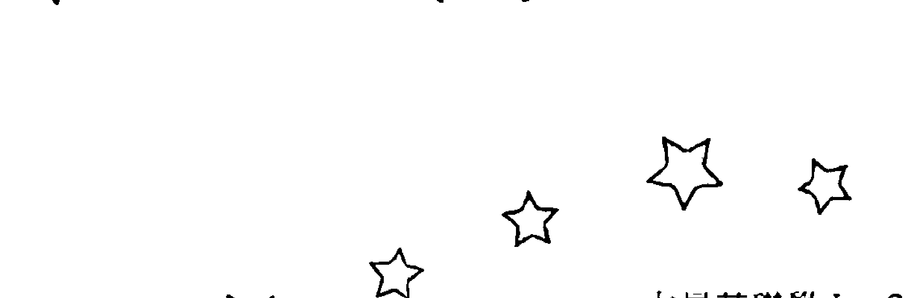

學生們口中的「小丹老師」是一個上課條理分明、實事求是、按部就班，偶而童心未泯的活動式神秘學圖書館。他可以把任何西方神秘學嚴肅枯燥的語言與脈絡，在理性客觀的分析之後，用深入淺出的方式傳授給學員們，也因此，他的學生們也往往無須再去涉獵過多的資料，只要按照他的上課進度一路跟下去，就會有著紮實的基礎以及清楚的概念。2005年起至今數年來的合作上，除了培養出數十班基礎穩固的塔羅牌學生之外，也開了十數個上課時間動輒年餘的占星課程，翻開這本書，從一開始「丹氏教法」的習慣性從交代歷史起源起，我彷彿又回到了當初在課堂上，看著他在前面比畫著太陽與九大行星如何運轉、走向，而那轉來轉去的身影，也只是為了讓學生們的腦海裡有個鮮明清楚概念的那一段日子：因此，不管是從一個學員、還是身心靈中心的經營者角度來看，丹尼爾老師確實都是一個不可多得的神秘學老師。這一系列占星書籍的出版，相信對初學者、甚至對神秘學完全是陌生的朋友們來說，算是個最佳的引領書，在層次分明，循序漸進的潛移默化中，大家會不知不覺的就走進占星學的奧秘殿堂，也會開始對星盤上所包含的眾多訊息瞭若指掌，然後愛上這門學問，進而善用這樣工具。就讓在神秘學領域的學問上默默耕耘，一步一腳印的「小丹老師」，帶領著各位開始這一場瑰麗的占星饗宴吧：

心語身心靈推廣中心主持人 張淑瑤

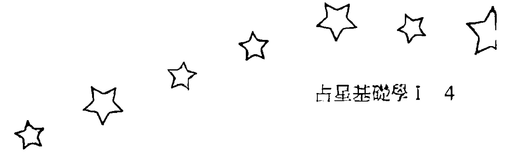

# 前言

占星學的知識博大精深，從自然占星、世運占星、個人占星到事件占星及問卜占星，每樣都是很深奧的學問，再加上需要運用到很複雜的數學計算，因此長期以來星象知識經常給人神秘莫測的感覺；直到現代大眾媒體興起再加上電腦和網路技術的普及，讓占星學有了很好的基礎可以發展，現代人學習星象知識不用再與複雜的運算過程搏鬥，而能專心於意義的追求與內容的解釋，一般人即使數學不好也可以把占星學好，學習占星的門檻也因此降低許多。

但是由於電腦技術太方便了，使得一般人在學習占星時，反而太過依賴電腦的運算，容易忽略一些基本的觀念與定義，造成在日後更進一步學習占星時的困擾；因此本書一開始即是從占星學的歷史開始介紹，幫助大家了解西洋占星發展的過程及一些關鍵的理念，當我們能了解西方人如何看待占星這門知識，並且知道占星學在各個不同時期的轉變，就更能知道在當代的我們可以如何使用占星學的知識，而不會覺得星象知識是什麼太過神奇而古怪的東西。

接下來我們依照研究的主題將現代占星學分成幾個部門來介紹，雖然外界經常把占星學當成一個學門，但是實際上占星學是一種研究的觀念和方法，用占星學的方法來研究不同的主題，就形成不同的占星學門，一般人所熟知的個人占星或是心理占星，其實只是占星學的其中一小部分，當我們能了解占星學整個學門的大要，就能夠在學得基礎的知識之後，挑選自己有興趣的學門再向內鑽研，開闊的視野也能幫助我們在研究占星時避免個人的侷限與偏見。

雖然一般人對於占星學較為熟知的部分為星座，不過若是依照重要性來看，先認識行星的運行與特質更能幫助我們接近占星學的核心，因此在第三章當中我們將重點放在行星的運行現象與象徵屬性，一般書上是由神話或心理方面去解釋行星特質，本書當中則又加上行星運動的觀念作為輔助，希望大家除了利用電腦打出自己的星盤之外，對於行星的動態也能有一些了解，而對於行星特質的認識也是學習占星最重要的基本功，需要花時間仔細地學習。

在第四章當中則是回到大家所熟知的星座特質，在這章當中我們不談太多延伸的解釋，而是從最基本的定義開始，幫助大家從節氣農務、象徵圖騰、神話故事等三個部分去了解星座特質；接下來的第五章就開始針對星座特質進行歸類與比較，透過星座分類法的學習，進一步豐富對於星座特質的了解；到了第六章則是將星座與守護星觀念導入，去看看行星與星座之間的特殊關係，透過這三章的解說，幫助大家深入認識星座特質，為未來的學習打好基礎。

第七章則是將重點拉回到個人占星學身上，因為任何知識的學習，應當從自身的經驗出發及累積，才能建立起穩固的基礎，因此大多數人要學習星象知識，也是從個人占星學開始會比較有深刻的體會；最後的附錄部分，則是提供大家占星學常見名詞的中英文對照及解釋，方便大家在進一步研讀外文占星書籍時可以比較快進入狀況，在遇到一些占星學的專業術語時也比較不會感到陌生，以此為基礎再去讀任何其他占星學的经典著作，必定會感到事半功倍。

丹尼爾在這裡要感謝尖端出版社的團隊，在你們努力的企劃及催稿之下，讓這本書能順利完成，也要謝謝在占星學研究當中一路支持我的朋友及學生，沒有你們的幫助及鼓勵，也絕對不會有這本書誕生，特別是巨蟹一班的Ari同學及雙子二班的Sean同學，兩位詳細的課堂筆記在寫作當中提供很大的幫助；最後要謝謝我最愛的Jenny和映元，時時刻刻在精神上給我堅強的支持，由衷地謝謝大家。

丹尼爾

# 第一章 西洋占星的源流

現在一般論稱的西洋占星，大體而言是傳承自希臘羅馬文明的一套觀念和方法，但是各個時代的研究與觀注重點各不相同，要了解一個學門現在為何會如此？從歷史的脈絡下去觀察是很好的切入點，因此以下把西洋占星的發展分成幾個主要的時期，來看看在西方占星學是如何傳承與發展的。

## 第一節 中亞與古埃及的觀星者

希臘羅馬所使用的占星工具與觀念，大致可以回溯到中亞與埃及的傳承；兩河流域的占星學起源很早，從蘇美人、巴比倫人、亞述人到迦爾底亞人，都對天文曆算有很多研究與貢獻；至於以金字塔聞名的古埃及文明，天文觀測的技術與知識也很先進，他們的很多觀念與成果也被希臘化時代的占星家所吸收與轉化，並在羅馬帝國時期發揚光大。

兩河流域（Mesopotamia）的古文明起源很早，大約在西元前四千多年時就已經建立起最早的城市，但是這些農業民族建立在河岸的城市，經常受到四周游牧民族的侵擾，各個城邦之間也互相征伐，政治經濟狀況並不穩定；在西元前三千年左右，蘇美人（Sumerians）開始使用楔形文字，當中已經可以辨認出不少與天文有關的紀錄，例如將天空中的星群命名，紀錄日月蝕發生的現象等等，我們現今使用的金牛座、獅子座、天蠍座等名稱也可以追溯到這個時期。

到了古巴比倫（Babylonian）王朝，占星有更長足的進展，祭司們整理古代的紀錄，並且有系統地觀察紀錄天象，留下相關事件的紀錄及占辭；例如阿米薩杜卡（Ammisaduga, BC.1646-1626）國王在位時期的泥板，就詳細紀錄了金星在天空中運行的動態，只是當時占星的重點，仍然放在天象對於國家及國王的影響，所以在《徵兆集結（Enuma Anu Enlil）》中會看到「當火星通過天蠍座又回到天蠍座時不要放鬆防衛，國王不應該在這邪惡的日子外出」這類的占辭。

依照巴比倫人的宇宙觀，天空可以分成三層，最高層的天環繞北極星轉動，在天空中從不落下，是由天神亞奴（Anu）所統治，第二層的天隨著季節而起落，是由風雨之神恩里勒（Enlil）所統治，第三層的天隨著季節而起落，每年會有一段時間看不到，是水神伊亞（Ea）的勢力範圍。在此星空背景之下其他眾神悠遊於其中，最受重視的則有時間之父——辛（Sin，月亮）、命運之神——沙馬什（Shamash，太陽）和豐饒女神——伊斯塔（Istar，金星）。

當時紀錄天象的星表通常是將一年分成十二個月，每個月有三十天，這樣一年就有三百六十天，也有人推論這是巴比倫人把圓周畫分為三百六十度的天文學基礎；當時的紀錄者已經注意到，日月及行星只會通過某些固定的星群，但是如何畫分與紀錄仍然有多種版本，早期較流行的作法是將月亮通過的區域分成十七或十八個大小不同的星座，到了後期則傾向將天空分為十二個相同大小的區塊，並對應到十二個月份，之後才逐漸演變成現今使用的黃道十二宮。

在亞述（Assyrian）帝國的時代，王宮中已有不同於一般祭司的專業占星家進駐，為國王提供星象及預言的服務；一般來說他們會定期彙報星象的狀況及神諭給國王，作為國王施政決策的參考，若是國王有某些疑問，也會命令占星家前去觀星，之後再寫成專案報告呈給國王；例如亞述巴尼拔國王（Ashurbanipal, BC.668-631 在位）在尼尼微王宮建立了大型圖書館，抄錄當時各國的文獻，現存於大英博物館的十三萬多件泥板當中，至少有超過兩千五百件是紀錄占星方面的內容。

在上古的中亞地區，迦爾底亞人（Chaldeans）幾乎可以說是占星專家的代名詞，當時的觀星者對於行星運行軌跡及合會週期知之甚詳，除了能依照觀測的天象提供占辭之外，也已經可以計算並預測出行星的位置，並從歷代的資料中歸納出著名的迦爾底亞週期（也被稱為沙羅週期，Saros Period）：一個迦爾底亞週期為二二三個朔望月，大約合十八年又十一天，若是知道某年某月某日曾經發生日蝕，那麼十八年又十一天之後也會在相同的地方發生類似的日蝕。

其實早在巴比倫王朝的時代，就已經有依月相安排生活作息的先例，太陰曆的第七天（上弦月）、十四天（滿月）、二十一天（下弦月）及二十八天（新月）被視為聖日，是休假不工作的，算是西方一週七天制的始祖；到了迦爾底亞王朝，更進一步地把這七天的週期與七個行星的守護神聯結起來，星期一由月神守護、星期二由火星神守護、星期三由水星神守護、星期四由木星神守護、星期五由金星神守護、星期六由土星神守護、星期日則由太陽神守護。

迦爾底亞人又依行星在天空中運行的速度，推測行星距離地球的遠近，將天空分成七重天，運行最快離地球最近的為月亮天，接下來依序為水星天、金星天、太陽天、火星天、木星天，運行最慢又離地球最遠的則為土星天，依此排列行星的規則被後世尊稱為迦爾底亞秩序（Chaldean order of planets），同時迦爾底亞人也留下了連續而完整的星曆表，依日期順序紀錄天象的變化，除了行星位置、月相與日月蝕之外，也包括了彗星及流星雨等特殊天象的紀錄。

自古以來，中亞與埃及及之間的征戰不斷，同時也有頻繁的貿易往來與文化交流，因此在星象知識方面可以看到互相影響的痕跡，例如代表春分時節的「白羊座」這個名稱，就是由古埃及人率先使用，之後才傳入中亞並留傳至今；不過由於古埃及的很多知識及技術，都是在祭司系統內以口傳方式學習，因此現今能找到古埃及使用占星的相關紀錄遠較中亞地區來得少，但是由神話系統及曆法的發展來看，還是可以發現一些古埃及人使用占星的蛛絲馬跡。

古埃及是現今所知最早使用回歸太陽曆的民族，他們將太陽神拉（Ra）視為生命力的來源，拉神在天空中走的軌道被稱為「拉之道」（即是我們現在所使用的黃道），他們又將天空在不同時間升起的星群分為三十六個界（decan，希臘文當中十的意思），可以更精細地報時及紀錄天象，他們發現每當天狼星比太陽更早升起，就是尼羅河準備開始泛濫的時候，並依照太陽運行的週期將一年分為氾濫季、冬季及夏季這三季，每季四個月，以符合農業方面的需要。

但是在祭祀與宗教慶典方面，則是主要運用太陰曆，古埃及最著名的月神為托特（Thout），相傳托特為智慧與魔法之神，為古埃及帶來書寫文字及文明，因此宗教方面的活動就需要由太陰曆來確定日期；現今找到提到古埃及占星的紀錄，主要存在眾多「亡者之書」的經文當中，不過當中大多是描述祭司們如何重視天象，以及占星相關的知識只能密傳給已入門者，對於占星的詳細方法則語帶保留，我們只能從此推斷古埃及人確實有某種占星的活動存在。

就觀念上來看，中亞和古埃及的觀星者都強調天人關係的感應，並且將日月星辰本身視為神社來崇拜，天體運行的現象是就神意的展現，對於人世間有不可忽略的影響力，而這種專業的知識只能由少數的專家或祭司來學習，也算是宗教活動的一部分；但是在實用上，他們都是關注自然變化及國家的整體命運為主，以現代的分類即是以自然占星與世運占星為研究主題，即使偶有留下個人出生星象的紀錄，也都是國王或王子的出生星盤，並以此來占測國家的命運。

## 第二節 希臘羅馬的占星熱潮

希臘文明可說是近代歐洲文明的搖籃，雖然希臘的占星在很多技術上並非獨創，但是某些哲學思想的觀念與社會風氣的條件都促成了占星的體系化與理性化，以個人為主的占星學也在此發展到了成熟實用的境界，到了羅馬時代則真正進入普及化。

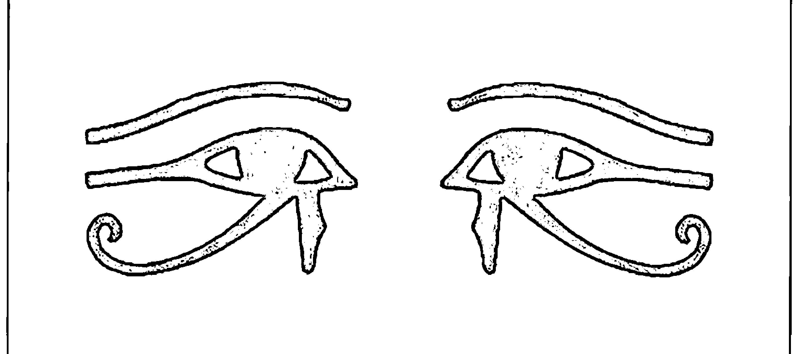

以埃及最著名的圖騰荷魯斯之眼（udjat）為例，常見的右眼也被稱為拉之眼，是權力的象徵，而較少見的左眼則稱作托特之眼，被視為具有魔法的力量。

相對於中亞與古埃及的文明，古希臘的文明起始較晚，大約要到西元前八世紀的時候才因為地中海商業而興起，希臘人有信仰但是又富於冒險的精神，在這個架構下開始思考命運與自由意志的問題，雖然他們相信人有命運，但是人也可以做選擇，有自由意志，當人的選擇與命運不同，就變成了悲劇！因此在西方的美學當中，悲劇是最高的藝術形式，但是也在提醒著當時的希臘人，不要與命運女神正面硬碰硬；在這個背景之下，占星似乎是一個可以調和的工具，告訴人要如何選擇可以避免悲劇的發生。

由神話傳說與哲學思想發展的脈絡來看，整個希臘文明的歷史就是由混沌走向秩序的進程，例如由泰勒斯（Thales）開啟的愛奧尼亞學派（Ionian），就以觀察與推理為起點，使用哲學思辯的方式去了解宇宙的秩序；恩培拖克里（Empedocles）提出世界是由四要素——土、水、風、火——所組成，並由愛與恨兩股力量組合或分開；畢達哥拉斯學派則是重視宇宙和諧的概念，並以數字比例來說明宇宙的秩序，這些哲學思想都對後來占星學的研究很有影響。

經過幾代的觀察與歸納，許多希臘人認為天空中的運動維持一種協調一致的秩序，並與數學形式有完美的吻合，對柏拉圖而言，天空實際上包含世界秩序的根源，而地上的世界只是更上層世界不完美的反映；亞里斯多德努力整合各家各派學說，反映出希臘人當時的世界觀，他們認為宇宙是一個有秩序的有機體，並且以人類的觀察與理性思辯可以找到世界的秩序，當然他們還是同時信仰眾神，認為萬事萬物都有神的力量在背後推動。

亞歷山大大帝征服了中亞和埃及，開啟了希臘化時代；透過便捷的交通與商業貿易的帶動，

### 第三節 中世紀占星的轉移

但是進入中世紀之後，歐洲進入了「黑暗時代」，所有的思想和學問都被基督宗教所取代，占星學進入了一段較為沒落的時期。同時，中東的阿拉伯地區反而成為保存最多古典占星學問的地方，到了十字軍東征之後，反過來影響歐洲的占星學；由於地區相近，與商務交流頻繁的關係，印度占星也一直與阿拉伯占星互相交流與影響。

在羅馬帝國沒落之後，拜占庭帝國成為文明保留的重鎮，西方文明向東方轉移，特別是七世紀穆罕默德創立伊斯蘭教，八世紀之後近東地區又成為文明的重心，阿拉伯人求知若渴，大量從希臘文翻譯各種典籍，當中也包含了大量的占星知識；例如肯迪（Al-Kindi, 796-873）是阿拉伯有名的哲學家，將很多希臘文的典籍翻譯成阿拉伯文，而他的學生阿布·馬榭（Abu Ma'shar, 787-886）則被譽為阿拉伯最偉大的占星家，他的很多著作在中世紀時被翻譯成拉丁文，對於歐洲占星學的發展有很大的影響。

阿拉伯人對於古代中亞的占星學有所傳承，對於世運占星與選擇占星的系統都十分拿手，例如著名的猶太占星師馬夏拉（Masha'allah, ca. 740-815）即以木星、土星每二十年的會合週期來解釋宗教與政治的發展，他對於選擇占星也很有研究，相傳就是他挑選了西元七六二年的七月三十一日下午兩點開始建造巴格達城；至於埃及現在的首都開羅（Al-Qirah），相傳是在火星位於上升點時建立的城市，因此就模倣阿拉伯文的火星（Al-Qahir）來命名。

在個人占星方面，阿拉伯人在吸收了希臘羅馬占星學的內容之後，也有發明與創新，現今被泛稱為阿拉伯點（Arabic parts）的應用方式，雖然在托勒密的書中就已經有提到，但是經過阿拉伯人的研究與發展之後，有更多新的應用方式出現；同時阿拉伯占星家也開始使用相位容許度的概念，早期希臘占星相位的概念主要是以行星落入的星座來看行星彼此之間的關係，而到中世紀時阿拉伯人開始以度數來計算相位，這種對於相位的看法也成為後來的主流。

由於天文觀測技術與數學能力的提升，阿拉伯占星家也更進一步改良了許多的宮位系統，包括波氏宮位制（Porphyry House system）、阿比特司宮位制（Alchabitius House System）都在阿拉伯人的手上發揚光大；透過精密的觀察和計算，阿拉伯占星家從八世紀開始到十五世紀陸續發表了超過兩百份的天文星曆（Zij），在文藝復興時期廣為使用的《艾索方星表（Alfonsine tables）》也是改良自阿拉伯人所做的《托雷多星表（Toledan Tables）》。

從西元八世紀開始，印度占星家與阿拉伯占星家也有密切的交流，許多印度占星師到巴格達展示他們占星的技術；古印度的知識系統來自於《吠陀經》的傳統，系統非常龐雜，吠陀（Veda）的本意是「知識」，現存的《吠陀經》主要是由《梨俱吠陀》、《娑摩吠陀》和《阿闥婆吠陀》等四部經書組成。星相知識算是阿闥婆吠陀（Atharva Veda）的一部分，在古印度是屬於神秘的知識，並不存在統一的占星教本，比較多的是由家族口傳的方式流傳，只掌握在少數人的手中。

印度占星主要分成四個主要的應用，本命占星、問卜占星、選擇占星及推運占星；早期印度占星主要是以選擇占星為主，不論是宗教慶典或是個人的重要決定，都要透過占星選擇吉時才會行動，占星知識也被認為是吠陀的應用之一；事實上早在希臘化時代，希臘羅馬的占星著作就已經透過中東地區的商旅流傳到印度，主要影響的是本命占星的部分，但是由於宗教信仰與社會階級制度的影響，古印度占星比較偏向宿命論與事件狀況的預測。

印度占星傳統上使用恆星黃道，而且是使用二十七宿的系統來為行星定位，但是在宮位部分仍然是使用十二個宮位，印度占星除了使用日、月、水、金、火、木、土等七曜之外，還要加上南北交點為九個星體，分別守護二十七宿的位置，而每個局塊又分四個部分，一共把天空分為一百零八個區間；印度占星二十七宿的概念直接影響到阿拉伯占星中對於月相（Mansions of Moon）的運用，他們在世運占星和選擇占星當中大量使用二十八種月相的區分。

由十二世紀開始，經歷了十字軍東征及地中海航運的開通，各種占星典籍與其他知識一起被從阿拉伯文翻譯成拉丁文，反過來開始影響歐洲占星的發展；此時歐洲大部分有學識的人都與教會有關，因此如何調和宗教與占星知識的矛盾就成了一個重要的問題，例如中世紀著名的神學家大阿爾伯特（Albertus Magnus, c 1193-1280）就相信地球上的萬事萬物都與行星運動有關，雖然人有自由意志，不過占星家若是能有一個人的出生時間，就能依出生星盤做出預測。

大阿爾伯特最著名的弟子是聖湯瑪斯·阿奎納（St Thomas Aquinas, 1225-74），死後被封為天使博士或全能博士，他認為啟示與理性並不矛盾，並且以亞里斯多德的哲學來重新解釋基督教的教義；他認為星辰也代表了上帝的意志，雖然影響到人的肉體但並不影響人的靈魂，只是人們大多依照身體的衝動行事，因此行動就會受到天象的影響，人若是有堅強的意志力，就可以克服天象的影響讓靈魂得到上帝的救贖；由於有兩大聖師的專業背書，當時的天主教會也慢慢開始接受占星學。

當時阿拉伯人占星知識傳入歐洲的管道，其一是透過拜占庭帝國，另一個則是阿拉伯人在歐洲建立的重要據點——西班牙，因此西班牙也成為中世紀歐洲天文與占星知識的重鎮；現今很流行的普拉西宮位制，雖然是以十七世紀占星家普拉西（Placidus de Titis, 1603-1668）的名字來命名，不過實際上早在十二世紀時，出生於西班牙的猶太占星家以撒（Abraham ibn Ezra, 1089-1167）就已經發表了這個的宮位制的宮位表，普拉西只是改良了這種計算方式而已。

### 第四節 文藝復興的占星學復活

在歐洲中古後期，大學的基礎課程包括了三法（文法、修辭學、辯證法）及四藝（算數、音樂、幾何、天文），其中天文的部分其實包含了現今認為是占星學的內容，因此當時的高級知識份子大多具有星象的常識，也吸引了不少才智之士投入占星學的研究；在當時有人將占星學稱為科學之後（the Queen of the Sciences），因為占星學聯結了天上與塵世的秩序，可以看到萬事萬物出生、成長與消亡的發展和循環，呼應了文藝復興時期和諧的宇宙觀。

其實自中古世紀末期開始，即有許多占星家受顧於當時的統治者，成為宮廷占星師，例如有名的占星師麥克·史考特（Michael Scot, 1175-1234）曾效力於神聖羅馬帝國皇帝菲特烈二世（Roman Emperor, Frederick II, 1194-1250）；同時代另一位著名的占星師古德·波納提（Guido Bonati）雖然在波隆納大學（University of Bologna）擔任教職，同時也是孟費羅伯爵（Guido de Montefeltro）的重要參謀，據說當時波納提利用占星的知識幫助孟費羅在戰場上取得多次勝利。

即使是在羅馬教廷當中，也不乏對占星有興趣及有研究的教皇，例如西斯都四世（Pope Sixtus IV, 1414-1484）和儒略二世（Pope Julius II, 1443-1513）本身即對於占星學很有研究，馬丁路德提出宗教改革時在任的利奧十世（Pope Leo X, 1475-1521）則是延請了一群占星家到教廷充當顧問，因此也有人認為宗教改革的保祿三世（Pope Paul III, 1468-1549）則是任用占星家幫宗教法廷制定時間，占星學有關。

當時的占星是很全方位的应用，以星象知识来预测气候在当时是非常重要的显学，农业占星学在这个时候也有很大的发展；除了个人占星、选择占星及世运占星（气象学）之外，也很流行占星魔法的使用，例如最早把《柏拉图对话录》翻译成拉丁文的学者马斯洛·费奇诺（Marsilio Ficino, 1433-1499），即承继了阿拉伯的符咒传统，发展了大量的行星符咒，希望藉由吉星的力量来抵挡凶星的伤害；还有整理《秘术哲学三书（Three Books of Occult）》的阿古利巴（Heinrich Cornelius Agrippa, 1486-1535），在书中也留下许多占星与魔法的应用。

在文艺复兴时期，对于占星的喜好也不是上流社会的专利，自印刷术发明之后，历书（Almanacs）在欧洲变成流行文化的一部分；历书主要的诉求对象是一般的人民，基本上都会包含来年节气、圣日与星象的资讯，提醒人们种植、收成的适当时机，也有宗教庆典的节期，通常还会附上占星家对于来年的预测，包括天气、战争甚至是预测宫廷斗争的结果，是当时最畅销的印刷品，印量甚至超越《圣经》，而发行历书也成为占星家宣传与成名的重要工具。

法国的医生诺斯特拉达姆士（Nostradamus, 1503-1566）算是文艺复兴时期最有名的预言家，他从一五五〇年开始发行历书，广受到法国民众的欢迎，上至当时的法国王后凯瑟琳·麦迪奇（Catherine de' Medici, 1519-1589）下至贩夫走卒都来找他算命或请教他预言；但是对后世影响更大的是他的预言诗集《诸世纪（Les Propheties）》，传说中他是以占星及通灵两种方式併用来进行预言，其中有许多预言已被后世的研究者所检证。

英国著名的占星学家威廉·李利（William Lilly, 1602-81）首先在英国发行历书，估计每年印量超過三萬本以上，以十七世紀中葉的英格蘭人口數來估計，幾乎每三戶人家就有一本曆書；而大量發行的曆書也為李利帶來豐厚的生意，在他成名之後每年都有將近兩千位客戶上門求教，他依照占星的方式預言了一六六六年的倫敦大火，在英國內戰期間也被捲入政爭，他所寫的《基督徒的占星學（Christian Astrology）》是當時英國學習占星的最佳教材。

甚至到了科學革命時期，當時重要的天文學家同時也都是占星高手，例如著名的天文學家第谷（Tycho Brahe, 1546-1601）很年輕時就對占星很有興趣，但是由於當時的星曆有許多不精確的地方，因此才讓他發奮要研究天體運行並且改良星曆；他曾受雇於丹麥國王腓特烈二世（Frederick II of Denmark, 1534-1588），在他的資助之下建立了當時最好的天文台，並改良設計新的六分儀，在腓特烈二世過世之後他搬到布拉格去，擔任神聖羅馬帝國皇帝魯道夫二世（Rudolf II, Holy Roman Emperor, 1552-1612）的宮廷占星師。

第谷在布拉格天文台的助手約翰·克卜勒（Johannes Kepler, 1571-1630），名聲更勝於他的師傅，他繼承了第谷所有的觀測資料，發現了行星三大運動定律，改良了哥白尼的日心系統，並以此計算出當時（1627）最準確的《魯道夫星表（Rudolphine Tables）》；克卜勒很年輕就展現出占星的天份，當他還在奧地利擔任中學教師時就已經在編校的曆書當中預測了土耳其的入侵，甚至還出版了一本小書《占星學的確鑿基礎（Concerning the More Certain Fundamentals of Astrology）》為占星學辯護。

近代最有名的科學家以撒·牛頓（Isaac Newton, 1642-1727）十分博學，不但對於物理學、光學與數學十分在行，同時也精研神學、煉金術與占星學，他開創了天文物理學的新領域，不過仍然很堅持對於占星的信念，他的好朋友哈雷曾經表示占星學沒有意義，牛頓立即不以為然地反駁說「先生，我有研究過占星，但是你沒有」，但是這也反映出在牛頓的時代占星學已經不再廣泛地受到知識份子的肯定。

造成占星學在歐洲逐漸衰微的原因主要有兩個部分，其一是宗教改革者對於傳統宗教及占星學的大力批評，使得新教國家普遍基於信仰的因素對於占星學沒有好感，而羅馬教廷在後來也發佈詔令批評占星學，使得占星學兩面不討好；然而更重要的原因是十八世紀的啟蒙運動思潮，其基本信念是崇尚理智，認為理智是一切知識和人類事務的標準，而占星學被許多啟蒙運動思想家認為是古老的迷信，因此失去知識份子的肯定。

一般史家大致公認牛頓是最後一位同時精研天文學與占星學的頂尖專家，此後天文學與占星學分道揚鑣；天文學家們只關心天上星星的狀況，而不關心這些星星對人類及世界的影響，相反地，現代的占星學家則不斷地吸收天文學的新發現，尋找天王星、小行星、海王星、冥王星等星體在占星學上的解釋方式，只是在現代大眾媒體興起之前，占星學就只在小眾的團體當中流傳。

### 第五節 現代占星熱潮的重現

在啟蒙運動之後，歐洲的占星學發展進入到比較潛伏的狀態，而教授與傳承占星學知識的地方也由文藝復興時期的大學轉移到私人的場域，其中最重要的即是神秘學團體的傳承；其實早在古埃及的時代就存在與秘教有關的紀錄與傳說，在希臘羅馬時期秘教也一直流傳，在近代歐洲最有名的神秘學團體雖然是薔薇十字會（Rosicrucians），但是與占星學復興最有關係的則是由勃拉瓦茨基（Helena Petrovna Blavatsky, 1831-1891）所創立的神智學會（Theosophical Society）。

艾倫·里歐（Alan Leo, 1860-1917）是西洋占星學傳承與普及的要角，少年時換了很多種工作，最後對於占星有興趣，跟從筆名為塞菲拉爾（Sepharial）的著名占星家學習占星，並在他的介紹之下於1888年加入了神智學會的倫敦分會（London Lodge of the Theosophical Society），之後里歐與蕾西（F. W. Lacey）一同創辦《占星者雜誌（The Astrologer's Magazine）》，並且贈送給每位訂戶個人的出生星盤，在第一週就已經送出超過一千份，在三年之中他共送出超過兩萬份的出生星盤，並且也提供更進階的郵寄星盤分析服務。

他在1914年被控告非法為人算命，出於律師的建議對外的說法上他漸漸放棄對於事件的預測，而說這是一種傾向，「性格決定命運」這句名言則出自他在法庭上的答辯，希望能夠逃過被巨額罰款的判決；在訴訟告一段落之後，他召集了一群占星家共同成立了倫敦神智學會占星學分會（The Astrological Lodge of the Theosophical Society London），開始教育下一代的占星家，這個組織在二次戰後由里歐夫人（Bessie Leo）和查爾士·卡特（C.E.O. Carter, 1887-1968）重組為英國占星學校（Faculty of Astrological Studies），英美現代許多著名的占星學家都是由這裡訓練出來。

里歐不僅努力教學，也寫了一系列的占星學書籍，有專門給占星學生的教材，也有給一般人看的輕鬆讀本，近代區分出生時的太陽星座給予概括的解釋也是由他開始，因此也有人將他視為現代占星的起點；後來到了1917年時，他又被控告非法算命，這次他被判決有罪，並且被處了巨額的罰款，他放棄上訴，有一說法是他因此抑鬱而終，不過這也造成英國占星發展的大轉向——幾乎完全放棄事件預測的技巧，反而改以「心理占星」的面貌登場。

占星家開始運用現代心理學的各種術語來豐富解釋的語彙，並且把占星當中的各種象徵與心理學的理論對應起來，甚至還在執業過程當中大量使用心理諮商的技巧，同時也有許多對心理學有研究的專家投入占星的研究，讓兩者的關係更加密切；不過值得注意的是在英美沒有任何人宣稱自己是正統的心理占星，因為心理學本身就是有各種流派百家爭鳴，每個占星家都可以選擇自己熟悉或喜歡的心理學理論來與占星學結合，有互相比較與競爭才會更進步。

奈勒（R. H. Naylor, 1889-1952）是第一個大眾占星的專欄作家，一九三〇年時他受託於倫敦的《星期日快報（Sunday Express）》，為剛出生的瑪格麗特公主（Princess Margaret Rose, 1930-2002）寫出生星盤分析，他在文章中同時也做了一些一般性的預言，由於受到廣大讀者的歡迎，之後又陸續受邀寫下更多預言，從一九三〇年十月五日起，他開始提供定期的每週占星預測專欄，雖然內容與型式都還不固定，但是十分受到歡迎，對報紙的銷售量也有很大的幫助。

不久，《星期日快報》主要的對手《群眾（The People）》也開始請另一位知名的占星家奈多（Edward Lynde）撰寫占星預言專欄，開啟了占星專欄的風潮，其他同業紛紛投入模仿，也逐漸發展出十二星座運勢的寫法，預測時間也由每週運勢縮短到每日運勢，以刺激報紙的銷售；這股報紙的占星熱由英國傳到美國，再蔓延到歐洲其他國家，太陽星座的觀念開始在一般社會大眾之間普及，也為占星學的普及化打下一片基礎。

到第二次世界大戰時，雖然主事者不見得真心相信占星，但是也很會利用這個工具來提振民心士氣，或是放出假消息來混淆對手，以軸心國陣營來看，雖然不確定希特勒是否真的相信占星，但是當時的宣傳部長戈培爾（Joseph Goebbels, 1897-1945）確實有請同情納粹的瑞士占星師克拉夫特（Karl Ernst Krafft, 1900-1945）來工作，希望他能撰寫對於德軍有利的占星預測，克拉夫特還為此重新翻譯了諾斯特拉達姆士的預言詩，來宣傳納粹必勝的信念。

以同盟國陣營來看，英國首相邱吉爾似乎也不見得相信占星，但是英國有不少愛國占星師，在報紙上發表預言提振民心士氣；例如占星師沃爾（Louis de Wahl, 1903-1961）在第二次世界大戰期間就主動請纓，希望能為英國政府工作，來算出對手克拉夫特到底給了納粹什麼建議，為此英國政府特別在陸軍當中給他一個職位，並且將他對同盟國有利的預言，偽造成德國的占星雜誌，由情報部門偷偷送到德國境內，來混淆對手並打擊對方的士氣。

但是在軸心國陣營當中還是有人真的相信占星，例如英國的情報部門就利用占星的預測，加上散布英國高層的某些人有親德情結的情報，成功誘騙納粹的副元首赫斯（Rudolf Hess, 1894-1987）飛往蘇格蘭進行和平談判；赫斯被英軍捕獲的消息傳回德國，德國的秘密警察發現赫斯離奇出走與占星的預測有關，希特勒大怒之下禁止在德國境內所有的占星活動，克拉夫特也被送往集中營，最後死於斑疹傷寒，為二次世界大戰時的占星情報戰劃下句點。

雖然二次大戰之後進入東西方冷戰的時代，但是整體來看仍然走的是發展論與科學主義的路線，直到美國在越戰陷入泥沼，反戰與嬉皮的風潮帶動了新一波的心靈成長需求，新時代運動（New Age Movement）常被作為這一時期現象的總稱。在這一風潮當中，最受歡迎的大眾占星作家則非琳達·古德曼（Linda Goodman, 1925-1995）莫屬，她的成名作「太陽星座（Linda Goodman's Sun Signs）」曾登上紐約時報暢銷排行榜，也是太陽星座相關書籍的巔峰之作。

而在英美走了七、八十年的心理占星之後，也開始帶動起復古與反思的風潮，幾位著名的占星家包括施密特（Robert Schmidt）、布拉克（Ellen Black）、韓德（Robert Hand）與左拉（Robert Zoller）在一九九三年共同發起了「後見之明計劃（Project Hindsight）」，希望能翻譯啟蒙運動前的西方占星資料成為現代英文，從而追本溯源找回過去失落的觀念與方法，前幾年翻譯了不少文藝復興時期與中古世紀的拉丁文作品，之後則把重點放在更早的希臘化時代；最近開始流行的「古典占星」，其實是泛指啟蒙運動之前的各種占星典籍與當中的技巧，並不是一個統一的流派名稱。

### 第六節 電腦時代的占星普及化

電腦時代來臨對於很多學科都有重大的影響，對於占星學也不例外，首先是星曆表計算及宮位表的精確度大為提升：配合現代天文學觀測技術的進步，不但能輕易算出行星所在的黃經、黃緯、赤經、赤緯，也能迅速地換算不同經緯度，編制適合當地使用的宮位表，這些在電腦發明之前的超級苦工，現在只要把公式設定好都能交給電腦去做，因此占星家邁克森（Neil F. Michelsen, 1931-1990）在一九七二年時成立了星象計算服務公司（Astro Computing Services）及出版社，提供給占星家高品質的星曆表及電腦繪製的出生圖，許多後來的占星軟體都有常使用他們公司的程式及地圖資料庫。

電腦運算速度的提升也創造了新的占星技巧，占星家吉姆·李維士（Jim Lewis, 1941-1995）就運用了當時（1976）最新的電腦科技，將換置星盤的重要資訊投影到世界地圖上，並註冊商標為星象製圖學（Astro*Carto*Graphy），即使類似的概念在二十世紀初時就已經有人提出來，但是缺乏電腦強大的運算能力，根本無法精確地把這樣的圖畫出來，雖然李維士本人英年早逝，但是他利用電腦所開發的新技術，堪稱為占星學在二十世紀最重大的突破與發明，他也因此在一九七八年成為第一個獲得國際占星界最高榮譽馬克·愛德蒙·瓊斯獎（Marc Edmund Jones award，至二〇一一年全世界只有八個人得到）的占星家。

個人電腦時代來臨是另一個重大的突破，以往用查表及手算的方式去建立個人出生星盤及推運，需要花費非常多的時間去學習與練習，而且還有不小心算錯的可能性，數學不好的人根本不可能成為占星家，且若是連星盤都無法畫出來，根本就不可能學習如何解讀；一九七七年占星家愛爾恩（Michael Erlewine, 1941-）開發了第一套可以在個人電腦上執行的占星軟體，當時的 Commodore PET 主機還是用磁帶載入程式，並且只有很基本的計算功能，隔年他創立了母體軟體公司（Matrix Software Company）來發行占星軟體。

到了一九八〇年代，個人電腦的運算能力越來越強，價格普及化也帶來了銷售量的提升，軟體開發商在 Apple II 和 IBM 相容 PC 的 DOS 系統上開發了幾種不同的占星軟體，隨後也在蘋果的麥金塔電腦及微軟的視窗系統上開發了後續版本；有了圖形界面的占星軟體，不論在使用容易度上與圖形美觀度上都大為提升，不需要像早期的占星軟體還要記憶指令輸入一堆的資料，許多新版的占星軟體也將緯度資料庫及日光節約時間等資料都內建在當中，即使不是專業的占星家來操作也不容易出錯。

ACS公司出版品的星曆表。

第一套中文的占星軟體是由旅美占星家何鼓老師所開發，隨附於一九九三年出版的《電腦占星術》當中，當時還是用五又四分之一吋的磁碟片所裝載，要在倚天中文系統下才能執行，雖然與現在的占星軟體相比功能簡單畫面也不美，但是與查表手算相比還是簡單太多，丹尼爾當年就常用這套軟體算出數據之後，再謄錄到自己準備的空白星盤圖表上；到了現在不論是筆記型電腦、平板電腦甚至是智慧型手機，都可以找到相對應的占星軟體，隨時隨地都很方便取得星象資訊。

網路時代來臨又將占星學的發展推向另一個新的境界，大量的資訊排山倒海而來，以前某些自以為私藏的秘密珍本，現在全都成為公開的資訊，各種互相矛盾的論點反而讓人眼花繚亂不知從何學起，所以現在學占星並不是比誰看的資料多，而是更重視理解與運用的能力；各國占星家的交流也越來越容易，不論是負笈歐美學習占星，或是請到歐美的大師來臺講學，都變成很普遍的現象，甚至還有很多網路遠距的課程與演講可以選擇，學習管道也更多元化與國際化。

# 第一章 現代占星的實際應用

## 第一節 自然占星與農業占星

雖然有人認為占星學是迷信，或是以為只有古代科學不發達的年代人們才依靠占星來解決問題，但是時至今日，在各行各業當中仍然不乏運用到占星的實例；一般人以為占星只是拿來看人個性的十二星座，或是如八字或斗數般拿來算命，其實占星學的運用甚廣，以下依照主題與範圍將占星現代的運用做一個簡單的介紹。

以最大範圍的研究主題來看，自然占星的內容包羅萬象，大至地震、海嘯、暴風、水災等自然災害，小至植物生長、動物繁殖遷徙之類的事情，通通算是自然占星的運用範圍；預測天災地變當然是占星家很有興趣的主題，但是以實用性來看，還是農業占星最具有實質的效益。

上古人類觀察天象以察時變，其中一個重要的主題即為氣候與氣象的預測，以現今西方通用的回歸黃道（Tropical Zodiac）為例，十二星座本身就是季節變化的標誌，與中國傳統的二十四節氣有異曲同工之妙，中國傳統占星則是以十二地支來標示回歸黃道的區塊；如果能瞭解季節的循環與變化，自然能按部就班地安排農事（詳見第四章）。

除了觀察太陽的能量變化，月亮也是農業占星的重要指標，當月亮行經不同星座，會適合不同農作物的撥種、移植及收成，而月相的變化也是農事的重要參考；例如當月亮行經土象星座（包括金牛座、處女座及魔羯座）時較有利於根部生長，很適合種地瓜、馬鈴薯，而月亮進入水象星座（包括巨蟹座、天蠍座及雙魚座）時則是有利於支葉生長，特別適合種植蔬菜；至於月亮走到火象星座（包括白羊座、獅子座及射手座）時比較適合收成；月亮進入風象星座（包括雙子座、天秤座及水瓶座）則是栽培花朵的好時機。

氣象占星當中不同的行星有不同的屬性，也會帶來不同的氣候狀況，太陽的屬性會隨著季節而變化——春天熱而濕、夏天熱而乾、秋天冷而乾、冬天冷而濕，月亮的影響會隨著月相的變化而不同，也會加強其他行星的屬性，火星屬於熱而乾的性質，相對而言金星帶來冷而濕的影響，木星是屬於熱而濕的特質，相對而言土星則是帶來冷而乾的影響，最後水星會帶來強風，並且加強其他行星的特質；至於現代行星，海王星帶來冷而濕的影響，天王星和冥王星則是比較常發生激烈變化的天氣。

不同的動物歸屬於不同的星座守護，則是另一個有趣的主題，下表列出十二星座所守護的動物。

### 《星座與守護動物對應表》

| 星座 | 守護動物 | 星座 | 守護動物 |
| :--- | :--- | :--- | :--- |
| 白羊座 | 綿羊、公羊 | 天秤座 | 蜥蜴及其他小型爬蟲類 |
| 金牛座 | 牛 | 天蠍座 | 大部分昆蟲 |
| 雙子座 | 小型鳥、蝴蝶、猴子 | 射手座 | 馬、鹿 |
| 巨蟹座 | 大部分甲殼類動物 | 魔羯座 | 山羊及偶蹄類動物 |
| 獅子座 | 大型貓科動物 | 水瓶座 | 大型鳥及候鳥 |
| 處女座 | 所有的寵物，特別是貓與狗 | 雙魚座 | 魚類、鯨、海豚 |

目前重大天災的占星分析，主要集中在地震、水旱災等等部分；一般占星家認為地震及旱災通常與日蝕有關，而水災則是與月蝕有關，主要會影響看得到日月蝕的地區，但是若就神秘學的角度來看，日月蝕只是引動的力量之一，並不能以此就預言會發生重大的天災，其他包括當年度的國運、當地的社會民情等等，也都會影響到是否會成災。

以二○○八年的四川汶川大地震為例，占星家普遍認為與同年八月一日發生的日蝕有關，日蝕發生時正值當地日落，在占星學上即認為這是強烈的凶兆！

### Total Solar Eclipse of 2008 Aug 01

Geocentric Conjunction = 09:47:22.9 UT J.D. = 2454679.907903
Greatest Eclipse = 10:21:08.1 UT J.D. = 2454679.931343
Eclipse Magnitude = 1.0394 Gamma = 0.8306
Saros Series = 126 Member = 47 of 72

Sun at Greatest Eclipse
(Geocentric Coordinates)
R.A. = 08h47m54.1s
Dec. = +17°51'56.5"
S.D. = 00°15'45.5"
H.P. = 00°00'08.7"

Moon at Greatest Eclipse
(Geocentric Coordinates)
R.A. = 08h49m08.7s
Dec. = +18°38'01.4"
S.D. = 00°16'14.1"
H.P. = 00°59'34.9"

External/Internal
Contacts of Penumbra
P1 = 08:04:06.8 UT
P4 = 12:38:27.7 UT

External/Internal
Contacts of Umbra
U1 = 09:21:07.3 UT
U2 = 09:24:10.3 UT
U3 = 11:18:29.9 UT
U4 = 11:21:28.0 UT

Local Circumstances at Greatest Eclipse
Lat. = 65°38.8'N Sun Alt. = 33.5°
Long. = 072°16.4'E Sun Azm. = 235.2°
Path Width = 236.9 km Duration = 02m27.2s

Ephemeris & Constants
Eph. Newcomb/ILE
ΔT = 65.4 s
k1 = 0.2724880
k2 = 0.2722810
Δb = 0.0° Δl = 0.0°

Geocentric Libration
(Optical + Physical)
l = 4.21°
b = -1.03°
c = 14.02°
Brown Lun. No. = 1059

F. Espenak, NASA's GSFC Fri, Jul 2,
sunearth.gsfc.nasa.gov/eclipse/eclipse.html

二〇〇八年八月日蝕影響地區圖，取自NASA網站。

再以二〇一一年三月日本東部近海地震所引發的海嘯為例，占星家觀察到與二〇一〇年底的冬至月蝕有關，由日本當地來看，月蝕發生時月亮正在東方地平線升起，而火星與冥王星這兩個凶星正好在西方地平線下降，即可以發現強烈的不祥之兆。

## 第二節 政治占星與經濟占星

以西洋占星的研究範疇來看，政治占星與經濟占星都是屬於世運占星（Mundane）的分支，政治占星的起源很早，至少有六千年的歷史，其主要焦點是放在國家與民族之間的戰爭與和平，經濟占星在古代往往只是政治占星的一小塊附屬項目，專門談經濟的占星學研究則是較為晚近的事情，大概只有一兩百年歷史而已。

國家民族的星座分野是個有趣的主題，例如在占星學上常會指出英國屬於白羊座、日本屬於天秤座、韓國屬於天蠍座、中國屬於巨蟹座，雖然這都是以民族性來區分，但是當有外行星通過這些星座，也會對這些國家及地區造成影響，以下列出現代主要國家民族所屬的星座分野，大家也可以參考看看。

### 《星座與民族國家對應表》

| 星座 | 民族國家 |
| :--- | :--- |
| 白羊座 | 英國、德國、丹麥 |
| 金牛座 | 愛爾蘭、瑞士、塞普勒斯 |
| 雙子座 | 比利時、美國 |
| 巨蟹座 | 荷蘭、紐西蘭、中國 |
| 獅子座 | 法國、義大利、捷克 |
| 處女座 | 希臘、土耳其、巴西 |
| 天秤座 | 奧地利、日本、阿根廷 |
| 天蠍座 | 摩洛哥、挪威、韓國 |
| 射手座 | 西班牙、澳洲、南非 |
| 魔羯座 | 印度、墨西哥、阿富汗 |
| 水瓶座 | 瑞典、波蘭、芬蘭 |
| 雙魚座 | 葡萄牙、埃及、台灣 |

國家成立（或獨立）時的星盤是政治占星上另一個重要的指標，例如占星家常以一八〇一年愛爾蘭加入組成聯合王國的時間來算英國的運勢，美國的出生星盤則是習慣以一七七六年七月二日大陸會議決議要獨立的時間來看，日本的出生星盤傳統上是以明治維新憲法發布的時間為準，但戰後獨立時間的星盤也很有影響。除了以國家星盤進行運勢預測之外，占星家也常以首都所在地的二分二至盤來看一個國家的運勢；例如旅美占星家何鼓就曾以二〇〇八年台北的春分圖預測臺灣將會政黨輪替。

日本戰後獨立星盤。

英國成立星盤。

二〇〇八年台北春分盤。

美國成立星盤。

國家領導者的星盤也常影響到施政的狀況，同時就職的時間也會有影響，占星家自古以來即經常成為政治人物的顧問，西方近代最有名的例子是美國總統雷根（Ronald Reagan, 1911-2004），依照《紐約時報》的報導，他作重要決策之前都會詢問專屬的占星顧問奎克雷（Joan Quigley, 1927-），在他當選加州州長時依照占星家的建議將就職典禮安排在午夜進行。

美國雷根總統的出生星盤。

雷根加州州長就職時星盤。

而在眾多占星派系當中，經濟占星算是比較新興的一個部分。摩根大通銀行的創辦人約翰·摩根（J.P. Morgan, 1837-1913）曾經說過一句名言：「百萬富翁不需要占星師，億萬富翁才需要。（Millionaires don't use astrologers, but billionaires do.）」這句話也讓我們知道占星師早在十九世紀末、二十世紀初就已經參與了資本市場的運作。

在現代經濟學開始發展的階段，曾經注意到太陽黑子週期與景氣循環的關係，但是後來又發現單一因素不足以完全解釋就放棄不用，其實這也是一種經濟占星的解釋；在現代經濟占星當中最重視木土會合的二十年週期，用來解釋景氣循環的現象，通常景氣是由木土合的那年（最近的日期是公元兩千年）進入一個新的循環，在前十年到木土衝之前是屬於擴張的階段，而後十年由木土衝回到木土合的時間則是屬於收縮的階段，因此從二〇一〇年開始到二〇二〇年應當是走經濟緊縮的大趨勢。

不同的星座也代表不同的產業，若是有吉星進入相關的星座，就會帶動相關產業的發展，若是凶星進入相關的星座，相關的產業也容易有不利的影響，下表列出一些常見產業的星座屬性給大家參考。

## 第三節 個人占星

個人占星（natal astrology）是以本命盤（birth-chart）為基礎，又常被稱爲本命占星，也有人稱為命理占星；舉凡一個人生命中所會遇到的各項大小事都能由占星當中找到蛛絲螞跡；以神祕學的觀點來看人其實是一個具體而微的小宇宙，所以一個人由內到外，從身體到心理到行為，全部都可以找到與星象對應的關係。而透過占星的角度，人可以用一個很客觀的方式來了解自己，找出自己有利與不利的行為與模式，並且有機會活出健康快樂的自我。

就身體的層面來看，黃道十二宮可以比作身體的基本架構，因此十二個星座就由上而下將身體區分為十二個部分，當出生時有凶星落入某個星座，就容易在身體相關的部分出現健康方面的問題，以專業的醫藥占星（Medical astrology）來判斷身體健康當然不是那麼簡單，這裡只是給大家一個概念和方向去思考。

### 《星座與相關產業對應表》

| 星座 | 相關產業 |
| :--- | :--- |
| 白羊座 | 火及能源、軍火武器、創新產業 |
| 金牛座 | 音樂藝術、金融財務、農業園藝 |
| 雙子座 | 交通運輸、通訊傳播、商業交易 |
| 巨蟹座 | 土地房屋、日常用品、看護照顧 |
| 獅子座 | 運動娛樂、奢侈品、賭博投機 |
| 處女座 | 醫療衛生、專業技術、文書辦公用品 |
| 天秤座 | 法律相關、公關宣傳、流行時尚 |
| 天蠍座 | 醫藥生技、殯葬遺產、通靈巫術 |
| 射手座 | 宗教哲學、學術研究、貿易旅行 |
| 魔羯座 | 土地礦產、工藝技術、行政管理 |
| 水瓶座 | 科技發明、傳銷連鎖、變革改造 |
| 雙魚座 | 海洋漁業、心靈慈善、環境保護 |

### 《星座與身體器官對應表》

| 星座 | 身體器官 |
| --- | --- |
| 白羊座 | 頭部、臉部 |
| 金牛座 | 頸部、肩膀 |
| 雙子座 | 手臂、手肘、手腕、手掌、手指 |
| 巨蟹座 | 胸部、乳房 |
| 獅子座 | 上背部、脊柱 |
| 處女座 | 腹部 |
| 天秤座 | 腰部 |
| 天蠍座 | 下腹部、生殖器官 |
| 射手座 | 臀部、大腿 |
| 魔羯座 | 膝蓋 |
| 水瓶座 | 小腿、腳踝 |
| 雙魚座 | 腳 |

同時人生不同的階段，也會呼應到不同的行星能量；從零到七歲時對應到月亮的能量，很需要別人的照顧和保護；七到十四歲時對應到水星的能量，開始與別人互動學習；十四到二十一歲對應到金星的能量，進入到青春期並且開始有異性間的吸引力；二十一歲到四十二歲對應到太陽的能量，是自我獨立與發揮的重要階段；四十二歲到四十九歲對應到火星的能量，必須面對競爭展現專業能力；四十九歲到五十六歲對應到木星的能量，有益於智慧增長與宗教情懷；五十六歲到六十三歲對應到土星的能量，面對精力衰退可能會有趨於保守的傾向。

就人生際遇來看，大部分人的問題不外乎工作、學業、愛情、婚姻、金錢、子女及家庭關係等等，通常占星師會分成幾個不同的層次來看；與自己有關的部分比較單純，也比較容易解釋，所以一個人適合什麼類型的工作、如何賺錢與存錢比較容易，或是學習什麼東西比較有天份，這些都很容易從個人的出生圖上看出來，但是從另一個角度來看，知道不一定願意去做，很多時候人往往是因為自己的抗拒和想不開而走上了一條坎坷的道路。

但若是涉及到兩個人以上的狀況，事情就比較複雜一點，不論你想知道的是同學關係、同事關係、愛情關係、婚姻關係或是親子關係，都不可能完全從你本身的出生星盤上看出來，因為涉及到彼此的互動狀況，通常要有兩張星盤一起分析比對才能看得完整；只是有時候受到各種因素的影響，有時候我們無法拿到對方準確的出生時間，那麼其實只要自己有準確的出生時間，而對方有正確的出生日期，關係部分也能看個七、八成準確，只是與對方本身有關的狀況沒辦法看得那麼精確。

另外一個更常被問到的是運勢預測，丹尼爾常強調，如果本命盤上不適合，那麼運勢再好也不見得有用，所以首先要搞清楚自己的方向對不對，遇到的人對不對，再來才考慮什麼時候才是動手的好時機；當然，運勢到了事情不一定就會自然發生，還是要透過本身的決定與努力才能讓自己期待的實現，只是如果我們選擇適合的運勢去做這件事情，那麼會比其他時間更容易成功。

## 第四節 事件占星與選擇占星

大至國家小至個人都可以用占星來研究，那麼特定的事物是否也可以用占星來分析呢？答案是肯定的。事件占星（Event Astrology）的概念，是以一件事情開始的時間，來預測後續的發展，當中其實已經包含了自然占星、世運占星與個人占星的主題，只是事件占星是以事件本身的狀況為主要分析的對象。例如震驚全球的九一一攻擊事件，發生於二〇〇一年九月十一日上午，若是我們以早上八點四十六分美國航空班機撞向世貿中心北座大樓的時間地點來起盤，就可以看出攻擊者的意圖，及事件後續的發展和影響。

九一一事件的事件星盤。

當然，事件占星也可以來推測物品的吉凶；最常被拿來舉例的即是鐵達尼號的下水及啟航時間。鐵達尼號是當年很先進的快船，船難事件引起普遍的注意，也讓國際航運的安全措施提升改進，並增加有關求救及電信頻道的協定；右圖是鐵達尼號下水及首航的星盤，從中間可以發現一些不祥之兆。

既然一件事情開始的時間可以拿來預測，那麼挑選吉時來開始一件事情就成為趨吉避凶的重要方法；一般來說選擇占星（Electional Astrology）都是用在比較大的事情上，例如結婚、搬家、公司成立、店家開幕、買房子、買車子等等，很少人會連何時吃飯、上廁所這種生活瑣事都要擇日，擇日除了考量事件的性質、挑選適合的時間之外，也要考慮到當事人本身的出生星盤與運勢，所以相對來說是比較複雜的占星技術。

但是丹尼爾經常會提醒學生及客戶，世上沒有完美的天象，所以也不可能挑選到完美的時間，即使真的挑到很好的日子及時辰，也只能使事情開始進行的狀況比較順利而已；一般來說擇日的後續效果可以持續一到兩年的時間，但是在過程當中仍然要看當事人的資質與努力，並不是說選了一個好的日子之後就萬事順利，不用做任何努力。

## 第五節 問卜占星

問卜占星（Horary Astrology）又被譯為卜卦占星或時辰占星學，在各個占星學的分支裡面，問卜占星可以說是最特異的一支，它不是像之前的各個應用領域，都是利用特定與客觀的時間與空間，問卜占星是以占星師理解這個問題的時間地點為準，來分析並預測這件事情的可能狀況，也是所有占星領域當中最具有個性與主觀性的的一支，問卜占星雖然帶有一種主觀的感覺，但是總不脫天人感應的模式，換個比較玄的講法，有緣才能在這個時候問到這個問題。

問卜占星可以占卜的事件很廣，以前也有人利用問卜占星來看國運或運動比賽的例子，不過就丹尼爾的經驗來看，問卜占星還是要以自己有決策權的事件為主，才是比較適合占卜的範圍。解釋出來的結果也比較準確；不過問卜占星的提問方法也非常重要，甚至可能會影響到最後的答案，相似內涵的是非題——「我是否要離開這個工作」以及「我是否要留在這個工作」，這兩種問法可能會得出相反的答案，若是答案顯示為「是」，那麼第一種問法是要離開這個工作，但第二種問法則是要留在這個工作，從這裡可以看出問題構句的用語十分關鍵。

## 第六節 在神秘學當中的運用

由於占星的傳承久遠，在西方神秘學當中的各個部分，也都會借用到一些占星學的象徵，例如現代靈數在賦予每個數字象徵意義時，很自然地尋找傳統神秘學當中的對應，其中一個方法就是將數字與占星當中的行星象徵結合在一起。

### 《靈數與行星特質對應表》

| 數字 | 對應行星 | 基本特質 | 延伸特質 |
|---|---|---|---|
| 1 | 太陽 | 獨立與創造 | 自信與領導 |
| 2 | 月亮 | 合作與平衡 | 社交與敏感 |
| 3 | 木星 | 表達與靈感 | 樂觀與開放 |
| 4 | 天王星 | 務實與穩定 | 組織與紀律 |
| 5 | 水星 | 自由與創新 | 冒險與變化 |
| 6 | 金星 | 愛心與付出 | 和諧與親切 |
| 7 | 海王星 | 智慧與洞察 | 真理與靈性 |
| 8 | 土星 | 控制與野心 | 目標與鬥志 |
| 9 | 火星/冥王星 | 夢想與奉獻 | 人道主義者 |

西方傳統的手相把人的手與大宇宙對應，所以將手指、指節、手上的掌丘等等都用占星學中的行星及星座來命名，並由手的現象來觀察整個人的狀況，所以也可以說手是一個具體而微的世界。

小指為水星指，屬性為風象，與社交性有關。第一指節代表天秤座、第二指節代表雙子座、第三指節代表水瓶座。

無名指為太陽指，屬性為火象，與創造力有關。第一指節代表白羊座、第二指節代表射手座、第三指節代表獅子座。

中指為土星指，屬性為土象，與責任感有關。第一指節代表魔羯座、第二指節代表處女座、第三指節代表金牛座。

食指為木星指，屬性為水象，與自信心有關。第一指節代表巨蟹座、第二指節代表雙魚座、第三指節代表天蠍座。

姆指為金星指，不帶有四要素的屬性。第一指節代表意志、第二指節代表邏輯、第三指節（也就是金星丘）代表愛。

## 塔羅牌

近代塔羅牌雖然主要結合的是與喀巴拉有關的神秘學象徵，但是由於喀巴拉當中也有關於星象的知識與對應方法，因此在黃金黎明的系統當中就有將塔羅牌與占星學的要素對應起來的說法。

### 《塔羅牌與占星對應表》

| 位置 | 金星丘 | 下火星丘 | 木星丘 | 土星丘 | 太陽丘 |
| --- | --- | --- | --- | --- | --- |
| 意涵 | 代表愛、美與同情。 | 代表勇氣與進取。 | 代表野心、名聲與權力。 | 代表務實、獨立與謹慎。 | 代表藝術、快樂與滿足。 |
| 位置 | 水星丘 | 上火星丘 | 月亮丘 | 火星平原 | |
| 意涵 | 代表溝通、理性與商業才能。 | 代表自制與忍耐。 | 代表想像、直覺與情緒。 | 代表能量與活力。 | |

| 大牌名稱 | 愚者 | 魔術師 | 女祭司 | 皇后 | 皇帝 | 教皇 | 戀人 | 戰車 |
| --- | --- | --- | --- | --- | --- | --- | --- | --- |
| 占星對應 | 風元素 | 水星 | 月亮 | 金星 | 白羊座 | 金牛座 | 雙子座 | 巨蟹座 |
| 大牌名稱 | 力量 | 隱者 | 命運之輪 | 正義 | 吊人 | 死神 | 節制 | 惡魔 |
| 占星對應 | 獅子座 | 處女座 | 木星 | 天秤座 | 水元素 | 天蠍座 | 射手座 | 魔羯座 |
| 大牌名稱 | 塔 | 星星 | 月亮 | 太陽 | 審判 | 世界 | | |
| 占星對應 | 火星 | 水瓶座 | 雙魚座 | 太陽 | 火元素 | 土星 | | |

# 第三章 行星運行的基本概念

## 第一節 占星學當中的行星

從北半球大部份的地方來看的天空，最容易觀察到的是週日運動（diurnal motion），整個天空中的星星環繞著北極星旋轉，太陽東升西落日復一日、年復一年，雖然在白天只能看到太陽而沒辦法觀察到其他的星星，不過到了晚上就會發現每天的天象都有不同的變化，當星星很接近太陽（在五度以內）的時候，就很難用肉眼觀察到，在古典占星學上稱為「焦傷（combust）」，代表這個星星的能量被太陽的力量蓋過去，不容易發揮出來。

古希臘人承接中亞與埃及觀星的資料和方法，發展出「天球」的模型來觀察與紀錄天象的變化，他們將天空中可以看到的星體分為兩大類；每天觀察相對位置不變的稱之為恆星（Fixed Stars），他們認為恆星們應該距離地球很遠很遠，被鑲嵌在一個很大的天球上，這個天球每天轉動一週，所以由地球上來看才會有每天的週日運動，天球之外則為人類無法觀察到的地方；直到現代在天文觀察上仍然延用了天球的概念。

在天空當中有週期性運動的為行星（planets，意指漂流者），行星們與地球的距離則各不相同，在各自的軌道上運行，承繼自迦爾底亞人的觀念認為，距離地球越近的的行星運動速度會越快，反之距離地球越遠的行星運動速度會越慢，由此來看地球到恆星之間應當有七層軌道，由近而遠（也就是速度由快至慢）依序是月亮天、水星天、金星天、太陽天、火星天、木星天、土星天，這個順序在西方傳統當中也被稱為迦爾底亞秩序。

這樣的天球及天階體系模型，一直是西方傳統當中的主流，在歷史上被稱為天動說；直到十六世紀哥白尼提出地動說，這個體系才開始被挑戰。

若是從地球表面做為觀察的基準點，天空中的星體依週日運動來看是由東向西行，但是若以恆星天為背景來量測，則會發現太陽、月亮是由西向東行，雖然在大部分的時間其他行星也都是由西向東行，但偶爾也會觀察到行星在天空當中停滯甚至是由東向西行的狀況，這個時候在天文及占星上就稱之為行星逆行的現象。

就金星與水星這兩個內行星的狀況來看，這兩顆星運行的速度會比地球更快，當繞過來介於地球與太陽之間的時候，在星空背景上就會呈現出逆行的現象。

但就火星、木星、土星、天王星、海王星和冥王星等外行星的狀況來看，地球運行的速度比他們更快，所以當地球運行到他們與太陽之間，就會由內側超過這些行星，在星空背景上看起來就會是逆行現象。

天球七層軌道圖

不論是內行星或外行星，逆行都是發生在比較接近地球的時間，從地球上來看亮度也會增加，若是實際從地球上觀察，會發現這些星星一般都是由西向東行，但是到了某一個特定的時間運行的速度漸漸慢下來，而亮度也越來越亮，接著停滯在星空背景中幾天（占星學上稱為Station）之後，開始往反方向前進；在逆行的過程當中，行星運行的速度通常都會比順行的時候慢，當逆行要結束的時候，行星的速度也會漸漸慢下來，接著停滯在星空背景中幾天，亮度慢慢轉暗之後，才又開始回復順行。

行星的順逆行改變在世運占星或個人占星推算運勢時十分重要，但是一個人出生時行星是否逆行則沒有那麼明顯的影響，所以在這裡我們不做太多解釋。

## 第二節 個人行星的運行與象徵

太陽與月亮是在地球上肉眼可見最亮的兩個發光天體（luminaries），而且看起來大小幾乎一樣，自古以來即是觀星與占星的重點；雖然在現代天文學當中把太陽歸類為恆星，月亮歸類為衛星，但是由於從占星學的傳統來看，兩者仍然都稱之為行星；在占星學當中太陽代表陽性的原則、月亮代表陰性的原則，因此在傳統上太陽被視為白天的守護者，相對而言月亮則為夜間的守護者。

### 太陽

太陽在天球上運行的軌跡被定義為黃道（ecliptic），是占星學上定位行星位置的主要座標（詳見第四章）；由地球上來看太陽大約每天在黃道上移動一度，一年會繞行黃道帶一週，由於太陽曆是依照太陽運行的軌跡來設計，因此太陽在每年的同一天都會通過黃道帶相近的地方，所以我們只要知道自己的陽曆生日，就大概可以知道我們出生時太陽位於哪一個星座；不過若是進一步觀察細節，就會發現每年太陽通過星座的時間還是會有些微的差異。

由地球上看太陽，雖然不會改變形狀，但是卻會影響天空的顏色，產生不同的氣氛與感覺；日出時天空的顏色由深藍色慢慢轉變為紫色，接著變為紫紅色、紅色、橘色、黃色，太陽如一個金色的圓盤在地平線上升起，讓人的精神十分振奮；正午時太陽發出最強的光和熱，具有一種不可逼視的威儀，蔚藍的天空給人一種開闊自由的感覺；日落時太陽則像是巨大的紅色火球，發出柔和、浪漫的夕照，天空被染成橘黃的顏色，帶給人一種放鬆、自在的感覺！

在西洋的神話故事中，最有名的太陽神應該屬於阿波羅（Apollo）了！祂是希臘奧林帕斯十二主神中的一位，地位僅次於他的父親——宙斯。阿波羅不僅是古希臘人心目中最帥的美男子，也是光明和純潔的象徵；當時的人認為祂是文藝之神，同時掌管了音樂、藝術、語言及詩，並且領導九位掌管藝文的繆斯女神，作為德爾斐的守護神，阿波羅會透過德爾斐神廟發佈神諭，因此也被視為預言之神，此外也有人將阿波羅視為牧羊人、航海家及醫者的守護神。

在占星學當中太陽代表自發主動的陽性原則，提供能量、光明與滿足感，並且具有自信心、領導力和影響力；在個人占星學當中，太陽代表了我們有意識的行為模式，同時會標示出我們重視的焦點及努力奮鬥的方向，雖然太陽會影響我們所有的生活領域，不過在戀愛及領導統御方面的作用會特別明顯，在人際關係上太陽會影響到我們與父親、丈夫、兒子的關係，甚至會延伸到男性上司及其他父權角色上面；而在身體層面太陽與人的心臟和循環系統有關。

占星學上太陽的符號是在圓圈當中加上一個點，也象徵精神與力量的核心。

### 月亮

月亮是夜間可見最亮的星體，有時候在白天也能看到，它是距離地球最近的自然天體，雖然現代天文學將月亮歸類為地球的衛星，但是在占星學的傳統當中仍然稱之為行星，由於月亮的自轉與公轉同步，因此始終以同一面朝向著地球；由地球上來觀察，月亮每天在星空背景上移動大約十三度，平均兩個小時左右走一度，所以只要大約兩天半就會通過一個星座（三十度的區間），不到二十八天就會走完黃道帶一周，是所有行星當中移動速度最快的一個。

在地球上看月亮，最明顯的現象就是月相的變化！從新月到滿月再從月圓到月缺，每天升起的時間與形狀都在改變，新月通常在接近日落時即可在天空中看見，但是很快也就會隨著太陽落下，到滿月當天月亮會在日落同時升起，在天空中停留最長的時間，到日出時才落下，殘月則會在日出前升起，但不久後即隱沒在日光當中。

占星學上月亮的符號是由兩個半圓組成，開口向右或向左都是相同的意思。中；月亮的亮度也會隨著月相的變化有所不同，由地球上來看新月與滿月的亮度最多可以差到十倍以上，可以明顯觀察到亮度的差異。

在希臘神話當中最出名的月神是亞提米絲（Artemis），在羅馬神話當中則改稱為黛安娜（Diana），祂是奧林帕斯十二主神之一，在神話傳說當中祂曾經幫助母親生下雙胞胎弟弟太陽神阿波羅，因此被認為是助產之神，但是同時也被認為是處女座的守護神；祂經常被描繪成一個背著弓箭的女獵手，也被認為是森林、山丘、野生動物及狩獵者的守護神；到了羅馬時期人們也向黛安娜祈求受孕，並且認為祂與魔法的傳統有關，也有人說祂是女巫的守護神。

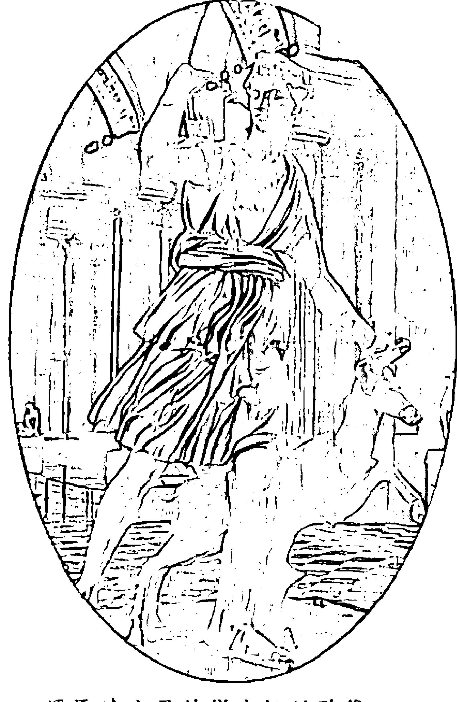

在占星學當中月亮代表被動反應的陰性原則，提供支持、照顧及安全感，並且會帶來關心、保護及週期性的變化；在個人占星學當中，月亮代表我們無意識的行為模式，同時會指出我們認同以及能得到安慰的方式，在生活領域上月亮會影響我們的幼年生活及家庭生活，並且會形塑我們的氣質、飲食習慣與情緒反應方式，在人際關係上月亮會影響我們與母親、妻子、女兒的關係，也會延伸到其他家族成員身上；在身體層面，月亮守護消化系統和女性生殖器。

### 日月蝕與南北交點

由於太陽與月亮在天空中的軌道並不是完全平行，因此在天球上就會有兩個交點，月亮由南向北通過黃道的位置稱為北交點（古稱龍頭，Caput Draconis），月亮由北向南通過黃道的位置稱為南交點（古稱龍尾，Cauda Draconis），在同一時間南北交點會相距一百八十度，也就是黃道的兩端，若是在新月時日月接近南北交點會發生日蝕，若是在滿月時日月接近南北交點則會發生月蝕，南北交點的位置會在黃道上由東往西移動，大約18.6年會回到原位。

在印度占星當中非常重視南北交點，並視為業力與輪迴的重要指標，不過在現代西方占星學中南北交點主要是用來預測日月蝕，在世運占星學當中非常重視，但是在個人占星學當中則沒有那麼重要。

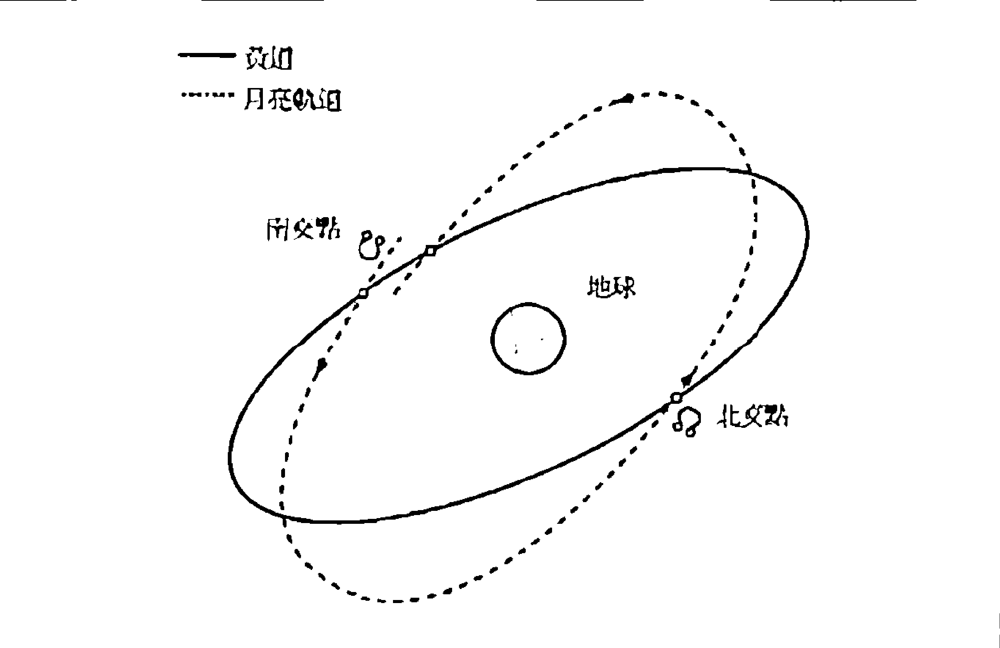

月亮在新月時接近南北交點會發生日蝕，滿月時會發生月蝕。

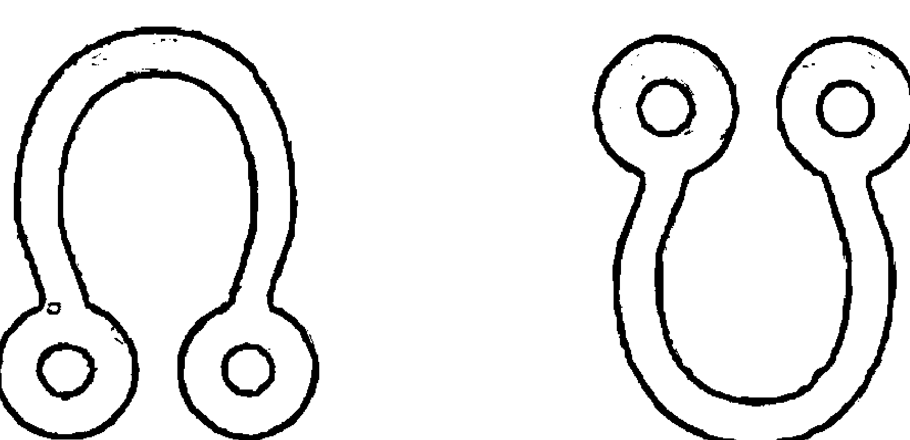

北交點的符號與獅子座的符號有點類似，不過兩端都有封閉的圓圈，而南交點的符號則與北交點上下顛倒。

## 第三節 社會行星的運行與象徵

### 水星

水星是距離太陽最近的一個行星，移動的速度也非常快，大約八十八天就可以繞太陽一週，由地球上來看它和太陽的距離永遠不會超過二十八度，因此無論如何水星只可能和太陽同一個星座，或是在前、後一個星座（假如太陽在獅子座，那水星就只有在巨蟹座、獅子座、處女座這三個星座）。從地球上看水星發出強烈的白光，最高可達負二星等，也就是比其他最亮的恆星還要亮五倍以上，但是由於距離非常接近太陽的關係，只能在清晨或黃昏時觀察到它。

由地球上來觀察水星每三個多月會逆行一次，所以每年會遇到三次到四次的逆行，每次逆行的時間大約三週，會退行十度到十六度的距離，在開始及結束逆行之前會各有一到兩天的停駐期，在順行時最快十四天就會通過一個星座（三十度的區間），但遇到逆行時最慢也可能在一個星座的範圍內待上兩個多月，是最常轉換順逆行動態的行星；雖然水星的運動狀況多變，不過每年仍然會走完黃道一週。

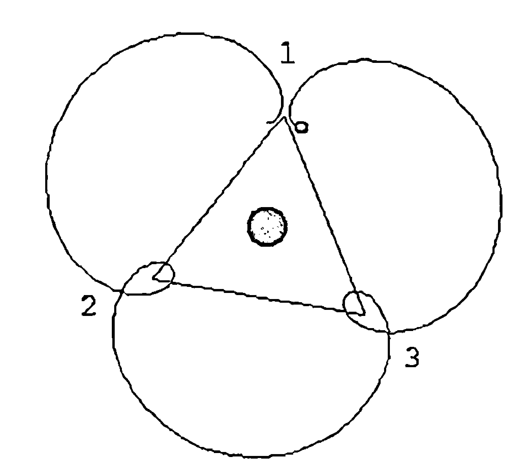

從地球上看水星一年繞行的軌跡圖。

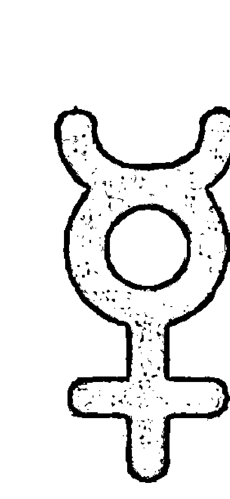

水星的符號是交疊的十字及古代赫密斯的蛇杖，當中國占星學圈其實是由半圓、圓、而成的簡圖。

在希臘神話當中水星之神是赫密斯（Hermes），在羅馬神話當中則改稱為麥丘里（Mercury），祂是奧林帕斯十二位主神之一，擔任諸神之間的使者，經常來往於天界與塵世之間，因此被認為是溝通與旅行的守護神，在神話傳說當中他在出生的第一天就偷了祂哥哥太陽神阿波羅的牛，並且作成了第一筆買賣，因此也是盜賊與商業交易的守護神，由於最後他靠著口才說服了宙斯，並且與阿波羅達成和解，因此也被認為掌管了口才、辯論以及達成和解的能力。

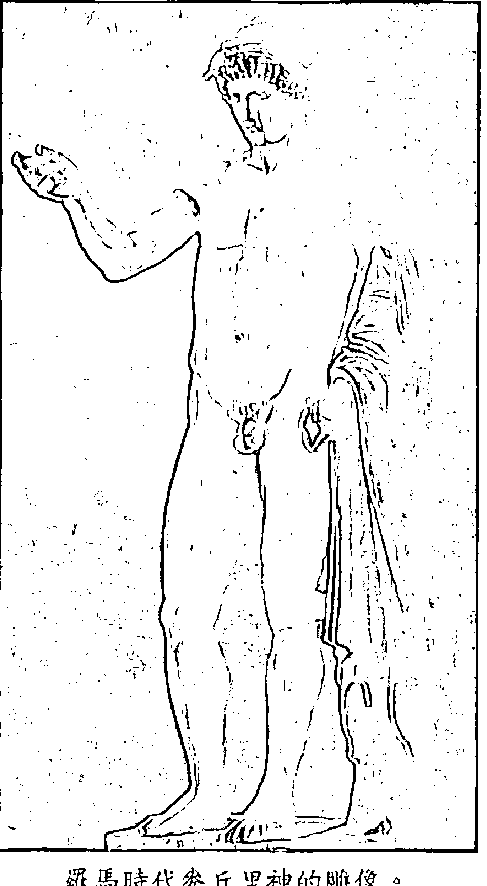

在占星學當中水星代表靈活多變的力量，可以做為中介的管道幫助各方溝通與連結，並且具有分辨、概念化與邏輯推理的能力；在個人占星學當中水星代表我們的理性，可以看出一個人的思考模式及溝通能力，同時指出我們關心和感興趣的議題，在生活領域上主要與學習的狀況有關，但是也會影響到日常交通與短程旅行，在人際關係上會影響我們與兄弟姊妹的關係，並且會延伸到同學關係及校園生活；在身體層面水星守護一個人的呼吸系統及神經系統。

### 金星

金星是距離太陽第二近的行星，大約兩百二十五天繞行太陽一周，由地球上看來，它和太陽的距離最遠不超過四十八度，因此金星只會在太陽的前後兩個星座的範圍之內（假如太陽在水瓶座，那金星只有在射手座、魔羯座、水瓶座、雙魚座、白羊座這五種可能）。金星是除了太陽與月亮之外天空中最亮的星體，從地球上看金星發出強烈的金光，最高可達負四點七星等，也就是比其他最亮的恆星還要亮四十倍以上。金星在天空中看起來比水星大，也比水星亮，再加上通常距離太陽比較遠一些，所以比較容易被觀察到。

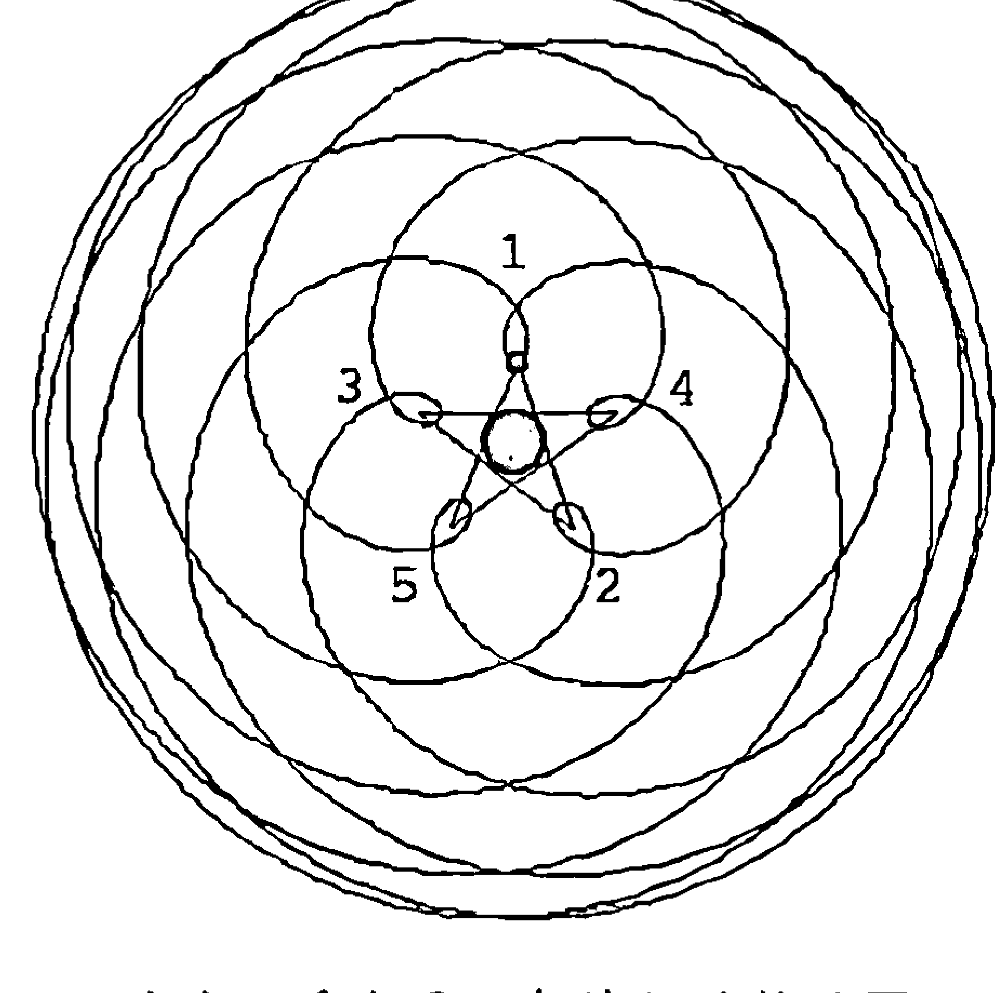

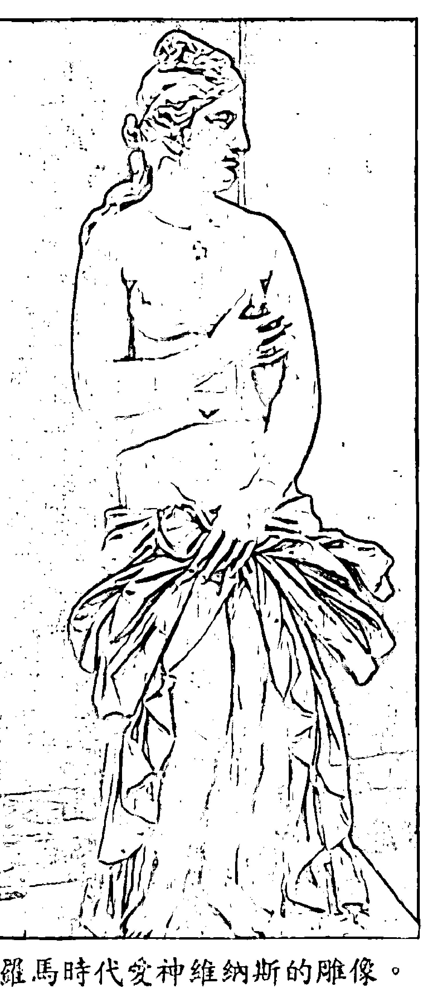

由地球上來觀察金星大約每一年半逆行一次，每次逆行時間大約六週，會退行十五度左右的距離，在開始逆行之前會停駐兩天，在回復順行之前會停駐三到四天，在順行時最快二十三天就會通過一個星座（三十度的區間），但遇到逆行時最慢也可能在一個星座的範圍內待上四個多月。金星大約一年左右會走完黃道一週，經過五次的逆行軌跡正好會在天空中形成一個五角星。

在希臘神話當中金星的守護神是阿芙柔黛蒂（Aphrodite），在羅馬神話當中的則改稱為維納斯（Venus），祂是奧林帕斯十二位主神之一，傳說中由海中的泡沫誕生，被認為是女性美的最高表現，祂主管愛情與性慾，有時也被認為是生育女神，雖然祂經常帶來歡笑和祝福，但是有時候也會引起嫉妒和衝突，在神話傳說當中祂對於婚姻並不忠貞，即使已經結婚了仍然風流韻事不斷，與不同的天神生下許多小孩，由於性關係複雜也被認為是妓女的守護神。

在占星學當中金星代表和諧與吸引力，提供團結合作創造雙贏的基礎，但是也可能帶來被動、喜歡享樂及重視和平的作用；在個人占星學當中金星與價值觀有關，可以看出一個人如何展現自身的魅力及藝術創作的能力，在生活領域上金星影響我們的婚姻生活及社交生活，同時指出一個人對金錢的態度以及審美的觀點，在人際關係上會影響到我們與朋友的關係，也會延伸到在生活各個層面合作的對象；在身體層面金星守護一個人的泌尿系統及平衡系統。

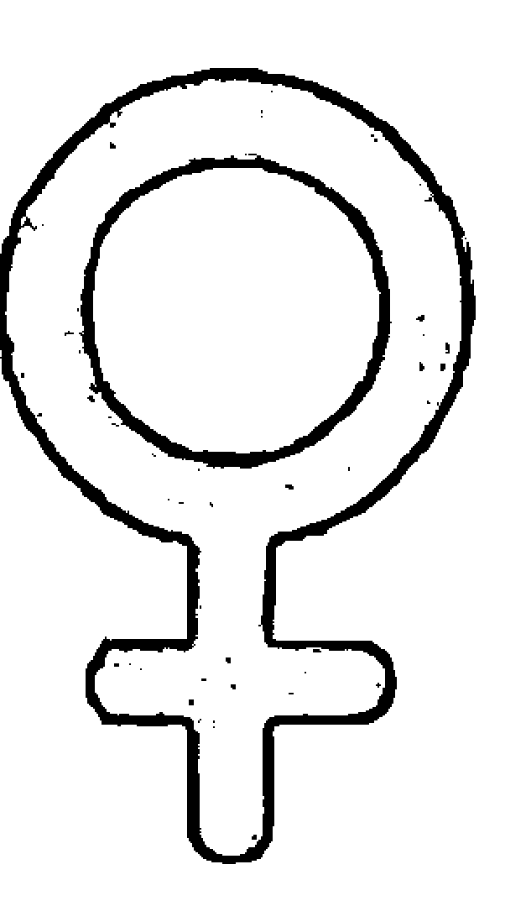

由組作
是字常
號十中
的個當
符一化
微象
金星代表
上圈西方
學圓西的
在的
占一個,女
一成為

### 火星

火星是地球軌道外的第一顆行星，大約六百八十七天繞太陽一週，是除了月球和金星之外距離地球最近的一個天然星體。由地球上看來，火星的速度十分穩定，在顏色上為暗紅色，雖然平常火星的亮度不如木星，但是在最接近地球時（也就是逆行時）亮度可能會超越木星，成為天空中除了太陽、月亮與金星之外最亮的星體，最暗與最亮時亮度最多可差到九十倍以上，是由地球上來看亮度變化最大的行星。

由地球上來觀察火星每兩年會逆行一次，每次逆行時間從兩個月到兩個半月不等，會退行十

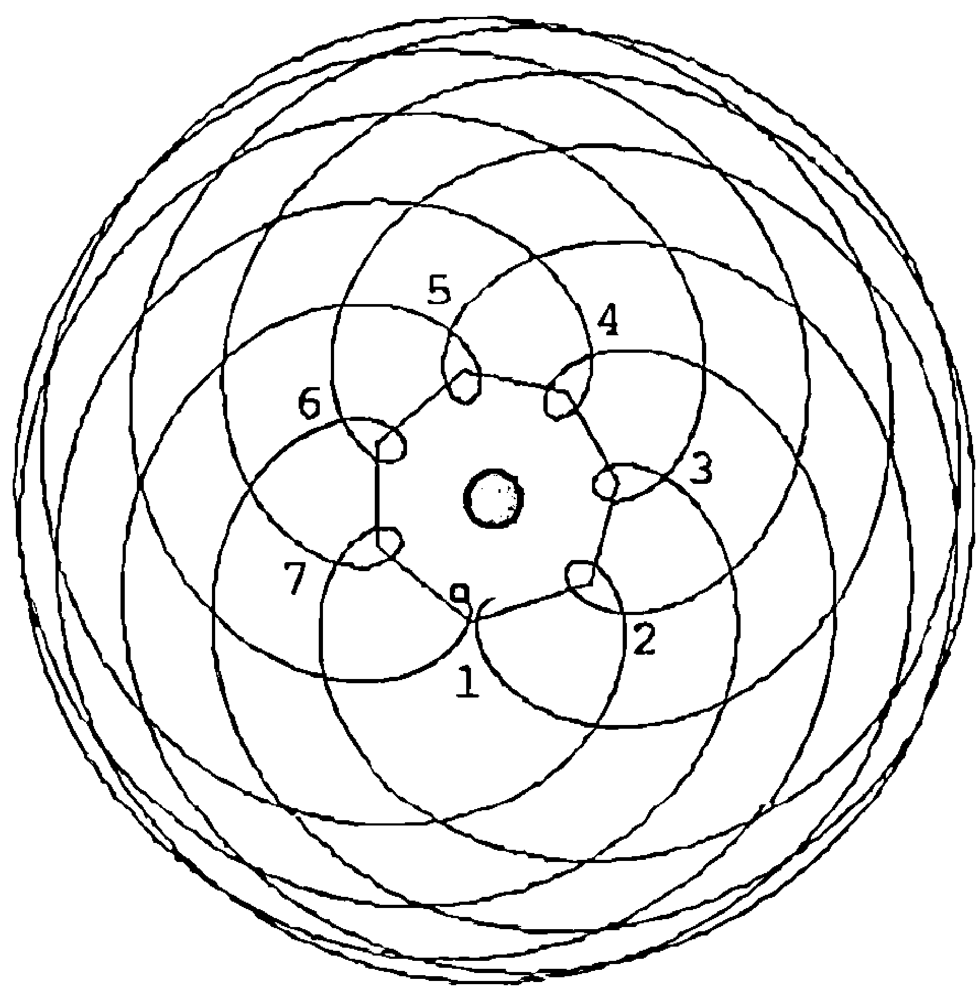

從地球上看火星十五年繞行的軌跡圖。

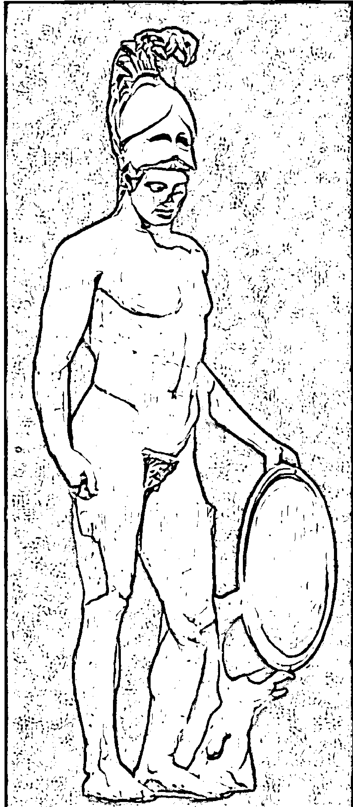

羅馬時代戰神瑪爾斯的雕像。

到二十度的距離，在開始逆行之前會停駐二到三天，在回復順行之前也會再停駐一到兩天，在順行時最快不到四十天就會通過一個星座（三十度的區間），但遇到逆行時最慢也可能在一個星座的範圍待到七個多月；火星大約要花兩年的時間才會走完黃道一週，大約繞行黃道七次會回到原位。

在希臘神話中火星的守護神是戰神阿瑞斯（Ares），在羅馬神話當中則改稱為瑪爾斯（Mars），祂是奧林帕斯十二位主神之一，但並不算是個討喜的角色，反而常常挑起衝突，引發人類的戰禍和災難，在神話傳說當中祂喜歡殺戮、血腥和暴力，但是其戰功並不彪炳；到了羅馬時期祂的形象與地位大為提升，重要性與主神朱彼德並列，傳說中祂是羅馬人的祖先也是羅馬帝國的守護神，祂擁有無比的勇氣和積極進取的精神，被認為是軍人與戰士的守護神。

在占星學當中火星代表競爭與衝突性，提供好勝心、勇氣和行動力，並且帶來果決、獨立以及傷害性的影響；在個人占星學當中火星與生存的危機感有關，可以看出一個人如何面對競爭和處理衝突，同時也會指出容易遇到挑戰與遭受挫折的問題，在生活領域上火星和工作息息相關，也會影響到慾望與性愛的部分，在人際關係上會影響到我們與同事的關係，也會延伸到生活各個層面競爭的對手；在身體層面火星守護了肌肉、運動系統還有男性生殖器。

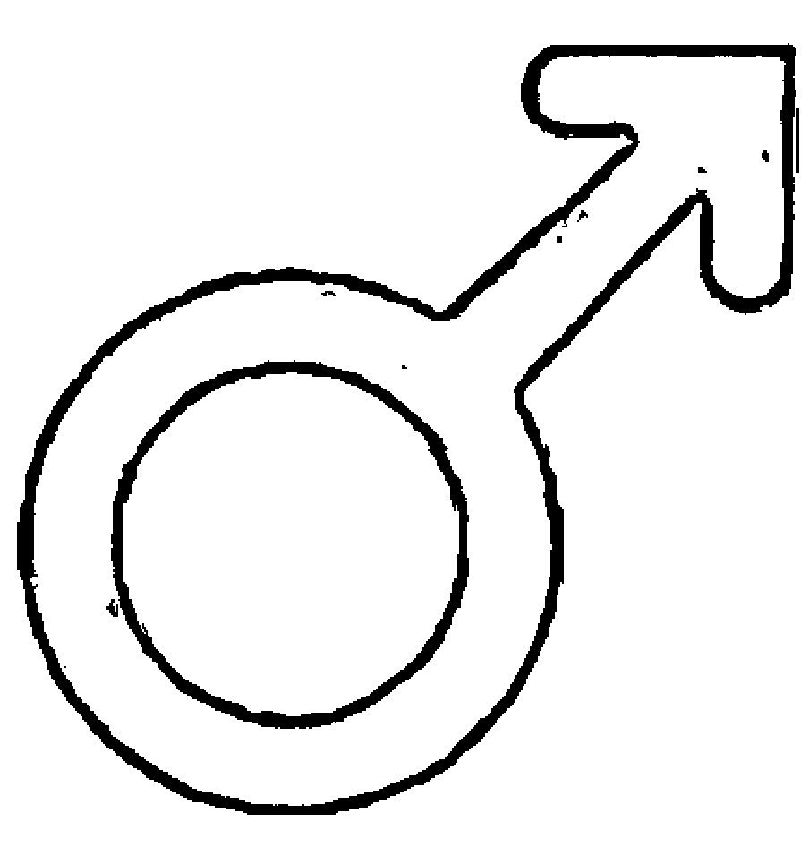

是組十，或是方代號由子右都西的符號所由右都西的圓圈成樣偏心上寫的、意，化男星與有成左，文為火頭也組偏方，在作中箭時所是上，拿來當的代圓頭正，今學上古圓箭向的，常星向，與論朝樣常。占由成字不是一人表

## 第四節 世代行星的運行與象徵

### 木星

依照現代天文學的研究，木星是太陽系當中質量與體積都最大的行星，由地球上來看木星是僅次於太陽、月亮及金星的第四亮行星（雖然有時會被火星超越），呈現出明亮的橘色，木星的運行十分規律，每年逆行一次，逆行時間大約四個月，會退行十度左右的距離，在開始逆行之前大約會停駐五天，回復順行前大約會停駐四天，大約都是一年左右通過一個星座（三十度的區間），要花十二年才會走完黃道一週。

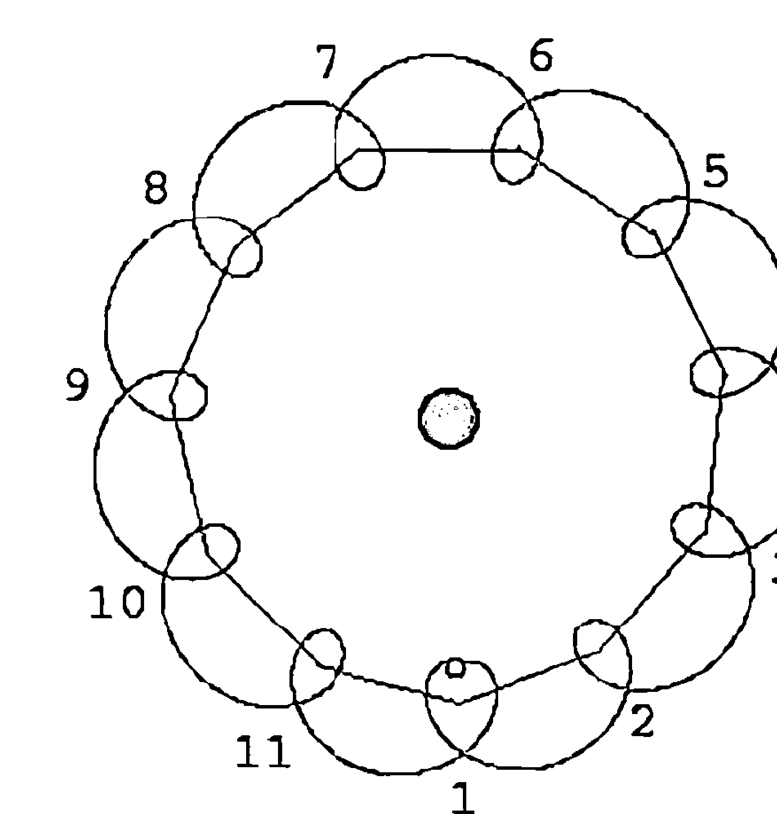

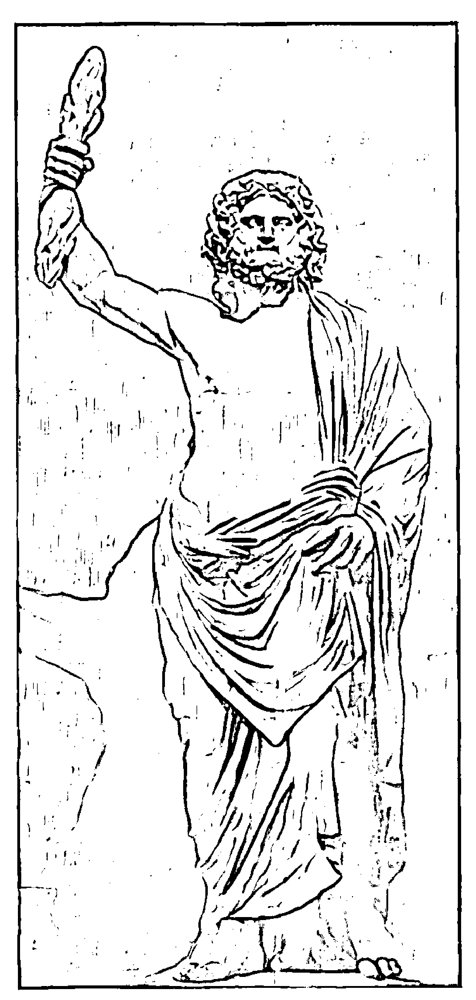

在希臘神話當中木星代表著天神宙斯（Zeus），在羅馬神話當中則改稱為朱彼德（Jupiter），祂是奧林帕斯十二位主神之首，統治天界及人間，具有無上的權威和力量，祂是正義的象徵，會幫助不幸及弱小的人，當人類行善向上時，世間就風調雨順、作物豐收，但若是人類作惡沈淪，祂也會降下災禍讓人們痛苦，也被認為是天候及氣象的守護神；在感情生活上宙斯非常風流多情，因此也子孫眾多，許多希臘神話當中的神祇及英雄都是祂的後代。

在占星學當中木星代表擴展與膨脹的力量，提供幸運、成長和幫助，並且具有愛好自由、大而化之與正向樂觀的特性；在個人占星學當中木星與人生目標及道德修養有關，可以看出一個人是否有探索未知的冒險心，並且指出我們可以如何得到幫助；在生活領域上木星主要與一個人的宗教信仰有關，對於高等教育及長途旅行也有影響，在人際關係上木星影響我們與教師之間的關係，並且會延伸到生活各個層面的貴人；在身體層面，木星守護肝與排毒系統。

### 土星

在望遠鏡發明之前，土星是人類肉眼裸視能觀察到最遙遠的行星，由地球上來看最高只有負零點二星等，與天空中其他最亮的恆星差不多，其顏色大多顯示為白色，有時候會看起來偏黃；土星的運行十分規律，每年逆行一次，逆行時間大約四個半月，會退行七度左右的距離，在開始

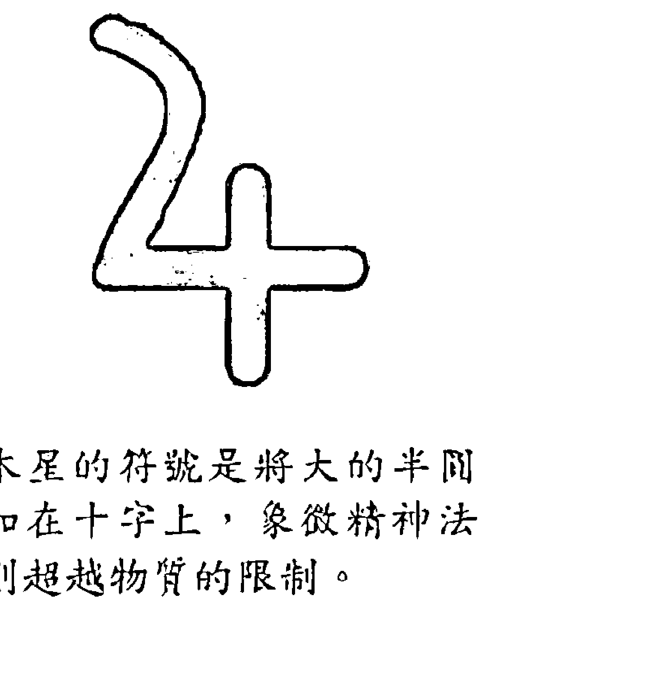

逆行前大約會停駐五天，回復順行之前則可能停駐長達十天，大約都是兩年半左右通過一個星座（三十度的區間），要花二十九年半才會走完黃道一周。

在希臘神話當中土星與第一代的泰坦主神克羅諾斯（Kronos）有關，也經常會被與早期神話中的時間之神柯羅諾斯（Chronos）混淆，在羅馬神話當中則與當地的農神薩頓（Saturn）混同；祂為了避免統治權被子女們取代，所以在子女們出生之後就將祂們吞下肚子裡，往往被視為老舊與保守的勢力，但是到最後仍然被祂的兒子宙斯所推翻；祂在羅馬的地位比在希臘崇高，在祂的統治之下開啟了傳說中的黃金時代，也守護了人類的時間、季節及收獲。

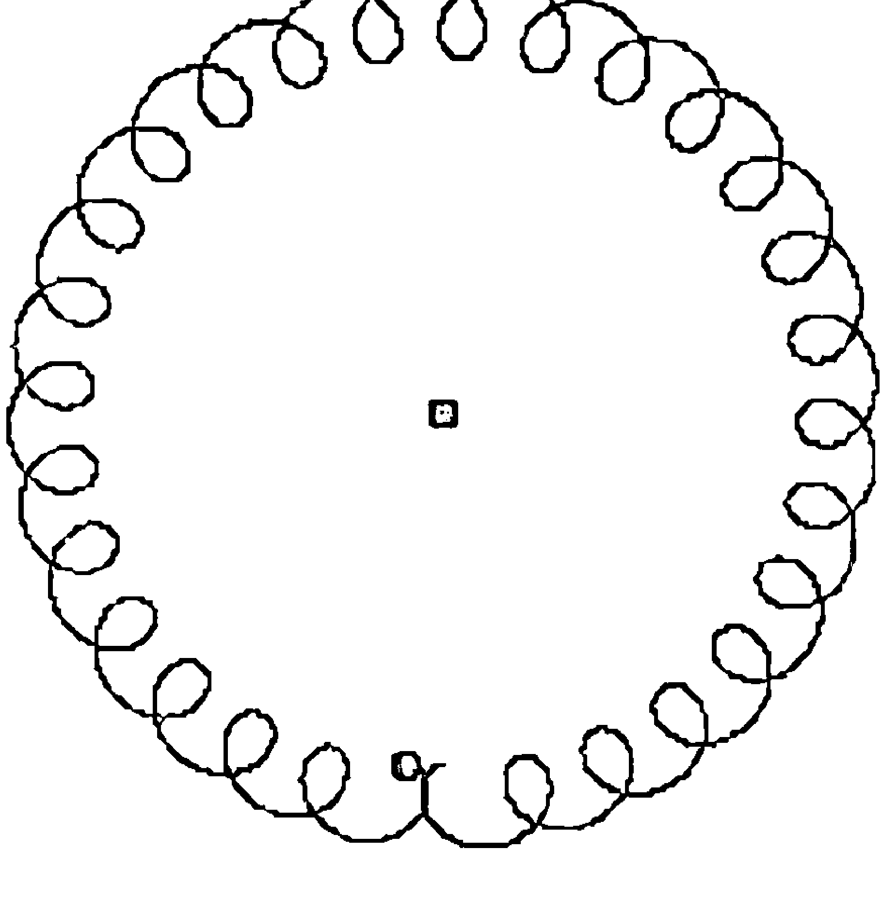

從地球上看土星繞行黃道一周的軌跡圖。

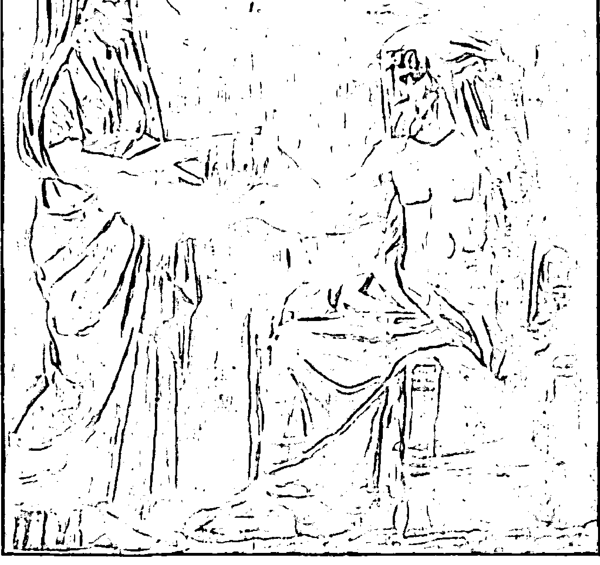

希臘時代克羅諾斯要吃掉宙斯的浮雕。

在占星學當中土星代表收縮與限制的力量，提供規則、穩定與實踐的力量，但是也有保守、壓抑與悲觀的傾向，在個人占星學當中土星代表了因果業力的法則，說明我們會遇到何種困難，以及是否有足夠的責任感可以承擔這些壓力，在生活領域上土星指出我們的弱點之所在，也可以看出我們能否從經驗當中自我反省學習成長，在人際關係上影響我們和長輩、雇主之間的關係，並且會延伸到生活各個層面當中的小人；在身體層面，土星守護了骨骼與皮膚。

## 第五節 現代行星的運行與特徵

### 天王星

現代文明於一七八一年二月十三日，在雙子座二十五度附近觀察到天王星，由地球上來觀察天王星最亮也只有五點五星等，只比肉眼裸視能觀察到最暗的恆星還亮一點點而已，因此經常被誤認為是恆星；在天文學上來看天王星是一顆與眾不同的星，其他太陽系行星的自轉軸大都與公轉軌道垂直，只有天王星的自轉軸平躺於公轉軌道上。

天王星每年逆行一次，逆行時間大約持續五個月，會退行四度左右的距離，在開始及結束逆行之前會各有一到兩週的停駐期，大約都是七年左右通過一個星座（三十度的區間），要花八十四年才會走完黃道一週。

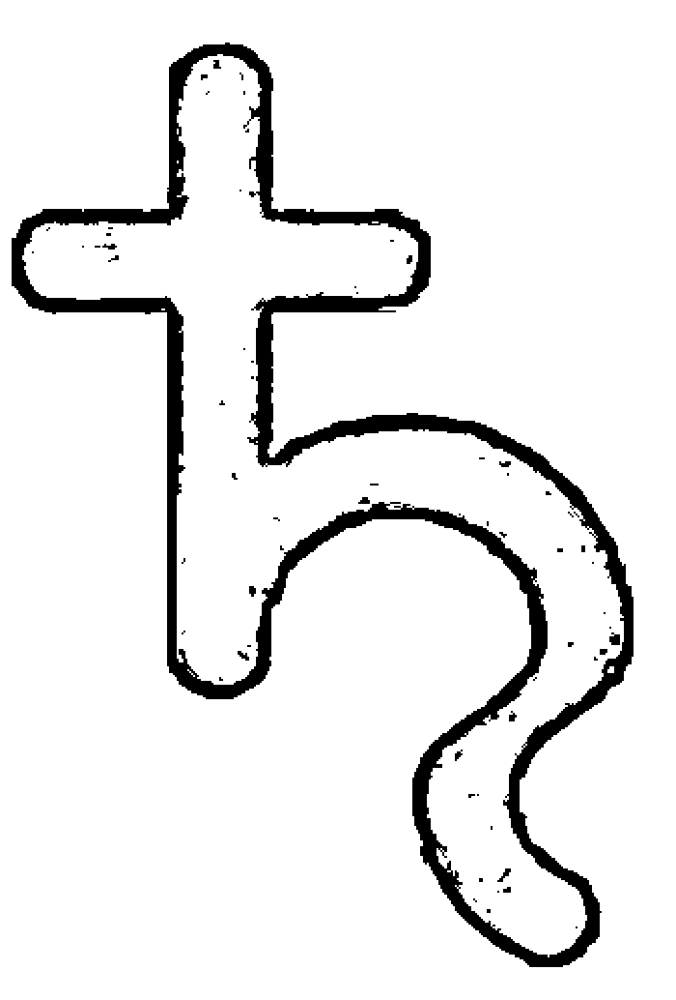

土星的符號是將十字加在大的半圓之上，象徵物質的限制壓抑了精神法則。

在希臘神話當中天王星與天空之神烏拉諾斯（Uranus）有關，在羅馬神話則改稱為卡勒斯（Caelus），祂是最早的自然神之一，與大地之母蓋婭（Gaia）生出了後來的十二位泰坦神、三位獨眼巨人、三位百臂巨人；後來克羅諾斯用母親蓋婭送祂的鐮刀閹割烏拉諾斯並推翻了祂的統治，烏拉諾斯的陽具掉入海中，從泡沫中生出了代表愛與美的女神阿芙柔黛蒂，烏拉諾斯的血滴在地上生出了復仇三女神厄裡倪厄斯（Erynes）和命運女神梅利亞（Meliae）。

在占星學當中天王星代表突破傳統與限制的力量，提供靈感、創新與革命性的改變，但是同時也很激烈、古怪而完全無法預料，在個人占星學當中天王星代表突然來的意外，並且會提供現狀之外的另一種選擇，天王星經常會引發違背常理的叛逆行為，也代表最新的尖端科技；有趣的是天王星所象徵對應的事物也不斷地在改變，原本很創新的東西過了一段時間之後也可能變得平常甚至是保守，這個時候就會改由土星來主管。

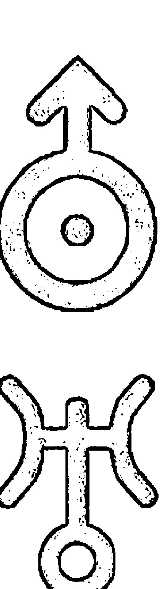

天文學上天王星的符號是在太陽的符號之上再加一個箭頭，但是占星學上使用的符號則是由兩個圓弧、十字及圓圈所組成，像是在圓球上放置了一個天線。

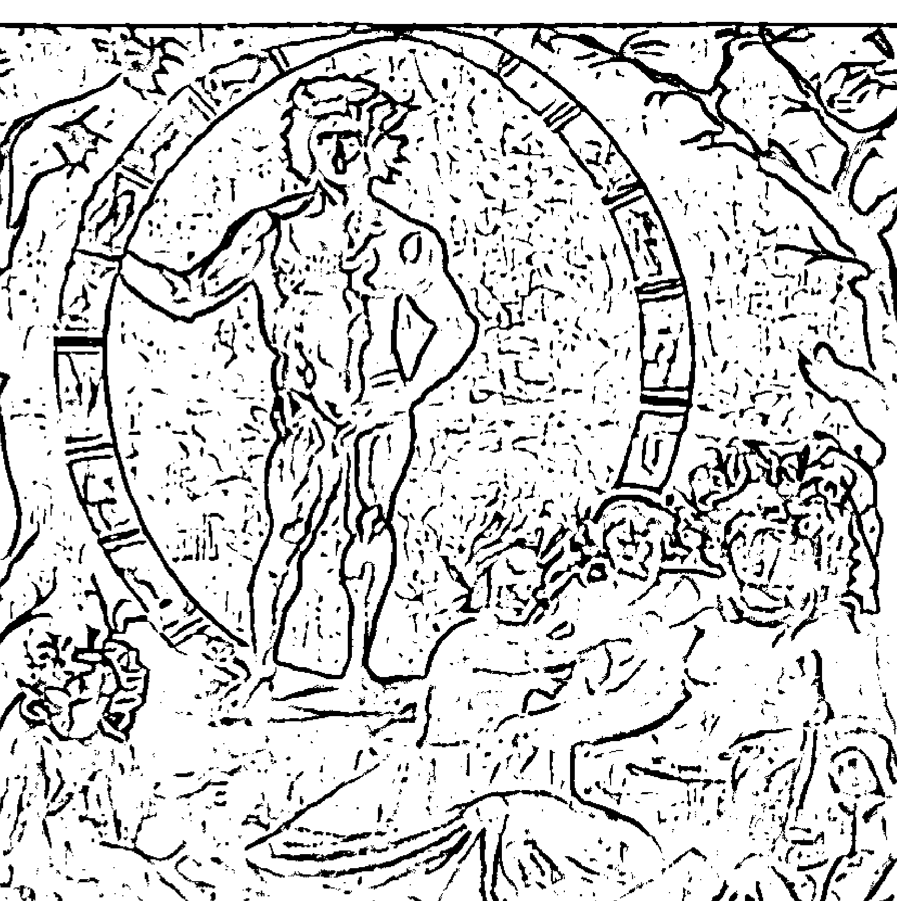

羅馬時期天空之神與大地之母的馬賽克壁畫。

### 海王星

現代文明於一八四六年九月二十三日，在水瓶座二十五度附近觀察到海王星，當時的人認為天王星的運行偏離了數學計算的軌道，應該是受到另一個更遠行星的引力所影響，因此有兩位天文學家運用力學公式計算出這個行星的軌道，並且在預測的位置附近發現了海王星，但是事後驗證當時所預估的重量、引力及軌道與海王星真實的狀況並不符合，會在那個地方觀察到海王星，並不能歸諸於科學進步的計算能力，只是運氣好而已。

由地球上來觀察海王星最亮時也只有七星等，沒有使用望遠鏡完全無法觀察到；由地球上觀察海王星每年逆行一次，逆行時間大約會持續五個多月，退行二到三度的距離，在開始及結束逆行之前會各有一到兩週的停駐期，大約都是十四年左右通過一個星座（三十度的區間），要花一百六十五年才會走完黃道一週。

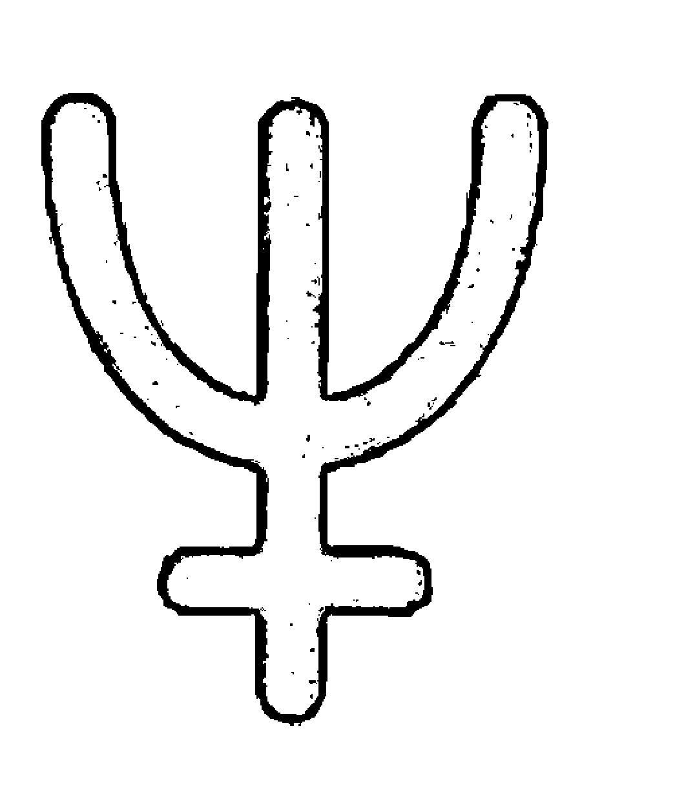

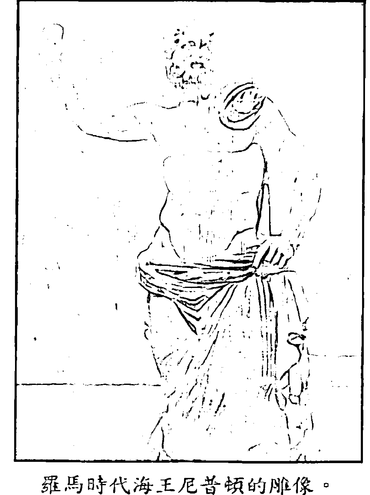

在希臘神話當中海王星是代表海神波塞東（Poseidon），在羅馬神話當中則改稱為尼普頓（Neptune），祂是奧林帕斯十二位主神之一，在宙斯推翻了克羅諾斯之後，透過抽籤的方式決定諸神掌管的領域，波塞東主管海洋、河流、泉水及所有水文的部分，祂只要揮動三叉戟就會引發地震及海嘯，祂可以打擊大地使之冒出泉水，也能在打擊海面引起巨大的海浪，是航海及船員的守護神；在神話傳說當中祂首先將馬送給人類，在羅馬也被視為馬的守護神。

在占星學當中海王星代表將界線與規則消融的力量，能夠不分彼此地融合在一起，但是也能帶來虛幻、模糊和混亂，在個人占星學當中海王星代表我們內心當中渴望與崇拜的人事物，但若是過度理想化到頭來可能會造成幻滅的失落感，海王星有時候會造成被別人欺騙或是自我欺騙，並且經常帶有逃避現實與放棄的傾向；不過由於海王星的作用方式比較隱晦和曖昧不明，所以並不是很容易察覺到它的影響力。

### 冥王星

現代文明於一九三〇年三月十二日，在巨蟹座十八度附近觀察到冥王星，早在一九〇五年天文學家羅維爾就認為在海王星軌道之外還有一個行星，但直到他一九一六年過世前都還沒找到這個「X行星」，天文學界之後進行大規模搜尋「X行星」的計劃，經過了多年的努力才由湯伯找到冥王星；雖然在二〇〇六年的國際天文學大會上將冥王星降級，並且與穀神星與鬩神星並列為矮行星，不過這並不影響占星學當中對於冥王星的運用。

由地球上來觀察冥王星最亮時也只有十四星等，沒有使用望遠鏡完全無法觀察到；冥王星每年會逆行一次，逆行時間大約持續五個多月，會退行二到三度的距離，在開始及結束逆行之前會各有一到兩週的停駐期，由於冥王星的軌道呈現出橢圓形，最快時只要十二年就會通過一個星座（一九八三到一九九五通過天蠍座），但是最慢時要到三十三年才通過一個星座（預計將在二〇〇六年到二二九年通過金牛座），總共要花二百四十八年才會走完黃道一週。

在希臘神話當中冥王星代表冥王黑帝斯（Hades），在羅馬神話當中則改稱為普魯多（Pluto），有神話將祂列入奧林帕斯十二位主神之一，在宙斯推翻了克羅諾斯之後，透過抽籤的方式決定諸神掌管的領域，黑帝斯主管地底及陰間的部分，是人死之後必去的地方，因此也被認為是冥王星的符號是由英文字母P和L所組成的符號，天文學上，冥王星的符號是P與半圓與圓圈而成。

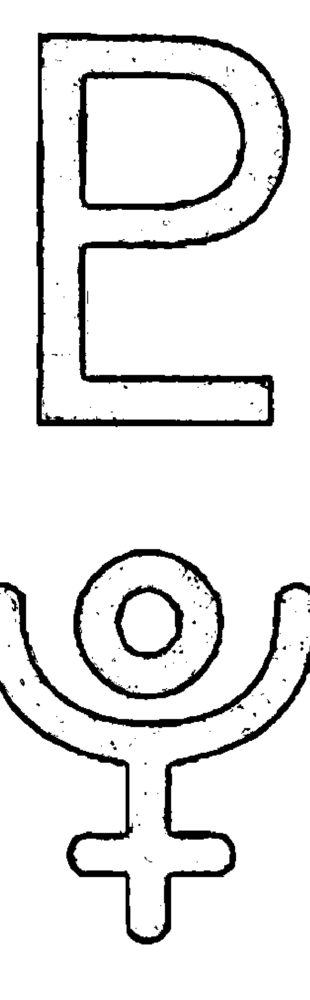

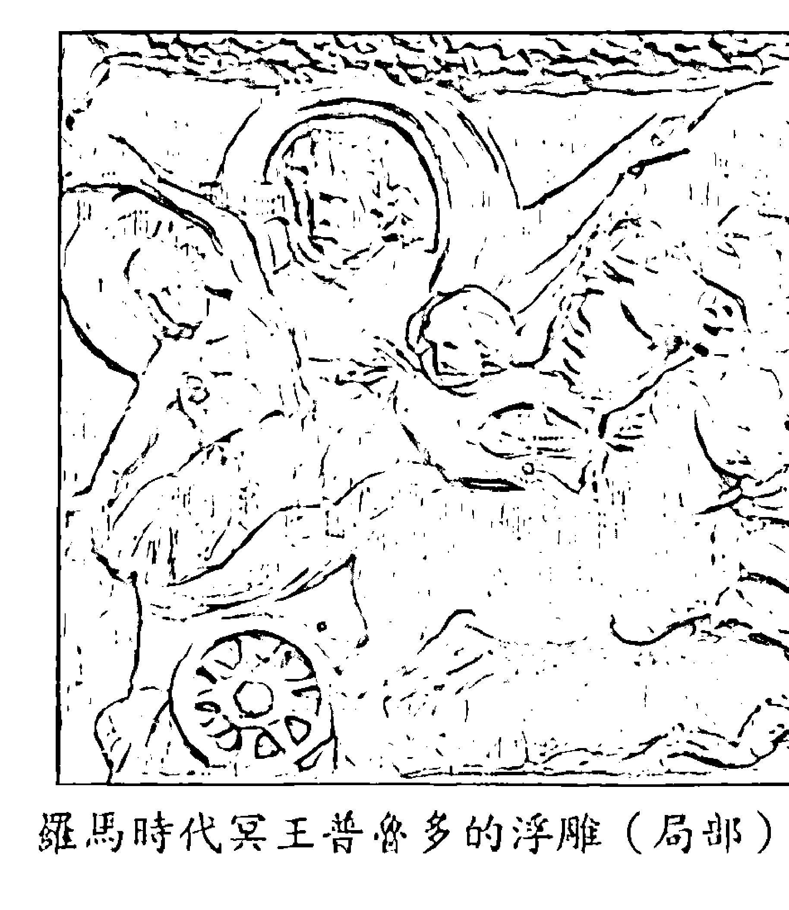

羅馬時代冥王普魯多的浮雕（局部）。為主管了死亡，但是祂並不是死神也不是死後的判官；到了羅馬時祂的地位大幅提升，由於與當地的財神普魯特斯（Plutus）混同，當時的羅馬人認為祂掌管了地底的礦藏和財富。

在占星學當中冥王星代表死亡與再生的力量，經常會造成分離、隔絕、毀滅的效果，但是也有轉化、療癒與重生的可能性；個人占星學當中冥王星代表個人不願意面對的深層心結，也可能暗示有不能說的秘密，因此也帶有隱藏、壓抑與被強迫的意思；相對於天王星帶來的改變是突然而無法預料的，冥王星帶來的改變則是受到「成、住、壞、空」的宇宙法則所支配，一切在冥冥之中已有定數，也有線索提醒我們必然會發生改變，只是看我們自己願不願意去面對。

## 第六節 行星的分類與屬性

### 行星的陰陽性

傳統上將行星依照其屬性及作用方式區分出陰性星與陽性星，傳統上認為陽性星由太陽領導，還包括木星及火星，陰性星由月亮領導，還包括土星及金星，至於水星由於同時具有陰性與陽性的特質，有些人把它視為雌雄同體，或是比較簡化地稱為中性星；至於現代才發現的行星，天王星通常被歸類為陽性星，海王星被視為陰性星，冥王星的狀況比較複雜，依性質來區分冥王星算是陰性星，但是作用卻是陽性星的方式。

### 行星的吉凶性

傳統占星當中也有把行星依照吉凶來分類的方式，傳統上太陽、月亮及水星與吉凶無涉，木星為大吉星、金星為小吉星，土星為大凶星，火星為小凶星，本來這樣的分配是十分平衡的；但是現代行星發現之後，有人認為天王星、海王星、冥王星都是凶星，因此星盤上的凶星就變得多，因此也有人主張把太陽及月亮都列入吉星當中，覺得這樣比較平衡。

不過依照丹尼爾的經驗，月亮與水星基本上還是與吉凶沒什麼關係，至於太陽還滿常提供有利的幫助，因此將太陽列入吉星的範圍還算合理；至於現代行星當中，冥王星具有毀滅的效果，一般被列在凶星比較沒有爭議，天王星是突然來的意外，但是其中有好事也有壞事，算是吉凶摻半，也可以列在中性星，至於海王星模糊朦朧的效果基本上是中性的，但是由於常有自己想得美或是被騙的狀況，所以可說是中性偏凶的影響。

### 行星特質整理關係

以個人占星的部分來看，太陽屬於陽性原則，月亮屬於陰性的原則，這兩個是屬於核心的特質，但若是彼此之間需要溝通，或是連結到外界控制金星和火星的能量，就要靠水星這個中介的力量才能達成；而火星是衝突的原則、金星是和諧的原則，與水星共同組成社會行星的鐵三角，是幫助我們在社會上闖盪的力量！接下來一層是世代行星，木星是人生的目標，有將人向上提升突破的力量，土星是責任與壓力，具有限制的效果，因此我們把祂們放在上方及下方。

現代行星當中，海王星是更高遠的理想，我們將祂放在木星的上面，冥王星是深層的心結，我們將祂放在土星的下面，至於天王星是突然來的意外，我們將之放在最外層，代表它的客觀性與不可預測性。

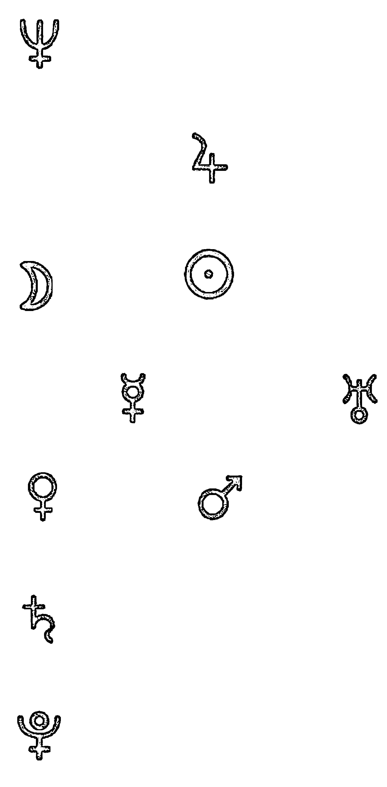

行星特質與關係圖。

### 《行星特性總表》

| 行星 | 太陽 | 月亮 | 水星 | 金星 | 火星 | 木星 | 土星 | 天王星 | 海王星 | 冥王星 |
| :--- | :--- | :--- | :--- | :--- | :--- | :--- | :--- | :--- | :--- | :--- |
| 符號 | ⊙ | ☽ | ☿ | ♀ | ♂ | ♃ | ♄ | ♅ | ♆ | ♇ |
| 主要力量 | 自發主動的陽性原則 | 被動反應的陰性原則 | 靈活多變的力量 | 和諧與吸引力 | 競爭與衝突性 | 擴展與膨脹的力量 | 收縮與限制的力量 | 突破傳統與限制的力量 | 將界線與規則消融的力量 | 死亡與再生的力量 |
| 陰陽性 | 陽性 | 陰性 | 雌雄同體 | 陰性 | 陽性 | 陽性 | 陰性 | 陽性 | 陰性 | 陰性 |
| 吉凶性 | 偏吉性 | 中性 | 中性 | 小吉星 | 小凶星 | 大吉星 | 大凶星 | 中性 | 偏凶性 | 凶性 |

# 第四章 黃道帶星座標與星座

## 第一節 恆星黃道與回歸黃道

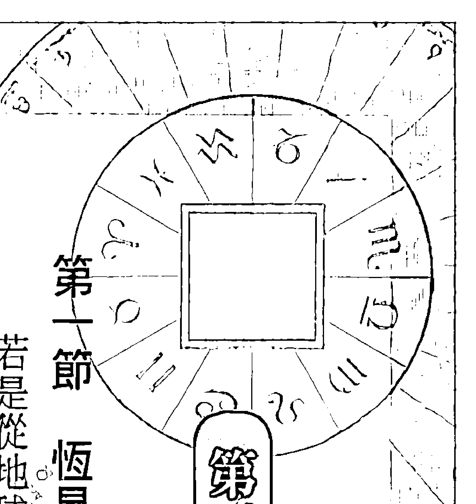

若是從地球上觀察，太陽在天球背景上會依循著固定的軌道運行，在天文學上我們將這個軌道稱之為黃道（ecliptic），古人歸納了所有行星運行的軌道之後，發現其他行星的軌道也不會離黃道太遠，因此將黃道向南北延伸八度的區間稱為黃道帶（Zodiac），Zodiac的原意是獸帶，也就是野獸所在的位置，事實上以古希臘當時黃道帶通過的星空背景來看，確實有八個區間是屬於動物的星座，因此稱之為獸帶也還算合理。

現代西洋占星使用的大多是回歸黃道（Tropical Zodiac），也就是以每年太陽通過春分點的位置為起始點，每三十度劃分為一個星座（sign），當西元前三二七年古希臘的占星家要幫黃道帶上的區間取名時，就使用了當時與這些區間大致重疊的星座（Constellations）來命名，依序為白羊座、金牛座、雙子座、巨蟹座、獅子座、處女座、天秤座、天蠍座、射手座、魔羯座、水瓶座和雙魚座，統稱為黃道十二宮（Signs of Zodiac）。

古人會使用回歸黃道的概念，主要是考量到季節變化與農業的用途，就像是中國傳統曆法上定義的二十四節氣一樣，是為了給農人作為耕作的參考，在兩千年前這樣的命名方式並沒有任何問題；不過由於地球在運行時會有進動（precession），也就是地球自轉軸會像陀螺一樣打轉，因此經過幾千年之後北極將會指向不同的星星，同時間每年春分時星空背景的星群也會極為緩慢的變動，這種現象在西方被稱為二分點歲差（Pression of the Equinoxes）。

雖然二分點歲差平均每年只移動約五十秒左右，但是經年累月下來也會有很大的變化，以本書寫作的時間來看，春分點已經由恆星天背景的白羊座零度位置，退行到雙魚座五度的位置，大約差了二十五度左右；另一方面，印度占星在發展的過程當中，則是慣用恆星黃道（Sidereal Zodiac）即是

以恆星天背景當中的星群名稱來幫行星定位。不過由於天空中每個星群的大小並不一樣，因此恆星黃道當中每個星座的長度也各不相同。若是以太陽運行通過的星空背景來看，目前恆星黃道上共有十三個星座，下表提供了太陽通過恆星黃道與回歸黃道時間的對照表。不過若是看到所有行星運動所會經歷的星座一共有二十一個，除了傳統的黃道十二星座加上常被提到的蛇夫座之外，還有鯨魚座、烏鴉座、巨爵座、長蛇座、獵戶座、飛馬座、盾牌座和六分儀座。

### 《太陽通過恆星黃道與回歸黃道時間的對照表》

| 星座 | 恆星黃道日期（長短不一） | 回歸黃道日期（長度接近） |
|---|---|---|
| 雙魚座 | 3月13日〜4月18日 | 2月19日〜3月20日 |
| 水瓶座 | 2月18日〜3月12日 | 1月20日〜2月18日 |
| 魔羯座 | 1月20日〜2月17日 | 12月22日〜1月19日 |
| 射手座 | 12月18日〜1月19日 | 11月23日〜12月21日 |
| 蛇夫座 | 11月30日〜12月17日 | |
| 天蠍座 | 11月24日〜11月29日 | 10月23日〜11月22日 |
| 天秤座 | 11月1日〜11月23日 | 9月23日〜10月22日 |
| 處女座 | 9月17日〜10月31日 | 8月23日〜9月22日 |
| 獅子座 | 8月11日〜9月16日 | 7月23日〜8月22日 |
| 巨蟹座 | 7月22日〜8月10日 | 6月21日〜7月22日 |
| 雙子座 | 6月23日〜7月21日 | 5月21日〜6月20日 |
| 金牛座 | 5月14日〜6月22日 | 4月21日〜5月20日 |
| 白羊座 | 4月19日〜5月13日 | 3月21日〜4月20日 |

在占星學發展的歷史當中，有人使用回歸黃道，有人使用恆星黃道，這只是兩種不同的度量尺度而已，並沒有誰對誰錯的問題，彼此之間的結果也可以換算，雖然在同一時間的同一個星星，可能會落在恆星黃道與回歸黃道的不同星座，但是就像我們量身高時，說一個人是一百八十三公分高，與說一個人是六英尺高，其實都可以描述出這個人的狀況，這時只堅持其中一種說法是對的，而去否定另外一種說法，豈不是很好笑的狀況？

由於西洋占星學兩千多年來累積下來的資料都是以回歸黃道為主，因此我們在研究西洋占星時大都是使用回歸黃道；想要了解黃道十二宮在占星學上的概念，我們可以找到它們相關象徵意義的來源，從季節與農事開始，到象徵圖騰的解釋，再到星座神話的聯想，與看到它們在占星學上的速記符號，從這幾個面向入手，我們就可以掌握到這個星座的基本特質。

## 第二節 春季星座的基本象徵

### 白羊座

每年太陽在春分時節開始進入白羊座的範圍，接著橫跨清明到穀雨之前，雖然就中國的節氣傳統，到春分時春天已經過了一半，但是以西方占星學的算法，這時才開始算是春天；在四季分明的溫帶氣候區，此時正值春光明媚的初春時節，氣候溫暖舒適宜人，冬季落葉的植物開始冒出新芽，冬眠的各種動物也完全甦醒回復生氣，並且開始進入春情勃發的求偶季節，對於農人來說一年的農事正式開始，進入撥種與插秧的農忙時節，展現出開創與新生的活力。

在西方傳統當中白羊座的象徵圖騰為一隻奔跑中的公羊，而且在圖像上通常會畫成正在回頭的樣子，若是放到黃道十二宮的順序來看，正好是回頭看著跟在後面的十一個星座，顯示出領頭羊的特質；綿羊是群居的動物，平常大家都是和睦相處，但是到了求偶季節，公羊們就會為了爭奪所愛而公開單挑，兩隻要決鬥的公羊會先拉遠距離就戰鬥位置，然後快速地直衝向對方以羊角互頂，通常速度慢的一方會被鬥倒，所以公羊的優勢往往是在瞬間的爆發力。

在希臘神話當中，金羊毛的故事可以幫助我們聯想白羊座的特質，希臘國王阿塔瑪娶了名為伊諾娃的繼室，伊諾娃為了除掉前妻生的一對兄妹，假傳德爾斐神廟的神諭，要將這對兄妹獻祭給天神宙斯；當他們在祭壇上將要被殺時，突然有會飛的金色公羊出現將這對兄妹救走，雖然在途中妹妹赫蕾因為害怕跌入海中，但是兄長普里克思則順利獲救，之後普里克思將牠獻祭給天神宙斯，宙斯為了紀念這件英勇救人的事跡，將金色公羊升到天空當中成為白羊座。

在星座特質上，白羊座代表熱情、活力和自信，會直接面對困難，主動處理問題，瞬間的爆發力也很強，遇到不公不義的事情會激發出強烈的正義感，即使事不關己還是會跳出來為弱勢者主持公道，勇敢果決的作法經常可以開創新局；不過動作太快難免忙中有錯，同時欠缺處理細節的技巧，很容易一個人在前面衝而缺乏後援及適當的應變計劃，在判斷事情的時候容易流於主觀，持久的耐力也有所不足，雖然有心要幫助別人，但是經常救人只救到一半。

### 金牛座

每年太陽在穀雨時節開始進入金牛座的範圍，接著橫跨立夏到小滿之前，雖然就中國的節氣傳統，到立夏時就已經算是夏天了，但是以西方占星學的算法，這時正是春天的核心部分；在四季分明的溫帶氣候區，此時正值春暖花開的仲春時節，雨量增多有利於植物的生長，不論是農作物或是雜草都增長快速，家畜們開始進入孕程，農人們不但要照顧家畜，也得花力氣去犁田和鋤草，這是前一年堆肥熟成與適合施肥的重要時期，充份體現出豐饒多產的力量。

在西方傳統當中金牛座的象徵圖騰為長角的公牛，而且在圖像上通常只畫出由雲朵中衝出來的上半身，自古以來牛經常做為力大無窮與刻苦耐勞的象徵，不論東西方文化都很早就馴養牛隻作為耕田、拉車及推動石磨的獸力，牛糞也是農家非常重要的堆肥材料；一般來說牛是很溫馴的草食性動物，平時不是默默地低頭吃草，就是利用時間反芻慢慢消化食物，但是個性非常固執不知變通，而有牛脾氣及鑽牛角尖等形容詞，同時也被視為穩定與踏實的代表。

在希臘神話當中，歐羅巴公主與天神宙斯的故事可以幫助我們聯想金牛座的特質，腓尼基的歐羅巴公主是非常有名的美女，有一天宙斯下凡來看一看就被她給吸引了，宙斯決定化身為一頭潔白的公牛，伺機接近在草原上玩耍的歐羅巴，一陣子的嬉戲之後歐羅巴公主試著騎到牛背上，沒想到突然這頭公牛就拔腿狂奔，飛越大海一直到克里特島才停下來，之後宙斯還與歐羅巴公主生了三個兒子，宙斯為了紀念這件愛情故事，將公牛升到天空當中成為金牛座。

在星座特質上，金牛座代表穩定、務實與豐饒的生產力，即使遇到大風大浪仍然可以維持冷靜，想辦法實際去解決問題，也有很強的耐力可以堅持到底，具有刻苦耐勞的傳統美德，一般都是以和平方式處理爭端，很少會發火或是失控；但是過於堅持就可能會變得鑽牛角尖，在錯誤的方向上持續前進很難認錯回頭，甚至為了達到目的而不擇手段，有時候會因為太重視金錢和實際利益而顯得保守固執，難以掩飾本身強烈的佔有慾，對於他人的事則漠不關心。

### 雙子座

每年太陽在小滿時節開始進入雙子座的範圍，接著橫跨芒種到夏至之前，雖然就中國的節氣傳統這時已經走到夏天的前半段，但是以西方占星學的算法，這時還算是春末換季的時令；在四季分明的溫帶氣候區，此時正值春夏交替之際，氣候並不穩定，在植物世界當中百花齊放，並且吸引了蜜蜂、蝴蝶等昆蟲飛舞採蜜授粉，自然界呈現出熱鬧活潑的氣氛，對於農人來說這是灌溉的關鍵時機，也是交易互通有無的熱門時段，體現出變動性與多樣化的傾向。

在西方傳統當中雙子座的象徵圖騰為兩個人，而且在圖像上通常畫成兩個孩童彼此勾肩搭背站在一起，其中一位手持弓箭和豎琴，另一位則是高舉著棍棒，這兩個人常被視為是兄弟或雙胞胎，象徵友愛的兄弟之情；這是黃道帶上第一個以人而非動物來代表的星座，而且一次就出現了兩個人，當中帶有強烈的理性力量以及多才多藝的可能性，不過即使是雙胞胎也可能會有意見不同的時候，所以在能量上帶有二元對立的性質，造成主體與客體之間的分化。

在希臘神話當中，卡斯特與波呂刻斯的故事可以幫助我們聯想雙子座的特質，斯巴達的王妃麗妲被化身為天鵝的宙斯誘惑，不久之後生下了兩顆金蛋，第一顆蛋孵化出國王的骨肉，哥哥卡斯特與姊姊克娣尼絲翠，第二顆蛋則孵出宙斯的血脈，波呂刻斯及大美女海倫，在一次戰爭當中卡斯特中箭身亡，波呂刻斯因為有宙斯的血緣而倖免於難，但是他不願意與兄長分離，宙斯在波呂刻斯的要求之下把不死的生命分一半給卡斯特，最後將兩個人接到天上成為雙子座。

在星座特質上，雙子座代表靈巧、變化和二元性，總是能理性地面對問題，很少流於意氣之爭，在處理事情時很有彈性，這條路走不通就想別的辦法，即使不成功也能避開最凶險的狀況，良好的口才和幽默感在人際關係上很吃得開；但是變動太快就很容易出現自相矛盾的狀況，想法太多也可能流於光說不練，穩定性與一致性不足往往難以堅持到底，最後只好把自己開創的功績拱手讓人，一有風吹草動就改變作法，也容易招致見風轉舵或牆頭草的批評。

## 第三節 夏季星座的基本象徵

### 巨蟹座

每年太陽在夏至時節開始進入巨蟹座的範圍，接著橫跨小暑到大暑之前，雖然就中國的節氣傳統，到夏至時夏天已經過了一半，但是以西方占星學的算法，這時才開始算是夏天；在四季分明的溫帶氣候區，此時的日照充足造成氣溫升高，但是同時雨水也不少，所以感覺還不會特別悶熱，植物們生長的速度放緩，進入水果及穀物成熟的關鍵時期，春季交配的家畜生出新的一代，就農人來說這是需要細心照顧農作物及家畜的時間，體現出保護與成熟的力量。

在西方傳統當中巨蟹座的象徵圖騰為螃蟹，而且在圖像上通常畫為張開巨螯的樣子，螃蟹為潮間帶動物，在漲潮時可以在水中快速地游泳，退潮時則在陸地上進兩步退一步地迂迴前進，在不同環境下都可以適應，也被認為具有兩種不同的行為模式；雖然螃蟹帶有堅硬的甲殼但是內部卻很柔軟，在堅強的表外下常帶有一顆敏感的心，當他們抓到獵物時會用巨螯緊緊箝制住不放，展現出堅強的決心與意志力，但是另一方面也暗示了佔有與緊抓不放的特質。

在希臘神話當中，海克力斯大戰九頭蛇的故事可以幫助我們聯想巨蟹座的特質，海克力斯是宙斯與麥錫尼女王阿爾克墨涅的私生子，為了執行尤里修斯國王交待的任務前往萊魯納剷除九頭蛇海德拉，這時天后赫拉派出巨蟹幫忙海德拉，希望可以

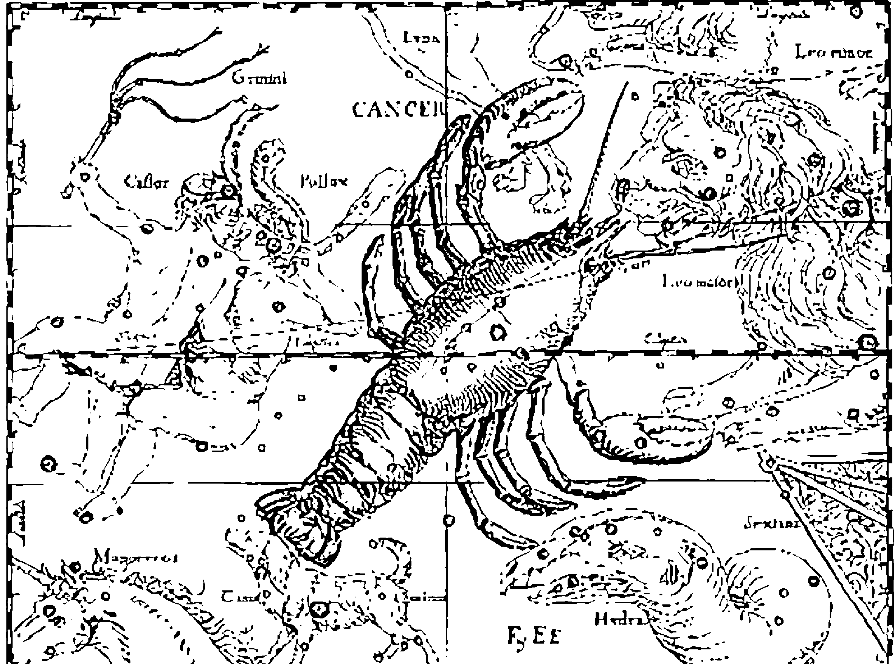

巨蟹座的象徵圖騰。藉此除掉這個宙斯的私生子，但是結果海克力斯得到姪子伊俄拉斯的幫助順利打敗了九頭蛇，在過程當中也踩死了這隻巨蟹，天后赫拉為了感謝巨蟹，將巨蟹升到天空當中成為巨蟹座，並作為家庭價值的守護者。

在星座特質上，巨蟹座代表敏感、成熟與保護，對於四周的環境及人的情緒都很敏銳，為了自我保護，對一般人顯得較為封閉和冷漠，但只要認定是自己人就會熱情地提供幫助及保護，遇到困難也會盡力堅持以達到自己的理想，即使粉身碎骨也在所不惜；但是太過自我保護可能會引起反彈與對立，對自己人盲目地護短更會招致外人的批評和攻擊，被刺激到的時候很容易顯示出過度情緒化的反應，甚至因此做出錯誤的決定，佔有慾太強也會讓人有壓力。

### 獅子座

每年太陽在大暑時節開始進入獅子座的範圍，接著橫跨立秋到處暑之前，雖然就中國的節氣傳統，到立秋時就已經算是秋天了，但是以西方占星學的算法，這時正是夏天的核心部分；在四季分明的溫帶氣候區，此時正值炎熱的仲夏，陽光普照雨水較少，所以經常都是一年當中最熱的時期，農作物在此時穩定生長，是邁向成熟的最後階段，農人受制於高溫減少白天戶外的農事，反而有空從事一些休閒活動，許多慶典也安排在此時，展現出輕鬆愉快的氣氛。

在西方傳統當中獅子座的象徵圖騰為獅子，而且在圖像上通常畫成正在向前飛躍的獅子，自古以來獅子就擁有一萬獸之王的封號，除了被視為力量最強大的猛獸之外，同時也帶有領導力的象徵；在自然界當中獅子其實是合作狩獵的肉食動物，當牠們發現獵物時會先由母獅子潛行到下風處佈陣，完成之後再由公獅子們開始在上風處怒吼，嚇得獵物們成群往下風處逃跑，這時埋伏在下風處的母獅子就可以將獵物們一舉成擒，是屬於有勇有謀的精明狩獵者。

在希臘神話當中，海克力斯大戰巨獅的故事可以幫助我們聯想獅子座的特質，居住於尼米安的巨獅是蛇女埃奇多與巨人泰風所生，刀槍不入而且力大無窮，尤里修斯國王交待的第一件任務即是要海克力斯去剷除這頭巨獅，其實是希望能藉此除掉海克力斯，沒想到最後海克力斯不但徒手打敗了巨獅，還將巨獅的皮剝下來當成盔甲，此後披著獅皮的形象也成為海克力斯的代表，宙斯為了表彰海克力斯為民除害的英勇事蹟，將巨獅升到天空當中成為獅子座。

在星座特質上，獅子座代表英勇、熱心和創造力，展現出泱泱大度的王者之風，不會為了一些小事情斤斤計較，對人慷慨作風豪爽，具有一種天生的領袖氣質，總是能很正面地看待遇到的各種問題，並且以實際的方式來處理和解決；但是考慮事情經常是以自我為中心，而沒有考慮到別人的狀況和立場，難免招致獨裁和霸道的批評，不經意流露出來的優越感和愛現的特性，也很容易引來側目和忌妒，有時候也會因為一時愛玩沉迷於逸樂而耽誤了正經事。

### 處女座

每年太陽在處暑時節開始進入處女座的範圍，接著橫跨白露到秋分之前，雖然就中國的節氣傳統這時已經走到秋天的前半段，但是以西方占星學的算法，這時還算是夏末換季的時令；在四季分明的溫帶氣候區，此時果實與穀物逐漸成熟，也要開始進入收成的農忙時期，判斷正確的時機收成是很大的學問，若是太早收成果實還未成熟，但若是等過頭了又會酸壞腐敗，對於農人來說掌握正確的時機及時行動是很重要的事情，也體現出認真與辛勤努力的力量。

在西方傳統當中處女座的象徵圖騰為拿著麥穗的少女，而且在圖像上通常還會加上一對翅膀，自古以來西方常以處女來象徵純潔無瑕，也代表注意細節與完美主義的特質，從另一個角度來看也隱含有尚待開發的無窮潛力，這是繼雙子座之後黃道帶上第二個以人來代表的星座，也帶有很大的理性力量；少女手中的麥穗象徵豐收，表示人可以運用適當的方法自食其力，雖然在過程當中要付出很多的時間與精力，但是只要堅持下去終究可以達成自己的目標。

在希臘神話當中，豐收女神狄蜜特與女兒柏瑟芬的故事可以幫助我們聯想處女座的特質，有一天冥王黑帝斯綁架了柏瑟芬並娶她為妻，找不到女兒的狄蜜特傷心欲絕，農作物都無法生長造成飢荒，最後由天神宙斯出面協調希望黑帝斯能放人，黑帝斯在柏瑟芬回到人間之前給她吃了四個石榴，因此每年有四個月要回到冥界生活，這四個月因為狄蜜特思念女兒而造成人間無法耕作，宙斯為了舒緩狄蜜特的思念之情，將柏瑟芬的形象升到天空中成為處女座。

在星座特質上，處女座代表辛勤、謹慎與精確的特質，面對問題時善於分析、眼光精準，處理事情則條理分明、認真負責，很容易就能贏得別人的信賴，也不愛誇耀自己的功蹟與能力，盡量努力自己把事情搞定，不想要麻煩到其他人；但是太重視細節常會變得吹毛求疵，把精力花在一些不重要的地方，或是與別人為了細微末節而爭得面紅耳赤，經常有無謂的擔憂並且缺乏自信心，在這種狀況之下很容易錯失機會，過度理性也會讓人覺得太不近人情。

## 第四節 秋季星座的基本象徵

### 天秤座

每年太陽在秋分時節開始進入天秤座的範圍，接著橫跨寒露到霜降之前，雖然就中國的節氣傳統，到秋分時秋天已經過了一半，但是以西方占星學的算法，這時才開始算是秋天；在四季分明的溫帶氣候區，此時正值秋高氣爽，夜晚時間開始多於白天，氣溫下降雨量減少，樹木枯黃並逐步落葉，動物們也開始增肥並準備食物過冬，對於農人來說這是合力將作物加工、收藏並進行交易的時間，很多事情需要大家共同努力才能完成，也體現出平衡與合作的特質。

在西方傳統當中天秤座的象徵圖騰為天平式桿秤，而且在圖像上通常會畫為不平衡的傾斜狀態，若是將物品放在天平的一端測重量，就得在另一端放上一樣重的法碼，在調整的過程中要視情況加減法碼，秤子也會不停地搖擺，直到最後達到平衡才會知道東西的重量；這是黃道上唯一以人造器物命名的星座，經常被用來代表公平、正義等抽象的理念，同時也與衡量決定的過程有關，但是也有人認為天秤座是代表絕對客觀的判斷，完全不帶有個人的偏見。

在希臘神話當中，正義女神阿斯特里亞的故事可以幫助我們聯想天秤座的特質，在傳說中美好的黃金時代，天神與人們彼此和睦相處沒有紛爭，但是進入白銀時代，人類之間開始有了紛爭，眾神紛紛回到天界生活，只有正義女神阿斯特里亞和妹妹慈悲女神艾多絲留在人間，阿斯特里亞以天秤衡量是非善惡，幫助人們排解糾紛，最後人間繼續墮落走到鐵器時代，阿斯特里亞看大勢已去也回到天界，但將手中天秤放在天上成為天秤座，提醒人們正義的觀念。

在星座特質上，天秤座代表正義、合作與平衡的觀念，對其他人有深刻的同理心，也非常善於交際，可以與大家都維持良好的關係，經常會懷抱強烈的理想主義，堅持一些抽象的原理和原則，希望自己可以不偏不倚地做出公正的判斷；太過在意別人的看法容易變得反覆或是猶豫不決，有時候也會過度耽溺於生活享受而變得懶惰，若是利用自己的人際關係技巧去操縱或利用別人，也讓人覺得虛偽不真誠，對於不合自己意思的人、事、物經常懷有強烈的敵意。

### 天蠍座

每年太陽在霜降時節開始進入天蠍座的範圍，接著橫跨立冬到小雪之前，雖然就中國的節氣傳統，到立冬時就已經算是冬天了，但是以西方占星學的算法，這時正是秋天的核心部分；在四季分明的溫帶氣候區，此時正值日夜溫差最大的深秋，樹葉枯黃落盡準備腐熟成肥，野生動物開始躲入洞穴當中冬眠，家畜也進行換毛準備過冬，對於農人來說此時戶外的農事大多已經完結，只有部分肉品醃製與酒類釀造的工作在進行，充份體現出結束與轉化的力量。

在西方傳統當中天蠍座的象徵圖騰為蠍子，在圖像上常強調背後倒勾的毒針，蠍子是隱藏在沙漠當中的夜行動物，前方有一對巨螯可以嚇阻敵人，背後一根長而彎的尾巴帶有刺，可以將毒液注入獵物的體內使其麻痺甚至死亡，若是他們在暗中發動攻擊根本令人防不勝防；另一方面，在神秘學上也常用老鷹來代表天蠍座，鷹是翱翔於天際的空中王者，目光銳利而且行動敏捷，牠們在很遠的距離之外就可以鎖定獵物並快速俯衝，被牠們盯上往往難逃此劫。

在希臘神話當中，獵人俄里翁的故事可以幫助我們聯想天蠍座的特質，俄里翁是海神波賽頓與邁諾斯公主奧爾羅艾蕾的兒子，天生俊美並擅長狩獵，他在克里特島遇到月之女神亞提米絲，便留下來陪在她身邊一起狩獵，有一天他誇下海口要殺盡克里特島的所有動物，為此大地女神蓋婭派出一隻蠍子去暗殺克俄里翁，以免濫殺無辜的狀況發生，最後這隻蠍子順利完成任務，解救了克里特島的動物們，為了紀念這件事情蓋婭將牠升到天空當中成為天蠍座。

在星座特質上，天蠍座代表強烈、隱密和轉化的力量，即使遇到極端的狀況，仍然能冷靜果決地處理事情，帶有堅強的意志力與決心，有能力一眼看穿事物背後的原因，總是在準備充份之後才採取行動，所以往往都能戰無不勝、功無不克；但是低調的行事作風容易引起別人的誤會，總覺得他們在背後進行什麼陰謀詭計，極端又不妥協的作法也容易樹立敵人，再加上有意無意流露出來的優越感，更讓人覺得難以親近，這些都加強了原本較為孤立的傾向。

### 射手座

每年太陽在小雪時節開始進入射手座的範圍，接著橫跨大雪到冬至之前，雖然就中國的節氣傳統這時已經走到冬天的前半段，但是以西方占星學的算法，這時還算是秋末換季的時令；在四季分明的溫帶氣候區，此時夜晚時間越來越長，降雪狀況明顯增加，大地一片銀白，對於農人來說此時已無戶外的農事可做，但是由於氣溫尚未降到最低點，仍然可以出外打獵或是出發長途旅行，許多宗教的節慶及活動也會安排在這個時候，體現出冒險及直率的特質。

在西方傳統當中射手座的象徵圖騰為正在挽弓射箭的半人馬，而且在圖像上通常會畫成向前奔跑打獵的樣子，上半身的人象徵擁有知識和智慧，下半身的馬則代表了充足的活力與敏捷快速的行動，所以也有人說這是理性與強大獸力的完美結合；射出去的飛箭象徵直接朝向目標前進的乾脆作風，在過程中不會拐彎抹角地掩飾自己的意圖，也完全不考慮環境因素以及別人的看法，但是這樣的特質可能會有莽撞衝動的傾向，同時很容易傷害到別人而不自知。

在希臘神話當中，賢者凱龍的故事可以幫助我們聯想射手座的特質，凱龍繼承了天神克羅諾斯的血脈而擁有不死之身，雖然大部分的半人馬族都很凶殘，不過凱龍卻性情平和並精通哲學、藝術與醫療，也成為眾多希臘英雄的導師，有一天海克力斯在與半人馬族作戰的時候，不小心用毒箭誤傷了凱龍，凱龍雖然擁有不死之身但是痛苦難當，為求解脫就把不死的生命讓給普羅米修斯，為了紀念他在人間教育了多位希臘英雄，宙斯將他升上天空成為射手座。

在星座特質上，射手座代表直接、自由與冒險的傾向，熱愛去嘗試及挑戰困難的事情，帶有強烈的英雄主義氣質，在觀念和行動上都不喜歡受到限制，即使遇到艱難險阻仍然可以樂觀以對，同時也很會藉機宣傳自己的理念和想法；但是不喜歡事前準備的方式容易招致盲目樂觀的批評，缺乏處理細節的能力也常讓事情功敗垂成，過分直接的表達更難免冒犯到別人，經常傷及無辜而不自知，在得到或完成事物之後就失去興趣，也容易給人喜新厭舊的感覺。

## 第五節 冬季星座的基本象徵

### 魔羯座

每年太陽在冬至時節開始進入魔羯座的範圍，接著橫跨小寒到大寒之前，雖然就中國的節氣傳統，到冬至時冬天已經過了一半，但是以西方占星學的算法，這時才開始算是冬天；冬至是一年中最短、晚上最長的一天，雖然白天的時間慢慢地增長，但是天氣反而越冷，大地則是冰封土凍，即使出門去也無動物可獵，對於農人來說這個時候是休息與做計劃的最好機會，往往會利用這個時間反省檢討過去的得失並策勵未來，也體現出冷靜與務實的能量。

在西方傳統當中魔羯座的象徵圖騰是上半身為山羊、下半身為魚的怪物，一般人大多比較容易注意到上半身的山羊部分，山羊與一般的綿羊不同，為了填飽肚子會小心翼翼地攀爬高山尋找食物，每一步都需要經過嚴密的計算不容出錯，否則就會摔得粉身碎骨，所以魔羯座常被認為充滿野心想要不斷地往上爬；至於下半身的魚尾則是隱藏在水中不容易被注意到的部分，這代表了內心當中敏感纖細的一面，在奮發圖強的外表之下埋藏著深層的不安與恐懼。

希臘神話當中，牧神潘恩的故事可以幫助我們聯想魔羯座的特質，牧神潘恩是傳令神赫密斯的兒子，生下來就擁有山羊的角及蹄，但是他本身個性開朗而且很擅長吹奏笛子，有一天宙斯在尼羅河畔舉行宴會，潘恩也出席並演奏助興，突然之間巨人泰風出現破壞了這個宴會，眾神紛紛化身為其他形象走避，潘恩跳入河中想變為魚逃走，但只有下半身變成魚尾，上半身仍然維持羊的樣子，宙斯看到他的樣子十分好笑，就將這個形象升到天空中成為魔羯座。

在星座特質上，魔羯座代表野心、紀律與精於算計的特質，不但習慣在事前先做好充份規劃，在執行時也非常小心翼翼，即使遇到問題也有萬全的應變計劃，保守穩健的作風經常可以將困難的事情順利完成，同時也有強烈的責任感；但是內心當中強烈的不安全感，常會造成過度的貪婪與佔有，或是陷入悲觀與宿命論當中，聽不進別人的忠告一意孤行，也容易給人頑固任性的印象，只在意現實利益並汲汲營營於名利權勢，難免會招致市儈與勢力眼的批評。

### 水瓶座

每年太陽在大寒時節開始進入水瓶座的範圍，接著橫跨立春到雨水之前，雖然就中國的節氣傳統，到立春時就已經算是春天了，但是以西方占星學的算法，這時正是冬天的核心部分；在四季分明的溫帶氣候區，此時正值天寒地凍的隆冬，是一年當中最冷的時間，但是日照時間漸漸增加也帶來了光明的希望，就農人來說這是興修水利的重要時刻，需要大家通力合作才能完成，也有很多人在此時安排出外拜訪親朋好友進行聯誼，體現出友愛與團結的特質。

在西方傳統當中水瓶座的象徵圖騰為正在倒水的人，而且在圖像中經常畫為跪姿，這是繼雙子座及處女座之後黃道上第三個以人為象徵的星座（如果加上射手座的半人馬則為第四個），同樣也具有強烈的理性力量，以倒水的動作來看，一方面這顯示出分享與博愛的精神，同時也代表了源源不絕的創意與靈感；人類的跪姿通常表現臣服與謙卑的態度，水瓶座習慣以他人和群眾的需要為優先，而不強求自己的英雄表現，甚至還經常懷有平等的人道主義理想。

在希臘神話當中，美少年甘尼梅德的故事可以幫助我們聯想水瓶座的特質，原本天神宙斯的宴會都是由女兒青春女神赫柏來服待倒酒，但是女兒長大了總要出嫁，宙斯只好開始尋求繼任人選，他看上了特洛伊的王子甘尼梅德，就化身為一隻老鷹把他帶回天界，並賜給他永遠年輕的生命，要他擔任神明宴會當中侍酒童子的工作，為了讓他的父親特洛伊王勞米登安心，宙斯就把甘尼梅德在天界待酒的樣子化為水瓶座，並送他四匹疾行如風的神馬作為謝禮。

在星座特質上，水瓶座代表博愛、獨立與知性的特質，平常非常喜歡交朋友，朋友有難也會兩肋插刀力挺到底，但若朋友有錯也不會盲目地護短，還是可以維持公正理性的判斷，經常有獨特的創意和靈感，有助於解決各種複雜的難題；但是有時候理想過於崇高會缺乏務實的考量，在作法上也可能太過怪異或特立獨行，以致於四周的人無法理解與提供支持，變成孤軍奮戰的狀況，純粹理性的觀點與批評也常讓人覺得不近人情，甚至以為他們故意唱反調。

### 雙魚座

每年太陽在雨水時節開始進入雙魚座的範圍，接著橫跨驚蟄到春分之前，雖然就中國的節氣傳統這時已經走到春天的前半段，但是以西方占星學的算法，這時還算是冬末換季的時令；在四季分明的溫帶氣候區，此時氣溫回暖冰雪溶解，往來寒熱下雨漸增，部分冬眠的小型動物甦醒，蚊蟲也開始出現，土地與河流也完全解凍，此時農人要開始為一年的農事進行準備，從農具的檢修到撿選種籽及育苗，都是非常重要的工作，也體現出從沉寂中復甦的能量。

在西方傳統當中雙魚座的象徵圖騰為兩條魚，而且在圖像上通常會畫為往垂直方向游，有一條絲帶將兩條魚綁在一起，自古以來海豚常被拿來作為雙魚座的代表，海豚是居住於海洋中的群居動物，不但身手靈活對環境也有很好的適應力，敏銳的感官可以幫助牠們趨吉避凶，在海洋中悠遊自在幾乎沒有天敵；朝向不同方向游的魚，展現出內心當中矛盾的慾望，將雙魚座往不同的方向拉，但是連繫的絲帶又把兩條魚連在一起，讓矛盾不致於走到斷裂的地步。

希臘神話當中，美神阿芙羅黛蒂與兒子愛神伊洛斯的故事可以幫助我們聯想雙魚座的特質，阿芙羅黛蒂是掌管美的女神，常為了與別人比較美貌而爭風吃醋，愛神伊洛斯則擁有使人熱戀的愛神之箭，有一天他們母子出席宙斯在尼羅河畔舉行的宴會，突然之間巨人泰風出現破壞了這個宴會，眾神紛紛化身為其他形象走避，阿芙羅黛蒂與伊洛斯都跳入河中變為魚逃走，但是媽媽為了防止兒子走失而用絲帶將兩條魚綁在一起，最後一起升到天空中成為雙魚座。

在星座特質上，雙魚座代表敏感、慈悲與想像力豐富，具有藝術家清新脫俗的氣質和無私奉獻的精神，雖然在事前並沒有精確的計劃，仍然能對應不同的環境與狀況做出適當的反應，基本上也是盡量與人為善，很少刻意樹立敵人；不過處理事情比較沒有章法，容易給人迷糊或混亂的感覺，自己的想法也經常相互矛盾，無法做出明快的判斷，或是受到環境上的不同影響，造成反覆無常說法一變再變，甚至可能一直沈溺於自己的幻想當中缺乏實際的行動。

## 第六節 行星落入星座的標示方法

以目前西洋占星學的計算方式，是以春分點為黃經零度，每三十度區分為一個星座，因此每個星座的位置是從零度開始，到二十九度五十九分五十九秒，再過去就算是下一個星座的零度了；並不是所有的行星都會完全貼著黃道帶運行，有時也會向南或向北有一些距離，不過現今的占星星曆表通常把這些南北偏移的狀況忽略，而是將他們運行的位置投影到黃道上的刻度。

| 星座 | 節氣 | 象徵圖騰 | 速記符號 | 神話故事 |
| :--- | :--- | :--- | :--- | :--- |
| 白羊座 | 春分—清明—至穀雨前 | 奔跑中回頭的公羊 | $\Upsilon$ | 金羊毛的羊 |
| 金牛座 | 穀雨—立夏—至小滿前 | 長角的公牛 | $\Upsilon$ | 歐羅巴公主與天神宙斯變成的牛 |
| 雙子座 | 小滿—芒種—至夏至前 | 並列的兩個人 | $\Upsilon$ | 卡斯特與波呂克斯 |
| 巨蟹座 | 夏至—小暑—至大暑前 | 張開巨螯的螃蟹 | $\Upsilon$ | 海克力斯大戰九頭蛇中天后赫拉的巨蟹 |
| 獅子座 | 大暑—立秋—至處暑前 | 向前飛躍的獅子 | $\Upsilon$ | 海克力斯大戰尼米安巨獅 |
| 處女座 | 處暑—白露—至秋分前 | 拿著麥穗的少女 | $\Upsilon$ | 豐收女神狄蜜特與女兒柏瑟芬 |
| 天秤座 | 秋分—寒露—至霜降前 | 傾斜的天平式桿秤 | $\Upsilon$ | 正義女神阿斯翠亞 |
| 天蠍座 | 霜降—立冬—至小雪前 | 蠍子及老鷹 | $\Upsilon$ | 獵人俄里翁與大地女神蓋婭的蠍子 |
| 射手座 | 小雪—大雪—至冬至前 | 挽弓射箭的半人馬 | $\Upsilon$ | 賢者凱龍與半人馬族 |
| 魔羯座 | 冬至—小寒—至大寒前 | 上半身為山羊下半身為魚的怪物 | $\Upsilon$ | 牧神潘恩變身逃走 |
| 水瓶座 | 大寒—立春—至雨水前 | 正在倒水的人 | $\Upsilon$ | 美少年甘尼梅德為眾神侍酒 |
| 雙魚座 | 雨水—驚蟄—至春分前 | 兩條往垂直方向游的魚 | $\Upsilon$ | 美神阿芙羅黛蒂與兒子愛神伊洛斯 |

# 第五章 星座分類法與星座特質

## 第一節 三種基本的星座分類法

現代占星而言有三種基本的星座分類法，二分星座分類法是將星座分為陰性星座與陽性星座，因此有六個陰性星座與六個陽性星座交錯出現；三合星座分類法是將星座分成火象星座、土象星座、風象星座及水象星座，由於每類星座有三個星座，所以被稱為三合星座分類法（triplicity）；四合星座分類法則是將星座分為本位星座、固定星座及變動星座，由於每類星座有四個星座，所以又被稱為四合星座分類法（quadruplicity）。

### 二分星座分類法

將十二星座分為陰、陽兩性是最基礎的分類法，在西洋占星學當中陽性星座包括了白羊座、雙子座、獅子座、天秤座、射手座和水瓶座，陰性星座包括了金牛座、巨蟹座、處女座、天蠍座、魔羯座和雙魚座；就特質上而言，通常陽性星座比較屬於積極、主動、外向，相對而言陰性星座則比較消極、被動、內向；在心理傾向上陽性星座比較重視外界的狀況和反應，陰性星座則是比較重視自己內心當中的感受。

從陽性星座與陰性星座交錯出現的分佈，我們可以觀察到一個現象，每一個星座都是上一個星座發展到極至的反動，白羊座代表了主動與新生，衝過頭了之後就有金牛座穩定與和平的力量出現，但是金牛座發展到極至又可能過於固執，因此接下來又出現了多變與靈活的雙子座，雙子座太過於飄忽沒有原則，後面就接著執著守舊的巨蟹座，當巨蟹座太過於內向與自我保護，就會有強調自我意識與自我表現的獅子座出現，但是獅子座有可能太過於主觀與強勢，接下來又有比較重視服務與細節的處女座能量來臨。

當處女座任勞任怨的時候，後面就接著有重視享受的天秤座，若是重視社交容易受到別人影響的天秤特質發展過頭，就需要堅強意志力的天蠍座出來平衡一下，而當天蠍座太過於佔有與斤斤計較的狀況出現，後面又跟著比較大而化之不拘小節的射手座，而射手座冒險犯難過了頭，接著就是凡事小心謹慎愛做計劃的魔羯座登場，但是魔羯座發展到極至可能又過於頑固與保守，就會出現叛逆與變革的水瓶座，若是水瓶座出現太過理性與不近人情的狀況，這時需要感情豐富的双魚座出來平衡一下，而當雙魚座太過隨波逐流缺乏主見，後面又會回到自我特質強的白羊座。

### 三合星座分類法

西洋占星學當中的三合星座分類法，是由白羊座開始，依照火、土、風、水的順序將星座歸入這四類當中，每個類別有三個星座。屬於火象星座的有白羊座、獅子座和射手座；屬於土象星座的有金牛座、處女座和魔羯座；屬於風象星座的有雙子座、天秤座和水瓶座、屬於水象星座的則是巨蟹座、天蠍座和雙魚座。由於三合星座分類法所呈現的是一個星座的外在表現方式，因此在理解星座特質時非常簡明而好用，也是最常被提到的一種星座分類法。

其實將十二星座分成四類的三合星座分類法起源非常早，不過由於現代西洋占星學主要的觀念是傳承自希臘時代的一套方法，所以最為人熟知的即是希臘哲學當中的四要素學說；四要素學說由恩培拖克里（Empedocles）提出，他認為世上的萬事萬物都是由四要素（Elements）所組成，並由愛與恨兩種力量將它們結合或分開；就冷熱與乾濕這兩個向度來區別，我們可以得到如下表的分類；火元素的屬性熱而乾，風元素的屬性熱而濕，水元素的屬性冷而濕，最後土元素的屬性冷而乾。

在古希臘的占星醫學當中，認為人的身體也是由四要素所組成，火元素與人的體溫有關、土元素與人體的結構有關、風元素對應到人的呼吸、水元素則對應到各種的體液；當時認為不同星座類型對應到不同的體液屬性，因而造成了人有不同的體質性格：火象星座對應到黃膽汁質的人，比較容易生氣，土象星座對應到黑膽汁質的人，比較容易憂鬱，風象星座對應到血液質的人，比較樂天不在乎，水象星座對應到黏液質的人，反應比較慢，這也可以說是西方文明最早被提出來的性格分類學。

在現代心理占星學當中，則是比較常引用容格（Jung）的四種性格型態分類，一些占星家將火象對應到人的直覺、土象對應到人的感覺、風象對應到人的理性，水象對應到人的情感；但在容格的學說當中思考與情感無法同時作用，直覺與感覺無法同時作用，在占星當中這四要素都可互相融合，這是其中比較不同的部分。

若是依照秘傳占星的看法，人體由四個部分組成，對應到四層不同的世界，土元素為人類世界、動物世界、植物世界與礦物世界共有，在人類對應到物質身體的部分，水元素為人類世界、動物世界與植物世界共有，在人類對應到乙太體氣場，風元素為人類世界與動物世界所有共同，在人類對應到星靈體，而火元素則為人類世界所獨有，代表人類的精神和自我意識。

### 四合星座分類法

四合星座分類法，也是由白羊座開始，依照本位、固定、變動的順序將十二個星座一一歸類；你會發現，在本位星座的四個星座當中，火象、土象、風象、水象各佔一個，分別是白羊座、魔羯座、天秤座、巨蟹座；在固定星座當中也是火象、土象、風象、水象各佔一個，分別是獅子座、金牛座、水瓶座、天蠍座；在變動星座當中也火象、土象、風象、水象各佔一個，分別是射手座、處女座、雙子座、雙魚座。

若是我們回到星座的定義來看，會發現本位星座位於四季的開始，所以說占星學家會認為本位星座帶有領導性和開創性，固定星座位於四季的中間，因此帶有固執性和延續性，變動星座位於季節交換的時節，所以會有變動性和適應性。相對於火、土、風、水的區別是以外在的表現方式來看，本位、固定、變動則是這些表現方式的內在原則與動力，因此一般來說比較不容易從外在行為上觀察出來。

以個人的特質來說，受本位星座影響大的人通常有比較強的創造力，而且會想要主導別人，如果遇到別人不順從他們的意思時，往往會表現得比較任性；受固定星座影響大的人常常是良好的組織者，耐性和堅持是他們的優勢，但是也可能過於固執己見而不知變通；受變動星座影響大的人則擁有很好的適應力，他們可以走出一條與之前不同的道路，但是也可能因為缺乏主見而容易受到別人及環境的影響。

## 第二節 火象星座的特質與象徵

### 火象星座的共同特質

火象星座包括白羊座、獅子座和射手座，通常人們想到火第一個明顯的特徵是溫度，火焰在燃燒時會很自然地向向上，而且越接近上端的部位溫度越高，由此來聯想我們會發現受火象星座影響大的人都具有熱情的一面，他們很少表現得冷漠或是死氣沈沈，而是會很積極主動而且看起來興致高昂；他們有劍及履及的精神，想到就會立刻去作，而且行動的速度通常非常快，追求冒險刺激是他們喜歡做的事情，同時又很大而化之不拘小節，表現得很有男子氣概。

另一方面，人們也常把火和光明聯想在一起，由此來看會發現受火象星座影響大的人通常都很開朗樂觀，不論遇到多麼困難的狀況，都能保持勇氣與自信心去面對，展現出旺盛的生命力和理想主義的一面；由於火元素掌控人的精神與自我意識，因此受火象星座影響大的人通常都有強健的精神和強大的意志力！他們相信自己的直覺，不喜歡受到別人的影響，他們對於外在的人事物都有很明確的主觀看法，有什麼意見也會直接表達出來，完全藏不住心事。

當火遇到其他可燃物時就會把對方給點燃，受火象星座影響大的人也會把自己的熱情傳遞出去，展現對他人的影響力，他們會很熱心地推銷自己的理念，甚至會帶有一點強迫的性質，但是由於他們對於其他人的情緒並不敏感，若是不小心這種熱情就很容易把別人灼傷；受火象星座影響大的人通常會比較自我和主觀，他們不容易接受別人的建議，也比較不願意等待、缺乏耐性，經常在時機還沒成熟之前就魯莽行事，反而把原本可能會成功的事情搞砸了。

### 白羊座——火種與火把

火象星座當中的本位星座是白羊座；我們可以把白羊座想像成一顆很容易點燃的火種，一方面他們很容易衝動、被別人激怒，但是同時他們也很有行動力，並且可以用自己的行動去激發別人，白羊座的人常常扮演發動者的角色，他們勇於嘗試做沒人做過的事情，很擅長從無到有開創一個新的局面；不過若是沒有別人配合，當熱情消退之後往往就無以為繼，因此白羊座的人容易有虎頭蛇尾的狀況，開頭的時候很勇猛，但是到最後把爛攤子留給別人收尾。

你也可以說白羊座的特質像是火把，在晚上出外的時候，拿火把的人總要走在最前頭，照亮前方的道路並且指引後來的人，比較像是先鋒的角色，當白羊座的人遇到他們本身有興趣的事情時，也經常都是衝第一名，急急忙忙地就做下去；不過站在最前面的人總是有比較大的風險，一不小心就可能跌倒、被蛇咬，或是成為敵人的箭靶，若是不小心走錯了路還會影響到後面的一大群人，但是因為白羊座的人不怕困難勇往直前，經常會吸引一群人跟隨他們。

### 獅子座——營火

火象星座當中的固定星座是獅子座；我們可以把獅子座想像成晚會時在中央的營火，不論從哪個角度來看他們總是展現出光明與熱情，並且帶給大家歡樂的氣氛，就像在晚會當中大家會自動環繞在營火四周一樣，獅子座的人也很希望大家都是以他的決定為主，別忘了營火是不動的，獅子座也很難因應別人的需求去調整自己；獅子座的人非常需要表演的舞臺，享受被大家關注的感覺，他們會努力表現吸引大家的注意，因此在人群中很難忽略他們的存在。

就像我們要花費很大力氣才能把營火升起來，獅子座的熱情也不是那麼容易點燃，不過通常大堆頭的營火都非常具有持續力，即使到晚會結束曲終人散了，還是能繼續發出熊熊的烈火，獅子座的人也非常有耐力，即使別人都不支持仍然能一個人堅持下去；除了光芒四射之外，營火的溫度也非常高，距離太近不小心就會被灼傷，獅子座的人也非常需要別人的尊重，若是你覺得與他們很熟了，就亂開玩笑讓他們沒面子，可是會被他們突然的反擊打成重傷。

### 射手座——野火

火象星座當中的變動星座是射手座；我們可以把射手座想像成沒有方向的野火，很容易到處延燒不受控制，基本上射手座的人很愛好自由，不喜歡被束縛，他們本身沒有固定的行為模式，但是因為他們的好奇心超強，只要沒做過的都會想要親自嘗試看看；野火延燒的速度很快，可能一下子整個山頭都著火了！射手座的熱情也很有感染力，人越多的地方他們玩得越瘋，而且很容易炒熱現場的氣氛，讓大家都覺得很開心，只要有他們在的地方很少會冷場。

當野火在蔓延的時候並不會去區別這是什麼花草樹木，而是一視同仁地整片燒掉，若是閃避不及的話連動物都可能會葬身火窟！就像射手座的人熱衷於自己認為重要的事情，就會全心全力投入，甚至到了六親不認的地步，反而可能傷害到關心他們的人；但是野火也只能在天乾物燥外加風勢助長的時候燒得很旺，遇到一陣大雨也可能突然就消失無蹤了！因此射手座的人也會審度時勢，在該瘋的時候可以玩得很瘋，遇到該冷靜的時候也會適時地收斂起來。

## 第三節 土象星座的特質與象徵

### 土象星座的共同特質

土象星座包括金牛座、處女座和魔羯座，通常人們想到土會有一種穩定和可靠的感覺，受土象星座影響大的人基本上是比較務實的，他們會很腳踏實地處理事情，很少空談不切實際的想想，在沒有把握的狀況之下他們通常都不願意冒險，所以經常給人比較傳統保守的感覺；正常狀況下土比較傾向維持不動，被埋在土裡的東西並不會自己跳出來，由此來看受土象星座影響大的人也經常具有隱藏的特質，對於不是自己責任範圍之內的事情就比較消極被動。

土能孕育、生養萬物，並且在地底下提供支持、承載重量，由此來看受土象星座影響大的人通常都非常有生產力，而且能夠承擔壓力、勇於任事，他們有強烈的責任感，只要自己答應的事情即使再困難都會咬牙苦撐把它完成；我們每天的活動都在土地上，但是並不覺得土有什麼特別，同樣的受土象星座影響大的人也容易給人平凡無奇的印象，甚至不知不覺當中就被大家忽略了，但若是缺乏這群苦幹實幹默默付出的人，整個社會就很難順利運作下去。

由於土元素掌控了人的肉體部分，因此受土象星座影響大的人通常都比較願意面對現實，他們很重視物質層面的安全保障，並且擁有豐富的常識，他們非常重視實際的經驗，遇到重要的事情都願意親力親為，處理事情也很有效率，不但能在日常生活層面把自己照顧好，也可以耐著性子處理各種複雜的問題；但是從另一個角度來看，他們也可能有過份計較與勢力的傾向，凡事只看到實際的利益而忽略了人的感受，所以經常給人冷淡甚至是無情的感覺。

### 魔羯座——高山

土象星座當中的本位星座是魔羯座：我們可以把魔羯座想像成造山運動中慢慢升起的高山，長高的速度雖然很慢，但是長期累積起來的效果也非常驚人！就像魔羯座的人非常有耐性，並且重視經驗的累積，他們會透過學習讓自己不斷成長，而不會滿足於現狀；魔羯座對自己重視的東西很有野心，他們想要成為一座高山由上而下俯視別人，不過他們認為成功沒有捷徑，只有靠自己一步一腳印向前邁進，因此他們不會急功近利，而是追求長期穩定的成長。

造山運動的動力來源是版塊互相推擠的巨大壓力，同樣地魔羯座的人本來就很會給自己壓力，若是有外部的責任再加上來，就會刺激他們不斷成長，即使他們外表看起來悠閒，其實內心當中仍然很緊繃無法放鬆，因此經常會在心裡累積很多情緒；在版塊互相推擠的地方很容易有地震，甚至還會火山爆發，別看魔羯座的人好像很溫和，當他們撐不住壓力而發脾氣的時候也會很可怕，只是他們通常會先把各種委曲往肚子裡吞，所以都要很久才會爆發一次。

### 金牛座——岩層

土象星座當中的固定星座是金牛座；我們可以把金牛座想像成堅硬的岩層，平時隱藏在地底下看不到什麼，要等到你往下挖掘才會發現裡面其實十分有料，含藏了許多有價值的礦物在其中，就像金牛座的人從外表來看很平常普通，也傾向低調而不愛現，但是他們仍然會默默地累積自己的學職、能力與財富，當他們展現出來的時候往往會把四周的人嚇一大跳！日積月累之下形成的岩層通常十分堅硬而不容易穿透，由此來看金牛座的頑固似乎是有跡可循。

岩層平常靜靜地躺在地下不隨便移動，就像金牛座的人通常反應比較慢，他們會在事前先想清楚之後才會行動，有時候上一句話和下一句話之間可能要隔好長一段時間，不過當他們下定決心要做任何事情，就會堅定不移地持續下去，不論速度快慢總之耐力十分驚人！地層只有在地震或是山崩時才會顯露出來，就像金牛座的人平常很少會發脾氣，但是當他們一發起脾氣來可是具有毀滅性的破壞力，所以最好還是不要去激怒金牛座的人，以免自己惹禍上身。

### 處女座——耕地

土象星座當中的變動星座是處女座；我們可以把處女座想像成人類開發的耕地，在春耕、夏

## 第四節 風象星座的特質與象徵

風象星座包括雙子座、天秤座和水瓶座；風沒有固定的形狀和體積，經常給人飄忽不定、難以捉摸的感覺，受風象星座影響大的人都很愛好自由，不喜歡被別人綁住，也經常給人比較活潑及跳躍的印象；由於風元素主管人的星靈體部分，受風象星座影響大的人也會很容易有各種新奇古怪的點子，他們比較重視抽象的原理、原則，對於觀念與邏輯的掌握特別在行，他們的想法十分靈活，能夠快速地思考回答各種問題，對於新鮮的事務也有強烈的好奇心。

耕地是很有生產力的土地，也是人類賴以生存的糧食來源，但若是過度耕種耗竭地力，也可能造成生產力的下降，甚至出現欠收飢荒的慘況，就像處女座的人若是太過努力工作不知節制和休息，也可能會有過勞的狀況，對自己的身體健康有很大的影響；雖然實際上是耕地生產了糧食，但是往往我們都只感謝農夫而忽略了耕地的重要，由這裡我們可以看到處女座默默付出功成不居的特性，你會發現他們大多是逆來順受，即使受了委曲也很少公開抱怨。

處女座的人總能在不同的事件、季節，也會盡量將各種資源作最有效的利用，因此他們做事情的效率也特別高。有生產力，我們會發現處女座的人也是辛苦認真的勞動者，在行動時不但會考慮到很多方法和細節，當中扮演好不同的角色，即使反差很大的工作也可以順利完成；基本上耕地要很細心照顧才會具生產力，而春耕、夏耘、秋收、冬藏的各個時期耕地都會展現不同的面貌，就像處女座的人一樣，總能在不同的事件當中扮演好不同的角色。

### 風象星座的共同特質

### 天秤座——季節風

風象星座當中的本位星座是天秤座；我們可以把天秤座想像成季節風，雖然風勢不是特別強，但是卻能改變四周的景物，春風吹過就能看到草木快速生長，秋風一來葉子就快速枯黃掉落，就像天秤座的人一般，雖然沒有很激烈的行動，但是透過個別溝通傳達自己的理念，確實可以在無形當中引導情勢轉變；天秤座的人很會塑造形勢和氣氛，他們所宣揚的理念那麼地合乎邏輯和理性，好像只有和他們站在一起才是文明人，很難在理論上提出有力的反駁。

風雖然無形無相但是其實蘊藏很強大的能量，甚至還可以推動笨重的風車來灌溉和發電，受到風象星座影響大的人對於四周的人也有一種無形的影響力，透過他們的說明與號召，往往可以集結很大的力量形成一股風潮，而他們正是這股風潮背後的推手，不過相對來說他們也比較容易受到社會及其他人的影響，在立場上並不是那麼堅定；有時候受到風象星座影響大的人很容易想太多，他們經常會猶豫不決，甚至變得有點神經質，反而造成自己的困擾。

一般來說，風的動態大多是水平橫移的方向，實際上可以做為傳遞聲音和花粉的媒介，具有溝通於無形的神奇力量，就像受風象星座影響大的人十分重視溝通，並且擅長與別人合作，他們大多喜歡交朋友和社交生活，具有友善的態度和良好的表達能力，同時在人際關係上很能溝通協調、化解紛爭，很少會卡死在僵局當中；他們能夠客觀公正地評估事情，不會被私人情誼所左右，但是由於過度重視理性而忽略了情感層面，容易給人冷淡甚至是無情的感覺。

季節風背後的動力來自於大陸與海洋溫度的不同，差異越大的時候風勢就越猛烈，就像天秤座的人一樣，在衝突對立越嚴重的地方越能發揮他們的影響力，他們會想盡辦法協調折衝，找到各方都可以接受的平衡點；因此季節風也只有在一開始會讓人感覺到造成改變，等到整個情勢都已經改變之後，大家往往視之為理所當然，就像天秤座的人雖然很有影響力，但是仍然會表現出十分合群的樣子，他們不會在第一線搶佔鋒頭，而是會和大家一起壯聲勢。

### 水瓶座——颱風

風象星座當中的固定星座是水瓶座；我們可以把水瓶座想像成颱風，雖然一般來說風都無形無相，但是當他們方向一致的時候就會像颱風一樣形成強大的氣流與破壞力，水瓶座的人都很會呼朋引伴，當大家為了相同的理念聚集在一起的時候就能夠成就大事；不過在颱風眼當中卻是陽光普照無風無雨，就像你單獨遇到一個水瓶座的人，可能完全感覺不出來他有那麼多激進與革命性的想法，甚至還會覺得這個人特別溫和，在團體當中他們也不會特別突出。

颱風除了夾帶強大的風雨之外，其路徑也是難以捉摸的！就像水瓶座的人也是這樣，他們的行為看似有某種邏輯，但是又經常出乎大家的意料之外不按牌理出牌，所以千萬不要以為自己能預測水瓶座的行為；同時颱風所帶來的影響也很難預測，在缺水的時候若是遇到颱風帶來及時雨，大家都會很感謝颱風的幫助，但若是風雨太大甚至淹水成災，大家又會抱怨連連，有時候水瓶座引發的風潮會對於社會進步有很大的幫助，但是也可能會造成嚴重的傷害。

### 雙子座——微風

風象星座當中的變動星座是雙子座，你可以把雙子座想像成輕柔的微風，不但沒有特定的方向，而且會突然出現、又突然消失，就像雙子座的人一樣，十分善變而沒有一定的規則可循！他們會用輕鬆自在的態度生活，不喜歡被綁住的感覺，遇到不想做的事情總是能找到藉口逃開；微風會隨著當時的氣溫、當地的地形及各種外在的因素調整變化，對於環境有很強的適應性，同樣地雙子座的人也可以很自然地融入人群，不論在何種環境當中都能悠遊自在。

基本上微風無處不在、無孔不入，從這裡你會聯想到雙子座是著名的消息靈通人士，只要有一點風吹草動都會引起他們的好奇心，而且總是有辦法打聽到各路的小道消息，好像到處都佈滿了他們的眼線；在大熱天遇到一陣微風吹過會讓人心曠神怡，就像在無聊時聽到雙子座的人說幾個笑話，常會感覺特別開心，但若是在濕冷的冬天再吹到風，反而會讓人覺得寒風刺骨非常不舒服，有時候雙子座的人在不適當的場合說不適當的話，也很容易會刺傷別人。

## 第五節 水象星座的特質與象徵

### 水象星座的共通特質

水象星座包括巨蟹座、天蠍座和雙魚座；水雖然沒有固定的形狀，但是卻有固定的體積，你可以將它裝在任何的容器中改變它的形狀，但是卻不能改變它的本性，就像受水象星座影響大的人一樣，外表看來似乎很柔弱，其實內心當中是十分剛強的；基本上水有非常強的內聚力，但若是沒有限制就會向四周蔓延，就像受到水象星座影響大的人，其實有很強大的內在驅動力想要做一些事情，但若是缺乏明確的計劃和執行的紀律，內在力量就很難發揮出來。

水的自然動態會往低處流動，同時還有向下滲透的特性，受水象星座影響大的人很自然地會關心比他們弱小的人，並且會提供必要的援助，具有深刻的同理心與慈悲心，不過有時候他們的作法太過度了，反而可能讓對方覺得有窒息感；水是非常好的溶劑，在功能上可以淨化和洗滌，就像受水象星座影響大的人往往能體會別人的感覺，進而安撫別人的情緒，但是同時他們也很容易吸收別人的情緒，把自己的感覺與別人的情緒混在一起，造成自己的困擾。

由於水元素掌控人的乙太體氣場，受水象星座影響大的人對於美的事物也特別有感受力，他們通常都有不錯的藝術天份，具有豐富的想像力和創造力，但是相對而言他們的理性分析能力就比較弱，很多事情是基於感覺而非邏輯下判斷；水很容易受到外在環境的影響而造成波動，就像受水象星座影響大的人也經常會被別人激怒而引發情緒化的反應，甚至會給人喜怒無常的印象，其實他們只是情感豐富外加內心敏感，所以有時候會比較難控制自己的行為。

### 巨蟹座——大海

水象星座當中的本位星座是巨蟹座；我們可以把巨蟹座想像成大海，海洋表面上看來都一樣，其實在水面下深淺樣貌各不相同，有淺層溫暖的熱帶珊瑚礁，但也有深不可測的陰暗海溝，甚至還有非常複雜的洋流系統，這會幫助我們聯想到巨蟹座豐富多變的內心世界；海浪一波接著一波襲向岸邊，帶來沖積及侵蝕的作用，若是海底發生了大地震，還可能引發強烈的海嘯！由此來觀察其實巨蟹座的人擁有非常強大的影響力，並不如表面上看起來那麼柔弱。

從海岸邊來觀察大海，我們會發現潮間帶在漲潮與退潮時的風貌與界線各不相同，從這裡我們可以聯想到巨蟹座的人在心情好與心情不好的時候其實是有不同的行為模式，只是他們的情緒很容易在這兩極之間擺盪，很少維持在中間平衡的狀態；潮汐變化除了月球及太陽的引力作用，海岸的特性也會有很大的影響，在不同環境當中巨蟹座的反應會有很大差異，不過一般來說越大的阻力越會激起他們的鬥志，就像在海岸邊越大的岩石會激起越大的浪花。

### 天蠍座——湖泊

水象星座當中的固定星座是天蠍座；我們可以把天蠍座想像成湖泊，湖泊有一定的深度，通常在湖泊的深處是陽光無法穿透照射到的，由此我們可以聯想到天蠍座的人，在內心當中也藏著一些別人無法了解的秘密；大部分的湖泊都有明確固定的界線，就像天蠍座在人際關係上十分堅持，他們不喜歡別人侵犯他們的領域，也有比較強的防衛心，不過同時他們也很尊重別人的隱私，不會隨便去管別人的閒事，因此也經常會給人比較孤立或是不合群的印象。

雖然湖泊表面上看起來平靜無波，其實在當中經常是暗潮洶湧的，從這裡來觀察天蠍座的人會發現，雖然他們表面上看起來冷冷的有距離感，但是在內心當中還是充滿了熱情，一般人單從外表絕對無法窺視天蠍座內心的想法，就像我們無法光從湖泊的外觀就得知湖泊到底有多深；雖然很多湖泊都有河流流入或流出，但是出入口都很單純而不複雜，就像天蠍座的人交朋友在精不在多，他們不喜歡一大群人的社交場合，反而比較喜歡三五好友間的小聚會。

### 雙魚座——河流

水象星座當中的變動星座是雙魚座；我們可以把雙魚座想像成河流，雖然是同一條河流，但是在不同的地形與河道當中就會展現出不同的風貌，就像雙魚座能夠依照不同的環境狀況，調整自己的表現方式，所以我們很難說典型的雙魚座該是什麼樣子，因為他們十分多變而有適應性；在山中的河流展現為激流和瀑布，在嚴峻的環境下雙魚座也可以很積極有行動力，在河流上游侵蝕的力量很大，從這裡會發現雙魚座除了適應環境之外也有改變環境的能力。

但是有時候雙魚座又像平地當中的河流，它帶來肥沃的泥土沖積出一大片的平原，方便臨近地區的人們生活與耕作，就像雙魚座的人有豐富的愛心又樂於助人，經常在背後默默地支持別人的發展與成長，不過平地的河流也常有氾濫和改道的問題，就像有時候雙魚座過份氾濫的情緒會失去控制，善變的性格也可能令人無法適從；河流也有自我淨化的能力，能把污染物質自動代謝掉，同樣的雙魚座也有能力處理各種外來的傷害，盡量保持自己心靈的純淨。

## 第六節 本位、固定、變動星座的分別

如果把星座的特質做一個比喻，本位星座比較像是一個領導者、固定星座比較像是組織者的角色，而變動星座比較接近於執行者的位置，而火土風水的區別，則可以幫助我們看出四個領導者、四個組織者與四個執行者之間的差別。

### 本位星座的特質

白羊座是火象星座的領導者，以火象的方式來領導，基本上就是帶頭向前衝！他們本身有非常強的行動力，不論多麼困難的狀況都可以殺出一條血路，即使他們本身並沒有想要當什麼領導者，但是經常自然而然就變成領導者；不過白羊座經常衝得太快，沒有考慮到後勤補給和週邊配套措施的問題，也缺乏堅定支持的群眾基礎，經常變成一個人孤軍奮戰甚至因此陷入困境，再加上白羊座本身只憑著一股氣往前衝，若是等到熱情消退之後往往就無以為繼。

魔羯座是土象星座的領導者，以土象的方式來領導，最重視規則與制度，他們很會利用各種規則來要求別人做事情，也會創造對於自己有利的制度來幫助自己達到目的，一般來說魔羯座的人眼光看得很遠，同時也很有野心，他們希望自己可以創建長治久安的制度，即使自己離開了這個地方仍然可以繼續運作下去；但是由於他們太重視外在的規範，以為靠制度就可以高枕無憂，反而在用人方面容易有識人不明的問題，也很難與別人維持互相信賴的關係。

天秤座是風象星座的領導者，以風象的方式來領導，會先提出理念與想法來號召，希望大家能共同朝向目標邁進，他們說理清楚同時又很有煽動性，因此往往會聚集一群信徒在身邊任他差遣，即使他們不在第一線喊衝喊殺仍然很具有影響力；不過他們的想法雖好，但是經常會過於理想化而不切實際，真的在執行時往往並不是那麼完美，這個時候就很容易被追隨者質疑和被對手挑戰，如果有其他人提出不同的理念來競爭，也可能會讓他們的號召力下降。

巨蟹座是水象星座的領導者，以水象的方式來領導，經常會訴諸認同與情感，他們會建立起向心力很強的團隊，由於彼此熟悉度高的關係大家可以合作無間，也可以共同去面對困難與挑戰，他們對於自己人特別保護，也會積極地訓練屬下、提攜後進，彼此之間的關係就像家人一樣；但是他們對於派系以外的人就比較無法信任，經常被外人認為在搞封閉的小圈圈，外面的意見無法被忠實地傳達進來造成資訊不足，就容易被身旁的人誤導做出錯誤的決定。

### 固定星座的特質

獅子座是火象星座的組織者，以火象的方式來組織，具有知人善任的特質，雖然他們本身不一定能力特別好，但是看人的眼光十分精準，很清楚地知道誰可以完成什麼樣的任務，甚至還可以充份授權屬下放手把事情做好，因此往往可以擔任伯樂的角色，挖掘出許多有能力的人才；不過他們的主觀性很強，無法忍受反對的意見，往往到最後會變成獨裁的狀況，同時他們也比較大喜功，甚至還會跟屬下爭搶功勞，經常把團隊共同努力的成果歸功於自己。

金牛座是土象星座的組織者，以土象的方式來組織，相信重賞之下必有勇夫，他們會依照重要性及困難度將工作分級，對於很困難又很重要的工作，甚至會願意花費兩倍甚至三倍的薪水來爭取人才，對他們來說可以用錢搞定的事情都不是問題，但是他們非常重視成本效益，只要花了錢一定要看到實質的效果；他們會用加薪或發獎金的方式來論功行賞，但是並不想要請一堆沒有產值的人來吃閒飯，如果你沒辦法把份內的事情搞定，就只好請你另謀高就。

水瓶座是風象星座的組織者，以風象的方式來組織，會運用溝通建立起大家共同合作的模式，他們會努力促成大家順暢地溝通，讓彼此可以很深入地合作，在公事之餘也能成為朋友，建立起大家對於這個團體的向心力，他們比較像是觸媒的角色，把群體的力量引發出來；不過從另一方面來看，他們也有很多出人意料之外的決策，政策急轉彎經常令人措手不及，雖然他們非常講義氣，但是也可能為了群體的考量而犧牲特定的個人，會讓人覺得冷酷無情。

天蠍座是水象星座的組織者，以水象的方式來組織，經常只用自己相信的人，他們有很強烈的個人魅力，也會吸引一些忠誠的追隨者，但是他們用人全憑直覺，如果他喜歡你、信任你，他會盡量幫助你、提拔你，讓你有成大功立大業的機會，但若是他不喜歡你、不信任你，那就準備進冰箱吧！另一方面，他們天生有多疑的傾向，又喜歡大權一把抓，很少充份授權下面的人去做事情，通常他們會有一個信任的圈圈，只有忠誠服從的人能得到他們的重用。

### 變動星座的特質

射手座是火象星座的執行者，以火象的方式來執行，具有冒險犯難的精神，越是困難的事情越會激起他們的鬥志，例行性重複的事情很容易讓他們覺得無趣，當他們好不容易克服了一件困難的事情之後，又會再去尋找下一個有挑戰性的目標，總是充滿活力又停不下來；不過雖然他們在大方向的掌握上十分正確，但是對於細節的掌握往往就不那麼在行，甚至經常粗心大意而把事情搞得一團亂，有時候過度自信和隨性也可能讓原本會成功的事情發生問題。

處女座是土象星座的執行者，以土象的方式來執行，非常務實細心而有計劃，他們非常擅長搞定重複例行的事情，再怎麼混亂的狀況都可以處理得井井有條，他們非常認真負責，不論接到什麼樣的任務都會咬牙完成，因此經常被交付各種特別困難的任務，他們也很重視做事情的方法與程序，希望能以最有效率的方式來達成任務；不過他們也可能有過於挑剔的傾向，做事情非常一板一眼不通人情，有時候他們也會比較缺乏自信，因此表現得更有防衛心。

雙子座是風象星座的執行者，以風象的方式來執行，能想出新點子來解決問題，他們很擅長於收集資訊，腦中總是塞滿各種資訊和想法，隨時可以貢獻出來幫助大家，再加上他們的口才一流而且幽默風趣，能讓各種頑固不通的人願意接受不同的想法，處理事情非常靈活而不會陷於固定的模式；不過從另外一個角度來看，他們的穩定性與持續力就比較不足，甚至會提出一個新想法之後就不見人影，讓其他人辛苦地執行，所以容易讓人有光說不練的印象。

雙魚座是水象星座的執行者，以水象的方式來執行，非常擅長調解人與人之間的紛爭，他們非常具有同理心，能夠瞭解每個人內心當中不同的想法，並且找到彼此之間共同可以接受的交集之處，因此經常擔任和事佬的角色，他們的身段柔軟又十分溫和，因此大家很難把矛頭指到他們身上，再加上他們十分低調功成不居，因此廣受到大家的歡迎；不過因為他們太有適應力了，也常讓人覺得他們沒有原則和立場，偶爾爆發的強烈情緒也會讓大家嚇一大跳。

# 第六章 守護星與星座特質

## 第一節 傳統守護關係與現代守護關係

守護關係的說法由來已久，其歷史來源已經不可考，傳統上有十二個星座，但是只有七個行星，因此不可能搭配由一個行星守護一個星座那麼剛好；由希臘傳下來的西洋占星守護方式，是由太陽、月亮各自守護一個星座，其他的五顆星都各自守護兩個星座，這樣就能得到十二這個數字。

所謂行星守護星座的概念，我們可以說是行星與星座的特質一致，因此當這個行星進入這個星座的時候，可以完全展現其原本的特質，而我們也可以由這個行星代表的意義，來聯想這個星座的特質。在想法上我們可以把行星比喻為人，而把星座比喻為房子，行星守護的星座可以視為是這個人的家，而守護星座的行星可以說是這個房子的主人，通常我們可以由房子的佈置知道主人的品味，也可以由主人的行為去推估他會住什麼樣的房子。

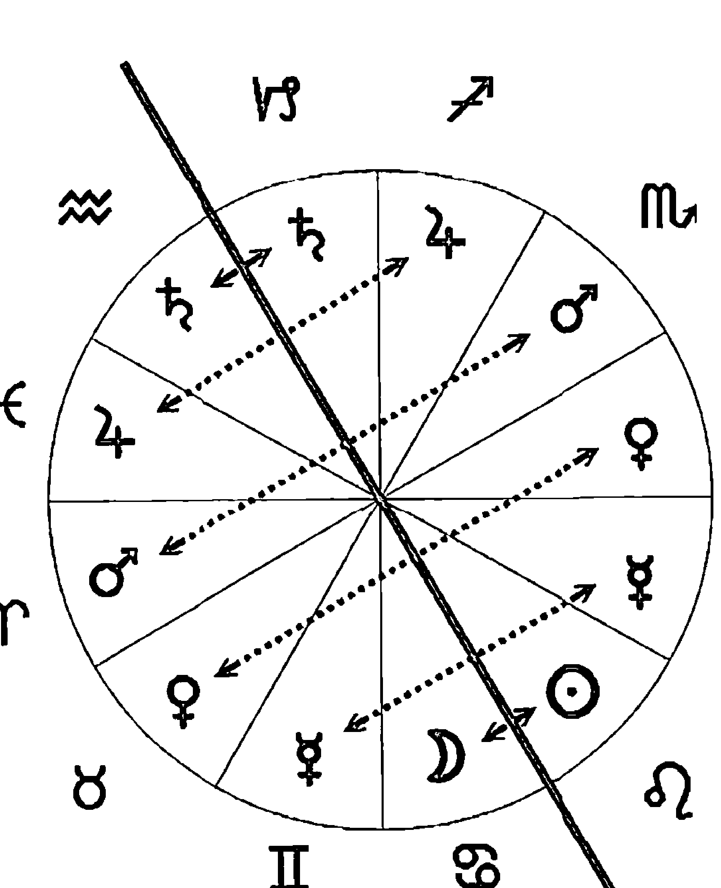

由第三章當中的說明我們可以知道，太陽代表陽性的原則，因此只能守護陽性星座，而月亮是代表陰性的原則，也只能守護陰性星座，而其他五個行星雖然各自有其陰陽的屬性，但是都各自守護一個陽性星座與一個陰性星座，傳統上認為陽性星座是守護星白天的家，而陰性星座是守護星晚上的家。在圖中我們可以看到由太陽守護獅子座、月亮守護巨蟹座，在兩個星座之間有一條軸線，兩側的守護行星依照天階體系的順序由近而遠排列，並且左右互相對稱。

但是現代的天王星、海王星、冥王星陸續被發現之後，就不斷有人想要找尋他們所守護的星座到底是在什麼位置，經過了長久的研究與比對，終於得出了天王星守護水瓶座、海王星守護雙魚座、冥王星守護天蠍座的說法，稱之為現代守護關係；不過還是有很多占星家認為傳統的守護關係仍然有其重要性，因此比較折衷的說法是由傳統行星與現代行星共同守護這三個星座。

## 第二節 日、月、水星守護的星座特質

### 太陽守護獅子座

首先來看太陽與獅子座特質的相似之處；太陽是放出光與熱的生命之源，獅子座也具有發光發熱的習性，太陽是太陽系最大的發光體，所有的行星都圍繞著它運轉，同時獅子座也有自我中心的傾向，希望能站在重要的位置讓別人來配合他；太陽具有強烈的領導力和影響力，而獅子座也被認為是最具領導力的星座，可以對他人發揮很大的影響力，最後在生活領域上太陽主導了我們的戀愛生活，而獅子座也是非常喜歡談戀愛的星座，總是充份表現出熱情。

當太陽進入到獅子座，正值一年當中最熱的時節，讓太陽可以完全發揮出它的熱力，太陽在獅子座的人充滿能量，具有強烈的自信心和意志力，正好都是太陽最核心的特質，他們對生活總是抱持著光明正向的態度，正好可以對應到太陽光明的本質；太陽在獅子座的人很重視獨立自主，不喜歡受制於人，正好可以讓太陽發揮出本身自發主動的特性，最後太陽在獅子座的人很愛表現，希望成為眾人的焦點，不喜歡被別人忽略，更可以讓太陽充份地發光發熱。

### 月亮守護巨蟹座

接著讓我們來看月亮與巨蟹座的相似之處；就像月亮有陰晴圓缺的變化，巨蟹座在不同的心情時也會有不同的行為模式，展現出不同的面貌，月亮帶有照顧保護的特質，同時巨蟹座也非常有同情心，會去照顧那些真正有需要的人；月亮代表習慣與安全感，正好對應到巨蟹座念舊與緊抓不捨的特質，越是熟悉的东西越能帶給他們安全感，最後在生活領域上月亮與我們的家庭生活息息相關，而巨蟹座也被認為是最戀家的星座，同時也很願意為家庭成員付出。

當月亮進入到巨蟹座，能讓一個人的情緒自然地表現出來，開心就真誠地大笑，感動就盡情地大哭，雖然有時候會讓人覺得比較情緒化，但是也能讓月亮變化的特質充份展現出來，月亮在巨蟹座的人很會照顧別人，讓月亮有關照顧保護的特質能充份發揮；月亮在巨蟹座的人與家庭的關係特別緊密，受到家族的影響很大，正好與月亮陰柔的特質相互呼應，最後月亮在巨蟹座的人對於他人的情緒特別能感同身受，也讓月亮敏感與接受性的特質能發揮出來。

獅子座與巨蟹座正好是相臨的位置，其特性本來就有很大的不同，再加上守護星分別是太陽及月亮，分別呈現出強烈的陽性特質與陰性特質，一般人會認為它們之間沒有什麼關係，但是就像希臘神話當中太陽神阿波羅與月神亞提米絲是很緊密的雙胞胎，太陽與月亮本身的特質也是相對而互補，一個非常獨立自主而積極，另一個則是被動地配合，若是我們由這個角度來觀察，就會發現獅子座與巨蟹座其實是一陰一陽的互補關係，也有一種內在的關聯性。

### 水星守護雙子座與處女座

水星守護的陽性星座是雙子座，傳統上認為雙子座是水星白天的家，由於是陽性星座的關係，雙子座往往與水星比較外放陽剛的一面有關。雙子座對於資訊有強烈的渴望，會廣泛地收集反種不同的訊息，同時也很喜歡與別人分享訊息、交流情報，這些都與水星代表溝通的特質有關，雙子座的人多才多藝很會臨機應變，也與水星靈活多變的力量相呼應，在生活領域上水星與思考及學習有關，因此雙子座的人口才很好，不論什麼事情都能說出一番大道理。

當水星進入雙子座，就能充份展現出其靈活多變的特質，水星在雙子座的人很愛學習，不論什麼樣的事情都想要嘗試看看，讓水星的學習性可以充份發揮，同時水星在雙子座的人學習東西也特別快，只要他們想學的東西通常很快就可以上手，不過他們經常淺嚐即止並沒有太深入研究，這也是展現了水星多變的特質，最後水星在雙子座的人大都很喜歡旅行，即使無法實際到當地玩玩還是很喜歡研究許多旅遊資訊，這也與水星所主管的生活領域相互呼應。

水星守護的陰性星座是處女座，傳統上認為處女座是水星晚上的家，由於是陰性星座的關係，處女座往往與水星比較內向陰柔的一面有關。處女座十分務實理性，不論什麼事情都要分析得清清楚楚，不容許有模糊不清的灰色地帶，這與水星概念化及分辨的特質有關，處女座想得多，同時很重視邏輯與推理，這也與水星理性的力量相呼應，處女座的人好學不倦，不但願意花時間學習各種實用的技術，也很重視自我的反省，這些都與水星的學習性有關。

當水星進入處女座，就有機會發揮其理性與分析的特質，水星在處女座的人特別的細心，對於資訊的分析及判讀特別有天份，能夠找出矛盾與不合理之處，充份發揮出水星區辨的能力，水星在處女座的人在學習時重視邏輯架構，要循序漸進才能把東西學好，也是與水星重視邏輯的特性相呼應，最後水星的生活領域也包括了溝通，水星在處女座的人在表達方面特別小心謹慎，用字遣詞都十分精準，也會仔細聆聽對方的意思，很少與別人在溝通上發生誤會。

不過由於都是水星守護的關係，雙子座與處女座還是有不少共通的特質，兩個星座的人都很重視理性，較少情緒化的表現，也都很認真好學，會花很多時間自我充實，同時他們也都有靈活的特性，不會輕易被卡在僵局當中；只是雙子座為陽性星座，發揮的是比較偏向水星外向的性質，重視資訊的交流與喜歡旅行，而處女座為陰性星座，發揮的則是偏向水星內向的特質，重視邏輯分析與思考反省，其實這兩個星座之間的關係不錯，也有一種內在的關聯性。

## 第三節 金星、火星守護的星座特質

### 金星守護金牛座與天秤座

金星守護的陰性星座是金牛座，傳統上認為金牛座是金星晚上的家，由於是陰性星座的關係，金牛座往往與金星比較內向陰柔的一面有關。金牛座的人抱持著和平主義，不輕易與別人發生衝突，這與金星重視和諧的特質有關，金牛座的人對於美的事物特別有鑑賞力，同時非常重視物質及感官的享受，這也與金星所代表的愛與美相互呼應，在生活領域上金星與一個人對金錢的處理方式有關，金牛座常被認為是最愛錢的星座，同時也會很努力賺錢和存錢。

當金星進入金牛座，使得金星追求舒適與被動的特質完全發揮出來，金星在金牛座的人在社交上比較被動，習慣與大家都保持安全距離，這反應出金星偏向慵懶的屬性，金星在金牛座的人追求穩定和諧的婚姻關係，與金星重視和諧的特質有關，金星在金牛座的人在處理金錢上比較保守，但是又很重視穩定成長的作法，也與金星要求穩定的需求相呼應，同時金星在金牛座的人非常重視生活享受，盡量讓自己過舒適的生活，也與金星重視享受的特質有關。

金星守護的陽性星座是天秤座，傳統上認為天秤座是金星白天的家，由於是陽性星座的關係，天秤座往往與金星比較外放陽剛的一面有關。天秤座的人重視穿著打扮，希望能帶給別人良好的形象，這與金星重視外貌的特質有關，天秤座的人很擅長協調折衝化解紛爭，也呼應到金星重視和諧的特質，天秤座很多事情都要找人一起做也反映出金星重視合作的特質；最後在生活領域上金星與社交生活有關，天秤座也非常重視社交，喜歡到處參加聚會交朋友。

當金星進入天秤座，使得金星追求合作與互惠的特質完全發揮出來，金星在天秤座的人很喜歡交朋友，有什麼事情也會找別人合作，展現出金星創造雙贏的能力，金星在天秤座的人追求平等互惠的婚姻關係，也反映出金星重視公平的價值觀，金星在天秤座的人會花錢買享受，並且對於美的事物特別沒有抵抗力，也顯現出金星愛美的天性，同時金星在天秤座的人會花很多時間、精力與金錢來經營社交生活，讓金星橫向聯結創造和諧的特性充份發揮出來。

不過由於都是金星守護的關係，金牛座與天秤座還是有不少共通的特質，兩個星座的人都喜歡美的事物，重視生活享受，也會創造與別人穩定和諧的關係，並且很重視婚姻生活的價值；只是金牛座為陰性星座，發揮的比較偏向金星內向的特質，因此在行為上比較被動並喜歡舒適的生活，而天秤座為陽性星座，發揮的比較偏向金星外向的特質，因此會積極地經營人際關係並且更重視外貌及打扮，其實這兩個星座之間的關係不錯，也有一種內在的關聯性。

### 火星守護白羊座與天蠍座

火星守護的陽性星座是白羊座，傳統上認為白羊座是火星白天的家，由於是陽性星座的關係，白羊座往往與火星比較外放陽剛的一面有關。白羊座的人活力充沛，不論做什麼事情都很有行動力，與火星積極主動的特質有關，白羊座的人遇到挑戰會主動迎上前去，甚至只為了爭一口氣與別人槓上，都反映出火星競爭與衝突的特質，白羊座的人做事情總是獨來獨往，而且通常性子都很急，會很快速地朝向目標前進，這些都與火星果決、獨立的特性相呼應。

當火星進入白羊座，會讓火星積極主動的特質完全發揮出來，火星在白羊座的人很有競爭性，會努力想要贏過別人，做事情經常都是衝第一，讓火星的活力完全展現出來，火星在白羊座的人遇到衝突時會先發制人，聲勢在一開始就完全蓋過對方，經常可以一擊就得手，也呼應到火星快速、好勝的特質；火星在白羊座的人在工作上比較沒有耐性，他們比較喜歡一個人獨立作業，深怕其他人拖累了他們的進度，這部分也展現了火星比較獨立而自私的一面。

火星守護的陰性星座是天蠍座，傳統上認為天蠍座是火星晚上的家，由於是陰性星座的關係，天蠍座往往與火星比較內向陰柔的一面有關。天蠍座的人對於自己重視的事情充滿熱情，他們不做就算了，要做一定要做到最好，這與火星好勝的特質有關，天蠍座的人充滿了危機意識，做任何事情都小心翼翼，同時會不斷地自我精進，可以看到火星的競爭性，他們在遇到困難挑戰時會不屈不撓地奮鬥，越大的困難越會激起他們的鬥志，則是呼應火星的勇氣。

當火星進入天蠍座，會讓火星追求生存的潛能發揮出來，火星在天蠍座的人有堅強的意志力，他們會不斷地自我超越、精益求精，讓火星的競爭性完全展現出來，火星在天蠍座的人遇到衝突時會先衡量時勢，絕不打沒有把握的仗，一旦出擊只許成功不許失敗，也呼應到火星善於危機處理的特質；火星在天蠍座的人在工作上很有謀略，同時對於自己的工作十分忠誠，他們做事情非常專注，他們也會在專業能力上學習精進，展現出火星戰鬥力很強的一面。

不過由於都是火星守護的關係，白羊座與天蠍座還是有不少共通的特質，兩個星座的人都有強烈的好勝心，也很有行動力及勇氣，可以處理各種別人無法處理的疑難雜症，突破各種問題與困境，只是白羊座為陽性星座，發揮的比較偏向火星外向的特質，因此遇到事情會衝第一也比較沒耐性，而天蠍座為陰性星座，發揮的比較偏向火星內向的特質，強項在於危機處理，從內在發揮出更多意志力，其實這兩個星座之間的關係不錯，也有一種內在的關聯性。

## 第四節 木星、土星守護的星座特質

### 木星守護的陽性星座是射手座

木星守護的陽性星座是射手座，傳統上認為射手座是木星白天的家，由於是陽性星座的關係，射手座往往與木星比較外放陽剛的一面有關。射手座的人很愛冒險，越是困難的事情越是想去嘗試，表現出天不怕地不怕的樣子，這個部分與木星擴展的特性有關，射手座的人生性樂觀，不論再困難的環境之下都不放棄希望，反映出木星積極正向的特質，射手座的人很愛好自由，不喜歡被別人限制住，也很喜歡旅行，這些都與木星膨脹與成長的特質相呼應。

當木星進入射手座，完全能發揮出木星冒險進取的特質，木星在射手座的人特別幸運，不論怎麼冒險大都能夠全身而退，因此也會讓他們的膽子一次比一次大，讓木星膨脹的特性得以充份發揮，木星在射手座的人對於自己的宗教與信念堅信不移，並且會去影響身邊的人，這正好與木星所代表的生活領域相互呼應；木星在射手座的人雖然本身沒什麼空主動去幫助別人，但是對於別人的各種行為有很大的包容度，這個部分也與木星所代表的道德修養有關。

### 木星守護的陰性星座是雙魚座

木星守護的陰性星座是雙魚座，傳統上認為雙魚座是木星晚上的家，由於是陰性星座的關係，雙魚座往往與木星比較內向陰柔的一面有關。雙魚座的人很寬宏大量，不論遭遇到任何奇怪的待遇總能為對方找出合理的解釋，這個部分與木星的擴展特質有關，雙魚座的人很願意幫助別人，甚至自己受到一些委曲也沒關係，反映出木星貴人的特性，雙魚座的人比較大而化之，不願意與別人斤斤計較，同時很重視內心當中的靈性成長，與木星主管的宗教呼應。

當木星進入雙魚座，比較能夠發揮出木星慈悲與助人的一面，木星在雙魚座的人一切隨緣，並不會去強求任何東西，反而願意去幫助其他有需要的人，讓木星較為陰柔的層面得以發揮，木星在雙魚座的人對於各種宗教與信念都能包容，不會有強烈的分別心及批判性，這也與木星主管的道德修養有關；木星在雙魚座的人重視宗教生活與心靈成長，他們很容易將重點放在自己的內心，同時幫助別人經常有很豐盛的回報，讓木星的善心、善行能夠擴展出去。

不過由於都是木星守護的關係，射手座與雙魚座還是有不少共通的特質，兩個星座的人都很大而化之、不拘小節，同時也很愛好自由不喜歡被限制，同時都很重視學習和成長，只是射手座為陽性星座，發揮的比較偏向木星外向的特質，因此會喜歡旅行和冒險，不斷地向外追尋和探索，而雙魚座為陰性星座，發揮的比較偏向木星內向的特質，因此會從內心的修養下手，重視靈性成長並樂於助人，其實這兩個星座之間的關係不錯，也有一種內在的關聯性。

### 土星守護魔羯座與水瓶座

土星守護的陰性星座是魔羯座，傳統上認為魔羯座是土星晚上的家，由於是陰性星座的關係，魔羯座往往與土星比較內向陰柔的一面有關。魔羯座的人很有責任感，只要答應的事情一定負責到底，這個部分與土星主管的責任感有關，魔羯座的人講究紀律、尊重傳統，也與土星收縮與限制的力量相呼應，魔羯座的人會從經驗當中學習，並且很重視自我反省，與土星務實的特質相符合，魔羯座比較缺乏自信並且經常會給自己壓力也與土星悲觀的特質有關。

當土星進入魔羯座，能夠發揮出土星原本願意承擔的特質，土星在魔羯座的人非常有責任感，同時也非常有耐性，不論遇到再大的問題都會努力撐住，並且很務實地尋找解決方案，完全就是土星負責任的表現；他們很重視秩序、追求效率，在做所有事情之前會習慣於先做計劃，讓土星代表的規則能夠完全顯現，基本上土星在魔羯座的人也比较傾向順從，他們會努力去完成計劃中的事情，較少去質疑為何會有這樣的計劃和規定，與土星壓抑的性質相符。

土星守護的陽性星座是水瓶座，傳統上認為水瓶座是土星白天的家，由於是陽性星座的關係，水瓶座往往與土星比較外放陽剛的一面有關。水瓶座的人很講義氣，只要是朋友的事情一定義不容辭力挺到底，這個部分與土星主管的責任感有關，水瓶座的人重視社會正義與環境保護等議題，覺得自己不能獨善其身，也與土星代表的業力法則相呼應，水瓶座的人很超然客觀，可以從集體的角度來看事情，而不涉入個人情感，這與土星代表的規則與限制有關。

當土星進入水瓶座，則是傾向讓土星去承擔集體的責任，土星在水瓶座的人很難獨善其身，他們總是會以社會及群體的需求為先，很少突顯自己的需要，反而是想要改造社會，反映出土星重視群體與規則的特質，土星在水瓶座的人容易有自我壓抑的傾向，他們可能會過度忍耐，而讓自己受了委曲，這個部分反映出土星收縮與限制的特質；土星在水瓶座的人很重視平等，對於仗勢欺人或多數暴力的狀況特別無法忍受，這個部分也與土星穩定的特質相呼應。

不過由於都是土星守護的關係，魔羯座與水瓶座還是有不少共通的特質，兩個星座的人很有責任感、很有耐心性，並且會從務實的角度去考慮事情，只是魔羯座為陰性星座，發揮的比較偏向土星內向的特質，因此比較多是重視自己的責任，努力把自己的事情做好，而水瓶座為陽性星座，發揮的比較偏向土星外向的特質，因此比較重視外在的責任，希望整個社會一起進步，讓大家都變得更好，其實這兩個星座之間的關係不錯，也有一種內在的關聯性。

## 第五節 天王星、海王星、冥王星守護的星座特質

### 天王星守護水瓶座

天王星被發現不久，占星學家就確定了它守護水瓶座的關係，由於是與土星共管，所以出現了很有趣的矛盾性，土星是最傳統保守的星，而天王星是最不按牌理出牌的星，就像家裡有一個很嚴肅的媽媽和一個愛開玩笑的爸爸，會讓家中產生很大的衝擊；從天王星來看水瓶座的特質，會發現水瓶座的人也有很多靈感和創意，這與天王星突破傳統的力量相呼應，另一方面水瓶座的人也會喜歡最尖端的科技和最進步的技術，這也與天王星改革創新的特質有關。

當天王星進入水瓶座（一九九五到二〇〇二），正值電腦與網際網路興起，雖然在之前這些科技已經被發明出來，但直到這段時間才開始走向普及化，電腦與網路進入到家庭與學校，不再是國家、大型企業與研究機構才能運用的技術，由於天王星與水瓶座都有一種追求平等的特質，因此有助於新科技的擴散；在這段期間出生的人具有原創性與獨立性，也可能會引發革命性的風潮，他們不但會尋求個人的自由，也會積極改革讓所有人都享有自由的生活。

### 海王星守護雙魚座

海王星發現之後，花了比較多的時間才確定守護雙魚座的關係，依照現代占星的說法雙魚座是由木星及海王星共管，不過這兩顆星的特質十分相近，因此在星座特質上並沒有矛盾之處；從海王星來看雙魚座的特質，會發現雙魚座的人有比較多幻想，甚至還有過度理想化的可能性，這與海王星模模糊朦的特質相符合，另一方面雙魚座有時候也容易出現逃避與自我欺騙的傾向，這與海王星混亂的作用有關，雙魚座同理心也可視為海王星融合特質的表現。

當海王星進入雙魚座（二〇一一到二〇二六），則是心靈主義要復興的年代，人們相信心靈的力量，追求心靈的成長，靈修與通靈成為普遍平常的現象，各種的能量療法、另類療法也會進入主流社會，但是在當中也可能有不當利用的醜聞與欺騙；在這段時間出生的人天生具有強烈的慈悲心，無法忍受欺壓弱勢者的行為，與海王星的理想性相呼應，他們對於人我之間的界線比較模糊，對於靈魂及精微的能量場特別敏感，也與海王星融合的特質有關。

### 冥王星守護天蠍座

冥王星發現之後，一度有人認為該是守護白羊座，但是經過幾十年的驗證，現在大多數占星家都已經同意冥王星守護的是天蠍座，依照現代占星的看法天蠍座是由火星與冥王星共管，因此也有人將冥王星視為更高層次的火星；從冥王星來看天蠍座的特質，會發現天蠍座具有一種化腐朽為神奇的能力，看似沒有希望的事情交到他們手上往往又能重獲新生，與冥王星死亡與再生的力量呼應，天蠍座比較低調甚至隱藏的行事風格也與冥王星隔絕的特質符合。

當冥王星進入天蠍座（一九八三到一九九五），正好是各種禁忌被突破的年代，愛滋病被廣為人知，同時也讓性教育與同性戀問題躍上主流媒體，不再是不能說的秘密，基因改造的研究在此時獲得重大的突破，讓人類打開遺傳與生殖的黑盒子，種族隔離政策也在此時被改革而成為絕響；在這段時間出生的人不再害怕死亡，對於人生具有深刻的洞察力，能夠體會冥王星死亡與再生的能量，他們也不接受社會強加在他們身上的限制，帶有冥王星破壞的力量。

究竟是天王星、海王星、冥王星出現之後讓這三個星座的特質有所改變，或是這三個星座的特質原本就是這樣，反而是這三個現代行星因為守護關係才會賦予這樣的意義，這有點像是雞生蛋、蛋生雞的問題，到目前為止還沒有定論；但是就現代占星學的觀點來看，三個現代行星的特質確實與它們所守護的星座有關，彼此之間也可以做出有意義的解釋，並且能夠看到明顯的影響，因此不論他們的來源與先後順序為何，我們還是可以從中得到有益的啟示。

## 第六節 行星與星座的特殊關係

在托勒密的時代，就已經流傳了許多種觀察行星能量強弱的指標，有依照火、土、風、水來區分的方式，有依十度區間（decan）來區分的方式，也有依六度區間（lem）來區分的方式，不過在現代占星當中最常用到的仍然只有守護位置、失勢位置、強勢位置、弱勢位置這四組關係。

在占星學上來說，守護位置是回到自己家裡，最容易發揮出本身的特質，而在守護位置的對面就被算是進入失勢位置，是最無法發揮出本身特質的地方；以傳統的七個行星來看，當太陽進入水瓶座、月亮進入魔羯座、水星進入射手座及雙魚座、金星進入白羊座及天蠍座、火星進入金牛座與天秤座、木星進入雙子座與處女座、土星進入巨蟹座及獅子座，都較難充份發揮其本身的特質。而以現代行星來看，天王星進入獅子座、海王星進入處女座及冥王星進入金牛座，也不容易發揮其本身的特質。

強勢位置的說法由來已久，早在托勒密的時代就已經整理出行星強弱位置的分析，在開始的時候每個行星會有一個特別強的位置及度數，特別能發揮出其正向的特質，分別是太陽在白羊座十九度、月亮在金牛座三度、水星在處女座十五度、金星在雙魚座二十七度、火星在魔羯座二十八度、木星在巨蟹座十五度、土星在天秤座二十一度，甚至南北交點也有其強勢度數並且相隔一百八十度遙遙相對，北交點的強勢位置在雙子座三度、南交點的強勢位置在射手座三度。

不過依照現代占星的看法，是將整個星座都視為強勢位置，那麼水星在處女座既是守護位置又同時是強勢位置，似乎並不是很合理，因此後來又幫水星找到另一個強勢位置設定在水瓶座，這樣就不會有守護位置與強勢位置重疊的問題，其他星座的強勢位置則與傳統占星的位置相同，因此你會看到一些書上提到水星在強勢位置在處女座，另一些書上又說水星的強勢位置是在水瓶座，這只是古典占星與現代占星的觀點不同，千萬不要被搞混了。

至於現代新發現的行星部分，大部分占星家都同意天王星的強勢位置是在天蠍座，不過就海王星與冥王星的強勢位置則還沒有共識。

若是以現代占星的用法，強勢位置的對面則是弱勢位置，在這個地方行星最容易發揮其負面特質；以傳統的七個行星來看，太陽進入天秤座、月亮進入天蠍座、水星進入獅子座、金星進入處女座、火星進入巨蟹座、木星進入魔羯座、土星進入白羊座，都比較容易發揮其負面特質。以現代行星來說，只有天王星進入金牛座是弱勢位置的說法比較普遍被認同，海王星與冥王星的弱勢位置還沒有共識。

### 《行星強弱位置關係表》

| 行星 | 守護位置 | 失勢位置 | 古典占星強勢位置 | 現代占星強勢位置 | 弱勢位置 |
|---|---|---|---|---|---|
| 太陽 | 獅子座 | 水瓶座 | 白羊座19度 | 白羊座 | 天秤座 |
| 月亮 | 巨蟹座 | 魔羯座 | 金牛座3度 | 金牛座 | 天蠍座 |
| 水星 | 雙子座、處女座 | 射手座、雙魚座 | 處女座15度 | 水瓶座 | 獅子座 |
| 金星 | 金牛座、天秤座 | 天蠍座、白羊座 | 雙魚座27度 | 雙魚座 | 處女座 |
| 火星 | 白羊座、天蠍座 | 天秤座、金牛座 | 魔羯座28度 | 魔羯座 | 巨蟹座 |
| 木星 | 射手座、雙魚座 | 雙子座、處女座 | 巨蟹座15度 | 巨蟹座 | 魔羯座 |
| 土星 | 魔羯座、水瓶座 | 巨蟹座、獅子座 | 天秤座21度 | 天秤座 | 白羊座 |
| 天王星 | 水瓶座 | 獅子座 | 無 | 天蠍座 | 金牛座 |
| 海王星 | 雙魚座 | 處女座 | 無 | 無 | 無 |
| 冥王星 | 天蠍座 | 金牛座 | 無 | 無 | 無 |

# 第七章 個人占星學的基本概念

## 第一節 出生時間的重要象徵

個人占星的計算是以出生星盤（Natal Chart）為基礎而發展出來的一門學問，因此出生時間在個人占星學上就有不可取代的重要性，雖然很多人喜歡說出生星盤代表一個人的本質，但是依照西方神秘學的傳統，出生星盤並非人的本質，而是受到很多影響之後形成的一個象徵；形成人的本質有兩個來源，一個是人的血緣，另一個是人的靈魂，每個人的肉身都是來自父母親的遺傳，若沒有父母精卵結合，就不可能出生成一個人，但若光有肉體也不可能成為一個人，還要有靈魂的作用才行。

來地球投身的靈魂不論之前是否有前世輪迴，都是由守護天使（Guardian Angels）帶領，由星靈層（Astral Plane；或譯為靈界）下降，通過乙太層（Etheric Plane）之後選擇特定的時代與地區投胎；特定的父母會吸引到特定的小孩，通常男孩是受到母親的靈魂吸引，女孩則是受到父親的靈魂吸引，當父母的精卵結合之後，這個受到吸引的靈魂便開始與受精卵互動，並在孕程及出生後分批進入到胎兒當中；人工的受孕方式之所以會失敗，大部分都是因為沒有吸引到適當的靈魂。

當孕程到達尾聲，胎兒的靈魂會發動產程，母親也會開始進入陣痛與分娩的階段，這個過程從幾分鐘到幾天都有可能，至於父母選擇時間剖腹生產的胎兒，則會缺乏這個過程，但是這個時候星象的力量主要是作用在母體上，還未直接影響到胎兒；當胎兒生出母體，通常還有臍帶與母體相連，此時母親與小孩的氣場仍然合一，直到孩子開始獨立呼吸（通常伴隨著哭聲），才會開始形成獨立的氣場，占星上以孩子出生吸入第一口氣的時間算是出生時間，也就是以這個時間點為準。

出生當時的星象，會在孩子的靈魂中留下印記，並且會透過氣場影響到肉體，因此不論這個人是自然生產或是剖腹生產，出生星盤都會有相同的作用力，雖然小孩的靈魂是否有主動發動產程，以及出生的過程是否有子宮的壓力推擠通過陰道，對於小孩的靈魂都會有不同的影響，但是這兩個因素的影響都無法透過出生星盤看出來，所以在研究個人星盤時不需要去考慮這個人是自然生產或是剖腹生產，只要是準確的出生時間（開始獨立呼吸）即可。

很多人常比喻出生星盤是人生的藍圖（blueprint），意指人是依照以出生星盤的計劃去經歷一生中所有的事件，但是丹尼爾更喜歡將出生星盤比喻為人生的旅遊指南；了解自己的出生星盤，並不等於經歷了自己的一生，就像你看過旅遊書和實際到此一遊的感覺是全然不同的，旅遊指南可以提供你更多有關旅遊的資訊，讓你在旅行的過程當中不致於迷失方向，避免錯過一些精采有趣景點，不過再生動詳盡的旅遊指南，也無法取代你親臨現場的體會；同樣地，如果你你有足夠的好奇心去冒險，也可能發現許多旅遊指南沒有的私人景點。

雙胞胎是個有趣的議題，儘管有各種方式去區別雙胞胎的星盤，但是很多雙胞胎都接連在一個小時之內出生，若是以剖腹方式生產，有些雙胞胎的出生時間甚至差不到十分鐘，這樣微小的差距，在星盤上幾乎可以說是共盤。面對共盤而活出不同人生的質疑，其實並不需要找太多方法硬去解釋，因為我們知道兩個人雖然有相同的基因庫（同卵雙生還有完全相同的基因），共同出生時間及星盤，但是兩個人是由兩個不同的靈魂在做主，若是人生有不同的選擇，就不可能過完全相同的人生，即使人生的軌跡相似，也會有不同的體會。

## 第二節 出生圖的基本架構

出生時的天象分布在三度空間的宇宙當中，相關的變項也非常多，占星家為了解釋方便，只好從當中取出最重要的幾個項目，希望能以最精簡的方式來表達天象的狀況；西方占星學著重於行星的位置，而行星的運動大都在黃道附近，因此占星家就將行星運行的位置都投影到黃道的刻度上，這樣就能在二度空間的平面上簡單描述出行星的位置了！

不論在地球上的哪一個位置觀察，只要是同一時間，行星都會落在黃道相同的刻度上，行星在黃道上的刻度可以說是行星相對於地球的位置，因此只要是同年同月同日同時出生的人，不論在地球上的哪個地方出生，他們行星所落入的星座位置是完全相同的；行星落入不同星座就會展現出不同的特質，出生時太陽落入的星座我們就稱之為太陽星座，月亮所落入的星座就稱為月亮星座。

為了區別不同地點所看到的不同天象，占星家又把地平線的概念引入，在地平線以上的部分是可見到的天空,而在地平線以下的是看不到的部分;占星家把東方正在升起的黃道度數稱為上升點(Ascendant),而把在西方正在落下的度數稱為下降點(Descendant),由於黃道與地平線在天球上都是大圓,因此兩個交點會正好在一百八十度的地方。也就是說在地球上來看,有一半的黃道位置是在天空中可見的,而另外一半則是隱藏在地下不可見的。另外一個重要的軸線則是子午線,是在天球當中通過正南正北的另一個大圓,子午線與黃道也有一兩個交點，在天空中的會是黃道在天空中的最高點，占星當中稱之為天頂（Medium Coeli），由於在北半球天頂會位於正南方的天空當中，因此也常被稱南中天，但是若是我們在南半球觀察，天頂則會位於正北方的天空當中，而在地底下交會的是黃道在天空中的最低點，占星學當中稱之為天底（Imum Coeli）。上升、下降、天頂、天底在占星學上被稱為基本點，也有人翻譯為四角。

最早占星家依照行星與所在地的相對位置分為四個象限，在上升與天底之間的稱為第一象限，在天底到下降之間的稱為第二象限，下降到天頂之間的稱為第三象限，天頂到上升之間的稱為第四象限，這種象限的區分方式到現在仍有不少占星家採用；不過相對來說更多占星家是把行星與所在地的相對位置區分為十二個宮位，通常都是由上升點為起點逆時針方向起算，也有人認為這是模仿天上的十二星座而來；使用了基本點與宮位之後，就能區分出相同時間但不同地點的出生星盤了。

而行星與行星彼此之間的關係，在占星學上則是以相位這個變項來描述，現代占星是以間隔的角度來區分相位的種類，依照相位的重要性區分為主要相位、次要相位及少見相位；若是只要看最重要的事情只要看主要相位即可，但若是要進行比較細部的分析，可以再參考次要相位，少見相位則是比較特殊的占星技巧才會用到。

| 相位 |  |  |  |
| --- | --- | --- | --- |
| 角度 | 主要相位 | 次要相位 | 少見相位 |
| 0° |  | 150° | 40° |
| 60° |  | 30° | 72° |
| 90° |  | 45° | 144° |
| 120° |  | 135° |  |
| 180° |  |  |  |

> 《相位角度表》

基本上出生星盤的分析是以行星為主角，依其所落入的星座、宮位及彼此之間的相位做出解釋，不過由於可以談的東西太多，我們先介紹到這裡。

## 第三節 占星學的推運方法

相對於東方命理師經常喜歡鐵口直斷一些事件，在現代占星當中似乎很少有人這樣做，因此就有人質疑現代占星不如東方命理來得準；其實依照命理的推演我們能算出來的是運勢；占星可以看出你何時會有一種內在的趨動力想要去做一件事，以及外在環境在此時提供給你什麼樣的條件去進行，至於做與不做還是要看你自己的決定，當社會越開放，人的自主意識及自由意志被提升，就越有可能做出與命理預測不同的行為，導致發生不同的事件。

但是從另一個角度來看，運勢雖然不等於事件，但是仍然有可能去推論事件，因為大部分的人仍然是依照內在原始的衝動行為，或是單純地回應外在的狀況隨波逐流，並沒有自覺地運用自由意志去做決定，因此行為就容易落入被預測到的模式之中，做出預料之內的決定，再加上人的決定很容易受到之前的決定所影響，若是一路以來都按照原來的習性作決定，自然就有可能依照運勢去推論出事件發生的狀況。

有人說有在修行的人命算不準，就丹尼爾的經驗來說並不是如此，修行人有其與生俱來的天份與條件，也有內在的衝動與外在的環境，與一般人並無不同；但若是一個人真的修到開悟成次限法與太陽弧度法的星盤太陽會在同一位置。

道，倒是有可能完全算不準，因為他雖然還有肉身，但是靈魂已經升華到另一個境界，完全不受習性與環境控制，做出來的選擇與能成就的事情就有可能不同，但若是一「還在修行中的人」，那麼基本上還是很容易符合命理的軌跡。

現代西方占星學當中使用的推運方法，照計算的方式可分為三大類：

第一類推運計算方法概括稱為推進法（Progression），是以某個固定的比例讓出生圖上的星象移動來觀察運勢的變化；古典占星家很常用的主限法（Primary Direction）是以出生後基本點移動一度的時間（大約四分鐘）來推算一年的運勢，這種方式的計算十分複雜，長期以來使用的占星家也較少，國內的著名的占星家楊國正老師甚至為此寫了一套專用的電腦軟體——主限之星（primarystar）來推廣主限法的使用，計算的精確程度與客制化選項在國際間享有盛名。

現代占星家比較偏好的次限法（secondary progression）也稱為一日一年法，是以出生之後一天的星象變化來推算一年的運勢，因此如果想要知道自己二十歲的運勢，只要翻開出生後二十天的行星曆即可；近年來在美國很流行的太陽弧度法（Solar Arc）則可視為一日一年法的變形，它是以出生之後一天太陽所走的黃經弧度為基準，讓所有星盤上的行星和基本點同步前進，因此太陽弧度法當中的太陽位置與一日一年法當中的太陽位置會完全相同。

內層圖為出生圖，外層圖為運行星。

第二類推運計算方法概括稱為運行星法（Transit），是以當時外在實際運行的天象來對比於個人的出生圖，也有人稱為流年星法或是流運法，這是被使用最廣的推運方式；另一種回歸法（Returns）則是運行法的變形，以當中最常用的太陽回歸（Solar Return）為例，它是以每次太陽運行回到出生圖中太陽相同度數時的星盤，來看接下來一年的運勢，但是由於每年都要重新起盤而且計算比較複雜，使用者並不是很多，有了電腦計算之後採用者也大為增加。

第三種推運計算方法概括稱為大運法，也就是只以出生圖上的行星與宮位為標記，依照特定的時間表來看不同時期的運勢，由於計算方式十分簡便，不需要再計算另一個星盤，自希臘時代起即廣為運用，例如小限宮限法（Protection）即是以每年走一個宮位的方式來評估運勢；另一種法達星限（Firdaria）則是運用行星期間系統（Planetary Period System），依照行星排列的順序依次守護某一段時間，再以出生圖上行星的力量強弱來判斷該段時間的運勢。

法達星限的行星期間。

| | 太陽 | 金星 | 水星 | 月亮 | 土星 | 木星 | 火星 | 北交 | 南交 |
|---|---|---|---|---|---|---|---|---|---|
| 年份 | 10 | 8 | 13 | 9 | 11 | 12 | 7 | 3 | 2 |
| 歲數 | 0-10 | 10-18 | 18-31 | 31-40 | 40-51 | 51-63 | 63-70 | 70-73 | 73-75 |

| | 月亮 | 土星 | 木星 | 火星 | 北交 | 南交 | 太陽 | 金星 | 水星 |
|---|---|---|---|---|---|---|---|---|---|
| 年份 | 9 | 11 | 12 | 7 | 3 | 2 | 10 | 8 | 13 |
| 歲數 | 0-9 | 9-10 | 20-32 | 32-39 | 39-42 | 42-44 | 44-54 | 54-62 | 62-75 |

由於電腦計算十分方便快速，現在大部分的占星家都不會只使用一種方式來推運，而是會綜合兩三種不同的資訊來判斷；以丹尼爾來說是慣用一日一年法與運行星法相互配合，如果有需要才借助其他方法來補充。

## 第四節 由占星來看人際關係

一般人認為緣份是虛無縹緲的一個概念，兩個人究竟是屬於有緣？無緣？良緣？孽緣？遇到不同的人說法往往各不相同；以占星的概念來看，緣份的分析大概可以分成兩個大面向，其一是相處的類型與模式，有些人是比較適合當情人、有些人比較適合當朋友，有些人可以在金錢上互相幫助，但有些人只要遇到錢關係就立刻破裂，其二是生命軌跡的交集程度，有些人生命的交集時間很長，甚至會到一輩子，但是有些人彼此的交集就極為有限，也許只有幾個月的時間。

依照丹尼爾的經驗，相處的類型與模式有其核心與不可動搖的部分，但是仍然可能會向外延伸，舉例而言，若是有人與你是很好的朋友關係，友情維持了很多很多年以後，也可能會突然有一天想要與對方結婚，但是這類的關係核心仍然是友情，也就是說結婚之後仍然是以朋友關係的方式在相處；另一方面，關係交集的時間長也不一定是好事，有些人與你有一輩子的緣份，但是卻扮演了你生命中的小人，那麼你就可能會覺得十分痛苦，但是又一直擺脫不掉。

在現代占星當中，最主流的關係分析方法稱為比較圖法（synasty），也就是把兩個人的星盤都各自排出來之後，再與對方的星盤作比對，包括行星落入星座的相合程度，行星落入對方的宮位地點，以及彼此之間行星所成的相位等等；所以一般來說我們需要雙方的出生資料才能最完整地判斷兩個人的關係，不過就實務上經常會遇到個案並無法得到對方準確的出生時間，這個時候仍然可以看到大部分的狀況，但是就行星落入對方宮位的部分就無法看到。

另一種則稱之為組合圖法（composite），這種方法是把兩個人的星盤各自排出來之後，再把所有行星及基本點的位置都取中點，再畫出另一個盤來代表兩個人的關係，由於這種方法也可以處理三個人以上的關係分析，因此若是要看多人合夥或是家庭整體的氣氛，會比較簡明扼要一些，不過這個方法就必須要每個人都有精確的出生時間，若是有其中一個人的出生時間不準確，就可能會產生很大的誤差，所以若是出生時間不精確千萬不要輕易嘗試此法。

不過占星的關係論法主要著重於「今生」，純就占星的工具來看無法知道兩個人是不是前世相欠債，今生是誰要來還誰？也無法幫你找到所謂的靈魂伴侶或是雙生火焰，因為這靈魂伴侶和雙生火焰都是在投胎之前由靈魂的來源決定的，並不一定會反映在出生時間所影響的特質上，占星是很世俗化的工具，雖然可能幫助人解決某些心靈層面的困擾，但畢竟占星不是通靈，無法直接解答與靈學有關的問題，想要知道這方面的答案還是得靠靈學的老師，而非來找占星師。

比較圖法是將兩人的星盤互相比對。

組合圖法是將兩人的星盤重製為一個星盤來分析。

## 第五節 地區與方位的運用

在占星當中認為人在不同的國家地區也會產生不同的影響，也就是說與不同的地方會有不同的緣份，以傳統占星來看基本的方式有兩種，一是看遷移到某個地方對你的影響，這個部分被稱為重置星盤（relocation）或譯為換置星盤，也就是假設你出生時是在另一個地點出生，看看星盤的狀況會有什麼變化；不過就現代占星的研究及印證，有時有利或不利的位置不一定要人親自到那裡才會有影響，只要與當地的人接觸，就會產生有利或不利的作用。

例如有一個人重置星盤到日本很有利，他可能會交到很多日本來的朋友，學日文特別快，經常會到日本出差或是旅行；但若是重置星盤到日本有很不利的影響，那麼他可能就會遇到日本人就特別衰，甚至買日本製的東西就很容易有問題或是壞掉；現代有了電腦輔助計算之後，又發展出更方便的工具稱為星象製圖學（Astro*Carto*Graphy，簡稱ACG），可以在全球地圖上快速地標出對你有利的位置及不利的位置，若是對某個地點有興趣再用重置星盤深入研究。

另一種方法被稱為地平空間占星學（localspace），它是以出生地或是遷移之後的城市為基礎，看不同的方向或方位會產生何種影響，但是因為地球是圓的，方向線超出一定的距離之後會有彎曲的現象，因此比較適合來看近距離的影響；近年來也有歐美的占星家借用中國風水的概念，將地平空間所顯示出來的方位作為居家擺設之用，據傳也有不錯的效果。

星象製圖學的總圖。

地平空間占星學所標示出來方位會隨著地點而不同。

本命盤與重置星盤的比較，只有基本點與位宮位不同。

## 第六節 結語

雖然西方占星學有許多工具可以幫助我們趨吉避凶，但是我們也要認清占星學並不是拿來做逃避責任的藉口，在理論上預測會發生的事情，若是沒有當事人的決定踢這臨門一腳，到最後還是有可能什麼都沒發生，所以事情做與不做最後還是看我們自己的決定，終究我們每個人都要為自己的行為負責，不可能由任何其他人幫我們承擔業力，因此把責任推給星象或是環境都是不負責任的想法，對於我們自己也沒有任何好處。

就丹尼爾來說，占星是幫我們釐清事情可不可為（看本命），在可為的範圍之內選擇比較適當的時間來進行（看推運），這樣就能達到事半功倍效果；反之，在占星當中看來不可為的事情，經常都會讓人覺得事倍功半，甚至完全徒勞無功，就人類短短的數十載壽命來看，把力氣花在這些事情上似乎是不太划算的事情，同樣的若是選擇了不合適的時間來進行，即使本命當中看來可為，也會變得加倍困難，還不如先把力氣省起來，到運勢好的時候再來努力比較有效率。

有些人也許會擔心，聽從占星師的建議會限制了一個人發展的潛力，但是其實占星當中看到可為的事情還是非常多，多到大部分的人用盡一生的時間還是無法每一種都做完，就是因為現代社會的自由太多、選擇太多，才需要占星工具幫我們篩選出最適合的事情，指出最有效率的方式與方向，知道了自己適合走的路，才能集中全力把自己的潛力發揮出來，也不必去羨慕或嫉妒別人的成就，因為每個人都有不同的天賦與機運，能把握的就只有自己，和別人比較完全沒有意義。

如果能用很正向的角度來運用占星工具，可以幫我們在人生當中少走很多冤枉路，省下的時間更是無價；事實上丹尼爾看過許多先天好命的人，他們完全不靠任何的命理工具，就找到自己堅信的奮鬥目標，並且透過努力達到很好的成就，但是我們大部分的人一路走來總是跌跌撞撞，也常會陷入迷惑與沮喪之中，若是能運用占星的方式幫助自己找到方向，會比一直處於不確定的狀況下好很多，也會讓我們在遇到困難挫折的時候更堅定自己的信心。

# 參考書目

羽仁禮著，陳惠莉譯，2011《圖解西洋占星術》，新北市：楓書坊文化

長島晶裕/ORG著，黃萱惠譯，2005《星空中的神話》，台北：春光出版

陳恆，2000《巴比倫的智慧》，台北市：林鬱文化

Bobrick, Benson 2005 The Fated Sky. NY: Simon & Schuster Paperbacks.

Campion, Nicholas 1987 The Practical Astrologer. NY: Harry N. Abrams, Incorporated.

2004 The Book of World Horoscopes. Bournemouth: Wessex Astrologer Ltd.

2008 The Dawn of Astrology. London: Continuum Books.

2009 The Medieval and Modern Worlds. London: Continuum Books.

Hand, Robert 1981 Horoscope Symbols. PA: Schiffer Publishing, Ltd.

Holden, James Herschel 1996 A History of Horoscopic Astrology. AZ: American Federation of Astrologers, Inc.

Hone, Margaret E. 1995 The Modern Text-Book of Astrology, Revised Edition. Great Britain: Redwood Books.

Marshall, Peter 2004 World Astrology. London: Pan Macmillan Ltd.

Oken, Alan 1988 Alan Oken's Complete Astrology, Revised Edition. NY: Bantam Books.

Parker, Derek and Julia原著，徐淑真譯，1985《星象大觀》，台北市：好時年

Parker, Derek and Julia 2009 Parker's Encyclopedia of Astrology. London: Watkins Publishing.

# 附錄
占星學常見名詞中英文對照及解釋

Sakoian, Frances and Acker, Louis S. 原著, 李逸民譯, 1993 《占星玩家手冊》, 台北市: 方智出版社
Tamas, Richard 原著, 王又如譯, 1995 《西方心靈的激情》, 台北: 正中書局
Tester, Jim 1996 A History of Western Astrology. Suffolk: The Boydell Press.
Time-Life Books. editors. 1989 Cosmic Connections. NJ: Time-Life Books Inc.
Tompkins, Sue 原著, 胡因夢譯, 2009 《當代占星研究》, 台北市: 積木文化
Walker, Christopher (Editor) 1999 Astronomy before the Telescope. London: British Museum Press.

A 字部

acceleration 時距加速值》用來修正平太陽時與恆星時的差距, 在計算宮位及基本點時必須要用到。
affliction 受剋》星體處於不利的位置; 通常指與其他星體或基本點成對相或四分相, 有時也指星體落入對其不利的星座或宮位。
Agricultural Astrology 農業占星學》研究星象與農業活動的關係。
air signs 風象星座》包括雙子座、天秤座、水瓶座。
angles 基本點》指上升、下降、天頂和天底四個點。
angular houses 本位宮》包括第一、四、七、十宮。

angular planets ( angularity ) 合軸星》與基本點合相的行星，有時也指在一、四、七、十宮中的星。
applying aspect 入相位》兩行星正接近形成準確相位視角的位置。
Aquarian Age ( Age of Aquarius ) 水瓶座時代》十二個大月之一，是以春分點移位經過恆星黃道上的水瓶座的一段時期。
Aquarius 水瓶座》黃道上的第十一星座，在黃經 300 度起到 330 度前的區間；傳統占星當中水瓶座由土星守護，現代占星則加上天王星共同守護，太陽在此為失勢位置，水星在此為強勢位置。

Arabic Parts ( Arabic Points, AP ) 阿拉伯點》通常以某一行星的黃經加上升的黃經，再減掉另一行星的黃經，所得之度數為一阿拉伯點，每個阿拉伯點有不同意義，其中最為人知的即為福點 ( Part of Fortune ) 。
arc 弧》圓周上的一部分或是一段曲線。
archetype 原型》在心理占星學上有一派認為，十二個星座為西方文化中十二個最具代表性的原型。
Aries 白羊座》黃道上的第一個星座，在黃經 0 度起到 30 度前的區間；白羊座由火星守護，金星在此為失勢位置，太陽在此為強勢位置，土星在此為弱勢位置。

Ascendant ( Asc ) 上升》東方地平線和黃道帶的交點，在大部分的宮位制中是第一宮的起點。
Ascendant Sign 上升星座》上升所在的星座。
aspect 相位》兩星或星與基本點之間的相對位置（有時也指星所在的位置），通常依其影響力大小分為主要相位、次要相位和少見相位。
aspect grid 相位表》表示星體之間相位和其與基本點之間相位的圖表。

aspect patterns 相位組》由三個以上行星相互間的相位形成特別的组合，如大三角、大十字、T型三角等。

asteroids 小行星》由岩石組成的小型行星，大多數在火星和木星之間的軌道環繞太陽運行。占星學上常用的有穀神星、智神星、婚神星、灶神星和凱龍星。

Astro*Garto*Graphy (ACG) 星象製圖學》以天文投影的方式畫出在特定時間(通常是用個人的出生時間點)各行星和基本點在何地升起和降下的地圖。

Autumnal Equinox秋分點》太陽由北向南運行時通過天球赤道的點，同時也是天秤座0度。

# B字部

benefics吉星》傳統上稱木星為大吉星，金星為小吉星；有時也包括太陽和月亮。

Bi-quintile倍五分相》兩星或星與基本點間成144度的視角。

birth chart出生圖》表示出生時當地天體運行狀況的圖表，通常包含行星所在星座、宮位及相互之間的相位。

birth data出生資料》計算出生圖時必要的資料，包括日期、時間和出生地。

birth moment出生時間》通常是以小孩出生後第一聲哭聲為準。

Bowl Shape碗型》行星皆位於出生圖中180度內的出生圖型態。

Bucket Shape提桶型》九顆行星位於出生圖中180度的範圍，只有一顆行星個別落在外面的出生圖型態。

Bundle Shape集團型》行星皆位於出生圖中120度內的出生圖型態。## C字部

cadent houses 變動宮》包括第三、六、九、十二宮。
Campanus House System 坎普拿分宮制》將主垂圈等分來區分宮位的方法。

Cancer 巨蟹座》黃道上的第四個星座，在黃經90度起到120度前的區間；巨蟹座由月亮守護，土星在此為失勢位置，木星在此為強勢位置，火星在此為弱勢位置。
Capricorn 魔羯座》黃道上的第十個星座，在黃經270度起到300度前的區間；魔羯座由土星守護，月亮在此為失勢位置，火星在此為強勢位置，木星在此為弱勢位置。

cardinal signs 本位星座》指白羊座、巨蟹座、天秤座、魔羯座。
celestial equator 天球赤道》天球上與天極等距的大圓。
celestial latitude 黃緯》星體與黃道面的夾角。
celestial longitude 黃經》黃道上由春分點算起，從0度到359度的座標。
Celestial Poles 天極》天球旋轉軸的兩端。
Celestial Sphere 天球》以地球為中心，半徑為無限大的一個假想球，所有的天體運行從地球上看起來都像在等距的天球表面上進行。
Ceres 穀神星》為天文學上的第一號小行星，也是最大的小行星；2006年的國際天文學大會亦將之歸類為矮行星。
Chart Rule 出生圖的守護星》出生圖中上升星座的守護星。

Chiron 凱龍星（半人馬星）為天文學上第206號小行星；其軌道在土星與天王星之間。

combust 焦傷 通常另一個行星接近太陽五度以內的距離時被判定位焦傷。

comets 慧星 環繞太陽運行的宇宙微塵和水組成的獨立質量天體，在占星學上常帶有不祥的預兆。

composite chart 組合圖 用兩張或兩張以上的星盤，找出對應行星和基本點的中點，所畫出的另一張星盤，用來研究人際關係。

Conjunction 合相 兩星或星與基本點間成0度的視角。

constellation 星座 天文學上將天空分為八十八個星座。

cusp 界線 星座或宮位的分界。

cycle 週期 通常指行星在黃道上運行一週的時間。

## D字部

daily travel (daily motion) 日行 行星每日移動的距離。

Daylight Saving Time (DST) 日光節約時間 由國家規定在夏季將時間播快一小時，以節約能源。在計算出生圖時，若遇到實施日光節約時間的期間，就要減一個小時，才是正確的出生時間。

decanates (decans) 十度區間 一個星座可分為三個區間，每個區間皆為10度。

Decile 十分相 兩星或星與基本點間成36度的視角。

declination 赤緯 星體與赤道面的夾角。

degree 度》三百六十分之一圓周的區間。
Descendant (Dsc) 下降》西方地平線與黃道帶的交點。
Detriment 失勢》行星處在不易發揮其特性的位置，通常是訂在其守護星座的對相星座。
Direct Motion (D) 順行》從地球上看行星在星空背景中由東向西行。
dispositor 定位星》星體所在星座的守護星。
diurnal motion 週日運動》由於地球的自轉，星體在一日內的視運動。
Dragon's Head 龍頭》黃道和月亮軌道的升交點，也叫月的北交點。
Dragon's Tail 龍尾》黃道和月亮軌道的降交點，也叫月的南交點。

## E字部

earth signs 土象星座》包括金牛座、處女座和魔羯座。
east point (Equatorial Ascendant) 東方點》地平線與主垂圈在東方的交點。
eclipse 蝕》全部或局部遮掩住來自一個天體的光。
ecliptic 黃道》由地球上看太陽在天球上運行的軌道。
Electional Astrology 選擇占星學》以占星的原理選擇行事合適的時間、地點。
elements 元素》占星學上指火、土、風、水這四要素。
elongation 距角》由地球上看星體和太陽的視角。

ephemeris 星曆表》記載星體運行狀況的圖表。
Equal House System 等宮制》以上升為基準,依逆時針方向,將黃道等分為每宮30度的宮位制。
equator 赤道》地球上位於兩極間之距離一半的假想大圓。
Equinoxes 二分點》指春分點和秋分點。
equinox signs 分點星座》指白羊座及天秤座。
event chart 事件圖》為一特別事件發生時所畫的星盤。
exaltation 強勢》行星處在易於發揮其正面特質的星座。

## F字部

Face 面》每個星座可分為六個面,每個面皆為5度。
Fall 弱勢》行星處在易於發揮其負面特質的星座,通常是訂在其強勢星座的對相星座。
feminine signs 陰性星座》包括金牛座、巨蟹座、處女座、天蠍座、魔羯座和雙魚座。
finger of fate 手指》同Yod。
Financial Astrology 財經占星學》世運占星學中的一支,研究天象與財務、經濟的關係。
fire signs 火象星座》包括白羊座、獅子座和射手座。
fixed signs 固定星座》包括金牛座、獅子座、天蠍座和水瓶座。
fixed stars 恆星》在占星學上指太陽以外的恆星,但大多只使用接近黃道的恆星。

Fortuna 幸運點》回 Part of Fortune。

## G字部

galactic centre 銀河系中心》銀河系繞行的重力中心。

Gemini 雙子座》黃道上的第三個星座,在黃經60度起到90度前的區間;雙子座由水星守護,木星在此為失勢位置。

glyphs 符號》占星學上所用的速記符號。

Grand Cross 大十字》有兩組行星之間成對相,且兩兩成四分相的相位組。

Grand Trine 大三角》三顆行星之間互相成三分相的相位組。

great circle 大圓》通過地心的平面與天球切出的圓。

Great Year (the Great Age) 大年》以春分點歲差繞行天球一週為一個大年,又稱為歲差年。

Greenwich Mean Time (GMT) 格林威治標準時》格林威治當地測量出的地方標準時間。

## H字部

hard aspect 硬相位》通常包括對相、四分相、八分相、補八分相,有時也包括補十二分相。

harmonics 數律分析法》將出生星盤上各星體及基本點的黃經,乘以某一整數,再除以360度,所得的餘數所代表的黃經位置,再繪製一張星盤,據之以分析。

harmonic aspect 和諧相位》見soft aspect。

Heliocentric Astrology 日心占星學》是以太陽為計算基點的占星學，不同於一般以地球為計算基點的占星學。

hemisphere 半球》星盤中可分為上半球、下半球，或左半球、右半球。

Horary Astrology 占星學》以問事當時的星盤來判斷事情的占星學。

horizon 地平線》將星盤分為上下兩部分的線。

horoscope 星盤》表示天體某一特定時間所在位置的圖表；在文藝復興之前則專指上升點。

houses 宮位》將黃道分為十二個部分以代表世俗的不同部分。

House division 分宮制》劃分宮位的方法，不同的分宮制會影響宮位起點的位置。

## I字部

Imum Coeli (I.C.) 天底》所在地子午線和黃道在地下的交點。

inferior planets 內行星》指水星和金星。

intercepted signs (interception) 無依星座》在星盤中沒有宮位界線通過的星座，也有人翻譯為「截奪」，在等宮制中並不會有這種情況發生。

## J字部

joint rulership (co-ruler) 共同守護關係》在三個現代行星被發現之前，日月之外的五個行星都守護兩個星座；有時候也指現代行星被發現之後與傳統的行星共同守護一個星座。

Juno 婚神星》為天文學上的三號小行星，是第四大的小行星。

Jupiter 木星》太陽系的第五顆行星；木星守護射手座與雙魚座，在雙子座與處女座是失勢位置，在巨蟹座是強勢位置，在魔羯座是弱勢位置。

## K字部

Keywords 關鍵字》將占星學上星體、星座、宮位或其他分析工具的意義，用幾個簡單的詞代表，以利學習和記憶。

Kite 風箏》有一星與形成大三角的其中一星成對相，且和其他二星成六分相的相位組。

Koch House System 寇克分宮制》改良式的普拉西宮位制。

## L字部

Leo 獅子座》黃道上的第五個星座，在黃經120度起至150度前的區間；獅子座由太陽守護，天王星在此為失勢位置，水星在此為弱勢位置。

Libra 天秤座》黃道上的第七個星座，在黃經180度起至210度前的區間；天秤座由金星守護，火星在此為失勢位置，土星在此為強勢位置，太陽在此為弱勢位置。

Locomotive Shape 火車頭型》行星分佈在出生圖中留下120度空白的出生圖型態。

Long Ascension 長上升星座》升起時花費較久時間的星座，在北半球包括巨蟹座、獅子座、處女座、天秤座、天蠍座和射手座。

lord of a house 宮主星》與某個宮位起點落入的星座有守護關係的星。

luminaries (lights) 發光體》在占星學上常指太陽和月亮。

lunar return chart 月回歸圖》月亮回到其出生圖上同一位置的星盤。

lunation 朔望月》緊接著兩個新月的期間，約 29 天 12 小時 44 分。

## M字部

major aspects 主要相位》通常指合相、對相、三分相、四分相、六分相，有時也包括補十二分相。

malefics 凶星》傳統上稱土星為大凶星，火星為小凶星，現代有時也包括天王星、海王星和冥王星。

Mars 火星》太陽系的第四顆行星，火星守護白羊座與天蠍座，在金牛座與天秤座為失勢位置，在魔羯座為強勢位置，在巨蟹座為弱勢位置。

masculine signs 陽性星座》包括白羊座、雙子座、獅子座、天秤座、射手座和水瓶座。

mean solar time 平太陽時》一般時鐘所指示的時間。

Medical Astrology 醫藥占星學》研究天體運行和人體健康之間關聯的學問。

Medium Coeli (MC) 天頂》所在地子午線和黃道在空中的交點。

Mercury 水星》太陽系的第一顆行星，水星守護雙子座與處女座，在射手座與雙魚座為失勢位置，在水瓶座為強勢位置，在獅子座為弱勢位置。

meridian 子午線》通過南北兩極點的大圓，作為南北方向的基準線。
Midheaven 中天》回Medium Coeli。
midpoint 中點》指兩星或基本點之間黃經相加除以二的位置。
minor aspect 次要相位》通常指十二分相、八分相、補八分相、補十二分相。
minute 分》六十分之一度的區間。
modern planets 現代行星》現代行星指天王星、海王星和冥王星。
modes 型態》占星學中將星座分為三種型態，分別是本位、固定和變動。
Moon 月亮》地球的衛星，但在占星學上亦視之為行星，月亮守護巨蟹座，在魔羯座為弱勢位置，在金牛座為強勢位置，在天蠍座為弱勢位置。
Moon's Node 月之交點》指龍頭和龍尾。
morning star 辰星》通常指金星。
Mundane Astrology 世運占星學》研究天體運行和世局變化關係的學問。
mutable signs 變動星座》包括雙子座、處女座、射手座和雙魚座。
mutual reception 互容》兩行星互相位於對方所守護的星座。

## N字部

nadir 天底》天球上的最底點，為主垂圈與子午線在地下的交點。
natal chart 出生星盤》同出生圖。
Natal Astrology 本命占星學》占星學的一支，以人的出生星盤為研究對象。
Neptune 海王星》太陽系的第八顆行星，海王星守護雙魚座，在處女座為失勢位置。
node 交點》一條軌道和另一條軌道的交點，在占星學上常見的月交點是月亮軌道和黃道的交點。
Novile 九分相》兩星或星與基本點間成40度的視角。

## O字部

opposite signs 對相星座》相距180度的兩個星座，在黃道上共有六組對相星座，分別是白羊座——天秤座，金牛座——天蠍座，雙子座——射手座，巨蟹座——魔羯座，獅子座——水瓶座，和處女座——雙魚座。

Opposition 對相》兩星或星與基本點間成180度的視角。
orbs 容許度》計算相位時可容許與標準值間的誤差值。
orbit 軌道》指行星在天空中運行的路徑。

## P字部

Pallas 智神星》為天文學上的二號小行星，也是第二大的小行星。

Parallel 同度相》兩星位於相同的赤緯上。
Part of Fortune 福點（幸運點）》上升的黃經加上月亮的黃經，再減掉太陽的黃經。
personal planets 個人星》在出生圖中的太陽、月亮、上升星座的守護星和月亮所在星座的守護星。

Pisces 雙魚座》黃道上的第十二個星座，在黃經330度起到0度前的區間；雙魚座傳統上是由木星守護，現代則加上海王星共同守護，水星在此為失勢位置，金星在此為強勢位置。

Placidus House System 普拉西制》以通過天空當中每兩個小時為一個區間的分宮制。
planetary houses 值時星》每個小時由一個傳統行星守護，依照土星、木星、火星、太陽、金星、水星、月亮的順序輪值。

planets 行星》占星學上通常是指太陽、月亮、水星、金星、火星、木星、土星、天王星、海王星和冥王星。
Pluto 冥王星》太陽系的第九顆行星，冥王星守護天蠍座，在金牛座為失勢位置。
polarity 對宮》黃道上對相的星座或宮位。

Political Astrology 政治占星學》世運占星學的一支，研究政治現象和天象之間的關係。
Precession of the Equinoxes 二分點歲差》天文學上的春分點以每年約50.2秒的速度在黃道帶上逆行。
Primary Directions 主限法》將個人出生圖上的基本點以每年前進一度的速率推運的方法。
Prime Vertical 主垂圈》天球上通過正東方、正西方和天空中最高點的大圓。
progressed chart 推進星盤》計算次限法之後畫出之星盤。

## Q字部

progressions 推進》將出生圖上的星體及基本點位置，以某種方式計算其移動來作預測，有時也專指次限法。

quadrant 象限》星盤中由上升點起，每三個宮位為一個象限。

Quadrant Method 四分儀制》宮位以上升第一宮始點，天頂為第十宮始點，共分為十二宮的宮位制。

quadruplicity 四合星座分類法》將星座分為本位星座、固定星座和變動星座。

qualities 特質》將行星與星座分成冷、熱、乾、濕四種屬性的分類法。

Quartile 四分相》兩星或星與基本點間成90度視角。

Quincunx 補十二分相》兩星或星與基本點間成150度的視角。

Quintile 五分相》兩星或星與基本點間成72度的視角。

## R字部

radical chart 初始圖》以標的所在的時間地點畫出的星盤，常指出生星盤。

rectification 生時校正》以已發生的事件去逆推算出精確出生時間的方法。

relationship chart 關係圖》找出兩人出生時間和地點的中點，以此畫出一張星盤。

relocation charts 重置星盤》以相同時間在不同地點畫的星盤圖。

Retrograde Motion (R) 逆行》從地球上看行星在星空背景中由西向東行。

returns 回歸》行星回到其出生圖上相同的位置。
revolution 回歸》在占星學上同returns。
right ascension (RA) 赤經》由春分點起算天球赤道上的刻度。
Rising Planet 上升星》和上升合相的星。
Rising Sign 上升星座》星盤中上升點所落入的星座。
Ruler (Ruling Planet) 守護星》同出生圖的守護星，有時也指與某星座有守護關係的星。
Ruler's House 守護宮》守護星所在的宮位。
rulership 守護關係》行星在最能發揮出其本身特質的星座。

## S字部

Satellitum 眾星雲集》有三顆以上的行星位於同一個星座或宮位的相位組。
Sabin Symbols 莎比恩象徵》將黃道上的每一度都以一句詩文形容，賦與不同的意義。
Sagittarius 射手座》黃道上的第九個星座，在黃經240度起至270度前的區間；射手座由木星守護，水星在此為失勢位置。
Saturn 土星》太陽系的第六顆行星，土星守護魔羯座與水瓶座，在巨蟹座與獅子座為失勢位置，在天秤座為強勢位置，在白羊座為弱勢位置。
Scorpio 天蠍座》黃道上的第八個星座，在黃經210度起至240度前的區間；天蠍座傳統上由火星守護，現代則加上冥王星共同守護，金星在此為失勢位置，天王星在此為強勢位置，月亮在此為弱勢位置。

secondary progressions 次限法》將出生圖上的星體及基本點位置，以一日代表一年的方式計算其移動，來作某種預測。

See-Saw Shape 蹺板型》行星位於出生圖中相對兩群的出生圖型態。

Semi-sextile 十二分相（半六分相）》兩星或星與基本點間成30的視角。

Semi-square 八分相（半四分相）》兩星或星與基本點間成45度的視角。

separation aspect 出相位》兩行星正離開形成準確相位視角的位置。

Septile 七分相》兩星或星與基本點間成51度04分的視角。

Sesquiquadrate 補八分相》兩星或星與基本點間成135度的視角。

Sextile 六分相》兩星或星與基本點間成60度的視角。

Short Ascension 短上升星座》升起時花費較短時間的星座，在北半球包括魔羯座、水瓶座、雙魚座、金牛座和雙子座。

Sidereal Time (ST) 恆星時》利用恆星為準算出之時間。

Sidereal Zodiac 恆星黃道》以天文學上的星座為準畫出的黃道帶。

sigils 符號》同glyphs。

signs 星座》黃道帶上由春分點開始，每30度為一個星座。

soft aspect 軟相位》通常包括三分相、六分相和十二分相，有時也會包含補十二分相。

solar arc 太陽弧度法》以出生之後一天太陽所走的黃經弧度為基準，讓所有星盤上的行星和基本點同步前進的推運法。

solar return chart 太陽回歸圖》太陽回到其出生圖上同一位置的星盤。

Splash Shape 散落型》在出生圖中每一行星皆位在不同星座的出生圖型態。

Splay Shape 擴展型》行星在出生圖中不規則的散佈，而且有些成群的出生圖型態。

Square 四分相》兩星或星與基本點間成90度的視角。

Standard Time 標準時》以GMT為準訂出的國際時間標準。

Standard Time Zone 標準時區》每15度經度為一個標準時區，全球共有24個標準時區，臺灣為+8 (CCT)。

station 停駐》當行星在順行轉逆行或是逆行轉順行時會在原地不動的現象。

Stellium (Satellium) 眾星雲集》有三顆星以上的行星位於同一個星座或宮位的相位組。

succeedent houses 固定宮》包括第二、五、八、十一宮。

summer time 夏令時間》同Daylight Savings Time。

Sun 太陽》太陽系的中心星體，為一恆星，但在占星學上亦視之為行星，太陽守護獅子座，在水瓶座為失勢位置，在白羊座為強勢位置，在天秤座為弱勢位置。

Sun Sign Astrology 太陽星座占星術》只以個人的太陽星座來進行預測的說法。

superior planets 外行星》指火星、木星、土星、天王星、海王星和冥王星。

synasty 比較圖法》將兩張（或以上的）星盤作比較和分析。

## T字部

Tables of Houses 宮位表》在採非等宮制時所用記載宮位劃分的圖表。

Taurus 金牛座》黃道上的第二個星座，在黃經30度起至60度前的區間；金牛座由金星守護，冥王星在此為失勢位置，月亮在此為強勢位置，天王星在此為弱勢位置。

transit 運行星》在天空中實際運行的星。

transpersonal planets 超個人行星》指天王星、海王星和冥王星，有時也稱為現代行星。

Trine 三分相》兩星或基本點間成120度的角度。

triplicity 三合星座分類法》將星座分成火象星座、土象星座、風象星座和水象星座。

Tropical Zodiac 回歸黃道》以春分點為準畫出黃道，即一般占星學上稱之黃道帶。

T-Square T型三角》兩行星成對和有一行星與此二行星皆成四分相的相位組。

## U字部

unaspected planet 無相位星》一行星與其他行星或基本點之間無主相位。

Uranus 天王星》太陽系的第七顆行星，天王星守護水瓶座，在獅子座為失勢位置，在天蠍座為強勢位置，在金牛座為弱勢位置。

## V字部

Venus《金星》太陽系的第二顆行星，金星守護金牛座與天秤座，在白羊座與天蠍座為失勢位置，在雙魚座為強勢位置，在處女座為弱勢位置。

Vernal Equinox《春分點》太陽由南向北時通過天球赤道的點，同時也是白羊座0度。

Vertex《宿命點》主垂圈與黃道在西方的交點。

Vesta《灶神星》為天文學上的第四號小行星，是第三大的小行星。

Virgo《處女座》黃道上的第六個星座，在黃經150度起至180度前的區間；處女座由水星守護，海王星在此為弱勢位置，金星在此為弱勢位置。

## W字部

water signs《水象星座》包括巨蟹座、天蠍座和雙魚座。

## Y字部

Yod《手指（Y型三角）》有兩行星成六分相且有另一行星與此二行星皆成補十二分相的相位組。

## Z字部

zenith《天頂（座標）》天空中的最高點，為主垂圈與子午線在天空中的交點。

Zodiac 黃道帶》由地球上看太陽運行的軌道，向兩側延伸8度的區域。
Zone Standard Time (ZST) 時區標準時》在當地時區所用的時間，通常與GMT差整數個小時。
