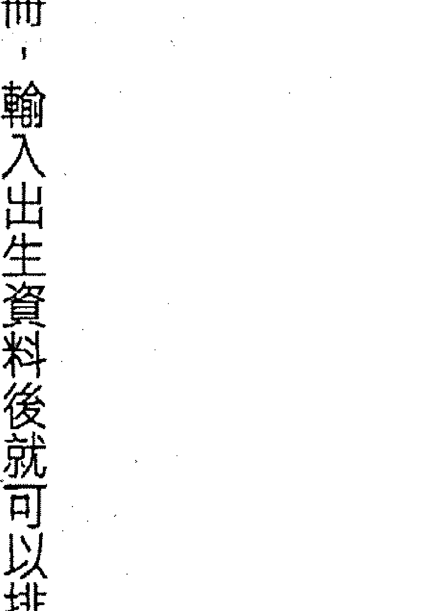
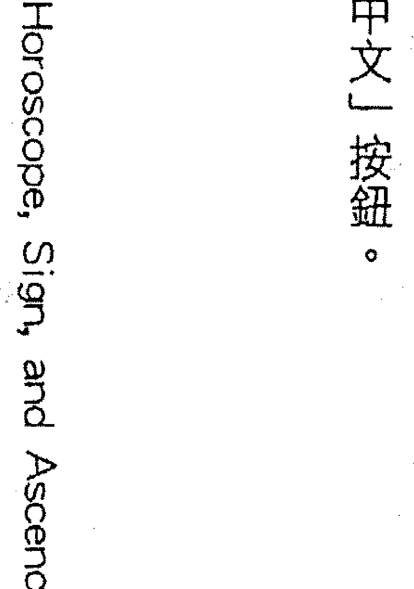
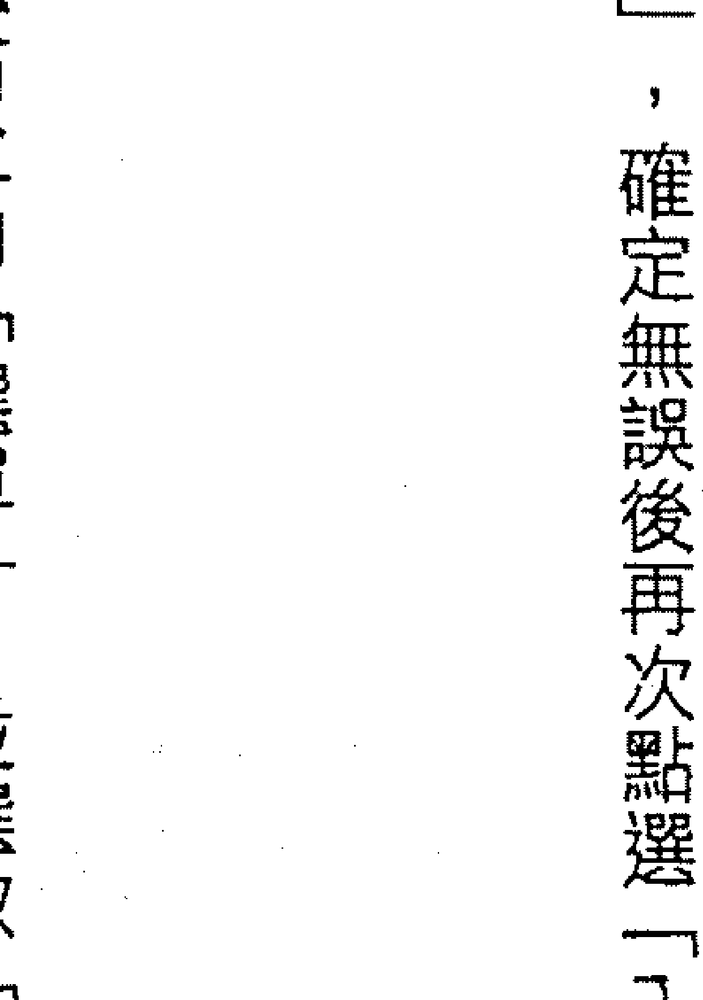
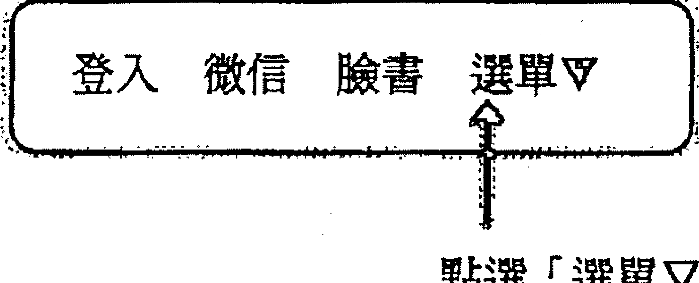
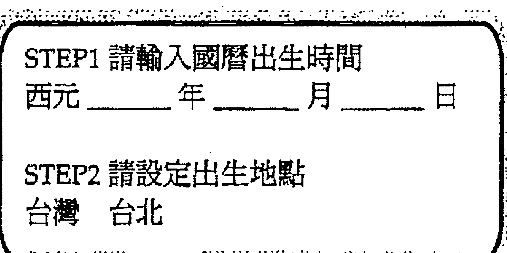
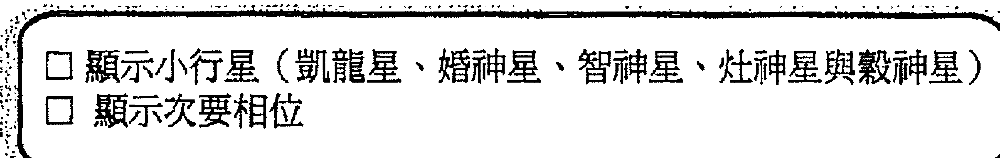
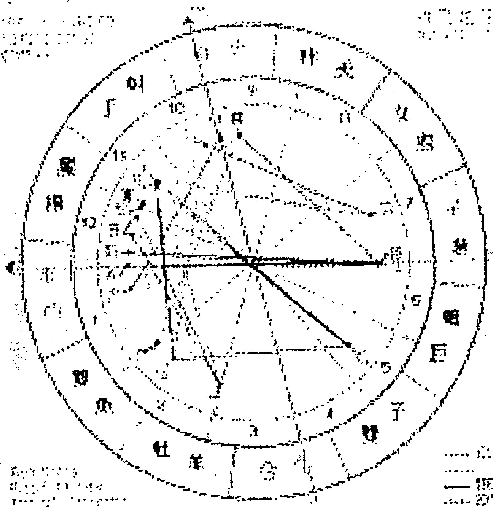
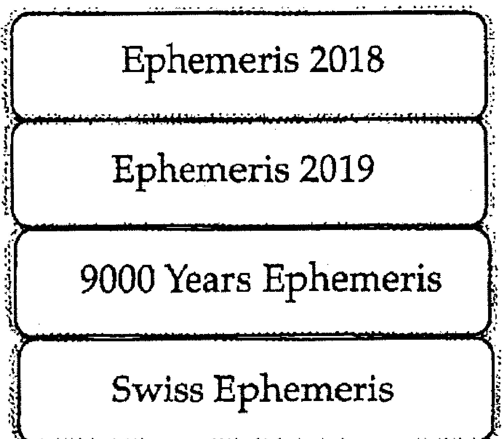

# 智慧女神的整合力

# 出版緣起
興趣廣泛、身份多元的知名文化人韓良露，除了大家熟知的作家、媒體人及文化推動者身份之外，她也是藝文圈中最受重視的占星學大師。

二〇〇三年起她在金石堂金石書院（現龍顏講堂）開設占星課程，由於口耳相傳、好評不斷，課程一直持續到二〇一〇年才劃下休止符。在長達八年的四百多堂課中，她以歷史、哲學、心理學、社會學的角度，將占星的深層智慧化為生動的教學內容，讓大家在學習與命運對話的同時，獲得看待人生的更高視野。

這一系列課程不但架構了宇宙法則的邏輯，也融入她對人性與社會的觀察，但因資料整理工程浩大，成書計劃一直未能完成，為避免這些珍貴課程內容成為絕響，南瓜國際透過多年來數量龐大的上課錄音及相關資料，依據當時課程的規劃邏輯，整理成為系列書籍，期望能藉由文字重現精彩、動人且充滿智慧的上課盛況。

# 序
## 潘朵拉的盒子
很多人在剛開始學占星時，前半年很容易會沮喪、緊張。很多占星初學者看著星圖，多半會想，其中三分之一是我要的，三分之一是我不要的，三分之一是我希望不曾發生過的。這種患得患失的心情，往往會在看小孩的星圖，或者看自己另一半星圖時達到高峰。尤其是看到自己的先生或太太似乎有花心傾向時，都會感到十分憂心。很多女生看到先生的星圖有出軌的可能性，不管是根本毫無實質行為，或者找到蛛絲馬跡，甚至有可能本來不知道，事後追查發現真有此事，都會因而大為震驚。事實上星圖是一種隱喻，當事人雖然的確會具有這種傾向，但是未必會真的在生活中做出這樣的事情。

占星學提供了一個客觀的跟自我對話的機會。星圖上的符碼都是客觀的，占星學就像是人生的一面鏡子。世界上有多少人，就有多少張不同的星圖，而星圖上的符碼，都不是為了任何一個特定的人而生，每一個符碼都有其人類共通，乃至於宇宙共通的意義。而這些符碼會透過不同的領域、不同的情境，去展現出它們的意義。藉由這些不同的符碼，我們可以體認到我們個人跟宇宙法則是合一的，進而從中得到了客觀化的評量準則。

藉由星圖顯示出來的種種現象，我們在評量「我是誰」時，它就不會是純粹主觀的我覺得我自己如何。有的人自以為很大方，自以為對別人很好，也可能自以為自己是很溫柔的人，但事實上根本不是這麼一回事。當我們沒有一張本命星圖做為自我對話的鏡子時，我們很難有辦法客觀地面對我們的身心靈真正的狀態。或許我們在身體健康與心理成長方面，有辦法找到其他參考系統，可是如果想知道真實的靈魂狀態，它很難透過個人的主觀而自我了解。也因為占星的客觀符碼中，承載了許多共通的宇宙元素，因此它不會是我們個人認定自己是誰的粗淺認知。

不同的宗教各有其不同法則，所有的宗教本質上都是在探索人類在肉體之外更深的靈魂與靈性，所有宗教理論上應該服膺靈性法則。可惜隨著人類社會的發展，有些宗教越來越不重視靈性法則，而轉向注重人類社會制度。但追根溯源，理論上所有宗教的靈性法則，都是要告訴我們如何找到真正的、完整的自我。每個人的本命星圖都是一個隱喻，它並不只是白紙黑字印出來的一張圖，它跟天上的星辰一樣，永遠不停的運轉，永遠不停的成長、變化，我們星圖中都擁有一個靈性的核心，透過這個核心，我們可以了解真正的自我（self），可以了解在生生世世中，自己的靈魂本我到底是什麼。

不管占星學習者本身信仰什麼宗教，所有的宗教探討的不外乎個體的靈魂在面對各種生命考驗時，要如何得到生命的救贖，因此所有的宗教都對人類有益。唯一的問題，在於許多宗教為了宣傳一視同仁的普世修道法門，因而泯滅了個體的獨特性。事實上每個人會遇到的生命問題、生命考驗都不同，有的人需要大量的紀律，但另一些人可能需要的是放鬆。世上宗教的確有萬千法門，可是你未必知道自己應該要選哪一種。

如果不藉由占星學這面鏡子，我們很難看懂自我意識在主客觀之間的各種面貌。在多年占星的教學生涯中，不少我的學生已經成為職業的占星師。但事實上占星學最大的意義並不是拿來幫別人算命。因為不管是幫別人算命，或者是找算命師來幫自己算命，算命師能夠給的不過是一兩小時，如果你這輩子找算命師算五次命，一次算足兩小時，難道你一生只值十小時的解釋嗎？這是不可能的事。占星學給予大家一個跟生命深度對話的機會，我大部分的學生都沒有走上職業占星師之路，但是大家依然對占星學很著迷，因為透過星圖可以讓大家可以獲得深度的自我了解。真正令人著迷的並不是算命，而是得到一個可以深度了解自己、了解他人，以及了解人類與宇宙關係的工具。藉由這個工具，我們可以深入的跟命運對話，對靈魂探索。

但占星學就像是一個潘朵拉的盒子，如果沒有面對生命真相的智慧，還不如不學比較好。潘朵拉的盒子一旦打開，通常不會先上天堂，而是先直下地獄。不過也有很多學生告訴我，他們在學占星學滿一年之後，人生豁然開朗。占星可以拿來當成一種算命的工具，但占星絕對不只是算命而已。這也是我鼓勵大家盡量自己學占星，而不鼓勵大家過度依賴算命師的原因。沒有任何占星師或者智慧上師可以為你的命運負責。當你學會占星學之後，你會對生命有更全面、更寬闊的視角，從此占星學變成了一種啟蒙的智慧，它可以成為一個足以讓你扭轉生命中負面想法的工具。

當星圖揭示出生命真相時，如果抱持著否定真相的態度，不管是生氣、憤怒、痛苦、哀傷都無濟於事，重要的是要用什麼態度去面對。當我們願意去面對它、淨化它、解決它，當我們願意把心頭的心結打開，負面能量才不會繼續糾結，我們也才有找出一條活路的空間。所有問題在一開始攤開時，我們通常會選擇怪別人，但到最後我們會發現，不管是顯意識或潛意識，命運終究是我們自己的選擇。例如當我們察覺這輩子在親密關係中的種種問題，來自跟父母有關的月相位時，當我們願意去不記恨自己的父母，不再埋怨他們從小不斷吵架，害自己長大以後人際關係有問題，我們才有辦法發現自己其實還有其他的選擇。既然我們已經理解到了命運的真相，不管命運如何，我們都有義務要用更好的方式來演出這場命運大戲。

占星學有其實際的用途，也有其超越性的深度意義。關鍵就在於你想要怎麼使用占星學，由你自己決定。

> 註 本文由二〇〇七年「四小行星」相關課程錄音整理而成

在占星學裡面，每一個星座都是一正一負、一陰一陽週而復始，每一個星座要的東西都跟下一個星座不同。牡羊要的跟金牛要的絕對不同，火星要的跟金星要的絕對不同。整個占星學系統是由一陰一陽交錯組合而成，牡羊座為陽、金牛座為陰、雙子座為陽、巨蟹座為陰、獅子座為陽、處女座為陰、天秤座為陽、天蠍座為陰、人馬座為陽、摩羯座為陰、寶瓶座為陽、雙魚座為陰。

每個的生命中都是陰陽並存的，陰陽能量跟生理性別無關，再怎麼陽剛的生理男性，身上也會具備某些陰性特質；再怎麼陰柔的女性，身上也會具備某些陽性特質。

占星學陰陽交錯的邏輯與太極很相似，在陰陽交錯的十二個星座中，從陽性能量最強的牡羊座，走到陰性能量最強的雙魚座，最開始的牡羊座與最後面的雙魚座象徵了生命旅程的起點與終點，牡羊與雙魚之間相隔的是命運業力的結束與重新開始，而位於中央的處女座與天秤座，一個是最弱的陰性星座，一個是最弱的陽性星座，兩者就像是太極圖樣中心黑裡面的白點，或白裡面的黑點。黃道十二個星座而在中間的處女座與天秤座分別是最弱的陰性星座與最弱的陽性星座，這也意謂著十二個星座走到一半的轉折過渡階段。

第六個星座處女與第七個星座天秤之間，相隔兩者的並不是結束，相反的，它是個人與他人的連結——一個人如果想用最強的陽性能量或最強的陰性能量去跟別人結合，那是不可能的事。最弱的陽與最弱的陰是整個星圖中最容易陰陽相接的地方，唯有用最弱的陽性能量跟最弱的陰性能量相互連結，彼此之間才不會產生很大的衝突。

每個星座都對應著一顆主管星，但以往的占星學界一直無法處理一個大問題：黃道有十二個星座，可是為什麼只有太陽、月亮、水星、金星、火星、木星、土星、天王星、海王星、冥王星這十顆主星掌管？為什麼有兩個星座缺了主星？這個問題隨著十九世紀起小行星被陸續發現，開始有了答案。

星圖結構就像一個雙螺旋，火星掌管牡羊座、金星掌管金牛座、水星掌管雙子座、月亮掌管巨蟹座、太陽掌管獅子座。從火星的本能原慾走到太陽的自我表達，人類完成了初步的小我自我完成階段。之後很奇怪的進入了兩個沒有主星的星座：處女座、天秤座，以及神秘的天蠍座之後，從木星掌管的人馬座、土星掌管的摩羯座、天王星掌管的寶瓶座，走向海王星掌管的雙魚座，在人馬座到雙魚座的過程中，人類學習到了超越個人小我的社會意識與更大的宇宙意識，走入了大我的自我完成。

在內在小我的個人意識與外在大我的集體意識之間，其實一直有著失落的一塊｜也就是小行星要探討的「人我關係」。其中處女座歸穀神星與灶神星共管；天秤座歸智神星掌管；天蠍座歸冥王星與婚神星共管。

在進入本書主題之前，我們先為大家介紹一下占星學的十大主星，以及智神星的神話、智神星的象徵意涵。

### Chapter 1
## 占星學的基礎概念
占星學中有三個最重要的結構：行星落在什麼星座、行星落在什麼宮位、行星與行星之間形成了什麼樣的相位。當你學通了這三個占星學的要素時，審視星圖往往會覺得生命非常奇妙。徹底了解了本命星圖的星座、宮位、相位這三大要素之後，接下來可以繼續學習行星圖的解讀，以及人際緣分的星圖合盤，這兩者也同樣是基於行星落入的星座、宮位與相位。我們在學習占星時，不免必須先將星座、宮位、相位這三者分開來學。這就像是我們畫素描時，總得先一筆一筆畫下去，先畫鼻子，再畫眼睛……但重點是不管是先畫或後畫，每個部分都不能畫錯。我們不可能畫一個根本就不像的鼻子，再畫一個根本就不像的眼睛，一路畫下完整張臉之後，整張臉會是正確的。比如一個人的太陽在牡羊又落在十宮，當事人在十宮事業宮中會很有太陽的衝勁，而衝勁的形式依然會是牡羊的獨立大膽能量，它不會因為落在事業宮，就變成了摩羯座的保守能量。又如這個人的太陽假設跟海王星合相，受到毫無邊界的海王星影響，當事人在展現太陽能量時，會很有海王星的想像力，但是這個人展現的依然是太陽牡羊的大膽想像力，而不會變成了太陽雙魚。

很多人在學占星時，甚至包含不少國外的占星書都有這樣的錯誤觀念：星座、宮位、相位混為一談。舉例來說，一宮是牡羊宮，它代表的是一個人經過童年塑造出來的外在特質，很多占星師或占星書提到了太陽落在一宮，就會很不嚴謹的說，太陽在一宮的情況跟太陽牡羊很像，講到太陽跟火星合相又來一次，太陽火星合相跟太陽牡羊很像。以上這些都是胡說，事實上星座、宮位、相位，一個是能量發揮的本質，一個是能量會在什麼樣的領域展現，一個是會用什麼情節出現，這三者並不相同。

想要真正的學好占星，以本書為例，大家不妨在依序學完智神星的星座、宮位之後，再一一將智神星落在牡羊、智神星落在一宮分別做一個比較，大家透過這樣的橫向比較，一定可以很快的領略到什麼是星座的能量，什麼是宮位的處境，什麼是相位的劇情。雖然分清這三者，需要讓大家多花一點時間精力，但是建立起這三個占星邏輯，會對大家不管學習任何跟占星有關的事物，都有很大的幫助。

從行星落在什麼星座中，可以看出這顆行星會藉由什麼樣的星座性質來展現它的能量；從行星落在什麼樣的宮位中，可以看出這顆行星會在什麼樣的宮位情境中展現它的能量；從行星與行星之間會形成什麼相位，可以看出行星會因為其他行星彼此因為相位產生關聯時，彼此之間會演出什麼樣的戲份。不同的行星具有不同的能量，當不同的行星形成相位時，彼此就會互相影響。本命星圖中的主要相位分為四種：兩顆行星落在同一個星座，而且度數相差六度以內的合相；兩顆行星彼此形成誤差度數以內的一百二十度相位，稱為和諧相；兩顆行星如果形成九十度或一百八十度，由於行星能量彼此衝突，因此被稱為剋相。九十度與一百八十度剋相的差別，在於九十度剋相往往是一種內耗型的兩難掙扎，而一百八十度剋相則是因為對立而產生的兩極激化與翹翹板效應。

當一顆行星落入不同星座時，它都會表現出這個星座具備的基本特質，例如一個人的智神星落在牡羊，這個人在智神星的溝通能力中，就會展現出牡羊座的特質，牡羊座的能量很有活力、很有自信、很有勇氣，而且很直接，絕不拐彎抹角，他們在危機中往往會表現得很好。隨著相位好壞，其中有可能是好的特質，例如創新、大膽，也有可能是不好的特質，例如剛愎自用或不體貼。

> 註 關於上升星座的詳細內容，請參考已經出版的《上升星座：生命地圖的起點》。

只要出生年月日是正確的，即使不確定出生時間，無法確定宮位，但基本上就可以得到一個八九不離十的星圖。假如一個人的星圖中太陽與月亮有九十度相位，當事人從小感覺到的父母關係一定很緊張，父母雖然未必會離婚，可是從小當事人一定會感覺到父母不是冷戰，就是熱吵，父母關係有可能是行諸於外的不和，也可能是不外揚的內在緊張。而如果一個人的本命星圖中出現太陽與月亮的一百八十度相位，當事人就有可能會遇到父母離婚、分居，或者各種因為外在因素而父母沒有實質上住在一起的處境。

如果知道正確的出生時間的話，就可以算出宮位。一個人出生時，出生地的東方地平線與黃道的交點，就是被俗稱為「上升星座」(註)的上升點。上升點是第一宮的起點，從上升點開始的依序十一個宮位，分別代表了生命中十一個情境的生命舞台。

上升星座代表我們的外在樣貌與面對外界互動的直覺，也就是我們從童年开始，受到不管是家庭環境或社會環境的塑造，上升帶來的自我認同，是一種透過我們怎麼跟他人相處而回頭定義我們自己的一種印記。例如有的人會隱約知道自己獨處時是個害羞、內向、不喜歡講話的人，可是只要一有其他人在場，他們就會忽然變得人來瘋。原因就在於我們每個人有兩種顯意識，一個是上升星座的顯意識，一個是太陽的顯意識——而外界最直接看到的是當事人的上升星座這一面。當外人覺得這個人如何時，往往看到的是當事人用上升星座來應對世界的模式，而非這個人心中真正想要展現的太陽的自我價值。

相對於上升星座，在上升星座對面的就是七宮的起點，也就是被俗稱為下降星座的下降點。我們常常會透過七宮與下降點來尋找人生中的伴侶。但這是一種補償心態，因為當我們尋找下降型的伴侶時，我們其實尋找的是我們自己的陰影，也就是我們在尋找自己隱藏的自我。

每個人會透過上升與太陽，粗淺的認知到我們自己是誰。本命星圖中的太陽，代表的是一個人的顯意識與人生目標，我們每個人一生中都會不斷的問自己「我是誰」，這就是太陽的顯意識要探討的領域。太陽最容易反映出我們的自我意識（ego）。

在探討星座、宮位、相位之前，先為大家簡單介紹一下「行星」。我們可以將星圖中出現的行星分成個人行星、社會與世代星，以及介於其中的小行星。在占星學中，太陽、月亮、水星、金星、火星，這五顆內行星屬於「個人行星」，它們各自代表了不同的個人特質。木星、土星是社會星，它們分別代表的是社會的資源與社會的制約，天王星、海王星、冥王星則分別代表影響力非常巨大的世代力量。

太陽、月亮、水星、金星、火星這五顆內行星都是個人的特質，它們是形成一個人性格的一部分，在任何社會都會有金星牡羊型的大膽女性，也都會有火星摩羯型的刻苦男性，這種特質跟社會環境毫無關係。

相較之下，木星、土星、天王星、海王星、冥王星就是較大的社會潮流與社會脈動，當它們在本命星圖中出現重要相位，就會帶來跟社會潮流相關的較大事件，當事人往往會因為這些較大的生命事件而感受到命運的波動。也就是說，太陽、月亮、水星、金星、火星是個人特質、個人魅力之所在，它們本身並不會造成命運的影響，但是加上了木星、土星、天王星、海王星、冥王星的相位之後，經由整個社會大環境的變動，我們就可以看得出命運的影響。

在火星與木星之間有一個小行星帶。有別於五顆內行星的個人特質、五顆外行星的社會大環境影響，介於其中的小行星探討的正是人際關係。其中包括了探討養育責任感的穀神星、點燃生命活力的灶神星、連結姻緣的婚神星（註），以及本書要為大家介紹的智神星。

太陽、月亮、水星、金星、火星
太陽是一個人類意識的呈現，它往往跟每個人內心中的父親形象有關，而非實體的

> 註 關於灶神星、婚神星的相關內容，請見已經出版的《生命之火為誰燒：點燃灶神星的性能量》、《千里姻緣何處牽：婚神星的婚姻密碼》，穀神星的相關內容即將出版。

父親。它會是當事人特別感知到的父親特質，它並不是真正父親的全部，但是它一定是當事人父親具備的某一種特質，而不可能完全出自於當事人的幻想。例如一個太陽在牡羊的人，當事人的父親有可能是一個業務員，整天到處跑來跑去做生意，但是對小孩很大方，每次出差結束，都會帶很多禮物回家；當事人的父親也可能是一個運動員，當事人心目中的父親一定具備了粗獷、大方、傲慢、有勇氣、自我中心或強悍的特質。例如我的太陽在天蠍，所以在我成長的時候，我看到的父親是一個做大生意的天蠍座父親形象，而我弟弟的太陽在牡羊，他看到的就會是我父親跟現實奮鬥的牡羊那一面。而這一切也都會在父親的星圖中找到合理的解釋。

月亮代表的是一個人的潛意識與情緒，它是一個人的安全感之所在。月亮往往跟當事人從小眼中的母親形象有關。以我自己為例，我母親的太陽在雙魚，月亮在牡羊，而我自己月亮在雙魚，代表我從小眼中的母親，是她雙魚的那一面。而我的妹妹良憶的月亮在牡羊，這代表我妹妹看到的母親，顯現出來的是牡羊的那一面。

太陽跟個性有關，但與情緒無關，太陽是我們顯意識中的自我展現，而月亮代表的是我們的潛意識與情緒。太陽是一種很以自我為中心的能量，它也很容易自己認定自己就是這樣，但我們絕對不止於此。在本命星圖中，我們每個人都由各式各樣的行星落在不同的星座、宮位，以及行星之間的相位，再加上行運的啟動，人際緣分的影響因而有數不清的可能性。例如我們常常會發現，同樣的一個人，他在處境好的時候就很好相處，他在處境不好的時候，就很不好相處。這就是行運會影響本命星圖，讓本命星圖的行星展現不同的表現，即使是同樣的一顆太陽，也有可能會因為種種不同的因素而展現不同的面向。我們的生命並不是孤立的，我們的人生旅程會不斷的受到外在人事物的影響。如果一個人本命星圖中的太陽有很多剋相，當事人就會有自我意識過強的問題，如果本命星圖的太陽剋相較少，當事人就比較不會有自我意識過強的問題。而一個自我意識過強的人，想要達到真正自性的成長，就會比較困難。月亮是一個人的潛意識，它代表了一個人比較內在、深層的情緒。月亮一個人生命中的第一個愛，它來自於母親。月亮與金星都說明了我們跟他人之間最基本的情感特質。差別在於月亮是每一個人對親密感的追求，而金星是我們喜歡什麼，它是一種情愛的欲望。也因為月亮與金星是兩種不同的情感特質，當一個人的月亮與金星落在互相衝突的不同星座時，當事人就容易感覺到親密感與情愛無法兩全的問題，也就是說，他們常常會遇到喜歡的人無法親密，親密的人無法喜歡的問題。

月亮的愛是一種安全感之愛，對於一個嬰兒來說，母親或奶媽可以穩定的提供乳汁、可以尿布一濕就換，或者是哭的時候立刻來抱，這些都是月亮掌管的跟安全感有關領域。

小嬰兒不會去考慮照顧我的這個人漂不漂亮或者身上香不香，因為這些是金星的喜好而不是月亮的安全感。

從一個人本命星圖的月亮狀況，我們可以看出當事人小時候跟母親之間的臍帶關係。

如果一個人的月亮有很嚴重的受剋相位（例如月亮跟土星、天王星等等行星之間有度數很近的九十度或一百八十度相位），當事人就有可能在出生時或出生後，跟母親之間會有很困難的關係。

不過這不能說是母親的錯，只能說雙方在命運中有這樣的共同業力，雙方分別在這樣的關係中，扮演了不同的角色。

水星是溝通，它是一種中性的、理性的能量。從一個人的水星落在什麼星座，可以看出一個人會用什麼星座的本質來思考與表達，例如水星牡羊的人敢想別人所不敢想，敢講別人所不敢講，所以水星牡羊的人很容易讓人感受到他們的言詞犀利，相較之下，水星如果落在巨蟹，他們很重感情、很念舊，但言詞不會很犀利。

金星是一個人喜歡的事物，它是一個人的價值觀與審美觀。尤其對女性來說，金星以往常常代表的是當事人喜歡用什麼方式打扮自己。以往男性不太有表達自己美感的空間，所以男性的金星能量往往會透過他喜歡什麼樣的女生來展現，不過到了現代，男性也有打扮自己的自我意識，所以從男性的金星中，也可以看出當事人喜歡的美學品味。

火星是一個人本能的行動力，一個人必須要吃東西才能活下去，必須性交才得以繁衍後代，必須捍衛自己，才不會被別人欺負，以上這些事情，都是火星的生存本能。在日常生活中，我們常常會看到，一個男人會用火星落在的星座來展現自己，而一個女人常會很欣賞自己的火星類型的男人。

金星與火星都跟荷爾蒙有關。事實上不分男女，每個人身上都有一定比例的男性荷爾蒙與女性荷爾蒙。本命星圖中，不管是太陽、月亮、水星、金星、火星，它們其實都是我們自己的一部分。但在現實生活中，我們經常會將陽性能量或陰性能量投射出去，讓別人幫我們扮演這些角色。當一個人將內在的任何一部分投射到外界，意謂著當事人這個部分的能量無法自給自足，久而久之，這種空虛就會形成一個內在的陰影，進而引發其他問題。

如果我們希望自己整個生命可以處於平衡狀態，所有的能量都應該是屬於你自己，而非投射出去。凡是投射出去的能量，都容易對當事人造成人格分裂的處境。但在日常的社會生活中，我們很容易會產生能量向外投射的現象，尤其是跟性別特別有關的太陽、月亮，以及金星、火星。對男性當事人來說，他們很容易將月亮投射在妻子身上，將金星投射在女朋友身上；對女性當事人來說，她們很容易將太陽投射在先生身上，將火星投射在男朋友身上。事實上這並不利於每一個人需要自己去做好的陰陽整合工作，以往占星書上會告訴大家，女生的太陽、火星容易投射在身邊男性身上，男生的月亮、金星容易投射在身邊女性身上，這只是一種陰陽能量在現實生活中方便行事的結論，而並不是本來就應該這樣。大家不應該看到有這種現象，就倒果為因的將這種現象視為理所當然。在父系社會中，由於陰性能量與陽性能量變成了一種身分角色的扮演，以致於陰性與陽性永遠對立，也因此男人與女人永遠有衝突，原因就在這。

## 木星與土星

木星與土星都是社會星，從木星與土星中，我們可以看出什麼樣的社會資源容易被我們所運用，哪些社會制約會帶給我們壓力。

木星視相位好壞，它常是一個人的幸運或因過度大膽而造成不幸之處。木星的吉相（也就是木星跟其他行星形成一百二十度相位）可以讓當事人在跟木星相關的事物中發揮正面能量，當事人的成功可能來自於大膽、正面思考、冒險、樂觀，但木星的剋相，也可能造成一個人非常愚蠢、非常偽善、非常不小心，或過度樂觀、過度放縱、過度膨脹（在心態上或在身材上）。

土星代表的是社會制度的打壓，一個人的土星位在什麼星座、宮位，跟其他行星形成什麼樣的相位，代表當事人這輩子會在這些地方受到打壓，當事人即使因為相位不錯而得以成功，成功的過程都不會輕鬆愉快、一步登天，他們的成功都是忍耐多年之後總算熬出頭。而且等到好不容易成功，當事人也有可能媳婦熬成婆之後，變成用權威去壓迫他人的人。

## 天王星、海王星、冥王星

天王星、海王星、冥王星都是行進速度很慢的宇宙行星。木星與土星的社會意識其實很容易被當事人所察覺，例如父權、法律、傳統等等，都是不同的社會意識。天王星不同，天王星是一種突如其來的集體意識的突破，當天王星能量降臨時，往往會讓人覺得整個地球都還沒有準備好，卻天外飛來突然進入了一個嶄新的領域。例如一九九五年到二〇〇三年天王星進入跟高科技有關的寶瓶座，個人電腦與網路忽然在這個時間變成全世界最重要的東西。在這個時間之前，根本沒有人會想到以後電腦與網路會是每個人生活不可或缺的工具。而海王星是人類集體意識的救贖，一九九八到二〇一一年海王星進入寶瓶時，寶瓶代表的高科技，已經成為了人類的救贖，不管是網路或智慧型手機，可說改變了所有人的生活習慣。

以前有一些占星書會告訴大家，天王星、海王星、冥王星這三顆行進速度緩慢的行星是世代行星，雖然具有時代意義，但是對個人的影響不大。這種說法並不正確。天王星在一個星座停留七年，海王星在一個星座停留十二到十四年，冥王星的行進速度並不規律，它在一個星座中短則十幾年，長則三十年。天王星、海王星、冥王星在一個星座中的時間很久，因此它們造成的影響，會成為一種時代精神。除此之外，這三顆行星彼此形成的相位，也會成為很重要的世代事件，它們當然會對個人造成影響。星圖是一個人在出生的那一刻，在出生地天空的星圖，就算兩個人在完全一樣的時刻出生，他們也不可能在同樣的地點出生，以占星學來說，每兩萬五千八百年才會出現同樣的星圖。以天王星進入牡羊為例，天王星每八十四年走一圈，每隔八十四年天王星都會進入牡羊七年，但是每一次進入牡羊時，都會跟海王星、冥王星形成不同相位。牡羊代表創新與自我意識，雖然每次天王星進入牡羊時，世界都會在創新與自我意識方面出現全新的變革，可是隨著每一次天王星與海王星、冥王星形成的不同相位，每一次天王星進牡羊時，就會顯現出不同的現實處境，這就是「世俗占星學」，也就是以研究世界、國家大事、產業趨勢變化為主的占星學。這些事件的影響力很長遠，因而具備世代精神的意義。這些時代性的力量當然會對個人產生很大的影響。尤其當個人的本命星圖中的內行星與天王星、海王星、冥王星有重要相位時，力量更大。例如一九五四年下半年，一九五五年上半年的木星與天王星都在巨蟹二十幾度，如果一個人的內行星也在巨蟹二十幾度（或者形成其他相位），當事人的內行星能量，就會同時受到木星與天王星能量的強化，對個人來說，影響力非常巨大。也因為天王星、海王星、冥王星行進速度慢，一個人的金星如果跟行運冥王星形成相位，冥王星可能來來去去走了兩三年都在同一個度數來回，這種持續性的影響力，都遠比內行星的行運力量大得多。

天王星、海王星、冥王星各自都有其不同的影響力。天王星會為這個世界產生新的事物，會為當時的社會帶來新的變革。天王星每七年走一個星座，當天王星重新回到同樣的星座時，代表這個世界經過了七十七年之後，又面臨了相近的議題，但這個世界走過了七八十年的歷史，重新面臨的會是全新的挑戰。

天王星會用一種突如其來的方式，造成人類社會的變革；海王星則用一種比較緩慢、比較夢幻的方式來滲透人類的思想。不過海王星帶來夢想，也帶來幻滅，當人類對某件事物抱持過度幻想時，往往就會過度不切實際，最終遭到幻滅的結果。

冥王星是一顆跟龐大的政治、金錢、大企業有關的行星，它往往會帶來一整個世代的政治、經濟相關的巨大議題。從冥王星進入的星座，可以看得出世界重大產業的興起。

將天王星與冥王星兩相比較，當天王星進入某一個星座時，會在這個星座領域中帶來世界的改變，但必須等到冥王星也進入這個星座之後，跟這個星座相關的事物，才有可能實際在政治上、制度上、經濟與金融政策上產生巨大變化。舉例來說，冥王星從一九九五年到二〇〇八年進入人馬，在冥王星人馬的世代，跟人馬星座最有關的兩個產業：旅遊與運動，它們成為這個世界上的重要產業。從冥王星人馬的年代開始，別說中學生出國不稀奇，就算是年紀很小的小孩跟父母全家一起出國玩，也已經是很稀松平常的事情，這種事情以前可說完全無法想像。此外，各式各樣的健身用品、健身房，以及運動明星帶動的種種商機，也成為每一個人日常生活中不可或缺的一部分。或者又如一八二三年到一八五二年冥王星牡羊時代，全世界最重大的集體思考是淘金熱，在長達近三十年的冥王星牡羊時代，如果當事人有其他木星、土星跟冥王星的極佳相位，當事人就有可能會是因淘金熱而受惠的幸運兒，而這些幸運兒發跡的過程，多半都跟冥王星牡羊標榜的巧取豪奪有關。到了一八五一年到一八八四年的冥王星金牛時代，有別於冥王星牡羊單打獨鬥的個人主義，冥王星金牛時，個別的英雄主義變成了企業集團、變成了豪門大亨。而海王星在一八七四年到一八八七年進入金牛，所以從一八七四年到一八八四年海王星、冥王星都在金牛，海王星、冥王星同在跟資產有關的金牛，當海王星做夢的力量，碰上了冥王星具體化的實踐力，對應出的世界大事，就是當時是工業革命的巔峰。出生於海王星、冥王星合相金牛時期的這些人，再加上如果又跟木星、土星這兩顆社會星有好相位，他們長大以後往往會是承襲著巨大財產的大亨。這些人從出生到成年，剛好就是美國經濟最繁榮，被人稱為黃金年代的一八七〇到一八九〇年。也因為天王星、海王星、冥王星行進的速度各自不同，各有不同的週期，因此在不同的時間，這三顆行星如果其中兩顆齊聚於同一個星座，就會有其獨特的意義。例如在十九世紀末、二十世紀初的時候，海王星與冥王星齊聚在跟大眾溝通有關的雙子座，在這段期間出現的大文豪，密度之高，可說是空前絕後。又如一九九五年到二〇〇三年天王星進入寶瓶，而一九九八到二〇一一年海王星進入寶瓶，也就是說，從一九九八年到二〇〇三年之間，天王星與海王星這兩顆星都在寶瓶，在這段期間，跟寶瓶座有關的各種新科技與電腦網路成為每個人生活的一部分，而在這段時間出生的小孩，將來長大以後想必會有許多成為新科技頂尖人才。

俗語說「江山代有才人出，各領風騷數百年」，指的就是這種經由天王星、海王星、冥王星這三顆世代星的時勢，創造出來的英雄。每個年代都有大富翁，但是海王星、冥王星都在金牛的時代，出了特別多資產雄厚的大富翁；每個年代都有大文豪，但是在十九世紀末、二十世紀初的時候，海王星與冥王星齊聚在跟大眾溝通有關的雙子座，這個年代出了特別多大文豪。我們也可以預期在一九九八年到二○○三年天王星、海王星合相寶瓶時出生的人，長大以後會有很多人成為偉大的科學家。

這些人背後都有巨大的時代力量，把他們推上成功之路。外行星的力道不是內行星可以比擬，而所謂的巨大時代力量，往往是兩顆以上的外行星形成相位的加乘力量。

一般來說，一個人如果有木星、土星、海王星、冥王星形成好相位，就有機會成為或大或小的風雲人物，如果一個人天王星、海王星、冥王星這三顆星本身已經具有相位，又跟木星、土星有相位，力量當然就會攀升好幾倍。這種相位出現的機率相當低，一旦出現，就代表人類文明走向了巨大改變的轉捩點，因此會有相應而生引領風騷的人物，藉由他們的人生，將世界帶向新的領域。

## Chapter/2

## 神話、占星學與智神星

現代人都不把神話當真，但它對占星學很有意義，賦予星圖非常有邏輯的解釋。

像是整個希臘神話說的就是宇宙創生的故事，而宇宙創生的故事，其實就是天文學的故事。在神話裡，宇宙誕生於海王星／十二宮的虛無狀態、汪洋一片，完全是負電子的陰性能量。沈浸在負電子的宇宙做了一個夢，從夢裡產生了宇宙創造的念力，再從念力裡產出正電子，也就是天王星的誕生。

天王星的出現讓宇宙有了生命力，正電子和負電子的結合，成為生命創造的本體，兩者結合在一起就會產生光。所以，宇宙最早的能量就是來自於光，這正是很多靈修都以光為主題的原因，訴求的就是回到宇宙創造的源頭，光也很符合許多神話或宗教的說法。

但正電子和負電子的結合是宇宙生命，它是無性生殖，而非生命體，更不是有性生殖的生命，所以希臘神話裡提到，天王星的光產生後，和大地蓋婭合一併生出了土星。然而，當時的天和地是合在一起沒有分離，所以土星聽從了母親蓋婭的建議，篡奪了父親的生命力，也就是神話裡所說的，土星割下天王星的生殖器丟到大海裡，象徵正電子的天王星生殖器和海裡的負電子能量結合後，誕生了被稱為愛神及慾神的阿芙羅黛蒂（Aphrodite），她象徵的是宇宙的原慾，從此之後，宇宙開始可以用有性生殖的方式來複製自己，土星也因此生了很多小孩。

土星在神話裡被稱為時間之神，它的出現代表宇宙有了時間。土星雖然生了很多小孩，但它卻把所有小孩都吞進肚子裡，這代表雖然土星擁有生殖能力，但它並不想將生殖複製或讓生命延續。唯一沒被吞下肚的是被偷藏起來的木星，這也符合占星學所說的木星代表幸運。

後來木星起義推翻土星的統治，砍下土星的頭，所有被土星吞下肚的小孩都因此被吐出來，這些小孩就是各個小行星，其中也包括冥王星。對應到占星學，土星和木星是太陽系裡兩個很重要的能量，而土星和木星的能量是互剋的，木星可以推翻土星，土星可以壓制木星。這也很符合占星學的學習。占星學本身就是個雙螺旋，可以用順時針或逆時針的方式去理解，所以我們對星圖也不應該只看單純的順時針或逆時針，而是要同時理解。

舉例來說，土星代表時間的業力，也代表時間的劫數，像是「不是不報、時候未到」的說法就很符合土星。我們對於生命的諸多期望或開拓，會受到土星壓制的影響，從星圖宮位的順時針方向來理解宇宙能量，就會發現土星可以剋制木星，甚至連海王星的輪迴、天王星的變動，都可能壓制生命的能量。

但若是從個人出發，也就是星圖宮位的逆時針方向，從火星、金星、水星到木星，就會發現每個生命都有很多的可能性。像是利用木星的能量去更改土星的邏輯，就是用信仰、價值觀來改變你和業力的關係，同理，你和宇宙的虛無或靈性關係也有可能改變。從逆時針來看雖然比較困難，但從中可以與宇宙產生一個新關係，也可以發現個人靈性的成長軌跡。星圖從順時針來看，則完全是宇宙邏輯，在出生的那一刻，人生就已有定數。在順時針的定數和逆時針的變數之間，就是個人靈性成長、靈性生命的空間。

學習占星學就能理解，宇宙之外是有變數的，而變數和你的心念有關，而不是和自我（ego）有關，因為自我或個人欲望一定是被安排在定數裡，相形之下，變數是非常幽微的，但變數和定數之間會產生拉鋸的關係。當你在占星學的學習愈來愈進階，對星座或星宮的能量有更深入的理解，而不只是對占星的一般描述或表面解釋時，你會發現你和那些能量不僅是知識的連結，而會產生念力的改變。占星絕對不是只讓我們學知識，一旦開始理解，就會發現生命裡和那些知識有關的能量也會和你產生關聯；一旦產生關聯，它們就會開始改變你的生命，不但你和所有人事物的關係都會改變，甚至你看待自己及他人的視野都在改變。因此，占星學裡有必須親身體驗的部分，無論書籍或課堂給予大家的都是相同的知識包裹，但你必須自己打開包裹、背負包裹，你會發現體驗的過程是很有趣的。

### 智神星的誕生和文明象徵

木星是太陽系裡最大的行星，在神話裡，木星被稱為天空之神，也就是希臘神話裡的宙斯。宙斯非常風流，和許多女神、仙子或凡間女子都有一腿，生下了各式各樣的小孩。木星代表的就是在土星之後，宇宙開啟了多種族有性生殖的擴展能量。

雖然宙斯和很多女性發生關係，生了很多小孩，但他做了一件很奇怪的事，就是從他的頭裡，也就是頂輪的位置，生出了名為帕拉斯·雅典娜（Pallas Athena）的智神星。

我們對這個名字很熟悉，因為人類歷史上創造了城邦文明的雅典，就是來自這個智慧女神的名字，她同時也是這座城市的守護神。人類歷史裡和智慧最有關係的城市就是雅典，不是羅馬也不是西安，更不是其他任何一座城市，回顧數千年來的西方文明發展，最能代表人類文明的黃金時代就是雅典，在這個城市中產生了柏拉圖、蘇格拉底、亞里士多德等知名的思想家。

歷史上有很多事是巧合，更是天意。以順序來看，先有雅典娜這位女神，才有一座城市使用她的名字做為名稱，為什麼用這個女神的名字所命名的城市，在人類文明裡是那麼重要的一座城市？顯然雅典娜這位女神和雅典關係至深，影響至大，涵蓋了靈性、哲學、城邦制度和民主，了解雅典的歷史，也很能幫助我們了解智神星和天秤座的能量。

舉例來說，雅典從來不會主動攻擊別人，因為它的信仰是和平，但當雅典被攻擊時，## 從母系社會進入父系社會的文明變遷

它會變得很兇悍，也會強烈回擊，例如雅典和波斯就打過大戰，一旦發生戰爭，雅典這座城市就成為戰神。這也意味著，智神星及天秤座的能量同時代表了和平與戰爭，這比牡羊座的能量更難理解。牡羊是永恆的戰士，他們永遠有新戰役，你和牡羊不是朋友就是敵人，牡羊在戰場上不會扶老攜幼，但他尊敬戰士，所以他會尊敬他的敵人，但不尊敬懦夫或弱者，牡羊的邏輯就是這麼清楚。相較之下，天秤的邏輯就很不清楚，他們可以和平，也可以戰爭。這代表他們平時和你是朋友，戰爭時就可能成為敵人。所以天秤座可以和你當朋友也當敵人，而你無法理解他們哪一面是和平、哪一面是戰爭。

在神話裡，智神星的發展過程很複雜。六千多年前，人類社會由母系文明進入父系文明，差不多也是希臘神話開始流傳智神星故事的同時。

關於智神星最源頭的神話，可以追溯到利比亞特里托尼斯（Tritonis）湖畔有三位和月亮、女性有關的女神，有個說法是三位女神分別是帕拉斯、雅典娜和美杜莎（Medusa）。

美杜莎是眾所周知的蛇髮女妖，傳說男人看了她就會變成石頭，在希臘神話裡，她象徵復仇與邪惡。神話的演變通常和文明的意識型態變遷有關，無論是美杜莎或蛇都和人類的原欲有關，在印度文明或美索不達米亞文明裡，蛇的形象都是正面的，代表生命本質和本能的部分，但到了西方文明，蛇就成了負面代表，像是伊甸園裡引誘夏娃偷吃禁果的蛇。

神話的暗示都很幽微，但了解神話的原點就能協助我們更了解智神星和天秤座。關於智神星的另一個神話指出，帕拉斯和雅典娜是一對雙胞胎姊妹，但雅典娜殺死了帕拉斯，後悔莫及的雅典娜因而改名為帕拉斯·雅典娜來紀念自己的姊妹，她只有一個人，卻擁有兩個人的名字。

因此，在希臘神話登場的雅典娜一開始就是很奇怪的狀態，她把陰性的自己都毀掉了，不管代表陰性原始能量的美杜莎，或是代表陰性智慧的帕拉斯，只留下一個代表陽性的雅典娜。

智慧的雅典娜。雖然她保留了陽性智慧，神話裡卻一直強調她是女神，也就是說，她的能量是陽性的，但她的身體是陰性的。

希臘當地留存的雅典娜雕像也是經過特別設計的，雅典娜的外形是女戰神，手裡拿著劍和盔甲，劍是攻擊，盔甲是保護，意謂著在和平時期，她是城市的保護神，但遭遇敵人攻擊時，她就成了出征的戰神。她的心臟位置有羊皮製成的胸徽，上面雕刻的圖案正是美杜莎，古希臘人很清楚美杜莎和智神星的關係，他們將這兩個神話合在一起，把蛇髮女妖留在她心臟的位置，而且上面還雕刻了蛇，象徵著蛇在希臘神話的其他意涵——預言和隱藏的知識。

智神星代表人類文明從母系社會進入父系社會，從感性文明進入理性文明的一個重要分界。同時也代表人類文明從火星牡羊到天秤的重要歷程，在這之後，人類文明就會朝向更為複雜的心智發展，包括天蠍、人馬乃至於雙魚，不再是個人行星的成長領域。

無論從神話、占星學、人類文明的角度來看，智神星的設計都具有相同的意義，代表人類要走出自己，從自己走向更大社會結構的轉捩點。

人類文明始於母系社會，人類神話的初始也是從母系文明開始，但現在只有少數地方還保存母系文明，像是雲南瀘沽湖以及部分的亞馬遜原始部落。母系社會意謂著孩子的父親是誰並不重要，像瀘沽湖的走婚制度，只有母親才能肯定或大概知道孩子的父親是誰。因為父親不是生出小孩的人，母親就有了說謊的空間，但從母親身體出生的小孩則很明確，完全無法扯謊。所以保存比較多傳統的宗教如猶太教，仍保有母系文明的價值觀，只有猶太女性生出來的孩子才是猶太人。母系社會的文明比較感性，感性通常和內在或身體的體驗有關，所以很真實。父系社會則很理性、很邏輯，理性意謂著遵從某些法則，但這些法則不符合感性，也有不真實的部分。舉例來說，男人和女人結婚，男人理所當然就是女人生出來的小孩的爸爸，這是一種理性，也是父系社會的基礎，但這和感性無關。古希臘被視為理性主義的開端，在人類從感性走向理性文明的過程裡，美杜莎的被污名化，代表了古希臘要拋棄她所代表的原欲。在希臘文明之前，人類都在追求感性、神秘學，搞各種修煉和崇拜，幾千年下來，整個人類社會看似沒有太大的提升或進展，所以希臘人想出用心智提升人類的作法，他們直接發展木星和土星價值，建立城邦制度，整個希臘文明呈現的就是結構、理性思維和社會制度，為時至今，歐洲的民主、社會福利、結構制度都有比較合理的運作模式。相較之下，印度文明一直在修煉個人的靈性成長與解脫，像是苦行僧、瑜伽大師，但印度社會缺乏木星和土星價值，沒有高等心智和高等社會結構的運作，因而充滿混亂。從這裡我們可以看出：西方的希臘文明與東方的印度文明各有其不同的價值，各有利弊好壞。希臘人之所以需要智神星做為轉捩點，而不直接讓他們崇拜的木星宙斯領導父系文明，是因為他們很清楚父系文明不可能從零開始，也無法全盤拋棄母系文明，他們必須帶著母系文明的智慧進入父系文明，但他們又害怕母系文明裡關於感性、預言和黑暗不可知的力量，所以需要一個有象徵性的轉換點做為中間的媒介，既擁有母系文明的母體，但已轉換為父系文明的智慧。在希臘神話裡，智神星是少數可以和男神平起平坐的女神，她的地位崇高，而且是宙斯最喜歡的女兒，宙斯雖然有許多小孩，但他們都沒有承繼他所代表的木星智慧，宙斯是用無性生殖的方式把智慧給了這個女兒，因此，木星和智神星都是智慧的重要象徵。雖然早期神話裡重要的神都是女神，但智神星已是被男性文明肯定的女性象徵，這個女性象徵已經全盤接受男性的文明和價值，符合從母系社會走向父系社會的過程。在這個前提之下，智神星所扮演的角色及面臨的問題，就是天秤座會面對的原生問題。智神星之所以能成為重要的智慧女神，正是因為她一開始就已經歷否定陰性自我的過程。再加上她誕生於父親的理念，和母親完全沒有關係，代表她有複雜的父親情結，因為她是父親的創造品，認同的是父親，再次強化了智神星本身和母親、女性角色之間的疏離狀態。另一個問題在於她要在男神世界裡平起平坐，就不能有太多女性象徵，不能像金星或其他女神，而是要用智慧取勝，智神星實際上也不曾和任何男神有過曖昧，這代表她有壓抑或疏離她的性慾。希臘神話裡還提及，雅典娜和海神波塞頓爭取成為雅典的城市守護神，他們各自必須提供一樣禮物給雅典，讓眾神評斷勝負。波塞頓提供了一匹飛馬，不但很稀奇，而且可以飛往任何地方；雅典娜提供的是橄欖樹，可以當建材，也可以做為食物，整棵樹從頭到腳都有用途，因而贏得了這場比賽。落敗的波塞頓很生氣，聯合他的支持者在雅典通過一條法令，雅典的女性不可以有投票權和公民權，因此有一說：「雅典娜贏得了一次戰役，卻輸掉了整場戰爭。」意謂著智神星在男神為主的眾神世界裡贏得了她獨特的地位，但犧牲了所有女性的地位和權利。這也再次映證了智神星的故事是母系社會進入父系社會的象徵，一個擁有陽性智慧的女神進入父系社會的同時，母系社會裡的女性本能和女性價值都被貶抑了。

## 智神星的顯性智慧和隱性能力

在希臘神話裡，象徵木星的宙斯是眾神之神，它是人類所知的太陽系裡最大的智慧，但木星的智慧是高等智慧，這也意謂著它有時無法和人發生關係，甚至對一般人沒用，而是自成一格的象牙塔智慧。所以木星智慧常會以宗教形式顯現，許多宗教智慧都有提升人性的價值，但並不是人間的實用智慧。

智神星的智慧則是眾神之神裡比較人性的代表，它的智慧源頭來自於木星，所以智神星代替木星管理很多和人間相關的領域。像是木星不管和平，只管自由；不管戰爭，只追求正義。然而，木星的正義是抽象的正義，不是現實的正義，木星的法律是抽象的法律，不是人間的法律，也不是審判的法律或執行的法律。因此，許多木星智慧是透過智神星的智慧來實現，像是法律的正義就是由智神星所掌管。

智神星所發展的陽性能量都是受木星影響，她是女神，也是神話裡最重要的戰神。為何戰神不是太陽神阿波羅或火星？因為希臘人認為火星做戰神會一天到晚打仗，永無寧日，所以才讓有和平傾向的智神星做戰神，這才符合打仗是為了謀取和平的目的。而且，火星打仗是為了好玩，智神星打仗則是不得已，他們絕對是為了追求和平，但也不排斥和你來一個短期戰爭，因為他們認為短期戰爭可以換取長久和平。除了戰爭，智神星也掌管和城邦有關、對人類很有價值的農業，包括穀物、經濟作物如橄欖樹，不同於穀神星（Ceres）掌管的是可以餵飽人的食物。

此外，智神星擅長於綜觀全局和全貌，所以天秤或智神星能量很強的人，擁有大面積整合的能力，像是商業設計、室內設計、美術設計，甚至是建築設計，智神星在古希臘也負責管理神廟。設計不同於繪畫，繪畫要有強烈的個人特質，而且很多畫的構圖並不和諧；相對的，天秤沒有個人特質，但非常和諧平衡，這就是設計。

智神星在古希臘還掌管所有的弦樂，所以很多天秤座的音樂家不是作曲家或聲樂家，而是擅長演奏弦樂，例如馬友友。我的姪子也是太陽天秤，他小時候先學鋼琴，再學小提琴，但要他二選一時，他很快就放棄了鋼琴，後來他還學了二胡，而且堅持要同時學小提琴和二胡，任何一種都不願意放棄。必須注意的是，智神星的智慧有兩個有趣的區別。第一個是陽性化的智慧，明顯和木星及希臘神話有關；第二個智慧則是隱藏在雅典娜胸前的美杜莎所象徵的陰性智慧。美杜莎的頭髮都是蛇，在神話裡，每一條蛇都代表預言，這代表天秤擁有預言能力，但這和他們的陽性能力差異太大，他們覺得所謂預言、預知、啟示、遙視都太不理性，也因為他們太過理性，而讓他們無法發揮預知能力。雙魚座都認為他們自己天生就有預言、啟示的能力，問題在於他們缺乏理性。天秤座的超自然力（psychic）和雙魚的不同，從占星學的觀點可以分辨得很清楚。天秤無法成為神秘學家，無法去做夢的解析和發展其他靈通能力，但雙魚或海王星能量很強的人就是天生的神秘學家。天秤本身具有理性能力，他們擁有的是玄學（occult）能力，玄學意謂著要有媒介，但神秘學不需要媒介。天秤可以學習占星、塔羅，因為這是從占星或塔羅的全貌裡去看預言或啟示，而非從神秘學中得到感應。

至於天蠍並沒有玄學能力，他們擁有的是深度心理學的能力，他們喜歡對人有深度理解，即使是天蠍的占星學家，所寫的東西仍和大眾心理學差不多。如果他們只有天蠍能量，即使他們往神秘學發展，也只能到達某個程度，因為神秘學是無形的世界，對神祕學的理解不能從人出發，而是你要對那個東西有感應。

智神星的第二個陰性能力也是來自美杜莎，在神話裡，美杜莎被砍頭而流出來的血可以治療生者與復活死者，所以智神星的隱性能力和療癒有關。尤其天秤很強的人特別適合或擅長幾種治療方式，第一種是武術，例如柔道，類似武術的還有體操、瑜伽、太極。武術是一種很特別的藝術，它的精神是和平鬥士（peaceful warrior），通常練武的人都認為著重在防衛及和平，而非打鬥，他們把肉體裡原有的暴力化為和諧的形式來展現。

不同於牡羊擅長運動，著重在肉體的征服，例如攀岩，天秤特別擅長將身體能量轉換為和諧形式。同理，療癒本來就是智神星具備的條件，包含自我療癒及療癒他人，智神星所在的星座則能看出適合發展哪種治療，例如智神星在金牛就很適合芳香療法、色彩療法，即使你還沒有發展智神星所在星座的療癒技術，你也可以自問是否對這些領域特別有興趣。

由於天秤的理性很強，又兼有許多隱藏能力，所以也很適合發展心智控制（mind control）能力，這項能力並非純粹理性，而是以純理性的方式達成非理性的效果。天秤或智神星能量很強的人還適合夢中瑜珈，訓練自己去觀想畫面，事物就會達成。

在修行的各種法門裡，每個人適合的都不一樣，不是每個星座都適合觀想，但天秤或智神星能量很強的人正好適合觀想。智神星如果落入牡羊，他們看所有事情都要透過自己的視覺，他們適合的療癒方式是針灸，因為是當下與自己身體的關係。

智神星守護的天秤座在占星學裡是和脈輪最有關的星座，如同印度的昆達里尼，古埃及也有和拙火有關的儀式。以七脈輪的設計對應占星學，正是從海底輪所代表的個人原始慾望，也就是火星／牡羊開始，一直到頂輪的天秤所象徵的，達到個人身體和靈性陰陽平衡的狀態，以及自己和他人達成平衡的狀態。

古希臘人認為理性之光足可把人類提升到類似神的木星的高度，誕生自宙斯頂輪的智神星可以直接尋求木星的啟蒙，無需經歷從火星牡羊到天秤的修煉過程。但天秤和智神星沒有經歷脈輪的完整洗禮和歷程，沒有從最原欲的海底輪開始，而是直接跳到天秤響往的心靈白光狀態，他們的脈輪之路尚未完成，那個白光是不穩定的假象平衡，不是真正的陰陽平衡，真正完成脈輪之路的天秤才是理性的。智神星同時擁有陽性和陰性智慧，但許多天秤座或智神星能量很強的人會過度強調他們的陽性智慧，或只意識到自己的陽性能力，而疏離了陰性智慧，但這種疏離反而造成當事人的解離或不滿足。如果天秤座或智神星能量很強的人無法把陰性和陽性的自己整合好，他們在任何人際關係都不會快樂，但天秤如果去發展自己的陰性能力，將會是整合自我的開端。

## 智神星能量的展現與阻礙

智神星是天秤座的守護星，要了解天秤座就不能再只講金星，最能反應智神星特質的當然就是太陽、水星、金星等個人行星在天秤座。但智神星落入不同星座，可以看出我們對人際關係的整體態度，以及我們如何去表達智神星所代表的公義、智慧、邏輯和療癒能力。

智神星的特質是關心大眾思考，所以他們不會做異類，不會標新立異，而是有符合大眾需求的標準，像是太陽天秤的李安絕對不會去拍太陽天蠍的蔡明亮所拍的電影。而且，智神星要把木星智慧很實際的表達出來，所以智神星有個重要原則就是實用，這也代表天秤或智神星很強的人不會唱高調，因為實用對他們很重要，即使是音樂家，也是馬友友那種類型，絕對不是前衛音樂家。像我先生在大學裡教電影，只要是天秤的學生都很關心拍出來的東西是否在市場受歡迎，但其他星座的學生更注重他們的藝術傾向，往往搞得影片根本不能賣。

智神星在不同星座、落入不同宮位，就代表智神星領域的事物受限於怎樣的星座能量、我們會有怎樣的表達方式，以及智神星如果和星圖上的其他行星形成相位時，將會有什麼影響。

像是智神星和水星如果有九十度或一百八十度剋相，當事人會有學習的困難；如果是好相位，意謂著水星的學習有智神星的輔助。我也發現，智神星和太陽剋相的人出現不少色盲，因為智神星和色彩、感官的分辨有關，而太陽則與「看」相關；智神星和火星剋相，小腦的運動協調或手腳平衡的整合性都不是很好。但智神星的剋相所形成的障礙，仍是在實際用途、實際表達的障礙，像是智神星和水星的剋相，當事人或許有口吃之類的表達障礙，但他可能仍是個了不起的思想家。像我有一次參加聚會，認識了一位在外資銀行分析股票的知名分析師，但他講話非常的結巴，後來我問了相關領域的人，大家都說這個人很厲害、很會預測、投資報告非常準確。意謂著即使他口吃，大家還是會接受他在口吃之下所要表達的內容，同樣的，一個人即使有手腳協調的障礙，也不會妨礙他欣賞芭蕾舞。因為智神星掌管的是實際領域，它所帶來的障礙一定會表達在實際的事情上，至於和思想有關的事，就不在智神星障礙會顯現的範圍裡。

## 陽性與陰性特質並立的天秤座

由智神星的神話故事來看天秤座，會發現他們的能量有幾個重要的特質。第一點，所有天秤都沒有明顯的女性或男性認同，不像牡羊有極為清楚的陽性認同，牡羊座的守護星火星就是男神，因此牡羊的男性就很大男人，女性就很大女人。但天秤的核心是個女神，所有天秤的男性和女性本質都會偏陰性，尤其天秤的男性不會有雄糾糾、氣昂昂、大男人的感覚。

這個特質在純粹的父系社會裡很吃虧，但這不是天秤座的問題，而是父系文明的問題，無論是陰性或陽性的行星能量，都是宇宙能量的顯現，沒有誰對誰錯之分，而是文明和文明代表的意識型態決定哪個比較對。父系文明覺得牡羊是正常的，天秤是不正常的，這是父系文明的問題。但這導致天秤的男性要面對自己的能量和文明對立的問題，若是認同文明則永遠會有問題，因為父系文明並不支持甚至壓抑這個能量，他真正該尋求的是靈魂的認同感。

天秤座的女生也很特別，尤其很多天秤座的女生長得很端莊、很典雅，但卻不會令人覺得陰柔。所有天秤座女生都有陽性氣質，即使有女生的身體，但她們的心智和性格並不女性化，在十二星座裡，人馬是最不女性化的星座，天秤座女生大概只比人馬座更女性化一點。

牡羊座的女性雖然很陽性但不會壓抑自己的陰性，天秤座的女性則是陽性很強又摒除了陰性，當你和她們更親近時，就會發現她們沒有牡羊那麼女性化，她們外表是女生但骨子裡不是女生。所以，天秤座的女生會有兩種原型，第一種是宙斯的女兒，另一種則是外表像小男孩的男人婆。第一種類型的天秤座女生保持比較多的女性本體，但同時有非常認同父親的這一面。我認識幾個太陽天秤的女生都在由母親撫養的單親家庭裡長大，她們都有很強的心智能力，有人是女作家，也有人在台大唸研究所，長相也很女性，其中有一個父親在她很小的時候就拋家棄子，她也長期和母親一起生活，但她仍然比較認同父親，貶抑母親。神話裡的智神星沒結婚也沒生小孩，現實生活裡，天秤最要找的是盟友，他們永遠在尋找重要的另一個人，尋找自己和他人的連結，這是合夥狀態（partnership），而不是婚姻。所以天秤座掌管的第七宮所代表的夥伴關係不單指婚姻，還包括事業夥伴、重要的合作對象，這些人與人的連結並不涉及性，而沒有性的婚姻和事業夥伴關係的感覺其實大同小異。由於天秤的本質是心智，並不具有強烈的女性或男性功能，所以無論天秤的男生或女生，他們從小就會把所有男生女生都當成同伴看待，而因此有性別認同的困擾。本質上可能成為同志或雙性戀的天秤座並不少，除非星圖裡有比較強烈的天蠍能量，否則天秤座的同志不是性欲型的同志，而是同伴型的同志。事實上，天秤能量很強的人，性欲都不強，因為天秤是對性欲疏離的星座，所以天秤座長相好看的人很多，但我們的文明並不重視陰陽和諧、陰陽並重這回事，偏偏天秤對於不平衡很敏感。像是人馬座的女生很男性化，也是一種不平衡狀態，但她腦子裡沒有平衡的概念，所以她並不會覺得自己表現得很阳性有任何問題，反而是別人覺得她有問題，她的回應之道就是遠離大眾，而不是去適應大眾。

但天秤的內在有平衡的需求，他們會感受到自己的不平衡狀態，但卻無法調整自己的不平衡，因為意識決定一切。天秤座長期處於的不平衡狀態，就是不算不滿意，但無法滿足，這和他們原始的設計有關，其他星座的人不會有這個問題。

## 強烈的好勝心和隱藏的競爭心

因為在男神社會中生存的狀態，讓智神星有強烈的競爭心，同樣的，天秤座的競爭心也很強。和牡羊不同的是，牡羊是擺在檯面上的競爭心，天秤的競爭心則是在骨子裡，他們要在男性社會或不屬於他們的社會出人頭地，所以天秤女性的競爭心比天秤男性更強，很多大企業的女性高階主管都是天秤座，像是英國第一位女首相柴契爾夫人、台灣外商科技界第一位女性董事長何薇玲。

天秤座的競爭心需要長時間觀察，因為他們的競爭心不像牡羊那麼清楚，但智神星很強的人，和天秤一樣有很強的好勝心。天秤座很看重輸贏，他們很不願意輸，但又不是要爭取贏，這會讓天秤座處於一個很困難的狀態。牡羊想要贏別人，他們只需要訂一個目標就敢於和別人不同，他們的競爭是和自己的標準競爭；天秤不要輸別人，所以他們不能和別人不一樣，他們的競爭是和大眾競爭，但卻是以別人的標準做前提。

而且不要輸的人會比只想要贏的人找更多方法來避免輸掉，這些不要輸的方法會比直接要贏的人更難應付。以我和這兩個星座的合作經驗來看，牡羊一開始就會把話說清楚。白，把界線劃清楚，只要不越線就有很大的空間；但是天秤都是把好話先說在前面，真正合作之後就開始防衛和很多小動作，這個不准那個不行。

我觀察公司裡最後和同事處的最不好的也常是天秤，而不是牡羊。這從占星學很好理解，大家不會去惹牡羊，而是保持距離，戰爭就不會出現。但是天秤很有禮貌、很好說話，卻因為和人太親近，反而容易發生糾紛，並不是因為他們喜歡和人吵架。

由於天秤的客氣有禮，我們常會因此忽略他們的競爭心。天秤的競爭心很柔軟，平時的他們很客氣，但千萬不要認為可以就此打壓他們，如果你講的話對他們形成壓力，假以時日天秤一定會反彈，一定會算總帳，因為天秤要他的公平。

身為戰神的智神星是天秤座的守護星，所以他們不是容忍型的人，真正可以長期容忍的星座，像是巨蟹可以為了感情容忍，摩羯可以為了遠大的利益和目標容忍，一直忍到最後達成目標，例如前總統李登輝。

但天秤對人際關係的不滿足永遠不會說出來，不像牡羊會直接說出他對人際關係的不滿足。其實天秤也搞不清楚自己為何不滿足，他們不知道那個不滿足源於內在自我的部分解離和壓抑，例如天秤座女性很怕自己太女性化，認為那代表柔弱、不夠堅強。但當一個人害怕自己不夠強悍時，意謂著他本來就不強悍，真正強悍的人並不會擔心自己不夠強悍。

部分天秤還會有性的問題，因為性代表複雜的糾葛，但性問題不是天秤專有，每個星座都有不同的性的問題，像是牡羊太花心、摩羯太冷感，但只有天秤會不承認有性的問題，不承認是最大的問題，因為他們把問題從生命裡切割出去，連面對問題的能力都沒有。

從木星智慧繼承而來的是天秤的顯性能力，天秤也總愛表示自己很理性。但天秤從來不是真正的理性，要比理性，天秤哪有摩羯強？天秤的理性是他們的盔甲，為的是遮住胸前的美杜莎不被人看見，天秤的理性也是防衛性的東西。

天秤的困難在於如果只看自己的理性，沒有回頭去擁抱自己的非理性、隱藏、陰性、預知、玄奧的源頭時，他的理性狀態會是單一的、無法平衡的狀態。

## 重新認識最複雜的三個星座

當我在思考用什麼觀點才能說明希臘神話的現代意義時，正好想起前不久看到位於墨西哥特奧蒂瓦坎（Teotihuacan）的古文明的介紹。這個眾神之地的金字塔群像配置被視為是模擬太陽系行星，但這個說法引來正反兩派的論戰，支持的一方覺得古人很厲害，在那個冥王星還沒被發現的遙遠年代，就已經把它模擬出來；反對的一方則認為把天文學扯上古文明的人不肯面對現實，在冥王星被降級之後，太陽系只有八大行星，但它卻模擬了十二個行星。

以現狀來看，沒有人會說太陽系有十二個行星，因為它是違反科學的。但特奧蒂瓦坎就是有十二個行星，更加說明了整個占星學不可能建立在九大行星的體系，因為占星學就是十二個星座、十二個宮位的運作，九大行星完全不合邏輯。當我們學習了四小行星，了解冥王星的奇怪位置，就能理解星圖的設計很合理。

在占星學體系裡，從處女、天秤到天蠍，這三個星座和相對應的宮位是被誤解的。

天蠍相對好一點，因為大家都覺得天蠍很複雜很難搞，雖然他們沒被理解，但至少沒被誤解。

處女和天秤是最可憐的兩個星座，如果你認識太陽、月亮或上昇在處女座的人，你會發現他們和共用水星做為主管星的雙子座，根本是截然不同的兩種人。天秤座也一樣，一般人認為天秤很好相處，但實際上他們比牡羊難搞的多，如果你搞清楚牡羊的邏輯，他們其實很好相處，但你永遠搞不清楚天秤的邏輯。

十二星座從牡羊、金牛、雙子、巨蟹到獅子都是著重在個人行星的發展，它們都有易於了解及掌握的明顯特質。至於人馬、摩羯、寶瓶到雙魚，則是社會和宇宙能量的棋子，他們本身都在一個比較大的架構裡，都有非個人化的那一面，以及比較不受自己影響的部分。

以雙魚為例，只要你了解這個宇宙的複雜，雙魚就不會那麼複雜，當你把雙魚個人的複雜和宇宙的複雜連結在一起，你所面對就不再是個人的複雜，而是宇宙的複雜。寶瓶也是如此，只要你了解整個宇宙的變動元素，就會發現宇宙變異過程的概念是可以套用在個人身上去理解的。

同樣的，人馬再怎麼變來變去，也不會跳脫高等心智的主導。處女、天秤、天蠍之所以比人馬、摩羯、寶瓶、雙魚更難理解，在於這三個星座的能量都是與他自己、以及走出自己與他人互動的能量，明顯受到自己及與他人互動的影響。世界上最複雜的事就是與他人互動，這些影響是當事人或是與他們互動的人都不見得能掌握的過程。

所以，這三個星座不是個人（personal）、不是非個人（impersonal），而是人際（interpersonal），也就是個人與個人之間的地帶。個人星圖裡如果有這三個星座的強烈能量，他們一生中與他人產生複雜關係的機會比別人更大，他們生命裡的主要學習就是來自他們與他人互動的關係。

# PART 2
智神星在十一星座

智神星管轄的領域很多重，包括看待世界的方式、政治性的態度、智慧的形式、工藝的呈現、療癒能力，不見得每個人都能把智神星的所有能量全部表達出來，更常看到的是，許多人只擅長其中一兩種領域，甚至有的人的智神星能量很隱藏。認真檢視自己和智神星的關係，就能發現自己的智神星能量發展到什麼程度和層次。

智神星所在的星座和宮位也代表當事人人際關係的核心看法及理念，舉例來說，如果太陽和智神星都落入牡羊的人，就不會看重人際關係。此外，智神星人馬、摩羯、寶瓶、雙魚的人，並不看重一對一的人際關係，個人與他人較有關聯的是智神星落在牡羊、金牛、巨蟹、獅子、處女、天秤和天蠍的人。

智神星在療癒能力的展現，則要經歷先被療癒，才能成為療癒者的過程。不過，智神星的本質不在情緒，而是理性，如果星圖的配置是理性很強的人，例如太陽寶瓶或雙子，則會比較和諧；如果星圖能量的配置是情緒比較強，例如水象星座居多數，則會有左右腦不平衡的感覺。因為智神星本身並不受情緒影響，即使智神星落入水象星座，他也會把情緒轉移為實際化的事物。

### 智神星牡羊：獨立自主的人際關係

智神星掌管人際關係，落入牡羊代表這個人在關係上最在乎的就是自己。也就是說，掌管人際關係的重要行星，卻落在一個跟行星本能相反的位置。智神星代表我們與整體世界及他人的關聯，所以，智神星牡羊的人在看待這個關聯時，喜歡從他自己的角度出發，而不是人與人之間或其他的角度。因此，智神星牡羊的人都很獨立自主，他們喜歡自己獨立做事。如果一個人的智神星和太陽都落入牡羊，他在關係上一直會有困擾，或是不願意花時間和單一對象形成緊密連結，這會造成幾個可能，他或許會很晚婚、或是保持單身生活，也可能結婚但和配偶各過各的生活。如果一個人的太陽在摩羯，代表他是願意為家庭、為婚姻制度負責的人，但當他的智神星落入牡羊，他會比其他太陽摩羯的人更為矛盾、困難，特別會感受到他在婚姻關係裡要獨立自主的欲望。

即使是太陽在金牛的人，一旦智神星落入牡羊，他也會是想要穩定關係但不願意被穩定關係束縛的人。太陽雙魚的人如果有智神星牡羊，則會讓自己和配偶都有很大的獨立空間。

智神星牡羊的人在人際關係上也會出現有趣現象。太陽牡羊的人本來就很獨立，智神星也在牡羊就會特別強化他獨立的能力。太陽或金星落入土象星座或天秤的人對人際關係比較在乎，但當他們的智神星在牡羊時，他們的內在會有想要獨立的特質。智神星是一個重要的符碼，傳達著隱藏訊息。

太陽天秤且智神星牡羊的人，在一對一關係如男女朋友或婚姻中，特別會有這種強烈矛盾。即使是佔有慾很強的太陽天蠍，也會深受智神星牡羊的影響。

由於智神星是戰神，因而會反映個人對世界的批判性態度。智神星牡羊最喜歡用前衛的方式去挑戰既定的主流想法。我有個朋友的工作就在推廣性的公開化，他認為性是人類身體的基本慾望，不需要被隱瞞。另一個朋友很常網交，還會跟我分享他的網交心得。

智神星牡羊的人對性的態度都很直接，他們認為應該回歸身體原欲，他們是用自己的身體與社會產生批判性的關係。也正因為如此，智神星牡羊的人喜歡的療癒形式是針灸，因為它與身體直接接觸，立即能產生遍及表層與全身的反應。

### 智神星金牛：美感與質感的生活家

智神星落入金牛是一個和諧的位置，因為智神星掌管的是實用的領域，所以落在本身很強調實用、實際的星座，它才好發揮，而在十二個星座裡，金牛正是最實際、最物質性的星座。

對於眼耳鼻舌身的五感，金牛先天就很敏感。所以智神星金牛看世界的方式完全受感官所影響，他們是用直接的五感來建立與世界的關係。

智神星金牛的人天生具有物質美感欣賞評鑑的能力。像是知名廣告人許舜英曾經寫過一本名為《我不是一本型錄》的書，書裡都在說她平常買什麼、吃什麼、用什麼、去什麼地方，這本書很有態度，傳達了不能因為貧窮而失去品味的想法。

我認識她很多年，她的確是物質品味形象很強的人，像她很喜歡穿知名日籍女設計師森英惠的作品，質料很好，風格很中庸，而且很講究做工。還有她用的香水、香皂都是來自義大利佛羅倫斯的品牌，價格也不便宜。

我剛好有一群智神星金牛的朋友，他們也有相同的講究。有個女生的太陽獅子和智神星金牛形成剋相，她有肢體平衡和白化症的問題，頭髮都是銀色的，但本人長得非常漂亮，購買的品牌也都很特別，從來不買打折貨，因為她覺得打折貨是挑剩的東西，而且都有一點瑕疵，但她在意的瑕疵在我們眼中可能都看不出來。

我還認識一個女作家，她花很多錢買質料很好的內衣褲，而不像一般人只在外面的衣服花錢。在她還不是很有錢的時候，我就發現她買的絲襪都是上千元。雖然她出身自窮人家，工作過程也不是很有錢，但她花很多錢在這些物質性的東西。

即使如此，她的行為並不是物質導向。因為智神星金牛的人真正知道且分辨得出物質本身在美感和觸感的差別，所以他們不會把錢花在前衛或空有名氣的精品上，尤其是那些只靠市場操作賣形象的精品。智神星金牛追求的是品質，而不是名牌，只是恰好高品質的東西多數來自名牌。

智神星金牛的人對美有獨特感受，像我的朋友鄭在東、胡因夢，這兩個人的家裡都漂亮得不得了，他們都是很會佈置家裡的人。智神星金牛很了解物質性的東西到底好在哪裡，他們對物質的極度敏感會顯現在不同領域。穀神星金牛的人特別和食物有關，但智神星金牛注重的是實用智慧，所以我認識的智神星金牛的人並不是那麼注重美食，但對食物有不同的挑剔。

例如胡因夢只吃清淡的東西，許舜英進鼎泰豐只吃酸菜麵和泡菜，鼎泰豐的酸菜其實非常清淡，她不吃小籠包是因為覺得太油膩。智神星金牛的人有很高的比例不太吃東西，在眼耳鼻舌身的五感裡，我發現他們最強的感受是觸感、嗅覺和視覺。

智神星金牛對食物的要求也是手工藝式的反應，譬如重視美感，或者偏好清淡料理，但這些東西不見得好吃。畢竟食物不是手工藝，也不只是追求外觀的美麗，最重要還是好吃，但這並不是智神星金牛的強項。

智神星金牛強調美感，而且它和工藝很有關係，最能反應觸覺的就是手工藝，或是視覺如園藝，像我有個朋友三四十年前買了內湖山坡地的房子，當時的房價不貴，只花了六七百萬，但他卻花了五六百萬做了室外的禪庭園。

智神星金牛喜歡的療癒形式是和觸覺有關的按摩，以及和嗅覺有關的精油或芳香療法。視覺看到美麗的環境如庭園或茶道，對他們也有治療的效果。在美學上，智神星金牛對於運用形式、織品、顏色、質料有天分，所以他們有很多成為無師自通的設計師會為自己設計衣服，或至少很會挑選衣服。智神星金牛的美不是藝術之美，而是生活實用美學，像是如何佈置家裡的環境，花瓶、桌布、沙發質料的挑選等等。所以，智神星金牛不是成為藝術家，他們的美不是抽象的美、前衛的美，更不是標新立異的美，而且他們最不喜歡貧窮藝術或髒兮兮的藝術呈現，而是有一些布爾喬亞品味。像我的朋友鄭在東之所以成為畫家是因為他的海王星，他的畫也不是走美麗風格，但是他的家完全不像他畫裡的世界，非常舒適，很像中國文人的高品味典雅生活。至於智神星金牛對社會的批判或與社會的戰爭，最會顯現於和土地、生態有關的議題，像是水乾不乾淨、農作物是否有農藥。智神星是實用的智慧，智神星金牛追求的智慧更會在乎眾所皆知的常理，他們不喜歡唱高調，不喜歡做不到的智慧。

### 智神星雙子：語言文字的溝通與療癒

智神星雙子的人非常實用、實際，他們很擅長於新聞、雜誌、廣播、電視、媒體這些類型的工作，因為智神星掌管實用的能力，所以智神星雙子的人有個特色，他們會把溝通這件事變得很容易。

智神星雙子的人不是小說家、散文家，甚至不是思想家，他們不是把文字做抽象的、知識的、美學的表達，而是把文字語言做為與他人、與大眾溝通的媒介。他們很會使用字句，使用字句也會激發出他們的潛力，在大眾媒介裡，他們不僅擅長文字，更擅長演說。

智神星雙子的人在演說時很有感染力，他們都會用一種口語式的、預言式的、神諭的方式對大眾講話。他們會希望立即得到大眾的反應，因為他們很在乎自己的語言能否影響大眾，換言之，他們很會演說及煽動人心，智神星雙子裡最了不起的演說家就是希特勒。

智神星雙子也代表在環境裡、在社會上的政治性態度，他們就是對政治有興趣，會對政治爭辯，也會寫政治性質的文章，像是筆名司馬文武的江春男及知名的媒體文化人徐璐、陳文茜也是智神星雙子，他們的背景很相似，都是先進媒體當新聞記者，再轉而從事政治活動，後來介入政治或成為政論家。

對許多智神星雙子的人而言，無論是自我療癒或療癒別人，文字和語言是最重要的。

徐璐曾經寫過《暗夜倖存者》這本書談她被性侵害的事，她告訴過我，性侵事件發生後的十幾年裡她什麼也沒寫，對她而言，那件事一直沒有過去，無論是看到朋友甚至陌生人，或是有人在談論相關話題時，她都會考慮要不要告訴對方她曾遭受性侵害，這樣的日子對她而言很難過。所以當她寫完書後，就覺得不用再對任何人交代，因為她已經告訴全世界了。

智神星不在雙子的人不一定可以靠語言或文字來療癒，對有些人來說，講出來可能更糟。同樣發生性侵事件，有些人可能要靠催眠或是參加女性運動才能療癒，每個人需要的療癒方式並不相同。對智神星雙子的人而言，語言是有療效的，他們就比較適合去找心理醫生談個不停，因為精神分析需要語言和口述，但催眠就不需要。不過，智神星雙子的人本身並不適合當心理醫生，他們要的是實用知識，所以適合當新聞記者、政論家，這都是針對實際事情在處理資訊。相比之下，智神星天蠍的人可能比較適合當心理醫生，因為他們能看到很深層的東西。不管是新聞或政論，其實都沒有那麼深層，很多新聞、政論乍聽之下似乎很有道理，也很有影響力，但如果用九宮的政治哲學來檢視這些內容，就會發現漏洞百出。智神星雙子是用比較表面、煽動的形式把事情兜在一起，呈現話題性，而不是真正去討論政治的內涵，所以智神星雙子的人可能不適合治國，說與做是完全的兩回事。

### 智神星巨蟹：理性與社會性的守護者

在神話裡，智神星是從父親的頭誕生出來，她沒有母親，也沒有所謂的家，城市保護者是她被賦予的工作，不是她的感情。因此，智神星落入巨蟹就變得很有趣，一般來說，巨蟹星座具有情緒化的問題，但智神星在巨蟹的人絕對不符合一般巨蟹座的定義。

智神星的特質就是邏輯，智神星巨蟹的人則是很邏輯、很實用的方式去處理他們在家裡的事情。我認識一個太陽天秤和智神星巨蟹形成九十度相的女生，她和先生的關係很糟糕，最後以離婚收場，如果智神星巨蟹和本命的太陽、月亮星九十度的相，九十度相的壓力會使智神星巨蟹的人在家裡的問題浮現，導致他們不太容易有美滿的家。

如果智神星巨蟹和天蝎、双鱼有行星形成一百二十度的好相位時，智神星的力量比較能和諧的表達出來。但智神星終究是守護城市的神，是重視邏輯、實用和工作的神，他們的家也不會是一般人所定義的家，甚至平常根本沒在過家庭生活，他們不是用一般熟知的巨蟹方式在表達智神星，而是把守護變成理性、社會性的工作。

我認識一個太陽天蠍和智神星巨蟹形成一百二十度的女生，她原本是在心路基金會工作，後來成為憨兒之家的執行長。智神星巨蟹的特色就是很適合從事保護兒童、老人、身體障礙等弱勢者的工作，如果智神星巨蟹在星圖裡的配置很好，他們會很適合成立兒童之家、老人之家等類型的機構。

智神星巨蟹和家庭的關係，也會部分表現在食物及提供家庭安全感。和穀神星在處女而成爲廚師的人不同，智神星巨蟹出了很多對廚藝有興趣但沒當廚師的人。

他們在家裡不是很能過情感化、情緒化的生活，才會把對家庭的情緒和安全感轉移到食物，食物是實際的，用食物去餵飽家人，就能免於提供情緒的飽足。我的妹妹就是智神星在巨蟹，同時有月亮在牡羊，我觀察她和她丈夫的互動模式就是「做菜、餵飽、少囉唆」，她會在家裡做很多和食物有關的事。

智神星巨蟹的人喜歡從事的家庭活動必須和實際事情有關，或是提供實際的家給需要的人，比如先前舉例的弱勢之家。因為為智神星巨蟹的智慧是移情，把對家人和家庭的情感移情到食物，或是移情到弱勢族群。

他們也很喜歡佈置家裡，這同樣是移情作用，和智神星金牛不同的是，後者從事家庭佈置活動是為了表達美，包含著對美的挑剔和需要，但智神星巨蟹的家不見得那麼有美感，他們是要得到情緒的滿足和安全感，或是表達情緒的需要，才去做這件事。

智神星巨蟹很喜歡當男主人或女主人，請人到自己家裡玩，或是在家擔任廚師或室內設計師，他們喜歡把才能表現在與家庭有關的活動上，而不是用來做為職業或工作。

### 智神星獅子：戲劇化的創造力

智神星獅子的創造力非常強，他們希望自己的創造力受到別人注目，希望自己的存在在別人眼中是獨特的形象。由於他們在自我表達會有很戲劇化的需求，所以智神星獅子喜歡當明星，或是從事和戲劇有關的工作，例如瑪丹娜。

即使不是娛樂圈的明星，智神星在獅子的人也常會是其他領域的明星級人物，例如吉本芭娜娜，她不僅是小說家，也很喜歡表演藝術，每次亮相都有強烈的表演特質。

智神星獅子的人如果生活有壓力，一定要去做一些快樂好玩的事，他們適合透過從事歡愉活動來解除壓力。此外，智神星獅子的人可以透過和戲劇元素有關的方式進行療癒，所以他們會很喜歡心理戲劇、心理治療、舞蹈治療，對他們而言，從事這些和表達、娛樂有關的事，可以讓他們自我療癒。

戲劇、表演藝術、羅曼史，都是智神星獅子最擅長也最容易展現魅力的領域。我認識幾個智神星獅子的男生，他們的共通點是談戀愛時很有創造力，一般人談戀愛的花樣大同小異，但他們的花樣很多，而且都有完整的起承轉合。有個智神星獅子的香港男生曾經對我有意思，只要他來台灣或他認識的人來台灣，就會送我不同的禮物，這些禮物都很特別，像是當時馬奎斯的《百年孤寂》英文版剛出版，他送我這本書的同時還寫了一些東西給我，他不僅看完這本書，還用書裡的內容來隱喻我和他之間的關係。有一次他說他做了一個夢，我們一起離開香港和台灣去某個國外的沙灘，他還請人特地送來沙子。另外，他找到西班牙有座火山的名字和他的英文名字一樣，特別買了當地的紀念品寄給我。智神星獅子的獷豔過程裡是有想法的，他們很享受做這些事，不過智神星本身是很工藝、很理性的，所以這一套不見得有用，它是獷豔的藝術，但會讓人這些獷豔行動太精心設計、太過邏輯、太像一個演出。這個智神星獅子做的事其實都很不容易，而且他對我用這套玩了七八年，但他太戲劇化了，我反而不為所動，我仔細想過原因，是因為我感受不到這個人真正的熱情。

對我而言這一套只是演戲，但這個過程的確值得欣賞。

我還曾認識一個太陽獅子、智神星獅子的男生，和這個編劇一樣都是擅長戀愛的人。一般人談戀愛就是「墮入情網」，但這兩個人都有精心設計、花樣百出的過程，令人眼花撩亂，談戀愛時充滿電影情節，像是和女朋友在搭公車時演烈火青春，或是在其他場景演各種戲，把自己當成男女主角。

智神星獅子很擅長戀愛遊戲，談戀愛的過程充滿戲劇化事件，而且絕非表面工夫，或許有的女生真的會覺得有趣好玩，甚至心動。

智神星獅子對政治評論或反抗運動沒興趣，最多只對政治主題的諷刺主題有興趣。

他們在智慧的表達有個特色，永遠要新的、不一樣的東西，所以他們很擅長去做新的藝術表達方式。

吉本芭娜娜的小說就很這種特色，裡面有變性人，也有很多戲劇化的描寫方式。瑪丹娜也一樣，她會以內衣外穿來做為表演服裝，或用妓女式的打扮唱跳著「宛如處女（Like a virgin）」。某位智神星在獅子的編劇寫過不少電影劇本，像是《愛奴》、《唐朝豪放女》，以及改編自莎士比亞戲劇的《夜宴》，它們都在講不一樣的談戀愛的方式，裡面有關戀愛的對白都很奇特。

智神星獅子的人適合當演員、歌星、明星，因為他們會用很獨特、很戲劇化的方式去和觀眾溝通，對環境造成很大的感染力。當他們和人接觸時，永遠希望給人留下深刻印象，他們也知道如何讓人印象深刻。就算在談戀愛，也想成為讓人印象深刻的愛人，所以才會想出很多方法來吸引對方的注意，用新穎的、別人沒想過的方式來接近對方。

## Chapter/6

### 智神星處女：完美細節的執著

智神星處女喜歡抽絲剝繭去了解事物的原型，他們用分析性、邏輯性的方式去了解事物基本、原始的形式。所以智神星處女的人適合從事自我治療或治療別人的技術，特別是需要繁複細節的事，例如瑜伽，運動不需要完美，但完美的瑜伽需要做到很多細節，像是各個關節如何擺置。

智神星處女也喜歡和食物有關的營養學，例如養生藥草療法，喜歡去了解所有事情最純淨、最乾淨、最原始的狀態。他們偏好的從事的治療也是如此，如果身體不舒服，就會想做排毒療法，或是吃草藥，或者改吃天然純淨的食物。

在美學上，智神星處女兼有處女的工藝、智神星的實際，他們擅長於所有需要細節的工藝，也適合最重視細節和實際用途的手工藝，例如編織、木工、陶藝。手工藝和藝術不同，需要大量細節的完美，但很多畫作無法用完美來評量，我們甚至無法分辨世界名畫的某個部分是否原本是畫家畫錯而塗改的痕跡。

智神星處女追求的是細節的完美，在目前這個時代很難被視為藝術而大賣，但因為他們注重細節，在繪畫時就會力求細節的精細。像我先生就是智神星在處女，雖然是素人畫家，但看他畫香料市場就知道他對細節的重視，我鼓勵過他畫大張的畫作，但他說做不到，他就是無法拿起筆來亂畫，而且忍不住要把東西畫得很細。

智神星處女的人對細節的重視，讓他們可以把很多事情做得很好，像是修補東西，我家很多東西壞掉都是我先生在修，他會修鐘錶，甚至家裡有些花瓶被我打破，他還會去買土把它們補好，讓我很佩服。

由於他們的長處是區分細節，所以他們的眼睛很尖，可以在一堆東西裡分辨出好的和不好的，適合從事室內設計師、傢俱設計師等工作。不同於智神星金牛要求的是整體美感，智神星處女是重視細節，力求不要出錯。

智神星處女對於服務他人也很在行，甚至可以把服務他人做為人生工作，例如當秘書。我先生雖然不是我的秘書，但他很喜歡整理我的包包和書房，每隔一段時間他就會問我可以整理我的書房嗎？因為我的書房會有階段性混亂，最混亂的時候，我甚至會把書房的門關起來眼不見為淨，因為地上、桌上、椅子上全都是書。

智神星處女喜歡從混亂中找出及回復事物的秩序。像是占星課的錄音檔案，我拿回家後就丟在書房，長達半年也分不清哪個檔案是什麼內容，也沒按照次序排好，上課講義也是到處亂丟，全靠他才把上課錄音和講義歸位，做好檔案管理。他自己也有檔案管理的習慣，我曾經問他為什麼喜歡整理我的書房，對他而言，雖然我的書房亂到讓人看不過眼，但更是一個很好的挑戰，他把我的書房整理好所獲得的樂趣遠大於整理他自己的書房。

至於智神星處女對社會、世界的政治性態度，則是希望在任何領域都保持純淨、高品質，他們的人生無法合污。

## Chapter/7

### 智神星天秤：調節對立的日常外交官

智神星天秤的人永遠不會以單一方式看世界，而是以雙重或正反兩面的方式看世界，他們會把不同事情連結在一起，重新組合，找出平衡。

我的智神星就在天秤，而我的確是個左右不分的人，同時兼有左派和右派的價值，但很多人是很明確的左派或右派。一般人的品味會偏向勞工階級或布爾喬亞，但我的品味是兩種都喜歡。

以美食為例，很多美食家討厭生機食品，因為美食和生機食品很難連結在一起，而我自己做美食，同時也吃很多專賣生機食品的餐廳。但我認識很多美食家都說寧可被農藥、肥料毒死，也不要吃生機食品，我的好友王宣一甚至點名某家以生機食品為賣點的餐廳難吃到極點。

我並不是為了健康而吃，而是真心覺得有的生機食品餐廳好吃，同時也覺得夜市很好吃。有趣的是，我之前去參觀中部的自然農法市集，也去了溪底遙農園，那裡吃的東西都很自然、很簡單，他們那邊的人也很好奇問我關於美食的事，因為他們並不追求美食，覺得美食都是毒藥。

好聽一點的說法，我是左右逢源，我交朋友、做人處事，完完全全都是對立面的聯合。譬如說我中午和金控集團的老闆娘吃飯，下午就去和小劇場的工作者聊天，在我來往的人裡面，有很多誓死不相往來的人，對立的態度甚至是有此無彼，但我僅是和他們來往，還都能被他們接受，這個情況就很特別，因為被非主流的人接受，並不等於就會被有權有勢的人接受。

此外，我和兩大黨的人士都很熟，許多人在黨外時期就已經和我結識，後來我才了解這一切都是因為我的智神星在天秤。年輕時的我並不知道自己有這一面，這是本能，而非經過計算，這也不是我的個性，因為我的個性並不像天秤，我不是很禮貌、很客氣、很會外交辭令、很有社交禮儀的人，甚至根本是直言不諱的人。

由於我的智神星天秤在十宮，所以它的特質特別會顯現在我的工作上，我有個天秤本能覺得不一樣的事情應該連結在一起，所以我喜歡讓不同立場的人一起出現，慢慢的我才發現我喜歡讓不同價值共存。像是南村落聚集了各種類型的活動，有收費上千元的品酒活動、美食課程，但同時也會有原住民小朋友的表演或是免費的導覽活動。

智神星天秤在美學方面偏好影像設計、室內設計、服裝設計，因為他們喜歡實用、和諧的世界。以前我曾經做過七八個房子的室內設計，早期我也有興趣做服裝設計，因為我是上昇人馬，家裡給我錢而我又總是亂花，二十幾歲之前的我很講究服裝，十六七歲穿迪奧、二十來歲穿三宅一生，只不過現在的我早已脫離服裝時期了。

至於療癒，智神星天秤的人適合做對立或與陰陽整合有關的療法，例如太極、衝突管理、婚姻諮商，因為他們擁有看到事情全貌的能力。以前的我覺得自己不可能做這種事，但回顧這七八年來的發展，才發現我好像真的適合做這些事，尤其我講話這麼直、脾氣不好又沒耐性，但我極少和人有衝突，因為我真的看到每個人做每件事都有他們的理由。

反而是我先生的個性很好，但他內心仍會和人有衝突，他會看到做事方法和他不同的人，我則認為每個人做事情都有他的立場，所以會建議我先生從另一個角度來看，就能理解對方這麼做是有道理的。同樣的，智神星天秤對政治有興趣的部分是推廣和平、外交、靜坐，我在政治上也是採取和平之道，喜歡對談，這種和諧不像我的個性，但智神星天秤讓我有這個特色。從小認識我的人可能很難想像我可以結婚二十幾年，而且還每天有說有笑過得很開心，因為智神星和天秤掌管的是各種人際關係，並不是家庭，就像我和我先生是夫婦及婚姻關係，我們過的生活不是傳統的家庭關係。智神星天秤讓我認為需要在婚姻裡保持和諧，這一點對我而言是重要的，以至於我必須去調整生命的其他部分。智神星天秤的人永遠會調節對立的關係，像我想要自由也要安全感，所以我並不是用乖乖牌的方式去維持婚姻關係，我在婚姻生活裡有做外交官、有運用外交手腕，我是用理性邏輯的那一面在處理婚姻關係，像是連續幾晚和朋友混酒吧聊天被我先生抱怨，我就會乖乖回家少出門，多說一些好聽話哄他。在婚姻關係裡，我不會想做什麼就做什麼，完全不去管另一半，雖然我的個性乍看之下非常獨斷獨行，加上星圖的其他配置如七宮伴侶宮落在雙子、五宮戀愛宮中有火星、八宮性愛與他人資源宮有天王星、十一宮社交宮有金星，這些星圖條件都不容易長久維持穩定和諧的婚姻關係，但夫婦或婚姻關係的和諧是我有在思考的事情，我認為婚姻關係是不能被犧牲的。如果我的智神星落在其他星座再加上原本星圖的配置，我的婚姻可能就很容易出問題，讓我維持婚姻和諧穩定的能力就是來自智神星天秤。

## Chapter/8

### 智神星天蠍：顯微鏡下的人際真相

智神星天蠍的人看待事情的方式永遠不會只看表面，對他們而言，事情內在很重要，他們都不是能簡單活在表面狀態的人，而是想和事物或事件的核心發生關係。

同理，智神星天蠍的人際關係也不會很簡單，無論是伴侶關係或婚姻關係都有隱藏的黑洞，智神星天蠍是人際關係黑洞的最後一哩路，和性、金錢都有深刻關聯，只有極少數人可以走出這個黑洞。

其他星座也有人際關係的問題。如果是智神星牡羊的人，焦點都在自己身上，即使有關聯問題，他也不覺得這是問題。智神星天秤的人則會認為，只要施展外交手腕就能處理。像我自己是太陽天蠍，我會用天蠍方式去處理我的生命課題，包括心智、靈魂、情感，但在婚姻關係上，我特別會用智神星天秤的方式讓它容易過關，而不會給自己找麻煩。

即使是太陽在人馬、天秤的人，只要他們的智神星落入天蠍，他們就可能成為在婚姻或伴侶關係特別會找麻煩的人，因為他們想要達到關係的深度，而不是講講場面話就混過去了。太陽星座的焦點會集中在自己身上，但智神星則是顯示你偏好使用什麼模式去處理你對關係的態度，例如一個太陽天秤的人如果智神星落入牡羊，他在關係上就會特別要求自主。

智神星天蠍的伴侶關係會如同經歷死亡幽谷，而不是童話故事。智神星天蠍的人要小心的是，他們的婚姻出問題不會只是吵架離婚那種簡單的狀況，而是和配偶之間經歷很多與異色、黑暗勢力有關的事，例如黑道。簡單來說，智神星天蠍的伴侶關係會要經歷生命裡複雜、幽暗、深層、危險的情節，但伴侶不專指配偶，而是視宮位而定，對象可能是父親、朋友、工作或組織。

每個人的生命裡總有某些特別麻煩的事，智神星天蠍的麻煩事比較集中在伴侶或婚姻關係。如果相位好，他們仍需經歷這些，但會比較容易克服，也可能因為這些經歷而去鑽研深度心理學，成為很好的心理分析者或心理醫師。如果有克相，則代表很容易遇到這些麻煩事。 並不是智神星天蠍的人婚姻比較有問題，其他人也可能會遇到和智神星天蠍相同的麻煩事，但其他人比較能睜一隻眼、閉一隻眼過日子。雖然剋相的確會有更多問題，但智神星天蠍又有好相位的人，他們的婚姻可能和大家差不多，只不過他們總要用顯微鏡去看生命的真相而顯得問題重重。 如果做為一個治療者，智神星天蠍的人要的是抓到問題核心，他們對深層心理學、包括催眠。智神星天蠍也會對性的治療有興趣，世界上不少人有性的問題，或許採取混著過的態度，但智神星天蠍特別覺得性的事情、性的困擾是必須去面對的。 智神星天蠍的人偏好特殊的美學，他們喜歡象徵性的藝術如曼陀羅，或是與性有關的藝術形式，例如以性為主題的印度譚崔瑜伽，他們對性的文學也有興趣。詩人楊澤是智神星天蠍，他在大學開課的主題就是性文學。知名導演賴聲川也是智神星天蠍，他有齣戲叫做「如夢之夢」，就是在講輪迴的事情。 在政治上，智神星天蠍都是謀略家，非常在乎群眾力量，不是會跟隨群眾的人，他們會研究政治，而不是簡單的跟風。他們的政治立場很鮮明，有強烈的喜惡，不怕被攻擊，可以在政治上做一個戰士，不像智神星天秤穿梭在兩邊陣營。

### 智神星人馬：靈性知識的傳遞者

智神星人馬是個特別好的位置，因為智神星就是從木星的頭頂生出來的，智神星代表的是實用的智慧，而智神星人馬則是回到了賦予它實用智慧的源頭。其實人馬有很多缺點，風流、不可靠、不實際，但智神星人馬會比智神星在其他星座的人，更能用廣大視野去看世界，他們也會強調倫理和文化的關聯。智神星人馬的療癒是心智的，他們可以結合實用的智慧和理論的智慧，所以心智發展會比較高，不僅擁有智神星本身的實用智慧，還有人馬賦予的更為高瞻遠矚的智慧。智神星人馬也意味著在靈性智慧上，他們本能的會有靈性知識的追求，對很多智神星人馬的人而言，尋找上師或成為上師是他們生命裡重要的事，因為他們要尋求高超的智慧。

在美學上，智神星人馬比較關心宇宙法則相關的事情，智神星天蠍喜歡曼陀羅是因為能從中看到隱藏的事物，智神星人馬則會喜歡塔羅，因為可以從中看到完整的群像。

在政治上，智神星人馬很關心真相和正義，他們會有一點巫師和聖人的情結，願意像十字軍一樣去守護他們相信的事情。智神星人馬的相位如果很好，例如和水星合相或和上昇點合相，很有機會成為傑出的思想家，或是很能表達宗教的智慧，從小就會了解高深寬闊的事。

以我的朋友羅智成為例，我覺得他十七歲時就是個天才，五十歲後則只是一個傑出的人，因為他十幾歲時寫的詩很不得了，在當時那封閉的環境成長的一個台灣小孩，寫出來的詩在說希臘雅典的事，而且寫得好極了。

還有一位曾經出版過上百本書籍的作家也是智神星人馬，他早年就對靈性知識有興趣，以佛學、靈性為主題所寫的書也寫得很不錯，不過他的第一任妻子是太陽雙子，和他的智神星人馬成一百八十度的對立相，顯示他受制於這個妻子，再加上他本身的星圖裡還有其他剋相，所以後來爆發外遇事件，讓他成為頹落的、被唾棄的上師。

即使如此，至少有長達十幾年的時間，這位作家可能是台灣最重要的心靈導師。同樣的，也有很多人認為羅智成是詩的上師，致力於哲學大眾化的英國學者羅素（Bertrand Arthur William Russell）也是智神星人馬，他們全都有發展靈性的能力。智神星落在人馬的還有《朵朵小語》的作者彭樹君，對少男少女而言，她也是啟迪人生的重要上師。這些人所涉獵的領域或文章的深度雖然各不相同，但相同的是，他們都在傳遞靈性知識，也因為傳遞靈性知識而被人當成心靈導師。智神星人馬是把理念實際化，也就是用人來表現高深思想，他們相信某些道理，也有能力用簡單的方式來表達高深的道理，一般所說的上人、上師，甚或巫師就是如此。他們是簡易版的高等思想、人生哲學、金玉良言，但他們所談的仍是深奧的道理，像是人為何而活，而不是談政治、談新聞。智神星人馬的人需要一定程度的自由，並不看重一對一的人際關係，所以在婚姻裡很難被管，婚後也會強烈感覺受到束縛。他們喜歡人與人互相學習的關係，在關係裡也偏好扮演上師或指導者的角色，但上師和學生是永遠不可能平等的人際關係。即使關係出問題，他們也不會去解決，而是丟在一旁不理會，因為他們不想被問題困住。

## Chapter/10

### 智神星摩羯：與生俱來的管理才能

智神星和摩羯兩者都很實際，他們是天生的管理者。如果當事人在智神星發揮的是女戰神的能量，落入摩羯就很順利；但若當事人的智神星能量朝向人際關係發展，落入摩羯就無法發揮得很好，因為對他們而言，最重要的人際關係就是工作夥伴。

由於智神星在摩羯的人擁有管理才能，所以常會成為商業、政治或軍事的管理者，例如微軟創辦人比爾蓋茲（Bill Gates），智神星摩羯偏好組織化、具象化，他們在受到社會認可的營利組織可以有很好的表現。此外，他們希望成為秩序或法律的維護者，也有能力訂定組織的法律，讓組織秩序化。

如果智神星摩羯的相位不佳，則會影響當事人的表現，但不會完全扼殺他的能力。例如某位媒體高層的智神星摩羯和太陽牡羊成剋相，他就因為衝動而搞砸了智神星的管理工作，但他還是有能力坐上高位。從美學表現來看，很多優秀的建築師或大型雕刻的藝術家都是智神星在摩羯，例如法國的雕塑家羅丹（Auguste Rodin），他們不是在紙上作畫，需要的是具象有力的表現方式。在療癒方面，智神星摩羯會比較偏重在人體組織裡的中樞神經或腦波，因為這些部位正是人體的管理核心。

## Chapter/11

### 智神星寶瓶：群體關係與進步意識

智神星寶瓶的人極其有趣，甚至可能到古怪的程度，尤其在人際關係的表現很奇特。因為智神星是一對一的人際關係，寶瓶則是看重群體的關係，所以當你一開始在團體或一群人裡認識智神星寶瓶的人時，會覺得他們很好相處，但如果演變成一對一的關係，他們就會變得很難相處。因為智神星寶瓶的人喜歡理念，不喜歡情緒互動，所以他們的情緒在團體中會被壓抑，只在一對一的時候出現。由於智神星寶瓶的人的天秤座和寶瓶座同為風象星座，兩者之間是和諧的力量，所以智神星寶瓶的人總會認為自己的人際關係很和諧。事實上，他們只認同群體關係，而不認同一對一人際關係，甚至他們還會逃避一對一人際關係，或者想辦法把一對一人際關係變成團體或集體關係，舉例來說，他們不會花很多時間和配偶相處，而比較希望獨立，他們會把一對一的關係轉換成寶瓶式的關係。

智神星在寶瓶的人比較有進步意識，對於人道主義、組織及活動有興趣。他們天生具有未來的視野，絕不是活在過去的人，即使他們看到的未來或遠或近，相同的是一定會超越當時的民風或主流價值，帶有改革的精神，例如詹宏志、朱天文，以及想要跳脫藍綠而推動希望地圖的文化人郝明義。

智神星寶瓶擁有超越性的智慧，他們關心集體、革命性的事物，在政治上也比較開放，甚至有其前衛之處，即使智神星受剋，例如太陽獅子和智神星寶瓶成對立相，他們也會是既開明又封建的人。

美國總統林肯、牧師馬丁路德金恩（Martin Luther King, Jr.）都是智神星在寶瓶，他們都很關心人權。我認識一位長期贊助疆獨的人士，以及多年前就很關注原住民議題的媒體人，也是智神星在寶瓶。

智神星寶瓶的人喜歡參加有前進意義的組織，投入大量時間參與團體、交朋友。也因為如此，他們常常是不結婚的人，或是結了婚像是沒結，也可能和配偶一起加入某個團體並以朋友的形式相處。即使是智神星在寶瓶並落入七宮的人，雖然在乎配偶但仍想和配偶成為某個團體裡的朋友。

從美學品味來看，智神星寶瓶的人喜歡的是前衛藝術、新浪潮。像是朱天文的小說就帶有未來派、迷幻、電子式的風格。而在療癒方面，智神星寶瓶的人認為整個身體是一體性的，不像智神星摩羯的人會著重在人體的中心。他們不喜歡直接接觸身體的治療，比較偏好光、磁場、能量振動等宇宙性的治療，例如水晶，不直接觸碰身體，以疏離的方式和身體的能量體互動。

## 智神星双鱼座：神秘与灵性的实物化

智神星在双鱼座的人很有同情心，对灵疗和神秘事物有兴趣。但他们会把灵性实用化、把神秘事物变成实际行为，例如护身符、法会，或是贩卖念珠等宗教商品的佛物店，或者供养寺庙或仁波切。

不同于智神星在射手座的人对宗教的兴趣在于读经，因为经书是实用的哲学，他们也会相信负离子有神秘力量，但并不会以负离子来改善身体。

相对的，智神星在双鱼座的人相信奇迹会发生，他们认为神秘事物会藉由实际的物质或行为来展现，相信物质界的力量来自没有道理可循的灵力，像是法师加持过的念珠。

这也和智神星在水瓶座的人相信光、电、磁这些高等物理现象截然不同。

智神星在双鱼座的人认为，个人的信仰和理念可以操纵宇宙。他们喜欢静坐、冥想，是希望灵力能够进入、充满他们的身心。在艺术上，他们也偏好幻觉音乐，例如唱诵经文，以及电影、摄影，或与幻象有关的艺术呈现方式。如果说智神星射手座的人最爱做上师，给予别人教诲、教训，那么智神星双鱼座的人最爱做的就是拯救者，他们给予同情，喜欢可以帮助别人或救赎别人的人际关系。像是我的女性朋友总是原谅及包容她先生所有的错误，反而让她先生觉得妻子这种宗教家式的精神包容很不真实。另一个男生则是娶了在婚前自杀的女友为妻，因为他觉得她太悲惨，虽然明知有问题但仍完全包容对方。在人际关系里，智神星在双鱼座的人总是付出很多，常觉得自己是牺牲者，虽然他们是很好相处的人，但相处久了还是会出问题，因为他们无法提供一对一的平等关系。

智神星的本质很特别，它是宇宙智慧为了人间而创造出来、用于服务人间的智慧，所以它不管是在美学、疗愈或政治上，智神星都非常重视人间的条件，以及智慧在人间的使用，它要有一定的实用性，与实际的、可以产生作用的东西有关，而不是射手座的智慧，或是双鱼座的灵异。例如在美学上就是和工艺有关。而因为智神星所在星座的特质实际化，所以智神星所落入的星座会有相对应的疗愈能力，像是针灸、按摩、白光、电疗。其实，智神星是一颗很没有人情味的小行星，由于它是高于个人行星的能量，即使它与“我们”这个主题相关，但仍是高出我们的能量，当事人不见得能发挥出来。智神星不同于木星和土星代表的社会集体能量必定会影响当事人，木星与土星的能量即使不是由当事人扮演，也很容易投射在与外界的互动。

此外，小行星的破碎状况，象征着小行星都是不完美的，都代表着失落、缺陷与丧失。因此，智神星所在的宫位，就代表会被牺牲或影响的事物。

不过，智神星落入的宫位则与疗愈能力无关。因为宫位代表的是特定领域，当事人是运用智神星在星座的疗愈能力去完成所在宫位的事物或任务。

十二个宫位是十二个不同的生命情境。其中包括：

| 宫位 | 描述 |
| :--- | :--- |
| 一宫 | 一宫是当事人童年的生活环境，经由这样的童年环境而塑造出来的个人外在特质。 |
| 二宫 | 二宫是一个人赚取资源的方式。二宫的资源是类似薪水这类自己赚的钱而非募资，募资属于八宫领域。 |
| 三宫 | 三宫代表了近程沟通，它往往跟兄弟姊妹之间的相处与高中以前的基础教育有关。 |
| 四宫 | 四宫是内心之家，它代表原生家庭的家庭环境、长大以后结婚组成的家庭，也代表当事人的老年生活。 |
| 五宫 | 五宫是游戏之宫。五宫是自由自在的创造力展现，五宫最常展现在恋爱、创作、赌博，以及最大的创造物——子女身上。 |
| 六宫 | 六宫是工作之宫与健康之宫。六宫负责的是一个人生活的正常运作，如果不工作，一个人难以生活，如果不健康，一个人难以存活。 |
| 七宫 | 七宫是伴侣宫，它不但是包含了婚姻伴侣，也包含所有一对一的重要关系。 |
| 八宫 | 八宫代表了他人的资源，包含了性、金钱、权力。一个人八宫很强的人可能会拥有很多资源，但也很容易跟他人产生冲突。 |
| 九宫 | 如果说三宫是具象的短程沟通，九宫就是抽象的长程思考。九宫包含了高等教育、异国与宗教。所谓的「行百里路胜读万卷书」，就是九宫的写照。 |
| 十宫 | 十宫是社会舞台，如果一个人的十宫中有重要行星，当事人会非常渴望在社会舞台上发光发热，希望功成名就，被世人看见。 |
| 十一宫 | 十一宫是志同道合的公益之宫。如果说十宫是世俗成就，十一宫就是超越世俗利益的非营利之宫，例如红十字会。不过对一般人来说，一群人聚在一起下棋、吃美食，这也属于十一宫范畴。 |
| 十二宫 | 如果说六宫管的是身体健康，十二宫管的就是心理健康。十二宫跟前世轮回有关，十二宫有重要行星的人往往很容易接触到灵性事物，但也可能现实感比较差。 |

## 智神星一宫

智神星的神话和性别认同有关，所以特别会影响一宫所掌管的身体和外在形象，导致女生像男生、男生像女生。由于一宫也代表外在气质和驱策力，智神星在的人无论男女都有较强的驱策力，女生甚至会从事女权相关的活动。

在生命的舞台上，智神星一宫的人要做发起者、行动者，有时会像多头马车，同时进行多项计划，但绝大部分计划都无疾而终。即使是在思想上，他们也要做先驱者、领航者，像是曾经担任台北县文化局局长的朱惠良，就是很有自己的想法，才会只做了一年局长就自己请辞。

在一对一的关系里，智神星在一宫的人也会强调个体的自主性，而非合作性。

## 智神星二宫

智神星在二宫的人很看重生命里的资源，他们很关心如何节省或储蓄资源。也正因为如此，他们的物质欲望很强，喜欢赚钱，甚至可能因为实际的资讯而以人际关系做交换。像是我认识一个男生，就刻意追求及迎娶富家女；还有一对夫妻因为财产考量而不离婚，但双方各自过生活、各有发展。

对智神星在二宫的人而言，他们把一对一的关系视为物质性的占有，所以才会出现交换的状况。相对的，他们也会因为物质条件而屈就于一对一的人际关系，即使是商业上的关系也不例外。

## 智神星三宫

智神星在三宫的人很重视语言及文字沟通所产生的关联性。他们都是能言善道的人，最相信也最关心语言的能量，重视程度超过一对一的人际关系，所以他们会用语言和文字来构筑情网，他们是与语言谈恋爱，创造出大量的情书和情诗，但并不在乎爱情没有完成，像是暗恋，也不属于一对一的人际关系。智神星在三宫的人际关系特质，会偏重在心智和语言的交换，来取代人际关系的本质。

## 智神星四宫

智神星在四宫的人对于某些家庭活动特别感兴趣，但并不等于对家庭的人际关系有兴趣，甚至他们常会牺牲家庭关系。像是我有一个男性朋友，每个星期有四天他在外面吃饭，另外三天则是带着家人和美食界的朋友吃饭，他喜欢四宫的饮食活动多于家人，聚餐也属于具象的家庭的活动。

写了《我在法国的岁月》的名厨茱莉亚·柴尔德（Julia Child）也是智神星在四宫，她就像是美国版的傅培梅，把家事当做工艺，但也因而牺牲了家庭的人际关系。

智神星在四宫的人还有一个特质，他们喜欢在家里工作，或是为了家庭而工作，像是我认识一个女生，就是专门在家里制作及销售健康食品。另外有一个女生则是房地产仲介，她常说可以没男人但不能没房子，她的每任男友都会搬进她的房子同住，每一次分手要求对方搬出去时都为她带来莫大困扰。

## 智神星五宫

对大多数人而言，智神星在五宫的人是必须特别小心的对象，因为他们会从事许多恋爱活动，如同情圣唐璜，他们非常容易坠入爱河，而且都是主动的追求者，只不过在他们的感情被对方接受后，他们的情感热度就会冷却或消失。
在亲密的恋爱游戏里，智神星在五宫的人一生几乎没有真正的恋爱对象，因为他们的激情非常容易冷却，也因而很常陷入孤绝的状态。他们在性或恋爱其实都很冷淡，但偏偏又喜欢从事性或恋爱的活动，来证明自己的热情。

由于五宫和小孩有关，智神星在五宫的人也可能会牺牲自己和小孩的关系，像是不认私生女或抛弃小孩，我有个朋友就没参与过小孩的成长过程，但他也处之泰然，完全不认为有任何问题。这也导致智神星在五宫的人不容易拥有真正的家，或是一般认为的正常家庭，像是我的另一个朋友，他的家人就全部都在国外，只有他一个人在台湾生活。

## 智神星六宫

智神星在六宫的人最喜欢修补、修理、纠正或处理事情的细节，像是服装设计师或造型设计师，就常在做这类工作。

他们很重视自己的工作，以及有工作关系的人，也有可能因为工作而牺牲一对一的人际关系，像是和工作伙伴的关系很紧密，但对情人或家庭关系很疏离。由于工作至上的态度，他们在人际关系有过份实际的倾向，会把工作伙伴及共同完成具体的任务视为人际关系的本质，而非学习人际关系里的施与受。

智神星在六宫的人也要注意健康，他们的健康状况常会来自过度工作，他们是因为工作而特别不重视健康的人。

## 智神星七宫

智神星在七宫的人会碰到必须花费很大心血才能得到的关系，并从中大量学习和伴侣的相处之道。他们是过度在乎伴侣关系的人，因而成为伴侣关系的奴隶，牺牲了一对一的平等性。

我认识一个太阳水瓶的女生，她从大学时期就爱慕同班同学，一路看着对方交女朋友、结婚、离婚，一直到二十几岁时，她终于和这个爱慕对象结婚，但两人之间并不是平等的伴侣关系，因为这个男同学是在人生最窘迫的时候接受她，他视她为小孩的继母，而不是认同她做为他的妻子。对这个女生而言，她虽然得到婚姻，但并没有得到伴侣。

智神星在七宫的人常会为了得到伴侣而牺牲关系。由于智神星本身的能量是理性、不情绪化的，所以他们即使爱慕别人，也不是激情的暗恋者，而是随时随地有求必应，智神星在七宫的人并不会谈情说爱，他们的伴侣关系不冷不热，因为他们是以理性、逻辑的态度在看重人际关系。

## 智神星八宫

智神星在八宫的人不会有简单的人际关系。他们常会在一对一的人际关系经历性、金钱、权力的复杂纠葛或重大纠纷，像是有位导演就被合作二十年的制片人卷走公司所有的钱，还有一个男生是因为事业破产而离婚。

八宫是最不逻辑性的位置，但智神星却想用逻辑的作法去处理八宫的事务，所以才会摔大跤。他们也会因为性、金钱、权力等复杂事务而影响或牺牲人际关系，像是某个女生就被她的外遇对象在网路揭发两人的情史。

智神星在八宫的人的问题是只用理性、逻辑的态度和人相处，而不是真正的了解对方，没有建立真正有情感基础的共谋者关系，他们在人与人的合作关系并不深刻，缺乏深刻的情感，常会使合作关系不稳、出差错。

八宫的人际关系是算总帐的关系，智神星在八宫的人必须面对自己在一对一人际关系的失败，而有极为深刻的教训。

## 智神星九宫

智神星在九宫的人最喜欢和别人建立学习者的关系，他们会把自己对高等知识的兴趣，转化为找出自己相信的具体事物，像是一个认识一个从柏克萊大学经济系毕业的男生后来去念了神学院。

他们对于法律、哲学、高等教育都很有兴趣，因为他们相信生命的本质就是学习。

在一对一的人际关系里，智神星在九宫的人常会把对方当做老师或学生，对他们而言，他们拥有的是师生关系，而不是真实的一对一关系。

## 智神星十宫

智神星在十宫的人在事业上会有重要表现，这是一个对事业有利的位置，在女性身上尤其明显，出了很多女强人。但智神星在十宫的人常会因为事业而牺牲自己的一对一关系，例如忽略家庭关系或亲密关系，或是他们会花很多时间在事业上，让伴侶成为事业对象，或让事业对象成为伴侶，而忽略了非事业对象的伴侶关系。我自己的智神星就在十宫，但我是一个没有事业心也很没有计划的人，所以反而是常有事业机会找上我，而不像我的先生是太阳在十宫，他会主动去找事业机会、计划事业、看重在事业上的表现。我的先生是先成为我的事业对象，之后才成为伴侶，有了伴侶关系之后，还是继续当我的事业对象。后来我们结束在台湾的事业，前往英国多年后再回到台湾，两人之间已经没有事业关系，我先生就开始觉得被我冷落。在有工作进行时，我会以工作的人际关系为重，但因为我的十一宫有很多行星，所以我在社交场合总是和我的先生一起出入。我的确有把工作伙伴看得比伴侶重的情况，而我同时也是用很理性的态度在调整伴侶关系。智神星在十宫是很好的位置，因为智神星需要的是实际的人间的条件，所以在十宫时，它会努力把智神星的性质在十宫的事业舞台表达出来。但智神星在十宫也有缺陷，智神星虽和人际关系有关，却是比较理性、不情绪化的人际关系，又落在不情绪化的十宫，等于是理性的嫁给了十宫，所以智神星在十宫的人的婚姻就像是和事业结婚。

## 智神星十一宫

智神星在十一宫是一般人绝对猜不到的状况。十一宫是由天王星主导，它的意义就是反土星，十一宫存在的价值是拆解已经存在的体系和十宫所代表现世的价值，十一宫代表的是超越现在、还没发生的未来的价值。所以智神星在十宫可以适应得很好，但在十一宫反而不是那么适应。

十一宫的价值是理性的，智神星在十一宫的当事人也非常理性、毫不情绪化。但十一宫的逻辑和理性价值与实际无关，像是希望社会成为乌托邦的想法，有其逻辑但不实际；或者希望世界大同、希望人类可以自由平等博爱，这些都是理念，而非实际。智神星的设计就是要走人间之路，所以智神星在十一宫的人根本不信这一套。不管是为了什么理想，他们绝对不会成为狂热的团体份子，也不会成为热心志工，即使他们都是很好的人，但他们对于过份理想化、乌托邦、脱离现实、脱离人与关系的理想，一概都觉得不实际，智神星在十一宫的人最关心的是那些理想到底能不能实际用在人与人之间。

十一宫是一种道友或群体活动的状态，不是同事、师生、家人、事业同伴、小圈子的朋友，没有人际关联，只是一群人聚在一起，人际关系本来就比较疏离，但智神星在十一宫的人无法认同这种疏离的概念，所以在比较社交，或是偏向同好、同道型的群体里，他们常会觉得很孤独，无法与人或与群体产生连结。他们在这样的关系里特别容易有社交障碍，不喜欢不相干的人聚在一起。他们无法忘我的融入群体或与别人融合，不论是朋友式的狂热份子，或是宗教政治的狂热份子，他们在那个状态里是有距离的，而且会用理性的方式去看待身边的人，不理解那些人为什么可以那么忘我。这种不是水瓶式的疏离感，而是因为他们要的是与人更亲近的连结，所以智神星在十一宫的人很怕鸡尾酒会之类的活动，因为那种人很多的场合，会让他们觉得虽然和很多人说话，却没有和任何一个人产生连结。

我先生就是智神星在十一宫，如果南村落有活动，他一定要和他的学生或朋友坐一桌，而无法和陌生人、我请来的朋友，或是朋友的朋友同桌，他也承认南村落的活动有意义，但他无法产生共鸣。作家蔡康永也是这样，只和很熟的人来往，不能和不相干的人来往，一旦我说了什么比较理念的话，他就会笑我是政令宣导，他之所以很容易的强烈觉得我在政令宣导，就是因为他完全不相信。

智神星在十一宫的人对于团体理念这种事情就是不能投入，他们会觉得这些人很疏离，他们不是不和人沟通，而是他们不要一群人、不要团体活动、不要集体的忘我状态，因为他们无法忘我。

像我的十一宫很强，尤其是有几十个人的大活动时，旁人绝对无法分辨我和哪个人比较熟，无论是第一次来的人或跟我认识二三十年的人，看起来可能跟我一样熟，这是十一宫人的特色，对我而言，无论认识二十年或才刚认识，在那个当下，大家都是团体的一份子，没有分别。但对智神星在十一宫的人而言，认识三十年和刚认识的人差别可大了，因为他们没有团体的概念。我先生问过我，为什么我在团体里总是很疯很嗨，但实际上，我没有意识到我很疯很嗨，而是在团体里根本不会意识到自己的存在，这样的人比较容易和大家打成一片，但智神星在十一宫的人办不到。南村落有个员工就是智神星在十一宫，没有活动的时候，他把南村落管得很好，但一有活动，人很多的时候，他反而看起来很厌倦。他说他从小就无法和大家在一起，像是一起去唱卡拉OK，他也没参加过社团，只要在社团里他就会觉得疏离，但在班上和少数几个同学相处时反而还好。人少时，他不觉得自己有社交障碍，但人一多，他就觉得自己有社交障碍。智神星在十一宫的人都特别会有对团体的社交障碍。十一宫就是反所谓的社会或人间结构，太阳月亮水星金星落入十一宫，都会加强十一宫的互动，木星也是。但若是特别现实或实际的行星落入十一宫就会很麻烦，像是小行星里的谷神星、灶神星都很自我，但智神星落在十一宫比较严重，因为智神星是小行星里和人际关系最有关系的一个。智神星所在的星座、宫位、相位，都和人际关系的主题有关，十一宫是团体的，智神星则是一对一、亲密的人际关系，所以智神星落在十一宫会感到疏离不自在，其实是很合理的，对他们而言，这两者是相反的东西。
如果有其他行星和智神星一起落入十一宫，有助于缓解智神星在十一宫的状况，他们比较不会感受到社交障碍，还是可以投入十一宫的领域。智神星在十一宫的社交障碍是心理，而非外在，不是在社交场合不会说话，而是心理上无法忘我、不认同，他们要的是一对一的关系，所以这种同时发生的群体关系对他们而言不真实，也难以进入这种关系。

## 智神星十二宫

十二宫本质上就是轮回、灵异之宫，但智神星是很实际的，对智神星在十二宫的人而言，智神星本身拥有实际化的能力，所以智神星在十二宫的人若是处在十二宫类型的组织里，就很适合管理行政相关事务，而不是参与组织发展。对他们而言，灵异不是虚无缥缈的事情，他们对十二宫感兴趣的都是很实际的东西。相较于智神星在双鱼座的人相信符咒、香灰，以及灵异世界里实际可用的事物，智神星在十二宫的人则喜欢从事现世化的灵异活动，像是把灵异主题组织化、贩卖化，销售加持过的物件或是活动、课程。智神星在双鱼座的人相信这些灵异符号，但他们不会投身于组织，也不会把灵异变成工作的领域。但智神星在十二宫的人对这类活动有强烈兴趣，他们对灵异的兴趣不在于轮回和业力这种不可解的东西，而是要把神秘、不可知、不可解的东西，变成可知、可用、可摸，变成可以一对一提供给人家或和人家沟通的东西。所有十二宫很强的人都喜欢灵性事物，但智神星在十二宫的人不是如此，他们不是寻道之人，没有兴趣去研究灵异现象或探索内心，对于追求灵性的活动也没有兴趣，他们喜欢的是把灵异的事情变得可知，对于把灵性事物变成现实活动有兴趣，某些类型的宗教组织就是以这种形式在运作。我有一位作家好友，有阵子到处寻访、收集奇奇怪怪的灵异现象，我以为她有兴趣，但结果是因为她要写一本和鬼有关的小说，她把灵异事件都变成鬼的故事，但对于背后的东西毫无兴趣。十二宫本身是很不实际的宫位，但智神星在十二宫的人就是要把很多不实际的事变得很实际，如果说智神星在双鱼座是会吃香灰的人，智神星在十二宫就是制作香灰给人吃的人；智神星双鱼座的人会相信符咒，智神星在十二宫的人则会参加提供符咒给人家的组织。智神星在十二宫的人也相信符咒的力量，但他们没有兴趣去深究或探讨，他们不读经，但有兴趣去摘取经书里的文字段落做成可以放在身上的物品。对他们而言，读经或研究经书这个行为是不实际的，但把经文做成护身符或物品带在身上才是他们要的。我认识很多智神星在十二宫的人，其实在宗教或灵异领域都是很重要的人，他们把灵异不可知的东西变成具体的工艺品，例如佛像，这种把宗教具像化的东西，才是智神星在十二宫的人感兴趣的事。我们每个人的内在都有某个部分是和无形界的沟通，因为我们对未知有所惶恐，才有可能对生命谦卑。但智神星在十二宫的人，把未知变得有知、把无形变得那么具象，他们要的是全盘掌控，有时候这会让他们变得自大不谦卑，甚至成为想要掌握无形界的人。

魔道，有些修行組織就是因為想要掌握所有的無形和未知而發展出很多咒語，他們因此覺得自己很有力量。

智神星在十二宮的人對於把靈性、無形界、神秘事物實際化的工作有興趣，但他們犧牲的是他們和神、鬼、神秘連結的關係。

# PART 4

### 数据库系统应用

當兩顆行星之間形成特定度數時，這兩顆行星就會像是頻率產生共振一樣，彼此相互影響，這就是所謂的「相位」。行星就像是不同的演員，當兩顆行星形成了相位，代表是兩個演員有了對手戲，就會產生跟這兩顆行星相關的生命情節。在占星學中的主要相位有四種，包含了零度合相、九十度衝突相、一百八十度對立相與一百二十度和諧相。誤差度數越近，相位的力量越大。通常以六度以內為準，誤差值如果超過六度的話，力量可能就不足以發生重大的生命事件了。一般來說，一百二十度和諧相是好相位，當兩顆行星形成一百二十度相位時，兩顆行星通常會落在同樣屬性的星座，例如同為火象星座（牡羊、獅子、人馬）、同為土象星座（金牛、處女、摩羯）、同為風象星座（雙子、天秤、寶瓶）、同為水象星座（巨蟹、天蠍、雙魚），彼此的能量可以互相幫助，但是又不致於互相壓制。

當兩顆行星形成九十度與一百八十度都是剋相，兩者的差別，在於九十度會帶來互相衝突的兩難，當事人會陷入一種怎麼做都不對的內耗；一百八十度則是南轅北轍的對立，當事人會在這兩顆行星中輪流選邊站，導致翹翹板般的兩極擺盪。合相的情況比較複雜，合相等於是兩顆行星齊聲同唱，音量自然比較大，但是音量大未必一定悅耳。如果合相的兩顆行星又跟其他行星形成剋相時，就會是雙倍的剋相，即使沒有跟其他行星形成剋相，也必然會遇到行運帶來的剋相，此時的壓力也是加倍。

## 智神星與其他行星形成的相位

智慧有很多類型，比如在情緒智慧裡，雙魚很敏感，天蠍很精明。至於和人類中性、理性的心智活動有關的幾個重要行星，就是水星、智神星和天王星，分別守護雙子、天秤和寶瓶這三個風象星座，都代表理性、判斷、客觀的智慧。要觀察一個人在心智智慧的發展，特別要看星圖上水星、智神星和天王星這三顆星的作用。一個人的水星和金星有相位，就代表有好音感，對音樂有心智的判斷力，可以做欣賞者或作曲家，但未必能做演奏家。所謂的音感就是心智的智慧，而不是情緒的智慧。

演奏樂器需要水星和火星的好協調，水星和火星有好相位就很能抓住旋律，水金好相位的人有音感，如果再和海王星有相位，則代表有情緒表達的深度。一個人如果有水金或水火的好相位，但沒有海王星相位的話，很難成為好的音樂藝術家，或許他很會彈鋼琴，每個音都彈得很準確，但不會讓人覺得有很高的藝術境界。

水星和太陽、月亮、金星、火星等內行星有相位時，代表對聲音、色彩等感官有心智判斷力。如果水星和非個人行星有相位時，例如水土相位的人會對政治、經濟、數學等結構性的知識有深刻理解，水天相位則能夠理解宇宙知識如物理。

但水星和木土天海冥的相位，與智神星和木土天海冥的相位有很大的不同。智神星是木星放在人間來掌管人間的智慧，所謂的人間智慧代表城邦、戰爭，以及巨大的社會邏輯如正義、人與人之間的合作關係。如果智神星和外行星有相位，意謂著它就是要參與更大的社會發展、社會主題，因為智神星管理的是眾人之事。

一個人如果有水星和木星的相位，代表有法律的緣分，但不見得會從事律師工作，光只有水星，並不需要像智神星去掌管那麼大的主題。水星和木星有和諧相的人可能很關心正義的主題，但他是從個人出發的，不像智神星是從社會的層次出發。

智神星和天王星的相位代表對社會改革有興趣，水星與天王星的相位代表對宇宙性的主題有興趣。像我有水星和天王星有相位，足夠讓我對占星學、物理學有興趣，但若不是我同時有智神星和天王星的相位，我不會對人道主義、社會改革有興趣。

在星圖裡觀察水星、智神星的相位，可以看到當事人在心智發展有不同層次，這不是說智神星比水星聰明，而是智神星要管的事情比較多。在心智發展上，智神星相位特別和大社會有關係。

智神星是社會的心智自我，水星是個人的心智自我，兩者之間並沒有高低之分。水星的個人自我、智神星的社會自我，以及天王星和宇宙連結的心智自我，分別屬於個人生命的三個不同領域，他們關懷的方向、關心的主題並不相同，但沒有誰高誰低之分。

## Chapter/1

### 智神星與太陽的相位

在神話裡，代表智神星的雅典娜是由父親宙斯生出來的，占星學裡的太陽則象徵當事人生命裡的重要男性，所以只要智神星和太陽有相位，無論好壞，當事人一生的自我認同都會和父親有強烈關係，父親這個主題對他們特別重要。

如果是和諧相位，意謂著父親會是重要的模範角色，他們也會強烈認同父親。拍了父親三部曲的導演李安就是智神星和太陽合相；如果當事人是女性，也代表父親對她的生命有重大影響，日本作家吉本芭娜娜同樣也是智神星和太陽合相。

如果是不和諧的相位，代表當事人跟父親的問題很大，這個父親對他的性別或人生認同會產生很大的障礙，如果當事人是男生，就會不那麼像男生；如果當事人是女生，就不那麼像女生。尤其智神星本身就是中性的，無論相位好壞，智神星和太陽有相位的人都不會有強烈的男性或女性形象，而是比較模糊、中性，尤其當相位不和諧時，當事人容易有性別認同的問題。

我認識一個被虐待的孩子，他的智神星和太陽合相在天蠍，和土星寶瓶成九十度剋相，也和月亮成九十度剋相，由於天蠍跟性有關，他和他父親的關係裡有性的問題。在他十二歲以前，他父親就帶他去聲色場所甚至看小電影，後來他的父親因為和未成年人發生關係而坐牢，整個過程他都在場，父親的行為扭曲了這個孩子對性的了解，後來他一直在接受心理治療。

此外，當智神星和太陽有相位時，當事人都會比較認同男性，這件事情對男生的影響不會那麼明顯，但如果是女性的當事人認同男性，就會比較像男生。要注意的是，如果男生過度認同父親，他會把太陽象徵的男性形象投射到父親身上，反而會讓他比較陰性化，因為一個很崇拜或認同父親的小孩把父親當成男性象徵，從小到大的過程裡會一直把自己跟這個男性象徵做比較，因而永遠覺得自己不夠男性，當相位不和諧時，這個狀況會特別嚴重。

智神星和太陽剋相時，常會發生雙親離婚、父親不在身邊或無法和父親親近的問題，而即使如此，這個沒出現的父親形象仍會是當事人生命裡的重要主題，因為他會深受父親不存在的狀況所影響。我有一個女性好友從小父親就不在身邊，一直和母親相依為命，但直到她三四十歲，她還是覺得不存在的父親比存在的母親更為重要，原因就出在智神星和太陽的特殊關係。

相較之下，和諧相雖然不會有父親不在身邊的狀況，但當事人仍有過度認同父親的狀況。因為智神星是由父親創造出來的產物，如果他一直待在父親身邊，等於是沒有脫離創造的過程，父親的形象會一直影響他的獨立性。智神星和太陽合相時，當事人容易認同太陽，但太陽的另一個意義是自我認同，過度認同父親就等於把一部分的自我認同交到別人手上，獨立性因此受到影響。

不過，當事人的部分自我認同被太陽取代後，必須產生屬於自己的新身分，所以會有彌補作用，他們會特別在乎或強調自己在智神星能力的表現好壞，無論是工藝、政治或療癒。削弱的太陽會去服務智神星的性質，才會讓智神星和太陽有相位的人如此重視工作，但要注意的是，即使合相也不代表當事人和父親必然是好關係，而是在他們的一生中，父親或父親主題對他們很重要或很有影響力。

智神星代表且具備心智的創造能量，智神星和太陽合相或和諧相的人會特別在乎自己有沒有心智創造能量，因為這個心智創造能量等於是他們的認同，當他們把部分的自我認同放在父親身上時，特別需要使用心智創造的能量來取代自己空出的部分。所以智神星和太陽有和諧相位的人在工作上是有利的，因為他們有很強的驅策力，尤其在心智創造的工作極為努力，用以彰顯他們自己的身分，無論男女皆是如此。

導演李安的智神星和太陽、海王星合相在天秤，天秤正好是智神星的守護星座，海王星又和藝術、電影有關，但他的電影不是藝術電影，而是有藝術傾向的工藝電影。他在拍電影的過程中一直在處理生命裡的人際關係主題，早期的電影就很明顯就是父親。

智神星和太陽有相位的胡因夢一直致力於療癒，詩人楊澤與作家吉本芭娜娜則是努力寫作，在他們對父親的認同和自我認同裡，發展智神星的心智活動或創造工作是很重要的。如果沒有智神星和太陽合相，太陽只需要做自己，而不必要做那麼多和智神星有關的事情，因為一個人如果有很明確的自我認同，根本就不需要去做很多事情來證明自己的存在。

智神星和太陽合相時，要特別注意落入的星座和宮位，像是生物學家達爾文 (Charles Robert Darwin) 都落在寶瓶座，他一生都在從事科學工作，而且是超前的、有未來性的科學。約翰藍儂（John Lennon）則都落在天秤座，他寫了很多歌頌人際關係和諧的歌曲，和小野洋子的關係也深受矚目，甚至有人認為他退出披頭四就是因為小野洋子。無論相位好壞，智神星的中性本質不會有男性女性對立的兩極化狀態，所以智神星和太陽如果有相位，尤其有剋相時，他們都有發展中性或雙性的性關係的可能性，同時，剋相也代表他們和父親有重要的障礙。還要注意的一點是，智神星和太陽成九十度相位的人，常會有色盲的問題。

### 智神星與月亮的相位

智神星和月亮有相位的狀況，截然不同於智神星和太陽有相位。在神話裡，雅典娜出生之後並未交給宙斯的妻子扶養，意謂著智神星本來就和月亮是無關的。所以當智神星和月亮合相時，代表智神星出現了和母親親近的奇特情形，因而常會有當事人的父親不在身邊的問題，這也是智神星和月亮合相時獨有的狀況。

智神星和月亮如果有合相或和諧相，當事人的生命裡會有重要的母親關係，但不論和母親的關係多好，他們仍會對自己的心智狀態覺得不安，他們的心智創造力量深受母親的影響，之前提到智神星和太陽和諧相時，當事人會理想化自己的父親，但若智神星和月亮和諧相，當事人並不會理想化自己的母親，即使母親對他們很重要，他們仍會把母親當做生活裡對他們實際有幫助的對象。

我在英國時認識一個念北大的女生，她小時候父親就被發配到北大荒，她是跟著母親長大的；另外一個朋友的父親則是在外島服務的軍醫，他一直在台北跟著母親生活。

在這種狀況下，母親對他們絕對是很重要的存在，可是他們和母親都是很實際的關係。智神星和月亮合相的人並不是以很有感情的方式對待月亮，相對的，月亮提供的也都是現實事物，例如家務、食物、金錢、安全感，唯獨不是情感。

對當事人而言，這個月亮的連結提供了很好的保護和現實基礎，並不代表當事人會和母親很親近或認同母親，但智神星和太陽合相或和諧相的人一定會認同父親。智神星和月亮合相或和諧相位的男生長大以後，和其他女生在一起時也會有類似的狀況，對他而言，女生就是實際的、和諧的、母性的安全感來源，但不意謂著他們彼此會有很深的情緒連結。

如果智神星和月亮有剋相，代表當事人和母親無緣或有很大的衝突，可能雙親離婚、母親不在身邊、和母親的關係不好，在和母親衝突的過程裡，他們特別會覺得和母親很疏離，心裡缺乏安全感。因為和母親的疏離，代表失去了生命中的保護傘，導致內心深處會有無力、無能的感覺，他們的情緒和心智也常會有衝突、矛盾的狀況。

此外，智神星和月亮有剋相時，也代表成長過程裡並未從母親獲得良好的保護和教育，當事人容易有身分或性別認同的危機，女性尤其明顯，多數會很認同男生；如果當事人是男性，也會有陰性化的傾向。智神星和月亮剋相的女生會特別不喜歡做媽媽、做妻子，或是做任何傳統女性角色。

俄國的凱薩琳大帝也是智神星和月亮對立相，基本上她被視為男性對待，而非女性。

（Chopin）是智神星牡羊和月亮天秤對立相，他和他母親及後來交往的女人都有問題。

法國作家西蒙波娃（Simone Beauvoir）是典型的女強人，她的智神星在處女並落入十宮事業宮，和四宮家庭宮的月亮雙魚形成一百八十度的對立相，她從小和母親有問題，後來和沙特交往多年也一直沒結婚，既沒成為妻子也沒當媽媽。

## Chapter/3

### 智神星與水星的相位

智神星和水星合相或和諧相時，對當事人的心智發展特別有利，他們人有強烈的心智創造性，也會強化他們在心智表達領域的工作，所以他們通常會喜歡演說、寫作、溝通、大眾媒體等類型的工作，他們都是能言善道的人。

因為智神星和工藝有關，水星則和表達有關，兩者合相時，當事人會把表達當成工藝在做，所以他們適合從事語言、文字和媒體有關的工作，這就是把思想傳播變成工藝。

我所認識的智神星和水星合相的人裡，包括大學傳播學系的教授、電視台的總經理、表演藝術協會的負責人，還有一個智神星和水星合相在寶瓶的專欄作家，長年關心動物和自然主題。

智神星和水星合相所落入的星座，對於心智表達及作用會有明顯差異。獲得兩次諾貝爾獎的居禮夫人，就是智神星和水星合相在人馬，而且和事業有關的中天（MC）合相。如果智神星和水星合相在天蠍，當事人會比較權謀；合相在獅子，則會喜歡大眾藝術的表達；合相在金牛，對於和金錢有關的實際事務會特別有興趣。

如果智神星和水星剋相，當事人容易出現幾個狀況，例如口吃，我認識一個智神星在天秤、水星在巨蟹的人就是如此。還有一部分的人在小時候會有學習障礙，或者是有心智混淆、溝通障礙，或是比較容易發生文書處理的問題。

智神星和水星剋相，代表在自我表達或語言運用會產生困難，所以他們不喜歡做媒體的工作，也不擅於運用語言或文字，但這個剋相並不意味著當事人不會思考，而是不會或不容易表達。

語言和文字的運用需要流利，但流利不等於有深度，同樣的，有口吃或表達有障礙的人並不等於笨。我認識一個導演很會拍電影但不會寫劇本，所以他總是找人幫他把他的想法寫出來，但他絕對比幫他寫劇本的人更聰明、更有想像力，只是他不會組織文字。

口吃的狀況比較常出現在智神星和水星九十度的人身上，智神星和水星一百八十度剋相的人雖有溝通障礙，但可能可以用來做反向操作，例如宣傳。我認識一個女生是智神星和水星一百八十度，她平常講話很沒條理，但她的工作是寫詩和寫廣告文案，詩和廣告文案都是沒有邏輯的，也不是平常說話的方式，智神星和水星的剋相導致她誤用了水星，誤用的水星雖然無法達成溝通的效果，卻達成了美學的效果。

## Chapter/4

### 智神星與金星的相位

智神星和水星都和心智有關，這兩個行星的能量是比較和諧的關係，但智神星和金星是不和諧的，因為在神話裡，雅典娜並沒有結婚，甚至也沒有和誰談戀愛或上床的記錄。

因此，即使智神星和金星有合相或和諧相，當事人也不會受到金星影響而變得很感性、很愛談戀愛。他們會把金星特質實用化，這也代表他們很適合從事實際的工藝，例如彈琴、畫畫、拍電影。換句話說，他們把金星變成一個可以在外在世界成就的事物而去努力，所以很適合美學、藝術、工藝、創作等有關的工作，而且他們會特別努力去達成那些工作。

在情感上，智神星和金星合相的人也有實際的傾向，他們喜歡的會是實際事物，而非金星會有羅曼蒂克甚至氾濫的感情。金星的喜歡是很直接的，沒有實際的傾向，但智神星和金星合相的人尋找的感情對象一定和他有實際的關聯，不會只是為了喜歡而喜歡。

我認識一個男生曾在許多不同國家生活，他在法國就交法國女友、在台灣就交台灣女友，我問他原因，他說這樣比較方便學語言，他講多國語言也的確講得很好。但人對喜歡的對象通常有偏好，而且就算到了法國也可以和當地的台灣女孩交往，但對智神星和金星合相的人而言，實際事物可以加強他和這個對象的連結。

在神話裡，金星的性質是人盡可夫的，但智神星是重視一對一的人際關係，他們最不受金星濫情的影響，所以智神星和金星有和諧相位的人，只要他的對象對他有實際意義，他就會比其他金星相位的人更忠實。

智神星和金星剋相的人則不同。無論九十度或一百八十度，他們一定有和別人相處的困難，常會和感情對象有衝突，像是智神星想要一對一關係，但金星並不想要；或是智神星想要和諧，但對方不想要。有的人會為了穩住關係而犧牲自己情感的需求，如果太看重智神星時，會為了維持一對一的關係而和不愛的人在一起，或相反的太容易結束一段關係，但為此而很痛苦。

智神星和金星九十度是內在的矛盾，在兩者之間搖擺，智神星和金星一百八十度則會二選一。智神星和金星剋相的人在關係裡真的很難安分，因為兩者的作用是截然不同的。

舉例來說，智神星和金星九十度的人，可能會出現雜交或性壓抑的狀況，取決於當事人偏向哪邊，如果發展金星就是雜交，發展智神星就是性壓抑。此外，智神星和金星剋相時，金星的性能量會被智神星隔絕，即使有婚姻關係也可能沒有性生活。

性別認同是智神星的特質之一，當它和金星成剋相時，也代表當事人可能有性別認同的困擾，而且這個困擾會影響他的人際關係。像是男生的個性比較陰性化，所以不易吸引一般女生；或是女生的個性比較男性化，所以不易吸引一般男生。智神星和金星有剋相時，也常會看到男生比較陰柔，女生比較強悍的狀況。

### 智神星與火星的相位

智神星與火星的相位會強化火星的力量，但當事人不會像太陽和火星合相那樣愛運動，我認識的智神星和火星合相的人都沒有運動習慣，但他們都很努力工作，而且他們也不太喜歡上床。

智神星和火星合相的人會把火星變成工作、策略或特定活動的能量，對於工作而言，智神星和火星合相是好相位，他們對於想做的事很認真、很投入，而且長於策略、長於工作上的競爭。

智神星和火星合相或和諧相的人在工作上的競爭心很強，很會策略分析、從事商業，工作非常努力，也知道如何讓工作有成就，而且會花大量時間經營自己的工作。他們一定會找到生命中可以從事、對於人間有益的事情去做，會找到值得自己努力的方向，像是美國消費者保護協會的創辦人就是智神星和火星合相。

就算智神星和火星合相在人馬，也不會著重在玩樂、旅行或新經驗，像是曾經來過台灣佈道的葛里翰牧師（William Franklin Graham）就是智神星和火星合相，他佈道的足跡踏遍全球。對智神星和火星合相的人而言，他們就是他們事業和工作的十字軍，他們很能把火星做為實際的用途。

智神星和火星刑相的人，代表智神星並沒有收服火星，他們會經歷性能能量的阻礙，或是會有性的挫折感。有些智神星和火星九十度的人會過度從事火星的工作，但不是從事性活動，例如鍛鍊身體，或是射擊、打獵。智神星和火星刑相的女生都會比較像男生，並不溫柔，但智神星和火星刑相的男生，則會出現有的人太雄性，有的人太陰性的狀況。

### 智神星與木星的相位

智神星與木星的相位很有趣，因為智神星等於回到了它的出生源頭，所以智神星和木星有和諧相位的人，通常都有社會的好運，代表當事人有特殊的才智，或是在社會裡容易有重要發展或被賦予重要責任，例如教育、司法領域，當事人一生中會有比較多的機會去從事和社會發展有關的工作。

如果智神星和木星剋相，狀況則很特殊，代表當事人從小就有個對他期望很高的父親，過度要求他要達成很大的社會成就，而且那個價值是由父親直接灌輸給小孩的。為了發展木星的社會價值，當事人必須犧牲內在的自我，像我有幾個在事業上居高位的女性朋友，都表示她們有「望女成龍」的父親。

智神星和木星的剋相，也代表當事人犧牲了人際關係，像是那幾個女性朋友的婚## 智神星與木星的相位

婚姻狀況都不好，因為她們都在發展木星，而這個木星和父親的期望有關，導致她們在智神星的人際關係出問題，她們從小就習慣於犧牲人際關係去完成她們想要達到的社會目標。英國前首相丘吉爾就是智神星和木星一百八十度，他的人際關係是出了名的壞。

在神話裡，宙斯每天都在玩樂、風流，他生出雅典娜就是要她去管事、成為戰神、守護雅典城，而且他生出的是女兒而非兒子，代表智神星並不會取代木星的位置。

當智神星和木星有相位時，就代表智神星要去達成木星的價值，木星會要求智神星扮演特定角色，所以不會像木星和太陽或月亮有相位時會有寵溺的狀況，而是木星更為強力要求智神星必須達到木星要他去做的事情，這是很奇特的狀況。

無論智神星和木星的相位好壞，當事人都有出人頭地的需求，因為智神星和木星的本質相同，只不過智神星是實際的，木星是不實際的。如果是和諧相位，當事人比較不用犧牲人際關係，而是可以找到配合他的角色。如果是不和諧相位，木星雖有過度要求，但對智神星也有輔導效果，即使克相，當事人還是會在社會上有所成就的人。

智神星和木星有相位的人本質上是幸運的，只是同時也會覺得負擔很重。但智神星和土星有相位時則相反，因為智神星和土星的性質不同，當事人比較不幸福。

## 智神星與天王星的相位

智神星和木星的相位，比起智神星和天王星的相位也不同。智神星和木星的相位會以他們身處的社會為重，關心社會裡的政治、經濟、正義，但未必關心全球暖化的問題，因為木星代表的是社會裡的價值觀。天王星的價值觀則是超越社會的，如果從政，智神星和天王星有相位的政治家所談的東西，可能會被社會認為是唱高調。社會比較歡迎的會是智神星和木星有相位的政治家，因為社會聽得懂他們在說什麼，他們談的事情和那個社會的政治、經濟、民生有確實的關聯，像是馬英九、宋楚瑜的智神星都和木星有和諧相位。

## 智神星與土星的相位

智神星與土星有相位的人，意謂著他們會與社會裡比較大主題的結構有關，不同於木星，他們是著重在社會裡已經建構的權威或組織，包括宗教、政治、經濟。當事人很關心如何在社會的心智發展上建立權威，對於權威的建立也很有興趣，如果是和諧相位，當事人在追求權威建立的過程中，比較不會受到父權的壓抑或社會權威的壓抑，他們對權威有和諧的嚮往。像是智神星和土星合相的人容易被權威者提拔，他們較能到達重要的位置，很適合進入大型組織。但由於是土星相位，代表在爬升的過程裡，需要長久的時間來建立他們的權威。智神星和木星有相位的人還不到發展權威的階段，他們可能會對宗教有興趣，但不見得想要進入宗教組織成為禪師或牧師。智神星和土星有相位的人的發展過程會比較長，他們比智神星和木星有相位的人更為專注，社會裡保守的、代表傳統的東西，無論是文化、政治或宗教，都是他們比較有興趣的方向，像是念了神學院出來當牧師，或在故宮博物院當高階主管。智神星和土星有相位的人所從事的社會心智的發展，多是和傳統有關或既定知識有關。如果是智神星和木星有相位的人，代表會追求社會新的、流行的潮流，這種類型的政治家不會被認為是保守，但智神星和土星有相位的政治家就會被認為是保守的、有權威的。智神星和土星的相位代表當事人有權力情結，也代表他們在政治、經濟有爬到高位的機會，但並不像木星受歡迎。由於智神星和父親有關，而土星代表了權威，如果智神星和土星有克相，代表當事人的成長過程裡一定會從父親那裡感受到強烈的父權壓力，父親對他很嚴格，而不是支持型的父親，這對當事人是很重要的心智經驗。日後遇到比他有權威的人如老師、老闆，都會讓他有被權威壓制和壓迫的感覺，日積月累下來，當事人內心會形成強有力的反權威傾向，心裡憎恨權威，但外在不會表現出來，如果他後來成為權威者，就會是典型的媳婦熬成婆，在權威的使用上也是壓制型的。

馬克思就是智神星和土星克相，他的資本論是權威性的著作，這本書的目的雖然是社會改革，但並不是進化型的改革，而是權威式、教條式的經濟改革。但馬克思的個人著作可以引起巨大的社會變革和發展，甚至有許多人為此成立共產黨，如果沒有智神星是不可能做到的。

對於人間或社會具體組織、制度有重大影響的人，一定有智神星的相位，例如憲法起草者。只要和智神星有關，就和政府組織有關，即使是學者，也會和產、官打交道，因為智神星一定會和比較大規模的組織發生關聯。

智神星和土星的克相雖然會帶來壓迫，當事人仍有能力在大型組織裡出頭，但當事人要小心有牢獄之災或被起訴，因為木星代表的是法律的觀念，但土星則是法律的組織如法院。

水星和土星有克相的人，代表他的觀念深受組織限制，但不會有被法律起訴的情形。如果智神星和土星有克相的人，就代表生命裡的重大事件一定和組織有關，而不會只是受到權威壓迫而已。

## 智神星与天王星的相位

智神星与天王星有相位时，代表当事人一定有缘分和比较大的社会，或是与人类有关、与宇宙的进步想法有关联。水星和天王星的相位代表当事人的思想比较进步，例如同志议题；但如果智神星和天王星有相位，可能会参与和同志组织有关的运动或社会改革，他们不会只是写文章倡导的人，而是实际行动参与让社会进化的组织。智神星和天王星的相位，也代表当事人所参与的社会团体带有天王星的色彩，它是社会上比较非主流、非正式的组织，但因为和智神星有关，当事人一定和这些组织有比较实质的关系，而不会只是思想的参与。以动物保护的工作为例，一个人每天晚上喂流浪狗只需要水星和海王星的相位就够了，但他要把这些事情变成大的社会议题、变成众人可以参与之事，一定要有智神星。

智神星是社會的心智創造力，天王星則是超越性、宇宙性的心智。如果兩者是和諧相位，當事人都會是比較有遠見的人，而且是有宇宙意義的人道主義關懷者，不只是社會意義的人道主義而已。當事人的心智發展，會和社會新穎的、進步的、科學的、高科技的思想有關，他們也容易成為社會上某個心智學派的代表性人物，而不只是個人的興趣。

由於智神星也代表當事人在一對一關係的看法，和天王星有和諧相位時，當事人喜歡與他人建立平等的、友善的、非權威的關係，他們絕不會是權威傾向的人。但智神星和土星有相位的人，無論相位好壞，追求的則是有組織、有權威階級、有地位高低的關係。

智神星和天王星有相位的人，一定會有和社會改革主題有關的生命發展。例如趨勢科技創辦人張明正就是智神星和天王星一百二十度，以前的他絕不會想到有一天他會在緬甸蓋房子。我自己是智神星和天王星的六十度，以前的我也不會想到我會做那麼多和公益有關的活動，智神星的力量就是會推動當事人和更大的社會議題產生關係，而不只是在個人書房裡或文章裡寫寫東西而已。

智神星和天王星有克相時，當事人在宇宙心智自我的發展上會有奇怪、不穩定的部分。他們會對較大的社會組織或制度有所不滿，例如婚姻制度，而且也比較容易在政治、經濟、社會制度上遇到較多的變動，並且在遇到變動時產生挫折感。

他們會認為社會太過保守，而他們想要的改革是社會做不到的。事實上，當事人不會是一個真正的改革者，而是抱怨者，他們會不滿很多社會現狀，但不會投身於改善社會制度的行動，不滿者和改革者不同，改革者會去做較多的正面工作，不滿者則認為都是環境的問題。

智神星和天王星的相位也與重要的人際關係有關，如果有克相，代表當事者在人際關係容易出現重大或不良的變化，無論是婚姻或商業關係皆然。他們不太容易和別人產生和諧關係，因為在與別人合作時，他們多是從自我出發，再加上他們本身有反抗制度、反抗組織的傾向，所以他們常會覺得環境在壓迫他們，而有反抗之心。

智神星與土星有克相的人是想變成權威，智神星和天王星克相的人則是要反權威，並表現出反權威的行動，所以他們遇到的重大事情常會出問題，跟他們實際上有反權威的行動有關係。

智神星和天王星有克相的人如果和伴侶出問題，通常會和他自己對婚姻、對伴侶的看法是反常、非傳統的有關，也有可能他會遇到在心智上很反常的伴侶。智神星一定和心智有關，而這個心智則是相關於更大的社會主題，與天王星的克相就代表有反常的現象，或者在政治、經濟行為的處理會出問題。

如果是水星和天王星有九十度的克相，代表這個人不好溝通、思考模式也很奇怪，常認為自己的天馬行空、異想天開都是具有針對性的，但他可能只侷限在個人發展的層次，不一定和公司、組織、政治、經濟或社會重大議題有關。相對的，智神星和天王星如果有克相，代表當事人一定會被捲進更大的社會議題裡，而不只是在個人心智上的沒有邏輯。

## Chapter/9

### 智神星與海王星的相位

智神星和海王星的相位，代表當事人在社會心智的發展，會與創造力、美學、藝術、宗教、演藝娛樂等有較大的關聯性，這也讓他們從事的工作和社會裡藝術或文化的發展有關。

如果是和諧相位，代表當事人在心智發展如音樂、電影、攝影、靈性等有天分，而且他們比較能抓到社會的集體潛意識，所做的事對社會在藝術或文化的意識發展上有重要的影響力。以智神星和海王星合相的李安為例，很多人拍同志電影，但就是拍不出《斷背山》或《喜宴》；也有很多人拍男女床戲，但不會成為像《色，戒》這樣的主題。智神星代表心智自我裡有一部分是要為集體的社會自我服務，他們是集體的社會自我選出來的代言人，所關懷的主題也不會只是個人的創作。

我有個朋友智神星和海王星有相位，他早年從事電影娛樂工作，近年則在發展靈療工作，甚至籌劃身心靈的大型活動。水星和海王星有相位的人是參與者，不見得是推動者；如果是智神星和海王星有相位，代表他會實際去從事社會活動，而不只是在腦子裡想怎麼推動。一個人很有愛心的接濟路邊的乞討者，和一個人透過組織去救助受災地點、發放資源，這是完全不同的，這需要在社會自我有更複雜的發展。

智神星和海王星的克相則代表當事人在社會自我上有不實際、不尋常、光怪陸離的、迷幻的、欺瞞的傾向，或是很受這種類型的邪教或宗教組織的控制。智神星和海王星的克相，會有誤入歧途的狀況，例如完全聽從牧師或上師的指示，在心智發展上追求幻覺，不真實的關係。

智神星和海王星有相位的人，可以很正派，也可以在媒體上妖言惑眾，關鍵就在於智神星的社會自我和海王星之間的關係。水星和海王星克相的人可能只是製造身邊口耳相傳的謠言，不像智神星和海王星克相的人有能力成為影響社會的話語，有幾個會在媒體上製造假訊息的媒體人就有這個相位；另外，娛樂圈有個經紀人所製作的競賽節目，也都是事先安排好勝負人選。

智神星和海王星有克相的人，有光輝也有醜聞，認識他們的人都知道他們的社會自我有虛幻、有醜聞，或是他們在政治、經濟領域有這些問題。比較獨特的是藝術工作者，像是導演蔡明亮也有智神星和海王星九十度的相位，他的電影裡有扭曲的人性，也有虛假或妖言惑眾的情節，可能很多家長或保守人士無法接受，但藝術的表現很複雜，無法隨意貼上負面標籤，他的電影的確也牽動了海王星隱含的人類幽微意識，而我們無從去斷言那個意識的真或假，它依然是很好的藝術作品。如果智神星和海王星有克相，他們在人際關係也容易碰到不可靠的人，或是在重要的一對一關係裡不會選擇單純的人。相反的，如果是智神星和海王星有和諧相位的人，他們的一對一關係不會不好，但他們會把海王星的夢想投射到其他事物，例如展現於藝術，而非人際關係。智神星和外行星的所有相位無論好壞，都代表智神星的一對一關係會轉化及投射到更大的社會自我的事物上，和諧相位並不代表當事人就有很好的一對一關係。只不過智神星有相位的人，就意謂著人際關係會是他一生的重要主題，若是克相，就代表他在人際關係上有很混亂的學習。

## 智神星與冥王星的相位

智神星和天王星、海王星、冥王星的關係是三種社會自我，本質上有所差異。智神星和天王星的社會自我最容易和諧，因為智神星代表社會自我的心智，天王星則是宇宙自我的心智，有相位代表社會自我和宇宙自我之間的對話，所以比海王星、冥王星相位更容易來得和諧。也因為智神星和天王星是比較容易和諧的力量，所以它們的和諧相位優於智神星和海王星或和冥王星的和諧相位。

即使是智神星和冥王星有和諧相位的人，也不見得能把冥王星的高階發揮出來，冥王星的高階是社會自我和權力的淨化，但智神星與冥王星有和諧相位的人常常只達到權力，而沒達到淨化。

智神星和海王星有相位的人，也有機會成就更高的靈性，但很多智神星和海王星和諧相位的人只在美學有比較好的表現。智神星和天王星的高階則是社會心智的昇華與提升，簡單來說，用天王星來改革社會比較容易，但想進入社會的高階心智是相對困難的。

智神星和冥王星的和諧相位，代表當事人的心智創造力具備強而有力的影響，也會對社會裡的政治、經濟、性、心理學、醫學等冥王星主題造成影響。很多當事者會是在政治、大型財團或社會裡擁有巨大權力的人，像我手邊很多例子都是高階官員或縣市長、或是名醫、或者形象良好的財團負責人。

智神星和冥王星的和諧相位代表當事人有強而有力的社會自我，他們在獲得權力的過程不同於智神星和土星相位的追求權威，而是白手起家，崛起的過程不是一步步往上爬，而是跳躍式的，他們在自己的位置上會擁有很大的權力。相對的，土星一定是在權力階梯一步步往上爬，但冥王星則是無中生有。

智神星和冥王星有相位的人，會和社會的重要發展有關。擁有電話機的發明專利並創立貝爾電話公司的貝爾（Alexander Graham Bell），就是智神星和天王星、冥王星合相在牡羊，這代表他會成為先驅者，做出沒人做過的事，但因為有冥王星相位，意謂著他不是像愛因斯坦的理論科學家，而是和大型財團或重要組織有關的科學家。

智神星和冥王星有相位時，也代表當事人對權力、政治、性或隱藏的人類重大議題有興趣，心理學家佛洛依德的智神星和冥王星、灶神星合相在金牛座，灶神星和個人在性的認同有關，冥王星和集體性意識有關，落在金牛意謂著要把隱藏又神秘的性變得可感觸、可解釋、可分析。

智神星和冥王星有克相的人，在社會重大主題包括政治、金錢、性，容易遇到挑戰，或產生巨大的衝突。當事人要小心在政治、經濟領域，或是在重要的一對一關係裡，很容易有鬥爭、黑暗發展，或是權力掙扎。有克相的人在婚姻關係裡會經歷性或金錢的背叛，背叛程度可能會成為社會議題，像是在媒體上被公開批判。相較之下，金星和冥王星克相所發生的背叛，或是水星和冥王星克相的權力衝突，反而都是社會大眾無從得知的個人的事。

## Chapter/11

### 本命星图的小行星相位

在四颗小行星裡，除了灶神星是為自己效忠的生命原欲之外，其他三颗小行星要探討的都是很深入的人際互動。

穀神星是人與外界分享的最基本層面，它是一種施與受的關係，但它並非建立在平等基礎上，也尚未達到合作的層級。穀神星比較像是一種養育功能的母親、保姆或照顧者，為同居者或重要親密關係的人提供一起共享生活的機緣。我們跟他人之間重要的穀神星相位，代表雙方會有實質或無形的餵養關係，它可能會呈現在金錢、性，更常會呈現在食物的共食上，它不會是暗戀或對方不知道的關係，其中必然有共享，而非只是單方行動。

婚神星是人與人的分享、結合與合作、交換的最複雜層面。它是一種婚姻或類似婚姻的同居關係，涉及金錢與權力操控。相較之下，智神星跟他人的相位關係，則是一種人與他人奠基於平等基礎上的合作關係。火星的本質都不是為了他人而存在，雖然它們可以將感受表達出來讓別人知曉、與別人溝通，但它們基本上都只是為了滿足當事人自己的感受。月亮、金星、火星等個人行星最大的差別，在於四小行星的人際課題。

## 智神星與婚神星的相位

智神星和婚神星都代表對關係的看法，智神星是陽性、知性、顯意識的一方；婚神星則是陰性、感性、潛意識的一方。如果智神星的力量太強，當事人會很理性，以致於無法體會深層情感；如果婚神星的力量太強，當事人會變得很深刻，但也非常不理性。

個人星圖裡的智神星和婚神星如果有和諧相位，代表當事人可以結合生命裡的陽性與陰性、知性與感性的力量，能夠良好的平衡自己與外在世界的關係，以及與別人的關聯。

他們很容易遇到可以支持他們的伴侶，或者他們也能支持伴侶從事創意工作。由於智神星掌管音樂、藝術等創造性能量，當事人很容易就能找到可以與他們分享音樂、藝術、文學及創造性能量的人。

我自己就是智神星與婚神星合相，我很支持我的先生發揮他的繪畫才能，和他的相處之道則是兼具理性及感性，在伴侶關係裡，我常覺得自己是陰陽共存、雌雄同體，也就是說，我既是伴侶關係裡的陰性角色，但也可以扮演陽性角色。

如果智神星與婚神星克相，則代表當事人面臨陰性與陽性能量的無法整合，他們總會覺得被另一方的能量干擾，例如男性會被陰性力量所干擾。

不論男女，當事人都會有父親情結，與父親或父性力量的關係很困難。他們也不容易遇到支持他們的伴侶，而是為了伴侶犧牲自己的知性發展或創造性能量，對於婚神星的伴侶關係與智神星的個人創造力，他們往往必須犧牲其中一個。

## 智神星與灶神星的相位

本命星圖裡的智神星與灶神星合相，其實是一個很特別的相位，它意味著當事人極為獨立，很清楚自己要的是什麼。

如果智神星與灶神星形成了和諧相位，代表當事人能夠結合理智與本能性欲，而且本能性欲必須受到智神星的轉化，以達到昇華的目的，相對的，他們會討厭粗糙原始的本能性欲。

當事人通常能夠用極高的自我管理能力來展現本能性欲，他們的心智工作也與高層次的性欲能量有關。舉例來說，武術就是更高層次的本能性欲，很多習武者有這樣的相位。

如果一個人的智神星與灶神星形成了克相，當事人的心智就會阻礙、壓制生命原欲的展現，他們的社會理性與性本能會產生衝突，結果往往是犧牲灶神星的原欲來完成智神星的任務，因而成為政治狂熱者，例如前總統馬英九就有智神星和灶神星一百八十度的對立相。也有可能為了智神星的工作或社會形象而壓抑性欲，把生命原欲轉化為工作，例如知名舞蹈家紐瑞耶夫（Rudolf Nureyev）有智神星和灶神星九十度的衝突相位。

## 智神星與穀神星的相位

在四個小行星裡，智神星是以平等關係為基礎與人進行合作，代表與心智有關的合夥關係的要求，因而和職業最有關係，也和婚神星要求的實質分享並不相同。當個人星圖裡有智神星和穀神星的和諧相位時，意謂著他的家庭對子女的養育很重視教育及心智成長，當事人也很受父親的疼愛。但當事人的家庭關係是從理性出發，對小孩的教育及培養為優先，多於感情的分享，所以並不是感性的家庭關係。當事人長大之後，很容易從事公共事務或公共行政的工作，福利、衛生、教育等領域都包含在內。他們在心智上也對集體福利有興趣，尤其是和集體福利相關的精神、文化、食物的滋養，不同於穀神星屬於一對一的滋養關係，智神星是著重在集體事務。

馬英九和宋楚瑜都有智神星和穀神星的和諧相，我自己有智神星和穀神星的合相。無論是合相或和諧相的人，都喜歡用智神星的心智去養育其他人，例如透過文化和藝術。

為大眾提供精神食糧，像是我在南村落做菜，就比我在家裡做得更細膩、更挑剔，而且在南村落做菜是一種飲食文化的推廣，對我來說，當然會比在家煮飯給先生吃更有吸引力。

如果智神星和穀神星有剋相，則代表當事人無法得到很好的公共照顧，身處在公共福利或公共行政很受限的環境，例如住在不好的學區，或是處於較不運的公共養成環境。

智神星和穀神星的剋相對女性的影響很大，當事人會覺得自己無論是在生理上或心理上都缺乏女性本能，因為小時候沒有獲得母親照顧或父親疼愛，長大後也無法去照顧別人，但她們仍會有智神星過度認同父親的狀況。

星位不好的人，應該避免選擇和大眾有關的工作，尤其本命穀神星相有開的事務。

## 婚神星與灶神星的相位

灶神星代表的是性及本能的驱策力，但它本质上是不考虑他人的。如果灶神星和婚神星有相位，代表当事人会关注自己在本我与他人连结的发展。

如果个人星图的婚神星和灶神星是和谐相位，代表当事人有能力发展比较严肃的关系，灶神星的本我发展会把婚神星的长期关系纳入考虑。当事人也比较能找到兼顾性能量和深度情绪满足的关系。

如果婚神星和灶神星是不和谐的相位，当事人就很难在长期关系获得性及情绪的满足，他们可能有性压抑或性过度的问题，常因为发展灶神星而忽略婚神星，导致伤害了伴侣关系。

相较于火星是生理的性欲，比较容易转移，在火星受压抑的婚姻关系里，当事人要不是压抑火星，就是向外发展。但灶神星是涵盖生理、心理及精神的性欲，它象征了更高阶的驱策力，也正因为如此，受到不和谐相位所限制的灶神星，会有生命力受限的感觉，强烈感受伴侣关系带来性、精神、能量的桎梏，当事人的反弹也会更为强烈。

## 婚神星與穀神星的相位

一個人的星圖上如果有婚神星與穀神星的和諧相位，代表當事人在照顧配偶上有很強的驅策力，他們會把滋養他人的動力放在配偶身上，容易把配偶當小孩，但不會把小孩當配偶。

但這也同時代表當事人在重要關係上容易有不平等的狀況，他們會強力的給，而讓他們的另一半強力的取，這其實違反了婚神星本質應有的平等關係。

對當事人而言，伴侶是尋求滋養的出口，但是他們的另一半可能會覺得很煩。他們很容易把婚神星代理的婚姻本質與穀神星代表的家庭養育功能合而為一，可能導致他們的小孩反而無法獲得足夠的滋養。

如果個人星圖裡的婚神星和穀神星有不和諧的相位，代表當事人會有為了家庭責任而常常起衝突的關係。由於穀神星的養育對象並不限於子女，在與婚神星有不和諧相位時，代表結婚後沒飯吃，因為他們的伴侶不會善盡照顧的責任。

另一種因為不和諧的相位而可能發生的狀況，則是在婚姻及養育子女之間左右為難、有所矛盾，像是和第一任和第二任妻子生的小孩同處時該如何對待，或是如何做好繼父或繼母的角色，當事人往往會發現，他們無法同時盡到家庭和婚姻的責任。

## 灶神星與穀神星的相位

灶神星跟穀神星兩者共同掌管處女座，它們代表的是處女座的不同面向。處女座的本質是服務，灶神星藉由燃燒自己能量來達成社會服務的目的，穀神星則以撫育、拉拔各種人事物長大為目標。兩者能量運作的差別，簡單來說，灶神星是一種為自己的效忠，穀神星是一種為別人的服務。當灶神星跟穀神星之間如果形成和諧相位時，代表當事人在灶神星的自我獨立、自我專注，以及穀神星的自我奉獻比較容易取得平衡，這兩件事情彼此不會產生很大的衝突。也就是說，當事人在做自己想做的事情時，往往可以同時服務到他人。舉例來說，有的人可以在做父母的同時也能做自己，他們不會感覺到為人父母是一種束縛，他們不會因為做了母親或父親，就不能再自由的做一個女人或男人想做的事情。很多人做了父母之後就喪失性慾，灶神星穀神星之間相位和諧的人則不會有這種問題，他們不會因為必須要照顧別人而喪失自己的生命本能。

灶神星穀神星的不和諧相位就不同了。當灶神星跟穀神星形成了九十度或一百八十度的不和諧相位時，當事人就會在為自我效忠及為他人奉獻這兩件事情上，產生很強的衝突與矛盾，他們如果要為他人奉獻時，就往往無法做自己。當他們與別人產生關聯時，自我的本能就會受到影響。假設當事人從事的是護士工作，她可能就得要因此無法兼顧自己的情感需求；假設當事人成為了母親或父親以後，他們就會失去了自我的獨立，他常會因為覺得自己成為了「孩子的媽」、「孩子的爸」，從此無法再做自己。

但如果從社會的角度來看，一個人在自我效忠與自我奉獻之間和諧與否，跟這個人是否能對社會產生正面貢獻是兩回事。和諧或不和諧，都是當事人個人的事，一個人或許在施展這兩個能量時很和諧，卻可能結果把社會搞得很悲慘。

例如毛澤東就是灶神星在處女二十度，穀神星以及跟創傷有關的凱龍星在處女二十一度，形成了一個非常緊密的合相，這意謂著對他來說，想要兼顧自己跟服務他人是很容易做到的事。他想要讓全中國的人都有飯可吃，他使用的方式是共產主義。在某種程度上，或許他的確算是做到了這件事，有很長一段時間，全中國都在吃大鍋飯——儘管可能人人有大鍋飯可吃，但人人沒吃飽。可是他一輩子在做穀神星處女的自己想做的事情，都跟他的穀神星處女孕育新中國並沒有產生衝突。

穀神星不只是孕育一個家庭，也常常會是孕育一件事物、一個社會的母職。與其說毛澤東是「新中國之父」，他更像是「新中國之母」，他的穀神星孕育出了一個共產主義的中國，而這件事情也同時符合他自己生命本能的灶神星強烈慾望，但如果就歷史評價來看，毛澤東這個新中國母親，其實是一個很恐怖的母親。

## PART 5 职场新人 人际交往

智神星、水星及天王星各自代表不同層級的心智能力，透過這三者在星圖上的呈現，可以看出一個人適合從事的心智工作。

水星的心智或知識是自我表達對世界的看法，但不考慮他人，亦與他人無關，例如記者在以語言或文字表達時，不會或不需要去考慮人際關係裡有哪些事情應該做、哪些事情不該做。

天王星的心智適合用來研究事物的抽象原理，例如天文學、占星學、光學，或是政治原理如憲法、人權，或者經濟原理如資本主義、自由主義，這些都是天王星型的知識。但再好的科學家，都未必能了解人、組織、社會裡的人際關係，原因在於智神星是與人際關係有關的心智，包括與他人及社會互動，個人星圖若缺乏明顯的智神星能量，當事人會很容易忽略別人的感受；相反的，如果個人星圖有很強的智神星能量，就非常適合管理工作，因為他們能與社會心智有更大的互動，此外，與他人有關的治療工作也很需要智神星。

舉例來說，研究花精原理的是天王星，撰寫花精文章的是水星，執行花精療癒工作的是智神星。智神星掌管的是應用的知識，即使是經濟學，若是關於經濟活動的操縱，也是屬於智神星的知識。

像是智神星在寶瓶的人愛搞社會運動，但水星在寶瓶的人可能只是透過寫文章的方式來談人權或主張台獨。同樣的，水星在雙魚的人不見得會和別人談論靈性知識，但智神星在雙魚的人很看重與他人有關的靈性知識，而智神星在十二宮的人愛傳教，會把自己的靈性知識與信仰告訴別人。

智神星是人類進化的必修課，也是群體意識的學習，代表的是個人的生存與發展進入群體生存所需的知識。所以，智神星不會只是想想或寫寫東西，而是要有實際用途，也因為講究實用和實際，對於研究和學位反而沒興趣，但智神星只要一被啟動，就是社會參與的時刻，一定會和群體、社會、組織的實際活動有關。

水星和天王星不需要和他人互動，但智神星是必須與他人互動的心智，它所掌管的知識是達成社會變遷的過渡階段所需的知識，所以它的視野沒有人馬或摩羯那麼遠大，而是著重在人和社會、社會和社會的關係如何改善。例如美國總統林肯解放黑奴，或是文化人郝明義推動希望地圖，都是因為關心社會課題並想改善社會。

個人星圖的智神星如果有和諧相位，當事人適合從事面對顧客的銷售工作、非藝術性的商業設計工作，或是任何與人、組織、社會有關的工作，例如建築、法律、雕刻。他們會比較類似天秤型的管理者，擅長人事資源管理，可以執行別人已經決定好的策略，並在執行面求取平衡，不會走衝撞路線，但也不像摩羯那麼有權威、那麼能自我思考中長期策略，所以，他們比較適合守成和整合。

星辰的行運當然也會影響本命星圖在智神星的發揮，通常我們只看行進速度比較慢的外行星如木星、土星、天王星、海王星、冥王星。以我自己為例，我當過編劇，使用的是水星能量，不需要因為工作而出面；但我本命有智神星天秤落入十宮，當行運的天王星、海王星相繼進入寶瓶座，跟我的智神星一百二十度時，我的智神星也被啟動，而有更多拋頭露面的機會，和社會組織有頻繁的互動，像是成為活動主持人，或是政府單位的顧問或委員。

被行運啟動的智神星，就必須與他人或組織有所互動，即使本來只是個單純的家庭主婦，也有可能在行運來臨時，成為大樓管委會的成員，而與外界有更多往來。或是本命智神星在摩羯，碰到冥王星行運摩羯合相時，也有可能出現管理職的工作機會。

## 智神星的人际合盘相位

所谓的合盘（synastry），简单来说，就是将两个人的星图合併在一起，看看双方有哪些行星形成相位，产生连结。

智神星的人际缘分与合作有关，光靠智神星无法让两人发展全面的关系，而只适合发展合作关系。

智神星重视的是理性的、心智的合作关系，以和谐状态为前提，希望结合他人及形成小组织，把事情做得更好。所以智神星的合作是有知性原则为基础，而不是情绪化的合作，不仅是不带感情或情绪，也不要太深或太复杂的关系，在合作关系裡，他们谈的是平等，而不是支持或养育。

所以，智神星的人际关系也有上述特质，即使落入五宫、八宫，或有金星、火星的相位，智神星的人际关系也不会糾葛，当然也无法达到性关系的深层连结。因为智神星的关系不会有金星或火星关系的热度，即使上床，热度仍然不高，但好处是它也不像冥王星或火星关系那么危险。以智神星为基础所建立的关系，不会发展成婚姻，除非婚神星和智神星有相位。对智神星而言，最重要的关系是事业的、心智的关系，简单的说，智神星就代表一起做事的关系，而不限定于职业、事业或组织。在人际缘分里，智神星不和谐相位的主要问题，就是心智的斗争及不和谐。智神星并不想要很深的关系，会把关系的亲疏远近区分得很清楚，从关系机制来看，智神星极为特殊，它是基于实用、知性、理性的关系，所以也很容易消失。合作关系的好坏成败，最关键的决定性因素，就是两个人彼此的智神星相位是否和谐，其次则是智神星和太阳的相位。

## 智神星與智神星的相位

智神星代表两个人一起做事的最基本的想法，如果智神星相位不和谐，就意谓着两个人的做事方式不一样，像是智神星牡羊要主导合作关系，智神星天秤觉得双方必须平等进行合作关系。

所以，如果两个人彼此的智神星是不和谐的相位，就要避免一起做事，但两个人仍然可以当朋友，尤其当双方的智神星互为一百八十度的对立相时，就要避免婚姻关系。

原因在于，无论是智神星或婚神星，都不是代表个人对单一事件的想法，而是双方对于合作本质的看法，所以在看智神星或婚神星的相位时，如果互相成为一百八十度对立相，特别代表双方的关系无法互补对方的长处或短处，但若是重视施与受的穀神星、或以自己为中心的灶神星，都能容忍一百八十度的关系。

## 智神星與太陽的相位

如果智神星和太阳成和谐相位，代表智神星的一方觉得可以和太阳的一方建立公平、对等、和谐的心智关系，或是易于沟通的模式。当事人双方很容易达成和谐关系，也能一起把事情做好，合作相当顺利，对于同事、同学的关系很有利。

如果本命智神星和太阳有克相的人，在工作上容易和人有冲突；如果两个人的智神星和太阳有不和谐的相位，也会有冲突的问题。

## 智神星與月亮的相位

在合作关系裡，智神星和月亮相位的重要性，小于智神星和太阳的相位，因为智神星本身是知性、理性的行星，所以一旦智神星和太阳相位不合的严重性，则会远大于智神星和月亮相位不和谐。

## 智神星與水星的相位

两个人的智神星和水星相位，代表两人的沟通及对事情的看法，重要性同样小于智神星和太阳的相位。如果两个人的智神星和水星有不和谐的相位，会有容易吵架的状况，但不像智神星和太阳的不和谐相位那么严重。

如果一个人本命就有智神星和水星的克相，意谓着他容易因为合作而与别人吵架，但他仍可以与人合作。

## 智神星與金星、火星的相位

如果两个人的智神星与金星、火星互相有和谐相位，有助于加强双方关系的友善度，但即使再友善，除非双方其他有更强相位，否则双方的关系也不可能成为婚姻关系，而比较可能是无疾而终的办公室恋情。

如果是不和谐的相位，在合作过程裡会发生不愉快。但是智神星是很理性的行星，对于关系的不合有很高的容忍力，唯一无法容忍不合的例外，就是双方的智神星和智神星有不和谐的相位。

相较之下，如果两个人的婚神星和火星有不和谐相位是很严重的状况，因为婚神星是感性和情绪，不像智神星可以用脑筋去控制人与人之间的状态。智神星只要保持理性就能沟通，即使和对方的月亮、金星、火星有不和谐的相位，仍能达成协议。

## 智神星與木星、土星的相位

在两个人的合作关系裡，如果智神星和木星或土星有和谐相位，代表会有社会助力；相反的，如果是不和谐相位，则会有来自社会的阻力或压力。

不过，智神星很能接受“形势比人强”的状况，即使合作不顺利，也不会硬拗到底。

## 智神星與天王星的相位

即使两个人有智神星和天王星的相位，但智神星的一方并不会看重与天王星一方的关系。因为智神星很重视实际，所以他对冥王星关系的重视度大于天王星或海王星。针对木星、土星、天王星、海王星、冥王星这五颗外行星，四小行星所看重的人际合盘关系各不相同。智神星最看重的是木星和冥王星关系，希望建立重要连结的婚神星最看重婚神星和冥王星关系。小行星裡最看重天王星关系的是灶神星，因为要往更高阶能量发展的灶神星需要天王星的刺激；至于最看重海王星关系的则是穀神星，因为海王星能量协助穀神星的能量发展由肉体提升至精神层面。

## 智神星與海王星的相位

即使双方的智神星与海王星有不和谐的相位，智神星的一方仍有能力避开这个关系。在双方有不和谐相位时，外在情况可能会超乎智神星的知性判断，但智神星不会飞蛾扑火，顶多受骗，仍能脱离这个不如预期的关系。但如果一个人的太阳、金星或火星与他人的海王星有不和谐相位，常会有宁可受骗也不公开的状况。

## 智神星與冥王星的相位

如果两个人的智神星和冥王星有和谐相位，代表双方身处的环境绝不只是小团体，而是与更大的社会有互动，由于冥王星掌管财经、政治和社会领域，当事人双方可以一起成大事。

## 智神星的人际合盘宫位

### 智神星入对方的一宮

在人际合盘中，当对方行星进入你的宫位时，对方的行星能量，就会相应于你的宫位领域，双方就容易在这样的宫位领域产生互动。行星具有能量，宫位只是情境，因此在人际合盘中，行星这一方通常比较容易采取主动，而宫位这一方则提供了一个场域，被动的跟对方产生互动。

当智神星落入对方的一宫时，代表两个人对关系的看法比较一致，想做的事情也很一致。同时，智神星想要的合作关系，也可以达成一宫的人的长期目标。

### 智神星入对方的二宮

当智神星落入对方的二宫时，意谓着智神星的一方觉得二宫的人可以提供社会或物质资源，协助智神星的一方完成想做的事，至于事件类型或领域，则视二宫的人的星座而定。

如果没有其他克相，智神星落入对方的二宫都是一个好位置，因为智神星本来就是重视实用和实际的行星，而二宫则是代表实质的资源，双方的关系建立在实际基础。

### 智神星入对方的三宮

由于三宫是双子宫，掌管语言、文字等日常沟通，所以对智神星的一方而言，三宫的人是可以沟通的对象。但是智神星的一方对于双方合作关系的要求，会超过三宫的人所能提供的程度。

### 智神星入对方的四宮

这个位置适合双方的内在互动，但不适合合作关系。

智神星落入对方的四宫，代表两个人很有缘分，很容易谈心事。这是增强人与人连结的好相位，可以深化内在情绪的互动，但对智神星的一方面而言，这其实是很麻烦的状态，因为四宫的深度能量会阻碍智神星的发展。

智神星本来就不喜欢和很熟的人一起工作，理性、知性的智神星只想要实际的合作关系，他们常会发现熟朋友反而很难共事。同样的，星图上若有很强的天秤座能量的人，也会不喜欢和熟朋友一起做事。

### 智神星入对方的五宮

五宫代表娱乐、玩乐，如果智神星和五宫是朋友关系，彼此会有良好的个人互动。

但这个位置同时也会加强智神星和五宫的个性，而形成工作上的合作障碍。原因出在双方的合作会是以“个人”为单位的合作形式，所以当事人双方很难成为合夥人。

### 智神星入对方的六宮

当智神星落入对方的六宫时，无论是智神星的一方，或是六宫的一方，彼此都很实际，所以能加强双方的合作关系，两个人也容易建立良好的合作关系。

### 智神星入对方的七宮

智神星落入对方的七宫是一个很奇怪的位置，两个人的看法会明显的不一致，智神星的一方会觉得必须牺牲自己的部分想法，去协助七宫的人完成事情。问题出在目标是由七宫的人所订定，而不是智神星想达成的目标，因此，智神星必须配合七宫的人想做的事。相较之下，智神星落入对方的一宫时，智神星是认同一宫的长期目标。七宫特别代表的是对方的状况，因而形成必须配合对方的不平等关系或服务关系。智神星落入对方的七宫时，双方仍可以合作，但智神星一定会有需要配合七宫的人的部分。

### 智神星入对方的八宮

智神星进入对方的八宫是最容易擦枪走火的关系，双方很可能会从知性的合作变成暧昧的关系。智神星的一方会对八宫的人有兴趣，但仍保有理性的成分，双方会保持在智神星关系的本质，而不会因此变成婚神星的关系。

即使智神星的一方和八宫的人有性关系，也不会像金星、火星落入对方的八宫那么火热，智神星缺乏激情，性的热度并不高。

智神星和八宫之间一定会先经历长期的理性关系或心智沟通，才会擦枪走火，但是真正有性意识的是八宫的一方，智神星本身的能量并不具有性意识，不像火星或金星落入对方的八宫都会产生火花。但也由于智神星的这个机制，双方的关系可以控制得宜。智神星的一方对八宫的人只有心智的好奇，并不想进入婚神星的状态。事实上，智神星若对八宫有多余的兴趣并不是个好现象，八宫的人一定要注意，智神星并不是想谈恋爱，也不想把两人的关系变成婚姻关系。八宫的人对理性最没兴趣，八宫本质上就是非理性的宫位，他们会觉得智神星的一方过度自制。

### 智神星入对方的九宮

智神星落入对方的九宫时，其实很难发展双方的关系。相识初期，两个人或许很谈得来，但久而久之，智神星的一方会觉得九宫的人不务实、唱高调，而九宫的人则会觉得智神星太过实际。

### 智神星入對方的十宮

這是很容易建立合作關係的位置。智神星的一方和十宮的人對於工作的實際看法很一致。

不過，智神星的一方和十宮的人容易有權力衝突，這對很在乎工作關係是否和諧的智神星而言，是必須注意的問題。

### 智神星入對方的十一宮

智神星落入對方的十一宮也是一個奇怪的位置，他們有相會的緣分，智神星的一方也會對十一宮的人有興趣，覺得可以成為合作對象，但十一宮的人會覺得智神星的一方太過實際。

智神星和十一宮的人在想做的工作上有先天不合的狀況。智神星會希望十一宮的人一起從事智神星的工作，但十一宮的人則希望智神星和他一起做十一宮的工作。

### 智神星入對方的十二宮

智神星落入對方的十二宮是重要的關係，兩個人會有前世關係，彼此覺得很緣分。

十二宮的人會很欣賞、很看重智神星，但是無法提供智神星想要的實際關係。

智神星希望的是雙方合作共事，把十二宮的人的才能發揮在實際用途。但十二宮的人通常不願意如此做，而只希望雙方能保持良好的朋友關係。

# 附錄 1 查詢星圖網站

1.  Astrodienst: Horoscope and Astrology
    網址：http://www.astro.com/
    點選首頁右上角的「My Astro」免費註冊，輸入出生資料後就可以排出本命星圖。若需中文化，還可以點選首頁右上角「中文」按鈕。

    

2.  astrotheme.com
    網址：http://www.astrotheme.com/
    在首頁左側的「Free Astrology」點選「Horoscope, Sign, and Ascendant」進入填寫出生資料頁面，輸入資料後點選「next」，確定無誤後再次點選「next」，就可以排出一張包含小行星的本命星圖。

    

3.  占星之門
    http://astrodoor.cc/
    全中文占星網站，進入首頁後直接點選右上角「選單」，並選取「星座命盤」，就可以輸入資料排出中文化星圖。

    

### 1.
請搜尋「占星之門」，或直接以網址「astrodoor.cc」進入首頁。

在首頁右上角

### 2.
進入輸入出生資料頁面

### 3.
將出生資料填妥之後，請點選下方「∇顯示進階選項」之後，就會出現以下選單：

請點選「□ 顯示小行星」之後，再點選下方「辛苦了！請按我送出查詢」按鈕。

### 就會進入本命星圖頁面選單：

- 星盤圖片
- 行星位置
- 上升星座
- 星座比例

點開「星盤圖片」的藍色 bar，就可以看到包含小行星的本命星圖。

### 如果想看相位清單，請記得將網頁下拉，在網頁下方，還有四個藍色選單。

- 「法達運勢」、「進階資訊」、「十二宮位」、「相位列表」。

點開「相位列表」後，就可以看到哪些行星彼此形成了什麼相位，以及容許誤差度數幾度的明細表。

# 附錄2 如何查詢小行星星座

1.  如果想知道小行星的即時位置，可以上「astrotheme」網站。
    可以直接搜尋「astrotheme」，或輸入網址：
    https://www.astrotheme.com/
    進入首頁後，網頁左方的「Transits and Ephemerides」有包含小行星的現在即時行星位置及即時星圖。
    將滑鼠移到即時星圖點下去，就會進入即時星圖的大圖頁面。

2.  如果想要查詢特定時間的小行星位置天文曆，
    可上「astro.com」。
    可以直接搜尋「astro.com」，或輸入網址：
    http://www.astro.com/

    在網頁上方藍色底色處，有五個主選項：
    「Home」、「Free Horoscopes」、「Astro Shop」、「All about Astrology」、「Contact」。
    點選「All about Astrology」會出現許多選單，最右排選單「Ephemeris」中有以下選項：

    

    點選「9000 Years Ephemeris」，進入「Extended Chart Selection - Create an Ephemeris」頁面

    在第二排選單：
    Methods: Circular charts | Special charts | Ephemeris | Pullen/ Astrolog
    點選「Ephemeris」
    並且在下方的「Please select」旁的下拉選單中，
    選擇「Ephemeris/Asteroids for a year, PDF」
    先別急著點旁邊的「Click here to show ephemeris」按鈕。

    先到下一欄的「Start date」輸入要查詢的年份，
    再點「Click here to show ephemeris」按鈕，
    就會出現該年度的小行星逐日天文曆。

# 附錄3 智神星簡表

### 1961
- 1/1~3/11 寶瓶
- 3/12~12/31 雙魚

### 1962
- 1/1~2/18 雙魚
- 2/19~5/4 牡羊
- 5/5~7/9 金牛
- 7/10~9/12 雙子
- 9/13~12/31 巨蟹

### 1963
- 1/1~5/7 巨蟹
- 5/8~7/12 獅子

### 1964
- 1/1~2/9 天蠍
- 2/10~5/11 人馬
- 5/12~9/12 天蠍
- 9/13~12/3 人馬
- 12/4~12/31 摩羯

### 1965
- 1/1~2/20 摩羯
- 2/21~12/31 寶瓶

### 1966
- 1/1~1/29 寶瓶
- 1/30~4/30 雙魚
- 5/1~12/31 牡羊
- 10/1~12/7 天蠍
- 12/8~12/31 人馬

### 1967
- 1/1~3/12 牡羊
- 3/13~5/10 金牛
- 5/11~6/30 雙子
- 7/1~8/19 巨蟹
- 8/20~10/12 獅子
- 10/13~12/27 處女
- 12/28~12/31 天秤

### 1968
- 1/1~2/19 天秤
- 2/20~7/16 處女
- 7/17~9/30 天秤

### 1969
- 1/1~2/21 人馬
- 2/22~7/7 摩羯
- 7/8~10/2 人馬
- 10/3~12/31 摩羯

### 1970
- 1/1~1/6 摩羯
- 1/7~4/6 寶瓶
- 4/7~9/20 雙魚
- 9/21~12/4 寶瓶
- 12/5~12/31 雙魚

### 1971
- 1/1~3/15 雙魚
- 3/15~6/3 牡羊
- 6/4~9/2 金牛
- 9/3~11/9 雙子
- 11/10~12/31 金牛

### 1972
- 1/1~2/25 金牛
- 2/26~4/24 雙子
- 4/25~6/17 巨蟹
- 6/18~8/13 獅子
- 8/14~10/13 處女
- 10/14~12/23 天秤
- 12/24~12/31 天蠍

### 1973
- 1/1~5/20 天蠍
- 5/21~7/17 天秤
- 7/18~10/17 天蠍
- 10/18~12/29 人馬
- 12/30~12/31 摩羯

### 1974
- 1/1~3/21 摩羯
- 3/22~7/30 寶瓶
- 7/31~11/14 摩羯
- 11/15~12/31 寶瓶

### 1975
- 1/1~2/20 寶瓶
- 2/21~6/2 雙魚
- 6/3~9/11 牡羊
- 9/12~12/31 雙魚

### 1976
- 1/1~1/25 雙魚
- 1/26~4/9 牡羊
- 4/10~6/9 金牛
- 6/10~8/3 雙子
- 8/4~9/26 巨蟹
- 9/27~12/11 獅子
- 12/12~12/31 處女

### 1977
- 1/1~1/5 處女
- 1/6~6/8 獅子
- 6/9~8/22 處女
- 8/23~10/29 天秤
- 10/30~12/31 天蠍

### 1978
- 1/1~1/7 天蠍
- 1/8~11/11 人馬
- 11/12~12/31 摩羯

### 1979
- 1/1~1/31 摩羯
- 2/1~5/14 寶瓶
- 5/15~7/20 雙魚
- 7/21~12/31 寶瓶

### 1980
- 1/1~1/8 寶瓶
- 1/9~4/8 雙魚
- 4/9~7/16 牡羊
- 7/17~10/9 金牛
- 10/10~12/31 牡羊

### 1981
- 1/1~2/10 牡羊
- 2/11~4/12 金牛
- 4/13~6/3 雙子
- 6/4~7/23 巨蟹
- 7/24~9/15 獅子
- 9/16~11/29 處女
- 11/30~12/31 天秤

### 1982
- 1/1~9/7 天秤
- 9/8~11/18 天蠍
- 11/19~12/31 人馬

### 1983
- 1/1~1/28 人馬
- 1/29~12/19 摩羯
- 12/20~12/31 寶瓶

### 1984
- 1/1~3/17 寶瓶
- 3/18~12/31 雙魚

### 1985
- 1/1~2/24 雙魚
- 2/25~5/10 牡羊
- 5/11~7/19 金牛
- 7/20~10/1 雙子
- 10/2~12/24 巨蟹
- 12/25~12/31 雙子

### 1986
- 1/1~3/10 雙子
- 3/11~5/19 巨蟹
- 5/20~7/21 獅子
- 7/22~9/22 處女
- 9/23~11/29 天秤
- 11/30~12/31 天蠍

### 1987
- 1/1~3/4 天蠍
- 3/5~4/10 人馬
- 4/11~9/24 天蠍
- 9/25~12/11 人馬
- 12/12~12/31 摩羯

### 1988
- 1/1~2/28 摩羯
- 2/29~12/31 寶瓶

### 1989
- 1/1~2/3 寶瓶
- 2/4~5/7 雙魚
- 5/8~10/28 牡羊
- 10/29~12/24 雙魚
- 12/25~12/31 牡羊

### 1990
- 1/1~3/20 牡羊
- 3/21~5/18 金牛
- 5/19~7/9 雙子
- 7/10~8/29 巨蟹
- 8/30~10/23 獅子
- 10/24~12/31 處女

### 1991
- 1/1~7/28 處女
- 7/29~10/9 天秤
- 10/10~12/16 天蠍
- 12/17~12/31 人馬

### 1992
- 1/1~3/6 人馬
- 3/7~6/11 摩羯
- 6/12~10/16 人馬
- 10/17~12/31 摩羯

### 1993
- 1/1~1/13 摩羯
- 1/14~4/14 寶瓶
- 4/15~9/1 雙魚
- 9/2~12/16 寶瓶
- 12/17~12/31 雙魚

### 1994
- 1/1~3/22 雙魚
- 3/23~6/13 牡羊
- 6/14~12/31 金牛

### 1995
- 1/1~3/14 金牛
- 3/15~5/7 雙子
- 5/8~6/29 巨蟹
- 6/30~8/23 獅子
- 8/24~10/23 處女
- 10/24~12/31 天秤

### 1996
- 1/1~1/7 天秤
- 1/8~4/15 天蠍
- 4/16~8/8 天秤
- 8/9~10/27 天蠍
- 10/28~12/31 人馬

### 1997
- 1/1~1/7 人馬
- 1/8~4/4 摩羯
- 4/5~7/7 寶瓶
- 7/8~11/26 摩羯
- 11/27~12/31 寶瓶

### 1998
- 1/1~2/27 寶瓶
- 2/28~6/20 雙魚
- 6/21~8/17 牡羊
- 8/18~12/31 雙魚

### 1999
- 1/1~2/4 雙魚
- 2/5~4/20 牡羊
- 4/21~6/21 金牛
- 6/22~8/18 雙子
- 8/19~10/17 巨蟹
- 10/18~12/31 獅子

### 2000
- 1/1~2/19 獅子
- 2/20~3/26 巨蟹
- 3/27~6/25 獅子
- 6/26~9/2 處女
- 9/3~11/8 天秤
- 11/9~12/31 天蠍

### 2001
- 1/1~1/20 天蠍
- 1/21~6/21 人馬
- 6/22~8/17 天蠍
- 8/18~11/21 人馬
- 11/22~12/31 摩羯

### 2002
- 1/1~2/8 摩羯
- 2/9~12/31 寶瓶
