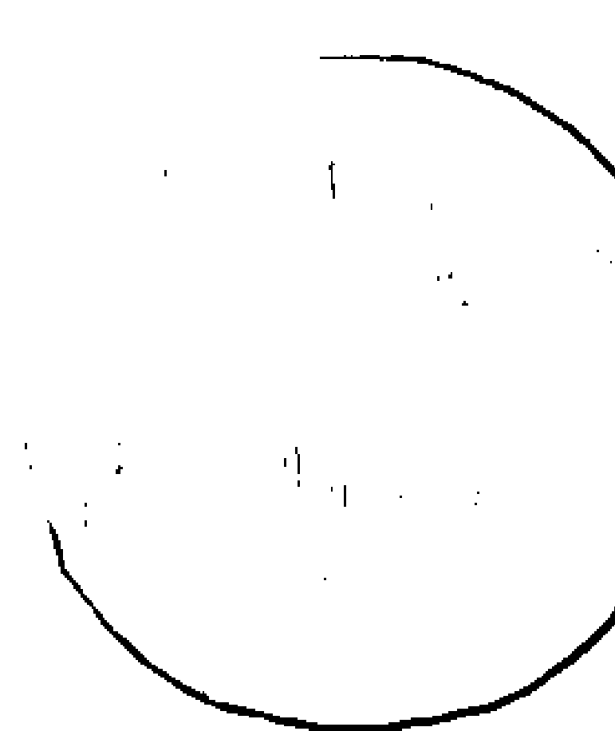
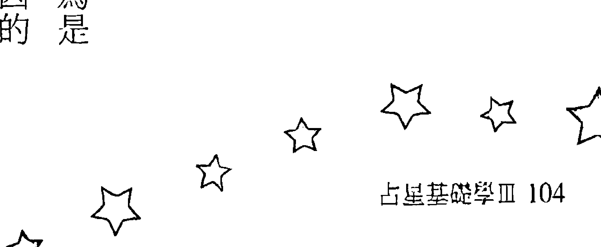
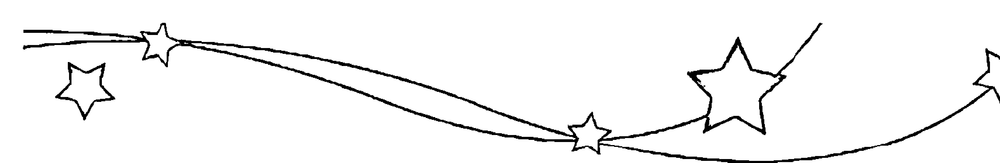
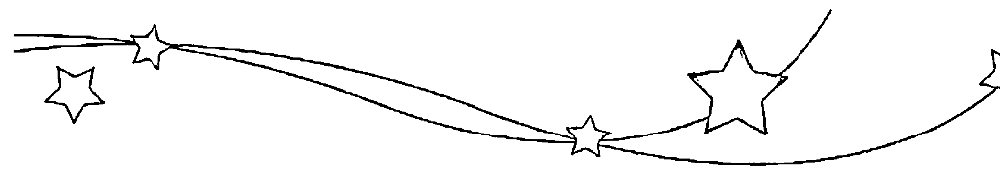
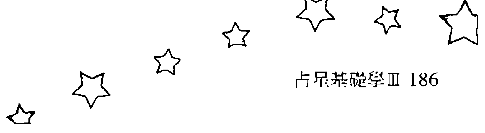
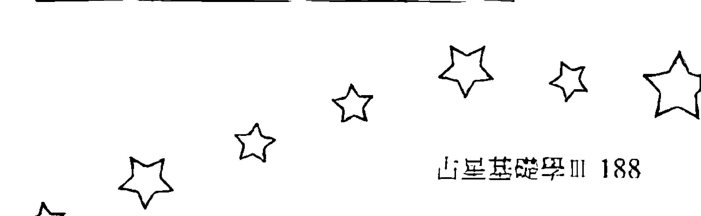
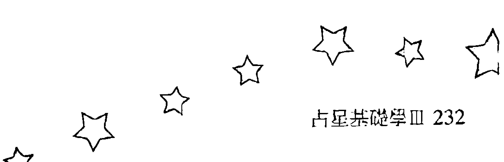

# 月亮土星木星世代行星汇集的隐藏版人生

# 作者序

占星學的知識博大精深，從自然占星、世運占星、個人占星到事件占星及問卜占星，每樣都是很深奧的學問，再加上需要運用到很複雜的數學計算，因此長期以來星象知識經常給人神秘莫測的感覺；直到現代大眾媒體興起再加上電腦和網路技術的普及，讓占星學有了很好的基礎可以發展，現代人學習星象知識不用再與複雜的運算過程搏鬥，而能專心於意義的追求與內容的解釋，一般人即使數學不好也可以把占星學好，學習占星的門檻也因此降低許多。

任何知識的學習，應當從自身的經驗出發及累積，才能建立起穩固的基礎，因此一般人接觸星象知識大多是由個人占星學開始，拜現代大眾媒體發達之賜，很多人都知道自己的太陽星座，對於星座特質也有很基礎的了解；但是由於對星象知識的研究不深，也經常對於占星學有許多誤解，例如有些人以為出生在星座交界日的人同時會有兩個太陽星座的特質，就是非常典型的錯誤，其實每個人出生時只會有一個太陽星座，只是同時也受到其他行星的影響。

在西洋占星學當中基本上是以行星為研究的核心及解釋的主軸，出生時行星所落入的星座、宮位及行星與行星之間的相位關係，都是個人占星學分析的基本項目，不過由於行星的運動方式複雜，因此一般人對於自己出生時的星象狀況並不是那麼容易掌握；現代受到歐洲文化的影響普遍使用太陽曆，而太陽曆本身就是依照太陽運行的規律來設計，因此只要知道自己的出生日期，就能大致推論出自己出生時太陽所在的位置，所以並不需要用到特殊的星象知識。

對於個人來說，出生時太陽落入的星座影響顯而易見，再加上只要知道自己的出生日期就能大致知道自己的太陽星座，因此有關太陽星座的解釋就成為最容易普及的占星知識，但是除了太陽之外，其他不同的行星也會對於個人有很大的影響，當我們想要進一步了解星象知識的時候，就必須轉換以星座作為解釋主軸的習慣，而改用行星為主要的概念架構，因此在深入到更專精的星象知識之前，去了解其他行星落入不同星座的解釋，是一個不錯的過渡方式。

在占星基礎學二當中，丹尼爾已經介紹過太陽、水星、金星、火星落入不同星座的表現；太陽代表有意識的行為模式，對於領導統御及戀愛方面的影響特別大，水星代表理性的作用，主要會影響我們的思考模式、溝通方法與學習狀況，金星代表我們的價值觀，會影響我們對於金錢的態度以及審美觀，同時也會影響到朋友關係及對婚姻和感情的需求，火星代表生存的危機感，與我們面對競爭和處理衝突的方式有關，對工作的能力與方式也有很大的影響。

但是在個人占星當中其他行星落入星座的作用就沒那麼容易觀察，例如月亮是與個人的氣質及情緒有關，因此出生時月亮所落入的星座經常變成我們無意識時展現的行為模式，只有在情緒激動失去理性的時候會比較明顯看得到；木星與土星落入的星座則是我們可以幫助我們趨吉避凶的指標，透過後天的經驗與學習將會逐漸摸索出一條較為平順的道路，至於天王星、海王星及冥王星落入的星座則會標示出某個世代共同的性質，在個人身上更不容易分辨出來。

因此在本書當中，首先以月亮所在的星座為主軸，再談到月亮與土星的組合對健康的影響，接著以木星與土星的組合來談趨吉避凶之道，最後則是依天王星、海王星及冥王星的組合來看世代的差異；為了方便讀者查詢及比對，本書也附上一九九五一至二〇〇〇這五十年的月亮星座星曆表，及一九三〇年到目前為止的外行星星曆表，讓大家可以快速地找到家人、同學、朋友、同事出生時各個行星所在的星座，由於星曆表是以台灣的時區為準，若是遇到出生在其他時區的人，在查詢表格時請先換算到東八區的日期和時間，才不會搞錯對方的星座。

丹尼爾在這裡要感謝尖端出版社的團隊，在你們努力的企劃及催稿之下，讓這本書能順利完成，也要謝謝在占星學研究當中一路支持我的朋友及學生，沒有你們的幫助及鼓勵，也絕對不會有這本書誕生，特別是巨蟹一班的同學及雙子二班的同學，兩位詳細的課堂筆記在寫作當中提供很大的幫助；最後要謝謝我最愛的 Jenny 和映元，時時刻刻在精神上給我堅強的支持，由衷地謝謝大家。

丹尼爾

## 月亮在白羊座的深度解析

## 月亮白羊座的幼年生活

出生時月亮在白羊座的人通常有個很獨立自主的母親，她們的行動力超強而且即知即行，凡事喜歡自己來而不願意假手他人，遇到任何難題都會正面迎戰毫不退縮，經常表現出勇敢果決的一面，這種類似於女戰士的形象會深深地植入孩子的心中；她們經常是扛起家計的職業婦女，或是還有其他重要的事情要忙，很難長期把注意力放在照顧孩子上面，因此作為她們的子女很小就要學會獨立，也要主動表達自己的意見和需求，否則就很容易被母親給忽略。

月亮在白羊座的人經常是在充滿競爭的環境當中成長，也常被拿來與兄弟姊妹或是親戚朋友的小孩們比較，所以需要很努力地表現才能受到注意和肯定，這可能會讓他們養成凡事爭先的習慣，無意識當中就有強烈的競爭性；若是在幼年階段受到比較多的壓抑，則會加強他們的防衛心，也更容易有自私自利的傾向，這時他們會像受傷的白羊般閃躲衝突，盡量避免與別人比較，其實內心當中還是有不服輸的一股氣，經常在大家都意料不到的時候突然爆發出來。

## 月亮白羊座的氣質表現

月亮在白羊座的人反應非常快，這倒不是說他們的思慮敏捷、口才便給，而是他們在無意識當中經常會迫不及待地採取行動，因此無論如何都會透露出一些急性子的氣質，有時候他們會在還沒想清楚之前就輕易許諾別人，然後為了達成任務再拚了命地趕工；當他們有熱情的時候效率非常高，常常很快就能完成好幾個人份的事情，但是遇到他們缺乏動力去做的事情，又會一動也不動地冷眼旁觀，這時通常激將法會加強他們的動力，但也不是每次都那麼有效。

一般來說月亮在白羊座的人情緒來得快去得也快，而且通常都會很直接地表現出來，所以他們不太會累積負面情緒，也很少長期陷入悲傷或憂鬱當中，但是他們在當下的情緒會非常強烈，經常會在無意之間傷害到四週的人，因此遇到他們大爆發的時候最好躲遠一點，免得被颱風尾掃到；另一方面，他們在壓力下很容易失去耐性，無論有沒有效果都會採取行動，而不願意消極被動地等待，有時候衝動會為他們惹出一些麻煩，或是忙於毫無意義的事情。

## 月亮白羊座的居家飲食

通常月亮在白羊座的人家中的佈置都比較傾向簡單，而不喜歡太過花俏的裝飾，方便省時是最高的指導原則，相對來說就不是那麼重視美感與品味，他們會將常用的東西放在明顯伸手可及的地方，所以通常看起來都會有一點混亂；如果可以選擇，他們大多會居住在熱鬧的市區，因為生活機能方便可以節省許多時間，但若是因為其他因素不得已要住在郊區，那麼就一定要有自己 的交通工具並且備好專屬車位,否則每天花時間等公車或找車位會要了他們的命。

而月亮在白羊座的人對於飲食並不那麼講究,對他們來說吃東西就為了不餓肚子,喝東西也只有解渴的功能而已,通常他們吃東西時又快又急,兩三下就把所有的東西一掃而空,然後又忙著去處理其他事情;因此在忙的時候他們可能天天都吃速食和泡麵,甚至忘了吃正餐,就靠各種零食和點心來補充體力,因此在他們的櫃子或抽屜裡面經常會發現許多乾糧和甜食,即使在家自己下廚也常選擇能快速上桌的冷凍食品,或是一次煮一週份量再每天熱一點來吃。

## 與月亮白羊座的人相處

出生時月亮在白羊座的人很重視獨立與自主,非常討厭別人干涉自己的行為,他們內心深處總覺得自己是對的,而且很想用各種方法來證明自己是對的,因此當有人指出他們的錯誤,或是逼迫他們去做不願意做的事情,往往會引來他們激烈的反擊;他們需要有明確的努力目標,積極主動力求表現,若是整天閒閒沒事反而會讓他們覺得徬徨不安,因此他們經常把行事曆排得很滿,從早到晚忙個不停,這樣他們才會感到比較踏實,慶幸自己沒有浪費時間。

而基本上月亮在白羊座的人是救急不救窮,如果你是因為一時的急難而需要幫忙,他們通常會很主動熱心地幫助你,但若是你不知改進,一而再、再而三地犯相同的錯誤,那麼月亮在白羊座的人就不會幫忙你,即使你苦苦哀求也沒有用;他們會用自己覺得最好的方式去幫助和照顧對方,但是並不一定會符合對方的想法和需求,有時候熱心助人反而會引發衝突,甚至沒幫到忙還 吵得不可開交，因此這會讓有些人覺得他們過於主觀和任性，對別人不夠細心、體貼。

## 月亮白羊座的保健之道

### 月亮在白羊座&土星在白羊座

月亮與土星同在白羊座的人很容易有胃痛的情況發生，嚴重的時候甚至會出現胃潰瘍和慢性胃炎的問題，他們比較年輕的時候容易在臉部長青春痘、雀斑，頭皮屑也會特別多，年長一些則容易有頭痛、骨質疏鬆等狀況出現，若是不幸骨折需要較長的時間才能恢復，所以要特別注意運動傷害；吃飯時最好能有意識地提醒自己細嚼慢嚥，可以減輕胃部的不適，另一方面也可以借助瑜伽、太極拳之類的運動，讓自己更加有耐性與放鬆，能夠減緩發生頭痛的狀況。

### 月亮在白羊座&土星在金牛座

土星在金牛座而月亮在白羊座的人很容易有偏頭痛的情況發生，甲狀腺腫大或是甲狀腺機能亢進也是常見的問題，他們年輕的時候可能會有經常性的喉嚨痛、咳嗽、甚至是低燒持續不退的現象，年長一些則是容易遇到聲帶長繭或是吞嚥困難的問題，消化不良及吸收不良的狀況也很常見；平時要有意識地提醒自己早點睡覺，對於偏頭痛的問題會很有幫助，若是能借助於精油按摩、刮痧、拔罐等方式補充身體的能量，通常都可以減輕喉嚨不舒服的狀況。

### 月亮在白羊座&土星在雙子座

月亮在白羊座同時土星在雙子座的人容易發生頭痛的問題，有些人則是會有鼻子過敏或是氣喘的狀況，他們在比較年輕的時候容易有胸悶、呼吸不順暢的現象，年長一些則容易有聽力及記憶力衰退的問題，經常在手部出現骨刺或關節炎，若是長時間寫字或使用電腦則很容易出現腕隧道症候群；提醒你們，工作時要有意識地讓自己休息並吃點東西，可以減少頭痛及手部不適的狀況，有空時多到戶外走走，接近大自然，呼吸新鮮空氣對於呼吸道的狀況也很有幫助。

### 月亮在白羊座&土星在巨蟹座

土星在巨蟹座讓月亮在白羊座的人胃特別不好，不但經常會胃脹氣、胃痛，還可能有胃潰瘍甚至是胃癌等問題，他們年輕的時候容易有皮膚過敏的狀況，臉部常會長青春痘，年長一些則會有胸悶、胸痛的狀況，女性則要特別小心乳房的病變甚至是腫瘤，記得定期去醫院檢查；平時要特別注意飲食，盡量少吃刺激性及生冷的食物，同時最好改掉喝冷飲的習慣，以減輕胃部不適的狀況，記得吃東西的質比量還要重要，若是能避開海鮮與奶蛋類則會更好。

### 月亮在白羊座&土星在獅子座

月亮在白羊座而土星在獅子座的人皮膚特別敏感，不但很容易曬傷，乾癬或濕疹也是常見的問題，他們比較年輕的時候容易有異位性皮膚炎，或是長雞眼、肉疣等狀況，年長一些則很容易 發生背部和脊椎方面的問題，經常會覺得腰痠背痛，另一些人則是要注意心臟方面的問題；所以出門在外夏天防曬、冬天保濕的功夫絕不可少，由於皮膚較弱的關係，要選用品質較好的化妝品及保養品，臉部的卸妝及清潔工作絕對要確實，否則很容易長疹子、冒痘痘。

### 月亮在白羊座＆土星在處女座

土星在處女座讓月亮在白羊座的人消化系統特別不好，甚至可能因此容易發生營養不良的問題，他們在年輕的時候容易有胃脹、腹痛及經常性腹瀉等問題，有些人則會相反地有便秘的困擾，年長一些則容易有精神不繼、體力耗弱的現象，檢查不出什麼大病但身體總是不舒服；在工作時要有意識地提醒自己休息，以避免過度消耗身體的能量，減少肉類及蛋白質的攝取並多吃蔬菜、水果會有一些幫助，也可以嘗試排毒餐或是斷食的方法來強化消化系統。

### 月亮在白羊座＆土星在天秤座

月亮在白羊座同時土星在天秤座的人特別容易有腰痛的問題，脊椎側彎或長骨刺也是很常見的狀況，他們在年輕時容易有消化不良的問題，同時也會有不明原因的頭痛及偏頭痛，年長一些則要小心腎臟方面的問題，有些人同時是糖尿病的高危險群；對你來說思慮過度是健康最大的殺手，所以如果能利用靜心、冥想、打坐等方法幫助自己放下妄念，就能減少頭痛發作的頻率，在忙碌時要有意識地提醒自己多喝水及上廁所，對於腎臟的狀況會有一些幫助。

### 月亮在白羊座＆土星在天蠍座

月亮在白羊座而土星在天蠍座的人體質特別虛弱，貧血甚至頭暈都是常見的狀況，女性則要特別注意子宮及卵巢方面的問題，在年輕時他們就體力比較差，有些人會特別瘦弱，另一些則相反地有虛胖的現象，年長一些則容易有便祕的狀況，腎臟及膀胱也可能有結石的問題；壓抑隱藏的情緒是你健康最大的殺手，所以最好利用心理諮商、心靈成長課程或是其他修行法門，幫助自己走出負面的情緒，健康問題自然不藥而癒，此外，良好的睡眠習慣也會很有幫助。

### 月亮在白羊座＆土星在射手座

月亮在白羊座同時土星在射手座的人一般來說身體都很強健，但是各種類型的運動傷害在所難免，他們在年輕的時候容易發燒和頭痛，這是因為經常已經過勞了而不自知，通常要等到年長一些才發現自己已經過度消耗，因此很容易得到肝病、腫瘤甚至是癌症；盡量減少熬夜是最有效的養生方法，其次則是避免喝酒和少吃刺激性的食物，遇到跌打損傷的狀況要先充份休息，千萬不要逞強而過度勞動，否則一旦沒有痊癒成為痼疾，累積到後來會越來越難處理。

### 月亮在白羊座＆土星在摩羯座

土星在摩羯座讓月亮在白羊座的人體力變得較差，經常會有失眠的狀況發生，有些人則是有平衡感或是聽力方面的問題，他們在年輕的時候很容易有頭痛的問題，年長時則經常受到關節炎 或骨刺等狀況的困擾，也比較容易有駝背的現象；過度競爭與求勝是你們健康的大敵，放下主觀的利益算計多為別人著想，並多參加一些靈修活動或靈性成長課程，自然可以減輕壓力，同時增進健康，或者也可以試試唱頌真言與音樂療法，通常都可以改善睡眠品質。

### 月亮在白羊座&土星在水瓶座

月亮在白羊座而土星在水瓶座的人容易遇到內分泌或免疫系統失調的問題，他們在年輕的時候經常會有頭痛甚至是失眠的問題，甚至有可能滿臉長滿青春痘，女性則容易有生理痛或是經期不固定的困擾，年紀漸長時體力下滑的速度較快，也容易有跌倒或扭傷腳踝的狀況發生；讓自己生活規律是維持健康的基礎，因此一定要避免工時過長，並且盡量減少熬夜的頻率，瑜伽或是太極拳等緩和的運動比較適合你，太激烈的競賽型運動則容易發生運動傷害。

### 月亮在白羊座&土星在雙魚座

月亮在白羊座同時土星在雙魚座的人經常會有失眠的狀況，所以一般來說抵抗力也會比較差一點，在天氣交替的季節很容易受寒而頭痛，在年輕時經常是小病不斷，但是並不會有太嚴重的大病痛，年長一些則會發現動作變得比較不靈活，也經常會有手腳冰冷的狀況；在睡前用熱水泡腳是很有效的作法，通常都可以改善睡眠的品質，有助於驅除身體中的寒氣，再來則是要有意識地避開於酒的誘惑，減少對於神經系統的干擾和傷害，才能保持身體的健康。

## 月亮在金牛座的深度解析

## 月亮金牛座的幼年生活

月亮在金牛座的人通常有個很穩定務實的母親，她們對於金錢及物質方面特別敏感，總是默默付出而且甚少抱怨，不論遇到多大的變故都能冷靜以對，因此經常扮演安定人心的關鍵角色，這種不動如山的形象會帶給孩子很穩固的安全感；因為她們會努力保護和照顧孩子，盡量提供良好的物質生活及安全保障，也會認真地對待孩子提出的各種要求，並且以自己認為最好的方式來回應，因此她們的子女通常很早就能清楚表達自己的需求，同時也很懂得享受生活。

出生時月亮在金牛座的人通常是在一個被保護的環境下長大，因此對於各種危險的敏感度較低，對於變化的反應也會比較慢一點，有些人會誤以為他們的膽量特別大，其實他們只是還來不及反應而已；若是他們曾經在幼年時經歷過物質生活匱乏的狀況，就有可能會不自覺地拚命積累金錢，在行為上會顯得較貪財和吝嗇，但是整體來說他們並不會每件事情都斤斤計較，只是會從很實際的角度來衡量事情，因此有時候也會讓人覺得比較缺乏人情味。

## 月亮金牛座的氣質表現

通常月亮在金牛座的人都有一種保守的氣質，總是依照自己的步調不慌不忙地走著，即使遇到任何外在的干擾也大多都能保持專注，默默做著自己覺得重要的事情，所以雖然他們不會急切地去做任何事情，但是只要他們開始進行，耐力就非常驚人；原則上他們不喜歡快速或重大的變動，因此在大部分狀況下維持現狀會是他們的優先選擇，即使面對不得不改變的狀況，移動的速度也會非常緩慢，經常要別人催一下才動一下，反映出在內心深處的牛脾氣。

一般來說月亮在金牛座的人不太會感覺到焦慮不安，也很少有激烈的情緒反應，由於他們不容易與別人的情緒起共鳴，即使在激動狂熱的人群當中，他們仍然可以保持冷靜，因此在傳統的占星書中常會提到月亮在金牛座的人是脾氣最好的一群人；當然他們也會遇到心情不好的狀況，這時候他們可能會選擇去逛街購物，或是去享受一頓豐盛美味的大餐，再不然到郊外走走也是常見的方法，總之他們自有一套化解負面情緒的儀式，很少會干擾到別人。

## 月亮金牛座的居家飲食

通常月亮在金牛座的人，家中的佈置都很講究，他們對於美感有強烈的要求，也會精挑細選有質感的家用品，整體搭配起來很賞心悅目又有強烈的個人風格，雖然大部分的東西都具有實用的功能，但是其間也會點綴一些有收藏價值的藝術品；比較安靜的社區或別墅是他們的首選，如果能有個小花園或陽臺可以種種花草就更完美了，一般來說他們並不喜歡經常搬家，所以很可能會因此選擇待在老家與父母親同住，或是盡早想辦法買一間自己喜歡的房子。

出生時月亮在金牛座的人是天生的美食家，對於食物的用料和烹調都很有心得，他們通常都會有一份自己的美食餐廳排行榜，為了品嚐美食也會願意花時間到現場排隊，如果在外用餐遇到不好吃的東西，他們寧可餓肚子也不願意委曲自己，因此也有為數不少的人會自己煮飯帶便當，不但省錢也可以避免踩到地雷；蛋糕、巧克力或其他甜食對於他們來說有著致命的吸引力，特別在心情不佳時他們可能會選擇狂吃零食發洩情緒，因此也增加了發胖的風險。

## 與月亮金牛座的人相處

月亮在金牛座的人內心渴望固定的模式及規律，只要維持住他們已經習慣的秩序與結構，就能在當中愉快地生活，不過一旦有人破壞了這樣穩定的狀態，就會引起他們負面的情緒，他們經常會頑固地抵抗不願意合作，並且採取相應不理的焦土策略；他們很重視所有權及支配權的觀念，沒有經過他們同意千萬不要去動他們的東西，也別想在金錢上佔他們的便宜，同時他們內心當中對於人際關係的級數劃分得很清楚，不熟的人裝熟會讓他們覺得受到侵犯。

月亮在金牛座的人相信日久見人心，他們不太容易信任剛認識不久的人，但是相處的經驗日積月累下來，往往能留住不少真心的知己，他們非常珍惜這些一路相挺的老朋友，當對方有需要的時候他們總是會在一旁默默地陪伴；他們基本上抱持著人不犯我、我不犯人的信念，並不會積極介入別人的事情或是主動去指導別人，相對而言他們也不喜歡別人管東管西，所以彼此相互尊重，留點空間才能維持長久的關係，太緊密黏膩反而會讓他們覺得不自在。

## ♉月亮金牛座的身心保健之道

### 月亮在金牛座 & 土星在白羊座

月亮在金牛座而土星在白羊座的人很容易有頭痛的問題，特別是在壓力大的狀況之下經常會犯這樣的毛病，他們在年輕時較容易有皮膚過敏的問題，年長一些則要注意骨質疏鬆及掉髮嚴重的狀況，另外一些人則會聽力退化特別快，甚至到中年就已經嚴重到要戴助聽器的程度；固執己見是所有健康問題的總源頭，所以平時除了自己一個人埋頭苦幹之外，也要多多參考別人的意見，這樣做不但對於頭痛的問題很有幫助，也可以延緩聽力退化的發生時間。

### 月亮在金牛座 & 土星在金牛座

月亮與土星同在金牛座的人喉嚨特別脆弱，很容易就會扁桃腺發炎造成喉嚨痛，也經常會趕上流行性感冒，他們在比較年輕時容易覺得喉嚨有痰不舒服，嚴重的還可能會一天到晚咳個不停，年紀漸長之後很容易有平衡感方面的問題，要特別小心跌倒等運動傷害，女性朋友則要注意婦科方面的問題；在季節轉換的時候要特別注意保暖，經常使用圍巾和帽子可以有效減輕喉嚨不適的狀況，同時要避免吃太辣及刺激性的食物，並最好改掉吃冰及喝冷飲的習慣。

### 月亮在金牛座 & 土星在雙子座

月亮在金牛座而土星在雙子座的人特別容易有呼吸道方面的問題，只要有流行性感冒不論是哪一型都很容易被感染，他們在比較年輕時容易有鼻子過敏甚至是氣喘的問題，年紀大一點時則容易有聽力退化或語言表達困難的問題，有些人則會特別容易覺得肩頸僵硬或是痠痛；過勞是身體健康的大敵，所以努力工作之餘還是要找機會休息，多到郊外走走，親近大自然會是很不錯的保養方式，在季節交替的時候少到人多的公眾場所，以減少感染流行感冒的機會。

### 月亮在金牛座 & 土星在巨蟹座

土星在巨蟹座讓月亮在金牛座的人特別容易發胖，而且即使節食外加運動也很難瘦得下來，他們在比較年輕時容易有胸悶、胸痛的狀況，女性則要特別小心乳房的病變甚至是腫瘤，年紀較長時則很可能有骨質疏鬆的問題，有些人會變得很容易胃脹氣、胃痛，甚至是演變成虛胖水腫的狀況；飲食的習慣對你的健康影響最大，除了美味之外也要注重營養均衡，吃冰和喝冷飲要盡量減少，此外若是能減少對物質佔有的慾望，則能減輕胸悶及胸痛發生的頻率。

### 月亮在金牛座 & 土星在獅子座

月亮在金牛座同時土星在獅子座的人容易有心臟方面的問題，女性朋友貧血的比例也偏高，他們在比較年輕時容易遇到皮膚過敏的問題，由於皮膚較為脆弱所以要特別注意防曬，年紀較長則很容易發生背部和脊椎方面的問題，經常會覺得腰痠背痛，甚至會有骨刺增生等狀況發生；溫和的運動會對你的健康很有幫助，特別是瑜伽、皮拉提斯或是簡單的伸展運動、柔軟體操都很適合你，最好不要做過份劇烈的運動，以免發生肌肉拉傷或是骨折的狀況。

### 月亮在金牛座 & 土星在處女座

月亮在金牛座同時土星在處女座的人一般來說身體都很健康，但是要特別小心積勞成疾的問題，若是仗著自己體力好一直拚命而沒有休息，可能會因為過度消耗而提早出現老化的現象，大量落髮或是皮膚變得粗糙都是很嚴重的警訊；在工作當中有意識地提醒自己休息是很重要的一件事，同時要盡量避免過度熬夜傷害身體，在飲食方面最好多吃蔬菜水果，每天早上來杯精力湯也是很好的習慣，若是能減少動物性蛋白質的攝取會讓身體狀況有明顯的改善。

### 月亮在金牛座 & 土星在天秤座

月亮在雙子座而土星在天秤座的人特別容易有糖尿病的問題，同時腎臟與泌尿系統也比較脆弱，他們在比較年輕時就比較難控制體重，若是懶得運動就很容易身材走樣甚至是暴肥，年紀較長之後則容易有骨頭方面的問題，可能會受腰背痠痛甚至是骨刺的困擾；調整飲食會對身體健康起關鍵的作用，吃東西要減少鹽份及油脂的攝取，盡量喝水而不要喝茶或咖啡，汽水或奶昔等高熱量的含糖飲料也最好都不要碰，再加上適量的運動就可以保持身體的活力。

### 月亮在金牛座 & 土星在天蠍座

月亮在金牛座而土星在天蠍座的人天生體力就比較差，女性朋友常會有貧血的狀況，同時也要注意子宮及卵巢方面的問題，他們在比較年輕時容易有消化不良及腹瀉的狀況，年紀漸長則可能相反地出現便秘的困擾，特別需要注意大腸及直腸方面的問題；過於執著鑽牛角尖是健康的大敵，透過參加宗教及各種靈修活動可以改善這種習氣，對於健康會很有幫助，也可以利用秋冬時多吃一些溫補的東西，要記得食補優於藥補，吃補藥有時候反而會有副作用。

### 月亮在金牛座 & 土星在射手座

月亮在金牛座同時土星在射手座的人特別容易發生運動傷害，若是沒有及時處理並且充份休養，很容易會變成慢性的問題跟著一輩子，所以在這部分千萬不要逞強，年紀較長之後容易有消化不良的問題，也要注意消化道出現腫瘤的可能；正常的生活作息是維持健康最有效的方法，早睡早起避免熬夜，飲食有節制定時定量，並且選擇一兩項有興趣的運動持之以恆，就比較不會出什麼大問題，若是長時間坐著讀書或工作要記得提醒自己起來走動走動。

### 月亮在金牛座 & 土星在摩羯座

月亮在金牛座同時土星在摩羯座的人通常身體沒有什麼明顯的大問題，但若是沒有在年輕時就養成運動的習慣，到年紀比較大一點之后就很容易發胖導致身材變形，也可能有心血管方面的疾病，另一些人則是會有痛風或是關節炎，導致行動不是那麼靈活；因此選擇自己有興趣的運動持之以恆進行會是對健康最好的投資，練習氣功、太極拳、瑜伽等也會對身體的氣血循環有很大的幫助，同時要注意控制飲食的量，吃得少一點可以減輕身體的負擔。

### 月亮在金牛座 & 土星在水瓶座

土星在水瓶座讓月亮在金牛座的人新陳代謝率降低，因此下半身會特別容易發胖，他們在比較年輕時可能會經常扭傷腳踝，或是因為跌倒而有其他的運動傷害，年紀較長之後要注意心血管方面的問題，天氣變化時要小心血壓突然升高或是降低；通常緩和的運動會比較適合你，包括伸展體操、瑜伽、皮拉提斯等等都很不錯，其次則是要透過飲食來調養身體，盡量少吃生冷的食物，減少喝冷飲及吃冰的頻率，注意太激烈的運動競賽容易造成的運動傷害。

### 月亮在金牛座 & 土星在雙魚座

月亮在金牛座而土星在雙魚座的人很容易得到流行性感冒，腸病毒等消化道的傳染病也很難避免，幾乎可以說現在流行什麼就容易得什麼病，不過相對來說比較不容易有什麼嚴重的慢性病，只是年紀較長之後比較容易發胖導致身材變形；所以出入人多的公眾場所最好能配戴口罩，回到家或吃飯前也要養成洗手的習慣，同時要注意食品的衛生及安全，以減少流行疾病感染的狀況，在秋冬之時可以多吃一點溫補的東西，這樣身體的抵抗力也會比較好一些。

## 月亮在雙子座的深度解析

## Ⅱ月亮雙子座的幼年生活

出生時月亮在雙子座的人通常都有個很多才多藝的母親，她們總是好學不倦、整天忙東忙西，經常是一邊工作同時又帶小孩的職業婦女，即使是全職的家庭主婦也有很精彩豐富的生活，這種靈活而充實的形象會讓孩子不自覺地嚮往；她們非常重視孩子的教育，也很喜歡和孩子聊天講話，她們會很認真地回答孩子提出的各種問題，也會提出許多問題讓孩子去思考，因此作為他們的子女自然就很習慣於去思考各種問題，而且通常都很善於表達自己的意見。

月亮在雙子座的人經常是在比較活潑吵雜的環境下長大，若不是家中的兄弟姊妹眾多，就是經常有不同的訪客在家裡聚會聊天，不自覺當中就養成他們能同時處理各種不同訊息的能力，太過安靜的地方反而會讓他們覺得不安；若是在童年遭受比較多的批評和責備，則會讓他們學會油腔滑調以求自保，他們會迎合別人的喜好裝作別人會認同的樣子，因此經常見人說人話、見鬼說鬼話，讓人覺得是牆頭草兩邊倒，其實這種行為只是反映出他們經歷過的傷痛。

## Ⅱ月亮雙子座的氣質表現

出生時月亮在雙子座的人不喜歡一個人孤單的感覺，並且十分痛恨單調無聊的生活，因此他們經常會在無意識當中就把自己的時間塞滿，甚至在同一時間做好幾件事情，從正面來看你可以說他們有一心多用的能力，但是從負面來看他們也比較無法專心集中注意力；他們有一種喜新厭舊的傾向，做事情經常是三分鐘熱度且缺乏耐力，對於重複不變的例行性事務更是興趣缺缺，不過由於腦袋一直運轉停不下來，所以也常有神經過份緊張甚至是失眠的問題。

一般來說月亮在雙子座的人總是理性多於感性，當他們出現情緒的時候往往不會在第一時間就反應出來，而是會去思考自己為什麼有這些情緒，經常變成自己與自己對話的內心戲，他們在心情不好的時候會喜歡找人聊聊，透過講話的方式來整理與抒發自己的情緒；不過他們的情緒變化也很快，前一秒鐘還高高興興地有說有笑，立刻就可以翻臉不認人，很容易給人喜怒無常的感覺，在盛怒之下他們可能會大罵或是譏諷對方，基本上是屬於動口不動手的類型。

## Ⅱ月亮雙子座的居家飲食

通常月亮在雙子座的人家中的佈置都很靈活多變，他們會買一些很有設計感的傢俱來排列組合，比較少訂製需要施工固定在牆面上的系統櫃，因為對他們來說經常改換擺放的位置會帶來煥然一新的感覺，也方便搬家時可以把所有的東西都帶走；一般他們比較喜歡住在交通方便的地方，若是能臨近捷運站、交流道、火車站或機場等交通樞紐就更好了，不過同時他們也是很喜歡搬家的一群，若是沒有經濟實力可以不斷地購屋、換屋，也可能乾脆選擇一直租房子。

出生時月亮在雙子座的人喜歡嘗試各種不同口味的食物，他們會花很多時間收集美食資訊，甚至還會自己寫美食部落格，一般來說他們外食的比例偏高，因為如此才能吃到各種不同的菜色，即使選擇自己在家裡開伙，也經常會實驗各式各樣的食譜，絕不會讓自己吃得單調寒酸；另一方面他們吃飯的時間也不太固定，有時候一忙起來就忘了吃晚餐，往往到忙完之後才去吃豐盛的宵夜，或是因為睡太晚就早午餐一起解決，經常不是在固定的時間進食。

## Ⅱ與月亮雙子座的人相處

月亮在雙子座的人對於環境的變化特別敏感，任何的風吹草動都會激發他們的好奇心，他們不喜歡混沌不明的狀態，唯有清楚明白一件事情才能讓他們覺得安心，因此他們對於資訊與新知的飢渴十分強烈，有些人一天會看好幾份報紙，或是在做事情時又同時收聽廣播新聞，遇到有興趣的事情可能一整天都掛在網路上搜集資訊，並且透過轉寄與轉貼把這些訊息分享出去，他們可以一邊看電視一邊和別人講電話，甚至在網路上同時和好幾個不同的人聊天。

一般來說月亮在雙子座的人不太可能濫用同情心，當遇到問題時他們會很歡迎你和他們聊，也會提供分析意見和解決方案，不過要他們動手幫忙就比較困難了，他們會覺得自己的問題該要自己解決，這個部分的界線他們倒是非常清楚；他們不太喜歡給人確切的承諾，一方面他們害怕被限制而失去彈性，同時他們也很清楚自己有喜新厭舊的毛病，與其答應了別人後來又做不到，還不如一開始就不要給出任何承諾，因此有時候會給人比較飄泊與疏離的感覺。

## Ⅱ月亮雙子座的身心保健之道

### 月亮在雙子座 & 土星在白羊座

土星在白羊座讓月亮在雙子座的人特別容易頭痛，尤其是睡眠狀況不好時更是如此，他們在年輕時經常有皮膚方面的問題，特別是手部容易有乾癬或富貴手，年長一些很容易遇到聽力退化的問題，有一些人則會出現失眠或淺眠的狀況；整體而言思慮過度與神經緊張是健康最主要的問題，所以最好能學習一些幫助身心放鬆的技巧，例如禪修、打坐、冥想、氣功等等都會對健康狀況有很大的助益，利用休假時間多到戶外親近大自然也是很不錯的方式。

### 月亮在雙子座 & 土星在金牛座

月亮在雙子座而土星在金牛座的人經常有喉嚨不舒服的問題，一方面是因為他們講了太多話可能造成發炎、喉嚨痛，另一方面他們也比較容易感冒咳嗽，年紀較大一點常會感覺肩頸痠痛，有些人則會出現聽力退化的問題；喉嚨的保養對他們來說是最重要的一件事，平時盡量飲用溫水或清茶，改掉吃冰及喝冷飲的習慣，當喉嚨不舒服的時候最好多睡覺、多休息，避免對喉糖及感冒藥等藥物過度依賴，其他如聲音療法及音樂療法等方式對你也有很好的效果。

### 月亮在雙子座 & 土星在雙子座

月亮與土星同在雙子座的人經常會有呼吸道方面的問題，有些人是從小就有氣喘的毛病，呼吸短淺及肺活量不足也是常見的狀況，另外有一些人則是經常為胃痛所苦，年紀大一點則容易遇到聽力退化的問題，若是長時間寫字或使用電腦也很容易出現腕隧道症候群；游泳或是太極拳等運動對於呼吸道方面的問題很有幫助，慢跑及騎腳踏車也是不錯的選擇，最好能多多利用時間到戶外走走呼吸新鮮空氣，經常待在密閉的冷氣房裡很容易悶出病來。

### 月亮在雙子座 & 土星在巨蟹座

月亮在雙子座同時土星在巨蟹座的人天生肺部就比較脆弱，肺活量也比較不足，有些人從小就有氣喘的問題，若是有吸菸的習慣更可能會整天咳個不停，年紀漸長之後體力下降的速度會比較快，還可能有肺泡纖維化等病變產生，女性則要特別小心乳房的病變甚至是腫瘤；為了自己的健康著想，最好能避免染上吸菸的習慣，否則很可能會變成肺癌的高危險群，任何戶外運動都對健康有幫助，但要選擇空氣品質比較好的地方，避免居住在濕氣太重的地區。

### 月亮在雙子座 & 土星在獅子座

土星在獅子座讓月亮在雙子座的人特別容易有皮膚方面的問題，有些人經常會曬傷脫皮，平常也容易出現過敏起紅疹的狀況，他們在年輕時總覺得自己的身體很好，到年紀較長時才漸漸出現骨頭及關節的問題，特別容易覺得腰背痠痛；其實身體有很多問題都是因為不良的習慣慢慢累積而成，要注意盡量少吃會引起皮膚發癢過敏的食物，若是長時間坐著工作則要注意姿勢的問題，選擇符合人體工學的座椅、鍵盤、滑鼠及滑鼠墊可以減少身體痠痛的狀況。

### 月亮在雙子座 & 土星在處女座

土星在處女座讓月亮在雙子座的人特別容易神經緊張，進而造成失眠、消化不良等問題，他們在較年輕時可能會經常拉肚子，若是飲食不均衡還會有營養不良的狀況，年紀漸長之後腸胃道的問題會越來越嚴重，甚至還可能出現腫瘤和癌症；優質的食物對於健康會很有幫助，盡量選擇天然有機的食材，避免油炸及微波食品，良好的睡眠品質是健康另一個重要的基礎，可以運用打坐、冥想、瑜伽等方式來幫助自己放鬆，在睡前用熱水泡腳則可以幫助入眠。

### 月亮在雙子座 & 土星在天秤座

月亮在雙子座而土星在天秤座的人通常健康狀況都還不錯，但是想太多仍然可能造成失眠的問題，他們在年輕的時候比較容易有頭痛的狀況，年紀較長之後則會有腰痠背痛的困擾，有些人同時也是糖尿病的高危險群；缺乏運動是健康狀況惡化的主因，所以從年輕時就要養成運動的習慣，如果覺得競賽型的運動過於激烈，也可以試試慢跑、騎自行車或跳舞等方式，工作或讀書一陣子之後也要提醒自己起身走動走動，整天坐著不動也會對健康有不利影響。

## 月亮在雙子座&土星在天蠍座

土星在天蠍座讓月亮在雙子座的人體力變得比較差，他們經常有呼吸道或肺部的疾病，女性朋友比較容易有貧血的問題，他們在年輕時就容易消化不良及脹氣，年紀較長一些則容易出現結石的狀況，有些人則為便秘的問題所苦；均衡的飲食是健康的基礎，減少大魚大肉增加蔬果的攝取是比較好的大方向，同時盡量養成在固定時間吃三餐的習慣，這樣身體的能量運作會比較平衡，如果能養成早睡早起的習慣避免熬夜，體力比較好一點。

## 月亮在雙子座&土星在射手座

月亮在雙子座而土星在射手座的人很容易有運動傷害，骨折或扭傷的狀況也會比一般人多一些，他們在年輕時常會有胃痛或是拉肚子的狀況發生，年長一點很容易有坐骨神經痛的問題，若是長時間寫字或是使用電腦則常會發生腕隧道症候群；所以在做任何劇烈運動之前都要先充份熱身，使用運動器材最好都能先請教練指導，自己亂玩還是容易出問題，選擇舒適並且符合身體工學的鞋子對於健康很有幫助，建議女性朋友最好盡量減少穿高跟鞋的時間。

## 月亮在雙子座&土星在摩羯座

月亮在雙子座同時土星在摩羯座的人常會有過勞的問題，他們年輕時呼吸道比較容易受到感染，若是長久時間不處理也可能變成慢性的問題，若是長時間寫字或是使用電腦經常會出現腕隧道症候群，年紀較長之後則可能會受到風濕及關節炎所苦，有些人則是會有痛風的問題；練習氣功、瑜伽或皮拉提斯等都會讓你比較容易放鬆，對健康狀況也會很有幫助，在工作一段時間之後也要有意識地提醒自己該休息了，超時加班熬夜是健康的大敵，要盡量避免。

## 月亮在雙子座&土星在水瓶座

月亮在雙子座而土星在水瓶座的人通常身體沒什麼大問題，但是肌力及體能不足是很常見的狀況，他們在年輕時可能會有頭痛及失眠的問題，年紀漸長之後呼吸系統會較弱，另一些人則是會有便秘的問題；養成經常運動的習慣對健康有極大的幫助，團隊的球類運動比較容易吸引你，像是籃球、棒球、足球、排球等都很不錯，但是要注意練過頭了反而會有過勞的問題，要適可而止休息，再來則是要維持規律的正常作息，避免熬夜過度消耗身體的能量。

## 月亮在雙子座&土星在雙魚座

土星在雙魚座讓月亮在雙子座的人特別容易失眠，他們可能從小就有氣喘的問題，也特別容易感冒咳嗽，若是不小心處理的話還可能變成急性肺炎，年紀較長則容易有精神不集中及健忘的問題，體力的下降衰退也會比一般人快；在睡前用熱水泡腳通常都可以改善失眠的狀況，也可以同時聽一點輕柔的音樂幫助入睡，但是最好避免喝酒，減少對於神經系統的干擾，在季節變換時要特別注意保暖，出門若是能使用帽子、圍巾及口罩就能減輕不舒服的狀況。

## 月亮在巨蟹座的深度解析

### 月亮巨蟹座的幼年生活

月亮在巨蟹座的人通常都有個情感豐富的母親，她們對於家人有強烈的愛心，也會將家人照顧得無微不至，如果有任何人、事、物威脅到家人的安全和幸福，她們絕對會全力反擊捍衛到底，這種保護者的形象能帶給孩子溫暖的安全感；她們會給孩子最好的照顧，盡量在情感和物質方面都滿足孩子的需要，因此作為他們的孩子通常都過得很幸福，也可以自由抒發自己情緒，但是過度保護也可能養成孩子依賴的習慣，總是期待有人能幫助自己解決問題。

出生時月亮在巨蟹座的人受到幼年環境的影響特別大，若是家中的經濟很富裕，可能會讓他們養尊處優變得好吃懶做，但若是成長在比較貧困的家庭，則會激發他們力爭上游的意願，立志要讓家人過好日子；若是在幼年時家中發生變故，導致他們無法受到良好的照顧，則有可能讓他們特別缺乏安全感，對人無法信任而有很強的防衛心，甚至變得疑神疑鬼或異常挑剔，其實他們內心仍然有溫暖柔情的一面，只是對於大部分人都只顯示出自我保護的武裝。

### 月亮巨蟹座的氣質表現

月亮在巨蟹座的人內心戲特別多，即使一件看似再普通的事情，也可能勾起他們一大堆的回憶，造成情緒翻騰起伏久久不能平復，由於他們有超強的記憶力，甚至可以像播放影片般把過去發生的事情巨細靡遺地重述一次，因此若是遇到不愉快的經驗，就很容易變成揮之不去的陰影；一般來說他們總是感性多於理性，對於自己有感覺的事情可以全心投入廢寢忘食，但是對於沒感覺的事情則會保持距離甚至逃得遠遠的，很難用講道理的方式說服他們改變。

出生時月亮在巨蟹座的人情緒會有週期性的變化，不論性別每個月都有幾天心情特別不好，他們會很明顯地把情緒寫在臉上，不爽的時候絕對會擺個臭臉，這個時候如果你膽敢去惹他們就免不了掃到颱風尾，平時的交情再好都沒用；有時候他們會陷入特別憂鬱、沮喪的情緒當中，不由自主地就聯想到最壞的狀況，讓擔心焦慮佔滿他們所有的思緒，不過他們也有很好的自我調適能力，只要找到方式發洩一下很快就可以回復正常，不會一直鑽進牛角尖裡。

### 月亮巨蟹座的居家飲食

通常月亮在巨蟹座的人家中的佈置都有一種溫馨的氣氛，餐廳和廚房則是他們最重視的地方，由於他們十分念舊又喜歡收藏各種有紀念性質的東西，所以對於收納空間的需求也很大；他們在選擇居住環境時很重視採買的便利性，最好能鄰近傳統市場、夜市或小吃店的商圈，不然至少巷口也要有超市、五金行和藥妝店，否則只是想要買個東西還得跑到大老遠去就太累了，有時他們會為了照顧家人而選擇與家人同住，或是住在親戚們的附近以方便互相照應。

出生時月亮在巨蟹座的人非常重視吃，他們不但要求營養均衡，對於食材的要求也很講究，他們的食量通常都會比一般人稍大，而且用餐時間到了就會餓得受不了，他們常會懷念所謂「媽媽的味道」，原生家庭的飲食風格也會造成根深蒂固的影響，若是人到外地念書或工作，就會特別去找尋家鄉味的小吃；整體來說他們會比較喜歡在家用餐，通常本身也會有不錯的手藝，即使外食也經常都是吃固定的那幾家，因而很容易與餐廳的工作人員成為好朋友。

月亮在巨蟹座的人非常念舊，同時也會執著於自己熟悉的事物，他們很喜歡窩在自己家裡，在熟悉的环境中會讓他們特別有安全感，所以若是搬家或換了新的環境，就很容易讓他們覺得不安；他們對別人的情緒變化特別敏感，有時候會不由自主地被別人的情緒干擾，但是反過來說他們的情緒也會對別人有感染力，同時食物對於他們的情緒會有很大的影響，若是吃得好可以讓他們整天心情愉快，但若口腹之慾無法得到滿足那也可能使得他們心情低落一整天。

月亮在巨蟹座的人經常會在無意識之間去區分自己人和外人，他們對於自己人會主動關心和照顧，也很會為對方著想，但是有時候會太過積極而管東管西的，反而讓對方感覺有壓力，但是對於外人就明顯冷淡許多，即使你找他們幫忙也不一定會理你；他們在自己人面前會很自然地表達自己的情緒，與在外人面前比較含蓄或害羞的反應完全不同，其實他們內心當中也很渴望被別人保護和照顧，如果有人對他們好，他們絕對會記在心裡並且找機會報答。

### 與月亮巨蟹座的人相處

### 月亮巨蟹座的身心保健之道

#### 月亮在巨蟹座&土星在白羊座

月亮在巨蟹座同時土星在白羊座的人經常為頭痛的問題所苦，特別是當遇到煩心的事情時會特別嚴重，他們在年輕的時候臉部經常會長雀斑或青春痘，也可能有皮膚過敏的問題，女性朋友則容易有月經不順或經前症候群的狀況，年長一些則容易出現胃部的問題，慢性胃炎甚至是胃潰瘍都有可能；吃東西時要有意識地避開過敏原，這樣就可以改善皮膚的問題，再來則是要學習一些平衡情緒的技巧，透過情緒的釋放經常都可以減輕頭痛及消化不良的狀況。

#### 月亮在巨蟹座&土星在金牛座

月亮在巨蟹座而土星在金牛座的人特別容易有喉嚨痛的問題，有些人則是經常有胸悶或胸痛的狀況，他們在年輕時容易覺得胃不舒服，也比較容易有消化不良的問題，年長一些則是容易有體重過重的問題，成為高血壓、高血糖、高血脂的三高危險群；健康的飲食是最基本也最重要的的一件事，盡量以蔬食為主，減少奶、蛋及肉類的攝取，避免過份辛辣及刺激性的食物，這樣不但可以保養好自己的消化系統，對於情緒及胸悶、胸痛的問題也會有一些幫助。

#### 月亮在巨蟹座 & 土星在雙子座

土星在雙子座讓巨蟹座的人特別容易有呼吸系統的問題，他們很容易染上流行性感冒，有些人則是從小為氣喘的問題所苦，肺活量小也是很常見的狀況，因此到了空氣不好的地方就很可能會喘不過氣來，年紀稍長一些則會有聽力衰退的問題，手腳活動也會比較不靈活；呼吸道及肺部的保養是健康的關鍵，氣溫變化大的時候記得配戴口罩，秋冬時節則要特別注意脖子的保暖，同時盡量少到人多又擁擠的室內公共場所，這樣可以減少呼吸道被感染的機會。

#### 月亮在巨蟹座 & 土星在巨蟹座

月亮與土星同在巨蟹座的人特別體弱多病，他們胃部很容易不舒服，消化不良也是很常見的問題，年輕的時候常有皮膚方面的問題，女性朋友則容易有月事不順的狀況，年長一些則會比較容易覺得胸悶、胸痛，女性朋友特別要注意胸部長腫瘤的問題，在身體檢查時千萬不可忽視這個部位；吃東西的時候要盡量挑選健康乾淨的食材，以避免食物過敏造成皮膚不適的狀況，同時最好能經常找人聊聊天說說話，否則情緒都一直悶在心裡也會影響到身體健康。

#### 月亮在巨蟹座 & 土星在獅子座

月亮在巨蟹座同時土星在獅子座的人皮膚都很敏感，特別是當吃到不適合的食物時就會過敏發得非常嚴重，他們年輕時經常覺得腰背痠痛，年紀較長則是容易有心臟方面的問題，有些人則是會發生骨質疏鬆甚至容易骨折的狀況；太過於執著與記恨是健康最大的敵人，所以要學著站在別人的角度來看事情，透過宗教或心靈成長課程來幫助自己培養慈悲心，對於健康會很有幫助，其次則是要選擇優質的飲食，一方面可以避免過敏，此外也有助於控制體重。

#### 月亮在巨蟹座 & 土星在處女座

土星在處女座讓月亮在巨蟹座的人消化道特別敏感，吃到不適合的東西很容易上吐下瀉，不小心就會對生活造成干擾，他們年輕時可能會有緊張失眠的問題，年長一些則要小心癌症及腫瘤的問題，腹部是特別常發生的，健康檢查時要注意這個部位；整體來說飲食對你的健康影響最大，所以有機蔬食是你的第一選擇，同時要避免油炸及過份刺激性的食物，少吃鹽酥雞、麻辣鍋之類的東西，其次則是要養成規律生活的習慣，最好能夠避免熬夜。

#### 月亮在巨蟹座 & 土星在天秤座

月亮在巨蟹座同時土星在天秤座的人經常會有腰痛的問題，也很容易發生關節扭傷或是脫臼的狀況，他們年輕時容易有偏頭痛的問題，有些人則是容易有反胃或胃脹的狀況，年長一些很容易有消化不良的情況，女性則要比較小心更年期的問題；想太多是你健康遇到問題最主要的原因，因此學習打坐、禪修、冥想等等都會有不小的幫助，可以減輕腰痛及胃部的問題，再來則是要養成規律的生活習慣，時候到了就要吃飯、喝水，排便及排尿正常也很重要。

#### 月亮在巨蟹座 & 土星在天蠍座

月亮在巨蟹座而土星在天蠍座的人一般來說健康沒有什麼大問題，但若是有壓抑情緒的狀況，則容易會感覺到胃部不舒服，女性朋友則是有婦科方面的問題，年長一些要小心泌尿系統出狀況，可能會有頻尿的問題；你的健康問題幾乎都與情緒有關，因此讓情緒能夠順利地抒發就是最重要的一件事情，你可以透過心靈成長課程或是宗教活動來加強正向的情緒，同時要定期地去做一些讓自己覺得快樂的事情，培養與別人分享心事的習慣也會很有幫助。

#### 月亮在巨蟹座 & 土星在射手座

土星在射手座讓月亮在巨蟹座的人很容易發生運動傷害，如果沒有及時處理並且充份休養好，經常就會成為慢性的痼疾，他們在年輕的時候可能會有貧血的狀況，一般來說體力也比較不好，年紀較長之後則要小心癌症及腫瘤的問題，特別是肝、膽、脾、胃的狀況會比較多一些；補充營養的食物及養成規律的生活習慣是保健的不二法門，其中熬夜更是健康最大的殺手，如果因為晚睡肚子餓又狂吃消夜，就會對身體造成不利影響，早睡早起才是健康之道。

#### 月亮在巨蟹座 & 土星在摩羯座

月亮在巨蟹座而土星在摩羯座的人特別容易有消化不良的狀況，胃痛、胃脹也是常見的問題，他們在年輕時很容易有過勞的現象，女性朋友則常有月經不規律的問題，年長一些則要小心關節炎的問題，特別是膝蓋部分若是有舊傷就容易變成痼疾；太過緊張不容易放鬆是健康問題主要的來源，所以可以透過學習靜坐、瑜伽、太極拳等，幫助自己釋放掉過多的壓力，太激烈的運動反而容易讓你產生運動傷害，同時養成規律的生活習慣也會對健康很有幫助。

#### 月亮在巨蟹座 & 土星在水瓶座

月亮在巨蟹座同時土星在水瓶座的人通常身體都比較虛弱，甚至可能因為新陳代謝率過低而容易有虛胖的狀況發生，他們在年輕時就會比較容易覺得累，年紀漸長之後體力的下降速度更是特別快，消化系統也比較容易出問題；養成固定的運動習慣對於你的健康會很有幫助，但是最好選擇自己一個人即可完成的運動，免得要找別人配合反而不容易達成，天冷時也可以在睡前用熱水泡泡腳，不但可以幫助血液循環，也有助於改善睡眠品質培養更好的體力。

#### 月亮在巨蟹座 & 土星在雙魚座

月亮在巨蟹座而土星在雙魚座的人通常都還滿健康的，但若是有什麼未解的情緒問題，則可能會有失眠的狀況發生，他們在年輕時消化道會比較敏感，要特別注意食物清潔的問題，年長一些則容易有末稍循環不良的狀況，天氣冷時容易會手腳冰冷；正常的作息對你的健康最有幫助，而定時吃飯是很重要的事情，其次則是要注意保暖的狀況，在秋冬時最好能避免穿拖鞋或涼鞋在外面走，出門時最好也能使用帽子及手套，泡澡或是用熱水泡腳對你都很好。

## 月亮在獅子座的深度解析

### 月亮獅子座的幼年生活

出生時月亮在獅子座的人通常都有個很堅強而優雅的母親，她們做事情總是從容不迫，無論遇到什麼問題都可以勇敢面對，她們有威嚴和固執的一面，同時在舉手投足之間自然展現出一股高貴迷人的風采，這種類似於女王的形象會深植於孩子的心中；她們會培養孩子的自信心，也很鼓勵他們自我表現，她們會以孩子的表現為榮，並且提供必要的協助及訓練讓他們能好好發展，但是如果小孩受到任何威脅或委曲，她們也會立刻反擊保護孩子不受到傷害。

月亮在獅子座的人經常是在比較熱鬧甚至是喧囂的環境中長大，若不是家中人口眾多，就是各種訪客不斷，所以他們很小就得學會表現自己，否則不知不覺就會被置之不理，這也會養成他們比較主動積極的習慣；但若是他們在幼年階段的表現不受到重視，甚至是被壓抑和剝奪了表現的機會，也可能變得特別缺乏自信，他們可能會以自大的表現來掩飾內心的自卑，或是用誇張古怪的行徑來吸引別人的注意，其實他們的內心很期待得到別人的注目和肯定。

### 月亮獅子座的氣質表現

月亮在獅子座的人在無意識當中總覺得自己高人一等，他們習慣於表現好的一面讓別人看到，盡量把消極負面的感覺都隱藏起來，所以一般人總是覺得他們帶有陽光和溫暖的特質，很少對別人亂發脾氣；他們的直覺敏銳而且反應很快，覺得應該去做的事情就會立刻去執行，也有信心可以做得比別人更好，但是他們也有專斷獨裁的一面，不喜歡別人質疑或是唱反調，他們在突發狀況下反而更冷靜，可以很有效率地處理問題，顯示出領導與組織的才能。

月亮在獅子座的人有很強的自尊心，不能忍受自己被別人忽略或是看不起，從好的角度來看這會激勵他們更努力向上，但是有時候當他們覺得自己不受到尊重，也很可能會突然發飆，讓身邊的人完全措手不及；他們比較少一個人悶氣，有什麼不爽的事情通常都會直接爆發出來，心情好壞全都寫在臉上，他們開心激昂的時候對身邊的人很有感染力，也很能帶動團體的氣氛，不過若是他們真的生氣身旁的人也很難逃過，激動起來甚至還會失控動手打人！

### 月亮獅子座的居家飲食

通常月亮在獅子座的人家中的佈置常有一種華麗氣派的感覺，他們非常重視大門及客廳，希望能給訪客留下深刻的印象，如果有能力甚至會請知名設計師來規劃，或是購買全套的傢俱增加整體感，與外觀相比實用性反而沒那麼重要；他們最希望能在高級的精華地段居住，如果沒有能力負擔，那麼郊區的獨棟別墅也是不錯的選擇，電梯華廈絕對優先於老舊公寓，他們很容易被氣派門廳、健身房、游泳池等公共設施吸引，如果社區能有飯店式管理就更好了。

出生時月亮在獅子座的人一般來說食量都很大，而且吃飽了特別會顯得精神奕奕，但是真的忙起來他們也可以一整天都不吃東西，全神貫注在自己覺得重要的事情上，他們平常自己吃東西對於口味並不是那麼講究，但是很喜歡享受大餐的感覺，因此如果要和親朋好友們一起用餐，就會精挑細選特色小吃或是高級餐廳，並且熱心地介紹店家的招牌菜，好讓大家都有賓至如歸的感覺；他們自己在家開伙通常偏向省時方便，也很喜歡買現成的熟食回家享用。

### 與月亮獅子座的人相處

月亮在獅子座的人內心當中總覺得自己很重要，絕對不只是跑龍套的無名小卒，他們強烈希望得到別人的重視與認可，同時也很會找機會表現，但是在此之前他們也知道充份準備的重要，否則若是不小心在大家面前出糗就太沒面子了，不過他們對於別人的情緒就不太敏感，即使把對方惹火了也沒什麼感覺；通常穩固地站在發號施令的位置會讓他們有安全感，容易下意識地抗拒和排斥別人的建議，他們在內心當中有很頑固的部分，很難勸說他們改變。

其實月亮在獅子座的人常會主動照顧別人與幫助別人，並且藉此得到對方的感謝與肯定，至於對方是否回報並不是他們考量的重點，相對而言他們很少要求別人的幫助或是施捨，因為他們並不喜歡在別人的面前示弱，有時候會為了面子問題而一個人撐得很辛苦，但若是對方主動幫助他們，他們就會比較願意接受；他們的關懷經常帶有積極正向的力量，能夠激發靈感和提升自信心，在對方陷入低潮時鼓舞他們重新站起來，在團體中特別容易發揮影響力。

### 月亮獅子座的身心保健之道

#### 月亮在獅子座&土星在白羊座

月亮在獅子座而土星在白羊座的人通常身體狀況還不錯，他們在年輕的時候比較容易有頭痛的問題，或是經常發生運動傷害，年長一些則容易有骨質疏鬆的狀況，有些人則是在脊椎和背部經常感覺不適，甚至會有關節炎或是長骨刺的問題；因此日常生活中的動作與姿勢都要盡量保持端正，平時千萬不要彎腰駝背，並且挑選合腳的鞋子，女生最好避免長時間穿高跟鞋，都是保護脊椎的基本方法，再來則是要避免過勞，工作累了就要休息，千萬不要硬撐。

#### 月亮在獅子座&土星在金牛座

土星在金牛座讓月亮在獅子座的人容易腰背痠痛，甚至還會有椎間盤突出的問題，他們在年輕時容易有喉嚨痛的問題，肩頸僵硬也是很常見的狀況，年長一些則可能有消化不良的問題，嚴重一點的還可能有胃潰瘍的狀況發生；固執不通是健康最大的敵人，如果能透過學習柔軟操、瑜伽或太極拳幫助放鬆，不但能改善腰背痠痛的狀況，對於肩頸僵硬的問題也會很有幫助，再來則是要透過優質的飲食增進消化道的健康，盡量減少肉類的攝取會很有幫助。

#### 月亮在獅子座&土星在雙子座

月亮在獅子座同時土星在雙子座的人經常會有胸悶甚至胸痛的狀況發生，他們在年輕時比較容易有呼吸道感染的問題，若是感冒不處理還可能演變成肺炎，年長一些則要注意聽力退化的狀況，甚至有可能嚴重到要配戴助聽器才能正常生活；良好的居住環境對健康有很大的影響，最好能避開空氣品質不好的城市，同時加裝空氣濾清設備，這會有助於減輕呼吸道的負擔，再來則是選擇比較安靜的社區居住，減少生活中的噪音干擾，對健康狀況也會有幫助。

#### 月亮在獅子座&土星在巨蟹座

土星在巨蟹座讓月亮在獅子座的人消化系統特別弱，吃到不適合的東西很容易會上吐下瀉，他們在年輕時常有胸悶、胸痛的問題，年紀漸長則容易在背部及脊椎感到不適，骨骼及關節也經常出問題，另一些人則是會有嚴重的睡眠障礙，失眠或淺眠造成精神與體力的快速衰退；健康的飲食對你來說特別重要，減少蛋白質攝取是基本的方針，同時也要找出容易過敏的食物盡量避開，選擇符合人體工學的寢具可以幫助睡眠，在全黑的房間睡覺也會比較健康。

#### 月亮在獅子座&土星在獅子座

月亮與土星同在獅子座的人特別容易有心臟方面的問題，很多人都有先天性的心臟病，或是其他與血液有關的遺傳性疾病，他們在年輕時容易有皮膚過敏的問題，年紀大一些則經常有骨質疏鬆的狀況，椎間盤突出也是常見的問題；溫和的運動會對健康狀況有很大的幫助，不但能有效舒解壓力，對於心臟方面的問題也會很有幫助，但是相反地激烈運動容易對你的身體造成傷害，另一方面，如果能夠勇敢地去實踐人生的理想，也可以有助於維持身體健康。

## 月亮在獅子座＆土星在處女座

月亮在獅子座同時土星在處女座的人經常得面對過勞的問題，他們年輕時就比較容易覺得累，胃腸也可能經常會出現一些小問題，女性朋友則特別容易有貧血的狀況，年紀較長之後很可能會發現心血管疾病，另一些人則是容易有駝背的問題；保持生活規律作息是健康的不二法門，當中最重要的是定時吃飯和睡覺，盡量避免熬夜，同時配合飲食控制也有不錯的輔助效果，記得以蔬食為主盡量減少蛋白質的攝取，並且以糙米和全麥來代替白米和白麵製品。

## 月亮在獅子座＆土星在天秤座

月亮在獅子座而土星在天秤座的人很容易有腰痠背痛的問題，他們天生脊椎特別脆弱，可能年紀輕輕就有脊椎側彎或是椎間盤突出的狀況，同時也常有頭痛的問題，年長一點則是容易為骨刺所苦，脫臼或是閃到腰也是很常見的問題；維持姿勢端正是很重要的一件事，也可以尋求合格的整脊醫師或是整骨師幫忙處理一下，平常在走路時最好能穿合腳的平底鞋，長時間穿高跟鞋只會讓健康狀況更快惡化，最好避免太劇烈的運動，否則很容易發生運動傷害。

## 月亮在獅子座＆土星在天蠍座

土星在天蠍座讓月亮在獅子座的人體力特別差，不論性別都很可能有貧血的問題，女性朋友則要小心婦科方面的問題，他們在年輕時經常有胃痛及胃脹的狀況，若是吃到不合適的東西也容易反胃甚至嘔吐，年長一些則要小心排便不順的問題，便秘或是腹瀉都是很常見的狀況；過於固執是健康最大的敵人，可以透過參加宗教活動或是心靈成長課程來幫助自己放鬆，可以減輕胃部不適的狀況，其次規律地運動有助於舒解情緒和壓力，對維持體力也有幫助。

## 月亮在獅子座＆土星在射手座

月亮在獅子座同時土星在射手座的人一般來說身體都沒什麼大問題，但他們在年輕的時候若是不知節制拚了命熬夜，就可能發生過勞傷身的狀況，年長一些之後會覺得體力衰退特別快，甚至有可能染上肝病或是心血管疾病；所以盡量減少熬夜避免過勞是養生最重要的關鍵，工作或讀書當中也要有意識地提醒自己該休息了，在開始運動前要先充份熱身，結束之後也要有足夠的緩和與休息，一方面可以減輕心臟的負擔，同時也能減少發生心血管疾病的機會。

## 月亮在獅子座＆土星在摩羯座

土星在摩羯座讓月亮在獅子座的人容易有過勞的問題，他們可能有先天性的心臟疾病，貧血也是很常見的狀況，他們在年輕時比較容易有運動傷害，年紀較長則要小心脊椎出問題，脊椎側彎或是椎間盤突出都是很常見的狀況，有些人則是為骨刺及關節炎所苦；正常的生活作息是最重要的保健手段，千萬不要經常熬夜以免過度消耗身體的能量，同時也要注意姿勢端正，最好能選擇符合人體工學的桌椅，或是使用護腰的坐墊，都可以減少脊椎不適的狀況。

## 月亮在獅子座＆土星在水瓶座

土星在水瓶座讓月亮在獅子座的人胃特別不好，他們經常有胃痛甚至是反胃嘔吐的狀況，嚴重的還可能遇到胃潰瘍、胃穿孔的問題，他們年輕時比較容易跌倒或扭傷，腳踝是最脆弱的地方，年長一些則可能有心臟無力的問題，血液循環不良也可能造成手腳冰冷的狀況；溫和的運動對於你的健康會很有幫助，但是太過劇烈的運動反而會有害，建議你能選擇一項自己有興趣的運動持之以恆，再來則是要從飲食控制，減少肉類及油脂的攝取對身體比較好。

## 月亮在獅子座＆土星在雙魚座

月亮在獅子座同時土星在雙魚座的人經常會有貧血的問題，末稍循環不良也可能造成手腳冰冷的狀況，他們在年輕時比較容易有失眠的問題，睡得不好自然體力也會比較差，年長一些在脊椎方面就容易出問題，脊椎側彎或是骨刺都是常見的狀況；尋找合格的整脊醫師或是整骨師幫忙可以減少身體不適的狀況，在睡前用熱水泡腳或泡澡則可以幫助入眠，人生缺乏努力的奮鬥目標會讓你的體力快速衰退，如果能勇敢地去實現人生的理想對健康也很有幫助。

## 月亮在處女座的深度解析

### 月亮處女座的幼年生活

通常出生時月亮在處女座的人都有個認真負責的母親，她們會盡心盡力地把自己份內的事情做好，即使再忙再累也要堅持原則，她們經常是家中主要的照顧者，除了照顧自己的孩子之外，還可能要看顧家中的長輩或其他小孩，這種任勞任怨的形象會深植於孩子的心中；她們非常重視生活常規的教育，會不厭其煩地叮嚀孩子遵守各種規定，因此作為她們的子女從小就被教育成有禮貌、守規矩的小孩，良好的家教也讓他們容易得到老師及其他長輩的歡心。

月亮在處女座的人通常是在比較知性及理性的環境下長大，家裡面的人都很會講道理，因此不知不覺當中就學會了聆聽與分析訊息，對於不符合邏輯的事情特別敏感，也經常會有語言表達及文學方面的天份；但若是在幼年階段受到過多的批評與責罵，則會讓他們趨於悲觀，變得缺乏自信而不願意去嘗試，有些人則會比較容易神經緊張，甚至是對身邊的人過份挑剔，其實他們也很需要正面的肯定及鼓勵，比較尖酸刻薄的批評只是他們內心不安的保護色。

### 月亮處女座的氣質表現

一般來說月亮在處女座的人都有一種溫和謙遜的氣質，他們不與別人爭功委過，只是努力扮演好自己的角色，他們本身有很強的責任感，會盡可能地把自己份內的事情好好完成，非不得已絕對不會麻煩到別人，因此很容易給人一種穩定的信賴感；他們不論做任何事情都要求條理分明，即使是很小的細節也不輕易放過，雖然有時候會讓身邊的人覺得過於嚴苛，不過他們每件事情都能講出一番為什麼要這麼做的大道理，想要正面反駁他們也不是那麼容易。

月亮在處女座的人很善於分析自己的情緒反應，因此他們很少在第一時間大發雷霆，反而比較容易事後一個人生悶氣，經常不知不覺就陷入覺得受到委曲的情緒當中，他們心情不好比較難從表面上看出來，但若是發現他們在自言自語，碎碎念個不停，這個時候千萬不要去招惹他們，否則不小心還是會掃到颱風尾；他們心情不好的時候經常會寄情於工作或是學業，做正事的成就感會幫助他們脫離低潮，若是一個人閒閒沒事幹反而會讓他們一直鑽牛角尖。

### 月亮處女座的居家飲食

通常月亮在處女座的人家中的佈置都很有邏輯性，所有空間都得到充份的利用，完全沒有任何浪費，雖然不是每個人家中都打掃得一塵不染，不過總是會發現一些實用有效率的設計，許多生活智慧的巧思自然融入其中；通常他們比較喜歡安靜的純住宅區，獨棟的別墅或是住戶簡單的公寓會比大型社區來得好，他們希望居住的環境盡量單純，同時保持一定的隱密性及獨立性，如果他們對於現在的居住環境不甚滿意，還是會想盡辦法找到更好的地方搬過去。

月亮在處女座的人非常重視飲食衛生，原則上他們是為了健康而吃，因此不但強調定時定量、營養均衡，有些人還會長期固定服用營養補充品，如果走得極端一點甚至會非有機食品不吃，或是為了健康理由而吃純素，就一般人的標準來看他們已經算得上是挑食的一群人，不過他們自己倒是覺得這些堅持沒什麼不好；他們有空的話通常都會自己下廚，這樣才能保證食物的來源及品質，即使不得已要外食也只挑選幾間信得過的餐廳，很少會隨便找東西吃。

### 與月亮處女座的人相處

出生時月亮在處女座的人非常重視規則與秩序，他們很難忍受混亂和不確定性，在這種狀況之下他們會變得非常挑剔和神經質，甚至到了吹毛求疵的程度，因此千萬不要去弄亂他們的東西，否則就得忍受他們整天不斷地抱怨；他們無意識當中就覺得自己應該要做個有用的人，所以不論是達到某個工作的里程碑或是對其他人有什麼貢獻，都會讓他們的內心覺得欣慰，因此他們常會在不知不覺當中就把自已弄得超忙，甚至可以說他們是閒不下來的勞碌命。

月亮在處女座的人觀察力十分敏銳，對於他人的需求也很敏感，因此經常可以提供很貼心又及時的幫助，不過他們本身擅長於分析問題，並且提供實際的支援及解決方案，比較偏向感性的情緒撫慰就不是他們拿手的項目；雖然他們本身並不希望對方過度依賴他們，但是同時又很難拒絕別人的請求，因此經常會陷入自我矛盾當中，不過只要是他們答應的事情就一定會負責到底，絕對不會中途跑掉留下你一個人去面對問題，因此算是十分值得信賴的伙伴。

### ♍月亮處女座的身心保健之道

#### 月亮在處女座&土星在白羊座

土星在白羊座讓月亮在處女座的人容易有頭痛的困擾，特別當他們自己一個人生悶氣的時候狀況會特別嚴重，他們年輕的時候經常會遇到皮膚過敏的問題，年長一些則容易有消化不良的狀況，也要小心消化道出現腫瘤甚至癌症的問題；在飲食上要盡量避開會引發過敏反應的東西，及早建立自己的清單並確實忌口能有效減輕皮膚不適的狀況，再來則是要學習讓自己放鬆的技巧，培養固定運動的習慣是很有效的作法，通常都可以減少頭痛發生的頻率。

#### 月亮在處女座&土星在金牛座

月亮在處女座而土星在金牛座的人通常身體沒有什麼急性的大問題，但若因此就拚了命地努力工作不知節制，累積下來難免會有過勞的問題發生，通常身體的警訊會開始於發生便秘的狀況，年長一些也容易覺得喉嚨有痰不舒服，嚴重的甚至可能一天到晚咳個不停；因此養成規律的生活習慣是健康的不二法門，早睡早起避免熬夜才能長治久安，若是能固定做比較溫和的運動也可以增加你的體力，但是太過激烈的競賽型運動反而容易讓你受一些運動傷害。

#### 月亮在處女座 & 土星在雙子座

土星在雙子座讓月亮在處女座的人容易有睡眠障礙的困擾，失眠或是淺眠都是很常見的狀況，他們年輕的時候很容易得到流行性感冒，同時經常會伴隨著拉肚子症狀，年長一些則容易遇到神經系統退化的疾病，手腳的活動比較不靈活，記憶力的退化也比較快；過多的思緒是健康最大的敵人，所以可以透過學習靜坐、禪修或是其他心靈成長課程來幫助自己放下不必要的煩惱，晚上自然比較容易入眠，若是能有好的睡眠品質，神清氣爽就不容易生病了。

#### 月亮在處女座 & 土星在巨蟹座

月亮在處女座同時土星在巨蟹座的人胃部特別脆弱，經常會有不明原因的胃痛，吃到不好的東西還可能整天上吐下瀉，連喝水都很困難，他們年輕的時候很容易遇到皮膚過敏的問題，年長一些則要注意家族的遺傳病史，幾乎都會和家族的長輩們得到相同的疾病；壓抑隱藏的情緒是你健康最大的殺手，所以要學著釋放自己的情緒，參加一些宗教活動或心靈成長課程都是很不錯的方法，這不但可以減輕胃部不適的狀況，對於皮膚過敏的問題也有很大幫助。

#### 月亮在處女座 & 土星在獅子座

月亮在處女座而土星在獅子座的人很容易有皮膚過敏的問題，特別是吃到不合適的東西時有可能引發激烈的過敏反應，他們年輕時容易有消化不良的狀況，年紀漸長則可能有駝背、骨刺或椎間盤突出的問題，另一些人則是為心血管疾病所苦；在飲食上多注意是養生保健的第一步，避免自己會有過敏反應的食物就能減少皮膚不適的狀況，再來則是要培養勇氣與自信心，如果能積極實踐自己人生的理想，即使年紀較大一些仍然可以保持很好的精神與體力。

#### 月亮在處女座&土星在處女座

月亮與土星同在處女座的人特別容易神經緊張，一不小心就可能延伸出睡眠障礙及過勞的問題，他們在年輕時容易有消化道方面的問題，胃痛、腹脹甚至腸胃道潰瘍都是常見的狀況，年長一些則要留心家族的遺傳病史，經常會和家裡長輩得到相同的慢性病；要保持身體健康首先就得處理過於容易神經緊張的問題，透過瑜伽、太極拳、皮拉提斯等運動都可以幫助你放鬆，要有意识地提醒自己減少熬夜，同時在睡前用熱水泡澡或是泡腳都可以幫助你入睡。

#### 月亮在處女座&土星在天秤座

月亮在處女座而土星在天秤座的人容易有腰痛的問題，脊椎側彎或是椎間盤突出也是常見的狀況，他們在年經時容易有消化不良的問題，腹部脹痛或拉肚子的狀況特別多，年長一些則要小心腹部有腫瘤甚至是癌症的狀況，身體檢查時千萬不要忽略這一個區塊；想太多是你身體健康的大敵，養成規律運動的習慣會對健康有很大的幫助，不過最好選擇一個人就能做的運動，否則還要配合別人的時間就不容易達成，吃東西時盡量減少蛋白質攝取也很有幫助。

#### 月亮在處女座&土星在天蠍座

月亮在處女座同時土星在天蠍座的人特別容易有便秘的問題，消化道的腫瘤或癌症也是很常見的狀況，他們在年輕時容易有不明原因的胃痛，年紀較長時則經常會有貧血的現象，體力下滑的速度也會比較快一點；在飲食當中增加蔬食的比例是很好的方向，也可以透過斷食療法來淨化腸胃道，對於身體健康及體力都會很有幫助，其次就是要學習放下過於執著的情緒，運用禪修、靜坐或是參加心靈成長課程把過多的情緒投射放下，可以改善消化道的狀況。

#### 月亮在處女座&土星在射手座

土星在射手座讓月亮在處女座的人容易遇到消化道方面的問題，從食道、胃腸到肛門都可能出狀況，他們在年輕時比較容易感覺到胃部不適，年紀較長一些則容易有拉肚子的現象，腹部也比較容易有腫瘤甚至是癌症；健康的食物對於身體非常重要，因此要細心觀察並記錄自己對於不同食物的反應，避開容易引起消化道不適的東西，生冷的食物更是健康的大忌，同時也要維持生活作息正常，盡量避免熬夜，吃東西定時定量，就能維持比較好的精神和體力。

#### 月亮在處女座&土星在摩羯座

月亮在處女座而土星在摩羯座的人通常身體沒什麼大問題，但若是年輕的時候過於拚命缺乏休息，年紀較長之後體力就會下滑特別快，並且有容易發胖的現象，另一些人則是容易受到風濕及關節炎的影響；所以在工作時要有意識地提醒自己該休息了，千萬不要過度消耗自己的元氣，以免出現未老先衰的狀況，養成規律的運動習慣對於健康也很有幫助，所以要及早找到自己有興趣的運動並持之以恆，不但有助於培養好的體力也可以減輕發胖的狀況。

#### 月亮在處女座&土星在水瓶座

土星在水瓶座讓月亮在處女座的人消化道常出問題，消化不良也可能連帶造成營養不良的狀況，他們在年輕時就容易有腹脹及便秘的困擾，年紀較長之後則要小心腹部有結石的問題，嚴重的還可能有腫瘤甚至是癌症的狀況；規律的生活作息對於健康有最大的幫助，能夠養成早睡早起習慣，並且在飲食上注意定時定量，才能把身體的基礎打好，再來則是要學習放鬆的技巧，不論是透過靜坐、禪修或是瑜伽的方式，都是改善睡眠及有助於消化道順暢的方法。

#### 月亮在處女座&土星在雙魚座

土星在雙魚座讓月亮在處女座的人特別容易得到胃腸方面的傳染病，腸胃型的感冒也是常見的狀況，他們在年輕時經常發生各種的運動傷害，年紀較大則容易有睡眠障礙，失眠或是淺眠的狀況會讓他們的精神體力變差；所以一定要養成良好的衛生習慣，回到家及吃飯前一定要洗手，同時也要特別注意食品的衛生安全，再來則是要選擇符合人體工學的寢具，並且養成在固定時間上床的習慣，這樣不但能改善睡眠品質，對於維持身體的抵抗力也很有幫助。

## 月亮在天秤座的深度解析

### 月亮天秤座的幼年生活

月亮在天秤座的人通常有個很溫柔善體人意的母親，她們總是表現得成熟而識大體，即使受到任何委曲仍然展現出優雅平和的風範，在人群之中經常受到大家的喜愛，這種修養及處世態度會讓孩子不自覺地去模倣；一般來說她們重視夫妻關係甚於親子關係，經常會壓抑自己的需求去成全另外一半，若是不幸婚姻破裂，則會將所有的心力投注在孩子身上，即使犧牲自己也要讓孩子過得好，因此她們的子女常會覺得一定要乖乖聽話，否則就太不孝順了。

出生時月亮在天秤座的人經常是在人際關係複雜的環境下長大，因此他們很小就學會察顏觀色，對他人的想法及情緒特別敏感，在兄弟姊妹甚至是父母親發生爭吵時，他們也會跳出來擔任調停者，自然而然就練成了八面玲瓏的交際手腕；但若是在幼年階段經常受到暴力對待，或是發生父母離異的狀況，就可能讓他們變得缺乏自信心，甚至經常優柔寡斷、猶豫不決，也不敢表達自己心中真正的想法，這種過於退縮的表現其實正反映出他們經歷過的傷痛。

### 月亮天秤座的氣質表現

月亮在天秤座的人經常展現出有點慵懶的氣質，他們很少會衝動行事，即使展開行動也是不急不徐，有時候會讓身邊的人覺得他們慢半拍，其實很多狀況他們都看在眼裡，只是還沒決定該怎麼做之前很習慣先按兵不動；他們內心深處總認為要以和為貴，所以只要遇到不同的意見出現，就會盡量去尋找大家都可以接受的折衷方案，避免與別人發生正面衝突，如果可以處理得好當然就皆大歡喜，最怕就是大家都不滿意妥協的結果，反而變成裡外不是人。

月亮在天秤座的人很少被一時的情緒沖昏頭，甚至還可以用很理性的方式來面對自己的情緒，由於他們不希望自己的作法傷害到其他人，所以通常都會先反覆衡量考慮別人可能的反應，之後才會決定要怎麼做，因此有時候會讓別人誤以為他們沒有情緒；他們很少會因為自己的事情而有激烈的情緒反應，反而容易為了別人受到不公平的對待而義憤填膺，為了公義而發出不平之鳴讓他們覺得自己理直氣壯，但是遇到自己的事情就比較容易委曲往肚子裡吞。

### 月亮天秤座的居家飲食

月亮在天秤座的人會花很多心思佈置家裡，因此在餐廳及客廳等公共場所總是散發出讓人覺得放鬆的簡約風格，但是在房間裡面則是以方便為主，通常會看起來比較凌亂，由於他們很喜歡買衣服、鞋子、飾品及配件，所以常要很大的衣櫥甚至是專屬的衣帽間才能放得下；他們對於居住的環境和硬體設備比較沒那麼要求，主要的考量通常都是距離上班的地方近，或是附近有許多親朋好友們居住，這樣可以方便他們去串門子，出了什麼事情也有人照應。

月亮在天秤座的人往往把吃東西當成重要的社交機會，他們經常會約好親朋好友或是同事們一起去吃飯，大家一邊吃飯一邊聊天，如果能夠同時喝酒助興就更棒了！但是若他們自己一個人用餐，那麼就會重視外觀甚於味道，擺盤好看或是使用高級餐具的餐廳會特別吸引他們，裝飾精美的蛋糕及甜品更是對他們有致命的吸引力；他們不太喜歡自己在家下廚，寧可買便當或現成的熟食回家吃，但是他們又十分嘴饞，在抽屜或櫃子裡通常都會準備一些零食。

### ♎與月亮天秤座的人相處

月亮在天秤座的人不論做什麼事情都很需要有人陪伴，單獨一個人會讓他們覺得沒有安全感，他們非常重視別人的想法和感受，同時也會不由自主地希望別人能夠重視他們，因此他們的心情很容易受到別人的反應影響；他們非常重視人際關係的平衡及和諧，如果你對他們很用心，他們也會用同等的心意來回報你，但若是有人得罪了他們，通常他們只會默默地疏遠對方，很少有激烈的報復行為，因為他們覺得完全不理會一個人就是對他最大的懲罰。

月亮在天秤座的人是非常好的陪伴者，他們具備高度的同理心，能夠從對方的角度來看事情，設身處地為對方著想，因此經常成為親朋好友們訴苦的垃圾筒，但是他們往往一面倒地附和親朋好友的抱怨，不願意直接指出他們的錯誤，也很少能提出客觀中立的評論；雖然他們能夠體恤你的困難，但是很少積極地伸出援手，可能招致口惠實不惠的批評，同時他們也極不願意涉入各種爭端，很少會在公開對立的狀況下選邊站，有時候會讓人覺得冷漠或疏離。

## ♎月亮天秤座的身心保健之道

### 月亮在天秤座&土星在白羊座

土星在白羊座讓月亮在天秤座的人天生皮膚就不太好，很容易遇到皮膚過敏或是發炎的狀況，他們在年輕的時候容易有頭痛的困擾，另一些人則是有不明原因胃痛的問題，年紀較長則是經常為腰痛所苦，脊椎側彎、椎間盤突出及長骨刺都是很常見的狀況；壓抑的情緒是大部分健康問題的關鍵，所以可以透過參加宗教活動或是心靈成長課程來幫助你轉化情緒，找專業的心理諮商師談談也會很有幫助，再來則是要注意姿勢端正，女性朋友最好少穿高跟鞋。

### 月亮在天秤座&土星在金牛座

月亮在天秤座而土星在金牛座的人天生腎臟特別不好，也很容易成為高血糖、高血壓、高血脂的三高危險群，他們在年輕時就很容易發胖，年紀較長則容易覺得喉嚨不舒服，比較嚴重的還可能成天咳個不停，對生活造成很大的困擾；從飲食控制下手會對你的健康最有帮助，記得少鹽、少油、少糖之外，最重要的是少吃零食及甜點，這樣就可以維持還不錯的活力，再來則是要記得盡量多喝溫開水，避開咖啡、茶及所有的冷飲，對喉嚨的狀況會很有幫助。

### 月亮在天秤座&土星在雙子座

月亮在天秤座同時土星在雙子座的人通常身體沒有什麼嚴重的大問題，但是在壓力大時容易有失眠的狀況，他們在較年輕時容易有肩頸痠痛的問題，年紀漸長則常會有不明原因的腰痛，若是長時間寫字或是使用電腦則可能出現腕隧道症候群；思慮過度是你健康最大的殺手，因此可以透過運動或舞蹈來幫助自己放鬆，或是找專業的心理諮商師聊聊，都可以改善睡眠品質，有空最多到戶外親近大自然，經常呼吸新鮮空氣會對你的健康狀況有很大的幫助。

### 月亮在天秤座&土星在巨蟹座

土星在巨蟹座讓月亮在天秤座的人胃部問題特別多，他們經常會遇到胃脹想吐的狀況，胃部發炎甚至胃潰瘍也是常見的問題，他們在比較年輕時臉部容易長青春痘、雀斑，年長一些則可能有胸悶、胸痛的問題，另一些人則是為頻尿的問題所苦；情緒問題是造成你健康受損的主因，所以最好能參加一些宗教活動或是心靈成長課程，幫助自己釋放不必要的情緒，同時盡量少吃刺激性及生冷的食物，吃冰和喝冷飲也要盡量減少，也可以減輕胃部不適的狀況。

### 月亮在天秤座＆土星在獅子座

月亮在天秤座而土星在獅子座的人天生脊椎就特別脆弱，他們在年紀很輕時可能就有脊椎側彎或是椎間盤突出的狀況，年紀漸長腰痠背痛的情況會越來越嚴重，很可能同時還有駝背的問題，另一些人則是為心血管的疾病所苦；維持姿勢端正是最重要的一件事，若是很不舒服時也可以尋求合格的整脊醫師或是整骨師幫忙處理一下，平時最好能選用符合人體工學的桌椅，使用護腰的坐墊及靠墊，女性朋友盡量減少穿高跟鞋的時間，都是很基本的保養方法。

### 月亮在天秤座＆土星在處女座

月亮在天秤座同時土星在處女座的人常會遇到不明原因的肚子痛，有些人則是會有睡眠障礙的問題，他們在年輕時就開始會有腰痛的狀況，年紀較長則很容易有頻尿的問題，同時也要小心腹部的結石及腫瘤問題，嚴重的還可能在這些部位出現癌症；過度緊張是所有健康問題的總源頭，所以最好能夠透過運動或是舞蹈的方式來放鬆，在睡前用熱水泡腳或是泡澡會讓你更容易入睡，此外精油按摩或是整脊都會有不錯的效果，同時最好盡量減少熬夜以免過勞。

### 月亮在天秤座＆土星在天秤座

月亮與土星同在天秤座的人天生腰部特別脆弱，脊椎側彎和椎間盤突出都是很常見的問題，他們年輕時會容易感覺到胃痛，年長一些則要小心腎臟方面的問題，有些人則是容易成為高血壓、高血糖、高血脂的三高危險群；保持姿勢端正正是最基本的防護，同時也要避免長時間提重物，東西若是太重可以改用推車或有輪子的拉桿箱，以免腰部長期承受過大的壓力，另一方面還要注意飲食控制，記得少鹽、少油、少糖之外，多吃蔬菜水果也是很重要的事情。

### 月亮在天秤座 & 土星在天蠍座

月亮在天秤座同時土星在天蠍座的人泌尿系統特別容易出狀況，要注意腎臟及膀胱結石的問題，他們年輕時常會有貧血的狀況，年紀漸長體力下滑的速度會特別快，也很容易有頻尿的困擾，女性朋友則是要小心婦科相關的問題；飲食控制是最簡單有效的方式，記得平時多喝水，少吃太油、太鹹及油炸類的食物，就能維持比較好的體力，再來則是要配合適量的運動，最好可以找幾個同伴一起去運動，不但能聊天舒解壓力，互相督促也比較容易持之以恆。

### 月亮在天秤座 & 土星在射手座

月亮在天秤座同時土星在射手座的人經常會發生運動傷害，若是傷到腰部就很難根治而容易復發，所以要充份休養小心處理，他們在年輕時可能會有貧血的問題，年紀漸長則要小心泌尿道系統方面出狀況，另一些人則是經常為便秘所苦；規律的生活對於身體健康會有最大的幫助，切忌過度熬夜消耗身體的元氣，定時吃飯也有很好的保健效果，另一方面則要配合食物的調整，減少油炸、辛辣等刺激性的食物，同時多吃蔬菜水果，會讓精神體力更好一些。

### 月亮在天秤座 & 土星在摩羯座

土星在摩羯座讓月亮在天秤座的人體力比較差一點，他們非常容易腰痠背痛，脊椎側彎及椎間盤突出都是很常見的狀況，他們在年輕時經常會有胃痛的問題，年紀較大則容易發生關節炎，同時也比較容易有駝背的現象；為了你的健康最好能及早養成規律運動的習慣，任何和緩的運動都很適合你，不論是練太極拳、氣功或作瑜伽、皮拉提斯，都會讓你的精神與體力更好，同時也可以尋求合格的整脊醫師或是整骨師幫忙，通常都可以減輕腰部不適的狀況。

### 月亮在天秤座＆土星在水瓶座

月亮在天秤座而土星在水瓶座的人通常身體不會出什麼大狀況，不過體能還是比較弱一點，他們在年輕時比較容易有失眠的問題，年紀較長之後則會容易覺得腰背痠痛，或是因為跌倒而有一些運動傷害；養成運動的習慣對健康有很大的幫助，可以選擇舞蹈或是球類運動比較容易持之以恆，但是要記得在開始前先充份熱身以免發生運動傷害，也要避免熬夜過度消耗體力，在睡前用熱水泡腳或泡澡都可以幫助你入睡，同時也會有助於改善腰背痠痛的狀況。

### 月亮在天秤座＆土星在雙魚座

月亮在天秤座同時土星在雙魚座的人常會有腰痛的情況，他們在年輕時比較容易有失眠的問題，睡得不好自然體力也會比較差，年長一些則容易有消化道方面的問題，吃到不合適的東西就可能會上吐下瀉，有些人則是有末稍循環不良的狀況，天氣冷時容易會手腳冰冷；想太多是健康最大的敵人，所以可以透過參加宗教活動或是心靈成長課程，幫助自己放下過多的妄念，同時也可以在睡前用熱水泡腳或是泡澡，通常都會更容易入眠，精神體力也會更好。

## ♏月亮天蠍座的深度解析

### ♏月亮天蠍座的幼年生活

出生時月亮在天蠍座的人通常都有個很強悍的母親，她們很少對人表露出自己的情緒，只是自顧自地專心做自己的事情，即使作為她們的小孩也覺得很難親近，這種神秘又帶有距離感的形象很容易讓孩子從小就缺乏安全感；她們非常討厭子女干擾自己做事情，因此可能會對子女比較冷漠一些，但是同時她們又不容許孩子違背自己的旨意，希望孩子都可以乖乖聽話，作為她們的子女只好把自己的想法都藏在心裡，親子之間也很可能因此產生一些疏離感。

月亮在天蠍座的人經常是在比較艱困的環境下長大，通常家裡經濟狀況並不是很好，有些人在幼年時就經歷喪父或喪母之痛，或是父母親為了某些因素而將孩子完全交給親戚或褓姆帶大，因此可能會在內心深處藏著被遺棄的恐懼；艱困的環境可能會鍛練出他們堅強的意志力及耐力，展現出超齡的成熟態度，但若是童年的創傷超過了他們所能負荷的程度，也可能讓他們變得非常敏感及多疑，時時刻刻都保持強烈的防衛心，或是變得有罪惡感而自我否定。

### 月亮天蠍座的氣質表現

月亮在天蠍座的人喜怒不形於色，因此常會給人一種深不可測的感覺，他們能夠不動聲色地默默在旁觀察，再配合敏銳的直覺作出精確的判斷，不僅能夠見微知著，對於整體趨勢的評估通常也很正確；他們的內在有非常強烈的野心，無論如何都想要獲得成功，因此當他們對一件事情燃起熱情，就會很專注地全心全意投入，他們的意志力超強，同時能夠忍人所不能忍，即使遇到再壞的狀況仍然會繼續堅持下去，必要時甚至可以為了達到目的而不擇手段。

月亮在天蠍座的人內心深處經常波濤洶湧，當他們特別沈默時往往就是在壓抑自己的情緒，千萬不要誤以為他們沒有脾氣，通常都要等到他們忍耐超過極限才會一次爆發出來，激烈的程度往往會讓四週的人嚇一大跳；他們的自尊心非常強，當被別人看輕或忽視的時候通常都會激起他們的鬥志，被嘲笑或是被背叛的經驗則會讓他們燃起復仇之火，即使無法徹底打敗對方，也要與對方玉石俱焚！就算對方事後道歉尋求他們的原諒，他們仍然會記得一輩子。

### 月亮天蠍座的居家飲食

通常月亮在天蠍座的人家中的佈置都很重視安全性及隱密性，不僅經常可以看到厚重的防火大門、多重的防盜門鎖，防盜鐵窗及密實的防偷窺窗簾也經常緊閉，甚至還會在家中隱密處設置保險箱，簡直把家當作城堡一樣裝潢；如果可以負擔，私密性佳的豪宅社區是他們的最愛，有保全及飯店式管理的小套房也不錯，不然也可能選擇比較偏遠地區的獨棟別墅，因為他們不太喜歡讓別人知道他們住在哪裡，也不太愛與左鄰右舍串門子，純粹想要當個隱居者。

月亮在天蠍座的人對於日常三餐並不是那麼重視，他們往往都是等到肚子餓了才去找東西吃，若是覺得有更重要的事情，忙起來也可以一整天都不吃東西，不過他們通常都會有吃宵夜的習慣，甚至一天只吃宵夜這一餐；一般來說他們比較懶得自己下廚，要不是在外面隨便找東西吃，就是買熟食回家享用，不過他們對於喝東西反而比較講究，有些人會鍾情於美酒，另一些人則是對咖啡特別有研究，連帶對於佐酒的小菜以及配咖啡的甜點也有獨到的品味。

### ♏與月亮天蠍座的人相處

月亮在天蠍座的人非常重視隱私，他們不喜歡別人打聽或窺伺自己的私生活，更討厭別人干涉他們的決定，他們內心當中有很強烈的控制慾，唯有掌控全局才能讓他們覺得安心，因此他們很容易就會對權勢著迷，或是積極努力地囤積金錢；他們對於人心及人性有深刻的洞察力，很容易就看穿別人行為背後的真正動機，因此他們從不輕易相信別人，還有很強烈的敵我意識，無意識當中就會把人區分成敵人或朋友，對於不熟的人則會保持距離先觀察再說。

月亮在天蠍座的人對朋友的期待及要求非常高，因此能被他們認定是朋友的人並不多，不過他們對於朋友十分忠誠，無論朋友出了什麼事情一定會力挺到底，他們不只能提供很好的分析及建議，鼓勵你好好努力，必要時還會親自上陣替你擋子彈！但是他們並不是那種喜歡別人依賴他們的人，如果你自己不知長進連續犯下大錯，他們也不會一直無條件地幫你擦屁股，等到他們失去耐性就會把你列為拒絕往來戶，這時候再怎麼苦苦哀求他們也不會幫忙你。

### 月亮天蠍座的身心保健之道

#### 月亮在天蠍座 & 土星在白羊座

土星在白羊座讓月亮在天蠍座的人特別容易胃痛，男性朋友要注意胯下及臀部容易感染皮膚病，女性朋友則要小心婦科方面的問題，他們在年輕時經常會有頭痛的狀況，年紀較長消化道方面問題很可能會越來越嚴重，甚至因為消化不良而產生營養不良的結果；整體來說過度的好勝心是你健康最大的敵人，因此可以借助宗教活動或心靈成長課程來幫助自己超越，如果能多站在別人的立場替對方想想，同時不要給自己那麼大的壓力，健康狀況自然就會改善。

#### 月亮在天蠍座 & 土星在金牛座

月亮在天蠍座同時土星在金牛座的人消化道特別容易出問題，如果吃到不對的東西很容易會上吐下瀉，他們在年輕時經常會有反胃想吐的狀況，年長一些則是容易有偏頭痛的問題，同時女性朋友要特別注意婦科方面的問題；過於固執是你所有健康問題的總源頭，如果可以透過學習瑜伽、皮拉提斯或太極拳等幫助自己的身體放鬆，消化道不適及頭痛的問題都可以獲得改善，再來則是要養成規律的生活習慣，早睡早起同時三餐定時定量對健康也很有幫助。

#### 月亮在天蝎座 & 土星在双子座

月亮在天蝎座而土星在双子座的人经常会有肩颈痠痛的问题，若是长时间写字或是使用电脑也可能有腕隧道症候群，他们在年轻时很容易鼻子过敏，年长一些听力可能会退化得特别快，女性朋友则容易为更年期问题所苦；思虑过度是你健康问题最主要的来源，如果能透过禪修、打坐、冥想等方式让自己放下不必要的妄念，健康状况就会有很大的改善，同时要避免一直待在冷气房裡面工作，多利用机会到户外走走，呼吸新鲜空气对健康也有很大的帮助。

#### 月亮在天蝎座 & 土星在巨蟹座

月亮在天蝎座同时土星在巨蟹座的人通常胃都比较不好，经常会有消化不良的问题，他们在较年轻时容易有胸闷、胸痛的状况，年长一些则要小心胸部或乳房有肿瘤甚至是癌症，健康检查千万不要忽略了这个区块；压抑的情绪是你健康问题最主要的来源，如果能透过参加宗教活动或是心灵成长课程帮助自己释放情绪，通常都能改善胸闷与胸痛的问题，再来则是要有意识地培养规律的饮食习惯，并且少吃生冷及刺激性的食物，胃部不适的状况会好很多。

#### 月亮在天蝎座 & 土星在狮子座

土星在狮子座让月亮在天蝎座的人容易有心血管方面的问题，男性朋友要注意胯下及臀部容易感染皮肤病，女性朋友则是经常会有贫血及妇科方面的问题，年纪渐长经常会觉得腰痠背痛，很容易發生背部和脊椎方面的問題；過度執著與自我中心是健康最大的敵人，如果能透過宗教活動認識到眾生平等的真義，放下不必要的好勝心及優越感，健康問題自然就能減輕大半，再來也可以進行比較溫和的運動，瑜伽、皮拉提斯或是簡單的伸展運動都很適合你。

#### 月亮在天蠍座＆土星在處女座

月亮在天蠍座同時土星在處女座的人特別容易有過勞的問題，他們年輕時就經常會有腸胃方面的問題，消化不良也可能連帶造成營養不良的狀況，年紀漸長則要小心腹部出現腫瘤甚至是癌症的問題，而且體力下滑的速度也會特別快；保持生活規律並且有意識地提醒自己休息是養生保健的基本功，熬夜是嚴重傷害身體的行為千萬要盡量避免，同時也要養成三餐定時的習慣，再怎麼忙都要強迫自己在用餐時間吃東西，這樣對於消化道的狀況會特別有幫助。

#### 月亮在天蠍座＆土星在天秤座

月亮在天蠍座而土星在天秤座的人很容易有腰痛的問題，脊椎側彎或是椎間盤突出也是常見的狀況，他們在年輕時胃部就比較弱，年長一些則要注意泌尿系統方面的問題，腎臟、膀胱結石或是晚上頻尿都是很常見的困擾；想太多是你健康遇到問題的主要來源，因此可以透過學習打坐、冥想或禪修等方式，幫助自己澄清思慮，通常都可以減輕胃部不適的狀況，如果能有多一些同理心，站在別人的立場想一想，不但能改善人際關係，也能減少腰痛的頻率。

#### 月亮在天蠍座&土星在天蠍座

月亮與土星同在天蠍座的人很容易有貧血的問題，男性朋友要小心胯下及臀部容易感染皮膚病，女性朋友則經常會有婦科方面的困擾，他們在年輕的時候就比較容易覺得累，年長一些則要小心尿道及膀胱感染的問題；壓抑情感及過度執著是你健康最大的敵人，可以透過參加宗教活動或是心靈成長課程，幫助自己釋放情緒，減少一個人在那裡鑽牛角尖的狀況，就可以大幅改善你的健康狀況，再來則是要養成規律生活的習慣，減少熬夜對健康也非常重要。

#### 月亮在天蠍座&土星在射手座

月亮在天蠍座同時土星在射手座的人很容易有運動傷害，若是不及時處理並且充份休養，很容易變成慢性的問題，他們在年輕時會比較容易累，整體來說肝的狀況並不是很好，年紀漸長則是胃部比較容易出問題，也可能會受坐骨神經痛的困擾；規律的生活是養生保健的基礎，盡量減少熬夜才能守住元氣避免過勞，養成在三餐的時間吃東西則可以改善胃部的狀況，同時也要選用合腳的鞋子，女性朋友盡量減少穿高跟鞋，才能減少跌倒和運動傷害的發生。

#### 月亮在天蠍座&土星在摩羯座

月亮在天蠍座而土星在摩羯座的人先天胃就比較弱，也可能因為消化不良而經常出現胃脹腹痛的現象，他們在年輕時很容易因為工作而過勞，年紀漸長要小心風濕及關節炎的問題，女性朋友比較容易有貧血的狀況；過度地競爭與求勝是你健康問題的主要來源，如果能夠透過參加宗教活動或心靈成長課程，解除以自我為中心的習慣多為別人著想，會對健康有最大的幫助，同時在工作中要有意識地提醒自己該休息了，避免熬夜過勞對身體健康也非常重要。

#### 月亮在天蠍座&土星在水瓶座

土星在水瓶座讓月亮在天蠍座的人很容易有貧血的狀況，內分泌或免疫系統失調的問題也很常見，他們在年輕時容易有胃痛的狀況，女性朋友則要小心婦科方面的問題，年紀漸長體力下滑的速度會特別快，有些人會有頻尿影響到睡眠的困擾；過於執著是你身體出現問題的主因，可以透過學習太極拳、瑜伽、皮拉提斯或伸展體操，幫助自己的身心保持彈性，可以改善胃痛及婦科方面的問題，同時要養成規律的生活習慣，對內分泌及免疫系統會很有幫助。

#### 月亮在天蠍座&土星在雙魚座

月亮在天蠍座同時土星在雙魚座的人很容易失眠，女性朋友比較常有貧血的狀況，男性朋友則要小心胯下及臀部容易感染皮膚病，他們在年輕時消化道就比較敏感，吃到不適合的東西很容易覺得不舒服，年紀漸長會發現動作變得比較不靈活，天冷也經常有手腳冰冷的狀況；保持規律的飲食習慣是養生保健的第一步，少喝冷飲和吃生冷的食物可以改善消化道的不適，在睡前可以用熱水泡腳或泡澡，不但能幫助你更容易入眠，也可以改善末稍循環的狀況。

## 月亮在射手座的深度解析

### 月亮射手座的幼年生活

出生時月亮在射手座的人通常都有個很積極正向的母親，她們有很強大的信心，不論遇到任何挫折打擊仍然能夠樂觀面對，努力朝向自己覺得正確的目標前進，這種天不怕、地不怕的堅強形象會深植於孩子的心中；雖然她們本身十分忙碌，但是仍然很注重孩子的教育，他們會讓孩子們自己去思考找答案，而不會強迫孩子接受任何形式的標準答案，因此作為他們的孩子很小就有機會學習如何獨立思考，甚至從小就會對一些宗教或哲學問題產生濃厚興趣。

月亮在射手座的人經常是在比較自由的环境下長大，從小就有很多機會去做各種不同的嘗試，有些人會因此而變得特別主動積極，但是也有人走上逍遙散仙的路線，不過共通之處在於他們都不喜歡被別人強迫和限制，同時也很有自己的主見；不過若是在幼年時受到比較多的壓抑和限制，也有可能讓他們變得十分偏激，對身邊所有的事情都看不順眼，甚至對人會有強烈的攻擊性，事實上這些過度的反應只是他們的防衛機制，以免個人自由受到外力侵害。

### 月亮射手座的氣質表現

月亮在射手座的人不拘小節，經常給人一種自然灑脫的感覺，他們很少被細節及規則所困擾，不管事前有沒有週詳的規劃和預備，只要看準了大方向是對的，就會勇敢地採取行動，常會讓人覺得他們的膽子真是太大了；他們經常會忽略別人的建議及警告，全力投入他們想做的事情，深入鑽研自己有興趣的東西，不斷追求自我超越而不在意別人的眼光，他們常會不知不覺就將自己投入十分具有挑戰性的狀況，甚至會覺得一直做容易的事情是在浪費生命。

月亮在射手座的人情緒反應通常都很激烈，他們開心的時候經常會誇張地狂笑不止，屢屢引來旁人側目，而生氣的時候總像狂風暴雨般地激烈，他們在發脾氣的時候通常都會認清冤有頭債有主，因此很少會不小心遷怒或波及到無辜的人；不過他們倒是很少會沈溺於負面的情緒當中，雖然他們也會遇到悲傷或痛苦的事情，但是只要能去做做運動或是到戶外散散心，很快地就會恢復正面積極的態度，好像什麼事都沒發生一樣，所以經常給人很樂觀的印象。

### 月亮射手座的居家飲食

月亮在射手座的人家中的佈置通常是走自然風，他們非常重視通風及採光，如果空間許可還會在前庭、後院、陽臺及窗臺種一些植物，他們會把大部分東西都收進櫥櫃當中創造一種空曠的感覺，但是櫃子裡通常都是塞得一團亂；他們經常會選擇寺廟、教堂附近宗教氣氛濃厚的地區居住，有些人則偏好學校森立的文教區，不過從另一個角度來看他們也可能經常搬家，甚至是移民到外國居住，因此他們通常喜歡租房子甚於買房子，以免到時候要處理麻煩。

月亮在射手座的人通常喜歡異國美食甚於家鄉口味，雖然他們很勇於嘗試各種不同的食物，但是同時也會堅持絕不吃某些東西，有時候這些堅持會來自於宗教信仰或是家族傳承，不過也可能只是個人喜好而沒有任何理由；他們平常的飲食並不是很規律，忙起來也常一整天都不吃東西，但是另一方面他們遇到自己喜歡吃的東西食量會變得特別大，同時也願意花費很多時間精力專程去找自己想吃的東西，如果在當地不容易買到還可能會自己研究作法下廚。

## 與月亮射手座的人相處

月亮在射手座的人不喜歡被固定的規則綁住，也不太願意做長期的承諾，他們需要保有自由的空間和彈性才會覺得安心，當他們覺得有人想要控制他們的時候會被激起強烈的反彈，所以千萬別想強迫他們去做任何他們不想做的事情；他們的內心渴望透過學習而不斷成長，也很喜歡到處旅行體驗不同的生活與文化，對他們來說這些追尋的過程遠比結果來得重要，他們經常帶有理想主義的傾向，在某些事情上可能會過於堅持原則而顯得太天真和不切實際。

通常月亮在射手座的人本身沒有什麼心機，也很容易相信別人，因此只要找他們幫忙，他們通常都會答應，但是他們對別人的情緒非常遲鈍，總覺得事情並沒有那麼嚴重，幹嘛大驚小怪的？有時這樣的態度往往能鼓舞對方的信心，勇敢地面對困難與挑戰，但是有時候也會讓人覺得少一根筋或是不夠貼心；他們比較喜歡直來直往的人，拐彎抹角或是在背後暗箭傷人則是犯他們的大忌，因為他們覺得道不同不相為謀，只有相同理想與看法的人才值得深交。

## 月亮射手座的身心保健之道

### 月亮在射手座 & 土星在白羊座

月亮在射手座同時土星在白羊座的人通常身體本身沒什麼大問題，但是比較容易有運動傷害，若是沒有徹底休養好可能會變成慢性的問題，他們在年輕時可能會有皮膚過敏的狀況，年長一些則容易有頭痛的困擾，另一些人則是有骨質疏鬆的問題；所以在開始運動之前一定要先充份熱身，平時也要有意識地提醒自己不要急、放慢腳步，這樣就可以減少運動傷害的發生，同時也要注意自己吃的東西，盡量避開會引起過敏反應的食物以降低皮膚不適的狀況。

### 月亮在射手座 & 土星在金牛座

月亮在射手座而土星在金牛座的人經常會有甲狀腺方面的問題，甲狀腺機能亢進或是腫大都是很常見的狀況，他們年輕的時候很容易有偏頭痛的問題，有些人還會加上胃痛的困擾，年紀漸長，喉嚨會變得特別敏感，有些人會整天咳個不停，或是覺得有痰不舒服，另一些人則是有平衡感方面的問題；學習瑜伽、皮拉提斯或練習太極拳、氣功會幫助你放鬆，通常都可以減輕頭痛及胃部的不適，同時盡量要改掉吃冰及喝冷飲的習慣，可以減少喉嚨方面的問題。

### 月亮在射手座 & 土星在雙子座

土星在雙子座讓月亮在射手座的人呼吸道比較敏感，容易有鼻子過敏甚至是氣喘的問題，他們年輕時可能經常會有不明原因的胃痛，年紀較長則容易有坐骨神經痛的問題，腳力變得較差同時也可能行動不太靈活，另一些人則是聽力退化較快；所以在天氣變化大時要特別注意保暖，進入人多的公眾場所最好配戴口罩，都可以減輕呼吸道方面的不適，有空多到戶外走走，呼吸新鮮空氣對於身體健康會很有幫助，同時也可以幫助你放鬆，減少胃痛發生的頻率。

### 月亮在射手座 & 土星在巨蟹座

土星在巨蟹座讓月亮在射手座的人消化系統比較脆弱，同時也要小心胸部出現腫瘤或癌症的問題，他們在年輕時就很容易皮膚過敏，年紀較長則要小心肝臟方面的疾病，若是不幸發生骨折復原的時間也比較長，所以特別注意避免運動傷害；平時注意飲食是養生保健的第一步，盡量避免會引起身體過敏反應的食物，不但能減輕消化系統的負擔，也可以改善皮膚過敏的狀況，同時要養成早睡早起規律的作息，減少熬夜過勞的狀況才能減少肝臟方面的問題。

### 月亮在射手座 & 土星在獅子座

月亮在射手座同時土星在獅子座的人一般來說身體都很健康，但是他們的皮膚比較敏感，容易有曬傷或起紅疹的困擾，他們年輕時可能就有脊椎側彎的問題，不過往往要到年紀較長之後才會覺得容易腰背痠痛，若是不幸發生骨折也要很長的時間才能復原，所以要特別小心運動傷害；基本上夏天防曬、冬天保濕的功夫絕不可少，最好選擇品質比較好的化妝品及保養品以免對皮膚造成傷害，尋求合格的整脊醫師或整骨師幫忙通常可以減輕腰背痠痛的狀況。

### 月亮在射手座＆土星在處女座

月亮在射手座同時土星在處女座的人通常消化道都非常敏感，若是吃到不適合的東西很容易會上吐下瀉，他們在年輕時比較容易感覺到胃痛、肚子痛，年紀較長則要小心肝臟方面的問題，在健康檢查時千萬不要忽視這方面的情況；在工作時要有意識地提醒自己休息，同時盡量避免熬夜過勞，是保護肝臟的基本功夫，再來則是要減少蛋白質及肉類的攝取，多吃蔬菜水果，同時也可以嘗試排毒餐或是用斷食的方法來強化消化系統，對健康會有很大的幫助。

### 月亮在射手座＆土星在天秤座

月亮在射手座而土星在天秤座的人腰部特別脆弱，脊椎側彎或是椎間盤突出都是很常見的狀況，他們在年輕時比較容易發生運動傷害，年紀較長則要注意肝腎方面的功能出問題，在健康檢查時要特別詳細檢查這些部位的狀況；平時維持姿勢端正是保護腰部最好的方法，女性朋友則要盡量減少穿高跟鞋，有意識地提醒自己早睡才能養肝護腎，再來則是要調整飲食，盡量避免高油、高鹽、高糖的食物，少喝冷飲、咖啡和酒類，都會對健康有很正面的幫助。

### 月亮在射手座 & 土星在天蝎座

月亮在射手座而土星在天蝎座的人很容易有贫血的问题，他们在年轻时体力就比较差，如果不知节制拚命工作或念书还可能会突然昏倒，年纪较长则要小心肝胆结石的问题，另一些人则会有便秘或是痔疮的状况；早睡避免熬夜是养生保健的第一步，如果能养成中午小睡一下的习惯对于体力会很有帮助，再来则是要尽量在三餐时间吃东西，规律的饮食习惯可以让消化系统更有效运作，如果身体有任何不适最好及早就医，千万不要过度乐观不当一回事。

### 月亮在射手座 & 土星在射手座

月亮与土星同在射手座的人通常消化系统都不是很好，容易有胃痛或是拉肚子的问题，他们在年轻时容易有运动伤害，年纪较长肝脏很容易出状况，体力下滑的速度也会比较快，有些人则会为坐骨神经痛所苦；早睡避免过劳是保护肝脏的基本功夫，再来则是减少吸菸及饮酒，对身体状况会很有帮助，规律作息及饮食能够帮助你改善消化系统的状况，尽量能够维持固定的三餐时间，多吃蔬菜水果并避免油炸、辛辣的东西，通常都可以减轻消化道的不适。

### 月亮在射手座 & 土星在摩羯座

月亮在射手座而土星在摩羯座的人容易有过劳的问题，他们年轻时若是过度工作不知节制，年纪渐长体力下滑的速度会特别快，一般来说肝脏比较容易出问题，同时也可能会遇到关节炎或長骨刺等狀況，另外有一些人則為坐骨神經痛所苦；所以在工作時要有意識地提醒自己該休息了，避免熬夜過度消耗身體的元氣是養生保健的第一步，這樣也不會有肝功能方面的問題，再來則是要養成規律運動的習慣，但若是已經很累了也不要勉強自己以免過勞。

### 月亮在射手座＆土星在水瓶座

月亮在射手座同時土星在水瓶座的人身體比較虛弱，女性朋友則容易有貧血的問題，他們在年輕時可能會有不明原因的頭痛，年經漸長則容易有手腳冰冷的狀況，有些人有嚴重的坐骨神經痛，甚至會嚴重到影響日常生活行動的程度；練習氣功、太極拳或是瑜伽等都可以改善血液循環，改善手腳冰冷的問題，太劇烈的運動容易發生運動傷害，若是扭傷腳踝反而對身體更不好，再來則是要盡量維持生活作息正常，早睡早起避免熬夜，才能養足精神和體力。

### 月亮在射手座＆土星在雙魚座

土星在雙魚座讓月亮在射手座的人特別容易得到肝病，甚至有可能因為猛暴性肝炎而面臨死亡的威脅，他們在年輕時可能就是肝炎病毒帶原者，年紀漸長之後體力會下降很快，有些人會變得特別健忘，天氣冷時也比較容易手腳冰冷；減少抽菸並避免喝酒是維持健康與體力的第一步，同時在身體檢查時要特別注意肝功能指數的狀況，身體不適最好能及早就醫，千萬不要過度樂觀不當一回事，睡前用熱水泡腳或泡澡可以改善睡眠的品質，精神體力也會更好。

## 月亮在摩羯座的深度解析

### 月亮摩羯座的幼年生活

出生時月亮在摩羯座的人通常都有個精明幹練的母親，她們通常是事業有成的職業婦女，作事情按部就班、一板一眼，只要是自己份內的事情絕不推拖敷衍，而且大多數在家中都可以發號施令掌握大權，這種女強人的形象會深植於孩子的心中；她們對子女的期待非常高，十分渴望有一天能以孩子為榮，因此通常她們對孩子的教育訓練會比較嚴格，如果覺得子女的表演不夠好則會讓她們感到失望，作為她們的子女只好拚命努力追求好的表現以討得媽媽的歡心。

月亮在摩羯座的人通常是在壓力沈重的環境下長大，有可能是家庭經濟不好有匱乏的感覺，或是父母親高標準的要求產生很大的壓力，他們總覺得自己是從小吃苦長大的，沒有享受過輕鬆歡樂的童年時光，因此也很容易有一種少年老成的氣質；但若是在幼年遭受了過多的挫折和打擊，也可能讓他們變得傾向悲觀和缺乏自信心，遇到反對或質疑就畏首畏尾，或是習慣逃避不面對問題，其實他們仍然很想有好的表現，消極退縮只是反映出他們受過的創傷。

### 月亮摩羯座的氣質表現

月亮在摩羯座的人容易給人比較嚴肅的印象，他們相當自我克制而且謹守本份，常會不自覺地就緊抓住傳統和規則不放，他們寧可花比較多的時間精力穩紮穩打，也不願意冒險走捷徑，他們做事情非常有計劃，很少在自己沒有把握的狀況之下匆忙地做決定；他們內心當中有很強烈的成就動機，經常會不計代價去追求自己的理想，即使要犧牲眼前的利益和生活享受也一定要達到目標，而且他們本身非常有責任感，只要是答應的事情一定會盡全力去完成。

出生時月亮在摩羯座的人很少有激烈的情緒反應，你幾乎不會看到他們失控爆怒，也很難發現他們開懷大笑，他們對於自己的情緒有過度壓抑控制的傾向，反而容易一個人陷入憂鬱、沮喪、自責等負面的情緒當中；他們心情不好的時候四週將會籠罩一種悲傷沈重的氣氛，稍微長眼的人都知道該遠遠地躲開，如果你熱切地關心他們，問他們是否需要什麼幫助，通常只會得到很冷淡的反應，真的就是拿熱臉去貼冷屁股，還是讓他們自己一個人生悶氣好了。

### 月亮摩羯座的居家飲食

月亮在摩羯座的人家中的佈置通常看不出什麼統一的風格，不過他們放在家中的每樣東西都有實用性，鮮少會有純粹為了美感的裝飾，許多人會偏好原木製品及有復古風格的傢俱，但是其實堅固耐用才是他們覺得最重要的事；他們非常重視居家安全，通常都會避開容易淹水及受到土石流波及的地區，附近也不可以有加油站、高壓電塔、變電所等建築，如果可能他們通常比較傾向住在獨門獨院的別墅，在都市當中則會特別挑選住戶品質較高的優質社區。

通常月亮在摩羯座的人對於飲食比較沒那麼重視，他們吃東西就只是為了活下去，本身的食量也沒有特別大，不過通常習慣會發揮很關鍵的影響力，如果他們中午習慣吃某一家排骨便當，那麼很可能會數十年如一日，天天都吃一樣的東西，即使是自己下廚也都是那幾樣菜，很少會想新花招變化菜單；不過若是他們有重要的約會要招待客人，則會選擇特別氣派的高級餐廳，一方面可以展現自己的誠意，同時也是藉此機會順便享受一下被別人服務的感覺。

### 與月亮摩羯座的人相處

月亮在摩羯座的人很習慣在事前先做週詳的計劃，依循著既有的組織架構行事，但是同時他們也很容易畫地自限而缺乏彈性，按部就班、努力向上的生活模式會帶給他們安全感，當狀況改變與計劃不符時經常會讓他們不知所措，若是太過悠閒、無所是事就很容易胡思亂想；他們非常需要被別人尊重及認真對待，所以經常會藉由外在的成就來肯定自己，輕忽他們的努力通常都會引起他們的不快，若是有人膽敢否定他們的成就，則會被視為最嚴重的污辱。

月亮在摩羯座的人很少感情用事，當別人向他們求助時往往表現得比較冷漠，絕不輕易承諾幫忙任何事情，他們會幫你分析整體的情勢，讓你有機會看清楚現實的狀況，並且會鼓勵你負起責任自己去解決問題，他們總覺得凡事靠自己是最穩當的路線，接受別人的幫助則是一種軟弱無能的表現，因此他們經常都是自己一個人拚而不喜歡接受別人的幫助；他們本身自視甚高而且很重視自我保護，因此經常會讓人覺得有距離感，很難接觸到他們的內心世界。

### ♎ 月亮摩羯座的身心保健之道

### 月亮在摩羯座 & 土星在白羊座

月亮在摩羯座同時土星在白羊座的人皮膚特別敏感，他們年輕的時候臉部很容易長青春痘、雀斑，而且經常會有胃痛的困擾，年紀漸長則要小心骨質疏鬆的問題，若是不幸骨折要花很多時間才能復原，有些人則會特別容易頭痛，同時也可能有落髮嚴重狀況；過於固執是健康的大敵，若是能透過宗教信仰或心靈成長課程，幫助自己放下不必要的執著，不但能改善胃痛及頭痛的問題，對於皮膚過敏的狀況也很有幫助，同時最好能減少熬夜避免過勞的狀況。

### 月亮在摩羯座 & 土星在金牛座

月亮在摩羯座而土星在金牛座的人身體不太會有急性的大問題，不過若是缺乏運動，可能很年輕時就會有虛胖的狀況出現，年紀較長之後則容易變成高血壓、高血糖、高血脂的三高危險群，另一些人則是容易因為偏食引起營養不良的狀況；所以盡早養成運動的習慣對於健康會有很大幫助，一般來說溫和的運動比較適合你，太激烈的運動反而容易造成運動傷害，再來則是要刻意提醒自己維持飲食均衡，並且減少喝冷飲及吃冰，對身體健康會很有幫助。

### 月亮在摩羯座 & 土星在雙子座

土星在雙子座讓月亮在摩羯座的人呼吸道比較敏感，他們年輕時很容易有胸悶及呼吸不順暢的狀況，年長一些則容易出现肩頸痠痛的問題，也經常有關節炎的状况，若是長時間寫字或使用電腦則很可能有腕隧道症候群；多到戶外走走呼吸新鮮空氣對於健康會有很大幫助，在工作時也要有意識地提醒自己要適時地休息，不要經常熬夜造成過勞，就可以減輕肩頸痠痛及關節炎的問題，如果真的很不舒服也可以借助按摩、刮痧、拔罐等方式幫助自己放鬆。

### 月亮在摩羯座 & 土星在巨蟹座

土星在巨蟹座讓月亮在摩羯座的人皮膚特別敏感，很容易有過敏起紅疹的状况，他們在年輕時就很容易有胃痛、甚至是胃潰瘍的状况，女性朋友則要特別注意婦科方面的問題，年紀較大之後則要注意消化不良造成營養不良的状况；而過度壓抑的情緒是所有健康問題的總源頭，可以透過專業心理諮商師或是參加心靈成長課程，幫助自己釋放情緒，對於改善胃痛及女性婦科方面的問題都很有幫助，同時要盡量避開容易引起過敏反應的食物以減少皮膚不適的状况。

### 月亮在摩羯座 & 土星在獅子座

月亮在摩羯座同時土星在獅子座的人很容易有腰背痠痛的問題，脊椎側彎及椎間盤突出也是很常見的状况，他們年輕時容易遇到皮膚方面的問題，年紀較大則經常會有肩、頸、背部僵硬的狀況，也有些人會出現駝背的現象；給自己過大的壓力是健康的最大敵人，可以透過參加宗教活動或是心靈成長課程，幫助自己放下好勝心及過多的責任感，不但能減少肩、頸、背部的不適，皮膚問題也會改善很多，尋求合格的整脊醫師或整骨師幫忙也有不錯的效果。

### 月亮在摩羯座&土星在處女座

月亮在摩羯座而上星在處女座的人本來身體的狀況都還不錯，但若是年輕時太過拚命忽略適時地休息，也可能出現過勞而提早老化的現象，年紀漸長則容易有胃腸方面的問題，消化不良也可能造成營養不良的結果；所以在工作時要有意識地提醒自己該休息了，避免經常熬夜過度消耗身體的精力，同時也要注意飲食均衡並且要定時定量，規律的飲食可以幫助你減輕腸胃道的負擔，讓精神體力更好，相反地攝取過多的肉類、甜食則會破壞身體的能量平衡。

### 月亮在摩羯座&土星在天秤座

土星在天秤座讓月亮在摩羯座的人胃部比較虛弱，吃到不適合的東西就容易有胃脹或反胃的現象，他們在年輕時就容易有腰背痠痛的問題，年紀較長之後則要注意泌尿系統容易出問題，甚至有可能因為頻尿而影響到睡眠品質，女性朋友同時要注意更年期的問題；維持姿勢端正是很基本的防護，最好能使用符合人體工學的桌椅，女性朋友則要盡量避免長時間穿高跟鞋，可以減輕背痠痛的不適，再來則是避免吃冰及喝冷飲，對胃部及婦科問題會很有幫助。

### 月亮在摩羯座 & 土星在天蠍座

月亮在摩羯座同時土星在天蠍座的人通常體力會比較差一些，女性朋友則容易有貧血及婦科方面的問題，他們在年輕時容易有消化不良及脹氣的問題，年紀漸長體力下滑的速度會比較快，有些人則是容易有便秘的困擾；過度的競爭性及求勝心是健康發生問題的主因，如果能透過參加宗教活動或心靈成長課程幫助自己培養慈悲心，多站在別人的立場想一想，通常消化系統問題都可以有一些改善，再來則是要注意飲食的營養均衡，以免偏食造成營養不食。

### 月亮在摩羯座 & 土星在射手座

月亮在摩羯座而土星在射手座的人比較容易發生運動傷害，若是沒有及時處理並且徹底休養好，過一段時間就很容易舊傷復發，有外傷的地方經常會留下疤痕，年紀較長經常會有關節炎的問題，同時也要特別注意是否有腫瘤或癌症的狀況；所以做任何運動之前都要先充份熱身，一般來說溫和的運動比較適合你，從事劇烈運動通常都有比較大的風險，再來則是要盡量避免熬夜，早睡早起才能養足精神體力，在睡前用熱水泡腳或是泡澡則能改善睡眠品質。

### 月亮在摩羯座 & 土星在摩羯座

月亮與土星同在摩羯座的人通常皮膚都很敏感，他們在年輕時皮膚就很容易曬傷或是起紅疹，也可能有異位性皮膚炎的困擾，年紀漸長胃部會比較容易出狀況，女性朋友則要注意婦科方面的問題，有些人則是為關節炎的狀況所苦；過於執著是所有健康問題的總源頭，所以可以透過學習瑜伽、皮拉提斯或是練習太極拳及氣功，幫助自己更軟柔更放鬆，不但有助於皮膚方面的問題，也可以減輕胃部不適的狀況，再來則是要避免熬夜，早睡才能養足精神體力。

### 月亮在摩羯座 & 土星在水瓶座

月亮在摩羯座而土星在水瓶座的人經常會有皮膚方面的問題，女性朋友則要小心婦科方面出狀況，他們在年輕時就比較容易跌倒而發生運動傷害，其中最常會扭傷腳踝，年紀較長之後則容易有血液循環不良的問題，可能會特別畏寒及手腳冰冷；內在矛盾與不確定的情緒是健康的大敵，可以透過靜坐、禪修或是參加心靈成長課程，幫助自己整合內在的矛盾，不但能改善皮膚問題，跌倒及扭傷的狀況也可以減少，盡量早睡避免熬夜對健康也有很大的幫助。

### 月亮在摩羯座 & 土星在雙魚座

月亮在摩羯座同時土星在雙魚座的人容易有關節炎或是痛風的問題，他們在年輕時很容易得到皮膚病，其中最常見的是香港腳及灰指甲，年紀較大則很可能經常失眠，關節僵硬造成動作不靈活也是常見的問題，有些人則是會有手腳冰冷的狀況；過度的擔心憂慮是健康出問題的主要原因，可以透過參加宗教活動或是心靈成長課程，幫助自己放下無謂的煩惱，不但能改善關節及皮膚的問題，也會讓你更好睡，同時也要注意皮膚清潔以免得到皮膚的傳染病。

## 月亮在水瓶座的深度解析

## 月亮水瓶座的幼年生活

通常月亮在水瓶座的人都有個思想先進開明的母親，她們並不想扮演傳統婦女的角色，經常是工作又同時帶小孩的職業婦女，即使沒有全職工作也會活躍於社區活動、家長會或是公益團體，這種勇於突破傳統的進步形象會深植於孩子的心中；她們很尊重孩子的基本權利與獨特個性，經常把孩子當成朋友一樣來對待，很少使用權威壓迫的教養方式，因此作為她們的孩子從就有很大的自由發展空間，同時也會習慣用平等溝通的方式與別人協商解決問題。

月亮在水瓶座的人通常是在比較不穩定的環境下長大，他們幼年時可能經常搬家，家境狀況時好時壞，甚至會歷經父母離異或家道中落等重大變故，讓他們很小就體會了世事無常的道理，因此在人情上會比較淡泊，不喜歡與別人有太深的情感牽扯；但若是幼年時期得不到必要的關心，可能就會展現出十分叛逆不受拘束的樣子，其實他們的內心當中仍然有需要別人注意與肯定的部分，特立獨行的表現是一種無聲的抗議，無意識當中想要引起別人的注意。

### 月亮水瓶座的氣質表現

月亮在水瓶座的人能輕易看清整體的情勢，做出十分精準的判斷和預測，即使與自己切身相關的事情也不會有當局者迷的狀況，因此他們經常都是謀定而後動，也願意為了顧全大局而作出某種犧牲或妥協，但是其實他們的內心十分固執，從不輕易改變自己的想法；他們很喜歡在人群中觀察大家的反應，同時又展現一副事不關己的樣子，客觀超然的態度常會讓四週的人覺得有距離感，事實上他們內心當中有種自然的防衛機制，並不希望別人太過靠近。

一般來說月亮在水瓶座的人很少激烈地發脾氣，他們能夠與自己的情緒保持安全距離，以比較溫和理性的方式表現出來，即使遇到令人開心的事情也只有淺淺的微笑，心情不好的時候或許會擺個臉色，但是絕對不會影響到理性的判斷，因此有時候也會讓人覺得他們比較冷酷無情一點；雖然他們偶爾也有失控抓狂的時候，不過基本上他們還是動口不動手，而且絕少使用情緒性的字眼漫罵，而是會搬出一堆大道理，義正詞嚴地把對方教訓得像龜孫子一樣。

### 月亮水瓶座的居家飲食

通常月亮在水瓶座的人家中的佈置有很強烈的個人風格，寬敞的客廳是他們待客與展示個人喜好興趣的地方，甚至會讓人有進入了主題博物館的感覺，至於其他的房間就不太會有統一的風格，基本上是以簡單、大方、好整理為主；他們很重視鄰居與四週的環境，若是選擇了特定的生活圈就很少會搬家離開，即使需要花費較多時間通勤也在所不惜，同時他們也非常重視房子的採光，如果可以住在獨棟的別墅當然很好，若是公寓大廈則會選擇較高的樓層。

月亮在水瓶座的人不是那麼重視吃，基本上只要省時方便就好，如果公司樓下就有一家速食店，他們也可以每天都吃同樣的東西，一群人出去吃飯他們通常都是最沒意見的人，大家要吃什麼他們就吃什麼，不過他們是屬於少量多餐的類型，除了正常的三餐之外，經常也有下午茶、點心與吃宵夜的習慣；他們並不是經常自己下廚，不過若是為了有朋友要來家中作客，也能變出一桌子菜來招待大家，但是他們拿手的菜就是那幾樣，不會不斷求變換菜單。

## 與月亮水瓶座的人相處

月亮在水瓶座的人對於人權、環保等理念有獨特的堅持，只要是他們覺得有道理的事情就會義無反顧地支持，若是做了違反這些普世價值的事情，則容易讓他們產生罪惡感，他們不願意做的事情一定有堅強的理念在背後支撐，所以千萬別想說服他們改變原則，否則很可能連朋友都作不成了；他們需要很多的自由與空間，沒辦法忍受被壓迫與限制，權威式地命令口氣會讓他們的內心反感，甚至會故意唱反調來抗議，平等合作才是他們比較能接受的模式。

月亮在水瓶座的人很能夠體諒別人的難處，有很大的肚量包容別人犯錯，當你遇到問題向他們救助時，他們會很實際地提供你必要的援助，同時他們也非常善於聆聽與分析，可以幫助你看清楚問題的關鍵點，釐清可能混淆或迷惑的地方；但是他們並不喜歡被別人依賴，當他們發現對方並不想自己面對問題、解決問題，只是不斷地利用他的善心來逃避問題，也有可能選擇與對方保持距離，甚至很不留情面地直接指出對方的錯誤，讓對方覺得很受傷。

## 月亮水瓶座的身心保健之道

### 月亮在水瓶座＆土星在白羊座

月亮在水瓶座而土星在白羊座的人經常會有頭痛的問題，特別是在壓力大的時候狀況會比較明顯，他們年輕時很容易在臉部長青春痘、雀斑，同時還可能遇到皮膚過敏的問題，年紀漸長一些則要小心跌倒或扭傷腳踝，如果不幸骨折要花費較多的時間才能復原；過於固執是你所有健康問題的總源頭，學習太極拳、瑜伽、皮拉提斯或是柔軟伸展體操可以讓你的身心更柔軟，對於頭痛的問題會很有幫助，吃東西則要小心避開過敏原，可以減少皮膚不適的狀況。

### 月亮在水瓶座＆土星在金牛座

土星在金牛座讓月亮在水瓶座的人容易有甲狀腺腫大或是甲狀腺機能亢進的問題，他們比較年輕的時候可能會有經常性的喉嚨痛、咳嗽、及喉嚨發炎的現象，年紀較長之後則是容易出現消化道方面的問題，女性朋友則要特別注意婦科方面及更年期的問題；規律的生活是改善健康最重要的一件事，如果能夠三餐定時同時避免經常熬夜，不但可以減輕喉嚨不適的狀況，對於消化道的問題也有所幫助，最好能改掉吃冰及喝冷飲的習慣，精神體力也會比較好。

### 月亮在水瓶座 & 土星在雙子座

月亮在水瓶座同時土星在雙子座的人通常身體沒有什麼大問題，但是想太多的時候也容易發生偏頭痛的狀況，他們年輕時可能會有呼吸道過敏的問題，年紀較長則容易有聽力退化及內分泌失調的狀況，有些人則會因為手腳變得比較不靈活而造成行動緩慢；養成經常運動的習慣對於身體健康會有很大的幫助，團體的運動有伴比較不會覺得無聊，自己一個人運動就不容易持之以恆，有空的時候可以多到戶外走走，呼吸新鮮空氣可以減輕呼吸道不適的狀況。

### 月亮在水瓶座 & 土星在巨蟹座

月亮在水瓶座而土星在巨蟹座的人容易有胸悶、胸痛的問題，女性朋友則要特別注意胸部出現腫瘤甚至是癌症的狀況，他們在年輕時經常會有胃部不適的問題，年紀漸長則比較容易出現關節炎或是骨質疏鬆的狀況，有些人則是會因為消化不良造成營養不良的問題；壓抑的情緒是健康的大敵，參加宗教活動或心靈成長課程可以幫助你釋放情緒，對於胸悶、胸痛的問題會很有幫助，再來則是要養成三餐定時的習慣，減少吃冰及喝冷飲對於健康也很有幫助。

### 月亮在水瓶座 & 土星在獅子座

土星在獅子座讓月亮在水瓶座的人特別容易有骨頭及關節方面的問題，脊椎側彎、椎間盤突出及長骨刺都是很常見的狀況，他們在年輕時就很容易覺得腰背痠痛，甚至還會有關節炎的問題，年紀較長則要小心跌倒或扭傷腳踝，如果不幸骨折要花費很多時間才能復原；所以平時就要注意維持姿勢端正，選用符合人體工學的桌椅及器具，女性朋友要盡量減少穿高跟鞋，都是很基本的保健方式，若是很不舒服也可以尋求合格的整脊醫師或是整骨師幫忙處理。

### 月亮在水瓶座&土星在處女座

月亮在水瓶座同時土星在處女座的人容易有消化不良的問題，若是吃到不適合的東西，可能會有胃脹、胃痛的狀況，或是連續拉肚子好幾天，他們年經時容易因為神經緊張造成失眠的問題，年紀較長則要注意便祕及腸胃道出現腫瘤的狀況；想太多是健康出現問題的最主要原因，可以透過運動來幫助自己放鬆，其中球類運動最適合你，再來則是要養成定時用餐的習慣，並且注意避開不容易消化以及會引起過敏反應的食物，對於腸胃道的狀況會很有幫助。

### 月亮在水瓶座&土星在天秤座

月亮在水瓶座而上星在天秤座的人通常健康狀況都還不錯，但是想太多仍然容易造成神經緊張及偏頭痛的問題，嚴重的甚至還會影響到睡眠品質，他們在年輕時就可能有腰痛的狀況，年紀較長則要小心內分泌失調的問題，女性朋友要特別注意更年期的狀況；太過於在意別人的想法是健康的大敵，如果能透過心靈成長課程或專業心理諮商師的幫助讓自己更有信心，就可以減輕腰痛的不適。打坐、禪修及靜心冥想可以幫助你放鬆，改善頭痛及失眠的狀況。

### 月亮在水瓶座&土星在天蠍座

土星在天蠍座讓月亮在水瓶座的人身體特別虛弱，很可能有內分泌失調及貧血的狀況，女性朋友則要特別小心子宮及卵巢方面出問題，他們在年輕時經常會有胃痛的問題，年紀漸長則可能出現便秘的困擾，特別需要注意大腸及直腸方面的問題；規律的飲食對於健康會有很大幫助，特別是養成三餐定時的習慣，能有效改善消化道的問題，也可以減少內分泌失調的狀況，同時要注意食物的營養均衡，利用秋冬時多吃一些溫補的東西，精神體力會比較好。

### 月亮在水瓶座&土星在射手座

月亮在水瓶座而土星在射手座的人很容易有運動傷害，特別容易發生跌倒骨折或扭傷腳踝的狀況，若是沒有及時處理並且充份休養好，就會變成慢性的痼疾，年紀大了之後甚至還會造成行動不便的困擾，另一方面也可能有內分泌失調及淋巴系統病變的問題；所以在運動之前一定要先充份熱身，並且選擇符合人體工作的鞋子，女性朋友則要盡量減少穿高跟鞋，以避免發生運動傷害，規律的作息避免過度熬夜對身體健康會很有幫助，精神體力也會好很多。

### 月亮在水瓶座&土星在摩羯座

月亮在水瓶座而土星在摩羯座的人關節特別脆弱，他們很年輕時就可能有關節炎的狀況，膝關節及腳踝是其中最容易出問題的地方，他們年輕時容易有頭痛及睡眠障礙的問題，年長一些則要小心血液循環不良及淋巴系統出問題；適度溫和的運動對於健康會很有幫助，特別是瑜伽、太極拳或是氣功特別適合你，不但能改善頭痛及失眠的問題，也可以減少關節出問題的狀況，同時也可以學習靜坐、冥想或參加心靈成長課程，幫助自己放鬆以改善健康狀況。

### 月亮在水瓶座&土星在水瓶座

月亮與土星同在水瓶座的人很容易遇到內分泌失調或是免疫系統方面的問題，他們在年輕時體力就比較弱，有些人會有皮膚過敏的問題，年紀漸長則容易有消化不良的狀況，甚至有可能在腸胃道出現腫瘤或癌症，女性朋友特別注意更年期的問題；規律的作息是調養身體健康的基礎，除了三餐要定時吃之外，早睡避免熬夜也是很重要的事，這樣不但能改善消化道的問題，對於內分泌及免疫系統也會有幫助，溫和而規律的運動習慣會讓你的精神體力更好。

### 月亮在水瓶座&土星在雙魚座

月亮在水瓶座而土星在雙魚座的人容易有內分泌失調的問題，女性朋友則經常會有月事不固定及更年期問題的困擾，他們年輕時容易有失眠的狀況，年紀漸長則要特別小心皮膚及呼吸道方面的傳染病，有些人還有動作不靈活及手腳冰冷的狀況；規律的作息是邁向健康的第一步，可以在睡前用熱水泡腳或泡澡，可以幫助你早點入睡，也能改善手腳冰冷的問題，其次則是要注意自身的清潔衛生，同時盡量避免到人多的公眾場所，以減少被傳染疾病的機會。

## 月亮在雙魚座的深度解析

## 月亮雙魚座的幼年生活

月亮在雙魚座的人通常都有個很溫柔婉約的母親，她們很懂得察言觀色，也會盡心盡力為別人付出，即使受了委曲還是繼續任勞任怨，有時候甚至會犧牲自己成全別人，這種無私無我的形象會深深地印在孩子的心中；她們對於孩子的情緒非常敏感，也會盡量去滿足孩子的情感需求，因此作為她們的子女與母親的情感連結會特別深，但是也容易養成依賴的習慣，若是過度溺愛還可能讓他們的內心變得格外脆弱，稍有不順就逃避退縮而不願意面對現實。

通常月亮在雙魚座的人是在一個溫馨和諧的環境中成長，因此可能會比較浪漫和不切實際，他們對於壓力與衝突特別敏感，常會不自覺地避開過重的壓力，並且透過僞裝避免涉入各種衝突狀況，很少把自己暴露在危險的情境當中，所以有時候會讓人覺得他們比較軟弱；不過若是父母因為某些不得已的狀況無法親自照顧他們，則會讓他們變得特別堅強，不但能把自己的事情都處理好，甚至還會反過來照顧家人，即使自己再怎麼辛苦也要給家人過好日子。

### 月亮雙魚座的氣質表現

月亮在雙魚座的人能夠很自然地融入任何環境，演什麼就像什麼，他們抱持著隨遇而安的態度，做事情也都比較憑感覺，有時候難免會讓人覺得有點糊塗甚至是漫不經心，不過他們有很強的直覺力，也常會讓它們在不知不覺當中就做出非常睿智的選擇；他們有非常豐富的想像力，心中也常抱持著高遠的理想，但是當客觀狀況不如預期時，他們往往會選擇妥協而非去據理力爭，內與外的矛盾會讓他們的內心覺得苦悶，以致於有些人會去尋求菸酒的慰藉。

月亮在雙魚座的人情緒很容易受到四週環境的影響，他們在歡樂慶祝的場合自然會特別開心，在群情激奮的狀況下也容易變得衝動，若是聽到有人訴苦他們可能會比當事人更難過，也常會被戲劇、小說的情節所牽引，跟著劇中人的境遇而大哭或大笑；他們的情緒變化非常快，只要變換場景立刻就可以有不同的心情，雖然他們情緒反應的方式容易偏向誇張，不過主要還是針對自己，他們不希望影響到別人或是對別人造成困擾，所以很少會對別人發脾氣。

### 月亮雙魚座的居家飲食

月亮在雙魚座的人家中的佈置常會帶有夢幻的異國情調，運用燈光及簾幕創造出柔和的氣氛，不過同時他們也很重視精神生活，常會有一間專屬的房間作為佛堂、打坐的禪房或是禱告讀經室，依照不同信仰也會出現十字架、聖母像、佛像或上師的照片；他們對於居住環境的要求並不是很高，但是很可能會因為人生的際遇而經常遷移，他們會不自覺地被吸引到臨近河流、湖泊或海洋的地方居住，即使是在城市當中也傾向選擇有噴水池或是游泳池的社區。

通常月亮在雙魚座的人並不偏食，但是也不會特別注意營養均衡，他們興頭一來可能會去嘗試各種稀奇古怪的特色食物，不過平常倒是吃得很隨性，有什麼就吃什麼，即使天天都吃同一家 的便當也甘之如飴，有趣的是他們通常會有一兩樣特別害怕的食材，不但自己下廚絕對不會使 用，若是在外食當中遇到也會特別挑出來不吃；一般來說他們的食量並不特別大，不過甜點及 零食對他們來說與正餐同樣重要，所以如果飲食不稍加節制的話也很容易發胖。

## 與月亮雙魚座的人相處

月亮在雙魚座的人內心當中對於生命的意義與價值常會有不確定感，所以往往需要依靠某種 宗教信仰作為精神的寄託，有時候他們會對自己的判斷缺乏信心，反而希望長輩、老師或上司等 權威角色可以幫他們做決定，他們常會不由自主地崇拜權威角色，也願意扮演聽話的乖乖牌；由 於他們對於環境特別敏感，也很容易受到別人的影響，因此有時候他們會想要遠離人群，自己一 個人才能獲得真正的平靜，所以當他們偶爾消失跑去閉關也不要覺得太驚訝。

月亮在雙魚座的人對人十分有同理心，也很會安慰別人，他們總是不自覺地想要做個好人， 所以很難拒絕別人的要求，甚至會為了幫助別人而搞砸了自己的事情，因為他們太容易相信別 人，所以很可能會被對方欺騙或利用，同時由於他們太過心軟而無法與依賴自己的人畫清界限， 因此常會變成被情緒勒索的對象；有時候他們會為了避免傷害對方而說出善意的謊言，但是真相 被揭發之後往往會對彼此造成更嚴重的傷害,最後還可能因此失去對方的信任。

## 月亮雙魚座的身心保健之道

### 月亮在雙魚座&土星在白羊座

月亮在雙魚座同時土星在白羊座的人很容易有皮膚病的困擾,有些人是臉部常會長雀斑或青春痘,另一些人則是會遇到香港腳的問題,他們年輕時很容易有頭痛的狀況,年紀漸長則會出現睡眠障礙的問題,失眠或是淺眠多夢都是很常見的困擾;想太多是你健康遇到問題的最主要原因,如果能透過參加宗教活動或是心靈成長課程,幫助自己放下不必要的煩惱,健康狀況會明顯地改善,再來則是要特別注意皮膚清潔,同時也要選擇品質比較好的化妝品。

### 月亮在雙魚座&土星在金牛座

月亮在雙魚座而土星在金牛座的人很容易發胖,也經常成為高血壓、高血糖、高血脂的三高危險群,他們在年輕時容易有扁桃腺發炎、喉嚨痛、甲狀腺腫大等問題,年紀較長一些則容易遇到糖尿病、腳部水腫、聽力退化等問題,嚴重的甚至要配戴助聽器才能正常生活;均衡的飲食是維持健康的第一步,最好能有意識地減少奶、蛋及肉類的攝取,並且改掉喝冷飲及吃冰的習慣,身體狀況就會好很多,再來則是要養成運動的習慣,溫和的運動比較適合你。

### 月亮在雙魚座 & 土星在雙子座

土星在雙子座讓月亮在雙魚座的人容易有胃痛的問題，若是吃到不適合的東西很可能會上吐下瀉，或是引起嚴重的過敏反應，他們在年輕時很容易得到流行性感冒，年長一些則經常遇到神經痛的問題，嚴重的甚至還會手腳變得特別不靈活，影響到正常的生活作息；過多的思緒是你健康最大的殺手，可以透過學習打坐、禪修或是靜心冥想，幫助自己放掉不必要的念頭，可以改善胃痛的問題，有空不妨到郊外走走，多呼吸新鮮空氣對身體健康也很有幫助。

### 月亮在雙魚座 & 土星在巨蟹座

月亮在雙魚座同時土星在巨蟹座的人通常身體沒有什麼急性的大問題，但是由於新陳代謝較慢的關係會比較容易發胖，也可能會因此而引發心血管疾病，他們在年輕時可能會容易有胸悶、胸痛的現象，年紀漸長則可能出現消化不良及水腫的問題；過於豐沛的情緒是你健康問題的主要來源，可以透過心理諮商、參加宗教活動或是心靈成長課程來幫助自己釋放情緒，再來則是要養成規律運動的習慣，記得在運動之前一定要先充份熱身，以免發生運動傷害。

### 月亮在雙魚座 & 土星在獅子座

月亮在雙魚座而土星在獅子座的人容易有脊椎方面的問題，他們在年輕時可能就有脊椎側彎或是椎間盤突出的狀況，年紀漸長也很容易出現駝背的現象，也有一些人是為心血管疾病所苦， 經常會有手腳冰冷的狀況；內心的矛盾是所有健康問題的總源頭，如果能積極實踐自己人生的理想，即使年紀較大仍然可以保持不錯的精神體力，平時也要注意維持端正的姿勢，選擇符合人體工學的鞋子，求助於合格的整脊醫師或整骨師通常可以減輕脊椎不適的狀況。

### 月亮在雙魚座 & 土星在處女座

土星在處女座讓月亮在雙魚座的人消化道特別敏感，吃到不適合的東西很可能會上吐下瀉，腹脹及胃痛的情況也很容易發生，他們年輕時可能經常有頭痛及失眠的狀況，年長一些則容易出現發胖及水腫的現象，體力下滑的速度也會比較快；規律的飲食是養生保健的第一步，記得三餐定時定量，重視營養均衡，同時也要小心避開會引起過敏反應的東西，健康狀況就會明顯改善，另一方面也要盡量減少熬夜以免過份消耗體力，適度運動對健康也會有幫助。

### 月亮在雙魚座 & 土星在天秤座

月亮在雙魚座同時土星在天秤座的人經常會有腰痛的問題，同時很容易有脊椎側彎或是椎間盤突出的狀況，他們很年輕時可能就已經有腎臟及泌尿系統的問題，年紀漸長體重會比較難控制，經常會變成高血壓、高血糖、高血脂的三高危險群；太過在意別人的想法而猶豫不決是你健康最大的敵人，如果能勇敢地追求自己的理想，健康狀況會好非常多，再來則是由飲食控制下手，平時要多喝水上廁所，少喝咖啡和冷飲，並且避開高油、高鹽、高糖的食物。

## 月亮在雙魚座 & 土星在天蠍座

月亮在雙魚座而土星在天蠍座的人一般來說健康沒有什麼大問題，但是仍然可能有貧血及循環不良的狀況，他們年輕時容易有腳拇指外翻或腳掌變形的困擾，年紀較長則容易有下肢水腫的現象，女性朋友同時要注意婦科方面及更年期的問題；過於強烈的情緒反應是你健康出現問題的主要原因，可以透過靜坐、冥想和禪修來馴服浮動的心，參加宗教活動或是心靈成長課程也會很有幫助，同時在秋冬時節可以多吃一些溫補的食物，精神與體力都會比較好。

## 月亮在雙魚座 & 土星在射手座

土星在射手座讓月亮在雙魚座的人肝特別不好，他們年輕時很可能就是肝炎病毒帶原者，甚至還可能發生急性肝炎的狀況，年長一些消化系統很容易出問題，甚至會因為消化不良而產生營養不良的狀況，體力下滑的速度也會比較快；養成早睡的習慣避免過勞是保護肝臟的基本功夫，減少吸菸及飲酒也會對精神體力很有幫助，規律的飲食能夠改善消化系統的狀況，記得三餐定時並且注意營養均衡，避開油炸及生冷的食物，最好改掉喝冷飲及吃冰的習慣。

## 月亮在雙魚座 & 土星在摩羯座

月亮在雙魚座同時土星在摩羯座的人常會有過勞的問題，他們年輕時很容易得到各種傳染病，也可能有失眠或是淺眠多夢的狀況，年紀漸長容易有腳拇指外翻或腳掌變形的困擾，甚至有可能會因為關節炎而造成行動不便的狀況；在工作當中有意識地提醒自己休息，避免熬夜過度消耗精力是養生保健的第一步，再來則是要選擇符合人體工學的鞋子，女性朋友盡量減少穿高跟鞋，可以減輕腳部不適的狀況，在睡前用熱水泡腳或是泡澡通常會幫助你放鬆入眠。

## 月亮在雙魚座 & 土星在水瓶座

月亮在雙魚座而土星在水瓶座的人容易有下肢水腫及新陳代謝不良的問題，他們在年輕時就很容易因為跌倒而發生運動傷害，扭傷腳踝的狀況特別常見，年長一些則要注意心血管方面的疾病，血壓太高或太低都不是好現象；通常緩和的運動會比較適合你，包括瑜伽、皮拉提斯、太極拳、氣功等都很不錯，若是要從事比較劇烈的運動，開始之前一定要記得熱身以免發生運動傷害，其次則是要調整飲食，盡量減少吃生冷的食物，改掉喝冷飲及吃冰的習慣。

## 月亮在雙魚座 & 土星在雙魚座

月亮與土星都在雙魚座的人很容易得到各種傳染病，他們年輕時很常會有香港腳、肝炎、流行性感冒及急性腸胃炎的經驗，年長一些則容易有睡眠障礙的困擾，失眠及淺眠、多夢都是很常見的狀況，另一些人則是經常會有腹脹及胃痛的問題；養成良好的個人衛生習慣是保持健康的關鍵，到人多的公眾場所最好配戴口罩，回家及用餐之前記得要洗手，同時也要注意食品的衛生及安全，以減少被傳染的狀況，在睡前用熱水泡腳或泡澡則有助於改善睡眠品質。

## 木星與土星的趨吉避凶之道

在傳統西洋占星當中木星被視為大吉星，同時會影響到個人的宗教信仰，而土星則被認為是大凶星，經常會帶來責任、壓力與考驗，因此木星星座與土星星座的組合就成了我們趨吉避凶的重要指引；木星大約每年經過一個星座，要十二年才會走完黃道一週，同年出生的人往往都會有相同的木星星座，有一點類似於東方命理當中生肖的概念，土星通過一個星座則要大約兩年半，需要二十九年半才會走完十二個星座，相同土星星座的人比較不容易有代溝。

由於木星與土星合會的週期為二十年，因此每二十年就會有一批木星與土星同星座的人出生，雖然就理論上而言木星與土星落入的星座組合可以有一百四十四種（12×12），但是由於木星與土星運行的速度成固定比例，因此在二十世紀當中就只有出現一百一十一種組合而已，若要出現所有可能的組合則要超過六百年以上，以下將以木星所落入的星座為主軸，合併討論土星星座可能造成的影響，為了節省篇幅將略過百年內不會出現的組合。

> 註：請對照 P.253 P.254 找出自己的木星與土星。

## ♈ 木星在白羊座對個人的影響

木星在白羊座的人需要有明確的奮鬥目標，並且快速地朝向目標前進，才能把自己的實力發揮出來，他們必須靠自己的努力去獲得成就，想要攀親帶故靠關係得利則是不切實際的幻想，當他們願意開創一條前無古人的新道路，將會獲得最豐厚的回報；有時候他們會對宗教有強烈的狂熱，但是這種熱情也會消退得很快，宗教不容易成為他們生活的重心，他們認為宗教信仰是很個人的事情，外在的宗教組織與團體並不重要，也不會受到別人的影響而改變。

### 木星在白羊座 & 土星在白羊座

木星與土星同在白羊座的人經常會有一種內在的矛盾，若是他們能積極地行動通常都會很快獲得成果，但是同時又會產生很大的責任與壓力，讓他們想要退縮或逃開，其實只要他們能放下以自我為中心的執著，預留改變的彈性與空間，自然就能找到適當的平衡點；當他們有機會成為領導者，則要提醒自己避免與別人無意義的比較與競爭，唯有自己不斷地學習成長才是正道，千萬不要想透過打壓別人來突顯自己，否則到頭來必定會遭到反撲而摔得更重。

### 木星在白羊座 & 土星在金牛座

木星在白羊座而土星在金牛座的人會發現，當他們願意探索嘗試時環境當中往往有各式各樣的機會，但是若只求穩定守成反而容易讓自己陷入困境，緩慢的動作經常會帶來更多的責任壓力，猶豫不決只會無意義地消耗能量，唯有全力向前衝刺才能夠開創新局；當他們有機會成為領導者，則要提醒自己不要太過執著，在錯誤的方向上持續努力只會離成功越來越遠，在金錢上斤斤計較反而會把格局越做越小，要帶有理想性才能幫你突破現實與環境的限制。

### 木星在白羊座 & 土星在巨蟹座

土星在巨蟹座可能會讓木星在白羊座的人產生強烈的內在衝突，消極與悲觀的態度會讓他們行動受阻，想要選擇安全穩定的道路反而很可能一事無成，所以積極主動才會通往成功的道路，不要讓過度情緒化的反應影響到自己的行動力；當他們有機會成為領導者，則要提醒自己不要被主觀的好惡所矇蔽，固定的班底與派系容易侷限住視野，若是不幸誤信小人還可能把辛苦建立的基業給毀了，要勇於突破出去看看外面的世界，才能持續地進步與成長。

### 木星在白羊座 & 土星在獅子座

木星在白羊座而土星在獅子座的人雖然很適合快速地向前衝，但是同時要小心避免太出鋒頭而成為箭靶，這可能會遭遇到很大的阻力，如果遇到勢不可為的狀況，千萬不要為了面子問題而死撐活撐，願意放下，另起爐灶才能避免能量無謂的浪費；當他們有機會成為領導者，則要提醒自己避免用權威或獨裁的方式來決策，以免因為自身的盲點而發生重大失誤，重要的是看清楚方向，在組織及實際執行上則可以適當授權，才不會讓自己累個半死。

### 木星在白羊座 & 土星在處女座

木星在白羊座同時土星在處女座的人會發現，當他們拘泥於規則與架構就很容易陷入困境，但是若能勇於創新突破則會有比較好的結果，過分重視細節經常會衍生出更多的責任與壓力，但無法解決問題事情還會越做越多，所以千萬別被瑣碎的小事給困住了；當他們有機會成為領導者，則要提醒自己要對自己有信心，同時學習適當地授權，不要把所有的事情都攬在自己身上，當他們能夠把重心從執行層面提升到決策層面，就會有更多的能量向上發展。

### 木星在白羊座 & 土星在天秤座

土星在天秤座讓木星在白羊座的人容易陷入進退維谷的狀況當中，猶豫不決經常讓他們錯失先機，若是太在意別人的想法和立場則會增加許多不必要的責任與壓力，所以當自己覺得該做的時候就要勇敢去做，瞻前顧後只會無意義地消耗能量；當他們有機會成為領導者，則要提醒自己不可能做到百分之百的公平，想要面面俱到討好每個人是不可能的一件事，刻意維持表面的和諧反而容易把事情推向真正的危機，制訂細密的規範還不如以身作則來得有效。

### 木星在白羊座 & 土星在射手座

木星在白羊座同時土星在射手座的人本身很適合開創，但是太過冒險而缺乏計劃則有可能讓他們吞下失敗的苦果，若是太在意別人的眼光就容易遇到困境，與其被外在的倫理道德規範給綁住，不如傾聽內心真正的聲音，朝向自己認同的方向前進；當他們有機會成為領導者，則要提醒自己不要過度樂觀、好高騖遠，記得登高必自卑、行遠必自邇的道理，不要一下子就把理想與標準提得太高，從現實狀況出發一步一腳印地前進，才能真正達到自己的目標。

### 木星在白羊座 & 土星在摩羯座

土星在摩羯座可能會讓木星在白羊座的人有一些內在的衝突，保守傳統的作法會帶給他們很多責任與壓力，若是有太大的野心則容易產生過勞的現象，因此要學會保持靈活度與開創性，不要被既有的組織架構和成就所限制，同時也要記得見好就收、適可而止；當他們有機會成為領導者，則要提醒自己不要執著於權位名利，為了達成目的而不擇手段經常會自食惡果，如果能放下過多的權謀與算計，專心致志地朝向目標前進，反而會更快達到成功的境界。

### 木星在白羊座 & 土星在水瓶座

木星在白羊座同時土星在水瓶座的人很適合帶著大家往前衝，但是太過講義氣也可能會為他們帶來不少麻煩，所以千萬別把親朋好友們的事情全攬在身上，專注於自己該做的事情才是正道，若是個人的理想被群體的意見所淹沒就很容易會陷入困境；當他們有機會成為領導者，則要提醒自己不要被屬下的意見給綁架了，太過顧慮別人的立場與反應常會讓自己動彈不得，凡事想太多只會讓自己失去行動力與熱情，勇敢地朝向自己的理想前進才能獲得成功。

### 木星在白羊座 & 土星在雙魚座

木星在白羊座而土星在雙魚座的人會發現，當他們願意主動積極奮鬥的時候事情往往都會進行得很順利，但若是消極被動或是隨波逐流則會讓自己陷入不利的局面，在原地不動常會讓自己被各種胡思亂想所淹沒，唯有堅強的行動力才能消除煩惱開創新局；當他們有機會成為領導者，則要提醒自己要堅持理想，不要因為環境的限制就做出違背自己初衷的事情，太在意別人的反應只會讓自己綁手綁腳，唯有相信自己並且堅定地朝向目標前進才能有所成就。

## ♉ 木星在金牛座對個人的影響

木星在金牛座的人需要慢慢醞釀，經過一段時間的實際演練之後，實力才會逐漸發揮出來，所以他們需要培養耐心和毅力，盡量走穩健踏實的道路而避免過份冒進的行為，當他們能以實際的觀點不斷地累積自己的經驗與實力，就能得到很豐盛的成果；他們的宗教信仰十分堅定，無論遇到任何阻礙和考驗也不會影響他們的信心，參加宗教活動很自然地成為一種習慣，他們認為宗教信仰能帶給人安全感，對宗教團體或上師的奉獻讓他們覺得自己很有價值。

### 木星在金牛座 & 土星在金牛座

木星與土星同在金牛座的人常會有一種內在的矛盾，認真踏實幫助他們邁向成功，但是有了成就之後又覺得處處受限壓力沈重，對於物質與金錢的執著是他們卡住的主要原因，如果能夠學會不那麼斤斤計較，自然能保有穩定與安全的生活；當他們有機會成為領導者，則要提醒自己不要太過貪心，該是自己的就要勇敢爭取，但是該放給別人的利益也不要小氣，這樣才不會在彼此心中留下心結，同時也要認真參考專業的意見，太過固執很容易會陷入困境。

### 木星在金牛座 & 土星在巨蟹座

木星在金牛座而土星在巨蟹座的人是適合走保守路線沒錯，但是過度自我保護常會讓他們陷入困境，若是感情用事則會帶來許多不必要的責任與壓力，因此最好還是從務實的角度出發，不要對外在的人事物投注太多認同或是反感的情緒；當他們有機會成為領導者，則要提醒自己盡量對事不對人，搞派系和小團體只會把自己的格局做小，心軟護短更會帶來不少麻煩，若是識人不明還可能會被出賣，但如果能秉公處理賞罰分明，自然能得到更多人的支持。

### 木星在金牛座 & 土星在獅子座

土星在獅子座經常讓木星在金牛座的人產生嚴重的內在衝突，做事情積極主動很容易引來批評與抵制，太在意別人的眼光及評價則會增加許多不必要的責任與壓力，因此最好還是走低調務實路線，追求外在的虛名及權力只會把你導向挫折與困境；當他們有機會成為領導者，則要提醒自己不要好大喜功、得意忘形，爬到越高的位置越要戒慎恐懼，若是不小心由傲慢產生偏見則會把他們推向危機，衝動做的決定往往並不可靠，從長計議才能立於不敗之地。

### 木星在金牛座 & 土星在天秤座

木星在金牛座而土星在天秤座的人會發現，當他們太在意別人的想法和立場就很容易讓自己卡住，但若從頭到尾堅持自己的想法和作法則會比較順利，高談公平正義的理想常會帶來很多不必要的責任與壓力，只重視實際的利害關係反而會比較輕鬆自在；當他們有機會成為領導者，則要提醒自己不要總是想當好人，也不可能達到絕對的公平，在原地空想只會無意義地消耗能量，太過猶豫不決也容易讓他們錯失先機，還是要有實踐力才能達到自己的理想。

### 木星在金牛座 & 土星在射手座

木星在金牛座而土星在射手座的人會發現，當他們心存僥倖冒險嘗試往往會弄得灰頭土臉，事前有充份的計劃與準備才能得到自己想要的成果，過高的理想經常會帶來沈重的責任與壓力，若是到頭來無法實現還會嚴重打擊信心，所以千萬不要過度樂觀、好高騖遠；當他們有機會成為領導者，則要提醒自己小心謹慎，忽略細節與可行性評估經常會成為致命傷，即使大方向正確也很難成功，重視外在的虛名只會讓你綁手綁腳，放手去做才能得到實際利益。

### 木星在金牛座 & 土星在摩羯座

木星在金牛座同時土星在摩羯座的人是需要地慢慢累積經驗，但是太大的野心往往會帶來過多的責任與壓力，若是受制於既有的傳統與組織架構則容易讓他們身陷困境，如果能放下必須刻苦奮鬥才能成功的錯誤想法，就可以用更輕鬆優雅的方式達成目標；當他們有機會成為領導者，則要提醒自己不要讓無謂的責任感造成過勞的苦果，與其追求虛名不如好好把握實利，當你能夠完全不在意別人的評價及外在的名聲，反而能夠更專注地把自己的事情做好。

### 木星在金牛座 & 土星在水瓶座

土星在水瓶座讓木星在金牛座的人容易有一些內在的衝突，求新求變的作法經常將他們導向困境，過於講義氣也會增加許多無謂的責任和壓力，因此最好還是先把自己的事情搞定，穩健務實地採取行動，千萬不要讓其他人的意見干擾了自己的決定；當他們有機會成為領導者，則要提醒自己避免突然地政策急轉彎，朝令有錯也要緩慢地改革才不會造成二度傷害，過高的理想只會讓自己陷入孤立，若是以現實狀況為基礎去評估自然能找到成功的道路。

### 木星在金牛座 & 土星在雙魚座

木星在金牛座同時土星在雙魚座的人會發現，當他們被環境或別人推著走時通常都比較坎坷，但若是能堅持自己的想法去做則會順利得多，想要逃避退縮時往往會帶來更多的困難與壓力，勇敢面對問題承擔責任，才能達到自己想要的目標；當他們有機會成為領導者，則要提醒自己事先訂好計劃並確實去執行，只是在原地空想哪裡也去不了，太過隨性而不穩定的決策容易讓他們陷入困境，特別是在財務及資源配置上一定要精打細算，才能立於不敗之地。

## 木星在雙子座對個人的影響

木星在雙子座的人需要不斷地吸收新知，並且透過與別人溝通交流，才能表現出最好的一面，他們必須經常變化與創新，重複相同的東西則會遇到越來越大的阻力，當他們能發揮靈活敏捷的特性，並且保持彈性去應付不同的狀況，就能立於不敗之地；他們對於所有的宗教都很好奇，也會用很理性的態度來研究各家各派的學說，不過他們很少會堅信特定宗派，而是經常遊走於各個不同的教派之間，他們雖然對教義很有研究，但是本身並不一定那麼相信。

### 木星在雙子座 & 土星在金牛座

木星在雙子座而土星在金牛座的人會發現，願意嘗試各種新鮮的事物常會為他們帶來很多機會，但若是為了安全感去走保守穩定的路線，反而容易讓自己陷入困境，過於堅持不知變通經常帶來更多的責任與壓力，猶豫與拖延總是會產生負面的影響；當他們有機會成為領導者，則要提醒自己不要在金錢上斤斤計較，過於貪心與物質化常會把他們帶向失敗的道路，保持彈性不斷學習才能做出正確的決策，千萬不要誤以為一套模式就能應付各種不同的狀況。

### 木星在雙子座 & 土星在雙子座

木星與土星同在雙子座的人常會有一種內在的矛盾，創新的作法總是帶給他們很多機會，但是經常變動也會造成他們無法累積的遺憾，其實理性評估是找到平衡點最重要的標準，謀定而後動才不會讓自己反覆陷入困境，同時也可以掌握住適當的機會；當他們有機會成為領導者，則要提醒自己不要過度地懷疑和猜忌，避免因為想太多而陷入無法決定的困境，很多事情需要適當地授權才能順利進行，同時也要培養耐性，看到執行的成效之前不要急著改變。

### 木星在雙子座 & 土星在獅子座

木星在雙子座同時土星在獅子座的人會發現，以自我為中心的角度做的決定往往會遇到很大的阻力，但若是能在事前充份溝通狀況就會順利得多，太重視面子問題經常會帶來更多的責任與壓力，若是愛出鋒頭則很容易成為箭靶；當他們有機會成為領導者，則要提醒自己不要因為好大喜功而走上錯誤的道路，努力追求外在的虛名很容易產生挫折感，獨裁專制的決策模式經常把他們帶入困境，所以要盡量避免固執已見，保持彈性才能應付各種不同的狀況。

### 木星在雙子座 & 土星在處女座

土星在處女座讓木星在雙子座的人有一種內在衝突，想得太多容易讓他們陷入進退維谷的困境，鑽進細節裡出不來常會讓事情越做越多，努力勤奮追求完美則會帶來更多的責任與壓力，但是只要能依照現實的狀況尋找變通之道，大部分問題都可以迎刃而解；當他們有機會成為領導者，則要提醒自己不要拘泥於標準作業流程，否則到頭來很可能會一事無成，同時最好盡量把事情交待給下面的人去做，避免身陷執行的細節才能看清楚情勢作出正確的決策。

### 木星在雙子座 & 土星在天秤座

木星在雙子座同時土星在天秤座的人適合多與別人溝通交流，但是太在意對方的看法就容易讓自己卡住，強調公平則會增加許多不必要的責任與壓力，若是試圖去說服對方更會浪費許多時間精力，所以保持安全距離不要涉入太深才是比較好的作法；當他們有機會成為領導者，則要提醒自己不要想面面俱到，也不可能找到所有人都滿意的解決方案，猶豫不決只會讓他們陷入困境，還不如先去嘗試自己覺得適當的解決方案，遇到問題再來修正就可以了。

### 木星在雙子座 & 土星在天蠍座

木星在雙子座而土星在天蠍座的人會發現，自己越是害怕與隱藏就越容易陷入困境，但若是能開誠佈公好好溝通，事情往往都能獲得很好的解決，強烈的情感投射與情緒化的反應經常帶來許多不必要的責任與壓力，太過固執己見只會不斷地樹立敵人；當他們有機會成為領導者，則要提醒自己不要剛愎自用，在關鍵時刻多聽聽別人的想法，才能避免主觀的偏見造成傷害，若是發現此路不通也要勇於認錯改變方向，在錯誤的道路上堅持絕對無法邁向成功。

### 木星在雙子座 & 土星在射手座

土星在射手座經常讓木星在雙子座的人陷入進退兩難的狀況，太過介意外在的名聲與評價容易帶來許多責任與壓力，高舉理想的冒險行為則會讓他們陷入困境，因此死守著高遠的理想及道德標準是沒有意義的，依照實際狀況去調整改進才會通往成功的大道；當他們有機會成為領導者，則要提醒自己三思而後行，太過衝動只會壞事，豪邁地改革想要一步到位反而會遇到很多阻力，因此決策之前最好能多方收集資訊，可以避免盲目樂觀做出不理性的決定。

## 木星在雙子座 & 土星在摩羯座

木星在雙子座同時土星在摩羯座的人會發現，強烈的責任感往往會讓事情越做越多，拘泥於傳統與規則的框架經常帶來更大的責任與壓力，過份迷信經驗法則也會造成許多不必要的限制，在這個時候通常創新的想法都能幫助他們突破僵局找到另一條路；當他們有機會成為領導者，則要提醒自己不要被權力慾望沖昏了頭，越是想要保住自己的名、利、地位就越容易遇到困難和挑戰，若是能看清世俗名利無常的性質，在遇到重大變動的時候才能從容應付。

## 木星在雙子座 & 土星在水瓶座

木星在雙子座同時土星在水瓶座的人是很適合發揮創意沒錯，但是太過怪異特立獨行則會帶來不必要的困擾，還是要顧及社會觀感，複雜的人際關係及團體動力容易增加很多責任與壓力，所以千萬不要誤把別人的事情都背在自己身上；當他們有機會成為領導者，則要提醒自己不要太過固執，高舉理想容易讓他們陷入困境，還是要保持彈性才能應付各種的突發狀況，也要避免被屬下的意見給迷惑了，廣納各種意見的同時還是要有自己的邏輯及判斷標準。

## 木星在雙子座 & 土星在雙魚座

土星在雙魚座經常讓木星在雙子座的人產生嚴重的內在衝突，總是回憶過去讓他們在原地動彈不得，若是被環境推著走又容易陷入困境，太過感情用事更會帶來許多不必要的責任與壓力，所以還是要運用邏輯的思維才能幫助自己突破幻象邁向成功；當他們有機會成為領導者，則要提醒自己依靠客觀的訊息理性地決策，只憑感覺隨性地決定往往會走進死胡同，太過心軟不願意傷害別人反而容易造成對自己不利的結果，回歸現實就事論事才是最好的方法。

## 木星在巨蟹座對個人的影響

木星在巨蟹座的人需要相信自己的直覺，並且堅定地朝向自己的目標前進，才能把自己的實力展現出來，他們適合走傳統或是自己比較熟悉的路線，標新立異的作法到頭來往往不了了之，當他們能學會照顧保護別人，並且不斷從經驗中學習，就會得到最好的結果；他們對於宗教信仰有持續的熱情，特別是當他們親身參與宗教活動而被感動之後，就很容易成為非常狂熱的信徒，他們會積極地捍衛自己相信的宗派，遇到批評或反對的意見則會引發他們激烈的反擊。

## 木星在巨蟹座 & 土星在白羊座

土星在白羊座經常讓木星在巨蟹座的人產生嚴重的內在衝突，當他們快速、急切地投入往往會陷入困境，不斷想要和別人比較與競爭則會帶來許多不必要的責任與壓力，但若是能站在別人的立場想想並且謀定而後動，就容易找到彼此雙贏的策略；當他們有機會成為領導者，則要提醒自己事緩則圓，千萬不要衝第一個當砲灰，在行動之前要先想好各種防範措施與應變計劃，同時培養能信任的班底盡量把工作交辦下去，所有事情都自己來只會讓他們累死。

## 木星在巨蟹座 & 土星在雙子座

木星在巨蟹座同時土星在雙子座的人會發現，當他們不斷嘗試而經常變動就很容易一事無成，但是如果願意定下來慢慢累積反而會明顯地看到成績，多疑猜忌總是把他們導向困境當中，想太多則會讓他們停滯不前，要相信自己的直覺才能走向成功的大道；當他們有機會成為領導者，則要提醒自己並不是理論上正確的事情就一定可以做到，找到適當的人來執行也是很重要的關鍵因素，若是能培養自己能信任的班底，遇到困難挑戰時才能找到人共同奮鬥。

## 木星在巨蟹座 & 土星在獅子座

木星在巨蟹座而土星在獅子座的人會發現，當他們想出鋒頭爭取表現的機會，事情往往不會進行得很順利，反而是一個人默默地努力，堅持到最後才能獲得成功，太在意別人的看法與評價經常會帶來許多的責任及壓力，最好還是回歸到自己內心的判斷；當他們有機會成為領導者，則要提醒自己避免走上專制、獨裁的路線，強勢與權威的作法只會造成眾叛親離，要真誠地關心照顧屬下才能有穩固的領導地位，與其追求虛名還不如選擇實際的利益比較輕鬆。

## 木星在巨蟹座 & 土星在處女座

木星在巨蟹座同時土星在處女座的人會發現，當他們努力分析想要找出最佳的解決方案往往就會卡在原地不動，過度要求精確經常會帶來做不完的事情，強烈的責任感容易產生過勞的現象，反而是順著內心的直覺去走自然就能突破困境；當他們有機會成為領導者，則要提醒自己不要太過嚴格挑剔，以免造成眾叛親離的後果。同時不要執著於標準作業流程，有能力的人依照經驗往往能做出更好的決定，因此找到對的人來做事會比訂定各種規則來得重要。

## 木星在巨蟹座 & 土星在天蠍座

木星在巨蟹座而土星在天蠍座的人是很適合憑直覺來作決定沒有錯，但是不安全感及防衛心容易限制了他們的發展，強烈的情感投射則會為他們帶來許多不必要的責任與壓力，強調比較與競爭只會不斷樹立敵人，真心關懷並且設身處地為別人著想才能有貴人相助；當他們有機會成為領導者，則要提醒自己不要太多疑，把事情都緊抓在自己手上只能原地踏步，要培養屬下、提攜後進才有機會更上層樓，若是太執著於追求權力則有可能走上錯誤的道路。

## 木星在巨蟹座 & 土星在摩羯座

土星在摩羯座經常讓木星在巨蟹座的人陷入進退兩難的狀況，保守穩定的作法帶來許多機會，不過既有規則與傳統又會造成許多限制，強烈的責任感經常讓事情越做越多，過大的野心則會增加許多不必要的責任與壓力，唯有放下對名利的慾望才能得到自由；當他們有機會成為領導者，則要提醒自己不要過度迷信規則與組織的作用，標準作業流程也只能防止屬下犯錯，要獲得屬下的尊敬和信任才能真正領導他們，冷酷無情的作法只會眾叛親離導致失敗。

## 木星在巨蟹座 & 土星在雙魚座

木星在巨蟹座同時土星在雙魚座的人是可以順著內心的感覺走，但是要小心過多的情緒與內心戲可能會把他們困在原地，若是消極被動而隨波逐流則會帶來許多不必要的責任與壓力，所以要學會堅持人我、內外的界線，才能擺脫不利的狀況開創新局；當他們有機會成為領導者，則要提醒自己不要過於心軟，一天到晚幫屬下收拾爛攤子只會讓自己耗盡精力，太在意別人的看法也很難做出正確的決策，要堅定自己的立場朝向既定的目標前進才能獲得成功。

## 木星在獅子座對個人的影響

木星在獅子座的人要找到一個適合自己的舞臺，讓大家都看到他的表現，才能把自己的實力完全發揮出來，他們能把自己認同的事情做到最好，但是被強迫做的事情往往就不容易成功，當他們能展現魄力，同時負起組織與領導的責任，就能獲得最豐盛的成果；他們對於宗教信仰有很主觀的評價，而不願意花太多時間去研究教義，盛大的宗教慶典或莊嚴的宗教儀式很容易吸引他們，若是信仰某個教派能帶給他們光榮感，他們也可能熱心地投入宗教活動。

## 木星在獅子座 & 土星在白羊座

木星在獅子座同時土星在白羊座的人是要主動積極沒錯，但是仍然要小心避免衝太快而陷入孤軍奮戰的狀況，若是後繼無力反而會留下一堆爛攤子，事前要有週詳的計劃才能立於不敗之地，除了自己的主觀意願之外也要同時考慮到客觀環境的條件；當他們有機會成為領導者，則要提醒自己保持耐性，願意承擔責任並且持續努力才能邁向成功，一時衝動下的決定很容易導向錯誤的方向，盡量避免與別人無謂的比較與競爭，團隊合作才能發揮最大的力量。

## 木星在獅子座 & 土星在雙子座

木星在獅子座而土星在雙子座的人會發現，當他們一直變來變去拿不定主意，就會遇到非常多的阻礙，但若是能下定決心積極主動去做，事情往往就會順利得多，空談理論通常都沒辦法解決問題，唯有勇於承擔責任並且展現魄力才能打開僵局；當他們有機會成為領導者，則要提醒自己堅持立場，不要被其他人的意見給左右了，收集太多訊息只會讓他們感到迷惑和混亂，倒不如按照自己主觀的看法來決定大方向，至於處理的細節就交給下面的人去發揮。

## 木星在獅子座 & 土星在巨蟹座

木星在獅子座同時土星在巨蟹座的人會發現，擔心與憂慮經常將他們困在原地一事無成，若是有情緒化的反應就很容易陷入困境，刻意選擇看似安全的保守路線反而會帶來許多不必要的責任與壓力，還是要勇敢去做心中真正想做的事情才能掃除障礙開創新局；當他們有機會成為領導者，則要提醒自己不可以包庇護短，對屬下太過心軟只會自失立場，要強勢領導才能建立威信，當他們能有多一點自信心並且建立起自己的名聲，就很容易走上成功的大道。

## 木星在獅子座 & 土星在獅子座

木星與土星同在獅子座的人常會有一種內在的矛盾，積極主動勇於表現通常都能很快獲得成果，不過同時也會帶來很大的責任與壓力，若是太鋒頭就很容易成為箭靶，但是壓抑自己又會覺得不滿足，其實判斷的標準在於自己是否覺得開心，不要被外在的名利地位所迷惑了；當他們有機會成為領導者，則要提醒自己不要好大喜功，同時避免因為屬下奉承就得意忘形，只要他們能踏實地堅持自己的理想並且勇敢地承擔責任，還是能獲得應有的回報及名聲。

## 木星在獅子座 & 土星在處女座

木星在獅子座同時土星在處女座的人會發現，當他們畏首畏尾缺乏自信很容易會陷入困境，相反地若是勇敢地秀出自己就能創造許多機會，過度重視細節往往會增加許多不必要的責任與壓力，找到正確的方向才能讓他們邁向成功的大道；當他們有機會成為領導者，則要提醒自己不要太過嚴肅，緊迫盯人要求完美只會離心離德，每天管瑣碎的小事容易讓效率低落，盡量用輕鬆正面的方式去鼓勵員工，並且給予更多發揮的空間，大家才能支持你更上層樓。

## 木星在獅子座 & 土星在天蠍座

土星在天蠍座經常讓木星在獅子座的人產生嚴重的內在衝突，當他們很在意別人的表現並且想要贏過別人往往會遇到很多挫折，若是專心做自己覺得開心的事情就很容易獲得成功，越是想要隱藏反而會引來更多的責任與壓力，還不如一開始就勇敢地表現自己；當他們有機會成為領導者，則要提醒自己用人不疑、疑人不用，花太多力氣去防範屬下註定會一事無成，如果能公開明確地提出願景並且充份授權下面的人去發揮，就能幫助他們邁向成功的大道。

## 木星在獅子座 & 土星在射手座

木星在獅子座同時土星在射手座的人是需要鎖定目標努力沒有錯，但若是訂定了過高的目標則容易讓自己感到挫折，過份樂觀的評估經常讓他們陷入困境，堅持理想主義則會帶來許多不必要的責任與壓力，所以重點在於找到適合自己發揮的舞臺；當他們有機會成為領導者，則要提醒自己不要太過衝動，即使目標正確仍然需要準備好之後再行動，心存僥倖冒險通常都會走向失敗的結果，在事前先做好週詳的計劃並且依照現實狀況調整才能立於不敗之地。

## 木星在獅子座 & 土星在摩羯座

土星在摩羯座容易讓木星在獅子座的人出現嚴重的內在衝突，謹慎小心的態度經常讓他們卡住，保守傳統的作法反而會帶來更多的責任與壓力，但若是能放下不必要的顧慮與算計，輕鬆地面對往往會處理得更好，只要自己做得開心就很容易成功；當他們有機會成為領導者，則要提醒自己有所為、有所不為，千萬不要被權力慾望沖昏了頭，為達目的不擇手段到最後必然會被反噬，記得堅守自己的原則開大門走大路，光明正大的作法才能讓他們邁向成功。

## 木星在獅子座 & 土星在水瓶座

土星在水瓶座經常讓木星在獅子座的人陷入進退兩難的狀況，當他們在意別人的看法並且考量到大家的立場就很容易遇到阻礙，過於講義氣則會帶來許多不必要的責任與壓力，相反地若是全心全意向自己設定的目標前進通常會比較輕鬆自在；當他們有機會成為領導者，則要提醒自己保持權威感，太過平易近人的作風很容易讓屬下沒大沒小，甚至還可能故意唱反調造成指揮調度的困難，恩威並施讓屬下清楚地知道誰是老大才能讓組織發揮應有的功能。

## 木星在獅子座 & 土星在雙魚座

木星在獅子座同時土星在雙魚座的人會發現，當他們消極被動、隨波逐流時總會遇到很多的困難和挑戰，但是只要願意立定目標並且積極奮鬥就有很多機會和貴人，心軟而過於在意別人的狀況經常帶來許多不必要的責任與壓力，感情用事的決定很容易讓他們陷入困境；當他們有機會成為領導者，則要提醒自己要有信心與決心，不要被外在的情勢或是他人的意見影響自己的決定，只要他們能勇敢果決落實自己的計劃，就能得到更多的支持邁向成功之路。

## 木星在處女座對個人的影響

木星在處女座的人需要在事前做好詳盡的研究規劃，把所有的步驟與細節都確定之後，才能充分發揮自己的實力，他們比較適合走勤奮務實路線，幾乎沒有遇到過不勞而獲的狀況，當他們能條理分明地處理事情，並且負起責任親力親為，就能得到應有的回報；他們總是站在批判的角度來看宗教，從不輕易相信任何的教義，也很少會有宗教狂熱的感動，他們重視宗教團體的社會服務功能甚於心靈方面的滋養，因此也可能會藉著參加宗教團體來幫助別人。

## 木星在處女座 & 土星在白羊座

土星在白羊座經常讓木星在處女座的人產生嚴重的內在衝突，當他們衝動行事往往會陷入困境，但若是謀定而後動狀況就會比較順利，抱持著與別人比較及競爭的心態只會帶來更多的責任和壓力，不如全心全意去完成自己份內的事情會比較輕鬆；當他們有機會成為領導者，則要提醒自己千萬不要過度理想化，在行動之前一定要先做可行性評估，並且安排好應變計劃以防萬一，同時要盡量依照標準作業流程去做，以避免一時隨性的作法帶來不利的影響。

## 木星在處女座 & 土星在金牛座

木星在處女座同時土星在金牛座的人是很適合走安全保守路線沒錯，但是動作太慢仍然可能會錯失良機，固執不通的作法經常帶來許多不必要的責任與壓力，若是想要偷懶反而容易讓自己陷入困境，所以還是要依照現實狀況調整並且勤奮努力才能邁向成功；當他們有機會成為領導者，則要提醒自己不要放任屬下亂搞，適度地監督與管理才能避免發生嚴重的錯誤，過份貪戀金錢與感官享受很可能將他們導向失敗，堅守道德與行為準則才能立於不敗之地。

## 木星在處女座 & 土星在巨蟹座

木星在處女座而土星在巨蟹座的人會發現，當他們陷入擔心或回憶之中就很容易在原地動彈不得，不過若是能針對當下的狀況理性分析，又會很快找到好的解決方案，情緒化的反應經常帶來許多麻煩事，想要逃避責任反而會造成更大的壓力；當他們有機會成為領導者，則要提醒自己確實遵守規定和紀律，包庇護短只會讓屬下散漫沒有效率，用標準作業流程去要求才能快點把事情搞定，當他們願意負起責任並且持續踏實努力，自然就會通往成功的大道。

## 木星在處女座 & 土星在處女座

木星與土星同在處女座的人常會有一種內在的矛盾，勤奮踏實容易開創出新的機會，但是同時也會帶來很多的責任與壓力，其實重點在於自己是否有實質的累積與成長，若是能理性地評估避免過勞的狀況，就能持續努力逐步邁向成功；當他們有機會成為領導者，則要提醒自己不要過度追求完美，標準作業流程只能防止出錯，很多事情還是要依照實際狀況做調整才行，最重要的是透過實作過程找到可行的解決方案，實際的績效可以幫助他們建立自信心。

## 木星在處女座 & 土星在天秤座

木星在處女座同時土星在天秤座的人會發現，處理複雜的人際關係經常讓他們覺得精疲力盡，太在意別人的看法與立場容易讓自己卡住，堅持公平正義的原則往往帶來許多不必要的責任與壓力，還不如專心處理自己份內的事情比較輕鬆自在；當他們有機會成為領導者，則要提醒自己不可能找到所有人都滿意的方案，千萬不要喪失立場而不斷地退讓與妥協，猶豫不決只會讓他們陷入困境，依照標準作業程序要求應該達到的工作品質才能一步步邁向成功。

## 木星在處女座 & 土星在天蠍座

木星在處女座而土星在天蠍座的人會發現，固執不通的想法往往會把他們導向困境，抱持著競爭與復仇的心態只會讓路越走越窄，投射強烈的感情經常會帶來許多不必要的責任與壓力，還不如就事論事、公事公辦反而比較容易把事情搞定；當他們有機會成為領導者，則要提醒自己最好對事不對人，按部就班把份內的事情做好才是正途，捲入派系鬥爭通常都對他們沒什麼好處，若是願意依照現實狀況逐步調整自己的作法，就能幫助他們走上成功的大道。

## 木星在處女座 & 土星在射手座

土星在射手座經常讓木星在處女座的人處於嚴重的內在衝突，大膽冒險常會讓他們灰頭土臉，粗心大意很可能會成為他們的致命傷，但若是能事前充份計劃並且謹慎行事則會讓事情順利得多，太在意別人的評價就容易造成限制，還不如專心把自己份內的事情做好；當他們有機會成為領導者，則要提醒自己不要好高騖遠，一步登天是不會發生的幻想，還是要靠務實地努力才能成功，看清楚現實是領導的基本功夫，衡量實力說到做到才能建立領導的威信。

## 木星在處女座 & 土星在摩羯座

木星在處女座而土星在摩羯座的人是需要在事前先充份計劃，但是害怕失敗容易造成他們猶豫不前，過於保守的心態和作法反而會讓他們陷入困境，若是野心太大則會帶來過重的責任與壓力，因此還是要從務實的角度以理性的分析方法去尋找平衡點；當他們有機會成為領導者，則要提醒自己不要被權力與地位沖昏了頭，過份權謀與勢利只能在鬥爭中獲得一時的勝利，唯有把事情一件一件做好才是紮實的累積，同時要堅守道德的底線才能立於不敗之地。

## 木星在處女座 & 土星在水瓶座

土星在水瓶座容易讓木星在處女座的人出現嚴重的內在衝突，標新立異的作法經常導致他們身陷困境，但是走傳統保守路線則會安全得多，處理複雜的人際關係容易讓他們感到精疲力竭，太講義氣總是會增加不必要的責任與壓力，還不如專注地把事情做好比較輕鬆；當他們有機會成為領導者，則要提醒自己堅持分層負責的組織架構，訂定做事的標準作業程序，這樣下面的人就會規規矩矩地辦事，若是彼此打成一片沒大沒小，就容易因為輕忽而出錯。

## 木星在天秤座對個人的影響

木星在天秤座的人需要事先仔細衡量各種狀況，並且最好透過與別人分工合作，才能把自己的實力發揮出來，他們比較適合走與人為善的路線，過度的競爭和衝突只會削弱自己的優勢，當他們能找到適當的平衡點，並且創造出雙贏的策略，就能得到最豐厚的回報；他們非常重視宗教的教義與理念，並且視宗教為社會倫理道德的重要堡壘，也會盡量遵守教義與戒律的規範，但是他們本身很難下定決心選擇哪個宗派，經常會受到親朋好友以及配偶的影響。

## 木星在天秤座 & 土星在白羊座

土星在白羊座經常讓木星在天秤座的人陷入進退兩難的狀況，衝動的決定往往讓他們陷入困境，高舉理想反而會帶來更多的責任與壓力，執著於比較與競爭的概念則會帶來許多不必要的責任與壓力，但若是能發揮同理心並且與別人合作事情就會順利得多；當他們有機會成為領導者，要提醒自己不要衝太快，在行動之前要先收集充足的資訊才能做出正確的判斷，同時要建立起公開透明的賞罰標準，擺脫個人的主觀好惡公平地處理事情就能邁向成功。

## 木星在天秤座 & 土星在金牛座

木星在天秤座同時土星在金牛座的人是應該謀定而後動，但是固執不通仍然有可能會讓他們走入困境，一心一意追求穩定容易帶來許多責任與壓力，若是沈迷於感官享受則會阻礙他們的發展。

## 木星在天秤座對個人的影響

展，還是要運用理性與邏輯來判斷才能找到適當的作法與平衡點；當他們有機會成為領導者，則要提醒自己不能只從成本效益的角度來看事情，太重視物質與金錢容易引導你走上失敗的道路，反而是應該要考量到人的立場與需要，把人的狀況搞定了事情自然就能解決。

### 木星在天秤座＆土星在巨蟹座

土星在巨蟹座容易讓木星在天秤座的人產生嚴重的內在衝突，情緒化的反應容易讓他們陷入困境，理性思考判斷才能幫助他們解決問題，執著於主觀的看法經常會帶來許多不必要責任與壓力，若是能站在客觀的角度往往能更輕鬆地把事情搞定；當他們有機會成為領導者，則要提醒自己千萬不要循私護短，不公平的決策很容易摧毀領導威信，還是要有一致的賞罰標準才能服人，執迷於派系鬥爭只會無意義地耗費力氣，合作創造雙贏才能邁向成功的大道。

### 木星在天秤座＆土星在獅子座

木星在天秤座而上星在獅子座的人會發現，當他們從自己的立場出發一意孤行很容易會陷入困境，若是能同時考量別人的需要反而就比較順利，抱持英雄主義只想突顯個人的表現往往會帶來很多不必要的責任與壓力，還不如放下身段與大家合作比較輕鬆自在；當他們有機會成為領導者，則要提醒自己避免專制獨裁的決策方式，多聽聽大家的說法才不會因為主觀的偏見而走上錯誤的道路，若是能依照公平的原則信賞必罰，自然就可以建立起領導的威信。

### 木星在天秤座＆土星在處女座

木星在天秤座同時土星在處女座的人會發現，當他們一個人埋頭苦幹往往會帶來更多的責任與壓力，但若是能找人分工合作事情就比較容易解決，過份重視細節常會把自己卡住，要求完美反而會讓他們身陷困境，要站在客觀的角度判斷才能找到平衡點；當他們有機會成為領導者，則要提醒自己不要迷信標準作業流程，做事的人與方法都很重要，若是不能找到適合的人來做事，完美的分工與職位也是枉然，要找到工作與生活的平衡點才是邁向成功之道。

### 木星在天秤座＆土星在天秤座

木星與土星同在天秤座的人常會有一種內在的矛盾，與人共同合作是容易創造很多機會，不過同時也會帶來許多的責任與壓力，盲目堅持公平正義的原則往往會讓事情卡住，還是要兼顧可行性的考量，並且運用理性與邏輯的標準去評估；當他們有機會成為領導者，則要提醒自己不要被屬下的不同意見給綁架了，由於不可能找到所有人都滿意的解決方案，所以只要對受到傷害的人適當地補償即可，沒必要因為有人反對就原地踏步，那會失去領導的效能。

### 木星在天秤座＆土星在射手座

木星在天秤座同時土星在射手座的人會發現，當他們抱持著僥倖的心態冒險嚐試往往很容易陷入困境，但若是能在事前多想想狀況就會順利得多，過高的雄心壯志經常造成許多不必要的責任與壓力，遇到困難不妨找人合作會比較輕鬆；當他們有機會成為領導者，則要提醒自己不要過度樂觀，多聽聽屬下的意見可以幫助他們做出更正確的決策，同時也要維持一致的賞罰標準，隨性決策很容易引起屬下反彈，還是要符合理性邏輯的判斷才能走向成功之道。

### 木星在天秤座＆土星在水瓶座

木星在天秤座而土星在水瓶座的人是要考量到大家的意見沒錯，但若是把太多的責任往自己身上攬就很容易陷入困境，標新立異的作法很難得到別人的認同，所以還是要盡量依照符合理性與邏輯的標準來判斷，才能找到大家都可以接受的平衡點；當他們有機會成為領導者，則要提醒自己人性化管理仍然要有公平的賞罰標準，否則就容易變成散漫無效率的狀況，同時要建立順暢的溝通管道，盡量用道理來說服屬下，長久累積下來必然能走上成功的大道。

### 木星在天秤座＆土星在雙魚座

木星在天秤座同時土星在雙魚座的人是平時應該要與人為善沒錯，但若是太遷就外在的條件而失去自己的立場，往往會帶來許多不必要的責任與壓力，消極逃避的態度很容易讓他們一事無成，無法堅持自己的理念就很容易走上錯誤的道路；當他們有機會成為領導者，則要提醒自己盡量訂出明確的目標、計劃與賞罰標準，這樣屬下辦事情才能有所依循，太隨性及不穩定的決策容易把他們導向錯誤的方向，還是要依照理性與邏輯的標準才能找到適當的平衡點。

## 木星在天蠍座對個人的影響

木星在天蠍座的人需要本身對這件事情感到強烈的興趣，並且有熱情全心全意地投入，才能把自己的實力發揮出來，他們適合走深入專精的路線，力量分散往往成就不了大事，當他們能發揮堅強的意志力並且相信內心的直覺，就能得到最豐盛的成果；他們對於宗教信仰的認識與反省都十分深入，一旦選擇了某個宗派通常都能堅定不移，他們認為宗教最重要的是能幫助我們了解死後世界及靈魂方面的議題，至於宗教團體及外在的儀式反而不是那麼重視。

### 木星在天蠍座 & 土星在白羊座

木星在天蠍座而土星在白羊座的人是你們要知道處事需要投入熱情沒錯，不過若是在還沒計劃好之前就貿然行動很容易陷入困境，無法持之以恆往往會功虧一簣，太出鋒頭經常會帶來許多不必要的責任與壓力，所以最好還是要謀定而後動，保持低調行事會比較安全；當他們有機會成為領導者，則要提醒自己不能只是一個人在前面衝，後勤的補給與支援也很重要，所以最好先建立起自己能信任的基本班底會比較安全，當他們多一點耐心持續努力就可以走上成功的大道。

### 木星在天蠍座 & 土星在金牛座

土星在金牛座經常讓木星在天蠍座的人陷入進退兩難的狀況，當他們缺乏安全感而採取保守的作法往往很容易被困住，猶豫不決經常會帶來許多不必要的責任與壓力，但若是能聽從自己內在的直覺勇敢果決地前進就能突破困境開創新局；當他們有機會成為領導者，則要提醒自己不要被金錢與物質所迷惑，為了財富出賣自己的靈魂必定得不償失，反倒是堅持自己的想法會帶來更豐盛的成果，同時要主動去把握各種機會，被動地等待到最後必定一事無成。

### 木星在天蠍座 & 土星在雙子座

木星在天蠍座而土星在雙子座的人會發現，當自己想要多方嘗試而變來變去往往很容易陷入困境，但若是能堅持自己心中的想法一路走下去狀況就會比較順利，同時想要兼顧幾件不同的事情很容易兩頭落空，最好還是一次只專心處理一件事情才能成功；當他們有機會成為領導者，則要提醒自己不要被外面混亂矛盾的資訊所混淆了，相信自己的直覺果斷地決策才不會錯失良機，當他們能在一個專業上不斷累積自己的實力，就有機會可以走上成功的大道。

### 木星在天蠍座 & 土星在獅子座

土星在獅子座容易讓木星在天蠍座的人產生嚴重的內在衝突，當他們愛出鋒頭在人前積極表現就會遇到很大的阻力，但若是能低調地默默努力狀況反而會順利得多，太在意面子問題往往會帶來許多不必要的責任與壓力，放下外在的虛名才能輕鬆自在；當他們有機會成為領導者，則要提醒自己不要盲目追求看起來漂亮的資歷與頭銜，否則很容易成為被攻擊的箭靶，當他們能學會不在意別人的眼光只專注於自己有熱情的事情，就有機會邁向成功的大道。

### 木星在天蠍座＆土星在天秤座

木星在天蠍座同時土星在天秤座的人會發現，當他們太在意別人的立場和想法就很容易帶來許多不必要的責任與壓力，反倒是相信自己的直覺去做事情都會比較順利，想太多猶豫不決經常讓他們錯失良機，還是要勇敢果決才能把握住機會好好發揮；當他們有機會成為領導者，則要提醒自己不可能做到絕對的公平，處處委曲妥協只會自失立場，勇敢地表現出自己的好惡才能建立領導威信，堅持自己的想法並且採取一致的標準，自然就能邁向成功的大道。

### 木星在天蠍座＆土星在天蠍座

木星與土星同在天蠍座的人常會有一種內在的矛盾，當他們全心熱情地投入往往會創造很多機會，不過同時也會帶來許多責任與壓力，比較與競爭的心態讓他們努力向上，但是也很容易因此而樹立很多的敵人，其實只要能誠實面對自己內心的慾望就可以找到平衡點；當他們有機會成為領導者，則要提醒自己不要陷入無意義的權力鬥爭當中，只為爭一口氣而付出那麼多代價是不值得的，因為重點並不是在與別人比較高下，而是在於自己能不能超越自己。

### 木星在天蠍座＆土星在射手座

木星在天蠍座而土星在射手座的人會發現，當他們很在意別人的眼光與評價，就會帶來許多不必要的責任與壓力，但若是專注於自己想做的事情反而會很輕鬆自在，衝動行事總是會遇到困難險阻，還是要謀定而後動才是比較安全的作法；當他們有機會成為領導者，則要提醒自己不要過度樂觀，計劃不足就去挑戰困難的事情通常都會失敗，放任屬下自由發揮往往會變成散漫無效率的狀況，所以最好還是要培養自己可以信任的班底並且適度地節制與監督。

### 木星在天蠍座＆土星在摩羯座

土星在摩羯座容易讓木星在天蠍座的人產生嚴重的內在衝突，強烈的責任感經常讓他們承擔過多的責任與壓力，若是選擇了傳統保守的路線又會處處受限，不過他們若是能經常自我反省並且勇於改變，就比較不會發生被卡住的狀況；當他們有機會成為領導者，則要提醒自己不要被地位及頭銜給迷惑了，若是不合自己的志向爬到再高的位置都不會得到滿足，重點在於拿到權利之後能不能做自己想做的事情，花費太多時間精力在權力鬥爭當中並沒有意義。

### 木星在天蠍座＆土星在水瓶座

土星在水瓶座容易讓木星在天蠍座的人產生嚴重的內在衝突，當他們過於在意別人的看法就很容易卡在原地動彈不得，但若是能順從內心的直覺去做事情往往會順利得多，太講義氣容易背負許多不必要的責任與壓力，專注於自己有熱情的事情才能邁向成功；當他們有機會成為領導者，則要提醒自己不要被屬下的意見給迷惑了，也不要想去幫大家扛責任，最重要的是以身作則把事情做好，當他們贏得屬下的尊敬及信任，自然就能順利地推動該做的事情。

### 木星在天蠍座&土星在雙魚座

木星在天蠍座而土星在雙魚座的人是很適合憑直覺去做事，但是仍然要小心過於隨性決定而陷入困境，當他們受到環境的影響而搖擺不定就很容易帶來許多不必要的責任與壓力，但若是能堅持自己心中想要的方向及方法，事情往往就會順利得多；當他們有機會成為領導者，則要提醒自己更要勇敢表達自己的立場及好惡，模糊不清很容易讓屬下無所適從，太過心軟就會失去領導威信，嚴重的話甚至還會被屬下騎到頭上來，要堅守自己的原則才能邁向成功。

## 木星在射手座對個人的影響

木星在射手座的人需要感覺開心，並且自由自在不受拘束地行動，才能把自己的實力充份發揮出來，他們適合從整體與長期的視野去評估，太多瑣碎的細節則會削弱他們的表現，當他們能勇於挑戰冒險犯難，直接朝向自己的目標前進，就會獲得最大的成就；他們非常重視宗教當中的哲學與道德，也會深入探究宗教背後所代表的理念，不但本身的信仰十分虔誠，甚至還會很熱心地投入傳教活動，不過他們也能容忍其他不同的宗派，並且尊重別人的選擇。

### 木星在射手座 & 土星在金牛座

木星在射手座同時土星在金牛座的人會發現，追求穩定與安全感常會讓他們錯失良機，反而是冒險犯難勇於突破才能掌握機會開創新局，固執己見很容易帶來許多不必要的責任與壓力，保持彈性與自由才能幫助他們走上成功的大道；當他們有機會成為領導者，則要提醒自己不要被眼前的物質享樂與金錢所迷惑，朝向自己的理想前進才是正途，成功之後必然會帶來更多的回報，快速地決策與行動能幫助他們建立起領導威信，猶豫不決則容易會陷入困境。

### 木星在射手座 & 土星在雙子座

土星在雙子座經常讓木星在射手座的人陷入進退兩難的狀況，想太多往往讓他們不知如何是好，不斷變動多方嘗試反而容易陷入困境，不過若是能脫開理性思考與邏輯的限制，從整體與長期的視野去觀照，就能找到一條邁向成功的大道；當他們有機會成為領導者，則要提醒自己不要被屬下的意見所左右，收集過多的資訊只會讓他們覺得混亂，反而很容易讓他們陷入懷疑與猶豫當中，重要的是抱持著一致的理念決策，訂出明確的目標才能激勵大家前進。

### 木星在射手座 & 土星在獅子座

木星在射手座同時土星在獅子座的人是應該要主動積極沒錯，但是愛出鋒頭很容易讓他們變成箭靶，在錯誤的路線上盲目地堅持反而會離成功越來越遠，所以還是要因應環境的狀況作出調整，先找到正確的方向才能燃燒熱情邁向成功；當他們有機會成為領導者，則要提醒自己不要落入權威獨裁的決策模式，以免自身的盲點造成重大的錯誤，同時也要給屬下比較大的發揮空間，並且用積極正向的方式鼓勵大家努力，壓抑限制的作法只會引起反彈和衝突。

### 木星在射手座 & 土星在處女座

土星在處女座容易讓木星在射手座的人產生嚴重的內在衝突，當他們瞻前顧後小心翼翼經常會陷入困境，反而是勇敢冒險突破現狀才能開創新局，太執著於細節經常帶給他們不必要的責任與壓力，還不如確定大方向就直接去嘗試容易成功；當他們有機會成為領導者，則要提醒自己盡量從整體與長期的角度去決策評估，拘泥於傳統、慣例與規則只會讓你動彈不得，訂定標準作業流程雖然能防止屬下犯重大錯誤，但是給下屬發揮的空間才是邁向成功之道。

### 木星在射手座 & 土星在天秤座

木星在射手座而土星在天秤座的人是要堅持自己的理想沒有錯，但若是因此而想太多猶豫不決就很容易陷入困境，太在意別人的立場和反應經常會帶來許多不必要的責任與壓力，專心去做自己想做的事情才能邁向成功的大道；當他們有機會成為領導者，則要提醒自己不可能做到絕對的公平，也沒有任何一個完美的方案能讓所有人都滿意，所以只要看準了方向，覺得是對的就要勇敢去做，同時盡量用積極正向的鼓勵取代處罰，這樣才能發揮團隊最大的戰鬥力。

### 木星在射手座 & 土星在天蠍座

木星在射手座同時土星在天蠍座的人是需要先設立好努力的目標沒錯，但若是太過固執，鑽牛角尖還是很容易陷入困境，強烈的競爭性與得失心常會帶給他們許多不必要的責任與壓力，反而是放輕鬆，自由自在地發揮才比較容易成功；當他們有機會成為領導者，則要提醒自己不要犯了過度控制的錯誤，緊迫盯人的方式只會讓屬下變成應聲蟲，要給下面的人多一些自由的空間才能發揮潛力，當他們能讓大家齊心一志地向目標前進就可以走上成功之道。

### 木星在射手座 & 土星在射手座

木星與土星同在射手座的人常會有一種內在的矛盾，冒險進取的作法通常都能創造許多機會，但是同時也會帶來很大的責任與壓力，這反而會讓他們覺得不自由，其實重點在於這些經歷是否讓他們離自己的目標越來越近，只要能實踐自己的理想一切的努力都是值得的；當他們有機會成為領導者，則要提醒自己莫忘初衷，不論遇到任何的困難和問題都要維持住一開始的理想性，只要他們不被世俗的名利成就所綑綁和迷惑，終究還是有機會走上成功的大道。

### 木星在射手座 & 土星在摩羯座

木星在射手座而土星在摩羯座的人會發現，當他們處心積慮算計謀劃事情經常會陷入僵局，反倒是看準目標就大膽嘗試比較容易成功，若是選擇傳統保守路線往往讓他們承擔過重的責任與壓力，還是要自由自在的過日子比較輕鬆；當他們有機會成為領導者，則要提醒自己不要太重視外在的外聲與評價，勇敢去做自己想做的事情才能邁向成功，規則與制度往往只能讓屬下達到最低的標準，還是要提出理想正向地激勵大家向前，才能讓屬下有更好的表現。

### 木星在射手座 & 土星在雙魚座

土星在雙魚座容易讓木星在射手座的人產生嚴重的內在衝突，消極被動的作法經常讓他們背負越來越多的責任與壓力，在原地空想哪裡也不能去，只有冒險進取的精神能幫助他們突破負面回憶的限制，若是他們願意主動積極往往就能突破僵局；當他們有機會成為領導者，則要提醒自己堅持理想，勇敢表達自己的立場並且指出努力的方向才能建立領導威信，若是他們本身隨波逐流或是搖擺不定就很難激勵屬下前進，失去目標與動力就不可能邁向成功。

## 木星在摩羯座對個人的影響

木星在摩羯座的人需要不斷努力累積經驗，並且嚴守紀律實踐自己的計劃，才能把自己的實力發揮出來，他們最好是走保守穩健的道路，太積極冒進想要一步登天則是不切實際的幻想，當他們能依循著既有的組織與規則，一步一腳印地向前，自然可以得到應有的回報；他們並不認為宗教有任何特別神聖之處，選擇信仰的標準端看這能不能帶來實際的利益或是幫助，因此他們常會選擇最有勢力的主流宗派，甚至只是把宗教活動當成工具而非真正地相信。

### 木星在摩羯座 & 土星在白羊座

土星在白羊座容易讓木星在摩羯座的人產生嚴重的內在衝突，當他們沒想清楚就衝第一個往往會陷入困境，若是沒有耐性堅持到底又容易功虧一簣浪費力氣，所以在行動之前最好能有充份的時間好好計劃，並且要確實按照計劃進行才容易成功；當他們有機會成為領導者，則要提醒自己不能只是抱持著高遠的理想一頭熱，還要有組織與規則的配合才可能實踐，當他們能清楚衡量現實環境的狀況，盡職負責地累積經驗與實力，自然就可以邁向成功的大道。

### 木星在摩羯座 & 土星在金牛座

木星在摩羯座同時土星在金牛座的人是適合走保守穩定路線沒錯，不過固執己見還是容易讓他們陷入困境，若是想要享樂與偷懶反而會帶來更多的責任與壓力，所以最好還是要依照現實狀況進行調整，踏實勤奮地努力才是比較安全的作法；當他們有機會成為領導者，則要提醒自己不能放任屬下亂搞，訂定適當的規範並且確實進行監督才能防止下面的人出錯，當他們能負起領導的責任，指出大家共同努力的目標與方向，自然就能逐步完成任務開創新局。

### 木星在摩羯座 & 土星在雙子座

木星在摩羯座而土星在雙子座的人會發現，當他們不斷改變做各種嘗試往往很容易陷入困境，但是堅持在一條道路上慢慢累積反而更快看到成果，因為懷疑猜忌而想太多經常讓他們卡在原地不動，若是能放下過多的思慮專注於執行層面就能進行得比較順利；當他們有機會成為領導者，則要提醒自己不要被外界紛亂的訊息給迷惑了，領導者應該在內心當中有明確的藍圖與定見，當他們能堅持理想並且做出符合現實狀況的判斷，就有機會走上成功的大道。

### 木星在摩羯座 & 土星在獅子座

土星在獅子座容易讓木星在摩羯座的人產生嚴重的內在衝突，當他們追求外在的名聲與表現往往會成為箭靶，但若是默默地做好自己份內的事情就很容易得到成果，重視面子問題經常會帶來許多不必要的責任與壓力，放下虛名追求實利就會比較輕鬆；當他們有機會成為領導者，則要提醒自己不要好大喜功，與屬下爭功委過最容易失去領導威信，當他們建立一套公開透明的制度，讓下面的人可以安心地把份內的事情做好，就能帶領大家走向成功的大道。

### 木星在摩羯座&土星在處女座

木星在摩羯座而土星在處女座的人是適合在事前先做充份的規劃沒錯，但是標準過高追求完美容易帶來許多不必要的責任與壓力，若是缺乏自信而思慮過度可能會讓他們卡在原地，所以最好盡快開始執行並且用實際的成績來鼓勵自己，遇到問題再來改進就好；當他們有機會成為領導者，則要提醒自己不要被過多的細節卡住了，盡量運用組織的力量分層負責，事必親躬只會把自己累死，當他們能夠以整體的角度去評估決策，就很容易走向成功的大道。

### 木星在摩羯座&土星在天蠍座

土星在天蠍座容易讓木星在摩羯座的人產生嚴重的內在衝突，情緒化的反應經常讓他們陷入困境，過於固執己見鑽牛角尖容易會帶來許多不必要的責任與壓力，但是只要能冷靜地思考與計劃就可以找到解決方案，強烈的情感投射反而會讓他們看不清楚狀況；當他們有機會成為領導者，則要提醒自己不要陷入無意義的權利鬥爭，依循著傳統及制度是比較安全的作法，當他們能學會運用組織的力量，並且提出完善的行動方案，自然就能突破現狀開創新局。

### 木星在摩羯座&土星在射手座

木星在摩羯座而土星在射手座的人會發現，當他們大膽冒險勇敢嘗試事情往往並不是那麼順利，唯有在事前先做好詳細的規劃與評估才會容易成功，高舉理想及道德標準經常會帶來許多不必要的責任與壓力，若是只看實際的利益與成果會比較輕鬆；當他們有機會成為領導者，則要提醒自己萬丈高樓平地起，再美好的理想和藍圖也要透過實際執行才能達到，當他們學會運用組織與規則的力量，願意從基礎的東西開始慢慢累積，才有機會走上成功的大道。

## 木星在摩羯座＆土星在摩羯座

木星與土星同在摩羯座的人常會有一種內在的矛盾，保守穩定的路線很容易帶來許多機會，但是同時也要承擔很大的責任與壓力，其實重點在於是否與自己長期的目標相符合，如果這些過程能夠幫助自己達到理想，那麼辛苦一點也是值得的；當他們有機會成為領導者，則要提醒自己經驗累積是一條永無止境的道路，千萬不要因為看到初步的成績就自滿起來，當他們能提出完善的計劃，並且認真用心地去執行，就可以帶領大家一起走上成功的大道。

## 木星在摩羯座＆土星在雙魚座

木星在摩羯座同時土星在雙魚座的人會發現，當他們隨波逐流率性而為很容易會陷入困境，但是如果能在事前先做好完備的計劃事情就會進行得比較順利，消極被動經常會被加諸許多不必要的責任與壓力，反倒是主動負起責任時界線範圍清楚才會比較輕鬆；當他們有機會成為領導者，則要提醒自己不要花時間在擔心憂慮上面，還是要實際去執行才能看清楚狀況和問題，要有主見並且勇於捍衛自己的看法才能建立領導威信，千萬不要被屬下牽著鼻子走。

## 木星在水瓶座對個人的影響

木星在水瓶座的人需要懷抱理想，並且找到一群志同道合的夥伴，大家一起努力才能把實力展現出來，他們需要自由的空間來發揮創意，傳統保守的環境只會窒息了他們的靈感，當他們能從整體的觀點出發幫助四週的人都過得更好，自己也可以因此得到最多的回報；他們認為在信仰當中應該人人平等，反對宗教團體當中的階層組織，傾向加入沒有階級差異的共修團體或是團體，他們不喜歡被教條約束，並且強烈痛恨任何以宗教之名進行的壓迫與剝削。

## 木星在水瓶座 & 土星在白羊座

木星在水瓶座而土星在白羊座的人會發現，當他們以自我為中心去決策時往往很容易陷入困境，但若是能同時考量到大家的狀況和立場事情就會順利得多，衝動行事經常會帶來許多不必要的責任與壓力，還是要從整體與長期的角度冷靜判斷才會找到最有效率的路線；當他們有機會成為領導者，則要提醒自己不要急功近利，一時的爭勝並不能代表什麼，甚至還可能樹立許多敵人讓自己變得孤立，與其陷入無意義的比較與競爭不如去尋找雙贏共存的策略。

## 木星在水瓶座 & 土星在雙子座

木星在水瓶座同時土星在雙子座的人是很需要發揮創意沒錯，不過若是經常變來變去就很容易一事無成，聽到各種不同的意見而想太多則會在無形當中造成許多責任與壓力，但是只要他們能有定見朝向自己的目標持續挺進就會比較容易成功；當他們有機會成為領導者，則要提醒自己不要因為一點風吹草動就急著改變，保持耐性看清楚整體的情勢之後再作決定，只要他們能與屬下打成一片並且讓大家都認同他們的理念，自然就能領導大家走上成功之道。

## 木星在水瓶座＆土星在巨蟹座

木星在水瓶座同時土星在巨蟹座的人會發現，當他們走比較傳統保守的安全路線往往會陷入困境，不過若是能發揮創意勇於突破現狀就比較容易成功，情緒化的反應經常會帶給他們許多不必要的責任與壓力，還是要保持理性作出判斷才能輕鬆自在；當他們有機會成為領導者，則要提醒自己不要婦人之仁，對屬下太過心軟而護短只會把整體的士氣拖垮，還是要負起領導的責任公平地賞罰才能長治久安，若是願意廣納各種不同的人才就能走上成功的大道。

## 木星在水瓶座＆土星在獅子座

土星在獅子座容易讓木星在水瓶座的人陷入進退兩難的狀況，抱持著英雄主義只求個人的表現和發展經常會陷入困境，反而是考量到大家的需求共同努力會比較容易成功，愛出鋒頭突顯個人的成就很容易成為箭靶，放下個人榮辱專心把事情做好才是正道；當他們有機會成為領導者，則要提醒自己不要落入專制獨裁的決策模式，以免因為個人的私慾和偏見造成重大的錯誤，若是能多聽聽屬下的意見，從整體與長期的角度來考量，就可以做出最好的決定。

## 木星在水瓶座 & 土星在處女座

木星在水瓶座同時土星在處女座的人會發現，當他們拘泥於規則與制度就會承受很多的責任與壓力，但若是能發揮創意突破限制則會輕鬆自在得多，鑽進細節當中往往會讓他們卡在原地不動，從整體與長期的角度來評估才能找到成功的大道；當他們有機會成為領導者，則要提醒自己不要陷入追求完美的陷阱，標準作業流程只能防止屬下犯錯，但是要讓屬下發揮自己的專長與創意才能產生最大的效益，與其花費許多心力防弊不如好好想想如何才能興利。

## 木星在水瓶座 & 土星在天秤座

木星在水瓶座而土星在天秤座的人是需要考量大家的意見沒錯，但是猶豫不決經常會讓他們卡在原地不動，過份追求公平反而容易背負許多不必要的責任與壓力，所以還是要留下一些創意的空間，讓自己能夠自由地發揮才能突破困境開創新局；當他們有機會成為領導者，則要提醒自己盡量採取人事分離的原則，就事論事避免對人的好惡影響到決策，並且從整體的角度務實地評估，減少私人情誼與派系問題的牽扯，就可以帶領大家一起走上成功的大道。

## 木星在水瓶座 & 土星在天蠍座

土星在天蠍座容易讓木星在水瓶座的人產生嚴重的內在衝突，當他們感情用事或是出現情緒化的反應往往會讓自己陷入困境，強烈的競爭性與復仇心經常會帶來許多不必要的責任與壓力，但若是能比較理性冷靜地評估事情就會順利得多；當他們有機會成為領導者，則要提醒自己把眼界放寬，放太多心力在私人恩怨及權力鬥爭上只會把格局做小，要從整體與長期的角度去評估才會看到出路，還是要勇敢指出方向並且負起領導的責任才能邁向成功的大道。

## 木星在水瓶座 & 土星在射手座

木星在水瓶座同時土星在射手座的人是需要自由的空間沒錯，但是仍然要小心過高的標準與理想可能會讓他們陷入困境，冒險挑戰過於困難的事情很容易帶來許多責任與壓力，所以在事前冷靜務實地評估才能避免不必要的紛爭與難題；當他們有機會成為領導者，則要提醒自己不要太在意別人的觀點和看法，朝著自己心裡想要的方向去做就對了，當他們能放下外在的虛名勇於突破，並且組成戰鬥力堅強的團隊，自然就能發揮創意帶領大家走向成功之路。

## 木星在水瓶座 & 土星在摩羯座

土星在摩羯座容易讓木星在水瓶座的人產生嚴重的內在衝突，當他們過於在意傳統與既有的組織經常會背負許多不必要的責任與壓力，但若是能放下擔心創新突破往往就會比較順利，自私自利的考量只會讓他們陷入困境，同時要顧及到大家的需要才能成功；當他們有機會成為領導者，則要提醒自己不要為了達成目的而不擇手段，汲汲營營於權力地位到頭來只會離理想越來越遠，要看清全局以大家的團體利益為重，最後才能與大家共同享受成功的榮耀。

## 木星在水瓶座 & 土星在水瓶座

木星與土星同在水瓶座的人常會有一種內在的矛盾，當他們重朋友、講義氣往往會創造許多機會，但是同時也會背負很重的責任與壓力，其實重點在於彼此是不是有共同的理想，如果大家的目標一致那麼即使壓力較重義氣相挺還是值得；當他們有機會成為領導者，則要提醒自己量力而為，自己扛得動的责任當然要盡量承擔下來，但是超過本份的事情還是閃遠一點為妙，當他們能看清整體的情勢，找到自己應有的份際與角色，就能一步一步邁向成功。

## 木星在水瓶座 & 土星在雙魚座

木星在水瓶座同時土星在雙魚座的人會發現，當他們因為擔心憂慮而消極被動往往會帶來更多的責任與壓力，但若是能專注在自己喜歡的事情上反而會比較輕鬆，沈溺於過去的回憶只會讓他們卡在原地動彈不得，要放眼未來才能開創新局迎向勝利；當他們有機會成為領導者，則要提醒自己保有主見與創意，千萬不要被環境所限制而隨波逐流，若是他們能從整體的角度去評估，並提出切實可行的遠景和計劃，那麼就有機會帶領大家一同走向成功的大道。

## 木星在雙魚座對個人的影響

木星在雙魚座的人需要自己覺得適合去做，並且在對的環境下遇到對的人，才能把實力充份發揮出來，因此經常是時勢造英雄，必須等待因緣俱足而沒辦法強求，當他們能抱著隨遇而安的心態，不計較利害關係而全心全意為別人付出，自然就能得到最好的結果；他們的信仰非常虔誠，很容易在參加宗教活動時被感動，他們比較重視信仰所帶來的靈性成長與精神啟發，因此覺得各個宗派之間儀式與教義的差別並不是那麼重要，也能包容各種不同的宗教。

### 木星在雙魚座 & 土星在白羊座

木星在雙魚座同時土星在白羊座的人會發現，當他們以自我為中心不斷地與別人比較競爭往往很容易陷入困境，但若是能因勢利導不強求地進行狀況反而會比較順利，急性子衝太快經常會帶來許多不必要的責任與壓力，多一點耐性等待時機成熟自然水到渠成；當他們有機會成為領導者，則要提醒自己不要強出頭，只靠自己一個人在前面衝通常都會很快陣亡，讓有能力的人去發揮自己在幕後操盤比較安全，多照顧屬下的需要才能幫助他們邁向成功之道。

### 木星在雙魚座 & 土星在金牛座

木星在雙魚座而土星在金牛座的人會發現，當他們固執己見鑽牛角尖往往會陷入困境，但是保持彈性相信直覺反而容易突破僵局，執著於金錢與物質享受經常會帶來許多的責任與壓力，還不如從心靈與情感的角度來考量會比較輕鬆；當他們有機會成為領導者，則要提醒自己多一些人情味，只從績效來看人無法建立領導威信，反而容易造成下面的人爭功委過，若是能真心地為屬下著想，消弭人員不合與派系鬥爭，就很有機會帶領大家一起走上成功之道。

### 木星在雙魚座＆土星在雙子座

土星在雙子座容易讓木星在雙魚座的人產生嚴重的內在衝突，當他們竭盡思慮想要找到最好的解決方案往往會陷入困境，若是相信自己的直覺不要想太多狀況反而會比較順利，猜忌與懷疑經常會讓他們進退維谷，依照當下的狀況直接去做就可以突破僵局；當他們有機會成為領導者，則要提醒自己不要讓屬下的意見牽著鼻子走，太多的訊息反而會讓他們混亂，還不如傾聽他們內心的聲音比較容易作出正確的判斷，同時要多關心照顧屬下才能凝聚向心力。

### 木星在雙魚座＆土星在巨蟹座

木星在雙魚座而土星在巨蟹座的人是需要關心照顧別人沒錯，但是仍然要小心過份執著經常會帶來許多不必要的責任與壓力，過度自我保護與防衛心容易讓他們陷入困境，若是能學會隨緣就會讓他們輕鬆很多，順勢而為能夠讓他們突破現狀開創新局；當他們有機會成為領導者，則要提醒自己不可太過心軟而盲目護短，是非賞罰的底線還是要守住，否則就會讓屬下有打混甚至作亂的機會，當他們能扮演好領導者的角色確實把關，就有機會邁向成功之路。

### 木星在雙魚座&土星在處女座

土星在處女座經常讓木星在雙魚座的人陷入進退兩難的狀況，當他們事前週詳地規劃各種細節往往會承擔許多不必要的責任與壓力，不過若是能隨機應變順勢而為通常都會比較輕鬆，思慮過度只會把他們推向困境，唯有相信自己的直覺才能開創新局；當他們有機會成為領導者，則要提醒自己不要追求完美，標準作業流程也只能防止出現大錯而已，記得帶人要帶心，當他們能夠真心為屬下著想並且凝聚團體的向心力共同奮鬥，就有機會走上成功的大道。

### 木星在雙魚座&土星在天秤座

木星在雙魚座而土星在天秤座的人是需要為別人著想沒錯，但是過於重視公平等抽象的原則常會帶來許多的責任與壓力，自以為正義的作法往往會讓他們陷入困境，想太多而猶豫不決可能讓他們在原地動彈不得，還是要依照直覺才能找到正確的方向；當他們有機會成為領導者，則要提醒自己要順勢而為，堅持原則與理想往往會遇到很大的阻力，當他們能放下主觀的判斷，擁抱現實狀況並且把人事及派系的問題搞定，自然就能團結一心共同朝向日標前進。

### 木星在雙魚座&土星在射手座

土星在射手座容易讓木星在雙魚座的人產生嚴重的內在衝突，當他們主動積極冒險犯難經常會陷入困境，反而是消極被動，順勢而為事情會比較順利，太高的道德標準與理想性往往會讓他們背負過重的責任與壓力，依循內在的直覺去調整會比較輕鬆；當他們有機會成為領導者，則要提醒自已不要好高騖遠，太過勉強行事只會帶來失敗的後果打擊士氣，唯有看清外在的形勢借力使力才能立於不敗之地，當他們能找到對的人來負責對的事就能邁向成功之路。

### 木星在雙魚座＆土星在水瓶座

木星在雙魚座同時土星在水瓶座的人會發現，當他們標新立異並採取激烈的手段革命往往會陷入困境，但若是能以溫和的態度漸進地改革就會比較順利，太講義氣經常會帶來許多不必要的責任與壓力，對他們來說還是要量力而為才是比較安全的方法；當他們有機會成為領導者，則要提醒自已不要有太大的野心，把眼前的事情顧好比較重要，高遠的理想要等待時機成熟才能實現，若是他們能把人事及派系的問題搞定，自然就能讓大家共同努力邁向成功。

## 世代行星的組合

從一九三○年冥王星被現代文明觀察到起算，天王星已經將近繞了黃道帶一週，海王星與冥王星則只走了半個黃道帶的距離，雖然理論上而言天王星、海王星、冥王星落入的星座組合可以有一千七百二十八種（12×12×12），但是由於這些現代行星運行速度非常緩慢，而且彼此的速度有種特殊的比例，因此事實上這八十多年來只出現過二十八種組合，也可以說世代行星的星座組合將人分成二十八個世代，每個世代因此有不同的特質及表現方式。

天王星大約每七年通過一個星座，出生時天王星落入的星座會影響到整個世代，賦予他們靈感與革新的力量，能夠去突破過去僵固的結構開創新局；海王星大約每十四年通過一個星座，出生時海王星落入的星座會帶來共同的夢想，讓整個世代的人一起去追求；冥王星在通過天秤座到天蠍座的期間運行速度最快，通過一個星座的時間比海王星更短，出生時冥王星落入的星座會讓整個世代經歷共同的變化，因此在行事風格與反應上也會與上個世代不同。

註：請對照P.255找出自己的天海冥星座。

## ♈天王星在白羊座

上回天王星進入白羊座的時候海王星還在獅子座，當海王星進入處女座兩年之後冥王星就在巨蟹座被發現；而這次天王星進入白羊座的時候海王星則是在水瓶座，同時冥王星才剛進摩羯座不久，一年之後海王星就回到祂的守護位置雙魚座。

### 天王星在白羊座|海王星在處女座|冥王星在巨蟹座（一九三〇至一九三五）

出生時擁有這個星象組合的一代很有創新與嘗試的精神，會想要突破一切的傳統以求取個人的獨立與自由，他們通常都很注重環境清潔與公共衛生，追求健康飲食與各種養生保健的方法，並且十分崇尚勤勞節儉的美德；由於他們大多經歷了經濟大蕭條與第二次世界大戰，因此內心深處很容易缺乏安全感，這會增加他們對於物質積累的需求，嚴重的甚至有可能變成守財奴一毛不拔，他們對於傳統的家庭觀念有所質疑，也是由他們開始建立新的家庭關係。

### 天王星在白羊座|海王星在水瓶座|冥王星在摩羯座（二〇一〇至二〇一二）

出生在這個星象組合下的一代具有創新的精神，會想要突破傳統以謀求社會的公平與正義，他們渴望創新及與眾不同的表現，但是也很重視友愛與平等合作的美德，他們對於各種新發明與科技產品有強烈的興趣，同時也很勇於嚐試；他們大多經歷了新文明開始重建世界秩序的過程，內心深處對於傳統與權威抱持著高度警覺，也反對任何人利用組織與制度進行壓迫和宰制，這會增加他們進行制度改革的動機，也會由他們開始建立新文明的政治經濟制度。

### 天王星在白羊座—海王星在雙魚座—冥王星在摩羯座（二〇一一至二〇一九）

出生時具有這種星象組合的一代很有改革的精神，會想要突破傳統去追求精神與靈性的自由，他們對於詩、音樂及電影有強烈的興趣，也很重視生態與環保的議題，並且會以身、心、靈平衡的角度去追求全面的健康；由於他們大多經歷了新文明重建世界秩序的過程，對於各種傳統組織與制度均無法信任，有一些人可能棄絕社會的連結成為隱士，他們希望基於自由與平等的原則生活在充滿靈性的世界，新文明的政治經濟制度也因為他們的努力而完善。

## 天王星在金牛座

上回天王星進入金牛座的期間海王星一直待在處女座,期間有三年的時間冥王星在巨蟹與獅子座之間徘徊。

### 天王星在金牛座|海王星在處女座|冥王星在巨蟹座(一九三四至一九三九)

出生在這個星象組合下的一代對於金錢與物質有不同的看法,能夠突破傳統去創造新的交易與經濟制度,並且努力追求理想的勞僱關係,他們崇尚勤勞節儉的美德,同時很重視健康飲食與養生保健,也能促進農業技術的改革;由於他們大多經歷了經濟大蕭條與第二次世界大戰,再加上對於家庭的觀念也與上一代有很大的不同,因此許多人會有離鄉背井生活的經驗,缺乏安全感容易加深他們對於物質積累的需求,同時也讓它們比較不敢表達內心的情感。

### 天王星在金牛座|海王星在處女座|冥王星在獅子座(一九三七至一九四二)

出生時具有這個星象組合的一代對於土地及財富有新的看法,能夠突破傳統去嘗試各種不同的致富途徑,他們認為擁有一技之長十分重要,可能會將很多時間精力投入工作當中,另一方面也很重視健康飲食及養生保健;由於他們大多經歷了第二次世界大戰及冷戰的對立,因此對於威權領導與強人政治抱持強烈的懷疑。他們具有很強的自我及固執的特性,希望可以透過自己的努力獲得成功,對於勤奮踏實、白手起家的人特別崇拜,也會很重視孩子的教育。

## II天王星在雙子座

上回天王星進入雙子座的期間冥王星一直待在獅子座，期間海王星由處女座轉換到天秤座。

### 天王星在雙子座—海王星在處女座—冥王星在獅子座（一九四一至一九四三）

出生時具有這種星象組合的一代對於教育及知識有不同的看法，能夠突破傳統使用各種方式幫助自己學習成長，並且善用現代媒體獲得訊息，他們很喜歡表達自己的意見，經常會把新的知識和技術運用在工作及生活當中；由於他們大多經歷了第二次世界大戰及冷戰，因此在內心當中對於強人政治及威權領導有強烈的反感，他們認為由專家來判斷與執行才能得到最好的結果，因此會建立起各種專業評鑑與考核的制度，並且努力追求實現專家政治的理想。

### 天王星在雙子座—海王星在天秤座—冥王星在獅子座（一九四二至一九四九）

出生在這個星象組合下的一代對於各種新觀念及新發明接受度特別高，希望能夠突破傳統去建立公平正義的法律制度，他們內心當中渴望理想的伴侶關係，對於流行與時尚特別感興趣，同時也很勇於表達自己的意見；他們大多在第二次世界大戰末期或戰後才出生，對於自由與平等的理想有強烈的渴望，無法接受專制獨裁的統治方式，他們認為資訊公開與公平競爭能帶來社會的進步，因此會積極進行體制內改革，但是另一方面也有容易崇拜偶像的傾向。

# 天王星在巨蟹座

上回天王星進入巨蟹座的期間冥王星一直待在獅子座，最後兩年海王星在天秤座與天蠍座之間徘徊。

## 天王星在巨蟹座—海王星在天秤座—冥王星在獅子座（一九四八至一九五六）

出生在這個星象組合下的一代對於家庭與婚姻有不同的看法，希望能突破傳統找到理想的伴侶關係，避免每天都被家中的俗務所牽絆，他們重視各種與平等和自由有關的議題，並且會努力透過法律來實現公平正義；作為第二次世界大戰之後出生的第一個世代，對於改造舊社會懷有強烈的企圖心，並且相信靠自己的努力就能成功，因此創業者的比例也特別高，他們希望自己可以成為權威，但是對於其他的權威角色又感到懷疑，帶有強烈的個人主義色彩。

## 天王星在巨蟹座—海王星在天蠍座—冥王星在獅子座（一九五五至一九五六）

出生時具有這個星象組合的一代對於家庭與傳統有不同的看法，並且勇於突破社會上的各種禁忌，他們內心渴望深層的感情連結與性生活，對於各種神秘的事物抱持著強烈的好奇心，許多人擁有準確的直覺甚至是通靈能力；由於他們大多經歷了現代電子媒體的興起並且接受許多政治宣傳，經常有崇拜影視名人及政治人物的傾向，當他們遭遇不順利的狀況比較容易有情緒化的反應，這會增加他們探索內在與心靈的動機，但是也可能遇到藥物濫用的問題。

# 天王星在獅子座

上回天王星進入獅子座的時候冥王星也在獅子座，海王星則是在天秤座與天蠍座之間徘徊，之後有三年時間冥王星在獅子座與處女座之間徘徊。

## 天王星在獅子座｜海王星在天秤座｜冥王星在獅子座（一九五五至一九五七）

出生時具有這個星象組合的一代對於戀愛與婚姻有很理想化的觀點，內心渴望透過轟轟烈烈的戀愛去找到理想的伴侶，他們對於藝術表演及戲劇特別感興趣，同時也會想要追求各種可以表現自己的機會，行為處事帶有強烈的個人主義風格；由於他們大多經歷了現代電子媒體的興起，很容易去崇拜經常出現在媒體上的影視名人，同時本身也十分渴望成名，因此他們傾向追逐流行時尚但是又不失去個人風格，也會由他們來改革各種妨礙個人自由的傳統與制度。

## 天王星在獅子座｜海王星在天蠍座｜冥王星在獅子座（一九五六至一九五八）

出生在這個星象組合下的一代具有強大的意志力，並且會勇敢地突破傳統去追求自由戀愛與性的解放，他們對於各類型神秘的事物都很感興趣，甚至本身就擁有準確的直覺及通靈能力，此外他們的內心當中也有很強烈的權力慾望；由於他們大多經歷了現代電子媒體的興起並且接受許多政治宣傳，對於獨裁者及強人領導懷有強烈的戒心，也不容易被政治明星所迷惑，但是同時他們也有很固執的意識型態及政治立場，容易會因為黨同伐異而有偏頗的判斷。

## 天王星在獅子座 | 海王星在天蝎座 | 冥王星在處女座（一九五六至一九六二）

出生時具有這個星象組合的一代內心當中深藏著強烈的慾望，並且會突破傳統的限制自由戀愛及進行性的探索，他們會追求神秘與靈性的經驗，對於生與死的課題有深刻的反省，但是同時也可能浮現藥物濫用的問題；由於他們經歷了工業化發展所產生的各種社會問題，因此對於階級的分化與剝削特別反感，也會支持各種反對污染的環保運動，他們希望透過各種民間參與的社會運動影響政治，也會勇於走上街頭表達自己的不滿，是政治社會改革的中堅。

# 天王星在處女座

上回天王星進入處女座的期間冥王星也一直待在處女座，同時海王星則是在天蠍座。

## 天王星在處女座｜海王星在天蠍座｜冥王星在處女座（一九六二至一九六九）

出生時具有這種星象組合的一代表面上看起來保守其實內心十分叛逆，會突破傳統將很多新的觀念與技術帶入工作和生活當中，他們特別渴望健康長壽，同時對於靈魂、死後的世界及各種神秘的事物都很感興趣；由於他們經歷了工商業社會快速發展轉型的過程，對於生活總有一種不確定感，許多人也會遭遇中年失業或轉業的問題，這會加強他們探索生命目的及意義的動機，他們對於生態平衡及環境保護有強烈的責任感，也會在這方面採取務實的行動。

# 天王星在天秤座

上回天王星進入天秤座的時候海王星在天蝎座，同時冥王星在處女座，接著海王星進入射手座不久之後冥王星也進入天秤座。

## 天王星在天秤座—海王星在天蝎座—冥王星在處女座（一九六八至一九七〇）

出生在這個星象組合下的一代對於婚姻有不同的看法，勇於突破傳統去建構更平等自由的伴侶關係，並且能夠包容同性戀、老少配、異國通婚等不同型式，他們容易迷戀漂亮或俊美的性感偶像，同時也對各種神秘的事物有強烈的好奇心；由於他們經歷了工商業社會快速發展與轉型的過程，對於各種不公不義的狀況特別難以忍受，希望能透過法律途徑來保障個人的權益，當中有許多人經歷了外遇、離婚、再婚或選擇終身不婚，呈現豐富多樣的感情狀態。

## 天王星在天秤座—海王星在射手座—冥王星在處女座（一九七〇至一九七二）

出生時具有這個星象組合的一代對於公平正義有不同的看法，勇於突破傳統去追求更自由的伴侶關係，他們對於異國旅行有強烈的嚮往，渴望擴展自己的視野去體驗各種不同的生活，也有許多人對於宗教、心靈成長及哲學特別感興趣；由於他們經歷了科技快速發展衍生的各種問題，對於科學萬能的意識型態有強烈的質疑，同時也會特別重視環境污染及食品安全的問題，他們有許多人抱持著不婚的想法，因為好的伴侶關係不一定要放在婚姻的框架當中。

## 天王星在天秤座 | 海王星在射手座 | 冥王星在天秤座（一九七一至一九七五）

出生時具有這個星象組合的一代對於人際關係有不同的看法，會勇於突破傳統去尋求個人自由與社會秩序的平衡點，他們內心當中十分渴望旅行，甚至希望到世界各地去流浪，同時也會對宗教、哲學、法律相關的事物特別感興趣；由於他們經歷了社會快速發展與情感關係的轉化，對於傳統的法律制度及婚姻制度都有強烈的質疑，他們將會制定法律保障非婚姻形式的伴侶關係，讓同性之間的婚姻得到法律保障，非婚生子女及被領養者也會受到更多照顧。

# 天王星在天蠍座

上回天王星進入天蠍座的期間海王星一直待在射手座，同時冥王星則是在天秤座。

## 天王星在天蠍座|海王星在射手座|冥王星在天秤座（一九七四至一九八一）

出生時在這種星象組合下的一代對於生命及死亡有不同的看法，並且勇於突破各種傳統的禁忌，他們渴望透過長途旅行去擴展自己的視野，許多人還具有心電感應及通靈的能力，他們對於宗教、心靈成長及生死輪迴等議題特別感興趣；由於他們經歷了政治社會劇烈的變動與轉化，對於傳統的政治組織與法律制度有強烈的反感，也會去質疑各種不符合公平正義的事情，他們將透過修改法律的方式去追求政治平等與社會正義，並且努力保障各種基本人權。

# 天王星在射手座

上回天王星進入射手座的同時海王星也在射手座，而冥王星天秤座，之後當海王星進入摩羯座時冥王星則是在守護位置天蠍座與天秤座之間徘徊。

## 天王星在射手座 | 海王星在射手座 | 冥王星在天秤座（一九八一至一九八四）

出生時具有這個星象組合的一代非常愛好自由，並且勇於突破許多宗教及道德的禁忌，他們具有全球化的視野、懷抱天下一家的理想，因此也非常渴望到處旅行，他們對於各種靈修方法與通靈訊息特別感興趣，同時也可能有強烈的宗教狂熱；由於他們經歷了社會關係快速變化與傳統人倫規範的崩解，對於各種限制個人自由的法律特別反感，也不認為婚姻制度能保障些什麼，許多人會選擇自由的伴侶關係而終身不婚，同時也會為了追求性別平等而努力。

## 天王星在射手座 | 海王星在射手座 | 冥王星在天蠍座（一九八三至一九八四）

少數出生時具有這種星象組合的人擁有深刻的洞察力和精準的直覺力，能夠看透傳統與禁忌背後的真相，他們渴望得到靈性的滋養，對於宗教與哲學特別感興趣，當中也有一些人會想要到世界各地去流浪，體驗各種不同的生活；由於他們經歷了全球化帶來的各種問題，因此對於所有的跨國企業及當權者都懷抱強烈的戒心，他們會盡一切努力保障個人的特色與自由，並且防止權力集中與濫用，為了達成他們的理想也可能會採取極端激烈的手段進行抗爭。

## 天王星在射手座|海王星在摩羯座|冥王星在天秤座(一九八四)

只有極少數人出生時具有這種特殊的星象組合，他們一方面喜歡自由地嘗試各種新鮮的事物，但是同時又好發思古之幽情，對於傳統的東西十分迷戀，他們有強大的意志力可以完成自己想做的事情，但是有時候又會覺得迷失了人生的方向；由於他們經歷了社會關係的變化轉型，對於現存的法律及政治制度有許多不滿，同時也會帶有想要變法復古的傾向，他們當中可能出現激進的政治改革者，但若是帶著強烈負面情緒進行抗爭很容易造成社會動盪不安。

## 天王星在射手座|海王星在摩羯座|冥王星在天蠍座(一九八四至一九八八)

出生在這星象組合下的一代對於宗教及哲學有新的看法，可以打破傳統去追尋自己的人生理想，他們內心深處十分渴望功成名就，同時也有強烈的權力慾和控制慾，當中有一些人會對於歷史、傳統及經典特別感興趣；由於他們經歷了全球化的過程並且遇到許多問題，因此對於所有的跨國企業及當權者都有所不滿，他們會想要改良制度來解決問題，若是無法進行體制內改革也可能採取激烈的革命手段，當中有些人甚至會為了實現理想而不惜犧牲生命。

# 天王星在摩羯座

上回天王星進入摩羯座的同時海王星一直待在摩羯座，最後一年冥王星則是在守護位置天蠍座與射手座之間徘徊。

## 天王星在摩羯座—海王星在摩羯座—冥王星在天蠍座（一九八八至一九九五）

出生時具有這個星象組合的一代對於傳統與經典有不同的看法，能夠提出創新的解釋並且應用在實際的事物上，他們內心渴望功成名就，並且有意志力及決心去完成任何他們想做的事情，不過同時他們也有容易崇拜名人及偶像的傾向；由於他們經歷了氣候異常與嚴重的生態危機，讓他們產生了強烈的變革意識，決定要改變原來的制度與生活方式，提出未來的遠景與行動方案，也是由他們開始解構舊世界的政治和經濟秩序，帶領人們邁向新文明的誕生。

## 天王星在摩羯座—海王星在摩羯座—冥王星在射手座（一九九五至一九九六）

少數出生時具有這種星象組合的人對於權力與世俗成就有不同的看法，希望能突破傳統去建立屬於自己的豐功偉業，他們渴望成為強者同時也崇拜真正的強者，對於歷史、傳統及經典都很感興趣，希望能以古鑑今找到靈感；由於經歷了世界秩序的劇烈變化與人類集體的信心危機，他們不會盲目地相信任何意識型態，而是會選擇務實有效的行動方案，帶領人們穩健地朝向目標前進，即使在過程中遇到任何困難和阻礙，他們仍然能保持樂觀並且積極行動。

# 天王星在水瓶座

上回天王星進入守護位置水瓶座的同時海王星是在摩羯座,冥王星仍然在守護位置天蠍座與射手座之間徘徊,之後海王星也進入水瓶座。

## 天王星在水瓶座|海王星在摩羯座|冥王星在天蠍座(一九九五)

只有極少數人出生時具有這種特殊的星象組合,他們具有高度的創意同時也非常固執,能夠洞察事物背後的原理原則,他們很想追求功成名就,但是並不想為了名利而犧牲個人的自由,他們對於能夠通過歷史考驗而流傳下來的經典特別感興趣;由於他們經歷了全球氣候異常與生態危機,激發他們改變世界的決心,他們會提出遠景與理想的解決方案,幫助人類邁向新的文明,他們當中可能會出現激進的社會改革者,將大家團結在一起共同朝向目標前進。

## 天王星在水瓶座|海王星在摩羯座|冥王星在射手座(一九九五至一九九八)

出生在這種星象組合下的一代具有獨立的精神並且能提出革命性的想法,往往可以突破傳統創造發明出許多新鮮的事物,他們內心渴望自己的成就能被其他人肯定,因此也可能會因為爭權奪利而引發許多競爭和衝突;由於經歷了世界秩序的重大變化,他們將會重新發掘在地的本土特色,而不再盲目地追求全球化與統一化,透過對於傳統精神進行現代化的創意詮釋,幫助我們认清文明的理想與發展方向,不論遇到多大的困難還是可以保持理性繼續前進。

## 天王星在水瓶座|海王星在水瓶座|冥王星在射手座(一九九八至二○○三)

出生時具有這個星象組合的一代充滿了叛逆的精神,可以突破傳統去挑戰任何不合理的事情,他們懷抱著人道主義的理想,很重視平等與友愛的美德,同時他們對於各種新發明的科技產品都很有興趣;由於他們經歷了世界秩序的重大變化,傳統的宗教團體與教會組織已經無法滿足人類對於靈性的渴望,因此會由他們掀起新一波的宗教改革風潮,信仰與靈修將變得更個人化,宗教團體也會在他們的努力之下變得更平等和開放,不再有階級的區分與壓迫。

# 天王星在雙魚座

上回天王星進入雙魚座的期間海王星一直待在水瓶座，冥王星則是從射手座轉換到摩羯座。

## 天王星在雙魚座|海王星在水瓶座|冥王星在射手座（二〇〇三至二〇〇八）

出生在這星象組合下的一代非常具有靈性，能夠突破傳統走出符合自己生命藍圖的靈性道路，他們深信在靈性的層面上每個人都是平等的，並且渴望找到志同道合的伙伴共同合作，他們的直覺與靈感也會一路指引他們正確的方向；由於他們經歷傳統宗教的破滅與重建，因此並不想依附在任何宗教派別底下，信仰與靈修對他們來說完全是個人的事情，也促使大型宗教團體萎縮甚至瓦解，他們為靈性生活創造了新的典範，也能完全無礙地生活在新文明當中。

## 天王星在雙魚座|海王星在水瓶座|冥王星在摩羯座（二〇〇八至二〇一二）

出生時具有這個星象組合的一代對於地球生態及環境保護有新的看法，能夠突破物質主義的傳統由靈性的角度出發去療癒地球，他們抱持著萬物眾生皆平等的觀念，反對無謂的競爭與殺戮，只會服從內在的權威去做該做的事情；由於他們經歷了新文明的開始與世界秩序的重建，對於組織及權力集中的狀況懷有戒心，反對任何人利用組織及制度進行壓迫與宰制，他們會努力促進各種不公不義的組織崩解，為新文明的政治經濟制度掃除大部分障礙。

## 如何查詢各行星的星座位置

## 星曆表計算基準的時區

基本上個人占星是以每個人出生時的天象進行分析及研究，要知道自己出生時各個行星落入的星座，就要查詢占星專用的星曆表，本書所附的簡易星曆表是以「臺灣時間」為基準來計算，適用所有東八區時區（UTC+8）的地方，出生於其他時區的人請換算時差。若是你要查詢的人出生在日本，由於當地是屬於東九區，與東八區有一個小時的時差，因此在日本早上八點出生的人，換算到臺灣時間將會變成早上七點出生，要以這個時間為基準來查詢。

## 日光節約時間的影響

在夏天由於日出較早，陽光較為充足，為了配合生活作息及節省能源，常會由政府統一規定在夏天將時鐘調快一個小時，這在中高緯區的歐美國家已行之有年，一般稱之為日光節約時間（Daylight Saving Time），也俗稱為夏日時間（Summer Time）。由於日光節約時間是一種人為的規定，因此在當中人們作息的時間與自然的時間並不相同，而星曆表的制作是以自然的規律為基準，所以遇到出生在日光節約時間內的人，在查詢時就要調回自然的時間。

## 臺灣地區實施日光節約時間

在臺灣地區也曾因為能源供應的關係，實施過幾年的日光節約時間，如果有在下表時間內出生的人，在查星曆表時別忘了要減去一個小時。例如你要查詢的人出生時證明上記載是在一九七四年八月二十日下午七點二十分出生，那麼他真實的出生時間應該會是落在一九七四年八月二十日下午六點二十分，在查表的時候要以符合自然規律的真實出生時間為準。在本書所附的表格當中會將臺灣地區有實施日光節約時間的年度及月份特別標示出來，提醒大家注意。

| 西元 | 實施日期 | 西元 | 實施日期 | 西元 | 實施日期 |
| :--- | :--- | :--- | :--- | :--- | :--- |
| 1945 | 5月1日～9月30日 | 1952 | 3月1日～10月31日 | 1959 | 4月1日～9月30日 |
| 1946 | 5月1日～9月30日 | 1953 | 4月1日～10月31日 | 1960 | 6月1日～9月30日 |
| 1947 | 5月1日～9月30日 | 1954 | 4月1日～10月31日 | 1961 | 6月1日～9月30日 |
| 1948 | 5月1日～9月30日 | 1955 | 4月1日～9月30日 | 1974 | 4月1日～9月30日 |
| 1949 | 5月1日～9月30日 | 1956 | 4月1日～9月30日 | 1975 | 4月1日～9月30日 |
| 1950 | 5月1日～9月30日 | 1957 | 4月1日～9月30日 | 1979 | 7月1日～9月30日 |
| 1951 | 5月1日～9月30日 | 1958 | 4月1日～9月30日 | | |

## 查詢出生時行星落入的星座

本書所附的表格詳細記載了月亮、木星、土星、天王星、海王星和冥王星運行轉換星座的日期和時間，只要你能找到一個人的出生日期及時間，並且換算到東八區的地區時間，就可以查詢到這個人在出生時各個行星所落入的星座。其中月亮的運行速度較快，每兩天半就會轉換一個星座，因此若是只知道一個人的出生日期，經常會遇到無法確定月亮星座的狀況，但是其他行星運行的速度都很慢，甚至好幾年才會轉換一個星座，所以經常會遇到相同的組合。

## 臺灣時間月亮轉換星座時間表（一九五一～二〇〇〇）

| 1951年 | 01月02日 | 11:57pm | 天蠍座 |
| :--- | :--- | :--- | :--- |
| 1951年 | 01月05日 | 01:37am | 射手座 |
| 1951年 | 01月07日 | 01:31am | 摩羯座 |
| 1951年 | 01月09日 | 01:36am | 水瓶座 |
| 1951年 | 01月11日 | 03:59am | 雙魚座 |
| 1951年 | 01月13日 | 10:10am | 白羊座 |
| 1951年 | 01月15日 | 08:12pm | 金牛座 |
| 1951年 | 01月18日 | 08:35am | 雙子座 |
| 1951年 | 01月20日 | 09:05pm | 巨蟹座 |
| 1951年 | 01月23日 | 08:09am | 獅子座 |
| 1951年 | 01月25日 | 05:23pm | 處女座 |
| 1951年 | 01月28日 | 12:45am | 天秤座 |
| 1951年 | 01月30日 | 06:01am | 天蠍座 |
| 1951年 | 02月01日 | 09:13am | 射手座 |
| 1951年 | 02月03日 | 10:51am | 摩羯座 |
| 1951年 | 02月05日 | 12:05pm | 水瓶座 |
| 1951年 | 02月07日 | 02:33pm | 雙魚座 |
| 1951年 | 02月09日 | 07:45pm | 白羊座 |
| 1951年 | 02月12日 | 04:35am | 金牛座 |
| 1951年 | 02月14日 | 04:19pm | 雙子座 |
| 1951年 | 02月17日 | 04:50am | 巨蟹座 |
| 1951年 | 02月19日 | 03:57pm | 獅子座 |
| 1951年 | 02月22日 | 12:42am | 處女座 |
| 1951年 | 02月24日 | 06:58am | 天秤座 |
| 1951年 | 02月26日 | 11:29am | 天蠍座 |
| 1951年 | 02月28日 | 02:48pm | 射手座 |
| 1951年 | 03月02日 | 05:29pm | 摩羯座 |
| 1951年 | 03月04日 | 08:11pm | 水瓶座 |
| 1951年 | 03月06日 | 11:45pm | 雙魚座 |
| 1951年 | 03月09日 | 05:18am | 白羊座 |
| 1951年 | 03月11日 | 01:36pm | 金牛座 |
| 1951年 | 03月14日 | 12:36am | 雙子座 |
| 1951年 | 03月16日 | 01:04pm | 巨蟹座 |
| 1951年 | 03月19日 | 12:43am | 獅子座 |
| 1951年 | 03月21日 | 09:34am | 處女座 |
| 1951年 | 03月23日 | 03:17pm | 天秤座 |
| 1951年 | 03月25日 | 06:34pm | 天蠍座 |
| 1951年 | 03月27日 | 08:40pm | 射手座 |
| 1951年 | 03月29日 | 10:51pm | 摩羯座 |
| 1951年 | 04月01日 | 02:02am | 水瓶座 |
| 1951年 | 04月03日 | 06:46am | 雙魚座 |
| 1951年 | 04月05日 | 01:18pm | 白羊座 |
| 1951年 | 04月07日 | 09:53pm | 金牛座 |
| 1951年 | 04月10日 | 08:42am | 雙子座 |
| 1951年 | 04月12日 | 09:04pm | 巨蟹座 |
| 1951年 | 04月15日 | 09:14am | 獅子座 |
| 1951年 | 04月17日 | 07:03pm | 處女座 |
| 1951年 | 04月20日 | 01:12am | 天秤座 |
| 1951年 | 04月22日 | 03:53am | 天蠍座 |
| 1951年 | 04月24日 | 04:39am | 射手座 |
| 1951年 | 04月26日 | 05:21am | 摩羯座 |
| 1951年 | 04月28日 | 07:35am | 水瓶座 |
| 1951年 | 04月30日 | 12:16pm | 雙魚座 |

| 1951年 | 09月01日 | 04:57am | 處女座 | DST |
|---|---|---|---|---|
| 1951年 | 09月03日 | 01:28pm | 天秤座 | DST |
| 1951年 | 09月05日 | 07:47pm | 天蠍座 | DST |
| 1951年 | 09月08日 | 12:10am | 射手座 | DST |
| 1951年 | 09月10日 | 03:05am | 摩羯座 | DST |
| 1951年 | 09月12日 | 05:11am | 水瓶座 | DST |
| 1951年 | 09月14日 | 07:23am | 雙魚座 | DST |
| 1951年 | 09月16日 | 10:51am | 白羊座 | DST |
| 1951年 | 09月18日 | 04:45pm | 金牛座 | DST |
| 1951年 | 09月21日 | 01:47am | 雙子座 | DST |
| 1951年 | 09月23日 | 01:35pm | 巨蟹座 | DST |
| 1951年 | 09月26日 | 02:06am | 獅子座 | DST |
| 1951年 | 09月28日 | 01:01pm | 處女座 | DST |
| 1951年 | 09月30日 | 09:06pm | 天秤座 | DST |

| 1951年 | 05月02日 | 07:27pm | 白羊座 | DST |
|---|---|---|---|---|
| 1951年 | 05月05日 | 04:47am | 金牛座 | DST |
| 1951年 | 05月07日 | 03:52pm | 雙子座 | DST |
| 1951年 | 05月10日 | 04:13am | 巨蟹座 | DST |
| 1951年 | 05月12日 | 04:47pm | 獅子座 | DST |
| 1951年 | 05月15日 | 03:41am | 處女座 | DST |
| 1951年 | 05月17日 | 10:58am | 天秤座 | DST |
| 1951年 | 05月19日 | 02:17pm | 天蠍座 | DST |
| 1951年 | 05月21日 | 02:41pm | 射手座 | DST |
| 1951年 | 05月23日 | 02:09pm | 摩羯座 | DST |
| 1951年 | 05月25日 | 02:46pm | 水瓶座 | DST |
| 1951年 | 05月27日 | 06:09pm | 雙魚座 | DST |
| 1951年 | 05月30日 | 12:53am | 白羊座 | DST |

| 1951年 | 10月03日 | 02:22am | 天蠍座 | DST |
|---|---|---|---|---|
| 1951年 | 10月05日 | 05:47am | 射手座 | DST |
| 1951年 | 10月07日 | 08:30am | 摩羯座 | DST |
| 1951年 | 10月09日 | 11:20am | 水瓶座 | DST |
| 1951年 | 10月11日 | 02:47pm | 雙魚座 | DST |
| 1951年 | 10月13日 | 07:20pm | 白羊座 | DST |
| 1951年 | 10月16日 | 01:37am | 金牛座 | DST |
| 1951年 | 10月18日 | 10:25am | 雙子座 | DST |
| 1951年 | 10月20日 | 09:43pm | 巨蟹座 | DST |
| 1951年 | 10月23日 | 10:23am | 獅子座 | DST |
| 1951年 | 10月25日 | 10:00pm | 處女座 | DST |
| 1951年 | 10月28日 | 06:20am | 天秤座 | DST |
| 1951年 | 10月30日 | 11:05am | 天蠍座 | DST |

| 1951年 | 06月01日 | 10:35am | 金牛座 | DST |
|---|---|---|---|---|
| 1951年 | 06月03日 | 10:03pm | 雙子座 | DST |
| 1951年 | 06月06日 | 10:31am | 巨蟹座 | DST |
| 1951年 | 06月08日 | 11:11pm | 獅子座 | DST |
| 1951年 | 06月11日 | 10:42am | 處女座 | DST |
| 1951年 | 06月13日 | 07:27pm | 天秤座 | DST |
| 1951年 | 06月16日 | 12:16am | 天蠍座 | DST |
| 1951年 | 06月18日 | 01:25am | 射手座 | DST |
| 1951年 | 06月20日 | 12:37am | 摩羯座 | DST |
| 1951年 | 06月22日 | 12:03am | 水瓶座 | DST |
| 1951年 | 06月24日 | 01:50am | 雙魚座 | DST |
| 1951年 | 06月26日 | 07:17am | 白羊座 | DST |
| 1951年 | 06月28日 | 04:20pm | 金牛座 | DST |

| 1951年 | 11月01日 | 01:18pm | 射手座 | DST |
|---|---|---|---|---|
| 1951年 | 11月03日 | 02:40pm | 摩羯座 | DST |
| 1951年 | 11月05日 | 04:45pm | 水瓶座 | DST |
| 1951年 | 11月07日 | 08:24pm | 雙魚座 | DST |
| 1951年 | 11月10日 | 01:53am | 白羊座 | DST |
| 1951年 | 11月12日 | 09:09am | 金牛座 | DST |
| 1951年 | 11月14日 | 06:17pm | 雙子座 | DST |
| 1951年 | 11月17日 | 05:28am | 巨蟹座 | DST |
| 1951年 | 11月19日 | 05:11pm | 獅子座 | DST |
| 1951年 | 11月22日 | 06:32am | 處女座 | DST |
| 1951年 | 11月24日 | 04:03pm | 天秤座 | DST |
| 1951年 | 11月26日 | 09:29pm | 天蠍座 | DST |
| 1951年 | 11月28日 | 11:19pm | 射手座 | DST |
| 1951年 | 11月30日 | 11:22pm | 摩羯座 | DST |

| 1951年 | 07月01日 | 03:51am | 雙子座 | DST |
|---|---|---|---|---|
| 1951年 | 07月03日 | 04:27pm | 巨蟹座 | DST |
| 1951年 | 07月06日 | 04:59am | 獅子座 | DST |
| 1951年 | 07月08日 | 04:33pm | 處女座 | DST |
| 1951年 | 07月11日 | 02:02am | 天秤座 | DST |
| 1951年 | 07月13日 | 08:13am | 天蠍座 | DST |
| 1951年 | 07月15日 | 10:58am | 射手座 | DST |
| 1951年 | 07月17日 | 11:12am | 摩羯座 | DST |
| 1951年 | 07月19日 | 10:43am | 水瓶座 | DST |
| 1951年 | 07月21日 | 11:33am | 雙魚座 | DST |
| 1951年 | 07月23日 | 03:26pm | 白羊座 | DST |
| 1951年 | 07月25日 | 11:07pm | 金牛座 | DST |
| 1951年 | 07月28日 | 10:09am | 雙子座 | DST |
| 1951年 | 07月30日 | 10:42pm | 巨蟹座 | DST |

| 1951年 | 12月02日 | 11:44pm | 水瓶座 | DST |
|---|---|---|---|---|
| 1951年 | 12月05日 | 02:09am | 雙魚座 | DST |
| 1951年 | 12月07日 | 07:21am | 白羊座 | DST |
| 1951年 | 12月09日 | 03:06pm | 金牛座 | DST |
| 1951年 | 12月12日 | 12:54am | 雙子座 | DST |
| 1951年 | 12月14日 | 12:23pm | 巨蟹座 | DST |
| 1951年 | 12月17日 | 01:04am | 獅子座 | DST |
| 1951年 | 12月19日 | 01:49pm | 處女座 | DST |
| 1951年 | 12月22日 | 12:39am | 天秤座 | DST |
| 1951年 | 12月24日 | 07:32am | 天蠍座 | DST |
| 1951年 | 12月26日 | 10:21am | 射手座 | DST |
| 1951年 | 12月28日 | 10:22am | 摩羯座 | DST |
| 1951年 | 12月30日 | 09:38am | 水瓶座 | DST |

| 1951年 | 08月02日 | 11:05am | 獅子座 | DST |
|---|---|---|---|---|
| 1951年 | 08月04日 | 10:17pm | 處女座 | DST |
| 1951年 | 08月07日 | 07:31am | 天秤座 | DST |
| 1951年 | 08月09日 | 02:19pm | 天蠍座 | DST |
| 1951年 | 08月11日 | 06:28pm | 射手座 | DST |
| 1951年 | 08月13日 | 08:16am | 摩羯座 | DST |
| 1951年 | 08月15日 | 08:53pm | 水瓶座 | DST |
| 1951年 | 08月17日 | 09:53pm | 雙魚座 | DST |
| 1951年 | 08月20日 | 12:59am | 白羊座 | DST |
| 1951年 | 08月22日 | 07:30am | 金牛座 | DST |
| 1951年 | 08月24日 | 05:29pm | 雙子座 | DST |
| 1951年 | 08月27日 | 05:44am | 巨蟹座 | DST |
| 1951年 | 08月29日 | 06:08pm | 獅子座 | DST |

| 1952年 | 05月01日 | 12:13pm | 獅子座 | DST |
|---|---|---|---|---|
| 1952年 | 05月04日 | 12:56am | 處女座 | DST |
| 1952年 | 05月06日 | 11:33pm | 天秤座 | DST |
| 1952年 | 05月08日 | 06:45pm | 天蠍座 | DST |
| 1952年 | 05月10日 | 10:49pm | 射手座 | DST |
| 1952年 | 05月13日 | 01:08am | 摩羯座 | DST |
| 1952年 | 05月15日 | 03:14am | 水瓶座 | DST |
| 1952年 | 05月17日 | 06:06am | 雙魚座 | DST |
| 1952年 | 05月19日 | 10:08am | 白羊座 | DST |
| 1952年 | 05月21日 | 03:31pm | 金牛座 | DST |
| 1952年 | 05月23日 | 10:37pm | 雙子座 | DST |
| 1952年 | 05月26日 | 08:08am | 巨蟹座 | DST |
| 1952年 | 05月28日 | 08:00pm | 獅子座 | DST |
| 1952年 | 05月31日 | 08:55am | 處女座 | DST |

| 1952年 | 01月01日 | 10:15am | 雙魚座 |   |
|---|---|---|---|---|
| 1952年 | 01月03日 | 01:47pm | 白羊座 |   |
| 1952年 | 01月05日 | 08:45pm | 金牛座 |   |
| 1952年 | 01月08日 | 06:43am | 雙子座 |   |
| 1952年 | 01月10日 | 06:34pm | 巨蟹座 |   |
| 1952年 | 01月13日 | 07:18am | 獅子座 |   |
| 1952年 | 01月15日 | 07:59pm | 處女座 |   |
| 1952年 | 01月18日 | 07:15am | 天秤座 |   |
| 1952年 | 01月20日 | 03:38pm | 天蠍座 |   |
| 1952年 | 01月22日 | 08:18pm | 射手座 |   |
| 1952年 | 01月24日 | 09:37pm | 摩羯座 |   |
| 1952年 | 01月26日 | 09:06pm | 水瓶座 |   |
| 1952年 | 01月28日 | 08:46pm | 雙魚座 |   |
| 1952年 | 01月30日 | 10:33pm | 白羊座 |   |

| 1952年 | 06月02日 | 08:23pm | 天秤座 | DST |
|---|---|---|---|---|
| 1952年 | 06月05日 | 04:15am | 天蠍座 | DST |
| 1952年 | 06月07日 | 08:16am | 射手座 | DST |
| 1952年 | 06月09日 | 09:44am | 摩羯座 | DST |
| 1952年 | 06月11日 | 10:28am | 水瓶座 | DST |
| 1952年 | 06月13日 | 12:03pm | 雙魚座 | DST |
| 1952年 | 06月15日 | 03:31pm | 白羊座 | DST |
| 1952年 | 06月17日 | 09:11pm | 金牛座 | DST |
| 1952年 | 06月20日 | 05:05am | 雙子座 | DST |
| 1952年 | 06月22日 | 03:06pm | 巨蟹座 | DST |
| 1952年 | 06月25日 | 03:02am | 獅子座 | DST |
| 1952年 | 06月27日 | 04:05pm | 處女座 | DST |
| 1952年 | 06月30日 | 04:15am | 天秤座 | DST |

| 1952年 | 02月02日 | 03:53am | 金牛座 |   |
|---|---|---|---|---|
| 1952年 | 02月04日 | 12:58pm | 雙子座 |   |
| 1952年 | 02月07日 | 12:44am | 巨蟹座 |   |
| 1952年 | 02月09日 | 01:35pm | 獅子座 |   |
| 1952年 | 02月12日 | 02:01am | 處女座 |   |
| 1952年 | 02月14日 | 12:57pm | 天秤座 |   |
| 1952年 | 02月16日 | 09:43am | 天蠍座 |   |
| 1952年 | 02月19日 | 03:39pm | 射手座 |   |
| 1952年 | 02月21日 | 06:46am | 摩羯座 |   |
| 1952年 | 02月23日 | 07:47am | 水瓶座 |   |
| 1952年 | 02月25日 | 08:02am | 雙魚座 |   |
| 1952年 | 02月27日 | 09:15am | 白羊座 |   |
| 1952年 | 02月29日 | 01:07pm | 金牛座 |   |

| 1952年 | 07月02日 | 01:19pm | 天蠍座 | DST |
|---|---|---|---|---|
| 1952年 | 07月04日 | 06:22pm | 射手座 | DST |
| 1952年 | 07月06日 | 08:00pm | 摩羯座 | DST |
| 1952年 | 07月08日 | 07:54pm | 水瓶座 | DST |
| 1952年 | 07月10日 | 08:00pm | 雙魚座 | DST |
| 1952年 | 07月12日 | 09:57pm | 白羊座 | DST |
| 1952年 | 07月15日 | 02:46am | 金牛座 | DST |
| 1952年 | 07月17日 | 10:40am | 雙子座 | DST |
| 1952年 | 07月19日 | 09:05pm | 巨蟹座 | DST |
| 1952年 | 07月22日 | 09:20am | 獅子座 | DST |
| 1952年 | 07月24日 | 10:24pm | 處女座 | DST |
| 1952年 | 07月27日 | 10:50am | 天秤座 | DST |
| 1952年 | 07月29日 | 09:02pm | 天蠍座 | DST |

| 1952年 | 03月02日 | 08:38pm | 雙子座 | DST |
|---|---|---|---|---|
| 1952年 | 03月05日 | 07:42am | 巨蟹座 | DST |
| 1952年 | 03月07日 | 08:29pm | 獅子座 | DST |
| 1952年 | 03月10日 | 08:49am | 處女座 | DST |
| 1952年 | 03月12日 | 07:14pm | 天秤座 | DST |
| 1952年 | 03月15日 | 03:19am | 天蠍座 | DST |
| 1952年 | 03月17日 | 09:12am | 射手座 | DST |
| 1952年 | 03月19日 | 01:16pm | 摩羯座 | DST |
| 1952年 | 03月21日 | 03:53pm | 水瓶座 | DST |
| 1952年 | 03月23日 | 05:38pm | 雙魚座 | DST |
| 1952年 | 03月25日 | 07:35pm | 白羊座 | DST |
| 1952年 | 03月27日 | 11:05pm | 金牛座 | DST |
| 1952年 | 03月30日 | 05:39am | 雙子座 | DST |

| 1952年 | 08月01日 | 03:34am | 射手座 | DST |
|---|---|---|---|---|
| 1952年 | 08月03日 | 06:23am | 摩羯座 | DST |
| 1952年 | 08月05日 | 06:39am | 水瓶座 | DST |
| 1952年 | 08月07日 | 06:06am | 雙魚座 | DST |
| 1952年 | 08月09日 | 06:37am | 白羊座 | DST |
| 1952年 | 08月11日 | 09:51am | 金牛座 | DST |
| 1952年 | 08月13日 | 04:40pm | 雙子座 | DST |
| 1952年 | 08月16日 | 02:53am | 巨蟹座 | DST |
| 1952年 | 08月18日 | 03:19pm | 獅子座 | DST |
| 1952年 | 08月21日 | 04:21am | 處女座 | DST |
| 1952年 | 08月23日 | 04:39pm | 天秤座 | DST |
| 1952年 | 08月26日 | 03:08am | 天蠍座 | DST |
| 1952年 | 08月28日 | 10:48am | 射手座 | DST |
| 1952年 | 08月30日 | 03:19pm | 摩羯座 | DST |

| 1952年 | 04月01日 | 03:41pm | 巨蟹座 | DST |
|---|---|---|---|---|
| 1952年 | 04月04日 | 04:09am | 獅子座 | DST |
| 1952年 | 04月06日 | 04:37pm | 處女座 | DST |
| 1952年 | 04月09日 | 02:53am | 天秤座 | DST |
| 1952年 | 04月11日 | 10:09am | 天蠍座 | DST |
| 1952年 | 04月13日 | 03:05pm | 射手座 | DST |
| 1952年 | 04月15日 | 06:40pm | 摩羯座 | DST |
| 1952年 | 04月17日 | 09:43pm | 水瓶座 | DST |
| 1952年 | 04月20日 | 12:40am | 雙魚座 | DST |
| 1952年 | 04月22日 | 03:57am | 白羊座 | DST |
| 1952年 | 04月24日 | 08:17am | 金牛座 | DST |
| 1952年 | 04月26日 | 02:44pm | 雙子座 | DST |
| 1952年 | 04月29日 | 12:05am | 巨蟹座 | DST |

占星基礎學Ⅲ 180

| 1953年 | 01月02日 | 05:18am | 獅子座 |
|---|---|---|---|
| 1953年 | 01月04日 | 05:41pm | 處女座 |
| 1953年 | 01月07日 | 06:34am | 天秤座 |
| 1953年 | 01月09日 | 05:40pm | 天蠍座 |
| 1953年 | 01月12日 | 01:12am | 射手座 |
| 1953年 | 01月14日 | 04:52am | 摩羯座 |
| 1953年 | 01月16日 | 05:56am | 水瓶座 |
| 1953年 | 01月18日 | 06:08am | 雙魚座 |
| 1953年 | 01月20日 | 07:11am | 白羊座 |
| 1953年 | 01月22日 | 10:24am | 金牛座 |
| 1953年 | 01月24日 | 04:24pm | 雙子座 |
| 1953年 | 01月27日 | 01:07am | 巨蟹座 |
| 1953年 | 01月29日 | 12:07pm | 獅子座 |

| 1952年 | 09月01日 | 04:59pm | 水瓶座 | DST |
|---|---|---|---|---|
| 1952年 | 09月03日 | 04:59pm | 雙魚座 | DST |
| 1952年 | 09月05日 | 04:59pm | 白羊座 | DST |
| 1952年 | 09月07日 | 06:51pm | 金牛座 | DST |
| 1952年 | 09月10日 | 12:06am | 雙子座 | DST |
| 1952年 | 09月12日 | 09:27am | 巨蟹座 | DST |
| 1952年 | 09月14日 | 09:38pm | 獅子座 | DST |
| 1952年 | 09月17日 | 10:40am | 處女座 | DST |
| 1952年 | 09月19日 | 10:40pm | 天秤座 | DST |
| 1952年 | 09月22日 | 08:40am | 天蠍座 | DST |
| 1952年 | 09月24日 | 04:29pm | 射手座 | DST |
| 1952年 | 09月26日 | 10:04pm | 摩羯座 | DST |
| 1952年 | 09月29日 | 01:23am | 水瓶座 | DST |

| 1953年 | 02月01日 | 12:35am | 處女座 |
|---|---|---|---|
| 1953年 | 02月03日 | 01:30pm | 天秤座 |
| 1953年 | 02月06日 | 01:19am | 天蠍座 |
| 1953年 | 02月08日 | 10:14am | 射手座 |
| 1953年 | 02月10日 | 03:26pm | 摩羯座 |
| 1953年 | 02月12日 | 05:13pm | 水瓶座 |
| 1953年 | 02月14日 | 04:57pm | 雙魚座 |
| 1953年 | 02月16日 | 04:33pm | 白羊座 |
| 1953年 | 02月18日 | 05:54pm | 金牛座 |
| 1953年 | 02月20日 | 10:28pm | 雙子座 |
| 1953年 | 02月23日 | 06:50am | 巨蟹座 |
| 1953年 | 02月25日 | 06:05pm | 獅子座 |
| 1953年 | 02月28日 | 06:50am | 處女座 |

| 1952年 | 10月01日 | 02:51am | 雙魚座 | DST |
|---|---|---|---|---|
| 1952年 | 10月03日 | 03:34am | 白羊座 | DST |
| 1952年 | 10月05日 | 05:08am | 金牛座 | DST |
| 1952年 | 10月07日 | 09:20am | 雙子座 | DST |
| 1952年 | 10月09日 | 05:19pm | 巨蟹座 | DST |
| 1952年 | 10月12日 | 04:50am | 獅子座 | DST |
| 1952年 | 10月14日 | 05:49pm | 處女座 | DST |
| 1952年 | 10月17日 | 05:41am | 天秤座 | DST |
| 1952年 | 10月19日 | 03:06pm | 天蠍座 | DST |
| 1952年 | 10月21日 | 10:11pm | 射手座 | DST |
| 1952年 | 10月24日 | 03:27am | 摩羯座 | DST |
| 1952年 | 10月26日 | 07:26am | 水瓶座 | DST |
| 1952年 | 10月28日 | 10:21am | 雙魚座 | DST |
| 1952年 | 10月30日 | 12:34pm | 白羊座 | DST |

| 1953年 | 03月02日 | 07:40pm | 天秤座 |
|---|---|---|---|
| 1953年 | 03月05日 | 07:28am | 天蠍座 |
| 1953年 | 03月07日 | 05:16pm | 射手座 |
| 1953年 | 03月10日 | 12:09am | 摩羯座 |
| 1953年 | 03月12日 | 03:34am | 水瓶座 |
| 1953年 | 03月14日 | 04:15am | 雙魚座 |
| 1953年 | 03月16日 | 03:39am | 白羊座 |
| 1953年 | 03月18日 | 03:47am | 金牛座 |
| 1953年 | 03月20日 | 06:40am | 雙子座 |
| 1953年 | 03月22日 | 01:34pm | 巨蟹座 |
| 1953年 | 03月25日 | 12:14am | 獅子座 |
| 1953年 | 03月27日 | 01:03pm | 處女座 |
| 1953年 | 03月30日 | 01:50am | 天秤座 |

| 1952年 | 11月01日 | 03:00pm | 金牛座 |
|---|---|---|---|
| 1952年 | 11月03日 | 07:04pm | 雙子座 |
| 1952年 | 11月06日 | 02:13am | 巨蟹座 |
| 1952年 | 11月08日 | 12:58pm | 獅子座 |
| 1952年 | 11月11日 | 01:46am | 處女座 |
| 1952年 | 11月13日 | 01:53pm | 天秤座 |
| 1952年 | 11月15日 | 11:17pm | 天蠍座 |
| 1952年 | 11月18日 | 05:30am | 射手座 |
| 1952年 | 11月20日 | 09:38pm | 摩羯座 |
| 1952年 | 11月22日 | 12:51pm | 水瓶座 |
| 1952年 | 11月24日 | 03:54pm | 雙魚座 |
| 1952年 | 11月26日 | 07:09pm | 白羊座 |
| 1952年 | 11月28日 | 10:54pm | 金牛座 |

| 1953年 | 04月01日 | 01:17pm | 天蠍座 | DST |
|---|---|---|---|---|
| 1953年 | 04月03日 | 10:57pm | 射手座 | DST |
| 1953年 | 04月06日 | 06:25am | 摩羯座 | DST |
| 1953年 | 04月08日 | 11:22am | 水瓶座 | DST |
| 1953年 | 04月10日 | 01:45pm | 雙魚座 | DST |
| 1953年 | 04月12日 | 02:18pm | 白羊座 | DST |
| 1953年 | 04月14日 | 02:34pm | 金牛座 | DST |
| 1953年 | 04月16日 | 04:31pm | 雙子座 | DST |
| 1953年 | 04月18日 | 09:54pm | 巨蟹座 | DST |
| 1953年 | 04月21日 | 07:29am | 獅子座 | DST |
| 1953年 | 04月23日 | 07:52pm | 處女座 | DST |
| 1953年 | 04月26日 | 08:38am | 天秤座 | DST |
| 1953年 | 04月28日 | 07:50pm | 天蠍座 | DST |

| 1952年 | 12月01日 | 03:54am | 雙子座 |
|---|---|---|---|
| 1952年 | 12月03日 | 11:12am | 巨蟹座 |
| 1952年 | 12月05日 | 09:23pm | 獅子座 |
| 1952年 | 12月08日 | 09:57am | 處女座 |
| 1952年 | 12月10日 | 10:34pm | 天秤座 |
| 1952年 | 12月13日 | 08:33am | 天蠍座 |
| 1952年 | 12月15日 | 02:55pm | 射手座 |
| 1952年 | 12月17日 | 06:14pm | 摩羯座 |
| 1952年 | 12月19日 | 08:01pm | 水瓶座 |
| 1952年 | 12月21日 | 09:46pm | 雙魚座 |
| 1952年 | 12月24日 | 12:29am | 白羊座 |
| 1952年 | 12月26日 | 04:47am | 金牛座 |
| 1952年 | 12月28日 | 10:50am | 雙子座 |
| 1952年 | 12月30日 | 06:55pm | 巨蟹座 |

| 1953年 | 09月02日 | 11:34am | 巨蟹座 | DST |
|---|---|---|---|---|
| 1953年 | 09月04日 | 09:05pm | 獅子座 | DST |
| 1953年 | 09月07日 | 08:48am | 處女座 | DST |
| 1953年 | 09月09日 | 09:27pm | 天秤座 | DST |
| 1953年 | 09月12日 | 10:03am | 天蠍座 | DST |
| 1953年 | 09月14日 | 09:30pm | 射手座 | DST |
| 1953年 | 09月17日 | 06:16am | 摩羯座 | DST |
| 1953年 | 09月19日 | 11:23am | 水瓶座 | DST |
| 1953年 | 09月21日 | 01:02pm | 雙魚座 | DST |
| 1953年 | 09月23日 | 12:29pm | 白羊座 | DST |
| 1953年 | 09月25日 | 11:48am | 金牛座 | DST |
| 1953年 | 09月27日 | 01:06pm | 雙子座 | DST |
| 1953年 | 09月29日 | 06:00pm | 巨蟹座 | DST |

| 1953年 | 05月01日 | 04:50am | 射手座 | DST |
|---|---|---|---|---|
| 1953年 | 05月03日 | 11:52am | 摩羯座 | DST |
| 1953年 | 05月05日 | 05:10pm | 水瓶座 | DST |
| 1953年 | 05月07日 | 08:44pm | 雙魚座 | DST |
| 1953年 | 05月09日 | 10:48pm | 白羊座 | DST |
| 1953年 | 05月12日 | 12:12am | 金牛座 | DST |
| 1953年 | 05月14日 | 02:28am | 雙子座 | DST |
| 1953年 | 05月16日 | 07:20am | 巨蟹座 | DST |
| 1953年 | 05月18日 | 03:50pm | 獅子座 | DST |
| 1953年 | 05月21日 | 03:31am | 處女座 | DST |
| 1953年 | 05月23日 | 04:14pm | 天秤座 | DST |
| 1953年 | 05月26日 | 03:30am | 天蠍座 | DST |
| 1953年 | 05月28日 | 12:04pm | 射手座 | DST |
| 1953年 | 05月30日 | 06:14pm | 摩羯座 | DST |

| 1953年 | 10月02日 | 02:54am | 獅子座 | DST |
|---|---|---|---|---|
| 1953年 | 10月04日 | 02:41pm | 處女座 | DST |
| 1953年 | 10月07日 | 03:27am | 天秤座 | DST |
| 1953年 | 10月09日 | 03:54pm | 天蠍座 | DST |
| 1953年 | 10月12日 | 03:18am | 射手座 | DST |
| 1953年 | 10月14日 | 12:47pm | 摩羯座 | DST |
| 1953年 | 10月16日 | 07:31pm | 水瓶座 | DST |
| 1953年 | 10月18日 | 10:54pm | 雙魚座 | DST |
| 1953年 | 10月20日 | 11:26pm | 白羊座 | DST |
| 1953年 | 10月22日 | 10:46pm | 金牛座 | DST |
| 1953年 | 10月24日 | 11:04pm | 雙子座 | DST |
| 1953年 | 10月27日 | 02:25am | 巨蟹座 | DST |
| 1953年 | 10月29日 | 09:59am | 獅子座 | DST |
| 1953年 | 10月31日 | 09:05pm | 處女座 | DST |

| 1953年 | 06月01日 | 10:44pm | 水瓶座 | DST |
|---|---|---|---|---|
| 1953年 | 06月04日 | 02:11am | 雙魚座 | DST |
| 1953年 | 06月06日 | 05:00am | 白羊座 | DST |
| 1953年 | 06月08日 | 07:42am | 金牛座 | DST |
| 1953年 | 06月10日 | 11:05am | 雙子座 | DST |
| 1953年 | 06月12日 | 04:21pm | 巨蟹座 | DST |
| 1953年 | 06月15日 | 12:27am | 獅子座 | DST |
| 1953年 | 06月17日 | 11:38am | 處女座 | DST |
| 1953年 | 06月19日 | 12:16am | 天秤座 | DST |
| 1953年 | 06月22日 | 11:53am | 天蠍座 | DST |
| 1953年 | 06月24日 | 08:45pm | 射手座 | DST |
| 1953年 | 06月27日 | 02:27am | 摩羯座 | DST |
| 1953年 | 06月29日 | 05:50am | 水瓶座 | DST |

| 1953年 | 11月03日 | 09:50am | 天秤座 | DST |
|---|---|---|---|---|
| 1953年 | 11月05日 | 10:11pm | 天蠍座 | DST |
| 1953年 | 11月08日 | 09:04am | 射手座 | DST |
| 1953年 | 11月10日 | 06:16pm | 摩羯座 | DST |
| 1953年 | 11月13日 | 01:29am | 水瓶座 | DST |
| 1953年 | 11月15日 | 06:13am | 雙魚座 | DST |
| 1953年 | 11月17日 | 08:32am | 白羊座 | DST |
| 1953年 | 11月19日 | 09:14am | 金牛座 | DST |
| 1953年 | 11月21日 | 09:58am | 雙子座 | DST |
| 1953年 | 11月23日 | 12:37pm | 巨蟹座 | DST |
| 1953年 | 11月25日 | 06:44pm | 獅子座 | DST |
| 1953年 | 11月28日 | 04:42am | 處女座 | DST |
| 1953年 | 11月30日 | 09:05pm | 天秤座 | DST |

| 1953年 | 07月01日 | 08:08am | 雙魚座 | DST |
|---|---|---|---|---|
| 1953年 | 07月03日 | 10:24am | 白羊座 | DST |
| 1953年 | 07月05日 | 01:25pm | 金牛座 | DST |
| 1953年 | 07月07日 | 05:44pm | 雙子座 | DST |
| 1953年 | 07月09日 | 11:54pm | 巨蟹座 | DST |
| 1953年 | 07月12日 | 08:30am | 獅子座 | DST |
| 1953年 | 07月14日 | 07:29pm | 處女座 | DST |
| 1953年 | 07月17日 | 08:03am | 天秤座 | DST |
| 1953年 | 07月19日 | 08:15pm | 天蠍座 | DST |
| 1953年 | 07月22日 | 05:55am | 射手座 | DST |
| 1953年 | 07月24日 | 12:01pm | 摩羯座 | DST |
| 1953年 | 07月26日 | 02:59pm | 水瓶座 | DST |
| 1953年 | 07月28日 | 04:06pm | 雙魚座 | DST |
| 1953年 | 07月30日 | 04:57pm | 白羊座 | DST |

| 1953年 | 12月03日 | 05:28am | 天秤座 | DST |
|---|---|---|---|---|
| 1953年 | 12月05日 | 04:05pm | 射手座 | DST |
| 1953年 | 12月08日 | 12:32am | 摩羯座 | DST |
| 1953年 | 12月10日 | 06:57am | 水瓶座 | DST |
| 1953年 | 12月12日 | 11:43am | 雙魚座 | DST |
| 1953年 | 12月14日 | 03:04pm | 白羊座 | DST |
| 1953年 | 12月16日 | 05:21pm | 金牛座 | DST |
| 1953年 | 12月18日 | 07:28pm | 雙子座 | DST |
| 1953年 | 12月20日 | 10:40pm | 巨蟹座 | DST |
| 1953年 | 12月23日 | 04:25am | 獅子座 | DST |
| 1953年 | 12月25日 | 01:27pm | 處女座 | DST |
| 1953年 | 12月28日 | 01:10am | 天秤座 | DST |
| 1953年 | 12月30日 | 01:40pm | 天蠍座 | DST |

| 1953年 | 08月01日 | 06:59pm | 金牛座 | DST |
|---|---|---|---|---|
| 1953年 | 08月03日 | 11:10pm | 雙子座 | DST |
| 1953年 | 08月06日 | 06:02am | 巨蟹座 | DST |
| 1953年 | 08月08日 | 03:18pm | 獅子座 | DST |
| 1953年 | 08月11日 | 02:33am | 處女座 | DST |
| 1953年 | 08月13日 | 03:08pm | 天秤座 | DST |
| 1953年 | 08月16日 | 03:42am | 天蠍座 | DST |
| 1953年 | 08月18日 | 02:25pm | 射手座 | DST |
| 1953年 | 08月20日 | 09:51pm | 摩羯座 | DST |
| 1953年 | 08月23日 | 01:27am | 水瓶座 | DST |
| 1953年 | 08月25日 | 02:11am | 雙魚座 | DST |
| 1953年 | 08月27日 | 01:46am | 白羊座 | DST |
| 1953年 | 08月29日 | 02:11am | 金牛座 | DST |
| 1953年 | 08月31日 | 05:10am | 雙子座 | DST |

| 1954年 | 01月02日 | 12:38am | 射手座 |
|---|---|---|---|
| 1954年 | 01月04日 | 08:41am | 摩羯座 |
| 1954年 | 01月08日 | 02:06pm | 水瓶座 |
| 1954年 | 01月08日 | 05:41pm | 雙魚座 |
| 1954年 | 01月10日 | 08:26pm | 白羊座 |
| 1954年 | 01月12日 | 11:09pm | 金牛座 |
| 1954年 | 01月15日 | 02:29am | 雙子座 |
| 1954年 | 01月17日 | 07:03am | 巨蟹座 |
| 1954年 | 01月19日 | 01:27pm | 獅子座 |
| 1954年 | 01月21日 | 10:14pm | 處女座 |
| 1954年 | 01月24日 | 09:31am | 天秤座 |
| 1954年 | 01月26日 | 10:03pm | 天蠍座 |
| 1954年 | 01月29日 | 09:38am | 射手座 |
| 1954年 | 01月31日 | 06:22pm | 摩羯座 |

| 1954年 | 02月02日 | 11:37pm | 水瓶座 |
|---|---|---|---|
| 1954年 | 02月05日 | 02:02am | 雙魚座 |
| 1954年 | 02月07日 | 03:14am | 白羊座 |
| 1954年 | 02月09日 | 04:48am | 金牛座 |
| 1954年 | 02月11日 | 07:57am | 雙子座 |
| 1954年 | 02月13日 | 01:13pm | 巨蟹座 |
| 1954年 | 02月15日 | 08:36pm | 獅子座 |
| 1954年 | 02月18日 | 06:01am | 處女座 |
| 1954年 | 02月20日 | 05:15pm | 天秤座 |
| 1954年 | 02月23日 | 05:42am | 天蠍座 |
| 1954年 | 02月26日 | 05:58pm | 射手座 |
| 1954年 | 02月28日 | 03:54am | 摩羯座 |

| 1954年 | 03月02日 | 10:00am | 水瓶座 |
|---|---|---|---|
| 1954年 | 03月04日 | 12:28pm | 雙魚座 |
| 1954年 | 03月06日 | 12:39pm | 白羊座 |
| 1954年 | 03月08日 | 12:35pm | 金牛座 |
| 1954年 | 03月10日 | 02:10pm | 雙子座 |
| 1954年 | 03月12日 | 06:40pm | 巨蟹座 |
| 1954年 | 03月15日 | 02:17am | 獅子座 |
| 1954年 | 03月17日 | 12:22pm | 處女座 |
| 1954年 | 03月19日 | 11:57pm | 天秤座 |
| 1954年 | 03月22日 | 12:26pm | 天蠍座 |
| 1954年 | 03月25日 | 12:55am | 射手座 |
| 1954年 | 03月27日 | 11:50am | 摩羯座 |
| 1954年 | 03月29日 | 07:33pm | 水瓶座 |
| 1954年 | 03月31日 | 1:15pm | 雙魚座 |

| 1954年 | 04月02日 | 11:39pm | 白羊座 | DST |
|---|---|---|---|---|
| 1954年 | 04月04日 | 10:42pm | 金牛座 | DST |
| 1954年 | 04月06日 | 10:40pm | 雙子座 | DST |
| 1954年 | 04月09日 | 01:29am | 巨蟹座 | DST |
| 1954年 | 04月11日 | 08:09am | 獅子座 | DST |
| 1954年 | 04月13日 | 06:04pm | 處女座 | DST |
| 1954年 | 04月16日 | 05:58am | 天秤座 | DST |
| 1954年 | 04月18日 | 06:31pm | 天蠍座 | DST |
| 1954年 | 04月21日 | 06:53am | 射手座 | DST |
| 1954年 | 04月23日 | 06:08pm | 摩羯座 | DST |
| 1954年 | 04月26日 | 02:59am | 水瓶座 | DST |
| 1954年 | 04月28日 | 08:15am | 雙魚座 | DST |
| 1954年 | 04月30日 | 10:04am | 白羊座 | DST |

| 1954年 | 05月02日 | 09:42am | 金牛座 | DST |
|---|---|---|---|---|
| 1954年 | 05月04日 | 09:10am | 雙子座 | DST |
| 1954年 | 05月06日 | 10:36am | 巨蟹座 | DST |
| 1954年 | 05月08日 | 03:34pm | 獅子座 | DST |
| 1954年 | 05月11日 | 12:22am | 處女座 | DST |
| 1954年 | 05月13日 | 12:04pm | 天秤座 | DST |
| 1954年 | 05月16日 | 12:41am | 天蠍座 | DST |
| 1954年 | 05月18日 | 12:51pm | 射手座 | DST |
| 1954年 | 05月20日 | 11:48pm | 摩羯座 | DST |
| 1954年 | 05月23日 | 08:44am | 水瓶座 | DST |
| 1954年 | 05月25日 | 03:04pm | 雙魚座 | DST |
| 1954年 | 05月27日 | 06:28pm | 白羊座 | DST |
| 1954年 | 05月29日 | 07:32pm | 金牛座 | DST |
| 1954年 | 05月31日 | 07:41pm | 雙子座 | DST |

| 1954年 | 06月02日 | 08:47pm | 巨蟹座 | DST |
|---|---|---|---|---|
| 1954年 | 06月05日 | 12:34am | 獅子座 | DST |
| 1954年 | 06月07日 | 08:10am | 處女座 | DST |
| 1954年 | 06月09日 | 07:00pm | 天秤座 | DST |
| 1954年 | 06月12日 | 07:28pm | 天蠍座 | DST |
| 1954年 | 06月14日 | 07:35pm | 射手座 | DST |
| 1954年 | 06月17日 | 06:02am | 摩羯座 | DST |
| 1954年 | 06月19日 | 02:23pm | 水瓶座 | DST |
| 1954年 | 06月21日 | 08:35pm | 雙魚座 | DST |
| 1954年 | 06月24日 | 12:43am | 白羊座 | DST |
| 1954年 | 06月26日 | 03:08am | 金牛座 | DST |
| 1954年 | 06月28日 | 04:41am | 雙子座 | DST |
| 1954年 | 06月30日 | 06:37am | 巨蟹座 | DST |

| 1954年 | 07月02日 | 10:20am | 獅子座 | DST |
|---|---|---|---|---|
| 1954年 | 07月04日 | 04:59pm | 處女座 | DST |
| 1954年 | 07月07日 | 02:54am | 天秤座 | DST |
| 1954年 | 07月09日 | 03:03pm | 天蠍座 | DST |
| 1954年 | 07月12日 | 03:17am | 射手座 | DST |
| 1954年 | 07月14日 | 01:36pm | 摩羯座 | DST |
| 1954年 | 07月16日 | 09:17pm | 水瓶座 | DST |
| 1954年 | 07月19日 | 02:31am | 雙魚座 | DST |
| 1954年 | 07月21日 | 06:06am | 白羊座 | DST |
| 1954年 | 07月23日 | 08:52am | 金牛座 | DST |
| 1954年 | 07月25日 | 11:31am | 雙子座 | DST |
| 1954年 | 07月27日 | 02:42pm | 巨蟹座 | DST |
| 1954年 | 07月29日 | 07:12pm | 獅子座 | DST |

| 1954年 | 08月01日 | 01:50am | 處女座 | DST |
|---|---|---|---|---|
| 1954年 | 08月03日 | 11:16am | 天秤座 | DST |
| 1954年 | 08月05日 | 11:02pm | 天蠍座 | DST |
| 1954年 | 08月08日 | 11:30am | 射手座 | DST |
| 1954年 | 08月10日 | 10:10pm | 摩羯座 | DST |
| 1954年 | 08月13日 | 05:50am | 水瓶座 | DST |
| 1954年 | 08月15日 | 10:13am | 雙魚座 | DST |
| 1954年 | 08月17日 | 12:36pm | 白羊座 | DST |
| 1954年 | 08月19日 | 02:27pm | 金牛座 | DST |
| 1954年 | 08月21日 | 04:57pm | 雙子座 | DST |
| 1954年 | 08月23日 | 08:50pm | 巨蟹座 | DST |
| 1954年 | 08月26日 | 02:23am | 獅子座 | DST |
| 1954年 | 08月28日 | 09:46am | 處女座 | DST |
| 1954年 | 08月30日 | 07:13pm | 天秤座 | DST |

| 1954年 | 09月02日 | 06:49am | 天蠍座 | DST |
|---|---|---|---|---|
| 1954年 | 09月04日 | 07:31pm | 射手座 | DST |
| 1954年 | 09月07日 | 07:06am | 摩羯座 | DST |
| 1954年 | 09月09日 | 03:25pm | 水瓶座 | DST |
| 1954年 | 09月11日 | 07:51pm | 雙魚座 | DST |
| 1954年 | 09月13日 | 09:21pm | 白羊座 | DST |
| 1954年 | 09月15日 | 09:44pm | 金牛座 | DST |
| 1954年 | 09月17日 | 10:55pm | 雙子座 | DST |
| 1954年 | 09月20日 | 02:14am | 巨蟹座 | DST |
| 1954年 | 09月22日 | 08:06am | 獅子座 | DST |
| 1954年 | 09月24日 | 04:12pm | 處女座 | DST |
| 1954年 | 09月27日 | 02:11am | 天秤座 | DST |
| 1954年 | 09月29日 | 01:53pm | 天蠍座 | DST |

| 1954年 | 10月02日 | 02:40am | 射手座 | DST |
|---|---|---|---|---|
| 1954年 | 10月04日 | 03:01pm | 摩羯座 | DST |
| 1954年 | 10月07日 | 12:44am | 水瓶座 | DST |
| 1954年 | 10月09日 | 06:11am | 雙魚座 | DST |
| 1954年 | 10月11日 | 07:54am | 白羊座 | DST |
| 1954年 | 10月13日 | 07:32am | 金牛座 | DST |
| 1954年 | 10月15日 | 07:13am | 雙子座 | DST |
| 1954年 | 10月17日 | 08:54am | 巨蟹座 | DST |
| 1954年 | 10月19日 | 01:45pm | 獅子座 | DST |
| 1954年 | 10月21日 | 09:45pm | 處女座 | DST |
| 1954年 | 10月24日 | 08:13am | 天秤座 | DST |
| 1954年 | 10月26日 | 08:11pm | 天蠍座 | DST |
| 1954年 | 10月29日 | 08:58am | 射手座 | DST |
| 1954年 | 10月31日 | 09:35pm | 摩羯座 | DST |

| 1954年 | 11月03日 | 08:17am | 水瓶座 |
|---|---|---|---|
| 1954年 | 11月05日 | 03:28pm | 雙魚座 |
| 1954年 | 11月07日 | 06:38pm | 白羊座 |
| 1954年 | 11月09日 | 06:46pm | 金牛座 |
| 1954年 | 11月11日 | 05:51pm | 雙子座 |
| 1954年 | 11月13日 | 06:03pm | 巨蟹座 |
| 1954年 | 11月15日 | 09:05pm | 獅子座 |
| 1954年 | 11月18日 | 03:54am | 處女座 |
| 1954年 | 11月20日 | 02:04pm | 天秤座 |
| 1954年 | 11月23日 | 02:13am | 天蠍座 |
| 1954年 | 11月25日 | 03:00pm | 射手座 |
| 1954年 | 11月28日 | 03:23am | 摩羯座 |
| 1954年 | 11月30日 | 02:15pm | 水瓶座 |

| 1954年 | 12月02日 | 10:37pm | 雙魚座 |
|---|---|---|---|
| 1954年 | 12月05日 | 03:32am | 白羊座 |
| 1954年 | 12月07日 | 05:20am | 金牛座 |
| 1954年 | 12月09日 | 05:16am | 雙子座 |
| 1954年 | 12月11日 | 05:08am | 巨蟹座 |
| 1954年 | 12月13日 | 06:53am | 獅子座 |
| 1954年 | 12月15日 | 11:59am | 處女座 |
| 1954年 | 12月17日 | 08:52pm | 天秤座 |
| 1954年 | 12月20日 | 08:44am | 天蠍座 |
| 1954年 | 12月22日 | 09:34pm | 射手座 |
| 1954年 | 12月25日 | 09:38am | 摩羯座 |
| 1954年 | 12月27日 | 07:58pm | 水瓶座 |
| 1954年 | 12月30日 | 04:07am | 雙魚座 |

| 1955年 | 01月01日 | 09:52am | 白羊座 |
|---|---|---|---|
| 1955年 | 01月03日 | 01:20pm | 金牛座 |
| 1955年 | 01月05日 | 03:02pm | 雙子座 |
| 1955年 | 01月07日 | 04:01pm | 巨蟹座 |
| 1955年 | 01月09日 | 05:43pm | 獅子座 |
| 1955年 | 01月11日 | 09:44pm | 處女座 |
| 1955年 | 01月14日 | 05:17am | 天秤座 |
| 1955年 | 01月16日 | 04:16pm | 天蠍座 |
| 1955年 | 01月19日 | 05:00am | 射手座 |
| 1955年 | 01月21日 | 05:06pm | 摩羯座 |
| 1955年 | 01月24日 | 02:56am | 水瓶座 |
| 1955年 | 01月26日 | 10:07am | 雙魚座 |
| 1955年 | 01月28日 | 03:17pm | 白羊座 |
| 1955年 | 01月30日 | 07:05pm | 金牛座 |

| 1955年 | 02月01日 | 10:02pm | 雙子座 |
|---|---|---|---|
| 1955年 | 02月04日 | 12:36am | 巨蟹座 |
| 1955年 | 02月06日 | 03:29am | 獅子座 |
| 1955年 | 02月08日 | 07:46am | 處女座 |
| 1955年 | 02月10日 | 02:37pm | 天秤座 |
| 1955年 | 02月13日 | 12:38am | 天蠍座 |
| 1955年 | 02月15日 | 01:06pm | 射手座 |
| 1955年 | 02月18日 | 01:33am | 摩羯座 |
| 1955年 | 02月20日 | 11:28am | 水瓶座 |
| 1955年 | 02月22日 | 06:06pm | 雙魚座 |
| 1955年 | 02月24日 | 10:05pm | 白羊座 |
| 1955年 | 02月27日 | 12:46am | 金牛座 |

| 1955年 | 03月01日 | 03:24am | 雙子座 |
|---|---|---|---|
| 1955年 | 03月03日 | 05:40am | 巨蟹座 |
| 1955年 | 03月05日 | 10:50am | 獅子座 |
| 1955年 | 03月07日 | 04:11pm | 處女座 |
| 1955年 | 03月09日 | 11:20pm | 天秤座 |
| 1955年 | 03月12日 | 09:07am | 天蠍座 |
| 1955年 | 03月14日 | 09:13pm | 射手座 |
| 1955年 | 03月17日 | 09:58am | 摩羯座 |
| 1955年 | 03月19日 | 08:44pm | 水瓶座 |
| 1955年 | 03月22日 | 03:42am | 雙魚座 |
| 1955年 | 03月24日 | 07:06am | 白羊座 |
| 1955年 | 03月26日 | 08:31am | 金牛座 |
| 1955年 | 03月28日 | 09:43am | 雙子座 |
| 1955年 | 03月30日 | 12:08pm | 巨蟹座 |

| 1955年 | 04月01日 | 04:23pm | 雙子座 | DST |
|---|---|---|---|---|
| 1955年 | 04月03日 | 10:31pm | 處女座 | DST |
| 1955年 | 04月06日 | 06:35am | 天秤座 | DST |
| 1955年 | 04月08日 | 04:40pm | 天蠍座 | DST |
| 1955年 | 04月11日 | 04:41am | 射手座 | DST |
| 1955年 | 04月13日 | 05:39pm | 摩羯座 | DST |
| 1955年 | 04月16日 | 06:16am | 水瓶座 | DST |
| 1955年 | 04月18日 | 01:21pm | 雙魚座 | DST |
| 1955年 | 04月20日 | 05:24pm | 白羊座 | DST |
| 1955年 | 04月22日 | 06:27pm | 金牛座 | DST |
| 1955年 | 04月24日 | 06:24pm | 雙子座 | DST |
| 1955年 | 04月26日 | 07:11pm | 巨蟹座 | DST |
| 1955年 | 04月28日 | 10:09pm | 獅子座 | DST |

| 1955年 | 09月01日 | 11:22pm | 雙魚座 | DST |
|---|---|---|---|---|
| 1955年 | 09月04日 | 05:21am | 白羊座 | DST |
| 1955年 | 09月06日 | 09:35am | 金牛座 | DST |
| 1955年 | 09月08日 | 12:57pm | 雙子座 | DST |
| 1955年 | 09月10日 | 04:00pm | 巨蟹座 | DST |
| 1955年 | 09月12日 | 07:02pm | 獅子座 | DST |
| 1955年 | 09月14日 | 10:33pm | 處女座 | DST |
| 1955年 | 09月17日 | 03:37am | 天秤座 | DST |
| 1955年 | 09月19日 | 11:22am | 天蠍座 | DST |
| 1955年 | 09月21日 | 10:11pm | 射手座 | DST |
| 1955年 | 09月24日 | 10:59am | 摩羯座 | DST |
| 1955年 | 09月26日 | 11:06pm | 水瓶座 | DST |
| 1955年 | 09月29日 | 08:07am | 雙魚座 | DST |

| 1955年 | 05月01日 | 03:59am | 處女座 | DST |
|---|---|---|---|---|
| 1955年 | 05月03日 | 12:28pm | 天秤座 | DST |
| 1955年 | 05月05日 | 11:04pm | 天蠍座 | DST |
| 1955年 | 05月08日 | 11:19am | 射手座 | DST |
| 1955年 | 05月11日 | 12:18am | 摩羯座 | DST |
| 1955年 | 05月13日 | 12:25pm | 水瓶座 | DST |
| 1955年 | 05月15日 | 09:51pm | 雙魚座 | DST |
| 1955年 | 05月18日 | 03:17am | 白羊座 | DST |
| 1955年 | 05月20日 | 05:09am | 金牛座 | DST |
| 1955年 | 05月22日 | 04:56am | 雙子座 | DST |
| 1955年 | 05月24日 | 04:34am | 巨蟹座 | DST |
| 1955年 | 05月26日 | 05:56am | 獅子座 | DST |
| 1955年 | 05月28日 | 10:20am | 處女座 | DST |
| 1955年 | 05月30日 | 06:10pm | 天秤座 | DST |

| 1955年 | 10月01日 | 01:42pm | 白羊座 |  |
|---|---|---|---|---|
| 1955年 | 10月03日 | 04:50pm | 金牛座 |  |
| 1955年 | 10月05日 | 06:59pm | 雙子座 |  |
| 1955年 | 10月07日 | 09:23pm | 巨蟹座 |  |
| 1955年 | 10月10日 | 12:41am | 獅子座 |  |
| 1955年 | 10月12日 | 05:12am | 處女座 |  |
| 1955年 | 10月14日 | 11:16am | 天秤座 |  |
| 1955年 | 10月16日 | 07:25pm | 天蠍座 |  |
| 1955年 | 10月19日 | 06:09am | 射手座 |  |
| 1955年 | 10月21日 | 06:51pm | 摩羯座 |  |
| 1955年 | 10月24日 | 07:29am | 水瓶座 |  |
| 1955年 | 10月26日 | 05:32pm | 雙魚座 |  |
| 1955年 | 10月28日 | 11:45pm | 白羊座 |  |
| 1955年 | 10月31日 | 02:28am | 金牛座 |  |

| 1955年 | 06月02日 | 04:54am | 天蠍座 | DST |
|---|---|---|---|---|
| 1955年 | 06月04日 | 05:24pm | 射手座 | DST |
| 1955年 | 06月07日 | 06:20am | 摩羯座 | DST |
| 1955年 | 06月09日 | 06:28pm | 水瓶座 | DST |
| 1955年 | 06月12日 | 04:29am | 雙魚座 | DST |
| 1955年 | 06月14日 | 11:18am | 白羊座 | DST |
| 1955年 | 06月16日 | 02:45pm | 金牛座 | DST |
| 1955年 | 06月18日 | 03:34pm | 雙子座 | DST |
| 1955年 | 06月20日 | 03:16pm | 巨蟹座 | DST |
| 1955年 | 06月22日 | 03:40pm | 獅子座 | DST |
| 1955年 | 06月24日 | 06:30pm | 處女座 | DST |
| 1955年 | 06月27日 | 12:55am | 天秤座 | DST |
| 1955年 | 06月29日 | 11:07am | 天蠍座 | DST |

| 1955年 | 11月02日 | 03:22am | 雙子座 |  |
|---|---|---|---|---|
| 1955年 | 11月04日 | 04:12am | 巨蟹座 |  |
| 1955年 | 11月06日 | 06:22am | 獅子座 |  |
| 1955年 | 11月08日 | 10:39am | 處女座 |  |
| 1955年 | 11月10日 | 05:17pm | 天秤座 |  |
| 1955年 | 11月13日 | 02:12am | 天蠍座 |  |
| 1955年 | 11月15日 | 01:18pm | 射手座 |  |
| 1955年 | 11月18日 | 01:59am | 摩羯座 |  |
| 1955年 | 11月20日 | 02:56pm | 水瓶座 |  |
| 1955年 | 11月23日 | 02:08am | 雙魚座 |  |
| 1955年 | 11月25日 | 09:41am | 白羊座 |  |
| 1955年 | 11月27日 | 01:21pm | 金牛座 |  |
| 1955年 | 11月29日 | 02:08pm | 雙子座 |  |

| 1955年 | 07月01日 | 11:34pm | 射手座 | DST |
|---|---|---|---|---|
| 1955年 | 07月04日 | 12:27pm | 摩羯座 | DST |
| 1955年 | 07月07日 | 12:18am | 水瓶座 | DST |
| 1955年 | 07月09日 | 10:05am | 雙魚座 | DST |
| 1955年 | 07月11日 | 05:29pm | 白羊座 | DST |
| 1955年 | 07月13日 | 10:19pm | 金牛座 | DST |
| 1955年 | 07月16日 | 12:42am | 雙子座 | DST |
| 1955年 | 07月18日 | 01:29am | 巨蟹座 | DST |
| 1955年 | 07月20日 | 02:04am | 獅子座 | DST |
| 1955年 | 07月22日 | 04:09am | 處女座 | DST |
| 1955年 | 07月24日 | 09:21am | 天秤座 | DST |
| 1955年 | 07月26日 | 06:21pm | 天蠍座 | DST |
| 1955年 | 07月29日 | 06:24am | 射手座 | DST |
| 1955年 | 07月31日 | 07:17pm | 摩羯座 | DST |

| 1955年 | 12月01日 | 01:47pm | 巨蟹座 |  |
|---|---|---|---|---|
| 1955年 | 12月03日 | 02:11pm | 獅子座 |  |
| 1955年 | 12月05日 | 04:54pm | 處女座 |  |
| 1955年 | 12月07日 | 10:48pm | 天秤座 |  |
| 1955年 | 12月10日 | 08:02am | 天蠍座 |  |
| 1955年 | 12月12日 | 07:34pm | 射手座 |  |
| 1955年 | 12月15日 | 08:23am | 摩羯座 |  |
| 1955年 | 12月17日 | 09:18pm | 水瓶座 |  |
| 1955年 | 12月20日 | 08:58am | 雙魚座 |  |
| 1955年 | 12月22日 | 06:01pm | 白羊座 |  |
| 1955年 | 12月24日 | 11:32pm | 金牛座 |  |
| 1955年 | 12月27日 | 01:32am | 雙子座 |  |
| 1955年 | 12月29日 | 01:17am | 巨蟹座 |  |
| 1955年 | 12月31日 | 12:36am | 獅子座 |  |

| 1955年 | 08月03日 | 06:49am | 水瓶座 | DST |
|---|---|---|---|---|
| 1955年 | 08月05日 | 04:01pm | 雙魚座 | DST |
| 1955年 | 08月07日 | 10:59pm | 白羊座 | DST |
| 1955年 | 08月10日 | 04:01am | 金牛座 | DST |
| 1955年 | 08月12日 | 07:31am | 雙子座 | DST |
| 1955年 | 08月14日 | 09:49am | 巨蟹座 | DST |
| 1955年 | 08月16日 | 11:35am | 獅子座 | DST |
| 1955年 | 08月18日 | 02:00pm | 處女座 | DST |
| 1955年 | 08月20日 | 06:37pm | 天秤座 | DST |
| 1955年 | 08月23日 | 02:38am | 天蠍座 | DST |
| 1955年 | 08月25日 | 02:05pm | 射手座 | DST |
| 1955年 | 08月28日 | 02:55am | 摩羯座 | DST |
| 1955年 | 08月30日 | 02:31pm | 水瓶座 | DST |

| 1956年 | 05月02日 | 09:26am | 水瓶座 | DST |
|---|---|---|---|---|
| 1956年 | 05月04日 | 09:13pm | 雙魚座 | DST |
| 1956年 | 05月07日 | 06:01am | 白羊座 | DST |
| 1956年 | 05月09日 | 11:19am | 金牛座 | DST |
| 1956年 | 05月11日 | 01:58pm | 雙子座 | DST |
| 1956年 | 05月13日 | 03:20pm | 巨蟹座 | DST |
| 1956年 | 05月15日 | 04:53pm | 獅子座 | DST |
| 1956年 | 05月17日 | 07:41pm | 處女座 | DST |
| 1956年 | 05月20日 | 12:25am | 天秤座 | DST |
| 1956年 | 05月22日 | 07:29am | 天蠍座 | DST |
| 1956年 | 05月24日 | 04:48pm | 射手座 | DST |
| 1956年 | 05月27日 | 04:11am | 摩羯座 | DST |
| 1956年 | 05月29日 | 04:51pm | 水瓶座 | DST |

| 1956年 | 01月02日 | 01:32am | 處女座 |  |
|---|---|---|---|---|
| 1956年 | 01月04日 | 05:48am | 天秤座 |  |
| 1956年 | 01月06日 | 02:04pm | 天蠍座 |  |
| 1956年 | 01月09日 | 01:32am | 射手座 |  |
| 1956年 | 01月11日 | 02:33pm | 摩羯座 |  |
| 1956年 | 01月14日 | 03:18am | 水瓶座 |  |
| 1956年 | 01月16日 | 02:44pm | 雙魚座 |  |
| 1956年 | 01月19日 | 12:16am | 白羊座 |  |
| 1956年 | 01月21日 | 07:07am | 金牛座 |  |
| 1956年 | 01月23日 | 11:00am | 雙子座 |  |
| 1956年 | 01月25日 | 12:16pm | 巨蟹座 |  |
| 1956年 | 01月27日 | 12:06pm | 獅子座 |  |
| 1956年 | 01月29日 | 12:21pm | 處女座 |  |
| 1956年 | 01月31日 | 03:01pm | 天秤座 |  |

| 1956年 | 06月01日 | 05:07am | 雙魚座 | DST |
|---|---|---|---|---|
| 1956年 | 06月03日 | 02:59pm | 白羊座 | DST |
| 1956年 | 06月05日 | 09:19pm | 金牛座 | DST |
| 1956年 | 06月08日 | 12:09am | 雙子座 | DST |
| 1956年 | 06月10日 | 12:41am | 巨蟹座 | DST |
| 1956年 | 06月12日 | 12:44am | 獅子座 | DST |
| 1956年 | 06月14日 | 02:04am | 處女座 | DST |
| 1956年 | 06月16日 | 06:02am | 天秤座 | DST |
| 1956年 | 06月18日 | 01:06pm | 天蠍座 | DST |
| 1956年 | 06月20日 | 10:55pm | 射手座 | DST |
| 1956年 | 06月23日 | 10:44am | 摩羯座 | DST |
| 1956年 | 06月25日 | 11:25pm | 水瓶座 | DST |
| 1956年 | 06月28日 | 11:52am | 雙魚座 | DST |
| 1956年 | 06月30日 | 10:41pm | 白羊座 | DST |

| 1956年 | 02月02日 | 09:35pm | 天蠍座 |  |
|---|---|---|---|---|
| 1956年 | 02月05日 | 08:15am | 射手座 |  |
| 1956年 | 02月07日 | 09:08pm | 摩羯座 |  |
| 1956年 | 02月10日 | 09:49am | 水瓶座 |  |
| 1956年 | 02月12日 | 08:50pm | 雙魚座 |  |
| 1956年 | 02月15日 | 05:46am | 白羊座 |  |
| 1956年 | 02月17日 | 12:45pm | 金牛座 |  |
| 1956年 | 02月19日 | 05:47pm | 雙子座 |  |
| 1956年 | 02月21日 | 08:48pm | 巨蟹座 |  |
| 1956年 | 02月23日 | 10:10pm | 獅子座 |  |
| 1956年 | 02月25日 | 11:05pm | 處女座 |  |
| 1956年 | 02月28日 | 01:21am | 天秤座 |  |

| 1956年 | 07月03日 | 06:21am | 金牛座 | DST |
|---|---|---|---|---|
| 1956年 | 07月05日 | 10:20am | 雙子座 | DST |
| 1956年 | 07月07日 | 11:16am | 巨蟹座 | DST |
| 1956年 | 07月09日 | 10:42am | 獅子座 | DST |
| 1956年 | 07月11日 | 10:38am | 處女座 | DST |
| 1956年 | 07月13日 | 01:00pm | 天秤座 | DST |
| 1956年 | 07月15日 | 06:59pm | 天蠍座 | DST |
| 1956年 | 07月18日 | 04:39am | 射手座 | DST |
| 1956年 | 07月20日 | 04:41pm | 摩羯座 | DST |
| 1956年 | 07月23日 | 05:27am | 水瓶座 | DST |
| 1956年 | 07月25日 | 05:48pm | 雙魚座 | DST |
| 1956年 | 07月28日 | 04:51am | 白羊座 | DST |
| 1956年 | 07月30日 | 01:35pm | 金牛座 | DST |

| 1956年 | 03月01日 | 06:49am | 天蠍座 |  |
|---|---|---|---|---|
| 1956年 | 03月03日 | 04:12pm | 射手座 |  |
| 1956年 | 03月06日 | 04:32am | 摩羯座 |  |
| 1956年 | 03月08日 | 05:17pm | 水瓶座 |  |
| 1956年 | 03月11日 | 04:09am | 雙魚座 |  |
| 1956年 | 03月13日 | 12:22pm | 白羊座 |  |
| 1956年 | 03月15日 | 06:30pm | 金牛座 |  |
| 1956年 | 03月17日 | 11:11pm | 雙子座 |  |
| 1956年 | 03月20日 | 02:46am | 巨蟹座 |  |
| 1956年 | 03月22日 | 05:30am | 獅子座 |  |
| 1956年 | 03月24日 | 07:54am | 處女座 |  |
| 1956年 | 03月26日 | 11:03am | 天秤座 |  |
| 1956年 | 03月28日 | 04:22pm | 天蠍座 |  |
| 1956年 | 03月31日 | 12:56am | 射手座 |  |

| 1956年 | 08月01日 | 07:12pm | 雙子座 | DST |
|---|---|---|---|---|
| 1956年 | 08月03日 | 09:30pm | 巨蟹座 | DST |
| 1956年 | 08月05日 | 09:26pm | 獅子座 | DST |
| 1956年 | 08月07日 | 08:50pm | 處女座 | DST |
| 1956年 | 08月09日 | 09:52pm | 天秤座 | DST |
| 1956年 | 08月12日 | 02:22am | 天蠍座 | DST |
| 1956年 | 08月14日 | 11:03am | 射手座 | DST |
| 1956年 | 08月16日 | 10:47pm | 摩羯座 | DST |
| 1956年 | 08月19日 | 11:36am | 水瓶座 | DST |
| 1956年 | 08月21日 | 11:47pm | 雙魚座 | DST |
| 1956年 | 08月24日 | 10:27am | 白羊座 | DST |
| 1956年 | 08月26日 | 07:21pm | 金牛座 | DST |
| 1956年 | 08月29日 | 01:57am | 雙子座 | DST |
| 1956年 | 08月31日 | 05:48am | 巨蟹座 | DST |

| 1956年 | 04月02日 | 12:38pm | 摩羯座 | DST |
|---|---|---|---|---|
| 1956年 | 04月05日 | 01:23am | 水瓶座 | DST |
| 1956年 | 04月07日 | 12:33pm | 雙魚座 | DST |
| 1956年 | 04月09日 | 08:44pm | 白羊座 | DST |
| 1956年 | 04月12日 | 02:02am | 金牛座 | DST |
| 1956年 | 04月14日 | 05:29am | 雙子座 | DST |
| 1956年 | 04月16日 | 08:14am | 巨蟹座 | DST |
| 1956年 | 04月18日 | 11:01am | 獅子座 | DST |
| 1956年 | 04月20日 | 02:18pm | 處女座 | DST |
| 1956年 | 04月22日 | 06:38pm | 天秤座 | DST |
| 1956年 | 04月25日 | 12:44am | 天蠍座 | DST |
| 1956年 | 04月27日 | 09:28am | 射手座 | DST |
| 1956年 | 04月29日 | 08:45pm | 摩羯座 | DST |

| 1957年 | 01月03日 | 01:24am | 水瓶座 |
| --- | --- | --- | --- |
| 1957年 | 01月05日 | 02:04pm | 雙魚座 |
| 1957年 | 01月08日 | 02:21am | 白羊座 |
| 1957年 | 01月10日 | 12:21pm | 金牛座 |
| 1957年 | 01月12日 | 06:39pm | 雙子座 |
| 1957年 | 01月14日 | 09:03pm | 巨蟹座 |
| 1957年 | 01月16日 | 08:49pm | 獅子座 |
| 1957年 | 01月18日 | 08:04pm | 處女座 |
| 1957年 | 01月20日 | 08:57pm | 天秤座 |
| 1957年 | 01月23日 | 01:03am | 天蠍座 |
| 1957年 | 01月25日 | 08:55am | 射手座 |
| 1957年 | 01月27日 | 07:33pm | 摩羯座 |
| 1957年 | 01月30日 | 07:42am | 水瓶座 |

| 1956年 | 09月02日 | 07:12am | 獅子座 | DST |
| --- | --- | --- | --- | --- |
| 1956年 | 09月04日 | 07:21am | 處女座 | DST |
| 1956年 | 09月06日 | 08:08am | 天秤座 | DST |
| 1956年 | 09月08日 | 11:32am | 天蠍座 | DST |
| 1956年 | 09月10日 | 06:49pm | 射手座 | DST |
| 1956年 | 09月13日 | 05:47am | 摩羯座 | DST |
| 1956年 | 09月15日 | 06:27pm | 水瓶座 | DST |
| 1956年 | 09月18日 | 06:31am | 雙魚座 | DST |
| 1956年 | 09月20日 | 04:45pm | 白羊座 | DST |
| 1956年 | 09月23日 | 01:00am | 金牛座 | DST |
| 1956年 | 09月25日 | 07:22am | 雙子座 | DST |
| 1956年 | 09月27日 | 11:56am | 巨蟹座 | DST |
| 1956年 | 09月29日 | 02:46pm | 獅子座 | DST |

| 1957年 | 02月01日 | 08:20pm | 雙魚座 |
| --- | --- | --- | --- |
| 1957年 | 02月04日 | 08:40am | 白羊座 |
| 1957年 | 02月06日 | 07:34pm | 金牛座 |
| 1957年 | 02月09日 | 03:31am | 雙子座 |
| 1957年 | 02月11日 | 07:33am | 巨蟹座 |
| 1957年 | 02月13日 | 08:15am | 獅子座 |
| 1957年 | 02月15日 | 07:17am | 處女座 |
| 1957年 | 02月17日 | 06:53am | 天秤座 |
| 1957年 | 02月19日 | 09:11am | 天蠍座 |
| 1957年 | 02月21日 | 03:27pm | 射手座 |
| 1957年 | 02月24日 | 01:27am | 摩羯座 |
| 1957年 | 02月26日 | 01:42pm | 水瓶座 |

| 1956年 | 10月01日 | 04:24pm | 處女座 |
| --- | --- | --- | --- |
| 1956年 | 10月03日 | 06:03pm | 天秤座 |
| 1956年 | 10月05日 | 09:20pm | 天蠍座 |
| 1956年 | 10月08日 | 03:48am | 射手座 |
| 1956年 | 10月10日 | 01:50pm | 摩羯座 |
| 1956年 | 10月13日 | 02:08am | 水瓶座 |
| 1956年 | 10月15日 | 02:22pm | 雙魚座 |
| 1956年 | 10月18日 | 12:34am | 白羊座 |
| 1956年 | 10月20日 | 08:04am | 金牛座 |
| 1956年 | 10月22日 | 01:26pm | 雙子座 |
| 1956年 | 10月24日 | 05:22pm | 巨蟹座 |
| 1956年 | 10月26日 | 08:26pm | 獅子座 |
| 1956年 | 10月28日 | 11:09pm | 處女座 |
| 1956年 | 10月31日 | 02:10am | 天秤座 |

| 1957年 | 03月01日 | 02:24am | 雙魚座 |
| --- | --- | --- | --- |
| 1957年 | 03月03日 | 02:29pm | 白羊座 |
| 1957年 | 03月06日 | 01:19am | 金牛座 |
| 1957年 | 03月08日 | 09:59am | 雙子座 |
| 1957年 | 03月10日 | 03:40pm | 巨蟹座 |
| 1957年 | 03月12日 | 06:08pm | 獅子座 |
| 1957年 | 03月14日 | 06:18pm | 處女座 |
| 1957年 | 03月16日 | 06:00pm | 天秤座 |
| 1957年 | 03月18日 | 07:18pm | 天蠍座 |
| 1957年 | 03月20日 | 11:53pm | 射手座 |
| 1957年 | 03月23日 | 08:37am | 摩羯座 |
| 1957年 | 03月25日 | 08:17pm | 水瓶座 |
| 1957年 | 03月28日 | 08:58am | 雙魚座 |
| 1957年 | 03月30日 | 08:53pm | 白羊座 |

| 1956年 | 11月02日 | 06:27am | 天蠍座 |
| --- | --- | --- | --- |
| 1956年 | 11月04日 | 01:00pm | 射手座 |
| 1956年 | 11月06日 | 10:24pm | 摩羯座 |
| 1956年 | 11月09日 | 10:20am | 水瓶座 |
| 1956年 | 11月11日 | 10:50pm | 雙魚座 |
| 1956年 | 11月14日 | 09:32am | 白羊座 |
| 1956年 | 11月16日 | 05:08pm | 金牛座 |
| 1956年 | 11月18日 | 09:43pm | 雙子座 |
| 1956年 | 11月21日 | 12:17am | 巨蟹座 |
| 1956年 | 11月23日 | 02:10am | 獅子座 |
| 1956年 | 11月25日 | 04:33am | 處女座 |
| 1956年 | 11月27日 | 08:13am | 天秤座 |
| 1956年 | 11月29日 | 01:37pm | 天蠍座 |

| 1957年 | 04月02日 | 07:08am | 金牛座 | DST |
| --- | --- | --- | --- | --- |
| 1957年 | 04月04日 | 03:27pm | 雙子座 | DST |
| 1957年 | 04月06日 | 09:36pm | 巨蟹座 | DST |
| 1957年 | 04月09日 | 01:23am | 獅子座 | DST |
| 1957年 | 04月11日 | 03:12am | 處女座 | DST |
| 1957年 | 04月13日 | 04:09am | 天秤座 | DST |
| 1957年 | 04月15日 | 05:48am | 天蠍座 | DST |
| 1957年 | 04月17日 | 09:47am | 射手座 | DST |
| 1957年 | 04月19日 | 05:11pm | 摩羯座 | DST |
| 1957年 | 04月22日 | 03:54am | 水瓶座 | DST |
| 1957年 | 04月24日 | 04:22pm | 雙魚座 | DST |
| 1957年 | 04月27日 | 04:20am | 白羊座 | DST |
| 1957年 | 04月29日 | 02:14pm | 金牛座 | DST |

| 1956年 | 12月01日 | 09:00pm | 射手座 |
| --- | --- | --- | --- |
| 1956年 | 12月04日 | 06:38am | 摩羯座 |
| 1956年 | 12月06日 | 06:17pm | 水瓶座 |
| 1956年 | 12月09日 | 06:55am | 雙魚座 |
| 1956年 | 12月11日 | 06:34pm | 白羊座 |
| 1956年 | 12月14日 | 03:12am | 金牛座 |
| 1956年 | 12月16日 | 08:01am | 雙子座 |
| 1956年 | 12月18日 | 09:49am | 巨蟹座 |
| 1956年 | 12月20日 | 10:11am | 獅子座 |
| 1956年 | 12月22日 | 10:59am | 處女座 |
| 1956年 | 12月24日 | 01:43pm | 天秤座 |
| 1956年 | 12月26日 | 07:11pm | 天蠍座 |
| 1956年 | 12月29日 | 03:21am | 射手座 |
| 1956年 | 12月31日 | 01:38pm | 摩羯座 |

| 1957年 | 09月03日 | 05:07am | 摩羯座 | DST |
| --- | --- | --- | --- | --- |
| 1957年 | 09月05日 | 03:51pm | 水瓶座 | DST |
| 1957年 | 09月08日 | 04:03am | 雙魚座 | DST |
| 1957年 | 09月10日 | 04:44pm | 白羊座 | DST |
| 1957年 | 09月13日 | 04:55am | 金牛座 | DST |
| 1957年 | 09月15日 | 03:22pm | 雙子座 | DST |
| 1957年 | 09月17日 | 10:48pm | 巨蟹座 | DST |
| 1957年 | 09月20日 | 02:28am | 獅子座 | DST |
| 1957年 | 09月22日 | 03:10am | 處女座 | DST |
| 1957年 | 09月24日 | 02:33am | 天秤座 | DST |
| 1957年 | 09月26日 | 02:42am | 天蠍座 | DST |
| 1957年 | 09月28日 | 05:31am | 射手座 | DST |
| 1957年 | 09月30日 | 12:04pm | 摩羯座 | DST |

| 1957年 | 05月01日 | 09:45pm | 雙子座 | DST |
| --- | --- | --- | --- | --- |
| 1957年 | 05月04日 | 03:06am | 巨蟹座 | DST |
| 1957年 | 05月06日 | 06:52am | 獅子座 | DST |
| 1957年 | 05月08日 | 09:36am | 處女座 | DST |
| 1957年 | 05月10日 | 11:58am | 天秤座 | DST |
| 1957年 | 05月12日 | 02:50pm | 天蠍座 | DST |
| 1957年 | 05月14日 | 07:15pm | 射手座 | DST |
| 1957年 | 05月17日 | 02:14am | 摩羯座 | DST |
| 1957年 | 05月19日 | 12:14pm | 水瓶座 | DST |
| 1957年 | 05月22日 | 12:20am | 雙魚座 | DST |
| 1957年 | 05月24日 | 12:31pm | 白羊座 | DST |
| 1957年 | 05月26日 | 10:42am | 金牛座 | DST |
| 1957年 | 05月29日 | 05:43am | 雙子座 | DST |
| 1957年 | 05月31日 | 10:02am | 巨蟹座 | DST |

| 1957年 | 10月02日 | 10:04pm | 水瓶座 |
| --- | --- | --- | --- |
| 1957年 | 10月05日 | 10:17am | 雙魚座 |
| 1957年 | 10月07日 | 10:56pm | 白羊座 |
| 1957年 | 10月10日 | 10:45am | 金牛座 |
| 1957年 | 10月12日 | 08:59pm | 雙子座 |
| 1957年 | 10月15日 | 04:51am | 巨蟹座 |
| 1957年 | 10月17日 | 09:55am | 獅子座 |
| 1957年 | 10月19日 | 12:20pm | 處女座 |
| 1957年 | 10月21日 | 01:02pm | 天秤座 |
| 1957年 | 10月23日 | 01:33pm | 天蠍座 |
| 1957年 | 10月25日 | 03:37pm | 射手座 |
| 1957年 | 10月27日 | 08:43pm | 摩羯座 |
| 1957年 | 10月30日 | 05:34am | 水瓶座 |

| 1957年 | 06月02日 | 12:44pm | 獅子座 | DST |
| --- | --- | --- | --- | --- |
| 1957年 | 06月04日 | 02:59pm | 處女座 | DST |
| 1957年 | 06月06日 | 05:46pm | 天秤座 | DST |
| 1957年 | 06月08日 | 09:41pm | 天蠍座 | DST |
| 1957年 | 06月11日 | 03:10am | 射手座 | DST |
| 1957年 | 06月13日 | 10:39am | 摩羯座 | DST |
| 1957年 | 06月15日 | 08:24pm | 水瓶座 | DST |
| 1957年 | 06月18日 | 08:15am | 雙魚座 | DST |
| 1957年 | 06月20日 | 08:44pm | 白羊座 | DST |
| 1957年 | 06月23日 | 07:33am | 金牛座 | DST |
| 1957年 | 06月25日 | 03:01pm | 雙子座 | DST |
| 1957年 | 06月27日 | 06:57pm | 巨蟹座 | DST |
| 1957年 | 06月29日 | 08:30pm | 獅子座 | DST |

| 1957年 | 11月01日 | 05:19pm | 雙魚座 |
| --- | --- | --- | --- |
| 1957年 | 11月04日 | 05:58am | 白羊座 |
| 1957年 | 11月06日 | 05:35pm | 金牛座 |
| 1957年 | 11月09日 | 03:07am | 雙子座 |
| 1957年 | 11月11日 | 10:20am | 巨蟹座 |
| 1957年 | 11月13日 | 03:33pm | 獅子座 |
| 1957年 | 11月15日 | 07:05pm | 處女座 |
| 1957年 | 11月17日 | 09:24pm | 天秤座 |
| 1957年 | 11月19日 | 11:17pm | 天蠍座 |
| 1957年 | 11月22日 | 01:52am | 射手座 |
| 1957年 | 11月24日 | 06:32am | 摩羯座 |
| 1957年 | 11月26日 | 02:20pm | 水瓶座 |
| 1957年 | 11月29日 | 01:16am | 雙魚座 |

| 1957年 | 07月01日 | 09:23pm | 處女座 | DST |
| --- | --- | --- | --- | --- |
| 1957年 | 07月03日 | 11:16pm | 天秤座 | DST |
| 1957年 | 07月06日 | 03:11am | 天蠍座 | DST |
| 1957年 | 07月08日 | 09:22am | 射手座 | DST |
| 1957年 | 07月10日 | 05:36pm | 摩羯座 | DST |
| 1957年 | 07月13日 | 03:43am | 水瓶座 | DST |
| 1957年 | 07月15日 | 03:33pm | 雙魚座 | DST |
| 1957年 | 07月18日 | 04:13am | 白羊座 | DST |
| 1957年 | 07月20日 | 03:54pm | 金牛座 | DST |
| 1957年 | 07月23日 | 12:33am | 雙子座 | DST |
| 1957年 | 07月25日 | 05:01am | 巨蟹座 | DST |
| 1957年 | 07月27日 | 06:14am | 獅子座 | DST |
| 1957年 | 07月29日 | 06:00am | 處女座 | DST |
| 1957年 | 07月31日 | 05:23am | 天秤座 | DST |

| 1957年 | 12月01日 | 01:55pm | 白羊座 |
| --- | --- | --- | --- |
| 1957年 | 12月04日 | 01:46am | 金牛座 |
| 1957年 | 12月06日 | 10:55am | 雙子座 |
| 1957年 | 12月08日 | 05:13pm | 巨蟹座 |
| 1957年 | 12月10日 | 09:22pm | 獅子座 |
| 1957年 | 12月13日 | 12:28am | 處女座 |
| 1957年 | 12月15日 | 03:22am | 天秤座 |
| 1957年 | 12月17日 | 06:36am | 天蠍座 |
| 1957年 | 12月19日 | 10:32am | 射手座 |
| 1957年 | 12月21日 | 03:49pm | 摩羯座 |
| 1957年 | 12月23日 | 11:19pm | 水瓶座 |
| 1957年 | 12月26日 | 09:43am | 雙魚座 |
| 1957年 | 12月28日 | 10:12pm | 白羊座 |
| 1957年 | 12月31日 | 10:33am | 金牛座 |

| 1957年 | 08月02日 | 09:05am | 天蠍座 | DST |
| --- | --- | --- | --- | --- |
| 1957年 | 08月04日 | 02:51pm | 射手座 | DST |
| 1957年 | 08月06日 | 11:23pm | 摩羯座 | DST |
| 1957年 | 08月09日 | 10:03am | 水瓶座 | DST |
| 1957年 | 08月11日 | 10:02pm | 雙魚座 | DST |
| 1957年 | 08月14日 | 10:45am | 白羊座 | DST |
| 1957年 | 08月16日 | 10:59pm | 金牛座 | DST |
| 1957年 | 08月19日 | 08:45am | 雙子座 | DST |
| 1957年 | 08月21日 | 02:42pm | 巨蟹座 | DST |
| 1957年 | 08月23日 | 04:46pm | 獅子座 | DST |
| 1957年 | 08月25日 | 04:24pm | 處女座 | DST |
| 1957年 | 08月27日 | 03:44pm | 天秤座 | DST |
| 1957年 | 08月29日 | 04:50pm | 天蠍座 | DST |
| 1957年 | 08月31日 | 09:09pm | 射手座 | DST |

占星基礎學Ⅲ 188

| 1958年 | 01月02日 | 08:18pm | 雙子座 | DST |
|---|---|---|---|---|
| 1958年 | 01月05日 | 02:19am | 巨蟹座 | DST |
| 1958年 | 01月07日 | 05:19am | 獅子座 | DST |
| 1958年 | 01月09日 | 06:59am | 處女座 | DST |
| 1958年 | 01月11日 | 08:53am | 天秤座 | DST |
| 1958年 | 01月13日 | 12:04pm | 天蠍座 | DST |
| 1958年 | 01月15日 | 04:51pm | 射手座 | DST |
| 1958年 | 01月17日 | 11:12pm | 摩羯座 | DST |
| 1958年 | 01月20日 | 07:24am | 水瓶座 | DST |
| 1958年 | 01月22日 | 05:43pm | 雙魚座 | DST |
| 1958年 | 01月25日 | 06:03am | 白羊座 | DST |
| 1958年 | 01月27日 | 06:54pm | 金牛座 | DST |
| 1958年 | 01月30日 | 05:43am | 雙子座 | DST |
| 1958年 | 02月01日 | 12:34pm | 巨蟹座 | DST |
| 1958年 | 02月03日 | 03:33pm | 獅子座 | DST |
| 1958年 | 02月05日 | 04:09pm | 處女座 | DST |
| 1958年 | 02月07日 | 04:25pm | 天秤座 | DST |
| 1958年 | 02月09日 | 06:06pm | 天蠍座 | DST |
| 1958年 | 02月11日 | 10:12pm | 射手座 | DST |
| 1958年 | 02月14日 | 04:57am | 摩羯座 | DST |
| 1958年 | 02月16日 | 01:53pm | 水瓶座 | DST |
| 1958年 | 02月19日 | 12:39am | 雙魚座 | DST |
| 1958年 | 02月21日 | 01:02pm | 白羊座 | DST |
| 1958年 | 02月24日 | 02:04am | 金牛座 | DST |
| 1958年 | 02月26日 | 01:48pm | 雙子座 | DST |
| 1958年 | 02月28日 | 10:15pm | 巨蟹座 | DST |
| 1958年 | 03月03日 | 02:24am | 獅子座 | DST |
| 1958年 | 03月05日 | 03:13am | 處女座 | DST |
| 1958年 | 03月07日 | 02:35am | 天秤座 | DST |
| 1958年 | 03月09日 | 02:36am | 天蠍座 | DST |
| 1958年 | 03月11日 | 04:59am | 射手座 | DST |
| 1958年 | 03月13日 | 10:40am | 摩羯座 | DST |
| 1958年 | 03月15日 | 07:29pm | 水瓶座 | DST |
| 1958年 | 03月18日 | 06:42am | 雙魚座 | DST |
| 1958年 | 03月20日 | 07:17pm | 白羊座 | DST |
| 1958年 | 03月23日 | 08:14am | 金牛座 | DST |
| 1958年 | 03月25日 | 08:18pm | 雙子座 | DST |
| 1958年 | 03月28日 | 05:48am | 巨蟹座 | DST |
| 1958年 | 03月30日 | 11:39am | 獅子座 | DST |
| 1958年 | 04月01日 | 01:56pm | 處女座 | DST |
| 1958年 | 04月03日 | 01:52pm | 天秤座 | DST |
| 1958年 | 04月05日 | 01:19pm | 天蠍座 | DST |
| 1958年 | 04月07日 | 02:11pm | 射手座 | DST |
| 1958年 | 04月09日 | 06:04pm | 摩羯座 | DST |
| 1958年 | 04月12日 | 01:42am | 水瓶座 | DST |
| 1958年 | 04月14日 | 12:40pm | 雙魚座 | DST |
| 1958年 | 04月17日 | 01:22am | 白羊座 | DST |
| 1958年 | 04月19日 | 02:14pm | 金牛座 | DST |
| 1958年 | 04月22日 | 02:02am | 雙子座 | DST |
| 1958年 | 04月24日 | 11:42am | 巨蟹座 | DST |
| 1958年 | 04月26日 | 06:40pm | 獅子座 | DST |
| 1958年 | 04月28日 | 10:39pm | 處女座 | DST |
| 1958年 | 05月01日 | 12:06am | 天秤座 | DST |
| 1958年 | 05月03日 | 12:14am | 天蠍座 | DST |
| 1958年 | 05月05日 | 12:43am | 射手座 | DST |
| 1958年 | 05月07日 | 03:23am | 摩羯座 | DST |
| 1958年 | 05月09日 | 09:34am | 水瓶座 | DST |
| 1958年 | 05月11日 | 07:28pm | 雙魚座 | DST |
| 1958年 | 05月14日 | 07:57am | 白羊座 | DST |
| 1958年 | 05月16日 | 08:48pm | 金牛座 | DST |
| 1958年 | 05月19日 | 08:11am | 雙子座 | DST |
| 1958年 | 05月21日 | 05:20pm | 巨蟹座 | DST |
| 1958年 | 05月24日 | 12:14am | 獅子座 | DST |
| 1958年 | 05月26日 | 04:57am | 處女座 | DST |
| 1958年 | 05月28日 | 07:53am | 天秤座 | DST |
| 1958年 | 05月30日 | 09:32am | 天蠍座 | DST |
| 1958年 | 06月01日 | 10:55am | 射手座 | DST |
| 1958年 | 06月03日 | 01:26pm | 摩羯座 | DST |
| 1958年 | 06月05日 | 06:37pm | 水瓶座 | DST |
| 1958年 | 06月08日 | 03:25am | 雙魚座 | DST |
| 1958年 | 06月10日 | 03:21pm | 白羊座 | DST |
| 1958年 | 06月13日 | 04:11am | 金牛座 | DST |
| 1958年 | 06月15日 | 03:27pm | 雙子座 | DST |
| 1958年 | 06月18日 | 12:03am | 巨蟹座 | DST |
| 1958年 | 06月20日 | 06:01am | 獅子座 | DST |
| 1958年 | 06月22日 | 10:20am | 處女座 | DST |
| 1958年 | 06月24日 | 01:41pm | 天秤座 | DST |
| 1958年 | 06月26日 | 04:30pm | 天蠍座 | DST |
| 1958年 | 06月28日 | 07:12pm | 射手座 | DST |
| 1958年 | 06月30日 | 10:32pm | 摩羯座 | DST |
| 1958年 | 07月03日 | 03:46am | 水瓶座 | DST |
| 1958年 | 07月05日 | 12:01pm | 雙魚座 | DST |
| 1958年 | 07月07日 | 11:17pm | 白羊座 | DST |
| 1958年 | 07月10日 | 12:07pm | 金牛座 | DST |
| 1958年 | 07月12日 | 11:46pm | 雙子座 | DST |
| 1958年 | 07月15日 | 08:11am | 巨蟹座 | DST |
| 1958年 | 07月17日 | 01:27pm | 獅子座 | DST |
| 1958年 | 07月19日 | 04:40pm | 處女座 | DST |
| 1958年 | 07月21日 | 07:11pm | 天秤座 | DST |
| 1958年 | 07月23日 | 09:57pm | 天蠍座 | DST |
| 1958年 | 07月26日 | 01:25am | 射手座 | DST |
| 1958年 | 07月28日 | 05:54am | 摩羯座 | DST |
| 1958年 | 07月30日 | 11:55am | 水瓶座 | DST |
| 1958年 | 08月01日 | 08:13pm | 雙魚座 | DST |
| 1958年 | 08月04日 | 07:16am | 白羊座 | DST |
| 1958年 | 08月06日 | 08:03pm | 金牛座 | DST |
| 1958年 | 08月09日 | 08:12am | 雙子座 | DST |
| 1958年 | 08月11日 | 05:20pm | 巨蟹座 | DST |
| 1958年 | 08月13日 | 10:42pm | 獅子座 | DST |
| 1958年 | 08月16日 | 01:06am | 處女座 | DST |
| 1958年 | 08月18日 | 02:17am | 天秤座 | DST |
| 1958年 | 08月20日 | 03:50am | 天蠍座 | DST |
| 1958年 | 08月22日 | 06:50am | 射手座 | DST |
| 1958年 | 08月24日 | 11:41am | 摩羯座 | DST |
| 1958年 | 08月26日 | 06:29pm | 水瓶座 | DST |
| 1958年 | 08月29日 | 03:26am | 雙魚座 | DST |
| 1958年 | 08月31日 | 02:37pm | 白羊座 | DST |
| 1958年 | 09月03日 | 03:23am | 金牛座 | DST |
| 1958年 | 09月05日 | 04:04pm | 雙子座 | DST |
| 1958年 | 09月08日 | 02:20am | 巨蟹座 | DST |
| 1958年 | 09月10日 | 08:36am | 獅子座 | DST |
| 1958年 | 09月12日 | 11:15am | 處女座 | DST |
| 1958年 | 09月14日 | 11:43am | 天秤座 | DST |
| 1958年 | 09月16日 | 11:51am | 天蠍座 | DST |
| 1958年 | 09月18日 | 01:20pm | 射手座 | DST |
| 1958年 | 09月20日 | 05:16pm | 摩羯座 | DST |
| 1958年 | 09月23日 | 12:03am | 水瓶座 | DST |
| 1958年 | 09月25日 | 09:35am | 雙魚座 | DST |
| 1958年 | 09月27日 | 09:08pm | 白羊座 | DST |
| 1958年 | 09月30日 | 09:57am | 金牛座 | DST |
| 1958年 | 10月02日 | 10:50pm | 雙子座 | DST |
| 1958年 | 10月05日 | 09:55am | 巨蟹座 | DST |
| 1958年 | 10月07日 | 05:46pm | 獅子座 | DST |
| 1958年 | 10月09日 | 09:47pm | 處女座 | DST |
| 1958年 | 10月11日 | 10:42pm | 天秤座 | DST |
| 1958年 | 10月13日 | 10:11pm | 天蠍座 | DST |
| 1958年 | 10月15日 | 10:09pm | 射手座 | DST |
| 1958年 | 10月18日 | 12:23am | 摩羯座 | DST |
| 1958年 | 10月20日 | 05:07am | 水瓶座 | DST |
| 1958年 | 10月22日 | 03:22pm | 雙魚座 | DST |
| 1958年 | 10月25日 | 03:10am | 白羊座 | DST |
| 1958年 | 10月27日 | 04:07pm | 金牛座 | DST |
| 1958年 | 10月30日 | 04:48am | 雙子座 | DST |
| 1958年 | 11月01日 | 04:05pm | 巨蟹座 | DST |
| 1958年 | 11月04日 | 01:01am | 獅子座 | DST |
| 1958年 | 11月06日 | 06:41am | 處女座 | DST |
| 1958年 | 11月08日 | 09:12am | 天秤座 | DST |
| 1958年 | 11月10日 | 09:20am | 天蠍座 | DST |
| 1958年 | 11月12日 | 09:05am | 射手座 | DST |
| 1958年 | 11月14日 | 09:59am | 摩羯座 | DST |
| 1958年 | 11月16日 | 01:58pm | 水瓶座 | DST |
| 1958年 | 11月18日 | 09:57pm | 雙魚座 | DST |
| 1958年 | 11月21日 | 09:29am | 白羊座 | DST |
| 1958年 | 11月23日 | 10:30pm | 金牛座 | DST |
| 1958年 | 11月26日 | 10:58am | 雙子座 | DST |
| 1958年 | 11月28日 | 09:50pm | 巨蟹座 | DST |
| 1958年 | 12月01日 | 06:38am | 獅子座 | DST |
| 1958年 | 12月03日 | 01:14pm | 處女座 | DST |
| 1958年 | 12月05日 | 05:27pm | 天秤座 | DST |
| 1958年 | 12月07日 | 07:26pm | 天蠍座 | DST |
| 1958年 | 12月09日 | 08:01pm | 射手座 | DST |
| 1958年 | 12月11日 | 08:47pm | 摩羯座 | DST |
| 1958年 | 12月13日 | 11:37pm | 水瓶座 | DST |
| 1958年 | 12月16日 | 06:16am | 雙魚座 | DST |
| 1958年 | 12月18日 | 04:48pm | 白羊座 | DST |
| 1958年 | 12月21日 | 05:37am | 金牛座 | DST |
| 1958年 | 12月23日 | 06:06pm | 雙子座 | DST |
| 1958年 | 12月26日 | 04:30am | 巨蟹座 | DST |
| 1958年 | 12月28日 | 12:30pm | 摩羯座 | DST |
| 1958年 | 12月30日 | 06:39pm | 處女座 | DST |
| 1959年 | 01月01日 | 11:20pm | 天秤座 | DST |
| 1959年 | 01月04日 | 02:41am | 天蠍座 | DST |
| 1959年 | 01月06日 | 04:55am | 射手座 | DST |
| 1959年 | 01月08日 | 06:51am | 摩羯座 | DST |
| 1959年 | 01月10日 | 09:55am | 水瓶座 | DST |
| 1959年 | 01月12日 | 03:44pm | 雙魚座 | DST |
| 1959年 | 01月15日 | 01:10am | 白羊座 | DST |
| 1959年 | 01月17日 | 01:33pm | 金牛座 | DST |
| 1959年 | 01月20日 | 02:14am | 雙子座 | DST |
| 1959年 | 01月22日 | 12:42pm | 巨蟹座 | DST |
| 1959年 | 01月24日 | 06:11pm | 獅子座 | DST |
| 1959年 | 01月27日 | 01:12am | 處女座 | DST |
| 1959年 | 01月29日 | 04:53am | 天秤座 | DST |
| 1959年 | 01月31日 | 08:05am | 天蠍座 | DST |
| 1959年 | 02月02日 | 11:10am | 射手座 | DST |
| 1959年 | 02月04日 | 02:29pm | 摩羯座 | DST |
| 1959年 | 02月06日 | 06:42pm | 水瓶座 | DST |
| 1959年 | 02月09日 | 12:50am | 雙魚座 | DST |
| 1959年 | 02月11日 | 09:58am | 白羊座 | DST |
| 1959年 | 02月13日 | 09:47pm | 金牛座 | DST |
| 1959年 | 02月16日 | 10:37am | 雙子座 | DST |
| 1959年 | 02月18日 | 05:49pm | 巨蟹座 | DST |
| 1959年 | 02月21日 | 05:34am | 獅子座 | DST |
| 1959年 | 02月23日 | 10:02am | 處女座 | DST |
| 1959年 | 02月25日 | 12:27pm | 天秤座 | DST |
| 1959年 | 02月27日 | 02:15pm | 天蠍座 | DST |
| 1959年 | 03月01日 | 04:34pm | 射手座 | DST |
| 1959年 | 03月03日 | 08:06pm | 摩羯座 | DST |
| 1959年 | 03月06日 | 01:16am | 水瓶座 | DST |
| 1959年 | 03月08日 | 08:28am | 雙魚座 | DST |
| 1959年 | 03月10日 | 05:55pm | 白羊座 | DST |
| 1959年 | 03月13日 | 05:37am | 金牛座 | DST |
| 1959年 | 03月15日 | 06:29pm | 雙子座 | DST |
| 1959年 | 03月18日 | 06:24am | 巨蟹座 | DST |
| 1959年 | 03月20日 | 03:17pm | 獅子座 | DST |
| 1959年 | 03月22日 | 08:24pm | 處女座 | DST |
| 1959年 | 03月24日 | 10:26pm | 天秤座 | DST |
| 1959年 | 03月26日 | 10:53pm | 天蠍座 | DST |
| 1959年 | 03月28日 | 11:31pm | 射手座 | DST |
| 1959年 | 03月31日 | 01:50am | 摩羯座 | DST |
| 1959年 | 04月02日 | 06:44am | 水瓶座 | DST |
| 1959年 | 04月04日 | 02:26pm | 雙魚座 | DST |
| 1959年 | 04月07日 | 12:32am | 白羊座 | DST |
| 1959年 | 04月09日 | 12:32pm | 金牛座 | DST |
| 1959年 | 04月12日 | 01:24am | 雙子座 | DST |
| 1959年 | 04月14日 | 01:44pm | 巨蟹座 | DST |
| 1959年 | 04月16日 | 11:54pm | 獅子座 | DST |
| 1959年 | 04月19日 | 06:22am | 處女座 | DST |
| 1959年 | 04月21日 | 05:14am | 天秤座 | DST |
| 1959年 | 04月23日 | 05:32am | 天蠍座 | DST |
| 1959年 | 04月25日 | 09:01am | 射手座 | DST |
| 1959年 | 04月27日 | 05:37am | 摩羯座 | DST |
| 1959年 | 04月29日 | 01:01pm | 水瓶座 | DST |

| 1959年 | 05月01日 | 08:01pm | 雙魚座 | DST |
|---|---|---|---|---|
| 1959年 | 05月04日 | 06:20am | 白羊座 | DST |
| 1959年 | 05月06日 | 06:39pm | 金牛座 | DST |
| 1959年 | 05月09日 | 07:33am | 雙子座 | DST |
| 1959年 | 05月11日 | 07:55pm | 巨蟹座 | DST |
| 1959年 | 05月14日 | 06:37am | 獅子座 | DST |
| 1959年 | 05月16日 | 02:32pm | 處女座 | DST |
| 1959年 | 05月18日 | 07:02pm | 天秤座 | DST |
| 1959年 | 05月20日 | 08:22pm | 天蠍座 | DST |
| 1959年 | 05月22日 | 07:50pm | 射手座 | DST |
| 1959年 | 05月24日 | 07:26pm | 摩羯座 | DST |
| 1959年 | 05月26日 | 09:11pm | 水瓶座 | DST |
| 1959年 | 05月29日 | 02:44am | 雙魚座 | DST |
| 1959年 | 05月31日 | 12:21pm | 白羊座 | DST |
| 1959年 | 06月03日 | 12:36am | 金牛座 | DST |
| 1959年 | 06月05日 | 01:34pm | 雙子座 | DST |
| 1959年 | 06月08日 | 01:43am | 巨蟹座 | DST |
| 1959年 | 06月10日 | 12:16pm | 獅子座 | DST |
| 1959年 | 06月12日 | 08:48pm | 處女座 | DST |
| 1959年 | 06月15日 | 02:39am | 天秤座 | DST |
| 1959年 | 06月17日 | 05:35am | 天蠍座 | DST |
| 1959年 | 06月19日 | 06:13am | 射手座 | DST |
| 1959年 | 06月21日 | 06:03am | 摩羯座 | DST |
| 1959年 | 06月23日 | 07:05am | 水瓶座 | DST |
| 1959年 | 06月25日 | 11:15am | 雙魚座 | DST |
| 1959年 | 06月27日 | 07:30pm | 白羊座 | DST |
| 1959年 | 06月30日 | 07:11am | 金牛座 | DST |
| 1959年 | 07月02日 | 08:04pm | 雙子座 | DST |
| 1959年 | 07月05日 | 08:01am | 巨蟹座 | DST |
| 1959年 | 07月07日 | 06:05pm | 獅子座 | DST |
| 1959年 | 07月10日 | 02:14am | 處女座 | DST |
| 1959年 | 07月12日 | 08:23am | 天秤座 | DST |
| 1959年 | 07月14日 | 12:29pm | 天蠍座 | DST |
| 1959年 | 07月16日 | 02:39pm | 射手座 | DST |
| 1959年 | 07月18日 | 03:41pm | 摩羯座 | DST |
| 1959年 | 07月20日 | 05:07pm | 水瓶座 | DST |
| 1959年 | 07月22日 | 08:43pm | 雙魚座 | DST |
| 1959年 | 07月25日 | 03:55am | 白羊座 | DST |
| 1959年 | 07月27日 | 02:45pm | 金牛座 | DST |
| 1959年 | 07月30日 | 03:22am | 雙子座 | DST |
| 1959年 | 08月01日 | 03:20pm | 巨蟹座 | DST |
| 1959年 | 08月04日 | 01:08am | 獅子座 | DST |
| 1959年 | 08月06日 | 08:26am | 處女座 | DST |
| 1959年 | 08月08日 | 01:54pm | 天秤座 | DST |
| 1959年 | 08月10日 | 05:58pm | 天蠍座 | DST |
| 1959年 | 08月12日 | 08:57pm | 射手座 | DST |
| 1959年 | 08月14日 | 11:18pm | 摩羯座 | DST |
| 1959年 | 08月17日 | 01:54am | 水瓶座 | DST |
| 1959年 | 08月19日 | 06:02am | 雙魚座 | DST |
| 1959年 | 08月21日 | 12:55pm | 白羊座 | DST |
| 1959年 | 08月23日 | 10:58pm | 金牛座 | DST |
| 1959年 | 08月26日 | 11:18am | 雙子座 | DST |
| 1959年 | 08月28日 | 11:33pm | 巨蟹座 | DST |
| 1959年 | 08月31日 | 09:29am | 獅子座 | DST |
| 1959年 | 09月02日 | 04:27pm | 處女座 | DST |
| 1959年 | 09月04日 | 08:55pm | 天秤座 | DST |
| 1959年 | 09月06日 | 11:52pm | 天蠍座 | DST |
| 1959年 | 09月09日 | 02:20am | 射手座 | DST |
| 1959年 | 09月11日 | 05:05am | 摩羯座 | DST |
| 1959年 | 09月13日 | 08:45am | 水瓶座 | DST |
| 1959年 | 09月15日 | 01:57pm | 雙魚座 | DST |
| 1959年 | 09月17日 | 09:17pm | 白羊座 | DST |
| 1959年 | 09月20日 | 07:14am | 金牛座 | DST |
| 1959年 | 09月22日 | 07:16pm | 雙子座 | DST |
| 1959年 | 09月25日 | 07:47am | 巨蟹座 | DST |
| 1959年 | 09月27日 | 06:33pm | 獅子座 | DST |
| 1959年 | 09月30日 | 02:02am | 處女座 | DST |
| 1959年 | 10月02日 | 06:05am | 天秤座 |
|---|---|---|---|
| 1959年 | 10月04日 | 07:52am | 天蠍座 |
| 1959年 | 10月06日 | 08:55am | 射手座 |
| 1959年 | 10月08日 | 10:41am | 摩羯座 |
| 1959年 | 10月10日 | 02:15pm | 水瓶座 |
| 1959年 | 10月12日 | 08:07pm | 雙魚座 |
| 1959年 | 10月15日 | 04:21am | 白羊座 |
| 1959年 | 10月17日 | 02:41pm | 金牛座 |
| 1959年 | 10月20日 | 02:40am | 雙子座 |
| 1959年 | 10月22日 | 03:21pm | 巨蟹座 |
| 1959年 | 10月25日 | 03:01am | 獅子座 |
| 1959年 | 10月27日 | 11:42am | 處女座 |
| 1959年 | 10月29日 | 04:36pm | 天秤座 |
| 1959年 | 10月31日 | 06:11pm | 天蠍座 |
| 1959年 | 11月02日 | 06:01pm | 射手座 |
| 1959年 | 11月04日 | 06:07pm | 摩羯座 |
| 1959年 | 11月06日 | 08:16pm | 水瓶座 |
| 1959年 | 11月09日 | 01:36am | 雙魚座 |
| 1959年 | 11月11日 | 10:12am | 白羊座 |
| 1959年 | 11月13日 | 09:04pm | 金牛座 |
| 1959年 | 11月16日 | 09:16am | 雙子座 |
| 1959年 | 11月18日 | 09:56pm | 巨蟹座 |
| 1959年 | 11月21日 | 10:01am | 獅子座 |
| 1959年 | 11月23日 | 08:05pm | 處女座 |
| 1959年 | 11月26日 | 02:38am | 天秤座 |
| 1959年 | 11月28日 | 05:18am | 天蠍座 |
| 1959年 | 11月30日 | 05:10am | 射手座 |
| 1959年 | 12月02日 | 04:12am | 摩羯座 |
| 1959年 | 12月04日 | 04:38am | 水瓶座 |
| 1959年 | 12月06日 | 08:21am | 雙魚座 |
| 1959年 | 12月08日 | 04:03pm | 白羊座 |
| 1959年 | 12月11日 | 02:56am | 金牛座 |
| 1959年 | 12月13日 | 03:24pm | 雙子座 |
| 1959年 | 12月16日 | 03:59am | 巨蟹座 |
| 1959年 | 12月18日 | 03:56pm | 獅子座 |
| 1959年 | 12月21日 | 02:28am | 處女座 |
| 1959年 | 12月23日 | 10:23am | 天秤座 |
| 1959年 | 12月25日 | 02:55pm | 天蠍座 |
| 1959年 | 12月27日 | 04:12pm | 射手座 |
| 1959年 | 12月29日 | 03:37pm | 摩羯座 |
| 1959年 | 12月31日 | 03:18pm | 水瓶座 |
| 1960年 | 01月02日 | 05:23pm | 雙魚座 |
|---|---|---|---|
| 1960年 | 01月04日 | 11:21pm | 白羊座 |
| 1960年 | 01月07日 | 09:25am | 金牛座 |
| 1960年 | 01月09日 | 09:45pm | 雙子座 |
| 1960年 | 01月12日 | 10:22am | 巨蟹座 |
| 1960年 | 01月14日 | 09:58pm | 獅子座 |
| 1960年 | 01月17日 | 08:01am | 處女座 |
| 1960年 | 01月19日 | 04:11pm | 天秤座 |
| 1960年 | 01月21日 | 09:57pm | 天蠍座 |
| 1960年 | 01月24日 | 01:01am | 射手座 |
| 1960年 | 01月26日 | 01:59am | 摩羯座 |
| 1960年 | 01月28日 | 02:19am | 水瓶座 |
| 1960年 | 01月30日 | 03:59am | 雙魚座 |
| 1960年 | 02月01日 | 08:44am | 白羊座 |
| 1960年 | 02月03日 | 05:19pm | 金牛座 |
| 1960年 | 02月06日 | 04:59am | 雙子座 |
| 1960年 | 02月08日 | 05:36pm | 巨蟹座 |
| 1960年 | 02月11日 | 05:06am | 獅子座 |
| 1960年 | 02月13日 | 02:31pm | 處女座 |
| 1960年 | 02月15日 | 09:54pm | 天秤座 |
| 1960年 | 02月18日 | 03:22am | 天蠍座 |
| 1960年 | 02月20日 | 07:09am | 射手座 |
| 1960年 | 02月22日 | 09:38am | 摩羯座 |
| 1960年 | 02月24日 | 11:33am | 水瓶座 |
| 1960年 | 02月26日 | 02:06pm | 雙魚座 |
| 1960年 | 02月28日 | 06:40pm | 白羊座 |
| 1960年 | 03月02日 | 02:19am | 金牛座 |
| 1960年 | 03月04日 | 01:09pm | 雙子座 |
| 1960年 | 03月07日 | 01:36am | 巨蟹座 |
| 1960年 | 03月09日 | 01:21pm | 獅子座 |
| 1960年 | 03月11日 | 10:48pm | 處女座 |
| 1960年 | 03月14日 | 05:17am | 天秤座 |
| 1960年 | 03月16日 | 09:35am | 天蠍座 |
| 1960年 | 03月18日 | 12:36pm | 射手座 |
| 1960年 | 03月20日 | 03:14pm | 摩羯座 |
| 1960年 | 03月22日 | 06:11pm | 水瓶座 |
| 1960年 | 03月24日 | 10:02pm | 雙魚座 |
| 1960年 | 03月27日 | 03:31am | 白羊座 |
| 1960年 | 03月29日 | 11:16am | 金牛座 |
| 1960年 | 03月31日 | 09:32pm | 雙子座 |
| 1960年 | 04月03日 | 09:45am | 巨蟹座 |
| 1960年 | 04月05日 | 10:00pm | 獅子座 |
| 1960年 | 04月08日 | 07:57am | 處女座 |
| 1960年 | 04月10日 | 02:30pm | 天秤座 |
| 1960年 | 04月12日 | 05:58pm | 天蠍座 |
| 1960年 | 04月14日 | 07:37pm | 射手座 |
| 1960年 | 04月16日 | 09:01am | 摩羯座 |
| 1960年 | 04月18日 | 11:32pm | 水瓶座 |
| 1960年 | 04月21日 | 03:57am | 雙魚座 |
| 1960年 | 04月23日 | 10:25am | 白羊座 |
| 1960年 | 04月25日 | 06:52pm | 金牛座 |
| 1960年 | 04月28日 | 05:17am | 雙子座 |
| 1960年 | 04月30日 | 05:23pm | 巨蟹座 |
| 1960年 | 05月03日 | 05:57am | 獅子座 |
| 1960年 | 05月05日 | 04:55pm | 處女座 |
| 1960年 | 05月08日 | 12:29am | 天秤座 |
| 1960年 | 05月10日 | 04:03am | 天蠍座 |
| 1960年 | 05月12日 | 04:54am | 射手座 |
| 1960年 | 05月14日 | 04:51am | 摩羯座 |
| 1960年 | 05月16日 | 05:54am | 水瓶座 |
| 1960年 | 05月18日 | 09:27am | 雙魚座 |
| 1960年 | 05月20日 | 03:58pm | 白羊座 |
| 1960年 | 05月23日 | 01:00am | 金牛座 |
| 1960年 | 05月25日 | 11:56am | 獅子座 |
| 1960年 | 05月28日 | 12:06am | 巨蟹座 |
| 1960年 | 05月30日 | 12:49pm | 獅子座 |
| 1960年 | 06月02日 | 12:37am | 處女座 | DST |
| 1960年 | 06月04日 | 09:25am | 天秤座 | DST |
| 1960年 | 06月06日 | 02:13pm | 天蠍座 | DST |
| 1960年 | 06月08日 | 03:27pm | 射手座 | DST |
| 1960年 | 06月10日 | 02:48pm | 摩羯座 | DST |
| 1960年 | 06月12日 | 02:26pm | 水瓶座 | DST |
| 1960年 | 06月14日 | 04:22pm | 雙魚座 | DST |
| 1960年 | 06月16日 | 09:44pm | 白羊座 | DST |
| 1960年 | 06月19日 | 06:35am | 金牛座 | DST |
| 1960年 | 06月21日 | 05:47pm | 雙子座 | DST |
| 1960年 | 06月24日 | 06:09am | 巨蟹座 | DST |
| 1960年 | 06月26日 | 06:50pm | 獅子座 | DST |
| 1960年 | 06月29日 | 06:50am | 處女座 | DST |
| 1960年 | 07月01日 | 04:42pm | 天秤座 | DST |
| 1960年 | 07月03日 | 11:07pm | 天蠍座 | DST |
| 1960年 | 07月06日 | 01:41am | 射手座 | DST |
| 1960年 | 07月08日 | 01:34am | 摩羯座 | DST |
| 1960年 | 07月10日 | 12:43am | 水瓶座 | DST |
| 1960年 | 07月12日 | 01:20am | 雙魚座 | DST |
| 1960年 | 07月14日 | 05:10am | 白羊座 | DST |
| 1960年 | 07月16日 | 12:52pm | 金牛座 | DST |
| 1960年 | 07月18日 | 11:40pm | 雙子座 | DST |
| 1960年 | 07月21日 | 12:08pm | 巨蟹座 | DST |
| 1960年 | 07月24日 | 12:45am | 獅子座 | DST |
| 1960年 | 07月26日 | 12:29pm | 處女座 | DST |
| 1960年 | 07月28日 | 10:32pm | 天秤座 | DST |
| 1960年 | 07月31日 | 05:51am | 天蠍座 | DST |
| 1960年 | 08月02日 | 09:59am | 射手座 | DST |
| 1960年 | 08月04日 | 11:22am | 摩羯座 | DST |
| 1960年 | 08月06日 | 11:21am | 水瓶座 | DST |
| 1960年 | 08月08日 | 11:46am | 雙魚座 | DST |
| 1960年 | 08月10日 | 02:26pm | 白羊座 | DST |
| 1960年 | 08月12日 | 08:38pm | 金牛座 | DST |
| 1960年 | 08月15日 | 06:31am | 雙子座 | DST |
| 1960年 | 08月17日 | 06:43pm | 巨蟹座 | DST |
| 1960年 | 08月20日 | 07:16am | 獅子座 | DST |
| 1960年 | 08月22日 | 06:39pm | 處女座 | DST |
| 1960年 | 08月25日 | 04:07am | 天秤座 | DST |
| 1960年 | 08月27日 | 11:20am | 天蠍座 | DST |
| 1960年 | 08月29日 | 04:15pm | 射手座 | DST |
| 1960年 | 08月31日 | 07:06pm | 摩羯座 | DST |

| 年份 | 日期 | 时间 | 星座 | 备注 |
| :--- | :--- | :--- | :--- | :--- |
| 1961年 | 01月01日 | 08:22am | 巨蟹座 | |
| 1961年 | 01月03日 | 08:54pm | 狮子座 | |
| 1961年 | 01月06日 | 09:46am | 处女座 | |
| 1961年 | 01月08日 | 09:29pm | 天秤座 | |
| 1961年 | 01月11日 | 06:03am | 天蝎座 | |
| 1961年 | 01月13日 | 10:34am | 射手座 | |
| 1961年 | 01月15日 | 11:37am | 摩羯座 | |
| 1961年 | 01月17日 | 10:56am | 水瓶座 | |
| 1961年 | 01月19日 | 10:36pm | 双鱼座 | |
| 1961年 | 01月21日 | 12:32pm | 白羊座 | |
| 1961年 | 01月23日 | 05:55pm | 金牛座 | |
| 1961年 | 01月26日 | 02:51am | 双子座 | |
| 1961年 | 01月28日 | 02:23pm | 巨蟹座 | |
| 1961年 | 01月31日 | 03:04am | 狮子座 | |

| 年份 | 日期 | 时间 | 星座 | 备注 |
| :--- | :--- | :--- | :--- | :--- |
| 1960年 | 09月02日 | 08:34pm | 水瓶座 | DST |
| 1960年 | 09月04日 | 09:51pm | 双鱼座 | DST |
| 1960年 | 09月07日 | 12:26am | 白羊座 | DST |
| 1960年 | 09月09日 | 05:48am | 金牛座 | DST |
| 1960年 | 09月11日 | 02:34pm | 双子座 | DST |
| 1960年 | 09月14日 | 02:10am | 巨蟹座 | DST |
| 1960年 | 09月16日 | 02:44pm | 狮子座 | DST |
| 1960年 | 09月19日 | 02:05am | 处女座 | DST |
| 1960年 | 09月21日 | 10:54am | 天秤座 | DST |
| 1960年 | 09月23日 | 05:15pm | 天蝎座 | DST |
| 1960年 | 09月25日 | 08:41pm | 射手座 | DST |
| 1960年 | 09月28日 | 12:53am | 摩羯座 | DST |
| 1960年 | 09月30日 | 03:32am | 水瓶座 | DST |

| 年份 | 日期 | 时间 | 星座 | 备注 |
| :--- | :--- | :--- | :--- | :--- |
| 1961年 | 02月02日 | 03:47pm | 处女座 | |
| 1961年 | 02月05日 | 03:25am | 天秤座 | |
| 1961年 | 02月07日 | 12:46pm | 天蝎座 | |
| 1961年 | 02月09日 | 06:57pm | 射手座 | |
| 1961年 | 02月11日 | 09:48pm | 摩羯座 | |
| 1961年 | 02月13日 | 10:13pm | 水瓶座 | |
| 1961年 | 02月15日 | 09:53pm | 双鱼座 | |
| 1961年 | 02月17日 | 10:41am | 白羊座 | |
| 1961年 | 02月20日 | 02:23am | 金牛座 | |
| 1961年 | 02月22日 | 09:55am | 双子座 | |
| 1961年 | 02月24日 | 08:49pm | 巨蟹座 | |
| 1961年 | 02月27日 | 09:34am | 狮子座 | |

| 年份 | 日期 | 时间 | 星座 | 备注 |
| :--- | :--- | :--- | :--- | :--- |
| 1960年 | 10月02日 | 05:15am | 双鱼座 | |
| 1960年 | 10月04日 | 09:49am | 白羊座 | |
| 1960年 | 10月06日 | 03:12pm | 金牛座 | |
| 1960年 | 10月08日 | 11:16pm | 双子座 | |
| 1960年 | 10月11日 | 10:20am | 巨蟹座 | |
| 1960年 | 10月13日 | 10:54pm | 狮子座 | |
| 1960年 | 10月16日 | 10:36am | 处女座 | |
| 1960年 | 10月18日 | 07:29pm | 天秤座 | |
| 1960年 | 10月21日 | 01:05am | 天蝎座 | |
| 1960年 | 10月23日 | 04:14am | 射手座 | |
| 1960年 | 10月25日 | 06:28am | 摩羯座 | |
| 1960年 | 10月27日 | 08:58am | 水瓶座 | |
| 1960年 | 10月29日 | 12:28pm | 双鱼座 | |
| 1960年 | 10月31日 | 05:12pm | 白羊座 | |

| 年份 | 日期 | 时间 | 星座 | 备注 |
| :--- | :--- | :--- | :--- | :--- |
| 1961年 | 03月01日 | 10:11pm | 处女座 | |
| 1961年 | 03月04日 | 09:18am | 天秤座 | |
| 1961年 | 03月06日 | 06:21pm | 天蝎座 | |
| 1961年 | 03月09日 | 01:03am | 射手座 | |
| 1961年 | 03月11日 | 05:16am | 摩羯座 | |
| 1961年 | 03月13日 | 07:27am | 水瓶座 | |
| 1961年 | 03月15日 | 08:26am | 双鱼座 | |
| 1961年 | 03月17日 | 09:35am | 白羊座 | |
| 1961年 | 03月19日 | 12:30pm | 金牛座 | |
| 1961年 | 03月21日 | 06:35pm | 双子座 | |
| 1961年 | 03月24日 | 04:24am | 巨蟹座 | |
| 1961年 | 03月26日 | 04:48pm | 狮子座 | |
| 1961年 | 03月29日 | 05:27am | 处女座 | |
| 1961年 | 03月31日 | 04:18pm | 天秤座 | |

| 年份 | 日期 | 时间 | 星座 | 备注 |
| :--- | :--- | :--- | :--- | :--- |
| 1960年 | 11月02日 | 11:27pm | 金牛座 | |
| 1960年 | 11月05日 | 07:47am | 双子座 | |
| 1960年 | 11月07日 | 06:27pm | 巨蟹座 | |
| 1960年 | 11月10日 | 06:59am | 狮子座 | |
| 1960年 | 11月12日 | 07:21pm | 处女座 | |
| 1960年 | 11月15日 | 05:03am | 天秤座 | |
| 1960年 | 11月17日 | 10:47am | 天蝎座 | |
| 1960年 | 11月19日 | 01:13pm | 射手座 | |
| 1960年 | 11月21日 | 02:02pm | 摩羯座 | |
| 1960年 | 11月23日 | 03:07pm | 水瓶座 | |
| 1960年 | 11月25日 | 05:52pm | 双鱼座 | |
| 1960年 | 11月27日 | 10:51am | 白羊座 | |
| 1960年 | 11月30日 | 06:01am | 金牛座 | |

| 年份 | 日期 | 时间 | 星座 | 备注 |
| :--- | :--- | :--- | :--- | :--- |
| 1961年 | 04月03日 | 12:36am | 天蝎座 | |
| 1961年 | 04月05日 | 06:31am | 射手座 | |
| 1961年 | 04月07日 | 10:50am | 摩羯座 | |
| 1961年 | 04月09日 | 02:01pm | 水瓶座 | |
| 1961年 | 04月11日 | 04:31pm | 双鱼座 | |
| 1961年 | 04月13日 | 05:56pm | 白羊座 | |
| 1961年 | 04月15日 | 10:17pm | 金牛座 | |
| 1961年 | 04月18日 | 03:57am | 双子座 | |
| 1961年 | 04月20日 | 12:53pm | 巨蟹座 | |
| 1961年 | 04月23日 | 12:43am | 狮子座 | |
| 1961年 | 04月25日 | 01:28pm | 处女座 | |
| 1961年 | 04月28日 | 12:33am | 天秤座 | |
| 1961年 | 04月30日 | 08:22am | 天蝎座 | |

| 年份 | 日期 | 时间 | 星座 | 备注 |
| :--- | :--- | :--- | :--- | :--- |
| 1960年 | 12月02日 | 03:02pm | 双子座 | |
| 1960年 | 12月05日 | 01:52am | 巨蟹座 | |
| 1960年 | 12月07日 | 02:21pm | 狮子座 | |
| 1960年 | 12月10日 | 03:11am | 处女座 | |
| 1960年 | 12月12日 | 02:05pm | 天秤座 | |
| 1960年 | 12月14日 | 09:10pm | 天蝎座 | |
| 1960年 | 12月17日 | 12:06am | 射手座 | |
| 1960年 | 12月19日 | 12:16am | 摩羯座 | |
| 1960年 | 12月20日 | 11:48pm | 水瓶座 | |
| 1960年 | 12月23日 | 12:47am | 双鱼座 | |
| 1960年 | 12月25日 | 04:37am | 白羊座 | |
| 1960年 | 12月27日 | 11:33am | 金牛座 | |
| 1960年 | 12月29日 | 09:02pm | 双子座 | |

| 年份 | 日期 | 时间 | 星座 | 备注 |
| :--- | :--- | :--- | :--- | :--- |
| 1961年 | 09月01日 | 01:57pm | 雙子座 | DST |
| 1961年 | 09月03日 | 11:00pm | 巨蟹座 | DST |
| 1961年 | 09月06日 | 11:01am | 獅子座 | DST |
| 1961年 | 09月09日 | 12:04am | 處女座 | DST |
| 1961年 | 09月11日 | 12:31pm | 天秤座 | DST |
| 1961年 | 09月13日 | 11:22pm | 天蠍座 | DST |
| 1961年 | 09月16日 | 07:50am | 射手座 | DST |
| 1961年 | 09月18日 | 01:37pm | 摩羯座 | DST |
| 1961年 | 09月20日 | 04:39pm | 水瓶座 | DST |
| 1961年 | 09月22日 | 05:14pm | 雙魚座 | DST |
| 1961年 | 09月24日 | 05:40pm | 白羊座 | DST |
| 1961年 | 09月26日 | 06:44pm | 金牛座 | DST |
| 1961年 | 09月28日 | 10:32pm | 雙子座 | DST |

| 年份 | 日期 | 时间 | 星座 | 备注 |
| :--- | :--- | :--- | :--- | :--- |
| 1961年 | 05月02日 | 01:21pm | 射手座 | |
| 1961年 | 05月04日 | 04:38pm | 摩羯座 | |
| 1961年 | 05月06日 | 07:24pm | 水瓶座 | |
| 1961年 | 05月08日 | 10:22pm | 雙魚座 | |
| 1961年 | 05月11日 | 01:56am | 白羊座 | |
| 1961年 | 05月13日 | 06:26am | 金牛座 | |
| 1961年 | 05月16日 | 12:37pm | 雙子座 | |
| 1961年 | 05月17日 | 05:18pm | 巨蟹座 | |
| 1961年 | 05月20日 | 08:46am | 獅子座 | |
| 1961年 | 05月22日 | 09:37pm | 處女座 | |
| 1961年 | 05月25日 | 09:13am | 天秤座 | |
| 1961年 | 05月27日 | 05:30pm | 天蠍座 | |
| 1961年 | 05月29日 | 10:09pm | 射手座 | |

| 年份 | 日期 | 时间 | 星座 | 备注 |
| :--- | :--- | :--- | :--- | :--- |
| 1961年 | 10月01日 | 06:22am | 巨蟹座 | |
| 1961年 | 10月03日 | 05:45pm | 獅子座 | |
| 1961年 | 10月06日 | 06:44am | 處女座 | |
| 1961年 | 10月08日 | 07:01pm | 天秤座 | |
| 1961年 | 10月11日 | 05:16am | 天蠍座 | |
| 1961年 | 10月13日 | 01:17pm | 射手座 | |
| 1961年 | 10月15日 | 07:21pm | 摩羯座 | |
| 1961年 | 10月17日 | 11:36pm | 水瓶座 | |
| 1961年 | 10月20日 | 02:09am | 雙魚座 | |
| 1961年 | 10月22日 | 03:35am | 白羊座 | |
| 1961年 | 10月24日 | 05:08am | 金牛座 | |
| 1961年 | 10月26日 | 08:29am | 雙子座 | |
| 1961年 | 10月28日 | 03:07pm | 巨蟹座 | |
| 1961年 | 10月31日 | 01:30am | 獅子座 | |

| 年份 | 日期 | 时间 | 星座 | 备注 |
| :--- | :--- | :--- | :--- | :--- |
| 1961年 | 05月01日 | 12:19am | 摩羯座 | DST |
| 1961年 | 05月03日 | 01:44am | 水瓶座 | DST |
| 1961年 | 06月05日 | 03:51am | 雙魚座 | DST |
| 1961年 | 06月07日 | 07:25am | 白羊座 | DST |
| 1961年 | 06月09日 | 12:40pm | 金牛座 | DST |
| 1961年 | 06月11日 | 07:41pm | 雙子座 | DST |
| 1961年 | 06月14日 | 04:51am | 巨蟹座 | DST |
| 1961年 | 06月16日 | 04:17pm | 獅子座 | DST |
| 1961年 | 06月19日 | 05:11am | 處女座 | DST |
| 1961年 | 06月21日 | 05:28pm | 天秤座 | DST |
| 1961年 | 06月24日 | 02:48am | 天蠍座 | DST |
| 1961年 | 06月26日 | 08:00am | 射手座 | DST |
| 1961年 | 06月28日 | 09:56am | 摩羯座 | DST |
| 1961年 | 06月30日 | 10:18am | 水瓶座 | DST |

| 年份 | 日期 | 时间 | 星座 | 备注 |
| :--- | :--- | :--- | :--- | :--- |
| 1961年 | 11月02日 | 02:16pm | 處女座 | |
| 1961年 | 11月05日 | 02:40am | 天秤座 | |
| 1961年 | 11月07日 | 12:36pm | 天蠍座 | |
| 1961年 | 11月09日 | 07:48pm | 射手座 | |
| 1961年 | 11月12日 | 12:59am | 摩羯座 | |
| 1961年 | 11月14日 | 04:58am | 水瓶座 | |
| 1961年 | 11月16日 | 08:17am | 雙魚座 | |
| 1961年 | 11月18日 | 11:10am | 白羊座 | |
| 1961年 | 11月20日 | 02:04pm | 金牛座 | |
| 1961年 | 11月22日 | 06:01pm | 雙子座 | |
| 1961年 | 11月25日 | 12:20am | 巨蟹座 | |
| 1961年 | 11月27日 | 10:04am | 獅子座 | |
| 1961年 | 11月29日 | 10:25pm | 處女座 | |

| 年份 | 日期 | 时间 | 星座 | 备注 |
| :--- | :--- | :--- | :--- | :--- |
| 1961年 | 07月02日 | 10:55am | 雙魚座 | DST |
| 1961年 | 07月04日 | 01:15pm | 白羊座 | DST |
| 1961年 | 07月06日 | 06:04pm | 金牛座 | DST |
| 1961年 | 07月09日 | 01:27am | 雙子座 | DST |
| 1961年 | 07月11日 | 11:15am | 巨蟹座 | DST |
| 1961年 | 07月13日 | 10:56pm | 獅子座 | DST |
| 1961年 | 07月16日 | 11:54am | 處女座 | DST |
| 1961年 | 07月19日 | 12:38am | 天秤座 | DST |
| 1961年 | 07月21日 | 10:59am | 天蠍座 | DST |
| 1961年 | 07月23日 | 05:37pm | 射手座 | DST |
| 1961年 | 07月25日 | 08:26pm | 摩羯座 | DST |
| 1961年 | 07月27日 | 08:40pm | 水瓶座 | DST |
| 1961年 | 07月29日 | 08:13pm | 雙魚座 | DST |
| 1961年 | 07月31日 | 08:57pm | 白羊座 | DST |

| 年份 | 日期 | 时间 | 星座 | 备注 |
| :--- | :--- | :--- | :--- | :--- |
| 1961年 | 12月02日 | 11:04am | 天秤座 | |
| 1961年 | 12月04日 | 09:28pm | 天蠍座 | |
| 1961年 | 12月07日 | 04:22am | 射手座 | |
| 1961年 | 12月09日 | 08:28am | 摩羯座 | |
| 1961年 | 12月11日 | 11:11am | 水瓶座 | |
| 1961年 | 12月13日 | 01:42pm | 雙魚座 | |
| 1961年 | 12月15日 | 04:45pm | 白羊座 | |
| 1961年 | 12月17日 | 08:39pm | 金牛座 | |
| 1961年 | 12月20日 | 01:48am | 雙子座 | |
| 1961年 | 12月22日 | 08:52am | 巨蟹座 | |
| 1961年 | 12月24日 | 06:27pm | 獅子座 | |
| 1961年 | 12月27日 | 06:30am | 處女座 | |
| 1961年 | 12月29日 | 07:25pm | 天秤座 | |

| 年份 | 日期 | 时间 | 星座 | 备注 |
| :--- | :--- | :--- | :--- | :--- |
| 1961年 | 08月03日 | 12:18am | 金牛座 | DST |
| 1961年 | 08月05日 | 07:07am | 雙子座 | DST |
| 1961年 | 08月07日 | 04:58pm | 巨蟹座 | DST |
| 1961年 | 08月10日 | 04:59am | 獅子座 | DST |
| 1961年 | 08月12日 | 06:00pm | 處女座 | DST |
| 1961年 | 08月15日 | 06:41am | 天秤座 | DST |
| 1961年 | 08月17日 | 05:41pm | 天蠍座 | DST |
| 1961年 | 08月20日 | 01:42am | 射手座 | DST |
| 1961年 | 08月22日 | 06:03am | 摩羯座 | DST |
| 1961年 | 08月24日 | 07:22am | 水瓶座 | DST |
| 1961年 | 08月26日 | 07:02am | 雙魚座 | DST |
| 1961年 | 08月28日 | 06:51am | 白羊座 | DST |
| 1961年 | 08月30日 | 08:41am | 金牛座 | DST |

## 1962年

| 1962年 | 01月01日 | 06:37am | 天蝎座 |
|---|---|---|---|
| 1962年 | 01月03日 | 02:17pm | 射手座 |
| 1962年 | 01月05日 | 06:20pm | 摩羯座 |
| 1962年 | 01月07日 | 07:59pm | 水瓶座 |
| 1962年 | 01月09日 | 08:53pm | 双鱼座 |
| 1962年 | 01月11日 | 10:34pm | 白羊座 |
| 1962年 | 01月14日 | 02:02am | 金牛座 |
| 1962年 | 01月16日 | 07:44am | 双子座 |
| 1962年 | 01月18日 | 03:42pm | 巨蟹座 |
| 1962年 | 01月21日 | 01:50am | 狮子座 |
| 1962年 | 01月23日 | 01:54pm | 处女座 |
| 1962年 | 01月26日 | 02:51am | 天秤座 |
| 1962年 | 01月28日 | 02:50pm | 天蝎座 |
| 1962年 | 01月30日 | 11:59pm | 射手座 |

| 1962年 | 02月02日 | 05:05am | 摩羯座 |
|---|---|---|---|
| 1962年 | 02月04日 | 06:54am | 水瓶座 |
| 1962年 | 02月06日 | 06:52am | 双鱼座 |
| 1962年 | 02月08日 | 06:53am | 白羊座 |
| 1962年 | 02月10日 | 08:39am | 金牛座 |
| 1962年 | 02月12日 | 01:22pm | 双子座 |
| 1962年 | 02月14日 | 09:21pm | 巨蟹座 |
| 1962年 | 02月17日 | 08:05am | 狮子座 |
| 1962年 | 02月19日 | 08:26pm | 处女座 |
| 1962年 | 02月22日 | 09:20am | 天秤座 |
| 1962年 | 02月24日 | 09:35pm | 天蝎座 |
| 1962年 | 02月27日 | 07:42am | 射手座 |

| 1962年 | 03月01日 | 02:32pm | 摩羯座 |
|---|---|---|---|
| 1962年 | 03月03日 | 05:47pm | 水瓶座 |
| 1962年 | 03月05日 | 06:14pm | 双鱼座 |
| 1962年 | 03月07日 | 05:32pm | 白羊座 |
| 1962年 | 03月09日 | 05:43pm | 金牛座 |
| 1962年 | 03月11日 | 08:37pm | 双子座 |
| 1962年 | 03月14日 | 03:27am | 巨蟹座 |
| 1962年 | 03月16日 | 01:58pm | 狮子座 |
| 1962年 | 03月19日 | 02:32am | 处女座 |
| 1962年 | 03月21日 | 03:27pm | 天秤座 |
| 1962年 | 03月24日 | 03:27am | 天蝎座 |
| 1962年 | 03月26日 | 01:45pm | 射手座 |
| 1962年 | 03月28日 | 09:44pm | 摩羯座 |
| 1962年 | 03月31日 | 02:41am | 水瓶座 |

| 1962年 | 04月02日 | 04:40am | 双鱼座 |
|---|---|---|---|
| 1962年 | 04月04日 | 04:40am | 白羊座 |
| 1962年 | 04月06日 | 04:27am | 金牛座 |
| 1962年 | 04月08日 | 06:04am | 双子座 |
| 1962年 | 04月10日 | 11:18am | 巨蟹座 |
| 1962年 | 04月12日 | 08:37pm | 狮子座 |
| 1962年 | 04月15日 | 08:57am | 处女座 |
| 1962年 | 04月17日 | 09:53pm | 天秤座 |
| 1962年 | 04月20日 | 09:34am | 天蝎座 |
| 1962年 | 04月22日 | 07:25pm | 射手座 |
| 1962年 | 04月25日 | 03:18am | 摩羯座 |
| 1962年 | 04月27日 | 09:04am | 水瓶座 |
| 1962年 | 04月29日 | 12:36pm | 双鱼座 |

| 1962年 | 05月01日 | 02:10pm | 白羊座 |
|---|---|---|---|
| 1962年 | 05月03日 | 02:50pm | 金牛座 |
| 1962年 | 05月05日 | 04:20pm | 双子座 |
| 1962年 | 05月07日 | 08:30pm | 巨蟹座 |
| 1962年 | 05月10日 | 04:38am | 狮子座 |
| 1962年 | 05月12日 | 04:12pm | 处女座 |
| 1962年 | 05月15日 | 05:01am | 天秤座 |
| 1962年 | 05月17日 | 04:40pm | 天蝎座 |
| 1962年 | 05月20日 | 02:01am | 射手座 |
| 1962年 | 05月22日 | 09:05am | 摩羯座 |
| 1962年 | 05月24日 | 02:28pm | 水瓶座 |
| 1962年 | 05月26日 | 06:27pm | 双鱼座 |
| 1962年 | 05月28日 | 09:14pm | 白羊座 |
| 1962年 | 05月30日 | 11:16pm | 金牛座 |

| 1962年 | 06月02日 | 01:41am | 双子座 |
|---|---|---|---|
| 1962年 | 06月04日 | 06:00am | 巨蟹座 |
| 1962年 | 06月06日 | 01:27pm | 狮子座 |
| 1962年 | 06月09日 | 12:12am | 处女座 |
| 1962年 | 06月11日 | 12:49pm | 天秤座 |
| 1962年 | 06月14日 | 12:44am | 天蝎座 |
| 1962年 | 06月16日 | 09:59am | 射手座 |
| 1962年 | 06月18日 | 04:26pm | 摩羯座 |
| 1962年 | 06月20日 | 08:47pm | 水瓶座 |
| 1962年 | 06月22日 | 11:58pm | 双鱼座 |
| 1962年 | 06月25日 | 02:43am | 白羊座 |
| 1962年 | 06月27日 | 05:35am | 金牛座 |
| 1962年 | 06月29日 | 09:11am | 双子座 |

| 1962年 | 07月01日 | 02:22pm | 巨蟹座 |
|---|---|---|---|
| 1962年 | 07月03日 | 09:56pm | 狮子座 |
| 1962年 | 07月06日 | 08:24am | 处女座 |
| 1962年 | 07月08日 | 08:47pm | 天秤座 |
| 1962年 | 07月11日 | 09:02am | 天蝎座 |
| 1962年 | 07月13日 | 06:57pm | 射手座 |
| 1962年 | 07月16日 | 01:30am | 摩羯座 |
| 1962年 | 07月18日 | 05:05am | 水瓶座 |
| 1962年 | 07月20日 | 06:59am | 双鱼座 |
| 1962年 | 07月22日 | 08:35am | 白羊座 |
| 1962年 | 07月24日 | 10:59am | 金牛座 |
| 1962年 | 07月26日 | 02:59pm | 双子座 |
| 1962年 | 07月28日 | 09:01pm | 巨蟹座 |
| 1962年 | 07月31日 | 05:22am | 狮子座 |

| 1962年 | 08月02日 | 03:59pm | 处女座 |
|---|---|---|---|
| 1962年 | 08月05日 | 04:17am | 天秤座 |
| 1962年 | 08月07日 | 04:53pm | 天蝎座 |
| 1962年 | 08月10日 | 03:45am | 射手座 |
| 1962年 | 08月12日 | 11:11am | 摩羯座 |
| 1962年 | 08月14日 | 03:02pm | 水瓶座 |
| 1962年 | 08月16日 | 04:14pm | 双鱼座 |
| 1962年 | 08月18日 | 04:26pm | 白羊座 |
| 1962年 | 08月20日 | 05:22pm | 金牛座 |
| 1962年 | 08月22日 | 08:30pm | 双子座 |
| 1962年 | 08月25日 | 02:35am | 巨蟹座 |
| 1962年 | 08月27日 | 11:32am | 狮子座 |
| 1962年 | 08月29日 | 10:35pm | 处女座 |

| 1962年 | 09月01日 | 11:01am | 天秤座 |
|---|---|---|---|
| 1962年 | 09月03日 | 11:45pm | 天蝎座 |
| 1962年 | 09月06日 | 11:22am | 射手座 |
| 1962年 | 09月08日 | 08:16pm | 摩羯座 |
| 1962年 | 09月11日 | 01:24am | 水瓶座 |
| 1962年 | 09月13日 | 03:00am | 双鱼座 |
| 1962年 | 09月15日 | 02:32am | 白羊座 |
| 1962年 | 09月17日 | 02:01am | 金牛座 |
| 1962年 | 09月19日 | 03:31am | 双子座 |
| 1962年 | 09月21日 | 08:30am | 巨蟹座 |
| 1962年 | 09月23日 | 05:09pm | 狮子座 |
| 1962年 | 09月26日 | 04:31am | 处女座 |
| 1962年 | 09月28日 | 05:08pm | 天秤座 |

| 1962年 | 10月01日 | 05:47am | 天蝎座 |
|---|---|---|---|
| 1962年 | 10月03日 | 05:37pm | 射手座 |
| 1962年 | 10月06日 | 03:32am | 摩羯座 |
| 1962年 | 10月08日 | 10:15am | 水瓶座 |
| 1962年 | 10月10日 | 01:23pm | 双鱼座 |
| 1962年 | 10月12日 | 01:38pm | 白羊座 |
| 1962年 | 10月14日 | 12:45pm | 金牛座 |
| 1962年 | 10月16日 | 12:55pm | 双子座 |
| 1962年 | 10月18日 | 04:10pm | 巨蟹座 |
| 1962年 | 10月20日 | 11:30pm | 狮子座 |
| 1962年 | 10月23日 | 10:32am | 处女座 |
| 1962年 | 10月25日 | 11:13pm | 天秤座 |
| 1962年 | 10月28日 | 11:47am | 天蝎座 |
| 1962年 | 10月30日 | 11:19pm | 射手座 |

| 1962年 | 11月02日 | 09:14am | 摩羯座 |
|---|---|---|---|
| 1962年 | 11月04日 | 04:58pm | 水瓶座 |
| 1962年 | 11月06日 | 09:50pm | 双鱼座 |
| 1962年 | 11月08日 | 11:45pm | 白羊座 |
| 1962年 | 11月10日 | 11:44pm | 金牛座 |
| 1962年 | 11月12日 | 11:43pm | 双子座 |
| 1962年 | 11月15日 | 01:50am | 巨蟹座 |
| 1962年 | 11月17日 | 07:44am | 狮子座 |
| 1962年 | 11月19日 | 05:35pm | 处女座 |
| 1962年 | 11月22日 | 05:57am | 天秤座 |
| 1962年 | 11月24日 | 06:31pm | 天蝎座 |
| 1962年 | 11月27日 | 05:41am | 射手座 |
| 1962年 | 11月29日 | 02:57pm | 摩羯座 |

| 1962年 | 12月01日 | 10:24pm | 水瓶座 |
|---|---|---|---|
| 1962年 | 12月04日 | 03:51am | 双鱼座 |
| 1962年 | 12月06日 | 07:14am | 白羊座 |
| 1962年 | 12月08日 | 08:58am | 金牛座 |
| 1962年 | 12月10日 | 10:09am | 双子座 |
| 1962年 | 12月12日 | 12:25pm | 巨蟹座 |
| 1962年 | 12月14日 | 05:24pm | 狮子座 |
| 1962年 | 12月17日 | 02:00am | 处女座 |
| 1962年 | 12月19日 | 01:42pm | 天秤座 |
| 1962年 | 12月22日 | 02:17am | 天蝎座 |
| 1962年 | 12月24日 | 01:29pm | 射手座 |
| 1962年 | 12月26日 | 10:17pm | 摩羯座 |
| 1962年 | 12月29日 | 04:40am | 水瓶座 |
| 1962年 | 12月31日 | 09:18am | 双鱼座 |

## 占星基礎學Ⅲ 196

## 1963年

| 1963年 | 01月02日 | 12:46pm | 白羊座 |
|---|---|---|---|
| 1963年 | 01月04日 | 03:33pm | 金牛座 |
| 1963年 | 01月06日 | 06:14pm | 双子座 |
| 1963年 | 01月08日 | 09:42pm | 巨蟹座 |
| 1963年 | 01月11日 | 03:02am | 狮子座 |
| 1963年 | 01月13日 | 11:10am | 处女座 |
| 1963年 | 01月15日 | 10:05pm | 天秤座 |
| 1963年 | 01月18日 | 10:34am | 天蝎座 |
| 1963年 | 01月20日 | 10:19pm | 射手座 |
| 1963年 | 01月23日 | 07:19am | 摩羯座 |
| 1963年 | 01月25日 | 01:09pm | 水瓶座 |
| 1963年 | 01月27日 | 04:33pm | 双鱼座 |
| 1963年 | 01月29日 | 06:43pm | 白羊座 |
| 1963年 | 01月31日 | 08:55pm | 金牛座 |

| 1963年 | 02月03日 | 12:02am | 双子座 |
|---|---|---|---|
| 1963年 | 02月05日 | 04:42am | 巨蟹座 |
| 1963年 | 02月07日 | 11:08am | 狮子座 |
| 1963年 | 02月09日 | 07:37pm | 处女座 |
| 1963年 | 02月12日 | 06:19am | 天秤座 |
| 1963年 | 02月14日 | 06:38pm | 天蝎座 |
| 1963年 | 02月17日 | 06:54am | 射手座 |
| 1963年 | 02月19日 | 04:55pm | 摩羯座 |
| 1963年 | 02月21日 | 11:22pm | 水瓶座 |
| 1963年 | 02月24日 | 02:16am | 双鱼座 |
| 1963年 | 02月26日 | 03:04am | 白羊座 |
| 1963年 | 02月28日 | 03:39am | 金牛座 |

| 1963年 | 03月02日 | 05:41am | 双子座 |
|---|---|---|---|
| 1963年 | 03月04日 | 10:11am | 巨蟹座 |
| 1963年 | 03月06日 | 05:17pm | 狮子座 |
| 1963年 | 03月09日 | 02:34am | 处女座 |
| 1963年 | 03月11日 | 01:36pm | 天秤座 |
| 1963年 | 03月14日 | 01:51am | 天蝎座 |
| 1963年 | 03月16日 | 02:25pm | 射手座 |
| 1963年 | 03月19日 | 01:33am | 摩羯座 |
| 1963年 | 03月21日 | 09:15am | 水瓶座 |
| 1963年 | 03月23日 | 12:58pm | 双鱼座 |
| 1963年 | 03月25日 | 01:35pm | 白羊座 |
| 1963年 | 03月27日 | 12:58pm | 金牛座 |
| 1963年 | 03月29日 | 01:17pm | 双子座 |
| 1963年 | 03月31日 | 04:18pm | 巨蟹座 |

| 1963年 | 04月02日 | 10:46pm | 狮子座 |
|---|---|---|---|
| 1963年 | 04月05日 | 08:22am | 处女座 |
| 1963年 | 04月07日 | 07:50pm | 天秤座 |
| 1963年 | 04月10日 | 08:13am | 天蝎座 |
| 1963年 | 04月12日 | 08:47pm | 射手座 |
| 1963年 | 04月15日 | 08:23am | 摩羯座 |
| 1963年 | 04月17日 | 05:29pm | 水瓶座 |
| 1963年 | 04月19日 | 10:52pm | 双鱼座 |
| 1963年 | 04月22日 | 12:29am | 白羊座 |
| 1963年 | 04月23日 | 11:50pm | 金牛座 |
| 1963年 | 04月25日 | 11:06pm | 双子座 |
| 1963年 | 04月28日 | 12:27am | 巨蟹座 |
| 1963年 | 04月30日 | 05:28am | 狮子座 |

| 1963年 | 05月02日 | 02:16pm | 处女座 |
|---|---|---|---|
| 1963年 | 05月05日 | 01:42am | 天秤座 |
| 1963年 | 05月07日 | 02:15pm | 天蝎座 |
| 1963年 | 05月10日 | 02:41am | 射手座 |
| 1963年 | 05月12日 | 02:11pm | 摩羯座 |
| 1963年 | 05月14日 | 11:51pm | 水瓶座 |
| 1963年 | 05月17日 | 06:27am | 双鱼座 |
| 1963年 | 05月19日 | 09:42am | 白羊座 |
| 1963年 | 05月21日 | 10:19am | 金牛座 |
| 1963年 | 05月23日 | 09:55am | 双子座 |
| 1963年 | 05月25日 | 10:33am | 巨蟹座 |
| 1963年 | 05月27日 | 02:04pm | 狮子座 |
| 1963年 | 05月29日 | 09:23pm | 处女座 |

| 1963年 | 06月01日 | 08:10am | 天秤座 |
|---|---|---|---|
| 1963年 | 06月03日 | 08:38pm | 天蝎座 |
| 1963年 | 06月06日 | 08:59am | 射手座 |
| 1963年 | 06月08日 | 08:05pm | 摩羯座 |
| 1963年 | 06月11日 | 05:19am | 水瓶座 |
| 1963年 | 06月13日 | 12:16pm | 双鱼座 |
| 1963年 | 06月15日 | 04:43pm | 白羊座 |
| 1963年 | 06月17日 | 06:52pm | 金牛座 |
| 1963年 | 06月19日 | 07:43pm | 双子座 |
| 1963年 | 06月21日 | 08:47pm | 巨蟹座 |
| 1963年 | 06月23日 | 11:44pm | 狮子座 |
| 1963年 | 06月26日 | 05:59am | 处女座 |
| 1963年 | 06月28日 | 03:43pm | 天秤座 |

| 1963年 | 07月01日 | 03:47am | 天蝎座 |
|---|---|---|---|
| 1963年 | 07月03日 | 04:09pm | 射手座 |
| 1963年 | 07月06日 | 03:01am | 摩羯座 |
| 1963年 | 07月08日 | 11:32am | 水瓶座 |
| 1963年 | 07月10日 | 05:50pm | 双鱼座 |
| 1963年 | 07月12日 | 10:15pm | 白羊座 |
| 1963年 | 07月15日 | 01:14am | 金牛座 |
| 1963年 | 07月17日 | 03:27am | 双子座 |
| 1963年 | 07月19日 | 05:46am | 巨蟹座 |
| 1963年 | 07月21日 | 09:18am | 狮子座 |
| 1963年 | 07月23日 | 03:10pm | 处女座 |
| 1963年 | 07月26日 | 12:02am | 天秤座 |
| 1963年 | 07月28日 | 11:39am | 天蝎座 |
| 1963年 | 07月31日 | 12:07am | 射手座 |

| 1963年 | 08月02日 | 11:08am | 摩羯座 |
|---|---|---|---|
| 1963年 | 08月04日 | 07:22pm | 水瓶座 |
| 1963年 | 08月07日 | 12:45am | 双鱼座 |
| 1963年 | 08月09日 | 04:05am | 白羊座 |
| 1963年 | 08月11日 | 06:37am | 金牛座 |
| 1963年 | 08月13日 | 09:16am | 双子座 |
| 1963年 | 08月15日 | 12:41pm | 巨蟹座 |
| 1963年 | 08月17日 | 05:18pm | 狮子座 |
| 1963年 | 08月19日 | 11:40pm | 处女座 |
| 1963年 | 08月22日 | 08:28am | 天秤座 |
| 1963年 | 08月24日 | 07:39pm | 天蝎座 |
| 1963年 | 08月27日 | 08:13am | 射手座 |
| 1963年 | 08月29日 | 07:55pm | 摩羯座 |

| 1963年 | 09月01日 | 04:33am | 水瓶座 |
|---|---|---|---|
| 1963年 | 09月03日 | 09:32am | 双鱼座 |
| 1963年 | 09月05日 | 11:50am | 白羊座 |
| 1963年 | 09月07日 | 01:02pm | 金牛座 |
| 1963年 | 09月09日 | 02:48pm | 双子座 |
| 1963年 | 09月11日 | 06:09pm | 巨蟹座 |
| 1963年 | 09月13日 | 11:29pm | 狮子座 |
| 1963年 | 09月16日 | 06:49am | 处女座 |
| 1963年 | 09月18日 | 04:01pm | 天秤座 |
| 1963年 | 09月21日 | 03:11am | 天蝎座 |
| 1963年 | 09月23日 | 03:49pm | 射手座 |
| 1963年 | 09月26日 | 04:13am | 摩羯座 |
| 1963年 | 09月28日 | 01:57pm | 水瓶座 |
| 1963年 | 09月30日 | 07:42pm | 双鱼座 |

| 1963年 | 10月02日 | 09:46pm | 白羊座 |
|---|---|---|---|
| 1963年 | 10月04日 | 09:49pm | 金牛座 |
| 1963年 | 10月06日 | 09:58pm | 双子座 |
| 1963年 | 10月09日 | 12:00am | 巨蟹座 |
| 1963年 | 10月11日 | 04:56am | 狮子座 |
| 1963年 | 10月13日 | 12:36pm | 处女座 |
| 1963年 | 10月15日 | 10:24pm | 天秤座 |
| 1963年 | 10月18日 | 09:53am | 天蝎座 |
| 1963年 | 10月20日 | 10:32pm | 射手座 |
| 1963年 | 10月23日 | 11:18am | 摩羯座 |
| 1963年 | 10月25日 | 10:18pm | 水瓶座 |
| 1963年 | 10月28日 | 05:31am | 双鱼座 |
| 1963年 | 10月30日 | 08:35am | 白羊座 |

| 1963年 | 11月01日 | 08:40am | 金牛座 |
|---|---|---|---|
| 1963年 | 11月03日 | 07:50am | 双子座 |
| 1963年 | 11月05日 | 08:12am | 巨蟹座 |
| 1963年 | 11月07日 | 11:29am | 狮子座 |
| 1963年 | 11月09日 | 06:17pm | 处女座 |
| 1963年 | 11月12日 | 04:08am | 天秤座 |
| 1963年 | 11月14日 | 03:57pm | 天蝎座 |
| 1963年 | 11月17日 | 04:39am | 射手座 |
| 1963年 | 11月19日 | 05:21pm | 摩羯座 |
| 1963年 | 11月22日 | 04:48am | 水瓶座 |
| 1963年 | 11月24日 | 01:26pm | 双鱼座 |
| 1963年 | 11月26日 | 05:20pm | 白羊座 |
| 1963年 | 11月28日 | 07:46pm | 金牛座 |
| 1963年 | 11月30日 | 07:14pm | 双子座 |

| 1963年 | 12月02日 | 06:46pm | 巨蟹座 |
|---|---|---|---|
| 1963年 | 12月04日 | 08:22pm | 狮子座 |
| 1963年 | 12月07日 | 01:27am | 处女座 |
| 1963年 | 12月09日 | 10:24am | 天秤座 |
| 1963年 | 12月11日 | 10:04pm | 天蝎座 |
| 1963年 | 12月14日 | 10:52am | 射手座 |
| 1963年 | 12月16日 | 11:21pm | 摩羯座 |
| 1963年 | 12月19日 | 10:26am | 水瓶座 |
| 1963年 | 12月21日 | 07:26pm | 双鱼座 |
| 1963年 | 12月24日 | 01:39am | 白羊座 |
| 1963年 | 12月26日 | 04:54am | 金牛座 |
| 1963年 | 12月28日 | 05:57am | 双子座 |
| 1963年 | 12月30日 | 06:08am | 巨蟹座 |

## 1964年星座日期对照表

| 日期 | 时间 | 星座 |
|---|---|---|
| 1964年 01月01日 | 07:12am | 獅子座 |
| 1964年 01月03日 | 10:53am | 處女座 |
| 1964年 01月05日 | 06:13pm | 天秤座 |
| 1964年 01月08日 | 05:05am | 天蠍座 |
| 1964年 01月10日 | 05:48pm | 射手座 |
| 1964年 01月13日 | 05:11am | 摩羯座 |
| 1964年 01月15日 | 04:45pm | 水瓶座 |
| 1964年 01月18日 | 01:03am | 雙魚座 |
| 1964年 01月20日 | 07:07am | 白羊座 |
| 1964年 01月22日 | 11:20am | 金牛座 |
| 1964年 01月24日 | 02:02pm | 雙子座 |
| 1964年 01月26日 | 03:51pm | 巨蟹座 |
| 1964年 01月28日 | 05:46pm | 獅子座 |
| 1964年 01月30日 | 09:10pm | 處女座 |
| 1964年 02月02日 | 03:27am | 天秤座 |
| 1964年 02月04日 | 01:15pm | 天蠍座 |
| 1964年 02月07日 | 01:35am | 射手座 |
| 1964年 02月09日 | 02:08pm | 摩羯座 |
| 1964年 02月12日 | 12:38am | 水瓶座 |
| 1964年 02月14日 | 08:05am | 雙魚座 |
| 1964年 02月16日 | 01:07pm | 白羊座 |
| 1964年 02月18日 | 04:44pm | 金牛座 |
| 1964年 02月20日 | 07:47pm | 雙子座 |
| 1964年 02月22日 | 10:49pm | 巨蟹座 |
| 1964年 02月25日 | 02:11am | 獅子座 |
| 1964年 02月27日 | 06:32am | 處女座 |
| 1964年 02月29日 | 12:50pm | 天秤座 |
| 1964年 03月02日 | 09:55pm | 天蠍座 |
| 1964年 03月05日 | 09:47am | 射手座 |
| 1964年 03月07日 | 10:34pm | 摩羯座 |
| 1964年 03月10日 | 09:30am | 水瓶座 |
| 1964年 03月12日 | 05:00pm | 雙魚座 |
| 1964年 03月14日 | 09:13pm | 白羊座 |
| 1964年 03月16日 | 11:29pm | 金牛座 |
| 1964年 03月19日 | 01:26am | 雙子座 |
| 1964年 03月21日 | 04:12am | 巨蟹座 |
| 1964年 03月23日 | 08:16am | 獅子座 |
| 1964年 03月25日 | 01:44pm | 處女座 |
| 1964年 03月27日 | 08:49pm | 天秤座 |
| 1964年 03月30日 | 06:05am | 天蠍座 |
| 1964年 04月01日 | 05:42pm | 射手座 |
| 1964年 04月04日 | 06:34am | 摩羯座 |
| 1964年 04月06日 | 06:21pm | 水瓶座 |
| 1964年 04月09日 | 02:44am | 雙魚座 |
| 1964年 04月11日 | 07:04am | 白羊座 |
| 1964年 04月13日 | 08:35am | 金牛座 |
| 1964年 04月15日 | 09:07am | 雙子座 |
| 1964年 04月17日 | 10:26am | 巨蟹座 |
| 1964年 04月19日 | 01:43pm | 獅子座 |
| 1964年 04月21日 | 07:19pm | 處女座 |
| 1964年 04月24日 | 03:09am | 天秤座 |
| 1964年 04月26日 | 01:03pm | 天蠍座 |
| 1964年 04月29日 | 12:45am | 射手座 |
| 1964年 05月01日 | 01:41pm | 摩羯座 |
| 1964年 05月04日 | 02:05am | 水瓶座 |
| 1964年 05月06日 | 11:37am | 雙魚座 |
| 1964年 05月08日 | 05:10pm | 白羊座 |
| 1964年 05月10日 | 07:06pm | 金牛座 |
| 1964年 05月12日 | 07:01pm | 雙子座 |
| 1964年 05月14日 | 06:55pm | 巨蟹座 |
| 1964年 05月16日 | 08:33pm | 獅子座 |
| 1964年 05月19日 | 01:03am | 處女座 |
| 1964年 05月21日 | 08:44am | 天秤座 |
| 1964年 05月23日 | 06:59pm | 天蠍座 |
| 1964年 05月26日 | 07:03am | 射手座 |
| 1964年 05月28日 | 07:59pm | 摩羯座 |
| 1964年 05月31日 | 08:30am | 水瓶座 |
| 1964年 06月02日 | 06:58pm | 雙魚座 |
| 1964年 06月05日 | 02:00am | 白羊座 |
| 1964年 06月07日 | 05:16am | 金牛座 |
| 1964年 06月09日 | 05:48am | 雙子座 |
| 1964年 06月11日 | 05:17am | 巨蟹座 |
| 1964年 06月13日 | 05:38am | 獅子座 |
| 1964年 06月15日 | 08:32am | 處女座 |
| 1964年 06月17日 | 02:58pm | 天秤座 |
| 1964年 06月20日 | 12:49am | 天蠍座 |
| 1964年 06月22日 | 01:04pm | 射手座 |
| 1964年 06月25日 | 02:01am | 摩羯座 |
| 1964年 06月27日 | 02:19pm | 水瓶座 |
| 1964年 06月30日 | 12:55am | 雙魚座 |
| 1964年 07月02日 | 08:47am | 白羊座 |
| 1964年 07月04日 | 01:37pm | 金牛座 |
| 1964年 07月06日 | 03:39pm | 雙子座 |
| 1964年 07月08日 | 03:56pm | 巨蟹座 |
| 1964年 07月10日 | 04:03pm | 獅子座 |
| 1964年 07月12日 | 05:48pm | 處女座 |
| 1964年 07月14日 | 10:42pm | 天秤座 |
| 1964年 07月17日 | 07:35am | 天蠍座 |
| 1964年 07月19日 | 07:28pm | 射手座 |
| 1964年 07月22日 | 08:25am | 摩羯座 |
| 1964年 07月24日 | 08:29pm | 水瓶座 |
| 1964年 07月27日 | 06:33am | 雙魚座 |
| 1964年 07月29日 | 02:22pm | 白羊座 |
| 1964年 07月31日 | 07:58pm | 金牛座 |
| 1964年 08月02日 | 11:27pm | 雙子座 |
| 1964年 08月05日 | 01:12am | 巨蟹座 |
| 1964年 08月07日 | 02:11am | 獅子座 |
| 1964年 08月09日 | 03:52am | 處女座 |
| 1964年 08月11日 | 07:56am | 天秤座 |
| 1964年 08月13日 | 03:35pm | 天蠍座 |
| 1964年 08月16日 | 02:44am | 射手座 |
| 1964年 08月18日 | 03:37pm | 摩羯座 |
| 1964年 08月21日 | 03:37am | 水瓶座 |
| 1964年 08月23日 | 01:09pm | 雙魚座 |
| 1964年 08月25日 | 08:13pm | 白羊座 |
| 1964年 08月28日 | 01:23am | 金牛座 |
| 1964年 08月30日 | 05:14am | 雙子座 |
| 1964年 09月01日 | 08:12am | 巨蟹座 |
| 1964年 09月03日 | 10:36am | 獅子座 |
| 1964年 09月05日 | 01:14pm | 處女座 |
| 1964年 09月07日 | 05:22pm | 天秤座 |
| 1964年 09月10日 | 12:19am | 天蠍座 |
| 1964年 09月12日 | 10:50am | 射手座 |
| 1964年 09月14日 | 11:30pm | 摩羯座 |
| 1964年 09月17日 | 11:43am | 水瓶座 |
| 1964年 09月19日 | 09:20pm | 雙魚座 |
| 1964年 09月22日 | 03:41am | 白羊座 |
| 1964年 09月24日 | 07:44am | 金牛座 |
| 1964年 09月26日 | 10:45am | 巨蟹座 |
| 1964年 09月28日 | 01:39pm | 巨蟹座 |
| 1964年 09月30日 | 04:53pm | 獅子座 |
| 1964年 10月02日 | 08:43pm | 處女座 |
| 1964年 10月05日 | 01:45am | 天秤座 |
| 1964年 10月07日 | 09:00am | 天蠍座 |
| 1964年 10月09日 | 07:04pm | 射手座 |
| 1964年 10月12日 | 07:31am | 摩羯座 |
| 1964年 10月14日 | 08:13pm | 水瓶座 |
| 1964年 10月17日 | 06:28am | 雙魚座 |
| 1964年 10月19日 | 12:59pm | 白羊座 |
| 1964年 10月21日 | 04:21pm | 金牛座 |
| 1964年 10月23日 | 00:03pm | 雙子座 |
| 1964年 10月25日 | 07:38pm | 巨蟹座 |
| 1964年 10月27日 | 10:14pm | 獅子座 |
| 1964年 10月30日 | 02:26am | 處女座 |
| 1964年 11月01日 | 08:26am | 天秤座 |
| 1964年 11月03日 | 04:27pm | 天蠍座 |
| 1964年 11月06日 | 02:44am | 射手座 |
| 1964年 11月08日 | 03:06pm | 摩羯座 |
| 1964年 11月11日 | 04:06am | 水瓶座 |
| 1964年 11月13日 | 03:23pm | 雙魚座 |
| 1964年 11月15日 | 11:09pm | 白羊座 |
| 1964年 11月18日 | 02:54am | 金牛座 |
| 1964年 11月20日 | 03:57am | 雙子座 |
| 1964年 11月22日 | 04:04am | 巨蟹座 |
| 1964年 11月24日 | 05:01am | 獅子座 |
| 1964年 11月26日 | 08:06am | 處女座 |
| 1964年 11月28日 | 01:57pm | 天秤座 |
| 1964年 11月30日 | 10:31pm | 天蠍座 |
| 1964年 12月03日 | 09:25am | 射手座 |
| 1964年 12月05日 | 09:53pm | 摩羯座 |
| 1964年 12月08日 | 10:56am | 水瓶座 |
| 1964年 12月10日 | 10:59pm | 雙魚座 |
| 1964年 12月13日 | 08:06am | 白羊座 |
| 1964年 12月15日 | 01:26pm | 金牛座 |
| 1964年 12月17日 | 03:17pm | 雙子座 |
| 1964年 12月19日 | 03:01pm | 巨蟹座 |
| 1964年 12月21日 | 02:33pm | 獅子座 |
| 1964年 12月23日 | 03:46pm | 處女座 |
| 1964年 12月25日 | 08:07pm | 天秤座 |
| 1964年 12月28日 | 04:13am | 天蠍座 |
| 1964年 12月30日 | 03:22pm | 射手座 |

## 1965年星座日期对照表

| 日期 | 时间 | 星座 |
|---|---|---|
| 1965年 01月02日 | 04:06am | 摩羯座 |
| 1965年 01月04日 | 05:03pm | 水瓶座 |
| 1965年 01月07日 | 05:04am | 雙魚座 |
| 1965年 01月09日 | 03:04pm | 白羊座 |
| 1965年 01月11日 | 10:08pm | 金牛座 |
| 1965年 01月14日 | 01:46am | 雙子座 |
| 1965年 01月16日 | 02:33am | 巨蟹座 |
| 1965年 01月18日 | 01:57am | 獅子座 |
| 1965年 01月20日 | 01:56am | 處女座 |
| 1965年 01月22日 | 04:31am | 天秤座 |
| 1965年 01月24日 | 11:06am | 天蠍座 |
| 1965年 01月26日 | 09:33pm | 射手座 |
| 1965年 01月29日 | 10:21am | 摩羯座 |
| 1965年 01月31日 | 11:17pm | 水瓶座 |
| 1965年 02月03日 | 10:53am | 雙魚座 |
| 1965年 02月05日 | 08:41pm | 白羊座 |
| 1965年 02月08日 | 04:21am | 金牛座 |
| 1965年 02月10日 | 09:32am | 雙子座 |
| 1965年 02月12日 | 12:10pm | 巨蟹座 |
| 1965年 02月14日 | 12:53pm | 獅子座 |
| 1965年 02月16日 | 01:07pm | 處女座 |
| 1965年 02月18日 | 02:50pm | 天秤座 |
| 1965年 02月20日 | 07:48pm | 天蠍座 |
| 1965年 02月23日 | 04:59am | 射手座 |
| 1965年 02月25日 | 05:17pm | 摩羯座 |
| 1965年 02月28日 | 06:12am | 水瓶座 |
| 1965年 03月02日 | 05:35pm | 雙魚座 |
| 1965年 03月05日 | 02:43am | 白羊座 |
| 1965年 03月07日 | 09:47am | 金牛座 |
| 1965年 03月09日 | 03:11pm | 雙子座 |
| 1965年 03月11日 | 07:01am | 巨蟹座 |
| 1965年 03月13日 | 09:22pm | 獅子座 |
| 1965年 03月15日 | 10:55pm | 處女座 |
| 1965年 03月18日 | 01:04am | 天秤座 |
| 1965年 03月20日 | 05:35am | 天蠍座 |
| 1965年 03月22日 | 01:41pm | 射手座 |
| 1965年 03月25日 | 01:07am | 摩羯座 |
| 1965年 03月27日 | 01:57pm | 水瓶座 |
| 1965年 03月30日 | 01:30am | 雙魚座 |
| 1965年 04月01日 | 10:15am | 白羊座 |
| 1965年 04月03日 | 04:26pm | 金牛座 |
| 1965年 04月05日 | 08:53pm | 雙子座 |
| 1965年 04月08日 | 12:24am | 巨蟹座 |
| 1965年 04月10日 | 03:23am | 獅子座 |
| 1965年 04月12日 | 05:15am | 處女座 |
| 1965年 04月14日 | 09:40am | 天秤座 |
| 1965年 04月16日 | 02:45pm | 天蠍座 |
| 1965年 04月18日 | 10:32pm | 射手座 |
| 1965年 04月21日 | 09:25am | 摩羯座 |
| 1965年 04月23日 | 10:03pm | 水瓶座 |
| 1965年 04月26日 | 09:58am | 雙魚座 |
| 1965年 04月28日 | 07:08pm | 白羊座 |
| 1965年 05月01日 | 01:02am | 金牛座 |
| 1965年 05月03日 | 04:25am | 雙子座 |
| 1965年 05月05日 | 06:38am | 巨蟹座 |
| 1965年 05月07日 | 08:50am | 獅子座 |
| 1965年 05月09日 | 11:49am | 處女座 |
| 1965年 05月11日 | 04:06pm | 天秤座 |
| 1965年 05月13日 | 10:10pm | 天蠍座 |
| 1965年 05月16日 | 06:34am | 射手座 |
| 1965年 05月18日 | 05:21pm | 摩羯座 |
| 1965年 05月21日 | 05:50am | 水瓶座 |
| 1965年 05月23日 | 06:12pm | 雙魚座 |
| 1965年 05月26日 | 04:15am | 白羊座 |
| 1965年 05月28日 | 10:43am | 金牛座 |
| 1965年 05月30日 | 01:54pm | 雙子座 |
| 1965年 06月01日 | 03:04pm | 巨蟹座 |
| 1965年 06月03日 | 03:48pm | 獅子座 |
| 1965年 06月05日 | 05:35pm | 處女座 |
| 1965年 06月07日 | 09:30pm | 天秤座 |
| 1965年 06月10日 | 04:05am | 天蠍座 |
| 1965年 06月12日 | 01:12pm | 射手座 |
| 1965年 06月15日 | 12:20am | 摩羯座 |
| 1965年 06月17日 | 12:51pm | 水瓶座 |
| 1965年 06月20日 | 01:28am | 雙魚座 |
| 1965年 06月22日 | 12:24pm | 白羊座 |
| 1965年 06月24日 | 08:13pm | 金牛座 |
| 1965年 06月27日 | 12:17am | 雙子座 |
| 1965年 06月29日 | 01:19am | 巨蟹座 |
| 1965年 07月01日 | 12:58am | 獅子座 |
| 1965年 07月03日 | 01:11am | 處女座 |
| 1965年 07月05日 | 03:45am | 天秤座 |
| 1965年 07月07日 | 09:42am | 天蠍座 |
| 1965年 07月09日 | 06:55pm | 射手座 |
| 1965年 07月12日 | 06:29am | 摩羯座 |
| 1965年 07月14日 | 07:07pm | 水瓶座 |
| 1965年 07月17日 | 07:43am | 雙魚座 |
| 1965年 07月19日 | 07:10pm | 白羊座 |
| 1965年 07月22日 | 04:10am | 金牛座 |
| 1965年 07月24日 | 09:42am | 雙子座 |
| 1965年 07月26日 | 11:48am | 巨蟹座 |
| 1965年 07月29日 | 11:36am | 獅子座 |
| 1965年 07月30日 | 10:57am | 處女座 |
| 1965年 08月01日 | 12:00pm | 天秤座 |
| 1965年 08月03日 | 04:25pm | 天蠍座 |
| 1965年 08月06日 | 12:49am | 射手座 |
| 1965年 08月08日 | 12:23pm | 摩羯座 |
| 1965年 08月11日 | 01:08am | 水瓶座 |
| 1965年 08月13日 | 01:36pm | 雙魚座 |
| 1965年 08月16日 | 12:56am | 白羊座 |
| 1965年 08月18日 | 10:23am | 金牛座 |
| 1965年 08月20日 | 05:16pm | 雙子座 |
| 1965年 08月22日 | 09:02am | 巨蟹座 |
| 1965年 08月24日 | 10:00pm | 獅子座 |
| 1965年 08月26日 | 09:36pm | 處女座 |
| 1965年 08月29日 | 09:53pm | 天秤座 |
| 1965年 08月31日 | 12:54am | 天蠍座 |
| 1965年 09月02日 | 08:04am | 射手座 |
| 1965年 09月04日 | 06:52pm | 摩羯座 |
| 1965年 09月07日 | 07:33am | 水瓶座 |
| 1965年 09月09日 | 07:55pm | 雙魚座 |
| 1965年 09月12日 | 06:47am | 白羊座 |
| 1965年 09月14日 | 03:53pm | 金牛座 |
| 1965年 09月16日 | 11:05pm | 雙子座 |
| 1965年 09月19日 | 03:58am | 巨蟹座 |
| 1965年 09月21日 | 06:32am | 獅子座 |
| 1965年 09月23日 | 07:29am | 處女座 |
| 1965年 09月25日 | 08:18am | 天秤座 |
| 1965年 09月27日 | 10:52am | 天蠍座 |
| 1965年 09月29日 | 04:46pm | 射手座 |
| 1965年 10月02日 | 02:29am | 摩羯座 |
| 1965年 10月04日 | 02:48pm | 水瓶座 |
| 1965年 10月07日 | 03:12am | 雙魚座 |
| 1965年 10月09日 | 01:50pm | 白羊座 |
| 1965年 10月11日 | 10:15pm | 金牛座 |
| 1965年 10月14日 | 04:38am | 雙子座 |
| 1965年 10月16日 | 09:24am | 巨蟹座 |
| 1965年 10月18日 | 12:49pm | 獅子座 |
| 1965年 10月20日 | 03:12pm | 處女座 |
| 1965年 10月22日 | 05:22pm | 天秤座 |
| 1965年 10月24日 | 08:33pm | 天蠍座 |
| 1965年 10月27日 | 02:10am | 射手座 |
| 1965年 10月29日 | 11:08am | 摩羯座 |
| 1965年 10月31日 | 10:49pm | 水瓶座 |
| 1965年 11月03日 | 11:20am | 雙魚座 |
| 1965年 11月05日 | 10:20pm | 白羊座 |
| 1965年 11月08日 | 06:26am | 金牛座 |
| 1965年 11月10日 | 11:51am | 雙子座 |
| 1965年 11月12日 | 03:27pm | 巨蟹座 |
| 1965年 11月14日 | 06:13pm | 獅子座 |
| 1965年 11月16日 | 08:54pm | 處女座 |
| 1965年 11月19日 | 12:10am | 天秤座 |
| 1965年 11月21日 | 04:38am | 天蠍座 |
| 1965年 11月23日 | 11:00am | 射手座 |
| 1965年 11月25日 | 07:47pm | 摩羯座 |
| 1965年 11月28日 | 07:04am | 水瓶座 |
| 1965年 11月30日 | 07:39pm | 雙魚座 |
| 1965年 12月03日 | 07:19am | 白羊座 |
| 1965年 12月05日 | 04:06pm | 金牛座 |
| 1965年 12月07日 | 09:25pm | 雙子座 |
| 1965年 12月09日 | 11:56pm | 巨蟹座 |
| 1965年 12月12日 | 01:08am | 獅子座 |
| 1965年 12月14日 | 02:36am | 處女座 |
| 1965年 12月16日 | 05:35am | 天秤座 |
| 1965年 12月18日 | 10:43am | 天蠍座 |
| 1965年 12月20日 | 06:03pm | 射手座 |
| 1965年 12月23日 | 01:27am | 摩羯座 |
| 1965年 12月25日 | 02:45pm | 水瓶座 |
| 1965年 12月28日 | 03:17am | 雙魚座 |
| 1965年 12月30日 | 03:37pm | 白羊座 |

占星基礎學Ⅲ 200

## 1966年星座日期对照表

| 1966年 | 01月02日 | 01:44am | 金牛座 |
|---|---|---|---|
| 1966年 | 01月04日 | 08:00am | 雙子座 |
| 1966年 | 01月06日 | 10:35am | 巨蟹座 |
| 1966年 | 01月08日 | 10:48am | 獅子座 |
| 1966年 | 01月10日 | 10:37am | 處女座 |
| 1966年 | 01月12日 | 11:57am | 天秤座 |
| 1966年 | 01月14日 | 04:12pm | 天蠍座 |
| 1966年 | 01月16日 | 11:39pm | 射手座 |
| 1966年 | 01月19日 | 09:46am | 摩羯座 |
| 1966年 | 01月21日 | 09:26pm | 水瓶座 |
| 1966年 | 01月24日 | 09:58am | 雙魚座 |
| 1966年 | 01月26日 | 10:32pm | 白羊座 |
| 1966年 | 01月29日 | 09:38am | 金牛座 |
| 1966年 | 01月31日 | 05:38pm | 雙子座 |

| 1966年 | 02月02日 | 09:38pm | 巨蟹座 |
|---|---|---|---|
| 1966年 | 02月04日 | 10:12pm | 獅子座 |
| 1966年 | 02月06日 | 09:11am | 處女座 |
| 1966年 | 02月08日 | 08:52pm | 天秤座 |
| 1966年 | 02月10日 | 11:15pm | 天蠍座 |
| 1966年 | 02月13日 | 05:36am | 射手座 |
| 1966年 | 02月15日 | 03:28pm | 摩羯座 |
| 1966年 | 02月18日 | 03:25am | 水瓶座 |
| 1966年 | 02月20日 | 04:04pm | 雙魚座 |
| 1966年 | 02月23日 | 04:29am | 白羊座 |
| 1966年 | 02月25日 | 03:50pm | 金牛座 |
| 1966年 | 02月28日 | 01:01am | 雙子座 |

| 1966年 | 03月02日 | 06:43am | 巨蟹座 |
|---|---|---|---|
| 1966年 | 03月04日 | 08:52am | 獅子座 |
| 1966年 | 03月06日 | 08:35am | 處女座 |
| 1966年 | 03月08日 | 07:51am | 天秤座 |
| 1966年 | 03月10日 | 08:52am | 天蠍座 |
| 1966年 | 03月12日 | 01:24pm | 射手座 |
| 1966年 | 03月14日 | 09:56pm | 摩羯座 |
| 1966年 | 03月17日 | 09:35am | 水瓶座 |
| 1966年 | 03月19日 | 10:18pm | 雙魚座 |
| 1966年 | 03月22日 | 10:31am | 白羊座 |
| 1966年 | 03月24日 | 09:30pm | 金牛座 |
| 1966年 | 03月27日 | 06:38am | 雙子座 |
| 1966年 | 03月29日 | 01:18pm | 巨蟹座 |
| 1966年 | 03月31日 | 05:08pm | 獅子座 |

| 1966年 | 04月02日 | 06:29pm | 處女座 |
|---|---|---|---|
| 1966年 | 04月04日 | 06:40pm | 天秤座 |
| 1966年 | 04月06日 | 07:32pm | 天蠍座 |
| 1966年 | 04月08日 | 10:54pm | 射手座 |
| 1966年 | 04月11日 | 06:05am | 摩羯座 |
| 1966年 | 04月13日 | 04:44pm | 水瓶座 |
| 1966年 | 04月16日 | 05:12am | 雙魚座 |
| 1966年 | 04月18日 | 05:25pm | 白羊座 |
| 1966年 | 04月21日 | 03:58am | 金牛座 |
| 1966年 | 04月23日 | 12:23pm | 雙子座 |
| 1966年 | 04月25日 | 06:45pm | 巨蟹座 |
| 1966年 | 04月27日 | 11:08pm | 獅子座 |
| 1966年 | 04月30日 | 01:49am | 處女座 |

| 1966年 | 05月02日 | 03:31am | 天秤座 |
|---|---|---|---|
| 1966年 | 05月04日 | 05:25am | 天蠍座 |
| 1966年 | 05月06日 | 08:56am | 射手座 |
| 1966年 | 05月08日 | 03:16pm | 摩羯座 |
| 1966年 | 05月11日 | 12:52am | 水瓶座 |
| 1966年 | 05月13日 | 12:55pm | 雙魚座 |
| 1966年 | 05月16日 | 01:14am | 白羊座 |
| 1966年 | 05月18日 | 11:45am | 金牛座 |
| 1966年 | 05月20日 | 07:37pm | 雙子座 |
| 1966年 | 05月23日 | 12:59am | 巨蟹座 |
| 1966年 | 05月25日 | 04:36am | 獅子座 |
| 1966年 | 05月27日 | 07:21am | 處女座 |
| 1966年 | 05月29日 | 10:00am | 天秤座 |
| 1966年 | 05月31日 | 01:12pm | 天蠍座 |

| 1966年 | 06月02日 | 05:40pm | 射手座 |
|---|---|---|---|
| 1966年 | 06月05日 | 12:10am | 摩羯座 |
| 1966年 | 06月07日 | 09:23am | 水瓶座 |
| 1966年 | 06月09日 | 08:57pm | 雙魚座 |
| 1966年 | 06月12日 | 09:24am | 白羊座 |
| 1966年 | 06月14日 | 08:27pm | 金牛座 |
| 1966年 | 06月17日 | 04:22am | 雙子座 |
| 1966年 | 06月19日 | 09:01am | 巨蟹座 |
| 1966年 | 06月21日 | 11:27am | 獅子座 |
| 1966年 | 06月23日 | 01:08pm | 處女座 |
| 1966年 | 06月25日 | 03:24pm | 天秤座 |
| 1966年 | 06月27日 | 07:05pm | 天蠍座 |
| 1966年 | 06月30日 | 12:31am | 射手座 |

| 1966年 | 07月02日 | 07:53am | 摩羯座 |
|---|---|---|---|
| 1966年 | 07月04日 | 05:16pm | 水瓶座 |
| 1966年 | 07月07日 | 04:40am | 雙魚座 |
| 1966年 | 07月09日 | 05:14pm | 白羊座 |
| 1966年 | 07月12日 | 05:00am | 金牛座 |
| 1966年 | 07月14日 | 01:45pm | 雙子座 |
| 1966年 | 07月16日 | 06:40pm | 巨蟹座 |
| 1966年 | 07月18日 | 08:25pm | 獅子座 |
| 1966年 | 07月20日 | 08:46pm | 處女座 |
| 1966年 | 07月22日 | 09:39pm | 天秤座 |
| 1966年 | 07月25日 | 12:32am | 天蠍座 |
| 1966年 | 07月27日 | 06:07am | 射手座 |
| 1966年 | 07月29日 | 02:06pm | 摩羯座 |

| 1966年 | 08月01日 | 12:01am | 水瓶座 |
|---|---|---|---|
| 1966年 | 08月03日 | 11:36am | 雙魚座 |
| 1966年 | 08月06日 | 12:14am | 白羊座 |
| 1966年 | 08月08日 | 12:34pm | 金牛座 |
| 1966年 | 08月10日 | 10:37pm | 雙子座 |
| 1966年 | 08月13日 | 04:37am | 巨蟹座 |
| 1966年 | 08月15日 | 06:46am | 獅子座 |
| 1966年 | 08月17日 | 06:34am | 處女座 |
| 1966年 | 08月19日 | 06:07am | 天秤座 |
| 1966年 | 08月21日 | 07:28am | 天蠍座 |
| 1966年 | 08月23日 | 11:55am | 射手座 |
| 1966年 | 08月25日 | 07:39pm | 摩羯座 |
| 1966年 | 08月28日 | 05:57am | 水瓶座 |
| 1966年 | 08月30日 | 05:48pm | 雙魚座 |

| 1966年 | 09月02日 | 06:27am | 白羊座 |
|---|---|---|---|
| 1966年 | 09月04日 | 06:57pm | 金牛座 |
| 1966年 | 09月07日 | 05:48am | 雙子座 |
| 1966年 | 09月09日 | 01:20pm | 巨蟹座 |
| 1966年 | 09月11日 | 04:56pm | 獅子座 |
| 1966年 | 09月13日 | 05:23pm | 處女座 |
| 1966年 | 09月15日 | 04:34pm | 天秤座 |
| 1966年 | 09月17日 | 04:37pm | 天蠍座 |
| 1966年 | 09月19日 | 07:24pm | 射手座 |
| 1966年 | 09月22日 | 01:53am | 摩羯座 |
| 1966年 | 09月24日 | 11:50am | 水瓶座 |
| 1966年 | 09月26日 | 11:48pm | 雙魚座 |
| 1966年 | 09月29日 | 12:28pm | 白羊座 |

| 1966年 | 10月02日 | 12:46am | 金牛座 |
|---|---|---|---|
| 1966年 | 10月04日 | 11:40am | 雙子座 |
| 1966年 | 10月06日 | 08:09pm | 巨蟹座 |
| 1966年 | 10月09日 | 01:23am | 獅子座 |
| 1966年 | 10月11日 | 03:25am | 處女座 |
| 1966年 | 10月13日 | 03:29am | 天秤座 |
| 1966年 | 10月15日 | 03:22am | 天蠍座 |
| 1966年 | 10月17日 | 05:02am | 射手座 |
| 1966年 | 10月19日 | 10:00am | 摩羯座 |
| 1966年 | 10月21日 | 06:43pm | 水瓶座 |
| 1966年 | 10月24日 | 06:21am | 雙魚座 |
| 1966年 | 10月26日 | 07:02pm | 白羊座 |
| 1966年 | 10月29日 | 07:03am | 金牛座 |
| 1966年 | 10月31日 | 05:25pm | 雙子座 |

| 1966年 | 11月03日 | 01:41am | 巨蟹座 |
|---|---|---|---|
| 1966年 | 11月05日 | 07:32am | 獅子座 |
| 1966年 | 11月07日 | 11:06am | 處女座 |
| 1966年 | 11月09日 | 12:52pm | 天秤座 |
| 1966年 | 11月11日 | 01:54pm | 天蠍座 |
| 1966年 | 11月13日 | 03:39pm | 射手座 |
| 1966年 | 11月15日 | 07:39pm | 摩羯座 |
| 1966年 | 11月18日 | 03:04am | 水瓶座 |
| 1966年 | 11月20日 | 01:55pm | 雙魚座 |
| 1966年 | 11月23日 | 02:30am | 白羊座 |
| 1966年 | 11月25日 | 02:34pm | 金牛座 |
| 1966年 | 11月28日 | 12:30am | 雙子座 |
| 1966年 | 11月30日 | 07:46am | 巨蟹座 |

| 1966年 | 12月02日 | 12:59pm | 獅子座 |
|---|---|---|---|
| 1966年 | 12月04日 | 04:46pm | 處女座 |
| 1966年 | 12月06日 | 07:42pm | 天秤座 |
| 1966年 | 12月08日 | 10:17pm | 天蠍座 |
| 1966年 | 12月11日 | 01:13am | 射手座 |
| 1966年 | 12月13日 | 05:33am | 摩羯座 |
| 1966年 | 12月15日 | 12:23pm | 水瓶座 |
| 1966年 | 12月17日 | 10:18pm | 雙魚座 |
| 1966年 | 12月20日 | 10:39am | 白羊座 |
| 1966年 | 12月22日 | 11:06pm | 金牛座 |
| 1966年 | 12月25日 | 09:09am | 雙子座 |
| 1966年 | 12月27日 | 03:54pm | 巨蟹座 |
| 1966年 | 12月29日 | 07:55pm | 獅子座 |
| 1966年 | 12月31日 | 10:32pm | 處女座 |

## 1967年星座日期对照表

| 1967年 | 01月03日 | 01:03am | 天秤座 |
|---|---|---|---|
| 1967年 | 01月05日 | 04:16am | 天蠍座 |
| 1967年 | 01月07日 | 08:29am | 射手座 |
| 1967年 | 01月09日 | 01:55pm | 摩羯座 |
| 1967年 | 01月11日 | 09:06pm | 水瓶座 |
| 1967年 | 01月14日 | 06:47am | 雙魚座 |
| 1967年 | 01月16日 | 06:48pm | 白羊座 |
| 1967年 | 01月19日 | 07:37am | 金牛座 |
| 1967年 | 01月21日 | 06:34pm | 雙子座 |
| 1967年 | 01月24日 | 01:49am | 巨蟹座 |
| 1967年 | 01月26日 | 05:17am | 獅子座 |
| 1967年 | 01月28日 | 06:35am | 處女座 |
| 1967年 | 01月30日 | 07:34am | 天秤座 |

| 1967年 | 02月01日 | 09:46am | 天蠍座 |
|---|---|---|---|
| 1967年 | 02月03日 | 01:58pm | 射手座 |
| 1967年 | 02月05日 | 08:11pm | 摩羯座 |
| 1967年 | 02月08日 | 04:18am | 水瓶座 |
| 1967年 | 02月10日 | 02:21pm | 雙魚座 |
| 1967年 | 02月13日 | 02:17am | 白羊座 |
| 1967年 | 02月15日 | 03:17pm | 金牛座 |
| 1967年 | 02月18日 | 03:13am | 雙子座 |
| 1967年 | 02月20日 | 11:41am | 巨蟹座 |
| 1967年 | 02月22日 | 03:59pm | 獅子座 |
| 1967年 | 02月24日 | 05:01pm | 處女座 |
| 1967年 | 02月26日 | 04:45pm | 天秤座 |
| 1967年 | 02月28日 | 05:12pm | 天蠍座 |

| 1967年 | 03月02日 | 07:55pm | 射手座 |
|---|---|---|---|
| 1967年 | 03月05日 | 01:35am | 摩羯座 |
| 1967年 | 03月07日 | 10:06am | 水瓶座 |
| 1967年 | 03月09日 | 06:41pm | 雙魚座 |
| 1967年 | 03月12日 | 06:53am | 白羊座 |
| 1967年 | 03月14日 | 09:53pm | 金牛座 |
| 1967年 | 03月17日 | 10:15am | 雙子座 |
| 1967年 | 03月19日 | 08:06pm | 巨蟹座 |
| 1967年 | 03月22日 | 02:01am | 獅子座 |
| 1967年 | 03月24日 | 04:05am | 處女座 |
| 1967年 | 03月26日 | 03:49am | 天秤座 |
| 1967年 | 03月28日 | 03:12am | 天蠍座 |
| 1967年 | 03月30日 | 04:11am | 射手座 |

| 1967年 | 04月01日 | 08:15am | 摩羯座 |
|---|---|---|---|
| 1967年 | 04月03日 | 03:52pm | 水瓶座 |
| 1967年 | 04月06日 | 02:29am | 雙魚座 |
| 1967年 | 04月08日 | 02:57pm | 白羊座 |
| 1967年 | 04月11日 | 03:55am | 金牛座 |
| 1967年 | 04月13日 | 04:12pm | 雙子座 |
| 1967年 | 04月16日 | 02:34am | 巨蟹座 |
| 1967年 | 04月18日 | 09:48am | 獅子座 |
| 1967年 | 04月20日 | 01:37pm | 處女座 |
| 1967年 | 04月22日 | 02:38pm | 天秤座 |
| 1967年 | 04月24日 | 02:19pm | 天蠍座 |
| 1967年 | 04月26日 | 02:30pm | 射手座 |
| 1967年 | 04月28日 | 04:58pm | 摩羯座 |
| 1967年 | 04月30日 | 10:58pm | 水瓶座 |

| 1967年 | 05月03日 | 08:49am | 雙魚座 |
|---|---|---|---|
| 1967年 | 05月05日 | 09:10pm | 白羊座 |
| 1967年 | 05月08日 | 10:08am | 金牛座 |
| 1967年 | 05月10日 | 10:07pm | 雙子座 |
| 1967年 | 05月13日 | 08:07am | 巨蟹座 |
| 1967年 | 05月15日 | 03:45pm | 獅子座 |
| 1967年 | 05月17日 | 08:50pm | 處女座 |
| 1967年 | 05月19日 | 11:30pm | 天秤座 |
| 1967年 | 05月22日 | 12:29am | 天蠍座 |
| 1967年 | 05月24日 | 01:06am | 射手座 |
| 1967年 | 05月26日 | 03:00am | 摩羯座 |
| 1967年 | 05月28日 | 07:48am | 水瓶座 |
| 1967年 | 05月30日 | 04:21pm | 雙魚座 |

| 1967年 | 06月02日 | 04:07am | 白羊座 |
|---|---|---|---|
| 1967年 | 06月04日 | 05:02pm | 金牛座 |
| 1967年 | 06月07日 | 04:49am | 雙子座 |
| 1967年 | 06月09日 | 02:14pm | 巨蟹座 |
| 1967年 | 06月11日 | 09:17pm | 獅子座 |
| 1967年 | 06月14日 | 02:22am | 處女座 |
| 1967年 | 06月16日 | 05:56am | 天秤座 |
| 1967年 | 06月18日 | 08:24am | 天蠍座 |
| 1967年 | 06月20日 | 10:20am | 射手座 |
| 1967年 | 06月22日 | 12:49pm | 摩羯座 |
| 1967年 | 06月24日 | 05:14pm | 水瓶座 |
| 1967年 | 06月27日 | 12:49am | 雙魚座 |
| 1967年 | 06月29日 | 11:54am | 白羊座 |

| 1967年 | 07月02日 | 12:42am | 金牛座 |
|---|---|---|---|
| 1967年 | 07月04日 | 12:34pm | 雙子座 |
| 1967年 | 07月06日 | 09:45pm | 巨蟹座 |
| 1967年 | 07月09日 | 03:56am | 獅子座 |
| 1967年 | 07月11日 | 08:06am | 處女座 |
| 1967年 | 07月13日 | 11:19am | 天秤座 |
| 1967年 | 07月15日 | 02:17pm | 天蠍座 |
| 1967年 | 07月17日 | 05:22pm | 射手座 |
| 1967年 | 07月19日 | 08:59pm | 摩羯座 |
| 1967年 | 07月22日 | 02:00am | 水瓶座 |
| 1967年 | 07月24日 | 09:32am | 雙魚座 |
| 1967年 | 07月26日 | 08:01pm | 白羊座 |
| 1967年 | 07月29日 | 08:39am | 金牛座 |
| 1967年 | 07月31日 | 08:59pm | 雙子座 |

| 1967年 | 08月03日 | 06:27am | 巨蟹座 |
|---|---|---|---|
| 1967年 | 08月05日 | 12:21pm | 獅子座 |
| 1967年 | 08月07日 | 03:33pm | 處女座 |
| 1967年 | 08月09日 | 05:34pm | 天秤座 |
| 1967年 | 08月11日 | 07:44pm | 天蠍座 |
| 1967年 | 08月13日 | 10:52pm | 射手座 |
| 1967年 | 08月16日 | 03:19am | 摩羯座 |
| 1967年 | 08月18日 | 09:19am | 水瓶座 |
| 1967年 | 08月20日 | 05:20pm | 雙魚座 |
| 1967年 | 08月23日 | 03:48am | 白羊座 |
| 1967年 | 08月25日 | 04:21pm | 金牛座 |
| 1967年 | 08月28日 | 05:05am | 雙子座 |
| 1967年 | 08月30日 | 03:29pm | 巨蟹座 |

| 1967年 | 09月01日 | 10:06pm | 射手座 |
|---|---|---|---|
| 1967年 | 09月04日 | 01:06am | 處女座 |
| 1967年 | 09月06日 | 02:02am | 天秤座 |
| 1967年 | 09月08日 | 02:44am | 天蠍座 |
| 1967年 | 09月10日 | 04:42am | 射手座 |
| 1967年 | 09月12日 | 06:45am | 摩羯座 |
| 1967年 | 09月14日 | 03:11pm | 水瓶座 |
| 1967年 | 09月16日 | 11:52pm | 雙魚座 |
| 1967年 | 09月19日 | 10:48am | 白羊座 |
| 1967年 | 09月21日 | 11:20pm | 金牛座 |
| 1967年 | 09月24日 | 12:19pm | 雙子座 |
| 1967年 | 09月26日 | 11:45pm | 巨蟹座 |
| 1967年 | 09月29日 | 07:35am | 射手座 |

| 1967年 | 10月01日 | 11:33am | 處女座 |
|---|---|---|---|
| 1967年 | 10月03日 | 12:31pm | 天秤座 |
| 1967年 | 10月05日 | 12:15pm | 天蠍座 |
| 1967年 | 10月07日 | 12:35pm | 射手座 |
| 1967年 | 10月09日 | 03:08pm | 摩羯座 |
| 1967年 | 10月11日 | 08:47pm | 水瓶座 |
| 1967年 | 10月14日 | 05:39am | 雙魚座 |
| 1967年 | 10月16日 | 04:59pm | 白羊座 |
| 1967年 | 10月19日 | 05:41am | 金牛座 |
| 1967年 | 10月21日 | 06:37pm | 雙子座 |
| 1967年 | 10月24日 | 06:24am | 巨蟹座 |
| 1967年 | 10月26日 | 03:35pm | 獅子座 |
| 1967年 | 10月28日 | 09:16pm | 處女座 |
| 1967年 | 10月30日 | 11:30pm | 天秤座 |

| 1967年 | 11月01日 | 11:25pm | 天蠍座 |
|---|---|---|---|
| 1967年 | 11月03日 | 10:51pm | 射手座 |
| 1967年 | 11月05日 | 11:44pm | 摩羯座 |
| 1967年 | 11月08日 | 03:48am | 水瓶座 |
| 1967年 | 11月10日 | 11:46am | 雙魚座 |
| 1967年 | 11月12日 | 10:58pm | 白羊座 |
| 1967年 | 11月15日 | 11:52am | 金牛座 |
| 1967年 | 11月18日 | 12:39am | 雙子座 |
| 1967年 | 11月20日 | 12:10pm | 巨蟹座 |
| 1967年 | 11月22日 | 09:45pm | 獅子座 |
| 1967年 | 11月25日 | 04:42am | 處女座 |
| 1967年 | 11月27日 | 08:43am | 天秤座 |
| 1967年 | 11月29日 | 10:10am | 天蠍座 |

| 1967年 | 12月01日 | 10:10am | 射手座 |
|---|---|---|---|
| 1967年 | 12月03日 | 10:28am | 摩羯座 |
| 1967年 | 12月05日 | 01:02pm | 水瓶座 |
| 1967年 | 12月07日 | 07:22pm | 雙魚座 |
| 1967年 | 12月10日 | 05:45am | 白羊座 |
| 1967年 | 12月12日 | 06:31pm | 金牛座 |
| 1967年 | 12月15日 | 07:16am | 雙子座 |
| 1967年 | 12月17日 | 06:20pm | 巨蟹座 |
| 1967年 | 12月20日 | 03:10am | 獅子座 |
| 1967年 | 12月22日 | 10:18am | 處女座 |
| 1967年 | 12月24日 | 03:23pm | 天秤座 |
| 1967年 | 12月26日 | 06:33pm | 天蠍座 |
| 1967年 | 12月28日 | 08:08pm | 射手座 |
| 1967年 | 12月30日 | 09:11pm | 摩羯座 |

占星基礎學Ⅲ 202

## 1968年星座日期对照表

| 1968年 | 01月01日 | 11:23pm | 水瓶座 |
| 1968年 | 01月04日 | 04:38am | 雙魚座 |
| 1968年 | 01月06日 | 01:49pm | 白羊座 |
| 1968年 | 01月09日 | 02:02am | 金牛座 |
| 1968年 | 01月11日 | 02:52pm | 雙子座 |
| 1968年 | 01月14日 | 01:52am | 巨蟹座 |
| 1968年 | 01月16日 | 10:06am | 獅子座 |
| 1968年 | 01月18日 | 04:08pm | 處女座 |
| 1968年 | 01月20日 | 08:46pm | 天秤座 |
| 1968年 | 01月23日 | 12:27am | 天蠍座 |
| 1968年 | 01月25日 | 03:23am | 射手座 |
| 1968年 | 01月27日 | 05:57am | 摩羯座 |
| 1968年 | 01月29日 | 09:08am | 水瓶座 |
| 1968年 | 01月31日 | 02:20pm | 雙魚座 |

| 1968年 | 02月02日 | 10:40pm | 白羊座 |
| 1968年 | 02月05日 | 10:16am | 金牛座 |
| 1968年 | 02月07日 | 11:08pm | 雙子座 |
| 1968年 | 02月10日 | 10:30am | 巨蟹座 |
| 1968年 | 02月12日 | 06:46pm | 獅子座 |
| 1968年 | 02月15日 | 12:02am | 處女座 |
| 1968年 | 02月17日 | 03:20am | 天秤座 |
| 1968年 | 02月19日 | 05:59am | 天蠍座 |
| 1968年 | 02月21日 | 08:48am | 射手座 |
| 1968年 | 02月23日 | 12:13pm | 摩羯座 |
| 1968年 | 02月25日 | 04:38pm | 水瓶座 |
| 1968年 | 02月27日 | 10:42pm | 雙魚座 |

| 1968年 | 03月01日 | 07:17am | 白羊座 |
| 1968年 | 03月03日 | 06:29pm | 金牛座 |
| 1968年 | 03月06日 | 07:15am | 雙子座 |
| 1968年 | 03月08日 | 07:18pm | 巨蟹座 |
| 1968年 | 03月11日 | 04:23am | 獅子座 |
| 1968年 | 03月13日 | 09:46am | 處女座 |
| 1968年 | 03月15日 | 12:20pm | 天秤座 |
| 1968年 | 03月17日 | 01:33pm | 天蠍座 |
| 1968年 | 03月19日 | 02:55pm | 射手座 |
| 1968年 | 03月21日 | 05:37pm | 摩羯座 |
| 1968年 | 03月23日 | 10:17pm | 水瓶座 |
| 1968年 | 03月26日 | 05:17am | 雙魚座 |
| 1968年 | 03月28日 | 02:34pm | 白羊座 |
| 1968年 | 03月31日 | 01:55am | 金牛座 |

| 1968年 | 04月02日 | 02:40pm | 雙子座 |
| 1968年 | 04月05日 | 03:11am | 巨蟹座 |
| 1968年 | 04月07日 | 01:23pm | 獅子座 |
| 1968年 | 04月09日 | 08:00pm | 處女座 |
| 1968年 | 04月11日 | 11:00pm | 天秤座 |
| 1968年 | 04月13日 | 11:31pm | 天蠍座 |
| 1968年 | 04月15日 | 11:23pm | 射手座 |
| 1968年 | 04月18日 | 12:22am | 摩羯座 |
| 1968年 | 04月20日 | 03:59am | 水瓶座 |
| 1968年 | 04月22日 | 10:49am | 雙魚座 |
| 1968年 | 04月24日 | 08:33pm | 白羊座 |
| 1968年 | 04月27日 | 08:23am | 金牛座 |
| 1968年 | 04月29日 | 09:10pm | 雙子座 |

| 1968年 | 05月02日 | 09:47am | 巨蟹座 |
| 1968年 | 05月04日 | 08:52pm | 獅子座 |
| 1968年 | 05月07日 | 04:54am | 處女座 |
| 1968年 | 05月09日 | 09:15am | 天秤座 |
| 1968年 | 05月11日 | 10:26am | 天蠍座 |
| 1968年 | 05月13日 | 09:53am | 射手座 |
| 1968年 | 05月15日 | 09:34am | 摩羯座 |
| 1968年 | 05月17日 | 11:27am | 水瓶座 |
| 1968年 | 05月19日 | 04:57pm | 雙魚座 |
| 1968年 | 05月22日 | 02:15am | 白羊座 |
| 1968年 | 05月24日 | 02:16pm | 金牛座 |
| 1968年 | 05月27日 | 03:11am | 雙子座 |
| 1968年 | 05月29日 | 03:41pm | 巨蟹座 |

| 1968年 | 06月01日 | 02:52am | 獅子座 |
| 1968年 | 06月03日 | 11:47am | 處女座 |
| 1968年 | 06月05日 | 05:45pm | 天秤座 |
| 1968年 | 06月07日 | 08:28pm | 天蠍座 |
| 1968年 | 06月09日 | 08:41pm | 射手座 |
| 1968年 | 06月11日 | 08:06pm | 摩羯座 |
| 1968年 | 06月13日 | 08:48pm | 水瓶座 |
| 1968年 | 06月16日 | 12:42am | 雙魚座 |
| 1968年 | 06月18日 | 08:53am | 白羊座 |
| 1968年 | 06月20日 | 08:25pm | 金牛座 |
| 1968年 | 06月23日 | 09:21am | 雙子座 |
| 1968年 | 06月25日 | 09:42pm | 巨蟹座 |
| 1968年 | 06月28日 | 08:28am | 獅子座 |
| 1968年 | 06月30日 | 05:23pm | 處女座 |

| 1968年 | 07月03日 | 12:09am | 天秤座 |
| 1968年 | 07月05日 | 04:17am | 天蠍座 |
| 1968年 | 07月07日 | 06:02am | 射手座 |
| 1968年 | 07月09日 | 06:24am | 摩羯座 |
| 1968年 | 07月11日 | 07:06am | 水瓶座 |
| 1968年 | 07月13日 | 10:08am | 雙魚座 |
| 1968年 | 07月15日 | 04:55pm | 白羊座 |
| 1968年 | 07月18日 | 03:31am | 金牛座 |
| 1968年 | 07月20日 | 04:12pm | 雙子座 |
| 1968年 | 07月23日 | 04:29am | 巨蟹座 |
| 1968年 | 07月25日 | 02:52pm | 獅子座 |
| 1968年 | 07月27日 | 11:09pm | 處女座 |
| 1968年 | 07月30日 | 05:30am | 天秤座 |

| 1968年 | 08月01日 | 10:08am | 天蠍座 |
| 1968年 | 08月03日 | 01:08pm | 射手座 |
| 1968年 | 08月05日 | 02:56pm | 摩羯座 |
| 1968年 | 08月07日 | 04:39pm | 水瓶座 |
| 1968年 | 08月09日 | 07:48pm | 雙魚座 |
| 1968年 | 08月12日 | 01:54am | 白羊座 |
| 1968年 | 08月14日 | 11:30am | 金牛座 |
| 1968年 | 08月16日 | 11:51pm | 雙子座 |
| 1968年 | 08月19日 | 12:12pm | 巨蟹座 |
| 1968年 | 08月21日 | 10:39pm | 獅子座 |
| 1968年 | 08月24日 | 06:18am | 處女座 |
| 1968年 | 08月26日 | 11:42am | 天秤座 |
| 1968年 | 08月28日 | 03:36pm | 天蠍座 |
| 1968年 | 08月30日 | 06:39pm | 射手座 |

| 1968年 | 09月01日 | 09:21pm | 摩羯座 |
| 1968年 | 09月04日 | 12:19am | 水瓶座 |
| 1968年 | 09月06日 | 04:29am | 雙魚座 |
| 1968年 | 09月08日 | 10:53am | 白羊座 |
| 1968年 | 09月10日 | 08:07pm | 金牛座 |
| 1968年 | 09月13日 | 07:55am | 雙子座 |
| 1968年 | 09月15日 | 08:27pm | 巨蟹座 |
| 1968年 | 09月18日 | 07:21am | 獅子座 |
| 1968年 | 09月20日 | 03:11pm | 處女座 |
| 1968年 | 09月22日 | 07:57pm | 天秤座 |
| 1968年 | 09月24日 | 10:38pm | 天蠍座 |
| 1968年 | 09月27日 | 12:30am | 射手座 |
| 1968年 | 09月29日 | 02:45am | 摩羯座 |

| 1968年 | 10月01日 | 06:12am | 水瓶座 |
| 1968年 | 10月03日 | 11:23am | 雙魚座 |
| 1968年 | 10月05日 | 06:37pm | 白羊座 |
| 1968年 | 10月08日 | 04:07am | 金牛座 |
| 1968年 | 10月10日 | 03:44pm | 雙子座 |
| 1968年 | 10月13日 | 04:22am | 巨蟹座 |
| 1968年 | 10月15日 | 04:04pm | 獅子座 |
| 1968年 | 10月18日 | 12:57am | 處女座 |
| 1968年 | 10月20日 | 06:01am | 天秤座 |
| 1968年 | 10月22日 | 08:03am | 天蠍座 |
| 1968年 | 10月24日 | 08:32am | 射手座 |
| 1968年 | 10月26日 | 09:16am | 摩羯座 |
| 1968年 | 10月28日 | 11:47am | 水瓶座 |
| 1968年 | 10月30日 | 04:57pm | 雙魚座 |

| 1968年 | 11月02日 | 12:50am | 白羊座 |
| 1968年 | 11月04日 | 11:03am | 金牛座 |
| 1968年 | 11月06日 | 10:47pm | 雙子座 |
| 1968年 | 11月09日 | 11:26am | 巨蟹座 |
| 1968年 | 11月11日 | 11:44pm | 獅子座 |
| 1968年 | 11月14日 | 09:49am | 處女座 |
| 1968年 | 11月16日 | 04:20pm | 天秤座 |
| 1968年 | 11月18日 | 07:02pm | 天蠍座 |
| 1968年 | 11月20日 | 07:02pm | 射手座 |
| 1968年 | 11月22日 | 06:21pm | 摩羯座 |
| 1968年 | 11月24日 | 07:05pm | 水瓶座 |
| 1968年 | 11月26日 | 10:53pm | 雙魚座 |
| 1968年 | 11月29日 | 06:28am | 白羊座 |

| 1968年 | 12月01日 | 04:59pm | 金牛座 |
| 1968年 | 12月04日 | 05:05am | 雙子座 |
| 1968年 | 12月06日 | 05:43pm | 巨蟹座 |
| 1968年 | 12月09日 | 06:01am | 獅子座 |
| 1968年 | 12月11日 | 04:56pm | 處女座 |
| 1968年 | 12月14日 | 01:07am | 天秤座 |
| 1968年 | 12月16日 | 05:27am | 天蠍座 |
| 1968年 | 12月18日 | 06:24am | 射手座 |
| 1968年 | 12月20日 | 05:33am | 摩羯座 |
| 1968年 | 12月22日 | 05:02am | 水瓶座 |
| 1968年 | 12月24日 | 07:06am | 雙魚座 |
| 1968年 | 12月26日 | 01:07pm | 白羊座 |
| 1968年 | 12月28日 | 10:57pm | 金牛座 |
| 1968年 | 12月31日 | 11:11am | 雙子座 |

## 1969年星座日期对照表

| 1969年 | 01月02日 | 11:52pm | 巨蟹座 |
| 1969年 | 01月05日 | 11:53am | 獅子座 |
| 1969年 | 01月07日 | 10:41pm | 處女座 |
| 1969年 | 01月10日 | 07:28am | 天秤座 |
| 1969年 | 01月12日 | 01:26pm | 天蠍座 |
| 1969年 | 01月14日 | 04:14pm | 射手座 |
| 1969年 | 01月16日 | 04:37pm | 摩羯座 |
| 1969年 | 01月18日 | 04:18pm | 水瓶座 |
| 1969年 | 01月20日 | 05:24pm | 雙魚座 |
| 1969年 | 01月22日 | 09:45pm | 白羊座 |
| 1969年 | 01月25日 | 06:15am | 金牛座 |
| 1969年 | 01月27日 | 05:54pm | 雙子座 |
| 1969年 | 01月30日 | 06:35am | 巨蟹座 |

| 1969年 | 02月01日 | 06:27pm | 獅子座 |
| 1969年 | 02月04日 | 04:38am | 處女座 |
| 1969年 | 02月06日 | 12:57pm | 天秤座 |
| 1969年 | 02月08日 | 07:16pm | 天蠍座 |
| 1969年 | 02月10日 | 11:22pm | 射手座 |
| 1969年 | 02月13日 | 11:27am | 摩羯座 |
| 1969年 | 02月15日 | 02:30am | 水瓶座 |
| 1969年 | 02月17日 | 04:05am | 雙魚座 |
| 1969年 | 02月19日 | 07:53am | 白羊座 |
| 1969年 | 02月21日 | 03:06pm | 金牛座 |
| 1969年 | 02月24日 | 01:41am | 雙子座 |
| 1969年 | 02月26日 | 02:10pm | 巨蟹座 |

| 1969年 | 03月01日 | 02:10am | 獅子座 |
| 1969年 | 03月03日 | 12:03pm | 處女座 |
| 1969年 | 03月05日 | 07:31pm | 天秤座 |
| 1969年 | 03月08日 | 12:55am | 天蠍座 |
| 1969年 | 03月10日 | 04:46am | 射手座 |
| 1969年 | 03月12日 | 07:39am | 摩羯座 |
| 1969年 | 03月14日 | 10:09am | 水瓶座 |
| 1969年 | 03月16日 | 01:05pm | 雙魚座 |
| 1969年 | 03月18日 | 05:29pm | 白羊座 |
| 1969年 | 03月21日 | 12:20am | 金牛座 |
| 1969年 | 03月23日 | 10:15am | 雙子座 |
| 1969年 | 03月25日 | 10:18pm | 巨蟹座 |
| 1969年 | 03月28日 | 10:34am | 獅子座 |
| 1969年 | 03月30日 | 08:51pm | 處女座 |

| 1969年 | 04月02日 | 04:00am | 天秤座 |
| 1969年 | 04月04日 | 08:19am | 天蠍座 |
| 1969年 | 04月06日 | 10:56am | 射手座 |
| 1969年 | 04月08日 | 01:05pm | 摩羯座 |
| 1969年 | 04月10日 | 03:47pm | 水瓶座 |
| 1969年 | 04月12日 | 07:42pm | 雙魚座 |
| 1969年 | 04月15日 | 01:13am | 白羊座 |
| 1969年 | 04月17日 | 08:45am | 金牛座 |
| 1969年 | 04月19日 | 06:30pm | 雙子座 |
| 1969年 | 04月22日 | 06:17am | 巨蟹座 |
| 1969年 | 04月24日 | 06:49pm | 獅子座 |
| 1969年 | 04月27日 | 05:53am | 處女座 |
| 1969年 | 04月29日 | 01:37pm | 天秤座 |

| 1969年 | 05月01日 | 05:45pm | 天蠍座 |
| 1969年 | 05月03日 | 07:17pm | 射手座 |
| 1969年 | 05月05日 | 07:57pm | 摩羯座 |
| 1969年 | 05月07日 | 09:28pm | 水瓶座 |
| 1969年 | 05月10日 | 01:04am | 雙魚座 |
| 1969年 | 05月12日 | 07:11am | 白羊座 |
| 1969年 | 05月14日 | 03:30pm | 金牛座 |
| 1969年 | 05月17日 | 01:41am | 雙子座 |
| 1969年 | 05月19日 | 01:31pm | 巨蟹座 |
| 1969年 | 05月22日 | 02:11am | 獅子座 |
| 1969年 | 05月24日 | 02:03pm | 處女座 |
| 1969年 | 05月26日 | 11:06pm | 天秤座 |
| 1969年 | 05月29日 | 04:01am | 天蠍座 |
| 1969年 | 05月31日 | 05:27am | 射手座 |

| 1969年 | 06月02日 | 05:07am | 摩羯座 |
| 1969年 | 06月04日 | 05:06am | 水瓶座 |
| 1969年 | 06月06日 | 07:17am | 雙魚座 |
| 1969年 | 06月08日 | 12:40pm | 白羊座 |
| 1969年 | 06月10日 | 09:07pm | 金牛座 |
| 1969年 | 06月13日 | 07:49am | 雙子座 |
| 1969年 | 06月15日 | 07:52pm | 巨蟹座 |
| 1969年 | 06月18日 | 08:34am | 獅子座 |
| 1969年 | 06月20日 | 08:52pm | 處女座 |
| 1969年 | 06月23日 | 06:59am | 天秤座 |
| 1969年 | 06月25日 | 01:24pm | 天蠍座 |
| 1969年 | 06月27日 | 03:55pm | 射手座 |
| 1969年 | 06月29日 | 03:42pm | 摩羯座 |

| 1969年 | 07月01日 | 02:51pm | 水瓶座 |
| 1969年 | 07月03日 | 03:31pm | 雙魚座 |
| 1969年 | 07月05日 | 07:19pm | 白羊座 |
| 1969年 | 07月08日 | 02:54am | 金牛座 |
| 1969年 | 07月10日 | 01:32pm | 雙子座 |
| 1969年 | 07月13日 | 01:47am | 巨蟹座 |
| 1969年 | 07月15日 | 02:28pm | 獅子座 |
| 1969年 | 07月18日 | 02:41am | 處女座 |
| 1969年 | 07月20日 | 01:15pm | 天秤座 |
| 1969年 | 07月22日 | 09:01pm | 天蠍座 |
| 1969年 | 07月25日 | 01:09am | 射手座 |
| 1969年 | 07月27日 | 02:08am | 摩羯座 |
| 1969年 | 07月29日 | 01:34am | 水瓶座 |
| 1969年 | 07月31日 | 01:31am | 雙魚座 |

| 1969年 | 08月02日 | 03:57am | 白羊座 |
| 1969年 | 08月04日 | 10:06am | 金牛座 |
| 1969年 | 08月06日 | 07:51pm | 雙子座 |
| 1969年 | 08月09日 | 07:57am | 巨蟹座 |
| 1969年 | 08月11日 | 08:37pm | 獅子座 |
| 1969年 | 08月14日 | 08:30am | 處女座 |
| 1969年 | 08月16日 | 06:48pm | 天秤座 |
| 1969年 | 08月19日 | 02:52am | 天蠍座 |
| 1969年 | 08月21日 | 10:07am | 射手座 |
| 1969年 | 08月23日 | 10:45am | 摩羯座 |
| 1969年 | 08月25日 | 11:35am | 水瓶座 |
| 1969年 | 08月27日 | 12:05pm | 雙魚座 |
| 1969年 | 08月29日 | 02:02pm | 白羊座 |
| 1969年 | 08月31日 | 06:53pm | 金牛座 |

| 1969年 | 09月03日 | 03:25am | 雙子座 |
| 1969年 | 09月05日 | 02:58pm | 巨蟹座 |
| 1969年 | 09月08日 | 03:35am | 獅子座 |
| 1969年 | 09月10日 | 03:17pm | 處女座 |
| 1969年 | 09月13日 | 01:01am | 天秤座 |
| 1969年 | 09月15日 | 08:22am | 天蠍座 |
| 1969年 | 09月17日 | 01:39pm | 射手座 |
| 1969年 | 09月19日 | 05:11pm | 摩羯座 |
| 1969年 | 09月21日 | 07:30pm | 水瓶座 |
| 1969年 | 09月23日 | 09:22pm | 雙魚座 |
| 1969年 | 09月25日 | 11:55pm | 白羊座 |
| 1969年 | 09月28日 | 04:31am | 金牛座 |
| 1969年 | 09月30日 | 12:09pm | 雙子座 |

| 1969年 | 10月02日 | 10:52pm | 巨蟹座 |
| 1969年 | 10月05日 | 11:24am | 獅子座 |
| 1969年 | 10月07日 | 11:20pm | 處女座 |
| 1969年 | 10月10日 | 08:44am | 天秤座 |
| 1969年 | 10月12日 | 03:15pm | 天蠍座 |
| 1969年 | 10月14日 | 07:31pm | 射手座 |
| 1969年 | 10月16日 | 10:35pm | 摩羯座 |
| 1969年 | 10月19日 | 01:21am | 水瓶座 |
| 1969年 | 10月21日 | 04:26am | 雙魚座 |
| 1969年 | 10月23日 | 06:19am | 白羊座 |
| 1969年 | 10月25日 | 01:35pm | 金牛座 |
| 1969年 | 10月27日 | 09:01pm | 雙子座 |
| 1969年 | 10月30日 | 07:14am | 巨蟹座 |

| 1969年 | 11月01日 | 07:34pm | 獅子座 |
| 1969年 | 11月04日 | 07:57am | 處女座 |
| 1969年 | 11月06日 | 05:54pm | 天秤座 |
| 1969年 | 11月09日 | 12:17am | 天蠍座 |
| 1969年 | 11月11日 | 03:28am | 射手座 |
| 1969年 | 11月13日 | 05:08am | 摩羯座 |
| 1969年 | 11月15日 | 06:54am | 水瓶座 |
| 1969年 | 11月17日 | 09:54am | 雙魚座 |
| 1969年 | 11月19日 | 02:34pm | 白羊座 |
| 1969年 | 11月21日 | 09:53pm | 金牛座 |
| 1969年 | 11月24日 | 05:00am | 雙子座 |
| 1969年 | 11月26日 | 03:12pm | 巨蟹座 |
| 1969年 | 11月29日 | 03:22am | 獅子座 |

| 1969年 | 12月01日 | 04:11pm | 處女座 |
| 1969年 | 12月04日 | 03:14am | 天秤座 |
| 1969年 | 12月06日 | 10:23am | 天蠍座 |
| 1969年 | 12月08日 | 01:37pm | 射手座 |
| 1969年 | 12月10日 | 02:19am | 摩羯座 |
| 1969年 | 12月12日 | 02:29pm | 水瓶座 |
| 1969年 | 12月14日 | 04:00pm | 雙魚座 |
| 1969年 | 12月16日 | 07:58pm | 白羊座 |
| 1969年 | 12月19日 | 02:36am | 金牛座 |
| 1969年 | 12月21日 | 11:29am | 雙子座 |
| 1969年 | 12月23日 | 10:08pm | 巨蟹座 |
| 1969年 | 12月26日 | 10:22am | 獅子座 |
| 1969年 | 12月28日 | 11:19pm | 處女座 |
| 1969年 | 12月31日 | 11:13am | 天秤座 |

| 1970年 | 05月02日 | 05:32pm | 白羊座 |
| --- | --- | --- | --- |
| 1970年 | 05月04日 | 09:05pm | 金牛座 |
| 1970年 | 05月07日 | 02:18am | 雙子座 |
| 1970年 | 05月09日 | 10:20am | 巨蟹座 |
| 1970年 | 05月11日 | 09:22pm | 獅子座 |
| 1970年 | 05月14日 | 10:09am | 處女座 |
| 1970年 | 05月16日 | 10:01pm | 天秤座 |
| 1970年 | 05月19日 | 06:45am | 天蠍座 |
| 1970年 | 05月21日 | 12:07pm | 射手座 |
| 1970年 | 05月23日 | 03:11pm | 摩羯座 |
| 1970年 | 05月25日 | 05:25pm | 水瓶座 |
| 1970年 | 05月27日 | 07:59pm | 雙魚座 |
| 1970年 | 05月29日 | 11:26pm | 白羊座 |

| 1970年 | 01月02日 | 07:59pm | 天蠍座 |
| --- | --- | --- | --- |
| 1970年 | 01月05日 | 12:32am | 射手座 |
| 1970年 | 01月07日 | 01:29am | 摩羯座 |
| 1970年 | 01月09日 | 12:47am | 水瓶座 |
| 1970年 | 01月11日 | 12:36am | 雙魚座 |
| 1970年 | 01月13日 | 02:50am | 白羊座 |
| 1970年 | 01月15日 | 08:24am | 金牛座 |
| 1970年 | 01月17日 | 05:09pm | 雙子座 |
| 1970年 | 01月20日 | 04:14am | 巨蟹座 |
| 1970年 | 01月22日 | 04:40pm | 獅子座 |
| 1970年 | 01月25日 | 05:32am | 處女座 |
| 1970年 | 01月27日 | 05:40pm | 天秤座 |
| 1970年 | 01月30日 | 03:31am | 天蠍座 |

| 1970年 | 06月01日 | 04:04am | 金牛座 |
| --- | --- | --- | --- |
| 1970年 | 06月03日 | 10:12am | 雙子座 |
| 1970年 | 06月05日 | 06:27pm | 巨蟹座 |
| 1970年 | 06月08日 | 05:18am | 獅子座 |
| 1970年 | 06月10日 | 06:01pm | 處女座 |
| 1970年 | 06月13日 | 06:24am | 天秤座 |
| 1970年 | 06月15日 | 03:56pm | 天蠍座 |
| 1970年 | 06月17日 | 09:36pm | 射手座 |
| 1970年 | 06月20日 | 12:04am | 摩羯座 |
| 1970年 | 06月22日 | 01:00am | 水瓶座 |
| 1970年 | 06月24日 | 02:12am | 雙魚座 |
| 1970年 | 06月26日 | 04:53am | 白羊座 |
| 1970年 | 06月28日 | 09:37am | 金牛座 |
| 1970年 | 06月30日 | 04:26pm | 雙子座 |

| 1970年 | 02月01日 | 09:43am | 射手座 |
| --- | --- | --- | --- |
| 1970年 | 02月03日 | 12:16pm | 摩羯座 |
| 1970年 | 02月05日 | 12:18pm | 水瓶座 |
| 1970年 | 02月07日 | 11:39am | 雙魚座 |
| 1970年 | 02月09日 | 12:22pm | 白羊座 |
| 1970年 | 02月11日 | 04:04pm | 金牛座 |
| 1970年 | 02月13日 | 11:29pm | 雙子座 |
| 1970年 | 02月16日 | 10:18am | 巨蟹座 |
| 1970年 | 02月18日 | 10:53pm | 獅子座 |
| 1970年 | 02月21日 | 11:40am | 處女座 |
| 1970年 | 02月23日 | 11:29pm | 天秤座 |
| 1970年 | 02月26日 | 09:19am | 天蠍座 |
| 1970年 | 02月28日 | 04:34pm | 射手座 |

| 1970年 | 07月03日 | 01:21am | 巨蟹座 |
| --- | --- | --- | --- |
| 1970年 | 07月05日 | 12:27pm | 獅子座 |
| 1970年 | 07月08日 | 01:10am | 處女座 |
| 1970年 | 07月10日 | 01:59pm | 天秤座 |
| 1970年 | 07月13日 | 12:39am | 天蠍座 |
| 1970年 | 07月15日 | 07:20am | 射手座 |
| 1970年 | 07月17日 | 10:14am | 摩羯座 |
| 1970年 | 07月19日 | 10:43am | 水瓶座 |
| 1970年 | 07月21日 | 10:38am | 雙魚座 |
| 1970年 | 07月23日 | 11:46am | 白羊座 |
| 1970年 | 07月25日 | 03:22pm | 金牛座 |
| 1970年 | 07月27日 | 09:54pm | 雙子座 |
| 1970年 | 07月30日 | 07:15am | 巨蟹座 |

| 1970年 | 03月02日 | 08:51pm | 摩羯座 |
| --- | --- | --- | --- |
| 1970年 | 03月04日 | 10:33pm | 水瓶座 |
| 1970年 | 03月06日 | 10:48pm | 雙魚座 |
| 1970年 | 03月08日 | 11:16pm | 白羊座 |
| 1970年 | 03月11日 | 01:44am | 金牛座 |
| 1970年 | 03月13日 | 07:41am | 雙子座 |
| 1970年 | 03月15日 | 05:21pm | 巨蟹座 |
| 1970年 | 03月18日 | 05:39am | 獅子座 |
| 1970年 | 03月20日 | 06:28pm | 處女座 |
| 1970年 | 03月23日 | 05:54am | 天秤座 |
| 1970年 | 03月25日 | 03:06pm | 天蠍座 |
| 1970年 | 03月27日 | 10:05pm | 射手座 |
| 1970年 | 03月30日 | 02:58am | 摩羯座 |

| 1970年 | 08月01日 | 06:45pm | 獅子座 |
| --- | --- | --- | --- |
| 1970年 | 08月04日 | 07:34am | 處女座 |
| 1970年 | 08月06日 | 08:31pm | 天秤座 |
| 1970年 | 08月09日 | 07:52am | 天蠍座 |
| 1970年 | 08月11日 | 04:01pm | 射手座 |
| 1970年 | 08月13日 | 08:21pm | 摩羯座 |
| 1970年 | 08月15日 | 09:29pm | 水瓶座 |
| 1970年 | 08月17日 | 09:01pm | 雙魚座 |
| 1970年 | 08月19日 | 08:51pm | 白羊座 |
| 1970年 | 08月21日 | 10:46pm | 金牛座 |
| 1970年 | 08月24日 | 04:06am | 雙子座 |
| 1970年 | 08月26日 | 01:01pm | 巨蟹座 |
| 1970年 | 08月29日 | 12:38am | 獅子座 |
| 1970年 | 08月31日 | 01:35pm | 處女座 |

| 1970年 | 04月01日 | 06:06am | 水瓶座 |
| --- | --- | --- | --- |
| 1970年 | 04月03日 | 08:00am | 雙魚座 |
| 1970年 | 04月05日 | 09:33am | 白羊座 |
| 1970年 | 04月07日 | 12:05pm | 金牛座 |
| 1970年 | 04月09日 | 05:06pm | 雙子座 |
| 1970年 | 04月12日 | 01:34am | 巨蟹座 |
| 1970年 | 04月14日 | 01:16pm | 獅子座 |
| 1970年 | 04月17日 | 02:06am | 處女座 |
| 1970年 | 04月19日 | 01:31pm | 天秤座 |
| 1970年 | 04月21日 | 10:14pm | 天蠍座 |
| 1970年 | 04月24日 | 04:13am | 射手座 |
| 1970年 | 04月26日 | 08:24am | 摩羯座 |
| 1970年 | 04月28日 | 11:42am | 水瓶座 |
| 1970年 | 04月30日 | 02:37pm | 雙魚座 |

| 1971年 | 01月01日 | 12:08pm | 雙魚座 |
| --- | --- | --- | --- |
| 1971年 | 01月03日 | 02:28pm | 白羊座 |
| 1971年 | 01月05日 | 06:01pm | 金牛座 |
| 1971年 | 01月07日 | 11:08pm | 雙子座 |
| 1971年 | 01月10日 | 06:11am | 巨蟹座 |
| 1971年 | 01月12日 | 03:26pm | 獅子座 |
| 1971年 | 01月15日 | 02:58am | 處女座 |
| 1971年 | 01月17日 | 03:52pm | 天秤座 |
| 1971年 | 01月20日 | 04:01am | 天蠍座 |
| 1971年 | 01月22日 | 01:09pm | 射手座 |
| 1971年 | 01月24日 | 06:28pm | 摩羯座 |
| 1971年 | 01月26日 | 08:34pm | 水瓶座 |
| 1971年 | 01月28日 | 09:01pm | 雙魚座 |
| 1971年 | 01月30日 | 09:36pm | 白羊座 |

| 1970年 | 09月03日 | 02:24am | 天秤座 |
| --- | --- | --- | --- |
| 1970年 | 09月05日 | 01:51pm | 天蠍座 |
| 1970年 | 09月07日 | 10:57pm | 射手座 |
| 1970年 | 09月10日 | 04:48am | 摩羯座 |
| 1970年 | 09月12日 | 07:29am | 水瓶座 |
| 1970年 | 09月14日 | 07:55am | 雙魚座 |
| 1970年 | 09月16日 | 07:36am | 白羊座 |
| 1970年 | 09月18日 | 08:25pm | 金牛座 |
| 1970年 | 09月20日 | 12:07am | 雙子座 |
| 1970年 | 09月22日 | 07:43pm | 巨蟹座 |
| 1970年 | 09月25日 | 06:55am | 獅子座 |
| 1970年 | 09月27日 | 07:53pm | 處女座 |
| 1970年 | 09月30日 | 08:31am | 天秤座 |

| 1971年 | 02月01日 | 11:48pm | 金牛座 |
| --- | --- | --- | --- |
| 1971年 | 02月04日 | 04:36am | 雙子座 |
| 1971年 | 02月06日 | 12:10pm | 巨蟹座 |
| 1971年 | 02月08日 | 10:06pm | 獅子座 |
| 1971年 | 02月11日 | 09:58am | 處女座 |
| 1971年 | 02月13日 | 10:49pm | 天秤座 |
| 1971年 | 02月16日 | 11:18am | 天蠍座 |
| 1971年 | 02月18日 | 09:43pm | 射手座 |
| 1971年 | 02月21日 | 04:33am | 摩羯座 |
| 1971年 | 02月23日 | 07:38am | 水瓶座 |
| 1971年 | 02月25日 | 08:03am | 雙魚座 |
| 1971年 | 02月27日 | 07:31am | 白羊座 |

| 1970年 | 10月02日 | 07:33pm | 天蠍座 |
| --- | --- | --- | --- |
| 1970年 | 10月05日 | 04:29am | 射手座 |
| 1970年 | 10月07日 | 11:06am | 摩羯座 |
| 1970年 | 10月09日 | 03:22pm | 水瓶座 |
| 1970年 | 10月11日 | 05:27pm | 雙魚座 |
| 1970年 | 10月13日 | 06:11pm | 白羊座 |
| 1970年 | 10月15日 | 07:01pm | 金牛座 |
| 1970年 | 10月17日 | 09:44pm | 雙子座 |
| 1970年 | 10月20日 | 04:01am | 巨蟹座 |
| 1970年 | 10月22日 | 02:15pm | 獅子座 |
| 1970年 | 10月25日 | 02:56am | 處女座 |
| 1970年 | 10月27日 | 03:34pm | 天秤座 |
| 1970年 | 10月30日 | 02:13pm | 天蠍座 |

| 1971年 | 03月01日 | 07:58am | 金牛座 |
| --- | --- | --- | --- |
| 1971年 | 03月03日 | 11:07am | 雙子座 |
| 1971年 | 03月05日 | 05:50pm | 巨蟹座 |
| 1971年 | 03月08日 | 03:56am | 獅子座 |
| 1971年 | 03月10日 | 04:11pm | 處女座 |
| 1971年 | 03月13日 | 05:05am | 天秤座 |
| 1971年 | 03月15日 | 05:29pm | 天蠍座 |
| 1971年 | 03月18日 | 04:21am | 射手座 |
| 1971年 | 03月20日 | 12:32pm | 摩羯座 |
| 1971年 | 03月22日 | 05:24pm | 水瓶座 |
| 1971年 | 03月24日 | 07:04pm | 雙魚座 |
| 1971年 | 03月26日 | 06:44pm | 白羊座 |
| 1971年 | 03月28日 | 06:17pm | 金牛座 |
| 1971年 | 03月30日 | 07:46pm | 雙子座 |

| 1970年 | 11月01日 | 10:21am | 射手座 |
| --- | --- | --- | --- |
| 1970年 | 11月03日 | 04:30pm | 摩羯座 |
| 1970年 | 11月05日 | 09:10pm | 水瓶座 |
| 1970年 | 11月08日 | 12:32am | 雙魚座 |
| 1970年 | 11月10日 | 02:51am | 白羊座 |
| 1970年 | 11月12日 | 04:51am | 金牛座 |
| 1970年 | 11月14日 | 07:51am | 雙子座 |
| 1970年 | 11月16日 | 01:28pm | 巨蟹座 |
| 1970年 | 11月18日 | 10:36pm | 獅子座 |
| 1970年 | 11月21日 | 10:50am | 處女座 |
| 1970年 | 11月23日 | 11:38pm | 天秤座 |
| 1970年 | 11月26日 | 10:20am | 天蠍座 |
| 1970年 | 11月28日 | 05:59pm | 射手座 |
| 1970年 | 11月30日 | 11:05pm | 摩羯座 |

| 1971年 | 04月02日 | 12:51am | 巨蟹座 |
| --- | --- | --- | --- |
| 1971年 | 04月04日 | 10:08am | 獅子座 |
| 1971年 | 04月06日 | 10:16pm | 處女座 |
| 1971年 | 04月09日 | 11:15am | 天秤座 |
| 1971年 | 04月11日 | 11:27pm | 天蠍座 |
| 1971年 | 04月14日 | 10:00am | 射手座 |
| 1971年 | 04月16日 | 05:35pm | 摩羯座 |
| 1971年 | 04月19日 | 12:45am | 水瓶座 |
| 1971年 | 04月21日 | 04:05am | 雙魚座 |
| 1971年 | 04月23日 | 05:07am | 白羊座 |
| 1971年 | 04月25日 | 05:07am | 金牛座 |
| 1971年 | 04月27日 | 06:02am | 雙子座 |
| 1971年 | 04月29日 | 09:49am | 巨蟹座 |

| 1970年 | 12月03日 | 02:44am | 水瓶座 |
| --- | --- | --- | --- |
| 1970年 | 12月05日 | 05:55am | 雙魚座 |
| 1970年 | 12月07日 | 09:03am | 白羊座 |
| 1970年 | 12月09日 | 12:25pm | 金牛座 |
| 1970年 | 12月11日 | 04:35pm | 雙子座 |
| 1970年 | 12月13日 | 10:32pm | 巨蟹座 |
| 1970年 | 12月16日 | 07:24am | 獅子座 |
| 1970年 | 12月18日 | 07:05pm | 處女座 |
| 1970年 | 12月21日 | 07:59am | 天秤座 |
| 1970年 | 12月23日 | 07:24pm | 射手座 |
| 1970年 | 12月26日 | 03:24am | 摩羯座 |
| 1970年 | 12月28日 | 07:58am | 水瓶座 |
| 1970年 | 12月30日 | 10:22am | 水瓶座 |

| 1971年 | 09月02日 | 02:58pm | 水瓶座 |
| --- | --- | --- | --- |
| 1971年 | 09月04日 | 04:47pm | 雙魚座 |
| 1971年 | 09月06日 | 04:42pm | 白羊座 |
| 1971年 | 09月08日 | 04:40pm | 金牛座 |
| 1971年 | 09月10日 | 06:28pm | 雙子座 |
| 1971年 | 09月12日 | 11:21pm | 巨蟹座 |
| 1971年 | 09月15日 | 07:40am | 獅子座 |
| 1971年 | 09月17日 | 06:30pm | 處女座 |
| 1971年 | 09月20日 | 06:47am | 天秤座 |
| 1971年 | 09月22日 | 07:32pm | 天蠍座 |
| 1971年 | 09月25日 | 07:40am | 射手座 |
| 1971年 | 09月27日 | 05:49pm | 摩羯座 |
| 1971年 | 09月30日 | 12:38am | 水瓶座 |

| 1971年 | 05月01日 | 05:38pm | 獅子座 |
| --- | --- | --- | --- |
| 1971年 | 05月04日 | 05:03am | 處女座 |
| 1971年 | 05月06日 | 05:58pm | 天秤座 |
| 1971年 | 05月09日 | 06:01am | 天蠍座 |
| 1971年 | 05月11日 | 04:05pm | 射手座 |
| 1971年 | 05月14日 | 12:08am | 摩羯座 |
| 1971年 | 05月16日 | 06:17am | 水瓶座 |
| 1971年 | 05月18日 | 10:36am | 雙魚座 |
| 1971年 | 05月20日 | 01:08pm | 白羊座 |
| 1971年 | 05月22日 | 02:31pm | 金牛座 |
| 1971年 | 05月24日 | 04:03pm | 雙子座 |
| 1971年 | 05月26日 | 07:29pm | 巨蟹座 |
| 1971年 | 05月29日 | 02:17am | 獅子座 |
| 1971年 | 05月31日 | 12:50pm | 處女座 |

| 1971年 | 10月02日 | 03:34am | 雙魚座 |
| --- | --- | --- | --- |
| 1971年 | 10月04日 | 03:39am | 白羊座 |
| 1971年 | 10月06日 | 02:42am | 金牛座 |
| 1971年 | 10月08日 | 02:55am | 雙子座 |
| 1971年 | 10月10日 | 06:15am | 巨蟹座 |
| 1971年 | 10月12日 | 01:34pm | 獅子座 |
| 1971年 | 10月15日 | 12:16am | 處女座 |
| 1971年 | 10月17日 | 12:47pm | 天秤座 |
| 1971年 | 10月20日 | 01:30am | 天蠍座 |
| 1971年 | 10月22日 | 01:29pm | 射手座 |
| 1971年 | 10月25日 | 12:05am | 摩羯座 |
| 1971年 | 10月27日 | 08:06am | 水瓶座 |
| 1971年 | 10月29日 | 12:51pm | 雙魚座 |
| 1971年 | 10月31日 | 02:22pm | 白羊座 |

| 1971年 | 06月03日 | 01:26am | 天秤座 |
| --- | --- | --- | --- |
| 1971年 | 06月05日 | 01:33pm | 天蠍座 |
| 1971年 | 06月07日 | 11:27pm | 射手座 |
| 1971年 | 06月10日 | 06:42am | 摩羯座 |
| 1971年 | 06月12日 | 12:00pm | 水瓶座 |
| 1971年 | 06月14日 | 03:59pm | 雙魚座 |
| 1971年 | 06月16日 | 07:04pm | 白羊座 |
| 1971年 | 06月18日 | 09:38pm | 金牛座 |
| 1971年 | 06月21日 | 12:23am | 雙子座 |
| 1971年 | 06月23日 | 04:32am | 巨蟹座 |
| 1971年 | 06月25日 | 11:16am | 獅子座 |
| 1971年 | 06月27日 | 09:07pm | 處女座 |
| 1971年 | 06月30日 | 09:22am | 天秤座 |

| 1971年 | 11月02日 | 01:55pm | 金牛座 |
| --- | --- | --- | --- |
| 1971年 | 11月04日 | 01:31pm | 雙子座 |
| 1971年 | 11月06日 | 03:20pm | 巨蟹座 |
| 1971年 | 11月08日 | 08:59pm | 獅子座 |
| 1971年 | 11月11日 | 06:46am | 處女座 |
| 1971年 | 11月13日 | 07:05pm | 天秤座 |
| 1971年 | 11月16日 | 07:48am | 天蠍座 |
| 1971年 | 11月18日 | 07:28pm | 射手座 |
| 1971年 | 11月21日 | 05:34am | 摩羯座 |
| 1971年 | 11月23日 | 01:48pm | 水瓶座 |
| 1971年 | 11月25日 | 07:45pm | 雙魚座 |
| 1971年 | 11月27日 | 11:02pm | 白羊座 |
| 1971年 | 11月30日 | 12:08am | 金牛座 |

| 1971年 | 07月02日 | 09:44pm | 天蠍座 |
| --- | --- | --- | --- |
| 1971年 | 07月05日 | 07:54am | 射手座 |
| 1971年 | 07月07日 | 02:59pm | 摩羯座 |
| 1971年 | 07月09日 | 07:24pm | 水瓶座 |
| 1971年 | 07月11日 | 10:13pm | 雙魚座 |
| 1971年 | 07月14日 | 12:32am | 白羊座 |
| 1971年 | 07月16日 | 03:11am | 金牛座 |
| 1971年 | 07月18日 | 06:48am | 雙子座 |
| 1971年 | 07月20日 | 11:59am | 巨蟹座 |
| 1971年 | 07月22日 | 07:18pm | 獅子座 |
| 1971年 | 07月25日 | 05:10am | 處女座 |
| 1971年 | 07月27日 | 05:12pm | 天秤座 |
| 1971年 | 07月30日 | 05:48am | 天蠍座 |

| 1971年 | 12月02日 | 12:25am | 雙子座 |
| --- | --- | --- | --- |
| 1971年 | 12月04日 | 01:52am | 巨蟹座 |
| 1971年 | 12月06日 | 06:21am | 獅子座 |
| 1971年 | 12月08日 | 02:44pm | 處女座 |
| 1971年 | 12月11日 | 02:19am | 天秤座 |
| 1971年 | 12月13日 | 03:00pm | 天蠍座 |
| 1971年 | 12月15日 | 02:36am | 射手座 |
| 1971年 | 12月18日 | 12:04pm | 摩羯座 |
| 1971年 | 12月20日 | 07:30pm | 水瓶座 |
| 1971年 | 12月23日 | 01:09am | 雙魚座 |
| 1971年 | 12月25日 | 05:07am | 白羊座 |
| 1971年 | 12月27日 | 07:43am | 金牛座 |
| 1971年 | 12月29日 | 09:39am | 雙子座 |
| 1971年 | 12月31日 | 12:04pm | 巨蟹座 |

| 1971年 | 08月01日 | 04:45pm | 射手座 |
| --- | --- | --- | --- |
| 1971年 | 08月04日 | 12:31am | 摩羯座 |
| 1971年 | 08月06日 | 04:44pm | 水瓶座 |
| 1971年 | 08月08日 | 06:33am | 雙魚座 |
| 1971年 | 08月10日 | 07:27am | 白羊座 |
| 1971年 | 08月12日 | 08:58am | 金牛座 |
| 1971年 | 08月14日 | 12:14pm | 雙子座 |
| 1971年 | 08月16日 | 05:52pm | 巨蟹座 |
| 1971年 | 08月19日 | 01:58am | 獅子座 |
| 1971年 | 08月21日 | 12:20pm | 處女座 |
| 1971年 | 08月24日 | 12:22am | 天秤座 |
| 1971年 | 08月26日 | 01:07pm | 天蠍座 |
| 1971年 | 08月29日 | 12:55am | 射手座 |
| 1971年 | 08月31日 | 09:48am | 摩羯座 |

## 1972年星座日期对照表

| 1972年 | 01月02日 | 04:25pm | 獅子座 |
|---|---|---|---|
| 1972年 | 01月04日 | 11:50pm | 處女座 |
| 1972年 | 01月07日 | 10:35am | 天秤座 |
| 1972年 | 01月09日 | 11:03pm | 天蠍座 |
| 1972年 | 01月12日 | 10:54am | 射手座 |
| 1972年 | 01月14日 | 08:23pm | 摩羯座 |
| 1972年 | 01月17日 | 03:02am | 水瓶座 |
| 1972年 | 01月19日 | 07:26am | 雙魚座 |
| 1972年 | 01月21日 | 10:34am | 白羊座 |
| 1972年 | 01月23日 | 01:17pm | 金牛座 |
| 1972年 | 01月25日 | 04:14pm | 雙子座 |
| 1972年 | 01月27日 | 08:02pm | 巨蟹座 |
| 1972年 | 01月30日 | 01:21am | 獅子座 |

| 1972年 | 02月01日 | 08:58am | 處女座 |
|---|---|---|---|
| 1972年 | 02月03日 | 07:08pm | 天秤座 |
| 1972年 | 02月06日 | 07:17am | 天蠍座 |
| 1972年 | 02月08日 | 07:36pm | 射手座 |
| 1972年 | 02月11日 | 05:46am | 摩羯座 |
| 1972年 | 02月13日 | 12:31pm | 水瓶座 |
| 1972年 | 02月15日 | 04:07pm | 雙魚座 |
| 1972年 | 02月17日 | 05:50pm | 白羊座 |
| 1972年 | 02月19日 | 07:12pm | 金牛座 |
| 1972年 | 02月21日 | 09:36pm | 雙子座 |
| 1972年 | 02月24日 | 01:53am | 巨蟹座 |
| 1972年 | 02月26日 | 08:17am | 獅子座 |
| 1972年 | 02月28日 | 04:41pm | 處女座 |

| 1972年 | 03月02日 | 03:00am | 天秤座 |
|---|---|---|---|
| 1972年 | 03月04日 | 03:00pm | 天蠍座 |
| 1972年 | 03月07日 | 03:35am | 射手座 |
| 1972年 | 03月09日 | 02:45pm | 摩羯座 |
| 1972年 | 03月11日 | 10:41pm | 水瓶座 |
| 1972年 | 03月14日 | 02:37am | 雙魚座 |
| 1972年 | 03月16日 | 03:36am | 白羊座 |
| 1972年 | 03月18日 | 03:28am | 金牛座 |
| 1972年 | 03月20日 | 04:15am | 雙子座 |
| 1972年 | 03月22日 | 07:30am | 巨蟹座 |
| 1972年 | 03月24日 | 01:49pm | 獅子座 |
| 1972年 | 03月26日 | 10:48pm | 處女座 |
| 1972年 | 03月29日 | 09:43am | 天秤座 |
| 1972年 | 03月31日 | 09:48pm | 天蠍座 |

| 1972年 | 04月03日 | 10:26am | 射手座 |
|---|---|---|---|
| 1972年 | 04月05日 | 10:19pm | 摩羯座 |
| 1972年 | 04月08日 | 07:32am | 水瓶座 |
| 1972年 | 04月10日 | 12:51pm | 雙魚座 |
| 1972年 | 04月12日 | 02:28pm | 白羊座 |
| 1972年 | 04月14日 | 01:54pm | 金牛座 |
| 1972年 | 04月16日 | 01:20pm | 雙子座 |
| 1972年 | 04月18日 | 02:51pm | 巨蟹座 |
| 1972年 | 04月20日 | 07:49pm | 獅子座 |
| 1972年 | 04月23日 | 04:26am | 處女座 |
| 1972年 | 04月25日 | 03:35pm | 天秤座 |
| 1972年 | 04月28日 | 03:55am | 天蠍座 |
| 1972年 | 04月30日 | 04:30pm | 射手座 |

| 1972年 | 05月03日 | 04:27am | 摩羯座 |
|---|---|---|---|
| 1972年 | 05月05日 | 02:30pm | 水瓶座 |
| 1972年 | 05月07日 | 09:25pm | 雙魚座 |
| 1972年 | 05月10日 | 12:34am | 白羊座 |
| 1972年 | 05月12日 | 12:47am | 金牛座 |
| 1972年 | 05月13日 | 11:57pm | 雙子座 |
| 1972年 | 05月16日 | 12:16am | 巨蟹座 |
| 1972年 | 05月18日 | 03:40am | 獅子座 |
| 1972年 | 05月20日 | 11:00am | 處女座 |
| 1972年 | 05月22日 | 09:37pm | 天秤座 |
| 1972年 | 05月25日 | 10:00am | 天蠍座 |
| 1972年 | 05月27日 | 10:32pm | 射手座 |
| 1972年 | 05月30日 | 10:10am | 摩羯座 |

| 1972年 | 06月01日 | 08:13pm | 水瓶座 |
|---|---|---|---|
| 1972年 | 06月04日 | 03:49am | 雙魚座 |
| 1972年 | 06月06日 | 08:23am | 白羊座 |
| 1972年 | 06月08日 | 10:11am | 金牛座 |
| 1972年 | 06月10日 | 10:24am | 雙子座 |
| 1972年 | 06月12日 | 10:48am | 巨蟹座 |
| 1972年 | 06月14日 | 01:15pm | 獅子座 |
| 1972年 | 06月16日 | 07:06pm | 處女座 |
| 1972年 | 06月19日 | 04:40am | 天秤座 |
| 1972年 | 06月21日 | 04:43pm | 天蠍座 |
| 1972年 | 06月24日 | 05:13am | 射手座 |
| 1972年 | 06月26日 | 04:34pm | 摩羯座 |
| 1972年 | 06月29日 | 02:01am | 水瓶座 |

| 1972年 | 07月01日 | 09:15am | 雙魚座 |
|---|---|---|---|
| 1972年 | 07月03日 | 02:18pm | 白羊座 |
| 1972年 | 07月05日 | 05:22pm | 金牛座 |
| 1972年 | 07月07日 | 07:04pm | 雙子座 |
| 1972年 | 07月09日 | 08:30pm | 巨蟹座 |
| 1972年 | 07月11日 | 11:05pm | 獅子座 |
| 1972年 | 07月14日 | 04:18am | 處女座 |
| 1972年 | 07月16日 | 12:52pm | 天秤座 |
| 1972年 | 07月19日 | 12:15am | 天蠍座 |
| 1972年 | 07月21日 | 12:44pm | 射手座 |
| 1972年 | 07月24日 | 12:09am | 摩羯座 |
| 1972年 | 07月26日 | 09:03am | 水瓶座 |
| 1972年 | 07月28日 | 03:25pm | 雙魚座 |
| 1972年 | 07月30日 | 07:48pm | 白羊座 |

| 1972年 | 08月01日 | 10:57pm | 金牛座 |
|---|---|---|---|
| 1972年 | 08月04日 | 01:33am | 雙子座 |
| 1972年 | 08月06日 | 04:18am | 巨蟹座 |
| 1972年 | 08月08日 | 07:58am | 獅子座 |
| 1972年 | 08月10日 | 01:26pm | 處女座 |
| 1972年 | 08月12日 | 09:28pm | 天秤座 |
| 1972年 | 08月15日 | 08:21am | 天蠍座 |
| 1972年 | 08月17日 | 08:48pm | 射手座 |
| 1972年 | 08月20日 | 08:34am | 摩羯座 |
| 1972年 | 08月22日 | 05:39pm | 水瓶座 |
| 1972年 | 08月24日 | 11:28pm | 雙魚座 |
| 1972年 | 08月27日 | 02:39am | 白羊座 |
| 1972年 | 08月29日 | 04:43am | 金牛座 |
| 1972年 | 08月31日 | 06:57am | 雙子座 |

| 1972年 | 09月02日 | 10:13am | 巨蟹座 |
|---|---|---|---|
| 1972年 | 09月04日 | 02:55pm | 獅子座 |
| 1972年 | 09月06日 | 09:16pm | 處女座 |
| 1972年 | 09月09日 | 05:36am | 天秤座 |
| 1972年 | 09月11日 | 04:17pm | 天蠍座 |
| 1972年 | 09月14日 | 04:41am | 射手座 |
| 1972年 | 09月16日 | 05:04pm | 摩羯座 |
| 1972年 | 09月19日 | 03:01am | 水瓶座 |
| 1972年 | 09月21日 | 09:03am | 雙魚座 |
| 1972年 | 09月23日 | 11:41am | 白羊座 |
| 1972年 | 09月25日 | 12:27pm | 金牛座 |
| 1972年 | 09月27日 | 01:17pm | 雙子座 |
| 1972年 | 09月29日 | 03:42pm | 巨蟹座 |

| 1972年 | 10月01日 | 08:26pm | 獅子座 |
|---|---|---|---|
| 1972年 | 10月04日 | 03:31am | 處女座 |
| 1972年 | 10月06日 | 12:36pm | 天秤座 |
| 1972年 | 10月08日 | 11:27pm | 天蠍座 |
| 1972年 | 10月11日 | 11:53am | 射手座 |
| 1972年 | 10月14日 | 12:43am | 摩羯座 |
| 1972年 | 10月16日 | 11:45am | 水瓶座 |
| 1972年 | 10月18日 | 07:08pm | 雙魚座 |
| 1972年 | 10月20日 | 10:21pm | 白羊座 |
| 1972年 | 10月22日 | 10:36pm | 金牛座 |
| 1972年 | 10月24日 | 10:02pm | 雙子座 |
| 1972年 | 10月26日 | 10:45pm | 巨蟹座 |
| 1972年 | 10月29日 | 02:15am | 獅子座 |
| 1972年 | 10月31日 | 09:02am | 處女座 |

| 1972年 | 11月02日 | 06:28pm | 天秤座 |
|---|---|---|---|
| 1972年 | 11月05日 | 05:47am | 天蠍座 |
| 1972年 | 11月07日 | 06:16pm | 射手座 |
| 1972年 | 11月10日 | 07:09am | 摩羯座 |
| 1972年 | 11月12日 | 06:59pm | 水瓶座 |
| 1972年 | 11月15日 | 03:52am | 雙魚座 |
| 1972年 | 11月17日 | 08:38am | 白羊座 |
| 1972年 | 11月19日 | 09:49am | 金牛座 |
| 1972年 | 11月21日 | 09:05am | 雙子座 |
| 1972年 | 11月23日 | 08:34am | 巨蟹座 |
| 1972年 | 11月25日 | 10:17am | 獅子座 |
| 1972年 | 11月27日 | 03:29pm | 處女座 |
| 1972年 | 11月30日 | 12:14am | 天秤座 |

| 1972年 | 12月02日 | 11:43am | 天蠍座 |
|---|---|---|---|
| 1972年 | 12月05日 | 12:22am | 射手座 |
| 1972年 | 12月07日 | 01:05pm | 摩羯座 |
| 1972年 | 12月10日 | 12:52am | 水瓶座 |
| 1972年 | 12月12日 | 10:28am | 雙魚座 |
| 1972年 | 12月14日 | 04:54pm | 白羊座 |
| 1972年 | 12月16日 | 07:56pm | 金牛座 |
| 1972年 | 12月18日 | 08:23pm | 雙子座 |
| 1972年 | 12月20日 | 07:57pm | 巨蟹座 |
| 1972年 | 12月22日 | 08:36pm | 獅子座 |
| 1972年 | 12月25日 | 12:02am | 處女座 |
| 1972年 | 12月27日 | 07:25am | 天秤座 |
| 1972年 | 12月29日 | 06:11pm | 天蠍座 |

## 1973年星座日期对照表

| 1973年 | 01月01日 | 06:51am | 射手座 |
|---|---|---|---|
| 1973年 | 01月03日 | 07:29pm | 摩羯座 |
| 1973年 | 01月06日 | 06:44am | 水瓶座 |
| 1973年 | 01月08日 | 03:59pm | 雙魚座 |
| 1973年 | 01月10日 | 10:56pm | 白羊座 |
| 1973年 | 01月13日 | 03:22am | 金牛座 |
| 1973年 | 01月15日 | 05:39am | 雙子座 |
| 1973年 | 01月17日 | 06:38am | 巨蟹座 |
| 1973年 | 01月19日 | 07:42am | 獅子座 |
| 1973年 | 01月21日 | 10:28am | 處女座 |
| 1973年 | 01月23日 | 04:20pm | 天秤座 |
| 1973年 | 01月26日 | 01:52am | 天蠍座 |
| 1973年 | 01月28日 | 02:10pm | 射手座 |
| 1973年 | 01月31日 | 02:52am | 摩羯座 |

| 1973年 | 02月02日 | 01:51pm | 水瓶座 |
|---|---|---|---|
| 1973年 | 02月04日 | 10:21pm | 雙魚座 |
| 1973年 | 02月07日 | 04:27am | 白羊座 |
| 1973年 | 02月09日 | 08:51am | 金牛座 |
| 1973年 | 02月11日 | 12:08pm | 雙子座 |
| 1973年 | 02月13日 | 02:43pm | 巨蟹座 |
| 1973年 | 02月15日 | 05:12pm | 獅子座 |
| 1973年 | 02月17日 | 08:32pm | 處女座 |
| 1973年 | 02月20日 | 01:59am | 天秤座 |
| 1973年 | 02月22日 | 10:38am | 天蠍座 |
| 1973年 | 02月24日 | 10:14pm | 射手座 |
| 1973年 | 02月27日 | 11:01am | 摩羯座 |

| 1973年 | 03月01日 | 10:21pm | 水瓶座 |
|---|---|---|---|
| 1973年 | 03月04日 | 06:27am | 雙魚座 |
| 1973年 | 03月06日 | 11:33am | 白羊座 |
| 1973年 | 03月08日 | 02:49pm | 金牛座 |
| 1973年 | 03月10日 | 05:31pm | 雙子座 |
| 1973年 | 03月12日 | 08:29pm | 巨蟹座 |
| 1973年 | 03月15日 | 12:07am | 獅子座 |
| 1973年 | 03月17日 | 04:43am | 處女座 |
| 1973年 | 03月19日 | 10:51am | 天秤座 |
| 1973年 | 03月21日 | 07:17pm | 天蠍座 |
| 1973年 | 03月24日 | 06:27am | 射手座 |
| 1973年 | 03月26日 | 07:15pm | 摩羯座 |
| 1973年 | 03月29日 | 07:08am | 水瓶座 |
| 1973年 | 03月31日 | 03:49pm | 雙魚座 |

| 1973年 | 04月02日 | 08:45pm | 白羊座 |
|---|---|---|---|
| 1973年 | 04月04日 | 10:57pm | 金牛座 |
| 1973年 | 04月07日 | 12:11am | 雙子座 |
| 1973年 | 04月09日 | 02:05am | 巨蟹座 |
| 1973年 | 04月11日 | 05:33am | 獅子座 |
| 1973年 | 04月13日 | 10:49am | 處女座 |
| 1973年 | 04月15日 | 05:51pm | 天秤座 |
| 1973年 | 04月18日 | 02:52am | 天蠍座 |
| 1973年 | 04月20日 | 02:03pm | 射手座 |
| 1973年 | 04月23日 | 02:48am | 摩羯座 |
| 1973年 | 04月25日 | 03:17pm | 水瓶座 |
| 1973年 | 04月28日 | 01:08am | 雙魚座 |
| 1973年 | 04月30日 | 06:48am | 白羊座 |

| 1973年 | 05月02日 | 08:58am | 金牛座 |
|---|---|---|---|
| 1973年 | 05月04日 | 09:15am | 雙子座 |
| 1973年 | 05月06日 | 09:37am | 巨蟹座 |
| 1973年 | 05月08日 | 11:40am | 獅子座 |
| 1973年 | 05月10日 | 04:16pm | 處女座 |
| 1973年 | 05月12日 | 11:30pm | 天秤座 |
| 1973年 | 05月15日 | 09:11am | 天蠍座 |
| 1973年 | 05月17日 | 08:42pm | 射手座 |
| 1973年 | 05月20日 | 09:29am | 摩羯座 |
| 1973年 | 05月22日 | 10:16pm | 水瓶座 |
| 1973年 | 05月25日 | 09:00am | 雙魚座 |
| 1973年 | 05月27日 | 04:08pm | 白羊座 |
| 1973年 | 05月29日 | 07:24pm | 金牛座 |
| 1973年 | 05月31日 | 07:51pm | 雙子座 |

| 1973年 | 06月02日 | 07:21pm | 巨蟹座 |
|---|---|---|---|
| 1973年 | 06月04日 | 07:51pm | 獅子座 |
| 1973年 | 06月06日 | 10:52pm | 處女座 |
| 1973年 | 06月09日 | 05:18am | 天秤座 |
| 1973年 | 06月11日 | 02:54pm | 天蠍座 |
| 1973年 | 06月14日 | 02:43am | 射手座 |
| 1973年 | 06月16日 | 03:36pm | 摩羯座 |
| 1973年 | 06月19日 | 04:17am | 水瓶座 |
| 1973年 | 06月21日 | 03:25pm | 雙魚座 |
| 1973年 | 06月23日 | 11:48pm | 白羊座 |
| 1973年 | 06月26日 | 04:33am | 金牛座 |
| 1973年 | 06月28日 | 06:15am | 雙子座 |
| 1973年 | 06月30日 | 06:08am | 巨蟹座 |

| 1973年 | 07月02日 | 05:57am | 獅子座 |
|---|---|---|---|
| 1973年 | 07月04日 | 07:35am | 處女座 |
| 1973年 | 07月06日 | 12:29pm | 天秤座 |
| 1973年 | 07月08日 | 09:06pm | 天蠍座 |
| 1973年 | 07月11日 | 08:48am | 射手座 |
| 1973年 | 07月13日 | 09:45pm | 摩羯座 |
| 1973年 | 07月16日 | 10:12am | 水瓶座 |
| 1973年 | 07月18日 | 09:06pm | 雙魚座 |
| 1973年 | 07月21日 | 05:40am | 白羊座 |
| 1973年 | 07月23日 | 11:36am | 金牛座 |
| 1973年 | 07月25日 | 02:54pm | 雙子座 |
| 1973年 | 07月27日 | 04:08pm | 巨蟹座 |
| 1973年 | 07月29日 | 04:29pm | 獅子座 |
| 1973年 | 07月31日 | 05:37pm | 處女座 |

| 1973年 | 08月02日 | 09:14pm | 天秤座 |
|---|---|---|---|
| 1973年 | 08月05日 | 04:38am | 天蠍座 |
| 1973年 | 08月07日 | 03:38pm | 射手座 |
| 1973年 | 08月10日 | 04:29am | 摩羯座 |
| 1973年 | 08月12日 | 04:50pm | 水瓶座 |
| 1973年 | 08月15日 | 03:12am | 雙魚座 |
| 1973年 | 08月17日 | 11:12am | 白羊座 |
| 1973年 | 08月19日 | 05:11pm | 金牛座 |
| 1973年 | 08月21日 | 09:25pm | 雙子座 |
| 1973年 | 08月24日 | 12:07am | 巨蟹座 |
| 1973年 | 08月26日 | 01:48am | 獅子座 |
| 1973年 | 08月28日 | 03:34am | 處女座 |
| 1973年 | 08月30日 | 06:56am | 天秤座 |

| 1973年 | 09月01日 | 01:22pm | 天蠍座 |
|---|---|---|---|
| 1973年 | 09月03日 | 11:24pm | 射手座 |
| 1973年 | 09月06日 | 12:00pm | 摩羯座 |
| 1973年 | 09月09日 | 12:30am | 水瓶座 |
| 1973年 | 09月11日 | 10:36am | 雙魚座 |
| 1973年 | 09月13日 | 05:53pm | 白羊座 |
| 1973年 | 09月15日 | 10:58pm | 金牛座 |
| 1973年 | 09月18日 | 02:47am | 雙子座 |
| 1973年 | 09月20日 | 06:00am | 巨蟹座 |
| 1973年 | 09月22日 | 08:56am | 獅子座 |
| 1973年 | 09月24日 | 11:59am | 處女座 |
| 1973年 | 09月26日 | 04:03pm | 天秤座 |
| 1973年 | 09月28日 | 10:19pm | 天蠍座 |

| 1973年 | 10月01日 | 07:50am | 射手座 |
|---|---|---|---|
| 1973年 | 10月03日 | 08:02pm | 摩羯座 |
| 1973年 | 10月06日 | 08:45am | 水瓶座 |
| 1973年 | 10月08日 | 07:20pm | 雙魚座 |
| 1973年 | 10月11日 | 02:27am | 白羊座 |
| 1973年 | 10月13日 | 06:33am | 金牛座 |
| 1973年 | 10月15日 | 09:08am | 雙子座 |
| 1973年 | 10月17日 | 11:29am | 巨蟹座 |
| 1973年 | 10月19日 | 02:26pm | 獅子座 |
| 1973年 | 10月21日 | 06:19pm | 處女座 |
| 1973年 | 10月23日 | 11:28pm | 天秤座 |
| 1973年 | 10月26日 | 06:30am | 天蠍座 |
| 1973年 | 10月28日 | 04:00pm | 射手座 |
| 1973年 | 10月31日 | 03:57am | 摩羯座 |

| 1973年 | 11月02日 | 04:56pm | 水瓶座 |
|---|---|---|---|
| 1973年 | 11月05日 | 04:22am | 雙魚座 |
| 1973年 | 11月07日 | 12:13pm | 白羊座 |
| 1973年 | 11月09日 | 04:21pm | 金牛座 |
| 1973年 | 11月11日 | 05:58pm | 雙子座 |
| 1973年 | 11月13日 | 06:47pm | 巨蟹座 |
| 1973年 | 11月15日 | 08:21pm | 獅子座 |
| 1973年 | 11月17日 | 11:41pm | 處女座 |
| 1973年 | 11月20日 | 05:17am | 天秤座 |
| 1973年 | 11月22日 | 01:09pm | 天蠍座 |
| 1973年 | 11月24日 | 11:10pm | 射手座 |
| 1973年 | 11月27日 | 11:13am | 摩羯座 |
| 1973年 | 11月30日 | 12:17am | 水瓶座 |

| 1973年 | 12月02日 | 12:28pm | 雙魚座 |
|---|---|---|---|
| 1973年 | 12月04日 | 09:48pm | 白羊座 |
| 1973年 | 12月07日 | 09:05am | 金牛座 |
| 1973年 | 12月09日 | 04:55am | 雙子座 |
| 1973年 | 12月11日 | 04:51am | 巨蟹座 |
| 1973年 | 12月13日 | 04:46am | 獅子座 |
| 1973年 | 12月15日 | 06:24am | 處女座 |
| 1973年 | 12月17日 | 10:58am | 天秤座 |
| 1973年 | 12月19日 | 06:46pm | 天蠍座 |
| 1973年 | 12月22日 | 05:21am | 射手座 |
| 1973年 | 12月24日 | 05:41pm | 摩羯座 |
| 1973年 | 12月27日 | 06:42am | 水瓶座 |
| 1973年 | 12月29日 | 07:08pm | 雙魚座 |

占星基礎學Ⅲ 212

| 1974年 | 05月01日 | 04:00am | 處女座 | DST |
|---|---|---|---|---|
| 1974年 | 05月03日 | 07:40am | 天秤座 | DST |
| 1974年 | 05月05日 | 12:46pm | 天蠍座 | DST |
| 1974年 | 05月07日 | 08:07pm | 射手座 | DST |
| 1974年 | 05月10日 | 06:16am | 摩羯座 | DST |
| 1974年 | 05月12日 | 06:34pm | 水瓶座 | DST |
| 1974年 | 05月15日 | 07:00am | 雙魚座 | DST |
| 1974年 | 05月17日 | 05:15pm | 白羊座 | DST |
| 1974年 | 05月20日 | 12:09am | 金牛座 | DST |
| 1974年 | 05月22日 | 03:52am | 雙子座 | DST |
| 1974年 | 05月24日 | 05:45am | 巨蟹座 | DST |
| 1974年 | 05月26日 | 07:13am | 獅子座 | DST |
| 1974年 | 05月28日 | 09:27am | 處女座 | DST |
| 1974年 | 05月30日 | 01:18pm | 天秤座 | DST |

| 1974年 | 01月01日 | 05:30am | 白羊座 |
|---|---|---|---|
| 1974年 | 01月03日 | 12:31pm | 金牛座 |
| 1974年 | 01月05日 | 03:55pm | 雙子座 |
| 1974年 | 01月07日 | 04:25pm | 巨蟹座 |
| 1974年 | 01月09日 | 03:43pm | 獅子座 |
| 1974年 | 01月11日 | 03:45pm | 處女座 |
| 1974年 | 01月13日 | 06:25pm | 天秤座 |
| 1974年 | 01月16日 | 12:54am | 天蠍座 |
| 1974年 | 01月18日 | 11:14am | 射手座 |
| 1974年 | 01月20日 | 11:47pm | 摩羯座 |
| 1974年 | 01月23日 | 12:48pm | 水瓶座 |
| 1974年 | 01月26日 | 01:00am | 雙魚座 |
| 1974年 | 01月28日 | 11:28am | 白羊座 |
| 1974年 | 01月30日 | 07:38pm | 金牛座 |

| 1974年 | 06月01日 | 07:12pm | 天蠍座 | DST |
|---|---|---|---|---|
| 1974年 | 06月04日 | 03:22am | 射手座 | DST |
| 1974年 | 06月06日 | 01:50pm | 摩羯座 | DST |
| 1974年 | 06月09日 | 02:02am | 水瓶座 | DST |
| 1974年 | 06月11日 | 02:41pm | 雙魚座 | DST |
| 1974年 | 06月14日 | 01:50am | 白羊座 | DST |
| 1974年 | 06月16日 | 09:40am | 金牛座 | DST |
| 1974年 | 06月18日 | 01:53pm | 雙子座 | DST |
| 1974年 | 06月20日 | 03:18pm | 巨蟹座 | DST |
| 1974年 | 06月22日 | 03:30pm | 獅子座 | DST |
| 1974年 | 06月24日 | 04:14pm | 處女座 | DST |
| 1974年 | 06月26日 | 07:00pm | 天秤座 | DST |
| 1974年 | 06月29日 | 12:40am | 天蠍座 | DST |

| 1974年 | 02月02日 | 12:52am | 雙子座 |
|---|---|---|---|
| 1974年 | 02月04日 | 03:03am | 巨蟹座 |
| 1974年 | 02月06日 | 03:11am | 獅子座 |
| 1974年 | 02月08日 | 02:53am | 處女座 |
| 1974年 | 02月10日 | 04:13am | 天秤座 |
| 1974年 | 02月12日 | 09:03am | 天蠍座 |
| 1974年 | 02月14日 | 06:04pm | 射手座 |
| 1974年 | 02月17日 | 06:16am | 摩羯座 |
| 1974年 | 02月19日 | 07:19pm | 水瓶座 |
| 1974年 | 02月22日 | 07:12am | 雙魚座 |
| 1974年 | 02月24日 | 05:10pm | 白羊座 |
| 1974年 | 02月27日 | 01:10am | 金牛座 |

| 1974年 | 07月01日 | 09:23am | 射手座 | DST |
|---|---|---|---|---|
| 1974年 | 07月03日 | 08:19pm | 摩羯座 | DST |
| 1974年 | 07月06日 | 08:41am | 水瓶座 | DST |
| 1974年 | 07月08日 | 09:25pm | 雙魚座 | DST |
| 1974年 | 07月11日 | 09:07am | 白羊座 | DST |
| 1974年 | 07月13日 | 06:17pm | 金牛座 | DST |
| 1974年 | 07月15日 | 11:53pm | 雙子座 | DST |
| 1974年 | 07月18日 | 01:54am | 巨蟹座 | DST |
| 1974年 | 07月20日 | 01:42am | 獅子座 | DST |
| 1974年 | 07月22日 | 01:10am | 處女座 | DST |
| 1974年 | 07月24日 | 02:20am | 天秤座 | DST |
| 1974年 | 07月26日 | 06:49am | 天蠍座 | DST |
| 1974年 | 07月28日 | 03:03pm | 射手座 | DST |
| 1974年 | 07月31日 | 02:11am | 摩羯座 | DST |

| 1974年 | 03月01日 | 07:07am | 雙子座 |
|---|---|---|---|
| 1974年 | 03月03日 | 10:56am | 巨蟹座 |
| 1974年 | 03月05日 | 12:46pm | 獅子座 |
| 1974年 | 03月07日 | 01:33pm | 處女座 |
| 1974年 | 03月09日 | 02:55pm | 天秤座 |
| 1974年 | 03月11日 | 06:43pm | 天蠍座 |
| 1974年 | 03月14日 | 02:21am | 射手座 |
| 1974年 | 03月16日 | 01:43pm | 摩羯座 |
| 1974年 | 03月19日 | 02:37am | 水瓶座 |
| 1974年 | 03月21日 | 02:30pm | 雙魚座 |
| 1974年 | 03月24日 | 12:02am | 白羊座 |
| 1974年 | 03月26日 | 07:07am | 金牛座 |
| 1974年 | 03月28日 | 12:30pm | 雙子座 |
| 1974年 | 03月30日 | 04:38pm | 巨蟹座 |

| 1974年 | 08月02日 | 02:46pm | 水瓶座 | DST |
|---|---|---|---|---|
| 1974年 | 08月05日 | 03:25am | 雙魚座 | DST |
| 1974年 | 08月07日 | 03:12pm | 白羊座 | DST |
| 1974年 | 08月10日 | 01:11am | 金牛座 | DST |
| 1974年 | 08月12日 | 08:09am | 雙子座 | DST |
| 1974年 | 08月14日 | 11:43am | 巨蟹座 | DST |
| 1974年 | 08月16日 | 12:23pm | 獅子座 | DST |
| 1974年 | 08月18日 | 11:43am | 處女座 | DST |
| 1974年 | 08月20日 | 11:49am | 天秤座 | DST |
| 1974年 | 08月22日 | 02:43pm | 天蠍座 | DST |
| 1974年 | 08月24日 | 09:35pm | 射手座 | DST |
| 1974年 | 08月27日 | 08:16am | 摩羯座 | DST |
| 1974年 | 08月29日 | 08:52pm | 水瓶座 | DST |

| 1974年 | 04月01日 | 07:39pm | 獅子座 | DST |
|---|---|---|---|---|
| 1974年 | 04月03日 | 09:56pm | 處女座 | DST |
| 1974年 | 04月06日 | 12:22am | 天秤座 | DST |
| 1974年 | 04月08日 | 04:27am | 天蠍座 | DST |
| 1974年 | 04月10日 | 11:31am | 射手座 | DST |
| 1974年 | 04月12日 | 09:57pm | 摩羯座 | DST |
| 1974年 | 04月15日 | 10:33am | 水瓶座 | DST |
| 1974年 | 04月17日 | 10:43pm | 雙魚座 | DST |
| 1974年 | 04月20日 | 08:16am | 白羊座 | DST |
| 1974年 | 04月22日 | 02:50pm | 金牛座 | DST |
| 1974年 | 04月24日 | 07:09pm | 雙子座 | DST |
| 1974年 | 04月26日 | 10:17pm | 巨蟹座 | DST |
| 1974年 | 04月29日 | 01:03am | 獅子座 | DST |

| 1975年 | 01月02日 | 01:33am | 處女座 |
|---|---|---|---|
| 1975年 | 01月04日 | 03:23am | 天秤座 |
| 1975年 | 01月06日 | 07:42am | 天蠍座 |
| 1975年 | 01月08日 | 02:42pm | 射手座 |
| 1975年 | 01月10日 | 11:58pm | 摩羯座 |
| 1975年 | 01月13日 | 11:04am | 水瓶座 |
| 1975年 | 01月15日 | 11:23pm | 雙魚座 |
| 1975年 | 01月18日 | 12:01pm | 白羊座 |
| 1975年 | 01月20日 | 11:20pm | 金牛座 |
| 1975年 | 01月23日 | 07:17am | 雙子座 |
| 1975年 | 01月25日 | 11:14am | 巨蟹座 |
| 1975年 | 01月27日 | 11:57am | 獅子座 |
| 1975年 | 01月29日 | 11:15am | 處女座 |
| 1975年 | 01月31日 | 11:18am | 天秤座 |

| 1974年 | 09月01日 | 09:27am | 雙魚座 | DST |
|---|---|---|---|---|
| 1974年 | 09月03日 | 08:56pm | 白羊座 | DST |
| 1974年 | 09月06日 | 06:47am | 金牛座 | DST |
| 1974年 | 09月08日 | 02:32pm | 雙子座 | DST |
| 1974年 | 09月10日 | 07:36pm | 巨蟹座 | DST |
| 1974年 | 09月12日 | 09:52pm | 獅子座 | DST |
| 1974年 | 09月14日 | 10:11pm | 處女座 | DST |
| 1974年 | 09月16日 | 10:17pm | 天秤座 | DST |
| 1974年 | 09月19日 | 12:13am | 天蠍座 | DST |
| 1974年 | 09月21日 | 05:50am | 射手座 | DST |
| 1974年 | 09月23日 | 03:24pm | 摩羯座 | DST |
| 1974年 | 09月26日 | 03:38am | 水瓶座 | DST |
| 1974年 | 09月28日 | 04:12pm | 雙魚座 | DST |

| 1975年 | 02月02日 | 01:58pm | 天蠍座 |
|---|---|---|---|
| 1975年 | 02月04日 | 08:12pm | 射手座 |
| 1975年 | 02月07日 | 05:43am | 摩羯座 |
| 1975年 | 02月09日 | 05:17pm | 水瓶座 |
| 1975年 | 02月12日 | 05:45am | 雙魚座 |
| 1975年 | 02月14日 | 06:21pm | 白羊座 |
| 1975年 | 02月17日 | 06:06am | 金牛座 |
| 1975年 | 02月19日 | 03:29pm | 雙子座 |
| 1975年 | 02月21日 | 09:15pm | 巨蟹座 |
| 1975年 | 02月23日 | 11:12pm | 獅子座 |
| 1975年 | 02月25日 | 10:36pm | 處女座 |
| 1975年 | 02月27日 | 09:39pm | 天秤座 |

| 1974年 | 10月01日 | 03:24am | 白羊座 |
|---|---|---|---|
| 1974年 | 10月03日 | 12:36pm | 金牛座 |
| 1974年 | 10月05日 | 07:58pm | 雙子座 |
| 1974年 | 10月08日 | 01:29am | 巨蟹座 |
| 1974年 | 10月10日 | 05:00am | 獅子座 |
| 1974年 | 10月12日 | 06:55am | 處女座 |
| 1974年 | 10月14日 | 08:12am | 天秤座 |
| 1974年 | 10月16日 | 10:27am | 天蠍座 |
| 1974年 | 10月18日 | 03:19pm | 射手座 |
| 1974年 | 10月20日 | 11:43pm | 摩羯座 |
| 1974年 | 10月23日 | 11:21am | 水瓶座 |
| 1974年 | 10月25日 | 11:56pm | 雙魚座 |
| 1974年 | 10月28日 | 11:09am | 白羊座 |
| 1974年 | 10月30日 | 07:57pm | 金牛座 |

| 1975年 | 03月01日 | 10:34pm | 天蠍座 |
|---|---|---|---|
| 1975年 | 03月04日 | 03:07am | 射手座 |
| 1975年 | 03月06日 | 11:43am | 摩羯座 |
| 1975年 | 03月08日 | 11:09pm | 水瓶座 |
| 1975年 | 03月11日 | 11:48am | 雙魚座 |
| 1975年 | 03月14日 | 12:18am | 白羊座 |
| 1975年 | 03月16日 | 11:50am | 金牛座 |
| 1975年 | 03月18日 | 09:41pm | 雙子座 |
| 1975年 | 03月21日 | 04:44am | 巨蟹座 |
| 1975年 | 03月23日 | 08:26am | 獅子座 |
| 1975年 | 03月25日 | 09:18am | 處女座 |
| 1975年 | 03月27日 | 08:52am | 天秤座 |
| 1975年 | 03月29日 | 09:12am | 天蠍座 |
| 1975年 | 03月31日 | 12:15pm | 射手座 |

| 1974年 | 11月02日 | 02:21am | 雙子座 |
|---|---|---|---|
| 1974年 | 11月04日 | 06:59am | 巨蟹座 |
| 1974年 | 11月06日 | 10:28am | 獅子座 |
| 1974年 | 11月08日 | 01:17pm | 處女座 |
| 1974年 | 11月10日 | 03:59pm | 天秤座 |
| 1974年 | 11月12日 | 07:24pm | 天蠍座 |
| 1974年 | 11月15日 | 12:39am | 射手座 |
| 1974年 | 11月17日 | 08:45am | 摩羯座 |
| 1974年 | 11月19日 | 07:39pm | 水瓶座 |
| 1974年 | 11月22日 | 08:10am | 雙魚座 |
| 1974年 | 11月24日 | 07:56pm | 白羊座 |
| 1974年 | 11月27日 | 05:01am | 金牛座 |
| 1974年 | 11月29日 | 10:53am | 雙子座 |

| 1975年 | 04月02日 | 07:11pm | 摩羯座 | DST |
|---|---|---|---|---|
| 1975年 | 04月05日 | 05:46am | 水瓶座 | DST |
| 1975年 | 04月07日 | 06:16pm | 雙魚座 | DST |
| 1975年 | 04月10日 | 06:42am | 白羊座 | DST |
| 1975年 | 04月12日 | 05:51pm | 金牛座 | DST |
| 1975年 | 04月15日 | 03:12am | 雙子座 | DST |
| 1975年 | 04月17日 | 10:23am | 巨蟹座 | DST |
| 1975年 | 04月19日 | 03:10pm | 獅子座 | DST |
| 1975年 | 04月21日 | 05:40pm | 處女座 | DST |
| 1975年 | 04月23日 | 06:41pm | 天秤座 | DST |
| 1975年 | 04月25日 | 07:41pm | 天蠍座 | DST |
| 1975年 | 04月27日 | 10:20pm | 射手座 | DST |
| 1975年 | 04月30日 | 04:11am | 摩羯座 | DST |

| 1974年 | 12月01日 | 02:19pm | 巨蟹座 |
|---|---|---|---|
| 1974年 | 12月03日 | 04:31pm | 獅子座 |
| 1974年 | 12月05日 | 08:40pm | 處女座 |
| 1974年 | 12月07日 | 09:43pm | 天秤座 |
| 1974年 | 12月10日 | 02:14am | 天蠍座 |
| 1974年 | 12月12日 | 08:37am | 射手座 |
| 1974年 | 12月14日 | 05:06pm | 摩羯座 |
| 1974年 | 12月17日 | 03:48am | 水瓶座 |
| 1974年 | 12月19日 | 04:11pm | 雙魚座 |
| 1974年 | 12月22日 | 04:33am | 白羊座 |
| 1974年 | 12月24日 | 02:39pm | 金牛座 |
| 1974年 | 12月26日 | 09:13pm | 雙子座 |
| 1974年 | 12月29日 | 12:15am | 巨蟹座 |
| 1974年 | 12月31日 | 01:04am | 獅子座 |

占星基礎學Ⅲ 214

| 1975年 | 09月01日 | 03:31am | 巨蟹座 | DST |
|---|---|---|---|---|
| 1975年 | 09月03日 | 07:03am | 狮子座 | DST |
| 1975年 | 09月05日 | 07:27am | 处女座 | DST |
| 1975年 | 09月07日 | 06:39am | 天秤座 | DST |
| 1975年 | 09月09日 | 06:49am | 天蝎座 | DST |
| 1975年 | 09月11日 | 09:46am | 射手座 | DST |
| 1975年 | 09月13日 | 04:14pm | 摩羯座 | DST |
| 1975年 | 09月16日 | 01:51am | 水瓶座 | DST |
| 1975年 | 09月18日 | 01:32pm | 双鱼座 | DST |
| 1975年 | 09月21日 | 02:06am | 白羊座 | DST |
| 1975年 | 09月23日 | 02:41pm | 金牛座 | DST |
| 1975年 | 09月26日 | 02:11am | 双子座 | DST |
| 1975年 | 09月28日 | 11:01am | 巨蟹座 | DST |
| 1975年 | 09月30日 | 04:15pm | 狮子座 | DST |

| 1975年 | 05月02日 | 01:36pm | 水瓶座 | DST |
|---|---|---|---|---|
| 1975年 | 05月05日 | 01:34am | 双鱼座 | DST |
| 1975年 | 05月07日 | 02:00pm | 白羊座 | DST |
| 1975年 | 05月10日 | 01:02am | 金牛座 | DST |
| 1975年 | 05月12日 | 09:40am | 双子座 | DST |
| 1975年 | 05月14日 | 04:05pm | 巨蟹座 | DST |
| 1975年 | 05月16日 | 08:37pm | 狮子座 | DST |
| 1975年 | 05月18日 | 11:45pm | 处女座 | DST |
| 1975年 | 05月21日 | 02:04am | 天秤座 | DST |
| 1975年 | 05月23日 | 04:26am | 天蝎座 | DST |
| 1975年 | 05月25日 | 07:54am | 射手座 | DST |
| 1975年 | 05月27日 | 01:34pm | 摩羯座 | DST |
| 1975年 | 05月29日 | 10:10pm | 水瓶座 | DST |

| 1975年 | 10月02日 | 05:59pm | 处女座 |
|---|---|---|---|
| 1975年 | 10月04日 | 05:38pm | 天秤座 |
| 1975年 | 10月06日 | 05:11pm | 天蝎座 |
| 1975年 | 10月08日 | 06:39pm | 射手座 |
| 1975年 | 10月10日 | 11:29pm | 摩羯座 |
| 1975年 | 10月13日 | 08:12am | 水瓶座 |
| 1975年 | 10月15日 | 07:40pm | 双鱼座 |
| 1975年 | 10月18日 | 06:19am | 白羊座 |
| 1975年 | 10月20日 | 06:42pm | 金牛座 |
| 1975年 | 10月23日 | 07:48am | 双子座 |
| 1975年 | 10月25日 | 04:53pm | 巨蟹座 |
| 1975年 | 10月27日 | 11:19pm | 狮子座 |
| 1975年 | 10月30日 | 02:45am | 处女座 |

| 1975年 | 06月01日 | 09:33am | 双鱼座 | DST |
|---|---|---|---|---|
| 1975年 | 06月03日 | 10:00pm | 白羊座 | DST |
| 1975年 | 06月06日 | 09:15am | 金牛座 | DST |
| 1975年 | 06月08日 | 05:45pm | 双子座 | DST |
| 1975年 | 06月10日 | 11:21pm | 巨蟹座 | DST |
| 1975年 | 06月13日 | 02:44am | 狮子座 | DST |
| 1975年 | 06月15日 | 05:10am | 处女座 | DST |
| 1975年 | 06月17日 | 07:41am | 天秤座 | DST |
| 1975年 | 06月19日 | 11:00am | 天蝎座 | DST |
| 1975年 | 06月21日 | 03:36pm | 射手座 | DST |
| 1975年 | 06月23日 | 09:56pm | 摩羯座 | DST |
| 1975年 | 06月26日 | 06:35am | 水瓶座 | DST |
| 1975年 | 06月28日 | 05:34pm | 双鱼座 | DST |

| 1975年 | 11月01日 | 03:54am | 天秤座 |
|---|---|---|---|
| 1975年 | 11月03日 | 04:08am | 天蝎座 |
| 1975年 | 11月05日 | 05:12am | 射手座 |
| 1975年 | 11月07日 | 08:50am | 摩羯座 |
| 1975年 | 11月09日 | 04:03pm | 水瓶座 |
| 1975年 | 11月12日 | 02:42am | 双鱼座 |
| 1975年 | 11月14日 | 03:16pm | 白羊座 |
| 1975年 | 11月17日 | 03:36am | 金牛座 |
| 1975年 | 11月19日 | 02:11pm | 双子座 |
| 1975年 | 11月21日 | 10:35pm | 巨蟹座 |
| 1975年 | 11月24日 | 04:45am | 狮子座 |
| 1975年 | 11月26日 | 09:01am | 处女座 |
| 1975年 | 11月28日 | 11:46am | 天秤座 |
| 1975年 | 11月30日 | 01:36pm | 天蝎座 |

| 1975年 | 07月01日 | 06:01am | 白羊座 | DST |
|---|---|---|---|---|
| 1975年 | 07月03日 | 05:51pm | 金牛座 | DST |
| 1975年 | 07月06日 | 02:56am | 双子座 | DST |
| 1975年 | 07月08日 | 08:18am | 巨蟹座 | DST |
| 1975年 | 07月10日 | 10:47am | 狮子座 | DST |
| 1975年 | 07月12日 | 11:55am | 处女座 | DST |
| 1975年 | 07月14日 | 01:23pm | 天秤座 | DST |
| 1975年 | 07月16日 | 04:25pm | 天蝎座 | DST |
| 1975年 | 07月18日 | 09:33pm | 射手座 | DST |
| 1975年 | 07月21日 | 04:47am | 摩羯座 | DST |
| 1975年 | 07月23日 | 01:58pm | 水瓶座 | DST |
| 1975年 | 07月26日 | 12:58am | 双鱼座 | DST |
| 1975年 | 07月28日 | 01:27pm | 白羊座 | DST |
| 1975年 | 07月31日 | 01:52am | 金牛座 | DST |

| 1975年 | 12月02日 | 03:35pm | 射手座 |
|---|---|---|---|
| 1975年 | 12月04日 | 07:01pm | 摩羯座 |
| 1975年 | 12月07日 | 01:12am | 水瓶座 |
| 1975年 | 12月09日 | 10:54am | 双鱼座 |
| 1975年 | 12月11日 | 11:06pm | 白羊座 |
| 1975年 | 12月14日 | 11:36am | 金牛座 |
| 1975年 | 12月16日 | 10:11pm | 双子座 |
| 1975年 | 12月19日 | 05:46am | 巨蟹座 |
| 1975年 | 12月21日 | 10:51am | 狮子座 |
| 1975年 | 12月23日 | 02:26pm | 处女座 |
| 1975年 | 12月25日 | 05:27pm | 天秤座 |
| 1975年 | 12月27日 | 03:28pm | 天蝎座 |
| 1975年 | 12月29日 | 11:52pm | 射手座 |

| 1975年 | 08月02日 | 11:56am | 双子座 | DST |
|---|---|---|---|---|
| 1975年 | 08月04日 | 06:12pm | 巨蟹座 | DST |
| 1975年 | 08月06日 | 08:41pm | 狮子座 | DST |
| 1975年 | 08月08日 | 08:52pm | 处女座 | DST |
| 1975年 | 08月10日 | 08:51pm | 天秤座 | DST |
| 1975年 | 08月12日 | 10:30pm | 天蝎座 | DST |
| 1975年 | 08月15日 | 03:01am | 射手座 | DST |
| 1975年 | 08月17日 | 10:27am | 摩羯座 | DST |
| 1975年 | 08月19日 | 08:10pm | 水瓶座 | DST |
| 1975年 | 08月22日 | 07:33am | 双鱼座 | DST |
| 1975年 | 08月24日 | 08:02pm | 白羊座 | DST |
| 1975年 | 08月27日 | 08:42am | 金牛座 | DST |
| 1975年 | 08月29日 | 07:50pm | 双子座 | DST |

| 1976年 | 05月01日 | 12:02pm | 雙子座 |
|---|---|---|---|
| 1976年 | 05月03日 | 10:52pm | 巨蟹座 |
| 1976年 | 05月06日 | 07:05am | 獅子座 |
| 1976年 | 05月08日 | 12:16pm | 處女座 |
| 1976年 | 05月10日 | 02:35pm | 天秤座 |
| 1976年 | 05月12日 | 03:01pm | 天蠍座 |
| 1976年 | 05月14日 | 03:06pm | 射手座 |
| 1976年 | 05月16日 | 04:35pm | 摩羯座 |
| 1976年 | 05月18日 | 09:04pm | 水瓶座 |
| 1976年 | 05月21日 | 05:29am | 雙魚座 |
| 1976年 | 05月23日 | 05:08pm | 白羊座 |
| 1976年 | 05月26日 | 06:06am | 金牛座 |
| 1976年 | 05月28日 | 06:20pm | 雙子座 |
| 1976年 | 05月31日 | 04:36am | 巨蟹座 |

| 1976年 | 01月01日 | 04:18am | 摩羯座 |
|---|---|---|---|
| 1976年 | 01月03日 | 10:36am | 水瓶座 |
| 1976年 | 01月05日 | 07:37pm | 雙魚座 |
| 1976年 | 01月08日 | 07:21am | 白羊座 |
| 1976年 | 01月10日 | 08:08pm | 金牛座 |
| 1976年 | 01月13日 | 07:15am | 雙子座 |
| 1976年 | 01月15日 | 02:55pm | 巨蟹座 |
| 1976年 | 01月17日 | 07:12pm | 獅子座 |
| 1976年 | 01月19日 | 09:24pm | 處女座 |
| 1976年 | 01月21日 | 11:10pm | 天秤座 |
| 1976年 | 01月24日 | 01:48am | 天蠍座 |
| 1976年 | 01月26日 | 05:52am | 射手座 |
| 1976年 | 01月28日 | 11:26am | 摩羯座 |
| 1976年 | 01月30日 | 06:35pm | 水瓶座 |

| 1976年 | 06月02日 | 12:34pm | 獅子座 |
|---|---|---|---|
| 1976年 | 06月04日 | 06:18pm | 處女座 |
| 1976年 | 06月06日 | 09:58pm | 天秤座 |
| 1976年 | 06月08日 | 11:58pm | 天蠍座 |
| 1976年 | 06月11日 | 01:06am | 射手座 |
| 1976年 | 06月13日 | 02:46am | 摩羯座 |
| 1976年 | 06月15日 | 06:35am | 水瓶座 |
| 1976年 | 06月17日 | 01:48pm | 雙魚座 |
| 1976年 | 06月20日 | 12:32am | 白羊座 |
| 1976年 | 06月22日 | 01:20pm | 金牛座 |
| 1976年 | 06月25日 | 01:35am | 雙子座 |
| 1976年 | 06月27日 | 11:25am | 巨蟹座 |
| 1976年 | 06月29日 | 06:37pm | 獅子座 |

| 1976年 | 02月02日 | 03:48am | 雙魚座 |
|---|---|---|---|
| 1976年 | 02月04日 | 03:18pm | 白羊座 |
| 1976年 | 02月07日 | 04:12am | 金牛座 |
| 1976年 | 02月09日 | 04:12pm | 雙子座 |
| 1976年 | 02月12日 | 12:57am | 巨蟹座 |
| 1976年 | 02月14日 | 05:28am | 獅子座 |
| 1976年 | 02月16日 | 06:57am | 處女座 |
| 1976年 | 02月18日 | 07:15am | 天秤座 |
| 1976年 | 02月20日 | 08:16am | 天蠍座 |
| 1976年 | 02月22日 | 11:22am | 射手座 |
| 1976年 | 02月24日 | 04:56pm | 摩羯座 |
| 1976年 | 02月27日 | 12:48am | 水瓶座 |
| 1976年 | 02月29日 | 10:43am | 雙魚座 |

| 1976年 | 07月01日 | 11:46pm | 處女座 |
|---|---|---|---|
| 1976年 | 07月04日 | 03:33am | 天秤座 |
| 1976年 | 07月06日 | 05:32am | 天蠍座 |
| 1976年 | 07月08日 | 09:05am | 射手座 |
| 1976年 | 07月10日 | 11:51am | 摩羯座 |
| 1976年 | 07月12日 | 03:56pm | 水瓶座 |
| 1976年 | 07月14日 | 10:36pm | 雙魚座 |
| 1976年 | 07月17日 | 03:42am | 白羊座 |
| 1976年 | 07月19日 | 09:11pm | 金牛座 |
| 1976年 | 07月22日 | 09:37am | 雙子座 |
| 1976年 | 07月24日 | 07:36pm | 巨蟹座 |
| 1976年 | 07月27日 | 02:17am | 獅子座 |
| 1976年 | 07月29日 | 06:21am | 處女座 |
| 1976年 | 07月31日 | 09:13am | 天秤座 |

| 1976年 | 03月02日 | 10:22pm | 白羊座 |
|---|---|---|---|
| 1976年 | 03月05日 | 11:17am | 金牛座 |
| 1976年 | 03月07日 | 11:55pm | 雙子座 |
| 1976年 | 03月10日 | 09:52am | 巨蟹座 |
| 1976年 | 03月12日 | 03:49pm | 獅子座 |
| 1976年 | 03月14日 | 05:55pm | 處女座 |
| 1976年 | 03月16日 | 05:43pm | 天秤座 |
| 1976年 | 03月18日 | 05:19pm | 天蠍座 |
| 1976年 | 03月20日 | 06:37pm | 射手座 |
| 1976年 | 03月22日 | 10:49pm | 摩羯座 |
| 1976年 | 03月25日 | 06:22am | 水瓶座 |
| 1976年 | 03月27日 | 04:35pm | 雙魚座 |
| 1976年 | 03月30日 | 04:37am | 白羊座 |

| 1976年 | 08月02日 | 11:56am | 天蠍座 |
|---|---|---|---|
| 1976年 | 08月04日 | 03:04pm | 射手座 |
| 1976年 | 08月06日 | 06:55pm | 摩羯座 |
| 1976年 | 08月08日 | 11:56pm | 水瓶座 |
| 1976年 | 08月11日 | 07:03am | 雙魚座 |
| 1976年 | 08月13日 | 04:51pm | 白羊座 |
| 1976年 | 08月16日 | 05:05am | 金牛座 |
| 1976年 | 08月18日 | 05:52pm | 雙子座 |
| 1976年 | 08月21日 | 04:30am | 巨蟹座 |
| 1976年 | 08月23日 | 11:25am | 獅子座 |
| 1976年 | 08月25日 | 03:00pm | 處女座 |
| 1976年 | 08月27日 | 04:41pm | 天秤座 |
| 1976年 | 08月29日 | 06:06pm | 天蠍座 |
| 1976年 | 08月31日 | 08:29pm | 射手座 |

| 1976年 | 04月01日 | 05:33pm | 金牛座 |
|---|---|---|---|
| 1976年 | 04月04日 | 06:13am | 雙子座 |
| 1976年 | 04月06日 | 05:02pm | 巨蟹座 |
| 1976年 | 04月09日 | 12:35am | 獅子座 |
| 1976年 | 04月11日 | 04:12am | 處女座 |
| 1976年 | 04月13日 | 04:52am | 天秤座 |
| 1976年 | 04月15日 | 04:15am | 天蠍座 |
| 1976年 | 04月17日 | 04:17am | 射手座 |
| 1976年 | 04月19日 | 06:48am | 摩羯座 |
| 1976年 | 04月21日 | 12:52pm | 水瓶座 |
| 1976年 | 04月23日 | 10:28pm | 雙魚座 |
| 1976年 | 04月26日 | 10:37am | 白羊座 |
| 1976年 | 04月28日 | 11:37pm | 金牛座 |

| 1977年 | 01月02日 | 03:41am | 雙子座 |
|---|---|---|---|
| 1977年 | 01月04日 | 03:09pm | 巨蟹座 |
| 1977年 | 01月07日 | 12:20am | 獅子座 |
| 1977年 | 01月09日 | 07:21am | 處女座 |
| 1977年 | 01月11日 | 12:45pm | 天秤座 |
| 1977年 | 01月13日 | 04:42pm | 天蠍座 |
| 1977年 | 01月15日 | 07:16pm | 射手座 |
| 1977年 | 01月17日 | 09:01pm | 摩羯座 |
| 1977年 | 01月19日 | 11:12pm | 水瓶座 |
| 1977年 | 01月22日 | 03:32am | 雙魚座 |
| 1977年 | 01月24日 | 11:24am | 白羊座 |
| 1977年 | 01月26日 | 10:41pm | 金牛座 |
| 1977年 | 01月29日 | 11:35am | 雙子座 |
| 1977年 | 01月31日 | 11:19pm | 巨蟹座 |

| 1976年 | 09月03日 | 12:29am | 摩羯座 |
|---|---|---|---|
| 1976年 | 09月05日 | 06:22am | 水瓶座 |
| 1976年 | 09月07日 | 02:14pm | 雙魚座 |
| 1976年 | 09月10日 | 12:18am | 白羊座 |
| 1976年 | 09月12日 | 12:30pm | 金牛座 |
| 1976年 | 09月15日 | 01:31am | 雙子座 |
| 1976年 | 09月17日 | 01:01pm | 巨蟹座 |
| 1976年 | 09月19日 | 09:08pm | 獅子座 |
| 1976年 | 09月22日 | 01:15am | 處女座 |
| 1976年 | 09月24日 | 02:27am | 天秤座 |
| 1976年 | 09月26日 | 02:34am | 天蠍座 |
| 1976年 | 09月28日 | 03:23am | 射手座 |
| 1976年 | 09月30日 | 06:16am | 摩羯座 |

| 1977年 | 02月03日 | 03:07am | 獅子座 |
|---|---|---|---|
| 1977年 | 02月05日 | 02:14pm | 處女座 |
| 1977年 | 02月07日 | 06:34pm | 天秤座 |
| 1977年 | 02月09日 | 10:03pm | 天蠍座 |
| 1977年 | 02月12日 | 01:10am | 射手座 |
| 1977年 | 02月14日 | 04:14am | 摩羯座 |
| 1977年 | 02月16日 | 07:46am | 水瓶座 |
| 1977年 | 02月18日 | 12:48pm | 雙魚座 |
| 1977年 | 02月20日 | 08:24pm | 白羊座 |
| 1977年 | 02月23日 | 07:08am | 金牛座 |
| 1977年 | 02月25日 | 07:49pm | 雙子座 |
| 1977年 | 02月28日 | 07:58am | 巨蟹座 |

| 1976年 | 10月02日 | 11:53am | 水瓶座 |
|---|---|---|---|
| 1976年 | 10月04日 | 08:11pm | 雙魚座 |
| 1976年 | 10月07日 | 06:51am | 白羊座 |
| 1976年 | 10月09日 | 07:11pm | 金牛座 |
| 1976年 | 10月12日 | 08:13am | 雙子座 |
| 1976年 | 10月14日 | 08:22pm | 巨蟹座 |
| 1976年 | 10月17日 | 05:45am | 獅子座 |
| 1976年 | 10月19日 | 11:18am | 處女座 |
| 1976年 | 10月21日 | 01:22pm | 天秤座 |
| 1976年 | 10月23日 | 01:16pm | 天蠍座 |
| 1976年 | 10月25日 | 12:51pm | 射手座 |
| 1976年 | 10月27日 | 02:00pm | 摩羯座 |
| 1976年 | 10月29日 | 06:09pm | 水瓶座 |

| 1977年 | 03月02日 | 05:20pm | 獅子座 |
|---|---|---|---|
| 1977年 | 03月04日 | 11:18pm | 處女座 |
| 1977年 | 03月07日 | 02:33am | 天秤座 |
| 1977年 | 03月09日 | 04:36am | 天蠍座 |
| 1977年 | 03月11日 | 06:43am | 射手座 |
| 1977年 | 03月13日 | 09:41am | 摩羯座 |
| 1977年 | 03月15日 | 02:02pm | 水瓶座 |
| 1977年 | 03月17日 | 08:07pm | 雙魚座 |
| 1977年 | 03月20日 | 04:24am | 白羊座 |
| 1977年 | 03月22日 | 03:07pm | 金牛座 |
| 1977年 | 03月25日 | 03:38am | 雙子座 |
| 1977年 | 03月27日 | 04:14pm | 巨蟹座 |
| 1977年 | 03月30日 | 02:38am | 獅子座 |

| 1976年 | 11月01日 | 01:54am | 雙魚座 |
|---|---|---|---|
| 1976年 | 11月03日 | 12:47pm | 白羊座 |
| 1976年 | 11月06日 | 01:22am | 金牛座 |
| 1976年 | 11月08日 | 02:19pm | 雙子座 |
| 1976年 | 11月11日 | 02:26am | 巨蟹座 |
| 1976年 | 11月13日 | 12:32pm | 獅子座 |
| 1976年 | 11月15日 | 07:43pm | 處女座 |
| 1976年 | 11月17日 | 11:33pm | 天秤座 |
| 1976年 | 11月20日 | 12:31am | 天蠍座 |
| 1976年 | 11月22日 | 12:03am | 射手座 |
| 1976年 | 11月24日 | 12:03am | 摩羯座 |
| 1976年 | 11月26日 | 02:32am | 水瓶座 |
| 1976年 | 11月28日 | 08:52am | 雙魚座 |
| 1976年 | 11月30日 | 07:03pm | 白羊座 |

| 1977年 | 04月01日 | 09:19am | 處女座 |
|---|---|---|---|
| 1977年 | 04月03日 | 12:34pm | 天秤座 |
| 1977年 | 04月05日 | 01:38pm | 天蠍座 |
| 1977年 | 04月07日 | 02:10pm | 射手座 |
| 1977年 | 04月09日 | 03:43pm | 摩羯座 |
| 1977年 | 04月11日 | 07:26am | 水瓶座 |
| 1977年 | 04月14日 | 01:50am | 雙魚座 |
| 1977年 | 04月16日 | 10:54am | 白羊座 |
| 1977年 | 04月18日 | 10:02pm | 金牛座 |
| 1977年 | 04月21日 | 10:37am | 雙子座 |
| 1977年 | 04月23日 | 11:24pm | 巨蟹座 |
| 1977年 | 04月26日 | 10:38am | 獅子座 |
| 1977年 | 04月28日 | 06:48pm | 處女座 |
| 1977年 | 04月30日 | 11:11pm | 天秤座 |

| 1976年 | 12月03日 | 07:41am | 金牛座 |
|---|---|---|---|
| 1976年 | 12月05日 | 08:37pm | 雙子座 |
| 1976年 | 12月08日 | 08:18am | 巨蟹座 |
| 1976年 | 12月10日 | 06:09pm | 獅子座 |
| 1976年 | 12月13日 | 01:53am | 處女座 |
| 1976年 | 12月15日 | 07:09am | 天秤座 |
| 1976年 | 12月17日 | 09:57am | 天蠍座 |
| 1976年 | 12月19日 | 10:52am | 射手座 |
| 1976年 | 12月21日 | 11:13am | 摩羯座 |
| 1976年 | 12月23日 | 12:53pm | 水瓶座 |
| 1976年 | 12月25日 | 05:40pm | 雙魚座 |
| 1976年 | 12月28日 | 02:33am | 白羊座 |
| 1976年 | 12月30日 | 02:44pm | 金牛座 |

| 1977年 | 09月02日 | 08:55am | 金牛座 |
|---|---|---|---|
| 1977年 | 09月04日 | 08:27pm | 雙子座 |
| 1977年 | 09月07日 | 09:01am | 巨蟹座 |
| 1977年 | 09月09日 | 08:11pm | 獅子座 |
| 1977年 | 09月12日 | 04:31am | 處女座 |
| 1977年 | 09月14日 | 10:04am | 天秤座 |
| 1977年 | 09月16日 | 01:43pm | 天蠍座 |
| 1977年 | 09月18日 | 04:27pm | 射手座 |
| 1977年 | 09月20日 | 07:04pm | 摩羯座 |
| 1977年 | 09月22日 | 10:12pm | 水瓶座 |
| 1977年 | 09月25日 | 02:30am | 雙魚座 |
| 1977年 | 09月27日 | 08:43am | 白羊座 |
| 1977年 | 09月29日 | 05:23pm | 金牛座 |

| 1977年 | 05月03日 | 12:23am | 天蠍座 |
|---|---|---|---|
| 1977年 | 05月04日 | 11:58pm | 射手座 |
| 1977年 | 05月06日 | 11:54pm | 摩羯座 |
| 1977年 | 05月09日 | 02:01am | 水瓶座 |
| 1977年 | 05月11日 | 07:33am | 雙魚座 |
| 1977年 | 05月13日 | 04:32pm | 白羊座 |
| 1977年 | 05月16日 | 04:04am | 金牛座 |
| 1977年 | 05月18日 | 04:50pm | 雙子座 |
| 1977年 | 05月21日 | 05:34am | 巨蟹座 |
| 1977年 | 05月23日 | 05:10pm | 獅子座 |
| 1977年 | 05月26日 | 02:29am | 處女座 |
| 1977年 | 05月28日 | 08:23am | 天秤座 |
| 1977年 | 05月30日 | 10:52am | 天蠍座 |

| 1977年 | 10月02日 | 04:34am | 雙子座 |
|---|---|---|---|
| 1977年 | 10月04日 | 05:08pm | 巨蟹座 |
| 1977年 | 10月07日 | 04:55am | 獅子座 |
| 1977年 | 10月09日 | 01:53pm | 處女座 |
| 1977年 | 10月11日 | 07:26pm | 天秤座 |
| 1977年 | 10月13日 | 10:09pm | 天蠍座 |
| 1977年 | 10月15日 | 11:27pm | 射手座 |
| 1977年 | 10月18日 | 12:50am | 摩羯座 |
| 1977年 | 10月20日 | 03:37am | 水瓶座 |
| 1977年 | 10月22日 | 08:29am | 雙魚座 |
| 1977年 | 10月24日 | 03:36pm | 白羊座 |
| 1977年 | 10月27日 | 12:53am | 金牛座 |
| 1977年 | 10月29日 | 12:09pm | 雙子座 |

| 1977年 | 06月01日 | 10:52am | 射手座 |
|---|---|---|---|
| 1977年 | 06月03日 | 10:09am | 摩羯座 |
| 1977年 | 06月05日 | 10:49am | 水瓶座 |
| 1977年 | 06月07日 | 02:41pm | 雙魚座 |
| 1977年 | 06月09日 | 10:35pm | 白羊座 |
| 1977年 | 06月12日 | 09:58am | 金牛座 |
| 1977年 | 06月14日 | 10:49pm | 雙子座 |
| 1977年 | 06月17日 | 11:26am | 巨蟹座 |
| 1977年 | 06月19日 | 10:52pm | 獅子座 |
| 1977年 | 06月22日 | 08:25am | 處女座 |
| 1977年 | 06月24日 | 03:31pm | 天秤座 |
| 1977年 | 06月26日 | 07:39pm | 天蠍座 |
| 1977年 | 06月28日 | 09:00pm | 射手座 |
| 1977年 | 06月30日 | 08:48pm | 摩羯座 |

| 1977年 | 11月01日 | 12:39am | 巨蟹座 |
|---|---|---|---|
| 1977年 | 11月03日 | 01:00pm | 獅子座 |
| 1977年 | 11月05日 | 11:16pm | 處女座 |
| 1977年 | 11月08日 | 05:46am | 天秤座 |
| 1977年 | 11月10日 | 08:37am | 天蠍座 |
| 1977年 | 11月12日 | 09:02am | 射手座 |
| 1977年 | 11月14日 | 08:52am | 摩羯座 |
| 1977年 | 11月16日 | 10:04am | 水瓶座 |
| 1977年 | 11月18日 | 02:03pm | 雙魚座 |
| 1977年 | 11月20日 | 09:14am | 白羊座 |
| 1977年 | 11月23日 | 07:11am | 金牛座 |
| 1977年 | 11月25日 | 06:49pm | 雙子座 |
| 1977年 | 11月28日 | 07:19am | 巨蟹座 |
| 1977年 | 11月30日 | 07:51pm | 獅子座 |

| 1977年 | 07月02日 | 08:57pm | 水瓶座 |
|---|---|---|---|
| 1977年 | 07月04日 | 11:31pm | 雙魚座 |
| 1977年 | 07月07日 | 06:07am | 白羊座 |
| 1977年 | 07月09日 | 04:35pm | 金牛座 |
| 1977年 | 07月12日 | 05:14am | 雙子座 |
| 1977年 | 07月14日 | 05:48pm | 巨蟹座 |
| 1977年 | 07月17日 | 04:49am | 獅子座 |
| 1977年 | 07月19日 | 01:55pm | 處女座 |
| 1977年 | 07月21日 | 09:08pm | 天秤座 |
| 1977年 | 07月24日 | 02:12am | 天蠍座 |
| 1977年 | 07月28日 | 05:02am | 射手座 |
| 1977年 | 07月28日 | 06:14am | 摩羯座 |
| 1977年 | 07月30日 | 07:06am | 水瓶座 |

| 1977年 | 12月03日 | 07:01am | 處女座 |
|---|---|---|---|
| 1977年 | 12月05日 | 03:12pm | 天秤座 |
| 1977年 | 12月07日 | 07:29pm | 天蠍座 |
| 1977年 | 12月09日 | 06:19pm | 射手座 |
| 1977年 | 12月11日 | 07:26pm | 摩羯座 |
| 1977年 | 12月13日 | 07:02pm | 水瓶座 |
| 1977年 | 12月15日 | 08:11pm | 雙魚座 |
| 1977年 | 12月18日 | 03:13am | 白羊座 |
| 1977年 | 12月20日 | 12:56pm | 金牛座 |
| 1977年 | 12月23日 | 12:51am | 雙子座 |
| 1977年 | 12月25日 | 01:29pm | 巨蟹座 |
| 1977年 | 12月28日 | 01:51am | 獅子座 |
| 1977年 | 12月30日 | 01:10pm | 處女座 |

| 1977年 | 08月01日 | 09:28am | 雙魚座 |
|---|---|---|---|
| 1977年 | 08月03日 | 02:59pm | 白羊座 |
| 1977年 | 08月06日 | 12:17am | 金牛座 |
| 1977年 | 08月08日 | 12:29pm | 雙子座 |
| 1977年 | 08月11日 | 01:03am | 巨蟹座 |
| 1977年 | 08月13日 | 11:53am | 獅子座 |
| 1977年 | 08月15日 | 08:24pm | 處女座 |
| 1977年 | 08月18日 | 02:47am | 天秤座 |
| 1977年 | 08月20日 | 07:33am | 天蠍座 |
| 1977年 | 08月22日 | 11:00am | 射手座 |
| 1977年 | 08月24日 | 01:29pm | 摩羯座 |
| 1977年 | 08月26日 | 03:41pm | 水瓶座 |
| 1977年 | 08月28日 | 06:48pm | 雙魚座 |
| 1977年 | 08月31日 | 12:11am | 白羊座 |

| 1978年 | 05月01日 | 05:02pm | 雙魚座 |
|---|---|---|---|
| 1978年 | 05月03日 | 10:27pm | 白羊座 |
| 1978年 | 05月06日 | 05:54am | 金牛座 |
| 1978年 | 05月08日 | 03:20pm | 雙子座 |
| 1978年 | 05月11日 | 02:41am | 巨蟹座 |
| 1978年 | 05月13日 | 03:16pm | 獅子座 |
| 1978年 | 05月16日 | 03:12am | 處女座 |
| 1978年 | 05月18日 | 12:18pm | 天秤座 |
| 1978年 | 05月20日 | 05:34pm | 天蠍座 |
| 1978年 | 05月22日 | 07:28pm | 射手座 |
| 1978年 | 05月24日 | 07:41pm | 摩羯座 |
| 1978年 | 05月26日 | 08:11pm | 水瓶座 |
| 1978年 | 05月28日 | 10:37pm | 雙魚座 |
| 1978年 | 05月31日 | 03:54am | 白羊座 |

| 1978年 | 01月01日 | 10:30pm | 天秤座 |
|---|---|---|---|
| 1978年 | 01月04日 | 04:31am | 天蠍座 |
| 1978年 | 01月06日 | 06:59am | 射手座 |
| 1978年 | 01月08日 | 06:53am | 摩羯座 |
| 1978年 | 01月10日 | 06:07am | 水瓶座 |
| 1978年 | 01月12日 | 06:55am | 雙魚座 |
| 1978年 | 01月14日 | 11:11am | 白羊座 |
| 1978年 | 01月16日 | 07:32pm | 金牛座 |
| 1978年 | 01月19日 | 07:07am | 雙子座 |
| 1978年 | 01月21日 | 07:50pm | 巨蟹座 |
| 1978年 | 01月24日 | 08:00am | 獅子座 |
| 1978年 | 01月26日 | 06:54pm | 處女座 |
| 1978年 | 01月29日 | 04:05am | 天秤座 |
| 1978年 | 01月31日 | 10:59am | 天蠍座 |

| 1978年 | 06月02日 | 11:52am | 金牛座 |
|---|---|---|---|
| 1978年 | 06月04日 | 09:54pm | 雙子座 |
| 1978年 | 06月07日 | 09:31am | 巨蟹座 |
| 1978年 | 06月09日 | 10:07pm | 獅子座 |
| 1978年 | 06月12日 | 10:32am | 處女座 |
| 1978年 | 06月14日 | 08:53pm | 天秤座 |
| 1978年 | 06月17日 | 03:25am | 天蠍座 |
| 1978年 | 06月19日 | 05:57am | 射手座 |
| 1978年 | 06月21日 | 05:51am | 摩羯座 |
| 1978年 | 06月23日 | 05:09am | 水瓶座 |
| 1978年 | 06月25日 | 06:00am | 雙魚座 |
| 1978年 | 06月27日 | 09:58am | 白羊座 |
| 1978年 | 06月29日 | 05:23pm | 金牛座 |

| 1978年 | 02月02日 | 03:09pm | 射手座 |
|---|---|---|---|
| 1978年 | 02月04日 | 04:47pm | 摩羯座 |
| 1978年 | 02月06日 | 05:04pm | 水瓶座 |
| 1978年 | 02月08日 | 05:50pm | 雙魚座 |
| 1978年 | 02月10日 | 08:58pm | 白羊座 |
| 1978年 | 02月13日 | 03:52am | 金牛座 |
| 1978年 | 02月15日 | 02:26pm | 雙子座 |
| 1978年 | 02月18日 | 02:55am | 巨蟹座 |
| 1978年 | 02月20日 | 03:07pm | 獅子座 |
| 1978年 | 02月23日 | 01:38am | 處女座 |
| 1978年 | 02月25日 | 10:00am | 天秤座 |
| 1978年 | 02月27日 | 04:25pm | 天蠍座 |

| 1978年 | 07月02日 | 03:38am | 雙子座 |
|---|---|---|---|
| 1978年 | 07月04日 | 03:34pm | 巨蟹座 |
| 1978年 | 07月07日 | 04:12am | 獅子座 |
| 1978年 | 07月09日 | 04:43pm | 處女座 |
| 1978年 | 07月12日 | 03:45am | 天秤座 |
| 1978年 | 07月14日 | 11:40am | 天蠍座 |
| 1978年 | 07月16日 | 03:44pm | 射手座 |
| 1978年 | 07月18日 | 04:30pm | 摩羯座 |
| 1978年 | 07月20日 | 03:42pm | 水瓶座 |
| 1978年 | 07月22日 | 03:30pm | 雙魚座 |
| 1978年 | 07月24日 | 05:50pm | 白羊座 |
| 1978年 | 07月26日 | 11:50pm | 金牛座 |
| 1978年 | 07月29日 | 09:33am | 雙子座 |
| 1978年 | 07月31日 | 09:28pm | 巨蟹座 |

| 1978年 | 03月01日 | 09:00pm | 射手座 |
|---|---|---|---|
| 1978年 | 03月03日 | 11:57pm | 摩羯座 |
| 1978年 | 03月06日 | 01:50am | 水瓶座 |
| 1978年 | 03月08日 | 03:46am | 雙魚座 |
| 1978年 | 03月10日 | 07:11am | 白羊座 |
| 1978年 | 03月12日 | 01:22pm | 金牛座 |
| 1978年 | 03月14日 | 10:48pm | 雙子座 |
| 1978年 | 03月17日 | 10:49am | 巨蟹座 |
| 1978年 | 03月19日 | 11:11pm | 獅子座 |
| 1978年 | 03月22日 | 09:45am | 處女座 |
| 1978年 | 03月24日 | 05:38pm | 天秤座 |
| 1978年 | 03月26日 | 11:00pm | 天蠍座 |
| 1978年 | 03月29日 | 02:36am | 射手座 |
| 1978年 | 03月31日 | 05:23am | 摩羯座 |

| 1978年 | 08月03日 | 10:09am | 獅子座 |
|---|---|---|---|
| 1978年 | 08月05日 | 10:28pm | 處女座 |
| 1978年 | 08月08日 | 09:26am | 天秤座 |
| 1978年 | 08月10日 | 06:07pm | 天蠍座 |
| 1978年 | 08月12日 | 11:42pm | 射手座 |
| 1978年 | 08月15日 | 02:01am | 摩羯座 |
| 1978年 | 08月17日 | 02:14am | 水瓶座 |
| 1978年 | 08月19日 | 02:05am | 雙魚座 |
| 1978年 | 08月21日 | 03:32am | 白羊座 |
| 1978年 | 08月23日 | 08:10am | 金牛座 |
| 1978年 | 08月25日 | 04:34pm | 雙子座 |
| 1978年 | 08月28日 | 03:59am | 巨蟹座 |
| 1978年 | 08月30日 | 04:39pm | 獅子座 |

| 1978年 | 04月02日 | 08:05am | 水瓶座 |
|---|---|---|---|
| 1978年 | 04月04日 | 11:22am | 雙魚座 |
| 1978年 | 04月06日 | 03:53pm | 白羊座 |
| 1978年 | 04月08日 | 10:22pm | 金牛座 |
| 1978年 | 04月11日 | 07:30am | 雙子座 |
| 1978年 | 04月13日 | 06:59pm | 巨蟹座 |
| 1978年 | 04月16日 | 07:28am | 獅子座 |
| 1978年 | 04月18日 | 06:41pm | 處女座 |
| 1978年 | 04月21日 | 02:50am | 天秤座 |
| 1978年 | 04月23日 | 07:35am | 天蠍座 |
| 1978年 | 04月25日 | 09:58am | 射手座 |
| 1978年 | 04月27日 | 11:28am | 摩羯座 |
| 1978年 | 04月29日 | 01:30pm | 水瓶座 |

| 1979年 | 01月02日 | 03:11pm | 雙魚座 |
| --- | --- | --- | --- |
| 1979年 | 01月04日 | 05:45pm | 白羊座 |
| 1979年 | 01月06日 | 11:17pm | 金牛座 |
| 1979年 | 01月09日 | 07:44am | 雙子座 |
| 1979年 | 01月11日 | 06:15pm | 巨蟹座 |
| 1979年 | 01月14日 | 06:16am | 獅子座 |
| 1979年 | 01月16日 | 07:09pm | 處女座 |
| 1979年 | 01月19日 | 07:37am | 天秤座 |
| 1979年 | 01月21日 | 05:46pm | 射手座 |
| 1979年 | 01月24日 | 12:07am | 摩羯座 |
| 1979年 | 01月26日 | 02:25am | 摩羯座 |
| 1979年 | 01月28日 | 02:11am | 水瓶座 |
| 1979年 | 01月30日 | 01:25am | 雙魚座 |

| 1978年 | 09月02日 | 04:44am | 處女座 |
| --- | --- | --- | --- |
| 1978年 | 09月04日 | 03:12pm | 天秤座 |
| 1978年 | 09月06日 | 11:37pm | 天蠍座 |
| 1978年 | 09月09日 | 05:36am | 射手座 |
| 1978年 | 09月11日 | 09:16am | 摩羯座 |
| 1978年 | 09月13日 | 11:07am | 水瓶座 |
| 1978年 | 09月15日 | 12:10pm | 雙魚座 |
| 1978年 | 09月17日 | 01:53pm | 白羊座 |
| 1978年 | 09月19日 | 05:46pm | 金牛座 |
| 1978年 | 09月22日 | 12:56am | 雙子座 |
| 1978年 | 09月24日 | 11:33am | 巨蟹座 |
| 1978年 | 09月27日 | 12:01am | 獅子座 |
| 1978年 | 09月29日 | 12:08pm | 處女座 |

| 1979年 | 02月01日 | 02:13am | 白羊座 |
| --- | --- | --- | --- |
| 1979年 | 02月03日 | 06:07am | 金牛座 |
| 1979年 | 02月05日 | 01:36pm | 雙子座 |
| 1979年 | 02月08日 | 12:05am | 巨蟹座 |
| 1979年 | 02月10日 | 12:25pm | 獅子座 |
| 1979年 | 02月13日 | 01:17am | 處女座 |
| 1979年 | 02月15日 | 01:34pm | 天秤座 |
| 1979年 | 02月18日 | 12:11am | 天蠍座 |
| 1979年 | 02月20日 | 07:46am | 射手座 |
| 1979年 | 02月22日 | 11:55am | 摩羯座 |
| 1979年 | 02月24日 | 01:09pm | 水瓶座 |
| 1979年 | 02月26日 | 12:52pm | 雙魚座 |
| 1979年 | 02月28日 | 12:57pm | 白羊座 |

| 1978年 | 10月01日 | 10:15pm | 天秤座 |
| --- | --- | --- | --- |
| 1978年 | 10月04日 | 05:45am | 天蠍座 |
| 1978年 | 10月06日 | 11:04am | 射手座 |
| 1978年 | 10月08日 | 02:50pm | 摩羯座 |
| 1978年 | 10月10日 | 05:41pm | 水瓶座 |
| 1978年 | 10月12日 | 08:12am | 雙魚座 |
| 1978年 | 10月14日 | 11:06pm | 白羊座 |
| 1978年 | 10月17日 | 03:23am | 金牛座 |
| 1978年 | 10月19日 | 10:09am | 雙子座 |
| 1978年 | 10月21日 | 07:54pm | 巨蟹座 |
| 1978年 | 10月24日 | 08:04am | 獅子座 |
| 1978年 | 10月26日 | 08:30pm | 處女座 |
| 1978年 | 10月29日 | 06:46am | 天秤座 |
| 1978年 | 10月31日 | 01:48pm | 天蠍座 |

| 1979年 | 03月02日 | 03:14pm | 金牛座 |
| --- | --- | --- | --- |
| 1979年 | 03月04日 | 09:00pm | 雙子座 |
| 1979年 | 03月07日 | 06:36am | 巨蟹座 |
| 1979年 | 03月09日 | 06:47pm | 獅子座 |
| 1979年 | 03月12日 | 07:41am | 處女座 |
| 1979年 | 03月14日 | 07:40pm | 天秤座 |
| 1979年 | 03月17日 | 05:46am | 天蠍座 |
| 1979年 | 03月19日 | 01:34pm | 射手座 |
| 1979年 | 03月21日 | 06:53pm | 摩羯座 |
| 1979年 | 03月23日 | 09:50pm | 水瓶座 |
| 1979年 | 03月25日 | 11:04pm | 雙魚座 |
| 1979年 | 03月27日 | 11:47pm | 白羊座 |
| 1979年 | 03月30日 | 01:37am | 金牛座 |

| 1978年 | 11月02日 | 06:01pm | 射手座 |
| --- | --- | --- | --- |
| 1978年 | 11月04日 | 08:40pm | 摩羯座 |
| 1978年 | 11月06日 | 11:03pm | 水瓶座 |
| 1978年 | 11月09日 | 02:06am | 雙魚座 |
| 1978年 | 11月11日 | 06:12am | 白羊座 |
| 1978年 | 11月13日 | 11:37am | 金牛座 |
| 1978年 | 11月15日 | 06:46pm | 雙子座 |
| 1978年 | 11月18日 | 04:17am | 巨蟹座 |
| 1978年 | 11月20日 | 04:09pm | 獅子座 |
| 1978年 | 11月23日 | 04:55am | 處女座 |
| 1978年 | 11月25日 | 04:02pm | 天秤座 |
| 1978年 | 11月27日 | 11:38pm | 天蠍座 |
| 1978年 | 11月30日 | 03:21am | 射手座 |

| 1979年 | 04月01日 | 06:12am | 雙子座 |
| --- | --- | --- | --- |
| 1979年 | 04月03日 | 02:27pm | 巨蟹座 |
| 1979年 | 04月06日 | 01:57am | 獅子座 |
| 1979年 | 04月08日 | 02:50pm | 處女座 |
| 1979年 | 04月11日 | 02:43am | 天秤座 |
| 1979年 | 04月13日 | 12:12pm | 天蠍座 |
| 1979年 | 04月15日 | 07:16pm | 射手座 |
| 1979年 | 04月18日 | 12:22am | 摩羯座 |
| 1979年 | 04月20日 | 04:01am | 水瓶座 |
| 1979年 | 04月22日 | 06:40am | 雙魚座 |
| 1979年 | 04月24日 | 08:51am | 白羊座 |
| 1979年 | 04月26日 | 11:30am | 金牛座 |
| 1979年 | 04月28日 | 03:52pm | 雙子座 |
| 1979年 | 04月30日 | 11:11pm | 巨蟹座 |

| 1978年 | 12月02日 | 04:43am | 摩羯座 |
| --- | --- | --- | --- |
| 1978年 | 12月04日 | 05:36am | 水瓶座 |
| 1978年 | 12月06日 | 07:39am | 雙魚座 |
| 1978年 | 12月08日 | 11:42am | 白羊座 |
| 1978年 | 12月10日 | 05:52pm | 金牛座 |
| 1978年 | 12月13日 | 01:55am | 雙子座 |
| 1978年 | 12月15日 | 11:52am | 巨蟹座 |
| 1978年 | 12月17日 | 11:37pm | 獅子座 |
| 1978年 | 12月20日 | 12:33pm | 處女座 |
| 1978年 | 12月23日 | 12:39am | 天秤座 |
| 1978年 | 12月25日 | 09:25am | 天蠍座 |
| 1978年 | 12月27日 | 02:01pm | 射手座 |
| 1978年 | 12月29日 | 03:12pm | 摩羯座 |
| 1978年 | 12月31日 | 02:53pm | 水瓶座 |

占星基礎學Ⅲ 220

| 1979年 | 09月01日 | 07:30pm | 摩羯座 | DST |
| --- | --- | --- | --- | --- |
| 1979年 | 09月03日 | 09:57pm | 水瓶座 | DST |
| 1979年 | 09月05日 | 10:02pm | 雙魚座 | DST |
| 1979年 | 09月07日 | 09:29pm | 白羊座 | DST |
| 1979年 | 09月09日 | 10:13pm | 金牛座 | DST |
| 1979年 | 09月12日 | 01:55am | 雙子座 | DST |
| 1979年 | 09月14日 | 09:31am | 巨蟹座 | DST |
| 1979年 | 09月16日 | 08:26pm | 獅子座 | DST |
| 1979年 | 09月19日 | 09:15am | 處女座 | DST |
| 1979年 | 09月21日 | 10:10pm | 天秤座 | DST |
| 1979年 | 09月24日 | 09:51am | 天蠍座 | DST |
| 1979年 | 09月26日 | 07:33pm | 射手座 | DST |
| 1979年 | 09月29日 | 02:37am | 摩羯座 | DST |

| 1979年 | 05月03日 | 09:58am | 雙子座 |  |
| --- | --- | --- | --- | --- |
| 1979年 | 05月05日 | 10:41pm | 處女座 |  |
| 1979年 | 05月08日 | 10:43am | 天秤座 |  |
| 1979年 | 05月10日 | 08:07pm | 天蠍座 |  |
| 1979年 | 05月13日 | 02:23am | 射手座 |  |
| 1979年 | 05月15日 | 06:24am | 摩羯座 |  |
| 1979年 | 05月17日 | 09:25am | 水瓶座 |  |
| 1979年 | 05月19日 | 12:18pm | 雙魚座 |  |
| 1979年 | 05月21日 | 03:30pm | 白羊座 |  |
| 1979年 | 05月23日 | 07:21pm | 金牛座 |  |
| 1979年 | 05月26日 | 12:28am | 雙子座 |  |
| 1979年 | 05月28日 | 07:54am | 巨蟹座 |  |
| 1979年 | 05月30日 | 06:10pm | 獅子座 |  |

| 1979年 | 10月01日 | 06:45am | 水瓶座 |  |
| --- | --- | --- | --- | --- |
| 1979年 | 10月03日 | 08:20am | 雙魚座 |  |
| 1979年 | 10月05日 | 08:28am | 白羊座 |  |
| 1979年 | 10月07日 | 08:48am | 金牛座 |  |
| 1979年 | 10月09日 | 11:12pm | 雙子座 |  |
| 1979年 | 10月11日 | 05:13pm | 巨蟹座 |  |
| 1979年 | 10月14日 | 03:12am | 獅子座 |  |
| 1979年 | 10月16日 | 03:51pm | 處女座 |  |
| 1979年 | 10月19日 | 04:42am | 天秤座 |  |
| 1979年 | 10月21日 | 03:59pm | 天蠍座 |  |
| 1979年 | 10月24日 | 01:08am | 射手座 |  |
| 1979年 | 10月26日 | 08:08am | 摩羯座 |  |
| 1979年 | 10月28日 | 01:13pm | 水瓶座 |  |
| 1979年 | 10月30日 | 04:26pm | 雙魚座 |  |

| 1979年 | 06月02日 | 06:40am | 處女座 |  |
| --- | --- | --- | --- | --- |
| 1979年 | 06月04日 | 07:09pm | 天秤座 |  |
| 1979年 | 06月07日 | 05:01am | 天蠍座 |  |
| 1979年 | 06月09日 | 11:09am | 射手座 |  |
| 1979年 | 06月11日 | 02:20pm | 摩羯座 |  |
| 1979年 | 06月13日 | 04:06pm | 水瓶座 |  |
| 1979年 | 06月15日 | 05:57pm | 雙魚座 |  |
| 1979年 | 06月17日 | 08:53pm | 白羊座 |  |
| 1979年 | 06月20日 | 01:18am | 金牛座 |  |
| 1979年 | 06月22日 | 07:24am | 雙子座 |  |
| 1979年 | 06月24日 | 03:27pm | 巨蟹座 |  |
| 1979年 | 06月27日 | 01:47am | 獅子座 |  |
| 1979年 | 06月29日 | 02:14pm | 處女座 |  |

| 1979年 | 11月01日 | 06:07pm | 白羊座 |  |
| --- | --- | --- | --- | --- |
| 1979年 | 11月03日 | 07:16pm | 金牛座 |  |
| 1979年 | 11月05日 | 09:27pm | 雙子座 |  |
| 1979年 | 11月08日 | 02:25am | 巨蟹座 |  |
| 1979年 | 11月10日 | 11:18am | 獅子座 |  |
| 1979年 | 11月12日 | 11:20pm | 處女座 |  |
| 1979年 | 11月15日 | 12:14pm | 天秤座 |  |
| 1979年 | 11月17日 | 11:29pm | 天蠍座 |  |
| 1979年 | 11月20日 | 07:53am | 射手座 |  |
| 1979年 | 11月22日 | 01:59pm | 摩羯座 |  |
| 1979年 | 11月24日 | 06:35pm | 水瓶座 |  |
| 1979年 | 11月26日 | 10:16pm | 雙魚座 |  |
| 1979年 | 11月29日 | 01:16am | 白羊座 |  |

| 1979年 | 07月02日 | 03:06am | 天秤座 | DST |
| --- | --- | --- | --- | --- |
| 1979年 | 07月04日 | 01:51pm | 天蠍座 | DST |
| 1979年 | 07月06日 | 08:52pm | 射手座 | DST |
| 1979年 | 07月09日 | 12:07am | 摩羯座 | DST |
| 1979年 | 07月11日 | 12:58am | 水瓶座 | DST |
| 1979年 | 07月13日 | 01:23am | 雙魚座 | DST |
| 1979年 | 07月15日 | 02:58am | 白羊座 | DST |
| 1979年 | 07月17日 | 06:45am | 金牛座 | DST |
| 1979年 | 07月19日 | 01:02pm | 雙子座 | DST |
| 1979年 | 07月21日 | 09:41pm | 巨蟹座 | DST |
| 1979年 | 07月24日 | 08:31am | 獅子座 | DST |
| 1979年 | 07月26日 | 09:01pm | 處女座 | DST |
| 1979年 | 07月29日 | 10:04am | 天秤座 | DST |
| 1979年 | 07月31日 | 09:44pm | 天蠍座 | DST |

| 1979年 | 12月01日 | 03:54am | 金牛座 |  |
| --- | --- | --- | --- | --- |
| 1979年 | 12月03日 | 07:04am | 雙子座 |  |
| 1979年 | 12月05日 | 12:06pm | 巨蟹座 |  |
| 1979年 | 12月07日 | 08:11pm | 獅子座 |  |
| 1979年 | 12月10日 | 07:34am | 處女座 |  |
| 1979年 | 12月12日 | 08:28pm | 天秤座 |  |
| 1979年 | 12月15日 | 08:03am | 天蠍座 |  |
| 1979年 | 12月17日 | 04:32pm | 射手座 |  |
| 1979年 | 12月19日 | 09:53pm | 摩羯座 |  |
| 1979年 | 12月22日 | 01:12am | 水瓶座 |  |
| 1979年 | 12月24日 | 03:50am | 雙魚座 |  |
| 1979年 | 12月26日 | 06:40am | 白羊座 |  |
| 1979年 | 12月28日 | 10:09am | 金牛座 |  |
| 1979年 | 12月30日 | 02:34pm | 雙子座 |  |

| 1979年 | 08月03日 | 06:00am | 射手座 | DST |
| --- | --- | --- | --- | --- |
| 1979年 | 08月05日 | 10:17am | 摩羯座 | DST |
| 1979年 | 08月07日 | 11:25am | 水瓶座 | DST |
| 1979年 | 08月09日 | 11:06am | 雙魚座 | DST |
| 1979年 | 08月11日 | 11:13am | 白羊座 | DST |
| 1979年 | 08月13日 | 01:26pm | 金牛座 | DST |
| 1979年 | 08月15日 | 06:44pm | 雙子座 | DST |
| 1979年 | 08月18日 | 03:18am | 巨蟹座 | DST |
| 1979年 | 08月20日 | 02:30pm | 獅子座 | DST |
| 1979年 | 08月23日 | 03:11am | 處女座 | DST |
| 1979年 | 08月25日 | 04:12pm | 天秤座 | DST |
| 1979年 | 08月28日 | 04:10am | 天蠍座 | DST |
| 1979年 | 08月30日 | 01:34pm | 射手座 | DST |

| 1980年 | 05月02日 | 06:19am | 射手座 |
|---|---|---|---|
| 1980年 | 05月04日 | 03:11pm | 摩羯座 |
| 1980年 | 05月06日 | 10:02pm | 水瓶座 |
| 1980年 | 05月09日 | 02:31am | 雙魚座 |
| 1980年 | 05月11日 | 04:42am | 白羊座 |
| 1980年 | 05月13日 | 05:24am | 金牛座 |
| 1980年 | 05月15日 | 06:10am | 雙子座 |
| 1980年 | 05月17日 | 08:57am | 巨蟹座 |
| 1980年 | 05月19日 | 03:19pm | 獅子座 |
| 1980年 | 05月22日 | 01:33am | 處女座 |
| 1980年 | 05月24日 | 02:10pm | 天秤座 |
| 1980年 | 05月27日 | 02:35am | 天蠍座 |
| 1980年 | 05月29日 | 01:01pm | 射手座 |
| 1980年 | 05月31日 | 09:13pm | 摩羯座 |

| 1980年 | 01月01日 | 08:30pm | 巨蟹座 |
|---|---|---|---|
| 1980年 | 01月04日 | 04:49am | 獅子座 |
| 1980年 | 01月06日 | 03:50pm | 處女座 |
| 1980年 | 01月09日 | 04:37am | 天秤座 |
| 1980年 | 01月11日 | 04:52pm | 天蠍座 |
| 1980年 | 01月14日 | 02:15am | 射手座 |
| 1980年 | 01月16日 | 07:46am | 摩羯座 |
| 1980年 | 01月18日 | 10:22am | 水瓶座 |
| 1980年 | 01月20日 | 11:33am | 雙魚座 |
| 1980年 | 01月22日 | 12:53pm | 白羊座 |
| 1980年 | 01月24日 | 03:34pm | 金牛座 |
| 1980年 | 01月26日 | 08:12pm | 雙子座 |
| 1980年 | 01月29日 | 03:03am | 巨蟹座 |
| 1980年 | 01月31日 | 12:10pm | 獅子座 |

| 1980年 | 06月03日 | 03:28am | 水瓶座 |
|---|---|---|---|
| 1980年 | 06月05日 | 08:07am | 雙魚座 |
| 1980年 | 06月07日 | 11:21am | 白羊座 |
| 1980年 | 06月09日 | 01:29pm | 金牛座 |
| 1980年 | 06月11日 | 03:24pm | 雙子座 |
| 1980年 | 06月13日 | 06:32pm | 巨蟹座 |
| 1980年 | 06月16日 | 12:22am | 獅子座 |
| 1980年 | 06月18日 | 09:50am | 處女座 |
| 1980年 | 06月20日 | 09:55pm | 天秤座 |
| 1980年 | 06月23日 | 10:23am | 天蠍座 |
| 1980年 | 06月25日 | 08:59pm | 射手座 |
| 1980年 | 06月28日 | 04:43am | 摩羯座 |
| 1980年 | 06月30日 | 10:01am | 水瓶座 |

| 1980年 | 02月02日 | 11:21pm | 處女座 |
|---|---|---|---|
| 1980年 | 02月05日 | 12:04pm | 天秤座 |
| 1980年 | 02月08日 | 12:45am | 天蠍座 |
| 1980年 | 02月10日 | 11:14am | 射手座 |
| 1980年 | 02月12日 | 06:07pm | 摩羯座 |
| 1980年 | 02月14日 | 09:17pm | 水瓶座 |
| 1980年 | 02月16日 | 09:53pm | 雙魚座 |
| 1980年 | 02月18日 | 09:43pm | 白羊座 |
| 1980年 | 02月20日 | 10:35pm | 金牛座 |
| 1980年 | 02月23日 | 01:59am | 雙子座 |
| 1980年 | 02月25日 | 08:38am | 巨蟹座 |
| 1980年 | 02月27日 | 06:12pm | 獅子座 |

| 1980年 | 07月02日 | 01:47pm | 雙魚座 |
|---|---|---|---|
| 1980年 | 07月04日 | 04:45pm | 白羊座 |
| 1980年 | 07月06日 | 07:30pm | 金牛座 |
| 1980年 | 07月08日 | 10:33pm | 雙子座 |
| 1980年 | 07月11日 | 02:45am | 巨蟹座 |
| 1980年 | 07月13日 | 09:06am | 獅子座 |
| 1980年 | 07月15日 | 06:13pm | 處女座 |
| 1980年 | 07月18日 | 05:55am | 天秤座 |
| 1980年 | 07月20日 | 06:31pm | 天蠍座 |
| 1980年 | 07月23日 | 05:38am | 射手座 |
| 1980年 | 07月25日 | 01:39pm | 摩羯座 |
| 1980年 | 07月27日 | 06:31pm | 水瓶座 |
| 1980年 | 07月29日 | 09:09pm | 雙魚座 |
| 1980年 | 07月31日 | 10:53pm | 白羊座 |

| 1980年 | 03月01日 | 05:53am | 處女座 |
|---|---|---|---|
| 1980年 | 03月03日 | 06:39pm | 天秤座 |
| 1980年 | 03月06日 | 07:20am | 天蠍座 |
| 1980年 | 03月08日 | 06:35pm | 射手座 |
| 1980年 | 03月11日 | 02:59am | 摩羯座 |
| 1980年 | 03月13日 | 07:40am | 水瓶座 |
| 1980年 | 03月15日 | 09:07am | 雙魚座 |
| 1980年 | 03月17日 | 08:41am | 白羊座 |
| 1980年 | 03月19日 | 08:16am | 金牛座 |
| 1980年 | 03月21日 | 09:53am | 雙子座 |
| 1980年 | 03月23日 | 03:00pm | 巨蟹座 |
| 1980年 | 03月25日 | 11:58pm | 獅子座 |
| 1980年 | 03月28日 | 11:53am | 處女座 |
| 1980年 | 03月31日 | 12:48am | 天秤座 |

| 1980年 | 08月03日 | 12:55am | 金牛座 |
|---|---|---|---|
| 1980年 | 08月05日 | 04:11am | 雙子座 |
| 1980年 | 08月07日 | 09:15am | 巨蟹座 |
| 1980年 | 08月09日 | 04:26pm | 獅子座 |
| 1980年 | 08月12日 | 01:55am | 處女座 |
| 1980年 | 08月14日 | 01:33pm | 天秤座 |
| 1980年 | 08月17日 | 02:14am | 天蠍座 |
| 1980年 | 08月19日 | 02:04pm | 射手座 |
| 1980年 | 08月21日 | 11:10pm | 摩羯座 |
| 1980年 | 08月24日 | 04:29am | 水瓶座 |
| 1980年 | 08月26日 | 06:40am | 雙魚座 |
| 1980年 | 08月28日 | 07:11am | 白羊座 |
| 1980年 | 08月30日 | 07:43am | 金牛座 |

| 1980年 | 04月02日 | 01:19pm | 天秤座 |
|---|---|---|---|
| 1980年 | 04月05日 | 12:34am | 射手座 |
| 1980年 | 04月07日 | 09:38am | 摩羯座 |
| 1980年 | 04月09日 | 03:55pm | 水瓶座 |
| 1980年 | 04月11日 | 07:03pm | 雙魚座 |
| 1980年 | 04月13日 | 07:38pm | 白羊座 |
| 1980年 | 04月15日 | 07:11pm | 金牛座 |
| 1980年 | 04月17日 | 07:43pm | 雙子座 |
| 1980年 | 04月19日 | 11:12pm | 巨蟹座 |
| 1980年 | 04月22日 | 06:55am | 獅子座 |
| 1980年 | 04月24日 | 06:13pm | 處女座 |
| 1980年 | 04月27日 | 07:08am | 天秤座 |
| 1980年 | 04月29日 | 07:33pm | 天蠍座 |

| 1981年 | 01月02日 | 11:41pm | 射手座 |
| --- | --- | --- | --- |
| 1981年 | 01月05日 | 09:37am | 摩羯座 |
| 1981年 | 01月07日 | 05:09pm | 水瓶座 |
| 1981年 | 01月09日 | 10:41pm | 雙魚座 |
| 1981年 | 01月12日 | 02:42am | 白羊座 |
| 1981年 | 01月14日 | 05:44am | 金牛座 |
| 1981年 | 01月16日 | 08:17am | 雙子座 |
| 1981年 | 01月18日 | 11:09am | 巨蟹座 |
| 1981年 | 01月20日 | 03:24pm | 獅子座 |
| 1981年 | 01月22日 | 10:03pm | 處女座 |
| 1981年 | 01月25日 | 07:47am | 天秤座 |
| 1981年 | 01月27日 | 07:48pm | 天蠍座 |
| 1981年 | 01月30日 | 08:09am | 射手座 |

| 1980年 | 09月01日 | 09:54am | 雙子座 |
| --- | --- | --- | --- |
| 1980年 | 09月03日 | 02:43pm | 巨蟹座 |
| 1980年 | 09月05日 | 10:22pm | 獅子座 |
| 1980年 | 09月08日 | 08:32am | 處女座 |
| 1980年 | 09月10日 | 08:22pm | 天秤座 |
| 1980年 | 09月13日 | 09:05am | 天蠍座 |
| 1980年 | 09月15日 | 09:26pm | 射手座 |
| 1980年 | 09月18日 | 07:40am | 摩羯座 |
| 1980年 | 09月20日 | 02:24pm | 水瓶座 |
| 1980年 | 09月22日 | 05:22pm | 雙魚座 |
| 1980年 | 09月24日 | 05:35pm | 白羊座 |
| 1980年 | 09月26日 | 04:54pm | 金牛座 |
| 1980年 | 09月28日 | 05:24pm | 雙子座 |
| 1980年 | 09月30日 | 08:49pm | 巨蟹座 |

| 1981年 | 02月01日 | 06:33pm | 摩羯座 |
| --- | --- | --- | --- |
| 1981年 | 02月04日 | 01:53am | 水瓶座 |
| 1981年 | 02月06日 | 06:19am | 雙魚座 |
| 1981年 | 02月08日 | 09:00am | 白羊座 |
| 1981年 | 02月10日 | 11:11am | 金牛座 |
| 1981年 | 02月12日 | 01:52pm | 雙子座 |
| 1981年 | 02月14日 | 05:44pm | 巨蟹座 |
| 1981年 | 02月16日 | 11:10pm | 獅子座 |
| 1981年 | 02月19日 | 06:36am | 處女座 |
| 1981年 | 02月21日 | 04:14pm | 天秤座 |
| 1981年 | 02月24日 | 03:54am | 天蠍座 |
| 1981年 | 02月26日 | 04:27pm | 射手座 |

| 1980年 | 10月03日 | 03:59am | 獅子座 |
| --- | --- | --- | --- |
| 1980年 | 10月05日 | 02:21pm | 處女座 |
| 1980年 | 10月08日 | 02:30am | 天秤座 |
| 1980年 | 10月10日 | 03:14pm | 天蠍座 |
| 1980年 | 10月13日 | 03:36am | 射手座 |
| 1980年 | 10月15日 | 02:33pm | 摩羯座 |
| 1980年 | 10月17日 | 10:52pm | 水瓶座 |
| 1980年 | 10月20日 | 03:28am | 雙魚座 |
| 1980年 | 10月22日 | 04:40am | 白羊座 |
| 1980年 | 10月24日 | 03:55am | 金牛座 |
| 1980年 | 10月26日 | 03:18am | 雙子座 |
| 1980年 | 10月28日 | 05:04am | 巨蟹座 |

| 1981年 | 03月01日 | 03:43am | 摩羯座 |
| --- | --- | --- | --- |
| 1981年 | 03月03日 | 11:44am | 水瓶座 |
| 1981年 | 03月05日 | 04:07pm | 雙魚座 |
| 1981年 | 03月07日 | 05:46pm | 白羊座 |
| 1981年 | 03月09日 | 06:23pm | 金牛座 |
| 1981年 | 03月11日 | 07:44pm | 雙子座 |
| 1981年 | 03月13日 | 11:06pm | 巨蟹座 |
| 1981年 | 03月16日 | 05:04am | 獅子座 |
| 1981年 | 03月18日 | 01:22pm | 處女座 |
| 1981年 | 03月20日 | 11:30pm | 天秤座 |
| 1981年 | 03月23日 | 11:15am | 天蠍座 |
| 1981年 | 03月25日 | 11:50pm | 射手座 |
| 1981年 | 03月28日 | 11:48am | 摩羯座 |
| 1981年 | 03月30日 | 09:13pm | 水瓶座 |

| 1980年 | 11月01日 | 08:20pm | 處女座 |
| --- | --- | --- | --- |
| 1980年 | 11月04日 | 08:31am | 天秤座 |
| 1980年 | 11月06日 | 09:18pm | 射手座 |
| 1980年 | 11月09日 | 09:24am | 摩羯座 |
| 1980年 | 11月11日 | 08:13pm | 水瓶座 |
| 1980年 | 11月14日 | 05:07am | 雙魚座 |
| 1980年 | 11月16日 | 11:15am | 處女座 |
| 1980年 | 11月18日 | 02:17pm | 白羊座 |
| 1980年 | 11月20日 | 02:48pm | 金牛座 |
| 1980年 | 11月22日 | 02:29pm | 雙子座 |
| 1980年 | 11月24日 | 03:23pm | 巨蟹座 |
| 1980年 | 11月26日 | 07:27pm | 獅子座 |
| 1980年 | 11月29日 | 03:39am | 處女座 |

| 1981年 | 04月02日 | 02:38am | 雙魚座 |
| --- | --- | --- | --- |
| 1981年 | 04月04日 | 04:22am | 白羊座 |
| 1981年 | 04月06日 | 04:04am | 金牛座 |
| 1981年 | 04月08日 | 03:49am | 雙子座 |
| 1981年 | 04月10日 | 05:37am | 巨蟹座 |
| 1981年 | 04月12日 | 10:41am | 獅子座 |
| 1981年 | 04月14日 | 06:58pm | 處女座 |
| 1981年 | 04月17日 | 05:38am | 天秤座 |
| 1981年 | 04月19日 | 05:39pm | 天蠍座 |
| 1981年 | 04月22日 | 06:14am | 射手座 |
| 1981年 | 04月24日 | 06:29pm | 摩羯座 |
| 1981年 | 04月27日 | 04:53am | 水瓶座 |
| 1981年 | 04月29日 | 11:49am | 雙魚座 |

| 1980年 | 12月01日 | 03:14pm | 天秤座 |
| --- | --- | --- | --- |
| 1980年 | 12月04日 | 03:59am | 天蠍座 |
| 1980年 | 12月06日 | 03:55pm | 射手座 |
| 1980年 | 12月09日 | 02:10am | 摩羯座 |
| 1980年 | 12月11日 | 10:32am | 水瓶座 |
| 1980年 | 12月13日 | 05:00pm | 雙魚座 |
| 1980年 | 12月15日 | 09:19pm | 白羊座 |
| 1980年 | 12月17日 | 11:35pm | 金牛座 |
| 1980年 | 12月20日 | 12:39am | 雙子座 |
| 1980年 | 12月22日 | 02:04am | 巨蟹座 |
| 1980年 | 12月24日 | 05:37am | 獅子座 |
| 1980年 | 12月26日 | 12:37pm | 處女座 |
| 1980年 | 12月28日 | 11:05pm | 天秤座 |
| 1980年 | 12月31日 | 11:35am | 天蠍座 |

| 1981年 | 09月03日 | 05:11am | 天蠍座 |
| 1981年 | 09月05日 | 05:23pm | 射手座 |
| 1981年 | 09月08日 | 05:46am | 摩羯座 |
| 1981年 | 09月10日 | 03:54pm | 水瓶座 |
| 1981年 | 09月12日 | 10:32pm | 雙魚座 |
| 1981年 | 09月15日 | 01:54am | 白羊座 |
| 1981年 | 09月17日 | 03:30am | 金牛座 |
| 1981年 | 09月19日 | 05:00am | 雙子座 |
| 1981年 | 09月21日 | 07:42am | 巨蟹座 |
| 1981年 | 09月23日 | 12:11pm | 獅子座 |
| 1981年 | 09月25日 | 06:30pm | 處女座 |
| 1981年 | 09月28日 | 02:41am | 天秤座 |
| 1981年 | 09月30日 | 12:55pm | 天蠍座 |

| 1981年 | 05月01日 | 02:52pm | 白羊座 |
| 1981年 | 05月03日 | 02:57pm | 金牛座 |
| 1981年 | 05月05日 | 02:03pm | 雙子座 |
| 1981年 | 05月07日 | 02:22pm | 巨蟹座 |
| 1981年 | 05月09日 | 05:44pm | 獅子座 |
| 1981年 | 05月12日 | 12:55am | 處女座 |
| 1981年 | 05月14日 | 11:26am | 天秤座 |
| 1981年 | 05月16日 | 11:37pm | 天蠍座 |
| 1981年 | 05月19日 | 12:13pm | 射手座 |
| 1981年 | 05月22日 | 12:19am | 摩羯座 |
| 1981年 | 05月24日 | 10:57am | 水瓶座 |
| 1981年 | 05月26日 | 07:01pm | 雙魚座 |
| 1981年 | 05月28日 | 11:43pm | 白羊座 |
| 1981年 | 05月31日 | 01:09am | 金牛座 |

| 1981年 | 10月03日 | 12:59am | 射手座 |
| 1981年 | 10月05日 | 01:47pm | 摩羯座 |
| 1981年 | 10月08日 | 01:00am | 水瓶座 |
| 1981年 | 10月10日 | 08:26am | 雙魚座 |
| 1981年 | 10月12日 | 11:55am | 白羊座 |
| 1981年 | 10月14日 | 12:41pm | 金牛座 |
| 1981年 | 10月16日 | 12:43pm | 雙子座 |
| 1981年 | 10月18日 | 01:56pm | 巨蟹座 |
| 1981年 | 10月20日 | 05:37pm | 獅子座 |
| 1981年 | 10月23日 | 12:04am | 處女座 |
| 1981年 | 10月25日 | 08:58am | 天秤座 |
| 1981年 | 10月27日 | 07:39pm | 天蠍座 |
| 1981年 | 10月30日 | 07:49am | 射手座 |

| 1981年 | 06月02日 | 12:48am | 雙子座 |
| 1981年 | 06月04日 | 12:38am | 巨蟹座 |
| 1981年 | 06月06日 | 02:45am | 獅子座 |
| 1981年 | 06月08日 | 08:30am | 處女座 |
| 1981年 | 06月10日 | 05:57pm | 天秤座 |
| 1981年 | 06月13日 | 05:54am | 天蠍座 |
| 1981年 | 06月15日 | 06:30pm | 射手座 |
| 1981年 | 06月18日 | 06:19am | 摩羯座 |
| 1981年 | 06月20日 | 04:33pm | 水瓶座 |
| 1981年 | 06月23日 | 12:43am | 雙魚座 |
| 1981年 | 06月25日 | 06:14am | 白羊座 |
| 1981年 | 06月27日 | 09:13am | 金牛座 |
| 1981年 | 06月29日 | 10:20am | 雙子座 |

| 1981年 | 11月01日 | 08:45pm | 摩羯座 |
| 1981年 | 11月04日 | 08:46am | 水瓶座 |
| 1981年 | 11月06日 | 05:47pm | 雙魚座 |
| 1981年 | 11月08日 | 10:37pm | 白羊座 |
| 1981年 | 11月10日 | 11:44pm | 金牛座 |
| 1981年 | 11月12日 | 10:59pm | 雙子座 |
| 1981年 | 11月14日 | 10:37pm | 巨蟹座 |
| 1981年 | 11月17日 | 12:32am | 獅子座 |
| 1981年 | 11月19日 | 09:56am | 處女座 |
| 1981年 | 11月21日 | 02:35pm | 天秤座 |
| 1981年 | 11月24日 | 01:36am | 天蠍座 |
| 1981年 | 11月26日 | 02:00pm | 射手座 |
| 1981年 | 11月29日 | 02:52am | 摩羯座 |

| 1981年 | 07月01日 | 10:59am | 巨蟹座 |
| 1981年 | 07月03日 | 12:51pm | 獅子座 |
| 1981年 | 07月05日 | 05:30pm | 處女座 |
| 1981年 | 07月08日 | 01:43am | 天秤座 |
| 1981年 | 07月10日 | 01:03pm | 天蠍座 |
| 1981年 | 07月13日 | 01:34am | 射手座 |
| 1981年 | 07月15日 | 01:16pm | 摩羯座 |
| 1981年 | 07月17日 | 11:01pm | 水瓶座 |
| 1981年 | 07月20日 | 06:23am | 雙魚座 |
| 1981年 | 07月22日 | 11:40am | 白羊座 |
| 1981年 | 07月24日 | 03:16pm | 金牛座 |
| 1981年 | 07月26日 | 05:41pm | 雙子座 |
| 1981年 | 07月28日 | 07:41pm | 巨蟹座 |
| 1981年 | 07月30日 | 10:21pm | 獅子座 |

| 1981年 | 12月01日 | 03:06pm | 水瓶座 |
| 1981年 | 12月04日 | 01:14am | 雙魚座 |
| 1981年 | 12月06日 | 07:43am | 白羊座 |
| 1981年 | 12月08日 | 10:26am | 金牛座 |
| 1981年 | 12月10日 | 10:28am | 雙子座 |
| 1981年 | 12月12日 | 09:43am | 巨蟹座 |
| 1981年 | 12月14日 | 10:13am | 獅子座 |
| 1981年 | 12月16日 | 01:43pm | 處女座 |
| 1981年 | 12月18日 | 05:00pm | 天秤座 |
| 1981年 | 12月21日 | 07:40am | 天蠍座 |
| 1981年 | 12月23日 | 08:11pm | 射手座 |
| 1981年 | 12月26日 | 08:58am | 摩羯座 |
| 1981年 | 12月28日 | 08:52pm | 水瓶座 |
| 1981年 | 12月31日 | 06:57am | 雙魚座 |

| 1981年 | 08月02日 | 02:56am | 處女座 |
| 1981年 | 08月04日 | 10:27am | 天秤座 |
| 1981年 | 08月06日 | 08:59pm | 天蠍座 |
| 1981年 | 08月09日 | 09:21am | 射手座 |
| 1981年 | 08月11日 | 09:19pm | 摩羯座 |
| 1981年 | 08月14日 | 06:52am | 水瓶座 |
| 1981年 | 08月16日 | 01:30pm | 雙魚座 |
| 1981年 | 08月18日 | 05:47pm | 白羊座 |
| 1981年 | 08月20日 | 08:43pm | 金牛座 |
| 1981年 | 08月22日 | 11:18pm | 雙子座 |
| 1981年 | 08月25日 | 02:17am | 巨蟹座 |
| 1981年 | 08月27日 | 06:11am | 獅子座 |
| 1981年 | 08月29日 | 11:34am | 處女座 |
| 1981年 | 08月31日 | 07:04pm | 天秤座 |

占星基礎學III 224

## 1982年星座日期对照表

| 日期 | 时间 | 星座 |
|---|---|---|
| 1982年 01月02日 | 02:28pm | 白羊座 |
| 1982年 01月04日 | 06:59pm | 金牛座 |
| 1982年 01月06日 | 08:47pm | 双子座 |
| 1982年 01月08日 | 09:00pm | 巨蟹座 |
| 1982年 01月10日 | 09:22pm | 狮子座 |
| 1982年 01月12日 | 11:37pm | 处女座 |
| 1982年 01月15日 | 05:20am | 天秤座 |
| 1982年 01月17日 | 02:49pm | 天蝎座 |
| 1982年 01月20日 | 03:00am | 射手座 |
| 1982年 01月22日 | 03:49pm | 摩羯座 |
| 1982年 01月25日 | 03:23am | 水瓶座 |
| 1982年 01月27日 | 12:46pm | 双鱼座 |
| 1982年 01月29日 | 07:56pm | 白羊座 |

| 日期 | 时间 | 星座 |
|---|---|---|
| 1982年 02月01日 | 01:02am | 金牛座 |
| 1982年 02月03日 | 04:18am | 双子座 |
| 1982年 02月05日 | 06:17am | 巨蟹座 |
| 1982年 02月07日 | 07:51am | 狮子座 |
| 1982年 02月09日 | 10:18am | 处女座 |
| 1982年 02月11日 | 03:06pm | 天秤座 |
| 1982年 02月13日 | 11:16pm | 天蝎座 |
| 1982年 02月16日 | 10:46am | 射手座 |
| 1982年 02月18日 | 11:35pm | 摩羯座 |
| 1982年 02月21日 | 11:11am | 水瓶座 |
| 1982年 02月23日 | 08:06pm | 双鱼座 |
| 1982年 02月26日 | 02:16am | 白羊座 |
| 1982年 02月28日 | 06:30am | 金牛座 |

| 日期 | 时间 | 星座 |
|---|---|---|
| 1982年 03月02日 | 09:49am | 双子座 |
| 1982年 03月04日 | 12:48pm | 巨蟹座 |
| 1982年 03月06日 | 03:50pm | 狮子座 |
| 1982年 03月08日 | 07:28pm | 处女座 |
| 1982年 03月11日 | 12:34am | 天秤座 |
| 1982年 03月13日 | 08:20am | 天蝎座 |
| 1982年 03月15日 | 07:04pm | 射手座 |
| 1982年 03月18日 | 07:46am | 摩羯座 |
| 1982年 03月20日 | 07:50pm | 水瓶座 |
| 1982年 03月23日 | 04:57am | 双鱼座 |
| 1982年 03月25日 | 10:32am | 白羊座 |
| 1982年 03月27日 | 01:37pm | 金牛座 |
| 1982年 03月29日 | 03:44pm | 双子座 |
| 1982年 03月31日 | 06:10pm | 巨蟹座 |

| 日期 | 时间 | 星座 |
|---|---|---|
| 1982年 04月02日 | 09:37pm | 狮子座 |
| 1982年 04月05日 | 02:18am | 处女座 |
| 1982年 04月07日 | 08:29am | 天秤座 |
| 1982年 04月09日 | 04:35pm | 天蝎座 |
| 1982年 04月12日 | 03:07am | 射手座 |
| 1982年 04月14日 | 03:41pm | 摩羯座 |
| 1982年 04月17日 | 04:15am | 水瓶座 |
| 1982年 04月19日 | 02:14pm | 双鱼座 |
| 1982年 04月21日 | 08:19am | 白羊座 |
| 1982年 04月23日 | 10:58pm | 金牛座 |
| 1982年 04月25日 | 11:48pm | 双子座 |
| 1982年 04月28日 | 12:43am | 巨蟹座 |
| 1982年 04月30日 | 03:10am | 狮子座 |

| 日期 | 时间 | 星座 |
|---|---|---|
| 1982年 05月02日 | 07:47am | 处女座 |
| 1982年 05月04日 | 02:35pm | 天秤座 |
| 1982年 05月06日 | 11:24pm | 天蝎座 |
| 1982年 05月09日 | 10:18am | 射手座 |
| 1982年 05月11日 | 10:49pm | 摩羯座 |
| 1982年 05月14日 | 11:41am | 水瓶座 |
| 1982年 05月16日 | 10:45pm | 双鱼座 |
| 1982年 05月19日 | 05:50am | 白羊座 |
| 1982年 05月21日 | 09:17am | 金牛座 |
| 1982年 05月23日 | 09:53am | 双子座 |
| 1982年 05月25日 | 09:40am | 巨蟹座 |
| 1982年 05月27日 | 10:31am | 狮子座 |
| 1982年 05月29日 | 01:47pm | 处女座 |
| 1982年 05月31日 | 08:04pm | 天秤座 |

| 日期 | 时间 | 星座 |
|---|---|---|
| 1982年 06月03日 | 05:13am | 天蝎座 |
| 1982年 06月05日 | 04:32pm | 射手座 |
| 1982年 06月08日 | 05:12am | 摩羯座 |
| 1982年 06月10日 | 06:06pm | 水瓶座 |
| 1982年 06月13日 | 05:40am | 双鱼座 |
| 1982年 06月15日 | 02:14pm | 白羊座 |
| 1982年 06月17日 | 07:02pm | 金牛座 |
| 1982年 06月19日 | 08:32pm | 双子座 |
| 1982年 06月21日 | 08:12pm | 巨蟹座 |
| 1982年 06月23日 | 07:56pm | 狮子座 |
| 1982年 06月25日 | 09:37pm | 处女座 |
| 1982年 06月28日 | 02:32am | 天秤座 |
| 1982年 06月30日 | 11:05am | 天蝎座 |

| 日期 | 时间 | 星座 |
|---|---|---|
| 1982年 07月02日 | 10:25pm | 射手座 |
| 1982年 07月05日 | 11:14am | 摩羯座 |
| 1982年 07月08日 | 12:02am | 水瓶座 |
| 1982年 07月10日 | 11:32am | 双鱼座 |
| 1982年 07月12日 | 08:47pm | 白羊座 |
| 1982年 07月15日 | 02:57am | 金牛座 |
| 1982年 07月17日 | 06:00am | 双子座 |
| 1982年 07月19日 | 06:44am | 巨蟹座 |
| 1982年 07月21日 | 06:36am | 狮子座 |
| 1982年 07月23日 | 07:23am | 处女座 |
| 1982年 07月25日 | 10:50am | 天秤座 |
| 1982年 07月27日 | 06:01pm | 天蝎座 |
| 1982年 07月30日 | 04:49am | 射手座 |

| 日期 | 时间 | 星座 |
|---|---|---|
| 1982年 08月01日 | 05:35pm | 摩羯座 |
| 1982年 08月04日 | 06:15am | 水瓶座 |
| 1982年 08月06日 | 05:21pm | 双鱼座 |
| 1982年 08月09日 | 02:19am | 白羊座 |
| 1982年 08月11日 | 08:56am | 金牛座 |
| 1982年 08月13日 | 01:18pm | 双子座 |
| 1982年 08月15日 | 03:38pm | 巨蟹座 |
| 1982年 08月17日 | 04:39pm | 狮子座 |
| 1982年 08月19日 | 05:41pm | 处女座 |
| 1982年 08月21日 | 08:24pm | 天秤座 |
| 1982年 08月24日 | 02:22am | 天蝎座 |
| 1982年 08月26日 | 12:14pm | 射手座 |
| 1982年 08月29日 | 12:41am | 摩羯座 |
| 1982年 08月31日 | 01:21pm | 水瓶座 |

| 日期 | 时间 | 星座 |
|---|---|---|
| 1982年 09月03日 | 12:10am | 双鱼座 |
| 1982年 09月05日 | 08:20am | 白羊座 |
| 1982年 09月07日 | 02:24pm | 金牛座 |
| 1982年 09月09日 | 06:56pm | 双子座 |
| 1982年 09月11日 | 10:17pm | 巨蟹座 |
| 1982年 09月14日 | 12:45am | 狮子座 |
| 1982年 09月16日 | 02:58am | 处女座 |
| 1982年 09月18日 | 06:05am | 天秤座 |
| 1982年 09月20日 | 11:37am | 天蝎座 |
| 1982年 09月22日 | 08:32pm | 射手座 |
| 1982年 09月25日 | 08:32am | 摩羯座 |
| 1982年 09月27日 | 05:20pm | 水瓶座 |
| 1982年 09月30日 | 08:14am | 双鱼座 |

| 日期 | 时间 | 星座 |
|---|---|---|
| 1982年 10月02日 | 04:02pm | 白羊座 |
| 1982年 10月04日 | 09:07pm | 金牛座 |
| 1982年 10月07日 | 12:38am | 双子座 |
| 1982年 10月09日 | 03:39am | 巨蟹座 |
| 1982年 10月11日 | 06:44am | 狮子座 |
| 1982年 10月13日 | 10:10am | 处女座 |
| 1982年 10月15日 | 02:25pm | 天秤座 |
| 1982年 10月17日 | 08:22pm | 天蝎座 |
| 1982年 10月20日 | 05:04am | 射手座 |
| 1982年 10月22日 | 04:39pm | 摩羯座 |
| 1982年 10月25日 | 05:34am | 水瓶座 |
| 1982年 10月27日 | 05:08pm | 双鱼座 |
| 1982年 10月30日 | 01:23am | 白羊座 |

| 日期 | 时间 | 星座 |
|---|---|---|
| 1982年 11月01日 | 06:00am | 金牛座 |
| 1982年 11月03日 | 08:21am | 双子座 |
| 1982年 11月05日 | 09:59am | 巨蟹座 |
| 1982年 11月07日 | 12:12pm | 狮子座 |
| 1982年 11月09日 | 03:42pm | 处女座 |
| 1982年 11月11日 | 08:46pm | 天秤座 |
| 1982年 11月14日 | 03:43am | 天蝎座 |
| 1982年 11月16日 | 12:54pm | 射手座 |
| 1982年 11月19日 | 12:21am | 摩羯座 |
| 1982年 11月21日 | 01:19am | 水瓶座 |
| 1982年 11月24日 | 01:41am | 双鱼座 |
| 1982年 11月26日 | 11:01am | 白羊座 |
| 1982年 11月28日 | 04:26pm | 金牛座 |
| 1982年 11月30日 | 06:33pm | 双子座 |

| 日期 | 时间 | 星座 |
|---|---|---|
| 1982年 12月02日 | 06:57pm | 巨蟹座 |
| 1982年 12月04日 | 07:27pm | 狮子座 |
| 1982年 12月06日 | 09:33pm | 处女座 |
| 1982年 12月09日 | 02:11am | 天秤座 |
| 1982年 12月11日 | 09:37am | 天蝎座 |
| 1982年 12月13日 | 07:28pm | 射手座 |
| 1982年 12月16日 | 07:16am | 摩羯座 |
| 1982年 12月18日 | 08:12pm | 水瓶座 |
| 1982年 12月21日 | 08:53am | 双鱼座 |
| 1982年 12月23日 | 07:31pm | 白羊座 |
| 1982年 12月26日 | 02:34am | 金牛座 |
| 1982年 12月28日 | 05:44am | 双子座 |
| 1982年 12月30日 | 06:10am | 巨蟹座 |

## 1983年星座日期对照表

| 日期 | 时间 | 星座 |
|---|---|---|
| 1983年 01月01日 | 05:34am | 狮子座 |
| 1983年 01月03日 | 05:52am | 处女座 |
| 1983年 01月05日 | 08:49am | 天秤座 |
| 1983年 01月07日 | 03:20pm | 天蝎座 |
| 1983年 01月10日 | 01:14am | 射手座 |
| 1983年 01月12日 | 01:26pm | 摩羯座 |
| 1983年 01月15日 | 02:25am | 水瓶座 |
| 1983年 01月17日 | 03:00pm | 双鱼座 |
| 1983年 01月20日 | 02:06am | 白羊座 |
| 1983年 01月22日 | 10:30am | 金牛座 |
| 1983年 01月24日 | 03:34pm | 双子座 |
| 1983年 01月26日 | 05:25pm | 巨蟹座 |
| 1983年 01月28日 | 05:09pm | 狮子座 |
| 1983年 01月30日 | 04:37pm | 处女座 |

| 日期 | 时间 | 星座 |
|---|---|---|
| 1983年 02月01日 | 05:51pm | 天秤座 |
| 1983年 02月03日 | 10:33pm | 天蝎座 |
| 1983年 02月06日 | 07:31am | 射手座 |
| 1983年 02月08日 | 07:34pm | 摩羯座 |
| 1983年 02月11日 | 08:39am | 水瓶座 |
| 1983年 02月13日 | 09:00pm | 双鱼座 |
| 1983年 02月16日 | 07:43am | 白羊座 |
| 1983年 02月18日 | 04:27pm | 金牛座 |
| 1983年 02月20日 | 10:50pm | 双子座 |
| 1983年 02月23日 | 02:29am | 巨蟹座 |
| 1983年 02月25日 | 03:45am | 狮子座 |
| 1983年 02月27日 | 03:49am | 处女座 |

| 日期 | 时间 | 星座 |
|---|---|---|
| 1983年 03月01日 | 04:33am | 天秤座 |
| 1983年 03月03日 | 07:56am | 天蝎座 |
| 1983年 03月05日 | 03:19pm | 射手座 |
| 1983年 03月08日 | 02:29am | 摩羯座 |
| 1983年 03月10日 | 03:29pm | 水瓶座 |
| 1983年 03月13日 | 03:45am | 双鱼座 |
| 1983年 03月15日 | 01:57pm | 白羊座 |
| 1983年 03月17日 | 10:03pm | 金牛座 |
| 1983年 03月20日 | 04:18am | 双子座 |
| 1983年 03月22日 | 08:49am | 巨蟹座 |
| 1983年 03月24日 | 11:40am | 狮子座 |
| 1983年 03月26日 | 01:17pm | 处女座 |
| 1983年 03月28日 | 02:50pm | 天秤座 |
| 1983年 03月30日 | 06:00pm | 天蝎座 |

| 日期 | 时间 | 星座 |
|---|---|---|
| 1983年 04月02日 | 12:19am | 射手座 |
| 1983年 04月04日 | 10:32am | 摩羯座 |
| 1983年 04月06日 | 11:06pm | 水瓶座 |
| 1983年 04月09日 | 11:27am | 双鱼座 |
| 1983年 04月11日 | 09:35pm | 白羊座 |
| 1983年 04月14日 | 04:56am | 金牛座 |
| 1983年 04月16日 | 10:12am | 双子座 |
| 1983年 04月18日 | 02:12pm | 巨蟹座 |
| 1983年 04月20日 | 05:25pm | 狮子座 |
| 1983年 04月22日 | 08:11pm | 处女座 |
| 1983年 04月24日 | 11:03pm | 天秤座 |
| 1983年 04月27日 | 03:06am | 天蝎座 |
| 1983年 04月29日 | 09:32am | 射手座 |

| 日期 | 时间 | 星座 |
|---|---|---|
| 1983年 05月01日 | 07:03pm | 摩羯座 |
| 1983年 05月04日 | 07:09am | 水瓶座 |
| 1983年 05月06日 | 07:42pm | 双鱼座 |
| 1983年 05月09日 | 06:13am | 白羊座 |
| 1983年 05月11日 | 01:31pm | 金牛座 |
| 1983年 05月13日 | 06:01pm | 双子座 |
| 1983年 05月15日 | 08:47pm | 巨蟹座 |
| 1983年 05月17日 | 11:00pm | 狮子座 |
| 1983年 05月20日 | 01:36am | 处女座 |
| 1983年 05月22日 | 05:13am | 天秤座 |
| 1983年 05月24日 | 10:20am | 天蝎座 |
| 1983年 05月26日 | 05:30pm | 射手座 |
| 1983年 05月29日 | 03:07am | 摩羯座 |
| 1983年 05月31日 | 03:00pm | 水瓶座 |

| 日期 | 时间 | 星座 |
|---|---|---|
| 1983年 06月03日 | 03:40am | 双鱼座 |
| 1983年 06月05日 | 02:55pm | 白羊座 |
| 1983年 06月07日 | 11:03pm | 金牛座 |
| 1983年 06月10日 | 03:35am | 双子座 |
| 1983年 06月12日 | 05:31am | 巨蟹座 |
| 1983年 06月14日 | 06:22am | 狮子座 |
| 1983年 06月16日 | 07:40am | 处女座 |
| 1983年 06月18日 | 10:40am | 天秤座 |
| 1983年 06月20日 | 04:02pm | 天蝎座 |
| 1983年 06月22日 | 11:55pm | 射手座 |
| 1983年 06月25日 | 10:10am | 摩羯座 |
| 1983年 06月27日 | 10:06pm | 水瓶座 |
| 1983年 06月30日 | 10:50am | 双鱼座 |

| 日期 | 时间 | 星座 |
|---|---|---|
| 1983年 07月02日 | 10:46pm | 白羊座 |
| 1983年 07月05日 | 08:00am | 金牛座 |
| 1983年 07月07日 | 01:35pm | 双子座 |
| 1983年 07月09日 | 03:46pm | 巨蟹座 |
| 1983年 07月11日 | 03:53pm | 狮子座 |
| 1983年 07月13日 | 03:45pm | 处女座 |
| 1983年 07月15日 | 05:14pm | 天秤座 |
| 1983年 07月17日 | 09:39pm | 天蝎座 |
| 1983年 07月20日 | 05:33am | 射手座 |
| 1983年 07月22日 | 04:12pm | 摩羯座 |
| 1983年 07月25日 | 04:20am | 水瓶座 |
| 1983年 07月27日 | 05:10pm | 双鱼座 |
| 1983年 07月30日 | 05:18am | 白羊座 |

| 日期 | 时间 | 星座 |
|---|---|---|
| 1983年 08月01日 | 03:32pm | 金牛座 |
| 1983年 08月03日 | 10:41pm | 双子座 |
| 1983年 08月06日 | 02:07am | 巨蟹座 |
| 1983年 08月08日 | 02:36am | 狮子座 |
| 1983年 08月10日 | 01:49am | 处女座 |
| 1983年 08月12日 | 01:52am | 天秤座 |
| 1983年 08月14日 | 04:47am | 天蝎座 |
| 1983年 08月16日 | 11:38am | 射手座 |
| 1983年 08月18日 | 10:00pm | 摩羯座 |
| 1983年 08月21日 | 10:25am | 水瓶座 |
| 1983年 08月23日 | 11:09pm | 双鱼座 |
| 1983年 08月26日 | 11:06am | 白羊座 |
| 1983年 08月28日 | 09:36pm | 金牛座 |
| 1983年 08月31日 | 05:45am | 双子座 |

| 日期 | 时间 | 星座 |
|---|---|---|
| 1983年 09月02日 | 10:47am | 巨蟹座 |
| 1983年 09月04日 | 12:43pm | 狮子座 |
| 1983年 09月06日 | 12:35pm | 处女座 |
| 1983年 09月08日 | 12:16pm | 天秤座 |
| 1983年 09月10日 | 01:55pm | 天蝎座 |
| 1983年 09月12日 | 07:11pm | 射手座 |
| 1983年 09月15日 | 04:35am | 摩羯座 |
| 1983年 09月17日 | 04:46pm | 水瓶座 |
| 1983年 09月20日 | 05:28am | 双鱼座 |
| 1983年 09月22日 | 05:08pm | 白羊座 |
| 1983年 09月25日 | 03:11am | 金牛座 |
| 1983年 09月27日 | 11:21am | 双子座 |
| 1983年 09月29日 | 05:21pm | 巨蟹座 |

| 日期 | 时间 | 星座 |
|---|---|---|
| 1983年 10月01日 | 08:52pm | 狮子座 |
| 1983年 10月03日 | 10:14pm | 处女座 |
| 1983年 10月05日 | 10:41pm | 天秤座 |
| 1983年 10月08日 | 12:05am | 天蝎座 |
| 1983年 10月10日 | 04:24am | 射手座 |
| 1983年 10月12日 | 12:34pm | 摩羯座 |
| 1983年 10月14日 | 11:59pm | 水瓶座 |
| 1983年 10月17日 | 12:39pm | 双鱼座 |
| 1983年 10月20日 | 12:18am | 白羊座 |
| 1983年 10月22日 | 09:44am | 金牛座 |
| 1983年 10月24日 | 05:07pm | 双子座 |
| 1983年 10月26日 | 10:46pm | 巨蟹座 |
| 1983年 10月29日 | 02:49am | 狮子座 |
| 1983年 10月31日 | 05:31am | 处女座 |

| 日期 | 时间 | 星座 |
|---|---|---|
| 1983年 11月02日 | 07:31am | 天秤座 |
| 1983年 11月04日 | 09:56am | 天蝎座 |
| 1983年 11月06日 | 02:13pm | 射手座 |
| 1983年 11月08日 | 09:32pm | 摩羯座 |
| 1983年 11月11日 | 08:12am | 水瓶座 |
| 1983年 11月13日 | 08:40pm | 双鱼座 |
| 1983年 11月16日 | 08:33am | 白羊座 |
| 1983年 11月18日 | 06:03pm | 金牛座 |
| 1983年 11月21日 | 12:44am | 双子座 |
| 1983年 11月23日 | 05:09am | 巨蟹座 |
| 1983年 11月25日 | 08:18am | 狮子座 |
| 1983年 11月27日 | 11:02am | 处女座 |
| 1983年 11月29日 | 01:57pm | 天秤座 |

| 日期 | 时间 | 星座 |
|---|---|---|
| 1983年 12月01日 | 05:42pm | 天蝎座 |
| 1983年 12月03日 | 10:56pm | 射手座 |
| 1983年 12月06日 | 06:30am | 摩羯座 |
| 1983年 12月08日 | 04:41pm | 水瓶座 |
| 1983年 12月11日 | 04:52am | 双鱼座 |
| 1983年 12月13日 | 05:14pm | 白羊座 |
| 1983年 12月16日 | 03:30am | 金牛座 |
| 1983年 12月18日 | 10:18am | 双子座 |
| 1983年 12月20日 | 01:58pm | 巨蟹座 |
| 1983年 12月22日 | 03:42pm | 狮子座 |
| 1983年 12月24日 | 05:02pm | 处女座 |
| 1983年 12月26日 | 07:20pm | 天秤座 |
| 1983年 12月28日 | 11:26pm | 天蝎座 |
| 1983年 12月31日 | 05:45am | 射手座 |

| 1984年 | 01月02日 | 02:09pm | 摩羯座 |
|---|---|---|---|
| 1984年 | 01月05日 | 12:30am | 水瓶座 |
| 1984年 | 01月07日 | 12:35pm | 雙魚座 |
| 1984年 | 01月10日 | 01:14am | 白羊座 |
| 1984年 | 01月12日 | 12:31pm | 金牛座 |
| 1984年 | 01月14日 | 08:37pm | 雙子座 |
| 1984年 | 01月17日 | 12:46am | 巨蟹座 |
| 1984年 | 01月19日 | 01:48am | 獅子座 |
| 1984年 | 01月21日 | 01:35am | 處女座 |
| 1984年 | 01月23日 | 02:08am | 天秤座 |
| 1984年 | 01月25日 | 05:07am | 天蠍座 |
| 1984年 | 01月27日 | 11:16am | 射手座 |
| 1984年 | 01月29日 | 08:13pm | 摩羯座 |
| 1984年 | 02月01日 | 07:12am | 水瓶座 |
| 1984年 | 02月03日 | 07:22pm | 雙魚座 |
| 1984年 | 02月06日 | 08:02am | 白羊座 |
| 1984年 | 02月08日 | 08:03pm | 金牛座 |
| 1984年 | 02月11日 | 05:35am | 雙子座 |
| 1984年 | 02月13日 | 11:13am | 巨蟹座 |
| 1984年 | 02月15日 | 01:04pm | 獅子座 |
| 1984年 | 02月17日 | 12:31pm | 處女座 |
| 1984年 | 02月19日 | 11:43am | 天秤座 |
| 1984年 | 02月21日 | 12:50pm | 天蠍座 |
| 1984年 | 02月23日 | 05:26pm | 射手座 |
| 1984年 | 02月26日 | 01:50am | 摩羯座 |
| 1984年 | 02月28日 | 01:03pm | 水瓶座 |
| 1984年 | 03月02日 | 01:29am | 雙魚座 |
| 1984年 | 03月04日 | 02:06pm | 白羊座 |
| 1984年 | 03月07日 | 02:07am | 金牛座 |
| 1984年 | 03月09日 | 12:25pm | 雙子座 |
| 1984年 | 03月11日 | 07:44pm | 巨蟹座 |
| 1984年 | 03月13日 | 11:20pm | 獅子座 |
| 1984年 | 03月15日 | 11:46pm | 處女座 |
| 1984年 | 03月17日 | 10:51pm | 天秤座 |
| 1984年 | 03月19日 | 10:49pm | 天蠍座 |
| 1984年 | 03月22日 | 01:42am | 射手座 |
| 1984年 | 03月24日 | 08:40am | 摩羯座 |
| 1984年 | 03月26日 | 07:10pm | 水瓶座 |
| 1984年 | 03月29日 | 07:37am | 雙魚座 |
| 1984年 | 03月31日 | 08:13pm | 白羊座 |
| 1984年 | 04月03日 | 07:53am | 金牛座 |
| 1984年 | 04月05日 | 06:02pm | 雙子座 |
| 1984年 | 04月08日 | 01:58am | 巨蟹座 |
| 1984年 | 04月10日 | 06:57am | 獅子座 |
| 1984年 | 04月12日 | 09:07am | 處女座 |
| 1984年 | 04月14日 | 09:29am | 天秤座 |
| 1984年 | 04月16日 | 09:44am | 天蠍座 |
| 1984年 | 04月18日 | 11:49am | 射手座 |
| 1984年 | 04月20日 | 05:14pm | 摩羯座 |
| 1984年 | 04月23日 | 02:28am | 水瓶座 |
| 1984年 | 04月25日 | 02:26pm | 雙魚座 |
| 1984年 | 04月28日 | 03:01am | 白羊座 |
| 1984年 | 04月30日 | 02:28pm | 金牛座 |
| 1984年 | 05月03日 | 12:01am | 雙子座 |
| 1984年 | 05月05日 | 07:23am | 巨蟹座 |
| 1984年 | 05月07日 | 12:39pm | 獅子座 |
| 1984年 | 05月09日 | 03:59pm | 處女座 |
| 1984年 | 05月11日 | 05:53pm | 天秤座 |
| 1984年 | 05月13日 | 07:22pm | 天蠍座 |
| 1984年 | 05月15日 | 09:50pm | 射手座 |
| 1984年 | 05月18日 | 02:45am | 摩羯座 |
| 1984年 | 05月20日 | 10:59am | 水瓶座 |
| 1984年 | 05月22日 | 10:39pm | 雙魚座 |
| 1984年 | 05月25日 | 10:38am | 白羊座 |
| 1984年 | 05月27日 | 10:12pm | 金牛座 |
| 1984年 | 05月30日 | 07:19am | 雙子座 |
| 1984年 | 06月01日 | 01:50pm | 巨蟹座 |
| 1984年 | 06月03日 | 06:17pm | 獅子座 |
| 1984年 | 06月05日 | 09:26pm | 處女座 |
| 1984年 | 06月08日 | 12:03am | 天秤座 |
| 1984年 | 06月10日 | 02:48am | 天蠍座 |
| 1984年 | 06月12日 | 06:28am | 射手座 |
| 1984年 | 06月14日 | 11:51am | 摩羯座 |
| 1984年 | 06月16日 | 07:43pm | 水瓶座 |
| 1984年 | 06月19日 | 06:19am | 雙魚座 |
| 1984年 | 06月21日 | 06:39pm | 白羊座 |
| 1984年 | 06月24日 | 06:35am | 金牛座 |
| 1984年 | 06月26日 | 03:59pm | 雙子座 |
| 1984年 | 06月28日 | 10:07pm | 巨蟹座 |
| 1984年 | 07月01日 | 01:29am | 獅子座 |
| 1984年 | 07月03日 | 03:27am | 處女座 |
| 1984年 | 07月05日 | 05:27am | 天秤座 |
| 1984年 | 07月07日 | 08:30am | 天蠍座 |
| 1984年 | 07月09日 | 01:05pm | 射手座 |
| 1984年 | 07月11日 | 07:24pm | 摩羯座 |
| 1984年 | 07月14日 | 03:42am | 水瓶座 |
| 1984年 | 07月16日 | 02:12pm | 雙魚座 |
| 1984年 | 07月19日 | 02:25am | 白羊座 |
| 1984年 | 07月21日 | 02:49pm | 金牛座 |
| 1984年 | 07月24日 | 01:09am | 雙子座 |
| 1984年 | 07月26日 | 07:38am | 巨蟹座 |
| 1984年 | 07月28日 | 10:37am | 獅子座 |
| 1984年 | 07月30日 | 11:28am | 處女座 |
| 1984年 | 08月01日 | 12:05pm | 天秤座 |
| 1984年 | 08月03日 | 02:07pm | 天蠍座 |
| 1984年 | 08月05日 | 06:32pm | 射手座 |
| 1984年 | 08月08日 | 01:25am | 摩羯座 |
| 1984年 | 08月10日 | 10:27am | 水瓶座 |
| 1984年 | 08月12日 | 09:13pm | 雙魚座 |
| 1984年 | 08月15日 | 09:28am | 白羊座 |
| 1984年 | 08月17日 | 10:12pm | 金牛座 |
| 1984年 | 08月20日 | 09:26am | 雙子座 |
| 1984年 | 08月22日 | 05:15pm | 巨蟹座 |
| 1984年 | 08月24日 | 08:57pm | 獅子座 |
| 1984年 | 08月26日 | 09:31pm | 處女座 |
| 1984年 | 08月28日 | 08:57pm | 天秤座 |
| 1984年 | 08月30日 | 09:24pm | 天蠍座 |
| 1984年 | 09月02日 | 12:29am | 射手座 |
| 1984年 | 09月04日 | 06:57am | 摩羯座 |
| 1984年 | 09月06日 | 04:13pm | 水瓶座 |
| 1984年 | 09月09日 | 03:24am | 雙魚座 |
| 1984年 | 09月11日 | 03:47pm | 白羊座 |
| 1984年 | 09月14日 | 04:22pm | 金牛座 |
| 1984年 | 09月16日 | 04:22pm | 雙子座 |
| 1984年 | 09月19日 | 01:34am | 巨蟹座 |
| 1984年 | 09月21日 | 06:43am | 獅子座 |
| 1984年 | 09月23日 | 08:15am | 處女座 |
| 1984年 | 09月25日 | 07:41am | 天秤座 |
| 1984年 | 09月27日 | 07:07am | 天蠍座 |
| 1984年 | 09月29日 | 08:37am | 射手座 |
| 1984年 | 10月01日 | 01:33pm | 摩羯座 |
| 1984年 | 10月03日 | 10:04pm | 水瓶座 |
| 1984年 | 10月06日 | 09:20am | 雙魚座 |
| 1984年 | 10月08日 | 09:50pm | 白羊座 |
| 1984年 | 10月11日 | 10:27am | 金牛座 |
| 1984年 | 10月13日 | 10:13pm | 雙子座 |
| 1984年 | 10月16日 | 07:56am | 巨蟹座 |
| 1984年 | 10月18日 | 02:35pm | 獅子座 |
| 1984年 | 10月20日 | 05:52pm | 處女座 |
| 1984年 | 10月22日 | 06:30pm | 天秤座 |
| 1984年 | 10月24日 | 06:08pm | 天蠍座 |
| 1984年 | 10月26日 | 06:46pm | 射手座 |
| 1984年 | 10月28日 | 10:06pm | 摩羯座 |
| 1984年 | 10月31日 | 05:16am | 水瓶座 |
| 1984年 | 11月02日 | 03:51pm | 雙魚座 |
| 1984年 | 11月05日 | 04:20am | 白羊座 |
| 1984年 | 11月07日 | 04:51pm | 金牛座 |
| 1984年 | 11月10日 | 04:08am | 雙子座 |
| 1984年 | 11月12日 | 01:27pm | 巨蟹座 |
| 1984年 | 11月14日 | 08:31pm | 獅子座 |
| 1984年 | 11月17日 | 01:07am | 處女座 |
| 1984年 | 11月19日 | 03:28am | 天秤座 |
| 1984年 | 11月21日 | 04:30am | 天蠍座 |
| 1984年 | 11月23日 | 05:36am | 射手座 |
| 1984年 | 11月25日 | 08:21am | 摩羯座 |
| 1984年 | 11月27日 | 02:11pm | 水瓶座 |
| 1984年 | 11月29日 | 11:33pm | 雙魚座 |
| 1984年 | 12月02日 | 11:42am | 白羊座 |
| 1984年 | 12月05日 | 12:20am | 金牛座 |
| 1984年 | 12月07日 | 11:20am | 雙子座 |
| 1984年 | 12月09日 | 07:54pm | 巨蟹座 |
| 1984年 | 12月12日 | 02:07am | 獅子座 |
| 1984年 | 12月14日 | 06:33am | 處女座 |
| 1984年 | 12月16日 | 09:50am | 天秤座 |
| 1984年 | 12月18日 | 12:27pm | 天蠍座 |
| 1984年 | 12月20日 | 02:59pm | 射手座 |
| 1984年 | 12月22日 | 06:22pm | 摩羯座 |
| 1984年 | 12月24日 | 11:47pm | 水瓶座 |
| 1984年 | 12月27日 | 08:21am | 雙魚座 |
| 1984年 | 12月29日 | 07:50pm | 白羊座 |
| 1985年 | 01月01日 | 08:34am | 金牛座 |
| 1985年 | 01月03日 | 07:57pm | 雙子座 |
| 1985年 | 01月06日 | 04:14am | 巨蟹座 |
| 1985年 | 01月08日 | 09:25am | 獅子座 |
| 1985年 | 01月10日 | 12:38pm | 處女座 |
| 1985年 | 01月12日 | 03:13pm | 天秤座 |
| 1985年 | 01月14日 | 06:08pm | 天蠍座 |
| 1985年 | 01月16日 | 09:48pm | 射手座 |
| 1985年 | 01月19日 | 02:29am | 摩羯座 |
| 1985年 | 01月21日 | 08:41am | 水瓶座 |
| 1985年 | 01月23日 | 05:04pm | 雙魚座 |
| 1985年 | 01月26日 | 04:06am | 白羊座 |
| 1985年 | 01月28日 | 04:52pm | 金牛座 |
| 1985年 | 01月31日 | 04:57am | 雙子座 |
| 1985年 | 02月02日 | 01:53pm | 巨蟹座 |
| 1985年 | 02月04日 | 06:58pm | 獅子座 |
| 1985年 | 02月06日 | 09:08pm | 處女座 |
| 1985年 | 02月08日 | 10:10pm | 天秤座 |
| 1985年 | 02月10日 | 11:48pm | 天蠍座 |
| 1985年 | 02月13日 | 03:10am | 射手座 |
| 1985年 | 02月15日 | 08:29am | 摩羯座 |
| 1985年 | 02月17日 | 03:38pm | 水瓶座 |
| 1985年 | 02月20日 | 12:36am | 雙魚座 |
| 1985年 | 02月22日 | 11:44am | 白羊座 |
| 1985年 | 02月25日 | 12:27pm | 金牛座 |
| 1985年 | 02月27日 | 01:08pm | 雙子座 |
| 1985年 | 03月01日 | 11:22pm | 巨蟹座 |
| 1985年 | 03月04日 | 05:23am | 獅子座 |
| 1985年 | 03月06日 | 07:39am | 處女座 |
| 1985年 | 03月08日 | 07:47am | 天秤座 |
| 1985年 | 03月10日 | 07:49am | 天蠍座 |
| 1985年 | 03月12日 | 09:33am | 射手座 |
| 1985年 | 03月14日 | 01:58pm | 摩羯座 |
| 1985年 | 03月15日 | 09:12pm | 水瓶座 |
| 1985年 | 03月19日 | 06:52am | 雙魚座 |
| 1985年 | 03月21日 | 06:21pm | 白羊座 |
| 1985年 | 03月24日 | 07:06am | 金牛座 |
| 1985年 | 03月26日 | 08:00pm | 雙子座 |
| 1985年 | 03月29日 | 07:09am | 巨蟹座 |
| 1985年 | 03月31日 | 02:45pm | 獅子座 |
| 1985年 | 04月02日 | 06:20pm | 處女座 |
| 1985年 | 04月04日 | 06:51pm | 天秤座 |
| 1985年 | 04月06日 | 06:11pm | 天蠍座 |
| 1985年 | 04月08日 | 06:20pm | 射手座 |
| 1985年 | 04月10日 | 08:59pm | 摩羯座 |
| 1985年 | 04月13日 | 03:05am | 水瓶座 |
| 1985年 | 04月15日 | 12:33pm | 雙魚座 |
| 1985年 | 04月18日 | 12:18am | 白羊座 |
| 1985年 | 04月20日 | 01:12pm | 金牛座 |
| 1985年 | 04月23日 | 01:59am | 雙子座 |
| 1985年 | 04月25日 | 01:22pm | 巨蟹座 |
| 1985年 | 04月27日 | 10:08pm | 獅子座 |
| 1985年 | 04月30日 | 03:21am | 處女座 |
| 1985年 | 05月02日 | 05:19am | 天秤座 |
| 1985年 | 05月04日 | 05:16am | 天蠍座 |
| 1985年 | 05月06日 | 04:57am | 射手座 |
| 1985年 | 05月08日 | 06:15am | 摩羯座 |
| 1985年 | 05月10日 | 10:43am | 水瓶座 |
| 1985年 | 05月12日 | 06:58pm | 雙魚座 |
| 1985年 | 05月15日 | 06:26am | 白羊座 |
| 1985年 | 05月17日 | 07:23pm | 金牛座 |
| 1985年 | 05月20日 | 07:59am | 雙子座 |
| 1985年 | 05月22日 | 07:02pm | 巨蟹座 |
| 1985年 | 05月25日 | 03:51am | 獅子座 |
| 1985年 | 05月27日 | 10:02am | 處女座 |
| 1985年 | 05月29日 | 01:36pm | 天秤座 |
| 1985年 | 05月31日 | 03:05pm | 天蠍座 |
| 1985年 | 06月02日 | 03:34pm | 射手座 |
| 1985年 | 06月04日 | 04:37pm | 摩羯座 |
| 1985年 | 06月06日 | 07:54pm | 水瓶座 |
| 1985年 | 06月09日 | 02:48am | 雙魚座 |
| 1985年 | 06月11日 | 01:26pm | 白羊座 |
| 1985年 | 06月14日 | 02:11am | 金牛座 |
| 1985年 | 06月16日 | 02:42pm | 雙子座 |
| 1985年 | 06月19日 | 01:21am | 巨蟹座 |
| 1985年 | 06月21日 | 09:29am | 獅子座 |
| 1985年 | 06月23日 | 03:30pm | 處女座 |
| 1985年 | 06月25日 | 07:46pm | 天秤座 |
| 1985年 | 06月27日 | 10:36pm | 天蠍座 |
| 1985年 | 06月30日 | 12:30am | 射手座 |
| 1985年 | 07月02日 | 02:22am | 摩羯座 |
| 1985年 | 07月04日 | 05:39am | 水瓶座 |
| 1985年 | 07月06日 | 11:45am | 雙魚座 |
| 1985年 | 07月08日 | 09:21pm | 白羊座 |
| 1985年 | 07月11日 | 09:44am | 金牛座 |
| 1985年 | 07月13日 | 10:22pm | 雙子座 |
| 1985年 | 07月16日 | 08:50am | 巨蟹座 |
| 1985年 | 07月18日 | 04:21pm | 獅子座 |
| 1985年 | 07月20日 | 09:28pm | 處女座 |
| 1985年 | 07月23日 | 01:09am | 天秤座 |
| 1985年 | 07月26日 | 04:15am | 天蠍座 |
| 1985年 | 07月27日 | 07:12am | 射手座 |
| 1985年 | 07月29日 | 10:22am | 摩羯座 |
| 1985年 | 07月31日 | 02:28pm | 水瓶座 |
| 1985年 | 08月02日 | 08:35pm | 雙魚座 |
| 1985年 | 08月05日 | 05:45am | 白羊座 |
| 1985年 | 08月07日 | 05:42pm | 金牛座 |
| 1985年 | 08月10日 | 06:29am | 雙子座 |
| 1985年 | 08月12日 | 05:24pm | 巨蟹座 |
| 1985年 | 08月15日 | 12:56am | 獅子座 |
| 1985年 | 08月17日 | 05:12am | 處女座 |
| 1985年 | 08月19日 | 07:43am | 天秤座 |
| 1985年 | 08月21日 | 09:52am | 天蠍座 |
| 1985年 | 08月23日 | 12:37pm | 射手座 |
| 1985年 | 08月25日 | 04:26pm | 摩羯座 |
| 1985年 | 08月27日 | 09:32pm | 水瓶座 |
| 1985年 | 08月30日 | 04:26am | 雙魚座 |
| 1985年 | 09月01日 | 01:44pm | 白羊座 |
| 1985年 | 09月04日 | 01:27am | 金牛座 |
| 1985年 | 09月06日 | 02:25pm | 雙子座 |
| 1985年 | 09月09日 | 02:08am | 巨蟹座 |
| 1985年 | 09月11日 | 10:21am | 獅子座 |
| 1985年 | 09月13日 | 02:47pm | 處女座 |
| 1985年 | 09月15日 | 04:31pm | 天秤座 |
| 1985年 | 09月17日 | 05:17pm | 天蠍座 |
| 1985年 | 09月19日 | 06:42pm | 射手座 |
| 1985年 | 09月21日 | 09:50pm | 摩羯座 |
| 1985年 | 09月24日 | 03:12am | 水瓶座 |
| 1985年 | 09月26日 | 10:53am | 雙魚座 |
| 1985年 | 09月28日 | 08:43pm | 白羊座 |
| 1985年 | 10月01日 | 08:36am | 金牛座 |
| 1985年 | 10月03日 | 09:36pm | 雙子座 |
| 1985年 | 10月06日 | 09:55am | 巨蟹座 |
| 1985年 | 10月08日 | 07:30pm | 獅子座 |
| 1985年 | 10月11日 | 01:08am | 處女座 |
| 1985年 | 10月13日 | 03:10am | 天秤座 |
| 1985年 | 10月15日 | 03:12am | 天蠍座 |
| 1985年 | 10月17日 | 03:06am | 射手座 |
| 1985年 | 10月19日 | 04:38am | 摩羯座 |
| 1985年 | 10月21日 | 08:59am | 水瓶座 |
| 1985年 | 10月23日 | 04:30pm | 雙魚座 |
| 1985年 | 10月26日 | 02:48am | 白羊座 |
| 1985年 | 10月28日 | 03:00pm | 金牛座 |
| 1985年 | 10月31日 | 03:58am | 雙子座 |
| 1985年 | 11月02日 | 04:28pm | 巨蟹座 |
| 1985年 | 11月05日 | 03:01am | 獅子座 |
| 1985年 | 11月07日 | 10:12am | 處女座 |
| 1985年 | 11月09日 | 01:46pm | 天秤座 |
| 1985年 | 11月11日 | 02:28pm | 天蠍座 |
| 1985年 | 11月13日 | 01:53pm | 射手座 |
| 1985年 | 11月15日 | 01:57pm | 摩羯座 |
| 1985年 | 11月17日 | 04:30pm | 水瓶座 |
| 1985年 | 11月19日 | 10:43pm | 雙魚座 |
| 1985年 | 11月22日 | 06:45am | 白羊座 |
| 1985年 | 11月24日 | 09:07pm | 金牛座 |
| 1985年 | 11月27日 | 10:06am | 雙子座 |
| 1985年 | 11月29日 | 10:22pm | 巨蟹座 |
| 1985年 | 12月02日 | 08:56am | 獅子座 |
| 1985年 | 12月04日 | 05:10pm | 處女座 |
| 1985年 | 12月06日 | 10:32pm | 天秤座 |
| 1985年 | 12月09日 | 12:55am | 天蠍座 |
| 1985年 | 12月11日 | 01:13am | 射手座 |
| 1985年 | 12月13日 | 01:00am | 摩羯座 |
| 1985年 | 12月15日 | 02:16am | 水瓶座 |
| 1985年 | 12月17日 | 06:54am | 雙魚座 |
| 1985年 | 12月19日 | 03:40pm | 白羊座 |
| 1985年 | 12月22日 | 03:41am | 金牛座 |
| 1985年 | 12月24日 | 04:43pm | 雙子座 |
| 1985年 | 12月27日 | 04:42am | 巨蟹座 |
| 1985年 | 12月29日 | 02:41pm | 獅子座 |
| 1985年 | 12月31日 | 10:42pm | 處女座 |

| 1986年 | 05月02日 | 10:31pm | 雙魚座 |
|---|---|---|---|
| 1986年 | 05月05日 | 07:03am | 白羊座 |
| 1986年 | 05月07日 | 06:00pm | 金牛座 |
| 1986年 | 05月10日 | 06:26am | 雙子座 |
| 1986年 | 05月12日 | 07:17pm | 巨蟹座 |
| 1986年 | 05月15日 | 07:12am | 獅子座 |
| 1986年 | 05月17日 | 04:40pm | 處女座 |
| 1986年 | 05月19日 | 10:39pm | 天秤座 |
| 1986年 | 05月22日 | 01:01am | 天蠍座 |
| 1986年 | 05月24日 | 12:56am | 射手座 |
| 1986年 | 05月26日 | 12:14am | 摩羯座 |
| 1986年 | 05月28日 | 01:00am | 水瓶座 |
| 1986年 | 05月30日 | 04:58am | 雙魚座 |

| 1986年 | 01月03日 | 04:43am | 天秤座 |
|---|---|---|---|
| 1986年 | 01月05日 | 08:40am | 天蠍座 |
| 1986年 | 01月07日 | 10:44am | 射手座 |
| 1986年 | 01月09日 | 11:42am | 摩羯座 |
| 1986年 | 01月11日 | 01:05pm | 水瓶座 |
| 1986年 | 01月13日 | 04:43pm | 雙魚座 |
| 1986年 | 01月16日 | 12:03am | 白羊座 |
| 1986年 | 01月18日 | 11:15am | 金牛座 |
| 1986年 | 01月21日 | 12:11am | 雙子座 |
| 1986年 | 01月23日 | 12:11pm | 巨蟹座 |
| 1986年 | 01月25日 | 09:46pm | 獅子座 |
| 1986年 | 01月28日 | 04:49am | 處女座 |
| 1986年 | 01月30日 | 10:08am | 天秤座 |

| 1986年 | 06月01日 | 12:46pm | 白羊座 |
|---|---|---|---|
| 1986年 | 06月03日 | 11:45pm | 金牛座 |
| 1986年 | 06月06日 | 12:26pm | 雙子座 |
| 1986年 | 06月09日 | 01:15am | 巨蟹座 |
| 1986年 | 06月11日 | 01:09pm | 獅子座 |
| 1986年 | 06月13日 | 11:17pm | 處女座 |
| 1986年 | 06月16日 | 06:33am | 天秤座 |
| 1986年 | 06月18日 | 10:31am | 天蠍座 |
| 1986年 | 06月20日 | 11:32am | 射手座 |
| 1986年 | 06月22日 | 11:00am | 摩羯座 |
| 1986年 | 06月24日 | 10:54am | 水瓶座 |
| 1986年 | 06月26日 | 01:18pm | 雙魚座 |
| 1986年 | 06月28日 | 07:37pm | 白羊座 |

| 1986年 | 02月01日 | 02:17pm | 天蠍座 |
|---|---|---|---|
| 1986年 | 02月03日 | 05:30pm | 射手座 |
| 1986年 | 02月05日 | 08:01pm | 摩羯座 |
| 1986年 | 02月07日 | 10:35pm | 水瓶座 |
| 1986年 | 02月10日 | 02:33am | 雙魚座 |
| 1986年 | 02月12日 | 09:25am | 白羊座 |
| 1986年 | 02月14日 | 07:40pm | 金牛座 |
| 1986年 | 02月17日 | 08:16am | 雙子座 |
| 1986年 | 02月19日 | 08:37pm | 巨蟹座 |
| 1986年 | 02月22日 | 06:21am | 獅子座 |
| 1986年 | 02月24日 | 12:54pm | 處女座 |
| 1986年 | 02月26日 | 05:05pm | 天秤座 |
| 1986年 | 02月28日 | 08:05pm | 天蠍座 |

| 1986年 | 07月01日 | 05:56am | 金牛座 |
|---|---|---|---|
| 1986年 | 07月03日 | 06:32pm | 雙子座 |
| 1986年 | 07月06日 | 07:17am | 巨蟹座 |
| 1986年 | 07月08日 | 06:54pm | 獅子座 |
| 1986年 | 07月11日 | 04:47am | 處女座 |
| 1986年 | 07月13日 | 12:36pm | 天秤座 |
| 1986年 | 07月15日 | 05:54pm | 天蠍座 |
| 1986年 | 07月17日 | 08:32pm | 射手座 |
| 1986年 | 07月19日 | 09:09pm | 摩羯座 |
| 1986年 | 07月21日 | 09:18pm | 水瓶座 |
| 1986年 | 07月23日 | 10:59pm | 雙魚座 |
| 1986年 | 07月26日 | 04:05am | 白羊座 |
| 1986年 | 07月28日 | 01:14pm | 金牛座 |
| 1986年 | 07月31日 | 01:19am | 雙子座 |

| 1986年 | 03月02日 | 10:51pm | 射手座 |
|---|---|---|---|
| 1986年 | 03月05日 | 01:56am | 摩羯座 |
| 1986年 | 03月07日 | 05:44am | 水瓶座 |
| 1986年 | 03月09日 | 10:51am | 雙魚座 |
| 1986年 | 03月11日 | 06:06pm | 白羊座 |
| 1986年 | 03月14日 | 04:05am | 金牛座 |
| 1986年 | 03月16日 | 04:23pm | 雙子座 |
| 1986年 | 03月19日 | 05:02am | 巨蟹座 |
| 1986年 | 03月21日 | 03:34pm | 獅子座 |
| 1986年 | 03月23日 | 10:38pm | 處女座 |
| 1986年 | 03月26日 | 02:21am | 天秤座 |
| 1986年 | 03月28日 | 04:04am | 天蠍座 |
| 1986年 | 03月30日 | 05:21am | 射手座 |

| 1986年 | 08月02日 | 02:02pm | 巨蟹座 |
|---|---|---|---|
| 1986年 | 08月05日 | 01:25am | 獅子座 |
| 1986年 | 08月07日 | 10:41am | 處女座 |
| 1986年 | 08月09日 | 06:02pm | 天秤座 |
| 1986年 | 08月11日 | 11:35pm | 天蠍座 |
| 1986年 | 08月14日 | 03:15am | 射手座 |
| 1986年 | 08月16日 | 05:21am | 摩羯座 |
| 1986年 | 08月18日 | 06:45am | 水瓶座 |
| 1986年 | 08月20日 | 08:55am | 雙魚座 |
| 1986年 | 08月22日 | 01:32pm | 白羊座 |
| 1986年 | 08月24日 | 09:37pm | 金牛座 |
| 1986年 | 08月27日 | 09:01am | 雙子座 |
| 1986年 | 08月29日 | 09:39pm | 巨蟹座 |

| 1986年 | 04月01日 | 07:27am | 摩羯座 |
|---|---|---|---|
| 1986年 | 04月03日 | 11:14am | 水瓶座 |
| 1986年 | 04月05日 | 05:06pm | 雙魚座 |
| 1986年 | 04月08日 | 01:12am | 白羊座 |
| 1986年 | 04月10日 | 11:38am | 金牛座 |
| 1986年 | 04月12日 | 11:50pm | 雙子座 |
| 1986年 | 04月15日 | 12:40pm | 巨蟹座 |
| 1986年 | 04月18日 | 12:09am | 獅子座 |
| 1986年 | 04月20日 | 08:18am | 處女座 |
| 1986年 | 04月22日 | 12:44pm | 天秤座 |
| 1986年 | 04月24日 | 02:12pm | 天蠍座 |
| 1986年 | 04月26日 | 02:16pm | 射手座 |
| 1986年 | 04月28日 | 02:44pm | 摩羯座 |
| 1986年 | 04月30日 | 05:09pm | 水瓶座 |

| 1987年 | 01月01日 | 07:55pm | 水瓶座 |
|---|---|---|---|
| 1987年 | 01月03日 | 08:38pm | 雙魚座 |
| 1987年 | 01月06日 | 12:51am | 白羊座 |
| 1987年 | 01月08日 | 09:16am | 金牛座 |
| 1987年 | 01月10日 | 08:40pm | 雙子座 |
| 1987年 | 01月13日 | 09:18am | 巨蟹座 |
| 1987年 | 01月15日 | 09:44pm | 獅子座 |
| 1987年 | 01月18日 | 09:12am | 處女座 |
| 1987年 | 01月20日 | 07:06pm | 天秤座 |
| 1987年 | 01月23日 | 02:28am | 天蠍座 |
| 1987年 | 01月25日 | 06:31am | 射手座 |
| 1987年 | 01月27日 | 07:39am | 摩羯座 |
| 1987年 | 01月29日 | 07:18am | 水瓶座 |
| 1987年 | 01月31日 | 07:28am | 雙魚座 |

| 1986年 | 09月01日 | 09:05am | 獅子座 |
|---|---|---|---|
| 1986年 | 09月03日 | 06:03pm | 處女座 |
| 1986年 | 09月06日 | 12:33am | 天秤座 |
| 1986年 | 09月08日 | 05:10am | 天蠍座 |
| 1986年 | 09月10日 | 08:39am | 射手座 |
| 1986年 | 09月12日 | 11:27am | 摩羯座 |
| 1986年 | 09月14日 | 02:07pm | 水瓶座 |
| 1986年 | 09月16日 | 05:28pm | 雙魚座 |
| 1986年 | 09月18日 | 10:34am | 白羊座 |
| 1986年 | 09月21日 | 05:28am | 金牛座 |
| 1986年 | 09月23日 | 05:15pm | 雙子座 |
| 1986年 | 09月26日 | 05:43am | 巨蟹座 |
| 1986年 | 09月28日 | 05:36pm | 獅子座 |

| 1987年 | 02月02日 | 10:15am | 白羊座 |
|---|---|---|---|
| 1987年 | 02月04日 | 04:57pm | 金牛座 |
| 1987年 | 02月07日 | 03:24am | 雙子座 |
| 1987年 | 02月09日 | 03:55pm | 巨蟹座 |
| 1987年 | 02月12日 | 04:20am | 獅子座 |
| 1987年 | 02月14日 | 03:23pm | 處女座 |
| 1987年 | 02月17日 | 12:44am | 天秤座 |
| 1987年 | 02月19日 | 08:01am | 天蠍座 |
| 1987年 | 02月21日 | 01:05pm | 射手座 |
| 1987年 | 02月23日 | 03:54pm | 摩羯座 |
| 1987年 | 02月25日 | 05:07pm | 水瓶座 |
| 1987年 | 02月27日 | 06:08pm | 雙魚座 |

| 1986年 | 10月01日 | 02:55am | 處女座 |
|---|---|---|---|
| 1986年 | 10月03日 | 08:59am | 天秤座 |
| 1986年 | 10月05日 | 12:32pm | 天蠍座 |
| 1986年 | 10月07日 | 02:47pm | 射手座 |
| 1986年 | 10月09日 | 04:53pm | 摩羯座 |
| 1986年 | 10月11日 | 07:46pm | 水瓶座 |
| 1986年 | 10月14日 | 12:03am | 雙魚座 |
| 1986年 | 10月16日 | 06:15am | 白羊座 |
| 1986年 | 10月18日 | 02:38pm | 金牛座 |
| 1986年 | 10月21日 | 01:15am | 雙子座 |
| 1986年 | 10月23日 | 01:37pm | 巨蟹座 |
| 1986年 | 10月26日 | 02:01am | 獅子座 |
| 1986年 | 10月28日 | 12:15pm | 處女座 |
| 1986年 | 10月30日 | 07:00pm | 天秤座 |

| 1987年 | 03月01日 | 08:30pm | 白羊座 |
|---|---|---|---|
| 1987年 | 03月04日 | 02:13am | 金牛座 |
| 1987年 | 03月06日 | 11:29am | 雙子座 |
| 1987年 | 03月08日 | 11:24pm | 巨蟹座 |
| 1987年 | 03月11日 | 11:52am | 獅子座 |
| 1987年 | 03月13日 | 10:54pm | 處女座 |
| 1987年 | 03月16日 | 07:31am | 天秤座 |
| 1987年 | 03月18日 | 01:54pm | 天蠍座 |
| 1987年 | 03月20日 | 06:30pm | 射手座 |
| 1987年 | 03月22日 | 09:47am | 摩羯座 |
| 1987年 | 03月25日 | 12:18am | 水瓶座 |
| 1987年 | 03月27日 | 02:46am | 雙魚座 |
| 1987年 | 03月29日 | 06:14am | 白羊座 |
| 1987年 | 03月31日 | 11:50am | 金牛座 |

| 1986年 | 11月01日 | 10:18pm | 天蠍座 |
|---|---|---|---|
| 1986年 | 11月03日 | 11:18pm | 射手座 |
| 1986年 | 11月05日 | 11:48pm | 摩羯座 |
| 1986年 | 11月08日 | 01:29am | 水瓶座 |
| 1986年 | 11月10日 | 05:32am | 雙魚座 |
| 1986年 | 11月12日 | 12:17pm | 白羊座 |
| 1986年 | 11月14日 | 09:25pm | 金牛座 |
| 1986年 | 11月17日 | 08:27am | 雙子座 |
| 1986年 | 11月19日 | 08:45pm | 巨蟹座 |
| 1986年 | 11月22日 | 09:23am | 獅子座 |
| 1986年 | 11月24日 | 08:44pm | 處女座 |
| 1986年 | 11月27日 | 04:54am | 天秤座 |
| 1986年 | 11月29日 | 09:07am | 天蠍座 |

| 1987年 | 04月02日 | 06:18pm | 雙子座 |
|---|---|---|---|
| 1987年 | 04月05日 | 07:34am | 巨蟹座 |
| 1987年 | 04月07日 | 08:03pm | 獅子座 |
| 1987年 | 04月10日 | 07:24am | 處女座 |
| 1987年 | 04月12日 | 04:01pm | 天秤座 |
| 1987年 | 04月14日 | 09:39pm | 天蠍座 |
| 1987年 | 04月17日 | 01:01am | 射手座 |
| 1987年 | 04月19日 | 03:20am | 摩羯座 |
| 1987年 | 04月21日 | 05:46am | 水瓶座 |
| 1987年 | 04月23日 | 09:03am | 雙魚座 |
| 1987年 | 04月26日 | 01:43pm | 白羊座 |
| 1987年 | 04月27日 | 08:07pm | 金牛座 |
| 1987年 | 04月30日 | 04:44am | 雙子座 |

| 1986年 | 12月01日 | 10:05am | 射手座 |
|---|---|---|---|
| 1986年 | 12月03日 | 09:29am | 摩羯座 |
| 1986年 | 12月05日 | 09:27am | 水瓶座 |
| 1986年 | 12月07日 | 11:54am | 雙魚座 |
| 1986年 | 12月09日 | 05:52pm | 白羊座 |
| 1986年 | 12月12日 | 03:11am | 金牛座 |
| 1986年 | 12月14日 | 02:42pm | 雙子座 |
| 1986年 | 12月17日 | 03:09am | 巨蟹座 |
| 1986年 | 12月19日 | 03:43pm | 獅子座 |
| 1986年 | 12月22日 | 03:28am | 處女座 |
| 1986年 | 12月24日 | 12:59pm | 天秤座 |
| 1986年 | 12月26日 | 07:02pm | 天蠍座 |
| 1986年 | 12月28日 | 09:17pm | 射手座 |
| 1986年 | 12月30日 | 08:53pm | 摩羯座 |

| 1987年 | 09月03日 | 01:03am | 摩羯座 |
|---|---|---|---|
| 1987年 | 09月05日 | 02:21am | 水瓶座 |
| 1987年 | 09月07日 | 02:37am | 雙魚座 |
| 1987年 | 09月09日 | 03:36am | 白羊座 |
| 1987年 | 09月11日 | 07:01am | 金牛座 |
| 1987年 | 09月13日 | 01:59pm | 雙子座 |
| 1987年 | 09月16日 | 12:22am | 巨蟹座 |
| 1987年 | 09月18日 | 12:50pm | 獅子座 |
| 1987年 | 09月21日 | 01:12am | 處女座 |
| 1987年 | 09月23日 | 11:55am | 天秤座 |
| 1987年 | 09月25日 | 08:28pm | 天蠍座 |
| 1987年 | 09月28日 | 02:47am | 射手座 |
| 1987年 | 09月30日 | 07:05am | 摩羯座 |

| 1987年 | 05月02日 | 03:40pm | 巨蟹座 |
|---|---|---|---|
| 1987年 | 05月05日 | 04:05am | 獅子座 |
| 1987年 | 05月07日 | 04:04pm | 處女座 |
| 1987年 | 05月10日 | 01:27am | 天秤座 |
| 1987年 | 05月12日 | 07:04am | 天蠍座 |
| 1987年 | 05月14日 | 09:38am | 射手座 |
| 1987年 | 05月16日 | 10:36am | 摩羯座 |
| 1987年 | 05月18日 | 11:45am | 水瓶座 |
| 1987年 | 05月20日 | 02:27pm | 雙魚座 |
| 1987年 | 05月22日 | 07:25pm | 白羊座 |
| 1987年 | 05月25日 | 02:39am | 金牛座 |
| 1987年 | 05月27日 | 11:57am | 雙子座 |
| 1987年 | 05月29日 | 10:59pm | 巨蟹座 |

| 1987年 | 10月02日 | 09:49am | 水瓶座 |
|---|---|---|---|
| 1987年 | 10月04日 | 11:39am | 雙魚座 |
| 1987年 | 10月05日 | 01:37pm | 白羊座 |
| 1987年 | 10月08日 | 05:00pm | 金牛座 |
| 1987年 | 10月10日 | 11:04pm | 雙子座 |
| 1987年 | 10月13日 | 08:33am | 巨蟹座 |
| 1987年 | 10月15日 | 08:34pm | 獅子座 |
| 1987年 | 10月18日 | 09:03am | 處女座 |
| 1987年 | 10月20日 | 07:47pm | 天秤座 |
| 1987年 | 10月23日 | 03:39am | 天蠍座 |
| 1987年 | 10月25日 | 08:54am | 射手座 |
| 1987年 | 10月27日 | 12:31pm | 摩羯座 |
| 1987年 | 10月29日 | 03:26pm | 水瓶座 |
| 1987年 | 10月31日 | 06:19pm | 雙魚座 |

| 1987年 | 06月01日 | 11:25am | 獅子座 |
|---|---|---|---|
| 1987年 | 06月03日 | 11:56pm | 處女座 |
| 1987年 | 06月06日 | 10:19am | 天秤座 |
| 1987年 | 06月08日 | 05:01pm | 天蠍座 |
| 1987年 | 06月10日 | 07:50pm | 射手座 |
| 1987年 | 06月12日 | 08:03pm | 摩羯座 |
| 1987年 | 06月14日 | 07:46pm | 水瓶座 |
| 1987年 | 06月16日 | 08:58pm | 雙魚座 |
| 1987年 | 06月19日 | 12:56am | 白羊座 |
| 1987年 | 06月21日 | 08:11am | 金牛座 |
| 1987年 | 06月23日 | 05:56pm | 雙子座 |
| 1987年 | 06月26日 | 05:22am | 巨蟹座 |
| 1987年 | 06月28日 | 05:52pm | 獅子座 |

| 1987年 | 11月02日 | 09:40pm | 白羊座 |
|---|---|---|---|
| 1987年 | 11月05日 | 02:02am | 金牛座 |
| 1987年 | 11月07日 | 08:19am | 雙子座 |
| 1987年 | 11月09日 | 05:12pm | 巨蟹座 |
| 1987年 | 11月12日 | 04:45am | 獅子座 |
| 1987年 | 11月14日 | 05:28pm | 處女座 |
| 1987年 | 11月17日 | 04:45am | 天秤座 |
| 1987年 | 11月19日 | 12:41pm | 天蠍座 |
| 1987年 | 11月21日 | 05:13pm | 射手座 |
| 1987年 | 11月23日 | 07:30pm | 摩羯座 |
| 1987年 | 11月25日 | 09:13pm | 水瓶座 |
| 1987年 | 11月27日 | 11:40pm | 雙魚座 |
| 1987年 | 11月30日 | 03:37am | 白羊座 |

| 1987年 | 07月01日 | 06:32am | 處女座 |
|---|---|---|---|
| 1987年 | 07月03日 | 05:51pm | 天秤座 |
| 1987年 | 07月06日 | 02:00am | 天蠍座 |
| 1987年 | 07月08日 | 06:00am | 射手座 |
| 1987年 | 07月10日 | 06:41am | 摩羯座 |
| 1987年 | 07月12日 | 05:50am | 水瓶座 |
| 1987年 | 07月14日 | 05:39am | 雙魚座 |
| 1987年 | 07月16日 | 08:05am | 白羊座 |
| 1987年 | 07月18日 | 02:09pm | 金牛座 |
| 1987年 | 07月20日 | 11:32pm | 雙子座 |
| 1987年 | 07月23日 | 11:14am | 巨蟹座 |
| 1987年 | 07月25日 | 11:49pm | 獅子座 |
| 1987年 | 07月28日 | 12:24pm | 處女座 |
| 1987年 | 07月30日 | 11:59pm | 天秤座 |

| 1987年 | 12月02日 | 09:07am | 金牛座 |
|---|---|---|---|
| 1987年 | 12月04日 | 04:15pm | 雙子座 |
| 1987年 | 12月07日 | 01:20am | 巨蟹座 |
| 1987年 | 12月09日 | 12:42pm | 獅子座 |
| 1987年 | 12月12日 | 01:29am | 處女座 |
| 1987年 | 12月14日 | 01:35pm | 天秤座 |
| 1987年 | 12月16日 | 10:39pm | 天蠍座 |
| 1987年 | 12月19日 | 03:30am | 射手座 |
| 1987年 | 12月21日 | 05:06am | 摩羯座 |
| 1987年 | 12月23日 | 05:20am | 水瓶座 |
| 1987年 | 12月25日 | 06:13am | 雙魚座 |
| 1987年 | 12月27日 | 09:09am | 白羊座 |
| 1987年 | 12月29日 | 02:39pm | 金牛座 |
| 1987年 | 12月31日 | 10:29pm | 雙子座 |

| 1987年 | 08月02日 | 09:04am | 天蠍座 |
|---|---|---|---|
| 1987年 | 08月04日 | 02:41pm | 射手座 |
| 1987年 | 08月06日 | 04:47pm | 摩羯座 |
| 1987年 | 08月08日 | 04:35pm | 水瓶座 |
| 1987年 | 08月10日 | 04:03pm | 雙魚座 |
| 1987年 | 08月12日 | 05:13pm | 白羊座 |
| 1987年 | 08月14日 | 09:40pm | 金牛座 |
| 1987年 | 08月17日 | 06:01am | 雙子座 |
| 1987年 | 08月19日 | 05:20pm | 巨蟹座 |
| 1987年 | 08月22日 | 05:57am | 獅子座 |
| 1987年 | 08月24日 | 06:22pm | 處女座 |
| 1987年 | 08月27日 | 05:33am | 天秤座 |
| 1987年 | 08月29日 | 02:45pm | 天蠍座 |
| 1987年 | 08月31日 | 09:22pm | 射手座 |

## 1988年

| 1月 | 2月 | 3月 | 4月 | 5月 | 6月 | 7月 | 8月 | 9月 | 10月 | 11月 | 12月 |
| :--- | :--- | :--- | :--- | :--- | :--- | :--- | :--- | :--- | :--- | :--- | :--- |
| 01月03日 08:18am 巨蟹座 | 02月02日 02:06am 獅子座 | 03月02日 09:06pm 處女座 | 04月01日 04:02pm 天秤座 | 05月01日 09:35am 天蠍座 | 06月02日 04:57am 摩羯座 | 07月01日 03:28pm 水瓶座 | 08月02日 01:54am 白羊座 | 09月02日 04:16pm 雙子座 | 10月02日 06:42am 巨蟹座 | 11月01日 12:03am 獅子座 | 12月03日 08:54am 天秤座 |
| 01月05日 07:48pm 獅子座 | 02月04日 02:54pm 處女座 | 03月05日 09:30am 天秤座 | 04月04日 02:24am 天蠍座 | 05月03日 04:49pm 射手座 | 06月04日 07:33am 水瓶座 | 07月03日 04:34pm 雙魚座 | 08月04日 04:26am 金牛座 | 09月04日 11:37pm 巨蟹座 | 10月04日 04:33pm 獅子座 | 11月03日 12:02pm 處女座 | 12月05日 08:49pm 天蠍座 |
| 01月08日 08:34am 處女座 | 02月07日 03:34am 天秤座 | 03月07日 08:25pm 天蠍座 | 04月06日 10:25am 射手座 | 05月05日 09:53pm 摩羯座 | 06月06日 10:01am 雙魚座 | 07月05日 06:38pm 白羊座 | 08月06日 09:46am 雙子座 | 09月07日 10:16am 獅子座 | 10月07日 05:01am 處女座 | 11月06日 01:03am 天秤座 | 12月08日 05:52am 射手座 |
| 01月10日 09:16pm 天秤座 | 02月09日 02:37pm 天蠍座 | 03月10日 04:55am 射手座 | 04月08日 04:16pm 摩羯座 | 05月08日 01:36am 水瓶座 | 06月08日 01:05pm 白羊座 | 07月07日 10:27pm 金牛座 | 08月08日 05:54pm 巨蟹座 | 09月09日 10:47pm 處女座 | 10月09日 06:02pm 天秤座 | 11月08日 12:43pm 天蠍座 | 12月10日 12:03pm 摩羯座 |
| 01月13日 07:34am 天蠍座 | 02月11日 10:34pm 射手座 | 03月12日 10:26am 摩羯座 | 04月10日 08:08pm 水瓶座 | 05月10日 04:38am 雙魚座 | 06月10日 05:03pm 金牛座 | 07月10日 04:17am 雙子座 | 08月11日 04:27am 獅子座 | 09月12日 11:50am 天秤座 | 10月12日 05:56am 天蠍座 | 11月10日 10:04pm 射手座 | 12月12日 04:24pm 水瓶座 |
| 01月15日 01:51pm 射手座 | 02月14日 02:34am 摩羯座 | 03月14日 01:04pm 水瓶座 | 04月12日 10:23pm 雙魚座 | 05月12日 07:23am 白羊座 | 06月12日 10:15pm 雙子座 | 07月12日 12:11pm 巨蟹座 | 08月13日 04:46pm 處女座 | 09月15日 12:07am 天蠍座 | 10月14日 03:55pm 射手座 | 11月13日 05:10am 摩羯座 | 12月14日 07:52pm 雙魚座 |
| 01月17日 04:11pm 摩羯座 | 02月16日 03:23am 水瓶座 | 03月16日 01:40pm 雙魚座 | 04月14日 11:46pm 白羊座 | 05月14日 10:23am 金牛座 | 06月15日 05:21am 巨蟹座 | 07月14日 10:11pm 獅子座 | 08月16日 05:50am 天秤座 | 09月17日 10:21am 射手座 | 10月16日 11:44pm 摩羯座 | 11月15日 10:34am 水瓶座 | 12月16日 11:03pm 白羊座 |
| 01月19日 04:01pm 水瓶座 | 02月18日 02:44am 雙魚座 | 03月18日 01:47pm 白羊座 | 04月17日 01:31am 金牛座 | 05月16日 02:34pm 雙子座 | 06月17日 03:00pm 獅子座 | 07月17日 10:18am 處女座 | 08月18日 06:09pm 天蠍座 | 09月19日 05:41pm 摩羯座 | 10月19日 05:02am 水瓶座 | 11月17日 02:31pm 雙魚座 | 12月19日 02:11am 金牛座 |
| 01月21日 03:29pm 雙魚座 | 02月20日 02:36am 白羊座 | 03月20日 03:09pm 金牛座 | 04月19日 05:13am 雙子座 | 05月18日 09:07pm 巨蟹座 | 06月20日 03:03am 處女座 | 07月19日 11:21pm 天秤座 | 08月21日 03:51am 射手座 | 09月21日 09:41pm 水瓶座 | 10月21日 07:55am 雙魚座 | 11月19日 05:11pm 白羊座 | 12月21日 05:44am 雙子座 |
| 01月23日 04:35pm 白羊座 | 02月22日 04:54am 金牛座 | 03月22日 07:24pm 雙子座 | 04月21日 12:09pm 巨蟹座 | 05月21日 06:54am 獅子座 | 06月22日 03:55pm 天秤座 | 07月22日 11:08am 天蠍座 | 08月23日 09:43am 摩羯座 | 09月23日 10:50pm 雙魚座 | 10月23日 08:57am 白羊座 | 11月21日 07:02pm 金牛座 | 12月23日 10:38am 巨蟹座 |
| 01月25日 08:38pm 金牛座 | 02月24日 10:47am 雙子座 | 03月25日 03:29am 巨蟹座 | 04月23日 10:34pm 獅子座 | 05月23日 07:12pm 處女座 | 06月25日 02:56am 天蠍座 | 07月24日 07:38pm 射手座 | 08月25日 12:00pm 水瓶座 | 09月25日 10:29pm 白羊座 | 10月25日 09:24am 金牛座 | 11月23日 09:12pm 雙子座 | 12月25日 06:00pm 獅子座 |
| 01月28日 04:04am 雙子座 | 02月26日 08:13pm 巨蟹座 | 03月27日 02:55pm 獅子座 | 04月26日 11:15am 處女座 | 05月26日 07:46am 天秤座 | 06月27日 10:12am 射手座 | 07月27日 12:06am 摩羯座 | 08月27日 12:00pm 雙魚座 | 09月27日 10:29pm 金牛座 | 10月27日 11:00am 雙子座 | 11月26日 01:20am 巨蟹座 | 12月28日 04:28am 處女座 |
| 01月30日 02:13pm 巨蟹座 | 02月29日 08:12am 獅子座 | 03月30日 03:48am 處女座 | 04月28日 11:37pm 天秤座 | 05月28日 06:02pm 天蠍座 | 06月29日 01:55pm 摩羯座 | 07月29日 01:24am 水瓶座 | 08月29日 11:31am 白羊座 | 09月30日 12:43am 雙子座 | 10月29日 03:33pm 巨蟹座 | 11月28日 08:56am 獅子座 | 12月30日 05:09pm 天秤座 |

## 1989年

| 1月 | 2月 | 3月 | 4月 | 5月 | 6月 | 7月 | 8月 | 9月 | 10月 | 11月 | 12月 |
| :--- | :--- | :--- | :--- | :--- | :--- | :--- | :--- | :--- | :--- | :--- | :--- |
| 01月02日 05:31am 天蠍座 | 02月01日 12:29am 射手座 | 03月02日 04:53pm 摩羯座 | 04月01日 06:40am 水瓶座 | 05月02日 07:48pm 白羊座 | 06月01日 04:58am 金牛座 | 07月02日 05:21pm 巨蟹座 | 08月01日 06:43am 獅子座 | 09月02日 09:48am 天秤座 | 10月02日 04:52am 天蠍座 | 11月03日 10:44am 摩羯座 | 12月03日 01:41am 水瓶座 |
| 01月04日 03:06pm 射手座 | 02月03日 07:24am 摩羯座 | 03月04日 09:34pm 水瓶座 | 04月03日 09:32am 雙魚座 | 05月04日 07:54pm 金牛座 | 06月03日 06:04am 雙子座 | 07月04日 10:38pm 獅子座 | 08月03日 03:21pm 處女座 | 09月04日 10:23pm 天蝎座 | 10月04日 05:28pm 射手座 | 11月05日 08:06pm 水瓶座 | 12月05日 08:43am 雙魚座 |
| 01月06日 09:12pm 摩羯座 | 02月05日 10:46am 水瓶座 | 03月06日 10:58pm 雙魚座 | 04月05日 09:49am 白羊座 | 05月06日 08:05pm 雙子座 | 06月05日 08:21am 巨蟹座 | 07月07日 07:07am 處女座 | 08月06日 02:28am 天秤座 | 09月07日 10:47am 射手座 | 10月07日 04:42am 摩羯座 | 11月08日 02:22am 雙魚座 | 12月07日 01:06pm 白羊座 |
| 01月09日 12:30am 水瓶座 | 02月07日 11:50am 雙魚座 | 03月08日 10:36pm 白羊座 | 04月07日 09:09am 金牛座 | 05月08日 10:20pm 巨蟹座 | 06月07日 01:33pm 獅子座 | 07月09日 06:31pm 天秤座 | 08月08日 03:04pm 天蠍座 | 09月09日 09:11pm 摩羯座 | 10月09日 01:00pm 水瓶座 | 11月10日 05:04am 白羊座 | 12月09日 02:56pm 金牛座 |
| 01月11日 02:30am 雙魚座 | 02月09日 12:19pm 白羊座 | 03月10日 10:25pm 金牛座 | 04月09日 09:36am 雙子座 | 05月11日 04:26am 獅子座 | 06月09日 10:30pm 處女座 | 07月12日 07:07am 天蠍座 | 08月11日 03:00am 射手座 | 09月12日 03:58am 水瓶座 | 10月11日 05:32pm 雙魚座 | 11月12日 05:08am 金牛座 | 12月11日 03:15pm 雙子座 |
| 01月13日 04:36am 白羊座 | 02月11日 01:48pm 金牛座 | 03月13日 12:16am 雙子座 | 04月11日 01:04pm 巨蟹座 | 05月13日 02:33pm 處女座 | 06月12日 10:31am 天秤座 | 07月14日 06:28pm 射手座 | 08月13日 12:11pm 摩羯座 | 09月14日 07:03am 雙魚座 | 10月13日 06:38pm 白羊座 | 11月14日 04:20am 雙子座 | 12月13日 03:52pm 巨蟹座 |
| 01月15日 07:37am 金牛座 | 02月13日 05:25pm 雙子座 | 03月15日 05:30am 巨蟹座 | 04月13日 06:33pm 獅子座 | 05月16日 03:07am 天秤座 | 06月14日 11:10pm 天蠍座 | 07月17日 02:59am 摩羯座 | 08月15日 05:55pm 水瓶座 | 09月16日 07:37am 白羊座 | 10月15日 05:52pm 金牛座 | 11月16日 04:55am 巨蟹座 | 12月15日 06:45pm 獅子座 |
| 01月17日 11:59am 雙子座 | 02月15日 11:40pm 巨蟹座 | 03月17日 02:16pm 獅子座 | 04月16日 07:40am 處女座 | 05月18日 03:45pm 天蠍座 | 06月17日 10:08am 射手座 | 07月19日 08:32am 水瓶座 | 08月17日 08:44pm 雙魚座 | 09月18日 07:24am 金牛座 | 10月17日 05:22pm 雙子座 | 11月18日 08:51am 獅子座 | 12月18日 01:20am 處女座 |
| 01月19日 05:59pm 巨蟹座 | 02月18日 08:35am 獅子座 | 03月20日 01:39am 處女座 | 04月18日 06:31pm 天秤座 | 05月21日 02:50am 射手座 | 06月19日 06:39pm 摩羯座 | 07月21日 12:05pm 雙魚座 | 08月19日 09:58pm 白羊座 | 09月20日 08:20am 雙子座 | 10月19日 07:13pm 巨蟹座 | 11月20日 04:58pm 處女座 | 12月20日 11:47am 天秤座 |
| 01月22日 02:03am 獅子座 | 02月20日 07:35pm 處女座 | 03月22日 02:23pm 天秤座 | 04月21日 09:11am 天蠍座 | 05月23日 11:51am 摩羯座 | 06月22日 12:56am 水瓶座 | 07月23日 02:40pm 白羊座 | 08月21日 11:10pm 金牛座 | 09月22日 11:55am 巨蟹座 | 10月22日 12:48am 獅子座 | 11月23日 04:25am 天秤座 | 12月23日 12:18pm 天蠍座 |
| 01月24日 12:34pm 處女座 | 02月23日 08:05am 天秤座 | 03月25日 03:09am 天蠍座 | 04月23日 08:37pm 射手座 | 05月25日 06:59pm 水瓶座 | 06月24日 05:34am 雙魚座 | 07月25日 05:10pm 金牛座 | 08月24日 01:39am 雙子座 | 09月24日 06:46pm 獅子座 | 10月24日 10:17am 處女座 | 11月25日 05:12pm 天蠍座 | 12月25日 12:34pm 射手座 |
| 01月27日 01:01am 天秤座 | 02月25日 08:56pm 天蠍座 | 03月27日 02:51pm 射手座 | 04月26日 06:12am 摩羯座 | 05月28日 12:12am 雙魚座 | 06月26日 09:04am 白羊座 | 07月27日 08:15pm 雙子座 | 08月26日 06:15am 巨蟹座 | 09月27日 04:33am 處女座 | 10月26日 10:11pm 天秤座 | 11月28日 05:28am 射手座 | 12月27日 11:09pm 摩羯座 |
| 01月29日 01:46pm 天蠍座 | 02月28日 08:25am 射手座 | 03月30日 12:25am 摩羯座 | 04月28日 01:28pm 水瓶座 | 05月30日 03:23am 白羊座 | 06月28日 11:44am 金牛座 | 07月30日 12:31am 巨蟹座 | 08月28日 01:14pm 獅子座 | 09月29日 04:15pm 天秤座 | 10月29日 10:55am 天蠍座 | 11月30日 04:24pm 摩羯座 | 12月30日 07:35am 水瓶座 |
| | | | 04月30日 05:59pm 雙魚座 | | | | 08月30日 10:29pm 處女座 | | | | |

| 1990年 | 05月01日 | 08:13am | 獅子座 |
| 1990年 | 05月03日 | 03:21pm | 處女座 |
| 1990年 | 05月06日 | 01:28am | 天秤座 |
| 1990年 | 05月08日 | 01:23pm | 天蠍座 |
| 1990年 | 05月11日 | 01:56am | 射手座 |
| 1990年 | 05月13日 | 02:19pm | 摩羯座 |
| 1990年 | 05月16日 | 01:29am | 水瓶座 |
| 1990年 | 05月18日 | 09:48am | 雙魚座 |
| 1990年 | 05月20日 | 02:25pm | 白羊座 |
| 1990年 | 05月22日 | 03:38pm | 金牛座 |
| 1990年 | 05月24日 | 03:00pm | 雙子座 |
| 1990年 | 05月26日 | 02:37pm | 巨蟹座 |
| 1990年 | 05月28日 | 04:34pm | 獅子座 |
| 1990年 | 05月30日 | 10:09pm | 處女座 |

| 1990年 | 01月01日 | 02:07pm | 雙魚座 |
| 1990年 | 01月03日 | 06:54pm | 白羊座 |
| 1990年 | 01月05日 | 10:03pm | 金牛座 |
| 1990年 | 01月08日 | 12:01am | 雙子座 |
| 1990年 | 01月10日 | 01:52am | 巨蟹座 |
| 1990年 | 01月12日 | 05:05am | 獅子座 |
| 1990年 | 01月14日 | 11:02am | 處女座 |
| 1990年 | 01月16日 | 03:19pm | 天秤座 |
| 1990年 | 01月19日 | 08:10am | 天蠍座 |
| 1990年 | 01月21日 | 08:42pm | 射手座 |
| 1990年 | 01月24日 | 07:24am | 摩羯座 |
| 1990年 | 01月26日 | 03:21pm | 水瓶座 |
| 1990年 | 01月28日 | 08:49pm | 雙魚座 |
| 1990年 | 01月31日 | 12:33am | 白羊座 |

| 1990年 | 05月02日 | 07:33am | 天秤座 |
| 1990年 | 06月04日 | 07:22pm | 天蠍座 |
| 1990年 | 06月07日 | 07:58am | 射手座 |
| 1990年 | 06月09日 | 08:10pm | 摩羯座 |
| 1990年 | 06月12日 | 07:06am | 水瓶座 |
| 1990年 | 06月14日 | 03:56pm | 雙魚座 |
| 1990年 | 06月16日 | 09:53pm | 白羊座 |
| 1990年 | 06月19日 | 12:42am | 金牛座 |
| 1990年 | 06月21日 | 01:14am | 雙子座 |
| 1990年 | 06月23日 | 01:10am | 巨蟹座 |
| 1990年 | 06月25日 | 02:26am | 獅子座 |
| 1990年 | 06月27日 | 08:46am | 處女座 |
| 1990年 | 06月29日 | 02:50pm | 天秤座 |

| 1990年 | 02月02日 | 03:26am | 金牛座 |
| 1990年 | 02月04日 | 06:12am | 雙子座 |
| 1990年 | 02月06日 | 03:28am | 巨蟹座 |
| 1990年 | 02月08日 | 01:54pm | 獅子座 |
| 1990年 | 02月10日 | 03:14pm | 處女座 |
| 1990年 | 02月13日 | 05:11am | 天秤座 |
| 1990年 | 02月15日 | 04:35pm | 天蠍座 |
| 1990年 | 02月18日 | 05:05am | 射手座 |
| 1990年 | 02月20日 | 04:26pm | 摩羯座 |
| 1990年 | 02月23日 | 12:51am | 水瓶座 |
| 1990年 | 02月25日 | 05:46am | 雙魚座 |
| 1990年 | 02月27日 | 03:14am | 白羊座 |

| 1990年 | 07月02日 | 02:01am | 天蠍座 |
| 1990年 | 07月04日 | 02:34pm | 射手座 |
| 1990年 | 07月07日 | 02:38am | 摩羯座 |
| 1990年 | 07月09日 | 01:03pm | 水瓶座 |
| 1990年 | 07月11日 | 09:28pm | 雙魚座 |
| 1990年 | 07月14日 | 03:34am | 白羊座 |
| 1990年 | 07月16日 | 07:25am | 金牛座 |
| 1990年 | 07月18日 | 09:30am | 雙子座 |
| 1990年 | 07月20日 | 10:44pm | 巨蟹座 |
| 1990年 | 07月22日 | 12:32pm | 獅子座 |
| 1990年 | 07月24日 | 04:21pm | 處女座 |
| 1990年 | 07月26日 | 11:18pm | 天秤座 |
| 1990年 | 07月29日 | 09:41am | 天蠍座 |
| 1990年 | 07月31日 | 09:59pm | 射手座 |

| 1990年 | 03月01日 | 09:43am | 金牛座 |
| 1990年 | 03月03日 | 11:40am | 雙子座 |
| 1990年 | 03月05日 | 03:05pm | 巨蟹座 |
| 1990年 | 03月07日 | 08:26pm | 獅子座 |
| 1990年 | 03月10日 | 03:48am | 處女座 |
| 1990年 | 03月12日 | 01:11pm | 天秤座 |
| 1990年 | 03月15日 | 12:24am | 天蠍座 |
| 1990年 | 03月17日 | 12:55pm | 射手座 |
| 1990年 | 03月20日 | 01:00am | 摩羯座 |
| 1990年 | 03月22日 | 10:25am | 水瓶座 |
| 1990年 | 03月24日 | 04:03pm | 雙魚座 |
| 1990年 | 03月26日 | 06:12pm | 白羊座 |
| 1990年 | 03月28日 | 06:26pm | 金牛座 |
| 1990年 | 03月30日 | 06:44pm | 雙子座 |

| 1990年 | 08月03日 | 10:06am | 摩羯座 |
| 1990年 | 08月05日 | 08:17pm | 水瓶座 |
| 1990年 | 08月08日 | 03:52am | 雙魚座 |
| 1990年 | 08月10日 | 09:10am | 白羊座 |
| 1990年 | 08月12日 | 12:53pm | 金牛座 |
| 1990年 | 08月14日 | 03:40pm | 雙子座 |
| 1990年 | 08月16日 | 06:12pm | 巨蟹座 |
| 1990年 | 08月18日 | 09:11pm | 獅子座 |
| 1990年 | 08月21日 | 01:33am | 處女座 |
| 1990年 | 08月23日 | 08:20am | 天秤座 |
| 1990年 | 08月25日 | 05:58pm | 天蠍座 |
| 1990年 | 08月28日 | 05:57am | 射手座 |
| 1990年 | 08月30日 | 06:21pm | 摩羯座 |

| 1990年 | 04月01日 | 08:51pm | 巨蟹座 |
| 1990年 | 04月04日 | 01:50am | 獅子座 |
| 1990年 | 04月06日 | 09:44am | 處女座 |
| 1990年 | 04月08日 | 07:45pm | 天秤座 |
| 1990年 | 04月11日 | 07:18am | 天蠍座 |
| 1990年 | 04月13日 | 07:47pm | 射手座 |
| 1990年 | 04月16日 | 08:12am | 摩羯座 |
| 1990年 | 04月18日 | 06:49pm | 水瓶座 |
| 1990年 | 04月21日 | 01:54am | 雙魚座 |
| 1990年 | 04月23日 | 04:54am | 白羊座 |
| 1990年 | 04月25日 | 05:01am | 金牛座 |
| 1990年 | 04月27日 | 04:13am | 雙子座 |
| 1990年 | 04月29日 | 04:42am | 巨蟹座 |

| 1991年 | 01月02日 | 10:58am | 獅子座 |
| 1991年 | 01月04日 | 01:02pm | 處女座 |
| 1991年 | 01月06日 | 06:37pm | 天秤座 |
| 1991年 | 01月09日 | 04:00am | 天蠍座 |
| 1991年 | 01月11日 | 04:07pm | 射手座 |
| 1991年 | 01月14日 | 04:59am | 摩羯座 |
| 1991年 | 01月16日 | 05:02pm | 水瓶座 |
| 1991年 | 01月19日 | 03:21am | 雙魚座 |
| 1991年 | 01月21日 | 11:23am | 白羊座 |
| 1991年 | 01月23日 | 04:57pm | 金牛座 |
| 1991年 | 01月25日 | 08:04pm | 雙子座 |
| 1991年 | 01月27日 | 09:22pm | 巨蟹座 |
| 1991年 | 01月29日 | 10:03pm | 獅子座 |
| 1991年 | 01月31日 | 11:44pm | 處女座 |

| 1990年 | 09月02日 | 04:47am | 水瓶座 |
| 1990年 | 09月04日 | 12:01pm | 雙魚座 |
| 1990年 | 09月06日 | 04:20pm | 白羊座 |
| 1990年 | 09月08日 | 06:54pm | 金牛座 |
| 1990年 | 09月10日 | 09:04pm | 雙子座 |
| 1990年 | 09月12日 | 11:52pm | 巨蟹座 |
| 1990年 | 09月15日 | 03:53am | 獅子座 |
| 1990年 | 09月17日 | 09:21am | 處女座 |
| 1990年 | 09月19日 | 04:36pm | 天秤座 |
| 1990年 | 09月22日 | 02:06am | 天蠍座 |
| 1990年 | 09月24日 | 01:53pm | 射手座 |
| 1990年 | 09月27日 | 02:35am | 摩羯座 |
| 1990年 | 09月29日 | 01:49pm | 水瓶座 |

| 1991年 | 02月03日 | 04:05am | 天秤座 |
| 1991年 | 02月05日 | 12:05pm | 天蠍座 |
| 1991年 | 02月07日 | 11:23pm | 射手座 |
| 1991年 | 02月10日 | 12:14pm | 摩羯座 |
| 1991年 | 02月13日 | 12:16am | 水瓶座 |
| 1991年 | 02月15日 | 09:55am | 雙魚座 |
| 1991年 | 02月17日 | 05:09pm | 白羊座 |
| 1991年 | 02月19日 | 10:23pm | 金牛座 |
| 1991年 | 02月22日 | 02:09am | 雙子座 |
| 1991年 | 02月24日 | 04:55am | 巨蟹座 |
| 1991年 | 02月26日 | 07:13am | 獅子座 |
| 1991年 | 02月28日 | 09:52am | 處女座 |

| 1990年 | 10月01日 | 09:40pm | 雙魚座 |
| 1990年 | 10月04日 | 01:40am | 白羊座 |
| 1990年 | 10月06日 | 03:05am | 金牛座 |
| 1990年 | 10月08日 | 03:48am | 雙子座 |
| 1990年 | 10月10日 | 05:31am | 巨蟹座 |
| 1990年 | 10月12日 | 09:19am | 獅子座 |
| 1990年 | 10月14日 | 03:23pm | 處女座 |
| 1990年 | 10月16日 | 11:26pm | 天秤座 |
| 1990年 | 10月19日 | 09:26am | 天蠍座 |
| 1990年 | 10月21日 | 09:09pm | 射手座 |
| 1990年 | 10月24日 | 10:02am | 摩羯座 |
| 1990年 | 10月26日 | 10:13pm | 水瓶座 |
| 1990年 | 10月29日 | 07:16am | 雙魚座 |
| 1990年 | 10月31日 | 12:08pm | 白羊座 |

| 1991年 | 03月02日 | 02:07pm | 天秤座 |
| 1991年 | 03月04日 | 09:10pm | 天蠍座 |
| 1991年 | 03月07日 | 07:37am | 射手座 |
| 1991年 | 03月09日 | 08:13pm | 摩羯座 |
| 1991年 | 03月12日 | 08:27am | 水瓶座 |
| 1991年 | 03月14日 | 06:07pm | 雙魚座 |
| 1991年 | 03月17日 | 12:37am | 白羊座 |
| 1991年 | 03月19日 | 04:39am | 金牛座 |
| 1991年 | 03月21日 | 07:36am | 雙子座 |
| 1991年 | 03月23日 | 10:28am | 巨蟹座 |
| 1991年 | 03月25日 | 01:44pm | 獅子座 |
| 1991年 | 03月27日 | 05:42pm | 處女座 |
| 1991年 | 03月29日 | 10:49pm | 天秤座 |

| 1990年 | 11月02日 | 01:28pm | 金牛座 |
| 1990年 | 11月04日 | 01:06pm | 雙子座 |
| 1990年 | 11月06日 | 01:11pm | 巨蟹座 |
| 1990年 | 11月08日 | 03:28pm | 獅子座 |
| 1990年 | 11月10日 | 08:50pm | 處女座 |
| 1990年 | 11月13日 | 05:10am | 天秤座 |
| 1990年 | 11月15日 | 03:40pm | 天蠍座 |
| 1990年 | 11月18日 | 03:39am | 射手座 |
| 1990年 | 11月20日 | 04:31pm | 摩羯座 |
| 1990年 | 11月23日 | 05:05am | 水瓶座 |
| 1990年 | 11月25日 | 03:26pm | 雙魚座 |
| 1990年 | 11月27日 | 10:04pm | 白羊座 |
| 1990年 | 11月30日 | 12:36am | 金牛座 |

| 1991年 | 04月01日 | 06:03am | 天蠍座 |
| 1991年 | 04月03日 | 04:01pm | 射手座 |
| 1991年 | 04月06日 | 04:19am | 摩羯座 |
| 1991年 | 04月08日 | 04:57pm | 水瓶座 |
| 1991年 | 04月11日 | 03:14am | 雙魚座 |
| 1991年 | 04月13日 | 09:44am | 白羊座 |
| 1991年 | 04月15日 | 01:02pm | 金牛座 |
| 1991年 | 04月17日 | 02:41pm | 雙子座 |
| 1991年 | 04月19日 | 04:19pm | 巨蟹座 |
| 1991年 | 04月21日 | 07:05pm | 獅子座 |
| 1991年 | 04月23日 | 11:29pm | 處女座 |
| 1991年 | 04月26日 | 05:37am | 天秤座 |
| 1991年 | 04月28日 | 01:36pm | 天蠍座 |
| 1991年 | 04月30日 | 11:42pm | 射手座 |

| 1990年 | 12月02日 | 12:22am | 雙子座 |
| 1990年 | 12月03日 | 11:27pm | 巨蟹座 |
| 1990年 | 12月05日 | 11:59pm | 獅子座 |
| 1990年 | 12月08日 | 03:41am | 處女座 |
| 1990年 | 12月10日 | 11:04am | 天秤座 |
| 1990年 | 12月12日 | 09:28pm | 天蠍座 |
| 1990年 | 12月15日 | 09:44am | 射手座 |
| 1990年 | 12月17日 | 10:34pm | 摩羯座 |
| 1990年 | 12月20日 | 10:57am | 水瓶座 |
| 1990年 | 12月22日 | 09:46pm | 雙魚座 |
| 1990年 | 12月25日 | 05:41am | 白羊座 |
| 1990年 | 12月27日 | 10:03am | 金牛座 |
| 1990年 | 12月29日 | 11:22am | 雙子座 |
| 1990年 | 12月31日 | 11:02am | 巨蟹座 |

| 1991年 | 09月01日 | 10:59am | 雙子座 |
| 1991年 | 09月03日 | 02:17pm | 巨蟹座 |
| 1991年 | 09月05日 | 04:12pm | 雙子座 |
| 1991年 | 09月07日 | 05:36pm | 處女座 |
| 1991年 | 09月09日 | 07:53pm | 天秤座 |
| 1991年 | 09月12日 | 12:42am | 天蠍座 |
| 1991年 | 09月14日 | 09:18am | 射手座 |
| 1991年 | 09月16日 | 09:04pm | 摩羯座 |
| 1991年 | 09月19日 | 09:55am | 水瓶座 |
| 1991年 | 09月21日 | 09:18pm | 雙魚座 |
| 1991年 | 09月24日 | 05:52am | 白羊座 |
| 1991年 | 09月26日 | 11:56am | 金牛座 |
| 1991年 | 09月28日 | 04:24pm | 雙子座 |
| 1991年 | 09月30日 | 07:57pm | 巨蟹座 |

| 1991年 | 05月03日 | 11:55am | 摩羯座 |
| 1991年 | 05月06日 | 12:50am | 水瓶座 |
| 1991年 | 05月08日 | 11:59am | 雙魚座 |
| 1991年 | 05月10日 | 07:30pm | 白羊座 |
| 1991年 | 05月12日 | 11:06pm | 金牛座 |
| 1991年 | 05月15日 | 12:01am | 雙子座 |
| 1991年 | 05月17日 | 12:13am | 巨蟹座 |
| 1991年 | 05月19日 | 01:30am | 雙子座 |
| 1991年 | 05月21日 | 05:02am | 處女座 |
| 1991年 | 05月23日 | 11:11am | 天秤座 |
| 1991年 | 05月25日 | 07:42pm | 天蠍座 |
| 1991年 | 05月28日 | 05:22am | 射手座 |
| 1991年 | 05月30日 | 05:41pm | 摩羯座 |

| 1991年 | 10月02日 | 10:58pm | 雙子座 |
| 1991年 | 10月05日 | 01:44am | 處女座 |
| 1991年 | 10月07日 | 05:02am | 天秤座 |
| 1991年 | 10月09日 | 10:04am | 天蠍座 |
| 1991年 | 10月11日 | 06:01pm | 射手座 |
| 1991年 | 10月14日 | 05:11am | 摩羯座 |
| 1991年 | 10月16日 | 06:03pm | 水瓶座 |
| 1991年 | 10月19日 | 05:49am | 雙魚座 |
| 1991年 | 10月21日 | 02:28pm | 白羊座 |
| 1991年 | 10月23日 | 07:53pm | 金牛座 |
| 1991年 | 10月25日 | 11:08pm | 雙子座 |
| 1991年 | 10月28日 | 01:37am | 巨蟹座 |
| 1991年 | 10月30日 | 04:20am | 雙子座 |

| 1991年 | 06月02日 | 07:40am | 水瓶座 |
| 1991年 | 06月04日 | 07:33pm | 雙魚座 |
| 1991年 | 06月07日 | 04:21am | 白羊座 |
| 1991年 | 06月09日 | 09:07am | 金牛座 |
| 1991年 | 06月11日 | 10:33am | 雙子座 |
| 1991年 | 06月13日 | 10:17am | 巨蟹座 |
| 1991年 | 06月15日 | 10:14am | 雙子座 |
| 1991年 | 06月17日 | 12:08pm | 處女座 |
| 1991年 | 06月19日 | 05:05pm | 天秤座 |
| 1991年 | 06月22日 | 01:19am | 天蠍座 |
| 1991年 | 06月24日 | 12:17pm | 射手座 |
| 1991年 | 06月27日 | 12:49am | 摩羯座 |
| 1991年 | 06月29日 | 01:46pm | 水瓶座 |

| 1991年 | 11月01日 | 07:47am | 處女座 |
| 1991年 | 11月03日 | 12:14pm | 天秤座 |
| 1991年 | 11月05日 | 06:10pm | 天蠍座 |
| 1991年 | 11月08日 | 02:22am | 射手座 |
| 1991年 | 11月10日 | 01:18pm | 摩羯座 |
| 1991年 | 11月13日 | 02:05am | 水瓶座 |
| 1991年 | 11月15日 | 02:29pm | 雙魚座 |
| 1991年 | 11月18日 | 12:07am | 白羊座 |
| 1991年 | 11月20日 | 05:45am | 金牛座 |
| 1991年 | 11月22日 | 08:20am | 雙子座 |
| 1991年 | 11月24日 | 09:25am | 巨蟹座 |
| 1991年 | 11月26日 | 10:39am | 雙子座 |
| 1991年 | 11月28日 | 01:15pm | 處女座 |
| 1991年 | 11月30日 | 05:49pm | 天秤座 |

| 1991年 | 07月02日 | 01:49am | 雙魚座 |
| 1991年 | 07月04日 | 11:28am | 白羊座 |
| 1991年 | 07月06日 | 05:47pm | 金牛座 |
| 1991年 | 07月08日 | 08:39pm | 雙子座 |
| 1991年 | 07月10日 | 09:01pm | 巨蟹座 |
| 1991年 | 07月12日 | 08:35pm | 雙子座 |
| 1991年 | 07月14日 | 09:13pm | 處女座 |
| 1991年 | 07月17日 | 12:34am | 天秤座 |
| 1991年 | 07月19日 | 07:44am | 天蠍座 |
| 1991年 | 07月21日 | 06:18pm | 射手座 |
| 1991年 | 07月24日 | 06:55am | 摩羯座 |
| 1991年 | 07月26日 | 07:48pm | 水瓶座 |
| 1991年 | 07月29日 | 07:32am | 雙魚座 |
| 1991年 | 07月31日 | 05:17pm | 白羊座 |

| 1991年 | 12月03日 | 12:33am | 天蠍座 |
| 1991年 | 12月05日 | 09:35am | 射手座 |
| 1991年 | 12月07日 | 08:41pm | 摩羯座 |
| 1991年 | 12月10日 | 09:26am | 水瓶座 |
| 1991年 | 12月12日 | 10:18pm | 雙魚座 |
| 1991年 | 12月15日 | 09:01am | 白羊座 |
| 1991年 | 12月17日 | 04:04pm | 金牛座 |
| 1991年 | 12月19日 | 07:18pm | 雙子座 |
| 1991年 | 12月21日 | 07:53pm | 巨蟹座 |
| 1991年 | 12月23日 | 07:39pm | 雙子座 |
| 1991年 | 12月25日 | 08:25pm | 處女座 |
| 1991年 | 12月27日 | 11:37pm | 天秤座 |
| 1991年 | 12月30日 | 06:06am | 天蠍座 |

| 1991年 | 08月03日 | 12:31am | 金牛座 |
| 1991年 | 08月05日 | 04:51am | 雙子座 |
| 1991年 | 08月07日 | 08:44am | 巨蟹座 |
| 1991年 | 08月09日 | 07:09am | 雙子座 |
| 1991年 | 08月11日 | 07:37am | 處女座 |
| 1991年 | 08月13日 | 09:57am | 天秤座 |
| 1991年 | 08月15日 | 03:38pm | 天蠍座 |
| 1991年 | 08月18日 | 01:11am | 射手座 |
| 1991年 | 08月20日 | 01:34pm | 摩羯座 |
| 1991年 | 08月23日 | 02:25am | 水瓶座 |
| 1991年 | 08月25日 | 01:48pm | 雙魚座 |
| 1991年 | 08月27日 | 11:00pm | 白羊座 |
| 1991年 | 08月30日 | 05:57am | 金牛座 |

## 1992年星座日期对照表

| 日期 | 时间 | 星座 |
|---|---|---|
| 1992年 01月01日 | 03:32pm | 射手座 |
| 1992年 01月04日 | 03:09am | 摩羯座 |
| 1992年 01月06日 | 03:59pm | 水瓶座 |
| 1992年 01月09日 | 04:50am | 雙魚座 |
| 1992年 01月11日 | 04:19pm | 白羊座 |
| 1992年 01月14日 | 12:59am | 金牛座 |
| 1992年 01月16日 | 05:50am | 雙子座 |
| 1992年 01月18日 | 07:22am | 巨蟹座 |
| 1992年 01月20日 | 06:56am | 獅子座 |
| 1992年 01月22日 | 06:24am | 處女座 |
| 1992年 01月24日 | 07:47am | 天秤座 |
| 1992年 01月26日 | 12:37pm | 天蠍座 |
| 1992年 01月28日 | 09:21pm | 射手座 |
| 1992年 01月31日 | 09:08am | 摩羯座 |

| 日期 | 时间 | 星座 |
|---|---|---|
| 1992年 02月02日 | 10:08pm | 水瓶座 |
| 1992年 02月05日 | 10:49am | 雙魚座 |
| 1992年 02月07日 | 10:14pm | 白羊座 |
| 1992年 02月10日 | 07:32am | 金牛座 |
| 1992年 02月12日 | 02:03pm | 雙子座 |
| 1992年 02月14日 | 05:26pm | 巨蟹座 |
| 1992年 02月16日 | 06:13pm | 獅子座 |
| 1992年 02月18日 | 05:47am | 處女座 |
| 1992年 02月20日 | 06:07pm | 天秤座 |
| 1992年 02月22日 | 09:13pm | 天蠍座 |
| 1992年 02月25日 | 04:29am | 射手座 |
| 1992年 02月27日 | 03:35pm | 摩羯座 |

| 日期 | 时间 | 星座 |
|---|---|---|
| 1992年 03月01日 | 04:33am | 水瓶座 |
| 1992年 03月03日 | 05:09pm | 雙魚座 |
| 1992年 03月06日 | 04:05am | 白羊座 |
| 1992年 03月08日 | 01:02pm | 金牛座 |
| 1992年 03月10日 | 08:01pm | 雙子座 |
| 1992年 03月13日 | 12:49am | 巨蟹座 |
| 1992年 03月15日 | 03:19am | 獅子座 |
| 1992年 03月17日 | 04:13am | 處女座 |
| 1992年 03月19日 | 04:56am | 天秤座 |
| 1992年 03月21日 | 07:24am | 天蠍座 |
| 1992年 03月23日 | 01:18pm | 射手座 |
| 1992年 03月25日 | 11:08pm | 摩羯座 |
| 1992年 03月28日 | 11:44am | 水瓶座 |
| 1992年 03月31日 | 12:22am | 雙魚座 |

| 日期 | 时间 | 星座 |
|---|---|---|
| 1992年 04月02日 | 11:00am | 白羊座 |
| 1992年 04月04日 | 07:16pm | 金牛座 |
| 1992年 04月07日 | 01:32am | 雙子座 |
| 1992年 04月09日 | 06:16am | 巨蟹座 |
| 1992年 04月11日 | 09:44am | 獅子座 |
| 1992年 04月13日 | 12:08pm | 處女座 |
| 1992年 04月15日 | 02:11pm | 天秤座 |
| 1992年 04月17日 | 05:12pm | 天蠍座 |
| 1992年 04月19日 | 10:41pm | 射手座 |
| 1992年 04月22日 | 07:43am | 摩羯座 |
| 1992年 04月24日 | 07:39pm | 水瓶座 |
| 1992年 04月27日 | 08:17am | 雙魚座 |
| 1992年 04月29日 | 07:10pm | 白羊座 |

| 日期 | 时间 | 星座 |
|---|---|---|
| 1992年 05月02日 | 03:07am | 金牛座 |
| 1992年 05月04日 | 08:25am | 雙子座 |
| 1992年 05月06日 | 12:08pm | 巨蟹座 |
| 1992年 05月08日 | 03:06pm | 獅子座 |
| 1992年 05月10日 | 05:56pm | 處女座 |
| 1992年 05月12日 | 09:05pm | 天秤座 |
| 1992年 05月15日 | 01:15am | 天蠍座 |
| 1992年 05月17日 | 07:25am | 射手座 |
| 1992年 05月19日 | 04:15pm | 摩羯座 |
| 1992年 05月22日 | 03:44am | 水瓶座 |
| 1992年 05月24日 | 04:23pm | 雙魚座 |
| 1992年 05月27日 | 03:50am | 白羊座 |
| 1992年 05月29日 | 12:11pm | 金牛座 |
| 1992年 05月31日 | 05:15pm | 雙子座 |

| 日期 | 时间 | 星座 |
|---|---|---|
| 1992年 06月02日 | 07:56pm | 巨蟹座 |
| 1992年 06月04日 | 09:34pm | 獅子座 |
| 1992年 06月06日 | 11:27pm | 處女座 |
| 1992年 06月09日 | 02:34am | 天秤座 |
| 1992年 06月11日 | 07:29am | 天蠍座 |
| 1992年 06月13日 | 02:31pm | 射手座 |
| 1992年 06月15日 | 11:49pm | 摩羯座 |
| 1992年 06月18日 | 11:20am | 水瓶座 |
| 1992年 06月20日 | 11:59pm | 雙魚座 |
| 1992年 06月23日 | 11:59am | 白羊座 |
| 1992年 06月25日 | 09:26pm | 金牛座 |
| 1992年 06月28日 | 03:11am | 雙子座 |
| 1992年 06月30日 | 05:39am | 巨蟹座 |

| 日期 | 时间 | 星座 |
|---|---|---|
| 1992年 07月02日 | 06:14am | 獅子座 |
| 1992年 07月04日 | 06:39am | 處女座 |
| 1992年 07月06日 | 08:31am | 天秤座 |
| 1992年 07月08日 | 12:57pm | 天蠍座 |
| 1992年 07月10日 | 08:19pm | 射手座 |
| 1992年 07月13日 | 06:17am | 摩羯座 |
| 1992年 07月15日 | 06:03pm | 水瓶座 |
| 1992年 07月18日 | 06:43am | 雙魚座 |
| 1992年 07月20日 | 07:05pm | 白羊座 |
| 1992年 07月23日 | 05:32am | 金牛座 |
| 1992年 07月25日 | 12:38pm | 雙子座 |
| 1992年 07月27日 | 04:03pm | 巨蟹座 |
| 1992年 07月29日 | 04:37pm | 獅子座 |
| 1992年 07月31日 | 04:02pm | 處女座 |

| 日期 | 时间 | 星座 |
|---|---|---|
| 1992年 08月02日 | 04:21pm | 天秤座 |
| 1992年 08月04日 | 07:19pm | 天蠍座 |
| 1992年 08月07日 | 01:58am | 射手座 |
| 1992年 08月09日 | 12:02pm | 摩羯座 |
| 1992年 08月12日 | 12:06am | 水瓶座 |
| 1992年 08月14日 | 12:50pm | 雙魚座 |
| 1992年 08月17日 | 01:10am | 白羊座 |
| 1992年 08月19日 | 12:06pm | 金牛座 |
| 1992年 08月21日 | 08:33pm | 雙子座 |
| 1992年 08月24日 | 01:35am | 巨蟹座 |
| 1992年 08月26日 | 03:13am | 獅子座 |
| 1992年 08月28日 | 02:46am | 處女座 |
| 1992年 08月30日 | 02:11am | 天秤座 |

| 日期 | 时间 | 星座 |
|---|---|---|
| 1992年 09月01日 | 03:41am | 天蠍座 |
| 1992年 09月03日 | 08:55am | 射手座 |
| 1992年 09月05日 | 06:08pm | 摩羯座 |
| 1992年 09月08日 | 06:08am | 水瓶座 |
| 1992年 09月10日 | 06:55pm | 雙魚座 |
| 1992年 09月13日 | 07:00am | 白羊座 |
| 1992年 09月15日 | 05:45pm | 金牛座 |
| 1992年 09月18日 | 02:38am | 雙子座 |
| 1992年 09月20日 | 08:54am | 巨蟹座 |
| 1992年 09月22日 | 12:14pm | 獅子座 |
| 1992年 09月24日 | 01:05pm | 處女座 |
| 1992年 09月26日 | 12:57pm | 天秤座 |
| 1992年 09月28日 | 01:49pm | 天蠍座 |
| 1992年 09月30日 | 05:36pm | 射手座 |

| 日期 | 时间 | 星座 |
|---|---|---|
| 1992年 10月03日 | 01:29am | 摩羯座 |
| 1992年 10月05日 | 12:54pm | 水瓶座 |
| 1992年 10月08日 | 01:37am | 雙魚座 |
| 1992年 10月10日 | 01:33pm | 白羊座 |
| 1992年 10月12日 | 11:48pm | 金牛座 |
| 1992年 10月15日 | 08:05am | 雙子座 |
| 1992年 10月17日 | 02:32pm | 巨蟹座 |
| 1992年 10月19日 | 06:56pm | 獅子座 |
| 1992年 10月21日 | 09:26pm | 處女座 |
| 1992年 10月23日 | 10:39pm | 天秤座 |
| 1992年 10月26日 | 12:04am | 天蠍座 |
| 1992年 10月28日 | 03:31am | 射手座 |
| 1992年 10月30日 | 10:22am | 摩羯座 |

| 日期 | 时间 | 星座 |
|---|---|---|
| 1992年 11月01日 | 08:44pm | 水瓶座 |
| 1992年 11月04日 | 09:11am | 雙魚座 |
| 1992年 11月06日 | 09:18pm | 白羊座 |
| 1992年 11月09日 | 07:15am | 金牛座 |
| 1992年 11月11日 | 02:46pm | 雙子座 |
| 1992年 11月13日 | 08:17pm | 巨蟹座 |
| 1992年 11月16日 | 12:22am | 獅子座 |
| 1992年 11月18日 | 03:27am | 處女座 |
| 1992年 11月20日 | 06:02am | 天秤座 |
| 1992年 11月22日 | 08:53am | 天蠍座 |
| 1992年 11月24日 | 01:04pm | 射手座 |
| 1992年 11月26日 | 07:40pm | 摩羯座 |
| 1992年 11月29日 | 05:20am | 水瓶座 |

| 日期 | 时间 | 星座 |
|---|---|---|
| 1992年 12月01日 | 05:23pm | 雙魚座 |
| 1992年 12月04日 | 05:46am | 白羊座 |
| 1992年 12月06日 | 04:12pm | 金牛座 |
| 1992年 12月08日 | 11:36pm | 雙子座 |
| 1992年 12月11日 | 04:03am | 巨蟹座 |
| 1992年 12月13日 | 06:46am | 獅子座 |
| 1992年 12月15日 | 08:56am | 處女座 |
| 1992年 12月17日 | 11:35am | 天秤座 |
| 1992年 12月19日 | 03:21pm | 天蠍座 |
| 1992年 12月21日 | 08:43pm | 射手座 |
| 1992年 12月24日 | 04:06am | 摩羯座 |
| 1992年 12月26日 | 01:45pm | 水瓶座 |
| 1992年 12月29日 | 01:28am | 雙魚座 |
| 1992年 12月31日 | 02:05pm | 白羊座 |

## 1993年星座日期对照表

| 日期 | 时间 | 星座 |
|---|---|---|
| 1993年 01月03日 | 01:28am | 金牛座 |
| 1993年 01月05日 | 09:36am | 雙子座 |
| 1993年 01月07日 | 02:05pm | 巨蟹座 |
| 1993年 01月09日 | 03:47pm | 獅子座 |
| 1993年 01月11日 | 04:21pm | 處女座 |
| 1993年 01月13日 | 05:32pm | 天秤座 |
| 1993年 01月15日 | 08:43pm | 天蠍座 |
| 1993年 01月18日 | 02:31am | 射手座 |
| 1993年 01月20日 | 10:48am | 摩羯座 |
| 1993年 01月22日 | 09:01pm | 水瓶座 |
| 1993年 01月25日 | 08:48am | 雙魚座 |
| 1993年 01月27日 | 09:27pm | 白羊座 |
| 1993年 01月30日 | 09:33am | 金牛座 |

| 日期 | 时间 | 星座 |
|---|---|---|
| 1993年 02月01日 | 07:11pm | 雙子座 |
| 1993年 02月04日 | 12:55am | 巨蟹座 |
| 1993年 02月06日 | 02:49am | 獅子座 |
| 1993年 02月08日 | 02:29am | 處女座 |
| 1993年 02月10日 | 01:59am | 天秤座 |
| 1993年 02月12日 | 03:26am | 天蠍座 |
| 1993年 02月14日 | 08:12am | 射手座 |
| 1993年 02月16日 | 04:23pm | 摩羯座 |
| 1993年 02月19日 | 03:05am | 水瓶座 |
| 1993年 02月21日 | 03:12pm | 雙魚座 |
| 1993年 02月24日 | 03:50am | 白羊座 |
| 1993年 02月26日 | 04:09pm | 金牛座 |

| 日期 | 时间 | 星座 |
|---|---|---|
| 1993年 03月01日 | 02:50am | 雙子座 |
| 1993年 03月03日 | 10:10am | 巨蟹座 |
| 1993年 03月05日 | 01:34pm | 獅子座 |
| 1993年 03月07日 | 01:49pm | 處女座 |
| 1993年 03月09日 | 12:48pm | 天秤座 |
| 1993年 03月11日 | 12:45pm | 天蠍座 |
| 1993年 03月13日 | 03:39pm | 射手座 |
| 1993年 03月15日 | 10:29pm | 摩羯座 |
| 1993年 03月18日 | 08:54am | 水瓶座 |
| 1993年 03月20日 | 09:10pm | 雙魚座 |
| 1993年 03月23日 | 09:50am | 白羊座 |
| 1993年 03月25日 | 09:58pm | 金牛座 |
| 1993年 03月28日 | 08:44am | 雙子座 |
| 1993年 03月30日 | 05:10pm | 巨蟹座 |

| 日期 | 时间 | 星座 |
|---|---|---|
| 1993年 04月01日 | 10:19pm | 獅子座 |
| 1993年 04月04日 | 12:10am | 處女座 |
| 1993年 04月05日 | 11:54pm | 天秤座 |
| 1993年 04月07日 | 11:32pm | 天蠍座 |
| 1993年 04月10日 | 01:10am | 射手座 |
| 1993年 04月12日 | 06:28am | 摩羯座 |
| 1993年 04月14日 | 03:39pm | 水瓶座 |
| 1993年 04月17日 | 03:32am | 雙魚座 |
| 1993年 04月19日 | 04:13pm | 白羊座 |
| 1993年 04月22日 | 04:06am | 金牛座 |
| 1993年 04月24日 | 02:24pm | 雙子座 |
| 1993年 04月26日 | 10:44pm | 巨蟹座 |
| 1993年 04月29日 | 04:36am | 獅子座 |

| 日期 | 时间 | 星座 |
|---|---|---|
| 1993年 05月01日 | 07:56am | 處女座 |
| 1993年 05月03日 | 09:18am | 天秤座 |
| 1993年 05月05日 | 09:59am | 天蠍座 |
| 1993年 05月07日 | 11:39am | 射手座 |
| 1993年 05月09日 | 03:55pm | 摩羯座 |
| 1993年 05月11日 | 11:44pm | 水瓶座 |
| 1993年 05月14日 | 10:52am | 雙魚座 |
| 1993年 05月16日 | 11:24pm | 白羊座 |
| 1993年 05月19日 | 11:13am | 金牛座 |
| 1993年 05月21日 | 09:05pm | 雙子座 |
| 1993年 05月24日 | 04:36am | 巨蟹座 |
| 1993年 05月26日 | 10:00am | 獅子座 |
| 1993年 05月28日 | 01:44pm | 處女座 |
| 1993年 05月30日 | 04:17pm | 天秤座 |

| 日期 | 时间 | 星座 |
|---|---|---|
| 1993年 06月01日 | 06:22pm | 天蠍座 |
| 1993年 06月03日 | 09:02pm | 射手座 |
| 1993年 06月06日 | 01:27am | 摩羯座 |
| 1993年 06月08日 | 08:43am | 水瓶座 |
| 1993年 06月10日 | 06:58pm | 雙魚座 |
| 1993年 06月13日 | 07:13am | 白羊座 |
| 1993年 06月15日 | 07:17pm | 金牛座 |
| 1993年 06月18日 | 05:08am | 雙子座 |
| 1993年 06月20日 | 12:01pm | 巨蟹座 |
| 1993年 06月22日 | 04:24pm | 獅子座 |
| 1993年 06月24日 | 07:17pm | 處女座 |
| 1993年 06月26日 | 09:45pm | 天秤座 |
| 1993年 06月29日 | 12:37am | 天蠍座 |

| 日期 | 时间 | 星座 |
|---|---|---|
| 1993年 07月01日 | 04:29am | 射手座 |
| 1993年 07月03日 | 09:51am | 摩羯座 |
| 1993年 07月05日 | 05:16pm | 水瓶座 |
| 1993年 07月08日 | 03:10am | 雙魚座 |
| 1993年 07月10日 | 09:11pm | 白羊座 |
| 1993年 07月13日 | 03:35am | 金牛座 |
| 1993年 07月15日 | 02:01pm | 雙子座 |
| 1993年 07月17日 | 09:05pm | 巨蟹座 |
| 1993年 07月20日 | 12:46am | 獅子座 |
| 1993年 07月22日 | 02:23am | 處女座 |
| 1993年 07月24日 | 03:40am | 天秤座 |
| 1993年 07月26日 | 06:02am | 天蠍座 |
| 1993年 07月28日 | 10:15am | 射手座 |
| 1993年 07月30日 | 04:28pm | 摩羯座 |

| 日期 | 时间 | 星座 |
|---|---|---|
| 1993年 08月02日 | 12:36am | 水瓶座 |
| 1993年 08月04日 | 10:45am | 雙魚座 |
| 1993年 08月06日 | 10:39pm | 白羊座 |
| 1993年 08月09日 | 11:20am | 金牛座 |
| 1993年 08月11日 | 10:45pm | 雙子座 |
| 1993年 08月14日 | 06:41am | 巨蟹座 |
| 1993年 08月16日 | 10:38am | 獅子座 |
| 1993年 08月18日 | 11:38am | 處女座 |
| 1993年 08月20日 | 11:31pm | 天秤座 |
| 1993年 08月22日 | 12:31pm | 天蠍座 |
| 1993年 08月24日 | 03:49pm | 射手座 |
| 1993年 08月26日 | 09:58pm | 摩羯座 |
| 1993年 08月29日 | 06:43am | 水瓶座 |
| 1993年 08月31日 | 05:19pm | 雙魚座 |

| 日期 | 时间 | 星座 |
|---|---|---|
| 1993年 09月03日 | 05:21am | 白羊座 |
| 1993年 09月05日 | 06:08pm | 金牛座 |
| 1993年 09月08日 | 06:13am | 雙子座 |
| 1993年 09月10日 | 03:31pm | 巨蟹座 |
| 1993年 09月12日 | 08:48pm | 獅子座 |
| 1993年 09月14日 | 10:18pm | 處女座 |
| 1993年 09月16日 | 09:43pm | 天秤座 |
| 1993年 09月18日 | 09:15pm | 天蠍座 |
| 1993年 09月20日 | 10:54pm | 射手座 |
| 1993年 09月23日 | 03:56am | 摩羯座 |
| 1993年 09月25日 | 12:21pm | 水瓶座 |
| 1993年 09月27日 | 11:13pm | 雙魚座 |
| 1993年 09月30日 | 11:29am | 白羊座 |

| 日期 | 时间 | 星座 |
|---|---|---|
| 1993年 10月03日 | 12:13am | 金牛座 |
| 1993年 10月05日 | 12:24pm | 雙子座 |
| 1993年 10月07日 | 10:41pm | 巨蟹座 |
| 1993年 10月10日 | 05:29am | 獅子座 |
| 1993年 10月12日 | 08:31am | 處女座 |
| 1993年 10月14日 | 08:45am | 天秤座 |
| 1993年 10月16日 | 08:02am | 天蠍座 |
| 1993年 10月18日 | 08:28am | 射手座 |
| 1993年 10月20日 | 11:47am | 摩羯座 |
| 1993年 10月22日 | 05:57pm | 水瓶座 |
| 1993年 10月25日 | 05:18am | 雙魚座 |
| 1993年 10月27日 | 05:39pm | 白羊座 |
| 1993年 10月30日 | 05:19am | 金牛座 |

| 日期 | 时间 | 星座 |
|---|---|---|
| 1993年 11月01日 | 06:11pm | 雙子座 |
| 1993年 11月04日 | 04:22am | 巨蟹座 |
| 1993年 11月06日 | 12:01pm | 獅子座 |
| 1993年 11月08日 | 04:43pm | 處女座 |
| 1993年 11月10日 | 06:40pm | 天秤座 |
| 1993年 11月12日 | 06:59pm | 天蠍座 |
| 1993年 11月14日 | 07:22pm | 射手座 |
| 1993年 11月16日 | 09:35pm | 摩羯座 |
| 1993年 11月19日 | 03:10am | 水瓶座 |
| 1993年 11月21日 | 12:30pm | 雙魚座 |
| 1993年 11月24日 | 12:30am | 白羊座 |
| 1993年 11月26日 | 01:12pm | 金牛座 |
| 1993年 11月29日 | 12:47am | 雙子座 |

| 日期 | 时间 | 星座 |
|---|---|---|
| 1993年 12月01日 | 10:13am | 巨蟹座 |
| 1993年 12月03日 | 05:30pm | 獅子座 |
| 1993年 12月05日 | 10:42pm | 處女座 |
| 1993年 12月08日 | 02:02am | 天秤座 |
| 1993年 12月10日 | 04:03am | 天蠍座 |
| 1993年 12月12日 | 05:40am | 射手座 |
| 1993年 12月14日 | 08:09am | 摩羯座 |
| 1993年 12月16日 | 12:56pm | 水瓶座 |
| 1993年 12月18日 | 00:00pm | 雙魚座 |
| 1993年 12月21日 | 08:20am | 白羊座 |
| 1993年 12月23日 | 09:04pm | 金牛座 |
| 1993年 12月26日 | 08:42am | 雙子座 |
| 1993年 12月28日 | 05:42pm | 巨蟹座 |
| 1993年 12月30日 | 11:59pm | 獅子座 |

| 1994年 | 05月02日 | 12:34am | 水瓶座 |
|---|---|---|---|
| 1994年 | 05月04日 | 08:50am | 雙魚座 |
| 1994年 | 05月06日 | 08:02pm | 白羊座 |
| 1994年 | 05月09日 | 08:50am | 金牛座 |
| 1994年 | 05月11日 | 09:43pm | 雙子座 |
| 1994年 | 05月14日 | 09:24am | 巨蟹座 |
| 1994年 | 05月16日 | 06:55pm | 獅子座 |
| 1994年 | 05月19日 | 01:29am | 處女座 |
| 1994年 | 05月21日 | 04:51am | 天秤座 |
| 1994年 | 05月23日 | 05:49am | 天蠍座 |
| 1994年 | 05月25日 | 05:44am | 射手座 |
| 1994年 | 05月27日 | 06:20am | 摩羯座 |
| 1994年 | 05月29日 | 09:24am | 水瓶座 |
| 1994年 | 05月31日 | 04:07pm | 雙魚座 |

| 1994年 | 01月02日 | 04:13am | 處女座 |
|---|---|---|---|
| 1994年 | 01月04日 | 07:30am | 天秤座 |
| 1994年 | 01月06日 | 10:28am | 天蠍座 |
| 1994年 | 01月08日 | 01:34pm | 射手座 |
| 1994年 | 01月10日 | 05:17pm | 摩羯座 |
| 1994年 | 01月12日 | 10:25pm | 水瓶座 |
| 1994年 | 01月15日 | 06:06am | 雙魚座 |
| 1994年 | 01月17日 | 04:44pm | 白羊座 |
| 1994年 | 01月20日 | 05:21am | 金牛座 |
| 1994年 | 01月22日 | 05:31pm | 雙子座 |
| 1994年 | 01月25日 | 02:52am | 巨蟹座 |
| 1994年 | 01月27日 | 08:34am | 獅子座 |
| 1994年 | 01月29日 | 11:36am | 處女座 |
| 1994年 | 01月31日 | 01:34pm | 天秤座 |

| 1994年 | 06月03日 | 02:32am | 白羊座 |
|---|---|---|---|
| 1994年 | 06月05日 | 03:14pm | 金牛座 |
| 1994年 | 06月08日 | 04:01am | 雙子座 |
| 1994年 | 06月10日 | 03:19pm | 巨蟹座 |
| 1994年 | 06月13日 | 12:28am | 獅子座 |
| 1994年 | 06月15日 | 07:13am | 處女座 |
| 1994年 | 06月17日 | 11:44am | 天秤座 |
| 1994年 | 06月19日 | 02:17pm | 天蠍座 |
| 1994年 | 06月21日 | 03:31pm | 射手座 |
| 1994年 | 06月23日 | 04:38pm | 摩羯座 |
| 1994年 | 06月25日 | 07:12pm | 水瓶座 |
| 1994年 | 06月28日 | 12:44am | 雙魚座 |
| 1994年 | 06月30日 | 10:10am | 白羊座 |

| 1994年 | 02月02日 | 03:51pm | 天蠍座 |
|---|---|---|---|
| 1994年 | 02月04日 | 07:15pm | 射手座 |
| 1994年 | 02月07日 | 12:01am | 摩羯座 |
| 1994年 | 02月09日 | 06:18am | 水瓶座 |
| 1994年 | 02月11日 | 02:25pm | 雙魚座 |
| 1994年 | 02月14日 | 12:49am | 白羊座 |
| 1994年 | 02月16日 | 01:20pm | 金牛座 |
| 1994年 | 02月19日 | 02:04am | 雙子座 |
| 1994年 | 02月21日 | 12:21pm | 巨蟹座 |
| 1994年 | 02月23日 | 06:43pm | 獅子座 |
| 1994年 | 02月25日 | 09:25pm | 處女座 |
| 1994年 | 02月27日 | 10:05pm | 天秤座 |

| 1994年 | 07月02日 | 10:23pm | 金牛座 |
|---|---|---|---|
| 1994年 | 07月05日 | 11:10am | 雙子座 |
| 1994年 | 07月07日 | 10:16pm | 巨蟹座 |
| 1994年 | 07月10日 | 06:40am | 獅子座 |
| 1994年 | 07月12日 | 12:45pm | 處女座 |
| 1994年 | 07月14日 | 05:13pm | 天秤座 |
| 1994年 | 07月16日 | 08:34pm | 天蠍座 |
| 1994年 | 07月18日 | 1:09pm | 射手座 |
| 1994年 | 07月21日 | 01:30am | 摩羯座 |
| 1994年 | 07月23日 | 04:40am | 水瓶座 |
| 1994年 | 07月25日 | 10:00am | 雙魚座 |
| 1994年 | 07月27日 | 06:33pm | 白羊座 |
| 1994年 | 07月30日 | 06:13am | 金牛座 |

| 1994年 | 03月01日 | 10:43pm | 天蠍座 |
|---|---|---|---|
| 1994年 | 03月04日 | 12:54am | 射手座 |
| 1994年 | 03月06日 | 05:26am | 摩羯座 |
| 1994年 | 03月08日 | 12:17pm | 水瓶座 |
| 1994年 | 03月10日 | 09:10pm | 雙魚座 |
| 1994年 | 03月13日 | 08:00am | 白羊座 |
| 1994年 | 03月15日 | 08:27pm | 金牛座 |
| 1994年 | 03月18日 | 09:27am | 雙子座 |
| 1994年 | 03月20日 | 08:51pm | 巨蟹座 |
| 1994年 | 03月23日 | 04:35am | 獅子座 |
| 1994年 | 03月25日 | 08:09am | 處女座 |
| 1994年 | 03月27日 | 08:44am | 天秤座 |
| 1994年 | 03月29日 | 08:16am | 天蠍座 |
| 1994年 | 03月31日 | 08:45am | 射手座 |

| 1994年 | 08月01日 | 07:03pm | 雙子座 |
|---|---|---|---|
| 1994年 | 08月04日 | 06:18am | 巨蟹座 |
| 1994年 | 08月06日 | 02:26pm | 獅子座 |
| 1994年 | 08月08日 | 07:40pm | 處女座 |
| 1994年 | 08月10日 | 11:06pm | 天秤座 |
| 1994年 | 08月13日 | 01:55am | 天蠍座 |
| 1994年 | 08月15日 | 04:53am | 射手座 |
| 1994年 | 08月17日 | 08:19am | 摩羯座 |
| 1994年 | 08月19日 | 12:36pm | 水瓶座 |
| 1994年 | 08月21日 | 06:29pm | 雙魚座 |
| 1994年 | 08月24日 | 02:56am | 白羊座 |
| 1994年 | 08月26日 | 02:15pm | 金牛座 |
| 1994年 | 08月29日 | 03:06am | 雙子座 |
| 1994年 | 08月31日 | 02:55pm | 巨蟹座 |

| 1994年 | 04月02日 | 11:42am | 摩羯座 |
|---|---|---|---|
| 1994年 | 04月04日 | 05:48pm | 水瓶座 |
| 1994年 | 04月07日 | 02:52am | 雙魚座 |
| 1994年 | 04月09日 | 02:10pm | 白羊座 |
| 1994年 | 04月12日 | 02:47am | 金牛座 |
| 1994年 | 04月14日 | 03:46pm | 雙子座 |
| 1994年 | 04月17日 | 03:39am | 巨蟹座 |
| 1994年 | 04月19日 | 12:39pm | 獅子座 |
| 1994年 | 04月21日 | 05:53pm | 處女座 |
| 1994年 | 04月23日 | 07:37pm | 天秤座 |
| 1994年 | 04月25日 | 07:17pm | 天蠍座 |
| 1994年 | 04月27日 | 06:50pm | 射手座 |
| 1994年 | 04月29日 | 08:07pm | 摩羯座 |

| 1995年 | 01月01日 | 01:57am | 摩羯座 |
|---|---|---|---|
| 1995年 | 01月03日 | 02:40am | 水瓶座 |
| 1995年 | 01月05日 | 05:53am | 雙魚座 |
| 1995年 | 01月07日 | 01:01pm | 白羊座 |
| 1995年 | 01月09日 | 11:58pm | 金牛座 |
| 1995年 | 01月12日 | 12:50pm | 雙子座 |
| 1995年 | 01月15日 | 01:19am | 巨蟹座 |
| 1995年 | 01月17日 | 11:33am | 獅子座 |
| 1995年 | 01月19日 | 07:37pm | 處女座 |
| 1995年 | 01月22日 | 01:52am | 天秤座 |
| 1995年 | 01月24日 | 06:30am | 天蠍座 |
| 1995年 | 01月26日 | 09:34am | 射手座 |
| 1995年 | 01月28日 | 11:25am | 摩羯座 |
| 1995年 | 01月30日 | 01:05pm | 水瓶座 |

| 1994年 | 09月02日 | 11:36pm | 獅子座 |
|---|---|---|---|
| 1994年 | 09月05日 | 04:30am | 處女座 |
| 1994年 | 09月07日 | 06:55am | 天秤座 |
| 1994年 | 09月09日 | 08:26am | 天蠍座 |
| 1994年 | 09月11日 | 10:27am | 射手座 |
| 1994年 | 09月13日 | 01:46pm | 摩羯座 |
| 1994年 | 09月15日 | 06:44pm | 水瓶座 |
| 1994年 | 09月18日 | 01:31am | 雙魚座 |
| 1994年 | 09月20日 | 10:32am | 白羊座 |
| 1994年 | 09月22日 | 09:48pm | 金牛座 |
| 1994年 | 09月25日 | 10:40am | 雙子座 |
| 1994年 | 09月27日 | 11:11pm | 巨蟹座 |
| 1994年 | 09月30日 | 08:49am | 獅子座 |

| 1995年 | 02月01日 | 04:09pm | 雙魚座 |
|---|---|---|---|
| 1995年 | 02月03日 | 10:13pm | 白羊座 |
| 1995年 | 02月06日 | 08:11am | 金牛座 |
| 1995年 | 02月08日 | 08:43pm | 雙子座 |
| 1995年 | 02月11日 | 09:13am | 巨蟹座 |
| 1995年 | 02月13日 | 07:28pm | 獅子座 |
| 1995年 | 02月16日 | 02:50am | 處女座 |
| 1995年 | 02月18日 | 07:58am | 天秤座 |
| 1995年 | 02月20日 | 11:54am | 天蠍座 |
| 1995年 | 02月22日 | 03:12pm | 射手座 |
| 1995年 | 02月24日 | 06:10pm | 摩羯座 |
| 1995年 | 02月26日 | 09:14pm | 水瓶座 |

| 1994年 | 10月02日 | 02:33pm | 處女座 |
|---|---|---|---|
| 1994年 | 10月04日 | 04:53pm | 天秤座 |
| 1994年 | 10月06日 | 05:21pm | 天蠍座 |
| 1994年 | 10月08日 | 05:48pm | 射手座 |
| 1994年 | 10月10日 | 07:46pm | 摩羯座 |
| 1994年 | 10月13日 | 12:09am | 水瓶座 |
| 1994年 | 10月15日 | 07:20am | 雙魚座 |
| 1994年 | 10月17日 | 04:58pm | 白羊座 |
| 1994年 | 10月20日 | 04:35am | 金牛座 |
| 1994年 | 10月22日 | 05:27pm | 雙子座 |
| 1994年 | 10月25日 | 06:13am | 巨蟹座 |
| 1994年 | 10月27日 | 05:00pm | 獅子座 |
| 1994年 | 10月30日 | 12:20am | 處女座 |

| 1995年 | 03月01日 | 01:16am | 雙魚座 |
|---|---|---|---|
| 1995年 | 03月03日 | 07:33am | 白羊座 |
| 1995年 | 03月05日 | 04:53pm | 金牛座 |
| 1995年 | 03月08日 | 04:55am | 雙子座 |
| 1995年 | 03月10日 | 05:38pm | 巨蟹座 |
| 1995年 | 03月13日 | 04:25am | 獅子座 |
| 1995年 | 03月15日 | 11:49am | 處女座 |
| 1995年 | 03月17日 | 04:14pm | 天秤座 |
| 1995年 | 03月19日 | 06:51pm | 天蠍座 |
| 1995年 | 03月21日 | 08:57pm | 射手座 |
| 1995年 | 03月23日 | 11:31pm | 摩羯座 |
| 1995年 | 03月26日 | 03:10am | 水瓶座 |
| 1995年 | 03月28日 | 08:20am | 雙魚座 |
| 1995年 | 03月30日 | 03:28pm | 白羊座 |

| 1994年 | 11月01日 | 03:43am | 天秤座 |
|---|---|---|---|
| 1994年 | 11月03日 | 04:18am | 天蠍座 |
| 1994年 | 11月05日 | 03:46am | 射手座 |
| 1994年 | 11月07日 | 04:04am | 摩羯座 |
| 1994年 | 11月09日 | 06:52am | 水瓶座 |
| 1994年 | 11月11日 | 01:08pm | 雙魚座 |
| 1994年 | 11月13日 | 10:44pm | 白羊座 |
| 1994年 | 11月16日 | 10:44am | 金牛座 |
| 1994年 | 11月18日 | 11:41pm | 雙子座 |
| 1994年 | 11月21日 | 12:19pm | 巨蟹座 |
| 1994年 | 11月23日 | 11:32pm | 獅子座 |
| 1994年 | 11月26日 | 08:04am | 處女座 |
| 1994年 | 11月28日 | 01:16pm | 天秤座 |
| 1994年 | 11月30日 | 03:17pm | 天蠍座 |

| 1995年 | 04月02日 | 12:59am | 金牛座 |
|---|---|---|---|
| 1995年 | 04月04日 | 12:50pm | 雙子座 |
| 1995年 | 04月07日 | 01:39am | 巨蟹座 |
| 1995年 | 04月09日 | 01:11pm | 獅子座 |
| 1995年 | 04月11日 | 09:36pm | 處女座 |
| 1995年 | 04月14日 | 02:18am | 天秤座 |
| 1995年 | 04月16日 | 04:11am | 天蠍座 |
| 1995年 | 04月18日 | 04:52am | 射手座 |
| 1995年 | 04月20日 | 05:55am | 摩羯座 |
| 1995年 | 04月22日 | 08:41am | 水瓶座 |
| 1995年 | 04月24日 | 01:54pm | 雙魚座 |
| 1995年 | 04月26日 | 09:42pm | 白羊座 |
| 1995年 | 04月29日 | 07:54am | 金牛座 |

| 1994年 | 12月02日 | 03:11pm | 射手座 |
|---|---|---|---|
| 1994年 | 12月04日 | 02:45pm | 摩羯座 |
| 1994年 | 12月05日 | 03:56pm | 水瓶座 |
| 1994年 | 12月08日 | 08:27pm | 雙魚座 |
| 1994年 | 12月11日 | 05:06am | 白羊座 |
| 1994年 | 12月13日 | 04:57pm | 金牛座 |
| 1994年 | 12月16日 | 05:59am | 雙子座 |
| 1994年 | 12月18日 | 06:23pm | 巨蟹座 |
| 1994年 | 12月21日 | 05:11am | 獅子座 |
| 1994年 | 12月23日 | 01:57pm | 處女座 |
| 1994年 | 12月25日 | 08:25pm | 天秤座 |
| 1994年 | 12月28日 | 12:16am | 天蠍座 |
| 1994年 | 12月30日 | 01:44am | 射手座 |

| 1995年 | 09月02日 | 12:56am | 射手座 |
|---|---|---|---|
| 1995年 | 09月04日 | 03:44am | 摩羯座 |
| 1995年 | 09月06日 | 05:47am | 水瓶座 |
| 1995年 | 09月08日 | 08:10am | 雙魚座 |
| 1995年 | 09月10日 | 12:18pm | 白羊座 |
| 1995年 | 09月12日 | 07:24pm | 金牛座 |
| 1995年 | 09月15日 | 05:49am | 雙子座 |
| 1995年 | 09月17日 | 06:15pm | 巨蟹座 |
| 1995年 | 09月20日 | 06:16am | 獅子座 |
| 1995年 | 09月22日 | 03:57pm | 處女座 |
| 1995年 | 09月24日 | 10:48pm | 天秤座 |
| 1995年 | 09月27日 | 03:19am | 天蠍座 |
| 1995年 | 09月29日 | 06:29am | 射手座 |

| 1995年 | 05月01日 | 07:53pm | 雙子座 |
|---|---|---|---|
| 1995年 | 05月04日 | 08:44am | 巨蟹座 |
| 1995年 | 05月06日 | 08:53pm | 獅子座 |
| 1995年 | 05月09日 | 06:29am | 處女座 |
| 1995年 | 05月11日 | 12:24pm | 天秤座 |
| 1995年 | 05月13日 | 02:49pm | 天蠍座 |
| 1995年 | 05月15日 | 02:57pm | 射手座 |
| 1995年 | 05月17日 | 02:38pm | 摩羯座 |
| 1995年 | 05月19日 | 03:43pm | 水瓶座 |
| 1995年 | 05月21日 | 07:43pm | 雙魚座 |
| 1995年 | 05月24日 | 03:14am | 白羊座 |
| 1995年 | 05月26日 | 01:48pm | 金牛座 |
| 1995年 | 05月29日 | 02:07am | 雙子座 |
| 1995年 | 05月31日 | 02:58pm | 巨蟹座 |

| 1995年 | 10月01日 | 09:10am | 摩羯座 |
|---|---|---|---|
| 1995年 | 10月03日 | 12:00pm | 水瓶座 |
| 1995年 | 10月05日 | 03:37pm | 雙魚座 |
| 1995年 | 10月07日 | 08:43pm | 白羊座 |
| 1995年 | 10月10日 | 04:07am | 金牛座 |
| 1995年 | 10月12日 | 02:12pm | 雙子座 |
| 1995年 | 10月15日 | 02:20am | 巨蟹座 |
| 1995年 | 10月17日 | 02:43pm | 獅子座 |
| 1995年 | 10月20日 | 01:10am | 處女座 |
| 1995年 | 10月22日 | 08:10am | 天秤座 |
| 1995年 | 10月24日 | 12:03pm | 天蠍座 |
| 1995年 | 10月26日 | 01:55pm | 射手座 |
| 1995年 | 10月28日 | 03:15pm | 摩羯座 |
| 1995年 | 10月30日 | 05:25pm | 水瓶座 |

| 1995年 | 06月03日 | 03:15am | 獅子座 |
|---|---|---|---|
| 1995年 | 06月05日 | 01:42pm | 處女座 |
| 1995年 | 06月07日 | 09:10pm | 天秤座 |
| 1995年 | 06月10日 | 01:02am | 天蠍座 |
| 1995年 | 06月12日 | 01:49am | 射手座 |
| 1995年 | 06月14日 | 01:05am | 摩羯座 |
| 1995年 | 06月16日 | 12:52am | 水瓶座 |
| 1995年 | 06月18日 | 03:15am | 雙魚座 |
| 1995年 | 06月20日 | 09:34am | 白羊座 |
| 1995年 | 06月22日 | 07:37pm | 金牛座 |
| 1995年 | 06月25日 | 08:02am | 雙子座 |
| 1995年 | 06月27日 | 08:55pm | 巨蟹座 |
| 1995年 | 06月30日 | 08:59am | 獅子座 |

| 1995年 | 11月01日 | 09:18pm | 雙魚座 |
|---|---|---|---|
| 1995年 | 11月04日 | 03:22am | 白羊座 |
| 1995年 | 11月06日 | 11:37am | 金牛座 |
| 1995年 | 11月08日 | 09:55pm | 獅子座 |
| 1995年 | 11月11日 | 09:57am | 巨蟹座 |
| 1995年 | 11月13日 | 10:36pm | 獅子座 |
| 1995年 | 11月16日 | 05:58am | 處女座 |
| 1995年 | 11月18日 | 06:13pm | 天秤座 |
| 1995年 | 11月20日 | 10:39pm | 天蠍座 |
| 1995年 | 11月22日 | 11:56pm | 射手座 |
| 1995年 | 11月24日 | 11:48pm | 摩羯座 |
| 1995年 | 11月27日 | 12:15am | 水瓶座 |
| 1995年 | 11月29日 | 03:01am | 雙魚座 |

| 1995年 | 07月02日 | 07:33pm | 處女座 |
|---|---|---|---|
| 1995年 | 07月05日 | 03:52am | 天秤座 |
| 1995年 | 07月07日 | 09:13am | 天蠍座 |
| 1995年 | 07月09日 | 11:33am | 射手座 |
| 1995年 | 07月11日 | 11:42am | 摩羯座 |
| 1995年 | 07月13日 | 11:23am | 水瓶座 |
| 1995年 | 07月15日 | 12:42pm | 雙魚座 |
| 1995年 | 07月17日 | 05:27pm | 白羊座 |
| 1995年 | 07月20日 | 02:21am | 金牛座 |
| 1995年 | 07月22日 | 02:24pm | 雙子座 |
| 1995年 | 07月25日 | 03:15am | 巨蟹座 |
| 1995年 | 07月27日 | 03:04pm | 獅子座 |
| 1995年 | 07月30日 | 01:11am | 處女座 |

| 1995年 | 12月01日 | 08:54am | 白羊座 |
|---|---|---|---|
| 1995年 | 12月03日 | 05:42pm | 金牛座 |
| 1995年 | 12月06日 | 04:35am | 雙子座 |
| 1995年 | 12月08日 | 04:44pm | 巨蟹座 |
| 1995年 | 12月11日 | 05:23am | 獅子座 |
| 1995年 | 12月13日 | 05:24pm | 處女座 |
| 1995年 | 12月16日 | 03:06am | 天秤座 |
| 1995年 | 12月18日 | 09:00am | 天蠍座 |
| 1995年 | 12月20日 | 11:08am | 射手座 |
| 1995年 | 12月22日 | 10:45am | 摩羯座 |
| 1995年 | 12月24日 | 09:55am | 水瓶座 |
| 1995年 | 12月26日 | 10:50am | 雙魚座 |
| 1995年 | 12月28日 | 03:11pm | 白羊座 |
| 1995年 | 12月30日 | 11:21pm | 金牛座 |

| 1995年 | 08月01日 | 09:20am | 天秤座 |
|---|---|---|---|
| 1995年 | 08月03日 | 03:25pm | 天蠍座 |
| 1995年 | 08月05日 | 07:11pm | 射手座 |
| 1995年 | 08月07日 | 08:50pm | 摩羯座 |
| 1995年 | 08月09日 | 09:27pm | 水瓶座 |
| 1995年 | 08月11日 | 10:46pm | 雙魚座 |
| 1995年 | 08月14日 | 02:43am | 白羊座 |
| 1995年 | 08月16日 | 10:29am | 金牛座 |
| 1995年 | 08月18日 | 09:40pm | 雙子座 |
| 1995年 | 08月21日 | 10:27am | 巨蟹座 |
| 1995年 | 08月23日 | 10:11pm | 獅子座 |
| 1995年 | 08月26日 | 07:47am | 處女座 |
| 1995年 | 08月28日 | 03:12pm | 天秤座 |
| 1995年 | 08月30日 | 08:50pm | 天蠍座 |

## 占星基礎學Ⅲ

### 1996年星座日期對照表

| 日期 | 時間 | 星座 |
| :--- | :--- | :--- |
| 1996年 01月02日 | 10:30am | 雙子座 |
| 1996年 01月04日 | 10:55pm | 巨蟹座 |
| 1996年 01月07日 | 11:29am | 獅子座 |
| 1996年 01月09日 | 11:29pm | 處女座 |
| 1996年 01月12日 | 09:51am | 天秤座 |
| 1996年 01月14日 | 05:25pm | 天蠍座 |
| 1996年 01月16日 | 09:22pm | 射手座 |
| 1996年 01月18日 | 10:05pm | 摩羯座 |
| 1996年 01月20日 | 09:14pm | 水瓶座 |
| 1996年 01月22日 | 09:03pm | 雙魚座 |
| 1996年 01月24日 | 11:36pm | 白羊座 |
| 1996年 01月27日 | 06:20am | 金牛座 |
| 1996年 01月29日 | 04:44pm | 雙子座 |
| 1996年 02月01日 | 05:10am | 巨蟹座 |
| 1996年 02月03日 | 05:44pm | 獅子座 |
| 1996年 02月06日 | 05:20am | 處女座 |
| 1996年 02月08日 | 03:27pm | 天秤座 |
| 1996年 02月10日 | 11:34pm | 天蠍座 |
| 1996年 02月13日 | 04:54am | 射手座 |
| 1996年 02月15日 | 07:26am | 摩羯座 |
| 1996年 02月17日 | 07:59am | 水瓶座 |
| 1996年 02月19日 | 08:11am | 雙魚座 |
| 1996年 02月21日 | 10:03am | 白羊座 |
| 1996年 02月23日 | 03:13pm | 金牛座 |
| 1996年 02月26日 | 12:13am | 雙子座 |
| 1996年 02月28日 | 12:11pm | 巨蟹座 |
| 1996年 03月02日 | 12:46am | 獅子座 |
| 1996年 03月04日 | 12:10pm | 處女座 |
| 1996年 03月06日 | 09:39pm | 天秤座 |
| 1996年 03月09日 | 05:03am | 天蠍座 |
| 1996年 03月11日 | 10:29am | 射手座 |
| 1996年 03月13日 | 02:05pm | 摩羯座 |
| 1996年 03月15日 | 04:14pm | 水瓶座 |
| 1996年 03月17日 | 05:51pm | 雙魚座 |
| 1996年 03月19日 | 08:17pm | 白羊座 |
| 1996年 03月22日 | 12:59am | 金牛座 |
| 1996年 03月24日 | 09:03am | 雙子座 |
| 1996年 03月26日 | 08:06pm | 巨蟹座 |
| 1996年 03月29日 | 08:35am | 獅子座 |
| 1996年 03月31日 | 08:12pm | 處女座 |
| 1996年 04月03日 | 05:23am | 天秤座 |
| 1996年 04月05日 | 11:53am | 天蠍座 |
| 1996年 04月07日 | 04:19pm | 射手座 |
| 1996年 04月09日 | 07:29pm | 摩羯座 |
| 1996年 04月11日 | 10:09pm | 水瓶座 |
| 1996年 04月14日 | 01:00am | 雙魚座 |
| 1996年 04月16日 | 04:44am | 白羊座 |
| 1996年 04月18日 | 10:08am | 金牛座 |
| 1996年 04月20日 | 05:56pm | 雙子座 |
| 1996年 04月23日 | 04:26am | 巨蟹座 |
| 1996年 04月25日 | 04:44pm | 獅子座 |
| 1996年 04月28日 | 04:46am | 處女座 |
| 1996年 04月30日 | 02:22pm | 天秤座 |
| 1996年 05月02日 | 08:40pm | 天蠍座 |
| 1996年 05月05日 | 12:04am | 射手座 |
| 1996年 05月07日 | 01:53am | 摩羯座 |
| 1996年 05月09日 | 03:39am | 水瓶座 |
| 1996年 05月11日 | 06:31am | 雙魚座 |
| 1996年 05月13日 | 11:03am | 白羊座 |
| 1996年 05月15日 | 05:26pm | 金牛座 |
| 1996年 05月18日 | 01:48am | 雙子座 |
| 1996年 05月20日 | 12:18pm | 巨蟹座 |
| 1996年 05月23日 | 12:27am | 獅子座 |
| 1996年 05月25日 | 12:56pm | 處女座 |
| 1996年 05月27日 | 11:33pm | 天秤座 |
| 1996年 05月30日 | 06:25am | 天蠍座 |
| 1996年 06月01日 | 05:38am | 射手座 |
| 1996年 06月03日 | 10:28am | 摩羯座 |
| 1996年 06月05日 | 10:47am | 水瓶座 |
| 1996年 06月07日 | 12:23pm | 雙魚座 |
| 1996年 06月09日 | 04:26pm | 白羊座 |
| 1996年 06月11日 | 11:11pm | 金牛座 |
| 1996年 06月14日 | 08:17am | 雙子座 |
| 1996年 06月16日 | 07:09pm | 巨蟹座 |
| 1996年 06月19日 | 07:22am | 獅子座 |
| 1996年 06月21日 | 08:05pm | 處女座 |
| 1996年 06月24日 | 07:33am | 天秤座 |
| 1996年 06月26日 | 03:47pm | 天蠍座 |
| 1996年 06月28日 | 07:57pm | 射手座 |
| 1996年 06月30日 | 08:45pm | 摩羯座 |
| 1996年 07月02日 | 08:05pm | 水瓶座 |
| 1996年 07月04日 | 08:09pm | 雙魚座 |
| 1996年 07月06日 | 10:42pm | 白羊座 |
| 1996年 07月09日 | 04:45am | 金牛座 |
| 1996年 07月11日 | 01:55pm | 雙子座 |
| 1996年 07月14日 | 01:07am | 巨蟹座 |
| 1996年 07月16日 | 01:31pm | 獅子座 |
| 1996年 07月19日 | 02:16am | 處女座 |
| 1996年 07月21日 | 02:10pm | 天秤座 |
| 1996年 07月23日 | 11:42pm | 天蠍座 |
| 1996年 07月26日 | 05:19am | 射手座 |
| 1996年 07月28日 | 07:13am | 摩羯座 |
| 1996年 07月30日 | 06:47am | 水瓶座 |
| 1996年 08月01日 | 06:03am | 雙魚座 |
| 1996年 08月03日 | 07:09am | 白羊座 |
| 1996年 08月05日 | 11:38am | 金牛座 |
| 1996年 08月07日 | 07:51pm | 雙子座 |
| 1996年 08月10日 | 06:58am | 巨蟹座 |
| 1996年 08月12日 | 07:28pm | 獅子座 |
| 1996年 08月15日 | 08:06am | 處女座 |
| 1996年 08月17日 | 07:53pm | 天秤座 |
| 1996年 08月20日 | 05:47am | 天蠍座 |
| 1996年 08月22日 | 12:42pm | 射手座 |
| 1996年 08月24日 | 04:17pm | 摩羯座 |
| 1996年 08月26日 | 05:08pm | 水瓶座 |
| 1996年 08月28日 | 04:49pm | 雙魚座 |
| 1996年 08月30日 | 05:18pm | 白羊座 |
| 1996年 09月01日 | 08:22pm | 金牛座 |
| 1996年 09月04日 | 03:10am | 雙子座 |
| 1996年 09月06日 | 01:31pm | 巨蟹座 |
| 1996年 09月09日 | 01:53am | 獅子座 |
| 1996年 09月11日 | 02:26pm | 處女座 |
| 1996年 09月14日 | 01:50am | 天秤座 |
| 1996年 09月16日 | 11:16am | 天蠍座 |
| 1996年 09月18日 | 06:27pm | 射手座 |
| 1996年 09月20日 | 11:11pm | 摩羯座 |
| 1996年 09月23日 | 01:38am | 水瓶座 |
| 1996年 09月25日 | 02:43am | 雙魚座 |
| 1996年 09月27日 | 03:47am | 白羊座 |
| 1996年 09月29日 | 06:27am | 金牛座 |
| 1996年 10月01日 | 12:06pm | 雙子座 |
| 1996年 10月03日 | 09:15pm | 巨蟹座 |
| 1996年 10月06日 | 09:12am | 獅子座 |
| 1996年 10月08日 | 09:48pm | 處女座 |
| 1996年 10月11日 | 08:57am | 天秤座 |
| 1996年 10月13日 | 05:42pm | 天蠍座 |
| 1996年 10月16日 | 12:07am | 射手座 |
| 1996年 10月18日 | 04:35am | 摩羯座 |
| 1996年 10月20日 | 07:49am | 水瓶座 |
| 1996年 10月22日 | 10:21am | 雙魚座 |
| 1996年 10月24日 | 12:51pm | 白羊座 |
| 1996年 10月26日 | 04:14pm | 金牛座 |
| 1996年 10月28日 | 09:36pm | 雙子座 |
| 1996年 10月31日 | 05:59am | 巨蟹座 |
| 1996年 11月02日 | 05:17pm | 獅子座 |
| 1996年 11月05日 | 05:55am | 處女座 |
| 1996年 11月07日 | 05:25pm | 天秤座 |
| 1996年 11月10日 | 02:00am | 天蠍座 |
| 1996年 11月12日 | 07:23am | 射手座 |
| 1996年 11月14日 | 10:42am | 摩羯座 |
| 1996年 11月16日 | 01:14pm | 水瓶座 |
| 1996年 11月18日 | 04:01pm | 雙魚座 |
| 1996年 11月20日 | 07:34am | 白羊座 |
| 1996年 11月23日 | 12:11am | 金牛座 |
| 1996年 11月25日 | 06:22am | 雙子座 |
| 1996年 11月27日 | 02:40pm | 巨蟹座 |
| 1996年 11月30日 | 01:30am | 獅子座 |
| 1996年 12月02日 | 02:10pm | 處女座 |
| 1996年 12月05日 | 02:21am | 天秤座 |
| 1996年 12月07日 | 11:32am | 天蠍座 |
| 1996年 12月09日 | 04:54pm | 射手座 |
| 1996年 12月11日 | 07:12pm | 摩羯座 |
| 1996年 12月13日 | 08:14pm | 水瓶座 |
| 1996年 12月15日 | 09:44pm | 雙魚座 |
| 1996年 12月18日 | 12:55am | 白羊座 |
| 1996年 12月20日 | 06:11am | 金牛座 |
| 1996年 12月22日 | 01:19pm | 雙子座 |
| 1996年 12月24日 | 10:14pm | 巨蟹座 |
| 1996年 12月27日 | 09:10am | 獅子座 |
| 1996年 12月29日 | 09:44pm | 處女座 |

### 1997年星座日期對照表

| 日期 | 時間 | 星座 |
| :--- | :--- | :--- |
| 1997年 01月01日 | 10:28am | 天秤座 |
| 1997年 01月03日 | 08:59pm | 天蠍座 |
| 1997年 01月06日 | 03:24am | 射手座 |
| 1997年 01月08日 | 05:51am | 摩羯座 |
| 1997年 01月10日 | 05:59am | 水瓶座 |
| 1997年 01月12日 | 05:53am | 雙魚座 |
| 1997年 01月14日 | 07:25am | 白羊座 |
| 1997年 01月16日 | 11:44am | 金牛座 |
| 1997年 01月18日 | 06:55pm | 雙子座 |
| 1997年 01月21日 | 04:29am | 巨蟹座 |
| 1997年 01月23日 | 03:51pm | 獅子座 |
| 1997年 01月26日 | 04:26am | 處女座 |
| 1997年 01月28日 | 05:19pm | 天秤座 |
| 1997年 01月31日 | 04:44am | 天蠍座 |
| 1997年 02月02日 | 12:44pm | 射手座 |
| 1997年 02月04日 | 04:39pm | 摩羯座 |
| 1997年 02月06日 | 05:18pm | 水瓶座 |
| 1997年 02月08日 | 04:34pm | 雙魚座 |
| 1997年 02月10日 | 04:33pm | 白羊座 |
| 1997年 02月12日 | 06:59pm | 金牛座 |
| 1997年 02月15日 | 12:53am | 雙子座 |
| 1997年 02月17日 | 10:15am | 巨蟹座 |
| 1997年 02月19日 | 09:52pm | 獅子座 |
| 1997年 02月22日 | 10:38am | 處女座 |
| 1997年 02月24日 | 11:22pm | 天秤座 |
| 1997年 02月27日 | 10:53am | 天蠍座 |
| 1997年 03月01日 | 07:58pm | 射手座 |
| 1997年 03月04日 | 01:37am | 摩羯座 |
| 1997年 03月06日 | 03:52am | 水瓶座 |
| 1997年 03月08日 | 03:56am | 雙魚座 |
| 1997年 03月10日 | 03:34am | 白羊座 |
| 1997年 03月12日 | 04:40am | 金牛座 |
| 1997年 03月14日 | 08:53am | 雙子座 |
| 1997年 03月16日 | 04:54pm | 巨蟹座 |
| 1997年 03月19日 | 04:09am | 獅子座 |
| 1997年 03月21日 | 04:59pm | 處女座 |
| 1997年 03月24日 | 05:33am | 天秤座 |
| 1997年 03月26日 | 04:39pm | 天蠍座 |
| 1997年 03月29日 | 01:38am | 射手座 |
| 1997年 03月31日 | 08:03am | 摩羯座 |
| 1997年 04月02日 | 11:55am | 水瓶座 |
| 1997年 04月04日 | 01:40pm | 雙魚座 |
| 1997年 04月06日 | 02:19pm | 白羊座 |
| 1997年 04月08日 | 03:23pm | 金牛座 |
| 1997年 04月10日 | 06:31pm | 雙子座 |
| 1997年 04月13日 | 01:04am | 巨蟹座 |
| 1997年 04月15日 | 11:24am | 獅子座 |
| 1997年 04月18日 | 12:00am | 處女座 |
| 1997年 04月20日 | 12:34pm | 天秤座 |
| 1997年 04月22日 | 11:18pm | 天蠍座 |
| 1997年 04月25日 | 07:29am | 射手座 |
| 1997年 04月27日 | 01:29pm | 摩羯座 |
| 1997年 04月29日 | 05:48pm | 水瓶座 |
| 1997年 05月01日 | 08:49pm | 雙魚座 |
| 1997年 05月03日 | 10:58pm | 白羊座 |
| 1997年 05月06日 | 01:04am | 金牛座 |
| 1997年 05月08日 | 04:23am | 雙子座 |
| 1997年 05月10日 | 10:17am | 巨蟹座 |
| 1997年 05月12日 | 07:35pm | 獅子座 |
| 1997年 05月15日 | 07:43am | 處女座 |
| 1997年 05月17日 | 08:25pm | 天秤座 |
| 1997年 05月20日 | 07:07am | 天蠍座 |
| 1997年 05月22日 | 02:46pm | 射手座 |
| 1997年 05月24日 | 07:49pm | 摩羯座 |
| 1997年 05月26日 | 11:20pm | 水瓶座 |
| 1997年 05月29日 | 02:17am | 雙魚座 |
| 1997年 05月31日 | 05:18am | 白羊座 |
| 1997年 06月02日 | 08:40am | 金牛座 |
| 1997年 06月04日 | 12:57pm | 雙子座 |
| 1997年 06月06日 | 07:04pm | 巨蟹座 |
| 1997年 06月09日 | 03:59am | 獅子座 |
| 1997年 06月11日 | 03:44pm | 處女座 |
| 1997年 06月14日 | 04:33am | 天秤座 |
| 1997年 06月16日 | 03:46pm | 天蠍座 |
| 1997年 06月18日 | 11:38pm | 射手座 |
| 1997年 06月21日 | 04:00am | 摩羯座 |
| 1997年 06月23日 | 06:19am | 水瓶座 |
| 1997年 06月25日 | 08:10am | 雙魚座 |
| 1997年 06月27日 | 10:40am | 白羊座 |
| 1997年 06月29日 | 02:25pm | 金牛座 |
| 1997年 07月01日 | 07:36pm | 雙子座 |
| 1997年 07月04日 | 02:33am | 巨蟹座 |
| 1997年 07月06日 | 11:48am | 獅子座 |
| 1997年 07月08日 | 11:21pm | 處女座 |
| 1997年 07月11日 | 12:19pm | 天秤座 |
| 1997年 07月14日 | 12:20am | 天蠍座 |
| 1997年 07月16日 | 08:56am | 射手座 |
| 1997年 07月18日 | 01:40pm | 摩羯座 |
| 1997年 07月20日 | 03:26pm | 水瓶座 |
| 1997年 07月22日 | 04:00pm | 雙魚座 |
| 1997年 07月24日 | 05:05pm | 白羊座 |
| 1997年 07月26日 | 07:55pm | 金牛座 |
| 1997年 07月29日 | 01:04am | 雙子座 |
| 1997年 07月31日 | 08:40am | 巨蟹座 |
| 1997年 08月02日 | 06:28pm | 獅子座 |
| 1997年 08月05日 | 06:16am | 處女座 |
| 1997年 08月07日 | 07:16pm | 天秤座 |
| 1997年 08月10日 | 07:47am | 天蠍座 |
| 1997年 08月12日 | 05:40pm | 射手座 |
| 1997年 08月14日 | 11:41pm | 摩羯座 |
| 1997年 08月17日 | 01:57am | 水瓶座 |
| 1997年 08月19日 | 02:00am | 雙魚座 |
| 1997年 08月21日 | 01:45am | 白羊座 |
| 1997年 08月23日 | 02:59am | 金牛座 |
| 1997年 08月25日 | 07:00am | 雙子座 |
| 1997年 08月27日 | 02:14pm | 巨蟹座 |
| 1997年 08月30日 | 12:18am | 獅子座 |
| 1997年 09月01日 | 12:27pm | 處女座 |
| 1997年 09月04日 | 01:29am | 天秤座 |
| 1997年 09月06日 | 02:07pm | 天蠍座 |
| 1997年 09月09日 | 12:53am | 射手座 |
| 1997年 09月11日 | 08:17am | 摩羯座 |
| 1997年 09月13日 | 12:04pm | 水瓶座 |
| 1997年 09月15日 | 12:56pm | 雙魚座 |
| 1997年 09月17日 | 12:25pm | 白羊座 |
| 1997年 09月19日 | 12:25pm | 金牛座 |
| 1997年 09月21日 | 02:44pm | 雙子座 |
| 1997年 09月23日 | 08:35pm | 巨蟹座 |
| 1997年 09月26日 | 06:14am | 獅子座 |
| 1997年 09月28日 | 06:28pm | 處女座 |
| 1997年 10月01日 | 07:31am | 天秤座 |
| 1997年 10月03日 | 07:56pm | 天蠍座 |
| 1997年 10月06日 | 06:40am | 射手座 |
| 1997年 10月08日 | 02:59pm | 摩羯座 |
| 1997年 10月10日 | 08:26pm | 水瓶座 |
| 1997年 10月12日 | 10:58pm | 雙魚座 |
| 1997年 10月14日 | 11:24pm | 白羊座 |
| 1997年 10月16日 | 11:15pm | 金牛座 |
| 1997年 10月19日 | 12:26am | 雙子座 |
| 1997年 10月21日 | 04:49am | 巨蟹座 |
| 1997年 10月23日 | 01:14pm | 獅子座 |
| 1997年 10月26日 | 12:59am | 處女座 |
| 1997年 10月28日 | 02:03pm | 天秤座 |
| 1997年 10月31日 | 02:14am | 天蠍座 |
| 1997年 11月02日 | 12:23pm | 射手座 |
| 1997年 11月04日 | 08:29pm | 摩羯座 |
| 1997年 11月07日 | 02:32am | 水瓶座 |
| 1997年 11月09日 | 06:32am | 雙魚座 |
| 1997年 11月11日 | 08:41am | 白羊座 |
| 1997年 11月13日 | 09:45am | 金牛座 |
| 1997年 11月15日 | 11:08am | 雙子座 |
| 1997年 11月17日 | 02:37pm | 巨蟹座 |
| 1997年 11月19日 | 09:39pm | 獅子座 |
| 1997年 11月22日 | 08:34am | 處女座 |
| 1997年 11月24日 | 09:29pm | 天秤座 |
| 1997年 11月27日 | 09:39am | 天蠍座 |
| 1997年 11月29日 | 07:26pm | 射手座 |
| 1997年 12月02日 | 02:37am | 摩羯座 |
| 1997年 12月04日 | 07:56am | 水瓶座 |
| 1997年 12月06日 | 12:05pm | 雙魚座 |
| 1997年 12月08日 | 03:22pm | 白羊座 |
| 1997年 12月10日 | 05:59pm | 金牛座 |
| 1997年 12月12日 | 08:35pm | 雙子座 |
| 1997年 12月15日 | 12:25am | 巨蟹座 |
| 1997年 12月17日 | 07:01am | 獅子座 |
| 1997年 12月19日 | 05:02pm | 處女座 |
| 1997年 12月22日 | 05:34am | 天秤座 |
| 1997年 12月24日 | 06:04pm | 天蠍座 |
| 1997年 12月27日 | 04:04am | 射手座 |
| 1997年 12月29日 | 10:44am | 摩羯座 |
| 1997年 12月31日 | 02:56pm | 水瓶座 |

## 1998年星座日期对照表

| 1998年 | 01月02日 | 05:55pm | 雙魚座 |
| --- | --- | --- | --- |
| 1998年 | 01月04日 | 08:43pm | 白羊座 |
| 1998年 | 01月06日 | 11:52pm | 金牛座 |
| 1998年 | 01月09日 | 03:43am | 雙子座 |
| 1998年 | 01月11日 | 08:45am | 巨蟹座 |
| 1998年 | 01月13日 | 03:48pm | 獅子座 |
| 1998年 | 01月16日 | 01:31am | 處女座 |
| 1998年 | 01月18日 | 01:44pm | 天秤座 |
| 1998年 | 01月21日 | 02:33am | 天蠍座 |
| 1998年 | 01月23日 | 01:20pm | 射手座 |
| 1998年 | 01月25日 | 08:36pm | 摩羯座 |
| 1998年 | 01月28日 | 12:26am | 水瓶座 |
| 1998年 | 01月30日 | 02:08am | 雙魚座 |

| 1998年 | 02月01日 | 03:21am | 白羊座 |
| --- | --- | --- | --- |
| 1998年 | 02月03日 | 05:26am | 金牛座 |
| 1998年 | 02月05日 | 09:12am | 雙子座 |
| 1998年 | 02月07日 | 03:00pm | 巨蟹座 |
| 1998年 | 02月09日 | 10:57pm | 獅子座 |
| 1998年 | 02月12日 | 09:11am | 處女座 |
| 1998年 | 02月14日 | 09:17pm | 天秤座 |
| 1998年 | 02月17日 | 10:11am | 天蠍座 |
| 1998年 | 02月19日 | 09:54pm | 射手座 |
| 1998年 | 02月22日 | 06:24am | 摩羯座 |
| 1998年 | 02月24日 | 11:04am | 水瓶座 |
| 1998年 | 02月26日 | 12:39pm | 雙魚座 |
| 1998年 | 02月28日 | 12:42pm | 白羊座 |

| 1998年 | 03月02日 | 01:03pm | 金牛座 |
| --- | --- | --- | --- |
| 1998年 | 03月04日 | 03:19pm | 雙子座 |
| 1998年 | 03月06日 | 08:28pm | 巨蟹座 |
| 1998年 | 03月09日 | 04:47am | 獅子座 |
| 1998年 | 03月11日 | 03:36pm | 處女座 |
| 1998年 | 03月14日 | 03:58am | 天秤座 |
| 1998年 | 03月16日 | 04:49pm | 天蠍座 |
| 1998年 | 03月19日 | 04:54am | 射手座 |
| 1998年 | 03月21日 | 02:38pm | 摩羯座 |
| 1998年 | 03月23日 | 08:58pm | 水瓶座 |
| 1998年 | 03月25日 | 11:42am | 雙魚座 |
| 1998年 | 03月27日 | 11:48pm | 白羊座 |
| 1998年 | 03月29日 | 11:06pm | 金牛座 |
| 1998年 | 03月31日 | 11:37pm | 雙子座 |

| 1998年 | 04月03日 | 03:12am | 巨蟹座 |
| --- | --- | --- | --- |
| 1998年 | 04月05日 | 10:40am | 獅子座 |
| 1998年 | 04月07日 | 09:26pm | 處女座 |
| 1998年 | 04月10日 | 10:04am | 天秤座 |
| 1998年 | 04月12日 | 10:55pm | 天蠍座 |
| 1998年 | 04月15日 | 10:50am | 射手座 |
| 1998年 | 04月17日 | 09:03pm | 摩羯座 |
| 1998年 | 04月20日 | 04:38am | 水瓶座 |
| 1998年 | 04月22日 | 09:00am | 雙魚座 |
| 1998年 | 04月24日 | 10:27am | 白羊座 |
| 1998年 | 04月26日 | 10:09am | 金牛座 |
| 1998年 | 04月28日 | 09:59am | 雙子座 |
| 1998年 | 04月30日 | 12:03pm | 巨蟹座 |

| 1998年 | 05月02日 | 05:53pm | 獅子座 |
| --- | --- | --- | --- |
| 1998年 | 05月05日 | 03:48am | 處女座 |
| 1998年 | 05月07日 | 04:19pm | 天秤座 |
| 1998年 | 05月10日 | 05:09am | 天蠍座 |
| 1998年 | 05月12日 | 04:46pm | 射手座 |
| 1998年 | 05月15日 | 02:37am | 摩羯座 |
| 1998年 | 05月17日 | 10:27am | 水瓶座 |
| 1998年 | 05月19日 | 03:59pm | 雙魚座 |
| 1998年 | 05月21日 | 07:03pm | 白羊座 |
| 1998年 | 05月23日 | 08:05pm | 金牛座 |
| 1998年 | 05月25日 | 08:26pm | 雙子座 |
| 1998年 | 05月27日 | 09:59pm | 巨蟹座 |
| 1998年 | 05月30日 | 02:40am | 獅子座 |

| 1998年 | 06月01日 | 11:24am | 處女座 |
| --- | --- | --- | --- |
| 1998年 | 06月03日 | 11:17pm | 天秤座 |
| 1998年 | 06月06日 | 12:03pm | 天蠍座 |
| 1998年 | 06月08日 | 11:34pm | 射手座 |
| 1998年 | 06月11日 | 08:47am | 摩羯座 |
| 1998年 | 06月13日 | 04:00pm | 水瓶座 |
| 1998年 | 06月15日 | 09:30pm | 雙魚座 |
| 1998年 | 06月18日 | 01:22am | 白羊座 |
| 1998年 | 06月20日 | 03:46am | 金牛座 |
| 1998年 | 06月22日 | 05:27am | 雙子座 |
| 1998年 | 06月24日 | 07:42am | 巨蟹座 |
| 1998年 | 06月26日 | 12:06pm | 獅子座 |
| 1998年 | 06月28日 | 07:56pm | 處女座 |

| 1998年 | 07月01日 | 07:06am | 天秤座 |
| --- | --- | --- | --- |
| 1998年 | 07月03日 | 07:44pm | 天蠍座 |
| 1998年 | 07月06日 | 07:20am | 射手座 |
| 1998年 | 07月08日 | 04:24pm | 摩羯座 |
| 1998年 | 07月10日 | 10:51pm | 水瓶座 |
| 1998年 | 07月13日 | 03:21am | 雙魚座 |
| 1998年 | 07月15日 | 06:44am | 白羊座 |
| 1998年 | 07月17日 | 09:33am | 金牛座 |
| 1998年 | 07月19日 | 12:19pm | 雙子座 |
| 1998年 | 07月21日 | 03:45pm | 巨蟹座 |
| 1998年 | 07月23日 | 08:50pm | 獅子座 |
| 1998年 | 07月26日 | 04:35am | 處女座 |
| 1998年 | 07月28日 | 03:16pm | 天秤座 |
| 1998年 | 07月31日 | 03:44am | 天蠍座 |

| 1998年 | 08月02日 | 03:44pm | 射手座 |
| --- | --- | --- | --- |
| 1998年 | 08月05日 | 01:16am | 摩羯座 |
| 1998年 | 08月07日 | 07:27am | 水瓶座 |
| 1998年 | 08月09日 | 11:01am | 雙魚座 |
| 1998年 | 08月11日 | 01:09pm | 白羊座 |
| 1998年 | 08月13日 | 03:05am | 金牛座 |
| 1998年 | 08月15日 | 05:47pm | 雙子座 |
| 1998年 | 08月17日 | 09:56pm | 巨蟹座 |
| 1998年 | 08月20日 | 04:02am | 獅子座 |
| 1998年 | 08月22日 | 12:24pm | 處女座 |
| 1998年 | 08月24日 | 11:02pm | 天秤座 |
| 1998年 | 08月27日 | 11:25am | 天蠍座 |
| 1998年 | 08月29日 | 11:55pm | 射手座 |

| 1998年 | 09月01日 | 10:18am | 摩羯座 |
| --- | --- | --- | --- |
| 1998年 | 09月03日 | 05:16pm | 水瓶座 |
| 1998年 | 09月05日 | 08:45pm | 雙魚座 |
| 1998年 | 09月07日 | 09:51pm | 白羊座 |
| 1998年 | 09月09日 | 10:16pm | 金牛座 |
| 1998年 | 09月11日 | 11:40pm | 雙子座 |
| 1998年 | 09月14日 | 03:22am | 巨蟹座 |
| 1998年 | 09月16日 | 09:51am | 獅子座 |
| 1998年 | 09月18日 | 06:53pm | 處女座 |
| 1998年 | 09月21日 | 05:58am | 天秤座 |
| 1998年 | 09月23日 | 06:22pm | 天蠍座 |
| 1998年 | 09月26日 | 07:03am | 射手座 |
| 1998年 | 09月28日 | 06:27pm | 摩羯座 |

| 1998年 | 10月01日 | 02:50am | 水瓶座 |
| --- | --- | --- | --- |
| 1998年 | 10月03日 | 07:18am | 雙魚座 |
| 1998年 | 10月05日 | 08:29am | 白羊座 |
| 1998年 | 10月07日 | 07:58am | 金牛座 |
| 1998年 | 10月09日 | 07:47am | 雙子座 |
| 1998年 | 10月11日 | 09:54am | 巨蟹座 |
| 1998年 | 10月13日 | 03:29pm | 獅子座 |
| 1998年 | 10月16日 | 12:32am | 處女座 |
| 1998年 | 10月18日 | 12:03pm | 天秤座 |
| 1998年 | 10月21日 | 12:36am | 天蠍座 |
| 1998年 | 10月23日 | 01:15pm | 射手座 |
| 1998年 | 10月26日 | 01:04am | 摩羯座 |
| 1998年 | 10月28日 | 10:39am | 水瓶座 |
| 1998年 | 10月30日 | 04:53pm | 雙魚座 |

| 1998年 | 11月01日 | 07:23pm | 白羊座 |
| --- | --- | --- | --- |
| 1998年 | 11月03日 | 07:10pm | 金牛座 |
| 1998年 | 11月05日 | 06:12pm | 雙子座 |
| 1998年 | 11月07日 | 06:43pm | 巨蟹座 |
| 1998年 | 11月09日 | 10:34pm | 獅子座 |
| 1998年 | 11月12日 | 06:40am | 處女座 |
| 1998年 | 11月14日 | 05:58pm | 天秤座 |
| 1998年 | 11月17日 | 06:40am | 天蠍座 |
| 1998年 | 11月19日 | 07:11pm | 射手座 |
| 1998年 | 11月22日 | 06:43am | 摩羯座 |
| 1998年 | 11月24日 | 04:40pm | 水瓶座 |
| 1998年 | 11月27日 | 12:14am | 雙魚座 |
| 1998年 | 11月29日 | 04:30am | 白羊座 |

| 1998年 | 12月01日 | 05:50am | 金牛座 |
| --- | --- | --- | --- |
| 1998年 | 12月03日 | 05:30am | 雙子座 |
| 1998年 | 12月05日 | 05:31am | 巨蟹座 |
| 1998年 | 12月07日 | 08:01am | 獅子座 |
| 1998年 | 12月09日 | 02:26pm | 處女座 |
| 1998年 | 12月12日 | 12:43am | 天秤座 |
| 1998年 | 12月14日 | 01:16pm | 天蠍座 |
| 1998年 | 12月17日 | 01:46am | 射手座 |
| 1998年 | 12月19日 | 12:52pm | 摩羯座 |
| 1998年 | 12月21日 | 10:15pm | 水瓶座 |
| 1998年 | 12月24日 | 05:42am | 雙魚座 |
| 1998年 | 12月26日 | 10:59am | 白羊座 |
| 1998年 | 12月28日 | 02:01pm | 金牛座 |
| 1998年 | 12月30日 | 03:21pm | 雙子座 |

## 1999年星座日期对照表

| 1999年 | 01月01日 | 04:16pm | 巨蟹座 |
| --- | --- | --- | --- |
| 1999年 | 01月03日 | 06:34pm | 獅子座 |
| 1999年 | 01月05日 | 11:49pm | 處女座 |
| 1999年 | 01月08日 | 08:56am | 天秤座 |
| 1999年 | 01月10日 | 08:49pm | 天蠍座 |
| 1999年 | 01月13日 | 09:21am | 射手座 |
| 1999年 | 01月15日 | 08:27pm | 摩羯座 |
| 1999年 | 01月18日 | 05:09am | 水瓶座 |
| 1999年 | 01月20日 | 11:37am | 雙魚座 |
| 1999年 | 01月22日 | 04:22pm | 白羊座 |
| 1999年 | 01月24日 | 07:51pm | 金牛座 |
| 1999年 | 01月26日 | 10:29pm | 雙子座 |
| 1999年 | 01月29日 | 12:57am | 巨蟹座 |
| 1999年 | 01月31日 | 04:17am | 雙子座 |

| 1999年 | 02月02日 | 09:41am | 處女座 |
| --- | --- | --- | --- |
| 1999年 | 02月04日 | 05:58pm | 天秤座 |
| 1999年 | 02月07日 | 05:07am | 天蠍座 |
| 1999年 | 02月09日 | 05:37pm | 射手座 |
| 1999年 | 02月12日 | 05:07am | 摩羯座 |
| 1999年 | 02月14日 | 01:52pm | 水瓶座 |
| 1999年 | 02月16日 | 07:37pm | 雙魚座 |
| 1999年 | 02月18日 | 11:06pm | 白羊座 |
| 1999年 | 02月21日 | 01:28am | 金牛座 |
| 1999年 | 02月23日 | 03:54am | 雙子座 |
| 1999年 | 02月25日 | 07:10am | 巨蟹座 |
| 1999年 | 02月27日 | 11:46am | 獅子座 |

| 1999年 | 03月01日 | 05:06pm | 處女座 |
| --- | --- | --- | --- |
| 1999年 | 03月04日 | 02:35am | 天秤座 |
| 1999年 | 03月06日 | 01:24pm | 天蠍座 |
| 1999年 | 03月09日 | 01:45am | 射手座 |
| 1999年 | 03月11日 | 01:50pm | 摩羯座 |
| 1999年 | 03月13日 | 11:31pm | 水瓶座 |
| 1999年 | 03月16日 | 05:26am | 雙魚座 |
| 1999年 | 03月18日 | 08:10am | 白羊座 |
| 1999年 | 03月20日 | 09:08am | 金牛座 |
| 1999年 | 03月22日 | 10:07am | 雙子座 |
| 1999年 | 03月24日 | 12:37pm | 巨蟹座 |
| 1999年 | 03月26日 | 05:25pm | 獅子座 |
| 1999年 | 03月29日 | 12:34am | 處女座 |
| 1999年 | 03月31日 | 09:51am | 天秤座 |

| 1999年 | 04月02日 | 08:49pm | 天蠍座 |
| --- | --- | --- | --- |
| 1999年 | 04月05日 | 09:07am | 射手座 |
| 1999年 | 04月07日 | 09:38pm | 摩羯座 |
| 1999年 | 04月10日 | 08:19am | 水瓶座 |
| 1999年 | 04月12日 | 03:29pm | 雙魚座 |
| 1999年 | 04月14日 | 06:42pm | 白羊座 |
| 1999年 | 04月16日 | 07:05pm | 金牛座 |
| 1999年 | 04月18日 | 06:40pm | 雙子座 |
| 1999年 | 04月20日 | 07:30pm | 巨蟹座 |
| 1999年 | 04月22日 | 11:06pm | 獅子座 |
| 1999年 | 04月25日 | 06:06am | 處女座 |
| 1999年 | 04月27日 | 03:48pm | 天秤座 |
| 1999年 | 04月30日 | 03:13am | 天蠍座 |

| 1999年 | 05月02日 | 03:36pm | 射手座 |
| --- | --- | --- | --- |
| 1999年 | 05月05日 | 04:10am | 摩羯座 |
| 1999年 | 05月07日 | 03:37pm | 水瓶座 |
| 1999年 | 05月10日 | 12:15am | 雙魚座 |
| 1999年 | 05月12日 | 04:49am | 白羊座 |
| 1999年 | 05月14日 | 05:53am | 金牛座 |
| 1999年 | 05月16日 | 05:08am | 雙子座 |
| 1999年 | 05月18日 | 04:42am | 巨蟹座 |
| 1999年 | 05月20日 | 06:41am | 獅子座 |
| 1999年 | 05月22日 | 12:20pm | 處女座 |
| 1999年 | 05月24日 | 09:30pm | 天秤座 |
| 1999年 | 05月27日 | 09:05am | 天蠍座 |
| 1999年 | 05月29日 | 09:37pm | 射手座 |

| 1999年 | 06月01日 | 10:04am | 摩羯座 |
| --- | --- | --- | --- |
| 1999年 | 06月03日 | 09:35pm | 水瓶座 |
| 1999年 | 06月06日 | 06:56am | 雙魚座 |
| 1999年 | 06月08日 | 01:02pm | 白羊座 |
| 1999年 | 06月10日 | 03:39pm | 金牛座 |
| 1999年 | 06月12日 | 03:46pm | 雙子座 |
| 1999年 | 06月14日 | 03:16pm | 巨蟹座 |
| 1999年 | 06月16日 | 04:11pm | 獅子座 |
| 1999年 | 06月18日 | 08:15pm | 處女座 |
| 1999年 | 06月21日 | 04:12am | 天秤座 |
| 1999年 | 06月23日 | 03:19pm | 天蠍座 |
| 1999年 | 06月26日 | 03:50am | 射手座 |
| 1999年 | 06月28日 | 04:10pm | 摩羯座 |

| 1999年 | 07月01日 | 03:18am | 水瓶座 |
| --- | --- | --- | --- |
| 1999年 | 07月03日 | 12:31pm | 雙魚座 |
| 1999年 | 07月05日 | 07:18pm | 白羊座 |
| 1999年 | 07月07日 | 11:21pm | 金牛座 |
| 1999年 | 07月10日 | 12:59am | 雙子座 |
| 1999年 | 07月12日 | 01:27am | 巨蟹座 |
| 1999年 | 07月14日 | 02:27am | 獅子座 |
| 1999年 | 07月16日 | 05:42am | 處女座 |
| 1999年 | 07月18日 | 12:24pm | 天秤座 |
| 1999年 | 07月20日 | 10:30pm | 天蠍座 |
| 1999年 | 07月23日 | 10:48am | 射手座 |
| 1999年 | 07月25日 | 11:08pm | 摩羯座 |
| 1999年 | 07月28日 | 09:51am | 水瓶座 |
| 1999年 | 07月30日 | 06:24pm | 雙魚座 |

| 1999年 | 08月02日 | 12:46am | 白羊座 |
| --- | --- | --- | --- |
| 1999年 | 08月04日 | 05:06am | 金牛座 |
| 1999年 | 08月06日 | 07:55am | 雙子座 |
| 1999年 | 08月08日 | 09:52am | 巨蟹座 |
| 1999年 | 08月10日 | 11:57am | 獅子座 |
| 1999年 | 08月12日 | 03:25pm | 處女座 |
| 1999年 | 08月14日 | 09:25pm | 天秤座 |
| 1999年 | 08月17日 | 06:42am | 天蠍座 |
| 1999年 | 08月19日 | 06:32pm | 射手座 |
| 1999年 | 08月22日 | 06:57am | 摩羯座 |
| 1999年 | 08月24日 | 05:46pm | 水瓶座 |
| 1999年 | 08月27日 | 01:48am | 雙魚座 |
| 1999年 | 08月29日 | 07:06am | 白羊座 |
| 1999年 | 08月31日 | 10:39am | 金牛座 |

| 1999年 | 09月02日 | 01:24pm | 雙子座 |
| --- | --- | --- | --- |
| 1999年 | 09月04日 | 04:10pm | 巨蟹座 |
| 1999年 | 09月06日 | 07:29pm | 獅子座 |
| 1999年 | 09月08日 | 11:56pm | 處女座 |
| 1999年 | 09月11日 | 06:18am | 天秤座 |
| 1999年 | 09月13日 | 03:11pm | 天蠍座 |
| 1999年 | 09月16日 | 02:36am | 射手座 |
| 1999年 | 09月18日 | 03:12pm | 摩羯座 |
| 1999年 | 09月21日 | 02:36am | 水瓶座 |
| 1999年 | 09月23日 | 10:46am | 雙魚座 |
| 1999年 | 09月25日 | 03:29pm | 白羊座 |
| 1999年 | 09月27日 | 05:49pm | 金牛座 |
| 1999年 | 09月29日 | 07:21pm | 雙子座 |

| 1999年 | 10月01日 | 09:32pm | 巨蟹座 |
| --- | --- | --- | --- |
| 1999年 | 10月04日 | 01:13am | 獅子座 |
| 1999年 | 10月06日 | 06:41am | 處女座 |
| 1999年 | 10月08日 | 01:54pm | 天秤座 |
| 1999年 | 10月10日 | 11:01pm | 天蠍座 |
| 1999年 | 10月13日 | 10:20am | 射手座 |
| 1999年 | 10月15日 | 11:03pm | 摩羯座 |
| 1999年 | 10月18日 | 11:13am | 水瓶座 |
| 1999年 | 10月20日 | 08:29pm | 雙魚座 |
| 1999年 | 10月23日 | 01:40am | 白羊座 |
| 1999年 | 10月25日 | 03:23am | 金牛座 |
| 1999年 | 10月27日 | 03:34am | 雙子座 |
| 1999年 | 10月29日 | 04:11am | 巨蟹座 |
| 1999年 | 10月31日 | 06:50am | 獅子座 |

| 1999年 | 11月02日 | 12:10pm | 處女座 |
| --- | --- | --- | --- |
| 1999年 | 11月04日 | 07:58pm | 天秤座 |
| 1999年 | 11月07日 | 05:47am | 天蠍座 |
| 1999年 | 11月09日 | 05:16pm | 射手座 |
| 1999年 | 11月12日 | 06:00am | 摩羯座 |
| 1999年 | 11月14日 | 06:43pm | 水瓶座 |
| 1999年 | 11月17日 | 05:16am | 雙魚座 |
| 1999年 | 11月19日 | 11:50am | 白羊座 |
| 1999年 | 11月21日 | 02:21pm | 金牛座 |
| 1999年 | 11月23日 | 02:12pm | 雙子座 |
| 1999年 | 11月25日 | 01:31pm | 巨蟹座 |
| 1999年 | 11月27日 | 02:23pm | 獅子座 |
| 1999年 | 11月29日 | 06:14pm | 處女座 |

| 1999年 | 12月02日 | 01:30am | 天秤座 |
| --- | --- | --- | --- |
| 1999年 | 12月04日 | 11:37am | 天蠍座 |
| 1999年 | 12月06日 | 11:27pm | 射手座 |
| 1999年 | 12月09日 | 12:13pm | 摩羯座 |
| 1999年 | 12月12日 | 12:58am | 水瓶座 |
| 1999年 | 12月14日 | 12:13pm | 雙魚座 |
| 1999年 | 12月16日 | 08:27pm | 白羊座 |
| 1999年 | 12月19日 | 12:44am | 金牛座 |
| 1999年 | 12月21日 | 01:38am | 雙子座 |
| 1999年 | 12月23日 | 12:52am | 巨蟹座 |
| 1999年 | 12月25日 | 12:32am | 獅子座 |
| 1999年 | 12月27日 | 02:36am | 處女座 |
| 1999年 | 12月29日 | 08:19am | 天秤座 |
| 1999年 | 12月31日 | 05:39pm | 天蠍座 |

占星基礎學Ⅲ 250

## 臺灣時間木星轉換星座時間表（一九五一～二〇〇〇）

| 年份 | 日期 | 時間 | 星座 |
|---|---|---|---|
| 1951年 | 04月21日 | 10:57pm | 白羊座 |
| 1952年 | 04月29日 | 04:50am | 金牛座 DST |
| 1953年 | 05月09日 | 11:33pm | 雙子座 DST |
| 1954年 | 05月24日 | 12:43pm | 巨蟹座 DST |
| 1955年 | 06月13日 | 08:06am | 獅子座 DST |
| 1955年 | 11月17日 | 12:05pm | 處女座 |
| 1956年 | 01月18日 | 09:57am | 逆行白羊座 |
| 1956年 | 07月08日 | 03:02am | 處女座 DST |
| 1956年 | 12月13日 | 10:22am | 天秤座 |
| 1957年 | 02月19日 | 11:35pm | 逆行處女座 |
| 1957年 | 08月07日 | 10:10am | 天秤座 DST |
| 1958年 | 01月13日 | 08:54pm | 天蠍座 |
| 1958年 | 03月21日 | 03:10am | 逆行天秤座 |
| 1958年 | 09月07日 | 04:51pm | 天蠍座 DST |
| 1959年 | 02月10日 | 09:47pm | 射手座 |
| 1959年 | 04月24日 | 10:06pm | 逆行天蠍座 DST |
| 1959年 | 10月05日 | 10:40pm | 射手座 |
| 1960年 | 03月01日 | 09:11pm | 摩羯座 |
| 1960年 | 06月10日 | 09:49am | 逆行射手座 DST |
| 1960年 | 10月26日 | 11:00am | 摩羯座 |
| 1961年 | 03月15日 | 04:03pm | 水瓶座 |
| 1961年 | 08月12日 | 04:53pm | 逆行摩羯座 DST |
| 1961年 | 11月04日 | 10:47am | 水瓶座 |
| 1962年 | 03月26日 | 06:08am | 雙魚座 |
| 1963年 | 04月04日 | 11:20am | 白羊座 |
| 1964年 | 04月12日 | 02:53pm | 金牛座 |
| 1965年 | 04月22日 | 10:33pm | 雙子座 |
| 1965年 | 09月21日 | 12:46pm | 巨蟹座 |
| 1965年 | 11月17日 | 11:01am | 逆行雙子座 |
| 1966年 | 05月05日 | 10:52pm | 巨蟹座 |
| 1966年 | 09月27日 | 09:20pm | 獅子座 |
| 1967年 | 01月16日 | 11:47am | 逆行巨蟹座 |
| 1967年 | 05月23日 | 04:20pm | 獅子座 |
| 1967年 | 10月19日 | 06:52pm | 處女座 |
| 1968年 | 02月27日 | 11:31am | 逆行獅子座 |
| 1968年 | 06月15日 | 10:44pm | 處女座 |
| 1968年 | 11月16日 | 05:45am | 天秤座 |
| 1969年 | 03月31日 | 05:35am | 逆行處女座 |
| 1969年 | 07月15日 | 09:30pm | 天秤座 |
| 1969年 | 12月16日 | 11:56pm | 天蠍座 |
| 1970年 | 04月30日 | 02:42pm | 逆行天秤座 |
| 1970年 | 08月16日 | 01:59am | 天蠍座 |
| 2000年 | 09月02日 | 02:00pm | 天蠍座 |
| 2000年 | 09月04日 | 10:09pm | 射手座 |
| 2000年 | 09月07日 | 09:48am | 摩羯座 |
| 2000年 | 09月09日 | 10:44pm | 水瓶座 |
| 2000年 | 09月12日 | 10:30am | 雙魚座 |
| 2000年 | 09月14日 | 07:58pm | 白羊座 |
| 2000年 | 09月17日 | 03:04am | 金牛座 |
| 2000年 | 09月19日 | 08:20am | 雙子座 |
| 2000年 | 09月21日 | 12:13pm | 巨蟹座 |
| 2000年 | 09月23日 | 02:58pm | 獅子座 |
| 2000年 | 09月25日 | 05:02pm | 處女座 |
| 2000年 | 09月27日 | 07:23pm | 天秤座 |
| 2000年 | 09月29日 | 11:29pm | 天蠍座 |
| 2000年 | 10月02日 | 06:53am | 射手座 |
| 2000年 | 10月04日 | 05:44pm | 摩羯座 |
| 2000年 | 10月07日 | 06:32am | 水瓶座 |
| 2000年 | 10月09日 | 06:33pm | 雙魚座 |
| 2000年 | 10月12日 | 03:48am | 白羊座 |
| 2000年 | 10月14日 | 10:03am | 金牛座 |
| 2000年 | 10月16日 | 02:17pm | 雙子座 |
| 2000年 | 10月18日 | 05:36pm | 巨蟹座 |
| 2000年 | 10月20日 | 08:42pm | 獅子座 |
| 2000年 | 10月22日 | 11:52pm | 處女座 |
| 2000年 | 10月25日 | 03:30am | 天秤座 |
| 2000年 | 10月27日 | 08:26am | 天蠍座 |
| 2000年 | 10月29日 | 03:44pm | 射手座 |
| 2000年 | 11月01日 | 02:02am | 摩羯座 |
| 2000年 | 11月03日 | 02:40pm | 水瓶座 |
| 2000年 | 11月06日 | 03:10am | 雙魚座 |
| 2000年 | 11月08日 | 12:57pm | 白羊座 |
| 2000年 | 11月10日 | 07:08pm | 金牛座 |
| 2000年 | 11月12日 | 10:26pm | 雙子座 |
| 2000年 | 11月15日 | 12:20am | 巨蟹座 |
| 2000年 | 11月17日 | 02:19am | 獅子座 |
| 2000年 | 11月19日 | 05:16am | 處女座 |
| 2000年 | 11月21日 | 09:37am | 天秤座 |
| 2000年 | 11月23日 | 03:35pm | 天蠍座 |
| 2000年 | 11月25日 | 11:33pm | 射手座 |
| 2000年 | 11月28日 | 09:59am | 摩羯座 |
| 2000年 | 11月30日 | 10:26pm | 水瓶座 |
| 2000年 | 12月03日 | 11:20am | 雙魚座 |
| 2000年 | 12月05日 | 10:16pm | 白羊座 |
| 2000年 | 12月08日 | 05:22am | 金牛座 |
| 2000年 | 12月10日 | 08:46am | 雙子座 |
| 2000年 | 12月12日 | 09:47am | 巨蟹座 |
| 2000年 | 12月14日 | 10:10am | 獅子座 |
| 2000年 | 12月16日 | 11:33am | 處女座 |
| 2000年 | 12月18日 | 03:04pm | 天秤座 |
| 2000年 | 12月20日 | 09:13pm | 天蠍座 |
| 2000年 | 12月23日 | 05:59am | 射手座 |
| 2000年 | 12月25日 | 04:55pm | 摩羯座 |
| 2000年 | 12月28日 | 05:25am | 水瓶座 |
| 2000年 | 12月30日 | 06:26pm | 雙魚座 |

## 臺灣時間土星轉換星座時間表（一九五一～二〇〇〇）

| 年份 | 日期 | 時間 | 星座 |
|---|---|---|---|
| 1951年 | 03月07日 | 08:08pm | 處女座 |
| 1951年 | 08月14日 | 12:46am | 天秤座 DST |
| 1953年 | 10月22日 | 11:37pm | 天蠍座 DST |
| 1956年 | 01月13日 | 02:48am | 射手座 |
| 1956年 | 05月14日 | 11:40am | 逆行天蠍座 DST |
| 1956年 | 10月10日 | 11:13pm | 射手座 |
| 1959年 | 01月05日 | 09:35pm | 摩羯座 |
| 1962年 | 01月04日 | 03:04am | 水瓶座 |
| 1964年 | 03月24日 | 12:22pm | 雙魚座 |
| 1964年 | 09月17日 | 04:57am | 逆行水瓶座 |
| 1964年 | 12月16日 | 01:41pm | 雙魚座 |
| 1967年 | 03月04日 | 05:34am | 白羊座 |
| 1969年 | 04月30日 | 06:25am | 金牛座 |
| 1971年 | 06月19日 | 12:10am | 雙子座 |
| 1972年 | 01月10日 | 11:39am | 逆行金牛座 |
| 1972年 | 02月21日 | 11:02pm | 雙子座 |
| 1973年 | 08月02日 | 06:23am | 巨蟹座 |
| 1974年 | 01月08日 | 04:22am | 逆行雙子座 |
| 1974年 | 04月19日 | 06:36am | 巨蟹座 DST |
| 1975年 | 09月17日 | 01:01pm | 獅子座 DST |
| 1976年 | 01月14日 | 09:10pm | 逆行巨蟹座 |
| 1976年 | 06月05日 | 01:10pm | 獅子座 |
| 1977年 | 11月17日 | 10:55am | 處女座 |
| 1978年 | 01月05日 | 08:31am | 逆行獅子座 |
| 1978年 | 07月26日 | 08:05pm | 處女座 |
| 1980年 | 09月21日 | 06:51pm | 天秤座 |
| 1982年 | 11月29日 | 06:33pm | 天蠍座 |
| 1983年 | 05月07日 | 03:22am | 逆行天秤座 |
| 1983年 | 08月24日 | 07:58pm | 天蠍座 |
| 1985年 | 11月17日 | 10:13am | 射手座 |
| 1988年 | 02月14日 | 07:57am | 摩羯座 |
| 1988年 | 06月10日 | 01:14pm | 逆行射手座 |
| 1988年 | 11月12日 | 05:29pm | 摩羯座 |
| 1991年 | 02月07日 | 02:55am | 水瓶座 |
| 1993年 | 05月21日 | 01:21pm | 雙魚座 |
| 1993年 | 06月30日 | 04:04pm | 逆行水瓶座 |
| 1994年 | 01月29日 | 07:47am | 雙魚座 |
| 1996年 | 04月07日 | 04:54pm | 白羊座 |
| 1998年 | 06月09日 | 02:14pm | 金牛座 |
| 1998年 | 10月26日 | 02:32am | 逆行白羊座 |
| 1999年 | 03月01日 | 09:31am | 金牛座 |
| 2000年 | 08月10日 | 10:41am | 雙子座 |
| 2000年 | 10月16日 | 08:30am | 逆行金牛座 |
| 1971年 | 01月14日 | 04:51pm | 射手座 |
| 1971年 | 06月05日 | 10:10am | 逆行天蠍座 |
| 1971年 | 09月11日 | 11:35pm | 射手座 |
| 1972年 | 02月07日 | 03:38am | 摩羯座 |
| 1972年 | 07月25日 | 12:38am | 逆行射手座 |
| 1972年 | 09月26日 | 02:21am | 摩羯座 |
| 1973年 | 02月23日 | 05:29pm | 水瓶座 |
| 1974年 | 03月08日 | 07:12pm | 雙魚座 |
| 1975年 | 03月19日 | 12:48am | 白羊座 |
| 1976年 | 03月26日 | 06:25pm | 金牛座 |
| 1976年 | 08月23日 | 06:29pm | 雙子座 |
| 1976年 | 10月17日 | 04:19am | 逆行金牛座 |
| 1977年 | 04月03日 | 11:43pm | 雙子座 |
| 1977年 | 08月20日 | 08:43pm | 巨蟹座 |
| 1977年 | 12月31日 | 07:48am | 逆行雙子座 |
| 1978年 | 04月12日 | 08:11am | 巨蟹座 |
| 1978年 | 09月05日 | 04:32pm | 獅子座 |
| 1979年 | 03月01日 | 07:35am | 逆行巨蟹座 |
| 1979年 | 04月20日 | 04:28pm | 獅子座 |
| 1979年 | 09月29日 | 06:25pm | 處女座 DST |
| 1980年 | 10月27日 | 06:11pm | 天秤座 |
| 1981年 | 11月27日 | 10:20am | 天蠍座 |
| 1982年 | 12月26日 | 09:59am | 射手座 |
| 1984年 | 01月19日 | 11:04pm | 摩羯座 |
| 1985年 | 02月06日 | 11:35pm | 水瓶座 |
| 1986年 | 02月21日 | 12:05am | 雙魚座 |
| 1987年 | 03月03日 | 02:41am | 白羊座 |
| 1988年 | 03月08日 | 11:44pm | 金牛座 |
| 1988年 | 07月22日 | 08:00am | 雙子座 |
| 1988年 | 12月01日 | 04:54am | 逆行金牛座 |
| 1989年 | 03月11日 | 11:23am | 雙子座 |
| 1989年 | 07月31日 | 07:51am | 巨蟹座 |
| 1990年 | 08月18日 | 03:30pm | 獅子座 |
| 1991年 | 09月12日 | 02:01pm | 處女座 |
| 1992年 | 10月10日 | 09:27pm | 天秤座 |
| 1993年 | 11月10日 | 04:17pm | 天蠍座 |
| 1994年 | 12月09日 | 06:55pm | 射手座 |
| 1996年 | 01月03日 | 03:23pm | 摩羯座 |
| 1997年 | 01月21日 | 11:13pm | 水瓶座 |
| 1998年 | 02月04日 | 06:52pm | 雙魚座 |
| 1999年 | 02月13日 | 09:22am | 白羊座 |
| 1999年 | 06月28日 | 05:30pm | 金牛座 |
| 1999年 | 10月23日 | 01:48pm | 逆行白羊座 |
| 2000年 | 02月15日 | 05:38am | 金牛座 |
| 2000年 | 06月30日 | 03:35pm | 雙子座 |

## 臺灣時間天王星轉換星座時間表（一九三四〜二〇一一）

| 1934年 | 05月06日 | 11:43pm | 金牛座 |
| --- | --- | --- | --- |
| 1934年 | 10月10日 | 08:31am | 白羊座 |
| 1935年 | 03月28日 | 11:00am | 金牛座 |
| 1941年 | 08月07日 | 11:41pm | 雙子座 |
| 1941年 | 10月05日 | 09:53am | 金牛座 |
| 1942年 | 05月15日 | 12:00pm | 雙子座 |
| 1948年 | 08月30日 | 11:47pm | 巨蟹座 | DST |
| 1948年 | 11月12日 | 09:16pm | 雙子座 |
| 1949年 | 06月10日 | 12:12pm | 巨蟹座 | DST |
| 1955年 | 08月25日 | 02:06am | 獅子座 | DST |
| 1956年 | 01月28日 | 09:51am | 逆行巨蟹座 |
| 1956年 | 06月10日 | 09:51am | 獅子座 | DST |
| 1961年 | 11月02日 | 12:00am | 處女座 |
| 1962年 | 01月10日 | 01:46pm | 逆行獅子座 |
| 1962年 | 08月10日 | 09:20am | 處女座 |
| 1968年 | 09月29日 | 12:08am | 天秤座 |
| 1969年 | 05月21日 | 04:55am | 逆行處女座 |
| 1969年 | 06月24日 | 06:30pm | 天秤座 |
| 1974年 | 11月21日 | 05:32pm | 天蠍座 |
| 1975年 | 05月02日 | 01:44am | 逆行天秤座 DST |
| 1975年 | 09月08日 | 01:16pm | 天蠍座 | DST |
| 1981年 | 02月17日 | 05:36pm | 射手座 |
| 1981年 | 03月21日 | 06:39am | 逆行天秤座 |
| 1981年 | 11月16日 | 08:12pm | 射手座 |
| 1988年 | 02月15日 | 08:35am | 摩羯座 |
| 1988年 | 05月27日 | 08:48am | 逆行射手座 |
| 1988年 | 12月02日 | 11:51pm | 摩羯座 |

## 臺灣時間海王星轉換星座時間表（一九四二〜二〇一二）

| 1942年 | 10月04日 | 12:58am | 天秤座 |
| --- | --- | --- | --- |
| 1943年 | 04月17日 | 06:57pm | 處女座 |
| 1943年 | 08月03日 | 03:10am | 天秤座 |
| 1955年 | 12月24日 | 10:52pm | 天蠍座 |
| 1956年 | 03月12日 | 10:20am | 逆行天秤座 |
| 1956年 | 10月19日 | 05:12pm | 天蠍座 |
| 1957年 | 06月16日 | 04:51am | 逆行天秤座 DST |
| 1957年 | 08月06日 | 03:41pm | 天蠍座 | DST |
| 1970年 | 01月05日 | 02:59am | 射手座 |
| 1970年 | 05月03日 | 10:36am | 逆行天蠍座 |
| 1970年 | 11月06日 | 11:48pm | 射手座 |
| 1984年 | 01月19日 | 09:23am | 摩羯座 |
| 1984年 | 06月23日 | 11:15am | 逆行射手座 |
| 1984年 | 11月21日 | 07:45pm | 摩羯座 |
| 1998年 | 01月29日 | 08:34am | 水瓶座 |
| 1998年 | 08月23日 | 12:18pm | 逆行摩羯座 |
| 1998年 | 11月28日 | 05:46am | 水瓶座 |
| 2011年 | 04月04日 | 05:33pm | 雙魚座 |
| 2011年 | 08月05日 | 04:02pm | 逆行水瓶座 |
| 2012年 | 02月03日 | 11:41pm | 雙魚座 |

## 臺灣時間冥王星轉換星座時間表（一九三七〜二〇〇八）

| 1937年 | 10月07日 | 08:09pm | 獅子座 |
| --- | --- | --- | --- |
| 1937年 | 11月25日 | 05:07pm | 巨蟹座 |
| 1938年 | 08月04日 | 01:57am | 獅子座 |
| 1939年 | 02月07日 | 08:53pm | 巨蟹座 |
| 1939年 | 05月14日 | 12:47pm | 獅子座 |
| 1956年 | 10月20日 | 02:23pm | 處女座 |
| 1957年 | 01月15日 | 10:28am | 逆行獅子座 |
| 1957年 | 08月19日 | 12:31pm | 處女座 | DST |
| 1958年 | 04月11日 | 10:34pm | 逆行獅子座 DST |
| 1958年 | 06月11日 | 03:09am | 處女座 | DST |
| 1971年 | 10月05日 | 02:30pm | 天秤座 |
| 1972年 | 04月17日 | 03:22pm | 逆行處女座 |
| 1972年 | 07月30日 | 08:04pm | 天秤座 |
| 1983年 | 11月06日 | 05:40am | 天蠍座 |
| 1984年 | 05月18日 | 09:31pm | 逆行天秤座 |
| 1984年 | 08月28日 | 01:37am | 天蠍座 |
| 1995年 | 01月17日 | 06:52pm | 射手座 |
| 1995年 | 04月21日 | 09:03am | 逆行天蠍座 |
| 1995年 | 11月11日 | 04:13am | 射手座 |
| 2008年 | 01月26日 | 12:35pm | 摩羯座 |
| 2008年 | 06月14日 | 10:41am | 逆行射手座 |
| 2008年 | 11月27日 | 10:50am | 摩羯座 |

## 臺灣時間天王星轉換星座時間表（一九三五〜二〇一一）

| 1995年 | 04月01日 | 09:02pm | 水瓶座 |
| --- | --- | --- | --- |
| 1995年 | 06月09日 | 08:41am | 逆行摩羯座 |
| 1996年 | 01月12日 | 03:38pm | 水瓶座 |
| 2003年 | 03月11日 | 05:25am | 雙魚座 |
| 2003年 | 09月15日 | 10:52am | 逆行水瓶座 |
| 2003年 | 12月30日 | 05:59pm | 雙魚座 |
| 2010年 | 05月28日 | 10:47am | 白羊座 |
| 2010年 | 08月14日 | 10:24am | 逆行雙魚座 |
| 2011年 | 03月12日 | 09:21am | 白羊座 |

## 占星基礎三部曲：

占星源流、外顯人生、隱藏版自我

經由占星源流解析與外在太陽、水星、金星、火星探討每個人的表象之後，
此次我們要關照內心的自我。
運用月亮星座找到隱藏版的自己，
深度了解月亮星座帶給我們的影響力，
找到無意識時所展現的潛在行爲模式，
更從土星與木星告知我們人生趨吉避凶的妙計，
與透過天海冥了解世代的輪轉，
晉升占星的更高層次。

