# 月亮推运占星全书

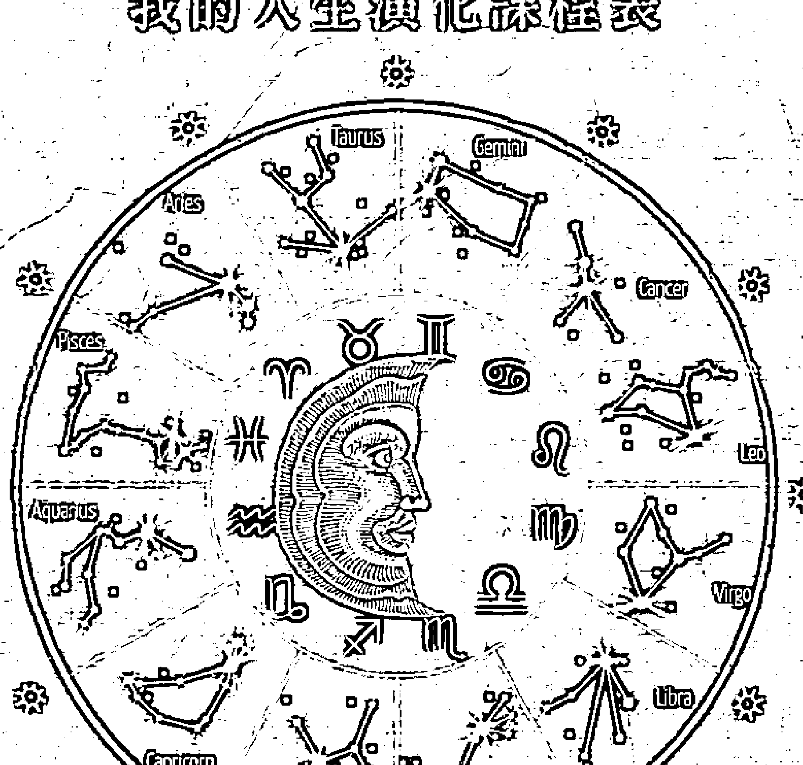

这一年。我将遭遇怎样的人生课题？家人、健康、爱情、工作。哪个领域将会扰动、令我不安？答案。就藏在「推运月亮」移动轨迹里！

一次读懂「推运月亮」、「本命月亮」、「月亮相位」 一生都可查用的阶段性自我成长预言书

## 如何查询自己每一年的月亮推运？

步骤1 链接至网页 www.astro.com，点选「free Horoscopes」之中的「Extended Chart Selection」

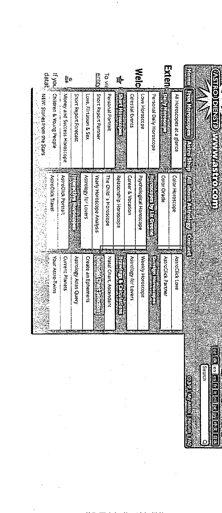

步骤2 点选「 click here to go to the data entry page 」，进入个人星盘查询功能

### Extended Chart Selection

### Welcome to www.astro.com!

- Home Free Charts Astro Shop Contact

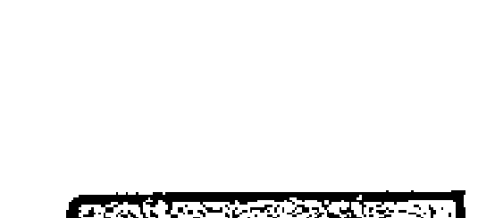

- For guest users:
To view this horoscope you need to enter birth data. Please [click here to go to the data entry page](#) The horoscope will be displayed subsequently.

- For visitors with a registered user profile:
If you have already created a registered user profile your data are still stored in our database. To access your data please log in.

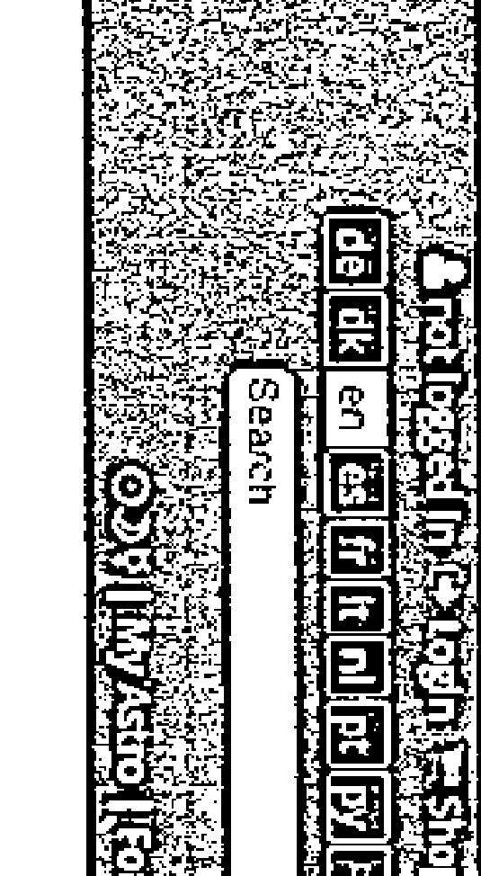

步骤2：输入自己的名字、出生时间、出生地点后，点选「continue」

### Birth Data Entry

first name

XXX

last name (optional)

gender female male event

birthday [?] 11 September : 1999 year

hour [?] 11 [am] min 11

country Taiwan

birth town [?] Taipei

show / hide extended settings

continue

**步骤41** 在「Partner」栏内点选自己刚输入的名字（同上一栏）

### Extended Chart Selection

**Birth data**

**Horoscope for:**  Xxx

**Partner:**  Xxx

- *   + Add a New Person
*   [x] Edit birth data

- *   + Add a New Person
*   [x] Edit birth data

- Methods: Circular charts | Special charts | Ephemeris | Pullen/Astrolog

**Chart type:**  [Natal Chart Wheel]

**Chart drawing style:**  Web default style

CLICK HERE to continue >

**步骤5** 在「Chart Type」栏内点选「Natal and progressed chart」

### ASTRO DIENS www.astro.com

Home | Free Horoscopes | Astro Shop | All about Astrology | Contact

### Extended Chart Selection

Birth data

Horoscope for: Xxx

Partner: Xxx

Methods: Circular charts | Special charts | Ephemeris | Pulsa/Astrolog

- - + Add a New Person
- Edit birth data
- + Add a New Person
- Edit birth data

Chart type: Natal and progressed chart

Chart drawing style: Web default style

### Extended Chart Selection

步骤6
在「Options」栏内填入欲查询的推运日期（建议：填写当年度您生日的日期），之后点选「Click here to show the chart」

Horoscope for: Xxx

Partner: Xxx

Methods: Circular charts / Special charts / Ephemeris / Pullen/Astrolog

Start date for charts marked with *: 21 Aug. 2017

House system: default

Zodiac: Tropical, Sidereal, Draconic

Geocentric, Heliocentric

without light-time correction

Chart type: Natal and progressed chart

Chart drawing style: Web default style

## 步骤7

最后呈现的星盘上，最外圈边上的弯月符号，即是您当年度「推运月亮」所在星座及宫位（其人生课题参阅本书第二部内容）

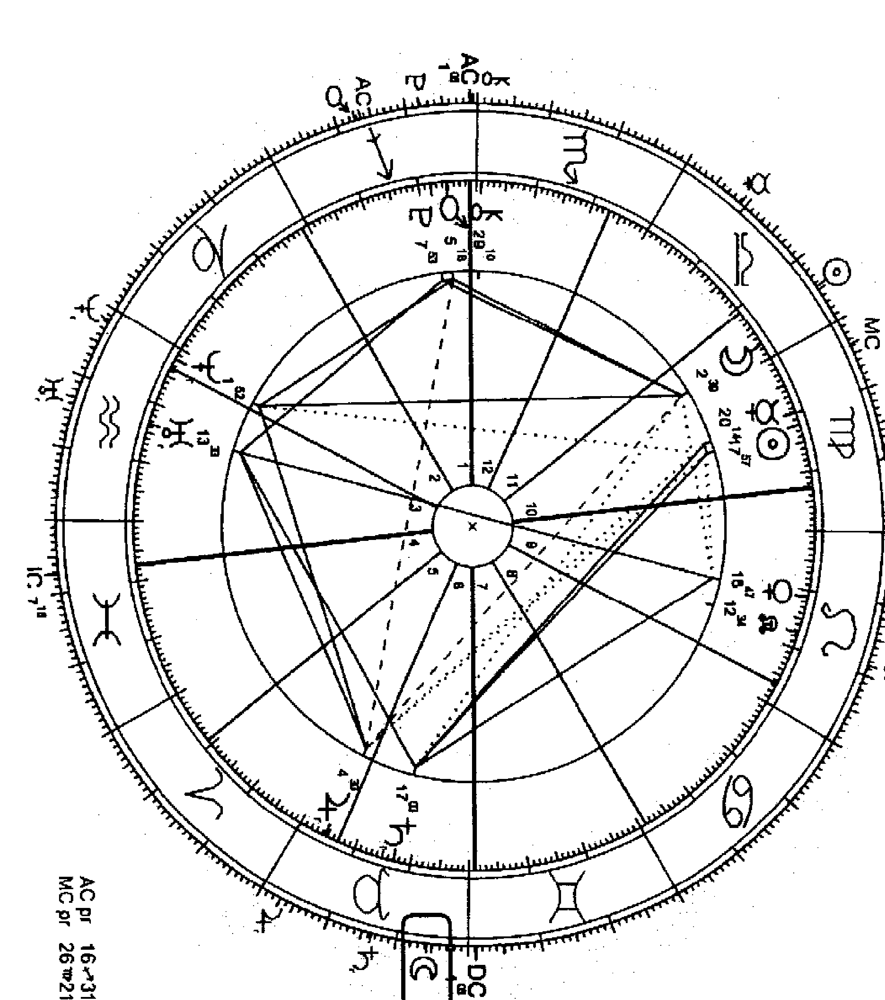

AC pr 16°31'
MC pr 26°21'

## 各界赞誉

> > 目前大部分的占星书仍只呈现了近代占星学的临终喘息，其中充满刻板、宿命、预测和叙述性的色彩。艾美·贺林的书属于未来，而非过去。

> 在你开始享受阅读本书的乐趣之前，我想提醒你留意一下，她对「意识」和「抉择」保持如此一致的诠释主轴。我也很感激她伴随着我，最终如此灵巧地交织出激励人心、正面的人生观，诚实地衡量生命的黑暗。

> 艾美·贺林邀请古老的月亮进入占星学的「第三纪元」，感受其中的量子魔力。我衷心赞扬她的成就，并欢迎她加入占星大家之列。我可预见在未来，她会传授我们有关太阳、水星、金星，还有其他所有瞬息万变、不断演化的天体的知识及奥秘。

> ——《内在的天空》（The Inner Sky）作者，史蒂芬·佛瑞斯特（Steven Forrest）

> > 这本书极具启发性，能让你敞开心灵，启蒙心智，改变人生。

> ——《戴尔星象》（Dell Horoscope）杂志主编，罗尼·葛利许曼（Ronnie Grishman）

这本书就像一场充满永恒智慧的盛宴，任你轻松享用阅读，为人生这场情感的探索之旅提供一张演化地图。

> —— Tarot.com 占星师，瑞克·雷文 (Rick Levine)

月亮星座代表你的情感本质，可以为你点灯指路，获得深刻的灵性成长。你可以透过《月亮推运占星全书》这本书，认识自己核心的情感需求，学习如何满足这些需求，同时做出最好的选择，让生命更有意义，心灵富足。我们会阐述本命月亮和推运月亮的关系，从星座、宫位、行星和相位的角度切入，以丰富的资讯介绍月亮最强烈的潜在能量。这本书采用简单易用的烹饪书形式，可以帮助你很快找到自己的月亮星座。艾美．贺林在书中揭露你会如何不断进化的情感需求，会如何面对爱情、家庭生活、职业规划和其他生命领域。

这本书提供很棒的资讯，富有教育性，资讯丰富，充满趣味，对于认识本命和推运的月亮极有帮助。贺林在占星学中展现充满活力的个人风格，令人耳目一新。

> —— 《360度智慧》(360 Degrees of Wisdom) 作者，琳达·希尔 (Lynda Hill)

> 「生命中许多事物会吸引你的目光，
但只有少数能掳获你的心，
而那就是你该追求的。」

——无名氏

> 「唯有用心，才能正确看待事物；
最基本的东西是肉眼无法见的。」

——法国作家安东尼·圣修伯里

> 「把你的书写完，我才能小睡一下。」

——我的丈夫

## 月亮推运，你的人生演化轨迹图

## 导论

占星学是关于潜力、趋势及可能性的科学，而非事实性的科学。大多数的占星师都会告诉你，我们比较容易看出已经发生的事情，如何反映出当时行星在星盘中的位置，但事先预测事件的发生就比较困难了。这是因为同样一股能量导致的事件，会有几种可能性。心理学家荣格曾说过：『当你无法意识到内在心境时，它就会向外展现成命运。』我们究竟会看到自己演出负面的刻板模式，或是能充分利用行星的能量，都是取决于自己的选择和意识层次。我在写这本书时，心中一直秉持这个观点：是我们的选择，而非星星，引导着我们的人生。天空就像一面镜子，反映我们的内在和外在状态，但没有造成这种状态存在。行星不会强迫我们，但会引导我们注意自己内在冲动最真实的源头。

## 自由意志与意识选择

古希腊哲学家赫拉克利特（Heraclitus）曾说：「性格即是宿命（Ethos anthropoi daimon）」。希腊文daimon这个字有点棘手，因为英语没有刚好相对应的单字，所以一般认为「宿命」是最贴近的解释。这句话的意思是「性格即是宿命」或「性格即是命运」还有待讨论，不过这句话的现代意涵是：我们的性格还有我们的天性（无论好坏），决定了我们的际遇。这里强调的是选择，而非决定性的宿命。无论如何，daimon在古代的定义是某种灵性守护者，它了解你的命运，并会引导你走向命运，所以也可以被诠释成「宿命」。

当我们更进一步深究宿命与自由意志对立的古老论辩时，就更荒唐可笑了。我们之中有多少人自认为能掌握自己的命运，却会像是进入自动驾驶模式似地不断怨叹「运气不好」或遇到「刻薄上司」？有多少人深信宿命，就把这当成放弃对自己负责的借口，或是忽视了慢慢在人生中累积的模式，因为我们无法或是不愿意看清自己的选择会继续导致同样的结果？听到支持宿命或自由意志的论述是很有趣的，但我实在找不到任何理由认为这两者是互不相容的。你若问我，我们是否有能力为自己的性格和命运担负部分责任，进而引导自己的人生？我的确如此认为。你若问我，人生之中是否有宿命的运作，我们可以在明显的因果法则中见识它的力量，它就如带领我们通往宇宙的神圣指引，我们是否可以把它称为高层自我、我们的灵性守护者，或是我们的目标？

## 把星盘视为演化工具

我的答案也是肯定的。

通俗占星学喜欢用描述性的字眼，像是形容牡羊座「大胆」、「果决」和「霸道」，或是形容处女座「井然有序」、「务实」和「挑剔」。如果你认识一团乱的处女座或客气有礼的牡羊座，请举手！善用占星学的最佳方式并不是分门别类，而是提出指引和应对之道。我们如果不要以「自己目前状态」为出发点，而是用「正要变模样」看待自己的星盘，就能开启对星盘的全面理解。星盘就像我们的处方签，建议我们如何活出更充实的人生。你的本命星盘是你最重要的工具，当你知道如何正确利用它时，它就能在你身上发挥更好的效果。这本书会教导你如何使用这个工具中的一个重要元素：月亮。我不只会列出每个月亮星座的性格特质，还会提供你一个范畴，告诉你会在哪个范围的经验和课题中游走，体验生命，而这都取决于你的选择。因此，你可以把你的星盘想像成一张地图，当你在吸收个人经验时，月亮就像指南针，指引你航渡大海，时而风平浪静，时而波涛汹涌，穿越不同的国度，无论熟悉或陌生都能跨步向前。

> 译注：根据出生时间和地点推算的星盘。

这本书除了解释本命月亮落入各星座和宫位的意义，还介绍在人生特定阶段推运月亮落入各星座和宫位的意义。你必须先推算自己的本命星盘，知道自己的本命月亮的位置，进而推算出推运月亮的位置，才能有效利用这些解释。大部分的占星软件和少数的网站可以帮你推算，你可以参考本书最后的附录部分，算出自己的本命和推运月亮。

## 私下的你

### 本命月亮所在星座和宫位

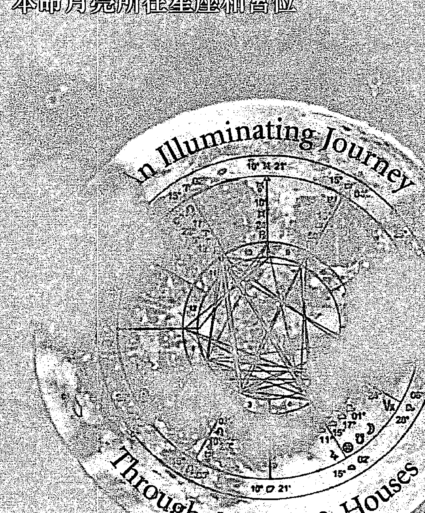一個特殊符號的意義，有時是透過目的衍生形成。此時人們會刻意地將一個圖案或一個物體，與一種想法連結在一起，例如紅色八邊形這個符號就是命令我們停止。許多符號的意義會因為文化而異，但有少數共同的符號和物體，似乎會超越文化、種族或性別，很自然地在人們心中喚起相同的關聯性。月亮這個符號長久以來深埋在我們的集體意識之中。儘管人們會透過藝術、宗教和科學賦予它許多不同意義，但是自人類問世至今，月亮就一直帶給人們感動，啟發人們的靈感。

月亮不只啟發我們，還透過許多非常現實的方式影響我們。已有完整的文獻紀錄證明，月亮會因為貼近太陽和萬有引力，進而影響海洋的潮汐，而它也與女性的月經週期有古老的關聯性。

在古老的宗教中，月亮甚至代表女性的整體生命循環，從少女、母親到老婆婆。月亮的象徵意義，深植於每個古老和現代的文化之中。

就占星學的角度，月亮象徵我們的感受和本能情緒反應。我們可以從月亮在本命盤的位置，知道什麼事情會讓我們開心或難過，我們會因為什麼事情受傷，我們需要什麼才能覺得被滋養、安全和受到照顧。月亮可以告訴我們，我們在愛中必須滿足一些基本需求，才能建立某種信任和家的感覺。月亮可以提供一些線索，看出我們童年時期的居家生活，還有當我們長大成人成家之後，必須創造哪些元素來滋養和保護我們的家庭生活，讓我們覺得能把一個地方稱為『家』，而不只是一個放東西、晚上睡覺的地方。這裡有一個字可以做總結，那就是『心』，我相信就情感層面而言，所有人都很熟悉這個符號。占星家諾・泰爾 (Noel Tyl) 形容，月亮就是我們『主導

## 心轉為頭腦

月亮的關鍵字之一，就是「態度」。我們的態度是所有決定的基礎，或者至少影響了我們如何落實這些決定。不知有多少次，我們仔細想過一個特定選擇的邏輯何在，依此決定最好的行動方式，到頭來發現自己正在做一些自我破壞的事，因為我們其實並不想做我們認為最好的事。舉例來說，也許就現實考量，你最好繼續做某一份工作。你會考慮這份工作已經做了八年，你已經得心應手，知道如何做好它，而且待得越久，你就可以累積更多的休假。這是很聰明的想法。你會合理地推論，你要是決定跳槽，那你已經投入的時間就可能浪費了。所以你決定留下來，但沒多久，你會開始無法忍受一種受困的感覺，你會發現自己花更多時間摸魚打混，只是為了紓發壓力。這到頭來只會減少你的發展機會，因為你並沒有更進步，這可能會讓你覺得更被困住了、更挫折。這是一個負面循環，而這全都是從一個正確的態度開始的。我們若只是考慮正面和負面的因素，人生最多就只能這樣了，特別是生命中所有非常重要的決定，像是要不要創業、做自己熱愛的事業、要不要生孩子，或是要不要結婚等。

我們常聽到占星家在討論太陽和月亮時，會認為兩者是互補的，是獨立的。我們時常可以在占星學中看到這種說法，像是「頭腦（太陽）和心（月亮）」或「左腦（太陽）和右腦（月亮）」。這並不全然是錯的，但也反映了社會大眾認為合理和理智的行動，與出自情感和直覺的行動是分開獨立的。太陽與月亮雖然是獨立的存在，其實是相互連結的，月亮會反射太陽的光芒。你可以這麼想，太陽是真貨，月亮只是太陽力量的蒼白次級品。月亮的角色是反射光芒，讓我們能在黑暗的路上看清一切，就像我們必須在一些處境中憑著直覺找到方向，若只憑藉著理智前進，就只會把事情搞砸。很多時候，當我們做了一個「合理」的決定，最後卻發現自己的心會阻攔自己付諸行動。有時我們可以說這是因為我們意志薄弱，但有時其實是因為我們貶低了自己的情感，認為情感是錯的，只會造成不方便。我們有時會很渴望一些不健康的事，但你不妨留意一下這股慾望底下的源頭，而非只是慾望的目標，你就能找到最重要的線索，知道我們的心真正渴望什麼，即使我們必須找到更好的選擇，才能滿足這些情感需求。

身為處女座，我非常迷戀推理和分析的能力！但我只想把這種能力視為全觀性決策和自我引導的一部分。推理是我們與生俱來的諸多技巧之一，但不是唯一。希望你在讀完這本書之後，能認清——頭腦和心不只同樣重要還是不可分離的。我們正在努力讓男性和女性的社會角色取得平衡，讓兩者獲得公平對待，此時人們也對占星學和塔羅牌等直覺性的藝術越來越感興趣，我覺得這直接反映了人們對於平衡「頭腦」與「心」的需求。一場真實活過的人生不只是邏輯決定的總和，其中也充滿了情感的滿足。

## 私底下的自己

你可以把自己想像成一棟房子，你的各種占星元素就像一般房子可見的各種房間。你可以把你的上升點當成大門或前廳，太陽就像客廳或居家室。也許水星就像你的家庭辦公室，金星就像陽台的鞦韆，或是你最愛的座位，或是任何一個你想在家裡享受社交生活的地方。但是月亮可能就像你的臥房，甚至是臥室的衣櫃。無論我們自認有多麼外向，月亮都代表我們最內在的一部分，它是我們私底下的自己。它其實就是我們想保護的脆弱點，我們甚至可以稱它是我們的「內在小孩」。我們只會向信任的人展現這一面，就像我們不會把所有認識的人都帶進臥房。

我們可能會形容某個人「喜怒哀樂全寫在臉上」，但是月亮不只是展現情感，它還代表內在的自我。任何人即使外在顯得多麼外向或真情流露，都會有一種方式保護內在的自我。當我們真正更深入觀察一個人時，不只是看到對方向我們吐露的秘密，還能看到他們脆弱的一面。這也許是他們揭露了一些私事，或是覺得很自在，能在我們面前哭泣，甚至是與我們分享個人的創作或具爭議性的意見。因此，月亮永遠是我們心中有一點害羞的一部分，這並不一定是由於缺乏自信，而是這只會在某種信任、暗示或期望的狀況下，才會在與人互動交流時顯露。

本命月亮

## 戀愛中的月亮

許多熟悉占星學的人，如果想知道愛情的需求時，只會想到金星，或許再加上火星。金星處理的是人際關係，其中當然包括戀愛關係，但是金星的目的是聯繫，代表我們如何與對方相處融洽，或是一個人的哪些特質會讓我們更容易喜歡他們。而在某種程度上，火星看的是性慾。無論如何，我們可以說月亮在愛情中扮演最重要的角色，因為月亮代表我們需要什麼才能覺得被照顧、被愛、被滋養，有安全感。我們有所愛的人，這是很重要的，但是愛和被愛的影響力比性格更加深入，這會進入我們的核心深處。

我們越來越能接受，每個人表現或接受愛的方式不盡相同。人都會有某種過濾方式，會有一種特別的方式，希望別人能用這種方式對我們表達愛。當然根據人類經驗，會有一些示愛的通用法則，不過我們還是常會看到，一個人的甜言蜜語可能被另一個人當作耳邊風，或是一個人想要幫助心愛的人，卻被對方拒絕或忽略。會發生這種事，並不一定因為兩個人不相愛，而是因為愛一個人，跟適當地溝通或表現這份愛，是截然不同的兩件事。

蓋瑞·巧門 (Gary Chapman) 在《愛之語》(The Five Love Languages) 裡假設，我們可以透過五種基本的方式，理解愛的表達：肯定的話語、觸摸、服務的行為、有品質的相處時間，以及接受禮物。所以在一個四口之家中，每個人可能需要聽到不同的話，或是必須透過不同的表現方

## 月亮的母性

許多占星家和占星書籍，會討論月亮和母親對你人生初期的影響，分析其中的關係。在現代社會，母親的角色和母親般的照料，可能會延伸至父親、祖父母或其他幾種可能性。所以我們在分析月亮時，不單指媽媽，而是指「主要的滋養者」，我們可以從對方身上獲得最直接的個人照料和指導。占星學中最常見的關聯性解釋，就是把月亮當成母親，太陽（有時是土星）當成父親，但這可能無法正確詮釋一些細微但重要的差異。當我們在看你的月亮和你的星盤時，最重要的是要記住，針對你的主要滋養者，我們可以根據你的月亮的位置得到許多線索，但這都是從你的觀點來看，不一定能正確描述他們的人格。當我們把月亮當成母親時，只是想試著了解當你還是個孩子時，你的情感需求是什麼（還有你成年之後的情感需求），特別是當你覺得自己的需求沒有獲得滿足時。按照這種方式，占星學可以幫助你療癒過去的傷口，必要的話，還能幫助你原諒父母，同時學習如何有效地滋養自己，繼續向前走。

## 月亮在事業中扮演的角色

很多人都聽過這句話：「興趣等於天資。」光憑興趣，一個人當然不能創造必須透過其他方式才能擁有的技能。想像一位冒牌醫生幫病人治病，只因為他認為第四台的手術節目很有趣？！不過，你的興趣可能與你追求目標的成功程度有關。你是否曾經坐在辦公桌前，認為你再也無法忍受多上一天班？你是否曾在早上起來覺得失望，因為今天是禮拜一？當然不是只有你是這樣，我們都不喜歡必須一直做的工作。但是如果我們對工作的理由抱有熱情，認為這個理由很重要，工作時就可能比較開心。我們就能提升能力，讓工作更成功，因為我們有全力以赴的動機，而不是用最低極限的心態看待工作。即使你本命盤中的月亮位置，並不是與事業有關的典型位置，但要是你每天做一份令你心力交瘁而非滋養你的工作，這一定會影響你的人生。我們不要太過天真。不是所有人都能在夢想的工作中找到自己，這格外無法馬上如願。很多人的工作都只是能領份薪水。這是我們想要的工作，也是我們容易勝任的工作，因為我們擁有被雇用的技能，也必須有錢過日子。不過人生充滿了機會，我們可以稍微向前推進，修正道路，例如白天上班，晚上上夜校，或是參加在職訓練，留意有沒有升職機會。無論我們剛好高中畢業，或是之後發現自己正站在人生的十字路口，當我們能自由考慮人生的道路，不要在一開始就輕忽任何想法，那麼此時從腦海中跳出的問題，通常都不是「我能馬上得到什麼？」而是「我想要什麼？」而這就是月亮的問題。

本命月亮

## 你的舒適圈

我們可以從本命的月亮看出，什麼樣的環境和狀態可以稱為我們的「舒適圈」。當我們脫離舒適圈時，可能會經歷一連串的情感狀態，從焦慮、挫折到難過。月亮在本命盤的位置是個重要因素，可以了解你需要什麼才能有安全感——這不只是身體的感受，而是全面性的感受。當我們基本的舒適和安全感獲得滿足時（就像覺得有一個像家的地方可以回去，或是不會被要求做任何不想做的事），我們當然更可能覺得快樂，也更可能如常地過日子，比較不會感受到沮喪、冷淡或失望。

我們多少都會被情感制約，認為情感的反應很麻煩，特別是當我們覺得難過或生氣時。憤怒和難過會妨礙我們的生產力，影響我們把事情做好的能力。舉例來說，當我們開始覺得有點難過时，我们可能会试著想开一点，告诉自己：「生命没有休假，我们也不能放弃。」无论如何，碗盘还会继续堆高，我们需要打理生活杂务，必须处理工作。当我们遇到不顺心的事情时，不能乱发脾气，对吧？没错。但我们时常搞不清楚，自己因为「良好和负责」妨碍了情感的需求时，忍住脾气只是暂缓之计。这其实帮助不大，只会开始酝酿一场「真正的大发雷霆」。这就像你饿了，但没有让自己吃点东西。你一开始只觉得胃空空的，然后胃就会开始「咆哮」，越来越大声，越来越频繁。如果长时间不管它，这种饥饿的疼痛和噪音会暂时消失，融入背景音。猜猜看如果忍得够久，会发生什么事？接下来就会觉得头昏脑胀很虚弱，最后会营养不足饿死。当你心情不好时，会影响你正在做的所有事情。你可能会踢狗，吼小孩，对同事讲话简短又唐突。但是即使是坏心情，也可以当成一个晴雨表，而你本命的月亮星座会给你一个非常明确的讯息。人们会做出一些典型的行为代表坏心情，每个人会因为不同的事情导致心情不好。就像无论任何时候，月亮在金牛座的人，都会因为居家环境事情太多觉得无法负荷、烦躁，月亮在双子座的人却会因此觉得精力充沛。认识自己的情感需求，这不只是自我耽溺，这对理解你对各种处境及各种人的反应也很重要。这也可以让你知道，如何在情绪变成龙卷风之前，先脱离暴风圈。

本命月亮

### # 当你的舒适圈变得太过多逸

我们本命星盘中月亮的位置和状态，可以看出许多我们必须被滋养的事情和情境，而这远超过身为人的基本需求。但是我们常困在两种基本的情感阵营里：一方是觉得安全的需求，另一方是觉得快乐的需求。有時候，其实常是如此，我们可以在同样的活动中满足这两方的需求，就像从事一份工作可以带来稳定的收入，而我们刚好也乐在其中。但还是有许多状态，我们会发现自己只能满足其中一方，那么即使不是马上发生问题，也会开始出现恶化。我们会发现自己的需求逐渐扩大，超过我们建立的日常生活。

情感基地和情感死胡同，这两者是不同的。当我们安全感的来源，只能让我们觉得安全却不能感到快乐时，我们都面临着同样的挑战，必须知道什么是足够，又该在何时喊停。我们的心想要鱼与熊掌兼得，但必须鼓起情感的勇气去追求可能获得的情境，特别是当我们必须脱离一个稳定却让我们情感枯竭的情境。我们会因改变和冒险而心生恐惧，被剥夺某种安全感可能会让我们不开心。然而，如果我们伸手追求渴望的东西，一种我们真正想要的东西，不开心就只是短暂的。我们如果只选择安全感，被迫放弃渴望的东西，更可能终其一生都闷闷不乐。

### 情感的耽溺

希望我已经举出具有说服力的例子，让你注意情绪试图向你传达的讯息有多么重要。尤其是长期的不快乐就像重大的警告标语，这可能要告诉你，你正在做的事情正在不断地暗中破坏你。如果你害怕上班，严重到几乎无法在早上逼自己起床，这是很严重的问题，也许必须正视你该做什么，改变目前的工作状态。但也有很多时候，我们只是不想去工作。我们到底只是偶尔需要休息，还是长期无法改善自己的情形，这两者的差异就是本命月亮黑暗面必须面对的问题。情感健康的关键，就是认识分辨——什么只是发牢骚，什么才是发自内心的真实指引。如果我们过度放纵情绪，那么过度自我耽溺、乱发脾气、发牢骚，或是表现像个无助的受害者，都会带来非常真实的危险。若是你在潜意识里觉得自己没有能力或拒绝照顾自己的需求，只为了获得你觉得自己缺少的注意力或滋养，这不只是一种不健康的行为，还可能让你真的变得越来越无能为力，陷入孤立，对你造成不利。与此同时，你周遭的人也会开始厌倦扮演你的『妈咪』，或是继续拯救或支持你。人生要过得充实美满，其中包含许多事，而我们不时需要展现自己所有最好甚至是最坏的一面。这包括从追求一份你觉得必须尽责的工作，到建立一个不仅能挂帽子放东西的家，从寻找针对人生问题的神性洞见，到只是找一个人愿意听听你的答案。如果想做出正确的选择，所有的起始与结束都是你的心。

### # 本命月亮在十二星座的真性情

本命月亮

十二星座代表不同的性格特徵及表達風格。我們幾乎可以用任何字來形容其中一個星座，但星座不只是一張個人怪癖清單。星座代表人生發展的道路，還描述了如何前進的過程和方法。它不只點出大膽的性格特徵，還強調學習勇敢的過程。它不只提出一種好奇、追問不休的風格，還告訴你要沿著一條開啟視野的道路前進，發現所有形式的真理。

如果想了解星座，只要記得一個基本的經驗法則：星座代表我們目前的狀態、還有我們的風格、特質和心理過程，而宮位則與生命中的活動有關，代表我們現在做的事。我們可以用名詞和形容詞來描述星座，像是牡羊座的能量帶有自然直率的風格，巨蟹座的能量則與發展滋養和溫和的特質有關。

接下來介紹每個本命月亮星座最關心的事物、核心的功課與需求。因此當你經歷每一次月亮推運時，可以了解什麼是自己的情感基礎，而且試圖把你正在學習的功課，與你的基本情感需求融合。

### 本命月亮在牡羊座

把自己照顧好，就是表達愛的方式

你在學習用直接參與的方式選擇人生道路，毫不猶豫，也不用在事後批評自己，進而培養勇氣和自信。你不喜歡覺得虛弱或害怕，但當你的確如此時，這可能是你必須像代表牡羊座的公羊，用迎頭面對的方式克服讓你恐懼的事（希望這沒有讓你很頭痛）。這是一種天生的本能，但你正在學習採取行動。我們小時候都比較大膽，比較好奇，因為我們還不知道有些東西會燙傷我們，讓我們受傷。當我們受傷時，恐懼會合理地發揮作用，讓我們不再重複同樣的實驗。不過當你經歷人生百態後，你的心會恢復，會痊癒，你會相信自己的原始本能，勇敢且毫無內疚地探索這個世界。這種情感的勇氣和力量並不是靜止的狀態，必然包含自我考驗，所以最重要的是把握機會。當你給自己一個機會看到自己的本質時，你將能在情感上獲得報償。

人們常把牡羊座稱為自我的星座，但這會造成誤解，讓人們對你留下自私的印象。這當然可能是牡羊座能量發揮過度的陰暗面，但這不是一種凡事都是為了自己的欲望，而是一股熱情，驅策你索取你想要的一切，你不需要道歉，或是等待別人先獲得滿足。有時候，這也許讓你看起來有些沒禮貌，但你也期望別人有自己的空間，你不用克制自己去配合對方。牡羊座是創始的星座，這代表由你自己決定，去追求自己的心想要的東西。你滋養自己的方式，就是允許自己不要坐著等待不勞而獲。

### 居家需求

對你而言，居家環境最重要的就是充裕的活動空間，你可以隨心所欲做自己，可以說出自己的想法，不用擔心該如何描述一件事，也不用非常守規矩。你可能不太在乎如何佈置家裡，只要家是一個能發揮作用的活動基地，可以讓你在忙碌的生活中來回往返，但是家裡有點明亮的色彩，就算有點凌亂，也是比較好的。不過，這還是要視你星盤中的其他元素而論。

### 感情需求

你是靠自己學習情感力量的人，所以你滋養別人的方式往往不是拍拍對方的肩膀，給予安慰，而是好玩地捶一下對方手臂，為對方打氣。你想要支持別人時，你會幫忙他們找到自己的力量和勇氣，你會幫助他們更有自信，更有能力，而不是對他們悉心呵護。這不代表你缺乏同情心，只是你滋養自己的方式就是替自己找到出路，明天繼續奮鬥，所以你的直覺希望別人也能靠

本命月亮

### 黑暗面

當你心力耗盡，情緒到了臨界點時，你可能會表現出憤怒或戒備。你會突然暴躁起來，對別人說話有些不耐煩，對踩到你神經的人或事也特別敏感。你天生習慣直率表達情緒，所以可能沒機會多想一下或擬訂策略，就先採取行動。你要是對別人頤指氣使或不耐煩，之後可能得為此道歉。虛假或太過溫柔也不是你的風格，所以你可能很難承認一些柔軟的感覺，有時還會表現得自己做到這一點。你對別人長時間處於受傷狀態，或是不停地發牢騷，很容易沒有耐心。你也會像所有火象星座的人一樣，不太會長時間處於低潮狀態。

你欣賞不會膽怯的人，喜歡人們大膽又直接，不用替自己道歉，也不用為了讓別人舒服而退讓。當你看到有人脫口詛咒時，或只是在言語中擺明了不會那麼容易就被嚇到，都會讓你會心一笑。當你覺得可以向某個人自在吐露心中的想法時，你比較容易敞開心胸，信任對方，而你也不用有所保留，擔心對方無法接受和反應，會因為你的話受傷。這不代表你不友善，只是不斷修飾和拐彎抹角，只會讓你抓狂，感覺很虛假。你比較希望人們能直接說出他們的感覺，而不是使出各種把戲。所以你和重視的人相處時，比較喜歡樂趣和冒險，而不是言過其實的甜言蜜語，或是強套上一些刻板印象的浪漫。老套的開始不能打動你的心。

> 吸引力法則：伴侶如果教導你不要害怕表現溫柔或脆弱，你將能受益良多。

满不在乎或视而不见，甚至会透过戏弄别人来淡化这些感觉（当然是以轻松有趣的方式）。你如果能处理这些感觉，就不会在偶而觉得虚弱或受伤时，对自己或别人不够体贴。你是为对抗而生的人，所以能克服挡住你的任何阻碍，无论这是其他人、你自己或生命情境。当你觉得压抑，找不到适当的发泄管道时，你会不断在内心累积天生的力量，燃起熊熊烈火，等待找到最微不足道的地方爆发。你会在小地方刺激或拨弄身旁的人，间接找找碴想吵架。这只是因为你的天性，自然坦率比较自在，所以克制压抑，即使是出於好的理由，也无法成为你的第二天性。

## 本命月亮在金牛座

稳定而规律的生活就是幸福

创造史努比漫画的美国漫画家查尔斯·舒兹（Charles Schulz）曾经说过：「幸福是一只温暖的小狗。」月亮在金牛座的你可能颇有同感。在通俗占星学中，很多人会说金牛座喜欢舒适，一只温暖的小狗当然能带来这种感受，但这个概念其实是来自于你的天生欲望，想要在简单的事物中安身立命。「温暖的小狗」这种形容，其实是代表所有能让你感受到稳定与平静的事物，特别能带给月亮金牛座好心情。

当你能跟随自己天生的生活节奏时，在某个时间做你感觉对的事，你最能感受到滋养。你不喜欢被催促，还可能让你觉得超出负荷，筋疲力尽。这是你很不喜欢的事，还会勾起你的本能反应，绝不妥协，想要抵抗。内心的稳定支撑着你的幸福，以及生命中的其他事物。打造这样的基础需要时间，所以当你听到金牛座不喜欢改变，大部分是因为稳定的生活能帮助你自然地表现自己，感觉能与外界和平共处。当生活周遭的事物失控时，你坚固的核心可以帮助你，觉得自己可以平安度过风雨。规律的生活可以带给你更多的滋养，其中充满你享受的例行公事。像是每天早上在转角的咖啡店，有同样的人为你准备同样的咖啡，在家附近散步时欣赏喜爱的风景，看到周遭环境慢慢随着四季变化，或是在如田园般宁静的周日早晨阅读报纸，这都会让你觉得和谐，能把心打开。

### 居家需求

当你的月亮落在金牛座，你需要的环境不是要令人眼睛一亮，也不需要不必要的装饰做作。就像史努比的奈勒斯坐在南瓜田里，你的家最重要的是能反映你的真诚与自然。脱掉鞋，翘着脚，静静坐在咖啡桌旁，感觉都很好；不需要担心是否把所有事情做好，也不用担心是否会打碎什么东西（请容我用一句俏皮话形容：瓷器店里并没有公牛）。金牛座在许多方面都很亲近大自然，所以你可能喜欢在家里养宠物。你的居家装潢和情绪氛围，最重要的就是要让在家里的人都感到舒服。超级大的沙发或椅子、舒服的毯子、丰厚的质感和柔和的灯光，都能让你觉得拥有一个美好的小窝。你也不要忘记，你本命星盘第四宫的星座和行星，也可以看出你理想的居家环境。

### 感情需求

对你而言，理想的关系是随着时光流逝变得更加深入，经得起岁月的考验。你通常很忠实且稳定，所以也喜爱同样的对待。你因为渴望稳定，承诺就像你的第二天性，也是你的舒适圈，但你不会很快栽进一段关系或正式签字结婚。这又回到你的另一种欲望，希望一切都是自然发生。一旦有人能进入你的生活、你的心里、你的日常生活中，你就想把他们留在那里（即使之后发生了一些事，你应该继续前进，你还是希望维持现状）。你可能很享受生命中一些更精致的事物，像是在很时髦的餐厅用餐，打扮得光鲜亮丽，但没有什么比穿着睡衣跟自己爱的人依偎在沙发上更舒服的事了。有些人喋喋不休，或是需要安排一连串的活动让自己忙个不停，这可能会让你精疲力尽，因为你常需要沉默与安静维持内心世界的稳定。所以你希望别人能有某种程度的独立，可以照顾自己，但不是冷漠或疏离。你有一颗温暖的心，希望关系能维持温度。

吸引力法则：伴侣如果能教导你不要害怕改变，特别是这能带来更好的事情时，同时可以激励你脱离懒散或停滞不动，你将能获益良多。

### 黑暗面

当你觉得受伤或心力交瘁时，就会出现关上心房的念头，不想与人交流。举例来说，你觉得太匆忙，或是无法站稳脚步喘一下，如果整体生活太让人无法负荷，即使不是步调很快，只是「事情太多」，多到你追不上，你就会开始表现对所有情况、问题或机会的第一本能反应：拒绝。当你休息一下，或是在某个下午喘口气，再次找到自己内心的平静，这可能是很好的防卫机制；不过如果你对生活中的任何改变都是这种反应，你就会陷入一种状态，无法有任何成长。这可能导致很单纯的懒散，或是固定同样的生活规律，无论是哪一种情形，当状况必须改变时，都会为你带来问题。

通俗占星学提到金牛座的「错误」之一，就是物质拜金倾向，这并不一定是错，但一定会令人误解。你当然很享受精致的东西，因为它们能带给你愉悦和舒适，但这不是简单的贪婪。当一个人搜集物质的东西时，也可能是一种表现外在安全的方式。你拥有的「东西」越多，就觉得越安全，越与外界隔离。金牛座对人也会有这种倾向，这就是金牛座典型的占有欲。最重要的是你自己内心够稳定，有足够的自信，才不会过度依赖外面的事物来维持同样的安全感。

## 本命月亮在双子座

## 渴望和对方有聊不完的新鲜事

你渴望尽可能地学习，会贪婪地从书籍、经验和人们身上汲取资讯。双子座就像天蝎座一样，渴望发现并认识所有事情，但双子座比较注重广度，而非深度。举例来说，你可能比较喜欢如前菜般的浅短讯息，就像一连串的标题，而不是冗长的新闻专栏。这不代表你无法坚持任何事情，无法定下来，只是你有很多地方要顾。当你同时做三件事时，可能是你最开心的时刻！你会维持像小孩子般的好奇心，发现新事物可以让你心情雀跃。发现和解开一个谜语的过程，不只能带来乐趣，也是你滋养自己的好方法。分解东西这件事，无论是分解器具或是一个想法，都会让你很兴奋，因为这让你有机会把玩一个东西，也许是用其他的方式将它组合，或者只是自己摸索学会如何把东西重组恢复原形。你有科学家的精神，喜欢实验。你有本事解决问题，答案也许会改变你自己或别人的人生，就像科学家寻找一种治疗方法，或是发明家发明某种东西满足大众的需求，让生活更美好，更快乐。

你就像天秤座一样，可能很享受一场良性的辩论，或者只是玩弄想法和文字，把事情放在心里反覆琢磨，再以新的方式呈现，就像是一个谜语或一部机器。你天生喜欢发问，而这是你的本性。我曾经听过一位占星师形容双子座是「异端份子」，因为他们会质疑「当权派」。一个答案如果没有理由或根据，你绝对不会对答案满意。公式化的答案也不能令你满意。对你而言，那显然是要满足肤浅或无知的人。

即使你的本命星盘中有一些比较强烈或严肃的能量，你一定有轻松甚至好玩的一面。你可能喜欢逗弄别人，对别人开一些无伤大雅的玩笑，而你特别喜欢机灵，因为这可说是恶作剧的表现。我有一个月亮双子座的朋友是双关语大师，他最喜欢当他讲了一个特别恶心的双关语时，别人发出作呕的声音。你可以从月亮在本命星盘落入的宫位，看出你喜欢用什么方式运用心智，或是如何利用你天生的过分好奇来学习新事物。不过这总是充满乐趣，也可以扩大你对周遭的觉知，而正是你不断滋养自己的心的方式。

### 居家需求

你很喜欢在家里从事很多活动，这可能是有人进进出出，也可能是有很多玩具或东西可以玩。我们还要参考你的本命星盘中的其他配置，你如果很喜欢出门，流连外面的花花世界，就可能不会花很多时间在家。只要把家里装饰得很有趣，你就会觉得很舒适。甚至可能很喜欢四处移动家具，或不断改变装潢，让环境焕然一新。你可能发现自己最后堆了一堆东西必须清理，或是因为你已经在做下一件事，只好稍后再把东西归类整理。

### 感情需求

对你而言，无论在任何关系中，沟通都扮演非常重要的角色。当你觉得被聆听、被理解而不只是被爱你才觉得跟对方最贴近。很多时候，你感兴趣的沟通可能不是向伴侣吐露你的感受，或是他们和你谈论对这段关系的感觉。说话本身只是一种机制，可以创造一种爱和亲近的感受。一来一往轻松聊天的能量，可能会比明显沉重的话题，发挥更深刻的影响力。人们常说双子座善变，特别是月亮双子座的人。的确如此，因为你喜欢新的经验，而你的心情会随着兴趣改变。因此对你而言，在任何关系中还有另一个重要关键：更新。当关系停滞不前时，你们会做同样的事，讲同样的话，这会让你觉得浮躁又无聊。所以你不需要一个喜欢改变的人，也需要一个够有趣的人，让你永远可以在他们身上找到新鲜事，让他们对你保持兴趣。

吸引力法则：伴侣如果能教导你坚持投入一或两种兴趣，久到能深入享受，而不只是表面功夫，你将能受益良多。他们也可以帮助你在心智枯竭之前，学习如何先让自己稳定下来。

### 黑暗面

当你觉得心力交瘁时，你会发现自己很难专注，体内天生的躁动能量会濒临沸点。你可能很难应付天生的好奇心，感觉好像被好奇心牵着到处走，却无法长时间专注在一件事情上。当你没有好好照顾自己时，会觉得无法驾驭自己的好奇心。过度刺激却不专注，也会很快让你觉得心力交瘁。

如果你定型，说你对任何事都无法坚持，这并不公平，而这可能是一个弱点。因为你的天性就是要去发现，所以会被好奇心驱策，而当你满足好奇心后，很快就会觉得无聊了。这在道德上并没有什么错，不过可能带来不便，特别是当你必须完成一个计划，或是承诺要完成一件事，但你已经不再着迷，也不再好奇。

## 本命月亮在巨蟹座

**爱的天性，使你付出比接受的多**

你可能听过巨蟹座的象征符号是螃蟹，因为你的内心世界如此强烈又脆弱，所以需要某种「壳」来保护自己。要你揭露自己的内心世界，这是很容易受伤的，即使你知道环境很安全，也已经建立足够的信任感。巨蟹座另一个常见的符号就是母亲，在过去，通俗占星学很容易认为所有巨蟹座都喜欢在家和家庭，他们一定想要有小孩才会有成就感，或者至少要有一座花园。我们一定听过月亮巨蟹座的人想要小孩！但如果你不想要有小孩，或是没有绿手指，难道你很不幸吗？当然不是。

有关巨蟹座的传统诠释和描述，常会提到对滋养的渴望，你希望透过保护、鼓励和爱，帮助事情成长和疗愈。当你觉得能庇护、爱和滋养任何你想要付出真心的人事物时，就是你最快乐的时刻。你正在学习让感情和想象的主观内心世界激励自己，用你的心，而非理性分析，更加认识自己。你也正在学习如何保护自己脆弱的内心世界，如何敞开心去爱和被爱，努力在这两件事之间取得平衡。

### 居家需求

巨蟹座就像金牛座一样，需要一个家，让人觉得很自在，很放松，所以这可能像一个小窝。家里应该充满舒适和安全的气氛。你可能喜欢在家里养宠物，家里可能四处放着多年来收到的纪念品、小装饰品和礼物，但也要看你喜欢把东西摆得多凌乱或多整齐。月亮巨蟹座就像摩羯座一样，可能很欣赏古董，还有传承久远的物品，特别是在自己的家里。所以你的居家装饰可能有一些家庭的物品。家中的灯光、味道和颜色，通常能传达一种温柔的感觉。

### 感情需求

当你在自己的环境里很自在时，特别是在你的家，或是让你觉得是自己领土的任何地方，你通常很和善，会关心每个人。不过当你真正在乎一个人时，你会把他们当成家人，对方可能是朋友或爱人，你就很常会发现自己是朋友圈里的保护者和照顾者。你也可能很喜欢把自己所爱和信任的人带到家里。当他们到你家时，你很喜欢照顾他们，提供他们吃喝，或是任何你能提供的东西。当你觉得被滋养、被照顾时，你会一直很感激，总是很温柔。你真的喜欢运用关心和敏感，愿意为对方多做一点。你的记性可能特别好，特别是当你记得某件带有情感成分的事，像是你爱的人的生日，你会替他们庆生，但这还是要视你本命星盘的其他元素而定。

你会特别照顾自己爱的人，所以当别人也对你做同样的事，这会带来改变。当有人真心关心你的感受或你想要什么时，对方没有在你准备好之前就越过界线，也没有试图刺探你，逼着你敞开感情的大门，你也会觉得被爱。你需要自己的空间，但不是冷漠或忽略。如果有人知道爱会受伤，那个人非你莫属。不过你的天性就是去爱，所以你将会面临的挑战可能不是如何爱人，而是要让对方也爱你。对你而言，要你看见，表现脆弱，展现柔软的一面，可能远比去爱、去照顾别人更加困难。但是当你只是单方面付出时，你会觉得被视为理所当然，觉得很孤单，好像没有人看见你，或是想要看见你。你会越来越愤怒，你也觉得很难理解怎么会造成这种状况，好像你从来没有表示你需要一些关心，好像你不需要照顾自己。你会觉得自己正是为了双方好，你还是要说出口。给出一些「线索」，或是你的需要已经非常明显，但是事实通常并非如此。

所以尽管你很害怕，吸引力法则：伴侣如果能教导你如何信任自己，信任生命，足以让你走出自己的壳，同时教导你如何放手，如何给那些曾经伤害你的人另一个机会，进而原谅他们，无论对方是不是故意的，你将能获益良多。

### 黑暗面

当你觉得心力交瘁或受伤时，你的本能是缩回自己的壳里。这可能是件好事，因为你退缩到一个安全的地方时，你可以让自己痊愈，才能准备好再次走出来。不过，如果你没有走出来，允许自己被爱，足以让关心你的人看见你，或是当你必须为了别人或自己的需求留在现场，与别人谈谈，你却退缩沉默，这就很危险了。你不喜欢对抗，如果能冷静一下，重新整理自己，这将很有帮助。但你这么做，如果只是为了逃避某个不明确的问题，你的内心只会越来越痛苦。螃蟹有一对螯可以牢牢抓住东西，不愿意放手。所以，如果你放任不管，壳里可能塞满许多未结束的事情和过去的怨恨。然而，如果能偷偷向外望一眼，至少敢让某个人知道你受伤了，这就可能打开疗愈的大门，而这通常会让你们的关系比一开始更紧密。

因为你的内心世界如此丰富，你与自己的情感、本能和想象力如此紧密连结，你可能非常主观。有时候，你的感觉如此强烈，让你忘记并不是所有事情都发生在你身上，而当某件事真的影响你时，你可能没有意识到，那件事可能不是针对你，不是故意要伤害你。当你只凭直觉时，可能在别人的话里或习惯里挑出弦外之音，很容易没有客观地分析始末，就推测某个人的话和行为有何意义。这也就是为何你要尽可能地直接提问，利用你天生的直觉去安慰受伤的人，帮忙厘清误解。

## 本命月亮在狮子座

**帮助对方强大，就是爱的表现**

狮子座的符号是丛林之王狮子。狮子不是暴君，而是具有领袖及慷慨的气质。你会因为心胸狭隘、羞辱或嫉妒的表现受伤，无论是你看到这些表现或是自己的体验，因为你不喜欢自己或被别人觉得渺小。当你把心打开时，当你用心参与时，就仿佛散发阳光的温暖：每个人都会被光照耀。你天生具有一种能力，可以向我们示范如何一路在过火、古怪又不完美的光辉下，展现自我及自我喝采。你正在学习信任并参与生命，学习展现并表达自己，不要害怕会发生什么事情。你的爱情如果很戏剧化，是因为当你沉浸在一个经验中，感觉就像是被狂风席卷而过，而这可以鼓舞你的心。

因为我们谈的是月亮，月亮代表内在和私底下的自我，所以你可能不是那种在派对中随时有一盏灯打在头上的人（除非你的星盘也加强这种倾向）。即使是月亮狮子座的人也可能会隐藏自己的光芒，等到感觉安全时才会显现出来。你就跟所有人一样，当你在表现自己时，也会害怕被拒绝。有些人即使等机会来时也喜欢远离镁光灯，避免成为焦点。但是，你必须在有能力的时候展现自己。因为你的月亮是狮子座，你的心具有太阳的能量！所以当你闪闪发光时，你散发的所有光芒都会反射在你身上。这不只是你会变成注目的焦点，你还会用戏剧性和表演激励别人！当有观众鼓掌时，无论是实际或象征性的掌声，你的心都会因此雀跃欢唱。

### 居家需求

就如一句老话所说，你的家必须是你的城堡，一个适合接见访客的住处。如果你的星盘的其他条件也有类似倾向，你可能很喜欢在家从事娱乐活动，像是几个朋友一起玩游戏或看电影，或是大型的活动。这不只让你有机会炫耀，也让你可以展现自己最好的一面，也就是鼓励别人享受自己，彻底放松，享受一段美好的时光。你的家最适合戏剧性、大胆的颜色，充满丰裕和奢华的氛围。

### 感情需求

你很喜欢对心爱的人表达爱意，可能实际地送礼物、度假或献上一首诗，也喜欢同样的回报。你需要一个可以一起玩的朋友或爱人（想像两只猫咪一起玩闹，互咬互追）。太严肃的人，或是因为太害怕而不敢投入当下的人，或是太坚持做自己的人，都可能觉得很跟你很有距离。不过

### 黑暗面

你滋养别人的方式是帮助别人变得更坚强，帮助他们觉得自己很重要，很值得，而你知道有时候人们只需要一点鼓励去享受自己、信任自己。

对你而言，觉得被欣赏是很重要的事，这不能是因为你为对方做的事，而是因为你这个人。你如果被伴侣忽略，无论对方是故意的，或只是很忙，或是有事缠身，这是最直接伤害你的一种方式。独立很棒，你不喜欢任何人太依赖，不过狮子是成群行动的！对你而言，互相关注对方，是建立信任感很重要的一环。培养一群朋友，大家可以玩在一起，能带给你很多滋养，这胜过一对一的朋友关系，但这还要视你星盘中的其他元素而定。

没有人敢当着国王或皇后的面取笑他们，而你真的不欣赏轻视或贬低的行为，即使只是闹着玩。你喜欢尽可能地玩乐和戏弄，但如果其中有不尊重、嘲笑或残忍的弦外之音，将会破坏你的信任感，伤害你。有些人比较愤世嫉俗，或是幽默中带点伤人的意味，如果太过头了，也会让你觉得心力交瘁。

吸引力法则：伴侣如果能温和、尊敬地教导你谦卑，教导你即使是没人替你鼓掌或了解你，你还是要有勇气做自认为对的事，你将能受益良多。

人们对狮子座最典型的抱怨就是傲慢。不过，如果你表现出自负的行为，其实代表你很没安全感。我们所有人都有情感的防卫机制，用来保护自己脆弱的内在，而有些人喜欢完全隐藏受伤或脆弱的一面。你很渴望当一个特别的人，而当你必须分享内心世界时，一定是很有价值的事；所以当你受伤或没有安全感时，你常会过度补偿，假装自己不会受伤。这是很好的防御机制，不过通常会有反作用。你身旁的人会用更负面的方式对待你，对你造成更多伤害，造成一种永无止尽的循环。

你渴望正面的关注和回馈，这会形成一种内在的压力，因为你为了被注意，会去取悦或迎合一些对你有期望的人。如果你太长时间都是出自这样的动机，也会有反作用，因为你不会真正觉得别人是因为你这个人而注意你，欣赏你，而是因为你为他们做的事，或是表现出他们想要的样子。你要知道，当你因为自己真实的光芒闪闪发亮时，对的观众会发现你，而你可以吸引到适合自己的玩伴。

每个人都会演出自己的内心戏，你也一样，但你很容易把人们当成你生命中的配角。这可能并非你的原意，但有时你可能无意中忽略了别人的需求，这可能是有点太霸道，或是为了达到自己的目的操纵别人，或是让别人等你。你不需要为了在这个世界占有一席之地而道歉，不过也许你应该意识到，你正在侵犯别人的空间。

## 本命月亮在处女座

**不说甜言，只在意能为对方做什么**

人们对处女座最典型的刻板印象，就是紧束发髻的女图书馆员，噘着嘴，一副不以为然的模样，还有一个干净到发亮的房间，里面放着按照字母排列的CD收藏。这个概念源自于月亮处女座对秩序感的真实需求。在按字母排列的背后其实藏着更深刻的真理：将外在的事物排列有序，其实是源自于内心的控制欲望。我们很容易把控制想成负面的，就像会有「控制狂」或「支配欲」等字眼，当然有可能是这样，不过控制也有正面的，像是「自我控制」或「受控制的混乱」。你的月亮在本命星盘落入的宫位可以提供很多线索，看出你最需要控制的生命领域，不过这里的底线在于当你觉得能跳脱混乱时，而非被混乱控制时，你能更自在，更平静。当我们描述月亮处女座的态度时，「先发制人」是一个很好的字。你需要觉得自己正在一条自我改进的道路上。你内心有种焦躁不安，而这带来的副作用就是完美主义。这是一股饥渴，逼着你向前走，要你离开沙发去工作，把每一天过得更好，不要浪费任何时间。当你积极改善自己时，这将会是最快乐的时刻，而且当你没有这么做时，你很显然会你有一个很深刻的需求，必须感觉“被需要”，特别是一种你能运用的天赋或技能，可以用在别人身上。你对自我改善的欲望可能只是更欣赏自己，更以自己为荣，但这常表现在追求一种特别“有用的”技能或学习道路——某种你可以改变方向，然后提供给他人的事物。我曾经看过，月亮处女座的人，透过找到自己的天职或是练习个人技艺的方式，改善他们的人生，即使这是很卑微的事，无法赚到很多钱。对你而言，快乐就是对世界有实际的贡献，而这可以加强你的能力和目标感。

### 居家需求

月亮与我们的居家环境有关，我们可以从月亮知道什么样的居家环境能提供你最好的庇护和滋养，然后来讨论“清洁”这个刻板印象。你的家可能不是随时保持一尘不染，不过如果你让家里不要有乱丢的东西，心情可能比较好。你需要对家里发生的事有某种程度的控制，像是进出家里的人、在家里进行的活动。这不是要你当老大，如果你与别人同住，你就必须真正地分享。不过要是你能预期家里会发生什么事，即使只是与室友有个粗略的行程表，都可以帮助你放松，展现处女座的适应能力。

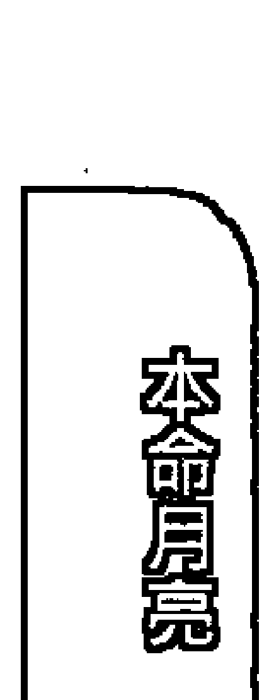

### 感情需求

如果你要对某个人敞开心房，他们必须非常务实、脚踏实地。我们还是要参考你的本命星盘的其他元素，你可能不太喜欢一堆绒毛玩具和甜言蜜语。不过，如果一个人实在、诚恳，可以帮助你觉得更容易与对方相处。你常常意识到自己的缺点，当你告诉另一个人自己的缺点时，可能意味着你与对方开始建立有信任感的链接，或是有这个人在场时，你觉得很自在。

当你表现对一个人的关心时，你会问对方，能为他做什么，或是直接做。当一位朋友遭遇困难时，你可能会给对方一个同情的拥抱或是倾心聆听，对你而言最实际的方法就是，帮助他们面对问题，同时希望能解决问题。你不只很喜欢实际协助自己爱的人，这对你的关系而言，也是不可或缺的感情元素。感觉被某个人需要，可以加强你的价值感，让你觉得自己对某个人而言很特别。你常会非常努力，让你所爱的人觉得不能没有你。

你具有批评分析和解决问题的天赋，因此你常能看到必须做什么事。不过在爱情中，你的伴侣如果是不同类型的人，那么你所谓的“有用的回馈意见”，对他们而言反而像是残忍的批评。

由于处女座的分析本能，你很容易忽略自己话中带有情感成分的弦外之音。举例来说，如果你因为觉得找不到有逻辑的、合理的理由生气，就可能否认或忍住愤怒。自我控制是件好事，但如果你因为控制得太过头，只会变成蓄势爆发的火山，造成伤害。你要谦卑地意识到自己没有说出口的暗示，还有你说话的意思，这就可以帮助你减少伤害。

吸引力法则：伴侣如果能教导你如何放松，不要对自己（对别人）太严厉，你将会受益良多。最常见的做法就是对方透过自我接受，向你示范什么是同情，而且不论你做错了什么还是爱你！

### 黑暗面

月亮讲的是感觉，而不是思考。如果月亮会思考，你的处女座月亮会把你所有做错的地方都想一次，告诉你错在哪里。当它做完这件事后——所谓的做完，也许只是因为超出负荷无法继续这么做——它就会开始思考其他人有什么地方做错了。任何星座在内心酝酿的情感风暴，大部分都是他们天生力量的副作用。对于月亮处女座而言，你天生的能力就是发现缺点，这是一个很好的工具，除非你不知道何时罢手。你会不断在内心对话，这可能只是背景音或是字字清楚，你会详细列出自己今天做错的八件事，这也许是你没有把握某个可能的机会，或是你没有把一项任务做到完美。因为我们谈的是月亮，所以你通常没有意识到这个过程。不过，如果你偶尔仔细地聆听一下自己的心，就会抓到你正在威胁自己，对自己说一些下流的话。我们每个人都会这样，但处女座的风格是不断分析失败，一个接着一个，不断批评自己。如果继续下去，你就会开始批评身旁没有达到你的期望的人。我们常把“见树不见林”这句话套用在处女座身上。当你怀疑自己的潜力，因此心神不宁，而且没有受到鼓励时，你可能无法承认自己已经把事情做得很好了。你对自己的表现总会有些批评，即使你已经因为治愈癌症获得诺贝尔奖，还是会对自己在其中扮演的角色有些负面评语。因此，不妨对自己这种倾向一笑置之，这是一种放松的好方法，而你只需要为自己感到骄傲。你的本能需求就是朝着自我完美而努力，但如果你变得过度批评自己，可能会让你无法负荷，完全无法成长。此外，如果因为害怕做错，就完全不去尝试、毫无作为，只会造成双重打击。

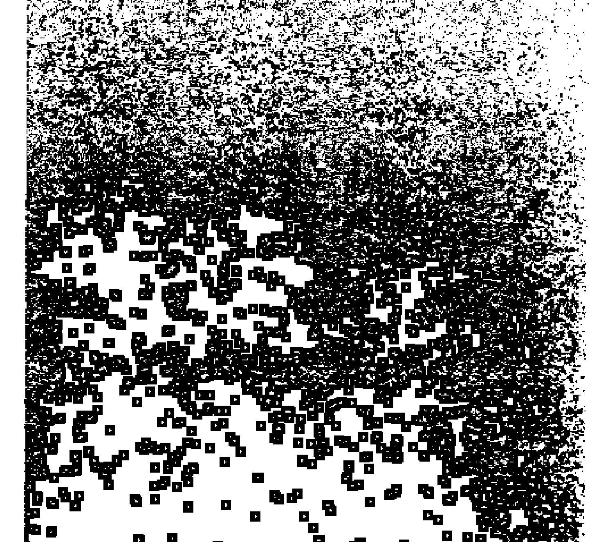

## 本命月亮在天秤座
聊不来的人，再怎么爱也不行

我们有时会把天秤座称为“关系”的星座，这可能真是如此。当你能与一个人来回交换意见，了解对方的看法时，或是有朋友或爱人一起分享经验时，你就会觉得受到滋养。当你发现你的另一半也乐在其中时，你就会觉得更有趣。你会觉得说不上为什么，一加一就是不只等于二。所以人们当然会认为天秤座就是关系的星座，这不代表你要变成某人的女朋友或男朋友，否则就是不完整的；比较像是努力找到与某个人产生连结的特殊动力。我们如何融洽相处？我该在哪里停手？你又要从哪里开始？当我们想要不同的东西时，要听谁的？什么是公平？光有爱还不够，与别人分享自己是需要协商的。这不只是两个人的谈判，而是任何事情之间的“两面”协商，其中也包括想法的协商。毫无疑问地，象征天秤座的符号，与象征正义的符号是一样的。你也许很容易或是无意变成纠察队，不过这世界上的不公不义，甚至只是发生在你的社区里，都可能让你心碎，让你生气。你知道没有事情是非黑即白，而你的本能反应就会试图平衡单方面的观点。当你的月亮在天秤座时，你具有一种本能，可以嗅到哪里失去平衡。你可以意识到是否因为有人生气或受伤，或是人们针对某件事情只提出了一种观点、没有公平地看到另一面，空气充满了紧张氛围。当你学会如何维持内在的平衡时，你就能找到快乐。你必须为公平而奋斗，或是学习在生命的混乱中稳住自己。

### 居家需求

对于月亮天秤座的人而言，家必须是个和平之地。你对周遭所有事物都很敏感（像是所有社交场合隐藏的意义，或是为了让外界所有事情都能流畅进行，能融合在一起，导致自己筋疲力尽），所以当你回到家时，你需要觉得在这里，你可以把自己的秤再次归回中间点。家里的紧张或混乱一定会把你掏空，让你觉得毫无后援。任何美好的小东西，为生活增添一点奢华感，都能带来截然不同的影响，像是晚餐桌上的鲜花，或是下班后与生命中重要的人放松一下，一起喝杯酒。金星对天秤座的影响会提升对美丽事物的享受，所以你的居家装潢可能到处充满令人恢复活力的氛围。

月亮摩羯座和月亮天秤座，都很重视他们在关系中是否受到尊重，但是月亮摩羯渴望的是尊严，月亮天秤座渴望的是对话。你需要朋友或爱人就像你一样，记得在关系中有两个人。令人愉悦的老派骑士风度，会让月亮天秤的人觉得受到照顾。这不是指特定的性别，当时只有男士会为女士开门，约会时付帐。这也不是要削弱女性的权力，当时的女性都很安静，很无助。这只是一种得体、礼貌和态度，而这一套对你而言，一直很受用。即使在冲突中，这是任何重要关系无法避免的事，互相体贴对方也是上上之策。你无法信任一个只顾自己的人，一点也不考虑你的立场，对你说话不尊重。你可能非常擅长争论或辩论，因为你可以看到其他的观点。虽然当你勇于表达异议时，这是一种信任的表征，但在情绪激动时扮演魔鬼的代言人，其实会让人非常生气，也不值得。在这些时候，渴望争取公平只会促成对立，而非理解，双方都会越来越激动，试图证明自己的观点，没有人想要妥协，只想要赢。如果你的星盘的其他元素比较没有冲突的倾向，你可能会因为完全避免吵架而变得很脆弱。你会避开问题，不让爱人或朋友看到问题，希望藉此消除紧张气氛。但逃避就是让一个小问题变得更糟的最快方式，因为其中有一股能量无法发泄，只会反弹到你身上。避免冲突可能只是反映了你不想显得自私或心胸狭隘，不过，有时你太容易想到另一个人的观点，反而会忘记自己的立场。

### 黑暗面

因为你能觉察别人需要什么才能觉得舒适，再加上你天生有能力看到每个人的观点，所以你常会发现自己站在中间，试着调解。如果你是法官或婚姻咨询师，这么做当然是件好事，不过如果你是因为强烈渴望取悦每个人，导致自己陷入冲突之中，你只会左右为难。最后可能必须扭曲事实，或是扮演双面人，让每个人都觉得你站在他们那一边，这不只会让你心力交瘁，也注定行不通。知道如何划出清楚界线，是很重要的。你也要知道，即使你试图取悦所有人，还是无法让所有人都称心如意。

我们面对一个用逻辑或是利弊清单都无法厘清的问题，人们常会建议我们“跟着你的心走”，不过对你而言，你的心就像是困惑的来源！你的情感幸福，奠基在事物之间找到自然平衡，这代表你总是可以找到一个赞成的立场赢过一个反对的立场。不过，坏处就是当你要做出一个决定时，你会一直犹豫不决，不断猜测自己。对付这件事的方法就是，很快列出你目前的状态，包括生理和情感等状态。当你失去平衡时，通常是因为你有一种或许多需求没有获得满足，这种摇摆不定的倾向就会变得更明显。你需要生活中有一种平衡感才能觉得满足，如果有人在此时脚步不一致，你就很容易失去重心。任何事情都可能让你内心那把秤偏斜，像是一个朋友吵架，至今仍苦恼不已，或是疲惫或饥饿等极端的生理状态。如果你可以应付，就能再次找到内心的天生智慧。

也许你必须承认，当你选择通过一扇门时，就必须关上另一扇门。当你害怕做错事情时，你可能很难认清这一点，但是不选择的结果只会更糟。你要找到方法，从中择一，其余的就放手。

吸引力法则：伴侣如果能教导你不要害怕表达不受欢迎的意见，试着找到意见的和谐点，不用努力让每个人都喜欢你，你将能受益良多。

## 本命月亮在天蝎座
宁可因真相受伤，也不可以被骗

如果说天秤座的正义是盲目偏颇的，那你就像是在学习把朦住视线的东西拿掉，真正看清楚正在发生什么，即使真相是不公平的、吓人或丑陋的。你有一种想要知道的强烈本能，但这跟风象星座的想要知道不一样，像是双子座。你追寻的不是事实，而是生命真理的真实本质。就某种意义而言，滋养你的不只是母亲在你入睡之前的晚安吻，还有你床下面的怪物。这不代表你不害怕怪物，而是你已经知道牠们就在那里。所以要你像大部分的人一样把牠们藏起来，或是假装牠们并不存在，对你而言一点也不舒服。你渴望真理、深度的经验和生命的全部，不只是轻松的表面。

荣格曾说：“一个人没有通过自己的热情地狱，就不算真正地克服热情。”你的心会被热情的经验滋养，这不是透过逃避混乱或改变，而是你必须通过这些经验，允许牠们把你逼到极限。凤凰是神话里的一种鸟，它会燃烧自己，向死亡屈服，之后获得重生，彻底改变自己。你也许会害怕改变或失去带来的深刻心痛，但你也渴望转变。荣格曾说：“我宁可选择完整而非美好。”完整就是你对生命的追求。

### 感情需求

在关系中，你需要朋友或爱人能承受热度，可以（至少要愿意）应付你火爆又善变的一面。感情比较温和的人，还有无法应付激烈或无法听见事实的人，都无法长时间跟你相处。你必须能够真实赤裸地面对一个人，不用觉得自己必须有所保留。你必须感觉一个人对你完全诚实，你才能信任他们。你宁愿因为真相受伤，也不愿意被骗。你不想要一段礼貌或优雅的关系，你想要热情、愤怒、狂喜、完整且澈底的经验，而你会用这种方式滋养别人。你的疗愈方式不是用绷带包扎或是一个吻，而是面对真相的疗愈力量。当你这么做时，你是独一无二的，因为有时只有你能处理一些生命的黑暗面，而对方必须坦承这些东西的存在，才能被治愈。

你会把强烈的情感转为承诺，当你想要一个东西时，你会全面投入，包括你的身体和心灵。很多人会用迷恋这个字形容天蝎座，的确如此。因为你需要密切关注你非常渴望的人，你会迷失在他们其中，这会导致某种程度的迷恋。当他们不在你身旁时或是关系结束时，你就会失去控制。这是如此深刻投入的副作用，但是对你而言，对于任何事情，除了全面沉浸在其中，没有其他方法，这包括对一个人，你必须真正地认识并体验他们。

### 居家需求

对月亮天蝎座而言，隐私可能是一个令你舒服的因素，无论只是一个上锁的房间，或是一个藏身在私人围篱后面或偏离平常通道的家。要你跟不信任的人住在一起，可能非常困难，所以你如果无法在需要的时候轻易地封闭自己，跟室友的相处就会充满挑战。至于你的居家装饰，你可能偏好大胆的颜色和戏剧化的表达，反映出深度和热情。

你对关系的欲望很容易变成侵犯朋友或伴侣的界线。当你被迷恋控制时，像是你想要知道你认为对方没有告诉你的事（即使只是因为他们没有准备好），你想要知道的强烈念头可能会增强为怀疑，你就会变成不受控制的偏执狂。你很善于觉察表面下有事情发生，但你可能很容易负面思考，总是预期最坏的事情发生。如果你任由恐惧让自己抓狂，可能会逼走重要的人，或是因为不尊重他们的决定和需求，对他们造成很深的伤害。

吸引力法则：伴侣如果能教导你如何真正地放松心情，不只是戴上假笑容，而是即使身处黑暗中仍能带着希望与光明过日子，你将会受益良多。

### 黑暗面

凤凰只能从希望并渴望诞生的欲望中获得重生，让自己改头换面，继续成长。当你发现自己心力交瘁时，你很擅长看见的厄运和阴暗会开始在心中累积，让你觉得更焦虑。你每天早上会越来越没力气起床，无法让一切重新开始。每一个人都会死亡，每一个人都会受伤。尽管你天生很容易看到黑暗，你就跟所有生命曾经受过打击的人一样，你也会害怕，你也会有很深的厌倦感。此时意味着你需要有更多的力量帮助自己，帮助其他人去面对生命。当这种阴晴无常的心情挥之不去，你怎么都觉得活着毫无意义时，你很容易陷在情绪里。有时你可以说服自己，你只是比较务实，但这常变成对生命的抗拒。在你从灰烬中欣喜重生之前，所有的冲击和燃烧有时会痛苦地让你无法承受。然而，你天生就能承受。你要在光明中找到一些平衡，你要信任光明，这只是黑暗的一部分。你要努力地展露笑颜。你要再一次地重新改造自己。你要摆脱过去的自己，颠覆生活，然后获得新生。

当你受伤时，你的本能可能是反击，或是彻底切断伤害你的东西，或是与之相关的所有事情。你就像代表天蝎座的蝎子一样，你如果选中目标，很擅长刺痛对方，因为你有能力看到表面下的真相，这让你擅长看到对方防御之下的弱点，你就能一针见血，切中要害。就如同我说过的，浴火凤凰也是天蝎座转化特质的良好象征，不过这种非有即无的燃烧消耗，无论是烧毁你周遭的桥梁或是烫伤你身旁的人，之后你都会觉得遗憾。你的感情如此强烈，只有当你能冷静下来把事情想清楚时，才可能出现宽恕，但是这种燃烧的后遗症会持续很久。当你心中怀有怨恨，或是执着于某个过去的伤害，这只会烧尽你自己的心，还有你身旁的人。

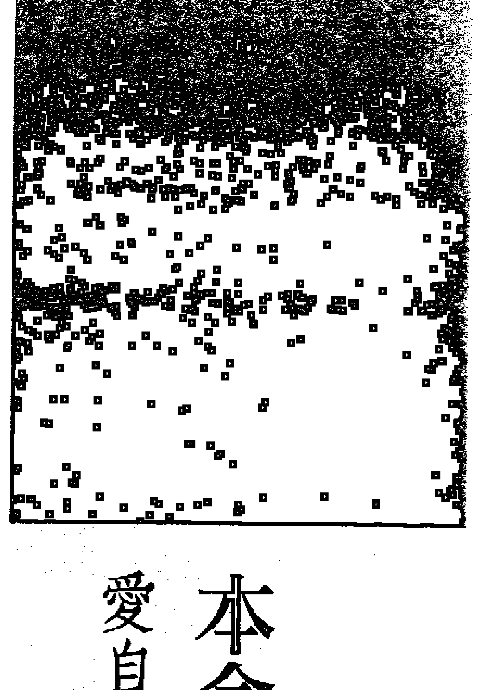

## 本命月亮在射手座
爱自由，跑得比猎物更远的猎人

你拥有一个探险家的心。无论是生理或心理层面的探险，对你而言，能自由体验，跟随着心的方向走，就是快乐的来源。你拥有乐观的天赋，可以看到有些人看不到的可能性和潜力。有些人觉得乐观就是天真或愚蠢，但这种可能性的感觉不仅能带给你乐趣，也能让你更自由地用自己已经拥有的东西赌一把，换取更好的东西，让你更延伸自己，抵达别人害怕尝试的高度。你在学习相信自己、相信活着这件事。你不仅相信活着是有价值的，甚至相信灾难也能挽回，变成一个跳板。你会发现当你相信自己的直觉时，通常都能把事情做好。

励志演说家莱斯·布朗（Les Brown）曾说：“瞄准月亮，即使你没有登陆月球，仍将置身于群星之中。”

你不需要一个粗略的大纲，计划和严格的时间表会让你觉得绑手绑脚。你就像射手座星群的弓箭手，你只需要瞄准，然后出发。有时当你根据规则或传统做事时，你会觉得这远比你跟随着自己的心意走而失去更多！你只有透过直接体验，才能真正感受到自己的某种直觉，所以你知道如何出人意表，让朋友抓不准你。

### 居家需求

射手座有时也会被称为哲学家，这让人联想到穿着袍子的人站在人们身旁发表演说。不过，这比较不像演说，而是一股追求各种经验的渴望，让你忍不住扩大视野看到生命和人们的真相，不仅限于个人孤立经验的体悟。你要尽可能常常地走出自己的角落，睁开你的双眼，让自己感到惊奇，这可以提振你的心情。把旅行套用在射手座身上，是我少数真正赞成的星座的刻板印象。我还不曾遇过任何一个月亮射手座的人，不渴望某种形式的旅行。无论是非常遥远的距离、极为奇特的国度，或者只是不熟悉的景象，你的心都会为个人未知领域的可能性雀跃不已。

月亮射手座的家里可以有任何东西。射手座常被称为最随和的星座能量，可能是因为射手座深信所有东西都知道该如何解决。盘子总会洗好，无论是在明天或礼拜四，无论是你洗还是我洗。这不代表没有事情可以惹恼你，或是让你心力交瘁，但你比较不会像有些人一样自寻烦恼。你也许不在意和别人分享你的家，甚至不排斥像游牧民族（这也是射手座的另一个象征）一样把家扛着走。

对于居家装潢，你可能很喜欢加入来自世界各地的元素，无论是你觉得有趣或漂亮的东西，或是你在旅行中收集的纪念品。这可以提醒你在这个广大辽阔的世界里，还有更多事情值得探索和学习。

### 感情需求

我们可以这么说，你对找朋友和爱人的积极程度，比不上你找玩伴和探险伙伴的兴致，这些人会欣赏并给予你渴望的自由，让你可以跟着自己的心走。有些人会害怕地抓住已知的一切，或是对你有刻板的期望，这可能会让你关上心房，或是逃之夭夭。

火象星座（也包括牡羊座和狮子座）以表达直接闻名。当你的月亮在射手座时，你会觉得不需要掩藏自己的感觉，不需要道歉或感到羞耻。当你能与朋友或爱人直接沟通，不必因为他们在说话时有所保留，彼此可以自由又开放地交流，最能激起你的信任感。

再提一次射手座典型的随和天性及恢复能力。即使当你受伤时，而你的本能可能会置之不理，试图恢复，而且常常速度太快了。你天生的本能是不要陷入纠缠，因为这可能让你心情沉重，所以你可能会倾向于避免冲突，或是闪避平常生命中会出现的一些比较强烈的感受，特别是在爱情里。无论如何，如果一段关系带有开放的特色，这可以帮助你留在一段关系中，与你相信可以包容的人分享感觉，而对方也不会觉得受到威胁，产生不安全感。

吸引力法则：伴侣如果可以让你知道亲密感和承诺不代表牺牲自由，教导你偶尔要三思而后行，你将可以获益良多。

### 黑暗面

因为你正在学习如何相信自己和自己的经验，你很可能因为过度自信隐藏的陷阱而受伤。尽管“让我们试一下”，看看会发生什么？这一套通常很管用，但有很多时候你可能很快就陷入困境。如何在迅速采取行动之前就认清困难，这就是你的挑战。把生命视为学习的经验，这并不是不好的人生哲学，但这有时可能导致不必要的困扰，让你粉身碎骨。再谈一下射手座的哲学家风格。你几乎比任何人都清楚，你的心知道一些大脑永远无法证明的事，但是就本质而言，个人经验还是纯属个人的。你骨子里就知道是正确的事，也许根本不是别人的经验和真理，而你有时会因为自己天生的热情，向别人宣扬自己的理念。这可能完全不是故意的，也可能是你的脑海中不断想着，你知道什么是对的，然后就会拼了全力让其他人都知道。你要认清这种传福音的渴望在何时开始失去控制，这是很重要的。因为这不只会让人们逃跑（或是你会辗过他们），也因为当你一旦对一件事情很笃定时，你就不会维持开放性地学习。真理是流动的，常会改变形式，而笃定会让真理褪下神奇的外表，被打入冷宫。你如果用灵感来交换定义，你的心会不寒而栗。

## 本命月亮在摩羯座
### 越堅強，越渴望一個有力的依靠

### 本命月亮

當你做一些帶來自尊感的事情時，就能增加快樂和幸福的感受。你的快樂的核心精神就是覺得有能力，這就是為何有時候摩羯座會在成就和野心上投注如此多的心力。摩羯座有時會被稱為管理者的星座，這反映了摩羯座想要管理的慾望和天生能力，想要把事情做好，想要顧好需要被照料的事。摩羯座天生非常擅長評估現實，知道必須做到什麼才能從A點前進到B點。管理者需要看到更寬廣的藍圖和未來的計畫，不只看眼前。摩羯座知道「保守」這個字的真實意義，這無關政治，而是意謂著不要期待超出需要的東西，因為來日方長。

獨立感對你很重要，因為所謂的有能力，這部分是來自於你知道自己能獨立進行一件事，不需要別人的協助或指示。你正在學習你的大腦、技能和自制力，可以帶你爬到想要的高處。因此，當你覺得虛弱，或是當別人認為你沒有能力或輕視你時，你都會特別受傷。管理者也會掌握某種權威感，這也是另一件能激發你的事。如果你可以為一件事情努力，按部就班持續前進，有權規劃自己的道路，決定自己的命運，這會讓你興奮不已。如果你可以靠自己的長處達成某件事

### 居家需求

對於月亮摩羯座的人而言，家不只是你的避風港，還是你的投資。你有一種本領，可以顧好家裡大大小小的事情，即使你只是委託或雇用專業的人來幫忙，但你的興趣還是必須看你月亮落入的宮位而定。摩羯座常與所有永恆的事物有關，所以你可能喜歡一棟古老但保存良好的房子。你喜歡的居家裝潢風格應該有一些讓你覺得永恆的物品，像是製作精緻的家具，永遠不會褪流行的傳統顏色。你可能也很享受修復古董家具，或者至少會蒐集成。

### 感情需求

對於月亮摩羯座的人而言，愛幾乎就是尊敬的同義詞。你必須表現尊嚴，或是受到敬重。所以若是在一段關係中，必須透過冷熱極端的行為、言過其實的互相叫囂或炫耀式的證明來表現愛，你會覺得你是這段關係中唯一的成年人。當你覺得朋友或愛人不僅能照顧自己，不僅能獨立，你甚至可以偶爾依賴他們，你特別容易覺得獲得滋養。必須是很強勢的人才能當月亮摩羯座的依靠，因為他們必須像月亮摩羯座一樣有能力，而這可能是個挑戰。儘管你很難在一開始就要

### 黑暗面

求對方支持你，但對你而言，知道對方是可以依賴的，這是很重要的。唯有如此，你才能信任對方，允許自己被照顧、被愛，而不只是被對方尊重或仰慕。你可能非常喜歡受人欽佩，但這有時會不利於關係。因為當我們被愛時，我們必須流露脆弱的一面。當一個人欽佩或仰慕你時，這可能造成情感的距離感，你覺得有義務活出對方的期望，而不是有時允許你自己倚靠對方。

月亮摩羯座的人很能約束自己，這是因為他們學到的智慧，是不要在一出現麻煩時，就自亂陣腳或讓局勢崩盤。不能控制情緒這件事肯定會惹惱你，而在關係中這可能是個棘手的平衡功課。你天生比較能夠信任一個不太需要別人或太依賴的人，因為你比較能自理，但你有時也因為太過自給自足，不容易建立互相依賴的關係。最重要的是，你不要假裝讓自己顯得很虛弱或是很需要別人，讓你的朋友或愛人覺得你誇大了他們在你生活中的重要性，因為這只會導致憤怒而不是真正的親密感。但你必須找到一些自然的方式，讓他們融入並分享你的生活，這也是很重要的。

吸引力法則：當伴侶可以教導你如何信任別人幫助你，偶爾讓別人照顧你，你將能獲益良多。

當你受傷時，別人可能很難知道，因為你常常習慣自己處理問題，而你總是直接跳進去解決問題，而不是沉浸在情緒裡。當你越需要照顧時，你就越逆來順受。你很擅長把情緒放一旁，先壓抑情緒，直到危機落幕。但如果危機持續太久，你可能會陷入機械般的反應和行為。你要小心因為太有效率，讓你忘了完整地體驗感受。

在希臘神話裡，天神懲罰薛西弗斯（Sisyphus）的方式，就是逼他把一顆巨石推上陡峭的山丘，就當他快抵達山頂時，巨石就會滾下來，他又必須重新開始。我們常用「薛西弗斯式」這個字來形容徒勞無功或重複性的任務，經年累月之後，只會導致悲觀和絕望。當你的月亮在摩羯座時，你很容易只專注於需要你做好的事，負起責任，卻會迷失在責任的無底洞中，導致自己心力交瘁。摩羯座的能量也特別容易吸引需要指引或幫助的人，所以你可能發現自己必須替身旁懶散的人擔起責任，因為你知道你辦得到，而且「必須把事情做好」。如果你不能直接接受幫忙，至少授權委託別人去做！

## 本命月亮在寶瓶座

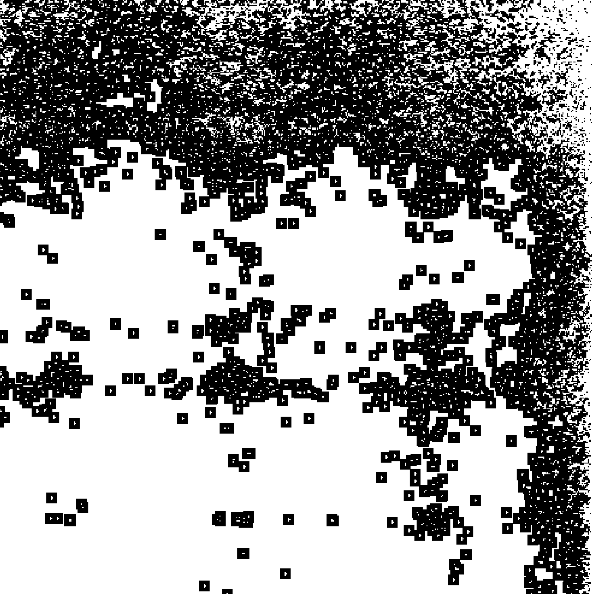

## 本命月亮在寶瓶座
再親近，都不能失去個人的空間

你的心渴望自由地做自己。這聽起來很簡單，因為你已經擁有自由的身體與心靈。但這指的不是一種生存狀態，而是一種持續的探索過程。當然，我們所有人都會隨著歲月改變，而這本身就是一種探索的過程。但是你在潛意識裡會不斷處於一種篩選過程，你會透過眼前的例子篩選什麼麼是「正常」的反應或行為，什麼是你的自然反應或行為。這不是想要與眾不同，或是違背意願，而是你想要當一個個體。

因為我們正在討論月亮，所以當你可以自由感受，同時能自然反應時，你特別容易感到快樂。無論是什麼感受，這就是你的感受。你可能會對電影中讓人落淚的部分哈哈大笑，因為你看到這整件事有多麼荒謬，或是你就是那種不會滔滔不絕討論嬰兒的女生。如果你在情感上真實地做自己，代表你永遠不用假裝感覺你很無感的事，也不用假裝你對有感覺的事很無感。當我們講到我們的心、我們的月亮時，我們會想到自己的「情感面」，很多人會誤認寶瓶座不是非常「有感覺」。但每個人都有自己的月亮星座，每個人都有感情，寶瓶座當然也不例外。包括寶瓶座在內所有的風象星座，都有一種天生的傾向，會透過情感反應來溝通或推論，把事情理出個頭緒。所以有時你可能是在思考你的情感，而不是感受你的情緒。這也可能是人們期望你情感的反應，但你根本沒有，所以這讓他們很困擾，以為你完全沒有感覺。你正在培養超然和客觀的天生技能。超然，按照字面的解釋就是遠離某樣東西，製造一種站在外面看的能力，所以很容易從遠方客觀地看待這個東西。你必須具有一種能力，足以脫離周遭最具說服力的情感和社會「規範」，你才不會被捲進去，說出別人期待你說的話，做別人預期你做的事，這會讓你無法知道自己到底是什麼樣的人，無法知道你真的想要說什麼、真的想要做什麼。

### 居家需求

對於月亮寶瓶座的人而言，擁有一個放鬆和自由的環境是很重要的。你能隨心所欲地進出，不用擔心什麼時間家裡會有人需要你；要是不用擔心必須輪到誰洗碗，這肯定也很加分。任何能給你獨立感的東西就是你要的。你的居家裝潢應該能反映出你各式各樣的興趣，任何能引起你注意的東西，是因為其中有一些特質，讓它顯得獨一無二，就像你一樣！

### 感情需求

我的老師曾經告訴我，兩個人融為一體，就像是兩個雨滴墜入大海，變成一個更大東西的一部分，融入其中。這種愛與友誼的概念對你並無好處，因為這裡沒有個人的空間。你需要的愛是兩個人就像兩根蠟燭的火焰，兩人產生連結，為了愛燒得更猛烈。然而，當兩朵火焰融為一體時，看似一團火焰，其實仍是兩根蠟燭。你可以將兩根蠟燭分開，它們仍有各自的火焰。

當朋友或愛人毫無興趣改造你，以期你能更適合他們時，你最能感受到滋養，覺得被愛。這不代表沒有任何期望，因為沒有一個人能完全不把自己和自己的需求投射在我們的關係對象身上，但他們會希望你能感覺到，你可以自由完整地發展自己。任何承諾，無論是書面或暗示的，都必須要為兩人保留空間，追尋各自的道路。當一個人也能擁有一個人的光彩時，也有自己的計畫時，你就能越愛對方，越信任對方，所以你們兩個在一開始就要有東西可以和對方分享，而不只是對方的投射。

吸引力法則：伴侶如果可以教導你，讓你知道，即使你希望不需要妥協任何真正重要的東西，比如你基本的人格特質，你仍然可以擁有愛、支持，甚至承諾，你將能獲益良多。

### 黑暗面

我們很難甩掉社會期許，另一種說法是眾所皆知的「同儕壓力」，這並非不可能。當沒有人覺得受傷時，你很容易當一個造反者。但是當你愛的人對你有期望——因為他們需要你，或是因為他們想要給你最好的東西，而且他們知道什麼對你最好的時候，這件事就變得非常棘手了。當期望出現時，月亮寶瓶座的人，有能力遠離愛的期許底下的暗潮流伏流，這有時對事情比較好。當你不會突然變成你愛的人希望你變成的樣子，所以現在必須假裝做某件事，或是假裝當一個不是自己的人。我們時常都會這麼做，當我們在嘗試一件事時，當我們不確定這件事對我們是否合適，我們也試著給它一個機會，因為我們真的希望這對每個人都行得通。但是沒有任何事情能讓你停止你的心、你的喜悅和你的本質，能讓你過濾割捨或約束真實的自己，即使看似有一個像愛一樣好的理由。

你一定經歷過這樣的考驗，你必須選擇讓某個人開心，或是真實做自己，而且只有你才知道在每個情境中，哪一個選擇才是正確的。但有時當你戰戰兢兢拿捏分寸時，你可能會偏向其中一邊太久。其中一邊就像前面提過的，你會試著強迫自己能在不適合自己的地方待一會兒，或是更久一點。另一邊則像是「毫無理由的反抗」，你會發現自己處於一種推開所有人的模式，只為了確保你和他們都知道你是自由的。更進一步，你就可能變成被放逐者、怪胎或代罪羔羊。有時人們把我們貼上這些標籤，是因為他們不了解我們，但有時候是我們自己貼上標籤，認為我們的唯一選擇，就是用這些標籤來警告任何試圖制服我們的人。兩種行為模式都只會讓你更遠離真實的自我，因為這種反應不是源自於你自己的力量，而是始作俑者的力量。

## 本命月亮在雙魚座

善良和心軟，不該被錯的人利用

你正在宇宙中學習信任。你不必控制所有事情，才能相信事情都會按照應該的方式發生。你對這個世界的信念，即使有時會動搖，其實能讓你保持開放的心胸，而敞開心胸是最能滋養你的事。不仁慈這件事對你傷害極深，無論這是肉體或心智上的殘忍，或只是尖銳的憤世嫉俗。你可能認同和平主義者的哲學，但這還是要視你星盤中的其他元素而定。你覺得唯有和平可以帶來和平，因為你知道我們之間的連結遠比想像中的更加緊密。

別人也許會說你太敏感，認為你心太軟，必須強硬一點。你覺得自己的確如此。你可能會發現自己會比別人更常需要隱退避世。而當你受傷時，你有時的確需要花比別人更長的時間才能復原，但是敏感不一定是負面特質。你就像一個調音精準的樂器，你的敏感可以讓你想要付出或體驗的所有美好事情發生，像是同情和直覺。

你是一個如此甜美窩心的人，但我不會說你只喜歡親親抱抱。窩心是雙魚座的另一面，這是你渴望在生命過程中尋找魔法和神秘。當你相信魔法時，你就相信可能性，這可能是我們還未發現的事物，或是至今還無法達成的。科學家和發明家的敏銳心智都會被想象力和幻想激發，而這些根本還無法用物質的形式表現。任何變成現實的東西最初都只是夢想、概念或憧憬。愛迪生、米開朗基羅和小馬丁·路德·金恩的月亮都在雙魚座。「我有一個夢」這句話，的確是他們最真實的心聲。

### 居家需求

因為月亮與你的家庭生活和需求有關，我們要先考慮你需要什麼來創造一個滋養的家，才能知道什麼東西可以讓你的情感充電。對於月亮雙魚座的人而言，充電常常是繼續重返現實的重要環節，因為你的柔軟常會讓你覺得自己比別人更容易被這個世界打擊，更容易挫敗受傷。你的居家環境一定要讓你感到平靜。你可以用柔和的顏色裝飾你的家，散發夢想世界的氣氛，或是一些能讓你想起大海的顏色，也可能非常療癒。這聽起來可能很老套，但是這常常很適用。因為活在這個世界上定義的「現實」裡，有時會讓你認為內在的靈魂沒有棲身之地。所以一個家可以提供一個出口，讓生活中非常真實的一面重新充電，重新恢復活力。

### 感情需求

你的滋養風格就是同情、仁慈和溫柔。你的本能會包容心愛的人，願意盡可能地幫忙對方。你喜歡輕鬆愉快的關係，帶有隨和的感覺，雙方都可以感覺一起向前走。你渴望得到並付出無條件的愛，這都是源自於你的理想化，所以你常會因為現實生活中的衝突和不完美而幻滅。對你的心而言，原諒和忘記是好事，雖然有時你太容易忘記和原諒了。你天生就對別人有同理心，所以你想要幫忙，有時會讓自己成為他們的救贖者，因為你不想要他們再受傷。這麼做會讓你超出負荷，也會讓你愛的人無法透過面對這些考驗，積累自己的力量。當你活出月亮雙魚座的本性時，你會學習用各種方式找到希望與光明，所以你也在發展一種天生的能力，幫助別人找到希望與光明。你滋養別人的方式是幫助對方露出笑容，找到方法再次看到生命的光明面，即使這只是給他們一個暫時逃避麻煩的管道，讓他們的心獲得一點平靜。至於你自己的需求，你會信任形形色色的人，但一個能維持個人精神的人，一個善良的人，跟你比較投緣。吸引力法則：伴侶如果能教導你，讓你知道務實不代表必須折衷你的夢想，反而是實現夢想的好方法時，你將能獲益良多。

### 黑暗面

當你過度發揮想要幫忙的天生渴望，毫無保留完全地付出自己，很快就會心力交瘁。你天生知道什麼時候應該休息，應該迴避人群，但有時你沒有這麼做，因為自己要充電，這往往意謂著對需要的人說不。如果你不留意身旁的人，還有身處的環境，你對別人的同理心也會讓你精疲力盡。因為你的心的界線比別人更寬鬆，你很自然就會吸收一個地方或其中的人散發的氛圍。如果這是充滿愛的氛圍，太好了！好好沉浸其中吧。但你常常也可能吸收環境裡的惡毒，卻不明就裡，這會讓你變得虛弱，心情莫名浮動，連你自己都無法理解。因為你喜歡透過環境感覺自己的方向，有時你可能陷入一個預期之外的狀況。當然你不是童子軍，但若能有一點預先的準備，將對你非常有幫助。如果你不這麼做，就會陷入心力交瘁、不斷出現危機的模式。當有突如其來的危機時，你的第一個本能反應就是逃避或避免混亂（這當然只會讓混亂擴大）。所以對你而言，學習處理不愉快的現實是極具挑戰性的事。

## 本命月亮在十二宮位的必修課

星座的十二宮位代表事件和情況，這是人類典型經驗的一部分。宮位就像我們展現慾望的舞台。有些很明顯，易於辨認，就像是我們的工作、家庭生活和關係；有些則比較不明顯，但也與我們的生命領域有關，像是我們的內在、私人及靈性生活。

如果想要認識宮位，只要記住一個基本原則：宮位與生活中的活動有關（我們做的事）；星座則與我們的風格和特質有關（我們是什麼樣子）。我們工作，我們與人連結，我們立定目標，我們會做夢，也會運動。這些都是動詞，都是我們做的事。一個行星落入一個宮位代表一些生命領域，你在這裡需要跟隨著你的心，才能獲得最多的好處。舉月亮為例，這代表你需要用情感參與的生命領域，你必須得到你想要的東西，將它化為真實的生活與行動。

接下來我要介紹本命月亮在每個宮位的核心活動、功課和喜悅。當你經歷不同的月亮推運時，試著把你學到的東西融入你基本的情感需求時，你就能找到自己的情感基礎。

## 本命月亮在一宮
學習相信直覺，對想要的事採取主動

一宮就像一塊空白的石板，你可以依照你的願望刻劃自己的人生，而宇宙正在兩旁等著你，準備跟隨著你的引領。人們把一宮稱為健康與體質的宮位，其中也包含你的上升點，所以這也與你如何維持健康強壯、如何與外界連結的活動極為有關。

### 付諸實行

當你的月亮在一宮時，你正在學習如何信任自己的直覺，學習當你的心為生活的一切指出方向時，你要跟著心的方向走。一宮就如牡羊座，這與主動有關，也就是你對想要的東西採取行動。

*   ❶ 不要與六宮混淆，六宮被稱為疾厄宮。
*   ❷ 在大部分的宮位制中，你的上升點就是一宮的起點。這是一個非常複雜的主題，如果你對上升點很好奇，請參考建議閱讀的部分。

你的本命月亮星座可以顯示你會用什麼風格做這些事。舉例來說，你的本命月亮是火象的射手座，你可能會用一種愉快的、「讓我們走著瞧」的風格投入，而本命月亮是處女座或摩羯座，則會想要更仔細地琢磨策略。無論是什麼星座，當你做了決定，獨自採取行動時，你的心會獲得滋養，無論是好是壞，都勝過於你坐在一旁等待事情發生，或是跟著別人走。

任何有助於你發展自我的活動，都能帶給你快樂，這些活動會讓你覺得你正在變成一個讓自己驕傲的人。在這個世界上，我們有時會被告誡，把時間和金錢浪費在無法促進經濟成長的事情上，就是一種縱容放任。但你正在學習，這並不是自我放縱，而是攸關你的快樂。我們會在七宮對面的一宮，實現人際妥協和分享的概念，但是你的月亮如果是在一宮，你正在學習的是，投資自己是很恰當又健康的作法。

照顧你的外表和身體健康，也是投資自己的好方法。你可能會發現有時改變外表，或是特別打扮一下，甚至用某些方式寵愛自己，都可以讓你心情愉快，自尊心大增。你正在學習信任自己的身體，欣賞它。它不只是你航行人生的工具，也是你在這一世生而為人的一部分。吃健康的食物、運動和鍛鍊身體，這是很好的基礎，但是找一些方法滋養你的身體，讓你感覺舒服，非常享受，這真的能滋養你的心靈。你的本命月亮星座可以給你一點想法。知道如何做到這一點。是瑜伽嗎？有機料理？跳舞？武術？做造型？這些都是你能透過身體來滋養心靈的方法。

### 自我破壞

上面提到的所有方法，都是要強化清楚的身分意識。完整的本命星盤可以看出你是什麼樣的人，但一宮的月亮是要告訴你，對你而言最重要的是，你要覺得自己在一開始就有權決定自己的身分意識，同時還要學習相信自己的能力，知道自己可以帶著力量對外表態，展現自己的身分。

缺乏界線或是無法感受到自己的身分意識，這兩件事會打敗你，這時你通常會選擇以下其中一條路走，這要看你本命月亮的星座而定。其中一條路是用過度殺傷的方式回應，試著掌控環境和周遭的人，藉此得到內心感受不到的權力感和掌控感。另一條路就是像一朵枯萎的紫羅蘭，你不知道自己是誰，只會採納身旁人的行為或個人風格。這裡的解決之道，就是相信你自己的風格就夠好了，這也很適合你，所以就自然地作自己吧。

## 本命月亮在二宮
學習投資自己，看見自己的價值

二宮常被稱為金錢的宮位，但是金錢只是表現價值的一種方式。二宮真正關心的是，我們如何賺取金錢、如何衡量金錢，以及我們真正認為有價值的東西，其中包括與自己有關的事物。

### 付諸實行

當我們對某個東西（或是好幾種東西）沒有安全感時，你就會很難認清自己的價值。你的本命月亮可以看出你天生掙扎的不安全感的本質，也可以告訴你如何透過一些技能和自我測試，幫助你看到個人的價值，同時累積自我的價值感，以對抗自己的不安全感。舉例來說，你的本命月亮是雙子座，你可能會對自己的聲音、意見和智力沒有安全感。對抗的方式就是投資自己的聲音、意見和智力。如果你不覺得自己很聰明，可以透過學習、自我教導或一些林林總總的教育方式來投資自己，讓自己變得更聰明。如果你不認為自己有任何值得的東西# 本命月亮

可以說，一開始可以先觀察一下周遭的環境，偷偷寫下你的想法。無論你正在做什麼或想要做什麼，最快的方法就是先克服不安全感，這也是一種向自己證明的方法，你是值得投資的，值得一試的。

既然月亮反映了你的主觀，你可能無法客觀衡量自己的價值，還常在不足的部分犯錯，即使其他人都已經看到你擁有的價值和潛力。如果曾有人告訴你，你很漂亮、聰明、有趣、特別或任何讚美的形容詞，你只是不以為意，或是解釋沒那回事，你就正在面對一種二宮象徵的經典副作用：如果你不是已經相信自己，沒有人能告訴你——你的真實價值是什麼。當你妥善運用個人價值時，這其實是一種巨大的資產，意謂著一旦你強烈相信自己的價值何在，即使只是透過某種特別的方式或主題，那麼無論別人怎麼說，你都不會否定自己，除非你願意相信他們。但是經過事實證明，自我打氣或別人的鼓勵，無法提供這種信心。如果你想證明自己，建議回到前面說的方法：針對想要擁有的技能或特質來投資自己。

別忘了我們討論的是月亮，這麼做並不只是加強你的履歷表，而是透過向你自己證明——你值得一些努力和資源，從中來滋養自己。你也要冒險一下，可能會被嘲笑或表現得不夠好，這是很重要的。因為唯有如此才可以證明這不只是僥倖或幸運，這一切都是你做的，而你的確有這麼好。

### 自我破壞

我們的心會渴望想要的東西，這有時就像被寵壞的小孩。迷戀實際的物品，沉迷財富和衝動消費，通常只是試圖驅趕或掩蓋不安全感及負面感受。想要物質的慰藉並沒有錯，而這的確是照顧自己的一種好方法。因為二宮是土象宮位，具有實際碰觸的本質，但你要是只用物質取代心裡真正渴望的某種慰藉，你就會往下沉淪，走錯方向，這只會比一開始更失落，更沒安全感。

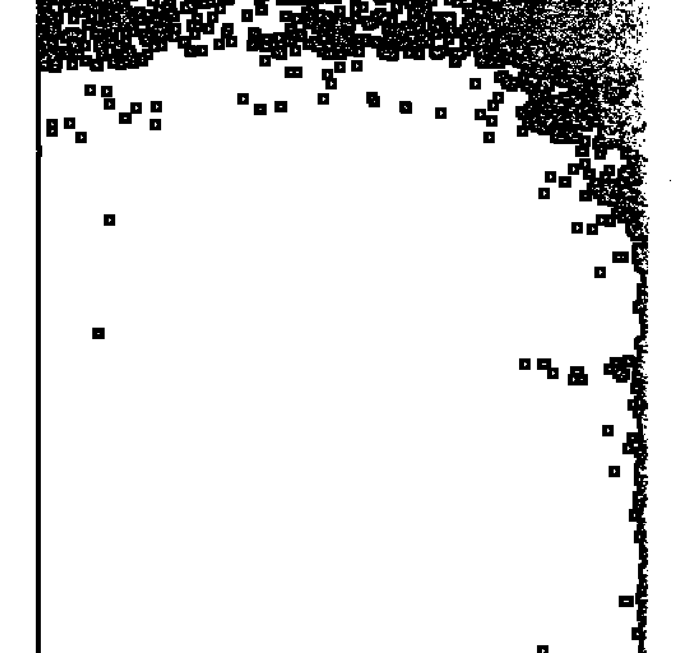

## 本命月亮在三宮

### 學習更客觀的表達，有助釐清困惑

三宮代表的活動與各種形式的學習、觀察和溝通有關，甚至包括促成這些事情的機器和小零件。三宮的活動可以反映交換和分享知識、想法和意見，對你而言還包括感覺。

### 付諸實行

你非常享受透過一些方式傳達自己的感受，還有令你感動的想法，這些方式包括寫作、說話、唱歌或更多抽象的溝通方式，像是藝術、音樂和詩，替文字和符號之間搭起橋梁。你可能也很喜歡閱讀、與朋友長談。你可能喜歡學習，也可能特別喜愛一些書寫優美、發音清晰、具有詩意或至少有些巧妙的文字話語。你的月亮星座可以告訴你，你喜歡學習什麼東西，用什麼樣的風格或方式學習。它也能告訴你，你會如何表達自己的感覺，像是私下寫日記，或是讓全世界都看見。

# 本命月亮

你非常享受表达自己的想法，你也能在表达自己的感受时获得滋养，无论是透过艺术，或是任何感觉被听见、被了解和产生连结的方式，这要视你的月亮星座而定。举例来说，你的月亮如果是宝瓶座、牡羊座或射手座，你可能会为了记录或满足自己，对外表达自己的想法和感受。但月亮如果是巨蟹座或天秤座，获得回馈、同理和理解，则能带来更多的疗愈和满足。我们的月亮显示我们渴望如何被照顾。所以无论是什么星座，对于月亮在三宫的人而言，至少要觉得自己的想法、意见或有感觉的事情，具有重要性、被接受了，这是很重要的。其实，当你搞不清楚自己到底在想什么，找不到理由时，此时说出自己内心的对话和感觉，通常能帮助你厘清困惑。

三宫和双子座有关，三宫的经验也像月亮一样易变无常，所以你的认知，还有你如何评断任何事的真实性，完全视你当时的心情而定。我们都有自己的主观认知，但是当月亮在三宫时，你很容易透过情感来过滤自己说的话，还有你吸收的资讯。你可能记性非常好，这要看你的月亮星座而定。因为就整体而言，人类比较容易记住带有情感印记的事情，但你要留意，当你把事情重新讲给别人听时，你可能只记得想要的部分，或是你会添加个人的判断。无论你的月亮在哪个星座，就正面而言，你天生的直觉性很强，通常十分敏感，非常精准。你不只一直在用眼睛和耳朵观察，还会加上自己的「第六感」。

# 本命月亮

### 自我破壞

我已經提過，你會自陷泥沼的原因之一就是你的主觀，會透過情感的偏見來過濾你的觀察。當你沒有意識到自己是這樣時，這會造成問題。你很難看清情感和想法之間的界線，你可能認為自己很客觀地衡量所有事實，最後卻發現自己被一種帶有情感色彩的論點左右，只因為它是透過清晰的演說輔以統計數字表達，很具說服力。

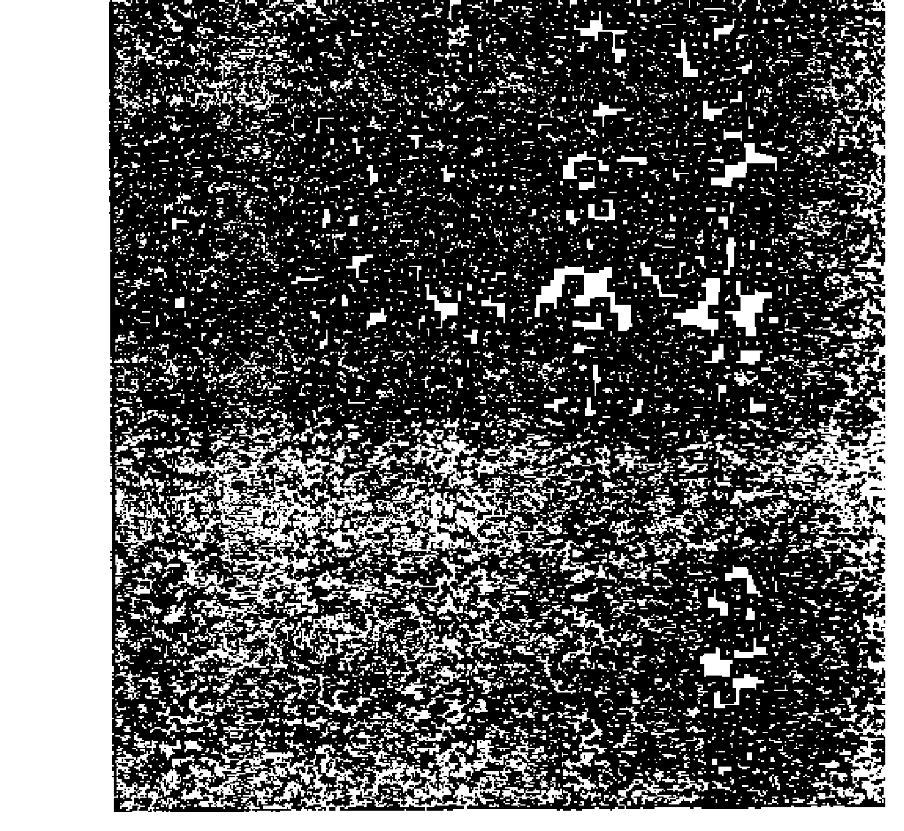

## 本命月亮在四宮

### 學習揮別童年陰影，打造心中的家

十宮與正午有關，所以十宮對面的四宮就代表午夜。當萬家燈火熄滅，當全世界進入沉睡時，當沒有人看著你時，你是什麼樣的人？當你覺得很安全，可以表現自己時，你又是什麼模樣？

### 付諸實行

四宮這個「家和家庭」的宮位會非常舒適地招待月亮，因為我們的心渴望覺得安全、被滋養、被照顧，而四宮的所有活動都與這些有關。你的月亮星座會透露許多訊息，顯示哪些東西可以給你庇護的感覺，因為這不只是四面牆、一個屋頂和籬笆而已。如果月亮是土象或水象星座，可能很喜歡一種永恆感，結構堅固，內部空間很舒適。如果是風象或火象星座，可能比較關心屋內有誰可以跟自己講話或玩樂，勝過於在意牆是否牢固！無論如何，我們所有人都需要覺得安全，覺得自己屬於某個地方，一天結束之後可以在那裡落腳，可以被庇護，受到歡迎。當你的月亮在四宮時，這種需求特別強烈，而任何童年早期或現在的問題，彷彿都會阻礙你獲得滿足。就實際層面而言，建立一個家，裡面的氣氛、裝潢和人讓你覺得很舒服，對你情感層面的幸福非常重要。而既然一個家通常都是我們一天開始和結束的地方，投資一個家，對你的情感力量及安全感而言，絕對是首要之務。你會發現，重新回顧過去，無論是自己的過去或世界的歷史，心裡會感覺特別溫暖。你的月亮星座可以看出你到底是喜歡買古董，還是調查家族的歷史或家譜，或是迷戀古老的科技。與過去連結，是因為你需要知道事情的起源為何，知道這一切如何發展到今天這個地步，特別是針對你自己。你的情感記憶非常強烈，所以過去可以讓你的心暖起來。早期的負面記憶或祖先流傳的舊傷口，可能會揮之不散，糾纏著你。因為月亮所在的宮位，可以看出我們容易在哪裡表現療癒的力量，甚至能找到力量，療癒你的家族代代相傳的傷痛。當我們在描述家庭的動力時，「功能失調」這個詞幾乎變成耳熟能詳的字，不過隨著在現實生活中，家庭的定義越來越多變化後，理想家庭的形象就隨之褪色了。然而，我們早期成長的環境，一定會強烈影響我們對世界、自己及關係的態度。當你的月亮在四宮時，你會跟老舊的安排和問題奮戰，這些東西會緊抓著你不放，你很難擺脫過去被教導的自己，很難釐清自己的模樣，還有可以變成什麼樣的人。如果你因為恐懼、懶惰或是不願意面對現實而忽略這件事，最後就會不明就裡地重複同樣的負面模式。

### 自我破壞

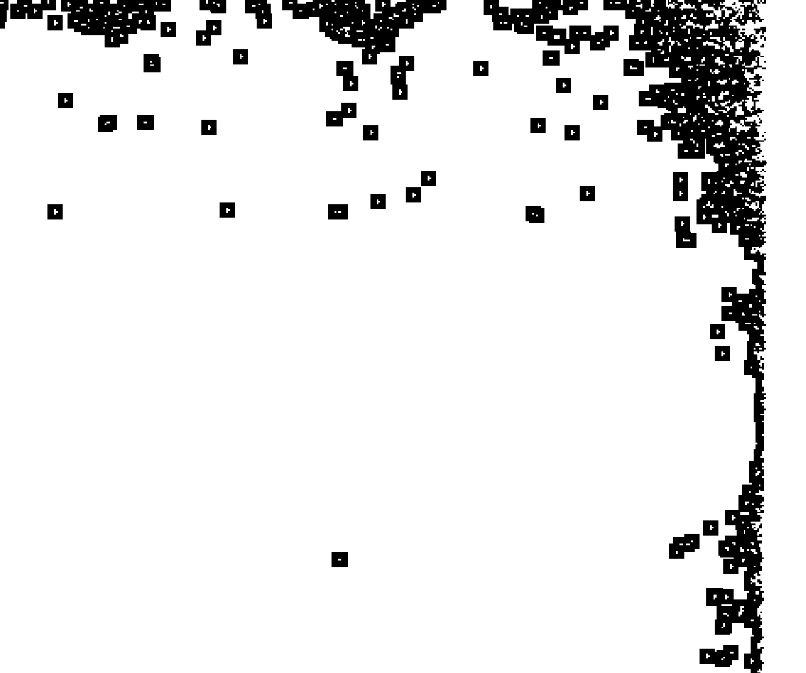

## 本命月亮在五宮

### 學習自在的表現，別擔心別人眼光

這是小孩、賭博、創造力和成癮的宮位，這個組合聽起來有點奇怪，不過它們都代表「活在當下的狀態」。小孩會放縱地玩，完全不注意時間。而當藝術的面紗被揭開時，創造力會吸引靈感，時時刻刻地展現靈感。

### 付諸實行

當你的月亮在五宮時，你擁有小孩般的心，而小孩就是愛玩！你可以透過一點愉快的活動來振奮心情，但是你的心不只需要偶爾下盤棋，或是晚上看場電影。你在學習如何享受和應對生命，學習如何自在地表達自己，在這個過程中，不必害怕表現你對事情和人的感受。當你的心裡有某些感受時，你必須能自然且直接地流露或表達。學習活在當下，意謂著無論眼前發生什麼，都要讓自己全然投入，不要想之後要做些什麼，或是現在應該做些其他的事，或是擔心別人會怎麼看你。當你的心能信任自己及生命，你能把心打開時，你的心就會為之振奮。這可能導致衝動，但你的月亮星座可以提供一些線索，看出你喜歡用哪種方式投入和表達自己。舉例來說，月亮摩羯座的人可能迷失在一個計畫中，這種風格並不衝動，只是沉浸其中。當你讓自己的心沉浸時，你就能獲得啟發。

當你沉浸在一段喜歡的音樂或戲劇表演時，要是有人看你的臉，可能會覺得他們闖入了某個私人的時刻，因為你臉上的喜悅就像是忘了自己身在何處，沉迷在當下，忘了自己。全然投入你當下的體驗，這就是讓你感覺最好的方式，你用其他方式都不會也無法有同樣感受。有時候，你沉浸於當下的這種傾向，會對你的時程或責任帶來困難的副作用，也可能讓你覺得現在發生的一切超出負荷，因為當這一刻的熱度籠罩你時，你會失去洞察力。

你擁有一顆藝術家的心，即使只選擇淺嘗涉獵。有些人可能喜歡在無聊時剪貼或塗鴉，但對你來說，創造可以宣洩情感。你的本命月亮星座可以告訴你，你會用哪些最享受的、最具療癒效果的方式，表達自己和自己的藝術。月亮天蠍座可能被戲劇性的藝術打動，這意謂著打破禁忌，揭露所謂生命「醜陋」面「蘊含的美麗，把令我們害怕的東西變成徹底震撼、喚醒我們的藝術。月亮雙子座的人可能喜歡用寫作的方式表達藝術，像是小說或詩，或是唱歌。

### 自我破壞

如果想一心投入當下，體驗當下的樂趣，就必須讓發自內心的直接渴望來促成立即的反應。不過，這麼做的副作用就是衝動。你要是投入當下任何讓你覺得美好的事物，就可能很難為未來可能的享樂保持自律，例如為了度假存錢，而不是一次把錢撒光。當你的月亮在五宮時，你很可能成癮，如果你的星盤中的其他因素也支持這種傾向，或是缺少反制作用。成癮就是重複和強迫性地做一件事，直到不健康的極端地步。你的本命月亮星座可以看出你最容易對哪種事物上癮，也可以看出幫助你避免上癮的方法。舉例來說，月亮金牛座的人可能因為喜愛感官享受，很容易飲食過度。但是他們對於「必須設定限制」這件事也很固執，也有能力傾聽身體的聲音，節制地進食。

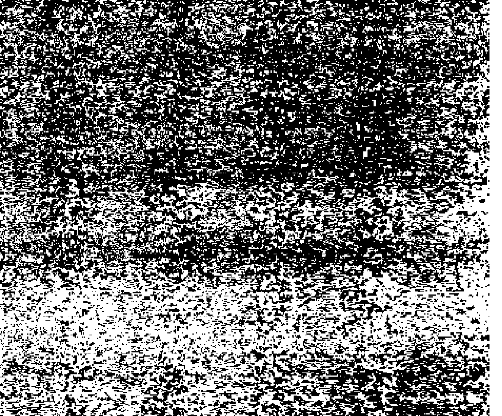

## 本命月亮在六宮

### 學習照顧自己，並以療癒天賦助人

在電影《洛基》(Rocky III) 第三集裡有一幕，當洛基為了準備最重要的一場戰鬥，長時間地鍛鍊身體，訓練自己，此時背景響起「生存者」樂團唱的《虎之眼》。當電影必須讓觀眾知道在一段時間發生的許多事情，以便讓劇情能連貫繼續，但又要避免讓觀眾覺得無聊，此時最經典的手法就是放一首歌，播出拼湊的畫面。但在現實人生中，我們不能直接跳到重要的戰鬥，必須要有每天的努力，才能走到那一步。六宮常被稱為工作宮，因為這裡是我們從事日常工作的領域。

### 付諸實行

當你的月亮在六宮時，你的心是雀躍充滿生氣還是死氣沉沉，都要看你每天的付出決定。所以你要很確定你做的工作，還有努力的目標，都是你很在意的事，不只是賺一份薪水而已。我們所有人為了照顧身體，照顧家庭，跑腿辦事，每天都有維持生活的事情要做，除此之外，你還喜歡什麼？你在意什麼？你正在學習必須為一件事付出，為付出這件事的必要技巧和知識而努力，即使這不能讓你發財成名甚至不受人歡迎。這不代表你的工作無法受到肯定，但一切都要從心開始，而不是考慮合理性或薪水。當你投入一件能滋養你的事情時，你最容易得到肯定。

無論你每天為了什麼事情付出努力，你的心渴望對自己的、其他人的生活帶來真實的改變。無論任何星座，月亮都代表我們想要滋養的一種本能，所以當你的月亮在六宮時，你可能與療癒者的原型有關。你的本命月亮星座可以提供很多訊息，看出你喜歡治療什麼，如何治療。舉例來說，月亮在巨蟹座，你可能想像和志工一樣，療癒破碎的心和家庭；月亮在牡羊座，你可能想像和物理治療師一樣，幫助治療身體；月亮在雙子座，也許喜歡語言治療或教學。

自古以來，六宮就被認為是疾病的宮位，所以當你的月亮在六宮時，你的情感健康和身體健康的連結，可能比其他人更緊密。這當然意味著如果你長期不快樂，就會影響你的身體健康。這就像一條雙向道，所以對你來說，照顧健康也是一種振奮心情的好方法。

當你做一份好工作時，或說一份能引以為傲的工作時，無論是任何工作，你一定會全心投入。但是如果你不在乎你正在做的工作，工作就會慢慢將你榨乾，每天都很痛苦，讓你覺得自己像個奴隸。有些人可以逃避，想著只要做好每天的工作，把時間砸進去，下班之後再奔回家，過真正的日子。但是你不行，長時間下來，這種態度不只對你的情感健康有害，也會有損身體健康。

當你覺得沒有任何讓你發自內心或本質渴望付出的事，你的自尊心會嚴重受創。這裡的解決方法當然就是嚴肅面對你的渴望，知道你只能過一種生活。有時人生就像你手中握有所有時間，但是日積月累，一種規律會變成一輩子的習慣，當這一切不是由你自己起頭的，對的時間永遠不會出現。

# 本命月亮

### 自我破坏

## 本命月亮在七宮

### 學習辨識誰真正對你好、值得交往

這一宮主要關切的是，我們在日常生活中大量與人相處的活動。七宮常被稱為關係的宮位，當然有許多宮位也注重關係，但是七宮的經驗特別強調關係之中的平衡、公平和妥協。七宮的活動教導我們，如何在現實生活中與人分享自己與自己的空間，也教導你如何協商，彼此融洽相處。

### 付諸實行

當你的本命月亮在七宮，你正在學習如何在滿足自己的需求時，又能跟另一個你在乎的人妥協，對方也試著滿足自己的需求；你也在學習如何了解別人的觀點，但又不能忘記自己的立場。七宮的對象不僅限於我們愛的人。既然七宮也在學習如何看到其他人的觀點，所以有時最令我們生氣的人（還有那些被我們視為敵人的人），常常能讓我們對自己和人生有更多的認識，程度並不亞於我們愛的人。七宮的經驗不只是講朋友或愛人，還有你如何讓他們來照顧、支持和愛你，而當你看到他們因為你的付出和支持感到快樂時，你也會很愉快。當你花點時間與一個你愛的人相處時，你的心情通常會為之一振，這是個不錯的點子。對你而言，大型、一般的社交活動可能不如一對一的相處，雖然這還是要視你的月亮星座和星盤中的其他配置而定。要是說每一個月亮在七宮的人都很渴望結婚，實在有點愚蠢，但月亮在七宮的你，可能很渴望和一個自己關心的人分享生活的點點滴滴，也渴望有個人真正看見你，真正懂你。只是與某一個人分享一個經驗或是你對某一件事的感覺，就能給你支持的感覺。你的月亮星座可以看出你會信任哪一種類型的人，以及你會如何向他們敞開心胸。

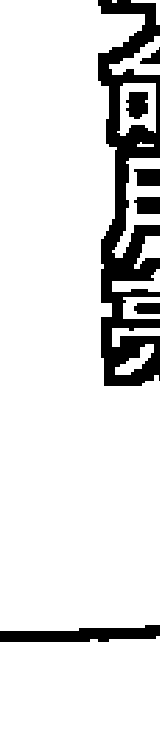

### 自我破壞

你很容易對你親近的人產生同理心。你有直覺的雷達對準別人，可能會吸收太多別人有待解決的情感議題，反而讓你很難看清自己的觀點。你會因為太容易把自己和個人的價值交到另一個人的手中，因此容易受傷，這跟與對方分享你的心情甚至你的生活是不一樣的。這會讓你的自尊十分難受，剝奪了你的情感控制和平靜，因為這總是要看另一個人的行程和心情而定。所以最重要的是，學習什麼時候應該妥協、什麼時候必須記得自己也有不盡相同但一樣合理的需求。

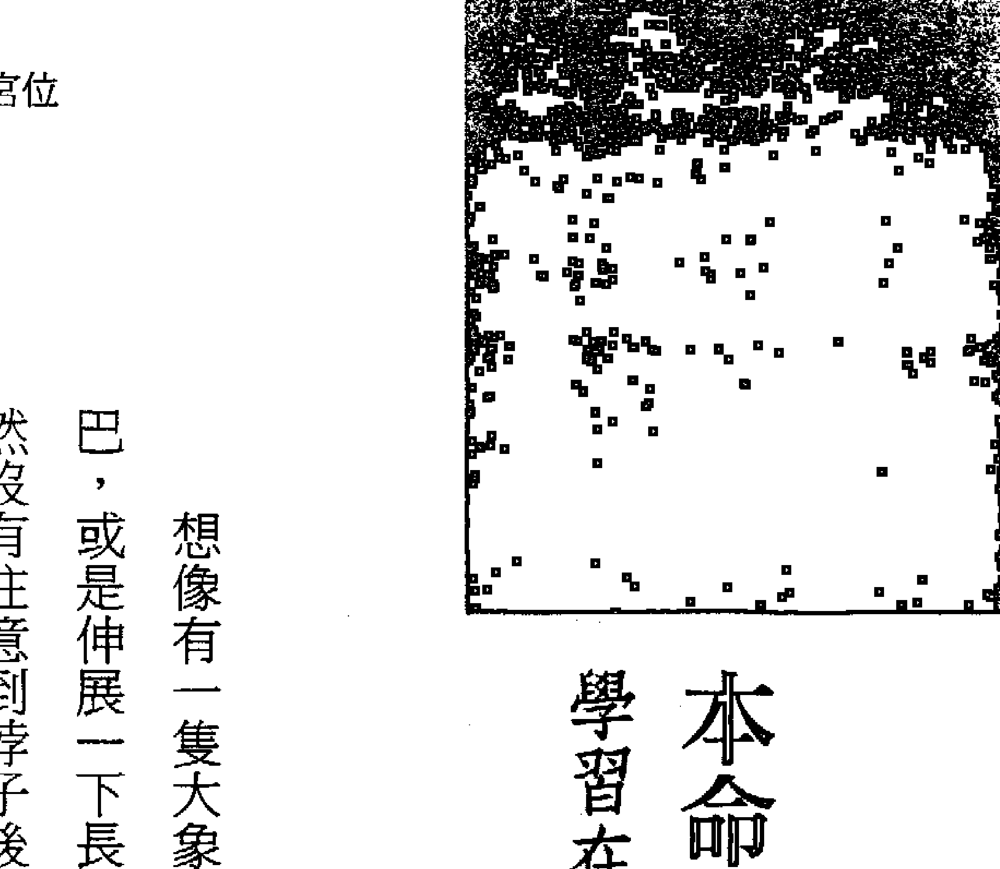

## 本命月亮在八宮

### 學習在所愛的人面前，流露脆弱一面

想像有一隻大象站在房間的正中央。大部分的時間，大象都安靜地站著，偶爾會揮動一下尾巴，或是伸展一下長鼻子，把路過的人掃開。有一名女子站在大象的前面，完全只注意前方，顯然沒有注意到脖子後方大象熱呼呼的鼻息。八宮的功課就是正面迎對房間裡的大象。

### 付諸實行

你是否能在情感上感到幸福，必須視你如何探索、表達一些難以控制、強烈甚至醜陋的情感。這些情感來自你的痛苦、恐懼和每一個人內心都有的瘋狂，其中包括強烈的狂喜和猛烈的愛。有些人的應付方法就是忽略那隻象徵性的大象，但這隻大象能滋養你，讓你聆聽、了解和面對真相，這是關於你自己還有生命整體的真相。你具有一種本能，知道有哪些話沒有說出口，因為你可以感受到隱蔽真相時的大量壓力，亦即你就是迴避真相的那個人！雖然你有處理黑暗面的傾向，但不代表你不會害怕認清大象代表的意思。你會進退兩難：既不能假裝自己沒有感受到某些東西，又很害怕知道那是甚麼東西。當你能把它搬上檯面，至少可以面對它或談論它，就能減少威脅感。

月亮在星盤中的位置，可以看出我們在哪個領域擁有直覺，付出我們的安慰和療癒。當你的月亮在八宮時，你有能力幫助別人治療一些他們甚至無法承認的傷口，或許你可以正式成為諮商師，或是私底下聆聽別人吐露心事，對方會覺得可以跟你傾吐秘密，但又不用擔心會被你評論。

當你學習培養情感的力量，足以處理自己強烈的內心世界時，你比較不會害怕生命中偶爾出現的戲劇性改變。八宮與天蠍座有關，這個宮位代表一些徹底改變我們、無法挽回的事情，還有所有能把我們的理智逼到極限的事，正如八宮最經典的名字所意味的，這是性與死亡的宮位。也許用這種方式來理解性是有點奇怪，但是八宮講的不是「在後車座玩樂一下」的那種性。當我們與一個人分享真正的親密和徹底的赤裸時（無論是實際上或象徵性），我們是非常脆弱的，但此時也能建立最有力量的連結，覺得強烈地被愛。在這種連結中，對方會看到你最糟的一面，看到你崩潰瓦解，但他們仍然愛你，這種方式能滋養你的心，遠勝過一千個最好的朋友。如此全然地與某一個人融合為一，是很恐怖的事。當你學習應付這種恐懼時，對一個人信任地打開心門，對方也有能力回應，這不只能滋養你的心，也能帶給你情感的力量，應付一路走來突然降臨的生命改變。

# 本命月亮

### 自我破壞

這個宮位對心而言，並不輕鬆，需要一定程度的適應能力，才能運用更高的覺知去應付生命的沉重，知道生命是如此危險地保持平衡。最好的狀況是，讓你知道自己愛的人是如此珍貴，你會盡力活出人生。最糟的狀況是，你會覺得被黑暗吞噬，不斷地焦慮不安，無法應付人生。解決之道就是，在放手和面對恐懼之間取得平衡。當你能直接面對時，恐懼就會少一點。有時，你只要承認可能會發生最糟的事情，就能幫助自己完全消除恐懼。不過當你過於恐懼時，還是要尋找慰藉的出口，留待明天再嘗試一下。

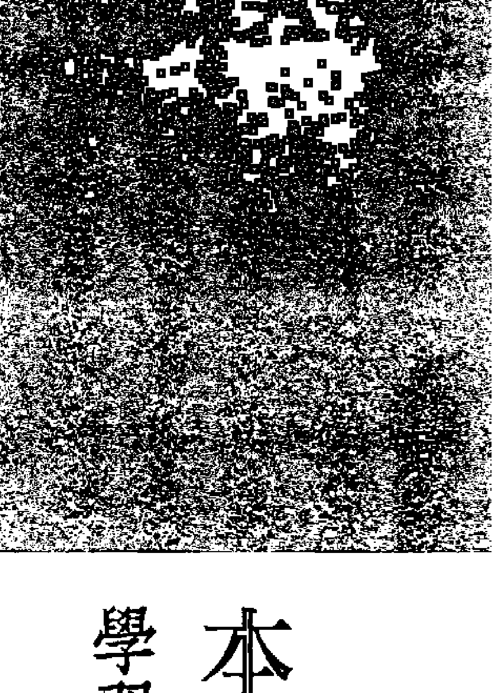

## 本命月亮在九宮

### 學習跟隨自己的心，而非規定做事

當我們開始學習一種新主題時，通常能很快掌握許多要訣，我們的腦容量似乎很快就被填滿了，我們只需要消化別人已經記錄的經驗和發現。但是當我們更深入時，一開始學習時感受到的清楚和輕鬆就會消退了。當我們與矛盾或未知的領域搏鬥時，就會陷入黑暗的深淵。最後，「已知」的保護傘消失了，當我們繼續向前時，我們個人的體驗會加深我們的認知，這是教科書知識無法做到的事。其實，大部分的「專家」都會告訴你，當他們學得越多，就覺得自己懂得越少！在九宮，你會展開真正的冒險，投入未知的領域，跟著自己的預感走，培養自己的信念，知道你可能在轉角處發現什麼。

### 付諸實行

九宮一直被稱為是旅遊和教育的宮位。當我們旅行時，我們會睜大眼睛，吸收眼前新奇的事物。

## 本命月亮

当我们追寻知识时，超越ABC的程度，深入一个主题时，当我们发现之前从不知道的可能性时，我们会大开眼界。你的心生来就是要探险和发现，无论只是在你自己的后花园，或是世界上少数几个未有人迹踏至的地方。当你接触其他文化和地方时，你会心情振奋。九宫与射手座有关，这个宫位代表的所有活动，都能带给你一种扩张感，还有对未知、可能发现的事物的兴奋感。没有什么能像打破日常生活熟悉规律这件事，更能让你精神为之一振，且马上改变你的心情和看法。看法的另一种说法就是观点。当我们年纪增长时，可能会改变对自己、别人和生命的观点，因为随着时间过去，我们如何发展自己，还有我们的个人经验，都会改变我们，让我们变得深刻，开启我们的心智。在人生早期，我们很容易对好坏对错有很明确的看法。当我们年纪越大、生活变得更复杂时，我们开始知道很多事情很难一语带过，这就是生命经验教会我们的事。你的心会渴望经验，但不是那种可以让你的履历很漂亮的经验，而是当你学习某种东西时，可以帮你把如点状的意义结合在一起、让你的世界更宽广的经验，这就是为何九宫与宗教的概念有关。宗教就是设想一套规则与准则来解释生命的意义。当你的月亮在九宫时，你的“宗教”就是跟随自己的心。无论在任何时候，你若是跟着直觉走，就比较容易做出正确选择。当你选择心里想要的，而不是依照逻辑或按照别人想要你做的方式，你的生命经验会更踏实，你也会在对的地方落脚，安身立命。

### 自我破坏

我们很容易听到说要“尊敬长辈”。而当我们问为什么时，常听到的答案是，长辈比我们更有经验，因此更有智慧。在某些情形，这的确是真的，但不全然都是如此。经验并不等同于体验。这是一个扩张和改变的过程，可以滋养你的心，不只是静态的知识。你要是坚持某种特定的真理，或是紧抓不放多年前挖到的黄金宝物，这些曾经让你大开眼界但如今已经褪色了的东西，因为你的心渴望继续成长。此时如果站在原地不动，一定会毁了自己，让你的幸福减分。知识和真理是不断改变的。你要轻轻地把它们放在心里，以免压垮你的灵魂。

第一部 私下的你：本命月亮所在星座和宫位

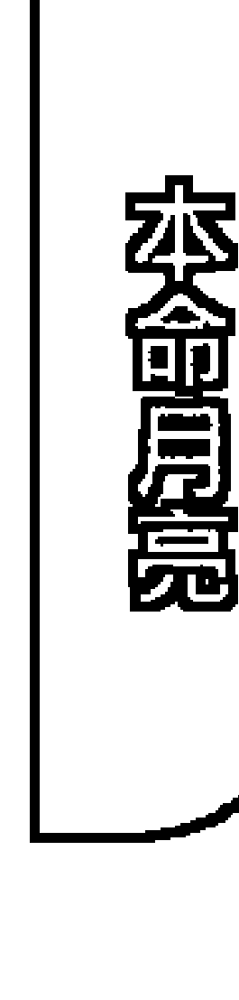

## 本命月亮在十宫

学习做喜爱的事，别追求表象的成功

“跟着你的心走。”现在已经变成陈腔滥调，这代表我们很容易左耳进右耳出。跟着你的心走，到底是什么意思？更重要的是：走去哪？乔瑟夫·坎伯 (Joseph Campbell) 稍微改变这个说法，当他说：“跟着你的喜乐走。”会引起许多人的注意。他刚好是月亮在十宫的人，所以应该对自己的心会通往何处，略有所知。对你而言，你的心终究会理出个头绪。

### 付诸实行

十宫代表天顶，也就是星盘中的最高点。想象一下夏天的正中午，太阳高挂在天空，照亮一切，清晰可见。十宫的经验与你在这个世界扮演的角色有关。这通常会被称为事业的宫位，但这个定义太狭隘，因为我们常常把事业与工作的职称，还有我们拿薪水做的事情划上等号。十宫比较与你想要做的事有关。当你的心在十宫时，不代表每个人都能看到你的所有感受，但是当你走在正确的道路上时，每个人都能清楚看到什么是你爱的、你在意的事。

十宫也与我们的成就得到认同有关。有时是通过赞美、受欢迎或奖赏的形式，有时则是恶名昭彰而非备受喜爱，是讥讽而非欣赏。当你在十宫的领域跟着你的心走时，你将会受人瞩目。成就就本身以及对成就的认同，并不会带来任何满足，也不具有意义，除非是这个成就对我们本身而言具有意义。这就是为何跟着你的喜乐走，最后一定会往上爬，因为这一开始必须先往下走，深入你的心，才知道你想要什么，你才能看清自己。当你知道你想要什么，跟着你的心走，你就能在你渴望的世界里做出一点改变，这时就知道自己的路在哪里，也知道自己注定要做什么工作。

当你在做注定要做的事时，人们会注意你，工作会找上你。当你在做感觉良好的事时，马上就会反映在你的私生活和内心状态中。你要带着足够的承诺和喜悦去做，转眼间你就会光芒四射，照亮周围的世界。

你这种展现滋养、爱意或温柔的特别方式，不只是对自己、对自己所爱的人的礼物，还能让你有极佳的工作表现，帮助你创造想要的改变。举例来说，你的月亮如果是在双子座，只要你运用天生的好奇心和对学习的饥渴，最后就能教导别人与你的兴趣有关的知识。最重要的是确定你的情感需求，不要陷在“正确道路”的公式化想法中，而是要走你的道路。

### 自我破坏

你的心在一个非常明显的宫位很容易陷在别人对你的想法中。即使他们不是很了解你，但是别人对你的评断，无论好坏都会影响你。你如果在意你的地位，或者只是为了获得每个人的认同来做出决定，最后你可能会在错的事情上非常成功，但是每一刻都恨人心扉。你的心无法在工作中获得滋养，你一定会很痛苦。无论你如何定义这份工作，都觉得自己像个骗子。所谓一个人在对的时间站在对的位置，或做一个温暖的人去接下一个职务，走马上任，这些都不是你该做的事。

## 本命月亮在十一宫

学习找到归属的社群，并分享资源

美国社会学家雷·奥登伯格 (Ray Oldenburg) 在《极致美好之地》(The Great Good Place) 中提到“第三地”的概念，认为在两个传统地方（家庭和工作）之外的第三个地方，也非常重要。第三地是非传统的聚集地，人们可以在那里感受到即刻的社群感，与他们周遭的邻里和世界联结。十一宫就是社群的宫位。

### 付诸实行

有些人会认为心就是家的所在，但是你的心可能会引导你离开家，进入周遭的世界。就许多方面来看，对你而言最理想的状态，就是与一个社群建立能带来滋养的关系。觉得属于某个“族群”的一份子，有一种归属感和熟悉感，这能给你一种家外有家的感受。你现在可以用各种不同的方式进入一个社群，也许是网络，也许是实际的邻里，而你本命的月亮星座可以给你一些线索，告诉你适合哪种社群。无论你的月亮是哪个星座，你都可以通过分享兴趣和关切的议题，知道自己适合哪种社群。对我来说，这可能是其他家长或占星师，甚至是其他女性。对你而言，这可能是其他的自然爱好者，或是为了某个社会目标凝聚在一起的一群人。无论你属于哪一种社群，你在这里必须用心，而不仅仅是在其中提供资讯或是一些有利于事业发展的人脉名单。你需要从一个社群吸收“延伸的家”的感觉，因为这里真的能提供你安慰与支持。

社群还能用另一种方式支持你，这就发生在你回馈社群时。因为十一宫的社群可能是你的地方邻里或是包含全世界，就某种意义而言，你的心与群众是紧密相连的。你可能会做白日梦，可以用某些方式改变世界，让世界变得更好，提供某种家的感受、安逸或安全。你可以通过本命的月亮星座，知道你会如何带来改变。不过，你跟有需要的人们相处时，即使只是在你家后院，只要你觉得能让他们的人生变得更好，就会非常有成就感。因为你的心会通过这种方式被大众吸引，你可能会非常擅长也很有兴趣建立真实的网络，不仅仅是为了“闲话家常”，而是为了分享资源，促进人们之间的联结。

### 自我破坏

## 本命月亮

是，你要真的很清楚你属于哪里、你不属于哪里。当你的成长开始超越一个社群，但你不允许自己前进，或者去找另一个新的社群，你可能会开始失去从中得到的滋养和满足。一个团体的力量来自于成员的付出，但如果你就像一具沉默的死尸随波逐流，就可能迷失在更大的群体意念及方向之中，最后会觉得自己迷了路，而不是找到归属，解决之道就是先认清你的内在欲望，然后找一个能滋养你、支持你的社群，而不只是试图融入你刚好落脚的任何地方。

## 本命月亮在十二宫

学习自我觉察力，联结灵性智慧

无意识也是我们个人经验的一部分，只是在我们显意识觉知的范围之外。十二宫并不仅仅是无意识的宫位，但它的确具有无意识的隐藏和神秘特质。十二宫的活动常常发生在我们的心智觉察的范围之外，因此我们很难去解释或定义。有时候，它们完全发生在我们的显意识觉知的范围之外，所以我们会觉得这一部分的自我是隐藏的，甚至我们自己都不知道。

就许多方面而言，当你能找到方法退出这个世界的纯物质思维，进入另一个所谓超越“现实”的世界，你就能获得最大的满足。从神话、原型、想象和象征主义的世界，到艺术和梦想的世界，这些都是你的心能感受到滋养的地方，觉得自己回家了，你也可以在这里获得灵感和重生。“迷失在自己的世界里”这件事并不仅仅是享乐，有时是非常必要的。此时你的心会有一股深沉的需求，想要避世索居，渴望隐私，如此才能填满灵魂的储粮。这就像爱丽丝掉进兔子的洞时，你可能觉得一脚落在三度思维的国度，另一脚踩在灵性世界，你夹在中间，无法完全臣服于任何一边，也无法向任何一边的居民沟通这到底是怎么一回事。有时当你不理解自己的情感需求时，你会很容易受伤，不断重复自我毁灭的情感模式，却不知所以然。这常会表现在你的人际关系里，因为别人最能反映出我们是（或不是）什么样的人。

当我们试图描述这个宫位时，常会因为“灵性”、“神”和“意识”这些字眼有些喘不过气。即使你没有宗教倾向，但你可能会与一种联结感、一股在背后运作的更大力量，产生共鸣。你凭直觉就能感受到有些人说的“神”、“源头”、“神性”或“高我”的存在，或是任何一个我们对无法解释的事情冠上的名称。除非你的十二宫内有其他行星，否则你很难合理解释这些东西，这是超越宗教、宿命或业力的定义。这些都是灵性的理论，用来解释、定义和命名我们感受到的东西，不过当我们试图这么做时，我们就脱离了十二宫的领域。荣格曾说过，集体无意识就是收集人类经验的储存槽，我们所有人都是从中汲取梦想，对它灌注所有的经验，将我们所有人联结在一起。无论你如何解释，你的情感自我都是与一个更大的历程相互联结，你常常在潜意识中受到浩瀚人海的潮汐影响。

当你试图回到现实时（在十二宫，我们只能尽量），最后的底线就是你的快乐是来自于能反映你的灵性经验，或是甚至能反照出你的神性。你本命月亮的星座可以提供线索，看出这会如何表现：月亮双子座的人可能会在混乱的想法中看到神性，月亮金牛座可能是在大自然中，月亮狮子座可能是在迷乱失去自我的当下，月亮天蝎座可能是在衰败之际。你可能无法解释原因，因为你的情感历程常常是隐匿的，不仅是别人、连你自己也无法看见，但是你的月亮就在这里，你可以感受到它的存在。

要在内在与外在世界之间搭起桥梁，这件事可能让你无法负荷，精疲力竭，所以你有时需要退回自己的角落，重新充电。生命就如茫茫大海，有时感觉是如此浩瀚，让我们显得微不足道，而当你的月亮在十二宫时，你的心情会随着潮汐改变。当你的月亮落在这个宫位，你可以感受到一种深刻的联结感，有时当你试图适应这种深刻时，会出现两种极端的行为。

就一方面而言，你会完全臣服于内在世界，这可能导致孤立，你会永无止尽地退缩，直到再也无法与其他人或这个世界产生联结。在最极端的状况中，十二宫与机构②的古老联结会派上用场。
> ③ 译注：例如疗养院、监狱等。
这类的短期静养是为了应付困难的感觉，这也可能是月亮在十二宫的一部分，而这并没有什么疯狂或错误。永远无法分辨什么是自己的感受，为什么有这种感受，什么又是你从环境或身旁的人吸收到的经验时，你就会想要离群索居。当你在一个地方设下界线时，可以帮助你找到和谐一致的自我意识。

另一种极端表现就是你会完全抗拒你感受到的联结，这是因为一种强烈的恐惧感，你害怕自己会被拖下去，迷失自己。这也是一种退缩，但是如果你没有一个健康的出口恢复活力，你可能会舍弃极大部分的自己、自己的心和直觉，还有通过许多方式相信生命必有其因的能力。当你拒绝参与任何事情时，你可能会被拉进情感（或是灵性）的世界，这会导致另一种形式的疯狂。在那里，你可以走路，你可以说话，你可以自力更生付账单，你的灵魂却不见了。

## 年度课题

推运月亮过境星座和宫位

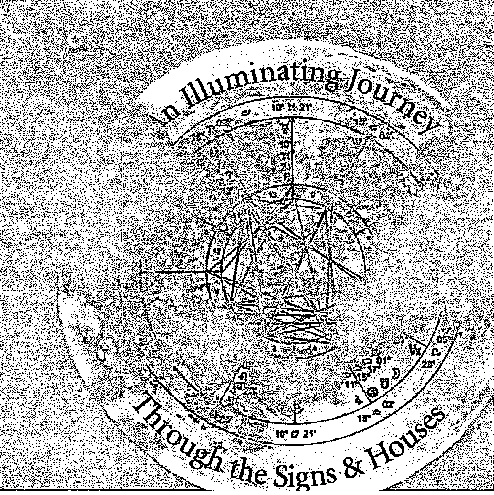

### 何谓推运？

你的本命星盘就像你的人生地图，它总是跟着你，也具有足够的变通性，可以从你出生呱呱落地那一刻开始引导你，陪着你一路发展，帮助你努力克服生命的课题，提升你的觉知。不过有许多占星技巧可以帮助你追踪，让你深入理解你这一生经历特定发展的时机。你可能已经准备好用另一种方式成长，这跟你一两年前截然不同，甚至跟六个月前也不一样，而有些方式可以追踪行星的移动，凸显你很可能在何时经历这些改变或发展。这可以被称为“预知星盘”，或是检视当这些时刻来临时，本命星盘如何受到影响。

占星学中有一些技巧可以预知你的星盘，提前检视你的发展时机。其中一种最常用的方法就是行运法（transit），这就像是“行进”。我们出生之后，行星会继续移动，随着时间过去，它们会绕着我们的星盘行进。所谓的行运的行星，就是该行星目前的实际位置。你的本命盘会显示当你出生时，你的月亮在哪个位置，但是现在的月亮在哪里？这两个月，或是这二十个月内，月亮又会在哪里？

每一个行星移动的速度都不一样，所以当我们想要知道一个行星在某一个特定日子的位置时，我们可以使用星历表，这是一本表格形式的书，里面列出每个行星每一天的位置。电脑软件就是利用这些表格来运算星盘。月亮每天移动约十二至十四度，或是半个星座（若是用度数衡量）星座，每个星座的长度约三十度。所以你出生时月亮的位置是牡羊座十五度（牡羊座的中间点），你出生两天后，月亮大约位于金牛座的中间点，依此类推。从你出生后大约二十八天，月亮会回到你出生的位置。

推运（progression）就像行运法一样，可以追踪你的生命发展的时机，但这是运用另一种计算方法。行运代表一个行星在任何特定时间点位于天上的实际位置；一个推运的行星则是这个行星的象征性位置。如果你想要找到推运行星的位置，我们可以把一天当成一年，这意谓着任何行星一天的实际移动，代表一整年的推运移动。

让我们用上面那个例子说明。月亮一天移动约十二至十四度，这几乎是半个星座的距离。因此推运的月亮，在一年内会移动十二至十四度，约是半个星座。所以，一天的实际移动等同于一年的推运移动。这个概念听起来很奇怪，其实不然。史蒂芬·佛瑞斯特曾在《变幻的天空》（The Changing Sky）用狗的年龄做例子。当有人说一只狗的年龄等于人的七十岁时，大部分的人都懂是什么意思。这代表按照地球年的算法，这只狗大概是十岁。但是在一般的谈话中，我们知道狗的七岁，代表地球的一年，实际活了一年。推运的月亮也是同理而论。实际的一天代表演化成长的一年。推运的月亮每年会移动十二至十四度，所以只要两年就会经过一个星座，大概也是花
● 十二至十四度是月亮每天移动的平均范围，不过这个范围可能在任何特定的日子出现变化。当我们在计算推运月亮的准确位置时也是如此。

### 推运月亮的意义

我们为什么要注意移动这么慢的东西？因为观察移动比较慢的行星，可以让我们对生命的循环有更深入的认识。我们在这里讨论的是演化，而不只是转瞬之间的事件带来的心情改变。推运月亮的周期刚好足够累积发展和意义。在这段时间，我们对一件事有了足够时间的体验，足以开始全心投入，但又不至于久到完全融入我们的生命背景。当推运的月亮沿着你的星盘移动时，可能是某件事正在发生，或是刚刚发生，或是即将发生。虽然推运的月亮会在一个星座停留超过两年，但是你会更频繁地使用这本书。当推运的月亮与你的金星形成三分相，与你的火星形成四分相，或是变换宫位和星座时，你可能都会想拿起这本书翻阅一下。

占星学诠释“推运”（progression）的概念很简单，你只要想一下推运这个字的字根：进步（progress）。当我们成长时，我们会改变。我们会有各种不同的经验改变我们对世界、对别人和对自己的认知。我们的本命星盘会指出前方的路，显示我们个人的演化道路，而推运的行星可以帮助我们追踪这些演化的需求如何发生。当我们观察自己推运的行星时，我们可以理解自己在过去经历的改变，也可以知道在个人的演化之旅中正处于什么阶段。

在第一部中，你已经学会本命的月亮星座可以显示什么是我们的情感需求，我们需要什么才能感到快乐，或是至少是觉得舒适，还有我们如何滋养和照顾自己。推运的月亮可以看出什么是我们在演化中的感情需求。有些事情是不会改变的，像是我们情感的基础，但我们总会有一些改变令自己大吃一惊。当你发现正处于人生的新阶段时，可能会需要某个你在两年前或五年前完全不需要的东西。

宫位的范围大小是会变化的，这跟星座不同。宫位是根据出生的地点决定，根据你在地球上的位置计算得出，因此每一个人当然都会不一样；星座是根据环绕地球的天空和日期决定，这不会因为你的出生地点改变（除非你是在另一个星球诞生）。

## 你的情感注意力

史蒂芬·佛瑞斯特曾说过，推运的月亮就是你的情感关注的焦点。我们都知道如何衡量正负两面的因素，然后做出合乎逻辑的决定。但是即使我们有各种理由去做一件事，最后可能发现自己还是做了另一件事。这并没有什么理由，只因为我们真的很想这么做。这本书不是要讨论你应该控制自己的情感冲动，或是把逻辑抛到脑外，而是要你依照情感的意向，运用情感的反应。我们的心会想要心所想要的事物，这已经搞砸了许多安排妥善的计划，很多时候我们应该感谢自己这么做！你的推运月亮的位置可以告诉你，你现在的焦点放在哪里、什么能引起你的注意、你正在梦想的事物，还有为什么如此。这就是推运的月亮为何如此重要，因为这可以看出你的心在任何特定时期锁定的目标，而既然心会转为头脑，你会发现对于你生命的每一个篇章而言，推运月亮都是非常强大的工具。月亮代表我们的感觉，也代表我们的心情，当你的推运月亮通过一个星座时，你可能不会两年都是一样的心情，无论是好心情或坏心情。当你发现很容易陷入某一种心情时，这就比较像是当你长时间沉浸在各种不同的情感状态之后的演化进步。你必须体验这些情感、渴望和动机，透过这么做，你才有机会累积每一个生命阶段试图教会你的东西。

## 结合本命月亮和推运月亮的意义

你在每一个月亮推运时期学到的功课与经验，并不会取代你的本命月亮的需求。你要把本命月亮想成你的身体，每一次的推运就像是试穿不同的衣服。比较像是一种装饰：你试穿某件衣服，看看感觉如何；在月亮推运的每一次周期，你会花两年在试衣间中，当你穿上这些衣服时，你会真正对自己有些认识。你还是你，但是一些新的经验可以帮助引出更多的你，帮助你成长，加强一些你之前可能从未以其他方式运用的力量。

举例来说，你的本命月亮如果是射手座，你可能会维持一些带给你自由感受的经验，如此你才可以不受拘束地随风飘荡到任何地方，展开新的冒险。不过当你经历推运月亮在摩羯座的时期，你不会改变自己的本质，但你可能会被鼓励去尝试比较保守的一面。你一开始可能会觉得紧张受到限制，但可能也会做一些很棒的事，帮助你落实常常过度泛滥的射手座潜力。你的脑海中有许多想法，而在推运月亮摩羯座的时期，你也许会发现自己会特别利用其中一种想法，彻底將它付諸實行。射手座能量的挑戰之一就是過度擴張自己，但是推運月亮摩羯座可以幫助月亮射手座的人聚焦。這不會改變你的核心本質，但會揭露你無法輕易用其他方法發現的潛力。本書的能量整合：本命月亮、推運月亮的相位說明，會更完整地介紹本命月亮和推運月亮之間的互動表現。

## 你現在需要什麼滋養心靈？

告訴你一個秘密：你不需要這本書來告訴你——在任何特定的月亮推運時期，應該怎麼過日子；你只需要知道，在任何特定的月亮推運時期，如何好好地過日子。無論你是否知道推運月亮的星座或位置，你都會回應推運月亮的能量。不過當你知道即將發生什麼時，當你知道正在經歷什麼時，當你通過這片變化的水域時，這都能幫助你的頭腦冷靜（或者讓你的心保持平靜）。兩者的不同之處在於，你是策略性地敞開心門，接受新的經驗，還是重重地撞牆，落得鼻青臉腫，一頭霧水。

我們常會發現自己會不由自主地去感受或體驗一些事物，這些事物與我們平常想要的東西極為不同，而我們的潛意識會自動拒絕相關的想法進入腦海。當你的推運月亮進入比較困難的星座或宮位時，特別容易出現這種情形。當我們看到一個困難的推運出現時，本能反應就是趕緊臥倒找掩護，但這會完全錯失目標，最後只會浪費力氣，挫敗收場。你可以跑，但你躲不了！當你正面應對情感的浪潮時，即使是風大浪高，充滿險惡，最後還是會比堅持留在港口避風頭獲得更多。

## 推運月亮

## 根據推運月亮設定目標

情感的滿足。這些港口曾經過試煉，曾經真的很安全，但已不再是你的避風港。我們長大之後必須捨棄一些情感的習慣，就像丟掉我們的舊衣服，換掉舊髮型。

既然我們把這本書還有占星學當成一種認識自己、促進自我成長的工具，鼓勵你利用書中每個部分的建議去參與一些活動，幫助你用一種更明確的方式經歷情感的演化。當推運月亮進入你的五宮時，你該怎麼做？你要每個禮拜騰出一點時間做一些具有創意又有趣的事。不要只是嚷嚷著會做，或是口頭說說應該這麼做，而是實際安排時間去做。或是如果意願很高，不妨報名上課，探索一種你願意投資的新嗜好或舊嗜好。況且時間已經騰出來了，就一定要現身上課！

你可能會說：「但這是月亮，難道感覺它還不夠嗎？」這不盡然。我們太容易讓這成為一種嘮叨，一種從來不會浮上檯面的暗示，但這只會不斷折磨著我們，讓我們體內充滿一股沒有被回應的渴望。擁有自由意志代表你可以選擇走出去，有意識地接受這股能量，但這也意謂著你可以坐在沙發上，等著生命流逝。建議你利用一些活動和方法，將這股能量引入你的生命中。這不是要在你已經超載的行事曆中添加更多事情，加重你的負擔。記住，這是月亮。當你做這些事情時，你會真的感覺很好。推運月亮代表我們的心轉到哪個方向尋找滋養和喜悅，這不是最基本的休息和慰藉。

現在，設定目標不只是把一件事列入你的行事曆，每週做一次。當你已經坐著等待一陣子，

### 詮釋你的推運月亮

熱身準備迎接推運月亮轉換的新能量，你一定會想開始專注投入——推運月亮在你的星盤位置象徵的生命領域。但你有兩年的時間運用這股新能量，兩年之後，你想要變成什麼樣的人？讓我們回到推運月亮在五宮的例子，你可能覺得必須有更多樂趣，必須更自在坦率，或是更專注在一些創造性的計畫上面，讓自己快樂和滿足，不過你到底會變成什麼模樣？五宮的功課是恢復一種能力，要你去玩樂、創造，對自己和生命有足夠的信任，可以自在地表現自己。你要設定一個目標找回內在的小孩，記得如何玩樂，沒有保留，書中建議的活動可以幫助你達成這個最終目標。

當你知道自己推運月亮的位置時，可以查閱接下來的介紹。這一部分是提供你一些深度的覺知和建議，告訴你如何透過星座和宮位，充分利用每一次的月亮推運。我們的星盤是一張複雜的圖畫，你不可能獨立拉出星盤中的任何元素，不去考慮這個元素在運作時的背景因素。舉例來說，一個人的太陽是金牛座，月亮是雙子座，他的經驗和個人真理，絕對和太陽在牡羊座、月亮是雙子座的人截然不同，儘管他們都有共同的雙子座需求。現在請好好享用下面的介紹，也希望你盡可能地延伸，你要知道，這永遠無法完整描述你所有的經驗，或是必須經歷的體驗。

推運月亮

## 體驗星座或宮位的轉換

想像自己要通過一個隧道。你會發現在進入隧道之前，就看到隧道出現在眼前了。當你進入隧道後，光線和空氣明顯改變，如果裡面很暗，你可能必須適應一下。當你繼續前進時，你的眼睛適應了，你也習慣新的節奏和環境了。現在你看到了隧道的盡頭，發現光線再次改變。當我們看到轉變來臨時，很自然地會預期轉變的出現。現在我們把這個道理套用在推運的月亮，可能會看到一個生命階段的來臨。舉例來說，我們如果剛好知道即將開始一份新工作，或是即將有寶寶了，我們知道事情將會出現改變。不過，即使沒有看到事件即將發生，或是無法做任何計畫，還是常會感受到空氣中有有些許不同。

你的星盤中的進展，特別是推運的行星，通常不會在一夕之間出現。當然我們的生命中會出現一些牽涉極廣的事件，在一瞬之間永遠改變我們，不過整體的演化通常是緩慢的進程。覺察到新的真理，改變態度，這通常需要時間，即使我們在突然之間理解在潛意識中醞釀的東西。就像每個推運週期要開始時會出現一個時間點，你會開始注意轉變，發現最近有不同的感覺。對於許多人而言，這可能會是在實際推運週期開始之前的一至兩個月。因為我們總是慢慢地發展，所以從一個推運週期轉換到另一個推運週期，也是緩慢地建立心中改變的需求。不過你可能會置身於這股新能量中，在過了一個月或更久的時間，才真正發現某件事情因為你而改變了。

### 推運月亮過境十二星座的心裡狀態

當你要認識星座時，記得基本的準則：星座代表我們現在是什麼樣的人，我們的風格、特質和心理過程，而宮位代表生命的活動、我們做的事情。我們會用名詞和形容詞描述星座，像是直接又坦率的牡羊座能量、滋養和溫和的巨蟹座能量。不要忘了，當你的推運月亮通過每一個星座時，也會落在某一個宮位內。推運月亮通過的星座可以告訴你，你會用哪種不同的風格和態度表達自己的需求，還有哪些事情，才能獲得情感的滿足，而你的推運月亮所在的宮位，則能告訴你——你會去探索哪些類型的活動和生命領域。舉例來說，當推運月亮通過雙子座時，你會想要學習一種或更多的新事物。你會改變思考風格，開放接受你觀察到的事實，不斷詢問自己或別人，而非很快的下結論。如果你正在經歷推運月亮通過雙子座，但是是在六宮，你會發現必須在工作環境裡更批判性地思考，提出更多問題。你可能透過在職訓練、目前或新的工作中，探索學習新事物的渴望。然而，如果你正經歷推運月亮在雙子座，但是在八宮，你可能會用盡所有最深入的方式理解並分析自己，也會勇敢面對、認識自己的一些恐懼。

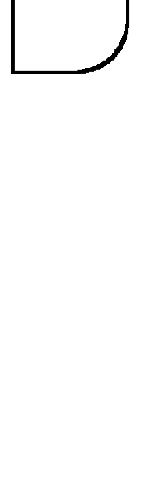

這些針對推運月亮通過各宮位的建議，是希望你開始思考現在的需求是什麼，如何面對它們。我會先介紹，一開始會如何感受到轉變、會帶來什麼更深刻的課題，但最重要的是，儘管月亮與感覺和本能有關，但我們都是習慣的產物。舉例來說，你在推運月亮在牡羊座的期間，已經習慣用一種「追求我想要」的方式，快樂地過了兩年，然後推運月亮就進入金牛座了。推運月亮在牡羊座時，你已經培養一些適應這些需求的習慣和規律，現在你可能得花點時間，讓自己的日常生活跟上新的情感轉變。最重要的是，你要知道儘管自己可能有不同的感覺，你的生活會自動地有所不同，但你不會自動開始改變你的行為，去適應自己的新需求。你可能感覺不同，你的日常生活規律仍是來自舊的週期，然後你會越來越不快樂，對自己以及正在做的事情越來越不滿意。在你開始調整之前，必須重新評估自己的生活。

## 推運月亮在牡羊座

你更常憤怒，覺得自己妥協太多

#### 轉變的浪潮

經歷推運月亮的每一次週期時，當我們與新能量相處一陣子後，就會開始習慣特定的情感反應。當你剛完成推運月亮雙魚座的週期後，一定會經歷到一種情感上的開放與柔軟。在那個週期，你的工具是同情和同理心，那在當時是很適合的。但是當你變得更柔軟、更脆弱時，如果衝突出現時，你常需要努力地置之不理，才能對別人的遭遇表現同情。你也必須學習放下一些控制，才能學會更高階的功課，也就是認輸和謙卑的功課。如果你在某個生命領域一直如此，做得太過分，就會開始引起你的憤怒而非同情，牡羊座就是一個絕佳的解決之道。

> 「勇氣不是沒有恐懼，而是一種評估，認為有比恐懼更重要的事。」
——美國作家安伯羅斯·雷德蒙（Ambrose Redmoon）

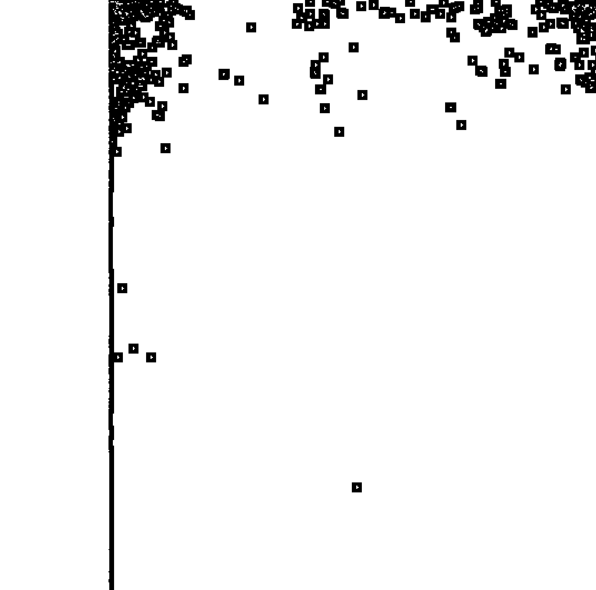

進入推運月亮牡羊座的週期時，你更常感受到的情緒便是憤怒。即使你非常有自信，很有權威，還是會覺得自己在某些生命領域中妥協太多。這可能是你變得太過通融，或是犧牲太多，以便完成其他更重要的事，或是做出合理的決定，而非你真正想要做的決定。在這段時間，權力的失衡，或是覺得有一些生命情境讓你沒有足夠的空間自由呼吸時，都會開始感到憤怒，開始覺得受夠了。

有些人可能會發現，生活中開始出現一些生命情境讓他們必須捍衛自己，像是自己的工作職位、在關係裡的個人需求，甚至是自己的信仰。生命就是如此推動著我們，要求我們在必須採取行動的地方有所作為。

你可能也很難控制自己，無論是情感上、言語上甚至是肉體上。各種類型的情感似乎更容易浮上檯面。推運月亮牡羊座可能意謂著為自己清出一條路，掃除障礙，而你有時需要累積巨大的能量才能做到這一點。這就像是一陣猛烈的暴風雨，推運月亮牡羊座可以幫助你穿越風暴，讓一切雨過天青。

#### 真正的方向

牡羊座的象徵符號是公羊。公羊最出名的就是用頭猛撞，而你會在推運月亮牡羊座的週期結束之前，發現自己正在這麼做！但公羊需要事情去迎面正擊，所以在這段時期，你可能會嘗試著直接面對生命的需求。平常如果喜歡衡量正反兩面的因素，帶著理性和謹慎態度做事，那麼這段期間對你而言可能很困難，因為你被要求少想一點，多做一些。

這不意謂你無法運用理性，或是會做出不負責任的決定！但是此時最重要的是，與你的意志建立直接連結，而意志不是來自理性；它是源自身體和靈魂的深處，然後才會進入腦子裡。你通常有很好的理由讓別人先做，或是衡量選項，或是蒐集更多資訊，但做太多這樣的事，只會讓你很無能。你無法聽到自己想要什麼，因為你對欲望和驅動你的事情的本能反應，很多都可能因為生活在集體社會裡，而被過濾掉、被削弱了。我們常被要求要馴服聽話才能好好過日子，結果就是與我們的動物本能切斷連結。

這個推運週期並不是要你自私，而是要你記得，你就像別人一樣，在地球上身為人，你也有需求和慾望。你也有權「佔據地盤」，就像這地球上的其他人一樣（占星師史蒂芬·佛瑞斯特的說法），而這個推運是要你記得你想要什麼，還有該如何得到你想要的東西。很多时候，我們會因為一些藉口或恐懼，讓自己卡在原地無法前進，而推運月亮牡羊座可以幫助你和這些東西達成協議，讓自己突破。此時只有你可以完整控制自己和自己的人生。你要活出人生，佔領你的地盤。

> —— 例如欲望、權力和意志。

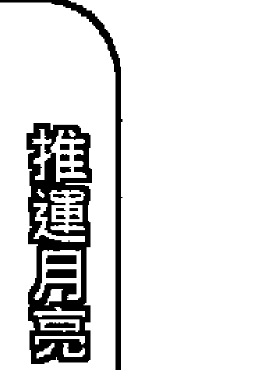

#### 掌控之道

##### 一、勇氣！

推運月亮牡羊座可以透過加強勇氣，教會你力量的功課，而勇氣來自於自我試煉。你要讓自己站在前面面對危險，或是一件你很害怕的事，然後不要逃跑。一個人為什麼要這麼做？答案是為了看到自己的本質。而我們常常比自己想像的更加強悍。

當你面對令你焦躁的情境時，可以鍛鍊你的意志「肌肉」。我們通常不知道自己的力量，直到我們被召喚去利用它。我們常常看到一些比較極端的例子，像是新聞報導一位母親為了救自己的孩子，舉起不可思議的重物，或是有人困在洞穴或在健行時受傷，經歷嚴峻的危險考驗活了下來。這些情境會勾起我們的勇氣，因為這攸關生存。當你面臨生存的緊要關頭時，會為了讓自己活下來，做一些從未想過的事。在我們的日常生活中，這些事情每天都會出現，只是比較不緊張、不重要。生存可以是持續的肉體生命，但這也意謂著一個人覺得人生充滿活力，可以採取行動，而不只是活得像個孤魂野鬼。推運月亮牡羊座就是要你揭露所有的自我壓抑，或是缺乏勇氣冒險的一面。但這需要練習，而你需要讓自己置身其中，才能實際練習。

##### 二、消除阻礙

推運月亮牡羊座感覺就像茶壺的水就要煮沸了。所有的壓力都已經累積浮出表面，就要沸騰溢出了，這就是推運月亮牡羊座必須做的事。當你釋放壓抑的情感和不必要的約束時，你不只會感覺更好，還會與自己深層的動機重新建立連結。你記得自己想要什麼東西嗎？停滯的狀態可能會導致我們維持一些模式，長期地麻痺自己。

如果你害怕對抗你的老闆、你最好的朋友或是你的老師，現在可以鼓起勇氣。如果你一直在避免某件事，現在適合直接衝向它，正面解決。如果你一直渴望做某件事，現在就是冒險的好時機。這不代表你必須和人咆哮爭論，或是做一些極限運動。你可以用自己偏好的風格，用自己喜歡的方式進行❸。但是這裡的底線就是，對於已經忍受很久的狀況，或是因為不採取行動而惡化的狀況，現在就必須採取行動，才能記得自己為何能在一開始就充滿活力。

> ❸

##### 三、冒險的事

此時的情感需求就是挑戰自己，積極採取行動，這可能帶來恐懼感，但也會令你興奮不已。當你做一些害怕的事情時，需要冒險，這可以幫助我們在生活中建立一種力量的感受，然後有勇氣採取行動，而不是躊躇不前。但是，某一個人的冒險可能只是另一個人的日常生活，我說的一冒

##### 四、兇猛生物

在推運月亮金牛座的時期，我會要你開始意識到每種動物都具有某種本能性的常識，而這是與季節的自然節奏以及自己的身體達成和諧的結果。不過當推運月亮在牡羊座時，我會要求你特別聆聽動物的兇猛的心。每一個人都有喜歡的行動風格，但是當你追隨著自己的意志時，有時會產生副作用，這代表你必須放下一些你已經達成和諧的「美好的」或「謹慎的」規則。你要找到自己內心深處未被馴服的那一面，真正地去感受它。

你必須與「我想要，我要得到」的想法重新建立連結。叢林裡弱肉強食不是吃，就是被吃。在人生旅途中，我們很容易忘記社會結構下這股真實的暗潮流動。我並不是說你一定要殘忍無情，不過在這段時期，你可能更容易意識到這個概念。當推運月亮在牡羊座時，參與競爭是很有用的，畢竟，什麼是競爭？是當兩個或兩個以上的生物爭取共同想要的東西，無論這是耀眼的戰利品、珍藏的夢想，或者只是一種自尊。如果競爭讓你留下壞印象，不妨想一下過去競爭的成就，然後試著表現自己最好的一面。

##### 五、讓身體動起來

要記得自己內在的動物性，找到身體的力量，移動身體肯定是最有用的一種方法，這也可以讓你有好心情。過去被壓抑的情感正在浮上檯面，如果你沒有地方處理它，或是它在一開始太過強烈，讓你無法在生活或關係中釋放，體能活動是一種釋放能量的最佳方式。你可以透過運用你的身體找到活力和自信，這可以幫助你回到生活中，做好該做的事。你也可以藉此消除過多的精力。如果你沒有地方發洩精力，這可能會重新回到你的身體內，造成更強烈、更持續的壓力與焦慮。

#### 如何避免被浪潮捲入大海？

##### 一、遷怒

戰士的原型是牡羊座很好的代表，但戰士不打仗時要做什麼？假設你在一個情境中，必須站起來捍衛自己，必須對抗。如果因此挫折或生氣了一陣子，但你可能沒有說出口，這股能量就會累積，它不會消失，只會不斷地循環。如果發現自己越來越常生氣，都是因為你沒有找到建設性的方式發洩過去的某種憤怒。這股憤怒會越來越常出現，你很可能把這股憤怒發洩在無辜的旁人身上，而這是很危險的。 在這段時期，你會被要求在必要的地方捍衛自己，捍衛自己的領土。但是這股被強化的能量通過你時，你可能會用分散的方式或朝錯誤的方向發洩。這不是要你挺身戰鬥，但有時候用盡各種方法避免一場戰鬥，反而會導致戰鬥發生。如果你有某種不可以改變或不能被阻止的需求，可以用決定要如何應對：用直接的方式，像公羊一樣正面衝撞；或是逃避它，直到覺得被逼到角落，陷入困境。

##### 二、感受灼熱

你可能用意料之外的方式，或是在不相干的狀況下發洩累積的憤怒，所以留意，不要到頭來用了一把機關槍殺一隻蚊子。在這段時間，你很可能殺傷力很強，因為你很難控制這股累積的能量，所以你可能會害怕發洩它時，自己會莽撞行事。不過你到底是因為其中的問題或是逃避而累積憤怒，

推運月亮在牡羊座時，最重要的是，記住這不代表你有一張執照可以去殺人或任意揍人一拳（無論是象徵性或實際上）。這是一股衝動，可以幫助我們消除疑慮或積怨，去處理或釋放衝突，幫助你重新找到自己的意志力和動機。當你在衝突中與一個人交涉時，你要注意反應的程度是否合宜。要確定只說必要的話，只是表達自己的懊惱，但不要把別人當成你的沙包。

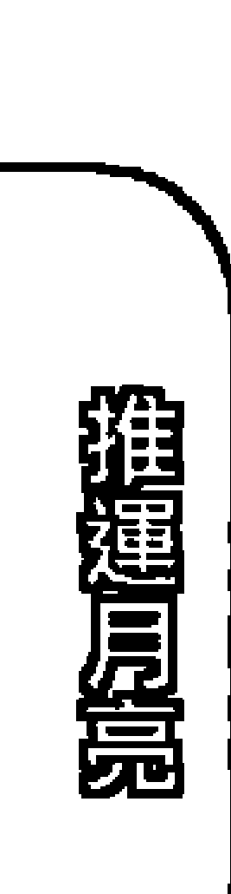

遷怒或發怒過了頭，問題可能不只是太過刻薄或傷害別人。當推運月亮在牡羊座時，如果沒有選擇處理衝突或面對恐懼的方式與理由，這些東西很可能爆發，因為我們再也無法忍受了，而它們爆發時，通常比我們想像的更具破壞性、造成更多的分裂，也更傷人。到頭來，我們可能不是跟一位朋友解決衝突，而是互相叫罵，毀了後路。我們可能不是忍受懲罰小孩的不安，而是把壓抑的憤怒發洩在他們身上，真正地傷了他們。這些狀況實在很不好，在這些例子中，我們通常會在問題形成之前，避免主動去做一些明知該做的事，然後我們就會被迫面對問題。此時我們不會覺得自己有能力解決，而是覺得很無力。這就是我們在這段時間學到的負面教訓。刻意地發起行動，有目的的地參與——而不是被迫反應或捍衛，就是在這段時期最能療癒你的方式。

##### 三、壓力管理

推運月亮在牡羊座時，衝突和對抗會更常出現，你也會更常覺得自己必須更果斷，但你很可能因為這些狀況帶來的延續壓力變得很脆弱。這個推運時期其實是要試圖幫助你釋放一些過去累積的壓力，但是面對和解決這些問題的過程可能會帶來焦慮，讓你感受到更多的壓力，直到問題解決為止。很多人在這段時間會發現壓力的症狀變得更嚴重，無論這是表現在情緒上，像是很常沒耐心，或是表現在身體上，像是血壓升高。在這段時間，你的生活中也可能出現更多需要面對和採取行動的問題，這讓你有機會去解決問題，放下問題。但是如果你不這麼做，問題只會惡化，到頭來無法解決。

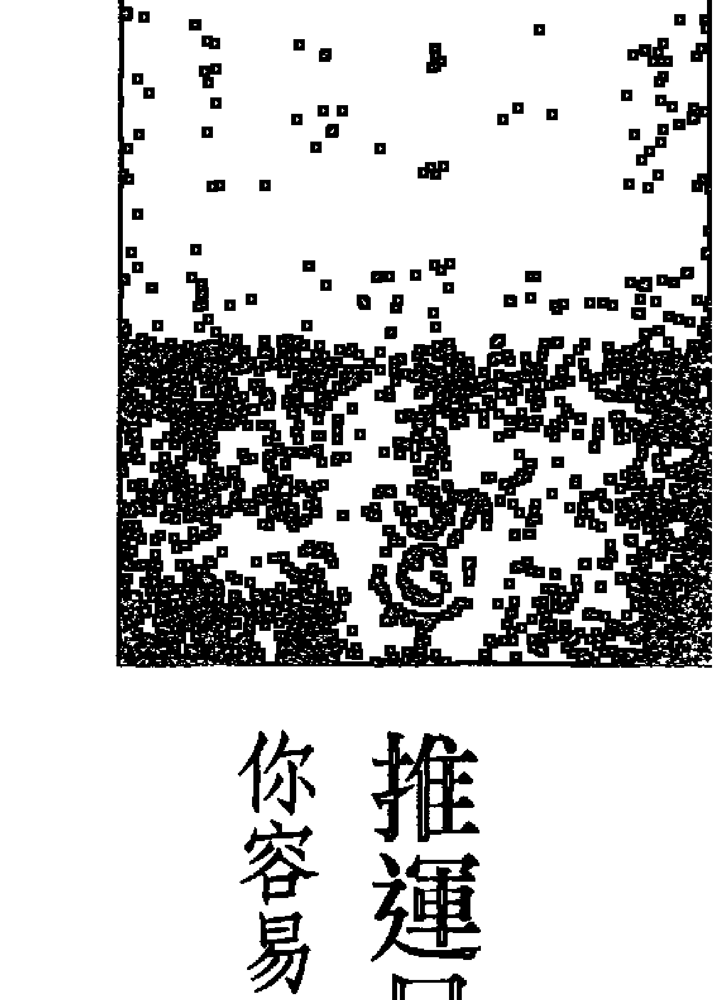

## 推運月亮在金牛座

你容易疲倦，注意身體發出警訊

> > 「在喧擾和慌亂中平靜前行，記住和平也許就存在於寂靜之中。」——美國詩人馬克思·厄曼（Max Ehrmann）

當你的推運月亮在金牛座的週期開始熱身時，你會開始發現自己需要更多休息，而這與推運月亮在牡羊座的力量湧現截然不同。你很可能發現自己的身體似乎比平常需要更多睡眠，更容易疲倦。你的本命月亮如果是比較活躍的星座（例如牡羊座或雙子座），你可能會發現不能像過去一樣體力透支地做事，而你可能需要一點時間才會注意到這些來自身體的訊號。

在這段時間，你對日常生活整體混亂的容忍度也會降低。我們很常看到人們在這段時期，更容易被平常不會注意的景象和聲音轟炸，覺得無法負荷。你可能會覺得明亮或耀眼的光線變得更## 真正的方向

刺眼。巨大的聲音，或是即使只是許多聲音混在一起，像是人們談話時、電視發出刺耳聲響，外面還有車子經過的隆隆噪音，你都會覺得無法忍受，煩躁不安。在推運月亮金牛座的時期，你特別需要平靜的環境，你也可能更容易覺察到侵入空間的事。

推運月亮在金牛座與重新找到寧靜內在的和諧有關。當你渴望更多的休息，開始無法忍受混亂時，這些都是訊號，意謂著你需要重新找到與自然連結的內在自我。推運月亮牡羊座帶來壓力的副作用，可能讓你越來越遠離自己內在的自然韻律，讓你無法放鬆。你可以在此時做一些事，重新調整自己的內在時鐘，依此行事，而不是遵守自己或別人安排的行事曆。

推運月亮在金牛座也代表要找到生活的穩定和安全感。當我們的日常生活能有一種結構性，足以滋養和支持我們，而不是壓垮或榨乾我們，內在的平衡就會如百花綻放般出現。當你的生活有一種可以預期的規律，你就比較容易放鬆，可以深深地呼吸吐納，而這就是你的心此時最渴望的事。

然而，人生並不會因為我們的要求就放慢腳步。你可能會遇到挑戰，學習如何維持內在的平靜，即使外面的世界正召喚你進入它的戲碼和混亂之中。

#### 掌控之道

##### 一、放慢和穩定才能勝出

隨著社會進步，我們很容易找到更好、更有效率的方式填滿時間過日子，以致超出平常的負荷。許多現代的便利及發明，原意是要讓我們在生活中節省時間，做自己想做的事，很多人卻發現自己越來越沒有時間喘一口氣！我們會告訴自己隨時可以休息，會說「放假之後，我就可以……」或「我只需要完成這個工作計畫，然後就可以……」但是到最後，我們變得完全不再聆聽內心的需求，習慣活在一種虧損不足的狀態中。其實，放慢腳步往往比跟上（或緊追）行程表更花力氣。在這段推運時期，你會接收到身體和心發出的強烈訊息，要求你放慢腳步，但你不會因此自動地改變行為模式。這是要由你來決定，是否要聆聽自己的需求，願意去改變生活，騰出一些空間來滿足這些需求。

##### 二、建立規律

金牛座是土象星座大家庭的成員之一（另外兩個是處女座和摩羯座）。土象星座喜歡務實和井井有條的風格，這能創造真實的結果。當你的推運月亮進入金牛座時，最明智的應對方法，就是思考一下目前的生活規律，有必要的話，做一些改變，讓自己有更多的喘息空間。更加意識自己會對什麼事情說好，為什麼會答應這些事，這可以幫助你知道，可以在哪些地方釋放自己。日常規律不代表限制或禁止自己，特別是在這段時間。這是要幫助你知道——可以預期什麼，能適應融入一種節奏，讓自己能放鬆。如果你能覺察到自己擁有什麼資源，將能幫助你知道該如何明智地運用它。

##### 三、與你的身體重新連結

你可以觀察一般的家貓。貓累的時候就睡，餓了就吃。貓是依循動物的本能過日子，這指的是對身體需求的自然反應。你要讓這種動物性的自然能量進入你的生活。我們當然不可能把行事曆丟到資源回收桶，但我們可以學習如何用一種更自然、更健康的步調過日子，即使我們必須規劃每天的生活，還一定得把事情完成！你要試著感受身體，伸展你的身體，寵愛你的身體，留意你的身體吸收了什麼，添加了什麼。如果你一直在忙碌中進食，老是吃一些耗損能量的東西，或是完全跳過一餐沒吃，現在是一個好時機，你可以思考一下如何緩慢地、有條理地改變飲食習慣。

避免一種自我剝奪的飲食形式。推運月亮在金牛座是要讓你的身體覺得舒適，限制或剝奪自己是沒有用的。你應該聆聽自己的身體對於吸收的東西有什麼反應。你是否在吃了某些食物後，感覺很好、很放鬆？你是否在吃了某些食物後，覺得充滿能量，或是疲憊不堪又浮腫？適量健康地縱容自己，是很合適的做法：吃一些你喜歡的食物，有助身體的享受，但不要過量。在這段時間，你要讓一種對於身體的常識及自然反應來引導自己的行為。健康的生理規律可以幫助一個人增加內在的幸福感，但是在推運月亮金牛座的時期，這會帶來極為不同的效果。如果有規律運動的習慣，繼續保持！如果沒有，金牛座的運動包括瑜伽、溫和的有氧運動，還有簡單的大自然散步。這不是要你強迫自己的身體，或是逼自己做任何事。試著想像一下，體能的活動可以幫助你找到身體的踏實感和舒適。這些事情不會對你的身體構成太多壓力，但是可以幫助你享受身體（想像一下好好伸個懶腰的感覺）。

##### 四、健康的自我接受

當你留意身體的訊息時，好處不只是身體健康。推運月亮金牛座也會帶來一種情感需求，你必須健康地接受自己的身體。如果對自己的身體有一些不滿意，做一點改變是很好的，這也是健康的做法。但是當推運月亮在金牛座時，你必須務實地看待自己的身體。我們又可以從動物的世界裡學到功課：你可以想像一隻大象照鏡子時埋怨自己的長鼻子嗎？或是一隻袋鼠抱怨肚子多出來的下垂嗎？這些事情不只是天生的，不只是美麗的，也具有功能。我們的身體不會永遠遵守完美的原則或是永遠有最得體的表現，但是身體很神奇。在這個推運週期，你必須努力與自己的身體建立健康的情感關係，必須接受自己的身體，接受它每天為你做的事情，你要照顧它，而不是懲罰它或隱藏它。你的心會要求平靜，所以要健康地接受你擁有的身體，而不是永無止盡地挑剔它，這樣你才能獲得內心的平靜。如果想要改變身體的哪一部分，那是因為你覺得很好而去改變，而不是因為你覺得不好而去改變。

##### 五、享受寂靜

建議在此時冥想，雖然這跟身體有關，但是安靜的心也是一種環境，可以導向沉靜和諧的心。你可能很享受傳統的冥想技巧，但也可能嘗試一些非傳統的方式讓自己安靜下來，像是花點時間走進大自然。如果有任何戶外的嗜好，像是賞鳥、露營、健行或釣魚，你可以花更多時間做這些事。園藝也是一種很實際、親自動手的方式來享受大自然。在你家的庭院、附近公園或樹林享受一段安靜的時光，也有同樣的效果。踏出家門，進入大自然，呼吸大自然的芬芳，傾聽大自然靜謐的聲音，觀察大自然的色彩，都能很快地讓你脫離喧囂紛擾，幫你安靜地與自己內在的靈性建立連結。

你在日常環境中會越來越需要安靜，像是你的家或辦公室。你的生活中如果有些人是出自好意，但是在你的身旁喋喋不休，或是總是要演出一些戲劇性的情節，你可能需要禮貌地遠離他們，或是學習如何從容地應付他們。金牛座有一種天生的常識和務實的態度，所以在這一段的推運週期，可以放下一些以前讓你焦慮不安的事情，不再煩惱。

- 你可以查一下你的上升星座，還有一宮內的行星，這可以為你的身體健康和需求提供一些線索。

##### 六、不要為小事奔波

推運月亮在金牛座不是要你不动，而是要你有目的的动。金牛座的象征符号是公牛，在一些世俗占星学的书籍中，会把这解释成金牛座偶尔会表现的固执（就像牛头一样强硬）。但是公牛有一个目标，一个目的，或是一个重心，牛不会只是冲出去，而会朝着某个东西冲刺。在推运月亮金牛座的这段时间，你会被要求摆脱分心的习惯，不能漫无目的的睡觉或闲晃。公牛会专注在目标上，用一种持续且坚定的脚步迈向目标。你不能光说不做，也不能只为了有事情可以忙，就随性的东奔西跑办点杂务。为了不让自己抓狂暴走，你很快就会发现，当你知道如何让生活简单一点，就会感觉非常美好。通常最好的第一步就是把行事历排出优先顺序，这可以让你的实际生活少一点杂乱。然而，你在此时也很适合检视自己对于生活中的事物，会有哪些情绪反应。你是否太忧虑？你是否很容易生气？对你而言，这个推运周期将是一个重大挑战。它会帮助你维持性情稳定，但是如果你能有目的的与这些内在的需求合作，这将会带来更多的疗愈效果。你要练习给自己一点时间体验情感的洗涤，然后再决定如何反应，如何采取行动。如果要回头讨论一件事，或是多休息一点，或是需要想想再做决定，那就慢慢来。在做出回应之前，先花点时间让自己的心稳下来。这不只是把行动简化，还要保持简单的态度。金牛座最佳的箴言就是「事情就是如此」。金牛座的能量等同於常識，這是一種把事情貫徹到底的能力，不會焦慮，也不會大驚小怪。星盤中有很多金牛座能量的人，天生就有一種能力，可以突破某件事情的戲劇化和複雜，看到事情最簡單的形式。這個推運週期是在邀請你打破生命的戲劇化，你也會比較無法容忍別人在腦海中編織愚蠢的念頭。

#### 如何避免被浪潮捲入大海？

##### 一、以內在速度設定步伐
當推運月亮進入金牛座時，你的挑戰是如何踏實，如何找到你的核心，讓自己穩下來。然而你可能發現，當你把事情都應付得很好時，你就很沒精神，很想睡覺。這可能代表在身體上，你過度放縱飲食或是不動，導致長期昏昏欲睡，或是這可能代表在情感上，你覺得很無聊、缺乏彈性。金牛座知道生命的自然韻律的奧秘，而我們通常是透過放慢腳步來學習這件事，不過這裡的目的是，配合並允許我們的內在速度來設定步伐。放慢腳步可以讓人恢復精神，重新充滿活力，但是無所作為可能只是一種懶惰，也可能變成抵抗的態度。金牛座與建立安全感有關，而這通常帶有規律與可預測性的成分。無論如何，在推運月亮進入金牛座的時期，你會被挑戰學習如何分辨外在安全感與內在安全感的差異。外在的安全感通常來自一份穩定的工作、一個家或既定日常規律這些事情。外在安全感是很棒的事，我們不應該阻止，但我們若是只依賴這些東西來獲得安全感，就會發現自己對於失去這些東西，變得比較偏執、心神不寧。金牛座重視的是內在的平衡與平靜，你的身體感覺越踏實，將能幫助你建立內在的安全感。內在的安全感通常來自於一份理解：你知道無論周遭事物如何改變，我們都可以繼續向前，應付挑戰和外界的改變，因為我們內心的自我夠強壯。我們就像河裡的一顆大石頭，會被水流改變形狀，偶爾會被河中的碎石撞擊，但始終不會被沖走。

##### 二、運用核心面對障礙
金牛座是一股忍耐而非抵抗的持久力量。舉柔道的藝術為例，柔道的英文Judo結合「Ju」這個聲音（柔和的意思），還有「Do」（代表方法或道路，像是某種哲學）。在柔道中，如果你發現對手推你一把，或是揍你一拳，不要阻止這股力量，或是把它推回去，只要把它掃到一旁，讓這股力量在你的四周揮散，不要讓它進入你，或是回到對手的身上。攻擊者會因為自己的動力失去平衡，你不必抵抗這股力量，將它推回去。你要花更多的精力和能量才能建立一股屏障，這遠比你稍微移動自己、把對手推到一旁更加費神耗力。

這就像在河裡的石頭。如果允許生命的障礙在你四周打轉，並且運用核心來面對障礙，而這個核心是堅定的，深植於你本身的力量。那麼當你應付外在的力量時，就能維持內在的穩定與安全感。但是你的穩定如果是透過外在控制環境凝聚而成，你會一直處於焦慮狀態，常會掉進水裡，擔心自己會淹死。就如同一句話所說：「生命中唯一的永恆就是無常。」

## 推運月亮在雙子座
#### 你準備好接受新的想法和改變

> > 「我唯一知道的事，就是我一無所知。」
>
> ——古希臘哲學家蘇格拉底

#### 轉變的浪潮

當你經歷過金牛座舒適但困乏的穩定之後，會開始覺得準備重生，準備接受新的開始、新的想法和新的經驗，讓你的身、心、靈全面甦醒。金牛座是要我們用一種緩慢且穩定的步調，沉浸於事件的自然流動和生命的自然韻律。進入雙子座後，你會覺得自己準備好了，可以接受改變，但要視你的本性而定，你可能要花一點時間才能讓自己脫離——在推運月亮金牛座時期建立的日常規律。你現在會被很多之前沒有感覺的事情吸引，無論它們是新出現的，或者只是開始對它們產生興趣。此時你會有一種整體的浮躁不安和好奇心，讓你準備好接受新的資訊和經驗。

#### 真正的方向

许多人的推运月亮在双子座周期，都是从生命的某个转变开始，无论这是环境的改变、人的改变，或是一种新局面，都是要给予生命刺激的机会。这就像电脑开机一样，灯光亮起，磁碟机运转，生命又开始向前踏步。你的推运月亮通过的宫位，也可以反映情境改变的性质，也许是搬家或转学，但这也通常会让你再次感觉生命有了新开始。这也许是以心智为目的，像是转学，但也可能是任何事情。因为无论在什么时候，当有新事物进入我们的生命时，当我们试图理解新的事物时，就会出现各种新的机会和挑战。 我已经遇过有些人在这个周期开始时有失眠问题。有时很难找到原因，但最常见的答案是：他们无法让大脑关机。生命不只是充满可能性，生命也像是一连串的谜语，会让你绞尽脑汁，左思右量，很难自动停止思考。而且就如我说的，当你随着月亮推运进入双子座时，经历了一些改变和新的处境，你现在就可能必须解开一些新的谜语。这种改变带来的自然副作用，就是生活整体变得更忙碌了，或者只是会有一些事情引起你的注意，一些你之前不在意的事。突然之间，似乎就有更多的事情要做。 当我们想到双子座时，常会从不带情感的风象元素的特质切入，像是智力的分析或沟通。但双子座其实是一股好玩的能量，这既像是小精灵的本领，也是科学家的工具。我们会把好奇心当成一种工具，这甚至是小孩（还有猫）才拥有的奢侈品。现在的你已经准备好，让好奇心再次进入你的生命之中，而当你这么做时，你所有不知道的事或是之前没有体验过的事，都会变得很有趣。这个周期在邀请你睁开双眼，生命正在告诉你，一切还不只如此呢！当你觉得无所不知时，矫正的方法就是看一点新的东西。你在这个推运周期的任务，就是找到一种你从未尝试过的方法，去看待和体验生命。

你现在已经到达一个情感革命的阶段，此时你必须对各种不同的经验和丰富的知识感到惊奇，兴奋不已，无论这是来自外界或是你的内在。当你稍微刺激自己的大脑，就可能对你已经看过或已经学会的事情说出一些不同的看法。双子座就像知识锁链中的一个连接点，知道一件事情并不有趣，除非你说出来！这可能是一个好时机，让你利用自己的声音表达个人观点，分享你已经知道的东西。

#### 掌控之道

##### 一、兩個人，甚至更多！

雙子座的符號是雙胞胎，這代表雙子座想要把人生過得很徹底，學習一些有用及無用的事實，這至少是兩個人的分量，甚至是更多人的！所以你要好好地延伸自己，儘量地寬遠。要讓自己處於一些能激發興趣的地方，如果每天保持同樣的規律，跟同樣的人相處，面對同樣的環境，很快就會覺得很挫折、習慣性地分心。當我們對自己「應該」專心的地方感到厭煩時，就說我們分心了，這麼說有些武斷。當我們不能衝動行事，不能辭掉工作，不能搬到國外，還是有一些方法動搖日常的規律，投資一些新的興趣。如果能替這股好奇心找到出口，就會覺得更完整。
學習一兩種新事物，一定是滿足好奇心的好方法。不過你的推運月亮目前經過的星座，可以看出你應該把注意力放在哪裡，或是說你應該從圖書館借什麼書回家，是九宮的外國文化？十一宮的社會學？五宮的創造寫作？哪一個令你著迷，你就追隨它。雙子座永遠不可能滿足太久，所以要一直跟著好奇心走，到達新的地方。如果一開始無法聚焦，不要太擔心，必須先花一點時間，嘗試所有的方向。

##### 二、視而不見
波卡（pooka）是凱爾特傳說的虛構人物，通常與神話世界有關。它們會改變形狀，或是消失後重新出現，但通常都不是出自惡意，只是好玩，喜歡捉弄人類。波卡這個頑皮愛惡作劇的精靈，就象徵雙子座的能量。你必須允許自己展現輕鬆活潑的一面，引導這個惡作劇精靈的能量，幫助你找到雙子座的核心精神，也就是對經驗保持自由與開放的態度。當有人問：「為什麼？」它會說：「為什麼不？」當有人說：「不，我辦不到。」它就會說：「你為什麼不試一下？」它想知道，當它按下「這個」按鈕時，會發生什麼事。

#### 如何避免被浪潮捲入大海？

雙子座的主宰行星是水星（Mercury），在英文中，這個字有多變和無法預測的意思。你要去嘗試。是否有一些你不敢按下的按鈕？每個人都會有害怕的東西，但你要記得，懷著一顆雙子座的心意謂著開放接受探索，而當你害怕或想要控制時，就無法做到這件事。不要因為你可以，就讓一些事情告吹；不要只為了想看看別人會如何做，就去傷害別人，但也不要害怕改變，不要對自己太嚴肅了！你的心需要一點放鬆的經驗。

##### 一、消耗過度
你渴望同時朝不同方向前進，這可能讓你變成多工作業的大師。你也可能更容易耗盡能量，特別是心智上，而且常在你發現之前就已經能量見底。如果你很難放慢腳步，至少要學習留意你的「電池低量」訊號已經亮了，你就知道要充電了。你可能同時過於投入太多的事，以至於忘了注意時間，或是導致當你的身體或心理需要休息時很難脫身。但你不這麼做，就會出現一些更嚴重的問題逼你面對，像是更常頭痛或生病。雙子座是很愛玩，但是不斷地吸收東西，對任何人都會構成相當的壓力，即使是抗壓性很強的人也是如此。 當你擅長多工作業時，反效果就是長時間的專注能力變弱了，也無法只專注在手邊的工作。之前提過，分心有時候意味著我們對於正在嘗試注意的東西已經感到厭倦了，但你如果被眼前所有的事情勾走，就可能很難專注在你真正想要做的事。這跟消耗過度是會連帶發生的，因為當你沒有重新充電時，就不會有充分的精力保持專注。

##### 二、繞著圈子打轉
統計學是一種很棒的工具，可以用於整理及分析資料，或是衡量趨勢，預估趨勢走向。雙子座天生就很喜愛統計學，因為這可以快速學習某一件事的許多知識，看出其中的脈絡連結。統計學、表格，準備充分的論述，或者至少是快速表達的論述，都非常有說服力，而一般人都認為「統計學可以證明任何事」。不過這要看你如何陳述一個問題，否則一份調查可能會帶給人們錯誤的印象。端賴你如何嚴謹地蒐集資料，否則一個實驗可能無效。當你把一個東西反過來看時，同樣的東西看起來就完全不一樣。你的腦袋可能在一分鐘就跑了一哩路，對於學習貪得無厭，你可能發現自己會在一開始就輕信一件事，或者剛好相反，無法相信任何結論，因為有太多種合理的詮釋。如果你發現自己的腦袋在繞圈子，感到困惑，你可能覺得無法負荷，所以你要記得你在推運月亮金牛座學會的功課。你需要的不是更多資料，而是一個平靜的核心，而這也許就是晚上好好睡一覺！

## 推運月亮在巨蟹座
#### 你渴望閉關，想專注探索自己

> 「溫柔與仁慈不代表軟弱和絕望，而是力量與決心的展現。」
——黎巴嫩詩人紀伯倫（Kahlil Gibran）

#### 轉變的浪潮

此時，你的線路可能已經因為長期的刺激炸開了，所以隱退可能正在跟你招手，要你從對花花世界各種神奇事物的興趣，退回到只有幾種簡單樂趣的寧靜。你甚至發現自己渴望無聊！巨蟹座就像金牛座一樣，喜歡在生活中做簡單的事，因為這可以幫助我們釋放壓力，而當我們的手和腦袋都專注在某件事上時，我們很容易知道自己的感受。你現在可能發現滿足比興奮更能帶來滋養。月亮與巨蟹座特別親近，因為兩者都重視一個人的內在情感狀態和需求。這時你很可能比較情緒化，你的心情似乎更常改變，也更容易改變。這可能只是因為你更重視對心情的覺察，所以你會更快發現情緒的改變。當你進入推運月亮巨蟹座的時期，這是很用的，我們很快就會發現這一點。你很可能充滿了懷舊或夢想的心情，你也可能渴望閉關休息，但這要看你的推運月亮正通過你星盤的哪一個宮位。就某些方面來看，你正在深入探索自己，所以有時把自己藏起來，會讓你覺得很舒服。無論如何，你至少可以檢視一下自己的待辦事項清單，把一些比較不必要或沒意義的事剔除，這將是一個好方法，幫助你減少一些混亂。

這個推運週期有時會伴隨著擔心，這就跟你推運月亮在處女座一樣，但這種擔心可能比較不像焦慮，而是更著重於你的安全感，或是你對自己所愛的人、物質或其他東西的安全感。「安全」這個字常跟巨蟹座連在一起，因為你需要覺得自己受到保護才能放鬆，才能表現出柔軟和脆弱的一面。

雖然巨蟹座不僅限於「家和家庭」的刻板印象，不過很多人真的在這段時期實際建立了一個家、訂婚、結婚，或是有了孩子，甚至是養寵物，也會與推運月亮巨蟹座的週期同時發生，因為與心愛的人事物在一起，或是一種最有力的方法，能讓你找到自己的心。我有一位個案很驚訝地發現自己在這段時間，竟然很喜歡做家務——像是烹飪和打掃，甚至開始上烹飪課，希望能增進廚藝。熱情洋溢的居家環境、美味的食物，或是充滿愛的家庭都有一個共同點——必然能為你帶來滋養。

#### 真正的方向

巨蟹座的符号是螃蟹。螃蟹有坚硬的外壳，保护柔软的内在免于受伤。你在推运月亮巨蟹座的时期，需要找到自己的柔软、温柔和脆弱，你需要创造一个安全和安静的空间，允许你揭露自己的内在，尽管只是向自己揭露。当这个时期要进入尾声时，你会找到滋养你的事物，认清你想要滋养的对象。推运月亮巨蟹座，不会像推运月亮处女座一样带来激烈且无情的成长。前者是透过创造一个安全的环境，让某件事在其中酝酿发展，然后透过温和的方式鼓励成长，后者则是偶尔透过严厉地分析缺点，藉此找到问题（还有解决方法）。抓住自己，稍微沉浸在自己的感觉里，可以帮助你聆听内心的需求，进而激发温和的成长，带来疗愈。

在推运月亮双子座时，你是凭着直觉去摸索，但是在巨蟹座时，必须完全掌握自己。推运月亮经过的宫位，不仅能看出什么令你乐在其中，你需要从哪里获得最多的支持，也可以看出你在付出哪一种支持时能获得满足。之前讨论过，巨蟹座也是代表母亲的星座，这显然与家庭和滋养的渴望有关。你关心什么？你想做什么来帮助成长？你如何帮助自己和别人成长茁壮？

#### 掌控之道

##### 一、建立自己的家庭基地

美国作家法兰西丝·梅耶斯（Frances Mayes）说过：

> 家保护做梦的人。家不应该只是四面墙，还必须是一个能保护你的避风港，也应该能替你在这家里或家外建立的生活提供基础。

这是你每一天开始和结束的地方，一定会支持或妨碍一天之中发生的任何事情。你要观察并考虑一下，你的家庭环境如何支持你，或无法支持你，你又能做什么加以改善？你的“壳”应该要能保护你，留住你，现在是这样吗？里面是否有双温暖的手可以接住你，是否有一个柔软的地方可以降落？你是否允许里面的人接住你？你的壳是否提供一个安全的避风港，还是监狱？

就实际而言，此时你可能喜欢投资家的空间，无论是结构性地改善建筑本身，或是内外的装潢。有些改变是比较永久的，像是油漆或新的地板，有些改善则是持续的，像是园艺、每个礼拜换新的花，点芳香蜡烛。这些不仅能创造一个温暖的家，还能反映出你的状况，因此能鼓励你放松，感受你需要的保护和支持。在这个推运周期，如果觉得想要闭关一下，至少确定有一个舒服的地方可以放松！每个人都必须在生命中拥有合适的支持，你要实际注意家里的一切，这将可以帮助你严肃地看待这件事的重要性。

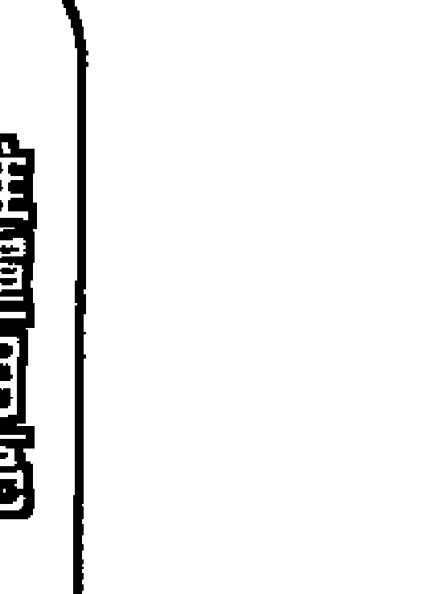

##### 二、疗愈者

推运月亮通过的宫位可以看出，你可以在哪一个领域发展治疗他人的自然本能。照顾需要的人，并不一定是护士或幼稚园老师。例如推运月亮在八宫，你可能会很自然地出现一股渴望，想要帮助别人治疗心理创伤，或是帮忙他们面对恐惧的情境，而你只是聆听，或是让他们靠在你的肩上哭泣。在十二宫，你可能想帮助别人找到心灵的庇护所；在五宫，你可能透过艺术展现治疗的天赋，或是帮助别人表达自己。当你透过天生的滋养本能、透过自己的方式表现柔软的一面，你也能获得疗愈。这就像当一位母亲抱着她的孩子安抚孩子，亲一下孩子的小伤口，她也会觉得很美好。我们可以从你的完整的星盘找到答案，但是推运月亮在巨蟹座时，是一个好时机，你可以开始为这股疗愈的渴望寻找出处。在这个推运周期，任何必要的疗愈都应该从自己身上开始。自我滋养是这段时间的重心，这就是为何我们会如此渴望关闭，渴望深深进入自己的世界，沉浸在自己的感受里。你可能无法意识到自己的感受和需求，除非愿意接受自己需要一些“私密时间”，你才能觉察。推运月亮通过的宫位可以提供一些线索，看出哪些活动可以帮助你接近自己的感觉。无论是哪一种情况，在这段时间，你要把注意力放在个人和主观的经验上，这对你的情感健康极为重要。

#### 如何避免被浪潮卷入大海？

##### 一、小心泅泳在内心世界

在这段时间，你可以径行沉浸在自己的世界里，但别溺毙了。当你在自己的感觉和内心世界里泅泳漂浮时，很容易没有注意到周遭发生的事，也无法去理解。你内在的所有东西感觉如此庞大：你的恐惧和需求，你的梦想和爱，可能都令你无法承受。我很肯定，你已经知道周遭的人无法读你的心，所以当你如此沉浸在自己的经验里时，可能以为你已经向某人表达过某一件事，或是你正在与某一个人共同经历一件事，事实却非如此。不要忘记对外与人沟通你的期望、需求和想法，别人才可以帮助你平衡内在与外在的世界，你才可以理智地看待自己。

##### 二、信任跌落的游戏

在每一种训练课程中，你可想的经典“游戏”就是“信任跌落”。这就是一个人背对着另一个人，大概两呎的距离，一个人往后倒，让后方的人接住自己。当我们知道预期的结果时，这个游戏的强度就会少了一点，因为大部分的人都认为会被后方的人接住，不认为自己会跌到地上。不过这里的概念在于往后倒的人不确定自己何时会被接住，或是不知道自己到底会不会被接住。

推运月亮就许多方面而言，巨蟹座一直在玩信任跌落游戏。你知道什么时候适合下场试试水温，你会在这里稍微踏出一步，然后又在别的地方小试一下。爱与支持，永远跟脆弱形影不离。如果不让别人知道你很珍惜、你很需要，或是你不相信别人可以做到，你永远不会被接到、不会被抱住，也不会得到支持。在推运月亮巨蟹座的时期，可能必须解决你不让别人滋养你或支持你的后遗症，这可能是在过去某些时刻，你觉得孤单、不被爱，觉得需要父母的滋养，父母却不知为何无法如此对你。推运月亮经过的宫位可以看出你的态度、你之前的滋养经验，或是缺乏滋养的经验，然后你就知道该如何在必要的时候改变作法。

如果你必须在某个生命领域中接受治疗，可能会为了两种欲望挣扎不已：被爱的渴望，以及对安全的渴望。你可能会有一些破坏性行为，像是生气；或是希望有人能注意你，问你一切还好吗？而不是直接表达对爱的需求；或是制造一些间接或微妙的方式去“试水温”，透过所有的方式来向自己证明爱的存在，而你可能在伸出一只手抓住一个人的同时，又把另一个人推开。当你揭露自己的需要时，可能会被拒绝或忽略，但是你必须敞开自己，勇敢付出，同时接受你想要且需要的爱和关心。

##### 三、确定生活的主轴

在这段时间，你必须再次确定生活的主轴就是滋养自己，这是非常重要的事。如果你习惯先照顾别人，再照顾自己，或是不接受别人的支持，那么在这段时间，这些习惯很可能以直接或间接的方式表现出来。打开心门的付出，或是出于强迫性的付出，这两者的差异在于，当你是后者时，通常不会获得回报，只会被榨干，再也没有东西可以给。你没有东西可以付出，是因为无法从拒绝接受的爱之中补充能量，重新充电。这其实是你偷偷保护自己免于受伤的方式，因为这正如我们提过的，你如果一直在付出，焦点通常会放在接受的人身上，还有他们的需求上面，接受通常比付出更容易受伤。

这种行为还可能出现极度需求的副作用。在这段期间，如果你觉得特别需要别人，特别匮乏，并不代表你付出太多，而是一种警讯。如果时常想起过去如何缺乏滋养，或是一直认为没有任何人对你付出足够的关心，可以满足你的需求，那你也必须认清——你是否用某些方法抓着身旁的人，又不断怨叹所有人都离开你，或是没有人爱你。在这段时期，这些匮乏和令人窒息的行为，还有逃避，都会引导你走向自我破坏和疏离的道路，向下沉沦。

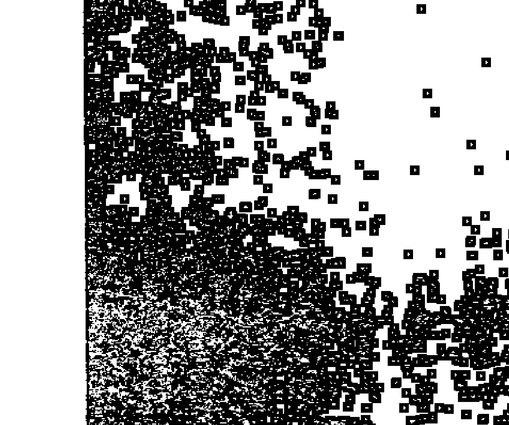

### 推运月亮在狮子座
#### 你想做自己，让别人知道真实的你

> >“创造不只是发现一个东西，而是在发现它之后，从中创造出一些东西。”
>
> ——美国诗人詹姆斯·罗素·罗威尔（James Russell Lowell）

#### 转变的浪潮

人总是这样，在你长时间专注于内心世界之后，当这个推运周期开始时，你越来越渴望爆发。即使你的推运月亮正通过专注于内在的水象宫位，像是四宫、八宫或是十二宫，你仍然能开始感受到自己正在散发一种温暖。你一度认为巨蟹座的壳能保护你，躲在里面永远都很舒适，如今却开始觉得受到限制，枯燥无聊。你现在觉得比较轻松自在，就像你想要自在地做些蠢事，做自己，不用担心别人的眼光。之前你可能比较想低调隐藏一点，现在却想表现出来，让别人知道你是怎么样的人。不过这不代表——对你而言这个过程比平常来得容易或更自然，要看你的性格而定，不过你会越来越渴望这么做。你要如何面对这股渴望，由你作主。

你可能发现自己在很多地方自问：“那我呢？”“有任何人在意我吗？或是关心我能有什么贡献？”你会开始需要别人给你应得的关注。但是如果你对于主动要求这件事感到不太自在，或是一直忽略自己，你可能发现自己过去几个月或多年来一直很饥渴的生命领域，会突然跃上台面。你的推运月亮通过的宫位可以告诉你，你生命中的哪一个领域需要关注和感激。你是否需要伴侣表达更多的爱意，更注意你一点？你是否需要工作上的付出获得肯定？这些都是你之前有所谓虑的。

#### 真正的方向

你可能觉得越来越需要被欣赏，还有明显的关注，这种月亮推运不只是要你踩着脚，要求自己成为众人眼中的那颗星。你有时必须这么做，因为狮子是狮子座的象征，我们有时的确需要吼一两声，让别人知道我们的存在，他们才不会踩到我们的头上来。但是推运月亮在狮子座，比较关心的是你要记得，为何你在一开始值得受到关注？为何要替自己庆祝？为何要表现自己？你内在的哪一面想要抛头露面？表现自己，并不是像青少年穿着奇装异服标新立异，而比较像一个小女孩自在地唱着歌，或是在厨房里跟洋娃娃一起跳舞。她这么做不是为得到任何人的注意，而是因为感觉很好。她内在的某个东西想要唱歌，所以她就唱了。可能有人听见她唱歌，对她唱歌有些意见，但她不在乎。她只是享受这一刻，毫不在意，也不觉得需要道歉。

推运月亮通过狮子座是要你知道，自我并不是一个龌龊的字眼，而拥有自我不一定要当第一女主角（或男主角）。就像太阳需要散发耀眼光芒，只因为这就是太阳做的事，很自然就会这么做，而我们也是一样。当我们试图得到关注时，我们会觉得别扭、很匮乏，而这不是推运月亮狮子座的意义。能成就你的事物，现在都会散发光芒。别人会看到你发光，这是不打紧的。你的心正渴望自在地搜集赞美，忽略嫉妒的批评，不要因为赞美或批评阻止你做自己。

#### 掌控之道

##### 一、接受赞美

当我们还是孩子时，常被教导要分享，要考虑别人，不要为自己争取太多。当我们希望能成为社会的一份子时，这当然是一个好的建议，好的态度永远不是件坏事。但是对于有些人而言，这种概念会深入灵魂的裂隙之中，变得不太愿意获得应有的重视。我们会对恭维置之不理，尽管我们非常渴望。当你要让推运月亮狮子座进入你的生命时，最简单的做法就是学习亲切地接受赞美。恭维、赞美和欣赏都是给予爱的方式，你若是接受它们，就是接受这份爱，接受值得这份爱的自己。对于有些人而言，这与内心根深蒂固的想法相互抵触，他们以为爱是必须赢来的，或是会认为：“他们如果了解我，就不会说出这些好话了。”而你在这个推运周期背负着双重任务：第一个任务就是学习接受赞美和欣赏，第二个任务就是在一开始就秀出自己。

##### 二、秀出自己

如果要健康地表现狮子座的能量，不是要吸引所有的注意力，而是减少被忽略。在月亮推运在狮子座时，如果发现自己在问：“为什么没有任何人考虑我？”你可能要看一下自己的行为模式。你是不是总是坐在更衣室里，却没有离开更衣室，站上舞台？你是否有大声说出自己的想法，或是在脑海中不断地想？你是否有跟别人讲过自己的需求，还是只是坐着等待别人发现你，然后再满足你的需求？你是否有所保留，如果是如此，为何你会这么做？如果不表现出来，人们不知道你有多酷、多么特别。这个推运周期是要你表现自己天生的样子，不要有任何压抑。允许自己被看见、被欣赏，这件事并不像听起来这么容易。你现在尽可能生动地想像一下，当你一丝不挂地站在舞台上，刺眼的镁光灯打在你身上，好几百人围在你身旁，对你仰慕不已。你对这一幕有什么感觉？也许有人会说，这实在棒极了，就让这发生吧。但我怀疑大部分的人都会觉得非常脆弱，还有……毫无遮蔽！每次当我们表现自己时，一定都会有不被欣赏的风险。我们都可能换来一片嘘声，或是更惨，根本不被视而不见。我们都需要一点勇气，让自己拥有表现自己的自由，这是真实内心最直接、最坦率的表现，不必塑造自己的形象，也不用遮掩我们以为会被别人批评的部分。

##### 三、创造！

当我们和一些人聊到创造力时，他们会说：“喔！我们没有任何创造才华。”这是一种很常见的误解，以为创造力一定要跟某种才华有关，或是只能运用在艺术领域。狮子座是由太阳主宰，而太阳就是生命的本质，本身带有温暖。创造力只是把你内在的东西拿出来，用外在的形式表现。无论你正在唱歌、写作、说笑话、涂鸦或重新布置你的客厅，你都在运用你的创造力！

推运月亮在狮子座时，你常会出现创造的欲望，因为你有参与、玩乐和表现自己的需求。你要把才华的想法抛到窗外，而你如果想要创造，但不知道该如何做，那就去学习一种新的嗜好！没有什么事能像使用新的材料一样，更能运用我们脑中的创意了，无论是陶艺课里的黏土，或是写下的文字。

> 下面这一段话来自美国作家玛丽安·威廉森（Marianne Williamson）的《爱的奇迹课程》（A Return to Love），这是广为人知的一本书，值得在此重复引述，因为这就是狮子座旅程的本质：

我们最深沉的恐惧不是我们的不足。我们最深沉的恐惧是我们的力量无法衡量。最令我们害怕的不是我们的黑暗，而是我们的光。我们会问自己：“那个如此出色、如此美丽、如此才华洋溢、如此优秀的我，到底是谁？”其实，这如果不是你，那你是谁？你是上帝的孩子。妄自菲薄并不适合这个世界。退缩不会带来任何启发，而你周遭的人不会如此局促不安。我们所有的人都像孩子一样，注定要闪耀发光。我们生来就要展现内在的神性光芒。这并不只是某些人才有的，这存在于每一个人的内在。就让我们自己的光芒闪耀，我们也要在无意识中允许别人做同样的事。当我们从自己的恐惧获得解脱时，我们的存在自然就能解放别人。●

不以自己为耻，不畏惧自己的人，才能散发最真实的个人魅力。观察一下生活中一些具有个人魅力的人，他们似乎都有一股令我们陶醉的引力，将我们拉向他们。这通常不是因为他们是最美丽或最富有的人，而是因为他们会散发一种温暖的氛围。这种温暖来自于他们对自我的感受，也来自一股分享的欲望，想要与别人的自我进行对话，而别人的自我也渴望能敞开心房。别人的光可以帮助我们用自己的光回应他们，而这就是你在推运月亮狮子座时期要学习的事，你将会知道，自己可以做到这一点。你会明白一个人对自己有足够的信任与爱，并有勇气自然地流露出来，这就能激发别人心中的光芒。

不要害怕分享你的才华，不要害怕谈论你喜欢的事情，或害怕说个笑话。在这段时期，你要做更多喜欢的事，更轻易地表现自己，带着一种参与的心情进入生命。我的一个个案告诉我，她在推运月亮狮子座的周期时，想要生命更完整，重点不是把事情完成，而是要享受过程中的丰富！

#### 如何避免被浪潮卷入大海？

##### 一、表演的猴子

你要记得在这个推运周期，最重要的是试图重新找到让自己发光的事，以及能帮助你自我感觉良好的事，你才能欣赏自己，爱上自己。狮子座就像表演者，而一个表演者通常都会与观众有充满活力的链接。在这段时间，你可能发现自己对掌声（或缺少掌声）变得更敏感。我在最近一次的推运月亮狮子座周期，感觉一股内在压力，一直想要很耀眼，表现出自己最好的一面：风趣、精心打扮，没有一天是披头散发的。当你得到越多注意力，或是你越渴望引起别人注意，你就越容易受伤。你会发现，自己会为了从别人身上得到渴望的回应，去修正改变自己的行为。如果你紧抓住这一点不放，就可能沦为一只表演的猴子。你会为了爱和关注耍一些把戏，而不是分享自己。如果你总是在意别人把你想得很好，就会很明显地缺少自然和真实感。因为当你在乎别人如何看待你时，就会事后批评自己，而这刚好与你目前内心最渴望的状况背道而驰。你要自由地、自然地表现自己，不要在别人面前隐藏自己，但也要记得，你不是为了别人闪亮发光。

##### 二、“第一夫人”

意大利语的“Prima donna”代表“第一夫人”，但比较通俗的用法，指的是一个人总认为自己比身旁的人值得更多的关注、更多的服务，值得占据超出合理的地位。这跟自爱或自我欣赏不一样，当你内心出现这股渴望时，常是因为你没有安全感。这股想要踩脚、要求被关注的渴望，其实是很好的线索，可以帮助我们知道必须纠正生命中的一种不平衡。你便能利用这份觉知，找到自己内心的伤痛，找到那个需要认同和爱的孩子，或是你一直用来保护自己、不让自己接受爱的任何东西。无论你只是太长时间忽略了自己的需求，或是因为害羞或没有安全感让自己躲起来，“第一夫人”都会说：“真的够了！”但你除了乱发脾气之外，还有很多更有效率的方式，让别人听到你的心声。

### 推运月亮在处女座
你更常担忧自己或事情有缺失

> “我把星星放在如此高的地方，才能不断地朝它前进。”
——美国奥斯卡黑人影帝薛尼·鲍迪（Sidney Poitier）

#### 转变的浪潮

当你从火元素转移到土元素时，当你经历过狮子座的扩张能量后，最典型的表现就是你会准备再次整合自己，“回到现实”。当你开始进入这个推运周期时，内心会酝酿一股渴望，希望事情都有条有理，或是开始进行一个计划。处女座的主宰行星是水星，水星代表心智，这也代表希腊天神赫耳墨斯（也就是罗马神话的天神墨丘利）那双带有翅膀的脚。你可以列出一些清单，好好检查两次，因为在这段推运周期，你将要开始忙起来，可能会完成更多的事，胜过于至今经历过的所有推运周期！

很多人发现自己在这段时期比较焦虑。你会担心错误的事，或是可能出错的事，你会更常担忧。每个人每隔一段时间都会思考，生活中可能有什么事情做错了，但是在推运月亮处女座的周期，你会一直有这种感觉。既然外在的生活会反映内心的意识，那么也许你现在的生活中有了更多令你烦恼的事，但更可能的是你只是注意到一些本来就已存在的事物。

当你开始意识到自己有很多事情不对劲时或是不够好时，你的焦虑就会紧跟着不安全感出现。当这个推运周期开始后，我的几位个案曾经经历一些事件或挫败，似乎要让他们收敛一下自信。不过大部分的人通常不需要外力帮助，就会把自己放在显微镜下检视，变得谦卑。你也许害怕，没有能力应付现在担忧的挑战，或是一直专注於觉得不足的地方。

对于你的自尊而言，推运月亮在处女座可能是一个很困难的周期，所以你在推运月亮狮子座周期吸收活力，这是一件好事。这里的重点不是没头没脑的担心，也不是自卑情结。我们很快就会发现，你会专注在如今看似更明显的缺陷，无论这是你周遭或内在的缺陷。这只是要告诉你，你现在该针对它们做点事情了。

#### 真正的方向

我常会说，在推运月亮射手座的周期，当你跃身纵入扩张延伸、充满可能性的世界里，对于每天可能发现的事情抱持着热情，你很自然就会关心潜力这件事。推运月亮处女座并没有同样的

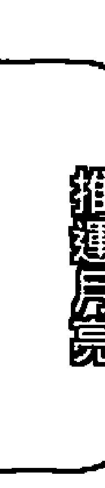

#### 掌控之道

##### 一、不喜欢？那就改善！

心境，但你的确会有一种类似的动机，想要发挥一个人的潜能。处女座是土象星座，它的天赋之一就是尝试，可以理解任何情况的现实面，但它也带有理想性，所以常会卡在两种状态之间。要知道，不安和渴望可以驱策我们向前迈进。

当你进入推运月亮处女座的周期时，你的情感进化已经濒临一个关卡，你渴望变成有能力变成的模样。为了做到这一点，你的周遭就会有一堆“必须改善的事”。你的焦虑，你不断关注自己的缺点或是目前状况的缺失，都会成为一股必要的推力，促使你做一些务实的自我分析，看看自己必须在哪里努力，看看现在有什么挡住你的路，让你无法到达想去的地方。我们常看到象征处女座的女子，手中拿着一束麦子。这提醒我们，处女座想要结成“果实”，想要用一种真实又实际的方式，为自己和其他人的生活带来可以衡量的差异。你在这个周期的最高任务，就是把自己想像成一种原料，可以通过努力改变形状，还要学习一些能带来真实贡献的必备技能。

正如前面提过的，我们偶尔都会担心自己的不足，怨叹自己的缺点，但是在推运月亮处女座的周期，这种念头会加倍出现，可能足以把你打败，或是你有时必须被打败。不过你迟早都必须

##### 二、让自己成为有用的人

依我所见，你有两种方式让自己变得有用。一种方式是立即的直接参与，像是清理公共区域，或是帮忙母亲打扫家里，或是协助女儿做回家功课，这些都是立即的方式，你的存在和你的服务可以为另一个人的生活带来变化。这些行动都特别能加强、滋养你现阶段的内心需求。另一种比较不具立即性，但是能赋予你力量、比较持久的方式，就是培养一种特殊技能或是一套技能，其中的专业和练习能让你变得非常擅长一件事，而你可以把这件事当成一种对他人的服务。处女座很欣赏专业，他们会因为专注于小事情的乐趣，非常擅长深入钻研一件事，学习其中的每一个细节。深入钻研一套技能，不仅能让你用一种特定的方式提供服务，也能让你觉得自己更像专家，而非业余人士。这不仅能帮助你建立信心，同时也能滋养心灵。

建立事业。而当推运月亮在处女座时，特别适合做这件事，所以不要限制自己，不要只是想着这些关键字。一个人运用技能最有效率也最具生产力的方式，就是一份工作或事业（处女座喜欢有效率，有生产力），这可能会让你只限于思考一些你必须继续发展的技能，但处女座更重视改变的乐趣。所以如果正在从事合适的职业，你很幸运！如果不是，不妨考虑一下你喜欢做什么，即使用这只是一个爱好，然后去培养相关的技能。如果不确定自己渴望让什么东西变得更好，只是想改进某个东西，那就看一下推运月亮目前正通过哪一个宫位，这一定能提供你非常需要的线索，告诉你能从哪里开始。处女座与学徒的概念有关，所以如果想变得更好，就需要一位老师，而现在最适合找一个人帮助你改善你的技能。

你还可以考虑一件事，我看过很多人（包括我自己在内）在工作之余，还在某个生命领域培养技能，带来心灵的滋养，最后发现自己的“爱好”已经超过平日的工作！处女座会用一种实际动手的方式运作，所以你就去做任何你欣赏的事。当你在做时，练习会循序渐进变成技能。处女座的箴言就是一次走一步，你不妨想一想，两年内你可以走多少步！

#### 如何避免被浪潮卷入大海？

在这个推运周期，当你知道自己或自己的生活有哪里需要一点改善和加强时，就很容易开始实行。你可以在需要改善的清单上列出一些突然变得很明显的事。这份清单可能马上就变得有一哩长，让你觉得无法负荷，好像坠入了一个无底洞。在这个时候，你的担忧很可能失控。我有一个个案发现她太过焦虑，严重到得了肠躁症，必须吃抗焦虑的药物才能控制忧虑。无论你的本命月亮是什么星座和宫位，在这段推运周期，如果你想要的话，都可以使用一种非常强大的武器来恫吓自己，让自己看不到希望。这个武器就是自我否定。你要小心，别让任何有害的内心对话变得越来越大声，因为我们很容易不了解我们每天拿来吓自己的事。这会在我们还没起床之前就把我们打败，让我们溃不成军。支持你的家人和朋友能提供你需要的理解和鼓励，让你知道你不是全都毁了，而且事实上大部分都是安然无恙的。

肠躁症是一种肠胃疾病。处女座主管身体的消化系统，你很容易看到这里的关联性。

## 推运月亮

##### 二、提高标准

这段时期可以帮助你对一个正在试着成长的方向，衡量目前的进度，因为你在其他时间都很难看清楚。处女座是一股焦躁不安的能量，永远不可能满意太久。所以在这段时期，你很容易不断地提高标准，却不知道你已经完成了什么。永远有人比你更好、更聪明或更快，或是随便拿一件事来比，你就输了。这种行为可能让你陷入永无止尽的沮丧和郁闷。在这段时期，你可能觉得自己不断失败，即使你可能比过去很长一段时间都进步更多。在这段时间，你可能不是个人价值的最佳评审，所以小心，不要贬低自己的成就。

### 推运月亮在天秤座

#### 你渴望改头换面，重视社交生活

> 重复别人说过的话，必须透过教育。要挑战别人说过的话，必须用脑。
> —— 美国作家玛丽·派蒂彭·波尔（Mary Pettibone Poole）

#### 转变的浪潮

你在之前的推运月亮处女座周期可能因为努力工作弄脏了双手，现在该清干净了！虽然还是要参考推运月亮通过哪一个宫位，但是当推运月亮天秤座的周期开始加温时，很多人都会渴望重新改造自己的外表。天秤座是由金星主宰，金星代表人类对于爱与美丽的欲望，所以你可能开始更注意自己的外表，也会开始更常注意周遭环境。而当环境经过特别的照料和美化，变得很干净时，你也会特别欣赏。很多人会在这段时期感受到创造力的苏醒，无论这是自己投入艺术创造，或者只是想要沉浸在文化艺术之中，像是音乐或戏剧表演。这些例子都能把美带进我们的生命之中。

天秤座的符号是一把秤，而天秤座在秤处于平衡状态时，感觉最自在。艺术和雕塑里的正义女神是蒙眼拿着一把秤，象征公平。平衡原则的例子之一，就是两种意见之间的平衡，不偏袒其中一方的观点。也就是说，在决策的过程中，我们会“衡量我们的选择”，考虑一下这个角度，又考虑另一个角度。在推运月亮进入天秤座时，你正在学习平衡的过程：如何真正地达到平衡，如何认清你没有达到平衡。

#### 真正的方向

你可能也会开始更加意识到自己的社交生活，还有周围的社交环境。周遭的事物，像是注意人们如何对待彼此，例如友善或不太友善的行为，都可能引起你的注意，而你也会变得比较无法容忍不体贴、不圆滑和粗鲁的行为，比以前更加在意这些。你可能更关心自己的社交生活，也许渴望有更强烈的社交连接，或是觉得想要加强友谊，培养新的友谊。

在这个推运周期，有些人发现，会有人进入他们的生活中，挑战他们的观点，有时会踩到他们的地雷，但也会影响他们的兴趣。天秤座是代表对立面的星座，代表在两个对立面之间找到一座桥梁。你很快就会发现，你会有机会与观点不同的人做这件事。

你可能会吸引来一些人和经验，代表与你对立的知识或观点，帮助你达成平衡，帮助你找到另一种方式，不同于你习惯的做法、反应和相信的方式。天秤座也被认为是关系的星座，这不是因为他们没有了重要的另一半，而是因为所有的人和想法都有对立面，一个真理中包含两个一半的真理，可以让彼此变得完整。天秤座知道永远有一种方式看待事情，另一种方式是去理解事情，而当我们这么做时，才能找到一些共同点。

#### 掌控之道

-   一、填补空缺

## 推运月亮

花太多时间工作，就多安排一点时间在家里，或是投入爱好。如果花很多时间跟家人相处，觉得需要一点“自己的时间”，那就调整一下。你在这个时候要特别注意渴望什么，还有梦想能做什么，因为通常是你生活中欠缺的东西，还有必要做到的事情，可以为你的生活带来平衡。这就像一张两只脚的桌子，必须有第三只脚来支撑结构。你现在要认清生活中需要的第三只脚，把它接上桌子。

##### 二、找到共同点

天秤座是连接想法和人的能量，方法就是透过找到两者之间的共同点，在两者之间搭起桥梁，无论这是两个人之间的和谐，或是扮演魔鬼的代言人，表达相反但平等的观点。你在本命星盘中可以找到天秤座能量的宫位，以及推运月亮现在通过的宫位，这都代表你在这个领域可以变成意见传递或人们的连接者，而且摆出合作的姿态是会有回报的。当你检视如何从与别人的合作中获利时，你也可能想要思考一些失衡的生命领域中的关系互动。天秤座的优点在于，可以在同一件事情里面看到好几种观点，但有时候会因为太过迎合他人的观点和欲望，却忘记了自己的，而因此容易受伤。如果在自己的人生中，会在某些方面扮演配角，这时也许刚好可以检视一下，解决问题。天秤座虽然是关系的星座，但不只是人际关系，也可能是我们与任何事物的关系，所以要更广泛地思考，也可以从推运月亮通过的宫位找到线索。

#### 如何避免被浪潮卷入大海？

##### 一、以智慧做出选择

推运月亮天秤座的负面表现，就是因为犹豫不决导致怠惰。当你敞开心胸发现新的观点，挑战任何你一直相信的单方面信念，你就能用全新的眼光看待所有的人和情况。不过当你看到一种以上的合理意见、决定或结果，当你充满选择时，你可能很难知道该选哪一条路。就如双子座的符号中有双胞胎，天秤座也有一把秤；两个符号都带有某种双重意味，所以你可能觉得体内有两个自己在试图找到出口，每一个部分的你都会看到一条充满可能性的道路，但也会关上另一扇机会之门。

你的本命月亮如果是风象星座，可能很难意识到自己对于可能性的感觉，最后就会不断地在心智的回圈中打转。你的本命月亮如果是火象或水象星座，你也很可能很迷惘，用一种不同于平常的方式批评自己。对一个状况长期地犹豫不决，也许意味着你心中有恐惧，你会害怕做了错误的决定，或是害怕做的决定会让别人受伤或失望。有时认清恐惧，可以帮助你知道自己偏好哪一个选择。无论如何，你最好的做法就是用现有的智慧做出选择。暂停参与不能让你维持稳定或安全，毕竟不做任何选择这种做法，会是你最后的选择，而这有时会导致令人非常不满的结果。

##### 二、通过是唯一的出路

我们已经知道，你现在可能开始检视某个生命领域中的平衡与失衡。天秤座是通过平衡来运作，逃避或少做一点都无法达成平衡，你必须扮演一个平等的角色。之前谈到，你可以检视自己在哪个特定的生命领域中失去平衡，这有时是因为你不让自己追求公平。人们在运用天秤座的能量时，有时会试着用“不要捣乱”（我们常用这个字来形容天秤座）的方式来创造和平与和谐。但是冲突和带有敬意的对质，即使只是你跟你自己，都能带来真正的和平，而不是只有假笑和内心冷漠的表面和平。在这段时期，你要允许改变，允许考虑所有观点，但小心不要只用逃避压力的方式，来回应内心对于和平的渴望。

### 推运月亮在天蝎座

#### 你享受独处，迎来生命重要转化

> “悲伤在你身上刻画越深，你就能拥有更多喜悦。”
> ——黎巴嫩诗人卡里·纪伯伦

#### 转变的浪潮

从推运月亮天秤座进入推运月亮天蝎座，最明显的转变之一，就是减少了对社交互动的强烈欲望。无论你总是跟不同的朋友出去，或是喜欢自己一个人出门打发时间，你都会发现自己渴望少一点社交互动。这时仿佛有一股力量把你往内扯，往下拉。这就像进入洞穴或是浸入水中，这些都是很贴切的比喻。

你会发现自己的情感更加波动，仿佛有一个东西在你的内心剧烈翻搅，但是你更难在显意识中觉察它，更难形容目前的感受。最明确的形容可能是“我有事情发生了”。你的推运月亮如果刚好在三宫，或是与水星有相位，你可能更容易与人沟通内在的感受。即便如此，当你更深入探究自己时，沉默和孤立会更吸引你。

你可能变得更情绪化，发现自己的想法比平常更黑暗。即使你是非常乐观的人，这时也免不了用愤世嫉俗的眼光来观察世界。你身旁的人可能正在死去、正在离婚、正在互相伤害，这其实每天都在发生，但你的眼中现在似乎都只有这些事。外面的世界会反映你的内心世界，而当你的推运月亮在天蝎座时，你生命中的事件可能出现困难的转折。你的人生或身旁的人生可能会有戏剧化的演出，让你更加感受到生命令人痛苦和恐惧的一面。

#### 真正的方向

天蝎座的象征符号是蝎子，也许因为蝎子有刺，所以天蝎座最有名的就是快狠准地切中要害，揭露赤裸的现实。不过，凤凰是更能代表天蝎座的符号，它能表达这个常被误解的星座最真实的美丽。凤凰是神话中的鸟，非常长寿，但在生命结束之际，会点燃火焰，将自己烧成灰烬，再从灰烬中重生。就本质而言，它的生命其实没有结束，只是获得重生。你会在推运月亮天蝎座的时期，经历到类似的重生。

当事情按照我们的方式进行，我们处于顺势时，一切都非常具有力量。但是我们通常是在最困难的时候被夺走安全网，失去安逸和确信，此时就会揭露我们真实的力量。当我们能面对自己的恐惧时，就会出现真实的力量。我们可能只是体验这些恐惧，结果就像已经触及谷底，无处可去，只能向上。当我们在面对最恐惧的事物的可能性，感觉就像在紧张的情境中准备把另一只鞋也扔了。推运月亮天蝎座不是非要体验黑暗或痛苦的事，而是要让我们知道，当我们释放自己的恐惧时，我们会有什么样的改变。有时释放恐惧的唯一方式，就是实际去体验我们害怕的事，想办法熬过去，活下来。

#### 掌控之道

在此郑重强调，很多人在推运月亮天蝎座的周期，并没有经历死亡或离婚！这就像一个小孩害怕衣柜里有怪物，即使我们非常想要躲在棉被里，但有时唯一的解决方法就是打开衣柜，面对衣柜里面可能真的有怪物。你在推运月亮天蝎座的周期，没有办法躲在棉被里，因为怪物已经在你的心里了。但是当你面对这些恐惧时，你可以开始释放它们，当你这么做时，你就可以发现推运月亮天蝎座的真正目的：发现你的灵魂的力量，重新排列内心深处的优先顺序。

##### 一、面对野兽

如果可以的话，请先深呼吸，然后转身看一下是什么在追着你。试想当最坏的事情要来临时，会发生什么事，即使只是稍微想一下也好。我们常常会太害怕发生某一件事情，因此深陷于预防与抗拒的状态中，导致我们无法思考，眼光也无法超越它。你到底在害怕什么？

> “我害怕失控。”
> “我害怕孤单。”
> “我害怕会破产。”

然后呢？如果失控、孤单或破产了，那会怎么样？接下来会发生什么事？脱离恐惧的最佳方法就是经历它。这不是一种道德性的命令，而是合乎逻辑的解决方法。这当然是说的比做的容易，但是如果找到熬过某一件事的方法，这件事就不再如此强烈了。如果没有犯错，这就不是英雄之旅。这代表你不会在两年结束之际听到胜利的号角响起，也不会有赞美。你可能会短暂觉得无力，觉得害怕，但这不会是你的世界末日，而恐惧很快就会消退。有时力量和无力之间的差异只是一个决定，一种心态。如果生命和恐惧正在扑向你，你可能觉得很无力。但如果决定站起来，面对状况，即使这已经超出你的控制，结果就会是拥有自主权力。

##### 二、温柔对待自己

当你经历一些必要的、经常是很紧张的事情时，不要觉得休息一下是懦弱、可悲的表现。当你想要避免一些超出负荷的事情时，这些事可能造成新的问题，你要找地方逃避一下。若不想和颜悦色、不想交际，不想表现得很开心，不用觉得抱歉。当别人问候你时，如果不想微笑，就不要逼自己。这段时间，你正强烈地对抗自己，所以越能透过其他方式温柔地对待自己，状况越好。

##### 三、效仿凤凰

允许自己闭关，找出时间做这件事。如果维持忙碌可以帮助你处理困难的状况，那无论如何都要让自己忙着！但有些时候若想要躲在棉被里，也要尽可能办到。无论任何时候，当内心世界在呼唤你时，外面的世界有时必须稍微退居二线，特别是在这段时间，你已经没有太多舒适的事情了。如果太沉溺于情绪化，闭关休息有时真会让事情变得更糟，但有时稍微平静一下，暂时退隐，是很有帮助的。

试想一下，一个小孩在这世上成长的过程中，终究会明白痛苦是一种有用的工具。我们如果不听父母的话去碰热锅，就会被烫伤。痛苦是预防我们再次受伤的有效方法。当我们害怕痛苦重复时，我们会学习避免伤害，方法就是避开第一次让我们受伤的东西。这就是防卫机制的运作方式。

人生会透过许多细微的方式伤害我们，我们都受过许多不同的伤。这可能是我们告诉朋友一个秘密，对方却背叛了我们的信任。或是我们透过各种不同的方式要求父母的肯定，却被拒绝或忽略。我们可能开了一家店，最后失败收场，投资损失，也失去信心。大多数的人都能靠逻辑认清一件事，我们不会因为在某种情境中受过一次伤，就代表我们永远都会受伤（热锅就是一个很明显的例外）。但我们的潜意识很难明白这个道理。记住，防御机制的形成是保护我们避免痛苦，但即时的威胁过去后，我们仍会长期维持这种状态。恐惧可以让我们安全，但也会束缚我们，阻碍我们成长。如果我们永远不重复受伤的情境，就不会去约会，不会生小孩，甚至再也不会踏出家门。

##### 四、死亡

我们常会把转化这个字，与天蝎座的能量联想在一起。但这到底是什么意思？这不是一种流行的化妆！凤凰如果不愿意先赴死，就不可能重生。在这段时间，你必须放下一些恐惧和防御，这些显然能让你安全，却真的成为你的阻碍。此时更可能发生的情形是，你需要放下一些储藏和隐藏恐惧的情境，像是失去一段有害却很舒服的关系，或是一份稳定却让你不快乐的工作。你不需要继续逃避这些经验，而是要经历它，或是至少直接面对，知道它可能无法压垮你，知道一切其实跟你想的不一样。

##### 五、重生

当你恐惧的事物一旦进入你的脑海里，无论是透过环境、对抗或深思熟虑，而你可以面对它，站在它的面前，你就会开始有一种奇怪的放松感。我们必须耗费很多精力去避免害怕的东西，焦虑还会在我们体内建立一个压力的储存槽。你会开始发现，你走进的洞穴的确黑暗又令人害怕，但是结果与你刚进入时想像的不一样。虽然黑暗的重量压在你肩膀上，压迫着你的心，但这不是你的末日。无法杀死你的东西，都会让你变得更强壮。你会发现自己不是正在死去，而是变得更有生气。我们的内在都有一股永恒的力量，会在我们需要时、我们想要使用它时冉冉升起。当你走到了推运月亮天蝎座周期的终点时，光明会再度回到你的生命里。至于你被剥夺的所有东西，你现在只剩下自己：一个原始、狂热但稳定的自己。

#### 如何避免被浪潮卷入大海？

##### 一、愤世嫉俗

当光突然熄灭时，所有一切似乎都黑得令人震惊，让我们找不到出口。但经过一段时间后，我们的眼睛适应了，开始习惯周遭环境处于最微弱的光线中。此时如果有人突然打开明亮的光源，我们会很痛苦，很迷惘，暂时失去视线。当你经历推运月亮天蝎座的周期时，就像在一个假想的地下室里四处挖掘，里面没有太多的光。你的观点会比较黑暗，也许你会觉得疲惫、愤世嫉俗，甚至忧郁。你正在理解不是所有一切都如表面上的天真无邪或乐观，你会被任何假装天真无邪或乐观的事物激怒，而这会干扰你看到真正的好东西。你现在可能很难有理性判断，而你要留意，不要完全被黑暗吞噬，试着随时找到方法而一笑置之。

此时的生活看似变得更激烈，可能的确如此！不过你要是认为这会一直持续下去，就会在情绪化、心情阴郁的时候做出可能让你后悔的决定。再提醒一次，这是要你试着保持理性判断，知道## 二、消耗與投射

當我們的內在恐懼變成生活中的外界現實時，我們把這稱為投射。在推運月亮天蠍座時期，我們不只在對抗自己的恐懼，也在對抗恐懼帶來的無力感。當我們把這些恐懼向外投射時，我們有時也會向外投射一種我們不知道自己所擁有的力量。這感覺就像當我們覺得自己很渺小又無助時，我們想要或需要的東西都在外面的世界。當這種情形發生時，就會出現天蠍座最典型的迷戀原型：當我們想要一樣我們沒有的東西時，我們就會迷戀地追著它，無法專注在其他事物上面。

舉例來說，想像一對情侶不是因為達成共識分手，而是其中有一個人離開。當我們是被拒絕的一方時，通常覺得很受傷，自覺是受害者，而出自本能的一種對應方式，就是試著拿回我們失去的一切。在這種情形下，我們想挽回，可能不是因為思念，而是因為感覺被拒絕了，覺得自己很卑微，因此失去控制。而當我們無意識地試圖挽回我們失去的一切，沒有認清這等於賦予自己對外界事物的迷戀，其實是源自於自己的內在，就可以開始從我們害怕或傷害我們的事物上找回自己的力量。如果為了找回失去的東西，試圖操縱或誘惑別人，或是玩弄一些狀況，結果很可能會事與願違。

知道你還是擁有未來，屆時你又會想要一些東西。不要永遠推開某個事物，除非你的放手是為了個人的成長和健康。

## 推運月亮在射手座

#### 你想遠走高飛，體驗生命的美好

> 當你走到所有光明的緣時，必須踏出一步進入黑暗和未知的國度時，你可能會相信其中一件事：你可以站在一個穩固的基礎上，或是你將學會如何飛翔。——美國作家派翠克·奧弗頓 (Patrick Overton)

#### 轉變的浪潮

射手座是一名弓箭手，把箭射向天際。當推運月亮射手座的週期開始時，你的心裡會開始充滿遠走高飛的慾望。經歷推運月亮天蠍座的週期後，你開始覺得心情比較輕鬆。而你可能在天蠍座週期做了一些重要的轉化，現在應該很歡迎這種能量轉換。

你會發現一種擴張和甦醒的感受迎面而來。理想開始在你的腦海中翻攪，你也開始看到可能。對某些人而言，這個推運週期的一開始會出現一些事件，啟動一個自由的機會，像是結束一個情感的僵局或難題，或是一兩個月前沒有出現的機會。推運月亮天蠍座週期的副作用，是讓你能更深入地了解自己，這可能幫助你先清出一條路，讓你可以開始享受這份自由，但也可能讓你還是有點生澀或憤世嫉俗。現在你該讓自己的熱情滋生洋溢，不需要謹慎或限制。記得生命可以再次美好，甚至有趣！

你可能發現馬上想要去所有地方，做所有的事。木星是射手座的主宰行星，也是所有行星中（除了太陽）體積最大的行星。木星是擴張的行星，與變得更大有關！你現在看到的每一個機會，無論是出自你的內心或是來自外面，似乎都是有史以來最棒的一個機會。在推運月亮天蠍座的週期，你會面對「這到底是什麼」的真理，而當你進入推運月亮射手座的週期，你開始轉向探索「這可能變成什麼」。

在二〇〇九年電影《沒問題先生》（Yes Man）中，男主角卡爾的人生走到死胡同，工作也看不到未來，每天晚上窩在家裡看電影，拒絕所有的邀約，如行屍走肉般過日子，關上心房，不願意睜開眼睛看看外面的世界，還很憤世嫉俗。他在一個很偶然也非常古怪的機會中遇到了老朋友，開始發生一連串的事。最後他去參加一個講座，接觸到「對所有事情說好」的哲學。卡爾遵行這個唯一原則，無法對眼前任何一個機會說不。他快樂了一陣子，但最令人感傷的是開車回家時：當你說好時，你的心打開了，你的人生就改變了。

## 第二部 年度課題：推運月亮過境星座和宮位

#### 掌控之道

##### 一、探險

我並不鼓勵你對每一件事說好，不過推運月亮射手座的目的是要打開一條路，讓可能性和新鮮空氣進入你的心和生命中。推運月亮射手座是要你擁抱探索的能量。就像其他火象星座一樣，你的內心會開始有一把火在燒：這是充滿可能性、願景和成長的火焰。現在你應該打開心房去體驗。你知道什麼？你相信什麼？你準備好超越已知的一切，進入新的領域嗎？這段時間也很適合認識可能性：每個新的一天都有探險和改變的可能性，這還包括你內在的潛力。你現在有什麼能力，而你相信潛力嗎？在推運月亮射手座的週期，你很適合用希望和樂觀重新開始一段關係，積極追求你想要的東西，對這些東西說好。你要抱持實驗的精神，無論這只是改變日常生活規律的小事，或是新的工作機會，甚至像是改變一段關係或搬家等大事。你把人生晃動一下，來點震撼，看看它會在哪裡降落！

這很大程度還是參考推運月亮通過的宮位。有誰看了夏威夷茂宜島哈萊亞卡拉火山的日出後不會感動？有誰走在古老的土地上不會感受到虔誠？不同的領域和觀點，有時會讓一個人陶醉不已，卻讓另一個人覺得枯燥乏味，但要是一直無動於衷，就等於一直保持疏離。單獨旅行不能帶來你盼望的甦醒，這只是一種靈感的運作方式。你隨時都可以到任何國家，帶著自己喜歡的零嘴點心，一直窩在旅館裡。但是推運月亮射手座重視的是參與，所以只讓自己置身於另一個地方是不夠的。就像占星家史蒂芬·佛瑞斯特說的，在這段時間，你需要一些「文化震撼」。你必須對一個地方或一段探險說好，讓它們進入你的生命。你要累積一些經驗，聞一聞那裡的空氣，觀察當地的習俗，嘗試食物。當你從已知世界的邊緣墮落時，你可以藉由觀察發生的一切，超越自己。

##### 二、跳下懸崖

在電影《聖戰奇兵》（Indiana Jones and the Last Crusade）裡，主角印第安納瓊斯在尋找聖杯的過程中經歷許多考驗。在某一刻，他已經到了峽谷的邊緣，找不到明顯的路通過，前方既沒有橋，距離對面也太遠，無法一腳跨越。這一路上來，他一直遵循線索通過每一次考驗，所以他就根據當時的線索做出結論，知道自己必須信任地往下跳。他閉上眼睛，伸出一隻腳懸在空中，任由自己墮落。但是他沒有墮入深淵。他的腳踩到了一座橋，在那一刻之前橋是隱形的，偽裝成周遭的石頭。他現在看到路了，一切就像是奇蹟。

在推運月亮射手座時期，你正在試著與自己的潛力同步前進，這是什麼意思？你怎麼知道自己的潛力？重要的是，你其實不知道自己的潛力。我們永遠不知道或無法發揮自己全部的潛力，因為這永遠還能更進一步。但是我們可以意識到它的存在，可以朝它前進，而在推運月亮射手座的週期，你會想要這麼做。這就是為何你想要朝每一個方向前進，因為你意識到未來的自己充滿了無限的可能性。你是否曾想過成為搖滾巨星？化學家？模特兒？職業摔角選手？在這段時間，你曾經有過的任何興趣都可能浮上檯面，因為你現在想要看看什麼是可能的，想要知道自己的內在有些什麼。在塔羅牌裡，愚人牌代表信念、自信和自發性，還有一點點天真。在大部分的牌中，他都是準備跳下懸崖，而他現在正在邀請你這麼做。當我們帶著信念和目的的去實現最真實的慾望時，橋樑就會出現。

##### 三、直覺

所謂的陳腔濫調，指的是一種說法或一種觀念在通俗文化中被過度使用，導致它的力量被沖淡了，我們也對它的意義免疫無感了。一句話無論多麼一針見血或多麼真切，一旦變成陳腔濫調，就會被我們的大腦彈開，而不是進入我們的心裡。舉例來說，我們對孩子的典型想法，就是總是渴望現在能多珍惜他們，因為「他們很快就長大了」。不過當你是一個充滿愛但疲倦又挫折的父母時，懷中抱著一個尖叫的嬰兒，或是追著一個剛剛才打你又跑開的小娃兒時，你只會覺得他們長大得太慢了！即使當你抱著沉睡的孩子時，「他們很快就長大了」這句話仍無法真正地穿透你的心，進入你的意識之中。我們當然知道這句話的意思，我們也通過字典的字義測驗。我們會點頭說：「喔對，這句話太對了。」但在我們看到孩子長大成人之前，我們真的能理解這句話的分量嗎？還是要等到我們當了祖父母，看著我們自己的小孩結婚了，懷中抱著他們的小孩時？

射手座與重新賦予意義有關。當我們用正確的眼光看待偶然的經驗時，會發現它們對我們的影響，絕非偶然。我們的個人經驗塑造了我們的人生觀。在這段時間，生命正邀請你去思考，什麼是你認為真真正正的事，這不是因為你能用事實證明，也不是根據你在學校裡學到的知識，而是因為你的個人經驗教會你這件事。在這段時間，新的經驗和真理會挑戰你。你此時要更注意自己的直覺，它有時比你的腦袋知道得更多。

#### 如何避免被浪潮捲入大海？

##### 一、不要往下看……做就對了！

推運月亮射手座是要擁抱希望和可能性，這意味著向前看，接受冒險。有時你必須跳下懸崖，然後飛翔，但是留意自己會在哪裡降落，也是個不錯的想法。在這段期間，你不知道什麼是冒險、什麼是天真，希望事情一切都會自行到位，你很難在這兩者之間取得平衡。當然有時候，當我們把事情放下時，一切反而能自行釐清，進行得更順利，比我們小心翼翼地處理還要好。而在推運月亮射手座的週期，生命會鼓勵你在處理事情時不需要計畫，任其發展到某一個程度。你要小心自己可能會做過頭，因為你在此時很容易因為過度擴張而受傷。過度消費、吃太多，或是行程安排爆表，都是「可能性」這個國度裡的陷阱。在這段時間，你正在盡可能快速地擴張，為了應付這一點，可能會陷入一些習慣中，看起來能幫助你在現實生活中覺得很自由、很有趣。很多人會把目標轉向食物或金錢，所以要小心因為過度擴張或「先玩再付費」的心態，導致腰圍變大或負債增加。

##### 二、小心做過頭

就理論而言，當你每天起床時，可以做任何事；推運月亮射手座的週期就是你重新找回某種可能性的感受。但是當你按照自己的選擇投入時間和金錢時，你不可能同時在其他地方做別的事。去高空跳傘、學習外語、寫一本暢銷小說，這都有可能發生，但是不可能在同一天做到，對吧？你也許會覺得同時間被拉往許多方向，但如果你是同時朝所有方向前進，現實馬上會用某些方式敲醒你。忙亂瘋狂的日子會把你榨乾。不過你現在不需要太關心成果和計畫，只要蒐集經驗，並且盡情享受即可。

要練習保持彈性，隨時準備接受任何事物。你要很清楚地把心放在充滿可能性的國度裡，裡面沒有界線，也沒有深淵裂縫。把一種想法轉化成現實，有時比你知道的更費時、更複雜，而你有時會發現自己渴望的是對某件事的想法，而非實際的經驗。在這段時間，經驗的廣度遠比經驗的深度，更能令你感到滿足。必須小心，不要把注意力分散在太多的方向，把自己搞得精疲力盡，你就會發現多樣性正是你最渴望的東西。

只要能盡情去經驗，這樣是沒問題的。計畫和重點馬上就會出現。現在只要重新找到意義和天生的熱情，這將會陪伴你朝著設定的目標努力，而這正是你探險的結果。

## 推運月亮在摩羯座 派對結束，你有被拉回現實的感受

> 「不能掌控自己的人就無法自由。」 — 古羅馬哲學家愛比克泰德（Epictetus）

### ## 轉變的浪潮

經過過去兩年沒有盡頭的自由之後，當你進入推運月亮摩羯座的週期時，你首先會注意到某種約束感增加了。之前你會因為一種焦躁不安覺得興奮，覺得充滿熱情開始新的一天，一切都充滿了可能性。但你現在對這種浮躁很不耐煩。當你想到數以百計的可能性，可能會覺得無法負荷，而不是欣喜若狂。無論如何，你現在開始在射手座開放的遊樂場邊緣搭起一些圍牆，當你能控制這種焦躁不安時，就會開始追求更多東西，像是野心、幹勁和重心。你可能會覺得受到限制，也可能在當你被邀請「開始幹點正事」時，感覺精神一振，這必須要看你本命月亮的位置而定。

當你轉變進入推運月亮摩羯座的週期時，壓力會開始累積，你的心會有點沉重。你在心裡很清楚，這是你想要開始某一件事的感覺，你需要開始咬緊牙根。有些人發現此時會出現一些外界的影響，呼應自己的心態轉變，像是生活中出現一些狀況，必須擔起更多責任。這可能是工作升遷，或是生活中多了孩子，或是需要更多的關心。這些外在的際遇無論是計畫好的，或是心所期盼的，或是預期之外的發展，全都有一個共同點：要求我們扛起更多重擔。這可能像是宇宙在對你說：派對結束了，或是感覺像是無憂無慮的日子現在必須退場了，這必須要看你本命月亮的位置而論。但這不會像是一個枷鎖套在你的脖子上，只是有一個東西把你拉回現實而已。

與摩羯座最有關的符號就是山羊。山羊可以穿越險峻和狹窄的山隘，很少有其他陸地動物可以辦到這件事。牠們可以爬到極高的地方，而且當你在山頂上放眼望去，地貌就在你眼前無盡延伸。這就是推運月亮摩羯座的願景和目的之一：你要看到更大的藍圖，好好計畫，知道暫時的享受和缺乏自律，將會妨害更偉大的目標。摩羯座知道專心致志、努力工作可以累積實力。當你省下一筆錢時，可以買到比衝動亂花錢時更有價值的東西。你如果制定計畫，跟著計畫走，你就能更有成就，勝過於你在一時之間搜刮湊集資源。

#### 真正的方向

在推運月亮摩羯座時期，你正在學習如何當自己的主人，如何駕馭你的意圖，把它變成重心、紀律和真實世界的努力，達到你想要的目的。你現在擁有堅韌、魄力和紀律的工具，只要你願意將它們握在手上。當你為了偉大的成就努力時，過程中常必須放棄短暫的樂趣，而專注且持續的努力會得到回報。推運月亮射手座關心的是願景與潛力，但你如果沒有利用它們創造真實的東西，這些就只像是思想的泡沫而已。沒有行動的動機不會創造結果。你現在的嚴肅態度，甚至是沉重，都可以為你創造一些必要的重量來支撐夢想，讓夢想成為現實。

#### 掌控之道

##### 一、承諾

> 電影《星際大戰》（Star Wars）中的尤達（Yoda）說過：「沒有嘗試這回事。你要就做，要不然就不做。」這就是推運月亮摩羯座的功課。我們在這世上會許願、希望、計畫，再加上所有的目的，但這只是開始。唯一可以被衡量的是我們做或不做的現實，而你必須專注在結果上面。我們如果動搖了只吃健康飲食的承諾，也許就會說：「我試過不吃那個甜甜圈，但我必須讓步。」但就如一句老話說的：「通往地獄之路都是由美好的意圖鋪成的。」在推運月亮摩羯座期間，光是善意不會咬人。但我們要認清這裡的魔術底線：甜甜圈到底是被吃掉了沒有？你正在學習，意圖很重要，但結果才算數。

##### 二、制定自己的規則

你是否玩過毫無規則的遊戲？這在一開始聽起來很棒，不是嗎？舉例來說，讓我們來玩大富翁。如果沒有規則說你不准搶銀行，那你只要把銀行所有的錢都搶走，就更容易贏了。如果沒有把規則說清楚，輪到你時，要看骰子的點數決定你可以走幾步，那你想走幾步就走幾步，盡可能地走到「GO」，一次買下所有房子，或是你根本不用買就把房子占為己有，因為沒有規定說你必須要付錢才能擁有房子。你開始看到這種想法的缺點了嗎？沒有規則的遊戲可能玩得很快，或是根本無法開始。這裡的秘訣就在於，沒有任何遊戲是沒有規則的。沒有極限代表不需要策略，這麼一來，我們就錯過了重點，因為成就感就是來自於超越這些極限。當我們想到規則時，我們總覺得規則的存在只會阻礙我們。但規則其實提供了一種架構，我們可以根據它來建構自己想要的東西。任何穿過合身束腹的人可能都會告訴你，當他們穿上它時，其實很舒服，因為他們幾乎可以在裡面放鬆，讓它來支撐他們挺立站著。即使一個看似約束的擁抱，大部分的人還是會覺得很舒服，覺得獲得支持。這裡的概念在於，你要跟規則當朋友，因為當你朝著目標邁進時，它可以將一件事化為行動，但是關鍵在於如何將這件事變成現實，你唯有結合意圖和行動才能達到你承諾要做的事。這不是說，動搖是不好的！但是「我會試試看」跟「我會做」是不一樣的。有時計劃會出錯，但是當它出錯時，承諾會找到另一條被「我會試試看」放棄的出路。

你要做一張表格，列出想要的東西，寫下你可以做什麼來達成目的，特別是你能做哪些小事，幫助自己達成目的。除了單靠自己的意志力，除了不斷責罵或羞辱自己，告誡自己必須當一個「好男孩或好女孩」，還要想出一些方法可以改變你的生活，支持你朝著想要的成就邁進。舉例來說，如果想要變瘦，就要建立一個架構支持這件事，像是列出購物清單，買一些健康但也很好吃的食物，你才不會覺得生活受到限制。你要制定規則，事先準備好所有午餐，才不會在很餓的時候沒有計畫，囫圇吞棗。如果想要跟重要的另一半有更好的溝通，也許你們應該制定規則，每天晚上八點就關掉電視，或是每週五一起出門，或是移除讓你分心的因素，創造一些空間與對方好好溝通。光是一個行程或規則，不會取代你持續的努力和自律，因為你可以決定是要打破規則，或是不要繼續下去。然而，一個具有支持性的結構，可以在你繼續向前努力時幫助你撐下去。我的一位朋友說他在推運月亮摩羯座的時期，覺得生命是如此平衡，彷彿一切都在掌握之中，因為他覺得可以控制自己的選擇和人生方向，透過照顧自己的身體和情感需求，讓所有的生命領域都變得更有生產力、更健康。他為自己的人生建立一個架構，才達到這種地步。他替這個架構取了一個很有詩意的名字——「選擇的生態系統」。他一手打造自己的生態環境，還有自己的日常行程，方法就是鼓勵自己做出健康的決定，讓自己更難做出不健康的選擇。

##### 三、接受責任

在這段時間，如果你的生命中出現一些機會，要求你擔負更大的責任，無論這是增加責任的數目或程度，都要考慮接受挑戰。我不是鼓勵你忽略自己的極限，或是在職責外承擔更多的責任，而是要認清接受責任也會帶來機會，讓我們有機會發揮、還能向自己證明自我管理的能力，甚至是領導能力。摩羯座不只是把事情做好，或是根據規則過日子，而是認清在做這些事情時，我們完成了更偉大的一件事：一種自主感，覺得我們可以做到自己決定的事，我們是自己生命的主導者，可以做出最後決定。這就像一種解藥，避免讓無力感在我們的生活中創造一種受害者行為模式，讓我們覺得無法自己做選擇，只能任由外力打擊。

物質成就只是一個出入口，我們可以從此進入，認清掌控生活的能力及必需品。這個原則不是把生活中發生的所有事或沒有發生的事都怪在自己頭上，而是認清在每一件事中你都有選擇，即使只是決定在意外發生後該如何回應，或是決定接下來該怎麼做。認清你的行為或無所作為，導致現在的生命處境，這並不是一種懲罰，而是現實。這意謂著當我們願意為生命中發生的一切負責時，我們就有自主權做出改變，也能享受一種瞭然於心的樂趣，感謝自己努力把一些美好的事物帶進生命裡。

#### 如何避免被浪潮捲入大海？

-   一、頑固地堅持下去

之前提過，你可能遇到一些情境需要你肩負更多責任，這可以加強你對自己的能力的信心，知道自己可以處理生命中的突發事件，但你也可能感受到沉重的負擔。推運月亮在摩羯座的週期，可能挑起你生命中的一些問題，可能是你承擔太多，或是讓自己肩負太多責任，沒有喘息的空間。推運月亮在摩羯座，可以教導你如何利用自己的內在資源，找到尚未開發的力量和耐力，讓自己振作，把事情搞定！但你也可能陷入一種堅忍和極度絕望的心態。此時最重要的是，知道什麼時候已經到了極點，這意謂著你不行也不應該靠自己做到這一切，屈從不再是一種忍耐，而是一種挫敗、悲觀、緩慢地死去。希臘神話中的泰坦巨人阿特拉斯撐起了整個世界，但是你不需要！因為你不是泰坦巨人，做不到是不打緊的。

> 其實在古代神話中，阿特拉斯並沒有撐起整片天，而是眾天神撐起來的。但我們常認為阿特拉斯撐起整個地球，代表他承受所有的重量，承受一種最極限的負擔。

##### 二、冷酷的决心

推运月亮在摩羯座代表学习放下暂时享乐的好处，以期获得更长远的成就。这通常是控制自己的突发奇想，继续工作，即使你根本不想工作。这当然可能扯远了，不过既然我们谈的是月亮，那么最重要的是确定你正在试图完成的事，要能符合你心里的想望。我们有时候会埋头冲向终点，却忘了自己一开始想要什么。虽然这可能只是偶尔发生，但是你的生活如果变成只是按照计划进行，却忽略了情感，你就错过了重点。你可以把突发奇想扫到一旁或稍后再管，不过经常一再发生的情绪可能是一个重要的线索，代表有些地方不对劲。你的心希望你能有自主能力，以自己为傲，但你如果不给自己任何机会休息，或是不让自己确定一下，你是否还想要那些自认为做到的事，那你不会有任何感受。

### 推运月亮在宝瓶座

你想从例行公事中抽离，打破现状

> “你需要勇气成长，变成自己真正的模样。”——美国诗人 E. E. 康明斯（E.E. Cummings）

#### 转变的浪潮

你受够了遵守规则吗？像是你自己的规则、社会的规则，或是你已经维持现状太久了？你也许开始觉得想要突破某个东西？这也许是因为愤怒，但更常只是因为你会渐渐领悟，如果你可以在自己选择的任何时刻做一点不同的事，为什么不这么做？有时别人会对我们发号施令，交代他们对我们的需求和期望，这可能是他们有权这么做，或是我们允许他们有权力这么做。但有时，我们只是昏昏沉沉地跟着铺好的道路走，因为这已经成为日常规律。我们只是“按照计划走”，因为我们都一直这么做。不过这段时间，你会出现某种程度的超然，可能是罪恶感和义务感越来越麻痹了，你这时会想抽离出来，客观地看待自己为什么要做这些事。你可能开始觉得自由，这会透过一种很奇怪的方式，好像你完全不记得为什么你会卡在某些事里，而这些事对你的支配力突然减少了。在这段期间，我的一位个案发现她感觉自己突然放下了所有自我审查的行为，而她过去一直努力符合标准，只是为了让别人舒服。

当这个周期开始时，许多人会重新发掘过去的兴趣或某些被遗忘的自己。这可能是生活中的一些情境要求他们投入这些兴趣，像是一位新手爸妈可以留更多时间给自己，因为孩子已经较能自理了；或是被一些限制性的生命情境勾起，例如他们在一段关系中只为了配合对方，放下了太多的自己。所以你可能会发现自己过去的碎片开始重新浮现，就像你重新拿起一件老乐器，再次弹奏它，或是想起你喜欢打网球，或是看B级电影。无论这是什么，现在就是要你探索个体性，所以如果你发现有一些兴趣，甚至是性格特质，在你的生命中缺席一段时间后，又重新进入你的脑海里，这可能只是因为你必须再次记起自己，或是因为你过去的某个部分必须融入新的你，成为其中的一部分。

这与经历青少年时期的叛逆大不相同。许多青少年甚至不知道自己是谁？你很可能发现自己正站在生命的十字路口，突然不知道自己身在何处，不知道如何走到这一步，不知道如何变成现在的模样。当你经历推运月亮宝瓶座的周期时，你将会回答另一个更重要的问题：“我是谁？”

#### 真正的方向

宝瓶座的象征符号是盛水的容器，许多人很容易把宝瓶座当成反抗者的星座。反抗的能量来自于异议、反对和混乱。宝瓶座的心并非如此，虽然这是可能的副作用。在这段时间，你可能会发现如果你要纠正生活中的一些不平衡，而当事情与你个人的自由权或做出自己的抉择有关，你会态度坚决或不愿合作。然而，宝瓶座的更高道路其实根本不是一条路；这像一条路线，你必须跟着内在的指南针走，靠自己击退一切。你现在被赋予的责任就是把你一直扮演的角色，与你真实的本质分隔开来。你用什么造就了你？在这段时期，你可能会进入不知道的状态，或是你以为你知道但很清楚对你而言不仅于此，远胜过一些人期望的状况。你的生活是否反映了你？如果你们会伤了一些人的心，对方会希望我们做出不同的决定。但我不是要说，伤心跟打破模式是同一件事。反抗者会破坏规则，但盛水的容器会承载自己的生命。读完高中。大学毕业。找一份薪水好又稳定的工作。年轻时结婚，但也不要太年轻。生小孩，不只一个小孩。计划退休。不要惹麻烦。不要引人注意。不要多拿不属于你的东西。不要穿红色搭配粉红色！当我们检视每一个地方时，都有一个标准。要做正确的事，要有完善和聪明的计划，如果我们很聪明，如果我们想要快乐，我们就不应该偏离计划。快乐的公式就是 A + B ＝ C。你的推运月亮通过的宫位可以告诉你，你在哪一个生命领域里，没有任何人能给你正确答案。

#### 掌控之道

##### 一、做自己

当我们在回溯过去时，阅读一些知名的发现和发明家的故事，会觉得他们听起来太浮夸了。当我们听到“天才”和“革命性”这些字时，我们会对这个人的非凡特质感到惊奇。历史让他们像巨人一样：特别又独一无二的人，高高耸立在人群之中。但是身为这样的人是什么感觉？他们没有挫折吗？他们没有缺点吗？他们的生活和工作中没有盲点吗？爱因斯坦没有计划成为《时代》杂志的“世纪风云人物”，华特·迪士尼创造米老鼠时，并不是要它成为全世界知名度最高的偶像之一。他们都只是对自己感兴趣的事情做出回应。我们常把“做自己”这个词左耳进右耳出，但这可能是最好的建议，而这对于所有推运月亮在宝瓶座的人而言，也当然是一个很好的建议。做自己代表不要向外寻求答案，问问自己该做什么样的人，什么才是做某件事的正确方式，或是该在乎什么。最富革命精神的人其实只是平凡人，只是允许自己享受自由，去做感觉对的事。任何标准建议都不管用，因为你只要做感觉对的事情。有时受到限制、遵守规则是很舒服的，因为至少我们知道界线在哪里，即使我们会抱怨。但是在这段推运周期，你必须打开牢笼的门。你自由了，但你必须了解它，活出它。

##### 二、天才的工具

你在这段重新发现自己的时期，有时会揭露一些关于自己的新东西，这是连你自己都不知道的，而找到它们的唯一方法就是实验。在你的手碰到一些工具之前，或是你的思维发现某些可能性之前，你可能都不知道自己有某种兴趣或才华。实验就是我们如何去测试自己，发现自己内在的东西。这也是一种很棒的方式，可以重新接触自己的本质。爱因斯坦说过：“想像比知识更重要。无聊的人会把事情做对，奇特的人则会按照自己的方式做。你要实验，让自己变成你所知道最有趣的人。你要重新与内在的自己连结，不要害怕打破规则，或是害怕这样做很古怪。在这段时间，你的道路很可能偏离“常轨”，而这也是必要的！

#### 如何避免被浪潮卷入大海？

##### 一、反抗者和被放逐者

在一九九八年电影《超异能快感》（Practical Magic）中，莎莉和姊姊吉莉安是在小镇长大的女巫。她们因为和别的不一样，遭到众人排斥。吉莉安因此变成很叛逆又爱挑衅，莎莉则渴望当个“正常人”。她们透过各自的奋战，最后必须一起打破一个针对她们家族的古老诅咒。她们开始明白试图逃跑、试图脱离真实的自我要付出什么代价，这里指的不只是女巫，还有身为女性必须付出的代价。

她们俩姐妹都代表了宝瓶座的一面。吉莉安不想任何人告诉她该做什么，因此激怒了一些被她吓到的人。莎莉觉得很失落，试图活出一个无法完全代表自己的人生。莎莉代表被放逐者，这就是宝瓶座的其中一面，他们会试着保留部分的自己，以化解自己和不想伤害别人之间的紧张对立；或是当他们露出自己是“常轨”之外的一面时，就会被排斥。小镇里的每个人都知道莎莉与众不同，所以会用不同的方式对待她，而她自己的行为让自己更被孤立。在这个过程中，她试着融入，试着隐藏大部分的自己，最后却活得像个鬼魂。在推运月亮宝瓶座时，你会像其他人一样遇到挑战，必须自我揭露。你也许很害怕，不相信别人会接受你，但是你在生活中隐藏部分或全部的自己，只会令你精疲力竭，感觉与世隔绝。在这段时间，你可能会问自己，这样做值得吗？因为你的情感演化已经到了一个关键点，你会想要自由地做自己。

吉莉安代表了反抗者，这也是宝瓶座的一面。他们有时会硬是要踩到别人的地雷，证明他们不会按照别人的游戏规则玩，一切只听自己的。当我们试着仔细检视别人、文化和我们对自己的所有期望时，真的很难看清楚什么是真正的你，什么只是你照单接受的东西。我们有时候需要颠覆生活，给生活一点震撼，才能再次把自己看清楚，如果这么做有帮助的话，这就是一件好事。不过如果这个推运周期早已在酝酿了，如果你已经觉得被困住好长一段时间了，你就会因为受够隐藏部分的自己，渴望打破一些东西，而这可能会令人无法负荷、把事做绝、乱发一顿脾气，这当然可以让我们觉得自由，不过这也会造成一些不必要的灾难。

## # 推运月亮在双鱼座

你变得敏感，情绪更容易被扰动

> > “只有两种方法可以活出你的人生：一种是以为没有任何事情是奇迹；另一种则是认为所有一切都是奇迹。”
—— 科学家爱因斯坦

### ## 转变的浪潮

警告：推运月亮双鱼座可能造成白日梦，更容易分心和健忘。不要在推运月亮双鱼座的周期操作重机械。
当你进入这个推运周期时，可能开始觉得自己有点疯狂，这要看你已经多熟悉双鱼座的能量！当精灵的世界在呼唤你时，这会有副作用，此时很可能出现一些“症状”。有些人会发现自己很有想像力，也很有创造力，感觉很美好。有些人则会因为迷糊和困惑，感到很沮丧。其实在这段时间，所有的可能性都可能发生，这只是看你有多么愿意臣服于呼唤你的东西。
你可能会变得更敏感，以前不会困扰你的事，现在都会让你心烦。这一开始可能只是偶然的情绪化，但你很快就会发现自己更有同理心了。最典型的例子像是更容易因为电视新闻生气，或是意外地因为某个人的善意戏弄觉得受伤。你的本命月亮的位置，还有星盘中的其他配置，可以反映出你会如何面对这种敏感。
敏感当然有优点。当你处于一种觉察力提升的状态时，可以强化所有具有创造性、启发性和精神性的过程（这里提到的精神性，不同于宗教性）。如果你有任何创造性的工作或嗜好，可能在此得到助力。无论是任何特别的影响力在发挥作用，推运月亮双鱼座通过的宫位可以告诉你，你的哪一个生命领域需要灵感的灌注。

#### 真正的方向

一九九零年代中期，曾经流行过隐藏画面的海报，这常被称为“魔术眼”图片。每张海报看起来都像某种形式的形状和颜色，但是当你用特定的方式看它时，就会出现隐藏的画面，也许是一辆车、一条鱼或其他物品。你不需要3D眼镜，只要用斗鸡眼，或是把目光聚焦在远方就可以看到图案。当你用一种深入、遥远的方式“看穿”物品时，你的眼睛可以放松，你就会看到完全隐藏的画面。这当然是一种调整角度的方法，而这就是你现在必须做的事。这听起来可能有点陈腔滥调，但你的心正渴望再次陶醉，再次着迷。每天都有神奇的事物发生在我们身上，还有我们的周遭，但是我们很容易因为熟悉，就把它们视为理所当然。不过在推进月亮双鱼座的周期，你几乎会不断听到一种呼唤，要你站到一旁去，踏出你一直预期会看到的倒影。当你这么做时，你每天看到的事物突然就像来自另一个世界。如此神奇，出乎你的意料之外。
通俗占星学有时会把双鱼座描述得如此崇高，所有一切都跟宗教信仰有关。当然，双鱼座的其中一面的确反映在同情和付出的天性，就像德蕾莎修女一样，但是宗教信仰只是精神的工具。宗教信仰可以是任何形式的，能将你的觉察力从物质动机的平面次元转向生命的神秘面，这可能是重新认识自己内在的神性，或者只是迷失在自己的想像力中。当你开始知道人生不只是社交和物质的戏码时，你可能会变得十分随性、坦然又轻松。无论你是随性面对或严肃以待，你会听到目不可及的远方传来一股召唤，要你跟着它前进。

> 德蕾莎修女其实是处女座，这充分表现在她渴望实际动手来提供服务。

#### 掌控之道

##### 一、沉浸于创造力

“臣服”这个字可能会令人想起失败，但如果把它想成向自己的欲望投降，脸上就会露出一抹微笑。在推运月亮双鱼座的周期，臣服就像是医生开的处方笺。如果觉得分心或困惑，因此很烦躁，那你很可能只要臣服于让自己分心的事，把注意力放在这件事上，马上就会减少这种被分裂的感觉。浪费一点时间！如果有必要的话，你要把这排入行事历，在约会或工作之间多留一点时间给自己。留点时间做白日梦、散步、买花。你可以做任何没有目的的事，只要这些事能激起了你的灵感，打开你的心。你的家庭或家族如果有小孩，他们就给了你很好的借口，让你再当一次小孩。你可以带他们去当地的探索博物馆，跟他们一起玩。向他们介绍夏天夜晚的星座。为他们读一些幻想的故事，或是陪他们一起读。这些活动可以帮助你对准正确的方向。
如果过分甜美不是你的风格，那你可以找到特别的方式，再次体验陶醉的感受。推运月亮通过的宫位可以告诉你，你在哪一个领域特别需要再次陶醉，也最容易有这种体验。你在这个领域里可以跟着直觉走，搭配有趣的想像力，也能带来很棒的加分效果。双鱼座的鱼儿们会跟随着浪潮前进，当你沉浸在能启发你的经验中，这将为你开启一扇通往创造力的大门。推运月亮双鱼座在三宫，可能与累积带有超自然或想像性质的资讯有关，像是阅读或撰写幻想小说，而在五宫或六宫时，这可能是把双鱼座的体验融入任何形式的艺术作品中。无论你选择如何运用，你要专注地将个人意识脱离世俗，进入想像的世界里。这通常是一种最简单的方式，可以替你开启一扇门，进入已经准备好的更深层的觉察之中。

### ## 二、敞開自己

双鱼座对面的星座处女座，关注的是自我分析的过程，进而做出改变，朝更好的自己迈进。双鱼座的原则刚好相反：有时你必须放下放大镜，让自己休息一下。在这段推运周期，你可能发现自己正伸手触及更高层的视野，触及一种精神性的观点。你越跟随本能深入想像力中，你的觉察力越能远离日常生活的细节，进入更高层的视野。当你能看到全世界，而不只是自己的人生，你就很容易对自己和别人产生同情心，因为你不再困在做错或不完美的事情里。你也很容易产生信念、乐观和希望。
双鱼座与在许多方面放下界线有关。当我们放下区分可能与不可能的界线时，我们就能拥有新的洞察力。当我们放下区分自己与别人的界线时，我们就能有同理心，学习更容易放下一些小事。当我们放下区分逻辑与想像力的界线时，我们就能让天生的直觉和精神性的能量变得更强烈。我的一位同事在推运月亮双鱼座进入六宫时，发展他的同理心天赋和通灵的觉察力，足以在他的占星执业中融入与指导灵的沟通。爱迪生和爱因斯坦这样的发明家，可能在发明中运用了严格的科学方法，但是他们的洞察力都有想像力和灵感的加持。新的视野可能正在路上等你，但你必须敞开自己，迎向荒谬和不可能，看看你尚未发现的新风景。

### # 如何避免被浪潮卷入大海？

### ## 一、放下与放弃

推运月亮在双鱼座教导我们臣服的功课，所以你现在知道让事情自然发生，不需要担心或控制一切，也是有好处的。臣服就像所有事情一样，可能会被运用过头。我们如果让这种想法太过头，凡事都说“放手交给神”，我们在生活中就会变得被动悲观，而非主动的参与者。有时一些哲学观点背后的意涵，像是“任何事的发生都有一个理由”，可以帮助我们理解生命中一些小我无法控制的事，至少让我们能去面对。但如果害怕去对抗，害怕去负责采取行动，或是害怕改变一些事情，这种观点可能成为一种逃避隐藏的好方法。推运月亮在双鱼座不是要你失去或放弃自己的力量，只是要你认清力量的极限，同时拥有一份智慧，知道你可以做什么，可以如何影响自己的生命历程，同时知道何时应该放下。

##### 二、有计划的远离常轨

我们已经知道，你的心即将被生命中更荒诞、更具精神性的一面吸引，而你的想像力就是最好的地方，可以帮助你找到这些东西。我在一开始开了个玩笑，警告你在推运月亮双鱼座的期间不要操作重机械，因为你更容易做白日梦了。记得，千万不要完全不顾一切，毕竟你还活在地球上！你如果想要完全沉浸在自己的世界中，想要远离世俗生活，让心灵安息片刻，无论是想像的或实际的，都很好。但是你要事先安排好现实生活，让你在脱离人生轨道时，还是能顾好俗事，或是能让日常运作暂时停摆。如果你想要度假两年，你会让暖气继续开着、不取消订报吗？这是很实际的一个例子，不过我们“逃避”人生的方式，通常不会这么彻底或绝对，破坏性也比较小，像是忘记付账单、忘记赴约、忽略了我们爱的人的需求，或只是一般的愚蠢行径。你会把道德批判放在一旁，事情最后还是会有结果，无论这是否是我们计划的，无论我们愿不愿意承认。最重要的是，你必须安排好一些事情，才能获得你需要的精神收获，特别是当你花了时间远离常轨的人生时。这样才不会让这段探索的时间只变成逃避现实，而外面的世界已经在你四周瓦解粉碎了。

## # 推运月亮过境十二宫位的学习焦点

### ## 宫位的循环

宫位代表个人的生命领域，但是它们又同时在更大的循环里面环环相扣。举例来说，一宫代表专注于自我发展的活动。就像一个婴儿会专注看着自己的手，仿佛这是世界上唯一的东西。我们在一宫只有狭隘的焦点，所以一宫又被称为自我的宫位。再举一个例子，四宫被称为家与家庭的宫位，其中不只是我们，还有我们与别人亲密分享的环境。再来还有九宫，这是哲学与旅行的宫位，我们会在这里扩张心智，接触更高层的学习，我们也会向这个世界敞开自己，体验各种不同的文化和经验。我们推运的月亮会依序经过每个宫位，从一宫到十二宫，而每一个宫位带来的经验会让我们从最小的焦点，意即我们自己，一路走到最大的焦点，也就是这个世界及之外的一切。

稍后会再更深入介绍占星学是奠基于接连不断的循环，但是讨论推运月亮回归时，可以说宫位形成一个循环，这是一个没有开端也没有结尾的形状。当我们的月亮通过每一个宫位的经验时，最后都会到十二宫。因为总共只有十二个宫位，我们会很合理地认为十二宫是结尾。但是生命还在继续，在十二个宫位的经验后，一宫的经验又会重复，循环又开始了。然而，我们通过每一个宫位时都会学到很多，所以即使又回到一宫，我们也已经不一样了。其实，更有帮助的方法是把宫位想像成螺旋梯：这种经验不仅能带我们绕圈圈，也能带我们向上提升。不要忘了，当你的推运月亮通过各宫位时，它也会属于特定的星座，所以你会同时拥有经验又学习功课。推运月亮的宫位可以告诉你，你想要专注在哪种类型的活动和哪一个生命领域。推运月亮的星座可以填补细节，告知你会用哪种风格参与这些活动。举例来说，当你的推运月亮在十一宫，你会专注于你的梦想，寻找社群支持你的梦想，而星座的能量可以看出你会用什么风格追求这些梦想，以及你需要哪一种风格的社群或族群。举例来说，推运月亮进入十一宫时，落在土象星座（金牛座、处女座或摩羯座），这代表当你思考自己的梦想时，可能必须实际一点，像是一个列出清单和具体的步骤概述，你才能用实际的方式达成梦想。你可以从社群获得明确的支持，透过实际亲手的协助，加上实用且合理的建议，从中获益良多。不过你的推运月亮通过十一宫时，如果落在火象星座（牡羊座、狮子座或射手座），你可能会发现自己比较注重达成梦想的整体愿景，而不是建构梦想的基本要素，你能获益的社群支持，比较偏向帮助你保持正面的态度，帮助你产生热情，继续前进。

# 宮位大小的差異

星座佔據的範圍是一致的，但你星盤上的宮位不太可能如此。最普遍的宮位制度不會把宮位均分成同樣尺寸。所以有可能當你的推運月亮改變宮位時，但星座卻沒有變。你的推運月亮如果是巨蟹座在二宮，當它進入三宮時，可能仍然還是巨蟹座。你不要被這混淆了：這只代表你在二宮和三宮學習的東西，都會帶有巨蟹座的色彩和風格。

# 推運月亮在一宮

昨日已矣，你如何重新定位自己？

> 「你永遠無法擁有你不願意追求的東西。」——美國音樂家麥克·莫多克（Mike Murdock）

#### 轉變的浪潮

毛毛蟲在經歷變成蝴蝶的過程中，會徹底地改變形狀。牠的老舊形貌會實際分解，創造出新的形貌。蝴蝶破繭而出時是很脆弱的。蝴蝶的翅膀還不能發揮功能，牠必須等翅膀乾了，有足夠的血液流通經過翅膀，翅膀才能揮動，累積力量。你在推運月亮通過十二個宮位的週期時，就像毛毛蟲蛻變成蝴蝶一樣，會體驗到內外的轉化和改變。在擁有這些經驗之後，當你再次現身時，你會更完整地進入新的開始，這是你過去兩年或數年之前進入時獲得的承諾。你可能會覺得你最近體驗到重生，或是正在經歷重生。然而，重生其實是一種相當難受的煎熬，常讓人失去方向。你可能會問自己：「現在是怎麼一回事？」人類很容易在生活中投入承諾和規律，雖然有時我們渴望自由，但是希望自由跟突然間感受到自由完全是兩碼子事。當你的推運月亮進入一宮時，你會感覺正試著替自己定位。路很寬廣，很開放，可以通往許多方向。你一方面可能會覺得很興奮，但也可能因為選項太多覺得喘不過氣。有時你會在重大的人生改變之後展開這個週期，通常是你經歷了失去了某個東西，也许是局勢改變了，像是失去一份工作或配偶，有時是內在的，像是把你過去認為重要的事物，重新排列優先順序。十二宮的推運週期像是開路，但是現在你面前有很多條路。你不能再依賴過去的做事方式，因為事情已經改變了。你就像蝴蝶一樣，現在已經有了飛的本能，但可能不太確定要飛往何處。你可能發現自己開始注重外表，無論是內心或身體的健康。或是開始在意你打扮的風格，像是如何穿衣、如何設計髮型。這是因為你已經經歷過內在的改變，現在需要透過外表呈現在世人眼前。

#### 真正的方向

推運月亮在一宮的目的是測試你的新翅膀。你正在打造一個新的自我，學習如何在新的處境中運用這個自我。你很可能還不知道自己要往哪個方向走，即使你已經知道自己的新方向，也不代表你很確定該如何向前走，進而達成自己的期望。你會覺得毫無目標又無拘無束，而你的任務就是感覺自己正在前進，開始對自己產生信任和信念，即使除此之外你一無所有。

你現在正在學習如何開始，如何自我引導。有時宇宙會輕輕推我們一把，給我們一點暗示，幫助我們知道什麼適合自己。不過在這段時間，宇宙會向後退一步，因為必須是由你自己展開行動。在推運月亮十二宮的週期，你正在清理道路（或是為你把路清好），所以現在你可以讓生活更簡單，有更清楚的重心，找到生命中更真實的優先順序。現在你要根據這些優先順序採取行動，即使你還不太確定方法。不要等待腳本，因為它不會出現。

小蝴蝶，現在你是「揮舞翅膀」的時候了！

推運月亮
10

星盤中四個基本點具有特別細膩的意義，這指的是上升點、下降點、天底和天頂。所以當你的推運月亮接近這四個基本點時，你會在它實際進入下一個宮位之前感受到這些轉變，有時甚至會提前兩至三個月。

#### 掌控之道

幾乎每個人都發生過這樣的事，或是至少聽說別人遇到過：你坐在面試者的對面，希望對方能雇用你。你剛從一所高等教育機構拿到閃亮的新學位。你的面試者正在檢閱你的履歷。你很迫切、也很願意工作，很機智地回答問題。面試者會說：「我看了你的履歷，你剛完成一個學位，但你有什麼經驗？」

##### 一、演久了就變成真的

這是最典型的進退兩難：你需要經驗才能得到一份工作，但你需要一份工作才能得到經驗。

在推運月亮一宮的週期，情況就像你擁有學歷卻沒有經驗，除非像這個例子一樣，你被雇用了！

所以現在必須假裝，直到找到新的規律，學會訣竅。你不知道自己要往哪個方向，這沒關係。你現在的任務就是增加經驗和知識，與你在推運十二宮週期形成的新局勢和新觀點互動。跟著興趣走，嘗試新東西，替自己留一點實驗的空間。

##### 二、當導演

有些人不確定要做什麼，沒有清楚的步驟指引時，就會選擇什麼都不做。但是推運月亮在一宮時，你就是要採取行動。不要拖拖拉拉不動作！假設你已經得到上述例子中的工作，我好像還要帶路。我一直提到在這段時間，你會覺得不確定自己該做些什麼，所以很多人會徹底蛻變，現在正試著找到新的方向。但是如果你知道自己想要做什麼，無論這是長久以來的夢想或一個新目標，無論這只是略有頭緒或明亮炙熱的欲望，關鍵就在行動，而你就是行動的發起者。你是否一直在等待一個機會？等待正確的時機？等待一個徵兆？不要等了，你要自己創造。不要等著被發現，等待被展現在世人面前。你只要開始做想做的事。無論是否有足夠的錢，不要去管你還有太多的事情要做，或是不確定這是否會成功，不確定是否能做好，這些都不打緊，因為你唯一能成功的方法，唯一能做好的方式，就是你要在人生中留一點空間做這件事。機會只是人生拼圖的一部分。你要像主控者一樣採取行動，因為你就是。

## 第二部 年度課題：推運月亮過境星座和宮位

##### 三、暖身時間

我們已經知道在這段時間，你會屬於以下其中一個陣營：其一就是已經知道你的目的地，但還在摸索，嘗試找出到達目的地的方法；另一個就是完全不知道自己要往哪走，最近才結束生命中的一個章節，正在開始新的一頁。無論如何，最好把這段時間當成暖身時間，才可以準備好面對任何事。當你找到自己的定位時，保持忙碌，發展自我，這些都是不錯的想法。你可以開始追求一些個人興趣，因為你永遠不知道這些興趣會把你帶到哪裡。

因為一宮也包含上升點，所以現在也是個好時機，你可以開始思考你用來「駕駛」通過這個世界的「交通工具」：也就是你的上升點。上升點代表你如何與這個世界連結，當你每天和這個世界打招呼，每天與人社交互動時，你會呈現哪種個人風格。有很多書介紹過上升點，不過當你在認識和發展一個健康的上升點，最重要的就是用一種你覺得自然、能表現自己的風格，與世界建立連結。你要跟著這些動力走，投資自己，透過學習新技能提升自我，讓身體更強壯，或是嘗試新的打扮。這可以幫助你做好萬全準備，開始對自己產生新的驕傲。

# 推運月亮

> 裘蒂·佛瑞斯特（Jodie Forrest）在她的《上升點》（Borrego Springs: Seven Paws Press, 2007）書中，曾用交通工具比喻上升點。

##### 四、思考短期

在這段期間，嘗試新事物的確是比較好的點子，因為在你被新計畫和新承諾纏住之前，你有能力也有自由這麼做。在這段期間，你可能發現自己正朝著好幾個方向前進，會經歷很多錯誤的開始和停止，這都沒關係。你正在探索自己，只要你開始知道，自己可以有很多種樣子。所以現在只要一次專注踏出一步，直到更大的藍圖開始再次成形。

#### 如何避免被浪潮捲入大海？

-   一、擺脫不好的人事物

在這段期間，最重要的是專注於個人的需求和欲望，但要留意，不要太投入自己開展的故事，忘記身旁的人也有他們的人生。如果已經長時間克制自己的需求，就可能做得太過頭，已經濫到另一個極端。健康的投入跟健康的自我放縱之間有一條微妙的界線。先把道德批判放一旁，如果你釋放壓抑的憤怒，發洩過頭，就可能引發一連串破壞性的事件，疏離了身旁的人。這段期間，衡量自己的需求時，很可能需要擺脫生命中一些對你不好的人事物，有時濫到另一個極端是有幫助的，這樣才能糾正一些長久的不平衡。但如果不想在幾年之後的某天醒來，發現曾經把小孩扔到澡盆外，那就要試著讓生活維持平衡。

-   二、跳出油鍋又入火坑

在推運月亮一宮的週期，我們只是開始重新認識自己。此時會遇到一些狀況，感覺很自由，但也有點失去方向。你當然不想只是永無止盡地飄蕩，但你也想謹慎一點，不要在還沒有給自己一個完整的機會去探索和發展自我之前，就讓慾望暴衝，一頭埋入新的承諾、某件事或某個人身上。在這段期間，探索和發展自我是必要的。你可能不確定自己想要什麼，不知道自己是什麼樣的人，但如果不給自己時間嘗試，你只會進入一個不利於自己、新的日常規律之中，就跟過去一樣。

##### 三、少想多做

當我們在討論自我發展時，推運月亮一宮的週期並不是紙上談兵。這不是自己坐在一顆大石頭上冥想。當然有時候必須有一些自我反省，但這比較關乎在人世間採取行動，打造一個適合你的環境。不要嘗試一些可能帶來不幸的方式，也不要因為害怕就完全不採取行動。就整體而言，這個時候是要少想多做。你現在想做的事情是最適合你的，能反映你的本質，這剛好與義務相反，也跟不再適合你的舊習慣形成對比。你想要發展這樣的自己，展現在世人面前。在這段期間，你比較不容易發現來自環境的跡象或刺激，因為一切由你決定來採取行動。

在這段時間，行動是關鍵，所以不要太常在事後批評自己。小心不要太早把事情做死，關上了太多機會之門。此時盡可能地讓自己保持自由，儘管只是態度上的自由。在進入一個新環境之前，任由環境主導你之前，挑戰自己耐住性子，用不確定的心情坐著等待，讓自己有時間看一看，有什麼新事物會出現在你的眼前。

-   13 如果你目前的推運星座是比較內向的能量，像是水象星座，那可能有更多的反省，但本質還是行動。

# 推運月亮在二宮
你如何創造自己的價值？

> 「這是生命的有趣之處，你如果只願意接受最好的，你就能很常得到它。」
——英國小說家毛姆

#### 轉變的浪潮

你在一宮時，有機會把對自己的認識都拋到空中，有如未知數，但是現在要開始落地了，你要問自己：「新的我可以做些什麼？」

有些人發現自己的推運月亮二宮的週期，是以一些財務狀況的震撼拉開序幕。二宮通常會處理一些金錢的議題，雖然我們都知道二宮不僅於此，但人們很容易在受到短缺的威脅時，注意金錢問題！這可能不是因為某個負面事件，無論是失業、做副業、升官，甚至是家庭規模擴大，這些情形都會促使我們開始思考如何創造和維持收入，而這通常是通往二宮經驗的路徑。

#### 真正的方向

占星學中，二宮常會被狹義地認為與金錢有關，重點在於是否有錢、如何賺錢或如何花錢。當然並非全盤皆錯，在這段推運週期，這是會引起你的注意力的一種方式，但是這背後還有更深層的道理，錢只是其中的一部分。當我們把錢這個字換成資源時，可以更仔細地觀察這件事。

這段時間除了財務困難，你也可能開始懷疑整體的安全感，甚至是懷疑自己。你可能開始覺得更想要保護已經建立的局面，還會懷疑任何可能改變現況的事物。當你才剛剛進入推運月亮在二宮的階段時，這是可以理解的。在推運月亮一宮的週期，一切都很新鮮；你會覺得沒有什麼失去的，因為你才剛剛脫離一個重大的改變，你很自由，任何事情都可以嘗試。但當你的人生繼續前進，你可能已經建立新的日常規律，也找到一些新的領域，開始逐步打造累積，而現在就會出現維持這些新狀況的需求和欲望。

其實在這段期間發生的很多事情，都在強調維持這個主題。生命中持續的狀況，特別是與處理你的財產有關的狀況，不可能永遠靠著「新能量」順利發展。沒有任何事可以維持新的狀態，永遠不會改變，最後一定需要維持和保養。你會發現，自己的念頭開始轉向維持和保養的問題，無論是之前提到換工作可能帶來的財務維持，或是保養一輛車、一棟房子，甚至是你的身體。這也可能是比較譬喻性的維持，像是對自己抱持更充沛的信心。

錢顯然是一種資源，但這世界上還有其他資源，不是所有都剛好是物質資源，它們也可能是技巧或經驗。二宮處理的是你已經擁有的優勢，也包括你欠缺的優勢。追根究柢，推運月亮在二宮關心的是生存的功課。在二宮推運週期，將會出現一些議題，引起你去關心自己的生存能力。你現在當然不可能置身荒郊外面對一隻野熊，而且只有一枝原子筆可以護身！二宮的生存感可能像遇到熊一樣原始，但這更偏重於我們照顧自己、家人和家庭的能力。占星家史蒂芬·佛瑞斯特曾經如此貼切描述，在這段時間，你會被要求自我證明，這必須在物質層面和情感層面上同時發展。在物質層面，你會採取行動維持既有的資源或獲得新資源。在情感層面，你會被質疑是否能靠自己的能力做到，同時希望你對自己的能力培養信心，足以處理意料之外的事情。你是否足夠？如果不是，你必須做什麼才能變成足夠？在這段週期結束之前，你現在處理的活動和情況，一定可以幫助你回答這些問題。在一宮的週期，你可以假裝，因為你像是剛被扔進一種新的生活方式。但在二宮的週期，你如果想固守這些發展的結果，讓它們真正變成某種能夠保持的東西，你就必須運用自己的能力。

#### 掌控之道

##### 一、投資自己

化妝品品牌萊雅（L'oreal）曾宣稱，你應該買他們的產品，「因為你值得」。當然，在這段推運週期，你不一定會被這句話吸引，真的去買他們的護髮產品，但重點是你要投資自己，而最好的開始就是列出你的價值清單，無論是實際的或比喻性的。這個週期要求你要明瞭一件事：到頭來，你是自己最好的資產，而最有用的方法就是，從現在開始把自己視為個人的資產。這不是要你虛偽地讚美自己，而是要你實際地思考自己擁有的是什麼優勢。你要做一張清單，列出你的技能、經驗和知識；換言之，就是你的才華。

推運通常是要教導我們某一件事，然後整合新的經驗，而你可能發現自己眼前的這張清單太短了，或是你至少會不由自主地想要勇敢面對一些你還沒有嘗試的潛力。無論這張清單是否正確，還是那句老話，當我們面臨生存危機時，總有一個問題會出現在我們的腦海裡，有時還會伴隨著內心的恐懼。這張清單如果太短，或是這個世界此刻對你的要求已經超出你的能力負荷，你要問問自己，你想要擁有的是什麼才華或技能。你要盡可能放寬範圍，因為你心裡最先出現的東西很可能變成現實。二宮是土象的宮位，土象宮位與親自動手的活動有關，而這能產生實際的結果。

所以當你能用這種方式列出一張清單，還有一份計畫，把自己當成資產一樣投資，你將能得到最多的收穫。舉例來說，如果你學會彈鋼琴，就能更尊重自己，更喜歡自己，我就很鼓勵你在這個推運週期做這件事。不過，對你而言最划算的事，還是能帶給你安全感和心靈平靜的事，或是以更有市場需求的角度發展自我，或是能讓你非常實際運用的技能。你可能會發現自己為了升職或更高薪的工作，必須接受一些在職進修；或是發現最好的方式是再找一份兼差，即使只是短暫的差事。以上兩個例子都是凸顯一種動機，想要鞏固並保留你擁有的資源。這就像花一點錢，其實是能增加並穩定你的收入，滿足你的需求。如果在這個週期開始時，就遭遇收入方面的挫折或震撼，可能就會開始思考立即且實際的補救方式。但是尋找創造性的方法來維持生計，就像是對著更深的自我喊話，要求你更廣泛地思考該如何利用自己、如何投資自己的智慧，你才可以應付生命拋給你的所有考驗。這不只是建立自信，還是要建立確保自我生存的信心。

##### 二、信心與自我價值

要你列出個人的資產清單，可能極具挑戰。當你在檢視如何施展自己的本事時，可能也會意識到自己的不足和限制。此時生活環境會有一些變化，可能是你覺得肩膀多了一些重擔，或是你更能意識到事情的成敗和一切都是由你來決定，這可能是你失去之前擁有的支持，讓你必須分擔責任。即使你才剛替自己加油打氣，但此時你並不覺得有能力照顧自己，也無法感受到能力帶來的驕傲和內在的安全感。當有人說你很漂亮，或是你很聰明，或是你做得很棒，你會相信他們的話、接受讚美，或是拒絕接受、認為這只是他們的誤解或阿諛之詞，這兩者之間到底有何不同？兩者的差異只在於你是否相信自己。在這段期間，當別人肯定你的特殊性或才能時，你通常聽不進去，除非你能找到實際的理由相信他們的話。

在這段期間，你可以思考長遠的未來，想想自己要什麼，至少要有短暫的一刻，先不要想你可不可以達成心願。如果必須採取行動，你會用什麼方法得到你想要的東西？你要假想如果有人拿著槍指著你的腦袋，告訴你一定得嘗試一下，那你會採取哪些步驟？其實你現在可能低估了自己的能力，這可能是因為環境會挑戰你的自我價值。你要找到一種步調，實際做點事情，這可以激勵你，把缺乏自信的心態放在一旁，獲得真正想要的成果。

#### 如何避免被浪潮捲入大海？

##### 一、安全地玩

討論到生存時，就是在玩一場安全感的遊戲。你的資源越穩定，就越有信心預測在可預見的將來，你的資源會繼續進來，你也有能力繼續維持習慣的生活方式。我們購買土地和保險，就是為了這個目的，我們會維持戶頭的存款，在一個工作待上了許多年，有時還會超出我們應該工作的時間。

安穩是一種誘人的概念，這似乎能擔保事情會維持原狀。但是熵（entropy）的法則證明所有事物都會損毀分解。舉例來說，擁有一棟房子彷彿是永久的狀態，你好像可以「搞定之後就拋到腦後」，但是任何擁有房子的人都知道，你如果想要房子保持可以居住的狀態，就必須不斷地投資，像是清理排水溝、暖爐和替換家電，防止臭蟲、老鼠甚至植物滲透入侵你的房子。緊握著自己擁有的一切，將會妨礙成長和進步，而當你試著用這種態度來維持你已經穩定的一切，到頭來只會造成不穩定。

##### 二、你必須要贏

當我們討論你的資源時，先檢查一下你的習慣。你的習慣能帶來成長嗎？或是在設下障礙，害怕會失去你已經擁有的東西，所以緊抓著一切不放？如果你想要維持穩定，必須繼續投資，而投資總是會帶有一些風險。

假設你在吃角子老虎機投了一枚二毛五美元的硬幣，贏錢的機率是八十分之一。恭喜，你贏了二十美元，這相當於八十二個二毛五的硬幣。那麼當你投注八十美元時，會發生什麼？八百美元？當你賭得越多，如果你贏的話，也就賺越多，這並不是秘密。在人生中，也是同理而論，只是這通常伴隨著更高的風險。

再提醒一次，你在這段期間遇到的實際狀況，可能不會讓你有賭一把的心情。那麼此時就會出現更深層的功課，你會開始質疑風險的概念。風險不盡然都是合理的，不過似乎所有的成長都一定有風險。前面已經提到，對於維持而言，適應和繼續投資是很重要的，不過你會在內心最深處自問：「我的本質到底是什麼？」回答這個問題的唯一方法就是讓你自己冒險，其中包括可能面對失敗。要你放掉手中美好的小事物，只為了能把手指伸得更遠，拿到更好更大的東西，這就是考驗，這就是風險。舉例來說，如果你不想放下另一份工作，你就不可能用跳槽換升職，不可能在現實世界裡更上層樓。

我會聽到你說：>「沒錯，但是我可以在確定新工作能升職之後，再辭掉本來的工作，這樣就可以避免風險。」但你真的能避免風險嗎？即使在這個狀況中，你已經辭職了，你在禮拜一新工作正式上工之前，你的升職仍然沒有經過考驗。在你真的的辦到了之前，你根本不知道是否能辦到。就像人們常說的一句話：>「布丁好不好吃，吃過才知道。」

一切只能透過實踐來證明。當你接受這份工作時，只是接受了計算過的風險，賭你自己會成功。你的技能和態度讓你贏得這份工作的機會，但是必須由時間和你的投入來證明，你是否真的能透過這個升職一鳴驚人。這就是推運月亮在一宮的功課：你要向自己證明，你已經擁有了生存的資源，你比自認為的更有價值，這些是你無法輕忽的，也不是用幸運兩個字就可以解釋的。

所以，在你贏錢之前，你已經準備把一毛五硬幣投入吃角子老虎機裡面。我絕對不是建議你在這段推運週期做一些愚蠢的冒險，不過你在這段時間可能會把一個聰明的冒險誤認成愚蠢的。可能低估了你的技能和資源，讓誘人的可能性擦肩而過。你的推運月亮通過的星座可以提供更多線索，讓你知道自己如何低估了自己，例如通過雙子座時，代表你害怕自己不夠聰明；例如通過天秤座时，你很害怕自己是否有资格成为一个伙伴。在这段推运周期，你要投资自己，直到你认为已经足够为止，但是要认清，在采取行动、努力达成想要的目标之前，你永远无法真正了解自己。

## 推运月亮在二宫 敞开自己，接受新的观点和体验

> > “我不应该犯了时下的愚蠢，认为我无法解释的所有东西都是欺骗。”
>
> —— 心理学家荣格

在电影《霹雳五号》(Short Circuit)里，一个名为“霹雳五号”的机器人被一道闪电击中，然后发展出人类的性格和自我意识。这部电影中最常听到的一句话是：“霹雳五号活了！”不过“霹雳五号”历经转变之后，我们也经常听到一句台词：“需要输入！”

当你进入推运月亮二宫的周期时，你会觉得有点像是“霹雳五号”诞生（尽管你没有真的被电死亡）。你将会大量经历最明确的“需要输入”指令，而这句话会开始从四方飞向你。就内在而言，你会发现自己的脑袋似乎比平常更喋喋不休，而当你想要它安静下来时，却很难办到。概念和想法会以比平常更快的速度通过你的脑袋，而你会变得很分心。在这段时间，当你变得更忙，发现有更多想做的事、更多想去的地方、更多需要联系的人，你的产量自然也会增加。三宫也包含沟通的元素，所以你现在可能对说和听这两件事都更有兴趣。我们可以从你的推运月亮通过的星座看出你想要说些什么，还有你会用什么方式说。这可能是在日记里面写下个人想法，记录你的梦境，甚至是写歌词、诗或小说。就外在而言，你可能收到更多电子邮件、电话和信件，而这只是开始而已。就如古代天神墨丘利 (Mercury) 为奥林匹斯山众天神在各地奔走传递信息一样，移动就是推运月亮三宫的主要元素。当这段快速成长的时期开始时，你身处的环境可能会出现改变，这时人们也很常搬家、买车，或是参加一些活动改变周遭环境。改变环境是转换看法最直接的方法。

#### 真正的方向

这里有一个很有名的老故事，讲的是一群被眼罩蒙住眼睛的人围着一个东西，用手触摸去感觉这个东西，然后被要求形容一下他们认为这到底是什么东西。他们不知道自己只感受到这个东西的一部分，所以当然都会有不同的答案，讲出认为的东西。其中一个人认为是一条绳子，另一个人认为是扇子，还有一个人认为是一面墙。当他们把眼罩拿下来时，才发现他们摸的是大象：绳子是大象的尾巴，扇子是大象的耳朵，墙就是大象的侧身。根据他们各自的体验，他们叙述的答案都是对的，但是当他们试着延伸应用自己的体验时，最后的结论是错的。

在这段推运周期，你的考验就是试着拿下眼罩。我们当然不可能完全客观，因为我们都活在自己的身体里，拥有独特的经验，然后就会对我们自己、这个世界和人生产生不同的结论。然而，你已经面临一个演化点，你必须敞开心扉，接受新的观点，同时对外吐露你放在心里的真理。这就是为何你如此渴望有新的输入，因为开放接受新的经验和资讯，是撼动我们既有看法的主要方式。三个人观察同一个景象，即使看到同样的事实，但是每个人整合事实得出的结论可能截然不同。当我们尽可能从不同的角度看一件事，这可以帮助我们过滤掉自己既有但已经有些过时的偏见，这都是我们多年累积的。这也有助于我们用全新的眼光看待自己和人生，仿佛全都是第一次。在这段周期结束时，你不会用这段周期一开始的角度看待自己和人生，即使最后并没有任何事情改变，变的只是你的观点。

#### 掌控之道

##### 一、重回学校

你如果想透过有组织的方式获得大量资讯，最简单的方法就是去上学。你可能真的非常想要重返校园，但重返校园有很多种象征性的方法。你可以独立阅读或研究任何你开始有兴趣的主题（可能同时有好几种），或是更专注在一个长期的兴趣上面，这都是目前滋养自己的好方法。在晚上或周末上课，学习一种嗜好也可能很吸引你。

如果考虑重回学校念一个学位，最重要的是考虑正规的教育必须投资大量的时间和金钱。虽然这种类型的教育是很值得的。然而在这段期间，资讯的多元化能带给你更多的满足，深度倒是其次。你可以先尝试一下，给自己一点时间思考现在最适合你的是正规或非正规的教育，而这要看你的专心和投入程度而定。你的推运月亮目前通过的星座也可以提供很多线索，看出你现在想要学习什么类型的事物，还有你偏好的方式。举例来说，推运月亮三宫在摩羯座，你可能对正规教育比较有兴趣，把这当成达到教育效果的方式，但如果是射手座，你可能想用一种更自由、更具实验性的方式学习。

##### 二、展开连接

现在更进一步，试着在你的学习方式中融入社会元素，像是加入读书会或研究讨论的团体。社交互动不代表就是空泛地聊聊天，这也可以是一种很重要的方式，可以收集你正在追求的内容输入。你是存在于一具肉体之内的个体，拥有各种独特的经验，其他人也是如此。在这段时间，你要是和一个经验与自己截然不同的人建立连接，将能获益甚多。因为你会因此有机会扩展自己的观点，学习新的事物。你不仅能学到很多，你与对方的互动也能助长你的热情。

记得，这段时间更深层的需求不是获得原始的资讯，而是这个过程会让你大开眼界。你要挑战自己，聆听不同的意见，接触不同的观点，特别是你可能会不加思索就抗拒的观点。这不是要你放弃自己的观点，而是要你能觉察自己如何看待这个世界，让你的意见和观点因此变得更丰富、更复杂。

##### 三、拥有一本「简单易用的笔记本」

有一个很受欢迎的儿童节目叫做《妙妙狗》（Blues' Clues），里面的主角叫做“乔”，还有他的狗“布鲁”。在整个节目里面，布鲁会到处留下线索帮助乔，每一集都有不同的问题，观众会试着找出答案。乔会把线索写在一本“简单易用的笔记本”里。你现在也可能想要有一本笔记本，在里面写下你的梦想、目标、观点，目前的想法、感受或研究。日记是很好的出口。在这段期间，很多人会发现自己喜欢用写的方式沟通自己的想法。你可能会有莫名其妙冒出来的“线索”，写下来可以帮助你记录它们。部落格和网络日记也是很棒的方式，可以让你写下自己的想法，同时获得别人的回馈。

##### 四、即兴与弹性

想象你站在湖面的一艘小船上，当其他小船在你四周移动时，会在湖面上造成各种方向的小波浪。当这些小波浪碰到你的船身时，你无法预测船会如何倾斜。你为了站直必须不断转换平衡重心，才能应付这些细微的波动。你不必制定一个行动计划或预测下一步，因为你没有时间这么做，你只需要准备好应付任何事情，快速地反应。

推运月亮三宫就很像站在小船上的感觉。在这段期间，生命可能丢给你许多事情，这不一定是坏事，只是事情会接二连三地快速发生！你可能发现自己更忙了，不断地在移动中。如果想跟上脚步，就要考验你即兴和弹性的本领。这可能很简单，像是学习如何兼顾越来越忙的行程表，或是改变环境，建立新的生活规律。在推运月亮三宫的周期，当新活动的机会和不同的讯息来到眼前时，你只需要聆听或考虑它们，这是非常重要的。如果你要从接下来两年的经验中获得最多的收获，你特别需要保持弹性的态度。我们可以从介绍本命月亮的部分，回想一下在日常生活中态度的重要性：我们可能因为态度，无法贯彻执行或落实自己做的决定。态度会影响我们对任何情况的评估，还有我们做出的结论。

让我们回到大象的故事。如果你眼睛被蒙住，当有人告诉你拿下眼罩，看一下你感受到的东西时，你很可能会这么做。但如果你真的很确定自己摸到的是一条绳子呢？如果要你拿下眼罩的人是你傲慢的上司、专横的母亲或是你家里哪位无所不知的青少年？你会愿意听他们的话吗？

在这段期间，讯息会不断进来，但我们可以选择不要听。我们如果不拿下眼罩，永远不会有机会看到我们到底摸了什么。你的心在要求知识，但如果拒绝放下你的先入之见，只因为你不喜欢资讯的来源，或是你很害怕承认自己可能是错的，你的心将会干枯，得不到任何滋养。

#### 如何避免被浪潮卷入大海？

##### 一、小心分心

专家说过，一个成年人的专注时间约是二十分钟，超过二十分钟就很容易分心。二十分钟似乎有点短，但换个角度想，我们就算分心了，也能很容易地重新回到手边的工作，不需要太费力就能再次恢复专注，就像我们工作或看电影时，就会觉得二十分钟算不错了。不过在这段推运周期，你可能发现自己能专注的时间变短了！然而，现在可能不是因为你的专注时间缩短了，而是因为你可能想要注意的事情变多了。你的心和脑袋可能会在同时被拉往许多不同的方向，虽然这种扩展方式对你是件好事，但你可能觉得四分五裂。缺乏专注意味着很多事情没有实际结果。你可能很容易陷入一种反应模式，没有任何策略和方向，这要看推运月亮正通过哪一个星座。最重要的是打破你日常的想法和行动，你才可以审视自己惯常的做法和想法，是否能反映你正在变成的模样。在这段期间，觉得困惑并不要紧，因为你正努力让很多新的东西融入你既有的观点中。然而，如果你发现自己已经无法负荷，无法采取任何行动，那就从这个周期里面找一点线索，跟朋友、配偶或一个支持你的团体沟通，或是写日记。你可以厘清自己的想法，看到适合自己的正确道路。

### 推运月亮在四宫
#### 你的人生根基、安全堡垒是什么？

> > “我爱人们。我爱我的家庭、我的孩子……但我的内在有一个独处的地方。这里是恢复活力的涌泉，永不干枯。” —— 美国作家赛珍珠

#### 转变的浪潮

当你进入推运月亮四宫的周期时，你在三宫周期为自己设定的生活步调，已经让你精疲力竭好一阵子了。在三宫的推运周期，你就像抛出了很多条线，然后又把所有的线卷进来收好；但在四宫的推运周期，你会开始探索内在的东西。四宫常被称为家和家庭的宫位。有些人在这个周期的一开始，就会出现迫切的需求，必须与家庭成员沟通或处理家事，无论是内在或外在的形式。此时可能出现各种状况，这可能是年长家人去世遗留的家族事业，或是新成员加入，或是怀念你的童年，甚至是对家族史产生兴趣，像是血缘族谱，或是你的国家或宗教传承的历史。无论是哪一种状况触动了你，你会更有兴趣探索自己的源头。

别忘了“家与家庭”还包含“家”的一部分。有些人必须处理实际的居家事务，像是房地产或是自己住家的问题，或是渴望美化装潢居家的内外环境。这是典型的“筑巢本能”，无论你是建立一个新的家或家庭，或是很常待在家里，叫外卖食物，窝在家里看一部好电影，都是这段推运周期可能发生的事。家其实就是心所在的地方，而这里指的是你的心。

这段期间出现的家或家庭的议题，背后的目的都是要延伸一个概念：你需要探索里面的东西。这种探索通常会引导我们先回到最初的起点，用某些方式回到“家里”，也许是一种譬喻，但通常代表实际的回家。你的根基、起源，就像是一个家的根基，这通常都是你建造自己和人生的基础。而在这段周期会带来一些深刻的想法、感受和经验，透过许多方式帮助你看到这个根基，检视它是否健全。你现在必须重新检视你建立生活的根基。你的推运月亮如果正通过风象星座，你可能会发现说话或写作会很有帮助，如果正通过土象星座，你可能必须实际做一些与家庭或家有关的事情，像是拜访家人或整理住家。无论选择哪一种方法，你都很渴望知道自己的起源，了解它如何形塑你的人生。

探索家庭、童年的家或现在的家，都只是一些让你忆起自己的方式。想要怎么做由你决定，你可能不想看到你的家人或探访童年的家，不过你的演化已经到了一个临界点，必须了解并接受你继承的、来自你内心深处的礼物，这都是你的一部分。你也可能必须放下有害的家庭模式，才能更清楚地看到自己的路，把自己看得更清楚。在推运月亮四宫的周期，我们会走向自己的根源，这样才能继续往上成长。所以什么是你的人生根基？有时除非你回到最初的起点，否则无法继续向前。

#### 掌控之道

- **一、扮家家酒**

当我的推运月亮第一次通过四宫时，我租了自己的第一个公寓。我很开心地搬进去，把照片挂起来，挑了搭配的卫浴组合，甚至还洗碗！这当然与新鲜感和独立很有关系，不过打造自己的空间，建立一个自己的家，才是我快乐的源头。这里不只是我的地盘，有我的规则，我还为自己打造了一个避风港。

- **二、祖先之地**

不妨特别留意一下，当你踏进家门时心里有什么感觉。你是否会放松地叹一口气，或是因为期待而有点紧张？在推运月亮四宫的周期，如果住在一个无法让你恢复活力或无法滋养你的环境里，你会特别难受，因为你现在正在寻找一种家的感觉。你的生活里如果没有这种感觉，现在就很适合去找到一个家。在这段期间，你的生活可能出现剧烈改变，像是搬到一个全新陌生的地方。如果无法搞定原生家庭，没有办法改善状况，让这里变成可以滋养你的空间或情境，你最好的选择就是另开天地。

你只需要投资你称为家的地方，即使你没有打算长期住在那里，也会有同样效果。什么东西可以让你觉得自己拥有一个空间，一个可以滋养你、支持你或庇护你的避风港？是装潢吗？是装修改建吗？还是里面的人或你想要带进那里的人？你甚至可能想研究一下你住的地方的风水、家具摆设的能量流动和颜色等。你在一天结束之后的落脚处具有一种力量，可以替你补充活力，或是让你精疲力竭。这种影响力在此时特别明显，所以你的投资会有回报。

我不会扯太远，强调这是必要的，但是在这段期间，很多人会不由自主回溯过去，因此得到不少收获。这可能只是去记忆的巷弄里绕个几圈，像是翻一翻过去的毕业纪念册，或是重新拜访故乡。这还必须参考推运月亮通过的星座，你可能不想太深入回想过去，不过有时源自数十年前甚至数百年前的最深的源头会呼唤你。例如，你可能会去祖先曾经住过的地方旅游，或是查看家族纪录，看看自己跟拿破仑或林肯有没有血缘关系？即使只是追溯一或两代，检视过去都是一种很好的方法，可以帮你找到如今可以照耀你的隐藏宝石，或是发现你不知道家族传承的某种天赋。什么是祖先留给你的遗产？你的祖父母如果还在世，不妨问问他们的成长经历，或是他们记忆中的父母和祖父母。当你更深入了解自己的血缘时，可以帮助你深入地洞悉自我，这是你无法透过其他方式获得的理解，或是至少无法有如此全面的认识。你当然可以知道一些基因的秘密，像是你的家族糖尿病或心脏病的历史，或是你的手为何比较像你的外公，而不是像你的母亲？这也可以看出你的家族的女人总会嫁给某一种类型的男人，或是如果你是家里的怪胎，怎么会跟太姨婆这么像啊？她也曾是家族里的怪胎。如果你刚好相信所谓的灵性家族，像是我们每一世都会相遇，诞生在同一个家族，或是相信死后可以看到你的祖先。那么在这段时间，探究你的过去可以为你带来极大的安慰，甚至是一个灵性觉醒的机会。

- **三、自我的收成：隐藏的宝藏**

无论在过去或现在，如果你不喜欢参与家庭聚会，这不打紧。既然这个推运周期的主要任务就是自我探索，回顾你的历史只是其中一种方式。现在正是时候，你可以深入探索自己，看清自己的本质。你可能想问问自己这些问题：“我的人生建构基础是什么？”“我想要在这基础上面建构什么？”“我已经长时间不曾探索自己的哪些部分？”你的推运月亮经过的星座可以告诉你，你可以在自己的核心之中找到哪种类型的宝藏。举例来说，我的一位个案的推运月亮在四宫的双鱼座，她重新找回对绘画的热爱，把所有的材料和器具拿出来，再度享受绘画的乐趣。另一个个案则是推运月亮在四宫的狮子座，她开始要求丈夫的欣赏，同时也变得更有信心，懂得欣赏自己。这些事情可能未必与你的家或家庭有明显的关联性，而是与你这个人的基础有关，也就是你的内心之家。

##### 你不能再回家了

如果发现自己渴望探索过去，无论是清理旧伤口或恢复祖先的传承，最重要的是要记得，你只是重新拜访过去——拜访而已。这个概念是要再次回到你的起源地，清理或搜集被你抛在脑后的东西，而与过去连结只是一种方便的做法。我们的理智十分清楚，继续责怪父母没有给予你某些东西，或是试图从过去找到借口，解释或合理化“你现在的问题”，都是没有帮助的。不过，当我们追溯过去，再次检视家族的动力和老旧的问题时，都会让我们的退化回到孩子的状态。

当我们用成年人的态度追溯过去时，我们会运用所有的成长和自我肯定，加上所有已经学会的东西。成年人可以是内心小孩的拥护者，可以在我们人生继续向前时带来疗愈，创造我们渴望的人生。如果这段返家的旅程让我们回到以前的态度，过去就无法教会我们任何事情，因为我们只会重复演出老剧本，而非把过去当成人生新篇章的基础。

### 推运月亮在五宫
#### 好好玩，你人生的乐趣何在？

> > “今天是礼拜几？”
> 小猪欢呼：“今天就是今天。”
> 小熊维尼：“我最爱的一天。”
>
> ——英国作家A·A·米恩 (A. A. Milne)

#### 转变的浪潮

当你的推运月亮从四宫进入五宫时，感觉就像一整个礼拜都窝在家里之后再次踏出家门。你会深深吸一口新鲜空气，很想出去玩！五宫代表除了诸多人生大事之外，我们为了乐趣而做的事。在这段时期，很多人的生活中会突然多了新的“玩伴”，为这个推运周期拉开序幕。这可能是新爱人、小孩或长久失联的朋友。五宫在传统上与小孩有关，当我们更深入探讨五宫与小孩的关联性时，就会知道小孩象征创造。我的几位个案在这段期间，发现他们的生活中多了一个过去不存在的小孩，大部分的情形就是跟一个有孩子的人交往，或是跟家人走得比较近，或是跟外甥、外甥女、侄子或侄女的互动变多。就象征而言，年轻就是自由自在，就是随兴而为，我们不需要太担心别人的眼光，也不用在意别人想要我们怎么做。我们只要能做自己，只要玩乐和发现。在这段期间进入你的生命的人，无论是什么年纪，都可能是宇宙要提醒我们，玩乐和放松的感觉是多么美好，而这些人的身上可能有某些东西可以教导我们敞开心胸。在这个阶段，你的人生最有意义的事，不太可能与你翘着脚看了多少电视节目有关，当然这还是要看你的推运月亮经过的星座而论。你现在尝试的放松是放下焦虑和害羞，不要在意别人的意见，或是你根本因为太放松，不知道该做什么。你可能会觉得自己的内在好像有什么东西准备出场亮相。你会更渴望透过一些形式表现自己。你会想要带着一些感觉很热血的东西，一起向前奔跑。我有一位个案在这段期间非常享受改造自己的外表，同时重拾对舞蹈的热爱。另一位个案决定拿出绘画的工具，开始重拾画笔，也开始贩售一些画作。现在你可以藉由展示自己的某一部分而感到喜悦，你不必担心别人的眼光，也不必担心是否正确或有没有成果，不用担心其他事，只要享受这份喜悦就好了。

#### 真正的方向

好好玩，你要享受乐趣。花时间做一点自己喜欢的事，这显然是很享受的。在这段时间，鼓励你单纯地享受更多乐趣。我们如此强调工作和生产力，却忽略了享乐。享乐是一种天赋，我们却不常利用它，也许我们该更常运用它。我们如果自认为是个好孩子，就常会把专注在玩乐这件事当成“额外的”奖励。像是在打扫完房子、做完工作、付了账单或刷好牙之后，我们可以玩个二十分钟。然而，在这段期间，你会遇到挑战，生命会要你理解在健康的人生中，其实，玩乐扮演重要的角色，要你真心地接受玩乐。做一些有趣的事，可以帮助我们找到力量和意志力去做一些人生必须做的事，即使那些事不太有趣。当我们不断取用自己的资源，却没有再补充燃料时，我们的生命之光会越来越暗淡，越来越微弱，最终很可能会熄灭。轻松的玩乐和深层的喜悦不同，尽管在这段期间，它们都是你的功课。无论你的五宫之首是哪个星座，五宫通常与太阳的能量有关。太阳会散发光芒，向外散发光和热，遍及每一个角落。你天生喜欢做什么事感觉最自在？你的艺术兴趣？嗜好？朋友？宗教信仰？旅游？学习？无论是什麽“点亮”你，你在这段时间都应该严肃看待它，不要把它当成多余或片段的，不要以为你只能在累积足够的假期时才能享受它，而是要把它当成你基本生命力的一部分。

#### 掌控之道

##### 一、松解和揭露

你有没有真正狂笑不已的经验？什麽事情让你觉得很有趣，让你捧腹大笑到停不下来？这不只是暗自窃笑或一抹诡异的笑容，而是真正笑到肚子痛，因为你的肌肉已经紧绷了好长一段时间？这不是一种心智功能，也不是一个策划好的计划，而是突然一阵爆笑。这是很自然也很舒服的事，而你根本没有时间或足够的自制力，担心自己这样看起来是不是很好笑，或是令人嗤之以鼻。你要在同样的情况下，真正享受如花朵一般美好的生命。你的内在住着一个随性自在的自我，当你找到一种方式全面拒绝隐藏这个自己，那麽当阳光洒在你的肩上时，这个自己就会在车里放声高歌，想要翘课或翘班，此时你就会从内心散发一道光芒，照亮周遭的环境。

学习认清自己什麽时候会有所保留，什麽时候想要玩乐大笑，并与别人分享你的想法和创造力。但是不要因为出自习惯，或是因为缺乏自信，或者只是因为恐惧而这麽做。就某些方面而言，你在这段期间正在学习自信，因为你常会被要求放下一些自我保护的行为。当我们发现不是所有人都认为我们很棒时，我们就会养成这种自我保护的习惯。你会被要求放开自己！随性自然的表达并不需要深谋远虑，也没有任何迟疑，你的心已经准备好把这些都消散吧！

推运月亮

##### 二、创造

创造力不只艺术品或艺术天赋，而是从我们内在富饶的土地栽培出果实的过程。我们都有创造的能力和渴望，可以透过某种方式表现，不过有些人必须先放下对创造力的刻板定义。五宫被称为小孩的宫位，其中一个原因就是小孩就是一种实际的创作。我们会利用自己内在天生具备的东西，用某种方式点燃它，透过创造的过程，赋予某件事物一种形式。我们会秀出自己内在的某种东西。创造是一种充满力量又热情的过程，这个过程会带领我们进入自己的内心深处，有时甚至让我们狂热到想扯掉自己的头发。然而，创造的根源是让我们触及自己的灵魂，开心地看看自己会秀出什麽东西。这就像一种实验，而当我们向一空白的画布“臣服”时，这就是一种信任自己、忠于自己的表现。

推运月亮在五宫的周期不只与乐趣有关，因为这并不是被动地被娱乐。享受乐趣可以让我们全然放松，因此也打开了一扇门，通往更深的喜悦，任由外界看到我们的精神与态度。当我们透过个人的“艺术”与他人分享自己的某一部分时，我们就可能面临批评与评论，这是很恐怖的，但也可能获得赞赏和鼓励。

你的推运月亮目前通过的星座可以帮助你了解，你正在追求哪一种类型的创造经验。举例来说，天秤座可能喜欢艺术和社交方面的经验，摩羯座可能追求沉浸于一项个人计画，计画本身带有某种策略和成就感，不过重点在于做一些喜悦的事，无论是过程或结果（或两者皆是）。双子

##### 三、活在当下

很多书和哲学观会重视活在“当下”这个概念。但这是什麽意思？在推运月亮五宫时期，这代表你要全心投入此刻的经验。我常因为没有做到这一点，产生强烈的罪恶感，也让自己显得很愚蠢。我常分心想著自己应该做的事，或是想著我应该准备下个礼拜必须做的事，而不是专注在现在正在做的事。未来的浪潮总是威胁冲击岸边那个“当下的我”，随时会把我淹死，而我猜想绝对有人和我一样！但是在推运月亮五宫的时期，你要不断做一些能让你活在当下的事。这个周期一半的目的是教导你，做一些能带给自己喜悦的事，另一半的目的就是要你全心投入这些事，不要有罪恶感，也不要匆忙带过。乐趣就在于你要让自己喜爱的事，填满自己。即使你的推运月亮是在双子座，你想要同时做很多事，你真正的功课是跳出惯常的方式，任由内心最自然的想法来主导一切。这样一来，你就会知道现在只需要做一件事，你也很清楚，当你在做这件事时，你可以轻松地休息，乐在其中。你可能觉得自己需要一点练习才能做到这一点，你很难把未来、过去和洗衣清单这些东西抛到脑外。与其不让自己去想这些事情，不如专心投入现在正在做的事，专注在自己的身、心、灵上面。当其他想法或压力进入你的脑海时，只要让它们路过，然后离开。我们的心不太善于应付封锁或克制的能量，即使目的是好的，像是要遵守承诺。

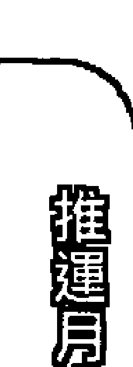

因此，只要专心一致全力投入决定现在要做的事，其他一切就交给老天爷。

#### 如何避免被浪潮卷入大海？

##### 一、快乐和喜悦

我们在生活中都有一些应付之道。当你觉得无法再忍受时，会做什麽？你会吃东西？阅读？参加派对？看电视？睡觉？当推运月亮在五宫时，你会有很多收获，这不仅是学会把更多的乐趣和喜悦带入生命里，还能学会分辨快乐和喜悦的差异。再提醒一次，如果想要放下一些阻止你真实活出人生的事情，最简单也最有用的方法，就是花更多时间做一些有趣的事。但是喜悦和快乐的差异在于，喜悦是永无止境的源头，但快乐是有极限的。

无论你想要如何表现自己，其中的喜悦是来自于能让你再次充满活力的行为，这可以滋养你的心，你的心可以重新为自己的人生充电。快乐可以让我们暂时提振精神，忘掉我们的问题，让人生轻松一点，别太严肃。但是快乐就像饥渴的痛苦消失之后，你只能服用更强效的药或乱塞一堆食物，这都只能维持一阵子，感觉比较像是“补充毒品”。当你重复一些行为替自己加油打气，若不是为了正确的理由，或来自正确的源头，最后只会觉得很空虚。过度耽溺不会带来喜悦，只会造成上瘾和麻木。这个推运周期的目的，就是要你改掉每次遇到“没办法再忍下去”的状况时，就找乐子暂时逃避，也是要你学习如何转换生活，才能更全面地顾及自己的所有需求。

当你进入推运月亮五宫的周期时，会发现自己更想单纯地找乐子，这是没问题的。但是你也必须留意，有些时候你会觉得一点也不有趣。

##### 二、只有工作没有玩乐

希望你能理解，这个推运周期不只是享乐，更是一种重新调整、重新找到生命的喜悦。这也是一种重新适应，学会必须在生活里留一些个人的空间，表达内在的自己，同时找到自信和自我价值感去这么做。在这段期间，你最亏待自己的行为就是忽略这股渴望。就像种子必须努力冒出土壤，向上生长。你在推运四宫的周期已经巡礼重访过自己的根基，现在你必须让自己种植在内心的东西冒出来欢呼庆祝，无论好坏与否。现在如果暂缓这股渴望，或是找借口不理它，像是不断解释为何必须保持生产力，或是说你没有时间，或是压根不想让自己太放纵享受，这股渴望不会消散。它就是不愿意消散，除非能找到出口。所以你要放松，把它列为必做事项！

##### 三、重点是旅程而非终点

这股创造渴望有时会造成反效果，因为你太注重结果，而不是创造过程带来的喜悦。我们有时会被负面的自我对话阻扰，在我们还没有意识到之前，这种自我对话已经把我们的信心和信念践踏在地。你只能靠著臣服于当下，才能解套。因为当你投入当下时，就没有时间想该怎麽做，没有时间去想一切够不够好？值不值得？或是别人会不会喜欢？你只是享受自己正在做的事。没有时间让自我的恐惧阻碍这个过程，最后才不会被困住。记得，让自己活在当下。

### 推运月亮在六宫
你工作的意义是为了什麽？

#### 转变的浪潮

> “唯有日复一日，你才能从此过着幸福快乐的日子。”
> ——美国科幻小说作家邦纳诺（Margaret Bonanno）

想要紧咬住某种坚实的东西不放。六宫是三个土象宫位之一，重视的是实际地亲自付出和参与世界（另外两个宫位是二宫和十宫）。关于这一点，最能获得认同的方式就是透过努力：最明显的是朝九晚五的任务，我们把这称为工作，或是一些比较不明显但也同样重要的任务，这可能是有酬或无酬的。基本上，你花时间做的任何事情，若就严格意义而言不是为了享乐，而是为了维持生活，这些事情就属于六宫的领域，像是去买新生活用品和打扫房子的生活差事，或是一整天奔波

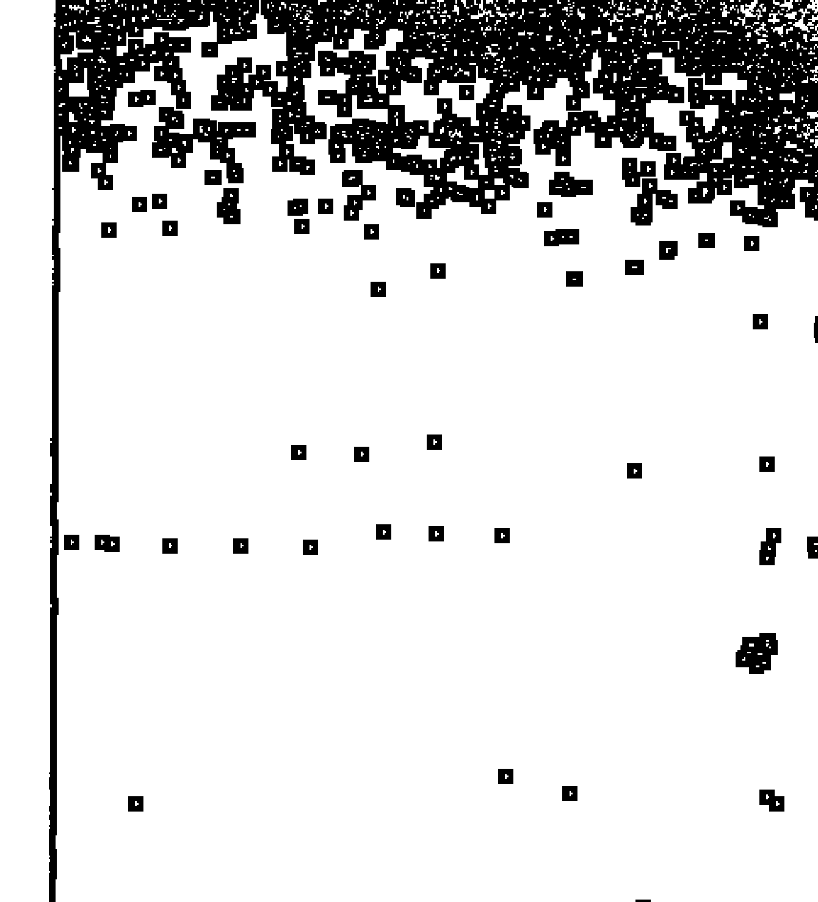

办好“亲爱的人交代的事”，或是在公司中努力上班。

很多人都为了生计工作，而这个推运周期会让我们把注意力放在有关工作的事，像是工作环境，是否喜欢目前的工作，或是发现正在做的工作的意义何在。有些人可能发现，这个推运周期一开始就是有更多的工作要做，一项任务会带来新的任务，整体会比之前更忙碌。这可能是你必须替同事分担责任一阵子，或是一个大型计画，这有可能发生在职场内，也有可能是在职场外。

六宫常被称为工作与健康的宫位，或是更明确一点，就是疾病的宫位。我们没有任何生命领域可以显示——因为慢性恶化或忽略导致的问题，还有身体健康的问题，特别是重大疾病。除了意外，大部分的身体疾病，都是因为数月或数年行为累积导致一个事件，严重到足以引起我们注意。因此即使是个人健康的问题，还是请你回头看看，你每天做到了哪些事或没做到哪些事，会影响自己的健康。如果你刚好在这段时间处理健康问题，不妨把时间和注意力放在维持健康规律的生活，这可能最能帮助你解决或处理这些问题。

在讨论推运的月亮时，你当然也要记得，月亮与我们的幸福有关。虽然生病有许多原因，但我们都知道一个人的情感状态，像是幸福或压力的程度，对于疾病的成因或形成都影响甚鉅。

既然健康是人生中很重要的事，这是一段最适合的时期——你可以关心自己的情感健康如何影响身体健康。

#### 真正的方向

一天一天累积会变成一个月。一个月接著一个月过著，就会变成一年。一年一年累积就会成为一辈子，而到人生尽头，你可能希望带着骄傲、满意和感激来回顾这一生。在推运月亮六宫的周期，你可能发现自己会更忙碌，必须应付更多需求，但这些事情的真正目的是要在这个周期结束之前，能回答自己一个问题：你每天花时间努力做些什麽事？为什麽？如果你这个问题是针对你的工作，而你的答案是“赚钱维生”，你绝对不会满意。不是每个人都很幸运，能做一份即使没有钱也愿意做的工作。但是在这段期间，你要是能思考一下，如果有选择的自由，你每天想做什麽事？这将能帮助你开始踏上正确的轨道。这个周期的重心是投入有意义的工作，而你必须对自己诚实，这会是哪种类型的工作。你的推运月亮通过的星座可以提供线索，让你知道哪种工作或工作环境最适合你。在这段期间，如果你对工作很有热情，就可能受到激励，想要有更多的发展。如果你对工作没有热情，就会对工作严重不满，因为这个周期会要求你针对这个问题做一点事。无论你是需要考虑一份完全不同的工作或职业，或者只是针对工作环境做点改变，现在都必须拿出行动了。

> 推运月亮

#### 掌控之道

##### 一、审核你的日常规律

当推运月亮在六宫的周期发挥作用时，我们常会发现自己面临越来越多的压力。生活会因为各种已知或未知的理由变得更忙碌，我们必须更努力工作，把工作时间拉长才能掌控全局。这通常是很艰难的时期，工作似乎永无止尽，我们几乎就要被掏空了，最后终于屈服，明白必须检视一下自己的行事历，制定一些基本规则。无论是什麽事情导致你走到这一步，都必须做这个动作。你要评估每天固定做的所有事，自问为何要做这些事，想一下是否有人可以帮你做，是否有更好的方式去做。你在这段期间最基本的 tasks 之一，就是让生活更有效率，但这是个很重要的任务，你要开始评估，即使必须规划一点时间做这件事！

##### 二、找一位导师

我们也可以从关系的角度看待六宫。这跟七宫不一样，七宫讨论的是人们在关系之中的和谐与平等感，六宫涵盖的是不平等的关系，但其中的满意度不亚于平等的关系。雇主与员工，老师与学生，都是典型的六宫关系。虽然这不适用所有人，但这推运周期也是一个好时机，你可以接受导师的传授。这当然可能是正式接受上司的训练，但你也可以接受一些非正式的传授。

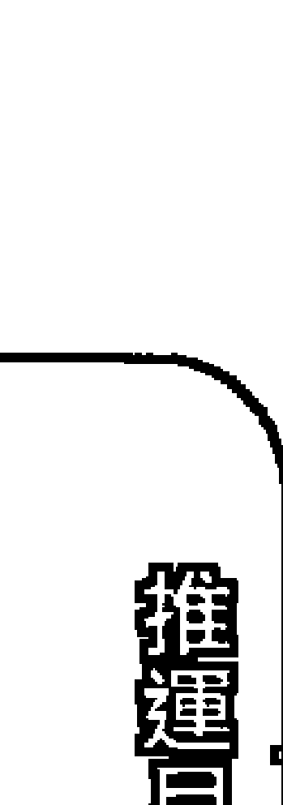

传授不只是训练，也是教导和指引。你是否认识某个人，非常擅长你想做的事？你在职场内或职场外，是否有尊敬或景仰的人？无论对方只是一起共进午餐的当地人，或是你在书里读到的知名大人物，或是一个可以把你当成个案、提供你建议的人，你现在都会想到这些问题，特别是如果你刚好想要转行或是朝新方向发展。你的推运月亮通过的星座可以告诉你，一位导师会如何帮助你。举例来说，你的推运月亮如果正通过六宫的宝瓶座，这时可能出现一位不走正统路线的导师明确地鼓励你培养独特的观点，这将能帮你建立信心。如果是通过处女座，你可能会感激一个人告诉你某个行业的规则和诀窍，告诉你明确的界线，替你指出一条可以遵循的道路，直到你觉得自己有能力制订自己的规则。

师傅和学徒的关系是永恒的。在古代，年轻人会接受长者的训练。这个概念到了现代，意义已不如往昔，也少了许多私人性质。你可能不是“被一个村子养大的”，这要看你成长环境的文化而定。网路让我们可以窥视彼此的生活，到了前所未有的私密程度，但也诡异地让我们比从前更疏离。一个人想要帮助你成功，同时还能喜爱并理解你充满热情的事，这种人对人、充满同理心的指导，是指导方针、行销文章或部落格建议无法取代的。再强调一次，传授跟师徒的概念是不一样的，学徒是一个人在某一个行业里，接受师傅的训练，出师后可以从事一份特定的工作。传授跟师徒当然是能并行存在的，但最重要的是，你要知道你并不是在追求工作的技能，而是在那个领域里面获得某个人的教导和支持，还有充满滋养的指引。

##### 三、在职训练

你也许已经准备好做一点更实际、更具体的事，就好像你正在当学徒。这其实代表：你会想要改善自己的技能或获得新的技能，你会明确地接受某个人的亲自训练，对方知道如何做到你想要学习的事（或是想要学习变得更好的事）。这可能是你准备找一份新工作，或是想要把旧的工作做得更好，或是想要学会一种你感兴趣的技能，你甚至不会因此获得酬劳，但你就是必须做好这件事，也想把它做好。在这段期间，你会寻找一些自我改善的机会，可能是实际脱离一个你不想陷在里面的工作环境，或是想要用另一种方式付出，觉得能获得更多的报酬。你的公司是否有提供员工任何训练计画或研讨会，可以帮助你更加认识你所喜欢、想要做的事？你可以到处寻找这样的机会，可以在网路上、在本地，或是透过已有的人脉。你可能必须自愿做更多工作，或是在晚上上课，诸如此类。但这会带领你到达你想去的地方，而你会很惊讶额外的付出竟是如此轻松。

##### 四、你就是一间公司

这里有一份工作是一个礼拜七天、每天二十四小时雇用我们。有时很容易领到薪水，有时根本领不到一毛钱。我们的报酬一定是根据我们的工作态度，还有我们花多少时间待在“办公室”里。想当然耳，我说的这份工作就是“自我发展”。当推运月亮在六宫时，我们有时会意识到自己的不足。这是很自然的，因为我们想要完成的事情并不能信手捻来，必须付出一点努力。在这段期间，你希望接触能带来喜悦的事。你要接受这些想法，根据这些想法累积努力。如果你喜爱自己的某些部分，就要尽力利用。如果你有想要的东西，渴望具备一些还未拥有的特质，或是不喜欢自己某些部分，此时你要卷起袖子，为这些事情努力。我们尽力做到最令人满意的工作，必然能回馈自己，而在这些努力的过程中，我们就是自己的老板。

#### 如何避免被浪潮卷入大海？

##### 一、服务或奴隶？

还记得前面提过不平等关系的概念，另一个与六宫有关的老旧概念就是奴隶。这在过去是非常实际的，包括你最后是否沦为奴隶，或是你和你的奴隶之间发生的事（如果你拥有的话）。如今在现实生活中，当然不太可能有奴隶的存在，不过还是有很多方法，让我们成为某一个个人或是某一件事的奴隶，彷彿我们毫无选择。当我们帮助他人时，的确可以激励自己，这似乎是人类心理的天性。大多数的人若是知道——自己做了某一件特别的事替别人带来改变，都会觉得很开心，即使只是一件小事。六宫也代表我们会有一股欲望，想要付出明确且有用的贡献。当你的推运月亮通过六宫时，你会有强烈的工作渴望。不过这将由你决定，是由你自己掌握方向，或是任由周遭环境来填补缺口。对你而言，参与和执行工作都很有意义，你可以不断解决麻烦，等待似乎永远不会出现的暂时喘息。这样说的目的是希望你不要太天真，你可能会觉得改变道路是如此困难，超出你的负荷，但你要从另一个角度思考，想一下你现在愿意做的这些事，可以确保你走到人生尽头时，觉得不枉此生。

> 推运月亮

##### 二、一肩扛起整个世界

在推运月亮通过六宫时，你会觉得日常生活的要求急速增加。我们的生活不会依照我们想要的方式区隔开来，所以当某一个领域的要求增加时，你很难应付其他所有的领域。推运月亮在六宫的周期，这个问题可能会以报复的形式出现。无论你只是做太多了，或是为了一些合理的原因去做，你都必须评估每天在做的事，还有这麽做的理由。我们最后常常加了一堆待办事项，却很少做出必要的删减。

你可能会有一些非常好、非常具有说服力的理由，解释一些导致你变成实际奴隶的行为。就像你需要钱吃饭，需要钱付账单，对吧？你也可能会说，就业市场已经不如以前了。或是你年长的父母需要更多关心，你的妹妹需要帮忙才能恢复正常生活，你的儿子需要关心，没有人可以、愿意或知道如何办到你现在做的事、你即将做的事，或是你知道如何做的事，诸如此类的理由不胜枚举。有些人长期让自己超出负荷，做了太多的事情，或是因为出自某种责任感或无可奈何，如果让这些事情失控，就可能出现警讯，提醒你这已经影响了你的健康。很多人只会渐渐累积太多要做的事，当我们没有真正地检视生活时，就会发生这种情形。如果正好有这样的问题，就要利用这段推运时期，删减不必要的工作，或是没有效率的过程。你要学习分配指派。在六宫的领域里，我们都是卑微的“小人物”，必须动手工作。但是即使是小人物，也不能所有事情都自己来！

推运月亮

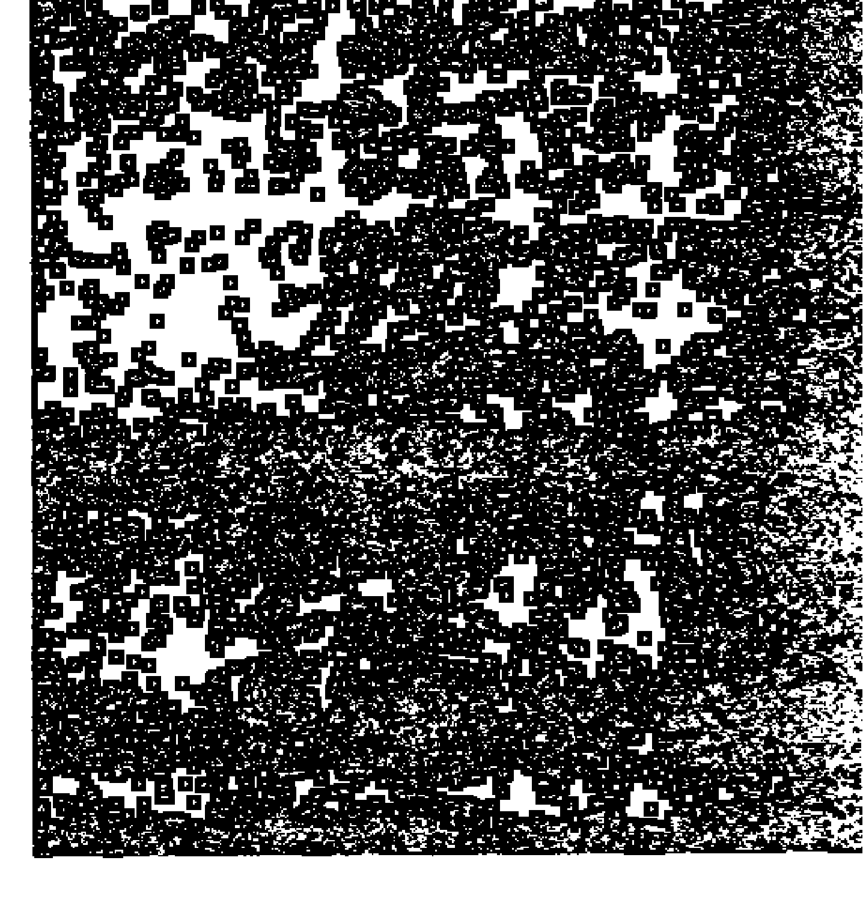

### 推运月亮在七宫
你适合怎样的人生伴侣？

> > “每一个朋友都能带给我们一个世界。在他们到来之前，这个世界可能尚未出现。直到我们相遇时，一个新世界就诞生了。”
> ——美国作家阿娜伊丝·宁（Anais Nin）

#### 转变的浪潮

在推运月亮六宫的周期，你已经评估过自己的工作状态，但其中一大部分应该也是在评估你自己。现在的重心转移到你生命中的其他人身上，这指的是对你有重要意义的人。你可能发现你更在意重要的另一半，这可能全都是他们的负面特质让你抓狂，或是他们很感激能在你的生命里占有一席之地（或是你表达感激）。“重要的另一半”，指的是任何你在生命中建立重要一对一## 推運月亮

關係的對象，這可能是你的親密朋友或愛人，甚至是商業夥伴。通常不適用於親子的互動，除非孩子已經長大成人，而你與你的父母或孩子之間的關係已有某種程度的平等。

在這段推運週期一開始，有些人就會面臨關係的改變，像是遇到新的人，或是與某個人關係破裂。這些狀況常常先在你的內心出現，但往往要等到你的伴侶說了一些話或做了一件事，顯示他們並不開心，也需要在這段關係中做點改變，你才會正面意識到生命中的關係議題。

我們在生活中都有些行為模式，無論是健康或不健康的，我們會重複這些模式，是因為我們可以用同樣的方式回應每一種狀況。這通常是不健康的行為模式，因為它們才會讓我們不快樂，引起我們的注意。舉例來說，你是否總是和不聽你說話的人變成伴侶？或是你永遠無法讓你的伴侶分攤家務？你現在必須檢視這些模式。

既然你正在檢視生活中的關係動力，你整體的社交活動也常會增加。不過這個週期關心的是一對一深入關係的動力。在這段期間，人們可能會進入或離開你的生命。你可能有一股單純的渴望，希望更常接觸到你愛的人，或是讓他們更親近你。但是在這段期間，也可能出現另一種相反的情形，你會覺得更寂寞。當你把重心放在關係上時，如果沒有一份重要的關係，就會產生欠缺或渴望的感受。如果正處在一段重要的關係中，但這份關係沒有合理地或不像以前一樣滿足你的情感需求，你依然會覺得寂寞。

#### 真正的方向

許多宮位會處理某些形式的關係，但是推運月亮七宮的週期，特別是要幫助我們認識我們與伴侶之間的平衡。在七宮的領域裡，我們學習如何與另一個人建立關係，但在這個過程中，你不能忘記自己，還要學習如何透過健康的妥協與另一個人和諧相處。在這段期間，你必須問自己，重要的伴侶或夥伴是否能滿足你的需求，如果不行，為什麼？你現在已經到達生命中一個臨界點，必須嚴肅看待你在關係中的需求，而這不只是一位伴侶身上得到了什麼，或是沒得到什麼。你也準備好當自己與一位伴侶建立關係時，你要意識到自己做出的選擇，同時為此負責，而這也包括你做了什麼或沒做到什麼來滿足自己的需求。我們的伴侶就是我們的鏡子，這並不是因為他們的行為舉止跟我們很像，或是他們應該變得更像我們，而是因為他們會透過行為，針對我們與他們互動時所做的事或沒有做到的事，給予直接或間接的回饋。在這段期間，你必須對伴侶誠實，特別是關於你自己，你要評估自己在關係中到底想要或需要什麼，而你必須如何做才能獲得滿足。記得，推運月亮進入七宮時，你應該思考任何投入大量情感的關係，這樣的關係必須是正視對方，至少必須是心心相映。

你的推運月亮在七宮時落入的星座，可以幫助你了解，你與一位伴侶之間失去了什麼樣的平衡。舉例來說，獅子座可能代表缺乏伴侶的注意或感激，天蠍座則需要伴侶更多強烈的表示和承諾。

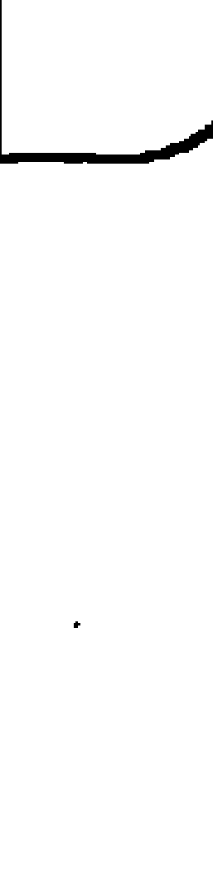

你可以分析本命星盤中的金星，這可以提供你重要的線索，看出你與他人建立關係的風格，以及你在關係中的需求。

#### 掌控之道

我在這裡的許多建議，重點都是要改善你目前的關係。但如果你沒有談戀愛，就要面對被寂寞包圍、孤立或感覺與他人失去連結的問題。這不是要討論你該擁有什么樣的關係，或是告訴你是否應該擁有一段關係，但如果你正在經歷推運月亮在七宮的週期，就會思考關係的議題。無論你正在認真地談一場戀愛，或是孤家寡人，下面這些建議可以幫助你檢視關係的問題。

實。這並不代表你的伴侶沒有給予你這些東西，但當你意識到不足時，就會開始注意自己需要從他們身上得到什麼。

推運月亮在七宮的週期，如果你特別關心生命中重要關係的明顯缺陷，伴侶關係的問題和議題就不再模糊難解。你要檢視缺陷的地方，找出原因。這不是要怪罪於誰，只是要你問問自己在促進與重要對象的連結時，到底做到了或沒做到什麼？你是否必須做出任何改變？你是否滿意現況，或是希望情況能有所不同？如果是後者，你能做些什麼帶來改變？

##### 一、找到模式

伴侶就像我們的鏡子。他們會反映我們的真面目，這是無法用其他方式看到的，因為我們無法旁觀自己，也無法客觀看待自己的經驗和臆測。如果你想知道當自己照鏡子時會是什麼模樣，就要找出關係中的模式。如果能辨識目前以及過去所有關係中的模式，這就會變成很重要的工具，可以幫助你看清自己如何不經意地導致關係中的不快樂。在這段週期，你應該花一點時間回頭檢視重要的友誼或愛情關係。這裡是否有一種模式？有時會有很明顯的模式，像是發現你常常吸引無法表達自己感受的伴侶，常常吸引年紀比你大很多或小很多的伴侶，或是無法對你許下承諾的伴侶，或是非常需要你的照顧的伴侶。有時你比較難看出模式，但要不斷地觀察。你可以寫下所有伴侶的名字，這能帶來一點刺激，幫助你思考。
你可能發現在幾段關係中有一些模式，也可能發現一些只出現在目前關係中的模式（特別是如果目前的關係已經維繫了很多年）。舉例來說，在目前的關係中，你會發現總是同樣的方式引起爭吵。無論你發現什麼樣的模式，所有狀況的分母都是你。這不是要你把問題怪罪到自己頭上，而是要你先放下責怪，只是要你試著看看，你是否可能在不知情的狀況下導致這些模式。當你能認清你的關係中的模式時，就能幫助你了解你做了什麼或沒有做到什麼，才導致這些模式不斷發生。你需要對自己用上一點調查心理學的技巧，才能找到答案。
舉例來說，為何有些人會一直吸引來總是需要他（或她）照顧的伴侶？好像他們自己總得得不到任何支持，似乎他們從來不會遇到運氣很差的日子或是從來不會崩潰似的，只有他們的伴侶會有這樣的遭遇，而他們必須替伴侶處理善後。我們的假設必須是合理的。我們暫時先假設可能有一個原因，因為對他們而言，這樣的伴侶有一些隱藏的好處，即使這只是為了避免恐懼或痛苦（情形通常就是如此）。每一種狀況都會有自己的答案，但這裡有幾種可能性。也許在上面這個例子中，答案就是這些人的個人價值，極大部分都是來自於當一個照料者，所以他們不允許任何人來照顧自己，這會讓他們覺得自己很沒價值或卑微。這也可能是他們為了保護自己，不在別人面前表現自己需要幫助，也從不讓別人照顧他們，因為這會讓他們覺得自己很容易受傷或很脆弱。這也可能是他們非常恐懼會失去伴侶，所以否認自己需要或想要任何東西，只是一味確保自己能提供伴侶足夠的照顧，讓伴侶永遠不想離開。就表面看來，好像是他們必須付出。但是從內觀察，到底是什麼原因促使他們繼續選擇這些行為模式，不去考慮其他方式？當你認清自己關係的模式時，你就能自己回答這個問題。既然七宮討論的是關係，還有伴侶如何教導我們認識自己，在這段期間，如果能找一位親密的朋友甚至是治療師幫忙，都是不錯的點子。他們就像一面鏡子，可以提供你很難想到的評語和洞見。他們也可以帶著同情且真誠地聆聽你的心聲，但不會評論你。在這段時間，你如果為了「壞的關係行為」懲罰自己，只會造成反效果。這會妨礙你看到必須知道的真相，你也無法理解該如何落實自己想要的改變。

##### 二、更新約定

當你在關係中使用「承諾」這個字時，意義非常複雜。承諾不只是你們簽下的結婚證書，或是透過握手和協議，鞏固你們在彼此人生中的地位，或是你們第一次一起做什麼事。承諾包括你們在選擇彼此的所有行動，包括當你的人生繼續向前時，隨時考慮對方的存在，這是每天都在執行的。不是要你不能有自己的人生和計畫，而是要你知道，你為什麼會被你選擇共度一生的人吸引，其中包括透過直接和間接的方式。很不幸地，我們常常在任何一種長期關係中看到這樣的情節：其中一個人有一天醒來，發現自己跟伴侶完全沒有共同點，或是已經跟伴侶漸行漸遠，或是成長已經超越了伴侶。在這段期間，你會思考部分或所有的關係，你可能會正式或私下考慮，是否要讓形形色色的人們留在你的生命裡。這段期間很適合做這件事，有些人可能不會考慮斷絕關係，但是考慮斷絕關係的人，此時應該更新你們之間的約定：你要讓彼此之間的約定跟上你現在的情感狀態，反之亦然。如果已經漸行漸遠，或是日常生活的忙碌讓你們失去了親密感，你要努力讓相處回到原本的循環互動。這可能很簡單又明顯的事，像是找時間兩個人單獨出去。這也可能是很細微的小事，像是問問對方現在好嗎？或是今天過得好嗎？你可以問一些問題，表示你關心伴侶正在做的事，還有他們的感受，你也可以講出自己的想法和感受。回想一下，在一個月或一個禮拜內，你有幾次是轉身面對他們，而不是背對他們？有時你必須恢復過去老套或隨手可得的親密感，缺乏更新，導致親密感開始慢慢消退。

##### 三、成為你想要擁有的伴侶

很多很多人都聽過，你如果專心成為你想要吸引的那個人，對方就會被你吸引。這種說法的確不假，不過成為你想要擁有的伴侶，這件事比聽起來更實際，特別是如果已經有一位伴侶了（再提醒一次，這裡討論的是任何類型的親密關係，不只是戀愛）。當你能認清自己關係的模式，同時更新你們之間的約定，你就已經準備好當一個更好的伴侶，因為這也能幫助你知道自己是如何對待伴侶。你是否曾經表現過希望伴侶展現的殷勤、仁慈和忠誠？或是總是怨嘆你得到的不夠多，為此怨恨伴侶？

當你能了解你對重要的另一半有什麼需求時，特別是當你沒有獲得滿足時，這可能就足夠了。別忘了有一句老話說：「一個巴掌不響。」其中一種方法就是更關心你的伴侶對你有什麼需求或要求，無論是直接或間接的，同時思考你能如何提供他們更好的支持。你要知道，你無法改變你的伴侶，但你能改變與伴侶的相處方式，藉此改變你們之間的節奏。

這裡有一個改變關係動力的真實案例。我有一位個案認為她的丈夫沒有聽她說話，或是當他在聽的時候，他其實對她想說的事情不感興趣。有時當她講話時，他甚至不看著她。他這麼做並非出自惡意，只是冷漠。這導致她越來越少跟他說話，特別是任何針對關係的問題。這代表她只會在無法再忍受下去時跟他說話。她會帶著積壓的挫折和受傷跟他說話，他們的對話即使充滿技巧，也很互相尊重，但永遠不會有任何結論。我在跟她談話的過程中，發現她覺得如果他願意聽她說話，她就比較容易講出自己的感受，可以跟他說所有事情，而不只是關係的問題。但是我也發現，當她想要說話時，他常覺得自己被算計了，很難跟上她情感的引爆點，而她總是太過激烈，讓他無法負荷。所以他很自然地不想跟她對話，免得導致問題浮上檯面。他們當時不只陷在長期保護自我的模式裡，也有不同的情感風格：當她腦中出現一個想法時，她很自然也很容易進入情感性的對話，但是他需要更多時間脫離自己正在想或做的事，才能跟她產生連結。

所以我的個案決定改變自己的行為。有一天，她回到家跟丈夫說，她想要跟他說一些事，請他在準備好的時候跟她在臥房裡談一談。他當時正在忙一個專案，所以大概花了十五到二十分鐘才進臥房。她也決定在談話一開始要有點耐心，給他時間轉換情感，才能跟她建立連結。她並沒有假設他的行為是因為他不愛她或不關心她，她也沒有陷入這是否公平的想法裡，一直計較自己必須先等他做一點事，再給予她值得的對待。她反而選擇表現體諒，還有愛和耐心。她也用一種充滿愛和幽默的態度跟他溝通。

這麼做是值得的。他們變得更容易彼此對話，即使是強烈或情感性的對話，結果是他們雙方都各退一步。這就像池塘裡的漣漪效應：無論是誰先採取行動，整個池塘都會感受到顫動，給予回應。她的丈夫可以忽略她的努力，但他顯然選擇不要這麼做，而她踏出第一步的力量，就創造了極為不同的結果。

#### 如何避免被浪潮捲入大海？

-   一、維持關係的平衡

目前關係中出現的許多問題，最終都與權力有關：誰擁有權力，誰沒有權力。推運月亮在七宮的週期，你更能意識到你從一位伴侶身上得到多少，或是付出多少，你會更注意一些——因為兩個人的自我之間的失衡導致的徵兆。當我們與一個人建立健康的關係時，我們會採納對方的意見，關心對方對於我們或他們的世界的感受，我們也會願意讓對方影響自己。你如果允許對方的意見壓過你的意見，或是你無法再分辨他們的意見應該到哪裡為止，你的看法又是從哪裡開始，你現在就必須解決問題了。

我們也可能出現相反的情形。可能是我們期望伴侶能繞著我們打轉，眼中只有我們。我們可能不會這樣形容自己，我們也可能真的不是如此看待關係，這裡的挑戰在於，我們可能期待這一點，卻不知道自己是這樣的。這可能表現在我們許多行為裡，其中包括不斷監視你的伴侶，無法與伴侶的不同意見、喜惡和觀點達成和諧。之所以會出現各種不同的問題，通常是因為不安全感、對你的伴侶缺乏信任，或是只是害怕失去他們。當這些東西被放大了，就會出現問題。如果你能發現根本的原因，對症下藥，將有助於打破失衡的模式。

當我們專注在一段關係上，把生命中的其他事物都擱在一旁，這也會出現困惑。這可能是一種脆弱的平衡，因為一段健全的關係必須是雙方在做出決定時，必須考慮另一半。你要是太看重關係，可能導致關係本身變成「主導的伴侶」。你如果只在意成為「某件事」的另一半，就無法成為一個完整的人。

##### 二、新歡

我曾經說過，當推運月亮在七宮的時期，你會檢視從目前的關係中得到了什麼、沒有得到什麼，可能在必要時做出切割。但是你也會希望自己能盡力而為，然後合理地確定這段關係或這個人不適合你。如果不了解自己的模式，也不清楚模式的源頭，可能導致你結束一段陷入僵局的健康關係，而你其實只需要一點關心和努力，就可以讓問題解套。只有你能決定你的關係是否值得拯救，或是確定關係已經惡化得太嚴重。但是如果太快採取行動，可能只會在一段新關係中遇到同樣的問題。再提醒一次，沒有任何關係絕對不值得拯救，當你深入檢視問題的源頭時，這將可以幫助你看清楚，這段關係是否要繼續下去，或是只要另尋新歡，找出決定的關鍵點。

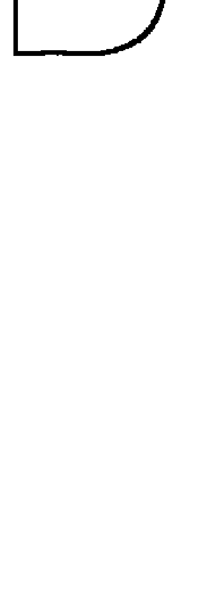

### 推运月亮在八宫
你最害怕的事是什么？如何面对？

> 「真相会让你自由，但它会先惹恼你。」
—— 美国女性主义者葛洛丽雅·史坦纳（Gloria Steinem）

#### 转变的浪潮

这个推运周期会以最深刻的方式，将焦点从「另一半」转回到自己身上。你可能觉得越来越沉重，生活似乎变得更激烈，而发生在你周遭的事都让你觉得既深切又严重。你会渴望退缩，这常常发生在推运月亮进入水象星座或宫位时，因为你的内心世界现在成了「行动」的场景。如果已经对肤浅的互动或只聊聊天觉得不耐烦，你现在不可能再安于现况。在这段时期开始时，你可能会遇到激怒你或令你不耐烦的事，只要给自己一点沉默和平静去处理自己的感觉，这些就能平息下来。

你的恐懼會更貼近顯意識的表層，這可能是很直接且明顯的，像是強烈的夢或惡夢，或是面對一些引起你不安的經驗或人。你也可能特別敏感，特別容易意識到生命的黑暗面。你可能會對新聞、揭露黑暗面的周遭環境，覺得既害怕，又深深為此著迷。八宮的首位星座和推運月亮正通過的星座，可以提供你線索，讓你更了解自己的恐懼本質和源頭。儘管傳統上將八宮稱為「死亡」宮位，但我們在推運月亮八宮的時期，討論的不是你自己或你愛的人的死亡。當然，我們也曾聽過在這段時間面臨死亡，但這時會勾起的是意識到生命本身和生命的脆弱。有時，想到死亡，會讓我們再次肯定活著這件事，同時也會讓我們思考必須做的事。當你一心想著黑暗或強烈的事時，這種反應一點也不令人意外。在這段推運週期，情緒化是很常見的也無所不在。你將會踏上一段情感的旅程，從恐懼到信念，然後再次回到原點。你的情感基礎似乎正在改變，不太穩定，而你也會隨之改變。你不是瘋了，但是當你經歷這些改變時，你會以為自己失去理智了。這並不全是壞事！在這段期間，你可能發現自己對周遭的人有特別敏銳的觀察力和覺察力。八宮本來就是天蠍座的宮位，這個星座最為人所知的就是透過具有洞穿力的見解，看到表面底下的真相。然而，這時你最有可能準備穿透的表面，就是你自己。你可能會意識到人生停滯不前的地方。儘管從外面看來，你並非一直靜止不動，但是你在內心會漸漸意識到有些事情真的需要改變，如果你已經困住了好一陣子，就會極度渴望能做些改變。

#### 真正的方向

波賽鳳（Persephone）是女神狄蜜特（Demeter）的愛女，她生著一頭金髮，象徵光明和天真。波賽鳳有一天在採花時，被冥府之王黑帝斯（Hades）綁架成為他的妻子。狄蜜特哀痛欲絕，也可能是因為忽略或報復，再也不允許萬物生長。結果放眼望去都是挨餓和害怕的人們向天神們哭喊，希望天神們能伸出援手。於是宙斯（Zeus）就派赫耳墨斯（Hermes）到冥府把波賽鳳帶回來。就在赫耳墨斯找到波賽鳳之前，黑帝斯騙了波賽鳳，讓她吃下幾顆石榴的種子，這讓她每年必須重返冥府待上幾個月。因此當波賽鳳與丈夫黑帝斯待在冥府時，狄蜜特就會把這世界變成悲哀的冬天。波賽鳳的另一個名字是戈蕊（Kore），這在希臘文裡代表「少女」或「未婚女子」。這個名字是源自於人們談到她被綁架的故事時，她在被黑帝斯「褻瀆」之前，就是天真無邪、可愛的表徵。這個故事有不同的版本，有的版本採用這種說法。就像許多神話一樣，波賽鳳被綁架的故事有些不同的變化，象徵不同的人生經驗。這個故事就像一個女人從少女變成妻子，再成為母親，她逐步展現自己的生育能力。在大部分的版本中，波賽鳳是在母親身旁被強迫帶走，被奪去童貞，被黑帝斯關起來。這個版本常被描述成悲劇，當波賽鳳被關在冥府時，可憐的狄蜜特和愛女分離。但是透過冥府這段旅程，戈蕊這個天真的女孩，才變成了冥府之后波賽鳳。

我們自己的冥府中有恐懼、失望、痛苦和無力這些黑暗的元素，但是冥府也是勇氣、力量、極樂和清晰的故鄉。在推運月亮八宮的時期，你必須走一趟波賽鳳走過的路，進入最深層的自己，進入冥府，那裡深埋著你過去的傷口和瘋狂的謊言。我們都有恐懼，這不只是人類經驗中共同的恐懼，還有我們在人生旅途中遭遇的個人恐懼。你會被害怕的東西困在深淵裡，而你可以從這裡重新找到自己最強大的意志力和最真實的力量。當你進入強烈的內心世界時，必須回答一個問題：你到底是囚犯還是冥府之後？

## # 掌控之道

### # 一、隱退、勇氣和治療

當推運月亮在十二宮時，你會發現小精靈們正在呼喚你進入靈性世界，這是一個魔幻的世界。但在八宮，你的惡魔正從冥府召喚你，而這就是你的潛意識、你的過去，還有你不可告人的秘密。應付這種瘋狂的唯一辦法，其實是違背本性的：你不能逃跑，必須願意進入冥府。你要安靜地坐著，不舒服地坐著。而當你感受到一層又一層的不耐煩、困惑和不適，甚至是恐懼時，答案就藏在裡面。

安靜不動地坐著，有時就足以讓恐懼浮現，因為這就是一個線索，會引導你發現必須知道的事。你到底在害怕什麼？第一個冒出來的答案可能不合理或者不全是對的。所以你要問問這底下藏著什麼，在那之下又藏著什麼，直到你觸底為止。你要召喚自己的勇氣，因為你可能正在尋找一個還沒有準備好或不想聽的事實，卻因此成為自己的俘虜。你要勾起恐懼和黑暗，追著它們跑，而不是讓它們追著你，這真的可以讓你找到出口，徹底脫離荼毒你的東西。

你現在正處於一個人生階段，正經歷情感的飢渴，隨時準備想要探索真相。你也厭倦了過去這麼多年像小孩子一樣逃跑，遠離你的鬼魂。即使這很令人害怕，但你已經準備好了，甚至是迫不及待想知道最後的結果。這就是你為什麼會覺察到生命中一些很強烈的事實、為什麼覺得自己需要隱退、為什麼會有恐懼感。你已經準備好根除自己的恐懼，你的心和你的靈魂正在向你揭露，幫助你完成這件事，即使你不知道到底發現了什麼，或是在一開始不知道原因為何。它們都是你通往自由的鑰匙。

##### 二、尋求支持

要是說八宮的經驗是要讓你從「別人」完全轉向自己的內在，這種說法其實不完全正確。在七宮時，你是要學習在生活裡妥協，尊重其他人的觀點。而八宮的旅程往往只是要我們在偶爾失控時，信任別人能支持我們、愛我們。除了你最親密和信任的朋友或是愛人，旁人的支持可能還不足夠。當我們進入八宮時，我們應付的恐懼會讓我們覺得很赤裸、很脆弱。你只能忍受你非常信任的人待在身旁。善意的人可能知道你正在「經歷一段困難的時間」，想要幫忙，但是當他們陪伴你時，你可能只會更沮喪。你需要夠堅強的人，他們要能聆聽你的心聲，只是一個旁觀者，不會被你的強烈情緒嚇跑。他們要能接受你的感受，而不試圖修理你或讓你感覺好過一點。這樣的支持者可以是密友、伴侶或治療師。如果你選擇伴侶，記住七宮的教訓：他們是你的鏡子。他們對你的反應，會讓你看到自己。

你，就像一片共鳴板，甚至在某種程度上還是一個沙包。因為你此時不只在處理自己的恐懼，還包括你的痛苦、仇恨和偏見，還有所有被視為禁忌、不能在輕鬆的社會氛圍裡談的東西。這些經驗可能會讓你認清自己生命中無法信任的人。

##### 三、死亡會帶來生命

稍早提過，我們常把八宮稱為死亡的宮位，這指的是象徵性的死亡。這是一種過程，放下一件事，讓自己成為另一種模樣。就像鳳凰撲向大火自焚，毛毛蟲被蛹包圍著，你也必須放下某些已經化為硬殼的自己，準備成長。死亡之後會出現轉化。推運月亮八宮的週期不只是要你嚇自己、要讓你憂慮或跳向陰影，還要你認清，你如果想要某個東西重生，就必須先經歷死亡。

你必須挖開的墳墓，可能是保護你的東西，像是一種防衛機制。這個機制培養的東西，曾經能保護我們避免痛苦，如今卻阻礙了我們的成長，導致新的問題。你要檢視到底在怕什麼？你認為無法面對什麼？當你預期自己要這麼做時，往往比實際上更可怕。沮喪、難過和恐懼需要找到方法發展成喜悅、開心和勇氣。當你消滅已經枯死的部分時，才能把力量留給活著的東西。

你的推運月亮正在通過的星座，可以幫助你知道——你現在必須面對、努力克服的恐懼的本質，也可以提供你線索，讓你知道擁有任何療癒自己的能力。舉例來說，如果是天秤座或巨蟹座，面臨的恐懼可能是失去愛人、讓自己被愛或讓別人看到自己內心深處，這也可能與生命黑暗面的醜陋有關，因為天秤座厭惡混亂和不公平，而巨蟹座害怕受傷和暴露自己。但是天秤座的內在也擁有一種工具，可以透過邀請並接受自己赤裸的一面，真實地搭起一座溝通的橋梁；而巨蟹座深知充滿愛意的雙手和聲音，有時可以治癒所有療法、藥丸都無法辦到的事甚至予以忽略。當天秤座能透過黑暗看到美麗，運用自己的創造力時，就能獲得慰藉；而巨蟹座在療癒他人，同時允許自己接受所愛的人的支持與滋養時，就能獲得安慰，即使對方並沒有「盡到全力」。

##### 一、迷失在黑暗中或紙上談兵

木星的重力相當於地球的二點三七倍，一個在地球上體重五十九公斤的人，在木星上可達到一三九公斤！但當你在推運月亮在八宮的週期穿越地下世界時，你可能會覺得內心的重力就像自己的體重一樣沉重。因為在這段時間，你正在分類爬梳情感的包袱，滿腦子都是眼前的事情，這會讓你的看法偏差。如果你太專注於自己內心或生活中的黑暗面，就可能覺得這暫時的沉重和困難已經超出負荷。你必須檢視自己、自己的人生、內心的恐懼和模式，才能面對它們。你可能會無法負荷自己的傷痛，或過度沉溺其中。在這段期間，治療特別有效，因為一位好的治療師就像你的導遊，可以在你經歷這段充滿困難的發現之旅時，幫助你找到地標，替你保管行李。你必須小心，不要屈服於失望，永久迷失在地下世界裡。你會找到出路，帶著遺失已久的自我踏上歸程。

##### 二、學習它或活在其中

有句老話說：「處理好自己的事，或是讓事情找上你。」心理學家榮格還有更令人感傷的說法：「當你無意識造成某種內在情境時，它就會向外化為宿命。」榮格讓我們對無意識這個概念有深刻的理解，他最具說服力的觀點之一就是「陰影」概念。這裡的「陰影」代表我們的無意識，因此也是我們沒有整合的自我。我們沒有融入生命中的東西，常會對外展露出來。

我的一位個案在推運月亮八宮牡羊座的期間，常重複地、憤怒地跟一位老朋友對峙，這件事在當時令她極度苦惱。當我問她如何回應這件事，她簡短地告訴我，她只是覺得很痛苦或很害怕。我在這本書提過，牡羊座可以透過對抗來發揮能量，無論是與別人或自己對抗，透過這麼做來發現自己的長處、勇氣、猛烈和原始力量。在這段時間，我的個案必須面對和整合自己特別的「陰影」，這個部分比她自己所知的更強烈，她必須為自己的顯意識生活找到這種原始力量。就像這個例子一樣，當時出現一種狀況，讓她有機會也必須捍衛自己，引導她找到自己力量的來源。你的推運月亮通過的星座，會幫助你找到隱藏在恐懼裡、等待被發現、等待融入你的人生的力量。

當一件事顯露於外，不代表這是你的失敗或弱點。當你能透過一個實際狀況，處理一些深埋在你內心深處、看不到的問題時，就能得到禮物。在推運月亮八宮的時期，繼續逃避和否認只會帶來反效果，所以更重要的是，你必須意識到「學習它或活在其中」這個原則如此重要。占星家霍華·薩斯波特塔斯 (Howard Sasportas) 說過：「否認只會把一件事推出你的覺知之外。你藏在地下室的東西總有辦法在屋子底下挖隧道，出現在你的草坪上。」

> 否認只會把一件事推出你的覺知之外。你藏在地下室的東西總有辦法在屋子底下挖隧道，出現在你的草坪上。

推運月亮在八宮的所有重點就是清理你的內心空間，重新找到你陷在恐懼和受害者行為中的部分自我。當我們踏上波賽鳳的旅程時，我們就走在兩個世界之間：一個是意識層面之上的純真光明的世界，一個是意識層面底下的世界，這裡有時很黑暗，但是蘊藏著豐富的真理與熱情。在這段期間，我們受邀到底下的世界巡一回，帶回天真與美麗還有勇氣與力量的智慧。

## 推運月亮在九宮
你對生命的信念是什麼？

> 「延伸後的心智再也回不到原本的次元裡。」
> —— 科學家愛因斯坦

#### 轉變的浪潮

你在經歷推運月亮八宮的沉重之後，最明顯的改變就是心情變輕鬆了。如果你做到了八宮的功課，已經把地下室裡的一些箱子清出來，現在少了一些情感的包袱，你就準備好把剩下的東西放進背包裡，走出來，看看外面的世界！有些人在這個週期一開始就會遇到某件事，讓他們覺得多了一點自由和彈性。在推運月亮八宮的週期，常會有事情改變，會有事物離開我們的生命，這可能只是某種情感包袱，或是實際的某個人。我有一位朋友在這個週期一開始，意識到他因為年邁的母親過世，覺得自己更自由、更能四處移動。他的母親一直跟他與妻子同住，非常需要照顧，導致他們幾乎無法同時離開家裡超過兩小時。他的母親過世時，他非常難過，之後發現自己非常渴望再次到處走走看看。他和妻子開始更常一起出門，他感覺自己在某種程度上，正在「重新發現這個世界」。

對你而言，這個推運月亮九宮的週期無論是以一場清除拉開序幕，或者只是已經受夠了一個週期時強烈的只說不做，你會再次覺得這個世界就像充滿可能性的遊樂場。九宮帶有一些射手座的屬性，這個星座的獨特運作方式就是移動、希望和擴張。你的推運月亮通過的星座可以提供你線索，讓你知道自己會在生命中呼吸到哪一種新鮮空氣，但有一件事是篤定的：你會想要動起來！

##### 一、迷失

如果你想要呼吸新的空氣，重整你的日常生活，最簡單的方式就是實際到別的地方。當然去一個喜歡的地方度假也會讓你重新充電，但你可能會很驚訝，自己開始覺得這樣的安排很無趣。你會厭倦生活的標準型態，而你參與生活的興趣也會降低許多，無精打采到一個你自己都無法容忍的程度。一個新的環境可能實在方便又實際的方式，讓你展開新生的過程。你有沒有夢想要去的地方？你夢想要去的地方是不是有點難以到達，或是有點令人害怕？如果是就更好了。你現在可以考慮去這些地方旅行，稍微擴展一下你的舒適圈，度個假，讓這變成更像一場探險。你可能驚訝自己很享受四周充斥著外語，享受在不熟悉的地方看到的景象，還有聞到的味道。當然，你的推運月亮目前通過的星座可以提供線索，讓你知道自己適合去什麼樣的地方。牡羊座可能很享受一段刺激的探險，而巨蟹座喜歡歷史懷舊之旅。

旅行並不一定遙遠的地方度假，也不一定要超出你走路能到、偶爾搭公車、計程車或騎自行車的範圍。當我的推運月亮經過九宮時，我發現自己想要到自己所居住的城市四處遊晃，完全沒有計畫，不經意地發現一些地方，才能吸收一些不熟悉的事物。我去了從未去過的不同市區。那有一種自由和可能性，因為我從不知道我會去哪，也沒有計劃，所以我可以讓眼中看到的任何事物進入腦海裡。

> 有句老話說：「換個環境，就換個心情。」

當然，要是說你只要旅行一趟就會變成不同的人，這似乎有些天真，但並非不可能。有時我們就是必須離開熟悉的事物，才能看到自己的內在。當你眼前沒有日常的劇本時，你會如何自處？你會如何回應新的環境？旅行的確可以促使我們重新發現自己。當你與新的環境互動時，你可能會運用一些很久沒有觸及的內在資源和想像力。這不是要你變成不同的人，而是更加利用和探索一些你已經擁有的內在資源。

##### 二、失去你的信念

在推運月亮九宮的週期，你可能開始質疑你一直相信的東西是否是真的。許多人在覺得能理解一切時，就覺得很自在，不過真理往往是非常難以捉摸又不斷改變的。當你開始質疑自以為知道的一切是否是真的，感覺一些信念被揭露時，你就會很難面對。你在這段時間必須用新的問題和答案，帶給自己驚喜。

九宮接在八宮後面是有道理的，這極有可能是你在八宮經歷的轉變，已經讓你改頭換面。而當你在揭露更多真實的自我時，你很容易也必然會覺得——目前或老舊的世界觀根本太狹隘了，太不切實際，無法支持你，也無法支持你在過去幾年對自己和生命的理解。當你在改變、學習認識自己時，必須讓自己的信仰和哲學觀跟上你打從心裡相信的一切。你必須注意並跟隨自己的興趣，特別是從未出現的新興趣。你要嘗試新的點子，在你還沒有接受之前，先不要妄下定論，即使你覺得有點不自在，或是這與你目前的生活觀或是非判斷看起來很不協調。這不代表你必須改變，只是必須在這時候考慮新的事物，因為你永遠不知道會在哪裡發現真理。

你的推運月亮目前通過的星座，可以讓你看清你試圖往哪一個方向拓展自己的信念，而你又會如何拓展。你的推運月亮如果正通過天蠍座，你可能需要徹底毀滅整個架構，才能從平地重新建構；如果正通過寶瓶座，就是要幫助你進一步知道，你比別人更清楚什麼才是適合自己的，同時允許自己脫離老舊的文化和家庭傳統，發現自己的道路。

##### 無所不知

我們很常有一種刻板印象，認為年輕時的希望都有些天真與理想主義，隨著歲月累積的智慧，則會有些憤世嫉俗，也不願意改變。不過無論我們是什麼年紀，我們都能不受限制當個萬事通。我們都聽過一句話：「重點是過程，而不是終點。」我們都能任性地閉上眼睛，把心封閉，麻木地從 A 走到 B 再到 C，不過這樣的過程沒有真正的目的，也不可能挑戰我們，不可能喚醒我們。然而，經驗是不斷進行中的事，不斷處於變動之中。除非我們能暫停活著這件事，否則經驗就會繼續塑造我們，還有我們的世界觀。

當你經歷過推運月亮九宮的週期後，你的外在生活可能沒有太大改變。你的人生觀、你對真理、家庭和自己的概念可能依舊一樣。在這段旅程中，你可能深化目前的哲學觀，更確信其中的真理，但你也可能離開老舊的想法，接受新的覺察。這裡的關鍵在於敞開心房進行探索。挑戰自己和固定的信念，代表你要放開自己，接受自己可能是錯的，或是可能得面對自己一直仰賴的東西，再也無法支持你。要你徹底拋棄自己的世界觀，這可能很恐怖，但是因為傳統而不斷延續的假確信更是糟糕。你要允許懷疑進入你的生活中，允許問題出現在你的腦海裡，允許自己的心透過沉思，針對必要的事物找到答案，這可能需要一些超出你目前所知的事物來伸出援手。就如一句古老諺語所說：「懷疑是智慧的開始，而不是結束。」

## 推運月亮在十宮
你真心喜歡做的事是什麼？

> 「生命的意義是找出你的天賦，而生命的目的是將它奉獻出來。」——美國導演喬伊·葛利佛（Joy J. Golliver）

當你進入這個推運週期時，十宮這個為人所知的「事業宮」不一定會帶來事業的發展。我們在十宮這個生命領域的重心，是我們在自己的生活裡和群體中扮演的角色，無論我們如何定義群體。當我們被賦予酬勞時，我們很容易知道自己的角色，但要是只把十宮想成事業，這就太狹隘了。我們做的任何事都可能是十宮的角色。十宮的角色包含丈夫、母親、活動份子、政黨人士、議員、地方女童軍代表，甚至是一「每年替社區烤出最美味餅乾的女士」！在這段週期，你扮演的角色會變得更加重要。有些人會在這段時間改變頭銜或多了新頭銜，無論這是因為工作升遷，或者只是因為生活類型的改變。舉例來說，我們很常看到人們在推運月亮在十宮的週期，升格為父母或結婚。

無論你是接受一個新角色，或是在評估你已經扮演的角色，你都會考慮這些到底適不適合你。你也許會想，如果必須放下一些角色，你接下來的人生要往哪裡走，你當然也會思考你到底如何走到這一步。十宮是你的星盤中的天頂、最高點和高潮。你必須站在山巔處，一覽無遺地眺望腳下的山谷：找到你出發的地方，還有下一步要去的地方。

#### 真正的方向

> 「如果追隨著內心的喜樂前進，你就踏上了一條一直在等待你的道路，而你目前的生活，就是你應該活出的人生。無論身在何處，你若追隨著喜悅的腳步前進，就能隨時在內心享受煥然一新的感受，還有源源不絕的生命力。
> —— 神話學家喬瑟夫·坎伯

「追隨你的喜樂。」基本上就是追求快樂，而這就是占星學裡月亮最了解的事。推運月亮在十宮的週期，你必須思考你生而為人的目的、你命中註定必須做的事以及你想要說的話，這都是你的天命。史蒂芬·佛瑞斯特曾把這稱為你的「宇宙工作的內容」。這不是要你思考，你有資格做什麼樣的工作，而是要你想一想，你渴望做什麼類型的工作，即使這份工作是無酬的。你也必須思考自己正在扮演的角色。你現在必須想一想，這些角色是否符合你要變成的模樣。你在五年前或十年前覺得很適合的角色，現在可能覺得綁手綁腳已經過時。你認為自己應該做的事，或是因為你的年齡、性別或背景所做的事，不一定你真正想要做的事。你如果一直為了任何原因「假裝」，現在可能會為此心情沉重。

#### 掌控之道

##### 一、精神性向測驗

職業性向測驗通常包含一堆問題，關於你的興趣、經驗和技術，這能幫助你整理釐清數百萬種選擇，幫你搭配你可能喜歡也很擅長的職業。推運月亮進入十宮，是要你思考——什麼是你真實的貢獻或必須做的事，但這是一個大問題，通常包括許多瑣碎的部分。你的整張星盤的每一個角落，都有線索揭露你的天命，還有你的心態和勇氣。即使你的朋友都能給你意見，告訴你你擅長什麼。但你這時要看的是你的精神履歷，而非實際的履歷。什麼是你為了樂趣做的事？你的朋友說你最擅長做什麼事？或是這其實是你經常在朋友面前扮演什麼角色？你是連結者嗎？聆聽者？還是滋養者？你有什麼嗜好？

我們都有一些與生俱來、未被開發的技巧和興趣，而當我們經歷這一生時，希望至少能探索並培養其中的一些可能性。這所有的問題都能幫助你——認清你天生的才華和興趣。再提醒一次，現在不是要你考慮你可能適合哪種角色模式，因為你已經因此得到很好的報酬，或是你已經有經驗了。現在你應該要思考你喜歡做什麼，你在做哪些事情時最有熱情。

##### 二、回到原點

告訴你一件事：大部分來我諮詢事業的人告訴我，他們不知道自己想做什麼。我們很多人只需要找到正確的方向，就能出發起跑，真正的問題在於我們不清楚方向。你會在許多宮位或星座的推運週期遇到這個問題，但在推運月亮十宮的週期，如果覺得沒有方向，就試著更簡單地思考。看看你是否能回答下面這三個問題：

- (一)如果你擁有你所需要的一切，包括技能、物質和金錢，你會做什麼？不要擔心現實，你可以荒謬地跳出框架。我丈夫的愚蠢答案是：「睡覺。」他也許指的不是真正的睡覺。但是你要允許自己有荒謬的答案。你正在試著打開隱藏在心中的可能性，所以要順勢而為。
- (二)如果你有一個人拿著槍指著你的頭，要你必須做一些事才能活下去，你會從哪裡開始？有時要強迫自己用更直接的角度思考，這有助於讓問題浮上檯面。我們沒有時間，也沒有閒功夫對一個計畫猶豫不決，只是批評，我們只能採取行動。你如果要在二十四小時內動身，找到你對第一個問題的答案，首先你會採取什麼行動？做個決定吧。
- (三)回想你的生命中真的很幸福的一段時光，特別是你在當時享受許多樂趣。你當時在做什麼？當時處於什麼生命階段讓日子這麼有趣？先不要想事業。如果是在迪士尼樂園覺得非常快樂，就把這列為答案，也不要省略明顯的答案，試著找到最後的答案。你生命中最美好的時光如果是跟家人去歐洲旅遊，把答案寫下來。無論這個答案是大或小，這些答案就是線索，你要先搜集它們。

##### 三、一切歸零

就算這些問題沒有答案，也沒有關係，再倒退幾步。我的經驗和想法是，人們的確知道他們想做什麼，但是有些東西會阻礙他們，讓這個答案無法用一種清楚的、有邏輯的或可辨認的方式，進入他們的顯意識裡。這可能有太多選項，或是你可能無意識地讓這些問題受限於現實的考量，像是金錢或技能，而不是考慮你喜愛什麼。你甚至可能在想到答案、把答案說出口之前，就先批評自己，你會認為自己想要的很愚蠢或沒有用，沒有人會重視你想做的事，或是為此付你酬勞。你也許只是想到——若是被迫承認另一條可能的道路，這樣的改變會帶來不安全感，就會覺得滿心恐懼。當我們經歷這種巨大的內心衝突時，腦袋會一片空白。無法回答這些問題時，不代表我們內在的聲音沒有出現，而是所有的聲音同時出現，其中一個最大聲、最令人困惑的個人論點，就會讓整個迴路超出負荷。你可以跟一位擅長把你拉出來的朋友聊天，甚至這本書後面的「建議閱讀」清單也能幫上忙。

##### 四、考慮自己當老闆

我以前很確定故事會是這樣演的：學習技能，應徵工作，被聘用，然後開始工作。如果沒有工作或沒有被聘用，我猜我的好運就用完了。當我們在等待一個人的贊同或允許，才能開始做自己喜歡的事，可能會不必要地等待很長一段時間。我不是在討論你要自己創業或被一間大企業僱用，我說的是更簡單的事。當然，如果你從來沒有上過醫學院，我不會建議你幫人動手術。不過當你想要一份工作時，只要固定參與一些相關的活動，你就更可能得到這份工作。

當我在許多年前第一次發現占星學的深奧時，內心點亮了一盞燈。幸好到處都可以看到關於太陽星座的介紹，我儘可能地涉獵接觸占星學。但當我知道占星學不僅限於太陽星座時，還有朋友身上練習印證。我持續這麼做，得到更多印證，閱讀更多的書，回應心中那一股想要知道更多的欲望。我這種很簡單的欲望變成經驗，然後變成我的職業，最後產生許多成果，其中包括任何領域的專業人士，都有類似的故事。

你現在讀的這本書。這就是我如何走到今天這一步。其實不只是我這樣，幾乎每個職業占星師或我的朋友們曾說過：「你如果很擅長一件事，就儘量多做！」他們這麼說是在開玩笑，但是我把這句話修改了一下：「你如果很喜歡一件事，就儘量多做！不要等待別人來僱用你，訓練你：你要雇用自己。你要學習、練習、做你喜歡的事，只為了做而做，很快就會發現有人需要你。如果你能追隨著自己的喜樂，工作就會來找你，它知道如何找到你，認出你。」

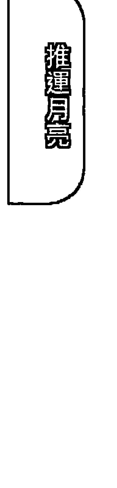

##### 五、衝向正確的道路

在這段週期，如果你很幸運地發現自己已經在正確的道路上，就可以充分利用這段時間來擴展你的範圍。這可能是一個獲得升職或達成某個明確目標的機會。你現在可能渴望別人能認可你的成就，這不只是獎勵你現在正在做的事，也是深化你現在的貢獻，鼓勵你繼續走在正確的道路上。在這段時間，不要降低你的目標，你現在必須讓人看見你正在做的事，讓它閃耀發光。你甚至要做一些更大的計畫！

##### 六、我是認真的

之前提過，推運月亮在十宮的週期，可能會把重點放在你的其他生命領域，而非你的事業。此時如果有一個理由出現，讓你必須考慮一個新角色，或是思考你現在扮演的角色，你要想像你喜歡自己呈現什麼樣的模樣。你可能會發現，現在是一個好時機，可以針對自己現在扮演或即將扮演的角色，努力清除所有相關的『應該』。舉例來說，一位新手媽媽可能會思考自己想要成為什麼樣的母親，努力演出其他人對於好媽媽的古老觀念。但是，她必須釐清她想要如何扮演這個角色，否則她只是在模仿別人，而非運用自己的智慧做這件事。一位新婚丈夫可能會努力成為一位...好的提供者，符合人們對丈夫的刻板印象。無論你身上被貼了什麼標籤，你要確定這非常合適。

沒有任何角色是只有一種演法。

#### 如何避免被浪潮捲入大海？

- 一、大牌

是否所有人都覺得自己在實踐一份特殊的天命？我不這麼認為，這可能是一個冗長到不可思議的調查計畫。不過我們很常看到人們想要實現一些目標，成就一份偉大的工作，覺得自己注定要做某件事，發現某件事，然後去執行它。這可能包括許多崇高的目標和無私的服務，不過十宮也有一些比較不道貌岸然的一面，就像是地位，或是想要成為圈子裡最大牌的人物。在這段時間，你想要獲得讚譽，絕對沒有錯，而我不是要警告你這件事。當人們欣賞你的工作或貢獻時，讚譽自然就會出現，你也會很自在地接受。你要竭盡全力地為自己歡呼，接受榮譽！記住，渴望覺得自己是很重要的，這會讓你覺得自己更出名、更特別或更受歡迎。不過，這就像是垃圾食物，味道棒極了，但無法持續支持你，最後只會覺得更糟糕。地位可能會悄悄地變成你工作的理由，而不是工作的額外收穫。當我們的動機是達到某種地位時，很容易走上錯誤的道路，而且會走錯很長一段路，因此受到傷害。當我們渴望覺得特別

- 二、受困勝過於迷路

有時覺得自己是號大人物，這種感覺實在太棒了。這會導致我們轉移注意力，不知道自己站錯了舞台。有時我們會接受一個角色，投入演出，讓這個角色成為自己的，同時塑造它，讓它更適合自己。不過有時候，無論別人認為我們有多麼適合做某件事，無論我們做得多成功，從中獲得多少名利，或是聽到：『如果拒絕這麼棒的機會，你就是瘋了。』某種狀況或角色就是不適合我們真實的本性。當然在這段時間，考慮你正在扮演的角色，評量它們是否能反映真正的你，這是很重要的事，但你也可能面臨『升職』的機會，無論是實際或象徵性的。我們乍看一位名人的生活，似乎很理想又完美。身為名人可以擁有所想要的金錢、名聲和機會，這不是每一個人都有的。但是缺乏隱私和遭人批評這些事，你其實並沒有辦法反抗，而且還會帶來其他問題。『每個人都想要出名』這種說法並不實際。我們很容易用比喻的方式列舉一些極端的例子，然後看到其中的缺點。但在日常生活中，我們常置身於同樣的處境，而當我們面臨真實的選擇時，往往很難拒絕一條明亮但對我們而言是錯誤的道路。當我們發現置身於某種處境，其中有任何人都想要的成功和榮耀，但這裡無法滋養我們的靈魂，也無法通往我們的喜樂，我們當然會覺得不快樂，還會覺得自己是個騙子，好像有人會發現我們其實並不屬於這裡。有時一種處境棒透了，讓我們「無法相信自己有多幸運」，我們就會有這種感覺。我們置身於錯的處境時，也會有這種感受，其中的差異就在於真實的快樂。「弄假成真」的信念在這裡就是不管用，因為問題不在於成功，而是真實。當你在錯誤的道路上越走越遠時，你可能會越陷越深，付出的越來越少，回報也變少。金錢或成功的形象能為幸福加分，但當裡面沒有幸福的種子時，就不可能創造幸福。

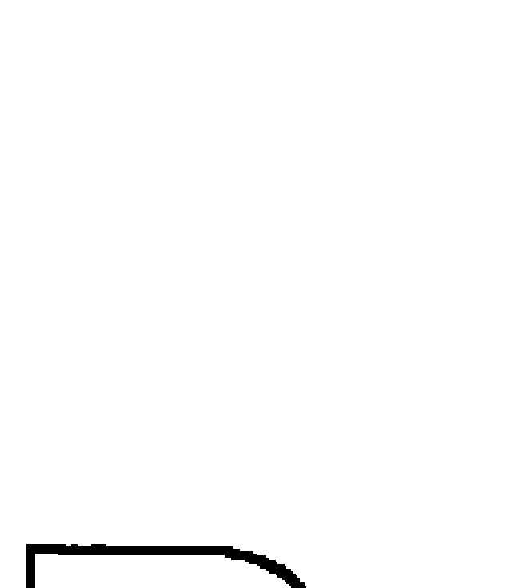

#### 推運月亮在哪裡是你心所歸屬的社群？

> >「我問上帝：『我還剩多少時間？』上帝回答我：『夠你做出改變了。」
>
> ——不知名作者

#### 轉變的浪潮

當推運月亮在十宮時，你需要專注在自己的成就和人生方向上，而在推運月亮十一宮的週期，你可以稍微延伸個人的使命，讓更多人看見，更多人知道。你可能會發現社交機會變多了。這可能是機會真的變多了，或只是因為你更留意這件事。大部分的人聽到「社交」這個字，就會想到朋友，但這個字的意思其實更貼近吸引目光和人脈連結，勝過於友誼。你的心已經準備好到「外面瞧瞧」，而大規模地與人互動就是主要的實踐方式。 你也会更注意，你的人生正朝著哪個方向前進。這可能是應人們或狀況要求，像是完成某一

#### 真正的方向

針對推運月亮在十宮，我曾提到一個醫生的例子。這位醫生很關心自己的工作、對病人的貢獻，以及在他的社群（對他而言就是醫界）的地位。當有醫界人士向他尋求協助時，他會付出精力和專業，表達對醫界的支持。但是到了十一宮的發展，他會開始找其他醫生分享筆記，體會彼此的難處，互相支持。在十宮，他在社群扮演的角色，就是社群對他的看法。但是到了十一宮，他開始照顧他的社群、他的社團，而他也能在其中獲得支持。在現代社會中，社群的定義已經與過去不同了。以前的社群比較像是你住家街頭巷尾的社區，或是你參加的小團體，帶有濃厚的地方色彩。如今，歸功於網際網路提供的虛擬連結，一個社群可能有來自世界各地、各種文化和年齡層的人們參與。不過社群能提供的支持並沒改變。在推運月亮十一宮的週期，你會問自己：「我屬於哪裡？」這不是家庭層面的歸屬感，不是個人根源的歸屬，而是社團的歸屬感，像是「我在這世界的立足點？誰是我的人、我的盟友、我的社團？」對很多人而言，社團就是一群人有同樣的目標和推運月亮目的，無論這是職業、政治或精神性的，諸如此類。你會想要找到跟你一樣的人，這些人可以用一種家人或朋友做不到的方式理解你。

你會渴望站出去，在這個世界找到一個立足點，這不只是接受，同時也包括付出。這必須根據你的性格來看，你可能慢慢想要有些改變，想要和別人參加一些人道團體和組織，積極地推動社會改變，或是促進針對某個目的的意識。這可能是小規模，也可能是大規模。你並不需要拯救世界，也不需要到國外照顧飢餓的孩童。這只是一種慾望，在這個時候，你需要與別人團結在一起，成為大我的一部分，而不只是小我而已。所以無論你們有什麼共同點，當你們朝著同樣的目標和利益前進時，你們可以互相付出，互相給予支持。

你常會在推運月亮十宮的週期找到基礎，足以在十一宮的週期時擴張成更大的社群。過去這兩年，希望你已經花一點時間思考你的天命，思考你渴望付出什麼樣的內在天賦，無論這是否能被定義，或是否能稱得上是「事業」。無論你是身為父母、藝術家、公關或任何身分，無論是否能同的慾望，或是需要你的天賦。

與別人站在同一陣線之前，必須清楚自己的方向。這個推運週期的部分目的是釐清方向。按照十一宮的角度，所謂認清自己想從人生中獲得什麼，就是看清楚在你面前開展的一條大路，而不是列出一張成就清單，或是列出一些你想要或需要的「東西」。你的夢想是什麼？你要先把達成夢想的想法放在一旁，你只需要先和夢想接上線。你現在會感受到「剩下來的人生」，需要先

#### 掌控之道

##### 一、延伸的人脈

接觸渴望的東西，然後才能朝它更進一步。至少要先有個想法，知道自己想要探索什麼，知道接下來想走上哪一條寬廣的大道。無論這是關於職業或個人性的，你可以開始與有同感的人、或是能幫助你邁向夢想的人建立連結。

即使有些人會說，這個世界正在「縮減」，但裡面還是住了很多人！在這段時間，你的目標是至少先盡量認識一些人，因為你不知道人脈會如何延伸。在推運月亮十一宮的週期，機會出現的方式就是——「我有一天認識一個人，他認識一個女孩的哥哥剛好在做你在追求的事！」你是否認為這有點誇張？其實一點也不。我就是在推運月亮十一宮的週期，認識一個朋友的朋友的朋友（沒錯，四層關係），他才是我必須一起討論出版事宜的人。透過他，我的書才能出版。

> 「我有一天認識一個人，他認識一個女孩的哥哥剛好在做你在追求的事！」

- 朋友
- 朋友的朋友
- 朋友的朋友的朋友

你要接受邀請，即使對方只是朋友的朋友，只要你有興趣——也許是對聚會的目的、或是對你認為可能在聚會裡遇到的人感興趣。這是是要建立一個網絡，大規模地與別人連結；這不只是朋友，更像是盟友。你可能很輕易就獲得邀請，但你也可以做一些事，更敏銳地嗅到機會。如果需要盟友，那就製作名片，把名片發出去，留意你最愛流連徘徊的地方的布告欄，看看是否有什麼新消息。

##### 二、完善的組織

朋友的朋友可以帶你認識你想要建立連結的人，但你想要的可能更多。大部分的組織，即使是大型組織，一開始都只是幾個人有一個共同的目標，想要一起努力，達成這個目標。這可能是要幫助需要的人，或是讓某個人當選，或是創造一個能聽見人們心聲的地方。你可以找一些推動你有興趣的事情的組織，像是一個全國性組織的地方分會。

如果覺得雞尾酒派對或與陌生人對話很無趣，那該怎麼辦？比起以前，現在有更多建立網路的方式，其中有些方式可以讓孤僻的人沒有壓力。你可以考慮網際網路，像是加入一個社交或商業網站，例如臉書。如果喜歡寫作，可以加入寫作網站，或是參與NaNoWriMo的活動。如果喜歡有機料理，可以參考像是「慢食」（Slow Food，網站slowfood.com）運動這種組織。這裡的重點是認清如果喜歡這件事，那麼當也有人做同樣的事情時就會有機會，而且透過組織規劃，就能擁有優勢，幫助你發現機會。你的興趣如果很獨特，就要開創自己的組織。

● NaNoWriMo代表National Novel Writing Month（國家小說寫作月）。這是一九九九年開始的運動，有超過十萬人參與，各寫一本小說。現在已經有一些社群支持。見http://www.nanowrimo.org/

推運月亮

##### 三、把愛傳出去

前面提過，這段時間是對身旁所有的人付出與接受，主動或被動地接觸人們。你會開始意識到，你是一個串連之中的某個連結，你做的微小改變，會在你不知情或沒有計畫的狀況下產生巨大的連漪效應。在推運月亮十一宮的週期，你要分享愛！你可以從中受惠，也可以促進人們之間的連結。所以你要付出愛，因為愛會回到你身上。你可能發現現在做的事，會在幾年之後獲得回報。但更有可能的是過去做的事，現在又回到你的身上。

不要以為，因為不認識位高權重的重要人士，所以無法提供任何東西。這跟認識重要人士無關，而是你可以透過任何方式，參與散播財富的活動。甚至只想捐錢給慈善團體或為某些目的當義工，透過這種方式可滿足你想要創造不同的欲望，這也是很好的方式，可以把愛傳出去。

無論如何，當我們討論建立網絡時，不需要很實際。這些比較廣泛的想法都是很好的建議。不過你只要保持一種精神，更常對外介紹自己，對一個陌生人微笑打招呼，甚至向別人求助，或是索取資訊。這麼做可以讓你更有機會，讓宇宙把你與外面的世界連在一起，幫助你找到自己的安身之處。

##### 四、操之過急

> 「你認為自己在這五年會待在哪裡？這輩子至少都聽過一次這樣的問題吧？當我們試圖想像

#### 如何避免被浪潮捲入大海？

出自己的下一步時，會問自己有什麼「偉大的計畫」。你在推運月亮十一宮的週期，這會變成一個非常相關的問題，與其問：「我這五年會待在哪裡？」不如問自己：「我這五年想去哪裡？」

這樣才能更意識到更長遠的路，還有其中的可能性。你可能想要列出一個逐步的計畫，朝一個特定的目標前進，或是只想要敞開心胸，允許自己做夢，這都要看你的推運月亮通過的星座而定。

你的心裡如果已經有一個特定目標，現在最好考慮自己的生活規律與日常活動，才能確定現在做的事，有助於創造一個你想要的未來。但如果不確定，你就要對周遭的世界和自己的內心伸出更多觸角。你要想一想，你有什麼白日夢，然後「認真地對待這些事」。如果能滋養一個「幻想的需求，幻想也可以變成事實。你現在要考慮潛力這件事，勇敢地做夢。

##### 一、活在當下和之後

現在必須思考人生更寬廣的方向，還有如何做到，但是思考未來和活在當下之間的界線非常微妙。這就是幻想和真實啟發之間的差異。在這段時期，如果只想著你的夢想和你希望的一切，但沒有對它們採取行動，最後只會很失落又無助。你不能只考慮務實或一直想著不可能，一手粉碎自己的夢想，務實當然是很重要的，但你也要避免陷在幻想中，然後只能看著夢想飄走。

想像眼前有一條長遠的路延伸，你要從終點開始往回推，直到接上你現在的立足點。即使你還沒有準備好實際列出必須採取的步驟，最重要的是對你這段旅程沿途的基本路標有些概念。這可以幫助你把一個夢想變成長期的目標。

##### 二、跑錯棚

在這段時間，你必須先了解自己，再找出自己屬於哪裡，這是很有重要的。有一句話說，沒有人敢說完全了解自己，這種說法也許是對的。不過當你要展翅高飛時，強烈的自我感可以幫助你保持務實。你要是還不了解自己，或是覺得還在學習，這並不可恥。若是如此，你還是可以在與大眾接觸時受益，即使你只是在釐清什麼不是你。但是如果指望一個更大的團體幫助你定義自己，你只會覺得比以前更迷惘，更看不到全貌。當你能充分利用團體的支持時，它只能加強你已經知道、已經想要的事，而不是替你補充核心的部分。

在推運月亮十一宮的時期，你會發現有越來越多的機會，與形形色色的人建立連結。最重要的是要讓自我認知、自己的夢想和程序，管理你向外伸出的手能實際掌握什麼，決定什麼時候說：這個推運週期的許多好處取決於接納的感受，你必須找到自己的歸屬才能覺得被接納，不過這必須是真實的，因為這其實就像一種支持。如果現在困在名聲或人氣的競賽裡，這在你真實的自我裡毫無立足點，你一開始可能會欣喜若狂，但最後只會情感麻痺。

> 「謝謝你，但我不需要。」

如果似乎找不到自己屬於哪裡呢？如果所有伸出去的手最後都是死路呢？如果覺得自己已經用盡所有可能性和出路，那要讓自己清醒。問問自己，你是否刻意避開社群，無論這是出自恐懼或是被大眾的意見控制，或是迷失在人群裡，或是你真的不喜歡團體。這些說法對你可能不適用，但是宇宙正在鼓勵你，給社群一個機會。這個世界可能會讓你驚喜不已，大開眼界。

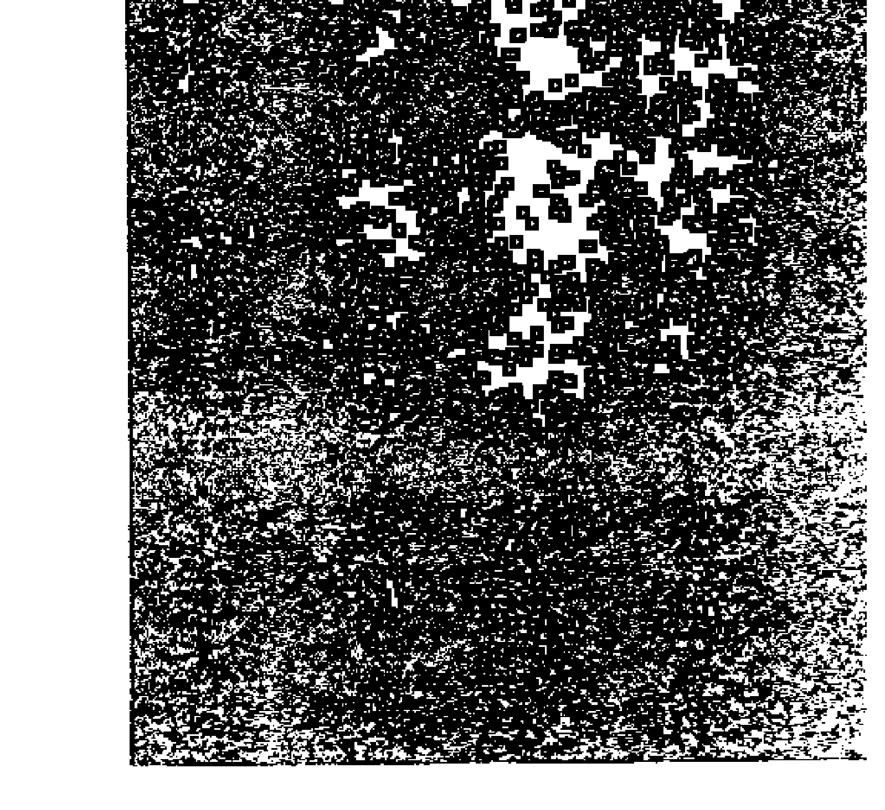

## 推運月亮在十一宮

斷捨離，預備下一輪的演化

> ——蓋爾·希伊 (Gail Sheehy)

#### 轉變的浪潮

你在推運月亮十一宮的週期，必須「站出去面對世界」，置身其中並建立連結。只要與周遭的世界互動，就比較容易找到答案，但你現在可能覺得找到的答案開始失去意義。你會覺得吸引你投入、激發你的目標感的東西，現在都有點像愚蠢的馬戲團或木偶戲。這不是說你一直在做的事，或是其他人正在做的事不重要，但是當你的內心世界再次呼喚你時，你會開始覺得與外面的戲碼越來越疏離。

有些人在進入推運月亮十二宮的週期時，會遇到一些事件，因此覺得失落又迷惘。這可能不是出於自願，就像失去心愛的人或重要財產，像是一個家。這也可能是出於自願，甚至是一件盼望的事，像是離開職場，回家和孩子相處或寫一本小說。

無論是不是外界環境促成這些事件，在這段時間，你可能發現自己變得更內向。外面的世界令你精疲力竭。如果不是體力上的疲憊，可能就是情感上，甚至是精神上的。你的內在自我似乎在說：「這一切是為了什麼？」當你擴展眼界之後，可能會失去方向，覺得困惑或心不在焉，無法解釋這一切為什麼會發生。你可能會發現自己更常「放空」或做白日夢。你的想像力或夢裡的活動似乎大量增加。你可能覺得像是飄浮在半空中，或是有一種永恆感，甚至是失去了時間感。

在你看來，任何的日常生活場景似乎都越來越沒有吸引力。推運月亮每次進入水象宮位時（也包括四宮和八宮），任何將你拉出內心世界，拉出你的家，把你帶進物質或社交環境的活動，都會讓你覺得精疲力盡。你越來越渴望能退出看似消耗或沒有意義的世間事，然後找一個安靜的地方：只是思考，休息，就這樣而已。

#### 真正的方向

蝴蝶湯

當蝴蝶還在幼蟲階段時，人們都稱牠為毛毛蟲。毛毛蟲主要的活動就是吃。牠在吃的過程中會越長越大，基本上只在脫皮或蛻變以適應成長。當毛毛蟲準備進入蛹時（許多人認為這是繭），牠會開始尋找一個適合的地點做這件事。當牠進入蛹之後，幼蟲的身體會開始瓦解，大部分都會分解。當老細胞死掉之後，死細胞的養分會形成新的細胞。

你在過去幾年，甚至是這一輩子至今，都在學習滋養自己，促進個人的成長。你一直在揮霍和搜集經驗，不過走到這一步，蛹已經在等待了。在推運月亮十二宮的階段，你會被要求能理解，你所有的經驗現在都已經達成目的。當你進入變形轉化的階段時，你正在消化這些經驗教會你的東西。當你在放下過去的生活，讓過去的經驗滋養你變成你的新翅膀時，就會像我的一位朋友曾經說過的「蝴蝶湯」，這種東西既不是毛毛蟲，也不是蝴蝶，而是介於兩者之間。

當你交出自己，信任這個生命過程時，目的就是要你放手。這裡的挑戰在於你要相信，你只會失去擋住你的路的東西，而不是真正需要的事物。我們都會習慣自己的行李，即使它很沉重，但生命有時會要我們搞丟託運行李，必須從新開始。這個推運週期是要你為自己的靈性需求排出優先順序，要你記得，對你而言什麼才是最重要的，讓你在清除干涉你成長的事物時，能把一切看清楚。

#### 掌控之道

##### 一、輕鬆打包

你是否曾被問過這個問題：「你的房子如果失火了，你只有時間抓住三樣東西，除了你的寵物和親人，你會帶走什麼？」推運月亮在十二宮談的就是這個問題。什麼是你最真實的優先考量？我們一直在扮演的角色，我們獲得的東西，有時會真的說服我們，這就是一切的意義。我們都會依戀自己的「東西」，但我們真正在意什麼？蛹的空間非常狹小，所以推運月亮十二宮的週期是要褪去和簡化，而且很多時間都花在放下一些事情，一些我們無法也不應該再付出精力的事。我們會開始意識到什麼才是真正重要的事。這不是業力的懲罰，也不是生命要向你證明你無法擁有想要的東西，而是認清有時候一些東西可能阻擋了你，讓你無法理解人生的目的。所以，就此放下阻擋你的東西。有些人甚至會採取實際行動，因此獲益不少，像是清掃屋子內的雜物。不過，這也是情感層面的放手。你的生命中是否有些人或活動不應該存在，因為這些只會讓你精力盡或分心，而不是支持你？你必須把注意力放在真正重要的事情，清理你人生的空間，才能做到放手。

> 我是在www.everything2.com中一篇由克莉斯汀·奧特威 (Christine Ottaway) 寫的文章，提到「蝴蝶湯」這個說法。

##### 二、聆聽呢喃

在推運月亮十二宮的週期，你會聽到自己內心的呼喚。在這段時間，你為自己做的最棒的一件事就是向內探索。你要允許自己有時間和空間做這件事。聆聽精靈們在你耳邊的呢喃細語，但不要把這當成一種奢侈享受。如果有辦法休養生息一陣子，或者只是在週末去森林裡走走，或是去泡喜歡的溫泉，那就去做，但不要認為這是唯一的方式。任何形式的隱退都能對你的心理狀態和情感幸福程度發揮神奇的魔力。這讓你看起來「無所事事」，因為社會要求我們把人生活得就像一場馬拉松。我們如果不生產，不達到目標，就沒有盡到本分。但我們不是無所事事，我們正在進行徹底的蛻變，而這是需要專注的！別忘了，即使是毛毛蟲都知道必須替自己找一個安全的地方。
無論你是否挪出空間，老舊的事物都會瓦解，讓出空間給新的事物。如果你願意合作，願意臣服於現實，知道自己正在改變，需要時間找到新的重心。那麼當你在規劃行事曆時，就要認真地考慮這件事，之後就會發現過程順利多了，也能在其中發現更多的意義。如果不願意合作，你還是會改變，但是沒有時間或空間去適應。你很可能只覺得很困惑、害怕或失去重心，只是等待著一切過去，期盼自己就能「恢復正常」。

##### 三、甦醒

這個推運週期不只是要讓你失去事物。失去身份認同或是之前認同的東西，這並不是懲罰，也不是目的，而是一種促進真實目的的過程，這就是一種靈性的重新排列組合。不要把這跟宗教混淆。宗教對有些人有用，但宗教只是其中一種機制，試著將我們的注意力放在神性，無論是我們內心或周遭的神性。所以如果去教堂或參加禱告活動，真的能成為你靈性回春的來源，那就要給出更多時間做這些事。你也可以做瑜伽、冥想或靜修，更常散步，做任何事情幫助自己進入更高層的意識，也就是所謂的「禪」的狀態。對有些人而言，這可能是靜心的經驗，但對其他人而言，這可能是興奮的經驗，令人震驚，彷彿被搖醒了。

這裡提到「靈性的重新排列組合」，主要是指所有讓我們記得自己是靈性的存在的事物，可以幫助我們超越用肉眼看到的一切，記得我們來到這世上是為了什麼，知道什麼對自己是重要的，還能幫助我們超脫世俗的經驗，這些東西讓我們太受限於肉身的次元。我不是要你離開地球，但是在這段時間，我們的腳步會更輕盈，因為比較不會受到世俗限制。我們的思想也會集中在更高層、更高層的事物上。對有些人而言，這就是重新調整腳步，與神達成和諧，最終就是與最高層的自我達成和諧。因此，你的生活可能看似沒有發生很多事，甚至有點罪惡感或笨拙，沒有對周遭的世界做出實際貢獻，但你的內心生活可能正在大爆發，不斷地深入，充滿靈性，彷彿萬物的源頭正在你的血液中奔騰，在你的腦海裡歌唱。這就是推運月亮在十二宮的禮物。

##### 四、懂得暗示

有人認為，你如果失去一種感官能力，另外四種感官能力就會加強。就生理構造而言，這種說法顯然不對。舉例來說，一個人如果失去聽力，他的視力不會馬上變成2.0，除非是天生的。不過，當一個人失去一種感官能力時，其他的感官似乎真會變得更敏銳，因為他會更專注在其他的感官上面，試圖去理解周遭環境。他會更善於充分利用其他的感官能力。你不需要喪失某種感官能力才能證明這個理論，你只要做這個實驗：坐在一個比較安靜的房間裡，閉上眼睛。你應該很快就開始集中注意你一開始認為不存在的聲音，甚至是聞到你之前沒留意的氣味。當我們聽到一段特別動人的音樂或聞到一種愉快的香味時，常會不自覺地閉上眼睛。當你自動關閉某種感官覺知時，你從別的感官吸收到的經驗似乎會變得更強烈，也更容易集中注意力。推運月亮十二宮的週期就是注重並滋養這種覺察能力。讓我們在肉體的感官能力之餘，再加上一些超自然的能力，像是直覺（內在的理解）和通靈。我們先把「通靈熱線」（Psychic Friends Network）這種老套做法拋在腦後。認清這種概念其實是要告訴你，我們還有其他的學習方式，還有其他的方式與世界溝通，像是這些超自然的感官。在推運月亮十二宮的週期，你可能發現這些感官能力被強化了，但你不注意，就無法從中受益良多。當你想像自己進入蟲繭時，會開始注意夢的存在，無論是醒著的夢或睡著的夢。你要更嚴肅地看待暗示，即使這只是指引自己的行。

##### 五、悲傷

澄清一下，在這段期間，你的人生不只是失去，你也不一定會失去某東西。不過，悲傷可能是十二宮經驗的元素之一，而我想在此稍做解釋。在推運月亮十二宮的週期，你的生活可能會實際發生帶有失去性質的事，像是死亡、離婚、失去財產或失業，也可能是你會有失去方向或是缺乏強烈重心的感受，無論如何，你都可能進入一段悲傷的時期，而你應該考慮接受支持。你也許只需要一點點支持，這可能就只是當你在試圖釐清千頭萬緒時，當你看不清所以然時，只要有你能信任的朋友更常過來找你喝茶或喝咖啡、陪你聊聊就可以了。但如果是被比較震驚或可怕的際遇引領進入十二宮的領域，最好考慮比較實際的支持，像是悲傷諮商。在這段時間，你的人生需要調整，而這可能不是輕鬆的過程。任何能幫助你溫和放手的事，都是不錯的點子，即使放手並不是你一開始的原意。

#### 如何避免被浪潮捲入大海？

##### 一、逃避主義和重生

推運月亮十二宮的時期，主要都在討論放下的智慧、暫時隱退和聆聽更高層的自我。這並非輕鬆的任務。你會很渴望隱退，而這股渴望有時可能會超出你的負荷。然而，找出靈性需求的優先順序、放下和聆聽內在的聲音，這些事情並不會自動發生。遠離塵世可以幫助我們清空自己，清除我們一路帶著導致我們迷失方向的東西，像是我們的壓力和恐懼。但維持清空的狀態只是走了一半的路，這聽起來就是一無所有。

你當然可以停留在一無所有的狀態一陣子。畢竟這個週期大部分與休息有關；你只要安靜地觀察周遭世界和內心世界，就可能非常療癒，而你可以開始學習看到我們一開始介紹過的「暗示」。不過，最終還是必須用某些東西再次填滿自己。在這兩年的週期，不要只坐著看電視，讀一些垃圾小說，或者只是覺得麻木、空虛或毫無目的。要找方法填滿自己的靈魂和精神，目標就是讓自己重生，重新恢復活力。如果只是試著逃避這個世界，逃避自己，絕望的感覺就會亦步亦趨跟著你。然而，如果真的是為了重生而隱退，將會感覺到與源頭結合的溫暖，也會出現新的目標感，即使這需要花上一點時間。

##### 二、對自己解釋

這段期間，你正在轉變，當你從另一頭重新出現時，也會變得不一樣。你的視力可能是一點零，不過蟲繭還不夠透明，無論視線有多好，還是無法看到自己的下一步。現在對你而言最重要的事，就是感覺人生的道路，這可能引導你走到某個方向，或是某些地方、某些人或某些活動，而你也無法解釋。這是一個流動又無法預測的過程，所以如果能安於不知道的狀態，這段時間就會比較容易，也比較平靜。你越是試著量化、控制或定義自己——或定義自己當下的遭遇，那麽當情節在一個月內改變時，你只會覺得更沮喪、更愚蠢。身旁的人可能希望你能針對自己發生的事，給一些明確的定義，或是給他們一個期限，保證到時你就會「恢復正常」，因為他們不想再覺得什麼都不確定，比你還不想！遇到這種狀況時，你會覺得不得不給自己一個解釋，但在情況允許時，你必須對自己、對別人誠實，卸下「恢復」的壓力。你現在就在正常的軌道上，只是腳步還不夠堅定。

##### 三、對抗浪潮

人們一講到「臣服」這個字，常會想到被擊敗，就像打仗輸了。不過，如果要讓推運月亮十二宮的週期變得很坎坷又困難，最快的方式是把它變成一場戰爭，讓自己開始對抗看不見的敵人。我們已經知道，這可能是一段失去的時光，你必須放下過去定義你和你的人生的東西。這些東西可能只是一種想法，但對你都不適用。你越是試圖阻止自己改變，就可能更困惑、更沮喪。你會開始覺得失控，這是因為你太努力保持控制。這裡的智慧在於，認清你有一部分正在改變，許多還不明確知道接下來會發生什麼之前，都會對放手某件事感到焦慮，但正是認清這個動作，可以在這時讓你感到平靜。就十二宮的意義而言，這就是臣服的美麗，這個過程不是要你放下控制，而是要你完全跳脫控制的問題。在這裡的屈服，只是與自己合作。

相信這個過程，讓自己消融其中。然後就會發現自己不是在結束，而是正在開始。

## 第三部 能量整合

本命月亮、推運月亮的相位說明

若需聯絡作者，請加微信 13814239921 或 022-51514155

## 月亮與本命行星的相位

### 何謂相位？

相位是占星術語，指的是一個行星與另一個行星的關係。一個行星落入的星座和宮位，只能描述這個行星的特徵，但相位不只如此，相位還點出星盤中任何兩個行星如何建立連結。這會暫時帶你回國中學的幾何學，但我向你保證，相對之下並不令人頭痛。我們要先知道，一個循環是三百六十度。你的本命星盤中每一個行星都有明確的角度。在一張星盤中，當兩個或兩個以上的行星與彼此形成特定的角度，像是四分相，就是九十度，或是三分相，一百二十度。當角度出現時，代表你有兩個部分是有關聯的，它們必須一起合作達成各自的目標。而這個相位的本質就能決定這些行星（你的這些部分）做到這件事的難易程度。

### 相位的詮釋：關鍵在於整合

通俗占星學裡，我們常認為某些相位是「好的」，像是三分相，其他的相位則是「壞的」，像是四分相。這是一種刻板印象，若是應用在現實生活的案例，就會有明顯的缺陷不足。詮釋相位有一種更有用、更正確的方法，這不是要看相位是好或壞，而是可以看出處理共同的能量時有多容易，或是多具挑戰性。「壞」的相位可能感覺不好，我當然不會假裝很好。但是我們的星盤會勾勒出我們的目的和最佳發展策略，而我們可以透過自由意志，決定如何在人生中演出這些能量。兩個行星產生連結，這只意謂著一個簡單的道理，我們需要透過發展這兩個部分的自我，認清這兩者如何互相教導。遇到最少抵抗的道路，或是我應該說覺知最少的道路，只會造成我們在通俗占星學看到的負面刻板印象。我們若是相信結果是好或壞，會嚴重傷害我們對人生的自主能力，也會嚴重影響我們做出決定，無法指引自己邁向正確的方向。

因此，與任何相位合作的關鍵，就是切記這是要整合自己的兩個或更多部分，有時最好的理解方式就是問自己：「行星 X 要教導行星 Y 哪件事？我如何融合它們的天生風格，創造出一種超越它們各自代表的結果？」

我們常會提到「舒適」相位，像是三分相和六分相。就整體而言，這反映了你的兩個部分會彼此互動，但我們通常不會發現，因為我們很自然會把它們的互動視為理所當然，認為每個人都具有同樣的能力。你的這兩個部分不會擋到彼此的路，反而會促進彼此的進程發展。舉例來說，火星代表意志力和行動，這可能協助代表溝通風格的水星，讓我們的聲音更有權威，更有力量，性格也更堅強。

四分相、對分相和五分相這些「困難」相位，則會反映出你的兩個部分在互動時的整體不協調。這有時是很明顯的，有時則是很隱微的。你的這兩個部分會擋住彼此的路，但它們這麼做的目的，是要你注意有些部分不順暢。兩個行星形成困難相位，代表你有兩個部分需要整合，才能帶出你最好的一面，它們如果各自運轉，常常會導致各自最糟的一面。例如火星與水星形成困難相位，你的挑戰就是沿著一條線走，讓你的腦袋和衝動可以互相合作，避免在毫無意義的發脾氣時管不住自己的嘴巴。當你一併留意這些能量時，將有助於疏導自己的欲望，讓欲望能透過思考的爬梳，帶來更平衡的反應。合相可能代表挑戰，也可能代表輕鬆，這要看形成合相的行星而定，還有你是否能自然表達這些能量。舉例來說，火星與水星合相，可能反映出你有快速思考的能力，但也可能說話太快或太具侵略性。對你而言，這兩種運作是不可切割的，但這可能是賜福，也可能是詛咒！你可以看到我們的每一個例子中，都把兩種概念結合在一起：你的意志力（火星）與你的聲音（水星）結合。主要的差異在於，若是要讓兩者以對自己有利的方式共同運作，到底是有多麼困難，或是多麼容易。

### 關於容許度

占星學中，容許度代表當一個行星與另一個行星形成準確的相位時，我們允許這個角度有多少多餘裕空間。舉例來說，在你的星盤裡，火星如果非常靠近冥王星，但不是準確地壓在冥王星上，我們仍可能把它們視為合相。不過，到底是多近才算近？關於這一點，每位占星師的看法不一，但通常是零到八度。所以火星如果是天蠍座十二度，冥王星是天蠍座十六度，這就是有四度容許度的合相。

### 移動的相位

當推運月亮在你的星盤中運行時，它會與你本命的行星形成相位，就像你本命的行星也會彼此形成相位。這裡的差異在於，由於推運的月亮正在移動，所以它與你本命行星形成的連結只是暫時的。當你的推運月亮開始靠近你本命星盤中的某一個行星，足以形成一個相位時，我們可以說它正在靠近或趨近這個行星，然後它會達到高峰（準確的相位），再來會分開，遠離這個本命行星之間的連結。

在一個人的一生中，正在趨近的相位（入相位）通常比正在分離的相位（出相位）更加強烈。這是因為兩個行星之間的趨近，代表一個人的生命中有某件事情正在建構中，就像是當你把腳放在一張地毯上磨蹭時產生的靜電。當一個相位趨近形成準確相位時，這股靜電就更有可能釋放在你的想法裡，或是你生活的事件中。當這兩個行星正在彼此分開時，能量正在放鬆，這可能是這個相位代表的問題已經過了高峰期，被免除了。當推運月亮與你某一個本命行星形成相位時，你通常會有三個月的期間，感受到這股能量的高峰狀態。

當你跟著月亮的腳步走，你的月亮如果與任何一個本命行星形成任何相位時，你就能更深入地理解你的情感需求，無論這是本命星盤裡的相位，或只是推運形成的暫時相位。你越了解自己的基本的情感需求，當你在利用推運月亮的挑戰和禮物時，你就越清楚這些需求會如何演變，如何成長。現在先簡單介紹這些相位，幫助你了解它們的基本意義，之後可能會針對每個相位再另做著墨。

### 月亮與本命太陽的相位

太陽是任何人星盤中的主要玩家。它代表基本的自我，以及滲透整張星盤和其中所有行星的熱力。這是一種建立身分意識的過程：認識我們是什麼樣的人，還有不是什麼樣的人。要是說我們的腦袋和心是截然不同又獨立存在的部分，這種說法可能不對，但也可能是對的，特別是在內心的衝突裡。當你的月亮與太陽連結時，你的心和腦袋並不如表面看來的分離。

當你在處理月亮與太陽的相位時，可能包括認識你生命力與健全感，如何與你的情感健康建立連結。你要認識你的基本特質中包括療癒者的原型，而當你的太陽與月亮形成困難相位時，你還必須認清——當你在連結兩種截然不同但又同樣強烈的內心歷程時，可能面臨哪些挑戰。

當你的推運月亮與本命太陽形成相位時，你正在經歷的情感轉變，可以讓你有更清楚的自我認同和健康的自我意識。你的推運月亮與太陽形成的困難相位，可能讓你覺得自己很笨拙或無法確定自己。你還可能覺得之前能幫助你的老習慣都有缺點了。不過如果是形成舒適相位，將能加強你對自我的感受。

### 月亮與本命水星的相位

水星代表我們的心智過程，像是我們如何思考和學習，還有各種形式的溝通。這代表我們的心智的運作方式、如何與人溝通自己的想法的渴望，以及從外面蒐集新資訊以滋養我們的心智。當水星與月亮產生連結時，你的挑戰就是整合你的心智過程及情感過程。你必須學習溝通自己的感受，像是創意性的詩或藝術的表達，透過清楚表達你的情感需求和經驗，揭露你對人們的感受。如此一來，你也能更徹底地覺察自己的情感歷程，這可以幫助你認識自己。

你在運用本命盤水星與月亮的相位時，過程包括認清你的直覺在經驗和觀察中扮演的角色；利用口頭或書寫的方式清除並貼近自己的感覺；學習用某種方式表達自己的情感，幫助自己被聽見、被理解；知道在什麼時候用什麼方式表達你的感受，什麼時候又不該這麼做；同時學習分辨你的感受和想法之間的差異，但仍承認你的心和腦袋必須合作。

當你的推運月亮跟本命水星形成相位時，你正在經歷的情感轉變，幫助你更看清自己既有的認知和意見。你可能遇到一些有關個人意見的問題，像是你為什麼要表達、如何表達，還有哪些時表達（或何時不表達）。推運月亮的困難相位代表對於自己的想法和想要說的話，你必須努力釐清其中的不確定或困惑，而舒適的相位則代表你很容易表達自己的想法。

### 月亮與本命金星的相位

金星代表聯繫的過程，無論這是與另一個人、某個物體或自身之外的經驗，像是當我們參與創造或愉悅的過程時，會有什麼樣的感受。金星代表我們渴望感受與某件事或某個人建立連結。

當金星與月亮連結時，你會有一種基本的情感需求，希望在生活中建立一種和平與和諧的感受。

月亮與金星的星座與宮位都能幫助你找出最好的方式，這可能是激烈坦率地面對你親近的人，或者只是擁有一個可愛溫暖的家。人際關係的和諧和建立關係，能帶給你多少滿足感，必須考慮這兩個行星落入的宮位和星座。無論如何，你的幸福是來自於一種與某個人或某件事連結的基本需求。

你在運用本命月亮與金星的相位時，過程包括花很多時間由內到外美化你的家；需要確認你對別人的感受，這可能是健康或不健康的；渴望透過創造性的方式表達自己最深沉的情感；很難忍受缺少一段重要的關係，或是過度任由別人來決定你的自我價值。

當你的推運月亮與本命的金星形成相位時，你正在經歷的情感轉變，能幫助你更看清你在目前關係中的任何問題，或是與聯繫有關的整體問題，包括你的一些行為妨礙了你建立健全的關係，或是導致你孤立。困難相位可能會為目前的關係帶來衝突，因為你知道自己的一些成長，正在改變你與別人的連結方式。舒適相位可能會更凸顯你的關係可以如何支持你。

### 月亮與本命火星的相位

火星代表我們的欲望、我們如何追求欲望、我們的意志力，還有某種程度的力量。當你的本命火星與月亮連結時，你正在學習心的勇氣的功課。這種情感的勇氣不只是表達你的感受，同時也是探索你擁有情感需求和感受的基本權利，學習在侵略與被動之間找到一個對的位置。這兩個行星的宮位與星座可以告訴你，你必須用什麼方式確立甚至捍衛你的需求。你也正在學習如何擁有這份勇氣。

有健康的冲突，特别是在你的个人和家庭生活中。

你在运用本命月亮与火星的相位时，过程包括采取真实的行动，获得心里想要的东西；认清能带给你真实快乐的事物，而这与短暂的欲望是对立的；学习自由地感受和表达你正在感受的一切，不要受限于你是否值得这么做；你到底是要在拥护自己的情感需求时，把自己的需求加诸在别人身上，或是让别人把他们的需求强加在你身上，你要学习在这两者之间取得个人的平衡。

当你的推运月亮与本命火星形成相位时，你正在经历的情感转变，会让你更认识一系列的问题，从让你害怕的事情，像是如何处理冲突，到你如何追求想要（或不想要）的东西。困难相位意味着，你试图厘清如何带着力量前进时会有挫折或无力感，舒适相位则会让你充满生气，引出你的激情和热忱。

### 月亮与本命木星的相位

木星代表我们渴望发挥自己的潜力，透过接受机会甚至是冒险，促进个人的成长。这也代表我们迈向内心和生活过程的信念之旅，沿路将有意料之外的发展和令人兴奋的可能性。无论你的木星和月亮形成困难或互相帮衬的相位，你都会充满乐观的态度，因为当你觉得可以找到某种可能性时，你就会更快乐。月亮与木星连结的本质，就是提醒你，当你渴望摘下天上的星星时，脚踏实地是多么困难的一件事。

你在运用本命月亮与木星的相位时，过程包括认识正面态度的真实力量；愿意在没有保证的情况下勇于尝试；应付夸大的情感反应；学习什么是足够；认清信心在什么时候变成过度乐观；学习分辨信念在什么时候变成自负的确信。当你的推运月亮与本命木星形成相位时，你正在经历的情感转变，会让你更深入看清楚，如果你相信人生，对自己有足够的信心尝试某件事，你的人生会有什么样的际遇。如果是困难相位，你很难理解自己什么时候是眼睛大胃口小，换句话说，你很难理解在什么时候会很容易天真地追求一些东西，你以为非常想要这些东西，但并不尽然。舒适相位可能会让你更容易控制自己的热情，追求目标！

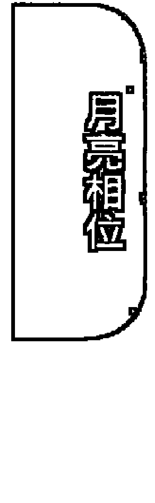

### 月亮与本命土星的相位

土星代表透过承诺和努力，培养自我纪律和自尊的过程。土星就像是一个接触点，一边是我们想要的或梦想的东西，另一边则是实际地让这些东西化为形式，这也是把愿望化为现实的接触点。当土星与月亮连结时，这与感受或确定你的情感比较无关，而是更上一层楼，问问自己：针对你的感受，你必须做到什么？这个过程甚至与你的感受无关。即使土星与月亮的星座带有比较自然坦率的风格，你天生的本能就是控制自己，不要失控或感情用事，不会在任何情况下忽略现实考量。这里的Key不是压抑你的感受，而是为这种感受、你针对这种感受采取的行动负责。当你在运用本命月亮与土星的相位时，过程包括学习允许自己正视情感这件事，不要强迫自己把情感合理化，不要不把情感当一回事，认为这是没有意义的。你还要了解只是渴望或怨叹某件事，不会造成任何不同。你必须在限制之内努力，即使有时是在限制的边缘努力，不要觉得自己已是受到环境和某个人的迫害，导致一切看似毫无希望。要为自己想要的东西负责，为自己愿意努力的事情负责，而这可以带来健康的自我权威感。

当你的推运月亮与本命土星形成相位，你正在经历的情感转变，可以让你更清楚看到，当你想要达成一件事，当你只要持续就能做到一件事，到底是什么阻碍了你。困难相位代表你更难保持信心，而你会小心翼翼。不过，不要在真正尝试之前就说服自己一切毫无希望。舒适相位会让你觉得更容易下定决心，但不要把这视为理所当然！

### 月亮与本命天王星的相位

天王星代表我们通往个人性和捍卫自己的道路，这是根据我们发自内心深处的真理，而不是国家、文化、家庭和朋友对我们的期望。当你的天王星与月亮产生连结时，你会发现你对事情的本能情绪反应与别人不同，或是不同于「正常」人对任何情境的反应。即使其中有水象星座的元素，这通常会强化同理心的特质。月亮和天王星的连结，就像是你的心有一层薄薄的隔离，让你有时可以抽离令人无法负荷的感情需求。这种呼吸的空间可以让你确立自己的需求，不用顾虑别人认为你应该需要或想要什么。

无论天王星和月亮落在哪一个星座或宫位，月亮天生就想要滋养、感受和连结，而天王星天生就想要独立而行，感受自由。所以当你在运用天王星与月亮的相位时，必须学习在接受或付出爱的同時，避免因为滋养造成过度依赖，也要学习如何分辨真实的欲望和自然反应的差异，后者可能导致毫无方向、造反的行为。天王星的相位都有某种程度的不确定性。你可能说风就是雨地来场情绪小爆发，快到连你自己都跟不上。

当你的推运月亮与本命天王星形成相位时，你在经历的情感转变，会让你更仔细地观察你是否活出了自己的人生，过自己想要的日子。困难相位会勾起你的抗拒感，或让你思考自己的权利，这可能正好是你需要的，但也可能会毫无意义地乱发脾气，招致他人攻击。舒适相位代表你会一直把部分的自我长时间地搁在一旁，不去碰触。

### 月亮与本命海王星的相位

海王星代表我们与神性的连结，无论我们把神性定义为更高层的自我、神明或宇宙本身。这代表我们在体验一些生命事件时，最容易让我们进入超然的状态。当你的月亮与海王星连结时，会凸显你的同理心和情绪的敏感度。通俗上占星学通常把有这个相位的人称为「灵媒」，但是这个字可能会令人误解。超自然的能力不是读一个人的心或预测未来的能力，而是某种程度的觉察能力。这存在于逻辑和可以验证的世界之外，所有人都拥有这种能力。你渴望体验神性，体验一种纯净的爱，这可能很难从这个世界中得到，但你会发现自己天生就很容易在所有状况和人们身上看到这种神性。

当你在运用月亮与海王星的相位时，过程会包括臣服、信念和相信更高层力量（无论你把这称为神、本源、宇宙或任何其他名字）；当你带着敞开的心在世间游走时，要适当的保护自己；当你的情感期待和现实状况产生冲突时，学习处理幻灭的问题，无论是在生活、工作或关系中。

当你的推运月亮与本命海王星形成相位时，你正在经历的情感转变会让你更深入了解，你的眼光需要超越周遭环境，同时发现超越这个世界能够给予的启发和目的。困难相位可能让你更容易陷入无力感，不过与受害者心态相反的臣服态度，可以减轻你的挫折感。如果是舒适相位，你更容易运用现在试图接受的启发。不过无论是哪一种相位，你都要学习放手，允许自己接受指引。

### 月亮与本命冥王星的相位

冥王星代表管理双重欲望：渴望听见、理解并接受一种令自己害怕的真相，同时又渴望逃离它、埋藏它，保护自己对抗它。我们会跳过所有潜意识情感的圈套，避免面对自己的恐惧，但这是如果我们坚持这么做，就会错过了在这个领域中收割成果。当我们能放开自己，勇敢面对时，我们就能把为了逃离恐惧耗费的情感能量，全力倾注在一些能给予我们最深層的目的感、启发我们奉献的事物上面。

本命冥王星与月亮的相位，可能与滋养和信任的议题特别有关，无论这是因为童年早期没有获得需要的滋养时造成的伤口，或是重度背叛在心里留下的伤痕。冥王星象征我们内心一种没有尽头的需求，月亮则代表我们能获得安全感的事物，所以这个相位意味着对身体和情感的安全感，有一种永无止尽的恐惧。当我们要运用本命盘中的冥王星时，一定必须在某种程度上面对自己的恐惧，允许自己被过程转化。我们必须看月亮和冥王星的宫位和星座，才能判断恐惧的本质及周遭环境，这也能看出恐惧出现及摆脱恐惧的方式。

当你的推运月亮与冥王星形成相位时，你正在经历的情感转变，可以帮助你看得更清楚，知道你必须在哪些生命领域里——努力放下自我破坏和出自恐惧的行为，而你目前已经到了一个情感阶段，准备好这么做。困难相位可能会像是把你推进最深的恐惧里，舒适相位则会让你比较容易觉得是自己的选择。两种情况都需要召唤你的勇气，还有你对自己、自己真实的恐惧和动机的觉察力。你已经准备好了，比你自认为地更有能力去面对这件事。

### 月亮与上升点（以及下降点）的相位

上升点与下降点代表你的本命盘中一宫与七宫的起点，也代表自我与关系的范畴、你天生的观点与风格，以及你对待生命中重要人士的观点与风格。这两个宫位处理的是关系中的健康平衡，同时也要符合你的个人需求，对你自己的生活保持理性判断。

因为上升点和下降点就像一条轴线，而不是跟行星一样的独立的点，所以它们与月亮的相位就会涉及这两个生命领域。当你的本命月亮在这些生命领域扮演重要角色时，你的幸福无疑是来自在自己与别人之间建立对的平衡，同时针对你对关系的渴望，以及你对个人计划的风格和权利，在这两者之间取得平衡。

当你的推运月亮与这个轴线形成相位时，你正在经历的情感转变，可以帮助你更仔细衡量——到底是要过自己的日子，付出的代价就是你生命中的重要关系，还是要妥协太多，以换得关系的和谐；这个相位可以帮助你学习如何在两者之间取得平衡。如果有任何失衡，你现在的感觉就能凸显可以用來纠正失衡的工具。困难相位可能把冲突搬上台面，强迫你必须在某个时刻处理这些问题，舒适相位可能比较像是邀请你做一些预防性的维护。

### 月亮与天顶（以及天底）的相位

天顶与天底代表你本命盘十宫与四宫的起点，也代表你最私人的面貌和环境，以及公开自我之间的范畴。四宫通常代表你的内在生活，包括你的居家和家庭安排，而十宫代表你的事业。我们已经在第一部和第二部详尽地讨论过四宫与十宫的简单定义，这也代表一条轴线，涉及的生命领域包括你的内在，以及你如何将内在转化成对外扮演的角色，重点就是如何在这两者之间取得平衡。成功的转化，代表你的外在角色能反映出你内心的真实欲望，这些角色能维持并滋养你的内在生活。

因为天顶和天底就像一条轴线，而不是跟行星一样的独立的点，所以它们与月亮的相位就会涉及这两个生命领域。当你的本命月亮在这些生命领域扮演重要角色时，强调的是当你在这两个领域的道路上时，你必须在做任何决定时重视情感的觉察力。这也强调了幸福感与安全感是你在这两个领域中成功的关键因素，同时决定了你对这两个领域的满意度。当你在选择事业的道路时，要选择一个你喜欢的方向，胜过于只考虑金钱，这是特别重要的。具有强烈滋养和情感元素的事业，也极可能带来最丰富的回报。

当你的推运月亮与这条轴线形成相位时，你正在经历的情感转变，可以帮助你更清楚在这世界扮演的角色，是否能反映你自己在意的东西，是否能滋养你的心。困难相位可能就是你必须牺牲很多你已经为自己争取到的东西，才能让这两个领域达成和谐。舒适相位则让你有机会在目前的处境中，获得更多的好处。

### 月亮与月亮北交点（以及南交点）的相位

月亮北交点（以下简称北交点）和月亮南交点（以下简称南交点）也是一条轴线，代表经验的范畴。北交点代表你这一世必须学习的行为与经验，南交点则是你必须远离但又不能完全脱离的行为与经验。人生早期或过去世的经验，会塑造我们对人生、自己和别人的观点，而我们会很自然地根据这些经验形成无意识的期望。南交点代表我们生活中重复的模式，以及似乎总会立即恢复的习惯，这当然包括了其中的天赋。但我们试图接纳的是北交点，这有点像是当我们活出星盘时，不由自主被吸引的操纵方向。

当我们在展现月亮与月交点的相位时，意味着在更全面的业力发展和灵性成长中，你的情感意识及发展扮演重要角色。不过这个相位的根本意义不仅于此。举例来说，月亮与南交点形成对分相，就等于与北交点形成合相，这代表你的月亮面向的发展、你的直觉、感觉和同理心，将经历最激烈的灵性成长，但也是很值得的。然而，当月亮与北交点形成对分相，就等于与南交点形成合相，这不代表你必须抛下感觉和直觉，但你为了成长，必须改掉一些情感方面的习惯。南北月交点与月亮形成三分相和六分相，代表你比较容易与月亮的面向成为盟友，在通往灵性成长的道路上一起携手前进，但如果是形成四分相和对分相，代表你必须与自己的情感本能角力，以灵性发展的巨大计划为前提，用更健康的方式表达情感。当你的推运月亮与你本命的月交点轴线形成相位，你正在经历的情感转变可以帮助你看得更清楚，你依赖的基本行为和信念如何阻碍了你的成长。困难相位有时会带来困惑，还有十分纠结的思考过程，因为你可能正在处理人生发展的阶段。可能想要跌回自己的舒适圈，忽略全新但也陌生的可能性。舒适相位代表你更容易回到舒适圈或继续往前，这必须视相位的本质而定。两种情形都会对你构成挑战，要求你为了成长，必须信任人生，远离生活中停滞不前却又很熟悉的模式。

> 当我们用心理及（或）灵性的角度来诠释星盘时，北交点和南交点是最重要的点，这也是演化占星星盘分析的基础。如果想进一步了解南北月交点，请参考「参考资料的建议阅读」部分。

## 与自己和睦相处：本命和推运月亮的循环

我们对天文学的理解是由循环构成的。这里有地球一天二十四小时的循环，有月亮绕着地球运转的二十八天的循环，还有两分点岁差（precession of the equinoxes）的两万六千年的循环。占星学的意义就反映在天文循环上。我们在第一部曾经稍微介绍过宫位的循环，介绍十二宫如何衍生出一宫，还有整个循环如何继续更新重生。

这里还有一个循环是所有行星（包括月亮）都同时参与的。我曾经提过，考虑基本情感需求之间的关系非常重要，这是本命月亮的重点，而你演化中的情感需求，则是透过推运月亮来展现。这两者的关系可以回溯自推运月亮本身的循环。当推运月亮绕着我们的本命盘运行时，会与本命的月亮形成相位，最终回到你出生时的月亮位置，也就是本命月亮的位置。推运月亮从起始点前进，它会随着成长的道路越来越宽广，随着情况开始逐渐成形，开始累积能量，直到它抵达本身循环的最远点●。在这个地方，它与本命月亮象征的起始点离得最远。之后当我们开始朝着决心和沉思前进，开始理解在这个循环前半段发展的情况，我们投入的能量会开始转移重心。整个循环会推运月亮回到本命月亮的位置，也就是合相时达到高峰，我们重新回到家里，重新评估状况，然后再次踏上情感之旅的全新循环。

这会形成一种韵律，有点像是扔回力棒。当你扔出一根回力棒，它会飞回来你身旁，飞回的路线不会跟你丢出去的完全吻合，有点类似一个弧形。当你的推运月亮、你的心沿着设定的路线前进时，有时当你尝试新的感觉和经验时，你会觉得超出范围，觉得离自己的舒适圈最远，有时已经有些进化，与初衷截然不同。这个过程需要二十八年才能完成一个循环，所以每个人会在同样的年龄体验到推运月亮回到本命盘的位置。每个人的起始点可能不同，但都会每隔二十八年驶回原本的港口。

### 全星座相位

什么是全星座相位（whole sign aspect）？通常一个相位，例如对分相，是一个行星与另一个行星距离一百八十度，任何一边可以允许几度的容许度。不过要认清一个特定星座的能量，可能会与其他星座产生某种冲突或和谐，这是很重要的理解。举例来说，牡羊座和天秤座永远处于对立的位置，所以当一个行星在牡羊座时，另一个行星在天秤座，这两个行星的风格可能彼此冲突，彼此对立相反，即使它们并没有形成准确的一百八十度。这就是所谓的全星座相位，无论在任何时候，当我们在讨论你的推运月亮与本命月亮的关系时，这都是有用的。

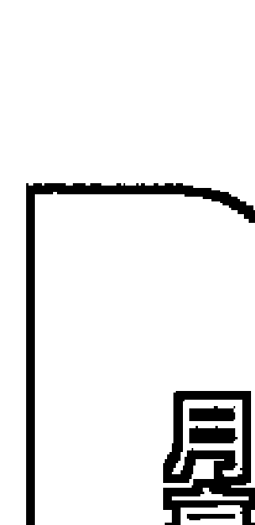

> 译注：此时就是本命月亮与推运月亮形成对分相。

### 利用相位指南

接下来的介绍将会对你很有帮助，你会学习——在任何时候，根据你的推运月亮与本命月亮的关系，将你的推运月亮的需求，整合融入你天生的风格和基本的情感需求。我们会按照所有人经历的顺序来介绍相位，从六分相开始到合相结束，然后再次展开这个过程。希望这个部分能够对你有所帮助。

#### 六分相：只见眼前

关系：无论从哪一边计算，当推运月亮与本命月亮距离相差六十度。

重点：一股新能量会为现况注入新鲜感和刺激，但又不会过于不同，让你觉得这很吓人或太过困难。

无论你的本命月亮落在什么位置，当你的推运月亮与它形成六分相时，你正在体验一股欲望，想要朝着令人雀跃、全新的方向成长，但又不会差异过大，让你觉得是被人催促或受到压力才这么做。你这种想要做点什么的念头，会从你的舒适圈岔出支线，感觉它正在向你招手，邀请你尝试一些事物，与你原本习惯的略微不同。当我们历经与我们习惯截然不同的推运周期时，我们会成长，但我們也会花很多力气和自己抗争。这里的不同只会让你觉得兴奋，但不可能让你精力耗尽。

试想本命月亮金牛座的人，正在经历推运月亮巨蟹座的周期。这种人崇尚的舒适圈，就是个人的平静和内心状态的稳定，他们此时常想向外展现这些特质，特别是在他们的居家生活。巨蟹座能量与月亮金牛座有一些共同点，例如都很渴望安全感，而稳定的居家生活通常能带来这种感受。巨蟹座可以温柔地教导金牛座，如何更深入自己的情感面，这有时可能有些动荡不安，但其中也藏着想象力和真实的自我理解。金牛座很容易变得更停滞不前、更抗拒，但巨蟹座渴望同时有能力进入个人情感的波动之中。这可以帮助金牛座更加意识到——必须把生命经验整合融入自己的心中，避免变得无动于衷。

#### 四分相：面对大海

关系：无论从哪一边计算，当推运月亮与本命月亮距离相差九十度。

重点：用一种快速有时不太舒服的速度体验成长时，就会产生紧张。

四分相常会带来成长的痛苦。当你的推运月亮与本命月亮形成四分相时，你可能觉得远离了你的舒适圈，甚至觉得你在某些方面必须与自己抗争。你可能渴望参与一些推运月亮鼓励你投入的新经验，但是本命月亮代表你觉得最舒适、最安全的地方。这就像一对兄妹在车后座争吵，你的两个截然不同的自我正在试图理解，如何和平相处。你的推运月亮的星座和宫位，可以教导你本命月亮一些东西。当推运月亮与本命月亮形成四分相时，你可能不断觉得有一种隐晦的耗损，常常需要纾解因为一直脱离舒适圈造成的隐藏压力。

让我们试想本命月亮八宫处女座的人的推运月亮，正通过十一宫的射手座。首先必须知道月亮处女座八宫的需求。简单地说，处女座的能量是透过局限和指引来获得进步及成长。月亮处女座的人，最舒适的状态就是觉得自己的周围有界线，不至于受到阻扰，但又足以让他们觉得自已能期待什么，也很清楚规则。了解规则有助于他们设定目标，然后获得成功。但是，射手座渴望展开双翅，延伸并扩展自己，这意味着离开日常的规律，放下计划和一些控制，尝试新事物。射手座可以教导处女座带着信念前进，而非只有计划，同时对结果保持弹性。

一个人比较自在，愿意接受限制，还有自然法则的现实、规则和物质社会的界线，如今却陷入一阵大爆发中，催促他们突破这些令人信服的限制，进入创造性的扩张和可能性之中。这个形容可以应用在所有土象和火象的四分相。

本命月亮在八宫的人比较倾向内心生活。这些人在私人的角落时比较自在，因为他们不会分心，不会曝光，可以沉浸在自己的世界里。十一宫的推运月亮会鼓励一个人走出来面对公众，进入群体，同时学习从周遭的人身上获得支持会有什么样的好处，也在学习他们有某些东西可以对别人付出。虽然这么做会获得回报，但是对月亮在八宫的人而言，并不是自然的状态，其中还会带有一些紧张。

#### 三分相：顺利航行

关系：无论从哪一边计算，当推运月亮与本命月亮距离相差一百二十度。

重点：这是一段情感温和和成长的时期，邀请我们运用自己的天生本能，让本能稍微延伸一下，变得更完整圆满。

经历过四分相的紧张后，三分相可以为你带来你非常需要的纾解压力。你在情感的演化上已經瀕臨一個關鍵點，現在更能與自己的本能及舒適圈和平相處。此時當你延伸進入一個新領域時，比較像是小睡片刻後伸一個很舒服的懶腰，而不是伸展一下就抽筋！當你面臨四分相的壓力時，感覺像是內心受到挑戰和驅策，但是現在你沒有被推著走，你可以從比較平靜的立足點來決定要往哪個方向前進。

## 三分相

三分相通常是根據兩個星座和宮位的連結，兩者具有共同的元素。火象星座的行動都帶有一種他們覺得很自在的坦率和自然，水象星座則會發現一些能回歸內心世界的活動，最能讓他們放鬆，感受到支持，而且正是透過他們在前一個推運週期時渴望的方式。舉例來說，本命月亮天秤座在十一宮的人，如果正在經歷推運月亮在七宮的寶瓶座，他們可以利用天生的本能去蒐集資料，與別人分享自己的意見；這可能是很愉快的經驗，因為這就像是他們本命月亮的第二天性。十一宮天秤座的月亮可以運用他們平常的社交和心智本能，只是目標有些不同。他們的目標不該是滿足自己想要在群體裡創造和諧的天生慾望，這有時要付出的代價就是必須放鬆，展現自己部分的真實本性，而且是要鎖定七宮寶瓶座的目標，鼓勵自己用更真實的方式，與一個能信任的人溝通，稍微冒險，揭露自己的真面目。

#### 五分相：迷失在大海裡

- 重點：非常不尋常的情感成長階段，可能會帶來隱微的困惑和彆扭。

- 關係：無論從哪一邊計算，當推運月亮與本命月亮距離相差一百五十度。

## 月亮相位

人生不可能無縫接軌，永遠美好。對你而言，推運月亮三分相的週期是很自然的能量，你會很珍惜這種感受，直到這種感受開始退燒，你會越來越覺得人生的情感暗潮之中，有某種東西被「關上了」。四分相會帶來明顯的衝突，五分相隱含的意義，則是你試圖把正在發展的情緒需求，融入目前的生活中時，你會有種迷惘、困惑和彆扭，覺得目前的演化需求，讓你脫離日常生活的和諧和自然的流動，但是這種延伸可以幫助你理解並喚起自己尚未發展的部分，吸引你注意一些需要更多整合的生命領域。

就占星學的角度而言，我們可以理解五分相的彆扭，因為你的推運月亮和本命月亮的星座及宮位，並不屬於共同的元素、特質或雙重性。這兩股能量之間沒有明顯的共同基礎，它們可能表現在你的兩種不同面向，其中一面正在成長，另一面則是現況，而你找不到方法調和它們。舉例來說，月亮雙子座在七宮的人，對於在生活中來回分享情感經驗的能量，還有與伴侶討論想法，天生就覺得很自在。但是當他們的推運月亮經過十二宮的摩羯座時，他們的情感需求會要求更深入探索私人、內在的領域，這是不容易進入的，也很難用言語分享他們的感受和經驗。當他們嘗試融入摩羯座十二宮的能量時，會有一種情感的渴望，希望變得更像一位隱士，學習自我指引，更仰賴自己去面對人生。這可能讓他們的情感生活的節奏變得彆扭，因為沒有明顯的方式可以整合這兩種經驗，他們內心可能會產生一種「分離人生」的感受，就像自己的兩個生活領域互相隔離。他們如果能學習向伴侶說出自己此時的體驗，也許可以釐清雙方的需求，不過這需要不斷地調整才能整合，其中也會有些彆扭。

#### 對分相：對抗暴風雨

關係：無論從哪一邊計算，當推運月亮與本命月亮距離相差一百八十度。

重點：這段情感成長的時期，常會透過對抗或外在的經驗學習，這些可以帶來平衡所需的另類觀點。

當你到了距離自己舒適圈最遠的地方時，可能再次出現延伸的感受，就像在四分相的時期。

不過，對分相常會製造一種內心的衝突，你可能會覺得在兩種本能之間不斷來回地跑：你會跳向新的傾向，然後又回到習慣的感受與反應裡。這時會出現內心的拔河，你會感覺被兩邊拉扯，而當你忽略其中一種渴望，忽略你的另一面時，沒有任何方法能長期適用，讓你獲得永久的滿足。

我們在生活中的內心衝突，有時會以外界阻礙的形式出現，必須不斷對抗環境，可能是與一個風格和目的截然不同的人，或是必須去克服一種障礙。如果沒有任何特別的東西擋住你的路，此時可能出現另一種可能性，讓你覺得你想要的東西非常遙遠，這也許只是看起來很遙遠，而你可能出現一種執著，想要擁有你認為你得不到的東西。

當我們把自以為沒有或不想擁有的所有特質，投射到另一個人身上或另一種情境中，我們就看不到另一種觀點。此時我們很容易對抗一個人或一種障礙。這通常是一種謙卑的經驗，因為我們必須找一種方式認清現在渴望的東西，也許正是我們之前批評的某種經驗。如果想要釋放這種緊張，或是臣服於這個推運週期要教導我們的事，就必須放下製造對立或障礙的批評。

## 月亮相位

舉例來說，本命月亮在五宮牡羊座的人，極有潛力發展一種情感風格，可以自在坦率地表現自己，不會為自己的作風道歉，也不會假裝想要討好別人。不過他們也可能讓這種情感本能表現得太過頭，總是要掌控周遭的一切，沒有體諒別人的情感需求和風格，替別人留一點空間。當這些人經歷推運月亮在十一宮的天秤座時，他們會面臨挑戰，必須擴張覺察力去接納體諒別人的想法、需求和貢獻，同時要意識到對群體有利的互助夥伴關係及態度，現在也能帶給他們滋養。月亮五宮牡羊座的人，必須盡可能地擴張覺察力，在十一宮的環境中，融入天秤座合作、策略和內心的方法，就像一種團隊合作或一個社團計畫。此外，因為他們正在體驗對立的能量，所以可能會吸引一些人進入自己的生活中，與對方角力，這些人的意見和風格與他們迥然不同，就像有天秤座特質的人（這也許呈現在他們的星盤中，或者只是象徵意義）。這可能會讓月亮牡羊座的人很挫折，因為他們發現自己吸引來的人，似乎說話拐彎抹角、缺乏勇氣。牡羊座的人，如果想要體驗現在渴望的十一宮天秤座的能量，雖然一切都很陌生，但必須學會如何不再認為天秤座的人很軟弱或惱人，同時要在相反的觀點中找到價值，唯有如此才能放下批判，允許自己經歷天秤座族群能教導他們的經驗。當然，這不是要要求他們放棄牡羊座的天生特質，而是要他們在脫離這段週期時，能更珍惜另一個面向教導自己的事。

#### 合相（推運月亮回歸）：家的港口

關係：當推運月亮回到本命月亮的位置。

重點：記住自己，同時認清無論遇到任何生命經驗，你都必須實現的、隱藏在底下的基本需求。

當月亮回到你出生時的宮位及星座時，這代表自我評估的時間到了。你當然很熟悉這股能量，畢竟你一輩子都是這麼過的，你當然非常習慣。我們常認為熟悉是一件好事，可以帶來舒適和輕鬆。不過在英文裡，熟悉（familiarity）這個字和家庭（family）有同樣的字根，所以我也可以说熟悉這件事的概念，就像我們的家庭一樣，有時會讓我們非常地不舒服。在這段時間，你的幸福或舒適，其實要看你從這個循環開始——過去這二十八年做了什麼。你喜歡自己變成了樣子嗎？你喜歡所做的選擇嗎？或是最起碼的，你在現在的人生中找到自己了嗎？如果沒有，當你在與失落或不開心的感覺搏鬥時，你會非常不自在。即使現在對自己很滿意，每個人的內心都有好幾種可能性，但不可能每一種都嘗試。當你思考到底是什麼樣的人時，你會開始意識到所有的道路，也會開始思考哪一條路曾經走過，哪一條路沒有嘗試過。

無論你是滿意還是焦躁不安，在這段時間，你會想起你想要什麼，無論是有意識地想起，或是在情感的暗潮中想到這件事。如果能樂在其中的話，這段時間其實很適合追憶往事，甚至是回想童年。不妨想一些總是能讓你快樂的事，你可能會把這些事當成嗜好，或是長大後不斷重複回頭做這些事。這段時間也很適合特別留意你的夢，無論是醒著的夢或睡著的夢，看看這些日子心裡在想些什麼。

這些概念只是要把你正在經歷的情感經驗帶上檯面，這段時間，即使你不太能進入沉思，還是會有些東西冒出頭緒。當有事情冒出來時，你當然能獲得平靜的感受，希望這還能帶來清晰的方向。不過，我們討論的是月亮，是我們的心，所以你在這段時間的任務，不必是擬定好未來五年的計畫，你也不需要知道自己想要如何面對人生。但你可能覺得更困惑，更不知道自己想要什麼，這是絕對可能發生的情形。困惑可能不好玩，但這是有用的訊息。困惑就像不快樂一樣，都是因為你的心想要的無法與目前的人生方向達成一致。

現在的任務主要是記住自己。需要讓自己的感覺浮上檯面，確定它，注意它，因為你現在有機會發展一種覺察力，找到令自己最快樂的事。你在生命中是否需要某些東西，而你再也沒有辦法否認這件事，或是需要替這些東西挪出一些空間？從現在開始，在未來二十八年，當你做出人生選擇時，你會帶著對自己的理解向前走，如果不是真正了解或承認自己的心想要什麼，你很有可能選錯方向，走錯路。

月亮在五宮雙魚座的人，可能會重新發現他們的藝術。月亮在十一宮巨蟹座的人，可能決定現在該嚴肅地看待，成立一個社區活動中心的夢想。月亮在七宮天蠍座的人，可能會擺脫一段關係的束縛，因為他們終於了解這段關係無法用他們需要的深入方式，全面地對待他們，支持他們。你現在的功課就是回家，與你無法否認的情感需求和解，讓你的人生再次屬於你。

### 預習：土星回歸的先決條件

推運月亮回歸除了回到原點，還具有另一層特別意義，因為它與土星回歸有關。月亮回歸時，行運的土星也正好回到土星在本命盤的位置。土星代表我們通往成熟、成就、自律和自尊的道路，這大部分是透過努力工作，以及把挫折或限制變成動力的能力。土星第一次回歸發生在二十九歲至三十歲之間。當然針對土星回歸，還有很多更完整的介紹，不過它的基本概念就是意味著我們會在這段時間，覺得需要「嚴肅一點」，需要在生命中許下承諾，做一些有意義的事情或選擇。在這個時候，我們即將進入三十歲，常會感受到必須「成長」的社會壓力，但也會有一種內在的渴望，想要展開自己的「偉大工作」，為我們的人生打下真實的基礎。

推運月亮第一次回歸會比土星回歸早一至兩年，這並非巧合。這兩個回歸注定是要一起努力：月亮會為我們在土星回歸時做出的選擇和承諾奠定基礎。無論你的本命土星是什麼星座，土星都代表嚴峻的現實和實際的結果。土星回歸可以帶來現實感，讓你面對你在這個生命領域中、透過努力工作獲得的成果，或是根本沒有成果，你只是看到自己停滯不前，因為你只是不停抱怨自己的限制，而不是努力突破限制，或與限制妥協。你在土星回歸時，必須對一個目標採取實際行動。現在你要停止許願或等待，你要做、你要計畫，還要投入其中。但你怎麼知道你想要投入什麼事？你怎麼知道要設定什麼目標？這就是為何月亮回歸如此重要，因為這段時間可以提醒你，你喜歡什麼，你想要什麼，什麼對你而言最重要。在這段時間，你要特別注意你渴望的事物，還有你的白日夢，嚴肅地看待它們。這些都是重要的線索，可以引導你邁向你這一生最偉大的成就，無論這是你愛的家庭、一份有成就感的事業，或者只是一種個人成就。

月亮第二次回歸會比土星第二次回歸提早約三至四年，這又是一段自我評估的時間，讓你為接下來的二、三十年和你現在想要走的方向做好準備。第三次土星回歸等於認清你極可能進入人生最後的三分之一階段，所以你可能會思考想要留下的東西，思考有什麼樣的選擇，可以繼續過著一個充實的人生，同時再次認清，生命就是一連串的自然限制。

第四部

範例解讀

### 兩個案例的推運月亮生命筆記

無論你的推運月亮現在正經過什麼星座和宮位，這都只是更大週期裡的一小環。這就像故事的每一章都是以前一章為基礎，才能創作出整本書。當你透過完整的推運月亮週期（二十八年）來追蹤一個人的一生，可以幫助你用比較深入的觀點，以長遠的眼光看待這個人的一生。接下來的例子不是某位名人的一生，他們是我採訪的真實個案。我很深入了解他們在每個推運週期的情感經驗的基礎，還有每個週期發生的重大生命事件。因為同樣的事件對每個人會有不同的情感影響，他們盡可能地告訴我，在他們的一生中展開行動背後的情感動機，還有外在的事件如何推動或反映了內心的情感演化。這個部分不是提供完整的人生經歷，而是要用真實的例子來印證這本書的理論，證明生命會有一些強烈的方式，透過經驗讓我們打開心房，暢所欲言，而有時只是讓我們私密的欲望從內心浮現，促成更美好的事情發生。當我們（還有接下來的個案）遇到其他行星的強力推進時，推運月亮會展現象徵內心渴望的暗潮流動，同時提供了因果脈絡，證明每一個生命中的事件都絕非巧合。其他的行星和星座事件可以觸動一些可能性，但是推運月亮可以反映出我們回應這些事的暗中意涵。為了證明這些元素如何整合在一起，這些事件如何反映目前的推運週期，我會有一些註記，以凸顯一個偶然的重合經驗，和當時推運月亮的星座和宮位有什麼關係，可以參考推運月亮的介紹，或是檢視你的本命星盤，釐清迷惑。

你會發現每一個人在描述個人經驗時，特別是第一個例子，都是越老講得越詳細。這顯然是因為他們有能力記得更多過去的事，也是因為他們能認清或定義覺察力的情感狀態。非常建議你替自己創造一份生命筆記，追溯你在每一個週期的情感流動。這將極具啟發性！

| A男 | 第一次月亮週期 |
|---|---|

**天秤座十一宮，五個月到兩歲**
長子，家裡有六個孩子。在這段期間，第一位手足誕生。

**天蠍座十一宮，兩歲至四歲**
搬家過幾次，強烈感覺失控，四處流落。

**天蠍座一宮，四至五歲**
開始外向，欺負弟妹。在測試四周的環境時，會嘗試說謊，偷偷摸摸。

**射手座一宮，五至六歲**
開始上學。會說些荒誕不經的故事，以避免麻煩，同時贏得讚美。非常具有競爭性，非常自我中心。

#### A男 真交點 普拉西德宮位制

##### 射手座二宮，六至七歲

在學校很難達到標準。開始在家自學。開始對家以外的世界非常好奇，也喜歡一個人出去玩。由於家庭成員眾多，家庭生活時常很吵雜忙亂。

##### 摩羯座二宮，七至九歲

搬到新家，全家人都對於買房子感到驕傲。受洗成為摩門教徒，強烈信奉上帝和宗教守則。在這個週期的尾聲，家裡失火燒毀，隨之帶來強烈的失落感。
（家裡失火的同時，行運土星與本命土星形成四分相，這會促成一些生命事件，讓你覺得必須面對現實，必須「長大」。當時推運的月亮也與本命冥王星形成四分相，這通常代表準備面對恐懼。）

##### 摩羯座三宮，九歲

因為失去家必須重新開始，悲劇通常有些令人興奮，這會創造一種探險的感覺。又開始回到公立學校上學，這很恐怖，但也很令人興奮，也因此增加社交的機會。
在這個週期要結束前，妹妹過世，勾起對上帝強烈的憤怒，也為自己沒有辦法保護家庭感到無力和沮喪。
（妹妹死亡的同時，推運太陽與本命海王星形成四分相，這會促使自我必須臣服，面對無法控制的狀況。）

##### 寶瓶座三宮，十至十二歲

常常與兄弟姊妹和鄰居小孩衝突。會在平常的教堂和社區活動之外，加入另類的社會團體，以尋求逃避。不時翹課騎車好幾個小時，沉浸於自由的氛圍。策劃逃家。

##### 雙魚座四宮，十二歲半至十五歲

開始儘可能地好幾天都不回家，替自己找了第二個家。開始玩角色扮演的幻想遊戲，幫助自己應付並逃避罪惡感和匱乏感。

##### 牡羊座五宮，十五至十六歲

初戀，交第一個女朋友。朋友圈開始擴張，下課後常跟朋友在一起，玩對弈遊戲。

##### 牡羊座六宮，十六至十七歲

有第一次性經驗，之後有羞恥感。因為在家自學，比同年齡的人更早進入大學，但是覺得無法應付學業，最後退學。
（十五至十七歲時，還有推運的金星趨近本命的太陽，代表準備開始探索伴侶關係，而推運的火星趨近本命太陽，代表開始在情感中覺察到熱情。行運的冥王星也正準備通過本命的上升點，代表與這個世界的連結方式，會出現戲劇化且無法挽回的改變。）
擁有第一份工作。不尊重整體的社會規範，導致叛逆、抗爭和坐牢。開始對朋友產生強烈的忠誠感。

##### 金牛座六宮，十七至十八歲

交第二個女朋友，第一次感受到真實的愛。對關係裡的愛和感官經驗非常「有興趣」，但也對於打破禁忌的宗教守則感到羞恥。因為無法處理羞恥感，跟第二個女朋友分手。開始交第三個女朋友，也是非常重視性生活。

##### 金牛座七宮，十八至十九歲

第三個女朋友搬家。因為當時的情感狀態，加上分手導致的失落，開始對她非常著迷。無法控制性欲，所以無法維持獨身。與第二個女朋友複合，因為她懷了他的孩子。兩人以宗教儀式結婚。因為覺得失去自由，開始對另一半感到憤怒。
（在結婚和這段週期的第一年，他的推運太陽引動了本命火星與木星的對分相，同時與他本命的南北月交點形成四分相，這代表他遭遇如炮火般的洗禮，其中包括內心衝突、業力問題以及轉化的經驗。）

##### 雙子座七宮，十九至二十歲

第三個女朋友回來。他在維持婚姻的狀態下，開始跟她見面約會。
因為兒子誕生體驗到強大的神奇感，感受到愛的存在，但整體而言，仍在對抗對婚姻和「長大」的憤怒。
兒子出生後與外遇對象分手，重新投入婚姻與家庭，最後還是沒有成功。在妻子的提議下，兩人分居。
（在兒子誕生時，行運的冥王星與本命太陽形成四分相，代表潛意識經歷強烈但充滿壓力的轉化。行運的木星和本命金星形成四分相，代表愛的擴張超出負荷。行運的天王星與本命天王星形成四分相，意謂著在尋找自己的方向時產生的叛逆和分離感。）
與妻子分居時，搬去跟一個朋友住，開始短暫地與第四位女子約會。儘管兩人的戀愛很短，但建立緊密的友誼，為接下來幾年帶來許多治療、分析和洞悉自我。

##### 雙子座八宮，二十至二十一歲

開始在一群朋友裡面，與第五位女子約會。這段關係帶來安慰與安全感，覺得又能去愛了。
因為失去婚姻又失去兒子，覺得很悲傷，又對選擇的結果感到難過。重度憂鬱，又因讓別人失望感到羞恥。時常玩遊戲和小玩意逃避現實。但是當朋友帶來療癒和原諒時，又會對未來產生希望。
大學復學。
跟第五位女子結束關係。

##### 巨蟹座八宮，二十一至二十二歲

推運週期一開始就辦妥離婚。在這段週期開始時，之前推運週期導致的轉化和重拾信仰變成寂寞和絕望。開始與一位已婚女子談戀愛，但後來知道她不會離開她的丈夫，也不能提供足夠的衝擊，幫助他在前進也必須前進的人生方向上有所突破。感覺能重新找回自己，找到新的重心。跟已婚女子分手。
（在這段時間，他的推運月亮通過本命土星，帶來一種「面對現實」的感受。）
開始跟一位女子約會，對方最後成為他的第二任妻子。兩人之間有強烈的吸引力，但隨之而來的熱情有好有壞。在充滿激烈熱情時，覺得跟女友、朋友甚至家人的相處，都像是一種個人轉化，正處於某種圓滿之中。

##### 巨蟹座九宮，二十三至二十二歲半

在這段週期結束時，與當時還是女友的第二任妻子分手，關係因為太過激烈無法處理，在某次吵架時，變成肢體衝突。渴望控制自我，無法忍受自己變得惡言怒罵，導致兩人分手。

##### 獅子座九宮，二十三歲半至二十五歲

更熱衷參與政治。參加學校裡的青年民主黨社團，背叛撫育他成長的保守派政治環境，也脫離家鄉整體的主流氛圍。
結束兩年的學業，拿到學位。
祖父過世，感覺開啟了一種通行的儀式，更加催促著他，必須靠自己獨立；感覺自己變成男人，對家庭越來越有責任感，也對失去祖父感到非常哀傷。
與上一位女友複合，向她求婚。兩人私奔到夏威夷。
在這段推運週期快要結束時，與新婚妻子第一次搬到國外居住。這部分是因為渴望有一個全新的開始、新的機會和環境，可以測試自己，讓自己成長，同時也是渴望長大成人後，能獨立脫離原生家庭和環境。

##### 處女座十宮，二十五至二十七歲（推運月亮在二十七歲回歸）

新的婚姻結束，因為雙方都有婚外情。他和妻子同時結束婚外情，但是妻子想要結束婚姻，
（結婚與搬家的同時，推運金星與本命海王星形成四分相，代表演化中的伴侶關係需要結合，也許是有些天真，帶著希望，看到了可能性，推運的火星也正進入天秤座，更激發與伴侶結合的渴望。）

逃避前一年全面的混亂和壓力，於是她回到故鄉，參加一個自助計畫。他下定決心想要挽回妻子，願意做任何努力，不要讓婚姻再次失敗，所以也去參加自助計畫，希望能與妻子同心，有共同立場。

一直覺得有無法挽回的失敗，不停地犯錯。意圖自殺。自助計畫提供有力的工具，打造更好的自我。

與妻子複合，一起建立新家。享受承諾和活得「正確」的居家喜悅，非常有毅力、堅決地挽救婚姻，贏回妻子的心，這整個婚姻帶有「作品」的意味。

在第一份「真實的」工作中發展並考驗技術，在這段時期的大部分時間，這就像一條職業的道路。因為被解僱，促使決定自己創業。

### B女 第二次月亮週期

#### 牡羊座一宮，二十七至二十八歲

結婚生子後，找到人生第一份工作。工作時與另一位員工吵架，再也沒有回去上班。

#### 金牛座二宮，二十八至三十歲

突然被丈夫拋棄，丈夫提議分居。打電話給父母，收到父母寄來的錢，搭巴士帶女兒回娘家，暫時與父母同住。(在這段期間，行運的土星正通過本命的下降點，代表會面對關於伴侶關係的現實，行運的海王星正靠近本命的天頂，代表身為妻子的角色進入「朦朧」的狀態。) 父母回家後，因為對女兒的教養問題，與母親發生幾次頂撞和衝突。有一次的衝突是到底應不應該讓女兒吃某一份穀片，那是之前其他孫兒拜訪留下的。雙方都很固執，她就帶女兒走到商店，讓女兒吃想吃的穀片。知道自己該想辦法搬出去。

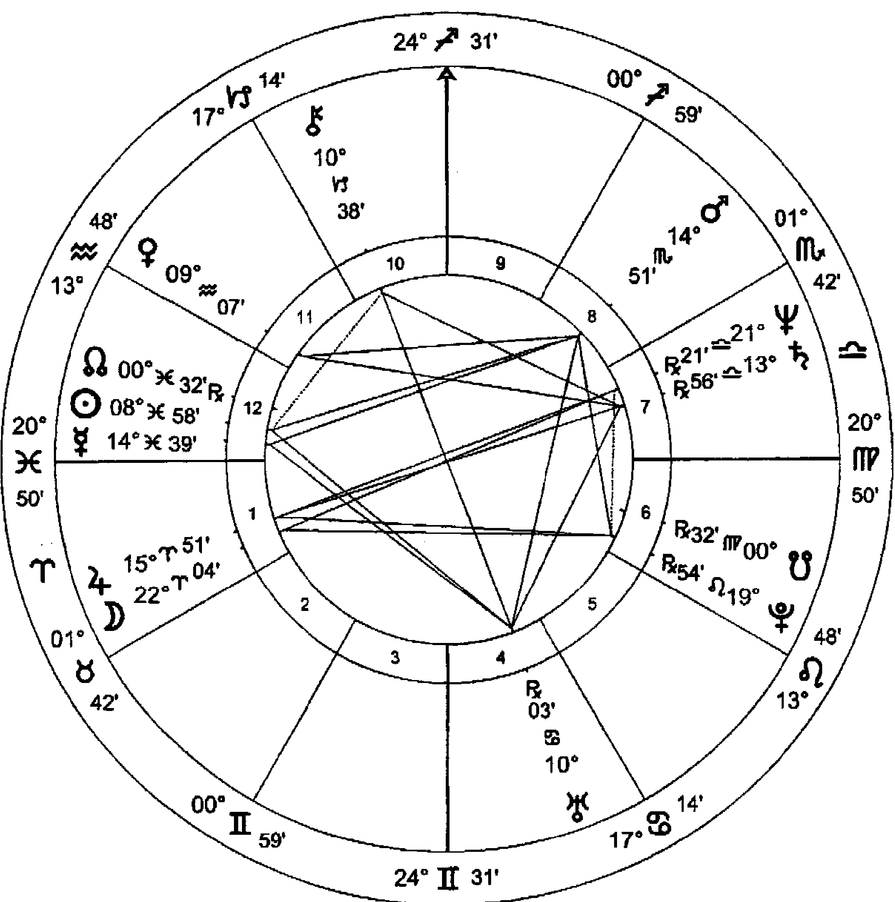

# B女
真交点
普拉西德宫位制

向法院申請離婚。在離婚聽證會上，另一半沒有出席。

#### 雙子座三宮，三十一至三十二歲

自由！這段週期開始時，辦妥離婚。

這段時間特別注重社交活動，過得很有活力。常參加教堂活動，建立友誼。

因為住在父母家的持續壓力，健康問題（癲癇）惡化；提議搬出去；搬出去前一天才告知父母，以防被干涉。

開始接受社會福利的援助。接受福利安置計畫的安排，開始新工作，但沒有支薪，只拿到該計畫提供的財務援助。

開始上護理學校。

#### 巨蟹座四宮，三十三至三十四歲

離開護理學校，因為護理工作的壓力越來越大。

第一次靠自己的收入建立信用紀錄。感覺像是人生的一大步，之前因為「失婚女子」的汙名，沒有人信任她，沒有人願意因為她的長才擴大對她的信用額度。用分期貸款買一台錄放影機，待在家裡，跟女兒看了很多錄影帶。

#### 巨蟹座五宮，二十四至二十五歲

開始一段短暫但嚴肅的約會。對方提到婚姻，發現自己當時完全不想再婚。

因為工作表現優秀，被僱為正職員工，再也不需要接受社會福利援助。在這個週期快結束時，州政府接手工作計畫，因此被解僱。

#### 獅子座五宮，二十五至二十六歲

開始新工作，可以租比較好的房子。

第一次在新家過聖誕節。大手筆替女兒買第一件昂貴的家具當聖誕禮物。這段時期整體而言很快樂。

#### 獅子座六宮，二十六至二十七歲

因為自我衝突導致不快樂和壓力過大，試用期後，在雙方的共識下離開工作。開始新的工作，最後變成長期穩定的工作，做了很多年。

#### 處女座六宮，二十八至二十九歲

在父親的資助下買第一棟房子，部分是因為當時的房東不斷有些神經質和侵略性的行為。

（這段時期行運的土星與本命月亮形成四分相，代表在購屋時的情感壓力，這可能是父親和房東都代表「權威」。） 因為想要在工作之外有所貢獻，非常投入「幼童軍」社團。非常愉快，帶來極大的個人收穫。

#### 處女座七宮，三十九至四十歲

繼續更常參與幼童軍的活動，與許多人建立長久的友誼。

#### 天秤座七宮，四十至四十一歲

女兒上大學。開始每週去拜訪哥哥及大嫂，共度晚餐，聊天。與他們建立快樂的關係，特別是大嫂。

開始與工作上的女性建立親密的友誼。

#### 天蠍座八宮，四十二至四十四歲

大嫂意外死亡。

朋友搬進同住，分攤家用。因為朋友不合理的期望導致互動緊張，試圖在獨居多年後，與朋友在親密的空間裡融洽相處。朋友住了六個月後搬出去，勉強維持友誼。

覺得情感受困，開始感受到一種底層的需求，想要生活中出現戲劇化的轉變，同時渴望未來，不過似乎沒有出口。

#### 射手座九宮，四十四至四十六歲

這段時間常與朋友和前室友旅行。

獨生女兒以宗教儀式結婚，這不同於她本身成長期間接受洗禮的宗教，但其他家人仍來參加婚禮。她個人不覺得這是問題，但是其他家人許多挖苦和同情的評論，讓她看清沒有遵守布道背後的偽善，也發現原生家庭信奉的宗教教義十分嚴厲。開始脫離原生家庭信仰，特別是父親的信仰。

#### 摩羯座十宮，四十六至四十八歲

對工作的投入受到抵制，或不被尊重。試著提議為生產導向的工作提供競賽或獎勵，刺激個人的投入，管理階層幾乎完全不支持。職場的管理階層朝最糟的方向改變。對缺乏尊重、缺乏成長的空間感到沮喪，開始考慮換工作。

#### 摩羯座十一宮，四十八歲

跌倒導致腳踝嚴重扭傷，長期走路困難。生活困難增加卻缺少幫助，覺得孑然一身。

#### 寶瓶座十一宮，四十九歲

離開不滿意的工作，對於離職待遇很生氣，但很高興脫離這份工作。開始上按摩學校，因為想要打造一個未來，時間安排更自由、工作性質有彈性。跟同學的社團相處非常愉快。
（離開工作，開始上按摩學校時，行運的木星與本命北交點形成三分相，代表宇宙催促她帶著信念和信任追求夢想，支持就會隨之而來；行運的火星與冥王星正與本命的木星形成三分相，對自己更有信心，願意開始採取行動，提升自我發展。）

從按摩學校畢業，開始替一位脊椎神經醫師和復健中心工作，也拿到自己的執業執照。跟父親的關係緊張，因為父親想透過施壓和羞辱，讓她因為沒有照顧年邁的父母覺得罪惡。即使自己不是他們唯一的孩子，正嘗試為自己的新夢想找定位。

家庭聚會變得很糟糕，又因為沒有達到父親的標準被羞辱。不再參加家庭聚會，脫離父親的期望，按照自己的路走時，感覺像是「青春期的叛逆」。

這段期間母親似乎生了重病，催母親去看病。
在這段週期要結束時，母親被診斷罹患肺癌和骨癌。因為父親拒絕承認母親罹癌，選擇用另一種方式看待母親的病，心中充滿糾結的憤怒和無力感。感覺只有自己試圖要他們更主動積極面對母親的健康。

#### 對母親的疾病

母親過世。心中充滿了失落和罪惡的痛苦掙扎，一直想著自己做的是否足夠。

（母親過世時，天王星正通過本命的北交點，與南交點形成對分相，代表突然擺脫對於習慣性照顧的老舊業力態度；推運的火星與本命八宮天蠍座火星形成合相，代表準備經歷個人意志與勇氣的深層轉化。）

#### 雙魚座十二宮，五十一至五十二歲

有一次要通過十字路口時，眼角餘光看到一部車正在靠近，發現自己就要被撞上了。理智告訴自己要蹲下（雙魚座的臣服）減少肉體傷害。錯在對方駕駛。雇用律師與保險公司和解。

因為車禍和治療身體，有一陣子不能工作，所以選擇不要更新職業執照，也因此覺得可以考慮其他方式，做些改變。兩個月後，拜訪住在國外的女兒，最後決定永遠搬到那裡。想要離女兒近一點，也渴望改變和新環境。

（決定搬家的日子，行運冥王星與本命月亮剛好形成三分相，這代表很容易得到深刻的力量，自動地轉化心境。）

在賣掉老房子、找新工作時，與女兒同住幾個月。

#### 雙魚座 一宮，五十一歲半至五十三歲半

#### 牡羊座 一宮，五十三歲半至五十五歲半（推運月亮在五十五歲回歸）

新的身分。
第一位外孫女誕生。她非但沒有因此覺得自己老了，反而覺得自己又像個孩子！以熱情接受對脊椎神經醫生不體貼的治療感到生氣，想要換一個比較好的工作環境。
搬出女兒的家，住進自己的屋子。開始替一位脊椎神經醫生工作，找到自己的定位。

### 謝辭

基於處女座的天性，我想在此感謝人們為我做的所有小事，幫助我完成這本書。謝謝我的丈夫，你是我最好的朋友，謝謝你和我聊天，讓我跳出處女座「還不夠好」、打擊信心的惡性循環。特別感謝你，與我攜手共度十五年，至今仍在繼續。還要感謝我的女兒。我把她的照片寄給一位占星師朋友，因為她如此可愛，啟動了一個機緣，促成你們手中的這本書。謝謝我的貓咪，托利和弗利茲，尤其是弗利茲。謝謝他們在我寫書時依偎在我身旁，帶給我美好的貓咪魔力。謝謝我的導師史蒂芬·佛瑞斯特（Steven Forest），他對這本書不僅有直接的貢獻，還透過無數間接的方式給予幫助。他還協助我更加精進，讓我擁有豐富的人生，這對處女座而言是最重要的方式。也要謝謝天竺鼠，讓我更容易處理「生命筆記」。感謝他們如此脆弱，在地上橫行度日，弄得亂七八糟，我們才能痛苦地謹慎檢查每一段紀錄（是誰幹的自己心裡有數）。

謝謝凱想出一些句子把我搖醒，讓我大腦恢復一半清醒，而且出人意料的是迪士尼卡通，讓我完全清醒。

謝謝我的母親，為我這輩子做了數不清的事，特別是當我的洗碗機就在我截稿前壞掉時，替我洗好所有的碗盤。

謝謝所有參與 livejournal.com 占星社群網站活動的人，在「告訴我你的推運月亮及你的感受」的盛事中不吝分享。也謝謝占星師們願意審閱這本書，告訴我這本書讀來不惹人厭。

我寫這本書，是因為我喜歡聽人們的故事，想幫助人們畫出他們真正渴望的人生航線。誠摯希望這本書能幫助你認識自己的人生之旅，並引以為傲。我滿懷感激終於完成這本書，並能暢所欲言地付梓發表。書終於問世，好樣的，向前走吧！

### 參考資料

#### 網路資源和進階閱讀

http://www.astro.com is an excellent resource for free chart calculation. Check out the extended chart selection options to calculate your progressed Moon’s location.

http://www.heavenlytruth.com is my professional website, which hosts a large library of astrology articles, beginning astrology video learning, and classes available. Lecture schedule and consultation information can also be found here.

http://www.cdc.gov/nchs/w2w.htm is the website of the CDC which gives a listing by location (U.S. only) on how to get a copy of your birth certificate.

#### 建議閱讀的占星書

> Arroyo, Stephen. *Astrology, Karma, and Transformation: the Inner Dimensions of the Birth Chart*. 2nd rev. exp. ed. CRCS Publications, 1992.

> ———. *Astrology, Psychology, and the Four Elements: An Energy Approach to Astrology and its use in the Counseling Arts*. CRCS Publications, 1975.

> ———. *Chart Interpretation Handbook: Guidelines for Understanding the Essentials of the Birth Chart*. CRCS Publications, 1990.

> Forrest, Steven. *The Book of Pluto*. ACS Publications, 1995.

> ———. *The Inner Sky: How to Make Wiser Choices for a More Fulfilling Life*. Seven Paws Press, 1997.

> Frothingheim, Moll. *The Changing Sky: A Practical Guide to Predictive Astrology*. 2nd ed. ACS Publications, 1999.

——."The Offstage Leo." NORWAC Lecture, 2009. www.astrologyetal.com.

Green, Jeff. Pluto, Volume I: The Evolutionary Journey of the Soul. Llewellyn Publications, 1985.

Schostak, Sherene and Stefanie Iris Weiss. Surviving Saturn’s Return. McGraw-Hill, 2003.

Sullivan, Erin. Astrology of Midlife and Aging, Tarcher, 2005.

Tarnas, Richard. Cosmos and Psyche: Intimations of a New World View. Viking Adult, 2006.

Wade, Paul. Home Astrology: Creating the Perfect Home for Your Star Sign. Hamlyn, 2008.

# 月亮推運占星全書：我的人生演化課程表

# Astrology of the Moon:
An Illuminating Journey Through the Signs and Houses

作　者　艾美・賀林（Amy Herring）
譯　者　韓沁林
责任编辑　田哲榮
協力編輯　朗慧
封面設計　斐類設計
內頁排版　李秀菊
校　對　蔡函廷

發行人　蘇拾平
總編輯　蘇拾平
副總編輯　于芝峰
主編　田哲榮
業　務　郭其彬、王綴晨、邱紹溢
行　銷　陳雅雯、蔡瑋玲、張瓊瑜、佘一霞
出　版　橡實文化 ACORN Publishing
地址：臺北市10544松山區復興北路333號11樓之4
電話：02-2718-2001　傳真：02-2718-1258
網址：www.acornbooks.com.tw
E-mail：acorn@andbooks.com.tw

發　行　大雁出版基地
地址：臺北市10544松山區復興北路333號11樓之4
電話：02-2718-2001　傳真：02-2718-1258
讀者傳真服務：02-2718-1258
讀者服務信箱：andbooks@andbooks.com.tw
劃撥帳號：19983379 戶名：大雁文化事業股份有限公司

印　刷　中原造像股份有限公司
初版一刷　2017年9月
定　價　520元
ISBN 978-957-9001-07-6

版權所有・翻印必究（Printed in Taiwan）
如有缺頁、破損或裝訂錯誤，請寄回本公司更換。

ASTROLOGY OF THE MOON: AN ILLUMINATING JOURNEY THROUGH THE SIGNS
AND HOUSES by AMY HERRING Copyright © 2010 Amy Herring.
This edition arranged with Llewellyn Worldwide, Ltd. through Big Apple Agency, Inc., Labuan,
Malaysia. Traditional Chinese edition copyright © 2017 by ACORN Publishing, a division of
AND Publishing Ltd. All rights reserved.

| 國家圖書館出版品預行編目資料 |
| --- |
| 月亮推運占星全書：我的人生演化課程表／艾美・賀林（Amy Herring）著；韓沁林譯．--初版.--臺北市：橡實文化出版：大雁文化發行，2017.09 |
| 面：公分 |
| 譯自：Astrology of the moon : an illuminating journey through the signs and houses |
| ISBN 978-957-9001-07-6（平裝） |
| 1. 占星術 |
| 292.22 106013513 |

☆台灣第一本「月亮推運」占星書！有別於行運，更切中個人心理狀態

☆跟著步驟查詢，無需占星基礎，預知每一年的必修課題，好簡單！

# 🌙 本命月亮：你的安全感需求，及此生的必修課

大眾占星學上，一向只偏重太陽星座，往往低估了月亮星座的影響力。太陽，是一個人意識層面的展現；月亮，則在潛意識層面驅動著一個人。你的月亮星座，代表褪去白天的社交面具，回到家後「私下的你」——你心理安全感的根源為何，你的情感需求、表達愛和感受愛的模式，以及讓生命更有意義的自我成長途徑。

如果你想傳達對某人的愛，首先，須懂得他的月亮在意什麼。例如，在親子的對應上，對月亮牡羊的媽媽，你要把自己照顧好，沒事少去煩她；對月亮巨蟹的媽媽，反而要多去黏她，讓她感受到你的依賴；而對月亮處女的媽媽，別奢望她會說你好棒，她願意一邊碎碎念、嫌東嫌西，一邊幫你收拾善後，已是她愛你的證明了。

# 🌙 推運月亮：這一年，你的內心煎熬與成長焦點

「推運」(progress)不同於「行運」(transit)的概念。行運月亮，是指天上實體月亮的移動軌跡。「推運月亮」則是存於你內的演化機制，從你出生時本命月亮的位置為起點，每隔一年，會在星盤上前進約13度，意即大約每兩年，你的「推運月亮」會依序過境不同星座、不同宮位，為你帶來必須學習的人生課題。它的演進軌跡，預言了「你將為何事煎熬」及「你將蛻變成什麼模樣」。

在本書中，作者深度闡述了「本命月亮」和「推運月亮」，在十三星座及十三宮位的意義與學習，也帶出月亮最強大的潛力——揭露你不斷進化的心靈需求，你如何面對自我、愛情、婚姻、職涯規劃的層層成長考驗。書中提供了許多實用的練習和想法，幫助你圓滿自己的情感需求，在每一個生命階段創造幸福生活。