#### 火星四重奏

# 序

# 观看火星的四种方式

本书里收录的四篇讲座皆为心理占星学院（CPA）在一九九五年三月到二〇〇一年三月间的活动内容，我们在二〇〇一年春末的时候，决定将内容集结成书。同年九月进行编辑工作的同时，美国发生骇人的恐怖攻击，世贸中心遭到摧毁，五角大厦受到破坏，六千名无辜百姓丧命，其中不只有美国人，还有许多其他国家的受害者。对于这场事件，无论是个人或集体，最初都反映出人类情绪的宽度。一边是哀伤、同情、愤怒，以及结合文明人类及社会的决意意识，一同对抗及摧毁邪恶的恐怖主义；另一边则是憎恨、盲信，且盲目对抗与摧毁那些理念、宗教、观点、种族、国籍与我们不同的人。每个国家里都有这两种人。所有的反应都表现出火星各种不同的面向——英雄主义、愤怒、复仇、勇气、憎恨、决心、存活的意愿及奋斗的意愿。在个人及集体的层面上，这些反应持续出现，在事件发生后不久，我们整理文稿的期间，实在很难预测这些情绪会将人类带领到何方。这场灾难事件给我们非常不凡且惊人的洞见，深入探索人类冲动里较为光明或黑暗的面貌，这些面貌都是占星师用火星这颗行星作为象征。

尽管这四场讲座都触及到在二十一世纪前十年里重击且转化我们世界观的暴行，然而，讲座的内容并无涉及还没有发生的事件。心理占星的方法也许能够评估个人或集体的未来趋势，却无法精确预测事件的发生，心理占星强调的是个人或集体的意识选择，若无法彻底避免任何星运上的配置，也许能够稍微改变其力道与走向。在研讨会期间，我们得到一些令人心神不宁的反馈，火星正缓慢行经射手座，即将先与冥王星合相，接着是凯龙星，然后投出巨大阴影的是土冥对分，将在二〇〇一年下半年至二〇〇二年上半年发生。土星与冥王星的合相、对分在过往的历史上引发了集体不安及社会、经济衰退，长久以来，许多占星师担心这样的行星组合代表战争，特别是当火星也加入土冥行列的时候。我们编纂本书时，并没有因为九一一事件更动讲座的内容，然而，我们提到火星在一张事件盘及另一张国家盘里引发战争的时候，却讨论了相关的议题，我们举的例子是美国南北战争及第二次世界大战。

因为身为人及集体意识的一份子，我们必须迫切了解，无论我们对于某件事有没有选择，火星都有可能会暴冲，而我们是否能够多做点什么，为此，在本书最后的附录增添了关于九一一恐怖攻击及事后状况的占星讨论。附录里的看法并不是要澄清或让现在政治局势更显复杂。当然也没有对未来提出任何实际预言。我们没有办法做出任何保证，但心理占星永远支持自由意志，且相信在付出足够意愿及努力下，我们能够转化毁灭的冲动。不过，就算读者无法通过本书得到平静，也许还是能够看看相关星盘举例的惊人共时性，参考不同的观点。心理占星中心出版公司（CPA Press）决定出版《火星四重奏》有部分是因为琳恩·贝尔、达比·卡斯提拉、梅兰妮·瑞哈特及我本人，我们四位作者认为学习占星的学生至今仍然没有办法好好明白这颗行星。进一步深度探索，火星带来的不只是具有毁灭性的病态展现，还有潜在的创意及永续生命的能量。现在世界的局势似乎证实了这个选择是对的。我们只能希望在未来火星能够以更崇高的面向示人。

丽兹·格林
二〇〇一年十月一日

# 审阅者序

# 唤醒内在沉睡的力量

传统占星中将火星视为凶星，不仅与战争和灾厄画上等号，在神话中也背负无法分辨敌友的鲁莽形象。甚者，在中国古代以『荧惑』称呼火星，认为火星在位置及亮度上时常变动、无法捉摸，当其行经某些关键位置时，将带来残、疾、丧、饥、兵等恶象。然而在吠陀占星的体系中，却将火星对应手部功能最强大的大拇指；多数脉轮的分类里，也由火星支配象征本能的海底轮。何以不同的文明赋予大相迳庭的意涵？何者正确？何者有失公允？

近七年的占星教学经验中，每当教授到火星时，常有说不到位、触及不到核心的虚浮感，一方面可能是因为神话中关于火星的著墨有限，思惟上不易串联；一方面也可能因为尚未完全接纳内在的火星能量，体察较少。直到受邀参与此书的筹备作业，我才开始孕育属于自我的火星莲花，更向内观察这股生命脉动。

火星与身体本能相连。孩子饿了的啼哭，飞虫袭击时的闭眼与挥手，又或者喝水时呛到咳嗽……这些都是火星。当火星被唤醒，我们将能勇敢地面对外界的侵扰，守护自我的安全界限。

愤怒都与火星有关，是血液中让我们生存下来的那股脉动，也是当我们面对压力、保护自己的肾上腺素。可惜的是，在种种礼教、法则与公约的束缚下，我们误解了火星的脉动，误以为表明立场等于攻击，误以为拒绝等于自私，误以为积极主动等于强势竞争。

这环环相扣的反应，要不是让我们选择让火星能量萎靡，要不就是极尽所能地压抑。然而，老祖宗的智慧如警钟般提醒，千万别压抑这股生气，否则很容易生病。「病」字内的「丙」，五行属火，体内的动能一定要找出口，否则可能上火、发炎。此外，火对应的五脏为心，若是压抑了这股流动，连难医的心病也将到访。历史上还有同治皇帝的警示，在其长达十四年的政治傀儡生涯中，无法表达意见，终其一生受制于母亲，演变为以寻花问柳满足火星能量，因而断送一生。

这本《火星四重奏》由当今四位举足轻重的心理占星师共同执笔，虽是近二十几年前的讲座纪录，但在今天读来丝毫没有距离，字字珠玑，入木三分。附录中的九一一事件分析，更让所有占星学子有机一窥占星天后思路的缜密。这四位老师带领的火星章节，处处引人入胜。四重奏原本寓意和谐流畅，但此书在我看来，更像是四场能唤醒内在沉睡力量的心灵交响曲。

谨将本书献给所有在生命里奋斗的人。

# 第一部

# 冲突与欲望之间

琳恩・贝尔

本场讲座为心理占星学院秋季课程的一部份

讲座日期：二〇〇〇年十月二十九日
地点：伦敦摄政学院

### 引言

占星学上忽略火星，因为火星能量似乎明显又直接，是个大男人，不仅非常强壮，还会上演「砸破头、拖回家」的戏码。火星嗓门很大，粗暴无礼，没有英国人的气质。就连这颗行星的符号也让人一眼就看出与阳具息息相关，实在有点尴尬。不过，生命里若少了火星肯定会非常无聊，更别说会有多么危险了，因为我们会在生死交关的时刻不知如何保护自己。要跟火星和平共处可没这么简单，但对大部份人来说，我们要么不是因为礼教压抑了火星，要么就是在肢体或情感上容易暴走。我想探索驱动火星的动机、火星能量为何受到压迫或封闭，以及在火星碾过我们及其他人时，如何能好好驾驶它的能量。而最重要的莫过于，我想让你们明白火星所带来的能量与生命力，这种非常基本的能量会以何种方式带领我们的生命前进。火星表达自己的方式有二，一是冲突，一是欲望。少了火星，我们会成为非常无聊的生物。

### 与火星共处

火星到底是什么？只要想遇到危险时，火星会自动产生作用就够了。当车子开得太近的时候，你是否曾经有肾上腺素高涨的感觉？或当看到小孩朝街上跑去时，你会有什么紧急反应？火星的力道也可以运用在肢体活动上，无论是慢跑、骑脚踏车或踢足球，尽管如此，运动的火星能量跟处在生死交关时刻的火星反应还是大相径庭。除了偶尔发生的暴力事件，好比说行凶抢劫、暴动、强盗、烧车等事件外，多数人的生活算是相当安全。不久前，人们会用「腥膻、粗暴又短暂」来形容伦敦的生活。用不着前往商业世界「竞争厮杀」，在城市的暗巷里，你很有可能就会撞见杀人凶手。如果我们对过往几百年的时间做个回顾，我们会发现自己运气很好，能够住在西欧或北美，较为安全的世界过活。

火星容易观察，我们要做的就是追索无法用眼睛看到的内心交战，这些永无止境的耳语会在我们脑袋里对话：「我可以这样吗？我该这样吗？我能逍遥法外吗？」或者，你也许会想看看其他发生在周遭的战争：恋人的战争、孩童的战争、父母的战争，或是同事之间的战争。

火星是个人与外在世界之间的接触界面。火星属于内行星，但相较于地球，与太阳的距离更远得多，而从视觉及地心说的观点看来，在天际上，火星横扫金星和水星无法经过的区域。火星在个人及外部世界之间移动，会驱动我们从内心风景前往实际行动，也能带领我们跨越生命的疆界，我们由之破立，与他人及其欲望碰撞摩擦，遇到阻力，然后努力突破。

火星与生存有关，主动及被动的防御都算，但也能够走出去争取心之所向的能量，这点多少与他人的竞争有关。火星总会碰撞到其他人，或触及其他人的欲望。这么说有点奇怪，但火星也算是一颗讲究关系的行星，因为若有人碰巧挡路，火星肯定会跟对方或其欲望撞个正着。然后，无论我们喜欢与否，我们都得处理这种状况。你是否必须透过强取豪夺的手段才能得到想要的东西？因为火星必须与外部世界作用，至少在文化上能看出一点端倪。

法国人实际上很欣赏那些有胆插队或无视红绿灯的人，他们常看不起那些明明没车还乖乖等绿灯过马路的北方文化。他们会在人群里挤来挤去，连必要的「抱歉」或「不好意思」也不说一声，而这两句话在英国常常出现，英国人认为乖乖排队前往目的地是让大家都方便的做法。乘客会站在手扶梯右手侧，将左边的通道让给赶时间的旅客，但这点似乎没有植入巴黎人的意识之中。对巴黎人来说，所谓的自由仿佛就是有能力在公众场合无视他人的存在。火星在某些文化里影响力比较强大，我想，我们可以确定，在英国，活跃的火星并没有盘踞在价值观## 集體意識裡的火星

排名冠軍寶座上。

讓人最震驚的一點莫過於火星已經強烈滲入我們的幻想世界，那些飛車追逐、槍枝掃射、轟炸爆破、肌肉男英雄冒險犯難，更別說打打殺殺的電玩遊戲跟喜歡介紹連續殺人魔的電視電影了。別忘了，還有性這個主題，特別是霸王硬上弓的性行為。在影視作品外的世界，還有飽受愛戴、收入豐厚的體育明星，世人喻其為男神女神。經常在音樂圈裡發聲的則是反傳統價值的聲音，其中唱誦槍枝、威脅甚至謀殺的「匪幫饒舌樂」（gangsta rap）已經漸漸躋身進表演藝術的行列。如果電影、流行音樂跟個人的幻想生活一樣，都是集體意識的表現，也許我們該問，為什麼火星在地球上會有如此的影響力？此一現象是不是一種我們無法健康發揮火星能量的補償行為？

> 觀眾：這是否意指我們會藉由某些方法，將火星推進無意識（unconscious）裡？但感覺似乎並非如此，我們在看完暴力電影後，行為也會跟著暴力起來，好像有股力量在暗流裡蠢蠢欲動一樣。

#### 琳恩：

看待這個問題的關鍵在於，火星是一位很苛求的神，在文明社會裡，某部分的火星能量的確會遭到壓抑。我們必須改變對於戰爭及其後果的思維，且必須明白那些存在於人類靈魂裡想要毀滅一切的元素為何，才好加以控制；這是我們承擔二十世紀多場重大戰爭的方法。這點跟發現冥王星有關。冥王星讓我們精確意識到，我們身為一個物種所能引發的毀滅力量有多少，因此在任何衝突裡，都更加劇了其駭人恐怖的程度。我也想到，女權運動在質疑陽性霸權上某個程度上也算成功的。同一時期，六○年代的天王星、冥王星合相在處女座，激起一股必須重新檢視女性能量的集體意識。比起戰爭與暴力，火星更想歡頌性愛，記得那句口號「要做愛，不要戰爭」嗎？隨著「女神意識」（Goddess consciousness）降臨，男性的形象也開始轉變。我們要求男人發展他們的陰性面向及敏感度，甚至有人當起家庭煮夫。一切轉變都恰如其分，但電影娛樂卻恰恰相反，我們從詹姆斯·龐德（James Bond）看到《藍波》（Rambo），從《魔鬼終結者》（The Terminator）看到《閃靈殺手》（Natural Born Killers）。所以這是一個讓我們暫停腳步的演化發展，火星不會在原地踏步太久，它不擅長粉飾，也無法優雅地處理壓抑的問題，反而會慢慢發展出危險的稜角；所以當暴力電玩開始炙手可熱、孩子開始持槍的時候，我們也沒有辦法假裝自己有多詫異。火星擋在我們面前，想盡辦法吸引我們的目光，並且不曾真正離開。

觀眾：成語「炙手可熱」（become the rage）是否跟火星有關？

琳恩：很有趣的發想法。這句話肯定跟欲望息息相關，但集體人類對於寶可夢卡（Pokemon Card）、哈利·波特（Harry Potter）書籍的熱情野火跟電影、音樂一樣，都有海王星的印記。只要與海王星扯上關係，都會蒙上一層夢幻及渴望的色彩，火星一樣逃不掉。我相信談到欲望，火星和海王星通常會攜手合作，我們稍後會詳細討論。現在我想聊日常生活裡的火星。在前來上課的路上，歐洲之星廣播宣布列車將誤點，我看到對面有名女子非常惱火，她不懂為什麼英國人總是一聲不吭。她火冒三丈的說：「他們永遠不會抱怨，就無奈坐著接受現況。」她說的是真的嗎？

觀眾：對！就算整個體制分崩離析，還是會有人看起來跟認命了一樣。也許跟土星運行過雙子座有關。

琳恩：我夏天前往蘇格蘭時也有類似經驗。有人會說：「至少還有車，身為乘客真的無計可施，對吧？」這顯然就是火星能量受阻的絕佳案例。你想去某處，但去不了，生氣也於事無補，幫不上忙。當這種狀況一再發生時，火星的能量都去哪裡了呢？

觀眾：卡住了。當我搭到誤點列車返家後，我常會想找人吵架。

琳恩：如果日常生活裡一再出現這種狀況，我們會因此感到無力，火星的能量會退縮回去，但永遠不會消失。某些星座及宮位的配置會讓人把氣餒無力帶進私生活的領域，好比當火星落於巨蟹座或四宮的時候，這狀況就跟計畫越界卻不成功一樣，慾望流動出來，卻遭受壓抑。如果一個人在年紀很小的時候就長期壓抑，那當事人的火星能量就完全沒有辦法順暢抒發。

#### 神明與戰爭

#### 火元素與水元素

研究火星在傳統上守護的牡羊座及天蠍座是一個有趣的看法。火星落在火象星座具有強大的力量及意志力，通常可以迅速通過阻礙，用自身的慾望燃燒一切，而水象的火星則會用能量繞過困阻，甚至看起來可能就要放棄；不過，落於天蠍座的火星可就不會放棄。火星天蠍的反應很像他們暫時受到擊潰、壓抑而退縮，但他們肯定會用其他方式，旁敲側擊，尋找最細小的破綻漏隙還擊。火星在天蠍的人通常會用別人的慾望來滿足自己的目標，這樣的過程大多發生在當事人沒有察覺的時候，因為火星這顆行星講究的是本能，及認同我們身體與內心的動物本性。值得一提的是，在古代的占星系統裡，火星守護了水象的三個星座，這暗示了一種特別強烈的衝擊。火星是一股原始純粹的力量，當能量爆發，火星全面啟動的時候，這股力量是無法召回的。如果你跨越了某條火星的界線，它就會掌控大局，霸占你整個人，直到經過了必要的宣洩後，才可能恢復平靜，這就是為什麼憤怒讓人覺得可怕的原因。我相信這也是荷蘭理性主義者、哲學家史賓諾沙之所以說「憤怒之人看起來跟瘋子一樣」的原因。在火星毀滅一切的面向裡，的確存在著瘋狂，但同時也非常充滿力量。壓抑性欲會造成同樣的衝擊，因為一旦身體受到某種程度的刺激撩起，卻必須立刻冷靜下來，的確是件讓人不悅的事情。這點在火星坐落水象星座時最容易觀察到。火牡羊燃燒得特別明亮，具有勇氣跟力量，常是贏家，其中一部分原因就是因為他們的欲望比一般人更加強烈。

#### 土元素及風元素

觀眾：那火星位於土元素及風元素時會有什麼樣的表現呢？

琳恩：這兩個元素比較超然客觀。火星落入土象星座的人特別容易感受及安滿於既存的世界，而且和身體會有強烈的連結。土象的火星在物質世界覺得自在，可以計算的成就給他們帶來力量與樂趣。土象火星，特別是火星落在摩羯座的人，會像羅馬人一樣組織世界，讓每個人可以聚集在一起，成為有紀律的作戰機器，這種火星隸屬於一個有效率的系統，足以用幾千年後還屹立不搖的堅固遺跡與道路征服世界。火星落入風象星座大概是最難理解的，因為這種火星從本能的世界抽離出來，當它順暢運作時，能夠擁有廣闊、理想的視野，這種人會受到世界該如何運作的理念與意象所感動，通常能夠聚焦在心智活動上，也會努力將行動與意義結合在一起。最重要的，風象的火星還會特別關注在其他人，探討如何以自己的作為及不作為與其他人相應，或如何激勵他人。現在的火星在處女座，我忽然覺得這是火星處在很文明的位置上，但感覺上又有點矛盾。這樣的組合該如何運用呢？

觀眾：我有位朋友就是火處女，他有點像是小細節強迫症。其他人幾分鐘就做完的事情，他可以花上個把小時。不過，他的脾氣也非常火爆。

琳恩：看來火星必須縮小規模才能符合處女座的需求。火星會感覺到壓迫，因此產生出巨大的挫敗感。不過，處女座深思熟慮的智力也為火星帶來敏銳及技巧。兩種表現我都見過，一種人會在細小的事物上投下不成比例的精力，但也有人成為工藝大師，這兩種特質偶爾會同時出現。處女座是第六個星座，也是第一個與牡羊座呈現一百五十度的星座，從你的發言裡，我聽到牡羊座與處女座之間十二分之五相的緊張。這兩個星座完全沒有共通點，不過牡羊座卻得跟處女座好好學學。就很多層面來說，位於處女座的火星讓人想到雅典娜（Athena），她跟艾瑞斯（Ares）一樣，會因戰爭狂喜，但她總會保持冷靜與沉著。另一個跟處女座的連結則是雅典娜守護所有的手工藝技巧，特別是編織。她也可以說是推動特洛伊戰爭（Trojan War）的一股智謀力量。為了讓各位更了解火星處女整合了行動與謀略，想想拿破崙吧，他的火星就跟海王星合相在十宮的處女座。法國大革命期間，社會極度動盪、各種毀滅性的行動，造成死傷慘重。在又稱「雅各賓專政」的恐怖統治最高峰，就是天冥對分的時刻，發生血洗街頭的事件，社會上聞極端政治派系膽。拿破崙（Napoleon）認為自己是替革命反動帶來秩序的人，讓發生的一切得到合理解釋，繼續落實符合法國大革命價值的社會制度。這其中一部分意味著，他能夠以法國大革命作為理由，繼續征服其他歐洲國家。

如果你們讀過麗茲·格林的《內行星》這本書，就會曉得她是這麼形容戰神艾瑞斯的：「一百四十公斤的彪形大漢，身上長滿了毛，完全沒有餐桌禮儀，無論人神都嗤之以鼻。」艾瑞斯茹毛飲血、酷愛戰爭的天性讓人非常不舒服。在奧菲斯（Orphic）的新稿文裡，會有人哀求他離開戰場去擁抱阿芙蘿黛蒂（Aphrodite），放下武器，拿起農作的鐮刀與犁。世人稱呼雅典娜為「帶來勝利的人」。這兩位神明都跟戰爭有關，為什麼所受到的待遇天差地遠？

> 觀眾：我認為聰慧跟足智多謀是雅典娜負責的，艾瑞斯只是魯莽的欲望而已。雅典娜是女性版。

琳恩：聽來的確如此對不對？雅典娜顯然是腦子比較清楚、比較講理的火星能量。在希臘的文本裡，艾瑞斯是名莽夫，只會破壞，不知滿足。希臘人很怕艾瑞斯，但是隨著希臘人走上沙場，殺人的力量及憤怒也只能來自這一位神。一旦這種力量附上你的身，幾乎是不可能停下來的。大家還記得這兩位神明是如何誕生的嗎？

觀眾：雅典娜是從宙斯（Zeus）的頭部出生的。

琳恩：沒錯，宙斯吞下了機智與計謀的女神墨提斯（Metis），因為預言說她孩子的智慧將會超越宙斯。宙斯後來頭痛欲裂，原來這是雅典娜出生時的產痛，她全副武裝從宙斯的頭部跳出來。這個意象很有意思，男性「吞噬」了女性，結果竟發生這種事，宙斯居然發展出創生的能力，但這點冒犯了希拉（Hera），她誓言要復仇。在其中一個版本的神話故事裡，希拉去找負責花朵、青春與歡樂的芙蘿拉女神（Flora）協助她自己懷上艾瑞斯。亦即艾瑞斯的誕生沒有父親，而宙斯則消滅了雅典娜的母親，代替了這個角色。在陰陽兩極裡，這兩位戰神都少了些什麼。有趣的是，我們可以看到最陽剛的火星居然是女性憤怒下的產物。芙蘿拉類似比較溫和的蓋亞女神（Gaia），因此讓我們想起那把替天王星去勢的鐮刀，鮮血及精液從鐮刀上滴落海中，因此誕生了阿芙羅黛蒂。而能夠喚起欲望的阿芙羅黛蒂就是能讓艾瑞斯遠離毀滅的神。循環不斷上演，憤怒與欲望一再交織，這就是陰陽之間不斷循環的衝突與戰爭。

> 觀衆：如果我記的沒錯，雅典娜也是一位處女神，這意味著，她跟火星涉及性的層面沒有關係。

> 琳恩：我覺得單獨的艾瑞斯或雅典娜都無法完整表現出火星在占星學上的意義。羅馬的戰神瑪爾斯（Mars）的確很符合我們賦予這顆行星的價值。希臘人非常崇拜雅典娜，他們認為她的聰明才能夠與瑪爾斯的毀滅力量相抗衡。我在想雅典娜的強烈原型是否跟火星落在風象星座有關，風象星座包括雙子座、天秤座以及水瓶座，當然也可能跟火星落在處女座有關。畢竟，這些星座比較喜歡用頭腦跟心智接觸事物，在一般的占星書裡，這幾個星座跟性比較沒有關係，雖然也不全然如此。這些星座會跟火星的本能面向保持距離，雖然在床笫間想太多可能沒什麼意思，但跟火星保持距離也不全然是件壞事。相反地，當火星陷入阿芙蘿黛蒂的魔咒，也就是落入金星所守護的星座時，可能就會因為樂趣分心，遭到美的誘惑，或受到愛情而不是戰爭的驅使。至少這是暫時的表現，如同史詩《伊利亞德》（Iliad）裡的帕里斯王子（Paris），離開戰場去跟阿芙蘿黛蒂調情，因而受到其他戰士的奚落。

#### 《伊利亞德》裡的火星主題

琳恩：在場有多少人讀過《伊利亞德》？三位嗎？荷馬筆下的這個特洛伊戰爭故事深刻描繪出神祇、男人與戰爭。對於火星的主題，這是最好的描繪。希臘藝術裡鮮少討論到艾瑞斯，他也不是《伊利亞德》裡的中心人物，這個故事的主題反而是衝突、戰爭及勇氣。

有人記得開戰的原因嗎？

> 觀眾：是不是帕里斯愛上上海倫（Helen），把她拐走？

琳恩：我也是這麼想，因為這就是引起戰爭的事件。不過，我很訝異《伊利亞德》這個故事是從中間開始說，故事一開始，已經開戰九年了。字幕會打：「阿基里斯的憤怒」。開頭就是場爭執，所有的希臘神祇與英雄都選邊站，也解釋了各種不同的憤怒、勇氣及毀滅的展現方式，跟火星可是息息相關。

《伊利亞德》開頭的那場爭執兩方是希臘大軍的兩名戰將，阿伽門農（Agamemnon）與阿基里斯（Achilles）。阿伽門農擄回了一位名叫克律塞伊斯（Chryseis）的女孩，她是阿波羅（Apollo）神廟祭司的獨生女。老祭司帶著大量黃金趕來戰場，想要優雅的贖回女兒，他的話語讓大軍隊替他喝采。不過，阿伽門農卻無禮威脅他，還說如果他想「全身而退」，就立刻離開戰場。這是《伊利亞德》一開始發生的事。祭司渾身顫抖離開了，但他一回到家，就向阿波羅祈禱：「若我的祈禱曾取悅過你，若我曾荣耀過你，請替我復仇。」從這一刻起，阿波羅就站在希臘人對面了。太陽神先用弓箭射向騾子跟狗，然後再朝人類射去。瘟疫散播了九天，直到阿基里斯去找一位先知卡爾卡斯（Calchas）問清楚人類生病的原因。先知擔心自己的安危，請阿基里斯保護他，他說：「就算國王現在嚇下了他的怒火，暫時安撫自己的不滿，但有一天他總會找人算賬。」當這位先知說明太陽神生氣是因為阿伽門農冒犯了阿波羅的祭司時，沒有人覺得訝異。這個時候，阿伽門農為了阻止士兵繼續死亡，只好無條件讓祭司的女兒回家，還附送很多金子。阿伽門農聽到神諭的時候：……氣到跳腳，黑色的憤怒在他心底翻攪，他的雙眼熊熊燃燒。他咒神惡煞地繞著卡爾卡斯身旁打轉。『他指揮先知說了不好聽的話，然後他又開始替自己找台階下。他替自己的行為辯解，質疑先知的闡釋，還爭論是不是一定要把女孩送回去，能不能用其他人代替，『這樣夠不夠文明？』他因為嘔氣，所以搶走了阿基里斯的女孩。火星在這裡的問題是什麼？阿伽門農的動機是什麼？

> 觀眾：他的東西被拿走了。

> 觀眾：在面對老祭司的時候，我感覺到他驕傲且傲慢，甚至有點冷酷。

琳恩：兩位都有道理。阿伽門農打發祭司離開的時候，冒了風險。身為國王及軍隊的首領，他...

> 觀眾：他就是個惡霸。這樣的火星想要掌控大權，別人都不能替他做決定。一切關乎控制。

把人送回去。這是什麼樣的火星呢？

> 觀眾：這兩個星座的基礎。為了要與某人的火星抗衡，必須先了解背後的驅動力是什麼，火星為何行動。阿伽門農的行為是為了維持自己的地位，許多戰爭之所以開打也只是為了維繫地位，而不是實際要搶奪土地、女人或名聲，就算表面上是為了爭這些東西也一樣。兩方對戰的理由也許不同，不是每顆火星都必須當上老大，但火星一定要有自己掌管的領域、控制的範圍。少了這點，你就喚醒了火星想要毀滅的那一面。當然宮位、相位的不同也會有細微的差異。阿伽門農並不想要那個女孩。她能夠取悅他，但他主要只是不想讓給別人。這種反射動作在孩童身上看得非常清楚，如果你把孩子的玩具硬搶走，交給另一個小孩，就可以觀察到這種現象。火星一直要求我們採取堅定的立場，界定了我們願意反抗的界線在哪裡，或者我們願意放下欲望，退縮和離開的底線在哪裡。若我們太常放棄，也許會傷害了自己。

> 琳恩：沒錯，火星在獅子座的人不會比較溫暖，或比較自我？整體來說我覺得的確是這樣，火星在獅子座的人必須將心思放在某些事物上，行動必須發自內心。在一個人的星盤裡，火星永遠會跟太陽綁在一起，但火星獅子也會有類似傾向。少了火星，我們就沒有辦法順暢表達太陽的驅動力，也沒有辦法在心理層面發展。要發展一個人的意志，必須以太陽的力量加上火星的能量。當然，在沒有意識到的狀況下，火星獅子可能會捍衛失真的太陽，整個個人驕傲、炫耀、自以為是、吹捧自己。火星獅子的確必須站在舞台中央，但也必須朝著獅子座尊貴的那一面前進才行。火星會捍衛我們的生命，少了火星，我們生理或心理上都無法存活。如果各位體驗過暴怒的情緒，這種感覺就可以讓你們曉得火星和生命力是緊緊聯繫在一起的。矛盾在於，火星出擊的時候常常會摧毀事物，卡在火星的狀態裡，對相關的人來說，都是非常不愉快的經驗。

#### 置生死於度外

火星會將我們推至險境，逼迫我們採取立場，或從內心展開防禦攻勢。最極端的火星，則會問我們願意為何而死。不過，如果我們不願意拿生命冒險，或曾在生命早期經歷過難以忍受的挫敗，就可能無法正常使用火星能量。而就算火星在一個人的星盤裡處於有力的星座或宮位，在場有沒有人從來沒有這種經驗的？沒有感受過這種生命力或火星的能量？沒有嗎？請舉手。真的，這點很重要，在場有幾位。有人常常感受過這種力量嗎？好，也有一些人。當我們在談火星的時候，其中一個大議題就是無法感受到憤怒。重點不是憤怒，但這意味著可能發生過什麼事件，壓抑住當事人一部分的生命力。這樣的火星議題與火星能量一直過度活躍、容易誘發的問題一樣重要，雖然前者對他人來說相對輕鬆易處。

時，這種狀況還是可能發生。當我們脫離核心意志的時候，就很像生活在行屍走肉的冥府之中。在神話故事裡，地府冥王普路托（Pluto）沒有殺人，取人性命的是瑪爾斯。普路托接收死者，管理死靈。火星帶領我們前往與生命對峙的必要場景，冒險犯難，有時的確有喪命的風險。我們會不會冒著生命的危險渴望某些東西，或願意為了這個渴望而取人性命？

觀眾：不過，我們可以這樣說嗎？從占星的角度來看，冥王星啟動了火星殺戮的機制？

琳恩：這是個好問題。我覺得當摧毀發生，或不得不毀滅什麼的時候，冥王星就會出現。火星的特質存在於當下這一刻，最重要的就是現在，只要是能夠讓這一刻圓滿的行為，火星都會去執行。後果是後來的事，這時冥王星才會出現。不過，後果就是先前行為所帶來的結果，可能已經造成失去、受傷、無法彌補的關係、毀滅的世界和無人哀悼的道別，無論火星有無意識到，這些狀況都從內心驅使我們。也許這就是你的意思？儘管大家會想到天蠍座與冥王星之間的連結，但別忘了，火星也守護天蠍座。如果我們無視守護關係，就會忽略占星學上的細微差異，慢慢觀察，我會加重守護星的比重。

你們有看過導演吉姆·賈木許的《鬼狗殺手》（Ghost Dog）嗎？這部電影跟《神鬼戰士》（Gladiator）一樣，呈現出火星原型裡較為崇高的一面。主角是由佛瑞斯·惠特克（Forrest Whittaker）所飾演的貧民窟戰士，這位傑出的演員帶著一種沉默但詭異的感覺。電影裡的他遵循古老的武士道，跟鴿子一起住在屋頂上，而在這種武士精神裡，武士必須活得跟死人一樣。這樣一來，他才無所畏懼。這部電影講述的是賦予人類行為上的意義，雖然主角是一位收錢殺人的刺客，他的所作所為卻帶有一種靈性的特質，無論是操作武器、使用他巨大柔軟的身軀都一樣。主角跟一群老黑手黨呈現有趣的類比，這些黑手黨看起來也像死了，還塗上防腐劑，他們只會到處破壞，肆意掃射。這部電影反映出暴力行為的意義，甚至其中一位黑手黨成員還說男主角讓他們從過往的路線中走出來，身為戰士，他們必須回歸生命，在死前，再次感受榮耀。最有力量的火星就是無視死亡或不怕死亡的時候，此時，什麼也無法讓它偏移目標。我在火車上的時候，讀到一篇報導，一名女子在波蘭的有錢家長大。他們因為財產跟地位而受到保護。一九四三年，她八歲的時候，納粹找上門來，在她面前槍殺了她的母親與哥哥。她躲進房子裡，後來跟盲眼的奶奶相依為命。奶奶每天都會一邊揉麵，一邊替死者禱告。隨著時間慢慢流逝，她才發覺，行動是讓人不至於墜落進荒蕪哀傷深淵的唯一方法。火星某部分也與我們對於死亡的反應有關。如果我們不能回應悲劇或巨大恐怖的事件，那內心的某部分就會跟著死去，火星的能量能活躍生命，當其遭受剝奪，我們就不再有力量反應了。我們都認識一些人，他們沒辦法自由行事，就算是他們想做的事情也辦不到，絕望的心情已經玷汙了他們的勇氣與意志。

#### 得到心之所向

多数人并不会在日常生活里常常接触到生死交关的状况，但火星却会在我们追求渴望时出现。我们会踩着谁往上爬？我们能否在不剥夺别人的状况下，得到自己的向往？

- 观众：我不懂为什么不行。如果你在工作上因为表现良好，得到高薪，你就会得到想要的奖赏。这不就是应得的吗？
- 琳恩：当然应得。不过，同一间公司里总会有人薪水比较低，却做着让公司获利、付别人高薪的无聊工作吧？或是跟你同样资格，却没有得到好职位的人？
- 观众：也许我比别人更认真。我的火星在双鱼座，我不会剥削别人。不过，“剥夺”、“剥削”都是假定好东西不够多，实际上却不一定如此。
- 琳恩：一旦事关某种程度的物质享受，竞争就会戴上文明的面具。身在西欧国家，也许每个人都有足够的资源（这点尚存争议），但这不意味着我们的财富没有建立在其他地区的穷困人民身上，最近的例子就是耐吉（NIKE）的鞋子。如果你们把视野扩大，你本人也许没有抢夺别人手里的东西，但一间公司的执行长很可能在资遣了四分之一的员工后，得到大笔金钱，离开公司，这种人肯定剥削了很多人。想想食物吧，我们以前会打猎来吃，或采集植物的叶子、果实或种子。我们的生命就是藉由掠夺其他生物的生命，维系在吃食植物与动物上。不过，在许多社交礼仪上，我们会掩饰自己动物的天性，特别是在饮食上。在英国，如果有人端来茶水与饼干，你可以吃盘子里最后一份食物吗？在法国是不行的。我们举办小组讨论的时候，最后一块饼干总会留下来，然后会有人把饼干折一半，再折一半，留下四分之一块的饼干。不过，最后一小块总会留在盘子里。这就是展现出人类不是动物，能够控制自己胃口的仪式，可以称得上神奇，甚至可笑。活在文明社会里，某种程度意味着我们必须透过协议与协商，在不激怒其他人的条件下，找到追寻自己心之所向的方法。你不会大剌剌地跑进餐厅里，抢过一块肉当晚餐，吃到肚子饱胀。你反而会在礼拜五晚上，于伦敦或巴黎市中心耐着性子找停车位，或搭上东京尖峰时段的子弹列车。生命里充满我们会与他人欲望碰撞的微小状况，别人也不

#### 替火星负责

不过，当别人抢了你想要的东西时，又会发生什么事呢？我想回到《伊利亚德》，刚刚提到阿伽门农在战场上生气，他说：“我不会放弃那个女孩。难道你们期待人家抢劫我的时候，我还束手就擒吗？不，我反而会抢走你的那一份，或奥德修斯（Odysseus）、大埃阿斯（Ajax）的战利品。”——我们看得出来这的确是火星的行为。我们小时候可能会用这种态度对待手足，或是他们来跟我们抢，也许还会有外人来争夺。这就是火星所谓的分享。用不着打架，若我们放低姿态，其他人就可以把他们的欲望加诸在我们身上，得寸进尺剥夺我们的好处。阿基里斯不是弱者，他是希腊大军里最强的战士，他的反应也很生动，他说：“你这个不要脸的老狐狸，总想着什么最有利。让我上场作战的不是特洛伊的持矛士兵，他们不曾伤害我。我们加入这场远征是为了取悦你，作战的酷热与重担都落在我的肩上，但说到分好处，你总分得最大一份，我呢？疲累不堪，却只有小小一份。”阿基里斯跟个任性的孩子一样，威胁说如果他没战利品，他就要回家了。阿伽门农则说：“你的愤怒与我无关，但我会带走你的奖赏布丽希丝（Briseis），让你明白，我的地位比你高，权力比你大，让世人知道不该跟国王恶言相向。”现在呢，我们知道阿伽门农是为了保全自己的权威而行动，但他惹错了对象。阿基里斯太生气了，他想攻击国王。他的手按在宝剑上，剑都出鞘一半了，他却不知道该不该杀阿伽门农。他卡在内心的天人交战之中。就在这个时候，雅典娜出现了，她从身后拉了拉阿基里斯的头发，要他转过身去。这个画面很有意思。他转过身，立刻从女神“闪烁的日光”认出她来，不过，其他人都看不见她。雅典娜说：“别杀他。控制你的怒火，用言语刺激他就好。”

- 琳恩：我们可以说这里的阿伽门农反应冰冷，但阿基里斯却怒火中烧。他的动机是什么？他为什么这么生气？
- 观众：他生气是因为国王不认可他，不欣赏他的表现。
- 琳恩：对，他觉得受伤，荣誉感也遭到重击。他后来就跟一个烦恼的小朋友一样，回家找妈妈帮忙，还誓言要阿伽门农付出代价：“希腊大军惨败在弑人者海克特（Hector）手下时，你将无计可施，你会懊悔到想挖出自己的心脏，后悔藐视军队里最强的战士。”

阿伽门农是国王，但他太骄傲，觉得自己比神、比其他战士还伟大。瘟疫之所以出现，是因为他不尊重阿波罗；希腊大军差点惨败，是因为他不尊重阿基里斯。等到他终于回家的时候，他的太太取了他的性命，因为他为了要出海作战，献祭了自己的女儿。他也许是名好领袖，却对他人的感受冷眼旁观，因此招来致命的结果。以及，他在所有的状况里都会注意到权力配置：“这个人想要站上大位，想要统治我们。”他会将自己的动机投射在他人身上，这个特质因此成为他的盲点。

后来，当他拉开距离的时候，他才看清自己行为所带来的后果，他将责任推到众神身上：“克罗诺斯（Kronos）的儿子宙斯将会折磨我，他用没有结果的争执与口角缠住我。”阿基里斯说的没错，“是我发脾气在先，现在却是他沉浸在不和之中。”责怪他人、把责任跟力量投射出去也是火星的行为，这是火星戴上防御面具时会做的事情。我们能够因此找藉口合理化自己的行为，而不必承认错误。“都是人家逼我的！”接着又过了几章，状况持续恶化，阿伽门农才承认自己错了。“怒火让我盲目走进愚蠢之中，但现在只要阿基里斯愿意回来打仗，他要什么，我全部加倍给他。”因此，这就是一位国王，一位男子汉，为自己行为所负起的责任。我觉得这个倾向满土星的，冷酷、指责，最后，认清先前决定所带来的后果，然后承担一切。挫败为意识之母。他并没有染指阿基里斯的女人，因为他从来就不想要。他把女孩还给大将，还附送了土地、黄金及承诺要把女儿嫁给他。现在这是光荣的作为。当火星能够符合太阳的原则时，这颗火星就可以进行光荣的行为。毕竟，阿伽门农最终的目的就只是要打赢战争而已。

#### 替太阳效命

不知节制的火星具有毁灭性，坐落摩羯座的火星受到规范和法律的限制，因此才说这个星座是火星的强势位置。火星的本能意味着这股能量很难与意识的目的连结。太阳在牡羊座之所以强势的原因就是精力、生命力及意识三者串连在一起。任何位于牡羊座的行星都有类似的能量，非常肯定生命、活力、精力与意志力。火星肯定自我的行为常常会领向冲突，它的力量具有推翻个人意识的倾向。火星可以破解情结，展示出一个人运作的真正机制。身处于文明世故的假面底下，每个人每天会发生的小爆炸大概指出我们不想承认的情绪。我可以想见，这间教室里的每一个人都会因为某些琐碎、愚蠢的事情发怒，因为这是人性。在读者来信专栏里，常常听说这种事情：“我丈夫不肯把牙膏的盖子盖回去。”这种小事却能引发大口角，听起来非常荒谬，但具有毁灭力量的严重口角都是从这些小小的争执不和开始的。

- 琳恩：到底怎么了呢？是不是每个人都会为这种事情发怒呢？
- 观众：因为其中一人想要控制另一方。
- 琳恩：又是控制。这么小的事情，却展现出巨大的无力感。记住，火星迟早会逼着我们表态或采取立场，某些态度与立场没有太多空间。也许专栏里的女人在生命的其他场域里已经一再屈服，最后就在这里爆发。其他人，好比说阿伽门农或阿基里斯，则有更急迫的议题。
- 观众：可以回到先前说的，对某些人来说，生气才是找到自己驱力动机的方式。我喜欢这个说法。
- 观众：如果一个人的太阳在双鱼，火星在牡羊，这种火星该如何替太阳效命？
- 琳恩：为什么火牡羊会想替日双鱼服务呢？
- 观众：就是啊，这两种星座很不一样，该如何运作呢？火牡羊该如何支持日双鱼？
- 琳恩：太阳和火星两者都是确立当事人自我的行星，无论火星跟太阳多不和谐，火星的能量都不会在这个人的星盘里消失。我看过一位有这种组合的人，他整个人朝着很不健康的方向发展。他把房间都漆黑，和他的杜宝狗形影不离，一大早就开始酗酒。他的双鱼敏感特质让他在很小的时候就体验过失望，潜在的暴力、自毁倾向非常明显。不过，他后来开始练习跆拳道，整个人因此转变。他的火星一旦找到值得发展的舞台，就会开始疗愈先前的身份认同问题。他成了国家冠军，后来还教生活困苦的孩子跆拳道。如果火星太强，就会从太阳的驱力里分离出来、投射出去。这种状况很容易发生在女性的星盘里，但也许一百年前这种状况比较少见。你们有没有听过别人说：“为什么他们总找我吵架？我什么也没做啊！”火星会要求你走出去面对世界，如果你不愿意，火星就会从外在世界找方法硬闯进你的生命。记着，火星距离地球虽近，但已经超出我们的轨道范围，一路前往木星、前往土星了。不过，话又说回来，为行动而行动，不顾其他一切的行为，也可能是火星过度使用、无法阻断或与核心失联的结果。你的人生是否能够一帆风顺到都没有注意轮下辗过的尸体呢？
- 观众：在先前的例子里，火牡羊可能是个冠军，是为了崇高使命而奋斗的十字军。这点跟双鱼座也算有关连吧。
- 琳恩：这是个很好的方向，因为必须为火星找到不用毁灭生命的使命。一旦少了跟太阳之间的连结，当事人会觉得火星愈跑愈远，愈来愈不受控制。星盘里太阳与火星呈四分相的人，很容易自己陷入这种战争里。

#### 整合火星

我们该如何跟火星产生健康的连结呢？一个方法是参考火星的守护星，通常这是可以找到更深一层火星动机的线索。若火星在摩羯座，我们就去看土星，且探究土星在个人星盘里的意义。假设火星在二宫，意味着当事人可能对于安全感有根深蒂固的焦虑，担心自己的东西会遭到剥夺。这里的火星会以剧烈的方式反应。使用之前的例子好了，我提到火牡羊，代表这颗火星不会听任何人的指挥，但必须善用且尊重这股力量。当事人很可能拥有一颗强而有力的火星，却觉得在生活里处处碰壁，无力可施。我知道有些火牡羊饱受严重忧郁症及倦怠之苦，但当他们真的动起来的时候，会像一阵旋风一样。当这股巨大的潜力无法好好使用的时候，就会退缩回身体里，制造出头痛、高血压之类的症状。如果火牡羊在十宫里，可能会对父母或其权威人士充满直接的愤怒。就这个例子看来，火星脱离了核心，从外面闯进来了，当事人会说：“他们总是叫我做这个、做那个！”如果这个人是日牡羊、火双鱼呢？与之前讨论的例子会有什么不同？

#### 火星在双鱼

- **观众：** 就我看来，结果可能差不多，但手法可能更温和、更讲究直觉一点。
- **观众：** 我有这个组合。我想做很多事情，但对我来说，凡事起头特别难，好像意志不是我的一样。
- **琳恩：** 我们很难想象有哪个人能够好好掌握双鱼座的能量，因为这个星座所带来的冲击非常巨大。火星双鱼会受到信念及愿景的刺激，这是因为双鱼座的两颗守护星，木星及海王星的关系。不过双鱼座会陷在两难之中，一方面想把事情做得更好，另一方面却不想增加人世间的痛苦。遇到战争，火星双鱼就会却步，好比说《摩诃婆罗多》（Mahabharata）里的阿周那（Arjuna），还会质问为了某件东西作战是否值得。另一方面，火星牡羊则会立刻出动，肢体与肢体之间产生碰撞，在沙场上大摇大摆、大吼大叫。我有位火星双鱼的朋友，我问他在他的生命中，哪里存在着冲突？他说生命本身就是战场——这么多丑恶、不公的场景，单单一个人，面对这些状况又能怎么办呢？火双鱼常常会不晓得该如何着手，或者会承受许多结尾与开端交织在一起的持续变动。一旦某件事开始，往往就没有限制，这点因此构成他一开始就躲在后方的理由。也可能造成的后果太重了、必须理解的状况太复杂了，一旦陷入，就不可能停下来仔细看清楚。于是无论真的成就了什么，到头来要做的还会更多。这就是为什么，我们常常看到火星落双鱼的人要投入某件事之前会犹豫不决的原因。在《伊利亚德》的某些桥段里，一些角色会开始质疑是不是该逃跑。他们每次犹豫，命运就会插手，因为在战场上裹足不前就会产生立即的后果。如果你静止不动，外界就会采取动作，这股能量会闯进来抓住你，带着你一起前进。火星在变动星座的人可能比较难选择一个方向前进，这种人的能量是分散的，因为有很多不同的欲望在牵引。

- 观众：我在想刚刚说过火星跟行动的关系。我是日天秤、火双鱼，我能够体验到火星的方式是出去跳舞的时候。我可以跳上好几个小时，真的就像你说的一样，我彻底解放，成为另一个人。
- 琳恩：跳舞或打鼓，跟节奏有关的活动，都是跟火星直接的连结。舞池是火星的绝佳舞台。跳舞的时候会感觉快乐、狂喜、宣泄，又不用伤害其他人。跳舞可以满足金星守护的火金牛、火天秤和海王星守护的火双鱼。身体总会让你回到火星，如果你能让身体继续活动，身体也能让你重新活出自己。曾经受过严重忧郁症之苦的朋友都晓得，就算是最琐碎的活动，洗碗、起床，都是不可能的。身体就是起不来，你的手就是不肯接电话。一九六○年代以降的心理学思想“发现”愤怒与忧郁症之间的关连，透过发怒，捶打枕头之类的行为，的确可以达到令人满意的宣泄。当然，他们也发现怒火会牵扯出更多怒火。某些星座，双鱼座是其一，的确无法直接发泄怒气。火双鱼很容易注意到可能的伤害，通常都会摆出一副完美、理想的形象。他们多半必须仰赖愿景的指引，也就是靠梦想来激励火星前进。火双鱼常常会牺牲自己，如果必须伤害别人，那他们就会放弃这个欲望。牺牲个人欲望的双鱼座，真正的问题在于他们跟深刻的内在断线了。双鱼座的原型包括了最终极的牺牲，也就是“我会为你的罪过而死”。这种火星、海王星之间的关系是很棘手的，因为这种人认同自己的方法是放手，或看似失去一切。

##### 火星在巨蟹

再来看看另一个例子——火巨蟹好了。就传统来说，巨蟹座是火星失势的位置，不过我觉得事实并非如此。这是一个很适合反击的位置，但这种火星一定觉得处处都是危险，特别是如果当事人的月亮又有困难相位的时候。月亮会滋养火星巨蟹，这种配置有强烈的情感，不见得总对当事人有利。月亮跟火星都是本能的行星，两者都很容易产生反应，以昔日事件的动机与意图来看待眼前的问题。这种组合可能会用过往的冲突来解释现况，容易受到外物的激发。

火星巨蟹通常不会觉得自己是加害者，当然旁人也许不能苟同。巨蟹座与月亮都象征母亲，对一个男性来说，火巨蟹是一份用意识去替别人的生命负责的工作，通常会受到母亲或当事人生命里重要女性的影响。

如果要了解火巨蟹，花点时间去观察螃蟹吧。多年前，我曾看过有人用诱饵把螃蟹骗出藏身处。螃蟹会小心翼翼前进，然后立刻跑回水下的洞穴。然后，过了一会，才会从另一个角度侧身前进，接着再次跑回洞穴。等到螃蟹真的碰到诱饵的时候，它的钳子会开开阖阖地夹住食物，速度跟力量都很惊人，最后永远消失进翻搅过后的混浊水中。你们想想，螃蟹每年都会换壳，总有一段时间是没有保护层的。火巨蟹在某个时期会觉得非常脆弱，好像没有母亲的保护，将会活不下去，这个时候，他们会仔细聆听外面的动态。位于巨蟹座的火星似乎永远没有办法摆脱这种脆弱感，当事人通常必须回到内在，因为火巨蟹必须倾听自己阴阳两面的对话，整合情感与行动。

我发现参加占星研讨会的许多男性都是火巨蟹。你们有没有注意到，某些事情总能让我们觉得受伤？我们所受的伤害与不公正的待遇通常都能成为我们解读世界的核心，如此“合理化”了某些反应。对外人来说，他们好像无意激怒，但我们却发怒了，甚至可以说他们是充满攻击性。火星在巨蟹的人本质上并不想伤害其他人，但他们防御自己的方式却常常是喜怒无常又令人不悦的。我在这里要说的是，我们对于某件事的内在经验可能跟我们加诸在周遭人身上的效果大不相同。因为水象星座跟内心的感受紧密连结在一起，所以当火星在水象星座时，感觉通常会更为强烈。

- 琳恩：这样是指水象的火星是无意识的吗？
- 观众：某部分是如此，但这是因为火星本身就不是一个完全讲究意识的行星。想一下，火星捍卫的是身体、动物本能、一个人的身心整合。当我们从滚烫的物体表面把手抽开，或立刻反应避免遭遇意外的时候，抢先上场的是火星，而非思考。风象的火星虽然能够让自己与愤怒保持距离，但就长期来看，也许是更与意识脱节的。水象的火星可能更接近感觉与欲望的源头。

#### 火星在天蝎

我们谈了很多冲突，但火星的本质是与欲望有关。当我们朝向欲望前进的时候，难免遇上困难，冲突因此产生。困难可能来自内心，因为某些欲望会让我们支离破碎，这时一定要对抗、角力，最终克服。有些欲望太过危险，与我们的身份背道而驰，甚至没办法看清问题所在。这些欲望也许是未来转化的秘密催化剂，假以时日还能带领我们走向新生。当一个人拥有自己不想要的东西时，与他人的摩擦就变得无可避免。谁的欲望会胜出呢？同样的问题也会在高度竞争的状况中出现，当大家都想赢，或都想争夺同一个女人、同一件事物的时候。

火星牡羊的行动就是他的目标，如果遇到冲突，很好，至少火牡羊会因此感受到生命力。不过，当火星天蝎想要什么东西的时候，则通常很少会放弃欲望，他或许先会潜藏着，然后以伪装形式出现，不过，力量是一直存在的。火星天蝎会全神贯注、彻底聚焦、毫不保留。我有一个火天蝎在三宫的艺术家朋友，他说除了性、呼吸跟食物外，他脑子里就只有艺术，他说：“专一到有点变态的程度。”就是这种专一性、绝对性，横扫火星天蝎路上的障碍。火天蝎会问生命里不可或缺的是什么，一旦得到了答案，就会走遍千山万水达成目标。火天蝎可以探进生命最脆弱的地带，受不了无能为力或没有热情的生命。不过，苦于无法发泄能量的火天蝎则让人更是困扰，能量卡住的时候，就会淤塞住隙缝与池塘，池水会变得混浊黑暗又厚重。天底下最不健康、最有害的状况，莫过于受到压抑的天蝎座了。如果火星受挫，就会愤恨不平，所有的埋怨与毒恶都会渗进与他人的关系之中，有时还会放出羡慕与忌妒的恶魔。火天蝎可以将乐趣建筑在别人的扫兴之上，甚至还会破坏别人的乐趣与成功。最糟糕的状况就是变得冷漠，扼杀了所有的灵性与灵魂。我坦承这一切都非常极端，我们通常只会观察到这股毁灭力量的些许迹象，但我们可能比较熟悉天蝎座欲望里那种有如辗压机一样的特性。天蝎座让其他人的欲望屈服的手法就跟黑洞吞噬光亮一样，是直接攻击你的内在、你的灵魂。火牡羊通常不会在意其他人在做什么，但当火天蝎的欲望里还有其他人的时候，很可能会变得更固执、更高压或更操控。

> - 琳恩：不久前，我跟一位母亲聊天，她有一个十六岁的女儿。她的女儿就是火天蝎在十二宫，还跟土星形成宽松的合相。这样的火星有没有力量呢？
> - 观众：有，也没有。火天蝎在十二宫的人不是没有办法想做什么就付诸行动吗？火星在天蝎座跟## 火星落在十二宮

觀眾：在十二宮都是很隱晦的，也許她沒有辦法坦承自己的欲望？

琳恩：我會說她控制欲很強，但不會用直接的方式。

琳恩：我先介紹一下，你們再告訴我有什麼想法。她從小的時候就很愛買東西，她會鎖定雜誌上的某項產品，然後打電話給所有販賣的店家，然後纏著爸爸媽媽，直到他們把東西買回家為止。這種行為成了一種執迷。經過幾天熱情褪去後，買回來的東西無論是衣服或CD就會被扔去一邊了。

觀眾：聽起來她要的好像不是這些東西，也許她只是想測試自己欲望的底線，或是要逼爸爸媽媽就範。

琳恩：沒錯，如果她立刻失去興趣，那重點肯定在別的地方。不過，她會投注大量精力與熱情去買這些東西。美麗的女人或光鮮亮麗的成人玩具，好比說車子、電腦、手錶，都一直誘惑我們，這就是點燃消費主義至上的社會的燃料，象徵權力、奢華或成就的意象也會火上加油。生活裡充斥著這些東西，我們實在很難認清自己內心到底要什麼。我們通常不會覺得十二宮跟物質有關，所以她真正的動機可能是什麼？她肯定會覺得現在自己一定要擁有眼前這項物品，對了，她的火星四分獅子座的金星。

觀眾：她根本不曉得自己要什麼，但天蠍座的熱情意味著她會表現得非常嚴重。明顯的欲望躲在別處，但結果卻是她會將一時興起的念頭加諸在別人身上，可以說是一種變相的權力。

琳恩：如果火星天蠍與內在真正的慾望斷線了，也許就會把可觀的能量轉向操控別人，用意志力去征服別人。沒有辦法真正滿足，只能一直強迫這樣的行為下去。

觀眾：該如何替這位女孩進行諮商呢？她永遠都會有這樣的驅動力，她可以把精力聚焦在什麼地方？

琳恩：就跟所有的火天蠍一樣，我覺得她該找到可以投注熱情的領域。火星在十二宮通常都是瞄準某些碰觸不到的東西。你要的是很難得到的東西，或是你相信自己無法得到的東西。就外人看來，你註定要失敗，實則十二宮不是按照常理邏輯來運行的。他人眼裡的敝屣，也許就是能夠激勵這顆火星的珍寶。任何落在十二宮的行星都會把目光放在掌握不住的事物上。十二宮遠超越我們的理解，無法用邏輯解釋，而落在這個宮位的個人行星會將我們推進未知的領域。

觀眾：十二宮不是跟集體意識有關嗎？我對這個家族裡的男性很好奇。

琳恩：沒錯，十二宮的確反映了這個家族的故事。火星落在十二宮也許會有邊緣化或受到排擠的議題，有時甚至牽涉到遺棄。這位女孩的外曾祖父在一九一七年俄國革命後開始流亡，希特勒掌權後，又再次遷移。她的父親很年輕的時候就前往阿拉斯加，一失蹤長達一年。她父親的火星也在天蠍座，是一位很有創意又充滿熱情的人，不過工作及財務上並不順利。他是一位藝術家，卻沒有辦法用藝術品賺錢。也許落於十二宮的火土合相反應了這種挫敗感，也滋養了女孩的強烈欲望。誰都沒有辦法阻止她。不過，這組合相也指出了另一件事，早在她受孕前，她的父母在度假返家時，發現一位藝術家朋友的屍體躺在床上。這朋友因為財務困難、有志難伸，沮喪到用藥過度而死。你們可以想見這對夫妻有多驚訝、多難過。這件事成了他們結婚及相守的催化劑。還有，雖然不太明顯，但這對父女的名字非常相似。

觀眾：這麼說來，這位父親的絕望，後來在女兒身上留下了殘像？

琳恩：十二宮與個人、家族、集體意識的未竟之業息息相關，通常我們會將這個宮位形容成沒有活出來的能量、沒有處理的創傷，它某部分遭到遺忘，卻持續在無意識裡餘波盪漾。

落在這個宮位的行星會回應他人無視的神秘浪潮與壓力，也許當事人永遠都沒有辦法完全理解。就這家人來說，我最近發現他們家族裡還有其他失落的男性，一位家族裡的友人在旅行後失蹤，再也沒有回來；一位二十一歲的叔公因為口袋裡有塊金盧布，所以遭到蘇俄布爾什維克黨成員射殺。火星在十二宮，肯定會有什麼事情沒有辦法劃下句點，而一定會有人看似走了路，才創造出這些未盡的狀況。我可以想見，女孩火土合相在天蠍座，對失落的慾望、阻塞的意志，肯定覺得非常焦慮，這也許就是她對於慾望執迷的部分原因。她也許會因此前往某些奇怪的境地，因為到頭來，十二宮會要她放下，當然，放下跟放棄是兩碼子事。不久前，我跟一位朋友聊天，他的日、火、天合相在十二宮巨蟹座。他是一位惡名昭彰的花花公子，朋友總會笑他跟女人之間的關係。不過，他說他受不了侷限的感覺，半年都跟同一位女性交往只會讓他覺得很緊繃，慾望跟興頭全沒了。他的家庭教育很嚴格（十二宮的合相四分土星），他只能選擇發瘋或逃進夢裡，而他成了一位作家。大家可以看到十二宮的主題非常明確，而且這些行星是在巨蟹座。他活在另一個世界裡，這個世界由他的想像組成。他說過，如果他必須結婚，那肯定是因為他無法拒絕這個女人。這樣的決定之所以成真是因為環境與狀況使然，並不是他願意的。這是另一個火星落在十二宮的主題，好像陷入一個比自我更巨大的漩渦裡，沒有辦法光靠個人意志行事。他的月亮。

觀眾：早先我們提過要看火星的守護星。我想到巨蟹座是透過自我保護的需求運作的。他的月亮。

琳恩：他是月牡羊在十宮，對分土、海，四分日、火、天。火星跟其守護星月亮之間有絕對的衝突。

觀眾：這種組合形容出一個很高壓的雙親結構，難怪他會想逃離束縛。不過，月亮在牡羊座也好奇嗎，是嗎？

琳恩：就這位個案來說，他的戰鬥比較低調。他很會拒絕生命裡的女人，但同時她們又不斷出現。月亮牡羊會依賴奮戰，但他的月亮與火星之間有相同的感受，因此在兩顆行星之間製造出強烈的流動能量。對於他想要的東西，他其實取之有道，不外乎是充沛的親密感，但又不會太超過。

觀眾：就我看來，欲望是跟火星有關，樂趣則是金星掌管的。

#### 意愿與欲望：火星還是金星的議題？

琳恩：這樣的解釋實在很一刀兩斷。我會這麼問是有原因的，當我在法文裡提到「欲望」的時候...

觀眾：我們談到意志與欲望之間的關係，他覺得自己幾乎沒有個人意志或個人意願，他沒有辦法離開自己的私人宇宙，甚至根本出不了家門。他說自己有時會很冷漠，但欲望從來不是什麼問題，特別是跟女人有關的欲望。因此，接下來牽扯出一個我覺得是很困擾的問題，部分可能是因為我住在法國。這個問題就是，當我們談到欲望的時候，提到的是火星還是金星？

琳恩：這樣的解釋實在很一刀兩斷。我會這麼問是有原因的，當我在法文裡提到「欲望」的時候，通常都會跟英文的感覺不太一樣，法文裡的欲望是跟樂趣、感官，一種無以名狀到無法察覺的力量韻律息息相關的。這種感覺比較接近阿芙蘿黛蒂，而不是艾瑞斯。我拿出我的小羅伯字典，關於欲望的第一個解釋就是：「一種朝著某個特定物品移動的傾向，無論是真實或想像之物，且意識到這種內在傾向。」不過，這個定義強調的是對於渴望之物的關係，而關係通常是金星的範疇。我可以說，只要有關係，就有金星。從這個定義出發，欲望就是朝著滿足樂趣而前進的。在我的《韋氏字典》（webster）裡，有個解釋也符合這種概念：「朝著某個目標前進，並在取得後可獲得享受或滿足意識衝動。」請注意這兩種語言的定義裡有「承諾」（promise）與「想像」（imagined）這兩個字眼。欲望裡就是有種捉摸不到的東西，英文裡還有另一種說法，叫做「渴望」（a longing for）或「希冀」（to hope for），字典上又有另一個解釋：「欲望會加強感覺的強度，通常暗示出強烈的企圖心或目標。」這點聽起來就比較接近火星了。在欲望的希冀裡注入行動，加上意願的能量，不過，這個目標不是太陽的目標。這個目標來自更底層的某處，暗潮洶湧的地方。

觀眾：沒錯，我同意你的說法。因此提出了一個問題，除了外顯的渴望之物外，火星真正瞄準的目標是什麼？如果火星看準的是滿足感，當我們得到想要的東西以後，又會怎麼樣呢？我們會願意停在那裡嗎？也許我們會小憩一會兒，然後另一個欲望又推著我們前進，因為火星的天性是永遠不會滿足的。雖然我們先前提過火星跟太陽之間的連結，但我們也必須知道，火星跟金星也是息息相關的。我們可以說，在一個人的星盤裡，如果火星跟金星之間產生相位，此人也許會有特別強烈的欲望，當然，火星在金牛座或天秤座也會有類似結果。這些星座對火星來說特別困難的主要原因在於，無論意識上怎麼取決，欲望還是霸占著當事人的生命。火星在樂趣上似乎會受到兩個由金星主宰的星座大力牽引，必須享受自己的行為；雖然這點看似無害，但強迫型的欲望卻跟憤怒一樣具有毀滅性，會成為問題。就是這種模式推動了特洛伊戰爭，大家想想，戰爭的開頭在於希拉、雅典娜、阿芙蘿黛蒂三位女神的選美比賽。帕里斯實不想，但還是激怒了其中兩位，他的選擇呼應了他內在最深刻的欲望，獎品就是海倫。而他滿足這個欲望的作為就是搶奪別人的妻子，推動整場戰爭。其他的欲望也跟性慾一樣充滿力量，譬如說對權力、財富或知識的欲望。

觀眾：可以多解釋一些欲望與意願之間的不同嗎？

琳恩：欲望會吞噬我們，就跟帕里斯、海倫一樣，他們根本沒有選擇自己命運的餘地。我們經常陷入意識意圖與內在衝動的天人交戰之中，好比說，是要決定節食，還是要吃下這塊看起來非常美味的巧克力蛋糕，該和眼前的蛇蠍美人翻雲覆雨，還是該遵守婚姻的誓約；該保住工作，還是要當面羞辱老闆。這些不只是最容易觀察到的內心小戰爭，更是一種從日常生活表象下，由內在複雜世界升起的巨大回聲，如同完好自我感之下的龜裂與陰溝。想要主宰本能、規範且確立方向的意志力帶有許多土星的色彩，有時的確不可或缺，我常聽到「意志的勝利」這句話，這同時也是一部歌頌納粹統治榮光的電影片名，非常符合希特勒本人金火合相在金牛座，四分獅子座的土星。不過，這裡的意志並沒有跟感官或壓抑性慾產生角力，當然，這兩者的確是討論到意願及欲望一定會談到的課題。天底下還有另一種欲望，與個人深層的需求緊緊相連在一起，也就是我說的，意志跟太陽的使命息息相關的時候。這種意志的使命就是要整合自我的各個面向。不過，這種關係不只侷限於太陽跟火星，所有的行星都是要來支持太陽的，但通常會發生在這兩顆行星之間。

#### 爭執的立場

琳恩：還記得我們之前提過牙膏的例子嗎？我們談到如果對方不肯就範，那當事人想要追求秩序的欲望就會轉變成憤怒。不過，咱們來假設一下，要是對方屈服了，把蓋子蓋回去了，那又該怎麼解釋呢？他們為什麼一開始需要抵抗呢？屈服之後又會怎麼樣？

觀眾：也許他們會覺得受到控制，或自己變弱了。

琳恩：好像不自由了，對不對？也許有點像小時候爸爸媽媽要你做這個、做那個一樣。

觀眾：他們根本不該一起住。

琳恩：說得沒錯。我大學的時候也捲入這種風波過，每天早上，上課之前，我會把咖啡杯放在水槽裡，這個舉動因此惹出一場小戰爭。對我來說，這完全是微不足道的行為，但對另一個人而言，卻是很基本又重要的事情。我們當時是幾個同學一起分租公寓，這位小姐的太陽在摩羯座，喜歡秩序。她因為我把杯子放在水槽裡，後來就不跟我講話了。

觀眾：如果這件事對妳來說不重要，那還能吵什麼？

琳恩：我並沒有吵，是她一直沒有告訴我她在氣什麼，我也完全不能明白她為什麼充滿敵意。人很容易因為沒有按照別人的意思行事而激怒他們。這是哪一種人格特質在作用呢？

觀眾：這算是被動攻擊型的人格嗎？如果人活在一個社會裡，做過的事情會一直存在，就算看起來很無關緊要也一樣。人不可能只做自己想做的事情，這樣會引來爭執。

琳恩：我不會把自己歸類在被動攻擊的人格裡。當我知道她之所以生氣的原因時，我非常詫異。這件事對我來說微不足道啊。一個小小的咖啡杯是有什麼關係？

觀眾：如果你要生活在一個群體裡，就肯定要妥協。

琳恩：請問你的火星落在哪裡？

觀眾：我是火獅子，但我的土星在天秤座。當妳提到咖啡杯的時候，我就覺得很生氣，我其實是不太會生氣的人。

琳恩：是喔。

觀眾：我感覺到自己的小火星說：「她怎麼可以這樣？妳為什麼要把杯子放在那裡，如果別人要用水槽怎麼辦？」

琳恩：我只能說，我當年只有二十歲。

觀眾：這樣實在不合邏輯也不體貼。

琳恩：聽起來你好像覺得很冒犯。現場還有人有同樣感覺嗎？看看，不是只有你，不過，我覺得你們不是多數。

觀眾：人必須關懷他人。我之所以生氣，是因為妳的行為妨礙到其他人的隱私與自由。我也不會以其人之道還治其人之身，我會想辦法做好室友、好鄰居，但我們沒辦法一起住。

琳恩：好吧，看來我們現在曉得什麼樣的人可以住在一起了。接下來的狀況你大概會覺得很開心，我後來跟一群不肯洗碗的人一起住，最後都是我幫他們洗。生命的確向我復仇了。

觀眾：那個杯子象徵了妳看待世界的態度，無關情感。我並不是針對妳生氣，只是捍衛一種原則。

琳恩：這個嘛，我覺得我們激起很多火星的反應，你們有沒有感覺到現場的氣氛開始熱絡起來了？你們有沒有注意到，連把咖啡杯放在水槽這種小事情都能輕易引起我們選擇立場？不不不，別用這種眼神看我！我完全不曉得這件往事能夠引發這種反應。而且，因為我們講的是火星，我覺得我必須替自己講幾句話解釋一下。我完全沒有頭緒，也沒有注意到，必須要到另一個人告訴我，她為什麼生氣之後，我才會曉得要更正自己的行為。不過，她沒有告訴我，她就只是不跟我講話而已。顯然，面對雙子座的時候，冷戰不是什麼有效的策略。她的火星在天秤座，對於金星守護的星座來說，天底下最冒犯的事情莫過於沒禮貌了。不過，我還是要說，就算我知道她會有這種反應，洗杯子還是很煩啊。火星也界定出我們必須採取堅定立場的底線，顯示我們要到哪裡才會說：「不，我不會做這件事。」火星的「不」跟「要」力道是差不多的。

琳恩：對兩歲孩子而言，對母親說「不」的能力是掌握自我主權的開端。我們要一直能夠拒絕，才能發展出獨立存在的自我。我們的欲望與需求一開始是跟照顧我們的人緊緊連結在一起。一位編劇朋友曾說，沒有衝突就沒有故事，就是這麼簡單。除非你能一直待在子宮裡，安安穩穩跟母親連結，但這是一種依賴的狀態。火星需要的是徹底的獨立存在以及個人自我的感覺，不過，為達成此目標，我們必須承擔風險，因為身邊的人也許不同意我們發展。如果一個人對生命裡的一切都逆來順受，那這個人就沒有辦法冒險成為完整的個體。我們在什麼時候會願意採取堅定的立場呢？如果回顧二十歲的自己，我會說，不洗那個咖啡杯就是我行使自由的方法。我媽或其他人都不在場，沒辦法逼我洗。有人跳出來取代制度，再次把規矩加諸在我的身上，讓我覺得非常詫異。不過，這點的確非常自然，因為我們跟火星的第一次經驗就是拒絕父母。後來，我們會拒絕他們所代表的規矩，或其他的權威人物。你會發現自己一再遇到必須拒絕、說「不」的狀況，不然你就會覺得無力。

觀眾：你的火星在哪裡？

琳恩：我的火星合相太陽，還沒完呢，我們家族世世代代每個人都有日火相位，無論是合相、對分或四分相。

觀眾：那我想請問，這樣可以說你們家族成員擅長表達火星嗎？

琳恩：他們的確很會表達火星，但我不太確定這樣好不好。人必須學習使用火星能量的方法，不然就會遭遇碾壓，感覺實在不是很輕鬆。我們家人之間鮮少見面，大概是因為見面後都需要放個大假。

##### 火星在射手

愛爾蘭作家奧斯卡·王爾德（Oscar Wilde）是日天秤，火射手與金星星呈現六分相。他捍衛藝術與樂趣及其背後的價值。他的火星在三宮，旁邊還有一顆很有力量的天蠍，他很喜歡戳破別人的假象，只要看到有人盲從或偽善就一定要去揭穿。火射手沒有達成目標不會輕易善罷甘休，也會堅守自己的信念。不過，因為射手座守護星是木星，除非對方真的大錯特錯，不然火星射手對於別人的生活通常會以親切、輕鬆的態度對待。王爾德寫過一些劇作，揭露了社會上的雙重標準，而他本人也陷在欲望裡。他星盤裡守護火星的木星落在五宮摩羯座，暗示了社會規範及限制。在他的《不可兒戲》（The Importance of Being Earnest）裡面有這樣的對話：

> 「傑克，你為什麼來城裡？」
> 「喔，享樂，享樂！天底下還有什麼原因能夠讓人移動去另一個地方？」

王爾德的火星與其守護星木星星呈現四十五度，這是兩者之間的強硬相位，特別是火星在木星守護的星座，通常都會有不知底線的問題。

觀眾：剛剛提到王爾德「陷在欲望裡」，他的金星和火星之間是不是有什麼關聯？

琳恩：金星肯定扮演著什麼角色。當火星跟金星或在金星守護的星座時，享樂的原則會變得非常有力量。王爾德將美、藝術、樂趣作為他存在的依歸，很符合他的太陽天秤與金星天秤。他位於三宮射手座的火星替金星發聲、為金星行動。射手座的火星通常會為了某個生命哲學而奮鬥的聖戰士，或至少覺得自己是往這個方向發展。要了解王爾德為什麼會失寵、失去自我、徹底把自己交給一位不值得的戀人，我們就看看合相他下降點的海王星。還記得我們先前提過對於欲望的敘述，帶有一點海王星的色彩，對吧？海王星本身對於床笫間的歡愉不一定會帶來什麼刺激，不過，要是一張星盤裡，金火的組合已經很強烈，那海王星的肯定會有提升層次的效果。我們必須了解火星很重要的一點莫過於，火星似乎沒有開關鍵。就跟野火燒不盡一樣，火星會吞噬自己，欲望牽扯出更多慾望，怒火繼續火上加油。當我們冒險的時候，火星尋找的生命力才是最壯大的，往危險裡衝，而不是躲得遠遠的。只要能夠行動的地方，火星就會往那邊跑，且會運用任何相關的行星能量做為燃料，熊熊燃燒。與金星產生相位的火星會為了享樂燃燒，與土星產生相位則會為了控制而燒。火星跟太陽之間的關聯會讓當事人為了自我採取行動，但若要討論是自私或無私的行為，則必須參考星盤裡的其他行星。

如果一個人的太陽、火星和天王星都在十二宮巨蟹座，該怎麼辦呢？要去想像水象星座燃燒很困難。

#### 火星的創造力

琳恩：我可以很篤定地說，火巨蟹會為了安全的棲身所而燃燒，想像這個人為了捍衛自己情感自由的決心。燃燒的速度或許不快，也沒有其他星座來得紅旺。不過，這裡的火星比較像是一個容器，一個培養皿，能夠替想像世界帶來溫暖及肥沃的滋養，讓概念從這裡展開新生。我們還沒有談到火星提供生命的面向，即火星的滋養與創造力。就算在這個範疇裡，火星還是會太用力，射出幾百萬個精子，在創造生命這目標上頭，載入太多可能性。陰莖（penis）、穿刺（penetration）這兩個字來自拉丁文的penitus，意思指的是向內。女性要孕育生命，必須允許自己遭到穿刺，亦即必須有個東西從外面探進來。火星會穿破處女膜，為新生命製造空間，也許這就是為什麼，在奧菲斯的詩裡，火星也稱為『打破高牆者』（breaker of walls）的原因。火星的原則會撕裂別人的完整性，然後在她體內注入各種可能，這些可能也許是生理上的可能，但也透露出一名女性在心理及情感上的各種潛力。火星會征服、殺死每一位處女，但同時，全新的成熟女人活了過來。她會擁有新的感覺、新的感官與新的慾望。當火星與金星相會，火星真正的創造力才得以釋放。火星找的是進入的方法，闖進去的方法。在王爾德的星盤裡，位於三宮的火星養分來自文字、思想、寫作，透過這種射手座的能力打破信仰系統，撬開倫敦文明社會的道德明確性。但他的火星最終將會引起衝突與冒犯的行為，而他自己一方面譴責雙重標準，一方面又過著兩種生活，最後只會讓他的世界分崩離析。火星不會乖乖全身而退，再說，如果火星不能創造，就會又推又打又推又擠，可能會開始搞破壞。將我們帶到這個世界來的也是火星，這股力量將孩子從母親的產道裡推擠出來，穿過這個狹窄的開口，造成幾乎可以說是難以忍受的壓力與痛苦，卻帶著『全然』的力量與生命的奧秘來到這個世界。這是我一位朋友在目睹兒子出生後的感想。也許隨之而來的會是恐懼與痛苦，卻也沒有辦法抵抗火星的能量。出生時，火星將我們從女體裡推出來，之後，在進行性行為的時候，我們又會進入或回到某人體內。

觀眾：那麼是否意味著牡羊的本質是要出來，而火星天蠍是要進去？

琳恩：對，沒錯。這段話讓我們找到思考火星落在陰性及陽性星座特質的方向。火星向內或向外都可以創造。不過，如果火星太往內探，很容易傷害到當事人的生命力，但太外顯的能量又具有毀滅性。火星也會奪走生命，特別是火天蠍，用刀、子彈、意外事件穿過完整的肉體，或是在體內造成血管破裂。我們不再完整無缺，我們的生命力正一點一滴流。逝，而火星將會解放我們前往來生，前往死後的生命，也許我們該說是死後未知的世界。我知道我們可能會認為這是冥王星的範疇，但冥王星的行動是更深層、更緩慢的，同時力量又比火星巨大得多。火星可以用在防禦或破開缺口上，因為火星，我們才能成為生命、才能了解自己的極限，也才有辦法跨越極限。我們會回應其他人的欲望與攻擊行為，同時，我們也會把自己的意志加諸在我們創造也毀滅，作戰也做愛。火星是一體兩面的，永遠都有兩種可能性，千萬別小看這點。

#### 與火星斷線

火星可以是很可怕的，面對他人的怒火也不是多數人會喜歡的事情，偏偏有幾個星座特別喜歡。好比說牡羊座特別享受有趣的爭執，因為爭吵能讓他們感受到生命力，一位火星在牡羊座的朋友還說：「而且吵架完上床的經驗都很美好。」其他星座的本質比較溫和，對別人的暴力行為也許會嚇著他們，雖然這並不只是火星的作用。有時，某些人看起來似乎關掉了自己的本能反應，甚至在危急的心理狀態下也無法啟動。怎麼會這樣呢？你們也許還記得羅馬尼亞孤兒院的畫面，嬰孩就跟一塊肉一樣被扔在搖籃裡。他們有得吃，但沒有人會抱他們，沒有人陪他們玩。這些孩子的智能後來都有障礙，他們在智力或肢體上都無法發展，因為實在太絕望了。

編註：指一九六六年羅馬尼亞為增強國力而要求國民增加生育的政策，但因很多家庭無力撫養太多小孩，最後造成超過十七萬孤兒被送進孤兒院，在搖籃裡孤單的長大。

在火星發展之前，月亮必須先發揮作用。最少最少的滋養、保護跟關懷對安全感都是不可或缺的。沒有滿足月亮，我們永遠無法發展火星。孩童受到如此程度的創傷基本上是很少見的，但當一個人的火星使不上力的時候，通常都是因為月亮有潛藏的問題。我指的並不一定是這兩顆行星之間的相位，我說的是生命發展的不同過程。孩童時代受到的創傷會一個人把絕大部分的能量都轉向滿足保護的需求。如果月亮無法從外在得到滿足，肯定就會從內部自行發展。好像一個孩子必須打造自己的小窩，必須自行修補破裂的天花板或房門一樣。這些需求會吸光當事人其他的心理功能，因此這些功能就沒有辦法妥善發展，這是很基本的問題。當一個人感覺不到安全跟保障時，這個人的自我很可能會另闢舞台。我通常會在火星強而有力的星盤裡看到這種狀況。在場精熟占星的朋友都應該明白，在解讀星盤時，當事人自己沒有活出來的能量，會透過投射的方式展現出來。沒有開發的資源會莫名吸引其他人來扮演你看似無法行使的行星能量。不過，這些能量其實屬於你。火星很重要的一個作用就是重新取回斷線、拱手給人或從來沒有使用過的意志、力量和欲望。

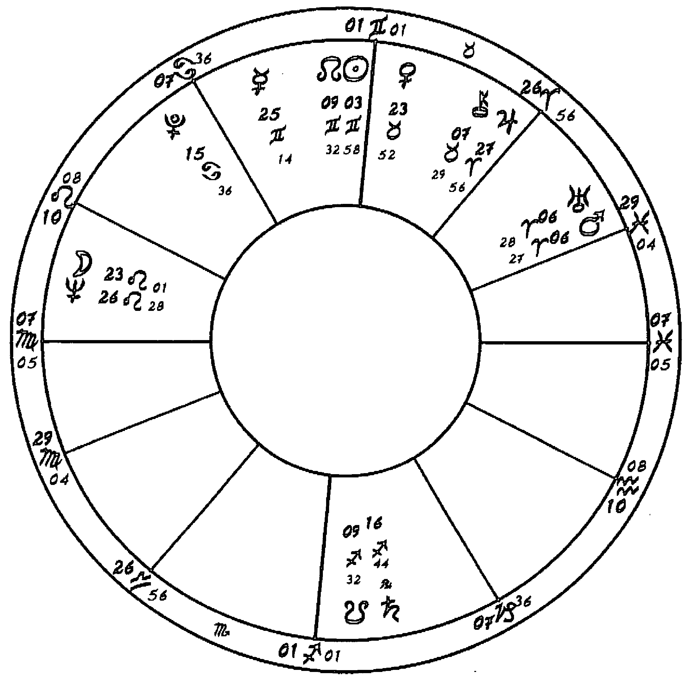

#### 瑪莉

一九八二年五月二十五日生於法國米盧斯

#### 火星的投射

話說，就算火星跟當事人分家，但能量還是存在的。在當事人的生命裡，無論多麼微小，火星都會在此良好運作。我想到一個例子，她是我在巴黎的學生，現在已經七十多歲了，咱們姑且稱她為瑪莉好了。我第一次見到她的時候，她還處在剛離婚的震驚中。她結婚四十年的老公忽然跟別的女人跑了，雖然她的火天緊密合相在八宮的牡羊座，她還是沒有極力挽回這段婚姻。多年來，她過著分居的生活，老公常常出差，身為外科醫生的他薪水優渥，但他們的存款是分開的。這裡出了什麼問題？

火星顯然投射出去了，真是太諷刺了。外科醫生（天王星）受到八宮跟火星的守護，而丈夫展現出牡羊座非常自我中心的一面。聽起來，她好像從來沒有把這股合相的力量用在自己的身上。

啊，但到此為止。兒子長大後，她莫約五十歲時開始學習武術，甚至還開班教授太極拳。她的身材非常精瘦，幾年前還可以背著重重的後背包去爬白朗峰，同行的人至少都年輕她二十歲。她跟同齡的人一起旅行時，最後都會幫別人背行李！可見她的的確確活出了這顆火星的能量。不過，只要她進入關係後，火星就會停擺。

她丈夫離開的時候，她一定很生氣。這件事也沒辦法喚醒她的怒火嗎？

> 琳恩：可以說有也可以說沒有。我會說，憤怒的確從她的每一個毛細孔裡滲出來，形成一股沒有人可以理解的語言洪流，來解釋發生在她身上的一切。不過，她月海合相在十二宮的獅子座，她的自我意識似乎聚焦在這組合相上。她這一輩子都習慣自己擁有的比別人少。她的太陽、水星在十宮的雙子座，這點再次描繪出一位比她優越、迷人的成功伴侶，她自己則是個不敢注視別人的雙眼、講話又輕又快，別人都聽不懂的人。她的父親在母親懷她時過世，留下媽媽一個人跟四個孩子，媽媽肯定充滿憤怒而變得非常暴力。她會拉著瑪莉，把她的頭壓進水桶裡，直到她喘不過氣來。瑪莉是家裡唯一的女生，大家都期待她會幫媽媽做所有的家事，只要哪裡沒做好，就會批評她，甚至打她。瑪莉的月亮、海王星都在十二宮，她成了承擔家裡一切苦難的孩子，哭哭啼啼的，她的肢體語言散發出受害者的氣息。八宮裡的火天合相會帶來某種從外界引爆她內在世界的經驗。

#### 火星在八宮

命，就像瑪莉父親的死亡，但通常沒這麼戲劇性，八宮行星帶來的通常是心理上的經驗。我們先前提過火星會穿刺，會往內探，這可以解釋為什麼有人會想從外面闖進你的私密空間，強取豪奪、肆意妄為。外界的刺激會要求火星回應，挑戰這些越界的行為，捍衛心理的完整性。落在八宮的火星需要積極回應，也要努力鼓起勇氣拒絕外人的索求。火星在八宮很容易出現在兩種人的星盤上，一是有力量去制伏別人的人，他們會加諸自己的意志在別人身上，同樣，還有那些覺得遭到淹沒的人，他們多少可以說是有點依賴或依附的性格。八宮的火星會要求我們與他人角力，測試我們的力量，但掙扎通常是暗地裡發生的。少了這場戰爭，別人可以輕易控制、操弄我們。這些變化可能非常微妙，但通常都是跟性或金錢扯上關係的議題。在八宮裡，如果我們沒有站出來抵抗、解放自我，別人就很容易綁架我們的意志。

在瑪莉的例子裡，她的母親太暴力了，她無法拒絕。一部分的她就漸漸與自我斷線了。如果一個孩子在成長過程裡經歷太多阻礙，特別是暴力行為，這個人就沒有辦法自由發展火星的能量。她的欲望開始往內探，不舒服的情緒受到壓抑，這股能量只能在後半生以更扭曲的方式展現。當一個人感覺不到安全與保障時，要她站出來面對母親的暴力意志是不可能的，這就是瑪莉的經驗。在座可能有些人讀過愛麗絲·米勒（Alice Miller，德國心理學家）對於希特勒的分析，她歸納出施暴的父親和兒子想要掌權的意志之間的關聯。有時，也會出現羞辱的性行為，像是調教與控制的遊戲，受到壓抑的童年欲望終於找到新的方式展演出來，達到解放。如果我們跟隨佛洛伊德的腳步，火星在八宮可能暗示著特殊且強大的伊底帕斯情節，家裡有很濃烈的性慾流動。這樣的火星意味著孩子注意到父親的權力，覺得想要與之抗衡，卻又無計可施。因為這一切都是意識底下的暗流，火星在八宮對於相關人等來說，都非常棘手。通常出現在八宮的行星都想要擁有別人的東西，雖然不見得一定要消滅對手，但羨慕與嫉妒卻是重要的主題。那些奪人所愛、毀人所有的人，背後最終的動機可能是來自無力感。火星本身是很直接、明確的戰士，但落在八宮，可能意味著年幼時的挫敗。然後，慾望轉入地下，暗地裡操控著當事人的生活。通常當事人會朝著禁忌之處直直前進，在此，打破任何一條規矩都能釋放一種甜美又私密的權力感。

最後，八宮的火星會挑戰死亡，不過，通常是在意識之下作用。美國早逝的名演員詹姆斯·狄恩（James Dean）的火獅子落在八宮，同時還有位在巨蟹座的木星、冥王星，他成為狂野不羈的象徵，電影《養子不教誰之過》（Rebel Without a Cause）活生生上演他自己致命車禍的神話。火星獅子會說：「我想成為什麼樣的人，誰都無法阻擋我。」狄恩酷愛速度與酒精，他的車被逼到路肩，最後導致他的死亡。這點跟黛安娜王妃（Princess Diana）有類似之處，她以不同但毫不遜色的方式打破禁忌，王妃的火星在處女而不是獅子座。他們兩人的群眾魅力有部分來自位於八宮的火星。請記住，火星會要求我們接受挑戰，要求我們鼓起勇氣行動，要求我們冒險，要求我們為了重要的事物奮戰，最重要的，莫過於為了自己站出來。如果我們能夠心甘情願地面對生命裡的挑戰，火星就會變得很有力量，且能散發出獨特的個人風采，這種風采特別容易在火星所在的宮位展現。或者，如同霍華·薩司波塔斯（Howard Sasportas）在《內在行星》一書中所言，火星所在的宮位也是我們企圖要讓別人覺得我們「特別性感、特別有男子氣概，或特別有力量的場域」。當火星在八宮的人能夠善用這股能量時，這種風采與魅力通常都會吸引住他人，喚醒他們的慾望。

在童年曾經受過驚嚇的人，好比瑪莉，因為她放棄了自己部分的力量，所以火星會一直從外在接觸她。前陣子，她接受了膝蓋手術，原本是為了她接下來要去西班牙聖雅各之路朝聖時能夠更好走路。結果，她的醫生出了差錯，害她整整一年都得拄著拐杖前進。她發現這位醫生跟她的外科醫生丈夫一樣，只會給她帶來傷害，而不是治癒。不過，讓人驚訝的是，她的火星牡羊還是想辦法扳回一城。雖然術後狀況很差，還非常痛苦，但她還是努力站起來，繼續走路、爬山、練太極，進行短程的朝聖之旅。肢體上的挫敗反而加強了她的意志。她的火天合相與十二宮裡的月海形成一百三十五度，她認為自己是受害者的念頭與她強大的意志力、生命力不斷拉扯，她追求獨立自主的欲望與她內心深處想要受人妥善照顧的欲望相互角力。

#### 火星與天王星

火天相位，特別是強硬相位，常常意味著當事人在生命早期所承受的驚嚇。在瑪莉的個案裡，生命裡的第一次驚恐經驗是父親的驟逝，第二次是她六十五歲時，長年的婚姻忽然分崩離析。火天相位會要求當事人掙脫出來，而這次的驚嚇來自八宮，也就是忽然發現丈夫不忠。也許隨著時間過去，瑪莉會不經意地利用八宮的火天合相能量來攻擊她的丈夫，不過她卻專注在自己的護士工作及筋骨活動上頭。她也許一直都比自己所想像得還要強壯。雖然她的過去非常坎坷，但她現在很享受獨立的感覺，也善用她的自由。天王星所造成的驚恐感覺會讓火星超載，當事人的能量會變得很急躁、尖銳。我常在火天相位的當事人身上觀察到他們的父母也許會拳腳相向，或當事人本身是意外出生、常搬家，與外界的連線常常中斷。火天的相位讓人難以捉摸，古怪又不肯乖乖配合。看起來好像外物一直打斷此人的欲望，在其意志的迴路上造成細小的故障。火星主宰我們的動力與節奏，火天相位在欲望上會添加幾分不規律的色彩。中斷和錯流會在生命裡再出現，不斷改變當事人的方向或意圖。

火天相位包含了幾乎無可抗拒的行為衝動，這股衝動要我們反抗世俗的規範和一般的法則。這種力量是徹底的分崩離析，卻也非常鼓舞人心。這份力量會遠離其他人的意志，或與其相抵觸，當事人必須在生命裡找到明確、自由的管道來抒發，不然這份力量將在不妥的時機爆發。這股力量不是平衡的，爆發時會以非常強而有力的方式呈現，雖然當事人沒有此意，但這股力量會將外界環境炸得支離破碎。話雖如此，火天能量卻常常能夠做出改變、找到方向，而必須著手的事情也就因此得以執行。我認識某位火天合相的女人，她總能夠心平氣和地看著她那難以捉摸的老公，但她有一天推翻了一切，事後她的生命變得更獨立，還得自己扶養兩名孩子。她非常訝異，因為自從她找回自我後，新的可能性一下全冒了出來。不過，她也出了幾次意外，似乎是因為她愈獨立，她想要照顧別人的需求（火天合相在巨蟹座）和渴望自由之間的拉扯就愈嚴重。火天的組合在當事人的生命裡會產生奇怪的循環，想要保存過往一切的巨蟹座似乎與喜愛改變的天王星無法好好協調配合。就算是三分相或六分相，火天相位的目標總是最獨特、最不一樣的。這組相位總有辦法逆流而上，反抗周遭的集體力量。有時這組相位會引起巨大的後座力，有時則能改革成功。當火星與外行星有所連結，火星就會遭到超越個人範疇的能量拉扯，會以各種方式替集體意識行動。

#### 呼叫火星

在場的朋友想來活動一下筋骨嗎？這個練習可以協助我們呼叫自己的火星。大家請起立，右手握拳，用力上下揮動，然後重重跺腳。嘴裡喊著「不」！

-   觀眾：不、不、不！
-   琳恩：現在喊「要」！
-   觀眾：要、要、要！
-   琳恩：我覺得你們喊「不」的時候很激動，但喊「要」的時候比較客氣。
-   觀眾：喊什麼都好，但我擔心我們太吵了。上升天秤總是會想到這個層面。
-   琳恩：大家現在感覺如何？有沒有感覺到剛剛的叫喊和跺步喚醒了你們的丹田？丹田就是肚臍下方的位置，學功夫的時候，這裡就是生命力的中心位置，也是第二脈輪，連接起性慾和物質的慾望。如果你們沒有辦法啟動火星，試著讓這塊暖和起來。
-   觀眾：我發現自己跺腳的時候跺得很輕。我不在乎地板會怎麼樣，但我就是不想踏得太用力。
-   琳恩：十二宮的火星常常會覺得生命就要淹沒自己了，好像意志不是完全由我們操控的一樣。十二宮能夠讓我們超過自我的個體，但這也意味著以自我為主的行星，如太陽和火星，在這個宮位都會感到耗弱，因為十二宮是連結所有生命的宮位，要走向浩瀚的整體。位於此處的行星會引發焦慮不安，多少是因為當事人所採取的行動都會反射出去，引起過多因果的漣漪。火星在八宮將與他人的力量摩擦掙扎，並願意在某種程度上去面對，十二宮的火星則得學習放下欲望。如果能夠學習回應生命裡出現的一切，接受生命之道且順勢而為，十二宮的火星也會充滿力量。純粹為了私己的欲望常會受到阻礙。許多火星在十二宮的人都會害怕自己的怒火及毀滅力量，好像火星在這裡發誓絕對不能傷害別人一樣。當火星在此爆發的時候，能量會跟迴旋鏢一樣。從另一個角度來說，法國統計、心理、占星學家高奎林（Michel Gauquelin）認為，十二宮的火星對運動員及體育活動相當有利。也許因為火星透過速度與力量走向奉獻與神聖的道路，因為有天份的運動選手是受到肉體力量與技能所驅動。古希臘人發明了奧運，而這場運動會是獻給火星的動態讚美詩。

#### 火星和冥王星

##### 格格不入：毀滅者火星

我想談談阿基里斯，以及在他屈服於自己的怒火後所發生的事情。為了要稍微懲罰阿伽門農，阿基里斯把自己的人馬從戰場上召回去。我常在冥王星特質很重的人身上看到這種反應。他們之所以退縮，是為了要懲罰別人。阿基里斯更過分，他一開始氣到打算請宙斯淹死希臘大軍。他的母親勸退他，但阿基里斯決心要復仇。阿基里斯將軍營移到河邊，他的人馬在此休息、打牌、練劍，且眼睜睜看著希臘人遭到敵人屠殺，阿基里斯都無動於衷。事實上，宙斯也同意，在希臘人還沒認同阿基里斯的功業前，他們只能節節敗退。等到兵敗如山倒的時候，阿伽門農才趕緊贖罪，但阿基里斯卻像地獄裡的冥王一樣一步也不肯讓，完全沒有協商的空間。雖然我不想把整部偉大的文學作品簡化到只剩下占星的元素，但《伊利亞德》裡的主要角色都以不同的樣貌具體呈現出火星的特質。好比說奧德修斯，他聰明機智，牙尖嘴利，雖然看起來是個笨重的大塊頭兒，卻能夠抵擋他的嘴上功夫。他就像火星在雙子座的人。帕里斯負責評斷三位女神的選美，愛上了海倫，最後引發戰爭，如同火星在天秤座的狀況。我們只能說是阿基里斯是在天蠍座的火星。奧德修斯打算和他講道理：「爭執是會要人命的，放下這股仇恨吧。」阿基里斯卻回口說：「我對表裡不一者的憎恨猶如地獄之門。我太了解他了，不會讓他再次愚弄我。讓他靜靜地走入地獄吧。宙斯和……」

觀眾：他的口氣聽起來滿偏執的。

琳恩：沒錯。當養父打算好言相勸的時候，他反而對養父出言不遜：「對那種人掏心掏肺，你要小心點，當心我對你的敬愛會變成憎恨……你該做的，是讓那個害我痛苦的人體驗同樣的滋味。」這段話是不是很冥王星？阿基里斯一開始的怒火是非常公正、就事論事的，但當怒火壓抑回去之後，這股怒氣開始毒害他的思想與情緒。我們可以說，這股怒氣從內在在吞噬他，讓他無法明辨是非。當火星能量轉向內在的時候，可能會跟當事人唱反調，這種狀況當然可怕。阿基里斯誓言不再作戰，除非希臘人被迫上船。事後阿伽門農在軍營裡氣得跳腳，無法入睡，後悔一開始對阿基里斯大小聲，而因此壞了大事。不過，阿基里斯已經不再信任阿伽門農了。當火天蠍失去信任的時候，他們會跟著魔了。

觀眾：阿基里斯失去了他最好的朋友帕特羅克洛斯（Patroclus），這位朋友代替阿基里斯上場作戰。

琳恩：沒錯，他失去了他最愛的人。帕特羅克洛斯受不了眼睜睜看希臘大軍節節敗退，阿基里斯一直固執己見，直到最後一刻都還在盤算、記恨。這個狀況聽起來很像日火四分相。阿基里斯做了一件非常極端的事來保有他的尊嚴，他用劍刺進自己的心臟。我覺得這個狀況很像日獅子四分火天蠍。阿基里斯的悲劇在於他太愛自己，讓尊嚴凌駕一切，但阿基里斯走錯了一步。當水軍靠岸的時候，他決定讓帕特羅克洛斯穿著他的盔甲帶兵作戰，這是為了替他打勝仗回去鋪路。帕特羅克洛斯非常勇敢也很會作戰，但他沒有依照阿基里斯的吩咐，趁特洛伊人戰敗時撤退收兵，反而為了求勝，繼續追趕。他殺紅了眼，因此導致他的死亡，這天，大家為了他的屍首爭執不休。特洛伊人決定把他的屍首當成戰利品，斬斷首級，掛在城堡的牆垛上；希臘人則急著想把他的屍體運回去。阿基里斯聽聞帕特羅克洛斯的死訊時，整個人崩潰絕望到在地上打滾，但他無法立刻前往戰場，因為他的盔甲還在特洛伊人手裡，必須等待火神赫菲斯托斯（Hephaestos）重新打造一副盔甲給他。在這段時間裡，阿基里斯結束了他和阿伽門農之間的爭執，平息了怒火，他說：「怒火潛伏的方式如同緩緩流下的蜂蜜，怒火讓最聰明的人燃燒，還跟煙氣一樣在此人身上流竄。」阿基里斯帶著熊熊怒火回到戰場。他下手毫不留情，在斯卡曼德（Scamander）河畔掀起一場腥風血雨的大屠殺。這條受到特洛伊人當成神祇來崇拜的河，正思索自己是否能夠阻止這頭正在毀滅特洛伊的野獸。河神說：「我摯愛的河道裡都是死屍，屍首讓我窒息，河水無法流去神聖的大海。我再也受不了了，別在這裡殺人了。」阿基里斯和河川也有非常壯美的鬥法，河水一再漲起，想要用黑色的水牆淹死阿基里斯，將他拖進爛泥裡埋葬，永遠無法翻身。阿基里斯的罪惡感非常符合火天蠍的形象，一具具屍首卡在他的靈魂和情緒裡。他坐在一旁彈奏起了樂曲，對於每天死去的無數同袍裝出一副事不關己的冷漠模樣。河水帶著無意識的感受能量漲起，淹沒了他。火星在水象星座的人的確容易受到情緒淹沒。火星在天蠍座或與冥王星有所相位的人都會本能地意識到自身的毀滅能量、所有的屍體、經常受到壓抑的意志，不過，這種力量一旦宣洩，大家都得小心。

#### 控制怒火

觀眾：我的看法是，怒氣一定要發洩出來。如果一個人受過暴力對待，這股情緒發洩出來可能會造成其他影響，但真要壓抑也壓不下來。有沒有其他的解決之道呢？一定得壓抑嗎？

琳恩：我想，火星的能量是不可能只體驗一小部分的。當火星能量變成憤怒的時候，這股能量是不會罷休的，如果能量遭到壓抑，可能會化膿腐爛，就跟阿基里斯一樣。火冥相位的目標常常轉變為控制怒火，用意志力壓抑強烈的情緒。不過，如果壓抑過頭，結果可能會失去作用，導致感情的冷淡和冷漠。

蘇珊：妳會怎麼解釋我的狀況？我的火星在雙子座，四分冥王星，但這組相位的殺傷力很強，我從小就知道不要讓自己爆發。當這些情緒湧上來的時候，我會選擇逃避。然後和自己理論，辯解一些狀況。當然了，日月都在風象星座也有助於讓我冷靜下來。

琳恩：啊，反應很快的火雙子。怒火會席捲妳的心智嗎？

蘇珊：對，但除了怒火以外，我的腦袋是一片空白，我會氣到想殺人！我的言語就跟子彈一樣，很可怕。我發現我的怒火真的是熊熊燃燒，等到冷卻的時候，卻變得更危險、更致命。好像它想掌控一切一樣。

觀眾：請問在氣到爆炸和壓抑能量之間沒有其他選項嗎？

The request was rejected because it was considered high risk## 瑪麗－若澤·佩雷克

一九六八年五月九日凌晨兩點二十分於出生法國外省瓜德羅普的巴斯特爾

火海相位是一種誘惑，這種誘惑會讓人跨越懸崖，踏入不適用一般世俗通則的場域。火海相位的配置並不如一般人想得那麼溫和，這樣的藍圖可能屬於連續殺人狂和騙子，但當事人也可能是詩人、舞蹈家和聖人。有一位在電視上傳福音的主持人吉姆·貝克就逾矩了，此人的火星在雙魚座，對分處女座海王星。當他出庭接受欺騙信徒及性醜聞案件審判後，他就從上帝的使者變成了哭哭啼啼的階下囚。

讓我告訴你們一個日火合相在金牛對分海王天蠍的例子。這位先生提到他很難去控制火星的能量，因為他似乎會吸引暴力事件的發生，好比說有人開車撞到騎腳踏車的他，最後還修理了他一頓諸如此類一連串的意外。雖然他的意識清楚明白要避免衝突，但火星卻從四面八方冒出來，在他生命裡爆炸。他的火星和太陽緊密合相在一宮，守護星金星卻落入十二宮，所以我多問了他家族裡男性長輩的事情。他來自南方一個相當暴力的部落，他的父親坐牢過一段時間。

他本身是一位非常認真的治療師、按摩師，講話輕聲細語，人很好、很可愛，非常講究直覺。不過這個人身上似乎擁有更多能量，他會騎單車跨越半個巴黎，一天去七個地方替人按摩，然後還去跑步。他很結實，就外型看來是很強壯的，鍛鍊過身體且把重心放在身體上，非常符合日火合相在金牛座的特質。他的海王星肯定沒有削弱火星的能量。他也許對自己的身體有過夢想，夢想成為運動員。他曾誓言不會傷害其他人，但他卻常常成為別人發怒的目標。我們在此觀察到了海王星的理想化，想做好事，但同時卻又會成為暴力事件的標的，扮演起受害者的角色。

#### 無盡的漣漪

他的婚姻很幸福，有個小孩，但他的思緒一直都在別的地方，在海上。只要他有時間，他就會跑去法國位於大西洋上的一個島，待在水裡、衝浪什麼的。就算時值隆冬，他也會穿上保暖潛水衣跳進冰冷的水波裡。他喜歡在有點危險的地方衝浪，特別是礁石淺灘之處，因為這種地方的浪最適合衝浪。他一定要找點挑戰，一再衝進大浪裡，他發現這是一個不會傷害其他人的方法，但他身上卻有幾處嚴重的擦傷。

- 觀眾：我笑了，因為妳所描繪的景象非常符合火海對分的人。這個人結合了火星的肉體與海王星的無限。太讓人著迷了，但同時我又感覺到這個人是在與無限對抗。就我認識的衝浪客而言，大海就是一切。他們常常遠目，眼神跟海浪一樣飄渺。

琳恩：沒錯，無論海王星看起來多麼美好，卻很容易讓我們迷失，話說回來，這就是這顆行星的吸引力，也是著迷的本源。火星所有可能的怒火全部都宣洩在水裡了。有股欲望想要徹底放縱，想要投身於比自我更浩瀚的場域，想要一再體驗飄飄然的感覺。要成為一個優秀的衝浪客，你必須對海浪逆來順受，你必須默默遵從大海要帶你去的方向。他非常喜歡水，他是海王星的侍僧，嫺熟神聖的海洋之舞，將自己的肉身獻給無限的大海。

去

火星和外行星產生相位的時候，當事人都會面臨超越自己領域的事情。不過海王星也會讓一個人的自我變得千瘡百孔，缺乏完整性。的確，他們能夠同感人世間的疾苦，也能體察到其力，這場戰爭太浩大了，一點贏面也沒有，那又何必試呢？逃跑、當個縮頭烏龜只會帶來高漲的無力感，只好一再逃避，躲進藥物、幻想與酒精的世界裡。火海相位最後可能會跟洪水捲葉片一樣吞沒當事人的太陽和火星。有天早上，他帶著沉重且哀傷的心情獨自出門去，沿著低低的潮水撿拾爛泥和沾滿油污的鳥禽，此時一組採訪人員前來訪問他。他們好奇他是不是很生氣，他說：

> > 「如果有人把垃圾丟在你的教堂裡，你會不氣嗎？對我來說，這樣的行為玷污了我的聖堂，待在水裡是我崇拜上帝的方式，漏油不只是犯罪事件，更是一種褻瀆。」

他忽然覺得很煩，因為這些人一直拿麥克風堵在他面前，擋住他的去路，想要拍攝他，而不是打算幫忙整理海邊。他的天堂遭到污染以後，他好一陣子都悶悶不樂，因為他發現自己能夠捍衛這個地方的力量有限。你們看得出來，火海的主題在他生命裡具有很大的影響力。

- 觀眾：那火海相位的靈性層面呢？因為渴望合一，這組靈性的相位是不是能夠全然沉浸在其中？

琳恩：對，目標是這樣沒錯，當事人甚至能夠稍微感受到這種靈性的合一。不過就算此人強烈認為自己擁有靈性的使命，偶爾的困惑與質疑還是會讓他退縮。

- 觀眾：就我自己的經驗，我會覺得海王星主要的效果就是要淹沒意志。當事人會被迫屈服於更巨大的靈性意志之中，覺得有股更浩瀚的力量操用他的肉身，但當事人的意志則是雜亂無章的。

琳恩：我相信別人也會有這種感覺。相比之下，火星應該是所有行星裡最不容易臣服的。臣服不符合火星的天性，因此造成斷裂與動搖，在某種程度上也許會抹滅或失去一些能量。火海主題的不確定性讓人衰弱。你有自我吧？你應該要放下自我嗎？是我錯了，還是別人不對？然後，感覺一切都太超過了，人類能力所及太微不足道，根本沒差。何必精衛填海，何苦呢？感覺好像有人拔掉了你精力的開關一樣。

- 觀眾：我有火海相位，的確感覺好像遭到吞沒一樣。我會感受到世界苦難的絕對性，而我無法改變。實在難以忍受，我做的每一個決定都意味著我選邊站，因此可能讓事情變得更糟。此刻的中東有人遭到無情謀殺，我卻站在這裡。我到底能做些什麼？

#### 火星四重奏

琳恩：又出現了，我們又要談到底線的問題。你能接受自己一個人能做的事情就是這麼多嗎？還是做得不夠、做得不夠好這種問題吞噬著你？火海相位會受到拯救世界欲望的驅使，但這種欲望會帶來非常多的後果，這種後果不是人人都能承擔。火海相位一定會回應受苦這件事，這不是什麼輕鬆的任務。

- 觀眾：我行動的時候，常會懷疑自己有沒有讓事情變得更糟，腦子裡會不斷思考：「我做的是對的嗎？我真不該這麼做。我的行動帶來的是好處還是壞處？」

- 觀眾：但放棄、不採取行動又意味著鬱悶壓抑。

- 觀眾：或酗酒。

琳恩：或消極。我們知道，酗酒可能會讓人變得激動、暴力。那些沒有活出來的能量，在火海相位帶來最痛苦的感覺就是無力感，或在一個人開始之前就放棄。重點又回到欲望上頭，無論你是否覺得做與不做到底能不能帶來改變，你想要什麼，就必須採取行動。

- 觀眾：感覺在場有人會因此天人交戰。休息的時候有兩位朋友來跟我討論火海相位的健康問題。「我該如何使用這股能量才不會傷害、危及我的身體？」擁有火海相位或火星在雙魚的人也許要學著放下，學著改變既有的模式。海王星永遠不會提出清晰的目標，所以這點還蠻難的。不過，有時出現的困難症狀也意味著你放棄太多自己的力量了。

- 觀眾：擁有火海相位的人很適合活在修道院裡，但要在真實世界裡生存實在有點困難，對嗎？

琳恩：沒錯。火海相位會要求我們在世界上帶著信仰行動，走進未知的領域，找到出來的路。迷路也許是找到新路的唯一方法，有時，必須等到我們不再努力嘗試，我們才會不小心找到解方。面對這種相位最好的方法就是讓他們隨著常人無法察覺的世界音符前進，跟隨改變與波流的脈動，最後，也不知怎麼著，就會抵達他們原本想去的地方。

#### 火星和土星

該回來談談具體且可以量化的部分了，好比說火星與土星的關係。火星在土星守護的星座是強勢的，但老派的占星書對火土相位總是沒有好話，這點我覺得很有意思。摩羯座提供火星專注力、焦點及使命，經過剛剛一長串無法聚焦的哲學漫談，火土相位會讓人覺得鬆口氣。這樣的組合為什麼這麼惡名昭彰呢？

- 觀眾：難道土星不會壓抑火星嗎？

琳恩：沒錯！就實際上來說，火土相位會讓人有一種穿著盔甲、死板板的感覺，而火海相位則是非常靈活、充滿流動性，甚至能夠輕鬆適應不同的環境。想想柯林頓和他的薩克斯風，以及一板一眼、實事求是的副手艾爾·高爾（Al Gore，火星、土星與冥王星合相）是風格大相逕庭的兩個人。不過，穿上盔甲的感覺卻是其來有自。火星和土星之間的強硬相位讓當事人在年紀很小的時候就體驗過遭受阻礙的感覺。當事人想要什麼東西，卻無法獲得，或必須配合某種行為才能獲得這項東西。我想起一部約翰·托特羅（John Turturro）的電影，裡頭的父親說：「要做事只有兩個方法，一個是我的方法，一個是對的方法，而這兩個方法是同一種方法。」這位父親很有火土陰森逼近的感覺。相信大家 都記得克羅諾斯／土星吞下自己小孩的故事吧。火土相位顯示出這個生命在一開始的時候 就遭到嚴密監控。壓抑成了當事人的第二天性。多數當事人可能沒有辦法察覺這種早期的制約行為，也不明白自己為什麼壓抑得這麼累。想要徹底抑制的壓力太大了，擁有 這組相位的人根本無法起床，沒辦法打電話或整理辦公桌。為什麼同樣的兩顆行星，

- 觀眾：是不是因為這個人的意志某種程度並不完整？決定權並不在你，而在其他人手裡。

琳恩：這點要依不同星盤的狀況來解釋。我懷疑應該端看擁有火土相位的當事人有無勇氣爭取，還是寧願封閉起來，繼續服從、壓抑。火土四分相的人可能會忽然怒火爆發，因為外在世界好像不斷阻擾，好比說：「喔，真不好意思。你填錯表格了，請你重填，流程再走一遍。」約翰，可以麻煩你跟我們分享你那個關於門的故事嗎？

#### 清除路障

約翰：沒問題。當時行運的火星經過我的月亮。我剛抵達英國的雷丁大學，那天下著傾盆大雨。我下了計程車，警衛指錯了方向，建築物也都沒有標示，所以我在大雨裡，提著兩個重重的皮箱，在學校裡繞來繞去，最後繞了六圈，我的火氣愈來愈大。我一直回去問警衛宿舍在哪裡，他一直亂指。最後，他帶我過去，我卻發現我的鑰匙開不了門。我真的很氣到開始踹門，直到有人出來告訴我，警衛帶我走錯大樓了。等到我去吃晚餐的時候，我真的氣到快爆炸了。我沒辦法跟別人共桌，我的皮膚又髒又紅。

琳恩：約翰的火星在巨蟹座，守護星是月亮，所以當時火星的行運會啟動這個迴圈。受困在雨中讓火巨蟹氣到不能再氣，難怪你會情緒爆炸，因為你想要尋求安全感和室內的落腳處，你想要有個家，這的確是火巨蟹最基本的要求。當一個人活出一組相位能量的時候，實在

約翰：我看到一再出現的挫敗感、遭到壓抑的頹喪感、鑰匙打不開門，這些事的確啟動了火土四分相。為什麼人家會指錯方向，你會不得其門而入呢？火巨蟹會生氣，因為沒有遮風擋雨的棲身之所，因為沒有保護，當然這肯定也不是他第一次遭遇這種狀況……我真的開始踹門，要不是有人出面解釋，我可能真的會大肆破壞。

琳恩：火土四分相是相當迷人的，因為當事人可能長年接受生命裡的所有限制。一陣子之後，當事人會覺得疲乏，忽然有一天，某人因為莫名其妙的原因拒絕你，或你的東西遭到剝奪的時候，驚人的怒火就會忽然爆發。當事人會不計一切代價開始毀滅、開始破壞。千萬不要小看火土之間的強硬相位，因為當事人最後一定會有受不了的一天。他們絕對不能再這樣對我，一次都不行！於是這個無害的乖乖牌鄰居忽然拿起了槍，殺了三十五個人。約翰，不好意思啊，當你的面這麼說。但當一個人無法繼續忍受一再的挫敗時，火星就壓抑不住了。

約翰：
妳的話讓我想起電影《稻草狗》（Straw Dogs，又譯《大丈夫》），這是我最喜歡的電影。有位文靜的教授住在康瓦爾，當地人都欺負他，他老婆還慘遭強暴。最後他拿起槍和滾水，斃了所有人。真的是很火土的電影！

原書註：導演山姆·畢京柏（Sam Peckinpah）本身火星在金牛座對分天蠍座的土星。

#### 打破高牆的人

琳恩：看吧，占星真的很準吧？咱們還是對約翰好一點好了！這顆火星能夠爆發的憤怒真的讓人刮目相看。經過多年的等待，火星終於達到土星的臨界點。「多一分鐘我都無法忍受！」想想十六世紀掀起新教改革的馬丁·路德（Martin Luther）吧，他把他的公告《關於贖罪券效能的辯論》（Disputatio pro declaratione virtutis indulgentiarum）釘在大教堂門上，他完全曉得教會政權會是多麼過分。他本身是火土合相在天蠍座於三宮，而在某一刻，他也無法繼續服從了。他被迫說「不」，當那公告釘在門上的同時，也把世界敲成了兩半。對於火土相位來說，服從與不服從一直都是很重要的議題。這組相位很容易出現在家教很嚴、不讓小孩發展意志，最後讓小孩綁著臉就範的家庭裡，而家裡的權威只會控制與責備。如早先有人提到的，這樣的確會打壓一個人的意志，更會扼殺一個人的靈魂。家裡小孩如果有這組相位的人，現在一定開始坐立難安，這不代表你註定會壓抑孩子的意志。這是意味著，無論是在家裡或外頭，孩子都會質疑權威。這些孩子必定是要反抗規矩，從旁擦身而過，不然就是多少會受到限制。

- 觀眾：這不一定代表父母很嚴格。一再替孩子擋下困難的父母也可能打擊孩子的意志，限制孩子的期望也是，好比說，女孩只能待在家裡，男孩無法成為一名舞者都是一樣的。

琳恩：而且常常是難以面對的。我最近聽說了一個關於安徒生的故事。他小時候家裡很窮，媽媽是一名清潔婦。他告訴媽媽，國王邀請他去吃晚餐的時候，媽媽只說：「噢，親愛的，我們不適合跟那些人來往。」（安徒生日土對分，火星在獅子）。通常呈現的是一堵看不見的限制，暗示著當事人父母是如何看待世界的。如果你有這組相位，你會覺得好像受到壓迫，而到了某一個時間點，你會被逼突破。隨之而來的當然是龐大的恐懼與阻礙，但如果你就此罷手、不再向前，結果可能就是一輩子的挫折與失敗。通常，火星的確有很多理由懼怕土星。這組相位常常會對那些濫用權力，或與制度合一的對象展開漫長的戰爭。成功的機率通常不高。早先我提過火星是「打破高牆的人」這個說法，這堵高牆可能就是土星，而火星企圖摧毀壁壘，推翻社會堅固的結構。幾位女權運動的象徵人物，好比說貝蒂·傅瑞丹（Betty Friedan，美國女權作家）就有這組相位，馬丁·路德·金恩（Martin Luther King，美國人權領袖）也有火雙子對分土射手，他是二十世紀對抗迫害最有力量的聲音。要站起來面對能夠立刻壓垮你的制度需要無比的勇氣，不過，這卻是火土相位必須面對的任務。傅瑞丹跟金恩都認同火星，將土星視為外來的迫害。火土相位給自己惹麻煩是眾所皆知的，因為他們要對抗最可怕的壓迫，或因為犯罪而遭到逮捕，例如，想要逃獄的罪犯又再次落網，因此又多了幾年徒刑。覺得自己不夠好，一再重複失敗的模式。這些可怕的夢境像是我們碰到什麼就打破；渾身赤裸，在真實世界裡弄得髒兮兮的；無法完成手邊的任務，因為失敗而遭到譴責，這些都是害怕沒有辦法做好事情的回音。大人太過嚴厲地指責孩子，或拳腳相向，這些孩子曉得壓抑的憤怒、羞恥、無力感，這是火土相位最糟糕的表現方式。不過，擁有火土相位的人也許暗地裡害怕火星的力量，因為這股力量可能會帶來破壞。

#### 暴君

火星為了要捍衛自己，很可能會認同施壓的土星，且找到力量去阻礙其他人，控制別人的行為和行動。美國前聯邦調查局局長約翰·艾德格·胡佛（John Edgar Hoover）的火金牛位於天底，對分天頂上的土天蠍。這位執迷妄想又神經緊繃的小個子會因為早餐料理不當而大發雷霆，而且完全不會承認自己錯了。他成了美國勢力最大的人，不只因為他是聯邦調查局局長，更是因為他幾乎替每個人都建立了秘密的檔案資料。落於天蠍座的土星守護摩羯座的太陽，月亮四分海王、冥王也強化了這層關係，太陽和冥王星則呈一百五十度。他讓人害怕也讓人討厭，對於秘密的執迷與控制則來自他本身壓抑的性傾向。受挫的性向、欲望的去勢都會讓一個人的靈魂插滿倒刺，這也是火星受限於土星的其中一種可能性。胡佛脆弱的父親最後崩潰，進了精神病院。

他則與母親展開一場有如地獄般的母子關係，這段關係結合了愛、恨與怨懟。父親的脆弱讓胡佛覺得自己的力量非常不合理，媽媽則以高壓鐵腕的手段逼迫他成功。胡佛把想要組織家庭的狂想變成了一場實際的官僚夢。他認為自己是最厲害的執法人員，打擊罪犯和共產黨，還打造出至今尚為執法基石的指紋檔案庫。土星天蠍對分的火星的確捍衛了他的國家，也建立出一個偏執又不合理的系統進而徹底掌控一切。他覺得每個人都可能是他的敵人，就算是非常了解他的人，也會把他當成一個危險的暴君，認為他會壓迫別人，瘋狂渴望權力，為達到目的不擇手段。想像一下，如果他擁有現代的科技，他會幹出什麼事來？這點的確滿恐怖的。

這個人必須透過攻擊現有結構來保有自我的完整，如果這個人認同的是土星的能量，而不是火星的能量，那這組火土相位可能就會變得非常壓抑。胡佛經常侵犯多數民眾的權利，覺得自己凌駕於法律之上。這組相位的殘酷與毀滅性會愈演愈烈，原本是要為架構盡一份心力的，最後卻遠超出應該作為的範圍。墨索里尼火土合相，希特勒是金火四分土星。我們可以看到法西斯主義與這組相位息息相關。不過，這組相位所帶來的經驗一部分是來自外在，一部分則來自個人內在。佛洛伊德的火天秤、土雙子形成分離的四分相，他的表現讓我們看到專制的

原書註：胡佛，一八九五年一月一日晚上七點半於華盛頓特區出生，資料來源蘿伊絲·洛頓。

琳恩：在場有火土相位的人是否覺得小時候很難表達火星？有嗎？別人會說：「住手，現在就住手。」基本上就是猛然限制你、壓抑你的火星能量。請記住，火星的能量就在於試出極限，或要求其他人別來煩你。就連小時候，大人要你吃蘋果，你可能會說：「不！我不要照你的意思來做事！」擁有火土相位的人可能會在生命裡遭到權威人物的重傷或恫嚇。通常火星都是在進行某件事時遭到打斷。好像土星原型裡的那把鐮刀一直在大家的無意識裡盤旋不去，所以慾望就和恐懼產生連結——對於毀滅、違法或罪惡感的恐懼。我不是喜歡一直提「去勢」這兩個字，但講到火土相位還是不得不提。想想火土相位讓一名正在經歷戀母情結的孩子產生什麼樣的衝突，對一個人的自我和表達性向與形成大十字。

父親和每個孩子心裡暗藏的殺人幻想。他描繪出自我（ego）和本我（id）之間的拉鋸。他打壓心理分析界不同的聲音，捍衛自己在那些戀母情結追隨者間最卓越的地位，同時也對抗社會與約定俗成的道德觀。就他的例子來說，他的火土四分相同時攻擊問題的兩端，既對抗別人的權威也捍衛自己的權威，土星掙扎所帶來的影響也能在他的靈魂地圖上略見一二。他的火星也對分木星，所以產生了火木土的T型三角。有一點非常有趣，榮格的火星在射手座，也與木星、土星產生相位，不過他是六分相，所以他掙扎的狀況與佛洛伊德不太一樣。榮格的火星剛好對分佛洛伊德的土星，填補了T型三角的空白之處，形成大十字。

欲望，會有什麼樣的影響。這種家庭會有很多嚴厲的規矩，也讓他更有理由受罰，於是火星遭到限制，無法自由活動。火土相位描繪的不見得就是心狠手辣的父母，但纖細的孩子在行動中就是易遭打斷，變得麻木，沒有辦法隨自己的速度、樂趣或欲望所產生的衝動來行事。同時，火星的確需要受到控制。大人會限制孩童不能在車子前面跑，不能亂摔餐具，更不能在晚餐時大吼大叫。大人和小孩的關係本來就多少有加諸限制和確立規範的意味。土星也許能夠恰好限制住火星，保留精力聚焦、專心，或加上意志力，把精力投注在更有收穫的行為上。所有關於耐心、限制、慎重、自制的美德都和運作良好的火土對話有關。不只是三分相和六分相，就連更困難的相位都能夠找到方法約束且活出這組相位的力量。火土相位會從我們先前討論過的領域冒出來，好比說我們不再責怪他人告訴我們該做什麼、不該做什麼，而開始為自己負責的時候，但前提是如果這份責任不會把人壓得喘不過氣來時。大家有沒有發現有火土相位的人對時間都非常執著？他們的時間永遠不夠，或者總在很短的時間裡塞進一堆事情。不能虛擲精力，火星的能量一定要用在能夠成就長期大業的刀口上。火星在摩羯座可能是上述這些特質去蕪存菁過的版本，他們生來就能妥善使用時間。

> 我可能講過這個故事了，幾年前在《占星協會雜誌》(Astrological Association Journal)有一則船難故事。這艘船在冰島附近海域翻覆，上頭大概有三十名外國漁民。當時正值十月或十一月的暴風雪季節，海水就要結冰了，有一個人游到岸邊，走了二十公里的路，抵達最近的城鎮，活了下來。這個人的火星與土星合相。這個故事總是讓我驚豔，因為我看見了這組相位所展示的無比決心與毅力。意圖和目標都很明確，誰也阻擋不了這股力量，但前提是當事人必須曉得自己要什麼，且願意努力爭取追求。對分相的狀況比較棘手，因為當事人很容易把困難的部份投射出去。只要當事人覺得有什麼人或事一直阻擾他，核心能量就分散了。火星必須透過戰爭和障礙來探索自己，而困難通常是來自外界。火土相位會立刻感受到失敗的恐懼，要麼就是停下來，要麼就是繼續前進。了解自己能做什麼、不能做什麼是土星的禮物，尤其是在產生困難相位的時候，困難和挫敗感會隨著時間加劇，直到火星最後終於準備行動為止。土星是個頑強的對手，時間對火土相位來說非常重要。當事人必須有耐心，抓緊時機。擁有火土相位的人，想要的任何東西都無法一蹴可幾。如果當事人能夠以正面的方式處理延遲這個議題，那所有的挫敗感、約束與限制事實上都能夠增加火星的能量。如果你能使用與火星產生相位的行星能量，隨著火星一起行動，你的精力與勇氣都會增加。你的英勇之心就會出現。遇到挑戰的時候，困難相位總是能夠增加行星的力量。

#### 奮戰到底

琳恩：在場有沒有人讀過海明威（Ernest Hemingway）的《老人與海》（The Old Man and the Sea）。故事講述一名老漁夫，一連八十四天，一條魚也沒有抓到。大自然讓他憔悴、傷痕累累，但他還是持續出海，專注沉穩。老人到最後什麼都沒了，就連他的胃口也一樣，他等著幸運降臨。然後大魚終於出現，拖著他的船跑，割傷了他，還差點害死他，但最後老人贏了這場戰爭，將魚綁在船邊，因為他沒辦法把魚拉上船。後來鯊魚來了，他跟鯊魚搏鬥，直到他赤手空拳、力氣耗盡。等到他靠岸的時候，剩下的就是這副長達六公尺的魚骨，鯊魚差不多都把魚肉吃光了。打敗他的並不是這條大魚，他與身形懸殊的對手搏鬥，最後得勝，但他做得太過火，遠超過他能控制的限度。

海明威的火星在一宮，四分土冥，他這輩子也都幹得太過火了。這一部分來自對於男子氣概的迷思：遊戲人間的獵人、鬥牛場上的情人、酒吧裡喝酒鬧事的酒鬼。他必須戰勝恐懼、挑釁死亡，因此常常陷入實質的危險之中，他身上的骨頭幾乎全都斷過。有人曾說，他完全不曉得這麼強壯、活力十足的大男人居然會花這麼多時間躺在床上等待身體復原。好像他出門找麻煩，每次都成功找到一樣。一般人要被獅子抓傷也不是什麼容易的事啊。在《紐約時報》上讀到自己的訃聞，他還會產生冥王星的滿足感。在害死多數

#### 厄尼斯特·海明威

一九八八年七月二十一日早上八點出生於美國伊利諾州的奥克帕克

觀眾：聽起來實在很不像深思熟慮、充滿謀略的火處女。

琳恩：是不像，真的不像。不過，老漁夫的故事卻是一個人最樸素的際遇，沒有什麼厲害的工具，只有知識與決心，這點還是與處女座呼應的。

我們因為海明威，走進火冥四分相的國度，這組相位通常帶有偏執的色彩。土星從另一邊四分火星，增加了幾乎無法忍受的壓力。暗中又有神秘的家族力量牽引著他，天王星、凱龍星、土星都在四宮，土星對分冥王星，四分火星。他的童年充滿著男人上戰場的故事、勇氣、暴力與自殺。他的父親在一九二八年自殺，此時他剛好土星回歸來滋養火星，讓火星超載，形成更危險的狀況，彷彿冒險是他找到自我的必要手段一樣。同樣的需求也一再出現於他的作品之中，一個男人必須考驗、掙扎，與比自己還壯大的力量對抗。

觀眾：火星在陰性星座，太陽在巨蟹，這些敏感性都去哪裡了？他是不是矯枉過正了？

琳恩：海明威小時候很軟弱，幾本他的傳記都提到他可能有生育上的問題，嚴重酗酒跟意外常造成的傷害更是讓情況雪上加霜。火土相位通常暗示著當事人早年難以克服的障礙，以及害怕失敗的心情，這種害怕沒有辦法發展或成功的感覺會非常強烈。土冥對分相所

琳恩：在海明威家族的詛咒裡，自殺成為做出決定的行為，代表一個人能夠掌控自己的生死。不過，自殺對其他家族成員來說，仍是一件傷痛欲絕的事情，通常對於好幾代的子孫都會有所影響。海明威失去了身為人及寫作的力量，他看著自己的才華與成功慢慢消逝。他的其中一位兒子最後進了精神病院，瑪莉兒跟瑪歌則是另一個兒子的女兒。要從這樣的過往中活出自己實在太難了。

觀眾：他的四宮看起來很難適應家庭生活，他也許不想與父親的失敗率扯上關連。他需要別人叫他「老爹」這點我覺得蠻悲慘的。他的孫女呢？是不是也自殺了？

琳恩：他的媽媽有專制的人格，她是一位表演家、歌手，長得很美卻喜怒無常。她鄙視母親的角色，把養育和煮飯的工作全留給傭人來做。海明威的星盤的確暗示了對於力量、羞恥和風險也很高。不過，光看火星沒有辦法看出他與女性的關係，星盤裡還有其他暗示。請注意他的月摩羯對分金巨蟹，似乎有「分裂的阿尼瑪」這個經典的問題，他沒有辦法渴望身邊跟他一起生活的女人。也許這是為什麼大家都叫他「海明威老爹」的原因。

#### 火星與身體

觀眾：有的，他最出名的就是精簡的文風，這是很陽剛的寫作風格。他聚焦在行為及敘事上，其他都省略。在他之前，好的寫作都有某種程度的詞藻華麗，海明威對小說可以說產生了革命性的衝擊。感覺他的文字精簡、現代，非常工整。化繁為簡就是典型的火冥組合。

琳恩：我想請問火土相位所帶來的體力問題。我在好幾張星盤上看過這種暗示。

觀眾：如果没有適合的管道，火星最後會顯示出身體的問題。海明威就是一個驚人的例子。他把身體操到極限，最後身體崩壞。這是火土相位其中一個表達的方式，他的狀況特別極端，因為他的土星還對分冥王星。他的背受了傷，肝也壞了，到後來行動不便，苦不堪言。不過，剛剛的問題是體力不足，感覺是不夠，而不是濫用自己的力量。土星的的確示了限制的狀況，我認為火星一定要從土星手裡重新掌握自己的能量。恐懼、壓抑、限制會消耗大部份的生命力，通常是因為內心正在進行的天人交戰所致。這場戰爭也許與一個人的疑慮、恐懼、懷疑自己不夠好，或過往行為帶來的內疚感有關。這種內在的抗爭通常都與我們及火星的核心關係有關，必須解開這些問題，才可能解放身體的活力。隨著時間過去，這些壓力可能成為永久的限制，好比說關節問題、身體僵硬、動脈阻塞這些狀況都是火土組合的暗示。不過同樣的症狀可能是因為操過頭，沒有辦法察覺何時應該停手，所以身體就直接罷工、就地關機。各位也許會想參考加拿大占星師艾琳·蘇利文（Erin Sullivan）她在CPA期刊《阿波羅》上分享的自身經驗。拆解症狀的語言，加上行運與出生星盤的相位，在病症一開始的時候，暗示會非常多，必須要一一抽絲剝繭。我們還沒有講很多火星和意志的關係，這兩者顯然是息息相關的。在健康的議題上，通常都是因為意識層面的意志與無意識的欲望沒有緊密連結所致。好比說，夢這種症狀就是無意識的語言，這種語言會暗示我們也許到了需要改變行為的時刻，常與重要的行運或推運相呼應。我曾見過有人在海王星的影響下，經歷了奇怪的自我免疫系統失調，好像他們已經完全無法戰鬥一樣，必須放下控制事物的意志，靜觀生命會帶他們前往何方。另一方面，土星則會帶來無比的疲憊感，好像四肢沉重無比，沒有辦法移動，感覺道路中間有塊大石頭，要移動這顆大石頭只會讓人更加疲累。火星的能量會因為任重道遠而遭到削弱。忽然顫起的腎上腺素讓人覺得更有活力，但不久之後高度警覺與緊繃則會消耗身體的能量。試想健康是來自生命裡不同節奏的流動與運動，每一顆行星就是一種節奏。蘇菲教派（Sufis）說宇宙間有三種韻律節奏，第一個是Sattva，緩慢、平靜、柔和、睿智的節奏，如同太陽、月亮形成的循環一樣。第二個是Rajas，規律且活潑，是成就、建設和行動的節奏。Rajas的意思是高貴的，以意志和劍打造這個世界，容易讓人連想到火星。最後一種節奏叫做Tamas，是不規則、不平衡的混亂節奏。這種節奏會帶來改變和刺激，但如果一個人待在這種節奏太久，世界和當事人的身體都會崩壞，我覺得這是屬於天王星的節奏。如果你們聽過印度音樂，聽過拉格（raga），就會知道這種音樂一開始都非常緩慢，很適合冥想的感覺，後來會愈來愈快，愈來愈有節奏感。這就是從Sattva走進Rajas。音樂的強度會變強、節奏會變快，塔布拉鼓會愈拍愈快，人會激動地在西塔琴與敲擊樂器的對話裡前後搖擺。這種音樂的爆發力非常驚人，使人興奮，不過演奏的時間不能太長。非常累。火星的行運會讓這些節奏加速。天王星會進入興奮、激動的模式，我們都曉得天王星行運與意外有關，可能是忽然爆發的情緒、情感或肢體的損傷。從另一方面來說，冥王星則會帶來更多壓力和專注力，感覺好像快把人壓到喘不過氣來了，但又不會像土星一樣整個把能量的流動壓到動彈不得，它暗地裡還是有動作的，還會測試欲望的根本，考驗意志的根源。火星與人體的免疫系統息息相關，會對入侵有所反應。火星守護的是紅血球的細胞，但發炎、腫脹、發燒，對於疾病的所有反應都與火星有關。疹、濕疹，又紅又癢的反應都是因為火星，這些都象徵著火星沒有辦法以健康的方式表達能量。體力不佳可能來自於精神的打壓，或深度的絕望使然，可能與太陽、火星，甚至月亮有關。請記住，有些人人天生體力就比較差。木星人通常會有源源不絕的精力，可能是因為他們相信生命，自信事情都能迎刃而解。木星和火星產生相位的時候，當事人會比較敢冒險，活動力特強，因為他們相信自己能夠應付一切，不過這種人也特別容易因為飲酒過量、開快車、抽菸及跳舞而生意外和困難的遭遇。

月火、水火相位都會從外在展現出來嗎？
觀眾：幾乎所有的相位都會從外在展現出來，你們都曉得星座和行星主宰身體部位的關聯。火星跟月亮可能會引發肚子痛，水火也許是暴怒、緊張到喜怒無常，或消化問題不過，我因此想到一位占星師朋友最近跟我分享的一個故事。他剛開始學的時候，在書上看到某個相位會引發牙齒問題。於是他每次在人家的星盤裡看到這組相位時，總會關心對方的牙齒一下，他們也都會說自己的牙齒不好。這點實在很有意思，為什麼呢？因為這些占星什麼的真的很準啊！不過呢，她後來想了想，又去問其他沒有這組相位的人牙齒好不好，他們也會說自己牙齒不好。重點並不在於列出所有症狀，而是探究行星與症狀之間的對話，以及我們的能量是如何使用或未使用才出現這些問題。

#### 月亮與火星

月亮及火星都跟心智、感受及我們對世界的印象有關，這兩顆行星在出生星盤與火星產生相位都會出現強烈共鳴的反應。還可以顯示出高度的機動性，甚至是思想與情緒上的衝動。我們已經聊過火星巨蟹，而月火相位則有同樣的擔憂：「我安全嗎？」因為月亮守護著童年生活，月火的困難相位意味著安樂窩裡有真實或想像出來的斷裂、攻擊或威脅。或者，當事人的母親常常壓力過大，處在緊繃的狀態，沒有辦法把平靜與安全感傳達給孩子。

#### 找不到安全感

法國小說家米歇爾·圖尼埃（Michel Tournier）的火雙魚在天底，對分位於處女座的月亮。他以歷歷如繪的畫面形容兒時一次受到侵犯的經驗。某天早上，從科幻小說場景裡跑出來的白袍人士闖進他的房間，緊抓著他，在他身上罩住東西，然後逼他張開嘴巴，用金屬器具摘除了他的扁桃腺。血噴得到處都是。設想一個想像力豐富、非常纖細的四歲孩子內心遭到這種殘酷、意料之外的暴行摧殘。就算在四十五年後，一想到他的喉嚨遭人扯開，他還是覺得很痛苦。「我全世界最恨的就只有那名動手術的醫生，因為他造成了無可計量的傷害。他在我的心裡埋下了懷疑別人的種子，我會懷疑最親近最摯愛的人，這點已經無可彌補了。」雖然外傷很快就復原了，但他看到肉販圍裙上的血還是會歇斯底里。我們因此看到月火相位的致命性與特殊的濃烈情緒，以及這組相位如何在脆弱的靈魂上留下烙印。圖尼埃繼續說：「孩童非常脆弱，但同時又堅不可摧，必須如此，因為如果孩子能從傷痛裡存活下來，那所有的一切都會在孩童柔軟的肌膚上留下印記。」

兩年後，他離開位於巴黎的住所，前往瑞士的療養院（他的月亮在九宮），他的童年再度崩壞。他記憶最鮮明的是沒有辦法止渴，再來就是同寢的室友是大使的兒子，非常會欺負人。

圖尼埃身為小說家，的確能夠重建情感創傷的場景，但暴力的記憶通常會一直掩埋在內心深處，這種狀況會讓月火相位無法理解狀況且控制能量。這組相位意味著當事人遭到過往深刻的情感牽著鼻子走。月亮會保留過往經歷暴力或侵犯事件的記憶，且能迅速在生理或心理上重新啟動那種感覺。一名擁有這組相位的女性，她隨身攜帶獵刀，就連優雅的晚宴也刀不離人，雖然我想過原因，但我認為大家可以好好猜一猜。喚起記憶和深層整合情緒功課也許是必要的，不然一連串神秘的情緒反應可能永遠無法平息。不過第一時間的反應還是會保留下來，因為早期的危險似乎已經成為一個人心靈深刻的求生本能。一種特別的過敏也與這些相位有關，雖然我們大可說，相較於米歇爾．圖尼埃的反應，其他孩童也許能以更平靜的態度看待扁桃腺摘除手術。

觀眾：我在想有些人會急著想要清除汙濁的情緒和疑慮，這是怎麼回事呢？
琳恩：我注意到月火有相位的人，有時會覺得情緒好像會爆衝，繼續憋著，這股情緒就會撕裂他們一樣。情緒必須宣洩出來，必須處理掉。這也許是為什麼這種人總是動個不停，東奔西跑，到處找樂子打發時間。一旦這組相位的能量遭到威脅時，可能會變得非常激動、緊繃，會強烈防禦脆弱的當事人，如果他們能夠面對不安帶來的傷害，他們才能受到巨大的生命力。

#### 大十字裡的火星

大衛：妳認為太陽也是一樣嗎？我本身是日火四分相，妳剛剛說的我都有所共鳴。

琳恩：咱們來看看你的星盤。火星在一宮的雙子座，這顆行星扮演的是自我認同的角色。如果你不運用火星的力量，你會無法確定自己是誰，好像你會懷疑自己的存在一樣。我知道無法運用火星能量這件事聽起來很荒謬，但我想知道的是，大衛，你有過這種感受嗎？

大衛：的確有，我覺得我好像這輩子都掙扎於是否能夠清楚說出我是誰、我代表什麼。我的火雙子四分日雙魚，所以妳大可說我的確有些迷惘。

琳恩：我也注意到了火木對分相、日冥對分相，雖然容許度比較大，但你的確有變動星座的大十字。這種星盤的主人看起來不會靜靜坐在一旁，更像是生活在火車站的人。好或壞的人事物迸出你的生命。因為是在變動星座，我猜你在練習說「不」的時候經歷過困難，尤其是正值冥王星行運的時候。

大衛：我很小時候經歷過非洲內戰，我猜冥王星的行運剛好喚起了當時的記憶。住在我們隔壁的一家四口，在晚上遭到謀殺。他們家和我們家是半獨立式的屋子，算是連在一起的。

琳恩：聽起來很危險又很可怕，你當時幾歲？

大衛：六歲半，我記得鄰居家的小孩才兩歲。他們死在開山刀刀口下，場面非常血腥。我們待在暗處，整夜都躲在床底下。我記得大人把我從窗邊拉開。父親陷入兩難，他一方面想去警告隔壁鄰居，但母親和現場的其他人又阻止他。他因為沒來得及通知鄰居，所以深感自責。他明明幫不上忙，卻還是覺得內疚。

琳恩：你整張星盤的配置會讓你近距離接近危險的狀況。火冥四分相，火木對分相，都與太陽形成強硬相位。有時你對自己的存在充滿疑惑。你可以看到四分的火星和其他的相位都威脅到了太陽。日火相位就是危險狀況接觸到肉體的時候。這組相位會讓身體處於緊繃的警戒狀態，也就是知名的「戰或逃」（fight or flight）機制。我很好奇你是怎麼反應的？你記得心情不好的時候嗎？事後你有什麼反應？

大衛：後來又發生了別的事情。走在路上被士兵攔下來是司空見慣的事。好比說，上學的時候，軍人用來福槍的槍托揍站在路旁的人，後來還對他們開槍。我們的車子必須排隊接受臨檢，軍人會來看看車子裡面有沒有什麼可疑之處，然後放行，我們才能上學。

琳恩：因為可能會死在馬路上，我們又回到了火冥的領域。你一定覺得很焦慮。我猜你到現在可能還是沒有辦法信任其他人，你的反應可能會很激烈。信任別人對你來說是很大的問題嗎？

大衛：的確。

琳恩：你在街上遇到陌生人的時候，你的無意識可能會懷疑他們是不是想殺害你、奪走你的生命、揍你或奪走你的一切。星盤裡的大十字可能會在信任與妄想中擺盪，因為有木星和冥王星。

大衛：我還想過這個可能。我感覺自己內在有一枚炸彈，如果我把炸彈丟出來，可能會炸毀身邊的一切。不過，當我把炸彈壓抑下去的時候，我又覺得自己好像不存在一樣。

琳恩：一個人在目睹過毀滅之後，可能會想讓自己變強，嚇跑施暴者，就跟河豚一樣，生氣的時候會膨脹起來，刺會立起來。其他人從戰場上回來可能會有焦慮、恐懼的反應，希望避免傷害。

觀眾：就創傷症候群的患者來說，他們的反應已經和一般人不一樣了。他們可能會反應過度或太過冷漠，在一般人可能產生情緒反應的時候卻以麻痺回應。

大衛：我沒有這種感覺。我覺得我的狀況和缺乏自我及自發性比較有關。我通常不會主動去做什麼事情。我覺得這點很衝突。

琳恩：我在想這點是否呼應了你父親的兩難。大十字通常讓人沒有選擇的餘地。感覺好像沒有正確答案，沒有正確的做法，特別是你的大十字又在變動星座。

大衛：也許吧。我可以做出很恐怖又很具毀滅性的事情，事後我會後悔。如果我壓抑住自己，一陣子之後，我會覺得喘不過氣來。憤怒的感覺太強烈了。

琳恩：這個嘛，大衛，也許跟你一宮裡的火星爆炸有關，但因為你的上升在金牛座，你的外表看起來並不會很可怕。我不想這麼說，但你的內心還是像人肉炸彈一樣，想要把眼前的一切全部炸毀。

大衛：過去，我會想『噢，好吧，別人可能不知道，但如果我想好好保護自己，必要的時候，我會開槍。』

琳恩：也許因為月亮在天蠍，你根本沒有那麼和善。火星在雙子就跟所有位於雙子座的行星一樣，可以分裂成兩個面相。在不同的狀況下，能展現不同的樣子。你的火星會騙人，會玩把戲，但這是你能存活下來的優勢。我想像得出，為了生存，你必須帶上無害的面具，讓那些軍人無視你的存在。不過，你又幻想自己非常危險，能夠造成真正的傷害。我猜這些自我形象都是環環相扣的，全部維繫在位於一宮的火星雙子上。對我來說，你的星盤非常鮮明，有時這些能量難以捉摸。當火星變得太恐怖、太危險的時候，它就會自行切斷動力關閉，也許你還有體力和自信的問題。我在其他類似的星盤看過這種例子。

大衛：其他人一提轉化火星的話題我就覺得很煩，他們想把火星變成與本質不符的東西。不過，我發現一件很有趣的事，在妳先前要我們喊『要』和『不要』，還配合踩腳的時候，我發現自己說『要』比『不要』的時候還認真。我可以拒絕，沒問題，但喊『要』的時候感覺太棒了。我好像可以當場開始跳舞一樣。

The request was rejected because it was considered high risk

#### Arête：火星的優點

在某些文化裡也許不是這樣，但對我們而言，目標的本質就暗藏了阻礙，今天我們探究的火星就會說明朝著目標前進是如何與其阻礙連結在一起。

這個子題直搗我今天想要探究的核心。我接下來要告訴你們的字源故事開始於一九八〇年代，我當時認識了一群把早期占星文本從拉丁文翻譯成英文的人，他們以「占星師聯盟」（The Company of Astrologers）的葛拉漢·托賓（Graham Tobin）為首。我們花了七年時間，一路鑽研非常有趣及非常無聊的文本，有些內容是在十三世紀寫下的，但大多是十五到十八世紀之間的文獻。參與翻譯工作後，我因此養成遇到單字就查字源、字根的習慣。有天，我買了一本文、希臘文對照的《奧德賽》（Odyssey），我對希臘文不太熟，但我可以讀那些文字，跟著它們查我認得出來的單字或片語。希臘字很漂亮，文字則能激起很多想像。我遇到 arête 這個字好幾次，好奇它是不是跟戰神艾瑞斯有關。我向翻譯小組裡的一位成員伯納·艾柯斯（Bernard Eccles）請教。他說早期是沒有什麼人崇拜艾瑞斯的，而且早期的艾瑞斯可能只是色雷斯（Thrace）當地的一位氣候之神（較為抽象的概念是後來出現的，莫約公元前五世紀時，雅典才發展到高峰，許多創意、哲思約莫在這個時期崛起）。公元前大概八百年時，荷馬出現，這時的艾瑞斯已經成為希羅作品翻譯家、研究家、小說家羅伯特·格雷夫斯（Robert Graves）筆下粗手粗腳、魯莽衝動、醉醺醺又愛吵架的戰神了。

不過，在《伊里亞德》的大埃阿斯這種人物身上，我們能夠想像的可不只是粗俗、殘暴、有勇無謀的角色。就在荷馬的作品裡，除了這位野蠻、冥頑不靈又喜愛戰鬥的角色外，還有一種戰士。這種戰士的天性是用 arete 這個字來形容，意思是「美善」、「美德」與「卓越」。

在我研究艾瑞斯、火星及 arete 的道路上，我找到一本由波頓（J. D. P. Bolton）所寫的書，他寫書的時候是牛津大學王后學院的研究員。他追蹤最早從荷馬時期以降到基督教早期的個體化概念。那本書叫做《榮耀、笑柄與謎語》，我翻了翻這本書，讀到這段：

希臘文裡的 arete 就是羅馬文裡的 virtus，兩者都暗示著陽性的傑出卓越，艾瑞斯是一名戰神，而 vir 的字頭代表男性。我在這次查資料的經驗裡得知，希羅時代的人認為美德之於男性，就跟中世紀基督徒認為美德專屬於女性一樣。這點實在很有趣。不過，更有意思的是占星學上的火星想像起源包含了在意義上代表「適合」、「卓越」、「絕佳」的「美善」。

觀眾：我想到貴族（aristocrat）這個字，但如果字源代表「絕佳」跟「適合」，這個字大概跟原本的根源已經無關了。

觀眾：這個想法一定來自每年英國女皇表揚某些人的活動有關。鮑勃·格爾多夫（Bob Geldof）因為「拯救生命」（Live Aid）慈善演唱會受封，他就是因為做了「絕佳」跟「適合」的行為得到獎勵，所以現在他是鮑勃爵士。

> 達比：我們等等會討論他的星盤，但現在咱們要繼續挖掘文字。我查了里岱爾與史考特合編的《古希臘字典》，有以下發現，大家可以稍微看一下（各位學者，請恕我沒有語言符號）。

原書註：J·D·波頓，《榮耀、笑柄與謎語》（Glory, Jest and Riddle），Gerald Duckworth & Co. Lit, 1973。

原書註：Henry George Liddell and Robert Scott, A Greek-English Lexicon, Clarendon Press, 1996。

#### APEIRAS

未来式 ἀριθμός（arithmós），意为符合、恰当，使繁荣、荣耀。

#### APHES

艾瑞斯，拉丁文里的玛尔斯，朱比德與朱諾之子，戰爭與毀滅之神，打擊、霍亂、饑荒之神。因此，常預兆了戰爭、屠殺等行為（與 αἱρεῖν、αἱρεῖσθαι，還有拉丁文裡的 Mars 有關）。字根來自 αἱρέω、αἱρέσις，代表在戰場上，最原初的男性與勇敢的象徵：請比較拉丁文的 virtus（力量）。

#### APETAS

在戰時協助、幫忙、救助……被利用……避免……避開……不至於遭到俘虜……。

#### APEITH

各種美善卓越，但在荷馬史詩裡，如同拉丁文的 virtus（Vir 字根：男子氣概、英勇無畏，同時也代表各種美及尊嚴等）。在散文裡，代表土地、噴泉等物的美與卓越，在藝術及工藝品上，則代表技巧。在道德上，代表美德、美善，也代表有美德、名聲卓越及價值的人。

#### APETH

繁榮，繁華，選擇英勇的道路。

#### Apethos

拿著長矛的英姿，Apellianus 狂熱般上戰場。

#### Apethoros

集合名詞，威脅、恐嚇，惡意的行為，apeilō 惡意。

#### Apelos

？

#### APPHN

各位看看这里的希腊字，α跟A后来变成了我们的字母a，ρ跟P类似我们的r，ε后来变成我们的e。Σ是S，η（H）读起来也像我们的e。所以字根是这三个字母α、ρ、ε，而其他字母则是修饰或扩展字根的不同方法。花点时间看看这张表。有没有发现以α、ρ、ε为首的单字包含了光明与阴暗的意涵？当波顿讨论「适合」是荷马笔下arete的一种用法时，他说，在早期的希腊，美善是一种机能作用，意味着对某件事很在行，也就是执行某人适合的事情。所谓arete的马是跑得很快的马，arete的刀是锋利的刀，arete的夜莺会唱动人的歌曲，我想你们可以理解这感觉，arete的女人就是「能够打理好家里的忠实妻子」。

達比：觀眾肯定是男人想出來的。但女人配合演出。別忘了這部分。你們再看看這裡。

APPHN（陰性）：因此意指雄性、男子氣概、強壯。作為名詞，αρρην，伊奥尼亚文αρρην，古雅典文αρρην，男性，相反詞是ηνας（陰性），男子。兇猛、野蠻。

> ΑΡΕΤΗ（里岱爾與史考特希臘辭典 P238）與上述意義類似，但神祇也是如此，女人也是如此（引用《奧德賽》（2.206）: 追求奧德修斯妻子潘妮洛普的尤瑞馬可斯回應先知海里賽斯「在老年人中，他最會解讀鳥類的飛行，預言未來」的對話，「我們等待這位美麗的女人已經許久，為此彼此競爭。我們本可前去他處，尋找合宜的妻子。」

觀眾： arete 這個字是指「美麗」還是「合宜的妻子」？
達比： 這個字是指「美麗」，潘妮洛普就是美麗本身，也許是指她的外貌，但主要是在形容她的個性。她是正直忠實的妻子，無論丈夫離家多少年，依舊替丈夫守護、維持他的家園。
觀眾： 史詩後面還有提到「噴泉與土地」，也暗示了財富。
達比： 對。對早期的希臘人來說，天底下最重要的莫過於榮耀與名望，也就是名聲與權威。一個人可以因為在戰場上作出符合戰爭的行為而「正直」（virtuous）。打仗的目的是為了爭奪土地及維護族人的安全。征服別的部落是為了讓你的族人致富。財富意味著保障。

一個人從事適合他的活動就會成功，而成功也會帶來財富。

觀眾: 這點跟現在的看法相差很多嗎？ 達比: 沒有。改變的是我們對於美德的概念。我們對於美德的概念一直要到「自由意志」發展之後才開始存在。當哲思討論愈來愈嚴肅的時候，這些簡單的概念也變複雜、抽象了。

荷馬史詩裡的男人與生俱來就有 arete 這項美德。有些人很稱職，因此很適合他們在社會上的功能，因此成功。有些人則不是如此。這種特質深藏在一個人的本質深處，必須透過環境引導出來。就我在尋找占星學裡火星及 arete 的連結時，我曉得事關火星的光明及陰暗面，一邊是屠殺、謀殺、邪惡、壞心眼，另外一邊則是勇敢的美善、卓越與正直。

荷馬史詩裡的大埃阿斯有勇無謀，海克特受到眾人愛戴，阿基里斯剛愎自用，奧德修斯善巧奸詐，卻也是「最棒也最聰明的英雄」。一百年後，到了赫西俄德（Hesiod，古希臘詩人）的時代，arete 成了可以教化的特質。我們可以出身貧賤，然後慢慢發展成卓越、有美德的人。換句話說，我們可以發展出比我們真實宿命更「適合」社會的特質、我們可以比剛出生的時候更好。兩世紀後，蘇格拉底反駁這種說法，後來，爭論就沒有停過。直到今天，我們的法院還是想分辨出每個人必須為了自己的天性及罪行負起多少責任。甚至還有一種專門研究美德的倫理學學問，猜猜這種文體叫什麼？叫 areology。

觀眾：我叔叔是名太空人，他說研究火星的學問叫做 areology。

編註：P170-172的希臘文由政治大學語文中心區立遠老師協助翻譯與改正部分原文誤植內容。

#### Arête 帶來的「正確抉擇」

達比：真的很清楚。好了，西元前五世紀的時候，蘇格拉底開啟了先前沒有探索過的眼界，arete 有了更寬廣的定義，不再侷限於適合從事什麼、本質的美德以及成功卓越。在這個時候要成為一個傑出的人，似乎變得比之前更複雜。美德需要更不同的關注。我在波頓的書裡找到提到這點的段落：

> 「如果任何物種的卓越或 arete 能夠作為生物本性，那對人類來說，卓越的表現就是根據理性思考，這可不是指狂喜狀態的訊息傳遞，所謂的『神啟』，更不是除去肉慾與非肉慾的人類感官。」

arete 是亞里斯多德倫理學裡的重要概念。他把這個字用得跟「功能」很像，而他所謂的功能通常都可以簡化成英文裡的「美德」與「優點」。亞里斯多德談到靈魂的功能，靈魂擁有理性及不理性的部分，靈魂也有智識與道德上的功能。一個人該如何航行（這是我的用詞，不是他的）於欲望與渴望間的衝動則是道德功能、道德美德的領域。亞里斯多德認為道德上的「正直」與數學或工程學上的「正確」沒有兩樣。在我們做出最微渺的道德選擇時，無論是崇高或荒謬，都可以從人生的各種角度來分析。arete 則是關乎行為上的正確決定，就跟每個數學問題都會有最佳解一樣，所以，每次選擇都會帶來一個正確的行為，而選擇正確、適合的行為則會隨著時間養成習慣。亞里斯多德講 arete 的時候，提到了必須仰賴一個人正確的判斷、自制及平衡欲望的能力。就他的說法，arete 像是一個可以慢慢養成的德行，不是與生俱來的、不是無故獲得的。一個人可以透過在個人本能行為極端之間的「黃金中道」找到 arete 的特質。你可以在膽怯與輕率間找到勇氣，在怠惰與貪婪中找到野心（這是好的特質），在自卑與自傲中找到謙遜（這也是好的特質），在陰鬱與滑稽之間找到適當的幽默。他覺得這樣最好，在萬物間是最適合、最恰當的分寸。人沒辦法預知未來，曉得什麼樣的行為才是正確的選擇，但我們可以善用形成習慣的智識做出「好」的選擇。這是一個流動的標準，必須依照不同情況做出不同的判斷。這種習慣可以帶領我們的靈魂走向美善、正直、卓越的境地。你的絕佳潛力會在這種生命裡流動，因此你的生命也會變好。很多人把這點翻譯成快樂，實際上卻更是一種細膩的靈魂健良的狀態。卓越則是可以透過訓練與練習達成的目標。亞里斯多德說：「一再重複從事的事情成就了我們。」

Aristotle的概念，我們最初在荷馬史詩裡看見，代表的是一個人在角色裡展現出的正直、恰當與卓越，這個概念後來一直發展到幾世紀後，演變成必須做出道德抉擇的靈魂品質，需要智識與行為的良心選擇，這樣才能養成習慣，讓生命變「好」。這就是我們今天所謂的「自由意志」。

觀眾：
占星、神智學家艾莉絲·貝莉（Alice Bailey）在奧秘占星學裡提到牡羊座是由水星守護。沒錯，我一直到讀了第一次《伊里亞德》後才明白。戰爭裡有個金頭腦跟海克特講話，你們曉得傳統上雅典娜守護牡羊座嗎？文藝復興時期的歐洲學者馬爾西利奧·費奇諾（Marsilio Ficino）在評論柏拉圖的《饗宴》（The Symposium）時，認為雅典娜守護牡羊座。不過呢，到了亞里斯多德的年代，「理性」開始內化。神明開始凋零，而卓越之人則是能夠理論的人。我們現在，至少在北歐，似乎又開始經歷同樣的狀況。神明在我們的幻想世界中死去，我們最推崇的莫過於那些在危機中能夠以智識、判斷力結合火星與本能能致勝的人。戰爭裡冷靜的頭腦肯定是項禮物，而在心靈的國度裡，冷靜的頭脑則是绝对不可或缺的。

觀眾：
我覺得火星是我內在想要贏的部分，無論是賽跑、打仗、獎勵。我常為此覺得羞愧，就跟跟我會因為自己的憤怒而不好意思一樣。我覺得很多人也有同樣感覺，像是那些想要成為「好人」的人。然後，還有一種人會為了得勝而不擇手段，他們也會把握每個能夠表達憤怒與敵意的機會。結果妳卻說這是一件「好事」，我覺得滿令人擔心的。

達比：
好，我明白。在我們這種社會裡，要跟火星和平相處可不簡單。做了，會惹麻煩，不做，還是會惹麻煩，類似這種狀況。所以我才覺得火星承載著我們能夠成就卓越種子的概念非常迷人。負載宿命潛力的是太陽，但火星能夠提供如何從野蠻衝動轉變成專注且配合意志的行為資訊，而這樣的行為資訊能夠配合命運的成就目標前進。火星提供給我們的資訊關乎我們的求生本能、欲望天性以及我們前往充實人生的道路方式。不過，讓我跟你們分享一下榮格對此的看法。

#### 艾瑞斯與個體化

我每次在準備研討會內容的時候，無論主題是什麼，我一定會把榮格加進來。這次，我只有在《榮格文集》索引裡找艾瑞斯，結果就出現驚奇內容，他說的比我想得還多。事實上，他認為火星是個體化的重要原則。他是從十六世紀毀譽參半的瑞士醫生、鍊金術士帕拉塞爾蘇斯(Paracelsus) 得到的想法，帕拉塞爾蘇斯的火星落在一宮的摩羯座。榮格在文集的第十三卷中提到，帕拉塞爾蘇斯認為艾瑞斯是指定人，將特定的天性分配指派給不同的物種，且賦予不同物種個體的形態。他還說：「因此，嚴格來說，艾瑞斯就是個體化的原則。」這裡的艾瑞斯，指的就是火星。

觀眾：帕拉塞爾蘇斯的火星在死板板的摩羯座，榮格火射手居然會覺得這是普世皆然的原則……

#### 鍊金術鍊成的火星

很好。然後榮格接著說：「占星學上的火星描繪出人類本質的本能與情感。天性的屈服與轉化似乎就是鍊金術工作的主題。」

鍊金術工作的主題在心理學概念上是個體化。火星成為其原則是因為火星可以轉化嗎？

對，這是鍊金術工作的「主題」，不是目標，只是主題。在場的人若必須克服自己意志才能成就什麼，就會明白我在說什麼。咱們舉個很簡單的例子吧，任何需要跟別人來上一段美好床第關係的人都明白適當約束意志的必要性。在過程裡運用過多或過少的意志追求甜美、有變化的樂趣只會讓人覺得挫敗哀傷。追求其他人類天性想像之物的過程也是一樣，氣味、思想、渴望，這是受到影響火星的火風土水能量所致。最後，我們大部分的人都能明白，當欲望本質高漲的時候，某種程度的理性思考也會出現。我們曉得在採取消息之物的道路上會有各種阻礙，而且目標愈大，阻力也會愈多。不過，只有少數人會繼續鍊出黃金，也就是成為符合自己本質的個體。誰曉得是什麼原因讓某些人開始觀照自己的这个新面向？继续没有意识是比较轻松的。注意到我们的欲望天性，且开始在路径、流动的轨迹上导航的确是件难事，单纯相信某些人生病或不幸福是因为倒楣或别人害的，这种想法多轻松。活在机会与责备的世界总比与内心的年轻男性博鬥来得简单，这位年轻的男性会成为我们的冠军，我们最正直的守卫者，更是我们那充满勇气的生命力。我们追寻欲望的方式串连起阻碍，而正是这些阻碍照亮了我们通往卓越之路的才华与能力。我们这些占星师寻找的是人类行为裡的「自由意志」，利用火星的位置与条件囊括的资讯追踪关键要点。我们有一张浩瀚的地图，可以看出我们的阻碍为何，且明白这些阻碍为什么会成为我们本能激情的一部分。某种程度上，我们必须作出抉择，要不要顺应内在或外在的冲动反应，换言之，就是选择要不要个体化，我们必须开始对于自己的本能反应做出抉择。荣格说：「对前意识（preconscious）上的创意构成原则而言，艾瑞斯是一个直觉的概念，能够透过火净化俗人，将其转化为至高之人，因此扮演著重要的角色。」这个概念跟获得永生有关，某种程度上就是得到永存不灭的灵魂。火的净化则与温度、迫使我们存在的激情狂热有关。纯粹的火星就是人类纯粹的精虫精力，真的很火星，一旦精虫跟卵子结合就会死去，而其死亡滋养了卵子与染色体以及父亲的基因库形象。这就是英雄主义的本质：能够提供个别生命的构成原则。精虫专注在卵子上，就只有这个目标，透过这样的专注就能达成其存在的目的。一旦我们有了生命，除了我們與母親相連的驅體外，火星的能量會經歷轉化，進而替完整的組織服務。火星最原初的動力、arete 就是要讓你活下去。而這份動力則會受到包含在你火星裡的形象影響，這個形象則是父親賦予你的創生禮物。我們可以透過本命盤裡火星坐落的星座與配置來解讀。

> 重複一次榮格的話：「占星學上的火星描繪出人類本質的本能與情感。天性的屈服與轉化似乎就是煉金術工作的主題。」

雖然不是每個人都在煉金，但每個人都會生活在社會裡，因此，每個人都受到火星能量裡的深層目標驅動，其中的高潮包含讓這股驅動力朝著恰當的行為前進，也就是達成一個人這輩子所能成就的最高目標。

#### 觀眾：

妳一直提到火星承載著卓越的可能性，不過星盤裡還有太陽。這兩者該如何串連起來呢？

##### 達比：

太陽承載的是我們命運的形象。總共有十二星座的太陽，我們也許能說天底下有十二個部落、十二種器官，人體內有十二種主要的功能。我們每個人都會陷入這十二種功能之中。我們每個人都有一種特殊的功能，太陽坐落的星座、定位星、相位，以及最後星盤的其它配置，都能提供生命故事無數的細節。火星只是這個故事裡的一小片拼圖而已。只要太陽需要發光發熱，需要成就其命運，需要執行其任務，火星的內在天性與「美德」就會出來支持太陽。火星的部分美德就是去支持能讓我們生存下去的方式，所以太陽才得以發光，才得以完成使命。這項美德某部分暗示了火星是為了防衛且保護我們的生命。我們可以使用火星原始的本能，或者，以理性、智識與良好的判斷訓練這股能量。火星是你的運動員，妥善加以訓練，它就能讓你保持精力與活力，改善你的生命。不過，火星也是你的夜鶯之歌，在小夜鶯能夠歌唱讓你傷心之前，牠一定要透過不斷的練習，所以我們也一定要練習這個基本的必要特質。將這股能量具體化，我們才能適切地閃耀太陽。火星坐落的星座、宮位配置、相位、守護星、方位及條件都能解釋我們必須特質的狀況。如果這顆火星實踐的目標不是成就卓越，那火星可能還處在無意識的狀態，正跟你唱反調，這點端看命運與環境的興致想要帶你前往何處。對那些追求榮格所謂個體化歷程的人來說，這樣的狀況實在無法接受，因為太痛苦了。當一個人開始個體化路程時，鍊金術的功課就開始了，而這項功課的主題就是火星。我們開始的這項功課將帶領我們航行於火星所編織成的驅力與動力之間，這項功課能夠讓我們發展出一種能力，也就是選擇在何種狀況下須要啟動激情、熱情、慾望或是憤怒——我們只是想要成就自由的自己而已。為了要替自由意志及個體化發展這項能力，我們必須用盡全身的積極與狂熱來渴望。我們必須非常熟悉自己，學習在行動時認清自己的力量與缺點。我們必須開始選擇要屈服於哪些衝動下，必須與哪些能量重新連結、必須花大量精力轉化哪些能量。身為占星...師，上述都意味著必須了解火星的星座、宮位與相位，然後了解其原始能力、原始行為會如何展現，以及從這樣的行為裡，會得出什麼樣原始的結果。我們會發現，在原始的能量與行為下，隱藏著一股朝著美德、朝著卓越前進的動力，這樣的努力只能透過火星的星座、宮位、相位略知一二。只有那些因為追尋眼前欲望本質而受傷吃苦的人，才有能耐體驗將我們轉化成真正存在的鍊金功課。為了開始這樣的功課，我們將內心固有的卓越概念加諸在意志上，隨著火星熟練精湛，太陽也會更加發光發熱。

#### 強勢、守護、失勢、弱勢

- 守護：牡羊座、天蠍座
- 失勢：天秤座、金牛座
- 強勢：摩羯座
- 弱勢：巨蟹座

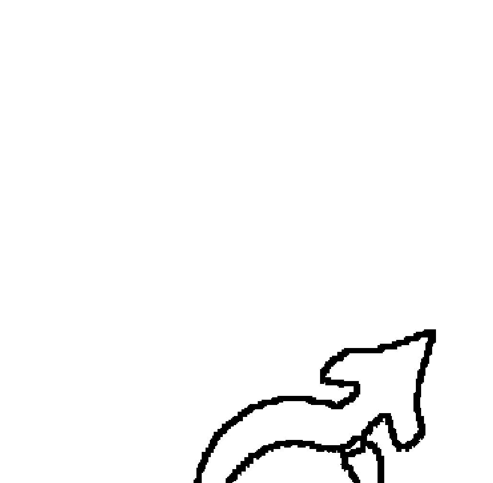

#### 牡羊座

- 强势：太阳牡羊座
- 失势：金星牡羊座
- 弱势：土星牡羊座

火星守护牡羊座及天蝎座是因为其原始的生存及繁殖能力，这也关乎一个种族的存亡。这股能量会征服，也会防御。火星在天秤座、金牛座失势因为一旦生命变得优雅和平，火星的能量就会被赶出门，因为优雅与和平需要火星能量的保护与维持，而且因为这两种配置的火星实在很难连结，所以落在这两个星座的火星只能保护与维持，无法加以破坏。火星在摩羯座之所以强势在于将阻碍视为一种练习，且在精进的过程里，保持必要的服从。火星在巨蟹座弱势是因为当情感与火星的能量混合时，目标会变得模糊，于是这股能量会变成关心体贴，而不是有用了。发生在家里纯粹火星能量，或对妻小施暴则是社会上最可怕的暴力行为，但要根治这种暴力却是最困难的。行星配置上是看不出一个人慷慨仁慈还是冷酷无情，抑或是能够在生命里做出什么样的道德抉择。这些面向藏在一个人的灵魂秘密深处。火星的配置只能告诉我们，相较于火巨蟹，火摩羯要成就精湛卓越是比较容易的。这是因为火星在摩羯座的人本能上就会注意到該如何面對困難，他們發展出充滿自信的行為，而他們更傾向於用火星來接受挑戰，這些挑戰會一直磨練火星，讓火星適應外在的世界。火星落在巨蟹座的人則對於童年的感情交互作用較為敏感，而情感上的阻礙較難視為需要克服的障礙。火巨蟹容易陷入泥沼之中，火摩羯比較不會，不過這點無法說明那種活在星盤能量之人的狀況。接下來，我們將會探討火星處在各個位置與條件時的狀況。我會以元素作為我們探討的載具。

第二部 激情、欲望與出類拔萃

#### 火星落在火象星座

我們看著落入火象星座的火星時，看到的是他們的火星因為一個又一個照亮目標之路的意象而點燃。這些意象非常完美「卓越」，而且能夠啟發行動。如果能夠實踐的可能性及外在阻力同時出現，是不可能妨礙火象火星的這股熱情。外在的阻力是難不倒火象火星的，除非這股阻力在他們內在的想像力裡生了根。火星的相位也會告訴我們，陰影如何讓想像力黯然失色。

##### 火星落在牡羊座

觀眾：這點應用在獅子、射手上我能明白，但我的火星落在牡羊座，我並不覺得自己很有想像力。我有六顆星都在土象星座，我的兩個姊妹則是火元素很強，所以她們一直覺得我力。

達比：很敏感，但不至於流於空想。妳能解釋一下所謂的想像力嗎？

你的火牡羊也會在意象間跳躍。速度之快，你會覺得意象跟行動是一體的，一切都發生得太快了。火星在牡羊座等於回到自己的家，所以在星座及火星快速移動的版圖上並沒有什麼懸殊的問題。意象會跟誘惑一樣閃動出現。同一時間，火星就會跳出去了。只要熱度不減、獎勵持續在內在風景裡閃爍，火星就會繼續克服所有的阻礙，當然，這點還是必須端看星盤裡其他組合能夠展演出多少毅力與耐力。靈感的閃爍速度之快，意象倏忽即逝，甚至不夠完整，火星必須立刻出動，不然意象就會消失，話雖如此，但大多數的火牡羊都能夠找到地方儲存最閃耀的畫面，等到下次又遇上的時候，他們就能立刻行動。

火牡羊在征服與防禦上似乎有所偏袒，但他們肯定會捍衛前往無人探尋之地的權利。這是很簡單又直截了當的。當火星跟其他行星產生相位或因行運陷入困境的時候，要立刻成功就沒有這麼容易，他們會馬上尋找另一條接近目標的方法。意象與行動非常靠近，基本上已經難以分辨。無論一個人外表看起來多文靜內向，若他們星盤上的火星落在牡羊座，只要當生活變得一成不變的時候，狂野的衝動氣質就會外顯出來。外人看來他們需要的可能是一種恰好的欣喜、行動或動感。不過，這卻是在存亡威脅下跳出的生命力。當火光變弱的時候，火星會移動得更加迅速。火牡羊會把生命力著眼在未來，永不回頭，只看著前方。

火星落在牡羊座的孩子會承接父親的迅速反應，也就是在父親生命裡遇到阻礙的立即戰或逃反應。這些孩子會承接父親要立刻達成目標時的立即火氣。他們會認同父親受困時想掙脫的態度，他們會在想像裡實驗所有掙脫的方法。這些孩子抬起父親年輕氣盛、大膽無畏追尋夢想目標的態度，完全不顧其他人。對這些孩子來說，卓越與面對危險的膽識以及在滿足欲望時，面對困難的勇氣息息相關。

當然，還有反應速度。當一個火牡羊太久沒有遇到刺激的時候，這個人會變得憂鬱。令人興奮的挑戰會點燃他們生命力的火花。而火牡羊最殘暴的一面則是幼稚或苛求，不過，這也當然是他們生命力表現的一部分。這股力量也許會以宮位或相位的方式偽裝，但這股力量總等著在電光火石間跳進能夠提供生命的意象。

達比：在今天的講座裡，我想聚焦在火星星座先天繼承的阻礙。這些阻礙深植在一個人的性格之中，必須能夠在鍛鍊個人的真實意志時認出並且關照到這些阻礙。認識火星及其國度後，你就能夠開始選擇，願意跟隨哪些衝動，哪些必須避開。宮位及相位固然重要，我們也不能忽略其他行星，特別是與火星產生對話的行星。不過，我今天的重點在於火星與其座落的星座。你們覺得當火牡羊的慾望天性燃燒時，他們會遇到什麼樣的阻礙？

觀眾：妳先前提到阻礙也是目標的一部分。這些阻礙是來自宮位嗎？如果火星的相位很好又怎麼說？

達比：別人會告訴你不能這樣、不能那樣，因為你太自私了，或覺得你不能因為一己之私而去從事什麼行為。還有，延誤會讓你分心而錯過目標。接著，你心灰意冷，想要恢復熱情只能生氣。因此別人又說你自私。

觀眾：很清楚的分享，還有嗎？

觀眾：我很固執，只想用自己的方式做事。我有很多顆落在金牛座的行星，我有耐性，但只要事情不如意，我就會覺得很挫折。我沒有辦法忍受例行公事。我必須要期待一些不一樣的事物。

觀眾：我比較保守，但我的火牡羊落在六宮，在工作上，我很極端。我會一直嘗試新的事物，但我猜我天性裡的阻礙是沒耐心。感覺滿老套的。

達比：火牡羊所在的宮位非常重要，因為這個宮位是火牡羊能量最純粹，最沒有糾葛的地方。相位在火星行動的時候，可以用來界定這些行星會遇上什麼樣的狀況。不過，真正跟火星一起發亮的則是宮位。火星座落的宮位是一個人體驗父親創新、勇敢、不耐煩、幼稚、苛求面向的所在。如果父親不在身邊，這個宮位就是一個人繼承父親衝動性情的地方，這股衝動就是你生命力的來源。如果這股衝動太過狂野，當事人就必須作出抉擇。這個抉擇會在你走進最自然的天性時，開啟一個小小的時刻，差不多就是在火牡羊衝動高漲的那一刻。在這短暫的時間裡，當事人必須決定是否該改變火星運作的層次。只有當難以駕馭的衝動惹過很多麻煩時，當事人才會發展出這項能力。一旦當事人能夠決定跳開，而不是被這股衝動驅動前進時，面對結果的態度也會改善。這樣的決策能力會讓你在面對每一次挑戰及其後果時都充滿生命力。

##### 歐內斯特·沙克爾頓：火星作為一位探險家

我想讓你們看看歐內斯特·沙克爾頓的星盤，他是第一位出發前往南極的極地探險家，但他最後沒有抵達。後來抵達南極的羅爾德·阿蒙森（Roald Amundsen）是這麼形容他的：「千萬別說沙克爾頓失敗了，當一個人為高度的勇氣、堅毅的決心、無比的毅力樹立絕佳典範，這種人絕對沒有失敗。」沙克爾頓是老派的英雄。他出生在愛爾蘭，很小的時候就跟家人一起搬去倫敦。他十六歲的時候加入英國商船隊，二十七歲時，第一次跟羅伯特·史考特前往南極洲。一九〇七年時，他三十三歲，首度嘗試前往南極點。他失敗了，卻已經在距離一百五十六公里處，抵達南緯八十八點二三度，這是人類創舉。他和他的人馬爬上了埃里伯斯火山（Mt. Erebus），約莫爬了超過四公里的冰雪。他們的裝備簡陋到誇張，但卻是第一批爬上南極冰山的人，他們還定位出地磁南極的所在區域。他們帶回許多重要知識，沙克爾頓因此受封爵士。

他四十歲的時候，帶領一支遠征隊，打算從大西洋的威德爾海（Weddell Sea）橫跨南極洲，前往位於南太平洋的羅斯海（Ross Sea）。雖然沒有成功，但這趟旅程讓他在活著的時候就成為傳奇。儘管一路上有許多變數，但他還是想辦法讓每位船員都平安返家。一九二一年，他最後一趟冒險，前往南大西洋海域五萬多公里的地方。他死在船上，遺體埋在南喬治亞（South Georgia）島上。

沙克爾頓出生時，他的父親是位成功的農人。不過，在他六歲時，愛爾蘭發生馬鈴薯饑荒，且他的父親本來就對農業不感興趣，便舉家遷往都柏林。他父親在三一大學註冊，開始學醫，展開新的職業生涯。一取得資格後，便再次遷居，這次跨越愛爾蘭海，定居在英格蘭。開始行醫並不順利，全家又再次搬去附近的錫德納姆重新開始。這次很順利，父親也算是小有成就。不過，他並不是大家想的傳統醫生，他運用順勢療法，因此算是反傳統的醫生。你們有沒有在沙克爾頓火牡羊落四宮、日水瓶落二宮看到這點？日冥四分顯示出這位兒子對新舊生活之間的動盪很敏感。他肯定深刻感受到一些持續的壓力緊繃，後來這些壓力也在他的生活裡扮演要角。在沒有出海的日子裡，他必須替下一次的長征募款，還要將長征的熱情運用在生活上，他其實很討厭這樣。不過，日冥四分加上火牡羊，卻在這種青黃不接的痛苦時刻，促使他接下重大挑戰。落在四宮的火星展現立即的勇氣及冒險精神，這是在他生命早期經歷重大改變時所培養出來的特質，而他在出生時已經準備好要適應挑戰了。他從父親遺傳到隨著環境快速應變的能力，當一個選擇行不通時，會立即跳到下一個選項。

他是個狂野又吵鬧的孩子，迷人又充滿想像力。他有三個很崇拜他的妹妹，他這輩子都是她們的偶像。他至少啟發了兩位妹妹排除萬難追求自己的夢想職業，她們都很成功、快樂。他的母親一開始在農場積極且開心，卻因為他們搬去了倫敦覺得自己毫無用武之地，她一直活在這樣的狀態裡長達四十年。顯然生活的改變對她來說並不理想。沙克爾頓的父親接下持家的工作，還與其他幾位女性親戚一起拉拔孩子長大。雖然父親希望沙克爾頓跟隨自己的衣缽學醫，但兒子卻在早年就想出海。沙克爾頓非常迷人，意志力也非常堅定，於是父親答應協助他。沙克爾頓說：「父親以為讓我出海，讓一個『男孩』上船體驗一個月只花一先令的最原始生活就能治癒我對大海的偏好！」當時他才十六歲。話是這麼說，但他的父親還是很保護他，運用人脉，讓兒子登上當時比較沒有那麼「恐怖」的船，但海上的生活還是非常艱苦，那次出海很是折磨。船長說沙克爾頓是「我遇過最固執、最頑強的男孩」。儘管如此，他那一趟所碰上的風險、危險、古怪的人都讓他在回家後作出影響一生的決定：他這輩子都要在海上冒險。

他有次告訴一名記者，他是因為二十一歲時做的一個夢才想成為一名探險家，這是對自己的承諾。「……有一天，我會前往只有冰與雪的國度，我會一直前進，直到抵達地極，直到抵達地球這顆大圓球旋轉的軸心底端。」我喜歡這句話，他的木海對分直接跨越了星盤的南北兩極。不過呢，他的一位船員則說一開始吸引沙克爾頓前往南極長征的理由卻是：「有機會能夠逃脫千篇一律的日常生活，從可能最後會扼殺他個人化的存在裡逃脫出來。」他看著自己如此緩慢才得到船上的大權，想到自己最精華的歲月與活力都隨著漫長的等待消逝，這點讓他非常反感。一火牡羊怎麼能忍受自己默默老去？顯然他受不了。

不過呢，命運帶領他上路。他想盡辦法上了羅伯特·史考特的船「探索號」，一九○一年八月八日，這是這艘船第一次前往南極洲探險。沙克爾頓出海好幾回後，他邂逅了妹妹的女性友人，他墜入愛河。他們展開熱切的交往，但兩人沒有進一步的親密接觸，他從海上寫了很多信給她。他一度受到自我懷疑的打擊：「一名男子漢應該要為人生最極致的目標努力，但若就我看來，我的極致表現遠遠不足以得到目標又該怎麼辦？你們有沒有聽到他天性裡的火牡羊？我讀了他厚達七百頁的傳記，整本書就像一本火牡羊的教科書。

這個人最引我注意的是他的毅力。他在漫長的海上生活裡，經歷過難以想像的困難，還是讓他的手下健康、愉快，活得好好的。你大可說這是因為他星盤裡的固定特質很強，他是一位認真的領導者，對手下盡心盡力，不斷專注於鼓舞他們，且保持輕鬆愉快的心情。不過，火牡羊卻沒有耐性，受不了例行公事。的確，在第一次獲得贊助前往南極時，他的確在準備工作上有所疏失遺漏。當他因為資金、物料問題無法出海時，他會變得很不耐煩，面對錢這個議題，他手足無措。不過，當我們談到火牡羊的本質時，他又能完全展現出大將風範，充滿面對挑戰的勇氣。他將日金合相於水瓶座的能量發揮到極致，愛護他的隊員、他的人馬。每一本寫南極探險家的書都會引用這句由雷蒙·普里斯特利爵士（Sir Raymond Priestley）所說的話，他是 一九〇七年遠征隊的成員，他說：「講求科學領導，給我史考特，講究效率前進，給我阿蒙森。不過，當你處在險惡無援的環境裡，沒有出路的時候，你只能下跪祈禱沙克爾頓出現。」每個跟他出過海的人，都有同樣的感覺。他位於水瓶座的太陽是他注定要走的路，火牡羊則成了他最勇猛的戰士。他的目光擱在目標上，這個目標不是最後必須抵達極地，而是有時就算失望，也還是要照顧好自己的船員。等到他一回家，下一次長征的夢想又熊熊燃燒起來，他又會去找資源，實踐這個美夢。在一九一四年的長征裡，他花了四個月才回到手下身邊，他跟一小群人在冰上走了一千多公里找人求救。當火牡羊跟太陽必須閃耀的需求連結在一起時，內外的阻礙都無法攔住火星克服困難、完成其使命。不過，帶頭的必須是太陽。因為太陽落在牡羊座是強勢的位置，因此也許火牡羊會比其他星座的火星更留意太陽。

##### 火星在獅子

**觀眾**：那火獅子呢？

**達比**：這個嘛，當然，火獅子也會留意太陽本身的核心形象，但咱們先從更底層的本質開始說起。火獅子殘暴的一面會如何發展？火獅子在原始狀況下會遇到什麼樣的阻礙？這種人在追求卓越的道路上又會發展出什麼樣的能力？

**觀眾**：困難一定會跟自尊及顏面盡失的可能性有關。因為是火象星座，他們比較喜歡幻想自己炫麗奪目、五光十色，但要是別人沒有這麼想，他們也許就會覺得受辱。他們需要別人相信他們。

**觀眾**：他們需要相信的其實是自己。我覺得他們需要博得崇拜之人的喜愛。

**達比**：火獅子天生就會找舞台，他們產生能量的方式在於想像自己是個造物主或表演家。各位火獅子的朋友永遠都曉得什麼樣的目標是值得追尋的，因為你們知道自己會成功。不過，哪些想像會成為你們的困難？

**觀眾**：當我幻想自己可能會出洋相的時候！

**達比**：你說的沒錯。別人無視或不喜歡你熱情燃燒的表現，這種想像會暗示出你目標的價值。如果你有這種情況，請當心了。你可能會因為自己的病狀而窒息，好比說野草扼殺了花朵自然綻放的可能。火星落在獅子座的人，如果小時候父親沒有笑著看你，你可能就已經遇上了人生的第一個挫折。這種狀態很容易成為人生上的困境。年紀幼小的火獅子對於父親需要別人敬愛的需求非常敏感，也會注意到父親如何博取或喪失敬愛。這些孩子會深刻烙印下父親的尊嚴感、他的內在形象、他如何吸引或排斥愛與崇拜的方式。這些孩子會承繼父親需要喜愛的需求，為自己想像出不同的戲劇角色，好來征服且贏得世人的尊崇。當一個目標在冒著火光的幻想風景裡出現的時候，火獅子一定要能設想自己在火焰中盡情燃燒。希拉蕊·柯林頓（Hillary Clinton，美國前國務卿）在她忠實地支持比爾的從政生涯前，就肯定已經看到自己能夠成為總統的妻子。弗羅倫斯·南丁格爾（Florence Nightingale）在實際走上沙場、建立自己的醫院前，肯定已經看見自己在克里米亞戰場上盡一份心力。保羅·麥卡尼（Paul McCartney，披頭四成員）也是。不過，麥卡尼的太陽落在雙子，重點在於語言與想法的傳遞，史達則是日巨蟹，他在乎的是樂團裡相處起來有如家人般的感覺。對希拉蕊而言，我們可以說她的日天蠍會想要處在某個位置，做點改變，改革舊的體制，轉化新的制度。南丁格爾日月合相在金牛，金星落在巨蟹，她會想要找一個離原生家庭很遠的地方建立家園，照顧、保護那些需要她的人。無論相位如何，火星永遠都會跟太陽一起合作，永遠會想辦法打磨精進其天生的技能到完美極致的境界。

我一定得提納粹親衛隊全國領袖海因里希·希姆萊 (Heinrich Himmler)，他的火獅子與位於八宮的日天秤相得益彰。他能夠想像自己透過某種程度的轉化，替這個世界帶來優雅與美。他腦子裡想像的完美世界只容得下「完美」的人。真不曉得他照鏡子的時候有什麼想法！守護太陽的金星也在七宮的獅子座，無論在他生命階段發生任何事情，他肯定覺得自己是崇拜對象最理想的夥伴。我們都曉得他最崇拜的偶像是誰。

觀眾：我的火獅子與海天蠍四分，有時我會發現自己在天真無邪的小女孩以及雙面諜交際花瑪塔·哈里 (Mata Hari) 的角色間拉扯。我從來就沒有辦法完全相信自己，儘管一切證據都顯示我應該要相信。

達比：任何行星跟海王星產生相位都會模糊棱角，對吧？也許相信不相信你自己並不是重點。

觀眾：如果火土冥呈合相，就跟一九四七、四八年出生的人一樣，後來在一九八二年這個組合又再次出現。我有一個客戶就有這組在獅子座的合相，她的丈夫是日天秤，覺得這個孩子很引人矚目，卻很容易著迷，也要求很多。我問他，孩子出生時，他在做什麼？當然啦，他當時正跟朋友一起創業，非常執迷。不過，現在這孩子已經十四歲了，整個人變得很內向，做爸媽的很擔心。

達比：我認識擁有這組合相的人大多是在獅子座，而不是天秤座，也許只要我活得夠久，這點也會跟著改變。這組合相在獅子座的人，如各位所知，是很專注的一群人。我們先前說過了，火獅子必須看到自己處在聚光燈下的樣子，他們的天賦、想像的能力、創造力都必須獲得掌聲。從很小的時候，火獅子就是為了刺激、充滿戲劇張力的生活而燃燒，當一個人發現他與生俱來的天賦能夠吸引讚美的時候，他就會急切發展這項天賦。當他們太陽也能運用某項天賦的時候，這項天賦會成為他們的職業。只要他們能看到自己明亮發光的模樣，他們就能朝著卓越傑出前進。而當土冥與火星合相的時候，他們發展的時候就得更注意一點，他們會以嚴密且明確的方式發展。他們會受限於內在的規矩，這些規矩為了某些環境與限制，侷限了他們上台的需求。要他們超越自己的內在限制，這風險看起來很高，因此他們通常會想盡辦法讓自己還是有所保留，但這通常不是意識上的決定。怪的是，這樣的狀態讓他們變得非常有力量，在表達他們的本性上，會變得非常嚴苛精確。自然而然會執迷，他們朝美善前進的道路，朝他們能夠展現出自己最好一面的道路，都是艱辛的奔馳，但他們就是為了奔馳的機會而生。

希拉蕊·柯林頓跟艾爾·高爾是兩位我們能在聚光燈下觀察到的人，他們都有這三顆行星的合相。我們可以想像希拉蕊必須限制她與生俱來、想要為了自己的公平正義站在舞台上的需求。

我們可以看見她的熱情會受限於外在嚴苛的環境。她是一位天蠍座的改革者，天生就是要認清、改革任何系統裡陳腐或無用的部分，且想辦法釋放體系之下潛在的生命力。火土冥合相卻四分她的太陽，她選擇了一條受限於社會觀感的道路，這種充滿壓力的生活成就了她本人。我們可以期待她能找到什麼樣的場合，讓她的太陽閃耀，在這個場域裡，她可以依照情感上的引力，改革整個體制。

觀眾：獅子座需要聚光燈的需求可能會受到土星影響。

達比：我認識所有擁有這組合相的人都會在命運裡強烈掙扎。火獅子，與生俱來就有想要上台的本能，但這個舞台會永遠受到外在條件的限制，而他們總會覺得身旁有沉重、看不見的威脅存在。我有一位日天蠍落在六宮的好朋友，他的月射手落在八宮，三分這組合相。他罹患糖尿病長達三十多年，是那種一天必須注射兩次胰島素的狀況。他定期會失去意識在醫院醒來，因為剛好有朋友來找他而獲救。他自己一個人住，但金木合相在七宮。他是一位很棒的藝術家，除非先把作品送人，不然肯定會賣出。不過，他從來沒有成為他所謂「假惺惺」或「附庸風雅」的人，他還是保有英國北方人的那種純樸直率。

不過，這點並不是他與世界舞台保持距離的原因。他有很張揚的個性，很有才華，心胸寬大，整個人的氣質也是大刺刺的，但根據他更浮誇、充滿雄心壯志的朋友而言，他的生活其實充滿限制。不過，他發展出來的自我限制卻很成功，他鮮少錯失任何享受歡笑的機會，無論他是主動提供還是被動接受。有了這組合相，我們可以說他在二十二歲發病的糖尿病是一個要他守規矩的提醒。從這個時候開始，他會檢視自己的衝動、檢視對於光鮮亮麗及危險之物的喜愛，以及身邊帶來刺激的朋友。他學會毫無節制地乘著衝動翱翔，且正視恐懼。他住在一個危險國度的危險城市裡，而且他不時會暈倒，他知道自已可能會死掉。無論在什麼星座，火冥都會帶來強烈的恐懼。我覺得他很早就選擇走到美德那一邊，往精進的層面前進。他靈魂的特質選擇了這條路。與其往舞台中央前進，他選擇了更細緻的面向，為了心、為了創意、為了喜悅、為了道德上的明晰。我不能說他完全沒有受到錯失良機的哀傷、憎恨或挫敗之苦，但他持續清理自己的心，回歸到藝術創作上，這樣的創作已經不只是畫作，而是生命的藝術。土冥持續伴他左右，但歌頌他那顆心的則是他的 arete。最後呢，火獅子是個賭鬼，他們似乎必須為了自己想要變得更強的尊嚴及驕傲賭一把。顯然火獅子比較容易成為太陽的幫手，問題在於，一旦這個人的火星將本質的熱情朝著精進這個目標前進，他們就會注意到自已是不是過熱或不夠熱。這是他們看待自己的方式，以及他們希望自已行動時，外人會如何看待他們，這種心態是來自雅典娜沉著理性之下的仔細觀察。重點在於他們自我形象裡的自傲，就算這個形象是負面的也一樣，這個形象必須回歸到中庸之道，必須不斷贏得道德上的精進。這條鍊金之路起始於當愛或創造本身成為目標的時候。

##### 火星落在射手座

在最內向、最陰鬱的星盤裡，火射手都能點燃熱情的火花。對於陰鬱的人來說，火射手是個很奇怪的位置，因為這個人的幽默感會讓他遠離困境。我這算是有開玩笑，但對於火射手來說並無不當。想想英國王儲查爾斯王子吧，他天性內向，太陽在天蠍，月亮在金牛，兩者遙遙相望，金海合相於四宮。然後呢？位於五宮的火射手對分十一宮的天王星。火射手是位有遠見的戰士，承載著想像力，不願一切過度放肆，對於克服困難永遠懷抱希望。火射手一出生就會朝自由邁去，一開始可能是身體的躁動，然後是想像力的馳騁。他們有一種高遠的感覺，會在想像及追尋想像中擺盪。

火射手最殘酷的面向是，他們裝載自身滿滿的願景，而覺得那些會把他們往下拉的情感國度，只是某些需要被超越的東西而已，當他們過度燃燒願景時，就會失去與人的連結。當火射手帶著所有的精力與熱情前往某處時，他們眼裡會看到眩目的色彩，而其他一切都顯得失色乏味。他們與生俱來的阻礙與他們誇張視野下豐饒的可能性息息相關。問題不在於想像，而是在他們朝著實踐願景的道路踏出第一步時，會發生什麼事。高度會開始大幅下降。只要願景留在想像的國度，誰也無法潑其冷水。火射手會從那些毫無遠見之人身上抽取火種。他們會如何面對這些「阻礙」，端看他們如何在自己極端的本性裡遊走。就算他們身處在困境之中，他們還是可以想像出一條生路，直接朝對面前進。
這些人小時候會幻想他們的父親充滿冒險精神、知識淵博、睿智或愚蠢，這些孩子會承接這些概念，要贏，就是要冒險。之後，更重要的是，他們也會看清父親逃避現實的傾向。榮格火射手，他的父親是位牧師。我有位火射手的朋友，他的日射手父親是位大學教授。不過，我有很多火射手的客戶，他們的父親真的都不在他們身邊，因此，他們好像擁有一片無雲的天空，想像力可以盡情揮灑。這些人小時候，很可能會因為父親的工作而必須跟著旅行，或者，也許他們本身就熱愛冒險，探索內在世界。火射手燃燒的時候，這些人會啟發別人的勇氣及視野，內在沒有燃燒起來的時候，他們會武斷、沒有耐心。

##### 亨里克·易卜生：充滿遠見的火星

當我想到火射手的時候，挪威劇作家亨里克·易卜生11（Henrik Ibsen）的劇作《培爾·金特》（Peer Gynt）就冒出來了。我最近有個週末受困於鄉村木屋裡，我說「受困」是因為我那雀躍的主人邀請我們在清新早春週末去健行、享受新鮮空氣跟視野遼闊的美景，但果然不出我意料，整個週末都在下雨。我努力保持正面的心情，跟著大家再一起出去於雨中緩慢散步，但我最後我待在火爐邊，首次讀起《培爾·金特》。我在讀這本書的時候，不斷想到「火射手」的概念，「這本書根本就是火射手的教科書」。我後來查易卜生的盤，猜猜怎麼著？他的火星落在四宮的射手座，日雙魚跟冥牡羊合相在八宮，火星的守護星木星則是在四宮的天蠍座，與落於八宮的水雙魚三分。世人認為他是史上最偉大的劇作家之一，他翻翔得非常高遠，以透徹的心理洞察突破當時社會習俗表面的洪流。他揭露了社會道德裡約定俗成的偽善與奴役制度。看看他的星盤。他在六或七個孩子裡排行老二，家裡只有一個女孩。他的童年沒有什麼外顯的色彩。他記得小時候從窗戶看出去，一點綠意也沒有。他記得教堂、頸手枷、監獄跟瘋人院，還有很多發出惱人聲響的鋸木廠。他的父親本來是個經營得不錯的生意人，但在易卜生六歲時經商失敗，他們全家人的社會地位下滑。易卜生小時候很內向，父親的失敗讓他更往內心走，隨著他的外在世界痛苦加劇，他的內在想像生活卻非常茂盛。這點是非常火象的，一張火象特質強大的星盤通常暗示出童年時期的外在蒼涼回憶，這樣他們才有機會發展豐富的內在生命。他的早年生活並不如意，但他的性生活倒是滿忙碌的。他十八歲的時候，讓他一位長他十歲的女性懷孕，他因此花錢支持這個孩子到十四歲。他還有其他的浪漫冒險，但他不管做什麼都慘淡不成。他當時不僅創作，還做一些跟劇場有關的工作，不過沒有什麼成果。三十五歲的時候，他開始走運，地方當局提供他一小筆獎金補助，他立刻把握機會前往羅馬寫作。他在羅馬待了二十五年，變得成功、高雅。等到他再次踏上挪威的時候，他已經聞名世界了。當時他已經快七十歲了，一直在挪威待到生命結束，但他從不覺得挪威是他的家。從實際或想像的層面來說，他的家永遠在遠方。他在一九〇六年過世，晚年也沒有特別開心。他內心是個鬱鬱寡歡的人，但我很好奇他在撰寫劇作中間的心情到底如何，他說他的寫作關於「能力與抱負之間的相互抵觸、意願與可行之間的相互矛盾，這就是人類與個人的悲劇，同時卻也是一樁喜劇」。你們明白為什麼說到火射射手，我會想到他了嗎？《培爾·金特》是很激進的作品，但他所有的作品其實都很激進，因為他打擊的是多數人的自滿與狹隘的目光。他的箭指向的是挪威人，卻射中了西方世界的多數國家。

達比：他以筆下的人物來看待自己，他坦承他是培爾·金特也是勃朗德，這是他最有名的兩個

觀眾：他火星的守護是落在三宮12的木天蠍，所以他的火星在這裡還有強大後援。冥牡羊在八宮合相位於雙魚尾端的太陽，正面對抗一般人在關係裡保守秘密及操控彼此的心態。他的火射射手肯定在某些層面是很快樂的，但他聽起來肯定不是派對上的開心果。

譯註：這裡應該是觀眾口誤，按照講者提供的星盤，易卜生的木星落在四宮。

譯註：「第三國度」按照德國數學家、哲學家戈特洛布·弗雷格（Gottlob Frege）的看法，他認為抽象物件就屬於不受時間影響的第三國度，與外在世界及內在意識無關，也不用仰賴語言或心智。

人物。培爾·金特受人喜愛也受人指責，勃朗德受人欽佩，但沒人愛他。這樣的敘述聽起來很像是火星落在木星守護星座沒辦法好好發揮的狀況。後來他又寫了一齣十幕的雙重劇《皇帝與加利利人》（Emperor and Galilean）。他覺得這是他最好的作品，我還沒讀，但我聽說這部作品複雜又神秘，在講述異教徒與基督徒之間的衝突。這齣戲描繪出神秘的「第三國度」概念，大概跟知識之樹及十字架有關。這點很有趣，因為火射手肯定永遠都會有個「第三國度」能夠跳脫出我們所謂的個人性 13。

任何落在射手座的行星都帶有一「幸運」的色彩，火星在射手，當你踏出去冒險的時候，幸運女神就開始眷顧你了。不過，其他的工作，其他從一個人天性發展到精進卓越的工作則需要其他的要素。他發火射手榮格明白這點。他活得夠久，足以看到自己火星的火象能量經歷不同階段。他發現自己的目標變得更精細，他明白就算有成功的意願或目標，但若這個目標沒有經歷屈服、淨化、轉化，也是沒有辦法盡如人意的。這種心情只有生命晚年可以體會。透過這

觀眾：
我哥哥月火合相在一宮的射手座，水木合相在七宮的巨蟹座、三分十宮的土天蠍。他的日天合相在八宮的巨蟹座。他應該是我所認識的人裡，最不喜歡冒險的人了。他曾經搬離我們的小鎮，在同一個國家的另一邊住了好幾年，然後又搬回來。他跟他太太現在住在很偏遠的地方。他家有一個很大的客廳，他可以躲在那邊好幾個小時，甚至好幾天。他什麼書都讀。他曾旅行過一次，他在二十幾歲的時候去過非洲一趟，之後就沒有旅行過了。如果下雪了，他絕不會來看我們，因為他的車可能會打滑。

達比：
你會怎麼定義他的人格特質，讓他這麼特別？
觀眾：
噢，簡單，他的幽默感。雖然他滿嚴肅的，但認識他的人，都會覺得他是天底下最幽默的人。他高大、帥氣又友善，當他開始說故事的時候，街上的車輛都會停下來。不，說...

##### 達比

真的，他是一流的好笑，他的幽默並沒有帶著惡毒或淫穢的色彩，通常都是自嘲的。他告訴我，這是用來跟人避免親密的方法。也許如此，但這樣的行為肯定也讓氣氛活絡起來，驅走空間裡的烏雲。
我懷疑他的想像世界比任何人的想像都精彩。想像力是詛咒也是祝福，但當你的哥哥在心靈及情感上關心別人的時候，他的水木合相在七宮，他一定要有朝著這兩顆星航行的方法。巨蟹座跟射手座是很複雜的組合，我認識很多人有這種組合，我很好奇他們有什麼方法可以安然窩在熟悉的場域，卻同時飛越他們已知世界的邊界。彷彿他們白天是水中生物，到了夜晚就變成飛禽一樣。想想日巨蟹的功能，打造出一個小圈圈，裡面都是熟人與家人，這樣很安全。然後呢，守護保衛甚至危害這個地方、這個狀態的卻是一位狂野、樂觀，有點魯莽的戰士，他必須為了這個無法離開的家庭王國，爬上最高的山峰，贏得他戰勝的獎勵。也許在想像的國度裡，這種目標比較容易達成吧。我想像他在自己與他人間的濃密情感糾結裡，用幽默尋得自由。我很好奇他有哪些偶像，他們的冒險是內在還是外在的？一個火象的火星該如何在想像的圈圈裡繞著打轉，以追尋生命能夠抵達的最高目標？火射手是一道不顧後果的閃電，朝著智慧的方向打去。我覺得其中的秘密一定就是相信自己最好最崇高的夢想，無論成功的可能有多遙遠。而在落在其中

## # 火星落在土象星座

火星落在金牛座、處女座、摩羯座的人會受到的挑戰不外乎是，他們會遇到機會，必須使用技能來改變大眾認知裡所謂的「真實」。這些人會認同父親在他們小時候捍衛的儀式，這些人也會保衛自己所發展出來的儀式。他們很早的時候就知道能夠用何種方法、在什麼時間實際與父親接觸，他們對於父親的感覺與氣味也非常敏感。他們利用父親來找到實際的疆界。他們的力量與弱點似乎是從意識到父親的力量與弱點發展而來。火星落在土象星座的人需要實際的阻礙來發展他們追求精進卓越的能力。對某些人來說，阻礙來自外在世界，但對許多人來說，他們的身體同時就是恩賜與阻礙。火星落在土象星座的孩子會看著父親在物質世界奮鬥，他們也會以自己察覺到危險及機會的感官警覺性來磨練自己的火星。落在土象星座的火星會從父親的實際存在裡取得能量與精力，之後，他們會以自己的實際存在來獲得注意力。他們與生俱來的禮物，以及他們追求精進的能力，起源於他們與物質世界的關係。永遠都要記得看守護星帶來的深度色彩。是哪一顆金星在火金牛的場景後面舞動？是哪一顆水星在火處女背後低語情報？是哪一顆土星要求火摩羯必須吃苦耐勞？ 當火星落在土象星座的時候，阻礙也會與物質有關，在他們的人生道路上，關於金錢、工、具、傳統的問題會讓他們止步不前，以「理性」來面對這些問題，能夠發展他們的力量。能夠刺激感官的東西，就能點燃火星的激情。一旦土象的火星朝目標前進，其與生俱來的阻礙就會出現，考驗他們的耐力及處理物質問題的能力。

##### 火星在金牛

對於美好事物的吸引力會誘惑火金牛行動。享樂的承諾可以推動這顆火星，一旦動起來，火金牛都不會輕易善罷干休，除非得其所好，或直到沾了一身泥巴。陷阱在於，這種狀況可能會糾纏在一個人很私密的所在。驅力可能來自讓人喜悅之物，這種人也會以為追尋華美或愉悅就是走在精進的道路上。當過程無法激起樂趣時，他們看起來會懶洋洋，沒有精神。然後，某物召喚他們，享樂的承諾出現，火金牛才會再次翻身崛起。當然了，站在這顆火星之後的是在其綠色享樂之地徘徊的維納斯。她必須找事情讓火星忙碌，免得火星催她老。於是，她扔出能夠召喚火星的東西。研究金星的星座、宮位及相位能夠看出她是使用何種物品激勵火星，金星配置可以告訴我們，什麼樣的美善能夠讓這個人充滿精力，也能看出激發他們激情、怒火、精進的爆發力，背後的驅動力到底為何。各位覺得，卡在他們與目標之間的障礙可能有哪些？

觀眾：對於金錢的欲望可能阻礙他們前往真正的美善。

達比：對火金牛而言，追求經濟保障的驅動力永遠都存在，卻鮮少是實際的誘惑。我有兩位日雙子的朋友，他們的火星都在金牛座，占星學的美與一優雅一點燃他們的熱情。這兩個人都放棄收入更高的工作，將占星視為志業，以此維生，也都決定要努力利用他們鍾愛的新職業來換取經濟上的保障。其中有位是女性，她克服了自己的金錢障礙，但另一位男性友人卻說自己別無選擇，他只能冒然一試。不過，他的木星也落在金牛座，讓他對自己獲取物資的才能更有自信。

觀眾：他們的阻礙一定跟金牛座所帶來緩慢有關。也許是種懶散。不過，這還是要看金星。如果金星落在牡羊，可能就不會這樣。也許他們會反抗成就所需的無趣工作，一旦他們克服這種阻力，才能真正動起來，然後，他們似乎需要讓這種行為養成習慣。

達比：在場有火金牛的朋友嗎？同意這種說法嗎？

觀眾：我是日射手在四宮，火金牛在八宮對分三宮的木天蠍。金摩羯在四宮，六分二宮裡的海王星。我真的很想成功。我是一名雕刻家，感覺要成功需要很長的時間。我會為了支王星。

觀衆：
火星落在金牛雖然是失勢，卻似乎擁有強大的毅力。我十四歲的女兒是日處女，火金牛。她從八歲起就想成為一名舞者。她的金獅子落在十宮，且水火四分。她很難接受別人批評，且她對不想尊重的老師態度非常不耐煩。不過，我想就是這份毅力，她還是會

達比：
站在你火星後面的是落在四宮摩羯座的金星。金星才掌握了在你年紀漸長之後的「實質成功」。我覺得火星落在金牛的人，一定要時時留意感覺失敗時所累積的怨懟，這種累積的負面情緒會增加火星的負擔。如果你專注於追求自己的美感，到頭來，金星就會經過評估後，提供最合適的愉悅感。你日射手，所以追求道德上的美德無疑已經是你意識上的目標，但看來在其他更幽微層面的美吸引你之前，你的確會率先追求摩羯座世界的成就。

言，我沒有「點燃」純粹就是因為這些問題。

闘。我每天都得面對相關的問題，但當我工作時，我可以大步跨越它們。如妳剛剛所

漫長淡季。之前有提到「金錢、工具跟傳統」，我更覺得我的阻礙跟約定俗成的事情有

收入應該很不錯才對。不過，這種狀況過去後，就什麼也不剩了。今年早春時，是我的

後就上場拍賣，接著又沒事了。不知怎麼著，我想像透過這種行為或大量的儲金，我的

了！」我會立刻動起來，日以繼夜，忙上個把月，在我完成前，什麼都阻擋不了我。然

付帳單，花幾個月做無聊的作品，然後，忽然某個東西冒出來，我會覺得「就是這個

成功。

觀眾：火金牛會因為惰性而動彈不得，但當他們真的動起來時，就要等撞牆才會停下來。

達比：說得好。看看我查到的資料。蘇聯時代的知名舞蹈家魯道夫·紐瑞耶夫（Rudolf Nureyev）、英國著名芭蕾女伶瑪格·芳登（Margot Fonteyn）、美國歌手麥可·傑克森（Michael Jackson）及瑪丹娜（Madonna），還有年代更久遠的舞台劇演員琴吉·羅傑斯（Ginger Rogers），這些人的火星都在金牛座14，他們都以自然的方式展現出身體的絕佳優雅。他們每天都要習舞，好精進自己的天賦，達到更高的表現。一聽到瑪格·芳登的名字就會讓人自動聯想到芭蕾女伶。其他人都只是舞蹈家，只有她眾所皆知的芭蕾女伶。她的日水合相在金牛，她的藝術裡充滿力量。她的金巨蟹落在五宮，與冥王星緊密合相。

琴吉·羅傑斯日海合相在巨蟹，魯道夫·紐瑞耶夫日雙魚，他們浪漫的身段跳進了我們心裡。琴吉·羅傑斯的火星背後是落在處女座的金星，因此賦予她絕佳的優雅，能夠配合佛雷·亞斯坦及赫米斯·潘恩（Hermes Pan）的舞蹈。叫作水星赫米斯的人居然是編舞指導，是不是很適合呢？紐瑞耶夫的金土合相於牡羊座，火天合相於金牛座。他的確創新了古典舞蹈，他也為了自己複雜的私生活與感情付出極高的代價。當然，瑪丹娜，日獅子，完全是個明星，金冥又合相在上升點，她扭曲了聖母（Madonna）跟處女（Virgin）二字的意涵。這些人成為他們自己，是因為他們在肢體的國度裡，朝著精進這個目標前進。大家都喜歡他們的藝術，他們把肉體提升到藝術層次，還因此賺了很多錢。無論這些特質是他們與生俱來，還是後天以意志力發展出來的，這些人都是arete運用在身體上的絕佳案例。對舞者來說，一定都是天賦予練習的加乘。這些人之所以出名，是因為他們所從事的活動，與他們是誰這點似乎較無關聯。在肢體的世界裡，每個人都追逐真摯完美的境界，克服了所有不適、無聊、痛苦的障礙，才能達到此一境界。不管這些人是不是選擇讓火星達到比個人喜悅更高的層次，我們都無從而知。
麥可·傑克森則充滿爭議，如果他完全沒有做出外人指控他的那些事，真是會讓人覺得非常心痛 15。他是依循自己的天性，去尋求樂趣，還是他有自己的理由，看到更複雜的狀況，來選擇該追尋哪種衝動，或不該追尋？他的火星與土射手呈現一百五十度，也四

> > 原書註：我原本以為美國舞台劇演員、舞者佛雷·亞斯坦（Fred Astaire）也是火金牛，但我發現他是火獅子。不過，守護火星的是落在金牛座的太陽，而金星落在牡羊，因此形成了一個金牛守護火星的小型迴圈。

> > 原書註：麥可·傑克森，一九五八年八月二十九日下午十一點四十四分出生於美國印第安納州的蓋瑞。來源：堤耶加（Taeger），《國際占星全書》（Internationales Horoskope Lexikon）。

##### 麥可·傑克森

分金獅子，金星兩旁各有天王星與水星。水星還與日冥合相在處女座。

觀眾：火金牛四分金天獅子？你們不會覺得他必須成為仰慕的中心嗎？說起來有點怪，但程度實在太超過，所以他在仰慕、崇拜跟欲望裡會發展出一種扭曲的道德觀？

達比：他的木天秤與海天蠍合相，木星是土射手的守護星，我們可能永遠不曉得真相到底是什麼。也許他是個帶有可疑道德觀的好人？還是他是頭披著羊皮的狼？也許他是看起來有問題的無辜之人？從我們的觀點來看，必須參考他是否找到前往他心之所嚮的方法與境地。若他沒有先前的爭議，他很可能現在已經找到了。通常，要在自然意志斷裂後，我們才會去尋求道德上的精進。我們有些人必須在尋找滿足欲望天性的路上，徹底失敗後，才能對新的面向敞開。然後我們就開始打造一個新的意志，這個意志跟我們的本能及過往的衝動都沒有關係。擁有無意識火星的人會儲存其他人對他的怠慢、羞辱及不禮貌的行為。這種人爆發時，他們會炸毀一切。有時，這種爆裂的結果會打破限制，因此在新的面向上發展出真正的意志，這對他們的生命來說才是最好的。如果你們以藝術表現的面向來看麥可·傑克森，他的才華是無庸置疑的。他的舞蹈創新、與眾不同。當他開始跳舞，金星就發揮作用了。不過，感覺上，金星是讓他對於重塑自己的身體有了些想法，也就是他對自己外觀的重建。我跟一位朋友討論這件事的時候，她說，他一定想像自己是從未來重生的人，而不是從過去來的。

觀眾：妳現在是認真的嗎？

觀眾：認真的，但講起來不清楚。有時，要理解外行星的方式只能透過象徵或類比的語言，加上奇怪的意象排列組合。如果我們的老師教得沒錯，每個人心裡都對道德上的優美有種渴望。我本來說的是「道德上的精進」，但也許在這個例子裡，文字是可以互相調換的。數學家認為某些方程式是優美的，黃金比例就是跟美有關，亞里斯多德講的就是這個。我說的美不是流行的美，而是更普世的美。自然是美的，動物是美的。我們不會看到一棵不美的樹或動物，除非這個生物快要死了。擁有火金牛的當事人在抵達他們渴望的優美層次前，一定會跟動物一樣，自然經歷一段笨手笨腳的歲月，一切都要等到這個人強壯到能夠脫離生母為止。火金牛受到美的吸引跟他們精益求精的目標一樣強烈。

觀眾：希特勒也是火金牛。

達比：對，沒錯。他金火合相在金牛，很迷人吧？好吧，這個組合對他來說很有幫助。他的存在感很強，隨著他的地位慢慢扶搖直上，他的存在變得更有力量。他跟所有正向的火金牛一樣，只要一動起來，沒把精力耗盡是不會止歇的。他慾旗下大將跟隨他，進入道德倫理上的地獄，我只希望我們沒有人經歷過這件事。我覺得他相信自己做的是英雄般的行為，他沒發現那個年代，改變肉體會是這麼原始的藝術！他不曉得我們的手法這麼拙劣，他付出了慘烈的代價。

##### 火星在处女

的事蹟，替他的世界帶來繁榮與保障。他整个人完全獻身在這項事業上，且在某段時間裡相當「成功」。不過，他最後還是失敗了，因為他沒有辦法去愛，他深層的目標並不是去保障、去保護他所愛的對象。

跟金星串連在一起的火星必須出於愛而行動，不然就會下場淒涼。這種火星的阻礙來自其本身的價值，但這種阻礙最後可能帶領他們找到更高遠的目標。一開始，他們可能會受到和平、金錢、感官樂趣、情感、保障、對其之愛的吸引。當他們開始追尋煉金術裡的黃金後，他們的目標會跟行動優雅結合，其方式會依據火星坐落的宮位及火星與金星之間的配置與守護關係有所不同。

達比：火星處女要達到精進的目標需要些什麼？什麼樣的目標跟障礙會刺激他們行動？
觀眾：日常生活。著重在人跟東西的關係，成就某些事情，讓身心跟行為協調。
達比：火星處女精進的是他們講究實效的能力，也就是去為太陽的任務、難題、宿命服務。其最拙劣的表現是吹毛求疵、愛挑剔、道德標準高到充滿侵略性。我想討論兩位火星落在處女的人。其中一位是日火都在处女，另一位則不是。第一個案例是德蕾莎修女16，她的出生時間不確定，但我在這裡提到她是因為她火處女的特質實在太明顯。她根本是個英雄，她擁有突破社會習俗及開啟新可能的各種美德跟缺陷。我覺得有趣的是她的太陽、火星都在同一個星座。

> > 觀眾：日火合相有什麼特別？
>
> > 觀眾：我聽說這種人很性感，但跟我講這話的男人就有這組合相。
>
> > 達比：充滿活力的人常常會讓人覺得性感，但德蕾莎修女是名修女，我不確定這樣的形容適合她。當火星跟太陽同星座時，就算兩者沒有合相，但彼此分別都跟其他行星有相位，這兩顆行星還是會閃耀著生命的光輝，當它們沒有攜手追尋同一個目標時，就會產生相應的焦躁不安。這種人會全力以赴。目標出現時，火星會完全支持太陽。彷彿這個目標非達成不可，不僅是為了生存，也為了生命本身。不過，火星的粗魯也會成為太陽光輝的一部分。所以這兩顆行星般呈現出的原始欲望和渴望，就像是它們本質裡的一部分，而不是忽然出現的東西。它們總會留意外在讓它們感興趣的事物，日常生活太沒意思了，可能會迫使無意識的衝動去滿足一個又一個的目標，或者會受到欲望驅使，而去行使最有潛力的命運之路。重點在於，星盤上誰占上風。德蕾莎修女的日火合相在土象星座，她對於自己感官所接收資料的回應都會刺激她的命運跟社會功能。這些資料都會經過濾，直到相關的訊息浮現，她曉得該怎麼做為止。街頭上，躺在她懷裡死去的孩童景象、氣味、聲音都點燃她以實際方式服務的意願，因此成為她的命運。提醒各位，太陽根據其星座、宮位、相位，在核心裡會有一個必須達成的意象。而火星則帶有與太陽目標一致的驅動力與精力。當太陽在一個能夠有潛力展現出光芒的情況裡，同一星座的火星也會因為同樣的潛力而點燃。這是解釋的一個方法。因為火星是這兩者裡較為活躍的行星，它會帶著活力與激情追尋目標。當事人年輕的時候，火星的行動會受到年少輕狂的意志推動。不過，時間跟經驗會帶領火星放慢腳步，突破與生俱來的障礙，達到更清明的境界。亞里斯多德所謂的精進，在每個人身上的表現方式與程度還需要參考其他的條件。不過，日火合相如果要達成日後任何的滿足與實踐，它們一開始就必須亂槍打鳥，因為其中一條道路就會是它們替當事人銘刻下來的宿命。這是一個令人感嘆也尷尬的組合。在德蕾莎修女身上就可見一斑。她是一個很有魅力的人物，她讓印度及世界各地大量死亡的人，特別是孩童。不過，她也相當粗鄙一，有人說她難搞、專制，根據我們這個時代的習俗，她在道德上其實是有問題的。西方世界曾經冷凍過她，因為她為了佈道的工作，曾接受汙點人物的金援。若她活在中世紀，為了她的收容所及孤兒院向那種人要錢也許還說得過去，那是她取得金錢的最好方式。在那種時空背景下，暗示了罪孽深重的人，愈想做好事。不過，此時此刻，我們的道德觀念不一樣了，修女跑去跟軍火大亨要錢看起來是很驚人的事情。這裡我覺得有一點非常有趣，德蕾莎修女真的全然奉獻在她的宣教事業上。這點展現在她所有的作為上，從粗鄙、粗俗、實際（軍火商都很有錢），到我們想像中處女座最能夠展現服務態度的方法，也就是收留街上的人，給他們一張救助的床位，讓他們死得有尊嚴。

##### 鮑勃·格爾多夫：作為幫手的火星

愛爾蘭歌手鮑勃·格爾多夫 17 的火星落在處女座，跟金星合相在九宮。他的日天秤同樣也在九宮，與同星座的水土合相。也就是說，火星跟太陽的守護星在同一個宮位合相，且同屬於太陽的前一個星座。

金火合相總是很有意思，因為他們之間會產生拉扯角力。美好事物與價值的意象、概念、感受都能點亮金星。而為了要享受這些美好，火星就出現了。當火星出動時，障礙也會跟著浮現。不過，這些障礙會影響金星，因為障礙出現在她的國度裡是很不自然的。她就是美的本質，她會吸引能夠替她生命增值的人、事、物。意志上的障礙、挑戰、掙扎都不存在於她的敘事裡，除非她和火星產生連結。所以你們明白為何困難，這樣的組合暗示著當事人必須花許多時間爭取最愛的人、事、物、價值，或與其對抗之。不過，金火合相所帶來的禮物是熱心，及在內心深處明白自己願意真正爭取的價值與所愛到底為何。這樣當然是有好處的。我想到鮑勃·格爾多夫投身於「拯救生命」的世界舞台上。大家都知道他很急躁，跟別人相處時常冒犯別人。一九八四年時，媒體上報導的非洲飢荒故事讓他義憤填膺。他決定要做點什麼，從一開始的小活動，最後變成非常壯大的盛事。看到如此集中的苦難忽然讓他難過起來，他後來全心全意服務自己的命運，將狀況平衡回來。他廣召大家奉獻做好事，等到任務結束後，他又退回較為低調的角色。這就是金火合相在九宮。我敢說這樣的工作改變了他對世界的看法。我很好奇這份工作有沒有開啟他道德上的新層次。

> > 觀眾：我一宮天蠍，太陽也在天蠍，金火合相在十一宮的處女。水天蠍四分冥獅子。我是一位榮格分析師，同時也是一位生物學家，我結合兩者運用在深刻的生態學領域之中。我所寫、教授的一切，都跟把生態危機放進分析師內在世界及在諮商間裡訴說其現象有關。我當然支持生態組織從外面攔截問題，我也受到生物學家邀請，一起探索某些環境問題下的深層意義。我是月射手，所以我試圖伸手求救。我丈夫是位生物學家，我們在各種層面下都有共同的想法。這項工作很辛苦，我喜歡但也懼怕。我喜歡是因為我覺得這是全世界最刺激的工作，我覺得研究這些東西很重要。不過，我發現，一提到這些話題就肯定會引起別人的防禦、憤怒跟批評。而且，我把自己逼得很緊，我常常必須要拖著生病的身子工作。妳剛剛所提到的一切我都覺得非常有趣，可以請妳分享一些也許能夠幫助我的詳細資訊嗎？

##### 達比：

我現在唯一能夠想到的就是，別人不聽妳話會讓妳覺得恐懼，而這份恐懼可能會把別人逼得太緊。也許這就是為什麼妳會築起防備，最後導致生氣或批評的原因。不過，我又忽然想到，火星在處女，受人批評也許就是暗示妳已經走在提升技能、邁向精進的道路上了。我猜妳的天蠍帶有自我轉化及轉化他人意識及行為的意象，因為是在一宮，這點很清楚。妳必須保持敏銳的心智，才能找到實際方法轉化自己與他人，這件事對妳來說肯定是至高無上的任務。不過，我覺得妳要磨練心志，也必須要加強體魄。對火處女來說，朝精進前進必須面對生理及心理的挑戰，這功課是很紮實的。

觀眾：我會跳探戈。事實上，我寫過探戈跟互補的文章。我也會縫紉、畫畫。我在屋頂上當然有座小花園，可以種出花朵、食用香草跟薰衣草。

達比：就我看來，這些東西對於保持妳身心連結具有重大的影響，也符合妳所做的工作。不然，妳會偏執起來，就沒有辦法顧全妳的任務，因為妳的火處女在十一宮，妳跟其他人都會注意到我們知識上的漏洞，這就是妳一直強調的，要維持我們內在心靈與外在生態健康的知識。薛花種草、跳跳探戈、手工女紅都能讓妳有機會運用身體，好讓妳的生態系統得到某種修補。

##### 火星在摩羯

達比：好了，現在要提到火摩羯這個大鬥士了。這種火星會點燃什麼樣的目標，在達成目標的道路上又會遇上什麼樣的阻礙？

觀眾：他們的目標就是克服在得到嚮往之物一路上所有的障礙。我不曉得火摩羯確切會有什麼樣的目標，但只要他們有了目標，無論是天堂或地獄都沒辦法讓他們轉念。如果他們無法達成目標，就會產生強烈的怒火跟怨懟。

達比：我不太確定這樣的說法。所有落在摩羯座的行星都會有沉重的一面，當行星能量受阻的時候，的確就會變得很絕望。不過，這種狀況通常不會僵持太久。火摩羯本來就很實際，天生就是要來克服道路上的阻礙的。一旦目標看似無法達成，他們跟落在其他星座的火星一樣，知道該把能量抽回來。請記住，火摩羯是火星的強勢星座。用困難來滋養火摩羯是很自然的事情。從很小的時候，火摩羯當事人就知道目標不要設得太高遠，等到征服這個阻礙後，下一個目標才會更進一步。這是循序漸進的前進。火摩羯的強硬或柔和相位能夠描繪出火星行動時啟動的領域。當星盤上出現火摩羯時，我發現我會一再注意到它。火摩羯所在的宮位告訴我們，火星注定要精熟的道路以及要求必須全力以赴的場域為何。我現在想到愛因斯坦，他的火摩羯在七宮 18。我會想到，他必須透過那些很厲害的方程式，前往精進的道路，就某種程度上來說，此言不假。火星的守護星土星跟金水合相，我們因此可以解讀成他整個人會受到吸引開啟全新可能，在他選擇的領域裡，他是某些美善及智識上的先驅。他當然也成為該領域的大師！不過，各位還記得，在他成人後，因為他的各種厲害發現，他必須花時間跟政府人士打交道嗎？我很好奇他跟其他人交流時，內心有多少掙扎。他的水土合相在十宮，所以，隱藏在這種掙扎背後的是他深刻、敏銳的心智，這樣的心智也成就他的天職。不過，別人利用他研究結果從事的行為，很可能就是他必須承擔責任的個人試驗。

觀衆：我的火摩羯四分海天秤。當我追尋目標的時候，我會做到盡善盡美，此言不假。不過，一開始就很精準。火摩羯的本能知道自己最強大的天賦及弱點為何，他們會因應不同的狀況、阻礙及條件，仔細調整步伐。我認識某些人，長年來走在以酒精及藥物自毀的道路上，而他們尋求墮落的方式則跟他們最終尋找救贖的方式同樣講究紀律、講究方法。

達比：這就是火摩羯探討的主題——意志的掌控。他們會去尋找巨大的挑戰，如果他們沒有與生俱來的挑戰，或找不到挑戰，他們就會自己創造出來。這種人會想盡辦法掌控世界，朝著掌控意識前進的人會尋找能夠改變世界的挑戰，或至少說改變他們世界的挑戰，及其所有的社會影響。火星落在摩羯座是強勢的展現，同時也是能夠完美呈現土星守護力量的星座。他們似乎要在最恰當的時刻才動身追尋，總會以最恰當的武器出擊，他們的目標從一開始就很精準。火摩羯的本能知道自己最強大的天賦及弱點為何，他們會因應不同的狀況、阻礙及條件，仔細調整步伐。我認識某些人，長年來走在以酒精及藥物自毀的道路上，而他們尋求墮落的方式則跟他們最終尋找救贖的方式同樣講究紀律、講究方法。

觀衆：我的火摩羯在一宮，與水星合相。我花了很多時間想要去理解我為什麼會做某些事情。對於那種看起來能夠自理得很好的人，我會覺得很著迷。

觀衆：我的火摩羯跟太陽、水星都在七宮。我跟人相處得很好，月木合相在五宮。不過，我最大的問題在於無法理解為什麼人會有某些行為。也許愛因斯坦腦袋裡也有同樣的疑問。

##### 達比

守護火星的十二宮卻在十二宮，而守護海王星的金星則在雙魚座。當我沒辦法達成目標時，失落感就會襲捲而來，我的力量與使命感也會沖刷殆盡。我會變得很沮喪。有時，我可以想像，好像一切都瓦解了。當海王星跟火星有所連結的時候，海王星會出動歌聲迷人的海妖，混淆一個人明辨信號的能力。班上有個同學是火星摩羯四分海天秤，老師說，她在美國學占星，我們老師很講究靈性的成長。我倒覺得你的意圖是很重要的。如果你的幻滅理想一直停留在個人層面，那種解讀，直到她放下欲望，任由宇宙的智慧帶領她前往她的使命及適當的所在。也許宇宙對你喜好、精通的領域還是會打開一扇小窗，你必須耐心等待更高遠的層次出現。有時，火星摩羯必須等了又等、等了又等，不過，還是請你繼續等候下去。

這種狀況說來容易，其實很難忍受。不過，主宰自我的能力本來就在於火摩羯的天性裡，這項特質遠超過相位能夠透露的訊息。火星的相位能夠告訴我們，當事人在尋求滿足的道路上，會遇到什麼樣的外在阻礙，但人真正要面對的則是自己意志裡的巨石與峭壁。

火摩羯是很有力量的，如果你的意志沒有維繫在超越個人層面的慾望上，感覺力量就會一直消耗磨損。主宰自我有時意味著在看不見光的環境裡不斷前進，直到終於抵達一座能夠考驗你攀爬技巧的高山出現為止。

觀衆：我們不耐煩卻同時也很有耐心。

達比：火摩羯對付巨大的困難比較得心應手，一般的小問題只會讓他們抓狂。巨大的挑戰才需要他們有所行動。我有位火摩羯的朋友，他最近跟我說：「必要的事情我才會去做。」他的火土都在三宮的摩羯座，他說：「我動筆是因為我別無選擇。我寫是因為我不得不寫。」不過，更重要的則是火摩羯天生的障礙，也就是超越對世人喜愛之物的主控欲望，前往道德美善一途。

觀衆：火摩羯與生俱來的障礙都跟時間有關，需要耐心，需要反覆磨練。很容易就覺得沮喪無力。

達比：火摩羯當事人的天賦在於，當他們設定目標後，就會啟動一種特殊的專注力。他們會將前往目標的道路切割成小片段，能夠輕鬆管理、按照順序前進，一旦他們起步，他們能夠夠一步一腳印走好每一步，直到抵達目標的那一天。必要的時候，他們也會拖著腳步吃力前進，或跳得高高的。他們有時會覺得無聊，其他時候則因為抓錯時機跳躍而受傷。前往精進的道路當然包含失敗的體驗，但只要目標夠明確，失敗就成為火摩羯當事人學習的自然經驗。我並沒有說，他們發現自己失敗時不會志氣灰心，但只要他們灰頭土臉地爬起來，如果目標夠真實，他們還是會繼續前進，完成任務。我所謂的「真實」跟目標所具備的「美德」有關。當阻礙席捲而來時，你必須捫心自問：我是朝著真理前進嗎？藉由達成這項目標，我能造福社群、鄉里、城市、地區嗎？土星永遠站在這顆火星背後，土星會如此要求，壯大的不只是你，還有你的社群。你也可以問，這個目標能夠壯大我的太陽嗎？能夠讓我的太陽發光發熱嗎？火摩羯的其中一困難在於他們的力量。無論這項渴望多麼背離他們的真實天性，他們都會用盡全力去追求。這也就是當火摩羯得不到心之所嚮，或不知自己目標為何時，自毀力量也很驚人的原因。有時，只是時間早晚的問題，也許你目標正確，但路途比較遙遠，或需要更努力一點。為了要達成目標，你必須發展出歲月在你內心鍛煉出來的技能跟人格特質。也許我們可以這樣想火摩羯，就算他們看不見目標，他們還是會繼續前進。看看太陽，就知道自己是不是朝著命運安排的道路前進，只要每天磨亮你的寶劍，火摩羯就能成為太陽的頭號戰將。時間是你的阻礙與困難，卻也是你的良師。火星落在土星守護的星座，我們只能尊敬那些最終成功的人。你的熱情是為了最終能好好控制自我而存在，其他的掌控都只是過程裡的小山頭罷了。

#### 火星落在風象星座

> 達比：火星落在風象星座的朋友在追求精進的道路上，會遇到什麼樣的困難呢？
>
> 觀眾：我們想太多。
>
> 達比：你覺得是你們的想法阻礙了行動，還是別人的想法成為讓你們卻步的阻礙？
>
> 觀眾：當我起心動念的時候，就會有外人開始攻擊這個想法。他們要麼就是會推翻我，要麼就是我的初心戰勝一切，我因此得以前進。我腦袋裡也會產生很沉重的對話。
>
> 達比：冥想對火星落在風象星座的朋友可能不錯。
>
> 觀眾：沒有用，我們太容易焦躁不耐。冥想比較適合火星在水象星座的人。
>
> 達比：火星落在風象星座，也就是雙子、天秤跟水瓶，我們曉得當事人最好最差的行為都來自讓他們興奮的想法。他們會為了理念奮鬥，他們會受到其他人前衛想法的刺激。小時候，他們會認同父親用言語或想法來自保或得勝的方式。他們眼裡父親成功與否要參考## 火星在双子

星盘上的其他线索。随着他们慢慢长大，他们会自行演练出火星的灵敏程度。他们会根据一个人怀抱的想法而钦佩或鄙视对方。他们需要征服、守护、捍卫的是理念、文字与概念。他们会与人言对抗，或说与人言背后的概念对抗。他们也会为了想法而战，这并不只是指他们会使用文字来捍卫自己，或征服他人。当文字没有根据他们认同的正确方式使用时，他们就会难过、生气或激动起来。火星落在风象星座的女性会因为男性的理念而受到吸引，或是因为这些男性本身也喜欢有想法的女性。一旦关系建立起来后，能不能发展则要参考其他线索。自主程度够高的人知道其他人只是其身边一个个不同的宇宙，而他们也将明白自己的火星会有残暴的一面。这种人的火星一旦启动，开始对旁人产生影响时，他们也会有所察觉。他们会注意到自己使用想法去攻击、较劲、“弱化”对手的能力。然后，他们会开始打磨这把宝剑，以更娴熟的方式运用。

达比：我们大可说火双子会完全认同某个理念，就这种程度来说，他们是在追寻精进。
观众：我是日牡羊，火双子，我实在看不出火星跟心智的关系。

观众：我也有同样的配置。相较起火星守护的牡羊座，我更关注的是奥秘占星学（Esoteric）上的心智表现，他们会用什么样的“小聪明”去攻击别人。

达比：火双子一般来说真的都有满多小聪明的。

观众：那火星在三宫呢？

达比：我认识一个太阳摩羯的人，他的火摩羯落在三宫，他的小聪明都用在挖苦别人上头。不过，他总会想办法更上层楼，且会区别挖苦的方式，带有精细的道德观。由水星守护的火双子并没有其他两个风象星座在道德上的保留与缄默，可能会口无遮拦。言语就跟石块、匕首、宝剑一样会伤人。水星的配置可以让我们得知火双子会如何保护自己。我有位日牡羊的朋友，位于十一宫的火双子四分八宫双鱼座的水木合相，她是一位杰出的语言专家，也是一位编辑。她同情心高涨的同时，火气也会跟着上来。仿佛她若感受到其他人的无助，她的恐惧也会出现一样。在我们争论这点的时候，我就是这样跟她讲的。她其实拒绝相信世界上有人会处在真正的无助状况之中。她出生于战争期间，也就是天王星在牡羊座的那个世代，他们是一群容易激动、个性乖戾的人，受到刺激就会态度激进。她跟所有日牡羊、火双子的人一样，她用自己全然的灵魂去回应理念与想法。她对文字很有热情，像我无论在讲什么语言的时候，总会搞错字或发错音，我们总会展开热……

19 原书注：出生资料：笛卡儿（René Descartes），一五九六年三月三十一日凌晨两点出生于法国拉海。来源：堤耶加。

观众：“我思故我在”的笛卡儿。 19

达比：别无分号，就是他。这句话放在火双子身上是不是很适合！当然啦，如果我们资料正确的话，他是日牡羊，三宫里有七颗行星，其中五颗在牡羊座。

观众：如果他是位女性，真不晓得他会说什么。

达比：这个问题很有趣。我觉得我的日牡羊朋友可能会说类似“我推理故我是人”之类的话。对于那些无理的人非常严厉。当然啦，这可能也是个陷阱。她年轻的时候，嫁给了一个非常聪明的航太工程师。不过，十五年后，她离开了他，因为她很气他们之间都没有沟通。离婚三十年后，她说前夫人很好，是她太无情，讲了些难听的话。不过，他其实在没办法跟真正的她交流，她无法忍受这点。他很爱她，但就是没办法跟她展开什么真正的对话。她的父亲也很爱她，但她是在父亲死后才明白这点，父女间也是没有办法用言语表达爱的。父亲跟前夫都教了她许多事，但都没有办法“交流”自己。拥有火双子的男性不见得会要求女性配偶跟他们沟通。这是他们必须去发展的技能，这是他们的宝剑，他们用得愈善巧，就愈能感受到自己的生命力。当他们能够交流出真正的自我，对方能够接受、明白的时候，他们才是做出最“合宜”的行为，因此才会觉得满足。
我一宫是巨蟹座，水火合相在十二宫的尾巴，同时又跟巨蟹前面几度的天王星产生合相。这组星群的相位很好，但当我年轻的时候，特别是我喝醉的时候，我发现自己会说出一些完全不经大脑的话，甚至伤人。我的月亮在射手座，我从来就不想伤害别人，但这些语言就这样冒出来。有时，第二天我甚至不记得自己曾经说过什么话，我猜自己是太害怕了。我曾讲过一个很糟糕的笑话，主角是一名神父跟一位上了年纪的修女。我对我那爱尔兰丈夫的爱尔兰阿姨讲过愚蠢又没礼貌的爱尔兰笑话，完全不是什么好主意。我好像有什么东西忽然附在我身上一样。我现在偶尔还是会这样乱讲话，话一出口，我跟其他人一样惊吓。我不太读书，绝对不是什么作家，对文字也不太敏感。请问以上这些状况跟内在想要追求“美德”的欲望有什么关系呢？这会是什么样的美德？我意识上的欲望并不想精进这方面的技能，我只是想停下这一切。

达比：
落在十二宫的行星总是很难解读，也不容易用言语解释它们的世界。我觉得其中有本能的驱力，我可以说是本能的灵性驱力吗？我指的是通过双子座呈现出来的火星。所以，我们这样来想好了……个体化就是指一个人成为最真实的自我，也就是一个人最极致的展现。社会不见得会认同这样个体化的过程。因为你的火星，我假设你的目标是降低自己的火星能量，好让自己不会太过头。是的，你的火星可能以不太好的方式展现，但火星是一股很原始、有机的本能，试着要传达一些东西。我认为十二宫的行星有强烈的本能，想要以某种方式表现自己。或许是通过双子座展现，但我认为这是一种灵性上的表现，因为它落在十二宫。它可能以很原始、没社会化的方式展现，但它是一种本能，试着要穿透、表现自己。因此，如果你想追求美德，这或许是一种灵性上的美德。

观众：
我不确定。我有个印象，但很模糊，我不确定这样算不算，但我记得当时有两位老师在讨论我家人，说了一些关于我父亲的事情，我听不懂，但我很难过。我不晓得他们在讲什么，但我知道那不是什么好事。他们不晓得我在，看到我之后，他们吓了一跳，还打话，但其他时候，我会听到让我讶异的说法。火星想赢跟想保护的动力是不是都会从儿

达比：
请记住，要有相应的障碍才会启动火星。状况会立刻出现，但只有我们开始认识自己的时候，才会将这些状况看成我们的阻碍。如果你继续研究下去，你也许会发现，你听到的很多言论是大人们不知道的也看不见的，这点跟十二宫是有关系的。你也许也听到，妈妈在不经意的状况下讲了关于你或父亲的事情，这点来自你的月射手，虽然这些话对别人来说没什么，但你就会放在心上。当我们没有意识，或压力很大的时候，火星残暴的一面就会露出来。也许对你来说，语言或语言伤人、毁灭的力量更是根本的挑战，远超过你所知的。说出伤人之言的能力，也许是你从父母亲身上学到的。

观众：我爸爸都很聪明，他们生气时，会严重彼此伤害，会讲很难听的话，或久久不开口。

达比：所以这也是一部分吧。天王星总会用比较实验性的方式处理状况。这组水火天的合相也许会让你想要对自己及他人言语的力量不要那么敏感。当你因为别人的言语而激起某些敏感的回忆时，你就会遭到某些不说的话语“附身”。如果你想要处理这个问题，就要在发生时多留心。看看你能否捕捉发作的瞬间，或即将出口的话语。如果你开始注意模式的形成，你就能开始捕捉到改变一切选择的瞬间。我们没办法永远都做正确的事情，我们也不该只做正确的事情。火星永远都有原始的一面，有时，这种野性会违背我们的善意。尽管如此，我们还是可以练习提醒自己。在这组水火天的组合里，还有改革的能力。

在我继续读水双子前，让我跟各位分享我最近看到的一段话，这话来自二十世纪前半，美国充满争议及英雄精神的罗斯福总统20。他说：“守住壁垒，为原则牺牲是英雄行为，但上场作战，为原则得到胜利则是更光荣的事。”当我看到这段话的时候，我立刻去查他的星盘。这话是他在一九一八年的演讲时说的。他的火星座落于十宫的双子座二十七度，三分六宫的火星在水瓶座二十七度。火星的守护星水星则四分金牛座二十七度的冥王星。大家都晓得他有小儿麻痹，坐在轮椅上治理国家。他的心智力量可不只是停留在言语层面而已，他经历了与自身疾病的战争。他的太阳也在水瓶座，跟五宫的金星合相。不过，那是另一个故事了。
火双子的朋友会以语言、智慧、理念及事实来征服、达标、守护与保卫。这是你们最好竞争，最有效率的领域。当你受到刺激，想赢、想征服、想保卫的时候，相位会告诉你，伴随火星的能量有哪些。宫位则会让你知道火星从何崛起。千万不要低估语言的力量，这种力量跟世界上的任何一种魔法一样，同时具有伤害与疗愈的作用。

20 原书注：出生资料：富兰克林·德拉诺·罗斯福（Franklin Delano Roosevelt），一八八二年一月三十日晚上八点四十五分 出生于美国纽约海德帕克。来源：洛顿。

##### 火星在天秤

现在我们要来想一想天秤座的国度，然后把穿上盔甲、配带宝剑的火星放进来。各位有没有看过收藏在伦敦国家美术馆里那幅波提切利（Sandro Botticelli）笔下的维纳斯与战神画作？战神玛尔斯浑身都是肌肉，懒洋洋地靠坐着，维纳斯则看起来平静甚至有点得意坐在另一边，她的几个半羊人小精靈（Faun）则趁战神睡觉时，把玩他的宝剑。战神待在女性的闺房。相安无事好一阵子，但看看马克·安东尼（Mark Antony）邂逅埃及艳后克丽奥佩脱拉（Cleopatra）之后发生了什么事吧。虽然战士会变得只爱人、没那么爱江山，但还是有人说火天秤很适合成为大将军或大谋略家。金星的国度升华了火星，让其因为想法、概念、美善、优雅而燃烧起来，这份优雅，指的特别是心灵上的简明优雅。优秀的策略跟好的数学公式一样，都存在着优雅的元素。

不过，这样的火星还是有表达上的尴尬。拥有火天秤的当事人会受到正义与不公概念的刺激。而正因为世界上有太多不公不义的现象，他们总是会觉得烦躁恼厌。而这不舒服的感觉本身也让人不快。他们对于美善会有一种特殊的热情，后来，这份热情会转变成寻求和平、优雅、和谐的欲望。不过，太过和平又会削弱火星的能量。无论火星位于什么星座，它都必须以某种目标之名保持活力，持续让精力流动。当火星能够为了真相、美善、正义而战，且对抗丑恶、谎言及不公时，这样火星才能达到满足的状况。

观众：你的解释听起来非常美好，但你先前说过，每颗火星都有自己残暴的一面，还会吸引出自身的障碍。你的意思是说，火天秤的障碍跟不公及丑恶有关吗？你会怎么形容值得受到赞美的火天秤，在寻求目标时所呈现出来的粗鄙？

达比：小时候，其他人的意见听起来会很真实，会让火天秤相当不安，然后，忽然有一天，这孩子发觉自己的想法也是有力量的。他们就有了保护自己的武器。我觉得火天秤与生俱来的障碍在于他们与内在的对话，一下这样，一下那样，你们都晓得天秤座的两难。火天秤会尝试把事情好好想清楚，他们跟其他位于风象星座的火星一样，都会想太多。虽然他们会感觉到其他人对于美善的理念与想法可能侵略到他们，而每个人的表现都不太一样，他们可能会等太久才出击防御。因此，当他们出击的时候，力道经常是不适宜的。他们可能会放过不公不义的大事，却对鸡毛蒜皮的小事穷追猛打。
观众：他们不会生气，别人倒很气他们，你必须常常替他们出气。他们有时很像被动攻击型人格。从另一方面来说，他们攻击力最强的时候，常常是为别人出气的时候。
达比：没错。我想到，在金星的国度里，火星是不喜欢攻击的，但不公平的感觉却会唤醒火星。哪个人干了什么事不公平的事！这种事可能从当事人很小的时候就开始了，但因为火星活在天秤座的优雅美好国度之中，它会犹豫该不该激进起来。一犹豫，火星就会错失良机，之后，他们反而会为了微不足道的事情拔出宝剑。
观众：丽兹·格林曾说过火天秤是“打扮过的火星”。
达比：我听过这句话。我忽然想起，我们偶尔会在出奇不意的地方，遇到那些花枝招展的变装皇后。我是没有在我认识的火天秤身上感受到你所谓的被动攻击人格。不过我看过这些

观众：我们的确会为了原则而战，我们也会因为其他人所遭受的不公对待起身应战，前提是我们必须先停下在脑袋对立面之间来来回回的对话。我觉得目标在于爱，这是行动的原则。

观众：或和平。希望在生命里，其他人不会一直说些讨厌的话，或做些不经大脑的不公行为。

达比：这倒是，听起来挺不错的，我的火星不在天秤，但我海天秤，我这个世代的人都有这种渴望。火天秤要的不只是渴望一个目标，还会为其奋战，过程艰辛困苦。通过自由意志的实践，通往精进的方法就是训练自己能够一眼看出不公平背后的概念，且能直接表达出来。然后，找到能够激励其他人的概念。一旦他们看清别人行为背后真正的意图，他们就能决定是否要妥协。他们对于真相及美善的最终想法都会影响他们进一步的行为，也决定了他们会为了理念做出多少努力。

观众：火天秤的人会用敌人让自己前进。

达比：这话可能有点太重，因为不是每个火天秤都会跟敌人串连起来。不过，当我们没办法以公正无私的爱去面对每个人的时候，大家看起来都会像是我们的敌人。“敌人”可能只是让我的火星启动保卫模式的人。通常，一开始的时候，火天秤会发现自己将热情灌注于对抗他人对他的看法上。他们不喜欢成为别人想法中的弱者。这点很惊人，特别是，他们所爱之人认为他们“不公平”或不对的时候。他们身边的人不见得会一直接受天秤座对于美善的概念与价值观，这点让人难以忍受。这个时候，我们就要回到星盘上的金星，看看这个标准从何而来。

咱们来看看邱吉尔的盘。他日、金都在射手座，火天秤在一宫与木星呈现合相。他鼓舞自己的国家为了世世代代的和平及自由而战。我之前说过了，火木合相的人常常会散发出一种可以有特殊的魅力。我认识有这种配置的人在他们受到启发的时候，常常会散发出一种可以有特殊的魅力。多年前，我在非洲的时候，认识了一位巫医，她火木合相在双子座，她的确可以进入到催眠出神的状态。邱吉尔的这组相位跟十一宫的天狮子、三宫的金射手都有相位，这个人的的确非常容易鼓舞其他人，但，当工作完成，不再需要鼓舞其他人的时候，他又要干嘛呢？我觉得当他没有必要对抗壮大的敌人时，他自己就会瓦解。他有五颗星落在火元素，一宫天秤的火木对分七宫的凯龙牡羊，也跟八宫牡羊的

22 原书注：撒切尔夫人（Margaret Thatcher），一九三五年十月十三日上午九点出生于英国格兰瑟姆。来源：克莱弗。
23 原书注：比尔·柯林顿（Bill Clinton），一九四六年八月十九日上午八点五十一分出生于美国阿肯色州霍普。来源：洛顿。

观众：撒切尔夫人22似乎就处理得很好。她不断制造大量的冲突对立，就连她从首相一职退役后也一样。

观众：比尔．柯林顿23也是火天秤在上升点，还跟海王星合相，我会觉得这样的配置在战场上更像入迷催眠的状态。

达比：柯林顿的日狮子在十一宫，金火海合相在上升点，木星跟凯龙又在天秤后面几度。他会散发出一种让人不解又暧昧不清的魅力，因此会吸引一些对手出现，因为这本来就是火天秤的天性。火木无论合相于哪个星座，都会让人非常痛苦，因为无论当事人渴望什么，最后的目标从远处看起来就是不太对。这样的状况除了失望外，还会引发内疚感，所以当事人通常都要辩解自己的目标或欲望，他们常会因为自己的欲望而遭到攻击，也没办法好好解释吸引他们的目标或欲望到底是什么。火天秤似乎常常需要自卫，加上海王星的力量，火星的盔甲似乎充斥着其他人觉得很奇怪的想法，所以他们为了自己能够交流的理念，必须妥协、必须受伤。不过，细微与含糊地参与讨论或争执并没有办法换取显著的胜利。所以他们带着追求美善的心情逃走，直到某人又逮到他们，再次引发战争。当金星也在天秤座的时候，状况会加温，尤其是在男性身上。这不只因为火星出现在金星愉悦的温柔乡里，更是因为，当火星发作的时候，金星也在场。她最喜欢的莫过于美善、优雅与细致，但火星就是会忍不住偶尔违反她的最高指导原则。有时，他会焦躁不安，伸个懒腰也会打破她最珍惜的东西。金天秤，特别是座落于一宫的时候，特别喜欢别人崇拜与喜爱，但之后火星会冒出跳出，忽然间捍卫起什么，或追逐起闪闪发光的物品。火天秤的危险在于，他们没办法接受战争所带来的责任，因为他们从来就不想开战，或至少看起来如此。感觉好像是别人的作为引起了战争，所以责任在别人身上。这是火天秤当事人在追求精进之路上会遇到的重要阻碍，这个阻碍需要他们在电光火石间做出决策，这场仗值得打吗？此时此刻以这种手法作战，我能不能赢得自己重视的东西？火天秤

##### 火星在水瓶

达比：现在咱们来瞧瞧风元素的第二个星座——水瓶座。什么样的目标会让火水瓶出动？你们觉得，他的火星在一宫，重心都在他自己身上。不过，他因为做自己，反而也许让我们看见大权在握之人不同的面貌。也许正因他的作为，让我们不得不重新思考我们对于那些位高权重者的看法，以及在他们的位置上进行某些行为是否恰当。

邱吉尔最大的福气在于他真的处于一种能够为和平奋斗的高度。他并没有打算攻击自己，他是假设其他千万人也有同样想法，然后带着这份想法奋力一搏。他透过电台广播，不断在人民的心灵上投注获胜的种子。他必须在没有成功前苦守多年，直到命运过来推他一把，一如往常，命运似乎也会因为你不断的在正确的道路上鼓舞自己，而出手相助。这份克服困难、寻求成功的努力似乎也跟磁铁一样能够吸引更多机会。

在我结束火天秤前，我必须提到尼尔森·曼德拉 跟达赖喇嘛 。不管用何种标准来看，他们似乎都是真正拥有美德的人，且运用最险峻的环境来转化自身的欲望天性及个人意志，用尽各种方法，将其昇华成为他人谋福的钢铁般意志。他们对于家庭的概念已经超越原生家庭。这两个人就是我们今天探索火星议题的绝佳案例。

观众：
觉得火水瓶与生俱来的障碍是什么？什么样的美德会点燃他们朝精进之路前进的热情？

达比：
我懂你的意思。我总觉得水瓶座是矛盾的，因为它有土星及天王星这两颗守护星。对他们来说，忍耐是原则，不过，他们的天性又必须捍卫自己的原则。当火水瓶还没有意识、还很原始的时候，他们会掌控世界，掌控那些目光狭隘、食古不化，甚至根本没有远见的人。当他们遇到跟他们道德系统运作模式不同的人时，他们会义愤填膺。最糟糕的状况是，在他们的激情之中，他们完全忘记了其他人，只希望别人也注意到他们看见的东西。的确必须为此采取某些行为。火水瓶会要求当事人依循理念来行动，理念必须非常明确。当你研究火水瓶的时候，先看看天王星，了解理念从何而来，再看土星，才能知道这些理念该在什么地方成为实际、有形体的成果。

原书注：尼尔森·曼德拉，一九一八年七月十八日下午两点四十五分出生于南非乌姆塔塔。来源：洛顿。
原书注：达赖喇嘛，一九三五年七月六日上午四点四十五分出生于西藏红崖村。来源：堤耶加。

达比：
一般来说，火星在男人身上比较容易表达。不只是他们的身体，他们连灵魂的结构的本质都比较适应火星。当火星出现在女性身上时，她不只必须考虑自己女性的身体，还有情绪也要一并考量。也许，这就是为什么，我们倾向于把火星交给男人来扮演，找到一

观众：
我跟我丈夫都是火水瓶。他很保守，却也很激进。他对新的想法非常开放，这点在我们住的村庄很罕见。我猜我也很保守，但我自己没有注意到，我觉得保守的思考让人生气。我总会对抗那些不注意在世界及其问题的人，他们会带着传统上的偏见看世界。

达比：
所以当火水瓶没有意识或还很原始的时候，不懂他们道理的人都是白痴了！不止如此，对他们来说，没办法根据他们特殊原则行动的人可能是危险或听不懂的。他们一路前进，假设其他人都跟他们一样，背负着同样的原则跟使命奋斗，然后，当他们遇到冷漠、无知、反抗的反应时，他们会很诧异。不过，这样的讶异其实是暗示着这条路值得继续奋斗。他们晓得必须唤醒别人内心的原则。这项原则在世界上还没有非常活跃，从事这种事业会让他们活力满满。

观众：
不止如此，对他们来说，没办法根据他们特殊原则行动的人可能是危险或听不懂的。他们一路前进，假设其他人都跟他们一样，背负着同样的原则跟使命奋斗，然后，当他们遇到冷漠、无知、反抗的反应时，他们会很诧异。不过，这样的讶异其实是暗示着这条路值得继续奋斗。他们晓得必须唤醒别人内心的原则。这项原则在世界上还没有非常活跃，从事这种事业会让他们活力满满。

达比：
没错。对火天秤来说是这样，但对火水瓶而言，影响程度更深远。他们天生的阻碍就是对抗或阻碍他们理念的人或系统，然后，这些阻碍也会变成他们的理念。

观众：
所以他们与生俱来的障碍是别人缺少理想主义？

我可以具體活出我們火星的人，然後躲在他身後，慫恿他、推他出去，或成為他的啦啦隊。走在個體化道路上的人都必須在某種程度上，把這些投射的力量拿回來，這可不簡單。火星出動的時候，我們會跟野孩子一樣。不過，一旦我們把與生俱來的障礙變成內心戰士的訓練場後，我們就會容光煥發。這樣的決策就在電光火石間體認：我該替自己而戰嗎？還是替我必須傳播的理念而戰？選擇的一瞬間就開啟了精進的道路。

達比：
對，我可以想像。他們以冷冽的激情捍衛他們的理念，因為守護星土天的矛盾，最原始的表現是，在捍衛促成美好世界的理念下，他們會以懷疑的目光看待所有人。他們實在很難相信，對他們來說淺而易見的真相，其他人卻看不清楚。

觀眾：
我媽是日金牛，上升摩羯，火星在水瓶，跟英國女皇伊莉莎白二世一樣。我媽不搞傳教士那一套，但當別人不按照她的理念來生活時，她會覺得很驚訝。她似乎沒有想過，這群她當作社區鄰里的人居然不按照她那最合適的模式來生活。當他們沒有按照她的意思生活時，她會冷若冰霜。她從來就不推廣她的想法，她就只是當有人違反她對生活的看法時，忽然變得很冰冷。她可以忍受其他的國家與文化，我們住在印度很多年，她有很多印度朋友，她很喜歡跟他們交換意見。不過，可以這麼說，只要回到她自己的部落，她就會變得很棘手。實在很難一起生活。

觀眾：
英國女皇跟美國心理學家詹姆斯·希爾曼（James Hillman）都有這組T三角。

達比：
對，這三個人都有充滿魅力的火木合相，但他們也得在情緒受傷時，跟他們幻滅的理想對抗。他們三個人有很強大的理念系統，他們必須以某種方式表現出來。這點在希爾曼身上很明顯，但在女皇身上卻看不出來。不過，我們可以輕鬆看出她會因為這些理念或身邊人的理念而受驚、失望。她的國家就是她的社群，對她來說，看到人民不按照她對這個社群的期待行事，會讓她覺得很詫異。當然，她的家人跟她親近的朋友也是她的社群，也就是她看得到、碰得著的人，畢竟，她是日金牛，這些人也會嚇到她。我剛剛才想起來，黛安娜王妃的月亮在水瓶，難怪她們會因雙方固定的想法與理想嚇到彼此。

> 26 原書註：休·海夫納（Hugh Hefner），《花花公子》雜誌創刊人及企業創意總監，一九二六年四月九日下午四點二十分出生於美國芝加哥。資料來源：洛頓。核對過出生證明。
>
> 27 原書註：多瑪斯·牟敦（Thomas Merton），一九一五年一月三十一日早上九點出生於法國普拉代。資料來源：堤耶加。

##### 多瑪斯·牟敦：火星作為理想主義者

他是一個很奇特的人。他大半輩子都是默觀的隱修士，但他的第一本書卻是在他進入隱修院後才出版的。他寫好這本書，寄給出版社，然後才發他的宗教誓言。忽然間，他因為這本書變得非常有名，這本書叫做《七重山》（The Seven Storey Mountain），內容關於他的靈性覺醒，以及他後來決定成為修士的過程。這本書在非常恰當的時機打入美國市場，那個時候大家都有靈性的渴望。他呢？一個默觀的修士，忽然間成了暢銷作家。他一直寫到過世才停筆。
他選擇的人生並不輕鬆，他必須依循規矩，且吃少得誇張的無趣食物，他因此身體不好，大半輩子都很辛苦。看看他火冥之間的一百五十度。不過，他會寫信，讀者也會寫信給他。在他的生命走到盡頭前，他終於可以出來走走。他以文字加入宗教圈對話、和平運動、民權運動、聖餐儀式復興。他也是將佛教的禪及天主教修行相提並論的重要人士。他把冥想帶進天主教系統，將人道主義精神、大愛、自由的理念散播到修道院高牆以外的世界。他毫無質疑，為心與靈最高價值的自由而戰。更甚，他還煉出了黃金，就是個體化歷程裡的黃金。
他五十多歲的時候，前往曼谷參加一個基督教及佛教相關的研討會，終於可以出來自由喘口氣，他這一趨很開心。在他的講座後，他喝了瓶可樂，回到房間沖澡。幾個小時後，有人發現他遭到電擊，躺在地上，胸口有把電扇。大家都覺得他是意外身亡。不過，還是有人認為他先進的宗教混合思想可能讓傳統教會不高興，所以謀殺他。好吧，看看他的八宮宮頭，無論是柯赫制（Koch）、普拉西度制（Placidus）或等宮制，事實上，我試過以所有的宮制法來開他的盤，他的八宮宮頭都是天蠍座。我很愛這點，實在太明顯了。八宮的守護星火星水瓶在十一宮，他在一個跟一群人談得很愉快的場合裡死於電擊。是謀殺嗎？我抱持懷疑的態度。不過，他在天底的土冥合相的確帶出些許黑暗神秘的氣息。他是一個很不凡的人。他透過嚴苛的修士生活來服侍上帝，所以他可能會壓抑自己的欲望，而去從事他認為是上帝旨意的事情。非常極端，非常徹底，日天合相，還有火水瓶支持，火星又與天底巨蟹座的土冥合相呈現一百五十度。他這一輩子都不會太舒適，但卻活出精進極致的生命，且實踐出最適合他的天命。

### 火星落在水象星座

達比：
好了，咱們現在要來談水象星座，也就是巨蟹座、天蠍座跟雙魚座，還要來探討火星在這些星座該如何發揮天性。當然啦，火天蠍是火星守護的位置。火雙魚則帶有一點異國情調。

觀眾：
異國情調？

達比：
我總會覺得火雙魚帶有異國情調，但也可能跟我認識的火雙魚有關。對我來說，就算是一般的火雙魚都會帶有一點異國情趣。不過，我曉得這種風情不見得人人都喜歡。

觀眾：
火星落在水象星座會讓我想到潛水艇裡的戰士、水裡的恐怖份子還有海豚騎士。

達比：
這個意象非常實際也恰當。火星在巨蟹座是失勢，在天蠍座是守護，在雙魚則是一團亂。

觀眾：
在雙魚則是一團亂。

達比：
我想到的是巴布·狄倫 (Bob Dylan)，他是火雙魚四分日雙子，我們晚點會討論他的星盤。他也許會同意你的說法，不過千千萬萬透過他的語言與音樂打開新視野的人可能就不這麼想了。水象的火星常常要奮鬥、守護及保衛可能是眼睛看不見的東西。他們常會受困於無形的阻礙之中，只能在感覺的國度裡追尋精進。不過，咱們先來感受一下火巨蟹。他們可能遇到的阻礙是什麼？他們的精進的地是哪裡？

##### 火星在巨蟹

觀眾：
我可以告訴你困難在哪裡。只要他們的目標沒有直接與家或家人有關，他們的感覺就會一口氣湧上來。如果你想為自己多做點什麼，感覺就會變得很複雜。只要你是替你所謂的「家人」做事，事情就會比較順利。

達比：
這點很有趣。這樣的戰士能量很複雜，這些人常常是母親拉拔長大，父親的力量是削弱的，有時是出於很好的理由，有時則不是這樣。

觀眾：
所以他們目標的阻礙會是交錯流動的情感，方向各不相同。

達比：
沒錯，看起來的確如此。就我所觀察到的，這點並不會阻礙成為英雄的能力。我認識一些具有困難相位的火巨蟹，他們會在生命不同的時間點上，做出各種英勇的行為。你說他們總會去保衛弱者，這些人可能是因為疾病、年幼，或受到其他人的迫害。

一個火星落在火象星座的人會為了冒險而爬山，但火巨蟹則會因為其他的理由而征服這個山頭。記得沙克爾頓跟他的火牡羊嗎？他追尋挑戰是因為挑戰讓他生氣勃勃。他照顧船員，因為船員就是他出海時的家人，他的火星位於四宮。

觀眾：
那水肺潛水之父雅克·庫斯托 28 呢？他火海合相在巨蟹十宮，我覺得這點很奇特。

達比：
沒錯，他把大海當成一場冒險。大海就是他的熱情、他的目標、他的生命。他的太陽在九宮的雙子座，月亮在十一宮的獅子座，他出於溝通的需求，我們才得以探索海水底下的層的神秘世界。有時，火巨蟹之所以出動是因為必須克服本身的無力感或與其他人之間的情感糾結。我只要看到任何落在巨蟹座的行星，我立刻就會去找月亮。火星在巨蟹，月亮可以告訴我們當事人是在保護、守衛什麼樣的原型。我並不是說，所有的火巨蟹都會替母親出征，也不是指只有讓他們離開母親的目標才能驅動他們。我們現在的看法沒有這麼直接了，不過偶爾也是值得檢視一下。月亮會告訴我們火星服侍的女皇是誰，看出在他們激情行為背後的意象、領域、原則、夢想有哪些。
我們都知道，巨蟹座在摩羯座對面，火摩羯是強勢，火巨蟹則是火星弱勢的星座。關上家門後，巨蟹座在私領域裡的原始、殘暴、無意識層面會表現出其特有的侵略行為及憤怒，他們會以猛烈的方式保護自己。這樣的火星可能會困在口角裡，這種口角讓大家都不舒服、不滿意。當火巨蟹能夠出動，為其守護的領域作戰時，他們會引起指控與反指控、傷害及冷戰。在這個月亮的領域裡，我們實在很難分辨哪些是必須克服的阻礙、成因，哪些又是他們該要擁抱的滋養根源。火巨蟹雖是弱勢，卻還是可以有英勇的作為。
不過，他們真正的阻礙很可能是很私密的，一般大眾是看不到的。義大利醫生和教育家瑪麗亞·蒙特梭利 29 就是火巨蟹，雖然我不曉得是什麼樣的回憶讓她開始她的生命任務，但我很確定她的行為就是很典型的火巨蟹女英雄作為。她一開始在羅馬的廉價公寓裡照顧低能的孩子，這些孩子沒有機會受教育。她最後創辦了一種教育方法，現在全世界繼續流傳，其思想與概念也深入進一般的學校系統，改善了這些系統。我手邊的資料顯示，她的日處女在一宮，火巨蟹與天王星合相在十一宮，同時四分牡羊。

觀眾：
我是火巨蟹、日牡羊，我在蒙特梭利機構教書。我喜歡這份工作，但我常常跟自己與他人開戰。可以說我有一「權威議題」。

達比：
妳小時候也會跟父親開戰嗎？

觀眾：
奪母親的注意。我會注意到這點是因為，我的女兒也是日牡羊四分火巨蟹，我發現只要我多關注我丈夫一點，我女兒就會不高興。我丈夫只要一出現，我女兒的反應就會變得很激烈。她很愛他，但從出生後，她的反應就很大，現在她快八歲了，跟爸爸之間的確有競爭的感覺。當我注意到這點的時候，我才開始發覺，我當年跟父親之間也有這種議題。我覺得他是有競爭性的，我可以感覺到那種氛圍，但我當時不曉得自己有跟他爭。就我意識上是沒有，但這問題很合理。我現在忽然發現，我跟父親會以很低調的方式爭。

達比：
你的月亮在哪裡？

觀眾：
天蠍。

達比：
我之所以問的原因是，火星在巨蟹，月亮是妳採取行動的重要因素。月亮能夠告訴我們在行為底下推動一切的情緒是什麼。月亮在天蠍，當事人對於母親的連結是很深刻的，保護的慾望也很強烈，就算有時這樣的感覺會違背當事人的心情也一樣。我知道妳跟母親很親，妳也很喜歡她，但我也認識一些月天蠍非常不喜歡自己的母親，只不過他們之間的連結一樣很深厚。如我十一月的月亮研討會 30 上說的一樣，我覺得母子之間的連結是從懷孕到生產這段過程裡就開始形成了。你們在靈魂的層次上共享這個秘密。

對火巨蟹來說，當事人早期想要保護母親的欲望跟要保護自己的欲望是息息相關的，但這兩股力量不見得方向一致。在妳的星盤裡，因為月亮在天蠍，火星在巨蟹，所以妳的月亮與火星呈現互融狀態。就妳的例子來說，你的月亮跟火星能夠滋養彼此，所以妳很清楚，保護母親就是妳保護自己的方法。妳在講課的時候，也會把精力放在保護他人身上。

觀眾：
但我的太陽跟火星還是在我心裡互相交戰，也會跟那些不值得得到權威的人對抗。

達比：
妳的戰爭是與自己的權威對抗，對於日火四分的人來說，這點永遠是個問題。不過，咱們還是回來討論火巨蟹的議題。火巨蟹的人有明確的目標，卻會迂迴打轉回家。我有個日雙魚的朋友，火巨蟹在八宮，合相土星，對分一宮的月摩羯，三分三宮裡的日金雙魚。她當時在愛琴海上，正要去另一個小島，遊艇的駕駛員跟另一個壯漢在大海上暈船，她只會基本的駕船技巧，卻掌了舵。她說她是靠著禱告、唱歌、用星星定位，以及對於一切充滿歡喜的心，才把大家送回小島上。通常火巨蟹並不曉得自己要什麼，也不知道該怎麼追求。欲望會跟先前戰役所留下來的記憶盤根錯節糾結在一起，這些戰役無非是關於為了自己而保護母親的需求，或為了母親的需求而自保。這種狀況發生時，當事人會被沖刷出海，情緒混亂，情感上精疲力竭，凋零在內心孤哀的某處海灘。就跟所有位於巨蟹座的行星一樣，當事人的能量會內縮，必須靠某些應許的滋養才能再次引動。

##### 巴勃羅·畢卡索：火星作為一種媒介

看看這張星盤，火巨蟹也在十二宮。火星六分土金牛，跟金星呈現寬鬆的四分相，跟太陽也有最寬容許度十度的三分相。火星跟五宮的月亮也有寬鬆的一百五十度，這個相位我們通常只看到三度，這裡卻是四度，不過，我覺得這個相位還是能夠講述當事人的故事，所以也算數。這張星盤的主人是鼎鼎大名的畢卡索，看看這裡的火巨蟹，我們可以說他與生俱來的技巧並不是他夜鶯之歌的本質，而是他從情緒裡能夠感覺反應的能力，無論這種能力是好是壞。他的火星不只是處在弱勢的星座，還關在第十二宮的高牆之中。據說他只要憂鬱的時候，就會多日臥床不起。把你對占星的敏感度放在這顆火星上，我繼續告訴你們相關的故事。畢卡索六歲的時候，他父親丟了附近藝術學校的飯碗，他們不得不舉家搬到另一個城市裡條件比較不好的公寓。全家人都慘兮兮的，至少因為父母很慘，孩子只能跟著吃苦。所以，他很小的時候在情緒上就體驗過父親的挫敗感。不過，大家都聽說過這個有名的故事嗎？當他父親第一次看到小兒子作畫時，就決定放棄繪畫這條路。父親把顏料盒交給畢卡索，說：「你拿去吧，你已經超越我了。」沒有人曉得這個故事的真偽，畢卡索的一些朋友覺得這件事是他杜撰的，因為他上升獅子，必須打造出個人的神話。不過，他的火巨蟹在十二宮，我想可能還是有幾分真實。從畢卡索的角度來看，父親為了兒子而犧牲了自己。火星透過犧牲來改善狀況。不過，他敬畏喜愛的卻是他的母親。當火星落在巨蟹座的時候，站在火星後面的是月亮。雖然父親有這樣的行為，但他肯定是透過母親才感動到開始創作。看著這顆火星，陰晴不定、情緒不穩、索求無度，就連行動的時候也一樣。再來看看守護星，五宮的月射手，跟三宮的金天秤六分。這顆月亮可能非常虛榮、膚淺，對不對？但火巨蟹卻在十二宮，將月亮緊緊拖進深水之中。他十歲的時候，他摯愛的妹妹康琪塔感染了結核病。她生病的時候，畢卡索如同所有虔誠的孩子一樣，開始跟上帝討價還價，他表示，如果妹妹康復，他這輩子就再也不畫畫了。他沒辦法信守這個承諾，再次畫畫，妹妹也病逝了。他是非常虔誠的西班牙天主教徒，這件事對他的內心肯定造成重大的衝擊。黑水中的十二宮火星及明亮的五宮月射手常會奇異地並列在他的畫作裡，這就是我覺得他的月火一百五十度有在星盤中展現出來的原因。女人一直都是他的靈感與熱情，但就算他是溫柔地與女性在一起時，他還是帶有一種暗藏的神秘感，通常都是黑暗危險的。他跟父親一樣，年輕時常上妓院。他第一幅真正的作品就是在他十四歲時畫的，對象是一名妓女。第二幅則是一個乞討的女孩。大家有看出十二宮火巨蟹的主題嗎？
帶著月亮色彩的火星逼著他依循感受的浪潮前進。而他也善用自己內在世界海灘上漂流來的船隻殘骸與難民來點綴、打亂、激怒、驚嚇那些欣賞他作品的人，他會因此而笑出來。他對女性的態度令人擔憂，若以今天的標準來看，他在關係裡的政治正確非常不討喜。不過，無論男女都非常愛他。他太陽在天蠍座，火星是他展現自我的守護星，的確在他的星盤裡加分不少。他捕捉到了不同年齡層女性的柔美，但當狀況不對的時候，他會從憤怒、傷害、挫敗裡來描繪女人。在他的很多作品裡，我們都能看見他以不同的筆觸轉化自己的形象。當我在思考他的星盤時，我會很好奇，這顆火巨蟹是不是逼得他在繪畫女性時，必須從舒適圈突破出來。他對於卓越的需求是不是迫使他超越熟悉、安全的傳統繪畫，並促使他展露出以更深刻、更原型的洞察力觀察女性？我們西方宗教不再闡述女性的矛盾議題，我們不再有復仇的女性神祇，更沒有歡快的女性神祇。他的確打破了藩籬，是不是？
然後還有《格爾尼卡》(Guernica)這幅作品，他把每一滴憤怒的哀傷全部潑灑在帆布上，上面滿滿都是當人類彼此背叛時，撕裂世界的痛苦。這是相當私密的創作，但同時，對我們多數人來說，也提供我們一次難以想像的經驗。這幅作品打破了我們個人的自我關注，也許短暫，卻也要求我們去感受到男人、女人、孩童其實都是我們自己本身。這幅畫打破了我們的孤立，要求我們用別人的角度來感同身受。也許，這就是火巨蟹最本質的美德。

##### 火星在天蠍

達比：
我們要繼續潛入水中，尋找火天蠍。這顆火星會忙什麼？你們覺得這樣的火星受到什麼樣的刺激才會將激情轉為行動？他們與生俱來的阻礙是什麼？能夠讓他們啟程尋找真正美德的因素是什麼？

- 觀眾：因為天蠍座是水象星座，他們的障礙肯定跟情感有關，但火星在天蠍座又很快活，所以……
- 觀眾：我不確定「快活」是適合的字眼。
- 觀眾：好吧，火星在天蠍是「回到自己的家」。我不確定火天蠍與生俱來的障礙是什麼。
- 觀眾：當他們行動的時候，他們是危險的。

達比：
如各位所說，火星在天蠍座的確回到自己的家。為了尊貴或卑鄙的理由，他們可以用全然的效力，將自己隐身於事件、情感和衝動之中。你們會在這種星盤的主人身上，看到他們成功面對間諜訓練的挑戰，當然，這裡也許不是真的要成為間諜，但他們著手行動時，總會以絕佳的敏感度面對每一個細微的危險狀況。看起來他們彷彿是因危險而興奮與清醒，這感覺也會警惕他們嚮往之物的前景風險。追求這種嚮往的過程總是需要投注大量的精力，而這種精力的透支、熱情的付出與努力，在過程中，總會轉化他們及身邊親近對象的生命。

觀眾：
火星在天蠍的人不會露出牙齒，旁人會覺得他們膽小溫馴。然後，有天，他們猛一轉頭，因為你的行為或話語，就咬斷你的腿，而你完全搞不清楚原因。他們從小金魚變成大白鯊只要六十秒。這是我的個人經驗。

達比：
嗯，非常生動，看來你有非常貼身的體驗。

觀眾：
的確，就我看來，無論這個人看起來有多安詳平靜，火天蠍防禦的一面總在背景裡暗潮洶湧。我的第一次經驗是我年輕的時候，跟我爸媽住在印度。我有個朋友，個性溫和、甜美、隨和，大家可以想像一下。結果，有一天，在對話過程裡，我因為說了一些關於冥想的事情，她忽然生氣起來。我在原地嚇到不敢動，整整十五分鐘，我愣在原地。她轉過身來，用我無法想像的冰冷攻擊我。事後，我尋找她生氣的證據，卻什麼也找不到。我的朋友跟過往一樣友善、平靜，但我不曾忘忘，之後對她就很

> 28 原書註：出生資料：雅克·庫斯托（Jacques Cousteau），一九一O年六月十一日下午一點六分出生於法國聖昂德雷德屈布扎克。資料來源：洛頓。
>
> 29 原書註：瑪麗亞·蒙特梭利（Maria Montessori），一八七O年八月三十一日凌晨兩點四十分出生於義大利基亞拉瓦萊。資料來源：洛頓。
>
> 30 原書註：這裡說的是一九九四年十一月二十日所舉行的研討會，主題是「占星學上的月亮與靈魂的發展」。其中內容收錄在一九九六年由 C P A 發行的《占星學上的月亮》（The Astrological Moon）一書中，作者為達比·卡斯提拉。
>
> 31 原書註：巴勃羅·畢卡索（Pablo Picasso），一八八一年十月二十五日晚上十一點十五分出生於西班牙馬拉加市。資料來源：福勒。

小心。隐身在她多颗天秤、双子行星背后的是火天蝎。達比：火星落在这些深层、复杂的水象星座的确会隐身起来，有时会蛰伏许久，然后，忽然间跃出水面，黑暗又激烈、冰冷。旁人总会受到惊吓，没错，一旦启动了火天蝎，不管结果如何，都会让人印象深刻。任何位在天蝎座的行星都跟系统缺陷有关，端看是哪颗星，无论如何，他们都会受到这个弱点的强大吸引。一窥你这位朋友发动攻击的原因会很有趣。对一个保持距离的风象人来说，如此藏在表层下的力量是非常陌生的。你在那边开心漫游，忽然暗中有个东西冒出来。而从这一刻起，你们的友谊就多了一层新的色彩。就火天蝎的观点来看，这样是揭露了一个弱点，而这个弱点必须揭露、歼灭或转化。你如果仔细看，你就会看到自己个性里的弱点，以及这位朋友个性里的弱点。天蝎座的深度在于，不入虎穴，焉得虎子。回到记忆里的那一刻，用情绪与思绪碰触那一刻是很意思的，看你能不能找到自己身上暴露出来的弱点，多少可以看出一些端倪。如果弱点是由你意识的自我揭露出来，你也许就能在回忆里释放掉压力跟紧张。天蝎座会躲在表层之下，直到能够让它们投注全部精力的事物出现。无论当事人星盘里的其他配置有多冷静，光是这颗火星就有近距离转化自己跟「目标」的潜力。一旦出动，要么就是全部，要么就是什么也没有。任何人，只要情绪上参与了，就会暴露出他们最深层的力量与弱点，火星在天蝎座的人也是一样。一旦启动了这种能力，他们就会开始行动，献身其中，直到一切都转化为止。最好的状况是，他们可以产生巨大成效。抹去过时陈旧的习惯，烧毁大量碎石破瓦，为新生的成长腾出空间。当事情需要划上句点、清除干净、果断解决的时候，这颗火星能够提供全面的价值。当我们需要有人能够意图、清晰、在着眼点大于自身利益之处采取行动时，这种人就是最好的战士。不过，这种机会不是天天出现。当天下太平，不需要这深层的水象战士时，他们就会沉到水下蛰伏等待。如果没有什么深层的挑战，或者当事人因为性格里的其他原因否认了这种自由，以至于不肯进行转化的工作，这个时候，这颗火星的能量就会在底层打转，看得出来没有热情与欲望。

观众：

真正的危险出现时，他们会启动你根本晓得存在的储备能量，他们会拯救看起来已经没得救的事物。他们专门解决疑难杂症，所以他们需要麻烦。

达比：

这是看待他们的一种方法，但系统与人在表达其全然生命的流动时，多少都会遭遇阻碍，对我而言，我会将火天蝎视为察觉这些阻碍的战士。这是他们的『美德』，转化的可能会点燃他们内在的情绪。无论是在有无意识的状况下，火天蝎察觉到弱点就会见缝插针，这种本能可以出自高尚或卑劣的意图。火星落在天蝎座的人有绝佳的能力，可以穿刺进他们感兴趣的事物表层，且彻底转化。他们会去芜存菁，直到解放出最精髓的本质，吸取养分。因为有这样的能力，这颗火星非常强调个体化的功夫。当这颗火星生涩不纯熟的时候，的确会搞得一团乱。火天蝎善于养精蓄锐，看到火天蝎的出现，你就知道这位当事人耐力绝佳。他们可以用尽所有精力，但持续往前，仿佛他们在某处还有暗藏的蓄电槽。就算他们追求的是相对容易的事物，结果常会复杂到出乎大家意料，但随着任务难度提升，他们的精力也会提高。他们可以吃苦耐劳好长一段时间。如果星盘里暗示了其他纤细敏感的天性，他们所接受的挑战会促使他们跨越生命里的各种边界。不过，另一端永远都是崭新的世界，他们有绝佳的恢复与再生能力。

想想火星落在天蝎座的名人，马丁．路德（Martin Luther）和居礼夫人（Marie Curie）的太阳同在天蝎座，甘地是日天秤。路德跟居礼夫人穿透自然的本质，甘地的主题则是一场和平的战争，其金火合相于天蝎，水星也同星座。来聊聊近代的火天蝎人物，你也许会觉得美国脱口秀主持人欧普拉（Oprah Winfrey）的力量远远不及上述提到的历史人物，但历史有其意志，我们只能拭目以待。她的火星四分位于水瓶的水星（但没有四分到同星座的日金），她用她的真挚诚恳转化了『脱口秀』的概念，提到她遭受虐待及性侵的童年。不论各位是否欣赏她，她都是一股很强的势力，意识上的企图很在乎自己与他人的自由解放，但我敢打赌，跟她亲近的人肯定见识过她偶尔高涨的火星，遭受过莫名阴风般的惊吓。火天蝎的人晓得自己有这一面是很重要的，不然，到头来，这无情的战士很容易伤及自己的身体。

> 源：洛顿。
原著註：歐普拉（Oprah Winfrey），一九五四年一月二十九日凌晨四點三十分出生於美國密西西比州科希阿斯科。資料來源

观众：火冥四分是否也有同样主题？

达比：主题存在。对所有踏上个体化道路的人而言，努力的主题就是转化与克服。火天蝎必须观察冥王星及其定位星，好推敲出火星。落在其他星座时，观察其定位星能够看出他们被迫去接触彼此的特质为何，也就是比较成熟的意识状态。火星与冥王星扯上关系显示出彻底活出真实自我的生命是完全可行的。面对一个人内心残暴原始的生存驱力是很重要的。如果一个人的意志没有维系在本性里更高的美善之中，那世间所有的理智、智慧、清明对此人都是无物。对于火天蝎或火冥有困难相位的人来说，生命朝其抛出需要深度抗衡的阻碍是天经地义的事情，最终要面对的人是你自己，但一开始的对象会是其他人。这样的相位与配置要求一个人为了表达自己的欲望、愤怒及热情而做出真正的抉择。火冥相位能让一句无心之语成为战争宣言，甚至能够开战。在星盘里拥有火冥相位或火星在天蝎座的人，表示这个生命的重点在于按照宇宙的意志转化个人的意志，其

观众：他发生的一切都是转化的主题。先前提到火星会「渴望」发展，从专注于个人自身的生存与保护扩大到族群或社会，但妳又说这一切跟个体化有关。

达比：我猜这是因为个体化的最终目的就是要「符合」一个人的生命任务、功能，以及一个人最卓越的一面。我们都是更巨大整体的一部分，族群、社会、国家、世界，而火星跟他所有的战士一样，在能力所及的范围里，以奖励最高的形象、领土、理想、记忆之名，征讨最高的奖赏。在我们明白服务的对象为何后，我们才能找到自己。目标明确，我们才能踏上成就自我之途。

观众：但某些人离群索居还过得惬意自在，这种人还能视为走在个体化的道路上吗？

达比：当然。在历史上，隐士、默观的修士、离群索居之人跟活跃活出自我的人一样，替生命增色不少。在彼得·法朗士（Peter France）的《隐士：透视孤独》（Hermit: The Insights of Solitude）一书中，他阐述了隐士对一般人有多重要。我们总会向隐士请益，期待他们提出对社会、生命的独特见解。不过，咱们可以继续接着讨论火双鱼，因为这两个主题有所相关。火星落在水象的双鱼座，会有什么样的激情呢？

#### 火星在双鱼

观众：火双鱼会很难定位他们的热情，气泡浮出服务（service），我是说水面（surface），但服务也说得通。

达比：对火双鱼而言，欲望跟满足是很复杂的议题。当他们得到向往之物时，不见得会得到满足。这种人小时候很容易感受到父亲的哀伤与失落，或对父亲感到失望。不过，这种情绪不只失望这么单纯，其中还很多层次，父子之间存在着爱与失落，欲望与欣喜，还有失望，通通参杂在一起。我认识许多火双鱼的人，他们的父亲在世界上是呼风唤雨的人物，但星盘上的这颗火星显示他们对于父亲追求成就的表层下，还存在着另一种向往。我觉得这两件事是关连的。这位战士的父亲或祖父也许来自不同的文化，而当事人在征服、保卫、守护其王国时，继承到的方法不只一种，所以当事人也会替换不同的方法做事。因此，要了解这颗火星并不容易，在这座兵工厂里有太多先人的影子，所以当他们实际作战时，效力绝佳，但当他们失去热情的时候，就会在芦苇丛生的幽暗池塘里漫无目的的打转。我年长的火双鱼朋友会说：「不，我没有热情。这些欲望与激情是什么？我年轻的时候就是这些东西害我惹上麻烦。卓越杰出？没问题，呃，应该没问题，但那又怎么样呢？我一直想要灌输他们有关激情与卓越的想法，但他们把这两点跟热情当成秘密，对不对？这些东西不能摊在阳光下，不然会乾枯，其色彩就跟水一样，会出现也会消失。火双鱼似乎是要以自我满足之外的理由行事，才不会觉得空虚。他们可以在池塘底部绕圈打转，掀起浑沌，暗自憎恨、自艾自怨。不过，如果他们的行为考量到穷人、无依靠之人及弱者，他们在追求的过程里获得的喜悦则会更多。如果他们有机会实践梦想，且能服务到他人心里的欲望，他们最后就能成功。

我因此想到网球好手玛蒂娜·娜拉提洛娃33，她是火双鱼在十二宫对分六宫的金木处女。木海的主题影响她的星盘很深，她的日海合相在七宫的天秤座。她是一股强大的影响力，改善了许多年轻女孩的生活，无论她们是想成为运动员，还是想在各方面有所成就。她支持且鼓励女孩追求自己的梦想，且提供方法让她们追梦。她自己赢得多次网球比赛，但她利用奖金跟知名度支持那些愿意发展才华的女孩，她提供的是实际及精神上

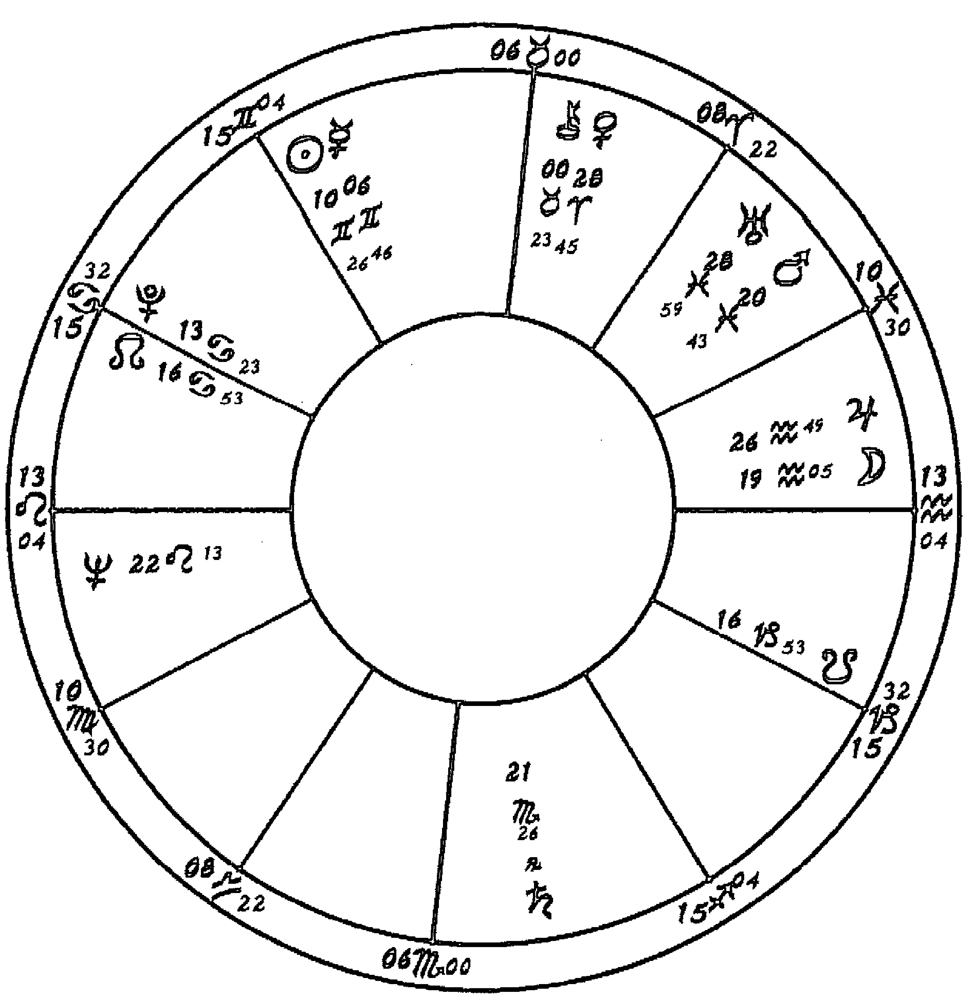

#### 玛丽莲·梦露

观众：
那美国女星玛丽莲·梦露呢？她的火双鱼在八宫。
她的火星跟天王星在八宫的双鱼座有个宽松的合相，火星还三分位于四宫天蝎座。

达比：
没错。
的支持。这颗火星跟她七宫里的无论在爱情或其他方面都会给她带来麻烦，不然，她也许会是一个很完整的白给自足系统，没有办法触及自身天性里怜悯的面向。拥有这颗火星的人似乎早在生命的广度敞开前，就先体验过失落。我并不是说他们的失落感比别人强，而是他们能够感受到灵魂深处的失落，因此对世界敞开心胸。他们的激情送他们踏上旅程，承诺的是一件事，但结果又是另一回事。尖锐的失落感打开他们的觉知，感受到周遭的苦难，但她们开始可能会迷失在自己破碎的梦及破灭的理想之中。这样的过程也许持续一分钟、一小时、一个月或更久，但感觉起来都跟永恒一样。然后，亮亮的东西出现在水面上，在他们意识到之前，他们又开始行动了。他们一度会体验到清明的感觉，而他们就能在这一刻开始抉择。不是每个人都接受抉择的时刻，有人把握，有人再次任其溜走。为什么有人会行动，有人不行动，这点永远是个谜，但这点对所有的火星都适用。

原书注：玛丽莲·梦露（Marilyn Monroe），一九二六年六月一日上午九点三十分出生于加州洛杉矶。资料来源：堤耶加。

观众：这颗火星似乎也没有带领她走向卓越之路。

达比：这个嘛，满难说的，也许在八宫的领域算卓越吧！这点我们无从得知，我们也永远不会明白，在另一个人灵魂深处的意图，也就是灵魂的目标到底是什么。某些生命深层的谜太大了，我们无法理解。也许，她的死的确践行了她的使命？我不晓得她是否符合个体化的标准。为此，我是有点怀疑的。她实在太符合某种原型的特质，根本没有空间发展个体。似乎她早期艰苦的童年让她无法活到老年。也许我们可以这么说，对其他人而言，她所施下的亲密肉欲魔咒是一种诱惑，但对她自己而言，完美结合的婚姻关系才是她的重点。当这种婚姻关系破裂，再次恢复单身时，想想她会感觉多么失望、多么寂寞啊。不过，我们看得出来，就算她跟想要的对象上床，她的障碍与失望、寂寞还是息息相关。

观众：遇到这种客户我就没辙了。我会想尽全力帮她，而她的无可救药一定会让我觉得很气馁无力。

达比：
我猜我也会陷入这种陷阱。她的美貌、充满矛盾的强硬态度以及软弱的程度会让近距离靠近她的人一下缴械，一下武装。她对完美婚姻的渴望及包容力在很多层面上都是很复杂的，这种感觉一定让人赞叹也惊吓。所有拥有火双鱼的人肯定都感受过卷而来的感觉，就算你们没有意识到也一样。玛丽莲·梦露则是比较极端的版本。每当你受到诱惑，不论这是否只带给你片刻的希望，你都会全然敞开，接收所有来自内外的感觉浪潮。这样的感觉可能是你成就之路上的阻碍，但也可能是指引你方向的水流。这些感觉是外物点燃你热情的迹象，而你的火星则会朝其前进。一个目标出现，而过往的情绪跟情感会在上头打转，产生漩涡。这样的感受就像触角，可以协助你触摸到前往目标的道路。因为我们讨论的是双鱼座，这些感觉不见得总是来自你的过往，在你行动时，父亲记忆的影子也会投在水上，这些事情是你在有意识之前就感觉或听到的。荣耀这些没有「理性」规则的感受能够避免你溺水。采取行动会牵扯出记忆之外的记忆，随着一个人继续前进，通常会以连当事人都不明白的方式解决问题或消融在其中。

观众：
有时火双鱼会害怕行动，他们害怕行动会掀起震波。在水里就能看到水波。

达比：
这点也许是真的，人可能会迷失在各种结果反射出来的冥思里，但火双鱼的人会跟随他们对于感官、情绪、狂喜的饥渴前进一段时间，没有注意到自己行为对自身与他人之间

当他们意识的时候，成就卓越的驱动力才会开始，但火鱼还有另一个特点，解放自己或解放他人的行为最终会替他们带来能量，让他们兴奋起来。这是因为双鱼座背后的木星使然，某件事物必须能够承诺带来自由与解放，不然就不值得为此一搏，赢得胜利。加上另一颗守护星海王星，让我们都从深陷的有限时间密度中得到自由解放。自由是深层的呼唤。不过，这种呼唤也会有不同的外表与形式，就跟拥有火鱼的当事人一样，充满变化。火鱼多少也有赌徒性格，这也是因为木星守护的关系吗？这点跟火射手的敢冒险不同，火双鱼追求的是模糊不清的使命，他们有时为了模糊无法界定的使命赌下一切。无论他们是否达成目标，状况会一个接一个出现，使命会一个接一个出现，然而，很多火双鱼却说他们只想休息、冥想、逃避这一切。妳让我想到《X战警》(X-Men) 里的卡力班（Caliban），多接一件任务只是为了要赢得自由，一边做事一边绷着脸，但还是会乖乖去做。

#### 巴布·狄伦：作为集体声音的火星

> 达比：这样的形像很符合火鱼，但我们别忘了另一个变种人，《人鱼公主》(The Little Mermaid) 中的爱莉儿（Ariel），也混合了这种暧昧不明与郁郁寡欢。说到暧昧不明与观众：

郁郁寡欢，我就可以来讲一个之前提过的人物。巴布·狄伦 35 是日金合相在六宫，四分三宫的火双鱼。

观众：

他的土元素比我想像得还多，他最多的是土跟风元素。

达比：

也许这是一条线索，这个人显然不是最雀跃欢喜的人，却能够表达出深层的自我，还能带给我们希望，而不是绝望。火双鱼四分他的日双子，这是一个困难相位，总会对抗自己，总会训练自己，而内在的对抗会演变成以某人或某事之名的战争。他不只有火双鱼，加上这组四分相，这样的组合呈现出这个人听说了别人的故事，就能用他的文字天赋，替可怜虫及无依靠之人发声抵抗，这种感觉，我们无法用言语说清楚，但他早就用歌曲唱出来了。然后，我们会说：『没错，就是这种感觉。』他过去跟现在都把弦外之音带上海流的表层，还有失去爱的悲伤、生命的消逝、以及奇异的小时光，我相信他一再失望，光会在暴风雨过后，随着一连串的意象、贝壳、海草一起冲刷上岸。不仅是个人的状况让他失望，他看待这个世界的时候，也充满失望，当他没有做出大众

35 原书注：巴布·狄伦（Bob Dylan），一九四一年五月二十四日晚上九点五十分出生于美国明尼苏达州杜鲁斯。资料来源： 克莱弗。

期待的音乐时，大众的失望肯定也让他煎熬痛苦。在这种失望过后，他会息影好几年。不过呢，火双鱼的守护星是木星，他的木金牛三分海处女，无论多失望、多哀伤、多不满，他的土象能量还是滋养着他，所以他能持续从他与生俱来的美德里，用意象及感觉继续滋养我们。他有没有走上个体化的道路呢？他有没有朝着最好的自己前进，道德上的他跟创意上的他能否并驾齐驱？我不知道答案是什么。在某个领域达到成就跟我们今天讨论的卓越不太一样。这点带我们回到一开始的讨论，也就是卓越是一个人的天性，还是能够努力学习的东西？就巴布·狄伦的状况来说，在人与社会表层之下用诗意的本能感受底层的暗流，对他来说是很自然的事情。他用这方面的能力达到卓越对他来说是与生俱来的。不过，他是不是决定要让自己成为一个有道德的人、卓越有美德的人，这点只有他，或他身边亲近的人晓得了。要透过火双鱼的力量进入卓越的国度，你必须航行于你对亲密感、圆满、结合的渴望之中。某些人事物会让你感受到这种渴望，但只有当你承受足够的失望之后，你才可能踏上带领你前往自由的道路。无论你的火星梦想什么样的目标，必须透过在某些时刻放手、赋予自由，才可能达成。一旦你能让自己的激情跟随你与向往目标之间的能量波长飘移，你才比较可能吸引这个目标到来。不过，当欲望出现的时候，你也要有愿意牺牲

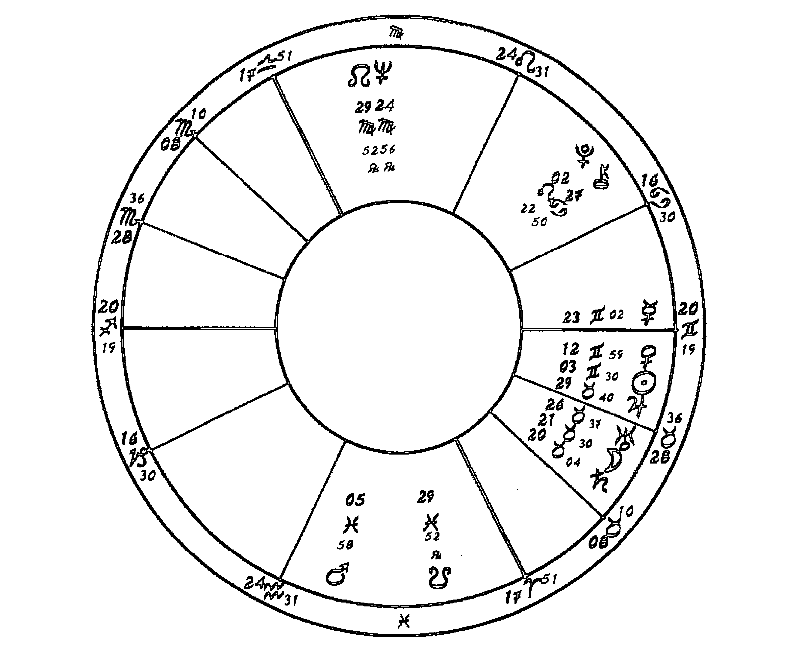

#### 巴布·狄伦

观众：
我们必须替年轻人设计出一种学校，依照他们的火星配置，替他们量身打造出不同的障碍，但也许生命已经在做这件事了。

达比：
没错。我们今天的讲座已经差不多了。我很好奇，在场有多少人已经抵达能够替欲望导航，而不是被欲望牵着鼻子走的境界？有多少人分得出来哪些欲望让你采取行动，让你更符合自己的生命，而又有哪些欲望会带领你背离真实的自己？这些问题是我们必须扪心自问的，所以，当火星忽然受到某些刺激而启动的时候，无论这些刺激是征服、输赢、获得、保护、守卫都好，我们都能做出选择，这些选择会带领我们及生命前进。无论我们对火星的冲动赞赏与否，重点在于，认清你做抉择的那一刻，进而意识到你的决定会带领你往何处前进。抉择的能力会演变成一种识别，你能辨识出某些选择会替你开启通往更康庄的心满意足之路。当火星的能量遭到引燃时，我们愈练习抉择的能力，就愈能选择我们要在何种层次上过我们的生命。在我们能够依循超越自身个人意志的喜乐冲动行事时，这项能力会带领我们前往不一样的境地。看起来很矛盾，但这样的能力最后却会替我们带来远大于个人喜悦的结果，更让人满意。向往美德、向往发展出自己最好的一面、想要符合最真实的自己、想要成就卓越非凡，我不确定这些冲动是不是每个人与生俱来就有，也不确定是不是人人都有这样的潜力。我自己的文化及社会背景让

我相信，大家都有潜力。不过，不是每个人都想这样，有些人只是想要一些东西，而这些欲望的强度远超过他们想要踏上个体化之路或追寻本质里卓越非凡的程度。不过，对于那些愿意努力的人，了解你的火星，晓得火星能够表达出来的残暴与细致是绝佳的第一步。

差不多了，今天就到这里了。谢谢各位热情的参与。

# 第三部
## 暴徒与战士

丽兹·格林

本场讲座为心理占星学院春季课程的一部份
讲座日期：二〇〇一年三月十八日
地点：伦敦摄政学院

### 引言

各位早安，如大家所知，举办某一特定原型主题研讨会的时候，讨论的主题通常会以具体方式呈现出来。我们过往几年在心理占星学院的研讨会里都发生过类似的遭遇。我记得有一次最惨，那时的主题是天王星，而电水壶在会议进行间爆炸了，导致所有的灯管保险丝都烧掉了。今天我们要讲的是火星，希望战争之神最后不要让我们闹上警局或打起架来才好！

本次研讨会的主题和当今时事息息相关，让人非常不舒服。我们生活在这个暴力行为似乎已经无法控制的年代，也许一直如此，但我们对西方国家的文明行为抱有高度期待，感觉起来生活变得很危险，特别是住在大都市某些治安较差地区的人，我们不懂，这个世界的生活应该要比一百年前、一千年前更舒适、安逸才对。在人类历史的初期，想活下来的确需要某种程度的冷酷无情。现在西方世界多数人的生活水平远超过生存门槛，这里说的比较类似生理而不是心理层面的生存门槛。我们虽处于成熟的政治法制系统之下，却面临相当恐怖的集体暴力。我们没办法阻止战争发生。我们不晓得该如何停止暴行或家暴事件。街头还是有人遭到性侵，有人遭到毒打，还是有人遭到谋杀，就连孩童也会杀害同样年纪的人。当我们注视火星的时候，我们看到的是自己理当非常害怕的原型架构阴暗面。就另一方面来说，少了这层架构，我们又没有办法在世界上生存立足，因为这是我们替个人及集体意识建构出更佳实相的方式。火星的议题与每一位占星师密切相关。我们所遇到的每一位客户都有火星的问题，我们本身也是，因为集体意识里存在着无解的火星议题，每个人都受到影响。

今天我想以神话和心理学的观点来探讨火星的意义，以及我们如何以星座、宫位、相位来诠释火星。我们也会提到不同的火星配置，我们不会以系统性的方式一一解释星盘里的火星。我想探讨某些让火星特别不高兴或没有办法正常运作的模式。和上述两点一样重要的，还有火星在无意识状况下的反应。当这个行星的象征与意识觉知分开时，火星会强制执行，某些明显的特征可能会以莫名的暴力行为展现出来，无论是家暴或遭到暴行都可能发生，而且也会引起诸多身心失调的症状与疾病。忧郁症的心理症状通常是因为火星的愤怒在暗处一点一滴流失所致。

> > 1 原書註：在研討會進行期間沒有口角和爭執。不過，一名學員嚴重流鼻血，一直流到研討會結束才成功止血。所以課程一開始的時候沒有提到這個小插曲。

隨著今天的課程進展，某些人可能會覺得我們花了太多時間探討火星惹出來的病兆，不過，我們必須藉此才能了解健全火星的模樣，以及火星順暢的時候會如何運作，且學會如何與火星建立起良好的關係，又不會對這個世界造成難以控制的影響。某些關於戰神的神話能夠讓我們理解火星的天性。就占星來說，古時候的人把行星象徵的原型模式稱作神。神明生氣的時候，一定要找出原因，而且還要改善人類與神明的關係。不幸的是，我們的教育對理解原型架構沒有什麼幫助，所以我們也沒有辦法以更好且更有創意的方法與其互動。我也想探討某些火星所引起的社會問題。無論如何，別人是一定會踩到你的痛腳的，因為一個人的聖戰熱情，可能是另一個人的心頭恨。無論火星座落在星盤何處，世俗的議題一定會加溫，觸及每個人內心最脆弱的地方，情緒必須宣洩，我們會變得更激進。接著，我想花點時間討論合盤裡的火星。最後，在今天的講座結束之前，我想分享幾張世俗占星的盤，一窺集體意識的火星爆發，引起我們所知的戰爭。我相信今天一定有很多盤可以討論，因為大家都提供了自己的星盤。

### 神話故事與火星心理學

我們一開始可以先觀察古時候的戰神，想一想，他們作為火星靈魂的進展告訴了我們什麼。近代集體幻想裡的英雄戰士概念與我們將要探討的神話形象相差甚遠。目前有兩顆外行星落於水瓶座，我們認知裡的英雄應該是靠腦袋不是靠肌肉，這樣的英雄必須替人性而戰，也許是一位思想家、關懷者，性別不拘。不過遠古戰神的特徵還是保留了下來，不只是運動比賽的冠軍，也存在於當代電影之中，或環繞在神秘的精英作戰部隊裡，如英國的特種空勤團。

#### 誕生的掙扎：巴比倫文化裡的瑪杜克

咱們從瑪杜克（Marduk）開始談起吧，我在其它講座裡談過他，在座有些人也許很熟悉。不過，應該還是有些人不知道他是誰，我簡單帶過他的故事。瑪杜克是巴比倫文化裡的火神，擁有太陽和火星的特質。今天我主要談他火星的面相。瑪杜克和他的兄弟姊妹都在母親水神蒂雅瑪（Tiamat）的子宮裡。當這些兒神遭到母親的死亡威脅時，只有瑪杜克敢站出來為生存而戰。他和蒂雅瑪展開一場大戰，在母親能夠殺死他前，先毀滅了母親。他從母親的身體創造出天與地，因此，這位熊熊燃燒的戰士之神創造了宇宙。

巴比倫人認為創造的源頭是一場恐怖的戰爭，需要英雄氣概與勇氣。這個創世紀神話的意象描繪出能夠運用在各種場合的心理動力，也就是生命必須透過掙扎與分離才能存活下去。瑪杜克摧毀母親的身體，以母親的身體打造出宇宙，這樣的行為不只象徵著實際的分娩過程，更描繪出個人意識誕生的危急狀況。這樣的生產，是生理的，也是心理的。我們都知道，生產是生死交關的事情。在星盤上，我們會把這樣的過程與牡羊座及一宮，特別是上升點做連結。不過，我們也許不曉得，心理的誕生也需要天人交戰一番。我們希望個人的發展能夠輕鬆、愉快、和諧。不過，要成就一個獨立的個體已經是一場大戰了，無論這樣的行為是否要求一個人必須違逆家族的血脈或對抗集體的意識都一樣。要我們接受自己必須參戰和殺戮的感覺非常困難且痛苦，當然，我們希望這裡提到的作戰與殺戮只是象徵性的說法。唯有勝利才確保我們能夠存活下來。

### 婴孩战士

战争是我们从小发展人格的必经过程，这也是为什么玛杜克的神话继续在人间产生共鸣的原因。为求实际的存活，我们必须先出生。接着，我们则要为了心理的自主而战。在过程里，我们必须与母亲对抗；饥饿时，会发出尖叫声；当别人违抗我们的意志、将我们强行抱起时，我们会乱踢乱扭。我们不只对抗母亲的拥抱，更反抗我们自身肢体的僵硬与不协调。当我们不能用意志控制四肢的时候，我们也会生气。接着，我们成了所谓的「恐怖的两岁儿」，无论我们身上带有多少教条，我们一定会踢开所有的限制与规矩。我们乱发脾气、捶打地板、放声尖叫、呕出马铃薯泥、憋气憋到脸都变蓝了。我们从母亲身边分离离开来，且要求独立的意志。如果我们办不到这点，我们就不是一个完整的个体。因为娃娃很小，我们会觉得这种行为不成威胁。如果发脾气的是一个体毛浓密的彪形大汉，我们肯定会往相反方向逃之夭夭。你们都晓得第一次火星回归的「恐怖两岁儿」，因为火星绕行黄道的行运需要两年。当火星第一次回到出生位置的时候，我们进入了作战模式。我们内心气愤好战的灵魂甦醒，企图定义、确立自我。如果是自己的小孩，我们大多会容忍，甚至接受孩子的任性，而当我们在餐厅或超市裡听到别家的孩童尖叫哭闹的时候，我们会知道这是个没有办法伤害我们的小奶娃罢了。不过，就算是小娃娃的愤怒也是会要人命的。确立分离的过程需要多少愤怒，我们已经想不起来了。当我们长大后，再次感受到这种感觉时，自己的怒火还会吓到我们。

### 「不」就是不，你哪裡聽不懂？

麗茲：在場有多少人生氣的時候會嚇到自己？

觀眾：我非常害怕自己的怒氣。我生氣的時候，也會變得非常焦慮，所以我會試著和用理性化解怒火。

麗茲：你是擔心自己會失控、傷害別人嗎？我們對於憤怒的恐懼實在很有意思，我在很多客戶身上都見識過。第一次火星回歸的時候，我們才開始學習控制怒火。不過，長大以後卻不曉得自己有沒有能力克制憤怒。如果我們長大了，卻不知道該如何處理憤怒怎麼辦？我們通常會壓抑火氣。在場有多少人無法說「不」？

觀眾：我說得出口，但不知為何，別人都不聽。他們都以為我說的是「好」，然後開始欺負我。

麗茲：當然了，很多人為了實踐霸凌的藝術，根本不會在乎你拒絕得多誠懇。我們就必須一再重申，也許不能只說一次，也許必須強硬一點，好比說：「不就是不，你哪裡聽不懂？而在特殊場合裡，「死一邊去，你這豬狗不如的東西！」也滿好用的。幸好，多數人並不會固執事情一定要照他們的意思辦，也不會完全忽略他人做決定的權利，不幸的是，我們遇到這種人的時候，通常都是在我們小時候，這種人就是我們的父母。這也就是為什麼，長大成人以後，火星常常會成為大問題的原因之一。碰到高壓強勢的爹神、娘神時，我們還是會變回小孩子，我們很可能會對自己的力量失去信心。而我們的『不！』感覺起來就會像是小綿羊咩咩叫，別人也就不會認真看待了。認真誠懇的拒絕必須有意識地使用火星。當我們個人意志在內心戴上相當猶豫的面具時，其他人不會相信我們，反而還會用他們的火星從我們這裡強取豪奪。如果我們期待其他人尊重我們的自我，我們就必須先全心全意地尊重自己。那麼，『不』就是『不』，就算是溫和、輕鬆的『不』，別人也不會誤會。

如果我們能夠展現出火星崛起的模樣，除了特別遲鈍、特別壞、特別想要攬住權力的人以外，一般人都能感覺得得到，必要的時候，我們已經準備好要正面對質或拒絕，以保有我們的獨特性，這樣其他人就沒有辦法控制我們。別人欺負我們的力量通常是一個願打、一個願挨的，因為我們希望被愛，卻害怕孤單及分離。我們心底的依賴感害得我們沒有說服力，就連每天都會出現的『不，我今天很累了，不想和你的朋友一起出門吃晚餐』都說不出口。我們甚至會發現，就連面對一名說服你買下某件衣服的專櫃小姐，你都會忘了說：『感謝你的協助，但我不喜歡。我中意藍色那件。』火星的問題變化不多，小事就是剛剛提到的那兩個例子。在小事情上讓步也反映出我們的行為是溫順謙恭良且處處容忍的。整體而言，我們能在這種背叛自我的小事情上放水，特別是這些小事出現在需要月亮與金星反應的時候，因此，當大事出現的時候，我們也許還能忠於自我。

不過就算是天大的事，某些人還是會背叛自己的心意就是了。所以，當有一天，這種人終於氣炸了，出門攻擊別人的時候，我們也不該覺得意外。通常的狀況是，他們會出來攻擊他們的孩子或父母，比較極端的例子是他們會朝隨機出現的人行使暴力。我們可以想一想最近很多的「狂躁駕駛」，或持槍跑去學校、商店、辦公室見人就開槍（包括他們自己）的案例。火星要到什麼程度才會幹出這種事情？這種事情就是剛剛坦承自己無法說「不」的人幹出來的，不過規模卻大得多。有人明白為什麼自己會有這種困難嗎？

觀眾：不敢打擾他人。
觀眾：害怕別人不喜歡我，害怕遭到拒絕。
麗茲：要用創造力與火星共處最困難的一點就是，大家都覺得這些恐懼無可避免。表達火星的能量，就算是以積極、正面、讚揚生命的方式呈現，有時都可能會疏遠其他人。如果我們不同意其他人，想要強調自己的意識，我們就得冒險，別人可能會討厭我們，特別是那些必須掌控周遭世界的人。我們也許會失去他們的「愛」，如果在這裡用「愛」這個詞是恰當的話。我們在早年學習了自信和惡行惡狀組成的方程式。這個方程式不只來自我們的父母，從文化宗教的教條裡也層出不窮。就扭曲火星的表達能力來說，基督教難辭其咎，雖然教會本身也有相當漫長的暴力火星歷史。我們受到的教育教導我們，身為一個人，我們是不重要的。堅持自我是自私的，是壞事，是不對的。《失樂園》（Paradise Lost）作者米爾頓（John Milton）筆下的路西法說：「我不效忠！因此拒絕效忠（服務）就是和惡魔為伍，我們必須先替其他人的需求服務，等到大家都滿意了，才來談我們自己的需求。當別人展現敵意的時候，我們必須轉過另一邊臉讓他打，而不是站出來捍衛自己、反擊回去。我們相信自己永遠都要原諒他人。在座有多少人能夠真正原諒深深傷害你或家人的人？難道能夠跳過憎恨和殺人的慾望，直接談談原諒嗎？也許，在事過境遷之後，原諒和同情會出現。不過，人類的本能反應是反擊，不只是為了保護自己，也是為了確保我們身為活人的能力。」

### 服務與無私

維繫這個社會，替別人服務不是必要的嗎？不是社會形成的首要條件嗎？

的確，尊重他人的權利是社會的條件。不過，在這樣的大框架底下，一個人還是可以說：「我不想讀法律，我要成為一名藝術家。」而不會因此破壞社會的結構。在社會架構下，火星一定會有某種程度的退讓。為了要與其他人和平共處，火星能量一定會遭到規束，且引導至有建設性之處，但每個人還是必須證明個人的意志、目標和欲望才行。蘇維埃政權的共產實驗瓦解，就是因為這種社會必須摧毀各人的意志。英國人不會活在那麼高壓統治的社會裡，不過我們內心也受到某種壓迫。這種壓迫感遠比意識形態、宗教、政治都還要古老、深刻，而且是加諸在我們的無意識層面。這種思想深植在西方文化長達兩千年。如果我們接受『星座年代』的概念，過去兩千年，人類集體意識其實是處在雙魚／海王星價值裡。火星自然是海王星最大的敵人。只要是海王星想要消散融合之處，就是火星遭到去勢之處。如果我們活在以海王星價值作為最高指導原則的世界裡，火星就一定會成為那個『壞蛋』。別無他法，因為火星扮演的就是自我確立及競爭的角色。一個人也許能用各種極具創意的方式整合這兩個原則。不過，就原型上來說，火海兩者是對立的。堅持自我的天人交戰寫在巴比倫的瑪杜克神話裡，不過，因為集體意識裡的海王特質作祟，我們並不會認同瑪杜克的形象。我們不能生氣，我們不能堅持自私的欲望，我們不能展現出競爭的本能。因為這樣的模式牽制在我們的靈魂深處，所以我們的火星有很多問題，從最簡單無法說「不」開始。因為我們沒有辦法連結火星，我們懼怕自己的怒火。我們不知道界線在哪裡，也不知道自己能夠站在中央，以有建設性的方式流通能量。怒火就像是我們懼怕會破籠而出的怪物一樣，如果牠真的闖了出來，我們相信一切都會遭到破壞，而我們無法使其停下來。自然而然，這種想法就成了「自我應驗預言」了，而當今西方社會的確上演著憤怒火星爆發的戲碼。

> **觀眾：**
> **麗茲：**
沒有錯，我的意思差不多就是這樣。大多數我們目睹、閱讀、體驗到的都是病態的火星能量，而是火星壓抑的結果。所以，妳的意思是我們在這個世界上看到的並不是真的火星，或者說，至少不是正面的火星。這也就形成了火星的「惡性循環」，我們因為相信眼前醜惡的表達方式就是這顆行星的真面目，所以不敢展現出這顆行星的力量。而長達幾世紀無法表達的恐懼卻也無庸置疑地加重了火星在世界上呈現的方式。因此，我們必須仔細檢視暴行的根源和本質，無端的暴行並不是戰神傳承下來的特質。

### 艾瑞斯：無父之神

咱們來談談希臘戰神艾瑞斯吧。我們第一次是在荷馬史詩《伊里亞德》裡認識他，他就是戰爭的同義詞。在詩文裡，據說他會將勇氣賜與人類，數不盡的英雄豪傑在準備上場打戰時，都會自比艾瑞斯。他和阿波羅同一陣線，且按照太陽神的意思行事也不讓人意外。在這部偉大史詩裡，他和其他神祇不太一樣，他真的人類戰士一樣跑去戰場對抗希臘人。也就是說，他彰顯的是腳踏實地的肉身層次，其他的神則在凡人看不見的天上影響戰局。這一點與我們在占星上對於火星的認識息息相關，不止提到這顆行星本能和實體的本性外，也告訴我們，火星能量會透過身體的疾病表現出來。

荷馬筆下的艾瑞斯有一個主要的死對頭，也就是雅典娜。雅典娜也是戰爭之神，但這兩位神祇的立場是對立的。男性戰神艾瑞斯是由天后希拉獨自懷孕生產的，沒有仰賴男人的精子；女性戰神雅典娜則是由宙斯獨自生產的，沒有仰賴女人的子宮。艾瑞斯會強暴、使女人受孕，在神話裡以諸多情慾冒險著稱。羅馬人稱呼他瑪爾斯（Mars），與字根 Mas（玷汙、受損）及 Mas（慶祝、慶典）有關，描繪出生殖的動力。而雅典娜則是處女神，以智慧著稱，艾瑞斯偏偏缺少這項優點，就連在烽火連天的戰場上，艾瑞斯都會搞不清楚誰是敵、誰是友。其他諸神相當喜愛雅典娜，卻懼怕，甚至憎恨艾瑞斯。

在《伊里亞德》裡，勃然大怒的宙斯在地府對艾瑞斯說：

### 攻擊本能

執，脾氣不受管束，言語都難以控制她。 你最喜歡的莫過於爭執與戰鬥，因此，全奧林帕斯山上我最討厭你。你的母親希拉剛復固

希拉帶領艾瑞斯到這個世界上，作為對宙斯的復仇，因為宙斯侮辱她的女性本能。這點讓我們理解占星學上相當重要的一個面向。

麗茲：雖然在神話裡，火星的形象是一名誇張的男性，但這位沒有父親的神祇其實與宙斯天上的國度沒有血緣關係。這點說明了火星力量與展現的本質，這個本質是什麼呢？

觀眾：重點在於身體。

麗茲：對，火星屬於本能和身體的國度。什麼靈性原則、智慧、遠見、抱負都與火星無關。火星是讓我們生存下來的紅色鮮血，火星是當我們展開攻擊、捍衛自己的腎上腺素。對這位神祇來說，戰爭是不可避免的，因為要活下來，就一定得戰。大自然不是和諧平靜的。我們都喜歡用浪漫的眼光看綠樹、鮮花、蝴蝶，但仔細觀察，我們就會理解大自然是弱肉強食的社會。戰爭永遠存在，大自然不會妥協，大自然是血腥暴力的。為土地而戰、為勝利而戰、為交配而戰、為生殖而戰、為成為團體的領袖而戰，這些都是火星的功能。冥王星比較像是整體的演化發展及生命的存活有關，不過這裡的生存指的不見得需要戰鬥，演化需要的是適應，或某種物種的滅絕。如果大家想了解冥王星，可以去看英國BBC電視台拍攝的「與恐龍共舞」（Walking with Dinosaurs）電視節目。這部紀錄片很棒，帶出了大自然經過亘古的改變，高明地刻劃出細微的生命力，卻也殘酷地表現出不可抗拒的演化過程。火星則有不同的味道。火星是個人行星，象徵著每個人的戰爭架構。許多物種的生命集中在戰爭的架構上。雄性動物的首領必須維持自己主導的地位、必須展現出無比的力量和高超的技巧、必須贏得最好的異性。不然，群體裡的其他動物不會尊敬首領，一定會反過來對付他、摧毀他。

這樣的架構也存在於我們身上。這樣的法則深植在本能當中，而不是智慧裡。火星也許會受限、受傷，或在創意上遭到限制，但其本質是不會動搖的，無論是遇到講求平等、社會進步的天王星，還是海王星式的宇宙合一大夢。火星是個人以某特殊生物種、群體、族群、種族為名而動員的原則架構。

火星經得起血緣義務及激發使命的考驗，在許多神話裡都看得到戰神如此的本質，但我們無法以思想上的原則觸動火星。如果我們以某個族群之名宣戰，這個族群一定和我們有個人的關連，可能是個人投資的情感或本能天性支持此人加入行動。共產黨宣言企圖否定火星的實相。我們無法抹去任何一顆行星的能量，想要消滅火星更是特別爛的餿主意。某些星座和相位能夠讓火星透過大腦來表達，這樣比較像是疏通火星能量、增添思考色彩，而不是打算改變火星的本質。火星落在水瓶座、天秤座，或與天王星產生相位時，它草莽衝動之處將會削弱，強調道德與社會責任，而當事人在追求個人欲望時，不會競爭，反而會以合作的方式進行。不過，火星的原則並沒有改變，還是以「我」、「我」之名開戰。在神話裡，艾瑞斯是部落的生物。他對駕馭整個宇宙一點興趣也沒有。他作戰，因為作戰對他有好處，因為他喜歡戰爭這件事。他和雅典娜不一樣，他沒有大系統的概念。這也就是為什麼，在《伊里亞德》裡，他常常表現得很愚笨。當事情發生在他的專長領域時，他一點都不笨，不過他見樹不見林，看不到狀況的全貌。人類是自我中心的部落生物，本能的面向，我們也能有所成就，但聰明人就會接受火星人類本來的面貌，而不是假裝我們能夠消滅或超越這顆行星。在某些狀況中都看得到人類天性裡的部落元素。我們都希望自己是因為更高的理想參戰。在某些狀況裡，這個條件也許能夠成立。不過，火星自私的動機卻不可能消失。不然人類不可能冒著生命危險參戰。當別人要求我們放下個人欲望，替一個模糊抽象概念而戰時，火星會非常不舒服，我們要麼就拒絕參戰——越戰就碰到這種狀況，要麼就把這個抽象概念當作藉口，在意識形態下展開部落間的仇殺，如同北愛爾蘭及東歐的狀況一樣。我們以傲慢、輕視的目光看待如同非洲內亂的明顯部落戰爭，但我們虛偽的高尚卻對妥善使用火星一點幫助也沒有。

### 基礎與征服：羅馬的瑪爾斯

戰神也是一位保護者，比較強調此一特質的文明是羅馬帝國。古羅馬非常崇拜、敬愛瑪爾斯。希臘戰神艾瑞斯的特質都進入到了羅馬人的版本裡，不過現今流傳下來的瑪爾斯特質卻都是 源自於羅馬。羅馬人以公豬、公羊、公牛獻祭給瑪爾斯，瑪爾斯不只庇佑了羅馬帝國，也祝福農田和空地。奧古斯都打造了復仇者瑪爾斯之廟（Mars Ultor），以紀念暗殺其父凱薩的布魯特 斯及卡修斯之死。我們也要求火星「抵禦、阻擋、防止」可見或不可見的病痛、匱乏、憂傷、災 禍，或惡劣的氣候狀況，以上祈願出現在老卡托（Cato）的《論農業》（De Agricultura）一書中。 羅馬人相信火星是他們的建設之神。根據神話傳說，瑪爾斯誘惑了一名義大利國王的處女 兒女雷亞·西爾維亞（Rhea Silvia），且使其懷孕。雷亞·西爾維亞生下兩名男嬰，卻被迫拋下 們，因為她認為她的父親不會相信她是遭到天神所騙。於是，兩名男嬰和摩西一樣，母親把他们放进篮子里，随波逐流。最后是上天派来的一头母狼找到了他们。母狼哺育他们，两兄弟活了下来。好心的牧羊人将他们拉拔长大，成为罗穆卢斯（Romulus）和瑞摩斯（Remus）。在奠定罗马城基础的时候，两兄弟展开了激烈的竞争。瑞摩斯想要暗杀罗穆卢斯，罗穆卢斯却为了自保而杀死了瑞摩斯。这个展现罗马人世界观的神话显示出几个重要的火星主题：面对巨大危险时存活下来、保持正面的本能、竞争的天性会爆发肢体冲突，以及在实体世界打造出实际且能经得起时间考验之物。罗马军队的英勇与无敌，无论在其战术或象征上，对火星都有很高的评价。和希腊人相比，古罗马人更提倡玛尔斯的荣誉、忠诚和英雄主义。玛尔斯的信徒请求荣誉、忠诚和英雄主义。我不会美化刺激罗马帝国征战时的暴行与无情，也没有暗指现在的军人不讲荣誉、忠诚和英雄主义。不过，为了彻底了解火星，我们必须研究我们看待战争的方式。在这个启蒙后的文明二十一世纪里，我们理想中的战争是没有火星的。今天我们企图掀起的是科技战争，看不见鲜血，也不会用尸袋运送伤亡将士。现在的士兵在亲眼目睹暴力行为后，可以申请创伤后压力症候群津贴。就连有需要时，我们还是不耻作战。或者，我们是为了经济、政治理由作战，因此战场上覆盖着一层道德正义的色彩。就某种程度而言，我们不想重蹈二十世纪两次世界大战的覆辙，也不想走回美军在越南的愚行路线。不过，这却不是事情的全貌。风靡罗马世界的火星原型传达出来的是人类激进本能的健全写照，如同谚语所说：把宝宝和洗澡水一起倒掉，意思是指把好的东西和不好的东西一起扔掉，罗马战神的好、坏特质，我们都已经一并舍弃了。

> 丽兹：大家都该去看看电影《神鬼战士》，在座有多少人看过？请举手。好，大部分的人都看过。要了解火星，其实看开头就可以了，后半部可以不用看。无论这股力量是什么，我们都变得更文明、更讲求灵性层面了，因此也就不小心把这股能量逼进了潜意识里，这样一来，这股能量就与荣誉无关了。为了要启发且娱乐各位，请来看看罗素·克洛（Russell Crowe）这张不怎么精准的星盘，他以《神鬼战士》赢得了奥斯卡金像奖。我不想花太多时间讨论这张盘，因为我没有他的出生时间，也没有仔细研究过他的生平。不过，有一点很有趣，他的太阳和火星合相在牡羊座。每次只要看到某位演员的本命盘、所扮演的角色以及神话人物原型有所呼应，都会让人觉得非常有教化意味。

> 观众：我不想看这部电影。

> 丽兹：为什么？

> 观众：这部电影打打杀杀的。我不懂有什么好看的，一定得看吗？

> 丽兹：你是说这算不算研讨会的回家作业吗？当然不是，但我觉得重点不在于观看暴力电影时有没有得到乐趣。

## 罗素·克洛

一九六四年四月七日出生于新西兰威灵顿，时间不明

咱们来聊聊电影里的暴力行为吧。我一点都不会想看《沉默的羔羊》（The Silence of the Lambs）续集《人魔》（Hannibal），因为所有的影评都说这部电影呈现出来的无端暴行只是为了要满足施虐的幻想罢了。《神鬼战士》的暴力则完全不一样，没有消毒过的观点，也不是故意要施暴。这类电影还有《抢救雷恩大兵》（Saving Private Ryan），或经典老片《盖茨堡战役》（Gettysburg）。镜头并不会停留在血腥之处，但流血、暴力、荣誉和荣耀火星的世界元素却一点都没少。对于火星的世界视而不见是个错误。不久以前，我们才经历过世界大战，也许未来还会再次发生。我们必须观看且理解，而不是把脑袋埋进沙子里，还哭哭啼啼地说：「我是一个讲求灵性的人，我不能想这种事。」

观众：问题是，我看完这种电影之后都会做恶梦。

丽兹：有道理。那听听英国作曲家霍尔斯特的「行星组曲」（The Planets suite Op. 32）里的火星篇章吧，或去看电影《火战车》（Chariots of Fire）。不过你的敏感可能有部分是来自自己或家人因为暴力画面而产生的影响。对于文明人来说，表达火星永远都会冒犯到其他人。不过，如果火星没有冒犯我们，那问题就大了。

我们必须能够接受火星存在于我们生命之中的这个事实，而且要以正经、妥当的态度面对这颗行星，不要哭哭啼啼的。我们身边充斥着深层不见血的心理暴力。如果我们受不了暴力的概念，特别是必要的暴力行为，我们也就无力对抗看不见或实际的暴行。如果……

## 运动的火星

除了电影跟某些电玩游戏外，运动是我们鼓励火星的最后一个面向。也许是因为火星的其他面向都遭到阻扰，在体育活动里，也会出现很多破坏的行为。在足球赛爆发的歇斯底里行为，以及赛后的拳脚相向，都显示出遭到压抑的集体愤怒与挫败感正透过这窄窄的管道输发泄。火星的能量远超越足球比赛能够承载。运动员当然必须跟火星合作。

我们无法从内在面对暴力，我们就会变得非常脆弱，可能会因此吸引暴行的发生，或从无意识层面表达暴力。产生问题的火星跟所有的行星一样，可能是继承而来的，也许是世代传承下来的，集体意识也会吸收这样的能量。如果我们出生时或早年经历过战争，我们对于长大之后集体意识产生的暴力行为反应会特别明显。如果我们的父母经历过战争或集体暴力的摧残，如果我们小时候遭受过控制不了自己的父母或邻居虐待，那显然在银幕上看到暴力的行为很可能会引发内心的不安。而每个人的火星力道又因为火星在命盘上的展现而有所不同。有些人的火星就是比较发达，不过我觉得解决的方法并不是回避火星。我们也许必须在心底做些功课，才能正面对抗这些状况。逃避集体意识表达出来的火星，对于一个人与自己火星之间的关系有害无益。

丽兹：在场有职业运动选手吗？有人是业余的吗？只有一位？这点证明了占星社团对火星没有偏好。你从事什么运动？你有没有觉得运动让你跟火星产生良好的关系？

观众：我跑步，这是我的兴趣，我很喜欢跑步。没错，跑步协助我接纳自己内在很多的攻击性与怒火。

丽兹：你会害怕自己生气吗？

观众：我这辈子都在跟自己的怒火搏斗。我小时候经历过充满暴力的童年，在我的婚姻跟离婚

丽兹：而跑步可以帮你处理这个问题？

观众：对，先不说可怕的暴力行为，我会把问题的层次提高，现在的我比较能面对人类的暴力。我小时候很被动消极，我在婚姻里的态度也一样。我看不到自己积极面对问题。不知道怎么着，锻炼我的身体让我自己成就了某种程度的力量与健美，我因此变得更实际了一点。

丽兹：我们必须面对事实，这些发生在外在的事情呼应了我们的内在，这些状况是人类存在与本性本质的一部分，因此，跟火星保持正向的关系是很重要的。如果我们不肯认清周遭世界及我们内心世界的真相，我们就没有办法跟火星建立起充满创造力的关系。如果家庭背景中曾发生过暴力事件，当事人要以具有建设性的态度看待火星就难上加难，因为当事人就只知道火星带来的负面及病态实例。不过，就是因为这样，这个人才不能急着逃避，必须学习，当我们必须杀出一条血路时，我们该如何正面使用愤怒与侵略的力量，以及这种力量所带来支持生命的面向。

观众：暴力也能维持生命吗？

丽兹：没错，当火星用在面对生死存亡的危机时，的确有这个功能。暴力行为会戴上各种面具。在我们全面谴责暴行之前，也许我们能够思考它能带来何种正面意义。如果没有服务的目的，那火星就不需要存在了，也不会有人崇拜战神。我们必须找出火星的优点，不只是为了他人，更是为了我们自己。我接下来要问一个很沈重的问题，这个问题要问的是在场的女性。如果有人在街上攻击妳，打算性侵妳，妳必须为自己的性命奋战，这样这样的结果，妳可能会伤害或杀死对方，妳会动手吗？

观众：会。

丽兹：哇，回答真明确。有些人会说：「噢，不行，我不会想伤害或杀害另一个人，这样不对。」但在这样的状况里，做「不对」的事情也许能够救一条命。当然，我们不会想杀害另一个人，但也许就是别无选择。你会为了保护自己孩子的安全，就算必须杀死攻击孩子的人也在所不惜？在某些状况里，我们必须自卫，或必须保护我们亲爱的人。坚持

## 战士训练

如先前所言，西方社会的世界观深受海王星气质影响而抹黑火星。我们所承袭到的占星观点将火、土视为凶星。近年来，因为占星学朝心理发展得很成熟，土星的臭名已经慢慢平反。运动场及床上才会欣赏火星的特质。只有在服务乡里的时候，我们才会欣赏主动与勇气。

不过，火星还是太阳系里的坏蛋，通常都会用过度简单的方式理解。在西方世界，我们只有在直到最近才开始欣赏沙场上的英勇，但我们会把强调自我的战争英雄视为反社会的人，而破坏战争纪念碑及军人墓园也屡见不鲜。在我们这特殊的族群里，我的意思是指占星师、心理治疗师、哲学系的学生、学习奥秘知识的人、走在灵性道路上的人，我们更是无法接受火星。我们

> 观众：我相信凡事不要太早下结论，因为有时就算逃跑也很好。

> 丽兹：对，但战斗的本能与火星有关。逃跑保护自己也算是战斗的一种形式。我们在大自然里看到的一战或逃一机制就是一种保全生命的火星本能，这是积极果决的行为。就实际上来说，逃跑可能很聪明，但在某些状况里，把话好好说清楚则更高明。这样的策略通常与雅典娜有关，而不是艾瑞斯。也许选项不只一个，但有时战斗是唯一的选择。

应该要超越自己「低劣的本性」。因为我们通常都会吸引到有类似世界观的客户，我们的客户也会共享这些火星的问题。火星对我们来说还是一颗凶星，在我们努力想成为「好人」、具有社会意识之人的同时，我们也许也丧失了与这颗行星形成正向合作关系的机会。

我们可以透过人与动物的关系学习火星。基督教的教导里说明动物没有灵魂，我一直觉得这点很有趣也很可怕。训练狗跟马这种动物基本上就跟「训练」火星差不多，我说的是训练，不是压抑。如果小狗在不适当的时间吠叫，打它的头不成问题。不过，我们更需要尊重、荣耀这些动物，同时还要赢得它们对我们的尊重。不能虐待或羞辱它们，不然动物再也不会信任人类，也会变得冷漠、沮丧、野蛮，想要复仇。面对孩子内心的火星也需要同样的爱、耐心、重复纪律及坚定的态度，但令人悲伤的是，虽然脑子理解，但很多妈妈根本没办法面对孩子的愤怒，因为她们自己在表达愤怒上也搞得精疲力尽。她们不晓得该如何处理尖叫的孩子，要不就是暴力打小孩，要不就是用糖果饼干礼物安抚，不然就是不管他们，让他们叫个开心。火星的能量需要规范限制，而不是压抑。

观众：
我发现当我的孩子在超市或餐厅这种公众场合闹脾气的时候，我会觉得很烦。我会很气儿子，但我也会觉得很内疚，因为我知道其他人也觉得很讨厌。然后，我会因为他们觉

丽兹：我相信大多数的母亲都心有戚戚焉。我们的教育没有教导我们该怎么面对自己的愤怒，而面对孩子的怒火则按下我们无意识里所有的惊慌开关。安抚并没有用，虽然安抚是大家最常使用的策略。安抚没办法告诉孩童界线在哪里，也没办法让他们及母亲信任自己的愤怒。如果孩子学会用愤怒作为操控的手段，而不是利用愤怒来提升关系的有效方法，那这个孩子内在的火星自信也发展不出来。结果只会成就出胆小鬼或只会威胁别人的恶霸。先前有些人提到，你们会害怕自己的愤怒，可能是因为你们小时候没有规范限制愤怒。也许你们的妈妈很怕你们的火气。我们并没有发展自己接纳愤怒、信任愤怒的能力，这种信任只能从一开始的时候学习。不然，我们之后就得努力学习，通常都要透过治疗的关系。害怕自己的愤怒相当是在说：「我不相信自己，我不知道自己的界线在哪里。」我会忽然爆炸、伤人。一从能够维持自己界线的父母身上，我们才会学到界线的概念，也不会觉得加诸纪律是羞耻的。没必要把孩子打得半死，但这几年来，在处理下一代教养上头，政治正确成了唯一的王道。我们努力摆脱维多利亚时代不打不成器的概念，曾经受者是孩子，现在父母才是受。我们在强调孩子的每个古怪念头都很珍贵。曾经受者是孩子，现在父母才是受。

会因冷血说出「今晚不准看电视」而觉得羞耻，还得担心社福机构会把孩子带走。
宝宝的火星需要向大人的火星看齐。容易遭到孩子霸凌的父母只会养出不尊重他人界线的下一代，但我们也只是假装拥有火星的魄力，因为孩童感受得到我们内在的焦虑。在家里表达愤怒是很重要的，不只是能不能表达的问题，还有这家人是以何种方式表达。好好吵一架能够改善家里的气氛，沟通真正的感受与想法，事后还能腾出道歉的空间，这样远好过遮盖恶毒与不满。孩子必须见识过俐落、真诚方式表达的怒火。每个人都大吼大叫、彼此对骂，但没关系，因为在风暴之下还有爱与尊重。这样，我们才能学习面对愤怒，而不只是害怕而已。
我们可以吵架，知道自己不会摧毁另一个人。我们晓得重点在哪里，因为我们不想破坏，只是希望对方能够明白我们的观点。火星的问题最后一定都会出现在治疗师的沙发上，因为两岁儿的愤怒必须朝着能够包容的人发泄出来。火星问题很严重的人也许会要一个对象，这个对象让他们感觉很放心，能够恨这个人、气这个人，但这个人不会害怕、不会逃跑，也不会以暴力报复他们。许多孩童在展现出愤怒时，都曾被父母修理过。孩童的愤怒启动了父母的愤怒，结果就是孩子挨打、饱受虐待，大人还想扭曲他们的意志。不然，大人就会用奖励的方式安抚他们，这样的结果传达出恫吓就能得到奖赏。两岁儿也许还蛰伏在成人心理，还在寻找能够包容他们愤怒的父母，这些父母能够

教导他们尊重别人的界线与价值，这份尊重是可以内化的。

### 火星如何遭到去势

替火星去势的方法有很多种。我们不能假设永远都会有父母说：「如果你对我发火，我就打死你。「阉割的火星也可能是因为父母说：「你自私的行为伤害到我了。如果你生气，我很难过，我会生病。你这样不好。你太冷血了。毕竟，我为你牺牲了这么多。「以这样的对话面对另一个人的火星欲望是很没有建设性的。这样的武器不只出现在亲子关系，也会出现在成人之间的关系里。尽管公然的对峙感觉很不愉快，但至少是摊在阳光下，大家可以选择该如何面对。不过，火星很讨厌独自一个人乱下的结论。当一个人因为生气而觉得内疚时，特别是当当事人有理由发火的时候，这份怒气会转向，在心里累积。然后，有一天，这个人就爆炸了，可能是对其他人或自己爆炸。火星没办法好好处理情绪操控的问题。通常水象星座都细腻，没有那种大咧咧的自我主张，但就算是水象的火星都可能在幼年时期受到这种伤害。也许只会更糟，因为水象的火星会想尽办法避免冲突，还会因为攻击的行为觉得内疚，因此加强了扼杀公开展示火星感受的倾向。

> 观众：这点也适用在十二宫的火星吗？

> 丽兹：对，我刚刚说的某部分也适用于十二宫的火星。出现在这个宫位，火星就跟身处水下一样，对火星的天性来说是很陌生的。十二宫是家族无意识的宫位。火星出现在这里暗示着这个家族的火星之灵（Mars）可能世代遭到压抑，没办法好好表达。火星的本质是需要清明的，火星喜欢事物展示在干净的商店橱窗里。在十二宫，肉眼看不见的家族灵魂情绪暗流会侵蚀火星想要表达个人意志与欲望的需求。这样的状况不只来家长，更是好几世代传承下来的模式，在这种模式下，父母也会觉得自己是受害者。如此的状况会模糊界线，因为这家人对集体意识的氛围太过开放敏感。这种家族的灵魂里通常带有累积的愤怒，而火星在十二宫的孩子能够感受到这种气氛，但没办法明确指出来源。感觉起来很可怕，好像会把人吞没一样，因为这是先人的愤怒。

> 观众：我有两个孩子，他们的火星都在十二宫。我不确定这点跟整个家族有什么关系。

> 丽兹：妳跟孩子的爹一起住吗？

> 观众：对，我们结婚十四年了。

> 丽兹：你觉得妳跟妳丈夫之间够真诚吗？对火星在十二宫的孩子来说，这点很重要。长期的家族历史也有关系。妳跟丈夫之间可能有些状况是你们必须解决的，但这样的状况也影响了家族早先几代人的灵魂。如果孩子的火星不在十二宫，是因为你们做了什么顺应家族

动力的事情。这样的配置并不是与生俱来就有害，反而说明了孩子对于某些情感氛围特别敏感，也对先人的火星议题反映出深刻的连结，这样的连结通常都很有创意。充满勇气、冒险精神与斗志的特质通常都是家族之灵的一部分。如果这家人连续好几代都没办法好好表达这样的特质，或是以毁灭的方式表达，家族氛围里就会弥漫着愤怒与挫败感，孩童就会觉得处理火星能量很危险。氛围里没表达出来火星议题会扰乱他们，所以妳跟丈夫必须彼此坦承，对孩子也一样。对于愤怒与界线，妳的态度必须非常明确。鼓励孩子大声说出他们想要什么，妳也要直接说出妳想要的东西。妳不能受到诱惑，采取操控的手段，妳的孩子对这种手段的反应很敏锐。

## 风象的火星。有文化的战士

丽兹：我们现在来看看在场学员的星盘吧。透过元素与星座了解各种火星配置，看在场朋友的星盘是最好的学习法。我之前说过，我们不会很系统地全面解释，但如果你们能够捕捉到火星透过一个人实际经验的基本意涵，你们也能自己解读我们略过的星座及相位。在凯文的星盘里，他有三宫的水瓶座星群，其中包含了位于水瓶座二十三度的火星。咱们仔细看这颗火星，夹在太阳与土星之间。大家都晓得，现在行运的天王星就在凯文火星的位置上。凯文，你有没有觉得火星有什么困难？

凯文：很多很困难的议题出现。妳刚刚所说的一切我都很有感觉。这些水瓶座的行星通通跟上升点的海王四分，我会想进一步了解这个火海四分的状况。

丽兹：对于愤怒跟明确表达自己，你有障碍吗？

凯文：我有。

## 凯文

出生资料保密

## 火星在水瓶：合乎道德的战士

丽兹：生气的时候感觉如何？你感觉得到自己在生气吗？
点小缝，气泡会钻出来，然后消失，但如果你整个好好打开，气泡反而不会乱喷。
丽兹：很好的意象。因为你没办法好好宣泄，所以愤怒消失了，你找不到自己的愤怒。
凯文：对。

观众：行为发生的场域。
丽兹：好，咱们从火水瓶开始。你们会怎么理解这个火星的星座？描述了什么？
观众：宫位才是行动发生的场域。星座并没有描述外在生命的状况。火星的星座是一种风格，也就是火星穿的衣服。火星会透过水瓶座的方式表达，水瓶座的方式会是什么样呢？
丽兹：「灵性」是什么意思？火水瓶肯定会注意社会动态，跟其他星座比起来，更受到社会理想及道德标准的束缚。公平与尊重其他人的权利，这种概念会让火星原本的自我中心与攻击性有所保留。风元素在火星的表达上加入了理智，就跟所有风元素的星座特质一

观众：这颗火星不替自己行动，替组织行动。

> > 我不好一

丽兹：我不确定这颗火星会替组织行动，我会说这颗火星行动的时候会注意到群体的存在。水瓶座会削弱火星自我满足的棱角，但火星最终还是要为一个人自我的发展效命，自我的发展就是太阳的象征。就凯文来说，他的太阳在水瓶座，因此这颗火星也许必须透过一段理想化的过程，替集体的福祉与演化效命。不过，如果这个人是火水瓶、日牡羊呢？太阳在乎的不会是整体的利益。在这种情况下，火星还是会替太阳及太阳的目标效命，但这颗火星会注意到其他人的存在，也会受到社会功能的限制，行为会更加文明。天底下没有白吃的午餐，为了要交换文明的特质，火星必须付出代价。凯文，因为你察觉到社会规范及理念，你不太可能为了自我满足而行动，至少你会过意不去。在所有的孩子里，就属你，只要有人说你自私，你就会变得很脆弱。火牡羊的孩子大概会说：那又怎样，我不在乎！但对你来说，人家说你自私就是深刻的指控，也就是在说你反社会，这样的火星配置让你得到了非常宝贵的东西，但你也会因此失去。处于这个星座的火星对于其他人的需求会特别敏感。这样的火星一直会意识到自己生活在一个体制、一个社群之中。他们没办法忘记巨大的群体，总会意识到个人是其中的一份子。

凱文：我生氣的時候，總要替自己找藉口。如果我找不到理由，我會覺得發火不太好。這是一顆有道德感的火星，但文明的特質抹去了某些火氣。

麗茲：必須為確立自我找理由，這是火星在風象星座的特色，這點對當事人而言並不是什麼壞事，端看你是否能夠重視火星內在的原則，然後將其置入概念構想的微調過程當中。火星落在風象星座，火星的衝動必須以智能證實出來，這樣才對、才恰當。只有在你完全站在別人那一邊，完全失去自己生氣的權利時，這顆風象的火星才會出問題。如果火星需要理由或藉口，沒問題，你總會找得到，但你必須願意為了自己而戰，願意被團體屏除在外。火星在所有風象星座的關鍵在於理論的才能。你一定有奮戰的理由，這就會是絕佳有效的推動力。你必須要有「權利」生氣。當你看不清你跟一個完整的個體一樣，有這種權利的時候，這樣的火星才會開始惹麻煩。火水瓶的壓抑通常都跟害怕與社群失落聯繫有關，害怕自己成為「局外人」。

凱文：我知道我不敢表達憤怒，我把憤怒內化了。

麗茲：如果壓抑火星能量，火星可能會造成嚴重的反射效果。風象的火星傾向把憤怒與激動的情緒展現在身體上，因為這個人覺得自己應該感受及真正的感受間存在著巨大的鴻溝。風象的火星必須對抗群體，這點跟水象火星害怕落單的心情並不一樣。火水瓶不喜歡當圈外人，水瓶座會從群體的贊同裡得到力量，就算這個組織本身很怪或是個邊緣化的組織都沒關係。火水瓶很喜歡用「我們」這個詞，「我們需要什麼、我們該怎麼辦……」這種團體認同打造出一種團結一致的感覺。除非當事人曉得，自己在必要的時候還是可以忍受孤獨，不然火星的原則也許就會全然遭到壓抑。當事人害怕自己與團體斷了聯繫，這點很可能成就了一部分為什麼你不敢好好打開瓶蓋，讓氣泡直接散掉的原因。也許你擔心生氣會讓你跟團體脫節，人家還會覺得你反社會、違反人道主義精神。有部分可以歸咎於水瓶座的另一顆守護星土星。土星跟其座落的星座總是帶有一種法律及必須活在規範裡的感覺。對摩羯座來說，法律規範必須是實際可行的。不過，就水瓶座而言，他們的法律是心智上的，關乎道德、原則及理念。

### 火土合相：身著緊身衣的戰士

> 麗茲：凱文的火星不但落在土星守護的星座，還跟太陽合相。這點對火星加上了額外的限制。土星星座所描繪的特質，對我們而言總是極為重要，指出了我們存在的基本法則。這樣的準則提供我們穩定與架構感。對個人而言，雖然太陽跟土星的方式不太一樣，但這兩顆星都很重要，我們會渴望土星星座所表達出來、經歷的安全感及穩定性。我們必須透過這種特質來確切展示我們的感受。

土水瓶非常理想主義，他們對於道德行為及明確社會規範的急迫渴望最終只會因為期望太高，而對家人失望。我們最需要的土星準則並不存在於外在世界裡，最後，我們必須靠自己創造出來。土水瓶會先看自己的父母，說：『我想要的家庭是每個人都公平、公正，大家都平等，而理論與道德比本能需求更為重要。』除非這家人的互動方式有很明確的準則，不然土水瓶的孩子會覺得很不安全。凱文，你有這種高標準的理想，你肯定會看著自己的家人，說：『這些人很不公平，不誠實，我不能信任他們。我覺得不安全。我需要一群能夠讓我覺得安全有保障的人。』你必須記住，無論你出生在哪種家庭，你一定會覺得氣餒，因為你的期待實在太精確了。你希望完美運作的系統出現在家庭裡、家庭裡及個人關係裡。這點不只在別人身上加諸了不可能的期待，也強加在你自己的火星上。

### 凱文：

我知道我對自己的行為有很高的標準。

### 麗茲：

對，而你對自己的標準也許對任何人來說，都是很難達成的目標。你期待自己成為完美的人。原始情緒、具有破壞性的感覺、憤怒、攻擊，不只你的父母告訴你這些是『不好』的，你自己也相信這些東西是壞的。你的理想太過崇高，連你都不期待自己能夠成功實踐。這些東西應該要好好接地，而你必須更加明白自己也是有血有肉的人。火星須要理解與尊重，其中競爭、攻擊天性的尊重。到頭來，桎梏火星能量的人不是你的父母，而是你自己。你的上升天蠍也很有意思，天蠍座由火星守護，卻跟你的本命火星產生衝突。而海王星則跟你所有的水瓶座行星都不合。為此，大家有什麼解讀？

> 觀眾：火星不曉得自己要什麼。

> 凱文：我的火星想要什麼都不要。我花了好幾年的時間才明白這點。

### 火海四分：詩人戰士

> 麗茲：咱們看看海天蠍，海王星描述的通常是一整個世代的救贖之夢，且描繪出我們想要脫離苦海，渴望最深層的渴望。海王星會這麼說：「如果我能失去自己，成為更大群體的一部分，我就能得到救贖，我就不會再受苦了。我可以跟宇宙在一起，我再也不會寂寞了。」

> 觀眾：融合。

> 麗茲：海王星在任何星座都想融合。我們可以透過海王星迷失自我，忘卻分離感。海天蠍會透過什麼來忘卻分離感？

> 觀眾：透過力量。

### 武術

觀眾：透過緊密的情感。

麗茲：沒錯，天蠍座忘卻分離的方法就與全然投入情感有關，感覺愈強烈愈好。海天蠍的救贖之夢就是在激情裡迷失自我，這點包含了具有毀滅力量的情感。天蠍座不會說：『這感覺很不錯，所以我讓自己好好感受，而那個感覺不好，所以我不要去感覺。』天蠍座不怕黑暗，他們接受所有帶來悸動的生命經驗，所有能夠染上熱情鮮血的體驗。這顆海王星可能非常黑暗、模糊，而追求狂喜的道路可能會走入某些詭異的地方。水瓶座的世界肯定不歡迎這個特點。

凱文：透過音樂，我有類似的經驗。

麗茲：你會演奏樂器嗎？

凱文：我以前會彈吉他。

麗茲：你為什麼沒有繼續彈？

凱文：我不知道，也許是因為太恐怖了。

麗茲：你還是會花點時間，讓自己沉浸在音樂裡嗎？對火海有相位的人來說，藝術是一個手段，能夠讓這兩股相互抵觸的能量形成一種關係。藝術的媒介可以允許侵略性及想像力在一個「如果」的世界中結合，在這個世界裡，暴力的情緒能夠在不傷害人的狀況下表達出來，同時轉化藝術家本人以及觀眾、讀者及收聽者。

觀眾：我也是火海在水瓶、天蠍四分，我發現做瑜伽很有幫助。

麗茲：謝謝，你提到很重要的一點。某些運動，好比說特定的瑜伽與武術，就是火星與海王星的結合。有人稱這種運動為靈性鍛鍊，但這些活動通常只是專注在身體的和諧上頭，以及該如何在海王星的另一個國度裡表現出身體層次的火星能量。這些運動也需要土星的規範。這些運動中的世界觀能夠提供我們整合火海兩極的絕佳創意方式。

麗茲：這點很重要，天底下有這麼多跟火星合作的方法，你要選擇一個載具能夠榮耀且承裝得下火星的力量，而不是試圖超越。如果你踏上探尋之路是為了超越火星，你會給自己惹來很多心理上的麻煩。你的載具，無論是創作藝術或選擇靈性鍛鍊，都必須承認你的理念，同時允許你好好體驗情緒的強度，有時這些情緒可能會非常暴力，卻不覺得羞恥。

凱文：我之前會打太極。

麗茲：之前？就跟你之前會彈吉他一樣嗎？

凱文：呃，我還是會練一點太極。

### 日火合相：聖戰士

凱文：我始終都很鄙視肢體的暴行。
麗茲：你的父親會暴力相向嗎？
凱文：不會，我有時會想，他完全是暴力的相反。

麗茲：代表父親形象的要件在你的星盤裡有兩個暗示。這兩顆行星在一起暗示出一位和藹、消極、受過傷的人物，一位因為大環境而哀傷的溫柔受害者。也象徵父親的太陽與海王星四分，呼應了金凱的配置。不過，太陽也跟火土合相，這個人也許有過很強烈的鬥志，但後來消磨殆盡了。

凱文：我媽媽才有鬥志。

麗茲：也許是因為你媽媽表達鬥志的方式比較自由，但你星盤上是日火合相，不是月火合相。這張星盤裡的父親形象是很複雜的。感覺起來這位父親所具有的火星特質通通遭到壓抑。

凱文：他是日天蠍。

麗茲：那是火星守護的星座，他的火星怎麼了？

凱文：消磨殆盡了。

麗茲：聽起來，你們家族的男性都經歷過了火星消磨殆盡的問題。家族裡沒有正面的模範能夠讓你學習如何內化日火的力量。你的父親可能壓抑了很多沒有出口的怨恨與憤怒。生命以某種方式打壓他，所以他沒辦法提供你健全的火星榜樣，協助你學習該如何信任自己的火星。日火相位不是天生就是負面的，這組相位可以很有動力，帶著英勇的聖戰鬥志，不肯因為環境而卻步。不過，擁有日火相位的孩子需要有好的榜樣，這點必須端看孩子的爹怎麼處理自己的憤怒與攻擊性。在場有多少人日火有相位？我看到滿多人舉手。

觀眾：我覺得我表達得太多了，我很喜歡競爭。

麗茲：「太多」是什麼意思？這句話聽起來很像「一條線有多長」這種問題。有人會覺得太多，但也許會欣賞敬佩。日火相位的本質的確具有攻擊性與競爭心，但不見得會公開展現出來，還得參考星座。他們會想要贏，成為第一個，成為最好的，但如果該提時代的榜樣呈現出來的火星是暴力或消極的（通常都是兩者的結合，因為這兩者總是一同出現），那這個人顯然就很難相信自己的火星。在日火呈相位、對分相及四分相時，這種狀況特別明顯。這些強硬相位告訴我們，在父親的血脈裡，火星的原則非常強烈，但沒有辦法以具有建設性的方式呈現出來。

家族裡也許有過度壓抑的歷史，或有出自無能而產生的暴行。暴力與無力是好朋友，

觀眾：
妳說凱文父親的形容也能套用在我身上。我也是日火合相。我的爸爸有時也很被動消極。他在我兩歲的時候開始酗酒，然後他對我跟我媽拳腳相向。

觀眾：
我還有月海合相。

麗茲：
挫敗的火星通常會有酗酒的習慣。

麗茲：
這點也許反應出你跟媽媽都把自己當成受害者。凱文，某些領域的藝術及鍛鍊，好比說總會密不可分地連結在一起。只要感覺到無力，就算沒有意識，也會產生暴力的行為。
感覺到無能或陽痿可能會導致自毀，因為暴力的感覺轉向內在，攻擊自己，但同樣的，這股能量也可能導致對他人的暴行。性侵犯通常都帶有一種陽痿的感覺，不然他就不用性侵別人了。對妻兒施暴的人通常都飽受去勢感覺之苦，不然，他們就不用欺凌比自己弱小的人，對其拳腳相向。當火星覺得無能的時候，就會用暴力的行為掙脫出來，要麼就是傷害自己，要麼就是傷害別人。這就是為什麼施暴者通常都是受過虐待的人。承襲到世世代代都壓抑或覺得羞恥的火星可不是什麼舒服的事情。
當一張出生盤中出現日火相位時，研究父親如何面對火星是很重要的。這點會影響到當事人如何面對火星能量。凱文，因為你日火合相，我很擔心你從父親那裡學到的消極態度。我說過了，他跟太陽守護星火星之間似乎沒有好好連結，因此，他沒有辦法讓你重視你自己的火星。

武術或瑜伽，對你這顆沒有正面榜樣激勵還過度文明的火星是有幫助的。你對火星原則的態度最為重要。對日水瓶而言，信念系統掌控了生命裡的大小事。你需要把戰神容納進你的信念系統裡，不要忽視他。日火合相，火星又是你的命主星，你根本沒有辦法超越這位神。而火星需要能夠讓其奉獻、努力的對象。在凱文的星盤裡，因為水瓶特質很強，所以火星必須要為理念而展開聖戰。這點有遭到強調，因為凱文屬於天冥合相的世代，這個世代的人帶有能夠摧毀、重建世界的遠見，想要改變社會的急迫感催促著這代人行動。你的天冥合相位在十宮，十宮跟你在世界上的角色有關。你的工作是什麼？

凱文：我有一間店，占星也是我的職業。

麗茲：繼續發展你的占星工作，你也許會很有收穫。你所有的水瓶座行星都在三宮，這點暗示了你很愛學習，但也需要傳授想法。你的教育程度如何？

凱文：沒有很高。我想要申請大學課程，但校方說：『等你考試過了再來。』

麗茲：所以你申請了你根本不符合資歷的課程，這是你用來打擊自己的方法。

凱文：如果那是一般常見的課程就算了，但那不是一般的課程。

麗茲：所有的組織結構都必須是約定俗成的，這是土星的生命領域，其中包含了耐久且可以複製、再現的模式。『約定俗成』（convention）這個字來自拉丁文的convenire，意思是『聚集在一起』。結構是設計出來以一個常見的形式包含：想法、感受、需求、抱負、儀式，而這個結構對每個人來說都能夠提供穩定性。就連占星課程，算是很『不符合常規（unconventional）』的課程，都要經過考試，交出某種程度的閱讀與寫作功課。測驗或考試是很典型的土星範疇。你的星群在三宮，知識與教育對你來說非常重要。就算你真的很討厭約定俗成的教育體制，你還是必須訓練自己的腦袋，這樣你才能學習到很多你所在乎的知識。對土星在三宮的人來說，訓練頭腦的努力是很重要的。如果你想學占星，就要按照規矩好好學。
你的星盤強調三宮能量，你必須努力發展智識與溝通技巧。想法會激勵你，但你還沒有好好發展你的心智天賦。你的火星需要一場聖戰，就算你只有協助一些人讓他們更了解自己的生命，讓這個世界變得稍微美好一點點，你對自己的觀感也會改善許多。你需要相信一些事物，你會為了這些東西奮戰，好比說散播知識、打開別人的眼界，甚至是改變他們的想法。如果你對這些想要改變世界的聖戰鬥志什麼也不做，你最後對這個世界就會充滿憤恨與刻薄。你必須採取行動，改變這個世界，就算成效不彰也沒關係。不然，火星就會翻騰但一無所成，令尊就是如此。我相信你必須設立明確具體的目標，這樣火星才能以正面的態度服務太陽。也許是因為現在天王星的行運正在你的日火合相上來回順行逆行，所以你才有種甦醒的感覺。也許你還不曉得自己要什麼，但你知道自己對什麼主題感興趣，也許這樣就足以讓你採取行動。

觀眾：這顆火星所有的情緒似乎都斷線了，我覺得內在旅程不可或缺。

麗茲：我不確定火星的情緒斷線了，因為當情緒出現時，會遭到排斥與處罰。泡沫從來沒有好從瓶子裡發散掉。

凱文：沒錯，我曉得泡泡還在，我感覺得，但沒有辦法表達。我感覺到憤怒、暴力、寂寞、憂鬱、絕望，這些感覺一直都在，沒有消失。

麗茲：我相信內在探索很有幫助，但行動也是必要的。世界的倒影到頭來都沒辦法替日火相位解決問題，這樣的配置必須採取實際的行動，才能找到自己的力量。內在及外在的問題都很重要。不帶外界的目標或客觀挖掘進情緒深處也許還不夠，你必須發現自己比父親還要強，你可以辦到他無法達成的事情。你跟他不一樣，被動、遭到束縛的人是他，不是你。天王星運接近本命日、火、土，暗示了你與父親在心理上的切割。我相信你對父親有很深刻的認同，你覺得自己像他，要切割、遠離這份認同、跟他不一樣讓你非常痛苦。感覺好像你背叛了他，但切割的過程似乎已經開始了，因為天王星運跟本命火星產生合相，我相信這股能量在過程裡會需要積極活躍地表達出來。在你的外在生命裡，你必須找到某個能夠讓你興奮、努力前進的目標。只要你活動起來，內在旅程就會加強這個過程。用你這精確、充滿崇高理想的腦子做點實際的事情，有所成就，然後，你就會有紮實的火星基礎，能夠挖掘出其他關於令尊更讓人覺得痛苦的問題。

觀眾：天冥合相在十宮肯定也暗示了凱文的媽媽是很有力量的。

麗茲：對，這是很有力的母親形象，但也許也是一個受困的母親，方式與他的父親不太一樣。

位於三宮的月亮落在天王星守護的水瓶座，月水合相。這點暗示了這位母親有很高的智能潛質，但沒有好好發展。天王星在十宮以及月水瓶都強調了母親的獨立性及不落俗套。之前，凱文提過，他的母親比爸爸更有「鬥志」，但天王星可能反應出母系家族承襲的憂鬱及無法好好發展的天生才華。身為人母也許會讓這位母親覺得不自在，也沒有辦法實現與生俱來的天賦。天冥對面是四宮的凱龍，暗示著當事人的父母婚姻裡充滿緊張及不和。

這是一個很複雜也很難懂的母親形象，可能出現的心理腳本就有好幾個。凱文，她可能把你當成救星，讓你救贖她沒有辦法活出來的人生，或者，她會藉由表達對你父親的失望，在無意識的狀況下，讓你與父親的關係無法深刻發展。如果狀況真如後者，那你就是個情緒地雷區，你必須建立出自己是獨立個體的感覺，你有自已的潛力，以及擁有火星的權利。

凱文：妳剛剛解釋的時候，我忽然想到我應該去某個地方、做什麼事情，但我沒辦法確定那是什麼。我根本不確定自己想要什麼。

### 火星與男子氣概

麗茲：如果火星被釘在地上，當事人肯定不曉得自己要什麼，你可能需要一點時間找到目標。

凱文：也許這個話題很敏感，但對我來說，火星跟男子氣概的問題也很重要。我只要想到傳統的男子氣概形象，就算是正面的，我幾乎同時就會想到在歷史上做壞事的男人。看看這些傢伙把世界搞得一團亂之類的。在我的認知裡，所有的火星典範都是自私、支配一切的。但如果拿掉了傳統的男子氣概形象，我會覺得更難捕捉，因為男人新的政治正確形象已經跟女人沒有兩樣。而如果這個人的父親又是被動消極的，狀況只會更糟。要我說「我要薯條，不要沙拉」很簡單，但要我說「我喜歡當男人」卻沒那麼容易。這樣，我該怎麼覺得自己已經發展到了無論是在社會、文化方面，都獲得接納、進步或啟蒙？

麗茲：先說，「社會接納」跟「啟蒙」這種字眼一點幫助也沒有。我先前提過，基督教對於病態的火星需要負很大的責任，還有華特·迪士尼。恐怕我也必須說，政治正確也是。榮格形容男子氣概為，曉得你要什麼，且不擇手段想辦法得到。無論對象是男是女，這點都明確定義出火星的原則，並沒有侷限於哪個性別，但這就是男子氣概。不過，火星的配置會替你加上顏色。你也許需要找個方法剔除你現在的刻板印象——什麼壯漢回歸？

我們占星師而言，根本一點用處也沒有。我們只能先了解自己的火星，然後才能理解火星的能量。
火水瓶也不會在乎現今的政治正確傾向，感受無法點燃他們的精力。如果你接受政治正確的準則，你應該比較像是火巨蟹吧，因為要符合集體的期待，但這樣通常行不通。你也不是電影《神鬼戰士》裡的羅素·克洛，他是日火都在牡羊座，所以這樣的角色很適合他來演。你就是最獨特的你，火星在三宮的水瓶座，而你「不該」是其他的樣子。天底下總會有人告訴你，你必須成為其他的樣子，你不能做自己。他們會告訴你，你太男人、太自私了，或者，他們會說你太消極、太軟弱。面對火星的時候，找到勇氣忽視別人對於男子氣概的「正確定義是很重要的。

### 火星與文化上的刻板印象

凱文：我剛剛在想榮格那段話，曉得你要什麼，且不擇手段想辦法得到。對我身為一個男人來說，可行的選項是有限的。

麗茲：「可行」是誰決定的？你「可以」去得到你想要的東西。這個國家的法律也許禁止你以某些手段得到你想要的東西，而你也許也必須妥協或放棄某些欲望。就法律的層面來說，很多行為是禁止的。因此，你去追尋那些會犯法的東西就太不明智了，除非，你選擇成為一位罪犯，如果這是你想要的，那就沒關係，不過犯罪算是很濫用火星的手段。就內心的層次來說，「可行」的選項沒有極限。就算討論到外在的層次，你要的是誰首肯？天主教神父？你媽？你愛人？坐在你旁邊的小姐？如果你想做事情合法正常，充滿創意，結果有人說你好自私，也許問出在他們身上。你至少該考慮到這種可能吧。提到哪些行為可以接受，哪些不行的時候，如果我們想跟火星做朋友，我們必須質疑所有的假設。我們假設某件事是自私的，因為媽媽是這麼說的，我們的伴侶是這麼說的，甚至是牧師這麼說，當然我們的政府不會這麼說，因為大家都知道政府公開或私底下的自私指控都跟下次選舉他們能夠獲得的最高潛在票數息息相關。

> **凱文 :** 妳解釋的時候，我忽然想到某些行為是很陽剛，某些是很陰柔的。好比說，我想成為一位治療師，但治療師不是很符合男子氣概的行為。

> **麗茲 :** 這是誰說的？在神話裡，負責治療這項藝術的神祇就是阿波羅與他的兒子阿斯克勒庇俄斯（Asclepius），他們都是男性。

> **凱文 :** 我懂妳的意思，但刻板印象還是存在於文化裡。

> **麗茲 :** 刻板印象當然存在於文化裡，這是什麼新聞嗎？但刻板印象也沒辦法抵銷一個人必須滿足個人使命的需求。目前，天、海兩顆外行星都在水瓶座，反應出想要成為獨立個體是政治不正確的信念。結果呢？這些行星最終會走到其他星座，然後你就會發現刻板印象存在於你心裡，沒辦法歸咎在「文化」上頭。如果我們沒辦法看到一個人的星盤與靈魂都反應出他們最真實的自我，那我們根本沒有辦法做占星工作。我們必須有能力分辨文化賦予的壓力以及一個人內心的特質與需求。當然，有時我們會說：「我在這裡必須當心一點，在某種狀況裡，我不能跟拿破崙一樣。我會咽下這口氣，展現出客套的手段。」不過，我們還是知道自己要什麼，相信什麼，必要時也會採取行動。如果每次有人說「噢，你這個自私的男人」時，你就會崩潰，那又何苦呢？我們探討的並不是政治上的爭論，我們跟每個個體一起成長。如果我們不能榮耀這個人，那我們根本不該投入占星工作。政治爭論對個人占星而言，根本微不足道。

好了，現在誰想來挑起戰爭？

### 殘暴的本性

我們沒辦法表達火星的時候，我們就會覺得無力。無論我們有無意識到，無力感通常會激發憤怒。我們軟弱的時候，就會生氣。我們受辱的時候，會想要報仇。這並不是病態的狀況。如果我們將天性兇猛激動的動物拴起來，牠肯定會生氣。所有的生物都須要活動的自由，且展現其喜歡的方式，如果我們將代表火星本質的生物困住，好比說狼好了，狼這種動物跟羅馬的戰神有關。這匹狼肯定會非常生氣。如果這種無力感是一直存在的，如果我們束手無策，或者，我們覺得自己束手無策，就算這種束縛感是來自內在而非外在的因素，憤怒還是會慢慢累積。如果一個人的無意識情結讓他們覺得渺小、無足輕重、無能為力，還有受害者傾向（就算外界沒有力量讓他們成為受害者也一樣），巨大的憤怒都會自然累積。這種憤怒會慢慢發展出以下兩種模式，要麼外爆，要麼內爆。如果外爆，這股怒火會對著引發火氣的對象展開盲目的攻擊。在這種爆發之下，通常都有內在枯朽的無力感。

### 火星與無力感

如果火星的憤怒向內爆發，這個人就會把怒氣宣洩在自己身上，也許還在無意識的狀況下讓自己產生受害者傾向。換言之，火星似乎會從外界出現，從「外面」攻擊我們。我們所遇到的情緒衝突會反應在我們的身體上，這就是火星本質實際作用在肉體上的狀況。投射出去的火星能量也會傾向以實際的方式顯現出來，也許透過某些火星象徵的人，他們讓我們感受到他們的憤怒，或是透過類似意外與火災等事件。我不是指我們「引發」這些事件。這些事件與我們內在的東西同步，而不是我們創造出來的。而且，也不是所有外界的事件都跟我們個人的心理問題有關。有些狀況是反應了集體意識的流動及爆發，這點我們等等會討論。不過，在某個很容易遇到意外的人跟憤怒但沒有意識到的火星之間，通常的確存在某種神秘的共時性。
火星內爆可能是反應出自毀的行為，好比說藥癮或酗酒。不過呢，內爆火星最常見的狀態就屬憂鬱莫屬了。憂鬱症有很多種，有慢性的，有週期性的，有些是因為失去了所愛而引發，有些則有地域性，甚至還有缺乏外界催化劑而出現的憂鬱情形。火星相關的憂鬱根源通常都與無力感、脆弱感脫不了干係。怒氣沒有導向外在世界，反而轉向當事人，這個人的時候，這個人就會覺得自己不值得活著，他們的存在沒有意義。無意識的憤怒轉向攻擊一個人的心理健康，這是其中一種型態。這種感覺不只出現在本命盤火星有狀況的人身上，大家都有類似的經歷，因為某些行運或推運的角度也會跟火星產生相位。沉重的行星諸如土、天、海、冥、凱龍，時不時就與本命火星產生合相或強硬相位。分手的戀情也會引發類似的經驗。無力感是人類生命中很基本的體驗。我們必須觀察的不是狀況的發生，而是如果狀況一再發生、形成模式的時候。酗酒呈現出火星外爆與內爆的狀況。酗酒是一個人成為受害者，也會同時摧毀家庭結構的方式。酒癮之中存在著大量的憤怒，這點在酒後施暴裡非常明顯，但也呈現在消極被動的酗酒習慣中，這種人會要求其他人照顧他們的身體、情緒與經濟問題。當火星完全沒有辦法實踐其服務中心太陽的功能時，火星肯定就會變壞。我們都需要覺得自己強壯有力，在生命裡可以有所成就，我們必須知道自己有能力改變狀況。如果我們失去了自己的力量（特別是本命盤強調火星及其星座的狀況下，我們也必須仰賴個人的力量才能找到自我認同的時候），我們會變得非常暴力激動。想要知道無力的火星會有什麼樣的感覺，你可以在大夏天，開車上堵塞的公路體驗看看。等著已經誤點三小時的列車，又聽到廣播說：「我們很抱歉，列車無法準時抵達，但大雪的狀況……」然後，看著你的火星開始冒泡、沸騰。我們能怪誰？世界上的每一個國家、每一個城市，這種沮喪都時不時會出現。但如果我們內心一直懷著無力感，那外在的刺激就會成為點燃大爆炸的引線了。

### 火星與憂鬱

如果人活在一個沒辦法表達自己意見的社會，有所成就的機會也遭到嚴重縮限，憤怒就會累積，也許會在集體層面上爆發出來，也許會爆發成全面的暴動或革命。也可能意味著，這些能量會透過某個人爆發出來，這些人的火星通常都帶有自己的問題，而他們會受到影響，扮演起集體暴力行為的角色。不過，集體的憤怒不會一直以外爆發的形式呈現。一整群人可能會飽受火星相關的憂鬱症之苦，而很多人可能開始自行用藥。這種狀況在美國很常見，很多人會用百憂解藥物或食物安撫憤怒。

觀眾：

我聽說，憂鬱是沒有熱情的憤怒。

麗茲：

這個說法很好。憂鬱可以反應無能為力的憤怒，這股憤怒的力量會回到原本的地方，這種人會說：「我沒辦法改變什麼，對於我的狀況，我束手無策。我又何苦呢？」這種憂鬱通常都跟身體免疫系統失調有關，好比說慢性疲勞綜合症或某些特定的癌症，但之間的關聯還需進一步研究。在憂鬱的治療上，通常會經歷過一段期間的憤怒。少了這個認識及表達憤怒的過程，憂鬱的狀況也許不會改善。在許多治療裡，憤怒是最基本的療癒階段。我們也許必須回到兩歲的自己，經歷當時的狀況，才能挖掘出自己的力量，且仰賴憤怒的權利成就自身的獨立。
憂鬱的人很難替自己生氣，他們相信自己沒有權利生氣。他們樂意為任何人的暴力與攻擊性道歉，特別能夠將心比心、原諒他人。提到把他們的眼睛打到烏青、還斷了三根肋骨的丈夫，他們會說：「噢，他不是故意的。他的童年過得很慘、他工作壓力大，還要為錢煩惱。」一當他們說到虐待他們的父母時，他們也會說：「我父親真的很愛我，他自己問題也很多。他小時候也飽受凌虐。」一提到闖進他們家持刀搶劫的一群人時，他們也會說：「噢，就是一票年輕人。他們可能住在社會住宅，情感跟物質都很匱乏。他們需要改過自新的機會，而不是處罰。」這些說法都說得通，但這些道歉、充滿同情的體諒，並沒有澆熄這個人的怒火，通常也都没辦法使當事人感受到正常、沸騰的憤怒情緒。
要證明自己的價值，替自己生氣是最原始、有力的方式。生氣通常都是嚴重憂鬱患者開始好轉的第一步，這些人長期容忍他人對他們的心理及生理虐待，或者，也許因為他們沒有辦法對施壓的父母表達憤怒，他們一直沒有撫平童年時期加諸在他們身上的攻擊性跟羞恥感。生氣可以是療癒擁有火星相關問題的孩子的第一步，這些問題包括體現在身體上的狀況，譬如一再發生的頭痛及皮膚瘙疹。不過，認出這份憤怒可能會讓人覺得恐怖、危險。因此，這就是為什麼，這樣的探索過程還是在治療的環境下進行比較好。我們不能把兩歲時的憤怒通通倒在朋友身上，顯然這樣我們就沒朋友了，有些人的確在無意識的狀況下會跟朋友訴苦，後來還會好奇為什麼自己這麼寂寞。同理，跟我們的伴侶講這些事情可能也沒有幫助，除非對方是你憤怒的根源，不然我們也不會有親密關係了，當然也是有人在無意識的狀況下對伴侶抱怨，還怪對方都不參與。不過，如果你能跟一個能夠包容你的憤怒，而不是害怕或譴責的人一起努力，也許最後你還是能夠重新掌握這顆失落或受損的火星。

冷血無情是無能憤怒的另一個面向，反應出了遭到去勢的火星。殘暴無情的本質是想透過羞辱他人得到力量。無論是施展在心理或肉體上的冷酷，都會讓人感覺自己很有力量。一個人為什麼會想去羞辱另一個人呢？是不是因為他們一直覺得受辱、無力呢？

冷血殘酷的不只人魔漢尼拔跟食人族，也不僅限於在公園長凳上對流浪漢放火的青少年惡霸，或用空氣槍打貓咪的壞蛋。在許多看似正常的家庭裡，殘酷的戲碼都悄悄上演，手法非常幽微。在關鍵時刻，沒有開口出來的恭維；在某人覺得最脆弱、最需要支持的時候，對方一句「善意」的批評，這種狀況都是刻薄無情的證據。無情存在於我們跟外遇對象開房間後，讓另一半發現飯店的帳單。無情可能存在於母親對正要出門、第一次約會的女兒說：「老天，妳胖了，是不是？」要展現冷酷無情的方法實在太多了，但這種情緒並不是從戰神的本質傳承而來的。火星遭到去勢，而當事人不管有無意識，深信只有透過讓別人感覺不良好，才能減輕自身嚴重的羞恥感，於是就會出現這種冷血殘酷的狀況。

觀眾：A片是不是根據這種心態拍攝的？

麗茲：也許算其中一種元素吧，不過，不是所有的A片都這麼殘暴。某些描述羞辱或受害者的A片，或把人限縮成一塊沒有價值的肉，這種A片的確反應出遭到去勢的火星。很多A片網站都有這種元素。這個世界上充滿覺得無力的人，而這樣的人口持續增加中，因為我們跟上個世紀的人相比，的確更沒有力量。工業發展、科技進步、全球化提供我們許多祝福，但身為一個人的價值與重要性卻也因此下降。

### 集體無能與個人的力量

因為我們現在會思考心理的層面，我們在個人層面上會用更有效率的方式使用火星。不過，除了拒絕在附近敲竹槓的銀行開戶，或抵制不肯販售有機牛肉的超市之外，我們在外在世界有什麼力量呢？我們的力量主要在於拒絕，而不是在積極作為改善世界上頭。拒絕的確是表達火星的方式之一，但拒絕還是會讓我們覺得自己是受害者。我們對於政府的作為到底有沒有開口的餘地？雖然某些人投注了大量時間與火星的精力在社會運動上，某些的確成功（因此電影《永不妥協》〔Erin Brockovich〕很受歡迎），但要我們多數人在生命裡，付出這種努力，只會讓我們覺得疲憊不堪、壓力很大。因此，引發一種集體憂鬱與漠不關心。

除非一個人想一輩子當聖戰士，不然唯一的解藥當然就是好好發展自己的火星。在個人日常生活裡的困難與際遇上展現火星，更能協助我們面對缺少力量的世界。這個方法也許還能增加我們改變狀況的力量，因為它讓我們相信自己身為一個人的力量。不過，如果我們在個人及集體層面都覺得無力，那問題就嚴重了。西方國家跟極權國家的人民感受到的無力是一樣的。我們有很多我們視為理所當然的自由，我們體驗到的火星限制是更細微的，也許是在無論我們意願為何的狀況下，打著為我們好的名號，率先替我們完成某些事情。我們只要感覺無力，就會生氣，而我們生氣的時候，也許就會對別人或自己殘酷冷血。無力、憂鬱、冷血是邪惡的三位一體，反應出去勢火星憤怒的面容。

### 火星與冥王星：個人與集體的生存

觀眾：可以談談火星與冥王星的關連嗎？

麗茲：冥王星跟所有有機體的生死掙扎有關。生物被迫出生，被迫摧毀。冥王星帶有「宿命」的概念，萬物出生，無論是生理或心裡的出生，都會有一定的壽命及有限的存在。外物皆可拋，只有命最重要。這是大自然不帶預設立場卻睿智的力量，根據其演化的需求，產生或抹去某些種族生物。冥王星負責集體的存活。冥王星的生存本能是中立、冷血的，在身為生物的我們遭到威脅時，是能夠立即運作起來的特質。因為這股能量很古老，且「非人」，我們在身上或與外界世界撞擊感受到的時候，總會覺得害怕。冥王星的命令也許與我們個人作為權利與宿命的欲望或展望嚴重衝突，然後，我們就會感受到「外面」有東西拔山倒樹而來，想要摧毀我們，但這「外面」其實就是「裡面」，且反應出支持所有生命的自然法則。火星也跟生存有關，但火星是為了個體的存在而奮鬥。激發火星生存本能的是個人的經驗。我們為自己而戰，為了靈魂及身體的完整性而戰，還有賦予我們獨特性及存在意義的自我認同而戰。在冥王星的影響下，我們生為人，能夠控制的力量極小，因為冥王星與浩瀚的生命力息息相關，而我們只是可有可無的渺小元件而已。雖然火冥二星都關乎生存，但當我們遇到冥王星時，可能會覺得非常無力。這就是為什麼，火冥產生相位時會讓人坐立難安的原因。個體的自我生存本能會受到集體生存浪潮的挑戰或認同。如果火冥形成三分相或六分相，我們的生存行為跟集體意識的生存之間也許是和諧的。我們曉得該如何扭轉龐大的集體循環來支持我們的個人發展，我們也能貢獻個體的能量，主動做出我們在集體意識上所需的改變。不過，若火冥呈現強硬相位，我們也許會覺得自己是在對抗一個龐然巨物，一點勝算也沒有。火冥接觸時，一定會跟隨著強烈

觀眾：麗茲：本命盤的火冥產生相位時，火星也許會沉寂好一陣子。在生命的過程裡，這種狀況反覆出現，我們也會體驗個人意志與欲望的無力感及徒勞無功。這是煉金術的淨化器，內在的焚化廠，藉此，無比的創造力才能油然而生，好比用火焰鍛造寶劍。接受必然性與必要時反抗之間存在著一處細緻的銜接面，我們會被迫認清這個介面。這個焚化廠可以讓人深刻理解，何時須要放手，接受個人意志必須先擱去一旁，以及必要時，我們必須跳出來為自己的價值而戰。生存本能會因火冥而敏銳，冥王星的確可以轉化火星，且提供我們深刻的洞見，讓我們以本能明白什麼時候就該改變或結束。其中的挑戰在於如何接受這一切自然發生，而不心懷侵蝕、毀滅的怨恨。我們要做的是先榮耀火星。如果我們沒辦法跟火星和平相處，我們就無法容忍他人將我們視為具有侵略性的對象，而冥王星加諸在火星上的被動消極就會變得很有吸引力。我們可以間接體驗暴力的情緒，不用付諸行動，不用承擔後果。如果我們因為擁有個人意志，就覺得自己「自私」，那我們就樂意成為宿命的受害者或棋子了。這種黑暗迂迴的消極態度會產生無比的羞恥感，

觀眾：這種狀態如何顯化在集體層面上？

麗茲：底下可能暗藏了大量的憤怒與怨念。火冥相位因此變得冷酷無情。

觀眾：這個嘛，我們目前正有行運上的火冥合相。看看今天的報紙，現在集體層面的無力感非常明顯。這是全球性的狀況，但會觸及特定的國家與個人。累積起來的是挫敗感即將爆發的憤怒。口蹄疫還有政府低劣的處理方式都算火冥相位的其中一個面向。

麗茲：火冥相位上一次產生嚴重影響的時候是一九三〇年代，火天合相在牡羊，四分大巨蟹。

觀眾：我覺得當時的社會氣氛跟麗茲形容的現在很像，無力感，呈現出來的政治與社會傾向橫掃一般民眾，好比說法西斯主義。再過十或十二年，我們又會經歷類似的相位，天王星還是在牡羊，四分位在摩羯座的冥王星。

麗茲：如果火星觸發了外行星的配置，當事人通常都會有種被龐然大物橫掃的感覺。第二次世界大戰開打的時候，也就是德國砲擊但澤（Danzig）的時候，火摩羯、天金牛、海處女形成一個大三角。我們晚點會討論這張盤。觸發事件不見得都是強硬相位。火冥相差不多兩年會出現一次，因為冥王星通常都會在黃道帶上差不多的度數前後徘徊，而火星每兩年會回到原本的位置。兩年前，火冥合相在射手，兩年後，這兩顆星又會在射手重逢。現在的合相很特別，因為火星在射手最後幾度停滯，而凱龍星也停滯在射手二十九度的位置上，因此，有些狀況會加溫。行經雙子座的木星會對分火、冥、

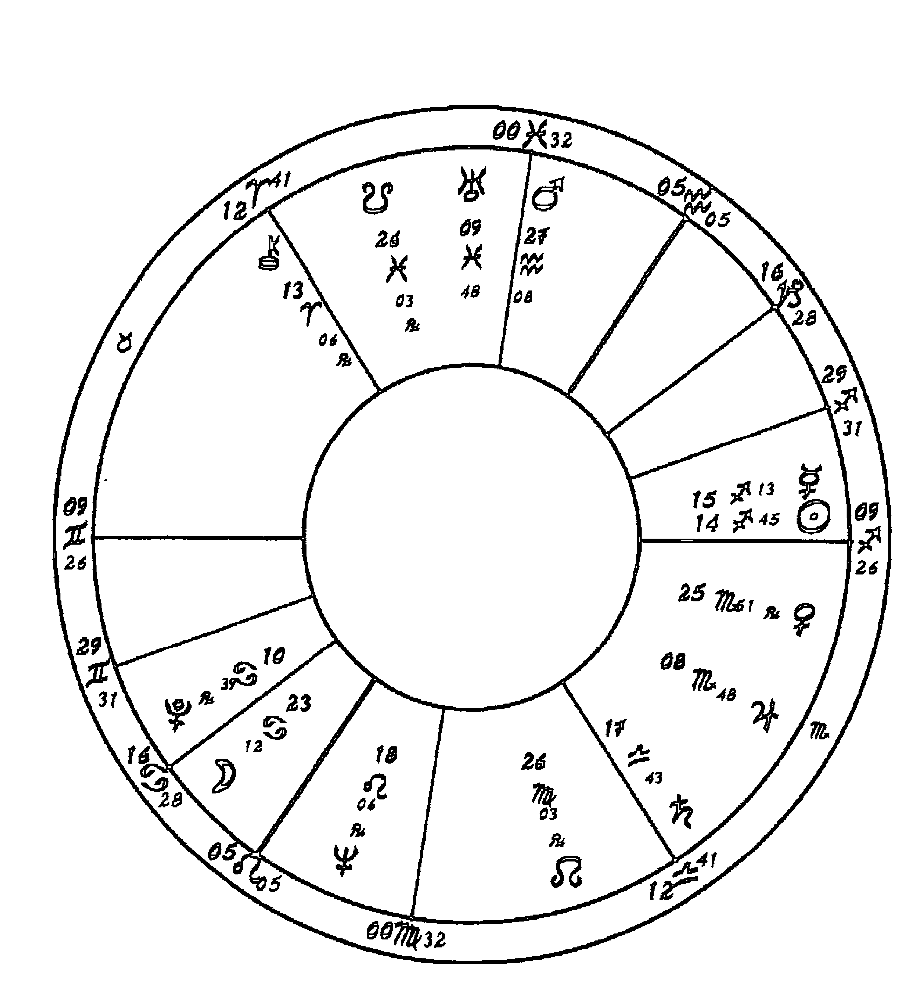

### 不列颠及北爱尔兰联合王国

建立於一九二二年十二月七日下午三點二十八分，倫敦

凱，太陽也會在差不多的時間移動到雙子座。水星逆行、恢復順行也都發生在雙子座。當火星觸發大型外行星週期的關鍵點時，整個集體意識都會覺得沒有力量，彷彿沒有人控制得了的力量拖著大家前進。如剛剛那位觀眾所說，天牡羊四分冥羯，火星也加入戰場，世界上肯定會出現一些引人囑目的事件，但如果我們覺得這些事情只是「外在事件」，我們就錯了。外行星跟內行星一樣，都存在於我們的內在。外行星不只是在「外頭」對人產生影響，它們本身就是我們，它們描繪出當時的集體意識狀態。在這組火冥合相裡，無力的感覺會特別明顯，也許是因為火星正在逆行。上週的「三分相關問題」講座裡，我們討論了英國的國家盤，不是大家都在使用的一八○一年版本，而是一八○一年還包含整個愛爾蘭的版本。這是一張星盤裡，太陽位於射手座十四度，大家都看得到現在行運的火冥合相跟國家盤太陽合相，延伸到年底進入二○○二年，行運的土雙子、冥射手對分也會影響到國家盤的太陽。現在的集體意識的確呈現出強烈的無力感。我們對自己及彼此說：「我們能怎麼辦？大家能有什麼辦法呢？」

觀眾：
呢？

麗茲：
很多事情分崩離析，而身為個人的我們在其中只覺得無能為力。現在的局勢讓我們一窺天生就有火冥相位之人的感受，因為他們常常覺得自己無力可回天。他們必須想辦法與這組相位合作，而不要感覺被憤怒或憂鬱席捲而走。
對，我遇過很多火冥有相位的人，他們都擔心自己具有驚人的破壞力。這股擁有自然力量的觀念是他們繼承而來的，個人的憤怒與攻擊性能夠啟動，或作為更龐大力量的發洩管道。擁有火冥相位的人深知這股自然的力量就存在於表層之下的深處。他們通常都是在孩童時期經驗過，可能是內在的心理狀況或外在的事件。他們曉得自己只是可有可無的渺小有機體，而外界還有更大的存在，這樣的存在並不在乎個人的期待，甚至是個人的存在。大自然憤怒的時候，擁有火冥相位的人感受得到。他們會害怕他們無法掌控的力量席捲而來。這種狀況的確會發生，而擁有火冥相位的人也的確會變得具有破壞力，對象可能是他們自己或其他人。如果他們將傷害體驗成羞恥，那火冥的報復也會是全球規模的，如果他們將傷害體驗成羞恥，那火冥的報復也會是全球規模的，如果他們將傷害體驗成羞恥，那火冥的報復也會是全球規模的。

火星的憤怒是一個人的憤怒，如果這個人能夠跟太陽的意識緊緊維繫在一起，那火星就會替太陽的價值服務效命，冥王星就不會將之吞噬，不過這種人也許會成為好幾世代憤怒的代言人或媒介。這就是為什麼我們必須帶意識面對火星的重要原因。如果一個人與火星斷線，而這個人又有本命的火冥相位，我們也許就會在無意識的狀況下認同冥王星。我們會成為全球性的毀滅力量，而我們可能就是恐怖份子、無政府主義者、自殺炸彈客。我們會抹去我們生命裡最珍視的一切。分辨火星與冥王星的感受對擁有火冥相位的人格外重要。火星的感受可能是你我的感受，但冥王星的感受則是集體靈魂的情緒生命。我們若在大規模的層次下感受冥王星，感覺會非常恐怖，因為每個個體的價值也捲在其中，這是為了生存下去的集體戰鬥。

## 水象的火星。精微的水神

### 火星在雙魚：變形戰士

接著我們要來看在場觀眾的另一張盤。露易絲的火星在雙魚，水象的星座，位於二宮，火星與雙魚座的凱龍星合相，也與日牡羊合相。這三顆行星的合相具有很矛盾的特質。火星與天頂的海天蠍三分，火海互融。

麗茲：火星跟木牡羊互星三十度，火木也是互融。這樣的火星該怎麼活出來呢？

觀眾：這個人會需要在人世間戰鬥，改變社會。

麗茲：火星在雙魚，三分天頂的天王星，再想一下。

觀眾：所有的火星都要為了使命奮鬥。當火星在雙魚座的時候，火星會以何種方式戰鬥？

麗茲：所有的火星都要為了使命奮鬥。當火星在雙魚座的時候，火星會以何種方式戰鬥？

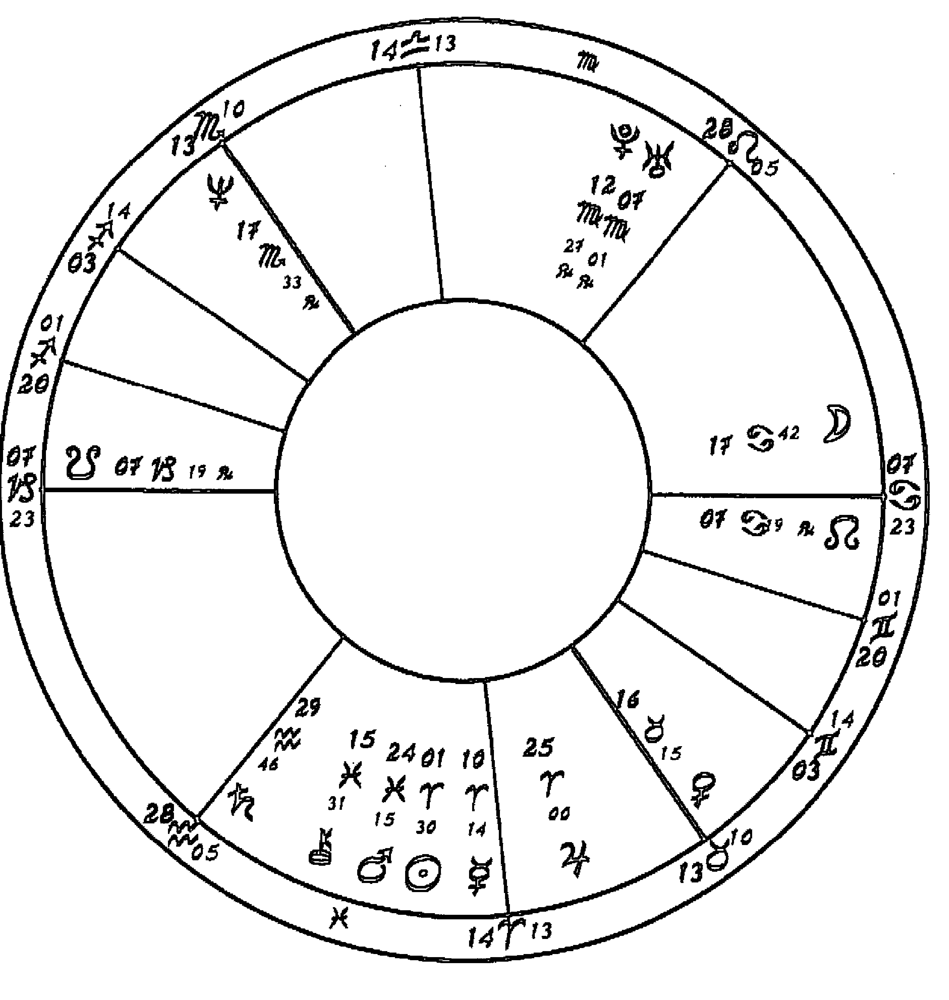

### 露易絲

出生資料保密

觀眾：這顆火星會為了一群人戰鬥。

麗茲：這是對象，不是方式。無論落在什麼星座，火星都會想替其仰慕的對象效命、奉獻。英雄氣概永遠都跟英勇的理念息息相關。希臘神話裡的每位英雄都有一位代表困難或旅程的神祇，象徵著這位特定英雄的理念。從心理學的角度來說，每個人都需要這樣的一位神祇，火星才能依隨這位神祇的願景前進。這就是太陽的功能。火星的星座就是方式，這位英雄需要用自己的戰鬥本能顯化這樣的願景。考慮一下火星座落的元素，我們先前討論過風元素，火星的激進穿上風元素的外衣，變得文明講理。現在我們來看看火星落在水元素的狀況。

觀眾：犧牲。

麗茲：你還沒有抓到重點。雙魚座是火星披著的外衣。想想，如果火星是個神話人物，他是一位戰神，又高又壯，滿身肌肉，但他穿了海王星的服裝。看起來會是什麼模樣？

觀眾：他會變形。

觀眾：神聖的救世主。

觀眾：他會變裝。

麗茲：沒錯，這顆火星會穿上水底世界的服裝，色彩斑斕、容易改變、液態的。他的輪廓不太清楚。他能夠適應任何狀況，總是敏銳、直覺地移動，對於集體靈魂及想像力的隱形暗流有著敏銳的感知。

觀眾：他可能是個維京人，出海的戰士。

麗茲：你會怎麼解釋這個象徵？

觀眾：他會出海遠征，前往遠方的水域。

麗茲：對，這個比喻很好。偌大、無邊無際的想像力會帶著這顆火星前進。這顆火星會隨著流行的浪潮與風向走，就跟航海的戰士一樣。火星不會以直線移動，也不會跟火車一樣有固定的路線，更不會無論晴雨都乖乖埋頭前進，跟個下定決心的人一樣。這顆火星並不會使用簡省時間的人造工具，好比說飛機，因為它根本不急著抵達目的地。這顆火星已經做好減速或接受其他人靈感的準備，隨著這些外界的力量移動。這顆火星的戰鬥力仰賴漂浮在潮水上、了解天候狀況以及星辰的指引上頭。每一分、每一秒發生的內外情緒流動都觸動著這顆火星。這就是為什麼火雙魚似乎不斷改變型態的原因。無論這個人的目標是什麼，以這張星盤來說，目標是二宮的牡羊座太陽以及海王星的守護星，木星在三宮的牡羊座，海王星在天頂的天蠍座，這顆火星並不是很明顯的火星，這顆火星並不會忽然跳出來說：「我要這個！」

觀眾：這顆火星很細膩。

麗茲：沒錯，很細膩。還記得榮格對男子氣概的定義嗎？「曉得你要什麼，且不擇手段想辦法得到。」火星雙魚會如何得到？透過利用感覺與想像，透過感受别人的感覺，透過隨著集體的需求來定義什麼時候該前進，什麼時候該放手。這點在藝術專業上可能會引發真正的魔法，因為雙魚座的能力就是接聽集體意識的情感需求與渴望。這不是一顆俗氣的火星，雖然火星落在土象宮位，這點我們晚點再討論。對這顆火星來說，採取行動的真正場域是在想像之中。這不是一顆俗氣的火星，如此火星的配置在藝術家的星盤上非常寶貴，這顆火星在取得欲望之物的同時，並不會打斷自己與集體意識之間的情緒連結，所以這顆火星並不會引起混亂。就跟我先前提論過的火星類似，這種與集體意識的協調性對火星而言有得也有失。露易絲，對此你有什麼想法？

露易絲：我覺得都很符合。我的想像給我很多啟發，但我同時也很害怕。

麗茲：為什麼？

露易絲：因為它會吞沒我，所有的情緒、所有的意象，我會失去實體的邊界。我是一名藝術家，但有時當我太投入在作品裡的時候，我常常會工作過頭，就算累了，還是停不下來。

麗茲：妳用哪種媒材創作？

露易絲：我喜歡木頭、金屬，能夠視覺呈現，也能有觸覺的材料，但我必須停工半年，因為我把自己操到生病了。

### 火星在二宮：創造的戰士

麗茲：火星在二宮，我們必須想想這暗示著什麼。我們還沒有好好討論宮位的配置。二宮代表經驗，也是土象宮位，象徵個人資源的提煉與定義，以及打造出一個人價值與才華的獨立永恆基礎。露易絲，看來妳從事的創意工作很適合妳，因為火星在二宮會想要實體的展現，想要透過製造出實際成果的才華來展現。

觀眾：二宮裡行星很多，難道這不代表露易絲必須把精力專注在賺很多錢上頭嗎？

麗茲：不一定。金錢是價值與外在肯定當事人才華的象徵，不是二宮本質上的意涵，只是副產品。如果這是一張土象特質很重的星盤，賺錢也許更為重要，因為土象星座講究的就是物質的保障。不過，這張星盤的二宮行星都是水象跟火象的，星盤裡的海王星特質又很強，包括火星的星座與相位。我覺得露易絲的火星驅動力並沒有專注在賺錢上頭。這顆火星想要透過實際的形體展現來表達。露易絲，妳上升摩羯，再次強調在外在世界顯化出來的需求，而命主星土星也在二宮。用雙手創造作品，重視想像力，透過特殊的才華賦予實際的形體，似乎都很適合這顆火星。

### 火凱合相：負傷的戰士

火凱合相是很複雜的相位，也許跟妳不曉得何時該罷手，而最後精疲力竭有關。我覺得我們該花點時間討論這組火凱合相。凱龍的難題在於，我們沒辦法「修補」它。無論傷害來自出生時的意外、基因缺陷、遺傳、社會地位或集體意識爆發出來的戰爭，凱龍的傷代表傷口或缺陷，也許是外在，也許是在內的，都沒有辦法「痊癒」。凱龍象徵生命裡受傷或限制的面向，但這個缺陷或罪過並不是當事人的責任。凱龍在土星與天王星之間移動，作為個人與集體意識之間的橋樑，反應出集體運動對個體的碰撞，造成不可避免的傷害。這樣的傷害呈現出生命本質的不完美。火凱相位代表一種極限。這種限制與土星所帶來的限制不一樣，土星的限制比較個人，須要積極努力克服。火凱的極限與二宮息息相關，暗示著我們必須學習了解自己的身體及體力的層次。

麗茲：因為露易絲的凱龍在二宮，的確暗示了身體或身體意象上的傷害。也許是妳還沒有找到方法接受身體的極限，妳因此憤怒，想要繞過這種限制。

露易絲：對，我覺得限制很討厭。

麗茲：我可不訝異。妳日牡羊，火星符合妳的本質，但火星受到限制妳就會生氣。

露易絲：沒錯，就是這樣。

麗茲：因為火星主宰著妳，妳也會有一股內在的信念告訴妳，妳應該永遠都有精力與體力去做妳喜歡的事情。當身體放棄妳的時候，妳會覺得憤慨。妳也許必須學會傾聽身體的聲音。不過，聽起來，妳用火星的方式，妳的藝術工作，很適合火雙魚。

露易絲：占星也是我的工作，但我更喜歡創作。占星並不會跟雕塑一樣讓我疲憊不堪，但同時也沒辦法滿足我。

麗茲：也許妳兩者都需要，但就算如此，有這組火凱合相，妳的火星是受到傷害的。雖然人可以學習接受這個傷害，用具有創意的方式與之共存，但這個傷害是永久的。這個棘手的限制是火星想要表達時——一定會自然出現的，有火凱相位的人展現的方式各有不同，也許是在身體的層次，也許是心理的狀況。

觀眾：就算是柔和相位也會有這種感覺，我是火凱三分，我也有類似的經驗。

麗茲：對，但對柔和相位來說，這種人比較願意接受這種限制。擁有合相或其他強硬相位的人來說，這種火凱帶來的限制會營造出一種「尖銳感」，也就是一直憤恨不平，這股憤恨成了成就的燃料，但同時也讓人心充滿壓力，有時還會容易爆炸的脾氣。

露易絲：火星的能量能跟凱龍合作，做出什麼建設嗎？

麗茲：可以，這兩顆行星可以合作。一個方法是替那些傷者或代罪羔羊奮鬥，將火星的聖戰精神用來服務、療癒他人的傷害，因為當事人會同情且認同他人的痛苦。這點也許跟妳占星工作背後的深層動機有關，但如果妳的火星只有做到這樣，也許妳是在逃避什麼。火星星座落的星座需要與人合作，但妳的宮位卻跟他人無關。這顆火星想要以實質的型態展現出創造力跟想像力。

露易絲：對，我知道。我猜我退縮是因為工作的壓力太大了。

麗茲：不見得一定是跟工作有關，火星必須成為妳生命裡很重要的一部分。這顆火星想要得到它應得的重要性，就算跟任何專業工作都無關也沒關係，因為妳的火星跟天頂還有海王星呈現三分相，我不太確定妳能不能完全忘卻外在世界對妳創意努力的認可與認同。

露易絲：我只要為了參賽而創作，整個過程就會變得很不舒服。

麗茲：天頂的海王星會讓妳想要分享妳的想像天賦，而不是一個人站在巔峰。跟樂團一起表演，跟舞者一起跳舞，展示妳的作品，都能讓妳覺得自己與更龐大的群體有所連結。

露易絲：沒錯，我真正想要的是成為團體的一份子。

麗茲：火海相位並不喜歡獨角戲。他們會嚮往，但他們希望別人跟他們嚮往一樣的東西，能有同樣的情感經驗。這點很適合這組相位，但聽起來，妳最大的問題在於認清妳的身體極限，接受妳的身體的確有極限這個事實。妳的身體似乎在提醒妳這點。對身體好一點也許會有幫助，這樣身體跟靈魂就能妥協，而不是為了超人一等而掙扎痛苦。

### 曉得該在什麼時候放棄

火凱相位通常會讓人覺得哪裡壞掉了，因此產生過度補償的舉動。擁有火凱相位的人很容易對於加諸在身上的限制感到憤怒，他們必須向世界及自己證明，他們沒有任何限制。他們不想覺得自己帶著缺陷、終究要死，他們要麼就放棄，要麼就把時間花在自艾自怨、覺得自己是受害者上頭，當他們認同凱龍，否認火星的時候，就會有這種反應。或者，如果他們認同火星，否定凱龍，他們就會逼迫再逼迫自己，通常都把自己逼到疲憊不堪的境地。

當然，這種毅力能夠完成很多成就，這是優點。火凱相位可能會沉迷在決心毅力及努力認真上頭，彷彿有人吶喊：「我沒有受傷，別告訴我，我受傷了！我一點問題也沒有！」這種強烈否認身體實際狀況的人通常身體都會出問題。火凱相位的當事人也許成就很高，但他們也得付出很高的代價，可能身體不好、焦慮或壓力過大。這組相位可能會引起煩惱不安，因為當事人不肯尊重身體的極限。凱龍星所帶來的傷害多少會讓人覺得「不公平」，因為這個傷害與當事人的罪過責任無關，卻讓火星覺得無力、憤怒。傷害的根源可能深植於社會、人性，甚至基因模式裡，基本上，生命就是這樣。放棄創意工作不是妳的解方，因為妳會因此成為受害者，凱龍就跳出來了。拒絕認同身體也不是妳的解方，因為妳會因此製造太多壓力，還可能傷害身體。

妳必須找到折衷的方法，還需要真心接納現況。

露易絲：我覺得我已經曉得這點了，我只是不喜歡聽這種話。

麗茲：現場還有其他人有火凱相位嗎？你們怎麼經歷呢？

觀眾：我肯定有想要證明自己夠好的問題。我的凱龍在五宮，所以凱龍的確是自我認同的一部分。我的凱龍跟位於九宮的火牡羊四分。我當了好幾年的老師，但我一直覺得自己很失敗。我在二十一歲的時候開始對占星產生興趣，但直到三年前才開始密集學習。我下課回家後，就再也不想看到學校的東西。我接受自己回家後就必須安安靜靜、好好休息。幾年前，我覺得我的身體應該可以無所不能，我一直如此相信，直到最近我才改觀。我年輕的時候，會到處跑。我會看著其他不跑步的人，想說這些人有多蠢，只要跑起來，去哪裡都變快了！我曉得這是火牡羊的思維。其他人的緩慢會讓我覺得很不解。跑步就是我存在的方式。

麗茲：對，現在我到了凱龍回歸的年紀，我開始珍惜減速的生活。

觀眾：所以這些緩慢的人都懂妳慢慢明白的事情。

麗茲：這是火凱相位的狂熱特質，源自於很基本的覺得自己受傷或有缺陷的心態。火星跟其他「沉重」的行星，好比說火土、火冥、火凱、火海，這些相位所帶來的積極面向在於，至少這些行星可能會磨去火星粗野的棱角。這些行星讓戰神沒辦法全然地表達自我，當然，這種狀況會產生傷害。不過，同時，當事人的意志也會變得比較溫和。這個人會更有能力注意到這個世界還有其他人存在。火凱有相位的人，一旦限制出現了，這個人可能會有很強烈的憐憫心，特別會憐憫自己。不過，在當事人的前半生，這組相位通常展現出的都是某種遲鈍感。也許當事人會有點像二戰時期納粹的二號戰車，需要過度用力，過度補償。凱龍長達五十年的週期顯然會影響火凱的表達，每週期的階段都會呈現出不同的挑戰，與當事人對這組相位帶來禮物及限制的接受程度。

### 火星在巨蟹：老練的戰士

觀眾：可以談談火巨蟹嗎？

麗茲：巨蟹也是水象星座，所以我們剛剛討論的水雙魚特質也能應用在巨蟹身上。就古典占星的看法，火巨蟹是火星的弱勢星座，就跟他們覺得火摩羯是火星的強勢星座一樣。好，為什麼會這樣？為什麼火星落在月亮守護的星座就會讓人覺得它不夠強？

觀眾：火巨蟹沒辦法公開、直接處理事情，這樣會讓火星變得虛弱或不肯定。

麗茲：我不確定我會用「虛弱」來形容火巨蟹。火星在巨蟹座的時候，火星那種立即行動的特質會受到對感情氛圍敏感的影響與阻礙，而火巨蟹就跟火雙魚一樣，不喜歡最後只剩自己一個人行動。火巨蟹會逃避別人的憤怒，透過戰術及敏感躲過攻擊及公開的衝突。火星在巨蟹的時候的確會失去一點自信，也不會破壞東西，大吼大叫說：「這個我懂，我知道這樣才是對的。」但火巨蟹的情緒敏感度極高，也有能力認清、同理其他人的感覺。火巨蟹暗示當事人有諮商及外交的天賦，在團體或分組時，這項能力發揮得特別好。這樣的配置出現在協調者的想像及情感天賦之中。不過，當其他人不高興的時候，火巨蟹會因為害怕衝突，而沒辦法追尋自己想要的目標。火摩羯，火星的強勢星座，只要他們的目標是可以達成的，火摩羯就不會在乎別人同不同意。摩羯座的自給自足與現實態度讓火星能夠不顧情感的孤立專注追尋。火牡羊也不在乎，聖戰士的願景太強烈，取代了冒犯其他人的擔憂。當然，有人會指控火牡羊跟火摩羯不夠敏感，甚至莽撞，這是他們的「缺點」。相較之下，火巨蟹在需要行動的時候也可以做得很好，但他們的風格卻是細微、八面玲瓏的。火巨蟹如果太在乎其他人對其作為的贊同上，很容易累積挫敗感。因此，他們很容易產生身體上的狀況，如消化不良、皮膚起疹跟頭痛。目標導向的開創特質跟水象的依賴性之間的衝突壓力通常會表現在身體上。

觀眾：火星在巨蟹會比較猶豫不決嗎？

麗茲：火星本身絕對不會猶豫不決。無論火星在什麼星座，我都不會用這四個字形容火星。害怕冒犯他人也許會跟做決策的功能起衝突，讓火星躊躇，但這跟一個人不曉得自己要什麼不一樣。猶豫不決是因為跟火星斷線，而不是因為火星在某個特定的星座。就算是在天秤座或巨蟹座，火星永遠都知道自己要什麼。火星星座落的星座形容的是火星追求目標的方法，而巨蟹座的手段也許是迂迴細膩的，但不是猶豫不決。不過，當火星沒有意識的時候，慌亂跟猶豫不決就很明顯了。

麗茲：火星的宮位及相位能夠描述火星的目標。當火星在巨蟹座這個開創星座時，追求目標的火星巨蟹會跟火摩羯一樣，堅持下去，但手段更纖細、更有技巧，過程中冒犯到的人愈少愈好。為了達成這種手段，纖細是必要的，他們必須學會「閱讀」情感的氛圍。也許在保持當下環境的和諧上，迴避或徹底迂迴都是必要的。火巨蟹不軟弱也不會猶豫不決，只要狀況對了，他們能跟火星在其他星座一樣勇敢。不過，他們會想辦法在不引發敵意的狀況下得到自己想要的東西。這點需要一點優雅的舉止，也許必須阻擋或引發更直接的喜怒無常。

## 土象的火星：善用資源的戰神

這次來聊聊土象的火星吧？這是現場同學的星盤。蘿妮，有沒有特別想討論的地方？

蘿妮：我擔心冥王星行運接下來要經過射手座，跟我的火星四分，不曉得會有什麼影響。

麗茲：咱們先討論一下火處女大概的可能。這顆火星會穿什麼樣的服裝？別說護士服，之前有人講過了。

### 火星在處女：工匠戰士

觀眾：工藝家，火神赫菲斯托斯。

麗茲：沒錯，工藝家這個形象很適合。這是一顆精確、仔細、有鑑別能力的火星。赫菲斯托斯肯定是神話主題上相關的一個形象。他能打造出精美、精準的物品。火處女能夠朝科學的方向前進，卻也能以藝術的方向移動。火處女能夠穿上謹慎研究員、實驗室技術人員、外科醫生、犯罪心理學家或鐘錶匠的服裝。也許，他們是用筆打造美感的藝術家、雕刻家、精湛的音樂家、書法家。火星永遠需要能夠效命的使命或主張。火處女會如何服務？帶著效率、責任感及實用主義，這是一顆實際、講究效率，也世俗的火星。一些占星師因為某些原因，覺得火處女很狹窄衰弱，我不懂他們為什麼會這麼想，因為在我們的經驗裡，火星在處女座很自在，處女座提供火星一種屬於水星的敏捷適應性。火處女樂意嘗試不同的事物，適應周遭的環境，只要他們能夠保持效率，而他們的精力能夠轉變成眼睛看得到的成果就好。

這不是一顆我行我素的火星，而是一顆整整齊齊、自給自足的火星。無論處女穿什麼樣的服裝，打扮成工匠、技術人員、科學家、治療師都好，他們的服裝一定是乾乾淨淨、剪裁合身，沒有多餘裝飾或花樣的。

### 火星在四宮：跟家緊緊連繫的戰士

火星為什麼會在四宮？火星的戰場在哪裡？

對，無論內外，四宮是根的世界，同時也是家族與根源的宮位，象徵著父親的家族。這顆火星立刻展現出父親形象在蘿妮的生命裡非常重要，火星跟距離有點遠的日金合相都在四宮，這個父親的形象很複雜。

蘿妮：我有活出他對你的期待嗎？雖然他已經過世了，但我還是感覺得到他，覺得他就在我身邊。

麗茲：我覺得妳有活出他對你的期待嗎？

蘿妮：並沒有，差很多。我是劇場導演，我做的事情跟他一點關係也沒有。我知道自己要什麼，我會說：「好，咱們就這麼幹吧！」我爸爸就是這樣。我對自己有很高的期待，我...

### 冥王星行運與火星產生相位：重生的戰士

麗茲：聽起來，對於火星的幾個層次妳還是滿意的。妳在工作上很有效率地使用火星，顯然選了一份獨立自主的創意工作。不過，若探究更細微的層次，妳的抱負與理想也許還是跟妳深愛的父親維繫在一起。妳的火星距離天底很近，這是對火星父親形象非常強烈的認同。接下來的冥王星四分也許會啟動這顆火星。火星跟你父親有關的面向會遭到捲入，讓妳明白妳的生命受到父親影響這點對妳來說可能很重要，這位父親並沒有要妳去追尋某種職業，而是一位妳愛到覺得不夠愛的父親，而妳到現在還是想要取悅他，想要成為妳認為他想要看到的妳。目前很難看清是哪個領域，但冥王星行運也許會讓妳注意到。讓妳明白妳的生命受到父親影響這點對妳來說可能很重要，這位父親並沒有要妳去追尋某種職業，而是一位妳愛到覺得不夠愛的父親，而妳到現在還是想要取悅他，想要成為妳認為他想要看到的妳。這顆火星與父親形象緊緊相連，雖然這個形象並不是負面的。你們兩個人很像，而這份連結很深刻，我懷疑妳還是很認同妳身為令尊女兒的身分。我忽然想到幾個童話故事，公主住在遠方的城堡裡，孤立遺世，只有父親陪伴。她並沒有不快樂，但她活在真空的世界裡，沒辦法真正成長。這顆火星沒有明顯的受阻，也沒有不舒服的行星相位，但眼前的狀況跟妳的意志有關，妳想成為什麼樣的人，這是妳的願景，這份願景似乎鎖在妳從父親那裡承襲過來的血脈裡。冥王星行運經過火星後，就會四分同樣在四宮裡的太陽跟金星。沒有活出來的生命等著破繭而出。妳說，妳覺得父親在場陪妳，這點沒有什麼不好，但也許他的存在感太強烈了，佔據妳太多時間。

蘿妮：我好想來英國住，我想在倫敦工作，我想認識氣味相投的人。父親過世了，但他還是繼續協助我達成目標，雖然他不希望我離開巴西。但能來到英國，跟能夠協助我在占星路上更進一步的，是我爸留給我的財產。我正在改變，我不想回到我的國家。我在這裡很開心。

麗茲：這點很有趣。如果我的理解沒有錯，妳的父親過世了，他留給妳一筆財產，足夠讓妳在巴西過好日子。結果因為這筆錢，妳才能離開他的祖國。

蘿妮：對。

麗茲：蘿妮，也許妳該檢視一下妳與父親關係之間的本質。太陽在四宮的人很適合換塊大陸住住看，因為這顆太陽的配置需要遠離根源之地。當事人必須創造自己的根源，而不是過著族譜裡另一條分支的生活而已。妳的父親讓這一切變得可能，但同時妳也拒絕了他的世界。這樣會有心理上的影響與後果。妳必須好好想清楚這點對妳有什麼意義，因為妳必須把火星的力量拿回來。他讓妳能夠搬家並不代表妳就必須活出他對妳的期待。在冥王星行運觸動這些配置的期間，妳必須思考這些問題。

> > 蘿妮：

王星行運的時候，分離是一定會發生的。也許妳對他有很多憤怒，這些憤怒已經開始冒出頭來。妳離根源愈遠，妳就愈容易感受到憤怒。

> > 麗茲：

妳離自己與父親根源的國度愈遠，愈能感受到憤怒，這是因為妳現在跟他之間的距離拉開了，妳也結交了新朋友，在這裡有情感上的支持。如果你覺得他那最理想的形象開始變得更矛盾、更平凡的時候，或者如果你開始用不一樣的目光看他，也請妳別詫異、別緊張。火星在四宮的人都會經歷與父親的意志戰爭，就算父親並不是一個具有公開侵略性的人也一樣。因為妳的火星沒有強硬相位，日金在四宮，妳跟父親在一起的經驗裡並不會意識到他的侵略性。日金在四宮點出父女關係裡充滿愛與情感，但火星的位置說了另一個故事。他也許緊緊控制著妳，而妳因為太愛他了，完全沒有想過要抵抗，但這顆火星原本是由妳父親操控的。現在，火星要從高塔裡下來了，可能會帶著一些火氣出現。

> > 觀眾：

土星跟火星呈現六十度的位置，還在火星守護的天蠍座。也許底下有些壓抑的情感。

憤怒。

> > 麗茲：

也許當事人害怕對於她深愛的人產生不好的情緒，同時也有遭到忽略或冷落而出現的憤怒。

> > 蘿妮：

我覺得是這樣沒錯。我很需要他，有時要讓他知道這點，我必須用很激烈的手段告訴他。

麗茲： 所以妳只能用火星連結他。

蘿妮： 對，有時他跟別的女人在一起的時候我會吃醋。

麗茲： 請原諒我的直白，但也許是時候跟他離婚了。我覺得這就是這次冥王星行運要告訴妳的。他是妳最深的愛，最大的熱情，妳所有的火星能量通通鎖定在他身上。現在是你自由的時候。

## 火象的火星。充滿遠見的戰神

我們花點時間來看火象的火星盤吧？火星在火象星座是最舒適的了。問題在於，其他人可不覺得舒服，特別是如果這些外人的火星本身有問題的時候。這張星盤的火星落在自己守護的牡羊座，跟牡羊座的太陽並沒有合相到。木星也在牡羊座，上升獅子。這是一張火象特質很張顯的星盤。火星跟金雙子呈現六十度的位置，跟水金牛呈現二十度的角度，還跟天處女形成一百五十度。這是火星出生時的相位。

麗茲：羅莎琳，妳在下課時提到，妳覺得妳的火星還不錯，但妳有些問題，妳的問題是什麼？

羅莎琳：我覺得我的火星看起來很強，但其實它沒有看起來那麼有力量。我沒辦法活出自己所有的潛力，感覺我好像不敢用全力一樣。我覺得自己很有力量，但不敢用這股力量。

麗茲：妳覺得這股力量的本質是什麼？妳為什麼不敢用？
羅莎琳：我喜歡事情都以我的方式進行，我知道我的方法是好方法，但也許太霸道了。我會摧毀周遭的一切，其他人也曉得這點，所以感覺很糟。
麗茲：讓我替後面聽不清楚妳說什麼的觀眾重新解釋一遍妳剛剛的話。妳想用妳的方式來做事情，因為妳相信那是正確的方法，但妳又擔心如果妳開始對別人頤指氣使，妳就會疏遠他們。我想妳多少還是跟某些人疏離了，因為別人也有他們的火星，他們也許會想用不一樣的方法做事情。這是火象火星的兩難。火星在火象星座很舒適，因為目標跟方法之間是一致的，這是一顆直截了當、毫不含糊的火星。他們根本不會擔心別人的感受，也不在乎社會約定俗成的規矩，更不會因世俗的現實而調整自己的目標。原始的火象願景牽著火牡羊前進，他們會說：「世界就該這樣，而我當然是對的。」

羅莎琳：我知道，聽起來很糟糕。

麗茲：不，聽起來一點也不糟糕，這就是火象火星的本質。火星在其他元素肯定會穿上不怎麼適合火星的服裝，火星本來就是火象的行星，在火象星座最為舒適，而牡羊、獅子、射手這三個星座總是喜歡穿著華麗的服裝。不過，火象星座跟世俗世界之間的碰撞卻是永不停止的原型戲碼。

麗茲：不，聽起來一點也不糟糕，這就是火象火星的本質。火星在其他元素肯定會穿上不怎麼適合火星的服裝，火星本來就是火象的行星，在火象星座最為舒適，而牡羊、獅子、射手這三個星座總是喜歡穿著華麗的服裝。不過，火象星座跟世俗世界之間的碰撞卻是永不停止的原型戲碼。

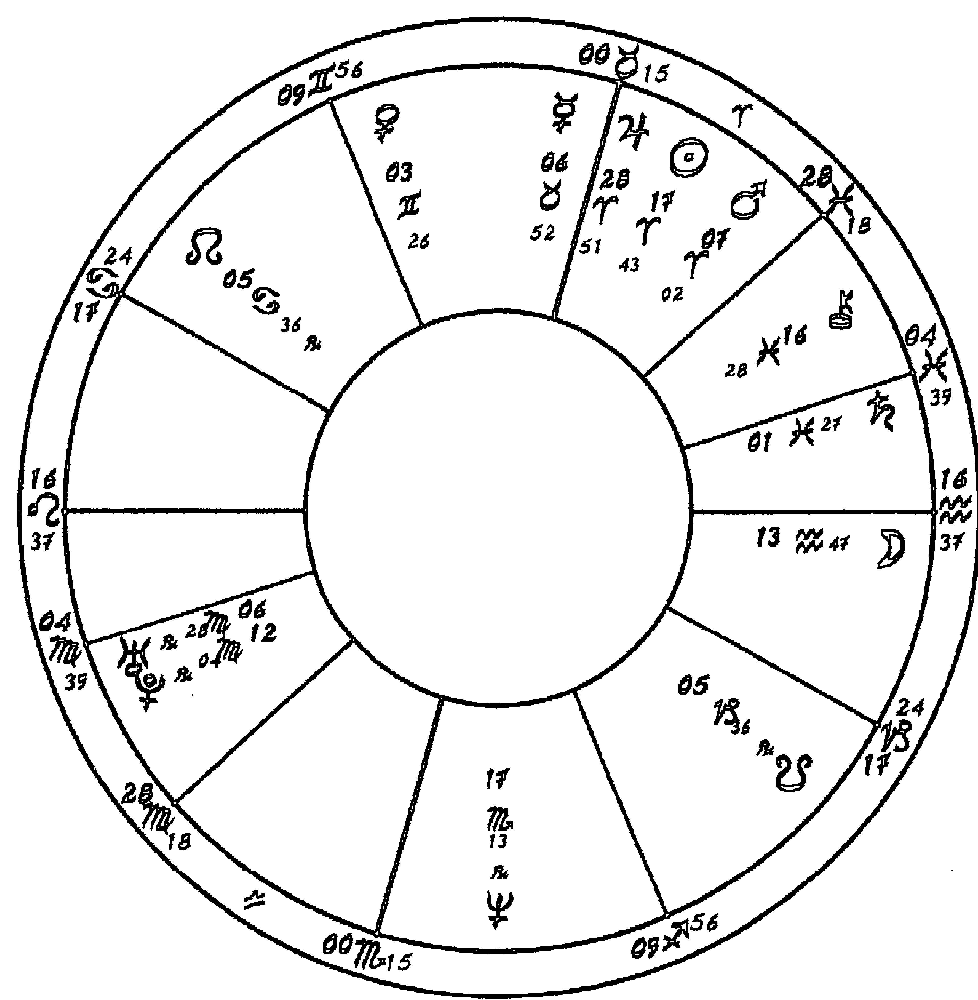

### 羅莎琳

出生資料保密

### 火星在牡羊：誠實的戰士

觀眾：我的火牡羊就像這樣。

麗茲：在場有誰也是火牡羊？「就像這樣」？很有趣，如果我們把你們這些火牡羊通通关在一個空間裡，猜猜我們事後需要多少繃帶？

觀眾：我的火牡羊在一宮，我是一名律師。我覺得羅莎琳的分享很有趣，因為我也覺得我必須有所保留。當別人想要以他們的方式做事時，我的本能通常會說：「這樣不對。」我曉得正確的方法是什麼。而身為律師，我必須學著說：「好，我了解，這是你的看法，我相信這個方法可行，但話說回來：……」然後我才能提出我想說的方法。

麗茲：這就是所謂的外交手腕，這是火天秤與生俱來的天賦，但這點對火牡羊來說並不容易。不過，羅莎琳，我覺得妳的狀況更複雜一點，我一直注意到妳的土星，落在七宮的雙魚座一度，對分天王星，四分金星。妳害怕疏離他人的恐懼可能跟火星無關，跟金星較有關聯。金土相位帶有一種遭人拒絕的深刻恐懼，以及覺得本質上沒有人愛妳的痛苦。妳把火星當成別人不愛妳的感覺，但也許根本不是火星，也跟你擁有多少力量無關。

羅莎琳：我明白妳所說的金土相位問題，但我覺得我也沒有好好利用這顆火星。前幾年，沉重

### 麗茲：

冥王星行運進入射手座後，觸動了妳的金土天組合，還冥王四分，這樣的能量似乎讓妳經歷了重創。不過，金土四分還是有殘害自我的力量，因為妳有一種根深蒂固的觀念，妳只能吃麵屑，得不到妳真正應得的東西。妳對妳能夠得到的東西有這種傾向，這是來自長期、慢慢累積的憤恨。金火相位也許會太過配合別人演出，這樣才能得到別人提供的保障。七宮的土星也強調這點，習慣向他人尋求架構與穩定性。結果呢？如果沒有意識到，當事人充滿火象能量、不肯妥協的本質可能會在某個時間點大爆發。我會猜，冥王星在行運的這段時間裡所清掃出去的東西，在妳心底根本沒有深植的一席之地，擺脫了可能比較好。妳內在似乎有兩個相反的人格，一個充滿火象能量，擁有遠見與抱負，自信滿滿，另一個則是否定自己，害怕沒有人要妳，害怕妳沒有價值。二號人格暗中破壞一號人格、拉開妳與生命嚮往之物的距離可能遠超出妳的理解。妳也許必須花點時間回想妳星盤裡最基本的暗示。太陽跟火星都在九宮，對妳來說最重要的是什麼？妳的英雄事蹟是什麼？這顆火星樂意服務太陽，火星在自己守護的牡羊座，也是太陽的守護星，太陽在牡羊座是太陽強勢的位置。這兩顆行星都在火象宮位，且兩者都跟上升點形成

### 火星與家庭裡的三角關係

四宮，感覺這個家庭裡有三角關係，妳有一位很理想的父親，但妳無法親近，還有一位一直不想跟妳有瓜葛的母親。這種關係描述出了競爭，也許妳已經輸了。

三分相。在妳的生命裡，能夠反應出妳深層價值的是什麼？能反應出妳極需別人支持與保證有人愛妳的特質是什麼？很有可能妳生命裡的許多基礎並不是建立在火星與太陽上，而是建立在恐懼與缺乏安全感上頭。如果這樣的根基遭到摧毀，那也沒關係，因為這種基礎一開始就不屬於妳，妳也不想要這種基礎。說起來容易，但實際上要人放開一整段生命的篇章是很痛苦的，就算這段篇章在某種程度上是虛假的也不輕鬆。現在土星行運正要行經妳的本命金星，冥王星拖到亮處的許多情感傷痛此時也許會在意識層面結晶具體化。土星也許會帶妳落腳現實世界，我的意思是，妳自己所感知到的現實世界。這次的土星行運對妳來說很有幫助，因為當土星跟妳的金星合相時，能夠將整個模式帶進妳的意識裡，讓妳變得更自給自足一點。

麗茲：妳從哪裡看出這樣的三角關係？

羅莎琳：在女性的星盤裡，金星位在十宮通常就暗示了母女之間的競爭，因為媽媽跟女兒都帶有金星的原型。有點像白雪公主，「魔鏡啊魔鏡，天底下最漂亮的人是誰？」通常這兩種母女關係裡都有很深厚的愛與情感，但強烈的醋意通常也沒有缺席。這點跟母親做了什麼引發金星特質有關。如果媽媽因為母親的身分而壓抑自己的金星特質，這股醋意很可能進入無意識狀態，因此更具破壞性。如果她的金星特質存在於她的意識生命裡，她也許能夠跟女兒分享，而這股醋意因為是公開的，也許造成的傷害就沒那麼大。

而且，牡羊座的本質就是競爭，牡羊座一開始展現內在生命傾向的方法就是在雙親裡贏得其中一位。這是牡羊座的模式，並不病態，自然得很。牡羊座很早就開始活動他們競爭的肌肉，所以家族裡的三角關係通常都會是牡羊座發展模式的一部分。海王星的所在位置通常象徵宮位代表的人物及狀況是我們投射出來，對於天堂及救贖的理想形象。當海王星出現在四宮時，大量的理想化色彩可能加諸在對於父親的形象上，但父親看起來像是在迷霧後方一樣模糊不清。因為無法親近父親，所以他也是個失落的幻夢。好，讓我總結一下，金星在十宮，海王星在四宮，我得到的畫面是媽媽跟女兒競爭搶著一個她們都沒辦法成功得到的男人。

羅莎琳：我從來沒有這樣想過。就我而言，我對母親似乎太理想化，還會維護她。

麗茲：有道理，但想想我剛剛所說的。也許有別的方式來檢視妳所經歷的童年，並不是因為妳形容的母親不是真的，而是因為在更深層的地方還有不一樣的層次。在妳很小的時候，妳就體驗過很強烈的拒絕，所以妳會覺得自己不值得好東西。我懷疑這份遭拒的感覺來自妳父親，妳愛他的程度遠超過妳承認的程度。妳的父母顯然在爭執，而妳必須選邊站。妳顯然跟媽媽同一陣線，但說到底，妳對父親有什麼樣的感覺？這股覺得自己不重要的折磨感深植在某種傷害的經驗裡，因為妳有金土四分，妳很難放下這種感覺。妳的火星並沒有妳想像中那麼具有威脅性，但妳卻把孤立感怪罪在火星上，明明妳太有力量這件事跟妳的孤立感是沒有關係的。畢竟，不會有人忽然跳起來，在這裡亂跑亂叫。因為妳開始了這個模式，這個遭到拒絕的模式就會一再啟動重復下去。

羅莎琳：我該怎麼打破這個模式？

麗茲：首先，妳必須看到這個模式，意識到它的存在。

3 原書註：可見麗茲的《關係與如何在關係裡存活下來》（Relationships and How to Survive Them），一OOO年由CPA出版，其中的「永恆三角關係」篇章闡述星盤如何呈現家族的三角關係。

羅莎琳：我現在開始看見了。
麗茲：好，現在妳要等土星行運進來。
羅莎琳：好，我懂了。
麗茲：也許在妳的童年裡，妳對父母及整個動力關係有某種見解與感覺，也許這樣的感受能夠消除妳許多自我感覺不良好的痛苦。行運的土星也會跟妳本命的土星四分，所以會挑戰妳必須定義自己，自力更生，打起精神來。土星行運要求妳不要再把七宮裡的土星投射出去。
羅莎琳：換句話說，我要替自己負責。
麗茲：對，類似。火牡羊是顆有自信的火星，但對其他人來說並沒有威脅性。也許有時這顆火星輕率無禮、不夠敏感，但並沒有帶著危險的氛圍。我說過了，問題跟有沒有力量無關。妳害怕太有力量這點其實是另一個問題的偽裝。羅莎琳，謝謝妳讓我們研究妳的星盤。

### 合盤裡的火星

#### 分開與在一起

咱們接著來看合盤裡的火星。當火星跟別人本命盤裡的行星產生相位時，我們這才首次觀察到我們火星的需求。當一個人的火星跟合盤裡另一個人的行星產生對話時，結果可能出人意表。傳統上來說，如果這兩個人的金火有相位，就代表他們是天作之合，而兩人的火土產生相位，也許彼此間的聲譽不好。實際上卻不總是這麼回事，我們必須先從深層的觀點理解火星的互動關係。我說過，要挖掘我們火星的方法之一就是透過跟別人行星的碰撞。如果當事人跟自己的火星之間有問題，其他人的行星就很容易觸發這顆火星，展現出一種模式，因為某些事情就是會想要冒出頭來。我們的生命肯定都會跟啟動這些內在角力的人有關，這點很獨特。通過關係，我們能夠意識到這些內在衝突與需求。火星通常都會加入這種動力關係。因為關係需要妥協與調整，所以一個人的鬥志很容易因為關係而受到刺激。通過關係，我們不斷受到挑戰必須挖掘、尋求我們身為獨立個體想要的東西，同時還得跟我們覺得重要的東西保持連結。最能讓我們了解自己火星的領域就是透過關係合盤的相位。如果當事人沒有意識到自己的火星或沒辦法順利表達，而其他人的行星又跟火星產生相位，那當事人的火星能量很容易投射出去，可能覺得別人才是他的火星。當事人覺得都是別人在霸凌、控制、逼迫、頤指氣使、限制當事人的意志。就算別人的金星或太陽在當事人的火星上，就算是暗示強烈情感或肉體吸引力的相位，當事人也許還是覺得自己的自由跟意志受到打壓。這種狀況特別容易發生在當事人不曉得自己擁有火星力量的時候。我們要透過失去火星才曉得自己也有火星，或者，我們可以想像自己失去火星，因為這樣我們必須為自己的自主權奮戰。對比星盤裡的兩人相位如果牽扯到火星，也許就會掀起有關依賴、自由、競爭及表達憤怒的議題。如果我們跟某人黏得太緊，我們就會太依賴他們，失去自己的自主性，而火星的憤怒就會開始浮上檯面。這不是病態的表現，這是一種自然發生的事情。生命裡的一切都仰賴我們如何面對這股自然的憤怒。如果動力是無意識的，人與人之間就會產生傷害甚至暴力的互動。合盤間與火星的相位對親子關係非常重要，理由相當明顯。如果孩子的火星與父母的土星、冥王星、凱龍星，甚至太陽、月亮產生衝突，父母親很可能不歡迎孩子的火星能量，覺得受到威脅，因而阻攔壓制孩子的火星。也可能是一種狀況，父母的火星落在孩子的土星或凱龍星上頭，而父母展現火星能量的方式很可能會威脅到孩子，孩子會覺得受到侵害或攻擊，然後試圖用展現過份固執的態度武裝自己，結果只引來更多攻擊。這種家庭動力在跟火星有關的合盤相位裡非常典型。就算不曉得父母的出生時間，還是可以依照他們出生當天的行星星座與角度來看，研究自己與父母之間的星盤火星是很值得的。

#### 激情與自我

能夠觸發火星的關係會讓人意識到這段關係對自我的威脅，會掀起獨立、自我確立以及擁有慾望權利的議題。金星跟火星是戀人，占星師傾向假設這意味著他們是天造之合，他們的確當了一陣子的戀人，但他們沒有結婚。激情如何成就戀情？需要什麼要件？想想你們的親身經歷，如果你沒有熱情如火的戀情，你可以想想電影都怎麼演的。這種吸引力的本質是什麼？為什當我們想要把這段戀情轉化成穩定、能夠長久經營的關係時，關係就會破裂？

觀衆：親近生輕蔑。
麗茲：真的是輕蔑嗎？還是只是野火燒盡了？
觀衆：神秘感消失了，幻想破滅了。
麗茲：我會把幻想跟海王星連結，不是火星。火星想要挑戰跟創新，但它喜歡追求到的東西是

觀眾：
真實、可以擁有的，當然啦，除非火海在本命盤或兩人的合盤上有強烈的相位關係。

麗茲：
重點在於征服的感覺。

觀眾：
這點對男人女人都同樣重要，當一個人贏得自己最喜愛的慾望對象時，會覺得最有力量、最有活力。只有在贏得愛人的初期階段，我們會覺得自己最有力量，遠勝過其它階段。追求與征服的經驗提供我們深刻的自我肯定。我們贏得自己欽佩、想要對象的愛，我們也許奪人所愛，也許博得歡心，身為男人或女人，我們證明了自己是有力量的。不過，我們一旦得到目標，如果僅僅只是單純地贏得一個人，這種關係是維持不久的。愛與同理是吸引不了火星的。

麗茲：
感覺好像是不屬於你的東西才會吸引你，一旦擁有了，你就不想要了。

觀眾：
沒錯，不屬於你的東西才能點燃火星的慾望，一旦得到了，這個慾望就滿足了。其它行星有它們自己的慾望型態。金星、月亮、海王星、冥王星，甚至土星都有慾望，但挑戰會引發火星的慾望，透過凱旋，這樣的慾望才會滿足。重要關係合盤裡的火土或火凱相位常讓占星學子困擾，但最能點亮火星能量的莫過於挑戰了。土星會對火星說：「我不確定我真的想要你。我需要時間，你得等一等。」這種話語會讓火星非常興奮。凱龍則會對火星說：「不，謝了，我受的傷已經夠多了，拜託放過我。」這種言論也會讓火星激動不已。當然，到了最後，這些行星的遲疑與防衛會讓火星氣得跳腳、覺得挫敗，但

### 合盤裡的火凱相位

在關係初期，這種相位能夠產生無比的熱情。問題在於這種熱情跟關係本身沒有關係，而是跟自我確立有關。強迫的追求行為或肉體上的征服模式通常都顯示出火星的匱乏，當事人必須滿足焦慮的感覺。如果火星覺得沒有保障，當事人也許就會一直想要強調自己是有力量的，在這種狀況下，最極端、最具毀滅性的例子就是當事人在肢體或心理上變得殘酷冷血。當事人想要透過羞辱弱者，證明自己的力量。不過，就算火星沒有殘暴的意圖，還是可能會透過不斷的征服來證明自己夠強。可愛卻得不到手的情場玩家通常都有火星與土、凱、海、冥的強硬相位。

> > 觀眾：我剛剛發現我前夫的火星跟我的凱龍合相。妳會怎麼形容這樣的婚姻關係？跟自我確立有關，而不是愛嗎？

麗茲：在關係合盤中的火凱對話裡，凱龍會遍體鱗傷。本命盤裡凱龍所在的位置是我們很脆弱的地方，我們會用層層防禦保護這個傷口。火星大咧咧闖進來，說：「啊哈！這個人很迷人！因為我必須打破路障才能得到。真是個好挑戰！」對火星來說，最迷人的莫過於它得不到的對象，但火星沒辦法真正意識到這種無腦的自我確立行為會帶來多少痛苦。

### 合盤裡的月火相位

觀眾：妳有沒有注意到很多伴侶在合盤裡都有月火合相？我覺得這個相位顯示出尷尬的關係。

麗茲：合盤裡的月火合相傾向於激發出兩人間無比的能量，這不是股舒服的能量，但至少在一開始的時候，也許是強烈的肉體吸引力。合盤裡的強硬相位會讓吸引力迅速惡化為公開的戰爭。月亮一開始對火星有強烈反應，因為月亮喜歡別人追逐，感覺有人要你，感覺很興奮，所以月亮會很熱情、很有反應。火星也會因此覺得有力又強壯，但火星不是去愛人的，火星是服務自我的。後來，月亮會開始覺得自己的情感需求沒有滿足，開始抱怨。這點會讓火星覺得很煩，因為這種抱怨會要求火星關心其他人，火星不喜歡這種任務。金星跟月亮都喜歡別人的追求，所以當這類行星跟火星在合盤裡產生強硬相位時，

當火星攪和進關係動力時，自我與被動的掙扎接踵而至。衝突之所以出現，因為我們在關係裡必須可以自在做自己，但關係跟做自己是相互排斥的概念。所以很多關係建立在其中一人或兩人都覺得沒辦法做自己的條件之下。讓這場原型的戰爭在公開場合開打，以誠懇的態度面對需要創意，因此讓關係流動、產生變化。壓抑衝突只會引發大量憤怒，這種感覺來自火星受困、受限或在某種程度上遭到閹割的心情。

一開始的關係都會非常濃烈，或者，如果關係一直變動，沒有安頓進千篇一律的家庭生活，這段關係也維持得下去。三分相及六分相就沒那麼濃烈，但吸引力還是存在，且沒有衝突。如果關係從激情走向穩定，強硬相位就會開始惹麻煩。神話故事中沒有父親的火星暗示了這顆行星不是靠智力或心靈，而是仰賴本能及身體來行動，火星最佳的展現方式是服務太陽，在世界上顯化太陽的價值。從這角度來看，火星其實是一顆職業行星，而非關係行星，它不會喜歡關係裡需要的一再妥協與調整。如果在關係合盤裡，我們的火星一再遇上不同關係裡的困難相位打壓，形成模式，也許我們就該自問，在關係裡，我們能多做點什麼創造生命的獨立自主。

早期有個說法，女性星盤裡的太陽跟火星描繪的是她想要的男人，這點現在說不通了，至少在二十一世紀的西方世界不行。只有在嚴格指派性別角色的社會結構下，才會反應出這種詮釋「陽性」行星的方法。現在有彈性多了，但我們也沒有想像中那麼自由，無論我們多麼相信這種刻板印象的角色扮演早就過時，我們可以自在做自己，但對女性而言，要徹底展現太陽跟火星卻也不是真的那麼容易。如果一位女性想要好好扮演母親的角色，她該怎麼徹底表達自己的火星？孩子出生那一刻起，她就失去自由。為了孩子，她的意志受到限制，還得做出許多犧牲。火星只能噤聲或妥協，她可能好幾年都沒有喘息的機會。對許多想要生孩子但同時想要不帶殉難憤恨表達強烈本命火星能量的女性而言，她們也許必須先徹底活出火星，發展出自我的力量與效率，然後才成家。如果事前我們已經徹底體驗過，之後要我們妥協或放棄才會比較容易。不然，當事人可能會透過生命裡的男人或其他女性來扮演火星的角色，這種行為遲早會引發加劇的怒火。

至少在多數時候，火星不想受到關係義務的拘束，火星能量必須與最有創意的方式表達。火星不是關係行星，我們卻強行把火星變成關係行星，因為我們害怕以其它方法表達，最後我們就落得在關係戰爭裡堅持自我的下場。我們也許會因為沒辦法扮演自己的怒火，而引發別人的怒火。讓我們用不同的角度來看合盤裡的火星相位吧。如果某人的火星落在我們的火星上，他們也許是提供了一個機會，讓我們挖掘在關係之外我們還有什麼需要表達的。他們會喚醒我們的火星，讓我們面對事實，我們也有目標與欲望，需要我們獨立實踐。

我們愈憤怒，就愈展示出我們沒有徹底表達出火星能量。關係也許不是展現這些火星議題的好場域。在關係裡，我們需要一處獨立的空間才能徹底表達火星。也許，這就是為什麼神話裡的戰神艾瑞斯不結婚的原因。他有多段戀情，生了很多孩子，但結婚不符合他的天性。因為每張出生盤裡都有火星的存在，所以我們每個人都要在關係之外尋找自己的天命。我們沒有活出這個需求的時候，火星能量就會在關係裡爆發，造成巨大問題，對孩子來說尤為甚是，他們會成為父母怒火下的受害者，遭到關係義務的閹割。父母母親失去自主權，受害的可能是下一代。所以在孩子兩歲火星第一次回歸時，孩子自然展現憤怒及自我確立，才會引發父母的怒火與暴力反應，他們是因為沒辦法活出自己的火星能量而發怒。

觀察合盤裡的火星特別有趣。我們可以花一整天討論這個主題，但我們當然沒有足夠的時間還火星一個公道。我們必須記住，火星並不是講愛的行星，無論在最好或最差的狀況裡，火星都是自我中心的。對火星來說，另一個對象只是一個手段，透過另一個人讓當事人感受到自己的力量、自我確立及效率。關係裡的火星觸發點會讓我們覺得自己「最棒」。只要我們曉得這是會發生的事情，覺得自己很棒就是自然也恰當的事情。當某人的土星或凱龍觸發我們的火星，或他們星盤裡的重要行星跟我們的火星產生強硬相位時，另一個也許就會成為喚起我們跟火星連結還不夠深的警鐘。我們會發現自己還沒辦法自在表達憤怒、主動、想贏的欲望，以及堅持個人自我的需求。吸引我們熱情的標的也可能是一個能夠喚醒我們的載具，我們卻誤以為那是「實際的東西」，標的的確是實際的東西，但不是我們想像出來的那種概念。

### 開戰時刻：火星的集體意識狂躁

火星會爆發，接管集體層次的意識，在我們今天講座結束前，我們會仔細討論這個主題。

當火星走進集體意識的狂躁層次時，它會吞沒個人的自我，解放一個人性格裡沒有意識到的毀滅元素。這種狀況會發生通常都是行運火星與過境的重要外行星聯手，因此反應出集體模式與價值裡深刻且令人不安的轉變與變化。如果集體中的大多數人都與自己的火星斷線，一部份可能必須歸咎於文化或宗教因素，那這種火星在集體意識的爆發就會特別具毀滅性。當集體火星帶來無力感與憤怒，這種情緒也許跟社會、政治、經濟問題有關，在這種情況下，集體的火星能量也可能會爆發。

在群眾爆發的憤怒支持或席捲的狀況下，一個一輩子壓抑攻擊性及主動性的人都很容易爆炸，光是現代，我們就能舉出好幾個例子，足球賽後鬧事的小混混、世界經濟論壇的抗議民眾、美國南部的三K黨。這些想要顛覆社會或政府的傢伙深知該如何謹慎策劃凝聚烏合之眾的力量，點燃更大的火焰，將原本和平的抗議或遊行活動發展為暴力事件。在相對無害的小規模狀況裡，我們還是可以看見同樣的機制出現在巴上旅行團或任何組織團體之中。一個人的時候也許溫良恭儉讓，但當一群人聚在一起的時候，態度就不一樣了，就算是脆弱的老人都能展現出非常暴力且粗魯的行為，肘擊別人、擠出空間，或覺得插隊是稀鬆平常的事情。這種狀況很可能發生，層次更加危險，一群沒辦法控制自己火星的人聚在一起、用力量武裝起來。這種人通常會受到軍旅生活的吸引，因為集體意識提供了他們一張能夠爆衝的執照。歷史，包括這十年來的一切，都是這點的絕佳例證，特別非洲及東歐的狀況。

### 美國內戰的開端

觀察戰時的火星行運總是很有趣，這樣的觀察可以提供我們一些洞見，研究當時爆發在集體意識裡的戰神。為了要更全面地了解，我們同時也須要看看相關的星盤，如果可以，還要加上事件爆發的國家盤。這是美國南北戰爭開戰的星盤，也就是南軍對南卡羅來納州的薩姆特堡開戰的時候。有很多星盤都跟這次炮擊有關，包括美利堅聯邦國（Confederate）建國的星盤，但這張盤卻著實描繪出開戰的狀況，也就是火星最活躍的時刻。4。這張盤上有很多迷人之處，特別是水海合相在上升點的雙魚座，但咱們還是把焦點放在火星上頭。火星跟天王星合相在三宮的雙子座，也是六宮土處女跟十二宮凱雙魚的T端點。從流年行運的角度來看，這種火天凱土的組合顯然很有爆炸的可能。有趣的是，火星在風象星座，還在風象宮位，實在很貼切。這是一場意識形態的戰爭，點燃戰火的是兩個相當有力量的概念：憲法賦予美國每一州都能自治管理（南軍的意識形態），以及憲法賦予每位美國人，無論膚色黑白，都能自由存在（北軍的意識形態）。

這種行星組合很常出現在天上，我們不能只根據這點就斷言戰事會發生，就算這組行運重擊國家盤也不行。不過，如果加上其他有力的相位，而火星行運在國家盤上又很強調的時候，也許是個暗示。如果外在環境「對了」，也就是一個國家的集體意識最適合火星爆發，那軟木塞就會從瓶口噴開。戰神的精神必須襲捲、淹沒一大群人的集體自我認同，這是必備條件。不過，一旦一種集體意識往這個方向移動，那其他的集體意識就別無選擇，只能替自己的生存而奮戰。

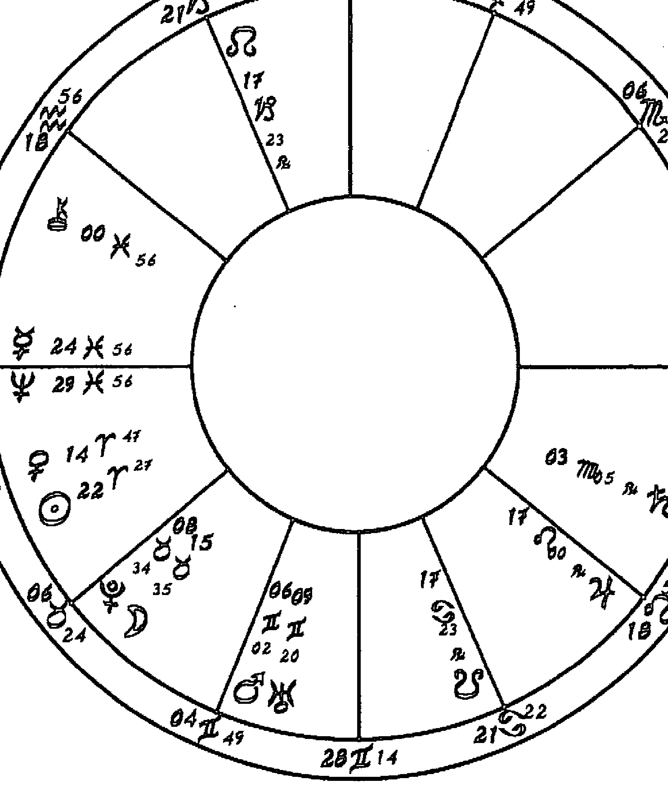

## 美國南北戰爭

一八六一年四月十二日凌晨四點三十分於南卡羅來納州的薩姆特堡開戰

這是美國國家盤，又稱西比利盤（Sibley chart）5。我們可以看到南北戰爭爆發那張盤的火星合相在雙子座，直接坐落在國家盤的下降點，還在國家盤下降點的天王星上頭。在薩姆特堡開火的時刻就是美國經歷天王星回歸的時刻，接著就是火星回歸，因為國家盤的火星也在雙子座。你們也可以看到，內戰當時的上升點水星合相就在國家盤的天底，也就是雙魚座二十五度的位置。海王星在這裡徘徊了好一陣子，貼切形容廢奴主義者跟奴隸擁有者之間長達好幾年持續加劇的衝突，慢慢瓦解這個國家的根源。我不想花太多時間討論這張盤，你們如果有興趣，回家後可以自己研究。不過，這張星盤生動描繪了集體意識在戰爭時期爆發的火星關係。

5原書註：出處同上，尼可拉斯·坎平恩討論到美國「正確」的國家盤。在本書附錄，我使用的是修正過的西比利盤，上升在射手座十三度。雖然這兩張美國的國家盤都尚有爭議，但我們應該記得，流年行運還是有容許度，事件通常會在行運準確到位之前就開始有些端倪。

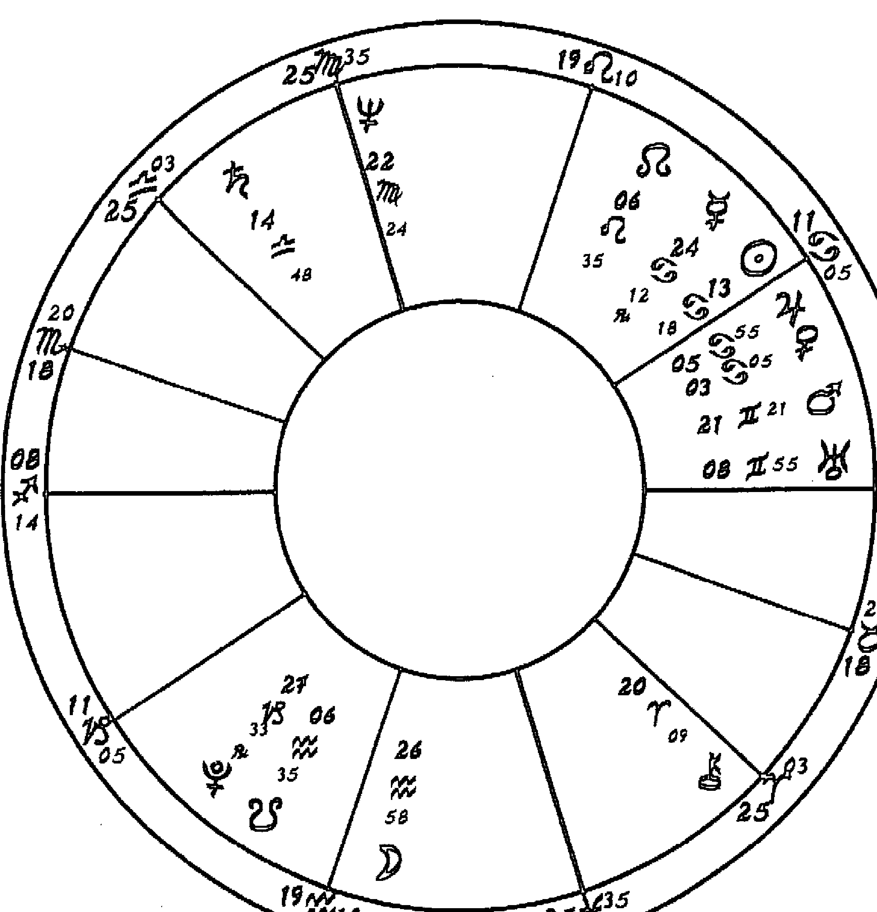

## 美國國家盤

建立於一七七六年七月四日，下午四點五十分，賓州費城

可以到戰爭爆發時發揮影響的行星配置：由火摩羯、天金牛、海處女組成的大三角，火星還在其強勢星座，更與凱、冥對分，基本上是處在凱、冥的中點位置上。也許大三角反應出這股能量爆發得有多輕鬆，而集體意識，或該說集體無意識的自滿成就了這樁戰事 6 。土象的火星也很貼切，因為這場戰爭一開始是出於野心，對國家的優越感，以及想要建立新世界帝國的渴望。摩羯的開創性質暗示了一種暗藏在行為之後、特殊、經過計算的目標，這場戰爭之所以爆發，並不只是因為人民的脾氣失控。在這張星盤裡，火星似乎觸發了外行星的大三角，而這個大三角連結了「美麗新世界」那種救贖渴望的願景。而火、凱、冥的組合又暗示著一股憤怒與憎恨，必須替真正或想像的惡找到代罪羔羊。第三帝國的星盤天頂是在摩羯座二十四度二十七分，跟德國入侵波蘭的行運火星產生五度合相。感覺起來，火星行運的角度在國家盤上通常都能以某型態顯化出戰神的樣貌，但通常會比較溫和、正面，而不是這麼具破壞力。第三帝國盤上的木星在五宮，處女座二十二度二十九分，而開戰時的海王星則一秒不差合相這顆木星，這點顯示影響到整個集體意識的誇大世界救贖願景。最後，第三帝國的凱龍合相上升點，開戰時的行運天王星則剛好行經這裡，

> 6 原書註：本書附錄會討論九一一事件由水、土、天、海組成的大三角。

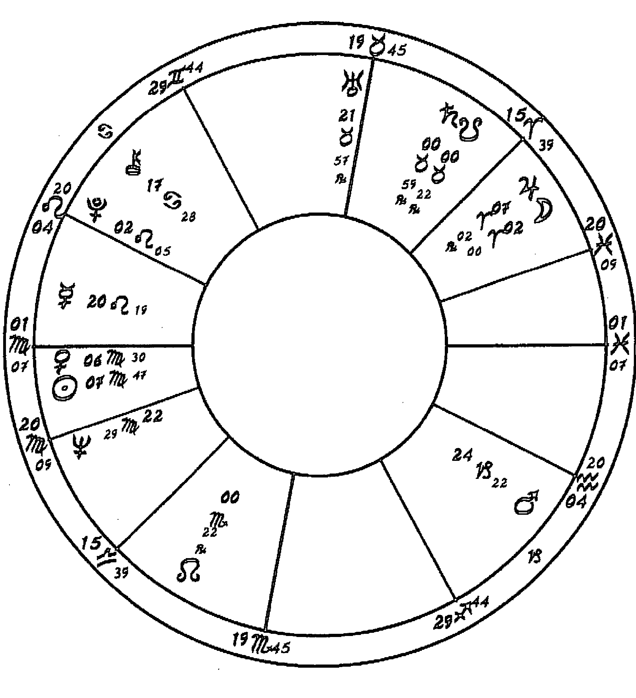

## 第二次世界大戰

一九三九年早上四點時七分於波蘭但澤開戰

> 火星四重奏 | 402

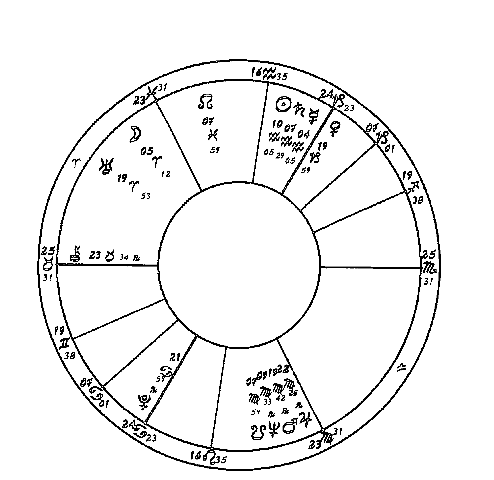

## 第三帝國

一九三三年一月三十日上午十一點十五分，建立於德國柏林

喚醒的不只金牛座典型的土地及資源欲望，更提點集體大眾對於過往所受的傷害與暴力。

研究這些世俗星盤所描繪的戰爭深層原因與天性必須更深入研究，我今天只是起個頭，希望在座某些朋友能夠繼續探索火星的主題。不過，我要再次重申，如果集體意識要開戰，個人只能拋下自我的火星，加入集體的靈魂之中。就全球的層次來看，我們根本束手無策。我們只能做好內心的功課，發展出自己與火星之間的健全關係。這麼做當然不見得能夠保護我們不受集體意識爆發的傷害，但也能夠保護我們不要認同意識，也許到頭來能夠協助我們型塑出不一樣的結果。榮格相信，集體瘋狂浪潮的唯一解藥是穩固的個人中心結構，這個結構包括了我們跟火星的關係，火星最有創意的面向是服務太陽的目標。如果有足夠的人都忠實自己的內心，所謂的集體浪潮就不可能出現了。我們這輩子看不到這樣的轉變，在可見的未來也無法，但這卻是一個值得努力的願景目標。

> 觀眾：火星能夠服務集體的太陽原則嗎？

> 麗茲：可以，我相信可以。集體不只會為了生存而戰，也會為了反應出太陽深刻價值的更高理想而戰。我們也許可以將美國廢除奴隸制度的對抗視為這種服務太陽理想的實例，特別是因為美國國家盤的太陽在七宮的巨蟹座，最佳的狀況就是滋養、保護弱者。不過，永遠不要盲目相信上帝會一直站在某一邊。如林肯總統所言，在每一場戰爭裡，雙方都相信上帝偏好他們的使命。所以肯定有人誤會了，或者，也許兩邊都沒錯，因為衝突就是戰神用來進一步展露太陽宿命的原型方法。無論是智能上、情感上或肢體上的衝突，都是生命裡的原型元件，是我們人類將必要的衝突扭曲為這麼殘暴、不必要的血腥大屠殺，因為我們的火星生病了。今天的研討會必須告一段落了，看來我們今天沒有引發什麼暴力事件。也許我們散播出更有建設性的火星種子了，我是這麼想的。很謝謝大家出席，也很謝謝大家分享你們的經驗與看法。

天使神秘学院官方淘宝：http://strc.taobao.com

获取更多好书，请加微信：13641926204 或QQ:715104687

# 第四部

# 火星的優點與缺點

梅蘭妮·瑞哈特

本場講座為心理占星學院秋季課程的一部份

講座日期：一九九七年十月二十六日

地點：倫敦攝政學院

### 引言

今天我們要聚焦在火星上，我想在座已經有人注意到，今天早上火星跟金星會在射手座產生緊密的合相。講座開始的時候，這組合相在一宮，但隨著合相度數愈來愈近，金火的度數會在十二宮最緊密，形成可見與隱藏的火星。我會向各位介紹火星明顯的特質，希望也能提到一些隱藏的主題。希望在過程裡，各位記住今天的主題——「優點與缺點」，這張星盤上有些線索，涵括了我們對火星天文學的基本認知及不熟悉的面向，我還會列出占星學上的火星主題，最後會討論火星與其他行星的相位。我們也會討論各種展現火星能量的神話及原型人物。整個講座我都會強調金火的連結，加上一點土星的色彩，因為今天的土星在牡羊座，是火星守護的星座，而火土呈現三分相。我們今天也會稍微「射手」一點，我們等下會逐一介紹不同星座的火星特質，為了要發揚處女的精神，我們有一張問卷，是基本的冥想練習，這是要強調金火合相在十二宮。這個活動會分組進行，或各位私下回去練習（畢竟今天每張不同時間的星盤，十一宮宮頭都是在天蠍座）。然後我們會回來，繼續看教材。

### 今天的星盤

各位請看，這張圖中，金火合相與位於處女、雙魚十九度兩分的南北交有最緊密的主要相位，金火四分南北交的同時也開始產生出相位。分別與南北交呈現四分相的這一點就是啟動南北交的觸發點，這個點本身關乎能夠形塑我們生命的人、事、物、理念跟關係。此外，月亮正在接近北交點，四分金火，所以這個模式今天稍晚到明天都會持續啟動。

有一小群人屬於天冥合相在處女座，對分雙魚座的土星與凱龍的時代，這些人出生於一九六〇年代中期，眼前的金火合相四分南北交會啟動他們本命盤上這個的配置。這世代有不少人會以行運冥王星開始啟動這組軸線，所以這種以快速移動行星組成的組合啟動的能量就會比平常更劇烈。這段期間，也許你們會遇到很重要的「其他人」，好比說遇到你的對手、解決過往關係帶來的痛苦或存在已久的問題，也就是釋放儲存的能量，這是很射手座的風格。我們通常不會覺得金火行運有這麼重要，但它們有時就是這麼重要。如果我們要為這組合相寫一場內心戲，這個故事會訴說陽性與陰性、主動與接收的內在整合。因為金火在射手座，這是組成願景、啟發及日地的重要元件。它不是一個舒適、滑順的火象合相，反而是充滿激情、意義與前瞻性的組合。如果你們需要替論文訂題目，或想要尋找一個新的宗教，這個時候也許是最適合的時機！

金火合相的另一個主要相位是三分牡羊。金火也與天王星產生緊密的四十五度，而天王星是整張星盤的最終定位星守護三宮，希望今天我們能有一場充滿趣味的小組討論（天水瓶守護三宮），充滿各種亮眼的新想法。

> 觀 眾：什麼是「最終定位星」？

> 梅蘭妮：聽起來好像是管東管西的大總管吧？「定位星」跟守護星的意思一樣。在這張星盤裡，我們會說木星是金火合相的守護星，木星在水瓶，水瓶的守護星是天王星，而天王星又在水瓶座，所以這條路徑到此結束。在這張星盤裡，無論從哪裡出發，每條路徑都會抵達水瓶座的天王星。在個人星盤裡，作為「最終定位星」的行星具有主導性的地位，也會在當事人的生命裡展現。顯然「最終定位星」就是落在守護星座的行星。

> 觀眾：有。就在這個禮拜，我覺得我放下了一段結束得很痛苦的背叛關係，這段關係是從年初的時候開始的。

> 梅蘭妮：發生了什麼事才讓你放下？

> 觀眾：我不知道。我只覺得自己又充滿熱情，可以放眼未來。

> 觀眾：我不是處女、雙魚對分年代出生的，但我的木星在雙子座十八度。我這禮拜覺得很混亂、猶豫不決。我要進行一個重大決策，所以我快把自己逼瘋了。我看了一下星盤，決定等到周末以後再說。

> 梅蘭妮：也許等到明天一大早，月亮觸發變動十八度的時候，事情會會比較明朗。通常在緊密的行運相位壓力裡，靜待一會兒狀況就會比較清明。

### 天文常識

先來介紹點天文小常識。火星的軌道週期是六百九十七天，以日心說的角度來看，稍微比兩個地球年還要短一點。火星跟木星之後的行星不同，不會跟太陽形成長達一年的合相或對分相。火星跟太陽之間的週期是很規律的，平均起來是七百八十天，差不多是兩年兩個月，這叫做會合週期（synodic period）。火星跟所有的外行星一樣，與太陽對分時會形成逆行的狀況，但逆行的時間只會佔火星週期的百分之九。跟火星及其他行星相比，金星逆行的時間更短₂。

₂ 譯註：金星雖是內行星，但十八個月才會逆行一次，相較起火星或一年要逆行二到四次的水星而言，逆行的時間的確最短。

### 地球之外的鄰居

接下來我們來觀察火星在太陽系裡的位置，這裡有些很有趣的象徵。太陽位於太陽系中心位置，最接近太陽的是水星，接著是金星，也就是我們靠近太陽的鄰居。嚴格來說，金水加太陽是個人內在的行星，這三者是一個人內在認同的三位一體，展現出我們主觀的價值（金星）、感知（水星）及本質的重要性（太陽）。然後是我們的家，地球與月亮的系統。往外走我們第一個遇到的鄰居就是火星，這是不是很棒？我們在地球上，一邊是金星，一邊是火星，就跟那句老話說的一樣：『愛讓世界轉動。』金火的結合伴隨著地球，我們就是肉體激情下的產物。實際上，我們就是人類繁衍慾望下的成果。

繼續往外走，會遇到木星與土星，有時我們說這兩顆星是社會行星，讓我們連結社會及其架構、道德、旅行、法律和限制，這種更寬廣的世界。不過，請看看火星，火星好像有點落單了，一顆星卡在中間。當我們想在個人星盤裡賦予火星深度的時候，這樣的特質變得很重要。火星是出了地球軌道之外的第一顆行星，就在地月系統與木星之間，因此平衡了這兩個面向的生命，也就是內在私密、個人的實體世界，以及社會、意識形態這種更寬廣的世界，還有信仰、宗教的道德世界、想要擴張的渴望。

有了火星，我們才得以從我們的基地、家園、安全感、習慣、個人架構出發，與更寬廣的社會世界連結。我們想要留下記號、表達自我、建立連結、相互競爭、面對挑戰、尋求目光與認同、滿足某些想要表達的內在衝動、贏得所愛的芳心。我們必須用火星來展現我們的內在，實踐三顆內行星的功能，這些功能如下：

- 表達基本的核心生命力與認同（太陽）
- 溝通我們的態度、信念與交流（水星）
- 榮耀我們的價值、吸引我們的人與物品，生活裡仰賴這些重要的東西（金星）
- 成為我們生活的地月系統的生命守護者。

我們晚點會討論火星跟每顆內行星之間的主題。我覺得金星跟火星都和欲望有關，但方式不太一樣，所以我希望我能試著界定出金星與火星不同的激情。火星的符號是從地球拿了一點東西出去，我們是誰的本質，然後把它投射到外面的世界，賦予其意義與方向。這點跟我們晚點會討論的神話人物有關。就在我們討論「出去」的過程時，我們同時也會進入到所有關於地球軌道之內的內行星相關主題與議題。這些主題都能協助或阻礙我們的火星。

### 火星的符號

我們可以在符號裡看到很多線索。地球的占星符號是中央有一個十字的圓形。火星的符號則是一個圓，邊緣上有一個向外的箭頭。想像一下，我們把地球符號裡的十字拿出來，分成兩條線，然後將一條彎折，成為箭頭。或者，我們將十字拿出來，拉一條線出去，就跟我們用射出去的箭畫出射手座的符號一樣，這個話題實在很符合今天的火射手。火星的箭頭是往上、往外的，遠離中央，背離圓滿的完整，探索充滿二元性的世界裡。在占星學上，圓圈代表完整，所以相較之下，火星的符號是很不穩定的。圓圈本身是穩定、完美的，沒有開始或結束，可以旋轉或平放，但內在本身永遠都是完滿的。一旦加上箭頭，變成火星的符號後，就有了動作、進步、衝突、不穩定性及必然性。

另一方面，如果我們把火星當成木星內側的鄰居，我們對火星又會產生不一樣的見解。剛剛我們把火星的能量視為向外的能量，遠離核心，因為它是離開地球軌道的第一顆行星。現在我們要把火星當作是木星內側的鄰居，也是地球外側的鄰居，假設火星的箭頭是朝木星的方向射去。我們可以用火星接地，透過行動、展現願景的創意手法、靈感、潛力，還有木星所象徵的哲學。這裡的意圖是為了要接地及顯化，用眼前的方法將價值帶入個人及可以交流的形式。創意、靈感、宗教志向，以及其他跟木星有關的擴張特質。這些特質都會透過意圖與行動，也能夠被火星實現。火星是那個能讓我們將木星的夢想帶入現實的工具。這是一種更接地、更有目的性的火星能量運用方式，它將我們內在的火焰與渴望，導向一個超越自我的、更宏大的願景。這種火星不再是孤立的、自我中心的，而是成為了連接個人行動與集體意義的橋樑。當火星能夠服務於這樣的太陽原則時，它的力量便能在建設性的方向上得到最充分的發揮。

就是火星，讓其具體化展現。

觀眾：那土星與目標呢？

梅蘭妮：火星在摩羯座是強勢的星座，意味著火星的功能以土星的方式展現是其最有效率的表現。策略與跟隨前例到顯化的階段是土星的過程，但意圖與意志卻屬於火星。今天，我們也會不斷談到土土之間的關聯。

#### 主題

這個時候，我會開始畫一棵文字樹，這棵樹的詞彙在今天的講座裡無疑會持續增加。這個方法是我從心智圖創始人東尼·博贊（Tony Buzan）的研究裡借出來用的，這是個很好用的方法，可以記錄下你蒐集來的資料。我們已經提到幾個詞彙，現在還可以繼續增加。

-   意圖
-   行動
-   創意的自我展現
-   接地
-   顯化

我們曉得火星是先鋒，也是戰士（warrior）。我念這個詞的時候要很小心，有天晚上，我跟朋友在討論這次講座的內容時，她一直以為我說的是一個憂天的人（worrier），這件事的重要性遠超過我們的想像。看著太空裡火星管理建立起來的一切，它遠離過去，尋找新的地平線、新的挑戰與冒險，為了達成這種任務，火星會處在非常柔軟脆弱、危險不定的位置上，這點受到它原本的基礎——也就是確立自我的風險所影響。這是我們從地球家園觀察火星時會有的感覺。我們就是這樣活出自己的本質、展現自己的本質，面對自己的本質，將其表現到世界上，必要時還要捍衛自己的本質。把火星當成自我與社會的連結，同時也跟我們如何將火星的衝動轉化成符合社會集體的特質有關；當然，依照每個人的狀況，我們也可能發展不出這種特質。火星跟衝突及衝突管理有關，內在與外在，戰鬥的能力，反抗、和解、開戰或停火。火星在太陽系裡的位置訴說我們如何能夠在社會上腳踏實地、得到喜樂，或在社會及群體裡佔有一席之地；我們該如何轉向生命裡的熱情，該如何對自己實踐正向的控制、訓練自己，以及我們如何設定目標精準贏得我們的需求及我們喜愛、覺得有價值的事物。

3 原書註：本卷內文的楷體字都是白板上列出的「文字樹」內容。

#### 衝突

我們都曉得火星跟衝突以及掀起衝突有關。火星跟開戰有關，也跟結束紛爭有關。解決衝突的方法跟戰爭的輸贏一樣需要勇氣與意圖。也許這才是火星真正的功能，選擇在個人與意識形態之間（地球與木星）走出一條英雄的道路，這也是一場戰爭。如果我們記住火星在太陽系位置的象徵意涵，這個位置能夠展現出暗藏在衝突之下的議題。換句話說，許多衝突可以簡化為意識形態或領土的統治問題，這也是木星跟地球的主題。就算我們分析的是個人的情感問題，有時還是可以看到這兩股力量其一或甚至兩者都出現的作用力。各位可以試試看，地球的位置在各位的太陽對面，這是從日心占星學（Heliocentric Astrology）借來的概念，我們也可以大致分析一下這張星盤的土元素狀況。你們也許會思考一下地球、火星跟木星之間潛在的衝突與不協調，搞清楚你的火星戰場到底在哪裡。這個方法滿實用的，可以讓我們避免跟其他人展開「假想敵對戰」，省下很多投射出去的能量，因為基本上問題是內在的衝突。

火星象徵的後設衝突會在兩股力量間拉扯，一、本能、習慣、慣性的引力，來自已經建設好的一切（地月系統），以及，二、擴張的可能性，或某種量子跳躍讓這個人能夠進入自我發展的志向、意識形態、道德及個人潛能之中（木星）。或者，更簡單一點，火星的原始衝突可以簡化成這樣，在地球與天空之間，就是領土與意識形態的問題。請記住宙斯是最偉大的天空之神，問題在於驅動我們的是什麼，這點就跟金星的微調功能有關，金星象徵了我們的價值，而這個價值非常重要。

> >梅蘭妮：顯然火星在各種星座理論裡都傾向於跟它最喜歡的衝動密切合作，因此，剩下的衝突就會成為衝突的來源。各位這樣有共鳴嗎？
> >觀眾：有。我是木巨蟹六分地金牛，但火星在七宮的水瓶座。我星盤的水象能量很強，雖然我滿情緒化的，但我基本上是個溫和的人。我結婚的時候，我跟丈夫會因為意識形態的問題起爭執，感覺很不像我，我覺得很詫異。他覺得我對自己的情緒存在著特定的意識形態，我只能坦承他所言甚是。
> >梅蘭妮：這個例子很好。我自己是火金牛、地射手，地球的守護星木星在水瓶座。我常常在這些能量不同的密度與速度中掙扎。風元素跟火元素充滿熱情，卻缺少焦點，火星會因此緊張煩躁，而火金牛的動作又慢得可怕，會惹惱地球跟木星！我們可以拿一位名人的盤來做例子，黛安娜王妃，她是日巨蟹、地摩羯、木水瓶、火處女。雖然她有兩顆很有力量的風象行星，但土元素更強勢，有四顆星，包括金金牛與土摩羯。她的火處女合相冥王星，讓她先天就會想要服務他人。為了達成這個目標，她善用自己在社會上的地位（土摩羯），以及資源（二宮），讓這一切成真。儘管如此，某些陰謀論者『相信她是被暗殺的，因為她跟埃及富商之子多迪·法耶茲（Dodi Fayed）公開的戀情讓英國皇室蒙羞。法耶茲的父親多次因為各種理由拒絕英國國籍。王妃可能不智地破壞當時的政治與意識形態體系。在她過世當時，天王星行運跟她的木星合相，緊密到在二十四分之內，連一度都不到。她個人想要活出來的人道主義理想，想要利用她的皇室地位達成的目標都事與願違。當然，這只是揣測，但她無論生死，肯定都惹得很多人不開心。』

我們在星盤上看到火星的時候，要記得問：『火星服務的對象是誰？』要麼就是地球，要麼就是木星。這種問題是為了探索，這是修辭學上的問題，不需要回答，不用提供生硬的假答案。我想起占星師霍華·薩司波塔斯在《內行星》一書說，火星是太陽最忠實的追隨者，意味著火星原始的生命力、能量、意圖都是為了服務一個太陽的目標而存在。換句話說，火星協助我們每個人神秘的內在光芒與我們配合，這股光芒能夠連結我們生命裡神聖的層面。火星描繪出來的條件或衝突都能視為是一回到正軌的內心天人交戰。其他的行星能量會『奪走』火星的力量，舉例來說，如果火星跑去服務土星，這顆火星也許就會激勵當事人的欲望，當然也可能會與之對抗。如果火星服務木星，也許這個人的宗教狂熱程度就會提升，同時也會造成衝突與爭議性，因為這個人需要搞清楚自己相信什麼，同時還要說服別人自己是對的。用這種方式來思考相位對我們會很有幫助。火星能夠刺激它所接近的能量，有時會壓制對，但有時其他行星也會搶過火星的風采，而憤怒就從衝突油然而生。

在精微體的層面上，火星跟第三輪的太陽神經叢息息相關，這個脈輪跟九到十三歲或青春期的發展有關。光是從名字「太陽」神經叢就看得出來，這個脈輪支持的是我們太陽星座特質的發展與表達，我們原始的能量與生命力。太陽神經叢也跟我們發展出理性明辨的頭腦以及一個人站穩腳跟的能力有關。這個脈輪位於身體中央位置，就是我們想要得到平衡的地方，但同時也一定會因為外在狀況而彎折，或展現創意。跟「戰或逃」反應連結的腎上腺也跟火星有關，而腎上腺就在腎臟旁邊，也位於身體的中央地帶。在精微體的分析上，太陽神經叢或火星虛弱的人也許會害怕衝突，容易覺得別人的能量侵犯自己，特別是具有攻擊性的能量，腹部也可能會很緊繃，下背部容易痠痛，或容易有腎臟問題。舉例來說，公車司機心情不好，對你講話口氣很差，你因此覺得「受傷」，你這一整天就這麼毀了，因為你覺得自己徹底受到影響，彷佛你的能量堡壘有了缺口一樣。

4 原書註：黛安娜王妃出生資料：一九六一年七月一日晚上七點十五分於英國桑林翰。

> > 觀眾：這樣我們能怎麼辦？
> > 梅蘭妮：這是個好問題。如果負面能量不能中和，我們可能就覺得必須把這股能量發洩到別的地方，好比說對小動物出氣。我們最好還是要升級使用火星能量的方式，這樣可以自動加強太陽神經叢能量的模式。這也也許意味著療癒過往的經驗，也許我們曾經沒辦法保護自己，別人的攻擊性讓我們受傷，我們沒有用火星能量回擊，反而自我攻擊卻不自知。或者，我們可以從其他角度切入，找方法進化能量體，療癒太陽神經叢。這點後也能發展出不一樣的洞見，讓我們理解自己是如何使用及誤用這股能量，所有的方法都能加強我們的感受。

#### 輸掉戰爭

火星是用來協助我們興旺且利用我們的活力來成長、參與生命的方式，加入我們的創意，以具有效率的方式面對對手與阻礙、衝突與困難。這是很私密的經驗，我們可以清楚明白火星的確是太陽的僕人，因為我們能夠透過表達，榮耀內在的自我。火星也跟意志有關，就是意圖與能量的實踐與應用。這是一場偉大的戰爭，然而，每顆火星都會輸，因為這是對抗身體的死亡。我們輸贏多少，我們最後都會屈服在這必然的結果之下。某些火星會很清楚這點，某些則否認，這些反應決定了一個人信心與自信的品質。在我們談到火星與其他行星的相位時，我們會詳細討論這個主題。火星的狀況也反應出我們是否具備「風度」，我們能否以圓滑的態度面對艱困的問題，且能贏得光榮、輸得優雅，或者，我們能否穿越憎恨、責備自己與他人的心態，最後是當我們遇到失敗與失落時，是否會感受到徹底的挫敗感。冥王星是在一九三〇年代發現的，我們稱其為「高八度的火星」，雖然我覺得「深八度」這種字眼比較適合冥王星。無論是在個人層面或集體層面皆然。我會這麼理解，一九三〇年代之後，我們與生命裡火星交手的方式已經成為一種轉化的過程，在我 們繼續探索當代火星的狀況前，我想讀一小段托勒密對火星的敘述，這是十八世紀翻譯成古英文的文字，出自十九世紀英國牧師布魯爾（E. Cobham Brewer）的《布魯爾成語與寓言詞典》（Brewer's Dictionary of Phrase & Fable）。在今天的課程裡，我想提高火星的層次，不要像這段文字敘述得這麼低劣，但這段文字顯然也描繪出火星片面的展現。

> >在這顆行星下，誕生的是盜賊、妓女、惹事生非者、嘲弄別人之人、藐視他人之人，這些火星之人造成戰爭、謀殺與戰鬥。他們會是工匠、製作金屬爾琴的工人、厲害的裁縫。他們會漲紅了臉，勃然大怒……很會走路，製作刀劍的人，帶有一抹鮮血……很合理髮、放血、看管動物。

#### 火星探測計畫

幾個月前，在美國國慶日這天，一艘太空船抵達火星，這是當時的星盤。我不曉得該設定什麼地點，我們也沒有火星的經緯度宮位表，所以我設定在美國加州的帕薩迪納（pasadena），因為這是第一次宣布這個消息的地方。我後來才曉得，美國的拓荒者號小組更早之前已經登陸火星了，但不曉得因為什麼原因，沒有放出消息，因此惹出陰謀論，請注意這張星盤的冥王星在三宮接近四宮根源的地方！而且因為登陸的時間是在七月四日，這時的月亮跟美國國家盤上的太陽呈現合相5。

火天秤是火星弱勢的位置6，火星四分位於巨蟹座的日、月，而且這個時候是「暗月」的階段，就是新月之前的一段時間，這個時候是看不到月亮的。這個月相望向未來的曙光。請注意金火這時產生六分相，緊密到只有兩分之差，夾在中間的是上升點，所以金火跟下降點形成上帝手指（Yod），使得上升點和天頂的中點與金星和火星的中點產生四十五度的關係。下降點的守護星海王星落在摩羯座，也合相美國國家盤的冥王星。而且日月合相也與土星形成寬鬆的四分相。看看這組T型端點，凱天秤對分土牡羊，同時四分水巨蟹，水星跟南北交同樣度數，因此，水星、北交點又與木水瓶產生另一組上帝手指。這張盤跟我們現在的星盤一樣，天王星都在水瓶座，守護木星，是冥王星的最終守護，除此之外，這張星盤其他行星的最終守護星都是月巨蟹。就算技術上來說，月天並沒有相位，但這個事件強調了月亮與天王星之間的關聯。在美國國家盤裡，月亮的位置是在水瓶座二十六度五十八分，南交點也在水瓶座；火星登陸盤的天王星跟美國國家盤的月亮合相在三宮7。登陸火星的探測車小名叫做瑜伽（Yogi），不曉得想出這個名字的人是對卡通人物瑜珈熊情有獨鍾，還是他們對占星有所涉略。

> > 梅蘭妮：如果我們研究這次火星登陸的隱喻，各位想想，這種事件對我們地球人來說代表什麼？你們在電視上看到的時候有什麼感想？
> > 觀眾：我們彷彿探進宇宙更深遠處，進入社會與超個人的國度，因為火星是出了地球軌道的第一顆行星。
> > 梅蘭妮：很棒！火星讓我們遠離自己的家。探月的時候，有些人解讀為那是我們修訂、重新擁抱、重新思考陰性原則的時刻8。也許我們能夠延伸這種類比模式，想像這次登陸火星也許象徵了我們對於陽性原則的運作必須更有意識。

如果各位沒注意到，相較平常，我今天引發許多讚歎詫異的反應。這點反應出金火合相在射手的特質，有一股強大的力量，想要探尋意義，對於浩瀚、廣大、費解、興奮事物充滿熱情。太空旅行符合上述所有標準，過去幾年也在集體想像力中點燃不少火花。射手座是變動的火元素，本身就暗示了集體的想像力。不過，我常想，我們的老祖先可能不需要機械太空船，而是用意識進行星際旅行。好，我覺得差不多該回到地球來了，我們要來討論跟火星有關的各種表達與攻擊性。

咱們回到托勒密的「嘲弄別人之人、藐視他人之人」。嘲弄、藐視是大量輕視別人，讓他們覺得自己不夠好，削弱他們的力量。這種行為可以進行得非常細緻，好比說在客廳喜劇裡，所謂的「幽默」通常是嘲弄某些人，這些對象不外乎是沒有教養、知識程度不高或相較之下無知的人，因此，嘲弄者會覺得這些人不夠好。嘲弄、藐視會引起敵意，這點我覺得是火星很有趣的一個面向，人家以微妙的方式羞辱某人，而受害者會有憤怒的反應，結果加害者只會揚揚眉毛，彷彿在說：「看吧，這傢伙就是個任性的野蠻人啊！」嘲弄別人之人、藐視他人之人、無論他們的手法多細緻，都是衝突之神艾瑞斯的崇拜者。當「幽默」充滿貶損、報復、競爭性的時候，就會產生惡意。笑聲可以啟開或關閉人心，這是我用來判斷一件事好笑與否的標準。回到托勒密描述的火星，也許某個層次的火星是遭到輕視、壓抑及嘲弄的。也許我們試圖微調這種能量，沾染上金星的色彩，因此迫使這股能量必須爆發出來，可能的後座力就是其最糟糕的形式，也就是野蠻、粗俗、侵略他人、迫害他人、專橫刻薄。在英文裡，我們會稱某種人紳士（gentleman，前面的gentle指的是溫和有禮的）。如果我們應該成為一個「溫和有禮」的紳士，那男男女女靈魂裡「狂野無禮」的那部分該怎麼辦呢？這個嘛，我們開始崇拜這樣的精神，我們可以在媒體上看到這種誇張的行徑。媒體跟真實世界裡充滿暴力，我們可以將這點視為集體意識對於火星原則的崇拜。如果火星是位戰士，這位戰士會需要為了崇高的理念奮鬥。這點跟木星有關。另一條路則是為了生存、領土、統治與個人喜樂而奮鬥，也就是地月能量以最負面的方式展現。然而，意識形態與宗教信仰雖然歸類在木星的管轄下，但這些領域在地球的歷史上還是引發過難以想像的殘暴與殺戮行為。難怪火星能夠引起這麼多擔憂與焦慮，地球與木星之間存在著一種「做也不是、不做也不是」的狀況，而這兩者任一的價值都可能遭到扭曲，引發恐懼的後果。火星只要沒有正面積極與地球連結，某種程度來說，火星的能量就會「變壞」。「變壞」的現象很可能因為受過傷或其他原因，離群索居，具有危險性，會攻擊其他生物。根據同樣的象徵，如果遭到世俗問題扼殺的進取心與創意變得太濃烈，火星很可能會變得固執、不開心，因此憤怒、心緒不佳。我覺得火星真正的戰場第一個是內在的衝突，面對這點能夠協助當事人在意識形態與實際疆域之間展開一場向外探尋的旅程。火星這顆行星非常壯麗。它表面上有一座山，叫做奧林帕斯山（Olympus Mons），也就是希臘眾神天上的家。我想，奧運的原型意涵可能就是我們這些地球人以一種啟發、正常的理性來崇拜火星吧，將無謂的部族與國家問題先放一邊，展現出我們堅忍的力量、生命力、卓越性、超凡的本事以及有如手足般合作的健康競爭關係，這就是人類展現出自己最好一面的時刻。今天，奧運的榮耀遭到那些透過禁藥提升表現的運動員踐踏。「火星的狀態」在今天讓人覺得玩味，要參加奧運非得是「超人」不可，要跟大塊頭的人及各種男神女神較勁。「英雄崇拜」在古希臘時代非常盛行，在這些表現不凡的英雄墳前進行盛大的獻祭。時至今日，全球娛樂圏與運動界還是有這種「超級巨星」現象，但我們崇拜的特質似乎沒有那麼崇高了。火星在當代有個象徵，在場有多少人曉得「火星人脸」？從金火合相在射手的觀點來看，這件事滿有趣的。一九七六年的時候，美國太空總署的工作人員在看一組由海盜一號探測船拍攝回來的照片，他們發現一些奇怪的畫面，並標記為「頭部」，但沒有發表這些照片。後來，兩位電腦技術人員發現了這張「頭部」的照片，他們利用科技加強畫面，結果「臉」就出現了，這張臉有二點五公里高，兩公里寬，高度四百公尺。過去一百年來，我們不斷討論這張臉及火星表面上的其他特徵，為外星人文明等想像加油添醋。很有意思吧？自從外星人的概念出現在西方科技社會的集體靈魂之後，「火星人」就成了第一批「外星人」的候選人。為什麼不是木星人、土星人或金星人呢？不曉得你們怎麼看火星上頭有張「臉」仰望著地球這件事？是不是很妙？彷彿地球跟火星遙遙相望。

> > 觀眾：也許透過觀看彼此，這兩顆行星就不只是象徵，而是一種現實，就好像拉回投射的力量，整合這股力量的過程？
> > 梅蘭妮：我喜歡這個說法。你前往的目標會迎向你。而你前進的時候，能量是會回來的。從火星的符號裡，我們就看得到這點，火星符號很像一個發射器，或是一根射出去的箭。往上的勢必會下來，出去的勢必會回來。我最近發現，占星這件事情的架構是很火星的。西方世界大多使用『回歸黃道』（The Tropical Zodiac），這個系統的計算方式是當太陽跨越天體赤道時，從牡羊座零度開始計算整個黃道。回歸黃道的整個概念是建立在火星的衝動上，後以某種韻律發展為十二個部分。有時，某些人會認為十二是太陽的數字，太陽從牡羊座零度開始，牡羊座是太陽強勢的位置，也是火星守護的星座。整個星盤彷彿是以行動來顯化（火星）我們內在核心（太陽）的太陽衝動。核心的太陽是存在於我們的太陽星座搭配上火星的能量，這樣才好表達出來。榮格也許會用一個『個體化』這種字眼來描述這個過程，重點不只是成為這個人，而是在生命裡展現出這個樣子。我想占星也描述了我們將以何種方式，從我們選擇與行動（火星）的因果關係裡學到什麼樣的課題，如果我們延伸這個概念，就能展現出我們的業力或因果關係的故事線，時移日往，我們會知道這個概念並不僅限於我們的生命範疇裡。

5 原書註：恐怖攻擊九一一事件這天的行運木星在巨蟹座的十一度二十五分合相這個點，請留意這個度數後幾周的發展，因為幾周後木星開始停滯、逆行。
6 原書註：九一一事件的火星位置在莎比恩符號（The Sabian Symbol）系統裡的意涵是「類傾之家裡的燃燒壁爐」，丹恩·魯伊爾（Dane Rudhyar）對這個象徵的解讀相當強烈：「在棄置的美夢裡，某些難以界定的溫暖『存在』並沒有消失，也就是重新再生的希望。」出自丹恩·魯伊爾《占星曼陀羅》（An Astrological Mandala），第一百七十七頁，紐約藍燈書屋出版。
7 原書註：這裡指的是平均交點（mean Node），本次講座使用的都是平均交點。
8 原書註：一九六九年七月二十日，晚上十點五十六分，美國華盛頓，這是人類第一次登陸月球。這張星盤與登陸火星的盤有許多驚人相似之處。
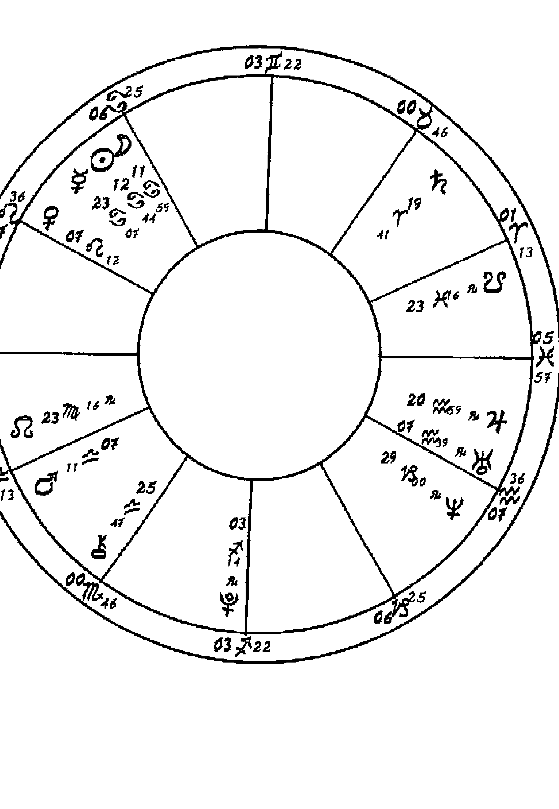

### 登陸火星

一九九七年七月四日上午十點零七分，地點美國加州的帕薩迪納，資料來源：太空總署。

#### 火星及四個開創點

如果我們繪製一張「出生盤」，上升起始在牡羊座零度，而整個黃道星座以逆時針方向排序，我們會看到一些有趣的現象。四個開創星座分別為牡羊、巨蟹、天秤、摩羯，這四個星座同時也標記出春分、夏至、秋分與冬至，就是一年之中能量變化的轉捩點。首先，火星守護牡羊，衝動就開始了。牡羊對面的天秤是火星弱勢的位置，巨蟹是火星失勢的位置，摩羯則是火星強勢的位置。也就是說，四個東南西北的羅盤方位跟分點都跟火星能量息息相關。下面有個表格，列出其他行星的強勢、失勢、守護、弱勢狀況。

| 星座 | 守護 | 強勢 | 失勢 | 弱勢 |
| :--- | :--- | :--- | :--- | :--- |
| 牡羊座 | 火星 | 金星 | 太陽 | 土星 |
| 巨蟹座 | 月亮 | 木星 | 火星 | 火星 |
| 天秤座 | 金星 | 土星 | 太陽 | 太陽 |
| 摩羯座 | 土星 | 月亮 | 火星 | 木星 |

梅蘭妮：你們會發現土星出現得滿頻繁的，月亮、金星跟太陽也有出現，但水星在哪裡？各位觀眾：有什麼看法？
觀眾：思考與溝通不存在。
觀眾：火星與語言無關。
梅蘭妮：火星就是行動的準則，包括佛陀所言之「行無行行」，還是會受到選擇的刺激。水星象徵了我們反省、產生想法或計畫行動的能量，但火星的本質就是行動。從這個標準來看，水星就是火星的相反，也許也是「失落的環節」，因為原始的衝動需要思想來安撫。
觀眾：春分秋分也是成對的，牡羊座跟天秤座的行星組合是火金日土，巨蟹座跟摩羯座的夏至冬至的行星組合則是火月木土。
梅蘭妮：這四個星座守護著東南西北，以及「出生盤」上的方位，火星跟土星都出現了。主題再次出現，關於這點我們可以有很多討論，但這個我就留給你們有空的時間自己思考了。

#### 神話

##### 羅馬戰神瑪爾斯

火星的名字來自這位羅馬神祇。希臘的版本是艾瑞斯，而希臘兩個版本的神差異很大。我會建議各位把這點放進我們的太陽系模型裡，因為這樣思考很有趣。顯然在早期的巴比倫神話裡，等同於瑪爾斯的神主要跟生長、植物、肥沃有關。我們發現羅馬的瑪爾斯也跟富足及農業有關，這是他主要掌管的領域，他的次要身分才是戰神。某些作家認為瑪爾斯的地位是高過朱比德。而在羅馬神話裡，瑪爾斯身邊還會有兩個隨從，名叫榮耀與美德。回到我們的「文字樹」，我們把戰士放在這裡，也許我們也可以寫上榮耀與美德。這兩者伴隨著瑪爾斯。「美德」(Virtue) 這個字包括了拉丁文裡的 vir，這個字頭就是「男人」的意思，男子氣概 (virility)、男性的 (virile)、美德通通是跟男人有關的字眼。有趣的是，在拉丁文裡，vir 是鋤頭的意思，的確跟農業種植有關。這裡出現兩個形象，一個是持劍的瑪爾斯，一個是使用犁刃的瑪爾斯，後者會在大地耕作，使土地肥沃，具有生產力，養活部族，他是戰士也是守護者。一個人只會用火星能量保護他覺得重要的東西，這時暗指的就是金星。如果一個東西沒有價值，我們也不會保護了。保護不只是汽車防盜系統、保險或國家軍隊。保護在於你如何用自己的力量把某個東西留住，留在你自己能夠守護的範圍之中，加以關愛照料。這並不保證你不會失去這個東西，但如果真的失去，絕對不是因為你輕忽了。而且，Virtus（力量）這個字也展現出一個東西的本質，也許是一頭獅子吼叫的力量，或太陽照耀的力量，也就是基本特質的展現。火星的能量必須榮耀我們深層的美德，也就是我們內在的天性需要表達出來。火星也要求你堅守立場，發展你的卓越成就。操作農具的瑪爾斯不會一下就收成，農作需要時間，需要配合季節，也就是地月過程。能夠正面配合地月能量的火星才是有建設性的農作火星，也才能夠保護、守衛，最後才能因為信念而啟發，不是被信念率著鼻子走，一路飛到木星的國度去。

##### 希臘戰神艾瑞斯

希臘的艾瑞斯則是完全不一樣的角色，我想讀兩段話給各位聽，讓你們有些概念。大家榮耀羅馬的戰神瑪爾斯，認為羅馬是他建立的。反之，艾瑞斯雖然是主神之一，卻沒有任何城市是以他之名命名，就我所知，艾瑞斯在希臘只有一間神廟，在雅典衛城（Acropolis in Athens）的阿勒约帕哥（Areopagitica），這裏就是古時候進行殺人犯審判時，大家會找位置坐、看熱鬧的地方。崇拜他的人主要都是亞馬遜人。匈牙利古典哲學學者卡羅·卡列尼（Karoly Kerenyi）曾說他：「從各種方面來看，這個角色都欠缺尊嚴。當魯莽的艾瑞斯受傷時，他的尖叫有如九千或一萬人的慘叫。」《伊利亚德》中宙斯對艾瑞斯說：「你最喜歡的莫過於爭執與戰鬥，因此，全奧林帕斯山上我最討厭你。你的母親希拉剛愎固執，脾氣不受管束，言語都難以控制她。」

我們很容易認同羅馬的瑪爾斯支持我們生命正面意圖的力量、生命力、意志與認真，能夠表達我們的個體性、福祉，同時還能保護、榮耀部族。我們很容易認同跟木星有關的面向，且能清楚看到這種能量過剩變成濫用的狀況。當我們思考艾瑞斯的時候，狀況就更複史詩裡描繪的艾瑞斯相當嗜血，他對殺戮有難以控制的衝動，他是戰爭及衝突之神，他也容易魯莽闖進狀況裡，失控。他甚至也不是高效率的戰士，常常打敗仗，可以說是一個很可悲的角色，最糟糕的是，他輸不起，會發脾氣、會崩潰，輸了會鬧脾氣。艾瑞斯的體型非常壯碩，好勝心很強，如果他受傷了，他時一勝有時一敗有時的抽離或體認。艾瑞斯非常脆弱，因為他很激進，喜歡吵架、戰鬥，所以他肯定也是讓大家非常頭痛的人物。艾瑞斯不善社交，且跟羅馬的戰神瑪爾斯根本天差地遠。

我們可以思考這樣的角色在我們的集體意識裡對男人該是什麼模樣、不該是什麼模樣會有什麼影響？以及女性會如何看待男性的角色？這點的確值得我們思考。他的形象雖然是一位男性戰士，但刻薄苛求，感覺起來更像個惡棍。這點也許反映了古希臘文化強調理論（水星）的發展，不得不用理論來對抗火星的原則。研究星盤裡的火星時，我們會發現不同年紀與性別的人會有光譜般的火星特質，但這些特質也會因為年歲漸長而有所改變。研究自己的火星時，我們也可以捫心自問，我們能夠輸得優雅，還是跟艾瑞斯一樣輸不起？

#### 艾瑞斯的誕生

關於艾瑞斯的出生，我們會參考兩個版本的神話故事。一個版本是希拉透過單性生殖產下他，天后為了報復丈夫在沒有交合的狀況下自行生產雅典娜，所以搞出這種「一報還一報」跟「你看著好了」的戲碼。在這個版本裡是沒有宙斯的。在這種血緣關係裡，艾瑞斯的誕生是因為他父母之間的衝突、敵對與心理不平衡。他一生下來就沒有父親，因此，他的蠻幹、好戰及軟弱的狀況能夠類比為沒有父親的男孩，覺得害怕、覺得面對生活，自己的先天條件不夠好。

這點在我們這個年代實在很有趣，我們可以想想天底下有多少單親媽媽獨立養育他們的兒子或女兒，而這些孩子都跟父親鮮少連絡。可能造成的結果是這些「男性權威」會投射進集體層面，類似「天父」這種意識形態，或成為某種抽象的東西，有如知識系統或科技本身。在這個版本的神話裡，據說希拉摸到了某一一種花，所以她才懷孕，雖然我曉得到底是哪種花，但你們聞這些玫瑰的時候自己小心點！

艾瑞斯受到亞馬遜人崇拜，亞馬遜人跟女獵人阿特米斯（Artemis）有關，但艾瑞斯的熱情卻屬於阿芙蘿黛蒂，據說，只有她能夠安撫他想殺戮的慾望。就心理意涵來說，我們火星的困難也許也需要金星領域的互補與交流。換句話說，火星原始、激進、不可或缺的能量必須跟金星達到平衡，透過的方式就是連結一個人的價值、原則，以及當事人在其他人、理想的國度、美學及人與人之間看重的特質。說到這個，我想到關於性別也有一點很有意思，我們在探討火星能量的時候，不免俗地一定會強調金星原則的重要。只要一位男性沒有跟內在天性裡的金星連結，他就會去外面找女性來扮演這個角色，結果就是他會因為自己太依賴她們而憤怒。這點也適用在女性身上，她們跟火星能量之間的關係，也許允許男人來扮演這個角色。無論男性女性，當他們讓對象扮演起角色，或讓對象成為他們內在的「另一半」時，尖銳的衝突就是不可避免的結果。

#### 艾瑞斯的兄弟——赫菲斯托斯

另一個版本的神話說艾瑞斯是宙斯與希拉的後代，從這條血脈出發，他就跟瘸腳的鐵匠赫菲斯托斯成了兄弟。托勒密告訴我們，火星守護的人適合當鐵匠，操作熔化的金屬。火星守護的金屬就是鐵，與其相關的還有溫度、火及尖銳工具。赫菲斯托斯身為艾瑞斯的兄弟，呈現出火星能量另一個重要的面向。艾瑞斯跟阿芙蘿黛蒂的關係讓他跟手足赫菲斯托斯成了競爭者，赫菲斯托斯在令阿芙蘿黛蒂無法拒絕的一次協議中，成為愛慕她的丈夫，但她很不滿意就是了。赫菲斯特質很樸實，每天在熔鐵爐前工作、熔化金屬，也就是土元素的特質。艾瑞斯是名戰士。沒有人仔細討論赫菲斯托斯跟艾瑞斯之間的競爭故事，就讓我們來說說吧。這個故事對土象的火星以及火土產生相位的狀況特別有意義，就讓我們今天的盤一樣。我們在四個開創星座及占星的四個方位上也看到他們之間的血脈連結。赫菲斯托斯是早產兒，顯然是在希拉與宙斯秘密交往時生的孩子。他出生時畸形，雙腳扭曲，向後方彎。希拉嚇壞了，就把他扔進海裡，想要擺脫這個孩子。海洋女神忒提斯及她的姊妹解救了他，將他扶養長大。在赫菲斯托斯的個性裡，我們看到不斷的報復與憎恨。火星的這一面放不下任何侮辱、受傷與衝突，永遠要當講出最後一句話的人，還會想辦法策劃陰謀復仇。

#### 權力控制

觀眾：聽起來很像火天蠍。
梅蘭妮：對，沒錯，但火星在別的星座也會這樣。這部分在我等等給你們的問卷裡會提到，敬請期待。赫菲斯托斯替眾神打造了他們的象徵物，用具、徽章、標示之類的，大家看到這些象徵物，一眼就會認出這是哪位神祇。舉例來說，他替赫米斯打製造頭盔跟涼鞋，還替雅典娜打造盾牌。占星學上的火星，就是透過赫菲斯托斯的這一面，讓我們能夠打造出我們的個性，且透過表達我們的天賦，形塑我們的特色。這是我們太陽的特質，而跟所有發光體一樣，這也會伴隨黑暗的一面。赫菲斯托斯替他的母親希拉打造了華麗的黃金寶座，默默送給了她。不過，當她一坐上寶座後，就發現有看不見的鎖鍊束縛住她，無法脫身。當然啦，奧林帕斯山眾神之王的妻子肯定受不了這種侮辱與束縛，為了守住顏面，她與赫菲斯托斯開始討價還價，結果就是他要求跟阿芙蘿黛蒂成親。在那種狀況下，希拉沒辦法拒絕，所以阿芙蘿黛蒂心不甘、情不願成了跛腳鐵匠的妻子。

我們在這裡看到火星的各種面貌，對別人施壓的能力、協助他人的能力，無論當事人是否願意。舉例來說，你可以介入他人的自尊、無辜、想要受人喜歡的慾望，或其他跟自我有關的特質，這些特質能夠透過奉承，協助你得到想要的東西。束縛某個人象徵了勒索或操縱，同時也吸收了別人的能量，用來壯大自己。透過心理層面的身分認同就能辦到這點，可能是透過使用別人的物質資源，就算這些資源可以自由取用，就算其中藏有無意識的討價還價，我們都能束縛別人或遭到束縛。這是從虛弱、匱乏、不足的層面開始運作的火星。火星也跟我們為了要感受力量，需要做什麼、需要成為什麼模樣有關。雖然我現在跳得有點快，但我等下就會提到火星能夠顯示出我們必須以何種方式、在何種背景下，學習了解這個層面，而不用放棄顯化的力量與意志，也不用退讓自己的立場，就能得到我們想要的東西。我們在學習過程裡可能感到挫敗，因為我們動用了不對的力量，或是因為我們要學的只是重新打起精神、再試一次罷了。

火星也跟我們如何回應傷痛有關。在這裡，我們可以看到赫菲斯托斯與拒絕他的母親。這個故事跟凱龍的故事異曲同工，凱龍也是因為肢體異常，遭到母親遺棄。凱龍並沒有走上永恆的復仇之路，反而成了一位薩滿和治療師。在古北歐文化裡，鐵匠通常都是薩滿，無論是鐵匠或薩滿，這種職業都跟以不同方式運用元素有關。海克力士意外傷及凱龍，這位公認的火星人物最著名的考驗都是在替他不小心犯下的謀殺贖罪。在傳統占星裡，火星守護外科醫生，但外科醫生這個字其實是來自凱龍（Chiron），cheir是手的意思，在法文裡chirurgien就是外科醫生。「負傷之人」是很凱龍也很火星的人物。

回到赫菲斯托斯的故事。榮光裡散發著壯麗與美貌的女神阿芙蘿黛蒂發現自己必須跟這位雙腳畸形、脾氣乖戾的金屬工匠結婚，不消說，她當然在外面亂搞。而赫菲斯托斯肯定必須常面對這個事實，他的對手很多，其中包括他的手足艾瑞斯，艾瑞斯跟阿芙蘿黛蒂之間的關係充滿激情。能夠看到一切的太陽神赫利奧斯（Helios）監視這對男女，然後告訴赫菲斯托斯，這位工匠就開始準備他的復仇計畫。他打造了一張非常精細的網子，當艾瑞斯跟阿芙蘿黛蒂一起在床上的時候，他就一把逮住他們，讓他們無法逃脫。然後，他讓全奧林帕斯山的神都看看這對戀人狼狽的模樣。他羞辱了他們，或說他想要這麼做。我不確定阿芙蘿黛蒂會不會覺得丟臉，但我想艾瑞斯大概很不爽。還有另一則關於赫菲斯托斯的軼事，描述他是怎麼滿懷怨恨與不滿、氣呼呼地回到奧林帕斯山。結果在一次父母爭執的場合裡，他選錯邊，選到希拉那一邊，激怒了他的父親。這像伙真可憐。第一次，他母親因為他不夠完美，所以引起母親的怒火。第二次則是他跟媽媽同一陣線，想必是因為一開始的不被接納而努力想要跟媽媽連結，結果這次老爸就向他發火，又把他逐出家門。他被趕出奧林帕斯山不只一次，而是兩次。他重重跌到利姆諾斯島（Lemnos），島民細心照顧他。這就很像火星不會放棄什麼愚蠢的戰爭一樣，彷彿他是在說：「母親覺得很醜，不肯認我，但我一定會讓她接受我。」因為在關係的範疇裡，火星跟金星都很重要，這是赫菲斯托斯很有趣的一面，各位可以看到。至此主題都是戰爭這個主題的變化，而我們這裡說的就是最初的接納戰爭。

阿芙羅黛蒂「掌管」艾瑞斯跟赫菲斯托斯，就跟金星「守護」火金牛跟火天秤一樣。赫菲斯托斯就是那種永不放棄的火星，不接受「不」這個答案，也不曉得該怎麼放手。不過，這種個性可能會有正面的展現，好比說堅定的忠誠、奉獻及努力，也就是遇到困難時，必須堅持下去的毅力，想辦法直到結束。赫菲斯托斯密謀復仇，某種程度也算扯平了。不過，他得到阿芙羅黛蒂作為他的妻子，他就得常常面對她的不忠，狀況實在沒那麼輕鬆。我們從他的角度看火星，不難看出他的故事就是一個愚蠢的復仇寓言。如果我們仔細看神話故事，就會發現赫菲斯托斯象徵著，當別人不肯按照我們的意思行事，我們會感受到的那種怒火。
在其中一個版本的神話故事裡，赫菲斯托斯的腿一直很弱。他打造出兩條機械義肢，一隻是金子做的，一隻是銀子做的，協助他行動，因為他的身軀巨大又強壯。金與銀，象徵了父親與母親、太陽與月亮。毅力、勇氣、決心這些火星的特質實在很感人，能夠在遭遇困難時讓我們繼續前進、展現出我們的本質。雖然我們一開始也許沒有立足點，但我們還是會打造出自己的雙腿。從心理層面上來說，也許這意味著一開始並沒有來自父母的支持，但我們還是能夠用自己的力量踏出第一步，展開獨立的旅程。無論我們的原生父母多好或多壞，我們一定要挖掘出內心深處的原型父母來支持我們，也就是說，我們必須放下對父母的憤怒，畢竟他們也只是凡人而已。只要有機會，火星就會協助我們用各種方法尋找立足點與立場，就算我們一開始沒有這項天賦也沒關係。火星會告訴我們該如何找到自己的立場、堅守這個立場，反之，我們就會覺得「自己站不住腳」。

觀眾：利姆諾斯島上都是檸檬樹。檸檬酸會加速骨骼鈣質的生成。也許他療養了他的雙腿。
梅蘭妮：謝謝你分享這點。腿是連結我們跟土地的部位。我們又可以想到火星跟土星之間的強烈連結象徵，因為土星也掌管了鈣質跟骨頭。

#### 火星的發展階段

看看火星的生理階段，這股能量讓我們能在生理及社會生活裡繁榮發展。火星的週期約莫在兩年半左右，而就我們與這股能量的關係而言，這段過程對我們來說非常關鍵。如果我們在兩歲半之前能夠得到所需，這股能量就會從內在形成一層深刻、強健的基礎，讓我們覺得探索外在世界、擴張到社會接觸的木星國度是安全的，我們才好學習以及擴張與表現自己。第一次的火星回歸宣告了一恐怖的兩歲兒即將出現，伴隨著日益頻繁的肢體活動與靈活心思，我們會開始連結事物、拆解東西、遠離母親，覺得自己愈來愈不需要她。我們也確立自我，測試界限。在生命的早期，我們的需求非常原始，想要感覺安全，有人包容、滋養、接納、肯定且欣賞我們。我們想要成為宇宙的中心。我們的火星展示出我們想要成為宇宙中心的方法，以及當我們發現我們並不是宇宙中心時會有什麼反應。從占星的角度來說，太陽才是要實踐這個角色的行星，而火星能夠協助或阻礙太陽走進中心位置。

深嵌在我們火星之中的是我們對原始需求的掙扎殘影，我們怎麼成功的、失敗的時候又有什麼反應。有些寶寶從出生第一天就索求無度。如果餓了，他們會叫，如果想要什麼，他們會哭。他們會用聲音及動作讓母親知道他們一點也不好。當然，天底下也有些被動的寶寶沒有這些反應，他們需要母親不同的同理與察覺。在這個關鍵時期裡，當我們想要成為自己小小的宇宙的中心時，我們與母親之間發生的一切都會存留在我們的火星裡。母子關係就是地月系統的範疇。如果我們從來沒有覺得自己是個「贏家」，我們很可能會不斷嘗試，想要成為宇宙的中心。我們也許會把世界當成每個人都必須為了所需而奮鬥的地方，這樣我們一定會失敗。我們也許會太過追求成就，無法放鬆，對競爭太過敏感，容易輸不起。我們也會被這個念頭牽著鼻子走。我們也許會覺得匱乏、空虛，必須作戰。我們要麼就是為了爭取需要而戰，不然就得受人擺佈。我們的火星承載了我們在幼年時期達成需求的「成功」程度印記。在這顆行星上，依賴與獨立的議題清清楚楚，就跟巨蟹座是火星失勢的位置一樣，聽起來很像赫菲斯托斯失足滾下奧林帕斯山。如果幼年時期的關係讓我們覺得好像跟打仗一樣，我們也許就會帶著這種心態長大，總是覺得匱乏、空虛，必須作戰。我們要麼就是為了爭取需要而戰，不然就得受人擺佈。總之，開誠佈公是不安全的，因為這招沒用，也許是因為受過責罰，也許擁有需求是不安全。

11 請見《手足占星》（The Sibling Constellation），布萊恩·克拉克，一九九一年由倫敦 Penguin Arkana出版。

#### 防禦與攻擊

長大之後，我們也許會開始良好的社交生活，學習如何控制住火星原始的一面。然後，也許我們就只會在生存遭到威脅的時候與這種原始能量重逢，這種情況例如暴露在危急的狀態裡。這麼說好了，你也許遇上或目睹了一場車禍災難，有人受傷，血流滿地。對很多人來說，正面的火星能量會出現，你當下就知道該怎麼辦。我在非洲灌木林裡待過好長一段時間，一名很不錯的國家公園管理員向我們介紹地域性的時候說：『如果你遭到某種動物的威脅，你的生……』的，因為我們從來就不覺得這些需求能夠得到滿足。這種早期暴露在生理、肢體存活階段的議題會存在於我們的火星裡，因此影響我們有多擅長或能否確立自我的程度。火星描繪出這些幼年時期的肢體發展、我們的需求展現方式，以及當我們遇到挫折時，會有什麼樣的反應。看看火星與其他行星之間的相位，無論是出相位或入相位都要參考。如果你參考太陽弧正向推運及二次推運，你會明顯看出其他行星對本命火星的發展與影響。我記得他提到每種動物都有自己的「臨界距離」，如果你發現自己踩進動物的臨界距離裡，牠可能會因為你在這個範圍裡而攻擊你，因為你進入了牠的領域。這也是火星的反應，也許可以這麼說，「臨界距離」是我們防禦機制的一部分。如果我們高度期待自己會遭到攻擊、嘲笑、奚落、輕視或傷害，如果這種狀況於我們的童年一再出現，無論是生理或心理的展現，我們的臨界距離範圍都會非常遠大，只要進入這個範圍的人都會遭殃，因為我們會從防禦轉變為攻擊。這是很自然的，如果我們能夠學習讓自己的身體適應其他人的存在，我們就不至於不慎違反別人的臨界距離，或讓別人侵犯你的距離。

> 梅蘭妮：我想歡迎大家開始思考一個問題：「不同星座的火星會有什麼樣的防禦與攻擊模式？不同星座的臨界距離是否也有所不同？」

> 觀眾：我火巨蟹，我覺得我只相信那些無論是在肢體上或情感上願意接近我的人。

> 觀眾：我的火星在雙子座，我在心智上需要很大的空間。在那些講話很激動、銳利的人身旁，我會覺得緊張。這點在我們家是很「正常」的，我們家人總會為了政治或其他話題爭論不休，對我來說，提出充滿各種激進言論的意見不該在公共場所表達。

梅蘭妮：這種言論會侵犯你的臨界距離。

觀眾：我的火星在水瓶，我在團體裡的時候，很容易覺得壅塞。我會想跟每個人保持距離。

梅蘭妮：當你的「臨界距離」遭到侵犯的時候，你就會開始害怕或覺得受到威脅，會生氣或想展開攻擊。你是那種對於危險很敏感的人嗎？早在危險發生時就察覺到跡象，然後努力阻止危險狀況發生？還是你發現自己是忽然處在衝突狀況裡，而你完全不曉得事情會演變成這種局面？當然，這兩種情形我們都遇過。不同的人對於這種狀況會有不同的雷達。某些人總會想像災難與衝突，而你在心底不斷思考該如何阻止。這點會讓我們的火星站在控制的位置。火星所帶出來的另一個問題是：「我們受到多少控制，以及為了感受到安全，我們能用什麼樣的方式控制他人到什麼樣的程度？」從生理層面來看，火星跟領土、安全、防禦，以及為了活下去的一切有關。當我們把火星的另一個面向，木星那一面加進來的時候，我們帶入了理想。我們前面說過了，原始的火星衝突可能與本能、理想及這兩者能否同步、以何種方式同步有關。我們所受到教育與信念的教導也會影響我們與火星的關係，「小女孩應該乖乖的，不要鬧脾氣」這種信念可以影響深遠。或者，我們在環境裡看到負面的例子，也許是父母發脾氣、破壞家裡的物品，而我們的火星也許就會深信：「我永遠都不要跟他們一樣。」帶著這種信念，也許我們就會拋棄火星比較健康的功能。我們也許會發現自己對於潛藏在遠處類似人與人之間衝突的狀況非常敏感，然後會想盡辦法阻止衝突發生。這就好像我們成了心靈上的救火隊，這樣很累。

競爭與對手可以是你追求自我卓越的創意努力。不過，如果這股驅動力因為小時候地月層面沒有滿足的需求而受到太多限制與壓抑，當事人最原始的憤怒能量就會伴隨出現。因此，有個對象讓你欣賞、競爭，或挑戰你精進自己的才智、鍛鍊你的卓越就已經不夠了。請注意這些字眼，鍛鍊、精進、更上一層樓，這些字眼都會讓我們想到赫菲斯托斯。不過，當幼稚的火星驅動我們的時候，這些都不夠，無論代價為何，我們都要贏。重新擁抱、療癒這股衝動極為重要。也許這就是艾瑞斯與阿芙羅黛蒂的連結出現的時刻，因為我們必須要能愛這個鬧脾氣、憤怒、無助的嬰孩，才能釋放出我們的意志、我們火星裡木星或理想性的那一面。如果我們一開始就跟赫菲斯托斯一樣，沒有立足點與支持，我們就會跟千萬人一樣，這原初的痛楚殘影就會存在於我們的火星裡。而在我們的生命裡，也許就會常常覺得確立自我是危險的，因為憤怒跟脆弱會威脅著從這個地方冒出來。不過，如果我們稍微意識到這是怎麼回事，加上足夠的善意與堅持，要慢慢消散這股能量也不是不可能的。所有的競爭行為都會顯示出這股儲存於生命早期的能量，且提供足夠的認同，競爭行為可以是自我探索的寶貴道路。在某種程度上，師徒制肯定包含了這種淨化的特質。在任何學徒制度裡，我們都會抵達這個階段，想要安全地與老師較量，我們在這個階段的處理方式會影響到我們之後嘴裡的餘味，無論是苦還是甜，或是健康的苦甜參半。

### 內在戰爭

火星戰爭的主題也與內在戰爭有關，內心的天人交戰，一個人心裡的「善」與「惡」，而我們會依照自己的信仰與衝動做出抉擇。這同時也是本能對抗意識形態的戰場，地球與木星的連結。我相信這個任務仰賴我們嘴裡火星的餘味來學習中立的立場，揭開序幕的是意識之劍。這點並不意味著外在衝突不好、不會發生或該避免，但這點告訴我們，我們應該以不同的態度面對外在的事件。隨著我們發展個人化的自己，我們就跟太陽一樣，會投射出陰影，而火星的歷程會逼我們注意到這點。也許跟太陽或金星意識有關，如果我們對自己沒有足夠的關愛或自我價值，我們就沒辦法注意且接納自己較為低劣的特質。許多人與人之間的衝突核心就是這個過程，我們會在對方身上看到我們恐懼、害怕的自己，我們會傾向想要攻擊、摒棄這樣的特質，或與其斬斷聯繫。另一方面，在嚴苛的自我質問、一絲不苟的誠實與自我責備之間只有一線之隔。我們對自己的自我價值感愈高，我們就愈能準備好以寬容的眼光看待自己的不足、自欺欺人及敵意，因此，我們才得以讓能量流動，且得以釋放對自己與他人的負面看法。同理，少一點自責，我們就不用證明、報復或譴責什麼，我們就不會過度挑剔自我。

現在我們要講恐懼與勇氣。火星有兩個衛星，一個叫得摩斯（Deimos），一個叫福波斯（Phobos），他們跟哈莫妮亞（Harmonia）都是艾瑞斯與阿芙蘿黛蒂的孩子。得摩斯跟福波斯可以分別翻譯為害怕與畏懼。福波斯就是恐懼（phobia）這個字的字根，也就是我們看到自己的火星投射在「外面」的產物，我們會害怕，這種投射將我們不自在的攻擊性與競爭心具體呈現出來。也許我們怕的是自己的敵意與攻擊性，並不是「外面」的東西。我總會把恐懼與土星連結在一起，但似乎火星跟土星之間的關聯一直出現，而這個恐懼的主題也許是這兩顆星最主要重疊的部分。火星潛在的正面能量遭到恐懼包圍，我們必須面對這些恐懼。也許火星的主要任務就是面對恐懼。有人說愛的相反就是恐懼。恐懼與勇氣也是息息相關的，如果有人不懂恐懼，那他也肯定沒有勇氣。這種人也許魯莽，能夠成功，達成各種目標，但他們不見得有勇氣。勇氣包含了恐懼。法文裡的心（cœur）這個字跟英文的勇氣（courage）長得很像，勇氣需要有心，而這顆心則包括了不同及敵對的事物。火星的勇氣是能夠確立、往前走、努力榮耀自我的能力，同時也包括了留在恐懼之圈裡的事物。這也許就是我提到的原始背景，也許也是我對於受傷、受辱、失敗、死亡的幻想。

### 北歐神話裡的火星：齊格菲

北歐神話裡有一個人物叫做齊格菲（Siegfried），我想談談他的故事，我用的是華格納著名的《尼貝龍根指環》（Der Ring des Nibelungen）連篇樂句裡的描述。齊格菲是個生下來就天不怕、地不怕的英雄。就跟其他許多英雄一樣，他的任務是要去洞穴裡屠一頭沉睡的龍。負面的地月能量就像這條龍，惰性、慣性、未解決的恐懼把我們綁在過去，也許早已消逝，但我們認為這些東西還很可靠。巨龍就盤踞在我們磨穿的軌跡與我們打造的建設之中。齊格菲有一把從父親齊格蒙所繼承來的寶劍，但這把劍殘破不堪。這裡有個意象，來自父親系血脈的殘破傳承。齊格菲有個跟班，是個名叫米梅的矮人，他是一位鐵匠。事實上，我們在這裡已經可以看到艾瑞斯跟赫菲斯托斯的組合，我現在才發現這點。米梅跟魔術師一樣會易容，齊格菲的生父也會。雖然米梅將齊格菲養育成人，但他畢竟不是齊格菲的父親。這兩個角色之間有種緊繃、不適的關係。米梅一再重新打造那把劍，好讓齊格菲可以屠龍，但齊格菲一直打斷那把劍，因為米梅沒辦法把劍打得更堅固一點。最後，一則神諭告訴米梅，天底下只有不懂恐懼的人才能打好這把劍。這個不懂害怕的人當然就是齊格菲。只不過齊格菲不是鐵匠，所以他必須從頭開始學打劍。他因此成了米梅這個恐懼化身的繼任者。在歌劇裡，米梅常常演成一個可悲但誇張古怪的角色，畏畏縮縮、怕東怕西、鬼鬼祟祟，緊張又愛操控。齊格菲接管了熔鐵爐，也吸納進米梅的一些特質，且加以轉化。他吸收赫菲斯托斯原型裡表達得比較高尚的那一面。他並沒有修補那把劍，反而把劍熔了，重新鑄造，泡進冷水中，然後得意地握住這把閃亮、嶄新的寶劍。他持劍前往巨龍的巢穴，正式殺死巨龍。不過，齊格菲還是沒有完成成為英雄的使命，因為他還是沒有恐懼。米梅多次嘗試要嚇他，卻都沒有成功。神諭警告米梅，「沒有恐懼的人」最後會讓他腦袋與身體分家。寶劍打好之後，米梅打算嚇倒齊格菲的舉動就愈來愈急迫了，因為他自己的生命維繫在齊格菲能否受驚上頭。想想火星與得摩斯、福波斯的關係，我們必須穿越恐懼才能抵達火星能量的核心，但也許會卡在火星能量的負面扭曲版本上，好比說魯莽、嗜血、激進、地域性、暴力等等。不過呢，在屠龍的過程裡，齊格菲不小心用沾了龍血的手沾到自己嘴巴，他忽然就能聽懂鳥唱了。他找到一種神奇的薩滿能量來連結地月能量。在屠龍的過程裡，他穿透了地月的負面能量，將其轉化，釋放出毒素、疑慮及危險。之後他就受到這份禮物的祝福。恰當的時機讓他找到了布琳希德（Brünnhilde），一位女武神，她躺在一塊石頭下沉睡。因為不聽話，父親佛旦向她施咒，讓她睡在火圈之中，只有最純潔的英雄能夠穿越。齊格菲進來了，因為他還是個不懂恐懼的英雄，剛剛才殺死了巨龍。他走進火圈，看見躺在石頭上睡著的布琳希德。他一看到這位熟睡的脆弱、美麗女子，心裡忽然第一次充滿恐懼。在我看的某一個版本裡，布琳希德穿了一副厚重的鐵盔甲。齊格菲雖然害怕，卻還是用他的神奇寶劍輕輕將盔甲撬起來。布琳希德慢慢醒過來，暴君父親的咒語破解了。布琳希德跟齊格菲欣喜結合了，他們找到彼此的靈魂伴侶。請注意這裡出現的火星意象，鐵、盔甲、火、征服、恐懼、熱情、成功。齊格菲穿越了火圈，就跟得摩斯、福波斯在火星外頭環行打轉一樣，他以成熟的態度擁抱自己先前粗魯與純真的男子氣概。我覺得很有趣，因為金星的連結又冒出來了。就跟阿芙羅黛蒂掌管艾瑞斯跟赫菲斯托斯一樣，布琳希德「掌管」了齊格菲。她喚起他的回應，因此讓他踏上接下來發展成真正英雄的道路旅程。

而且，這個故事也跟恐懼與勇氣息息相關。巨龍與其他具體的危險都沒有讓齊格菲感到恐懼，但沉睡女子的美麗與脆弱卻可以讓他覺得害怕，這也是金星的領域。他走進恐懼，釋放了自己與她。我覺這點與火星有深層的連結。火星害怕臣服在柔軟、美好、愛情與樂趣之下，也就是阿芙羅黛蒂的國度，他擔心自己迷失在這些東西裡。然而，就是透過這種臣服，我們才能轉化、得到力量。當我們能夠擁抱自己與他人的美與脆弱，與他們「墜入愛河」的時候，我們才能碰觸到內心崇高的英雄，也就是我們正面的火星能量與火星的生命力。相反地，如果我們以敵意與否認面對自己軟弱，我們就永遠不會覺得自己值得。

觀 眾：所以火星的兩顆衛星象徵了讓我們不敢前進的恐懼？

梅蘭妮：對，我會這樣解讀，就跟米梅代表猶豫、搪塞，我們為了「屠龍」就必須擺脫他。火星的意象就是戰爭、不合、衝突之劍。恐懼並不是我們自己感受到的，而是投射進入某個場域，我們要想辦法進入戰場，要麼就是避之唯恐不及。不過，寶劍也象徵了思想與意圖上的辨別力。這裡的戰爭是觀點的戰爭，能夠釋放我們的能力，努力走出平靜的道路，而不會持續讓我們捲進戰爭裡。農具成了戰場上的寶劍，這把劍最後也成為更高層次、能夠明辨意圖的劍。這是火星的另一個層次，關於意圖的力量以及意志的正確使用。

- 觀眾：在莎士比亞的《理查三世》（Richard III）裡，理查在平靜的時候找不到事做。
- 梅蘭妮：噢，對。火星也會讓我們問這個問題，這個人的作戰風格為何？而停火時期，他們都在忙什麼？
- 觀眾：如果我們勇於面對，恐懼可以改變我們的生命。
- 梅蘭妮：沒錯。我又想到了摩羯座是火星強勢的位置，火星跟土星之間的連結實在很有趣。土星的恐懼有時是比較集體的，現況或社會的聲音，以及這股聲音能夠加諸在我們身上的限制。也許火星的恐懼是在告訴我們：『別走那條路』或『這段友誼對你有害』或是『這不是我該住的地方』。也許也跟我們面對挑戰時，必須克服的猶豫與焦慮有關。
- 觀眾：衝突與恐懼也可以加強我們對生命的熱忱，特別是如果我們受到失落的威脅時。我們會說，把每一天當最後一天來活。

### 行動與不作為

這時我們就進入深層的意志層面討論了。我們並不是說火星就要成長為金星的模樣，而是以最成熟的方式展現火星的原則。人類的集體意識都在挖掘這到底是什麼意思，但這點肯定跟意志的正確使用有關。也許這個誤解已經閹割了世世代代的男人。然而，在你還沒面對自己的暴力、操控、敵意、靈魂上的創傷、負面的競爭、想要成為宇宙裡的唯一這些情緒之前，你是沒辦法踏進門檻之中的。

我們必須擁抱這些負面的潛能，承擔這一切，之後才有變革的可能。這就跟「屠龍」一樣，只要內在任務沒有結束，永遠都會有某個對象在「外面」投射成巨龍。「意願」成了一個問題，展示出我們有多麼想要契合、配合宇宙的能量，而發生的一切都是為了成就更偉大的美善，但這一切不見得都這麼明顯。我們並不是宇宙的建築師，無論有沒有占星學，我們都沒辦法徹底了解我們眼前的景象。對於「發生的事情」我們會有自己的看法，但我們並不是真正明白、知道。不過呢，我們就跟齊格菲一樣，如果我們願意傾聽，我們也能聽懂且跟隨鳥囀前進。

如果火星只能受到本能、競爭性、控制與掌控的驅動，那這顆火星就是一顆幼稚的火星，無意識地跟地月能量綁在一起。如果火星能夠吸收足夠的地月功能，如同齊格菲舔到龍血一樣，另一種可能性就油然而生——也就是適當的不作為。不作為並不是坐在那裡生悶氣，或拒絕前進。反而是有種能力，能夠解除對自己、狀況或他人的操控，讓事情依照其意志自行發展。你可以替植物澆水、拔除雜草，但這顆植物必須想要成長才會成長，我們必須尊重自己、其他人、其他狀況的有機發展，意味著我們必須學習退後一步。我們必須克制自己、不急迫地讓事情按照我們的意思發展，也不要強求。不作為是臣服於更深層的過程之中，而不是站在社會或理性合宜的那一邊。可以說是主動的被動，或被動的主動。彷彿是火星穩穩地連結在地月原則跟木星之間，其中有信念，同時在真正受到召喚的時候，有能力行動，而不只是為了消除自身的焦慮而行動。

觀眾：我想過這句話，「你的旨意能夠完成」(Thy Will be done)。

梅蘭妮：這句話很弔詭。這種過程只能由個人完成，這是一個內在的過程，而我們必須能夠願意承擔後果。畢竟，如果兩個不一樣的人都宣稱自己行使的是上帝的旨意，他們應該會彼此反對吧？當然啦，我們曉得，上帝也許「願意」看到他們不合，但我這裡的意思是想要成為「正道」的愚行，且因此強迫事情該如何發展。我覺得這句話是在要求我們進行深度的自我反省，檢視我們到底內心的標準為何。我不知道在哪裡聽過某句類似的話，「我願意促成你的旨意」（I will to will Thy Will）。雖然這句話聽起來比較主動一點，但我覺得提出的問題是一樣的，都要我們辨識洞察。

我因此想到日本的武士（samurai），我這邊提的是第三手的翻譯跟詮釋，但根據我的理解，在武士的傳統裡，如果到了纏鬥或受傷的境界，那這名戰士就已經輸了。箇中的藝術就是保持能量的平衡，了解宇宙間的能量是透過男性與女性的陰陽原則呈現出的必然性來達到平衡，且明白事事都會變化。《易變之書》——《易經》這本由來已久的神諭就是根據這個知識。各位看看，「願意」在英文裡的講法是being willing，我們不會說doing willing。心理綜合學的創始人羅柏特·阿沙鳩里（Roberto Assagioli）寫了一本名叫《意志的行為》（The Act of Will），運用意志的過程可以分割成不同的行為與品質，舉例來說，好的意志、強烈的意志、純熟的意志。而他所謂的「維多利亞式意志」則是一股尖銳的能量，粗暴輾過我們的脆弱與軟弱。我們可能會因為責任而這麼做，或誤以為這樣就可以讓我們得到我們以為自己想要的東西。「零缺點」（Impeccability）則是這種狀況的相反，因為沒有缺點就不會逼迫、拉扯，不會依附結果，也不僅僅受到未滿足需求的驅動。這是一種能力，能夠樂意且有意識參與行動，就跟風吹動樹葉一樣。風是看不見的力量，沒有辦法預測，也是大自然整體生態系統裡的一部分。

我喜歡零缺點這個字，如果你們熟悉美國作家卡羅斯・卡斯塔尼達（Carlos Castaneda）的作品，就會曉得這是成為一名「靈性戰士」的關鍵特質，這位戰士的努力是各方面的，但要征服的永遠都是自己。就日常生活來說，我會覺得零缺點是指不管在什麼層面上都能展現出恰到好處的秘訣，好比說，不用任何策略就在最恰當的時間，出現在最合適的地方，因為每個人的內心都能配合宇宙的力量。你們懂這種經驗，當看似不可能的狀況出現在日常生活裡，你想起某人，對方就剛好打電話給你，提供你需要的資訊，讓你不再自艾自怨，或引導你去讀一本你知道你該讀的書。你去書店，找到這本書就在櫃台等你，因為有人原本訂了，但後來取消了，而這是店裡最後一本。

> > 觀眾：零缺點這個字的字源是指「沒有罪過」。
>
> 梅蘭妮：在拉丁文裡，Pecare這個動詞的意義是犯錯、出錯、做錯事。「罪」的概念後來因為宗教教條的罪過、責備、審判才跟這個字連結起來，原本這個只是一個標準，後來卻成了你有沒有遵循教條的狀態。相較之下，零缺點的概念比較偏向中性，因為沒有外面的權威或教條告訴你該如何行事。

### 火星與投射

美國靈性作家肯恩·威爾柏有一本《真我計畫》（The Atman Project），這本書讀起來滿吃力的，而且內容有點過時，但還是值得我們去讀一讀，因為這畢竟是當代靈性哲學的經典之作。這書寫完之後，威爾柏的思想又更成熟了，儘管如此這本書在那個年代仍是一本重要的開山之作。他在書裡提到，我們是如何把欲望從中心投射出去，就占星的概念來說，就是把火星能量投射出去，就跟火星的符號一樣，一個有方向性的箭頭。我們把希望的實踐、快樂、和平及其他人的欲望通通投射在別人、場域、概念、制度之上，也就是所有外在環境的一切，我們甚至把神明與靈性信念也投射出去。我們會持續投射，然後因為一個又一個失望而蹣跚失足，直到我們明白這個方法行不通為止。我們追逐欲望，直到我們開始理解，在最深刻的層面上，這種投射是在尋找我們與深層自我的連結，我們卻背叛了這種連結，反而去追尋最後只是鏡花水月的外物。到頭來，我們會明白，在我們與火星能量的分離與個人化過程的掙扎裡，我們最終也會想辦法克服分離，重新回到神聖之中。原本向外探的能量，現在回到了內在。也許這就是為什麼摩羯座是火星強勢的位置，因為土星約束的能量能夠淨化火星。火星也可以視為我們如何誤置、投射進外在世界的方法，以及投射在哪裡，這點的本質跟我們的靈性方向有關，然後我們就會想要『擁有』、『掌控』。貪婪與物質主義也是根據這個原理。

基礎出發，以及男性與女性對於性的利用與剝削。出發點不只是由本能主宰的需求，而是靈性指引本質上的誤置，更多的衣服、更多的派對、更多的性關係，但「更多」不見得能夠滿足一個個人靈魂的需求。我們每個人心裡都有無法填滿的空虛，無論是外在世界或集體的宗教層面都會有。某些需求需要我們投入更多靈知（gnosis）。肯恩·威爾柏則跟隨這股投射的能量，這股火星的能量，進入到不一樣的階段，且指出這股能量最終會朝著使所有生命合一的和諧、真誠意識前進。

#### 火星、金星與欲望

咱們現在討論到欲望，把金星加進來吧。如果我們把金星看成一股磁力，而火星是鐵，這種金屬是可以磁化的，鐵跟磁鐵就很不一樣了。鐵只是普通的金屬，但可以磁化，然後就能界定南極與北極，還可以吸引其他的鐵製物品，其能量的流動還會產生一種方向性。科學家告訴我們，地核是由一種熔化的物質組成，這個物質裡大多是鐵，就在固態的地核外面。我們所知的堅固土地其實漂浮在「液態火星」之海上，也就是液態的鐵，這就是為什麼地殼會變化，火山會爆發的原因。讓地球行動的就是火星！回到欲望跟金星的主題，這是一股渴望、幻想、肉體感官以及想要實踐欲望的吸引力，但光靠金星本身不見得能夠採取行動。一得到『跟行動』是火星的範疇。好，如果火星沒有受到某種欲望與價值的吸引，它很可能就會成為任何人與事的奴隸或傀儡，成為惡棍、傭兵或投機主義者。我們又回到火星服侍誰這個問題上。如果火星是名戰士，他的君王是誰？如果火星是位軍人，軍團的統帥是誰？如果火星是名游擊隊隊員，他所根據某個政治理念而跟隨的幕後將軍會是誰？或者，如果火星是在紀律良好的軍隊之中？誰才是真正的領袖，這位領袖是可見還是不可見的？金星領域的問題讓我們重視，這是根據我們內在覺得自己有多少價值而定。這裡自我實踐的欲望有很多層次。透過欲望吸引來的東西，有多少能夠進入我們的生命裡？能讓我們滿意的東西有哪些？如果你想要吸引進生命裡的東西是語言的詩意與抒情，為了實踐這點，你也許會考慮去唸個英文系或創意寫作的課程。有了金星，你知道你熱愛文學，而火星則是讓你報名課程，認真學習，做點成果出來的地方。欲望存在於金星之中，而行動起來、將其付諸行動的方法則是火星。請記住，鐵是火的金屬，但金星的吸引力能把鐵轉變成磁鐵。

梅蘭妮：南極對北極，沒錯，這是方向性的意象，找到我們的道路，就跟指南針一樣。金火層面的平衡議題能夠協助我們找到生命的方向。艾瑞斯與阿芙羅黛蒂其中一個孩子是哈莫妮亞，也就是和諧的意思，生命的和諧必須講求我們內在金星與火星的平衡。這也是個觀察星盤上衝突的好方法。

觀眾：還可以讓磁鐵排排站。

我忍不住要提我在非洲的時候，看過一群尚迦納部落（Shangaan）的戰士跳舞。那完全是火星的展現。在推崇戰士的部落裡，戰士會娶到最棒的老婆、得到眾人的尊敬，但在和平的時候，大家會期待他們能夠扮演保護者的角色。戰士會持長矛，做好作戰的準備，且會開始強而有力的舞蹈，一路跳到夜晚降臨。高潮之處在於某些戰士將跳舞的區域移到距離鐵軌旁邊差不多兩公尺的地方。辛巴威那邊需要厚實軌道的礦車，舖這種沉重鐵道的時候，鐵軌舖在地上時，會發出撼動大地的重擊聲。然後，其中一位舞者，這個時候應該已經呈現恍惚入迷的狀態，他會在嘴裡含著一塊椰子纖維，然後咬著鐵軌軌道比較細窄的部分，然後慢慢起身，一邊舞動退後，一邊用牙齒叼起這厚實的軌道。最後，他會彎下腰來，放下鐵軌，而不是直接吐掉。之後，他們會邀請觀眾出來，抬抬看這條鐵軌，那次光是把鐵軌拉離地面兩公分就需要四名結實壯漢。我從來沒有見過如此純粹展現火星的方式。這裡出現了火、鑄造鐵矛、戰士、跳舞、動作、生命力、力量、戰爭、競爭、續航力，甚至還有鐵、牙齒跟咬。咬跟牙齒也是火星的範疇，所以你是怎麼品嘗生活的呢？無論是自不量力咬下太大一口，還是邊睡覺邊磨牙，還是啃自己指甲呢？

我們可以假設，為了要完成這了不起的事蹟，身、心、靈及情緒的能量必須是連結起來的，就跟鐵軌一樣。面對及解決衝突會帶出原始、真正的火星能量。然後才有可能實踐作為或不作為，端看何者較為適當。這樣的定位能量能量灌輸我們。如果我們一直繞過我們內心及與他人的衝突，我們只會日益削弱自己的力量，因為出現在外面的對象會以敵人的方式呈現，而我們會一直與自己的影子戰鬥。

#### 星盤案例

我想讓大家看幾張星盤，有些是名人，有些人不是很有名。這三張星盤主人的身分可能會讓人訝異，所以我一開始不告訴各位他們是誰，但我可以透露，他們都是男性。

##### 好人與壞人

在第一張星盤裡，位於獅子座的太陽跟火星度數一樣，還有包括了月、金、冥的星群。在第二張星盤裡，火星跟冥王星有一個寬鬆的合相，超過十度了。第三張星盤的火冥距離九度，位於十宮。在這張星盤裡，火星跟土星位於星盤裡最高的位置，也就是天頂上，而頭兩張盤的天頂則是由金星守護。

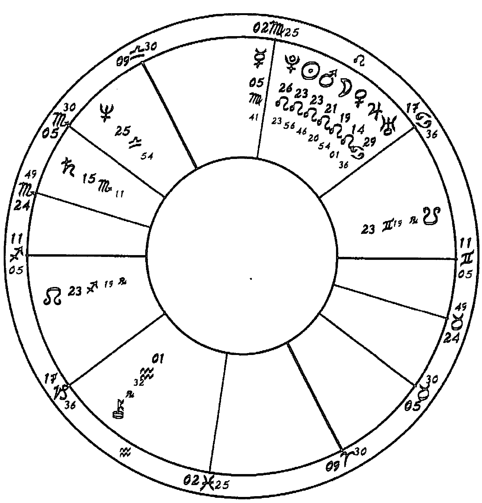

##### 第一張星盤

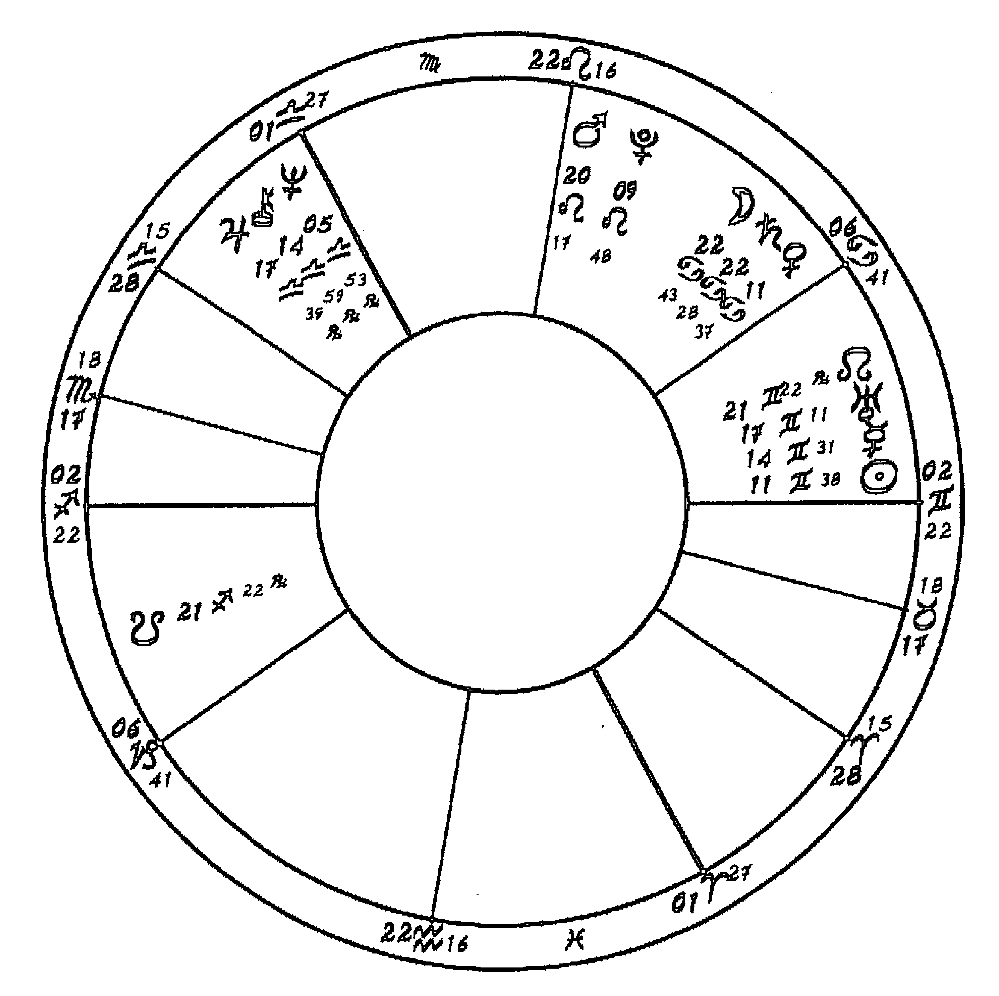

##### 第二張星盤

火星四重奏 | 470

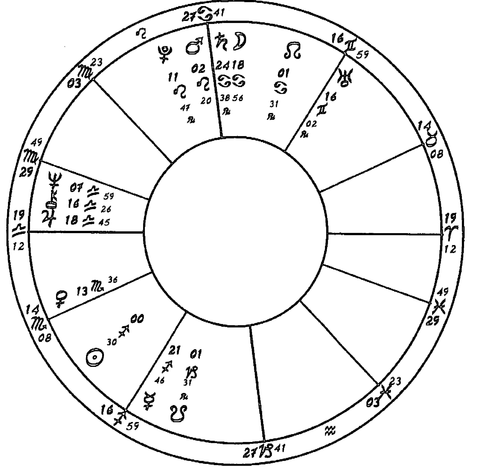

##### 第三張星盤

火星四重奏 | 472

觀眾：在這三張星盤裡，月亮的重要性都不容小覷。在其中兩張星盤，月土合相，第一張盤的月亮則是跟土星四分。

梅蘭妮：沒錯，而且各位可以從外行星看出，這些人不見得是同年代出生的，卻都是火獅子。雖然每張星盤都有極大的差異，但還是有些共通的有趣主題。第一、三張星盤的主人年紀差不多，他們都有木海凱三顆星的合相，一個在十二宮，另一個在十宮。如果我們要討論這兩個人如何使用火星，你們會怎麼說？

觀眾：他們都受到孩童時代無意識的需求所驅動，這是月土的連結。

梅蘭妮：從火星的觀點來說，這樣會產生什麼後果？

觀眾：我看到很多憤怒，也許也有暴力。他們的火星都在獅子，他們都想要贏，而且火星還跟冥王星合相。

梅蘭妮：這個嘛，在前兩張盤裡的確有些暴力，但第三張沒有。

觀眾：這三張盤的火星都很有力量，但只有第一張盤的火星跟太陽合相，也許這個人比較能夠有意識能夠投入精力？

觀眾：這裡有殺人兇手嗎？

梅蘭妮：哪一張？

觀眾：性的投射？

觀眾：第三張。

梅蘭妮：對，其實裡面有兩個人是兇手。我現在就告訴你們這些人是誰。第一張盤是舉世聞名 的療癒師馬修·曼寧¹²，第二張是連環殺手彼得·薩特克利夫¹³，第三張星盤的主人 也是殺人魔，他是丹尼斯·尼爾森¹⁴。我發現這三張盤很有趣，因為頭兩張，曼寧跟 薩特克利夫的星盤有很多類似的地方。舉例來說，雖然他們差了九歲，這是半個南北 交週期，所以他們交點的度數是差不多的，只是行星相反。他們上升星座相同，月亮 跟土星都呈現強硬相位。他們的金星跟火星都在八宮，火冥都合相，且海王星都在十 宮靠近天頂之處。太神奇了，這兩張盤會告訴我們，從星盤是沒辦法把人歸類於「好 人」或「壞人」的。當事人會不會真的這麼做，能量會如何呈現，他們會採取什麼樣 的行動，他們會因為機緣而做出哪些選擇，上述這幾點就算在看得出模式的狀況下，我們還是無從得知實際的狀況。這點因此強調了火星的重要。

有人提到性的投射，這點很有趣，因為薩特克利夫專挑妓女下手。無論他投注多少時 間與精力在這些女性身上，有多憎恨或害怕到必須殺死她們，背後的原因可能都跟他的 性能力及他對自己慾望的恐懼有關，他把這個面向的自己投射在女性身上。今年三 月的時候，薩特克利夫遭到獄友攻擊，戳瞎了他的雙眼。事發當時，火星正在處女座 逆行，四分他本命雙子座的行星與南北交。

梅蘭妮：之前其他囚犯想勒死他，但沒有成功，對不對？

觀眾：沒錯，那時差不多是他凱龍回歸的時候。這兩個事件發生的時間，他的凱龍跟火星 都分別與行運北交合相。而曼寧這個人是一個飽受爭議的治療師，他在全世界都很有名。顯然在他小時候一直到青少年早期，他的生命裡都有很多調皮搗蛋的鬼魂， 之後，他聯繫上對的人，開始這方面的訓練。世界上只有少數幾名治療師的工作經過 嚴密的科學檢驗，他就是其中一人，從他的星盤，我們可以看到流經這個人的爆炸能 量。火星服務轉化之王冥王星，某種程度來說，如果命中註定癒癥不會發生，那當事 人就不會走上真正的療癒之路。火星的能量可以是療癒的能量，因為火星是一股宇宙 成長、生命、再生的力量，就算是朝著死亡前進也一樣。

觀眾：那凱龍呢？

觀眾：那凱龍嗎？

梅蘭妮：凱龍就很有意思了，在這三張星盤裡，曼寧的凱龍相位最少。除了天凱對分這個從一九五一年到一九八九年出生的人都有的世代相位之外，凱龍就沒有其他相位了。也許這點反應出他的療癒力量能夠流暢無阻。

##### 洛基

這裡有張類似的盤，席維斯·史特龍（Sylvester Stallone）比薩特克利夫晚一個月出生，洛基電影的一到五集都是他演的。他母親是一名占星師，各位可以從他的十宮看出一點端倪。他的火星在處女座，火星在這裡常常會伴隨當事人健身，強調「健美的肉體」，就像赫菲斯托斯的熔鐵爐變成將身體打造成完美器具的地方一樣。我在許多火處女的星盤裡看過同樣的暗示，但他們不見得會做得這麼徹底。不是每個人都要把自己練得跟「宇宙先生」一樣壯，也不見得想要變成那樣，但通常火處女的人都很有健康意識，講究外表，也會留意自己的身體。這種人的確可能變成要求完美的暴君。

觀眾：他逼他身邊的女性都要整型。

梅蘭妮：這我倒是不知道。我猜他天頂附近位於天秤座的月木海凱可以解讀為「美麗之外別無選擇」，加上火處女，也許可以解讀為「成就完美，不然去整型吧」！

看看其中的連結。他的星群在天秤座，金星的領域，在他媽媽的星盤裡也得到呼應，兩人對比合盤時，媽媽十二宮裡的火、木、北交都合相他天秤座的凱龍。母親無意識的卓越顯眼是否讓他覺得受傷？而這點是否跟集體意識裡對於扭曲的男性英雄形象有關？這點帶有一些十二宮的色彩。他的海天秤合相母親的土星，也助長了集體意識夢想裡的這種形象。十二宮是我們藏放最深層渴望、希冀、夢想、原型及集體意識的地方，不是個人的，但這些東西還是在靈魂裡非常活躍。請注意，賈桂琳（Jacqueline Stallone）星盤裡沒有其他土元素，兒子除了火處女以外也一樣，難怪他能拍五集洛基電影！不過，在兩人的組合中點盤裡，卻有五顆星落入土象星座，包括位於摩羯座的凱龍，在這個位置的凱龍分別又跟他們兩人星盤裡的其他行星產生幾個重要相位，特別是他們共有的天秤座星群。組合中點盤強調了火星的主題，因為火星跟太陽合相在十宮的處女座，而十宮裡還有海王星。同時天頂在處女座，土星還在九宮接近天頂的位置，可以說是請求完美的暴君。當火星從沒有意識到自身弱點的角度出發時，當事人可能會藐視脆弱，或完全不考慮這點，這時就可能會帶出火星最可怕的一面，就跟大英雄齊格菲終於終究感到害怕，居然是他看到布琳希德熟睡的時候。脆弱、熟睡的女子就是我們的感受力、我們絕佳的敏感度，我們必須也考慮到這個層面的自己。如果我們總是想要擺脫這樣的自己，我們就會對自己與別人殘暴專橫。

##### 重新鑄劍

我發現還有兩個人的星盤也很有趣，美國歌手蒂娜·透娜¹⁵ 跟網球好手瑪蒂娜·娜拉提洛娃。她們兩位都是看起來散發著強烈意志決心生命力的女性。她們的火星都在雙魚座，娜拉提洛娃的火星還在十二宮。透娜除了她狂野且充滿動感的舞台表現及成就外，她逃離前夫伊克的婚姻暴力也是眾所皆知的事情。她嘗試透過自殺離開他，然後從零開始，從真正的火雙魚崩壞開始，重拾自信、生活與演藝生涯。她的火雙魚在七宮，她必須跟齊格菲一樣，在肢體與情感受到關係凌虐的嚴峻考驗下，重新鑄造破裂的寶劍。火星告訴我們必須進入的戰場在哪裡，我們在何處繼承到這把破碎的寶劍，或失去這把劍，但我們必須學習如何從零開始打造這把劍。大家都稱蒂娜·透娜為「迷幻藥女王」（Acid Queen），這個稱號滿適合火雙魚的。她非常個人也私密的靈性支持她驚人的影響力與復原力，我知道這點包括她相信自己是埃及女王轉世。娜拉提洛娃脫離俄國，逃去西方，儘管她在俄國已經非常有知名度。火星在十二宮，為了她自己的技術與精湛的表現，她逃去西方國家，她必須要跟集體意識、歷史、文化及共產主義及資本主義的框架對抗。

##### 不作為的抗爭

現在我們要來看兩位以不同方式運用火星的人，馬丁·路德·金恩跟莫罕達斯·甘地。甘地的星盤裡金火合相在天蠍，對分金牛座的木星與冥王星，象徵了抵抗的力量。同時，日天秤對分位於牡羊座的海王與凱龍，非暴力是出自他的靈性信仰。馬丁·路德·金恩火星在雙子，大家都記得他的語言很有力量。這兩個人都使用了不作為的力量，對抗暴力、面對不公不義的狀況，舉例來說，他們會靜坐抗議、和平遊行。為了聚焦使命之上，他們不會製造太多強烈的反應，這點的基礎是深刻的不作為靈性原則。他們面對敵人的方式是不會藉由戰爭賦予對方任何力量。他們拒絕、不配合，照他們的意思行事。這兩個人都很清楚這點，使用的方法並不是伴隨著復仇欲望的無力感。過程裡並不是完全沒有暴力，肯定會有，但這兩個人的內心都有很深刻的靈性觀點，也就是木星的連結。從這裡出發，他們以根據正義及人道之名的基礎，激發出不作為的力量。

觀眾：他們兩人都遭到槍殺，某種程度上他們是否都沒有真正擁有自己的火星？所以才會吸引暴力嗎？

梅蘭妮：這要看你所謂的「擁有自己的火星」指的是什麼。了解自己的特質並不是抵禦外在世界的保險政策，而且並不是所有事件的結果都是未解的心理問題。我們可以將這兩個人視為他們活出了自己的天命，而要完成這麼大的任務不可能少了火星這顆要角，也不是每個人都會喜歡他們。

觀眾：甘地會打老婆，金恩在家裡也不是什麼聖人。他們向外在世界宣揚的理念，自己並沒有實踐。他們兩人都有月火四分，我覺得我們不該把他們想得太美好。

觀眾：是他們的行為充滿矛盾。

梅蘭妮：啊，所以「英雄」人物不能矛盾，不然就會讓人生氣。我懂這種感覺，但因為這是根據我們自己的期待所致，老實說除了引發更多的失望與厭惡之外，實在沒有什麼其他用處，結果也許會讓我們更堅持自己「信仰」上的立場。舉例來說，「擁有沒辦法實踐的理想實在很糟糕，就連聖雄甘地都無法實踐自己的理念。」

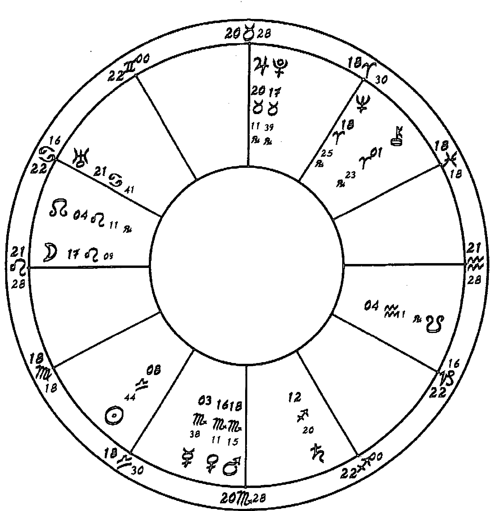

##### 莫罕達斯·甘地

一八六九年十月二日凌晨兩點二十九分出生於印度博爾本德爾。
資料來源：克萊弗。

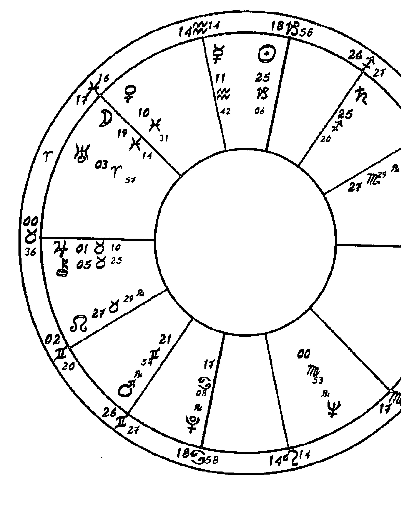

##### 馬丁·路德·金恩

一九二九年一月十五日早上十一點二十一分 出生於美國喬治亞州亞特蘭大。¹⁶

##### 高貴的野蠻人

這裡有另外一組星盤，很不一樣的星盤。第一張是約翰尼·維斯穆勒（Johnny Weissmuller），他是奧運游泳冠軍。他唯一的水象行星是海巨蟹，的確是很原始的大海！他也是第一個扮演泰山的人。阿諾·史瓦辛格（Arnold Schwarzenegger）則是冠軍健身運動員，他是宇宙先生（火天合相）、世界先生，也是奧林匹亞先生（火木一百五十度）。後來他參與電影的演出，最知名的應該是《王者之劍》（Conan the Barbarian）跟《魔鬼終結者》（The Terminator），英雄跟破壞者都讓他演完了。反觀維斯穆勒，擁有雙子星群，也扮演了上山下海的角色。他過世的時候，火冥行運合相在天蠍座頭幾度，而天射手對分他本命的日火合相。

這兩個人的火星都在雙子，我覺得很有趣，因為這個位置的火星跟泰山或終結者並沒有直接的關係。不過，在這兩張星盤裡，火星都跟外行星有相位。維斯穆勒的火星跟冥王星合相，史瓦辛格的火星則是跟天王星合相。而且，請留意史瓦辛格的月摩羯是他土象星座的唯一行星，還在六宮，這點呼應之前討論的地月連結及火星之間的關係。我在想這裡是不是有元素上的補償心態，壯大的二頭肌其實是為了掩飾寂寞脆弱土象單一行星的脆弱，因為摩羯座是月亮弱勢的位置。泰山的形象演出了十五、十六世紀，歐洲社會所謂「高貴的野蠻人」。這個概念展示出當時的人透過投射的面紗，覺得原始又浪漫的意象。看到一個友善的猿人，扮演起泰山的角色，似乎撫平了每個人對活在心智暗角自身獸性、野蠻潛質的原始恐懼。泰山似乎把這份恐懼描繪成安全且可愛的東西，洗去這些獸性，這種「火星崇拜」的形式也很有趣。

##### 火星逆行

討論火星逆行的時候，我們也要觀察火星跟太陽是否已經對分。只要查閱星曆表，找出日火最近一次的對分，而這次的對分在我們要討論的星盤而言是已經過去還是即將發生。在火星逆行的日子裡，火星只會橫跨黃道小小一段，差不多只有十五到十八度的範圍而已，包括了對分太陽的位置。在這段時間裡，火星在天上看起來會很美，就跟太陽一樣，但是對分意謂著在地球「底下」。相反地，日火合相的時候，火星永遠都是順行、不可見的，因為它跟太陽太近了。

如果有人是在太陽朝著逆行的火星合相的時候，或說太陽即將跟火星星生入相位時出生，人生的主要重點在於完成某件事，也許是內在「任務」或掙扎，所以這個人的能量裡，常常會有孤獨內向的特質。有時這種能量也會爆發成暴力行為。火星的生命力可能會牽扯進家族裡的衝突，或者必須在肢體或心靈的艱苦下作戰。當事人可能會捲入別人的戰爭，或覺得環境的衝突無所不在。

---
¹² 原著註：馬修·曼寧（Matthew Manning），一九五五年八月十七日下午四點十五分出生於英國雷德魯斯。資料來源：克萊弗。
¹³ 原著註：彼得·薩特克利夫（Peter Sutcliffe），一九四六年六月二日晚上八點三十分出生於英國彬彬萊。資料來源：克萊弗。
¹⁴ 原著註：丹尼斯·尼爾森（Dennis Nilsen），一九四五年十一月二十三日凌晨四點整出生於蘇格蘭弗雷澤堡。資料來源：克萊弗。
¹⁵ 原書註：蒂娜·透娜（Tina Turner），一九三九年十一月二十六日晚上十點十分出生於美國田納西州納特布希。資料來源：洛頓。
¹⁶ 原書註：金恩的出生時間眾說紛紜，梅蘭妮使用的是吉姆·路易斯（Jim Lewis）以ACG（Astro*Carto*Graphy）校正過的時間。維斯穆勒的出生資料最初由其母親提供，聲稱他於一九〇四年六月二日下午六點半出生於美國賓州溫博。後來占星師賽·史格菲爾德 (Sy Schofield) 根據祖譜及其他資料來源查證，其正確出生時間為一九〇四年六月二日下午六點半出生於美國賓州溫博。資料來源：洛頓。
阿諾·史瓦辛格：一九七四年七月三十日上午四點十分出生於奧地利格拉茲。資料來源：洛頓。

突加在他們身上。而外人可能無從得知，因為火星逆行的人通常都會緊守自己的情緒。與其外爆，他們容易內爆，與其表達，他們容易壓抑。正面的表現是當事人可以大量支持、鼓勵其他人成為最好的自己，讓他們保護、追隨、貢獻、服務、對某人忠心，或成為保鏢之類的角色。如果星盤裡的火星逆行發生在火星還沒有跟太陽對分的時候，意味著當事人是在逆行週期的早期出生，這些人也許這輩子也會帶有這種能量的色彩。火星逆行長達六十到八十天，在這段逆行的時間裡，火星的週期似乎會以平均的方式產生盈虧。學習力量的使用及誤用會是火星逆行的主題，一開始的感受可能會是無力的，所以意志與進取心的特性可能需要建構在時間、經驗及反省之上。不是很好取得，但假以時日，可以經過微調、紀律變得更有力量。另一方面，如果是在日火對分之後才出生，這個人可能會比較有力量，因為當事人比較不會受內化的影響而動彈不得。當事人可能會感受到正面的約束，而不是負面的挫敗感，且樂意替他人服務，而不是覺得自己受到壓迫。同時也要檢查二次推運裡的火星是否恢復順行。恢復順行的時間點通常都是當事人生命的巨大轉捩點，他們可能會放下他們替別人作戰或自己無望戰爭的武器，或者脫離長年壓抑他們意志的集體或先人的議題。這個時候，當事人也許會忽然間明白該如何不要被別人的能量牽著鼻子走，或學會拒絕，且明白在衝突爆發時，該如何運用創意來解決。對某些人來說，這點非常困難，但也可能振奮人心、賦予力量，因為當事人的生命終於可以往前走了。一次推運火星由逆行轉向順行的前一、兩年可能會特別辛苦，因為受困的能量終於要前進了，而衝突也就此產生。這就好像憤怒的感覺激怒了火星，卻不曉得敵人是誰或戰場在哪裡一樣。沒有意識到這一點，我們可能會墮落到戰鬥，卻沒有能夠容納這股能量的使命或目標。從我看過的例子裡，經過一段時間的挑戰與動盪之後，這種能量通常都能安頓下來，形成再生的過程，且與火星能量產生新的連結，舊的事情讓它過去，充滿信心著手新的計畫、應徵新的工作、開始新的關係。通常這就是推運火星恢復順行後，回到本命盤火星的度數與分數時，會發生的狀況。這時可以啟動火星的力量，也是一個好機會，能夠重拾我們覺得自己拋下、沒做完的事情。

> 觀眾：如果火星本來是順行的，在二次推運時逆行又會怎麼發展？
> 
> 梅蘭妮：我觀察到的是，當事人的生命裡有時會有一連串的事件，他們沒辦法處理，導致能量淤積，通常都是因為憤怒或痛苦無法宣洩。火星逆行之後，也許會點出一段內爆的時期，之後，這個人會學習用新的方式處理這股能量。因為能量轉內，也許需要時間重新找到向外的方法。憂鬱的主題可能跟火星有關。如果我們不同層面的自然驅力遭到困阻，自然驅力指的是地月層面的議題，生氣的感覺會積壓起來，如果壓抑太過就會造成憂鬱。如果一個人對於安全感、容身或沒有辦法自在行動、表達自己的需求遭到壓抑，這個人也會憂鬱。小時候的需求只能仰賴其他人來完成，當這些遭到剝奪的模式浮上檯面的時候，當事人可能會傾向責怪他人。彷彿是火星符號的箭頭往往圈圈內部射，而找不到出口出去。這肯定是某人的錯，通常是因為媽媽的緣故。看似遭到壓抑的火星可能反映出當事人有憂鬱的可能，但憂鬱不只跟壓抑的怒火有關。憂鬱的經驗跟解決方式有許多面向，我們不能一言以蔽之。

我們來重新想想火星位在地球跟木星之間，我想起心理綜合學說的「潛抑崇高」（Repression of the sublime）。在這個過程裡，我們會輕視、壓抑自己，以與理念、崇高的道德、超個人衝動產生連結。我們會否定自身靈性生命的重要性、否定我們對於意義的需求，以及否定自己希望能夠擴張意識，達到某個更自由、更廣闊的高度，這種否定的力量會反彈回我們身上。之前托勒密對於火星的敘述——嘲弄別人之人、藐視他人之人——似乎可以歸納在這個族群裡。面對那些象徵集體意識裡物質主義及憤世嫉俗的惡龍，也許就是擁抱內在崇高旅程的一部分，因此也成為這種憂鬱問題的解方。我們解讀或感覺為「憤怒」的情緒也許只是我們核心生命力被迫表達的產物，當自我拒絕擁抱這股力量，將其視為惡意的能量，這緊抓不放與僵化固執就使它站在敵人的位置，儘管真正的敵人不是火星。

#### 內行星與火星的相位

火星與任何內行星的相位都會賦予該行星生命力與能量，有時也會帶出火星本身野蠻、好勝、易怒的元素，而這樣的面向有時可能會侵害內行星的能量，這點端看相位的本質。

#### 太陽與火星的相位

日火相位會感覺需要較量。這個組合需要挑戰，需要感受環境的拉扯，喜歡贏。如果這層能量不通暢，我們也許就會看到一顆激進的火星，吃了秤砣鐵了心要掌大權。正面的發展是這顆火星會專注於表達卓越這件事情上頭。如果我們把太陽當成父親，這組合相也能夠反應出與父親之間的衝突，想要從暴力父親所造成的傷痛中走出來，前往父子關係愛關係裡正面的競爭及夥伴關係。無論父親是否還在，當事人都該考慮一下父親象徵的力量。如果日火合相的人因為任何原因失去父親或父親不在身邊，要這股能量以有建設性的方式發揮就有困難，也許會讓當事人延長「叛逆青少年」階段，結果就是埋藏了更多憤怒與哀傷。火星跟任何內行星接觸都可能帶有自私的特質。火星會增加表達、征服、與某物搏鬥的意志。火星也跟「戰或逃」反應有關，而「作戰」的反應通常在火星與個人行星產生相位時會比較明顯。如同提到火星時一定會提的問題，只是問題不是「你在對抗什麼」而是「你為何而戰」。把火星想成執行者，自我的代理人，自我則是太陽。我本來要說「自我意志的執行人」，但我又想了一下：「等等，這個意象不太對。」因為意志跟遺囑是同一個字（will），遺囑的執行人指的是在你死後替你完成心願的人，火星會比較希望在活著的時候完成意志！擁有日火相位的人也許會發現火星想要成為宇宙的中心，但火星必須學習那是太陽的位置。

#### 月亮與火星的相位

月火相位意味著情緒反應很重要。如果朝這個方向發展，當事人可能會因為自己的情緒與激進的主觀性而專橫霸道。月亮跟連結的議題、滋養、安全感有關。如果我們這些未滿足的需求加上火星的助燃，很可能會錯置情緒的力量，想要透過恫嚇，讓其他人明白真的跟「對」的狀況是什麼。我聽過一位治療師形容某種狀況為「情緒基本教義派」，這不是指基本教義分子很情緒化，而是這種人會以很直接的方式面對情緒，他們會說：「我的感覺是真的，所以我是對的，我必須說服你，我的情緒實相就是真實，完全的真實，絕無半句虛假。如果你不同意，我會反抗到你同意為止。」這是月火相位的其中一種表現方式。另一個版本是用正面的方式，以自己的感覺天性與基本需求之名，表達與主張自己的欲望與能力。我們在這裡並不期待輕蔑或依照激進的態度來行事，而是我們認同地月層次存在的重要性。事關有機生命的節奏，而正面的月火連結則會尋求榮耀且保護這個層面。擁有月火相位的人通常都有很強烈的人父、人母本能，且很會扮演滋養及保護的角色。

觀眾：就算是有壓力的相位也一樣？

梅蘭妮：告訴星盤上象徵某些能量的人該怎麼做是行不通的，我們一定要考慮到當事人整體的狀況。不過，月火之間有壓力相位，要使用這股能量可能會比較困難。也許當事人會覺得焦慮，因為他把火星投射出去，因此覺得無力、脆弱。這樣的模式可能是因為未滿足需求所帶來的憤怒、害怕充滿敵意的母親或將外在環境視為威脅等經驗導致。這種童年時代與母親之間的殘影可能會影響當事人，長大之後，持續為了撫平母親的憤怒而努力想要「做對的事情」。或者，這也許是一個人自己憤怒的投射狀況。

觀眾：如果投射出去的是月亮呢？會發生這種情形嗎？

#### 水星與火星的相位

梅蘭妮：會，那我們就會想要努力（火星）成為母親，保護其他人，而這些人帶著我們脆弱與安全感需求（月亮）的投射。如果女性擁有這組相位，她可能完全無視自己的孩子，因為這位母親忙著處理自己內在的靈魂世界（月亮），這個部分投射出去了，而她又沒辦法仔細看到外在的全貌。月火相位也像是你想要從子宮裡掙扎出來。如果月亮投射出去，那整個世界就會跟封閉的子宮一樣，不讓你出去，或者某個扮演母親角色的人會重重限制住你。在月火發展到比較成熟的狀況時，這組相位可以充滿動能，為了弱小採取行動、保護對方。處理公眾事務，特別是福利、人權、在公開場合奮鬥的人，星盤裡都很容易有這組相位。

水火的接觸可能會引發許多內心掙扎。這些人可能不斷在心裡與自己理論，有時想法會不斷「跳針」，一直在想同一件事情，可以說是到了飽受折磨的境界。他們忘不了別人說的話。他們會因為別人說的某句話而私底下密謀報復，或者一直思考他們當下沒說出口，卻無法忘懷的尖銳回應。他們在心裡會一直想這些事情。雖然沒有什麼內容，卻會以很不舒服的方式加速神經系統的運轉。這個相位也強調溝通。水火有相位的人可能會以理論、據理力爭這種高度緊張的溝通方式爭執，他們是總說「好，但是……」的人。水火有相位的人喜歡尋找理論之中的缺陷，常常尋找機會跟人吵架。他們常常說自己只是喜歡「討論」，但跟他們交手不是什麼舒服的事情，因為他們不喜歡輸的感覺。水火相位的另一種發展方式是，這些人可能將富於創造的心智活動用言語表達出來，進而作為一種逃避機制。還記得「戰或逃」嗎？在此上演的是語言的戰爭，或心理戰。水火相位可能發展出對於資訊的渴求，或者沒辦法不說話，也許還是資訊的消費者。消費主義跟木星的連結顯然就是過度膨脹的感覺，但我這裡想到的是獵取的本能，這種本能我會覺得跟火星有關。水火相位的當事人可能腦筋動得很快，幽默感古怪又深入，對人與事又觀察透徹且銳利。要他們學習「放空腦袋」或休息可不容易，因為他們喜歡挑戰自己的心智。對他們來說，放鬆的方式可能是跟填字遊戲搏鬥或學習新的電腦技能，而不是在壁爐旁邊打瞌睡。我在看今天的星盤時就短暫提過這個組合。金火合相會依照宮位與星座強調星盤的重點領域。當事人在這個領域會有絕佳的表達力與執行力，因為他們的自我價值與個人價值觀很容易能夠轉化成行動，除非他們遇到阻礙，例如跟土星這種行星產生強硬相位，然後，我們就會看到缺乏自信的過度補償，也許當事人會瘋狂地行動或想要有所成就，他們也許必須一一解決困難，這是土星的範疇。這組合相的確會有強迫的性格，可能會在克服困難的掙扎過程中顯現。這組相位正面的發展是提供能量、意志與一致的焦點，協助當事人走在正軌上。如果我們借用煉金術的詞彙來形容金火合相，就是合體（conjunction）——結合兩個端點。這點很有意思，因為象徵極具創造力的金火並不是父母雙方的能量。星盤裡所有男性或女性角色的象徵都可能受到我們與父母之間經驗的影響，最明顯的就是日月這組能量。

不過，金火跟一個人的性慾有直接的關連，也跟青春期、「離家」、長成具有創造力及生殖力的自己有關。這樣想，這組合相象徵的是靈魂創造力量巔峰的時期。性慾跟愛慾流動，因此結合。同時也意味著戲劇性、混亂及激烈事件的莽撞行為。阿芙羅黛蒂的其中一個名號是潘德摩斯（Pandemos），這個字跟大混亂（pandemonium）有關。在金星與火星的行運裡，這組合相象徵著走進關係、新開始、以愛與創造之名所冒險的時間點。金星與火星之間的相位週期，從合相、四分、對分、回到合相這樣的循環可以視為求偶之舞，讓我們曉得，這兩股能量的接觸能夠如此和諧，且知道是誰在領舞。一個人出生時，能不能在夜空裡看到金星與火星，這點也能強調金火之間的和諧與關係。

#### 火星與社會行星

我們可以這樣想，當我們要與廣闊的外在社會及其結構連結時，木星與土星這兩顆行星的原則就變得格外重要，還有支持這個社會的道德、信念及倫理。占星學的通則是，行星軌道愈大或在黃道繞行的速度愈慢，其過程就會愈深層、愈需要時間。集體與超個人的主題與個人的故事交織在一起，結果就是畫在更大張的畫布上。我有時會用電壓的伏特數來思考行星，雖然有時走得快的行星才是觸發過程的媒介，但整體事件的意義與衝擊通常都是以一起出現、行動速度較慢的行星為主。

##### 火星與木星的相位

當火星與木星產生相位，有時很難分辨誰是老大，因為它們都會想著做主。火木相位可能意味著宏觀的視景、行動的承諾以及願意為了自己的原則、更崇高的理念或志向面對戰鬥。不過，當木星的擴張受到火星的刺激時，可能也會帶來對於權力、奢華、主張及知識的貪婪。然後，問題就出現了：『木星到底包含了哪些讓火星能夠致命的理想與原則？』因為少了核心太陽的影響，或沒有金星價值的適度聚焦，這樣的組合可能會拖著當事人到處跑。有時，當事人會覺得很難駕馭這股力量，因為我們會太講究『我是對的』這件事，且不會多想，一頭熱就栽進行動裡。所以我們有時會活在衝動的懊悔之中，因為自己的急率而自食惡果。這個組合有時也會有傲慢的狀況產生。這兩顆行星的對話可能是火星很狂熱，為了『信念』之名成了聖戰士，火星想要贏的熱情與信仰連結，木星想要擴張的能力則成了最適合的教條與不變的信念。另一方面，有時產生的結果是一種實質上限制了意識擴張的『正直性』，排外而非廣納百川。另一方面，火星天生的衝動、直率、迅速會被木星摩羯修練長期目標策略的野心與慾望壓下來。如果這個目標太遙遠，火牡羊就會覺得沒了士氣，結果就是積壓的憤怒，甚至產生憂鬱的狀況。

今天的火星跟土星形成三分相。土星守護的摩羯座是火星強勢的位置，我們之前討論過了，火土之間有赫菲斯托斯的特質，意味有能力忠誠、堅忍、發展技能，也能夠駕馭困難的狀況。負面的發展是固執、怨恨、想要復仇的慾望，以及不接受「不」這個答案。火星和土星之間的困難相位有時會發展出特定的暴力行為，因為壓抑或積悶了很多能量。如同赫菲斯托斯的形象，他有一個帶火的熔爐，可以熔化金屬，這是轉化的載具，如同煉金術所說的一樣，這裡的做工需要時間、高壓與高溫。火土相位經常意味當事人生命裡有些領域會像這種熔爐。還記得齊格菲的故事吧？他們從父親那裡繼承到一把破裂的劍，要把劍鑄回去可沒那麼簡單，引用莎士比亞的話就是「命運無情的折磨」。面對客戶諮商的時候，這個形象倒是挺好用的，因為火土相位的當事人對於別人的批評通常都會很敏感，不然就是對自己要求很高。火土連結，特別是困難相位，通常都有一種無力的感覺。這種無力感累積出許多挫敗與沮喪，有時憤怒可能會忽然以暴怒或暴力的形式出現。就算怒氣不爆發，感覺壓力底下還是有些許動作，且總會遇到巨大的困難。在火土的熔爐裡需要時間，還要投注血汗甚至淚水。選擇（火星）慢慢來，且小心仔細（土星）有時也有幫助。如果一張星盤裡充滿很多速度快的能量，好比說風象特質強或天王星戲分很重，那心智意圖的參與就更加重要。經常聽到大家稱土星為「時間老人」（Father Time），如果火星跟土星產生困難相位，這種速度的概念就很容易協助當事人學習如何妥善運用這兩股能量。

#### 火星與外行星的相位

當火星與外行星，也就是天王星、海王星、冥王星產生相位的時候，火星會受到逼迫，或甚至遭到超個人或集體意識的衝動壓制。這樣的狀況有時會讓火星的個人層面感到無助，或者我們就可以看到火星出現危險的強迫或過度彰顯的情形。我們的意志要麼就是遭到壓迫，要麼就是屈服在我們集體宿命需求及超個人經驗之下，因此會憤怒，還會替某些大過自己的事物服務。某些類型的火星會甘願於此。行運上火星與三王星的相位也非常有趣，因為這種時期會要求我們的火星在能量上產生轉變。因此會啟動我們地月系統的所有殘影，這我之前提過了。我們也許將面對自己童年時期的模式，會回歸火星功能較為原始的一面。憤怒的兩歲兒或叛逆的青少年可能會再現，因為這些選項乍看之下及深層本質裡都是讓我們的生命變得較為正面的方法。這些可能是不穩定且挑戰的能量，無論是在行運或是本命盤裡都有這種傾向。跟外行星產生對話的火星必須接受自己成為僕人或副手的命運。如果你還是忙著想要成為宇宙的中心，當外行星運踩進你的火星電壓之中時，你就會變成『超級巨嬰』。當行運的能量流進我們的系統裡時，這主能量會重新啟動阻塞的發展階段。如果你的火星在你兩歲時是消失的，而你從未停止憎恨進入你生命裡的手足，那麼，當你的火星跟外行星產生相位的時候，所有手足間的競爭意識、叛逆及憎恨會通通冒出來。這段時間也是讓我們透過放手、繼續前進而成熟、成長的機會。我記得看過一張星盤，案主經歷過一場恐怖的車禍，兩人因此喪命。雖然車禍責任不在這位女性身上，但她害怕到不敢再開車（火星），同時也發展出跟火星有關的各種不同的恐懼症與徵狀。她有時會忽然回想起車禍的場景及回憶、身上起疹、冒汗、顫抖。有一次，她甚至真的在眼前看到紅色閃過去。她有時會因此怕到不敢動。火星跟行動、生命力有關。曉得她的身體還在想辦法排除車禍經驗所帶來的驚嚇，因此讓她沒辦法停止對自己的批判，後來她使用顱顴骨治療法（cranial osteopathy）展開了自我療癒之路。

##### 火星與天王星的相位

跟天王星產生相位的火星可能會覺得『有必要』成為集體改變的媒介。集體理念及信念相當重要，可能還帶有強烈的政治概念。這顆火星可能具有革命精神，需要能量的出口。靈活性可能會成為這組相位的問題，許多改變的願景垮台是因為這組相位的衝動行為、莽撞行動及此刻必須行動所致，他們比較不會按捺、計畫。如果天底下有什麼規矩，那火天能量就是要來打破規矩的。這點可以擴大到社會改革這種大範圍的高尚理想，但表現方式也可能是一個人本質上就無法守時、守約，或乖乖跟著規矩前進。就算只是跟這種人交談都可能讓我們覺得緊張，因為他們的思緒會跳來跳去，還很愛打斷別人！限制必須強加，而他們看起來就像是永遠的不速之客，但他們並沒有惡意的企圖。他們並不會說：「晚餐時，我要遲到半小時，故意氣死那個誰。」他們只會自願自地發展，且希望其他人配合。同樣的意涵，加上一點成熟的淬鍊，天王星的洞見與啟發便會出現，而火星就會變得非常有力量，能夠發展出透徹的見解、意圖及心智的力量。天土星最終會要求火星提升運作的層次，且專注於意圖及意願，而非聚焦在反應上頭。因此，火天相位會變得跟魔術師一樣，也就是擁有絕佳想法，也有足夠的焦點能夠看透一切，讓事情產生運作。火天本來就有讓事情運作的能力，但可能是在無意識或強迫的狀態下，在這種人身邊，東西彷彿都會壞掉，電燈保險絲燒掉或電氣用品故障之類的。我相信大家都遇過這種狀況。我用的錄音機通常都很可靠，但我回想起來，無論是行運、跟我諮商對象的本命盤或我自己的星盤裡出現火天組合，我的錄音機就會莫名故障。如果你們看到客戶正值火星行運，他們可能會經歷類似「電線短路」的狀況，可能會失眠、肌肉痙攣或抖動。他們似乎會覺得有太多能量流經身體，就跟不是設計來承受過高電壓的電線一樣。這股能量可能很難引導至建設性的發展，而這些人可能會變得愛吵架、煩躁或出小意外。如果當事人累積了許多憤怒，這組行運會協助宣洩。這組相位正面的發展是協助當事人成就平常不可能達到的目標。事情變化快速、發展迅速，雖然事後可能需要回過頭來整理細節，但感覺還是很振奮人心的。某些微調能量的活動可能有幫助，譬如說瑜珈或冥想，這些活動能夠以漸進的方式宣洩能量，還能提升洞見。

##### 火星與海王星的相位

火海相位是需要有東西崇拜或崇高使命的熱心之士。如果這股力量誤植，可能會變成高度成癮，顯示出一個人帶有成為其他人或某種使命的烈士。要妥善發揮火海功能必須將能量投注於某件事情上頭，但鑑別力卻是這種人的挑戰，因為火海相位象徵了也許我們的意圖會騙過我們，且相信自己的優點，及他人的缺點。當然，狀況可能相反過來，這種人可能會有致命的自我詆毀特質。具有火海相位的人可能沒辦法直截了當行事、堅守立場、確立自我。他們可能是經典的「牆頭草」或「受氣包」，因而累積許多怒氣，結果卻還是無法直接表達。

對這些人來說，在沒有受到操控的狀況下，得到自己想要的東西，常常會是他們的挑戰，因為這顆火星通常不會覺得充滿自信及勇氣。在占星學裡最好的火海特質是那些負責減緩痛苦## 火星與冥王星的相位

這裡的火星必須要能跪在冥王星面前，成為轉化的媒介，無論火星是否願意，無論轉化的過程是正面或負面的。回想一下我今天跟各位介紹的頭三張星盤，我們看到了馬修．曼寧這位很有力量的治療師，他是強力轉化的渠道，協助其他人恢復，且教導大家如何接近自己的療癒能力。然後我們又從兩位連環殺人魔彼得．薩特克利夫及丹尼斯．尼爾森身上看到火冥相位的另一種展現方式。我們可以推測，他們是將自身陽痿的痛苦以傷害他人的方式展現出來，如果各位去讀他們的傳記，這點是會得到呼應的。當然這不是他們犯罪的藉口，而是火冥力量極端的展現，且能因此明白這股力量負面的凝結模式。我們沒辦法完全解釋同一組相位在兩個人星盤上的不同表現，因為占星是生活的藝術，不是老生常談的公式。

我會把懲罰與判斷這兩個主題歸納在火冥相位裡。在卡巴拉（Kabbalah）裡，火星跟Gevurah這個質點有關，帶有「判斷」的意思。我可以從這個角度理解，這個力量能夠協助我們站穩陣腳，對那些有違我們「判斷能力」的選項說不。這股能量朝負面發展就會成為譴責，或詆毀某人，因為在我們的認知裡，我們必須成為「正確」的一方。Gevurah跟判斷、辨識有關，可以說是更細微的火星能量，如同我們今天已經探討過好幾次的寶劍意象。雖然我們可能約束自己較為激進的狀態，但這股能量還是可以轉化成信仰及態度，以類似判斷的形式呈現，或者暗藏著，以無聲的方式溝通。還記得火星是「嘲弄別人之人、藐視他人之人」嗎？我們在這裡看到另一種譴責，批判某人「不夠好」。這種狀況可能非常幽微，因為火星是我們必須實踐分別與差異之處。不過，負面的火星會自然將這點視為作戰的使命，或者要麼就是輕視他人，或覺得別人輕視他。火星的戰爭也跟經歷到不同及分別，以及跨越這種鴻溝時的狀態有關。因此，金星就很重要了，在這種原則下，必須欣賞且讚頌差異，而不是受到威脅。火冥相位會有遭到殲滅的恐懼，而為了補償這種恐懼，他們也許會成為威脅。事情並不只是「不是敵人就是朋友」這麼簡單，問題更加深層，而是一種「非我族類」都會對抗我的心態。因此會發展出長期備戰的狀態。火冥相位通常都有很好的生存本能，常常是第一個嗅出問題正在醞釀的人。他們也要學習放手，不要「想辦法解決」問題，且接受困難就是會發生，而循環的創造與終結都是以同樣的毀滅及瓦解形式呈現。面對戰爭無法得勝，這種狀況常常發生在火冥相位當事人小時候，他們的反應各有不同，從暴怒到明智接受都有可能。擁有火冥相位的人可能有耽溺的特質，容易吸引到「困難」的狀態、擁有秘密的人、有力的關係或大筆財富。他們常在困難裡展現出無比的力量，也許需要學習的是實際狀況並沒有要他們逞英雄。他們習慣將生命視為巨大的衝突，會浪費精力想要處理無法解決的問題。

我個人相信冥王星及其過程象徵了前往靈性生命的道路。我們超越了原則、想法、一廂情願及夢想，抵達更深層的境界。從這個角度出發，火冥相關的障礙可以視為當我們的靈性開始發展時，一路上可能會遇到的挫敗及卡住的癥結。能量會在此變得冷酷麻木，因個人意志的使用，而變得具有毀滅性，或者，會深陷於徹底黑暗、毫無希望的世界觀之中。火冥相位會要求我們淨化自己的意志、方向，且會帶來相關練習機會的生命經驗。火冥會揭示他者看不見的考驗與試煉，需要當事人投注大量時間與精力，因為這是他們靈魂的要求。在希臘神話裡，黑帝斯（Hades）就是普路托，他只要出現在地面上，就會戴上一枚隱身頭盔。同理，擁有火冥相位的人都可能經歷環境裡那種不可言說的侵犯，而「隱形的戰爭」永遠都在這些人心底上演。

這組相位的確會以各種方式挑戰我們成為戰士，而「看不見」的層次則會喚起我們內心的呼應。找到自己潛在毀滅力量的「隱形叢林」，且不要卡在覺得自己必須負責、一切都是自己的錯、必須「修補」好眼前的狀況等這類心態，這對於很多擁有這組相位的人來說都是件挑戰。火冥相位在「柔和」及「強硬」相位的差異非常明顯。柔和相位會有能力流動成為行動，因為阻力較少，累積成憤怒及挫敗的張力較為舒緩。強硬相位通常會讓當事人覺得無力，他們為了走進外在世界，必須克服內心的黑暗、無能及徒勞無功。如此一來，壓力會讓人喘不過氣來，如同害怕這些狀態所帶來的補償心態一樣。

##### 火星習題

這裡有份問卷，就叫做「火星習題」，習題這個詞也有運動的意思，我不會要求大家在接下來的時間一起做有氧啦。我忽然想到一個有趣的問題，那就是「何種運動適合哪種火星？」各位可以思考一下，也許你們也會想到其他問題。

舉例來說，火雙魚會喜歡游泳還是會怕水？各位可以思考一下，也許你們也會想到其他問題。

為了要符合今天的金火在十二宮的合相，我想大家一開始先各自以內在冥想的方式完成這份問卷。上頭有很多問題，有些比較尷尬，但都是設計用來刺激各位探索內在用的。這不是考試，因此沒有正確答案，我會建議各位先簡單思考一下自己的火星。請留意你們自己的內在判斷。如果有幫助，才回到問卷的問題上。不然就依照我們之前討論過的內容思考，一邊想一邊寫，注意你在過程裡有些什麼念頭與感覺。最後才拿出星盤，看看之間的連結是什麼。不要反過來，先看你的星盤，然後說：「我的火星在哪裡哪裡，這意味著什麼？」先問問你自己，你對自己火星功能的理解有多深，然後再才去核對星盤，最後，我會請各位以火星的星座分成小。如果你想到自己繼續探索也沒關係，不曉得今天會不會十二個星座都湊齊了？如果有少，我們就讓大家集思廣益。各位有三十分鐘可以作答，然後我們再回來。

##### 問題

- 你對這些火星的主題有什麼感覺？（例如：覺得興奮、不舒服、生氣？）
- 你與自己火星的關係如何？
- 你用何種方式前進、確立、堅守立場、主導場面、掌控大局？你會進行上述這些舉動嗎？如果會，請問你是透過直接的選擇、強制還是在環境的推波助瀾下進行呢？
- 如果你不從事上述行為，被阻塞的憤怒感覺如何？你會生悶氣嗎？鬧脾氣？還是操控其他人？
- 你如何掩飾這種情緒？你會大吃、大喝、一睡不醒，或其他成癮行為嗎？你會常哭嗎？或者誤植能量到其他情緒之中？
- 當你覺得承受不了的時候，你會如何宣泄？透過運動、跑步這種身體活動？還是用任務與抱負把自己逼到極限？
- 你是怎麼生氣的呢？怒氣是直接、一下就過去，還是慢慢累積最後爆發？
- 這種狀況大概是幾歲發生的？
- 你覺得自己受到什麼樣的障礙與困難？例如：悶悶不樂的青少年、鬧脾氣的兩歲兒，還是看什麼都不順眼的固執老人家？
- 想想你的火星最糟糕、最無情的一面。
- 你的火星最棒、最高貴的特質是什麼？
- 你是哪一種戰士？
- 你的武器有哪些？藉口、霸凌、挑撥離間、自以為是？正面的特質，如勇氣、原則、毅力、生命力、決心。
- 你替誰效命？
- 你有願意從事什麼活動的經驗嗎？
- 你願意讓火星發展出最好的一面嗎？（請謹慎回答這個問題）
- 你記得自己在生命裡樂意做什麼事情嗎？感覺如何？

###### 十二星座的火星展現

大家討論得好認真，不少能量激起，我實在不想打斷各位進行下個階段，但時間不等人，我們必須開始下一階段的討論了。一九九七年四、五月的《大占星師》（The Mountain Astrologer）雜誌刊登了一篇由丹尼爾．賈馬利歐（Daniel Giamario）所寫的文章，他列出了十二星座的火星，及各種火星的原型，聚焦在正面的陽性形象上。為了記錄各位的貢獻，我把一些文字寫在白板上。在填寫問卷的時候，希望各位對自己的火星都有更立體的了解，且曉得這顆火星較為尊貴及卑劣的展現方式。我們今天應該會聽到火星各種不同的調性與特質。有沒有哪個星座沒有人？我猜我們進行下去就會知道了。

##### 火星在牡羊

觀眾：我們最好從牡羊座開始，如果不讓他們先講，我可能會惹麻煩。各位火牡羊有什麼想分享的嗎？

梅蘭妮：要什麼？

觀眾：我們的共識是『我們現在就要』。

梅蘭妮：什麼都要，但必須是現在，無論要到底是什麼。我們也提到火牡羊在英國生活很辛苦，因為其他人在你身邊會覺得害怕、焦慮。

觀眾：這裡有些文化議題，對不對？這對火牡羊來說滿常見的，畢竟火牡羊的能量不是很會社交。牡羊座是很原始的能量，純粹的衝動，排行第一的星座，春分點。丹尼爾．馬利歐是這樣說的：「粗壯的個人主義者、愛打架、隨性、倔強、拿著玩具的自我中心男孩、喜歡競爭的戰士」，各位還有什麼要補充的？

梅蘭妮：你需要有人可以站在你面前，當你要吵架、起衝突的時候，這個人不能兩腳一軟？

##### 火星在金牛

觀眾：對！我需要一點規律的磨擦，但我對真正的重大衝突沒有興趣。大衝突太花精神了。看到別人惹上麻煩，我就想要保護他們，我很容易捲進替別人出頭的爭執之中。我知道我不是每次都能幫得上忙，但我還是會介入。

梅蘭妮：那火金牛呢？

觀眾：可以再給我們半個小時嗎？我們有四個人，我們才聊到我們必須花點時間才能進入狀況。我們進行到一半之後，感覺才比較流暢，然後就不能自拔了！

梅蘭妮：對火金牛而言，要他們的火星活躍起來，的確存在某種程度的惰性或阻力需要克服。他們可能自動自發，但也可能變成一種強迫的行為。我們想想大公牛，健壯、高大。牛休息的時候，代表的是穩定的本質、和平，以及制止的力量。當牛生氣、掌控一切的時候，卻變得很可怕，充滿毀滅的力量。火牡羊很容易生氣，卻也很容易消氣，除非星盤裡有其他展現會削弱這股能量，不然他們很快就會忘記，他們也不太會記仇。覺得煩躁跟生氣都是生命的一部分。火金牛卻不太一樣，他們需要一點時間才會感受到憤怒。他們可能覺得平靜、沉著，不以為意。如果憤怒持續累積，通常需要。

> 觀眾：這點我感觸很深，我的火金牛在一宮。有時，行動的是一宮的火星，有時行動的卻是金牛的特質。有時我很衝動，就跟火星在一宮的表現一樣，但有時我很冷靜，然後幾個禮拜後，我不斷在腦袋裡回想那件事，我會問自己：「為什麼我有機會的時候，我沒有跟對方吼回去？」

> 觀眾：火星在金星守護的星座，這樣會有什麼發展？

> 梅蘭妮：火星在金星守護的星座，他們會深陷於想要尋求和諧或穩定、和平的泥沼之中，但火星落在金星守護的星座裡還有其他面向。

> 觀眾：鬥牛士要在牛面前甩紅布好一陣子，牛才會有動作。

> 梅蘭妮：火金牛有時的確滿懶的，「只要安穩過日子」就好。

> 觀眾：不喜歡別人打擾，懶惰。

> 觀眾：感官享受。

沒錯，很堅持要得到樂趣、安逸、和諧與美，某種程度這是一種溫和的影響。文章裡說火金牛是「情人、親密關係的專家、尋找樂趣的人、舞者、藝術家、模特兒、音樂家」。各位可以看到，這些都是跟金星有關的活動。

##### 火星在雙子

觀眾：那火雙子呢？

梅蘭妮：我們並不會舌燥蓮花，我們的土星也都在雙子座。我們提到彼此的恐懼是別人不明白我們的意思，覺得我們很笨、很呆，失去講話的能力，沒辦法表達出自己的主張。所以我們都不太想開口。

觀眾：沒辦法確立自我。

梅蘭妮：我忘了問之前兩組學員他們討論出害怕什麼。火牡羊最大的恐懼是什麼？

觀眾：類似，同時也怕人家覺得我們帶有攻擊性。

梅蘭妮：你們希望別人覺得你們是很平靜的人？

觀眾：對。我們不想跟火牡羊一樣魯莽、粗野。我們也怕社會阻撓我們，我們想要很講求肢體、很直接、很隨性，當環境裡有人不准我們如此的時候，感覺就很可怕。

觀眾：這個嘛，我們刺激出更多對話。

梅蘭妮：當然啦，你們火雙子就是喜歡刺激辯論與對話。

觀眾：我們覺得語言非常好用，但我們沒有列表什麼的。我們的武器不是拳頭，而是語言。我一拿到講義以後，就開始質疑、分析上頭的文字。

觀眾：所以火星雙子是透過分析的力量確立，用充滿創意及挑戰的方式使用腦袋。

觀眾：如果有人對我發怒，我不會立刻用語言嗆回去。我會想：「好，對方這句話是什麼意思？」我沒辦法立刻回到怒氣之中。我水火四分，有時我會覺得能量卡住了。

梅蘭妮：這點很重要，黃道上四個起始宮位（角宮），沒有任何宮位的宮頭守護星路徑跟水星有關。對火星來說，水星是「他者」，水火之間的確存在本質上的對比。

觀眾：我認識一位男性，他是火雙子，他能夠從任何衝突與爭執中全身而退，他為此覺得驕傲。只要場面開始出現煙硝味，他就有辦法抽身消失，這是很水星的作風。

梅蘭妮：丹尼的文章是這樣寫的：「變把戲的魔術師、吟遊詩人、宮廷小丑、蛇頭、狡猾、小偷、變形者、資訊網路。」這裡也提到了希臘神話的赫米斯跟羅馬神話裡墨丘利（Mercury）的概念。

> 觀眾：我們會加上藝人跟善變的人。這就是雙子座守護星水星的變形者、變把戲特質。

##### 火星在巨蟹

梅蘭妮：那火星在巨蟹呢？

觀眾：我們速度也很慢，而且我們通常需要一點鼓勵才會現身。我們沒辦法立刻或直接表達自己。一開始，我們會先後退，或先避開問題，內化一下。之後才會展現出激烈的行為。內在過程很重要，而且我們會感受到內在所有的情緒。

梅蘭妮：你在講話的時候，你的手也不斷比出類似螃蟹的手勢，展現出這顆火星的確不會直截了當，反而會旁敲側擊。可以說說你們認為火巨蟹會有哪些美德嗎？

觀眾：我們沒有非常直接、活躍的個人意志，但我們可以替其他人堅持。

梅蘭妮：所以自我確立不會發生在外界的世界裡，反而會保護那些與你們有緊密情緒連結的人，或為他們堅持。

觀眾：我們也也希望別人喜歡我們、照顧我們的情感需求。我們報復的時候會充滿惡意且拐彎抹角，因為我們知道自己正在對抗的對象是誰。

梅蘭妮：那是因為你們有月亮的直覺，明白別人的感受。你們可能因為拐彎抹角而成為最致命的敵人。火巨蟹也很講究感覺，具有保護及父母般的特質。從負面的角度而言，你們很難確立自我，因為你們讓感覺與安全感的需求掌控一切。

##### 火星在獅子

梅蘭妮：那火獅子呢？

觀眾：我們覺得很困難，我們每個人的火星都跟土星有接觸。

梅蘭妮：太有趣了。現場還有其他火土的相位，似乎成了今天的主題，呼應了今天天象的火土相位。

觀眾：我們很難找出結論，但我們的確分享了幾點，好競爭、衝動、幼稚、隨性、像英雄一樣。當我們提到這些特質如何從幼稚的展現轉化成更成熟的方式時，我們歸納出我們必須先累積小小的成就，培養出實際的自我欣賞，同時對自己的自我中心也要誠實以待，正面欣賞自我的需求。

梅蘭妮：文章裡把火獅子形容成「王者的原型」、天生的領導者，主導一切的人。宙斯與阿波羅。如果火星跟土星有連結，當事人可能會缺乏閃耀的許可，沒辦法成為國王與皇帝。

觀眾：這裡說的是變老嗎？

梅蘭妮：比較像是認出恐懼，成熟地跨越過去，而不是沒有意識到或否認。齊格菲一開始的時候是很平面的，就跟迪士尼故事裡的英雄一樣，好像是從紙板裡剪下來的，一旦他瞭解了恐懼為何物後，他的角色才豐厚起來，成為真正的英雄。

觀眾：我覺得我小時候比較容易確立自我，但我總覺得憤怒、緊張。我長大後，覺得這點變得比較全面。

梅蘭妮：火獅子的恐懼是什麼？神話裡火圈的考驗嗎？

觀眾：害怕別人不認同我。

觀眾：缺乏為自己值得的事物奮鬥的意志，因為你覺得自己不配。就好像公獅子，但母獅子很辛苦。

梅蘭妮：問題在於一個人覺得自己值不值得，以及這個人能夠展現出多少力量。火獅子能夠非常忠誠，也能激發別人的創造力。

後，因此發展出特別敏感的一面，可能會覺得遭到貶低或輕視。記得火星「嘲弄別人之人、藐視他人之人」這一面吧？火獅子對批評非常敏感，加上土星的能量，當事人的自我會更加脆弱。還記得大英雄齊格菲嗎？他一開始是個沒有恐懼的英雄，這就好像兩歲的火星，幼稚的火星，正值青春期的火星。一旦英雄曉得自己有所懼怕了，他/她就開始從短暫的光芒四射變得成熟，朝尊貴與本質前進。

##### 火星在處女

觀眾：有件事我覺得特別好笑，因為我挑出了講義上打錯的部分，還更正過來。

梅蘭妮：而且非常謹慎地告訴我。所以火處女會是優秀的編輯。

觀眾：留意細節。我也開了窗戶，我覺得室內很悶，這樣不健康。我私底下告訴妳哪裡打錯，因為火處女對於缺陷也很敏感，而告訴妳這件事的動機，並不是要讓妳覺得遭到批評，而是要協助妳把講義改好。

梅蘭妮：謝謝妳的謹慎。替大家服務開窗戶，且協助我把講義改好，這是很周全的舉動。這就是火處女，帶著想要服務、對別人來說有用的慾望與能力，這是很基本、很實際，甚至是以很低調含蓄的能量來處理這些很細節的事情。

觀眾：我們兩個人都有學校老師，我們覺得一個人如果要把事情做好，就必須有條有理，結構分明。我會說，火處女最大的恐懼就是結構不明確，這樣就會開始混亂。

梅蘭妮：所以你們害怕沒有秩序。這顆火星必須透過資源的創意管理及時間、金錢、能量的結構，才能穩住陣腳，所以事情才能順利進行。你們才會覺得有力量？

觀眾：對，其中可能也跟溝通有關。我們都是老師，我們必須跟其他人以有結構的分析方式來溝通。

梅蘭妮：你們會希望自己的溝通模式是很有結構的？

觀眾：對，我生氣時候是因為外在世界不如我願，都是些很蠢的小事情，好比說我會卡住不能動。我想出門，拿了信，想起我的鑰匙，然後我的包包背帶纏在一起。這時我就會很氣餒，我會相信「事情」不該是這樣，然後，我就會停下來，告訴自己：「等等，事情本來就該是這樣，因為我沒有把東西整整齊齊收好。」

梅蘭妮：你們在什麼時候會覺得自己是個贏家？

觀眾：把一份工作做到圓滿，一切準備就緒，進行得跟魔法一樣順利。要達成這種境界只能靠努力！

梅蘭妮：丹尼爾的文章說：「獻身給神聖工作的神職人員」，這是處女座的本質，就跟魔術師一樣，展現出水星的連結，明白物質生活的秩序，因此反應出神聖的一面，他還提到「女神的僕人」。他也提到赫菲斯托斯，他說：「獻身於工藝」。火象的火星都有這股努力獻身的特質，但處女座與工藝、技能、天職有關。

##### 火星在天秤

觀眾：猶豫不決。他們寧可保持和諧，也不想進入衝突。他們通常會被貼上「人太好」的標籤。他們很多話都不說，因此身體會受到影響。被逼急的時候就恰恰相反，他們會變得直接、挑釁。

梅蘭妮：我注意到你有發言人的特質，你很有說服力，講話也很清楚，你還用「他們」來說「你們」的事情。你很抽離、不沾。你會怎麼形容你們火星的英雄任務？

觀眾：想成為仲裁者、調停者，想出公平的方案。我們輪流發言，占的時間都差不多，最後選出誰替整個小組發言。

梅蘭妮：天秤座也是個外交官。傳統上來說，天秤座是火星弱勢的星座。所有的權衡、衡量、深思熟慮的特質都太強烈了，因為天秤是風象星座。有時太過細心會讓火星變得沒有力量。

觀眾：替正義而戰。

梅蘭妮：文章裡寫的是：「丈夫、夥伴、和事佬、外交官」。我們可以再加上「調停者」。

觀眾：以及帶來和平的人。

##### 火星在天蠍

梅蘭妮：接下來是火天蠍，文章上寫道：『巫師、魔術師、角神（生育之神）、牧神潘恩、森林的代表綠人（the Green Man）、諸如黑帝斯及普路托這種地下之神』。各位還有想到什麼可以補充的嗎？

觀眾：勇敢的。

梅蘭妮：這點滿有趣的。任何跟冥王星扯上關係的行星都會曉得失去是生命的一部分，而我們也不是請求自我的火星想要成為的宇宙主宰。火天蠍的系統存在著脆弱，這點可能是一體兩面的，脆弱可能會磨練一個人或讓其因恐懼而精疲力竭，不然就是會讓人變勇敢。火天蠍的勇氣不是莽撞，而是明白事理的勇氣，好比說警察曉得自己巡邏時可能會遇到危險，但他們還是勇往直前。各位記得一九八○年左右的電視劇《山街藍調》（Hill Street Blues）嗎？每天晚上，員警聽從命令出門前，上頭都會補上一句『咱們先發制人，免得遭到襲擊！』這就有點火天蠍的味道。

觀眾：我們有強烈的生存本能。我們要麼就充滿活力，要麼就要死不活的。勇氣很重要，因為恐懼也有力量。

梅蘭妮：謝謝你，這樣講很美。

觀眾：我們也可以變得很恐怖。我是說我自己啦，當我處在威脅狀態下的時候，在證明別人是無辜的之前，我會假設別人都有罪。我有時不是很能信賴自己或別人的動機。

梅蘭妮：我還注意到火天蠍的另一點，他們會以自己能夠讓其他人產生情緒反應的程度來衡量自己的力量，也就是他們影響別人情緒狀態的程度。

觀眾：我們的確認為自己有時會操弄，但不是有意識的。

梅蘭妮：火星在每個水象的星座都有能力操弄，因為水象星座需要迂迴、不直接。好處是這些人在自我確立的過程裡需要更纖細敏感。還記得日本武士吧？如果各位去看人家打太極拳，太極是一種很精細、充滿美感的能量交換，存在於動態的武術之中，蘊含對於流經身體、連結天地的陰陽能量更深刻的認知。將其轉化為心理學的說法，意味著，你不曾藉由公開對抗敵人，助長敵人的力量，你反而走後門，或靜觀其變，「感覺」

梅蘭妮：在這裡我會加上「魔術師」跟「癒癒者」。

觀眾：火星的能量的確可以透過沈澱的過程達到療癒的效果，這是地下世界的連結。火星是動機、衝動、動態生命力的展現，你們認為火天蠍跟火牡羊有什麼不同？

觀眾：我們會比較低調，比較內斂，比較無意識一點。

##### 火星在射手

梅蘭妮：火牡羊更強調表達，以及宣洩衝動。牡羊是火象星座，所以跟速度、反應、快速有關。問題在於他們可能太過衝動、莽撞，容易陷入敵對的位置。天蠍座是固定星座，所以能量上帶有保留、控制的特質，能夠顯化在穿透、效率上，且擅長危機管理。

觀眾：牡羊座可能是森林大火，天蠍座則是蒸氣機。

梅蘭妮：那火射手呢？沒有人？太神奇了，今天金火合相在射手座呢！我們找到隱藏的火星了。射手座是變動的火元素，所以我們可以用集體的想像力來填補空白，反正現場沒有火射手能夠發言。

觀眾：他們都出國旅遊了。

觀眾：聖戰士，為了信念奮鬥，傳福音的人，或者是狂熱分子。

觀眾：探險家或冒險家。

梅蘭妮：沒錯，我想到朝聖者，以及荒野小路。同時也是意識的探索者。

觀眾：床伴一個又一個，性事冒險家，大情聖或吹笛人。

梅蘭妮：也許這些描述比較符合今天金火的合相。丹尼爾說的是「英雄之旅」，火射手的確需要一趟旅程、一個願景、一種比自己還巨大的使命，讓他們能夠奮鬥。不然，他們就會膨脹，變得貪婪，愈多愈好，消費主義。他還提到「哲學家、先鋒」。我想補充，火射手對知識充滿熱情，特別是能夠擴充我們視野與生命的宗教及哲學層面有關的知識。當然他們對教育也很有熱忱。

##### 火星在摩羯

梅蘭妮：火摩羯有兩位，誰要發言？

觀眾：你講。

觀眾：不，你講吧。

觀眾：我們傾向把權力交給別人，除非我們非常肯定。火摩羯顯然不喜歡當第一個。我們都認為火摩羯需要以具有結構的方式工作，腳踏實地。我們兩人都到很晚才找到火星的力量。

梅蘭妮：有趣。土星的連結又再度出現，土星就是講求時間。在你們還沒與火星連上線時，有什麼感覺？

觀眾：我們有類似的感覺，好像有人入侵的我們的領土。

梅蘭妮：所以對兩位來說，領土很重要？我覺得領土對所有的土象火星都很重要，但面向不太一樣。對火處女來說，他們的領土是工藝、技藝、精湛，以及一個人能夠服務的領域。對火金牛來說，可能是金錢、美學、五感及舒適。你們會如何描述領土對火摩羯來說是什麼呢？

觀眾：對我來說可能是原則、價值系統，以及我公寓的實際範圍。我的火星跟所有的個人行星都有相位，跟外行星沒有，所以我的火星是很個人的。

觀眾：我想到的是「城堡」的概念。我們都發現自己生氣的時候會變得冰冷、疏離。我也很保護自己的成就。在關係裡，過去只要衝突爆發，我就會快刀斬亂麻。現在，必要的時候，我比較會面對衝突了，但我還在學習的路上。

觀眾：我們都覺得一個人承擔起自己的責任是很重要的，當我們覺得某人不負責時，我們就會批判。

梅蘭妮：這顆火星是透過負擔起適當的責任來得到力量。另一個火星的問題是：「你們會如何取得力量？」霍華·薩司波塔斯說過：「如果你想激發出火星的能量，看看星盤裡的火星，然後找點能夠表達這顆火星能量的事情來做。」如果火星在天秤，就找點跟美學、頭腦有關的事情。如果火星在雙魚，偶爾去海邊走走吧。理想的狀態是這種活力能夠釋放能量。我們可以做出選擇，稍微努力一下。火摩羯在負起適當的責任時會覺得

觀眾：那麼我們的恐懼就是害怕沒有結構，沒辦法配合。
梅蘭妮：那目標與抱負呢？也很重要嗎？
觀眾：對，我們可以處理，我們是「執行者」。
梅蘭妮：其中一個危害是無法放手。火摩羯常會為了體驗金星面向的生活（樂趣、美學享受），覺得難以放鬆或放棄掙扎，沒辦法放下對任務投注的努力。咱們看看丹尼爾怎麼說吧，「老人家、首相、法律制定者、物質提供者、實際的商人，或遭到流放的代罪羔羊。」最後一個很有趣。你們還能想到什麼其他的東西？

##### 火星在水瓶

觀眾：我們可以從一開始就非常努力，緩慢前進。
梅蘭妮：需要時間這點非常土星。這大概也是為什麼火摩羯很有效率，他們對時間很有概念。

觀眾：現場火水瓶的人數非常多，他們是一大群人，有人要分享嗎？
梅蘭妮：所以我喜歡一個人，但我也喜歡一群人一起分享各種看法。

梅蘭妮：所以你們並不是「沉默的大多數」！你的意思是說，某種程度上，你跟你的族群、你的團體是合一的。

觀眾：捍衛成就獨特的權利。

梅蘭妮：好好笑，你們這組能夠如此自然說出這種話來。你們還自行分為兩組，只有你們這樣的團體達到共識，對你來說是重要的。那你的聖戰是什麼？

觀眾：對，我覺得自己很前衛，很愛爭論。不過，我比較在行的是替别人出頭。相較之下，我對爭取人權這件事的熱情比追求自己好處還慷慨激昂。

梅蘭妮：火星在固定星座都很忠心。我注意到一點，火水瓶的人對朋友通常都很熱情。各位同學、宇宙的自由靈魂、前衛的革命者、尋求揚升的冥想者。

觀眾：那是對於烏托邦的渴望。水瓶座是非常無力的。天底下速度最快的就是火水瓶，彷彿他們要透過超自然的觀點、更遼闊的視野才能獲得力量。他們會著眼於好遠之後的地方。他們並不是先知，先知比較像是射手座。火水瓶可以看到明確的東西，因為水瓶座很像是站在高崗上。

梅蘭妮：我不覺得我的火水瓶是這樣發展的。

觀眾：水瓶座是最後一個風象星座，理想主義是非常明顯的。同時，回到地面上來會讓水瓶座非常無力。天底下速度最快的就是火水瓶，彷彿他們要透過超自然的觀點、更遼闊的視野才能獲得力量。他們會著眼於好遠之後的地方。他們並不是先知，先知比較像是射手座。火水瓶可以看到明確的東西，因為水瓶座很像是站在高崗上。

梅蘭妮：那是對於這個星座最適合的政治與社會學版本，但我們專注於個人經驗上，火水瓶會讓你們看見自己身上的潛力，你們自己的可能、一段關係的可能，以及另一個人可能的發展。然後，你們會努力多少想要實踐出這樣的可能性。當然，實際層面的緩慢與厚重永遠無法配合心靈層面的潛力，因此會給你們帶來挫敗與自我批判。想想普羅米修斯與水瓶座的關聯。普羅米修斯是人類的偶像，結果因為他偷走了奧林帕斯山上的宙斯聖火，宙斯懲罰他，把他綁在石頭上，每天都有大鳥會來啄食他的肝臟，而肝臟每天都會長回來。想到我們身上有什麼東西被「吃掉」，畫面感覺滿可怕的。當火水瓶自我攻擊的時候，就會像普羅米修斯的肝臟被啄出來一樣。什麼都不對，我感覺不對，整個世界都不對勁，這是很絕望的感覺。

梅蘭妮：有趣的是凱龍救了他，凱龍跟他交換，替他承受痛苦。因為凱龍必須死才能終結他身上的痛楚，而普羅米修斯雖然自由了，但他必須戴著一枚戒指，提醒他遭到囚禁的這段歲月。火水瓶這個風象星座的優點是，他們能夠透過想法得到力量，有時必須藉由團體參與。一旦得到了宏觀的視野，能量又可以流動了。我忽然想起幾個火水瓶的客戶，他們經歷了幾個很巨大的行運相位。我覺得很難過的是他們覺得自己很沒有力量，卻不懂為什麼。占星的整體觀點會賦予他們力量，因為星盤能夠展現出對於事物認知的架構。對火水瓶來說，努力找到一個合適的觀念系統能夠接近訴說他們的經驗，這就是他們其中之二的挑戰。你們有最可怕的恐懼嗎？火圈的考驗？

觀眾：失去自由，沒辦法把話講清楚。
觀眾：沒辦法活出理想。事情搞得一團亂，看不到全貌。
梅蘭妮：當水瓶座的明亮願景關閉時，他們可能會變得黑暗。努力回到願景之中非常重要。

##### 火星在雙魚

梅蘭妮：最後一個也很重要的火星在雙魚。我相信現場有兩條朝著不同方向游走的魚？

觀眾：呃，我們都從負面特質下手。火雙魚很會操弄。感覺很沒力、歇斯底里、挫敗。

觀眾：這顆火星可以消溶別人，卻也是溶化的，很難捕捉到方向在哪裡。火雙魚很會操縱別人，透過受害者的力量，徵召別人的火星來替你行動。

梅蘭妮：我已經開始為你們感到難過了。

觀眾：但火雙魚也喜歡替人服務，替理念服務或臣服。我們都會打太極拳。

梅蘭妮：在太極裡，他們會說陰跟陽。在「道」的符號裡，黑的那一半裡有一個小白點，而白的那一半也有一個小黑點。這個符號象徵了過程永遠在改變，宇宙在陰與陽這兩股力量的交錯中展開。陰與陽都有力量，但陽是比較直截了當、向外的能量，陰則是接收、退縮、臣服或放手的能量。火雙魚需要明白陰的位置，不然他們就會覺得無力、一直憤怒。如果他們沒有辨識出陰的能量，這股力量就會變成操控及受害者的意識。

梅蘭妮：我想瑪蒂娜·娜拉提洛娃在球場上的模樣，沒有思考球會從哪邊打來，或她該把球打去哪裡。在那一刻，人必須把自己交付給更大的存在才行。火雙魚最能臣服在更巨大的波流之中，也就是說，只要放棄就贏了。想想這點跟土象的火星正好相反，土象星座要贏就必須一直嘗試。火雙魚，內在的臣服過程就會協助你贏。

好了，今天差不多了，我想以我最喜歡的火星形象作為今天的總結，這是我在附近的禮品店找到的。畫面上是一位很帥氣的武士跪在佛陀的雕像前面。佛陀落淚，流下來的淚珠卻是紅寶石，而低著頭的武士用手接住了紅寶石。在印度的傳統占星裡，我們稱為水星的行星，他們稱為「菩提」（Budhi），也就是「覺」或「悟」的意思，也許這個畫面裡的形象可以視為火星遇上了水星的原則，這是我們今天稍早討論的內容，各位可以看得到戰士的寶劍上有土星的象徵，以及通往佛陀的階梯，武士靠在這裡，展現出摩羯座的象徵。地球就是我們必須面對二元性的場域，我們無法假裝其不存在，不然你就會讓自己的火星失去力量。不過呢，二元性與衝突似乎可以為靈性的戰士提供立足點，在這裡，一開始的戰場在每個人心裡，而對目標產生憐憫，然後才提供了前往正確方向的道路與動機。紅寶石是跟火星及牡羊座有關的貴重寶石，因為它是紅色的。有人說紅寶石是因戰爭受傷而流的血。

觀眾：戰士是跪在憐憫的威力之下。

梅蘭妮：謝謝你的補充，也謝謝今天各位的發言。我希望你們今天都跟我一樣愉快充實。

## 附录一 美国恐怖攻击

丽兹·格林

本文最初是在二〇〇一年九月十五日刊登于「占星服务」网站（Astrodienst），网址为 http://www.astro.com/。九一一事件之后，全球局势持续变动，某些叙述已经「过时」。在出版作品中不断更新内容的时效性是不太可能的。尽管如此，本文在首次刊登后，已经增补额外资料。以占星方法所呈现出来的事件，总能带领我们挖掘层层深刻意义，透析超越表象的复杂局势。二〇〇一年九月十一日发生在美国的恐怖攻击事件也不例外。再多的星象解读都无法抚平多数人内心的愤慨，也没有办法影响不参考占星见解的政府做决定。尽管如此，占星见解偶尔能够协助个人找出更平衡的观点。正值当下的土星、冥王星对分，我们更亟需平衡的观点来看待如此哀痛的经验。

### 九一事件星盤

就跟許多開戰時刻的星盤一樣，世貿大樓恐怖攻擊事件的星盤也包含了迷惑人心的『好』相位——大三角。水星在天秤座，完全在上升點的度數上，水星跟位於九宮雙子座的土星形成緊密的三分相，同時也三分四宮水瓶座的海王星、五宮水瓶的天王星。我並沒有要討論卜卦占星（horary）或預測這張星盤暗示了什麼，其他專精這方面的占星師已經在其他地方進行過類似的討論，我想要探究的是集體意識靈魂在攻擊事件當時的深層狀態。如同第二次世界大戰，開戰時也形成大三角，這組大三角表達出我們也許不想面對的事實，亦即：我們的靈魂在這種事件發生的時候，很容易是漂浮在自滿及沒有意識的狀態之中。大三角在個人星盤上反應出內在天賦與習性，但同時也暗示了這個人對於世界有一種一切安好的天真假設。逼迫我們留意、努力控制衝突及發展天賦的是強硬相位。如果這種相位組合出現在個人星盤上，此人會很有個人魅力，因為大三角會率先掌控，當事人會透過危機體驗到強硬相位的力量，逼得當事人面對寧可逃避的痛苦現實。這是一組風象大三角，描繪出從這年九月九日起，我們西方世界自我滿足理想主義的危險。在人類世界佔有主導位置的政治正確，以及相信自己能夠解決世界上的所有問題，也許這種心態將會嘎然而止。

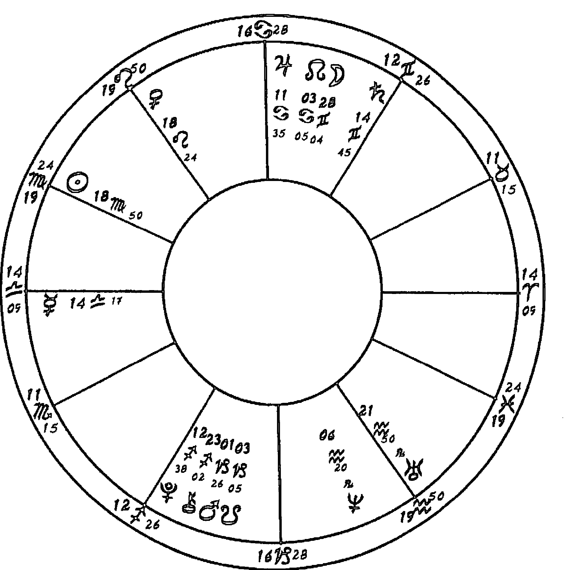

### 世貿大樓第一座塔倒塌

二〇〇一年九月十一日上午八點四十五分，地點：紐約市

這張星盤裡的其他相位都具有攻擊性，還帶著潛在的毀滅性。若有這種相位的人能夠加以意識且努力，也能創造出極為正面的結果。就當時的社會氣氛來看，的確可能爆發。冥王星跟凱龍星之間的強硬合相會在二○○○年到二○○一年上半年投出許多不確定性，雖然這組合相現在的容許度已經超出範圍，但這張星盤上的太陽還是緊密四分冥王與凱龍的中點。土凱對分冥射手，「被告」非常明顯（但也許沒有看起來這麼明顯），土凱對分，位於雙子座尾巴的月亮對分凱射手及火摩羯（火凱還在合相的容許度裡），全部都發生在三宮及九宮的軸線裡，描繪出這個事件源自於意識形態的衝突，全世界每個國家原本埋藏的狂熱與狹隘的背景鼓聲，都在冥王星進入射手座後開始加強。月火對分也與月交點產生相位，宗教上的盲目情緒（月亮在九宮）撞擊上自以為是的激進務實思維（火星在三宮），某種程度展現出一種明顯的「命定」或無法避免的事件，牽扯進很多人（南北交）。太陽在處女座，是雙子座及射手座行星的T端點，這個位置同時也是土凱及冥凱的中點，這些對分相的張力會聚焦在十二宮，這個宮位在傳統上象徵的是「秘密敵人」。

從占星的觀點來說，十二宮跟先祖的「鬼魂」有關，也就是可以追溯到好幾世代以前的集體無意識模式。這些具有爆炸性的強硬相位組合描繪出即將出現的憤怒、激進、狹隘、代罪羔羊及狂熱，這些面向的根源種子早在許久以前就已種下。為了瞭解這些讓種子茁壯的土壤，回頭探索上一次土冥合相（在天秤座，一九八二到八三年）、土凱合相（在雙魚座，一九六五年到六一年）是必要的，土凱對分的時間很長，至今仍持續作用，一開始發生於一九八五年年底，土射手對分凱雙子，過程中斷斷續續維持對分，如此經過了半圈黃道。當然，同樣重要的是阿富汗及中東、中亞的政治局勢星盤，這種與歷史、政治有關的分析不可能在一篇短短的文章中全面道盡¹。我相信某個時間點的星盤，或行運在國家盤上的展現，是沒有辦法精確預言出在哪個時候將會發生什麼事情。有時行運在國家盤上的作用力是非常隱晦的，還要加上對於該國家政治局勢的認知，好比說一九八九年，行運的冥王星正巧與蘇聯國家盤的太陽合相，但現在的配置並沒有這麼明確。很多人以後見之明宣稱九一一事件的盤搭配上美國的國家盤很好解讀這件慘劇，後面有相關的討論。這種說法相當輕率，就跟所有世界末日的預言一樣，這些預言從世界存在後就沒有少過。我們必須以更具有建設性且誠懇的態度坦承我們的無知，我們也需要觀察各種不同的層面與觀點，才能找到理由接受已經發生的災難，且帶領未來走向建設而不是毀滅的局面。如果我們相信自由意志的任何可能性，及我們有能力突破困難，產生具有創意的結果，我們就該接受這個事實，美國的恐怖攻擊事件絕對不是「命定」的。

> 1 原書註：進一步的研究，例如阿富汗最近的軍團發展，可以參考尼可拉斯·坎平恩的《世界占星全書》。

以後見之明指出這件事其實可以避免也是沒有意義的。華而不實的見解滿天飛，自以為是的集體責備到處都是，甚至還有自我責備。這些完全沒有幫助。我們必須思考這些事件的深層意涵，然後期待自己能將巨大的邪惡轉化為改善的機會。當然，美國的確有心理上的「陰影」，此時很多人都痛苦指出這點。世界上的其他國家也有他們自己的陰影。在不遠的未來，美國政府及人民也或許能夠探索這道陰影的本質，但無論多少自我探索都沒辦法保護一個人或集體意識不受突如其來的事件攻擊。有人假設恐怖攻擊行為是國家缺陷之下的必然「結果」，這種人其實早就將邏輯、公平、正義交給了那些拋棄邏輯、公平、正義的人，也可以說是將最後一點的人類感覺，也許連理智都交出去了。無論是在一個人的本命盤、國家盤或是事件盤，講究崇高人類理想的風象大三角與T端點的代罪羔羊特性（冥凱）、激進（月火）、強迫的狂熱（土冥）、強烈的不滿（土凱）及因為無力憤怒而產生的暴力行為（火凱）之間的對比都相當強烈。大三角通常會掩飾許多罪行。從心理學的角度來說，我們傾向躲進大三角，而不去面對自己四分相或對分相的傷痛。也許可以這麼說，不止美國，全球的集體意識在九月十一日這大早上，都處於一種一廂情願的否認現實心態之中。

### 美国国家盘——西比利盘

事件盘捕捉到了攻击那一刻的集体灵魂状态，但作为一张行运盘，这张星盘也让我们一窥当时影响美国的能量²。这些行运令人不安，但我们必须记得最重要的一点，土冥对分的作用力长达两年，并不止是针对九月十一日这天。这组对分准卡在美国国家盘的上升、下降轴线上，冥王星合相射手座上升点，土星则在双子座下降点。与「他者」的冲突（七宫）与内在在转化是同步发生的，而冥王星的转化过程通常一开始都会很不舒服，甚至具有毁坏性，虽然就长远来看，这种过程可能充满创意。

美国的射手座上升点对于外在世界总有这些迷人及不这么迷人的特质——无所畏惧的探险家精神、对于未来无尽的热情与信念、根深柢固的宗教定见、过量的物资与情绪、道德优越的假设、拒绝接受失败的勇气、不能遏制的乐观。这些特质无论讨喜与否，都反应出最好与最坏的天真烂漫，也就是对于人类的能力抱持纯真的态度，同时以宽容又自以为是的目光看待更广大的世界。

> ² 原书注：这张星盘一开始是由占星师艾比奈泽·西比利（Ebenezer Sibly）于一七八七年提出。目前有两个版本，其时间设定为下午四点五十分，另一张则是下午五点十分。我在这篇文章里使用的是后者。资料来源：《世界占星全书》。

The request was rejected because it was considered high risk意識形態上的反應，根據土冥軸線的宮位，困在土星或冥王星的一端，以及我們該如何保持能量流動，才能讓對話產生更多更有創意的可能性。我一度覺得自己去不了美國，因為某些航班取消了，但一路上都很順暢。飛機只有半滿，雖然機場安檢很仔細，但平日就會往返的旅客因為入境的人變少了，速度反而比較快。

我在英格蘭的時候，不斷跟我那充滿巨蟹特質的家人聊天。雖然我們緬懷起過往，也八卦了一下，但話題不免俗地還是回到了核心問題：接下來呢？局勢會有什麼發展？我們能聊的都聊了，然後還是講個沒完。我們家四代人一直待在一起，聊了又聊、聊了又聊，不然就是看電視新聞，看電視上的訪問，然後臆測、想像，交換意見與看法，就跟全世界的其他人一樣。

從歐洲來到美國，我原本擔心土冥對分會霸占我們的討論，我們會陷入二元對立，憤怒不已，但這組對分發生在變動星座，我們願意傾聽彼此說話的意願戰勝了一切，而每一次的討論都非常有趣。

十月五日，我去紐約，住在一個好朋友家。我每天晚上都夢到我要在紐約演講的內容。在一個剛受到驚嚇與攻擊的城市裡，我講火星是能講些什麼？這裡的情緒還很強烈。大家不斷討論，想要搞清楚原因，想要思考出最好的解決方法，大家都不斷分析，每個人都跟分裂了一樣，感覺太強烈了，而思緒不肯停下來，內心深處都曉得一切都會不一樣了，但改變的方法是什麼呢？在地鐵上，我們聽到大家聊起這件事，陌生人加入，而討論的內容總是非常有趣。這點很妙，總會有人比你知道多一點，一個新鮮的事實，一個新的轉折，這些不一樣的內容又加在談話裡，而討論得沒完沒了。

昨天下午，我去麥可家。我在讀原本的火星、冥王星的句子，而這句話似乎慢慢發展成一個主題。講座開始前一個小時，麥可替我到處打電話打聽到了兩個重要人士的生日，一是紐約市長魯迪·朱利安尼（Rudy Giuliani），另一位是威廉·費漢（William Fehan），他是第一位死於救難行動的消防隊員。我趁學員入席時，把這兩張星盤畫在白板上。我告訴他們，我們有一本關於火星的書即將出版，以及我所負責的內容，還有我想分享在我們火星的源頭戰神艾瑞斯神話裡關於美德、美善及卓越的概念。

不過，我們還是就著這樣的背景，談到在紐約發生的事情，因為我們眼前就有一件冥王星事件。冥王星就在這些人眼前爆發開來。影響遍布全世界，只有幾個地方不曉得這件事，但此時在此地，紐約市民連呼吸都有九一一事件的塵埃。我們都很好奇土冥對分會如何展現。我們都曉得土冥會在二〇〇一年八月進入容許度，二〇〇一年年底到二〇〇二年早春左右會離開容許度，基本上的效力會一直影響到二〇〇二年五月。

身為占星師的我們一部分的工作就是要帶領我們自己及其他人撐過時間的巨流，我們也開始面對這組對分的能量了。我們在自己及客戶、朋友、戀人、孩子、伴侶的星盤上看到這組相位，當這組相位跟個人行星產生相位時，我們會想辦法解釋，而我們看著世界發生的大事，想要看看我們能否在面對彼此的時候，透過這組相位挖掘出意識形態或概念上的蛛絲馬跡。

我告訴他們，我們這些九月十一日不在曼哈頓下城的人，都在世界各地盯著電視機看這個城市實際演出土雙子對分冥射手的展現。冥王星的風颶進了這個城市，而所有的人也在這陣風裡打轉。每個人還是擁有私人的生活，同時也是集體意識裡的一分子。不過，因為冥王星的啟動，每個人的火星也動了起來。因為戰士能量、活躍的生命力、每個人自我裡的保護者或守衛者都醒了過來，火星曉得現在是該動起來的時刻。

如果讓火星自生自滅，它可能會覺得所有出現的東西都很可怕，或憤怒以對。或者，火星會迷失在巨大的外在事件裡，對於如此龐大、黑暗的障礙，無法做出任何具有建設性的應對。所以我們必須專注內在的力量，意識到這股力量如何運作，我們才能找到危機時刻的出路。

最原始的火星會依反射及一路上遇到的人事物來作用，最成熟的火星會朝卓越、美德、恰當來採取行動。當火星以最成熟的行動方式運作時，它會恰如其分的面對手邊的危險。而面對危險的時候，這顆火星也會以最適量、最剛好的力量應對。於是意料外的新生就會從戰鬥中產出。

冥王星爆發時總會伴隨毀滅，我們都受到威脅，我們都必須隨著威脅起舞，但巨大事件對每個人的影響程度不一，我們值得以成熟的方式展現火星，也許就能夠達到最好的效果。當集體的威脅出現時，每個人的火星就會自動啟動（當部落遭到威脅時，每個人都會成為不同的戰士），我們可以藉由這個時間點，將意識帶入我們的火星能量之中。

我們每個人，特別是住在紐約的人，都必須意識到自己的戰士力量，自己的生存驅力，以及追求美德、恰當行為、卓越的能力，這樣我們才能在這狂亂、痛苦的時刻繼續前進。

我們提到火星透過火風水土四元素在十二星座的展現。我們提到火象的火星必須處理想像中的恐懼及焦慮，以及會透過引發他人的恐懼及憎恨，作為不成熟的表達方式。只要一點點暗示，火象的火星就會瘋狂疲於奔命，對於專注的人影投下迅速、力道過強的反應。我們談到勇氣是一種想像裡的火，需要觀照，才能給其他人帶來激勵與勇氣。火象的火星必須克服從每一個潛在新威脅所帶出來的黑影。

我們提到土象的火星必須注意生命及周遭他人的哪些需求必須照料且維持秩序及儀式。我們談到每天對於樂趣、個人生態、社會責任的關注能夠讓他們不至於陷入恐懼及絕望之中。

我們談到風象的火星要在威脅下崛起，以創意及文字作為武器，不成熟的展現可能是對那些抱持相反看法的人猛烈攻擊，抨擊別人在有成效的討論及理智分析裡所需要的自信。風象的火星最成熟的表現是精心、專注磨練語言與思想。

最後，我們提到水象的火星，這些火星在能夠接觸外界讓當事人或他人使用前，一定會感受到恐懼與失落。對當事人來說，勇氣意味著面對自己遭到侵犯、謀殺、滅絕的個人情緒。這次冥王星的事件，這種覺得受到地底世界不明之冤攻擊事件的心情，都會觸發一個人過往的傷痛我們必須意識到這些傷痛，才能釋放火星與生俱來的美德。

### 魯迪·朱利安尼

最後，我們看了兩張星盤。第一張是魯迪·朱利安尼，紐約市市長，他出生於一九四四年五月二十八日，出生時間不確定，但我得到了兩個時間，一個是早上十一點半，一個是早上十一點五十五分，這兩張盤的上升都在獅子座（我們用的是十一點半的盤）。在紐約遭到攻擊之前，他是一個飽受爭議的人，大家對他又愛又恨，他一輩子充滿醜聞。不過，九一一事件後，他展現出紐約市民最需要的正直及解決問題的能力。他成為自己家鄉城市的英雄。他立刻行動，充滿無比的威信、優雅、智慧及憐憫。他展現出來的速度及組織能力、領導風範都是紐約人在經歷如此災難下所需的特質。他的火星、冥王星合相在獅子座，六分雙子座的太陽跟天王星，雖然我們曉得他並不是展現獅子特質最好的典範，但當危機在他的家園中心爆發時，他還是能夠秉著這些正向的特質站出來。因為冥王星與火星的度數非常緊密，也許就是要等到冥王星撞進他生命裡，他的火星才能徹底活出光芒來。

### 威廉·費漢

威廉·費漢於一九二九年九月二十九日上午六點三十分，出生於紐約市皇后區。他是死在救援行動裡的第一位消防人員。我們看了他的星盤，我們覺得這個人肯定這輩子都奉獻給服務。一宮裡的火天秤合相水星，六分月亮，四分天頂的冥王星，三分九宮裡的木星，六分三宮裡的土星。這是很有力量的火星，守護星金星在十一宮的處女座，與海王星合相。當天的學員告訴我，他是一個很好、人見人愛的人，在各種方面都可以說是正直的一個人。他似乎有些小缺點，但不是罪大惡極。他的兒子也是一位消防隊員，後來有個朋友告訴我，他讀到費漢的父親親也是消防隊員，退休後反而憂鬱絕望。費漢在退休後又找了另一個消防隊員的工作，第二次退休卻是因為殉職。對他來說，這樣可以說是死得其所。我們認為，他看起來像是天生就會做出正確決定的人，他會選擇正直的道路，因為他在很年輕的時候就做出了選擇。有些人就是這樣，他們在生命的過程裡一次又一次地選擇了卓越。當他們面臨巨大危險時，他們會做出最自然的選擇，也就是嫻熟地保護、捍衛。天底下從來沒有選擇過這條道路，也有人選擇過幾次，但覺得收穫不好，所以又屈服於自己不成熟的衝動之下。當然也有人會在成熟與不成熟的兩端搖擺。這永遠都是火星的故事。

我實在沒有太多時間能夠分享我在紐約的經歷。我希望我沒有引錯別人說的話，但我也沒辦法一一確認我的記憶或資訊是否正確，所以這篇文章也許沒有我想像中那麼精確。講座過後，我又跟在場的人聊了一下，很多人跟我分享了事件發生過後頭幾天的故事。我離開紐約的時候，這些人的經驗讓我非常感動，他們也許驚嚇、也許迷惘，但他們還是不斷質疑且慢慢接受發生在自己家園的遭遇。

達比·卡斯提拉
二〇〇一年十月九日於紐約

## 附录三 延伸阅读

- 《海王星：生命是一场追寻救赎的旅程》（2015），丽兹·格林（Liz Greene），心灵工坊。
- 《家族占星》（2013），琳恩·贝儿（Lynn Bell），心灵工坊。
- 《凯龙星：灵魂的创伤与疗愈》（2011），梅兰妮·瑞哈特（Melanie Reinhart），心灵工坊。
- 《土星：从新观点看老恶魔》（2011），丽兹·格林（Liz Greene），心灵工坊。
- 《占星、心理学与四元素：占星咨询的能量途径》（2008），史蒂芬·阿若优（Stephen Arroyo），心灵工坊。
- 《占星·业力与转化：从星盘看你今生的成长功课》（2007），史蒂芬·阿若优（Stephen Arroyo），心灵工坊。
- 《生命之树卡巴拉：西方神秘学的魔法根本》（2017），约翰·麦克·格里尔（John Michael Greer），橡實文化。
- 《十二宮位：生命格局的十二個舞台》(2017)，韓良露，南瓜國際有限公司。
- 《上升星座：生命地圖的起點》(2016)，韓良露，南瓜國際有限公司。
- 《占星全書[暢銷增訂版]》(2016)，魯道夫，春光。
- 《希臘羅馬神話：永恆的諸神、英雄、愛情與冒險故事(精裝珍藏版)》(2015)，伊迪絲·漢彌頓 (Edith Hamilton)，漫遊者文化。
- 《阿若優的星盤詮釋指南》(2014)，史蒂芬·阿若優 (Stephen Arroyo)，木馬文化。
- 《變異三王星：天王星、海王星、冥王星的行運、苦痛、與轉機》(2013)，霍華·薩司波塔斯 (Howard Sasportas)，春光。
- 《占星相位研究》(2010)，蘇·湯普金 (Sue Tompkins)，積木。
- 《當代占星研究》(2009)，蘇·湯普金 (Sue Tompkins)，積木。

心理占星前所未有華麗陣容
一齊演奏欲望與衝突交織、火花與激情四射的火星組曲

火星的力量令人畏懼。在占星學中，掌管火星的是戰神，因此不論是個人的行動、欲求、力量，甚至國際間的恐怖行動或軍事衝突，都與火星息息相關。但少了火星，我們也難以捍衛信念，甚至會陷入消極的受害者心態並迷失自己。火星有光明面也有陰暗面，一邊是衝突、屠殺、謀殺、邪惡、壞心眼，另一邊則是勇敢的美善、卓越與正直。

本書的四位作者堪稱當今心理占星界的天后，她們從天文學、字源學、神話、史詩、符號等角度分析火星，也包含不可或缺的星盤解析、宮位與相位意涵等探討。強調火星破解情結、展現自我的強大動能，以及若未正確引導，可能產生的疾病與症狀。

特別收錄針對911事件當日的分析，以及梅蘭妮・瑞哈特所整理的「16道火星習題」，幫助讀者檢視自己的火星能量，找到它燃燒與榮耀生命的方向。

火星表達自己的方式有二，一是衝突，二是欲望。少了火星，我們會變成非常無聊的生物。——琳恩・貝兒

透過火星，我們可以建設，也可以摧毀。——達比・卡斯提拉

認真誠懇的拒絕，必須有意識地使用火星。——麗茲・格林

火星協助我們的內在光芒與我們配合，這股光芒能夠連結生命裡神聖的層次。——梅蘭妮・瑞哈特

胡因夢（身心靈療癒導師）——鄭重推薦