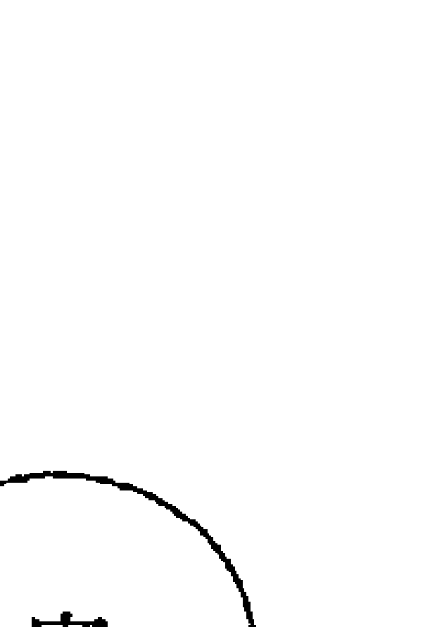

# 破除逆行的魔咒

## 出版缘起

兴趣广泛、身份多元的知名文化人韩良露，除了大家熟知的作家、媒体人及文化推动者身份之外，她也是艺文圈中最受重视的占星学大师。

二〇〇三年起她在金石堂金石书院（现龙颜讲堂）开设占星课程，由于口耳相传、好评不断，课程一直持续到二〇一〇年才划下休止符。在长达八年的四百多堂课中，她以历史、哲学、心理学、社会学的角度，将占星的深层智慧化为生动的教学内容，让大家在学习与命运对话的同时，获得看待人生的更高视野。

这一系列课程不但架构了宇宙法则的逻辑，也融入她对人性与社会的观察，但因资料整理工程浩大，成书计划一直未能完成，为避免这些珍贵课程内容成为绝响，南瓜国际透过多年来数量庞大的上课录音及相关资料，依据当时课程的规划逻辑，整理成为系列书籍，期望能藉由文字重现精彩、动人且充满智慧的上课盛况。

## 星图不是一块披萨

星图并不是平的，它不是一块切成十二片的披萨。大家在刚入门学占星时，多半先忙着把星图切成十二个星座、十二个宫位，忙着把各个行星像是铺馅料一样的放在星图上。而很多进阶的占星学习者，尽管好不容易搞清楚什么是太阳、什么是月亮，但还是把星图当成一块披萨。事实上并非如此，星图是活的，它会跟所有过去、现在、未来的人事物互动，它会随着每一个当下的决定而有所改变。在人生的旅程中，算命有可能有帮助，也有可能帮不上忙。这件事就像是把身体交给医院的医生，有的时候医生治得好，有的时候医生也无能为力。面对求助于占星的人，占星者当然希望可以帮得上忙，但是面对问题重重的星图，有时候占星者也无从下手，尤其是当对方因为不相信而不愿去理解时，占星师再怎么厉害，也没有办法让顽石点头。也因此，要让占星学派上最大用场，最好的方式就是自己去学。因为就算没办法学到成为讲师的程度，就我教占星的实际经验来看，从完全不懂占星，连十二个星座都背不齐全的人，只要愿意耐心的学，都会对人生的看法有更宽广的视野。即使只是略有程度的初学者，当他们有一点占星的基础时，在他们去找别人算命时，就不会被别人牵着鼻子走。

如果说物理学探讨的是物质世界基本原则，占星学探讨的就是精神世界的基本原则。就像物理学也可以造出原子弹，拿着占星学去做坏事，也有可能会惹出大麻烦。以前我教占星时，一直有一个疑虑，我很担心有人学了之后会打着占星的旗号去骗财骗色。但是我有一个很有智慧的朋友告诉我，每天打开报纸，骗财骗色的人多的是，想要学的学占星，因为心灵提升、减少恶念的关系，反而不敢也不想去做坏事。

学占星是一种让正面能量扩散出去的好方法。我希望很多人能够从我的占星课程中得到很多正面能量，并且藉由各自不同的方法，让正面能量扩散出去。我自认是一个还不错的思想家，可是我并不是行动家，很多行动家要做的事情我做不到。如果这个社会上能够有更多人懂得占星学的话，大家就可以一起努力，将占星学带给我们的宇宙智慧实际应用在生活中的各个层面。占星学之所以有趣，在于即使两个人有一样的星座、宫位与相位，这两个人或许在物质世界有着相同的条件，但是他们在精神世界与灵性发展上也不可能相同。如果纯粹就现象界层面的话，学会占星最基础的现实世界展现的这一面，出去帮别人算命足矣。但如果能够藉由算命变好命的原因——好命并不是靠算命，而是靠算命来真正了解命运。如果能够藉由算命，为自己的生命指出现象界中道路的诸多可能性，也是一件对人生很有益的事。了解命运并不能完全改变命运，可是可以借力使力，让自己的命运比原先更好。小说《阴阳师》中曾经提到，每个人的名字就是一个咒。这个世界上不管再怎么好的理论，都有可能让人开启视野，也有可能让人钻牛角尖。这也是学占星时必须兼顾物质世界、精神世界与灵性世界的原因。光顾着物质世界的算命固然能够搏人惊叹，但是除非透过精神世界与灵性世界的体悟，只有物质世界的“算得准”，其实并不能够对人生有任何的改变。反而令人容易陷在“好灵！好准！”的咒里面，以至于忘了占星的最终目的，是藉由灵性的提升，带来人生的改变。

对于初学者来说，大家刚学会看图时，一定会因为难以面对、超越星图显示的真相，因而对自己的图大惊小怪，整天盯着自己图上的缺陷紧张得要命，看到自己的图也紧张，看到另一半的图也紧张。不过经过一段时间的历练，这个阶段很快就会过去。

在多年的占星课堂中，上课的时候我常常会像抛绣球一样抛出一些观念，这些绣球背后都有其逻辑，虽然没有接到也没关系，但也有许多人因为接到了这些绣球而引发出继续占星学的兴趣。有些人觉得占星很困难，事实上占星不外乎星座、宫位、相位，有兴趣就简单，没兴趣就难。

星图中的太阳、月亮、水星、金星、火星、木星、土星、天王星、海王星、冥王星，有一些是今生今世的当下决定，有的是累生累世的业力轮迴，站在宇宙的角度来看，过去、现在、未来并没有差别，但是又各自不同。它们既是一体，又各自有不同的意义。如果能够理解到这个程度时，大家在看星图时，就会比较容易看出星图中的活路。当你不能超脱于星图曼陀罗的众生相时，你就会陷在当中的某一个点中，就算是多么明显、多么清楚的好相位，你都没有办法理解到其中的意义。整个星图就像一个蜘蛛网一般，让你陷在其中跳不出来。想要透彻看穿星图曼陀罗，需要一些功力。尽管一开始难免功力不足，但是我很希望能够藉由各式各样的课题来引起大家的兴趣。再厉害的占星师也一定会从新手开始，只要持续对占星有兴趣，能够觉得占星学很有意思，加上踩稳基本功，自然会有豁然贯通的一天。当你能够体认到星图曼陀罗的能量起伏时，星图就不再是一张切成十二块的披萨，星图就是众生相。

注
本文依据二○〇六年逆行相关课程录音整理而成。

# PART 1 致读者

“逆行”是一种让人很有感的占星技巧，但是它并不适合拿来铁口直断。十二个宫位是十二个生命情境，当行星在宫位中逆行时，更容易让当事人在日常生活中感觉到不适与摩擦。但也因为它很容易算得准，很有可能被断章取义，反而限制了当事人的可能性。命不会越算越薄，但是格局可能会越算越小。在星图中，每一颗行星都有无限的可能性，但是每一次的“铁口直断”，都等于是窄化了当事人发挥行星能量时的想象力。本书将为大家探讨行星逆行于宫位的情况，关于行星逆行星座的相关内容，请见已经出版的《都是逆行惹的祸：灵魂的星座重修课》。在跟逆行相关的课题中，最重视的是灵性的启发，而不是陷在其中动弹不得。在进一步阅读本书之前，以下几个跟逆行有关的重要态度，请大家务必随时放在心中。

## 一、逆行其实很普遍

很多人打开自己的本命星图，看到星图中有行星逆行就感到恐慌。事实上整张本命星图（除了南北月交点之外），完全没有任何行星逆行的人极少，大约占百分之八。也就是说，九成以上的人星图中都或多或少有行星逆行，因此大家不需要过度大惊小怪。

## 二、逆行不容易察觉

逆行是一种很内在的灵魂状态，除非跟当事人很熟，否则逆行并不容易藉由显著的外在事件来判定。就本命星图中有行星逆行的人来说，即使是灵性体悟有兴趣的人，也需要到了三四十岁的一定年纪之后，才能够掌握到逆行课题的幽微之处。

逆行则是当事人这辈子都需要面对的课题，它不依赖行运启动，所以不见得会在特定时间内特别感受到压力，以致于反而不容易让人察觉。

## 三、逆行不等于灵性低

逆行的人常常会比不逆行的人容易反复陷入执着的情境中，这种反复的执着反而有可能使当事人在世俗上达到更高的成就。逆行的人最容易感到痛苦的地方，在于他们常常会反复执着于某一件事，就算屡战屡败也不肯放弃，因而吃了很多苦头。事实上即使成功，他们也不容易感到满足。

大家要切记的是，逆行并不等于灵性低。灵性的体悟需要过程，不光只是脑筋“知道”就够，还需要在现实生活中透过很多事件的经历，才能带来真正的理解。

## 四、完全逆行不见得不做坏事

逆不逆行跟做不坏事并没有直接的关系。逆行的关键并不在会不会遇到坏的情境，或者会不会做坏事。本命星图中的逆行会使人反复执着于过去世习性而遇到阻碍，这些阻碍都是为了让逆行的人学会不再执着。

相对来说，一个没有行星逆行的人，他们虽然比较不会执着于过去世习性，可是不管他们做对做错，混着混着也就过了一辈子，对于灵魂来说，这不见得是一件好事。

## 五、别为逆行贴标签

如同我在过去出版过的书中多次提醒大家，在占星的学习中，通过追溯过去的重要性远大于预测未来。书中举的实例都是为了让大家易于理解而挑选出的极端例子，这些例子是在天数、地数、人数作用下产生出来的众多可能性之一，大家不应看了书中的例子，就帮自己或其他人贴上“金星逆行都这样”或“天王星逆行都这样”的标签，否则就容易偏离学习逆行的真义了。

学习逆行最重要的要诀，就是要意识到自己正在经验着什么样的逆行功课，而非拿着逆行当藉口，反复沉溺在逆行的泥淖中。

当一个人能够真正在生活中的片刻，忽然体悟到“原来这就是逆行”时，就有机会为生命带来灵光乍现的新选择。

# PART 2 前言

这两年透过媒体报导，很多人对“逆行”现象很感兴趣，最常听到的是一年大约三到四次的“水星逆行”，这些都属于行运的行星逆行。而如果一个人出生在行星逆行的期间，例如现在如果水星正在逆行，而有人在这个时间出生的话，这个人本命星图中的水星就会逆行。

当行运遇到行星逆行时，会带来社会性与宇宙性的影响。就像水星逆行时，星象专家常会提醒大家要小心交通，其实并不是全世界所有的人在这时期都需要提心吊胆，主要是因为水星掌管沟通，当天上的水星因为逆行而能量不稳，如果一个人的本命星图刚好又跟天上逆行的行星产生对应时，这些人就特别容易受到水星逆行的乱流影响而状况。

大家稍微用逻辑思考一下，地球上有七十亿人口，但显然并不是每个人都会在水星逆行时遇到交通问题。也就是说，行运的行星逆行带来的主要影响是宇宙讯息的影响，行运行星逆行的影响力，一定会比本命星图中行星逆行的影响力来得低。

## 什么是逆行

每个人出生时，在出生的地点天空上的天宫图，就是这个人的本命星图。如果一个人出生时，天上有一颗行星正在逆行，他的本命星图上，这颗行星就会逆行。

逆行是一种过去世尚未修完，这一世必须重来的重修课。逆行最让人困扰的地方，就在于逆行造成的问题往往在现实生活中找不到因果逻辑。举例来说，多吃少运动容易造成肥胖，肥胖容易产生心血管疾病，这是一般人可以接受的逻辑——至于做不做得到，那是另一回事。但逆行带来的问题往往找不到现实的因果逻辑，因而让人感到困惑。

本命星图中行星逆行的功课就像是心理学，不管是自己帮自己解析星图，或者是找人帮自己解析星图，解析者应将当事人叙述的任何不合常理状况从星图中找出线索，而当事人经过深度分析之后需要花时间自我探索，并持续深入挖掘及探索。

逆行与剋相（两颗行星互相形成九十度或一百八十度的夹角）都会带来负面影响，但情况不太一样。当两颗行星形成剋相时，例如掌管思考、沟通的水星与代表社会制約的土星形成了九十度剋相，这会使当事人的思考、沟通受到社会制約带来的过度压力，因而没有办法很流畅的表达自己的思想，这种情形遇到了行运行星又来剋时会更严重。

在本命星图的剋相中，每一次遇到行运形成相位时，就像是遇到了大考、小考，当事人顶多只能学着接受命运课题的考验。不管当事人自我意识是否修正，他们都不可能避开这些大考、小考。

相较之下，逆行更具有灵修上的意义。本命星图中的逆行会随着当事人自我意识的修正而改变，当一个人不肯面对逆行带来的问题时，这些问题就会不断的找上门，用各种实际生活上的问题来逼着当事人面对。但如果当事人能及早透过逆行的困境让灵性提升、转化，逆行造成问题的严重程度就会降低，当事人即使再遇到相关问题，也比较不会感到不知所措。

我们生活在这个世界，包含了物质世界的现实层面、精神层面与灵性层面。当我们多往精神、灵性层面发展时，就会比较少将能量花在现实层面中。

逆行是灵魂的重修课，它一定会或多或少在现实生活中发生一些问题，藉由现实生活的痛带来觉悟。不过尽管痛是带来觉悟的一种方式，但是痛并不保证能够带来觉悟，痛跟觉悟是两回事。最理想的状态，当然是不需要通过痛，就能得到觉悟，而最不好的状态，则是明明已经痛了却没有觉悟。

## 别把命算小

以火星逆行的我为例，受到逆行的影响，所以我很容易乱发脾气，乱发脾气的后果，往往会让我吃到苦头。所以我现在尽量减少乱发脾气的机会，因为逆行的火星逼着我必须转化，当我做不到的时候，它就会给我苦头吃。本命星图中的行星逆行，虽然没有办法让一个人马上就能放下屠刀，立地成佛，但是它会透过一些生活上的逆境，让当事人没办法这么随心所欲，也因此至少得要或多或少的去努力提升自己。

逆行的课题常常是外人看起来问题很明显，但是当事人当局者迷，根本没察觉自己这个地方有问题。也因此我不会主动告知身边好友，一定要等他们遇到相关问题来求助时，我才会跟他们解析逆行会带来什么困扰，而不会在他们平常没遇到问题时主动告知。

也就是说，当一个人遇到相关问题时，才会特别感受到逆行的力量，也特别容易从问题中得到顿悟的契机。

逆行是东方占星学中很重要的一个研究课题，它很准确，但也因此带来了一些麻烦。我在教占星教了好几年之后才愿意开跟逆行有关的课程，原因在于它很容易被误用——它即使被误用也很有效。东方占星学比较偏向宿命论，而逆行正是一个跟宿命关联性很强的占星工具。很多用现实因果无法解释的生命中的无奈，都有可能从本命星图中的行星逆行使出来。也因为逆行有办法解读出宿命议题在现实生活中的显相，这也会出现一个问题：所有这些在生命中会遇到的处境，背后的意义本来应该都是为了让我们的灵性有所体悟，而如果一个算命师并没有给被算的人其他的辅助说明，就依据逆行给出了一个结论的话会很可怕。将逆行当成一种算命工具并没有什么不行，甚至用它算命还算得特别准，但是如果纯粹把它当成一种算命工具的话，它就很容易就被推向宿命论的方向，当事人就很容易觉得“反正命中注定，所以也不必努力”，这样根本就本末倒置。当一个人的灵性意识完全没有被打开时，这个时候丢给他一堆宿命的议题是很令人痛苦的事。因为所谓的“宿命”，就意谓它们是命中注定会发生的事，而且往往会用一种让当事人感觉到压力的形式，推着当事人成长。凡是占星学中涉及宿命的相关领域，我都会建议必须同时搭配大量灵性相关的知识一起学习。否则顶多就是让被算者觉得“好准”，这件事情对被算的人无益。而且如果当事人并不具有灵性基础的时候，他们就会被算命师算出来的东西局限住，把原本宽广的生命给算小了。这也是我一直鼓励大家利用占星回顾过去，但是不鼓励大家过度使用占星预测未来的原因。

在过往的东方占星学中，占星师最爱用这套技术来控制别人，这也是我过去很少谈论逆行的原因。以往靠着算命来赚钱的算命师最爱这套，所谓的“神机妙算”，靠的就是逆行这类跟灵魂占星有关的诀窍。我认为这类跟宿命有关而很准确的算命技巧，它们都需要有一整套的配套做法来配合，当有配套的灵性指导时，逆行就变得不那么宿命了。它既宿命，又为宿命开了一扇门。如果不给予灵性指导的话，就如同告诉你宿命，又关上了门，没有出路的宿命预测，对于当事人而言是非常残忍的。

因此学习逆行最理想的方式，就是已经准备好要拓展灵性意识，也有意愿踏上灵性之旅的话，不妨可以跟随着本命星图逆行透露出的线索，跟着本命星图这张人生蓝图，走上更高、更美的灵性世界。

# 什麼是宮位

每一張本命星圖都分成三大結構：行星落在什麼星座、行星落在什麼宮位、行星與行星之間形成了什麼相位。

在星圖的解讀中，出生時間很重要，因為出生時間決定了上昇點的度數，而每隔四分鐘，上昇點就會走一度。拜現代醫療體系健全所賜，幾乎大部分在醫院裡出生的人，都會依據醫院開立的出生證明去戶政事務所報戶口。只要本人帶著身分證到戶政事務所，幾分鐘之內就可以調到一份有出生時間的出生證明。

出生時間決定了上昇點。如果將每個人都視為一個小太陽，每個人出生的那一刻，就是這個小太陽從地平面「上昇」的時刻，也就是說，每個人出生的那一刻（就占星學的說法，所謂的出生，就是一個人吸進地球的第一口氣的時刻），東方地平線的黃道座標度數，就是你這個小太陽的「上昇」點的度數，也就是俗稱的「上昇星座」（註）。

> 註：關於上昇星座的相關內容，請見已經出版的《上昇星座》。

相對於上昇點的日出地平線，在上昇點一百八十度對面，就是「下降點」，再界定出日正當中的「天頂」與天頂對面的「天底」，這四個點將本命星圖切成四個象限，接下來再切成十二宮，就是「十二宮位」。十二個宮位分別代表了十二個不同情境的生命舞台，本命星圖中的行星落在哪些宮位，會顯示出一個人這輩子主要會在哪些生命舞台中活動。

上昇點與下降點切出一條地平線，地平線以上稱為星圖的上半晚，地平線以下稱為星圖的下半晚。天頂與天底切出星圖的左半邊與右半邊，左半邊為日出方向東方，右半邊為日落方向西方。

如果簡單的從等宮制來看，上昇點是第一宮自我形象宮的起點，下降點是第七宮伴侶宮起點，天頂是第十宮事業宮起點，天底是第四宮家庭宮的起點。在日出時出生的太陽在一宮，他們會很看重自己，從小就被視為重要的人；在日正當中的中午出生的人太陽在十宮，他們會努力在社會舞台上有所表現，努力博得社會目光；傍晚日落時分出生的人太陽落在七宮，他們會非常以伴侶為重，子夜出生的人太陽在四宮，他們容易出生在或多或少有一些影響力的家庭，他們也容易為了家庭因素而犧牲個人意見。

由上昇、下降、天頂、天底切出來的四個象限中，上半晚的行星越多，越容易被人所見，下半晚行星越多，當事人通常比較忙於私人領域，就比較少被大眾認識。而如果左半邊越多，由於左半邊是日出方向，所以當事人會比較自我，比較以自我為重，如果右半邊越多，右半邊是日落方向，當一個人本命星圖的行星大多落在右半邊時，當事人就會比較以他人為重。

由四個象限再切分成十二個宮位。

在星圖左下角的第一宮、第二宮、第三宮，這三個宮位在星圖的下半晚，它們都具有跟自我有關的特性。

-   一宮：自我形象。一宮會顯現出一個人小時候的童年環境，當事人從小生長在什麼樣的童年環境，就會被形塑出什麼樣的性格，因而形成了不同的自我形象。
-   二宮：自我資源。二宮是金錢宮，它是一種靠自己賺來而非從別人那邊拿到的資源。
-   三宮：日常生活的溝通。三宮是手足宮，它跟基礎教育、鄰居有關。

星圖右下角的第四宮、第五宮、第六宮也在下半晚，這三宮開始跟他人有關。

-   四宮：內心之家。包括了早年原生家庭與自己的家庭晚年生活。在父系社會中，父親型塑了一個家庭的家風，因此四宮通常也跟父親有關。
-   五宮：創造遊戲。五宮是戀愛宮、子女宮、創作宮，也是投機、賭博之宮，以上這些都是人類基於興趣、為了開心而生的創造遊戲。
-   六宮：生活秩序。六宮是健康宮，也是工作宮。有了六宮有目的的秩序，一個人的生活才能夠有紀律的運作。

星圖右上角的第七、第八、第九宮開始進入了跟公眾領域有關的上半晚。

-   七宮：一對一的對等關係。七宮是伴侶宮，它不只代表婚姻伴侶，它也跟事業夥伴有關，它是一種平等對待的社會關係。
-   八宮：他人的資源。相對於二宮是自己賺取的資源，八宮是共財宮，它是從他人身上取得的資源。八宮的資源不限於錢財，它經常會跟性、金錢、權力有關。因此八宮也是欲望之宮，八宮如果有問題的話，就會很容易跟別人起糾紛。

### 九宮：信仰、理念與異國。

三宮與九宮都跟知識與溝通有關，如果說二宮是高中以下的基礎教育，九宮就是大學以上的高等教育；如果說三宮是街頭巷尾的八卦，九宮就是象牙塔中的學院派思想；如果說三宮是具象的常識，九宮就是抽象的理念。最能衝擊一個人信仰、理念的，就是異國文化，因此九宮也是異國宮。「行百里路勝讀萬卷書」，就是九宮的最佳註腳。

星圖左上角的第十、第十一、第十二宮是公眾領域的最後一環，它由十宮的事業舞台開始。

### 十宮：社會舞台。

十宮是事業宮，它代表一個人渴望受到社會關注的一面。一個人最早的社會舞台就是母親，從一個人早年跟母親相處的模式，可以看出這個人長大以後會用什麼方式來博取社會母體的青睞。

### 十一宮：社交與公益舞台。

相較於十宮事業宮追求的功成名就，十一宮是志同道合的同道之宮，它追求的是超越十宮名利的世界大同、四海一家的境界。

### 十二宮：輪迴與業力。

在十二宮業力之宮中，所有的現實考量都必須退位，不管是主動的放棄（如果相位好），或者是被動的無法發揮（如果相位不好），都代表原先可以使用的在現實考量的行星能量無法發揮。也因此，相對於六宮的身體健康，十二宮也跟心理健康有關，如果有剋相的話，常常會顯現在跟身心症有關的議題上。

# PART 3

逆行於十二宮位

## 水星逆行——難以言喻的溝通障礙

如果仔細觀察，逆行跟非逆行當事人的表現會有顯著差異。比如在朋友圈中，兩個人如果出生日期相近，他們星圖的行星星座與相位狀況就會很接近，但如果有逆行，這兩個人在外表上會有很多面向相似，但他們會在很多關鍵的事情上，做出很不同的決定，這就是逆行帶來的影響。

逆行需要更細心的去感受，而不只是純靠知識的理解，因為它會牽涉到一個人很幽微的反應。這也意謂著逆行不光只是知道它的道理就可以了，還必須要很細心的去觀察跟感受那些很細微的差別，否則就算知道了很多逆行的理論，也沒辦法看出其中的蛛絲馬跡——而這些蛛絲馬跡，往往都是困擾當事人很久的問題。

當一個人星圖中有行星逆行，如果當事人自我反省能力很高的話，他們會知道自己人生中，在這些地方有一些障礙；如果當事人自省能力較弱，他們也會感覺到自己人生中有一些障礙，但是很難覺察到這些障礙的根源，其實都在跟逆行有關的事物上。水星代表溝通，它是將我們的思想透過語言跟別人互動的行為。語言的溝通不只是語言本身，還包括了聲波、頻率，頻率是很長、很短，或者跳動的，或者躲躲藏藏，它們都會傳達出不同的訊息。表面上這些話好像沒什麼不同，但同樣一句「吃飽了沒」，有一些人講出這句話時，會令人感覺到話中隱含了一些其他的訊息。水星逆行的人說話，如果非常敏感的人來聽，就會感受到話裡面隱含著過度膨脹、過度躲藏或是過度壓抑。在與他人溝通的時候，水星逆行的人的頻率是不順暢的，因而水星逆行的人長久以來都會感覺溝通受到障礙。水星逆行最主要的問題，在於當事人經常會產生溝通上的障礙，而這些障礙都不是用理性可以解釋的問題，即使當事人水星的相位很好，就現實層面來說，他們表面上並沒有溝通障礙，也不應該會有這方面的問題，他們跟人溝通好像沒有問題，但內心當中卻覺得不對，不知道出了什麼事。這就是逆行的過去世經歷帶來的情緒或心智的干擾。佛經告訴我們人要活在當下，生活既不在過去，也不在未來。所有逆行都在解釋「沒有活在當下」是怎樣。儘管沒有逆行的人不見得就能活在當下，但行星逆行的人會特別不能活在當下。不管水星逆行、金星逆行、火星逆行……所有行星的逆行，都在解釋行星的能量不活在當下所形成的現象。不管水星逆行落在什麼星座，由於逆行會讓水星能量因為古怪而格外被凸顯，因此水星逆行的人都會給人一種特別聰明的感覺，讓人不由自主的被他們吸引。可是水星逆行的人雖然讓人覺得很聰明，但是在我認識的這麼多作家中，水星逆行的作家卻不多。《北回歸線》的作者亨利米勒（Henry Miller）是少數的例外，其實亨利米勒的文筆很爛，但他用的是一種奇異的文筆在寫色情文學，因為口味很重而又非常真實，因而有可觀之處，可說已經脫離了文學範疇而另成一格。如果不是這樣，以他的文筆來說，很難躋身於正統作家之列。水星逆行的星座與宮位的不同，在於星座能量會有明顯的過去、現在、未來的三種能量位階，而宮位沒有。但一顆行星落入任何宮位時，一定也會落入某個星座，因而隨著落入星座有過去、現在、未來的三種能量，所以當逆行的行星落在宮位中的星座時，還是會因應星座而有過去、現在、未來三種不同能量的反應。

例如水星逆行牡羊時，特別會將能量放在未來，水星逆行巨蟹則無法將能量放在未來。當水星逆行落入一宮時，一宮的自我形象必須具有前瞻、主動的特質，因此水星逆行牡羊落入一宮受到的影響比較小，水星逆行巨蟹又落入一宮的話，水星的能量就會很難發揮。也就是說，水星在三個不同階段會有不同的能量高低，因而影響了進入宮位時的表現，而非宮位本身具有三種不同的能量。

水星是演員，宮位是舞台，演員狀態好，在舞台上的表現也會比較好，演員的能量不和諧，上了舞台之後就難以充分表現。水星星座在三個不同階段的不同能量會影響它們在舞台上的表現，而非舞台本身造成星座能量的不同。也因為逆行一定會造成能量上的不平均，進入宮位時，不管是在過去、現在、未來中的哪個階段，逆行的人都一定比沒有逆行的人更為困難。

### 水星逆行一宮

一宮是自我形象之宮。不管水星本身在哪個星座，水星逆行在一宮的人都有個共同現象：在水星的溝通領域中，水星逆行一宮的人跟比較幼稚、比較年輕的人互動比較容易，跟比較成熟、世故的人互動比較困難。即使是本身就屬於過度老成持重的水星逆行摩羯也一樣。因為逆行會阻礙水星在一宮表達自我的能量，即使是水星摩羯，也難以發揮他們跟長輩溝通的長才，以致於他們終生都會有一種上錯舞台的感覺。

水星逆行在一宮的最大特色，在於當事人從小就會強烈的感覺到他們在自我表達、自我發展上受阻。尤其水星逆牡羊、獅子、人馬等火象星座落在一宮時，當事人的能量會明顯的不斷在過去、現在、未來中不斷的跳躍，因而容易在表達自我的某一關鍵出現短路的狀況，也就是說，他們的自我表達會突然關上溝通之門。

水星逆行在一宮的人一方面會強烈的希望被別人注意，但是受到逆行的障礙，他們無法將自我完全的表達出來，因此他們會出現一種自閉傾向。水星逆行在靈魂之宮十二宮時也會自閉，但水星逆行一宮跟水星逆行十二宮的自閉並不相同。水星逆行在十二宮是一種隱居者式的自閉，他們很類似一種終身的隱居者，過著隱士般的生活，但他們通常不會覺得自己自閉。而水星逆行一宮的自閉情形比較像是自閉兒。自閉兒並非不愛說話，他們想說話，卻不知道怎麼說，當他們想說話卻說不出來時，就會開始生氣，覺得別人都沒辦法了解他們，但別人沒辦法了解他們，又是因為他們說不清楚。當他們陷入這種情況，就會感到憤怒。水星逆行一宮的人也是這樣，當他們陷入這種情況時，就會陷入焦慮，當水星落入一宮時，他們會比水星落在其他宮位的人更想溝通，他們很想做一宮的事情，而他們做不到。當他們無法將自我表達的門打開時，就會有強烈的挫敗感，因而出現階段性的自閉傾向，並將對外界溝通的門關閉。他們關閉溝通之門的原因，就在於他們不想要忍受這種挫折感。由於溝通之門經常關閉，他們常常會覺得自己被外界誤解，因而又打開溝通之門。長期下來會使他們對自己與外界的關係感到不安。

水星逆行在一宮的人有時候在溝通時會展現出很高的能量，但這種能量會像是拋物線一樣，並不能讓他們跟外界維持流暢的溝通。舉例來說，我有個水星逆行一宮的朋友經常喜歡以教訓別人的方式來與人溝通，雖然不是人人能接受，但是還是會吸引一些喜歡被人教訓的人，這種溝通方式的磁場能量太大，雖然會吸引到一些天生喜歡被人教訓的人，但很多人都無法接受。當他發現他吸引到的都不是他真正想要溝通的對象時，他就會關上溝通之門。在手機還不普及的年代，他是有名的會拿起話筒與外界斷絕聯絡的人，他會拿起話筒三天三夜完全不接電話，但是第四天又把話筒放回去，形成一種階段性的自閉。

水星逆行一宮的人其實本身很有表達能力也很想跟外界溝通，但是卻溝通不良，這使得當事人的內心很痛苦，不明白為什麼跟世界有著無形的障礙。

由於逆行帶來的影響，水星逆行一宮的人反而特別讓別人印象深刻，因為不管是能量特別強、特別弱，或獨特或扭曲，這些都很吸引人。這個能量本身是不穩定、不流暢的，但絕對讓別人不能低估。

### 水星逆行在二宮

二宮是個人資產之宮，如果水星逆行在二宮的話，當事人這輩子要小心自己會有對於資產過度執著的傾向。他們往往會有一種過度的擁有欲，對於自己擁有的東西特別無法放手。在醫療占星學中，水星逆行二宮的人必須小心氣喘。水星跟呼吸有關，正常人的呼吸在一呼一吸之間應該是平衡的，而氣喘的人往往只能進不能出，這也符合水星在二宮逆行只肯進、不肯出的現象，因此占星書會告訴大家水星在二宮逆行的人容易有氣喘的問題。氣喘的人對氣候變化之所以格外不能適應，從另外一個角度來看，這也是一種頑固、不接受、不適應環境變化而產生的身體症狀，這也符合水星逆行二宮的邏輯。水星逆行二宮對熟悉的事情很聰明，卻完全不能適應不熟的事情。我們一輩子處理大錢的機會不多，在日常生活中通常用的都是小錢，如果反映在跟二宮最相關的金錢領域，水星二宮的人在財務上就會出現用小錢很精明、用大錢很笨的傾向。這是一個很大的問題，因為儘管水星二宮對於處理小錢很擅長，但當他們要處理大錢時，也很執著的用處理小錢的邏輯去處理大錢，這樣就會出大問題。而大錢上只要出一兩次問題，造成的損害，恐怕不是一輩子省吃儉用可以省得回來的。

### 水星逆行三宮

三宮代表日常生活的溝通，也代表基礎教育。水星逆行三宮的人容易在小學到高中的基礎教育階段時出現問題。我有個朋友的小孩就是這樣，他從小學到中學的成績都很爛，念完國中時，我這個朋友還到處拜讬請人幫忙，好讓他的小孩進入一所學科成績要求很低的私立高中——即使如此，他進去念了一年之後，還是因為成績太差而被退學。

但這個小孩一點都不笨，他才高一就開始念法國知名詩人波特萊爾的作品，他只是不能夠接受基本教育。

水星逆行的人有一個共同特質，他們有能力「進」，卻沒有能力「出」。他們在資訊的吸收、理解上有沒有問題，問題都出在表達上。水星逆行三宮的人，吸收知識時自己有一套獨特的方式，他們對於三宮領域的知識只能進，不能出。假設一個人讀的都是很爛的書，或者不讀書，因此寫出很爛的文章，或者沒有能力寫文章，這是理所當然的事情；但水星逆行三宮的人有可能讀很好的書，但還是寫不出好文章。

水星逆行三宮在初級教育有個特色：當事人對於事物有著非常強的理解、分析能力，但是溝通能力卻非常弱。比如趨勢科技的創辦人張明正就是水星逆行三宮的人。他在念小學時有學習障礙，是一個被老師認為很笨的人。他小時候功課都學不會，從小學到初中成績都吊車尾，常常是班上的四十幾名。當然現在我們知道他是一個很聰明的人，但是他沒辦法寫東西，甚至連寫筆記都有困難。他太太也常笑他不會用成語，凡用成語必用錯。不過儘管他沒有能力寫東西，但是有能力研究事物，商業頭腦更是一流。

此外，他也有溝通上的困難。他有能力自己一個人長時間演講，但如果要接受訪問就會有問題，他無法獨自回答對方的提問。

知名的哲學家、心理學家肯恩威爾柏（Ken Wilber）也有水星逆行三宮的問題，在他的傳記中提到，他小時候受教育時也同樣有學習障礙的問題。

### 水星逆行四宮

從這些例子可以看出，如果你的小孩是水星逆行三宮的話，不必擔心他們在求學時期的障礙，只要脫離初級教育之後，他們可能會有很好的表現也說不定。

水星逆行三宮的人與兄弟姊妹之間經常會有問題。如果逆行加上剋相的話，就會更加困難。我認識一個水星逆行三宮又有剋相的女孩，她母親曾經未婚懷孕，生下一個私生子，不過也因為未婚生子，所以將小孩送人，終生不再聯絡，也就是說，這個女孩在還沒有出生前，就有一個被送人的哥哥，而她完全不知情。或許在現實生活中，這件事情不見得會帶來實際的影響，但是這種家庭中不告訴小孩的秘密，卻有可能對小孩的潛意識在溝通上造成莫名的干擾。

四宮是一個人的內心之家。水星逆行四宮是一個困難的相位，當事人在內心深處會深受童年經驗的困擾，如果又加上水星本身跟其他行星形成嚴重的剋相，當事人就有可能會在童年經歷親密的人的死亡，或者其他家庭有關的重大傷害課題。由於四宮跟父親有關，如果水星逆行的位置在四宮，當事人受到的童年創傷常會跟父親議題有關，從水星逆行四宮落在什麼星座，則可以看出當事人小時候會受到什麼樣的創傷，以及當事人長大以後，會用什麼方式來面對、處理他們的童年創傷。例如天蠍跟神秘學的療癒有關，水星逆行四宮又落在天蠍的人，他們長大以後會透過天蠍的深刻方式來面對四宮的童年創傷議題；人馬的特質是遠走高飛，所以很多水星逆行四宮人馬的人長大以後會想要讓自己脫離童年環境，逃得越遠越好。知名導演賴聲川與李安就是水星逆行四宮又落在天蠍的例子。這兩個人的作品也因為深刻的家庭議題而廣受觀眾的共鳴。

水星逆行四宮的父親情結，代表當事人在童年受到的創傷經驗，讓他們長大成人以後，依然因為缺乏安全感而停在童年的某一個點，無法真正停留在成熟的狀態，他們在情緒上沒辦法真正長大，因此終生都會有一種仰望父親的姿態，過去的幽靈常會從當下把他們抓到過去。水星是一種經由情緒而理性的過程，如果能量流暢，水星四宮沒有逆行的人在長大之後有機會跟父親的關係和諧並互相尊重，透過成熟的思想狀態，以理性的方式放下過去童年相處時的種種負面情緒。但是如果水星逆行的話，代表當事人無法藉由理性化的過程讓情緒釋懷，他們的童年陰影會隨著水星逆行而在過去、現在、未來間不斷的跳躍，無法持續停留在想通的狀態。

水星逆行四宮的人從小就有一種父權的壓力，他們小時候通常會遇到不得不臣服於父權的處境，長大以後就會一直搖擺於屈服別人或者控制別人的處境中。所以水星四宮逆行的人長大以後會培養出一種讓自己能夠掌控別人的能力。在藝術圈中，最能夠也最必須掌握全局的工作，莫過於當電影導演，水星逆行四宮的賴聲川及李安選擇當導演，就是這種特質想讓自己掌握全局的展現。但不過不管他們多成功、多能掌控他人，他們還是會在某些關係中顯示自己完全屈服的一面，例如李安常常會顯示自己怕老婆的一面——這種狀況其實未必要對方一定要掌控他們，而是當事人在這樣的關係中能夠找到一種情緒上的依賴。這也顯示了水星四宮逆行的人在關係上某些地方還停留在童年，這種屈服跟依賴，其實是一種孩子氣的放縱。

不過水星畢竟是一顆中性的行星，水星逆行四宮雖然會讓當事人沒有安全感，並且讓當事人過度敏感或不快樂，但都還在可承受的範圍內，不致於造成生活上太大的影響，儘管有時候當事人很難從日常生活的表面找出自己不快樂的原因。水星逆行四宮帶來的不快樂，畢竟只是一種心智上的思辨過程。李安曾經說「拍電影是一種被詛咒的行為」，在世俗的眼光中，他因為拍電影帶來了功成名就，但是他也透過這樣痛苦的過程，讓自己一次又一次的去面對、處理自己生命中的負面能量。

### 水星五宮逆行

五宮是創造之宮，水星五宮逆行的人一定會在水星領域的五宮創造力上感受到強烈的壓力。水星五宮本身是一個能量很強的位置，因為創造是一個從無到有的過程，而創作是一種能量不斷穿梭於過去、現在、未來的行動，從事創作的人會經常將能量投射出去之後又回到自己的內在。但水星逆行五宮的問題，在於他們會經常感覺自己有創造的需要，卻沒有創造的能量。

如果一個人很少感覺自己有創造的需要，這些人就不會因為想要創造卻做不出來而有壓力。但水星逆行五宮的人相反。水星逆行五宮的人很敏感，腦中常常會有很多想法。

法，他们虽然很会想、很会讲，可是等到真的要做的时候却忽然不知道该怎么做。这跟很多人因为懒惰而光说不做的情况不同，水星逆行五宫的人会真的感觉自己没办法将这些富有创造性的想法实现，因此感到压力很大。这种压力会使他们特别喜欢去亲近年青人或小孩，因为当他们觉得自己的创造能量被压抑的时候，就会回头去看属于自然的创造力——也就是孩子们的创造力。很多大人都认为自己不会画画，可是几乎所有的小孩拿着一张纸，就认为自己会画画。我侄子小时候来我家都说要画画，有一次我先生跟他一起画，在大人的眼光中当然我先生画得多，我在旁边一边看还一边担心这样会不会让侄子感到挫折，画了一会儿侄子说：“我已经快画完了！”又对我先生说：“你怎么画得那么慢？我整个纸都快涂满了，你才只画中间这一点点。”我在那一瞬间忽然明白了，孩子们不会感到挫折，不管画得好不好，他们都觉得自己很会画画。“创造能量”跟“创造结果”是两件不同的事。大人们往往关心的是“创造结果”的好坏，常常会因为觉得自己画不好、唱不好、跳不好就不去做，但孩子们完全不受创造结果的影响，因而每个孩子都创造能量充沛。水星五宫逆行的人对这一点特别有感受，所以他们喜欢跟孩子们玩，而不喜欢跟同年龄或年纪较大的人在一起，因为后者会让他们感到受限制。也由于五宫跟感情有关，所以有些水星逆行五宫的人会有一种迷恋青春、特别喜欢年轻的少男少女的倾向。

我有个朋友就是这样，他很有才气，但却没有办法在创作时展现出来。他一直很喜欢十几岁的少女。当他二十多岁时没什么问题，三十几岁的时候这种情形也还可以接受，但是过了四十岁还喜欢十几岁少女，这就已经有点让人觉得是怪叔叔，过了六十多岁还有点可怕了。另外一个朋友曾经担任副刊主编，她的品味、学识跟文字能力都很好，但她一直想出一本自己的书却写不出来。他们都不是不想创作的人，他们很想创作，却总是被一种莫名的能量卡住。

创作是一种将未知变成已知的过程，对很多人来说，就算写得很烂，也能流畅地将作品写出来。但对于水星五宫逆行的人来说，他们无法一直保持在将未知转换成已知的状态中，往往写了几个字就难以继续下去，便又退回空想，因此多年下来一直眼高手低写不出自己的作品，这也就是水星逆行很不容易成为作家的原因。

### 水星逆行六宫

水星逆行六宫的人最大的特色，就是他们在工作上有一种惯性的固执。他们常被大家视为工作狂，因为他们会像马克白夫人洗手一样，一遍又一遍歇斯底里地检查工作上的各种细节，像强迫症一样要求尽善尽美。他们对工作与健康方面都有很多禁忌，并展开一套特殊的行为模式。

我有个朋友的太太就是这样，先生跟女儿回到家一进门脱了鞋子，她就会拿喷雾剂先喷脚消毒，他们坐过的地方她也一定要消毒，以至于朋友们因为觉得压力太大，都不敢去她家，连先生跟女儿都想逃走，后来等到女儿上了大学，她先生也真的跟她离了婚，女儿也跟着爸爸住而不跟妈妈住。

以名人为例，麦克杰克逊也是水星六宫逆行，他知名的“月球漫步”可想而知一定是不断重复又重复苦练，才能呈现出这种超越人体的舞步。他不断整容，又有洁癖，他来台湾开演唱会期间，根据媒体报导，饭店花了很多钱让他可以用矿泉水洗澡。他居住的“梦幻庄园”(Neverland Valley Ranch)里面所有的装潢也都是白色，不容许有一点点脏污。水星六宫逆行的人在工作与人际关系上都很困难，因为他们会不由自主地鸡蛋里挑骨头。他们在工作以及生活上各种秩序的要求，有着一套跟其他人都不一样的标准。以前面提到的那个有洁癖的太太来说，她先生虽然也很同情她，但是实在没办法跟她住在一起生活。水星逆行六宫的人并不是情绪上的歇斯底里，事实上他们很理性，但是是行为比歇斯底里更歇斯底里，因为水星逆行六宫的人在生活、工作上坚持的那套标准跟其他人不一样，他们全心相信这套标准，因而很难沟通。

### 水星逆行七宫

在婚姻关系影响最大。水星逆行七宫虽然不是最困难的相位，但是会造成当事人人际关系上的困难，尤其水星逆行七宫的人总是在要跟对方沟通，或者不跟对方沟通的想法中徘徊。水星逆行七宫的人只要跟别人在一起，即便是亲如配偶，他们都会感到紧张，意识会不断来回摆动，这种意识上的摆动，会使他们跟他们有相处上的困难。水星逆行七宫的人有一种倾向，他们这辈子找的对象会反映出过去世兄弟姊妹之间的关系。七宫是伴侣宫，而水星代表了兄弟姊妹之间的关系，水星逆行七宫的人会在婚姻里面找寻一种手足般的感情，但也很容易与伴侣起争执，这种争执很多时候并不是反映这一世的状况，而是重现过去世中兄弟姊妹间的情境——仔细想来，每个人跟兄弟姊妹吵架的机率，的确比跟其他人起争执的机率更高。水星逆行七宫的人经常跟配偶有沟通障碍，他们都会认为配偶无法沟通，但配偶会认为他们才是有沟通障碍的人。最明显的例子就是英国的戴安娜王妃。戴安娜的水星逆行巨蟹，又落在七宫，水星逆行巨蟹代表着童年伤害，而且是来自母亲造成的童年伤害。戴安娜王妃的妈妈六岁时就因为外遇而离开家庭，这个童年伤害使她在处理伴侣关系时特别没有安全感，查理王子在她心中有好的一面也有坏的一面，好的一面是查理可以让她做王妃，坏的一面是查理让她没有安全感。两人的关系从一开始，她就在查理的优点与缺点之间不断摆荡，这种摆荡也引发了她跟查理之间的问题。当她觉得查理不好的时候，就会挑剔查理，跟查理吵架，而不肯理性地接受自己王妃的角色——很多女人可以为了王妃的身分而对先生睁一只眼闭一只眼，但她做不到。

### 水星逆行八宫

八宫是性、金钱、权力之宫。水星逆行八宫当事人的性意识会比较复杂，因为他们的性意识不像非逆行的人这么稳定，不管他们是异性恋或同性恋，他们在性意识上永远会跳来跳去，而且深受过去世轮回的影响，因而常有性方面的难题，这些难题往往来自于性能量及性意识的扭曲，进而在性、金钱上产生许多复杂的现象。性能量及性意识扭曲或扭转的可能性很多，可能是同性恋、双性恋或复杂的性关系——这里所谓的“复杂”，指的并不是性伴侣很多带来的性关系复杂，而是指当事人会因为能量扭曲，使得他们在处理性方面的事情时“感到很复杂”。因而在占星书上会说水星逆行八宫是一个容易出现同性恋、双性恋或者其他跟性有关议题的相位。

我有三个水星在八宫逆行的朋友，分别属于三个不同星座，也恰好随着水星落入不同的星座，因而呈现出三种不同的特质：水星人马逆行八宫的朋友是完全公开的同志，大家都知道他是同志；水星天蝎逆行八宫是一个半出柜同志，他的朋友们知道他是同志，但公司里的同事不知道；水星双鱼逆行八宫的人更特别，大家都认为他应该是同志，可是他自己恐怕却不知道。

### 水星逆行九宫

九宫是异国、宗教与高等心智之宫。水星九宫逆行对心智来说是最困难的相位。当事人思考时停不下来，不停地往前、往后、往高空、往地下跳跃，他们无法在时间与空间的思想领域找到固定的着力点，所以会在心智上产生一种理性错乱的倾向。这种错乱与精神疾病不同，水星逆行九宫的人十分理性，但是他们的理性又很错乱。当事人有时会将生活中最小的事情做出最大可能性的思考，就像是一种写不出哲学书的哲学家。水星逆行九宫的人完全不听别人的意见，因为他们没有办法把别人的意见变成一种能被他们接受的频率；他们说出来的话，别人通常也无法理解，因为他们表达意见时很混乱，但这是一种高心智、高理性造成的混乱。对他们来说，靠直觉反而比靠理性思考好，因为他们在理性思考的过程中有很多不连贯之处。由于他们在思考上不断跳跃无法形成结构，导致根本无法跟别人沟通。当事人有时会跟外界隔绝，想要让自己好好地想清楚，但他们想得越深，就会越混乱，导致别人更无法理解他们想要说什么。他们会在字跟句之间失去了字句沟通的能量，字与句都变成了抽象的符号，当事人便成了心智与灵性的怪物。他们这辈子要学的功课就是“停止思想”，学着用意识与直觉去感受身边的事物。最符合水星逆行九宫的例子就是美国富商霍华休斯（Howard Hughes），霍华休斯的事业版图横跨各大产业，是当时世界上最富有的人之一，但他终生为严重的强迫症及妄想症所苦，晚年更将自己锁在房子里过着彻底的隐居生活。霍华休斯的水星在九宫逆行而且落在人马座，是最典型水星九宫逆行的例子。李奥纳多狄卡皮欧主演的电影《神鬼玩家》（The Aviator）即取材自霍华休斯的传奇人生，电影中描绘的各种细节，包括对各种事物的奇怪想法以及强迫症，都很符合水星逆行九宫又落在人马的情况。他一生中写下大量的日记，却没有人看得懂，他平常一直讲话却没有没有人听得懂，到最后他终于封闭自己，过着完全与世隔绝的隐居生活。霍华休斯这些异于常人的状况，不管是思想或是语言，都完全呈现了水星逆行九宫的特质，想了解水星逆行九宫的人不妨好好欣赏一下这部电影。

### 水星逆行十宫

十宫是事业舞台，每个人人生中的第一个事业舞台就是母亲，我们在小时候都渴求受到母亲的瞩目，因此十宫也跟小时候母亲的对待方式有关。水星十宫的人不管是否逆行，他们小时候的童年经验中，母亲都会很鼓励他们发表自己的意见，他们的母亲会是愿意陪小孩念童谣、唱儿歌的妈妈，所以他们长大以后，都会是在事业舞台上能言善道的人。但水星逆行十宫的人过去世曾经很强烈地想要成为一个重要的人，这种过去世的愿望，成为他们这一世很强的驱策力，使他们这一世想要通过水星的方式，不管是语言、传播，或是心智、思想，让自己能够在事业舞台上得到别人的肯定。水星逆行十宫的人在事业上有很强的竞争心，以致于他们心智都不能休息，因为他们觉得如果自己知道的东西不够多的话会输给别人，这样会让自己对不起过去世对自己的允诺。也因为心智一直保持在这种状态，所以他们都是不快乐的人。水星逆行十宫的人都能言善道，但是他们也是天下最难沟通的人，因为他们的心智都用在谋略而不在沟通上。他们在跟人说话时想的不是如何跟人沟通，而是要怎样才能用语言扳倒对方或控制对方。他们通常都是成功人物，但大家都不会想要跟他们沟通。举两个有名的例子：影视大亨邱复生，以及美国前国务卿季辛吉。他们生命中都有来自母亲的强烈驱策力，手中都握有很多信息，对他们来说，知识不是“智慧”而是“情报”，他们会将握有的情报当成竞争的工具。这两个人的水星逆行都落在十宫，他们都展现出同样用心智来竞争的本质，但也随着落入不同的星座也会呈现出不同的能量。水星逆行双子的季辛吉最能言善道，而水星逆行巨蟹的邱复生最有观察力与内省力。

### 水星逆行十一宫

十一宫是社交与公益之宫，如果水星逆行十一宫的人将水星的能量发挥在创意上还可以，但是他们常常会沉迷于过去世的天马行空，他们说过的话都不会实践，是标准的白日梦专家，常常不切实际到令人觉得不可思议的地步。也因为他们的心智状况让他们无法跟身边的人沟通，因此他们常常会给人一种孤独者的形象。水星逆行十一宫也是一个在意识而非性行为上，容易产生冷感的位置。性的沟通不仅仅只是身体上的接触，还包含意识的连结。我有个水星逆行十一宫的朋友，她在婚姻中就有这方面的问题，本来我认为都是她前夫的错，但看了星图之后，觉得两个人都有责任。水星逆行十一宫的人适合从事与社会改革相关、比较激进的工作，也比较需要在天马行空的工作环境中工作，他们最忌在保守的环境、机构或处境里面工作。我有个朋友水星逆行十一宫，她学东西很快，尤其擅长电脑，早在九零年代个人电脑还不普及的年代，就靠着自修学会了电脑绘图。但由于她的父亲在法院工作，透过了一些人事关系让她跟她嫂嫂一起去法院当临时雇员。公家机关的工作环境本来就很保守，而法院又是最保守的公家机关。公家机关固定时间会举办一些考试，让内部的临时雇员可以优先得到相关资格，她嫂嫂就利用这些考试先取得正职身分，再考书记官，又不断往上考，现在的薪水已经是临时雇员的两三倍了。但我这个朋友进去七八年，没一个考试能考过关，临时雇员做了七八年，后来公家机关精简人事，她也因此被裁员了。虽然她家经济无虞，但是这样混个七八年，本来已经所剩不多的青春，也就这样被她混掉了，成为毫无面对现实生活能力的失败者。由于不须为生活烦恼，她有很多白日梦及不切实际的想法，却没有把能量投注在现实生活中。法院是最保守的工作场所，法律是旧的、既定的东西，是被人订下的既是规矩。在法院工作了这么久，她连正式雇员的资格都没考上。或许也是她的水星在抗拒这件事情。水星逆行在十一宫意味着她有能力跳脱传统，如果她充分发挥天马行空的能量，从事需要异想天开的工作，就能成为领先潮流的人。很可惜的是她偏偏选择了一个最不适合水星十一宫能量的法院工作。

### 水星逆行十二宫

十二宫是前世业报之宫，水星逆行在十二宫的人很容易陷在过去世的情境中，生活会有一种过度强烈的内省模式。他们喜欢孤独，不喜欢跟别人接触，因为他们的意识像是一卷不断倒带重复的录音带，每次跟别人碰面回去之后，他们就会不断强迫性地回想自己之前跟外界接触的情况。他们常常活在倒带状态，很难活在当下，因而造成生活上的困扰。这跟回忆不同。回忆是一种自己主动选择想要去回想些什么，但水星逆行十二宫是没办法忘记跟外界接触时的情景，种种细节在脑中萦绕不去，无法驱除。这种状况会使得他们在现实生活中失去方向感，让他们感到很疲倦，于是他们怕跟外界接触。如果再加上水星与土星、冥王星形成严重的九十度或一百八十度负面相位时，当事人就容易受到外界灵或前世记忆的骚扰。我认识一个水星逆行十二宫有克相的人，当他遇到行运冥王星带来的克相时，在那段前后大约两年多的时间，照一般人的说法，他就像是鬼上身一样，仿佛完全变了一个人。

我有一个水星逆行十二宫的朋友，他通常两三个月才肯出来跟朋友碰面，过着隐居般的生活。平常我们跟人碰面，可能回去之后就什么都不记得了，但这个水星逆行十二宫的朋友跟我说，他之所以得要很谨慎地选择跟谁吃饭、碰面之类的事情，是因为他会忍不住倒带，如果随便出来很无聊或者遇到不喜欢的人的话，回去还得不断倒带重播，对他来说，这种压力实在难以负荷。

水星逆行十二宫会使当事人自我意识的能量变得很微弱，理性的能量很弱的话，就会没办法自动判断哪些事情该记住，哪些事情又应该忘记。他们会无意识地去吸收周围没有形状、没有边界的宇宙讯息。一般人的记忆都有自动剪裁的能力，比如今天在外面有人称赞你，回家以后重复播放的通常就是这句话，这就是所谓的“选择性记忆”。通常我们选择的都是自己喜欢的那些事情，更多的时候我们选择的是“不记忆”，把这些记忆全部清掉。水星逆行十二宫的人缺乏这种水星的自主性，他们的水星已经被十二宫的无意识给吸收了，这些无意识的讯息以蔓延的方式出现，使当事人的心智受到很大的干扰。当他们的心智能量更薄弱的时候，外界的能量就更容易入侵。就像有的人怕鬼，有的人不怕鬼。“鬼”其实也是一种讯息，大部分的人都会自动遮蔽掉这种讯息而不受干扰，但水星逆行十二宫的人没有防护网。水星逆行十二宫的人自我封闭虽然孤寂，但也不是全无好处。由于自我封闭接触的东西很少，而且那些东西都是他们选择的，所以他们有能力从事哲学、现象学等领域的工作，这些东西一般人看过就忘，而他们会一再倒带重播，在脑子里绕个不停。不过可惜的是，他们虽然可以吸收，却还是有创作上的困难。刚刚提到的这个朋友也是一个领域的学者，他对于自己专业领域很有研究，但是著作极少，这也就是水星逆行带来的表达障碍。

## 金星逆行——只进不出的情感困扰

金星是一种可以引动一个人喜悦情感的一种能量，它是一种让人亲近的吸引力。简单来说，金星就是广义的爱情。一般来说，爱情是需要平衡与自由的，是需要循环与互动的，但如果一个人本命星图中的金星逆行时，我们会发现当事人在自我情感上的对外能量都没有自由的进出口，金星逆行会使金星的能量只进不出，金星逆行的人往往对爱情要得很多，却给得很少。一般人可能会因为各式各样的原因造成情感问题，而金星逆行的人情感上的困境却往往都是他们自己造成的。在我认识的金星逆行的人当中，有的人本身的条件非常好，他们遇到的对象也无可挑剔，但是他们后来还是以分手收场。原因就在于当别人发现跟金星逆行的人相处，只有单方面的情感付出，却得不到对等的回报时，很多人就会选择离开。每个人在情感上都有多少的自私，但一般人在情感的正常状态上，是有能力爱人也有能力被人爱的，但金星逆行的人就算找到最好的对象，他们在爱的能量上，还是没办法做到平衡。因为他们的爱情能量只跟自己有关。他们永远过度关切自己的情感是否受到满足，而忽略对方的感受。

金星逆行的人之所以对情感只进不出，原因在于他们在过去世里曾经历过情感创伤，并带着伤痕记忆来到这一世。他们这一辈子不但会选择让他们觉得安全的对象，当他们遇到情感问题时，他们也会很本能的先顾自己。因为他们过去世的情感创伤告诉他们：自己最重要。

质疑一个人在情感上只进不出，这件事对一般人来说已经很不开心了，金星逆行的人听到这种说法会更难接受，因为他们比一般人更难了解自己的情感意识。

在灵魂层次上，金星逆行的人都得体会一件事：他们必须学会接受这些情感困境，都是他们自己造成的，否则金星逆行的人总有办法找出各种借口，老是认为是别人的性格与某些外在原因让他们不断遭遇情感困境。金星逆行的人唯有察觉到自己有这样的问题，才有可能打破这种惯性。了解金星逆行的状态，是金星逆行的人改变命运的前提。

### 金星逆行一宫

一宫是自我形象之宫，它跟你的童年环境有关。金星逆行一宫的人会需要别人的大量关注，他们需要的爱是种婴儿式的对于爱的渴望，婴儿会希望一直有人能看看他、抱抱他，这种需求中有著强烈的自恋倾向，他们会希望别人可以满足他们的自我中心，并给他们提供大量的关注。

金星逆行一宫的人对于情感的表达会有种不合宜的状况，他们可能会给太多，有时又会给太少，他们有时对于某些情人会有很强的占有欲，但有时又会希望对方不要理他。因为他们经常会在不同的能量阶段之间摆荡，因而产生很多冲突，也让身边人感到得困惑。金星逆行一宫的人常常会让人觉得相处时就像是个孩子，他们高兴时就会给你很多的爱，不高兴时就不理你。一般大人在表现这些态度时，不会这么本能与自我中心，但金星逆行一宫的人就是无法控制自己，不是给太多就是给太少，他们高兴时很热情，不高兴时很冷淡，有时会显得很嫉妒，有时又不想理你。

我这边有个金星逆行一宫的例子，当事人是个被收养的孩子，但他自己并不知道。这事情还是他的养父母告诉我的。所以我这朋友在婴幼儿期并没有获得亲生母亲十足的照顾。他的母亲在他一岁时就将他送人了，这代表这位亲生母亲当时一定是经验到了一宫的困难，可能他的亲生母亲有时间就会抱抱他，没时间就会不理他，最后因为没有能力照顾，所以将他送给其他人家。一个小孩子被父母送掉，通常代表他生命中最重要的情感来源中断过，因为一般父母如果不是没有能力，是不会将孩子送人的。但因为当事人自己并不知道这件事，所以星图就显得特别有意义。我这个朋友在感情上非常自我中心，喜欢一个人时，他会非常热情，但有时又会拒人于千里之外，他并不明白为何自己会这样，这习惯也带给他困扰，因为他完全无法控制自己金星逆行一宫的效应。

就我观察的许多案例来说，我认为领养这件事，在小孩到了一定年纪时，一定要告诉他。虽然真相可能会让他很震惊，但他可能可以以此为入口来思考自己的某些行为模式。

### 金星逆行二宫

金星逆行二宫这辈子面对的最大问题，会与金钱的占有欲有关，他们特别会有种强大的物质欲望。这种情况与水星逆行二宫或水星逆行金牛是不同的，水星逆行二宫或水星逆行金牛喜欢的是事情有结果，但金星逆行二宫人会建立一种用金钱所代表的价值感，同时与物质成就化为等号，所以金星逆行二宫的人会不断的增加自我在物质上的拥有。

我有一个亲戚的小孩就是金星逆行二宫。他在美国念的是很好的大学，可是他却因为数学很好而去做网络赌场，根本不想去做一般人会做的正常工作，因为不管做什么正常工作，都不会比赌博做庄家来得轻松又好赚。尽管赌博必然有输有赢，但对于像他们这种数学很好的人来说，他们只要算出一套策略，或许不时也会小输，但是不会大输，而且有机会大赢。举二十一点（Black Jack）为例，庄家只需要算出一个基准点，例如七点或八点就坚决叫停不补牌的话，庄家除了会赢过比他们小的人之外，所有补牌补到爆的人也等于输给了庄家，所以庄家基本上有赢无输。虽然听起来这是个好差事，但如果换了是我，我绝对不会选择这样的工作。因为对每个人来说，工作并不完全只是为了赚钱，工作也是人际关系与生命学习的重要要素。只有过度注重金钱价值的金星二宫逆行才会选择这种除了赚到了钱，其他什么都得不到的工作。

金星代表了美、艺术，也代表安逸。金星二宫如果没有逆行，当事人喜欢用比较美，也比较轻松的方式赚钱，他们可能会去卖化妆品，或者去当艺术家，或当美术设计。

而金星逆行二宫的人同样也有艺术才能，但他们不相信艺术才能可以帮助他们获利，因为要靠艺术才能获利，对他们来说，还是太累。如果说金星二宫代表了可以用艺术赚钱的能力，金星逆行二宫则代表当事人找到了赚钱的艺术，而不是用艺术赚钱。

在星图中，二宫与八宫都跟金钱有关，二宫代表的是自己赚的个人财，而八宫代表的是从他人身上赚来的共财。如果说金星逆行八宫的人有可能会在不同层面上卖身，金星逆行二宫的人，往往就是那些会去做老鼠会的人，他们掌握了赚钱的艺术，但是有可能会因为过度只想赚钱，因而不顾一切。

### 金星逆行三宫

三宫代表的是日常生活中的沟通，金星代表喜爱之情。金星逆行三宫的人在情感中通常会有一种时间与空间上的不协调感，当他们准备跟某人见面前，是兴致最高的时候，对爱也充满幻想期待；但当他们见到对象时，情绪又会忽然低落起来，充满爱意的；回家后，他们又回复了兴致勃勃的状态，因为这一次的结束等于下一次的开始，他们开始写信邀请对方，并且期待下一次见面。

也就是说，金星逆行三宫的人的爱情，只能存在于意念之中，无法与人接触，任何与他人的接触都会阻碍三宫的沟通与想象，他们喜欢与自我的理念沟通而不是与他人沟通，永远无法活在当下的情境之中。

金星逆行三宫的人永远无法准备好面对他人，因为他们永远处在分析自我想法的状态，也喜欢事后回忆自我我之间的关系，他们对于谈情说爱与表达情爱的兴趣远大于恋爱，所以他们是谈情说爱与表达情爱的高手，但他们不是恋爱的高手。有很多金星逆行三宫的人是很烂的爱人，但他们会是很很好的诗人或小说家，也是很好的谈情说爱高手。

我认识一个诗人，金星逆行三宫的她写过非常多本诗集，她永远都在谈情说爱。她曾经告诉我，她很容易对相处对象产生幻想，每回在约会前，她都会充满幻想，感到很快乐，可是约会时却反而会不快乐起来，但等到回家后如果写信或打电话给对方，又感到还不错。也就是说，她喜欢前戏与后戏，却进不了中戏，难以跟对象真正相处。

她自己觉得这种状态姑且不论对现实生活是好是坏，至少有利于创作。但这种想法的逻辑有一点问题，可说是倒果为因。只要金星在三宫，不管逆不逆行都有利于创作，一个金星在三宫没有逆行的人，他们可以前戏、中戏、后戏俱全的跟人谈恋爱，同时愿意创作，而金星逆行三宫的人或许利用了金星逆行前戏、后戏的激昂与中戏之间的落差来创作，但是他们并没有真的拥有爱情中应有的情感交流。

这种有头有尾却缺中间的爱情，其实是一种虚拟之爱。金星逆行三宫的人等于是在虚拟世界中谈情说爱，这种人有很多灵魂带来的孤绝，他们试图用三宫能量去解决这种爱的孤绝感，但三宫的谈情说爱并不能真正处理他们在爱情中的不满足。他们最常见的现象，是他们特别喜欢计划约会，他们在计划状态中真的会很兴奋，但等到计划成功后，他们反而开始失望。这其实是种病态，爱应该是种真实的现在进行式，应该是种感受。

我从小到大认识过很多诗人，但是我从来不会跟诗人谈恋爱。因为我认识太多徒具一张嘴，很会谈情说爱的人，他们之所以会「谈」恋爱，是因为他们没有能力真的感受爱或付出爱，所以只好出一张嘴，用谈恋爱来代替真的去爱。

我有一个好朋友曾经是一个小说家，后来他在接受杂志专访时，说他不打算再写小说了，因为小说是描绘生活，而从现在开始，他打算真的好好的去生活。创作当然有价值，但我们不知道的是创作无法取代生命，当你的真实生命通通被创作取代时——创作不只是写诗、写小说，金星逆行三宫的人用谈情说爱来取代真的去爱，也是一种「创作」——你就少了活在当下的机会，灵魂需要一种爱的真实能量与情谊，就算你能写出天下最好的情诗，也取代不了好好去爱一场。

所以不管从事任何活动，就算是艺术也一样，它们都不应该功利到会影响你的现实生活情境，有些一人为艺术牺牲到不过日子，这其实是满可怕的。

### 金星逆行四宫

金星逆行四宫的特色，在于他们内心对于情感会有种很深的依赖倾向，他们没有付出爱的能力，但有很强大的想要获得爱的需求，他们会逆转自我，回到某种童稚阶段，甚至像回到子宫期一般。子宫里孩子完全需要依赖母亲提供营养与照顾，他们需要他人提供大量羊水似的爱，他们没有像母亲一样的付出能力，只想接纳。

很多金星逆行四宫的人会因为对爱有强烈的渴求，因而具有艺术才华。我认识不少金星逆行四宫的人是很受欢迎的作家。金星逆行并不会影响到一个人的艺术表达能力，很多金星逆行四宫的人很可以写出一些悲惨文学，藉由讲述自己多么的渴望爱而受到大众欢迎。

我有一个朋友就是金星逆行四宫，她对爱有大量的渴求，这状况容易让身边人或当事人误以为自己真的很重视或懂得爱，但他们只是很需要爱，却并没有能力表达爱，所以我们也可以說这个金星逆行四宫的人并不真的懂得爱，但许多金星逆行四宫的人却要花上很长的时间或靠着很强的自我察觉才能明白这个道理。他们都会因为自己需要大量的爱，而忽略了自己其实没有给予爱的能力的事实。

金星逆行四宫的人会希望自己和世界之间的关系变成某种子宫中的状态。我们可以简单的将朋友分为三类：第一类是愿意给我们爱而不求回报的人；第二类是只想跟我们要爱，但是不愿意给我们爱的人；第三类是礼尚往来，他们愿意给我们爱，也希望我们能回报爱。金星逆行四宫本身是第二种人，他们想要爱，但是不想要给别人爱，所以他们会在生活的朋友圈中慢慢筛选，排除掉第二类与第三类，到最后只剩下第一类，也就是能够提供他们爱又不求回报的人。这种朋友当然数量很少，但他们终究会筛选到一些这类的朋友，他们就依靠着少数几个这类朋友，让他们安然的待在情感的象征性的人际网络子宫中。

### 金星逆行五宫

大家可能会感到很疑惑，怎么会有第一类的人，也就是可以给别人爱而不需要对方回报？事实上这种人还不少。很多人喜欢收养流浪猫、流浪狗，但大家不知道的是，喜欢收养「流浪人」的人也多得很。金星逆行四宫的人由于具有强烈的对爱的渴求，他们渴求的是永恒的父亲或母亲，他们经常会散发着一种像是小孩般的气质，因此他们很容易吸引到喜欢在情感上付出的人。

当感情遇到困难时，金星逆行四宫的人不太具有反省能力，因为他们自己在情绪上都还是个孩子，所以也很难客观看待情感，也很难对他人付出情感。相比之下，金星落在四宫的人虽然同样也很渴求别人像是父亲或母亲一样提供无条件的爱，但是他们也有能力为他人付出自己的爱，他们不会像金星逆行四宫的人那样，对爱只能拿，不能给。

五宫是创造之宫，它与恋爱、子女、创作有关，藉由五宫，一个人得以展现自我的创造力。在所有的金星逆行位置中，金星五宫的人具有最强大的自我意识，也需要自我表达，因为这群人具有强烈自我表达倾向，所以也会有很多人为他们的强大内在自信所倾倒。他们所有的爱的能量都转回到自我身上，发展为自尊心与自傲。一般来说，正常人的情感能量并不会如此集中在自己身上，但金星逆行五宫的能量很大，会形成某种特殊状态，让旁人意识到这人具有相当的自信能量，对于某些对强权有需求的人而言，金星逆行五宫的人会很有吸引力。

很多大明星、政治家甚至独裁者的金星都在五宫逆行。金星逆行五宫的人特别不能容忍别人拒绝、反对与否认。如果他们有能力的话，他们会让自己成为一个国家的独裁者，如果没有能力的话，他们也会尽可能的在自己的圈子里搞独裁。他们渴望受人们欢迎，因此会努力的尽其可能的扮演受人爱戴的大明星、万人迷角色。

金星是情感的双向交流，金星逆行最大的问题，在于当事人的情感会由双向交流，变成只进不出。

金星五宫没有逆行的人会希望自己是大明星、万人迷，他们希望别人喜欢他们，他们对别人也会很慷慨大方；金星逆行五宫的人则只考虑别人爱不爱他们，而不考虑自己爱不爱别人。因此金星逆行五宫的人会特别自恋，他们没有想到爱这件事情应该有获得也有付出，他们过度爱自己，而过度的不爱别人。

金星逆行五宫的人内在经常会出现情感的沮丧与空虚感，所以也欠缺将爱分享给他人的能力，他们往往会误以为这种沮丧来自于外在环境的影响，但主要原因还是因为无法自爱，他们只是特别的自恋——特别自傲与自卑的人，是很难给别人爱的，这也代表当事人的内在不够充实，他们的内在欠缺一种灵魂的自我饱满与自我满足，所以他们才会很在乎外在环境对他们的看法。等到他们哪一天可以自己爱自己时，也许问题就可以迎刃而解了。正常人就算知道别人不爱他们也不见得在乎，一般人只会希望他们在乎的人爱他们就好了。当一个人需要每个人都爱他，或很怕别人不爱他，其实是有问题的，因为这代表他是个内在脆弱的人。

金星逆行五宫的人特别在乎自我形象，所以有时他们会宁可抛弃某些事不做，以让自我保持在比较好的形象状态。这些人其实都很自尊自恋，却不自爱，内在也欠缺安全感，所以才会需要那么多别人对他们的肯定与爱。假如他们可以找到自我内在的自尊，而不是诉诸于外来的拥戴与受到他人欢迎，才有机会打破这种迷思。

### 金星逆行六宫

六宫管的是所有能让日常生活正常运作的事物，包括健康、工作，以及做家务之类的日常杂务。金星逆行六宫是个满困难的位置，金星逆行六宫的人具有自我压迫的倾向，他们要求自己要有完美的身型、完美的动作，甚至完美的呼吸，他们对自我的要求很严格。他们对于身体的架构、组织与功能如何运作都特别敏感，他们之所以会特别在於他们是特别敏感的人。他们对于自我他人之间的关系很敏感，对于社会、环境等等都很敏感，他们自己也因此会觉得活著很辛苦。不管是水不对，还是空气中有菸味等等，金星逆行六宫的人通常都会第一个感受到。很多人也常感受到环境中的不完美，但是大多数人并不像金星逆行六宫会对不完美的环境感到嫌恶。金星逆行六宫的人因为知觉太过敏感，甚至到了不太能享受食物的美味的地步，他们往往会是不喝咖啡、不喝酒的人。对他们来说，大部分吃的东西都是垃圾，他们吃东西时都会倾向选择比较简单、比较干净的食物，而且食量很小。他们有種让自己待在安全的人际关系中与环境中的习惯，同时也有闭关的倾向，他们不太接受一般人的日常生活方式，平常也不太会涉足咖啡厅、夜店等场所，他们不会让自己过平常人会过的那种生活。

金星逆行六宫人即使身处在像瑞士这么干净的国家，都可能挑剔周遭环境。他们喜欢将所有事情事先计划好，要求工作要接近完美。所有六宫有星的人都会有一些工作狂倾向，金星逆行六宫的人也不例外。即使金星逆行六宫又落在比较懒散的双鱼，相较于所有的金星双鱼来说，金星逆行六宫的双鱼都会是工作认真的双鱼。

六宫跟身体健康有关，金星逆行六宫的人不只是注重身体健康，他们经常会抱怨自己脖子哪里很紧、腰哪里很酸、脚哪里很痛。我的好友胡因梦就是金星逆行六宫，我常觉得她多年下来已经可以出一本「另类疗愈手册」，各种各样可以让自己更健康的疗法，多半在社会大众都还没听过的时候，她就已经试了一轮。多年来她咖啡与茶都不沾，直到几年前才偶尔喝点咖啡，因为她听说咖啡对于心血管有益，她也曾经吃过一段时间的素，但后来也是因为中医告诉她身体有气虚的问题，所以她才开始吃点羊肉。她的身体甚至灵敏到有几次我们一起去出版社开会，会后她跟我说，她觉得那个地方「不干净」，让她觉得不太舒服。后来我去问了问，才知道原来开会的地方楼上是一间空了二十年的空房，自从住在那边的老人家过世之后，房间就一直空着。

金星逆行六宫的她对自己的身体特别敏感，所以会不断修正自己和身体的关系。她的身体也许比我健康，但她绝对不是我认识的身体最健康的人，我有很多另类疗法相关知识都是得自于她，而且她是理论、实践都下功夫，都有经验，身体功能的完美与否一直是她生命的重点，这也与她的金星逆行六宫有关。

六宫是生活环境，金星逆行六宫的她对于地球的环境很不适应。对她而言，咖啡馆之类的地方都不是好玩的地方，她更不可能出入声色场所。只有工作才是她的兴趣。她日子过得像个清教徒一样，她通常只吃水煮的东西，每天只喜欢工作，一天可以工作十几个小时，一份稿子可以校对七八次以上。

### 金星逆行七宫

七宫是合作伙伴与伴侣宫。当金星落在七宫时，逆行或不逆行的差别很大。

一种情感的双向沟通，如果逆行的话，当事人就容易情感堵塞，变成只进不出。金星七宫如果没有逆行的话，当事人会在自我需要跟别人的需要之间犹豫不定，但金星逆行七宫的人最为极端主义，他们的眼中只有自己的需要，没有他人的需要。尽管逆行会让能量在过去、现在、未来之间摆动，但是这种能量摆动都不意味着他们在乎别人，他们只是根据自己当时能量摆动到什么状态而影响到了自己与他人之间的互动，在不同时间表现出了不同的态度，而这种态度跟别人的需求，其实并没有直接关联。

所以，金星逆行七宫的人可以对于某些人表现出极端的善良，他们有可能对人很温柔、很能照顾老弱、喜欢猫狗，但是当能量摆荡到另一个极端时，他们也可以很邪恶。

当他们讨厌一个人时，他们会彻底讨厌、彻底的恨那些人。金星逆行七宫最大的问题，在于他们完全缺乏同理心，他们的态度完全取决于自我的感觉，跟客观的现实无关。

金星逆行七宫的人完全没有能力顾及他人，无法站在他人立场来看待事情。他们常常自认为是和蔼可亲的人，但是他们忽略了当他们讨厌别人时，跟别人是否真的是好人、坏人无关，他们没有客观待人的能力，因此容易成为严重的极端主义者。

也因此，金星逆行七宫的人很容易失去与他人的连结。一般来说，金星七宫无逆行的人容易让自己摆动在自我与他人的需求之间，但至少有一半的时间在关心他人的想法。而金星逆行七宫的人心中只有自己与自己的关系，这种情况比金星逆行一宫的本位主义更糟糕。金星逆行七宫的人会不断的摆荡在自己与自己的需求之间，他们的自我时常处于不平衡的状态，并且不自觉的将自我的想法投射到外界与旁人身上，同时认为这一些人事物就是他讨厌的东西，而完全失去客观的明辨是非能力。

例如喜剧大师卓别林 (Charlie Chaplin) 就是金星逆行七宫。他一辈子有很多太太，可说是将金星（爱情）在七宫（伴侣）的能量发挥到极致，但是金星逆行七宫使他没有能力站在太太的立场，他只为自己着想，没有好好的为太太着想。另一个更为极端的例子就是希特勒。读过希特勒传记的人会知道，在他身边人的眼中，希特勒是一个和善到甚至有一点懦弱的人。他从来不会责骂身边的人，甚至他还是一个很坚定的素食者，他不杀生，却至少有数百万犹太人因他而死。主要是因为他没有能力站在被他杀的那些人的立场上替他们想，在他的立场上，他真的觉得犹太人是邪恶的，并且会造成德国的不幸，他完全没有同理心。

当然不是每个金星逆行七宫的人都会变成希特勒，金星逆行七宫当事人最大的问题就在于缺乏同理心。大部分人即使做不到悲天悯人，但至少会有一定的机制，当他们失去同理心时，会有一道防线，不管是道德良知，或者是法律约束，这些都是一般人会有的最后一道防线。但金星逆行七宫的问题，就是他们缺乏这道防线，因而没有替人着想的能力。这会让他们容易走到极端，即使当事人有时会对你很好也一样，因为所有防线都可能在不同的时间中瓦解。金星逆行七宫的人永远没有能力中庸，也不懂得何谓合宜，所以他们在好的时候会非常好，坏的时候会非常坏，或者他们有可能会对A族群非常好，对B族群非常的坏。

不过一般的金星逆行七宫当然不会遇到这么严重的问题，通常金星逆行七宫最常遇到的问题，在于他们容易在婚姻中遭遇困难。金星逆行七宫的人因为很害怕自我分离，所以他们完全无法将同理心放在别人身上。他们不像金星七宫不逆行的人会不断的在「我要什么」跟「对方要什么」之间游移。金星逆行七宫的人在过去曾经因为太替对方想而伤害了自己，为了避免灵魂再次受伤，金星逆行七宫的人选择这辈子就是不要替别人想，但是这样依旧解决不了问题。

金星七宫不逆行的人在他人与自我这两极之间摆荡的问题不难解决，而金星逆行七宫在自我与自我之间的两极摆荡，就会很麻烦。所以金星逆行七宫的人要做的事情，就是必须要能察觉自己在灵性上的两极摆荡，藉由察觉，才有机会在灵性上发觉自己的不平衡，进而找到提升自己灵性的机会。

### 金星逆行八宫

金星逆行八宫的人在过去世都曾经有过情感被剥夺的经验，这为他们留下一道灵魂伤口，使得金星逆行八宫的人与他人之间，容易存在一种隐藏的憎恨与愤怒。这些人在过去世时，曾与某些人在情感、金钱、性、权力层次上有过纠葛不清的问题，他们都自认自己是个输家，所以这辈子金星逆行八宫的人也更容易让自己将情感物化，更常活在自我需要之中，而少顾虑他人的需要。也因为恐惧自我情感再一次的受到剥夺，所以金星逆行八宫的人对于情感的付出通常都会是吝啬的。

一般来说，星图上的八宫是我们强烈的欲望所在，八宫强的人经常会去寻求满足欲望的方法。此外，八宫讲的也是自我与他人的关系，所以与他人的互动往往是八宫议题的重点。

当一个人的金星在八宫时，当事人会在情感上跟人共享，但如果是金星逆行八宫时，当事人与他人的情感关系却会由共享转趋自利。金星逆行八宫的人与他人的关系并不是互动式的，他们容易将感情物化，也容易将他人当成满足自我性欲、金钱或情感欲望的对象。这一点与金星逆行二宫的人不同，金星逆行二宫的物质倾向不是依靠他人，而是自己对于自己想要的事物的一种执着，但金星逆行八宫的人需要依靠他人来达成自我满足，他们内在会有种不容易释放的焦虑与不安，也使得他们容易在所求不得时，出现与他人相处的困难。

金星逆行八宫的人的表现通常会很两极化，因为灵魂与他人的纠葛意识，使得金星逆行八宫的人在性上面，有时会表现出强烈的性饥渴，也可能会出现性冷感，当他们对人有需求时，就会表现出现性饥渴，可是当内心有憎恨时，就会出现性冷感。

在金钱议题上，金星逆行八宫的人也会有一样的状况，他们都有隐性的想要别人金钱的欲望，这些都是隐藏于金星逆行八宫内在的倾向。他们会嫉妒他人所拥有的东西，别人的金钱、名誉、权力，都可能唤起金星逆行八宫的人在过去世曾经验过某位强势者带给他的负面情绪记忆，而他们又压抑得很深，所以他们也不明白自己为何总是容易会有不满与批判情结。

他们都有压抑冲突的倾向，并且在内心深处与外界隔绝。

处在婚姻状态中的金星逆行八宫尤其会出现强大的自我隔绝感。所有金星逆行都会让灵魂在这辈子重演上辈子的心境，以让自我更清楚自己演出的戏码——所以金星逆行八宫的人其实是藉由这一世重新演出前辈子金钱、名誉、权力、性欲被剥夺或不足的情境，以复习过去的功课。

我认识一个金星逆行八宫的朋友，她为了金钱而抛弃了原来的男友，嫁给一个非常有钱，但事实上却很吝啬的男人。她为了金钱而结婚，婚后两人之间的感情非常冷淡。而且先生根本就沒有給她什麼錢，因此她又重蹈了過去世情感與金錢被剝奪的處境。另外一個金星逆行八宮的朋友，她的先生在性上面跟她很不和諧，先生有時候性慾強烈到一晚要上五次床，有時候先生又會連續好幾個月不碰她，不管是在性方面的過度，或者是過少，但讓她的金星無法感到愉悅，後來她終於受不了，因而跟丈夫離了婚。金星逆行八宮最大的課題，在於他們跟別人之間缺乏一種單純的感情交流，因此這輩子往往會因為性、金錢、權力或其他物質考量而跟別人產生情感的撕裂。當他們意識到自己有這樣的問題時，他們才有能力超越逆行帶來的現實考驗。

### 金星逆行九宮

九宮是理念與信仰之宮。金星逆行九宮最大的特色，就是當事人在情感上的互動完全朝向自己所堅持的某些原則與理念，這些原則理念會使他與他人之間產生緊張關係，並且很容易會跟伴侶之間形成不同調的現象。

金星逆行九宮的人會自己架構情感的象牙塔，這座象牙塔就連跟他們最親密的人都走不進去。即使是跟最親密的人也一樣。他們覺得只要跟別人同流，就一定是合污。金星逆行九宮的人會覺得只要跟別人談同調，就是犧牲了自我原則、哲學與空間，如果站在單純的賞鳥人立場，把金星逆行九宮的人當成關在象牙塔中唱著哲學之歌的金絲雀，或許你可以欣賞金星逆行九宮的獨特，但如果你想進去塔內關起門來跟他們一起做一對愛情鳥的話，則是絕對不可能的事。金星逆行九宮的人會跟伴侶之間隔著小象牙塔，他們跟社會之間，則會創造更大的象牙塔，他們最討厭大眾與主流，喜歡與眾不同，他們特別喜歡小眾，他們簡直像是住在象牙塔精選輯裡頭一樣。他們在任何方面都是曲高和寡的人，不過能夠和寡，也是因為他們真的曲高，他們的品味的確比一般大眾要高，所以他們很適合做一些跟品味有關的工作。

金星逆行九宮的人在過去世都曾經因為堅持自己的原則，而受到傷害。帶著這樣的情感傷痕來到這輩子，使得他們特別不想把自己的意見跟社會進行溝通，他們認為自己永遠都會與社會產生衝突，社會永遠都不會了解他們。因此金星逆行九宮的人很難跟人共事，他們容易成為圈子裡的反對者。而且更大的問題是他們永遠會因為覺得外面的社會不了解他們，而躲入象牙塔中。但事實上象牙塔裡面也有人事糾紛，象牙塔也是一個小社會。他們常常會因為痛恨大社會的價值觀而進入了某個小社會，但是進去之後又因為痛恨這個小社會而跑到別的小社會，以致於不斷的在許多不同的小社會中間拉鋸奔波。也因此，他們很容易被別人視為騎牆派。但他們並非如此。

像我認識一個做過《人間》雜誌與《島嶼邊緣》的人，這兩本雜誌都是早期黨外運動的大本營，出過很多社運份子，所以相對於主流而言，這兩個機構也等於是另一種非主流社會。可是非主流社會也是一個社會，這個朋友不久之後就跟《人間》、《島嶼邊緣》鬧翻。此外，他出身於外省家庭，卻是外獨會成員，在國民黨執政時代，外獨會可說是非主流中的非主流，但是等到民進黨執政之後，忽然外獨會也變得沒那麼非主流了，所以他又再度跟外獨會分道揚鑣。金星逆行九宮的人永遠將自己的原則擺得高高在上，永遠在自己腦中的象牙塔中打轉。以這個朋友為例，他不斷的跟自己身處的社會翻臉，一下子進入A團體，一下子進入B團體，不斷的跳來跳去，很多人會認為他是投機主義者——如果被他聽到，他應該會被氣死。雖然他自己並不這麼想，但是他表現出來的行為的確是這樣。這種特質也讓他的婚姻生活特別困難。他結過兩次婚，兩次的太太都是很好的人，金星逆行九宮的人通常品味都高人一等，因此他選的對象也都很有才華。事實上看在外人眼中，這兩次婚姻的伴侶跟他已經算是理念相近的好對象，可是金星逆行九宮不能忍受任何的大小社會，婚姻對他們來說，也是一個兩人小社會，當他感覺到兩人之間的不同，哪怕只是很小的理念不合，他就忍不住想要跟對方分手。金星逆行九宮的人沒有能力將自己的理念與他人分享，他們永遠在自我的象牙塔中制定原則，但是他們的原則卻只跟他們自己有關，跟他人無關。如果他們不能意識到這個問題的話，他們跟任何人相處，永遠都會出現大問題。

### 金星逆行十宮

十宮是社會舞台，每個人一出生的第一個社會舞台就是母親的關注，所以不同行星落入十宮時，可以看出這個人小時候跟母親的相處模式，這種模式也會影響到當事人長大以後怎麼面對社會舞台。

金星十宮的人小時候往往有一個愛美的母親，所以他們從小就會努力想用美麗的方式來博得母親青睞，也因此他們長大以後很容易被社會視為美人，很得社會緣。這種情況跟金星一宮不同。一宮是個人形象與樣貌，金星一宮的人會被一般人視為美人，他們多半五官均衡，令人一見傾心。但金星十宮的人未必令人驚豔，可是只要他們一站上社會舞台，他們就特別會散發出眾的光芒。例如影星林志玲的金星就在十宮。她在當模特兒之前，曾經在富邦上過一陣子班，富邦的美女很多，當年她在富邦工作時，大家並不覺得她特別美，可是後來她踏上伸展台之後，她在鏡頭前特別美，這就是金星十宮的魅力。

金星逆行十宮與金星十宮最大的差異，在於金星逆行十宮會使當事人特別努力想要抓住十宮的社會舞台，而金星十宮不會。金星逆行十宮的人曾經遇到跟女性有關的權威壓迫，這輩子在生命的早期，也會遇到重要女性，尤其是母親帶來的沈重心理壓力，這種壓力造成了金星逆行十宮的人強烈的成就目標導向——他們不但要有社會成就，還必須要受社會大眾的喜愛。金星逆行十宮的人往往小時候覺得得到的愛不夠，因此長大以後必須要靠著出人頭地，才能得到肯定。這種希望被社會眾人喜歡的企圖，就是金星逆行十宮的人所有情感的來源，因此他們很懂得在社會中如何跟別人聯結，進而在社會上取得支持。

例如影星林青霞的金星就在十宮逆行。如果多年來有在關注影劇新聞的人就會知道，林青霞數十年來幾乎沒有負面新聞。人非聖賢，每個人或多或少都有可能會被新聞記者挖到一些負面消息，跟林青霞同期的女星如張艾嘉、林鳳嬌、胡因夢都多少曾經被媒體挖出負面新聞，只有林青霞的負面新聞幾乎不會見報。原因在於金星逆行十宮的她，特別懂得跟媒體打交道。

我認識一個知名媒體人也是金星逆行十宮，旗幟鮮明的她換過幾次陣營，甚至每隔一段時間還會因為在媒體上的言論挨告，可是多年來她依然站在鎂光燈下屹立不搖，這也是金星逆行十宮帶來的力量。

但是也因為金星逆行十宮的人太渴望得到社會大眾的喜愛，他們把金星的能量全部花在社會舞台，因而在私人情感上產生障礙。當他們把愛視為工作或責任與成就時，可以做得不錯，他們通常會跟社會上比較有權威影響力的人關係會特別好，可是跟一般人相處時他們就會比較有障礙。他們經常會以社會利益為主，而不是因為關係上的愛的流動，來進行人際關係上的連結。

當金星逆行十宮的人可以面對他們靈魂過去世創傷，讓自己可以放鬆之後，他們就比較能在私人情感上跟人互動。

### ▽ 金星逆行十一宮

如果說十宮是社會舞台，十一宮就是比十宮更大的世界舞台。十宮追求的是社會地位的功成名就，十一宮追求的是志同道合、超越社會功利的公益理念。對一般人來說，十一宮是志趣相投的社交舞台。

金星逆行十一宮是一個很困難的位置，金星逆行往往會讓情感由雙向溝通變得只進不出。金星逆行在其他宮位雖然各有缺點，多少都還有一些優點。例如金星逆行一宮雖然的本位主義雖然討厭，但是也有利己之處；金星逆行九宮雖然曲高和寡，但至少品味很高。可是對於以付出、發散為目標的十一宮來說，只進不出的金星逆行十一宮可說是英雄無用武之地。當金星逆行十一宮時，金星能量會無法安頓下來，無法專注於個人目標，也無法專注於社會性的目標。也就是說，金星逆行十一宮時，既無法獲得個人的私利、無法滿足個人的私欲、無助於個人人才藝與社會地位，甚至也無助於公益目標。

他們永遠在狀況外，他們跟他們身處的團體特別會有種不搭軋、難以相處的感覺，很容易覺得自己與外界之間有疏離感。

金星逆行十一宮與金星逆行九宮不同，在於金星逆行九宮的人會覺得社會比他們低，他們自己出淤泥而不染，但金星逆行在十一宮的人，則會將自己視為怪胎，覺得自己好像是外星人一樣，認為自己身處的社會與他們無關。

在過去世中，金星逆行十一宮的人都曾經經驗過情感上面被拒絕，並且不被社會了解的狀況，他們在這輩子也會重新複製這個經驗。若家中有三、四個兄弟姊妹，他們小的時候一定會覺得在家庭這個小社會中，自己就是那個最不討喜的小孩，是群體中的那隻黑羊，與其他家人都不一樣。

像我有一個朋友，她們全家五個姊妹都很傑出，只有她從小就覺得自己與其他姊妹不同。雖然她似乎也很聰明、很有潛力，但是她每份工作都沒辦法待很久，所以很難往上爬到很高的位置。此外，她的姊妹們都嫁得很好，只有她嫁給了一個條件不怎麼樣的外國人，可說是連婚姻也像是黑羊一樣，跟全家人都不同。

之所以舉這個例子，原因在於家庭就是一個小社會，出自於同樣家庭環境，基本的資源條件很接近，但是全家五個姊妹只有一個人是黑羊，由此可以看出金星逆行十一宮造成的格格不入。

十一宮是博愛之宮，當一個人的金星逆行在十一宮時，有可能當事人就會在私生活上「太過博愛」，以至於引人側目。剛剛提到的那個例子，儘管她嫁給一個全家對他不甚滿意的外國人，但其實家人也私下偷偷鬆了一口氣。原因在於她年輕時在私生活方面有一點過度開放，她自己並不覺得有什麼大不了，可是很多人不能接受。

還好後來她嫁了一個條件很滿意的外國人，婚後也過著比較開放的婚姻生活。其實她對台灣的社會人情並不是不了解，有一次我遇見她正在指點剛從美國回台的堂妹一些住在台灣要注意到的事情，我這才發現，其實她對台灣很了解，指導得很好，可惜她自己做不到。她指導得了堂妹卻幫不了自己，因為她自己的內在在跟外在環境對抗。還好又過了幾年，她決定移居國外。當一個人搬到國外時，因為國外的經緯度跟台灣不同，宮位就會改變。她住在國外時，國外的外在環境跟台灣當然不同，而且人際網路也會因為出國而改變，移居國外之後，國外是一個全新的世界，因而她的壓力也就降低了很多。

### 金星逆行十二宮

金星逆行十二宮人都會強烈感受到某種過去情感的失落，這使得當事人這一輩子一直想要創造一種很深的情感，以滿足這種失落，但這輩子不管他們付出多大的努力，最終都很難以個人關係來滿足自我內心的深刻情感。金星逆行十二宮的人本質上非常浪漫，但是這種浪漫情懷，反而使他們在面對關係時變得非常的困難。十二宮是前世業力之宮，金星逆行十二宮會使一個人的愛不放在現實生活的自己身上，而停留在過去或前世的情感模式與情感的理想原型中，這種情況幾乎像是一個人愛上了鬼魂般的記憶。金星逆行十二宮的人常常企圖在現實生活中找人來滿足他們前世的戀愛幻夢，但是他們很難在現實生活中找到這樣的人，由於真人不可能完全等同於他們前世記憶中的幻覺，因而他們很容易感到失望。十二宮也是秘密之宮，金星逆行十二宮的人很容易墮入不可告人的秘密之愛中。他們往往對戀愛有著很深的浪漫嚮往，當他們遇到的戀情越光明正大、越幸福美滿，他們可能會因為這種戀情太過於柴米油鹽、太生活化，反而戀愛的感覺會消失。也因為他們內心有一塊強烈的情感永遠無法被滿足，所以他們經常會活在愛的悲傷中。金星逆行十二宮的人很喜歡一個人過日子，喜歡過著遺世獨立的生活，遠離人群，他們希望他們愛上的人可以讓他們遺世獨立，但是不要遺棄他們，所以他們與愛人之間會出現一個很奇怪的現象：他們和另一半在一起時，他們會希望這個人待在他們身邊，但是不能打擾他們。他們希望另一半不要遠離他們，可是他們又不想跟另一半分享自己的生活。這種惱人的生活習慣，讓很多人到後來都會受不了而跟他們分手。

金星逆行十二宮的不能分享，跟金星逆行九宮不同。金星逆行九宮就像是象牙塔中的金絲雀，他們純粹是無法跟別人唱同調；而金星逆行十二宮內心有很深沉的浪漫情感，但是他們卻無法跟別人分享他們的情緒，這種情緒會讓他們很有同情心，想要努力的找到一個可以喚起他們過去世被壓抑失落情感的情人，但問題是這種人在現實生活不存在，只要現實生活出現的人，都需要面對柴米油鹽，不可能符合金星逆行十二宮的人內心當中想要找的戀愛幻影。因此金星逆行十二宮的人即使跟別人在一起，他們也很難跟對方分享自己的內心世界。

儘管金星十二宮非逆行與金星十二宮逆行都在尋找前世的情人，但兩者的差別，在於當金星十二宮的人找到了他們認定的前世情人時，他們就會將內心深處的情感全部傾囊而出；而金星逆行十二宮的人在現實生活永遠找不到他們內心認定的前世情人，只要存在於現實世界的人，他們都覺得這不可能會是他們的前世情人。由於金星逆行十二宮內心充沛的情感無處宣洩，因此金星逆行十二宮的人會比金星十二宮的人更容易將內心的自我情感投射到外界，轉化成對世界的大愛。

例如美國媒體大亨、CNN的創辦人泰德透納（Ted Turner）就是金星逆行十二宮。他幾任太太例如影星珍芳達，都是又美、又有腦，並不是徒具外表的花瓶，看起來都像是他的靈魂伴侶，但是他的婚姻卻無法長長久久。此外，泰德透納也是很知名的慈善家，他為聯合國捐助過大筆款項，也是二〇〇六年達美環球理解獎得獎人，以他這麼一個獲獎無數的慈善家而言，他卻過著半隱居生活，並沒有大肆宣傳自己的善行。

做慈善工作固然是非常好的義舉，不過金星逆行十二宮的人必須理解到大愛跟小愛是兩回事，大愛固然很重要，但是私人的小愛也不應被忽視。當金星逆行十二宮的人可以理解到這一點時，他們就不會在做了很多大愛的義舉之餘，心中還是覺得悵然若失。

## Chapter/3

## 火星逆行——無法駕馭的活力本能

火星是一個人的本能欲望，它可以表現在性慾上，也可以展現在各種跟性能量有關的其他事物（例如脾氣、肉體活力與行動力）上。火星的欲望是一種起心動念的過程，在火星不逆行的正常狀況下，一個人應該先起心動念，而後行動，但是火星逆行會讓一個人盲目的先行動再說，這樣就會讓一個人的行動上受到很多阻礙。火星逆行的人有可能會遇到幾種情況：他們有的時候太衝動，有的時候太固執，也有可能階段性的一下衝得很過頭、一下又過度遲疑。火星逆行代表當事人在火星的性能量上受到挫折，所以這輩子當事人的火星能量可能會因為不明的憤怒，而沒辦法很順暢、很和諧的使用火星能量。這種無名火其實也是一種很強大的動力，但是也有可能讓他們爬得很高、跌得很深。

### 火星逆行一宮

由於火星非常的衝動，往往不經思考就採取行動。火星逆行的人往往在現實生活中吃到不少苦頭，都還未必能夠發覺自己的問題，來自於過去世帶來的無名火。當一個人可以意識到這一點時，就有機會可以修正火星逆行帶來的莫名衝動。

一宮是自我形象之宮，火星一宮的人一直想要用自我表達來證明自己的卓越。當當事人總是躍躍欲試想要打天下，想要完成一個只有他們才能完成的願景。他們雖然很自我中心，卻也很樂觀正向，很能闖出一番局面。不過火星一宮的人要小心一個處境：當他們衝鋒陷陣到最後時，會只剩下自己一個人孤軍奮戰。火星逆行一宮的人很積極，他們很有號召力，他們不會一個人單打獨鬥，能夠號召很多人跟他們一起闖天下，甚至可以說他們很懂社交。但他們也會階段性的離開人群，一個人跑去遙遠的地方闖蕩。比如火星逆行一宮的詩人拜倫（Lord Byron）就是這樣，他是英國人，但是跑去希臘幫希臘人打獨立戰爭。火星逆行一宮的人一生中都會出現階段性逆轉。他們通常從小都會很積極，但是他們的人生卻會有幾年很發達，幾年很沈寂。他們很不服輸，總是用各種方式想要證明自己是個卓越的人。如同拜倫雖然跛腳，但是經常強調自己游泳、拳擊等運動能力。他曾經受眾人景仰，也曾受到上流社會的攻擊與謾罵，後來去義大利從事獨立運動，成為地方組織領袖，不久之後又因為革命失敗而前往希臘，加入希臘獨立戰爭，後來病逝於希臘。

### 火星逆行二宮

二宮是個人的財務之宮，火星逆行二宮的人通常在童年時期都會遇到金錢困擾的處境，導致他們一生在金錢方面有強烈的佔有慾。由於這是從過去世帶來的問題，所以對他們的影響會比一般童年有金錢困擾的人更大，火星逆行二宮帶來的前世創傷，會使當事人在金錢方面非常缺乏安全感。因此他們從很年輕就會非常努力的賺錢。

我有個朋友就是這樣，他從高中就開始自己工作賺錢，念大學的時候就開公司，等到大學畢業，他已經覺得自己開的公司太小而離開了這間公司，現在在跨國公司當專業經理人。

火星逆行二宮的人永遠看到自己沒有的，而不是看到自己有的東西。童年時期對於金錢匱乏的恐懼一直影響著他們的人生。他們無法掙脫這種恐懼，也使得他們無法判斷自己的慾望何時能走到出口。

火星逆行二宮最特殊的地方，在於當事人的性生活會跟他們的金錢狀況成正比。我有個火星逆行二宮朋友的太太告訴我，當她先生工作穩定、賺很多錢的時候，他們的性生活狀況就很好；當她先生工作出問題，他們的性生活就很不好。也就是說，只要火星逆行二宮的人在金錢方面缺乏安全感的時候，他們就無力維持親密關係。

火星在二宮逆行與非逆行兩者都對金錢有很強的控制慾，差別在於：火星二宮如果非逆行的話，他們只是因為很喜歡錢，因而有很強大的賺錢動力，而火星逆行二宮的人因為過去世對金錢的匱乏，使他們終生處於對金錢匱乏的恐懼，因而不停的努力賺錢。

### ▽ 火星逆行三宮

三宮掌管的是日常生活中的各種溝通。火星在三宮不管是否逆行，他們在日常生活中經常有表達自我的慾望，甚至會用很火爆的方式。我認識一個火星三宮的朋友，她小時候常跟家裡的兄弟姊妹吵架，長大以後跟鄰居吵架，最後當上市議員。火星如果逆行三宮的話，情況就會更嚴重，他們會很堅持自己的原則，並且常常要表達自己的看法。

火星也跟性有關，逆行會讓火星的能量沒辦法很順利的流通，當火星逆行在三宮時，當事人很容易成為喜歡柏拉圖式戀愛的人，他們最喜歡只想不做的精神戀愛。在親密關係中，他們喜歡停留在心智領域的階段，有點排斥將性慾反映在肉體慾望上。

我認識一位火星逆行三宮的朋友，年過五十的她告訴我她一輩子沒有談過戀愛，她的英文非常好，做了一輩子秘書都沒換老闆，她有老闆家的鑰匙，可以自由出入老闆家，就像是老闆的家人一樣，當她退休時，老闆也給了她非常豐厚的退休金。

我一直覺得她偷偷喜歡她的老闆，但我多年來不斷旁敲側擊觀察下來，我發現他們之間並沒有更進一步的發展。她家裡有幾百本原文的羅曼史小說，我也是經由她收藏的這些羅曼史小說才知道，原來羅曼史小說有這麼多派別。她看的都是古典式的羅曼史小說，結局通常是男主角終於發現自己愛的是女主角，小說便在兩人相擁的畫面中結束，整本小說從頭到尾都不會寫到男女主角上床。這種完全不上床的羅曼史可以自成一個流派，代表的確有一群讀者喜愛這種風格，有這樣的市場需求。

### 火星逆行四宮

四宮是一個人的內心之家，火星則容易帶來衝突，當一個人火星逆行在四宮時，他們通常小時候跟父親的關係都不好，同時又有強烈的想回到母親子宮的狀態，因此火星逆行四宮不分男女，都容易有戀父、戀母情結，他們喜歡找年紀比他們大的對象，因為他們想要尋找母親的替代品。也因為火星逆行四宮的人對親情有很大的渴求，所以他們跟別人相處時具有磁力般的吸引力，他們很吸引人，但是跟他們長期相處時卻很容易感到疲倦，因為別人的能量很容易會被他們吸走。

火星逆行四宮的人就像斷奶期一輩子都不會結束，別人的能量、別人的指引，就是他們斷不了的奶，他們終生希望能夠有個人在身邊提供他們能量、引導他們的人生。

這種情況跟火星逆行巨蟹不太相同，火星逆行巨蟹的人雖然也會有戀父、戀母情結，但是他們不像火星逆行四宮的人這麼會吸取別人能量，也不會火星逆行四宮這麼依賴他人指引。

不管男性或女性，火星在四宮逆行的人跟父親的關係都會很困難，對女性當事人來說，她們終身都有逃避男性的傾向，儘管她們需要有個人在背後支持，但是挑選男朋友或丈夫時，她們都不會挑選男性特徵明顯的人。她們常以中性形象出現，有些人會成為女同志。

男性當事人則情況相反，由於跟父親關係困難，他們要不然是會特別依賴女性，想要找尋一個母親的替代品，要不然是會有男同志傾向，想要尋找一個理想的父親來取代自己真正的父親。

### 火星逆行五宮

五宮是創造之宮，不管是戀愛、創作、子女，都屬於五宮管轄的範疇。火星逆行五宮意味著當事人在過去世中有子女方面的困難關係，因此這一世他們必須重新面對這個關係，或者逃避這種關係。

火星因為具有強烈的慾望，不管火星落在什麼宮位，都有可能會因為火星過於衝動的特質而造成損害。例如火星在一宮的人容易因為過於自我而孤軍奮戰，火星二宮的人容易因為太注重金錢而跟別人起財務糾紛。火星五宮的人則容易太縱容子女，結果子女因為太受寵而受傷害。不過火星逆行五宮時，情況跟火星五宮比較不同。火星逆行五宮同樣對子女不利，不同的是，火星逆行五宮時，當事人並不會將火星能量用在寵愛小孩上，反而由於火星的能量逆轉，他們其實會比較傾向不想生小孩。

火星逆行五宮的人往往會將生物想要延續基因的本能，轉化成想要藉由藝術或文化來延續自己思想的渴望。不管是火星五宮不逆行或者是火星五宮逆行，他們都會有文化與藝術方面的創作欲望。差別在於火星五宮不逆行的人並不會因為文化與藝術創作的欲望而影響到生不生小孩；而火星五宮逆行的人則會出現藝術、文化的創造力越高，生物性的創造力與性需求越低的情況。

此外，火星五宮的能量本來應該要用來創造一個小孩，當火星逆行在五宮，火星因為逆行而沒有將能量用在創造小孩時，這個能量就會轉為把自己變成小孩。火星五宮逆行的人的火星能量會有一種倒退的現象，當事人的能量容易停留在童年。在十二個火星逆行宮位中，火星逆行五宮的人最長不大。他們很不容易長大成熟，他們的行動與活力會保持在幼稚狀態非常久。我就是火星逆行五宮的人，我做的很多事都不是到了一定年齡的大人會做的事情。我以前常講一句話，現在這句話不稀奇，但是二三十年前根本沒有這種說法。以前我常掛在嘴邊的口頭禪是『這件事情好好玩』或者『今天做了什麼事情好好玩』，也就是說，我看所有的事情都是『好不好玩』，而以前在台灣根本沒有『好不好玩』這種說法。

西班牙知名畫家芙烈達·卡蘿（Frida Kahlo）火星也在五宮逆行，她也是一輩子長不大的人，也一輩子沒有生小孩，由於她的火星逆行落在摩羯，她的精力一輩子都被禁錮。雖然精力被禁錮，但是火星逆行五宮又讓她的創造力很強。

火星逆行五宮也跟火星在五宮有剋相不同。火星逆行五宮代表小孩容易出一些意外，而五宮逆行的人由於能量逆行，他們一生中都跟智力或行動遲緩的人有緣分。不管是智力或行動遲緩，在某個程度上都代表著一種長不大的情境，因此當事人可能自己生的小孩，或者是生命中某個重要的人會出現這樣的狀態。例如芙烈達·卡蘿，她嫁給一個問題重重的先生，也可以說，這個先生就像是她長不大的小孩，成為她終生的責任。我則有一個天生智力有問題的妹妹，我這輩子也花了很長的時間、精力在照顧這個行動遲緩的妹妹。

### 火星逆行六宮

六宮跟健康、工作等等維持日常生活規律的事情有關。一般來說，火星六宮不管有沒有逆行，當事人都容易在工作環境中與同事起糾紛。如果火星逆行的話，情況就會更加嚴重。火星逆行六宮會使當事人很不好相處，他們常常在工作與生活中訂出很多規矩，並且希望別人能照著他們訂下的規矩去做。當別人沒有照著他們的規矩時，他們就會感到非常痛苦。

火星逆行六宮的人很容易責怪、挑剔他人，因而與人產生衝突。他們常常會告訴別人事情應該要怎麼做，甚至還會列出標準步驟。他們很難忍受別人不照著他們的標準做事，雖然不照著他們的方法也能把事做好，對他們來說，這樣就是沒達到他們的標準。

他們在過去世中有過因為別人做不好而受害的記憶，這一世他就會不斷想去糾正別人的行為，這樣他們才會覺得安全。他們的身體常常會出問題。一直想要追求完美的人，往往會創造出不完美的處境。

對於男性來說，火星逆行六宮容易造成當事人性無能的傾向，由於火星逆行六宮的人對於做任何事情都有一套自己的堅持，即使在床上也一樣，如果別人不照著他的方法做，就會感到莫名的挫折，這會讓男性因為焦慮、挫折而性無能。女性當事人雖然沒有性無能的問題，但是也會經常覺得無法滿足，因為對方不可能完全用她們心中最理想的方法做愛。

火星逆行六宮的人經常與人起爭執，在工作場合中，他們經常會有貶低別人的努力的傾向，因為別人怎麼表現，都不可能是他們喜歡的方式。他們永遠可以同時看到別人的問題，而且不自覺的不斷想要去糾正別人。

他們對所有事情都有一套自己怎麼做的方法，而且他們忍不住想要把這套方法表現出來。他們對事情是否能夠運作得很好有很大的執著。連他們不熟的事情，他們也會想要告訴別人怎麼做。比如他們可能明明對某個地方不熟，但是還是會告訴別人走哪條路比較近——因為他自己是這樣走的。他們很少稱讚別人，他們能在每個人身上找到問題。他們總是會讓身邊一起工作的人不愉快，到頭來這才是他們最大的問題。

### 火星逆行七宮

七宮跟伴侶與一對一的合作關係有關。火星逆行七宮常會使當事人婚姻關係困難，火星逆行七宮與火星逆行天秤的不同之處，在於火星逆行天秤的人經常自信不足，容易受到身邊的人影響，而火星逆行七宮的人，尤其是女性當事人，則特別喜歡在婚姻關係中找另一半的麻煩。

火星逆行七宮對女性的影響比對男性的影響更大。火星逆行七宮的女性當事人對男性會有一種敵意。相較之下，火星逆行四宮的人雖然也會跟父親處不好，但是火星逆行七宮的女性對於男人，尤其是可以成為她們親密伴侶的男人，會有一種連她們自己都不了解的，隱藏的敵意。這種敵意會使得她們在婚姻中不斷的找尋理由，以此證明另一半不符合自己的期望。

火星逆行七宮的女性特別容易跟伴侶爭執，她們很不信任自己的伴侶。她們跟別人相處時不見得有問題，但是她們跟自己的伴侶相處時總是充滿困難。她們很容易防衛自己，很容易與伴侶衝突，她們認為這可以防止自己再度被傷害。但是她們顯示的敵意，反而使自己更容易再度受到傷害。她們不自覺顯示出的敵意，會使得她們的婚姻非常困難。火星逆行七宮的人一定要好好檢視自己在婚姻關係中的這種負面能量。我有個離過兩次婚的朋友，她總是說她是婚姻中的輸家。她們跟身邊很親密的同事、合夥人或重要的朋友之間也有相同的問題。她在人際關係中有一種特別喜歡挑釁的特質，比如開會時，任何人只要提出一點意見，她就會覺得對方在找麻煩，於是立即重砲反擊。也就是說，火星逆行七宮的人在一對一的關係中，他們常常會用一種軟弱的方式挑起糾紛，然後強烈反擊。這種情況與火星逆行六宮不同，火星逆行六宮的人雖然經常越俎代庖的忍不住想要去指正別人，但是他們其實並不想要找人麻煩，他們會一直叨念不休，但是他們並不會跟對方爭論；而火星逆行七宮的人只要遇到別人反對，他們就會跟對方大吵。他們會覺得自己不能輸，因為這樣等於是向對方低頭。

火星逆行七宮的人總是認為自己給得太多，在施與受之間很難平衡。他們總是以為只要自己多給一點就輸了。在關係中，他們總是要求別人，當別人要求他們的時候，他們就會覺得別人在佔他們的便宜。

火星逆行七宮的人往往在過去世曾經在一對一關係中受過傷害，所以這輩子永遠找不到平衡點，火星逆行七宮的問題，在於他們自以為的平衡，其實就是害他們找不到平衡的陷阱。

### 火星逆行八宮

火星逆行八宮的人很容易緊張，而且周圍的人也很容易察覺得他們的緊張，他們常常會讓人感覺到他們很不安。

火星是一個人的生存欲望，火星八宮逆行的人特別容易有一些恐懼症狀，有的人特別恐懼死亡，有的人特別恐懼被遺棄。比如我有一個住在美國的朋友常常認為鄰居有槍，旅行的時候又常想像可能會出現許多意外。火星逆行八宮的人會自己設想出很多處境，而這些處境足以把他們給嚇死。他們每天都活在不安中，他們從過去世帶來劇烈的生命衝突與暴力的黑暗記憶，這一世中他們往往也容易經歷這樣的事情。

我有一個火星逆行八宮的朋友，他小時候父母在開車時吵架，結果出了嚴重車禍，最後爸爸傷重不治。他的父親是長子，也是家族企業的負責人，父親過世以後，公公婆婆怪罪媳婦，所以一點財產都不分給他們母子。所以這個人在童年不但經歷了父親過世、母親重傷，還遇到家中財富完全被人奪走的困境。

八宮是他人的資源之宮，它是欲望之宮。八宮欲望之宮與十二宮宿世之宮的差別，在於十二宮的宿世業力未必令人感受得到，但是八宮卻是生死欲望的現世報。當一個人的火星逆行在八宮時，他們的火星因為逆行，很容易發展出讓自己脫離真實情緒的傾向，在人生中，他們會做出很多跟內心核心感觸無關的事情。

在十二個火星逆行宮位中，火星逆行八宮的人最容易受到負面能量影響，特別容易受到低靈干擾，一生中特別容易發生奇怪的事情，因此他們是最需要去做淨化工的人。他們容易產生許多奇怪的障礙，這些障礙往往跟他們的性有關。比如前面提到父親過世的這個朋友，後來他只對十二、三歲的女孩有興趣，而沒有能力跟成年的女人在一起。性成熟的女人會讓他恐懼。性是一種能量，對於特別害怕力量的人來說，他們會將這種力量視為暴力。

在所有火星逆行相位中，火星逆行八宮是最需要做心理治療的人，他們一定要面對自己內心的問題。對於男性當事人來說，他們很可能會由受害者變成加害者；對於女性當事人來說，她們得要格外小心會遇到對她們施暴的對象。

火星逆行八宮的人這一生有可能必須面對肉體上的暴力，過去世他們曾經遭遇的暴力會在這一世中重新出現。這是他們必須經歷、面對的淨化功課，不管男女，他們得要透過很困難的方式去學習淨化自己的欲望。

### 火星逆行九宮

三宮是具象的日常生活溝通，九宮是抽象理念的信仰，火星逆行九宮的人跟火星逆行三宮的人有一點類似，他們對性的興趣都不高。火星逆行三宮的人嚮往柏拉圖式的精神戀愛，而火星逆行九宮的人則常常為了靈修而禁慾。他們生命的整個能量在追求自由，特別強調追求靈魂的自由，因此特別希望能脫離火星本能的慾望，尤其跟情緒有關的慾望是他們特別想要脫離的。火星是一種本能慾望，但火星逆行九宮的人會忍不住將慾望過度抽象化。

火星逆行九宮的人特別容易執迷於各種宗教或靈性功課，因此很多從事靈修功課的老師的火星都在九宮逆行。不管男性或女性，不管有沒有結婚，他們都喜歡過單身生活。即使結了婚，他們也可能一天到晚在國外跑來跑去，好像沒結婚一樣。

火星逆行九宮的人不像火星逆行三宮的人喜歡精神性戀愛，他們會將自己的性能量投射出去，因而超越了性慾的境界。由於他們的性能量超越了性慾，所以這些能量不會在他們的肉體上，而在肉體外面的星光體上。火星逆行三宮的人不喜歡性，但是性能量還是在他們的肉體中，只是他們把這個能量投射在自己的腦中；火星逆行九宮的人想要超越性能量，但是性能量不可能因此消失，於是就投射在他們的星光體中。這樣的人會很有靈性的感染力，很容易感染周圍的人。這對於從事靈修工作的人有好處，他們很容易能讓別人覺得他們很溫暖。

家族治療大師瑪莉亞·葛茉莉（Maria Gomori）就有著火星逆行九宮的相位，她的確做著靈性指導的工作，雖然她是半路出家，但是她卻成為這個體系中很重要的大師。葛茉莉的傳記中提到，她自己曾說她不是個很好的理論家，但是她有很強的感染力。

火星逆行九宮的人有著靈性的感染力，而這種感染力又來自於殘存的性驅力。他們並不仰賴高超的心智，而仰賴獨特的靈性感染力。

火星的能量就是一種施與受的過程，當火星逆行九宮的人將性能量投射到星光體送出去的時候，周圍的人當然也就一定感受得到。但是將性能量投射到星光體對當事人的日常生活不好，由於當事人的星光體不穩定，他們常常容易出意外。葛茉莉的傳記中寫到她平常很容易撞到東西或走路跌倒，也很容易出車禍。火星逆行九宮的人對別人有感染力，但是他們自己外圍星光體的能量不穩。

### 火星逆行十宮

十宮是一個人的社會舞台，它是一個人的事業宮。火星逆行十宮的人帶著過去世無法滿足社會欲望來到這一世，他們這一生會不斷去追求他們社會上的安全感與滿足。他們過去世的命運充滿阻礙，使他們無法完成很多想做的事情，這一世早年也會經歷相同的障礙，讓他們感覺很多事情做不到。

他們是一群特別努力的人，可是他們的人生中會不斷階段性的出現困難，這些困難會使他們不斷的經歷失敗。他們在社會中總會遇到一些阻礙，讓他們無法完成想做的事情。他們從年輕時就會有遠大的志向，可是他們朝著志向努力的時候，卻特別容易感受到現實的障礙。

但是火星逆行十宮有一個好處，當他們年紀夠大時，如果他們能夠將志向縮小到他們能力可以達到的範圍內，他們就有能力把事情完成。因為他們很有做事的本領，而且這些都是他們歷經失敗後得來的經驗。火星十宮逆行的人通常年輕的時候都會特別不順，但這個位置對於當事人年紀大了之後是一個好的位置。

如果他們可以放下過去世的野心，實事求是的去選擇他們面對社會的關係時，這個位置便可以為他們帶來成就。他們早年容易為自己定下一個不合理的志向，因為他們被過去世的野心燃燒。

對他們來說，志向越大越完成不了，志向越小越合理，就越能成功。

### 火星逆行十一宮

十一宮是社會公益之宮，火星逆行十一宮的人常常活在自己的夢想世界中。他們喜歡孤獨也享受孤獨，但是跟火星逆行寶瓶的人不同，火星逆行寶瓶的人常常自覺是荒野上的一匹狼，常常自覺孤寂。但火星逆行十一宮並不是內心孤寂的人，但他們喜歡獨自一個人玩，他們常常希望能將自己的願望在生活中實踐。他們喜歡獨立，希望能夠脫離社會，他們有隱士的傾向。

我認識一個火星在十一宮逆行的人，他是一個滿有名的演員，工作時他可以跟大家相處融洽，但工作結束之後他不會跟大家一起出去玩，他也不會參加慶功宴。對他來說，與其參加慶功宴，他寧可自己開著車去海邊走走。

火星逆行十一宮也會使當事人在性方面比較疏離。前面提到火星逆行九宮也會使人基於靈性上的因素而超越了肉體的性欲，但情況跟火星逆行九宮不同。火星逆行十一宮的人更像是自己處於一種獨身、一個人的狀態，懶得跟別人在一起。性是兩個人的事，對火星逆行十一宮的人來說，非得兩個人才能上床這件事，畢竟還是有一點麻煩。

火星逆行十一宮的人通常都會有某一種狂熱的嗜好。嗜好是一個城牆，他們活在嗜好的城牆裡面很安全也很愉快，藉由嗜好把別人阻擋在這道城牆之外。他們建立了一個嗜好的世界，這不是一個問題。他們跟別人有相處上的困難，但是反正他們不喜歡跟別人相處，對他們來說，這不是問題。

### 火星逆行十二宮

十二宮是過去世的輪迴之宮。火星逆行十二宮的人從過去世帶來隱藏的憤怒。他們這一世跟過去世業力的關係很深。在這一生中他們都沒有能力將這些隱藏的憤怒表現出來，但卻會成為他們生命的主調。他們在這一生中，必須不斷經歷曾經在過去世傷害過他們的事情，重新在這一生中面對自己生命中隱藏的憤怒與黑暗。

這是一個很困難的位置。當事人的能量很容易回到過去世的情境，這些情境是為了讓他們察覺生命的某一些狀態出了問題。

火星逆行十二宮牽涉到一個非常複雜的靈學課題：當衝動的火星落入輪迴之宮十二宮又逆行，當事人最重要的是要學習寬恕，想要學習寬恕，得先學習遺忘，而且要寬恕別人，也要寬恕自己。在寬恕的過程中一定要將壓抑的部分浮現之後，再重新去遺忘，這樣才是真正的遺忘。

也就是說，火星逆行十二宮的人必須要先面對過去世那些不想被記起的事情，當他們面對這些壓抑在靈魂深處的問題之後，才能夠真正的寬恕，然後才能真正的遺忘。重新面對這些問題，再重新遺忘這些問題。他們有很多被他們牢牢記住，但他們以為忘了的事情。

火星在十二宮如果不逆行的話，當事人會有兩種極端的狀況，一種是他們很容易在性方面有放縱的傾向，另一種則把性欲壓抑得很深，他們不是不會想，但是完全不做，成為完全的禁欲者。

但是火星逆行十二宮的人不可能完全不遇到跟性相關的議題，他們就算有心成為完全的禁欲者，也依然得要面對性方面的議題——事實上刻意的完全禁欲，這也是一種性議題。有的人一輩子幾乎沒有什麼性需求，一輩子也活得好好的，上床也好，不上床也好，對他們來說根本沒有什麼差別。但火星逆行十二宮不是這樣。

簡單來說，如果火星落在十二宮，不逆行的人有能力拒絕性欲，他們知道如果不潔身自愛，就會陷入完全混亂的情境，他們的禁欲來自恐懼；但對逆行的人來說，生命中不斷會遇到性方面的問題，使得他們無法控制的陷入混亂的性欲狀態，逼使他們不得不直視自己在性欲上面的問題。

## 木星逆行——容易破局的社會利益

所有的逆行都要等到當事人比較成熟，至少三、四十歲以後，當事人才會慢慢覺得生命裡的挫敗有奇怪的天意。木星逆行的挫折是手上有好牌但牌沒有打好。當木星逆行即使有好相位（例如木星跟天王星有一百二十度和諧相），當事人還是會拿到一手好牌，但是逆行卻容易讓好的情況破局。我有兩個朋友生日很接近，他們都有天王星和木星一百二十度的和諧相，一個人木星逆行，另一個人沒有，兩個人都是大富翁。我觀察他們很多年，沒有逆行的那個人已經走上了半靈修之路，開始對物質財富的東西不滿足，花很多財力去做精神的工作，捐錢成立基金會，而且從不玩法弄政。但木星逆行的那個人則不同，直到現在還是覺得錢不夠。

### 木星逆行一宮

木星有沒有逆行，其實是很容易分辨的。所有木星逆行的人都喜歡搞法律，他們都會覺得自己代表的價值比較重要，覺得自己代表正義，有自以為是的傾向，所以在團體裡不尊重組織、規則或共同的做事方法，用個人的法則做事。

木星逆行所在的宮位，則會造成某種價值或期望的落空或扭曲。但所有木星逆行的現象和問題，都是慢慢才會呈現出來，而非突然爆發或崩毀。

一宮代表的是自我形象，木星在一宮的人的最大特質是會強烈的表現自己，他們永遠喜歡從事新的活動，但這也是他們的問題——他們可能會挖十個礦，但十個礦都挖得不夠深，所以沒有一個礦會採到金礦。他們很容易開始很多計畫，但計畫都無法完成。

木星逆行在一宮的人，常常會讓人覺得他充滿希望，尤其在他們年輕時，看起來就是很有希望、很能幹的人，他們的生命功課通常都是在中年之後愈來愈嚴重。

我有一個從事娛樂業的朋友是木星獅子逆行在一宮，而且和冥王星合相，在他三十、四十歲以前，大家都認為他日後一定會飛黃騰達，因為他在台灣娛樂業是衝鋒陷陣，率先做出很多新事業的人，像是引進歐美藝人開演唱會、簽約捧紅本土搖滾天王。他非常有遠見，做任何事有一點好高騖遠，也因此常有財務上的災難。他曾經在國外藝人還沒有意識到台灣市場時，就引進天王級的藝人來台辦演唱會，以當時而言，滿座票房至少可以賺到幾千萬，但結算下來卻沒獲利，合辦單位覺得他有貪污，但實際上他是浪費，因為他口袋裡一毛錢都沒剩。我們調查了一下，發現他在演唱會的籌辦過程裡，工作人員買的文具都是日本製，七、八百元的筆，五、六百元的筆記本，全部都有單據核銷。而且由於他看得很遠，覺得演唱會可以長長久久做下去，所以他在演唱會場地周邊灑了幾千萬的紅包打關係，沒想到做為演唱會場地的中華體育館隔年就意外被燒光，沒了辦演唱會的場地，灑出去的紅包根本派不上用場。木星逆行在一宮的人很樂觀，他們做任何投資都是先跳後看，也就是先跳進去才看清楚這個洞有多深，所以有時會跳到很深的漩渦裡。我這個朋友一直在做大生意，每次換辦公室都是找知名設計師花上千萬裝潢，他的錢總是右手賺、左手出，問題是他花出去的永遠比賺進來的多。

The request was rejected because it was considered high risk## **木星逆行十宮**

木星在十宮代表當事人的母親對他充滿期待，希望他在社會舞台建立聲譽、影響力，當事人也會積極在十宮的社會舞台闖蕩，如果相位良好，則比較容易達成目標。

木星逆行在十宮也是類似的狀況，而且代表當事人背後有個很支持他，甚至是溺愛他的母親，母親對小孩有很高的期望。我有個朋友是某任副總統的表弟，他的母親出身望族，父親也是知名人士。雖然他有哥哥，但他母親對他的期望最深，他對自己的期望也很高，他在很年輕時就有很多機會，坐過很多重要的位置，但常常在他坐了一兩年之後，他做的就會垮台。

他曾经在他父亲创立的老牌出版社擔任總經理，但兩年之後，所有股東聯合逼他下台；他曾經擔任過私立學校的校長，最後也是董事會叫他下台。他所有的事業都是父親留下的資產，由於他父親五十多歲就過世，靠著他母親的支持，他才有辦法在很年輕時坐上很重要的位置，和一群大他二三十歲的人共事。但是他每次的擴張或改革，都會嚇壞這些股東或董事，因為這些老人家不想要飛黃騰達，最怕的是無法領到紅利。以前出版社做教科書其實都有得賺，雖然賺得並不多，但他卻訂了一個計畫，投資三億，目標是賺五億、十億，最後反而把原本應該賺到的兩億賠掉，等於是倒蝕一億。

我認識另一個女孩也是來自世家，和他有類似的狀況。木星逆行十宮的人很年輕時就可以進入社會的大舞台，在社會舞台的出發點比別人有利。不過，世家也意謂著比較保守的勢力，木星則是代表比較年輕的力量，所以他們自己等同於木星價值，對於保守的價值和勢力根本看不上眼，只想去做自己想做的事，但又常會受到阻礙，在一次又一次的阻礙中，他們會面臨社會關係及事業的倒退，有一種動彈不得的感覺。

人生可以走五步退三步，至少還有在前進，怕的是走三步退五步，當事人會覺得他對人生的期望一直在後退，最後退回原點，木星逆行在十宮常會有這種生命轉換很多方向，一直重新開始的狀況。

像是前面提到的世家子弟本身有木星和天王星的合相，當相位發生作用時，就會有好事降臨，但當行運出現剋相時，就會因為木星逆行的力量導致好事一筆勾消，所以他從事過許多行業，而不是在同一個行業裡，一個工作接一個工作的做下去。我認識其他木星和天王星合相但木星沒有逆行的人，雖然也會因為行運剋相而有高潮低潮，但不會有這種一筆勾消的狀況。這就是靈魂的學習，當事人要多次經歷這種狀況，才能了解他們和社會的關係、和母親的關係，背後有著過大的期望及虛幻，導致人生屢屢落空。他們必須小心法律的問題，因為他們在冒進的過程裡不會遵守大家認定的法則，那個世家子弟就是在公司的開會章程動手腳，才會搞得大家聯合起來逼他下台。木星逆行在十宮，代表的是他們過去世對成就的期望，影響了他們這輩子的行為準則。他們在過去世為達目的、不擇手段的方式或許沒有出事，但他們帶了過去世做事的方法而來，在這輩子要重新經驗使用相同方法卻做不成，透過這種方式讓他們了解不能再用那種方法做事。

### 木星逆行在十一宮

木星逆行在十一宮的人，對於人類的組織、團體、社會影响力有很高的期盼。他們很期盼在社會上有頭有臉，做到很多重要的事，發揮高度的影响力，完成他們心中認為比較有社會性價值的事情。

木星逆行在十一宮和木星在十一宮有些相像，像我自己是木星十一宮，另外有兩個朋友分別是木星雙子逆行和木星牡羊逆行在十一宮，我們三個人在社會上都很活躍，參與很多對社會有影响力的團體。不過，另外兩個人比我更活躍，因為逆行會讓人期望在社會上有所作為，所以當當事人能量的爆發性會比沒有逆行的人更強、更激進。

但事隔多年我才發現兩者的差別，這些木星逆行在十一宮的人比較容易犯法，犯法的問題都和他們從事的行業有關，像是木星逆行在牡羊的朋友因為認識當政者身邊的紅人而拿到政府的某個活動標案，結果帳目搞得一塌糊塗。但木星逆行在十一宮所參與的工作會與社會改革、社會影响力有關，所以他拿到的標案是文化藝術，而不是鐵路工程，仍然符合十一宮的形象。

木星逆行在十一宮的人都會覺得自己是理想主義者，他們身邊的人也會如此認為，通常要慢慢的過了十幾二十年，透過他們一次又一次的行為，他們身邊的人才會開始對他們產生異議。像是因為標案出事的那個人，早在這件標案發生的五、六年前，我們就聽過類似傳聞，但當時我們只覺得是標案競爭引發的抹黑，而不認為確有其事。

木星即使受到逆行的扭曲，仍是一點一滴的讓人漸漸覺得有些事情不對勁。即使如此，木星逆行在十一宮的人還是覺得自己是理想主義者，還是照樣用理想主義者的方式展現社會形象。他們認為他們是促進社會的改革，使用一些扭曲或不那麼光明正大的方式並不為過，因為這也是為了幫助社會達成某些目標。

木星逆行在十一宮和十宮不同，十宮的成敗比較是個人的輸贏，十一宮則是團體，參與十一宮的人的背後通常是某某基金會或財團法人，這些組織的運作不容易出大事，所以他們出問題的狀況不像十宮那麼明顯，因而會花更久的時間才吃到苦頭，他們算總帳的速度會比十宮慢，但他們的社會形象終究會慢慢的受到影響，像是我那位木星牡羊逆行在十一宮的朋友就很可惜，即使他多年所做的多半是在幫助文化藝術圈的團體，但長久累積下來，文化藝術圈對他已經沒有好話了。

木星在十一宮的人本來就容易認識很多社會重要人士，木星逆行在十一宮的人的朋友圈則會帶有木星逆行的特質，玩法弄政的人都會同在這個群體裡，這就是物以類聚。

### 木星逆行十二宮

木星逆行在十二宮是極為特殊的位置。在所有宮位裡，十二宮是和輪迴學習最有關係的位置，十二宮中如果有行星，代表當事人這輩子會用最特殊的方式，甚至是極端的方式，去學習輪迴的功課。

木星逆行在不同宮位，會透過不同的挫折、不同的期望落空、不同的生命情境的扭轉，而感覺到冥冥中有股力量讓他們不能為所欲為，無法實現他們的價值。即使經歷這樣的過程，木星逆行在其他宮位的人未必會聽到靈魂的反省，但木星逆行在十二宮某種程度而言是種福氣，它是靈魂最有可能懺悔的位置，可是也意謂著可能會出大事。

靈魂之所以會懺悔反省，就是因為木星逆行在十二宮的人會直接發生某些事情，使得他們不能再逃避。我們常說十二宮是隱藏之宮，但木星逆行在十二宮時，他的靈魂功課反而無法隱藏。

木星逆行在十二宮的人這輩子常會透過精神上、肉體上監禁或離群索居的生活來學習靈魂功課，例如生病、和摯愛分離、做了別人無法接近他們的事，或是犯法被抓，在我收集到的案例裡，有兩個人在坐牢，有一個人因為社會適應不良在過隱居的生活。這種封閉或隔絕的生活方式，讓他們很自然的進入內省的狀態，他們會花很多時間在靜心的狀態裡看到靈魂的清明。

在這種奇特的狀況下，他們會開始對生命產生某種理解，外人不見得知道這些理解，但這些理解會讓他們與過去世靈魂的某些處境產生心電感應，最後他們會直觀的知道這輩子的所做所為都是來自靈魂、輪迴的驅力，他們會是少數真正知道自己為何而做的人，進而讓靈魂真正得到釋放。

木星逆行在十二宮的人不是從知識來了解輪迴的功課，他們是用冥想、心電感應等內心狀態來知道他們這輩子的作為和業力有關，知道何為業報的功課。他們可能會犯很大的錯，透過很嚴厲的教訓，讓當事人必須用很高的心靈能量去面對靈魂的業報，他們付出很高的代價，學到的不是簡單的是非，而是靈魂的法則。

一般人不見得有能力用這種能量去學，甚至很多人並不會被逼著要用很高的心智或心靈能量去面對輪迴功課。常去廟裡拜拜的人都相信輪迴和業報，但光是敲木魚或行為約束，或是認為要固定捐獻免得下輩子變窮人、這輩子吃肉則下輩子會變牲畜，這些都是很低的心智能量，靈魂不會真正清明，無法學會輪迴裡的深度功課。

木星在十二宮沒有逆行，代表這輩子比較能學到靈魂和輪迴的知識，但並不需要透過做錯事、付出很高的代價，或是經歷許多痛苦或悲慘的事，被逼著不得不去面對。木星逆行在十二宮的人是用很辛苦的方式學習靈魂的功課，通常是透過「負負得正」的方式，從錯誤中學習何為正確，即使有好相位也是透過做錯事來學習靈魂法則，他們才會對某些處境真正懺悔，而讓他們的靈魂有所學習。

## Chapter/5

## 土星逆行——業力課題的現實困局

所有逆行一定會帶來比較麻煩的現實問題，但它也一定會讓當事人比較容易去深思生命裡有這些問題、比較容易觸及靈魂的不滿。相較於沒有逆行的人，這些不滿不會只是現實的障礙，而更像是生命的障礙和困難。

逆行的事都不是一兩天短期的狀況，尤其土星的逆行，通常在中年之後，當事人才會慢慢理解生命裡土星逆行比較完整的意義。

所有的土星逆行都在打擊你的痛處，這樣你才會知道那件事的重要性。就好像一個人沒生病的時候，並不覺得健康很重要，一旦生了病，就會知道天下最重要的事就是健康，金銀財寶都可以不要。土星逆行的痛苦，其實是靈性覺悟一個很重要的開始。

土星與人際關係有關，逆行又與業報、輪迴有關，所以和其牠的逆行比起來，它的力量特別大。

### 土星逆行一宮

一宮是自我形象之宮，它跟一個人早年的生活環境有關。土星逆行在一宮的人有一個特色，他們出生後到五歲左右往往很少被關愛，從嬰兒時期就沒有或很少被抱。我問過幾個人，有一個說他小時候媽媽就不在了，父親把他們託給別人養，所以很少被抱；另一個人則說他媽媽是職業婦女，他出生之後都是幫傭在照顧他，但幫傭還得煮飯做事，應該不會有多餘時間去抱他。英國的黛安娜王妃也有類似情形，黛安娜小時候她媽媽跟人有外遇，在她五歲時，媽媽就離家出走，想當然爾應該很少會去抱她。土星逆行在一宮的人早期的生命經驗和母親或照顧者是隔絕的狀態，因為小時候沒有被抱被關愛，導致他們骨子裡不信任別人，一輩子都很難跟別人親近。

他們和人相處好像都隔著一層透明玻璃，你看得到這個人但彷彿摸不到他，他們好像有什麼東西是隱藏的、退縮的，沒辦法和別人真正的契合。但他們並不知道別人看他們像隔著玻璃，這對他們的人際關係，尤其是在親密關係會形成很大的障礙，因為真正的親密不可能是另一方覺得無法進入你的世界、無法跟你靠近。

他們基本上活在一個情感冷漠的城堡裡，防禦心也很強，所以他們一定要意識到自己有這樣的狀況。很多這樣的人在離開台灣以後比較好，因為一宮代表他出生地的氣氛，而那個氛圍跟早期的生命經驗有關，特別容易產生這樣的壓力來源。

麻煩的是，別人看土星逆行在一宮的人，會覺得他們外表很冷漠，看起來不太好交往而避免和他們來往，但如果你認識土星逆行在一宮的人，反而常會聽到他們都在抱怨別人對他們很冷漠，他們不知道別人覺得他們才難相處。他的外表很冷，可是你對他沒有很熱情的話，他就會覺得你在冷落他。

像是有個婆婆和她所有的媳婦都處不好，她也覺得每個媳婦都對她不好，但事實上是每個媳婦都覺得這個婆婆很難相處，也不知道如何與她相處。例如這個婆婆會規定媳婦們晨昏定省，因而媳婦就不會用很溫暖的方式來對待她，結果她也覺得大家都在冷落她。

土星逆行在一宮的人外表如冰，內心很脆弱、敏感、容易受傷，這個問題是來自早年的生命經驗。因為他們內在很容易受傷，所以他們的玻璃牆會下意識的愈蓋愈厚。他們覺得和外界是隔絕的，所以會依賴更多現實基礎和外在權威，讓他們可以被承認，像是工作的身分、長輩的身分，這可以讓他們產生與外界之間的補償心理，比較不會覺得被隔絕。

土星逆行在一宮的人還有一個傾向，當事人整個的身體結構不柔和，男性會長得比較像男子漢的模樣，這個特質對男生還沒有什麼影響，但對女性會比較不利，因為當事人會看起來骨骼很粗大。我認識一個女生就有土星逆行一宮的問題，她因為腦後見腮而去做整形做下顎，但手術沒做好，前後做了三次，雖然樣子改了，骨頭的問題卻因此跟著她，據說一天吃四、五顆止痛藥還是會痛。所以，土星逆行在一宮千萬不能去做這些事，要小心做了也沒有用，反而影響自己。

### 土星逆行二宮

土星逆行在二宮的人多數在童年時都會經歷貧窮的問題，他們很怕貧窮，很怕沒有安全感，所以在金錢上特別謹慎，謹慎到反而使他們錯失比較好的機會。換句話說，因為他們在金錢上過分的保守，他們基本上也不太容易有錢。

土星逆行在二宮的人的問題常會表現在感情上，他們通常對感情很小心，不太願意愛別人。我認識一個男生條件很好，長得也很好看，可是他跟任何人都無法談情說愛，頂多只能跟人家打打屁，因為當他進入談情說愛的狀況裡，就會讓他變得沒有安全感。對他來講，他的價值與金錢最好全部由他自己來控制、來處理，去跟別人談戀愛，等於進入另一個人的世界裡。

土星逆行二宮的人常有很吝嗇、很節儉的問題，他們在日常生活當中，也常會有金錢的問題，因為他們比較容易限制別人的金錢花費，而不是被限制或被逼迫，所以如果你碰到土星逆行在二宮的合夥人就很慘，因為他賺了錢不願意跟你分，他們特別容易在金錢上限制別人。例如我認識一個人，每次公司開股東會時，他都不願意分紅利給投資的股東們。問題是他們自己和自己的問題，而不是自己和別人的問題。

### 土星逆行三宮

二宮是手足宮，也是基礎教育之宮，土星逆行在三宮的人可能會有幾種狀況，讓他們在童年到青少年階段會有一種特別孤獨的感覺。

- 第一種，他們是獨生子女
- 第二種，他們和兄弟姊妹之間很沒有緣分，例如家裡明明有五個小孩，不知為何偏偏選中他一人被送到祖父母家生活
- 第三種，擁有異父或異母的兄弟姊妹，而且處得特別不好。

我的父親就是土星逆行在三宮，他是獨生子，從小覺得很孤獨，而且他有求學不利的狀況，小時候念的是私塾，有位老先生來家裡上課，直到十三歲都沒去過學校，即使後來家裡出錢安排他去念揚州中學，卻因為抗日戰爭爆發而無法成行，直到十七、八歲才進了上海一間學校。

所以，土星逆行在三宮的人年輕時的求學運特別不好，很多人小時候有口吃、學習緩慢的問題。

我認識有個小孩子一直到五、六歲都沒有開口說話，起先被當做是啞巴，後來被認為說話有問題；導演王家衛也曾告訴我，他小時候曾被認為智能有問題，因為他都不肯開口說話，他也是土星逆行在三宮。

所以土星逆行在三宮的人在國小、國中時要特別注意，他們可能對思考、思想有關的學習出現障礙，但這並不代表他長大之後是不能念書的，口吃問題在長大之後也會慢慢變好。

這些小孩都不是笨小孩，但他們一輩子都還是有溝通障礙。我認為這和他們小時候沒有人陪他們聊天有關，在語言發展裡有個說廢話、說閒話的階段，他們被隔絕或跳過去了，這跟前世有關，土星逆行三宮會讓他們在這輩子再度經驗前世跟別人有溝通的問題。

可是這些人有個特色，他們常常會有別的長處可以表達，我朋友的小孩從小很會畫畫，可是他不肯說話，完全是用畫畫在表達他的情緒。像是王家衛他的眼睛很細，對於人與人之間非語言溝通的身體語言特別敏感，他的電影的聽覺和視覺特別好，但語言表達特別少，裡面的人物走來走去，有大量的眼神接觸和身體表達。他的電影還有一個特色，沒有線型的敘述型式，因為線型的敘述型式來自語言，語言有邏輯，但影像沒有邏輯，他很多電影鏡頭都是影像的意識流。

他們這輩子在所有資訊的輸入和輸出之間很難決定優先次序，譬如說他們沒有辦法寫東西、說話或表達，是因為他們覺得同時有太多可能性，讓他們有壓力，因而不知道如何選擇。但他們並不笨，甚至可能擁有很好的高等心智，只不過他們在語言上是自閉的，因而在一般的心智溝通上無法流暢表達。

土星逆行在三宮的障礙，會讓他們去發展星圖中別的長處，像王家衛不是因為土星逆行在三宮而成功，是因為有這個障礙而讓他去發展星圖裡別的力量，像是他有很好的金星，意謂著他對情緒和美的事物特別敏感。所以，土星逆行在三宮的人在教育上要去發掘他語言以外的長處，而不是訓練他往語言發展。這也和土星逆行在雙子不同，土星逆行在雙子的人並沒有不會說話的問題，他們的問題是他們無法決定他們真正要表達的東西、無法表達出自己應該有的原則，所以就東表達、西表達，變得有一點投機主義。

### 土星逆行四宮

土星逆行在四宮是一個特別要注意的位置。不論男女，當事人都會有一個很困難的童年，他們的父母之一會特別嚴厲，通常會是父親，可能是父親年紀很大、父親和小孩的關係很緊張，或是父親用很權威、封建、傳統的方式教育小孩，讓他們的童年經驗特別不愉快。

從童年時期起，他們所有內在情緒和痛苦就壓抑得很深，他們都會覺得生命當中很多東西被阻撓、被隔絕、被關起來，長大後內心常會不安或不快樂，也不敢面對內在情緒。

這都和他們的童年有關，可是他們不知道，因為人長大後很容易忘記童年，特別是十歲以前的事，或者只記得某些重大事件，而忘記自己曾經偷偷躲起來哭細節、忘記童年那些情緒的壓抑和痛苦，他們會有瑣碎記憶但不記得情緒，所以他們是特別需要做心理治療的人。

在占星心理學上，土星逆行在四宮的人會有很強的羞恥感和罪惡感，男女皆然，但男性特別嚴重，這和伊底帕斯情結有關，很多當事人小時候都曾經希望父親死掉，甚至曾經想過或說過想殺死父親。

我認識一個男生，他說他父親很嚴，小時候即使他睡著了也會把他叫起來打，長大後他總說他很尊敬父親，根本不記得他是否曾經恨過父親，我問他小時候有沒有希望過父親死掉，他說好像有一兩次。我還認識一個土星逆行在四宮的小孩，他父親也很嚴，他常說希望父親死掉，但他長大後不見得會記得。他們會因為講過這樣的話而有罪惡感，這個罪惡感來自很複雜的父子情結，隱藏在他們的內心，在他們長大之後困擾他們，他們卻不知道這是因為他們說過這樣的話，或是真的這樣希望過。

但土星逆行在四宮的人的童年生活是真的痛苦，所以很多人有憂鬱症，這也是一個特別會有憂鬱傾向的位置，例如影星瑪麗蓮夢露的土星就逆行在四宮。他們不是愛抱怨或喜歡表達情緒的人，而是內心很多憂慮但不會講出來的人，所以當他們開始會哭、會表達情緒的時候，通常意謂著他們比較放鬆了。

土星逆行在四宮代表他們和父母有很重的業力關係，這些人小時候被父親嚴厲管教與責罰，父親在家裡的權威性太強，因此會覺得母親是跟他一樣的弱者，而傾向同情母親，甚或有戀母情結，但同情母親又讓他們在情感上被母親勒索，而有情緒不平衡的問題，這些在長大後都會成為當事人心靈和靈魂的重擔。

土星逆行在四宮的人從小學習要當大人，雖然很難過但不會表達出來，他們內心中的不安和焦慮會因為童年時不表達而變得越來越大。覺得父親很壞或自己受虐，有一部分是誇大不真實的，這個狀況其實很複雜，因為他無法表達出真實的情緒，就會一味的覺得父親很壞，也會誇大自己童年的受害。如果他在童年就把情緒表達出來，反而不會覺得那麼嚴重，有些人小時候也被父親打過，可能還會邊哭邊鬧邊還手，這種人就不會覺得父親特別嚴或自己有被虐待。

這也是土星逆行在四宮很特別的一個狀況，他們的情緒變得那麼嚴重和他們的封閉有關，而不是真的有那麼嚴重。他們的父親絕對是嚴格的，但是是否真的有到家暴或虐待的程度很難講，土星逆行四宮的人都會覺得自己被父親虐待，但有時候看在外人眼中，其實有可能是一種心理作用。

### 土星逆行五宮

土星逆行在五宮的人會有困難的兒童時期，明顯在童年時過得不是很愉快，不會有笨笨的、青春無憂的狀態，他們不愉快的方式有幾種可能性：身邊的人把他們當做大人一樣對待，被迫很快要成長為一個小大人；或是童年時就會遇到一些責任，出生在特別需要他們擔負責任的家庭；或是童年時有疾病問題，因為疾病而無法去過無憂無慮的生活。他們的父母通常對他們有太高的要求與期望，有「望子成龍、望女成鳳」的強烈意志，所以他們從小就覺得不能做一個愛怎樣就怎樣的小孩，強烈覺得父母的意志在告訴他們長大後要如何如何，或是一一定要光耀門楣。土星逆行在五宮的人比土星五宮的人更沒有小孩緣，有生理因素也有心理因素。生理因素是有的人原本就不能有小孩，心理因素則是他們排斥有小孩，因為他們不希望小孩面臨和他們相同的童年處境，甚至可能有了小孩卻留不住，我認識一個土星逆行在五宮的人就有這種狀況。

宮的父親，他的小孩是在長大之後才出意外。在五宮所代表的創造這件事情上，小孩其實是最有形的創造品，土星逆行在五宮就代表他們會在其中得到很大的教訓和痛苦。真的受苦，不是只有自己心裏面覺得很苦或很享受那種苦，他們常要為戀愛對象負很大的責任。五宮也代表戀愛，土星逆行在五宮的人的情感經驗常常是種很受苦的戀愛，而且是土星逆行在五宮的人很在乎也很努力表達自己的創造力，但他們的創造過程非常痛苦，苦，他們的創作不是為了好玩，而是像杜甫那樣嘔心瀝血的創作者，他們很認真從事創作，但他們一生在創作上所受的限制、壓力和禁錮，卻是難以想像的，因為他們有非常嚴格的標準，並不認為創作等於樂趣。土星逆行在五宮代表當事人在情感上有很大的障礙，而這個情感障礙常常跟兒童時期的匱乏有關，他們童年時得到的不是歡樂、愉悅的愛，而是要他們趕快成長、出人頭地，所以他們長大之後，也是用這種責任的方式在愛人，他們沒辦法去享受愛和創造裡與愉悅有關的部分，這是土星逆行在五宮的人特別要注意的事。

### 土星逆行六宮

土星在六宮的人都有工作狂的現象，土星逆行在六宮的人則是超級工作狂，即使他們身體再不好，都會很努力工作，他們是不請病假的人，即使生病也會去工作。

他們是不斷做事情的人，喜歡別人對他們下命令，完全不管自己可以承受多少的壓力，他們就是會永遠不停的計畫著去找事做，只要碰到他們在乎的老闆，就會盡可能的去為那個老闆或是為了組織工作，常常在工作上非常努力，不在乎他付出很多，回報很少。即使他們本身是打下一片江山的大將，但對老闆的態度還是很客氣、很謙卑、很服從，不會沒大沒小。

他們在生活中永遠要有一個很實際的目標，而且他們對自己超級嚴格，同樣的，他們對同儕也是超級嚴格，尤其當他們成為小主管以後，和他們一起工作很容易讓人不愉快，因為他們衡量他們自己可以負擔的工作，跟大家現實覺得的有很大的差距。他們常常會發現工作領域出現很多困難，最主要的困難是和同儕有衝突，但他們並不了解為什麼他們和同儕之間會產生這些障礙及困難。

身為小主管的他們，常常會希望別人一起加班、一起做案子、一起為了一個實際的目標去盡心盡力工作，他們什麼事都做，常會把下屬的工作也分攤到自己身上。但他們的同儕的流動率會很高，因為他們常把自己對人生的任務和目標放在身邊的人身上，而他們身邊的人並不覺得人生應該像他們這樣過得這麼累。

我認識一個女生是太陽處女，土星逆行雙魚落入六宮，她在某財團的藝術基金會工作，由於她本身並不是藝術行政相關的學歷，一開始進去只是打零工，但從打零工時期，她就是早上九點上班，晚上十點下班，她有一種超級的工作動力，給她什麼任務都能完成。

例如他們要在東區做一個展覽，每個參與的店面都會有藝術家來做裝置藝術，而且這些店面都是精挑細選過的，很多都是知名品牌。短短兩個月之內要在東區談定兩百家店面，她就一個人負責跑街，最高紀錄曾經拜訪同一家店一百次，那家店拒絕她九十九次後，在第一百次終於拗不過她而答應。

她一個人談定兩百家店的表現成了傳奇，立刻就從打零工變成正職，三年內成為基金會裡管轄二十五個人的最高主管。雖然基金會每年預算只有一千多萬，但靠著她一直在創造新點子、新工作，基金會的年產值有一億多，假設她本來進去只負責做五件事，最後她可能創造出五十件事情來做。

我還認識一個土星逆行摩羯落入六宮的女生，她也是不眠不休型，只不過她不是在外面工作，而是嫁到一個世家裡，她的不眠不休是為了公婆和先生做事，為了她的家庭而工作，其實她也有工作狂的傾向，只是沒有另一個例子那麼明顯。

在過去世裡，土星逆行在六宮的人一直很看重責任，但他們對責任的態度不是為自己，而是為了主子，所以他們是超級奴性的人卻不自知。他們也太重視實際的成就，像是那個土星逆行在雙魚的女生，就很自豪她在台灣前五大財團工作，擁有很大的舞台，但辛苦工作多年，她並沒向老闆爭取加薪也沒因此不幹，我曾經問她為什麼不自己開公司賺錢，她說她不是那麼在乎錢，而且主管們都很喜歡她，她有很大的工作成就感。

土星逆行在六宮的人很自豪自己很有責任感，不過他們忽略了一件事，他們對自己沒有責任感，他們的責任感裡缺乏了人我之間的公平，這是一種沒有辦法要求別人公平對待他們的懦弱。

### 土星逆行七宮

土星逆行七宮的人最早的關係是來自父母，他們最容易遇到控制欲很強的父母，而這種控制欲很強的父母，就是他們長大之後容易碰到的長期關係的原型，不管是結婚或同居皆然。

這種原型以幾種方式出現，第一種是年紀比他們大，第二種是經驗比他們豐富很多。例如有個女生大學時期就和她老師在一起，完全符合這兩點，老師年紀比她大，老師比她有經驗，讓她很崇拜，但嫁給這樣的人，等於是嫁給一個一輩子可以控制她、給她打分數的人。

土星逆行在七宮很複雜，他們和配偶特別有前世的緣分，所以對配偶會有宿命的熟悉感，他們的配偶也會給他們很大的安全感，即使有壓力，那壓力也是他們熟悉的東西；即使他們覺得那個配偶不好，但有對方在就好像生活有個錨把他們固定住，讓他們有被保護的感覺。所以，就算他們有很多的麻煩、痛苦、負擔、壓力，他們都覺得這樣勝過自己像艘船似的漫無目的的在海上飄。

然而，保護和欺壓是一線之間，同時存在的狀況。他們不希望像船，希望配偶把他們固定在一個港灣，雖然這個錨常常是一個壓迫性的關係，不讓他們往東去西，可是他們覺得配偶提供了一個定住的位置，這個位置讓他們有安全感，雖然有壓迫性的感覺，可是他們也不想掙脫，因為他們會覺得掙脫這樣的關係會很沒安全感。

這也特別意謂著他們過去世和這個人之間有這樣的關係，而他們這輩子要重新經驗這樣的問題。過去世的他們，沒有學會自己和他人之間互為靈魂配偶的平等關係，所以這輩子他們要重新學習，在靈魂上，沒有一個人是另一個人的附屬物；他們這輩子也要重複學習，因為太尊重配偶的權威，以至於他們不尊重自己的主權。

### 土星逆行八宮

土星逆行在八宮是土星逆行的宮位裡很困難的一個位置，當事人這一生要用很激烈、很殘暴、很痛徹心扉的方式，去面對業力的處境，去面對什麼叫做命運。

土星逆行在八宮對女性特別困難，很多土星逆行在八宮的女性早年有不愉快的性經驗，對方會是成年男性，這個男性帶給土星逆行在八宮的女性很不好的性的經驗。這個經驗會使得當事人在長大後出現性冷感的問題，所以她們結婚之後，都不太願意和配偶有肉體的關係，那會讓她們聯想到強暴的感覺，而她們對性的逃避和下意識的拒絕，會讓她們和配偶之間產生問題。

比較麻煩的是，土星逆行在八宮的一部分人，甚至會忘記她們對性的這種不愉快其實是來自童年的性經驗，我曾經問過幾個人，有的人很清楚的記得發生過什麼事，可是有的人不清楚，或許不清楚是一種選擇性遺忘，但不管清楚或不清楚，她們跟配偶都有性的問題。有些比較幸運的人，和配偶的關係比較像朋友或事業夥伴，可以十幾二十年都沒有性，她們反而因為過著無性婚姻，所以婚姻狀況並沒有問題。

土星逆行在八宮的男性也會有類似問題，在性意識的成長過程當中，他們有一些也是性的受害者，可是他們不會像女性那麼強烈的感受到他們是受害者。當他們長大變得冷感、禁忌之後，可能選擇不做，而通常女生不會強迫男生做。但因為他們有這樣的問題，所以土星逆行在八宮的男性容易被診斷為性無能，男性也會如此以為，而沒想到它背後是心理的問題。

此外，對土星逆行在八宮的人來講，死亡都會是他們一生裡很大的議題。有些人在很小的時候就會有家人死亡的經驗，或是生命中很親密的關係的死亡，譬如說父親早死，我認識的一個女性則是她弟弟在她小的時候過世。

土星逆行在八宮的人這輩子要學習的就是面對他們自己，性對他們來說是個禁忌、傷害，這些人都必須去學習釋放性的能量，轉移他們的性。這個功課很奇怪，意謂著他們的靈魂課程是讓他們的能量面臨性的演化，性其實是人類比較本能的能量，如果本能的能量可以昇華，性的需求就會降低，但這應該要是自然達成的降低，不是肇因於禁忌跟恐懼的降低。

由於土星逆行在八宮的人不太做愛，所以沒有本能的慾望干擾他們，如果他們有比較好的靈性，就有機會朝向解除性的慾望，把性的能量演化到比較高的程度，即使外表看起來一樣，但他們真正要學習的是，禁欲和冷感不同於性的釋放及無性。此外，有許多土星逆行在八宮的人，可能把性的禁忌轉變成他們和別人有比較多的金錢糾葛，這其實是性的禁忌的另外一個替代品，而他們絕不能陷入其中。

### 土星逆行九宮

土星逆行在九宮的人有一個特色，從好的方面來講，他們過去世在生命追求或靈性追求的旅程上，其實已經走得很遠、很深了。土星逆行在九宮的這些人都不是普通人，他們過去世都曾經做過很多修道的工作，以及靈性上追尋成熟、知識、體悟的工作。

求道的知識和求道的儀式不同，求道的儀式比較像是敲木魚、同一本經要誦一千遍，諸如此類，土星逆行在九宮的人執著在求道的知識，他們同一本經不用誦一千遍，可是他們要讀完八萬本經，要讀完天下所有關於求道的知識，要知道所有佛教的、基督教的、孔子、老子，甚至他們要知道人間所有的知識。所以，土星逆行在九宮的人都是知識狂，他們認為知識的卓越最重要，而土星逆行在九宮的靈魂課題就是學習超越比卓越更重要。

土星逆行在九宮的人一直在追尋知識上的卓越，最不能忍受有些事情他們不知道、他們的知識不夠豐富、他們在知識上不能比別人更卓越，所以他們追求的是高高在上的知識，而不是普通知識，這些人也都有個本領，能知道比較複雜的知識。他們通常都是很重視外國學問的人，因為跟九宮有關，也常會跑到外國求取知識。他們是知識的收集者，會把求取的知識當做所有物，當做生命裡很重要的認同跟財產，當做他們尋道旅途上的一個終點。

但土星逆行在九宮的人會有一個特殊的問題，因為他們追尋的是和靈性或高等學問有關的知識，這些知識會產生宗教裡所談的「知識障」，他們身體外面的星光體會很不透明、特別沈重、不夠和諧，不像一般所說修行到一定程度，星光體會變得輕盈。土星逆行在九宮的人在尋道旅程已經走了很長一段路，這輩子他們的靈性學習是超越性的知識，而不能花那麼多的時間做經典的學習，因為他們學得已經夠多了，他們需要的是真實的生活，去跟人群打交道，以及擺脫追求卓越的競爭心。譬如說去龍山寺念經是一種修道，但在龍山寺外面觀察那些遊民，從中所體悟到的佛經道理，會比進到寺裡念經的領悟要來得更多。土星逆行在九宮的人需要從日常生活去體悟這些知識，體悟到一定程度時，他們就會覺得靈魂好像真的悟道了，而不只是知道了，知道和悟道完全是一線之間。

此外，土星逆行在九宮的人在外國會碰到很多難題，但這些難題對他們都是有意義的，而且他們在外國碰到的人對他們會有特別的重要性。

### 土星逆行十宮

土星逆行在十宮的人，通常代表母親會取代父親的角色。占星學說十宮是個母親宮，土星逆行在十宮是個特定的意義，和土星在十宮有點相像，土星在十宮不光意謂著十宮是個母親宮，而且當事人的母親已經取代了父親。所以土星在十宮的男生會有某種程度的母親情結，因為他的母親不像媽媽，他的母親像父親，所以容易產生這樣的情結。

土星逆行在十宮會讓這個現象更嚴重，也意謂著他跟他的母親之間會有很大的困難，母親通常會是他生命當中最早也最權威的一個角色，由於這個母親的權威也代表過去世裡頭的某個權威對象，所以他跟母親之間特別會有業力的關係。土星逆行在十宮通常意味著父親是隱形的，所以父親可能很少在家、離家、死亡，或可能是個軟弱的人。對他們而言，母親扮演的角色是父親，所以絕對不是慈母，而是嚴母，他們通常都很怕他們的母親，母親對他們的期望很深、要求很高，土星逆行在十宮的男性更糟，由於父親不在或遠離，母親會特別把對一個男性的期望放在她的兒子身上。

我認識一個女生也有類似的狀況，她們家裡沒有兒子，母親生了五個女兒，總是要選個比較像男生的來期望，她母親選了身為長女的她，在她們家裡扮演母親心中取代父親角色的那個人。

在過去世裡，土星逆行在十宮的人認為自己是擁有特權和尊嚴的人，但他們過去在追求這種特權和尊嚴的時候，沒有真正了解及善用特權和尊嚴的能量。這輩子他們帶來了過去的習性，他們認為在社會舞台上若不能取得特權和尊嚴，不能爬到一個位置的話，這輩子根本是白活了，所以他們很早就會專心一志往上爬，非常重視地位，他們會爭取很多機會，希望可以得到社會的接受。

但因為他們是土星逆行，意謂著他們要得到這種地位其實是很困難的，他們雖然很渴求，雖然有時候可以往上爬，可是他們的過程是不幸運的，這會帶給他們很大的挫折；另外，他們也常會用錯誤的方式去追求權威，因而常常要經驗他們所建立的權威突然因為某些狀況而被毀掉。

我認識一個男生家裡是孤兒寡母，他在學校時表現優異，參加很多組織，畢業後被老師介紹去某家電台打工，他在一年半的時間裡從助理做到總經理特助，因緣際會參與兩家公司打算合併成立一家新公司的計畫，因而有了與知名企業家互動的機會。但所有認識他的人都說他變了，去同學會時態度高高在上，老師提醒他一些事情他也不聽，問題是他土星逆行，合併案在一年內破局，他的主管被撤換，他也因此失業數年，沒再找到第二個好工作。

不是所有成功的人都會變得驕傲，像是金星、木星、天王星、海王星在十宮的人就不會，甚至很多成功的人都很謙虛。十宮是社會舞台，在這個領域會展現權威和掌控的是土星和冥王星，土星逆行在十宮則會加強這個現象。

在靈性的學習上，土星逆行在十宮的人要用很辛苦的方式去發現什麼叫做權威和權力。

### 土星逆行十一宮

十一宮是志同道合的同道、社交宮。我們通常會把人與人的關係，社會裡同道、同志的關係，看成是比較輕鬆的關係，可是對土星逆行在十一宮的人而言，泛泛之交經常是他們覺得最困難的關係，而不是輕鬆的關係，因為他們會對社會性的朋友要求過高，認為社交本身是要有意義的。所以他們對於雞尾酒會沒有興趣，而對有目的性的學會比較有興趣；有些土星逆行在十一宮而程度比較低的人，則會希望他們的朋友是有錢或有名，但他們並不是想要攀權附貴，也不是爬社會階梯的人，他們只是喜歡與這些人為伍。土星逆行在十一宮的人通常會希望他們的朋友、他們認識的人，要符合由他們所認可的水準，可能是心智的水準、心靈的水準或某種文化的水準。他們也希望跟那些有知識、有智慧、有權威的人來往，希望他們交的朋友都是屬於意見領袖型的人，他們自己也喜歡做朋友圈中的意見領袖，他們很善於照顧朋友，常常是最好的老師，可以建議朋友很多頭頭是道的道理，但那些事情他們自己不見得做得到。

土星在十一宮的人本來朋友就比較少，但不容易跟朋友產生問題；土星逆行在十一宮的人更挑朋友，屬於他們社交圈的人真的很少，而且他們跟朋友之間常會產生比較多的問題，會有好像無法真正交到朋友，或是朋友不符合他們真正想要的標準的狀況，因此他們對朋友很容易失望。

但土星逆行在十一宮的人有個好處，他們會願意幫朋友去做一些實際的事情，這意味著他們同樣希望朋友給他們的是比較實際的東西。他們對看得上眼的朋友會負起很多責任，例如照顧生病的朋友，或者是朋友交給他們很多重責，他們都可以去做。

我認識一個土星逆行在十一宮的女生，她本身朋友不多，但有一個朋友是知名女作家，那位女作家朋友很多，也常在家裡開派對，但當她罹癌之後，九成的朋友都不見了。這個女生原本對作家朋友很失望，覺得對方有很多朋友，並不在乎她，但當作家朋友生病後，她成為少數留下來照顧她的人，她們的友情反而因此變得非常深刻。

土星逆行在十一宮的問題，在於他們自以為很重視人道主義、生命平等和和平權價值，他們這樣的價值觀是來自前輩子，但因為逆行，所以他們做不到，他們最不能一視同仁。他們能在知識上達到人道主義、平等、平權，可是在私人關係上，他們是空有博愛理論而無法博愛人類的人，他們的知識跟他們實際情感之間有很大的落差，他們會在不斷的挫折中明白他們做不到他們所在乎的價值。

### 土星逆行十二宮

十二宮是輪迴業力之宮。土星逆行在十二宮跟業力、輪迴的感應有很深的關聯。當事人在過去世從事過跟靈性修行有關的功課，但土星逆行代表他們在過去世曾經誤用過他們學得的靈性知識，所以這輩子他們本質上有某種不安、痛苦、重擔，心裡都會覺得他們好像有虧欠輪迴、虧欠宇宙和人類，而不是虧欠個人，他們會特別想用靈性修行或靈性教導的方式去還這個債。

因為土星是顆權威星，代表這些人在過去世曾是很有權威的靈性修行人，可能是老師或教導者，甚至是法師或神聖女巫，但他們在過去世曾經誤用權威，所以這輩子要學的就是如何從事靈性教導的工作，可是不能誤用權威，不能讓自己做違反靈性修行的事。

土星逆行在十二宮的人還有一個強烈傾向，他們一直覺得他們必須活得很內省，所以會陷入一種自囚、自我封閉的傾向，因為他們認為如果不維持某種形式的自囚或閉關，他們就不能做靈性的功課。事實上，你把自己關起來，並不代表你就會從事內在的自省，你的靈魂就會自省，但土星逆行在十二宮的人常會陷入這個形式，而且他們在靈性的修行上通常不太有安全感，所以選擇只跟少數人的接觸，閉關就是跟比較少人接觸的行為。

他們也會減少跟社會的互動，因為在過去世裡，他們認為跟社會的互動常會造成他們某些力量的錯誤使用，所以這是出於自我保護。但表面形式的閉關會使他們的靈魂減少面對外界和眾人的機會，靈魂的學習反而變成侷限在他們自以為是的靈性學習，他們刻意去學習靈性的功課，而不知道靈性的學習不是只透過靈性的功課學習。

因為他們對過去世的債有太強的感受，所以變成他們有很多事都不敢做、不能做，彷彿世界上唯一了不起的東西就是靈性學習、靈性功課，其他東西都不需要。

土星逆行在十二宮的靈性學習，其實要找到內在的釋放和內在的安全感，所謂內在的安全感是指他應該去面對真正的生命、面對靈性的神，而這個神並不在特定的功課，他應該走出靈性的自囚狀態，應該從事比較寬廣的靈性學習。

不要以為所有靈性的功課都只能透過靈修，那是錯誤的觀念，很多人是透過畫、音樂、舞蹈、愛，透過任何藝術的、慈善的媒介在傳達靈性，這世界上有太多的行動都可以傳達靈性。土星逆行在十二宮的人特別不適合透過靈性的功課來傳達靈性，因為逆行的關係，那其實是他們所有生命能量當中最僵化的能量，他們不斷在做的靈性教誨其實跟他們的生命是脫離的。

像我有個朋友一直開靈性課程，她很真心在表達很重要的東西，但她說她發現學生好像完全沒有感覺，因為她的土星逆行在十二宮，那個能量是內縮的，不是往外發散的。不管她多有智慧、多會說道理，別人會覺得跟她隔著一堵牆，就是聽不進去她說的事，她在講道理時特別沒有靈性。但因為她本身有冥王星和金星一百二十的相位，她在講自己的經驗和感覺時，反而讓我看到比較多的靈性力量和靈性光芒，能量特別強。土星逆行在十二宮的人要多跟人接觸，從事反省但減少十二宮表面的靈性修行，因為他們過去已經修夠了，不需要不斷的去研究十二宮的智慧，而是應該移到十一宮的智慧。否則他們就會陷入累世熟悉的東西，這個東西成為靈魂的安全屏障，反而讓他們沒有辦法看到很廣泛的靈性。

## Chapter/6

## 天王星逆行——執著與變動的兩難

天王星是宇宙意識中的革新力量，它永遠想要打破既定規則。因此天王星代表的就是宇宙中的變動無常。

天王星逆行的人這輩子最容易毫無理由、毫無預兆地失去很多東西。事實上天王星即使不逆行，一個人本命星圖中天王星落在什麼宮位，當事人這輩子在這個宮位的領域中都會遇到很多變動。差別在於如果天王星沒有逆行的話，當事人就算遇到變動，也覺得沒關係，他們會比較願意接受這些變動的發生。天王星逆行代表當事人前世的轉化功課做了一半，他們這輩子會碰到的最大問題，就在於他們應該打破現狀，但是內心當中卻不願意這麼做，應該要革新，但是卻很猶豫。他們表面上很獨特、很與眾不同，但是內心中卻沒有辦法真正接受變動，結果很可能因此而遇到更多的無常。他們這輩子很容易失去朋友、失去工作、失去很多他們想要依靠的事物。藉由無常的衝撞，讓他們真正接受變動的價值。

### 天王星逆行一宮

天王星逆行一宮的人都有很強的反社會傾向，骨子裡都會想要反抗環境，這些人從小開始就想違抗父母、學校等等，他們跟天王星一宮的人不同點，在於天王星一宮的叛逆是對外放射的，可是天王星逆行一宮的人，初見時乍看很陰鬱，似乎隨時可能有反社會行為出現，可是他們又不是會大膽反抗社會的個性，所以我剛剛才會說這些人是在骨子裡反。因為逆行的能量是曲折的，所以他們能量無法完全出去，他們最容易反抗的東西並非完全朝外，有一部分會轉折回來，他們會壓抑自我。天王星的本質是脫離所有束縛，但天王星逆行一宮的人受到天王星能量逆行的影響，反而變成很像生活在牢籠之中。如果一個人天王星一宮沒有逆行的話，他們會我行我素，牢籠對他們來說根本不存在，但天王星逆行一宮的人隨時準備掙脫牢籠，就意謂著他們對任何可能會綑綁他們的束縛都很敏感，例如婚姻或上司、同事。所以這些人在工作上都不容易相處，在婚姻上也不容易相處。

天王星逆行一宮的人外表上不會那麼直接表現出反社會行為，他們都會自我設限，甚至於很多人從外表看來很懂禮貌，但他們骨子裡絕不是有禮貌的人，也有些人可以看出這些人的禮貌中帶有做作，這做作其實是來自於他們的自我限制，他們會認為自己受到週遭環境的限制，這些人一輩子都會跟傳統與環境角力。

天王星一宮的人不會意識到傳統與環境壓力，但天王星逆行一宮的人卻非常敏感，環境中只要有丁點壓力他們都能感受到。

相較於土星逆行一宮，土星逆行一宮的人也會感受到壓力，可是土星逆行一宮的人願意承受這些壓力，而天王星逆行一宮的人表面上好像可以接受這些壓力，但他們的骨子裡總還在伺機而動，所以他們很像恐怖份子，出事後別人會覺得難以相信——這人明明看來是個溫文儒雅的人。

我早年認識一個天王星逆行一宮的人，他出身於很好的家庭，家教、學養都好得不得了，他喜歡送書給朋友，我也收到好幾次贈書，後來我才知道，所有他送我的書，都是他偷來的。他從小就偷書，技術好得不得了。他其實沒有偷書的必要，因為他的家境好得很，但是他有很強烈的反社會傾向。

天王星逆行一宮最容易成為那種保守派老闆一開始很喜歡，最後卻捅出婁子讓老闆嚇死的員工。天王星逆行一宮跟天王星一宮不逆行最大的差別，在於天王星一宮的人看起來就很與眾不同，而天王星逆行一宮的人外表有可能看起來是乖乖牌。不過天王星逆行一宮表現出來的禮貌並不是虛假，雖然他們骨子裡反社會，但是不管是內在的反叛，或者是外表的溫馴，同樣都屬於他們靈魂的一部分，他們這輩子就是得要被囚禁在這樣的囚籠中。天王星逆行一宮的人這輩子的功課，就是要學習讓內在能量得以釋放，才不會讓內在的反叛不斷累積，終於爆發到不可收拾的地步。

### 天王星逆行二宮

二宮是個人資源之宮。天王星逆行二宮的人很複雜，他們的物質價值觀很容易有種不分對錯的大膽與不在乎，你很難一下子了解天王星逆行二宮的物質價值觀，他們不像土星逆行二宮這麼計較或吝嗇，但他們卻有在算計。

天王星是一種無常的能量，很多天王星逆行二宮的人經驗過天王星式的財產變化，在物務上遇到大起大落的情況。這種情況跟土星二宮不同，土星二宮的人不管是否逆行，他們都會用錙銖必較、積少成多的方式來累積自己的財富，而天王星則超乎當事人意志，他們不是靠著省錢讓自己累積財富。

天王星是一顆宇宙行星，我看過很多天王星逆行二宮都跟有錢的先生或太太結了婚。透過婚姻來造成自己財務方面的巨大改變。選擇有錢的配偶跟去銀行存定存不同，它並不是一件可以選定了就按部就班進行的投資。當天王星逆行二宮的人選擇娶或嫁給有錢人時，不管是當事人自己，或者是他們的配偶，雙方都不會覺得他們是為了錢而結婚。天王星逆行二宮絕對不會讓人覺得他們愛錢如命，他們在意識層面也不會很計較金錢，但是他們一生中還是會做出一些選擇，讓他們在金錢方面大起大落。這些就是天王星帶來的靈魂選擇。天王星逆行二宮的人一定會自認不是很計較金錢的人，甚至很多人還很提倡非營利性質的價值觀，可是當你跟他們夠熟之後，你會發現他們對於自我的價值非常執著。天王星二宮不管是逆行，他們都會提倡要用開放的態度來看待二宮的金錢，但是受到逆行的影響，天王星逆行二宮的人骨子裡卻做不到。也因此，在面對金錢方面，天王星逆行二宮的人不管是精神方面的價值觀，或是日常生活中實際的金錢用度，他們都很容易感覺到兩難的局面。天王星逆行二宮的人對於金錢有一種靈魂的算計，不過他們畢竟不是錙銖必較的小氣鬼。天王星逆行二宮的人雖然無法真的完全不算計金錢，但是他們還是希望自己能夠不計較金錢，雖然做不到。所以我們不能說這些人是騙子，他們只有一部分靈魂具有這種執著，但在自我意識上，這些人都相信自己是大方、慷慨的人，只是他們的內在還是有所扭曲。

### 天王星逆行二宮

天王星逆行二宮的人不僅在金錢上會有這種狀況，在很多價值體系上他們也容易說一套做一套，可是我們也不能將這些人當成騙子，因為他們真的相信這些道理，也努力想做到，可是逆行讓他們某部分做不到，他們都會有種扭曲。天王星逆行二宮的問題在於他們無法在意識上接受自己的行為，如果他們想要提升、改善自己的話，得要從這個地方下手。

### 天王星逆行三宮

三宮是手足宮，一個人從小跟手足的相處狀況與基礎教育的狀況，會影響到這個人在日常生活中的溝通。天王星逆行三宮的人從小就跟兄弟姊妹很不合，兄弟姊妹跟他們好像不是一家人似的。他們跟兄弟姊妹會有溝通障礙，他們在受基本教育時也會有溝通障礙。老師很容易感到這孩子明明很聰明，可是總會有些古怪的日常行為。這也是容易神經緊張的位置，家長可能會發現這小孩特別偏食、睡覺作息不正常或左撇子。由於當事人在生活中有很多習慣都與常人不一樣，所以一般人不會覺得這些人好相處。他們有些部分會讓人覺得聰明，可是這種聰明又跟天王星三宮的人不同，他們常常在求學過程中出現問題，尤其基礎教育上容易出狀況。他們通常不善言辭或者講著別人聽不懂的話，這些小孩子有時候很急，有時他們想要告訴你很多事，可是說得斷斷續續，他們並不笨，但就是無法以一般人可以理解的方式將自己表達出來。

這種情形與土星三宮不同，土星三宮的人往往會因為表達困難而索性少講話，而天王星逆行三宮的人會想要努力打破這種狀況，別人越聽不懂他們就越急著想講，越急別人越聽不懂，到最後他們就會有點類似自閉症的人一樣，變得越來越不喜歡跟別人打交道，跟別人越來越疏離。

我認識一對兄弟，哥哥就有天王星逆行三宮又受剋的問題，所以從小兄弟間就隱隱然有一些處不來的問題，這兩兄弟從小就很聰明，不過因為哥哥天王星逆行三宮的關係，所以從小受教育的過程就一直不太順遂，但後來兩人也都念到很高的學位，也都在學校裡教書。

三宮管的是日常生活中的具象溝通，教書這件事情是一種很具體的面對面溝通，所以教書也歸三宮管。前面提到天王星逆行三宮的哥哥去教書之後，問題就來了。他有時候上課上到一半會忽然腦筋斷線，完全沒辦法繼續講課，也有可能上課半小時後才忽然出現，或者講課的內容跟預定的講題完全不同，後來因為他實在很難跟人溝通，因而離開了教職——對他來說，這其實是一件好事。天王星逆行三宮的人的最大痛苦，就是去當推銷員、教書或者結婚，這種日常的溝通，對他們來說都是難事。但如果他們從事研究，或是其他不用與人溝通的工作時，他們就不會有太大的問題。

### 天王星逆行四宮

當變動無常的天王星落在四宮家庭宮又逆行的話，當事人小時候家庭生活會很不穩定。家庭生活不穩定的可能性很多，但大多數都會跟父親有關。有的時候可能父親很花心，一天到晚在外尋花問柳；有的時候可能父親有小老婆，所以很少回家；有的時候可能父親忙著做生意，一年到頭在國外飛來飛去；也有可能父親是高階軍警，一年到頭在外地服勤。

例如美國總統甘迺迪（John Fitzgerald Kennedy）就是天王星逆行四宮。甘迺迪的父親老甘迺迪（Joseph P. Kennedy Sr.）延續了私酒業的龐大獲利而進軍金融業與政壇。老甘迺迪也是一個很花心的男人，而且忙於經商，所以甘迺迪小時候經歷了不穩定的家庭生活。天王星逆行四宮的人不分男女，他們在童年都會感覺父親不可靠，這種從原生家庭中受到的童年創傷，讓他們不信任傳統的家庭價值觀。骨子裡這群人是並不想要一個傳統的家庭，他們對於父親與童年心中或多或少有一些恨意，但長大後，沒有人能看出他們這種內在情緒。

天王星四宮如果沒有逆行的話，當事人小時候雖然家庭生活也很不穩定，但是他們會覺得這種不穩定有如馬戲團一樣變化多端而迷人，他們對童年的家庭生活與父親並沒有不滿，也因此天王星四宮不逆行的人很能擁抱非典型、非傳統的家庭型態。但天王星逆行四宮不同。天王星四宮逆行的人一方面想要脫離傳統的家庭觀念，但是因為逆行的關係，他們又無法真正脫離。童年的不穩定對他們來說是一種傷痕，而這種情感創傷會形成一個牢籠，使他們很難脫離原生家庭的壓力。他們會志願承擔這股壓力，可是在意識上他們又很希望可以脫離家庭束縛。所以他們常常會選擇脫離家庭束縛，可是卻不是脫離家庭責任。

四宮既是原生家庭，也是長大以後自己成立的新家庭。當一個人小時候在不穩定的家庭長大，他們以後就不會非常「安土重遷」，他們自己的家庭生活也不會很穩定。我認識很多天王星逆行四宮的人，他們的家庭生活都很不正常。可是他們並不是天生對家庭沒有責任感的人，儘管他們在自己新組成的家庭中容易被迫重新面對自己童年經驗過的處境，這當中也有人會選擇過著奇怪的婚姻生活，配偶可能一直外遇，但雙方卻不考慮離婚。

天王星逆行四宮的人在過去世也許都太在乎家庭牢籠，以致於他們這輩子甚至願意忍受家中糟糕的狀況，其實天王星逆行四宮這輩子最需要學習的是即使沒有家庭，他們還是可以活得很好，儘管想要學會這個課程，必須付出很辛苦的代價。

### 天王星逆行在五宮

五宮是創造力之宮，包含了戀愛、子女、創造與賭博。天王星逆行五宮，代表當事人在過去世曾經有過不敢在情感上自由奔放表達的課題。因此天王星逆行五宮的人會格外想要掙脫情感上的任何束縛。一個人天王星五宮沒有逆行的話，他會是真正大膽的人，而如果一個人天王星五宮逆行的人，卻是受到過去世不敢大膽的壓力而變得大膽，所以天王星逆行五宮的人也可算是一種大膽的膽小鬼。

天王星逆行五宮的人很多生活上需要冒險的地方，他們都不敢涉險，他們應該不要給生活那麼多限制，要學習靈魂的解放。但是因為天王星逆行，所以他們沒辦法像天王星在五宮不逆行的人有這麼強的自我解放能量。天王星逆行五宮的人常常會渴望自己在情感上有更多的可能性，很多天王星逆行五宮的人可能會有不倫之戀，或者有很多複雜的情感生活，但是他們並不是為了愛，而是基於過去世的壓力。

我認識一個天王星逆行五宮的人，她本來是一個很有名的公眾人物，但是後來因為跟有婦之夫在一起，因而退出鎂光燈外。大家可能認為當情婦是一件情感生活的解放，事實上並非如此。當情婦既不是走入婚姻，又不是開放性關係。當情婦可說是最不自由的角色，這就是天王星逆行五宮的人常常會遇到的困境。

另一個天王星逆行五宮的人也很特殊，他是我先生以前的同事，他是我認識的人中相親過最多次的人。他幾乎每個禮拜都請別人幫他安排相親，我認識他的時候，七八年來，他已經相親過兩百多次。他其實長相、工作條件都不差，他根本不需要這麼密集的每個禮拜都找人幫他安排相親，從他兩百多次的相親來說，是很大膽的人，但是從另一個角度來看，他也是個膽小鬼，因為他不敢自己主動去找讓他心儀的女生開口，也不敢乾脆抱持獨身主義，他既大膽又膽小，陷入一種奇怪的兩難局面。

五宮也跟子女有關，我看過一些天王星逆行五宮的人生下了比較奇怪的子女，例如他們的子女可能智商非常高，可是像是電影《雨人》般有自閉症問題。

天王星逆行五宮時，當事人會用一種獨特的、不凡的、非主流方式，讓自己在身體與情感上自我解放，可是受到逆行的影響，當事人的自我解放其實反而讓自己陷入了一種奇異的困境中。有的人將自己困在相親狀態之中；有的人將自己困在情婦的狀態之中；有的人將自己困在自閉症之中。表面上來看天王星逆行五宮都在做打破外界藩籬的事情，可是他們打破了一切以後反而鑽進一個小盒子裡。所以天王星逆行五宮的人，應該要學習什麼才是真正的解放，就像外遇絕對不是情感的解放，甚至於外遇遠比單身更不自由。

### 天王星逆行六宮

六宮跟健康、工作等等維持日常生活秩序的事情有關。當天王星落入六宮，不管是是否逆行，都代表當事人很容易厭倦單調、乏味與一成不變的工作，他們這輩子都會希望找到一個可以發揮創意，可以讓自己不那麼一成不變，不那麼無聊，不是為了他人服務而是為了自己而工作。不過當天王星逆行六宮時，受到逆行的影響，當事人雖然骨子裡頭不想要一成不變，但是他們卻沒辦法真的放開工作，所以他們會變成一種最不穩定的工作狂——他們不喜歡做穩定的工作，但是他們是工作狂。

這種情況跟土星六宮很不一樣。土星六宮的人往往是很標準的工作狂，他們很追求穩定的工作，只要工作上或生活上有一點改變，就會讓他們很驚慌，他們經常會過度擔心家裡門沒有鎖、瓦斯沒有關之類的事。而天王星六宮是否逆行的差別，在於天王星六宮如果沒有逆行，當事人根本不會變成工作狂，他們討厭一成不變的工作，所以他們就算不工作也沒關係。但天王星逆行六宮不同，天王星逆行六宮的人一方面討厭一成不變的工作，另一方面又很喜歡工作，所以他們一方面討厭一成不變的工作（例如自由業），但是他們做事的方式卻很穩定、單調、一成不變，而且花很多時間去工作，這就是所謂的不穩定的工作狂。或許天王星逆行六宮的人常常會從事一些表面上看來很奇怪的工作，或者是一下有工作、一下沒有工作，但是他們一天到晚看起來都很忙，而且工作得很賣力、很辛苦。

我認識一個導演，他就是天王星逆行六宮，他一開始做的是電腦工程師，做了幾年以後改行拍電影，後來又改行做舞台劇、做動畫，每一份工作都做得很賣力也很費力。

另一個天王星逆行六宮的人原本在報社上班，過了幾年也受不了正常上下班的工作，辭掉報社工作之後一直換工作，最近聽說他去宗教博物館上班。從這些例子不難看出，天王星六宮的人想要做獨特的工作，但是他們沒辦法讓自己乾脆不工作，他們想做另類的工作，他們也很容易做著做著就變成工作狂。六宮也跟健康有關，如果一個人天王星逆行六宮，當事人在日常生活中容易經常感到焦慮，所以健康情況不會太好。像剛剛提到的兩個例子，他們都是超級緊張型的人，他們平常健康都不太好，免疫力不太高，吃東西也容易拉肚子。原因在於這些人內心還無法找到他們與工作之間的平衡關係，基本上他們無法忍受工作的壓力，但又無法承擔不工作的狀態，所以他們就會採行一種扭曲勞累或者過勞的狀態，才能彌補他們被社會上認為不正常的工作模式，因為他們沒有在做一般人認為正常的工作，所以他們會用工作狂的模式來證明自己有在認真的活著。他們很難從事正常上下班的工作，但工作時他可能會比一般上班族工作得更過度，也比一般上班族更焦慮。其實很多上班族工作時根本不焦慮，他們只是在出賣時間，定時打卡上班、打卡下班，搞不好上班時有很多時間都在瞎混也說不定。而天王星逆行六宮的人不同，天王星逆行六宮的人往往會用過度工作來證明自己是閒不下來的人，給自己很大壓力。這些人都會喜歡自由業，可是他們在從事自由業時又會工作過度，因為背後還是有一種害怕不正常的焦慮。

### 天王星逆行七宮

土星希望凡事落實、不要改變，天王星跟土星相反，天王星永遠希望要打破現狀。一個人如果土星落在七宮伴侶宮，就算婚姻是一個牢籠，他們也寧可困在牢籠中不要出去，也因為土星七宮的人視婚姻為保障，所以土星七宮的人通常會選擇比較有責任感、比較可靠的人當伴侶。天王星則相反，天王星七宮不管是否逆行，他們都容易受很不凡，但也不太可靠的人吸引。天王星七宮逆行或不逆行的差別，在於天王星七宮如果沒有逆行的話，當事人既然選擇了很不凡、很不可靠的伴侶，他們會願意跟伴侶處於一種很自由的關係，即使雙方的關係走到了盡頭，一翻兩瞪眼也無所謂；而天王星逆行七宮的人雖然也很容易受到不可靠配偶的吸引，也容易離婚，但是他們心中其實希望跟對方天長地久。

我認識大部分天王星逆行七宮的人婚姻都不容易長久，例如我有個天王星逆行七宮的朋友，他每次結婚前都保證這次會天長地久，但是他離了三次婚。另一個天王星七宮的朋友離婚後再婚，生了小孩，結果後來還是再度離婚。可是因為小孩還在念國中，為了不要造成小孩的不愉快，所以他們雖然離了婚，卻連小孩都被蒙在鼓裡，除了幾個真的很親近的朋友之外，其他沒有人知道他們已經離婚了。從這裡我們可以看得出來，儘管比起土星七宮來說，天王星逆行七宮的人在婚姻上已經算是很有彈性，但是他們其實拿不起也放不下。天王星逆行七宮的人在童年時期，往往父母都是處於很不和，應該離卻沒有離婚的狀態，因此他們長大以後也容易在婚姻中再次遇到相同的困境。不管他們是離了婚以後卻還住在一起，假裝沒有離婚，或者是一個長期在上海工作，一個留在台北，雖然沒有離婚，但實質上處於分偶狀態，他們都沒有辦法完全擺脫婚姻，沒有辦法面對自我的真正獨立。也因此天王星逆行七宮的人往往離婚會拖很久，或許他們內心深處也有點希望拖到最後也許兩個人就不離婚了。天王星逆行七宮的人最大的問題，在於他們無法面對自我的真正獨立，也不習慣自己真正獨立，對他們而言，婚姻或伴侶關係，還是可以給他們安全感，即使這關係並不符合社會常態，但他們還是需要這種虛假的安全感。

### 天王星逆行八宮

如果說五宮是戀愛遊戲之宮，八宮就是跟他人更深層的性愛、財產的連結。八宮是性、金錢、權力的欲望，當一個人天王星落在八宮，不管是否逆行，當事人都會在性愛方面有著比較前進的思想，也容易在金錢方面有比較多的大起大落。

當一個人的天王星逆行八宮，代表他們在過去世都曾經在欲望方面受綑綁或承受很大壓力，所以這輩子都會在欲望方面追求解脫，希望自己可以不再被欲望干擾，可是受到逆行的影響，他們往往只解脫了一半。

我認識兩個天王星逆行八宮的朋友，她們都是不出櫃的女同志。她們在性傾向上喜歡的是同性，但是她們一輩子既沒有跟男生在一起，也沒有跟女生在一起。我有很多天王星在八宮的朋友，他們有可能是同性戀，也可能是異性戀，但是他們在性方面的思想都比較開放。天王星逆行八宮的人在性方面的思想也不保守，但是又沒有辦法真的很開放。以前面提到的兩個女同志朋友，她們既沒有保守到勉強自己跟男人在一起，但是又還沒有開放到可以真的去交個女朋友。因此天王星逆行八宮很容易出現無欲狀態的人。在前面土星逆行八宮的篇章曾經提到，土星逆行八宮的人容易性冷感，這種情況跟天王星逆行八宮的無欲狀態不同。土星逆行八宮的人有可能是在小時候受到一些性方面問題，造成他們對性的恐懼，當他們跟人發生親密關係時，會因為恐懼而變得很拘謹。而天王星逆行八宮的人往往根本不會跟別人進入親密關係的狀態。天王星逆行八宮的人對性的冷淡，並不是來自於童年的心理禁忌，他們的禁忌完全來自於前世，他們這輩子可說已經脫胎換骨了一半，他們不會讓自己踏入親密關係的苦惱，不過卻不是來自於完全看開了所以超脫，他們只是不想碰。

八宮代表潛藏的資源，智慧也是一種潛藏的資源，天王星逆行八宮的人都有個特色，他們絕對不了解自己，他們在心智上都有了解自己的能力，往往比一般人知道更多的東西，但是他們卻不夠了解自己的靈魂，他們有能力通達別人的想法，卻沒有辦法通達自己的內心。天王星逆行八宮如果結婚的話，他們會是希望最好能夠跟另一半過著無性婚姻的人。他們一方面還沒有能夠超脫婚姻，但是結了婚之後又希望不要跟另一半太親密。其實這種情況也是一種天王星逆行八宮的兩難。如果天王星八宮沒有逆行的話，不管是不是結婚、同性戀、異性戀、無性戀，他們都能夠真正很看得開，他們在性方面都是真正的昇華。但是天王星逆行八宮的人在性方面的疏離冷漠，也是一種性的封閉狀態，天王星逆行八宮的人往往會以為自己在性慾上得到昇華，但他們其實只是在性上封閉自己，而不是真正的昇華。

八宮也跟心理諮商、心理治療有關，天王星逆行八宮最大的問題，在於他們容易在封閉與昇華中反覆打轉，他們努力想要做到昇華，但是又做不到，以至於最後變成完全的禁慾，完全封閉自己。如果遇到這種狀況，不妨求助心理諮商，藉由心理諮商的疏導，可以讓能量不致於一直處於封閉狀態。

### 天王星逆行九宮

九宮是意識形態與信仰之宮，天王星逆行九宮在意識形態上會是容易焦慮的人，他們對於很多事情都有自己的看法，但這種看法都是在自己的象牙塔之中，他們常常會覺得自己離經叛道，與他人意見不合，他們認為自己的見解比較高。

天王星是非主流的意識形態，當天王星在九宮不逆行時，當事人會有真正的突破性的思考模式，但如果天王星在九宮逆行，當事人會很固執的認定自己的思想很先進，他們都會認為自己的想法並沒有被社會主流與宗教意識所侷限，但是他們卻被自己創建的想法所侷限。他們可能的確對世界有一套自己的想法，但是他們有可能就此侷限於這套看法，根本聽不進別人的想法。他們的確有一套跟別人不同的想法，但是他們卻不自覺自己是一個很封閉的人。

天王星九宮不管是否逆行，當事人都不容易受主流宗教信仰所吸引，他們都比較容易受新興宗教甚至極端宗教所吸引。差別在於天王星九宮沒有逆行的人比較不會一頭栽進去，而天王星九宮逆行的人比較容易一頭栽進去，變得很頑固、很極端、很迷信。

九宮也跟法律有關。天王星逆行九宮的人容易被新興或古怪的極端教派所吸引，對主流宗教不屑一顧，他們對法律也有相似的看法。天王星逆行九宮的人對於世間的法律不屑一顧，他們只遵循自己自訂的準則。可是問題是一個人不把社會規範當一回事，他們就容易違反社會規範，當一個人違反社會規範，社會規範就會找上門來處罰他們，反而容易受到法律制裁，無法真正的置身於法律之外。

九宮也是異國宮。當一個人特別不喜歡當地的法律、宗教、信仰時，就會想要像當年搭著五月花號移居美國的清教徒一樣，想要藉著移居海外來避開原先出生地的法律準則，可是出國以後，他們會發現他們原以為外國代表的種種自由，並不存在，他們反而要開始接受另一個意識型態、宗教與集體意識。也因為他們對異國抱持希望，結果出了國以後反而會覺得失望。

### 天王星逆行十宮

十宮是事業宮，所謂的事業宮，指的是一個人在社會舞台上想要呈現的樣貌。每一個人的第一個社會舞台，就是母親，每個人小時候想要怎麼博取母親的注意，怎麼跟母親相處，決定了他們長大以後想要用什麼方式博取社會的目光。

前面在土星逆行十宮的篇章中提到土星逆行十宮的母親會是當事人的一個壓力來源，天王星逆行十宮的母親也會是當事人的壓力源，但是天王星跟土星是兩種彼此不同的壓力。土星的壓力單純是來自於是管很嚴，因而當事人想要逃離。天王星逆行十宮的壓力，則來自於當事人的母親的一些奇特情境，因此他們長大以後想要離母親或母體社會遠遠的。

土星逆行十宮的人多半母親比較傳統，通常會一天到晚待在家，也很喜歡管小孩。而天王星逆行十宮的人通常母親比較不嚴格，不會那麼傳統，也不會一天到晚待在家。我有一個天王星逆行十宮的朋友，他的媽媽是一個職業婦女，是一個女強人。現在職業婦女不稀奇，但幾十年以前女強人非常少見。他的媽媽不會一天到晚在家管東管西，小時候別的小孩可能都很羨慕他的媽媽很新潮、不會管小孩，但是他卻覺得媽媽給的壓力無所不在，讓他想要逃離母親以及母親代表的一切事物。

我認識一個知名藝人的小孩的天王星就逆行在十宮，她的母親是家喻户曉的大明星，從小別的小孩可能都很羨慕她的媽媽是有錢又有名的大明星，而且媽媽總是很忙碌，沒有一天到晚管小孩，可是大家不知道的是從小只要她報上名來，所有人都會說「啊！你是某某某的女兒」，只要她在台灣，所有的人都認識她媽媽，她媽媽的目光彷彿無處不在，讓她喘不過氣來。於是後來她遠離台灣，去到一個很少人認識她媽媽的地方，她才有辦法過自己的生活。

好另一個朋友的情況也很類似。她的母親是一個很漂亮、也很幹練的職場女強人，從小她就看到媽媽在職場上光鮮亮麗的一面，她媽媽也努力培植她，希望她長大以後可以當個律師。雖然她的母親沒有一天到晚在她身邊盯她，但是母親的成就與期待，同樣對她造成了很大的壓力，因此她長大以後選擇念戲劇，每天打扮得邋邋遢遢像個男生。

天王星十宮如果沒有逆行的話，當事人也會有一個很不傳統、比較前衛的母親，可是他們的母親卻不會造成他們的壓力。他們會很享受母親的獨樹一幟，他們長大以後也會用比較放鬆、比較不傳統的方式面對社會舞台。即使跟社會認定的標準不同，他們也不會在乎社會的看法。也就是說，天王星十宮如果不逆行，即使他們做的事情跟社會格格不入，或者成天打混過日子，他們也不在乎，因為天王星十宮的人根本不在乎社會觀感。

相比之下，天王星逆行十宮的人也會跟社會格格不入，但是他們心裡還是在乎社會的看法，所以他們會因為想要與眾不同，因而一直覺得壓力很大。天王星逆行十宮的人不喜歡跟社會一樣，但是他們又做不到不在乎社會的看法，真正不在乎社會看法的人，才能真正的我行我素。天王星逆行十宮特別容易成為被社會是為我行我素的人，因此他們其實反而過度在乎社會看法，隨時注意著社會是不是覺得他們夠與眾不同。

天王星逆行十宮的人往往為了跟自己的母親、母體社會不同，因而很努力的想要自己與眾不同。可是他們在面對社會時會發現，他們很難做出什麼真正驚天動地的事。因為他們太過關注社會的目光，因而很難自由自在的發揮創意。當他們在做事情的時候，會因為社會喜歡這樣或社會不喜歡這樣而自我設限。他們很在乎社會的看法，但是又不願意按照社會的邏輯做事，來自內在的壓力讓他們無法將內在的創造力發揮在現實社會中，內在創造力跟現實社會的不協調，會使他們壓抑內在的創意，結果使他們做不了太多驚天動地或驚世駭俗的事。

受到逆行的影響，天王星逆行十宮的人只學到了表面的想要與社會大眾不同，卻沒有學到如何從社會架構中解放出來，也沒有學會如何完全不顧社會眼光。對天王星逆行十宮的女性來說，受到跟自己母親不合的童年影響，讓她們長大以後會有不想成為一個母親的傾向。因為她們會覺得身為人母後就會變得不自由，因而扼殺創意。但事實上有很多女生即使成為母親，都還是可以很有創意。天王星逆行十宮只是在替自己人生缺乏獨立、缺乏創意找替罪羔羊。不管是母親角色或社會主流的制度，雖然的確會為人帶來壓力，但是很多人在這種壓力下也還是可以活出自己。

天王星逆行十宮的問題，在於它們雖然學會了反抗社會壓力的態度，可是他們沒有學會做自己的方法，他們不想成為社會裡的別人，可是他們也不懂得如何做自己。因為他們意識形態的改變只改變了半套，他們沒有真正覺醒，不敢真正去冒險。表面上看來，天王星逆行十宮的人似乎很大膽，但事實上他們雖然具有大膽的態度，可是意識還沒有到達那裡。所有天王星逆行的人都不敢真的冒險，都只有假膽。他們還沒有學會靈魂的獨立性，因為上輩子的禁忌還沒有克服，所以他們這輩子必須在自己的禁忌上徘徊來去，才能了解自己是多麼沒膽、多麼害怕自我表達的人。

### 天王星逆行十一宮

十一宮是志同道合的社群組織，天王星逆行十一宮的人在很多社會團體中，都會是很開放的人。乍看之下你會以為他們很四海、很友善、結交很多朋友、觀念很烏托邦、思想比較前衛、比較反主流，他們也很喜歡新科技、神秘學、另類科學，或者在政治理念上比較前進，他們看起來都會觀念特別開放，但事實上並不是這樣。天王星逆行十一宮的人表面上觀念都很開放，剛開始認識這些人時，我們都會很容易受到這些人的吸引，可是當你跟這些人更熟之後，你就會發現他們會用很固執的方式來呈現他們的開放。我認識一個來自波士頓的美國人，我剛認識他的時候，他已經來台四年，他告訴我只要布希總統沒下台，他就不回美國。從表面上看來，他扮演了一個反對黨的角色，但仔細想一想，美國並不等於布希，他回不回美國，跟布希當不當總統根本是兩回事。

不過大家很難在第一眼時就發現天王星逆行十一宮的問題，因為他們總是看起來對任何事務抱持著開放態度，如果天王星十一宮沒有逆行的話，他們會因為真正的心胸開放而擁有很多朋友。而天王星逆行十一宮的特質，就在他們其實朋友很少，從另一個角度來看，也可以說是因為他們的心胸並不是很開放，他們只是憤世嫉俗，所以跟他們交朋友很累。

我有一個天王星逆行十一宮的朋友，剛認識的時候我覺得跟這個朋友聊天很過癮，他就像政論家一樣，很能夠提出有道理的異議，可是後來跟他聊天就變得壓力很大，因為他很憤世嫉俗，到後來連我們都被他歸類於中產階級的既得利益者——他自己根本就是在竹科工作的高薪族，憑什麼批評別人是既得利益者？

天王星逆行十一宮的人就像是反光鏡，他們對社會上很多事情都很有意見，可以將很多很開放的社會觀念反射出去。他們有點像是社會新觀念的傳教士，對於剛認識他們的人來說，新的朋友會覺得天王星逆行十一宮講的話很有道理，偶爾跟他們聊聊，會覺得很有啟發性。可是如果跟他們靠近之後，你就會覺得好像一直被反光鏡照到眼睛般非常刺眼，他們很難跟人維持朋友關係的原因就在這。

天王星逆行十一宮的人過去世有可能在某些社會觀念中極端封閉、權威，這一世雖然他們在意識上已經變得開放、變得比較烏托邦，但是他們的內在人格卻還沒有到位。開放的價值需要開放的人格來配合，不能只有開放的腦筋、開放的聲音與開放的意見，卻沒有人格的開放。天王星十一宮如果沒有逆行的話，當事人就會有權威在後面作崇，他們不會論斷他人，所以很多人會喜歡跟他們交朋友。天王星逆行十一宮不同，天王星逆行十一宮的人有著很開放的腦筋，但是卻會用很死心眼的方式來看待他人，他們堅持要非常開放的結果，這種非得開放不可的觀念，卻讓他們固執地陷入了自我的觀念之中。他們既是觀念的傳播者，同時又擔任觀念的仲裁者，當自我的主見與偏見混在一起，就陷入了球員兼裁判的窘境。

### 天王星逆行十二宫

天王星是宇宙的智慧，当天王星落在跟过去世有關的十二宫，不管是否逆行，当事人在过去世应该都钻研过神秘主义，所以或多或少会具有某些预感能力。不过如果是逆行的话，代表他们在过去世钻研神秘主义时出了问题，并没有学到真正的善知识，所以到了这辈子，他们会在希望轮回中得到真正的心智解脱。但天王星逆行十二宫的人并不容易脱离过去世负面潜意识影响，这也使得他们会有一种莫名的压力与恐惧，如果再加上天王星跟其他行星形成度数紧密的九十或一百八十度克相的话，他们就容易有莫名的精神错乱，因为他们容易受到宇宙恶灵与混乱讯息的干扰。

尽管他们想要得到解脱，但是他们的灵魂并没有准备好，他们的灵魂还没有修炼到可以解脱的程度。也因为天王星逆行十二宫想要得到灵性的解脱却还没有真正准备好，所以他们会是一个最容易亲近怪力乱神的族群，他们想藉由怪力乱神中得到更高的灵性智慧，但是往往会因此陷入不安与不稳定中。

我認識一個朋友，她在三十年前就有能力幫人算命，懂得很多神秘學知識，而且喜歡到處參訪研究，只要聽說哪裡有名師，她都會拜訪、研究一下。她在快三十歲的時候認識了一個男生，當時我還不太懂占星，不過她介紹她男朋友給我和我先生認識時，我們一看，就覺得這個男生很不正派，一看就感覺得出來這個人的氣場不對。可是這個朋友很堅持說她不但自己算過，還找了很多算命老師幫她算過，這個男人跟她簡直是天作之合，她有幫夫運，他有幫妻運，兩個人簡直是絕配。結果她結婚了三個月就被家暴，還被倒債。結婚不到兩年就離婚，她因為先生的關係欠了一堆錢，還生了一個小孩。她在電視台工作，原本薪水相當不錯，但是債主天天到電視台裡來跟她討債，讓她不堪其擾，後來只好辭掉工作，搬回新竹老家，跟媽媽一起生活。

從這個故事中，我們學到一件事：不能純粹照著星圖下判斷，沒有只看圖就妄下決定這回事。這個世界具有其基本邏輯，我們在判斷一件事情時，不能完全不管倫理、道德、法律、直覺、良心而只看圖就做出判斷，否則就成了迷信。如果一件事情明顯違反了這個世界的邏輯，硬要抱著星圖不放，就是抓著雞毛當令箭了。因為就算她找的算命師全部都沒有解錯、算錯，也有可能對方給的出生日期不對、時間不對，就算對方不是刻意報錯時間，誰知道是不是不小心給錯出生時間，甚至一開始出生時間就記錯？

天王星逆行十二宮的人最容易犯的問題，在於他們太相信這個世界上會有一些怪力亂神的事情，讓他們能夠走上成功之路的捷徑。例如希特勒的天王星就在十二宮逆行，希特勒對神秘學非常著迷，他深信靠著黑魔法可以征服世界。

前面提到嫁錯人的例子也是一樣，儘管大家不斷的提醒她對方不是正人君子，但是她依然不為所動。如果她是真的真的愛這個男人也罷了，因為愛上一個錯的對象也是一種愛，如果是為了真愛而吃苦，這件事情無可責備，就算吃苦也值得。問題是她並不完全是因為愛，她事實上在婚前算計來算計去，只想要靠著算計找一個對自己最有幫助的人，想不到算來算去算不過自己的命運——這就叫做上了十二宮的大當。

天王星落在十二宮，本來是希望當事人能夠學會釋放心念，從輪迴命運中解脫，但是天王星逆行十二宮的人往往會因為想要控制命運而反而吃了大虧。

天王星逆行十二宮的人會是一群想要獲得靈魂自由的人，但他們反而比一般人更容易受到惡靈干擾。當一個人會受到惡靈干擾時，也代表他當下的靈魂其實並不自由，心念頻率是低落的。惡靈的磁場都很低，如果一個人的心念昇華到很高的境界，惡靈的磁場就沒辦法跟他們共振。如果一個人的本命星圖十二宮中沒有任何行星，代表這個人的十二宮的能量是關上的，他們可能並沒有太高的心念能量，但也不容易受到惡靈干擾。但今天如果你十二宮能量是開的，你想關也關不了，唯一的辦法就是將心念高度提高，這樣惡靈才干擾不了你。

## 海王星逆行——真正無私的考驗

如果用最簡單的話來解釋海王星的話，海王星就是一種宇宙意識的廣泛同情心。海王星也是藝術星，藝術是一種高尚的騙術，很多電影導演都有很強烈的海王星相位，這使得他們有能力可以藉由影片的鏡花水月而營造出讓大眾心悅誠服的幻境。不過海王星的問題在於他們容易自欺欺人，當一個藝術家靠著作品風靡全天下，這是一種令人欽佩的才華，但一個騙子騙光了別人的錢，總有一天會害人害己。

海王星如果不逆行的話，不管是理想或夢想，都是一種無私的付出，是一種不求回報的犧牲。如果海王星逆行的話，當事人還是會做出很多犧牲，但他們的內心當中會或多或少的渴求回報。例如我們聽到南亞海嘯、日本震災，大家會基於一種人飢己飢、人溺己溺的情懷而慷慨解囊，沒有人會去想自己捐給災民的錢會有多少回收、會帶來多少盈利。這就是一種海王星能量的展現。但海王星逆行的人會計較得失，他們還是得犧牲奉獻，可是由於他們同時也在計較是否能夠得到回報，因此不容易享受到因為犧牲奉獻而昇華的喜悅。

### 海王星逆行一宮

海王星在一宮逆行的人，即使海王星沒有剋相，往往也會覺得自己是個身體虛弱的人。海王星逆行一宮的人並沒有特別遇到什麼身心上的問題，但是他們從小就身體不好，原因在於當事人常常有一個受到忽略的童年，這樣的童年經驗會讓他們自我靈性封閉，造成內在低潮，想要逃離這個世界。逃避也需要力氣，所以這種自我封閉往往也會造成身體的虛弱。

海王星一宮不管是否逆行，都代表他們的靈性渴望與宇宙意識合一，但如果海王星逆行，會使他們的意識拒絕與宇宙連結，這種抗拒容易讓他們陷入連自己都難以了解的失望情境中，如果當事人願意多花一點時間接觸靈性知識，並且理解自己內在需要與宇宙合一的渴求，藉由減少自己內在的自我抗拒，他們的身體狀況就能有所提升。並不是說他們非得做很多的靈性功課，其實只要他們能夠減少逃避，身體的能量自然就會提升。

海王星逆行一宮的人，隨著海王星逆行在什麼星座，可以看出他們想要逃避的是什麼樣的處境。例如海王星逆行一宮又落在天秤的人，他們常常會想要逃避的是跟天秤有關的伴侶關係，又如海王星逆行一宮又落在處女的人，他們常常會想要利用工作這類跟處女座有關的事物來逃避面對自己的人生。只要海王星逆行一宮的人願意讓自己面對這些他們一直想要逃離的處境，就可以改善生命狀況並得到活力。

### 海王星逆行二宫

二宮是金錢宮，如果一個人海王星在二宮逆行，代表當事人在過去世曾經有很錯誤的價值觀，所以這輩子他們必須在物質、金錢、財產等等跟安全感有關的議題上遇到很大的挫折，也就是說，海王星逆行二宮是一個對物質生活、金錢很不利的位置。

海王星是夢想與藝術，如果海王星在二宮但是沒有逆行的話，當事人有能力藉由跟藝術有關的事物賺到錢。但受到逆行影響，海王星逆行二宮的人往往具有某些藝術嗅覺，但是他們卻沒有能力真正的展現出藝術才華。這件事情讓人很痛苦，因為如果一個人從頭到尾都沒有任何藝術才華，對藝術沒有任何直覺的話，他們從頭到尾都不會因此而感到痛苦。海王星逆行二宮的人往往對藝術有很多的想法，有很多藝術上的靈感，但是真的要創作時卻寫不出、畫不出什麼東西，他們不是沒有藝術的靈感，可是卻缺乏可以將靈感表達出來的天分，因此他們都會強烈的感受到自己難以發揮出某些自我價值，彷彿才華被老天綁住了一般。

海王星是夢想，也是幻滅。當海王星逆行在二宮金錢宮，代表海王星逆行二宮很容易在金錢上受騙，不管是被自己騙，或者是被別人騙。他們不適合從事現實生活中的管理工作，因為他們有可能過度心軟，不辨是非的過度助人，也有可能過度的不懂算計，結果就容易讓他們在現實生活中遇到金錢方面的大地難。如果他們是共同基金的經理人的話，他們很有可能會是一不小心就把整間公司賠掉的那種人。

我有一個朋友的太太海王星就逆行二宮，她原本是上班族，在一間公司裡當主管，工作能力很好，大家也都喜歡她。後來她結婚以後辭掉原來的工作，跟先生一起開公司做生意，可是自從她當了老闆娘之後，所有經過她手裡的投資都會失敗，這實在是一件很不可思議的事情，因為她能力很好，人緣也很好，唯一的問題是海王星逆行二宮的她，不適合當老闆或當老闆娘。

海王星逆行二宮的人往往莫名其妙的有一種將鈔票化為廢紙的力量，他們在金錢的投資上要特別小心自己會點金成石。這是一件需要特別留心的事情，因為如果一個人本來就沒有什麼財運，他們可能一輩子都非常小心，雖然日子過得很儉省，但是並不會出什麼大問題。但是如果一個人常常覺得自己有點石成金...## 海王星逆行三宮

的能力，但實際上他們會點金成石的話，麻煩就大了。海王星逆行三宮的人很有可能會將物質從有轉無，他們不適合經手太多很實際的事務，如果能夠早一點認清這個事實，不要插手管事，反而人生比較不會出問題。

三宮掌管日常生活的溝通，所以它也是基礎教育與大眾媒體之宮。海王星是人類集體的夢想，如果一個人海王星逆行三宮時，他們對大眾媒體格外具有影響力與魅惑力。他們是少數很會操縱媒體的人，他們很了解媒體語言，很知道別人喜歡聽什麼話，他們不見得會說謊，但是他們也不會全然的說真心話，他們很容易會為了想要得到大眾歡迎而口是心非。

以前有人說，政治人物分為兩種：一種會說謊，一種不說實話。用這句話來形容海王星逆行三宮也很貼切。他們不見得說謊，但是他們也不見得說實話。當一個人的海王星落在三宮，他們會對跟大眾溝通這件事抱持很大的夢想，但也因為他們很熱切的想要得到大眾的喜愛，所以他們變得不能夠完全誠實。我認識不少海王星逆行三宮的電視製片人或主播，他們都不是壞人，也不見得會說謊話，但是他們會選擇講大眾想要聽的話，也因此很容易具有大眾媒體的影響力。

海王星逆行三宮的選擇性不說真話，會隨著海王星落在什麼星座而有不同。如果海王星逆行三宮又落在天蠍，他們常常會基於利益考量而不說真話；如果海王星逆行三宮落在天秤，他們可能會為了想要塑造良好形象而不說真話；如果海王星逆行三宮落在人馬，他們可能會為了某一些他們認定的理念與信仰而不說真話。

儘管海王星逆行三宮的人有能力操縱大眾媒體，他們對大眾很有感染力，可是他們即使不說謊話，但是講的也不全是真話。就算社會大眾一直不知道他們講的話不完全真實，可是時間久了以後，紙總是很難包得著火。更何況就算社會大眾就算永遠不知道這件事，他們自己在靈性上也會知道自己並沒有誠實以對。或許他們可以在因此得到利益，但是總有一天他們會厭倦自己總是無法誠實的行為。

海王星逆行三宮最大的問題，在於他們不知道要如何跟別人誠實的溝通，也不知道該怎麼對自己誠實。在靈性世界中，海王星逆行三宮的人並不是不知道自己的問題，他們雖然在跟大眾溝通時心懷理想，但是他們因為過度渴望被人接納，因而永遠說不出真相。如果他們不能跳脫這種困境，他們就會永遠陷入想要被人接納，但是自己卻不相信自己的困境。

### 海王星逆行四宮

四宮是一個人的內心之家，它往往跟童年經驗中的父親有關。海王星逆行四宮的重要生命課題，就是當事人經常會遇到父子關係的困難。他們在童年時期也許會經驗到父親虛弱、死亡、酗酒、離家等等跟海王星負面能量有關的問題，這會讓當事人一直生活在欠缺家庭安全感的失落中。因此當事人的內在都會有許多積壓在內心底層的哀怨，這種情緒會一直干擾他們，讓他們在家庭關係中難以擺脫受害者的陰影，以致於長大以後也遭遇婚姻與家庭生活的困難。

尤其是男性的本命星圖中海王星逆行四宮，他們長大以後往往會覺得自己無法同時扮演好父親與丈夫的角色。海王星是夢想之星，當海王星逆行四宮時，容易讓當事人美化自己的童年，忘記自己在童年時期曾經受到的創傷。他們長大以後常常會陷入莫名的哀傷之中，卻找不到原因。因此海王星逆行四宮的人很需要情緒治療，他們需要找出自己在童年曾經受過的心理創傷，並且讓自己的童年陰影得到安撫。

海王星逆行最大的問題，在於他們不想面對童年陰影，也不想面對他們現實生活中的家庭問題，但是他們越不想面對這些問題、越想要假裝問題不存在，這些問題越容易找上門。

### 海王星逆行五宮

五宮是創造之宮，它跟愛情、藝術創作與子女有很大的關聯。海王星是人類集體的夢想，海王星逆行於五宮的創造之宮的力量很大，它會使當事人永遠不斷的想要在生命生活中創造戲劇化的幻象。

生活中最戲劇化的事情莫過於談戀愛，海王星逆行五宮的人往往會有嚴重的「愛上癮」問題，因為海王星既是夢想，也是空虛的幻想。海王星逆行五宮的人雖然具有強大的創造力，但是他們也喜歡重複創造生命戲劇，藉以忘記、逃避自己人生中的真正問題。

五宮也跟子女有關，海王星五宮如果沒有逆行的話，由於海王星是藝術星，當事人會很浪漫、很有藝術才華，他們的子女也容易有藝術天分，海王星逆行五宮如果反映在子女身上，當事人會很愛他們的小孩，但是他們的小孩卻有可能有問題，因此他們必須為小孩付出更多。他們的小孩可能很有藝術才華，但是卻有情感障礙。

海王星五宮不管是否逆行，當事人都會生性浪漫，逆行並不會讓海王星浪漫的本質消失，但是可能會讓海王星的能量轉向自欺欺人。海王星逆行五宮的人在情感上的高潮迭起，其實是一種無止境創造的愛情戲劇。我認識一個海王星逆行五宮的朋友，他喜歡上辦公室裡面的同事，但是把她追上手之後相處了一個星期，他就忽然又愛上別人而跟她分手。他的戀愛幾乎每次都是這樣，這個人其實只喜歡戀愛帶來的幻覺，但當這幻覺開始要轉為承諾之後，他就不想要了。

所以海王星逆行五宮的人必須意識到自己其實喜歡的是戀愛的幻覺，而不是戀愛本身。如果他們沒有意識到這一點的話，他們一輩子都會不斷的陷入找不到真愛的輪迴中。

### 海王星逆行六宮

六宮是健康宮，也是工作宮，它跟日常生活正常運作的常規有關。當一個人的海王星逆行六宮時，他們在工作上喜歡自己被需要，所以他們都會從事各種服務性的工作。

不管海王星六宮是否逆行，海王星六宮的人都具有療癒身心靈的天命。可是海王星逆行六宮會使海王星能量逆轉，本來海王星應該是無私的大愛，可是海王星逆行六宮的人容易在從事服務工作時懷有私心，因而讓靈性難以發展。

海王星是無邊無際的感染力，當一個人海王星逆行在六宮，身體的抵抗力、免疫力就會比較低，尤其容易因為工作的關係而削弱身體的健康。

海王星逆行六宮的人身體都不會太好，他們容易因為健康因素而成為受害者。當事人必須要藉由真心的為人服務，而不是一邊為人服務，一邊想著這些服務可以為自己帶來什麼樣的好處。當他們能夠真的從事靈性或人道主義相關工作時，他們的身體狀況才會比較容易好轉。

### 海王星逆行七宮

七宮是伴侶宮，海王星是慈悲，它經常跟受害者有關。或許是一種宿命，海王星逆行七宮的人這輩子一定會在某個生命重要關口，發現伴侶的不可靠，他們這輩子一定會遇到某些處境，讓他們發現自己無法依賴任何人，一切都得要靠自己。海王星逆行七宮的人很容易遇到不可依靠的伴侶，而他們自己其實也並不可靠。他們都常常會在婚姻中扮演受害者，但不表示他們就一定是無辜的一方。他們有可能伴侶不可靠，有可能自己不可靠，也有可能伴侶跟他們自己都不可靠。在婚姻中，他們可能會是犧牲者，也有可能另一半是犧牲者，也有可能雙方都是婚姻的受害者。我認識一個海王星逆行七宮的朋友，他娶了一個對他很好的太太，但是他對太太並沒有很忠誠，多年來太太一直默默忍受，直到有一天，太太因為愛上了別人而要求離婚。我這個朋友氣了三天，後來想到十多年婚姻中，太太一直對他非常好，但是他自已一直扮演著不可靠的一方，太太要離開，並不能說是太太的錯，於是他接受了這個事實，跟太太和平的離了婚，後來兩個人也一直都是好朋友。另一個海王星逆行七宮的朋友結婚多年，一直在婚姻中有一點不太可靠，但令我很驚訝又很佩服的是，儘管之前她並不是一個很可靠的太太，但她在先生中風以後一直任勞任怨的照顧她先生。也就是說，海王星逆行七宮雖然有可能自己不老實，或者伴侶不老實，但是當他們的另一半真的發生了什麼不好的事情時，海王星逆行七宮的人反而會非常願意發揮海王星慈悲的那一面，願意好好的去照顧受苦的另一半。

### 海王星逆行八宮

相對於二宮的自我資源，八宮代表的是他人的資源，跟他人有關的性、金錢、權力，都屬於八宮的管轄範疇。

海王星是一顆沒有邊界的行星，當海王星在八宮逆行時，當事人一定會因為沒有邊界而很容易受到身邊其他人的集體意識影響，如果他們缺乏跳脫他人影響的能力時，他們很容易接受到別人身上散發的訊息，很容易被他人的負面能量所困擾。如果他們對此沒有自覺的話，他們就會很容易被他人所拖累。

八宮也跟檯面下的秘密交易有關，海王星逆行八宮的人容易碰到力量強大的人，也容易受到這些人左右，因而去從事一些比較黑暗、比較非正道的活動。例如受到黑社會影響或捲入大企業的醜聞這類的黑暗事件中。

八宮也跟性有關。人類的性意識並非只存在於性行為之中，日常生活中有許多飄在空中的性意識，好比一個男的看了女的一眼，也可能帶有這方面的含意。當海王星落在本命星圖的八宮，不管海王星是否逆行，當事人都有能力接收到他人散發的性意識，而且不僅限於床上的性，海王星八宮的人可以輕易的感受出人與人之間的那種抽象的、飄浮在空中的性。如果海王星逆行八宮的話，情況會尤其嚴重。當事人從很年輕的時候開始，不管是跟男性或女性相處，他們都很容易感受到對方散發出來的性意識。海王星是被動朦朧、沒有邊界的行星，當一個人對別人的性能量男女兼收時，當事人在性別意識的光譜上也會很朦朧。也因為海王星具有被動、朦朧的特質，他們不會像天王星八宮的人在性意識上這麼乾脆。天王星八宮的人不管是同性戀、異性戀，或者完全處於無性狀態，都很一清二楚，他們對性的態度，不會像海王星八宮這麼曖昧不明。海王星逆行八宮的人即使意識到自己有隱藏的同性戀或雙性戀意識，他們也會選擇自我壓抑。他們即使知道自己可能具有某種隱藏的雙性戀意識，但他們通常會因為感覺壓力很大而選擇自我壓抑，他們寧願讓自己的性傾向停留在暗夜之中，因而有可能成為消極的雙性戀者。像我認識一個海王星八宮的已婚朋友，一般來說，已婚的人應該是異性戀者，不過如果看到他跟別的男生相處的狀況時，你就會覺得他應該不是一個標準的異性戀者，可是如果說他會偷偷跟別的男生怎麼樣，他又可能不敢，但是說他絕對不會，又覺得很難說。另一個海王星八宮的男性朋友則階段性的會交一些女友，但是他都沒有跟這些女生發生關係，有時候他好像對男生有一點意思，但是也完全什麼事都沒有發生。也就是說，不管實際上的真實情況如何，海王星八宮的人都會在性方面讓人感到霧裡看花。

海王星逆行八宮的人在性方面有很多的模糊地帶，所以他們容易有很多的性幻想，也很容易做很多的春夢，因為這些人的意識底層中有很多漂浮著的性意識，他們容易因此散發出隱隱的桃花能量，這種能量往往也會使他們容易陷入奇怪的際遇之中。

也因為海王星沒有邊界，海王星逆行八宮的人與他人相處時，比較不像其他人會受到社會制約。我們一般人會受到制約的原因，在於我們的天線無法接收到這麼多元的訊息，但逆行八宮的海王星能讓這些人跨越領域，收到我們常人難以接收的信息。

天王星是一種反抗社會意識的能量，因此天王星很強的人會很明確的知道自己在反抗，因而立場黑白分明。海王星並不反抗，海王星模糊不清，海王星逆行八宮的人常常困惑不安，並讓自我耽溺在一個模糊地帶。天王星跟海王星最大的不同，在於天王星不怎麼樣就不會怎麼樣，當事人不會繼續往這個方面想來想去，天王星不帶情緒。而海王星不同，海王星逆行時就算沒有發生什麼事也帶著情緒，他們的情緒也容易被他人感受接收。

八宮也跟金錢的欲望有關。當一個人海王星在八宮逆行時，他們都不太會是濫用資源的活躍份子，但是他們隨波逐流的苟且習慣會讓他們容易成為同流合污者，他們不會與人爭權奪利，但是他們會被動的受到影響。海王星逆行八宮的人容易受到他人能量與靈體的影響，所以相處的對象如果有問題時，常常會讓他們陷入精神困擾，所以要特別小心有很強負面能量的人，碰到這樣的對象時，他們很難跳出泥濘而不被拖下去。如果你是海王星逆行八宮的人，千萬不要想要當負面能量很強的人的救星，因為你很容易會受到他們影響，隨著負面能量起舞。

### 海王星逆行九宮

海王星逆行九宮的人這輩子都會很有異國緣，天王星逆行九宮的人也有異國緣，但是天王星的異國緣來自於當事人自覺跟本土格格不入，因而產生很強的推力，將自己推往異國。而海王星則是基於一種宿命的嚮往，這些人對於異國宗教與異國信仰很容易感受到迷戀與困惑，他們都有很強的異國緣，其中有很多人也容易在異國找到情感伴侶或是心靈之家。但受到逆行的影響，海王星逆行九宮對異國文化的強烈嚮往，後來一定會慢慢變為失望。

月亮九宮或金星九宮的人也有異國緣，但是月亮與金星都是個人行星，不管是否逆行，當事人都會覺得他們對異國有一種說不出原因、沒有理由的宿命緣分，他們往往會基於前世業力而跟異國結緣。

海王星逆行九宮的人就像命中註定般的異國緣極強，但當他們前往異國時，往往會先感到困惑，再迷惘，最後覺得寂寞與孤獨。因為海王星逆行，使得這些人對於異國文化帶有前世靈魂對於某些未完成事業的執迷，這些執迷會為他們帶來障礙，結果使他們沒辦法跟海王星九宮不逆行的人一樣得到昇華與解脫。他們之所以會碰到這樣的問題，是因為他們希望能夠脫離自己的環境。海王星逆行九宮的人常常會藉由潛意識對於外國文化的嚮往，來逃避自己在原生環境中不肯面對的現實。

九宮也是文化與信仰之宮。海王星逆行九宮的問題也很容易顯現在宗教信仰上。海王星逆行九宮很容易變成很迷信的人，他們常常一旦信仰了某個教派之後，就再也不涉獵其他的宗教理論，他們很容易會對自己的信仰產生很深的執迷，但是這種執迷會讓他們越來越迷惑，他們沒辦法經由信仰而得到解脫。隨著他們年紀越來越大，海王星逆行九宮的人會越來越像是活在雲霧裡，他們會越來越排斥外界，越來越孤絕，跟周遭環境的互動也越來越少。海王星逆行九宮的人常常會認為這種孤絕是外界造成的，但事實並非如此，在外國生活不見得會讓人孤獨，其實是這些人讓自己孤獨，但是他們都誤以為是異地生活讓他們孤獨。

海王星逆行九宮的人常常會遇到宿世的異國姻緣，在外人眼中會覺得不值得，但是當事人會有一種非這麼做不可的感覺。我認識好幾個海王星逆行九宮的女生，她們都在很奇怪的情況下嫁去外國，包括我的妹妹良憶。良憶跟她先生是在網路上誤打誤撞認識的，她有一天在網路上查資料時不小心點入了聊天室，跟人聊了起來，發現對方跟她一樣對爵士樂很有興趣也很有研究，兩人越來越談得來，後來我妹妹就遠嫁荷蘭了。

海王星逆行九宮的異國緣會發生在何時很難講，所以別看他們五六十歲還待在台灣，就以為他們不會再出國了，搞不好他們忽然遇到了一個奇妙的機會，他們就跑出國移居海外了也說不定。

九宮跟人馬都跟外國有關，不過九宮比人馬的異國緣更強，而人馬往往比較容易呈現在跟異國文化有關的文化層面。海王星逆行人馬的人也會很嚮往異國文化，但是他們不見得像海王星逆行九宮的人這麼具有移居海外的傾向，也不像海王星逆行九宮的人這麼跟外國人有宿世姻緣。

### 海王星逆行十宮

十宮是社會舞台，它與一個人早年跟母親的相處模式有關。海王星逆行十宮的人往往與自己的母親之間會有種困惑、失望與悲傷的關係，但他們都不恨自己的母親。他們會美化自己的母親，內心中對於母親也會有隱藏的嚮往，但現實生活中的母親往往讓他們失望。他們跟母親的緣分通常並不太好。如果一個人的海王星逆行十宮，月亮又有剋相（例如月亮又跟土星九十度或一百八十度）的話，當事人小時候就會面臨沒有媽媽的處境，有的人可能媽媽離家，有可能媽媽因為某些因素沒辦法照顧小孩，也有可能媽媽有精神問題。海王星具有迷離、被動的特質，海王星逆行十宮的人常常會有一個軟弱的母親，她們往往沒有足夠的能力照顧小孩，無法讓小孩依靠。受到這樣的童年經驗影響，海王星逆行十宮的人長大以後面對社會大眾時會有一種害羞的態度，他們在大眾面前會有一點退縮。這種害羞、退縮是一種內在投射，他們的內在很容易受傷，很期待這個世界可以像母親一樣的照顧他們。他們期待可以得到社會大眾的喜愛，希望自己可以得到社會上的成功，希望世界對他們像母親的懷抱一樣溫暖，但他們與母親之間的疏離，又讓他們欠缺在社會上奮鬥的強烈驅策力，在內心深處，他們知道希望自己得到成功這件事情是虛幻的，所以這些人在追求社會成就的過程中往往會覺得痛苦。從社會大眾的角度來說也是一樣。社會大眾容易對海王星逆行十宮的人有著不切實際的期待，有時候也容易對他們產生誤解。不管是正面的誤解或是負面的誤解，社會大眾其實並沒有辦法真正了解海王星逆行十宮的人。

海王星逆行十宮的人很適合從事宗教、藝術、文化、慈善相關的事業，但因為海王星逆行的原因，使得這些人無法真正達到這些領域應有的境界，他們只是希望藉由這樣的工作方式獲得社會接納與肯定。可是這反而使得這些人在從事這些工作時，無法感到快樂，這些人就像是想討母親歡喜的小孩，他們會為了母親做這些事情，只是希望母親肯定，所以萬一他們沒有獲得社會肯定時，會變得更不快樂。海王星逆行十宮的最大問題，在於當事人看起來對世界抱持很大的理想主義，但是理想的背後卻沒有足夠的靈魂力量來支持。

舉例來說，英國王妃黛安娜就是海王星逆行十宮的人。黛安娜王妃是舉世聞名的慈善指標性人物，她小時候曾經歷過母親留下她跟別人私奔的情境，從小就無法依靠母親。她嫁入王室之後受到舉世矚目，一舉一動都備受媒體關注，一直到她死後多年，大家還是覺得黛妃內心有許多不為人知的秘密，大家還是並不了解她的內心，這也讓大家多年來依然對她很好奇，並沒有因為她過世而將她淡忘。

### 海王星逆行十一宮

十一宮是四海一家的志同道合宮，當海王星落在十一宮時，不管是否逆行，當事人都會特別對十一宮的社群、公益領域有著廣泛的理想，他們都會強烈的感受到自己對於社群、人類大家庭具有希望、理想、以及超脫性的觀點，他們希望人類大家庭能夠成為自己心目中的理想世界。可是如果海王星在十一宮逆行，當事人雖然同樣也會對很多理想性的團體，例如扶輪社、紅十字會、流浪動物之家等等，但是他們在跟團體互動的過程中，他們的內心卻不是完全的無私奉獻，他們在某種程度中，還是停留在自我的需求之中。

受到海王星逆行的影響，海王星逆行十一宮的人不像海王星十一宮非逆行的人可以無私的投入社群服務，他們容易只想不做或只說不做，也容易中途退縮。他們特別容易在十一宮的社群舞台上提出很多教條式的理論。儘管他們心中有很多具有烏托邦色彩的理想，但是他們往往會有理到情不到的問題。

不過海王星在十一宮即使逆行，當事人都已經到了一種很高的境界，他們往往在日常生活中已經做得夠多、夠好了，剛剛說他們會有「理到情不到」的問題，也只不過是粹就占星理論，來為當事人點出一條精益求精之路罷了。

### 海王星逆行十二宮

海王星逆行十二宮的人，他們在很年輕的時候就會出現許多與前世有關的宗教相關緣分，這些人很早就會開始有修行與宗教經驗。不管他們信什麼教，他們走的路線一定會比較跟直覺經驗有關，他們也會對於打坐、直觀經驗或是密傳經驗比較有興趣。如果是佛教的話，他們一定會走密宗、禪宗而不是淨土宗路線，他們不是持戒敲木魚苦修的那種類型。

海王星逆行十二宮或冥王星逆行十二宮的人都容易因為精神的關係造成身體的問題，兩者的差異，在於海王星逆行十二宮所受到的干擾往往來自無形界，但冥王星逆行十二宮受到的干擾則比較偏向深層意識，因此心理分析對冥王星逆行十二宮比較有效。

我有個朋友修行多年的朋友，她告訴過我她在打坐時有些類似靈魂出體的經驗，晚上也看到過信仰的藏密法王在她面前出現。另一個朋友則篤信靈恩派基督教，這個教派有時候在聚會時會說一些無法翻譯的語言，並且在聖靈充滿時會狂哭、狂笑、跳舞或抽搐。這兩個朋友的海王星都在十二宮逆行。

九宮與十二宮都跟信仰有關，差別在於九宮是宗教哲學的信仰，而十二宮則屬於神秘學範疇。當一個人在打坐時靈魂出體，或者在禱告時因聖靈充滿而狂哭、狂笑，這就不是九宮的宗教哲學，而是十二宮的神秘經驗。海王星逆行十二宮在信仰方面，一定不會是九宮屬於理論、信仰、經書的研究，而是直觀、出體經驗、靈修經驗那一類型。

海王星逆行十二宮的信仰，往往會跟當事人的前世有關。海王星的能量漫無邊際，當一個人海王星逆行十二宮時，他們容易聖靈充滿、靈魂出體，但也容易被比較低等的靈體附體。一個人如果十二宮根本沒有行星，他們跟神秘世界之間就可能有著銅牆鐵壁，雖然這樣的人不太容易獲得神秘世界的頓悟，但相對來說，低靈也無從入侵。

海王星逆行的人基於前世對神秘學的渴求，他們這輩子都會對各式各樣的靈修很感興趣。但他們越是想要往靈通之路走，他們就越容易受到無名界各式各樣靈體的入侵，以致於身體越來越不好，很容易會有身心症。

海王星充滿慈悲，海王星逆行的大問題，在於慈悲依舊，但是少了一些智慧當防護網，以至於不管高靈低靈都照單全收。而很多外在能量的確是充滿悲哀而且需要幫助，當這些外在靈體感受到你的能力，就會想靠近而不想離開。它們也許不是故意要來害人，問題是一般人沒有處理能力，這些東西上身後只會把人給拖垮，成了自身難保的泥菩薩。

很多人崇尚打坐或開拙火，也有不少人相信前世今生的催眠治療。這些事情本身雖然是好事，但不是人人能做，當一個人的身心靈狀態不適合時，催眠、打坐或開拙火反而有害無益。當一個人海王星逆行十二宮，如果海王星又有剋相的話，當事人就絕對不適合做以上提到的這些事。

我有個海王星逆行十二宮的老友，她一直對神秘學有很濃厚的興趣，有很長的一段時間熱衷於尋訪各種跟神秘學有關的人事物，也曾經開拙火、打坐。但是那也是她身體最不好的時候，有一陣子只要她打坐，就會感覺到有東西上身，常常全身虛弱、身體發冷。所以她現在都不敢打坐了，她現在的修行功課就是翻譯書籍，這件事等同讀經，後來她幾乎變成了佛教裡的學問僧，學問僧是不打坐的，他們靠修學問來修行。

關於靈性的修行，大家往往有個盲點，很多人認為一定要做打坐之類的修行才是靈修。事實上不是如此，靠著學問來修智慧，也是一種修行的法門。不管是研究經典，或者是像這個朋友一樣致力於將國外的重要著作譯介給台灣讀者，這些都是修智慧的好方法。此外，修功德也是一種修，不管是持戒、念經、敲木魚，或者去當義工，這些也是很好的修行之道。

## Chapter/8 冥王星逆行——前世延續的內在恐懼

冥王星是累世輪迴對現實生活的累積業力，它會帶來現實生活的執著。也因為冥王星對很多現實生活的慾望不肯放手，因此它會帶來很大的權柄，也會帶來死亡與重生。

當一個人冥王星沒有逆行時，隨著冥王星落在不同的宮位，當事人會在跟宮位相關的領域（例如落在二宮，就跟金錢有關，落在十宮，就跟社會地位有關）擁有很大的權勢，但如果冥王星逆行的話，為了讓當事人學會逆行的重修課，他們就容易在這個宮位領域週而復始的從很低的地方爬得很高，再重重摔下。

冥王星也是一種跟輪迴有關的深層恐懼。冥王星如果沒有逆行的話，當事人在冥王星落入的宮位領域中會有一種不怒而威的威嚴。冥王星的威嚴與土星的威嚴不同，土星的威嚴來自於資歷與規範，如果你有一個土星型的父母，他們一定會對你的要求很多，會訂下很多規矩來讓你遵守，例如他們可能會規定每天晚上十點以前一定要回家，如果超過十點才回家，就會被他們罵。冥王星不同，冥王星型的父母是用一種不明講的激情來控制小孩。土星型的父母規定小孩十點回家，小孩只要趕在九點五十九分回到家就沒事。而冥王星型的父母不會硬性規定小孩幾點回家，但是小孩會擔心父母不高興而早早回家。

如果一個人的冥王星沒有逆行的話，他們會比較容易將冥王星的能量外放，用冥王星的能量來輻射別人。但如果一個人的冥王星逆行的話，受到過去傷害的影響，他們的冥王星會有太多內在恐懼，因而經常裹足不前。也因此，冥王星逆行的人如果可以藉由占星學當成一種靈性之路的指南，配合心理諮商或類似的協助，讓自己的內心安頓，進而尋求靈性昇華的契機。

### 冥王星逆行一宮

冥王星逆行一宮的人很在乎自己的外在形象。無關乎事業或其他方面的成功，他們天生就有大牌的樣子，只要一出場就很大牌。我認識一個冥王星逆行一宮的朋友，早在三、四十年前他就會花大錢購置行頭打扮，當年他買一雙鞋就得花掉六千塊，還要搭配保養鞋子的專業配件。

冥王星跟性有關，冥王星逆行一宮的人年輕時都會有強烈的性衝動，所以性經驗豐富，而且特別容易用性來自我表達，譬如說大學四年交四、五十個女朋友。他們不容易被滿足，自認為值得更好的、更多的關係，這對他們的婚姻和人際關係會特別困難。

冥王星逆行一宮的人都有過度發展的強烈自我意識，容易被人抗拒，人際關係很困難，當他們開始覺得焦慮、軟弱，反而是靈性的轉捩點。我認識一個人花了四年時間上了數百堂自我了解課程，他的一宮太強，唯有透過與別人互動，才能增進自我了解，但冥王星逆行在一宮的人還是想要影響力、想要有重要性，即使他上過這麼多課程，仍不放過自我表現的機會，最後去參與了大規模的政治運動。

此外，我認識一個經紀人，他捧紅過很多明星，但是總是一兩年就跟對方拆夥，其實他出手大方，個性又有趣，整個人的氣勢就像明星，在藝人面前甚至表現的比藝人還更有明星架勢，但是他很有權勢卻很難合作。

冥王星逆行一宮的人早年都要實踐自己，強烈想要自我表現，也會感受到無形壓力，並非環境對他們不友善，而是他們過度控制環境，以致於不容易獲得支持。冥王星逆行在一宮的人會認為，別人眼中的他並不是他自認或自知的他。

### 冥王星逆行二宮

二宮是金錢宮，冥王星逆行在二宮的人特別容易受過去影響，在金錢的價值觀上受到過去價值的束縛。他們早年在金錢、自我價值都有負面經驗，譬如同家裡出現很大的財務問題，所以他們前半生容易發展出物質主義的傾向。

他們會體驗到極貧乏但變富足的過程，或者反之，他們也可能曾經很有錢，但一夕之間一無所有。他們對金錢有錯誤觀念，因而會做不適當的使用或運用。他們自己覺得在金錢並不幸運，事實上，他們能賺得的錢也不如冥王星在二宮沒有逆行的人。由於他們過度執著金錢、過分物質主義，反而會使得他們的資源無法擴張。

冥王星跟性、金錢、權力有關，冥王星逆行二宮的人容易在情感生活上遇到金錢與權力之痛。我認識一個冥王星逆行二宮的人，他的女友因為錢的因素移情別戀，嫁給財團小開，於是這個朋友決心要賺大錢，可是他再怎麼努力也賺不過財團。也因為他太想要致富，以致力於在金錢投資上過度小心，結果反而錯失良機，在金錢上吃了大虧。例如曾經有一間本土電腦公司在未上市前跟他募資，但是他擔心風險太大而婉拒。結果這間公司後來大為賺錢，一度還成為了股王。

冥王星在二宮沒有逆行的人，他們的目標是賺錢、是向前走，所以不會有不滿足感，也不會懊惱過去沒賺到的錢，雖然有競爭心但不在乎輸贏。冥王星逆行二宮的人正好相反，他們對金錢有很大的執著，也會得到很大的教訓，沈浸在懊悔之中，無法接受金錢的無常，而且很在乎輸贏，競爭心比冥王星在二宮沒有逆行的人更強。

冥王星逆行在二宮意味著當事人在過去對金錢的錯誤看法，讓他們這輩子要有大教訓。這些人都不窮，在金錢方面也不是不幸運的人，但他們不滿足，執著於金錢而不敢去投資。他們的靈魂認為自己很貧乏，但事實絕非如此，他們要學習放掉對金錢的執著，放掉對金錢百分之百的控制。

### 冥王星逆行三宮

冥王星逆行在三宮的人能在媒體界及與大眾接觸的領域很有權力，例如初等教育、大眾傳播，但他們獲取權力的過程會濫用冥王星與生俱來的性能量，可能是被吸引，也有可能會控制他人。他們和同業的關係都很複雜，因為逆行的力量，事情必然會爆發，讓他們的名譽、能量受損。他們會濫用權力，和別人溝通時最重視結果，而不是溝通本身，譬如他們在開會前就會預設答案，所以他們開會只是表面形式，而沒有溝通這回事。雖然他們很會講話，但實際上是很封閉、完全不溝通的人，甚至他們會操縱溝通。他們為人不誠懇，也非常不信任別人，認為別人嘴巴說的和心裡想的不一樣，因為他們自己也是如此，他們不是欺騙，而是連對自己都不誠實。他們不會遵循自己的想法，而會替別人或替重要的目的來當傳聲筒，但他們很會講話，所以通常不會被認為是在幫某人傳聲。冥王星逆行三宮的人往往認為溝通是策略，不是為了真相，他們的溝通則是要取得個人權力、達成個人目的，由於他們習慣直接看結果，在工作上也會走捷徑。他們年紀越大，越會溝通，卻也越容易因為不被週遭的人信任而孤立。四、五十歲是他們的分水嶺，如果他們不能覺察到他們對自己、對別人都不誠實，並且加以改進的話，中晚年就容易陷入空虛。

### 冥王星逆行四宮

四宮是內心之家，它往往跟父親有關。冥王星逆行在四宮的人，小時候要面臨強大的父權形象帶來的極大壓力，這個父權形象通常來自父親，父親必然極有權力與威嚴，不只是嚴格而已。他們對這樣的父親會又愛又怕，他們能覺察到父親的黑暗面，例如他們可能感受到父親的性能量很強，或者感情生活不穩定這類隱藏的問題。

對他們而言，父親在兇小孩時雖然超級兇，但愛小孩時也很熱情，所以他們無法恨父親。但父親既遠又近，讓小時候的他們很恐慌，無法取得平衡，他們把畏懼父親所產生的恐慌轉移到外界，他們的恐慌在長大後會轉為恐懼症，像是怕高、怕小動物。

他們的父親在社會上是有權力或有一定分量的人，例如律師、將軍，冥王星逆行在四宮的人長大後都非常孝順，會討好父親，但也很怕父親，他們也會深受有權力的人所吸引，不喜歡軟弱的人。

他們的童年都有不安全感，但被壓抑得很深，長大後成為意識深層的不安全感，對於擁有權力或父權的人會產生深層的依賴性，所以他們不管再成功，都會被父親、配偶或親密關係予取予求，這是因為當事人的膽小害怕而造成雙方的互動模式，他們的父親、配偶或親密關係絕對不是天生跋扈的人，但是越跟他們在一起，他們的父親或配偶就會變得越來越跋扈。

一般人如果跟父親處不好，他們可能會反抗父親，或者至少抱怨幾句。冥王星四宮沒有逆行的人，如果冥王星有剋相，他們通常跟父親的關係不好，而且很容易爆發對父親的不滿。如果冥王星有剋相的話，當事人不但不敢對父親兇回去，甚至連對父親生氣都不敢。他們會將這些怒氣壓抑下來，結果因為積壓很多怒氣而出現後遺症。

冥王星逆行在四宮的人內心都有一個脆弱膽小的小孩，他們會將負面能量壓得很深，只有在和極親密的人相處時才會流露。冥王星逆行四宮最大的問題，在於當一個人內在一直處於受驚嚇小孩的狀態，持續幾十年以後，隨著他們越來越老，他們的內在世界也會變得越軟弱，他們越不反抗，就越容易陷入被虐待的情境。如果他們星圖中有嚴重剋相的話，最好及早求助於心理醫生，否則他們的晚年會很不好過。

此外，冥王星逆行在四宮的人會有性的問題。男性會有戀母情結，女性會有戀父情結。對於冥王星逆行四宮的男性來說，由於從小就跟父親關係不好，又不敢反抗，為了避免跟父親起衝突，所以他們從小就會降低自己的男性意識。這種情況形同自己的男性力量被父親閹割，因此冥王星逆行四宮的男性會特別的不像男性，他們長大以後反而會想要尋找另一個男性來依靠，也容易在面對異性時感到恐慌。

冥王星逆行在四宮的人面臨的問題並不會影響他們的工作表現，但他們要注意的是內心的怯弱，常常會使他們過度的採取低姿態，因而容易造成與合作對象的不平等關係。

### 冥王星逆行五宮

冥王星逆行五宮的人在童年和青少年時期都是很困難的小孩，他們的兒時歲月很不好過，從很小的時候就感受且承受外界很大的壓力，他們認為長大是一件很不容易的事。他們自我表達的過程也很艱辛、很受限，需要不斷的證明自己，尤其是青春期的性表達。

五宮是戀愛與玩樂之宮，冥王星跟隱藏的性有關，如果一個人冥王星落在五宮沒有逆行的話，他們雖然性欲很強，但是很容易將性欲轉化成其他的創造力，例如運動。而冥王星逆行五宮的人同樣性欲很強，但受到逆行的影響，他們沒有辦法順利的將性欲轉化成其他的創造力，這會讓他們處於有殘餘性意識而沒有性能量的狀態，他們會覺得自己的性欲太強，又沒辦法自然發洩。如果再加上火星又跟天王星或冥王星有嚴重的刑相時，當事人就容易因為性能量難以轉化，因而惹上一些跟性有關的麻煩。

當一個人的冥王星逆行於五宮，代表他們在過去曾誤用性能量，曾經有不尊重別人在性的習慣。這輩子他們雖然無法控制自己的性意念，但他們內心對性能量的感受是愛恨分明的，其實性意識和憤怒有關，他們會把童年時無法自我表達的創傷與憤怒投射到性行為，和別人的關係因而容易出現障礙。

五宮也是子女宮，當一個人冥王星逆行五宮，又跟其他行星產生嚴重刑相時，他們就要特別注意小孩的問題。冥王星逆行五宮的人會是對小孩極為嚴格，要求小孩表現很好的父母，對小孩很嚴厲卻不自覺，他們與小孩相處困難會造成小孩本身的困難，譬如說和父親相處不好的小孩長大後變成很難相處的人。他們雖然對小孩很兇，但也很溺愛，這種不穩定的情緒會造成小孩的困擾，不知道該如何和他們相處，因為他們的逆行兩極之間游移，讓他們只記得自己對小孩的好，而不記得自己對小孩的嚴格。冥王星逆行在五宮的女性，要特別注意生產時有困難，或墮胎、流產的問題。冥王星逆行五宮往往會是很有創意、很有能量、很會表現自己的人，無論是在性或男女關係都會特別求表現，由於冥王星隱含性能量，他們不論長相如何，不管他們是否五官很端正，他們都會很吸引人。冥王星逆行五宮的問題是性能量很強但他們自己控制不住，譬如說婚後仍持續過度的追求性激情、性挑戰，就容易造成親密關係上的不穩定。對冥王星逆行五宮的人來說，他們要學習的是要學習將冥王星強大的性欲激情，轉換、昇華為不同的性能量。

### 冥王星逆行六宮

冥王星逆行在六宮的人最容易在身體、工作上經歷大混亂狀態，譬如說他們會生奇怪的病，而生病的原因和工作壓力直接相關。如果他們星圖的相位夠好，很容易就能康復；但如果星圖有嚴重剋相，就可能轉為致命疾病如癌症。此外，由於冥王星跟性有關，冥王星逆行在六宮的人也比較容易得和性有關的疾病。

他們都是工作狂，容易工作過度，做事力求盡善盡美，對自己要求嚴格，但他們在工作上的完美主義傾向，會被人認為很計較。他們會帶著不愉快的感覺回家，這些不愉快很快就會影響他們身體和情緒的運作，他們內心總是很緊張，不容易放鬆，因而會造成免疫系統的問題。

其實他們在工作上極不順利，會有權力掙扎，在越嚴密的組織就越容易有糾紛，尤其要小心和工作同事有性、情感的糾紛。由於他們會不自覺的吸收環境或社會的負面能量，很不適宜在太複雜的環境工作，最適合他們的是自由、散漫的組織。

冥王星逆行六宮的人過去世曾是自私的人，這輩子要學習無私，所以他們比較倒楣的是，只要有一點私心，遭受的報應就會比較強。他們還是會有好事降臨，但逆行的力量容易讓他們誤用好事，再加上他們精於算計，最後反而不易成事。像是某位導演曾幫外國電影公司做策劃，他把一半的資金挪給自己拍電影，另一半資金則給了幾個比他更沒才華的人，因為作品不好，他被那家公司趕走。不放棄的他繼續為自己籌劃大片，卻生了一場大病而被迫養病，這就是天意使他輸。冥王星逆行在六宮的人做任何事情，背後都有一套計算系統，連情感也被計算在內，使得他們有太多計算、太少情感。當他們在工作上越無私，就越能擺脫冥王星逆行的負面力量。

### 冥王星逆行在七宮

冥王星逆行在七宮的人和他們的婚姻對象必然有前世的關係，他們最容易碰到前世的冤家，重溫並重修伴侶關係。他們會碰到命運安排的關係，而且他們自己也感覺如此。他們會碰到控制全局的配偶，在日常生活給他們帶來極大但隱晦的壓力，在關係裡會有受虐、罪惡感、欠債等無形的困難感，甚至感覺到是前輩子欠的債。但他們表面上都還是很在乎配偶，內心的恨和敵意壓抑得非常深。

也就是說，他們的伴侶關係特別愛恨交織，他們的意識裡覺得這個關係很重要，他們愛這個關係；但在他們壓抑得更深的深層意識裡，其實是恨這個關係，這種感覺不時會出現來困擾他們。但他們都只會談關係裡的優點，只強調關係的好。

伴侶關係是他們現實的阻礙，也是他們生活壓力的來源，無論是在生活、工作或嗜好，他們都必須辛苦的配合對方。他們不會有輕鬆愉悅的關係，也很難離婚，不僅是對對方絕不放手，他們自己也放不開，還會全力配合對方，但最終，分不分的主控權還是在對方手上，而不是他們手上。

他們在工作上都是很不好惹的人，對外界抱持敵意，這是因為他們的靈魂很恐懼別人控制他們，因而投射到工作上。所以，當事人會覺得工作上有關係的人都要控制他、都在找他麻煩，他會反應過度，明顯流露敵意或變成刺蝟。

正因為他們在工作上是不容易被控制的人，所以他們在婚姻裡被控制，是有其意義的。他們最好要避免太陽、月亮或上昇和他們逆行在七宮的冥王合相的對象。

### 冥王星逆行八宮

冥王星逆行在八宮的人的問題是貪圖別人的東西，譬如說性、金錢，像是小說《查泰萊夫人的情人》的作者勞倫斯（D.H. Lawrence）的冥王星就逆行在八宮。八宮是他人的資源，也是生死之門，冥王星逆行在八宮的這些人，在年輕時會經歷和金錢、死亡有關的大事件，如果他們的星圖相位良好，可能因此獲得大筆遺產，像是CNN創辦人泰德透納在他二十四歲時因父親自殺而繼承遺產；我另外認識一名女性，她的兩任丈夫都留了很可觀的遺產給她。不過如果冥王星逆行八宮的人星圖相位不佳，就算有再大的錢也可能拿不到，或是在金錢上被剝奪，他們可能會和別人打遺產或離婚官司卻打輸。冥王星逆行八宮的人本身有強大的侵略性，貪念很強，容易靠別人獲利，面對和他人資源的轉換，他們拿再多錢也不會覺得不安，也可能在金錢上剝奪別人。他們這輩子都要持續面臨和性、金錢、權力、死亡有關的事情。

### 冥王星逆行九宮

九宮是個人信仰的理念之宮。冥王星逆行在九宮的人有強烈的意識型態或宗教信仰，他們堅持自己的價值，活在自我意識型態的象牙塔裡，對於國家、宗教等課題有過度的執著、過度的自我意識。因為他們把自己放在宗教及價值信仰的象牙塔裡，所以會感到孤立，但這其實是來自過去世的相同經驗，他們曾經也有這樣的內心痛苦，因而必須在這輩子補修。譬如說有位老太太是基督教基本教義派的教徒，她在信教之前和丈夫的感情還不錯，但她信教之後，不但與孩子的關係疏遠，還因為指責信佛的妹妹，造成姊妹感情失和，她必須察覺信仰的出發點是為了意識轉換，而非造成孤立。

我還認識一個冥王星逆行九宮的人，他長期贊助新疆獨立，他則可能因自己的信仰，而逆轉社會的進化。冥王星在九宮沒有逆行的人，會意識到他們有機會轉化。但冥王星逆行在九宮的人，只是實踐自己的信仰，而沒有意識轉換。

心理學大師肯恩威爾伯的冥王星也在九宮逆行，他也是個很聰明的人。但聰明不是一切。很多大師會有冥王星逆行九宮的問題，冥王星逆行九宮容易讓冥王星的能量集中在身上，因此容易受人景仰，但不少容易受人景仰，甚至被很多人當成神一樣崇拜的人，常常會將能量放在吸引他人崇拜上，而沒有將冥王星的轉化能量拿來轉化自己，這樣是很可惜的。

### 冥王星逆行十宮

十宮是社會舞台，每個人在童年怎麼跟母親相處，長大以後就會怎麼博得社會注目。冥王星是執著之星，冥王星逆行十宮的人往往會跟母親有著愛恨交織的關係，他們一生中跟社會的關係，也常會在性、愛、金錢上有著複雜情結。不管當事人是男性或是女性，他們都會感覺到自己被母親用愛或金錢控制。

他們的母親都不單純，都擁有權力，都是很複雜、很厲害的母親。他們持續受到母親強而有力的控制，一直很想超越或脫離母親的控制，所以會有想在社會出人頭地的強烈念頭，但他們也容易逐漸變成和他們母親一樣，用性、愛、錢來控制別人。

如果他們星圖的相位夠好，他們會很容易出人頭地，會想征服世界，因為他們擁有強大的驅策力。他們都有權力情結，他們在過去世曾經有很好的修行經驗，他們太相信靈性能解，反而導致他們不能解決靈性的權力課題。

冥王星逆行在十宮的人只有一小部分會導向靈性，但即使導向靈性，他們也會很在## 冥王星逆行十一宮

十一宮是志同道合的同道之宮。冥王星是執著之星，它很容易因為性、金錢、權力而惹出糾紛。冥王星逆行在十一宮的人有很多都會從事社會運動，但他们也格外容易在志同道合的團體中跟別人起衝突。

九宮是信仰理念之宮，十一宮是志同道合的公益之宮，冥王星逆行九宮的人在心靈上一定只隸屬於個人的信仰，而冥王星十一宮的人在心靈上一定隸屬於某個團體。冥王星逆行九宮與冥王星逆行十一宮都容易跟他人起衝突，兩者的差別在於冥王星逆行九宮的人會站在個人意識形態的觀點，跟不同信仰的人起衝突；冥王星逆行十一宮的人則容易站在組織的觀點，跟相同信仰的人起衝突。

前面提到，冥王星的權力欲包括了性與金錢，因此冥王星逆行十一宮的人在團體中情欲關係也會比較複雜。例如我認識一個朋友，他經常參加很多靈性團體，而他每次參加不同的靈性團體時，都會情不自禁的認為自己找到了靈魂伴侶，結果多年下來，他因此換了很多不同的情人，反而很難安定下來。

### ▽ 冥王星逆行十二宮

在所有冥王星逆行的相位裡，冥王星逆行在十二宮是最困難的位置。當事人過去世對性、錢、權的誤用，在這輩子算總帳，不過他們沒有能力和別人爭，也沒有辦法做侵略性行為，所以他們在日常生活對他人的危害度反而比較低。他們很容易不安，很容易遇到過去世有糾葛的人來討債，這些人可能是任何人，配偶或陌生人都有可能，這些債都是比較嚴重的債，所以這些過去世的糾葛會帶給冥王星逆行在十二宮的人嚴重傷害，但也透過這些傷害讓他們還債。

冥王星逆行在十二宮的人都是性格強烈的人，但這輩子內心會有強烈的無能感。如果他們的星圖有嚴重剋相，這輩子不管他們多有能力，都不容易成事；這輩子不管他們個性多強，都要陷入無能。此外，他們很容易遇到可以控制或壓制他們的人，即便是陌生人都有可能。

所以，他們是少數很容易受惡靈干擾的人，過程可能長久而隱晦，例如精神衰弱或精神困擾，也因此無可奈何的容易得到業力病，星圖有剋相的人要特別注意。簡單來說，他們容易罹患身心靈的嚴重疾病，可能年輕時就會出現。

他們要注意這輩子會出現一些令人困擾的前世仇人，而且情形不會只是前世冤家這麼簡單。這類從過去找上門的輪迴敵人，往往會跟金錢、性扯上關係。

冥王星逆行十二宮的人由於內心無法安頓，因而很難抵禦外界帶來的各種壓力。如果當事人沒有辦法從內心得靈性的轉化，當事人就有可能終生受苦。

## 附录1 查询星图网站

- Astrodienst: Horoscope and Astrology
  网址：http://www.astro.com/
  点选首页右上角的「My Astro」免费注册，输入出生资料后就可以排出本命星图。
  若需中文化，还可以点选首页右上角「中文」按钮。

- astrotheme.com
  网址：http://www.astrotheme.com/
  在首页左侧的「Free Astrology」点选「Horoscope, Sign, and Ascendant」进入填写出生资料页面，输入资料后点选「next」，确定无误后再次点选「next」，就可以排出一张包含小行星的本命星图。

- 占星之门
  网址：http://astrodoor.cc/
  全中文占星网站，进入首页后直接点选右上角「选单」，并选取「星座命盘」，就可以输入资料排出中文化星图。

請搜尋「占星之門」，或直接以網址「astrodoor.cc」進入首頁。在首頁右上角

## 進入輸入出生資料頁面

| 步骤 | 内容 |
|------|------|
| STEP1 | 請輸入國曆出生時間 西元 ______ 年 ______ 月 ______ 日 |
| STEP2 | 請設定出生地點 台灣 台北 |

將出生資料填妥之後，再點選下方「辛苦了！請按我送出查詢」按鈕。

就會進入本命星圖頁面選單：

- 星盤圖片
- 行星位置
- 上升星座
- 星座比例

點開「星盤圖片」的藍色 bar，就可以看到包含小行星的本命星圖。

如果想看相位清單，請記得將網頁下拉，在網頁下方，還有四個藍色選單。「法達運勢」、「進階資訊」、「十二宮位」、「相位列表」。

點開「相位列表」後，就可以看到哪些行星彼此形成了什麼相位，以及容許誤差度數幾度的明細表。

6. 如果想查询是否有行星逆行，请将显现星图的网页往下拉，就会看到「若行星旁出现『R』，则代表逆行」。

7. 检查太阳、月亮、水星、金星、火星、土星、天王星、海王星、冥王星旁边是否有「R」（太阳与月亮不会逆行），如果有「R」的话，并且看右栏，看看逆行的行星是落在什么星座、什么宫位。

## 附录2 查询即时行星状态与天文历

1. 如果想知道行星的即时位置，可以上「astrotheme」网站。可以直接搜寻「astrotheme」，或输入网址：https://www.astrotheme.com/ 进入首页后，网页左方的「Transits and Ephemerides」有现在即时行星位置及即时星图。将滑鼠移到即时星图点下去，就会进入即时星图的大图页面。 在星图的行星符号右下角，如果有一个小「R」符号，就代表这颗行星目前正在逆行。 或者也可以看星图上方的列表，列表的第一排是行星名称（Sun, Moon, Mercury, Venus, Mars, Jupiter, Saturn, Uranus, Neptune, Pluto等等），第二排的数字是该行星走到了某个星座的某个度数，第三排的英文（Aries, Taurus等等）为牡羊座、金牛座等星座名称，在数字与星座名称之间，如果出现了一个倒转的「R」，就代表这颗行星正在逆行。

2. 如果想要查询特定日期的天文历， 可上「astro.com」。 可以直接搜寻「astro.com」，或输入网址：http://www.astro.com/

進入了 astro.com 以後， 在網頁上方藍色底色處，有五個主選項： 「Home」、「Free Horoscopes」、「Astro Shop」、「All about Astrology」、「Contact」。 將滑鼠移到「All about Astrology」（不要點下去，只要將滑鼠移到這個方塊上即可）， 就會出現下拉選單， 最右排選單「Ephemeris」中有以下選項：

- Ephemeris 2018
- Ephemeris 2019
- 9000 Years Ephemeris
- Swiss Ephemeris

4. 你可以直接點選「Ephemeris 2018」查詢 2018 年每一天的行星位置，也可以點選「Swiss Ephemeris」，找到從西元 5000 年，到西元後 3999 年的每一天的行星位置。

5. 以查詢 2018 年 8 月 1 日為例，先點選「Swiss Ephemeris」進入不同世紀的頁面之後，再點選「21st century」（二十一世紀），再點選「2018」，就會進入 2018 年全年從一月一日到十二月三十一日的每日天文曆。

6. 將天文曆下拉到「AUGUST 2018」，就可以找到 2018 年 8 月 1 日的行星位置。

## 附录3 如何看天文历中的行星逆行與行星順行

1. 先依照上一页的方法，找到想要查询的天文历日期。

2. 以2018年8月1日为例，8月1日的水星在天文历中，显示为狮子座「22° R 3」，代表8月1日的水星位置在狮子座22度3分，「R」代表正在「逆行」（Retrograde）。

3. 从天文历中，我们可以发现，水星8月1日在狮子座22度，8月2日在狮子座21度，8月3日、8月4日在狮子座20度，正在逐渐倒退中。

4. 接下来看到8月19日时，天文历显示为狮子座「11° D 32」，代表8月19日开始，水星在狮子座11度32分的位置开始恢复顺行。「D」代表「顺行」（Direct）。

## Retrograde in 12 Houses

水星逆行是一種難以言喻的溝通障礙；金星逆行會因為只進不出造成情感困擾；火星逆行常使人無法駕馭活力本能；木星逆行的人在社會利益上容易破局；土星逆行帶來業力課題的現實困局；天王星逆行使人陷入執著與變動的兩難；海王星逆行是一場真正無私的考驗；冥王星逆行是一種前世延續的內在恐懼。

十二個宮位是十二個生命情境，當行星在宮位中逆行時，很容易讓當事人在日常生活中感覺到不適與摩擦，但也很容易被斷章取義。逆行最重要的是讓人得到靈性啟發。當一個人能夠真正在生活中的片刻，忽然體悟到「原來這就是逆行」時，就有機會為生命帶來靈光乍現的新選擇。

本書特點：

- 一次收錄水星、金星、火星、木星、土星、天王星、海王星、冥王星逆行在十二個宮位情境帶來的人生困境
- 藉由行星逆行於十二宮位，同時了解逆行與不逆行的差異
- 收錄行星簡介與十二宮位簡介，易讀易懂