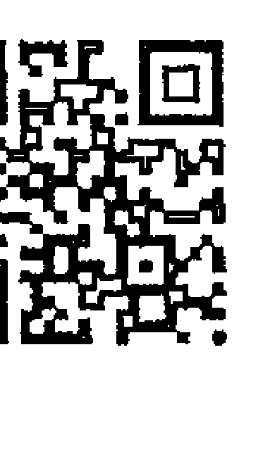
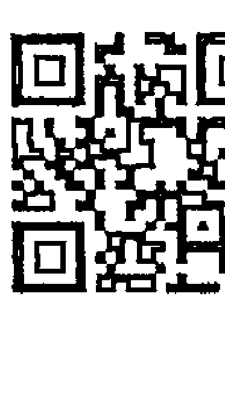
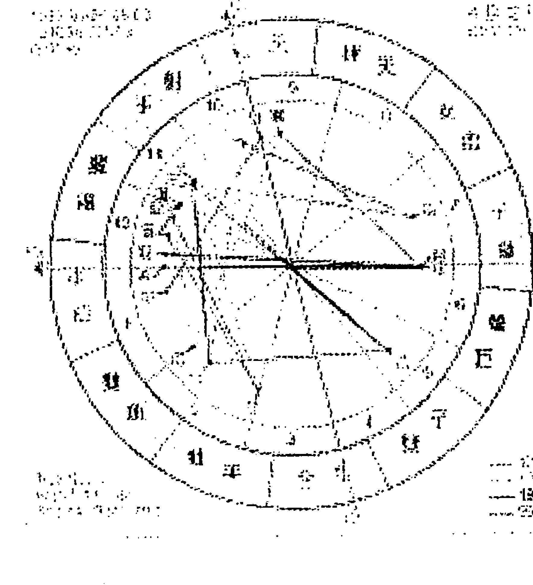
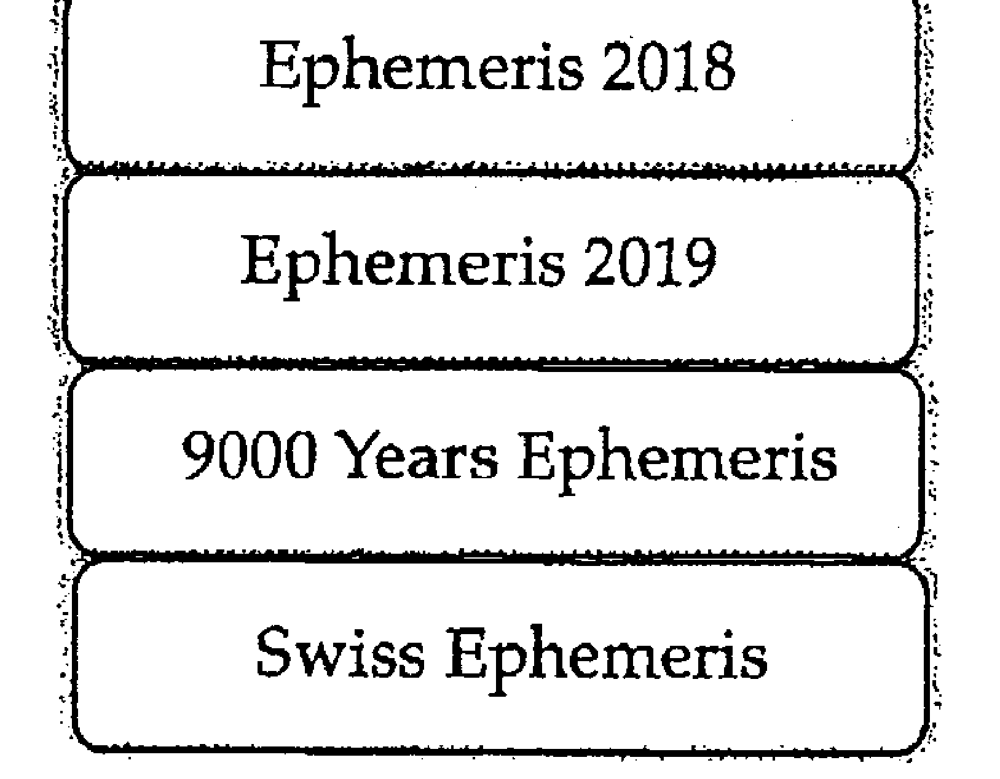

# 破除逆行的魔咒

# 出版緣起

興趣廣泛、身份多元的知名文化人韓良露，除了大家熟知的作家、媒體人及文化推動者身份之外，她也是藝文圈中最受重視的占星學大師。

二〇〇三年起她在金石堂金石書院（現龍顏講堂）開設占星課程，由於口耳相傳、好評不斷，課程一直持續到二〇一〇年才劃下休止符。在長達八年的四百多堂課中，她以歷史、哲學、心理學、社會學的角度，將占星的深層智慧化為生動的教學內容，讓大家在學習與命運對話的同時，獲得看待人生的更高視野。

這一系列課程不但架構了宇宙法則的邏輯，也融入她對人性與社會的觀察，但因資料整理工程浩大，成書計劃一直未能完成，為避免這些珍貴課程內容成為絕響，南瓜國際透過多年來數量龐大的上課錄音及相關資料，依據當時課程的規劃邏輯，整理成為系列書籍，期望能藉由文字重現精彩、動人且充滿智慧的上課盛況。

# 序

## 星圖不是一塊披薩

星圖並不是平的，它不是一塊切成十二片的披薩。

大家在剛入門學占星時，多半先忙著把星圖切成十二個星座、十二個宮位，忙著把各個行星像是鋪餡料一樣的放在星圖上。而很多進階級的占星學習者，儘管好不容易搞清楚什麼是太陽、什麼是月亮，但還是把星圖當成一塊披薩。事實上並非如此，星圖是活的，它會跟所有過去、現在、未來的人事物互動，它會隨著每一個當下的決定而有所改變。

在人生的旅程中，算命有可能有幫助，也有可能幫不上忙。這件事就像是把身體交給醫院的醫生，有的時候醫生活得好，有的時候醫生也無能為力。面對求助於占星的人，占星者當然希望可以幫得上忙，但是面對問題重重的星圖，有時候占星者也無從下手，尤其是當對方因為不相信而不願去理解時，占星師再怎麼厲害，也沒有辦法讓頑石點頭。也因此，要讓占星學派上最大用場，最好的方式就是自己去學。因為就算沒辦法成為一個不錯的思想家，可是我並不是行動家，很多行動家要做的事情我做不到。如果這個社會上能夠有更多人懂得占星學的話，大家就可以一起努力，將占星學帶給我們的宇宙智慧實際應用在生活中的各個層面。

占星學之所以有趣，在於即使兩個人有一樣的星座、宮位與相位，這兩個人或許在物質世界有著相同的條件，但是他們在精神世界與靈性發展上也不可能相同。如果純粹就現象界層面的話，學會占星最基礎的現實世界展現的這一面，出去幫別人算命足矣。但能夠靠著自己的智慧就能超脫現實的人不多，這也正是很多人找人算過命之後卻沒有變好命的原因——好命並不是靠算命，而是靠算命來真正了解命運。如果能夠藉由算命，為自己的生命指出現象界中道路的諸多可能性，也是一件對人生很有益的事。了解命運並不能完全改變命運，可是可以借力使力，讓自己的命運比原先更好。

小說《陰陽師》中曾經提到，每個人的名字就是一個咒。這個世界上不管再怎麼好的理論，都有可能讓人開啟視野，也有可能讓人鑽牛角尖。這也是學占星時必須兼顧物質世界、精神世界與靈性世界的原因。光顧著物質世界的算命固然能夠搏人驚嘆，但是除非透過精神世界與靈性世界的體悟，只有物質世界的「算得準」，其實並不能夠對人生有任何的改變。反而令人容易陷在「好靈！好準！」的咒裡面，以致於忘了占星的最終目的，是藉由靈性的提升，帶來人生的改變。

對於初學者來說，大家剛學會看圖時，一定會因為難以面對、超越星圖顯示的真相，因而對自己的圖大驚小怪，整天盯著自己圖上的缺陷緊張得要命，看到自己的圖也緊張，看到另一半的圖也緊張。不過經過一段時間的歷練，這個階段很快就會過去。

在多年的占星課堂中，上課的時候我常常會像拋繡球一樣拋出一些觀念，這些繡球背後都有其邏輯，雖然沒有接到也沒關係，但也有許多人因為接到了這些繡球而引發出繼續占星學的興趣。有些人覺得占星很困難，事實上占星不外乎星座、宮位、相位，有興趣就簡單，沒興趣就難。

星圖中的太陽、月亮、水星、金星、火星、木星、土星、天王星、海王星、冥王星，有一些是今生今世的當下決定，有的是累生累世的業力輪迴，站在宇宙的角度來看，過去、現在、未來並沒有差別，但是又各自不同。它們既是一體，又各自有不同的意義。

如果能夠理解到這個程度時，大家在看星圖時，就會比較容易看出星圖中的活路。

當你不能超脫於星圖曼陀羅的眾生相時，你就會陷在當中的某一個點中，就算是多麼明顯、多麼清楚的好相位，你都沒有辦法理解到其中的意義。整個星圖就像一個蜘蛛網一般，讓你陷在其中跳不出來。想要透徹看穿星圖曼陀羅，需要一些功力。儘管一開始難免功力不足，但是我很希望能夠藉由各式各樣的課題來引起大家的興趣。再厲害的占星師也一定會從新手開始，只要持續對占星有興趣，能夠覺得占星學很有意思，加上踩穩基本功，自然會有豁然貫通的一天。

當你能夠體認到星圖曼陀羅的能量起伏時，星圖就不再是一張切成十二塊的披薩，星圖就是眾生相。

註
本文依據二〇〇六年逆行相關課程錄音整理而成。

# PART 1
## 致讀者

「逆行」是一種讓人很有感的占星技巧，但是它並不適合拿來鐵口直斷。十二個宮位是十二個生命情境，當行星在宮位中逆行時，更容易讓當事人在日常生活中感覺到不適與摩擦。但也因為它很容易算得準，很有可能被斷章取義，反而限制了當事人的可能性。命不會越算越薄，但是格局可能會越算越小。在星圖中，每一顆行星都有無限的可能性，但是每一次的「鐵口直斷」，都等於是窄化了當事人發揮行星能量時的想像力。

本書將為大家探討行星逆行於宮位的情況，關於行星逆行星座的相關內容，請見已經出版的《都是逆行惹的禍：靈魂的星座重修課》。在跟逆行相關的課題中，最重視的是靈性的啟發，而不是陷在其中動彈不得。在進一步閱讀本書之前，以下幾個跟逆行有關的重要態度，請大家務必隨時放在心中。

### 一、逆行其實很普遍

很多人打開自己的本命星圖，看到星圖中有行星逆行就感到恐慌。事實上整張本命星圖（除了南北月交點之外），完全沒有任何行星逆行的人極少，大約佔百分之八。

就是說，九成以上的人星圖中都或多或少有行星逆行，因此大家不需要過度大驚小怪。

### 二、逆行不容易察覺

逆行是一種很內在的靈魂狀態，除非跟當事人很熟，否則逆行並不容易藉由顯著的外在事件來判定。就本命星圖中有行星逆行的人來說，即使是對靈性體悟有興趣的人，也需要到了三四十歲的一定年紀之後，才能夠掌握到逆行課題的幽微之處。

逆行則是當事人這輩子都需要面對的課題，它不依賴行運啟動，所以不見得會在特定時間內特別感受到壓力，以致於反而不容易讓人察覺。

### 三、逆行不等於靈性低

逆行的人常常會比不逆行的人容易反覆陷入執著的情境中，這種反覆的執著反而有可能使當事人在世俗上達到更高的成就。逆行的人最容易感到痛苦的地方，在於他們常常會反覆執著於某一件事，就算屢戰屢敗也不肯放棄，因而吃了很多苦頭。事實上即使成功，他們也不容易感到滿足。

大家要切記的是，逆行並不等於靈性低。靈性的體悟需要過程，不光只是腦筋「知道」就夠，還需要在現實生活中透過很多事件的經歷，才能帶來真正的理解。

### 四、完全不逆行不見得不做壞事

逆不逆行跟做不做壞事並沒有直接的關係。逆行的關鍵並不在於會不會遇到壞的情境，或者會不會做壞事。本命星圖中的逆行會使人反覆執著於過去世習性而遇到阻礙，這些阻礙都是為了讓逆行的人學會不再執著。

相對來說，一個沒有行星逆行的人，他們雖然比較不會執著於過去世習性，可是不管他們做對做錯，混著混著也就過了一輩子，對於靈魂來說，這不見得是一件好事。

### 五、別為逆行貼標籤

如同我在過去出版過的書中多次提醒大家，在占星的學習中，透過追溯過去的重要性遠大於預測未來。書中舉的實例都是為了讓大家易於理解而挑選出的極端例子，這些例子是在天數、地數、人數作用下產生出來的眾多可能性之一，大家不應看了書中的例子，就幫自己或其他人貼上「金星逆行都這樣」或「天王星逆行都這樣」的標籤，否則就容易偏離學習逆行的真義了。

學習逆行最重要的要訣，就是要意識到自己正在經驗著什麼樣的逆行功課，而非拿著逆行當藉口，反覆沈溺在逆行的泥淖中。當一個人能夠真正在生活中的片刻，忽然體悟到「原來這就是逆行」時，就有機會為生命帶來靈光乍現的新選擇。

# PART 2
## 前言

這兩年透過媒體報導，很多人對「逆行」現象很感興趣，最常聽到的是一年大約三到四次的「水星逆行」，這些都屬於行運的行星逆行。而如果一個人出生在行星逆行的期間，例如現在如果水星正在逆行，而有人在這個時間出生的話，這個人本命星圖中的水星就會逆行。

當行運遇到行星逆行時，會帶來社會性與宇宙性的影響。就像水星逆行時，星象專家常會提醒大家要小心交通，其實並不是全世界所有的人在這時期都需要提心吊膽，主要是因為水星掌管溝通，當天上的水星因為逆行而能量不穩，如果一個人的本命星圖剛好又跟天上逆行的行星產生對應時，這些人就特別容易受到水星逆行的亂流影響而出狀況。

大家稍微用邏輯思考一下，地球上有七十億人口，但顯然並不是每個人都會在水星逆行時遇到交通問題。也就是說，行運的行星逆行帶來的主要是宇宙訊息的影響，行運行星逆行的影響，一定會比本命星圖中行星逆行的影響力來得低。

# 什麼是逆行

每個人出生時，在出生的地點天空上的天宮圖，就是這個人的本命星圖。如果一個人出生時，天上有某一顆行星正在逆行，他的本命星圖上，這顆行星就會逆行。

逆行是一種過去世尚未修完，這一世必須重來的重修課。逆行最讓人困擾的地方，就在於逆行造成的問題往往在現實生活中找不到因果邏輯。舉例來說，多吃少運動容易造成肥胖，肥胖容易產生心血管疾病，這是一般人可以接受的邏輯——至於做不做得到，那是另一回事。但逆行帶來的問題往往找不到現實的因果邏輯，因而讓人感到困惑。

本命星圖中行星逆行的功課就像是心理學，不管是自己幫自己解析星圖，或者是找人幫自己解析星圖，解析者應將當事人敘述的任何不合常理狀況從星圖中找出線索，而當事人經過深度分析之後需要花時間自我探索，並持續深入挖掘及探索。

逆行與剋相（兩顆行星互相形成九十度或一百八十度的夾角）都會帶來負面影響，但情況不太一樣。當兩顆行星形成剋相時，例如掌管思考、溝通的水星與代表社會制約的土星形成了九十度剋相，這會使當事人的思考、溝通受到社會制約帶來的過度壓力，因而沒有辦法很流暢的表達自己的思想，這種情形遇到了行運行星又來剋時會更嚴重。在本命星圖的剋相中，每一次遇到行運形成相位時，就像是遇到了大考、小考，當事人頂多只能學著接受命運課題的考驗。不管當事人自我意識是否修正，他們都不可能避開這些大考、小考。

相較之下，逆行更具有靈修上的意義。本命星圖中的逆行會隨著當事人自我意識的修正而改變，當一個人不肯面對逆行帶來的問題時，這些問題就會不斷的找上門，用各種實際生活上的問題來逼著當事人面對。但如果當事人能及早透過逆行的困境讓靈性提升、轉化，逆行造成問題的嚴重程度就會降低，當事人即使再遇到相關問題，也比較不會感到不知所措。

我們生活在這個世界，包含了物質世界的現實層面、精神層面與靈性層面。當我們多往精神、靈性層面發展時，就會比較少將能量花在現實層面中。

逆行的痛帶來覺悟。不過儘管痛是帶來覺悟的一種方式，但是痛並不保證能夠帶來覺悟，活的痛帶來覺悟。最理想的狀態，當然是不需要透過痛，就能得到覺悟，而最不需要的痛跟覺悟是兩回事。

狀態，則是明明已經痛了卻沒有覺悟。

以火星逆行的我為例，受到逆行的影響，所以我很容易亂發脾氣，亂發脾氣的後果，往往會讓我吃到苦頭。所以現在我盡量減少亂發脾氣的機會，因為逆行的火星逼著我必須轉化，當我做不到的時候，它就會給我苦頭吃。本命星圖中的行星逆行，雖然沒有辦法讓一個人馬上就能放下屠刀，立地成佛，但是它會透過一些生活上的逆境，讓當事人沒辦法這麼隨心所欲，也因此至少得要或多或少地去努力提升自己。

別把命算小

逆行的課題常常是外人看起來問題很明顯，但是當事人當局者迷，根本沒察覺自己這個地方有問題。也因此我不會主動告知身邊好友，一定要等他們遇到相關問題來求助時，我才會跟他們解析逆行會帶來什麼困擾，而不會在他們平常沒遇到問題時主動告知。

也就是說，當一個人遇到相關問題時，才會特別感受到逆行的力量，也特別容易從問題中得到頓悟的契機。

「逆行」是東方占星學中很重要的一個研究課題，它很準確，但也因此帶來了一些麻煩。我在教占星教了好幾年之後才願意開跟逆行有關的課程，原因在於它很容易被誤用——它即使被誤用也很有效。東方占星學比較偏向宿命論，而逆行正是一個跟宿命關聯性很強的占星工具。很多用現實因果無法解釋的生命中的無奈，都有可能從本命星圖中的行星逆行看得出來。也因逆行有辦法解讀出宿命議題在現實生活中的顯相，這也會出現一個問題：所有這些在生命中會遇到的處境，背後的意義本來應該都是為了讓我們靈性有所體悟，而如果一個算命師並沒有給被算的人其他的輔助說明，就依據逆行給出了一個結論的話會很可怕。

將逆行當成一種算命工具並沒有什麼不行，甚至用它算命還算得特別準，但是如果純粹把它當成一種算命工具的話，它很容易就被推向宿命論的方向，當事人就很容易覺得「一反正命中註定，所以也不必努力」，這樣根本就本末倒置。

痛苦的事。因為所謂的「宿命」，就意謂它們是命中註定會發生的事，而且往往會用一種讓當事人感覺到壓力的形式，推著當事人成長。凡是占星學中涉及宿命的相關領域，我都會建議必須同時搭配大量靈性相關的知識一起學習。否則頂多就是讓被算者覺得「好準」，這件事情對被算的人無益。而且如果當事人並不具有靈性基礎的時候，他們就會被算命師算出來的東西給侷限住，把原本寬廣的生命給算小了。這也是我一直鼓勵大家利用占星回顧過去，但是不鼓勵大家過度使用占星預測未來的原因。

在過往的東方占星學中，占星師最愛用這套技術來控制別人，這也是我過去很少談論逆行的原因。以往靠著算命來賺錢的算命師最愛這套，所謂的「神機妙算」，靠的就是逆行這類跟靈魂占星有關的訣竅。我認為這類跟宿命有關而很準確的算命技巧，它們都需要有一整套的配套作法來配合，當有配套的靈性指導時，逆行就變得不那麼宿命了。它既宿命，又為宿命開了一扇門。如果不給予靈性指導的話，就如同告訴你宿命，又關上了門，沒有出路的宿命預測，對於當事人而言是非常殘忍的。

因此學習逆行最理想的方式，就是已經準備好要拓展靈性意識，也有意願踏上靈性之旅的話，不妨可以跟隨著本命星圖逆行透露出的線索，跟著本命星圖這張人生藍圖，走上更高、更美的靈性世界。

# 什麼是宮位

每一張本命星圖都分成三大結構：行星落在什麼星座、行星落在什麼宮位、行星與行星之間形成了什麼相位。

在星圖的解讀中，出生時間很重要，因為出生時間決定了上昇點的度數，而每隔四分鐘，上昇點就會走一度。拜現代醫療體系健全所賜，幾乎大部分在醫院裡出生的人，都會依據醫院開立的出生證明去戶政事務所報戶口。只要本人帶著身分證到戶政事務所，幾分鐘之內就可以調到一份有出生時間的出生證明。

出生時間決定了上昇點。如果將每個人都視為一個小太陽，每個人出生的那一刻，就是這個小太陽從地平平面「上昇」的時刻，也就是說，每個人出生的那一刻（就占星學的說法，所謂的出生，就是一個人吸進地球的第一口氣的時刻），東方地平線的黃道座標度數，就是你這個小太陽的「上昇」點的度數，也就是俗稱的「上昇星座」（註）。

註 關於上昇星座的相關內容，請見已經出版的《上昇星座》。

「降點」，再界定出日正當中的「天頂」與天頂對面的「天底」，這四個點將本命星圖切成四個象限，接下來再切成十二宮，就是「十二宮位」。十二個宮位分別代表了十二個不同情境的生命舞台，本命星圖中的行星落在哪些宮位，會顯示出一個人這輩子主要會在哪些生命舞台中活動。

上昇點與下降點切出一條地平線，地平線上方稱為星圖的上半晚，地平線以下稱為星圖的下半晚。天頂與天底切出星圖的左半邊與右半邊，左半邊為日出方向東方，右半邊為日落方向西方。

如果簡單的從等宮制來看，上昇點是第一宮自我形象宮的起點，下降點是第七宮伴侶宮起點，天頂是第十宮事業宮起點，天底是第四宮家庭宮的起點。在日出時出生的人太陽在一宮，他們會很看重自己，從小就被視為重要的人；在日正當中的中午出生的人太陽在十宮，他們會努力在社會舞台上有所表現，努力博得社會目光；傍晚日落時分出生的人太陽落在七宮，他們會非常以伴侶為重；子夜出生的人太陽在四宮，他們容易出生在或多或少有一些影響力的家庭，他們也容易為了家庭因素而犧牲個人意見。

由上昇、下降、天頂、天底切出來的四個象限中，上半晚的行星越多，越容易被人所見，下半晚行星越多，當事人通常比較忙於私人領域，就比較少被大眾認識。而如果左半邊越多，由於左半邊是日出方向，所以當事人會比較自我，比較以自我為重，如果右半邊越多，右半邊是日落方向，當一個人本命星圖的行星大多落在右半邊時，當事人就會比較以他人為重。

由四個象限再切分成十二個宮位。

在星圖左下角的第一宮、第二宮、第三宮，這三個宮位在星圖的下半晚，它們都具有跟自我有關的特性。

一宮：自我形象。一宮會顯現出一個人小時候的童年環境，當事人從小生長在哪樣的童年環境，就會被形塑出什麼樣的性格，因而形成了不同的自我形象。

二宮：自我資源。二宮是金錢宮，它是一種靠自己賺來而非從別人那邊拿到的資源。

三宮：日常生活的溝通。三宮是手足宮，它跟基礎教育、鄰居有關。

星圖右下角的第四宮、第五宮、第六宮也在下半晚，這三宮開始跟他人有關。

四宮：內心之家。包括了早年原生家庭與自己的家庭晚年生活。在父系社會中，父親型塑了一個家庭的家風，因此四宮通常也跟父親有關。

五宮：創造遊戲。五宮是戀愛宮、子女宮、創作宮，也是投機、賭博之宮，以上這些都是人類基於興趣、為了開心而生的創造遊戲。

六宮：生活秩序。六宮是健康宮，也是工作宮。有了六宮有目的的秩序，一個人的生活才能夠有紀律的運作。

星圖右上角的第七、第八、第九宮開始進入了跟公眾領域有關的上半晚。

七宮：一對一的對等關係。七宮是伴侶宮，它不只代表婚姻伴侶，它也跟事業夥伴有關，它是一種平等對待的社會關係。

八宮：他人的資源。相對於二宮是自己賺取的資源，八宮是共財宮，它是從他人身上取得的資源。八宮的資源不限於錢財，它經常會跟性、金錢、權力有關。因此八宮也是欲望之宮，八宮如果有問題的話，就會很容易跟別人起糾紛。

九宮：信仰、理念與異國。三宮與九宮都跟知識與溝通有關，如果說三宮是高中以下的基礎教育，九宮就是大學以上的高等教育；如果說三宮是街頭巷尾的八卦，九宮就是象牙塔中的學院派思想；如果說三宮是具象的常識，九宮就是抽象的理念。最能衝擊一個人信仰、理念的，就是異國文化，因此九宮也是異國宮。「行百里路勝讀萬卷書」，就是九宮的最佳註腳。

星圖左上角的第十、第十一、第十二宮是公眾領域的最後一環，它由十宮的事業舞台，一直走到十二宮輪迴宮，回歸宇宙的無意識中。

十宮：社會舞台。十宮是事業宮，它代表一個人渴望受到社會關注的一面。一個人最早的社會舞台就是母親，從一個人早年跟母親相處的模式，可以看出這個人長大以後會用什麼方式來博取社會母體的青睞。

十一宮：社交與公益舞台。相較於十宮事業宮追求的功成名就，十一宮是志同道合的同道之宮，它追求的是超越十宮名利的世界大同、四海一家的境界。

十二宮：輪迴與業力。在十二宮業力之宮中，所有的現實考量都必須退位，不管是主動的放棄（如果相位好），或者是被動的無法發揮（如果相位不好），都代表原先可以使用在現實考量的行星能量無法發揮。也因此，相對於六宮的身體健康，十二宮也跟心理健康有關，如果有剋相的話，常常會顯現在跟身心症有關的議題上。

# PART 3
# 逆行於十二宮位

# Chapter 1
## 水星逆行｜難以言喻的溝通障礙

如果仔細觀察，逆行跟非逆行當事人的表現會有顯著差異。比如在朋友圈中，兩個人如果出生日期相近，他們星圖的行星星座與相位狀況就會很接近，但如果一個有逆行，一個沒有逆行的話，這兩個人在外表上會有很多面向相似，但他們會在很多關鍵的事情上，做出很不同的決定，這就是逆行帶來的影響。

逆行需要更細心的去感受，而不只是純靠知識的理解，因為它會牽涉到一個人很幽微的反應。這也意味著逆行不光只是知道它的道理就可以了，還必須要很細心的去觀察跟感受那些很微細的差別，否則就算知道了很多逆行的理論，也沒辦法看出其中的蛛絲馬跡——而這些蛛絲馬跡，往往都是困擾當事人很久的问题。

當一個人星圖中有行星逆行，如果當事人自我反省能力很高的話，他們會知道自己的人生中，在這些地方有一些障礙；如果當事人自省能力較弱，他們也會感覺到自己人生中有一些障礙，但是很難覺察到這些障礙的根源，其實都在跟逆行有關的事物上。

水星代表溝通，它是將我們的思想透過語言跟別人互動的行為。語言的溝通不只是語言本身，還包括了聲波、頻率，頻率是很長、很短，或者是跳動的，或者躲躲藏藏，它們都會傳達出不同的訊息。表面上這些話好像沒什麼不同，但同樣一句「吃飽了沒有一」，有一些人講出這句話時，會令人感覺到話中隱含了一些其他的訊息。

水星逆行的人說話，如果非常敏感的人來聽，就會感受到話裡面隱含著過度膨脹、過度躲藏或是過度壓抑。在與他人溝通的時候，水星逆行的人的頻率是不順暢的，因而水星逆行的人長久以來都會感覺溝通受到障礙。

水星逆行最主要的問題，在於當事人經常會產生溝通上的障礙，而這些障礙都不是用理性可以解釋的問題，即使當事人水星的相位很好，就現實層面來說，他們表面上並沒有溝通障礙，也不應該會有這方面的問題，他們跟人溝通好像沒有問題，但內心當中卻覺得不對，不知道出了什麼事。這就是逆行的過去去世經歷帶來的情緒或心智的干擾。

佛經告訴我們人要活在當下，生活既不在過去，也不在未來。所有逆行都在解釋「沒有活在當下」是怎樣。儘管沒有逆行的人不見得就能活在當下，但行星逆行的人會特別不能活在當下。不管水星逆行、金星逆行、火星逆行……所有行星的逆行，都在解釋行星的能量不活在當下所形成的現象。

不管水星逆行落在什麼星座，由於逆行會讓水星能量因為古怪而格外被凸顯，因此水星逆行的人都會給人一種特別聰明的感覺，讓人不由自主的被他們吸引。可是水星逆行的人雖然讓人覺得很聰明，但是在我認識的這麼多作家中，水星逆行的作家卻不多。

《北回歸線》的作者亨利米勒（Henry Miller）是少數的例外，其實亨利米勒的文筆很爛，但他用的是一種奇異的文筆在寫色情文學，因為口味很重而又非常真實，因而有可觀之處，可說已經脫離了文學範疇而另成一格。如果不是這樣，以他的文筆來說，很難躋身於正統作家之列。

水星逆行的星座與宮位的不同，在於星座能量會有明顯的過去、現在、未來的三種能量位階，而宮位沒有。但一顆行星落入任何宮位時，一定也會落入某個星座，因而隨著落入星座有過去、現在、未來的三種能量，所以當逆行的行星落在宮位中的星座時，還是會因應星座而有過去、現在、未來三種不同能量的反應。

例如水星逆行牡羊時，特別會將能量放在未來，水星逆行巨蟹則無法將能量放在未來。當水星逆行落入一宮時，一宮的自我形象必須具有前瞻、主動的特質，因此水星逆行牡羊落入一宮受到的影響比較小，水星逆行巨蟹又落入一宮的話，水星的能量就會很難發揮。也就是說，水星在三個不同階段會有不同的能量高低，因而影響了進入宮位時的表現，而非宮位本身具有三種不同的能量。

水星是演員，宮位是舞台，演員狀態好，在舞台上的表現也會比較好，演員的能量不和諧，上了舞台之後就難以充分表現。水星星座在三個不同階段的不同能量會影響它們在舞台上的表現，而非舞台本身造成星座能量的不同。也因為逆行一定會造成能量上的不平均，進入宮位時，不管是在過去、現在、未來中的哪個階段，逆行的人都一定比沒有逆行的人更為困難。

### 水星逆行一宮

一宮是自我形象之宮。不管水星本身位在哪個星座，水星逆行在一宮的人都有個共同現象：在水星的溝通領域中，水星逆行在一宮的人跟比較幼稚、比較年輕的人互動比較容易，跟比較成熟、世故的人互動比較困難。即使是本身就屬於過度老成持重的水星逆行摩羯也一樣。因為逆行會阻礙水星在一宮表達自我的能量，即使是水星摩羯，也難以發揮他們跟長輩溝通的長才，以致於他們終生都會有一種上錯舞台的感覺。

水星逆行在一宮的最大特色，在於當事人從小就會強烈的感覺到他們在自我表達、自我發展上受阻。尤其水星逆行牡羊、獅子、人馬等火象星座落在一宮時，當事人的能量會明顯的不斷在過去、現在、未來中不斷的跳躍，因而容易在表達自我的某一個關鍵出現短路的狀況，也就是說，他們的自我表達會突然關上溝通之門。

水星逆行在一宮的人一方面會強烈的希望被別人注意，但是受到逆行的障礙，他們無法將自我完全的表達出來，因此他們會出現一種自閉傾向。水星逆行在靈魂之宮十二宮時也會自閉，但水星逆行一宮跟水星逆行十二宮的自閉並不相同。水星逆行在十二宮是一種隱居者式的自閉，他們很類似一種終身的隱居者，過著隱士般的生活，但他們通常不會覺得自己自閉。而水星逆行一宮的自閉情形比較像是自閉兒。自閉兒並非不愛說話，他們想說話，卻不知道怎麼說，當他們想說話卻說不出來時，就會開始生氣，覺得別人都沒辦法了解他們，但別人沒辦法了解他們，又是因為他們說不清楚。當他們陷入這種情況，就會感到憤怒。水星逆行一宮的人也是這樣，當他們陷入這種情況時，就會陷入焦慮，當水星落入一宮時，他們會比水星落在其他宮位的人更想溝通，他們很想做一宮的事情，而他們做不到。

當他們無法將自我表達的門打開時，就會有強烈的挫敗感，因而出現階段性的自閉傾向，並將對外界溝通的門關閉。他們關閉溝通之門的原因，就在於他們不想要忍受這種挫折感。由於溝通之門經常關閉，他們常常會覺得自己被外界誤解，因而又打開溝通之門。長期下來會使他們對自己與外界的關係感到不安。

水星逆行在一宮的人有時候在溝通時會展現出很高的能量，但這種能量會像是拋物線一樣，並不能讓他們跟外界維持流暢的溝通。舉例來說，我有個水星逆行一宮的朋友

### 水星逆行在二宮

二宮是個人資產之宮，如果水星逆行在二宮的話，當事人這輩子要小心自己會有對於資產過度執著的傾向。他們往往會有一種過度的擁有欲，對於自己擁有的東西特別無法放手。

在醫療占星學中，水星逆行二宮的人必須小心氣喘。水星跟呼吸有關，正常人的呼吸在一呼一吸之間應該是平衡的，而氣喘的人往往只能進不能出，這也符合水星在二宮逆行只肯進、不肯出的現象，因此占星書會告訴大家水星在二宮逆行的人容易有氣喘的問題。氣喘的人對氣候變化之所以格外不能適應，從另外一個角度來看，這也是一種頑固、不接受、不適應環境變化而產生的身體症狀，這也符合水星逆行二宮的邏輯。

水星逆行二宮對熟悉的事情很聰明，卻完全不能適應不熟的事情。我們一輩子處理大錢的機會不多，在日常生活中通常用的都是小錢，如果反映在跟二宮最相關的金錢領域，水星二宮的人在財務上就會出現用小錢很精明、用大錢很笨的傾向。這是一個很大的問題，因為儘管水星二宮對於處理小錢很擅長，但當他們要處理大錢時，也很執著的用處理小錢的邏輯去處理大錢，這樣就會出大問題。而大錢上只要出一兩次問題，造成的損害，恐怕不是一輩子省吃儉用可以省得回來的。

### 水星逆行三宮

三宮代表日常生活的溝通，也代表基礎教育。水星逆行三宮的人容易在小學到高中的基礎教育階段時出現問題。我有個朋友的小孩就是這樣，他從小學到中學的成績都很爛，念完國中時，我這個朋友還到處拜託請人幫忙，好讓他的小孩進入一所學科成績要求很低的私立高中——即使如此，他進去念了一年之後，還是因為成績太差而被退學。但這個小孩一點都不笨，他才高一就開始念法國知名詩人波特萊爾的作品，他只是不能夠接受基本教育。

水星逆行的人有一個共同特質，他們有能力「進」，卻沒有能力「出」。他們在資訊的吸收、理解上沒有問題，問題都出在表達上。水星逆行三宮的人，吸收知識時自己有一套獨特的方式，他們對於三宮領域的知識只能進，不能出。假設一個人讀的都是很爛的書，或者不讀書，因此寫出很爛的文章，或者沒有能力寫文章，這是理所當然的事；但水星逆行三宮的人有可能讀很好的書，但還是寫不出好文章。

水星逆行三宮在初級教育有個特色：當事人對於事物有著非常強的理解、分析能力，但是溝通能力卻非常弱。比如趨勢科技的創辦人張明正就是水星逆行三宮的人。他在念小學時有學習障礙，是一個被老師認為很笨的人。他小時候功課怎麼學都學不會，從小學到初中成績都吊車尾，常常是班上的四十幾名。當然現在我們知道他是一個很聰明的人，但是他沒辦法寫東西，甚至連寫筆記都有困難。他太太也常笑他不會用成語，凡用成語必用錯。不過儘管他沒有能力寫東西，但是有能力研究事物，商業頭腦更是一流。此外，他也有溝通上的困難。他有能力自己一個人長時間演講，但如果要接受訪問就會有問題，他無法獨自回答對方的提問。知名的哲學家、心理學家肯恩威爾柏（Wilber）也有水星逆行三宮的問題，在他的傳記中提到，他小時候受教育時也同樣有學習障礙的問題。

從這些例子可以看出，如果你的小孩是水星逆行三宮的話，不必擔心他們在求學時期的障礙，只要脫離初級教育之後，他們可能會有很好的表現也說不定。

水星逆行三宮的人與兄弟姊妹之間經常會有問題。如果逆行加上剋相的話，就會更加困難。我認識一個水星逆行三宮又有剋相的女孩，她母親曾經未婚懷孕，生下一個私生子，不過也因為未婚生子，所以將小孩送人，終生不再聯絡，也就是說，這個女孩在還沒有出生前，就有一個被送人的哥哥，而她完全不知情。或許在現實生活中，這件事情不見得會帶來實際的影響，但是這種家庭中不告訴小孩的祕密，卻有可能對小孩的潛意識在溝通上造成莫名的干擾。

### 水星逆行四宮

四宮是一個人的內心之家。水星逆行四宮是一個困難的相位，當事人在內心深處會深受童年經驗的困擾，如果又加上水星本身跟其他行星形成嚴重的剋相，當事人就有可能會在童年經歷親密的人的死亡，或者其他跟家庭有關的重大傷害課題。由於四宮跟父親有關，如果水星逆行的位置在四宮，當事人受到的童年創傷常會跟父親議題有關，從水星逆行四宮落在什麼星座，則可以看出當事人小時候會受到什麼樣的創傷，以及當事人長大以後，會用什麼方式來面對、處理他們的童年創傷。例如天蠍跟神秘學的療癒有關，水星逆行四宮又落在天蠍的人，他們長大以後會透過天蠍的深刻方式來面對四宮的童年創傷議題；人馬的特質是遠走高飛，所以很多水星逆行四宮人馬的人長大以後會想要讓自己脫離童年環境，逃得越遠越好。知名導演賴聲川與李安就是水星逆行四宮又落在天蠍的例子。這兩個人的作品也因爲深刻的處理家庭議題而廣受觀眾的共鳴。

水星逆行四宮的父親情結，代表當事人在童年受到的創傷經驗，讓他們長大成人以後，依然因爲缺乏安全感而停在童年的某一個點，無法真正停留在成熟的狀態，他們在情緒上沒辦法真正長大，因此終生都會有一種仰望父親的姿態，過去的幽靈常會從當下把他們抓到過去。水星是一種經由情緒而理性化的過程，如果能量流暢，水星四宮沒有逆行的人在長大之後有機會跟父親的關係和諧並互相尊重，透過成熟的思想狀態，以理性的方式放下過去童年相處時的種種負面情緒。但是如果水星逆行的話，代表當事人無法藉由理性化的過程讓情緒釋懷，他們的童年陰影會隨著水星逆行而在過去、現在、未來間不斷的跳躍，無法持續停留在想通的狀態。

水星逆行四宮的人從小就有一種來自父權的壓力，他們小時候通常會遇到不得不臣服於父權的處境，長大以後就會一直搖擺於屈服別人或者控制別人的處境中。所以水星逆行的人長大以後會培養出一種讓自己能夠掌控別人的能力。在藝術圈中，最能夠演，就是這種特質想讓自己掌握全局的工作，莫過於當電影導演，水星逆行四宮的賴聲川及李安選擇當導演，就是這種特質想讓自己掌握全局的展現。但不過不管他們多成功、多能掌控他人，他們還是會在某些關係中顯示出自己完全屈服的一面，例如李安常常會顯示出自己怕老婆的一面——這種狀況其實未必是對方一定要掌控他們，而是當事人在這樣的關係中能夠找到一種情緒上的依賴。這也顯示了水星四宮逆行的人在關係上某些地方還停留在童年，這種屈服跟依賴，其實是一種孩子氣的放縱。

不過水星畢竟是一顆中性的行星，水星逆行四宮雖然會讓當事人沒有安全感，並且讓當事人過度敏感或不快樂，但都還在可承受的範圍內，不致於造成生活上太大的影響，儘管有時候當事人很難從日常生活的表面找出自己不快樂的原因。水星逆行四宮帶來的不快樂，畢竟只是一種心智上的思辨過程。

### 水星逆行五宮

五宮是創造之宮，水星五宮逆行的人一定會在水星領域的五宮創造力上感受到強烈的壓力。水星五宮本身是一個能量很強的位置，因為創造是一個從無到有的過程，而創作是一種能量不斷穿梭於過去、現在、未來的行動，從事創作的人會經常將能量投射出去之後又回到自己的內在。但水星逆行五宮的問題，在於他們會經常感覺自己有創造的需要，卻沒有創造的能量。

如果一個人很少感覺自己有創造的需要，這些人就不會因為想要創造卻做不出來而有壓力。但水星逆行五宮的人相反。水星逆行五宮的人很敏感，腦中常常會有很多想法，他們雖然很會想、很會講，可是等到真的要做的時候卻忽然不知道該怎麼做。這跟很多人因為懶惰而光說不做的情況不同，水星逆行五宮的人會真的感覺自己沒辦法將這些富有創造性的想法實現，因此感到壓力很大。這種壓力會使他們特別喜歡去親近年輕人或小孩，因為當他們覺得自己的創造能量被壓抑的時候，就會回頭去看屬於自然的創造力——也就是孩子們的創造力。很多大人都認為自己不會畫畫，可是幾乎所有的小孩拿著一張紙，就認為自己會畫畫。我侄子小時候來我家都說要畫畫，有一次我先生跟他一起畫，在大人的眼光中當然我先生畫得好很多，我在旁邊一邊看還一邊擔心這樣會不會讓侄子感到挫折，畫了一會兒侄子說：「我已經快畫完了！」又對我先生說：「你怎麼畫得那麼慢？我整個紙都快塗滿了，你才只畫中間這一點點。」我在那一瞬間忽然明白了，孩子們不會感到挫折，不管畫得好不好，他們都覺得自己很會畫畫。「創造能量」跟「創造結果」是兩件不同的事。大人們往往關心的是「創造結果」的好壞，常常因為覺得自己畫不好、唱不好、跳不好就不去做，但孩子們完全不受創造結果的影響，因為每個孩子都創造能量充沛。

水星五宮逆行的人對這一點特別有感受，所以他們喜歡跟孩子們玩，而不喜歡跟同年齡或年紀較大的人在一起，因為後者會讓他們感到受限制。也由於五宮跟感情有關，所以有些水星逆行五宮的人會有一種迷戀青春、特別喜歡年輕的少男少女的傾向。

我有個朋友就是這樣，他很有才氣，但卻沒有辦法在創作時展現出來。他一直很喜歡十幾歲的少女。當他二十多歲時沒什麼問題，三十幾歲的時候這種情形也還可以接受，但是過了四十歲還喜歡十幾歲少女，這就已經有點讓人覺得是怪叔叔，過了六十幾歲還這樣就有點可怕了。另外一個朋友曾經擔任副刊主編，她的品味、學識跟文字能力都很好，但她一直想出一本自己的書卻寫不出來。他們都不是不想創作的人，他們很想創作，卻總是被一種莫名的能量卡住。

創作是一種將未知變成已知的過程，對很多人來說，就算寫得很爛，也能流暢的將作品寫出來。但對於水星逆行的人來說，他們無法一直保持在將未知轉換成已知的狀態中，往往寫了幾個字就難以繼續下去，便又退回空想，因此多年下來一直眼高手低寫不出自己的作品，這也就是水星逆行很不容易成為作家的原因。

### 水星逆行六宮

水星逆行六宮的人最大的特色，就是他們在工作上有一種慣性的固執。他們常被大家視為工作狂，因為他們會像馬克白夫人洗手一樣，一遍又一遍歇斯底里的檢查工作上的各種細節，像強迫症一樣要求盡善盡美。他們對工作與健康方面都有很多禁忌，並發展出一套特殊的行為模式。

我有個朋友的太太就是這樣，先生跟女兒回到家一進門脫了鞋子，她就會拿噴霧劑先噴腳消毒，他們坐過的地方她也一定要消毒，以致於朋友們因為覺得壓力太大，都不敢去她家，連先生跟女兒都想逃走，後來等到女兒上了大學，她先生也真的跟她離了婚，女兒也跟著爸爸住而不跟媽媽住。

以名人為例，麥可傑克遜也是水星六宮逆行，他知名的「月球漫步」可想而知一定是不斷重複又重複苦練，才能呈現出這種超越人體的舞步。他不斷整容，又有潔癖，他來台灣開演唱會期間，根據媒體報導，飯店花了很多錢讓他可以用礦泉水洗澡。他居住的「夢幻莊園」（Neverland Valley Ranch）裡面所有的裝潢也都是白色，不容許有一點點髒污。

水星六宮逆行的人在工作與人際關係上都很困難，因為他們會不由自主的雞蛋裡挑骨頭。他們在工作以及生活上各種秩序的要求，有著一套跟其他人都不一樣的標準。

以前面提到的那個有潔癖的太太來說，她先生雖然也很同情她，但是實在沒辦法跟她住在一起生活。水星逆行六宮的人並不是情緒上的歇斯底里，事實上他們很理性，但是行為比歇斯底里更歇斯底里，因為水星逆行六宮的人在生活、工作上堅持的那套標準跟其他人不一樣，他們全心相信這套標準，因而很難溝通。

### 水星逆行七宮

水星逆行七宮雖然不是最困難的相位，但是會造成當事人人際關係上的困難，尤其在婚姻關係影響最大。水星逆行七宮的人總是不斷的在要跟對方溝通，或者不跟對方溝通的想法中徘徊。水星逆行七宫的人只要跟别人在一起，即使是亲如配偶，他们都会感到紧张，意识会不断来回摆动，这种意识上的摆动，会使得身边的人跟他们有相处上的困难。

水星逆行七宫的人有一种倾向，他们这辈子找的对象会反映出过去兄弟姐妹之间的关系。七宫是伴侣宫，而水星代表了兄弟姐妹之间的关系，水星逆行七宫的人会在婚姻里面找寻一种手足般的感情，但也很容易与伴侣起争执，这种争执很多时候并不是反映出这一世的状况，而是重现过去世中兄弟姊妹间的情境——仔细想来，每个人跟兄弟姊妹吵架的机率，的确比跟其他人起争执的机会更高。

水星逆行七宫的人经常跟配偶有沟通障碍，他们都会认为配偶无法沟通，但配偶会认为他们才是有沟通障碍的人。最明显的例子就是英国的戴安娜王妃。戴安娜王妃的水星逆行巨蟹，又落在七宫，水星逆行巨蟹代表著童年伤害，而且是来自母亲造成的童年伤害。黛安娜王妃的妈妈六岁时就因为外遇而离开家庭，这个童年伤害使她在处理伴侣关系时特别没有安全感，查理王子在她心中有好的一面也有坏的一面，好的一面是查理可以让她做王妃，坏的一面是查理让她没有安全感。兩人的關係從一開始，她就在查理的優點與缺點之間不斷擺盪，這種擺盪也引發了她跟查理之間的問題。當她覺得查理不好的時候，就會挑剔查理，跟查理吵架，而不肯理性的接受自己王妃的角色——很多女人可以為了王妃的身分而對先生睜一隻眼閉一隻眼，但她做不到。

### 水星逆行八宮

八宮是性、金錢、權力之宮。水星逆行八宮當事人的性意識會比較複雜，因為他們的性意識不像非逆行的人這麼穩定，不管他們是異性戀或同性戀，他們在性意識上永遠會跳來跳去，而且深愛過去世輪迴的影響，因而常有性方面的難題，這些難題往往來自於性能量及性意識的扭曲，進而在性、金錢上產生許多複雜的現象。

性能量及性意識扭曲或扭轉的可能性很多，可能是同性戀、雙性戀或複雜的性關係——這裡所謂的「複雜」，指的並不是性伴侶很多帶來的性關係複雜，而是指當事人會因為能量扭曲，使得他們在處理性方面的事情時「感到很複雜」。因而在占星書上會說水星逆行八宮是一個容易出現同性戀、雙性戀或者其他跟性有關議題的相位。

我有三個水星在八宮逆行的朋友，分別屬於三個不同星座，也恰好隨著水星落入不同的星座，因而呈現出三種不同的特質：水星人馬逆行八宮的朋友是完全公開的同志，大家都知道他是同志；水星天蠍逆行八宮是一個半出櫃同志，他的朋友們知道他是同志，但公司裡的同事不知道；水星雙魚逆行八宮的人更特別，大家都認為他應該是同志，可是他自己恐怕卻不知道。

### 水星逆行九宮

九宮是異國、宗教與高等心智之宮。水星九宮逆行對心智來說是最困難的相位。當事人思考時停不下來，不停的往前、往後、往高空、往地下跳躍，他們無法在時間與空間的思想領域找到固定的著力點，所以會在心智上產生一種理性錯亂的傾向。

「停止思想」，學著用意識與直覺去感受身邊的事物。

最符合水星逆行九宮的例子就是美國富商霍華休斯（Howard Hughes），霍華休斯的事業版圖橫跨各大產業，是當時世界上最富有的人之一，但他終生為嚴重的強迫症及妄想症所苦，晚年更將自己鎖在房子裡過著徹底的隱居生活。霍華休斯的水星在九宮逆行而且落在人馬座，是最典型水星九宮逆行的例子。李奧納多狄卡皮歐主演的電影《神鬼玩家》（The Aviator）即取材自霍華休斯的傳奇人生，電影中描繪的各種細節，包括對各種事物的奇怪想法以及強迫症，都很符合水星逆行九宮又落在人馬的情況。他一生中寫下大量的日記，卻沒有人看得懂，他平常一直講話卻沒有人聽得懂，到最後他終於封閉自己，過著完全與世隔絕的隱居生活。霍華休斯這些異於常人的狀況，不管是思想或是語言，都完全呈現了水星逆行九宮的特質，想了解水星逆行九宮的人不妨好好的欣賞一下這部電影。

水星逆行九宮的人完全不聽別人的意見，因為他們沒有辦法把別人的意見變成一種能被他們接受的頻率；他們說出來的話，別人通常也無法理解，因為他們表達意見時很混亂，但這是一種高心智、高理性造成的混亂。

對他們來說，靠直覺反而比靠理性思考好，因為他們在理性思考的過程中有很多不連貫之處。由於他們在思考上不斷跳躍無法形成結構，導致根本無法跟別人溝通。當事人有時會跟外界隔絕，想要讓自己好好的想清楚，但他們想得越深，就會越混亂，導致別人更無法理解他們想要說什麼。他們會在字跟句之間失去了字句溝通的能量，字與句都變成了抽象的符號，當事人便成了心智與靈性的怪物。他們這輩子要學的功課就是停止思想，學著用意識與直覺去感受身邊的事物。

### 水星逆行十宮

十宮是事業舞台，每個人人生中的第一個事業舞台就是母親，我們在小時候都渴求受到母親的矚目，因此十宮也跟小時候母親的對待方式有關。

水星十宮的人不管是否逆行，他們小時候的童年經驗中，母親都會很鼓勵他們發表自己的意見，他們的母親會是願意陪小孩念童謠、唱兒歌的媽媽，所以他們長大以後，都會是在事業舞台上能言善道的人。但水星逆行十宮的人過去世曾經很強烈的想要成為一個重要的人，這種過去世的願望，成為他們這輩子很強的驅策力，使他們這一世想要透過水星的方式，不管是語言、傳播，或是心智、思想，讓自己能夠在事業舞台上得到別人的肯定。

水星逆行十宮的人在事業上有很強的競爭力，以致於他們心智都不能休息，因為他們覺得如果自己知道的东西不夠多的話會輸給別人，這樣會讓自已對不起過去世對自己的允諾。也因為心智一直保持在這種狀態，所以他們都是不快樂的人。

水星逆行十宮的人都能言善道，但是他們也是天下最難溝通的人，因為他們的心智都用在謀略而不在溝通上。他們在跟人說話時想的不是如何跟人溝通，而是要怎樣才能用語言扳倒對方或控制對方。

他們通常都是成功人物，但大家都不會想要跟他們溝通。舉兩個有名的例子：影視大亨邱復生，以及美國前國務卿季辛吉。他們生命中都有來自母親的強烈驅策力，手中都握有很多資訊，對他們來說，知識不是「智慧」而是「情報」，他們會將握有的情報當成競爭的工具。

這兩個人的水星逆行都落在十宮，他們都展現出同樣用心智來競爭的本質，但也隨著落入不同的星座也會呈現出不同的能量。水星逆行雙子的季辛吉最能言善道，而水星逆行巨蟹的邱復生最有觀察力與內省力。

### 水星逆行十一宮

十一宮是社交與公益之宮，如果水星逆行十一宮的人將水星的能量發揮在創意上還可以，但是他們常常會沈迷於過去世的天馬行空，他們說過的話都不會實踐，是標準的白日夢專家，常常不切實際到令人覺得不可思議的地步。也因為他們的心智狀況讓他們無法跟身邊的人溝通，因此他們常常會給人一種孤獨者的形象。

水星逆行十一宮也是一個在性意識而非性行為上，容易產生冷感的位置。性的溝通不僅僅只是身體上的接觸，還包含意識的連結。我有個水星逆行十一宮的朋友，她在婚後就發現自己對性沒有感覺，這讓她很困惑。

### 水星逆行十二宮

十二宮是潛意識、業力與孤獨之宮。水星逆行十二宮的人，他們的潛意識非常活躍，常常會有一些莫名的恐懼或不安，這些恐懼或不安往往來自於過去世的業力。他們在潛意識中會有一些無法解開的結，這些結會讓他們在現實生活中感到困惑或不快樂。

水星逆行十二宮的人，他們的業力非常重，常常會有一些無法解開的結，這些結會讓他們在現實生活中感到困惑或不快樂。他們在潛意識中會有一些無法解開的結，這些結會讓他們在現實生活中感到困惑或不快樂。

水星逆行十二宮的人，他們的孤獨感非常強，常常會有一些無法解開的結，這些結會讓他們在現實生活中感到困惑或不快樂。他們在潛意識中會有一些無法解開的結，這些結會讓他們在現實生活中感到困惑或不快樂。

### 水星逆行十一宮

水星逆行十一宮的人適合從事與社會改革相關、比較激進的工作，也比較需要在天馬行空的工作環境中工作，他們最忌在保守的環境、機構或處境裡面工作。我有個朋友她跟她嫂嫂一起去法院當臨時僱員。公家機關的工作環境本來就很保守，而法院又是最保守的公家機關。公家機關固定時間會舉辦一些考試，讓內部的臨時僱員可以優先得到相關資格，她嫂嫂就利用這些考試先取得正職身分，再考書記官，又不斷往上考，現在的薪水已經是臨時僱員的兩三倍了。但我這個朋友進去七八年，沒一個考試能考過關，臨時僱員做了七八年，後來公家機關精簡人事，她也因此被裁員了。

雖然她家經濟無虞，但是這樣混個七八年，本來已經所剩不多的青春，也就這樣被她混掉了，成為毫無面對現實生活能力的失敗者。由於不須為生活煩惱，她有很多白日夢及不切實際的想法，卻沒有把能量投注在現實生活中。法院是最保守的工作場所，法律是舊的、既定的東西，是被人訂下的既是規矩。在法院工作了這麼久，她連正式雇員的資格都沒考上。或許也是她的水星在抗拒這件事情。

水星逆行在十一宮意謂著她有能力跳脫傳統，如果她充分發揮天馬行空的能量，從事需要異想天開的工作，就能成為領先潮流的人。很可惜的是她偏偏選擇了一個最不適合水星十一宮能量的法院工作。

### 水星逆行十二宮

十二宮是沒辦法忘記跟外界接觸時的情景，種種細節在腦中縈繞不去，無法驅除。這種狀況會使得他們在現實生活中失去方向感，讓他們感到很疲倦，於是他們很怕跟外界接觸。如果再加上水星與土星、冥王星形成嚴重的九十度或一百八十度負面相位時，當事人就容易受到外界靈或前世記憶的騷擾。我認識一個水星逆行十二宮有剋相的人，當他遇到行運冥王星帶來的剋相時，在那段前後大約兩年多的時間，照一般人的說法，他就像是鬼上身一樣，彷彿完全變了一個人。

我有一個水星逆行十二宮的朋友，他通常兩三個月才肯出來跟朋友碰面，過著隱居般的生活。平常我們跟人碰面，可能回去之後就什麼都不記得了，但這個水星逆行十二宮的朋友跟我說，他之所以得要很謹慎的選擇跟誰吃飯、碰面之類的事情，是因為他會忍不住倒帶，如果隨便出來很無聊或者遇到不喜歡的人的話，回去還得不斷倒帶重播，對他來說，這種壓力實在難以負荷。

水星逆行十二宮會使當事人自我意識的能量變得很微弱，理性的能量很弱的話，就會沒辦法自動判斷哪些事情該記住，哪些事情又應該忘記。他們會無意識的去吸收周圍沒有形狀、沒有邊界的宇宙訊息。一般人的記憶都有自動剪裁的能力，比如今天在外面有人稱讚你，回家以後重複播放的通常就是這句話，這就是所謂的「選擇性記憶」。通常我們選擇的都是自己喜歡的那些事情，更多的時候我們選擇的是「不記憶」，把這些記憶全部清掉。水星逆行十二宮的人缺乏這種水星的自主性，他們的水星已經被十二宮的無意識給吸收了，這些無意識的訊息以蔓延的方式出現，使當事人的心智受到很大的干擾。當他們的心智能量更薄弱的時候，外界的能量就更容易入侵。

就像有的人怕鬼，有的人不怕鬼。「鬼」其實也是一種訊息，大部分的人都會自動遮蔽掉這種訊息而不受干擾，但水星逆行十二宮的人沒有防護網。

水星逆行十二宮的人自我封閉雖然孤寂，但也不是全無好處。由於自我封閉接觸的東西很少，而且那些東西都是他們選擇的，所以他們有能力從事哲學、現象學等領域的工作，這些東西一般人看過就忘，而他們會一再倒帶重播，在腦子裡面繞個不停。不過可惜的是，他們雖然可以吸收，卻還是有創作上的困難。剛剛提到的這個朋友也是一個領域的學者，他對於自己專業領域很有研究，但是著作極少，這也就是水星逆行帶來的表達障礙。

## 金星逆行——只進不出的情感困擾

**金星是一種可以引動一個人喜悅情感的一種能量，它是一種讓人親近的吸引力。簡單來說，金星就是廣義的愛情。**

一般來說，愛情是需要平衡與自由的，是需耍循環與互動的，但如果一個入本命星圖中的金星逆行時，我們會發現當事人在自我情感上的對外能量都沒有自由的進出口，金星逆行會使金星的能量只進不出，金星逆行的人往往對愛情要得很多，卻給得很少。

**一般人可能會因為各式各樣的原因造成情感問題，而金星逆行的人情感上的困境卻往往都是他們自己造成的。在我認識的金星逆行的人當中，有的人本身的條件非常好，他們遇到的對象也無可挑剔，但是他們後來還是以分手收場。原因就在於當別人發現跟金星逆行的人相處，只有單方面的情感付出，卻得不到對等的回報時，很多人就會選擇離開了。**

每個人在情感上都有多少的自私，但一般人在情感的正常狀態上，是有能力愛人也 有能力被人愛的，但金星逆行的人就算找到最好的對象，他們在愛的能量上，還是沒辦法做到平衡。因為他們的愛情能量只跟自己有關。他們永遠過度關切自己的情感是否受到滿足，而忽略對方的感受。

金星逆行的人之所以對情感只進不出，原因在於他們在過去世裡曾經驗過情感創傷，並帶著傷痕記憶來到這一世。他們這一輩子不但會選擇讓他們覺得安全的對象，當他們遇到情感問題時，他們也會很本能的先顧自己。因為他們過去世的情感創傷告訴他們：自己最重要。

質疑一個人在情感上只進不出，這件事對一般人來說已經很不開心了，金星逆行的人聽到這種說法會更難接受，因為他們比一般人更難了解自己的情感意識。

在靈魂層次上，金星逆行的人都得體會一件事：他們必須學會接受這些情感困境，都是他們自己造成的，否則金星逆行的人總是有辦法找出各種藉口，老是認為是別人的性格與某些外在原因讓他們不斷遭遇情感困境。金星逆行的人唯有察覺到自己有這樣的問題，才有可能打破這種慣性。了解金星逆行的狀態，是金星逆行的人改變命運的前提。

### 金星逆行一宮

一宮是自我形象之宮，它跟你的童年環境有關。金星逆行一宮的人會需要別人的大量關注，他們需要的愛是種嬰兒式的對於愛的渴望，嬰兒會希望一直有人能看看他、抱他，這種需求中有著強烈的自戀傾向，他們會希望別人可以滿足他們的自我中心，並給他們提供大量的關注。

金星逆行一宮的人對於情感的表達會有種不合宜的狀況，他們可能會給太多，有時又會給太少，他們有時對於某些情人會有很強的佔有欲，但有時又會希望對方不要理他。因為他們經常會在不同的能量階段之間擺盪，因而產生很多衝突，也讓身邊人感到困惑。

金星逆行一宮的人常常會讓人覺得相處時就像是個孩子，他們高興時就會給你很多的愛，不高興時就不理你。一般大人在表現這些態度時，不會這麼本能與自我中心，但金星逆行一宮的人就是無法控制自己，不是給太多就是給太少，他們高興時很熱情，不高興時很冷淡，有時會顯得很嫉妒，有時又不想理你。

我這邊有個金星逆行一宮的例子，當事人是個被收養的孩子，但他自己並不知道，這事情還是他的養父母告訴我的。所以我這朋友在嬰幼兒期並沒有獲得親生母親十足的照顧。他的母親在他一歲時就將他送人了，這代表這位親生母親當時一定是經驗到了一宮的困難，可能他的親生母親有時間就會抱抱他，沒時間就會不理他，最後因為沒有能力照顧，所以將他送給其他人家。一個小孩子被父母送掉，通常代表他生命中最重要的情感來源中斷過，因為一般父母如果不是沒有能力，是不會將孩子送人的。但因為當事人自己並不知道這件事，所以星圖就顯得特別有意義。我這個朋友在感情上非常自我中心，喜歡一個人時，他會非常熱情，但有時又會拒人於千里之外，他並不明白為何自己會這樣，這習慣也帶給他困擾，因為他完全無法控制自己金星逆行一宮的效應。

就我觀察的許多案例來說，我認為為領養這件事，在小孩到了一定年紀時，一定要告訴他。雖然真相可能會讓他很震驚，但他可能可以依此為入口來思考自己的某些行為模式式——包括與現有家庭的關係，因為生命中的某些祕密一直在持續干擾他的內在運作模式。儘管真相可能會讓他痛苦，但我相信在痛苦之後他還是可以找得回平衡。

### 金星逆行二宮

金星逆行二宮這輩子面對的最大問題，會與金錢的佔有欲有關，他們特別會有種強大的物質欲望。這種情況與水星逆行二宮或水星逆行金牛是不同的，水星逆行二宮或水星逆行金牛喜歡的是事情有結果，但金星逆行二宮人會建立一種用金錢所代表的價值感，同時與物質成就化為等號，所以金星逆行二宮的人會不斷的增加自我在物質上的擁欲。

我有一個親戚的小孩就是金星逆行二宮。他在美國念的是很好的大學，可是他卻因為數學很好而去做法網路賭場，根本不想去做一般人會做的正常工作，因為不管做什麼正常工作，都不會比賭博做莊家來得輕鬆又好賺。儘管賭博必然有輸有贏，但對於像他們這種數學很好的人來說，他們只要算出一套策略，或許不時也會小輸，但是不會大輸，而且有機會大贏。舉二十一點（Black Jack）為例，莊家只需要算出一個基準點，例如七點或八點就堅決叫停不補牌的話，莊家除了會贏過比他們小的人之外，所有補牌補到爆的人也等於輸給了莊家，所以莊家基本上有贏無輸。雖然聽起來這是個好差事，但如果換了是我，我絕對不會選擇這樣的工作。因為對每個人來說，工作並不完全只是為了賺錢，工作也是人際關係與生命學習的重要要素。只有過度注重金錢價值的金星二宮逆行才會選擇這種除了賺到了錢，其他什麼都得不到的工作。

金星代表了美、藝術，也代表安逸。金星二宮如果沒有逆行，當事人喜歡用比較美，也比較輕鬆的方式賺錢，他們可能會去賣化妝品，或者去當藝術家，或當美術設計。

而金星逆行二宮的人同樣也有藝術才能，但他們不相信藝術才能可以幫助他們獲利，因為要靠藝術才能獲利，對他們來說，還是太累。如果說金星二宮代表了可以用藝術賺錢的能力，金星逆行二宮則代表當事人找到了賺錢的藝術，而不是用藝術賺錢。

在星圖中，二宮與八宮都跟金錢有關，二宮代表的是自己賺的個人財，而八宮代表的是從他人身上賺來的共財。如果說金星逆行八宮的人有可能會在不同層面上賣身，金星逆行二宮的人，往往就是那些會去做老鼠會的人，他們掌握了賺錢的藝術，但是有可能因為過度只想賺錢，因而不顧一切。

### 金星逆行三宮

三宮代表的是日常生活中的溝通，金星代表喜愛之情。金星逆行三宮的人在情感中通常會有一種時間與空間上的不協調感，當他們準備跟某人見面前，是興致最高的時候，對愛也充滿幻想期待；但當他們見到對象時，情緒又會忽然低落起來，充滿愛意的心境瞬間轉換；回家後，他們又回復了興致勃勃的狀態，因為這一次的結束等於下一次的開始，他們會開始寫信邀請對方，並且期待下一次見面。

也就是說，金星逆行三宮的人的愛情，只能存在於意念之中，無法與人接觸，任何與他人的接觸都會阻礙三宮的溝通與想像，他們喜歡與自我的理念溝通而不是與他人溝通，永遠無法活在當下的情境之中。

金星逆行三宮的人永遠無法準備好面對他人，因為他們永遠處在分析自我想法的狀態，也喜歡事後回憶自我與人我之間的關係，他們對於談情說愛與表達情愛的興趣遠大於戀愛，所以他們是談情說愛與表達情愛的高手，但他們不是戀愛的高手。有很多金星逆行三宮的人是很爛的愛人，但他們會是很好的詩人或小說家，也是很好的談情說愛高手。

我認識一個詩人，金星逆行三宮的她寫過非常多本詩集，她永遠都在談情說愛。她曾經告訴我，她很容易對相處對象產生幻想，每回在約會前，她都會充滿幻想，感到很快樂，可是約會時卻反而會不快樂起來，但等到回家後如果寫信或打電話給對方，又感到還不錯。也就是說，她喜歡前戲與後戲，卻進不了中戲，難以跟對象真正相處。

她自己覺得這種狀態姑且不論對現實生活是好是壞，至少有利於創作。但這種想法的邏輯有一點問題，可說是倒果為因。只要金星在三宮，不管逆不逆行都有利於創作，一個金星在三宮沒有逆行的人，他們可以前戲、中戲、後戲俱全的跟人談戀愛，同時顧全創作，而金星逆行三宮的人或許利用了金星逆行前戲、後戲的激昂與中戲之間的落差來創作，但是他們並沒有真的擁有愛情中應有的情感交流。

這種有頭有尾卻缺中間的愛情，其實是一種虛擬之愛。金星逆行三宮的人等於是在虛擬世界中談情說愛，這種人有很多靈魂帶來的孤絕，他們試圖用三宮能量去解決這種愛的孤絕感，但三宮的談情說愛並不能真正處理他們在愛情中的不滿足。他們最常見的現象，是他們特別喜歡計畫約會，他們在計畫狀態中真的會很興奮，但等到計畫成功後，他們反而開始失望。這其實是種病態，愛應該是種真實的現在進行式，應該是種感受。

我從小到大認識過很多詩人，但是我從來不會跟詩人談戀愛。因為我認識太多徒具一張嘴，很會談情說愛的人，他們之所以這麼會「談」戀愛，是因為他們沒有能力真的感受愛或付出愛，所以只好出一張嘴，用談戀愛來代替真的去愛。

我有一個好朋友曾經是一個小說家，後來他在接受雜誌專訪時，說他不打算再寫小說了，因為小說是描繪生活，而從現在開始，他打算真的好好的去生活。創作當然有價值，我們在年輕時，常常會誤以為創作可以取代現實生活，因為現實生活其實很無聊。

但我們不知道的是創作無法取代生命，當你的真實生命通通被創作取代時——創作不只是寫詩、寫小說，金星逆行三宮的人用談情說愛來取代真的去愛，也是一種「創作」——你就少了活在當下的機會，靈魂需要一種愛的真實能量與情誼，就算你能寫出天下最好的情詩，也取代不了好好去愛一場。

所以不管從事任何活動，就算是藝術也一樣，它們都不應該功利到會影響你的現實生活情境，有些人為藝術犧牲到不過日子，這其實是滿可怕的。

### 金星逆行四宮

金星逆行四宮的特色，在於他們內心對於情感會有種很深的依賴傾向，他們沒有付出愛的能力，但有很強大的想要獲得愛的需求，他們會逆轉自我，回到某種童稚階段，甚至像回到子宮期一般。子宮裡孩子完全需要依賴母親提供營養與照顧，他們需要他人提供大量羊水似的愛，他們沒有像母親一樣的付出能力，只想接納。

很多金星逆行四宮的人會因為對愛有強烈的渴求，因而具有藝術才華。我認識不少金星逆行四宮的人是很受歡迎的作家。金星逆行並不會影響到一個人的藝術表達能力，很多金星逆行四宮的人很可以寫出一些悲慘文學，藉由講述自己多麼的渴望愛而受到大眾歡迎。

我有一個朋友就是金星逆行四宮，她對愛有大量的渴求，這狀況容易讓身邊人或當事人誤以為自己真的很重視或懂得愛，但他們只是很需要愛，卻並沒有能力表達愛，所以我們也可以說這個金星逆行四宮的人並不真的懂得愛，但許多金星逆行四宮的人卻要花上很長的時間或靠著很強的自我察覺才能明白這個道理。他們都會因為自己需要大量的愛，而忽略了自己其實沒有給予愛的能力的事實。

簡單的將朋友分為三類：第一類是願意給我們愛而不求回報的人；第二類是只想跟我們要愛，但是不願意給我們愛的人；第三類是禮尚往來，他們願意給我們愛，也希望我們能回報愛。金星逆行四宮本身是第二種人，他們想要愛，但是不想要給別人愛，所以他們會在生活的朋友圈中慢慢篩選，排除掉第二類與第三類，到最後只剩下第一類，也就是能夠提供他們愛又不求回報的人。這種朋友當然數量很少，但他們終究會篩選到一些這類的朋友，他們就依靠著少數幾個這類朋友，讓他們安然的待在情感的象徵性的人際網路子宮中。

> 大家可能會感到很疑惑，怎麼會有第一類的人，也就是可以給別人愛而不需要對方回報？事實上這種人還不少。很多人喜歡收養流浪貓、流浪狗，但大家不知道的是，喜歡收養「流浪人」的人也多得很。金星逆行四宮的人由於具有強烈的對愛的渴求，他們渴求的是永恆的父親或母親，他們經常會散發著一種像是小孩般的氣質，因此他們很容易吸引到喜歡在情感上付出的人。
>
> 當感情遇到困難時，金星逆行四宮的人不太具有反省能力，因為他們自己在情緒上都還是個孩子，所以也很難客觀看待情感，也很難對他人付出情感。相較之下，金星落在四宮的人雖然同樣也很渴求別人像是父親或母親一樣提供無條件的愛，但是他們也有能力為他人付出自己的愛，他們不會像金星逆行四宮的人那樣，對愛只能拿，不能給。

### 金星逆行五宮

> 五宮是創造之宮，它與戀愛、子女、創作有關，藉由五宮，一個人得以展現自我的創造力。在所有的金星逆行位置中，金星逆行五宮的人具有最強大的自我意識，也最需要自我表達，因為這群人具有強烈自我表達傾向，所以也會有很多人為他們的強大內在自信所傾倒。他們所有的愛的能量都轉回到自我身上，發展為自尊心與自傲。一般來說，正常人的情感能量並不會如此集中在自己身上，但金星逆行五宮的能量很大，會形成某種特殊狀態，讓旁人意識到這人具有相當的自信能量，對於某些對強權有需求的人而言，金星逆行五宮的人會很有吸引力。
>
> 很多大明星、政治家甚至獨裁者的金星都在五宮逆行。金星逆行五宮的人特別不能容忍別人拒絕、反對與否認。如果他們有能力的話，他們會讓自己成為一個國家的獨裁者，如果沒有能力的話，他們也會盡可能的在自己的圈子裡搞獨裁。他們渴望受人們歡迎，因此會努力的盡其可能的扮演受人愛戴的大明星、萬人迷角色。
>
> 金星是情感的雙向交流，金星逆行最大的問題，在於當事人的情感會由雙向交流，變成只進不出。
>
> 金星五宮沒有逆行的人會希望自己是大明星、萬人迷，他們希望別人喜歡他們，他們對別人也會很慷慨大方；金星逆行五宮的人則只考慮別人愛不愛他們，而不考慮自己愛不愛別人。因此金星逆行五宮的人會特別自戀，他們沒有想到愛這件事情應該有獲得也有付出，他們過度愛自己，而過度的不愛別人。
>
> 金星逆行五宮的人內在經常會出現情感的沮喪與空虛感，所以也欠缺將愛分享給他人的能力，他們往往會誤以為這種沮喪來自於外在環境的影響，但主要原因還是因為無法自愛，他們只是特別的自戀——特別自傲與自卑的人，是很難給別人愛的，這也代表當事人的內在不夠充實，他們的內在欠缺一種靈魂的自我飽滿與自我滿足，所以他們才會很在乎外在環境對他們的看法。等到他們哪一天可以自己愛自己時，也許問題就可以迎刃而解了。正常人就算知道別人不愛他們也不見得在乎，一般人只會希望他們在乎的人愛他們就好了。當一個人需要每個人都愛他，或很怕別人不愛他，其實是有問題的，因為這代表他是個內在脆弱的人。
>
> 金星逆行五宮的人特別在乎自我形象，所以有時他們會寧可拋棄某些事不做，以讓自我保持在比較好的形象狀態。這些人其實都很自尊自戀，卻不自愛，內在也欠缺安全感，所以才會需要那麼多別人對他們的肯定與愛。假如他們可以找到自我內在的自尊，而不是訴諸於外來的擁戴與受到他人歡迎，才有機會打破這種迷思。

### 金星逆行六宮

六宮管的是所有能讓日常生活正常運作的事物，包括健康、工作，以及做家事之類的日常雜務。金星逆行六宮是個滿困難的位置，金星逆行六宮的人具有自我壓迫的傾向，他們要求自己要有完美的身型、完美的動作，甚至完美的呼吸，他們對自我的要求很嚴格。他們對於身體的架構、組織與功能如何運作都特別敏感，他們之所以會特別在乎這些事情，也是因為他們是特別敏感的人。他們對於自我他人之間的關係很敏感，對於社會、環境等等都很敏感，他們自己也因此會覺得活著很辛苦。

不管是水不對，還是空氣中有菸味等等，金星逆行六宮的人通常都會第一個感受到。很多人也常感受到環境中的不完美，但是大多數人並不像金星逆行六宮會對不完美的環境感到嫌惡。金星逆行六宮的人因為知覺太過敏感，甚至到了不太能享受食物的美味的地步，他們往往會是不喝咖啡、不喝酒的人。對他們來說，大部分人吃的東西都是垃圾，他們吃東西時都會傾向選擇比較簡單、比較乾淨的食物，而且食量很小。

### 金星逆行六宮

種讓自己待在安全的人際關係中與環境中的習慣，同時也有閉關的傾向，他們不太接受一般人的日常生活方式，平常也不太會涉足咖啡廳、夜店等場所，他們不會讓自己過平常人會過的那種生活。

金星逆行六宮人即使身處在像瑞士這麼乾淨的國家，都可能挑剔周遭環境。他們喜歡將所有事情事先計畫好，要求工作要接近完美。所有六宮有星的人都會有一些工作狂傾向，金星逆行六宮的人也不例外。即使金星逆行六宮又落在比較懶散的雙魚，相較於所有的金星雙魚來說，金星逆行六宮的雙魚都會是工作認真的雙魚。

六宮跟身體健康有關，金星逆行六宮的人不只是注重身體健康，他們簡直到了有一些神經質的地步。他們經常會抱怨自己脖子哪裡很緊、腰哪裡很痠、腳哪裡很痛。我的好友胡因夢就是金星逆行六宮，我常覺得她多年下來已經可以出一本『另類療癒手冊』，各種各樣可以讓自己更健康的療法，多半在社會大眾都還沒聽過的時候，她就已經試了一輪。多年來她咖啡與茶都不沾，直到幾年前才偶爾喝點咖啡，因為她聽說咖啡對於心血管有益；她也曾經吃過一段時間的素，但後來也是因為中醫告訴她身體有氣虛的問題，所以她才開始吃點羊肉。她的身體甚至靈敏到有幾次我們一起去出版社開會，會後

她跟我說，她覺得那個地方「不乾淨」，讓她覺得不太舒服。後來我去問了問，才知道原來開會的地方樓上是一間空了二十年的空房，自從住在那邊的老人家過世之後，房間就一直空著。

金星逆行六宮的她對自己的身體特別敏感，所以會不斷修正自己和身體的關係。她的身體也許比我健康，但她絕對不是我認識的身體最健康的人，我有很多另類療法相關知識都是得自於她，而且她是理論、實踐都下功夫，都有經驗，身體功能的完美與否一直是她生命的重點，這也與她的金星逆行六宮有關。

六宮是生活環境，金星逆行六宮的她對於地球的環境很不適應。對她而言，咖啡館之類的地方都不是好玩的地方，她更不可能出入聲色場所。只有工作才是她的興趣。她日子過得像個清教徒一樣，她通常只吃水煮的東西，每天只喜歡工作，一天可以工作十幾個小時，一份稿子可以校對七八次以上。

### 金星逆行七宮

七宮是合作夥伴與伴侶宮。當金星落在七宮時，逆行或不逆行的差別很大。金星是一種情感的雙向溝通，如果逆行的話，當事人就容易情感堵塞，變成只進不出。金星七宮如果沒有逆行的話，當事人會在自我需要跟別人的需要之間猶豫不定，但金星逆行七宮的人最為極端主義，他們的眼中只有自己的需要，沒有他人的需要。儘管逆行會讓能量在過去、現在、未來之間擺動，但是這種能量擺動都不意謂著他們在乎別人，他們只是根據自己當時能量擺動到什麼狀態而影響到了自己與他人之間的互動，在不同時間表現出了不同的態度，而這種態度跟別人的需求，其實並沒有直接關聯。

所以，金星逆行七宮的人可以對於某些人表現出極端的善良，他們有可能對人很溫柔、很能照顧老弱、喜歡貓狗，但是當能量擺盪到另一個極端時，他們也可以很邪惡。當他們討厭一個人時，他們會徹底討厭、徹底的恨那些人。金星逆行七宮最大的問題，在於他們不管喜歡什麼人事物，或討厭什麼人事物，都只跟他們自己內心的情感狀態有關，跟客觀的現實無關。

金星逆行七宮的人完全沒有能力顧及他人，無法站在他人立場來看待事情。他們常常自認為是和藹可親的人，但是他們忽略了當他們討厭別人時，跟別人是否真的是好人、壞人無關，他們沒有客觀待人的能力，因此容易成為嚴重的極端主義者。

也因此，金星逆行七宮的人很容易失去與他人的聯結。一般來說，金星七宮無逆行的人容易讓自己擺動在自我與他人的需求之間，但至少有一半的時間在關心他人的想法。而金星逆行七宮的人心中只有自己與自己的關係，這種情況比金星逆行一宮的本位主義更糟糕。金星逆行七宮的人會不斷的擺盪在自己與自己的需求之間，他們的自我時時處於不平衡的狀態，並且不自覺的將自我的想法投射到外界與旁人身上，同時認為這些人事物就是他討厭的東西，而完全失去客觀的明辨是非能力。

例如喜劇大師卓別林（Charlie Chaplin）就是金星逆行七宮。他一辈子有很多太太，可說是將金星（愛情）在七宮（伴侶）的能量發揮到極致，但是金星逆行七宮使他沒有能力站在太太的立場，他只為自己著想，沒有辦法好好的為太太著想。另一個更為極端的例子就是希特勒。讀過希特勒傳記的人會知道，在他身邊人的眼中，希特勒是一個和善到甚至有一點懦弱的人。他從來不會責罵身邊的人，甚至他還是一個很堅定的素食者，他不殺生，卻至少有數百萬猶太人因他而死。主要是因為他沒有能力站在被他殺的那些人的立場上替他們想，在他的立場上，他真的覺得猶太人是邪惡的，並且會造成德國的不幸，他完全沒有同理心。

當然並不是每個金星逆行七宮的人都會變成希特勒，金星逆行七宮當事人最大的問題就在於缺乏同理心。大部分人即使做不到悲天憫人，但至少會有一定的機制，當他們失去同理心時，會有一道防線，不管是道德良知，或者是法律約束，這些都是一般人會有的最後一道防線。但金星逆行七宮的問題，就是他們缺乏這道防線，因而沒有替人著想的能力。這會讓他們容易走到極端，即使當事人有時會對你很好也一樣，因為所有防線都可能在不同的時間中瓦解。金星逆行七宮的人永遠沒有能力中庸，也不懂得何謂合宜，所以他們在好的時候會非常好，壞的時候會非常壞，或者他們有可能會對 A 族群非常好，對 B 族群非常的壞。

不過一般的金星逆行七宮當然不會遇到這麼嚴重的問題，通常金星逆行七宮最常遇到的問題，在於他們容易在婚姻中遭遇困難。金星逆行七宮的人因為很害怕自我分離，所以他們完全無法將同理心放在別人身上。他們不像金星七宮不逆行的人會不斷的在「我要什麼」跟「對方要什麼」之間游移。金星逆行七宮的人在過去世曾經因為太替對方想而傷害了自己，為了避免靈魂再次受傷，金星逆行七宮的人選擇這輩子就是不要替別人想，但是這樣依舊解決不了問題。

金星七宮不逆行的人在他人與自我這兩極之間擺盪的問題不難解決，而金星逆行七宮在自我與自我之間的兩極擺盪，就會很麻煩。所以金星逆行七宮的人要做的事情，就必須要能察覺自己在靈性上的兩極擺盪，藉由察覺，才有機會在靈性上發覺自己的不平衡，進而找到提升自己靈性的機會。

### 金星逆行八宮

金星逆行八宮的人在過去世都曾經有過情感被剝奪的經驗，這為他們留下一道靈魂傷口，使得金星逆行八宮的人與他人之間，容易存在一種隱藏的憎恨與憤怒。這些人在過去世時，曾與某些人在情感、金錢、性、權力層次上有過糾葛不清的問題，他們都自認自己是個輸家，所以這輩子金星逆行八宮的人也因此更容易讓自己將情感物化，更常活在自我需要之中，而少顧慮他人的需要。也因爲恐懼自我情感再一次的受到剝奪，所以金星逆行八宮的人對於情感的付出通常都會是吝嗇的。

一般來說，星圖上的八宮是我們強烈的欲望所在，八宮強的人經常會去尋求滿足欲望的方法。此外，八宮講的也是自我與他人的關係，所以與他人的互動往往是八宮議題的重點。

當一個人的金星在八宮時，當事人會在情感上跟人共享，但如果是金星逆行八宮時，當事人與他人的情感關係卻會由共享轉趨自利。金星逆行八宮的人與他人的關係並不是互動式的，他們容易將感情物化，也容易將他人當成滿足自我性欲、金錢或情感欲望的對象。這一點與金星逆行二宮的人不同，金星逆行二宮的物質傾向不是依靠他人，而是自己對於自己想要的事物的一種執著，但金星逆行八宮的人需要依靠他人來達成自我滿足，他們內在會有種不容易釋放的焦慮與不安，也使得他們容易在所求不得時，出現與他人相處的困難。

金星逆行八宮的人的表現通常會很兩極化，因為靈魂與他人的糾葛意識，使得金星逆行八宮的人在性上面，有時會表現出強烈的性飢渴，也可能會出現性冷感，當他們對人有需求時，就會表現出現性飢渴，可是當內心有憎恨時，就會出現性冷感。

在金錢議題上，金星逆行八宮的人也會有一樣的狀況，他們都有種隱性的想要別人金錢的欲望，這些都是隱藏於金星逆行八宮內在的傾向。他們會嫉妒他人所擁有的東西，別人的金錢、名譽、權力，都可能喚起金星逆行八宮的人在過去世曾經經驗過某位強勢者帶給他的負面情緒記憶，而他們又壓抑得很深，所以他們也不明白自己為何總是容易會有不滿與批判情結。他們都有壓抑衝突的傾向，並且在內心深處與外界隔絕。

處在婚姻狀態中的金星逆行八宮尤其會出現強大的自我隔絕感。所有金星逆行都會讓靈魂在這輩子重演上輩子的心境，以讓自我更清楚自己演出的戲碼——所以金星逆行八宮的人其實是藉由這一世重新演出前輩子金錢、名譽、權力、性欲被剝奪或不足的情境，以複習過去世的功課。

我認識一個金星逆行八宮的朋友，她為了金錢而拋棄了原來的男友，嫁給一個非常有錢，但事實上卻很吝嗇的男人。她為了金錢而結婚，婚後兩人之間的感情非常冷淡，而且先生根本就沒有給她什麼錢，因此她又重蹈了過去世情感與金錢被剝奪的處境。另一個金星逆行八宮的朋友，她的先生在性上面跟她很不和諧，先生有時候性欲強烈到一晚要上五次床，有時候先生又會連續好幾個月不碰她，不管是在性方面的過度，或者是過少，當讓她的金星無法感到愉悅，後來她終於受不了，因而跟丈夫離了婚。

金星逆行八宮最大的課題，在於他們跟別人之間缺乏一種單純的感情交流，因此這輩子往往會因為性、金錢、權力或其他物質考量而跟別人產生情感的撕裂。當他們意識到自己有這樣的問題時，他們才有能力超越逆行帶來的現實考驗。

### 金星逆行九宮

九宮是理念與信仰之宮。金星逆行九宮最大的特色，就是當事人在情感上的互動完全朝向自己所堅持的某些原則與理念，這些原則理念會使他與他人之間產生緊張關係，並且很容易會跟伴侶之間形成不同調的現象。

金星逆行九宮的人會自己架構情感的象牙塔，這座象牙塔就連跟他們最親密的人都走不進去。

金星逆行九宮的人會覺得只要跟別人談同調，就是犧牲了自我原則、哲學與空間，即使是跟最親密的人也一樣。他們覺得只要跟別人同流，就一定是合污。

如果站在單純的賞鳥人立場，把金星逆行九宮的人當成關在象牙塔中唱著哲學之歌的金絲雀，或許你可以欣賞金星逆行九宮的獨特，但如果你想進去塔內關起門來跟他們一起做一對愛情鳥的話，則是絕對不可能的事。

象牙塔，他們最討厭大眾與主流，喜歡與眾不同，他們特別喜歡小眾，他們簡直像是住在象牙塔精選輯裡頭一樣。他們在任何方面都是曲高和寡的人，不過能夠和寡，也是因為他們真的曲高，他們的品味的確比一般大眾要高，所以他們很適合做一些跟品味有關的工作。

金星逆行九宮的人在過去世都曾經因為堅持自己的原則，而受到傷害。帶著這樣的情感傷痕來到這輩子，使得他們特別不想把自己的意見跟社會進行溝通，他們認為自己永遠都會與社會產生衝突，社會永遠都不會了解他們。因此金星逆行九宮的人很難跟人共事，他們容易成為圈子裡的反對者。而且更大的問題是他們永遠會因為覺得外面的大社會不了解他們，而躲入象牙塔中。但事實上象牙塔裡面也有人事糾紛，象牙塔也是一個小社會。他們常常會因為痛恨大社會的價值觀而進入了某個小社會，但是進去之後又因為痛恨這個小社會而跑到別的小社會，以致於不斷的在許多不同的小社會中間拉鋸奔波。也因此，他們很容易被別人視為騎牆派。但他們並非如此。

像我認識一個做過《人間》雜誌與《島嶼邊緣》的人，這兩本雜誌都是早期黨外運動的大本營，出過很多社運份子，所以相對於主流而言，這兩個機構也等於是另一種非主流社會。可是非主流社會也是一個社會，這個朋友不久之後就跟《人間》、《島嶼邊緣》鬧翻。此外，他出身於外省家庭，卻是外獨會成員，在國民黨執政時代，外獨會可說是非主流中的非主流，但是等到民進黨執政之後，忽然外獨會也變得沒那麼非主流了，所以他又再度跟外獨會分道揚鑣。金星逆行九宮的人永遠將自己的原則擺得高高在上，永遠在自己腦中的象牙塔中打轉。以這個朋友為例，他不斷的跟自己身處的社會翻臉，一下子進入 A 團體，一下子進入 B 團體，不斷的跳來跳去，很多人會認為他是投機主義者——如果被他聽到，他應該會被氣死。雖然他自己並不這麼想，但是他表現出來的行為的確是這樣。

這種特質也讓他的婚姻生活特別困難。他結過兩次婚，兩次的太太都是很好的人，金星逆行九宮的人通常品味都高人一等，因此他選的對象也都很有才華。事實上看在外人眼中，這兩次婚姻的伴侶跟他已經算是理念相近的好對象，可是金星逆行九宮不能忍受任何的大小社會，婚姻對他們來說，也是一個兩人小社會，當他感覺到兩人之間的不同，哪怕只是很小的理念不合，他就忍不住想要跟對方分手。

金星逆行九宮的人沒有能力將自己的理念與他人分享，他們永遠在自我的象牙塔中制定原則，但是他們的原則卻只跟他們自己有關，跟他人無關。如果他們不能夠意識到這個問題的話，他們跟任何人相處，永遠都會出現大問題。

### 金星逆行十宮

十宮是社會舞台，每個人一出生的第一個社會舞台就是母親的關注，所以不同行星落入十宮時，可以看出這個人小時候跟母親的相處模式，這種模式也會影響到當事人長大以後怎麼面對社會舞台。

金星十宮的人小時候往往有一個愛美的母親，所以他們從小就會努力想用美麗的方式來博得母親青睞，也因此他們長大以後很容易被社會視為美人，很得社會緣。這種情況跟金星一宮不同。一宮是個人形象與樣貌，金星一宮的人會被一般人視為美人，他們多半五官均衡，令人一見傾心。但金星十宮的人私底下未必令人驚艷，可是只要他們一站上社會舞台，他們就特別會散發出眾的光芒。例如影星林志玲的金星就在十宮。她在當模特兒之前，曾經在富邦上過一陣子班，富邦的美女很多，當年她在富邦工作時，大家並不覺得她特別美，可是後來她踏上伸展台之後，她在鏡頭前特別美，這就是金星十宮的魅力。

金星逆行十宮與金星十宮最大的差異，在於金星逆行十宮會使當事人特別努力想要抓住十宮的社會舞台，而金星十宮不會。金星逆行十宮的人曾經遇到跟女性有關的權威壓迫，這輩子在生命的早期，也會遇到重要女性，尤其是母親帶來的沈重心理壓力，這種壓力造成了金星逆行十宮的人強烈的成就目標導向——他們不但要擁有社會成就，還必須要受社會大眾的喜愛。金星逆行十宮的人往往小時候覺得得到的愛不夠，因此長大以後必須要靠著出人頭地，才能得到肯定。這種希望被社會眾人喜歡的企圖，就是金星逆行十宮的人所有情感的來源，因此他們很懂得在社會中如何跟別人聯結，進而在社會上取得支持。

例如影星林青霞的金星就在十宮逆行。如果多年來有在關注影劇新聞的人就會知道，林青霞數十年來幾乎沒有負面新聞。人非聖賢，每個人或多或少都有可能會被記者挖到一些負面消息，跟林青霞同期的女星如張艾嘉、林鳳嬌、胡因夢都多少曾經被媒體挖出負面新聞，只有林青霞的負面新聞幾乎不會見報。原因在於金星逆行十宮的她，特別懂得跟媒體打交道。

我認識一個知名媒體人也是金星逆行十宮，旗幟鮮明的她換過幾次陣營，甚至每隔一段時間還會因為在媒體上的言論挨告，可是多年來她依然站在鎂光燈下屹立不搖，這也是金星逆行十宮帶來的力量。

但是也因爲金星逆行十宮的人太渴望得到社會大眾的喜愛，他們把金星的能量全部花在社會舞台，因而在私人情感上產生障礙。當他們把愛視為工作或責任與成就時，可以做得不錯，他們通常會跟社會上比較有權威影響力的人關係會特別好，可是跟一般人相處時他們就會比較有障礙。他們經常會以社會利益為主，而不是因爲關係上的愛的流動，來進行人際關係上的連結。

當金星逆行十宮的人可以面對他們靈魂過去世創傷，讓自己可以放鬆之後，他們就比較能在私人情感上跟人互動。

### 金星逆行十一宮

如果說十宮是社會舞台，十一宮就是比十宮更大的世界舞台。十宮追求的是社會地位的功成名就，十一宫追求的是志同道合、超越社会功利的公益理念。对一般人来说，十一宫是志趣相投的社交舞台。

金星逆行十一宫是一个很困难的位置，金星逆行往往会让情感由双向沟通变得只进不出。金星逆行在其他宫位虽然各有缺点，多少都还有一些优点；金星逆行九宫虽然曲高和寡，但至少品味很高。可是对于以付出、发散为目标的十一宫来说，只进不出的金星逆行十一宫可说是英雄无用武之地。当金星逆行十一宫时，金星能量会无法安顿下来，无法专注于个人目标，也无法专注于社会性的目标。也就是说，金星逆行十一宫时，既无法获得个人的私利、无法满足个人的私欲、无助于个人才艺与社会地位，甚至也无助于公益目标。

他们永远在状况外，他们跟他们身处的团体特别会有种不搭轧、难以相处的感觉，很容易觉得自己与外界之间有疏离感。

金星逆行十一宫与金星逆行九宫不同，在于金星逆行九宫的人会觉得社会比他们低，他们自己出淤泥而不染，但金星逆行在十一宫的人，则会将自己视为怪胎，觉得自己像是外星人一样，认为自己身处的社会与他们无关。

在過去世中，金星逆行十一宮的人都曾經經驗過情感上面被拒絕，並且不被社會了解的情況，他們在這輩子也會重新複製這個經驗。若家中有三、四個兄弟姊妹，他們小的時候一定會覺得在家庭這個小社會中，自己就是那個最不討喜的小孩，是群體中的那隻黑羊，與其他家人都不一樣。

像我有一個朋友，她們全家五個姊妹都很傑出，只有她從小就覺得自己與其他姊妹不同。雖然她似乎也很聰明、很有潛力，但是她每份工作都沒辦法待很久，所以很難往上爬到很高的位置。此外，她的姊妹們都嫁得很好，只有她嫁給了一個條件不怎麼樣的外國人，可說是連婚姻也像是黑羊一樣，跟全家人都不同。之所以舉這個例子，原因在於家庭就是一個小社會，出自於同樣家庭環境，基本的資源條件很接近，但是全家五個姊妹只有她一個人是黑羊，由此可以看出金星逆行十一宮造成的格格不入。

十一宮是博愛之宮，當一個人的金星逆行在十一宮時，有可能當事人就會在私生活上「太過博愛」，以致於引人側目。剛剛提到的那個例子，儘管她嫁給一個全家對他不甚滿意的外國人，但其實家人也私下偷偷鬆了一口氣。原因在於她年輕時在私生活方面有一點過度開放，她自己並不覺得有什麼大不了，可是很多人不能接受。還好後來她嫁給對這類事情比較不那麼在乎的外國人，婚後也過著比較開放的婚姻生活。

其實她對台灣的社會人情並不是不了解，有一次我遇見她正在指點剛從美國回台的堂妹一些住在台灣要注意到的事情，我這才發現，其實她對台灣很了解，指導得很好，可惜她自己做不到。她指導得了堂妹卻幫不了自己，因為她自己的內在在跟外在環境對抗。還好又過了幾年，她決定移居國外。當一個人搬到國外時，因為國外的經緯度跟台灣不同，宮位就會改變。她住在國外時，國外的外在環境跟台灣當然不同，而且人際網路也會因為出國而改變，移居國外之後，國外是一個全新的世界，因而她的壓力也就降低了很多。

### 金星逆行十二宮

金星逆行十二宮人都會強烈感受到某種過去世情感的失落，這使得當事人這一輩子一直想要創造一種很深的情感，以滿足這種失落，但這輩子不管他們付出多大的努力，最終都很難以個人關係來滿足自我內心的深刻情感。金星逆行十二宮的人本質上非常浪漫，但是這種浪漫情懷，反而使他們在面對關係時變得非常的困難。

十二宮是前世業力之宮，金星逆行十二宮會使一個人的愛不放在現實生活的自己身上，而停留在過去或前世的情感模式與情感的理想原型中，這種情況幾乎像是一個人愛上了鬼魂般的記憶。金星逆行十二宮的人常常企圖在現實生活中找人來滿足他們前世的戀愛幻夢，但是一旦他們跟別人在一起，由於真人不可能完全等同於他們前世記憶中的幻覺，因而他們很容易感到失望。

十二宮也是秘密之宮，金星逆行十二宮的人很容易墜入不可告人的秘密之愛中。他們往往對戀愛有著很深的浪漫嚮往，當他們遇到的戀情越困難、越不可告人時，力量就越強；當他們遇到的戀情越光明正大、越幸福美滿，他們可能會因為這種戀情太過於柴米油鹽、太生活化，反而戀愛的感覺會消失。也因為他們內心有一塊強烈的情感永遠無法被滿足，所以他們經常會活在愛的悲傷中。

金星逆行十二宮的人很喜歡一個人過日子，喜歡過著遺世獨立的生活，遠離人群，他們希望他們愛上的人可以讓他們遺世獨立，但是不要遺棄他們，所以他們與愛人之間會出現一個很奇怪的現象：他們和另一半在一起時，他們會希望這個人待在他們身邊，但是不能打擾他們。他們希望另一半不要遠離他們，可是他們卻又不想跟另一半分享自己的生活。這種惱人的生活習慣，讓很多人到後來都會受不了而跟他们分手。

金星逆行十二宮的不能分享，跟金星逆行九宮不同。金星逆行九宮就像是象牙塔中的金絲雀，他們純粹是無法跟別人唱同調；而金星逆行十二宮內心有很深沈的浪漫情感，但是他們卻無法跟別人分享他們的情緒，這種情緒會讓他們很有同情心，想要努力的找到一個可以喚起他們過去世被壓抑失落情感的情人，但問題是這種人在現實生活不存在，只要現實生活出現的人，都需要面對柴米油鹽，不可能符合金星逆行十二宮的人內心當中想要找的戀愛幻影。因此金星逆行十二宮的人即使跟別人在一起，他們也很難跟對方分享自己的內心裡。

儘管金星十二宮非逆行與金星十二宮逆行都在尋找前世的情人，但兩者的差別在於當金星十二宮的人找到了他們認定的前世情人時，他們就會將內心深處的情感全部傾囊而出；而金星逆行十二宮的人在現實生活永遠找不到他們內心認定的前世情人，只要存在於現實世界的人，他們都覺得這不可能會是他們的前世情人。由於金星逆行十二

內心充沛的情感無處宣洩，因此金星逆行十二宮的人會比金星十二宮的人更容易將內心的自我情感投射到外界，轉化成對世界的大愛。

例如美國媒體大亨、CNN 的創辦人泰德透納（Ted Turner）就是金星逆行十二宮。他幾任太太例如影星珍芳達，都是又美、又有腦，並不是徒具外表的花瓶，看起來都像他的靈魂伴侶，但是他的婚姻卻無法長久久。此外，泰德透納也是很知名的慈善家，他為聯合國捐助過大筆款項，也是二○○六年達美環球理解獎得獎人，以他這麼一個獲獎無數的慈善家而言，他卻過著半隱居生活，並沒有大肆宣傳自己的善行。

做慈善工作固然是非常好的義舉，不過金星逆行十二宮的人必須理解到大愛跟小愛是兩回事，大愛固然很重要，但是私人的小愛也不應被忽視。當金星逆行十二宮的人可以理解到這一點時，他們就不會在做了很多大愛的義舉之餘，心中還是覺得悵然若失。

## 火星逆行｜無法駕馭的活力本能

火星是一個人的本能欲望，它可以表现在性欲上，也可以展现在各种跟性能量有关的其他事物（例如脾气、肉体活力与行动力）上。

火星的欲望是一种起心动念的过程，在火星不逆行的正常状况下，一个人应该先起心动念，而后行动，但是火星逆行会让一个人盲目的先行动再说，这样就会让一个人的行动上受到很多阻碍。火星逆行的人有可能会遇到几种情况：他们有的时候太冲动，有的时候太固执，也有可能阶段性的一下冲得很过头、一下又过度迟疑。

火星逆行代表当事人在火星的性能量上受到挫折，所以这辈子当事人的火星能量可能会因为不明的愤怒，而没办法很顺畅、很和谐的使用火星能量。这种无名火其实也是一种很强大的动力，但是也有可能让他们爬得很高、跌得很深。

由於火星非常的衝動，往往不經思考就採取行動。火星逆行的人往往在現實生活中吃到不少苦頭，都還未必能夠發覺自己的問題，來自於過去世帶來的無名火。當一個人可以意識到這一點時，就有機會可以修正火星逆行帶來的莫名衝動。

### 火星逆行一宮

一宮是自我形象之宮，火星一宮的人一直想要用自我表達來證明自己的卓越。當事人總是躍躍欲試想要打天下，想要完成一個只有他們才能完成的願景。他們雖然很自我中心，卻也很樂觀正向，很能闖出一番局面。不過火星逆行一宮的人要小心一個處境：

當他們衝鋒陷陣到最後時，會只剩下自己一個人孤軍奮戰。

火星逆行一宮的人很積極，他們很有號召力，他們不會一個人單打獨鬥，能夠號召很多人跟他們一起闖天下，甚至可以說他們很懂社交。但他們也會階段性的離開人群，一個人跑去遙遠的地方闖蕩。比如火星逆行一宮的詩人拜倫（Lord Byron）就是這樣，

他是英國人，但是跑去希臘幫希臘人打獨立戰爭。

火星逆行一宮的人一生中都會出現階段性逆轉。他們通常從小都會很積極，但是他們的人生卻會有幾年很發達，幾年很沈寂。他們很不服輸，總是用各種方式想要證明自己是個卓越的人。如同拜倫雖然跛腳，但是經常強調自己游泳、拳擊等運動能力。他曾經受眾人景仰，也曾受到上流社會的攻擊與謾罵，後來去義大利從事獨立運動，成為地方組織領袖，不久之後又因為革命失敗而前往希臘，加入希臘獨立戰爭，後來病逝於希臘。

### 火星逆行二宮

二宮是個人的財務之宮，火星逆行二宮的人通常在童年時期都會遇到金錢困擾的處境，導致他們一生在金錢方面有強烈的佔有欲。由於這是從過去世帶來的問題，所以對他們的影響會比一般童年有金錢困擾的人更大，火星逆行二宮帶來的前世創傷，會使當事人在金錢方面非常缺乏安全感。因此他們從很年輕就會非常努力的賺錢。

我有個朋友就是這樣，他從高中就開始自己工作賺錢，念大學的時候就開公司，等到大學畢業，他已經覺得自己開的公司太小而離開了這間公司，現在在跨國公司當專業經理人。

火星逆行二宮的人永遠看到自己沒有的，而不是看到自己有的東西。童年時期對於金錢匱乏的恐懼一直影響著他們的人生。他們無法掙脫這種恐懼，也使得他們無法判斷自己的欲望何時能走到出口。

火星逆行二宮最特殊的地方，在於當事人的性生活會跟他們的金錢狀況成正比。我

有個火星逆行二宮朋友的太太告訴我，當她先生工作穩定、賺很多錢的時候，他們的性生活就很好；當她先生工作出問題，他們的性生活就很不好。也就是說，只要火星

逆行二宮的人在金錢方面缺乏安全感的時候，他們就無力維持親密關係。

火星在二宮逆行與非逆行兩者都對金錢有很強的控制欲，差別在於：火星二宮如果

非逆行的話，他們只是因為很喜歡錢，因而有很強大的賺錢動力，而火星逆行二宮的人

因為過去世對金錢的匱乏，使他們終生處於對金錢匱乏的恐懼，因而不停的努力賺錢。

### 火星逆行三宮

三宮掌管的是日常生活中的各種溝通。火星在三宮不管是否逆行，他們在日常生活

中經常有表達自我的欲望，甚至會用很火爆的方式。我認識一個火星三宮的朋友，她小

時候常跟家裡的兄弟姊妹吵架，長大以後跟鄰居吵架，最後當上市議員。火星如果逆行

三宮的話，情況就會更嚴重，他們會很堅持自己的原則，並且常常要表達自己的看法。

火星也跟性有關，逆行會讓火星的能量沒辦法很順利的流通，當火星逆行在三宮

時，當事人很容易成為喜歡柏拉圖式戀愛的人，他們最喜歡只想不做的精神戀愛。在親

密關係中，他們喜歡停留在心智領域的階段，有點排斥將性欲反映在肉體欲望上。

我認識一位火星逆行三宮的朋友，年過五十的她告訴我她一輩子沒有談過戀愛，她

的英文非常好，做了一輩子秘書都沒換老闆，她有老闆家的鑰匙，可以自由出入老闆家，

就像是老闆的家人一樣，當她退休時，老闆也給了她非常豐厚的退休金。

我一直覺得她偷偷喜歡她的老闆，但我多年來不斷旁敲側擊觀察下來，我發現他們

之間並沒有更進一步的發展。她家裡有幾百本原文的羅曼史小說，我也是經由她收藏的這些羅曼史小說才知道，原來羅曼史小說有這麼多派別。

她看的都是古典式的羅曼史小說，結局通常是男主角終於發現自己愛的是女主角，小說便在兩人相擁的畫面中結束，整本小說從頭到尾都不會寫到男女主角上床。這種完全不上床的羅曼史可以自成一個流派，代表的確有一群讀者喜愛這種風格，有這樣的市場區求。

四宮是一個人的內心之家，火星則容易帶來衝突，當一個人火星逆行在四宮時，他們通常小時候跟父親的關係都不好，同時又有強烈的想回到母親子宮的狀態，因此火星逆行四宮不分男女，都容易有戀父、戀母情結，他們喜歡找年紀比他們大的對象，因為他們想要尋找母親的替代品。也因為火星逆行四宮的人對親情有很大的渴求，所以他們

### 火星逆行四宮

跟別人相處時具有磁力般的吸引力，他們很吸引人，但是跟他們長期相處時卻很容易感到疲倦，因為別人的能量很容易會被他們吸走。

火星逆行四宮的人就像斷奶期一輩子都不會結束，別人的能量、別人的指引，就是他們斷不了的奶，他們終生希望能夠有個人在身邊提供他們能量、引導他們的人生。這種情況跟火星逆行巨蟹不太相同，火星逆行巨蟹的人雖然也會有戀父、戀母情結，但是他們不像火星逆行四宮的人這麼會吸取別人能量，也不會火星逆行四宮這麼依賴他人指引。

不管男性或女性，火星在四宮逆行的人跟父親的關係都會很困難，對女性當事人來說，她們終身都有逃避男性的傾向，儘管她們需要有個人在背後支持，但是挑選男朋友或丈夫時，她們都不會挑選男性特徵明顯的人。她們常以中性形象出現，有些人會成為女同志。

男性當事人則情況相反，由於跟父親關係困難，他們要不然就是會特別依賴女性，想要找尋一個母親的替代品，要不然就是會有男同志傾向，想要尋找一個理想的父親來取代自己真正的父親。

火星逆行四宮的人心中常常會責怪父親，認為小時候不良的親子互動導致他們長大以後在重要人際關係上的困難。不管是理想或不理想，不管是依賴母親或是取代父親，他們在親密關係上都不會很平順，因為這些親密關係都不可能根本解決火星逆行四宮的問題。

### 火星逆行五宮

五宮是創造之宮，不管是戀愛、創作、子女，都屬於五宮管轄的範疇。火星逆行五宮意謂著當事人在過去世中有子女方面的困難關係，因此這一世他們必須重新面對這個關係，或者逃避這種關係。

火星因為具有強烈的欲望，不管火星落在什麼宮位，都有可能會因為火星過於衝動的特質而造成損害。例如火星在一宮的人容易因為過於自我而孤軍奮戰，火星二宮的人容易因為太注重金錢而跟別人起財務糾紛。火星五宮的人則容易太縱容子女，結果子女

因為太受寵而受傷害。不過火星逆行五宮時，情況跟火星五宮比較不同。火星逆行五宮同樣對子女不利，不同的是，火星逆行五宮時，當事人並不會將火星能量用在寵愛小孩上，反而由於火星的能量逆轉，他們其實會比較傾向不想生小孩。火星逆行五宮的人往往會將生物想要延續基因的本能，轉化成想要藉由藝術或文化來延續自己思想的渴望。

不管是火星五宮不逆行或者是火星五宮逆行，他們都會有文化與藝術方面的創作欲望。差別在於火星五宮不逆行的人並不會因為文化與藝術創作的欲望而影響到生不生小孩；而火星五宮逆行的人則會出現藝術、文化的創造力越高，生物性的創造力與性需求越低的情況。

此外，火星五宮的能量本來應該要用來創造一個小孩，當火星逆行在五宮，火星因

為逆行而沒有將能量用在創造小孩時，這個能量就會轉為把自己變成小孩。火星五宮逆行的人的火星能量會有一種倒退的現象，當事人的能量容易停留在童年。在十二個火星逆行宮位中，火星逆行五宮的人最長不大。他們很不容易長大成熟，他們的行動與活力會保持在幼稚狀態非常久。

我就是火星逆行五宮的人，我做的很多事都不是到了一定年齡的大人會做的事情。

我以前常講一句話，現在這句話不稀奇，但是二三十年前根本沒有這種說法。以前我常掛在嘴邊的口頭禪是「這件事情好好玩」或者「今天做了什麼事情好好玩」，也就是說，我看所有的事情都是「好不好玩」，而以前在台灣根本沒有「好不好玩」這種說法。

西班牙知名畫家芙烈達卡蘿（Frida Kahlo）火星也在五宮逆行，她也是個一輩子長不大的人，也一輩子沒有生小孩，由於她的火星逆行落在摩羯，她的精力一輩子都被禁錮。雖然精力被禁錮，但是火星逆行五宮又讓她的創造力很強。

外，而五宮逆行的人由於能量逆行，他們一生中都跟智力或行動遲緩的人有緣分。不管是智力或行動遲緩，在某個程度上都代表著一種長不大的情境，因此當事人可能自己生的小孩，或者是生命中某個重要的人會出現這樣的狀態。

例如芙烈達卡蘿，她嫁給一個問題重重的先生，也可以說，這個先生就像是她長不大的小孩，成為她終生的責任。我則有一個天生智力有問題的妹妹，我這輩子也花了很多時間、精力在照顧這個行動遲緩的妹妹。

### 火星逆行六宮

六宮跟健康、工作等等維持日常生活規律的事情有關。一般來說，火星六宮不管有沒有逆行，當事人都容易在工作環境中與同事起糾紛。如果火星逆行的話，情況就會更加嚴重。火星逆行六宮會使當事人很不好相處，他們常常在工作中與生活中訂出很多規矩，並且希望別人能照著他們訂下的規矩去做。當別人沒有照著他們的規矩時，他們就會感到非常痛苦。

火星逆行六宮的人很容易責怪、挑剔他人，因而與人產生衝突。他們常常會告訴別

人事情應該要怎麼做，甚至還會列出標準步驟。他們很難忍受別人不照著他們的標準做事，雖然不照著他們的方法也能把事做好，對他們來說，這樣就是沒達到他們的標準。

他們在過去世中有過因為別人做不好而受害的記憶，這一世他就會不斷想去糾正別人的行為，這樣他們才會覺得安全。他們的身體常常會出問題。一直想要追求完美的人，往往會創造出不完美的處境。

對於男性來說，火星逆行六宮容易造成當事人性無能的傾向，由於火星逆行六宮的人對於做任何事情都有一套自己的堅持，即使在床上也一樣，如果別人不照著他的方法做，就會感到莫名的挫折，這會讓男性因為焦慮、挫折而性無能。女性當事人雖然沒有性無能的問題，但是也會經常覺得無法滿足，因為對方不可能完全用她們心中最理想的方法做愛。

火星逆行六宮的人經常與人起爭執。在工作場合中，他們經常會有貶低別人的努力的傾向，因為別人怎麼表現，都不可能是他們喜歡的方式。他們永遠可以同時看到別人的問題，而且不自覺的不斷想要去糾正別人。

他們對所有事情都有一套自己怎麼做的方法，而且他們忍不住想要把這套方法表現出來。他們對事情是否能夠運作得很良好有很大的執著。連他們不熟的事情，他們也會想要告訴別人怎麼做。比如他們可能明明對某個地方不熟，但是還是會告訴別人走哪條路比較近——因為他自己是這樣走的。

他們很少稱讚別人，他們能在每個人身上找到問題。他們總是會讓身邊一起工作的人不愉快，到頭來這才是他們最大的問題。

### 火星逆行七宮

七宮跟伴侶與一對一的合作關係有關。火星逆行七宮常會使當事人婚姻關係困難，

受到身邊的人影響，而火星逆行七宮的人，尤其是女性當事人，則特別喜歡在婚姻關係中找另一半的麻煩。

火星逆行七宮對女性的影響比對男性的影響更大。火星逆行七宮的女性當事人對男性會有一種敵意。相較之下，火星逆行四宮的人雖然也會跟父親處不好，但是火星逆行四宮的人往往是因為害怕父親，而去躲避像父親的男人，其中並沒有敵意。可是火星逆行七宮的女性對於男人，尤其是可以成為她們親密伴侶的男人，會有一種連她們自己都不了解的，隱藏的敵意。這種敵意會使得她們在婚姻中不斷的找尋理由，以此證明另一半不符合自己的期望。

火星逆行七宮的女性特別容易跟伴侶爭執，她們很不信任自己的伴侶。她們跟別人

相處時不見得有問題，但是她們跟自己的伴侶相處時總是充滿困難。她們很容易防衛自己，很容易與伴侶衝突，她們認為這可以防止自己再度被傷害。但是她們顯示出的敵意，反而使自己更容易再度受到傷害。她們不自覺顯示出的敵意，會使得她們的婚姻非常困難。

火星逆行七宮的人一定要好好檢視自己在婚姻關係中的這種負面能量。我有個離過兩次婚的朋友，她總是說她是婚姻中的輸家。她們跟身邊很親密的同事、合夥人或重要的朋友之間也有相同的問題。她在人際關係中有一種特別喜歡挑釁的特質，比如開會時，任何人只要提出一點意見，她就會覺得對方在找麻煩，於是立即重砲反擊。

也就是說，火星逆行七宮的人在一對一的關係中，他們常常會用一種軟弱的方式挑起糾紛，然後強烈反擊。

這種情況與火星逆行六宮不同，火星逆行六宮的人雖然經常越俎代庖的忍不住想要去指正別人，但是他們其實並不想要找人麻煩，他們會一直叨念不休，但是他們並不會跟對方爭論；而火星逆行七宮的人只要遇到別人反對，他們就會跟對方大吵。他們會覺得自己不能輸，因為這樣等於是向對方低頭。

火星逆行七宮的人總是認為自己給得太多，在施與受之間很難平衡。他們總是以為只要自己多給一點就輸了。在關係中，他們總是要求別人，當別人要求他們的時候，他們就會覺得別人在佔他們的便宜。

火星逆行七宮的人往往在過去世曾經在一對一關係中受過傷害，所以這輩子永遠找不到平衡點，火星逆行七宮的問題，在於他們自以為的平衡，其實就是害他們找不到平衡的陷阱。

### 火星逆行八宮

火星逆行八宮的人很容易緊張，而且周圍的人也很容昜察覺得到他們的緊張，他們常常會讓人感覺到他們很不安。

火星是一個人的生存欲望，火星八宮逆行的人特別容易有一些恐懼症症狀，有的人特別恐懼死亡，有的人特別恐懼被遺棄。比如我有一個住在美國的朋友常常認為鄰居有

槍，旅行的時候又常想像可能會出現許多意外。火星逆行八宮的人會自己設想出很多處境，而這些處境足以把他們給嚇死。他們每天都活在不安中，他們從過去去世帶來劇烈的生命衝突與暴力的黑暗記憶，這一世中他們往往也容易經歷這樣的事情。

我有一個火星逆行八宮的朋友，他小時候父母在開車時吵架，結果出了嚴重車禍，最後爸爸傷重不治。他的父親是長子，也是家族企業的負責人，父親過世以後，公公婆怪罪媳婦，所以一點財產都不分給他們母子。所以這個人在童年不但經歷了父親過世、母親重傷，還遇到家中財富完全被人奪走的困境。

八宮是他人的資源之宮，它是欲望之宮。八宮欲望之宮與十二宮宿世之宮的差別，在於十二宮的宿世業力未必令人感受得到，但是八宮卻是生死欲望的現世報。當一個人的火星逆行在八宮時，他們的火星因為逆行，很容易發展出讓自己脫離真實情緒的傾向，在人生中，他們會做出很多跟內心核心感觸無關的事情。

在十二個火星逆行宮位中，火星逆行八宮的人最容易受到負面能量影響，特別容易受到低靈干擾，一生中特別容易發生奇怪的事情，因此他們是最需要去做淨化工作的人。他們容易產生許多奇怪的障礙，這些障礙往往跟他們的性有關。比如前面提到父

親過世的這個朋友，後來他只對十二三歲的女孩有興趣，而沒有能力跟成年的女人在一起。性成熟的女人會讓他恐懼。性是一種能量，對於特別害怕力量的人來說，他們會將這種力量視為暴力。

在所有火星逆行相位中，火星逆行八宮是最需要做心理治療的人，他們一定要面對自己內心的問題。對於男性當事人來說，他們很可能會由受害者變成加害者；對於女性當事人來說，她們得要格外小心會遇到對她們施暴的對象。

火星逆行八宮的人這一生有可能必須面對肉體上的暴力，過去世他們曾經遭遇到的暴力會在這一世中重新出現。這是他們必須經歷、面對的淨化功課，不管男女，他們得要透過很困難的方式去學習淨化自己的欲望。

### 火星逆行九宮

三宮是具象的日常生活溝通，九宮是抽象理念的信仰，火星逆行九宮的人跟火星

逆行三宮的人有一點類似，他們對性的興趣都不高。火星逆行三宮的人嚮往柏拉圖式的精神戀愛，而火星逆行九宮的人則常常為了靈修而禁欲。他們生命的整個能量在追求自由，特別強調追求靈魂的自由，因此特別希望能脫離火星本能的欲望，尤其跟情緒有關的欲望是他們特別想要脫離的。火星是一種本能欲望，但火星逆行九宮的人會忍不住將欲望過度抽象化。

火星逆行九宮的人特別容易執迷於各種宗教或靈性功課，因此很多從事靈性功課的老師的火星都在九宮逆行。不管男性或女性，不管有沒有結婚，他們都喜歡過單身生活。即使結了婚，他們也可能一天到晚在國外跑來跑去，好像沒結婚一樣。

火星逆行九宮的人不像火星逆行三宮的人喜歡精神性戀愛，他們會將自己的性能量投射出去，因而超越了性欲的境界。由於他們的性能量超越了性欲，所以這些能量不會在他們的肉體上，而在肉體外面的星光體上。

火星逆行三宮的人不喜歡性，但是性能量還是在他們的肉體中，只是他們把這個能量投射在自己的腦中；火星逆行九宮的人想要超越性能量，但是性能量不可能因此消失，於是就投射在他們的星光體中。這樣的人會很有靈性的感染力，很容易感染周圍的

### 火星逆行九宮

這對於從事靈修工作的人有好處，他們很容易能讓別人覺得他們很溫暖。

家族治療大師瑪莉亞葛茉莉（Maria Gomori）就有著火星逆行九宮的相位，她的確做著靈性指導的工作，雖然她是半路出家，但是她卻成為這個體系中很重要的大師。葛茉莉的傳記中提到，她自己曾說她不是個很好的理論家，但是她有很強的感染力。

火星逆行九宮的人有著靈性的感染力，而這種感染力又來自於殘存的性驅力。他們並不仰賴高超的心智，而仰賴獨特的靈性感染力。

火星的能量就是一種施與受的過程，當火星逆行九宮的人將性能量投射到星光體送出去的時候，周圍的人當然也就一定感受得到。但是將性能量投射到星光體對當事人的日常生活不好，由於當事人的星光體不穩定，他們常常容易出意外。葛茉莉的傳記中寫到她平常很容易撞到東西或走路跌倒，也很容易出車禍。火星逆行九宮的人對別人有感染力，但是他們自己外圍星光體的能量不穩。

### 火星逆行十宮

十宮是一個人的社會舞台，它是一個人的事業宮。火星逆行十宮的人帶著過去世無法滿足社會欲望來到這一世，他們這一生會不斷去追求他們社會上的安全感與滿足。他們的過去世的命運充滿阻礙，使他們無法完成很多想做的事情，這一世早年也會經歷相同的障礙，讓他們感覺很多事情做不到。

他們是一群特別努力的人，可是他們的人生中會不斷階段性的出現困難，這些困難會使他們不斷的經歷失敗。他們在社會中總會遇到一些阻礙，讓他們無法完成想做的事情。他們從年輕時就會有遠大的志向，可是他們朝著志向努力的時候，卻特別容易感受到現實的障礙。

但是火星逆行十宮有一個好處，當他們年紀夠大時，如果他們能夠將志向縮小到他們能力可以達到的範圍內，他們就有能力把事情完成。因為他們很有做事的本領，而且這些都是他們歷經失敗後得來的經驗。火星十宮逆行的人通常年輕的時候都會特別不順，但這個位置對於當事人年紀大了之後是一個好的位置。

對他們來說，志向越大越完成不了，志向越小越合理，就越能成功。他們早年容易為自己定下一個不合理的志向，因為他們被過去世的野心燃燒。

如果他們可以放下過去世的野心，實事求是的去選擇他們面對社會的關係時，這個位置便可以為他們帶來成就。

### 火星逆行十一宮

十一宮是社會公益之宮，火星逆行十一宮的人常常活在自己的夢想世界中。他們喜歡孤獨也享受孤獨，但是跟火星逆行寶瓶的人不同，火星逆行寶瓶的人常常自覺是荒野上的一匹狼，常常自覺孤寂。但火星逆行十一並不是內心孤寂的人，但他們喜歡獨自一個人玩，他們常常希望能將自己的願望在生活中實踐。他們喜歡獨立，希望能夠脫離社會，他們有隱士的傾向。

我認識一個火星在十一宮逆行的人，他是一個滿有名的演員，工作時他可以跟大家相處融洽，但工作結束之後他不會跟大家一起去吃宵夜或一起出去玩，他也不會參加慶功宴。對他來說，與其參加慶功宴，他寧可自己開著車去海邊走走。

火星逆行十一宮也會使當事人在性方面比較疏離。前面提到火星逆行九宮也會使人性欲降低，但情況跟火星逆行十一宮不同。九宮是信仰之宮，火星逆行九宮的人往往是基於靈性上的因素而超越了肉體的性欲，但是火星逆行十一宮的人則是太享受自己單獨一個人的狀態，懶得跟別人在一起。性是兩個人的事，對火星逆行十一宮的人來說，非得兩個人才能上床這件事，畢竟還是有一點麻煩。

火星逆行十一宮的人通常都會有某一種狂熱的嗜好。他們建立了一個嗜好的世界，嗜好是一個城牆，他們活在嗜好的城牆裡面很安全也很愉快，藉由嗜好把別人阻擋在這道城牆之外。

他們跟別人有相處上的困難，但是反正他們不喜歡跟別人相處，對他們來說，這不是一個問題。

### 火星逆行十二宮

十二宮是過去世的輪迴之宮。火星逆行十二宮的人從過去世帶來隱藏的憤怒。他們這一世跟過去世業力的關係很深。在這一生中他們都沒有能力將這些隱藏的憤怒表現出來，但卻會成為他們生命的主調。他們在這一生中，必須不斷經歷曾經在過去世傷害過他們的事情，重新在這一生中面對自己生命中隱藏的憤怒與黑暗。

這是一個很困難的位置。當事人的能量很容易回到過去世的情境，這些情境是為了讓他們察覺生命的某一些狀態出了問題。

火星逆行十二宮牽涉到一個非常複雜的靈學課題：當衝動的火星落入輪迴之宮十二宮又逆行，當事人最重要的是要學習寬恕，想要學習寬恕，得先學習遺忘，而且要寬恕別人，也要寬恕自己。在寬恕的過程中一定要將壓抑的部分浮現之後，再重新去遺忘，這樣才是真正的遺忘。

也就是說，火星逆行十二宮的人必須要先面對過去世那些不想被記起的事情，當他們面對這些壓抑在靈魂深處的問題之後，才能夠真正的寬恕，然後才能真正的遺忘。重新面對這些問題，再重新遺忘這些問題。他們有很多被他們牢牢記住，但他們以為忘了的事情。

火星在十二宮如果不逆行的話，當事人會有兩種極端的狀況，一種是他們很容易在性方面有放縱的傾向，另一種則把性欲壓抑得很深，他們不是不會想，但是完全不做，成為完全的禁欲者。

但是火星逆行十二宮的人不可能完全不遇到跟性相關的議題，他們就算有心成為完全的禁欲者，也依然得要面對性方面的議題——事實上刻意的完全禁欲，這也是一種性議題。有的人一輩子幾乎沒有什麼性需求，一輩子也活得好好的，上床也好，不上床也好，對他們來說根本沒有什麼差別。但火星逆行十二宮不是這樣。

簡單來說，如果火星落在十二宮，不逆行的人有能力拒絕性欲，他們知道如果他們不潔身自愛，就會陷入完全混亂的情境，他們的禁欲來自恐懼；但對逆行的人來說，生命中不斷會遇到性方面的問題，使得他們無法控制的陷入混亂的性欲狀態，逼使他們不得不直視自己在性欲上面的問題。

## 木星逆行 | 容易破局的社會利益

所有的逆行都要等到當事人比較成熟，至少三、四十歲以後，當事人內心裡才會慢慢覺得生命裡的挫敗有奇怪的天意。

木星逆行的挫折是手上有好牌但牌沒有打好。當木星逆行即使有好相位（例如木星跟天王星有一百二十度和諧相），當事人還是會拿到一手好牌，但是逆行卻容易讓好的情況破局。我有兩個朋友生日很接近，他們都有天王星和木星一百二十度的和諧相，一個人木星有逆行，另一個人沒有，兩個人都是大富翁。我觀察他們很多年，沒有逆行的那個人已經走上了半靈修之路，開始對物質財富的東西不滿足，花很多財力去做精神的工作，捐錢成立基金會，而且從不玩法弄政。但木星逆行的那個人則不同，直到現在還沈迷於世俗舞台，雖然已經很有錢但還是覺得錢不夠。

木星有沒有逆行，其實是很容易分辨的。所有木星逆行的人都喜歡搞法律，他們都會覺得自己代表的價值比較重要，覺得自己代表正義，有自以為是的傾向，所以在團體裡不尊重組織、規則或共同的做事的方法，用個人的法則做事。

木星逆行所在的宮位，則會造成某種價值或期望的落空或扭曲。但所有木星逆行的現象和問題，都是慢慢才會呈現出來，而非突然爆發或崩毀。

### 木星逆行一宮

一宮代表的是自我形象，木星在一宮的人的最大特質是會強烈的表現自己，他們永遠喜歡從事新的活動，但這也是他們的問題——他們可能會挖十個礦，但十個礦都挖得不夠深，所以沒有一個礦會採到金礦。他們很容易開始很多計畫，但計畫都無法完成。

木星逆行在一宮的人，常常會讓人覺得他充滿希望，尤其在他們年輕時，看起來就是很有希望、很能幹的人，他們的生命功課通常都是在中年之後愈來愈嚴重。

我有一個從事娛樂業的朋友是木星獅子逆行在一宮，而且和冥王星合相，在他三、四十歲以前，大家都認為他日後一定會飛黃騰達，因為他在台灣娛樂業是衝鋒陷陣，率先做出很多新事業的人，像是引進歐美藝人開演唱會、簽約捧紅本土搖滾天王。

他非常有遠見，做任何事有一點好高騖遠，也因此常有財務上的災難。他曾經在國外藝人還沒有意識到台灣市場時，就引進天王級的藝人來台辦演唱會，以當時而言，滿座票房至少可以賺到幾千萬，但結算下來卻沒獲利，合辦單位覺得他有貪污，但實際上他是浪費，因為他口袋裡一毛錢都沒剩。我們調查了一下，發現他在演唱會的籌辦過程裡，工作人員買的文具都是日本製，七、八百元的筆，五、六百元的筆記本，全部都有單據核銷。而且由於他看得很遠，覺得演唱會可以長長久久做下去，所以他在演唱會場地週邊灑了幾千萬的紅包打關係，沒想到做為演唱會場地的中華體育館隔年就意外被燒光，沒了辦演唱會的場地，灑出去的紅包根本派不上用場。

木星逆行在一宮的人很樂觀，他們做任何投資都是先跳後看，也就是先跳進去才看清楚這個洞有多深，所以有時會跳到很深的漩渦裡。我這個朋友一直在做大生意，每次換辦公室都是找知名設計師花上千萬裝潢，他的錢總是右手賺、左手出，問題是他花出去的錢比賺進來的錢還多，即使欠了幾千萬，他照樣花錢，絕不虧待自己，從不買打折貨。我看過他太多高峰，如果他的木星沒有逆行，他不會那麼大膽，也不會負債那麼多。

還好他的父親還算有錢，賣掉一棟又一棟的房子來支援他，直到他父親過世時，他才知道他父親已經賣掉所有房子，而他自己還欠了兩千多萬。

一宮就是「我自己」，木星逆行在一宮的人這輩子最重要的靈魂功課，不是去了解宇宙的幽微真相，而是了解自己到底是誰，了解自我的真相。他們必須找到可以個人化的哲學或價值來遵循。前面提到的那個朋友在他父親過世後就開始頓悟，十年裡參加過各式各樣的靈修團體，還去各大學認真的旁聽各式各樣的心理相關課程。其實這也是木星逆行一宮學習「找自己」的最好方式：他們或許很難透過高深的理論來了解自己，但他們可以親身參與某些處境，讓他在當下感知他自己，透過不同的刺激讓他面對他是誰，了解他為什麼做那些事、犯那些錯，這就是在做靈性的基本功課。木星逆行在一宮的人，如果能在這輩子慢慢發現自己是誰，就等於是前進了一大步。

### 木星逆行二宮

木星逆行在二宮的人在過去世建立的習性是重視財富和特權，而且他們曾經誤用財富和特權，所以這輩子要從靈性上重新檢視木星在二宮的負面能量及影響。

他們自然而然會反應出具有強烈的物質欲望的習性，從小就希望自己擁有很多，變得很有錢，而且在乎別人擁有的比他們多。所以他們在日常生活中有幾個傾向，喜歡東西比較大，相信宏偉巨大代表比較重要，相信自我價值是建立在足夠的物質安全感和特權。

我認識一個修行人，他是木星金牛逆行在二宮，他在其他部分的修行真的很不錯，做了几十年的修行功課，做人非常好，很願意做好事，而且很誠實。但是他在價值觀上有一個死結：他認為有錢人比较有福報。

木星逆行在二宮的人特別容易扭曲木星的能量。他們把宇宙所有的價值都集中在物質，使得他們和木星代表的高等心靈之間出現很大的落差，導致他們不容易了解生命與價值之間比較深刻的關係。他們認為人的地位、人的價值，甚至是生命的主要價值，都和他們擁有多少特權及財富有關。

所以他們不光是建立自己的財富、自己的特權，還要建立自己的價值系統，最終是要把自己的價值系統變成別人的價值系統，因為他們覺得這樣才能擴大他們的影響力。

不過木星在二宮本來就是個好位置，如果木星逆行在二宮又有好相位，雖然會遇到一些問題，但是木星在二宮的好處倒也不會消失，像是英國王妃黛安娜、美國富豪霍華德等。

少木星逆行二宮的有錢人會拿發票作假帳，如果木星二宮沒有逆行也沒有剋相的人比較會君子愛財、取之有道，而木星逆行二宮的人則有可能太貪，而且貪得太明顯。

木星逆行在二宮的人這輩子最重要的靈魂功課，是他們必須要脫離過去世的習性，回到真正的宇宙價值。如果他們陷在物質價值裡，就會為了物質價值去扭曲真理和正義，而且容易犯法，因為他們過分在乎物質世界的能量。

### 木星逆行三宮

三宮代表的是日常生活的溝通，木星逆行在三宮對日常生活的影響很大，因為當事人過去世的習性，以及他和宇宙法則、價值觀的關係，這輩子正影響著他每天的生活。

木星逆行在三宮的人帶著很多過去世的記憶，常常會以過去的價值來評判當下的處境，所以他們是特別不能活在當下的人。

此外，木星逆行會造成三宮能量的過度扭曲，以致於講話很粗魯、很直接、滔滔不絕。我認識一個木星逆行三宮，木星又跟天王星有一百二十度和諧相的人，木星逆行並不會讓木星天王星和諧相的利益消失，儘管他的同事與下屬完全不明白為什麼他可以位居高位，但是他還是做到一間大學很高階的位子。不過木星逆行在三宮使他讓人無法心服口服的喜歡他。木星逆行三宮會帶來日常溝通的精神焦慮，所以他很喜歡開會，而且他把每週例行的校務會議時間訂在一大早，開完會後還把大家留下來聊聊，講自己的事情一講三小時，連他有躁鬱症這類事情也講給大家聽。

**木星逆行在三宮的人**在溝通上很強勢，要主導也要一面倒，他們永遠是發言者或建議者，無法成為傾聽者。由於三宮代表心智活動，所以他们有個特色就是心智能量很躁進，不容易休息，可能有輕微或嚴重的躁鬱問題，甚至需要吃安眠藥。

我有一個老朋友，她是知名的媒體人，她就有木星逆行三宮的問題。她跟所有**逆行三宮的人**一樣，在日常生活中永遠靜不下來，永遠在動，喜歡跑來跑去，不是身體在旅行，而是身體在移動。她在陽明山、淡水、温州街都有房子，她的司機一天到晚載她到這些地方家，她曾經主持過電台節目，但由於她經常因為跑來跑去而不在電台**裡面**，所以她的現場廣播常常是在車子裡進行的。木星逆行也會帶來互動的問題，以這個朋友為例，她就換過很多助理，因為她很沒耐心，助理往往跟著她工作没多久，就受不了她的脾氣而離職。

木星逆行在三宮的人這輩子最重要的靈魂課題，是讓高等的心智可以在日常生活**找到比較和諧的出口**。他們之所以焦躁，是因為他們覺得要用日常的話來表達他們想講的事常會遇到挫折，他們覺得要跟這些凡人解釋这些事很煩，或是覺得有些人怎麼那麼笨，所以會愈講愈快、愈講愈不耐煩。他們的挫折來自他們在能量上無法和一般人溝通，他們無法調整自己的能量，去接納別人和他們不同的能量系統，他們這輩子就是要面對自己在日常生活中的溝通問題。

#### 木星逆行四宮

木星逆行在四宮的人和他們的親密家人有很深的累世緣分及功課，雖然我們常和我們的家人都有累世的關係，但可能曾經是朋友或情人，不一定是家人。不過，如果一個人的木星逆行在四宮，代表他們跟這輩子的重要家人之間，不管過去世曾經是親子或者是手足，他們在過去世一定曾經是同住一個屋簷下的家人。也因為這輩子他們需要重修家庭關係，所以當事人這輩子一定會遇到一些跟家人有關的課題。

我有個朋友的父親曾經當過大法官和監察委員，她父親很有錢也對她很好，而且非常保護她。她離婚之後，父親讓她帶著兒子搬回家，不但提供吃住，甚至還把她安插在法院裡當個小職員，讓她有錢可賺、有事可做。

但她很容易对她父亲过度反应，他随口说的话，她就是百般顶撞，旁人看来常觉得她的反应太大，和当下的环境或事件并不相称。举例来说，她父亲有身为高官的虚伪，连对家人也说场面话，但他女儿最恨他在家人面前讲这种场面话，所以只要他讲了场面话，她就会怒气冲冲的说这种行为是伪君子。从另一个角度来看，她对父亲这么激动，也显岀他们的关系不是只有这辈子，他们显然曾经在过去世有过某些心结，以致于当下的激烈反应和过去世搅和在一起，真正的情况是她当下生的气，其实是为了过去世的某件事或某个状况而生气。

木星逆行在四宫的人很需要家庭保护，但家庭的保护往往是阻礙他們成長的力量，所以他們绝对不能躲在家裡，如果他们可以走出家庭，才能找到他们这辈子真正的价值，否则他们整个生命价值系统可能都是家人替他们决定的。

木星在四宫的人不见得需要独立，但木星逆行在四宫的人特别需要独立，如果他们不独立，他们整个价值系统、生命成长、灵性觉悟就不会开始。而且木星逆行在四宫的人不像木星四宫的人那么感激家人给他们的支持，他们会觉得家庭像牢笼，甚至有不为人所知的隐藏问题。

對木星逆行在四宮的人而言，家裡和他關係最重要的那個人不會是個正直的人，而是會玩法弄法的人。所以木星逆行在四宮的人有很大的糾葛，他們無法超越這個處境而且深陷其中，他們永遠會過度反應，因為有太多累積或隱藏的家庭的醜聞或問題。要注意的是，木星逆行在四宮這個位置很容易造成當事人有很深的情緒困擾。

從外人來看，會覺得他們的某個家人是他們的貴人，但實際上，這個人正是木星逆行在四宮的人在靈魂和生命演化的最大阻礙。木星逆行在四宮意謂著一個人追求靈性自我成長和學習的機會，反而因為家庭的有利條件而被剝奪，他們最好的情況就是離開家庭，靠自己的力量去面對生命的成長。

木星逆行在五宮的人有個特色，在輪迴記憶裡，他們曾是很重要的人或角色，導致他們在這輩子有強烈的控制欲，他們喜歡控制身邊所有的人事物，極度自主，很難聽別人的話。

#### 木星逆行五宮

人的意見。如果他們有小孩，對小孩也會要求很多、控制很多，他們也容易生出很難帶、很衝動、很膽大妄為的小孩。

他們很容易過度高估自己，把自己看得太高。最討厭的話是「不要做什麼」，他們是不能被阻止的人，他們內在有很強的驕傲，相信他們自己有很高的創造力，他們是比較自主的人。

木星逆行在五宮的人必須小心投資和賭博，因為他們在投資時很容易出大錯，而且很有賭性，所謂的超級賭徒或有賭癮，常是木星逆行五宮特別會有的現象。此外，木星逆行在五宮的人也不利於婚姻，因為他們喜歡擁有很多的仰慕者，他們並不是花心，而是很難定下來，所以他們不喜歡結婚，即使結婚也不想定下來。

他們年輕時通常很狂妄，四、五十歲之後才比較能脫離對自我理解的執著，從個人已到底做了什麼，或者老天為什麼如此安排。但木星逆行在五宮的人不同，如果他們的命運有任何遺憾或抱歉，都因為他們自己的狂妄、不聽人言，或是財務或情感上的衝動。他們的生命功課和靈魂學習會傾向於面對他們一生最後的處境是他們一手造成的，而不是歸咎於別人。

### 木星逆行六宮

六宮是生活中維持正常運作的事物。木星逆行在六宮的人這輩子要在現實及社會中面對各種組織、行政、系統的問題，他們會被捲入很多計畫的開端，但那些計畫通常無法完成，而會被耽擱、延遲，甚至取消。

他們很關心所有工作狀況中的秩序，但他們和一起工作的同事、下屬，或是上司、長輩、指導者之間，都會有很多的衝突。別人常會覺得木星逆行在六宮的人小題大做，很重視某些事情的細節或對錯，像是執著於某件事情應該如何做，卻沒有看到全局。

木星逆行在六宮的人很重視健康及保持儀態，而且他們在過去世就很要求事情極端完美，喜歡事情非常有組織、有計畫、乾淨清楚，他們有行政道德的潔癖，但這和道德潔癖不同，行政道德的潔癖是指事情要很清楚，而不管事情是否真實或有道德。

但他們這輩子很難專心一致的做人生當中想做的事，因為他們總是不斷面臨週遭環境各種計畫的變化，他們的處境就是要長期處理行政上的各種混亂狀況，這些狀況是他們靈魂學習上的重大問題。

他們永遠期望別人按照他們的規則做事，譬如說要很守法、做事有效率，但他們經常面對的狀況卻是他們無法理解人性弱點和複雜度，導致外在處境無法符合內心期望。

他們對世界、對人類有太多潔癖的期望，這會為他們的處境帶來更大的困難。

木星逆行在六宮的人這輩子很容易遇到各種法律問題，他們的同僚裡比較容易有出問題或犯法的人，而這些人所捅出來的漏子往往就是要木星逆行在六宮的人承擔。如果他們的角色比較偏向在幕後，就比較能避開法律問題，因為不會有那麼多人挑戰他們的規則，他們也不需要一天到晚面臨和別人在規則、法律、正義的衝突。

他們很容易陷入過分短視或窄化的觀點裡，不能宏觀的看整個生命的課題。在木星逆行的所有宮位裡，這個位置特別會讓當事人因為週遭的事情、環境或處境，陷在細節裡無法掙脫，而無法用全知、全觀的觀點去面對生命。

木星逆行在六宮的人的靈魂功課，就是在過去的理想和現在的現實之間找到中庸及## 平衡與當下

平衡，而且要用現在的標準去解決現在的問題，活在當下，而不是帶著過去世累積的較高的標準或道德。他們要學習的是在日常生裡，擺脫不重要或不需要親自參與的瑣碎細節與小事，全力面對重要的生命課題。

### 木星逆行七宮

七宮是一對一的伴侶關係。木星逆行在七宮的人會透過別人的眼光看自己。他們這輩子最在乎別人是否看重他們，為了得到看重而去討好別人，用別人的價值來當做自己的值。

由於木星具有發散的特質，木星逆行在七宮的人很容易遇到跋扈、膽大，或是為所欲為的伴侶。他們在過去世曾經擁有重要的伴侶，習慣以伴侶為重，他們把這個慣性帶到這輩子來，不論遇見什麼樣的伴侶，他們都會傾向於把那個伴侶看得很重要。

這會出現一個問題，過去世的他們是真的擁有很重要的伴侶，才會看重伴侶，習慣聽伴侶的話；但這輩子他們即使碰到阿貓阿狗的伴侶，也把伴侶看得很重要，很聽伴侶的話，但伴侶的話可能根本不如當事人自己的想法。有時候我們會看到某個睿智的老公或老婆碰到很荒唐的另一半，可是他們竟然以伴侶的意見為意見，這是因為他們帶著過去世的影響，沒有能力判斷這一世的伴侶是對還是錯。

伴侶，而不是碰到價值和他們一致的伴侶。

木星逆行在七宮的人有個特色，他們很容易遇到價值正好與他們相反、對立的星逆行在七宮的人雖然覺得自己不重要，但他們自認代表某種重要的價值或東西，所以不是他們的自我很重要，而是他們的觀念很重要。因此，和木星逆行在一宮的人吵架還比較容易，因為這是和他們的自我對抗，和七宮吵架的困難在於是和他們的觀念對抗，他們很喜歡評斷別人，不是因為別人的外表、財富而下評斷，他們特別在乎別人怎麼想，所以碰到想法和他們不一樣的人，他們就特別要評斷別人。

很多木星逆行在七宮的人本身不是守法的人，甚至有玩法的傾向，喜歡遊走法律邊緣，即使如此，他們還是經常覺得自己代表對的那一方。他們要學習的是，所謂的價值和正義完全存乎在每個人的心中，他們要學會讓正義回到每個人心中，而不是認為自己代表法官，可以決定正義是什麼、價值是什麼。

### 木星逆行八宮

當木星的社會財進入了八宮隱藏智慧、隱藏財富的領域時，木星八宮的人通常會是參與某種宇宙或大型精神資產的繼承人，所以適合去研究心理學、神秘學、靈修，也會有參與大型財團和宗教組織的緣分。

木星逆行在八宮的人則不同，他們同樣對這些事有興趣，但他們不願把自己和這方面的能量公開表現出來，他們會將人類神秘的、隱藏的智慧視為私人的財富，不願拿出來公諸於世。很多木星逆行八宮的人對神秘知識很有研究，但他們特別無法將他們在這方面的研究與別人分享，他們往往會選擇獨修或藏私。

他們特別希望神秘知識對他自己有幫助，所以很容易成為某種有神通的法師，他們傾向把人類的神秘知識變成他們個人可以運用的法術，而且這些法術並不傳人，在他們眼裡，無法變成法術的神秘知識毫無意義，他們也不想把神秘知識或神秘能量分享出去。我認識一個木星處女逆行在八宮的人，他很通曉大藏經這類的經書，但對他而言這些東西都是法術。

木星逆行在八宮的人往往是累世修行人，但並不意謂他們修得很好，而是他們過去世一直都在做和修行、鍛鍊、神秘學有關的事，所以他們通常會有一點神通能力，或者是了解宇宙能量。但他們最大的問題是他們無法把這個能量公諸於世，無法為大眾、為公利，他們內心是很自私的，心裡想的是這些神通、這些能量能給他帶來什麼好處。

他們有獨修的傾向，在修行上會保持封閉的系統，一生中都會經歷某些閉關或獨修的階段，即使會做與大眾有關的事，但終究還是為了自己而做。他們這輩子最重要的靈魂功課，其實是學會最簡單的東西：所有宇宙的能量與智慧不是為了他們而存在。如果他們的靈魂可以不為自己去展現這些宇宙能量，他們的靈性之門才會打開，否則他們雖然很了解靈性的玄關，但永遠進不了門。

### 木星逆行九宮

木星與九宮都與異國有關，木星九宮的人很有外國緣，他們會很自然的會選擇到外國念書或經商，他們希望開拓新視野，覺得外國是自由的天地。

木星逆行在九宮的人也很有外國緣，但都是有點身不由己的狀況，他們會覺得外國是自由的牢籠，有些人本來不想出國，可能因為配偶想移民或換工作，導致他們陷在外國。木星逆行在九宮的人移民到外國並不會快樂，而且他們比木星在九宮的人更不容易回到自己的祖國。

木星逆行在九宮代表他們要去體驗什麼是異國、什麼是失根的蘭花。很多在外國生活工作的人並不會強烈覺得自己是失根的蘭花，但木星逆行在九宮的人即使在外國也不容易定下來，他們有點像遊牧民族，必須面對異鄉人、異國文化的空虛感，無法像木星九宮的人發展得那麼順利。

我有個朋友一開始被公司外派到紐約兩年，沒想到在當地認識另一半而且結婚生子，小孩只會說英語，所以他根本回不了台灣，雖然他很聰明，但因為人在美國，母語並不是英語，再怎麼聰明也很難發揮。我還認識一個女生大學畢業後到日本留學，後來留在當地工作，即使我們在台灣都覺得她的日語很強，但她到了日本就不會被認為日語強，即使日語再好，只要一開口對方就知道你是外國人，這些都是木星逆行在九宮的人特別要面對的課題。

木星在九宮沒有逆行的人就不會有這個問題，他們通常有語言天分，儘管語言天分也不代表能像講母語一樣好，不過，木星九宮的人在國外生活不會在乎這些事情，也不會進入這些處境。像我有另外一個朋友也在美國工作，他照樣看中文報紙，透過衛星看中文發音的電視，完全沒有疏離感。

但是我被外派到紐約的那個朋友是我所認識最願意進入美國文化、最熟稔美國事務的人，他現在住在洛杉磯，不但看洛杉磯時報，還看紐約時報，電視永遠只看外國台，他強烈的想參與美國社會、融入當地文化，但也有強烈的疏離感。所謂的疏離，是指對社會、文化、家庭的界線有強烈的感受，但這種感受與語言的好壞無關。

木星逆行在九宮的人是用異國、異文化、異宗教、異社會、不同的家庭教養等課題，去面對人和人的不能溝通，而且是九宮抽象思考上的不能溝通，而不是三宮。像我那個朋友是業務，他的英文好到可以在酒館裡和人哈啦三、五個小時，這意謂著他的三宮沒有問題。但如果他不是在美國，他根本不會去做業務，因為他很聰明，可以說出很到位的政治評論，他在台灣大可以上電視當名嘴。但在美國，他沒有能力用英文講政論級的話，即使他會講，別人也沒興趣聽一個台灣人講美國的政治。

木星逆行在九宮，意謂著人與人之間高等心智的無法溝通，透過異國環境來強化。但異國只是個象徵，人與人之間的不能溝通其實就是一種異國，只不過他們要用最明確的異文化、異宗教、異社會來體驗那種疏離感與無法表達，他們才會了解人受社會、文化、家庭的影響有多深，才能體會所謂的「一樣米養百樣人」。

這也是他們的靈魂這輩子選擇的功課，他們必須透過異國的狀態來強化他們和世人難以溝通的處境，他們永遠要面對活在象牙塔的感覺、面對語言的障礙、面對高等心智無法用簡單語言傳達的困境。如果他們回台灣，情況會比較好，但大部分的人都回不來；如果回到台灣，也最好不要從事高等教育相關的工作，像是跑去研究所教書，因為他們有可能會身為博士，卻常發生他們講的話大家都聽不懂的狀況。

木星逆行在九宮的人這輩子在日常生活與人溝通時，會有一種「巴別塔」式的講不通處境，也就是指人與人之間講不同的語言，他們通常是懂很多的人，但卻會面臨別人不覺得他們懂很多，或是他們沒有能力把他們懂得的東西表達出來的狀況，他們會特別強烈感覺人與人之間很難溝通、無法表達自己真正想法的處境。此外，他們的姻親也會出現特別和他們不能溝通的人。

此外，不論男女，木星逆行在九宮的人都有強烈的單身漢特質，即使是在婚姻狀態裡，也不見得會和配偶住在一起。像是我認識某個副校長，她和她丈夫分別居住在台灣兩岸已經長達十幾年；更久之前我還在製作電視節目時，有個主持人的家人都在美國，他則是兩邊跑來跑去，過著類似單身漢的生活。木星逆行在九宮是很不適應、不適合婚姻的人，他們會用特殊或不自知的方式推開別人。

### 木星逆行十宮

木星在十宮代表當事人的母親對他充滿期待，希望他在社會舞台建立聲譽、影響力，當事人也會積極在十宮的社會舞台闖盪，如果相位良好，則比較容易達成目標。

木星逆行在十宮也是類似的狀況，而且代表當事人背後有個很支持他，甚至是溺愛他的母親，母親對小孩有很高的期望。我有個朋友是某任副總統的表弟，他的母親出身望族，父親也是知名人士。雖然他有哥哥，但他母親對他的期望最深，他對自己的期望也很高，他在很年輕時就有很多機會，坐過很多重要的位置，但常常在他坐了一兩年之後，他做的事情就會垮台。

他曾經在他父親創立的老牌出版社擔任總經理，但兩年之後，所有股東聯合逼他下台；他曾經擔任過私立學校的校長，最後也是董事會叫他下台。他所有的事業都是父親留下的資產，由於他父親五十多歲就過世，靠著他母親的支持，他才有辦法在很年輕時坐上很重要的位置，和一群大他二三十歲的人共事。但是他每次的擴張或改革，都會嚇壞這些股東或董事，因為這些老人家不想要飛黃騰達，最怕的是無法領到紅利。以前出版社做教科書其實都有得賺，雖然賺得並不多，但他卻訂了一個計畫，投資三億，目標是賺五億、十億，最後反而把原本應該賺到的兩億賠掉，等於是倒蝕一億。

我認識另一個女孩也是來自世家，和他有類似的狀況。木星逆行十宮的人很年輕時就可以進入社會的大舞台，在社會舞台的出發點比別人有利。不過，世家也意謂著比較保守的勢力，木星則是代表比較年輕的力量，所以他們自己等同於木星價值，對於保守的價值和勢力根本看不上眼，只想去做自己想做的事，但又常會受到阻礙，在一次又一次的阻礙中，他們會面臨社會關係及事業的倒退，有一種動彈不得的感覺。

人生可以走五步退三步，至少還有在前進，怕的是走三步退五步，當事人會覺得他對人生的期望一直在後退，最後退回原點，木星逆行在十宮常會有這種生命轉換很多方向，一直重新開始的狀況。

像是前面提到的世家子弟本身有木星和天王星的合相，當相位發生作用時，就會有好事降臨，但當行運出現剋相時，就會因為木星逆行的力量導致好事一筆勾消，所以他從事過許多行業，而不是在同一個行業裡，一個工作接一個工作的做下去。我認識其他木星和天王星合相但木星沒有逆行的人，雖然也會因為行運剋相而有高潮低潮，但不會有這種一筆勾消的狀況。這就是靈魂的學習，當事人要多次經歷這種狀況，才能了解他們和社會的關係、和母親的關係，背後有著過大的期望及虛幻，導致人生屢屢落空。他們必須小心法律的問題，因為他們在冒進的過程裡不會遵守大家認定的法則，那個世家子弟就是在公司的開會章程動手腳，才會搞得大家聯合起來逼他下台。

木星逆行在十宮，代表的是他們過去世對成就的期望，影響了他們這輩子的行為準則。他們在過去世為達目的、不擇手段的方式或許沒有出事，但他們帶了過去世做事的方法而來，在這輩子要重新經驗使用相同方法卻做不成，透過這種方式讓他們了解不能再 用那種方法做事。

### 木星逆行在十一宮

木星逆行在十一宮的人，對於人類的組織、團體、社會影響力有很高的期盼。他們很期盼在社會上有頭有臉，做到很多重要的事，發揮高度的影響力，完成他們心中認為比較有社會性價值的事情。

木星逆行在十一宮和木星在十一宮有些相像，像我自己是木星十一宮，另外兩個朋友分別是木星雙子逆行和木星牡羊逆行在十一宮，我們三個人在社會上都很活躍，參與很多對社會有影響力的團體。不過，另外兩個人比我更活躍，因為逆行會讓人期望在社會上有所作為，所以當事人能量的爆發性會比沒有逆行的人更強、更激進。

但事隔多年我才發現兩者的差別，這些木星逆行在十一宮的人比較容易犯法，犯法的问题都和他們從事的行業有關，像是木星逆行在牡羊的朋友因為認識當政者身邊的紅人而拿到政府的某個活動標案，結果帳目搞得一塌糊塗。但木星逆行在十一宮所參與的工作會與社會改革、社會影響力有關，所以他拿到的標案是文化藝術，而不是鐵路工程，仍然符合十一宮的形象。

木星逆行在十一宮的人都會覺得自己是理想主義者，他們身邊的人也會如此認為，通常要慢慢的過了十幾二十年，透過他們一次又一次的行為，他們身邊的人才會開始對他們產生異議。像是因為標案出事的那個人，早在這件標案發生的五、六年前，我們就有聽過類似傳聞，但當時我們只覺得是標案競爭引發的抹黑，而不認為確有其事。

木星即使受到逆行的扭曲，仍是一點一滴的讓人漸漸覺得有些事情不對勁。即使如此，木星逆行在十一宮的人還是覺得自己是理想主義者，還是照樣用理想主義者的方式展現社會形象。他們認為他們是促進社會的改革，使用一些扭曲或不那麼光明正大的方式並不為過，因為這也是為了幫助社會達成某些目標。

參與十一宮的人的背後通常是某某基金會或財團法人，這些組織的運作不容易出大事，所以他們出問題的狀況不像十宮那麼明顯，因而會花更久的時間才吃到苦頭，他們算總帳的速度會比十宮慢，但他們的社會形象終究會慢慢的受到影響，像是我那位木星牡羊逆行在十一宮的朋友就很可惜，即使他多年所做的多半是在幫助文化藝術圈的團體，但長久累積下來，文化藝術圈對他已經沒有好話了。

木星在十一宮的人本來就容易認識很多社會重要人士，木星逆行在十一宮的人的朋友圈則會帶有木星逆行的特質，玩法弄政的人都會同在這個群體裡，這就是物以類聚。

### 木星逆行十二宮

木星逆行在十二宮是極為特殊的位置。在所有宮位裡，十二宮是和輪迴學習最有關係的位置，十二宮中如果有行星，代表當事人這輩子會用最特殊的方式，甚至是有點極端的方式，去學習輪迴的功課。

木星逆行在不同宮位，會透過不同的挫折、不同的期望落空、不同的生命情境的扭轉，而感覺到冥冥中有股力量讓他們不能為所欲為，無法實現他們的價值。即使經歷這樣的過程，木星逆行在其他宮位的人未必會聽到靈魂的反省，但木星逆行在十二宮某種程度而言是種福氣，它是靈魂最有可能懺悔的位置，可是也意謂著可能會出大事。

靈魂之所以會懺悔反省，就是因為木星逆行在十二宮的人會直接發生某些事情，使得他們不能再逃避。我們常說十二宮是隱藏之宮，但木星逆行在十二宮時，他的靈魂功課反而無法隱藏。

木星逆行在十二宮的人這輩子常會透過精神上、肉體上監禁或離群索居的生活來學習靈魂功課，例如生病、和摯愛分離、做了別人無法接近他們的事，或是犯法被抓，在我收集到的案例裡，有兩個人在坐牢，有一個人因為社會適應不良在過隱居的生活。這種閉關或隔絕的生活方式，讓他們很自然的進入內省的狀態，他們會花很多時間在靜心的狀態裡看到靈魂的清明。

在這種奇特的狀況下，他們會開始對生命產生某種理解，外人不見得知道這些理解，但這些理解會讓他們與過去世靈魂的某些處境產生心電感應，最後他們會直觀的知道這輩子的所做所為都是來自靈魂、輪迴的驅力，他們會是少數真正知道自己為何做的人，進而讓靈魂真正得到釋放。

木星逆行在十二宮的人不是從知識來了解輪迴的功課，他們是用冥想、心電感應等內心狀態來知道他們這輩子的作為和業力有關，知道何為業報的功課。他們可能會犯很大的錯，透過很嚴厲的教訓，讓當事人必須用很高的心靈能量去面對靈魂的業報，他們付出很高的代價，學到的不是簡單的是非，而是靈魂的法則。

一般人不見得有能力用這種能量去學，甚至很多人並不會被逼著要用很高的心智或心靈能量去面對輪迴功課。很去廟裡拜拜的人都相信輪迴和業報，但光是敲木魚或行為約束，或是認為要固定捐獻免得下輩子變窮人、這輩子吃肉則下輩子會變牲畜，這些都是很低的智能量，靈魂不會真正清明，無法學會輪迴裡的深度功課。

木星在十二宮沒有逆行，代表這輩子比較能學到靈魂和輪迴的知識，但並不需要透過做錯事、付出很高的代價，或是經歷許多痛苦或悲慘的事，被逼著不得不去面對。木星逆行在十二宮的人是用很辛苦的方式學習靈魂的功課，通常是透過「負負得正」的方式，從錯誤中學習何為正確，即使有好相位也是透過做錯事來學習靈魂法則，他們才會對某些處境真正懺悔，而讓他們的靈魂有所學習。

## 土星逆行——業力課題的現實困局

所有逆行一定會帶來比較麻煩的現實問題，但它也一定會讓當事人比較容易去深思生命裡有這些問題、比較容易觸及靈魂的不滿。相較於沒有逆行的人，這些不滿不會只是現實的障礙，而更像是生命的障礙和困難。

逆行的事都不是一兩天短期的狀況，尤其土星的逆行，通常在中年之後，當事人才會慢慢理解生命裡土星逆行比較完整的意義。

所有的土星逆行都在打擊你的痛處，這樣你才會知道那件事的重要性。就好像一個人沒生病的時候，並不覺得健康很重要，一旦生了病，就會知道天下最重要的事就是健康，金銀財寶都可以不要。土星逆行的痛苦，其實是靈性覺悟一個很重要的開始。

土星與人際關係有關，逆行又與業報、輪迴有關，所以和其他的逆行比起來，它的力量特別大。

### 土星逆行一宮

一宮是自我形象之宮，它跟一個人早年的生活環境有關。土星逆行在一宮的人有個特色，他們出生後到五歲左右往往很少被關愛，從嬰兒時期就沒有或很少被抱。我問過幾個人，有一個說他小時候媽媽就不在了，父親把他們託給別人養，所以很少被抱；另一個人則說他媽媽是職業婦女，他出生之後都是幫傭在照顧他，但幫傭還得煮飯做家事，應該不會有多餘時間去抱他。

英國的黛安娜王妃也有類似情形，黛安娜小時候她媽媽跟人又有外遇，在她五歲時，媽媽就離家出走，想當然爾應該很少會去抱她。土星逆行在一宮的人早期的生命經驗和母親或照顧者是隔絕的狀態，因為小時候沒有被抱被關愛，導致他們骨子裡不信任別人，一輩子都很難跟別人親近。

他們和人相處好像都隔著一層透明玻璃，你看得到這個人但彷彿摸不到他，他們好像有什麼東西是隱藏的、退縮的，沒辦法和別人真正的契合。但他們並不知道別人看他們像隔著玻璃，這對他們的人際關係，尤其是在親密關係會形成很大的障礙，因為真正的親密不可能是另一方覺得無法進入你的世界、無法跟你靠近。

他們基本上活在一個情感冷漠的城堡裡，防禦心也很強，所以他們一定要意識到自己有這樣的狀況。很多這樣的人在離開台灣以後比較好，因為一宮代表他出生地的氛圍，而那個氛圍跟早期的生命經驗有關，特別容易產生這樣的壓力來源。

麻煩的是，別人看土星逆行在一宮的人，會覺得他們外表很冷漠，看起來不太好交際而避免和他們來往，但如果你認識土星逆行在一宮的人，反而常會聽到他們都在抱怨別人對他們很冷漠，他們不知道別人覺得他們才難相處。他的外表很冷，可是你對他沒有很熱情的話，他就會覺得你在冷落他。

像是有個婆婆和她所有的媳婦都處不好，她也覺得每個媳婦都對她不好，但事實上每個媳婦都覺得這個婆婆很難相處，也不知道如何與她相處。例如這個婆婆會規定媳婦們晨昏定省，因而媳婦就不會用很溫暖的方式來對待她，結果她也覺得大家都在冷落她。

## 她

土星逆行在一宮的人外表如冰，內心很脆弱、敏感、容易受傷，這個問題是來自早年的生命經驗。因為他們內在很容易受傷，所以他們的玻璃牆會下意識的愈蓋愈厚。他們覺得和外界是隔絕的，所以會依賴更多現實基礎和外在權威，讓他們可以被承認，像是工作的身分、長輩的身分，這可以讓他們產生與外界之間的補償心理，比較不會覺得被隔絕。

土星逆行在一宮的人還有一個傾向，當事人整個人的身體結構不柔和，男性會長得比較像男子漢的模樣，這個特質對男生還沒有什麼影響，但對女性會比較不利，因為當事人會看起來骨骼很粗大。我認識一個女生就有土星逆行一宮的問題，她因為腦後見腮而去整型做下顎，但手術沒做好，前後做了三次，雖然樣子改了，骨頭的問題卻因此跟著她，據說一天吃四、五顆止痛藥還是會痛。所以，土星逆行在一宮千萬不能去做這些事，要小心做了也沒有用，反而影響自己。

## 土星逆行二宫

土星逆行在二宫的人多数在童年时都会经历贫穷的问题，他们很怕贫穷，很怕没有安全感，所以在金钱上特别谨慎，谨慎到反而使他们错失比较好的机会。换句话说，因为他们他们在金钱上过分的保守，他们基本上也不太容易有钱。

土星逆行在二宫的人的问题常会表现在感情上，他们通常对感情很小心，不太愿意爱别人。我认识一个男生条件很好，长得也很好看，可是他跟任何人交往都无法谈情说爱，顶多只能跟人家打打屁，因为当他进入谈情说爱的状况里，就会让他变得没有安全感。对他来讲，他的价值与金钱最好全部由他自己来控制、来处理，去跟别人谈恋爱，等于进入另一个人的世界裡。

土星逆行二宫的人常有很吝啬、很节俭的问题，他们在日常生活当中，也常会有金钱的问题，因为他们比较容易限制别人的金钱花费，而不是被限制或被逼迫，所以如果你碰到土星逆行在二宫的合夥人就很惨，因为他赚了钱不愿意跟你分，他们特别容易在与股东们之间产生问题。

土星逆行在二宮的人要面臨的就是和物質世界的關係，他們和物質世界最主要的問題是他們自己和自己的問題，而不是自己和別人的問題。金錢上限制別人。例如我認識一個人，每次公司開股東會時，他都不願意分紅利給投資的股東們。

## 土星逆行三宫

三宮是手足宮，也是基礎教育之宮，土星逆行在三宮的人可能會有幾種狀況，讓他們在童年到青少年階段會有一種特別孤獨的感覺。第一種，他們是獨生子女；第二種，他們和兄弟姊妹之間很沒有緣分，例如家裡明明有五個小孩，不知為何偏偏選中他一人被送到祖父母家生活；第三種，擁有異父或異母的兄弟姊妹，而且處得特別不好。

我的父親就是土星逆行在三宮，他是獨生子，從小覺得很孤獨，而且他有求學不利的狀況，小時候念的是私塾，有位老先生來家裡上課，直到十三歲都還沒去過學校，即使後來家裡出錢安排他去念揚州中學，卻因為抗日戰爭爆發而無法成行，直到十七、八歲才進了上海一間學校。

所以，土星逆行在三宮的人年輕時的求學運特別不好，很多人小時候有口吃、學習緩慢的問題。我認識有個小孩子一直到五、六歲都沒有開口說話，起先被當做是啞巴，後來被認為說話有問題；導演王家衛也曾告訴過我，他小時候曾被認為智能有問題，因為他都不肯開口說話，他也是土星逆行在三宮。

所以土星逆行在三宮的人在國小、國中時要特別注意，他們可能對思考、思想有關的學習出現障礙，但這並不代表他長大之後是不能念書的，口吃問題在長大之後也會慢慢變好。這些小孩都不是笨小孩，但他們一輩子都還是有溝通障礙。我認為這和他們小時候沒有人陪他們聊天有關，在語言發展裡有個說廢話、說閒話的階段，他們被隔絕或跳過去了，這跟前世有關，土星逆行三宮會讓他們在這輩子再度經驗前輩子跟別人有溝通的問題。

可是這些人有個特色，他們常常會有別的長處可以表達，我朋友的小孩從小很會畫畫，可是他不肯說話，完全是用畫畫在表達他的情緒。像是王家衛他的眼睛很細，對於人與人之間非語言溝通的身體語言特別敏感，他的電影的聽覺和視覺特別好，但語言表達特別少，裡面的人物走來走去，有大量的眼神接觸和身體表達。他的電影還有一個特色，沒有線型的敘述型式，因為線型的敘述型式來自語言，語言有邏輯，但影像沒有邏輯，他很多電影鏡頭都是影像的意識流。

他們這輩子在所有資訊的輸入和輸出之間很難決定優先次序，譬如說他們沒有辦法寫東西、說話或表達，是因為他們覺得同時有太多可能性，讓他們有壓力，因而不知道如何選擇。但他們並不笨，甚至可能擁有很好的高等心智，只不過他們在語言上是自閉的，因而在一般的低階心智溝通上無法流暢表達。

土星逆行在三宮的障礙，會讓他們去發展星圖中別的長處，像王家衛不是因為土星逆行在三宮而成功，是因為有這個障礙而讓他去發展星圖裡別的力量，像是他有很好的金星，意謂著他對情緒和美的事物特別敏感。所以，土星逆行在三宮的人在教育上要去發掘他語言以外的長處，而不是訓練他往語言發展。這也和土星逆行在雙子不同，土星逆行在雙子的人並沒有不會說話的問題，他們的問題是他們無法決定他們真正要表達的東西、無法表達出自己應該有的原則，所以就東表達、西表達，變得有一點投機主義。

### 土星逆行四宮

土星逆行在四宮是一個特別要注意的位置。不論男女，當事人都會有一個很困難的童年，他們的父母之一會特別嚴厲，通常會是父親，可能是父親年紀很大、父親和小孩的關係很緊張，或是父親用很權威、封建、傳統的方式教育小孩，讓他們的童年經驗特別不愉快。

從童年時期起，他們所有內在情緒和痛苦就壓抑得很深，他們都會覺得生命當中很多東西被阻撓、被隔絕、被關起來，長大後內心常會不安或不快樂，也不敢面對內在情緒。這都和他們的童年有關，可是他們不知道，因為人長大後很容易忘記童年，特別是十歲以前的事，或者只記得某些重大事件，而忘記自己曾經偷偷躲起來哭細節、忘記童年那些情緒的壓抑和痛苦，他們會有瑣碎記憶但不記得情緒，所以他們是特別需要做心理治療的人。

在占星心理學上，土星逆行在四宮的人會有很強的羞恥感和罪惡感，男女皆然，但男性特別嚴重，這和伊底帕斯情結有關，很多當事人小時候都曾經希望父親死掉，甚至曾經想過或說過想殺死父親。

我認識一個男生，他說他父親很嚴，小時候即使他睡著了也會把他叫起來打，長大後他總說他很尊敬父親，根本不記得他是否曾經恨過父親，我問他小時候有沒有希望過父親死掉，他說好像有一兩次。我還認識一個土星逆行在四宮的小孩，他父親也很嚴，他常說希望父親死掉，但他長大後不見得會記得。他們會因為講過這樣的話而有罪惡感，這個罪惡感來自很複雜的父子情結，隱藏在他們的內心，在他們長大之後困擾他們，他們卻不知道這是因為他們說過這樣的話，或是真的這樣希望過。

但土星逆行在四宮的人的童年生活是真的痛苦，所以很多人有憂鬱症，這也是一個特別會有憂鬱傾向的位置，例如影星瑪麗蓮夢露的土星就逆行在四宮。他們不是愛抱怨或喜歡表達情緒的人，而是內心很多憂慮但不會講出來的人，所以當他們開始會哭、會表達情緒的時候，通常意謂著他們比較放鬆了。

土星逆行在四宮代表他們和父母有很重的業力關係，這些人小時候被父親嚴厲管教與責罰，父親在家裡的權威性太強，因此會覺得母親是跟他一樣的弱者，而傾向同情母親，甚或有戀母情結，但同情母親又讓他們在情感上被母親勒索，而有情緒不平衡的問題。這些在長大後都會成為當事人心靈和靈魂的重擔。

土星逆行在四宮的人從小學習要當大人，雖然很難過但不會表達出來，他們內心當中的不安和焦慮會因為童年時不表達而變得越來越大。覺得父親很壞或自己受虐，有一部分是誇大不真實的，這個狀況其實很複雜，因為他無法表達出真實的情緒，就會一味地覺得父親很壞，也會誇大自己童年的受害。如果他在童年就把情緒表達出來，反而不會覺得那麼嚴重，有些人小時候也被父親打過，可能還會邊哭邊鬧還手，這種人就比較不會覺得父親特別嚴或自己有被虐待。

這也是土星逆行在四宮很特別的一個狀況，他們的情緒變得那麼嚴重和他們的封閉有關，而不是真的有那麼嚴重。他們的父親絕對是嚴格的，但是是否真的有到家暴或虐待的程度很難講，土星逆行四宮的人都會覺得自己被父親虐待，但有時候看在外人眼中，其實有可能是一種心理作用。

## 土星逆行五宫

土星逆行在五宮的人會有困難的兒童時期，明顯在童年時過得不是很愉快，不會有笨笨的、青春無憂的狀態，他們不愉快的方式有幾種可能性：身邊的人把他們當做大人一樣對待，被迫很快要成長為一個小大人；或是童年時就會遇到一些責任，出生在特別需要他們擔負責任的家庭；或是童年時有疾病問題，因為疾病而無法去過無憂無慮的生活。

他們的父母通常對他們有太高的要求與期望，有一望子成龍、望女成鳳」的強烈意志，所以他們從小就覺得不能做一個愛怎樣就怎樣的小孩，強烈覺得父母的意志在告訴他們長大後要如何如何，或是一定要光耀門楣。

土星逆行在五宮的人比土星五宮的人更沒有小孩緣，有生理因素也有心理因素。生理因素是有的人原本就不能有小孩，心理因素則是他們排斥有小孩，因為他們不希望小孩面臨和他們相同的童年處境，甚至可能有了小孩卻留不住，我認識一個土星逆行在五宮的父親，他的小孩是在長大之後才出意外。在五宮所代表的創造這件事情上，小孩其實是最有形的創造品，土星逆行在五宮就代表他們會在其中得到很大的教訓和痛苦。

五宮也代表戀愛，土星逆行在五宮的人的情感經驗常常是種很受苦的戀愛，而且是真的受苦，不是只有自己心裡面覺得很苦或很享受那種苦，他們常要為戀愛對象負很大的責任。

土星逆行在五宮的人很在乎也很努力表達自己的創造力，但他們的創作過程非常痛苦，他們的創作不是為了好玩，而是像杜甫那樣嘔心瀝血的創作者，他們很認真從事創作，但他們一生在創作上所受的限制、壓力和禁錮，卻是難以想像的，因為他們有非常嚴格的標準，並不認為創作等於樂趣。

土星逆行在五宮代表當事人在情感上有很大的障礙，而這個情感障礙常常跟兒童時期的匱乏有關，他們童年時得到的不是歡樂、愉悅的愛，而是要他們趕快成長、出人頭地，所以他們長大之後，也是用這種責任的方式在愛人，他們沒辦法去享受愛和創造裡與愉悅有關的部分，這是土星逆行在五宮的人特別要注意的事。

## 土星逆行六宫

土星在六宫的人都有工作狂的现象，土星逆行在六宫的人则是超级工作狂，即使他们身体再不好，都会很努力工作，他们是不请病假的人，即使生病也会去工作。

他们是不断做事情的人，喜欢别人对他们下命令，完全不管自己可以承受多少的压力，他们就是会永远不停的计画著去找事做，只要碰到他们所在乎的老板，就会尽可能的去为那个老闆或是为了组织工作，常常在工作上非常努力，不在乎他付出很多，回报很少。即使他们本身是打下一片江山的大将，但对老板的态度还是很客气、很谦卑、很服从，不会没大没小。

他们在生活中永远要有一个很实际的目标，而且他们对自己超级严格，同样的，他们对同僚也是超级严格，尤其当他们成为小主管以后，和他们一起工作很容易让人不愉快，因为他们衡量他们自己可以负担的工作，跟大家现实觉得的有很大的差距。他们常会发现工作领域出现很多困难，最主要的困难是和同僚有冲突，但他们并不了解为什么他們和同僚之間會產生這些障礙及困難。

身為小主管的他們，常常會希望別人一起加班、一起做案子、一起為了一個實際的目標去盡心盡力工作，他們什麼事都做，常會把下屬的工作也分攤到自己身上。但他們的同僚的流動率會很高，因為他們常把自己對人生的任務和目標放在身邊的人身上，而他們身邊的人並不覺得人生應該像他們這樣過得這麼累。

我認識一個女生是太陽處女，土星逆行雙魚落入六宮，她在某財團的藝術基金會工作，由於她本身並不是藝術行政相關的學歷，一開始進去只是打零工，但從打零工時期，她就是早上九點上班，晚上十點下班，她有一種超級的工作動力，給她什麼任務都能完成。

例如他們要在東區做一個展覽，每個參與的店面都會有藝術家來做裝置藝術，而且這些店面都是精挑細選過的，很多都是知名品牌。短短兩個月之內要在東區談定兩百家店面，她就一個人負責跑街，最高紀錄曾經拜訪同一家店一百次，那家店拒絕她九十九次後，在第一百次終於拗不過她而答應。

她一個人談定兩百家店的表現成了傳奇，立刻就從打零工變成正職，三年內成為基金會裡管轄二十五個人的最高主管。雖然基金會每年預算只有一千多萬，但靠著她一直在創造新點子、新工作，基金會的年產值有一億多，假設她本來進去只負責做五件事，最後她可能創造出五十件事情來做。

我還認識一個土星逆行摩羯落入六宮的女生，她也是不眠不休型，只不過她不是在外面工作，而是嫁到一個世家裡，她的不眠不休是為了公婆和先生做事，為了她的家庭而工作，其實她也有工作狂的傾向，只是沒有另一個例子那麼明顯。

在過去世裡，土星逆行在六宮的人一直很看重責任，但他們對責任的態度不是為自己，而是為了主子，所以他們是超級奴性的人卻不自知。他們也太重視實際的成就，像是那個土星逆行在雙魚的女生，就很自豪她在台灣前五大財團工作，擁有很大的舞台，但辛苦工作多年，她並沒向老闆爭取加薪也沒因此不幹，我曾經問她為什麼不自己開公司賺錢，她說她不是那麼在乎錢，而且主管們都很喜歡她，她有很大的工作成就感。

土星逆行在六宮的人很自豪自己很有責任感，不過他們忽略了一件事，他們對自己沒有責任感，他們的責任感裡缺乏了人我之間的公平，這是一種沒有辦法要求別人公平對待他們的懦弱。

## 土星逆行七宫

土星逆行七宮的人最早的關係是來自父母，他們最容易遇到控制欲很強的父母，而這種控制欲很強的父母，就是他們長大之後容易碰到的長期關係的原型，不管是結婚或同居皆然。

這種原型以幾種方式出現，第一種是年紀比他們大，第二種是經驗比他們豐富很多。例如有個女生大學時期就和她老師在一起，完全符合這兩點，老師年紀比她大，老師比她有經驗，讓她很崇拜，但嫁給這樣的人，等於是嫁給一個一輩子可以控制她、給她打分數的人。

土星逆行在七宮很複雜，他們和配偶特別有前世的緣分，所以對配偶會有宿命的熟悉感，他們的配偶也都會給他們很大的安全感，即使有壓力，那壓力也是他們熟悉的東西；即使他們覺得那個配偶不好，但有對方在就好像生活有個錨把他們固定住，讓他們有被保護的感覺。所以，就算他們有很多的麻煩、痛苦、負擔、壓力，他們都覺得這樣勝過自己像艘船似的漫無目的的在海上飄。

然而，保護和欺壓是一線之間，同時存在的狀況。他們不希望自己像船，希望配偶把他們固定在一個港灣，雖然這個錨常常是一個壓迫性的關係，不讓他們往東去西，可是他們覺得配偶提供了一個定住的位置，這位置讓他們有安全感，雖然有壓迫性的感覺，可是他們也不想掙脫，因為他們會覺得掙脫這樣的關係會很沒安全感。

這也特別意謂著他們過去逝和這個人之間有這樣的關係，而他們這輩子要重新經驗這樣的問題。過去世的他們，沒有學會自己和他人之間互為靈魂配偶的平等關係，所以這輩子他們要重新學習，在靈魂上，沒有一個人是另一個人的附屬物；他們這輩子也要重複學習，因為太尊重配偶的權威，以致於他們不尊重自己的主權。

### 土星逆行八宫

土星逆行在八宮是土星逆行的宮位裡很困難的一個位置，當事人這一生要用很激烈、很殘暴、很痛徹心扉的方式，去面對業力的處境，去面對什麼叫做命運。

土星逆行在八宮對女性特別困難，很多土星逆行在八宮的女性早年有不愉快的性經驗，對方會是成年男性，這個男性帶給土星逆行在八宮的女性很不好的性的經驗。這個經驗會使得當事人在長大後出現性冷感的問題，所以她們結婚之後，都不太願意和配偶有肉體的關係，那會讓她們聯想到強暴的感覺，而她們對性的逃避和下意識的拒絕，會讓她們和配偶之間產生問題。

比較麻煩的是，土星逆行在八宮的一部分人，甚至會忘記她們對性的這種不愉快其實是來自童年的性經驗，我曾經問過幾個人，有的人很清楚的記得發生過什麼事，可是有的人不清楚，或許不清楚是一種選擇性遺忘，但不管清楚或不清楚，她們跟配偶都沒有性，她們反而因為過著無性婚姻，所以婚姻狀況並沒有出問題。

土星逆行在八宮的男性也會有類似問題，在性意識的成長過程當中，他們有一些也是性的受害者，可是他們不會像女性那麼強烈的感受到他們是受害者。當他們長大變得冷感、禁忌之後，可能選擇不做，而通常女生不會強迫男生做。但因為他們有这样的問題，所以土星逆行在八宮的男性容易被診斷為性無能，男性也會如此以為，而沒想到它背後是心理的問題。

此外，對土星逆行在八宮的人來講，死亡都會是他們一生裡很大的議題。有些人死，我認識的一個女性則是她弟弟在她小的時候過世。

土星逆行在八宮的人這輩子要學習的就是面對他們自己，性對他們來說是個禁忌、傷害，這些人都必須去學習釋放性的能量，轉移他們的性。這個功課很奇怪，意謂著他們的靈魂課程是讓他們的能量面臨性的演化，性其實是人類比較本能的能量，如果本能的能量可以昇華，性的需求就會降低，但這應該要是自然達成的降低，不是肇因於禁忌跟恐懼的降低。

由於土星逆行在八宮的人不太做愛，所以沒有本能的欲望干擾他們，如果他們有比較好的靈性，就比較有機會去朝向解除性的欲望，把性的能量演化到比較高的程度，即使外表看起來一樣，但他們真正要學習的是，禁欲和冷感不同於性的釋放及無性。此外，有許多土星逆行在八宮的人，可能把性的禁忌轉變成他們和別人有比較多的金錢糾葛。

### 土星逆行九宮

這其實是性的禁忌的另外一個替代品，而他們絕不能陷入其中。

### 土星逆行九宮

土星逆行在九宮的人有一個特色，從好的方面來講，他們過去世在生命追求或靈性追求的旅程上，其實已經走得很遠、很深了。土星逆行在九宮的這些人都不是普通人，他們過去世都曾經做過很多修道的工作，以及靈性上追尋成熟、知識、體悟的工作。

求道的知識和求道的儀式不同，求道的儀式比較像是敲木魚、同一本經要誦一千遍諸如此類，土星逆行在九宮的人執著在求道的知識，他們同一本經不用誦一千遍，是他們要讀完八萬本經，要讀完天下所有關於求道的知識，要知道所有佛教的、基督教的、孔子、老子，甚至他們要知道人間所有的知識。所以，土星逆行在九宮的人都是知識狂，他們認為知識的卓越最重要，而土星逆行在九宮的靈魂課題就是學習超越比卓越更重要。

**土星逆行在九宮的人**一直在追尋知識上的卓越，最不能忍受有些事情他們不知道、他們的知識不夠豐富、他們在知識上不能比別人更卓越，所以他們追求的是高高在上的知識，而不是普通知識。這些人都有一個本領，能知道比較複雜的知識。他們通常都是很重視外國學問的人，因為跟九宮有關，也常會跑到外國求取知識。他們是知識的收集者，會把求取的知識當做所有物，當做生命裡很重要的認同跟財產，當做他們尋道旅途上的一個終點。

但土星逆行在九宮的人會有一個特殊的問題，因為他們追尋的是和靈性或高等學問有關的知識，這些知識會產生宗教裡的「知識障」，他們身體外面的星光體會很不透明、特別沈重、不夠和諧，不像一般所說修行到一定程度，星光體會變得輕盈。

土星逆行在九宮的人在尋道旅程已經走了很長一段路，這輩子他們的靈性學習是超越性的知識，而不是卓越的知識，不能再花那麼多的時間做經典的學習，因為他們學得已經夠多了，他們需要的是真實的生活，去跟人群打交道，以及擺脫追求卓越的心。

譬如說去龍山寺念經是一種修道，但在龍山寺外面觀察那些遊民，從中所體悟到的佛經道理，會比進到寺裡念經的領悟要來得更多。土星逆行在九宮的人需要從日常生活中去了解跟體悟這些知識，體悟到一定程度時，他們就會覺得靈魂好像真的悟道了，而不只是知道了，知道和悟道完全是一線之間。

此外，土星逆行在九宮的人在外國會碰到很多難題，但這些難題對他們都是有意義的，而且他們在外國碰到的人對他們會有特別的重要性。

### 土星逆行十宮

土星逆行在十宮的人，通常代表母親會取代父親的角色。占星學說十宮是個母親宮，土星逆行在十宮是個特定的意義，和土星在十宮有點相像，土星在十宮不光意謂著十宮是個母親宮，而且當事人的母親已經取代了父親。所以土星在十宮的男生會有某種程度的母親情結，因為他的母親不像媽媽，他的母親像父親，所以容易產生這樣的情結。

土星逆行在十宮會讓這個現象更嚴重，也意謂著他跟他的母親之間會有很大的困難，母親通常會是他生命當中最早也最權威的一個角色，由於這個母親的權威也代表過去世裡頭的某個權威對象，所以他跟母親之間特別會有業力的關係。

土星逆行在十宮通常意謂著父親是隱形的，所以父親可能很少在家、離家、死亡，或可能是個軟弱的人。對他們而言，母親扮演的角色是父親，所以絕對不是慈母，而是嚴母，他們通常都很怕他們的母親，母親對他們的期望很深、要求很高，土星逆行在十宮的男性更糟，由於父親不在或遠離，母親會特別把對一個男性的期望放在她的兒子身上。

我認識一個女生也有類似的狀況，她們家裡沒有兒子，母親生了五個女兒，總是要選個比較像男生的來期望，她母親選了身為長女的她，在她們家裡扮演母親心中取代父親角色的那個人。

在過去世裡，土星逆行在十宮的人認為自己是擁有一定特權和尊嚴的人，但他們過去世在追求這種特權和尊嚴的時候，沒有真正了解及善用特權和尊嚴的能量。這輩子他們帶來了過去的習性，他們認為在社會舞台上若不能取得特權和尊嚴，不能爬到一個位置的活，這輩子根本是白活了，所以他們很早就會專心一志往上爬，非常重視地位，他們會爭取很多機會，希望可以得到社會的接受。

但因為他們是土星逆行，意謂著他們要得到這種地位其實是很困難的，他們雖然很渴求，雖然有時候可以往上爬，可是他們的過程是不幸運的，這會帶給他們很大的挫折；另外，他們也常會用錯誤的方式去追求權威，因而常要經驗他們所建立的權威突然因為某些狀況而被毀掉。

我認識一個男生家裡是孤兒寡母，他在學校時表現優異，參加很多組織，畢業後被老師介紹去某家電台打工，他在一年半的時間裡從助理做到總經理特助，因緣際會參與兩家公司打算合併成立一家新公司的計畫，因而有了與知名企業家互動的機會。但所有認識他的人都說他變了，去同學會時態度高高在上，老師提醒他一些事情他也不甩，問題是他土星逆行，合併案在一年內破局，他的主管被撤換，他也因此失業數年，沒再找到第二個好工作。

不是所有成功的人都會變得驕傲，像是金星、木星、天王星、海王星在十宮的人就不會，甚至很多成功的人都是很謙虛的。十宮是社會舞台，在這個領域會展現權威和掌控的是土星和冥王星，土星逆行在十宮則會加強這個現象。

在靈性的學習上，土星逆行在十宮的人要用很辛苦的方式去發現什麼叫做權威和權力的空無，他們要經驗生命裡攀權附勢和權勢落空之後的對比，這個對比會帶給他們很大的痛苦。

### 土星逆行十一宮

十一宮是志同道合的同道、社交宮。我們通常會把人與人的關係，社會裡同道、同志的關係，看成是比較輕鬆的關係，可是對土星逆行在十一宮的人而言，泛泛之交經常是他們覺得最困難的關係，而不是輕鬆的關係，因為他們會對社會性的朋友要求過高，認為社交本身是要有意義的。所以他們對於雞尾酒會沒有興趣，而對有目的性的學會比較有興趣；有些土星逆行在十一宮而程度比較低的人，則會希望他們的朋友是有錢或有名的，但他們並不是想要攀權附貴，也不是爬社會階梯的人，他們只是喜歡與這些人為伍。

土星逆行在十一宮的人通常會希望他們的朋友、他們認識的人，要符合由他們所認可的水準，可能是心智的水準、心靈的水準或某種文化的水準。他們也特別希望跟那些有知識、有智慧、有權威的人來往，希望他們交的朋友都是屬於意見領袖型的人，他們自己也喜歡做朋友圈中的意見領袖，他們很善於照顧朋友，常常是最好的老師，可以建議朋友很多頭頭是道的道理，但那些事情他們自己不見得做得到。

土星在十一宮的人本來朋友就比較少，但不容易跟朋友產生問題；土星逆行在十一宮的人更挑朋友，屬於他們社交圈的人真的很少，而且他們跟朋友之間常會產生比較多的問題，會有好像無法真正交到朋友，或是朋友不符合他們真正想要的標準的狀況，因此他們對朋友很容易失望。

但土星逆行在十一宮的人有個好處，他們會願意幫朋友去做一些實際的事情，這意味著他們同樣希望朋友給他們的是比較實際的東西。他們對看得上眼的朋友會負起很多責任，例如照顧生病的朋友，或者是朋友交給他們很多重責，他們都可以去做。

我認識一個土星逆行在十一宮的女生，她本身朋友不多，但有一個朋友是知名女作家，那位女作家朋友很多，也常在家裡開派對，但當她罹癌之後，九成的朋友都不見了。這個女生原本對作家朋友很失望，覺得對方有很多朋友，並不在乎她，但當作家朋友生病時，她卻非常關心。病，她終於發現自己的重要性，她把朋友關係看成一個責任、一件重要的事，盡了很多力幫忙這位女作家。

土星逆行在十一宮的問題，在於他們自以為很重視人道主義、生命平等和平權價值，他們這樣的價值觀是來自前輩子，但因為逆行，所以他們做不到，他們最不能一視同仁。他們能在知識上達到人道主義、平等、平權，可是在私人關係上，他們是空有博愛理論而無法博愛人類的人，他們的知識跟他們實際情感之間有很大的落差，他們會在不斷的挫折中明白他們做不到的價值。

### 土星逆行十二宮

事人在過去世從事過跟靈性修行有關的功課，但土星逆行代表他們在過去世曾經誤用過他們學得的靈性知識，所以這輩子他們本質上有某種不安、痛苦、重擔，心裡都會覺得

### 土星逆行十二宮

十二宮是輪迴業力之宮。土星逆行在十二宮跟業力、輪迴的感應有很深的關聯。當他們好像有虧欠輪迴、虧欠宇宙和人類，而不是虧欠個人，他們會特別想用靈性修行或靈性教導的方式去還這個債。

因為土星是顆權威星，代表這些人在過去世曾是很有權威的靈性修行人，可能是老師或教導者，甚至是法師或神聖女巫，但他們在過去世曾經誤用權威，所以這輩子要學的就是如何從事靈性教導的工作，可是不能誤用權威，不能讓自己做違反靈性修行的事。

土星逆行在十二宮的人還有一個強烈傾向，他們一直覺得他們必須活得很內省，所以會陷入一種自囚、自我封閉的傾向，因為他們認為如果不維持某種形式的自囚或閉關，他們就不能做靈性的功課。事實上，你把自己閉關起來，並不代表你就會從事內在的自省，你的靈魂就會自省，但土星逆行在十二宮的人常會陷入這個形式，而且他們在靈性的修行上通常不太有安全感，所以選擇只跟少數人的接觸，閉關就是跟比較少人接觸的行為。

他們也會減少跟社會的互動，因為在過去世裡，他們認為跟社會的互動常會造成他們某些力量的錯誤使用，所以這是出於自我保護。但表面形式的閉關會使他們的靈魂減少面對外界和眾人的機會，靈魂的學習反而變成侷限在他們自以為是的靈性學習，他們刻意去學習靈性的功課，而不知道靈性的學習不是只透過靈性的功課學習。

因為他們對過去去世的債有太強的感受，所以變成他們有很多事都不敢做、不能做，彷彿世界上唯一了不起的東西就是靈性學習、靈性功課，其他東西都不需要。土星逆行在十二宮的靈性學習，其實要找到內在的釋放和內在的安全感，所謂內在的安全感是指他應該去面對真正的生命、面對靈性的神，而這個神並不屬於特定的功課，他應該走出靈性的自囚狀態，應該從事比較寬廣的靈性學習。

不要以為所有靈性的功課都只能透過靈修，那是錯誤的觀念，很多人是透過畫、音樂、舞蹈、愛，透過任何藝術的、慈善的媒介在傳達靈性，這世界上有太多的行動都可以傳達靈性。土星逆行在十二宮的人特別不適合透過靈性的功課來傳達靈性，因為逆行的關係，那其實是他們所有生命能量當中最僵化的能量，他們不斷在做的靈性教誨其實跟他們的生命是脫離的。

像我有個朋友一直開靈性課程，她很真心在表達很重要的東西，但她說她發現學生好像完全沒有感覺，因為她的土星逆行在十二宮，那個能量是內縮的，不是往外發散的，不管她多有智慧、多會說道理，別人會覺得跟她隔著一堵牆，就是聽不進去她說的事，她在講道理時特別沒有靈性。但因爲她本身有冥王星和金星一百二十的相位，她在講自己的經驗和感覺時，反而讓我看到比較多的靈性力量和靈性光芒，能量特別強。

土星逆行在十二宮的人要多跟人接觸，從事反省但減少十二宮表面的靈性修行，因為他們過去已經修夠了，不需要不斷的去研究十二宮的智慧，而是應該移到十一宮的智慧。否則他們就會陷入累世熟悉的東西，這個東西成為靈魂的安全屏障，反而讓他們沒有辦法看到很廣泛的靈性。

# Chapter 6
## 天王星逆行——執著與變動的兩難

**天王星是宇宙意識中的革新力量，它永遠想要打破既定規則。因此天王星代表的就是宇宙中的變動無常。**

**天王星逆行的人這輩子最容易毫無理由、毫無預兆的失去很多東西。事實上天王星即使不逆行，一個人本命星圖中天王星落在什麼宮位，當事人這輩子在這個宮位的領域中都曾遇到很多變動。差別在於如果天王星沒有逆行的話，當事人就算遇到變動，也覺得沒關係，他們會比較願意接受這些變動的發生。天王星逆行代表當事人前世的轉化功課做了一半，他們這輩子會碰到的最大問題，就在於他們應該打破現狀，但是內心當中卻不願意這麼做，應該要革新，但卻很猶豫。**

**他們表面上很獨特、很與眾不同，但是內心中卻沒有辦法真正接受變動，結果很可能導致失敗或痛苦。天王星逆行的人需要學會如何平衡自己的理想與現實，如何在保持個性的同時適應社會的規範和期望。這是一個持續的過程，需要時間和努力來克服。**

能因此而遇到更多的无常。他们这辈子很容易失去朋友、失去工作、失去很多他们想要依靠的事物。藉由无常的衝撞，让他们真正接受变动的价值。

### 天王星逆行一宫

天王星逆行一宫的人都有很强的反社会倾向，骨子裡都会想要反抗环境，这些人从小开始就想违抗父母、学校等等，他们跟天王星一宫的人不同点，在於天王星一宫的叛逆是对外放射的，可是天王星逆行一宫的人，初见时乍看很阴鬱，似乎随时可能有反社会行为出现，可是他们又不是会大胆反抗社会的个性，所以我刚刚才会说这些人是在骨子里反。

因为逆行的能量是曲折的，所以他们能量无法完全出去，他们最容易反抗的东西并非完全朝外，有一部分会转折回来，他们会压抑自我。天王星的本质是脱离所有束缚，但天王星逆行一宫的人受到天王星能量逆行的影响，反而变成很像生活在牢笼之中。如果一個人天王星一宮沒有逆行的話，他們會我行我素，選擇做自己，牢籠對他們來說根本不存在，但天王星逆行一宮的人隨時準備掙脫牢籠，就意謂著他們對任何可能會捆綁他們的束縛都很敏感，例如婚姻或上司、同事。所以這些人在工作上都不容易相處，在婚姻上也不容易相處。

天王星逆行一宮的人外表上不會那麼直接表現出反社會行為，他們都會自我設限，甚至於很多人從外表看來很懂禮貌，但他們骨子裡絕不是有禮貌的人，也有些人可以看出這些人的禮貌中帶有做作，這做作其實是來自於他們的自我限制，他們會認為自己受到週遭環境的限制，這些人一輩子都會跟傳統與環境角力。

天王星一宮的人不會意識到傳統與環境壓力，但天王星逆行一宮的人卻非常敏感，環境中只要有丁點壓力他們都能感受到。

相較於土星逆行一宮，土星逆行一宮的人也會感受到壓力，可是土星逆行一宮的人願意承受這些壓力。而天王星逆行一宮的人表面上好像可以接受這些壓力，但他們的骨子裡總還在伺機而動，所以他們很像恐怖份子，出事後別人會覺得難以相信——這人明看來是個溫文儒雅的人。

我早年認識一個天王星逆行一宮的人，他出身於很好的家庭，家教、學養都好得不的了，他喜歡送書給朋友，我也收到好幾次贈書，後來我才知道，所有他送我的書，都是他偷來的。他從小就偷書，技術好得不得了。他其實沒有偷書的必要，因為他的家境好得很，但是他有很強烈的反社會傾向。

天王星逆行一宮最容易成為那種保守派老闆一開始很喜歡，最後卻捅出婁子讓老闆嚇死的員工。天王星逆行一宮跟天王星一宮不逆行最大的差別，在於天王星一宮的人看起來就很與眾不同，而天王星逆行一宮的人外表有可能看起來是乖乖牌。不過天王星逆行一宮表現出來的禮貌並不是虛假，雖然他們骨子裡反社會，但是不管是內在的反叛，或者是外表的溫馴，同樣都屬於他們靈魂的一部分，他們這輩子就是得要被囚禁在這樣的囚籠中。天王星逆行一宮的人這輩子的功課，就是要學習讓內在能量得以釋放，才不會讓內在的反叛不斷累積，終於爆發到不可收拾的地步。

### 天王星逆行二宫

二宫是个人资源之宫。天王星逆行二宫的人很复杂，他们的物质价值观很容易有不分对错的大胆与不在乎，你很难一下子了解天王星逆行二宫的物质价值观，他们不像土星逆行二宫这么计较或吝啬，但他们却有在算计。

天王星是一种无常的能量，很多天王星逆行二宫的人经验过天王星式的财产变化，这主要是来自于很灵魂的隐密计算。天王星二宫不管是否逆行，当事人一生中都会在财务上遇到大起大落的情况。这种情况跟土星二宫不同，土星二宫的人不管是否逆行，他们都会用锱铢必较、积少成多的方式来累积自己的财富，而天王星则超乎当事人意志，他们不是靠著省钱让自己累积财富。

天王星是一颗宇宙行星，我看很多天王星逆行二宫都跟有钱的先生或太太结了婚。透过婚姻来造成自己财务方面的巨大改变。选择有钱的配偶跟去银行存定存不同，它并不是一件可以选定了就按部就班进行的投资。当天王星逆行二宫的人选择娶或嫁给有錢人時，不管是當事人自己，或者是他們的配偶，雙方都不會覺得他們是為了錢而結婚。天王星逆行二宮絕對不會讓人覺得他們愛錢如命，他們在意識層面也不會很計較金錢，但是他們一生中還是會做出一些選擇，讓他們在金錢方面大起大落。這些就是天王星帶來的靈魂選擇。

天王星逆行二宮的人一定會自認不是很計較金錢的人，甚至很多人還很提倡非營利性質的價值觀，可是當你跟他們夠熟之後，你會發現他們對於自我的價值非常執著。天王星二宮不管是否逆行，他們都會提倡要用開放的態度來看待二宮的金錢，但是受到逆行的影響，天王星逆行二宮的人骨子裡頭卻做不到。也因此，在面對金錢方面，天王星逆行二宮的人不管是精神方面的價值觀，或是日常生活中實際的金錢用度，他們都很容易感覺到兩難的局面。

天王星逆行二宮的人對於金錢有一種靈魂的算計，不過他們畢竟不是錙銖必較的小氣鬼。天王星逆行二宮的人雖然無法真的完全不算計金錢，但是他們還是希望自己能夠不計較金錢，雖然做不到。所以我們不能說這些人是騙子，他們只有一部分靈魂具有這種執著，但在自我意識上，這些人都相信自己是大方、慷慨的人，只是他們的內在還是有種對於利益的隱藏執著。

天王星逆行二宮的人不僅在金錢上會有這種狀況，在很多價值體系上他們也容易說一套做一套，可是我們也不能將這些人當成騙子，因為他們真的相信這些道理，也努力做到，可是逆行讓他們某部分做不到，他們都會有種扭曲。天王星逆行二宮的問題在於他們無法在意識上接受自己的行為，如果他們想要提升、改善自己的話，得要從這個地方下手。

### 天王星逆行三宮

#### 三宮是手足宮，一個人從小跟手足的相處狀況與基礎教育的狀況，會影響到這個人在日常生活中的溝通。

天王星逆行三宮的人從小就跟兄弟姊妹很不合，兄弟姊妹跟他們好像不是一家人似的。他們跟兄弟姊妹會有溝通障礙，他們在受基本教育時也會有溝通障礙。老師很容易感到這孩子明明很聰明，可是總會有些古怪的日常行為。這也是容易神經緊張的位置，家長可能會發現這小孩特別偏食、睡覺作息不正常或左撇子。由於當事人在生活中有很多習慣都與常人不太一樣，所以一般人不會覺得這些人好相處。他們有些部分會讓人覺得聰明，可是這種聰明又跟天王星三宮的人不同，他們常常在求學過程中出現問題，尤其基礎教育上容易出狀況。他們通常不善言辭或者講著別人聽不懂的話，這些小孩子有時候很急，有時他們想要告訴你很多事，可是說得斷斷續續，他們並不笨，但就是無法以一般人可以理解的方式將自己表達出來。

這種情形與土星三宮不同，土星三宮的人往往會因為表達困難而索性少講話，而天王星逆行三宮的人會想要努力打破這種狀況，別人越聽不懂他們就越急著想講，越急別人越聽不懂，到最後他們就會有點類似自閉症的人一樣，變得越來越不喜歡跟別人打交道，跟別人越來越疏離。

我認識一對兄弟，哥哥就有天王星逆行三宮又受剋的問題，所以從小兄弟間就隱隱然有一些處不來的問題，這兩兄弟從小就都很聰明，不過因為哥哥天王星逆行三宮的關係，所以從小受教育的過程就一直不太順遂，但後來兩人都都念到很高的學位，也都在學校裡教書。

三宮管的是日常生活中的具象溝通，教書這件事情是一種很具體的面對面溝通，所以教書也歸三宮管。前面提到天王星逆行三宮的哥哥去教書之後，問題就來了。他有時候上課上到一半會忽然腦筋斷線，完全沒辦法繼續講課，也有可能上課半小時後才忽然出現，或者講課的內容跟預定的講題完全不同，後來因為他實在很難跟人溝通，因而離開了教職——對他來說，這其實是一件好事。

天王星逆行三宮的人的最大痛苦，就是去當推銷員、教書或者結婚，這種日常的溝通，對他們來說都是難事。但如果他們從事研究，或是其他不用與人溝通的工作時，他們就不會有太大的問題。

#### 天王星逆行四宮

當變動無常的天王星落在四宮家庭宮又逆行的話，當事人小時候家庭生活會很不穩定。

定。家庭生活不穩定的可能性很多，但大多數都會跟父親有關。有的時候可能父親很花心，一天到晚在外尋花問柳；有的时候可能父親有小老婆，所以很少回家；有的时候可能父親忙著做生意，一年到頭在國外飛來飛去；也有可能父親是高階軍警，一年到頭在外地服勤。

例如美國總統甘迺迪（John Fitzgerald Kennedy）就是天王星逆行四宮。甘迺迪的父親老甘迺迪（Joseph P. Kennedy Sr.）延續了私酒業的龐大獲利而進軍金融業與政壇。老甘迺迪也是一個很花心的男人，而且忙於經商，所以甘迺迪小時候經歷了不穩定的家庭生活。天王星逆行四宮的人不分男女，他們在童年都會感覺父親不可靠，這種從原生家庭中受到的童年創傷，讓他們不信任傳統的家庭價值觀。骨子裡這群人是並不想要一個傳統的家庭，他們對於父親與童年心中或多或少有一些恨意，但長大後，沒有人能看得出他們這種內在情緒。

### 天王星四宮如果沒有逆行的話

當事人小時候雖然家庭生活也很不穩定，但是他們會覺得這種不穩定有如馬戲團一樣變化多端而迷人，他們對童年的家庭生活與父親並沒有不滿，也因此天王星四宮不逆行的人很能擁抱非典型、非傳統的家庭型態。但天王星**逆行四宮不同**。天王星四宮逆行的人一方面想要脫離傳統的家庭觀念，但是因為逆行的關係，他們又無法真正脫離。童年的不穩定對他們來說是一種傷痕，而這種情感創傷會形成一個牢籠，使他們很難脫離原生家庭的壓力。他們會志願承擔這股壓力，可是在意識上他們又很希望可以脫離家庭束縛。所以他們常常會選擇脫離家庭束縛，可是卻不是脫離家庭責任。

四宮既是原生家庭，也是長大以後自己成立的新家庭。當一個人小時候在不穩定的家庭長大，他們以後就不會非常「安土重遷」，他們自己的家庭生活也不會很穩定。我認識很多天王星逆行四宮的人，他們的家庭生活都很不正常。可是他們並不是天生對家庭沒有責任感的人，儘管他們在自己新組成的家庭中容易被迫重新面對自己童年經驗過的處境，這當中也有人會選擇過著奇怪的婚姻生活，配偶可能一直外遇，但雙方卻不考慮離婚。

天王星逆行四宮的人在過去世也許都太在乎家庭牢籠，以致於他們這輩子甚至願意忍受家中糟糕的狀況，其實天王星逆行四宮這輩子最需要學習的是即使沒有家庭，他們還是可以活得很好，儘管想要學會這個課程，必須付出很辛苦的代價。

# 天王星逆行在五宮

五宮是創造力之宮，包含了戀愛、子女、創造與賭博。天王星逆行五宮，代表當事人在過去世曾經有過不敢在情感上自由奔放表達的課題。因此天王星逆行五宮的人會格外想要掙脫情感上的任何束縛。一個人天王星五宮沒有逆行的話，他會是真正大膽的人，而如果一個人天王星五宮逆行的人，卻是受到過去世不敢大膽的壓力而變得大膽，所以天王星逆行五宮的人也可算是一種大膽的膽小鬼。

天王星逆行五宮的人很多生活上需要冒險的地方，他們都不敢涉險，他們應該不要給生活那麼多限制，要學習靈魂的解放。但是因為天王星逆行，所以他們沒辦法像天王星在五宮不逆行的人有這麼強的自我解放能量。天王星逆行五宮的人常常會渴望自己在情感上有更多的可能性，很多天王星逆行五宮的人可能會有不倫之戀，或者有很多複雜的情感生活，但是他們並不是為了愛，而是基於過去世的壓力。

我認識一個天王星逆行五宮的人，她本來是一個很有名的公眾人物，但是後來因為跟有婦之夫在一起，因而退出鎂光燈外。大家可能認為當情婦是一件情感生活的解放，事實上並非如此。當情婦既不是走入婚姻，又不是開放性關係。當情婦可說是最不自由的角色，這就是天王星逆行五宮的人常常會遇到的困境。

另一個天王星逆行五宮的人也很特殊，他是我先生以前的同事，他是我認識的人中相親過最多次的人。他幾乎每個禮拜都請別人幫他安排相親，我認識他的時候，七八年來，他已經相親過兩百多次。他其實長相、工作條件都不差，他根本不需要這麼密集的每個禮拜都找人幫他安排相親，從他兩百多次的相親來說，是很大膽的人，但是從另一個角度來看，他也是個膽小鬼，因為他不敢自己主動去找讓他心儀的女生開口，也不敢乾脆抱持獨身主義，他既大膽又膽小，陷入一種奇怪的兩難局面。

五宮也跟子女有關，我看過一些天王星逆行五宮的人生下了比較奇怪的子女，例如他們的子女可能智商非常高，可是像是電影《雨人》般有自閉症問題。

天王星逆行五宮時，當事人會用一種獨特的、不凡的、非主流方式，讓自己在身體與情感上自我解放，可是受到逆行的影響，當事人的自我解放其實反而讓自己陷入了一種奇異的困境中。有的人將自己困在相親狀態之中；有的人將自己困在情婦的狀態之中；有的人將自己困在自閉症之中。表面上來看天王星逆行五宮都在做打破外界藩籬的事情，可是他們打破了一切以後反而鑽進一個小盒子裡。所以天王星逆行五宮的人，應該要學習什麼才是真正的解放，就像外遇絕對不是情感的解放，甚至於外遇遠比單身更不自由。

### 天王星逆行六宮

六宮跟健康、工作等等維持日常生活秩序的事情有關。當天王星落入六宮，不管是否逆行，都代表當事人很容易厭倦單調、乏味與一成不變的工作，他們這輩子都會希望能找到一個可以發揮創意，可以讓自己不那麼一成不變，不那麼無聊，不是為了他人服務而是為了自己而工作。不過當天王星逆行六宮時，受到逆行的影響，當事人雖然骨子裡頭不想要一成不變，但是他們卻沒辦法真的放開工作，所以他們會變成一種最不穩定的工作狂——他們不喜歡做穩定的工作，但是他們是工作狂。

這種情況跟土星六宮很不一樣。土星六宮的人往往是很標準的工作狂，他們很追求穩定的工作，只要工作上或生活上有一點改變，就會讓他們很驚慌，他們經常會過度擔心家裡門沒有鎖、瓦斯沒有關之類的事。而天王星六宮是否逆行的差別，在於天王星六宮如果沒有逆行，當事人根本不會變成工作狂，他們討厭一成不變的工作，所以他們就算不工作也沒關係。但天王星逆行六宮不同，天王星逆行六宮的人一方面討厭一成不變的工作，另一方面又很喜歡工作，所以他們一方面喜歡從事不穩定的工作（例如自由業），但是他們做事的方式卻很穩定、單調、一成不變，而且花很多時間去工作，這就是所謂的不穩定的工作狂。或許天王星逆行六宮的人常常會從事一些表面上看來很奇怪的工作，或者是一下有工作、一下沒有工作，但是他們一天到晚看起來都很忙，而且工作得很賣力、很辛苦。

我認識一個導演，他就是天王星逆行六宮，他一開始做的是電腦工程師，做了幾年以後改行拍電影，後來又改行做舞台劇、做動畫，每一份工作都做得很賣力也很費力。另一個天王星逆行六宮的人原本在報社上班，過了幾年也受不了正常上下班的工作，辭掉報社工作之後一直換工作，最近聽說他去宗教博物館上班。從這些例子不難看出，天王星六宮的人想要做獨特的工作，但是他們沒辦法讓自己乾脆不工作，他們想做另類的工作，他們也很容易做著做著就變成工作狂。

六宮也跟健康有關，如果一個人天王星逆行六宮，當事人在日常生活中容易經常感到焦慮，所以健康情況不會太好。像剛剛提到的兩個例子，他們都是超級緊張型的人，他們平常健康都不太好，免疫力不太高，吃東西也容易拉肚子。

原因在於這些人內心還無法找到他們與工作之間的平衡關係，基本上他們無法忍受工作的壓力，但又無法承擔不工作的狀態，所以他們就會採行一種扭曲勞累或者過勞的狀態，才能彌補他們被社會上認為不正常的工作模式，因為他們沒有在做一般人認為正常的工作，所以他們會用工作狂的模式來證明自己有在認真的活著。

他們很難從事正常上下班的工作，但工作時他可能會比一般上班族工作得更過度，也比一般上班族更焦慮。其實很多上班族工作時根本不焦慮，他們只是在出賣時間，定時打卡上班、打卡下班，搞不好上班時有很多時間都在瞎混也說不定。而天王星逆行六宮的人不同，天王星逆行六宮的人往往會用過度工作來證明自己是閒不下來的人，給自己很大壓力。這些人都會喜歡自由業，可是他們在從事自由業時又會工作過度，因為背後他們想要彌補自己沒有正常工作的內心不安。

### 天王星逆行七宮

土星希望凡事落實、不要改變，天王星跟土星相反，天王星永遠希望要打破現狀。

一個人如果土星落在七宮伴侶宮，就算婚姻是一個牢籠，他們也寧可困在牢籠中不要出去，也因為土星七宮的人視婚姻為保障，所以土星七宮的人通常會選擇比較有責任感、比較可靠的人當伴侶。天王星則相反，天王星七宮不管是否逆行，他們都容易受很不凡、但也不太可靠的人吸引。天王星七宮逆行或不逆行的差別，在於天王星七宮如果沒有逆行的話，當事人既然選擇了很不凡、很不可靠的伴侶，他們會願意跟伴侶處於一種很自由的關係，即使雙方的關係走到了盡頭，一翻兩瞪眼也無所謂；而天王星逆行七宮的人雖然也很容易受到不可靠配偶的吸引，也容易離婚，但是他們心中其實希望能跟對方天長地久。

我認識大部分天王星逆行七宮的人婚姻都不容易長久，例如我有個天王星逆行七宮的朋友，他每次結婚前都保證這次會天長地久，但是他離了三次婚。另一個天王星七宮的朋友離婚後再婚，生了小孩，結果後來還是再度離婚。可是因為小孩還在念國中，為了不要造成小孩的不愉快，所以他們雖然離了婚，卻連小孩都被蒙在鼓裡，除了幾個真的很親近的朋友之外，其他沒有人知道他們已經離了婚。

從這裡我們可以看得出來，儘管比起土星七宮來說，天王星逆行七宮的人在婚姻上已經算是很有彈性，但是他們其實拿不起也放不下。天王星逆行七宮的人在童年時期，往往父母都是處於很不和，應該離卻沒有離婚的狀態，因此他們長大以後也容易在婚姻中再次遇到相同的困境。不管他們是離了婚以後還住在一起，假裝沒有離婚，或者是一個長期在上海工作，一個留在台北，雖然沒有離婚，但實質上處於分偶狀態，他們都沒有辦法完全擺脫婚姻，沒有辦法面對自我的真正獨立。也因此天王星逆行七宮的人往往離婚會拖很久，或許他們內心深處也有點希望拖到最後也許兩個人就不離婚了。

天王星逆行七宮的人最大的問題，在於他們無法面對自我的真正獨立，也不習慣自己真正獨立，對他們而言，婚姻或伴侶關係，還是可以給他們安全感，即使這關係並不符合社會常態，但他們還是需要這種虛假的安全感。

### 天王星逆行八宮

如果說五宮是戀愛遊戲之宮，八宮就是跟他人更深層的性愛、財產的連結。八宮是性、金錢、權力的欲望，當一個人天王星落在八宮，不管是否逆行，當事人都會在性愛方面有著比較前進的思想，也容易在金錢方面有比較多的大起大落。

當一個人的天王星逆行八宮，代表他們在過去世都曾經在欲望方面受綑綁或承受很大壓力，所以這輩子都會在欲望方面追求解脫，希望自己可以不再被欲望干擾，可是受到逆行的影響，他們往往只解脫了一半。

我認識兩個天王星逆行八宮的朋友，她們都是不出櫃的女同志。她們在性傾向上喜歡的是同性，但是她們一輩子既沒有跟男生在一起，也沒有跟女生在一起。我有很多天王星在八宮的朋友，他們有可能是同性戀，也可能是異性戀，但是他們在性方面的思想都比較開放。天王星逆行八宮的人在性方面的思想也不保守，但是又沒有辦法真的很開放。以前面提到的兩個女同志朋友，她們既沒有保守到勉強自己跟男人在一起，但是又還沒有開放到可以真的去交個女朋友。因此天王星逆行八宮很容易出現無欲狀態的人。

在前面土星逆行八宮的篇章曾經提到，土星逆行八宮的人容易性冷感，這種情況跟天王星逆行八宮的無欲狀態不同。土星逆行八宮的人有可能是在小時候受到一些性方面問題，造成他們對性的恐懼，當他們跟人發生親密關係時，會因為恐懼而變得很拘謹。

而天王星逆行八宮的人往往根本不會跟別人進入親密關係的狀態。天王星逆行八宮的人對性的冷淡，並不是來自於童年的心理禁忌，他們的禁忌完全來自於前世，他們這輩子可說已經脫胎換骨了一半，他們不會讓自己踏入親密關係的苦惱，不過卻不是來自於完全看開了所以超脫，他們只是不想碰。

八宮代表潛藏的資源，智慧也是一種潛藏的資源，天王星逆行八宮的人都有個特色，他們絕對不會完全不了解自己，他們在心智上都有了了解自己的的能力，往往比一般人知道更多的東西，但是他們卻不夠了解自己的靈魂，他們有能力通達別人的想法，卻沒有辦法通達自己的內心。

天王星逆行八宮如果結婚的話，他們會是希望最好能夠跟另一半過著無性婚姻的人。他們一方面還沒有能夠超脫婚姻，但是結了婚之後又希望不要跟另一半太親密。其實這種情況也是一種天王星逆行八宮的兩難。如果天王星八宮沒有逆行的話，不管是不結婚、同性戀、異性戀、無性戀、結婚或不結婚，他們都能夠真正很看得開，他們在性方面都是真正的昇華。但是天王星逆行八宮的人在性方面的疏離冷淡，也是一種性的封閉狀態，天王星逆行八宮的人往往會以為自己在性欲上得到昇華，但他們其實只是在性上封閉自己，而不是真正的昇華。

八宮也跟心理諮商、心理治療有關，天王星逆行八宮最大的問題，在於他們容易在封閉與昇華中反覆打轉，他們努力想要做到昇華，但是又做不到，以致於最後變成完全的禁欲，完全封閉自己。如果遇到這種狀況，不妨求助心理諮商，藉由心理諮商的疏導，可以讓能量不致於一直處於封閉狀態。

### 天王星逆行九宮

九宮是意識形態與信仰之宮，天王星逆行九宮在意識形態上會是容易焦慮的人，他們對於很多事情都有自己的看法，但這種看法都是在自己的象牙塔之中，他們常常會覺得自己離經叛道，與他人意見不合，他們認為自己的見解比較高。

天王星是非主流的意識形態，當天王星在九宮不逆行時，當事人會有真正的突破性思考模式，但如果天王星在九宮逆行，當事人會很固執的認定自己的思想很先進，他們都會認為自己的想法並沒有被社會主流與宗教意識所局限，但是他們卻被自己創建的想法所局限。他們可能的確對世界有一套自己的想法，但是他們有可能就此局限於這套看法，根本聽不進別人的想法。他們的確有一套跟別人不同的想法，但是他們卻不自覺自己是一個很封閉的人。

天王星九宮不管是否逆行，當事人都不容易受主流宗教信仰所吸引，他們都比較容易受新興宗教甚至極端宗教所吸引。差別在於天王星九宮沒有逆行的人比較不會一頭栽進去，而天王星九宮逆行的人比較容易一頭栽進去，變得很頑固、很極端、很迷信。

九宮也跟法律有關。天王星逆行九宮的人容易被新興或古怪的極端教派所吸引，對主流宗教不屑一顧，他們對法律也有相似的看法。天王星逆行九宮的人對於世間的法律不屑一顧，他們只遵循自己自訂的準則。可是問題是當一個人不把社會規範當一回事，他們就容易違反社會規範；當一個人違反社會規範，社會規範就會找上門來處罰他們，反而容易受到法律制裁，無法真正的置身於法律之外。

九宮也是異國宮。當一個人特別不喜歡當地的法律、宗教、信仰時，就會想要像當年搭著五月花號移居美國的清教徒一樣，想要藉著移居海外來避開原先出生地的法律準則，可是出國以後，他們會發現他們原以為外國代表的種種自由，並不存在，他們反而要開始接受另一個意識型態、宗教與集體意識。也因為他們對異國抱持希望，結果出了國之後也特別容易感到失望。

### 天王星逆行十宮

十宮是事業宮，所謂的事業宮，指的是一個人在社會舞台上想要呈現的樣貌。每一個人的第一個社會舞台，就是母親，每個人小時候想要怎麼博取母親的注意，怎麼跟母親相處，決定了他們長大以後想要用什麼方式博取社會的目光。

前面在土星逆行十宮的篇章中提到土星逆行十宮的母親會是當事人的一個壓力來源，天王星逆行十宮的母親也會是當事人的壓力源，但是天王星跟土星是兩種彼此不同的壓力。土星的壓力單純是來自於是管很嚴，因而當事人會想要逃離。天王星逆行十宮的壓力，則來自於當事人的母親的一些奇特情境，因此他們長大以後想要離母親或母體社會遠遠的。

土星逆行十宮的人多半母親比較傳統，通常會一天到晚待在家，也很喜歡管小孩。

而天王星逆行十宮的人通常母親比較不嚴格，不會那麼傳統，也不會一天到晚待在家。我有一個天王星逆行十宮的朋友，他的媽媽是一個職業婦女，是一個女強人。現在職業婦女不稀奇，但幾十年以前女強人非常少見。他的媽媽不會一天到晚在家管東管西，小時候別的小孩可能都很羨慕他的媽媽很新潮、不會管小孩，但是他卻覺得媽媽給的壓力無所不在，讓他想要逃離母親以及母親代表的一切事物。

我認識一個知名藝人的小孩的天王星就逆行在十宮，她的母親是家喻戶曉的大明星，從小別的小孩可能都很羨慕她的媽媽是有錢又有名的大明星，而且媽媽總是很忙碌，沒有時間一天到晚管小孩，可是大家不知道的是從小只要她報上名來，所有人都會說「啊！你是某某某的女兒」，只要她在台灣，所有的人都認識她媽媽，她媽媽的目光彷彿無處不在，讓她喘不過氣來。於是後來她遠離台灣，去到一個很少人認識她媽媽的地方，她才有辦法過自己的生活。

另一個朋友的情況也很類似。她的母親是一個很漂亮、也很幹練的職場女強人，從小她就看到媽媽在職場上光鮮亮麗的一面，她媽媽也努力培植她，希望她長大以後可以當個律師。雖然她的母親沒有一天到晚在她身邊盯她，但是母親的成就與期待，同樣對她造成了很大的壓力，因此她長大以後選擇念戲劇，每天打扮得邋邋遢遢像個男生。

天王星十宮如果沒有逆行的話，當事人也會有一個很不傳統、比較前衛的母親，可是他們的母親卻不會造成他們的壓力。他們會很享受母親的獨樹一幟，他們長大以後也會用比較放鬆、比較不傳統的方式面對社會舞台。即使跟社會認定的標準不同，他們也不會在乎社會的看法。也就是說，天王星十宮如果不逆行，即使他們做的事情跟社會格格不入，或者成天打混過日子，他們也不在乎，因為天王星十宮的人根本不在乎社會觀感。相較之下，天王星逆行十宮的人也會跟社會格格不入，但是他們心裡還是很在乎社會的看法，所以他們會因為想要與眾不同，因而一直覺得壓力很大。天王星逆行十宮的人不喜歡跟社會一樣，但是他們又做不到不在乎社會的看法，真正不在乎社會看法的人，才能真正的我行我素。天王星逆行十宮特別容易成為想被社會視為我行我素的人，因此他們其實反而過度在乎社會看法，隨時注意著社會是不是覺得他們夠與眾不同。

天王星逆行十宮的人往往為了跟自己的母親、母體社會不同，因而很努力的想要讓自己與眾不同。可是他們在面對社會時會發現，他們很難做出什麼真正驚天動地的事。因為他們太過關注社會的目光，因而很難自由自在的發揮創意。當他們在做事情的時候，會因為社會喜歡這樣或社會不喜歡這樣而自我設限。他們很在乎社會的看法，但是又不願意按照社會的邏輯做事，來自內在的壓力讓他們無法將內在的創造力發揮在現實社會中，內在創造力跟現實社會的不協調，會使他們壓抑內在的創意，結果使他們做不了太多驚天動地或驚世駭俗的事。受到逆行的影響，天王星逆行十宮的人只學到了表面的想要與社會大眾不同，卻沒有學到如何從社會架構中解放出來，也沒有學會如何完全不顾社會眼光。

對天王星逆行十宮的女性來說，受到跟自己母親不合的童年影響，讓她們長大以後會有不想成為一個母親的傾向。因為她們會覺得身為人母後就會變得不自由，因而扼殺創意。但事實上有很多女生即使成為母親，都還是可以很有創意。天王星逆行十宮只是在替自己人生缺乏獨立、缺乏創意找替罪羔羊。

不管是母親角色或社會主流的制度，雖然的確會為人帶來壓力，但是很多人在這種壓力下也還是可以活出自己。天王星逆行十宮的問題，在於它們雖然學會了反抗社會壓力的態度，可是他們沒有學會做自己的方法，他們不想成為社會裡的別人，可是他們也不懂得如何做自己。因為他們意識形態的改變只改變了半套，他們沒有真正覺醒，不敢真正去冒險。

表面上看來，天王星逆行十宮的人似乎很大膽，但事實上他們雖然具有大膽的態度，可是意識還沒有到達那裡。所有天王星逆行的人都不敢真的冒險，都只有假膽。他們還沒有學會靈魂的獨立性，因為上輩子的禁忌還沒有克服，所以他們這輩子必須在自我的禁忌上徘徊來去，才能了解自己是多麼沒膽、多麼害怕自我表達的人。

### 天王星逆行十一宮

十一宮是志同道合的社群組織，天王星逆行十一宮的人在很多社會團體中，都會是很開放的人。乍看之下你會以為他們很四海、很友善、結交很多朋友、觀念很烏托邦、思想比較前衛、比較反主流，他們也很喜歡新科技、神秘學、另類科學，或者在政治理念上比較前進，他們看起來都會觀念特別開放，但事實上並不完全是這樣。

天王星逆行十一宮的人表面上觀念都很開放，剛開始認識這些人時，我們都會很容易受到這些人的吸引，可是當你跟這些人更熟之後，你就會發現他們會用很固執的方式來呈現他們的開放。我認識一個來自波士頓的美國人，我剛認識他的時候，他已經來台四年，他告訴我只要布希總統沒下台，他就不回美國。從表面上看來，他扮演了一個反對黨的角色，但仔細想一想，美國並不等於布希，他回不回美國，跟布希當不當總統根本是兩回事。

不過大家很難在第一眼時就發現天王星逆行十一宮的問題，因為他們總是看起來對任何事務抱持著開放態度，如果天王星十一宮沒有逆行的話，他們會因為真正的心胸開放而擁有很多朋友。而天王星逆行十一宮的特質，就在他們其實朋友很少，從另一個角度來看，也可以說是因為他們的心胸並不是真的很開放，他們只是憤世嫉俗，所以跟他們交朋友很累。

我有一個天王星逆行十一宮的朋友，剛認識的時候我覺得跟這個朋友聊天很過癮，他就像政論家一樣，很能夠提出有道理的異議，可是後來跟他聊天就變得壓力很大，因為他很憤世嫉俗，到後來連我們都被他歸類於中產階級的既得利益者——他自己根本就是一個在竹科工作的高薪族，憑什麼批評別人是既得利益者？

天王星逆行十一宮的人就像是反光鏡，他們對社會上很多事情都很有意見，可以將很多很開放的社會觀念反射出去。他們有點像是社會新觀念的傳教士，對於剛認識他們的人來說，新的朋友會覺得天王星逆行十一宮講的話很有道理，偶爾跟他們聊聊，會覺得很有啟發性。可是如果跟他們靠近之後，你就會覺得好像一直被反光鏡照到眼睛般非常刺眼，他們很難跟人維持朋友關係的原因就在此。

天王星逆行十一宮的人過去世有可能在某些社會觀念中極端封閉、權威，這一世雖然他們在意識上已經變得開放、變得比較烏托邦，但是他們的內在人格卻還沒有到位。開放的價值需要開放的人格來配合，不能只有開放的腦筋、開放的聲音與開放的意見，卻沒有開放的人格。

天王星十一宮如果沒有逆行的話，當事人就不會有權威在後面作祟，他們並不會論斷他人，所以很多人會喜歡跟他們交朋友。天王星逆行十一宮不同，天王星逆行十一宮的人有著很開放的腦筋，但是卻會用很死心眼的方式來看待他人，他們堅持要非常開放的結果，這種非得開放不可的觀念，卻讓他們固執的陷入了自我的觀念之中。他們既是觀念的傳播者，同時又擔任觀念的仲裁者，當自我的主見與偏見混在一起，就陷入了球員兼裁判的窘境。

### 天王星逆行十二宮

天王星是宇宙的智慧，當天王星落在跟過去去世有關的十二宮，不管是否逆行，當事人在過去世應該都鑽研过神秘主義，所以或多或少會具有某些預感能力。不過如果是逆行的話，代表他們在過去世鑽研神秘主義時出了問題，並沒有學到真正的善知識，所以到了這輩子，他們會希望在輪迴中得到真正的心智解脫。但天王星逆行十二宮的人並不容易脫離過去世負面潛意識影響，這也使得他們會有一種莫名的壓力與恐懼，如果再加上天王星跟其他行星形成度數緊密的九十或一百八十度剋相的話，他們就容易有莫名的精神錯亂，因為他們容易受到宇宙惡靈與混亂訊息的干擾。儘管他們想要得到解脫，但是他們的靈魂並沒有準備好，他們的靈魂還沒有修煉到可以解脫的程度。

也因為天王星逆行十二宮想要得到靈性的解脫卻還沒有真正準備好，所以他們會是一個最容易親近怪力亂神的族群，他們想藉由怪力亂神中得到更高的靈性智慧，但是往往會因此陷入不安與不穩定中。

我認識一個朋友，她在三十年前就有能力幫人算命，懂得很多神秘學知識，而且喜歡到處參訪研究，只要聽說哪裡有名師，她都會拜訪、研究一下。她在快三十歲的時候認識了一個男生，當時我還不太懂占星，不過她介紹她男朋友給我和我先生認識時，我們一看，就覺得這個男生很不正派，一看就感覺得出來這個人的氣場不對。可是這個朋友很堅持說她不但自己算過，還找了很多算命老師幫她算過，這個男人跟她簡直是天作之合，她有幫夫運，他有幫妻運，兩個人簡直是絕配。結果她結婚了三個月就被家暴，還被倒債。結婚不到兩年就離婚，她因為先生的關係欠了一堆錢，還生了一個小孩。她在電視台工作，原本薪水相當不錯，但是債主天天到電視台裡來跟她討債，讓她不堪其擾，後來只好辭掉工作，搬回新竹老家，跟媽媽一起生活。

從這個故事中，我們學到一件事：不能純粹照著星圖下判斷，沒有只看圖就妄下決定這回事。這個世界具有其基本邏輯，我們在判斷一件事情時，不能完全不管倫理、道德、法律、直覺、良心而只看圖就做出判斷，否則就成了迷信。如果一件事情明顯違反了這個世界的邏輯，硬要抱著星圖不放，就是抓著雞毛當令箭了。因為就算她找的算命師全部都沒有解錯、算錯，也有可能對方給的出生日期不對、時間不對，就算對方不是刻意報錯時間，誰知道是不是不小心給錯出生時間，甚至一開始出生時間就記錯？

天王星逆行十二宮的人最容易犯的問題，在於他們太相信這個世界上會有一些怪力亂神的事情，讓他們能夠走上成功之路的捷徑。例如希特勒的天王星就在十二宮逆行，希特勒對神秘學非常著迷，他深信靠著黑魔法可以征服世界。

前面提到嫁錯人的例子也是一樣，儘管大家不斷的提醒她對方不是正人君子，但是她依然不為所動。如果她是真的很愛這個男人也罷了，因為愛上一個錯的對象也是一種愛，如果是為了真愛而吃苦，這件事情無可責備，就算吃苦也值得。問題是她並不完全是因為愛，她事實上在婚前算計來算計去，只想要靠著算計找一個對自己最有幫助的人，想不到算來算去算不過自己的命運——這就叫做上了十二宮的大當。天王星落在十二宮，本來是希望讓當事人能夠學會釋放心念，從輪迴命運中解脫，但是天王星逆行十二宮的人往往會因為想要控制命運而反而吃了大虧。

天王星逆行十二宮的人會是一群想要獲得靈魂自由的人，但他們反而比一般人更容易受到惡靈干擾。當一個人會受到惡靈干擾時，也代表他當下的靈魂其實並不自由，心念頻率是低落的。惡靈的磁場都很低，如果一個人的心念昇華到很高的境界，惡靈的磁場就沒辦法跟他們共振。

如果一個人的本命星圖十二宮中沒有任何行星，代表這個人的十二宮的能量是關上的，他們可能並沒有太高的心念能量，但也不容易受到惡靈干擾。但今天如果你十二宮能量是開的，你想關也關不了，唯一的辦法就是將心念高度提高，這樣惡靈才干擾不了你。

# Chapter 7

## 海王星逆行 | 真正无私的考验

如果用最简单的话来解释海王星的话，海王星就是一种宇宙意识的广泛同情心。

海王星也是艺术星，艺术是一种高尚的骗术，很多电影导演都有很强烈的海王星相位，这使得他们有能力可以藉由影片的镜花水月而营造出让大众心悦诚服的幻境。不过海王星的问题在于他们容易自欺欺人，当一个艺术家靠著作品风靡全天下，这是一种令人钦佩的才华，但一个骗子骗光了别人的钱，总有一天会害人害己。

海王星如果不逆行的话，不管是理想或梦想，都是一种无私的付出，是一种不求回报的牺牲。如果海王星逆行的话，当事人还是会做出很多牺牲，但他们的内心当中会或多或少地渴求回报。

海王星本来应该要无私奉献，如果海王星不逆行的话，当事人在付出的过程中，就已经得到了快乐。例如我们听到南亚海啸、日本震災，大家會基於一種人飢己飢、人溺已溺的情懷而慷慨解囊，沒有人會去想自己捐給災民的錢會有多少回收、會帶來多少盈利。這就是一種海王星能量的展現。

但海王星逆行的人會計較得失，他們還是得犧牲奉獻，可是由於他們同時也在計較是否能夠得到回報，因此不容易享受到因為犧牲奉獻而昇華的喜悅。

### 海王星逆行一宮

海王星在一宮逆行的人，即使海王星沒有剋相，往往也會覺得自己是個身體虛弱的人。

海王星逆行一宮的人並沒有特別遇到什麼身心上的問題，但是他們從小就身體不好，原因在於當事人常常有一個受到忽略的童年，這樣的童年經驗會讓他們自我靈性封閉，造成內在低潮，想要逃離這個世界。逃避也需要力氣，所以這種自我封閉往往也會造成身體的虛弱。

海王星一宮不管是否逆行，都代表他們的靈性渴望與宇宙意識合一，但如果海王星逆行，會使他們的意識拒絕與宇宙連結，這種抗拒容易讓他們陷入連自己都難以了解的失望情境中，如果當事人願意多花一點時間接觸靈性知識，並且理解自己內在需要與宇宙合一的渴求，藉由減少自己內在的自我抗拒，他們的身體狀況就能有所提升。並不是說他們非得做很多的靈性功課，其實只要他們能夠減少逃避，身體的能量自然就會提升。

海王星逆行一宮的人，隨著海王星逆行在什麼星座，可以看出他們想要逃避的是什麼樣的處境。例如海王星逆行一宮又落在天秤的人，他們常常會想要逃避的是跟天秤有關的伴侶關係，又如海王星逆行一宮又落在處女的人，他們常常會想要利用工作這類跟處女座有關的事物來逃避面對自己的人生。只要海王星逆行一宮的人願意讓自己面對這些他們一直想要逃離的處境，就可以改善生命狀況並得到活力。

#### 海王星逆行二宫

二宫是金钱宫，如果一个人海王星在二宫逆行，代表当事人在过去世曾经有很错误的价值观，所以这辈子他们必须在物质、金钱、财产等等跟安全感有关的议题上遇到很大的挫折，也就是说，海王星逆行二宫是一个对物质生活、金钱很不利的位置。

海王星是梦想与艺术，如果海王星在二宫但是没有逆行的话，当事人有能力藉由跟艺术有关的事物赚到钱。但受到逆行影响，海王星逆行二宫的人往往具有某些艺术嗅觉，但是他们却没有能力真正的展现出艺术才华。这件事情让人很痛苦，因为如果一个人从头到尾都没有任何艺术才华，对艺术没有任何直觉的话，他们从头到尾都不会因此而感到痛苦。海王星逆行二宫则不同，海王星逆行二宫的人往往对艺术有很多的想法，有很多艺术上的灵感，但是真的要创作时却写不出、画不出什么东西，他们不是没有艺术的灵感，可是却缺乏可以将灵感表达出来的天分，因此他们都会强烈的感受到自己难以发挥出某些自我价值，彷彿才华被老天绑住了一般。

海王星是夢想，也是幻滅。當海王星逆行在二宮金錢宮，代表海王星逆行二宮很容易在金錢上受騙，不管是被自己騙，或者是被別人騙。他們不適合從事現實生活中的管理工作，因為他們有可能過度心軟，不辨是非的過度助人，也有可能過度的不懂算計，結果就容易讓他們在現實生活中遇到金錢方面的大災難。如果他們是共同基金的經理人的話，他們很有可能會一不小心就把整間公司賠掉的那種人。

我有一個朋友的太太海王星就逆行二宮，她原本是上班族，在一間公司裡當主管，工作能力很好，大家也都很喜歡她。後來她結婚以後辭掉原來的工作，跟先生一起開公司做生意，可是自從她當了老闆娘之後，所有經過她手裡的投資都會失敗，這實在是一件很不可思議的事情，因為她能力很好，人緣也很好，唯一的问题是海王星逆行二宮的她，不適合當老闆或當老闆娘。

海王星逆行二宮的人往往莫名其妙的有一種將鈔票化為廢紙的力量，他們在金錢的投資上要特別小心自己會點金成石。這是一件需要特別留心的事情，因為如果一個人本來就沒有什麼財運，自己也覺得自己沒有財運的人，他們可能一輩子都非常小心，雖然日子過得很儉省，但是並不會出什麼大問題。但是如果一個人常常覺得自己有點點石成金的能力，但實際上他們會點金成石的話，麻煩就大了。海王星逆行二宮的人很有可能會將物質從有轉無，他們不適合經手太多很實際的事務，如果能夠早一點認清這個事實，不要插手管事，反而人生比較不會出問題。

### 海王星逆行三宮

三宮掌管日常生活的溝通，所以它也是基礎教育與大眾媒體之宮。海王星是人類集體夢想，如果一個人海王星逆行三宮時，他們對大眾媒體格外具有影響力與魅力。

他們是少數很會操縱媒體的人，他們很了解媒體語言，很知道別人喜歡聽什麼話，他們不見得會說謊，但是他們也不會全然的說真心話，他們很容易會為了想要得到大眾歡迎而口是心非。

以前有人說，政治人物分為兩種：一種會說謊，一種不說實話。用這句話來形容海王星逆行三宮也很貼切。他們不見得說謊，但是他們也不見得說實話。當一個人的海王星

### 海王星逆行三宮

星落在三宮，他們會對跟大眾溝通這件事抱持很大的夢想，但也因為他們很熱切的想要得到大眾的喜愛，所以他們變得不能夠完全誠實。我認識不少海王星逆行三宮的電視製作人或主播，他們都不是壞人，也不見得會說謊話，但是他們會選擇講大眾想要聽的話，也因此很容易具有大眾媒體的影響力。

海王星逆行三宮的選擇性不說真話，會隨著海王星落在什麼星座而有不同。如果海王星逆行三宮又落在天蠍，他們常常會基於利益考量而不說真話；如果海王星逆行三宮落在天秤，他們可能會為了想要塑造良好形象而不說真話；如果海王星逆行三宮落在人馬，他們可能會為了某一些他們認定的理念與信仰而不說真話。

儘管海王星逆行三宮的人有能力操縱大眾媒體，他們對大眾很有感染力，可是他們即使不說謊話，但是講的也不全是真話。就算社會大眾一直不知道他們講的話不完全真實，可是時間久了以後，紙總是很難包得著火。更何況就算社會大眾就算永遠不知道這件事，他們自己在靈性上也會知道自己並沒有誠實以對。或許他們可以在因此得到利益，但是總有一天他們會厭倦自己總是無法誠實的行為。

海王星逆行三宮最大的問題，在於他們不知道要如何跟別人誠實的溝通，也不知道該怎麼對自己誠實。在靈性世界中，海王星逆行三宮的人並不是不知道自己的問題，他們雖然在跟大眾溝通時心懷理想，但是他們因為過度渴望被人接納，因而永遠說不出真相。如果他們不能跳脫這種困境，他們就會永遠陷入想要被人接納，但是自己卻不相信自己的困境。

### 海王星逆行四宮

四宮是一個人的內心之家，它往往跟童年經驗中的父親有關。海王星逆行四宮的重要生命課題，就是當事人經常會遇到父子關係的困難。他們在童年時期也許會經驗到父親虛弱、死亡、酗酒、離家等等跟海王星負面能量有關的問題，這會讓當事人一直生活在欠缺家庭安全感的失落中。因此當事人的內在都會有許多積壓在內心底層的哀怨，這種情緒會一直干擾他們，讓他們在家庭關係中難以擺脫受害者的陰影，以致於長大以後也遭遇到婚姻與家庭生活的困難。

尤其是男性的本命星圖中海王星逆行四宮，他們長大以後往往會覺得自己無法同時扮演好父親與丈夫的角色。海王星是夢想之星，當海王星逆行四宮時，容易讓當事人美化自己的童年，忘記自己在童年時期曾經受到的創傷。他們長大以後常常會陷入莫名的哀傷之中，卻找不到原因。因此海王星逆行四宮的人很需要情緒治療，他們需要找出自己在童年曾經受過的心理創傷，並且讓自己的童年陰影得到安撫。

海王星逆行最大的問題，在於他們不想面對童年陰影，也不想面對他們現實生活中的家庭問題，但是他們越不想面對這些問題、越想要假裝問題不存在，這些問題越容易找上門。

### 海王星逆行五宮

五宮是創造之宮，它跟愛情、藝術創作與子女有很大的關聯。海王星是人類集體的夢想，海王星逆行於五宮的創造之宮的力量很大，它會使當事人永遠不斷的想要在生命中創造戲劇化的幻象。

生活中最戲劇化的事情莫過於談戀愛，海王星逆行五宮的人往往會有嚴重的「愛上癮」問題，因為海王星既是夢想，也是空虛的幻想。海王星逆行五宮的人雖然具有強大的創造力，但是他們也喜歡重複創造生命戲劇，藉以忘記、逃避自己人生中的真正問題。

五宮也跟子女有關，海王星五宮如果沒有逆行的話，由於海王星是藝術星，當事人會很浪漫、很有藝術才華，他們的子女也容易有藝術天分，海王星逆行五宮如果反映在子女身上，當事人會很愛他們的小孩，但是他們的小孩卻有可能有問題，因此他們必須為小孩付出更多。他們的小孩可能很有藝術才華，但是卻有情感障礙。

海王星五宮不管是否逆行，當事人都會生性浪漫，逆行並不會讓海王星浪漫的本質消失，但是可能會讓海王星的能量轉向自欺欺人。海王星逆行五宮的人在情感上的高潮迭起，其實是一種無止境創造的愛情戲劇。我認識一個海王星逆行五宮的朋友，他喜歡上辦公室裡面的同事，但是把她追上手之後相處了一個星期，他就忽然又愛上別人而跟她分手。他的戀愛幾乎每次都是這樣，這個人其實只喜歡戀愛帶來的幻覺，但當這幻覺開始要轉為承諾之後，他就不想要了。

所以海王星逆行五宮的人必須意識到自己其實喜歡的是戀愛的幻覺，而不是戀愛本身。如果他們沒有意識到這一點的話，他們一輩子都會不斷的陷入找不到真愛的輪迴中。

### 海王星逆行六宮

六宮是健康宫，也是工作宫，它跟日常生活正常運作的常規有關。當一個人的海王星逆行六宮時，他們在工作上喜歡自己被需要，所以他們都會從事各種服務性的工作。

不管海王星六宮是否逆行，海王星六宮的人都具有療癒身心靈的天命。可是海王星逆行六宮會使海王星能量逆轉，本來海王星應該是無私的大愛，可是海王星逆行在六宫，身體的抵抗力、免疫力人容易在從事服務工作時懷有私心，因而讓靈性難以發展。

海王星是無邊無際的感染力，當一個人海王星逆行在六宮，身體的抵抗力、免疫力就會比較低，尤其容易因為工作的關係而削弱身體的健康。

海王星逆行六宮的人身體都不會太好，他們容易因為健康因素而成為受害者。當事人必須要藉由真心的為人服務，而不是一邊為人服務，一些想著這些服務可以為自己帶來什麼樣的好處。當他們能夠真的從事靈性或人道主義相關工作時，他們的身體狀況才會比較容易好轉。

### 海王星逆行七宮

七宮是伴侶宮，海王星是慈悲，它經常跟受害者有關。也許是一種宿命，海王星逆行七宮的人這輩子一定會在某個生命重要關口，發現伴侶的不可靠，他們這輩子一定會遇到某些處境，讓他們發現自己無法依賴任何人，一切都得靠自己。

海王星逆行七宮的人很容易遇到不可依靠的伴侶，而他們自己其實也並不可靠。他們都常常會在婚姻中扮演受害者，但不表示他們就一定是無辜的一方。他們有可能伴侶不可靠，有可能自己不可靠，也有可能伴侶跟他們自己都不可靠。在婚姻中，他們可能是犧牲者，也有可能另一半是犧牲者，也有可能雙方都是婚姻的受害者。

我認識一個海王星逆行七宮的朋友，他娶了一個對他很好的太太，但是他對太太並沒有很忠誠，多年來太太一直默默忍受，直到有一天，太太因為愛上了別人而要求離婚。

我這個朋友氣了三天，後來想到十多年婚姻中，太太一直對他非常好，但是他自己一直扮演著不可靠的一方，太太要離開，並不能說是太太的錯，於是他接受了這個事實，跟太太和平的離了婚，後來兩個人也一直都是好朋友。

另一個海王星逆行七宮的朋友結婚多年，一直在婚姻中有一點不太可靠，但令我很驚訝又很佩服的是，儘管之前她並不是一個很可靠的太太，但她在先生中風以後一直任劳任怨的照顧她先生。也就是說，海王星逆行七宮雖然有可能自己不老實，或者伴侶不非常願意發揮海王星慈悲的那一面，願意好好的去照顧受苦的另一半。

### 海王星逆行八宮

都屬於八宮的管轄範疇。

相對於二宮的自我資源，八宮代表的是他人的資源，跟他人有關的性、金錢、權力，海王星是一顆沒有邊界的行星，當海王星在八宮逆行時，當事人一定會因為沒有邊界而很容易受到身邊其他人的集體意識影響，如果他們缺乏跳脫他人影響的能力時，他們很容易接受到別人身上散發的訊息，很容易被他人的負面能量所困擾。如果他們對此沒有自覺的話，他們就會很容易被他人所拖累。

八宮也跟檯面下的秘密交易有關，海王星逆行八宮的人容易碰到力量強大的人，也容易受到這些人左右，因而去從事一些比較黑暗、比較非正道的活動。例如受到黑社會影響或捲入大企業的醜聞這類的黑暗事件中。

八宮也跟性有關。人類的性意識並非只存在於性行為之中，日常生活中有許多飄在空中的性意識，好比一個男的看了女的一眼，也可能帶有這方面的含意。當海王星落在本命星圖的八宮，不管海王星是否逆行，當事人都有能力接收到他人散發的性意識，而且不僅限於床上的性，海王星八宮的人可以輕易的感受出人與人之間的那種抽象的、漂浮在空中的性。如果海王星逆行八宮的話，情況會尤其嚴重。當事人從很年輕的時候開始，不管是跟男性或女性相處，他們都很容易感受到對方散發出來的性意識。

海王星是被動朦朧、沒有邊界的行星，當一個人對別人的性能量男女兼收時，當事人在性別意識的光譜上也會很朦朧。也因為海王星具有被動、朦朧的特質，他們不會像天王星八宮的人在性意識上這麼乾脆。天王星八宮的人不管是同性戀、異性戀，或者完全處於無性狀態，都很一清二楚，他們對性的態度，不會像海王星八宮這麼曖昧不明。

海王星逆行八宮的人即使意識到自己有隱藏的同性戀或雙性戀意識，他們也會選擇自我壓抑。他們即使知道自己可能具有某種隱藏的雙性戀意識，但他們通常會因為感覺壓力很大而選擇自我壓抑，他們寧願讓自己的性傾向停留在暗夜之中，因而有可能成為消極的雙性戀者。

像我認識一個海王星八宮的已婚朋友，一般來說，已婚的人應該是異性戀者，不過如果看到他跟別的男生相處的狀況時，你又會覺得他應該不是一個標準的異性戀者，可是如果說他會偷偷跟別的男生怎麼樣，他又可能不敢，但是說他絕對不會，又覺得很難說。另一個海王星八宮的男性朋友則階段性的會交一些女友，但是他都沒有跟這些女生發生關係，有時候他好像對男生有一點意思，但是也完全什麼事都沒有發生。也就是說，不管實際上的真實情況如何，海王星八宮的人都會在性方面上讓人感到霧裡看花。

海王星逆行八宮的人在性方面有很多的模糊地帶，所以他們容易有很多的性幻想，也很容易做很多的春夢，因為這些人的意識底層中有很多漂浮著的性意識，他們容易因此散發出隱隱的桃花能量，這種能量往往也會使他們容易陷入奇怪的際遇之中。

也因為海王星沒有邊界，海王星逆行八宮的人與他人相處時，比較不像其他人會受到社會制約。我們一般人會受到制約的原因，在於我們的天線無法接收到這麼多元的訊息，但逆行八宮的海王星能讓這些人跨越領域，收到我們常人難以接收的信息。

天王星是一種反抗社會意識的能量，因此天王星很強的人會很明確的知道自己在反抗，因而立場黑白分明。海王星並不反抗，海王星模糊不清，海王星逆行八宮的人常常困惑不安，並讓自我耽溺在一個模糊地帶。天王星跟海王星最大的不同，在於天王星怎麼樣就不會怎麼樣，當事人不會繼續往這個方面想來想去，天王星不帶情緒。而海王星不同，海王星逆行時就算沒有發生什麼事也帶著情緒，他們的情緒也容易被他人感受接收。

八宮也跟金錢的欲望有關。當一個人海王星在八宮逆行時，他們都不太會是濫用資源的活躍份子，但是他們隨波逐流的苟且習慣會讓他們容易成為同流合污者，他們不會與人爭權奪利，但是他們會被動的受到影響。海王星逆行八宮的人容易受到他人能量與靈體的影響，所以相處的對象如果有問題時，常常會讓他們陷入精神困擾，所以要特別小心有很強負面能量的人，碰到這樣的對象時，他們很難跳出泥淖而不被拖下去。

如果你是海王星逆行八宮的人，千萬不要想要當負面能量很強的的人的救星，因為你很容易會受到他們影響，隨著負面能量起舞。

### 海王星逆行九宮

海王星逆行九宮的人這輩子都會很有異國緣，天王星逆行九宮的人也有異國緣，但是天王星的異國緣來自於當事人自覺跟本土格格不入，因而產生很強的推力，將自己推向異國。而海王星則是基於一種宿命的嚮往，這些人對於異國宗教與異國信仰很容易感到迷戀與困惑，他們都有很強的異國緣，其中有很多人也容易在異國找到情感伴侶或是心靈之家。但受到逆行的影響，海王星逆行九宮對異國文化的強烈嚮往，後來一定會慢慢變為失望。

相較之下，月亮九宮或金星九宮的人也有異國緣，但是月亮與金星都是個人行星，月亮九宮的人會覺得異國對他們有一種熟悉感，金星九宮則有異國桃花，而海王星九宮不管是否逆行，當事人都會覺得他們對異國有一種說不出原因、沒有理由的宿命緣分，他們往往會基於前世業力而跟異國結緣。

海王星逆行九宮的人就像命中註定般的異國緣極強，但當他們前往異國時，往往會先感到困惑，再迷惘，最後覺得寂寞與孤獨。因為海王星逆行，使得這些人對於異國文化帶有前世靈魂對於某些未完成事業的執迷，這些執迷會為他們帶來障礙，結果使他們沒辦法跟海王星九宮不逆行的人一樣得到昇華與解脫。他們之所以會碰到這樣的問題，是因為他們希望能夠脫離自己的環境。海王星逆行九宮的人常常會藉由潛意識對於外國文化的嚮往，來逃避自己在原生環境中不肯面對的現實。

九宮也是文化與信仰之宮。海王星逆行九宮的問題也很容易顯現在宗教信仰上。海王星逆行九宮很容易變成很迷信的人，他們常常會一旦信仰了某個教派之後，就會再也 不涉獵其他的宗教理論，他們很容易會對自己的信仰產生很深的執迷，但是這種執迷會讓他們越來越迷惑，他們沒辦法經由信仰而得到解脫。隨著他們年紀越來越大，海王星逆行九宮的人會越來越像是活在雲霧裡，他們會越來越排斥外界，越來越孤絕，跟周遭環境的互動也越來越少。海王星逆行九宮的人常常認為這種孤絕是外界造成的，但事實並非如此，在外國生活不見得會讓人孤獨，其實是這些人讓自己孤獨，但是他們都誤以為是異地生活讓他們孤獨。

海王星逆行九宮的人常常會遇到宿世的異國姻緣，在外人眼中會覺得不值得，但是當事人會有一種非這麼做不可的感覺。我認識好幾個海王星逆行九宮的女生，她們都在很奇怪的情況下嫁去外國，包括我的妹妹良憶。良憶跟她先生是在網路上誤打誤撞認識的，她有一天在網路上查資料時不小心點入了聊天室，跟人聊了起來，發現對方跟她一樣對爵士樂很有興趣也很有研究，兩人越來越談得來，後來我妹妹就遠嫁荷蘭了。海王星逆行九宮的異國緣會發生在何時很難講，所以別看他們五六十歲還待在台灣，就以為他們不會再出國了，搞不好他們忽然遇到了一個奇妙的機會，他們就跑出國移居海外了也說不定。

九宮跟人馬都跟外國有關，不過九宮比人馬的異國緣更強，而人馬往往比較容易呈現在跟異國文化有關的文化層面。海王星逆行人馬的人也會很嚮往異國文化，但是他們不見得像海王星逆行九宮的人這麼具有移居海外的傾向，也不像海王星逆行九宮的人這麼跟外國人有宿世姻緣。

### 海王星逆行十宮

十宮是社會舞台，它與一個人早年跟母親的相處模式有關。海王星逆行十宮的人往往與自己的母親之間會有種困惑、失望與悲傷的關係，但他們都不恨自己的母親。他們會美化自己的母親，內心中對於母親也會有隱藏的嚮往，但現實生活中的母親往往讓他們失望。他們跟母親的緣分通常並不太好。如果一個人的海王星逆行十宮，月亮又有剋相（例如月亮又跟土星九十度或一百八十度）的話，當事人小時候就會面臨沒有媽媽的處境，有的人可能媽媽離家，有可能媽媽因為某些因素沒辦法照顧小孩，也有可能媽媽有精神問題。

海王星具有迷離、被動的特質，海王星逆行十宮的人常常會有一個軟弱的母親，她們往往沒有足夠的能力照顧小孩，無法讓小孩依靠。受到這樣的童年經驗影響，海王星逆行十宮的人長大以後面對社會大眾時會有一種害羞的態度，他們在大眾面前會有一點退縮。這種害羞、退縮是一種內在投射，他們的內在很容易受傷，很期待這個世界可以像母親一樣的照顧他們。他們期待可以得到社會大眾的喜愛，希望自己可以得到社會上的成功，希望世界對他們像母親的懷抱一樣溫暖，但他們與母親之間的疏離，又讓他們欠缺在社會上奮鬥的強烈驅策力，在內心深處，他們知道希望自己得到成功這件事情是虛幻的，所以這些人在追求社會成就的過程中往往會覺得痛苦。

從社會大眾的角度來說也是一樣。社會大眾容易對海王星逆行十宮的人有著不切實際的期待，有時候也容易對他們產生誤解。不管是正面的誤解或是負面的誤解，社會大眾其實並沒有辦法真正了解海王星逆行十宮的人。

    海王星逆行十宮的人很適合從事宗教、藝術、文化、慈善相關的事業，但因為海王星逆行的原因，使得這些人無法真正達到這些領域應有的境界，他們只是希望藉由這樣的工作方式獲得社會接納與肯定。可是這反而使得這些人在從事這些工作時，無法感到快樂，這些人像像是想討母親歡喜的小孩，他們會為了母親做這些事情，只是希望母親肯定，所以萬一他們沒有獲得社會肯定時，會變得更不快樂。海王星逆行十宮的最大問題，在於當事人看起來對世界抱持很大的理想主義，但是理想的背後卻沒有足夠的靈魂力量來支持。
    舉例來說，英國王妃黛安娜就是海王星逆行十宮的人。黛安娜王妃是舉世聞名的慈善指標性人物，她小時候曾經經歷過母親留下她跟別人私奔的情境，從小就無法依靠母親。她嫁入王室之後受到舉世矚目，一舉一動都備受媒體關注，一直到她死後多年，大家還是覺得黛妃內心有許多不為人知的秘密，大家還是並不了解她的內心，這也讓大家多年來依然對她很好奇，並沒有因為她過世而將她淡忘。

### 海王星逆行十一宮

十一宮是四海一家的志同道合宮，當海王星落在十一宮時，不管是否逆行，當事人都會特別對十一宮的社群、公益領域有著廣泛的理想，他們都會強烈的感受到自己對於社群、人類大家庭具有希望、理想、以及超脫性的觀點，他們希望人類家庭能夠成為自己心目中的理想世界。可是如果海王星在十一宮逆行，當事人雖然同樣也會對很多理念性的團體，例如扶輪社、紅十字會、流浪動物之家等等，但是他們在跟團體互動的過程中，他們的內心卻不是完全的無私奉獻，他們在某種程度中，還是停留在自我的需求之中。

受到海王星逆行的影響，海王星逆行十一宮的人不像海王星十一宮非逆行的人可以無私的投入社群服務，他們容易只想不做或只說不做，也容易中途退縮。他們特別容易在十一宮的社群舞台上提出很多教條式的理論。儘管他們心中有很多具有烏托邦色彩的理想，但是他們往往會有理到情不到的問題。

不過海王星在十一宮即使逆行，當事人都已經到達了一種很高的境界，他們往往在日常生活中已經做得夠多、夠好了，剛剛說他們會有一「理到情不到」的問題，也只是純粹就占星理論，來為當事人點出一條精益求精之路罷了。

### 海王星逆行十二宮

海王星逆行十二宮的人，他們在很年輕的時候就會出現許多與前世有關的宗教相關緣分，這些人很早就開始有修行與宗教經驗。不管他們信什麼教，他們走的路線一定會比較跟直覺經驗有關，他們也會對於打坐、直觀經驗或是密傳經驗比較有興趣。如果是佛教的話，他們一定會走密宗、禪宗而不是淨土宗路線，他們不是持戒敲木魚苦修的那種類型。

海王星逆行十二宮或冥王星逆行十二宮的人都容易因為精神的關係造成身體的問題，兩者的差異，在於海王星逆行十二宮所受到的干擾往往來自無形界，但冥王星逆行十二宮受到的干擾則比較偏向深層意識，因此心理分析對冥王星逆行十二宮比較有效。

我有個朋友修行多年的朋友，她告訴過我她在打坐時有些類似靈魂出體的經驗，晚上也看到過信仰的藏密法王在她面前出現。另一個朋友則篤信靈恩派基督教，這個教派有時候在聚會時會說一些無法翻譯的語言，並且在聖靈充滿時會狂哭、狂笑、跳舞或抽搐。這兩個朋友的海王星都在十二宮逆行。

九宮與十二宮都跟信仰有關，差別在於九宮是宗教哲學的信仰，而十二宮則屬於神秘學範疇。當一個人在打坐時靈魂出體，或者在禱告時因聖靈充滿而狂哭、狂笑，這就是九宮的宗教哲學，而不是十二宮的神秘經驗。海王星逆行十二宮在信仰方面，一定不會是九宮屬於理論、信仰、經書的研究，而是直觀、出體經驗、靈修經驗那一類型，因為海王星逆行十二宮的信仰，往往會跟當事人的前世有關。

海王星的能量漫無邊際，當一個人海王星逆行十二宮時，他們容易聖靈充滿、靈魂出體，但也容易被比較低等的靈體附體。一個人如果十二宮根本沒有行星，他們跟神秘世界之間就可能有著銅牆鐵壁，雖然這樣的人不太容易獲得神秘世界的頓悟，但相對來說，低靈也無從入侵。

海王星逆行的人基於前世對神秘學的渴求，他們這輩子都會對各式各樣的靈修很感興趣。但他們越是想要往靈通之路走，他們就越容易受到無名界各式各樣靈體的入侵，以致於身體越來越不好，很容易會有身心症。海王星充滿慈悲，海王星逆行的大問題，在於慈悲依舊，但是少了一些智慧當防護網，以致於不管高靈低靈都照單全收。而很多外在能量的確是充滿悲哀而且需要幫助，當這些外在靈體感受到你的能力，就會想靠近而不想離開。它們也許不是故意要來害人，問題是一般人沒有處理能力，這些東西上身後只會把人給拖垮，成了自身難保的泥菩薩。

很多人崇尚打坐或開拙火，也有不少人相信前世今生的催眠治療。這些事情本身雖然是好事，但不是人人能做，當一個人的身心靈狀態不適合時，催眠、打坐或開拙火反而有害無益。當一個人海王星逆行十二宮，如果海王星又有剋相的話，當事人就絕對不適合做以上提到的這些事。

我有個海王星逆行十二宮的老友，她一直對神秘學有很濃厚的興趣，有很長的一段時間熱衷於尋訪各種跟神秘學有關的人事物，也曾經開拙火、打坐。但是那也是她身體最不好的時候，有一陣子只要她打坐，就會感覺到有東西上身，常常全身虛弱、身體發冷（原文截斷處推測語意為「身體發」後續內容缺失或重複干擾）。

# Chapter 8
## 冥王星逆行——前世延續的內在恐懼

冥王星是累世輪迴對現實生活的累積業力，它會帶來現實生活的執著。也因冥王星對很多現實生活的欲望不肯放手，因此它會帶來很大的權柄，也會帶來死亡與重生。

當一個人冥王星沒有逆行時，隨著冥王星落在不同的宮位，當事人會在跟宮位相關的領域（例如落在二宮，就跟金錢有關，落在十宮，就跟社會地位有關）擁有很大的權勢，但如果冥王星逆行的話，為了讓當事人學會逆行的重修課，他們就容易在這個宮位領域週而復始的從很低的地方爬得很高，再重重摔下。

冥王星也是一種跟輪迴有關的深層恐懼。冥王星如果沒有逆行的話，當事人在冥王星落入的宮位領域中會有一種不怒而威的威嚴。冥王星的威嚴與土星的威嚴不同，土星的威嚴來自於資歷與規範，如果你有一個土星型的父母，他們一定會對你的要求很多，會訂下很多規矩來讓你遵守，例如他們可能會規定每天晚上十點以前一定要回家，如果超過十點才回家，就會被他們罵。冥王星不同，冥王星型的父母是用一種不明講的激情來控制小孩。土星型的父母規定小孩十點回家，小孩只要趕在九點五十九分回到家就沒事。而冥王星型的父母不會硬性規定小孩幾點回家，但是小孩會擔心父母不高興而早早回家。

如果一個人的冥王星沒有逆行的話，他們會比較容易將冥王星的能量外放，用冥王星的能量來懾服別人。但如果一個人的冥王星逆行的話，受到過去世傷害的影響，他們的冥王星會有太多內在恐懼，因而經常裹足不前。也因此，冥王星逆行的人如果可以藉由占星學當成一種靈性之路的指南，配合心理諮商或類似的協助，讓自己的內心安頓，進而尋求靈性昇華的契機。

### 冥王星逆行一宮

冥王星逆行一宮的人很在乎自己的外在形象。無關乎事業或其他方面的成功，他們天生就有大牌的樣子，只要一出場就很大牌。我認識一個冥王星逆行一宮的朋友，早在三、四十年前他就會花大錢購置行頭打扮，當年他買一雙鞋就得花掉六千塊，還要搭配保養鞋子的專業配件。

冥王星跟性有關，冥王星逆行一宮的人年輕時都會有強烈的性衝動，所以性經驗豐富，而且特別容易用性來自我表達，譬如說大學四年交四、五十個女朋友。他們不容易被滿足，自認為值得更好的、更多的關係，這對他們的婚姻和人際關係會特別困難。

冥王星逆行一宮的人都有過度發展的強烈自我意識，容易被人抗拒，人際關係很困難，當他們開始覺得焦慮、軟弱，反而是靈性的轉捩點。我認識一個人花了四年時間上了數百堂自我了解課程，他的一宮太強，唯有透過與別人互動，才能增進自我了解，但冥王逆行在一宮的人還是想要影響力、想要有重要性，即使他上過這麼多課程，仍不過自我表現的機會，最後去參與了大規模的政治運動。

此外，我認識一個經紀人，他捧紅過很多明星，但是總是一兩年就跟對方拆夥，其實他出手大方，個性又有趣，整個人的氣勢就像明星，在藝人面前甚至表現的比藝人還更有明星架勢，但是他很有權勢卻很難合作。

冥王星逆行一宮的人早年都要實踐自己，強烈想要自我表現，也會感受到無形壓力，並非環境對他們不友善，而是他們過度控制環境，以致於不容易獲得支持。冥王星逆行在一宮的人會認為，別人口中的他並不是他自認或自知的他。

### 冥王星逆行二宮

二宮是金錢宮，冥王星逆行在二宮的人特別容易受過去世影響，在金錢的價值觀上受到過去價值的束縛。他們早年在金銭、自我價值都有負面經驗，譬如說家裡出現很大的財務問題，所以他們前半生容易發展出物質主義的傾向。

冥王星逆行在二宮意謂著當事人在過去世對金錢的錯誤看法，讓他們這輩子要有大教訓。這些人都不窮，在金錢方面也不是不幸運的人，但他們不滿足，執著於金錢而不敢去投資。他們的靈魂認為自己很貧乏，但事實絕非如此，他們要學習放掉對金錢的執著，放掉對金錢百分之百的控制。

冥王星逆行二宮的人容易在情感生活上遇到金錢與權力之痛。我認識一個冥王星逆行二宮的人，他的女友因為錢的因素移情別戀，嫁給財團小開，於是這個朋友決心要賺大錢，可是他再怎麼努力也賺不過財團。也因為他太想要致富，以致於在金錢投資上過度小心，結果反而錯失良機，在金錢上吃了大虧。例如曾經有一間本土電腦公司在未上市前跟他募資，但是他擔心風險太大而婉拒。結果這間公司後來大為賺錢，一度還成為了股王。

冥王星逆行二宮的人早年都要實踐自己，強烈想要自我表現，也會感受到無形壓力，並非環境對他們不友善，而是他們過度控制環境，以致於不容易獲得支持。冥王星逆行在二宮的人特別容易受過去世影響，在金錢的價值觀上受到過去價值的束縛。他們早年在金銭、自我價值都有負面經驗，譬如說家裡出現很大的財務問題，所以他們前半生容易發展出物質主義的傾向。

夕之間一無所有。他們對金錢有錯誤觀念，因而會做不適當的使用或運用。他們自己覺得在金錢並不幸運，事實上，他們能賺得的錢也不如冥王星在二宮沒有逆行的人。由於他們過度執著金錢、過分物質主義，反而會使得他們的資源無法擴張。

冥王星跟性、金錢、權力有關，冥王星逆行二宮的人容易在情感生活上遇到金錢與權力之痛。我認識一個冥王星逆行二宮的人，他的女友因為錢的因素移情別戀，嫁給財團小開，於是這個朋友決心要賺大錢，可是他再怎麼努力也賺不過財團。也因為他太想要致富，以致於在金錢投資上過度小心，結果反而錯失良機，在金錢上吃了大虧。例如曾經有一間本土電腦公司在未上市前跟他募資，但是他擔心風險太大而婉拒。結果這間公司後來大為賺錢，一度還成為了股王。

冥王星在二宮沒有逆行的人，他們的目標是賺錢、是向前走，所以不會有不滿足感，也不會懊惱過去沒賺到的錢，雖然有競爭心但不在乎輸贏。冥王星逆行二宮的人正好相反，他們對金錢有很大的執著，也會得到很大的教訓，沈浸在懊悔之中，無法接受金錢的無常，而且很在乎輸贏，競爭力比冥王星在二宮沒有逆行的人更強。

他們會體驗到極貧乏但變富足的過程，或者反之，他們也有可能曾經很有錢，但一

### 冥王星逆行三宮

冥王星逆行在三宮的人能在媒體界及與大眾接觸的領域很有權力，例如初等教育、大眾傳播，但他們獲取權力的過程會濫用冥王星與生俱來的性能量，可能是被吸引，也有可能控制他人。他們和同業的關係都很複雜，因為逆行的力量，事情必然會爆發，讓他們的名譽、能量受損。

他們會濫用權力，和別人溝通時最重視結果，而不是溝通本身，譬如說他們在開會前就會預設答案，所以他們開會只是表面形式，而沒有溝通這回事。雖然他們很會講話，但實際上是很封閉、完全不溝通的人，甚至他們會操縱溝通。

他們為人不誠懇，也非常不信任別人，認為別人嘴巴說的和心裡想的不一樣，因為他們自己也是如此，他們不是欺騙，而是連對自己都不誠實。他們不會遵循自己的想法，而會替別人或替重要的目的來當傳聲筒，但他們很會講話，所以通常不會被認為是在幫某人傳聲。

冥王星逆行三宮的人往往認為溝通是策略，不是為了真相，他們的溝通則是要取得個人權力、達成個人目的，由於他們習慣直接看結果，在工作上也會走捷徑。他們年紀越大，越會溝通，卻也越容易因為不被週遭的人信任而孤立。四、五十歲是他們的分水嶺，如果他們不能覺察到他們對自己、對別人不都誠實，並且加以改進的話，中晚年就容易陷入空虛。

### 冥王星逆行四宮

四宮是內心之家，它往往跟父親有關。冥王星逆行在四宮的人，小時候要面臨強大的父權形象帶來的極大壓力，這個父權形象通常來自父親，父親必然極有權力與威嚴，不只是嚴格而已。他們對這樣的父親會又愛又怕，他們能覺察到父親的黑暗面，例如他們可能會感受到父親的性能量很強，或者感情生活不穩定這類隱藏的問題。

對他們而言，父親在兇小孩時雖然超級兇，但愛小孩時也很熱情，所以他們無法恨父親。但父親既遠又近，讓小時候的他們很恐慌，無法取得平衡，他們把畏懼父親所產生的恐慌移轉到外界，他們的恐慌在長大後會轉為恐懼症，像是怕高、怕小動物。

他們的父親在社會上是有權力或有一定分量的人，例如律師、將軍，冥王星逆行在四宮的人長大後都非常孝順，會討好父親，但也很怕父親，他們也會深受有權力的人所吸引，不喜歡軟弱的人。

他們的童年都有不安全感，但被壓抑得很深，長大後成為意識深層的不安全感。對於擁有權力或父權的人會產生深層的依賴性，所以他們不管再成功，都會被父親、配偶或親密關係予取予求，這是因為當事人的膽小害怕而造成雙方的互動模式，他們的父親、配偶或親密關係絕不是天生跋扈的人，但是越跟他們在一起，他們的父親或配偶就會變得越來越跋扈。

一般人如果跟父親處不好，他們可能會反抗父親，或者至少抱怨幾句。冥王星四宮沒有逆行的人，如果冥王星有剋相，他們通常跟父親的關係不好，而且很容易爆發對父親的不滿。如果冥王星有剋相的話，當事人不但不敢對父親兇回去，甚至連對父親生氣都不敢。他們會將這些怒氣壓下來，結果因為積壓很多怒氣而出現後遺症。

冥王星逆行在四宮的人內心都有一個脆弱膽小的小孩，他們會將負面能量壓得很深，只有在和極親密的人相處時才會流露。冥王星逆行四宮最大的問題，在於當一個人內在一直處於受驚嚇小孩的狀態，持續幾十年以後，隨著他們越來越老，他們的內在世界也會變得越軟弱，他們越不反抗，就越容易陷入被虐待的情境。如果他們星圖中有嚴重剋相的話，最好及早求助於心理醫生，否則他們的晚年會很不好過。

此外，冥王星逆行在四宮的人會有性的問題。男性會有戀母情結，女性會有戀父情結。對於冥王星逆行四宮的男性來說，由於從小就跟父親關係不好，又不敢反抗，為了避免跟父親起衝突，所以他們從小就會降低自己的男性意識。這種情況形同自己的男性力量被父親閹割，因此冥王星逆行四宮的男性會特別的不像男性，他們長大以後反而會想要尋找另一個男性來依靠，也容易在面對異性時感到恐慌。

是內心的怯弱，常常會使他們過度的採取低姿態，因而容易造成與合作對象的不平等關係。

### 冥王星逆行五宮

冥王星逆行五宮的人在童年和青少年時期都是很困難的小孩，他們的兒時歲月很不好過，從很小的時候就感受且承受外界很大的壓力，他們認為長大是一件很不容易的事。他們自我表達的過程也很艱辛、很受限，需要不斷的證明自己，尤其是青春期的性表達。

五宮是戀愛與玩樂之宮，冥王星跟隱藏的性有關，如果一個人冥王星落在五宮沒有逆行的話，他們雖然性欲很強，但是很容易將性欲轉化成其他的創造力，例如運動。而冥王星逆行五宮的人同樣性欲很強，但受到逆行的影響，他們沒有辦法順利的將性欲轉化成其他的創造力，這會讓他們處於有殘餘性意識而沒有性能量的狀態，他們會覺得自己性欲太強，又沒辦法自然發洩。如果再加上火星又跟天王星或冥王星有嚴重的剋相時，當事人就容易因為性能量難以轉化，因而惹上一些跟性有關的麻煩。

當一個人的冥王星逆行於五宮，代表他們在過去曾誤用性能量，曾經有不尊重別人在性的習慣。這輩子他們雖然無法控制自己的性意念，但他們內心對性能量的感受是愛恨分明的，其實性意識和憤怒有關，他們會把童年時無法自我表達的創傷與憤怒投射到性行為，和別人的關係因而容易出現障礙。

五宮也是子女宮，當一個人冥王星逆行五宮，又跟其他行星產生嚴重剋相時，他們就要特別注意小孩的問題。冥王星逆行五宮的人會是對小孩極為嚴格，要求小孩表現很好的父母，對小孩很嚴厲卻不自覺，他們與小孩相處困難會造成小孩本身的困難，譬如說和父親相處不好的小孩長大後變成很難相處的人。

他們雖然對小孩很兇，但也很溺愛，這種不穩定的情緒會造成小孩的困擾，不知道該如何和他們相處，因為他們的逆行兩極之間游移，讓他們只記得自己對小孩的好，而不記得自己對小孩的嚴格。冥王星逆行在五宮的女性，要特別注意生產時有困難，或墮胎、流產的問題。

冥王星逆行五宮往往會是很有創意、很有能量、很會表現自己的人，無論是在性或男女關係都會特別求表現，由於冥王星隱含性能量，他們不論長相如何，不管他們是否五官很端正，他們都會很吸引人。冥王星逆行五宮的問題是性能量很強但他們自己控制不住，譬如說婚後仍持續過度的追求性激情、性挑戰，就容易造成親密關係上的不穩定。

對冥王星逆行五宮的人來說，他們要學習的是要學習將冥王星強大的性欲激情，轉換、昇華為不同的性能量。

### 冥王星逆行六宮

冥王星逆行在六宮的人最容易在身體、工作上經歷大混亂狀態，譬如說他們會生奇怪的病，而生病的原因和工作壓力直接相關。如果他們星圖的相位夠好，很容易就能康復；但如果星圖有嚴重剋相，就可能轉為致命疾病如癌症。此外，由於冥王星跟性有關，冥王星逆行在六宮的人也比較容易得和性有關的疾病。

他們都是工作狂，容易工作過度，做事力求盡善盡美，對自己要求嚴格，但他們在工作上的完美主義傾向，會被人認為很計較。他們會帶著不愉快的感覺回家，這些不快快就會影響他們身體和情緒的運作，他們內心總是很緊張，不容易放鬆，因而會造成免疫系統的問題。

其實他們在工作上極不順利，會有權力掙扎，在越嚴密的組織就越容易有糾紛，尤其要小心和工作同事有性、情感的糾紛。由於他們會不自覺的吸收環境或社會的負面能量，很不適宜在太複雜的環境工作，最適合他們的是自由、散漫的組織。

冥王星逆行六宮的人過去曾是自私的人，這輩子要學習無私，所以他們比較倒楣的是，只要有一點私心，遭受的報應就會比較強。他們還是會有好事降臨，但逆行的力量容易讓他們誤用好事，再加上他們精於算計，最後反而不易成事。

像是某位導演曾幫外國電影公司做策劃，他把一半的資金挪給自己拍電影，另一半資金則給了幾個比他更沒才華的人，因為作品不好，他被那家公司趕走。不放棄的他繼續為自己籌劃大片，卻生了一場大病而被迫養病，這就是天意使他輸。

冥王星逆行在六宮的人做任何事情，背後都有一套計算系統，連情感也被計算在內，使得他們有太多計算、太少情感。當他們在工作上越無私，就越能擺脫冥王逆行的負面力量。

## 冥王星逆行在七宮

冥王星逆行在七宮的人和他們的婚姻對象必然有前世的關係，他們最容易碰到前世冤家，重溫並重修伴侶關係。他們會碰到命運安排的關係，而且他們自己也感覺如此。

他們會碰到控制全局的配偶，在日常生活給他們帶來極大但隱晦的壓力，在關係裡會有受虐、罪惡感、欠債等無形的困難感，甚至感覺到是前輩子欠的債。但他們表面上都還是很在乎配偶，內心的恨和敵意壓抑得非常深。

也就是說，他們的伴侶關係特別愛恨交織，他們的意識裡覺得這個關係很重要，他們愛這個關係；但在他們壓抑得更深的深層意識裡，其實是恨這個關係，這種感覺不時會出現來困擾他們。但他們都只會談關係裡的優點，只強調關係的好。

伴侶關係是他們現實的阻礙，也是他們生活壓力的來源，無論是在生活、工作或嗜好，他們都必須辛苦的配合對方。他們不會有輕鬆愉悅的關係，也很難離婚，不僅是對方絕不放手，他們自己也放不開，還會全力配合對方，但最終，分手的主控權還是在對方手上，而不是他們手上。

他們在工作上都是很不好惹的人，對外界抱持敵意，這是因為他們的靈魂很恐懼別人控制他們，因而投射到工作上。所以，當事人會覺得工作上有關係的人都要控制他、都在找他麻煩，他會反應過度，明顯流露敵意或變成刺蝟。

制，是有其意義的。他們最好要避免太陽、月亮或上昇和他們逆行在七宮的冥王合相的對象。

### 冥王星逆行八宮

冥王星逆行在八宮的人的問題是貪圖別人的東西，譬如說性、金錢，像是小說《查泰萊夫人的情人》的作者勞倫斯（D.H. Lawrence）的冥王星就逆行在八宮。

八宮是他人的資源，也是生死之門，冥王星逆行在八宮的這些人，在年輕時會經歷和金錢、死亡有關的大事件，如果他們的星圖相位良好，可能因此獲得大筆遺產；我另外認識一名女性，CNN創辦人泰德透納在他二十四歲時因父親自殺而繼承遺產；她的兩任丈夫都留了很可觀的遺產給她。

不過如果冥王星逆行八宮的人星圖相位不佳，就算有再大的錢也可能拿不到，或是會在金錢上被剝奪，他們可能會和別人打遺產或離婚官司卻打輸。

冥王星逆行八宮的人本身有強大的侵略性，貪念很強，容易靠別人獲利，面對和他人資源的轉換，他們拿再多錢也不會覺得不安，也可能在金錢上剝奪別人。他們這輩子都要持續面臨和性、金錢、權力、死亡有關的事情。

### 冥王星逆行九宮

九宮是個人信仰的理念之宮。冥王星逆行在九宮的人有強烈的意識型態或宗教信仰，他們堅持自己的價值，活在自我意識型態的象牙塔裡，對於國家、宗教等課題有過度的執著、過度的自我意識。

因為他們把自己放在宗教及價值信仰的象牙塔裡，所以會感到孤立，但這其實是來自去世的相同經驗，他們曾經也有這樣的內心痛苦，因而必須在這輩子補修。譬如說有位老太太是基督教基本教義派的教徒，她在信教之前和丈夫的感情還不錯，但她信教之後，不但與孩子的關係疏遠，還因為指責信佛的妹妹，造成姊妹感情失和，她必須察覺信仰的出發點是為了意識轉換，而非造成孤立。

我還認識一個冥王星逆行九宮的人，他長期贊助新疆獨立，他則可能因自己的信仰，而逆轉社會的進化。冥王星在九宮沒有逆行的人，會意識到他們有機會轉化。但冥王星逆行在九宮的人，只是實踐自己的信仰，而沒有意識轉換。

心理學大師肯恩威爾伯的冥王星也在九宮逆行，他也是個很聰明的人。但聰明不是一切。很多大師會有冥王星逆行九宮的問題，冥王星逆行九宮容易讓冥王星的能量集中在身上，因此容易受人景仰，但不少容易受人景仰，甚至被很多人當成神一樣崇拜的人，常常會將能量放在吸引他人崇拜上，而沒有將冥王星的轉化能量拿來轉化自己，這樣是很可惜的。

### 冥王星逆行十宮

十宮是社會舞台，每個人在童年怎麼跟母親相處，長大以後就會怎麼博得社會注目。冥王星是執著之星，冥王星逆行十宮的人往往會跟母親有著愛恨交織的關係，他們一生中跟社會的關係，也常會在性、愛、金錢上有著複雜情結。不管當事人是男性或是女性，他們都會感覺到自己被母親用愛或金錢控制。

他們的母親都不單純，都擁有權力，都是很複雜、很厲害的母親。他們持續受到母親強而有力的控制，一直很想超越或脫離母親的控制，所以會有想在社會出人頭地的強烈念頭，但他們也容易逐漸變成和他們母親一樣，用性、愛、錢來控制別人。

如果他們星圖的相位夠好，他們會很容易出人頭地，會想征服世界，因為他們擁有強大的驅策力。他們都有權力情結，他們在過去世曾經有很好的修行經驗，他們太相信靈性能量，反而導致他們不能解決靈性的權力課題。

冥王星逆行在十宮的人只有一小部分會導向靈性，但即使導向靈性，他們也會很在乎靈性世界的控制。

### 冥王星逆行十一宮

十一宮是志同道合的同道之宮。冥王星是執著之星，它很容易因為性、金錢、權力而惹出糾紛。冥王星逆行在十一宮的人有很多都會從事社會運動，但也格外容易在志同道合的團體中跟別人起衝突。

九宮是信仰理念之宮，十一宮是志同道合的公益之宮，冥王星逆行九宮的人在心靈上一定只隸屬於個人的信仰，而冥王星十一宮的人在心靈上一定隸屬於某個團體。冥王星逆行九宮與冥王星逆行十一宮都容易跟他人起衝突，兩者的差別在於冥王星逆行九宮的人會站在個人意識形態的觀點，跟不同信仰的人起衝突；冥王星逆行十一宮的人則容易站在組織的觀點，跟相同信仰的人起衝突。

前面提到，冥王星的權力欲包括了性與金錢，因此冥王星逆行十一宮的人在團體中

### 冥王星逆行十二宮

在所有冥王星逆行的相位裡，冥王星逆行在十二宮是最困難的位置。當事人過去世對性、錢、權的誤用，在這輩子算總帳，不過他們沒有能力和別人爭，也沒有辦法做侵略性行為，所以他們在日常生活對他人的危害度反而比較低。

他們很容易不安，很容易遇到過去世曾有糾葛的人來討債，這些人可能是任何人，配偶或陌生人都有可能，這些債都是比較嚴重的債，所以這些過去世的糾葛會帶給冥王星逆行在十二宮的人嚴重傷害，但也透過這些傷害讓他們還債。

冥王星逆行在十二宮的人都是性格強烈的人，但這輩子內心會有強烈的無能感。如果他們的星圖有嚴重剋相，這輩子不管他們多有能力，都不容易成事；這輩子不管他們個性多強，都要陷入無能。此外，他們很容易遇到可以控制或壓制他們的人，即使是陌生人都有可能。

所以，他們是少數很容易受惡靈干擾的人，過程可能長久而隱晦，例如精神衰弱或精神困擾，也因此無可奈何的容易得到業力病，星圖有剋相的人要特別注意。簡單來說，他們容易罹患身心靈的嚴重疾病，可能年輕時就會出現。

他們要注意這輩子會出現一些令人困擾的前世仇人，而且情形不會只是前世冤家這麼簡單。這類從過去世找上門的輪迴敵人，往往會跟金錢、性扯上關係。

冥王星逆行十二宮的人由於內心無法安頓，因而很難抵禦外界帶來的各種壓力。如果當事人沒有辦法從內心得到靈性的轉化，當事人就有可能終生受苦。

## 查詢星圖網站

1. Astrodienst: Horoscope and Astrology
網址：http://www.astro.com/
點選首頁右上角的「My Astro」免費註冊，輸入出生資料後就可以排出本命星圖。
若需中文化，還可以點選首頁右上角「中文」按鈕。

2. astrotheme.com
網址：http://www.astrotheme.com/
在首頁左側的「Free Astrology」點選「Horoscope, Sign, and Ascendant」進入填寫出生資料頁面，輸入資料後點選「next」，確定無誤後再次點選「next」，就可以排出一張包含小行星的本命星圖。

3. 占星之門
http://astrodoor.cc/
全中文占星網站，進入首頁後直接點選右上角「選單」，並選取「星座命盤」，就可以輸入資料排出中文化星圖。

**1** 請搜尋「占星之門」，或直接以網址「astrodoor.cc」進入首頁。在首頁右上角登入 微信 臉書 選單∇
點選「選單∇」

**2** 進入輸入出生資料頁面

STEP1 請輸入國曆出生時間
西元____年____月____日

STEP2 請設定出生地點
台灣 台北

**3** 將出生資料填妥之後，再點選下方「辛苦了！請按我送出查詢」按鈕。

就會進入本命星圖頁面選單：
- 星盤圖片
- 行星位置
- 上升星座
- 星座比例

點開「星盤圖片」的藍色 bar，就可以看到包含小行星的本命星圖。

**5** 如果想看相位清單，請記得將網頁下拉，在網頁下方，還有四個藍色選單。
「法達運勢」、「進階資訊」、「十二宮位」、「相位列表」。
點開「相位列表」後，就可以看到哪些行星彼此形成了什麼相位，以及容許誤差度數幾度的明細表。

**6** 如果想查詢是否有行星逆行，請將顯現星圖的網頁往下拉，就會看到「若行星旁出現『R』，則代表逆行」。
檢查太陽、月亮、水星、金星、火星、土星、天王星、海王星、冥王星旁邊是否有「R」（太陽與月亮不會逆行），如果有「R」的話，並且看右欄，看看逆行的行星是落在什麼星座、什麼宮位。

**7**

## 查詢即時行星狀態與天文曆
**附錄2**

**1** 如果想知道行星的即時位置，可以上「astrotheme」網站。
可以直接搜尋「astrotheme」，或輸入網址：https://www.astrotheme.com/
進入首頁後，網頁左方的「Transits and Ephemerides」有現在即時行星位置及即時星圖。
將滑鼠移到即時星圖點下去，就會進入即時星圖的大圖頁面。

**在星圖的行星符號右下角，如果有一個小「R」符號，就代表這顆行星目前正在逆行。**
或者也可以看星圖上方的列表，列表的第一排是行星名稱（Sun, Moon, Mercury, Venus, Mars, Jupiter, Saturn, Uranus, Neptune, Pluto 等等），第二排的數字是該行星走到了某個星座的某個度數，第三排的英文（Aries, Taurus 等等）為牡羊座、金牛座等星座名稱，在數字與星座名稱之間，如果出現了一個倒轉的「R」，就代表這顆行星正在逆行。

**2** 如果想要查詢特定日期的天文曆，可上「astro.com」。
可以直接搜尋「astro.com」，或輸入網址：http://www.astro.com/

3 進入了 astro.com 以後，在網頁上方藍色底色處，有五個主選項：
「Home」、「Free Horoscopes」、「Astro Shop」、「All about Astrology」、「Contact」。
將滑鼠移到「All about Astrology」（不要點下去，只要將滑鼠移到這個方塊上即可），就會出現下拉選單，最右排選單「Ephemeris」中有以下選項：

4 你可以直接點選「Ephemeris 2018」查詢 2018 年每一天的行星位置，也可以點選「Swiss Ephemeris」，找到從西元 5000 年，到西元後 3999 年的每一天的行星位置。

5 以查詢 2018 年 8 月 1 日為例，先點選「Swiss Ephemeris」進入不同世紀的頁面之後，再點選「21st century」（二十一世紀），再點選「2018」，就會進入 2018 年全年從一月一日到十二月三十一日的每日天文曆。

6 將天文曆下拉到「AUGUST 2018」，就可以找到 2018 年 8 月 1 日的行星位置。

## 如何看天文曆中的行星逆行與行星順行

先依照上一頁的方法，找到想要查詢的天文曆日期。

以 2018 年 8 月 1 日為例，8 月 1 日的水星在天文曆中，顯示為獅子座「22° R 3」，代表 8 月 1 日的水星位置在獅子座 22 度 3 分，「R」代表正在「逆行」（Retrograde）。

從天文曆中，我們可以發現，水星 8 月 1 日在獅子座 22 度，8 月 2 日在獅子座 21 度，8 月 3 日、8 月 4 日在獅子座 20 度，正在逐漸倒退中。

接下來看到 8 月 19 日時，天文曆顯示為獅子座「11° D 32」，代表 8 月 19 日開始，水星在獅子座 11 度 32 分的位置開始恢復順行。「D」代表「順行」（Direct）。

## Retrograde in 12 Houses

水星逆行是一種難以言喻的溝通障礙；金星逆行會因為只進不出造成情感困擾；火星逆行常使人無法駕馭活力本能；木星逆行的人在社會利益上容易破局；土星逆行帶來業力課題的現實困局；天王星逆行使人陷入執著與變動的兩難；海王星逆行是一場真正無私的考驗；冥王星逆行是一種前世延續的內在恐懼。

十二個宮位是十二個生命情境，當行星在宮位中逆行時，很容易讓當事人在日常生活中感覺到不適與摩擦，但也很容易被斷章取義。逆行最重要的是讓人得到靈性啟發。當一個人能夠真正在生活中的片刻，忽然體悟到「原來這就是逆行」時，就有機會為生命帶來靈光乍現的新選擇。

本書特點：
- 一次收錄水星、金星、火星、木星、土星、天王星、海王星、冥王星逆行在十二個宮位情境帶來的人生困境
- 藉由行星逆行於十二宮位，同時了解逆行與不逆行的差異
- 收錄行星簡介與十二宮位簡介，易讀易懂
