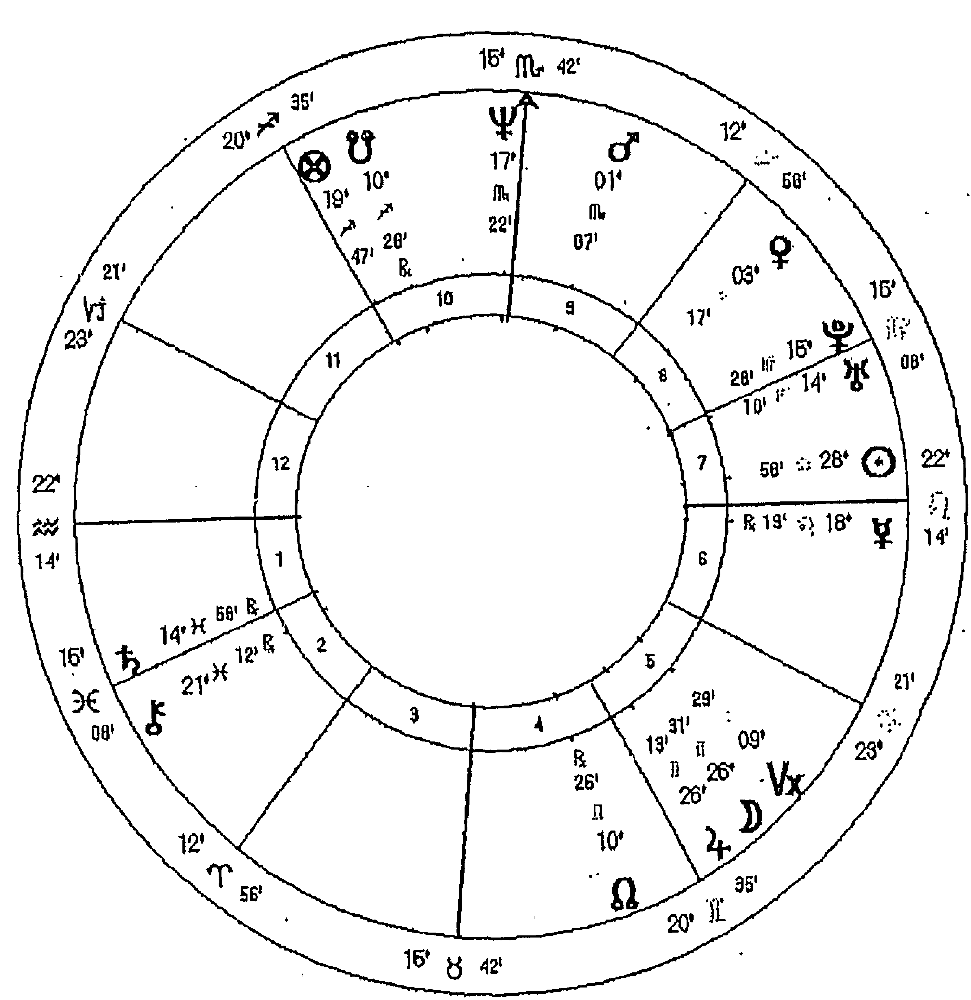
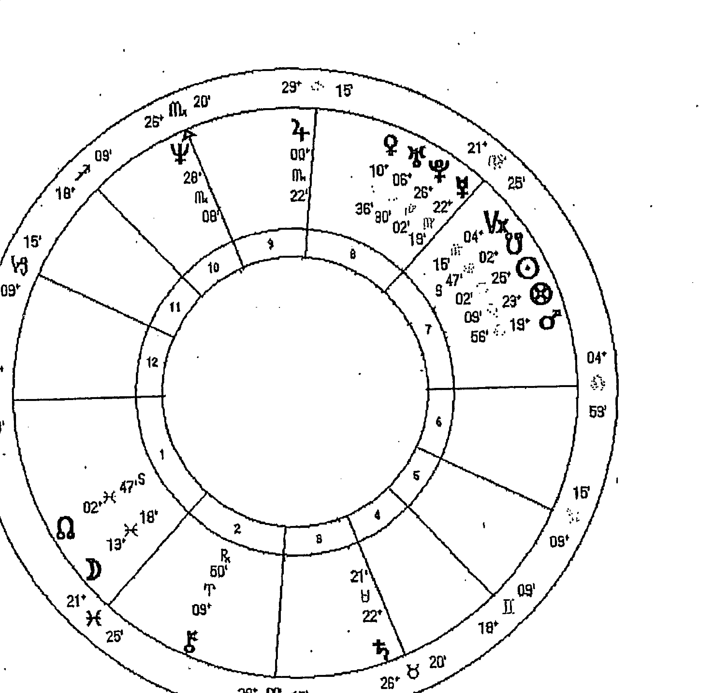
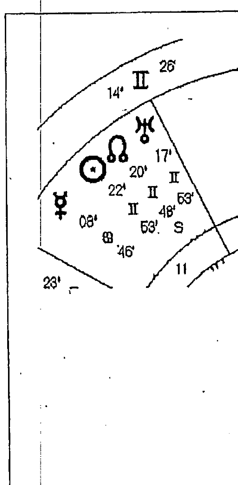
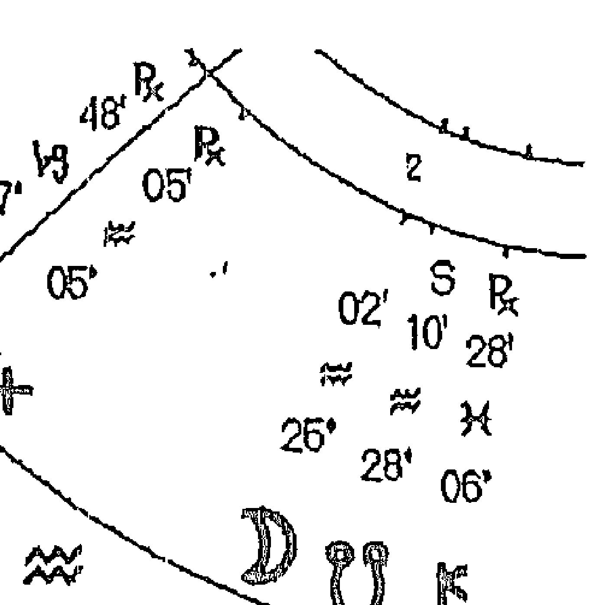
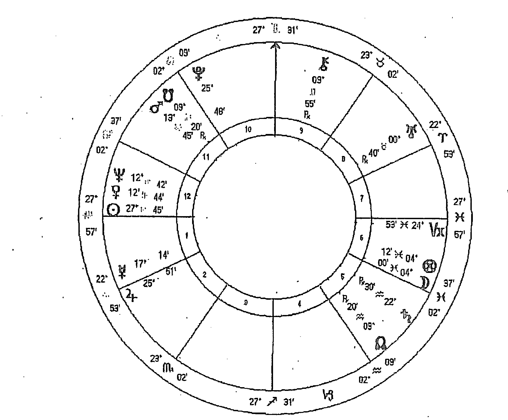

# 职业占星全书

「樹林裡分岔的兩條路，我選擇了人煙罕至的那條，使這一切變得不同。」 1

羅勃・佛洛斯特（Robert Frost）

1 出自羅伯特・佛洛斯特 (Robert Frost) 的詩 <未擇之路> (The Road Not Taken)；羅伯特・佛洛斯特詩選《The Poetry of Robert Frost》：Holt, Rinehart and Winston (New York, NY: 1969), 105.

# 謝辭

首先，我要感謝所有參加「職業占星學」（Vocational Astrology）課程的學生們，願意與我分享有趣的故事與經驗，我極為榮幸的見證了個案們尋找及投入職場的故事；也正是他們，讓我對於「職業占星學」有更深入的理解。

真摯的感謝斯蒂芬妮·強森（Stephanie Johnson）邀請我為「奧祕科技公司」（Esoteric Technologies Pty Ltd）的占星軟體撰寫「職業占星報告」（Vocation Solar Writer Report），其內容側重我對占星的想法以及各種可能呈現的方式。我也備受朋友與同事的支持，他們幫忙閱讀、校對並幫助我呈現此手稿，感謝所有曾經幫助過我的人，特別是瑪麗·賽姆斯（Mary Symes）和博布·索普（Barb Thorp）兩人的寶貴協助；而托馬斯·莫爾（Thomas Moore）在職業和靈魂方面的著作總是鼓舞人心，我從此書中也受益良多，感謝他讓我使用他的個案研究。

同時，我也想對我的亞洲同事們表達極大的謝意，他們也許不一定完全欣賞、卻極力支持我的工作；因此，我要誠摯的感謝香港的Jupiter老師、台灣的魯道夫老師、張瑜修以及日本的Mayumi Kabashima老師，他們對於占星學的奉獻，令人敬佩。

我很慶幸能夠跟隨自己的天職，並且一路以來得到家庭的鼓勵，感謝葛蕾妮絲（Glennys），謝謝有妳與我分享這段持續的旅程。

# 前言

## 關於職業／天職的問題

所有的工作都是一種天職，來自意義與身分認同的召喚，其根源超越了人類的意圖和解釋 2 。

所謂「天職／職業」（vocation）是一種感召，此英文單字來自於拉丁文 vocare，為「召喚」之意，在古英文中，被理解是某種精神召喚，一種內在邀請——跟隨個人的真正喜好。字根 voca 是「聲音」之意，而「有一份職業」的原始意涵是：一個人依循 自我的內在召喚。

在現代詞語中，「天職／職業」通常被認爲是一種精神或心靈上的呼喚；同樣的，它包括在俗世中尋找真正自我的探索。天職／職業是一種內在聲音，一種「世上有我們一席之地」的深切之感；而內在語言是透過圖像與感受的方式表達，因此這種內在聲音不是合乎邏輯的、而是直覺與想像的體驗，它由意象、符號、感官、幻想與夢想產生，往往模稜兩可、含糊不清，但是，它被深切地感覺到並且透過我們的想像而變得鮮明。

由於「天職」是一種深刻感受，使我們賦予它意義、形式和生命；它需要我們給予它某些事物，但是這些事物卻是無法被確認或清楚表達，它是一種我們的創造力、工作或專業都無法平息的嚮往、希望或是驅動力。在某種程度上，它是某種精神上的感召，直到我們進入它的神祕，並且在物質世界中努力使它逐漸成形。

> 2 湯瑪斯·摩爾（Thomas Moore）, Care of the Soul, Harper Collins (New York, NY: 1994), 181.

往往是這樣天職／職業的問題，帶領個案走進我的諮商室，因為占星學邀請我們提出與意圖有關的問題，其解答和建議都深嵌在星盤中，而不是在身為占星師的我身上。我的作用是促成個人與其星盤之間的對話，使一些職場生涯可以被接受、提出來思考，然後，個案有更多的機會去反映並且投入參與召喚他們的內在之聲。

星盤是一張原始地圖，可以在生命的實驗室中發展，一個令人滿意的職業既非理所當然，也不是得不到的；它是專注、紀律、勤奮、努力、熱情和意識的產物。而機會編織著命運之輪，因此，職業生涯從來就不是線性或是明確的，而是如同天空一樣，不斷變換的風景。在許多方面，透過我們探索職業中所經歷的時機、遭遇、相遇和協助，「機會」在我們的未來扮演它的角色，我們可以透過思考占星週期與行運，加深我們對於自己的天職／職業模式的覺知，那麼機會就變成天職／職業模式整體的一部分，而不會毫無關聯；天職／職業是一種內在的聲音，而不是來自於外在世界。

雖然占星文本可以從模式與特徵中推論出職業選擇，但是星盤中的職業生涯不是線性的，也不只是字面上的意義；它不結束在某種行業，也不指向某種創造性生涯或判定出一個豐厚報酬的職業。但星盤確實有無數探索才能、金錢、資源、工作、創造力、命運和方向的方式，這些有助於賦予我們的天職／職業一些意義與洞察力。在以下的篇章中，我們將探索星盤中描述天職／職業問題的符號與配置，這本書是關於占星學如何可以幫助我們闡明和詳述生活中的此類問題，同時也含概了生命的其他層面。

本書源自於我的諮商工作坊，大多數的占星個案會詢問與他們的人生目標、事業和工作有關的問題，這個問題似乎是無可避免的被提出。有些人很確定他們必須做什麼，而大部分人仍然在他們的工作中尋找意義；有些人覺得困惑，有些人覺得失望，但是每個人都有強烈的目的意識，我們將一起試圖了解這些內在的聲音，也就是它們的召喚。在課堂上我們也討論關於職業的問題，在「占星·綜合分析」（Astro*Synthesis）生活技能單元的課程中，我們介紹了職業占星學，從這些課程中，結合與職業有關的占星指引，我們討論了工作與職志，結果，學生們從中發現到極大的啟發與之間的吻合性。對於占星意象能夠擴大職業議題的豐富性，我總是感到敬畏，但我也知道，雖然個案和學生對此問題想要有更清楚的藍圖，但是我的任務是讓他們參與職業的問題，藉以激發自我的見解與啟示。

天職／職業的問題不是一成不變，也不是固定的，而是終身的問題。天職／職業不僅僅是我們的工作、我們的活動、我們的創造力或是我們的事業，雖然它也包含了我們如何賴以為生，但天職／職業是關乎於我們如何找到生活的意義，而這與意圖有關，我們真正想要做的是什麼？這是一個過程，但不是最終目的。

煉金術士使用 opus 這個詞描述他們工作的整體過程——從精煉原料到最後成品的無數階段；opus 是他們畢生工作的過程，而不是可衡量的目標或產品。為了凸顯這一長期持久的過程，它們通常稱 opus 為「工作」（The Work）——自我持續不斷的精煉與勞動。「工作」是大寫字母，因為天職／職業是我們畢生的工作，而不僅僅只是一個換過一個的工作、存款帳戶或績效獎金，而是在世上表達自我的過程。

天職／職業是我們如何專注成為天生的樣子。

# 序

自我的召唤

- 鏵鍋匠、裁縫師、士兵、水手、富人、窮人、乞丐、小偷
- 又或者是一個牛仔、警察、獄卒、火車司機或海盜頭子
- 或是農夫、動物園管理員
- 又或者是一個讓人們陸續通過的馬戲團人員

## 天職／職業：畢生的工作

天職／職業是一個多面向的詞，因爲它可以是指職業或專業的世俗層面，然而也同時暗示了我們天生注定或者受到召喚的精神層面。天職／職業是一種典型、超越種族、文化或性別，是人人皆有的概念，這種共同的嚮往就是我們的探索——找到我們天生該做的事。

天職／職業是精神的體現，能被滿足及實現、充滿創造力並且以有意義的方式受到僱用的衝動；它屬於靈魂，一種渴望服務的深刻感受，跟隨我們的熱情，成爲天生注定的樣子，並過著有意義的生活。這是我們畢生事業、一生的工作以及代表我們如何爲生活付出努力。

## 工作：我們從事的是什麼或我們是誰？

當我還是個孩子時，大人總是會問我，長大後要做什麼？就像其他孩子一樣，我有一個標準答案。我的童年是在軍事基地中度過，四周都是安全柵欄與出入口，我總是對那個突然從軍營的小警衛室走出來、升起柵欄、讓我和父親通過的人感興趣。當柵欄升起後，我和父親就會繼續往前走，直達他工作的軍事總部。

因此，當我被問到這個問題時，我會自信滿滿的回答：出入口管理員。這個靈感是來自於出入口管理員的這個隱形人所擁有的魅力與權力，而這個天真回答的靈感是來自於我固有的職業模式嗎？隨著人生的進展，我感覺受到召喚而從事水星的工作——就像是一個引導與升降柵欄的人，以某種隱喻的方式，我與個案在某個過渡時空相遇，並試著為他們升起一些阻攔；因此，小時候的天真想像，就是召喚我們的意象及象徵。

當我在課堂上教導職業占星學時，我要求學生反思自己的童年，回想他們長大後想要做什麼？透過生動的想像，我們重回童年的記憶，拾起印象——那些我們曾經想要做的事。小時候，我們比較可以不受文化、性別和家庭期望的限制，雖然大多數的人還是無法真正瞭解這些工作所必備的條件，而我們那些記憶也似乎都是幻想的，但是作為隱喻，它們有力指出我們濃烈的渴望。我們最先想要成為什麼人的印象，深埋在我們童年記憶中。就像是兒時童謠，醫生、律師、士兵，水手，補鍋匠，裁縫師或一個製造燭台的職業都是想像的，而不是字面上的意義；然而，它們就是原型，這些形象就在我們的星盤中。

當我們有了具體形象之後，便可以專注在個人星盤上的符號，找出星盤上哪些相位呼應這些早期的職業形象；我們也可以想想，我們目前的職業是否以任何方式反映了這些早期的形象，這經常是富有啟發性的練習：

「我想成爲一個探險家」，這是從一個太陽／火星合相在第九宮、並且緊鄰天頂，天王星在上升的女性的回答；另外一位回答「護士」的女性，她的月亮在第十宮三分相第六宮的海王星；一位在星盤上有雙子座星群、木星在天頂的男士回答：「老師」，而一位天王星獅子座在上升、太陽／金星合相在天頂的女士，回憶起她曾經想成爲一名演員。想要成爲探險家的這位女士，她因爲業務代表的工作而跑遍全世界；而擁有雙子座星群的這位男士男子，有一個非常受歡迎的部落格。

職業的印象是與生俱來的，經常透過早期記憶、當然更透過星盤中的形象而被理解，但了解職業的主要障礙之一就是直接指出某種職業，誤將某個內在形象或某個占星符號明確的指向某種職業，而沒有進一步的探索與延伸。這同時更加解釋了職業／天職只是我們身外之物，並且已經存在於社會上，等著我們去尋找、應證的迷思，而不是在我們的生命歷程中浮現。

許多外在因素影響著我們的職業選擇：家族信仰、教育、經濟資源、心理上的安全感、父母的支持、老師／朋友和團體的鼓勵，小時候引起我們興趣的偶像崇拜經驗，以及與世界接觸的廣泛程度，都與職業偏好產生一些關係。無論是否明顯可見，職業選擇的主要影響是來自於父母的期望，星盤提供了一種思考方式——父母未實現的生命，施加在栽培孩子未來事業的深遠影響。

在整個第一次土星循環，也就是在我們接近 30 歲之前，我們可能都承受極大的壓力而被迫順從，無論我們是否屈服或反抗，這都有助於創造事業。我們可能尚且缺乏勇氣、資源或資金可以建立自己的人生道路；然而，在此期間，我們可能會被某些有助於發展職志的課程、愛好和休閒娛樂吸引。我們的職業就像是一張大掛毯，用我們所有的人生經歷和選擇編織而成，而不是一個保證擁有退休金、俗套的職業生涯。

職業與我們的生命歷程緊密結合，然而，由於工作是我們如何賴以為生的方式，我們經常認為工作只是我們所從事的事情，而非代表我們自身。由於某些行業附帶著聲譽與地位，我們可能渴望它，只是因為它的威望與安全性，並不一定是因為它的創造性與精神性。某些職涯提供了豐厚的金錢報酬，然而，在第二次土星循環的中期，也就是在我們四十多歲時，當更深層的職業衝動仍然得不到滿足時，職業獎金顯然也就無法令人滿意。中年危機的焦點經常發生在與職業妥協方面，儘管所有的客觀標準，如工資、地位和安全感上都暗示著這代表著事業有成，但是人們的內心可能仍然充滿著沮喪並缺乏成就感。而經常在這一個時間點上，占星師與他/她的個案碰面了，他們選擇占星學來協助反思自己的生命歷程。

占星分析有助於思考是什麼召喚著個人。當星盤展開一個人的生命時，它並非詳述某個字面上的職業，但它確實提供一些建議：哪一種工作特質與內涵可以幫助個人忠於自我召喚的過程。我們的職業／天職包含了嗜好、志工、活動和學習課程，因此，並不總是從某種職業形式表現出來。

職涯的問題往往是關於個性化和自我發展的某個更大問題而顯現出來的症狀，因此，去傾聽職業的根本問題是有幫助的——也就是我們是誰，而非我們從事的是什麼。

## 工作：在俗世中尋找意義

詩人紀伯倫（Kahlil Gibran）在詩集《先知》（The Prophet）中以感性的方式談到工作：

> 你們工作，因而能跟上大地的步伐，緊隨大地的靈魂在工作時，你們仿若長笛，時間的呢喃穿透內心化作音符，工作是愛的呈現。

在繁忙的生活裡，我們任由一再重複的無聊工作消磨殆盡，很難體會到紀伯倫認為工作是靈魂形塑的詩意禮讚。在現代生活中，靈魂和工作似乎天壤之別，現代追求的是經濟生產力，受到唯物主義傾向的鼓勵，澆熄了追求職業成就的內在嚮往。例如：聲望、地位、休假、獎金、薪酬和工作保障的職業目標掩蓋了我們想在工作中找到意義的渴望。然而，大多數人渴望透過工作而得到滿足，在已經失去靈魂的當代文化中，我們不再倚靠提醒我們生活意義的價值觀與想像，而這種無意義滲透在日常生活的氛圍中，並且增添不滿、抑鬱症、疾病和危險工作場所的蔓延。

我們需要「永恆不滅的世俗成就」的靈魂傾向，如果沒有培養這方面的需要，個人會感覺到空虛、不完整的、沒有成就感，自我最重要的部分會感到匱乏。因爲這種空虛，個人會尋求解答，占星學可以處理個別情況下的命運、靈魂和個性化的更大問題，同時，也尊重生命循環中的過渡性變化，因此，人們往往在遭遇危機時，會去探索占星學的智慧。在占星諮詢過程中，個案經常期待被告知正確的職業生涯，該上什麼課程，該做什麼樣的選擇，誤以為正確的職業將是所有缺口的解答。然而，其解答並不是簡單的某個特定職業或某個明確行動，甚至是去追求一個令人感到興奮的工作——儘管這會有所幫助。然而，關鍵是要找回工作的意義，並以工作滋養靈魂。對工作感到不滿意、不喜歡一份工作或是覺得「不只是這樣、還可以更多」都使個人去尋求占星師的諮詢，想要探索職業領域。因此，經常在我的諮詢工作室中，人們往往描述他們強烈的想要做某些事的感覺，但不知道是什麼或是如何去處理這種感覺，他們只知道自己應該去做些什麼事而不僅僅是眼前的工作。

在俗世中尋找靈魂的衝動，通常投射於職業形象上，這似乎說明了個人眼前生活中所缺乏的部分；這種想要找到與世界產生靈性連結的渴望，容易因為幻想而變得膨脹以及激烈。原型心理學家詹姆斯·希爾曼（James Hillman）警告說，職業／天職可以是一種非常膨脹的精神概念，如果我們相信自己是被選擇的、或是註定應該做某些明確的事、或者受到召喚需要成為某個特殊人士5；職業／天職不是去成為某個人，而是成為我們自己。

「字面上的創造力與一個完美的工作可以平息靈魂的渴望」，這樣的信仰引導我們將功成名就的幻想投射在某個特別的職業上，但如此一來會使人失望，因為外在的職位無法滿足自我深層的面向。對於完美、滿意職業的期待，無論是有意還是無意，當它被投射於某種字面上的職業時，經常可以平息焦慮與失落感，因此，我們的職業往往是已經知道的或僅僅是我們已經從事的事。在本質上，它是我們性格的一部分，隨著時間展現出來；但是，字面上的職業或專業，無論它是如何明智，都不是靈魂渴望的答案。職業是個體化過程的一個面向，它的路徑不是預先設定的，而是透過外在世界與內在自我的關係、隨著時間的推移而建立，職業需要有它自己的一套規則，並堅持自己的律法。

榮格（Carl Jung）認為職業誘使一個人跟隨自己的靈魂，並且變得有自覺。他重申，職業是非理性的因素，命定一個人從芸芸眾生、以及平凡的生涯中解脫出來。真正的人格永遠是一種天職，追求自己真正的天職需要勇氣以及從「眾人」中掙脫出來的力量，而這裡的「眾人」與我們長輩、父母和祖先認可、眾人皆走過的所謂社會性生涯有關。為了追隨在真實路上召喚自我的聲音，個人需要從他人之中獨立出來，正如榮格提醒我們的：創意生活始終獨立在傳統之外。因此，職業要求我們冒著被邊緣化的風險，並且去了解自我個性化的需求。

職業並不伴隨著工作內容、晉升機會或收入保證而來。毫無疑問的，工作和事業是職業的一個面向，但是我們將某個字面上的工作與個性化、自我實現的更深渴望混淆了。個性化是一份工作，它是一種任務，就是一個人畢生的「opus」（工作）——與修煉自我的豐足有關。就像是煉金術的過程，我們的職業／天職是終其一生的不斷修煉，它的成功之處大部分取決於我們獨立於群體之外的能力⁶，而追隨自我召喚意味著被邊緣化。

我們可能會過分的認同工作，藉以補償尚未實現的職業／天職，或反之不認同自己的職業，而想要另外找到失去或缺乏的事物。雖然一個有成就的事業可以長久的幫助滿足職業／天職的追求，但是榮格曾建議，一個人真正的職業需要自我的完整以及有別於眾人的勇氣，職業似乎是一個工作和專業的健全綜合，這可以在社會上發展個性化的過程中支持我們。

## 工作、自性與身分認同

職業是我們被辨識的方式之一，姓名、地址、年齡、性別和職業都是個人資料表上被詢問的標準問題，我們的工作是我們的一部分，他人通常以我們所從事的行業定義和評論我們；我們也經常透過別人所從事的行業來識別他人：他在資訊科技產業工作、她是一名律師、他在市中心工作、她在讀書想成為心理學家、或是他現在失業，這些都是有助於認識一個人的日常對話。你有多常被問到靠什麼維生？我們也總是以他人的工作去辨識他人，以他們的事業認識他們，以他們的專業評斷他們。

有些專業吸引更多身分地位，有些獲得更多金錢，無論我們喜歡與否，職業是分等級貴賤的；因此，某些行業比其他行業更有價值，普遍被認為更具聲望，踏入這些顯貴行業的人，往往獲得更高的地位和尊重。通常，這些職業擁有更多金錢報酬，並且擁有自尊。

6 節選自榮格（C.G. Jung）：The Development of the Personality (Volume 17 of the Collected Works), 由 RFC Hull, Routledge & Kegan Paul (London: 1954) 翻譯, Para. 299 305.
5 詹姆斯·希爾曼（James Hillman）：The Essential James Hillman, A Blue Fire, edited by Thomas Moore, Routledge (London: 1990), 172.

和自我价值感，在职业与价值分等级与贵贱的文化中，想要关注自我内在、以及那些在人烟罕至的路上召唤我们的声音是很难的。

我曾见证过一个人的职业被压抑在机械化模式和僵化结构的组织氛围中的那种失望；我曾听过护士叙述他们的职业已经被整体医疗模式粉碎；那些所谓的心理学家都愤恨地对我抱怨科学理性模式受到重视、却放弃了想象和感受性经验证据的转变。在我们的职业生涯中，经常产生整体、外在的价值观与自我内在召唤之间的冲突。

运用占星形象做职业分析，有助于为个人确定职业模式，也就是了解是什么在召唤着他们。星盘并不提供一个人的主要发展，因为它是随着生命历程而展开，但占星学确实提供使之成功的所需元素。星盘中有些领域掌管职业以及人生这方面的历程，在星盘分析中不要清楚地描绘出某个字面上的职业，这点非常重要，而是帮助个人了解自己的需求、天分和最合适的方向，而丰富的占星形象，可以帮助这一个过程。

在这本书中，我们将检视职业叙述的占星形象，职业并不限于星盘上的任何区域，它是我们的生命历程，而星盘上凸显的相位往往会透过职业寻求表达。这里有许多可以探索的领域，每个人也可能有许多不同的职业面向，在其生命过程中被加以实现。

首先，我们将说明职业占星概述，然后，我们将辨识占星学分析中的三大元素——与职业相关的行星、星座和宫位。我们会更仔细地思考一些星盘上的职业因素，如太阳、月亮、月亮南北交点、四个轴点，尤其是天顶与上升，以及第二宫、第六宫和第十宫。在职场生涯中，占星上的时间点可以提供一些讯息，因此，我们将从职场生涯变化和发展的角度去检视行星循环与行运；其中一部分，我们将检视进／出职场的过渡行运。最后，我们会透过一些个案反思「工作」——也就是我们的毕生事业。

在本书中也有许多占星配置的描述，例如：行星所在的星座和宫位、宫首星座、月亮南北交点的相位、四个轴点及其守护行星等。这些都只能当成是引导以及反思占星学的可能性的缪斯，而不是一种明确的解释；也就是透过反思和思考占星论述而产生洞察力、启示以及更能深刻及广泛理解心灵的可能性。

占星的形象并非都适合于文字语言，因为形象可能会被解读成为固定与事实，而非保有其回味与启发性，当我们思考占星学上的可能性时，需要靠反思与想象力。

# Chapter 1

## 事业有成

## 职业占星学概述

我在青春后期、刚就读大学商学院时，想要转换跑道，想要和学生会一起出国当志工，因此我求助于校园心理咨商室。显然，会计不是我的职业生涯选项，但我也不算是逃避它，因为在我的职业指导测试中，以人为本、创新、助人的职业高于实用、行政管理或技术职业的分数，但是，我已经选择了一门必修课。

虽然我们可能对于自己的职业有一股直觉，但是在演化过程中，时间扮演了重要角色，虽然占星学说明了职业的真实性，但是它仍然有其发展的时间表。摊开所有职业中可能发生的错综复杂状况，也许会造成混淆，但是当我们回首职业生涯时，我们可以看到职业的主轴与模式，这是我们在年轻时无法看见的。

年轻时，职业指导可能特别具有价值，因为它往往会印证个人的内在召唤；而在探索学校、学科、职业目标和可能性的选择上，占星学是一种有益的指导。运用个人星盘与父母及其子女讨论教育、职业和抱负已被证明卓有成效，在我的咨商中也极有收获。而对于那些质疑自己的职业选择、对自己工作不满意，打算转行或只是需要讨论他们正处于职涯的哪个阶段的成年人来说，职业占星学也是非常有用处的。

从职业的角度来诠释星盘，并不是静态的，也不是一次就可以完成。它随着个人的成长而逐步演化，当个人变得更了解自己的野心与欲望，星盘的诠释就会变得更加明确，因此，占星学可以在人生的各个阶段，以多种方式来检视职业。虽然职业可能是分析的焦点，其过程却是受到个人思想、情感与心理状态影响；或者讨论的问题虽然可能只是职业本身，但背后也可能是健康或情绪和社会困境的问题。因此，职业分析在尊重人类经验的广度与深度上来说，是整体性的，而就像职业本身，它是在进程中的一个工作。

让我们继续从职业角度来看星盘，虽然要感谢有许多占星技巧和职业占星学理论，却是占星基本原则为发展自我风格和方式立下基础。

## 从星盘来看

从希腊罗马时代开始，西方占星学已经发展出从职业角度思考星盘的技巧和准则，虽然技巧各有不同，但基本上它仍然有穿越时空、一贯性的核心原则。西元第二世纪，托勒密（Ptolemy）在阐述占星学中职业的象征星时，认为它是第十宫的守护星、第十宫内的行星或在太阳之前从地平线升起的行星，三者之中最强势的那颗行星。在中世纪时代，威廉·立力（William Lilly）认为第十宫的宫首星座、它的守护星或其宫位强烈象征世俗的工作⁷。

二十世纪的占星学家指出，第二宫／第六宫及第十宫这三位一体的土象宫位、其宫首星座、守护星以及这三个宫位内的行星是值得注意的；而太阳、月亮、上升和天顶也被认为是所有职业分析的根本，与第十宫有关的特征一直被赋予重要意义。而早期概念中，譬如比太阳早升起的那颗行星的重要性，如今已经逐渐式微。

占星学的潮流来来去去，其中赋予职业议题生命的技巧仍然具有意义，这些我将尝试从我的经验来概述。但是，首先，从个人生命阶段的观点去探索职业是至关重要的。因为青少年时期与退休后的职业分析是非常不同的，或是正值第一次土星回归的人与第二次土星回归的人也极为不同。将个人的历史放入职业分析中也同样具有意义：他们的教育背景、家庭环境、工作经验、资历、动机和生活经验是如何？虽然探索个人潜力与可能性是重要的，但是也同样必须将职业分析置入个人的现实生活中。

职业分析包含许多因素，因此，优先考虑那些最具有意义的因素是很重要的，虽然占星文献会使用许多技巧，但那些往往不太重要、或只是其次而非最首要的分析方法。首先，我们可以发展两种态度：第一阶段是采用一般的方法做职业分析，探索个人的个性、资源、天分、技术、抱负、目标和性格，虽然我们有意识地呈现问题，同时也极需倾听可能是造成目前困境的根源，例如：所有的思想、情绪、心理或精神上的困难，这种广泛考量，是将个人置于星盘的背景中，看看星盘上的职业建议是什么。第二种方法更加具体，它探索职业生涯的问题，并集中焦点在职业议题上，例如：工作地点、薪资、工作满意度、同事和老板。

正如以上所言，占星学可以提供许多技巧，但最重要的是如何利用它们展开分析，而不是用来规范或限制分析的内容。占星符号不是批判性的，因此，明智的做法是不参杂个人的意见并找出方法阐明意象。「原型」藉由多种方式体现，虽然占星学在确认原型能量上非常可靠，但是占星师无法完全知道所有可能性，因此，多加探索并投入于形象与象征符号中才能够显示更多线索。

让我们从星盘上职业主题的所在位置，或是称之为「职业宫位」开始，也就是我们所知的「物质宫位」——第二宫、第六宫以及第十宫，这里是我们找到物质的领域：藉着资源、技能、能力和远见，促成及落实职业的地方。星盘上的这些区域也是我们在物质、肉身俗世中，投入塑造灵魂的地方：

第十宫竖立着我们人生的标杆，它是一个公共领域，在生命旅途中，我们在此争取权威，并在过程中发现俗世的意义。天顶（MC）是星盘中的最高点，是我们想要努力实现的象征，它在理解自我的专业角色，以及透过世俗工作所做的贡献方面具有重要意义。在职业分析的诸多因素中，天顶一直被认为是极为重要的；因此，在刚开始探索职业时，天顶、宫首星座及其守护星、第十宫内的行星至关重要。

第二宫象征着神赋予我们的天赋与才能，也就是与生俱来的资产以及我们赋予它们的价值。第二宫的宫首星座、它的守护星以及宫内行星反映出我们如何自然地运用自我资源和价值。这个领域告诉我们，哪一种先天的资源是有价值的，可以用来换取物质保障。在灵魂的意义上，第二宫可以描述我们如何交换我们的资源和资产，进而能感觉外在的安全感与内在的富足。

第六宫遵从日常生活的韵律，其宫首星座、守护星和宫内行星都描述着工作与职业，这个领域显示了我们如何致力于日常工作中，如何使自己全力投入，这些星象符号描述着日常生活的仪式，藉以获得满足与幸福。第六宫也被称为是疾病的宫位，因此经常能够有效地提出与工作有关的疾病、抑郁或压力的问题，运用第六宫的意象也能够探讨工作伙伴和例行公事的议题。

在进行职业分析时要牢记所有的宫位都是很重要的，因为每个宫位都是我们在不同时间中的生活领域⁸；星群、上升／天顶守护星或月亮南北交点，这三者落入的宫位具有重要的意义。将所有宫位列入考量的方法之一是，将它们以元素做为三位一体的分组：

- 1. 生命宫位（第一宫、第五宫、第九宫）：赋予生命力的三位一体宫位，属于火元素。
- 2. 物质宫位（第二宫、第六宫、第十宫）：与物质相关的三个宫位，属于土元素。
- 3. 关系宫位（第三宫、第七宫、第十一宫）：以风元素为基础。
- 4. 结束宫位（第四宫、第八宫、第十二宫）：由水元素激发的灵魂三位一体宫位。

大多数落在这些三位一体内的行星，以其自身的特殊方式透过职业寻求表达。虽然在职业分析中优先考量物质宫位，但是生命宫位也是值得关住的，因为它们蕴含着想要表现、创造的能量，而鼓励与支持性的力量会激发职业表现，生命宫位则专注于创作、娱乐和生产，并且渴望被运用於自我的概念中。

考量行星被元素、性质型态与半球强调。

星盘中被强调的元素叙述着个人的性情，而主要元素说明自然产生的热情、务实、逻辑或情感的生活方式；性质型态勾勒出自然运用生命能量的方式，无论是透过开创性、固定性和变动性的方式。

星盘中的四个半球无论是高或低于地平线，或是子午线的东或西部，每个半球都各自支撑着生命的特定视野：地平线以上的日半球客观地专注於外在世界；而低于地平线的夜半球是比较主观的，专注於内心世界；东半球关注的是生命中比较个人的层面；而西半球则关注於他人或是人际关系。

虽然从每张星盘中去学着区分行星在职业意涵上的优先顺序是重要的，但我们可以先清楚区分每颗行星在职业中的作用如何。

内行星带着非常个人的色彩，它们透过职业寻求表达；太阳和月亮是整体存在不可或缺的核心象征，既然职业是我们的一部分，这两颗发光体则扮演显著的角色。因此在职业分析中，考量它们在黄道带上的星座位置、宫位和主要相位是至关重要的。太阳代表自我表达的中心主题，而月亮象征着让人感觉到安全和满足感所需要的事物，这对于任何职业，都是重要考量。

水星掌管沟通、创意、通用性和流动性，当杰出、多样性、适应性和才智是职业重点时，它在职业分析中有助於说明与职业有关的心态和思考方式。

金星支持价值和自尊感，此原型描述了我们喜欢做的事、欣赏的事物、以及让我们感觉愉悦的东西；火星是欲望原则，是我们所要追求的事物以及行动的推动力。金星和火星在创造生命驱力的本质上都是属于性欲的，是一种缠住、占据我们强而有力的原型。从本质上讲，金星和火星在职业上帮助我们与职业产生关联，并且在生活中的精神层面去体验它们。

木星象征着以哲学和精神方式探索世界，用智慧和灵感去追寻具有灵魂的生命，做为一种超越自我、跨越传承或社会框架的能力，木星赋予职业信仰、道德、观念和伦理。土星、特别是天顶呼应了以某种生产力的方式贡献社会的召唤。这些占星象徵对于我们透过职业在世上找到真实、自主和完整性是十分重要的，职业在某种意义上需要和权力原型产生关系，因为我们需要追随自我的规则与途径才能在职业上有所成就。

凯龙和外行星能唤起更多的集体能量，当它们与职业产生关联时，暗示着选择普世现实以外的道路，更超越了传统的体系或组织。做为一个异类和局外人，凯龙的召唤在於治疗技术、指导或社会改革能力，当它表现在职业上时，邀请我们接受自己的边缘化和伤口。天王星就如同是普罗米修斯（Prometheus）的精神，表现在文化上的叛逆与冒险精神，以个人独特、非典型的方式发展它的职业生涯。海王星是最能够与精神召唤以及灵魂的创造性语言产生连结的原型；然而，这个原型也可能是精神上的膨胀与误导，而将个人的召唤与成为救世主的召唤混淆。无论海王星落在星盘上的什么地方，在那里我们想要找到神圣并向往成为创造与精神性的人，这让我们投入於了解自我、超越传统限制的召唤，进而提升自我至另外一种层次。冥王星往往与灵魂的黑暗面有关，并且在追寻圆满的职业生涯中带来了强度、深度和力量。

星盘上的四个轴点指出我们的生活方向，因此，对我们的人生产生重要意义，四个轴点都同样重要，并且应该加以区分。在职业分析中，上升与天顶更需特别留意；不过下降总是与上升产生抗衡，而天底的需求也自然地蕴含在天顶的目标中。

上升与其守护星就如同人生旅程上的驾驶员，其积极性的力量，使旅程充满生气，并有助於将我们的职业渴望运用於社会中。天顶及其守护星在评估职业生涯中发挥了明显的作用，因为它描述着我们步入社会的途径。天底及其守护星是基石，我们可以通过它建立足够的内在安全感，以支持我们的职业。下降及其守护星既象徵与我们敌对、也象徵合作夥伴的内在力量，鼓励我们成为的英雄，并且使我们对于自己的人生产生自觉。合轴星会在生活中寻求立即表达，并且需要加以运用。因此，它们往往试图在职业中发挥主导作用。

月亮交点轴线与个人生涯产生紧密连结，南交点可能指向我们受到召唤而发挥本能才华与天赋的领域，而北交点象徵着我们透过职业寻求发展的事物。南北交点的星座与宫位在自我召唤中扮演了重要的角色，在象徵意义上，南北交点及其相位代表个人生命中渴望表达出来的无限冲动。

人生的旅程从来就不是风平浪静，因此，思考星盘上的主要相位与相位模式是很重要的，特别在当外行星与某颗内行星产生明显角度时，这些旺盛情结将在整个生命历程中寻求表达，更可能成为人生的主轴。虽然每个主要相位模式都需要从个人的角度去分析，但重要的是将这些复杂相位与职业整合，因为星盘的主题需要以「它们如何有效地与生活方式产生结合」来思考。当这些主要相位或相位模式与外行星产生行运时，个人将受到召唤，在他们习以为常的世界中去扩张他们的自我认知，而这段期间更是重要的职业阶段或是象征个性化过程中的关键。

职业分析需要从生命周期的角度考量，因此，必须理解个人是处于人生中的哪一个阶段，是否他们正处于发展中的关键时期，这些都存在于行星周期中，特别是行星循环的四分相、对分相以及回归。但是，以当下的角度分析职业也同样重要，并且必须留意与职业议题或生涯有关的重要行运以及二次推运。

当土星、凯龙星或某颗外行星行运经过四个轴点时，暗示着个人将面临某个人生方向与生命历程。南北交点的行运照亮了人生道路，因此，当它在某个宫位行运时，能够说明职业的发展。木星和土星经过职业宫位的行运是了解职业异动的关键。

职业上的觉知可以透过二次推运得到启发，二次推运的月亮是容器，盛满了记忆、感觉记忆、情绪反应和直觉，当月亮推行经第二宫、第六宫和第十宫时，职业成为重要焦点。推运太阳是自我力量在世上的发展，它与其他行星原型所产生的相位，暗示着我们如何透过生活经验，找到自我的这一层面。当其他推运行星改变方向或推进到一个新的星座或宫位时，也可能带来职业的议题。

行星周期、行运和二次推运在检视职业发展和职涯的阶段上都是珍贵资源，职业发展的进程与阶段，都反映在行星的轨迹中。

## 职业之谜

从命运的观点来看，我们的天职／职业有其自我的智慧、时机与模式，占星学分析透过个人的控制以及不可控制的层面去考量职业模式与时机，努力使它的神秘更具有自觉性并使人感到满意。

职业宫位集中了职业的三个重要面向：收入、工作和事业，最终，我们会希望同时拥有这三方面，但在现实中，这些具有创意的召唤并不容易转换成具有薪资保障的职业。我们经常可以为热爱的创意工作，完全投入好几个小时，只赚得微薄报酬；另一方面，我们可以从事单调、不满意的工作，却得到固定又优渥的薪资。在每份职业追求中，本来就有安全性与自由表现、想象与实际、梦想与现实之间的拉扯，但是为了忠于我们的职业／天职，我们必须忠于自我召唤，耐心地准备投入生命赋予我们的事物，我们无法指望潜能变成可能的过程中，却不经过广泛的学习。

职业召唤并不局限于某一时刻或时间，而是在整体生命周期中重复出现，往往与占星周期如南北交点、木星循环周期或是生命阶段如青春期、中年或五十几岁时同步发生。然而，首次的召唤经验，无论是通过幻觉、内在声音、深切感受、某个梦境或是想像，仍然在我们生命历程中留下余温⁹。

## 早年的召唤

丹恩·鲁依尔（Dane Rudhyar）是二十世纪最重要的占星师，同时又是画家、作家、音乐家和哲学家。他的一生展现了职业的特性，当他追随自我召唤，生命引导他走向提升与发展事业的人们与环境；然而，却是十六岁时的理想，成为他毕生工作的基石与力量。

9 本书第十二章中的两个个案研究就是此种召唤的最佳案例。

此时，他受到两件事情启发，职业生涯和方向都受此影响。首先，他洞察到时间的本质是循环的，并且其周期规律性控制了所有生命；其次，西方文明正步入循环周期的秋季阶段¹⁰，其一生中，这两个主题皆融入了他的哲学、占星学见解、音乐和艺术。

丹恩·鲁依尔生于 1895 年 3 月 23 日早上 1 点，法国，巴黎。

鲁依尔的上升／下降轴线落在射手座／双子座轴线的 18 度，1901-1902 年，当他 5-7 岁时，天王星和冥王星在相同轴线的 15 和 19 度之间产生对分相；当天王星在上升来回移动时，冥王星正慢慢地行运至下降，这是一个强而有力的占星意象——播下了觉醒与深刻体悟的种子。在同一时期，木星和土星在第一宫摩羯座14度展开一个新的循环周期。

> 10 丹恩·鲁依尔 (Dane Rudhyar), A Brief Factual Biography, © James Shore, USA: 1972, 3.

当鲁依尔 15-16 岁时，木星和土星的循环在其第四宫与第十宫轴线产生对分相，当时土星行运至他的金星——也就是天顶的守护星，而木星已经行运至星盘的最高点，穿越第十宫与第十宫内的土星产生合相；冥王星行运至木星，指出深刻的洞察力和内在财富的迹象；在行运过后，这些行运力量依然存在。鲁依尔的例子展现初次与自我召唤相遇的效力，它持续影响了鲁依尔的一生。

职业也具有周期性与当代性，因为它们浮现出时代精神，就像科技的可能性发展到数位时代的来临。职业做为一种原型，透过我们的运作，拥有其智慧和时序，因此，它们经常以我们无法控制的方式变化与发展。机会、贵人、可能性、选择和机会在恰当的时机出现，引领我们走向职业探索，而这往往在人生危机之后接着发生，但是职业也可能在任何时间出现。

## 晚年的召唤

当 48 岁的苏珊大婶（Susan Boyle），出现在电视《英国星光大道》（Britain's Got Talent）中成为参赛者时，她刚刚进入第 5 次木星循环周期。她上台唱出《我曾有梦》（I Dreamed a Dream），这首动人的歌总括了她自己的生活体验，但她怎么会知道，这首歌曲开始的几段弦律就已经改变了她的生活，成为开启她丰富事业的钥匙。

苏珊·波尔，生于1961年4月1日，上午9时50分，布莱克本·苏格兰。

在2007年，随着凯龙首次接近天顶而土星行运至第四宫和北交点／冥王星产生合相时，苏珊失去了母亲，这个痛苦的经验使她回到音乐，这带给她安慰，藉以移转失恃的悲痛过程。第二年，她参加电视选秀的试镜，这是她母亲生前一直鼓励她做的，苏珊成功了，她踏上这条在过去连想都不敢想的筑梦之旅。

此时，凯龙仍然在天顶行运，准备回归至第十宫与南交点的合相，在踏上舞台的过程中，木星爬上第十宫天顶的最高点，旁边还有凯龙和海王星，从那一刻开始，苏珊大声唱出她的召唤。

## 中年的召唤

所谓的召唤往往是相当真实的：一种声音、一个愿景、一份深切感受。但它主观又极私密，重要的是不要明确的解读它，而是更加反映、思考，允许象征符号去揭示它的意涵。如下图所示——我的个案，他所听见的召唤，以一种意想不到的方式，改变了他的人生方向。

这位年轻男士杰夫，在他第三次木星回归、步入中年的关口，向我咨询事业与人生方向的问题长达三年的时间。他是一名高級律師事務所的律師，雖然這是一個名利雙收的工作，但缺乏情感與創造性，而對於一個背負家庭責任的年輕人來說，冒險去圓夢並不容易。

個案生於 1965 年 8 月 22 日，下午 5 時 14 分，澳大利亚·吉朗。

他熱衷寫作並考慮從事新聞工作，但律師這份工作是更安定的選擇。由於水星位於下降點與天頂的海王星形成四分相，寫作滿足他一個「富有想像力的思想家及說書人」的想像。由於北交點在雙子座，木星／月亮合相於第五宮的相同星座的支持之下，以文字、思想和語言表達自我的這股熱誠使他感覺良好。太陽在第七宮、同時也是合軸星，迄今，他就是一個支持他人的人。

總括與我諮商的過程中，天王星行運其上升，當它逆行越過上升時，他的背部疼痛變得嚴重，沒想到因此導致腰椎間盤突出而必須手術。手術五天後、住院的最後一晚，他半夜醒來，房間裡充滿亮光，他聽見一個男性聲音說：你應該是一個心理學家，當月，他的木星第三次回歸，同年，天王星將結束逆行、轉為順行，最後一次跨越上升，星盤揭開了生命的新篇章。

在電話中，傑夫對我說，他覺得自己的願景非常清楚明確且充滿動力，並正在研究如何能成為一名心理學家。但是，當他終於有空回來與我諮商時，他又開始猶豫了。我們談到的他所聽見的聲音以及它所要傳達的訊息，「心理學家」（psychologist）一詞來自希臘語psyche「靈魂」和logos「道」之意，兩字合在一起是：靈魂之道，也許這個聲音就是傑夫本人的反映——合軸星海王星／水星四分相的內在召喚，而當天王星跨越上升時，也觸發了它。也許這個聲音是一種領悟，意味著他需要在工作中找到意義，否則他將持續承受背上的重擔。

傑夫被喚醒了並受到召喚，到了第二年，當木星跨入第六宮而土星行運至他的木星／月亮在第五宮的合相時，他的工作產生異動：這一年初，在一個創意大學中教授法律的機會意外出現了，他順水推舟，展開一個新事業、新格局和人生新的一頁。

占星學是一個很好的工具，幫助我們理解、並透過各種視角去追蹤我們的職業追求。現在，我們將繼續深入研究，但首先，我們將更完整的檢視行星在職業中扮演的角色。

# Chapter 2

## 原型與職業

## 與職業生涯有關的行星

「原型」(archetype) 這個詞經常是指行星以及黃道帶上的能量，從古希臘以來，這個字結合了 arche——意指開始、起源、原因或原始；而 type 則是指形式、形象、原形或模型。因此，archetype 意味著原來的形式或一個開創性形象；原型刻畫並確定結構和原始模式，藉以支撐我們本能的生活。

原型是全人類共通的衝動和慾望，它支撐著人類經驗，是精神生活根本的首要原則。無論是來自於何種種族、文化或性別，原型做為普遍與集體的形象，是每個人精神生活的共同表述。原型可以透過深刻反思的方式，譬如夢想、願景和占星學加以識別，使我們能夠了解其本質與模式。

原型通常是一種發光發亮的體驗，並且大過於生命本身，它具有神一般的特質，是情感上的支配與占有慾；它們的力量往往可以改變我們的意圖或壓倒我們的平衡。做為共通模式，原型是本能過程中如神一般的象徵，它激發宗教想像、神話敘事以及童話傳說的故事情節。原型是隱喻，但不是事實；因此，難以用邏輯或合理加以描述，反而是透過圖像、符號、感情和感覺更能夠理解它們，這就是為什麼它們讓我們以想像的方式去理解生命。原型觀點是能夠在某個範圍內組織人類經驗的各種層面，因此，占星學與這種感知世界的方式產生共鳴，因爲，占星學能夠在一顆行星的原型之下，組織一系列的事件、共通點和聯想。

原型說明共同主題，是透過個人生命，以非常私人且獨特的方式呈現。例如：出生是一種普遍經驗，但它也是每一個獨立生命中的個人插曲，雖然這個過程是屬於原型的，但每一個人的體驗、帶來的影響、被引起的感覺是屬於個人的。原型是一種普遍象徵，例如，母親的形象是原型，但對我們來說，她也是一個人，在通常情況下，個人的母親與典型的母親因爲期望與幻想而被混淆或融合在一起。在占星學上，這種形象是顯而易見的，當強大原型如冥王星和海王星與月亮產生相位時，將原型母親的期望投射到個人母親身上，也是常見的情況。

原型人物令人敬畏，他們負有時代、神話和永恆的力量。當父母消失或缺席時，他們可能由原型父母取代；這個消失的父母會被神化，成爲理想化而非現實中的父母。我們在占星學中瞭解到這一點，當外行星與內行星產生相位時，神話領域與個人領域產生交會，我們在某種原型的控制之下，會不自覺地以個人的方式複製它的神話，我們會成爲它的代言人，透過我們發出它的聲音，因此，占星學可以同時用個人及普遍方式去思考原型。

詹姆斯·希爾曼認爲原型最能夠與神相比擬，行星背負著眾神之名¹¹，體現祂們的特質與模式。因此，占星學非常適合於原型觀點，因爲它可以幫助我們同時想像個人性格與隱藏於性格之下、精神生活中更深刻的原型模式。

每顆行星都是一種原型，它代表了每個人靈魂中相同的才能，也就是希臘人所認爲的 ousia——靈魂本質；而行星也象徵一組事件與聯想、人與事。每顆行星也對應著不同的人格類型與特徵、實際物體、顏色、身體部位、植物和金屬等；也可以對應到各種職業。它們是原型的靈魂本質在世俗中的呼應，因此，這就是爲什麼個人可能會覺得被驅使或受到支配去追尋某種特定職業，或是聽見召喚而走向特定的人生道路。

在心靈風景的地圖中，榮格（Carl Jung）首先意識到主要的原型形象，如人格面具（Persona）、陰影（Shadow）、阿尼瑪（Anima），阿尼瑪斯（Animus），英雄（Hero）、自性（Self）、智慧老人（Wise Old Man）、大母神（Great Mother）和聖子（Divine Child）。在現代心理學的啓蒙中，這些是首先被識別、確認和放大的原型。然而，行星一直代表著原型力量和模式，它塑造並支配著人類經驗，當我們將行星設想爲原型時，我們可以從下面的形象開始：

| 行星 | 原型形象 | 特征 |
| --- | --- | --- |
| 太陽 | 自性、父親、聖子 | 身分 |
| 月亮 | 母親、嬰兒、照護者 | 安全感 |
| 水星 | 騙子、引靈人、指導者、講師 | 理解力 |
| 金星 | 情人、伴侶、姊妹、美的事物 | 關係 |
| 火星 | 戰士、兄弟、創業家、慾望 | 意志 |
| 木星 | 老師、哲學家、旅行家 | 知識 |
| 土星 | 權威、老人、智慧老人 | 自主 |
| 凱龍 | 導師、醫治者、族群之外的人 | 完整性 |
| 天王星 | 改變者、反叛、人道主義 | 個性化 |
| 海王星 | 幻覺論者、魔術家／占星師／古波斯僧侶、變身者 | 超越 |
| 冥王星 | 治療專家、女預言家、轉化者 | 死亡 |

每顆行星已體現為古代神祇，在古代，神往往與特定職業有關，例如：水星是文士、商人、使者和旅行者之神；而金星是藝術發起人；月亮與助產、照護、養育和準備食物有關；而冥王星則被想像為殯儀業者、礦工和處理豐富地下資源的人 12 。

在占星學上，每種原型都可以被視為是特定專業背後的支持力量，行星或行星的「代蒙」（daimon）——也就是希臘神話中介於神與人之間的精靈或妖魔 13 ，是職業的指導精神。從古代角度來看，代蒙是一種精神與熱情的力量，它敦促個人沿著特定人生軌道前進，當某顆行星在個人星盤中顯現強勢力量或是落於職業宮位時，我們可以想像它會在個人的人生或職涯中尋求表達。然而，這只是一種隱喻並不是實際字面上的意義，因為可能有更多事業與選擇屬於此顆行星的管轄之內，或是有更多行星一起對職涯造成影響。需要注意的是，我們是透過事業而與原型相遇，在星盤中，高度聚焦於職業的行星，可能表示個人在俗世的旅程中，更容易與那些行星產生連結。

每一種職業都蘊含著基本隱喻的基石，它是一種象徵、簡明扼要地反映原型本質和行業本身的歷史觀點 14 。例如：社會學家的基本隱喻是社會；而精神醫生的基本隱喻是心靈；占星師的基本隱喻是滿天星斗。基本隱喻說明我們的職業特徵，不是因為它們是從哲學的深思熟慮或擁抱傳統價值而來，諷刺的是，反而是因為它們仍然存留在人們的無意識中。

- 12. 從巴比倫、埃及和希臘時代以來，行星一直與神有關，最後被拉丁文的對應物分類。例如：水星在這些時期被稱為尼波（Nebo）、透特（Thoth）和赫密士（Hermes）。雖然冥王星在 1930 年之前尚未被發現，它在古代的萬神殿中也是重要神祇，在希臘神話中被稱為黑帝斯（Hades）；在羅馬時代被稱地斯（Dis）為冥王之意。
- 13. 對於代蒙的討論請參閱本書第十二章。
- 14. 關於職業方面的基本隱喻請參詹姆斯·希爾曼的 Suicide and the Soul, SpringPublications, Inc. (Irving, TX: 1978), 24.

當我們回顧過往，往往可以分辨出是什麼激勵及吸引我們做出職業選擇，我們並非以理性方式選擇職業，事實上，可能會覺得是職業選上我們。因此，從事職業占星學研究時，有必要去理解職業所暗示的原型深度，並且要記住，雖然占星符號的顯示明確且扼要，但這並非是大部分提出職業問題的個案本身的感受經驗。

在我們選擇事業或行動過程中，往往有某些事物是注定的。對於許多人來說，與職業有關的其他不確定因素是，塑造職業的「原型背景」。換句話說，我們可以將職業精神想像影響職業選擇的真實情境，投入職業並參與其精神也可能暗示著我們如何在生活中做出選擇。我認為職業的基本隱喻與職業本質相似，因此，關鍵是要去思考，是什麼影響了與職業有關的預期、衝動和選擇，占星學就是這樣一個珍貴的幫手。

### 行星原型

行星是巨大原型力量的化身，透過我們尋求表達。就如神一般，祂們支配並指引我們，祂們表達自己的方式之一是透過我們的工作，以及我們投入的方式，例如：樂趣、愛好、職業或事業，每顆行星都有其偏好與說服力。

從職業角度來看，有兩種思考行星的方式：

首先，每顆行星都有其獨特的原型本質和精髓——代表靈魂能力。對於個人來說，這種本質是獨特的個性化與表達，它也可以透過行星在星盤上的考量因素加以延伸，也就是行星所屬的星座、宮位、守護關係與相位。

其次，每顆行星都代表著某些專業，象徵特定職業和愛好，並且指出某些行為和傾向。行星對應的是原型本質的外在表現，做為占星師的我們，要設法找到星盤與個人職業原型傾向之間的關聯性。

因此，我們現在以兩種層面解釋行星：首先是它的靈魂本質，以及它如何透過事業或人生尋求表達；其次，從字面上的職業去呼應某些行星，而這些職業可以長久的滿足職業衝動。這些職業也可能是普遍的，例如：成為一個教育工作者，或更具體的，成為一個小學老師或講師。

就如同太陽和月亮影響了個性本質，因此與職業產生緊密地關聯，我們將在下一章更詳細的探討。土星因為賦予自主性、承諾、紀律、成熟度、責任感和結構等事業成功的重要元素，因此，也具有強大的影響力；土星也是關於理解並尊敬老化的過程，這對於經歷生命週期每個階段的所有職業發展都具有重要意義。其他社會行星——木星指的是與職業和事業有關的信念、機會和願景；這顆行星也意指藉由工作尋求意義、人的價值、擴展和探索。

所有行星皆呼應特定渴望和結果，在職業意義上，這些都會經由工作去追求。例如：水星需要去體驗連結性和多樣化；金星需要價值和美感；而火星可能渴望競爭和冒險；凱龍和外行星需要透過工作中的前衛、高度創意、轉化以及超越已知與已被接受的事物來滿足。職業分析有助於確定星盤的職業領域中哪些行星被加重強調，在開始之前，讓我們找出星盤中的哪些行星可能會被優先考量。

當某顆行星在星盤中被高度強調，這將是個人生命中的驅動力，它試圖表達的方式之一可能就是透過職業。因此，高度聚焦的行星是需要注意的，因爲做爲最前線，這些行星可能透過職涯表現其潛能。思考在星盤中哪些行星是焦點的方式有很多，以下的列表是一個開始——找出在職業分析中可能被強調的行星：

#### 合軸星（Angular planets）

所有合軸星都能明顯指出人生方向，但是，特別是天頂與上升的合軸星能更直接與行業和職業方向有關。天頂行星是召喚我們進入社會的原型力量，這些是生命透過職業、受到僱用的渴望。職業的第一個象徵星之一是天頂的合軸星，因此，它是事業與職業方面最優先考量的行星。

上升的合軸星是生命的主導和原型力量，引導我們的生命旅程。上升合軸星是掌舵人生方向的主要角色，一般是藉由出生經驗與出生前後的環境、第一個人生體驗的能量。

#### 上升守護星

上升守護星經常被稱爲命主星或是星盤守護星，這暗示我們，這顆行星在人生方向中扮演了重要角色。

在職業方面，我們可能會把這顆行星當成指導「代蒙」，以它的能量指引人生方向，藉由個人力求表現，其方式可能是透過它們在俗世中的創造力與其運用。

#### 天頂守護星

天頂守護星有助於引導職業生涯，它的原型本質和占星學上的考量因素說明職涯的重要特質。

#### 相位行星

與太陽或月亮產生主要相位的行星，或是在星盤中擁有許多重要相位的行星，需要評估它們對於人生方向的影響。

當行星與太陽／月亮兩發光體形成動力相位，它們試圖透過個人的某種身分角色、或滿足某種需要、更往往透過事業或職業的選擇尋求表現。

接著考量所有強勁相位或相位模式，所有主要相位模式都需要得到個人的理解與覺知，而職業可能就是方式之一。

#### 與月亮南北交軸線產生相位的行星

南北交點是反映職業的重要意象，因此，與南北交點軸線產生相位的行星可能在尋找滿意職業上發揮作用。與北交點或南交點的合相、或是南／北交軸線的四分相是特別需要注意的相位，這些相位將在本書第五章中深入探討。

#### 支配星 (Dispositors)

在占星學上，所謂「支配星」（dispositor）是指某顆行星是另一顆行星的星座守護星。例如：如果太陽在射手座，木星就是太陽的支配星，因為木星守護射手座——也就是太陽落入的星座；如果木星在獅子座，這種情況稱之為「互融」（mutual reception）——行星各自是對方的支配星（例如這裡的太陽／木星）。這種技巧對於評估行星的影響力以及熟悉的星盤中的連結關係是有益的。

如果某顆行星是星群行星的支配星（意即該行星守護星群的星座），是值得考量的。星群是一種集中的能量，因此，星群星座的守護星可能指出某種能量，可以激活或指揮此星群複雜的內在力量。就職業生涯而言，考慮星群的星座與宮位、以及星群支配星如何幫助喚醒並落實星群的潛力，對於職業議題是重要的。

當星盤中只有一顆行星落入其守護的星座位置，這種支配星的追蹤關係最終會回到這顆行星，我們稱它為「最終定位星」（final dispositor）。最終定位星是一顆重要行星，因為它是唯一落於其守護星座的行星，因此並未受到其他行星的支配。在某種程度上，我們可以考慮在星盤中其他行星都受此最終定位星的影響，這凸顯了這顆行星在此星盤中的地位。

#### 單一行星 (Singleton planets)

通常是指高度聚焦的某顆行星，因為它是星盤中其屬性中的唯一行星，例如：

- 唯一逆行的行星
- 某元素唯一的行星
- 某性質模式唯一行星
- 半球（北/南；東/西）中唯一行星
- 提桶把手的行星
- 無相位行星

單一行星可能對於職業生涯具有明顯意義，可能是由於它們的邊緣化，而並非是它們的力量強度而顯得重要，這些原型尋求被整合並融入個人的生命意義中。

古代占星師通常先會評估行星的力量，他們有許多方法來判斷行星的強弱 15；而上述行星在職業中的考量順序，是我從學生與個案中吸取的自身經驗，他們讓我瞭解需要以他們的方式去考量每一個人與每一張星盤。首先，我們熟練所有的技巧、原則和占星學上的注意事項，然後傾聽個案和他們的經驗。

#### 宮内行星

我們同時考量星盤中宮位內的行星，因為這些領域代表行星原型所坐落的生活空間與所在，這裡的行星影響其氛圍與環境，當行星坐落於星盤中明顯的職業領域中，它們指出了我們在工作中的潛在需要。

#### 物質宮位

第二宮、第六宮和第十宮這三位一體宮位稱之為「物質宮位」，同時也稱之為「職業宮位」。這些宮位內的行星透過專業才能、資源、工作和行動尋求表現，由於這些宮位專注於與工作有關的技能與才華的體現，它們通常是職業上的首要考量。這裡的行星需要用職業慾望、屬性以及它們如何得到最好的運用加以評估，由於這些宮位都特別專注於事業方面，我們將個別的檢視它們。

#### 生命宮位

第一宮、第五宮和第九宮這三個生命宮位是生命受孕、誕生與重新開始的地方，它們是創造力與自我表達的宮位，並且撐起人生方向與意義。第一宮的行星影響個性以及我們接觸生活的方式，這些原型塑造個性並且建立起深層自我與日常自我之間的轉換方式。第五宮的行星追求表現自我的創作潛能；而第九宮的行星賦予願景和冒險生活的靈感，第九宮的領域以其信仰影響職業。這些宮位內的行星影響個性、創造力、自我表達能力和潛在願景。

#### 其他宮位考量

第三宮象徵著早期教育、學習和溝通的過程，往往對於職業規劃有重大影響。任何有星群的宮位，都可能成為事業規劃的地方；所有宮位可能都有不同的主題或生活舞台，但在宮位內的行星將在此領域尋求表達，並可能透過工作或事業表現。

無論是職業宮位或高度聚焦的行星，其能量將在人生歷程中（有時需要一個明顯角色）表現出來。因此，如果行星衝動未被滿足，可能會以其他方式、難以抑制的被迫表達；當這些衝動被拒絕時，會令人感到無力與絕望。當這些行星能量未被表現時，占星學可以提出以職業幫助激發、疏通這些原型能量的管道。職業生涯不一定永遠是指事業或工作，也可能是激活並運用這些能量的學習課程、創造性努力、積極追求、某種愛好或任何興趣。

傳統上，占星學的行星都與實際的職業有關，然而，從我們的探索中，我們認識到真正的職業是一種原型形象，或是各種原型尋求世俗表達的總合，我們需要熟悉行星所象徵的職業，因為這些都是職業分析的考慮因素。現今，個人往往追求許多職業，但其中有些尚未實現，因此在職業分析中，行星的需求是最重要的。

以下是每顆行星、其原型本質以及與其相關的職業探討，這有助於引介與職業有關的行星象徵。但是要知道，許多職業實際上可能是兩個或三種行星能量的組合。

## 以職業角度看行星

無論是文字的指涉、心理模式或情緒狀態，行星原型有諸多意涵，無數的連結環繞於原型的核心中。占星傳統已經確定每顆行星特別的職業形象，因此，讓我們透過職業來想像每顆行星可能的意涵。

## 太陽

做為天空中最光亮的行星，太陽總是符合王者原型，它也象徵神、父親、統治者、領導或英雄的代理人。它化身為一個強而有力的領導者，並且代表榮譽與提升，因此，早期的占星師將太陽等同於國家元首、高層專業人士、領導者和擔任重要職務的經理人。

在現代社會中，領導與父親的太陽特質仍然與權威和決策者相連，一間公司或企業的領導者仍然是由太陽象徵，因為他們是組織的中心，一切的人事都圍繞著這顆明亮、重要的行星運作。

從心理學的角度來說，我們都極度需要得到父親的認同，因此，父親可能影響或指導職業選擇。既然認同與讚賞是職業的關鍵，個人可能會被一些職業吸引，例如：更容易獲得支持和認可的職業，以及擁有權威當局所指派授與的重要官階與職位。太陽代表具有父親形象以及培育他人的職業，例如：

- 業務經理
- 社會、團體領導者
- 領班
- 組織機構的總裁以及首席營運長
- 行政長官

漸漸地，太陽的職業已經與企業投資上的投機和風險產生關聯，就如同早期與太陽有關的職業是鑄幣工和處理貴重金屬的工人。雖然，除了自我探索的風險之外，太陽在精神上與冒險無關，但是第五宮的太陽領域掌管了投機和賭博，因此，以下這些現代職業可以由太陽掌管：

- 貿易商
- 證券交易所人員
- 投資銀行家
- 高風險投資者

太陽守護與小孩有關的第五宮，使它與兒童以及兒童產業相關工作產生連結，這些行業包括：

- 老師
- 兒童心理諮商師
- 兒童休閒娛樂工作者
- 益智玩具及兒童用品
- 童裝

由於太陽代表創造性與表現力，使它與休閒產業、娛樂業、自我拓展、創造性表達以及與觀眾有關的事業產生關聯，例如：

- 表演、戲劇和表演藝術
- 勵志培訓
- 銷售、廣告和促銷
- 消遣和趣味
- 休閒娛樂行業

在所有行星類型中，太陽最難以成爲典型，因爲它也同時代表不容易被定義或歸類的自性之一。太陽類型需要享受他們所從事的事情，並真切的認同其職業，因爲職業往往是其身分與存在意義的一大部分。

小約翰·戴維森·洛克菲勒（John D Rockefeller, Jr），根據其傳記生於 1874 年 1 月 29 日美國俄亥俄州（Ohio），克里夫蘭市（Cleveland）。以下使用他的星盤做為太陽原型的案例：如前所述，太陽原型代表父親，小約翰的父親是美國商業巨頭和慈善家，他徹底改變了石油業，他積累一生財富，成為美國歷史上最富有的人。因此，小約翰準備跟隨他父親的腳步成為金融家、商業領袖、企業創始人和慈善家，這些形象都呼應太陽，同時又受到天頂摩羯座的支持，而土星落在自己守護的尊貴位置合相包括太陽的三顆內行星，並且凱龍位於上升的位置。

在小約翰·洛克菲勒的星盤中，太陽位於水星、土星和金星的星群中。四顆行星皆守護職業宮位：太陽守護第六宮，水星守護在第六宮劫奪的處女座，金星守護第二宮，土星守護第十宮，因此，四顆行星皆掌管可以透過事業取得的豐富職業資源。

這組星群的支配星——土星和天王星都與太陽產生相位，土星與太陽合相增加其穩定度，而天王星則相反，強調不斷創新和奮鬥向前的能力。太陽同時與南北交軸線產生四分相，其軸線從天蠍座的南交點延伸到其目標點金牛座；這兩個星座也都描述著財富的積累，而太陽與南北交點的四分相則指出職業方向的挑戰。

小約翰·洛克菲勒生於 1874 年 1 月 29 日，上午 10 時 LMT，克里夫蘭市，俄亥俄州，美國。

雖然有很多傳統方式可以評量行星的力量強度，例如：守護關係（rulerships）、躍升（exaltations）和晝夜區分（sect），但是每張星盤都需要以其獨特的方式分析，以評估所有特定行星的潛能，這些會透過實務經驗以及在有助於職業分析的理論與技巧差異中出現。

### 月亮

月亮做為夜之女王，在原型上與母親、女性統治者或女英雄的形象結合。一般來說，月亮與女性有關，特別是個人生活中被依附或是具有影響力的女性。在職業上，它普遍呼應了公眾情緒、女性議題和女性力量。就如月亮一般，這個原型在其轉變階段被認為是具發展性的——喜怒無常與週期性。月亮原型此兩種面向包含養育和富有同情心的照護者，以及伴隨著它的破壞與無情冷酷的一面。

月亮週期表現在所有女性身上。在實際層面上，這與月經週期、每月低潮以及情緒和感覺的高低起伏同步，因此，它掌管一切與女性保健有關的行業例如：不孕症、懷孕和荷爾蒙變化等。而例如產科、婦科和助產等處理女性健康的專業也是屬於月亮的範疇。

月亮可以透過與滋養、食品和飲料有關的行業被滿足：

- 廚師，麵包師和釀酒商
- 與食物和農業有關的行業
- 食品加工業
- 餐飲、服務人員、接待和飯店管理

在占星學上，月亮已然是一個人的防護與安全感，當它被強調時，暗示著工作保障、工作安全和例行公事是重要考量。由於它是感覺生活和情感的主要象徵，月亮需要有連結感以及依附在所做的事情上，否則就會感到情感枯竭耗盡和不滿。月亮首要需求之一是歸屬感，從月亮的觀點來看，這將是所有職業的重要考慮因素，家族企業、在家工作、工作場合中的家庭氛圍可能是所有月亮想要在工作場合中感到舒適的方式。

由於月亮與居住有關，因此與它有關的行業包括住家：

- 房地產
- 家庭用品
- 家居設計和建築
- 住家及到府服務
- 家具和古董

包含月亮的照護和滋養面向的行業，都與兒童照顧有關：

- 日間照顧者
- 老師和幼兒教育工作者
- 輔導老師
- 家庭保健員
- 婦產科醫生
- 助產士
- 小兒科醫生

月亮的行業傳統上與照護有關，如家務或臨終關懷照護；與月亮照顧與護理能力相關的職業有：

- 醫護人員
- 社會工作者
- 家庭諮詢師或治療師
- 護士
- 照顧者

傳統上月亮呼應那些討海為生的人，無論是船員或漁夫；除了這些傳統的航海專業，現今有許多與海洋有關的行業如：

- 海洋生物學
- 海洋學
- 海洋動物保育員

米歇爾·高魁林（Michel Gauguelin）對於職業與合軸星的統計研究顯示，月亮與作家產生連結；也許在更廣泛的意義上，我們可以推斷，使用右大腦或那些高度個人化與富有想像力的專業可以由月亮象徵：

- 作家和作曲家
- 劇作家
- 藝術家
- 編劇

月亮的星座位置可以區分各種職業養成的性質與屬性，以此方式，這些職業可以與個人的月亮配置更為結合。在下一章，我們將探討月亮落在每一個星座的案例，藉以說明元素和星座如何區分職業類別，這些都是月亮職業潛能表現的思考方式，而這種思考方式也適用於所有行星的配置。

### 水星

水星擁有多重面向、層面和特徵，做為信使之神，它同時是冥府內／外的靈魂引導。從它的多重角色與功用中，可以看出它多樣的機敏和愛好，代表其原型表現形式如：招搖撞騙的神、夢想的引導者、盜賊之神和商人，此行星受命去概括許多行業。在占星學上，它被認為是傳播者、文字工作者、作家和思想家；隨著時間的推移，他已經涉及律師、倡導者；從辦事員、校長到文具店、推銷員、祕書和哲學家的職業範圍。

身為過渡之神，它通常會在起點、道路轉角和十字路口與人們相遇，這說明了，當水星與職業結合，在其職業生涯中，可能會有許多過渡和轉變。它的需求是流動性、多樣性、腦力激盪以及互動、交流的機會，因此水星所管轄的工作中，這些都是重要的。

最重要的是，水星是神的使者，而它在的占星學上的功能是傳遞信息和溝通，因此，它與溝通方面的職業有關，例如：

- 講師和老師
- 作家
- 翻譯者
- 新聞工作者
- 廣播、電視和媒體播報員
- 社交媒體
- 部落客
- 印刷業者和文具商
- 編輯
- 郵政人員
- 電腦資訊業
- 媒體和新聞報導
- 廣告

由於水星守護雙子座／第三宮以及處女座／第六宮，其職業涉及資訊收集以及資料分析：

- 資訊科技、網路、電腦分析技術
- 統計分析和統計學家
- 科學家
- 會計與經濟分析
- 圖書館員

水星的分析層面也在以下行業中與健康的渴望結合：

- 臨床心理師
- 精神病治療和精神病護理
- 營養師
- 醫護人員
- 醫療分析

水星也是旅行者的守護神，是他們的嚮導；而在占星學上，它守護短期旅行、鄰近地區和商業交易，因此與以下行業有關：

- 旅遊業
- 司機
- 領隊
- 導遊和旅遊規劃
- 翻譯者
- 空服人員
- 計程車司機

水星的處女座面向在所有服務業及職業中也是重要的，例如：

- 辦事員
- 秘書
- 會計師
- 推銷員
- 律師

### 金星

傳統上金星與美、愛與和平有關，並化身為情人、愛人和浪漫對象。如果金星的重點是在職業方面，那麼其相關領域和關係在職業生涯中扮演重要的角色，無論是否從事關係取向的職業，都包含了合作夥伴關係或平等的僱傭關係。

在心理上，金星等同於價值，被重視和被讚賞的感覺至關重要，並且職業是用來提升自尊和個人價值的發展。工作受到肯定以及工作環境的和諧平靜也同等重要，金星對於混亂和不愉快具有高度敏感性，它需要井然有序和吸引人的工作環境。

金星傾向於平等、個人發展與關係的總結，使這個原型成為一個很好的諮商顧問。對於美的衝動不僅是外化也屬於內在導向，這顯示金星可能與以下職業產生關聯：

- 諮商輔導
- 人生教練
- 心理治療
- 調解
- 仲裁

在原型上，金星具有美的衝動，隨著時間的演變，金星所支持的專業包括：藝術家、珠寶商、調香師、設計師、畫家和音樂家；金星的職業往往專注於藝術或裝飾藝術，如：

- 博物館工作人員或館長
- 藝術治療師或美容師
- 模特兒
- 時尚產業
- 香水或化妝品業
- 服裝設計
- 音樂產業（金牛座特別與唱歌有關，因為與喉嚨相對應）
- 室內設計與裝修
- 風水與佈局
- 禮品及手工藝品
- 花商
- 陶藝家

金星傾向於社交技能、關係、魅力和互動交流的發展，因此，它與凸顯這些特點的專業產生連結：

- 餐旅、住宿服務業
- 社區關係
- 飯店管理
- 通訊協定與社交管理
- 接待員
- 婚禮策劃與宴席
- 社交活動策畫

或包括外交和協議的專業：

- 外交官
- 大使
- 客戶服務
- 法律專業
- 社交管理（婚禮策劃、社交秘書等）
- 人事經理

透過金星與合作夥伴關係的連結，以及一對一或團隊的工作方式，以下的行業反映這種原型：

- 個人及婚姻諮商
- 私人教師
- 商業合作夥伴
- 私人聘雇
- 私人助理

由於金星是金牛座和第二宮的守護星，可以與金融及農業有關的職業產生連結；在這些職業中，運用感覺和創造天分也很重要：

- 按摩
- 芳療
- 食品和酒商以及鑑賞家

當金星在職業生涯中被強調時，需要受到重視及讚賞，這在所有金星職業中都至關重要。在職業考量上，美化與關係需求是必要的。

### 火星

當火星在職業分析中受到高度關注時，鼓勵獨立與創業精神的職業成為重點，激發競爭動力並允許自由地表達自我，這種以目標為導向的職業是必要的。如果火星有強硬相位而競爭心卻受到壓抑，那麼個人可能在他們的工作環境中，無論是因為客戶、同事或上司的關係，遭到被撤換的命運。

火星身為戰神，是類似於戰士的原型，因此，與軍事專業和軍隊有關。在傳統的占星學中，它守護的對象是與士兵、將軍和軍隊指揮官以及暴君和征服者有關。在當代，它可以與以下行業產生連結：

- 軍隊
- 國民警衛隊
- 保安服務和供應商

在傳統上，火星的職業涉及尖銳的物品以及工具、火和鐵，從現代的角度來看，這些可能是：

- 外科和內科醫生
- 牙醫
- 使用機械工具的職業，如機械師、技工、裝配工人和車床工人等
- 雜工、工藝師、工匠、木匠

涉及危險、冒險和腎上腺素感覺的職業是屬於火星的，如：

- 冒險運動
- 消防員和消防大隊
- 警察
- 醫護人員和救護工作

使用體力，無論是在競技場中的訓練或勞動：

- 體育訓練師和教練
- 舞者與舞蹈老師
- 體操、田徑和輔導訓練
- 競技運動員
- 體育教育
- 身體勞動，如建造業和體力勞動

火星守護頭部，並渴望成為第一，因此特別適合開創領域中的管理和監督職，透過發明和探素運用他們的創業精神。

### 木星

木星是太陽系中最大行星，象徵生命的延伸與嚮往更遠的地方，對於職涯的影響是為工作領域帶來成長、教育、旅行、跨文化經驗和冒險。木星的原型與哲學、意識形態和觀念有關，在傳統意義上，木星是一個受過教育的人，往往體現為哲學家、教士、貴族、法官或學者。後來與木星有關的職業中蘊含著擴張人們對自我以及周遭世界的理解，而滿足個人宗教與靈魂的需求也與木星有關。

木星最強烈的職業衝動之一是教育，以及激勵他人對於自我與其居住環境有更大的理解。因此，與教育、哲學與宗教的信仰與態度有關的職業，都在木星的保護傘下：

- 哲學家和哲學老師
- 文學
- 牧師和神職人員
- 鼓勵他人的導師和教練
- 教授
- 大學講師和助教
- 更高智慧的導師

教育的功能是訊息與思想的傳播，因此，木星涉及以下職業：

- 出版
- 小說和非小說作家
- 廣告
- 電信業

木星也關於跨文化事務、旅遊和國際事務：

- 駐外使領職務
- 進出口貿易
- 大使和駐外人員的協議與禮節
- 外貿
- 翻譯
- 傳教士
- 旅行顧問和旅遊業
- 外交事務和國際關係

火星更近於爭奪冠軍的體育競賽，而木星也與團隊運動——運動產業和冒險相關：

- 賽馬
- 體育用品
- 團隊運動
- 探險和冒險嚮導

身為奧林匹斯山眾神的首領，宙斯（木星）是最有影響力的神，這原型致力於以他們的想法影響和感染他人，這通常是透過教育。

### 土星

木星被認為是樂觀的，而土星則被認定為悲觀，傾向於更加嚴苛、困難的職業，如稅務或挖渠工人。然而，土星還與老年和聲譽有關，因此，那些位權高位重的人被視為土星，一分耕耘一分收穫的道德倫理成為其精神的一部分。土星一直有結束和全盛期的兩種面向，因此，對於這種多層次的原型，有可能會產生一種極端，也許是極為嚴峻的狀況。雖然它透過組織系統只為了得到認可，也可能非常墨守成規，但另一面卻往往背離慣例並反叛傳統。

土星身為卓越的標竿，它的能量尋求滿足與成就，並往往近似於沉迷及完美主義。一個完美主義者的傾向或追求完美的動力，通常是一種防禦姿態，藉以保護天生不夠好的感覺，這是一種常見的土星內在感知，促使個人更加努力去建立一個努力實現目標的苛刻循環，卻從來沒有成功的感覺。鼓勵卓越和精確度的職業，可以引導以上這些能量；然而，完美主義的傾向可能會變成是強迫性且無法抗拒，當這種完美需求變成強迫性時，那麼土星原型可能就會變成工作狂的型態。

鼓勵權威感的職業是很重要的，並且非常需要責任感和自主性。因此，土星原型受到因為階級、地位和成就感而得到提升的職業吸引：

- 決策者
- 專家
- 技術人員
- 科學家
- 企業經理
- 校長和老師
- 國會議員、政治家、議會議員

土星也與許多商業交易有關，特別是建築行業，但也可能涉及農業、園藝和房地產，因為它重視土地與資源：

- 承包商
- 泥水匠
- 建築商
- 園丁和景觀設計
- 建築學和建築設計
- 建築業和建築工人
- 房地產商、土地開發商
- 工程師

對於土星來說，階級需求是很重要的，因為尊重上司是必要的，但隨著他們對於自主性和權威的需求，因此明顯土星類型的常見模式是試圖解決與管理階層之間的矛盾衝突，並得到具有影響力和控制力的位置。

從本質上來說，土星是自主的，通常獨自行動擁有更好的工作效率，由於土星是可靠性的原型，因此，經常吸引工作經驗中的責任問題。在職業上，土星學習著去處理責任與界線，天生的土星追求稱職與高標準，但諷刺的是，在他們的工作經驗中往往遇到笨拙和無法勝任的上司，通常這是土星在工作場合中的命運。然而，在意識上，它鼓勵自主性、紀律性和自我認知。

### 凱龍

凱龍所居住的皮立翁山 (Pelion) 的山洞是年輕人、無家可歸、孤兒開始學習成為英雄的地方，例如：狩獵、打仗、用草藥治療和利用星星導航的技能。凱龍獨特的教導還包括治療的巧手、藥草和民俗醫藥的運用，跟隨著凱龍，他們理解到自己與生俱來的權利是成為英雄，並盡力做到最好。在古典神話中，凱龍是古代與醫者／英雄／吟遊詩人有關的原型，並提醒我們古老的傳統，它連結了神秘與世俗、精神與身體。它是整體性的原型，不是因為它的完美，而是因為它同時蘊含並承認本能與神聖兩個生命面向。

現在，凱龍象徵著整體性、個性化、以及企圖縫合身體與靈魂之間裂縫的探索。因此，在職業的追求上，凱龍傾向於調和身／心分裂、解決這種需要的治療專業：

- 整體治療專業包括：自然療法、順勢療法、整骨、草藥、整脊、印度草醫學和中醫，以及所有企圖以身心靈工作做爲替代性的治療方式。
- 解夢治療師
- 通靈和靈媒
- 靈氣和其他新興的治療方式
- 占星師以及其他使用圖像和象徵符號的治療方式

凱龍也是導師和教師，因此與指導專業相關，例如：

- 人生教練
- 導師
- 精神啟蒙導師
- 邊緣人與被剝奪權利人的訓練教育

身爲收養的形象，凱龍也與邊緣化有關：

- 難民和無家者救助
- 身心障礙人士的關懷、輔導工作
- 幫助弱勢團體和被遺棄者
- 社會工作
- 與被剝奪權利和有天賦才華的人共事

### 天王星

天王星發現於 1781年，是古代占星師所未知的。它在接近工業時代來臨時被發現，這提醒我們，此原型掌管工業領域、製造業、科技領域蓬勃發展的革命。天王星身為最先進的代表，它掌管了技術革命、新的和尖端專業技術、電子工業和電子及工程領域的創新面向。這是一個期待可能性，而不是回歸傳統的原型，因此，在職業上，它促使一個人進入未知和突破根本的工作領域。天王星的職業生涯與眾不同或尚未充分開發，然而，其所有職業的核心是一種革新、解放和進步的衝動。

就如同天王星本身一樣，天王星的職業是古代人不知道的職業，這些代表科學和邏輯的進步，例如：

- 電腦程式設計和技術人員
- 資訊科技產業
- 網路業
- 廣播、電視和傳播媒體

天王星是一種利他主義的行星，它掌管人道主義和社會改革：

- 政治
- 人道主義關懷和職業
- 宗旨的推廣
- 專業協會及人道主義協會
- 社會服務

此原型的創新產生鼓勵發明、創造性的職業：

- 發明家
- 科學家
- 技術員

涉及人類處境和個人成長的職業：

- 心理學（以特別的形式，例如：團體心理學 (group psychology)、阿德勒學派 (Alderian)、格式塔學派 (Gestalt)、心理戲劇 (Psychodrama) 等）
- 占星學
- 社區工作和改革
- 新時代的職業（靈氣治療、水晶療法、通靈）

特別、非傳統的職業呼應天王星：

- 搖滾音樂家
- 玄學家
- 科幻小說家

正如預期這個代表意外的原型，它有許多與眾不同和未知的相關職業。

### 海王星

無論海王星座落於星盤中的何處，在那裡我們找到與神聖連結的渴望，它的宮位位置就是個人尋求神聖並且遵循其召喚的地方，它是渴望、期待、嚮往的原型，並且在靈魂、內在的創造經驗以及不見於世的失望中掙扎。

在所有行星中，海王星渴望找到靈魂產生共鳴，因爲它會覺得自己被困住並且在世俗、無聊與沉悶的生活中感到窒息。它渴望與靈魂及神聖產生連結，當這種連結無法得到滿足或持續時，便會在不滿足感中逐漸衰弱。擁抱或將臣服於神的衝動體現於欲望、理想化、幻想或精神上的飢渴，此原型所尋求的表達方式往往是透過召喚而去助人或服務，因此，在職業的方式上，為了透過同理及同情心找到表達神聖的方式，海王星渴望幫助與服務他人。

海王星在職業生涯中可以表現自我主要的兩種途徑：第一種是透過助人專業，其中個人必須為了他人放棄自我需求：

- 護理工作
- 社會工作
- 醫院工作
- 心理學和精神病學
- 醫生和治療師
- 與殘疾、身心障礙人士有關的工作
- 牧師與其他宗教方面的職業
- 與老人、窮人和弱勢有關的工作
- 志工
- 直覺性的職業，如：先知、心理和精神治療師、解夢和圖像治療師

另一個途徑是透過靈感、想像力、創造力和藝術召喚表達神性：

- 詩人
- 藝術家
- 音樂家
- 攝影和攝像工作
- 電影和電視、影像業
- 舞蹈
- 流行時尚業

海王星也與藥物和化學工業有關：

- 藥理
- 化學家、藥劑師
- 精油和香精
- 戒毒&酒

在神話中，海王星掌管海洋：

- 海洋學
- 水上行業
- 划船、駕駛遊艇及帆船

以下是我個案的星盤，他在2013年開始與我諮商，想要探索人生的目的和方向。此時，海王星行運經過北交點，這是渴望找到目的和意義的象徵，同時也害怕這可能永遠無法實現或發生，這是行星的原型本質在職業上彰顯的另一個簡單案例。

這是具有意義的時刻，因為本命海王星明顯地落在天頂的位置，因此，當海王星行運經過北交點時，與人生目的與方向的問題具有同時性。雖然沒有明確的規則來評估行星在職業上將如何表現，這裡有許多思考方式說明行星在職涯中具有高度的重要性。

從職業的角度來看，我們可能首先被合相天頂的海王星吸引，它也與太陽產生動態的四分相，海王星同時對分相土星——上升的傳統守護星、同時也是天底的合軸星；因此，海王星包含在T型三角圖形相位中，這是一個重要的相位模式。我們還可以考量海王星是雙魚座的現代守護星，因此，它成為月亮和北交點（兩個在職業中非常重要的元素）的支配星。因此，根據以下的考量，我會將海王星當成是很強的職業指標：

1. 合相天頂
2. 與太陽產生四分相
3. 包含在T型三角圖形相位中
4. 北交點和月亮的支配星
5. 與南北交點軸線產生四分相

個案出生於1970年8月18日，下午6點5分，中國北京。

此個案參與電影製作，這當然忠於海王星的原型，但由於影業的企業化並且目前在缺乏善意和意義的環境下，使他覺得失去創造力而感到失望，再也無法認同這份職業。星盤上的顯示當然確定了個案在想像與形象塑造上具有創造性的職業，然而，這並不能說明個案目前職業生涯受到挑戰的真正意涵，而是職業的環境和缺乏意義使他開始檢討自己目前的職業。

### 冥王星

冥王星的領域是地底世界，在神話的意涵上屬於寶藏與財富的領域。做為一種原型的存在，它喚起被隱藏的東西，關注未知的、黑暗及轉化的所有事物。冥王星以財富為名，從地底資源就是財富的想法而來，因此我們可以想像，無論冥王星落在星盤的何處，在那裡我們被吸引而去挖掘它所深埋的寶藏。

不過此處也是通往冥府之門，「地司」（Dis）是古羅馬時代的地底之神，而祂所在的地方，在那裡我們象徵性的找到隱藏的情感：失去、未表達的悲傷、傷痛和羞恥感，秘密以及各種負面感受，例如：憤怒、嫉妒、羨慕等等。在職業方面，冥王星經常涉及深入挖掘的職業，無論在個人現實或是心理的層面上，去挖掘真理並且使壓抑釋放。因此，冥王星掌管了研究和調查性的職業。

- 心理治療和深層心理學
- 分析師
- 醫生
- 喪失與悲痛諮商輔導員
- 喪親者的輔導
- 地底工作，例如：礦產、地下鐵或地下管道工作
- 醫學研究
- 法庭調查員
- 調查性新聞報導
- 警察和政府的密探機構
- 偵探
- 考古學家

冥王星監管死亡領域，因此在職業上直接與此有關，由於冥王星也涉及結束、破壞和重生的循環，因此，與此原型有關的職業也普遍具有破壞與更新的循環週期：

- 殯葬業
- 驗屍官
- 與繼承、死者、死者權益有關的遺囑和法律相關工作
- 保險業
- 破壞和整修工作
- 翻新與重建

影響群眾及改變輿論的冥王星力量，體現在職業上：

- 市場研究
- 具影響力的媒體和職業
- 政治

## 原型的運作

是什麼力量使我們步上某些職業生涯？是什麼潛意識力量塑造了我們的職業？許多精神分析的創新理論家試圖去確認個人本能中最主要的推動力。縱觀早期精神分析運動，不同的理論被引介，比如，弗洛伊德提出了生存本能（Eros）的概念；阿德勒確認是自我的創造力量；沙利文（Harry Sack Sullivan）的社會穩定力量與艾瑞克·弗洛姆（Erich Fromm）的自我（Self）。

榮格認為，人類共同本能、驅動力或衝動的原型，就是最能夠呼應占星學實務經驗的模式。從哲學產生之前的思考方式來看，這些原型就是影響、塑造和引導我們命運的神。而在占星學的觀點中，這些原型都是行星，每一顆行星皆代表人類經驗的衡量方式——不同的特質、驅動力和衝動。每一顆行星皆試圖以自己的方式尋求表達，而這往往透過職業呈現。

雖然所有人都受到原型的影響，但是每個人皆以特有的方式去運作某種特定原型的傾向。占星學在傳統上是以元素、性質和星座區分行星表達其原型本質的可能方式，因此，我們現在將以職業的觀點回頭檢視占星學的元素與星座。

## 職業的元素

## 星座以及其職業指標

## 職業的面向

行星就如同原型一樣，渴望透過我們表達力量，行星原型獨特表現的重要管道之一，是透過黃道帶上的性質加以運作，例如利用它們在星盤中的元素和星座。

榮格歸納出四種方法或運作，說明個人在原型世界中可能如何定位自己，這些運作後來被稱之為直覺、知覺、思維和情感四大心理類型。每個人都有其獨特類型或此四種類型的獨特安排，一般來說，在心理上會更凸顯其中一種類型，就如同指南針上的四個端點，主導個人心理的類型並引導他們走向特定的生命歷程。這在職業上是很明顯的，就如同占星學上的主導類型或元素，更容易投入和影響職業選擇。

榮格的類型分類並不是一項創舉，因為古人也試圖去區分人格類型。柏拉圖（Plato）在「理想國」（The Republic）中曾提出靈魂的四種性情或四種能力——想像力、論證、判斷和理解力；蓋倫（Galen）發展希波克拉底（Hippocratic）四種體液的理論——血液、黑膽汁、黃膽汁及黏液的情緒，從希臘醫學之後的醫療實務中廣泛被使用。然而，即使在這些類型出現之前，黃道帶的十二星座已被歸類，分為四種元素。

星盤分析是從檢視元素開始，星盤中的主要元素象徵著個人生命定位的主要管道，每顆行星皆歸屬於一種元素，這說明原型要如何才能夠最自然地表達。每種元素包含三個黃道星座，透過人類經驗的各種層次，說明其各自的發展，在占星學上則以個人的、人際關係與集體性的星座呈現。每個星座的獨特之處在於它不僅是由元素歸類，同時以開創、固定或變動的性質——這種開啟、支持、調整每個星座的能量作為分類。

元素和星座可以各種不同的方式詳述職業的需求與衝動，在以下各章節中，我們將繼續探討這些特質。首先，我們可以思考元素如何改變行星的原型表現，以及它會如何形成職業的不同選擇。但是，首先檢視元素的本質，感受它可能會如何影響我們的職業天性是很重要的。如果某個元素是引導或主導因素，那麼我們探索職業時，記住這些元素的特質和條件相當重要。一個人的性情可能比較內向，在這種情況下，元素本身可能是更關注於內在或含蓄，這在職涯中具有同等的重要意義。

### 火元素

火元素包括牡羊座、獅子座和射手座。

這是一個充滿活力的元素，一種本能的、自發的、直率的、充滿活力、熱情和任性的生活態度。火充滿激情，就如同它的元素本質，燃燒新領域並渴望去到更遠的地方。雖然他們具有強大的火象性格，剛開始以激情和興奮的態度對待自己的工作，但是如果需要刺激的需求沒有被滿足，便會開始感覺煩躁和無聊。他們天生的傾向是突然展開計畫，行動過程也充滿熱誠與活力，但當激情的火苗逐漸減弱時，才會發現難以維持最初的興奮和理想。

火象的燃燒精神和追求哲學上的完美以及絕對的真理，其背後背負著負面感受、倦怠和挑剔苛求的陰影。當他們的工作變成例行公事、平凡或缺乏目標及可能性時，火象人會感到沮喪；如果在工作中受到嚴厲批評或不被賞識時，他們可能會展開破壞性的行動。由於火象需要心情愉悅以及感受生命能量的節奏，因而否認其負面抑鬱的情緒，如此一來，卻更將這些情緒投射到同事和雇主身上，在不知不覺中影響了工作氛圍。

### 土元素

土象元素的人對於職業的態度比較保守、傾向傳統和自我控制，此元素喜歡按部就班的讓工作進行，不喜歡有倉促行事的感覺。土象不同於火象，它天生傾向於緩慢而謹慎，土象是化身肉體和物質性的元素，因此，當土象與職業產生關係時，資源是重要的。當天生的機智以及創造、維持資源的能力結合自尊與自我價值感時，個人會感覺有能力以他們的才能和資源去交換令人滿意的收入；反之，如果缺乏足夠的自尊，他們的工作價值可能經常被低估，或過度的迷戀金錢、誇大他們的自我價值感或試圖以有形的財富來塑造這種感覺。

土象是五種感官的元素，共享感官世界是很重要的：追尋美的藝術、聆聽一首啟發心靈的音樂、共享一頓佳餚、讓空間充滿芳香、或擁抱並深愛彼此，是土象享受愉悅——這個重要領域中的所有意象。由於這是土象性格中的一個組成部分，因此，他們的工作或工作環境會涉及感官世界，使他們感覺到踏實與自我的重要性。

### 風元素

雙子座、天秤座和水瓶座這三位一體的風象星座天生想要傳達理念和經驗，就如同「風」不斷的尋求連結和反映。渴望連結的衝動是職業需求的重要部分，風象尋求各種經驗，需要在日常工作中分享自己的想法和經驗，因此，關係的需求、互動和探究發現的能力是職業分析的必要考量。

風象做為一種思考的類型，在工作過程中，心智的刺激也同等重要，運用觀念並加以深思熟慮是重要需求，因此，如果缺乏智力上的挑戰，常常會感到煩躁不安或無聊，這也可以體現在精神緊張或焦慮，以及分心去追求不必要或不相關的事物。

由於風象是關係的元素，這是重要的考量，因此，最重要的是需要一個以人為導向的職業。工作中的社交互動對風象非常重要，因為他們最適合與他人一起合作，與他人一起討論、處理事情。風象追求平等的關係，因此在工作環境中與人平等的感覺、公平的工作分配對他們來說也很重要。

### 水元素

水元素包含巨蟹座、天蠍座和雙魚座，它需要在行事中投入深層的情感與個人參與。水象的敏感性、創造力、同情心和關懷是需要透過職業表現的特質，它有一種強烈滋養他人的衝動，然而在工作環境中，受到滋養的感覺、情感上的安全與穩定感，也同等重要。

在職業上，創造力、關懷、精神性和想像力是首要考量，他們沒有可以清楚說明、也沒有家長和老師所期待的易懂或實際的職業目標，因此，也難以回答：「你這輩子想要做什麼？」這類的問題，這帶來混亂與不確定性。然而，當職業目標和態度在結合無意識的混亂中產生，這種「不知道」和「模糊性」卻是一種投入感受的邀請。水流入神祕而陌生的地方，就是因為離開當下，真實的職業才得以呈現。

水元素是非常持久並且是全心全意的投入，在職業上，它傾向於觀望，讓增強力量的事情發生，這也可能對他們沒有好處。當他們沒有安全感時，在情感上會難以放手；因此，當工作狀況需要改變或者放棄時，就需要留意。

## 星座代表的職業意涵：12種職業指標

這些元素現在可以加以延伸去概括蘊含人們的才能、優點和特性的十二星座，當行星落入這十二星座之一時，它的原型本質會得到調整，當這些星座在職業上被強調時，那麼其特質在職業的選擇和決定上是重要的考量。首先，讓我們分別檢視每一個星座，確立它們在職業上可能追求的特質。

重要的是要記住，我們所延伸探討的這些星座特質不一定只能說明太陽星座，這些特質也可以應用到其他具有職業意義的宮首星座和行星星座。

### 牡羊座

牡羊座的精神是需要隨時採取行動，而不需要被授權或拘泥於規則制度中。它需要獨立、包括極需自己做決定，因此，牡羊座喜歡的是鼓勵個人獨立進取的職業。自由與自給自足是最重要的，這最能夠形容牡羊座的職業生涯，獨立和直覺性的工作最適合這種氣質，所以他們喜歡衝出去、站在前線，成為領導而非跟隨者。然而，擁有經常改變、重整和挑戰的工作也同樣重要，牡羊適合的職業不是固定或靜態的，而是具有高度不確定性和風險的職業。

牡羊座最重要的特質之一是需要行動，但經常伴隨著不耐煩，牡羊座的重心是成為冒險家，而承擔風險是其面向之一。挑戰會燃起牡羊座的精神，做為一個開創性的火象星座，它需要為其生命力找出一條職業出路，它的召喚是去冒險並成為英雄。

牡羊座做為一個開創星座需要去開啟並推動事物的進展，包括其本身，因此，需要勇氣、膽量、飆高腎上腺素和耐力的工作都非常適合牡羊座。牡羊座的開創性使它喜歡成為第一，所以它啟動計畫，但不一定要全程參與，牡羊座將自己定位在前線、在尖端、在開始而非結束。

### 金牛座

做爲一個土象星座，金牛座需要能夠運用感官的職業、需要使用身體的感覺，無論是觸覺、味覺、聽覺、視覺和感覺。做爲一個固定星座，金牛座立基於當下並以自己的速度行動，催促一頭牛通常會使牠們拒絕妥協或卡住，因此，這類型的人需要時間融入例行公事、找到自己的節奏、完全理解自己的工作，金牛座類型的人當然不喜歡被催促或被強迫的感覺。

金牛座喜歡依附在他們所做的事情上，安於其位、工於其技。但金牛座也需要去賦予自己的工作某種價值，而其創造也需要受到他人的重視。他們需要可以反映個人價值感與自尊的工作，因此，金錢報酬的多寡必須是能夠代表他們的個人價值。對於金牛座來說，資源的交換是職業生涯中的一個重要部分。

在職業能力方面，金牛座耐力十足，能夠堅持到最後，它的最大優點是耐心與毅力。金牛座可以長久努力苦撐，不知道何時該放手，並執著於不滿意的例行公事中，因此，何時該離開目前的工作對於理解此星座來說是很重要的。雖然安全感是職業生涯的重要因素之一，但是不要讓這一點成爲被困在一個不再令人滿意、得不到回報的工作中也是很重要的。

### 雙子座

適應力和多才多藝是雙子座的強項，能夠對廣大而充滿刺激的世界敞開大門是它的極大天賦。行動迅速的水星是雙子座的主導，並且擁有此神的支持，雙子座能夠調整並適應各種情況，能夠接納新觀念及冒險，去開發智慧的力量與道德素質。在理論上，多樣性和適應力強是雙子座與生俱來的才能，這是其 DNA 的印記，也是其豐富的職業資源。

雙子座有一種開放的友好性格，吸引人們進入他們的生活圈，減輕壓力、使心情開朗。他們總是知道什麼人你該認識、哪本書最適合你休閱讀、還有什麼課程對你有益。從心理學上來說，這種多采多姿的人際關係來自於一種深層的探索——想要發掘與其本性互補的事物，這種「若有所失」驅使著他們在生活中找尋可以平衡其躁動本性的事物。雙子座的圖騰是雙胞胎，因此，世界如果不是像一面反映其行動的大鏡子，就是可以讓他們找到失去的另一半的地方。想要填補這種「失落感」也是雙子座部分的職業追求，其中包括學習轉彎、轉述概念，但主要是在溝通和互動交流方面。

二元性是雙子座一個很大的好處，雙子座能夠同時處理大量工作的能力使它比一般人更能在短時間內完成更多工作。在快節奏的社會中，這種多才多藝就可以派上用場，在同一時間內扮演雙重、三重、甚至四種角色都是常態而非例外。

### 巨蟹座

一間安全的屋子、一個安穩基礎、一個安樂窩，某處的一間房間都可以滿足巨蟹座受保護和安全感的需求。這些需求是巨蟹座部分的召喚——螃蟹無論選擇哪條橫越沙灘的路，都要背著自己的家。在心理上，巨蟹座的任務是將家庭內化，去創造一個安全的基礎；在職業上，這個任務是非常重要的，而一種安全無害的工作環境更是必須的。因爲對於家庭環境的偏好，他們往往想要將工作環境變成一個大家族，以關懷和愛護將其工作夥伴們包容進來，因此，家族議題可能會以不同方式與職業糾葛在一起。

建立情感和財務上的安全是非常重要的，這兩者有相互的關聯，當巨蟹座與其職業有更多情感上的連結，會使他們感覺更有經濟保障。爲了能夠在社會中出類拔萃，個人生活中必須要有安全感，支持的體系越大，能夠展現的空間就愈大。只要這些需求得到滿足，他們會覺得在感情上已經得到支持和承認，就沒有必要超出範圍去尋求認可。

巨蟹座的召喚是對於有需要的人提供安全、慰藉和照顧，然而，如果他們在感情上沒有得到支持和安全感，可能會在其選擇的道路上感到筋疲力盡以及被利用。因此，對於巨蟹座類型的人來說，最明智的做法是尋求所愛的人的庇護和支撐，並且在職業上尋求主管的幫助和支持。

### 獅子座

在占星學上，獅子座被太陽守護，就如同其對應的行星，獅子座需要成爲所屬體系的重要焦點，它的召喚是表達自我，並投身於創作生產。他們需要自我表達和自我提升，這在職業上非常重要，並且透過職業去展現自我發現的需求。獅子座希望藉由職業，去滿足他們自我探索的渴望，在職業生涯中去發掘個人才華和技能是很重要的。獅子座並不總是唱獨角戲，但它的確需得到認可，當自己這齣戲的製作人，他們樂於設計自己的商標、管理自己的事業，不同的是，他們的名字是依附在其創造的作品上，而其作品需得到認可。

獅子座的職業特點是與父親原型的相遇，你可能會不自覺地尋求他的贊同，特別是如果你從未從自己的父親那裡得到認可。但獅子座是一個固定的火象星座，當它感到安全、被愛和被讚賞時，就會展現出忠誠、可信賴的樣子，散發出溫暖與慷慨的特質，有了這種支持與認同，獅子座就會幫助照亮它所處的生活環境。由於獅子座的自尊和自信與其職業聯繫在一起，因此，為自己所做的事情感到自豪並且得到他人的欣賞是很重要的。獅子座也需要被鼓勵去退後一步、看看他們努力創造的成果。

獅子座特別需要與觀眾連結，使自己在職業中日漸茁壯，他們能夠運用其創作技巧與他人產生互動，不僅是透過娛樂也可以藉由玩樂，展現、互動和反映。獅子座需要感覺到自己創造性的努力能夠得到回應，這證明其貢獻是有價值的。

### 處女座

處女座是由未婚少女代表——這是從其原始意義歷經極大轉化的複雜形象。諷刺的是它暗示著自由與獨立的形象，女性與其內在自我的關係——被壓抑與自主、成為自我欲望的主宰。這個動機在職業上很重要，考量自身需求並遵崇其服務的渴望，處女座需要追隨自我召喚投入社會。

處女座服務的需求可以透過許多職業得到滿足，然而，土象的處女座也可以表現在其他方面，例如：他們所擁有的天生技能通常可以運用在科學或醫學方面的職業；他們與動、植物本能及自然世界產生呼應，適合於自然領域的工作；分析能力也是他們的另一種技能，可以用各種方式加以運用。處女座的目標是改善，因此，追求完美的傾向需要在專業中得到認可。

在處女座的職業中最常見的需求是不斷進步、提升的工作體驗，為了增加一致、連貫性的感覺，非常需要例行公事和儀式。失序和混亂的工作場所會讓處女座感到非常不安，並可能造成緊張和壓力。不斷進步的需求和追求完美的壓力，兩者之間的細微界線常常驅使處女座過度補償，而過於辛苦且超時工作。處女座需要被提醒的是，追求完整性的召喚也需要平衡與節制。

### 天秤座

天秤座是黃道帶中唯一非生命體的星座，它擁有極少的本能或原始元素，它是從古老、原始走向文化與改革的發展而來。它擁有強烈的美與和諧的需求，這在職業上相當重要。天秤座往往具有一種審美的天賦，透過藝術、音樂、設計或時尚表現。雖然這可能不是他們的職業，這些特質卻經常會被運用在工作上，因為天秤座帶給個人天生的空間、設計和對稱感，只要天秤座被包含、圍繞在美的事物中，就可以滿足它的欲望。

然而，天秤座的天平也提醒我們判斷與平衡，透過判斷力，天秤座衡量其選擇和可能性，它試圖公平，但這也可能造成更重視他人而不是自己，使他們不確定自己想要什麼。他們社交技巧很高，本性也傾向於傾聽與連結，這可能使他們走向諮商的職業。

他們在工作中很需要和諧與合作，同時也需要空間，讓他們覺得可以照亮並引導工作環境。如果沒有積極的互動和支持，天秤座會覺得很難投注於工作中。只要知道自己是被賞識和喜愛的，天秤座就會努力工作並展現效率。

### 天蠍座

天蠍渴望深入投入於他們所做的事情中，在職業上，他們需要從事關鍵重要的事，讓他們覺得可以進入工作核心，去發現及揭發需要改變的事。天蠍座擅長於治療性的職業領域，使人深入鑽研並發現過去負面的模式。他們深刻了解生死輪迴，這使他們更能夠勝任充滿危機、瀕死體驗以及危險、困難救援和調查的工作。

在職業上，天蠍座需要的親密性是很重要的，因為他們需要相信與他們一起工作的人和事，需要可以信賴他人以及被信賴的感覺。在工作的合作關係中，天蠍座能夠與他們的夥伴完成一些自己無法完成的事。對於天蠍座類型的人來說，了解合作關係中的強大創造力是很重要的，因為他們有股天生能力，能夠吸取他人的資源、加以運用以達到有利的成果，而關鍵是所有的合作關係是建立在信任的基礎上。如果天蠍座能夠同時滿足深刻和親密度，便會產生無限的可能性；如果他們的深度沒有被接受或滿足的話，往往會產生不信任、猜疑，甚至是工作氛圍中的嫉妒和恐嚇。

天蠍座也需要時間獨處，因為此星座蘊含著深刻的孤獨感，他們能夠自我完成重要的工作，因此需要合作夥伴的信任、得到主管的授權去完成需要完成的事。他們有高度的專注力，善於研究和調查工作，因此其天生的懷疑和直覺可以得到很好的運用。事情的完成對天蠍座也很重要，因此，高度變動性的職業不適合這種類型，天蠍座需要直指事物的核心並且去改變它。

### 射手座

射手座的召喚是去冒險，去追求真理和意義，尋求生命重大問題的解答，打包行李或探索、教育之旅所準備的背包，這些意象都與射手座產生共鳴。長遠來看，長程願景對所有職業都很重要；成長、進步和學習的機會，以及直覺與戰略能力都需要在職業生涯中培養。射手座是一個變動的火象星座，需要知道自己有無限的選擇，行動的自由、開闊的空間和發現的無限可能性，少了其中一種都會令人感到失望。

原則、倫理、道德和理想都很重要，射手座的職涯需要去體現這些，他們需要參與自己相信的計畫與消遣，運用其哲學與人文的世界觀。射手座的火象本質是一種熱情的能量，鼓舞並激勵他人去嘗試他們想做的事，充滿熱情與編織勵志故事的能力是他們強大的天賦，這使他們能夠分享知識；然而，他們必須相信他們所做的事情。

射手座渴望去開拓其世界觀，去接觸能夠擴大其哲理、激發他們看透世俗、找到意義的觀念和個人，因此，培養歷史、哲學和拓展心理的職業是理想選擇。他們需要的意義是：工作可以擴大心靈與精神，如果缺乏這種意識，會使他們覺得困頓和失去重心。當射手座被困在一個嚴苛的工作中，就可能會有抑鬱傾向。

### 摩羯座

做為黃道帶上的山羊星座，無論是地面山羊或海山羊¹⁶，摩羯座毫無疑問是隻老山羊，這早在公元前二千年便已經被認可。這是尊崇舊秩序、傳統、等級制度和老年的星座，它對於結構和現狀的尊重，暗示摩羯座需要界限、定義以及來自權威人物的支持。不過摩羯也具有高度自治和自給自足的能力，並隨著時間的經過，變得成熟而成為權威人物。智慧老人（婦）與此星座產生共鳴，摩羯座與年齡和年老有關，因此隨著時間的累積，天生的領導力和自我管理意識才會慢慢出現。摩羯座想成為自己的老闆，編寫自己的人生劇本，並按照自己的計畫行事。

摩羯座天生具有高度競爭力，因此，它需要接受挑戰，在工作中培養並給予它足夠的空間發揮所長。就如同山羊一樣，他們需要時間爬上山頂，他們當然知道命運的輪替以及所謂的暴起暴落，因此，摩羯座最好慢慢來，深入、有條不紊的學習，並且專業、認真小心的行動。當摩羯座背負太多成功的壓力及高度期望時，它會變得焦慮和自我防衛，因此，劃分範圍以及計劃、工作的預估是必須的。

¹⁶ 譯註：魔羯座通常被描述為山羊頭、魚尾巴。神話中，當山羊神潘受到龍捲風的襲擊時，他跳入尼羅河，水面之上的部分仍是山羊，水下的部分變成了魚。此星座有時被描述為海山羊，有時是地面山羊。這樣做的原因是未知的，但海山羊的形象要追溯到巴比倫時代；此外，蘇美爾人的神恩基的符號包括一隻山羊和一條魚，後來合併成一個單一野獸，被確認為黃道星座的魔羯座。

摩羯座具有強烈的責任感，通常可以承擔不屬於他們的責任和義務，只因為別人的不負責任或不成熟。定下協議或說明責任，並盡可能的保持在工作的範圍之內是重要的。當摩羯座的壓力很大時，它的自我內在對話經常是負面、否定的，因此，最好能為工作中的挫折和不公平找到抒發的管道。想要有所成就的強迫性衝動可能表現在對於成功的恐懼或權威者的不恰當命令上。如果需要被認可的需求未被滿足，可能會使個人過於野心勃勃或控制。

### 水瓶座

天王星——這顆進步、科技、發明以及前瞻性的行星能量是水瓶座的現代守護星，就如同它的守護星，水瓶座是先進、直覺、未來取向的，他們需要覺得對於未來藍圖具有一種創造性的貢獻，擅長於科技和原創性的研究使他們著眼於未來，他們的獨特天賦必須得到認同和列入考量。由於新時代運動對於未來和平的積極及精神性的訊息，使水瓶人在其中找到慰藉，但其他人仍非常適合於助人專業，而最重要的是，在足夠的空間和能力去宣揚其理念的職位中，不會覺得受束縛或情感上不堪重負。

團體的親和力是其性格的一部分，與夥伴、朋友和同事在組織中一起工作是有益的。然而，個人表達和團體中的平等是必要的，否則水瓶人無論是私下或公開都會加以反抗。雖然個人主義對於水瓶座很重要，但它也是屬於社群的，在工作上需要社交、智力上的刺激和私人交流。水瓶座需要在工作中表達其個性、在所做的事情中感覺獨特與獨立，最好是在民主平等的環境而非具有層級的結構組織中工作。

召喚水瓶座的關鍵是，從群眾與過去傳統的潮流中得到自由與獨立，如果缺乏足夠的自由和獨立，可能會產生明顯反應或不尊重權威和領導層。一種陷入困頓的恐懼可能表現在無法持續正常就業，而選擇留在體系制度之外。

### 雙魚座

兩條游向相反方向的魚，以一條星帶連結的形象投射出雙魚座，它固有的二元性是透過一條游向神、而另一條被扯入無意識的魚所描繪。雙魚座蘊含的原型衝動是本能地奉獻出自己的使命於更大的事物，而通常，這虔誠的衝動會使他們走向兩種方向之一：浮出水面去服務社會，或是潛入水中進入創造性的靈性探索。

雙魚座的挫折之一是以真實事物去連結其創造世界，雖然他們渴望的創造性可能不是以一種世俗的方式呈現，但是在世俗的工作中，運用自我靈性和創造性面向是有必要的。如此一來，他們發現，工作是一種創造性和令人滿意的行為，運用創造性和原創設計的圖像，能夠改變他們的工作並為其增添色彩。

雙魚座開啟星盤中第十二宮，這裡是尋求庇護、退隱和治療、與機構有關的領域，因此，雙魚座是與福利、福祉有關的地方。對於雙魚座來說，自助和自我照護是很重要的，因為它傾向於無私的付出，留給自己承受情感上的疲憊。在所有雙魚座的職業中，退隱是必要的，以便再度與支持其創造與關懷本質的精神能量產生連結。做為一個變動的水象星座，雙魚座經由世界走出自己的路，遵從自己的時間、摸索自己的方式，並順其自然。如果沒有適當的界線，個人可能會被責任壓垮，感覺負擔過重。他們有一種承受環境、同事、或上司負面情緒的傾向。

## 宫首

在占星學上，我們通過某一個特定星座而進入每一個宮位，每個宮位的宮首都是一個通往新的影響領域的門檻，因此，遵從入口星座，就能打開這條通道。在職業上，我們已經知道職業宮位的宮首星座是重要考量，就如同之前所言，如果沒有劫奪的狀況時，這些星座將屬於同一個基本原則，成爲職業分析的重點。這些星座有助於描述在其宮位所代表的職業領域中，什麼樣的特質和條件是重要的。

例如，第六宮代表典型的工作宮位，除了其他方面之外，它可以說明最適合個人本質的工作環境。宮首星座有助於描述適合其天生性格的條件，第六宮的宮首星座有助於思考工作中的日常所需，使我們充滿自信並對於工作感到滿意。以下是關於第六宮的宮首星座如何說明職場的需要：

| 第六宮宮首是牡羊座 | 需要獨立、冒險、挑戰、目標 |
| --- | --- |
| 第六宮宮首是金牛座 | 需要穩定、身體的舒適、具體的結果、價值 |
| 第六宮宮首是雙子座 | 需要多樣性、溝通、心智的刺激 |
| 第六宮宮首是巨蟹座 | 需要安全感、像家一般的環境、安全 |
| 第六宮宮首是獅子座 | 需要讚美、自我表達、遊戲、創意 |
| 第六宮宮首是處女座 | 需要秩序、連貫性、效率、控制 |
| 第六宮宮首是天秤座 | 需要和諧、優美環境、社交 |
| 第六宮宮首是天蠍座 | 需要保證、尊重、深入參與、信任 |
| 第六宮宮首是射手座 | 需要自由、靈感、擴展、樂觀 |
| 第六宮宮首是摩羯座 | 需要認可、結構、界限、責任 |
| 第六宮宮首是水瓶座 | 需要獨立、共同的支持、進步性 |
| 第六宮宮首是雙魚座 | 需要服務、創造性、感受性、想像力 |

第十宮的宮首星座也有許多連結：我們與世界、權威人物的關係，特別是老闆和上司；我們成功的關鍵、我們的公眾形象，甚至什麼樣的職業可能最適合自己的線索。同樣的，第二宮的宮首星座有助於描述哪些資源和資產是屬於本能的，需要被發展。而此星座幫助我們找出了我們所珍視的事物，也就是我們所提供的有價值的事物。

當星盤中有被劫奪的軸線星座時，物質宮位宮首的基本平衡就會被打斷，被劫奪的星座阻礙了星盤中能量的自然流動；而圍繞在被劫奪的軸線星座中，是一種不容易被察覺到的能量情結，它可以做為職業生涯的陪襯。分析這些被劫奪的星座，以確定其能量是否在不知不覺中壓抑了一個人的人生歷程，例如：職業生涯。物質宮位的宮首星座是有助於開創職業領域的能量關鍵，它們的能量需要運用在追求令人滿意的職業生涯中。在本章結尾的列表，列出了每個星座的職業需要，以及當這些需求未在職涯中得到滿足時，其可能產生的明顯表現。

## 行星的星座

黃道十二星座使行星的原型衝動有所不同，並說明行星所守護的宮位特質。正如我們已經探討的，行星與各種職業有關，例如：月亮原型是滋養者，因此，在職業能力上與培育、滋養的職業呼應，月亮的星座有助於區分其所適合的滋養層面或類型。

例如：月亮在天秤座適合一對一的諮商輔導或關懷的角色，因為天秤座與夥伴關係有關；而月亮在水瓶座時，最好是以團體合作的方式工作，或以獨立、替代的角色去幫助執事者；月亮在天蠍座傾向於危機處理或深入探究。在治療保健方面，月亮在巨蟹座可能最適合兒童養育和居家照護；月亮在射手座可能最擅長以其教育方面的能力去慰藉和滋養他人；而月亮在獅子座的人可能關心的是兒童福祉。當行星的原型衝動透過職業想要尋求表現時，其星座就像是一張過濾網，這也可以運用於所有強調職業的行星。

當職業方面強調月亮時，其星座有助於區分其行動和特質的不同。想像一下，一個人被月亮的職業吸引，月亮的星座則有助於區分適合此人的行業為何，對於其他行星來說，也可以以此類推。以下的摘要則專注探討月亮，假設它在星盤分析中與職業有關：

月亮在牡羊座：與冒險結合，並且需要身心投入、快速反應和做決定，例如：救護、訓練、急救醫護、緊急狀況、外傷、組織變革等工作。

月亮在金牛座：本能地被手感工作吸引，例如：按摩、芳香療法、整脊、護理等工作。

月亮在雙子座：傾向於以訊息結合學習和照護的職業，例如：語言治療、教學、神經語言規劃（NLP）、改善記憶等。

月亮在巨蟹座：可能會傾向於依賴者的照顧，例如：老人照顧、兒童照顧、成為小兒科醫生或嬰幼兒疾病專業；也可能非常樂於處理婦女或家庭方面的問題；養育專業，例如：醫療保健、幼兒園或托兒所、小學教師、護理、及各種類似家庭治療師和社會工作者的輔導員和助手也是這廣泛範圍的一部分。

月亮在獅子座：善於幫助和撫慰內在孩童，無論是直接的關懷或創造性的，例如：藝術治療、沙遊治療、兒童心理學等，他們伸出援手的能力來自於溫暖、歡聲笑語的玩耍能力。

月亮在處女座：適合臨床工作，例如：精神科護理、臨床心理學、醫學研究和分析；他們本能的具有健康意識，自然受到吸引，進而學習健康的生活習慣和日常事務。因為接觸與健康有關的事物，日漸養成，可能成為他們的職業；他們可能投身幫助他人透過飲食、預防醫學、整體治療、運動或分析法而變得更健康。

月亮在天秤座：本能傾向於個人或關係的諮商、婚姻指導和解決衝突，這些需要學習良好的談判和關係技巧的工作；社交技能、對新思想的接受度和解決衝突的能力是明顯的職業特點。

月亮在天蠍座：會被重症照護、腫瘤學、喪親輔導、急救、或是深入治療的工作吸引；他們能夠尊重黑暗、減輕壓抑以及尊重生命的感覺，而不帶有個人判斷或狹隘。

月亮在射手座：能夠鼓舞人心，是天生的教育家、教練和訓練師。他們在直覺上知道信仰在療癒上的作用，因此，現代牧師般的角色如：教牧諮商（pastoral counselor）、宗教顧問、心理治療師或精神導師可能都非常適合。

月亮在摩羯座：需要有建設性和有紀律感，因此，他們可被手術的精確度、醫生的責任感，或是需要高道德和能力水準的管理角色吸引。

月亮在水瓶座：傾向於替代或補充性的醫療服務；天生被社會歷程中特殊及尖銳的思想吸引，他們善於與團體、組織合作並擅長組織改革工作。

月亮在雙魚座：被富有同情心和想像力的照顧及治療方式吸引，例如：照護、身障人士或弱勢的照顧，精神療癒和冥想，他們可以透過如音樂或藝術療法的訓練，將其創造力與照護結合。

## 瞭解每一個星座在職業上的需求：

| 星座 | 職業上的需求 | 當需求未被滿足時 |
| :--- | :--- | :--- |
| 牡羊座 | • 獨立與自由 • 自發性 • 冒險和承擔風險 • 創業行動 • 自己開業 | 煩躁不安、無聊、缺乏方向或無法專心投入於工作，結果可能會突然轉換工作。  因為以上種種而感到失望和憤怒，或在工作的環境中，透過同事表現出來。 |
| 金牛座 | • 感官滿足 • 穩定性 • 獎勵和津貼 • 成長 • 經濟上的安全 | 個人可能會感覺到被低估，不得不屈就於目前職位，耗盡他們的自尊。  如果沒有從工作中得到獎勵，可能會將需要受到重視的需求，轉移至財物和金錢的物質領域中。 |
| 雙子座 | • 溝通 • 彈性和機動性 • 多樣性與變動 • 智力上的刺激 | 如果缺乏溝通的出口，個人可能會感到焦慮和散亂。  如果他們的例行公事無法提供足夠的機動性或多樣性，就會產生神經質的反應、擔心或窒息感。 |
| 巨蟹座 | • 情感上的安全感 • 家庭氛圍 • 滋養的環境 • 歸屬感 • 支持與親密感 • 關懷與共鳴 | 缺乏安全感或是與工作／同事的情感聯繫，個人可能會變得喜怒無常、過度敏感或過度依賴，並感覺沒有被支持、對周圍和周圍事物做出負面反應。 |
| 獅子座 | • 創造性的自我表達 • 回饋和認可 • 忠誠 • 職業認同 • 自我提升 | 如果缺乏充分的認同感，個人可能不自覺地想到失敗，因此無法專心投入或利用工作去達成目標。 另一種可能的自衛是自我膨脹、眼高手低或是認為工作不適合他們。 |
| 處女座 | • 服務 • 不斷改進 • 識別力 • 控制 • 秩序和連貫性 | 由於改善的衝動是處女座性格的一大部分，一個傾向於完美主義的人，往往是為了掩飾其不足感。 如果沒有區分其中的界線，可能會以批評、迫切需要以及無法放手的方式呈現，直到工作達到完美的境界。 |
| 天秤座 | • 和諧的工作場所 • 互助合作 • 與他人共事 • 平等和公平 • 社會參與 | 如果工作進行不順利，可能會傾向於指責同事或工作條件。 在表達憤怒或沮喪的困境下，可能會造成與客戶、同事或上司之間潛在的緊張關係。 |
| 天蠍座 | • 深度參與 • 信任 • 工作的授權 • 誠實與正直 • 保證、承諾 | 如果在工作上有喪失權力的感覺，可能會造成與上司或同事之間的權力鬥爭。 通常這類的強烈情緒會讓他人產生嫉妒或恐嚇感，使他們在工作上更感到孤立與孤獨。 |
| 射手座 | • 自由與無限的可能性 • 長遠的願景 • 哲學與道德 • 成長、進步、學習 • 分享知識與熱情 | 此類型當他們的職業需求得不到滿足時，很容易出現膨脹和不切實在的期待。 如果沒有重心，在不事生產的情況下，就會產生隨波逐流和做白日夢的傾向。 |
| 摩羯座 | • 挑戰與競爭 • 成功的認可 • 結構與界限 • 自主與控制 • 長期的成就 | 想要有所成就的強迫性衝動可能表現在對於成功的恐懼或權威者的不恰當命令上。 如果需要被認可的需求未被滿足，可能會使個人過於野心勃勃或控制。 |
| 水瓶座 | • 獨立與自由 • 進步性與原創性 • 團體合作與平等 • 社交與智力刺激 • 表達理念的空間 | 如果缺乏足夠的自由和獨立，可能會產生明顯反應或不尊重權威和領導層。 一種陷入困頓的恐懼可能表現在無法持續正常就業，而選擇留在體系制度之外。 |
| 雙魚座 | • 敬業和奉獻精神 • 創意的環境 • 服務與關懷 • 適當的界線 • 理想與慈悲心 • 想像力 | 如果沒有適當的界線，個人可能會被責任壓垮，感覺負擔過重。他們有一種承受環境、同事、或上司負面情緒的傾向。 |

# Chapter 4
身分認同、成就、個性與財富
太陽、月亮和上升

## 個性與職業

兩千年前，古希臘哲學家赫拉克利特 (Heraclitus) 認為：
「個性就是命運」，此句實在的話直至今日仍然具有意義。它所呼應的事實是，命運由性格塑造，它是我們的習性、生活習慣、例行公事、價值觀、信仰、理想、道德的結合，這些塑造了我們的性格並豐富了我們的個性層次。隨著時間的推展，這些日常習性與特質說明我們是誰，因此，我們的意圖、行動和抱負最後便累積成爲我們的命運。雖然我們可能無法改變命運，但是，可以透過有意識的參與並接受其模式，而轉化我們的感受經驗。未來尚未成形，而我們的選擇和行爲將繼續影響它的歷程，就像我們的職業，「未來」由我們的行動和決定形塑。

我們透過整個人生旅程發展性格，這是職業的基本面向，當個性彰顯，職業也得以發展。星盤是一個有用的指南，用以理解個人的特質和模式，它們塑造了我們的天性，並有助於創造一個令人滿意的職業。在占星學上，星盤中的三個特徵與一個人的個性層面有關——就是太陽、月亮和上升這三位一體。對於古代占星師來說，這三個象徵符號被之稱為「生命的所在」¹⁷，或「人生目的的基本架構」。因此，了解太陽、月亮和上升可以清楚說明培養哪一類的特質和才能，用以幫助我們的職業發展，以及成熟和性格養成所需的事物。

太陽和月亮都被稱為發光體，是照亮我們道路的天上之光，雖然它們實際的大小不一，與地球的距離也不相同，但是在天上它們看起來是一樣的。太陽所顯露的價值是我們潛在性格的一部分，在其中我們發光發亮並感覺自信滿滿，它也代表著我們天生的身分認同。太陽是白日之光，因此象徵可以被看見和已知的事物。做為王者與父親的原型意象，占星師將它與有意識的自我、身分、精神、力量、生活之樂和意圖的本性連結起來。它在職涯的軌跡中有很大的作用，因為它是我們重要的表達和創造力——努力想要成為具有意義和永恆的事物。從本質上來說，太陽的職業衝動是鼓勵個人成為他們自己的樣子，其目的就是自我。太陽做為一種自覺原則，是屬於明顯易見的部分——從文化到家庭，什麼是值得、可獲得的事物。

月亮說明在滋養方面什麼需求是重要的，才能使人有安全感，容易接受以及本能性的月亮本質，使月亮能夠凸顯文化和家庭生活中沒有說出口，以及未被活過、被遺忘的層面。它也是情感生活的容器，因此包含自幼年之後所有的印記和模式，也包括那些認知前和胎兒在子宮內的印象。月亮屬於本能及反應的，是太陽光的反射，也是夜晚的照明，因此，它象徵著反射性的自我，當意識中的自我下沉使它變得更為明亮的特質。月亮是性格之下的情感生活。

¹⁷ 譯註：此處引用自魯道夫·史丹勒（Rudolf Steiner）的著作。

## 太阳：本质自我的价值

「阳光」——是占星学中太阳的本质，也就是要发光发热，当人们拥有卓越和成就感时，太阳就会得到满足。因此，太阳是职业上的首要考量，因为它渴望表达自我、具有创造力、受到肯定又有成就感。太阳做为身分的象征，同时也希望等同于其事业或人生，从太阳的观点来看，「我所做的事情」是「我是谁」的一个重要面向。

太阳也象征父亲、国家元首或上司，因此，太阳在寻求认可的过程中，也经常认同或不认同权力及权威人物。但太阳是与众不同的，它在职业上寻求身分认同，其某部分就是在寻求真实性。太阳之旅往往是赞誉与真实性、喝采与正当性以及受人欢迎或忠于自我之间的冲突，虽然外界可能会认同我们的工作成就，但是我们最大的成功却是在于自我实现和真实生活上的满足。

太阳象征着勇气和力量以及成为英雄的感觉，是每个人都能够表现得像神一般的面向，这也意味着行动，并且努力想要表现尊严的意识。在某种程度上，我们可能会认为太阳是善良的灵魂；在占星学上，黄道上的每个星座都可以代表一种灵魂状态，当太阳落于某个星座时，它便会想要彰显那个星座的荣耀。由于它是自我英雄面向的象征，本命的太阳星座是一种引导，使人拥有塑造和强化个性的价值观和美德，然后塑造我们的命运并成就我们的职业，而价值与美德就是个性的外衣。

以下是太阳十二星座的一些描述。如果太阳在地平线以上，那么你便是在白天出生，职业冲动可能会更加明显；如果太阳是在地平线以下，那么便是在晚上出生，太阳的意图或目的可能不会过于明显或直接。

在占星学上，太阳说明整体感以及让自我感觉良好的方式，因此，太阳的星座是一个基本入门，去了解我们是谁、是什么让我们发光发热并且得到创造性的满足。当太阳在火象星座时，它落在自己的元素中，因为太阳守护火象星座中的狮子座并且在牡羊得到提升。然而，无论太阳落在什么元素，其责任就是去找出一种有意义的方式，并在生命中与此元素产生连结。太阳星座透过我们的职业寻求发展，它的特质必须有意识的加以展现；在某种程度上，它是一种生活的任务。因此，看看你、家人、朋友的太阳星座，想像一下这些星座的优点如何加深我们的职业特性，并以隐喻的方式去想想这些特质与形象。

#### 太阳牡羊座

牡羊座代表耐力，挑战错误的事并建立正确的精神。牡羊座是战士，在精神意义上，它具有勇气坚守自我原则，也是能够为真实自我而战的勇士。因此，太阳在牡羊座的你，任务是要找到信念的勇气以及支持它们的力量。你的荣耀是能够去挑战错误、完成正确的事，并且找到面对真相的勇气，当你拥有荣誉时，便能够召唤力量，勇敢行动并捍卫尊严。当你面对挑战，你受到鼓舞，并透过生活中伦理与道德的试炼，得到精神上的提升。

你的精神可贵之处是独立并喜欢挑战，你享受有创意的计画、开创新实验以及探索未知的领域。站在起跑线上的你，因冒险精神而充满活力，并为生命带来挑战和可能性。天真浪漫对你有帮助，使你能够将失望与失败拋在脑后，并继续新的想法或计画，创造机会、开拓新领域，并冒着未知的危险需要这种勇气。

韧性与情感的结合，使你一方面是煽动者，另一方面成为理想主义者，这两种态度使你成为捍卫被害人的倡导者、解放被压迫的征服者并且成为得分致胜的英雄。在词源学中，勇气与心脏——也就是太阳的中心相连，在古代的思维中，意志和品格的力量位于心脏，就如同心脏压缩血液流经全身，精力充沛的精神活化你的灵魂，使你在世上无所畏惧，并主张理应属于你的事物。想要找到你的活力和精神，并充满热情，你需要欣赏自己的自信、勇敢、积极、独立、主动和灵感的特质并应用在你的职业生涯中。

#### 太阳金牛座

当我们形色匆忙时，父母和老师总是提醒我们：「耐心是一种美德」；然而，在脸书、智慧型手机的电子数位时代，耐心似乎是一个过去时代的遗物，生活节奏明快，一切都需要尽可能的快速取得，否则就失去价值。由于自然与自然的节奏已被电子科技和人为周期取代，人们已经渐渐无法体会耐心的价值。

占星学的智慧并未忘记耐心的美德，它深植于金牛座这个土象星座中，并且在黄道上的此领域中规律的开花结果。金牛座是与大自然的步伐最息息相关的星座，并且本能地知道它的节奏、成长的季节，以及自然的生长周期。金牛座知道当需要停下脚步时，就没有催促的道理，当红灯亮时，也不是前进的时候。太阳落在金牛座的你，本能上具有常识，一种在高科技时代、人为的世界中难得的才能。你天生就知道何时该停下来、等待合适时机进行充电；同时，这是一段创造性的等待期，用耐心来完成。随着时间的发展，你学习珍惜资源，知道价值在长期之间会增长而不是愈来愈少，因此，你是长期市场、房地产以及随着时间增值的所有资产中坚毅、不相信快速可以致富的投资人。

你的依附也长远的用在朋友和家人身上，这是非常忠诚、守信的关系，而所有帮助他人所花的时间和精力都将回馈于你，这你可能慢慢才会了解。但在时间发展的过程中，你已经建立了深刻的情谊，一旦这些情谊建立之后，几乎就是无可磨灭的。你有耐心来处理最难搞的孩子、最苛刻的客户或最讨厌的邻居，在大部分的情况下你都能保持冷静、维持现状，没有退缩或者让步的度过困境。

最终，也正是这个能够放缓并停下来细闻玫瑰芬芳的步伐节奏，支持着你成功的人生。不需着急，就如同你内心最终知道的，你需要一层一层的建立。你的建构计划是从地而起，一层接着一层，一季接着一季，正是这种随着时间凝聚的力量，成为你强大的支持，并且成就你的足智多谋。太阳在金牛座的你，成功的秘诀是你坚定的步伐和天生具有耐心的美德，如果想要在职涯上觉得有活力、精神饱满和充满热情，你需要意识到忠诚、毅力、一致性、稳定性、坚韧、可靠和可信赖的价值。

#### 太阳双子座

太阳在双子座的你拥有模仿的能力，你的机智、敏锐情绪、声调、口音和扭曲的表情都让我们开怀大笑；你的多才多艺帮助你反抗不喜欢的建议，并且使你融入群体；适应力是你的专长及巨大财富，因为它为你打开广阔世界的大门。从理论上来说，这种多才多艺和适应力的才能是天生的，并刻印在你的DNA中。而早期与兄弟姐妹、堂/表兄弟姐妹、幼儿园的朋友和玩伴之间的关系，首先让你意识到自己的机敏；之后，你的适应能力发展成为一种有用的才能，去解决难题、打开上锁的门、拓展思路、写作、教学、并扩大自己的社交圈。

你有开扩的友好性格吸引人们进入你的生活圈中、减轻他们的压力，使他们心情开朗，你总是知道什么人该认识、哪本书最适合放假阅读、还有什么课程对你有益。从心理学上来说，你多采多姿的人际关系来自于一种深层的探索——想要发掘与本性互补的事物，这种「若有所失」驱使着你在生活中找寻可以平衡躁动个性的事物。双子座的图腾是双胞胎，此原型象征着一个复制的自我、一个灵魂伴侣、一种反射形象；想要探索这种「失落感」，使你体会到与人接触的感觉以及人类经验的浩瀚。但迟早你会发现，追求失去的事物是一种内在的召唤，让你去指示、引导及教导他人理解和阅读人生地图。

二元性是你一个很大的优点，能够同时处理大量工作的能力，使你比一般人更能在短时间内完成更多工作。在快节奏的社会中，这种多才多艺就可以派上用场，在同一时间内扮演双重、三重、甚至四种角色都是常态而非特例。无论是训练、教学、辅导或培养，你具备极好的技巧能够理解他人、就他们的研究领域进行沟通。透过他人的话语或肢体语言，你非常善于帮助他们了解自己，你能够解释如何从A到B的最佳路径，你可以写手作指南，或设计图表让人更了解事情的运作，你说明这个世界，使人更容易穿行其中。就是这些口才、灵活性、友好性、洞察力、多才多艺和机智的特质帮助你找到自己的召唤。

#### 太阳巨蟹座

虽然仁慈善良并不是只属于巨蟹座的领域，但它的养成却是从家庭中最初的亲属关系体验而来。例如：多行善而不做伤天害理的事、友善、富有同情心、乐于助人的家庭价值观都是善行的鼓励，在内心深处也正是这种品格激励着你。即使家庭的养育过程中并未提供稳定性让你得到需要的安全感以及体贴，你仍然受到滋养和仁慈善良的吸引。

就像住在潮汐边的螃蟹，巨蟹座对于海洋的变化和潮汐周期非常敏感，无论命运的起伏波动或浪潮交替，它总是守护着自己的家。这种本能事实，要求你在每日的潮起潮落、潮汐涨退的感觉中找到稳定性，你觉得迫切需要在生命动荡的边缘找到安全的居所，活在不会被复杂情绪淹没的世界；你建立一个足够坚硬的外壳，去包覆你的感受，使你能够去爱和照顾，却不会因此伤害到自己柔软的内心。

当你感到安全及受到保护，你会从外壳爬出来，展现你的爱心、情感、温暖和善良。你脆弱而温柔，需要时间才能信任他人、与人熟识；但是当你有安全的依附时，就会打开心扉去关照和滋养他人。你的本能是保护弱势、庇护无家者以及关照容易受到伤害的人，你这样回应他人，并细腻配合他人的需要，因为受到这些不幸、危难、觉得受伤或被拒绝的人的困境感动，使你能够展现你的仁慈和同情。你受到母亲原型的强烈影响，其天生本能是去滋养、保护、庇护以及鼓励那些脆弱的人。

善行始于家庭，这是你的领域，因此，你的生活任务之一就是找到你的家、你的归属以及你的血脉，这可能需要一些时间。在此同时，你在许多不同的地方实现家的探索，在其中你为自己的任务带来温暖与个性；有爱心、乐于助人、保护、富同情心和温和是你可以在职涯中发展的特质。

#### 太阳狮子座

经常不变、持久忍耐及温暖热情是太阳在狮子座的特点，这是一个固定的火象星座，固定的火象让人想起一种印象——可以被包容的火的力量，无论是壁炉中熊熊的烈焰或轻柔闪烁的烛火。同样的，你拥有散发温暖的能力，当炙热的情感被调和与集中，你便充满了个性与魅力，这些火就是你的创造力，你的创造行动是去探索和发现自我。充满情感、温柔、热情好客的你，天生慷慨大方、具有原创性。

忠诚和保护他人是你极大的美德，忠于你所善待的人以及所爱足以证明这一点。在占星学上，狮子座与心脏——身体的中心有关，当你专注于事情的核心时，使你有能力散发温暖，为自己也为他人。

做为原型中的父亲、荣耀之王或国君之后，你经常会发现狮子座的太阳位于中心或权力的所在；虽然你可能会幻想它是一个王位，但它更可能是在教室前面老师的座位、拍戏现场导演的凳子或客户对面心理医生的椅子。你的职业是激励他人成为真实的自我、鼓励创造力和趣味性，就如同你可以同时体现严肃专业与顽皮小孩的两种身分。讽刺的是，你一方面可以尊贵并拥有强大力量，同时也拥有一个强健的内在小孩，以娱乐和轻浮平衡你生活中的严肃部分，这就是狮子的内心：知道如何玩、在缺乏幽默感和嘲弄古板中找到乐趣。因此，虽然你可能渴望崇高的地位，但你不想矫揉做作；你天生反对充满智慧却缺乏幽默、真实却不具机智或没有诚信的地位。

当你回应他人时，你内心知道，如果你无法忠于自己也就无法忠于他人，你本能地知道，经常性的忠于他人源自于一项艰巨任务——也就是创造一个与自我的诚实关系。这通常意味着你需要坦承自己的脆弱、真实地面对你的恐惧、直接说出你的动机；因此，真诚的荣誉才能让你大放异彩。你的英雄之旅，始于表露自我，心软的脆弱行为更容易真正地表达出爱，拥有内在之光就是你的礼物，但你的任务是以忠诚和诚实地维持它的光亮。当你的职业包含了创造力、慷慨、喜悦、忠诚、情感、乐趣和乐观向上的精神，你就会在职业中找到欢喜和满足。

#### 太阳处女座

在现代占星学中，处女座与日常生活中增进健康的神圣行为有关，太阳在处女座的你，尊重整体的生活方式，意识到需要调和身、心、灵神圣的三位一体。做为一种原型，处女座代表了蕴含在每一个灵魂里的整体性本能，太阳在处女座的你，努力有意识的表現这种天性。这可能表现在你需要维持健康、在日常生活的混乱中达到平衡，它也可能召唤你去增进、改善他人的健康。

在你的日常行事中，你需要有重心感；在家务事的重复性和简单中，是稳定及落实你的精神的颂歌，当简单的工作完成时，你就能够得到满足和幸福感。虽然冥想、瑜伽、遛狗或看报纸可能是日常生活中的小确幸，但是其他的例行公事如支付账单、打扫厨房或拖地板却令人感到枯燥。但是，你的任务是找到两者极端之间的融合，如此就会减缓日常生活节奏中的压力和忧虑，而它也可能导致相反的结果。

因为注重健康的必要，你需要有条不紊的订定健康仪式以增进幸福感，非常尊重身体的你，可以用健康饮食和生活方式、规律运动和工作去运用身体的智慧。你能够集中精力、专注细节、跟随指示和自觉的参与重复性的工作，这样的结合使你善于手工艺和精细的工作。工作是例行公事中的重要层面，无论多么平凡的工作你都可能在专注和细心的任务中找到灵魂。

你天生追求心灵的纯粹性，处女座心理上认为透过辨识、分析和秩序，便可能实现这种追求；因此，你尊重这些特质，并尝试落实在自己的生活中。辨识的力量可以让你知道什么是重要的追求、什么应该放弃；透过分析以确定什么可行、什么不可行，而改进则是让你能够优化生活的过程。在你的职业中，你天生的分析能力、对细节的关注以及渴望改善的倾向，使你成为任何需要精确、效率和健康意识的领域的宝贵人才。

#### 太阳天秤座

平衡、权衡、判断和反映的特质，是众所皆知占星学上天秤座的象征；概括来说，这个天秤即是渴望平衡的经验。太阳在天秤座的你，透过调解分歧和仲裁纠纷，受到召唤去使对立的两边达成和解，你有世界和平的远见，可免于冲突，难怪你善于调解仲裁。

追求和平的信念深深烙印在你的心中，你和平的内在形象与天生能够看到人、事善良的一面，召唤你走向外交、社会和关系导向的职业。在你与兄弟姐妹、同学、团体成员和朋友的童年关系中，你可能便已经开始追求和平，天秤座的孩子往往注定要夹在中间、平息攻击以及安慰受害者。在胜利中，你可能同情失败的团队，在挫败中，你会提高自己的团队低落的士气。你有恩典能够看到过去他人的错误、进而让他们发挥自己的潜能，会善待那些一直攻击你的人，并支持那些没有得到鼓励而沮丧的人。你给弱者信心、鼓励失败者、结交不受欢迎的朋友，托天生才能之福，你能够与敌对的一方包括外来者结盟。

你的和平策略之一是创造一个有吸引力的环境，让外在风景激发内心的想法和美丽的感觉，藉着创造美丽如画的环境，你希望未被处理和愤怒的情绪将会平息并重回和平的理性思考，你需要创造一个使你感到平静的环境，无论是在家庭或是工作场合中。你对和谐、对称与和平的冲动需要反映在你的职业中，无论是藉由与他人的关系或美化环境。

尊重人性和同理心是每一个人与生俱来的，你欣赏优雅和成熟的事物，你努力营造一个更好的氛围，不是透过征服和责罚，而是提出一个更好的选择，对于你来说，这个选择就是和平，将一切和谐和理解纳入。你知道，一个文明的世界始于和谐，因此，你的命运是和平制造者，在你的职业中运用合作、外交、温和、理想主义、和平和圆滑的特质，你会感到满意和满足。

#### 太阳天蝎座

黄道十二宫的第八个星座是最难以理解的，拥有神秘、强大力量的名声。天蝎在北半球，预告着一年的结束，当死亡穿过农村，并宣告是息耕时候了，因此，这个星座与发酵和腐败有关。在占星学上，这个领域是人类心灵最深层的一面，在此处，诚信受到试炼，事物以自我剖析的方式铸造成形。太阳在天蝎座的你，要学会相信自己的直觉，从小就知道情感的真假，你的情绪可能会很激烈，你的感情深刻而有力量，这表示在你的生活中，你需要体验来自四面八方的激情、诚实和亲密关系。在职业上，你的情感力量、信念的真理必须受到尊重。

在天蝎座我们见到自我被隐藏与未被表达的层面、以及我们控制和引导的负面冲动，因此，太阳在天蝎座的你，任务是去召唤心理的力量，用以压抑你的冲动并且为不喜欢的感受创造空间。你有感情上的能力去包容这些冲动，并且拥有正直的特质，诚信真实的行事；因此，你可能会觉得受到吸引，在困境中与人共事、处理危机或帮助他人转型。你天生的才能是在情感困境与失去中召唤内心的力量，这意味着你不怕承认感情的现实、哀悼已经逝去的情感或是悲伤不可能的事；你在情感上的坦承具有治疗和转化的作用，疗愈他人、使他们继续走过黑暗。你有一个强大的天赋，能够面对最艰难的真相，并感受人性中最坦然无愧的那一面。因此，你可能会觉得受到召唤，在你的职业中运用这些特质，无论是成为医者、治疗师、辅导员或其他所有让你可以将爱的情结与毕生工作中的正直结合起来的职业。

正直是你的美德，这使你能够痛苦的诚实面对你所爱的人、暴露自己的弱点、并且面对已经发生的事实。你在情感上勇于面对失望和他人的愤怒，但你也有信任自己的能力，知道当别人让你失望时，你可以原谅他们。正是这种正直，让你知道亲密关系中的深刻感受和爱的力量，你也知道如何值得被信赖，所以能够包容他人的恐惧和脆弱。你的正直激发他人的诚实和开放，因此，经由这种公开交流，建立起彼此的信任，到最后你的正直成为使你可以控制自我和问心无愧的关键。当你为诚实、信任和真相而努力时，运用你的直觉和足智多谋的才能，可以使你感觉更接近于自我的召唤。

#### 太阳射手座

在射手座我们遇见人类信仰的美德，鼓励每一个灵魂走过最黑暗的时刻去理解生活的持续性。太阳在射手座的你很幸运拥有这份天赋，你积极进取的精神可以抚慰困顿的灵魂、天生智慧可以引导疲惫的旅客。你在黄道上的使者是一个弓箭手，他箭在弦上，准备向银河的中心射去，这支弓箭说明你的感知能力，使你能够看穿问题的核心。太阳在射手座的你是一个实证主义者，渴望尽可能的以最高价值观和原则行事，你的不断质疑是为了教化自己那个被困在浑噩生活中的无知面向，你将你的箭对准一个宁可是未知的遥远目标，想要避免一切的徒劳无功。无论这个目标是在国外的某个地方或是某种哲学理想，你所追求的是去熟悉并参与这个外来事物，藉以扩大你的生活视野。

宗教和哲学的本能、精神发展以及原始教化的冲动召唤你走向各种不同的文化、信仰、思想和地方，你的任务是去发现这个世界的意义，因此，你追寻形上学问题的解答。天生具有远见的你，内/外的视野也远远超出肉眼所见；直觉取向的你，最好以直觉和感受行事，即便是受到质疑和在统计数据面前，试着去信任你内在感知。因为信仰的支持，你在积极思考和精神洞察力的力量之中充满信心，在许多肯定的庇荫下，即使在最黑暗的时刻，你也永远是乐观的。你能够构想一个更有价值的生活，知道更伟大的存在，为了想要在生活中寻找更高目标，你需要勇敢的精神和开放的态度。你需要跨越文化去探索并且放下熟悉的安全感去旅行，因此，你深受未知的冒险的鼓励，无论是亲身旅行、发现智慧或教育机会。在职业上，你很适合能够提供你教育、管理、公开发表或激励他人的所有领域。

什么是道德与权利是非常重要的，你活在一套道德标准之下，这激发你去做尊贵、非歧视性、可敬和公正的事。你试图节制、适度和平衡，以便寻得中庸之道、辨别是非。对于你来说，正确的行为不是依靠外在道德准则的强制，而是自发性的来自于内在的指南针，你知道什么是正确的，并且有勇气去践行它。你的职业道路往往与探索、教育、出版或法律相关，在这些领域中，你的乐观、哲学思考和对真理的追求能够得到充分的发挥，并激励他人拓宽视野，追求更高层次的理解和人生意义。

在对所有生命的尊重，当你的行为符合伦理道德，你感觉更接近神圣，因此也更接近你的人生目标。寻找意义和建立自我信仰的能力，使你不至于产生偏见或一味跟从他人的意见，这就是你的使命。但是，你最大的启蒙之一，是在生命的过程中拥有信仰经验，当你捍卫某种理由时，你可以面对任何事情。想要找到你的活力和精神并且充满热情，你需要努力的追求正义和节制，并对世界保持热情和乐观态度，当你与理想、道德和积极的本性为伴，你会对生活感到满意。

#### 太阳摩羯座

你可能很早便感觉负有责任感，不只是为自己，而是为了你周围的人和环境。太阳摩羯座的你对于事情的对错具有强烈意识，就像山羊的目光是在高山，你的巅峰代表着最高的卓越，而一直努力达到自我的最高点。你如此敏锐地意识到什么应该去做、什么是错的，总是努力去做正确的事。虽然你可能会觉得不足或还不够成功，但事实绝对不是如你所想，随着时间的发展，你的成功是透过努力工作、奉献和承诺展现，而时间就是你的盟友。

大部分现在对于摩羯座的描述认为他们总是按规矩行事，这在某种程度上是事实；然而，最终你想坚持的却是你自己的规则，但是最后的结果往往是一个差劲的权威人物将整个组织带到一个不可能成功的方向。你的生命蓝图的主题之一是由笨拙或无能的权威人物如：教师、老板和经理，甚至是付费的专业人员组合。在大部分的情况下，你都比你的老板或服务商更了解工作内容而更显出你的熟练，如果是这样，你的挑战就是要成为自己的老板，努力追求卓越，而没有来自共同价值体系的障碍，不过，这需要时间去慢慢摸索。

## 时间、品质、精益求精、荣誉是你的性格特征，你保存并包容的价值与责任是你的美德，这说明了你的反应力或是响应能力。换言之，你需要从内在真实去支持自我，成为自己人生剧本的主角或作者，而不是活出别人的人生。摩羯座是智慧老人但也具有青春活力，因为它有自己的成长时间。

你值得尊敬的特质如承诺、奉献与毅力能够帮助你从受限的体系中获得自主权。无论是对于你自己的事或任何与你共事的人，你天生具有强烈的工作伦理和责任感，因此，你永远无法从体制中挣脱，但是希望你能够走出不再支持或认可你的体系。自立对你来说是重要的，但也不仅仅是这样，因为你需要对某些事物负责，它可以是一个计划、一个任务，一个婴儿，或是一本书，因此，你经常担任公司的总经理、高尔夫俱乐部的主席、学校的校长或体系中的最高层，但是，你的满足并非来自于成为别人的上司，而是做自己的老板。在了解你的内在权威与个人责任之后，你可以大大的获得解放，感觉在体系中得到认可。承诺、可靠和尊重传统是帮助你在职业中大放异彩的特质，你的工作效率、务实和职业道德是引导你的明灯。

#### 太阳水瓶座

在当代占星学中，由于天王星的发现——这颗超越古代七颗行星之外，第一颗被看见的行星，水瓶座的形象已经从古代的对应物之中转变。由于天王星加入土星成为水瓶座的现代守护星，它为黄道水瓶座的领域带来相等、慷慨、共识和社会平等的集体价值。太阳在水瓶座的你，意识到改革的风向，并希望跟随所有自由平等的新精神而行，水瓶座的原型本质提醒我们世界和平与机会平等不仅仅是理想，并且是透过人道主义精神可以被人类实现的价值。

水瓶座自由的品德不仅仅是渴望外在环境的整体，也包括独立的内在经验，这激励你去争取他人的权利和自由，而就是这种精神上的自由，更使你从人群中解放出来做自己的选择、创造一种非传统的生活方式、独立考量状况、自由评价以及政治上的不正确，所有这些都是你的生活方式和职业上不可或缺的特质。

你被减轻极沉痛、改善生活条件、在危机和灾难中即时伸出援手的人道主义吸引；你赞扬建造可信赖的及社会责任组织的公共精神，当你拥抱每个人的个别性时，不会在社会建设的过程中减损其独立性是非常重要的。就是在此社会中你遇到精神上的兄弟姐妹——他们是你的朋友、盟友和同事，这些志趣相投的人们与你分享共同的自由、个性和人类价值的内在精神。对于共同激情和热情的自由表达是你与朋友和同事的链接，友谊和被接受的经验，使你拥有如回家的舒适感以及分享生命精神的享受。你需要去体验属于一个大家庭的感觉，并且使你的个性在更大的集体中被认可。

你的任务是学习内在自由的价值，不再被驱使去追求别人已经拥有的事物，或感觉需要和别人一样；你渴望被视为是团体中一个平等的个人，然而平等并不是拥有和其他人一样的东西或像其他人一样，而是去拥抱你个人需求、渴望和品味。独立于人群之外的自由、拓展你的观念和欣赏自己的独特性就是你的使命，在尽一切努力做到公平、心胸宽阔、友好和原创性中，使你拥有更接近正确道路的感觉，就让你的人道主义成为你的引导脉搏。

#### 太阳双鱼座

由于双鱼座与精神特质相符，使它拥有各种优点：你所熟悉如怜悯、同情和感恩这些如天使般的特质。虽然你可能因被剥削而生气，但你还是接受它原本的样貌，正如圣雄甘地（Mahatma Gandhi）所说的：“宽恕是强者而非弱者的特质”，宽恕是你许多灵魂的体验之一，所以难怪你受到神秘主义者、治疗师和预言家的吸引。

> 宽恕是强者而非弱者的特质

在个人的方式中，你的想象力是可以让你接触灵魂并且赋予生活意义的方式。当你缺乏想象力的空间，一切神秘或未知的事都会投射到外界，并开始发生在你的周围使你产生困惑和混乱；想象它可以让你的灵魂呼吸，带你反身去发现自己的神秘和无意识过程，使你重获生活的意义。你精通于想像的语言，它透过图像、梦、象征符号、标示、预兆、神谕、预感和感觉的回应诉说，也可能以精神领域为媒介获得。

潜意识境界就是千变万化的风景，其颜色、色调和感官体验就是生动的意义，就如同你所知的创造力和灵性的境界，你可能是在画布、歌曲、行动或在十四行诗中表现的艺术家，或者你可能是一个帮忙照顾、医治、指导和庇护他人的人。透过创造一种印象和有意义的氛围，你可以从自我鞭策的平庸人生中解脱去感受、并且被更伟大的事物拥抱，你的想象力就是将你带到更高境界的齿轮。

失去想像力，你只是一条离开水的鱼，生活变得缺乏灵性、沉闷且毫无意义。你必须以同情或创造力去重建生活能力，无论你是透过帮助他人、在本地医院当志工、在黑暗中跳舞或纪录你每天的梦境去表达灵魂的韵律，对你来说，非常需要积极的去运用想像力。你极大的天赋能是够激发你的想像力去掀开幻想的面纱，让服务他人的慈悲心正当的展露出来。在你的职涯中，怜悯、宽恕、同情和理解的特质有助于你整体性的感受。

## 月亮：灵魂照顾

月亮是照顾和滋养的原型，而灵魂的关照需要我们注意日常所需，因此，月亮在职业中扮演重要的角色，因为所谓的成功不仅取决于世俗成就及物质生活，而是我们如何照顾个人的需求及内在生活。

从普遍的角度来看，为了使我们安于自己的职业感，月亮揭示出什么需求是很重要的，而月亮星座有助于确定哪些是必要的基本要求，才能够让人在工作中满足灵魂的需求。由于月亮特质是反射性的，它也可以帮助我们考量职业的动力和野心，行星是多层面的，它们也可以象征某些特定行业，而月亮往往与关怀和培育的职业相关。如果一个人被这些专业吸引，月亮星座则有助于区分什么样的照顾专业适合个人的性情，当原型冲动透过职业寻求表现时，行星星座的作用就如同是它的过滤网。

以下是月亮星座在你人生中的一些思考方式：

#### 月亮牡羊座

你需要在职业中独立与冒险，刺激和挑战是最基本的要求，因为有足够的自由才能做出自己的决定。因此，在灵魂的满足上，你需要找到自己的信念，勇敢的去追随自己的道路，保持活跃和身体力行也很重要，因为努力和动能能使你感觉更有活力。你在本能上反应迅速，行动敏捷果断，能够掌握关键时刻，因此，你很适合在紧急或危险的情况下工作。这些灵巧反应可能使你擅长各种机械、技术和与电有关的行业，如果不是这样，它们也会支持你自发性地回应所有人生的阻碍或挑战。

你需要带动激昂的情绪，因此体力工作或需要神经、肾上腺素、耐力和勇气的工作非常适合你英雄式投入的需要。职业、包含运动和商业活动，其中的目标、期限以及风险因素，也可以激励你的驾御精神。然而，在一天结束之后，重要的是你的灵魂能在工作中得到满足，这需要不断追求热情、成为先锋，宁为鸡首不为牛后。如果没有这种刺激，你可能会觉得无聊，坐立难安、渴望兴奋和可能是危险的刺激。

#### 月亮金牛座

在日常生活中，你希望有一个稳定环境让你能够处理一切，不会被催促或发生意外状况。知道什么是必须要做的事，这点非常重要，有一份工作说明书也很重要，因此对你来说，在工作中有必要满足这些结构性的需求。无论是一份日常的或重复性的工作，你需要受到重视的感觉，了解你正在透过工作提供重要的服务。收入是

#### 月亮双子座

在职业方面，移动性和多样性都很重要，你很自然地经常同时参与许多工作，并且拥有不可思议的能力应付所有的人，而不会失去动力。快速和灵活的特质使你很容易建立联系，当你在移动中介于两地之间时，思维最为灵敏，例如正在过马路、接听手机或入睡前，可能就是你最有灵感的时候。因此，能够灵活弹性的管理时间以及自由沟通对于你的职业是非常重要的。你天生喜欢一连串的工作，在本质上你是一个天生想法丰富的沟通者和信使。

从小你就好奇的到处跑来跑去，乐于探索周围邻居的信息，你好奇又爱打听，总喜欢回家报告你看到了什么，你具有记者的本能，也可能考虑过成为新闻工作者、作家、讲师、教师或翻译。虽然你的人生道路可能散漫曲折，但你的灵魂总是需要沟通和交流。你喜欢以自己的方式去学习和理出头绪，透过你的手可以展现灵魂，让你天生就是书法、绘画、弹吉他或钢琴好手，或可以利用双手从事医疗。虽然你并不容易表达自己的感情，但是在职业上，你可以透过文字与意象表达出来。

#### 月亮巨蟹座

就如同月亮一样，你可以意识到自己充满感情然后又放弃联络的这种不断变化的阶段，尤其当你处在一个紧密联结的团体中时，你对于感觉生活的敏锐本质和微妙之处非常敏感。你在环境中回应他人，当他们毫无反应或孤僻内向时，便容易觉得自己受到伤害，因此在你每日工作和例行公事中，情绪上的安全感和稳定是非常重要的。你喜欢的工作环境就像是一个大家庭，并且本能上也可能会尝试去重建一个家庭环境，意识到自己安全感方面的需求并努力使它能够得到满足，或当你在工作中感到不安全时能够自我保护都是很重要的。在职业方面，同时建立情感与经济上的安全感非常重要。

早在你意识到自己温暖的触觉时，可能会想像自己是一名护士、兽医、照护者或老师，虽然你的人生可能已经偏离了童年的想像，你仍然需要感觉参与并依附在你的行事中。你的照顾需求大部分可以透过家庭和养育子女得到满足；但是，如果你没有选择这条路，那么你可能会发现自己受到强调关护的专业吸引。然而，为了满足灵魂，你首先需要感觉受到亲密朋友的支持，并为自己提供一个安全窝。

#### 月亮狮子座

你和你所做的事交织在一起，因此，关键是要确定你在做什么。你所从事的事情需要具有创造性，因此你可能会发现自己受到让你能够表现、创新，或者产品是出自于你的设计、想法或创意的职业吸引。月亮在狮子座的你有一种天生的存在和激烈与你温暖的性格相结合，你当然可以照亮一整个房间，提升他人的自我感觉。你充满热情与幽默，因此，你的职业重点是需要有足够的空间让你展现个性。

当你年纪小时，你渴望表现并且给人正确的印象，在你的心中，你可能就是一个名人，因为你的灵魂被欢庆的生活吸引，为了满足灵魂，你需要正面和乐观的心情。辨识和运用个人才华和创意是非常重要的，这在你的职涯中有必要占有重要的一席之地，即使你是在帮助或服务他人，你的创造力需要透过工作得到认同与验证。

#### 月亮处女座

你的感受和情绪激发你想要了解健康和幸福的本质，为了满足灵魂的需要，你需要提供足够的架构和连贯性，去包容生命中自然的混乱和失序。缺乏秩序或一致性会让你容易焦虑，担心会发生什么事情，你很强烈地意识到什么可能出错，你的身体往往承载着这种压力，必须透过工作和健康养生建立稳定性。这样的特质召唤你从事于解析生活复杂性的职业，你天生勤劳、工作努力，纪律和精确的特质可以运用在职业上。

年轻时，你渴望去参与他人，去培养、准备并改善现状。你本能的透过解决问题去服务他人，无论是你的职涯使你进入服务或技术方面，例如治疗、修复、劳动或改善的职业，你极需要自己是富有生产力及有助益的，而工作及劳动是让你感觉充满效益与意义的方式。

#### 月亮天秤座

为了能够在工作场所中有安全感，你的环境必须是平和、整洁有序的，污秽脏乱的环境会影响你的心情和感觉良好的能力。你天生很有礼貌、热情而亲切，但如果是在一个不愉快的气氛中，你可能会产生粗鲁和疏离的反应。因此，为了满足灵魂，可以将自己置身于愉悦与平静的事物中，需要美化并将东西和谐摆设可能是你的职业特点，无论你实际的选择成为一名室内设计师、风水师、专业艺术家、美容师或舞台设计师，你会将你的天生冲动和谐融入你所选择的职涯中。

你总能辨别差异，是否这就是两性或他人的行为方式之间的微妙平衡。你天生倾向去判断他人，让你知道自己喜欢什么，或者不喜欢什么，这种高度的判断和衡量情况的本能，在被要求下判断时，使你有天生能力做出详细且深思熟虑的评估。但是如果牵涉到情感的因素，要做出选择却是不容易的，因此，当与他人密切合作而情绪高涨时，你需要能够保持距离。对他人有敏锐意识及连结渴望的你，关系自然成为职涯中的一部分。首先，你自己的个人关系是很重要的，这使你感到安全并且得到认可。这种渴望以伙伴关系或与他人紧密合作的工作方式，可能会反映在紧密的业务合作或是以一对一的方式与客户合作的关系中。

#### 月亮天蝎座

你需要深刻而非广泛的连结，你充满了深刻、强烈和激情的感觉，但往往宁愿压抑感情而不是表达出来。你经常感到自己的情绪过于激烈或以破坏性的方式表达，在多数时候，你更喜欢隐密。然而，当你愿意分享你的感受时，它们经常会得到转化和解放，在这种情况下，你见证了诚实的力量。深刻感觉是自然的，使你敏锐的意识到人类强烈的情感，例如：悲痛和失落；因为你想要深入问题的冲动，命运往往赋予以关键的情况，使你体验到心灵的转化力量。

当你还年轻时，你没有足够能力充分了解自己的激烈与力量，但是当你需要隐私，透过写日记、所有隐藏及神秘的兴趣、性好奇或亲密友谊，可能让你有此体验。然而，当你成熟之后，你已经认知到此一需求，信任、正直和诚实是最重要的，使你能够开放的与他人亲近，而个人隐私也是很重要的，这凸显你需要去信任你的同事与上司。在你的职涯中，权力终究是你遇到的议题，因为你的激烈与正直可能会对他人造成威胁。然而，你无法因为别人的不安全感而克制自己，你需要向下挖掘，即使是与他人产生冲突。你的职涯特性需要情感的真实与强烈。

#### 月亮射手座

即便你天生就是一个学生，教室却让你感到无聊和不安，但在生活大学中，你可以了解其他文化、语言以及激励你的其它面向，因此，旅行、甚至花一些时间在国外生活以寻求解答都是很自然的。月亮反映出你的家庭，当它落在射手座时，意味着你对于家的定义超越了家族的界线，为了满足灵魂，你需要到更远的地方去冒险和寻找意义。你热爱自由，无论是处在大自然中、一个宽广的视野、开放的空间或旅行，参与其他文化或大自然都有助于你培养性情。旅行和学习对你很重要，如果没有探索，你就无法将知识与经验结合，徒留下枯燥的理论和观点取代了智慧。

你可能总是想像去遥远及富有异国情调的地方旅行，无论是在身体或智力上，你都会感觉渴望冒险的骚动。人类价值、伦理、道德和理想很重要，你需要投入去追求你的信仰，并且推荐给他人。你积极乐观的天性可以激发他人，并使你走向社会教育及改革之路。

#### 月亮摩羯座

你本能地能够接受和回应规章制度，因为你强烈需要认可；因此，至始至终都要做正确的事是你的天生反应。但是，你如何定义什么是正确的？在成长过程中你所接收到爱与支持的多寡，对于你的安全感有着重要的影响，如果没有足够的支持、指导和培育，你可能会被迫需要有强烈的责任感。做正确的事是希望能够得到从小就不曾得到过的认同，因此，为了满足灵魂，定下自己的规则、成为你需要的权威、满足自己的野心是很重要的，而不是那些他人替你做的规划。你必须辛勤工作，因此，生产力是幸福的关键。

从小你便可能感觉责任沉重，觉得你的杂务与责任妨碍了你游戏玩耍，你可能会觉得你已经错过童年，不过好消息是，当你更为成熟时，责任便不再那般沉重。可以掌控一切的感觉很重要，因此你能够在管理及家长的职位中成长为一位指导者而成长茁壮；但是当你缺乏安全感时，可能会产生需要控制他人的反应，因此你的灵魂倾向是需要创造结构与自主性，以支持你的需要。

#### 月亮水瓶座

虽然你天生就是一个人道主义者，你可能经常会在个人及非个人关系的差异中挣扎，宁愿保持超然，不愿投入情感。你感觉未来比过去更安全，因此对于进步和社会发展具有相当敏锐的理解，你需要参与未来创造，常常被科学、技术或有助于创造时代来临的选择吸引，这可能很难让你产生连系感或是与情绪、情感或传统方式产生关系，因为你的灵魂是在明天而不是昨天。你是独一无二的，需要在你的所作所为中展现你的个性。在职业上，独立、不刻板及没有等级制度是很重要的，这可能会使你去寻找属于自己的激进族群，能够以更加平等和自我肯定的方式工作。

当你年轻时，你可能会因为与他人不同而显得突出，你的午餐盒中有不同的食物或是喜欢不同风格而使你在团体中被边缘化；最终，你能找到自己的朋友，他可能也是一个独特的人。当你成熟之后，你需要表现出个性与差异，因为这是你的性格的一个重要特征，你对于独特与新时代的才能需要受到认可，个人主义加上社会互动及智力刺激是很重要的，为了满足灵魂，你需要被人类的精神打动并且为理想而奋斗，这就是你本身的一部分。你无疑需要一个渐进的、创造性和前瞻性的职业，在其过程中创造未来的计划。

#### 月亮双鱼座

你天生能与周围环境融合在一起，因此，你的心情强烈的受到周围气氛影响。一方面，你拥有敏感、切合环境、直觉，甚至是预言的天赋；但另一方面，你可能会为了划出适当界线而感到挣扎，很难放下感情上的不满足或是对于自己的需求难以启齿。你可能很难清楚界定，因为你的情绪跟随外在而转变，为了满足灵魂，你需要意识到成为他人媒介的此一倾向，去选择你要何时及如何展现这个天赋。服务的渴望是很重要的，因此，你可能会觉得有必要为某一种服务或事业去奉献自我，而你需要确认这是你自己而非他人需要你做的事。

小时候你的周遭便充满惊奇，你从小便已经知道自己想像、创造、梦想及想像的能力。当你成熟之后，想要辨别想像与幻觉的细微差别还是充满挑战，但为了滋养灵魂，你仍然需要连结另一个梦想与想像的世界。在职业上，这意味着你能够吸取、然后给予工作灵感及内容的东西远远超过于你自己；在日常生活中，你需要的是去连结重视想像力及人类理想的梦想世界。希望你的创意、直觉、艺术气质可以透过职业找到出口，如果没有的话，你需要找到一个可以接触想像力的地方。

### 上升：灵魂舵手

做为星盘四个轴点之一的上升，在一个人的生命过程与方向中扮演相当重要的角色。上升面对世界，最先被外界看见，它被认为是呼吸、生命、出生与精神，以及引领我们回到生命力量开端的所有称呼。在星盘中，出生通常等于上升，因为东方地平线就是行星升起真正被看见的地方，虽然生命早在出生之前便已存在，但出生则标示着生命的开始。出生确认我们的分离、独立和个性，它标示着神圣与世俗世界之间的过渡。同样的，上升承载着个人的自我面向，我们迎向生命和引导灵魂能量的方式，它代表我们搭乘的车辆特性，通常是别人看到我们的第一个外在特质。因此，个人行星与我们的上升有接触的人，通常会立即回应我们。

上升的星座、星座守护星和轴点行星传达了出生时的气氛，包含当时的家庭状况。在占星学上，上升可以揭示许多事物，包括出生前后的状况，以及我们如何本能的面对世界。

在地平线上的行星，特别是合相上升的行星不仅象征出生时的状况，而是在每一次的转变或新的开始如何重新唤回这股能量。经由上升引导而注入第一宫的生命力，说明我们早期的环境和能够被引导、专注发展的能量以及逐渐发展的个性。我们第一个环境就是我们的身体，它传达、表现自我，上升代表生命活力如何被引导以及身体如何引导能量。

> 霍华·萨司波塔斯（Howard Sasportas）认为出生及早期家庭經驗與上升有關，他形容上升是我們如何「孵化」¹⁸，換句話說，就是我們如何打開自己的殼，融入世界。上升的行星可能會告訴你出生故事或家庭故事¹⁹，但是它也是在每一個生命的轉折時，被喚起的主題，因爲當我們與外界接觸時，是經由這個原型鏡頭不斷地向外看。因此，知道我們出生的故事，圍繞著它的感情、報告、意象和軼事是非常具有啓發性的，它往往揭示我們早期個性的樣子，以及我們往後的生活方式。

上升星座象徵著外在性格，它的養成往往是做爲一種隱藏自我的方式，它是你投射到外界的樣子，給別人的最初印象。在古典占星學中，往往以上升星座描述身體外形。然而這個星座更是代表幫助個人走入生命的特質，而與上升產生相位的行星同時也調整著個人的表現。比喻來說，我們可將太陽當成故事的主角、本質的自我；月亮則是生命與靈魂的內心感受；然後上升可以比喻爲該角色一生所選擇的重要過程。

對於古代占星師來說，上升守護星是星盤中最重要的行星之一，在占星學的職業分析中也肯定其重要性，因爲它賦予個人目的與方向。它也代表引導生命過程的事物，並且幫助駕馭其行動方向。上升守護星描述一個督導職業生涯的重要性格，它的星座則描述這股能量的特質，它的宮位設下主題與議題，而它的相位則將調整這個原型。

¹⁸ 霍華·薩司波塔斯 (Howard Sasportas) : *The Stages of Childhood*, from *The Development of the Personality* by Liz Greene and Howard Sasportas, Samuel Weiser, Inc. (York Beach, ME: 1987), 32

¹⁹ 例如：冥王星可能是分娩時生死攸關的感覺或家庭中周產期的死亡與出生同時發生；海王星可能象徵著分娩時的不確定性及併發症，以及即將出生時感覺失去的迷惘與困惑；天王星揭示了即將出生時意外的切斷分離，或是一種突然的進入及分離感。土星上升可能暗示一個時間長而困難的分娩，而凱龍星在地平線上則表示著陌生感、出生的創傷或是與母親的分離。

我們會在後面的章節再次檢視上升，以下讓我們先討論七顆傳統的上升守護星以及它們賦予職業生涯的特質。每顆守護星對於每個人來說都是獨一無二的，因爲它落在不同星座與宮位並且有不同的相位，但其潛在的本質是一樣的。以下是七顆傳統上升星座守護星或是傳統占星學上所謂的盤主星。

#### 太陽（上升獅子座）

當太陽是上升守護星時，個性、活力、自信和自信的神態是幫助職業發展的重要特徵。太陽以樂觀態度以及創意和表演天賦，引導個人走向展現自我及獨創性的職業生涯。

#### 月亮（上升巨蟹座）

月亮上升者的個性對其周遭的氛圍以及如何與環境互動具有高度敏感性，月亮處於掌舵的位置，描述了保護本能如何用來掩飾個性；然而，它也同時指出滋養、維護和照顧的本能將會在職涯中脫穎而出。

#### 水星（上升雙子座及處女座）

當水星守護上升時，變動的天性掌控其控制面板，多樣性、好奇心、靈巧機敏和可變性是人生道路上的標誌。當上升是雙子座，水星引導個人更傾向於指導、思想傳播或溝通的方向。做爲處女座的守護星，水星更爲謹慎，而其職業生涯可能更傾向於紀錄、服務和分析或包含細節和精確的技術。

#### 金星（上升金牛座及天秤座）

金星與價值相關，並且以可以提供價值感與自尊的職業爲目標，無論在身體、經濟或心理上。當金星主導上升，無論是在感官或精神上，它引導我們的個性朝價值的方向發展，上升金牛座可能傾向於身體及樸實之美的欣賞；而做爲天秤座的守護星則傾向於聖潔思想和精緻藝術的美化。

#### 火星（上升牡羊座及天蠍座）

當火星駕馭上升時，生命歷程指向一條創新與獨立之路，在職業的探索上，當個人想要花精力去辨別分明時，難免會產生衝突和挑戰。上升牡羊座的職涯具有魄力和開拓性；上升天蠍座的火星則更傾向於調查和神秘，也就是表面之下的事物。

#### 木星（上升雙魚座及射手座）

木星傾向於理解和智慧，當它掌管上升時，透過教育、旅行、文化意識、哲理、精神或其他形式的擴張，領導個人走上一條寬廣的道路。木星的道路超越了熟悉的地平線，朝向教育、知識、旅行和文化的新發現延伸。做為雙魚座的守護星，職業生涯展露出個人的創造力、精神和悲憫。

#### 土星（上升水瓶座及摩羯座）

土星做爲上升的引導，它的影響力使個人性格更穩定的關注人生方向。土星賦予個性傳統、時機、能力和職業道德的意識，這些可以經由生活歷練發展，盡可能創造一個令人滿意的職業。當上升落在摩羯座時，可靠、組織、自治和完善的特質，可以成爲職業生涯幫手；當水瓶座落在東方的地平線，用來改革解放和發展的先進技能成爲有益的資產。

### 福點：生命的財富與幸運
#### 太陽、月亮、上升的煉金術

在占星學上，太陽、月亮和上升的位置可組合爲一點，稱之爲「福點」（Part of Fortune），儘管「福」意味著金錢與財富，同時也是指機會或運氣，而這個詞也是命運或宿命的代名詞，將所有這些想法加總在一起，其中蘊含著個人財富特質與分享的線索。

最早的占星學權威之一托勒密（Ptolemy）認爲，福點起初是校對財運狀況，他只認可了其中一種計算方式，但其他古希臘和中世紀的占星師則認爲根據個人是在白天或晚上出生而有不同算法，日夜的區分對於古代占星師是有意義的，他們根據日間或夜間出生而將行星加以區分。

雖然福點在現代的慣例中被視爲是星盤中一個數學的衍生點，在古代，它普遍被認爲是一個幾何概念。古人會測量太陽到月球順時針的距離，然後再從上升按順時針方向以相等的距離找到福點，而不是運用公式計算，其數學公式是：上升 + 月亮 - 太陽。對於一個夜晚出生的人，古人會測量月亮到太陽順時針的距離，然後從上升按順時針方向以相等距離找到福點，其數學公式是上升 + 太陽 - 月亮。就像日之尊是太陽升起，而夜之尊是與月亮一起升起。

由於月相或日/月的距離是從上升測量，福點落在星盤上的宮位是根據個人出生時的月相而定，因此福點與月相的緊密關聯具如下：

| 月相 | 日/月的分距 | 福點約略宮位 日間出生 | 福點約略宮位 夜間出生 |
|---|---|---|---|
| 新月 | 0°-45° | 第1宮或第2宮 | 第11宮或第12宮 |
| 盈月 | 45°-90° | 第2宮或第3宮 | 第10宮或第11宮 |
| 上弦月 | 90°-135° | 第4宮或第5宮 | 第8宮或第9宮 |
| 盈凸月 | 135°-180° | 第5宮或第6宮 | 第7宮或第8宮 |
| 滿月 | 180°-225° | 第7宮或第8宮 | 第5宮或第6宮 |
| 虧凸月 | 225°-270° | 第8宮或第9宮 | 第4宮或第5宮 |
| 下弦月 | 270°-315° | 第10宮或第11宮 | 第2宮或第3宮 |
| 殘月 | 315°-0° (360°) | 第11宮或第12宮 | 第1宮或第2宮 |
| 日生福點公式 | 上升+月亮-太陽 | | |
| 夜生福點公式 | 上升+太陽-月亮 | | |

無論是古代還是現代，福點是由星盤上三個最具意義的象徵：太陽、月亮和上升組成，黃道上的這一點代表占星特質的組合，它塑造我們的幸運象徵。福點由兩個發光體與上升構成，是身體、靈魂與精神的象徵組合，難怪古人高度重視星盤上的這一點，它代表著生活中個人獨立意志與行動下偶然得到的幸運和幸福。

由於上升代表你的身體外在、個性特色與活力指數，它是健康與財富方面重要的幸福標竿；太陽代表生命力、健康的心靈與心臟；而月亮象徵的是安全保證的情感、精神面向。由於這三者的神奇力量創造了福點，它後來被當成是幸福、快樂、聯繫、安全以及優勢的形象，且被認為是興旺、富足之意，這種能力由你周圍環境支持，並能夠獲得它所帶來的豐富資源。

福點也被稱為「幸運點」（Lot of Fortune），古希臘有許多關於命運的概念，它們是命運或是生活中被支配的一部分；命運的希臘文是「莫伊拉」（moira）而摩伊賴（Moirai）是編織命運的三女神，她們評估、分配和切割一個人的生命絲線。有了這一點，古代占星師認為，由太陽、月亮和上升三條絲線所一起編織而成的織錦可能是幸運的。

星盤中的福點做為當代文本中的古代象徵符號，我們可能會將它當成是興盛富足的隱喻，或在那一點我們可能與潛在的幸運結合。然而，幸運不僅與財富也與機會有關，因此我們必須運用並且參考本性中的這一方面，盡量增加生活中的機會，並且選擇正確的神祇或原型模式是必要的。福點的星座位置將增強天生幸運的特質，而其宮位將指出我們專心投入的重要領域，將增加生活遊戲中的機會。孔子聖言：when prosperity comes, not use all of it，也許是在提醒人們，命運之輪不停轉動，而盛衰無常。

福點並不一定是指字面上的財務或財富，而是能夠藉由機會和條件獲得。做為一種隱喻，這個位置就是你可能會找到幸福、感到慶幸或被祝福甚至是幸運的地方。在某種程度上，福點就像是我們命裡的運氣，讓我們思考要如何才能夠盡量提高中獎機會（象徵性的甚至是字面上的意義）。在職業分析中，這種方式是一個有趣的考量重點。

以下是福點落在每一個宮位的描述，其位置也會受到行星相位的調整以及其他影響，但這是思考福點的一個好開端。如果你是在夜間出生，太陽在地平線之下，從傳統來看，公式會有所不同。藉由你與幸運產生關聯的方式與地方、以及如何以命運之輪編造最大的機會，去反思福點在你星盤中的配置。

## 第一宮

你的許多財富是來自於個人的努力、獨創性以及特殊性，你的獨特個性帶回報，你愈是在激烈的人生戰場上擴張自己，生活將回饋於你更多的可能性。你必須投入生活、鼓起勇氣去追求自己的夢想，因爲就是這種探索精神，引導你走向自己的命運。因此，也就是在鮮明性格、個人特色和自給自足的發展過程中，你開創自己的運氣；你的主動性、自決、能夠聽取別人意見但不依賴使你能夠創造機會。

如果你是白天出生，新月週期才剛剛展開，你的自發、積極和自然性是神賦予你的；如果你是在夜間出生的，月相爲殘月，也就是在月相的最後週期，能夠賦予你未來的洞察、直覺和感知的性格。無論你何時出生，月亮都是黑暗的，因此充滿創造性本能的衝動，渴望以個性表現出來。你的運氣具有個人印記，當你覺得能夠自由地追求自己的人生時，運氣會更好，你幸運地成爲這種擁有獨立生活方式、積極生活而有所回饋的人。

## 第二宮

在金錢方面，你有天生的運氣，但需要注意的是第二宮的基本精神中將金錢等同於價值是非常重要的。有一個重要問題是：「什麼東西對你來說是重要的？」在物質層面上，你善於評價什麼是有價值的、找到物超所值的東西、殺到最好的價錢、提高資產的淨值，估計東西的成本；但在心理層面上，金錢反映你的自尊、你的價值多寡。為了確保你的幸運，你必須知道你重視和欣賞的是什麼、喜歡的是什麼以及如何支持你的價值感。在某種程度上，你就等同於你所擁有的事物。因此，在花錢之前最好認清你是誰，珍惜的是什麼。你有極大的天生優勢，在金錢方面是幸運的，然而尊重自己的價值，才會增加你的幸運與財富。

第二宮也被稱為物質宮位，福點在此實質性的為你的命運畫下一個重點。金錢做為確保未來、滿足舒適和安全感的需求方面是重要的，當你投資你所重視、欣賞以及你所喜愛的事物，你會發現你的淨值在增長；當你將這種價值和重視感帶入生活重心心中，你將幸運地擁有財富。毫無疑問，金錢是你個人努力獲得的，但成功的秘密似乎在於當你改善你的自我價值感和珍惜你的資產時，命運之輪將轉向你這邊。

## 第三宮

由於第三宮裡擁有各種房間，你的眼前有許多幸運機會，你能夠在家庭中建立連結與聯繫，擴展社交圈有助於建立對你有利的關係。當你規劃、並且展開你的想法和計畫時，你的兄弟姐妹和學校裡的朋友都可能可以在一旁支持你，你的幸運在於追求經濟穩固的過程中、親密朋友、同事或鄰居也可以對你伸出援手。你從親密關係中受益，並在你的周圍環境中積極參與他人。

然而，在你成功的路上最好的資產之一是你能夠考量、獲取與趨勢有關的資訊及訊息，在管理事務時保持清醒的頭腦。多種工作和忙碌是有益的，但是最幸運的是你思慮清晰仔細的本事，你可以在溝通、信息、交通運輸、新聞、教學和輔導領域中成功，例如當你能夠連繫、互動和連結網絡時便能夠游刃有餘。你的命運之輪正與空中的許多球一起轉動，許多計畫正在進行，當你行動、暢所欲言、產生聯繫時，可以增加你的機會。財運上就是保持金錢的流動，因為這是你為未來財富播種的方式。

## 第四宮

由於第四宮代表原生家庭，你的幸運之鑰安置在家庭的根基中，財富可能來自於父母，但不一定是金錢或物質資產形式，而可能是情感上或心理上的繼承。你對於富裕的態度為何？這又如何受到父母的財務經驗所影響？是否它強調物質財產、或看重家和家庭的感受經驗、歸屬感以及住家的天賦？你內心的安全感可以是建立財富的平台，這可能是當你在對的地方擁有安居的感覺時，就能夠開始累積你的財富，而家族歷史及深刻的安全感確保運氣之輪的轉向。

當福點位於家庭或家的領域時，它們可能會成為你的資本之源；然而，你也可能有房地產及土地、物業投資收益的訣竅，或者這可能建議你透過家族企業或家庭投資獲益。這象徵性的指出你的財富與落實安居的感覺交織在一起，使你感覺到自己的根基牢牢地被種植在家鄉的土地上。有了堅實基礎，你的家庭樹可以枝繁葉茂，你的獨特分支可以成功開展。

## 第五宮

發展你的創意和創造性天賦有助於累積財富，傳統上，這可能被解讀為是透過孩子、也許是針對兒童需求的計畫或行業而獲益，或者更簡單地說，它可能是指為人父母或重新體驗童年的歡樂。在情感上，我們可能會認為這是來自於創意，並開創新想法、計畫和行動的喜悅，透過孩子的眼睛去實現人生，受天真護佑、受可能性鼓舞都是值得的。雖然挫折是過程的一部分，但你不以失望和幻滅感干擾你的創造力而最終得到勝利。當你睜大眼睛直視生活，並且為這結果感到愉快時就會得到幸運，就像你第一次打開幸運餅乾而發現裡面的財富一樣，這並非盲目樂觀而是對於正面結果有更深層的認識。許多幸運蘊藏在你的靈感、熱情和創意天賦的內在。

當我們進入第五宮，我們便進入了綜合劇場、遊樂場、運動和休閒中心、賭場或離奇有趣的旅店，也許在這些領域裡面你發現了你的財富，但更可能的是，當你花時間去遊玩或是覺得有趣時你會得到幸運和恩典的感覺。這不是運氣帶給你的財富，而是你堅持正面積極、你的創造投入和你的生活態度賦予的，命運將以創造機會和風險回報你的慷慨寬容。

## 第六宮

當你能夠以你的工作為成就，以你的健康感到快樂時，你就是幸運的，因為福點在此，以上都是主要關注，當這些都被滿足時，你自然會覺得富有。在傳統意義上，這個位置指出收益將來自於工作，或是來自於你所參與的合作計畫，然而努力工作的回報並不全是工資或工作獎金，而是全心全意的專注與投入。你被賦予的就是你的服務，透過你完善和精確的工作能力而得到晉升機會，你最好的資產是自律，能夠遵循計劃和管理生活細節。成功源自你對於細節的注意和日常生活的管理，你在這種一致性和生活的連續性中找到財富。

這個宮位也關注健康和保健，因此，你從適當飲食、運動和放鬆、以照顧自己而獲益。當你身體健康舒適你便覺得自己像是百萬富翁，這說明「健康就是財富」的意義。隨著這個重點，你可能會發現自己被健康、安樂的領域吸引，在此領域所花的時間是非常值得的。第六宮還與服務有關，但在本質上更是服務自己，這一點很重要，當你找到維持健康以及盡可能放鬆壓力的最好方式，你就會找到幸福。你的投資是在日常生活中，因此，你認為有價值的及重視的事物將為你謀福利。

## 第七宮

透過與他人的關係，你能夠找到更多生活的意義和目的，他人有助於你開啟值得展開的計畫，讓你接觸到不同有益的方式與價值觀。傳統上，這個位置說明來自婚姻和夥伴關係的獲益；在本質上，只要是合約協議、口頭承諾或平等交流，你都是處於從關係中獲益的位置。這是你在關係中的潛力，但你需要明智地選擇誰是你命運之輪上的夥伴，當你的夥伴能撐起一片天，你就會得到支持與鼓勵，而可以看到自己的重要性與價值的體現。在隱喻上，你的幸運不是指金錢，而是諸如共享、平等、對話、爭論、同情、關懷和愛的關係過程中，所帶來愉悅和財富。

如果你是白天、也就是剛剛滿月之後出生，這表示他人能夠照亮你前面的道路、與你的目標和抱負合作；如果你是在夜間、也就是即將滿月之前出生，透過你的開放以及對於他人的回應，你能夠開發方法與途徑，成爲資源豐富的人。由於他人在你的財富道路上是很關鍵的，因此發展溝通技能、妥協的藝術，以及閱人的能力是非常重要的。此外，知道如何及何時必須站起來爲自己的權利及份額發聲也是至關重要的，因爲財富來自於平等以及透明、開放的關係，即使這種關係不再存在。在職業上，你有機會從許多與他人合作的行業和職業中獲益，而當你處於平等、忠誠、均衡的合作關係中，你才能夠找到自己的財富。

## 第八宮

你可能需要深入表面之下去找出方法以解開與財富有關的這條線索。從字面上看，這可能意味著看不見的資源，但由於這裡也是與別人交換金錢的地方，因此是透過誠實與清楚的合約協議、健全的財務管理和可靠的合作夥伴而獲益。從隱喻上來說，財富是你的內在與私人生活中的完整性。這裡是繼承的自然宮位，而一般的繼承說明了事情已經結束或某人已經死亡，當你的幸運點落在此時，你可能會從他人的資源中受益。

## 第九宮

這種跨文化的特質說明你對於意義的追求將是充實而值得的，從生活中出走能獲得財富，也就是透過改變人生的旅行、激勵人心的引導或教育性的冒險找到生活的財富；雖然它們可能無法獲利或販售，但卻是充滿熱情的，並在這種充滿深刻情感的生活中找到你的財富。雖然你可能無法在傳統宗教中找到價值，卻可以透過你的靈性而感到富足，你明白馬可福音第 8 章 36 節精心引述的一段話：「一個人獲得全世界卻失去了他的靈魂，又有何益？」你探索外在與內在、通過那些異國風景以及心靈風景的旅程而獲益，延伸你的見解、開拓你的視野以及包容歧見將會帶來財富。

富足就在你的信念中，它愈是嚴格與偏頗，你便愈覺得窮困，因此，你的財富在於豁達理念和態度。從字面上來說，你善於從事具有開拓性的計畫、對外發展、跨文化的任務或是努力跨越熟悉領域和僵固傳統的所有職業。但你最幸運的資產是你相信可能性，並願意追求自己的理想和夢想；你對消極感到沮喪，受到可能性的正面肯定鼓舞。因此，明智的做法是透過擁抱成功的理念和接受富有想像力的任務，去投資自己的視野和潛力。

## 第十宮

找到你在世上的角色和位置對你大有助益，當你覺得你需要完成一份工作、扮演一個角色或是達成一個目標，你就是幸運的。你從有野心、有計劃，專注於往上爬而獲益，但成功對你而言，並不總是掌握方向，而是在於那些有助於塑造性格的挑戰和責任。獲得生活的自主性和控制感對於你的成就是很重要的，雖然商場上的成功、金錢和聲譽也很重要，而商業本質除了金錢之外還有許多目標，當你能夠對金錢的進帳感到滿意，並對於生活的其他回報有成就感，對你而言就是幸運。

成為一個領導者也是你成功的要件，無論是在你的事業或個人生活中，當你站在培育和指導他人的角色時，你就處於優勢；當你被授與最高權位，對你來說就是恩典。在生活中你經常扮演一個需要承擔責任的角色，甚至在你年輕時便是如此，因此，你對責任的態度是你成功的關鍵。接受這種運作成為你生活中幸運的一部分，而不是對你的照顧義務感到憤恨不平，此過程中便自然會帶來機會。你對生活以及其挑戰的態度是成功的要件，因為成功總是有其回報與責任：

## 第十一宮

這個象徵指出你已經處於幸運的位置，圍繞著你的是家庭的朋友、同學和隊友、同事和合作對象，他們都可能是打開成功大門的鑰匙，也許你需要更善加利用你所在的位置去收穫。你的網絡、團體和組織，就是適合你去尋求連結的地方，可以幫助你邁向成功的下一步，透過你的同事或朋友，你可能找到一個想參與的新管道或是計畫，因此，在你周圍——你的社群、你的社交圈，你的團體中都有致富的機會。同樣的，這可能並不僅僅是指投資機會、經濟收益或物質的增加，而是你找到一個有歸屬感的社群，以及有家的感覺的地方，有了這種歸屬感，可使你站在幸運感的更有利位置。由於這個配置強調社會層面，你適合於人道主義的計畫，無論你的社會工作是支薪或志工，你的貢獻會以不同方式得到回報，雖然可能不會得到很多金錢，但情感上的收穫以及集體的成就會使你得到幸福感。

第十一宮就是科學實驗室、電腦工程師和科技公司的所在，這個空間充滿冒險、探索性和未來取向，所以當你走進這任何一種領域中，你便可能立於一個更好的位置。機會存在於改革和變化的領域，這個宮位也是民主與需要被傾聽的人民之聲，當你為人類和動物的權利、平等和自由投入於更大的公共事業中，你會發現自己處於幸運的位置。加入志同道合、更開闊的社交圈，可以分享你的精神、支持你的願景。

## 第十二宮

你在別人不易看到的那些層面中是幸運的，你的資源來源不那麼明顯可知，但它就在那裡，在靈魂最深處根深蒂固的沉錨，在沉思的安靜或孤獨時刻，當你發現一個支撐並支持著你的內在保留，但也是在這些時刻，你收到啟示和引導，使你步上成功的正軌。你的命運可能是以非傳統的方式去創造財富，以一種精神、創造性或神聖方式，透過祖先的遺產或透過你的奉獻去展現你的深刻信仰。在傳統上這可能說明難以獲得財富，因此，帶來好運的是你對於靈性層次的深刻信仰，你接受命運因而更感到富足。

如果你是在夜間出生，新月週期才剛剛開始，你的自發性、純真和自然非常有助於激發你的創造力和想像力；如果你是白天出生的，月相是殘月，也就是在月相循環的最後階段，這賦予你對未來的洞察力、直覺和感知。在你出生時，月亮是黑暗的，但也就是在這種黑暗中，你找到寶藏，無論是透過一個夢想、一種強烈感覺或預感。由於你的財富深植於靈魂中，你的真正價值是無法計量的，就像你如何評估堅定的信念和持久的信仰？

# # Chapter 5

## 職業命運

### 月亮交點

在天文學上，交點是指一個軌道與它的參考平面交錯的兩個點，換言之，就是一個行星軌道平面與黃道交錯的地方。因此，月亮交點是指月亮繞行地球的軌道與太陽黃道路徑的兩個交叉點，稱之為「交點」（nodes），黃道上的這兩個位置是天地相合點，也就是我們精神目的與俗世職業的交匯處。

所有的行星都有交點，在當代占星學中，月亮交點在瞭解整體星盤上已經是眾所接受的要素，大多數的占星師都已經將星盤上的交點軸線納為考量，不過卻有各式各樣眾多的描述。北交點也被稱之為「龍之頭」或是吠陀占星術（Vedic astrology）中的「羅睺」（Rahu）；南交點稱之為「龍之尾」或「計都」（Ketu）。交點一詞取自於拉丁文的 nodus，或是「結」，它是一個多層次的象徵，當一個打結的細繩形成一個環，它可以象徵一個圍場、封閉的電力迴路、心理容器或煉金的蒸餾淨化器，這個結透過其捆綁與連接也與魔術有關，這個在天上相交錯的結點、天地融合處，可指出人神之間的複雜交織。

交點也存在著其他定義，在英文中我們發現有趣的分類可以幫助我們瞭解占星交點的錯綜複雜。每個定義在其複雜含義中閃露不同的光線，例如一個交點對植物來說是莖上面的接點或是節，是枝葉、芽生長的地方；同樣的，交點軸線上含有新生命的潛力，從體系中冒出，交點軸線指出過去與未來之間可能和解的地方，並且在此處，出現新的生機。

交點是曲線穿過自身的一點，交點是星盤上的一個位置，在這個偉大平面上，精神和物質相交成爲心靈生活的內涵。每個交點或結節都裝載著生命能量：南交點積累過去經驗的智慧；而北交點蘊含著潛在生長的種子，這兩個交點都與命運緊密相連，是職涯的顯著標記。交點也意指故事或戲劇的情節，星盤上的交點軸線象徵著人生中逐漸展開的心靈戲劇；在家庭治療中，交點指出家庭生命週期的決定性時刻或關鍵時刻。而月亮交點也畫出重要的 19 年生命循環階段，也就是在 18 到 19 年第一次月亮交點回歸時，個人可能會首次聽見自己的職業召喚。

### 交點的神聖幾何學

月交點週期是 18 到 19 年之間，或更精確地說是 18.6 年，它的週期循環逆行於黃道，其方向與行星的移動相反，這凸顯出月交點與行星原型截然不同的本質。月交點的循環還有一個有趣的和諧定律，凸顯出我們人生 18-19 年的循環週期：

- 月交點平均運行黃道一周：18-19 年（交點年）
- 月交點平均通過一個星座：18-19 月（交點月）
- 月交點平均逆行黃道一度：18-19 日（交點日）
- 月交點平均一年逆行黃道：18-19 度

月交點與太陽和月亮密切相關²⁰，有趣的是塔羅牌中的月亮和太陽也是編號 18 和 19，每張卡片在愚人的原型之旅中由大阿爾克牌（Major Arcana cards）所描繪的 22 個啟蒙，都代表了一個重要的恢復順序²¹。

在大多數的星曆中，月亮交點以平均交點（Mean Node）或實際交點（True Node）編列，許多星曆表將兩者同時列出。平均交點是平均每日交點的移動，是傳統占星師在電腦精確測量交點位置之前使用，因此，許多老占星師和教科書僅指這個交點位置，平均交點以平均每天 3.2 分規律的逆行於黃道。

實際交點是確實的天文位置，它是在 20 世紀最後的 25 年開始出現在星曆上，實際交點在它逆行的周期中會轉為順行，並以不規律的方式運行於黃道上。它在每 4-5 個月中的 2-3 個月會達到穩定狀態，去強調黃道上的特別度數，追蹤它在黃道上的軌跡，實際北交點蛇行通過星座，符合其龍的象徵²²，實際北交點會有 2-3 個月的時間去凸顯交點行運中黃道上的某些度數。

那麼問題是，我應該使用哪一種交點方式？我將它們以此區別：在從圓滿的生命週期觀點來看，當它的移動是在說明交點的循環模式時，我會使用平均交點；但是在解讀星盤或特別行運時，我會用實際交點。在某些情況下，當平均交點在轉換星座時，實際交點實際上可能是在相鄰的另一個星座。

²⁰ 這些時期也與默冬週期（Metonic cycles）和沙羅週期（Saros cycles）重複。莫頓週期為 19 年，新月重複出現；沙羅週期是 18 年又 10-11 天，該週期是用於預測每 18 年又 10-11 天出現同組序列的日蝕。日蝕的沙羅序列一共約有 19 組序列，其中 19 個從北交點生成，19 個從南交點生成，每個週期都涉及太陽、月球和地球與月交點軸線緊密的會合運動，並且含有一種數學的和諧定律。
²¹ 參閱 Brian Clark, The Fool with a Thousand Faces, www.astroynthesis.com.au/articles.
²² 實際交點以曲折的方式通過黃道，它會逆向滑行於黃道約四個月，然後在幾乎相同的度數上達到平穩狀態約 2-3 個月，然後再逆向滑行重複同樣的動作，類似蛇的移動。因此，實際交點比平均交點更凸顯黃道上的某些度數。

### 與龍交會

現代所知的月亮交點受到丹恩·魯依爾（Dane Rudhyar）的極大影響 23 ，他提出交點軸線是一種命運和個性化，這表示南交點是過去的工作，北交點是必須完成的工作，這將月交點和職業生涯緊密結合。早期的希臘占星師有提到月亮交點，但他們尚未將它稱之為龍的首尾，直至西元 4 世紀 24 。

大多數西方神話中都有一個英雄與龍戰鬥的主題，然而，在乳海翻騰（Churning of the Milk-Ocean）的吠陀神話 25 中，詳述其龍蛇瓦蘇奇（Vasuki）如何與被之稱為羅睺與計都這黃道上的點相關聯。在吠陀占星術中，羅睺和計都受到崇拜一如行星。神話也解釋日蝕現象，根據傳說，羅睺和計都會埋伏在黃道，當太陽和月亮膽敢太過接近時吞下它們，它們對於太陽和月亮感到憤怒，因為太陽和月亮是其衰敗的禍首 26 。交點並非行星，但它們是在黃道上被發現，羅睺在升交點而計都在降升點，當太陽接近交點軸線上的任何一個極點時，就是日蝕季節來臨，接著發生日蝕及月蝕。一年至少總會發生兩次日蝕，一個接近羅睺；一個在計都附近。

²³ 魯依爾提出他的概念於：The Astrology of Personality, Servire/Wassenaar (Netherlands: 1936), 316 323. and continues in Person-Centered Astrology, ASI Publishers, New Your, NY: 1980, 266-300.
²⁴ 根據德梅特拉·喬治（Demetra George）記錄，在西元 4 世紀的波斯文學第一次使用這些術語；請參閱：Astrology and the Authentic Self, 164.
²⁵ P. Thomas, Epics, Myths and Legends of India, D.B. Taraporevala Sons & Co. Private Ltd., (Bombay: 1961), 91.
²⁶ 神話意象認為日蝕的循環是太陽和月亮接近月亮交點。

羅睺是龍之頭，在這裡意味著命運透過神的介入而被吸引，就像太陽的欲望是要積極並且與倒退的衝動戰鬥；而計都是龍之尾，軸線上的南極點就像月亮一樣，在那裡累積過去的本能知識。月交點的逆行以及在黃道上的來回移動代表在那裡有一道精神縫隙，一個精神世界和世俗之間的開口。

月交點在星盤上的逆行也說明了強迫我們參與神聖面向的生活體驗；因此，它們每隔4-5年行運至星盤的四個軸點，這對於職業方面是有意義的。羅睺和計都是神聖的、屬於同一體系，就如同行星有其自己獨特的方式，雖然交點的蛇行與日月不一致，但是它們對於每一張星盤來說都是共同的。因此，交點呈現給我們的是理解的功課，龍代表我們什麼，就如同它是我們整體的一部分。

> 詩人萊納·瑪利亞·里爾克（Rainer Maria Rilke）說：「在我們生活中所有的龍都是公主，只等著看見我們曾經的美麗與勇敢。也許一切災難在其最深處是脆弱的，需要我們的幫助。」

里爾克提醒我們與龍爭鬥的原型本質，牠的巨大恐怖可能是一種脆弱，是我們本質中未被表達的面向。而深埋在每張星盤之下與龍戰鬥的原型形象，正如神話所揭示的，主人公在其人生道路上遇見了龍，與龍的相遇是一種寓言，象徵著與自己的黑暗面戰鬥的本性。

榮格學派將與龍爭鬥稱之為「陰影」，弗洛伊德學派稱之為「本我」（id），無論如何命名，與龍鬥爭是一種心理現實，一個古人總是在其神話史詩中照本宣歌的故事。很久以前，聖喬治（St. George）殺死龍，或是俠義騎士從怪物的口中救出受危難的女子，這個幻影似主題已經深埋在大多數文化的神話底層中。古人的智慧知道，每個人成爲英雄的那一面在各自人生旅途的關鍵時刻都會與龍相遇。

在心理層面上，與龍戰鬥是我們與吞噬自我力量與動機的逆行力量之間的衝突。爲了戰勝龍，英雄必須與其破壞力和解並從中汲取力量。沿著月交點軸線我們與這種象徵的龍相遇，龍之尾是將我們拉回陰影的力量，而龍之頭是努力想要獲得力量與前進的自我。

在考慮這條軸線時，我們可以設想北交點或龍之頭是一種成爲英雄的邀請，讓我們去發展在世上的某種身分並追尋自己的使命，北交點是指：重視和培育我們的天生才能而可以發展的事物；而南交點或龍之尾是從過去累積而來、未被開發及消化的天賦、技能和才能的總匯，如果沒有自我的認知或自覺，這些能力將停滯不前，無法有利的運用。英雄行爲是有自覺的，它驅動、分配南交點的能量，使它產生用處，在釋放並運行這種能量的同時，北交點的潛力得以成熟。當我們關注南交點時，命運被打開了，而職業之路更爲明朗，南交點是一支關鍵的鑰匙，能夠打開裝著未開發的才能與潛力的百寶箱，使人能夠專注地邁向北交點。

### 命運之軸

月亮交點軸線的北交點通常與太陽相同，因爲它傾向於推動職業的自覺，在此點上，對未來的努力和行動引來慾望和命運。就像頭部，它是意識所在及大腦的容器，北交點是理性的極點，朝向天的那一面。然而，它的神話形象是一顆從身體斷開的頭，象徵它與大地及化身的解離。在較低層次的顯示上，那是蛇的大腦，一顆沒有心或缺乏沉穩智慧的頭，它是一個納入與吞噬的極點，然而它卻與身體分離而無法消化及保存。因此，北交點的工作需警惕和自覺，因為北交點的經驗具有啟發性與覺醒，但是如果缺乏自覺的意圖、良師益友和神的恩典是難以發展的。如果沒有持續發展北交點的意識及意願，個人可能會退回南交點天生舒適的位置。

軸線上的這個南方極點能夠自動平衡，我們在南交點能夠恢復穩定，它是一種抗衡，防止我在人生旅途上翻覆，是我們維持平衡的壓載物。因此交點軸線感覺就像是蛇與梯子的遊戲，因為一旦我們經歷了北交點的啟示，我們會滑回南交點的熟悉領域。

軸線的南極點可以比喻為月亮與過去，在這一點上，從我們累積過去經歷的理解而體驗到直覺認知。南交點是一個釋放點，任何與之合相的行星是為了自我的目的而想要釋放的主題，它低層次表達了過去的不堪重負，因為這裡是人們退回到無意識經驗的地底世界。然而，在這家族的遺產中留有讓我們邁向成功命運必要的紀念品與稟賦。

就像尾巴一樣，南交點是一種本能的遺留，常常被認為是沒有什麼用處，但卻諷刺的充滿智慧。從身體被切斷的龍之尾帶著過去已經被消化的事物，但是，為了使它有用處，它的內容物必須被吐出來或發酵變得有毒。在本質上，南交點是一種順勢療法之謎，因為其內容物是潛在有益的，但同時又可能是有毒的，它需要一個英雄的行徑去轉移其內容並且運用於個性化的發展過程中，難怪英雄從龍的肚子裡冒出來，是神話敘述的一個共同主題。

我們也可以反思的將北交點當成是人生旅途中參與和合作的召喚，北交點就是努力學習需要發展和自覺的事物。對於職業的目的，我們可以將北交點當成是在社會上需要被固定和指導的象徵，它不像南交點的本能，因此它需要在被應用之前得到認可。

南交點是北交點對面的星座，兩者都是先天的特質，需要去向外擴張並自由的運用在我們追求的命運中，這是一種天命，從過去繼承，可以做爲未來資源的特質，它象徵著爲了努力去成就一個人的目的所必須自覺運用的事物。南交點做爲一個擴張點，是爲了在北交點所意識到的事物，在某種程度上，南交點讓人想起了需要將這種能量貢獻給家庭和社會領域，也就是普羅大衆。由於這種能量是本能，它不一定總是受到自覺性的引導或目的性地運用。

在職業分析中，月亮交點是很重要的考量，因爲星盤上的這兩極性代表了命運的軸線。月交點軸線所蘊含的議題尋求自覺的表達與和解，它與人生有密切的關聯。因此，此兩極性的本質往往捲入圓滿職業的追求中，由南北交點所擁抱的兩極星座描述了我們生活中職業表述的重要特質。

交點的宮位說明了塑造和影響我們命運的環境因素，北交點的位置指引我們自覺的參與生活的這個領域，在此處，內在與外在的世界與我們的命運相互結合。由於在北交點我們隨時可能體驗到自我的超越性和精神性，而它的宮位畫出這些經驗可能發生的地方，北交點不具有累積效應，換句話說，在這個地方的經驗並非是連續性的，而是更爲隨意的。由於北交點的主觀性以及與精神矛盾的糾結，它所產生的啓示似乎是不尋常的，其宮位位置指出我們可能與精神性自我相遇的地方。

北交點對面南交點的宮位描述了一個熟悉的地方、安全的區域、舒適圈，它提供了一種穩固性。然而，也是在哪個地方，我們可能走不出自滿的安逸領域，它也指出一個為了發展和探索人生所必須離開的領域。交點軸線就像是一條電車線，這是另一個可以用來定義它的比喻：北交點是電車開往目的地的終點站；而南交點就像是我們上車的出發站，就像是一條軌道，陳舊的凹痕總是在南交點附近。

結合星座和宮位兩個因素，以建立更為個人、需要被認可與發展的本質輪廓，實現個人的潛在道路。以下是月亮交點的宮位和星座一覽表，可以幫助你思考自己的職業生涯。當落在自然宮位的兩極點與星座產生關係時，雖然星座軸線上的交點會有類似的表現，一定要記住這些星座所指出的特質深植於個性中，因此，交點的星座位置將與個人命運的重要部分產生對話。交點的宮位說明影響人生的環境因素，這些因素可能是依照字面解釋的環境，或在身體、情感面或是透過心理狀態遇到。結合星座和宮位兩個因素，以建立更為個人、需要被認可與發展的本質輪廓，實現個人的職業生涯。

例如北交點在牡羊座指出需要有意識地培養自身的獨立和創業能力，就如同其天生就蘊含著對於他人的關照，這一方面由南交點的天秤座夥伴顯示，而交點的宮位指出此任務體驗的領域。例如北交點在第六宮，這說明獨立自主、積極和開拓的工作方式與就業，將支持個人發展；而在第十二宮的南交點意味著已經成熟發展出對於他人的同情關懷，能夠深入洞察人的狀況，但重點必須放在滿足日常生活的獨立發展，否則個人將被攬入混亂以及他人未說出的期待中。

在我們考量月亮交點落在個人星盤上的星座與宮位的主題之前，以一種想像、隱喻或是關鍵去思考交點，以及它們透過本命盤的配置可能揭示的事物都是有幫助的。在考量龍之頭時，我們可能首先將北交點設想是英雄的召喚，能夠掌握和吸收過去後退和破壞性力量，以發展自我力量和身分；而在南交點需要發展的則是天賦、也就是需要加以利用的才能。首先，將軸線的北極點當成是一種吸引，而南極點是一種天賦，極點星座將有助於兩者的呈現，以下是十二個極性的簡短摘要以及兩極點星座的討論。

### 月亮交點：吸引與天賦

| 北交點：龍頭、需要被發展的事物、吸引 | 南交點：龍尾、需要被擴張的才能、天賦 |
| --- | --- |
| 牡羊座：冒險、追求成功的冒險和主動性，因此你被吸引而成為勇敢和有膽量的人。英雄的戰鬥是去擊退想要息事寧人並取悅他人的後退本能。 | 天秤座：已經具備成熟的關係技能和調解專長，天生容易與他人產生關係，但是更以自我為中心將增進你職業上的成功和個人關係。 |
| 金牛座：可以依靠自己的資產和技能是必要的感覺，吸引你的是發展自我的價值、重要性與資產，依賴他人的安全感與資產將引發與龍的戰鬥。 | 天蠍座：你理解情感的動機和他人的欲望，並且在夥伴與共享關係方面是成功的。但是當你覺得有價值並能以他人的資源提升自己的才能時，便可以實現你最大的潛能。 |
| 雙子座：你被吸引去擴大你的網絡，經由溝通傳播你的知識，由於透過學習和運用資訊，你戰勝本能而得到理解。 | 射手座：你具有廣泛理解和直覺的天賦，你自然知道什麼是正確的，做為一個天生的教育家和導師，將所知應用在自己的計畫中是重要的。 |
| 巨蟹座：一個成功的職業包含與那些你愛和保護的人相互依存，為了得到滿足，你被吸引到離家近一些，以擺脫龍所需要的外在認可和贊同。 | 摩羯座：你天生具有建構、打造並對自己與他人負責的能力，你繼承了深厚傳統，引介他人進入宗派團體，你的天賦是領導和負責的能力。 |
| 獅子座：吸引你的是能夠引起你內在小孩的興趣，它利用玩樂、自發性的表達、創新和創造力尋求表現。 | 水瓶座：本質上，你的天賦在於知道如何成為團隊的一員，支持並鼓勵他人，你個人的創意將具有生產力並對整體有益。 |
| 處女座：你被吸引去建立每天的例行公事以增進幸福感，你與無私的龍戰鬥，但是為了成為英雄，你必須確定你的服務是被認可的，你的工作有所回報。 | 雙魚座：你很自然的便知道別人的感受，並盡力滿足他們的渴望。但是，你的任務是遵循自己的渴望，藉由工作去開展你的創造力、想像力和創意天賦。 |

#### 北交點在牡羊座

你有避免爭吵或衝突情況的傾向，可能會犧牲自己的慾望，這使你感到憤怒、不滿足，難以把自己放在第一位的這一點，卻在工作場所中引起和他人之間的緊張關係。有此意識很重要，因此，重要的是要知道，同事欣賞的是清楚果斷決斷的你。諷刺的是當你成為領導時，會受到讚許支持，因為你周圍的人知道他們可以仰賴你做正確的事情。

南交點的天秤座提醒我們星座的審判傾向，在心理上，這是一條教人與他人比較而找出如何去珍惜與欣賞的方式。在職業上，這種判斷本能可以運用在重視仲裁、敏銳感知和清晰思維的行業上。天秤座也有解決衝突、談判、建立關係與溝通的能力，這些都適合於人才招聘、裁定、顧問、諮商及判決等相關行業。當你可以調停、化解尷尬狀況或引介適合人選到合適的工作時，你便會感覺滿足；正是這種諮商顧問和調解的本能，需要在你的職業中以創業和積極的方式加以運用。雖然你喜歡配合別人，你也需要去確定你個人想法和意見，這是職業追求中自相矛盾的一部分，爲了獨立自主，你需要去面對得罪他人的不愉快。

#### 北交點在天秤座

你繼承的精神是需要自由的採取行動，不必顧及權威或是受到規則制度的約束。這種獨立的需求包括極需要自己做決定，因此，你在鼓勵進取個性的職業中成長茁壯，當你相信自己的誠信正直和動機時，你的創業精神成爲每個人的福祉。在職業上，這種獨立精神可以做爲他人的行船，當你與別人合作，你幫助夥伴和同事成功與滿足。經典的故事情節可能是你的夥伴被公認是成功了，但不要弄錯，是你扮演主導的角色。能夠在世上獨立行動是最重要的，但命運是你必須學會在關係中調整這種感覺，因此，當你真心關注另一個人的利益時，你便是非常的成功了。

無論是何種職業生涯，你都需要重視自我形象和個人身分，因爲你具有自我激勵的能力，來自別人的競爭和挑戰能夠引發你的動能，因此當你有平等的競爭對手，你會做得很好。當你利用天生的開拓精神，會發現自己展開幫助別人的計畫，你善於擔任管理職務，因爲你的眼光和動機能夠激勵他人。生活可能會指引你一條路，其中建立關係的傾向使你走向輔導諮商的專業，你可以發展傾聽別人的能力，這是你在做諮商和訓練時非常有用的技能，你也可以發展反思的能力，使他人可以自我跳脫並幫助他們得到想要的東西。

#### 北交點在金牛座

在職業上，有必要專注在關鍵和重要的事物上，感覺到可以抓住任務的核心，找出並揭露需要改變的事物。你繼承了能夠做危機處理和修復已經生病或損壞的技巧，你也可能善於使別人深入挖掘自己、找出負面模式，在療癒和治療方面相當精明。現在，需要彙集這些天生技能，而最好的方式之一就是實際動手去做，你的感官本質需要被運用在職業上，無論是透過建築、園藝、唱歌或按摩，與身體領域的緊密連結將會被充分表現出來。

你需要能夠信任與你共事和你為之工作的人，因此，你可能會退縮，生怕被誤判和誤解。雖然你知道你能夠與夥伴完成一些無法自己獨立完成的事，但是你的命運說明了最重要的是要建立自己的力量和安全感，一旦你積累自己的資源和資產，你將處於更有利的位置，去滿足你希望的強度和親密程度。培養耐心、實質性和誠實正直的重心可以幫助你感覺成功，財富在於你能為他人提供深刻的靈魂和親密關係。

#### 北交點在天蠍座

你與生俱來的耐心和毅力可以預見計畫的完成，這種能力在你的職業上是很重要的，因為吸引你的工作可能是有一個強烈關注的重點或是仰賴關鍵性的判斷。因為天生了解身體和心靈之間的關係，你可能會被療癒專業吸引。而其他投入的職涯方向可能是危機管理、維修和翻修或任何重建及改造舊物爲重點的職業。對於開始／結束這種週期性的理解提高了危機工作、瀕死經驗以及恐怖困難救援或調查的能力。雖然你的防衛或謹慎使你無法發展真正想要的一種深刻而親密的分享，但是你與生俱來的價值感可以透過慷慨和分享被發現。你有一種天生的豐富資源、金錢和資產，當你需要它們時，它們就在那裡，但是往往是在當你放下所有，你才會發現它們以另一種方式回饋於你。執著於不再有用或有價值的事物將阻礙職業發展，你永遠不會失去真正擁有的，知道何時需要放下過去、繼續前進，這一點很重要。

#### 北交點在雙子座

你天生就是一個學者，但諷刺的是學校教育可能過於制式或平淡而從未讓你有所發揮，也就是在透過自己的研究、探險和旅行，你超越了教育的界線。透過自己的親身經歷和訓練，你已經積累一座大型的圖書館資源，在你的職業生涯中，你將需要借鑒這些。你天生就是一個老師、教育家和教練，你的使命是去激勵他人，而不是以你的信念去說服他們。吸引你的是成爲一個具有宏觀理念的資訊傳播者，因爲你具有一種天生本能，能夠看見更大格局以及眼前局勢的深層意義，你受到召喚向大衆去傳授這些概念，而成爲一個實際的夢想家、日常的哲學家。溝通是你的職業的必要部分，表現創意的方式遠不如清楚說明你的學術和創意那般重要，任何能夠提供交換思想、想法和訊息場域的媒體，在你的職業內容上是至關重要的。靈活性和自由溝通是最重要的，你具有教育和知識的本能，可以結合事實、數據和訊息，這開啟了與電信、網路、銷售、專業資料、地圖、地圖導覽、書籍、雜誌、新聞、記錄和統計相關的職業。然而，可能就在你移動、過渡期或是詢問人生深刻問題的時候，你的職業找上了你。

#### 北交點在射手座

讓你走向的命運是你對於意義的追求，深切渴望更全面地了解生活，為了找到你在世上的道路，你需要行動的自由和許多可轉換的機會，以啟動你的人生之旅。無論你選擇什麼樣的職業生涯，都需要培養成長、進步和學習的機會以及直覺與戰略的能力，你需要知道你有無限的可能性，行動自由，廣闊空間，以及職業探索中無限美好的前景。

雖然你可能覺得待在家族環境中是舒適的，但是你的命運是在家庭之外，與其過著舒適的生活，你被吸引成為更有願景與遠見的人，你受到遠方的召喚，展開跨文化學習，以拓展你對生活的理解。由於你的理想主義和社會教育改革的興趣，在你的職業中可能需要包含一定程度的社會參與。然而，同時也需要運用哲學和人道主義觀點，然後一種激發與鼓勵他人的熱情能量便會出現。你天生適合與知識分配、銷售、動機以及鼓勵他人超越自己的極限有關的職業，重要的是你需要自由並且需要充分表達自我，才能公開而真誠的追求自己的目標。

#### 北交點在巨蟹座

無論是你做爲孩子的父母、客戶的諮商師或幫助需要幫助的人，你已經繼承了悠久傳統，啟發他人的歸屬感。在職業上，當工作環境是安全的，你的任務便會得到支持，更好的是你負責掌管的工作。因爲母親和家庭原型的強烈吸引，北交點在巨蟹座被吸引去從事與家庭和撫育有關的職業，這可以體現在許多方面，最明顯的是全職父母。然而，這也可以透過關懷與幫助的職業展現，例如：與兒童或老人有關的工作，或是透過生產的產品創造舒適和安全感，只要你能夠透過工作找到抒發敏銳情感的出口，你便會覺得有成就感。

在你的職業中建立情感與經濟上的安全是非常重要的，而這兩者相互關聯，當你與你的職業有更多情感連結，你會感覺更有經濟保障。雖然你可能會擔心你的經濟來源，但是這是永遠存在的擔憂，你天生有一種供給並管理自己的財務的能力，因此，重要的是透過工作建立情緒的安全感，當你的個人生活變得安定，你的職業生活就會變得更加令人滿足。你的家是重要的象徵之一，在隱喻上，這是你所有層面的安全感，並在那裡你會體驗到金錢的獲得和情感的穩固。

#### 北交點在摩羯座

關懷、同情和同理心這些無條件的特質是你的第二天性，在職業上，需要尊崇過去與傳統，但不至於阻礙必須產生的新秩序。在你的職涯中，組織、結構、界限和紀律是必要的，有訓練和資歷爲背景的專業也是非常重要的。即使你可能天生稱職能幹，但你需要知道投資時間和精力去發展職涯的重要性，定下一個在合理時間內、切實可行的目標有助於滿足你的完美主義以及過於要求自己的傾向。你與龍的戰鬥是戰勝必須關照整體的感覺，因爲這會防礙你將事情做好的能力。

進步的可能性、奉獻的回饋、辛勤工作及工作時感覺有自己的一席之地對你來說是你重要的。身分的確認、負責自己的領域、有一個頭銜、認可和回饋、定期的審視和指導，都有助於你找到職涯上的安全感。如果在你年輕的肩膀上承受過重的成功壓力，你可能才會發現你所選擇走向社會的道路是來自於他人的需要與期待，而不是你自己的。吸引你的是在你所做的事情中去發展自己的自主性和權威，知道你會在正確的方向上支持和培養自己。

#### 北交點在獅子座

你的成就和創作得到認可、回饋和掌聲是非常令你滿足的事，使你在職業道路上走得更遠。如果你願意，你堅實的朋友圈、同事和熟識的人都將隨時給予你認同，這是非常重要的，因爲你需要別人來慶賀你的創作、欣賞你的表演。自我表達和自我提升是你職涯的本質，而且你很可能會發現自我探索和自我認識都是來自於創造性的職業，爲你所做的事感到驕傲是重要的，因爲你的自尊和自信都與工作有關。

雖然你本能地知道如何成爲一個朋友，透過你的職業發展自己的身分認同是很重要的，做爲同事和朋友，你能傾聽他人，但卻是你自己的創造力需要被辨識和認證。所以，無論是製作自己的表演、設計自己的標籤，或管理自己的企業，不同的是，你的名字附加在創意的結果上，並且得到其他人的認可。具體來說，你在促銷、教師、演藝人員、輔導員、激勵他人、作家和演員類的職業中成長茁壯，在其中，你運用創作技巧和表現才能與他人進行交流。你需要創造性的努力獲得回應的感覺，社會也反映出你的貢獻是有價值的，在過去你是他人的朋友及擁護者，現在你正在學習成為自己最大的支持者。

#### 北交點在水瓶座

你的個性基礎是被愛的自信，但為了深切證明這個事實，你的職業引領你走入人群。無論是何種職業，人道主義的理想都是重要的面向，你的職業理想，可能會使你去投入人道主義的追求或組織，並與慈善、生態或動物保育產生共鳴。雖然你的職業非常重視個人主義，但是你的工作還是需要社會互動、智力刺激和個人交流。為了在工作中表達個性，無論做什麼事都需要有獨特和獨立感是最重要的，因此，特別、甚至是冷門的職業會引起你的注意，因為你有天生的自信，不怕被邊緣化。如果你的工作氣氛太過僵硬、權威或充滿情緒性要求，你會出其不意的反抗、展開行動或者乾脆離開，你需要在你的職業中感覺不受限制，最好是在一個民主架構而不是等級制度中工作。

你需要社會參與才會有成就感，但這並不意味著你需要依附在你所做的事情上，事實上，當你抽離時可能會更樂在工作中。在工作環境中，你認同社交的必要，但不一定要發展成親密的情感關係，在職場上擁有愈多空間，你便會愈成功，而缺乏空間的工作，可能會讓你感到瘋狂和窒息。當你利用自信和信念的天賦，你便能在你的職涯中創造機會。

#### 北交點在處女座

你深切的同情與同理心，使你渴望為他人服務，然而這將需要實際專注投入於事業，否則你可能會一直幻想而不是真正去實現可能會發生的事。意識到你自我改革和自我理解的衝動，使你可以打開大門接觸到更廣泛的服務業，包括：醫療保健、心理學、獸醫、社會服務、整體治療等領域。你可以在服務業脫穎而出，因為你有一種與生俱來的創造力，為工作帶來慈悲和創造性，雖然你有各種可能的選擇，但你的職業都明顯的需要接觸自然界。

你需要發展辨識能力，這不是避免混亂，而是為了承載你的想像力，你的目標是學習將整體拆解成為各種不同的部分使之發揮更好的作用，因此，無論這種解構是來自於剖析、編輯或批評，你的目標得到改善。為了增加一致性的感覺，例行公事和儀式都是非常必要的，否則職場上的混亂將會令人不安。你有一種看穿、非常直覺和感知的內在能力，但你的任務是組織和安排所有這些可能性，連貫成為一輩子的工作。

#### 北交點在雙魚座

北交點在雙魚座的你可能會面臨困惑和混亂；然而，當你意識到自己具有系統分類的本能，混亂的恐懼就會消失，你會變得比較輕鬆，集中和組織化可以幫助你為你的創造性和精神追求建構必要界限。你的事業需要結合創意和精神層面，不過這往往很難在每天的日常工作中實現，因此，你的創意工作可能是在幕後進行，並會適時展現出來。要做到這一點，你需要戰勝自我批評的龍，你具有秩序、集中、抑制的那一面，而你的吹毛求疵損害了這些資源，小心謹慎、偶爾的一絲不苟可以在社會上支持你具有魅力和精神性的努力。

無論何種職業你都需要高度隱私，因為你需要時間迷失在你的創造中，如果沒有經常開發你內在精神的泉源，你可能會被生活所需弄到筋疲力盡、對你的工作感到困惑並失去方向感、對於世界沒有回應你的同情心而感到失望。因此，當你空閒下來單純與時間為伍時，你能夠再一次感受到渴望追求永恆的可能性，吸引你的是將界限和控制運用在你創造和精神性職業的服務上。

### 月亮交點：起點與終點

前面我們討論交點落在各個宮位時，我使用電車軌道的比喻，南交點的陳舊凹槽落入的宮位就是起點的宮位，而北交點的目的地就是我們正前進的宮位。在我詳述它們在星盤上的宮位之前，以下是我對於交點位置的簡要說明：

| 北交點 | 目的地 / 終點 | 南交點 | 出發 / 起點 |
| :--- | :--- | :--- | :--- |
| 第一宮 | 專注於自我、增加生命力和個性發展。 | 第七宮 | 以兄弟姐妹、合作夥伴和朋友的需要和願望為優先。 |
| 第二宮 | 重視自我、尊重和發展技能，建立和維護自己的資源。 | 第八宮 | 他人的情感、心理及金錢支持，債務和情緒控制。 |
| 第三宮 | 闡述觀念、態度和思想，積極參與社會活動和建立關係。 | 第九宮 | 直覺、舊式信仰，天生的理解力和不斷追尋解答。 |
| 第四宮 | 家是心之所在，朝向熟悉與安全之旅。 | 第十宮 | 無論你走到哪裡，心中都有世界。 |
| 第五宮 | 自我的冒險，遊樂場和娛樂中心是自我表現和創造力的舞台。 | 第十一宮 | 朋友、同事和社會的支援與支持，他們期待你的成功。 |
| 第六宮 | 日常或每天工作的例行公事提供連續性、一致性和福祉。 | 第十二宮 | 需要放下一肩承擔、全力配合他人的混亂，創造性地過每一天的生活。 |
| 第七宮 | 你選擇的方向是平等的人際關係和夥伴關係。 | 第一宮 | 單身生活、只關注自己的需要、獨立和個性。 |
| 第八宮 | 深入理解並能夠與他人一起投入更偉大的事。 | 第二宮 | 你依賴財產和資產，並且需要自力更生。 |
| 第九宮 | 以旅行、文學、學習或精神做跨文化的探索。 | 第三宮 | 思想的複雜性、細節的意義和不斷需要刺激鼓舞。 |
| 第十宮 | 你的職業是你的意圖，以及為了堅定企圖而值得追求的目標。 | 第四宮 | 在離家的過程中，滿足你俗世的命運，在許多方面，你的內在本質是親密而安全的關係。 |
| 第十一宮 | 社會團體、朋友圈和公司同事。 | 第五宮 | 單獨表演、獨白、孤獨的表演者以及需要成為舞台上的主角。 |
| 第十二宮 | 創意和精神生活，一種富有想像力和同情心的生活方式。 | 第六宮 | 混亂和複雜的恐懼，需要秩序以及對環境的控制。 |

#### 北交點在第一宮

這個軸線說明全心專注於自己或與他人之間的微妙平衡，雖然你可能會很安於犧牲自己去取悅別人，但是這卻無助於你的最佳利益。由於你的星盤顯示這個天平可能會本能地傾向他人，但是你的任務是要瞭解自己的內心，並清楚的知道你想要什麼。有必要去建立自己的遊戲規則，拓展你的獨立性，並且知道不管你做什麼決定，你的生活伴侶自然會支持你。

在一種非常個人的基礎上，你發現真正的自己，個人發展是至關重要的，感覺你正在實現你的人生目標。你運用天生對於他人的了解、以及社交場合上的游刃有餘，專注於自己的目標，這將有助於你以更新、更充實的方式去重建關係。在職業上，你需要自己主動出擊，知道那些對你有意義的人，尤其是你的合作夥伴、朋友和兄弟姐妹都支持你。諷刺的是你愈表現自己、表達你的觀點，你愈

#### 北交點在第七宮

注重自我和他人是你的職業基本特色，雖然你的星盤顯示，你可能會更傾向於滿足自己的渴望而不是為了他人而妥協，但是你的生活任務是專注在關係中，無論是私人關係或事業夥伴。因此，覺得你是一個獨立的靈魂並不需要與他人有關，是一種不滿的欺騙。當然你有堅強不屈的精神以及成熟的獨立傾向，但是要滿足這個，你現在需要走向人際關係。

投資別人就是投資自己，因為以他人為重會展現出更多真實的自我，與他人建立關係和交流就會令人滿足。因此，在你的職業追求中，你的夥伴、合夥人、同行和同事扮演重要的角色。你喜歡競爭，而現在面臨的挑戰是要掌握關係，即使是面對你的對手，你的挑戰是以傾向和解的策略去找到平衡點，這意味著你很適合管理和領導的角色，因為你具有能夠承擔風險和面對困難的天賦，並且需要發展你的關係技巧。你需要盡量以他人為重，當你做到這點，結合你的創業技能和熱情，有助於成為領域中的領導者，獨立、自由和冒險是你賦予職業的天生本質。

#### 北交點在第二宮

這個軸線說明了在你清楚界定自己的資產之前，容易與他人的資產產生牽連，在世俗的層面上，這可能只是說明你善於處理他人的資金和投資，但需要更明白如何去累積自己的財富和資本。在情感層面上，這可能指出與他人建立更深厚的關係，然而，因爲治療和強烈意識到他人的需求，可能會耗盡自己的情感。在專業上，這說明你的天賦與他人的需求深切相關，你復原的本能並且能夠成功的累積他人資產的能力，必須同時符合自己的需求。在職業上，這暗示了在治療、研究、財務或投資領域上一個豐富的職業生涯。

我的價值是什麼？是你啓蒙之路的一個重要問題，這個交點軸線邀請你去尋找這個問題的解答，並且發展你的自尊和自我價值，你的任務是開發自己的資源、技術和必要資金。依靠他人的情感、財力和物力可能很有誘惑力，卻沒有安全感。安全感反而是取決於擁有自己的財產和所有權，以及在尋找自身價值的過程。有了成熟的自尊和價值感，你更能夠在其中找到分享自我而非被犧牲掉的親密關係。然而，你可能的風險是依賴那些不善於建立感情和經濟上平等關係的人，直到你發展這種自我價值感。因此，明智的做法是在你知道你可以依靠和信任自己之前，不要輕易的信任或指望別人，你的人生旅程呼應了信任、安全感和自我價值的主題，學習去尊重你與生俱來的價值和價值感，一旦你學會管理自己的力量和能力，你會發現別人想投入你的資源。

#### 北交點在第八宮

你可能會發現自力更生和獨立是容易的，但是在財富和資源方面並沒有與他人一樣平等，也許你可以因爲你的感情和銀行帳戶而相信自己，但不是很確定同樣可以信任其他人。你的挑戰是要非常信任自我的感覺，才能夠開放的親近和信任他人，這個的任務是要將你的技能、資源和隱藏的那一面與另一個人結合，才能感覺更加

| 左列 | 右列 |
|------|------|
| 天秤座：吸引你的是要銘記反面觀點，戰士需要溫和的性格，改革者需要外交，你與龍之戰是對抗將你拉回獨立和個人主義觀點的引力。 | 牡羊座：你繼承了一個火熱與獨立的意志，知道自己想要什麼，以及如何得到它，但是有自知之明意味著你需要建立關係以及平等合作的精神，同時也需要為他人而戰。 |
| 天蠍座：吸引你的是要相信無論你獨立或與他人合作都會做出正確的事情。你與龍之爭是去戰勝渴望控制你的情緒與資源、變得佔有及操控的衝動。 | 金牛座：你天生有一種價值感是經由你的慷慨而表現出來的精神，付出等於回饋的精神法則，在情感和世俗面上絕對都適用於你。 |
| 射手座：你被召喚透過教育和指導使資訊變得有意義並能夠鼓舞人心，運用你的直覺、遠見和感知產生影響力，你與事實和統計數據的龍戰鬥。 | 雙子座：你已經積累大量的資訊、事實和數據，你不僅僅是一個見習生和學習者，因為你的命運會促使你成為一個教育家及具有遠見的人。 |
| 摩羯座：吸引你的是在領導他人時要負責任並成為權威，你可能想要回到被照顧的日子，但命運注定換你坐在駕駛座上扮演父母的角色。 | 巨蟹座：你具有支持的才能，無論這是來自於大家庭、一群同事或朋友圈。你的職涯可能使你離家，但你的歸屬感能夠留下來去追尋你的命運。 |
| 水瓶座：你被召喚去發展你的人道主義，從個人轉向公共的創造與追求，可能為你的才華與創造性發展和成熟提供了最好的領域。 | 獅子座：正如眾人所言，你是一個具有原創性、優秀的人。諷刺的是，當你專注於群體的需求時，你會成為秀場明星，你會發現經由公眾之光的照亮、不只是自我的發光發熱，你發現了你的慾望。 |
| 雙魚座：吸引你的是放掉所有細節，顯現更大的藍圖，在你關注於服務的召喚時，可能與完美主義和自我批評的龍交戰。 | 處女座：你有專注細節的技巧，但很容易沉迷於完美，直到意識到你是一個更大藍圖的一部分，並且為更大使命而服務。 |

在第八宫等着我们的挑战是信任、忠诚和正直，这些是透过深厚的情感连结，让我们面对自己的脆弱而遇到的挑战。北交点邀请我们去面对它，而不是以慷慨、给予和资源丰富的资产保障解决。但是你的善良仁慈和慷慨可能是你对抗脆弱的防线，为了得到爱的机会，你可能需要承担失去的风险。

在职业上，你的资产最好是投资在与他人合作和建立深厚、值得信赖的关系上。你有一种能够辨别什么是有价值的本能，当你与他人分享这个天赋，你会发现你变得更好。你可以说它是运气或命运的眷顾，但天命赐与你天生的智慧是为了去帮助别人得到安全感，你的职业生涯与他人的精神、情绪和资金的需求有关。

#### 北交点在第三宫

这一个轴线所提出的任务之一，是如何汇总讯息以便有效地传达给他人的议题。你需要知道你周围的世界并非杂乱无章，你不追求无意义的关系或绕没用的远路。这意味着你需要知道你的周围环境和它的界线，在你足够的信心前进之前，你会先加以探索。你可以利用你的好奇心和兴趣来帮助自己扩大领域和突破界限，但重要的是不要被不可能实现的计画、模糊的哲理或吸引人的理想主宰。在体系中找到自己的位置是非常重要的，这原本可能发生在你的兄弟姐妹或朋友之中，但是在职业上，了解你在公司、合作伙伴及同事中的位置是很重要的。职场文化是重要的考虑因素，因此，你可能需要一些时间去确定每天的例行公事。你早期工作经验广泛，因此，可能必须历尽千山万水，才能够建立专业的自己。

你天生拥有世俗的智慧，本能的知道文化和哲学的复杂性，并且安于更大格局。你可能会觉得自己是世界公民，而并不只是局限于你的出生地，在职业上你可能会面临的挑战是表达和传播这种体会，无论是藉由书写或语言交流，艺术创作或其他类型的传播或宣导。你的职业发展任务是挑战自己去清楚表达你的知识，就像一个记者，你可能会发现自己传达人性的复杂给那些不如你的理解程度和远见的人。你的北交点邀请你以一种简洁的日常用语去表达的你的广博见识，你被吸引到神秘和抽象的领域，但是你的命运是去落实你的想象力。

#### 北交点在第九宫

在此交点的二元对立中，将思想、讯息／意义、想像力划分成鲜明对比的领域。虽然你具有综合叙述、证据、图表数字，统计数据和资讯的本能，在你的职业上，你被要求赋予这些事实意义。北交点在第九宫的受到召唤去扩张领域、走出熟悉环境、开阔你的眼界，想要以职业方式去发展更广泛的议题、更宽的社会参数和跨文化态度。因此，你可能会投入旅游和不寻常的冒险，发现自己受到不同宗教及文化研究的吸引，藉以了解其他人的生活理念。或者你可能面临的挑战是去学习人的价值和理想，在人类渴望的永恒传统之下接受教育。你的灵魂催促你搭上飞机去寻找意义及追求更高的价值，要做到这一点，你需要去开发某种视野，而不是被困于小格局的细节中。

你安于详细资讯和观念的领域，而不是去探索广阔的视野，但是，你的职业可能要求你离开你周围的安全区以及所有的熟悉事物。在职业上，你可能会面临的挑战是离开你的同学、朋友和家族领域去寻找感觉缺少的事物，你需要追寻的事物是在家庭和文化的安全区域之外。虽然你的职涯可能会使进入科技或概念的世界，你的命运却是将意义和想像力注入于这个领域，教育和唤醒其他人去追寻更大的意义。你的交点邀请你要成为一个教育工作者，激励他人成为更真实的自己。你的天赋里有一种本能和直觉，能够以别人可以理解的语言去表达此种概念，你的策略能力是提供他人人生旅程的地图。

#### 北交点在第四宫

第四宫 / 第十宫的轴线使私人领域和公众生活成为关注的焦点，它将内在和外在世界相互对照，邀请你来平衡两者差异，你的天生倾向使你可能会发现自己更适应外界、公开领域、投入职涯轨道。然而，占星叙述强调了内在和私人世界的重要性，因此，职涯的主题可能是外在世界的压力、以及足够的时间和空间投入内在需求两者之间的持续冲突。实际上，这可能是事业和家庭、外在成就和内心平静，或是成就感与被安排好的感觉之间的拉锯战。

你的命运指出在走入职场之前需要有意识地建立一个强大和安全的基础，知道你的基石所在是很重要的，因为你需要一颗坚固的基石做为后盾，从而建立你的事业。有趣的是，努力的稳定自己、深入你的情感和维持一个稳固的家庭生活，可以使你的职业更加发展。讽刺的是，当你努力发展你的内在本性时，外在世界却是对你张开双臂。从字面上看，这也可能意味着成功发展与家庭有关的事业，例如：家族企业、在家工作或销售家庭产品或价值的工作。另外与此有关的事业可能是房地产、家居用品甚至是照顾养育的职业。然而，命运在编织它的蓝图时，事业和家庭的两条线是最为优先的选择，以你的情况来说，重要的是了解你天生便可以成功的与世界产生连结，以及当你专心的建筑你的窝和家庭生活时，它必须提供你什么事物。

#### 北交点在第十宫

这一组轴线做为占星学上的对立关系中，内在和外在世界形成鲜明的对比，使你一生中都在寻找两者之间有意义的平衡。你的天生倾向可能会发现待在家庭里、私生活和参与你的家庭是容易的。然而，这组占星叙述凸显你在外界所扮演的角色的重要性，并鼓励你专注于你的职业生涯，因为你将在家庭之外而不是从家庭中找到意义。

你需要努力去发展自己的职业生涯，即使你可能发现它令人望而生畏或不舒服，但是，如果你反思一下，会发现你天生便具有安全与踏实感，所以现在是时候让你的自我感走向外面的世界。讽刺的是，当你实现这个任务时，你会得到认可和赞誉，如果没有挑战自己去找出一条职业道路，你将承担无法在社会上发挥潜力的风险。你的野心很大，没有成就感不会令你满足，尚未实现的生活在公共领域中等待着你，但你要知道这并不会影响你所需要的隐私，因为你天生能够走向社会而无需牺牲你的完整性或私密性。虽然你可能安于自己在家庭中的角色，但是也必须找到自己的社会责任；或者你可能知道自己在家里的位置，而现在是时候去了解你的社会地位。从占星学来看，职业是你的生活、以及一个可以提供稳定和完整性的重点，风险是在那里没错，但是你会得到大众的支持。

#### 北交点在第五宫

第五宫的北交点与在第十一宫南交点轴线中，个人想像力和自我表达 / 团体参与和公共创造力形成强烈对比。你的星盘指出，代表集体性的那一极点可能天生比个人表达和创意更为舒适，因此，你的职业可能会带你到一个十字路口，驱使你去提升自己的创作和创新，而不是将你的创造力用于公共领域。命运支持你的独特、创意的发展，并且当你找到自我激励的勇气时，社会的声音也将会鼓励及激发你。

因此，你的职业生涯强调的是个人的自我表达和创造性，鼓励你学习新的艺术创造形式和技巧。当你从别人的想法或感觉中解脱，就会展现你的游艺性格，有人称之为内在小孩，或称之为自发性，无论是什么，它所描述的氛围是：你可以在游乐场上探索并投入你的想像力和创造性。命运提供了观众，你需要以你的自发性、创造力和乐观精神面对，无论是专注于戏剧、艺术创作、作品、娱乐、运动或儿童，你可以成为焦点，这可能会令人感觉不舒服，但仍然是你需要前进的方向。如果你吸取自己小时候的经历，想想身为一个孩子的感觉是什么，甚至只有自己的脆弱，你都将会有所启发。因此，你的职业将因为创新和新奇的想法而变得多采多姿，受到这些鼓励，你会找到社群的支持。譬如：你像一个艺术家向有兴趣的群众展示你的艺术，诀窍是从自我意识走向自我表现。

#### 北交点在第十一宫

虽然你可能更安于投入于自己的创造，但是也必须更加结合社会的关注，你的道路倾向于投入团体计画和事业，因此，你需要努力将你的创造力与社会环境结合起来。讽刺的是，虽然你对于自己的想法和信念充满热情，但是你的职业生涯将带领你进入政治领域，去倾听并支持人民与社会的声音。你具有为大众发声的能力，因此重要的是要知道，别人也会尊重你的意见和信仰。

值得一提的是当你回应当你更投入于组织和团体的工作时，你将会深受大众的欢迎与赞赏，将注意力从需要得到认可和掌声、转而去满足强烈人道主义的冲动，将对你和你的职涯有益。你需要参与合作计画去做思想和资讯的交流，并将你独特的进取心带入公共领域，你的创造才能同时具有独特和原创性，透过志同道合的团体寻找你的同事和灵魂伴侣，而这些团体往往是边缘或非主流的。你可能会藉由公共行为的参与而找到一个更远大的目的和方向，而他人会毫无疑问的认可你的社会角色。因此，考虑他人的邀请去公开谈论你的创造力、成为社会的决策者或以某种方式代表团体是重要的。在职业上，你的创意表达最终与工匠、治疗师、梦想家和企业家的广泛社群有紧密的关系，你的发声使你的创造性努力得到更多认可和尊重。

#### 北交点在第六宫

秩序与混乱是这个轴线的主题，它说明条理分明、分类整理、辨识区别和集中焦点都是日常经验的重要主题。由于工作是每天的层面之一，你将会在职业中遇到这些问题，因此，职业的首要考量之一是能够支持你的连贯性、方向和生产力的需求。你不适合没有预算及目标、开放性工作类型或不明确的工作流程，你需要知道你在做什么，处在当下是重要的，注意你正在进行的工作并且确定你所运用的技术和架构是有帮助的。如果没有这样，你可能会感觉被到拉回混乱的撕裂中，或充满迷惑使你无法致力于有用的成果，而就在这个节骨眼，压力便开始积累了。

聪明工作的你适合那些需要你的注意力、细节的工作，让你投入于当下和可以管理的例程中。你天生了解健康和幸福，甚至可能被这些专业吸引，你同时也有拨乱反正的技巧，因此，可能会被检修、改良、甚至是追求完美的工作吸引。你内心深处知道自己有丰富的想像力和深刻的理解力，但你被邀请用这些去解决混乱、疾病的复杂性和不善管理的谜题，发展你的管理和业务技巧将会用处。你具有内在洞察力和深刻感受的天赋，现在你被邀请透过社会上的工作，以务实和建设性的方式去运用它们。

#### 北交点在第十二宫

古希腊人对于“混沌”的概念与当代有所不同，混沌是虚无、而且无生万物，因此宇宙学尊崇它为开创的时刻。从这观点来看，你的十二宫的北交点说明，面对自己的创造潜力是非常重要的，因为它们似乎有无限可能，它邀请你努力去了解自己的心灵，也就是你深邃神秘如海洋般的灵魂。你受到召唤去学习如何在你内心深处浮游与航行，还好你有很好的识别本能，重要的是找到勇气去了解自己的局限，它阻碍你深入去探索创造性可能的内在宝藏。

在职业上，你可能会被丰富的想像世界吸引，想要以它来表达自己的艺术才华，而你的治疗能力就是你的创意。你可能会陷入自我批判和怀疑中，或是太在意细节和程序而放弃自己的独创性，在此关头，深刻的悲伤或失落感会让你去探索内心和恐惧。你不一定知道自己的职业是什么，但它是可能的，它存在于传统结构和限制之外，事实上，当你走出你的常规，你会更容易知道你的目的。当你休假时，可以冒险一下，放下你的例行公事或尝试一些不同的东西，你可能会听到召唤你去了解自己奥秘的声音，那声音就是职业的召唤。

### 与交点产生相位

我们需要关注与交点轴线产生相位的行星，特别是如果它们与轴点之一产生合相。当某一顆行星合相北交点时，它的原型能量会拉着我们走向我们的命运，它邀请我们自觉的运用这一原型去实现人生目标。而在南交点的行星可能会在生活模式中未被发挥或低估了它的力量，在南交点上的行星，需要非常认真努力的将它运用在自己身上，藉由扩展蕴含在此行星中的能量，可以更明显找到人生的方向。

与交点轴线产生四分相的行星，说明需要将这种能量纳入我们的命运中。长久以来这个四分相被认为是当人生方向的改变发生在循环周期的时刻，这颗行星就位在其转弯处。从传统的观点来看，位在转弯处的行星提出人生转变的关键议题，位在交点转弯处的行星标示着情绪的转折、依附的改变、家庭和亲密关系的过渡。但是从龙的观点来看，它们是英雄必须遇到的典型挑战，这些行星是理解惯性行为、本能反应和强迫模式至关重要的关键，并且召唤我们深刻挖掘自己而寻得宝藏。因此，就职业生涯而言，这颗行星的原型代表着一个挑战，需要有意识地整合与认知。这颗在交点循环转弯处的行星需要被认可、整合并专注于人生方向的实现上，它是改变人生命运的关键。

以下叙述本命盘上的月亮交点与行星产生相位、这个强而有力的占星配置。

#### 太阳合相北交点

专业是你的身分不可或缺的一部分，无论你的激情观、领导、创意成果、甚至印在设计师标签上的名字是否被认同，你的职业的重点就是你自己、你的创造性和想法，你的想像力就是你的商标。你的太阳接近交点轴线，你在日蚀季节出生，这凸显出与交点、日蚀有关的循环周期——这个每隔 18-19 年发生一次的周期的敏感性，因此，明智的做法是要注意你人生中的这种模式。在主题上，你的人生历程鼓励你成为勇敢的人，并且有勇气在世上为你的精神和创造力奋斗，成为职业舞台上的主角。

唐纳·约翰·川普（Donald Trump）的太阳在第十一宫合相北交点，满月几个小时之前出生。太阳在北交点意味着这是一个日／月蚀的季节，而川普出生在月蚀、月亮在第五宫合相南交点。月亮在第五宫的南交点是一种强烈形象，说明他天生的推测能力以及在房地产市场上的冒险，但却是在北交点的太阳使他的动力被清楚看见，创造性和生命的肯定力量因而扬名。

#### 太阳合相南交点

你强烈意识到自己的能力与潜力，本能地具有信心和勇气，毫不畏惧外在的竞争与批评。你有独特天赋，你的任务就是要表达它，你可能对自己的创造力信心满满，如果没有努力成为有表现力和自信的人，可以会迷失在梦想一切可能的白日梦中。这种配置意味着你已经有一个内在的、成熟的创造力，你需要向外散播，以便使它充分表现；当你全心全意的向外投射创造性自我，可以打开意想不到的门。

你生于日蚀季节，凸显你对于每 18-19 年交点与日蚀循环的敏感度。你继承了极致表现的丰富生命力，而你的挑战是要全然相信自己的才华和创造力，持续发掘其无限潜力，你不需害怕失去你的创造力，唯一可能是你从未将它表现出来。

#### 太阳四分相交点轴线

你的挑战是持续不断的意识到需要被认可的需求，身为一个年轻人，这可能是由于缺乏父母的掌声或鼓励，而加剧这种需要被看见的需求。而命运的挑战是你如何看待受到认可这件事，因为最终是你的创造性成就与能力在寻求认同，而不是你自己，因此，最能够保证这一点的方法就是尊重你自己的天赋和培养自己的创造力。

#### 月亮合相北交点

月亮的脆弱性和敏感性在外在世界中不一定都令人感到舒适，因此，你需要在安全的地方去建立自己的窝，在那里你能够安于追求自己所需要的成功，而不是别人的价值或需求。

你受到召唤去发展可以与工作结合的慈悲、怜悯和培育能力，你可能会被关照他人、疗愈、个人发展和成长、教育或谘商辅导等相关职业吸引，这些都是情感需求的专业，因此，需要知道这是你正确的方向，虽然这可能不是一个容易的决定，但是可以开放的去尝试。你需要表现出关怀他人，透过志工、爱好、当然做为父母、教练或老师可以得到满足，最重要的是，找到让你感觉与工作、同事和上司情感相系的地方。

#### 月亮合相南交点

这可能说明在职业上你天生关心别人、具有同情和同理心，并且能够提供他人发展和成长的培育环境。重要的是必须了解这些能力是与生俱来的，因此你可能会低估了它们的价值，这些都是可以运用在职业的才能，发挥这些特质会使你感到满足。

你能够理解感受和情感本质的复杂性，可以运用在儿童及家庭发展、教育、谘商和治疗相关的努力上。虽然在字面的意义上，它可以表现在儿童照护、食物、健康和家庭有关的职业中，但是对于人类处境与生俱来的关注是你一项优点，能够去管理及建立健康的工作场所。

你对于安全的理解本能，说明你将能够以治疗和实践的方式运用它。虽然同情、深刻感觉、理解安全问题和家的重要性、住所和家庭对你而言都是很自然的，但是必须在你的职业中使用这些技巧和洞察力，因为它们是让你满足的关键。事实上，你会惊讶地发现当你冒险、支持和培育他人时，是多么美好的感觉。

威尔斯 (Wales) 王妃戴安娜 (Diana) 的月亮在水瓶座合相南交点，戴安娜也是罗马月亮女神的名字。她的北交点在第八宫合相天王星、火星和冥王星。戴安娜水瓶座的南交点 / 月亮反映了她的尊称——红心女王 (Queen of Hearts)，因为她的人道关怀和关注，特别是针对非主流如：爱滋病和地雷的伤害而赋予她的称号。由于天王星守护南交点并且合相她的北交点，她在王室传统的控制内，冒着地位和安全的风险，努力以她自己的方式行事。

#### 月亮四分相交点轴线

你的职业生涯主要挑战之一是工作上的安全感，因此这个相位所提出的问题是：在工作变化的本质中，我如何找到安全感？最终，你是从职业的依附以及满足你的事物中得到安全感，而不是来自于地点、或什么工作这些外在条件。你的职涯本来就包含了成长与改变，虽然这可能使你感到不稳定，但是这确实有助于你发现自己真正的去处，藉由工作不断变化的风景，你找到工作的内在安全感。因此，重要的是去思考你的工作方向是否提供你真正需要的庇护，或者你是否被卡在例行公事中？如果你被困在他人的需求中，可能会使你走上贬损你职业价值的方向。

#### 水星合相北交点

水星与各种形式的沟通、讯息和资讯交流有关，此原型在你的生活和快节奏的科技时代中都扮演一个繁忙的角色。由于你无法长久不动，重要的是要保持移动状态，因此，你被可移动和具弹性的职业吸引。

重要的是要不断从工作中学习，否则你会感到厌倦和烦躁不安，你可能会发现自己想要比周围的人速度更快，或探索没有人感兴趣的想法，重要的是，你必须明白你与众不同的热情并且将它表现出来。你的命运是去表达你热衷的思想、言论、故事和资讯，找到勇气去表达想法和交流资讯对你有利。你需要发展你的流畅性，无论是透过写作、演讲或沟通的清楚表达。因此，你适于发展沟通能力、表达你的想法并胜任电脑和资讯资源的工作。最终，连结、资讯共享、倡导观念或散播消息的渴望都需要找到其表达媒介。

#### 水星合相南交点

你可以运用一种内建的本能，直觉知道改变方向、结合适当的人及状况的正确时机，重要的是要知道，改变的智慧以及连结所有不同经验的能力是你的固定模式。这可以使你领先别人一步、适应各种不同的情况，并且在移动中让思虑清晰。不过关键是要活化这个遗传，要做到这一点，你需要移动和强烈的求知欲。

这说明你的沟通才能是天生的，因为如此，可能会使你忽视自己的才华，因此，在职业上运用你沟通、写作、指导和分享资讯及事实的能力是很重要的。无论你用你的表达能力去推销自己、提升他人、销售产品、传播资讯、收集资料或运送物品，你需要自由的运用你善变的本性才能让你感到满足。至关重要的是，在工作中你能够自由地谈论、移动和思考，当你移动或谈论你的想法时，你的道路将将变得更加清晰。

#### 水星四分相交点轴线

我们在十字路口、门槛和转换区遇见水星，它装扮成守门员或是边界守卫，在离开和到达目的之间的机场休息室和巴士总站，总可以感觉到它的存在。它的存在指出你的职业必须移动和旅行，以及表现这个可能性不同的方式和机会。你可能会被要求兼顾各种任务或角色、管理各种人或计画、因为职务而成为中间人或定期旅行。虽然这些可能会与你的本质倾向、或者做起来比较舒服、自在的事产生冲突，但是为了你的满足感，它们是必要的。魔术元素是职业命运的一个重要面向，在重要关头，你将受到挑战，朝你认为不可能的方向去，同时要小心自我欺骗而误入歧途。因此，仔细检查、反思并提出问题，有助于确定这是否是你正确之路。

由于水星也挑战我们去阐明和表达自己的想法，这并不奇怪，因为很多作家包括萧伯纳（George Bernard Shaw）、詹姆斯·乔伊斯（James Joyce）、格特鲁德·斯泰因（Gertrude Stein）、艾略特（T.S. Eliot）、罗伯特·路易斯·史蒂文森（Robert Louis Stevenson）、埃德娜·圣文森特·米莱（Edna St. Vincent Millay）、托马斯·曼（Thomas Mann）和丁尼生爵士（Lord Alfred Tennyson）都有这个相位。

#### 金星合相北交点

思考如何与他人合作：透过伙伴关系、身边的同事或者平辈、或担任咨询者、顾问或领队。金星要求你发展与他人一起朝共同目标和宗旨努力的能力，在这一过程中你将发现合作、或者做为调解人、关系顾问或提供服务的潜力。同时这也象征社交技能的培养，因此，就业机会和方向可能在饭店、旅馆、餐饮或其他社会行业。

金星做为美的爱好者，渴望成为一个创意和艺术家，能够吸引它们的领域包括设计、装饰、色彩、时尚、娱乐和艺术，这些面向可能藉由美容治疗到室内设计、博物馆管理一系列的行业来表现。金星的感官本质可以应用到花园或食物、音乐会或戏剧作品的创意中；而在实体上，它善于按摩和装修的行业。正如你所看到的，金星有许多表现管道，但有一件事是肯定的：想要创造美的作品的冲动透过你的生命以任何形式表达。

> 瑞奇·马丁的金星在水瓶座、第八宫合他的北交点，适当提示了艺术才华、人格魅力和创造力在他的职涯中等待被引导与聚焦。然而，这也是他的人道主义工作和私人的爱情生活的一个显著象征。马丁忠于这个不符合规范的象征符号，他出柜并且雇用代理孕母而成为一对双胞胎的父亲。

#### 金星合相南交点

金星对于爱、美、对称、欲望和价值的广泛理解既多元也博大精深，当它位在交点轴线南极点的旁边，可以让你运用它的资源。金星资源最好以社会或艺术方式运用在职业上，你继承了文化和艺术的伟大礼赞，可以透过多种管道散播，无论是艺术收藏、艺术史或藉由美化方式。你本身具有成熟的品味，知道东西的价值，以及它们如何能以最好方式展现出来。

#### 金星四分相交点轴线

金星位在交点轴的转弯处努力追求连结、接受和价值，因为它们有时会在你所在的路上产生分歧，因此，知道自我价值和重要性、需要被承认是很重要的。为了要在工作中受到赏识和重视，你需要知道自己的优点，虽然你可能很难赋予自己价值，但是在市场上这是必要的。同时，因为你可能难以将社交技能和美学素养整合到你的职业中，当你将它们运用于工作中时会面临到挑战。最终，在职场上你会发现你的创造才能和社交技能，不过也正是在这条路上，你将可能经历事业与爱情之间的拔河。

#### 火星合相北交点

你可能会被独立而危险的道路吸引，同时感到难以开启你的生命冒险，火星在北交点挑战你在职业生涯中成为勇敢和爱冒险的人。

你强烈渴望在职业中成为独立的人，因此，你需要坚持你的观点和目标，不受限于琐碎的规则和无意义的传统。你有一种开拓进取的精神，需要冒险进入未知去找到什么可行或什么不可行。无聊就是你要打败、也是耗尽你的精力和挫败你的锐气的那条龙，当你对工作或职业失去热情，你的意志与动力也会减弱。因此，你需要设定目标、承担风险、接受职业生涯的挑战，让你的职业充满活力和具有挑战性，并且以你想要完成的目标激励自己是非常重要的。

兰斯·阿姆斯特朗（Lance Armstrong）
出生于1971年9月18日得克萨斯州普莱诺（Plano），出生时间未知，但火星当日都合相于北交点。火星的正面是：在其能力可行之下充满野心的想成为最好的，非常积极，并且是一个胜利者。身为国家铁人三项的冠军，他被诊断出患有一种潜在致命转移性睾丸癌。克服癌症之后，他继续赢得七连冠环法自行车赛冠军。但是，在长期服用兴奋剂丑闻之后，他被剥夺这些头衔，火星在其负面下，也可能是充满谋略和不甚光彩的。

#### 火星合相南交点

你的内心深处具有探索和从事刺激活动的本能，然而在此同时，你对于开始任何新的事物可能还是充满矛盾。由于此战士原型位于南交点上，最好要知道或许唯一的选择就是行动，丰富的能量可以在职业路上帮助你，并且在你准备行动和决心争取时随时涌现。行动和职业是具有挑战性的，需要你充满活力并且努力去塑造你的命运。

找到你可以竞争、承担风险并冒险的管道是必须的，健身房、运动场和市场这些象征性的练习场，可以让你去学习表现和专注于自我的力量。你继承了冒险的渴望，所以当你将生活塑造成一种探索时，你变得更有力量。毫无疑问的，一旦你督促自己往前走，就会展现出一种强烈性格，引导你展开在世界上的冒险旅程。这可能是内在的创造者、精明的投资人、运动冠军、开拓探险家或发明家、所有的隐喻或许还包括你的社会角色上的面具人格。

> 马克·施皮茨（Mark Spitz）的火星合相南交点在天秤座第二宫，火星守护在牡羊座的北交点。做为一个职业的指标，火星符合竞争和冒险性的事业如运动。马克·施皮茨是奥运中少数在个人和团体竞赛中赢得九面金牌的选手，对于施皮茨而言，在第二宫的火星／南交点是一种强大的内在资源和驱动力。1972年慕尼黑奥运会，当施皮茨赢得六面金牌时，发生以色列运动员的大屠杀（这是一种混合战争／运动与火星的原型相连结的古老意象）。

#### 火星四分相交点轴线

独立行动并且不受权威规范和指挥是你人生路上的一个重大挑战，由于火星与冲突有关，谨慎的做法是当你感觉受限时去了解自己的反应，你面临的挑战是尊重传统和权威，以及过程中不牺牲自己完整性之间的微妙平衡。

如何将你的竞争本能建设性地整合到你的职业中，这是一个重要的考虑因素。为了有一个愿景、目标以及努力争取的事物，这使你付诸行动，了解这个意义意味着你可以主动而非被动，挑战自己、利用你的权力并且专注于你的野心。拒绝承认你的竞争欲望会使你感到无力和愤怒，并且将它投射到他人对于你的时间和能量的限制中，命运赋予你的挑战是需要进取、更加独立和自我激励。去接受过程中的挑战，因为它们提供了一种可以帮助你成功的张力，但要注意不要被无法解决的冲突或无法实现的欲望分散注意力。

#### 木星合相北交点

从小你可能便已经知道自己想要探索观念和信念的向往，并且想要去发现生命中更大问题的意义。你渴望追求更远大的事物并且脱离平凡生活的琐碎和沉闷。你所追求的事物超越你的出身文化和原生家庭，你的命运可能也超出故乡的边界或远离你所熟悉及与生俱来的东西，召唤你的是超越你已知的事物。

你有一种想要与他人分享视野的冲动，因此像是教练、指导和教学技能正在等待被开发。你也能以你的热情去激励他人，并且引导那些尚未走过你的历程的人，因此教育和旅游、所有形式的学习都最让你感兴趣。无论你是投入外语、研究古代历史、奉献于不同宗教观点或到世界各地旅行，你注定要塑造一种多元文化的生活。在你面前有无限宽广的可能性，不论你选择哪一个都可以，只要你所选择的道路能让你不受限制及向外扩展。毕竟木星是一颗社会行星，你注定该做的事都将贡献于你周遭的社会。

#### 木星合相南交点

你从内心看见一个大格局，由于你能够理解人类经验的复杂性，因此可以在混乱的生活中找到意义和秩序。你天生能够触及更深沉的智慧，这些塑造你的人生哲学，正是这种理解和认知，需要你透过工作去散播。如果不运用这种丰富精神，你可能会觉得没有成就感，而在物质世界里寻求满足，而容易产生过度与膨胀。你的解答并不是去获得更多、也不是积累更多的知识，激励他人并且与他人分享你对生活的本能理解，这才是重要关键。

你在生活历练中的信仰可以鼓励其他人去了解自己和周遭世界，你是一个真正能激励他人的老师、指导以及精神咨商者。你拥有教育和知识传播的天赋，并且可能发现自己被高等教育、写作或出版业吸引，你的远见也使你接触其他文化和生存方式，并且能够将此融入你所选择的职业中。你具有先天的正义感，并且被要求去评断某些情况，为之带来洞察力和智慧。无论你在生命的何处找到自己，你会想要在那里引起希望、信心和意义，从你被要求的事物中寻求更大的目的。

#### 木星四分相交点轴线

木星的特质说明你的挑战是从不自我设限，想像所有正当的梦想都是可能的，并且继续追求直到你感到满意为止。你被要求去挑战你日常世界中的设想，建立重要事物的自我信念，并且超越熟悉的事物。

一种焦虑感使你在你熟知的世界之外去探索，在职业上，你被要求去整合更多跨文化的方法、接受更多社会和政治议题的教育，虽然这并不总是必要的，但是可以让它变成是一种正式教育，关键是要不断地学习和成长，因为如果没有这种持续的发展意识，你会失去兴趣并且感觉缺乏挑战性。理解其他宗教的过程、国外旅行或是对文学的热爱都是职业织锦的重要线程，虽然其他人可能可以指导你如何在你选择的职业中接受教育，但是如何成为明智的人还是得靠自己。

#### 土星合相北交点

土星订定标准，它是那遥远的卓越目标，当它与北交点的命运轴线如此接近时，旨在邀请你在人生方向中成为有决心的人、能够意识到自己的目标、并且了解你的抱负本质。你追求职业，这鼓励你需要追求卓越和精确度，然而适当的维持你的野心也同样重要，因为这种卓越需求可能会掌管你的人生历程。

当你面对未来，责任和义务是职业的挑战时，这说明了你需要结构化以及敏锐的意识他人的期望。在职业上，可以拥有自主性和权威感是重要的，因为你的命运就是在一个组织内步步高升，因此，层级结构、规则、标准和界限的认知是非常重要的。但体系并不总是如你愿那么有效、可靠，体系中的前辈也不如你所想的那么诚实或能干，讽刺的是，这却可以帮助你看到自己的专业水准和能力，当你能够承认自己的这些特质时，别人也会认可你。你极有可能被要求保护、领导和指挥其他人，成为管理团队的一员。

#### 土星合相南交点

一种与生俱来的专业、完善，并且天生能够划分界限，你内在了解品质与卓越，你天生为自己和他人负责，当然知道如何挑起领导的责任和组织工作以达到最好的结果，因此，这些特质可以支持你的职业目标。

你天生想要追求卓越的驱动力可以引导你面对行动的计划和方向，在其中你可以成为出色的人。工作和繁忙是必不可少的，不要太在意工作性质，因为你会藉由参与你所做的事而被导入正确的方向。一旦你全心全意、努力工作，就会得到回报。而当时机来时，你的管理、规划、建设和组织天赋，可以在许多方面引导你。重要的是不要受限在寻求他人的认同中，因为无论你多么努力可能都没有用。

#### 土星四分相交点轴线

你的主要挑战之一是去找到你的自主性和权威性。因为土星，你会面对常规和体制，但最终的关键是你如何找到自己的一套规则。在某种程度上，土星需要专业化，但你需要掌握的专长就是你自己。

这说明你会敏锐地意识到许多不同形式的规则制度，以及对于它们的反应，虽然你可能很需要指导顾问，你的经验往往是完全不同的，你意识到并不是所有的管理者都有能力、并非所有的体系都有效率、也不是所有的结构都很牢靠，因此，你经常觉得你的正直和价值观与组织不一致。你最强的盟友就是时间，随着时间的推移，你开始承认和尊重你的正直和勤奋，忠于自己的价值观和标准是成功的必备条件，因此，你的挑战是要珍惜自己的时间和精力。

#### 凯龙星合相北交点

你受到召唤去从事疗愈的工作，这一方面可能是藉由自己的创伤，无论是能量、身体、精神或情绪上的。凯龙的配置指出你受到吸引、想要了解疗愈的复杂性，并能发展解读症状和诊断不满情绪的能力。

一个重病或困难的愈后往往变成一种声音，引导我们走向一条更有意义的路，重要的是要知道你被召唤走上疗愈之路是因为自己需要了解。在职业上，思考你如何将教育、福祉和自我认识与你的职涯整合是非常重要的，有必要结合传统和互补的方法，因为这个原型将本能与培养连结在一起。凯龙是原型力量，启发我们去理解和接受自己残缺和边缘的层面，也就是透过我们自身被剥夺之处，而找到自己的使命。

欧普拉·温弗瑞（Oprah Winfrey）的凯龙合相北交点在摩羯座，而天王星合相南交点在巨蟹座。她天生渴望他人的关心，而她找到一种独特的方式来满足自己。在她的许多荣耀中，时代杂志将她列为全球百大影响力人物之一，当然，她的影响力带来疗愈的公开议题，无论是同性恋的认同、相互依存或是性虐待或药物滥用。欧普拉的自我召唤带领她以充满活力的个性，展现凯龙的疗愈及接受力量。

#### 凯龙星合相南交点

在你的内心深处可能会感觉与祖先的智慧产生连结，许多祖先的脉络可能已被切断，所以没有办法确认，除了你自己去感受。这可能就是你的边缘感的来源，你这辈子的疏离感也源自于你了解自己的职场不是在公司、企业或传统的世界中，而是在这世界的边缘。

这种配置意味着你可能有一种理解疾病和伤害来源的本能，因此，在你的职业生涯中尊重和培养这种本能是很重要的。虽然你强烈被要求朝向疗愈和治疗专业发展，但是因为自己的创伤和失调，你可能会反抗这样的召唤。然而，自古以来，治疗师已经理解到，就是因为他们自身的创伤，才能使他们成为专业，就是因为接受了自己的烦恼，你才找到勇气去帮助别人。无论这个过程如何演变，因为你自己的缘故，你都能够理解人类苦难的深度。

#### 凯龙星四分相交点轴线

你的职业转折点发生在当你发现自己处于边缘或者变成你工作体系中的局外人时，正是在这种塑造自己命运的关键时刻，你理解到处在职业边缘而非核心时，能让你感到更为舒适。

这个相位说明，你的召唤包括将更多主观和无形的事物做整合、融入你的职业中，你的挑战是拥抱已被放弃的事物并与其结合。你倡导非机械、经济及理性基础的方法，因此，这极有可能将你引领你到一种替代性的训练、一种为大众接受的补充方法，如非传统的疗愈或治疗、特殊教育或另类哲学的领域。你的挑战是将这些与你所选择的专业做整合，而不会感觉自己是局外人的羞耻。

#### 天王星合相北交点

你熟悉不寻常和非传统的吸引力，而被邀请踏上人烟稀少的路，虽然它可能不是最容易或最为人所知的路，但是它合乎你的召唤。想像你的职涯就像一条快速移动的传送带，你永远无法确定它会在何时、何地停止，但是当它真的停止时，将会是一个颠簸和意外。因此，运用策略去计划你的下一份工作不一定是明智的，因为生命之轮蕴含着许多惊喜。

你的职业永远不会一成不变，而是不断成长和变化，正如一个未来的代言人，你可能会参与改造世界的新观念、带你超越过去世代所设限的那些新科技，无论你选择什么样的路，你都投入自己的个性和独特性。虽然你最好是独立工作，但你会在志同道合的改革者中寻找你的族群，天王星的邀请是走出封闭去向外探索，因为你会在惯例之外听到召唤。做为一个有远见的人，你受到召唤以你的创新、发明和原始创意，使你的世界走向现代化。

#### 天王星合相南交点

你知道你不能接受虚假的规则，或是不公平的界限，然而，你具有正直、务实和改革的精神，天生引领潮流、代表未来之声，正是这种精神为政治所需。你本质上是民主、平等主义者、为弱势群体的困境而感动，因此，在你的职业中，你无法容忍为了规范所订定的规则，疾呼反对职场上的任何不正义和不公平，如此一来，你变得极度关心政治。而你也很独立，在任何职业上都需要大量的自由和空间做自己的事。

在职业上，你被要求去帮助建立自由的工作场合，但首先你必须拥有足够的自由，在从事政治活动时，不受羁绊或限制。你有天赋能够在共生社会中做自己的事，因此，你可能是独立顾问、自由资讯科技专家、聪明的科学家、创意作家或非传统的摇滚明星。当你找到能够自由的表达你的思想和信仰的地方，你会发现自己与众不同，你越是能够在你的职业中独立，你越觉得自己有所贡献。

吉曼·基尔（Germaine Greer）的天王星 / 月亮合相金牛座的南交点，因此，她的北交点落在天蝎座第十宫。基尔天生便了解女性权利和自由，从小，她就强迫性的书写及谈论这些问题。第一次土星回归时，她完成开创性巨著《女太监》（The Female Eunuch）；而在第二次土星回归时，她著作《完整的女人》（The Whole Woman）做为上一个土星循环突破力作的续集。整个成年时期，基尔一直强力为女性发声，但是从个人的角度来看，她描述自己最大的悲哀是无法成为一个母亲。虽然她的月亮 / 天王星 / 南交点的能力已经捕捉到女人的自由精神，但是这个配置仍然代表着切断、无法连结的象征，以及由她所表现出来的矛盾心理。

#### 天王星四分相交点轴线

改变对天王星来说是很自然的，它的改变经常出人意料及突然，但这仍然是此原型的一个重要面向，因此，在你的职涯轨道中可能因为急转弯、意外的绕路或突然加速而受到挑战。此外，你的职业之路永远不会令人感到沉闷，当然这也未必会令人感到舒适，这一安排的主题是你能够跟随不可预知、承担风险、独立行事的召唤。你的考验就是拥抱职业生涯的独特性，而不怕被孤立排挤，在关键时刻，你将面临一个选择：是跟随传统路线？或是选择人少的路？你的挑战是为了迎接不可预知，命运需要你为了那些特别、尖端和改革的事物，在你的生命中创造足够的空间，然后在你职业道路上的意外转弯才会真正变成人烟稀少的道路。

#### 海王星合相北交点

吸引你的是让你的内心世界成为职业的一部分，在一个缺乏精神性的世界中，这是不容易的，但这是一种重视无形价值与彰显精致事物的努力。因此，需要强大的精神力量去追求你的艺术性和脆弱性，而在全然的工作压力之下不会崩溃。

但也有很多方式可以展现你的创意，例如：音乐、诗歌、摄影、文学的想像艺术或参与慈悲性的活动，你的任务是人行合一，因此有时你可能会感到失落和不确定。你的目标永远是不清楚的并且不断在转变，但是你比任何人都知道你想在工作中找到意义和灵魂，你已经准备好奉献自己，只看生命之河要将你带到何方。无论你选择什么路，你都有一种深切渴望想要与你的同情心和创造力产生连结，这不是一条简单的道路，因为这个世界并没有为此原型提供太多可以具体承认的途径。

#### 海王星合相南交点

无论你是否有有意识，你与精神世界都有深刻连结，当你被误解时，可能会放弃或退缩，然而，吸引你的是去邀请别人了解你的感受和内在想像。虽然你需要时间冥想与安静，但重要的是这并不会削弱你的创作能力，你的挑战是要展现你对于他人的同情，传达你的创意潜能，并表现自己的精神性。

你有许多扩展天赋的途径：照护、社会工作、牧师及其他精神性的职业，志工、直觉性的职业如先知、心理及精神治疗师、梦及图像治疗师；诗歌、音乐、摄影和照相工作、影视、舞蹈、时尚、绘画和设计也是海王星先天的创新力，可以找到融入世界的方式。这些职业都不是目标，而是一个过程，帮助你找到深刻想要连结的事物。

#### 海王星四分相交点轴线

这个配置说明：为了对你所做的事感到满足，你将受到挑战不断地重新想像你的职业，虽然可能难以将某些创造力或精神性融入你的工作中，但有必要的将它们投入于你的生活，否则你会有种无目的感的困扰。这些能够以多种方式来完成，许多可能性例如：做为穷人和弱势群体的志工、绘画或设计课程、演奏音乐、解梦或塔罗牌、或是藉由各种奉献投入灵魂。当你在生活的这方面觉得有成就感，你就更懂得将意义和灵魂注入你的工作，一旦能够引发你的创造精神，你就能够在生活中转个弯，朝向更真实、满意的感觉。抒发创造性的想像力是非常重要的，因为如果没有将它加以组织建构，你会发现你错过了你的职业。

#### 冥王星合相北交點

你對於表面之下的事物感到好奇，探究生命本質的解答，或是被生命的奧祕吸引，並且敏銳地意識到你的深切情感。雖然你可能比較傾向於退縮到自己的沉思中，或是渴望在自我的世界中找到庇護。但在職業上，你被邀請去將你對於神祕和計謀的熱情與職業之路結合，你可能會驚訝有太多不同的職業可能吸引你的注意。

你的職業在隱喻上就像是一個考古學家，可以挖掘尋找寶藏，或是一個礦工發現嵌在岩石中的礦產。在心理上，你的領域是無意識，因此可以發展如心理學、醫學、研究或此主題其他延伸領域的極大興趣，調查性的職業、醫學研究、農業、生態、資源回收都非常適合這個原型。冥王星還指出影響群眾以及轉變輿論的力量，因此，對人類生存條件產生影響的領域也可能使你感興趣。自始自終，最重要的考慮因素是你忠於自我的召喚，而從不逃避真相。

#### 冥王星合相南交點

你繼承深刻鑽研的強大能力，運用這種能力去塑造你的職業是很重要的，學會相信自己的直覺並且誠實對待你的動機也同等重要，當你真誠並且坦率對待你的意圖，前面的道路便會少些混亂。你強烈的被過去吸引，當你總是認同過去的情感，便可能無法融入你的職業。

你需要專心致志於你所做的事、必須去檢視表面之下的事物，並且致力於尋找真理，將你的熱情奉獻給你所做的事。因為你專心致力於真理，當他人的動機是不誠實或不單純時，會使你感覺受到威脅或恐嚇，因為你清楚自己的動機，在職場上你也可能會感覺到他人對於你的嫉妒，這沒有辦法，因為這是出自於無意識的感覺，你只能忠於你自己的正直。因此，承認你天生會引起陰影、虛偽和秘密是有幫助的。

#### 冥王星四分相交點軸線

冥王星挑戰你去放掉對於職業的過時想法，你需要放棄已經過期的事物，才可以用新的東西取代。這意味著你將面臨的挑戰是想盡一切辦法，透過研究、深刻挖掘以及推翻路上的阻礙去找到新的路線，並走出自己的職業之道。你需要運用你的調查與自我探究的面向，無論你從事什麼，你都能意識到自己向下挖掘、揭開真相、探索神祕或破解密碼的渴望。對於研究者、調查人員、科學家、考古學家、心理諮商師，以及所有那些知道表面之下蘊含更多事物的人來說，此驅動力將會派上用場。拒絕向下探索的召喚，使你的職業領域蒙上陰影，然而，遵崇這種向下挖掘的衝動，你將會發現無價之寶。因此，明智的做法是傾聽這種未知的召喚，你愈傾向此種召喚，你變得更愈堅強。如此一來，深入了解自己與你的職業交織密切，而明智的做法則是不去逃避看似艱鉅而棘手的事物。

# 第六章 職業方向

## 星盤上的四個軸角及合軸星

### 生命的四個軸角

從出生那一刻、呼吸第一口氣開始，我們的個人星盤就已然存在，在經歷一段漫長而艱辛的「搬家」過程後，孩子甦醒進入自己的人生，吸入新世界的靈魂。古希臘人認為有三位女神負責守護人們出生的一刻，她們會紡織、量度及剪斷紗線，編織屬於這個人的布匹，這三位神祇被稱為命運三女神，克洛托（Clotho）負責紡線，拉刻西斯（Lachesis）評估它們的長度，最後阿特羅波斯（Atropos）會把線剪斷，讓靈魂脫離人生道路，這些人生的縷線深嵌於靈魂之中，星盤也反映出命運三女神的設計如何在出生一刻為孩子的靈魂帶來影響。

占星學的傳統認為你的誕生是一張人生地圖，我們將出現在星盤的這些輪廓視為人生旅程的模板，它也可以是一張充滿活力、多層次、關於性格、潛能及信念的藍圖，星盤將人們在地上及天上的誕生合二為一。然而，雖然孩子本身因誕生而在現實世界中被體現了，星盤卻並非如此，它反映的是可能性而非白紙黑字，雖然星盤也給予我們線索，但其實個人才是為自己編織人生的人。

透過被稱之為「星盤軸角」的四個方向，出生一刻說明了你的人生方向，地平線及子午線所劃分的兩個平面會與行星軌道或黃道交錯，從而建立那扣緊人生之輪的四個方向：地平線就像是一根鋼索，它把肉眼所見與不被看見的東西分開，這條橫向軸線連接了上升點 / 下降點這兩個軸點，我們上方是視野可見的天空，而底下則是隱藏的事物。在東方地平線的一方，上升星座決定了由性格體現的特質；另一方面，在地平線的西方，對面的星座正在落下，讓我們瞥見自己那些從別人身上反射的內在特質。

子午線是一條將個人與他人分開的縱線，但這條線同時也將靈魂帶入內在深處。子午線與黃道的最高點交匯，位於最高點的星座描繪出自我在世上的模樣，對面位於黃道最低點的星座則象徵了人生的基石，它象徵了一個私密的、屬於家庭的領域。就像指南針一樣，這四個角落各自標示了人生方向，職業與方向總是相互交織，而在占星學上，星盤的四個角落是我們人生旅程上的路標。

星盤中的四個軸角形成了兩種經驗面向，第一個平面是個人與世界互動的傾向，它詳述了個人性格、對人生天生所抱持的展望、生命力、以及對伴侶關係所抱持的傾向及定位。這是上升點的軸點，由出生那一刻正在上升的黃道度數所標示，它比喻個人對人生的積極性，因此也暗喻可以被帶入職業中的個人特色。其另一端是下降點，這個在西方地平線落下的黃道度數正是阿特羅波斯（Atropos）截斷繩索的地方。占星師也許會把這些模式解讀為人際關係的潛在可能性。然而，在職業分析上，這軸線的重要性在於它所反映的個人積極性、與他人合作的能力、以及如何在職業旅程中掌握個人性格航向前去。

第二個經驗面是遺傳而來的世界觀，由祖先及家族脈絡所塑造，在這組軸線上，我們經歷原生家庭的影響、家庭期望以及這些期望所帶來的影響。祖先的模式也深嵌在這軸線之中，並塑造了我們事業上的方向及選擇，天底揭示了早期家庭生活與家庭的環境條件；另一端的天頂則暗示了個人在世上的命運，這命運受到父母及社會期望的強烈影響。天頂／天底軸線自然與上升／下降軸線垂直，這暗示了你遺傳而來的世界觀並不總是符合你的個性，兩條軸線交匯的地方位於星盤正中央，在那裡可能會形成第三種觀點，也可能會結合兩條軸線的觀點，這對個人來說或許會比較有真實性，也正是在我們會找到自己人生中的某種平衡感；但由於這些軸點天生就彼此不合，所以這也會是畢生的課題。

### 上升／下降軸線：自我與他人

在星盤中，無論是字面意義還是意象上，「出生」都落在上升點，因為東方地平線正是行星在地平線下經過夜晚旅程後初次上升並被看見之處，雖然生命遠於出生之前就已經存在，但出生的一刻卻標示了生命被看見的開始。出生使我們認知自己的分離感、獨立及個性，它紀錄了從神性到世俗世界之間的過渡。同樣地，上升點指出了可以被覺察的人格，以及我們看待生命及運用靈魂生命力的方式，這正是別人從我們身上首先看到的特質。

上升星座、與上升點合相的行星、以及其守護星傳遞了關於出生那一刻的氛圍，當中包含當時的家庭狀況。在占星學上，上升點可以揭示非常多關於出生前後的狀況，也揭露了我們本能上如何面對世界。出生同時也暗喻著天生模式，這些模式記載了我們如何步入世界、如何在這過渡期中行進。位於地平線、尤其那些與上升點合相的行星，它們不但象徵了出生那一刻的狀況，更象徵了每當新的開始或過渡展開之際，這種能量會如何被喚起。因此，上升點在我們職業中扮演了關鍵角色，因爲它正是我們開始伸手接觸世界、建構人格及大步向前的地方。

如果我們接觸生命的方式是由上升點賦予的話，那麼，我們在人生中吸引而來的則位於上升點的另一端，也就是建立人際關係的大門——下降點。與上升點對視的這一點往往帶來無聲、陰影或外來的經歷。下降點代表了「他人」，這一般意指在合約或承諾中與我們平等的另一人。然而，這個「他人」也可以意指內在自我中不足以被覺察的部分、那些一直想要被意識到的特質。由於我們比較傾向認同上升點的特質，由另一端的下降點所描述的特質則會漂流在這世上，這些特質會在那些吸引我們或拉我們過去的人身上尋求避風港。下降點象徵了他人身上吸引我們的、卻可能存在于我們自身卻仍未被意識到的一些特質。

在職業上，我們必須留意上升星座、其守護星，還有任何位于地平線與上升點合相或對分的行星，這些都是職業分析中的關鍵因素。

### 天頂／天底軸線：私人及公眾領域

不同於上升／下降軸線形成的平面，天頂／天底軸線是縱立的，它為星盤建立了一個具支撐力的脊柱。底部是天底所在，它植根于本能性自我以及家庭基因庫之中；頂部則是天頂，那是對整個世界敞開大門的地方。從人生最早期開始，這裡就已經是父母軸線，那是神話中象徵兩極的一對，他們支持、鞏固、塑造自我，並讓我們與世界交流。

水平的上升／下降軸線暗示了「結伴在旁」，這暗示了自己與他人所組成的平等關係，而本質縱向的天頂／天底軸線則暗示了頂部及底部，因此也提示階級和權威，這軸線存在著力量的差異，天底是私人空間，天頂則是公眾領域。天底是大本營，理想的話，它會是一個充分防衛的基地，在那裡我們可以看到山頂，也可以通往那裡去，天底讓自我停泊於內在私人世界，好讓天頂那通往外在公眾世界大門的鏈子能被好好的扣上。對於發展內在力量及支持來說，天底的守護星既是響導也是資源，至於天底的行星則是一些會影響我們安全感及內在聖域的原型力量，當外行星落在天底，來自家庭影響及個人影響以外的力量會左右我們的防衛系統。

安潔莉娜·裘莉（Angelina Jolie）的天頂位於牡羊座，那是一條具創業精神、愛冒險、獨立、自我推動的人生道路，它的守護星火星落在第九宮並位於自己的星座，這支持了那些具創舉性、推動性的衝動，這些衝動在世上尋求創意表達，落在天頂的木星打開了跨文化交流的可能性，守護角宮星群的火星同時也守護天頂，暗示了她一個動感、有力靈魂的存在。
天底是天秤座，其守護星金星同時合相上升點，這肯定了她的個性及對家庭的愛會幫助她安定自己的內在生活，並加強她的私隱、安全感及防衛。

如果天底是我們幸福的試金石，天頂則是人生的著陸點，它是世俗領域中成就與表現的象徵。我經常把天頂想像成延伸到世上的道路，這是我們的事業，它不單指字面上的就業領域，更是一個穿越歷史的過程。天頂讓我們看到人生的路如何鋪展，我喜歡把它想像成「專業的」或我們自稱內行的主題，這是靈魂向世界所立的誓言，這誓言會由天底去下錨固定。占星學的智慧幫助我們透過理解這裡所描述的主題而將這軸線的潛能最大化，即使還是孩童的時候，我們已經擁有「長大後要成為什麼」的畫面，這不是字面上的畫面，而是一種靈魂的衝動，要我們在自己的世界中盡可能的變得有創意及豐富。

讓自己熟悉星盤每一軸角的影響能夠豐富你對職業的認知，上升點標示了出生的位置，並象徵天生性格類型及外在形象，它也描述了我們天生接觸世界的方式及人格特質，事實上，這是我們初次遇到的人、我們轉向面對世界的一面。

然而，個人需要有意識的尋找一個方式去處理工作，由於職業宮位的宮首，也就是第二宮、第六宮及第十宮的宮首元素一般會與上升點不相一致，所以這永遠不輕鬆也不直接。當一個較為整合的自我開始出現，我們會更加意識到自己在世上所做的事情往往會與自我認知或自我形象產生衝突，讓自己的性格適應職業是人類的一個挑戰。以下是對上升／下降軸線星座的描述，這讓我們理解個人需要適應職業不同的需求及能量。

關於天頂星座將在第十章詳述，任何落在天頂／天底軸線的行星都會在職業之中扮演重要角色，每一顆軸角行星都可以被視為一股渴望透過職業尋求表達的引導力量、一個精靈（daimon）或一股靈性力量。如果有多於一顆軸角行星的話，它們各自會有不同需求，而且可能會互相矛盾或者衝突，關鍵是尋找一個能夠盡可能同時表達所有行星的正確時間及管道。

### 上升與下降星座

以下是關於上升點及下降點所指向的位置，或稱為上升星座及下降星座的一些想法。一如以往，這些都是籠統的內容，我們需要以整張星盤做背景去看待它們。不過這的確是其中一種方法，讓我們思考自己如何伸手接觸人生，以及我們在旅程中可能會吸引到什麼主題。

職業上，重要的是要考量上升星座與物質宮位或與職業相關宮位之間的關係。在自然星盤中，第二宮與上升點形成半六分相，因此它們的元素是不一樣的；同樣地，在自然星盤中，第六宮與上升點形成十二分之五相位，第十宮則與上升點四分相。這種佈局暗示了上升點顯示的人格個性往往會在職涯中受到挑戰，無論那些挑戰是來自面試、工作日程、同事、老闆、升遷還是事業的其他面向。因此，雖然個性是職業追求上的珍貴資產，它同時也會在職涯中遇上分歧、調整及挑戰。

#### 上升牡羊座、下降天秤座

牡羊座賦予你英雄特質的人格，這種性格註定是喜歡冒險及探索，你的自發性及熱忱正是帶領你前往下一個青草地的特質。雖然你的靈魂熱愛遊歷、永不言累，又或是說你是一個肩負任務或使命的騎士或女英雄，但當涉及工作時，你也許會面對完全不一樣的情節。工作領域讓你更加察覺到自己更穩定、更仔細、更傳統的面向，當涉及職業時，你可能需要馴服一下自己的熱情並把它導向一個更加確實的結果。然而，你的性格實在太暴烈以致無法單憑規則及規矩去管理，因此，重要的是要選擇一條容許自決及自由的道路，讓它能夠容納你那不安定的、具競爭力的本質。

下降點的星座是天秤座，它關注的是平等、公平及人際關係。矛盾的是，你獨立自主的靈魂及對自由的渴墜會在人際關係中面臨最大的挑戰。人際關係讓你知道，當你嘗試討好別人的時候，你那獨立暴烈的精神就會面臨危機；因此，關鍵是在所有情境下你都要做自己，你那偉大的職業挑戰其中一部分任務是要取得平衡。在表面上你看似是一個獨立的靈魂，對人際關係及交流抱持開放態度，但透過工作及人生，你會找到一個更加保守的靈魂，而這靈魂會透過人際關係在情緒上被觸動。

#### 上升金牛座、下降天蠍座

在你眼中的完美世界裡，任何事物都不會改變，而萬一真的需要改變的話，它也會慢慢地、為了某種目的而刻意地發生。你是一個重視物質的個體，享受自然的美及世上的逸樂，尋求機會與身邊那些熱情的人分享人生，你需要時間去適應任何的新事物，也需要時間去讓事情安定，對你來說，重要的是步步為營地前進，一步一步的進行，好讓自己能夠把事情想透徹。然而，你在社會上的工作卻可能非常不一樣，它會挑戰你去一心多用，變得擅於互動及具有視野，這就好像當你對於緩慢的華爾滋感到舒服的時候有人叫你跳快步一樣。雖然你的性格可能並不安於或並不熟悉承擔太多事情，但是你的工作會發掘你的潛能，讓你發現各種即興隨心的方式，你的性格需要穩定及結構，因此，重要的是你的事業選擇有助於讓你在節奏快速的工作中感到安心及穩定。

天蠍座位於下降點的你會受到別人身上坦白、忠誠及激烈的特質吸引，並會尋求一些能夠深刻及激情地與你建立關係的伴侶。雖然你想要建立深刻的關係，然而你並不想被支配，對你來說，探索

#### 上升雙子座、下降射手座

也許從出生開始你就已經一直保持活躍，在還不知道要去哪裡之前你就已經想動身了。富有好奇心與求知精神的你也許會問很多問題而且迫不及待想知道答案，因爲對你來說答案總是來得太慢，所以你總想要自己找到答案。基因可能會賦予你一雙長腿讓你儘可能的到處走動，又或是給予你一個能量強大的神經系統讓你能夠一次處理所有事情，又或是一個能記住所有資料的腦袋。就像雙子座這個星座一樣，你的性格是變動、可變的，而且可以同時出現在兩個地方，你是一個天生想要分享想法的信差。

然而矛盾的是，爲了在畢生的職涯中得到滿足感，你將會被拉進一個充滿情感及情結的世界，身陷其中的你會找不到出路，在你想要改變方向時也未能如願。在職業上，你需要依附於自己所做的事情，投入其中並且得到情緒上的安全感。因此，你可能需要花一段時間去消耗自己的不安定感，好讓自己能夠在某個職涯中安定下來。最終你將會知道該何去何從、想成爲怎樣的人，因此，無論你的職涯內容多麼形形色色，它其實都正朝著你的目標迂迴前進。你對於職涯的投入也許會比你習慣付出的多，因此，重要的是你要確定自己擁有興趣及嗜好，讓自己有方法離開工作所帶來的情緒需求。

下降點的射手座暗示你會被他人的狂熱吸引，尤其是他們的獨立性、對人生的熱情及對真理和意義的追尋，你會在人生中遇到相當多聰慧的人以及那些無所不知的人們。但是，除非你走進其中的陰影，否則你將找不到任何真理，人際關係教會你要找到屬於自己的真理以及相信自己，最終你會成為權威並會被賦予許多不同的責任。讓人好奇的是，做爲一個看似那麼逍遙自在、無拘無束的人，你的職涯卻幫助你發現自己比較依附、比較有責任感的一面。矛盾的是，你要透過感受、情感上的參與以及承諾，才會找到成功及滿足感。

#### 上升巨蟹座、下降魔羯座

你也許是以一種躊躇猶豫的態度來到這世界，雖然你可能對於踏出第一步仍然有點遲疑，但你也許已經足夠成熟去找到內在安全感及防衛。對於讓其他人對自己感到安全及安心這件事，你總有一些小秘訣，一旦你有了一個安全的巢穴、一個支持你的團體或一個你稱之為「家」的地方，你就幾乎可以進行任何事情。但這也正是外界會藉以挑戰你的方式，它要你走出自己的殼，你的工作將會讓你沉浸於創意及自我表達之中。雖然你的性格可能比較喜歡留在家中，但在職業上你會受到召喚並變得具冒險及探索精神。事實上，你所從事的很多工作都會要求你踏出舒適圈、跨過文化的邊界去接觸新的想法、信仰和道德觀。因此你不妨記住一件事，雖然你喜歡穩當行事，或許也不想離開家太遠，人生卻總向你招手，要你前往遠方，離開自己的堡壘及家庭傳承的態度。

在你出生的那一刻落在下降點的是魔羯座，它暗示了你也許會被具權威性及能幹的人所吸引，當你受到他人的某些特質吸引，例如老練的智慧及競爭力，你就會學習如何管理及架構自己的人生，讓它變得更加成功。另一方面，你也許會傾向為了關照別人，尤其是那些看似能讓世界變得更好的人而犧牲自己對職業的追求，這卻可能會適得其反，因爲這些關於權威及競爭力的主題正是你需要在自己身上發展建立的特質，它們能讓你變得更加獨立。矛盾的是，對於一個渴望傳統、以家庭爲主的人來說，你的職涯也許比你想像中更具原創性、創業的特質，一路上你會幫助他人，協助他們在自身找到更多價值及安全感。

#### 上升獅子座、下降水瓶座

當獅子座在上升點，我們也許可以想像你是在鑼鼓聲及歡呼聲中來到世上的，世界需要記錄你的到來，只要你願意，你可以隨時走進一個房間，單憑個人魅力、神色自若的驚豔全場。具有創意及自我表達能力的你懂得如何掌控他人的注意力，有時你會透過熱情和吸引力做到這一點，有時則是藉著幽默感，但關鍵是你必須要做自己。你的個性無疑讓你天生就懂得結交朋友，也讓你天生就擁有對別人的影響力。矛盾的是，當你去工作面試時，相較於你的個性及魅力，你未來的雇主會對你的努力及紀律更感興趣，於是這裡就會出現一個兩難狀況，雖然你有一個擅於表達的人格面具及生氣勃勃的形象，但在進入工作環境之前你最好先在入口處再自我檢查一下。在職業上，你需要發展你的競爭力及權威，你的確需要一股熱情的火去推動你正在進行的事，但這團火需要比你所想像的更為穩定。職涯中的滿足感來自於你那值得讚賞的成就、耐性及投入，你那活潑的個性需要支持你的職業探索，而不是阻擋他的路。

下降點水瓶座暗示了你會被他人身上公平及平等的特質所吸引，並會欣賞他們的不同及獨一無二，透過友情及伴侶關係，你學習到如何尊重他人的獨立性、他們不同的意見及觀點，這會對你相當有用。因為你會被要求成為他人的主管、老闆或權威，最終世界會給予你所追求的認同及讚譽，當這發生時，你知道這並不是因為你的魅力或人氣，而是因為你的紀律及投入。

#### 上升處女座、下降雙魚座

上升處女座為人生帶來了一種秩序的態度，當你在職場上冒險之際，重要的是你需要有計畫、程序、清單或地圖，或至少你要知道自己前往的地方。你需要做好準備，一旦你知道自己已經考慮周全之後，你就能夠放鬆然後讓事情發生，除非你感覺自己已經掌握了其中的秩序，以及知道自己處於秩序之中，否則你很難能夠自然地放鬆。雖然別人也許會認為你對細節的關注是多慮，你卻將這視為開始任何事情之前的必備條件。縱使你天生的組織力及建構技巧相當受用，但在職業上你可能需要與別人一起工作，而這些人也許並不像你那樣考究或有秩序，你的工作夥伴也許並不那麼愛整理或像你那麼瞻前顧後，因此，重要的是不要被扯進他人的混亂中。在職業上，你會透過這種方式受邀請去發展社交技巧及謀生，無論這種工作會帶領你到人事、人力資源、飯店業、諮商還是各種以人為本的專業領域，重點是你都需要學會更加的適應他人、更加開放地改變自己的想法、並且不讓工作習慣凌駕於各種可能的選擇。

星盤的下降點位於雙魚座，這暗示了即使在私人生活的人際關係中，你仍然會在他人身上遇到混沌及缺乏清晰的狀況，你的伴侶及好友幫助你去接受「人生並不是按照計劃進行」這件事，也並不像你所喜歡的那麼有秩序。你毫無疑問地能夠感應大自然的節奏及循環，但是挑戰卻來自於你身邊的人，難怪你會覺得相較於人類，自己與動物更加親近。不過這正是你的職業挑戰：你要與他人一起工作，並努力告訴他們改善人生的可能性，而「改善」這主題是你本能便知道如何做到的事。

#### 上升天秤座、下降牡羊座

你出生時落在天秤座的上升點，為你增添了吸引力及友好的特質，也許你有著燦爛的笑容、閃爍的眼睛或開朗的表情，但關鍵並不是這些物理特徵，而是你友善好學的氛圍吸引著他人。你已經準備好與他人建立關係、傾聽他們的苦惱、分享他們的榮耀及相互陪伴，你盡力維持周遭怡人平和的氣氛，盡可能對每個人和藹親切，即使面對最難搞、最討人厭的人，你也懂得容忍欣賞。你的社交技巧及討好的性格在職業中相當受用，然而在謀生的過程中，你對人際關係的過分理想主義及天真的想法會帶來挑戰，因為並不是每個人都像你一樣公平，他們也不一定是正直及仁慈的，當涉及工作時，你可能需要堅強一點，因為你的好心腸容易被人佔便宜。在職業上，你也許會特別鍾情於需要與他人以非常私密或親密的方式互動的工作，因此你必須建立情感的界線，堅持自己的立場及專業。你的工作也許會帶領你進入一個關鍵激烈的領域，那些領域需要你的情緒力量。你天生的人際技巧及關照他人的態度會成為強大的資源，但在你的職業之旅上，它們需要你個性中更具辨別性及批判性那一面的配合。

#### 上升天蠍座、下降金牛座

上升天蠍座會凸顯性格中權力與莊嚴的態度，也許你極度在意隱私，完全沒時間跟別人閒聊，如果是這樣的話，你也許就有著激烈、難以親近的性格色彩。事實上，你是太小心不讓自己與別人過分親近或太快全心投入，信任是需要隨著時間一步步建立，而當它一旦被建立，你就會既忠心又真誠。真摯與誠實對你來說是先決條件，而你天生就懂得如何分辨對方是否虛情假意，因此別人也許會覺得你是威脅，但他們卻又會被你的深度及魅力所吸引。矛盾的是，在職業中，你也許會被要求去分享自己的洞察力及信念，勇於迎接挑戰及自我表達，工作中的滿足感並非來自於隱私及獨處，而是來自於認知自己的身分、以及塑造一個好的認同標準。在職業上，你的挑戰在於在不失去自己靈魂之下，同時在世上變得具有創意及受歡迎。因此，你需要偶爾離開一下，但與其完全離開職場，休假會是一個較好的選擇。

在地平線另一端是金牛座，這讓你知道你需要一個穩定、踏實的伴侶與你相互平衡，因此你會被那些能夠幫助你建立人生、但同時懂得自處、不會干預你的職業的人所吸引。穩定、持久與可靠，這些人格特質會透過伴侶關係在你身上形成。矛盾的是，一旦你找到內心穩定的基石，你就會得到自由去享受各種不同的伴侶關係及友誼。因此，雖然你也許傾向將自己關在衣櫥裡面，你卻需要探索、表達、學習及發展找到你的職業，而當你無所探尋時，讚譽跟認同還是會前來找你。

#### 上升射手座、下降雙子座

樂觀及信念是你的天生特質，它們會融入你的個性中，在某種程度上，你是一個天生的理想主義者，因為在每一種狀況中，你都會找到一些正面意義。如果你努力探尋的話，事出皆有因，而你也真的如此。做為一個富想像力的思考家，你能夠看到別人看不到的，你懂得在每一種情況中看到某種隱喻，並解讀其中為人生帶來意義的跡象及預兆。你總會受到熱忱與自我肯定的鼓舞，而別人也會被你的想法、天生的知識、強烈的直觀以及對世界的看法吸引。你的性格相當適合啟發他人、擔任教育工作以及將某種觀念帶入這世界。在職業上，你會被要求建構及紀錄自己的想法，工作也會要求你更有紀律、踏實，也需要更具鑑賞力和分析力。當你結合智慧及努力，你的信念及想法會以一種更加務實的形態呈現，讓你運用及利用。某程度上，你的職場經驗能幫助你將已知的事情引導及表達出來，由於個性上你需要較多的時間去適應例行公事及結構，因此，人生的早期階段也許會充滿了各種遊歷、旅遊、實驗及學習，這些經歷全部來自於你那渴望在世上尋找適當位置的靈魂。

當雙子座在下降點，在人生旅途上你會遇到其他人，他們會為你找到你的理論所缺乏的部分，他們會借你正確的書籍、教你重要的知識、並為你引介適合的老師。在跟這些人互動的過程中，你會被他們獨到的用語、想法和故事、以及開朗的態度吸引，在與他們互動的過程中，你更能夠好好的建構自己的想法。有趣的是，你可能會發現自己與那些啟發你的老師成為同事及朋友，並在充滿思考及知識的世界中平起平坐。你的職涯能夠幫助建立及塑造你直覺性知識、改善表達自我思想的方式，間接地幫助你對於人性有更廣闊的認知。

#### 上升魔羯座、下降巨蟹座

上升魔羯座的人有一種天生的內斂及控制力，從你接觸生命的方式中可以證實架構及傳統對你來說十分重要，常規與律法在你的道路上也是重要指標，你也許會選擇對抗架構及規則，但你對權威的譴責來自於你在接受不可抗拒的事情時的掙扎，但至少你是以自己的方式去抗拒。命運決定要你去擔當較年長、責任感的角色，因此職責和義務會是你人生經驗中的特色。但當涉及職業時，你會被鼓勵變得更敢於冒險、承擔風險、更懂得與人合作以及更具彈性。在人生經驗的背後，你也許一直覺得自己對別人有一種責任，因此，當你事業上只需要專注的為自己負責時，這對你會是一種再好不過的解脫。你無疑具有天生的管理技巧，你的自主與成熟也會是加分的地方，但在事業道路上，你的挑戰是延伸自我成爲更爲獨立思考的人。你有志於讓自己儘可能的做到最好，而你最大的挑戰在於尋找自己的標準及目標。你對他人給你的期望、指引及理想十分敏感，但你也需要辨別自己適合什麼，而不是他人的想法。

在你出生的那一刻，巨蟹座位於地平線另一端，這讓你被他人的關愛、同情心及敏感特質吸引，你會透過伴侶關係學習到不要對自己太苛刻，也會學習到如何找到有歸屬感的地方。你需要培養出歸屬感與家庭經驗，使你在接觸這世界時能感到安心。人際關係也有助於建立安全感，讓你能夠在這世界上紮根，而你的獨立性和彈性會是邁向成功的關鍵。

#### 上升水瓶座、下降獅子座

水瓶座是在不因循舊則之下、同時具備人道主義的星座，因此這些特質從出生那一刻便融入你的個性中。你的出生爲你帶來獨特性以及不同於他人的特質，你不會只爲了應該要去做某些事而去做，而是因爲它們是對的。無論是在環境或性格上，你總是維持獨立及實驗性的特質，這使你能夠有分離、不依附的感覺。你從小就習慣改變，尤其是氛圍及安全感上突然的變化，這使你感覺最好不要太過依附於事情原本的樣貌。但在職業上這也許有點不同，因爲你也許會發現自己渴望投入以及建立深刻連結，無論是透過創意還是同情心。職業上，想要保持距離的想法也許是你需要面對的挑戰，但是與衆不同、獨具一格卻是爲你的成功加分的特質。在你的職涯中，挑戰在於不要讓你的獨立精神及反叛性干擾你全心投入的事，透過獻身於所做的事情，你會找到自己創造的才華。

當水瓶座在上升點，獅子座會位於下降點，這對稱的另一端暗示了你會被他人自信及創造性的特質吸引，伴侶關係有助於讓你與自己的自我表達產生連結，並讓你的獨特才華更加彰顯。重要的是不要讓自己只懂得仰慕他人的才華和技巧，而是讓自己被啟發，去發現自己的才華和技巧。他人會幫助你去挖掘這些特質，讓你找到自己的創造才能，以及想要運用、完善它的衝動。

#### 上升雙魚座、下降處女座

當雙魚座在東方地平線，這暗示了世俗與天國之間只有一紗之隔，使新生兒對他周遭環境極度敏感。這種與環境的同步及接納性暗示你相當容易受別人影響，也容易被別人利用，有時候，你可能很難分辨自己與他人之間的界線，因為你與他人之間的界線相當容易模糊，並讓你感到混亂迷失。你就像變色龍一樣可以改變形體去適應環境，這有助於讓你躲起來不被看見，但如果你想被看見的話，這特色可能就不太有用。矛盾的是，在你踏入世界的路上將會遇到這些難關，因為在職業上你會被要求更加直接、自我鮮明及更有意見。職涯中的滿足感不一定來自於適應他人以及對他人敏感，而是來自於變得更具挑戰性、創業精神及冒險精神。你甚至會找到為自己挺身而出的勇氣，因此，你的挑戰在於如何運用自己的理想主義以及易受影響的特質去為自己服務。毫無疑問的是，你需要受僱於一個尊重人類境況並對員工需求敏感的環境及職場，當然，你也不希望因為他人對你的期望而失去自己。

在地平線西方是相對的處女座，它暗示了你能夠透過伴侶關係學習分辨的藝術，以及整理人生的混亂，對於減少壓力及掌握工作進度來說，它同時也暗示了工作伙伴及同事關係的重要性。與別人建立關係及溝通有助於讓你分辨優先次序，你對別人的評論相當敏感，但重要的是要知道這些評論也許並不如你的自我批評那樣嚴苛，也就是透過人際關係上的平等及互相溝通，你才能感受到人際關係的深度。

## 軸角行星：地平線的行星

當行星合相星盤其中一角，它會像哨兵一樣守護著兩個方向之間的門檻，它也可以扮演所向一方的嚮導或主人。由於該星座的特質會受到原型出現的左右，其影響力會滲透於人生方向中，我們可以想像這個行星原型掌控，並將其力量施加於人生進程中。軸角行星身處於如此戲劇性的位置，可以主導星盤的領域，因為它們是如此顯而易見，我們也許會想像它們就坐在駕駛座上，像一個強而有力的代蒙精靈一樣影響我們的人生旅程。

上升點的行星塑造個性，並透過該行星的行為、態度及特色而認知這個人的存在，行星透過個性及身體去表達，而個人做為行星原型的代理，也會在周圍環境中表達其行星本質。下降點的行星反映其漸漸失去的光芒，透過於他人身上的投射及認同、或是透過反映潛意識的事件去尋求表達。下降點是黃昏，當被延長的影子曝露白天未被看見的事物的時候，下降點的行星帶領我們進入自我那些神秘的、未被看見的特質，這些特質蘊含著想要連結及建立關係、非常情慾的衝動，它們會為自己找尋進入他人生活的方式。

從職業的角度去看，軸點行星需要優先考量，因為它們會藉由個人的人生方向尋求公開表達，以下是關於合軸行星的一些想法，然而它們都需要以整張星盤的背景做爲考量，也許參考第二章所討論的行星與事業的關係應該會有幫助，嘗試應用這些想法去思考軸點行星的強大，以及它們會如何加強鞏固人生中的某些方向。

### 太陽在上升

你在破曉時分出生，太陽正在東方升起，在你身處的位置閃耀當日第一道光芒，是另一天的重生。這是一個強大的過渡時刻，它象徵了青春、活力、魅力及力量，太陽將溫暖及生命力注入個人，並成爲其職業道路上的強大資產，同時也賦予他自我意志及自我肯定的力量。但如果個人缺乏信心或自信，那麼這些特質也許會被用來自我防衛。當太陽落在上升點，你那強大而充滿活力的個性需要被馴服駕馭，並運用在你的創意及熱情上。天生的領導才能及擔任父親角色、照顧他人的技巧可以透過事業慢慢發展，因爲無論你選擇哪個事業方向，你可能都會被要求擔任領導角色。你的自信、樂觀、勇氣及韌性都是你尋找及維持一份稱心職業的關鍵。

### 太陽在下降

日落時，黃昏帶來了比較安定、安靜的氣氛轉換，你出生的那一刻是太陽正好在西方落下、晝夜交替之時，雖然你可能比較傾向從別人身上看到創意、信心及自信，但是這些特質其實也是你的成熟特質，也許你最好記住，你可能會先從別人身上同時看到正面及負面的特質，然後才在自己身上發現它們。他人顯而易見的創意與自我認同反映了你的自身，對你來說，建立人際關係相當重要，你所認識具創意及活力的人對你帶來非常重要的影響，人際關係與伴侶關係是你在世上感到滿足的關鍵，並在你的職涯中扮演了一個角色。

### 月亮在上升

當月亮出現於東方地平線，個人感受相當接近地表，你在這一刻來到這世界，並吸取這一刻的靈魂，你難以掩藏不舒服、不安或不快樂的感覺；同樣地，你也無法掩蓋自己的歡喜興奮。你對周遭環境非常敏感，會無意識地背負他人的情緒或環境中的感覺，並且容易受到他人的意見和關注左右，因此，當你的情感生活與那些無法表達自我真實感受的人糾纏不清時，也許會變得情緒化或容易有情緒反應。你的直覺及本能因為月亮而凸顯，你也天生能夠解讀他人情緒，因此在擁有足夠的情感保護下，你能夠在任何情況下提供協助及照顧。月亮原型位於你星盤的最前線，這暗示了你的感覺、本能、直覺及反應正是你面對世界時的最佳嚮導。

### 月亮在下降

月亮在西方地平線下降，這暗示了你會被他人的敏感及溫柔吸引，然而，這卻也可能讓你逐漸陷入他們的依賴當中，使你需要去照顧他們。因此當你容易被那些無意識地依賴你的人們影響而糾纏不清時，你必須思考自己的需求是甚麼、怎樣才能夠盡量自我滿足。你必須滋養自己，其中的部分挑戰在於如何找到存在世上需要為自己做的事，命運賦予你天生對於他人的敏感關注，但在你前往的路上，你需要找出如何好好運用此項才能。

### 水星在上升

水星在出生那一刻出現於東方，此時很難看見它，同樣地，你的個性長期之下也難以確定或被看見。你就像這顆行星的本質一樣，天生擁有一種洞察力，知道狀況的冷熱或是當下情況是否危急，你的神經系統感覺這一切，而你也經常感覺被曝露無遺及非常脆弱，但也正是你那緊張能量幫助你去完成大量事情，並使你能夠快速移動去完成你想完成的一切。充滿活力又難以靜下來的你需要持續移動尋找自己需要前往的地方，所以你那易變的性格能夠幫助你輕易找到方向。你的性格強調溝通又有彈性，擅於與人交流、傳遞訊息以及結合人們與想法，這些都是你天生自然的職業特點。這裡的水星像是坐在駕駛座上，所以最好習慣那些透過你個性及身體活動而呈現的快速變化、心思轉換、及突然的興趣。

### 水星在下降

當你降臨這世上時，水星正懸掛在黃昏的天空，當過渡之神出現在你星盤上的西方門檻，你會藉由人生去經歷一些重要的階段及過渡期，尤其是在人際關係的領域。在人生的岔口，你將能夠幸運的遇到正確的嚮導、伴侶及朋友去協助你的過渡。這也暗示了當他人展開人生新階段時，你擁有不尋常的能力能夠與他們諮商溝通，而你本能的溝通能力也可能能夠被運用在傳授知識、資訊及指引他人。下降水星點會引領新手進入他們的夢想世界，當水星在你的星盤下降點，你天生的想像力、傾聽及諮商能力都會對職業有所助益。

### 金星在上升

金星上升是神的祝福，但當祝福沒有依照眾神的安排運用的話，可能會變得複雜。與價值及美感有關的金星彰顯在你的個性及人生方向中，因此，美麗、優雅、魅力、公平、平等、公義及交流這些特質會是主要的特色，在人生歷程的形成中扮演重要角色。不妨使用這些來自神的天賦去促進平等、合作、精緻及公平價值，你具有潛力運用熱心的個性去打開許多門，因此你應該明白，當你適當地出現、參與互動的時候，你具有優勢。你的社交技巧可以得到良好發展，它也是你職涯的資產，你的價值顯而易見，所以你要確保將自己想要被認同的特質呈現給他人。

### 金星在下降

從最早期紀錄開始，在西方地平線出現的金星都被視為吉兆的象徵，在當代理論中這一點仍然存在，尤其在人際關係的領域中，當金星在下降點，你會比較符合女神的喜好。在某方面來看，這裡屬於金星的軸角，因為金星關注的是人際關係的領域以及當中的愉悅舒適，對你來說，平等、公平、公義和分享都是重要的，這些價值觀就如人際關係所帶來的享受一樣重要。你的人生之路會挑戰你去珍視人際關係、努力尋求平等並且成為團隊的一部分，透過人際關係的經驗以及你能夠為他人提供的東西，你會從中找到自尊及自我價值。

### 火星在上升

從最早期的聯想開始，火星一直與戰爭之神有關，在你出生那一刻升起的火星會將此原型帶到公眾領域，這暗示了你的個性強烈受到某種強而有力的能量影響。在心理上，這不一定與戰爭或衝突有關，但競爭、野心及驅動力當然都是火星影響個性的特點，因此，這解釋了為何火星上升會與運動冠軍及英雄之類的人物有關。它的衝動是想要去行動、開始及跟隨怒火，因此你必須將此驅動力及能量導向你渴望的目標上。對你來說，問題可能是如何知道自己的目標以及知道自己想做什麼，最需要面對的問題是「我想做什麼？」冒險、行動及體力消耗有助於集中這些驅動力及能量。在你的人生中，需要行動、接受挑戰及追隨自己想做的事情，直到你的身體鍛鍊、探索和冒險能夠與這個原型以及它在你人生中的表現互相配合。

### 火星在下降

落在你星盤西方軸角的火星顯示你會透過與他人的經歷遇到這個原型，你會透過人際關係遇到挑戰，知道自己想要什麼、成為獨立及果斷的人。你愈是否定自己的欲望，那種進取心就會更顯現在環境中，所以重要的是要認清你的競爭技巧及野心，無論這些特質存在於你或是他人身上。誰挑戰你或你挑戰誰並不重要，而是你的競爭才是重點，你的任務在於尋找一個健康的競爭方式，你的工作是要釋放自己的驅動力及主動性，賦予你能量去追求自己想要的事情。毫無疑問的你需要得到支持，但是你的獨立性與創業技巧，才是需要被意識及引導的特質。做為職業的主題，在下降點的火星暗示了在所有的相遇中你都會被挑戰，使你成為真誠的人。

### 木星在上升

木星以擴展著稱，因此當它於東方現身時，會帶來慷慨及有遠見的性格，我們可能想像一個大刺刺的外向個性或是熱心、淵博的內向本質。熱忱、思想開放及樂觀這些特質會融入你的個性，有助於使你對人生抱持積極及信念。你出生的一刻確實暗示了天生對人生的信任及對未來的信念，一切事情都會適得其所的信念，一般證明是對的，這提供你一生的庇護，優雅與幸運也都是你的守衛。別人都會看見你那驚奇的知識及想法，即便有時候會有點膨脹，但那將為你提供足夠的火焰，讓你朝正確的方向前進。對你而言，那方向會與你的信仰、理想及人文價值產生關連。在職業上，你的樂觀個性及哲學性格會是你職場上的優勢。

### 木星在下降

朱比特 (Jupiter) 是羅馬神話中與公義及優越有關的眾神之王，當這行星在下降，這暗示了你也許必須先透過他人去體驗這位神祇，然後才能夠在自己身上找到祂。因此，他人吸引你的特質，包括知識、洞見、覺知、敏銳及靈性面向，某程度上反映了你良好的判斷力。你會面對在人我關係中尋找自己的信念、道德、倫理及原則的挑戰，這挑戰十分重要，因爲你無疑的會被召喚成爲他人的老師及引導。在你的人生路上，最重要的是要尋找自己的信念及信仰，幫助你感覺自己是更大格局的一部分，這些原則會在你的職涯中提供協助。

### 土星在上升

當土星在上升點，母親的生產過程可能漫長艱辛，你來到這世界的過程是複雜而有所延誤，無論這是指身體、情緒或是心理上。不僅是出生，在你人生中所有的開始都是不慌不忙的，土星守護時間，對你來說，了解事物需要時間，事物的成熟也需要時間，然後在適當的時間呈現，因此，從一開始你便受到耐性及耐力的試煉。命運同時賦予你高度的責任感，這融入了你的人生，你或許會認爲自己先天不足、沒有足夠機會變得獨立與任性；但另一方面，在職業上你比別人優越，你天生擁有成功及成爲權威所需要的特質，結合你的野心及耐力，你便足以讓自己擔任領導角色，而這正是你在這世上的命運。

### 土星在下降

當土星出現在星盤的西方軸角，你大概會被那些重視架構及原則的成功人士吸引，然而，你也許並未察覺這些特質所需要的時間與努力。

### 凱龍星在上升

當半人馬凱龍星在東方地平線升起，其特立獨行的特質會融入你的個性中，雖然這特質也許會以胎記或出生時的疤痕呈現，但它也會在心理上透過邊緣化、陌生感及分離感而被驗證。被遺棄及被孤獨的感覺往往是這符號的面向，例如，你也許會在出生時與母親分離，或是對你出生的家庭及文化體系感到疏離，就像神話英雄一樣，你需要到處漂泊才能找到自我真實的召喚而成爲英雄。雖然與自己的族群分離使你感覺痛苦，但你的上升點會帶領你找到接納你的家庭。以職業角度來說，你特立獨行，是弱勢團體的領袖，也是一個受到召喚去療癒他人、讓別人過得更好的智慧靈魂。

### 凱龍星在下降

當你出生的那一刻凱龍星正在下降，它影響你生命的人際關係領域，此模式之一是透過人際關係療癒情感創傷，你會被那些有情感需求的人吸引，透過這些人際關係，你理解到自己的創傷如何阻礙了情感的親密性。在職業上，你擅長以治療的方式與他人工作、同情上癮者、憐憫喪親者、以及滋養無家可歸的人。當凱龍是合軸星時，你的命運是為了進行治療而涉入他人的情結。

### 天王星在上升

難以預料的天王星賦予你的人生獨特的視野及獨立意志，它們渴望透過你的個性尋求表達，你的原創性及創造力、以及獨立的需求都是人生中需要優先考量的。天王星充滿能量的特質會為身體帶來壓力，因此，重要的是要將緊張感的能量導向實際的目標。為了有成功感，你需要找到足夠空間去做你自己的事情、能夠自由表達你的激進觀點、以及安於自己的特立獨行。命運為你鋪設一條人煙稀少的路，因此，你需要以你的冒險精神及獨立靈魂做為嚮導。

### 天王星在下降

當充滿革命精神的天王星位在下降點，暗示你也許會被那些獨特、自成一格、複雜、極具原創性的人吸引，因為你自己也是這種人。這同時指出你的人際關係也會是獨特的，你所遇到的機會以及那些不尋常的人脈會幫助你去發現及探索真正的自己，也正是這些非一般的際遇為你的職涯帶來機會。雖然你可能並不認為自己獨特，但是你真的擁有很多獨一無二的人際關係，這些關係有助你加深自我的了解，朋友、同事及熟人這些與你平等的人都會協助你去塑造獨特的人生。

### 海王星在上升

當海王星在上升點，你也許會被形容為「帶著玫瑰色的眼鏡」，你無疑是一個理想主義、富有想像力的人，但有時候這是對現實的抵抗。在許多層面上，你的樂觀及浪漫是人格中必須而真實的部分，因此，創作力、敏感度及樂觀是你的第二本質。這同時暗示了在選擇正確的人生道路之前，你也許會遊走在混亂中，但肯定的是你的方向需要提供足夠的精神性、意義及想像力，使你能夠在職業上感到滿足。

### 海王星在下降

落在星盤西方軸角的海王星暗示了你容易將自己的理想主義及浪漫主義投射到別人身上，並成為他們的救世主，你在別人身上看到潛能及可能性，並經常犧牲自己的創意潛能去發展他們的才華。當你為了別人而放棄自己的創意時，你的人生道路就會隱沒在濃霧中，當那些浪漫的投射消散去、當你愛的人消失了，你才會恍然大悟。在職業上，你的任務是要駕馭你的創意潛能，並將它引導到創意或幫助他人的方向，你從別人身上看到的靈性其實是你自己的反映，它渴望被導入你的自我發展及可能性中。

### 冥王星在上升

冥王星做為生與死的原型，象徵出生時的掙扎，無論是在實際或是意象上，當時都彌漫著死亡的氛圍，出生的影響往往是深遠的，因為人生的可能性與結束的現實相攜而來。你深刻地意識到轉化，必須割捨才能往前走，也知道為了往前走哪些事必然要結束。你被賦予感知並能夠穿透人性，可以敏銳地意識到他人是否真誠，這也許會讓別人感到不舒服，尤其那些無法自我坦誠的人。同時這個配置也激發出信任及忠誠，使你能夠更為開放與真實。你的迷人性格可以成為你職涯上的良伴，因為它會為你分辨出適合或不適合你的事物，忠於自我及對自我坦誠，可為你打開通往權力及影響力的大門。

### 冥王星在下降

當冥王星在你出生那一刻下降，你會被他人激烈及熱情吸引，你渴望被吸引，也希望被開誠佈公地對待。然而，人際關係卻往往是你開始察覺到自己較黑暗、壓抑的一面，你會在人際關係中遇見信任與背叛、愛與坦誠、性愛與權力這些主題，難怪你有時會覺得人際關係就像治療。與他人的深刻交往讓你在危機中更加堅強，讓你懂得關那些悲傷的人，包容困難、負面情緒以及忍受那些不好相處的人。透過人際關係，你會找到情緒上的力量及決心，這些都是職涯上有用的東西。

## 軸角行星：子午線的行星

軸角行星會影響我們的職業生涯，並且權威而堅持的被運用出來，由於它們會在職涯中尋求表達及實踐機會，因此對事業產生強大的影響。天底的行星位於星盤最底處，它守護人生的根基，而這根基會透過黑暗、本能性的力量與我們溝通，我們會在家庭環境、以及生活的情緒、情感依附中體驗它們。天底的行星是我們人生的穩定力量，在人生之旅中帶來穩定、失去穩定及重新穩固的作用。

### 太陽合相天頂

你出生在正午時分，太陽走到最高點的時候，你就像閃耀的太陽一樣註定要照亮世界，這暗示你的天命需要透過事業而得到認可。你的天職是透過工作去認識自我，並強烈認同事業和專業的一種召喚，你的事業甚至需要你成爲大眾焦點或傑出名人、執行長、董事或監製，你需要在你的事業中發展領導、父親角色、培育、創作、自我表達、信心及勇氣這些屬於太陽的特質。你要明白一件事：就像所有的職業一樣，你也會遇到高低起伏、成功和失敗、以及關鍵的過渡期；命運之輪起起落落，所以你必須留意事業路上烏雲密佈的下降時刻，就如同萬丈光芒的上升時刻，了解這些模式的有助於你在事業中掌握時機。

### 太陽合相天底

當太陽合相天底，情緒及心理上的防衛是你的試金石，父親的肯定與支持也許會影響你對自己的想法，偏心也許會在家庭中扮演關鍵角色；然而，你也從原生家庭及遺傳中塑造自己獨立的自我認同，它會成爲你世俗經歷的基石，對你來說，情緒的穩定性及歸屬感是事業的支援平台。

### 月亮合相天頂

月亮落在你星盤中的最高點，為你的職業帶來了強烈的月亮影響，這暗示了你也許會被關懷、保護、培育及滋養的主題吸引。雖然這種關懷主要針對其他人，尤其是小孩或長者，但這可能也同時暗示了你對於動物、植物、古董及手工藝的關心，你感到自己需要為他人提供關懷或服務。你是天生的歷史學家及收藏家，當你被那些與過去或過往時光有關的紀念品包圍，那也許會是你最快樂的時候，你的職涯挑戰你在世上表達你的敏感、同情心、直覺及想像力。

### 月亮合相天底

你出生時，月亮正位在星盤的最底部，暗示你對家庭的深刻依附，然而，這占星敘述強烈影響你的安全感及歸屬感，它並未暗示你對於此連結的感受。如果想在職業上成功，你需要滋養關懷的感受，也需要確定自己在工作體系中扮演了重要角色。因此，你也許最適合在家裡工作、參與家族事業、在別人家裡工作或從事房地產，無論你在哪裡找到自己的職業，都需要穩固的基礎。

### 水星合相天頂

做為眾神的信使，水星的占星功能是傳遞公告，當水星位於星盤的最高點，明顯地代表它正經過你的職業領域。你天生就是一位溝通能手、好幫手及指導，你從小就有充分的好奇心去探索一些不同的道路及職業機會，你並不自限於單一職業，因為你將自己多樣興趣帶入你在世上扮演的任何角色中。無論你選擇什麼職業，移動的水星都會挑戰你以不同的溝通及資訊管道去表達想法，這特色暗示一系列的職業：講學、教授、寫作、資訊科技、統計分析、及任何運用文字、規劃及移動的行業。

### 水星合相天底

當水星在星盤的底部下錨，對家庭經驗而言，移動性及溝通是重要面向，你需要與他人溝通互動而得到安全感，因此，你人生中有一個移動式的錨，使你在改變及多元性中有足夠安全感。你的手足關係、早期同學、鄰居及朋友也許會影響你建立人際關係的風格以及建立友情和表達自我的方式，為了在世上有安全感，你需要表達你的想法以及說出你的意見，你內在的主動性及深層思考是你職業成功的策略。

### 金星合相天頂

明亮的金星位於你星盤的尖端，意指美感、愉悅、形式、平衡及比例這些金星價値會被織入你的職業中。在職業上，這暗示在你適合的職業中，設計、裝潢、風格、招待、社交、調解、愉悅、合作關係及諮商可能扮演重要的角色。你對於美化環境、使環境和諧感到興趣，無論你選擇藝術、經濟或是社交的道路去滿足這種渴求，你都會感受到鞏固及改善你周遭環境的召喚。金星做為性愛及人際關係的原型，這同時暗示了在你的職業之旅中，伴侶關係及事業可能會有些糾纏不清。

### 金星合相天底

當金星位於你星盤下方軸角，你會受到美感的培養，並需要透過家庭的和諧及共識得到安全感，你的原生家庭強烈影響你的自尊及個人價值，也同時也幫助塑造你的好惡，因此，你需要認同及尊重自己真正的價值，從而建立一個適意及支持性的根基。家庭塑造你對人際關係的態度，而這些模式可能會再次出現於職場中，受到賞識與重視能使你感覺到自己在世上的價值及創意，但是你的個人價值與自尊必須植根於世俗之路。

### 火星合相天頂

當火星位在你星盤的最高點，暗示創業的原型在你的職業中受到高度關注，你那獨立、具競爭力的精神需要與你的驅動力及理想一起受到認同及培養。你需要挑戰、方向、目標及艱苦鍛鍊使你專注於你的強烈本能，引導它們至成功的結果。因此，可能你會成為先鋒、無畏的探索者、或是在你選擇努力的領域中成爲具有挑戰性的聲音。你的職業邀請你去冒險，跟隨它你會找到渴望的刺激，得到完整的活力及滿足感。

### 火星合相天底

位在星盤天底的是火星，這原型傾向出多於入、獨立多於倚賴、冒險多於安全，因此，當它在天底時可能使人產生矛盾感。你需要努力去自我肯定，使這種肯定的衝動不會向內投射，家庭中強調獨立性與歸屬感之間的交替，而自我肯定的強烈關注也許會融入安全感的發展中，或者會強調自我滿足、為自己發聲、變得堅強、努力向前這些主題。正面來看的話，你擁有一個相當強大的基地，讓你走向充滿競爭力的世界，然而壓抑憤怒、競爭、欲望及沮喪的模式也許也會讓你懷著處世的惶恐。身為成人，重要的是要知道你需要安於複雜及負面的情緒，因為它們是人類經驗的一部分，並不是被愛、被接受與否的威脅。

### 木星合相天頂

木星是哲學、意識形態及信仰的原型，當它位於星盤的頂端，這暗示命運已經將它們置於你人生的顯要位置上。你天生懂得教育他人並具有遠見，也渴望傳播思想，因為這有助你培養理解力及擴展性，對真理及意義的追求是你研究的第一要務，帶領你走上跨文化探索及學習之路。做為一名朝聖者及教授，你可以凝聚及傳播智慧，協助擴展人類的知識，無論你是教師、探險家、嚮導或是出版商，樂觀、信念及願景都是職業上不可或缺的品德。

### 木星合相天底

木星位於星盤底部，暗示了此原型為你的人生帶來熟悉與陌生、家庭與外界、感覺與概念、本能與文化的二元性。家庭環境塑造想要探索及質疑的衝動，宗教及文化的信念、學術及革新的教育、人文價值、對未來的希望及樂觀都在你的安全感中扮演重要角色，如何在家庭中完成這些主題將影響你在外界的安全感。身為成人，你個人的信念、意見、道德及倫理扮演了重要角色，讓你有足夠的穩定感去做自己、為自己所相信的事而努力，你的信仰及信念正是你人生的穩定力量。

### 土星合相天頂

你的星盤強調土星追求完美及卓越的傾向，因為在你出生時，它在最高點附近，要求品質、責任感、自主性及準確度的專業可以引導此能量。然而，你必須考量自己對於卓越的標準，不要因為想要彌補不夠完美而要求過高。將你的批判能力放在工作而不是自己身上，將個人的志願與他人為你設下的目標分開，命運賦予你長者的角色，並且召喚你成為他人仿效的權威及模範。土星的原型關注時間，這也是你人生追求的原則，因此，你必須知道發展過程需要時間，你的職業是從聚集過程中建立，從小規模展開，最終會成為大體系。

### 土星合相天底

當土星位在你星盤中最底的部分，原生家庭也許充滿了各種規則及規範，在此環境下，也許你一直都很難知道自己真正想要或需要什麼。因此，你可能必須離開家庭、移走在城市之間、移民國外，離開成長環境中的期望及傳統，才能聽到自己真正的召喚。無論你的家庭環境是嚴肅拘謹還是寬鬆自在，你都繼承深刻的責任感及責任，你的人生任務是要確保這不會變成需要對他人的負責，或感覺被責任捆綁，而是一種內在的責任感以及為自己負責任。你的任務是要在成年時建立足夠穩健的基礎及界線，以支持你的職業，最終，你將不止是自己最嚴厲的批判者，同時也是最佳的顧問。

### 凱龍星合相天頂

位在你星盤最高點天頂的凱龍星暗示你將成爲一個特立獨行的人，命運會將創傷及療癒的主題織入你的職業領域中，你可能會被當代醫學、非傳統治療或非正統教育中的某種職業吸引。你受到召喚想要在追尋稱心職業的過程中成爲英雄，重要的是必須明白你也許是體系的邊緣人或是外來者，但你仍然可以做出重大貢獻並從中找到滿足和自由，你也可能會受到召喚去從事與弱勢團體、殘疾人士、被社會遺棄的人或孤兒相關的工作，這也同時象徵你會受到召喚去協助他人的療癒過程。

### 凱龍星合相天底

當半人馬凱龍星合相你的天底，它會透過你早期家庭及家族經驗在你的人生中展現其原型特質，這往往暗示家庭中可能存在某種分裂、領養、繼父母關係、單親、或是失去父母其中一方。無論命運如何安排，當中的共通元素是你可能會在原生家庭或國家中感覺自己是外來者或被疏離。家庭的某種創傷點燃療癒的危機，而透過你的被剝奪感，你終於能夠深入同理他人的苦難。你身分認同的核心是遺傳而來的療癒與指導能力，你以外來者的身份，去鞏固建立而不是損壞你的畢生事業。

### 天王星合相天頂

當象徵意外改變原型的天王星位在你星盤的最高點，這暗示了命運會在你的職業道路上埋下驚奇，除了突然出現的機會之外，這行星同時象徵了獨立與不妥協的渴望。它關注創新、未來的可能性及虛擬實境，這些成爲你職業的特色，無論是尖端科技、電子工業中嶄新及富創意的層面、或未來導向科學都可能會是你的命運。前面的路將會是獨特的，與你所想像的非常不同，外界會對你的不凡及獨特性感興趣，因此，重要的是要隨路而轉，因爲它們正是引領你遇到事業的機會及可能性的道路。

### 天王星合相天底

天王星在你星盤的最底部，它對自由及分離感的渴望植根於家庭中，脫離關係及分離是呼應天王星合相天底的主題，無論這些情況是主觀認定還是真正存在，這可能暗示一個破碎或被擾亂的家庭環境，又或者是家庭中缺乏無私的連結。個人主義與獨立都是你家庭的重要標誌，並且重視想要冒險、承擔風險或是在情緒上自給自足的衝動，因此，驚奇與意外的轉變會成爲你家庭環境的一部分。身爲成人，重要的是要讓分離的渴望與親密的需求和諧共存，因爲這主題將會掩蓋你在外界的安全感與成就感，你的獨立及獨特態度會支持你在世上的創造衝動。

### 海王星合相天頂

象徵創意與靈性的海王星位在你星盤的最頂端，暗示這些理想會是職業的重要特色，你可能從小便已經發現自己的召喚是要以靈性活躍於世，雖然你也許不清楚這確切是什麼，但為他人服務的念頭使你深受感動。無論你追求哪種職業，你都會渴望找到一種方式透過工作表達這種神聖，一般來說，這通常是透過幫助他人或成為藝術家。這永遠不是一條清晰明朗的人生道路，因此，你需要勇氣深信自己的信仰並且抱持信念，用以支撐自我。當你省思自己的事業時，混亂、不確定及不知方向是常見的感覺，你的職業是穩定發展的工作，但同時重要的是要展現你本質中具創意及靈性的部分。

### 海王星合相天底

當海王星位於子午線的下方，家庭的理想對你來說十分重要，然而現實可能不太一樣，糾纏不清、犧牲、放棄或疾病可能主導著家庭氛圍。無論你的家庭經驗如何，重要的是要記住在家庭及社會中對他人情緒上的理解及同情、以及想要服務別人的衝動全都是你遺傳的一部分，如果想要在成年生活中建立堅固的巢穴，創意、靈性及想像力都需要成為你的基本原則，有了這種堅強的基礎，你就會擁有比較好的條件去支持你的職業渴望。

### 冥王星合相天頂

冥王星做為管理表面以下事物的行星原型，在你出生那一刻靠近星盤最高點，需要挖掘並深入文字、金融、情緒或精神領域的職業，例如：礦工、考古學、偵探、調查記者、外科醫生、心理治療師、稅務專家、法醫、病理學家、殯葬業等都屬於冥王星的管轄範疇。當冥王星成爲公衆焦點時會感到不安，因此，你需要學習在衆目睽睽之下克制自己的私人生活，並在私人生活及專業生活之間建立強大的情緒界線。當你情緒及心理上皆積極投入事業的同時，你也需要保護自己的隱私，命運要求你疏導自己的激烈性、覺知力及深入的理解力至他人的轉化過程中，並同時不曝露自己的個人故事。

### 冥王星合相天底

神話中主宰地府的冥王星位於你星盤的最底部，暗示力量及影響力左右你家庭的整體性，你的家庭體系可能會面對失去及悲傷處理的強烈主題，也會涉及禁忌及秘密。你強烈需要真相、信任及凝聚力，但家庭中祖先的否定及未被表現的悲傷也許會使這種坦誠表現變得複雜，他人必須尊重你的隱私，讓你得到情緒上的安全感。在成年生活中，親密關係以及與你分享人生的依附關係中，坦誠支持著自我的平衡。誠實、信任及忠誠是你在世上成功的基石，當你對自己誠實、值得信賴及真誠時，你會在世上得到尊重及信任。

# Chapter 7
創造力與天賦

## 生命宮位與物質宮位

在我身為占星師的諮商生涯中，那些前來尋求事業發展及職涯相關的協助、釐清、建構、方向及洞見的個案們，往往是由於未能從工作中找到意義、職場上的衝突或覺得在他們的行業中被低估。在與個案的諮商中，當我們討論複雜、模稜兩可及不確定性而不是給他們確定答案或直接建議時，往往能得到更深層的省思。因此，在解讀星盤的過程中，我逐漸變得更加強調諮商的部分，深入聆聽個案，並有意識地停止想把事情弄正確或想知道答案的渴望。當我參與個案的矛盾、混亂及絕望，占星形象及符號背後更深層的感受就會顯現。

在職業諮商中，個案們最常提出的主題包括渴望變得有創意以及如何得到創造力，但創造力到底是什麼？為什麼那麼多人認為創造力是解決他們對於職業不滿的方法？「創造力」這個字往往是諮商師及占星師們常常使用的通用字眼，但創造力到底意指什麼？我們內在有什麼特質會回應這種感受呢？

榮格從心理學角度想像五個主要的本能類別，其中一個是創造力，其他包括飢餓、性愛、行動及反思 28。然而，在討論創造本能時，他選擇將它歸類為一種更近於靈魂的心理因素，也許就是這種

> 28 榮格 (C.G. Jung) , CW 8: The Structure and Dynamics of the Psyche, 由 R.F.C. Hull, Routledge&Kegan Paul 翻譯 (London: 1960) , 246.

靈魂性、深層共鳴的特質，正是創造力喚醒我們內在的事物。創造力就像是一種無名因子，許多人認為它會帶來更有意義的人生，但同時它也是神秘的、未知的。

其中一種常見的看法認為創造力類似於具有藝術性，許多個案都認為，如果自己是作家、藝術家、演員、詩人、畫家、舞蹈家或音樂家的話，這會為他們的追尋帶來意義及滿足。不過創造力並不是一件成品，它是一個過程，創造力也不只限於藝術領域，科學、工程、商業、科技及人力資源全都可以是努力之下的創造園地，體力勞動甚至日常工作都可以是具有創意的。自己的工作、發展與成熟都可以被包含在創造過程中，對於創造來說，重要的是參與過程，而不是只將注意力放在成品或最終目標上。

就像煉金術一樣，創造的過程包含不同階段，起先我們面對創造衝動，隨之而來的是一個孵化的階段，此時創作的痛苦透過自我懷疑、焦慮與絕望浮現，這個使人煩躁的時期正是埋下種子的階段，而如果它們在心裡生根發芽的話，靈感便會浮現。最後階段則是創作過程在形式世界的落實，並被賦予形體及物質²⁹，這過程要求自我力量及臣服、接納及行動。因此，這證明了創意並不是能夠得到的商品，而是更深層的心理過程，它要求能夠以開放的態度、接受它的複雜性及模稜兩可。想像力及象徵性思考是有價值的，就如同保持流暢及接納的能力，當許多個案認為做一些異於當下的事情會帶來意義的同時，矛盾的是，投入眼前的工作流程、階段完成及解決問題才是具有創造性。

創造力才能需要有敏感度及同情心，其本質涉及意念的產生及行動、玩樂及想像、以及尋找更偉大意義的能力。創造本能是每種職業的核心，這種本能是屬於性欲的，因爲它也賦予生命、由想像力驅動並且充滿可能性，它深及一個人的內在核心，因此也會翻攪憂鬱及絕望的黑暗情緒。職業發展會讓我們投入自我創造力的兩種現實之中：內在的及外在、個人及集體、有意識及無意識 ³⁰。

在占星學中，每一顆行星都可以被視爲擁有自己獨特的創造特質，當我們想在星盤找出創造過程時，我會建議去探討第一宮、第五宮及第九宮，這些宮位體現自我的創造發展。無論是生產、自我表述、玩樂、靈感還是追尋意義，這三個宮位皆說明創造過程的面向，這三位一體宮位各自導向另一個「物質」宮位，在那些物質宮位中，可以將創造過程落實並且表達出來。字典將「創造」定義成「賦予某事物形體或存在」，創造力不止是想像及靈感，它暗示了賦予形體，而這也正是蘊含在占星之輪星盤中的真相，因爲物質宮位緊跟在創造、玩樂及靈感的宮位之後。

生命宮位

創造、生育及娛樂都在生命宮位中發生，在職業分析的考量中，這些都是輔助性宮位，因爲我們可以在此找到自己的生命力及創造力。第一宮包含原始、起始性的衝動，想要從內在表達自我，這裡是自我誕生的地方，也是在象徵意義上，激發創造、並渴望透過個性表達出來的地方。在第五宮，我們探索可以讓人充滿活力的興趣及活動，我們玩樂、想像及表現，發展自我認同以及我們表現它們的方式。在第九宮，我們尋找自身以外的意義，並於較大的範疇中擴張並發現個人的創造力，創造力及自我發展此時受到道德、原則、信念及人文價值的淬煉。

因此，理智的做法是以創造性資源如何支持職業的角度去分析這些宮位，個性、自我力量、能否看見超越自我以外的能力，自我表述能力及生命力，以及重新創造自我、榮耀道德及信仰的能力，這些都是這些宮位的各種面向，它們加強我們對職業的理解。

附錄中的工作單有助於分析星盤中的這些宮位，不妨開始考量宮首的元素及星座、其守護星以及宮位內的行星。

第一宮

第一宮的宮首星座象徵你走進人生的方式，這些都是你顯露於外的性格特質，從此窗口，你自然能夠觀看自己的人生經驗，這一宮的宮首是上升點，顯示出生、也就是你最初走進生命的那一刻。上升點除了可以描述字面上的出生經驗，它同時也暗示我們一生當中不同的生產過程，因此，星盤的這軸角描述了我們如何產生自性以及我們獨特的性格類型，將更偉大的自我送到世上。此星座代表了你如何與生命相遇以及你如何以可見的方式體現這些能量。該星座是生命力的導體，就像我們之前討論過的上升點，它在你的自我認同中扮演了重要的角色。

上升點的守護星傳統上被認為是星盤的守護星，它象徵掌握控制權的舵手，因此，守護星是引導職業的重要力量，它在星盤中的位置顯示能夠支持個人的額外資源。

第一宮內的行星是我們在人格發展及人我互動中所遇見的原型能量，這些能量體現於人格面具、防衛機制、身體的生命力以及呈現自我的方式中，這些能量需要被驅動，使個人在人生中航行。

第一宮的創造過程運用個性，也包括形成自我面向及特質、想要被重視及欣賞的發展中的自我。我們如何展開及持續此過程就是我們的原創性，因為第一宮是我們如何面對世界、也是我們培育人格面具的地方，這些支持著我們的職業追求。

第五宮

第五宮的星座象徵了你的創造力及自我表達這些天生的內在特質，這暗示你可以如何得到生命歡愉、如何找到讓自己具有想像力及充滿活力的途徑，這也暗示你會如何脫離家庭的依附，讓自己有足夠的自由去表達想法、意見、信念及世界觀。第五宮首隔開第四宮的家庭安全領域，因此，它反映了你如何跨越家庭門檻、踏上自我探索之路。

第五宮的守護星有助於你的自我表達，考量有哪些可運用的額外資源可以幫助你去表達創造力並激發你的發明及原創性。

第五宮的行星暗示你的創意中獨特、原創性的面向，這些行星是你冒險、踏上自我探索的工具、資源和補給，它們需要運用在你的工作計劃、興趣、娛樂及活動中。當你運用它們的潛能，會感到活力充沛及愉悅，因為你會感覺更加接近天生自發性的自我，它們也對於你在創造力、自我表達及聰慧的追求中十分重要。

第五宮的創造過程與玩樂有關，但這並不是無憂無慮，而是代表擁有想像力及感覺生氣勃勃，玩樂有助於個人成長、愉悅及幻想，而卻是移動及行動攪動內在的意象世界，以及將它們建構出來的衝動。當個案困於創作瓶頸時，或覺得自己的作品充滿瑕疵或粗糙時，我會鼓勵他們像小孩一樣假裝自己的工作計劃只是一種遊戲而非表現，因為玩樂結合想像力，並容許自由與自發性的感覺。

例如：凱特的第五宮宮首在巨蟹座，她的創造計畫是要在家中建造一個玻璃天井，而這項計畫停滯了。在出生盤中，木星在巨蟹座及第五宮中，同時，行運木星正回歸並展開第五次的循環，她仍然固執於自己想要、如何有創意的這些想法中，因此我問她是否願意以孩子及玩樂般的態度去看待這項計劃，我邀請她假裝剛剛展開計畫，她正要收集所需的材料，她會怎樣做呢？第一步是造訪一些舊建築，從被拆毀的房子中搜集一些獨特又色彩斑斕的玻璃。當我下一次再與她碰面時，她就已經展開了計畫。我們往往會將瓶頸、缺乏靈感或自我批評誤認爲是不對的，但這是創作之初其中一個錯綜複雜的部分，玩樂有助於讓我們放鬆的投入於創作的喜悅中。

第九宮

第九宮宮首星座象徵你尋找人生意義的方式，它暗示你如何踏上生命中的冒險，例如：踏上跨越文化經歷的旅程、有興趣學習的事物藉以擴展對世界的認知，以及你對於旅遊、學習或到國外居住的天生傾向如何。然而，它也暗示了從生命中尋找意義的方法以及如何建構自己的信仰、哲學觀、道德及倫理，你對於人生的信念及信心來自於此星座的特質。

第九宮的守護星會擴張力量影響你追求意義的過程，在你追求有意義的想法時，守護星會為你帶來另一個層次的靈感和熱忱。

第九宮內的行星支持你對意義的追求、哲理探索及異地旅遊，也塑造你的人生信念、道德觀及原則，這些行星是推動你展開哲理及精神冒險的力量，它們鼓勵真理及意義、堅持人文價值以及努力爭取更高的原則，它們也是人生大學中的珍貴資源，可以用來為你的事業注入信念及人文價值。

第九宮的創造過程是在更廣闊的環境中尋求意義，這包括哲學性以及精神上的意義。當我們擁有意義，我們就能在生命過程中建立信心及信念，擁有這一面向讓我們的想像力及自我表達變得豐富；因為我們可以辨認出更大的格局，並意識到蘊含在創造過程中的二元性及模稜兩可。信念、智慧及接納讓我們能夠忍受個人的失望以及職業上的挫折感，第九宮將這種醒悟融入學習的曲折中。

第九宮位於天頂之前的領域，是我們調整事業目標的地方，而星盤中的第九宮在職業上也相當重要，因為行運及推運的行星都必須先經過這裡才能到達天頂。這裡是我們認同自己的職業之前「完成學業」或「研究生」的階段，當行星在此行運，往往是職業之前的訓練、準備或有意的行動。第九宮是我們體驗自己成為外來者及處於家庭文化以外的地方，在某程度上這有助於自我發展，使我們有更好的準備去承擔起自己在這社會上扮演的角色。

物質宮位

第二宮、第六宮及第十宮這三個土象宮位被稱爲「物質宮位」，物質意指物質世界、實體以及站穩腳步的能力，也正是在這些宮位中，我們變成爲一個「物質性的人」，並且在世上扎根。這些宮首星座以及宮內行星，在將我們的創造力轉化爲才能以及塑造一個令人滿意的職業過程上扮演了主要角色。

這三位一體的物質宮位代表我們棲身於物質及現世環境中的狀況，這些宮位象徵每日生活中心理及實質上的不同面向，包括工作、生活習慣及規律、資源及努力的回報等等，這些正是支撐及維持我們安好的土象環境。因此，這三個宮位非常重要，因爲它們有助於詳述說明每個人在職業上獨特的天生面向。

這三個宮首星座的元素通常與上升星座的元素不合，如果星盤沒有產生截奪的狀況，那麼上升點與物質宮位之間的關係便如下表所列，但發生截奪的兩極則會擾亂以下組合。

| 上升點的元素 | 第二宮、第六宮及第十宮的元素 |
| :--- | :--- |
| 火 | 土 |
| 土 | 風 |
| 風 | 水 |
| 水 | 火 |

這暗示了這些宮位與上升點或我們接觸生命的方式並不相容，另一種想法是，物質宮位呈現了塑造及修正人格的張力。爲了得到這些宮位的資源，我們需要覺知以及付出努力，讓個性符合身體與實際的需要，這些宮位的本質強調在金錢需要及潛在收入（第二宮）、工作（第六宮）以及我們在世上的抱負（第十宮）之間找到平衡方法。即使我們可能以工作賺錢謀生，但不一定是一份讓自己滿意的職業，或者我們也許可以為職業付出一切，卻可能無法帶來收入，生命中的這些領域，需要某種適當的平衡。

在開始以職業為範圍探討這些宮位之前，請先考量下列內容：

-   第二宮、第六宮及第十宮宮首的元素。如果星盤中出現截奪星座的話，這些宮首星座之間可能有著不同元素的組合，注意這些宮首星座的元素或元素組合。
-   第二宮、第六宮及第十宮的宮首星座及其守護星，這些守護星落入哪個星座及宮位呢？它們形成了什麼相位？守護星顯示出影響此宮的其他資源、資產、需求及責任。
-   第二宮、第六宮及第十宮中的行星，思考它們的資產及負債。

這些宮首的星座是天生的特質、特徵及經驗，有助於使人將此宮的職業潛能發揮至最大化，它們也會指出當我們跨越門檻踏進一個新的宮位環境時會遇到怎樣的能量。星座的守護星伴隨著此職業領域而存在，宮內的行星則是在我們追求職業過程中所遇到的原型，這些天生原型在我們生命中的這些領域透過我們去尋求表現。

在開始想像這些宮位會如何協助說明我們在職業上的需求及關係之前，讓我們先探討這些宮位所賦予的元素，以及每個元素在職業上的表現方式。這些元素是宮首星座的本質，它們顯示了職業的風格，以及在職場中最能感受到活力及投入的方式。

### 第二宮、第六宮及第十宮宮首為火元素

你天生渴望能自由地表達自己，而你的職業也必須提供某種程度的自由，讓你能自發及隨心所欲地工作。你擁有競爭性及冒險的慾望，需要一個能讓你積極投入並感到挑戰的工作環境。例行公事會讓你感到厭煩，你的精力會在每天瑣碎的工作中流失，因此，變化性以及非例行公事的職業十分重要。火元素需要在自己的行事中啟發並給予他人力量，當你擁有火元素，重要的是你的職業如果不是提供競爭性的刺激及挑戰，就是需要能夠積極投入刺激又冒險的計畫，需要你在身體及精神上的專注，最理想當然是兩者兼備。

你的五項重要的事業要素包括：

-   **概念**：你的創造火花蘊含各種不同的想法，你的才能最好是運用在設想及推動未來計劃及目標。
-   **視野**：對未來的信念及樂觀態度，加上你預言的才華及能力，適合在某種向上提升的行業中可以往前邁進的事業。
-   **直覺**：當身處在一個尊重你的本能及直覺、並讓你自發及自然地的工作環境中，將是你工作表現最好的時候。
-   **熱忱**：你對生命充滿活力及樂觀的態度，需要在工作的範圍中藉由啟發及激發他人尋求出口。
-   **自由**：身心都可以自由的工作，以及旅行性及流動性強的工作皆符合你的性情。

### 第二宮、第六宮及第十宮宮首為土元素

你擁有自我控制的能力，並且對於自己在世上的成就相當務實，對你而言，不會被催促或強迫走向自己計畫之外的職涯是相當重要的。在壓力或沒有安全感之下匆忙走入某個方向或事業不是你的風格，你天生傾向是步步為營、小心翼翼。工作的安全感十分重要，而你也需要知道自己在工作中的凝聚力及持續性，你對事業認真，除了投入情緒及物質的資源之外，也傾盡自己的時間。這些宮位的守護星是金星、水星及土星，它們都是熟練、有造詣的力量，此多才多藝的三顆行星暗示你擁有足夠的能力、靈巧及權威投入於自己所選擇的專業之中。

在職場上，你重視忠誠及奉獻，工作認真專注，從你總是確實履行職務及責任就可得知。理想的話，你早期在家庭及學校中對於規則、責任及工作任務的經驗會幫助你形成一種覺知，讓你知道自己的職業必須提供安穩架構及日常流程。你可以反省自己對於權威、承諾及架構的態度，如果你總是對於活著感到抗拒，也許是因為你在小時候體驗過嚴厲的規則及管理所建築的防衛，因此，重要的是不讓這些防衛阻礙你天生就想要成功的傾向。

此外，在工作中畫出界線、擁有清晰的目標及計畫也十分重要。你需要在不阻礙生命力的工作狀態下專注於自己的責任，你的例行公事需要既穩定又能讓自己負責，但不會過於一成不變或困於日常流程。在經常改變的勞力環境中尋找平衡對你而言十分重要，因為這種改變可能會比你的適應快。實質的結果十分重要，但你要堅守的一點是，當事情無法按計畫進行時，不要執著於控制，或在職場上成為支配者。

當你的職業領域強調土元素，重要的是事業之路需要有穩定的前景、成長的可能及升遷的機會，對你的事業來說，五個重要的要素包括：

-   呈現：你的長處在於透過堅持、勤勞、應用及專注，將創意概念呈現出來。
-   應用：積極投入親身參與的計畫，以細節、組織及建構的方式工作。
-   感官：你的本能與五感連結，在職業上，物質世界及身體健康是重要的考量面向。
-   實用性：你需要在專業上腳踏實地，實用及跟隨特定指導方針的工作能讓你表現傑出。
-   穩定性：為了在職業中得到滿足及成就感，你需要對自己的工作日程及習慣感到安心及穩定。

### 第二宮、第六宮及第十宮宮首為風元素

你選擇職業的重要條件是：擁有開放的溝通管道以及適當出口讓自己涉獵各種不同興趣。因為你需要與他人建立關係，你的職業需求中，人際關係是不可或缺的元素，你在事業中尋求多面向的經驗，並且需要在日常工作流程中分享自己的想法及技巧。因此，當你思考職業的問題時，必須考量自己愛追根究底、反思及互動的態度。這些宮位的當代守護星是水星、金星及天王星，它們皆是精力充沛而獨立的能量，守護你星盤中的職業領域。這三顆強調知識的行星暗示了你擁有豐富的夢想、風格及原創性投入你選擇的專業中，土星做為水瓶座的傳統守護星，將自主性及責任心注入其守護的宮位。

即使你可能享受工作中的社交互動及人際關係文化，但你同時也需要大量的空間，無論是情緒、身體還是心理上。改變對你來說是很自然的事，因此，你需要的並不是一個僵固的環境，而是一個開放的、容許你規劃自己的日程及時間表的空間。當你與同事之間缺乏足夠的空間或距離時，你會感到窒息，無法自由呼吸。縱使你可能尚未察覺，但隨著你的行動越來越受到限制，你也會越來越焦慮，當你在工作中感到窒息或當你得不到足夠的自由或獨立性去做自己的事情時，就會累積壓力。在這工作環境的壓抑之下，就會引發想要離開的衝動。因此，在你訂定工作日程之前，先實驗不同的工作方式也許是明智的。

各種層次的溝通都是重要的，除了在工作上發揮作用之外，你與同事、上司及客戶之間也需要極開放的溝通管道，即使你一直嘗試保持清晰而條理分明的對話，因為情緒的關係，你卻經常會含糊不清、詞不達意。如果你的職場中存在著某些敵意或怨恨，或者如果你感到受傷或被背叛，你要注意這種情況將會變得難以收拾。

當你的職業領域強調風元素時，重要的是你的事業道路有著各種變換的可能性及機會，對你的事業來說，五個重要的要素包括：

-   反思：風元素的能力包括思考、公正以及從情緒化的狀況中抽離，這些能力都是透過工作尋求表現的資產，你精於理論及理解周遭正在發生的事情，這些都是你可以最大運用的正面特質。
-   思考：你懂得從狀況中後退一步，也懂得理性思考從概念到完成階段的過程，這些都是你勝於他人的長處，你掌握整體情況的能力近乎本能。
-   溝通：能夠在工作環境中溝通、分享及討論意見、與他人建立關係以及運用社交技巧，都是你的職業必須條件。
-   流動性：你在工作中需要移動及自由，當你的思慮活躍並充滿各種想法、工作計畫及各種任務時，你會感到滿足。
-   空間：在工作環境及工作的例行任務中，你都必須考慮自己在身體、情緒及心理上的空間需求。

### 第二宮、第六宮及第十宮宮首為水元素

水會流向神秘及未知的地方，而你也渴望能夠在職業上使用這能量。這暗示了你能夠建立深刻連結，而且也會受到想要滋養他人、與別人融合或結合的本能所推動或激發，界線也許會變得模糊。因此，在工作環境中，重要的是你要有意識去建立適當界線，釐清你願意為他人做什麼。你也許會被助人專業吸引，如果你真的從事此種職業，你需要保持抽離，讓自己知道可以確切幫助別人的界線在哪。由於你的高度理想主義及擁有強烈的同情心，你也許會被迫在工作環境中學習如何區別及劃下界線的困難任務，一旦注意到此點，在職業上你就擁有一張大畫布用以投射創造的可能性。這些宮位的當代守護行星包括月亮、冥王星及海王星，它們皆是敏感而深奧的能量，守護你星盤中的職業部分。這三顆體貼的行星暗示你擁有足夠的溫暖、魅力及洞見投入於你選擇的專業中，而做為傳統守護的火星及木星則將它們的活力及精神信仰帶入職業領域中。

你能夠消融情感上的個別界線，讓你與同事之間有著深層的關係，這會使你在工作環境中與他人糾纏不清，這來自於你感受他人情緒、滿足他人需求及關照別人不安全感的能力。縱使這對你來說是自然而然的事，但在工作環境中，其他人卻可能會產生令人窒息或被侵略的感覺；又或者，當你嘗試與同事之間重建一個家庭環境或親密氛圍時，他人的回應可能不如你所希望。你要注意自己是否將親密關係的需求轉移到職場中，此外，你也必須反思自己如何在工作抱負中專業地運用這些深層感受和情感智慧。

敏感性、創造力、同情心及關懷都是你帶入職業的特質，你也許有想要滋養他人的強烈衝動，但是，在工作中感到被滋養、情緒上的安全及穩定感也是同樣重要。極其敏感的你也許會從工作環境中吸收到負能量，也許會使你的精神耗弱呆滯，因此，你必須騰出足夠的時間，讓自己能夠從工作的需求中抽離，擁有獨處的片刻，好讓自己能夠充電一下，然後再度集中精神。即使你或許尚未挖掘自己創造的潛在可能性，但是它們一直都存在並且持續的啟發他人。幾種可能的管道是：音樂、藝術、攝影、舞蹈、意象、設計、寫作、詩詞、文學、經典文學、神話、時尚、戲劇等等。

當你的職業領域強調水元素，凸顯承諾、情感表達、精神性及創造性的機會，對你的事業來說，五個重要要素包括：

-   依附：感覺自己屬於工作環境的一部分，以及與同事之間的連結對你來說十分重要，你需要感覺被需要、歸屬感及家庭的感覺。
-   理解：你能夠掌握更深層的意義以及對細微事物的理解是你的極大天賦，可以在事業上運用它們。
-   感受：你的敏感性、易感特質以及對生命的深層感受皆需要被承認。
-   滋養：強烈渴望去滋養、關懷他人，及受到他人的滋養及關懷的強烈衝動，會透過你的職業尋求滿足。

²⁹ 對於創造力的更深入見解，請參閱洛斯瑪莉・哥頓（Rosemary Gordon），*Dying and Creating A Search for Meaning*, Karnac Books（London: 2000），part III.
³⁰ 洛斯瑪莉·哥頓 (Rosemary Gordon)，Dying and Creating A Search for Meaning, 147.

## 灵魂

透过充满意义及想象力的工作，试图去运用你深层的理解力以及对生命艺术层面的坚持。

## 截夺宫位与重复宫位

当使用非等宫制时，在季节及纬度的影响下可能打断宫首星座的连续性，在此情况下，一对或多对的对立星座可能就不会落于宫首。同时，也会有一对或多对的对立星座重复并且连续成为某些宫位的宫首星座。在等宫制之下，原本相同元素能量的宫位彼此之间会形成三分相，而这种截夺情况会扰乱元素能量的流动，使自然宫位承受两种不同的元素。

当这情况发生于物质宫位的宫首时，管理这两种元素对你的职业就会变得重要，一般来说，两种混合的元素天生便互不相容，让我们总结这些在心理上产生对立的元素会如何展现彼此的分歧：

## 火与土

在心理学上是互不相容的，因为土元素积极渴望实际，而火元素则属于理想主义。火元素面对未来以及可能性，土元素则以现实主义看待事物而处于当下，因此，这种困境正是在你的职业目标中需要管理的主题。在占星学上，由于愿景及实用同时存在，这种结合的张力可以得到高度成就以及好的结果。可是这种张力需要管理，使其中一方的力量不会凌驾于另一方之上，在某程度上，你需要找到一个适合的结合，使你可以做想做的梦，同时生产作品。

## 火与水

这也是互不相容的。本质上，水可以浇熄火，为了以更有觉知的态度去理解它们之间的差异，不妨先思考它们有何共通点。首先，两种元素都非常热情，因此你必须思考自己做什么事情时会感觉到热情，而不是去想自己应该做什么或者别人的期待。其次，这两种元素的生命观都属于理想主义，这暗示在运用上，它们具有创造及参与投入的特质。第三，这两个元素都既温暖又具有魅力，因此你需要投入于所做的事情中，否则会产生焦躁不安的感觉。由于此三点的力量，你需要认清一个事实：如果想要从你所做的事情中得到满足感，你必须热情地参与并且能够自由的表达自己的创造元素。

## 土与风

同样需要有意识的努力才能协调两者的本质。一般来说，我们知道风会吹散泥土，当土元素需要克制及稳定才能感到舒适，风元素则需要距离、空间及流动。对于两种元素来说，这是两难情况，因为它们专注于不同的方向，并往往有不同的时间表，因此，重要的是你要知道如何有效率地管理时间、订定进度表及安排会面，但同时也要在两者之间腾出空间。在你的事业中，你需要在结构体系及自由之间取得平衡，创造事情的发生同时也要让事情自己发生，在追随传统及遵守规则之间取得巧妙的平衡是必须的，因此，如何在体系或团体中忠于自己，是你事业中的一种张力。这些元素的混合也可能带来贫乏与枯燥；因此，在工作以外，你需要一些能让你感觉连结及参与的支持系统。

## 风及水

同样难以共进共出，风元素倾向客观，水元素则比较主观；而在人际关系上，风元素是分离的，水元素则是融合的；风元素需要空间及距离，水元素则需要亲密及支持。这是一支相当难跳的舞，当其中一个元素靠近，另一个元素就会闪躲，当两者取得平衡时，你会发现自己的认知已经发展成熟，能够理解人类的各种困难。矛盾的是，当此两种元素结合，在人际关系、人力资源、管理及人事的领域中往往能够合作无间，关键在于不要在工作环境中受到压力或者受困，当你拥有足够的空间，你就能够依附于自己正在进行的事情。

当其中一个物质宫位内产生截夺星座时，那一宫的空间会比其他宫位大，并且在其宫内会包含三个星座：宫首星座、被截夺的星座以及将出现于下一宫的宫首星座，这暗示此宫也许比较复杂，也需要更加多注意职业上的结合议题。

由于物质宫位在职涯中扮演重要的位置，在之后的三个章节中，我们将会分别检视每一个物质宫位、宫首星座以及这些宫位内的行星，现在回到星盘的第二宫，开始探讨它在我们事业中所扮演的角色。

# Chapter 8 职业的价值

### 第二宫的报酬

传统上，第二宫与金钱、财产以及资产的累积有关；在职业上，第二宫记载了我们的赚钱能力、可能收入以及物质态度，这里也是我们在外面第一个奠定稳定性及安全感的基石所在。

| 第二宫 | 关键词 | 第二宫宫首星座及其守护星 | 第二宫的行星 |
| --- | --- | --- | --- |
| 你天生拥有的资源、才能及强项。 | 艺术价值欣赏、资产 | 你需要如何才能得到安全感及回报。 | 需要被运用在具生产力的活动中。 |
| 你喜欢做的事、重视的事物以及你需要他人重视你的方式。 | 资本、收入 | 对于财产及金钱的直觉态度。 | 需要机智地被运用。 |
| 你的资产及资源，包括心理及物质方面。例如：自尊、个人价值、收入、财产、金钱及经济报酬。 | 金钱、愉悦、财产、资源、自尊、自我价值感、感官享受、分享、体能、才能、财富 | 提高你的自尊及自我价值的方法。天生的长处及资源。你如何看待自己、珍重自己。心理及经济上的财富及价值的关键。 | 支持个人价值及重视的事物。需要感觉自己的付出有所回报。在工作环境中重视美感及对称。建立心理价值及金钱资本。 |

从上升点出发的第二个宫位，这个领域持续并维持正在萌芽阶段的人格，以出生盘的角度来说，这正是发展中人格开始扎根的时候。就如同其所对应的金牛座一样，第二宫象征了个人的肉身或活出的自我；从字面上来说，这代表身体、感官及其物质环境。这一宫也与愉悦的本质有关，在后现代的世界中，能让人愉悦的事情往往都需要金钱，而这正是第二宫的另一面向。但是，第二宫的愉悦也可以藉由学习及熟练的技巧及才能而体验，不一定只能透过经济管理或感官愉悦。

在心理上，这领域是我们藉由家庭态度及早期经历形成自尊及个人价值的地方，在第二宫的幼儿发展时期，孩子感觉到味道、慢慢学会依附物品、好恶反应、知道如何说出“我的”、并发展出分享、交易及交换有价物品的能力。自我价值及形象、家庭价值的影响、我们努力追求的物质及意义，皆撑起这一宫的结构，并为我们的内在价值观带来影响，最早期与价值观、技巧或才能的相关讯息全都可以于这里找到。如果个人想要受到重视的渴望没有得到支持的话，可能会伤及自尊，而对于现实中的天生才能及技巧感觉羞耻或不被尊重。

我们可以在第二宫找到可以被发展及被重视的天生资源，这些可以是身体、智慧、情绪或精神上的资源，然而，它们一定要藉由日常工作或活动表达出来。以字面意义上来说，我们的资源是用来“交易”以换取收入或回报，因此，认知此宫的天生资源及供给是明智之举。我们的内在资源库存能够支持我们的事业，但当它们透过我们的工作呈现时，会物化而转换成报酬及利益，这些资源是我们独特的长处、技巧及才能，它们被用来交换实质收入。第二宫的才能不单指天赋能力，在古代，才能的英文 talent 一字更是指黄金的重量或金钱的单位；在传统上，第二宫往往是来自才能的回报。

占星学的传统总是认为第二宫与金钱及资源累积有关，当占星师被问到例如：“我会富有吗？”及“我将如何赚钱？”等问题，星盘的第二宫就是他们首先探索的领域；透过第二宫的分析，金钱、赚钱能力、收入及资源的形象首先在占星师的心里成形。

金钱是一种原型的现实性，就像其他原型的现实性一样，星盘提供许多思考财产、资源及财富的方法，虽然我们会将许多困难归咎于金钱，但事实上是我们看待及参与金钱的方式才是问题所在，而非金钱本身。金钱做为一种原型，所带来的麻烦总是切身、并且可能让人措手不及，金钱上的困境往往反映出我们在分享上的困难、精神性及世俗事务之间的分离，或在世上的苦痛挣扎。然而，每当事情存在着对立的看法，就代表有一个中间点，詹姆斯·希尔曼（James Hillman）认同一种看待金钱的抽离观点：

> “我将金钱视爲是一种原型的主导，我们可以从精神或物质性的角度去看待它，但它本身却是两者皆非。³¹”正如他所说，金钱是“邪恶的神圣”，秘诀在于我们如何从其复杂的困境中挣脱。

某程度上，金钱是命运的一面，做为一种精神性的现实，我们可以透过占星学的角度去反思它的原型本质，进而思考自己与金钱之间的关系。传统上，星盘的第二宫、其相对星座金牛座及其守护星金星都与金钱及资产累积有关，第二宫由土元素守护，也是三个物质宫位中的第一个，它守护着物质世界中的金钱。占星学也反映出我们如何在生活中深化此一领域，以及如何藉着荣耀星盘所反映的真实性去赋予这个领域意义。金钱成为我们如何分享自己、自己的资源及热情的一个生命指标。

第二宫也同时描述了我们喜欢做的事情，试想你享受及重视的事情是什么？你可以在这辈子如何为它创造更多空间及意义呢？第二宫的关键在于重视及欣赏自己的天赋才能及技巧，这些天赋会反过来带来财富及报酬。这里所指的财富是多面性的而不是单指金钱，对某些人来说，这可以是健康、和平、家庭、安全感、自由、人际关系或精神性，第二宫描述了我们会用哪些有价值的事物去投资，以及我们欣赏的事物是什么。

现在我们回到第二宫的宫首星座，它是我们思考自己的资源、才能、天资及品德的方式，也是我们学习如何欣赏它们的方式。在职业上，第二宫的宫首星座及其守护星的重要性在于我们如何从自己所做的事情中得感觉被重视及满足，试想这个星座就像是一支钥匙，打开第二宫的门，让我们看到它的资源及财富。

### 第二宫的宫首星座

第二宫的宫首星座象征了个人资产，这些资产需要被珍惜及运用才会变得丰足繁盛，宫首星座暗示必须被珍惜的事物、天生赚取收入的方式、以及天生对待收入及金钱的态度。这星座提供我们一支钥匙，使我们更加意识到对于自我价值及个人价值观的态度及看法。

在自然的星盘之轮中，第二宫的宫首星座紧随上升星座之后，如之前所述，第二宫宫首星座的元素通常与上升星座的元素不合，在心理上，这假设我们的人格特质也许与我们对待金钱的态度、赚取收入的方式、以及如何评估自己的价值标准产生冲突。但矛盾的是，可以做为资源使用的技巧、才能及价值观也可能也会被个性遮盖。工作面试是理解此难题的方法之一，当你的个性成为主导，也许因此无法好好发挥你个人的才能及价值，也就无法得到适当升迁，思考自己在个人生活及职业上呈现自我的方式存在哪些差异，这往往发人省思。

另一个理解此难题的方式，是第二宫宫首带领我们去发展可能被个性遮掩的特质及责任感。例如，有一个上升牡羊座的个案，惯于移动而且为人比较冲动，而他发现每当自己跟着固定及持续的工作日程时，就会变得资源充沛且富足。同样地，一个上升双子座的男性告诉我，当他终于生下孩子、拥有情感上的责任感以及一个家时，他发现自己比单身的任何时候都富有，并且为自己以前薪水没有更多，开销却更多而感到困惑。一个上升摩羯的女性则与我述说，当她学会放下防卫、减少戒心、不再控制周遭环境时，她发现自己的冒险能力、超前思维及不合惯例的特质让她在职场中得到更多赏识。这正是第二宫宫首的秘密：当我们荣耀它的精粹，它就会变得丰富。

因此，思考自己与经济上的安全感之间的关系、天生资源以及赚取收入的潜能之前，不妨单独思考第二宫的宫首星座。第二宫是检视自我对待金钱的态度以及与金钱的关系、思索此实际状况的一种方式，第二宫宫首提出了巩固你的自尊及个人价值的一些方法。此星座也可能指出我们所珍惜及欣赏的事务，这将鼓励你工作中的长处及稳定性。此外，宫首星座可能也描述了你如何存取自己的个人资源及资产，以及对待财产的本能态度。

### 第二宫宫首落入牡羊座

你富有创意及自发性的特质，塑造了你对金钱的态度以及与金钱之间的关系，虽然你可能不认为自己是非常独立或勇敢的人，但你珍惜此种特质。其中一种最具勇气的事情是去挑战自己的被动性、怯懦及冒险的机会，当你这么做时，你就会发现自己的技巧及才能。如果你想要寻找自己天生的价值，你需要在不确定的状态中闯出一条路、挑战混乱并排除万难前进，你的资产建立在拥有足够自由去探索机会、冒险及从错误中学习。

即使你不一定注意到这些，但你与金钱的关系仍然需要这种冒险与挑战的元素，当你投入你的心思，你就会觉得任何事情都是有可能的。正因为你的收入与自发性及勇气相关，所以你需要开创某项计划，才能带来成功。你最大的资源之一正是处于逆境中的独立精神及逞强态度，因此，巩固你的自尊及自我价值的最佳方法就是自发性地行动，并学习相信自己的本能。收入的重要性远不及你的自由及工作中的潜在机会，矛盾的是，当你越感到自由，你就会越富有。

这里的星座也同时指出你真正珍惜欣赏的事物，你珍惜的特质包括了果断、勇气、热忱、主动性及灵感。行动力是获得金钱成就的关键，你擅于面对挑战，类似全球性金融危机的事件更能激发你创业的特质。你的努力及坚毅最终带来回报，如果你的努力得到立即的回应及回报也不需感到惊讶，但也不要将此视为天赐的。你的本能及直觉是最佳嚮导，能够协助你找到最正确的投资以及发挥金钱最大价值，当牡羊座位於第二宫宫首，你也许可以尝试投资运动、比赛、冒险、开创、创业及风险性的事业。

### 第二宫宫首落入金牛座

能够确保你未来的经济稳定，包括忠诚、节制、一致、稳定、坚固、可靠及坚定性等特质，这些美德有助于为你建立更强大的未来经济基础。你需要坚持某些事，看待工作任务时要考虑到结果，然后缓慢而确实地进行，你那充满冒险精神的个性也许会需要你减少损失并且逃走，你需要打败这种无止息的冲动。当你感到不耐烦或沉闷时，抱持活于当下的心境能让你感到稳定并得到回报。你需要长期投资，而不是寻求短期回报，当你在行动中时，你的财务也会跟着改变，而当你展开某些事时，你的金钱也会回应你的行动。

从小，你就明显地倾向以创造性及生产力的方式运用五感，五感中的其中之一或多種感官也許在你賺取收入方面扮演了主導角色，也可能以多種方式表現你的感官，例如：你也許擁有一雙「治療之手」、點石成金的能力、甚至一雙精於園藝的巧手或是善於建築。因此，無論你是按摩師、陶藝工人、樹藝師、經濟達人或建築師，你都會善用自己天生的感官技巧以及與土地的關係。你可能有各種其他的方式應用這項技巧，例如：唱歌、下廚、園藝、銀行業或建築，但底線是你要擁有一項能夠帶來回報、實際且世俗的才能，這些也許都值得投資。即使你無法感覺自己與這些感官特質的連結，但當你看到它時，你會知道要珍視它，而你部分的投資可

### 第二宫宫首落入双子座

你的好奇心及好学精神正是你莫大的资产，可能正是这些特质引领你去思考如何以沟通、旅游及报导谋生；如果你并非从事这些行业，这些技能也是能够赚钱的投资管道。由于你的金钱运与你的沟通技巧有密切关系，你有能力成为善于沟通的人，能够帮助你谋生，无论是写作或是示范、教学、指导，都与传达重要资讯有关，这有助于他人更加意识到自己是谁以及他们所处的世界。

双子座的象征正是双胞胎或二元性的主题，这一方面可能暗示当你与某个伙伴、手足、朋友或灵魂伴侣并肩工作时，将会提高或发展你的赚钱能力，尤其当你们有着共同的愿景或目标时。另一个可能性是你能够同时应付两份会带来收入的职业、工作任务或计划。你与金钱的关系也许不如你个性所渴望的那么稳定，但以金钱的方面来说，改变及尝试新事物对你来说是好事，你的安全感并不是真的建立在稳定或长久中，而是在于珍惜你生命中持续发生的转变，当你能够自由的四处游走时，你也会感到更安全，在金钱上也更具竞争力。

### 第二宫宫首落入巨蟹座

依附、连结、情绪防卫及安全感都是可以被转换成财富及资产的资源，你经济的安全感及物质的成功取决于你的情感投入，而不是你的年薪多少或是赚钱能力。这是一种相当新颖的概念，简单来说，当你情绪安稳、有安全感时，你就会在财务上充满信心，你与金钱之间的关系是用来衡量你受到保护及被重视的感受。

你充满好奇心，而且认为自己需要许多空间及流动性，但你实际上可能会透过情感依附及家庭责任而变得富有。当你一旦安定下来，你就能够在经济上变得丰足，当你开始建立自己的家并拥有情感上的责任时，你在财务上便会开始富裕。这个现象也许有点不可思议，因为你关怀、滋养、提供他人情绪上的依靠的这些特质，正是为你带来经济上的安全感的关键。当你关怀及照料别人时，你就会去确保经济上的稳定性，让每个人都能够感到安心。实质上，你也许能够以助人或关怀专业、或是提供安全、滋养或保护的行业赚取收入。

然而，这却不一定代表你总是，有安全感，你也许会经常担心钱的问题，并对如何照顾别人感到无力及不安心。然而，你实际上有能力去得到你想要得到的，你也有足够的存款去买你需要的东西，并且财务也管理得不错，问题只在于金钱成为你投射不安全感的对象。你的才能在于照顾、连结他人的能力，而当你照顾别人及他们的需要时，宇宙会为你提供你所需要的东西，而随着你年纪渐长，事情会变得比较轻松，因为在经年累月的努力之后，你终究会逐渐看到自己工作的回报。

最好的投资之一是你的家，但除此之外，还有你所爱的人们以及长久累积的珍贵回忆。你可能不知道，你没有算计在内的其他投资也会带来金钱收入，只是它们尚未孵化成熟。也许你对于金钱已经发展出一种不安全感或谨慎的态度，但随着你在亲密关系及商场关系中尽责行事，你会慢慢感到安心、变得自信。资源不一定是物质性的，价值隐藏在你对于他人的滋养、以及你如何让自己在这些关系中变得更加有责任感及更加受到尊敬。

### 第二宫宫首落入狮子座

在你谋生的过程中，个人创造力、魅力及自我表达引导你得到满足感，无论你是教育家、代言人、训练员、娱乐者还是企业家，你身上总有一些东西让自己与众不同。让你的贡献变得独一无二的特质并不仅是跟随公式、地图或工作说明书就能做到，珍惜自己的个人资源及重视自己也许会让你感到别扭，因为对你个人来说，你也許是更傾向自我意識、內斂，而且比較喜歡留在幕後的人。

当你想要将资源最大化，你必须要有自信及自我表达的特质。在职业上，如果你能够找到自己的创意表达及信心的话，你将会担任创业计划、科技发展、教育改革或为公司带来改变的职位。你需要站出来被看见，如果你是自己创业或成立个人工作室的话，那么，你需要对自己所做的事情感到骄傲。温暖和慷慨是重要资产，能够保护及丰富你在世上的位置，你需要安心的推销自己的产品、公开表现你的才华以及展示自己的创造力。而做为一名艺术家，你需要推销自己，你天生就具有慷慨的精神、亲切和蔼及充满魅力的特质，都是你在工作上的重要资产。

在心理上，我们必须认识自我以及它的渴望，否则，你的自我可能会过度膨胀并背离你正在做的事情。同样地，你也許會低估了自己的創意，並因此感到被忽視。謀生的經驗可能是有趣的，因此，不妨利用你的玩樂性及自發性，將工作當成是表達自我的遊樂場，這樣做會是有價值的。工作及玩樂並存使你感覺良好，一旦你找到了投入創造性和自我的節奏，你就能夠在自己所做的事情中找到樂趣和愉悅，對於金錢的健康態度是一種遊戲，你需要找到享受其中的方法。

### 第二宮宮首落入處女座

從我們最早期的紀錄得知，處女座是收割少女，她與收割的豐饒以及土地和生態系統的價值有關，豐饒肥沃的土地正是顯示資源、金錢及資源的地方。在意象上，你需要耕耘及照料才能散播你富足的資源，就像農業少女一樣，你也許需要遵崇時間的過程並留意季節的時序，知道何時收割、何時播種。處女座欣賞持續性及一貫性，而這對你來說是一個珍貴的概念，雖然這種概念不一定經常能符合你的個性。

你天生勤勞的個性及分析技巧，是你與金錢之間的重心，你擁有足夠的再生資源，例如：回收利用、更新及讓事情變得更好的才能，如果你小心而尊重視之，將會為你帶來利益。雖然你的性格及外在皆充滿活力，但你那謙遜專注的工作態度才是為你帶來回報的特質，細節、微小設計以及被他人忽視的東西都可以為你帶來利益。

你的辨別能力、掌握精確度、分析技巧、自立、控制力以及條理分明都是重要資源，無論這將帶你進入商場、工匠的工場、醫療診所還是動物醫院，當你賺錢謀生時，會以條理分析的技巧做為交易。在職業上，你適合在保健及服務業謀生，但任何讓你感覺可以得到改善及發展的地方都會使你滿足，無論是照顧動物、手工藝或是藥物治療，你都需要感覺自己正在改善情況，如此才會覺得有價值。

當你開始反覆思考自己缺乏而不是擁有的事物，你就會破壞自己最大的資產——那便是你堅信所有事情都是循環性的。也許時機還沒到，但它很快就會來，就像那開墾肥沃之土的處女座女神一樣，你有許多能夠保障安穩生活的資源，你的愉悅來自於跟隨生命自然循環所產生的和諧，處女座在這裡提醒你，收割是季節性的。

### 第二宫宫首落入天秤座

欣赏自己的外交技巧与得体、成熟老练、优雅、有教养的个性以及建立人际关系的技能，在你成功及受到重视的方面大有帮助。你天生具有应对他人的技巧，这暗示了你本能知道什么是正确的事，懂得妥协、能够看到事物的两面、并协调出公平的结果是一种有价值的技巧，这可能使你从事与他人并肩合作的职业，或是重视谈判、外交、沟通、议价、调解、和解或团队合作的工作。在待人接物及建立愉悦、友善的职业环境方面，你的外交技巧同样非常受用，这些都是你可以赚取收入的可能方式。

采取一个稳定的方式赚钱及建立自己的生活方式是重要的，因为当你变得不平衡或者不舒服时，金钱收入就会减少。你欣赏美丽的东西，并珍惜生命中所有优雅的事物，因此，投资艺术及美丽的物品可以增加你生命的价值，而拥有这些美丽的东西也不会让你背负巨债，因为你同时也珍惜自己的独立性，也有能力在金钱上做出正确的决定。如果你发现自己在美丽的事物上花很多钱，却仍然觉得自己被低估时，这暗示你对于工作及人生方向感到不满。

从发展实质关系或成为团队、伴侣或亲密朋友的一员中得到成功及受重视的感觉，你可以从合作关系或共同投资中获得收入，无论是哪一种，你都知道如何与他人一起赚钱或是为别人赚钱，因此，在处理财务问题时，你必须把事情弄清楚，也必须签立合约。在你的投资中，公平及正义是重要的面向，在签署任何工作协议、双方投资或合约时都需要记住这一点。一旦你清楚沟通自己的价值并把它与别人分享，你就会自由地感到自己的富足。你也许是一个谦虚的人，但当你所重视的品质及品味无法打折时，你就会知道金钱的重要性。

### 第二宫宫首落入天蝎座

当第二宫宫首落入天蝎座，冥王星成为你第二宫的守护星之一，象征你将地下世界的神秘性带入经济及职业的察觉中，这也许暗示你拥有隐藏的才能及资源，透过你的工作生活显现。也许你善于调查及评估财务困惑，这当然意指你需要思考自己拥有的财富是什么，以及如何极尽发挥你的潜能。你的才能及资源也许尚未被承认，因为其他人也许还没清楚地看见你的技巧及才华。

地下世界的价值在于这里是种子发芽生长的地方，也是无形灵魂的安息之处，这暗示在你搁置资源的同时，却知道隐藏在表面之下的东西。你善于处理危机，而你最厉害的技巧是处理紧急情况，无论是个人生命、公司机构或是工作计划的危机，无论你想帮助他人重建生活，还是帮助某个公司或是一个家，你都会都有能力去翻转情况。某些人也许需要在自己与金钱的关系上去重建生活，因此，你也许会被吸引去从事处理金钱的专业，无论是顾问、投资员、银行家或套汇商。一些运用治疗技巧的职业，例如：心理分析师、医生、治疗师、照顾者、丧亲辅导员、生育专家或经常直接面对生死的职业也与此呼应。做为一名法医、考古学、医学或财经的研究员则可以从地底寻找真相，而那里也埋着你的才华及财富：不过，财富等同于金钱吗？

财富并不只是金钱的现实，当你在生命中能够与他人建立深层连结时，无论你是帮助压力沉重的人、见证另一个人的过渡期或是感到被欣赏尊重，你都会从中找到愉悦与富足。然而，这里也需要注意的是，权力及金钱往往相辅相依，因此，你可以注意金钱如何被当作是操控他人或操控你自己的强大工具。金钱在你生命中是一种强大象征，你的未来也许会带领你进入一家财富万贯的机构、遇到非常富有的商人或客户，或是需要处理大量金流，但你生命的秘密在于当中转化能量的源头，其实是你的正直、诚实及存在感，而非金钱本身，你最大的资产正是你的性格。

### 第二宫宫首落入射手座

你重视教育、远见及哲理，当这些兴趣能够被整合到职业中时，你就会感到经济上的安全感。另一个需要重视的自我面向则是你为他人的人生经历赋予意义的能力，当这能力配合你那既激烈又充满魅力的性格，你就能够以充满意义又影响深远的方式去塑造自己的生活。以现代的说法，你是人生教练，最适合利用你自己的生活去启发他人、激励别人的信念及对待自己的态度，让他们能够改善自己生存的世界。你拥有自己的金钱哲学，而你也发现当你能够不依附于追逐金钱，而是以自由、自发性及冒险的方式工作时，那就是最适合你的工作方式。就如同你所言：深信它，事情便会发生。

你的资本价值与你是否忠于自己信念有着密不可分的关系，道德观在你的财富及投资上扮演重要的角色，当你将自己的哲理及原则与金钱的理解相结合，你便可以从一窝蜂中脱离。在某极端情况下，你也许对金钱会有一些崇高的抱负，但若是其他人并不认同你的抱负的话，你也许会感到自己被打脸；另一极端的情况是，你也许会为了掩饰自己毫无意义的人生而夸大及膨胀自己的资源。对于金钱、资产及财产，你需要有一套有效的思考方式，才能在进行自己所重视的事情时感到满足及受到支持，这些事情包括旅游、进修及学习。

可惜的是，例如：真相及知识、视野、远见及乐观这些特质并不会在你的投资中被重视，因此你需要找个方式去重视这些特质，自由探索、参与文化交流计画、旅行及学习都是能够为你带来满足感的关键。在职业上，这暗示了你需要扩展你的想法、原则及意见，并对各种可能性保持开放态度。你会边做边学习，而当你拥有信念及自信，你就会发现机会总是在不远处，这是因为射手座的守护星木星知道：「当你相信自己及自己的能力时，世界将会回应你。」

### 第二宫宫首落入摩羯座

你对待经济契机及财务稳健的态度与你的自尊及个人价值息息相关，虽然责任感、职责、保守及务实的态度塑造你对金钱的想法，但是，你也很可能同时反对传统的财富观点，因为这些观点使你感觉受限及权威。因此，你的父母对待金钱的态度将会影响你，你也从父母身上继承强烈的道德观及保守讯息，关于如何谋生，或是关于奢华的警惕故事。因此，当涉及你与金钱之间的关系时，你会感到自己与心魔交战。然而，事实上你也有自己的经济规则，而你需要去反思这些规则是什么。

摩羯座是一个权威的星座，其心理蕴含着后果的知觉，因此，它将规矩及规则意识带入赚取收入的领域中，以条理及认真的态度看待金钱及物质，也许会与想要自由、不受规则及职务限制的个性产生冲突。工作及事业是毕生的过程，其中总会出现许多冲突，需要我们去留意，但时间本身就是摩羯座的领域，当它能够按照自己的脚步，便会感到安心。也许可以腾出一些时间使你能够出去冒险，之后再回来认真面对工作赚取收入。随着生命的发展，你比较容易去遵守纪律、负责任以及变成权威，也许你需要明白，当你逐渐成熟而不再退缩而展开实验及冒险时，你将会发展出这些特质及资源。

在一个使你感觉能够做主及控制的体系中，最能够支持你天生的长处及资源，而当你能够掌控自己的领域或者自己当老板时，也会使你感到满足。尊重是重要的，当你找到一个让你的才能及技巧受到尊重及重视的地方，你也会因而茁壮成长。你成功的秘密在于知道为了达成想要的目标，你已经付出努力，也知道自己在命运之轮上是安全的。借贷、债务不符合传统对金钱的看法，而你也需要超越那加诸于你的金钱模式，并寻找一套最适合你、能够自我掌控的方式，而这对你说会是一项挑战。

### 第二宫宫首落入水瓶座

虽然水瓶座传统上由土星守护，但它是先进且未来导向的，它寻找独创性、尖端的事物以建立价值观。因此，你需要以各种方式去利用自己先进、具刺激性、利他主义的、以及科技上的才能，这表示当你同时感觉自己的创造力和个人主义特质时，你便会感到满足及被重视。在这组合下，你很可能发现自己正在以未曾想过的方式谋生，这可能很难想象，因为你也许会觉得自己的性格应该是比较保守的。

因为你的自我形象与独立性密不可分，因此，你的个人意见及信念会支撑你的价值观，它们也许偏向社会的边缘，但尽管如此，它们还是与你产生共鸣。重要的是你需要认知，与其单纯地跟随传统，更为珍贵的资产是做回自己。这可能暗示你偶尔会卷入政治操控及改变之中，但重要的是当你无法从其中得到任何东西时，你需要知道自己可以从中抽离。你赚钱的方式可能是少见的，而且不是传统观点中的平坦道路。

在职业上，你比较适合具开发性、科学、科技或需要智慧的工作，因为社交技巧及人际关系技能正是你的资产所在。因此，人文的及政治改革相关工作能让你发挥所长，生态学、环境及人文的追求也可以让你凸显这些技能。反思自己对待金钱的态度，有时你对金钱的态度有些模棱两可，有时则兴趣缺缺，当事情太难以处理时，你可能会摆脱物质层面，逃避到利他主义的那一面向中。在占星学上，你对金钱可能有两种不同的看法，但总括来说，你需要在金钱领域中更加落实及稳固你的个性。

### 第二宫宫首落入双鱼座

落入你第二宫的这两尾鱼将他们魔幻及混乱的能量带到你的财务稳定、经济管理、赚钱能力及资源的领域中。当我们分析双鱼座与第二宫这个组合的表面价值时，它们看起来是不合的，因此，这组合的秘密在于要认知自己独特的资源以及对金流所抱持的不同心态。首先，收入与金流也许不会以可预知的方式得到；第二，你对赚钱有一种直觉性的心得；第三，当你以创意或同情心的方式去投资金钱及才能时，似乎会带来更多资源。你也许会觉得金钱是神秘的，它这一刻还在，但下一分钟就不见了；你一方面会想“我应该要储蓄，做一些比较现实及踏实的事情”，另一方面则觉得随遇而安就好。

你也许会对金钱感到混乱，有时候你会不知道自己有多少钱或花了多少钱，你不需要让自己超越财富或对财富的渴望，但你最好找到金钱之于你生命中的意义。你可以用艺术的方式赚钱，可能是透过创造力或察觉他人的创造力而获得金钱。创意生活也暗示了一种独特的价值经验，正是这些需要被重视的神性及创造性的特质，让你得到个人的安全感、自尊及回报。在职业上，这可能也暗示了你最珍惜的是自己艺术性或神秘的面向，虽然你受到关怀他人或创意的职业召唤，而可能会挣扎于它们是否能够得到重视或取得心理、财务上的回报，但你的才华、艺术性及想像力会让你得到莫大的欢愉。而当你完全投入这些才能，你会发现生命会赋予你的所需，而你的挣扎会是如何让你的技巧及才华被看见。

## 第二宫的行星

第二宫的行星显示出你赚钱的方式，从表象意涵上来看，这也许暗示了你如何谋生，以及对金钱、财产及安全感的模式和态度，并需要以技巧及资源去表达原型性冲动。第二宫的行星塑造出你的价值观并利用你的天赋资源，因此，这些技巧和资源会支持你的自尊。

行星也可能以家庭、文化、种族这些过去的模式投入，透过反思生命中的这种原型设计，你可能会意识到这些来自于过去的破坏性模式。自我意识贫乏、自尊低落或者对金钱抱持着否定的态度，可能皆源自于过去而非现在，留意第二宫的行星有助于改变我们的遗传模式。

与第二宫行星结合能够为你带来一个正面而合适的价值观，透过这些行星的能量，你可以开始深化与金钱和经济的关系。我们也许会将第二宫行星视为自尊及金钱上的情结，因此，认清这些情结有助于与它们建立关系，以及支持我们的职业之路。

### 太阳落入第二宫

太阳有一个储藏库，其中的资源包括信心、光芒、正向态度、自信及领导才能，这些全都是安全感的来源。资产及收入都很重要，而你对待所有权及财产的态度塑造了你的身份认同，富裕与健全的银行帐户是成就的标誌，然而你对物质世界的认同度如何？这并不代表你是一个金钱至上的人，而是暗示金钱对于你的成功感相当重要。因此，你必须以现实及诚实的方式去区分金钱、物质及资本的重要程度，才能够与物质世界建立自在的关系。

太阳建立自我形象、性格长处以及在这世上的身份，当它落入第二宫，表示透过表达个人技巧及能力而发展自信，尤其当你将天赋才能转换成收入的时候。能否建立成功的事业及拥有可支配的收入与你的自信心有着紧密的关系，当你感到自己与目的性、权威、权力及真实性产生连结时，你就会感觉富有。然而，当你感觉自己无关紧要时，你就会通过财务及财产去补偿这种不如人的感觉。你会从金钱而非自我中寻找权力，炫富、吹噓自己的资产，或明显是为了过度补偿这种不足感而投资。

透过个人长处及勇气去了解经济上的安全感，通常个人可能拥有高度创作力，而且天生懂得表达自我以及如何将自己置于适合的环境中。但如果要成功累积资产和收入，你需要在工作中表现出自己的独特性及创造力。经济成功的秘訣并不在于你的银行存款有多少钱，而是在你所做的事情当中结合自信及创造力。

无论你做什么，都需要在自己所做的事情上留下痕跡，因此，重要的是你要说出想法、找到自己的声音并表达你的才华。在个人层面上，你与父亲的关系可能蕴含着你的价值感，一旦你感到被低估，你可能产生将这些感觉带入职场的风险。此外，你也可以透过存在感以及在创造领域中表达技巧和才华，去重建自己的信心和自我价值。被承认及被认可有助于建立你的价值感，但它们不会从天上掉下来，而是需要你的努力。

有各种方式可以让你的才华带来收入，但底线是事情的重心总要是你创造性的那一面。确定自己的方式是否正确的方法之一是观察你的生命力及活力水平，当你在合适的职位上并表现你的技巧及才华，你将充满活力及生命力；但如果你处于不适合的职位上，你则会感觉被榨乾。无论你做什么都需要肯定自己能够光芒四射。

### 月亮落入第二宫

月亮做为永恒变化的象徵，将其盈亏节奏带入财务领域，这暗示你需要知道金钱方面的稳健性也将如潮汐般起伏，时而丰足，时而紧缩，就像潮汐一样，由月亮的节奏控制，而月亮的节奏天生就是循环性的。当你情绪安稳时，你会对财务感到有信心；但当你感觉脆弱，便会反映出负面的财务状况。由于财务状况与情绪互相纠缠，当你不快乐时，金钱成为你需要的过渡品，就像有些人需要巧克力、一个拥抱或是一个肯定的微笑，而你则需要现金。

情感与财务上的安全感息息相关，你不可能捨弃其中一方。财富很大程度上与安全感、拥有一个家、家庭连结及你周遭的家庭财产有关，在受到这种循环的影响下，重要的是你需要拥有财务安全感的策略。当然，你需要拥有一个家的根基，无论是一片土地、一辆旅行车、一个租来的财物、一间公寓还是你自己的家都是重要的。一般来说，这是每个人最大的资产，而当月亮落在第二宫，情况更是如此。

你也可以将这种本能带入事业中，你也许很懂得收集贵重物品、古董、钱币、邮票或者任何与感受、历史或情感有关的物件，你也可能对于房地产有独到眼光、熟悉要开一家餐厅需要多少钱、或是对儿童照护感到兴趣，一旦当你投入某种想法，别人就很难说服你放弃计画。你可能靠照护专业谋生，无论是从事护士、教职、儿童或老人照护、諮商等等。因为家扮演非常重要性的角色，因此你可能一眼就知道它的价值，你可以将这些技巧转换成物业或房地产发展方面。在家中从事自己的工作或家族事业也是另一个可能性，事实上，你也许会继承家族事业或成为家庭信託基金的管理者，家和家庭在你的财务及生活方式上扮演了重要角色。月亮落入第二宫的另一种展现方式，是以各种不同的能力在家中工作，从手工业到室内装潢，重要的是你需要知道家庭及安全感在你的谋生过程中扮演的重大角色。

如果你能够习惯于月亮的阴晴圆缺，有助于让你留意成长、膨胀及衰退的各种时机，资源起伏不定，尽可能保护你的资源，以稳固自己的幸福感。担心货币、股票市场或汇率的波动是相当烦恼的事，因此，最能够让你感到受保护的方式是投资稳定的商品，一个稳固的家庭、温暖的家及熟悉的例行公事也是你的珍贵资源。

### 水星落入第二宫

水星并非以一致性或持久性著称，但它是商业的守护神，也是市场、贸易及金钱交易之神，祂是著名的欺骗之神，将祂喜欢的诈骗及偷窃之术带入市场，因此，当落入第二宫的水星可能使金流变得弹性以及让人善于贸易的同时，我们也需要知道水星的狡诈之手同时也可能玩弄于其中。

所有原型皆有两面，而水星也不例外，它一方面支持人们对于金钱的分析能力及一致的态度，但另一方面则比较优柔寡断及善变。你需要在所有财务交易中同时考量到这一体两面：这是严肃的长期投资还是只是玩玩而已？这可能带来短期利益，但是否同时带来极大风险？水星的形象变化莫测，因此，刚开始看似不错的投资也许最后只是假象；另一方面，看似不牢靠的投资最后却可能会带来利益。当水星出现于第二宫，你与金钱之间的关系就像水银一样从不停滞又持续变化。然而，如果你对于为未来储蓄、养老金或长期的经济目标感兴趣的话，你要非常注意水星的不安定性，因为与安稳的家相比，水星还是比较喜欢宽广的道路。

你的资源之一在于你天生就懂得看透市场上的人心及状况，你的沟通方式充满弹性，也懂得以各种不同方式让人明白你的意思。你在商业、议价、买卖、贸易、进出口的领域就像是在家一样，你甚至擅于金融市场方面的沟通。如果水星在政府任职的话，它应该会是交通部长、新闻局长或财政部长。

因此，你可以倚靠成为贸易商、销售员、商业投资者、金融作家或资讯科技人员谋生，你也可以在蕴含许多焦虑、移动及改变的地方得到很好的发展，无论你正站在股票市场里面、特价日的门市收银柜台背后，还是正在米兰採购最新一季的时装，只要那里有许多活动、挑战及可做的事情，就是你最能发挥的地方。你的长处在于移动中思考、行动迅速以及高度流动性，做为作家的守护神，第二宫的水星暗示了你也许擅于以说故事、写作、授课、新闻或教育赚取收入，无论你是编剧、作曲家、演讲作家、剧作家、新闻工作者、小说家、专栏作家或只是自己开心写的日记，当你交换故事及资讯时，你会感到满足。你可以透过沟通找到自己的价值，而只要是价值的转换，就会同时出现货币的转换。水星会启发你去运用你的智慧、想法及能力在谋生的过程中沟通，无论你是写作、思考、说出还是画下它们，你都需要去表达它们，好让自己感到满足。

在神话中很少描述变老的水星，因此你需要知道：虽然你年轻力壮时能够靠本能而轻松赚钱，但当你逐渐年长，你可能需要一套不同的指引去处理财务。

### 金星落入第二宫

金星位于自己的家中欣赏高度发展的品味、生命的感官享乐、形式及设计，包括在金星领域中的金钱相当重要，因为它可以提供有品味的生活方式或任何你认为有价值的东西。个人价值与金钱有密切的关系，将你的内在价值与物质所得结合，你会以花钱或购物弥补缺憾吗？现在我们知道这称之为购物疗法，它的确是非常好的休闲活动，但如果这是为了掩饰不安全感及低落的自尊的话，那长期来说是无用的。

因为容易受到遗传而来的金钱观影响，所以不妨反思家庭对于金钱及权力的态度以及价值观如何。金星与爱和金钱有关，在你的家庭经验中，当缺乏爱的时候，它是否由金钱取而代之？还是金钱和爱以各种方式纠缠在一起？你可以思考女性价值是如何受到欣赏及尊重，因为金星是老资格的女性，它的价值是需要被尊重及欣赏。

一个平静而吸引人的环境有助于建立你的自尊，因为最终外在世界的美感会反映出内在世界的和谐，因此，你可能会享受将收入投资于任何令你感到愉悦的事物上，例如：衣服、傢俱、艺术、音乐等等。当你周遭充满美感和品味时，你会感觉良好。你天生就知道讨好及吸引他人的诀窍，金星鼓励你找到伴侣，但当金星落入第二宫，金钱、性及伴侣关系可能会相互纠缠，相对于情感及精神世界，在物质世界中分辨出你所重视的事物，对你十分有帮助。

金星落入第二宫会带来艺术、音乐或社交技巧的天赋，许多优秀的歌手例如：佩西·克莱恩（Patsy Cline）、爱迪·琵雅芙（Edith Piaf）、猫王艾维斯·普利斯莱（Elvis Presley）、莫利斯·雪佛莱（Maurice Chevalier）及凯蒂·莲（k.d. lang）这些天生感情丰富、声线迷人的歌手。虽然这可能不是你的命运，但不妨思考你重视自己哪些技巧及资源、你想如何发展这些特质谋生、或至少以兴趣去表达这些才华，这种反思会相当有价值。

最切合金星落入第二宫的主题莫过于透过艺术和美感、或以想要美化事物的冲动去赚取收入，或是你可能倾向选择一个能够发展社交技巧及重视待人接物的专业。人际关系技巧是你可以发展的资源，在重视外交、礼节及建立关系的专业中能让你得到满足感及成就感。无论你选择哪一条道路，都是想要荣耀及认知爱与美的原型，方法之一是为了你真正重视的东西而储蓄、投资美丽、好看或精美的事物。金星与重视自我有关，当它在第二宫，重要的是你要找到能够鼓励及支持自我价值的资源。

### 火星落入第二宫

火星重视冒险精神、独立性及个人主义，因此与其依靠他人过活，你也许宁愿自给自足，在职业上，能否自我管理以及自行做出金钱相关的决定将会成为重点。火星做为一种原型，等同于危险、阴谋及刺激，它重视自主性、犯险精神及勇气，也需要被刺激及挑战，因此，就像这位战神一样，你必须透过独立精神去寻找价值，而当它被触动时，金钱自然会跟着来。你的快乐在于找出方法让自己能够做自己的事并有所回报。

你謀生的環境是危險的，並且讓你腎上腺飆升，例如在緊急救援單位、警察局或消防隊中工作也相當吸引行動優先的火星。在企業方面，你也許同樣處於需要火力全開、高風險的位置上，例如：股票市場、金融貿易或房地產發展或投資，這種能量渴望被激活，因此也許也適合體力或運動導向的工作。這種占星配置另一種常見的情況是個人會以水電工、水管工人、建築工、木匠或任何有明確目標及截止日期的專業謀生，即使這些工作的本質是陽剛性的，但它們並不僅限於男性，我也常常看到火星落入第二宮的女性個案相當擅長於這類工作，或是在軍中發展得相當成功。在第二宮的火星並不會產生性別歧視，因為它的力量及熱情是一種原型的驅力。

你擁有的資源包括了創業精神及蠻幹的氣勢，願意冒險、面對障礙和願意接受挑戰，你需要在自己所做的事情中受到挑戰和刺激，因此，你具有競爭力的天性需要指引和目的。也許明智的是將目標設定為累積資源，這裡所指的資源並不是死板或固定的，而是你能夠傾盡全力爭取而來的。與其將儲蓄視為被迫的行為，不妨定下實際的儲蓄目標去挑戰自己，你需要知道這是你自己所設定的目標及限制。

在你的個人背景中，也許曾經出現與金錢有關的爭執，也許當時因為金錢匱乏而帶來憤怒或低落的自尊。金錢是一件具爭議性的東西，而第二宮的火星會將金錢與侵略性連結，因此，重要的是你需要先知道自己想要什麼，因為你既不想也不需要由於任意借錢或借別人錢而感到怨恨。當你向別人求教時，重要的是你要確認並運用自己本能和直覺，感覺自己的話被聽見。如果你總是聽從「金融專家」的話、讓他人操縱自己天生的主動性和驅力，你也許會因此感到沮喪。當火星感到煩厭或受阻時，它會背叛自己，而你也可能感到抑鬱及深受打擊，因此重要的是你能夠對自己的財務策略及計畫有自己的意見。

火星也是代表欲望的行星，這得看你的個人背景如何，你若不是一個擁有強烈欲望去爭取自己想要的東西，就是充滿矛盾、仍然深陷於早期生活中傷及自尊的態度。不妨列出願望清單，並為了擁有你喜歡的事物而努力，然後反思自己的價值。

### 木星落入第二宮

一方面，木星落第二宮象徵你對於謀生所抱持的正面、自信的態度以及讓財務充裕的能力；但另一方面，它也暗示權利及優越感，成功的關鍵是在兩者之中尋求平衡。例如在不受到木星誇大事實及帶來錯誤希望的影響下去運用它的豐沛精神，也許最好的方法是判斷什麼是有價值的東西，例如：旅行、花錢學習一些有意義的事情，或發展事業前景也許會是一個不錯的投資。金錢容許你能夠自我延伸、超越你成長的界線。

幸運女神往往被視為是木星的伴侶，當木星落入第二宮，這暗示了你可能也會以財富為伴，至少這可能暗示好運往往比不幸多。同樣地，這的確是一種承諾，但木星承諾的往往多於它實際上所帶來的，因此你要善用好運，因為這些好運能夠賺大錢，也正是在這些興旺時刻能使你建立財富。你最大的資產之一在於你的信念及樂觀，而當你將這種積極的態度投射到謀生方面，它就會為你施展魔法。當有需要的時候，你具有點石成金的能力、扭轉困難處境成爲有利於你的狀況。但請謹記關於點石成金的寓言：主人翁的確將所有碰觸的東西都變成金子，但當他要進食的時候，他碰到的食物和水也同樣變成金子了，這樣他是無法生存的。因此，將所有事情變成金子可能既是祝福也是詛咒。

當你感到精神不振或憂鬱時，可能代表你過度投資或被現實的各種可能性蒙蔽，你必須懂得分辨你在何時真實地感受到各種可能性、何時只是自我膨脹，不妨詳列你最充裕的資產，包括：自發性、洞察力、願景、信念、樂觀、慷慨及熱情，這些特質和你的自信心及領導能力將會帶來回報。

木星與哲學、意識形態及概念有關，尋找意義的過程與謀生經驗互相糾結，對你來說，覺得工作是有意義及目的性是十分重要的，否則你會無精打采。如果你的賺錢計畫涉及擴展人們對自己及世界的認知或賦予個人的宗教及靈魂需求時，通常都會帶來成功。你也許會被教育、啟發他人得到更大認知的工作、在旅行中工作或是處理國際關切的事務吸引，你的極大技能在於知識分享，也有各種不同方式可以讓你在謀生過程中表現此才能。當你失去精神及樂觀心態時，你也會同時失去自己的內在資源及獲得成功的能力，最好的方法是從你所做的事情中尋找意義。在商場上，即使你奮力想要成爲體制的一部分，但因爲追求金錢通常比尋找意義更爲重要，因此，使你尋找意義的過程變得困難，並讓你受限於企業思維中。

在象徵意義上，我們可能會將第二宮的木星形容爲「利益的先知」，換句話說，擔任銀行或財經機構的宣導經理會爲你帶來成功，教導別人投資或指導他們如何參與市場交易會讓你興旺。你有多種不同的資源，但你最終會在如何賺錢方面受到啟發並找到意義。你的生命會有兩種利益，其中之一來自於你所做的事情中的參與感和快樂；另一種利益則來自於尋找有意義的事物。

### 土星落入第二宮

當土星的原型落入資源及經濟的範疇時，重要的是它能夠支持你天生看待自己價值的態度，這暗示了你對待金錢及財務的傳統、警戒心及防衛將會是重要的。當這顆與後果有關的行星出現在你的財務領域時，你最好能夠遵循法律條文，偽造帳目、逃稅及洗錢並不是你該做的，而如果你真的如此，那麼你將比他人更容易被捕或罰款。當規則存在時，即使這些規則不適合你，你最好還是好好遵守，命運將你與經濟體系緊密捆綁，你能夠在尊重這體制的過程中找到自己的財富，這並不代表你無法發揮創意，但土星的創造力是在專業領域中做足準備及鍛鍊。

土星與時間及衰老有關，時間彷彿是智慧的關鍵，在此觀點之下，重要的是你要成為一位長期投資而非短期投資者。土星並不過渡或暫時性的事物，但它會在經年累月建立的事物中找到價值，隨著時間的流逝，你的資產會升值及成長。當你的投資成熟、還清抵押貸款或者出售再無價值或用處的資產時，你會從中得到無比的滿足感。

同樣地，當與謀生有關時，你會小心翼翼而且非常努力，因為價值是透過努力及有意識的應用所賺取的東西，你對物質財產的態度也與此相同。你重視品質優良、手工細緻的東西，不相信廉價且唾手可得的事物；你重視體系堅固、基礎良好及擁有發展空間的工作。土星管理耐用、持久、堅硬及結構良好的事物，例如：鉛及水泥；包括：建築業、農業或是有著長遠目標、有一定傳統歷史及良好基礎的行業，這些都是適合你的財務管理方式。

土星可能會高度的自我批判，這可能由於你的原生家庭充滿嚴格的家規以及簡樸的價值觀，也許你已經內化了不受肯定的感覺，如果你曾經因為自己的價值被批判，或者因為自己的喜好而被責難的話，你可能現在仍然在反抗這些規則、處於負面的自我價值中，第二宮的土星暗示了一條恢復自己的真實價值之路。

雖然你也許會在處理金錢、投資及儲蓄的過程中尋求肯定及回饋，但你不一定能夠從中獲得，原因是你需要找到自己的方式。即使你可能希望自己能得到指導，命運卻往往會將財務成功的責任交回到你自己手上，這也許會讓你感到焦慮，以及財務問題往往都需要靠自己的感覺。但是，你具有潛能去找到成功的財務之路，將專業寄託到他人身上也許並不適合你，因為他們對金融利益的計畫可能與你並不一致。

想想自己的個人特質，然後你會發現很多支持你的珍貴資源，包括組織技巧、專業態度、自律性、競爭力、責任感、信任及忠誠度。你對資源的良好管理讓你有機會以自己的行政或管理能力賺取收入。你就像一隻山羊一樣善於從最底層開始逐步爬上成功的頂峰。然而，成功的關鍵是維持你的忠誠、自重及重視時間的過程。

### 凱龍星落入第二宮

你在財務及物質的安全感上所經歷的事情也許並不常見，事實上，金錢對你來說也許相當陌生，正如同你會覺得他人的價值觀與你的相當不同，尤其是你所繼承的家庭價值。你小時候也許曾經歷財務困難或缺乏安全感的狀況，使你在被重視或資源充裕的感覺上留下創傷。凱龍星所指向的可能是來自於祖先的傷口，也許在家庭歷史中存在著一些與金錢、失去財產或資源相關的故事而產生的困境，或是你可能曾經富裕過，但這卻讓你感覺自己是一個外人。無論我們怎樣描述這個形象，它也暗示了你對於金錢的態度以及其相關經驗是非典型的。

在財務、金錢、收入及資源的領域中，你會感到自己處於體系之外，並讓你覺得這也許是一個需要治療的傷口或需要處理的模式。在心理層面上，這暗示了家庭價值也許已經破壞了你的個人價值觀，並影響了你對於謀生的思考方式及對財富的態度。然而，矛盾的是這部分的治療過程將以在世上謀生及尋找財務上安全感而達成。

凱龍星暗示了你相當擅長去幫助別人恢復他們的個人能力及自尊，你善於幫助別人尋找正確方法投資、利用自己的資源或以他們自己的方式謀生，當你知道自己不需要跟隨主流時，你就會在累積資產及建立財富方面表現出色。在心理上，第二宮的凱龍星也許暗示你的自我價值感以及在世上支持你的能力與價值有著創傷，對於這傷口的反應之一可能是以金錢和財產去彌補這種感覺。所有權也許會暫時麻痺缺乏價值的感覺，然而，只有面對自己的惡魔，你的治療過程才會變得真實並帶來幫助。

雖然當涉及資源或賺錢時，你也許會感到自己的障礙，命運卻會安排你走向需要你的指引、智慧及支持的人那邊。因此，你有機會以協助難民、街友、傷殘人士謀生，或是從事協助弱勢團體及被遺棄者的社會工作。在職業上，你也許可能會被各種的整體治療或另類療法吸引，這些工作試圖整合身心，或者有時你會嘗試使用新時代的治療方式、通靈或靈氣去賺取金錢，傳統上的夢境治療或使用形象及象徵的占星學也可能被當作治療工具。凱龍星是指導者也是老師，它與人生教練、啟發他人的老師及指導員這些引導他人的專業有關，透過賺取收入以及與金錢、物質世界發展出真實而適合的關係之後，療癒的過程也會隨之而來。

凱龍星落入第二宮的另一種模式可能是放棄物質及金錢，或許是由於情緒及財務上的安全感而產生的極端。它可能產生一種金錢破壞了靈魂安寧的感覺，因此拒絕金錢能夠讓自己遠離傷口。然而，這種分裂只會越來越大，因為理解凱龍星的關鍵在於我們要回到痛苦的本源才能得到治癒，如果財務控制或金錢一直都是造成創傷的媒介的話，那麼我們就必須找到方法與它建立關係，讓該模式得到治癒。當凱龍星出現在第二宮，我們需要將金錢帶來的痛苦或好處看輕一點，而且最好能夠把它視爲帶來改變及覺醒的媒介。

### 天王星落入第二宮

因爲天王星喜歡反其道而行，你對於金錢及財產的態度與衆不同，看法也可能相當不依循傳統，因為天王星素以其叛逆、不守規則、無法預測及震驚而聞名。當它在第二宮，這也許暗示了財富的突然轉變、物質資產及財務安全感的波動，或者與財務有關的失控感，無論其他人的金錢共識是如何，都會與你的金錢觀產生差異。然而，你也可能意外的獲得金錢。當天王星落於第二宮，財務的安全感可能是不穩定的，並強烈地受到你的直覺及前瞻能力所影響。

你也許發覺自己對於選擇正確的股票、精明的投資有著超乎尋常的天賦，或是發現自己相當善於財務規劃。你不妨嘗試想出一些原創性的賺錢方法，因為原創性就是你的資源，找出最佳利用它的方法，最終，你會有能力脫離這個物質世界，這會讓你放鬆並深信自己已經擁有足夠的資源。思考哪些投資會讓你覺得有價值：期貨？高風險投資？能源還是科技？

為了在變幻莫測的財富之輪上感到安心，不妨思考你可以如何運用自己獨特的技巧及專長賺錢，你的問題可能是：我可以如何以自己獨特的才華去賺取最大報酬，才能感覺財務上的安穩？也許你會選擇以非傳統的方式走出一條獨立道路而謀生，或是你註定在一個充滿未來感、尖端或超越時代的環境中賺錢。另一種可能是你會以人道的方式賺錢，致力於改善人類狀況或地球環境。無論你選擇的是哪條路，這都是一條人煙稀少的路。

要找到獨特、前無古人的路，你需要利用自己的獨特性及原創性、運用智慧及想像力走出你的道路。在工作方面，你非常適合不尋常、甚至是別人沒有想像過的工作，你安於改變的邊緣，有助於塑造新的方向及發展，這表示也許你適合尖端科技的職業，尤其當你抱著改革的態度工作，或是幫助他人為未來提供解決方法的時候。另外，如果你能夠承受的話，政治也可能是另一個適合的領域。

### 海王星落入第二宮

表面上，此星象可能暗示你對金錢及財產的看法並不務實；另一方面，這暗示你的賺錢能力及資源本質是流動及具創造力的，並且你重視生命中較為細緻、精神及藝術性的面向。海神會在你的財務領域中興風作浪，有時你會覺得自己在乘風破浪，有時則因為經濟風暴而起伏。你可能以創造性、藝術性或精神性的付出而賺取金錢，或者與金錢的關係會是模糊的，因為你對它毫不熱衷。生存於物質世界中，需要探討的問題可能會是：「我如何能夠一方面具創意及精神性，另一方面仍然可以得到財務上的安穩？」

除非你有能力將兩個世界互相融合，並將創造性渴望整合到每日謀生的過程中，否則在此平凡乏味的世界中可能讓你感到痛苦，並且感覺靈魂正一步步被摧毀。你的才華及技巧賦有超脫的原型色彩，因此，無論你如何賺取收入，當你的精神信仰受到認知時，你就會得到滿足。你的任務是別讓自己的創造力或精神性因為金錢匱乏而受到限制，這暗示你需要將你的藝術天份、同情心及魔法帶入謀生經驗中。

反思自己的金錢態度是一件明智之舉，你的金錢態度是否因為任何精神信仰或因著幻想驅使而扭曲？你也許有一種將物質世界與精神世界混淆的傾向，讓你處理金錢的能力陷入混亂，如果是這樣的話，最好去尋求實際且可靠的金錢處理的建議。另外，不要下意識地輕易犧牲或放棄你的才華也是重要的。你可以在無人知曉或得不到回報的情況下，為某些機構或團體去運用你的創作才華，可是你也需要知道海王星在你的財務領域存在著巨大潛能，因為對它來說任何事情都是有可能的。海王星掌管夢境、願景、魔法及無法觸及的事物，而當它落在第二宮，也許會將你帶到一個你從未設想過的經濟狀況之中。

想要在此無趣的世界中重新對你的謀生方式產生興趣也許並不容易，但這並不是不可能，海王星的原型會啟發你，讓你的謀生方式具有創意及精神性，或是讓你的謀生方式能夠配合你渴望具有想像力及價值的內在衝動。事實上，這種啟發是必要的，因為這個世俗世界正是你找到魔法的地方，與其逃避傳統、實質及世俗的商業及工業世界，不如以嶄新、充滿動力的方式去擁抱它。

海王星需要意義、想像力、藝術、音樂及愛才能充滿活力，因此，當它落在你的第二宮時，我們會認為你在金錢上的掙扎可能是靈魂形成的過程，或是謀生過程是一種精神性的經驗。對你來說，靈性存在於每日謀生的生活之中，縱使物質世界也許充滿缺乏靈性的感覺，但使它變得具有靈魂是你的任務。

### 冥王星落入第二宮

在古希臘文中 plutus 一字意指財富，而此連結被轉換到冥王星的原型中，這些財富並不是儲存在銀行，而是指埋在地下的財富。在心理上，冥王提醒我們，財產就在我們不曾使用的資源中，而財富等待著被挖掘；在字面上，這也許意指從礦坑、水底、古蹟或廢墟挖掘而來的財富。落在第二宮的冥王星暗示了你擁有可以挖掘的天生財富及力量，但首先，你必須知道是什麼培養了你對財富的渴望，因為金錢將會與你深層的個人議題產生衝突。金錢本身可能具有治療性質，因為它會強迫你去接觸內心深處所珍惜及尊重的事物，也許你最大的資產在於當你做出與資源有關的決定時能夠相信自己，並且知道你已經做出正確的選擇。久而久之，你就可以捨棄不必要的東西，同時也會將隱藏的寶藏挖掘出來。

你最好的資源之一是能夠以帶來療癒的方式去面對危機及轉變，此模式的部分之一在於處在危機中的你會表現得相當好，因為此時你知道要跟隨「直覺」，而這也是你創造財富的最佳方式。當你運用自己深層的直覺去判斷事物的價值時往往會表現得非常好，任何與改造及翻新、治療性介入、循環、結束及揭發真相有關的事物都對你十分有用。收入可能會透過神秘的方式獲得，例如：遺產。在職業上，與研究、醫學或心理治療、危機管理及諮商、或任何與地下相關的專業都能帶來收入，重要的是你要知道自己擁有深入的覺知、忠誠及誠實。

當你投資一些對你有價值、但對其他人來說不一定有價值的事物時，你就會明白自己能夠看到別人看不到的價值，也可能在別人捨棄的事物中可能存在著你認為的財富種子。財富是一種主觀經驗，當其他人可能物化金錢及財產時，富足則帶你進入更深的層次。要記得冥王戴著能夠讓他隱身的頭盔，每當他來到地上時沒有人可以看到他，只有在獲得他所想要的東西或是尋求修復、療愈受傷的部分時才可以看見他的升起。就像冥王一樣，當你對於自認為有價值的事物充滿熱情時，你需要展現你的企圖心。

你也許會害怕失去金錢，或是被自己可能會沒錢的畫面糾纏而感到懼怕。當冥王星出現於第二宮，其中一個我見過不斷重覆的模式是，金錢和資產累積不斷與個人的價值感及權力產生衝突。當事人往往會害怕自己沒錢，重要的是要知道這些感覺並不是一種預言，而只是心理作用，它強迫你去正視自己的價值感，並從中找到資源去提升一個更有價值的自我。他們的問題可能是：金錢真的反映了我在這世上的價值及成就感嗎？另一種模式是金錢的累積或失去與危機融合在一起，換句話說，你可能會因為危機而失去資產，但之後你會重建及獲取這些資源，過程中，你會發現自己充滿豐沛有力的資源。然而，你不需要失去一切才能明白自己有能力去恢復重建自己的資本，你有強大的財富建構能力，當你明白自己想要更加謹慎的投入自己的工作，以及自己所做的事情是有價值時，就能運用這種能力。

# 第九章 謀生

## 第六宮的生活方式

第六宮是一個與日常生活的許多面向相關、兼容並蓄的領域，這些面向皆與每天的例行公事有關，這些日常生活儀式都是必須的，用以維持及延續生活中的秩序。因此，第六宮顯示維持專注及重心的方式，當我們與日常生活的持續性失去連接時，就會產生混亂，並出現壓力、失去方向及漫無目的的狀況。這一宮是日常生活的宮位，它與我們如何謀生有關，因此，它的本質在於呈現我們的生活方式。

第六宮作為一個經常涉及疾病，或在近代觀點上與健康相關的宮位，傳統上象徵著身體承受壓力的部分，當工作未能提供滋養或帶來滿足感，身心就會抗議，提醒我們這些壓力的存在。在第六宮中，工作與健康息息相關，因此，我們經常聽到「工作過勞」的說法。

第六宮涵蓋了各式各樣的主題，其中一個是小動物及寵物。這是自中世紀遺留下來的傳統概念，綿羊、豬、山羊這些動物被視為是提供服務者，它們供給牛奶與食物。而近代以來，寵物成為我們日常生活的一部分，它們也需要得到關注及每日的照顧，它讓我們的注意力集中在當下，動物體現了本能性的生命，而照顧寵物就像是照顧我們的靈魂。

| 第六宮 | 關鍵詞 | 第六宮宮首星座及其守護星 | 第六宮的行星 |
|--------|--------|--------------------------|--------------|
| 你的技術、技能，以及專心工作的能力。 日常生活中需要履行的例行公事、責任及活動才能感到生活的重心。 如何在日常生活中得到滿足感。 處理混亂、人生危機及疾病。 | 身體／心靈重心 一貫性 同事 危機 例行公事 飲食 職責 飲食習慣 日常現實 專注 健康 衛生 寵物／小動物 服務 壓力管理 安康 工作 | 日常儀式如何幫助我維持生活中的秩序及一貫性。 我如何讓自己致力專注於目前的工作。 身體的哪些部分可能會對壓力特別敏感。 日常環境中需要什麼才能讓自己具有組織規劃。 我如何處理生命中的日常危機。 在日常生活環境中我與同事及其他人的關係。 | 需要持續運用在發展及維持平衡的生活方式中。 渴望在日常工作中具生產力。 危機中的盟友，它協助我們專注處理眼前的狀況。 也許會從同事、上司及日常生活協助我們的人們身上所體驗到的原型。 |

第六宮描述職業，它也可能描述了我們最佳的忙碌方式，因此，它除了可以描述工作上的例行公事，也描述了當履行工作任務時所涉及、並能夠帶來個人滿足感的日常職責及活動。此外，第六宮也描繪了工作氛圍、環境以及與我們一起分享工作空間的人，這一宮象徵什麼是自然而然地讓人感覺滿足、較少壓力的事物。

占星學的智慧告訴我們，工作與安康其實是相輔相成的，如果要感到安樂，我們需要一份適合自己靈魂的工作。然而，第六宮的議題可能會變得混亂，我們在日常工作中，職責可能代替了滿足。感、重質不重量、爲了得到完美的結果可能干擾了參與的過程。工作本能是想要具有生產力，但當這本能變得缺乏彈性或盲目追求完美時，就會失去工作的快樂；而習慣可能變成固執，不再帶來安康，反而變得強迫性。這也許解釋了爲什麼傳統占星師往往認爲這一宮是「凶」宮，或是古希臘占星師們爲何將此宮認爲是「不幸」的宮位。就如同第二宮的元素性質與上升點不相合一般，因爲上升點是生命力，古人也認爲第六宮與上升點之間存在著衝突，因此，爲了保持安康及調整日常生活中的緊張狀態，我們需要有意識地爲第六宮付出努力。

以下透過描述宮首星座及宮內行星分析你的第六宮，當你瞭解不適合你的個性並且帶來壓力的那些例行公事及職務，你便有機會增加工作上的滿足感；當你意識到符合你天生性格的日常儀式，你會從工作中得到更大的滿足及回報。我們不一定要經常換工作才能感到安心，需要改變的可能是我們的態度及看法。

## **第六宮的宮首星座**

在一個自然的星盤之輪中，第六宮宮首星座會與上升點形成十二分之五或一百五十度的相位，但是當使用非等宮制的時候，這情況可能不一定會出現。然而，在自然星盤中，這暗示了第六宮的宮首星座的元素性質本質上與上升星座不合意。在心理上，這表示第六宮也許與第一宮及其個性所代表的生命力、自發性、外表及性情不合，因此，第六宮宮首變成努力維持日常生活穩定及一致性時的掙扎。當上升點代表出生及進入生命，第六宮則是我們如何在每日的基礎之下去經營生活，宮首星座有助於闡述我們如何去達成這一點。

第六宮宮首邀請我們去發展支持個性的儀式與習慣，雖然這一宮宮首的星座通常會與上升點形成十二分之五相位，但在這兩個星座之間往往存在著一些值得我們思考的神秘關聯，這些關聯如下：

| 形成十二分之五相位的星座 | 相似之處 | 共同擁有的特質 |
| --- | --- | --- |
| 牡羊座/處女座 | 自主性 | 獨立：牡羊座是一種本能，處女座則是一種克制。 |
| 牡羊座/天蠍座 | 由火星守護（注意兩個星座都是由火星守護） | 探索：牡羊座向外探索，天蠍座則往內探索。 |
| 金牛座/天秤座 | 由金星守護（注意兩個星座都是由金星守護） | 形式：金牛座是感官性，天秤座則是知性。 |
| 金牛座/射手座 | 自然世界 | 自然：金牛座熱愛土地，射手座則珍惜偉大的大自然。 |
| 雙子座/天蠍座 | 接觸 | 關係：雙子座注重溝通，天蠍座則尋求情感交流。 |
| 雙子座/摩羯座 | 系統 | 邏輯：雙子座喜歡擴展概念，摩羯座則加以整理組織。 |
| 巨蟹座/射手座 | 地方 | 家：巨蟹座是家鄉，射手座則是異國。 |
| 巨蟹座/水瓶座 | 關懷 | 人文面向：巨蟹座是個人關懷，水瓶座則是宇宙之愛。 |
| 獅子座/摩羯座 | 權力 | 權威：獅子座是個人掌握，摩羯座則是公開的自主權。 |
| 獅子座/雙魚座 | 創造力 | 想像力：獅子座是個人的表達，雙魚座則是受到啟發及集體性。 |
| 處女座/水瓶座 | 自制 | 自主性：處女座是自我的抑制，水瓶座則是情感上的克制。 |
| 天秤座/雙魚座 | 藝術性 | 美感：天秤座熱愛對稱之美，雙魚座則熱愛渾沌之美。 |

明顯地，只要留意第六宮的宮首星座，我們就會找到為日常生活帶來平衡的方法，如果缺乏有意識的努力，日常生活就會產生混亂。我們可以考量上升星座及第六宮宮首星座之間的共通性，試著發揮它們最大的關係潛能。此外，我們也可以注意集中在第六宮宮首星座的壓力及疾病，在工作或日常生活中失去平衡之下可能產生的症狀是什麼。

### 第六宮宮首落入牡羊座

當考量你日常工作狀況時，獨立性與自由是重要的一環，你需要一個不受拘束的工作環境，因為在充滿自發性並可以讓你去探險與冒險的環境中，你才能發揮工作效率，當你被賦予責任而無需向上司交代時，你便能夠將事情做到最好。因此，你可能比較適合自己創業或至少能讓你負責主導的工作。在你的各種工作中，行動是重要的考量，因此，你也許比較適合需要旅行或定期變換環境的工作，一旦訂立了工作目標後，重要的是你的工作環境能夠鼓勵你的自發性，如果你的創業個性及具有遠見的特質無法在每天的工作環境中找到出口，你也許會感到沉悶及變得煩躁不安。

煩躁不安、沉悶、缺乏方向或無法讓自己投入眼前的工作可能會使你突然想要離開目前的工作，或者如果你繼續留下的話，你會感到沮喪並且對周遭的人缺乏耐性。沮喪及憤怒表示你對工作環境缺乏衝勁及熱忱，而這會為你帶來緊張及壓力，你的本質傾向於冒險離開，而不是留下來試圖駕駛一艘正在沉沒的船。

由於牡羊座守護頭部，壓力也許會以頭痛、偏頭痛、喪失聽力或眼睛疲勞的方式呈現，如果你工作的流動性不夠高的話，可能會使你感到精疲力盡。然而，你在工作中缺乏焦點、煩躁不安甚至魯莽的態度正好證明了你不適合那份工作。重要的是你要記得有很多方法可以將工作壓力降到最小，移動、改變節奏、挑戰、午休時到健身房健身、與同事運動競賽都是健康的發洩管道。當你感到自己遇上瓶頸，生命活力跡象也失去反應時，那麼你需要發洩精力才能重回軌道，運用身體、受到激發及挑戰都是日常生活必需的元素。

### 第六宮宮首落入金牛座

穩定性及安全感是日常生活的首要考量，因此，選擇大型機構或一個可靠、可依賴及根基穩健的工作環境往往對你有利。你必須要好好完成日常工作，因此，一個節奏緩慢、以工作為重點的職位是最適合你的。你擅長完成長期計畫，隨著逐步完成工作，滿足感也隨著具體的結果而來。你比較難以掌握一些不易見到結果、不斷改變或者細微的工作狀況。詳列工作說明以及意識到自己的職責也同樣重要，雖然成長的機會永遠都相當吸引人，但也許會對於穩定成長及實質結果更感興趣。你必須在工作中感到自己被充分重視及得到足夠報酬，否則你會覺得自己的努力被忽視，一個令你滿足的職場環境包括：穩定性、身體上的舒適感及具體的工作結果，缺乏以上的適當結合，就會累積壓力。

金牛座守護喉嚨及甲狀腺，壓力可能首先以頸部痠痛、持續咳嗽或精神不振呈現，然而，久而久之，累積的壓力可能更發展為慢性的喉嚨問題。改善工作環境的方法是讓自己身處於充滿暖色系的環境、四周放滿盆栽及規律的休憩時間。你尋求與同事之間建立一段穩固的關係，所以重要的是不要投資太多心力在不領情的同事身上。在實質層面上，工作是一個帶來滿足感的地方，透過辛勤工作及耐心建立，讓你充滿活力的性格可以在此找到慰藉及回報。

工作及價值觀是緊密相連的，在心理上，你的工作反映了你的自我價值，如果缺乏自己的價值感，你可能會被困在一個耗盡自尊心的工作之中。當你的工作缺乏價值，你可能會將此需求轉移到財務的物質世界中，試圖藉由財產感覺自己得到回報。然而，當你與工作價值失去聯繫，金錢與資產永遠無法填補此缺失，因此，重要的是要認清工作中被重視及被欣賞的需求，也許最佳的入手方法是先找一份你重視及樂於接受的工作。

### 第六宮宮首落入雙子座

在每天的例行公事中保持活躍並接受心智上的刺激能夠幫助你感覺到重心，在工作中，你會想要表現出心思敏捷、互動、接受智慧的挑戰及身體的移動性。彈性是一個關鍵，因爲如果缺乏彈性，你就會感到沉悶煩躁，而這影響你的神經系統，因此，重要的是你的工作能讓你同時發揮在不同程序及各種計畫中。

流動性、溝通及資訊處理都是你工作範圍的重要面向，你需要的工作環境是非固定的，能讓你隨意的來去自如。此外，同樣重要的是你需要能與同事直接的對話與互動，因爲溝通有助於舒緩每天工作帶來的壓力。你的工作可能是以溝通爲基礎，書寫、訊息及想法的交換、教學及指導都是自然的活動，你能夠輕易融入資訊科技及資訊交流的新世界之中，並善於將正確的資訊傳達給正確的人。

如果缺乏溝通管道或足夠的移動空間的話，你會感到不耐煩、難以集中及坐立難安。想要維持自我的安康，在工作中擁有身體及情緒上的空間會是相當重要的；當環境缺乏彈性、多樣性及變化時，你會感到受困、呼吸困難甚至恐懼。緊張、焦慮及沉悶感是壓力的癥狀，它們提醒你要花時間休息並且爲自己多爭取一些空間，其中一個重要的日常習慣是專注於自己的呼吸，將意識帶入呼吸，因爲你的神經系統及肺部是壓力累積的地方。空氣、空間及距離都是日常生活的重要元素，而彈性有助於刺激這些，容許自已有空間做白日夢、與同事交換意見或說些笑話有助於紓解你的緊張能量，無論是午休時出外散步或是到附近公園野餐，重要的是你要改變節奏，並呼吸新鮮空氣讓自己振作。

### 第六宮宮首落入巨蟹座

創造一個具滋養的工作環境、支援及指導別人，都是稱心工作不可或缺的面向。在心理上，你需要感到自己依附於工作，並從工作衍生出情緒及個人的安全感。你在日常工作中需要支持、親密、關懷及同情的特質，因此，你傾向從事於社工、家庭治療、兒童照護、護理、健康相關專業及兒童教育相關行業。這不令人感到意外，因為這些職業皆提供了專注於滋養關懷他人的環境。也許這不是你的事業，然而，你的工作環境必須能夠滋養及支持你、並讓你有機會去保持開放及包容性，在你每日的儀式中，最重要的是在你所做的事情中能夠感覺到被需要及被支持。

生命中其中一個最珍貴卻最被低估的工作是成爲母親，這形象提醒我們工作與家庭互有連繫，而與那些每天與我們共享同一個空間的人建立情感連結是重要的事。在工作時，你的家人也許就是你的同事，另一個可能性則是工作與家庭相互糾葛，例如：在家族企業中工作、與家人一起工作或從事與父母相似的專業。歸屬感也與工作密不可分，從每天的例行公事中，你能夠找到情緒上的安全感以及歸宿。

如果你對於工作或一起工作的人缺乏安全感或情感連結的話，就會變得情緒化、敏感或過於依賴，對於周遭環境及人們表現出負面反應。壓力會透過你的情緒表達，或者感覺不適和不被欣賞，脈輪中的太陽輪正是你感到不適的地方，胃痛、感覺噁心及腸胃不適都是你在職場感到不舒服的症狀，你要確實為自己提供一個安全滋養的環境去照顧自己。

### 第六宮宮首落入獅子座

職場的玩樂氣氛促進了舒適、專注及連結，你需要認同自己的工作才能把它視為自己的工作，讓你在職場中受到肯定並且享受與同事之間的相處。工作是你需要感到驕傲的地方，是具有生命力及創造力的體驗，如果不是，你會感到灰心喪氣，當你負面地看待你的工作或工作環境，你就會退縮或者變得暴躁傲慢。

回饋及肯定是你日常生活中的重要元素，當你發現自己得到上司的肯定或同事的認可時，你就能夠好好發揮，你終究還是需要在工作中建立自信。但剛開始需要他人的支持，缺乏足夠的肯定時，你可能會無意識的期待失敗並且無法專心或努力達成目標，重要的是你要意識到還有進步以及晉升的空間，當以上這些得到確認以及擁有適合的環境時，你就會成為一個忠心的僱員，也會是公司的出色代言人。

你可能會被吸引去自己創業、推廣自己的產品、作品或才華，對你來說，自我推廣及擁有宏觀的想法都是很自然的事。你擁有天生的魅力，當你樂觀開放的時候，自然會吸引到適合的狀況。然而，當你缺乏信心或懷疑自己的能力時，也許會以過度自信或自我膨漲去補償，而這會損害你天賦的魅力。當你感到壓力的時候，你的循環系統就會過勞或過度緊張，工作壓力影響心臟，這提醒你是時候回到那個具創造力及表達力的自己。你的星盤顯示你的工作壓力與心臟的壓力之間有關聯，獅子座與下背部有關，出現於下背部的疼痛提醒我們事情不對勁。

### 第六宮宮首落入處女座

一致性及秩序相當重要，因此，在混亂的環境中工作是相當困難的事。你需要知道他人對你的期待是什麼，以及如何好好處理例行公事，如果不行的話，那麼建立例行公事去統一工作的分歧是相當重要的。當界線清楚分明而你熟知工作程序及他人的期望後，你就能夠輕鬆工作並從中得益。

你必須能夠感覺自己持續在發展自己的工作，工作表現一直在進步當中，當有著特定目標、截止日期或需要完成的任務時，你就會發揮最佳表現。想要改進的衝動是你本質的一大部分，但是這特質也可能是一個完美主義狂；在性格上，這種追求完美的衝動也許是不足感的防衛，當感到壓力或應付不來的時候，你也許會變得更加挑剔或者強迫性，在未達「完美」之前就無法結束工作。由於你相當有職業道德，你也許是每天最後一個離開辦公室的人，因為你正在完成、結束某項計劃或者負責別人放棄的工作，因此，你必須學會分辨並建立自己與他人之間的責任界線。

工作環境是否健康對你來說至關重要，你也許會發現讓環境保持明亮、衛生是必須的，在工作中你需要隱私，因此，你必須劃分

### 第六宮宮首落入天秤座

當你的工作環境充滿美感、明亮，氣氛平靜和諧的時候，你就可以輕鬆工作；但當你被噪音環繞、在不吸引人的環境或緊張而不和諧的職場，你就會相當緊張並且無法融入環境中。工作環境給你的感覺以及空間本身對你十分重要，因此，用你喜歡的色彩裝飾工作間、蒐集藝術品或繪畫美化工作環境可能會有幫助。

與他人的互動成為日常工作儀式的一部分是相當重要的，擁有社交技巧的你天生就懂得如何成功地與別人相處，讓你有機會在一些與人互動的工作中獲得成功。你對於談判、諮商、書寫、溝通、外交、接待、訪談及招聘的能力是天生的，適合從事人力資源或所有人際技巧有關的職業。善於社交的你懂得知人善任，另外，當需要判斷及思考策略時，你會充滿競爭力，這代表了你也適合一些需要反思、考量、調整及認知的工作。工作是你生活方式的一部分，而你也許會與自己喜歡及重視的人並肩創業，你往往會發現自己與伴侶或好朋友一起工作，或是你會在工作中認識到伴侶或好朋友。

同事之間的和諧及合作相當重要，而與共事的人在工作及工作之餘一起打發時間能夠增進工作的滿足感。同事是你的夥伴，而你也期望在各種互動中能夠平等及公平，然而，你的難處之一可能是當同事們表現自私或未顧及你的感受時，你不一定能夠表達出對他們的負面情緒或說出你的失望。未被表達的憤怒或沮喪可能會導致你與客戶或同事之間的關係出現潛伏性的緊張狀態，如果工作關係變差的話，你可能會傾向指責同事或工作環境，而不是去認同自己的不滿及否定。當工作壓力越積越高，你會感到失去平衡、失去連結、無法清晰思考以及失去動力，當這情況發生的時候，你可以從工作及人際關係之中騰出空間去找出自己的位置，當你擁有自己的空間及時間，你會比較願意、也準備好讓自己重回工作。

### 第六宮宮首落入天蠍座

當你職務運用到本性最內在的部分，你會感到自己融入、全心投入於工作中並以此感到滿足，否則你可能會感到沉悶及缺乏挑戰。你可能本能地被一些涉及危機、淘汰及復原的工作吸引，天蠍座的特質可以運用於多種工作程序中：危機處理、急救、心理治療、腫瘤學、喪親輔導、裝修、庭園設計、考古學及研究，只要你感到自己熱衷於工作、觸及事物的中心並深入投入於正在做的事情，你就會感到滿足。

正直與誠實是你在職場中尋找的重要品德，你除了需要尊重自己的工作，也需要尊重在你行業中的人。信任是你的職場生活中重要的元素，雖然信任那些一起工作或你為他工作的人可能不是很精明，但你必須相信自己正在合適的位置、參與合適的團隊及為了正確的原因而工作。如果你質疑自己的動機的話，你會感覺自己像是個騙子或是對工作感到不滿。雖然你能夠與工作計畫中的人好好一起工作，並且開放性的結合你的才能，但你也可以獨自工作並且表現良好。你有強烈的職業道德，自發性高而且專注，不過，如果你在職場中沒有被賦予權力，那就可能會出現與上司或同事之間的權力鬥爭。

天蠍座的精神是敏銳且具有深刻見解，這也是你帶入職場的能量，擁有強烈存在感的你並不害怕挑戰及真相，他人也許會因為你的激烈性而嫉妒或恐嚇你，並在職場中孤立你，正直與誠實對於你來說是重要的，但許多同事並不會與你一樣的激烈。當工作慢慢累積壓力，你壓抑的感受也同時累積，在身體上，你以腸部去感受壓力，反映出釋放的需要。你需要時間及空間讓自己充電，即使你是一個相當忠誠的人，你最重要的承諾應該是健康及安康。在每一天的結束時，你需要建立一個習慣去幫助你釋放白天累積的壓力，你需要在工作及私人生活之間建立一條明確的界線，讓自己能夠回到私人生活。

### 第六宮宮首落入射手座

射手座是一個具有遠見的星座，可以讓你感覺冒險、學習、旅遊、文化交流及刺激都是理想的職業，也許這看似好到太不真實，但重要的是記住你要透過自己的正面態度、樂觀及哲學觀去創造財富，你在工作中運用多少這種態度，就有多少運氣去確保這份合適的工作。

射手座的本質是要探索遠方的疆域並越過已知的邊界，因此，你的工作可能會帶領你超越熟知的事物，離你出生很遠的地方。從表面意義上來說，這可能意指你需要跨州或到海外工作、在國際企業上班或致力於新發展領域中。教育及訊息散播可以鞏固你的工作，無論你擔任指導者、家教、聯絡者、翻譯者，或是在全球社群、人文價值、理想、原則及道德上教育他人、出版、指導或與別人互動，重要的是你的工作支持著你的人生觀，而你可以非常自由的與同事們討論你的信念，也可能你會透過海外工作或與外國人一起工作而接觸到新的信念，並藉此重塑了你的人生觀。

靈感、擴展、樂觀、旅遊、自由、學習及進步全都是你職涯中的重要面向，你需要被正在進行的事情啟發，否則你會變得煩躁、不感興趣而且無法安於一個正常的職位。如果你的工作無法讓你到處遊走，讓你感到受困而且無法讓你表達意見的話，你便無法安定下來工作。在職場上，你的理想及道德觀需要受到尊重，如果這些職業上的需要未被認知或被忽視的話，你也許會變得自我膨漲及懷抱不切實際的期望。如果你沒有專注在適合你的事業上，你很有可能會放任自己隨處飄盪，完全不具生產力的做白日夢，或是你會受困於一成不變、甚少可能改變的工作中，而產生抑鬱的風險。你需要在日常生活中找到熱忱及人生的精神，因此，工作會挑戰你前往一個比你的想像更遠的領域。

### 第六宮宮首落入摩羯座

規則性及結構是你日常所關注的焦點，為了支持你堅強的性格，你的日常生活需要擁有架構及規則才能讓你感到安心。你的職業道德相當強烈，因此，你事業上扮演的角色會引發你的領導才能、管理能力、熟練度及清晰度，這有助於讓你找到自己在世上的位置。當你所擔任的職位具有清楚分明的職責範圍以及命令不會出錯的等級制度，你會發現自己更具競爭力，也更有效率。

如果你不認同慣例及體制的話，那麼，將這些特質帶入生活方式中是重要的事，當你這樣做的話，無論你是自己創業、合夥、還是為大企業工作，你可能會發現自己能夠安於商場中。因此，保持開放的心態學習商場及行業中的事是明智之舉，尊重傳統及習俗也是重要的事，因為它們會營造你職場的環境氛圍。

因為天生接受父母及社會的期待，所以你會尊重權威，從某個部分來說，這是因為你非常成熟又相當有責任感，雖然你不一定總是接受自己這一面，但它是你某部分的天生性格，因此，你最好將你的可靠及責任感帶入你的生活方式之中，並打造一個具權威性及自主性的事業。然而，某種模式可能會伴隨權威人物重新出現，也許你的同事或上司並沒有和你一樣的競爭力及勇於承諾的個性，縱使你覺得自己必須尊重老闆及上司，你也可能覺得他們缺乏領導才能及競爭力，因此，與其因而感到灰心喪氣，不如更有決心地發展自己的權威、理想及原則。

認同及肯定對你的工作十分重要，如果你需要認同卻沒有得到滿足的話，你可能會變得過度展現野心或掌控力。此外，同樣重要的是你要知道自己之所以會非常迫切地想要得到成就，是來自於自己的不足感，這也許會表現在懼怕成功或成為權威時下達不恰當的指令。當你出現完美主義的傾向，這就是你該安排假期的時候，否則你可能會被工作壓垮。當你生病及厭倦工作時，你會從關節痛及你的日常生活中必須要有自由及空間，不只是呼吸的空間，情緒及心理上的自由也是你感覺連結的先決條件。有時候這會透過獨立工作或從事非正統及邊緣性的工作而達成。當你擁有足夠的獨立性、伸展空間而且不受限制的時候，那就代表你已經準備好更加專注投入於工作中。重要的是你的例行公事要讓你能夠獨特、創新，因為類似於他人的工作方式或者與同事做著完全一樣的工作會給你帶來窒息感。當你缺乏足夠自由及獨立性，可能會對權威及高層反應過度，而害怕受困的心態則可能讓你選擇走向體制以外，使你的工作不穩定。當你從事重複性和無關緊要的工作時，你會感到幻滅。當壓力慢慢累積，症狀會由神經系統顯現，焦慮感、恐慌感發作，或感到被隔離及中斷連結，都正是你脫離日常工作軌道的訊號，當這發生的時候，不妨嘗試做些不一樣的事情去打破習慣。

刺激及興奮感也是必須的，心思敏捷、警覺性又高的你需要在心智上受到激勵，否則你會感到煩躁不安，對工作失去興趣。你也可能會被科技吸引，因為那是你其中一個可以花心思的方式，而一些需要你具有原創性、遠見、創意、為未來思考的工作也能夠為你帶來刺激，並讓你有動機去專注地參與其中。同事的支持及參與也相當重要，但前提是不能犧牲你的獨立性。在工作中你傾向以團體而非個別成員的利益為先，雖然別人可能會認為你公正無私，其實那不過是你天生的立場而已。你天生具有在團體中工作的能力，只要你具有足夠的自主性並感到平等，無論是成為領隊、協助者甚至只是成員你都沒有問題，你的部分職涯可能會與團體或團隊有關。

你可能會被社會議題、人類利益及集體關注所吸引，並身陷於辦公室政治或成為團體發言人。整體來說，你會被進步、原創性的工作吸引，也會傾向選擇那些致力改善人類困境的工作，例如：環保政治、環境保護主義、永續發展或人文保育的工作。這些主題是你生活方式及職涯的一部分，因為你致力於為世界帶來改變。

### 第六宮宮首落入雙魚座

豐富的想像力能帶領你走入藝術、音樂、設計、舞蹈及攝影的領域，事實上，你可能會主宰這些創作，或是你強烈渴望幫助別人，這可以引導你去幫助弱勢族群、身障人士或被剝奪權利的人，你想要以工作去表現關懷及同情心的美德。你可以致力於工作，而如果你並沒有如自己想像的具表達性或振作的話，那麼你需要在生活方式中注入精神性，如果工作並不支持你需要的創造性或精神性的話，重要的是你能夠在工作之餘去發展它們。

你對於工作環境相當敏感，因此，重要的是要建立適當的界線，方法之一是尊重你的職務及責任。因為你傾向於承擔他人的職務，樂於協助同事往往會帶來事與願違的結果，如果缺乏適當的界線，你可能會因為責任太重而被壓垮，感覺焦頭爛額。另一條必要的界線是在情緒方面，因為你會深陷於同事或客戶的問題中難以自拔，並把自己搞到精疲力盡。敏感的你傾向吸收職場環境、同事或老闆的負面情緒，但是你需要先照顧自己的身體及情緒，才能給予別人一個健康愉悅的工作環境。

當環境充滿彈性並有足夠空間讓事情自然發生的時候，你就能發揮到最好；如果有太多架構或僵固的事，你則會感到焦慮或受到壓迫。建議你順其自然的工作看似矛盾，但是最好能讓你放鬆、自然、具創造性地工作。例如：冥想或靜思的日常練習有助於你再度集中注意力並讓你恢復安寧，你需要隱退及時間去反省及沉思，當你沒有時間充電時，你可能會感到無精打采、毫無生氣及失去方向，當你感到自己開始隨波逐流或瞎忙時，那就是需要停下來充電的時候。

## 第六宮的行星

第六宮的行星代表能夠鞏固我們日常生活儀式的原型力量，正因為它們每天都在那裡，因此，我們必須找到管道去表現它們，否則它們會干擾我們的平衡及安寧。這些力量是我們的疾病、危機及失望的根源及回應，我們需要特別努力去將它們導至個人成長、安康及滿足中。最重要的是，我們需要工作及努力才能實現這些能量的潛能。

在我們出生的時刻，第六宮的行星剛剛從地平線落下，雖然它們本質並非是被動的，但由於第六宮的行星落到了地平線以下的宮位，因此，它們是本能性及反射性的，傾向黑暗而非光明。它們需要被考量及徹底思考，並且被有意識的導向均衡生活方式的發展及持續中。

因為我們能夠在第六宮找到每天生活中的人，因此這一宮也與我們一起工作的人們有關。第六宮的行星是原型性模式，它們會在工作中出現，也會透過同事、老闆以及在日常生活中協助我們的人而讓我們體驗。無論是透過投射或認同，與我們共事的人也經常將我們與父母、手足及伴侶的議題帶入職場中，或是我們的同事、直屬上司、客戶及顧客可能會成為我們生命中重大轉變的催化劑。

由於第六宮也是我們磨練技藝、趨於完美的學習領域，在這裡的行星相當有助於發展技能及手藝去支持我們畢生的工作，這些能量有助於賦予日常生活靈魂，因此，它們需要在例行公事及每日工作中帶來生產力。就像第六宮本身，這些能量雖然是兼容並蓄的，但它們也同時需要目的，因此，如果我們盡量留意到它們，也會帶來幫助。

### 太陽落入第六宮

你的自我認同與所做的事情相互交融，因此，工作是最可能讓你面對自己性格之處，也是你建立信心及自尊的地方。職場正是你的遊樂場、工作室或戲院，你可以在此建立自己的身分、信任自己的能力以及找到滿足感。這裡是一個重要而且具創造力的地方，而想要發掘其中的生氣，最大的挑戰是你自己，剛剛落下的太陽正好提醒你，對於自己所做的事情的讚賞必須是出自內心，而不是來自外在。

具備生產力對你的安康十分重要，也是成長及自我發展不可或缺的，因此，重要的是你要在能夠讓你出類拔萃、你的能力受到認同的地方工作。工作是你可以塑造自我認同及自尊心的地方，也是隨著你的成熟，同時增進自立及能力的地方。如果你是替你老闆工作，那麼你需要的是一個強大而且願意栽培別人的上司，而且願意給你方向及認同。因為太陽象徵父親形象，因此，與老闆或同事的關係可能會反映出你與父親之間的議題，例如：偏心。

工作是有高度創意的地方，因為這是你修煉自我認知的地方。在工作中獲得成功以及對自己工作引以為傲是重要的事，如果你沒有感覺受到認同或無法從工作中找到任何想法的話，那麼你可能會感到精疲力竭。矛盾的是，當你與自己所做的事情產生連結時，工作則會賦予你能量及生命力；缺乏對工作的認同，你會感到慌亂及失去方向。然而，你也必須照亮你所在的地方，並且找到勇氣及信心在職場上為自己發聲，你的任務是要在做的事情上留下自己的標籤，透過建立令人印象深刻的印記去打造自己的品牌。要記住工作是你發展人格的領域，也許適合你的位置尚未被創造出來，因此，需要靠你自己去創造你願意承擔的位置。

因為你需要親身參與工作，因此你也許會被能夠表現你創造能力的職業吸引。你天生就善於管理創意生產，然而，你可能會因為太全心投入工作而失去對生命中其他面向的關注，因此，記得平衡生活作息是明智之舉。你需要認同自己所做的事，所以重要的是你要認同工作的價值及滿足感，成功的秘密在於認同自己的工作能力，當你做到時，其他人就會看到你堅強的實力。

### 月亮落入第六宮

月亮在你依附及耕耘工作的方式上扮演重要的角色，它做為最個人的行星，暗示了你需要將個人的需要及私人習慣整合至工作領域中。對於工作有安全感、對工作團隊有歸屬感以及讓人感到穩當的例行公事都能夠滿足你部分的工作需求。你需要熟悉的工作，也可能會將工作場所當成是自己的窩，桌子上擺滿個人照片、紀念品、小孩的圖畫及最喜歡的咖啡杯，在工作及家庭之間保持一種延續性。雖然建立安全的環境以及與同事相處像家人一樣是重要的事，但你想要照顧別人的衝動經常是導致你在工作中感到受傷的原因。

如果你將私人需求帶入職場，你可能會因為得不到回報而感到受傷。另一種方法是透過服務業、關懷或對他人負責的工作，專注投入想要滋養他人的衝動。你天生就知道治療、復原及關懷他人，因此，你可能會受到與健康有關的職業，或與兒童、老人、助產、護理或部分涉及照顧別人的工作吸引。但是，此形象也可能透過其他方式展現，當月亮被「過去」吸引時，第六宮的月亮會對於收集古董、修復傢俱、歷史研究、家譜學有所回應，或是與食物、餐廳工作或餐飲業有關的行業也一樣吸引你。無論此原型如何呈現自我，蘊含的衝動都是想要依附於你所做的工作。

你的安全感不一定來自於薪水或退休福利，工作本身就已經為你帶來安全感了，當你感到歸屬感及被需要，那就是一份能為你帶來滿足感的工作。因為工作受到月亮影響，你可能會選擇輪班職、在家工作、家族事業或家庭工業，無論它如何展現，重要的是你要認知到自己需要滿足個人工作上的需求。

你同時也對工作環境的氛圍、同事的情緒及你所在的行業特性極度敏感，當壓力慢慢累積，你的腸胃會感覺得到，它會以腸胃氣漲的方式告訴你是時候抽離工作照顧一下自己。如果你聽見對工作感到厭倦的內在聲音，那麼你就要小心一點，因為身體可能會生病好讓你休息一下！因此，你必須好好照顧自己的健康、飲食及日常養生之道，但首先要確保工作是安全且具有恢復性的體驗。

### 水星落入第六宮

水星會以社交、溝通及適應的方式投入工作，當它在第六宮，分析、溝通及組織技巧是重要的運用技巧。在資訊導向的文化中，第六宮的水星可以找到相當多的出路，例如：資訊科技業、發展概念、書寫、授課、訓練、推銷及推廣。它的任務在於分析資訊及推廣概念，而符合此要求的職業名單非常長：會計及經濟分析、廣告業、電腦工作、編輯、資訊科技、分析員、新聞工作者、圖書館管理員、郵政人員、廣播、撰稿者、統計員以及傳媒，實在數之不盡。水星是一個多面向的神祇，祂是道路、市場及商業之神。

確定的是你需要流動性及互動，而不是被綁在辦公桌上。神經系統會承受工作的主要壓力，因此，你有神經緊張的傾向，你可能會因為太投入眼前的工作而變得魂不附體，忘記定時吃飯、休息或出去呼吸新鮮空氣。如果是這樣的話，你會有四分五裂及充滿焦慮的危險，你的心智一直與需要完成的所有事情賽跑，而你認為所有事都必須馬上完成。如果你發現自己對工作感到沉悶，那麼你一定是從事錯誤的職業，成功的部分關鍵在於與身體及身體所需協調，小心不要做太多事情而透支身體機能。

無論你擔任何麼職位，你都可以輕易的在指令傳送中成為連結中心，並且成為新聞和八卦交流中心。你在辦公室的角色可能是要接觸所有人，無論你是最先還是最後加入團隊，你都會將原創性及新穎的想法和能量帶入職場。你有能力將資訊帶給所有需要知道的人，因此，無論你是需要向老闆提出建議的私人助理、讀報員、娛樂專欄作家、教師、分析員、作家還是平面藝術家，你的訊息都需要被傳遞。

### 金星落入第六宮

包裝、形象、服裝及風格都是你在職場上的重要考量，你也需要它們才能感覺愉悅及工作的意願，你幾乎無法在毫不吸引人的環境之下工作，除非最後的完成品是具有藝術性或者是美麗的。同樣地，你也不太可能在充滿敵意的環境之下工作，除非其結果將得到和解。美感的原型在你的日常生活中尋求表達，成為藝術專業、在博物館擔任館長、解說員或顧問，或是成為藝術或美容治療師都可以帶來滿足感。時尚工業、香水或化妝品貿易、時裝設計、室內裝修設計、禮品及手工藝、花藝也可以表現這種原型。此外還包括美髮業、時裝、化妝及美容產品，底線是你要能夠感覺自己投入創造美麗的過程。尋求平衡及和諧的你可以在調解、人事工作、諮商或仲裁方面表現卓越，飯店業也是可能的選擇，因為你可以在工作環境中發現天生的外交技巧及自然的魅力。

另一種運用此原型的方式是透過你的感官，無論是按摩、音樂、藝術、設計、佈置、精油或任何重點在於觸碰、味覺、聲音、嗅覺或視覺的職業。由於女性原型支撐你的工作生活，所以另一種可能性是與女性一起工作及處理女性議題，包括了以個人身分做為諮詢師及顧問，例如：專攻女性議題的醫生、心理分析師、政治家或教育家；另外，你也可能將生命及美感帶入工作中。

關係的平等對於你的日常生活非常重要，你的伴侶可能會以某種方式參與你的工作，或是你可能會在工作中遇到你的伴侶，也可能你將同事視為伴侶。無論以何種方式呈現，在一天的結束之後，你都需要跟伴侶分享你工作的一天。愉悅原則與工作密不可分，當你與工作失去連結或對自己所做的事感到空虛的時候，你可能會以其他方式去尋求愉悅，例如：食物及酒精。因此，體重可能等同於工作，當你工作快樂時，你會感到自己的吸引力及價值，但當失去滿足感時，你會感到自己被低估及缺乏吸引力，尋找一份重視及欣賞你的技巧及資源的工作，能夠建立較為健康的自尊。

### 火星落入第六宮

火星做為行動之神，當它在第六宮顯示日常的移動、行動及運用，重要的是尋找方法將這些侵略性本能導至日常習慣中。也許可以去健身房健身、跑步、游泳、散步或參與其他體能活動，這種能量是要實際的去做而不是自然就有的，當它進入你的工作領域時，你需要尋找一種充滿活力的工作方式。需要長時間的體力消耗才能平息這種驅力，但同樣重要的，是你能夠在工作領域中利用火星的創業精神及生命力。

你需要在工作生活中認知競爭性的本質，你也許會為自己訂定目標及最後期限，在職場中與別人競爭，或發現自己投入了需要結合機智及意志才能得勝的高度競爭性行業。將工作視為遊戲是健康的，因為你會努力求勝。第六宮的火星暗示了強大的野心，而這野心最好是公開的，因為當所有事情都攤在陽光之下，你就會覺得可以自由的去做自己想做的事情。

獨立、挑戰及冒險是工作領域的一部分，這並不代表你適合成為一個冒險的獵人，但這比喻仍然是貼切的，無論你正在尋獵適合的商品、被物色、或追蹤問題所在，你的工作都需要是具挑戰性及競爭性的。當你創業時，你能夠獨立依循自己的本能好好工作，你也適合從事某種交易，無論是電工、水管工人或任何可以讓你處理問題的工作。結合你的策略技巧及準確度讓你成為一個善於決策的人，因此，你往往會被要求倉促做決定，這種準確的本質可以藉多種方式呈現，包括從手術技巧到當機立斷的決策。

當你覺得工作欠缺挑戰、太沉悶或太一成不變時，你會變得不安、煩躁及難以相處。當你感到沮喪及缺乏耐性時，你會發現自己變得愛與同事爭辯，只是為了得到回應。要注意你是需要移動、改變及刺激，讓它們成為你日常生活的一部分幫助你保持活力，能力強大的你可以運用你的創業能力去確保所有的例行公事規劃良好並付諸實行。

### 木星落入第六宮

此原型尋求一份理想化及具啟發性的職業，木星在第六宮，會被吸引的工作是可以在日常生活中接觸到更廣闊的世界，其中一種方式是教育、指導及與別人分享知識；另一種方式則是旅遊、在國外工作、從事旅遊業、國外貿易或一份需要與國外接觸的工作。然而，你不一定親身去旅行才能投入跨文化及充滿意義的工作，你可能會與來自異國或不同種族背景、不同教育、擁有特殊宗教信仰或不同性傾向的人一起工作。這讓你有機會接觸到開闊的想法、國外政策或陌生的信仰，這些都會引導你走向未知，並幫助你賦予每一天意義。你需要感覺到自己的工作正在成長、充滿各種可能性、並能夠使你帶來改變。

你需要工作去激勵及啟發自我，讓你走出過去種種保守限制的態度，由於你會質疑及思考公共倫理、政治政策、社會規範及文化習俗，你可能會被吸引進入政治科學、古代歷史或外國語言的領域。因為木星是一顆社會行星，它的能量集中於公共及社會議題，因此，你可能會對於改革人們對待生態、道德或宗教的態度及意識感到興趣，你希望可以伸展自我，並活出一種能夠透過學習框架以外的事物而受啟發的生活方式，工作正是幫助你去看世界的媒介。

一旦你相信某件事，你就會有一股熱忱想讓別人也參與你那充滿熱情的想法，這可能有助於讓你推銷、並燃起別人對你所相信的產品或過程產生興趣。你有能力去宣傳，而你將所知推廣出去會為世界帶來改變，你也能夠專注在指導及幫助他人的特質中，因此使別人過得更好並改善他們的生活方式。無論你是在運動場、修行、旅行還是學習中找到自己那旺盛的靈魂，你都需要在日常工作生活中接觸這股充沛的木星能量，否則當你不專心致志於自己所做的事時，你會變得煩躁不安及容易產生越軌的行為。如果你的日常生活中欠缺這種踏實的精神，你可能會發現自己正在追逐下一波可能帶來啟蒙的潮流，或者沉迷於如何變得更加健康的方式。你追求具有哲理及意義的日常生活，而精神鍛鍊、迷人的嗜好或刺激心智的學習都能夠滿足這種追求。

### 土星落入第六宮

當土星在第六宮，其任務是要在就業領域中變得熟練出色並成為權威。因此，當這種原型被有意的引導時，我們會因勤勞而成功，這正是土星在工作領域的潛能。但事實又是如何呢？土星做為原型，往往會以批判的方式展現，因為它標準高又是完美主義者，並往往會將這種態度投射於工作環境中，期望工作環境會配合你的價值觀及高標準，但現實是工作是不會完美的，而你也會在過程中犯錯，當你留意這一點，就會提高你的成功機會。

你的第一步是要認知自己的理想和目標，你天生就想要依循規則、盡心工作、堅持某種例行公事並且期待自己的成就被認知，可惜的是職場環境不一定存在著相同的職業道德。當你認真面對工作及職責時，其他人甚至你的老闆的態度可能與你不同。事實上，你可能已經經歷過無數競爭力及奉獻度都不如你的老闆，或是發現你的所有努力以及奉獻終究無用。感到受挫的你也許會轉而抱怨自己的處境，以及缺乏管理或誠實正直的職場，這樣會對你的權威感及自主性形成挑戰。當你被賦予職責和控制權時，你就能發揮到最好的狀態，而往往是你自己必須讓這種情況發生。當土星在第六宮，其部分模式在於讓個人在塑造及建立自己工作的過程中感到孤單，但一旦你認同了自己的努力及奉獻是為了自己的成功而不是為了別人，你就能夠引導自己的道路。

控制是重要的，因此你可能會考慮自己創業或是某些具有清楚規則、發展機會的職業，在等級制度的環境中並且遇到讓你感到尊敬的老闆時，你就可以表現良好。可惜的是這可能極為少見，當真的遇上時，那麼你就可以好好的利用經驗學習彎腰；但如果你的上司不值得你尊敬，那麼可以將它變成對你有利的情況。你可以在任何工作中成長，所以不妨慢慢來，在你所選擇的領域中成為權威，或至少擁有高超技巧是非常重要的事，因此你可能會發現學習及訓練是你工作的一部分。升遷對你來說也非常重要，所以定期評估自己的目標及進度可能是必須的。時間管理也同樣重要，因為你需要確定自己能否完成承諾的事情，當工作壓力逐漸大到無法承受，你可以從背部感受到，身體疼痛、背痛、僵硬的膝蓋及頸部酸痛會提醒你是時候從例行公事中抽空休息，努力與休息同樣重要，你最大的資產之一是你的堅持和專注。

### 凱龍星落入第六宮

由於凱龍星是創傷及療癒的原型，因此這個動力可能在你的工作中扮演某種角色，從表面意義上來說，這可能描述了許多治療職業，尤其是當代的治療專業。凱龍星做為神話中肉體、心理及靈魂治療技藝的創始者，與現代許多運用形象及象徵做為治療工具的手法有關。包括：自然療法、順勢療法、草藥醫學、整脊、費登奎斯療法、整骨療法、針灸、中醫、危機諮商、薩滿療法、夢境治療、心理治療、靈氣治療、占星學及其他型態，這可能不是你的職業，但你會在日常某些工作範疇中接觸到這些東西。

你的苦痛或經歷可能是引導你進入工作中的方式之一，你為了自己而去了解一些事情，因此能夠為其他有著相同苦難的人工作，也許你並不是真的擁有創傷或疤痕，但內心深處你知道這種創傷或疾病的本質。你可能會在醫療領域中服務那些從上癮或創傷中復原的病人，也可能當一名社工處理難民或是那些流離失所、被社會遺棄的人。凱龍星也是指導者及教師，因此，與指導他人的工作有關，例如：人生教練、指導、啟蒙老師或只是當一個為學生盡心盡力的家教及老師。

重要的是你要榮耀自己不容於體制的部分，你可能會被要求在某個機構、系統或組織中工作，而這可能是困難的事。日常工作中的凱龍星暗示了你可能會覺得自己處於工作體系的邊緣或是專業協會的外圍，但矛盾的是你並非如此，你知道體系以外的事情，而且不會為了歸屬感而妥協放棄自己所知道的事，雖然你可能覺得自己是工作體系的局外人或是外來者，重要的是你要慶幸自己的不同，並將它們變成是你的優勢。

### 天王星落入第六宮

在心理上，你需要在工作時感到擁有足夠的獨立性，強迫性的規則、嚴謹的程序及重覆的工作都不適合你，因為你的性格中具有革命性的一面，需要在工作領域中表現，當它找不到發聲的機會，你可能便會造反。當此原型專注於時代尖端、冒險及未來導向的工作時，就會非常認真表現。你也可以嘗試以未來規劃去幫助他人，運用科技及創意的設計、嘗試為組織帶來改變，或各種致力於改革及為人們提供機會的嶄新職業。

情緒上，你的工作需要提供足夠空間及自由去探索各種可能性，感覺不受束縛、能夠隨時移動、以及準備好隨時掌握機會，這些都是最理想的狀況。如果讓你在未來二十年留在同一個安穩的位置上，你也許會感到不安，因此，你需要尊重自己對自由及改變的需求。與工作的實際面及程序相比，你對於可能性及機會比較感興趣，雖然你在參與團隊工作時會表現良好，但是當沒有感情的依附時就能發揮最佳表現。你需要清楚地將情感及工作分開，因為它們無法和平的共存於職場中，雖然你在職場中需要自由、不願意受到情緒的牽絆，你卻會透過工作認識到好朋友與同事，而他們往往也是你畢生工作中的見證與同志。

從現實層面來說，你需要寬敞的工作環境，如果沒有自己的空間，你可能會混淆這種需求，並孤立自己、遠離同事好讓自己能夠呼吸，因此，尊重這種對於空間及獨立性的需求是重要的。當工作充滿壓迫性，你會感到煩躁不安、反應強烈或陷入沮喪，你的工作及生活方式需要有足夠的空間，讓你感到自己有足夠的獨立性及自由去探索人生的機會及可能性。

### 海王星落入第六宮

工作對你來說可能是神秘甚至難以得到的，這可能是由於你的期望及理想主義。然而，事實上也可能是你一邊進行、一邊建立自己的工作及生活方式。就像相機底片一樣，你的工作如同照片一般需要時間沖印，你能夠察覺及想像自己想做什麼，但需要花時間去實現它。因為海王星並不太適合第六宮，因此，你此生得到了一個重要的任務，海王星的本質是無法控制、沒有形體、流動及無邊界的，但對於第六宮來說，秩序及例行公事是重要的，你的任務是要尋找方法，將精神性及超脫性的創造精神整合到日常的生產及工作中。

你可能不太清楚自己想要做什麼，但有兩條路可供你考量，第一條是創造之路，讓你將海王星的魔法面向搬上舞台，或將其生動的形像投射到畫紙或螢幕上，當海王星在第六宮，你可以運用無邊的想像力去生產動人及具啟發性的藝術作品，你可以選擇任何媒介，無論是電影、舞蹈、演戲、繪畫、寫作、音樂還是其他方式，你都可以確定繆思的出現。第二條路是助人的專業，因為你天生就擁有同情及憐憫之心。你天生想要服務他人的衝動同時符合這兩條出路，這是一種靈性的召喚，生於廿一世紀，你可能感到自己必須在日常生活中尋找精神性，這在商業社會中是困難的，但也不是不可能。你工作的主要重點之一在於建立理想與可能性之間的橋樑，因此，你可能會擔任各種不同的職位，這些工作都需要你航行於幻想世界與真實世界之間。

日常生活的工作充滿了指引、例行公事、程序及規章制度，但這些也許無法輕易的適用於脫俗的你，因此，你必須透過興趣或習慣去榮耀這方面，這樣你才可以抒解靈魂對創造的需求。即使你每天都被一份不需要靈魂的工作所佔據，你也可以繪畫、上舞蹈課、加入合唱團、寫詩、做義工、冥想或到郊外散步，無論你選哪種方式，你都必須保留精神性及創造力的這一面。當你精神性的本質缺乏表達機會，它會透過疲勞、倦怠、失去專注力及健忘去表現。海王星的症狀難以從身體診斷，因為它們屬於精神性而非肉體，因此，精神修練是讓你保持安寧的方法，當工作的壓力讓你難以招架的時候，你最好找一個避難所，讓自己沉靜、專心。

### 冥王星落入第六宮

在神話中，冥王居住在具象的世界之下，鮮少露面，然而，每當他要讓世人知道他的存在時，那便會帶來生命的改變，而這正暗喻你的工作具有轉化性及挑戰性。透過工作，你可能會被帶入更深層的自我面向中，你天生的工作性質具治療性，這迫使你去挖掘自己的力量。當冥王星在第六宮，工作領域讓我們看見自己隱藏的力量、發現自己的動機、及認同自己處理危機及結束的能力。從表面的意義來說，你的工作可能涉及死亡、隱藏的事務、秘密、或任何埋藏在所有字面上或心理上所立足的「表面」之下的事物。

在專業上，這會賦予你深沉的個性，它可能帶領你進入治療性的專業、涉及失去、死亡的職業或激烈的工作中。你就像考古學家一樣喜歡一層剝去一層的尋找真相，你也天生善於研究、危機處理或變革管理（change management）；你也可能會涉足財經，尤其是投資他人的資源。你在危機中表現最佳，而當你的職業需要運用你的批判性技巧去管理或提供建議時，這特質就可能會出現。然而，最重要的是你要意識到自己對於隱私及被尊重的需求，當你需要的時候，你可以與別人好好工作，但你獨自工作時或許會發揮的更好。

不妨思考你的職業性質及工作的激烈性，你也許會傾向固執或沉迷於工作細節，需要謹記的是工作並不會將你消耗殆盡，也不會剝奪你的個人生活，因為工作環境正是匯集你的長處及力量的地方。你經常體驗到其他同事或工作夥伴的親密接觸及嫉妒，可惜的是，對於這種情況你也束手無策，除非你認同這種不舒服的感覺是你忠於真實的代價，當然，你也無法任由自己因為他人的弱點而失去力量。另一方面，你也會吸引強大及深思熟慮的人進入你的日常生活，他們會改變你的態度及工作方向。工作會提供你機會去面對自己的正直誠實，並要求你忠於自我。

# Chapter 10

## 專業之路

### 職業生涯與第十宮

第十宮的宮首正是天頂，它是我們出生時刻黃道最高的一點，它在星盤的高度暗示了各種因素的總合：這裡是星盤中最為公開的位置，代表我們與世界的關係以及我們在世上的經驗，它也代表了我們人生的目標。這些期望及抱負並不只是由我們自己立下的，更包含祖先對我們的期許，因爲第十宮及天頂代表了父母的期待及價值觀，這些皆影響我們的職業選擇。

從傳統的角度來看，第十宮經常包括工作或交易的過程，而在較爲近代的背景中，職業是其中最重要的特徵之一。現代觀點延續了第十宮專注於專業、職業狀況、在世上的角色及身分地位的傳統，總括來說便是我們這一生的職業生涯。在三個職業宮位中，只有第十宮位於地平線之上，因此它是較為公開或較容易被看見的領域。做爲三個宮位中唯一的角宮，它也象徵了展現我們的職業並且受到認知及認同的地方。因此，天頂或第十宮宮首星座、其守護星及宮內行星都是我們天生企圖以職業表現自我的象徵。

| 第十宮 | 關鍵詞 | 第十宮宮首星座及其守護星 | 第十宮的行星 |
| :--- | :--- | :--- | :--- |
| 你與公眾及世界的關係。 你在社會中的位置及地位。 在此公眾領域中，你可能透過職業、聲譽或貢獻找到自己的角色。 你一生努力追求權威的領域。 父母對你的職業的影響。 | 成就 野心、理想 權威 畢生事業 對社會的貢獻 父母（往往暗示有條件性或世界性的父母） 聲望 專業 大眾 名聲 社會地位 父母尚未活出的人生 職業 世界 | 成功的關鍵，此星座及其守護星可能賦予你於外界角色的特質。 你的職業的重要特質，想要將它展現於世界。 宣揚及支持自己的名聲所需要的事物。 在事業相關的活動中，你需要意識、培養發展的特質。 你為自己以外的更大世界所帶來的貢獻。 | 需要在外界找到合適的位置；透過職業表達它們的力量。 需要回應的召喚以及賦予人生意義及成就的渴望。 想要掌控工作運的衝動；成為權威；成功及自主。 想要負責並專注於達到人生任務及目標。 |

由於事業暗示一個人的一生，因此第十宮在個人走向職涯的過程中扮演了顯著的角色，它提出了我們應該在哪裡尋找權威感及自主權、該在哪裡找到成就。位於星盤最高點的第十宮描述了我們與世界的關係中所追求的成就，它也代表了公眾領域以及我們想在其中如何受到認同。這可能是透過自己專業頭銜、成就或貢獻，也正是我們努力以自己獨特的方式對世界做出貢獻的地方。我經常將第十宮宮首想像為教堂、廟宇或佛塔的尖頂，這些尖頂將我們的注意力提升至天國，以及我們想像在這世上可能到達的高度。

### 第十宮宮首的星座

天頂——也就是第十宮的宮首星座33——與各種打開世界大門的職涯有關，尤其是那些有可能帶來成就及滿足感的職業。這星座顯示了我們想要成就什麼、有哪些特質可以支持這段旅程、以及我們需要立足於世界的何處。第十宮的守護星支持及挑戰職業產生的過程，無論它落在星盤中的什麼地方，在運用此守護星時需要格外留意，好讓它能夠成為職業之旅的嚮導及夥伴。

在自然的星盤中，天頂會與上升點形成四分相，當使用非等宮制的宮位系統，例如本書所使用的普拉西度制（Placidus）的時候，天頂與上升點的四分相的角宮關係則會改變。在所有星盤中，當夏至星座巨蟹座及冬至星座摩羯座位於天頂時，春分星座牡羊座及秋分星座天秤座就會落入上升點，當這些星座的零度剛好是在天頂，兩點之間就會形成緊密的四分相。當我們從夏至點及冬至點移開，天頂及上升點之間的距離會被拉開形成三分相或收縮成為六分相，而在高緯度或低緯度地區，這距離有可能會更加極端。但以形象來講，重要的是要知道天頂本來就與上升點不相合意，正如下表所示：

| 天頂星座 | 上升星座 | 天頂星座 | 上升星座 | 天頂星座 | 上升星座 | 天頂星座 | 上升星座 |
| :------: | :------: | :------: | :------: | :------: | :------: | :------: | :------: |
|    ♑    |    ♈    |    ♈    |    ♋    |    ♋    |    ♎    |    ♎    |    ♑    |
|    ♒    |    ♉    |    ♉    |    ♌    |    ♌    |    ♏    |    ♏    |    ♒    |
|    ♓    |    ♊    |    ♊    |    ♍    |    ♍    |    ♐    |    ♐    |    ♓    |

在自然星盤中，天頂及上升點的組合。

需要留意的是，在自然星盤中，天頂星座經常與後面上升點的星座產生四分相或下弦四分相，這告訴我們想要處理此種張力，需要的不是本能及行動，而是要意識到私人及公眾人格之間的不同。例如：上升點是我們個人生命的延伸，而天頂則是我們的公眾角色；因此，我們想要行動、想要表現自己的方式也許並不適合於職業生活，或是我們在私人生活中所選擇做的事情往往並不適合於公開表現。當私人生活變成公開，就無法幫助我們的職業，因此，重要的是要注意兩者之間的不同，並留意兩者所需要的行動，漸漸地，加上覺知的努力，我們就能取得兩者之間的平衡。

在考量天頂星座的時候需要留意，雖然上升星座在你選用的宮位系統之下可能會與天頂星座特質相合，但天頂與上升的組合卻是充滿緊張，這與占星學的星座無關，而是因為天頂及上升點本身的不同傾向。

### 第十宮宮首落入牡羊座

在專業上，牡羊座的精神暗示要自己做決定及建立自己的事業，因此，任何鼓勵自我掌管及創業特質的行業都非常適合你。由於你的事業領域可能經常改變並不斷帶來挑戰，因此，在不確定性及危險性的領域中，讓你能夠自由且憑藉本能工作也許會比較適合你，但關鍵是如何將此特質整合到你的性格中。

牡羊座的性格需要活動，如果等待太久，它會失去耐性。無論從事什麼工作，你都會渴望讓自己的探索精神高漲，它渴望拓荒、冒險、成為先驅、踏上未被開發的處女地、探索所有尚未被發現的事物，在一天結束之後，你往往會渴望能夠完成一些不可能的任務，或至少已經遠離開始的起點。「自我」的形象是很重要的，而個人身分認同也需要成為焦點，因此，你適合一些運用及鼓勵性格及個人認同的工作。你能從錯誤中學習，與其照著書本做，你會選擇打破規則並面對後果，充滿自發性的你樂於接受競爭及別人的挑戰。

火元素的精神需要促進自我，因此你適合體力勞動或是需要勇氣、緊張感、興奮感及體能的工作。擁有目標、截止日期或存在危險因素的工作同樣也會鼓勵這種驅動精神。你喜歡展開新的工作計畫，但不一定會看著它們直到完成，因此，你最適合計劃、腦力激盪、展望及創業的技巧。當這些職業渴望未被滿足，可能會持續產生沮喪及沉悶感，並激起一種侵略性、弄巧成拙的態度。因此，重要的是瞭解你的性格中需要包容競爭心及勤勉奮發的本能。

### 第十宮宮首落入金牛座

當天頂落入金牛座，它暗示需要在職業中運用感官、觸覺及土象本質元素，可能是透過建設、視覺藝術或手工藝、園藝、按摩或各種需要身體及「用手觸碰」方式的工作。你需要從自己所做的事情中得到實質的結果，因此你比較可能勝任與身體有關，而不是注重智慧、精神性或感性的工作。雖然你也可能適合其他領域的職業，但是它們需要帶來實際、具體的成果。

穩定性及職業壽命都是重要的，因爲在事業的路上，你需要一步一步以自己的速度慢慢前進，你的步調就是需要花時間去適應某個工作儀式、尋找自己的韻律及完全地掌握工作。當你感覺倉促或被催促時，你可能反而會慢下來，在每一天的結束時，你需要知道工作已經完成，以及在那「必須完成清單」上至少有一個項目已被完成並剔除。當你考量是否合適某份工作時，重要的是考慮它的安全感、可靠性及公司或機構的優良紀錄。你喜歡依附在自己所做的事情上、需要在職場感覺到穩定性，並且感覺可以掌握工作，但是你也必須重視自己所做的事情，而你所創造的事物也同樣受到重視，正因爲你的事業需要被重視，因此除了金錢上的回報之外，你也需要得到同等的內在價值。

當你的職業需求尚未被滿足時，你可能會覺得束手無策、沮喪或無精打采，並且無法運用自己本能的資源及創造本質。當你的職業缺乏意義及吸引力，你就會轉向物質世界以滿足自己的空虛。倘若你無法在世上表達你那富有靈魂的創造力，也很難以物質彌補這方面的缺憾。在職業選擇上，你需要尋找一個安全之處去呈現你豐足的資源，好讓自己感到滿足。

### 第十宮宮首落入雙子座

雙子座在職場需要很多空間呼吸及行動上的自由，充滿不斷變換的風景，以啟發他們的思考、想法及技巧。溝通能加強你的工作表現，並讓你以許多方式與他人交流創意，你總是想要散播資訊及表達意見，無論是透過設計、書寫、講學、身體的移動、歡笑，或是透過例如：記者、新聞從業者、作家、老師、翻譯者或廣播員這些工作，溝通方面的彈性及自由對你尤為重要。無論你如何選擇，你總是需要空間好讓自己不受體系支配。

敏捷、靈巧及多樣性是其他需要考量的特質，因此，你適合與製圖、繪畫、設計、素描這些同時需要心思及手藝的專業，也許還包括了草圖、書法、平面設計及插畫，只要訊息流通，你就會感到滿足。永遠年輕的你同時也善於利用潮流的改變去調整職業的方向，二元性在你的工作中也扮演了主要的角色，無論它表現在同時從事兩份工作還是在兩種行業之間焦頭爛額，重要的是它暗示你職業生涯中的改變及彈性，以及其所扮演的角色。

想法並不同於意識形態，溝通也不等同於交流，能夠隨著想法行動、分享思想、寫下自己經歷及訴說出自己的感受就已經足夠讓你滿足了。當工作無法賦予你寬廣的實驗場所或測試各種可能性的空間時，你就會變得緊張急躁、隨意分享概念、考慮不周。正因為你的神經系統如此活躍，你的工作需要給予你非常多精神、身體及情緒上的空間，侷促的環境、僵化的例行公事或重覆性的工作則會增加你的焦慮及壓力。你對知識的熱愛及對意義的追求如此重要，因此，需要溝通、學習及心智上的刺激。每一天的開始，你都渴望參與活潑的交流、討論構想及知識、甚至是八卦；但當一天結束時，你也需要空間去沉澱及整合所有的資訊。

### 第十宮宮首落入巨蟹座

如果工作環境讓你覺得安全及被包容時，你就可能得到情緒上的安全及歸屬感，你偏愛家庭環境，會嘗試將工作環境轉變成自己熟悉的環境，事業可能參雜著家庭議題，例如：你的工作環境可能延續了某種家庭氛圍、家族事業、在家工作、或需要跟隨著某種職業的傳統及習俗，尤其是與母系家族相關的傳統習俗，甚至是專注在家庭動態及議題的職業。你可能會被與家庭服務有關的工作吸引：家庭照護者、幼兒教育者、日間護理或提供家庭服務。

你天生就是想要為有需要的人提供安全、舒適感及關懷，想要滋養他人的衝動需要在世上被滿足，因此，滋養、關懷別人及為別人提供支援的工作都相當吸引你。這可能會讓你考慮是否投入於健康照護專業或是小學教育、護理或諮商的職業，所有助人的工作，例如：家庭治療師、社工或公共服務的工作都是你的職業考量。

另外，字面上與「滋養」有關的職業，例如：食物、烹飪、餐廳或飯店管理的工作，到府外燴及家庭工業，都能讓你的關懷及創造本能發揮出來。你的工作也可能是與家有關，或者與家、房地產或家務產品有關，甚至也可能是投入更加以人為本的建築或設計職業，這些協助別人安定下來的工作也是適合你的。

你需要私人生活中的情緒安全感才能在社會上出類拔萃，如果你在情緒上得不到支持或者安全感的話，你會感覺精疲力盡，並覺得自己被職場上的人利用。因此，明智的做法是尋找一個庇護所，得到你所愛的人的支持、並向主事者尋求協助及支持。

### 第十宮宮首落入獅子座

在身體上，獅子座守護心臟——這是一個非常精確的隱喻，因為你需要處於職業的重心，在你選擇的終生職業中受到鼓舞並且熱衷的投入。你的願望是想要表達自己並參與具創意的創作，只要工作能夠滿足你想要探索個人才華及技藝的渴望，無論這些創作是藝術或科學、治療性或是實際的皆無關緊要，當你的職業受到認可及欣賞時，你會較為滿足。由於你的創造力需要受到認同並且展現出來，因此在你所做的事情中，讓你的身分成為重心是很重要的。無論你是生產自己的產品、設計自己的品牌還是管理自己的事業，不同的是你的名字依附在這些創意產品上並被他人認知。

別人的讚賞相當能夠鼓勵你並讓你表現良好，事實上，這是你職業需求不可或缺的部分。認同是十分重要的，尤其是來自父親的認同，才能讓你在世上得到安全感。而這就像是刻意安排似的，你同樣會在世上遇到一些替代父親原型的人物，例如：上司、老闆、官僚、麻煩的客戶或要求很高的顧客，你職業的特點之一正是與權威的相遇。

忠誠、可信、可靠、溫暖及慷慨都是能夠讓你的事業屹立不搖的特質，自尊及信心與你的工作有關，因此，重要的是你要欣賞自己所做的事情，並能夠以此為榮，你需要受到鼓勵往後退一步，看一看自己付出努力所換取的創造成果。因為獅子座需要與觀眾建立連結。

關係，所以你也許可以在需要與他人互動並運用你的創造技巧的職業中成長茁壯。推廣員、老師、演藝人員、指導員、激勵者、作家及演員這類專業都會受到呼喚，讓你走上能夠發揮創意的舞台中央。此外，獅子座的性格天生也非常適合從事與兒童、兒童產品或兒童娛樂相關的工作，因此你可能會在娛樂及創意產業、戲院、娛樂設施、休閒及各種與興趣相關的工作中表現良好。在每一天結束之前，你都需要感到自己在創意方面付出了努力，並反思社會是否重視你的貢獻。

### 第十宮宮首落入處女座

你的職業優點是能夠榮耀想要服務別人的渴望，無論你想從事何種職業，這種衝動與力求完整性都是需要考量的面向。雖然這種衝動會被投射到表面的「事業」上，你真正的天職是在追求完整性的過程中幫助自己，因此，重要的是你的職業需要能夠滿足你想要自我進步及自我了解的欲望。這種追求可能會引領你踏進一個寬闊的職業範圍中，包括：健康照護、社會服務、整體治療、或其他神聖的職業。這些神聖的職業包括牙醫、醫藥、護理、心理健康、社工、心理治療或教牧輔導。整體治療牽涉到草藥、自然醫療及療法、營養、衛生及身體調整等等，這些也非常適合處女座同理於大自然的性格，無論在字面上及意象上，自然療法都概括了想要找到趨向完整之路的衝動。

處女座想要服務別人的渴望也能夠透過維修及服務業得到滿足，你對此也比較感興趣，你甚至擁有一種天賦的技能，能夠運用於科技或醫學方面的職業，例如：實驗室技術人員、科學研究、健康檢查或醫學研究及科技，或是你可能會對充滿植物及動物的大自然產生共鳴。在職業上，例如照顧植物的園丁或關懷動物的獸醫；分析事實及數據是另一種可以運用於各種行業的技術，例如審計數學及會計，在這些工作中你可以發揮細節及準確度的才能。處女座認為將整體拆成不同細部以改進其功能，無論此目標是透過解剖、編輯或是批評而達成，你的目標是要改進所有你所投入的事物，需要承認你對完美的追求並引用到所有專業上，否則你可能會感到不滿足，並執著於不對的事情。

你需要持續地的改進你的工作，在每一天結束時，你需要感覺自己已經完成任務，而付出的努力改善了你工作的體系。爲了增加一致性，例行公事和儀式都是必須的，因爲職場中的混亂會使人心神不寧。持續進步的渴望及追求完美所帶來的壓力，可能會使你工作超時及過勞，因此，重要的是要記得在工作需求及個人需要之間取得平衡。

### 第十宮宮首落入天秤座

你強烈需要美感、和諧及建立關係，這使你對藝術產生興趣，但你不一定要選擇成爲一名藝術家，你的美學衝動可以在藝術、音樂、設計或時尚相關的職業中以組織、推廣、生產或貿易找到其表達方式。你可以選擇的職業範圍相當廣闊，例如室內設計、風水、裝潢、時裝貿易、美容、化妝、舞台設計或當模特兒。

天秤座的秤子同時提醒我們這星座的判斷傾向，在心理上，這是天秤座尋找自己重視、欣賞及喜愛的事物的方式，選擇判斷及評估可能性就是一種權衡。在職業上，這種判斷本能可以運用在需要調解、認知及釐清想法的專業上，你可能同時發現自己擁有處理衝突、協商、建立關係及溝通的技巧，使你從事與人員招聘、調解、政治協商、輔導、諮商及判斷的專業。當你調解出和解方案、解決一個尷尬的局面，或將適當的人引介到適合的位置時，你會感到滿足。由於天秤座人天生擁有社交技巧，你可能會被吸引從事飯店業或必須運用機智及外交手腕的工作。天生想與別人建立關係的傾向可能使你從事輔導專業，因為聆聽及回應別人的感受、情緒甚至欲望都是天秤座的特質。

你有忽視衝突及負面可能性的傾向，可能會為你帶來不滿意的工作夥伴關係。由於你在職場中相當需要和諧及合作，所以不和諧的環境或不互相支持的同事關係會讓你焦慮沮喪，如果缺乏正面互動及支持時，天秤座會發現自己難以專心於任何工作。對你來說，人際關係及參與度都相當重要；同樣重要的是你需要透過社會上的工作去發現這一點。

### 第十宮宮首落入天蠍座

對你來說，深入參與自己所做的事，讓自己投入關鍵及危險的事情，都是具有激發性的，因此，與危機處理、維修及革新有關的職業，或是專職於重建及轉化的工作都符合此形象。但是，你可能也會被吸引去從事醫療及治療專業，這讓你有機會深入自己及別人的內心，揭開來自過去的負面模式。透過你的職業，你學習到如何忍受別人覺得困難的事，你對生命循環的理解加深你處理危機的能力，當中包括了接近死亡的經驗以及那些駭人、困難的救援現場或調查。法醫檢驗、犯罪調查、醫學研究、創傷諮商、安寧照護都是能夠與天蠍座產生共鳴的職業。

你需要相信與你共事以及你為之工作的人，在工作的人際關係中，你能夠與夥伴完成一些你無法獨立完成的工作，這些工作通常是珍貴及具轉化性的。雖然夥伴十分重要，但你同時也需要時間獨處。你能夠有效率地獨自工作及專注於眼前工作，使你鍛鍊出研究及調查工作方面的技巧，當你受到身邊同事的信任及得到管理者的授權時，你就能夠以最有效率的方式工作。完成度同樣也十分重要，因此經常變化職業可能不太適合你。

權力的議題成為你職業生涯的其中一部分，具有影響力及轉化性的專業人士可能在你的事業中扮演重要角色，或是你會被指揮及權力的專業吸引。如果你在事業上感到力不從心，可能會將之轉移至與上司之間的權力鬥爭、辦公室政治及背叛，或是職場中的權力議題。重要的是，你要知道自己受到信任去履行自己的職責。

### 第十宮宮首落入射手座

行動的自由、上進心及無限的可能性都是你希望從職業中得到的部分，你能夠帶入職業的特質包括遠見、熱忱與直覺力。原則及理想對你來說都是重要的，因此，你的職業道路必須反映出你的個人道德。你具哲學性及人文的世界觀可以用來激發鼓舞他人，可以啟發及鼓勵他人表現出超越他們能力所及的事，此方面的發展可能使你從事教育、訓練、指導、出版或運用知識使自己及社會更好的工作。

你極需自由，因為你需要光明正大地追求目標，射手座的原型熱愛自由、自然及旅行，而這些也是職業重要的考量因素。能讓你探索異國風景、參與跨文化相關事務，或與自然有關的工作都有益於此種性格，例如：四處旅行的獸醫、國外響導或教師，探險領隊也是相當吸引人的形象。然而，你不一定必須身體力行去實現探險的需求，它往往可能與學術或智慧有關。

你的理想主義以及對社會教育及社會改革的興趣，使你的職業需要某程度的社會參與，你需要拓展你的世界觀，接觸那些能夠擴展你的人生觀及感知的概念和人們是你重要的考量，而教育和人道關懷能夠促進社會及哲學的發展，所以它們也是理想的事業選擇。如果你感覺職業中的狹隘或限制，或者你的工作既不斷重覆又在預期之內時，你可能會感到受困、抑鬱或沮喪。你需要讓自己的事業超越由過去的機制所定下的限制以及界線。

### 第十宮宮首落入摩羯座

榮耀傳統及階級制度、尊重架構及法律、創造清楚劃分的界線及責任，都是你職涯上所必備的。當摩羯座落入星盤的頂點，你需要去榮耀職業中的慣例，但不要讓此變成是操控或是權威上的強制性。劃分清楚的工作內容使你表現最好，了解自己的工作任務也是重要的，使你不會試圖將目標定得太高或為他人的工作負責，你可能會覺得自己必須對整個體系負責，但這將減損你的表現能力。

在階級分明的職場文化中一步一步爬上企業高層的升遷機會正符合此一形象，摩羯座充滿野心，首先，如果你的野心只不過是「盡力而為」的話，這種野心是健康的。然而，當它結合了不安全感、焦慮表現、及缺乏一個願意支持自己的父親型人物的話，你的野心會投射到地位及外在成就上。在職場中擁有一席之地、能夠對自己的工作範圍負責、擁有頭銜、認同及回饋、定期檢討及指導，皆有助於你在職業中尋找安全感。

承諾、忠誠、應用及原則，這些特質是天生而來的，具體成就也同樣重要，因為概念性或欠缺清楚定義的工作可能無法使你茁壯成長。雖然你的技巧可以從商業頭腦到園藝設計、從建築到建造都具備，但其中的共同元素是具有生產力，能夠應用及任務傾向，對你來說是必須的。就像一隻山羊一樣，你需要在你的職業道路上，踏穩腳步，你所選擇的路線需要是穩定、可以控制及計劃周詳的。當年輕的你背負了太多想要成功的壓力，你可能會發現自己的路是由他人的需求及期望所建立，而不是屬於自己的。在每一天結束時，你需要知道控制自己命運的是你自己而不是你的老闆，你撰寫自己的劇本並跟隨自己的指南行事。

### 第十宮宮首落入水瓶座

水瓶座的理想通常是利他主義的並且渴望自由平等，因此，投入於人道主義追求的團體或加入慈善、環保或關愛動物團體可能相當吸引你。你的職業受到理想主義及慈善的影響，就像天頂的守護星天王星一樣，你需要在事業中表達自己步步向前、直覺性及未來傾向的特質，這樣你才知道自己用創意貢獻於未來的規劃。你擁有科技及創意研究方面的天賦，並能夠在使用最新科技的創意及現代環境中成長茁壯，最終你的職涯可能會朝著科技、視覺或建築設計方面發展。你需要在職業之中運用自己直覺的遠見去塑造未來，你可能會在政治活動、經濟改革或社會正義平等中得到滿足。由於你對於獨特事物的才華必須得到認知及考量，你可能也會適合各種另類或替代性的助人專業。

與夥伴、朋友及同事在同一團體工作可能會帶來回報，但團體中的個人表達及平等的需求將會是最重要的考量。無論你從事何種職業，個人主義、社交互動、知識上的刺激及人我互動都會是重點所在。對於表達個人特質及獨立行事的需求，可能使你適合從事與眾不同，甚至是邊緣化的專業。如果工作環境一成不變、太過於權威或是高度的情感需求，你可能會選擇以突擊、付諸行動或直接離職來表達。你在履行職務時需要不受拘束，而且相較於階級制度，你在民主的環境中表現得會更好。

水瓶座是社交性的，但不一定想要依附著誰，因此在職場中，你可能喜歡社交但不一定希望有更深一層的情緒連結。例如，與其與別人一起工作，將工作的大部分時間以科技和同事溝通或者獨自工作可能會讓你更加滿足，你的空間愈大，你便表現愈好。缺乏職場上的空間，你會感覺快要發瘋及窒息。你天生職業的關鍵在於要讓自己得到足夠的自由以脫離人群及過去的傳統，並在世上走出你自己獨一無二的道路。

### 第十宮宮首落入雙魚座

蘊含在雙魚座下的原型衝動是想要將職業奉獻給更偉大的事物，讓自己臣服於靈性試煉、呼應想要治療或幫助他人的感召，或是發揮靈性方面的創造力。正如之前所述，這些想要奉獻的衝動將走向兩種方向：展露在服務業或是潛心於靈性層面的創意探索。無論入世與否，它們同時都受到雙魚座天生神秘、精神性特質的影響。

你那具創意、直覺性及藝術天份的性格，可經由職業尋找自己的聲音，雖然你的事業需要統合這些面向，但在這個以科學為本的世界中往往是難以達成的事情。因此，你的很多創意作品都是在背後完成，為它們展現於世的時機做好準備：詩人、畫家、攝影師、製片家、作家、音樂家都會聽見雙魚座的靈感召喚，無論你的創意職業是否能在外在世界找到位置，它當然需要被你的內在包容及榮耀。雙魚座也與慈善機構及尋求避難、退隱和治療的渴望有關，因此你可能會受到安養及安寧照護的職業召喚，並在醫院、難民營、避難所或推動治療、庇護及安寧的慈善機構中工作，為弱勢團體或無助的人工作，也是你創造力的一部分。

想要融合的衝動也是雙魚座的重要原型，這可以透過你缺乏界線的特質呈現，你可能會吸收周遭環境的情緒，或是你可能沒有注意到自己需要的獨立性。你所需要的環境是能讓你伸展而沒有壓抑感或沒有負擔，並且知道自己被期待的是什麼。因為你實在太易接收到環境中的訊息，也容易傾向負擔太重，因此你需要一些時間及空間去遠離他人期待下的強烈需求。無論你的職業是什麼，為了使你與自己的靈性能夠重新產生連結，你必須規劃獨處的時間，如此你便可以充分為自己的創造力及關懷他人的特質充電。如果沒有持續運用內在的靈性之泉，你可能會因為人生的各種需求而感到精疲力盡，工作中感到困惑迷失，為缺乏同情心的世界感到痛苦。

## 第十宮的行星

第十宮的行星經由職業的追求表達其原型力量，並且承載著父母及社會的期望，它們希望透過公共領域被認知，因此比較傾向投射於外在世界，或經由活動、成果及成就去表達。

第十宮的行星即將達到巔峰，因為它們在你出生之前便已經朝向天頂爬升，因此是持續在建立發展中。這暗喻它們想要以適當管道向外界表達自我的強烈衝動，正如這一宮正是承載傳統的宮位。有時候，這種原型力量會在職業路上透過外在表現或在外界舞台上扮演其角色找到它的聲音，但第十宮的世界是個人的世界，因此這會發生在個人生活及身分地位中。

我們可以隨著時間的經過改善這些能量，它們塑造了我們在世界上的角色，並且有助於我們的創造成果，它們同時也暗喻我們的事業。因此，思考這些原型符號及形象，有助於讓我們思考事業選擇及職業機會。

### 太陽落入第十宮

傳統上，太陽的職業一直與投機及具風險的創業有關，雖然在心理上太陽與冒險無關，除非是自我發現的冒險，但太陽在第五宮的領域守護投機及賭博，因而喚起一些職業形象，貿易商、推銷員、股票交易員、投資銀行家及高風險投資者等職業，也因此變得與太陽的專業有關。

太陽也代表成爲別人的父親、栽培他人的職業。當太陽出現在第十宮，領導才能成爲職涯的一部分，因此，諸如領班、總裁、行政官、社會領導、商業經理、導師、校長及團隊指導，都會反映太陽在第十宮閃耀的特質。從個人層面來說，可能會強烈需要得到親生父親的認同，當缺乏親生父親認同的感覺或當他吝於認同時，這種需求可能會潛意識的轉移到職場的上司身上。父親可能也會影響職業的選擇，而這經常不被察覺，而他未活出的事業生涯可能會在你的職業道路上留下陰影。

太陽同時也與演藝、娛樂、自我改善、創意表達或需要與羣衆建立關係的職業有關，演戲、劇場、表演藝術、激勵訓練、教學、銷售、廣告及推廣皆與想要表達自我的渴望一致，它也會展現在涉及娛樂場所的職業中，或是與提供休閒活動的專業有關。做爲第五宮的自然守護，與兒童有關的職業及兒童產品、早期兒童教育、兒童輔導、兒童興趣活動或娛樂、兒童及教育玩具、童裝等等皆是太陽的典型行業。

在所有行星類型之中，太陽是其中一個最難以發揮其特色的行星，你必須享受自己所做的事情，以及在個人層面上認同自己的職業。你對創造力有著強烈情感，你創造性的努力需要受到被認同及慶賀，最終，重要的是你要能夠認同自己的職業，並能夠在所做的事情中以自己及自己的創意爲中心。

### 月亮落入第十宮

月亮在古典占星學中與公眾有關，將此觀點結合月亮對滋養的需求，包括保健、社工、家庭諮商或治療、護理及與公共服務有關的職業，都有可能是月亮的職業。月亮與大眾有關的職業包括廚師、麵包師傅及釀酒師、服務生以及其他需要處理食物及農作物的工作，例如：食品加工業，也包括了餐飲業、飯店管理業及推廣。

除了公眾以外，月亮也象徵了女性及女性議題，這帶來了關注女性權益、女性健康及社會服務的專業，婦科或不孕症議題、懷孕、荷爾蒙改變及成年相關的專門醫療領域都可能在職業上扮演一角。月亮也關注家庭及許多從事家庭服務的專業，這包括了房地產、家用產品、家居設計、家事服務、傢俱、古董或家居安全都在月亮的領域之內。月亮照顧及滋養的那一面可以投入於與兒童照護有關的專業，例如：日間託兒、教師、幼兒教育專家、諮商師、家庭照護者、婦產科醫生、助產士及兒科醫生，在這星象配置之下，以上任何專業都可以被考慮為能夠帶來滿足感的職業。

占星學研究將月亮與寫作專業連結，也許比較廣義來說，這是因為寫作專業運用右腦並以想像的方式工作，包括：作家、詞曲作家、詩人、劇作家、藝術家、編劇、小說家及創作新聞工作者，都受到月亮魔法的影響，並可能會將創作視為職業的重要部分。重要的是，你要在職業中感到猶如在家一樣自在，並能夠在你的工作中運用自己強大的覺知及直覺。

### 水星落入第十宮

水星做爲雙子座及處女座的守護星，水星的職業同時包含搜集及分析資訊，水星的原型傾向涉及資料、構想及資訊科技的專業，例如現在涉及電腦及網路的資訊工業。統計分析、統計學家、科學家、會計、經濟分析及圖書館管理員等，同樣也是涉及研究及處理資訊的水星職業。

水星是眾神的信使，它在占星學中的功能在於傳達訊息及宣告，因此水星涵蓋了很多不同專業，包括講師、教師、作家、分析員、新聞工作者、播音員、編輯、郵政人員、電腦及資訊工業、媒體及新聞報導、廣告業都是你考量職業時會有興趣的選擇。水星同時也是旅人的守護神及嚮導，而在占星學上，水星守護「短途旅行」，因此，涉及旅遊業、駕駛、快遞、導遊及行程安排、翻譯解說、空服員及計程車司機都與第十宮的水星吻合。神話中的水星也是商業及其才能之神，包括貿易、協商、合約、口語技巧、辯論及說服都與他的本質相近。你也許會考慮商業、商品貿易或股票交易的領域，因為這些領域有助於專注你那充沛的神經能量。

水星具分析力的面向，同時也與關注健康的職業衝動結合，例如：臨床心理學家、精神病學及精神疾病照護、營養學家、保健人員及醫學分析。水星處女座的面向在所有行業中也同樣重要，它為客戶們提供服務。當此原型位於你星盤的最頂端，重要的是在職業中擁有彈性並且可以不斷的改變，如果職業欠缺足夠的移動，或是缺乏多樣性，你可能會感到焦慮、壓抑或散亂。然而，在年輕的水星影響之下，你所選擇的事業中注定充滿許多有趣的派遣及位置。

### 金星落入第十宮

金星的專業可以讓他們成爲藝術方面的專家，這包括了藝術博物館員或館長、藝術或美容治療師、模特兒、時裝設計師及行銷員、香水或化妝品業、音樂工業、歌手、室內裝潢及設計、手工藝及禮品製作、花店、陶藝工人、劇場及道具設計。你天生的風格品味及文化可以帶領你從事各種與潮流有關的職業，無論是時裝採購、傢俱用品或是室內裝潢。

金星同時傾向社交技巧的發展互動，並與強調此特質的專業之間產生連結，飯店業、社區連結、託管服務、飯店管理、接待員、婚禮策劃及餐飲服務都在金星的領域之下，外交及協商技巧的專業包括外交人員、大使、客戶服務、律師、社交安排及人事經理都由金星掌管，這些事業全部都可能在你考慮之列。

金星同時也與夥伴關係及一對一的工作環境有關，第十宮的金星暗示了事業可能會牽涉夥伴關係，需要在兩者對等的情況下與對方產生緊密關聯，或是一些需要輔助他人的工作。這可能包括諮商工作，尤其是職業輔導或人際關係治療、補習導師、事業夥伴、私人聘僱、私人助理或人事管理。你也可能傾向從事推廣某種價值觀的行業，無論那價值觀是心理或是經濟上的，例如，你可能對於個人指導或投資策略擁有天賦的技能，你也可能天生懂得處理財務，或是幫助別人更加留意財務或在財務上得到安全感。

金星做爲金牛座及第二宮的守護星，同時也與涉及財務以及與農業相關職業產生連結。在職業中運用感官及創意是重要的事，而你在按摩、香薰治療、甚至是食品及酒商及品酒這些行業中會得到滿足感，你也可能會被吸引去從事與感官有關的工作。無論你的熱情在哪，你都需要將自己的感官風格及優雅的面向，整合到自己所做的事情中。

### 火星落入第十宮

火星代表鼓勵獨立、創業精神的職業，例如需要競爭力、目標導向、但也容許你自由表達的工作。火星在此是一個強勢位置，暗示了你擁有強烈野心，天生擁有前進的驅力。如果你的競爭心無從發揮，那麼你可能會發現這種競爭心會宣洩於工作環境中，在你的客戶、同事或上司身上。當受到挑戰或有機會領導某項工作計劃時，你會發揮得很好，而你也會在發明及探索相關行業中表現良好，尤其是鼓勵你運用創業精神的時候。

與危險、冒險或刺激的有關行業都由火星掌管，此原型需要親身參與及挑戰，因此，競爭或冒險性的運動、消防隊、警察、急救人員及救護工作都是不錯的出路。火星同時也與身體及運用身體能量有關，因此，身體的能量可能藉由運動比賽、訓練或體力勞動在職業中扮演一角。運動教育訓練、教練、舞者或舞蹈老師、體操、田徑、體育、體力勞動、建築工人皆是回應提升的火星能量的形象，也可能在你的事業中扮演重要角色。

在古典占星學中，火星的職業總是與「尖銳」物或工具產生關係，這使它與外科醫生、牙醫、或是機械師、技工及木工這些使用機械工具的職業產生連結。火星做為戰爭之神，也與軍事職業有關，例如：軍旅、國防、保全人員及提供保全服務者。另外，激烈的訓練、紀律、全神貫注及保持警戒都是火星職業的面向，根據統計，火星在運動冠軍人士的星盤中總是扮演領導性角色。無論你如何在職業中遇到火星，你都必須感到自己擁有全力出擊的自由、自我調節的能力及自我推動的空間。如果缺乏挑戰或推動力時，你可能會感到煩躁鬱悶，並變成自己的敵人，如在此情況之下，請記住行動是能夠再一次激發你體內腎上腺素的強大力量。

### 木星落入第十宮

對於落入第十宮的木星來說，能夠擴展人們對自己及對世界的認知，或能夠落實個人在宗教及靈魂層面需求的專業都相當適合。哲學家、哲學導師、文學家、神職人員、激勵他人的導師、教育家及教練都在木星的影響範圍，所有這些角色都會為此種擴張性能量帶來焦點。木星也與團隊運動、運動業、歷險、賽馬、運動用品、冒險家、冒險嚮導有關，因此木星有廣泛的職業選擇。你擁有一股衝動想要超越早期人生所立下的期望，所以你會努力讓自己擴張，去超越由家庭及文化設立的界線。

木星的職業教育能啟發他人邁向更深層的知識，因此，教授、大學講師及導師、高等知識的老師皆在其事業中運用木星的原型。跨文化交流、旅行及處理國際事務皆是此模式的一部分，包括涉及國外服務或進出口貿易、協議、大使、國外買賣、分析員、傳教士、旅遊顧問、外國事務、國際交流等職業；木星做為教育的一部分，守護知識及思想的傳播：出版、寫作、廣告及電訊等行業。

宙斯（木星）做為奧林匹克山的領袖，是眾神之中最具影響力，而此原型一般透過「教育」想要以自己的想法影響他人。教學、教授、出版、指導、引導及傳授是所有木星職業的根本，你天生的衝動想要為了鞏固並改善生活素質而傳播知識，無論選擇哪種事業，你都必須將自己的視野及道德觀帶入其中，你也許是一名學生或旅人，但無論你從事何種行業，你都必須將自己的視野及樂觀精神投入於現世所扮演的角色中。

### 土星落入第十宮

由於土星追求完美而且需要脫穎而出，當此能量累積時，你可能會受到激發，比平時更加努力。鼓勵追求卓越及準確度的專業能夠引導此部分能量，然而，你也需要留意到此種完美主義的傾向，因為它可能會阻礙你發揮創意及耐力的自由。如果你以強迫性的態度去滿足追求完美的需求，可能會變成工作狂。當土星在第十宮，你可能從小就注意到別人加諸於你的期望以及被塑造的角色，這會讓你感到壓迫及窒息。然而，造反卻可能是反抗自己的行為，因為當卸下你的防衛性，你會看到自己天生的野心及確實想要成功的衝動。再者，你天生就能夠自給自足、擁有想要好好表現的推動力，落入第十宮的土星努力想要塑造你的自主性並讓你成為自己的權威，雖然你的職業方向包括為別人工作，但當你自行創業時，可能會感到更加滿足，當你發現自己比老闆更用心、更具競爭力的時候，可能便難以尊重他了。

在職業上，容許權威感的存在是重要的，你高度需要責任感及自主性，因此，諸如：行政人員、外科醫生、技師、科學家、企業經理、校長、老師、立法人員、政客及議員等職位皆可以滿足此種需求，自行創業及指導職位也都適合你滿足自主權的需求。

土星同時也與許多行業有關，尤其是建造業，也可能與農業及房地產產生連結。承包商、泥水匠、建築工人、園丁及景觀設計、建築及建築設計、建造業、勞動工人、房地產交易員、土地開發商、工程皆在土星的管轄範圍之內。對土星來說階級十分重要，正如他們十分需要尊重自己的上司一樣。由於你對自主權及權威的需求，常見的模式是當你嘗試爬到一個具影響力及控制權的職位時，你可能會與管理層發生衝突，你的老闆及上司會同時具挑戰性及支持性，這幫助你在現世找到權威感及自信心。

### 凱龍星落入第十宮

在傳統神話中，凱龍星與治療者／英雄原型有著古老的連結，這提醒我們這種想要治療自我的原型衝動。在當代，凱龍星象徵追求完整性、個體化的過程、以及整合身心靈的嘗試。在職業追求中，凱龍星傾向整合身心分裂的輔助性治療專業，由於此原型在你的職業領域中占有非常重要的位置，你可能會感到自己受到吸引，朝向治療藝術方面發展，尤其是當代另類的藥物及治療方式。

當凱龍星落在第十宮，存在著各種朝向治療專業的職業可能，當中包括自然療法、順勢療法、草藥療法、整脊、中醫以及所有各種嘗試調理身心的另類治療方式。解夢、通靈、靈氣以及其他新時代治療模式，占星師及其他以圖象和符號做為治療工具的職業，都與此種形象產生共鳴。凱龍星同時也是指導和老師，因此，你也可能會被吸引投入指導別人的專業，例如：人生教練、導師、啟發他人的老師、冥想指導或健康教育。

雖然你在自己的職業抱負中可能會覺得邊緣化，甚至似乎是處於你身處的體制之外，但你卻扮演了獨一無二的角色。凱龍星做為一個養育他人的角色，同時與被邊緣化有關，因此，與難民、街友、傷殘有關的專業，以及協助弱勢團體和被遺棄者的職業可能是你感受到的天職。你天生就能夠理解被社會剝奪、遺棄者的感受，所以可能會被吸引去從事幫助那些相對弱勢者的職業。無論是透過當社工、關懷別人還是治療別人的專業、心理創傷諮商甚至是私人開業，你都會發現自己治療別人的能力是來自於對自身創傷的理解及接納。當凱龍星在第十宮，透過你的自身經歷，你建立治療他人的天生能力以及對於創傷的認知。矛盾的是，你的創傷及情結正是召喚你成為治療者及教育家的原因。

### 天王星落入第十宮

創新的天王星守護科技革命、創新及尖端科技、電子業及電子工程領域中具有開拓性的一面，未來主義的天王星受到科學研究及發明吸引，電腦工程師及技師、網路業、電台、電視及廣播媒體都接近其本質。而天王星做為一個利他主義的行星，它守護人道主義及社會改革，包括政治領域、發揮同情心的職業、推廣某種構想、專業的人道機構及社會服務，此原型帶來了鼓勵創新、科學及科技的職業。

處理人類處境及為人們帶來進步的職業是天王星原型感興趣的範圍，例如：心理學，尤其是群體心理學、阿德勒學派、格式塔學派及心理劇；占星學、社區工作及改革，諸如：靈氣、水晶、通靈等各種不同的新興職業，輔助性療法及藥物，皆與天王星非主流面向吻合。召喚你的往往是那些特別、非傳統的職業，因此，成為搖滾樂手、形而上學學者甚至是科幻小說作家，對你來說也非遙不可及。為了忠於自我，你需要尋找一條不尋常、獨一無二的路，並期待那些意外的事情。當你出生時，適合你的職業也許尚未存在，或是它已存在，卻不是你的父母會為你選擇的職業。倘若你想要找到一個會帶來滿足感的職業，你要認清自己那未來主義、獨一無二的面向，以及你會如何將這些特質整合到自己於世界的角色中。

### 海王星落入第十宮

海王星暗示你受到感召而追求的職業，這職業通常會滿足你在創造上的渴望、靈魂的衝動及服務他人的需要。但你的職業之路並不清楚，也非如你所想像。不過，可以預期的是你將會陷於人生的混亂之中，並需要學會安心讓它引領你前往你需要到達的地方。

無論海王星位於你星盤何處，你都會體驗到與神性接觸的衝動，當它落在你星盤的第十宮，這暗示你會在職業中尋求神聖，以及渴望在外在世界中追隨祂的召喚。海王星與想要找到靈魂的期待產生共鳴，因為它會為了世俗、字面上、瑣碎的人生面向而感到窒息。它渴望連結，並往往以靈性上的不滿足表達自己的憔悴，它那想要擁抱神性或臣服於神性的衝動可能以憧憬、理想主義及幻想呈現，並往往透過助人的感召而體驗到海王星的衝動。

海王星可以找到滿足感的方式之一是透過助人專業，例如：護理、社工、醫院工作及心理學，也包括幫助身體或心理障礙者的工作，擔任牧師以及其他靈性的職業。此外，也包括幫助老人、窮人、病患或弱勢團體及當義工，還有所有需要直覺的工作，預言者、心理治療師及靈性指導、夢境及圖像治療師，這些工作皆吸引海王星的原型。海王星也與藥物及化工有關，藥劑學、精神病學、化學、處理油及精油類等，戒毒及戒酒也反映出海王星的關聯。

另一種方式是透過靈感、創作及藝術的感召去表達神聖的一面，詩、藝術、音樂、攝影及拍照工作、電影及錄影帶、舞蹈、時裝及時尚業皆可滿足部分的創造衝動。當海王星在第十宮，你可能會擁有藝術家的靈魂，在此缺乏靈性的世界中，往往會是註定受苦的。海王星在第十宮的部分命運是要感覺到自己並不屬於這個世界，但你的命運卻在這個世界中等著你，與其困於矛盾的精疲力盡中，理解自己對創意表達的需求反而會比較有幫助，而不是期待這個世界會成為你的靈感來源。

在神話中，海王星同時守護海洋，你可能深切渴望在海上工作，這會以各種不同方式展現，例如：海洋學、在小艇或大船上工作，以及其他與海洋相關的工作。然而，這往往象徵深刻的衝動，想要透過你的世界去表達感受及靈性。當海王星在第十宮，在你找到自己正確的道路之前，你可能先要放棄自己的理想、想像及期望。

### 冥王星落入第十宮

冥王星之名（黑帝斯）意指財富，無論冥王星在你星盤何處，在意象上你都會在那裡找到埋藏的寶藏。處於「地底之下」以及家庭中未被表達的感受的埋藏之地，這暗示你的職業之路可能是挖掘出家庭過去的陰影、鬼魂及秘密。然而，這也暗示著你會發現你的家庭尚未察覺到的珍貴、使你感到富足的東西。

冥王星與失去、未被表達的悲傷、創傷陰影、羞恥感及秘密有關，也象徵了許多不被接受的感受，例如生氣、憤怒、怨恨、嫉妒、羨慕等等。在職業方面來說，冥王星往往與需要往下挖掘的工作有關，無論是字面或心理上的「地面」意義，其目的是為了找出真相並鼓勵將壓抑釋放，因此，心理治療、腫瘤學及喪親輔導全部皆是值得考慮的職業內容。冥王星也守護研究及調查工作，包括深層心理學、醫生、創傷及喪親輔導。此外，此星象配置象徵著地下工作，包括水管工人、醫學研究、調查報告、警察及政府的臥底機構、偵探、考古學家，這些職業皆符合星盤中冥王星落入第十宮的位置。

冥王星是亡者的領域，從職業方面來說，你可能以字面上的意義牽涉其中，或是涉及破壞及更新的不斷循環中，殯葬、殯儀業、驗屍、送葬工作、遺囑和遺產相關行業、亡者及其利益相關的法律專業、保險經紀，拆遷及翻新工作皆與此形象一致。冥王星的力量在於影響大眾及轉化大眾的意見，這種力量可以反映在市場調查、媒體、具影響力的職業、政治中。

當冥王星落在第十宮，其中主要的矛盾之一在於你的職業路上需要安靜及獨處，這可能暗示你對於成為公眾人物或被大眾認識感到矛盾，並讓你相當重視工作中的隱私及獨立。當冥王星位於你的天頂，命運會讓你與位高權重的人、具影響力的機構及轉化性的職業有關，重要的是，你要明白即使你沒有察覺，但你會為世界帶來影響。

# 第十一章 職業變動

## 行星循環及行運

兩個最大的職業變動，分別是投入勞動力以及離開我們的專業或職涯，在此二者之間，我們多次轉換工作，有許多升遷、工作機會甚至職業調整。在職業生涯中，轉換工作是常見的事，尤其當我們的後青春期及二十來歲，也就是當我們剛開始尋找投入勞動力的方式。根據美國的統計，顯示人們在 35 歲左右平均已經換了一打的工作，有可能是在同行之間轉換工作，但也有可能是轉變行業。當我們來到 35 歲左右，我們可能在職涯上已經做出許多變動。

每一個世代都有其嶄新的態度及經歷，隨著時間的改變，很多事業目標也會變得不在我們控制範圍之內，例如：退休年齡、就業機會、社會保障福利、經濟穩定性等等。社會、政治、科技及經濟的發展會改變我們所熟悉的工作環境，我們投入勞動力時所遇到的環境，往往與我們離開或退休時非常不同。在我們的事業路上，其中一個必然性是「改變」，而充分利用事業的各種過渡是明智的做法。

我們既可能主動轉換職業，也可能是非計畫性的。往往基於多種不同的原因讓我們主動改變職業，例如：不滿意目前的職位、覺得工作缺乏挑戰、無法運用自己的技巧及才華、不喜歡該職場文化或是經濟因素。當個人及精神價值變得成熟，我們可能不再認同自己所做的事而想要轉換職業，這在中年及其他重要的人生階段中是常見的事。但職業改變的渴望無法保證讓我們轉變，主動改變職業需要策略及計畫，並需要勇氣和熱情的支持。

不在計畫之內的改變則往往超越了我們的控制範圍，例如：緊縮開支、公司倒閉或搬遷、階級及組織的變換、新的管理階層以及一些個人狀況，包括：心理或身體上的健康狀況、受傷、離婚或財務上的問題，在這些情況下，我們仍然可以選擇回應及投入這些改變的方式。雖然未經計畫的工作改變令人煩惱，但它們也是那些未被發展及更大的事業版圖之一。

透過個人行運及一般的行星循環，占星學可以為這兩種狀況帶來深入的見解。為了理解它們與職業上的過渡期如何同時出現，我們首先概述占星學上的各種過渡轉變期。

## 占星學上的轉變期

行星的移動往往揭示並且可以用來分析時間變化的面向，自古以來，人們嘗試利用行星去度量時間，例如：月亮的陰晴圓缺幫助古人度量及紀錄時間的經過。每一個行星循環都有其獨特的時間點，無論是快速移動的月亮需要 27.3 日繞行地球一周的循環，還是移動緩慢、需要 84 年——差不多等同人的一生——繞行太陽一周的天王星。每一個循環都紀錄了一次穿越黃道的公轉，當天王星穿過黃道完成一次公轉，月亮已經完成 1100 次的循環。我們日常的時間由移動較快的行星紀錄，而移動較慢的行星則區分人生的重要階段。

社會行星（木星及土星）和外行星（凱龍星、天王星、海王星及冥王星）是帶來改變的催化劑，它們挑戰我們的習慣模式，當外行星的行運與個人星盤形成重要相位時，往往預告知覺、分離及改變。這些行星同時也象徵職業上的改變。因此，當這些行星來到重要位置時，迎接它們的到來及運用它們的能量才是明智之舉。

行運是集體性的主題，因為每個人都會經歷相同的行星移動。然而，對於行星的歷程，每個人都有其獨特的傾向。當行星觸及個人星盤或形成相位的時候，個人會各自體驗行星的影響，並以獨特的方式做出回應。行運的影響可能首先以某個事件或某個人顯現出來，雖然我們可能透過外在事件體驗行運，但是它同時會挖掘出人們天生的精神架構，藉而挑戰我們以更真實的方式存活。這種過程可能會伴隨而來的是中斷連結、混亂或心理陰影的感覺，而這也是我們覺醒、面對自我未知面向的時刻。當天生的心理情結開始拆解時，人們的心理可能以防衛的方式回應，但矛盾的是，也可能因為這種潛在的改變而覺得興奮。在占星學上，行運行星的象徵能夠清楚說明此逐漸展開的經驗及過程的本質。

當我們在過去、現在及未來的時空背景中深入或檢視星盤的時候，行運往往是最受歡迎的方法。個人的行運方式是以特定日期的行星位置，與個人星盤的行星以及四個軸點做比較，並需要注意行運行星所經過的星座及宮位。占星師做為此過程的一部分，需要列出行星經過星盤這些部分的時期。但行運並不僅包含外在的事件，它們也蘊含內在的情緒及心理因素，不過它與本命盤密不可分的二次推運不同，行運並非天生，因此，行運往往讓人覺得它是來自於外在、加諸於我們身上，而非自然就有。行運有時候會被形容為命運或意外，推運讓人聯想到 DNA，就如同是個人的基因密碼一樣；而行運則象徵個人在人生旅程中所發生的事，這包括了外在及內在層面，它是強迫性的力量，也是巨大轉變及成長的預兆。

行運就像是不同時間點的快照，這些不同的階段賦予生命轉變特色，「行運」這個詞彙也意指行星與其本命盤位置兩者關係的發展過程，例如：行運土星與本命土星之間的相位，這些行運紀錄了年老的過程，並回應了生命循環的早期啟蒙階段。對年齡相仿的人來說，較大的行星循環所產生的相位通常會在差不多的時間發生，它們被視為是共同的循環，其意涵指向整體世代，並標示成長的必經儀式及人生自然發展的章節。

## 職業的時機

當個人已經準備好改變生活時，指引就會出現，這些指引可能會是夢境、外來的機會、環境的轉變或者只是簡單的內在覺知。一般來說，當你投入人生中的各種轉變、放棄過時的生存方式並踏入未知之時，這些指引就會出現，這段模糊不明的時期往往被稱為「闕限」，意指已經發生及尚未發生之間的階段。在日常習慣的安全感之間的流動空間中，我們會慢慢接收到這些指引，當我們投入於這些轉變並留意過程中的潛意識面向，慢慢我們就會清楚如何踏出人生的下一步。在改變及開始之際，往往會出現事件及情緒交雜的複雜感受，隨著我們踏向職業的每一步，代表我們也從「群眾」中走出來，那是我們職業追求中富有挑戰性及刺激的階段。

職業的時機、人生方向及目標的重大轉移都藉由行星循環、行運及推運反映出來，當主要的行運或推運經過職業宮位或與星盤中的職業符號形成相位時，改變職業的方向成爲重點。行運及推運以各種不同方式去反映職業的時機，占星師透過經驗，能夠更有自信地指出重要的職業機運，以下總結了一些有意義的職業行運：

人生中重大的事業轉變期由行運外行星（包括土星及凱龍星）行經星盤的軸角所標示，海王星及冥王星在人的一生中也許只會越過軸角一至兩次，因此，我們會高度優先考慮這些行運。當這些行星行運穿過天頂，他們與世界的關係也正在改變，個人會受到挑戰，真實地面對自己的人生方向及目標。

越過天頂的行運特別切重要點，因爲星盤的此一軸角與人生目標有直接關聯，由於星盤的四個軸角皆專注於人生方向，所以它們必須被分開考量，例如：讓我們想像一下外行星行運至天頂：

-   冥王星暗示權力及影響力上的衝突，而且這些衝突往往在你的控制之外。在心理上，這象徵了我們在世界上可能成爲怎樣的人，這一理想及幻想的死亡。圍繞我們的是商場上的權力遊戲，並以某種方式揭露權力的濫用，而我們會被迫在人生旅程中儘量保持真實。
-   越過天頂的海王星會消融我們在世上的身分的這個幻象，但它同時保留我們可能成為怎樣的人的這個夢想及願景。它會讓我們與創造力重新產生連結，並協助我們揭開自我身分的虛幻面紗。
-   越過天頂的天王星會照亮我們的路，並提供各種機會啟發我們，讓我們獨當一面。
-   行運經過天頂的凱龍星讓我們面對邊緣感及外在傷口，找到一個真實的位置，而不是選擇別人期待我們的路。
-   爬上星盤頂峰的土星會對於過去至今的進程做出回饋，在我們的一生中，它會到達這個位置 2-3 次。當它第二次或在成年之後來到這位置，它將協助鞏固我們在世界上的身分，以及讓我們得到自己的真實感及自主性。

當這些行星越過星盤的軸角，它們會重塑及改變人生方向，當我們評估職業時機時，這是最需優先的考量。

土星、凱龍星、天王星、海王星或冥王星行運經過軸角暗示著個人面對自我人生的機會，每一軸角皆對應著特定的人生方向。例如：經過上升／下降軸線的行運預告個性、自我、人際關係及伴侶關係上的改變；經過子午線或天頂／天底軸線的行運則導向個人安全感、家庭生活以及在世上的目標和方向。因此，重要的是注意移動緩慢的行星經過星盤的軸角，而當討論職業方向時，則需要注意天頂的軸角。

經過不同宮位的月交點軸線行運描述了我們的人生路徑，並引領我們朝向所需要的方向前進，北交點指出需要發展的主題，而南交點可能暗示需要清空的東西，當月交點經過物質宮位或與星盤軸線合軸時，重要的是要注意職業的議題。外行星與本命月交點的行運相位需要被考量，因為這些行運會喚醒召喚，讓我們與人生的目標及方向重新產生連結。

土星的行運有助於定義及塑造我們與外在世界的關係，其行運往往呼應挑戰及責任，這些特質建立了貫徹人生的道路。特別重要的是當它行運經過第二宮、第六宮及第十宮時，因為這些行運能夠識別我們在世界上的位置，當它爬上天頂的高峰時，我們在世界上建立自我的努力變得明顯可見。土星行運會鞏固及定義個人在世上的角色，留意它經過第二宮、第六宮及第十宮的行運，將它視為建立及專注於職業的重要時刻。

推運月亮指示我們的情緒反應、安全感及舒適感，從職業角度來看，當它推運沿著星盤移動，特別是經過第二宮、第六宮及第十宮的時候，我們的職業期待會變得更為成熟，也會為我們帶來深刻感受。因為推運月亮所象徵的，是我們對於自己的工作及職業所感受到的舒適度。

外行星的行運是星盤的重要敘述，它們暗示了個人體驗到自我更偉大的面向，這往往是重要的職業時機，並與人生方向的轉變同時發生。從職業上來說，與本命盤形成重要相位的行運往往是值得探討的，因為個體化的過程往往與職業有著深刻的關係，較深層的自我往往會與外行星行運同時出現，因此，此時個人除了經常得到自我啟示之外，也會深入檢視自己的方向及目標。

考量自然的行星循環及一般的生命循環，思考行星循環的關鍵時刻往往與生命循環中的重要階段同步。例如：木星循環的對分及回歸，往往呼應教育上的重要發展階段、人生的延伸及職業的可能性；在土星循環的四分相、對分相及回歸時，往往是鞏固及根本改## 社會行星：木星及土星

這兩顆屬於「社會」的行星，它們在星盤上的行運反映出社會化過程所帶來的體驗及影響，例如：社交發展、技巧及訓練、教育機會及改變、責任感、權威感、自主性、野心以及對於成為社會一員的意義。對於職業異動而言，這兩個行星的行運是相當需要注意的，留意這兩者的循環可能標示了職業轉換的人生階段，以及其行運所行經的宮位，並且與本命行星產生的重要相位。

### 木星

木星反映個人追求理解、以及人類本能上想要擴展意識領域的方式，它是宗教追求的原型，也是對意義及見識的渴望，它對真理、智慧及學問孜孜不倦地追求，從而發展技能及獲得成功。木星描述了社會、教育及文化的經驗，這些經驗能鞏固及擴展知識。

本質上，木星想要擴展其行運所經過之事物，它可能指出新見解、可能出現機會、即將成長的地方。然而，木星的擴張特質是在限制之內運作的，它既非無遠弗屆，也無法帶來無限的可能性。因此，木星的潛能最能夠以設立目標及意圖的方式實踐，當它不被包容時，木星可能會變得膨脹、不腳踏實地、懷有偏見及享有特權。

木星循環大約十二年，準確時間是 11.88 年，平均停留在黃道上的每一星座為一年左右，每年有四個月處於逆行階段，它會在黃道上逆行大概 10 度的距離，然後繼續順行約 40 度。木星循環的重要年齡是當它處於對分相時，大約是 6、18、30、42、53、65 及 77 歲時；以及其回歸時，約在 12、24、35、47、59、71、83 歲。記住這些轉變時間，因此也須留意這些年紀的前後歲數。

木星可能行運經過黃道某個位置一次或三次，當它只經過一次時，行運的時間可能發生的很快，但當它行運經過某黃道位置三次時，時間將至少持續九個月³⁴。即使行運可能會快速經過並且並未帶來任何明顯的好處，木星的本質仍然會帶來不顯眼的機會，讓我們擴展並認識自己的事業追求，木星行運會為我們的人生方向注入見解及目標，鼓勵事業的成長及發展。

七次木星循環標示出平均壽命，而每一個十二年對於職業計劃及發展來說相當重要，每次回歸也都標示了一個全新探索及成長的階段，而每一個十二年就像是我們職業的發展課題。鍊金術師在他們的鍊金作品中需要考量七個階段，同樣地，我們可以將此七個木星循環視為人生功課的轉化過程，因為從職業的角度來看，每一個十二年都會召來特定的任務。每一次循環的展開都相當重要，因為個人會進入「閾限」階段。此時，上一次循環即將結束，而新的循環正逐漸浮現。但是此階段尚未完整建立任何事，舊循環的精髓正是新一次循環的基石，在此轉捩點中，往往出現新的視野、新一套的信仰及原則，並往往會伴隨一種想要更開闊、包容更廣的職業經驗，以及想要走得更遠的渴望。此時可能想要進一步探索知識、旅遊或尋求新的社會體驗，做為運用新循環的方式。因此，我會特別記下個人人生中經歷木星回歸的年份，因為這些對於重新展望未來相當重要。我會鼓勵人們反思這些轉變時期：是否出現可利用的新機會呢？你如何夢想及想像這些可能性呢？這些想像會帶領你去哪裡？在占星學中，這時間段會歷時十二年，因此，此時重要的是要激發遠見及鼓勵想像，這是檢視及重新構想方向的時刻，回顧過去十二年的成就，然後期待接下來充滿可能性的十二年。

木星循環的另一個關鍵時間點是對分相，大約發生於回歸後的六年左右，在此階段中，個人會對當下的循環有更多不同的看法，也會更加客觀。這是得到更多工作前景、考量進修機會、推動計畫或為未來事業計畫設立目標的時刻。在循環中的此時，不妨反思從上一次木星回歸開始過去的這六年：當時出現的新想法與願景呢？它們進展如何？在職業抱負上，什麼是過去六年持續發展並漸漸成形的？可以一起檢視其他木星循環與目前的循環，確認對分相時可能會發生的模式。根據過往木星循環的經驗，然後考量其他木星循環的時間點，可能顯示出某些動機或模式³⁵。嘗試從職業的角度去思考木星循環，下表列出了木星循環、木星回歸及木星對分發生時的大約年齡：

| 木星循環 | 發生年齡 | 木星回歸的年齡 | 木星對分的年齡 |
|----------|----------|----------------|----------------|
| 第一次循環 | 出生至 12 歲 |  | 6 |
| 第二次循環 | 12 - 24 | 12 | 17 - 18 |
| 第三次循環 | 24 - 36 | 23 - 24 | 29 - 30 |
| 第四次循環 | 36 - 48 | 35 - 36 | 41 - 42 |
| 第五次循環 | 48 - 60 | 47 - 48 | 53 - 54 |
| 第六次循環 | 60 - 72 | 59 - 60 | 65 - 66 |
| 第七次循環 | 72 - 84 | 71 - 72 | 77 - 78 |
| 第八次循環 |  | 83 - 84 |  |

思考木星在職業中的角色時，很明顯地，當木星在我們十二歲首次回歸時，此時強調的是升上中學的轉變期；而當十八歲木星對分時，強調的則是升大學的轉變期。第二次循環與職業探索以及我們想要在世界上做什麼事有關，第二次木星回歸帶來了第三次循環，並呼應了我們在世上的學習階段，而發生於 35-36 歲的回歸則標示了我們中年的職業發展。每一個轉變期都是獨一無二的，但蘊含於每一個循環之下的皆是同一個原型的共鳴，這對職業來說十分重要。

從第十二宮越過上升點的那一刻開始，個人木星循環中的木星繼而穿過其他宮位，平均停留在每一宮大約一年左右。因此，它從上升點開始直到攀上天頂大約需要九年的時間，並將個人成長的完整性帶入事業領域。經過職業宮位的木星行運會刻記個人價值、資源、技巧、工作經驗及信心上的成長。

木星在第二宮的行運發生在第一宮的一年行運之後，也就是個人循環剛開始，新的夢想、期盼及目標剛出現的時候。當木星進入第二宮，這些目標就能夠以更加真實的方式被檢視，也可以奠下基石，而能夠在此新一次循環中達成這些目標。木星的本質是擴展性的，因此第二宮的主題也會被擴張，包括了個人的技巧及天賦的成長、自尊的發展、價值的提升、以及能夠自由的花費資源去支持及發展職業的追求。

當木星進入第六宮，代表它前一年停留於第五宮，在那裡，你更懂得表現自信，也更是改革創意及想像力。當木星進入第六宮，也許會發展更具探險精神、更勇於冒險的勇氣，而個人可能也已經準備好改變工作或生活方式。木星會伸延我們的世界，因此，可能會更加擴展工作、變得更為忙碌或更具活力。這一年也會擴展就業機會，因此，個人可能會有機會因公出國或進修。

當木星越過天頂進入第十宮，整個循環將攀上頂峰，當前一年木星在第九宮行運時，無論當事人覺察與否，他都為了事業的擴展而做了許多準備。透過學習、教育、旅遊、個人成長、信仰以及價值建立基礎，賦予事業更偉大的意義及更多的機會。當行運木星經過第十宮，個人會發現自己在世上的工作漸漸符合自己的才華、信仰及道德觀。在第一章中，我們討論了丹恩·魯伊爾及蘇珊·波爾兩個簡單例子，當木星行運至他們的第十宮時，使他們體驗到自我世界的擴展。

如果這些宮位內行星的話，木星與之的合相會提升它們在職業追求過程中的角色，這些行星的原型精髓會得到活力並被賦予意義，有助於個人在那一年於事業中表達自己。木星可以協助我們掌控這些能量，因此，可能會出現一些具啟發性的課程或具推動力的老師，它們能夠鼓勵行星的原型，在事業上更能夠操作及發揮功能。

### 土星

土星承載了成熟發展的過程，它代表了透過原則、專注、承諾及工作去追求自主性及個人的責任感，它的原動力是使人盡力而為。然而，這種追求的陰暗面卻是完美主義及喜歡批評。土星同時象徵了適當的機制、規則、權威及根基，這些特質使個人在社會上變得成熟，並在社會上扮演合適的角色。這些機制可以帶來滋養、指導並給予支持，但另一方面它們也可能是死板的、限制性的及愛控制的。土星是關於階級的經驗，特別與父母的管教及法律方面的經驗有關，這會透過社會的規則及規範而得到體驗，並往往會投射於老闆及其他的權威和世俗人物身上。土星也描述了你如何在世上透過事業、工作、興趣、從屬關係及組織去定義自己，它會透過行運表現出這些原型主題。

就像木星一樣，土星也負責監管社會化的過程，它比較關注抑制及界線的主題，不像矢志跨越社會藩籬的木星，土星專注於傳統的保存、尊重習俗及遵守規則，它同時也專注於為社會帶來貢獻及維持其凝聚力。因此，此原型在職業上相當重要，因為土星會管理及判斷個人對群體的貢獻。它象徵了理想、權威、自主性、地位、素質及品德，我們在家庭、社會及文化中所經歷的規則及規範，影響了做為小孩、青少年及成人的我們如何參與群體，甚至在我們反抗政策及機制的過程中，土星的原型也依然在運作。因此，我們每個人需要尋找自己的方式，將土星的原則及律法整合調適到自己的人生之中，這也是我們職業學習中重要的一環。

29 年半的土星循環可以分成歷時 7-7.5 年的次循環，大約在出生後 7 至 8 年後，土星就會與其於出生盤的位置形成第一次上弦四分相。在出生 14 至 15 年後，它會來到對分相的階段；22 歲時候，它會來到循環的下弦四分相位置。土星會在 29 至 30 歲回歸時，完成第一次循環並展開下一次循環。循環中的所有階段皆可被歸納成一個發展成長的循環，我們可以用以下方式去觀察整個人生循環：

| 土星循環 | 發生年齡 | 土星回歸的年齡 | 土星上弦四分相的年齡 | 土星對分相的年齡 | 土星下弦四分相的年齡 |
|----------|----------|----------------|----------------------|------------------|----------------------|
| 第一次循環 | 從出生到29.5歲 | | 7-8 | 14-15 | 22 |
| 第二次循環 | 29.5-59 | 28-30 | 36-37 | 44 | 51-52 |
| 第三次循環 | 59-88 | 58-60 | 66 | 73-74 | 81 |
| 第四次循環 | 88 | 88-89 | | | |

土星的相位指出每次循環中的關鍵時刻，由於土星的任務是要讓人變得成熟、懂得自我監督及背負自己的社會責任，因此土星回歸標示了一次重要的成年儀式。接近三十歲時發生的第一次土星回歸讓我們成年並踏入成人期，這是我們慢慢學會為自己的事業負責任的時候，而此循環的尾聲將回顧我們的作為以發揮自我的潛能。土星可能是一位難以應付的上司，它喜歡接受指導、專注及參與一些建設性的工作計劃。

三次的土星循環皆標示了我們的事業之路，第一次循環是我們的職業訓練所，第二次循環是我們在世上專心從事職業的階段，第三次則是我們如何在內心及外在世界同時持續做出貢獻的階段，此時我們不再以曾經從事的職業而認同自己。在這三個階段中，我們需要以不同的方式表現職業，我們可能會把循環中的上弦四分相視為開始有意識地建設一個全新循環的衝動。對分相是大量投入資源、理解自己所做的事並能得到回饋的階段；而下弦四分相則具有讓人反思及考量的特質。此時我們需要更加注意自己在整個循環中做過的事，以及我們應該如何重新評估、重新規劃自己的目標及目的。回歸標示了踏入人生新階段的成長儀式，也是我們投入職業的全新階段。

行運土星聚焦於建設及架構，透過行運，土星可能指出生命中需要更多紀律、責任感及努力的領域，由於土星是與結果有關的行星，它也許會透過權威人物同時帶回饋及對現實的檢視。從土星越過上升點的一刻起，個人循環的劇情就已經被鋪排好，然後大約21-22年後，它就會接近天頂。個人的循環會紀錄土星穿過星盤中的個人及人際關係領域，然後攀上第十宮的過程，然後會踏入消散階段並最終退隱於第十二宮，準備好在上升點再次展開新的循環。

在此循環中，當行運土星經過物質宮位，我們會更加有意識地注意自己的個人價值、珍視的事物、能力、責任、理想及想在世上爭得一席之位的渴望。一般來說，土星會於每一宮停留2.5年，當它進入第二宮時，新的循環仍然處於嬰孩時期，土星會透過此一領域建立架構及根基，從而支持新循環的成長。土星帶著它的理想及對專業態度的渴求完成整個循環，這也是為了未來的成功鋪好根基的時候。由於第二宮也說明財務資源，因此，此時是編制預算、進行計畫和儲蓄，以及致力於長期投資的時機，當未來需要這些財務時，才能水到渠成。這行運經常被視為出現財務困難的時候，然而，問題可能並不是金錢，而是不負責任、未能做出適當投資或缺乏精明商業眼光的後果。這是珍視及妥善保管自己資源的時候，當自我價值及自尊中的負面模式在此階段被努力重整時，它們將會在整個循環中持續下去。

當土星來到第六宮，這是評估日常習慣的時機，包括其中的主要部分——工作，此行運可能凸顯令人失望的事情，以及工作的長期模式與態度，但重要的是這是有效整合及奉獻的時刻。此時也許不是變換工作的適當時機，除非你已經清楚明白為什麼工作不再帶來滿足感。這是改變無用習慣、也是展開新的例行公事及習慣，用以支持日常生活的安康的時候。假如不去反思或考量行不通的事，不滿情緒所產生的壓力會累積在體內，以痛苦、不適或疾病的方式潛伏於身體中，第六宮以隱晦的方式將工作與健康連結，身體會提醒我們因工作而來的沮喪及壓力。當行運土星經過第六宮，我們會對自己真正的工作變得更有責任感、更加投入，並會透過工作進程或計畫而探討其他的可能性。這是重新累積工作履歷、改變無用習慣、找出工作中所欠缺的事物、並致力於工作壓力與自我照顧和管理之間的平衡。

土星爬上其自然居處——第十宮並跨越天頂的一刻，是職業分析的重要考量之一。以個人循環來說，這是 20 多年工作的累積，雖然不同年紀的人以不同方式得到此經歷，但相同的是，這是明白事業的重要性、認同個人技巧及能力傾向的時刻。越過天頂的土星暗示成就，但這是根據在循環中所完成的工作，在成年的循環中，如果工作有所回報，我們可以想像升職、更多職責、新的職稱、管理職位等等；如果沒有投入於工作時，此行運則可能會帶來反高潮，事情可能都無法完成。當土星進入第十宮，生活的焦點是職業以及它與個人生活、我們的世間角色的結合。這是獲得認同及尊敬的時機，雖然這並不一定是指外在的認可。當土星行運於第十宮，重要的是要認同你的工作及職業，這也是自信與自在處世的時機。

另一個與職業有關的主要相位，是行運土星與內行星、特別是與太陽形成相位的時候，我使用的主要相位是四分相、對分相及合相。每顆行星都有其創造上的重點，而土星的行運會鼓勵人們建構、訓練及有建設性地應用這些重點，如此一來，行運土星與內行星產生的相位可以將它們的角色更有效率地組織到事業上。土星與太陽的有力相位會塑造自我認同、權威感及確定感，這些特質皆可以應用在事業上。

### 凱龍星

凱龍在黃道上移動的速度並不穩定，它在牡羊座會花上最長的時間，在天秤座的時間則最短。下面的表格總括凱龍星在上一次的黃道循環中停留在各星座的時間：

| 星座 | 大約的行運時間 | 星座 | 大約的行運時間 | 星座 | 大約的行運時間 | 元素總和 |
|------|----------------|------|----------------|------|----------------|----------|
| ♈ | 8.33 年 | ♌ | 2.23 年 | ♐ | 2.6 年 | 火元素的時間總和 = 13.2 年 |
| ♉ | 6.93 年 | ♍ | 1.83 年 | ♑ | 3.56 年 | 土元素的時間總和 = 12.3 年 |
| ♊ | 4.46 年 | ♎ | 1.66 年 | ♒ | 5.48 年 | 風元素的時間總和 = 11.6 年 |
| ♋ | 3.09 年 | ♏ | 1.96 年 | ♓ | 7.83 年 | 水元素的時間總和 = 12.9 年 |
|  |  |  |  |  |  | 整體循環 50 年 |

凱龍星在我們五十歲時回歸，循環中的關鍵時間點包括上弦四分相、下弦四分相及對分相。對於各種凱龍星星星座的人來說，這些關鍵時刻都是獨特的。（在附錄二的表格中，歸納了各種凱龍星星星座的人們會在哪些年紀經歷這些關鍵時間點。）

凱龍星的行運讓我們透過接受生命有限，從而喚醒治療的可能性，凱龍星做為土星及天王星的中間人，讓我們面對生死及極限（由土星象徵）從而進入更加廣闊的自性領域（由外行星表現）。凱龍星行運揭示出一條重要的精神道路，讓我們與自己的精神遺產重新產生連結，並引發出更具意義、更真實的生存方式。它也揭露自己總是感到陌生、孤單或缺陷的部分，透過察覺及接納，這些邊緣化的面向可以重新被整合。

從職業的觀點來看，當行運中的凱龍星越過天頂或其它軸角，或是與太陽、月亮或內行星形成相位時，它將會帶來最戲劇性的影響。由於它的循環是不規則的，因此，它行運在包含牡羊座的宮位時所花的時間最長，停留在包含天秤座的宮位所花的時間最短，當它行運經過第二宮、第六宮及第十宮時，它會揭示出職業上的創傷及領悟。例如：當它行運至第二宮，也許會連結到自己的技巧及天賦在心理及金錢上被低估的感覺，也許會產生與金錢、個人價值或自尊有關的情結而得到認同，並以更佳的方式整合到我們的人生中。當它行運至第六宮，也許必須接受在職場上被邊緣化或權利被剝奪的感覺，而我們與同事之間的衝突可能揭露了與歸屬感有關的更深層創傷，以及具體化的存在性苦痛。當凱龍星爬上第十宮，可能會修復我們在體系中是局外人的感覺，好讓我們能夠在世界上佔有適合的位置，凱龍星在天頂的行運有助於治療在體系中是「外來者」的感受，並邀請我們去接受處於邊緣及身為局外人的身分當中所存在的創造力。

當凱龍星行運至內行星，此行星的原型本質會受到邀請，使之更加被整合至整體中。讓此原型性的本質更融入個人的方法之一是透過創意及表達，當凱龍星行運至太陽時，特別符合這種描述。因爲它不僅辨識出個人靈性及自信的傷口，更會找出家族男性傳承的遺產，這種覺知使他們在職業道路上能夠以更直接的方式去修復及應用其自信及信念。

凱龍星是內心的嚮導及導師，在它的行運中，這種原型可能會以生命導師、職業顧問或個人諮商的方式出現，特別當凱龍星行運至個人行星或下降點時。然而，由於這也是凱龍星部分與生俱來的原型本質，因此這也可能會透過所有重要的凱龍星行運呈現。凱龍星的移動鼓勵人們追尋一個幻想、使人恢復健康之處，那裡是身體與靈魂可以得到治療與完整的聖地。

---
³⁴ 時間點的計算是根據行運行星與本命行星之間所產生的入相位及出相位中所使用的角距容許度（orb），在此我所使用的角距範圍是一度。
³⁵ 根據過往木星循環的經驗，然後考量其他木星循環的時間點，可能顯示出某些動機或模式。

與精神世界交匯的地方。因此，凱龍星行運可能會與超自然的視野、靈性覺醒或神秘體驗同時出現，這些可以被應用在我們的創意及職業追求上。凱龍星象徵形體及精神世界之間，當它行運時，我們往往會發現自己身處於真實與另一個世界之間，透過凱龍星，我們學會接納其他的現實、被邊緣化或是沒有歸屬感的創傷。

## 外行星

外行星的行運與木星及土星行運不一樣，因爲它們的影響範圍超越家庭、社會及文化期待的領域，它邀請人們更深入地體驗及認識自己。外行星的行運帶領人們探討及體驗未知，從職業角度思考外行星的方式之一如下：

外行星的行運會呼應外在世界的事件，反映並喚醒靈性生活，因此，此時會出現工作上的新機會、開始、困難或僵局，並以改變的形式迫使我們面對。

外行星行運通常會涉及因防禦及障礙的崩解而引起的混亂，在此狀態中，引發及喚醒了創造力。在職業上，這些行運可能會展露未被活出的創造力，這些創造力可以被喚醒，並轉化我們對職業的態度及看法。

外行星行運除了鼓勵真實性，也促進我們與職業野心重新產生連結。

行運為人們帶來機會，讓他們有意識地參與當下正在發生的事情，至於是否配合這些改變以確保最佳的事業成果，是我們自己的選擇。

身體症狀、情緒反應、心理變遷及靈性覺醒往往伴隨這些行運發生，在此期間，我們會透過思索此期間出現的隱喻、意象及符號而加深我們對於職業需求及欲望的理解。

外行星循環會影響個人在生命循環及衰老過程的經歷，這些外行星的整體循環比其他行星久，天王星的完整循環歷時84年，海王星是165年，冥王星則是248年，因此，這些循環中的關鍵時刻，例如：上弦四分相、下弦四分相及對分相都只會在人生中發生一次而已。

然而，當影響到本命盤格局時，個人也會體驗到這些外行星的行運。在職業分析中，我們會特別注意它們與天頂、天頂守護星以及其他軸角的行運，以及與內行星形成主要相位，其中與太陽的行運相位特別重要。然而，每顆行星都有其原型性主題及象徵，這些都是重要的考量。

### 天王星

天王星的劇烈震撼讓我們覺察，其過程既令人精力充沛，卻也破壞我們的穩定性，它的動機是要帶來改變，且大部分是長期的改變，行運天王星的特質是想要打破陳腐的結構及過時的常規。從職業角度來看，可能會在職業領域中以戲劇性或創新的改變出現，也可能是具革命性的職場協議或規矩、重新組織的管理階層，或影響職涯的突然改變。人們最初的反應可能是焦慮、惶恐、感到被遺棄或失去連結及脫離的體驗，這感覺就像我們從看似穩定及確定的環境中遭到放逐。然而，天王星的本質正是要改革及更新當下的職業方向。

在天王星行運中，經常出現很多機會，重要的是，當機會出現時不要一頭熱的栽進去，而是當時機成熟時再做出改變，這當中很多機會可能都並不合適，然而它們的確帶來了可能性及潛力。在往後的人生中，當我們回首時，就會因為這些未被活出的另類人生而感到欣慰。正因為其原型性本質是高度直覺性並且專注於未來，因此在天王星行運所帶來的內省及體驗中，其內容往往是超越實際時機前的預兆。

天王星鼓勵我們踏上人煙稀少的路，因此以職業來說，往往是踏上未知的冒險。但如果要探索這些可能性的話，個人需要去冒險，並對出現的選擇抱持開放態度，這正好也解釋了為什麼天王星行運經常讓人覺得是隨時會結束在任何地方的瘋狂之旅。

天王星的循環歷時 84 年，它平均會在一個宮位停留七年³⁶，因此，當天王星第一次進入職業宮位時，其影響會最先被注意到。以人生循環來說，38 歲至 42 歲之間發生的天王星對分相，一般對職業來說皆非常重要，因為在此中年時期，工作的單調及沉悶可能會變得令人難以忍受，因而增加想要改變事業路線的衝動。對於具創新能力的人來說，這往往是關鍵時刻，由他們的傳記之中可以證實這一點；而對於那些已經在職業中獲得成就的人來說，此時是他們加速工作、成長及創造成果的階段。

³⁶ 天王星在每一宮位行運的時間並不一致，根據所使用的宮位制、季節及出生地的緯度而產生不同的宮位大小。一般來說，由於天王星的公轉周期為 84 年，所以我們會說天王星平均在每一宮的行運是七年。然而，當我們檢視蘇珊·波爾的星盤，我們會發現她的第十一宮範圍是 50 度，第十二宮則是 55 度，這代表天王星會在她的第十一宮行運 11 年半的時間，在第十二宮的行運則會持續 13 年。

### 海王星

海王星行運密謀讓我們更加接近想像力及創造力方面的可能性，在此過程中，我們很難想像這種轉變會帶領我們前往何處，以及它會在哪裡結束。這種感受往往就像是隨波逐流，沒有船錨的我們在大海上起落漂浮，闕限——在兩個固定點之間飄流不定——是在此行運期間所強調的經驗。此行運也往往伴隨著混亂、無知及無法確定的狀況，然而這正是海王星的本質，它消融認知及不被認知之間的邊界，讓我們對於自己內在的創造力及靈性更加敏感、更加難以抗拒。

在海王星行運之下，真實及想像的世界之間的薄紗會比其他時間更加透明，我們會對看不見、意識不到及不知道的事物更加敏感。以職業來說，這往往是探索靈魂、感到幻滅或領悟的時候，這會將缺乏感帶到人們面前。然而這也是我們能夠藉由尋找自己本質中具有創造力及更具意義的面向，從而找到自己人生方向的時機。

投入於這些行運暗示著一步一步來，此過程並不完整，因此，對於需要修補或完成的事並沒有明顯的概念。在這期間會出現能量方面的感受，從心理上來說，個人的生命力會下降，此行運期間往往會減低警覺性、專注及活躍能力，使人感到力不從心、疲倦及迷失。這也是內心世界藉由夢想及各種可能性的想像而變得活躍的時候，這些皆有助於之後重塑我們的事業方向。

由於海王星平均會在一個宮位停留 14 年，它對於職業宮位所帶來的影響，會在它離開生命宮位並進入第二宮、第六宮或第十宮前五度之內時帶來主要的影響。以人生循環來說，它會在我們 41 歲的中年過渡期間形成四分相，這是個人在人生中隨著幻滅而對於畢生事業更加領悟的時刻，隨著渴望改變事業路線的衝動逐漸激烈，他會對於更具靈魂性及意義的事物抱著既甘且苦的期盼。然而，在此人生循環的十字路口，我們仍然有足夠時間去投入這些陸續出現、與創意及靈性有關的機會。那些已經在自我創造路上的人們可能會在四十出頭時經歷到創意及靈性達到巔峰的時刻。

### 冥王星

在隱喻上，冥王星行運會熄滅我們的生命之火，讓我們慢慢習慣在黑暗中注視，在此階段中，我們會逐漸注意到隱藏、深埋在自我意識之下被忽視的事物，冥王星鼓勵我們深入檢視自我，並為靈魂的深度及完整性而感到欣喜。

從職業的角度來看，轉化正在發生，這可能暗示了公司的收購、緊縮政策、或晉升至一個擁有影響力及權力的職位、失去職位或地位發生戲劇性的轉變。無論發生什麼改變，重點是你在事業及自我中的力量及完整性。此行運帶給職場的是對權力的關注及對力量和影響力的渴求，這也許會使別人感到挑釁及威脅，但你必須在工作環境中感到自己的坦然。

信任是冥王星行運的議題之一，以職業來說，這可能與老闆、同事、客戶甚至自己有關，其中有一條學習曲線是關於分辨誰是可信的過程，但最先出現的經常是背叛，然後才能知道到底哪些人是可以信賴的。冥王星行運教導我們對於情感抱持更加真實的態度、對自己的意圖更加坦誠，並且當他人在情感上不再誠懇時，要學會放棄這些再也不合時宜的連繫。在冥王星行運期間，個人可能會感到自己最好的技巧及天賦無法發揮任何作用，沮喪、抑鬱及健忘往往會伴隨自我的黑暗，而這也正是冥王星的過程：向下挖掘至自我最軟弱的部分，並重新察覺被遺留在黑暗中的力量及資源。

冥王星可以在一個宮位停留 12 至 32 年，像其他外行星一樣，當它進入第二宮、第六宮或第十宮前五度範圍，往往會帶來主要的影響。冥王星的軌道非常不規則，因此，其上弦四分相可能在 35 歲至 91 歲期間的任何時候發生³⁷。冥王星處女座及天秤座的世代會在他們的中年過渡期中經歷冥王星上弦四分相，這往往會以非常個人的方式遭遇潛意識中的黑暗時刻。在此經歷過後，個人通常就不再像過去那般害怕踏入未知，當個人將此覺知帶入自己的事業中，他們一般會更加落實、強化自己的信念及理想，而在這種歷練之後，轉變職業的能力也會變得更為強大。

³⁷ 請參考本書附錄三。

## 月交點

由於月交點與我們的職業緊密相連，因此它們在星盤上的循環及行運至關重要。月交點循環歷時 18.6 年，回歸發生在 18-19、37-38、55-56 及 74-75 歲，這些時間點標示了職業生涯的重要開始。在這些時間點當中，我們想要做的事情以及我們受到感召去做的事情都會被擾亂。此時我們會來到一個十字路口，在那裡，靈性及富有想像力的事物會注入我們人生的世俗面向中。

第一次的月交點回歸發生在 18 至 19 歲，這往往是人生第一次受到召喚、或是第一次意識到人生中有著更偉大目標的時刻；第二次回歸發生於 37 至 38 歲，這會是中年過渡期的開始，由於人生經歷可能讓我們離開天職的道路，因此這暗示了重新檢視自己原有的職業意圖，我們可能會再一次致力於完成天職的召喚。這會展開一段對事業反思及考量時期，個人也會更加感受到人生目的的重要性。在 50 多歲中期，月交點會第三次回歸到本命盤位置，在這期間二推月亮也會同時回歸，天王星與海王星則會與本命位置產生三分相，強調在 55 歲左右會是認知、內省及想像的階段。在此期間，第三次月交點回歸暗示了我們與天職之間的進一步連結，任何與職業有關但以前不曾思考過的靈性層面在此時會變得重要，我們所做的事情所帶來的意義及重要性成為內在的議題，這循環的中點往往是我們退休的時間。最後，74 至 75 歲發生第四次回歸時，個人職業不再屬於外界，而是一種更加個人、內在的體驗，這會由我們的活動、喜好、興趣及義工所支持。

當我們研究月交點通過各宮位的行運時，重要的是同時考量與行運月交點一起發生日月蝕。平均來說，行運月交點會於星盤每一宮位停留 18 - 19 個月，使人們更加察覺星盤上的此一軸線的議題。與此行運一起發生的是在這一組軸線宮位上的 3 至 4 次日月蝕，它們發生的位置接近北交點或南交點，因此，每一宮軸線主題會以歷時十八個月的月交點行運凸顯出來，它們的環境及氛圍會在此期間被強調，特別是在日月蝕發生之前及之後的一個星期中。

北交點行運會指出哪些環境正在發生更有意識的發展，這是吸收及消化的位置，此環境在人生目標中扮演的角色會在此時開始發展。南交點強調過去的議題及需要解決的關注，這裡是釋放的位置，來自過去的經歷及本能性的反應，可以引發由北交點所顯示的嶄新成長。

以下是幫助我們掌握月交點在每一宮行運的關鍵字。月交點在星盤中的行運對事業來說十分重要，因為它們會讓我們留意目前的事業中需要發展的領域。想像北交點的行運始於上升，由於月交點在黃道上逆行的關係，它首先到達的宮位是第十二宮，同時南交點行運會進入第六宮。理解此行運的方式之一，是想像南交點的功課是釋放及傳播，而北交點的任務則是在那一宮所象徵的領域中去發展及成長。

| 行運 | 北交點：任務 | 南交點：資源 |
|------|--------------|--------------|
| 北在第十二宮 南在第六宮 | 理解：深入理解那些隱藏的動機及衝動，與過去和解。 | 習慣：運用生活儀式及例行公事去發展理解力，工作及健康在廣闊的人生規劃中扮演重要角色。 |
| 北在第十一宮 南在第五宮 | 社會參與：在朋友及同事圈子中尋找一個位置，讓自己知道屬於一個更寬廣的社會。 | 創造性的自我表述：釋放自我天生的創造力及自我表達，好讓我們能夠更加完整地參與人生的過程。 |
| 北在第十宮 南在第四宮 | 事業重點：持續建立自己在社會上的角色，並努力跟隨職業的召喚。 | 歸屬感 / 安定感：得到足夠的安全感及安定感，以支持自己專注在事業及於社會上的生存。 |
| 北在第九宮 南在第三宮 | 尋找真理：追尋意義、尋求理解、在家庭範圍以外的探險。 | 深切注意：放棄細節及理性考量，自由前進並探索更廣闊的世界。 |
| 北在第八宮 南在第二宮 | 榮耀自我的深度：讓自己接觸真理，忠於自我感受，察覺到自己的真誠。 | 收割過去的收穫：釋放我們的資源及天賦，使我們能夠更深入、更親密地與別人結合。 |
| 北在第七宮 南在第一宮 | 尊重人際關係：在所有人際關係中感覺平等及主動，讓自己與人為伴。 | 放棄自我專注：放棄投射於自我的鎂光燈，朝著與他人合作及建立關係的方向前進。 |
| 北在第六宮 南在第十二宮 | 健康養生：專注於每日儀式、工作習慣、養生習慣，以維持身體及心理的健康。 | 神性中的安全感：安於讓生命隨波逐流，活在當下，相信當需要時就會得到神靈的指導而有安全感。 |
| 北在第五宮 南在第十一宮 | 志向及讚賞：嘗試演出，表演及表達自我，發揮創造力及表達力。 | 朋友及所愛的人的支持：讓自己接受來自他人的愛及關注。 |
| 北在第四宮 南在第十宮 | 建立一個窩：透過專注於內在世界、家及家庭，將注意力放在安定情緒。 | 確認：確認我們已經完善的工作，並在社會上讓自己變得成熟、建立自主及權威性。 |
| 北在第三宮 南在第九宮 | 溝通及構想：學習並發展我們的想法，以邏輯的方式交流情感及表達信念。 | 教育他人：與他人分享我們的天生智慧，散播我們的信念，並支持人類價值的剛正。 |
| 北在第二宮 南在第八宮 | 累積資源：努力珍惜及欣賞真正的自己，同時建立健康的自我尊嚴及財務。 | 親密感及參與：認同並頌揚生命中的情緒資源，榮耀情緒的連結。 |
| 北在第一宮 南在第七宮 | 專注自我：讓光照耀於自我，投射自我，鼓勵獨立、空間、自我表達及自由。 | 社交技巧及人際關係技巧：為了讓自己能夠自他人的期待中獨立出來並得到自由，必須留意社交及人際關係技巧。 |

## 二次推運及推運月亮

當我們研究個人星盤時，會發現一些重要的二次推運往往會與事業上的轉變期同時發生，由於每張個人星盤的推運都是獨特的，因此我不會特別以一般性去敘述推運的本質，特別是它與事業異動之間的關係。反之，我會從二次推運的角度去獨立評估每一張星盤，並將當下的推運與個人的內在經歷做連結，聆聽當中的主題如何反映於外在世界。然而，當我從事業異動的角度去協助客戶時，往往會觀察到一些重複的主題。

當中的主題之一，是推運太陽與外側行星形成主要相位時。所謂外側行星意指其運行於地球軌道以外的行星，也就是從火星至冥王星。另一個主題則是改變運行方向的行星，這暗示了該原型能量在尋找新的表現模式。如果水星在出生時逆行，它會在 21 歲的推運盤中轉為順行，當它的方向改變時，除了會影響學習及溝通，也會影響思想及智力上的興趣。如果金星在本命盤中逆行，它會在 42 歲時轉為順行，也許會因而改變天賦價值及品味，並為職業帶來影響。每顆行星的停滯及方向的改變都有它們獨一無二的影響，同時我也會觀察內行星的推運，特別是推運水星，因為它關乎職業的學習及溝通能力的發展。推運金星是人際關係技巧及自尊的成熟過程；推運火星則是漸漸想要提升自我的意志，也代表前瞻性的勇氣。因爲呼應事業改變的推運實在太多，所以重要的是獨立地觀察每一張星盤。

推運月亮是獨一無二的，它與其他推運行星不同之處，在於它每 27.3 年環繞黃道一周。就像土星一樣，它會在一個人的平均壽命中完成三次循環。在第一次循環中，推運月亮在土星回歸之前 2 年發生，在某程度上，它預告了土星回歸以及二十歲年代的結束。當土星象徵我們成長發展過程的結構及主幹，推運月亮則是這過程當中的感覺層面，它持續顯示我們的情緒、感官及反應。它也象徵了情緒的成熟過程，而在它環繞星盤的行運中，二推月亮儲存並記錄了情緒反應及情感的回應，它暗喻著我們的感受及本能記憶。當行運月亮在下一次循環通過相同宮位、星座軸線或是與相同行星產生相位時，可能會憶起之前循環的情感記憶並帶來覺知。從職業發展的角度來看，推運月亮喚醒我們的需要及真實的感受，它做為潛意識的媒介，它也會透過我們的反應及情緒表現出壓抑的情感，而反映出我們如何看待自己的工作或是一起工作的人。

當推運月亮進入職業宮位時，它會強調個人需要以更爲舒適方式工作，也會更加留意在工作中關心自己。在此時期，我們會對工作中的慣性與情緒模式更加敏感，這讓我們更加察覺到自己對於職業需求及理想所抱持的態度、本能、情感、動機及反應。當推運月亮經過第二宮、第六宮或第十宮時，它會要求我們更專注及集中於工作。在推運月亮的第一次循環中，焦點會是透過學習、訓練及經歷去發展事業；第二次循環是建立及維持事業；第三次循環則專注在確認我們的畢生志業及職業。

當推運月亮經過第二宮，我們會本能地為自己的事業建立根基，並開始以逐漸增加的自尊感及自我價值去建立自己，我們會逐漸地更加注意到個人對於資源、技巧及天賦的態度，以及我們會如何透過工作得到來自於它們的回報。在此期間，我們更願意接受培養價值感及保護自己的資源財產方面的事。歷經這階段，我們可以透過對於收入、金錢及自我價值的情緒反應，更加認清自己的財務模式。

當月亮推運經過第六宮，我們會意識到透過工作帶來安全及舒適感的任務及儀式，對於健康、能夠帶來滿足感的生活方式的需求會更加明顯，也會更加知道自己需要在工作中照顧自己，無論是情緒上還是身體上。月亮善於吸收，當它在第六宮時，個人對於職場環境的情緒及感覺會變得高度敏銳，此行運的焦點在於工作：你是否太投入於工作並與一起工作的人糾纏不清？如果是的話，在工作環境中可能會出現情緒反應及強烈感受，或是壓力可能會以疼痛、痠痛及不適感的方式表現在身體上。當月亮推運經過第六宮，重點是一種平衡的生活方式，並努力建立一個支持性及滋養性的工作環境。

當月亮推運經過第十宮，優先考慮的是需要去關心外界的自我，此時我們會受到挑戰，去平衡私生活與事業之間的需求：我們如何立足於世界，卻同時保有個人的滿足及安全感。在此期間，個人的方向及人生道路受到高度重視，因此，我們的情感資源變得具有彈性，此時也是我們開始在事業及外界感到自在的時期。月亮此時位於公眾領域，這是對我們的地位、專業立場及眼前事業的成就感到自在的時候。當月亮越過天頂，人們將會落實過去兩年為了穩定工作所形成的概念及所做的準備。

## 提前退休

位在職業宮位中的行星，是職業追求的潛在盟友，當月亮進入這些行星所佔據的宮位，該原型會變得更加敏感並專注於事業的方向，注意這些宮位中的所有行星，當月亮推運進入這些宮位之一時，留意這些原型如何才能以最佳的方式引導及支持事業發展。

每一種行業都皆會發生職業上的變化，在運動專業中，職業提早改變是常見的，有時甚至是戲劇化地發生。當我正在完成這一章的時候，2015 年最具歷史性、可能也是最具聲名的溫布頓（Wimbledon）網球聯賽正在進行。當澳洲網球選手萊頓·休伊特（Lleyton Hewitt）完成賽事後，觀眾們都起立鼓掌，但並不是因為他贏得比賽，而是他自此退休，當時他 34 歲。

萊頓在十五歲時首次晉身澳洲公開賽，當時他是晉身此公開賽最年輕的選手。翌年，仍然不太知名的他在半準決賽擊敗了阿格西（Andre Agassi）並贏得 1998 年阿德雷德國際巡迴賽（Adelaide International），那一年，十七歲的他晉身成為職業球員。2001 年，他擊敗了山普拉斯（Pete Sampras）贏得美國公開賽男單賽事，成為史上最年輕世界球王；翌年，他贏得溫布頓男單冠軍，連續 75 星期蟬聯冠軍。當時行運木星正在進行其在本命盤的第二次循環，並在他獲得世界冠軍之前的六個月三次合相北交點及天頂。現在，當它在第三次循環中越過天頂並進入第十宮的時候，萊頓宣佈退出職業網球球壇。

萊頓·休伊特，1981年2月24日凌晨0:01，出生於澳洲，阿德萊德。

當他完成溫布頓的最後一場賽事後，萊頓說：「我想這或多或少總括了我的事業，我的心態：豁出去還有永不言敗的態度，在持續巡迴比賽的這十八、九年之間，我一直都以這種態度活著。」³⁸

值得注意的是，在萊頓的星盤中，獅子座的北交點位於天頂，天王星則落於上升點。

三個職業宮位的宮首皆落於火元素，天頂與第六宮的守護星寬鬆的合相於雙魚座，這些火元素、日火合相及天王星緊密合相於射手座上升點的星象印證了他的熱情及永不言敗的態度。這18-19年的巡迴比賽指向了發生於15至34歲的月交點循環，也正是他的職業網球生涯。有趣的是，34歲時，月交點循環與他的土星及上升守護星木星形成行運相位，在2016年1月舉行的澳洲網球公開賽舉行之前，萊頓還未正式退休，但轉變期已經展開了。

³⁸ http://www.abcnews.go.com/Sports/wireStory/2002-champ-hewitt-loses-1st-round-wimbledon-32108593, (accessed July 3, 2015).

在此過渡時期，他的星盤也發生了一些重要的變動，並反映出這些改變：

- 木星行運經過第十宮並與他的水星、金星、太陽及火星產生對分相，而且會與他的本命木星產生入相位，他目前正處於此12年前所展開的循環的最後階段。
- 已經逆行越過上升點及本命天王星的土星將會回復順行，並第三次與他的上升點及天王星形成行運合相，這符合結束的主題，同時也象徵新循環的誕生。
- 海王星行運至他日火合相的中點，那是雙魚座的位置，海王星正與太陽產生出相位並同時與火星產生入相位。太陽守護天頂，海王星行運反映出他對事業的認同正在轉變，也許正在消融，第六宮的守護星火星現在成為焦點所在，想像力會轉移至關注生活方式、健康及新的生活日程，而在工作及人生之間找到新的平衡點。
- 天王星正在第六宮宮首附近徘徊，象徵了全新的工作方式及經驗。
- 其中一個相當值得注意的是：推運太陽正在牡羊座10度，與他的木星／土星的合相產生對分相，一個更具權威性、更成熟的社會形象即將出現。

萊頓在澳洲公開賽之後退休，屆時木星會緊密的合相北交點，並同時完成其第二次循環，新的木星循環會在這一年隨之展開，他會踏入35歲，嶄新的事業正在等待著他。

## 遲來的召喚

瑪莉是我其中一位固定個案，多年來，她每年都會來找我兩次。瑪莉開始想自己是不是應該退休了，她想留多一點時間給自己，因為自從她在人生較後階段找到其天職之後，在工作上花了十五年的時間，而她也能夠從工作得到滿足感，並且覺得自己已經充分參與。

瑪莉正是一個很好的例子，說明天職會在任何時候召喚我們。在我與瑪莉會面的這些年來，她曾經轉換過幾份工作，包括管理一家住宿加早餐的旅館、當過園藝師及擔任不同的秘書職位。然後，在小學擔任助理的工作啟發了她，讓她在47歲時申請一個幼兒教育學位的大學課程。

本命海王星位於第六宮，47歲時，行運海王星剛好首次越過瑪莉的天頂，而天頂的守護星天王星則正接近她第十宮的月亮，這是她突破的時機，因為她不但一直覺得自己學歷低，而且也覺得自己欠缺智慧。當她48歲開始進修大學課程之後，從第一份作業開始，她就一直獲得優等及高分數。後來，她第一間前往實習的學校在她畢業後給予她一份工作，而某位教授也協助她出版其中一份作業。雖然瑪莉是班上年紀最大的學生，但我一直覺得她的其他同學會因為她深切認真的表現而受到鼓舞。

個案：1951年4月2日 8:00a.m. 澳洲，墨爾本。

上升點牡羊座加上其守護星火星合相上升點，瑪莉發現了自己的天生毅力，完成了自己的大學學位並跟隨自己的天職。水星同時也在上升點，大學改善了她的壞脾氣，並將她的敏捷思考引導至更具動力的方向。但說話與教導他人的能力是無庸置疑的，在第十宮的月亮讓她發現教育小孩正是她的熱情所在，隨著天王星合相月亮，也隨之喚醒她的天職。這個深具啟發性的故事正是瑪莉第六宮的海王星的面向之一，這協助她看見一條全新的工作之路，雖然發生的時間實在是比她所能想像的要晚得多。

## 就職與離職的過渡期

雖然就職與離職的過渡期往往充滿壓力，但改變是職業不可或缺的元素。正如本章剛開始時所提及，總括其他一切的兩次主要過渡，是從學生身分踏入職場以及由職場回到私人生活。我常常觀察到，人們進入職場時所遇到的主題及經歷，往往與我們離開職場時所遇到的相似。

最近，一名剛被裁員的64歲個案前來與我諮詢，他知道自己接下來的人生方向。然而，他的憤怒、被拒絕及被遺棄的感覺實在太過強烈，因此如果我們不做任何回顧的話，那麼我們根本就無法向前看。喬治是被領養的，這也是他背負一生的創傷，被裁員一事再次揭開了他的傷疤，被拒絕的痛苦再次變得尖銳，這次拒絕他的機制不再是家庭機制，而是企業機制。運用他星盤中的土星四分相凱龍星，以及冥王星合相太陽的主題（月亮也有可能與冥王星合相，但因為他是被領養的，所以出生時間不確定），我們探討了他人生中感到被拒絕的主題，也討論了他處理危機及傷痛的強大能力。喬治將拒絕他的女性上司與董事會視為遺棄他的父母，因此，這主題是傾向於與生俱來的，透過星盤的解讀，我們就能夠說出這些模式，並把遺棄的最初議題與當下的被裁員的議題分開。

喬治是一名精神科護士，當他十多歲時，他最好的朋友得到精神分裂症，當前往醫院探望朋友的時候，喬治意外地遇到醫院的院長，他鼓勵喬治申請行政部門的工作。當在病房看到那些難以處理的病患時，喬治十分感興趣，並在得到院長及其他同事的支持下，開始接受訓練成為護士，這也成為了他的事業。我認為喬治之所以前來諮商，是因為當初他是得到支持及認同才進入此行業，他不想這樣憤憤不平的離開，即使這個機制最後讓他失望，但他還是需要榮耀自己的天職。透過我倆之間的討論，他明白了自己某些生命的模式，矛盾的是，喬治被裁員之後，他卻擁有相當不錯的財務狀況，反正他也打算在翌年退休，此時也是離開工作的時候了，他將尋找其他的方式向外展現自己的天職。

當我們成為勞動力的一份子，職業就會出現在面前，可是即使我們有強烈的想法、理想及目標，但我們真的不知道這些職業會帶領我們前往何處。而當我們離開勞動市場時，我們會回頭看，並認出那些交織在一起、建立我們事業的不同脈絡。在這些脈絡當中，許多都是由機會所編織而成，也有許多是來自我們的意志及企圖心，以及曾經進出我們生命的人們。

我會考量人們進入及離開職場時的占星意象，從而找出一些共同主題以幫助反映職業的模式。這是一個充滿內省的練習，能夠更加理解我們的自我召喚。此外，一般相關的行星循環也值得我們考量，下方的表格總括了不同的時間點，當中指出從青春期到二十出頭踏入職場的階段，以及從第二次土星回歸開始到離開職場的階段。當然，每個人的時間點都是獨一無二的，然而，許多政府也都會明確規定結業或退休的年紀。

| 進入職場的過渡期 | 離開職場的過渡期 |
| :--- | :--- |
| 大約年紀 | 重要的一般行星循環 | 大約年紀 | 重要的一般行星循環 |
| :---: | :--- | :---: | :--- |
| 15 | 第一次土星對分相 | 58-59 | 第二次土星回歸 |
| 18 | 第二次木星對分相 | 59-60 | 第五次木星回歸 |
| 19 | 第一次月交點回歸 | 61-63 | 下弦天王星四分相 |
| 21 | 天王星四分相 | 66 | 第三次土星上弦四分相 |
| 22 | 下弦土星四分相 | 66 | 第六次木星對分相 |
| 24 | 第二次木星回歸 | | |
| **在此過渡期中的其他一般性循環** | | | |
| 20-21 | 推運月亮下弦四分相 | 65 | 北交點合相南交點 |
| 20-21 | 海王星半四分相 | | |

我們可能會退休離開自己的工作、事業及專業，然而，我們從來不會退休離開自己的天職，因為這是我們本身的一部分。在人生的後段，我們會找到與工作共處的嶄新方式，不會再刻意專注於外在世界的工作，但是會專注於內在，並以更加私人的方式與自己具有創造力的面向相處。

下一章讓我們看看一些跟天職有關的例子，討論它會如何成為我們的畢生事業。

# Chapter 12

## 畢生志業

## 工作模式

當我們展開自己的職業之旅時，永遠不會知道它將帶領我們去到何處。我們也許可以想像、期待、甚至為它而努力，但我們無法預知。職業就像謎，就像其他所有美好的謎題一樣，我們需要時間去發現它的劇情，理解當中的人物角色，並分辨出虛構與事實。雖然我們想要肯定，但它不一定會出現；然而，當我們回顧職業，便能夠比較容易看出當中的轉捩點、十字路口、腳印、障礙、死胡同及繞過的遠路。當我們離開起點越遠，我們越能認同那些編織出職業藍圖的跡象、偶然的際遇、指引及挑戰。

占星學是一種奇妙的職業引導，因為其中許多的形象及象徵能夠幫助我們想像職業的可能性。但是，我們往往在事後才會更加具體清楚這些符號當時是如何自我呈現，因此，我們透過回顧才能學會如何向前看。以下是兩位名人的故事，他們都跟隨了自己的天職之路，兩人年輕時皆感到內在的衝動，他們各自踏上了一條從未想像過的路，這也是追隨天職召喚所帶來的禮物。雖然個案研究往往是為了顯示某些觀點，但在此，我唯一想要說的，是我們內在皆蘊含著職業靈魂，而且當我們跟隨它、而不是想要控制它的峰迴路轉時，我們也許會找到自己從未想像過的可能性。

首先研讀的個案是美國作家湯馬斯·摩爾（Thomas Moore），其最暢銷作品爲《隨心所欲》（Care of the Soul）。此外他也撰寫過數十本發人深省的作品，其中一本名爲《內心的星球》（The Planets Within），內容以當代的思維重新想像文藝復興時期學者馬爾西利奧·費奇諾（Marsilio Ficino）其富有靈魂的占星學。另一個個案是加拿大唱作歌手李歐納·柯恩（Leonard Cohen），他十五歲時接觸到費德里戈·加西亞·洛爾卡（Federico García Lorca）的詩作，這些詩作照亮了他的內心，並讓他從中找到了自己充滿詩意的聲音，只要透過柯恩星盤中的其中一組相位所演奏出的和弦，我們就可看到其天職之旅中的生動主題。

## 湯馬斯·摩爾：天職的精靈

湯馬斯·摩爾曾經從事過許多職業，皆反映了他的天職，我們也許可以稱之爲「宗教性」的職業。它是非組織性或正式的，而是一種敬仰衆神及生命神聖面向的宗教，或是像湯馬斯自己所寫的，那是一種個人宗教，它既是對於神聖面的覺察，也是從此覺察而產生的實質行動³⁹。這種對神聖面的認知融入他做爲修道士、音樂家、大學教授、心理治療師及作家的不同職業中，並使他留意靈魂的存在。今日，他的天職之路引領他行遍世界教授原型心理學、想像及靈性，但他的指導重心是要關注靈魂，即使他人生的第一階段是在正規的宗教處所度過，命運卻引導他走向了更爲世俗的場域。

³⁹ 湯馬斯·摩爾 (Thomas Moore), *A Religion of One's Own*, Gotham Books (New York, NY: 2014), 4.

湯馬斯於1940年10月8日上午9時33分在底特律的一個愛爾蘭天主教家庭出生，我們會跟隨他星盤中的脈絡，去思考我們已經討論過的職業形象如何鮮明地展現在湯馬斯本身及他的星盤中。

## 人生的定義時刻

湯馬斯在年輕的時候遇到了他的「精靈」——促使你展開行動的內在衝動或具自主性靈魂，其方向往往會改變你的人生旅程。在他的著作《靈魂的暗夜》（Dark Nights of the Soul）中，湯馬斯描述了童年時兩次「人生的定義時刻」，這些早期經歷闡述了與生俱來的形象，這成爲他一生中的主旋律，他這樣寫道：

> 「其中一次是——我當時應該已經滿十二歲——我收到了一本小冊子，上面說我可以成爲修道士，並可以在小冊子照片中的那種簡單、空曠的房間裡生活。那小本子讓我感到天旋地轉，此後我再也沒有感覺過那種悸動了。另一次的經歷則較爲神祕，那天我在巨大的密西根湖（Lake Michigan）上緊緊抓住一艘已經翻過來的小艇，當時祖父正在拼命救我，我不知道這一次瀕死體驗如何實質地改變了我，我覺得那也是一種預備：一種與死亡面對面、並提早受到邀請要認真面對生命的體驗。」⁴⁰

⁴⁰ Thomas Moore, *Dark Nights of the Soul* (New York, NY: Gotham Books, 2004), 16-17.

湯馬斯·摩爾1940年10月8日早上9點33分生於密西根·底特律。

十二歲時發現那本小冊子的經歷，對於湯馬斯來說是永恆的一刻，它讓湯馬斯知道自己深刻而真實的「宗教」價值，以及他最終的天職之路。在生命循環中，十二歲是我們首次的木星回歸，這段過渡期充滿了人生的疑問以及想要尋找意義的各種想法，並往往會受到感召或被喚醒去接觸新的事物。此時我們正處於青春期的路口，那是重要荷爾蒙及身體的改變即將開始的時刻，也是小學與中學階段之間的過渡，這準確地暗喻了木星所帶來的第一次啟蒙。此外，我也聽過許多客戶在這個年紀生病的故事，他們在病情危及之際，往往會察覺到比生命更大、以前不曾得知的事物。木星延展熟悉事物的邊界，在某一刻我們會瞥見到某種可能性，儘管那只是代表該可能性的形象而已，但是在十二歲時，我們還無法區分其中的差異性。耶穌十二歲時在神廟與其他老師並排而坐，聆聽教誨並提出疑問，那些聽見的人都驚訝於他理解的深度。回歸是新舊循環之間的十字路口，在木星循環中，這路口與人生的意義及視野有關，無論我們是否察覺，在此交會中往往都會出現一些跡象，而對湯馬斯而言，這正是那本小冊子。

除了木星回歸之外，當時湯馬斯的星盤中也包含其他重要的過渡期，隨著木星回歸所象徵的「新的人生階段」會與個人星盤的主觀性糾纏在一起。湯馬斯出生於第一象限月發生之後不久，因此太陽仍然與月亮產生四分相，此相位可以將緊張感帶入「個人認為是必須的事物」以及「個人所需要的事物」之間。兩顆發光體都因為外行星的移動而受到強調，在占星學中，這代表原型的世界正滲透到個人領域之中。在此期間，行運海王星與本命月亮形成四分相，天王星則正逐漸與太陽形成四分相，而它在接下來的十八個月同時也會與月亮產生對分相。同一時間，行運土星會與他的太陽產生合相並四分相其月亮。這些行運在人生中相當重要，因為天王星及海王星帶來超越的原型，它們能夠使核心的自我認同掙脫他原本認同的安全堡壘，自我受到激發去尋找嶄新的經歷及不同種類的歸屬感。然而，土星同時也可能為湯馬斯打造新的基礎。

一年後，湯馬斯真的進入了神學院，在那裡，他可以成為修道士並住在簡約、空曠的房間中，成為修道士這件事以及能夠居住在自己的房間的確對他有著一些吸引力：他的月亮摩羯座是保守的，它需要規範及架構、自律及自給自足地生活。在他十三歲時，當月亮與行運天王星形成對分相時，有一些更大、他稱之為「精靈」⁴¹，迫使他冒險離開家庭及家的神聖、尋找另一種接受培養及教育的方式。哲學、音樂、詩作及禱告、文字及崇拜——所有與其星盤產生深刻共鳴的事物皆可在此受到孕育。榮格認為天職中不可理喻的因素，正是導致個人追隨自我靈魂並得到覺知的誘因⁴²。然而，當一個人追隨自己的靈魂，同時也需要勇氣及堅毅，也許這正是行運土星與太陽及月亮形成的相位所帶來的禮物。

⁴¹ 摩爾從天職的角度如此形容這隻精靈：「它是你無法視而不見的熱情、衝動，也是一個你不一定會選擇的方向，這精靈看起來就像是一種爆發，它甚至好像是入侵了我們的人生。」Thomas Moore, *A Life at Work*, Broadway Books（New York, N.Y.: 2008），121-2.，他同時在很多其他作品中強調了這位精靈，例如在*Dark Nights of the Soul*, 16-17.
⁴² 請參閱本書的序。

金星做為太陽及北交點的守護星位於處女座，合相處女座的天頂，這強烈象徵他的職業，金星處女座重視神聖面、日常生活中的各種儀式及感性面。隨著時間的經過，我們逐漸與這位女神的循環本質失去連結時，卻忘記去榮耀她的神秘及儀式，處女座也因而變得繁瑣。對於處女座來說，神秘與儀式都非常重要⁴³，因此，這個形象同時也支持著他的修道生涯。然而，這位被希臘人稱之為阿芙蘿黛蒂（Aphrodite）的女神擁有更多的表達方式，只是，當時在1952-1953年的美國，這個金星在處女座的形象對於這一位年輕的天主教青年而言，可以透過神學院的儀式而善加體現。毫無疑問的是，對於神秘、儀式及神聖價值的召喚，以及榮耀女性的方式持續表現在湯馬斯的職業中。但金星也會找到其他方式去表達她的美感及情慾面向，在12-13歲的時候，他還不知道這些絲線會如何被編織到自己的人生藍圖中。

⁴³ 詳見布萊恩・克拉克（Brian Clark）：*Mythic Signs, The Zodiacal Imagination*, Astro*Synthesis（Melbourne: 2002）.

湯馬斯不確定他的第二次「人生的定義時刻」是如何影響了他，因為他說這也許是一次與死亡的面對面或認真看待生命的機會。這深刻的經歷讓人聯想起由內在深處產生的形象，因爲它往往是自我的原始隱喻。就像緊緊抓住木筏上僅餘物資的奧德修斯（Odysseus）一樣，湯馬斯緊緊的抓住那翻沉的小艇，但與奧德修斯不同的是，拯救他的並不是一位女性而是他的祖父——一名男性嚮導。湯馬斯稱奧德修斯的故事是一個神聖的故事、屬於每個人的神祕劇本、一個屬於每個男女嘗試在人生中試圖走出自己道路的深刻故事⁴⁴。也許當湯馬斯踏上自己的路、穿過波賽頓（Poseidon）那驚濤駭浪的無意識水域時，他可以緊抓住堅強男性的形象。

⁴⁴ Thomas Moore, *Care of the Soul* (New York, NY: Harper Perennial, 1992), 190.

湯馬斯的上升點在天蠍座，其傳統守護星是火星，火星合相海王星，這正是個人的男性特質與奧德修斯努力求取生存、屬於波賽頓的驚濤駭浪之海兩者原型的結合。在傳統上，火星在天秤座相當複雜，因爲自信、以自己爲優先的本質會先回應他人的欲望，然後才再回頭關注自己。當這兩顆行星產生合相時，海王星會消融火星的意志，讓它可以導向他人。從個人觀點來看，這是非常困難的一件事，因為欲望本身可能會昇華或受到壓抑。但湯馬斯被一個強壯男性的存在拯救了，讓他不致於沉沒。由於他個人的男性行星也在天秤座，因此，他的男性特質是傾向他人、回應式、有時甚至是反動的，但會投入於人際關係中。他的女性個人行星是土元素的、自給自足和內向的，祖父的強壯男性形象是導師形象的象徵，在潛意識的狂風駭浪中爲他掌舵。湯馬斯最重要的導師是詹姆斯·希爾曼（James Hillman），他38年來一直幫助他航行於海王星的領域中，當這位導師離世時，海王星與凱龍星行運至天底，海王星於星盤最底層的行運，在湯馬斯的星盤中同時守護此宮位，它所帶來的影響是深刻而持久的。

來深刻的共時性提醒了我們，當我們被潛意識的人生弄得手足無措時，靈魂仍然會讓我們浮於水面不致於沉沒。靈魂的主題由第十宮的海王星與火星的合相概括，火星做為星盤的舵手，在潛意識的驚濤駭浪中前進。

冥王星是上升點的現代守護星，它在第九宮與凱龍星產生合相，凱龍星與火星形成六分相，兩顆星的中點行星——金星落於天頂，是專注於事業的行星模式。冥王星是死亡的原型，凱龍星象徵著「接受苦難及痛苦，以做為人類的遺產」，這兩個原型一起展示了死亡與苦難都是使人悲傷的處境。因此，在年輕時湯馬斯遇上了死亡，還是死亡自己浮上來與他面對面？他之後成為心理治療師、以及成為靈魂智慧的老師、講述者及作者的際遇也呼應了這些原型的結合：他成為一位靈魂的醫生。這簡直就像是冥王／凱龍星合相於第九宮的教科書案例，當此合相的深度受到湯馬斯航行於潛意識及想像力的海洋能力所驅動（火星／海王星的合相），他將此合相中重視靈魂之美的價值帶入世俗（金星合相天頂）。

湯馬斯自述除了 13 歲時離開家進入修道院之外，26 歲時離開宗教生活[^45]，這也是一個重要的轉捩點。這是掃蕩一切的天王星及冥王星展開新循環，也是美國社會結構發生重大轉捩點的時期，這個行運發生在湯馬斯的第十宮，兩顆行星同時合相他的天頂，是他在神學院並毅然決然決定改變職業之路的時候。冥王星在他的天頂行運，並在他 16 至 18 歲時合相他的金星。天王星在他 21 至 22 歲時行運經過天頂。在這後青春時期，兩顆行星慢慢地深耕他的職業宮位，也許他需要成為這世界的一部分，即使世界陷於混亂及變化之中，他仍然躍躍欲試。

[^45]: 湯馬斯·摩爾（Thomas Moore）：A Life at Work, 74.

湯馬斯擁有音樂及神學學位，並且在1975年獲得宗教方面的哲學博士，當他拒絕了當時任教的大學所提供的終身教職後，他隨即展開下一個事業。天職之路不但蜿蜒曲折也永遠不會是確定的，因此，當我在與個案討論職業議題時，往往會聽到因為裁員、失業、拒絕升遷或轉換至永久職位，而打開了人生的新一頁。此時，湯馬斯正值30多歲，即將迎接第三次的木星回歸，這使他展開下一個的職業階段，並引領他步入中年的門檻。

他下一份職業是成為心理治療師，從其字面上的意義便已經表現出靈魂治療師的職業。在這份職位中，他並非從如何修復靈魂的方式去思考，而是從一種包容靈魂的苦難及痛楚的方式中去見證靈魂的存在。第九宮中的凱龍星／冥王星強調這種心理治療的方法，而他的海王星／火星合相則善於潛入潛意識中。受到詩人、神秘主義者、作家、浪漫主義者及包括費奇諾（Marsilio Ficino）、榮格及希爾曼等富想像力的思想家所影響，湯馬斯開始透過寫作去清晰地表述自己的想法。

可是，正如湯馬斯自己解釋，當他大概50歲的時候，事情改變了：

> 「然後，在人生的後期，大概50歲的時候，事情開始發生，我踏入第二段婚姻並且當了繼父，同時我的女兒也出生了，當時那本書賣得很好，也是我人生第一次有一些錢去置業及養家。[^46]」

這本書正是《隨心所欲》。它後來成為暢銷書，並讓大眾更認識湯馬斯。哈潑柯林斯（HarperCollins）出版社的休·凡杜森（Hugh van Dusen）說：「我們花了很多錢從一個不知名作者的手上購得這本書。[^47]」 此時，他不再是毫無知名度的作者，也不再缺錢，他的成功伴隨著結婚並不令人訝異，因為對金星的公開宣示，反映出他不斷建立的價值及容易親近的特質，天頂的金星支配著太陽並且守護與人際關係有關的第七宮，因此，愛及關係的建立會鬆動他的深層價值。藉著成為一名父親，湯馬斯實現了自己的太陽／北交點，此時，他已經準備好成為社會的父親（第十一宮），反諷的是，這似乎是他在13歲時便已展開的事。

[^46]: 湯馬斯·摩爾（Thomas Moore）：A Life at Work, 76.
[^47]: 來自艾蜜莉·約菲（Emily Yoffe）的文章：*How the Soul Is Sold*, April 23, 1995, New York Times (www.nytimes.com/1995/04/23/magazine/how-the-soul-is-sold.html?pagewanted=4 ), accessed July 9, 2015.

同樣不令人驚訝的是當時一些強有力的行運也正在發生，50 歲標示著凱龍星的回歸，當榮格敘述這段接近 50 歲的階段時，他認為：「人生有太多應該已經經歷過的方面，卻與封塵的回憶一起躺在雜物間中，但有時候，它們也是灰燼之下悶燒的炭火。[^48]」 當凱龍星回歸時，如炭火燃燒的囚禁靈魂會重新被發現，接下來的階段是將它們重新引導至人生之中。水星做為文字、構想、字母及語言之神，落在湯馬斯第十二宮的天蠍座，它守護天頂並且與冥王星及凱龍星形成四分相，這些元素暗示了形象的深刻、溝通的力量、具轉化力量的文字及具影響力的想法。它也與木星及土星產生對分相，木星推動哲學及深層思考的方式；而土星則以更具原則及控制力的方式面對水星，水星在這裡是暮星，它在太陽之後升起。總結這些占星意象，皆指出水星或赫密士做為引靈人的角色時內省的一面[^49]。守護天頂的水星也成為領導職業追求的原型，它就像是像悶燒的煤炭一樣靜靜等候，自此之後，湯馬斯成為一個多產及非常成功的靈魂作家。

[^48]: 榮格（CG Jung）, Volume 8: The Collected Works, *The Structure and Dynamics of the Psyche*, 由 RFC Hull, Routledge & Kegan Paul 翻譯（London: 1960）, 第 772 段。
[^49]: 引靈人（Psychopomp）一般意指引領或護送靈魂前往陰間的人。

以世代來說，凱龍星因其回歸而得到高度重視，但冥王星卻會以更加個人的方式顯示其極度的重要性。在這些年，冥王星來來回回的跨越其上升點，這是強烈與「展露」有關的占星意象，並將本命盤中可能的轉化性想法及信念帶入日常生活中。星盤的主人會因而得到力量，或至少力量的形象會與此人一致。非常重要的是木星、土星、凱龍星、天王星及海王星這些行星全部都在巨蟹座／摩羯座軸線上，並與他的太陽及月亮形成相位。在 1990 年的 2 月及 10 月，土星與他摩羯座的月亮形成緊密合相，而在同年 9 月，土星在其月亮所在的一度之內回復順行。他的月亮位於涉及價值及金錢的第二宮，正如我們之前所述，這是一個穩定地奠定新基礎的時期，此行運透過他的房屋及家庭完美地體現出來。在 1991 年，海王星與太陽形成三次的四分相，翌年天王星也與它產生四分相，這三顆同樣位於摩羯座的行星挖掘並轉化了其本身與才華、價值以及金錢的關係。1990 年，當木星則四分相太陽並對分相月亮，凱龍星與月亮產生對分相，這是一生只會發生一次的行運，也是非常需要優先考慮的占星形象，就如同他在 12 至 13 歲時所經歷的一樣。

湯瑪斯・摩爾持續寫作，並在 2014 年出版《自己的宗教》（A Religion of One‘s Own）一書，這貼切地呼應了他深切自知的主題。尤其此時土星正於其上升點附近徘徊，天王星剛開始與太陽產生對分相，木星再一次與太陽產生四分相並對分相月亮，正如它在兩次循環之前，也就是 1990 年時所發生的一樣。雖然天職永遠都會是不斷燃燒的餘燼，新的土星循環以及天王星與太陽的行運，暗示了湯馬斯可能會以另一種方式與其職業建立認同感。

## 其他的職業形象

正如我們在本書中已經探討的，上升點、其守護星、太陽及月亮都是強烈的職業形象，湯瑪斯的個案顯示了這一點，同時，發生在這些位置的重要行運也與關鍵的職業階段同步發生。湯瑪斯的天頂、其守護星水星、以及合相天頂的金星，同樣在湯瑪斯的職業之路上扮演了重要角色。第十宮火星／海王星的合相、以及第九宮的凱龍星／冥王星的合相同樣十分重要。以下是其他我同樣會考量、但尚未放入其故事裡的主題：

## 太陽天秤座合相北交點

接近太陽的北交點暗示了湯瑪斯是在日蝕季節中出生的，也就是在他出生時前後曾經發生日蝕，此次日蝕發生在湯瑪斯出生前一星期，天秤座8度的位置。對於這個每18至19年發生一次的循環來說，這暗示了可能的敏感性，因此，18至19歲、36至38歲、54至57歲及72至76歲是職業的重要時期。而發生在18、37及55歲的月交點回歸同樣也是我們受到神聖提醒自我召喚的時刻，每一個時間點都標示了我們踏進發展自我召喚的全新階段。

太陽做為父親的原型，落在北交點也暗示著父親、祖父、導師及權威者在他的人生方向中所帶來的影響力，然而，這同樣也讓他在社會上扮演父親的角色。

落在天秤座的北交點位於第十一宮，讓人注意到自己必須有意識的為了參與社會而努力工作。湯瑪斯的創作潛能可以運用於團體、機構、朋友及同事身上，這些做為職業藍圖的一部分，暗示著湯瑪斯需要將其創造力及靈性傳播到社會上。然而，這同時也暗示了他會透過與團體合作以及處於團體中找到信心及獨特性，並建立自己的性格。雖然他本能上仍然想當一隻離群索居但充滿創意的狼，命運卻將他召喚出來，讓他與他人分享自我的透徹解析。

## 職業宮位

第二宮及第六宮宮首均是火元素，而第十宮則是土元素，這顯示了職業領域中直覺及感官此兩者互不相融的元素所形成的張力。但是，湯瑪斯有六顆行星落在土元素，其中五顆都在這些宮位之中：月亮摩羯座落在第二宮，木星及土星在第六宮，金星與海王星則在第十宮，這些原型有助落實他的理想主義及充滿願景的靈魂。紀律、傳統價值、社會上的實用性及界線可以包容理想主義的特質，這一點非常有價值。木星守護第二宮並落在第六宮，火星則守護第六宮並落在第十宮，它們所形成的迴路，促進了這些位置之間的聯繫。

第二宮宮首落於射手座，並由金牛座的木星守護，這暗示了湯馬斯重視在俗世的真實人生之前的哲學、願景、道德以及各種可能性，他對於金錢並不感興趣，除非它被賦予哲學概念或是可以交換教育、旅行或學習、能夠帶來提升意義的產品。正如之前所述，收入可以從教育或出版業而來，有趣的是當湯馬斯於出版業中表現甚佳的時候，冥王星與他的第二宮守護星木星產生了對分相，冥王星代表「財富」的神話之神，木星則帶來豐饒，土星、天王星及海王星當時皆在第二宮行運，土星則在月亮的位置，焦點會落於如何以有意義的方式讓事業穩定。

第六宮宮首落於牡羊座，其守護星火星落在第十宮天秤座，雖然湯瑪斯的星盤火元素能量很低，它卻出現於與日常生活相關的第六宮宮首。因此，雖然這可能並不是他的原本性格，但他的工作卻能夠具有流動性、創業精神及獨立，當他能夠按自己的步調工作，往往會帶來最好的效果。他需要專注於體力活動、流動性、以及日常步伐及活動的改變，這些重要的日常儀式能夠讓他感覺安康。

正如之前所討論，天頂落於處女座並且金星合相天頂，在星盤中扮演了突出的角色。以神聖的日常生活（處女座）為鏡去觀察美感、對稱、情色、愛及個人價值（金星）會是他天職之路中一個令人喜愛又歷久不衰的主題。

## 李歐納·柯恩：職業的面向

李歐納（Leonard Cohen）出生於1934年9月21日加拿大蒙特婁（Canada Montreal），上午6時45分的出生時間是根據記載[^50]或印象所及而來[^51]。然而，我經常會懷疑這些記載及印象就如同李歐納本人一樣被浪漫化了，因爲這時間剛好是日出的時間 [^52]。

[^50]: 柯恩出生時間的來源有多種說法，此處指由占星師彼得·索爾斯（Peter Thorp）提供的資料。
[^51]: 另一種說法是根據李歐納·柯恩本人的陳述或家人的印象。
[^52]: 約翰·埃瑟林頓 (John Etherington) 所撰寫的一篇關於柯恩的文章：Leonard Cohen's Secret Chart for Apollon, Issue 1, CPA (London: 1998)。這文章現於他們的網站中提供閱覽：www.cpalondon.com/Issue%20One.pdf/。

當我們回頭看，這個形象讓人想起李歐納一生中多次的重生，在某種程度上象徵了他首先在一個傑出、尊貴的猶太人家庭裡出生，並擁有一個值得引以為傲的父系家族背景，就像黎明一樣繼承了一個富有的傳統，而他會如何用其一生去運用這嶄新的一天呢？

李歐納來自一個非常具宗教色彩的傳統家庭，他的母親是一名猶太教祭司 (rabbi) 的女兒，祖父在立陶宛一所猶太教祭司的學校中任教，位於天底的射手座由第二宮的木星守護，相當符合一個建立猶太教堂並創立報紙的家庭[^53]。這種遺贈會透過李歐納個人的宗教追求及包括詩作、小說及歌曲的各式出版品而找到自我表達的機會。宗教意象以隱晦獨特的方式轉移至他的文字及歌詞中。回到他的星盤，在專注於星盤中的一個相位——海王星/金星在第十二宮的合相——之前，讓我們先分析他星盤中主要的職業主題。

[^53]: 指李歐納·柯恩的猶太家庭背景與其祖父作為猶太教法師的傳承。

## 天職的因素

首先，合相上升點的太陽象徵了一個富生命力及魅力的人格，當人們感到寒冷時，自然會被太陽的溫暖吸引，這暗喻著他天生就有能力溫暖周遭的人，它同時暗示著富有魅力的人格基礎，同時是一種具創作力和原創性的人生觀。

北交點位於第五宮水瓶座，此宮是太陽本身的宮位，在那裡我們可以找到個人創造力、自我表述及表現的潛能及發展。當北交點在水瓶座，暗示了他的路會引領他前往各種不同的方向，其中有一些是反叛、反體制的，但同時也是非常獨特的。這將會是非傳統、有時甚至是孤獨的路，但這同時也是一條與群體的心一起跳動之路。它的傳統守護星土星也落於第五宮水瓶座，土星守護自己的星座，這造就了他用一種紀律、自信的態度去看待自己的創作，在其高峰掌握創作形式，在其低點則是一條緩慢並充滿挑戰性的攀爬之路。

南交點位於獅子座，那是太陽的星座，因此，太陽的能量會以多種方式繁複的織入其職業的藍圖中。同樣在獅子座的火星位於南交點，在其人生及歌曲中持續強烈認同戰士/士兵的形象，他其中一張專輯名為《戰場指揮官柯恩》（Field Commander Cohen），無論是以色列還是古巴的士兵，他都著迷於戰爭及暴力。他跟《曲折雜誌》（ZigZag）的記者說：「戰爭很美妙」[^54]，又跟另一名記者說自己「對暴力深感興趣」[^55]，李歐納以下的童年故事概括了靈魂裡的這個古老形象：他的父親在第一次世界大戰時是一名軍官，他仍然把自己的戰槍放置於床旁的衣櫥裡，當時還是小男孩的李歐納偷偷溜進父親的房間，從衣櫥裡拿出戰槍，用他的小手把玩，並「渾身打顫，震懾於它的重量以及冰冷的金屬觸及皮膚的感覺」[^56]。這就是靈魂的強大形象，其本質推動我們去探索生命的禁忌及界線。位於南交點的火星會翻攪深入蘊藏的形象，然後這些會在職業中尋求表達，當他以覺知的方式榮耀並且引導它們，它們就不再是暴力或戰爭的驅力，而是富挑戰性、令人信服的驅動力。火星在龍尾的位置，使李歐納找到了足夠的男性性慾能量，這可以從他的寫作、歌曲及人生中得到證實。

[^54]: 自西爾維·西蒙斯：《我是你的男人：李歐納柯恩傳》中所引用的訪問，記者為羅賓·派克（Robin Pike），《曲折雜誌》（ZigZag）1974年10月號。
[^55]: 唐納德·布里廷（Donald Brittain）及唐·奧文（Don Owen）在1965年所拍攝的紀錄片《各位先生女士，這是李歐納·柯恩》（Ladies and Gentlemen…Mr. Leonard Cohen）於西爾維·西蒙斯的《我是你的男人：柯恩傳》中被引用。
[^56]: 西爾維·西蒙斯：《我是你的男人：李歐納柯恩傳》。

水星是李歐納上升點及天頂的守護星，它與木星形成寬鬆的合相，木星守護星盤其他兩個軸角——天底及下降點。水星及木星這兩個原型都對學習、思考及概念化感到興趣，但當它們結合在一起時，關心的是具有意義的構想、跨文化概念、具願景的理想以及深奧的見解，它們守護了主導人生方向的四個軸角。水星做為天頂及上升的守護星，透過公眾及個人角色尋求表達；位於第二宮的木星與第十宮的冥王星形成四分相，水星也同時參與了這個相位，賦予其想法及語言的表達廣度及深度，而這也正是李歐納的寫作特色。

落於第六宮雙魚座的月亮與木星、冥王星一樣落於職業宮位，為他的日常生活帶來光芒，由於他與母親和姊姊之間的關係使他的日常生活一直都相當穩定。月亮做為日常生活的象徵，落入雙魚座意在尋求每天的一些靈感、創意及無以名之的狀態。在某程度上這符合了創作生活的需要，因為安全感可以藉由生命節奏、卻也不確定的潮汐流動所帶來的本能理解所維持。女性以滋養者、情人、靈感女神及竊賊的樣子在李歐納的人生中扮演了重要的角色，並成為他人生中大部份作品中的創作靈感。他敬愛的母親在 1978 年初去世，他的另一半、也就是他的孩子們的母親於同年年底離開了他。當年，他發表《牡丹花下死》（Death of a Lady's Man）一書，土星當時進入他的第十二宮並與月亮形成對分相，從許多方面來說，做為一名有女人緣的男人為李歐納的作品帶來了豐富情緒、強烈的感受及敏感性。

雖然第二宮及第十宮的宮首屬於風元素，第六宮的宮首卻是水元素，正如之前所述，這種組合是困難的，因為風元素尋求獨立，水元素卻想要結合在一起，智慧及感受同時成為了職業領域的強烈特色。第六宮的月亮雙魚支持了具想像力的工作，而第二宮的天秤座木星則在具哲學性的理想之中尋求價值。巨蟹座的冥王星位於第十宮而且被截奪，並由第六宮的月亮守護，當職業宮位中的行星們能夠找到統一的聲音，它們的鍊金術產生令人難忘、激動人心的意象及文字。

水星做為天頂及上升星座守護星是一個強大的指引，它顯示出李歐納如何受到感召並成為一名作家、具深度及能夠引起共鳴的說故事高手。然而，他的創作卻是融合了既苦又甜的歌詞、令人神傷的旋律及情感豐富的詩作。星盤中強烈的面向道出了這一點，並指出當我們考量一個人的職業時，行星原型的強大結盟也需要被納入考量。

## 職業的一種面向：李歐納的金星／海王星合相

抒情詩，藝術表達，美感及交織在音樂裡的情事都是第十二宮的金星／海王星合相所帶來的遺贈，一種熱情及悲傷、奉獻及逃避、犧牲與冀盼，還有愛情中所交織的苦樂參半[^57]，皆被重新複製在他的歌詞及情人身上。這個合相呼應李歐納整體的藝術、靈性及豐富性，在如海一般的十二宮中，其潮汐在幻想、瞞騙、浪漫、荒涼、以及對於無法企及的渴望中將此合相沖上岸，詩作及音樂成為一種表達工具，發出無形卻令人難以忘懷的靈魂之聲。

[^57]: 〈愛情本身〉（Love Itself）是柯恩眾多的音樂詩作中其中一篇的標題，它捕捉了第十二宮結合的原型精粹，詳見李歐納·柯恩的《渴望之書》（Book of Longing》一書，"Love Itself", *Book of Longing*, Penguin (London: 2007), 54.

李歐納·柯恩十五歲時，機會女神在他家鄉蒙特婁的一家二手書店中向他招手，在店裡數之不盡的藏書中，他找到了一本由西班牙詩人費德里戈·加西亞·洛爾卡（Federico Garcia Lorca）所著的詩集，並從中得知西班牙文 duende 一字，意指「地上的精靈」。這些精靈會抓住藝術家，讓他們面對生死的威脅，並啟發他們創造出熱情的「黑色之聲」[^58]。而被附身的不止藝術家本人，也包括其觀眾。李歐納第十二宮內的金星／海王星合相代表了靈魂及想像力的深度，呼應了洛爾卡的詩作。土星在那一年來回三次經過這個富有創造力的十二宮組合，賦予李歐納生命的此形象形體及正當性。

[^58]: 這是洛爾卡自我的表達方式，詳見費德里戈·加西亞·洛爾卡（Federico Garcia Lorca）, *In Search of Duende*, New Directions (New York, NY: 2010)。關於李歐納·柯恩如何受到“duende”概念影響的描述，詳見里爾·萊博維茨（Liel Leibovitz）的著作 *A Broken Hallelujah*, W.W. Norton & Company (New York, NY: 2014), 54。

性，在往後的人生中，土星還會兩度行運經過這一宮，每次都會使他與此名為 duende 的精靈產生更強大的連結。

除了在雙魚座的月亮外，金星／海王星合相也蘊含著強烈的女性靈魂，它具創造及靈性的本質，是一種繆思以及內在指引。對於男性來說，在其人生第一階段的靈感女神一般會投射到女性身上，這些女性往往是飄渺迷人的，根據榮格的術語，這是李歐納的阿尼瑪（anima），它非常精確地呈現星盤中金星／海王星的形象。女性的繆思是其事業的主要角色，這啟發、打擊並協助他透過詩及歌曲去表達其神聖面，這是由洛爾卡的詩作所激發的第十二宮合相的鮮明證據。

某些柯恩的致命繆思曾經被引用為歌名，另一些則沒有，當中最廣為人知應是蘇珊娜（Suzanne）。她是一位波希米亞舞者，就像歌曲所述，她利用從聖母街（Rue Notre Dame）救世軍店舖中買回來的二手布料設計自己的吉卜賽服飾，蘇珊娜居住靠近聖勞倫斯河（St. Lawrence River）的蒙特婁舊城區，當李歐納拜訪她時，在她拿出從唐人街買的茶及橘子招呼他之前，便已喚起詩之精靈 59。蘇珊娜體現了李歐納內在的女性面向，最終就是他內在那個有點瘋狂的吉卜賽舞者。雖然在歌詞中二人相當親密，但在現實中卻從未實現，蘇珊娜是他早期揉和愛情及幻想的體現，而這也是他的歌詞及詩作中常見的主題。〈蘇珊娜〉這首歌同時也是一個轉捩點，標示了他將寫作重心從詩作轉移至歌曲創作，當海王星如此強烈時，往往會以他無法想像的方式、並透過女性為媒介而完成。

《蘇珊娜》是一首於 1966 年發表的詩作，同年由茱蒂·柯琳斯（Judy Collins）錄製成歌曲，歌詞第一節以富詩意的敘述記錄了李歐納在 1955 年夏天與蘇珊娜共度的時光。那是天王星及冥王星三次合相在處女座中的第一次合相之前，當時冥王星已經順行，也已經在前兩年挖掘他的金星／海王星合相。天王星也同樣正在順行，並最後一次行運此合相。逆行中的土星則正在對分相當中，從 1966 年開始，土星開始從上升點升起至下降點並與太陽產生對分相，李歐納也開始建立自我的認同。

諷刺的是，李歐納的伴侶，也就是他孩子的母親同樣也叫蘇珊娜，但她不是啟發這首歌的靈感女神，甚至連預感都談不上，但是此私人主題與原型主題糾纏在一起。當李歐納的母親離世之後，他倆也分開了，那是土星再次來到他第十二宮，並與他的金星／海王星合相擦身而過的時候。就像他第一次遇到洛爾卡及他的詩之精靈的時候一樣，愛情及悲慟、空虛及愁苦、失去及創造力的內心感受，皆與內在繆思的哀悼糾纏在一起。

1967 年是「愛之夏」（Summer of Love）發生的那一年，茱蒂·柯琳斯當時正於紐波特民歌音樂節（Newport Folk Festival）籌辦工作坊，而李歐納也將會出席及表演。做為作家、詩人及詞曲創作者，他此時即將以歌手的身分現身。當時另一位工作坊成員是瓊妮·米歇爾（Joni Mitchell），瓊妮與李歐納一樣，當時也正處於即將成名的階段，在 1967 年 7 月 16 日當天，二人的人生在此音樂節上交匯而成為情侶。李歐納帶她前往蒙特婁，並前往他在切爾西飯店（Chelsea Hotel）的房間。瓊妮同樣有金星／海王星的合相，她的合相位於處女座 28 度 29 分，覆蓋了李歐納的太陽／上升點合相的相位，而她的月亮雙魚座則精準的在他的宿命點（Vertex）上，相當接近他的下降點。這強調了此命運連結的詩意，同樣來自加拿大的二人、月亮同樣落在雙魚座，共同分享那名為 duende 的精靈。李歐納第一次成爲別人的音樂歌詞靈感，並出現在米歇爾的歌曲中，其中包括了「半途之歌」（That Song about the Midway）、「一整箱的你」（A Case of You）以及「雨夜之屋」（Rainy Night House）^{60}。海王星善於變換形體，現在李歐納成了他人的繆思，讓人想起繆思正是他本人的一部分。

「女性神聖面與性慾面」這主題反覆出現在李歐納的詩作及歌詞中，有時分裂有時融合，這是金星／海王星相位的另一症狀。但在「切爾西飯店」（Chelsea Hotel）一曲中，他的性伴侶不再擁有天使的光環，李歐納曾說珍妮絲·賈普林（Janis Joplin）正是這首歌中與他發生一夜情的人，容易到手而且享受肉慾的她並沒有反映出李歐納金星／海王星合相中的神聖一面。李歐納在 1994 年爲自己輕率地公開珍妮絲的名字一事致歉，但那只是對鬼魂道歉而已，珍妮絲在 1970 年 10 月 24 日離世，當時冥王星緊密地落於李歐納的太陽／上升點合相上。

同年，也就是 1994 年，凱龍星行運經過他的金星／海王星合相，對於宗教上的追尋引領他接觸佛教，在 1994 年之前他就已經在貧瘠之山（Mount Baldy）上的一家禪學修道院中居住過。當他居住在第十二宮的環境中，他反省自己對單戀的執迷，以及無法回應他人的愛的無助感，透過自我分析，他認爲背後的原因是由於虛構的分離感^{61}。他擅於將虛構的情節編織到自己的個人生活及歌曲中，他的靈感女神只有在遙不可及時才顯得神聖，但也無法在肉體之中持續，這正是他在許多歌曲中所表達的兩難，例如：「我渴望愛和光，但牠是否一定要這樣殘酷、這樣耀眼呢」^{62}。金星/海王星的相位可能會害怕因為失去愛情或沉溺於海洋的感覺而遭到抹滅，這種想像或虛構的失去重複在每次的相遇中，而令人感覺到其真實性，從愛情生活過渡至修行生活的這段期間，他開始注意到他的音樂早已道出一切的事實。

在進入寺廟修行之前，他與女演員瑞貝卡·德·莫妮（Rebecca de Mornay）五年的關係已經轉淡，瑞貝卡有四顆行星位於處女座，並落入李歐納的第十二宮，二人的金星同樣是處女座，她的火星也與他的太陽／上升點產生合相，因此，她是另一位適合他的靈感女神。反諷的是，他記得曾經在英格蘭一所寄宿學校中與她見過面，當時她只有六歲，而他已經30出頭，當時在她的學校開演唱會。多年之後，當瑞貝卡問李歐納為什麼可以記得20多年前的自己，他說：「這是因為妳的光芒。」^{63} 這裡的光芒所指的並非雙眼所見或理性的回憶，而是因為記憶是屬於靈魂的。

修行的生活賦予李歐納機會以另一種方式去表達金星／海王星合相。然而，就在靈性變得富足的同時，他的財務資源卻漸漸被榨乾；就在他的精神價值變得富裕時，他的財富卻消失了。當李歐納離開修道院並重新回到俗世時，最終得知他的經紀人凱莉·林奇（Kelly Lynch），也就是他的前任情人、朋友及助理已經花光了他的存款，愛情及竊盜同樣可以歸因金星／海王星合相，因為此相位的財務難以用物質的方式去賦予價值。當然，其中真的可能出現瞞騙及虧損，但同樣地也有可能出現魔法及救贖。

歌詞來自李歐納·柯恩《聖女貞德》（Joan of Arc）一曲 © Leonard Cohen Stranger Music Inc., Sony Music Inc.

西爾維·西蒙斯（Sylvie Simmons）：《我是你的男人：李歐納·柯恩傳》。

為了再次打好財務基礎，這名竊賊促使李歐納重新回到鎂光燈下，當時已經七十歲的他雖然被偷光了畢生積蓄，但他仍然有其表演的天職及召喚。在2008年5月11日晚上8時05分，事隔十四年，他再度踏上加拿大弗雷德里克頓（Fredericton）的舞台中心，展開為期近三年的世界巡迴演唱會。這次巡迴不會有任何藥物，也不會有任何幫助逃避的酒精或香煙，他會依賴自己此時已經知道的真相：他無法指揮音樂，他便是樂器本身，那個發現精靈的15歲男孩仍然活在李歐納的血液中。

當他出場時，台下歡聲雷動，在當時的天空中，金星正在落下，海王星則已經來到子午圈的下方。行運土星再次來到第十二宮的宮首，在這次巡迴演唱中，它會第三次在李歐納的第十二宮行運，喚起第一次在此與精靈的相遇，以及第二次行運時他開始知道阿尼瑪的繆思正是自己的靈魂，而不是外在的女性，第三次則是這一刻。貧窮但內在富有的他緊張地唱起了寫給金星／海王星合相的頌歌：「讓我們伴隨著那燃燒的小提琴，為了你的美麗而起舞^{64}。」這次巡迴的評價被喻為一次嬉皮談情說愛的集會、宗教儀式、教宗的來訪。那精靈藉由李歐納而舞動，並向他的觀眾施以魔法，李歐納是其媒介，而非受害者。

李歐納不但補償了自己所失去的，而且在新的地方、以新的方式得到掌聲及讚賞。他的金星／海王星合相的和弦找到了另一個音階，靈感女神也再次環繞太陽起舞。

> 64 歌詞來自李歐納·柯恩《與我共舞直到愛的盡頭》（Dance Me to the End of Love）一曲。Sony/ATV Songs LLC, Stranger Music Inc.

> 在光束之中，我清晰地看到了
你鮮少看見的塵埃
它們創造自那無以名狀的存在
那是一個賦予如我這般人的名字

> 我會嘗試再多說一點
愛情會一直一直繼續
直到它來到了一扇敞開的大門之前——
然後愛情就會離開

> 於陽光之下的各種忙碌
微粒浮動起舞
我在其中跌撞成長
於無形的氛圍之中^{65}

# 附录一
行星及星座所呼應的職業

試從職業及事業爲出發點去考量以下的行星及星座，你可以將所想到的職業加入此表格之中，研究這些職業人士的星盤，並思考哪些行星原型影響了他們的職業選擇。

注意：這只是一般性的聯想，行星落於第十宮的名人案例來自於占星軟體「太陽火」第八版 (Solar Fire Version 8)，請留意，我盡量使用來自傳記或出生證明的資料，但這些相關資料不一定完全準確。

| 火星 / 牡羊座 | 金星 / 金牛座 | 水星 / 雙子座 |
| :--- | :--- | :--- |
| 航空業 | 會計 | 廣告業 |
| 急救工作 | 建築師 | 古董書商 |
| 軍事組織 | 造船 | 視聽產業 |
| 軍人 | 釀酒師 | 快遞 |
| 體育運動，教練 | 建築工 | 音樂播放人 |
| 屠夫 | 糖果業 | 司機 |
| 輔導訓練 | 裝修工 | 筆跡學家 |
| 建築業 | 農夫 | 插畫家 |
| 舞者 | 金融 | 新聞從業人員 |
| 電機工程師 | 財務顧問 | 講師 |
| 電工 | 園丁 | 出版經理人 |
| 電子業 | 雜貨商 | 媒體 |
| 工程師 | 園藝 | 報販 |
| 探險家 | 保險 | 郵局 |
| 消防隊員 | 市場經理 | 廣告宣傳 |
| 健身教練 | 按摩師 | 記者 |
| 海軍 | 音樂家 | 零售商 |
| 冶金學家 | 護理人員 | 銷售員 |
| 修車技工 | 有機農業 | 教師 |
| 國防 | 畫家 | 電訊業 |
| 醫務人員 | 陶藝家 | 接線生 |
| 警察 | 餐廳老闆 | 旅遊作家 |
| 專業運動員 | 歌手 | 作家 |
| 保全人員及保全業 | 室內裝飾 | 青年工作者 |
| 自行創業 | 酒商 | |
| 工會 | | |
| 商人 | | |

| 火星落在第十宫 | 金星落在第十宫 | 水星落在第十宫 |
| :--- | :--- | :--- |
| 布鲁斯·詹納 (Bruce Jenner) (現改名凱特琳·詹納) (Caitlyn Jenner) | 湯姆·漢克斯 (Tom Hanks) | 菲爾·唐納修 (Phil Donahue) |
| 賈桂琳·甘迺迪 (Jacqueline Kennedy Onassis) | 胡利奥·伊格萊西亞斯 (Júlio Iglesias) | 大衛·弗羅斯特 (David Frost) |
| 珍妮絲·賈普林 (Janis Joplin) | 妮可·基嫚 (Nicole Kidman) | 埃麗卡·容 (Erica Jong) |
| 吉米·罕醉克斯 (Jimi Hendrix) | 邁克·洛夫 (Mike Love) | 賴瑞·金 (Larry King) |
| O. J. 辛普森 (O. J. Simpson) | 鄔瑪·舒曼 (Uma Thurman) | 維吉尼亞·吳爾芙 (Virginia Woolf) |

| 月亮 / 巨蟹座 | 太阳 / 狮子座 | 水星 / 处女座 |
| :--- | :--- | :--- |
| 古董 | 演员 | 会计 |
| 酒席业 | 广告业 | 针灸师 |
| 厨师 | 艺术教师 | 艺术及手工艺老师 |
| 儿童教育 | 商业管理 | 书商 |
| 保育人士 | 儿童辅导员 | 临床心理学家 |
| 辅导员 | 儿童娱乐或休闲 | 文案 |
| 娃娃制造商 | 儿童及教育玩具 | 手工艺 |
| 家事服务 | 童装 | 评论 |
| 居家护理 | 化妆 | 营养师 |
| 家庭计划 | 创意作品 | 裁缝及设计师 |
| 傢俱维修 | 设计 | 经济学家 |
| 族谱专家 | 展览咨询 | 编辑 |
| 妇科医生 | 时装业 | 电影剪辑 |
| 历史学家 | 领班 | 健康俱乐部 |
| 家居设计 | 酒店管理 | 顺势疗法治疗师 |
| 家政学 | 珠宝商 | 园艺 |
| 幼稚园教师 | 经理 | 工业分析 |
| 助产士 | 模特儿 | 景观设计 |
| 保母 | 房地产开发 | 图书馆管理员 |
| 护理 | 零售 | 文学评论 |
| 产科医生 | 剧场工作 | 数学家 |
| 儿科医生 | 剧场经理 | 微生物学家 |
| 房地产 | | 自然疗法治疗师 |
| 餐饮业 | | 有机食物 |
| 银匠 | | 私人助理 |
| | | 物理治疗师 |
| | | 精神病护理 |
| | | 科学家 |
| | | 社工 |
| | | 兽医学 |

| 月亮落在第十宮 | 太陽落在第十宮 | 水星落在第十宮 |
| :--- | :--- | :--- |
| 科特·柯本 (Kurt Cobain) | MC哈默 (M.C. Hammer) | 比爾·克林頓 (Bill Clinton) |
| 泰德·透納 (Ted Turner) | 保羅·麥卡尼 (Paul McCartney) | 蔣介石 |
| 查理斯王子 (Prince Charles) | 瑪麗蓮夢露 (Marilyn Monroe) | 羅伯特·路易斯·史蒂文森 (Robert Louis Stevenson) |
| 比爾·蓋茲 (Bill Gates) | 吉姆·莫里森 (Jim Morrison) | 愛因斯坦 (Albert Einstein) |
| 南茜·雷根 (Nancy Reagan) | 奧斯卡·皮斯托利斯 (Oscar Pistorius) | 羅賓·威廉斯 (Robin Williams) |

| 土星 / 摩羯座 | 天王星 / 水瓶座 | 海王星 / 雙魚座 |
| :--- | :--- | :--- |
| 會計 | 航空業 | 護理專業 |
| 建築 | 另類療法 | 先知 |
| 檔案管理員 | 占星學 | 輔導員 |
| 武裝部隊 | 天文學 | 舞者 |
| 建造業 | 生物學家 | 跳水、潛水員 |
| 公務員 | 大眾傳播 | 戒毒康復及輔導 |
| 運輸 | 社區工作 | 時裝業 |
| 牙醫 | 電腦科技 | 電影業 |
| 工程 | 電工 | 傢俱設計 |
| 園藝 | 工程師 | 老人護理 |
| 地質學家 | 人道主義工作 | 醫院工作 |
| 政府工作 | 資訊科技 | 魔術師 |
| 醫科專業 | 網路工作 | 化妝師 |
| 礦物學家 | 發明家 | 音樂家 |
| 採礦業 | 醫學研究 | 海軍 |
| 登山員 | 形上學 | 護理 |
| 整形外科 | 氣象學家 | 畫家 |
| 政治 | 新時代的職業 | 攝影 |
| 科學家 | 政治學 | 牧師 |
| 股票交易 | 心理學 | 道具設計 |
| 股票經紀 | 放射治療師 | 社工 |
| 石匠 | 唱片業 | 福利 |
| 教師 | 搖滾樂手 | 酒商 |
| 城市規劃 | 科幻小說作家 | 街友或身障人士輔導 |
| 工會成員 | 科學家 | |
| | 電視工程師 | |

| 土星落在第十宫 | 天王星落在第十宫 | 海王星落在第十宫 |
| :--- | :--- | :--- |
| 穆罕默德·阿里 (Muhammad Ali) | 艾爾頓·強 (Elton John) | 麥可·赫金斯 (Michael Hutchence) |
| 馬歇爾·艾普爾懷特 (Marshall Applewaite) | 卡爾·馬克思 (Karl Marx) | 戴安娜王妃 (Princess Diana) |
| 麥爾坎·X (Malcolm X) | 菲德爾·卡斯楚 (Fidel Castro) | 華德迪士尼 (Walt Disney) |
| 李·哈維·奧斯華 (Lee Harvey Oswald) | 亨利·季辛吉 (Henry Kissinger) | 約翰·甘迺迪 (John F. Kennedy) |
| 約翰·埃德加·胡佛 (John Edgar Hoover) | 米開朗基羅 (Michelangelo) | 葛麗絲·凱莉 (Grace Kelly) |## 附录二
## 凯龙星循环

下表列出了本命盘中凯龙星落于不同星座的人们大约在经历危机点的年龄，例如，凯龙星位于牡羊座的人，分别会在其 16 ½ 岁及 19 ¾ 岁时，行运凯龙星会与本命盘的凯龙星形成上弦四分相。

| 本命凯龙星的星座 | 第一次上弦四分相 (年) | 第一次上弦四分相 (月) | 对分相 (年) | 对分相 (月) | 最后一次下弦四分相 (年) | 最后一次下弦四分相 (月) |
| --- | --- | --- | --- | --- | --- | --- |
| 牡羊座 ♈ | 16 | 6 | 20 | 2 | 28 | 4 |
| | 19 | 9 | 26 | 11 | 33 | 1 |
| 金牛座 ♉ | 9 | 10 | 15 | 3 | 26 | 10 |
| | 14 | 2 | 20 | 2 | 28 | 4 |
| 双子座 ♊ | 7 | 2 | 13 | 4 | 26 | 10 |
| | 9 | 10 | 15 | 3 | 30 | 3 |
| 巨蟹座 ♋ | 5 | 9 | 12 | 8 | 30 | 3 |
| | 7 | 2 | 13 | 10 | 35 | 6 |
| 狮子座 ♌ | 5 | 1 | 13 | 10 | 35 | 6 |
| | 5 | 9 | 17 | 1 | 40 | 2 |
| 处女座 ♍ | 5 | 5 | 17 | 1 | 40 | 2 |
| | 6 | 3 | 23 | 1 | 42 | 10 |
| 天秤座 ♎ | 6 | 3 | 23 | 1 | 42 | 10 |
| | 8 | 1 | 29 | 9 | 44 | 3 |
| 天蝎座 ♏ | 8 | 1 | 29 | 9 | 44 | 0 |
| | 11 | 8 | 34 | 9 | 44 | 6 |
| 射手座 ♐ | 11 | 8 | 34 | 9 | 43 | 9 |
| | 16 | 10 | 36 | 7 | 44 | 6 |
| 摩羯座 ♑ | 16 | 10 | 36 | 1 | 41 | 10 |
| | 21 | 8 | 37 | 0 | 43 | 9 |
| 水瓶座 ♒ | 21 | 8 | 32 | 10 | 38 | 4 |
| | 23 | 1 | 36 | 1 | 41 | 10 |
| 双鱼座 ♓ | 19 | 9 | 26 | 11 | 33 | 1 |
| | 23 | 1 | 32 | 10 | 38 | 4 |

请注意，上表只列出凯龙星与其本命盘位置形成相位的大约年纪，由于其轨道及逆行的不规则性，因此这些年纪可能会有些出入。

# 附录三
## 每个世代的行运冥王星四分相本命冥王星

冥王星公转周期历时248年，它让每个世代的人在不同时间经历上弦四分相，少数世代甚至可能会经历对分相。以下是这些相位发生时间的约略指南，但如果你想知道己个人冥王星四分相或对分相的准确时间，请查阅星历，以下只列出大约的年纪。

- 冥王星在 ♈ 的世代会在此年纪之间经历上弦四分相：86-91岁
- 冥王星在 ♉ 的世代会在此年纪之间经历上弦四分相：74-86岁
- 冥王星在 ♊ 的世代会在此年纪之间经历上弦四分相：58-74岁
- 冥王星在 ♋ 的世代会在此年纪之间经历上弦四分相：46-58岁
- 冥王星在 ♌ 的世代会在此年纪之间经历上弦四分相：39-46岁
- 冥王星在 ♍ 的世代会在此年纪之间经历上弦四分相：35-39岁
- 冥王星在 ♎ 的世代会在此年纪之间经历上弦四分相：36-42岁
- 冥王星在 ♏ 的世代会在此年纪之间经历上弦四分相：42-50岁
- 冥王星在 ♐ 的世代会在此年纪之间经历上弦四分相：50-60岁
- 冥王星在 ♑ 的世代会在此年纪之间经历上弦四分相：60-73岁
- 冥王星在 ♒ 的世代会在此年纪之间经历上弦四分相：73-85岁
- 冥王星在 ♓ 的世代会在此年纪之间经历上弦四分相：85-91岁

# 附录四之一
### 生命及创造的宫位：第一宫学习单

> > 我们遇见生命的方式通常是由上升点及第一宫显示。
> 
> ——霍华·萨司波塔斯（Howard Sasportas）《占星十二宫位研究》（The Twelve Houses）

__________星座落在我的第一宫宫首（上升点），这星座象征了我走进生命的经历、显而易见的人格特征，以及我用来检视人生的窗口，为了要使我能够成功地完成职业追求的任务，我需要运用：

______________________________________

______________________________________

______________________________________

（使用宫首星座的关键字）

这星座暗示了我独特的个性、我遇见生命的方式，以及我如何以可见的方式体现这些能量，这星座就像是我生命力的导体，它在我的自我认同上扮演了重要角色。我需要体现及认同哪些能量，才能让自己充满活力呢？

______________________________________

（使用宫首星座的关键字）

上升星座的守护星是________，在传统上此行星被认为是星盘的守护星，这行星的位置显示了我会如何赋予生命能量、以及可以运用哪些额外资源，才能够终生支持及引导我的人格。该守护星在________（星座），________（宫位）。

我的守护星会如何接触生命的这个领域？藉着接触该行星所代表的自我，我们会找到什么能量？

我们会在人格发展过程中以及透过个人的互动而遇见第一宫行星，这些能量体现在我的人格面具、防卫机制、身体的生命力以及我表达自己的方式。我需要表现哪些冲动，并且整合至我的个性及表达方式中？我如何善加运用这些特质以利于毕生的职业生涯？我所体验的第一宫能量：

（同时思考行星正常及异常的表达方式）

我可能会在哪里找到更深层、更具灵魂性、并与第一宫的行星产生共鸣的特质？

# 附录四之二
## 生命及创造的宫位：第五宫学习单

第五宫的“情事”是我们在家庭领域以外，初次与他人建立关系的体验。

> ——布莱恩·克拉克（Brian Clark）《手足占星》（The Sibling Constellation）

__________星座落于我的第五宫宫首，这星座象征了我天生的创意表达，也同时暗示了我运用自发性及玩乐态度去表达及获得生命力的方式，为了以更自然、更具创意的方式表达，我需要理解：

________________________________________________________________________________

________________________________________________________________________________

________________________________________________________________________________

（使用宫首星座的关键字）

这星座暗示了我与创意及自我表达之间的关系如何，第五宫宫首位生原生家庭及英雄探索之间的转捩点——离开家庭时的状况如何？你能够安心地在家庭范围以外建立依附及人际关系吗？你如何发展独特的表达方式？

____________________
____________________
____________________

____________________
____________________

____________________
____________________

（使用宫首星座的关键字）

第五宫星座的守护星是__________，这行星在星盘中的位置显示了我会如何赋予生命此领域能量、我可以运用哪些资源，藉以表现富创造性的自我。该守护星在__________（星座），__________（宫位）。

这颗守护星会如何帮助我们接触生命的此领域？此行星表现出什么能量能让人更具创意、更具表达力呢？

____________________
____________________
____________________

我们会透过创意及表达的经验遇见第五宫的行星，无论是第五宫所代表的子女还是个人创作上的努力成果，这些能量需要冒险去表达自我，并找出适当的管道去表现积极人生中的喜乐及愉悦。以下行星象征了我如何重新建立自我、如何更英雄式地踏上我的职业之旅：

____________________
____________________
____________________
____________________

（同时思考行星正常及异常的表达方式）

### 我可能会在哪里找到更深层、更具灵魂性、并与第五宫的行星产生共鸣的特质？

- ________________________________
- ________________________________
- ________________________________

# 附录四之三
### 生命及创造的宫位：第九宫学习单

> > 第九宫同样代表了你毕生努力去寻找你所相信的世界，无论是神、人或是生命。
> ——唐娜·坎宁安（Donna Cunningham）《自我意识之占星手册》（An Astrological Guide to Self Awareness）

_______星座落于我的第九宫宫首，这星座象征了我如何冒险走进生命，以扩张我的视野及增广我的知识，宫首星座描述了我需要如何找出自己的信念、发展个人的伦理、道德及人文价值：

（使用宫首星座的关键字）

这一宫的宫首暗示了自我教育的最佳方法，藉以准备自己在世上的位置，这星座象征我如何看待自己的旅行并离开舒适圈、寻找跨文化经验、对高等教育的冲动、以及我的伦理和原则：

（使用宫首星座的关键字）

第九宫宫首星座的守护星是________，此行星在星盘中的位置显示了我如何赋予生命此领域能量、可以运用哪些额外资源，以支持我对于意义的追求。该守护星在________（星座），________（宫位）。

这颗守护星如何帮助我接触生命的这个领域？哪些其他能量可以用以超越家庭及文化信仰的界线及限制？

- ________________________________________________
________________________________________________
________________________________________________
________________________________________________

当我延伸自我至家庭及文化教养以外的领域时，我们就会遇到第九宫的行星，这些能量透过扩展觉知、理解外来及不确定的事物而寻求表达。这些能量需要透过教育、旅游或跨文化经验而表现，它们也会塑造我在职业生涯中的信念及态度：

- ________________________________________________
________________________________________________
________________________________________________

### （同时思考行星正常及异常的表达方式）

我可能会在哪里找到更深层、更具灵魂性、并与第九宫的行星产生共鸣的特质？

- _________________________
- _________________________
- _________________________

# 附录五之一
### 物质的宫位：第二宫学习单

第二宫显示了构成个人安全感的事物。

> ——霍华·萨司波塔斯（Howard Sasportas）《占星十二宫位研究》（The Twelve Houses）

__________星座落在我的第二宫宫首，这星座暗示了我提高自尊感及个人价值的方式，这星座同时指出了我重视及欣赏的事物，这些资源也帮助我去建立力量及稳定性。我需要重视什么特质才能够为个人带来安全感、自尊及回报呢？

（使用宫首星座的关键字）

__________星座可能同时描述了我如何使用个人资源，以及我对于金钱及资产的本能及遗传而来的态度。我会如此描述对于金钱及资产的态度：

（使用宫首星座的关键字）

第二宫宫首星座的守护星是__________，这行星在星盘中的位置显示了我会如何赋予此生命领域能量、如何贡献自己的财务及个人价值。该守护星在__________（星座），__________（宫位）。

这颗守护星会如何帮助我们进入生命的这个领域？我们透过接触由这行星所代表的自我面向，可以获得哪些资源呢？

第二宫的行星需要投入于具生产力的活动，它们是支持个人价值及力量的形象，这些行星同时也象征了天赋资源，当我们重视及欣赏这些资源时，它们同时也会被其他人认可以及珍惜。我拥有什么天赋资源呢？它们如何被表现出来？我如何想像这些行星以具生产力及拥有回报的活动而表现出来呢？

正常功能表现

异常功能表现

# 附录五之二
## 物质的宫位：第六宫学习单

第六宫基本上代表着处理个人危机的所有事物，以及遭遇它们的方式。

> ——丹恩·鲁依尔（Dane Rudhyar）《占星宫位》（The Astrological Houses）

________星座落于我的第六宫宫首，这可能描述了我需要定期持续去做哪些事情，以建立幸福感。做为日常仪式的一部分，我需要荣耀的是：

（使用宫首星座的关键字）

这星座可能同时暗示了减轻压力的方式：我需要在工作中固定从事什么事情，才能让自己感觉轻松，以及我如何才能感觉更聚精会神？这星座可能也象征了压力会累积在身体哪些部位。我身体的哪个部份容易受到压力影响呢？

（使用宫首星座的关键字）

第六宫宫首星座的守护星是______，这行星在星盘中的位置显示了我会如何赋予生命此领域能量，需要依赖什么才能得到工作上的满足感和成就。该守护星在______（星座），______（宫位）。

（使用宫首星座的关键字）

这颗守护星会如何帮助我们进入生命此一领域？透过接触由此行星所代表的自我面向，可以获得哪些资源呢？

我们会透过日常工作、工作中的互动及日常行程中遇见第六宫的行星，在我的日常工作仪式中想要表达和发展哪些冲动呢？我体验了以下第六宫的能量：

### 正常功能表现

### 异常功能表现

# 附录五之三
### 物质的宫位：第十宫学习单

> 第十宫是成就的宫位。
——丹恩·鲁依尔（Dane Rudhyar）《占星宫位》（The Astrological Houses）

__________星座落于我的第十宫宫首，这描述了我受到召唤而去做的事情、以及我如何以最佳的方式在世界上表达自我。在职业方面，我最强烈地需要达成的事情是：
________________________________________________
________________________________________________
（使用宫首星座的关键字）

这星座可能同时暗示了我如何在世上发挥自己的功用，以及我对于外在自我的期许。在传统上，这可能同时代表了能够带来满足感的事业或职业形象。让我具有成就感的关键是哪些状态及特质呢？我能够如何为世界及自我名誉做出贡献呢？
________________________________________________
________________________________________________
________________________________________________

（使用宫首星座的关键字）

第十宫宫首星座的守护星是__________，这行星在星盘中的位置显示了我会如何赋予此生命领域能量、并且有助于我得到外在的成功。该守护星在__________（星座），__________（宫位）。

这颗守护星会如何帮助我进入生命的此领域？透过接触由此行星所代表的自我面向，可以获得哪些资源呢？

我们普遍会先在父母及社会期望中遇见第十宫行星、然后于外界再次经历，这行星可能会同时描述了我的事业，在我的职业及公众领域中想要表达和发展哪些冲动呢？我所体验的第十宫能量是：

| 正常功能表现 | 异常功能表现 |
|--------------|--------------|

# 附录六
### 本书所使用的出生资料

| 星盘案例 | 出生资料 | 资料来源 / 章节 |
|----------|----------|------------------|
| 蓝斯·阿姆斯壮 (Lance Armstrong) | 1971年9月18日，时间不详 美国德克萨斯州·布兰诺 (Plano, Texas, USA) | 没有时间记录 第五章 |
| 苏珊·波尔 (Susan Boyle) | 1961年4月1日上午9时50分 英国苏格兰·布莱克本 (Blackburn, Scotland, UK) | 出生证明 第一章 |
| 个案 | 1965年8月22日下午5时14分 澳大利亚·吉朗 (Geelong, Australia) | 个案提供 第一章 |
| 个案 | 1970年8月18日下午6时5分 中国·北京 (Beijing, China) | 个案提供 第二章 |
| 个案 | 1951年4月2日上午8时整 澳大利亚·墨尔本 (Melbourne, Australia) | 医院纪录 第十一章 |

| 姓名 | 出生时间地点 | 来源和章节 |
|------|--------------|------------|
| 李歐納·柯恩 (Cohen, Leonard) | 1934年9月21日上午6時45分 加拿大·蒙特婁 (Montreal, Canada) | 來自西爾維·西蒙斯 (Sylvie Simmons) 編著的傳記《我是你的男人：李歐納·柯恩傳》(I'm Your Man: The Life of Leonard Cohen) (2013)，由哈珀科林斯 (HarperCollins) 出版社出版 第十二章 |
| 威爾斯王妃戴安娜 (Diana) | 1961年7月1日下午7時45分 英國英格蘭·桑德林漢姆 (Sandringham, England, UK) | 來自戴安娜及她的母親 第五章 |
| 吉曼·基爾 (Germaine Greer) | 1939年1月29日上午6時 澳洲·墨爾本 (Melbourne, Australia) | 來自吉曼·基爾 第五章 |
| 萊頓·休伊特 (Lleyton Hewitt) | 1981年2月24日上午0時01分 澳洲·阿德雷德 (Adelaide, Australia) | 來自其母親及醫院紀錄 第十一章 |

| 姓名 | 出生详情 | 来源 |
| --- | --- | --- |
| 安潔莉娜·裘莉 (Angelina Jolie) | 1975年6月4日上午9時9分 美國·加州洛杉磯 (Los Angeles, California, USA) | 出生證明 第六章 |
| 瑞奇·馬丁 (Ricky Martin) | 1971年12月24日下午5時 波多黎各·哈托雷伊 (Hato Rey, Puerto Rico) | 出生證明 第五章 |
| 湯馬斯·摩爾 (Thomas Moore) | 1940年10月8日上午9時33分 美國·密西根州底特律 (Detroit, Michigan, USA) | 來自湯馬斯·摩爾 第十二章 |
| 小約翰·戴維森·洛克菲勒 (John D Rockefeller, Jr) | 1874年1月29日上午10時 (LMT) 美國·俄亥俄州克里夫蘭 (Cleveland, Ohio, USA) | 來自傳記 John D. Rockefeller, Jr., A Portait (1956) ，由哈珀 (Harper) 出版社出版 第二章 |
| 丹恩·魯依爾 (Dane Rudhyar) | 1895年3月23日上午1時 法國·巴黎 (Paris, France) | 來自出生證明，後來由魯依爾做出生時校正，調整至上午0時42分 第一章 |
| 馬克·施皮茨 (Mark Spitz) | 1950年2月10日下午5時45分 美國·加州莫德斯托 (Modesto, California, USA) | 來自出生證明 第五章 |

| 姓名 | 出生时间和地点 | 信息来源 |
|------|----------------|----------|
| 唐納·約翰·川普 (Donald Trump) | 1946年6月14日上午10時54分 美國·紐約牙買加 (Jamaica, New York, USA) | 來自出生證明 第五章 |
| 歐普拉·溫芙蕾 (Oprah Winfrey) | 1954年1月29日上午7時51分 美國·密西西比州科西阿斯科 (Kosciusko, Mississippi, USA) | 來自記憶，時間不確定，另一個被引用的時間為上午4時30分 第五章 |
