# 血型与星座A

本书主要从A型人的性格分析入手，通过了解A型人在家庭生活中的举止表现；在职场中的处世作风；在社交场所中的实战技巧，以及养生秘诀，来全面揭示A型血对人们的影响。最后，通过解读A型血与12星座的巧妙结合，让大家认识一个全新特性的A型人——尊崇完美主义，做事不张扬；懂得坚忍稳重，做事中规中矩；主张顺应适从，做事顾全大局；感情细腻敏感，做事优柔寡断。相信，这不仅会让A型人对自己的性格有一个全面、深刻的认识，同时会对人生方向具有一定的指导意义。

# 前言

俗话说“一千个人心中有一千个哈姆雷特”，对哈姆雷特的判读，仁者见仁，智者见智，这是个性使然。同样道理，“一千个人拥有一千种独具特色的人生”，对于人生的经历，酸甜苦辣，五味杂陈，也是性格决定的。

所谓血型决定性格，性格决定命运，由此可知血型的重要性。当然，这并不能够等同于血型决定命运。血型作为一种与生俱来的东西，注定无法改变，但命运不是天生的，是可以适应与改变的，这就需要我们来了解血型的秘密，只有了解血型，认识性格，才可以改变命运。

血型是指人体内部血液物质的化学差异，代表着人体组织材料不同的性质。自从1900年奥地利维也纳大学助教卡尔·兰德斯但纳首次发现红细胞血型，并根据红细胞凝集命名A、B、O血型以来，血型不只纳入了医学界的研究，更引起了全世界对血型的关注。随着对血型研究的细化，发现不同血型的人具有不同的先天思维模式，它与孩提时候的家庭、社会环境一起决定着一个人的性格气质。而从血型的分布来看，拥有A型血的人占世界人口的40%，并且在中欧（占44%）和日本（占38%）分布得最广。在中国，A型血的人口占到28%，比例仅次于O型血的人口。如此众多的A型血的人，能够认知自己的血型密码显得非常重要。

但是，在血型的研究过程中，出现了一个奇怪的现象，那就是尽管不同血型的人呈现出不同的特征，可在同一血型的人之间却也存在着或多或少的性格差异。原来，血型不是影响性格的唯一因素，除了生长环境的影响外，还有星座。

西方星座学用太阳在天球上经过黄道的12个区域的时间，将人们按出生时间划分为白羊、金牛、双子、巨蟹、狮子、处女、天秤、天蝎、射手、摩羯、水瓶、双鱼十二个星座。十二星座各有不同的性格及命运，白羊座精力旺盛、活力充沛；金牛座慢条斯理、大器晚成；双子座变化速度快如风；巨蟹座充满母性……从科学的角度来讲，不同的星座与地球在太阳系中公转的位置具有密切的关系，每年的同一个时段里它所在的位置、气场等具有共同的特性，对在同一个时段出生的人在性格等各个方面难免有共同的影响。

本书主要从A型血的性格分析入手，通过了解A型血的人在家庭生活中的举止表现，在职场中的处事作风，在社交场所中的实战技巧，以及在身心健康上的养生秘诀，来全面揭示A型血对人们的影响。最后，通过解读A型血与十二星座的巧妙结合，让大家认识一个全新的A型血的人——尊崇完美主义，做事不张扬；坚忍稳重，做事中规中矩；主张适应顺从，做事顾全大局；感情细腻敏感，做事优柔寡断。相信这不仅会让A型血的人对自己的性格有一个全面、深刻的认识，同时会对其人生方向具有一定的指导意义。

虽然血型与星座对人类来说仍然蒙着一层神秘的面纱，属于一种现代科学还不能解释的神秘科学。但是，我们在不能完全肯定的同时，更不能将其否定。血型与星座，与纯粹的算命、占卜不一样，它们是在经过众多的数据统计与事实分析的基础上总结出来的结论，不是随意的猜测和臆想，因而具有一定的科学性。

学习血型与星座，了解自己，做一个真正认识自己的人，才能够让自己具备斩断“悲剧”命运的能力。毕竟，拥有什么样的性格，就会用什么样的方式去做事，进而就会带来什么样的结果。

《血型与星座（A）》，帮你透视内心潜在的能力，帮你解析性格的漏洞，帮你制订正确的人生规划。它能指引你轻松玩转职场，快乐收获生活价值，尽情享受健康的乐道。

## 第一节 世界兴起血型研究的风潮

在古代，血液就被人们视为“灵魂的主宰”、“性格的象征”，而后的科学研究也认为，人的血型和性格之间存在着一定的相关性。因此，了解血型有助于我们更好地认识自身和他人。而人类血型的发现，也有一段颇为曲折的历史。

17世纪60年代的一天，英国科学家查理·罗尔看到一条出了意外的小狗，因流血过多，已经奄奄一息。小狗非常可怜，查理·罗尔开始想有没有办法可以救小狗，经过苦想，他想出了一个可能拯救小狗生命的方法。他试着将那条奄奄一息的小狗的血管与另一条狗的血管连通，这样那条没有受伤的小狗的血就慢慢地流入了已经奄奄一息的小狗的身体里。过了一会儿，那条奄奄一息的小狗竟然神奇般地活了过来。他的这种使血液得到补偿、救活小狗的有效方法启发了人们，使人们意识到，通过不同个体间的输血可以挽救生命。这个300多年前的偶尔尝试，就是后来输血技术的萌芽。

随后，便有人要求将羊的血输入自己丈夫体内以改变他暴戾的性格，使他变得温顺，该男子自己也同意，于是，他们找到了法国的丹尼斯医生。但是，结果可以想象了，就在丹尼斯医生为这名男子输入羊血时，悲剧发生了。这名男子突然呼吸困难，心跳加快，痛苦万分，出现一阵歇斯底里的狂躁，最后痛苦地死去了。

随后丹尼斯医生被人指控为“过失杀人”而入狱，从此再也没有人敢尝试为人体输血的工作了。

100年后的一天，英国的生理学家兼妇产科学家詹姆士·博尤戴尔医生为了拯救一名因难产而大出血的孕妇，在征得其丈夫同意后，冒着入狱的危险为孕妇输血。这一天是值得纪念的日子：詹姆士医生将一名健壮的男子的血输给了那位失血过多的产妇，终于使她得救了！在丹尼斯医生因为输血入狱的100多年后，人类终于成功地完成了这一伟大的壮举。这一年的12月22日，在伦敦医学年会的讲台上，詹姆士医生成了做人与人之间输血成功报告的第一人。

但随后的许多次尝试证明，并非每个人体输血病例都能成功，甚至有的还会出现严重的生理反应而加速死亡。看来，输血技术还存在着许多理论问题尚未解决。

此后，这个问题一直困扰着科学家。直到有一天，奥地利免疫学家卡尔灵机一动，想到会不会血液也有不同的类型存在，于是，在1900年，卡尔采集了22位同事的正常血样，然后将它们交叉混合。结果他发现红细胞和血浆之间出现反应：某些血浆能促使另一些人的红细胞凝集，但有的血浆与红细胞不发生凝集。于是他将这次实验结果编写在一个表格里，通过仔细观察这份表格，他发现表格中的血液可以分成三种，也就是A、B、O三种血型。

两年之后，卡尔医生的两名学生扩大实验范围至155人，他们发现除了A、B、O三种血型外，还存在着一种较为稀少的第四种类型，后来被称为AB型。1927年，经国际会议公认，决定采用卡尔原定的字母来确定血型，即A、B、O、AB四种类型，A、B、O血型系统正式确立。卡尔也因贡献重大，在1930年获得诺贝尔医学生物学奖。

由于血型被成功地分成了四种类型，因此血液传输几乎不会再出现因为血型不合而致死的现象。血型类型的区分，引发了全球医学界乃至全世界人们对血型的热切关注和研究。于是，一连串的疑问开始出现：

- 为什么人类会出现不同的血型？
- 不同的血型是否存在彼此的特殊性？
- 血型与人们的性格以及相关的生活、工作等有着何种关联？

## 第二节 A型血的人如何在历史中形成

A型人出现在人类进化阶段的开始。如今，这种血型的人集中分布在西欧，如西班牙、土耳其、地中海地区的亚得里亚海以及爱琴海沿岸。此外，在位于亚欧大陆东端的日本，也有不少A型人。

随着狩猎武器的发明和改良，人类开始捕获大量的野兽，以致出现了肉类的短缺。于是，进化开始了。从此，人类开始从事农业生产，并学会了储存粮食。他们的饮食结构也在进化过程中慢慢发生着改变。最开始，他们还只是以植物、水果和蔬菜为食，以粮食和牛奶为主食是到一万年前才出现的事。

在人类的血型逐步适应新的饮食结构的同时，这个改变了的饮食方式还要求产生一种新的性格。这种性格完全不同于猎人的孤独和耐心，它要求含有更多的合作能力与集体精神，于是，在一系列的集体活动中，人们之间逐渐产生了相互依存、相互联系的社会关系，并相对稳定下来。这个稳定的小型团体中，交际能力、乐于助人及沟通能力显得至关重要。这一切从人的血液中反映出来，就产生了A型人。

### 第三节 关于A型血的隐秘级秘密

用一句话来概括A型人的人格特质，那恐怕就是：善于自我剖析，刻意追求完美，自我使命感强烈。A型人具有很强大的亲和力，性格温和，做事谨慎，力求做到最好。但他们往往容易情绪化，乐于伪装自我。A型人凭借着他们的特质，在现实社会生活中往往从事着科技、经济规划、作家、歌星、记者、科学家等重要的职业角色。他们的适应性、智慧、创造性以及可塑性也由此在社会舞台中得以鲜明凸显。

#### 一、A型人的显性素质秘密
(1) 在处理外事活动中往往有足够的勇气直接面对各种事务，既不怯场也不怕人，举止得体大方。
(2) 具有强烈的集中意识，即富有团队精神和服务意识。
(3) 待人主动、亲和，在必要的时候不会过多地计较自己的得与失。
(4) 为人处世中，稳重识大局。总是持有总体性的战略思想，从不会因谋一己之利而忽略大局利益。
(5) 有较强的责任心与使命感，从来不会推卸自己的责任。
(6) 拥有很强的务实精神，无论是在生活、事业，还是在感情上，都注重实际、实效和实在。
(7) 对外界环境具有较强的适应性，懂得克制与隐藏自己。有时，甚至为了与周围人的关系协调，而主动学习人际关系的知识等。
(8) 他们往往举止端庄得体，气质高雅。

#### 二、A型人的隐性素质秘密
(1) 多由于稳重、内向，不喜欢与外界打交道，也不喜欢过多的铺陈和排场。
(2) 考虑问题，容易偏向自我，而忽略他人的想法以及感受。
(3) 精于算计，做事有始有终。只要是自己认定并已经付出了的事情，一定会坚持到底。
(4) 具有高度的警觉性。对于危险性的和不适应自身的东西，往往敏感、警惕地对待。

（5）不善于交际以及与人们沟通，与他人的内心会保持着距离，所以很少有一下子交到好多朋友的时候。

（6）对新事物的接受往往起先持有徘徊的心态，最先吃螃蟹的人应该不会是 A 型人的哦。

（7）不管对人对己，由于具有较重的猜疑心，故常常以警戒的心把自己伪装起来，一般人是看不出他们心里在想什么的。

## 三、强势 A 型人的特征

强势的 A 型人，往往是脚踏实地、顾全大局的领导人物。他们的身上差不多聚合了 A 型人所具备的显性素质。他们拥有强烈的责任感，乐于为集体服务，处理事情也是优雅得体而不失分寸。在责任心和理想的支配下，他们往往具有强大的号召力和凝聚力。

更重要的是，A 型人本身具有的对危险的高度警觉会使他们从别人的失败和灾难中获得教训，从而戒慎恐惧。由此，A 型人总是能够在最大限度上抢先一步做到防患于未然。这无论对生活还是对工作来说，都是一种良好的习惯。

## 四、弱势 A 型人的特征

弱势 A 型人与强势 A 型人的特征恰恰相反。他们总是过着平淡、拘泥的无趣生活，不喜欢与外界有太多的瓜葛。即使偶尔参加一些娱乐活动，也只愿意和非常熟悉的人在一起。由于弱势中隐性因素的负面作用比较多，而显性因素又不能充分发挥优势作用，所以弱势的 A 型人与人沟通的能力比较差。他们做任何事情都不太愿意积极主动，不愿意主动学习，不愿意主动与人交往，不愿意用长远的眼光看待问题，接受新事物的能力比较差，创新能力也相对较弱。

## 第四节 星座知识：什么是星座学

相传，十二星座在 6000 年前，甚至更早就已经出现了，人们之所以创造出星座这一概念，就是为了方便辨认哪颗星星是哪颗，仅此而已。星座被称为人类最古老的图画书，人们往往用古代神话和传说的形象来给它们命名。据说，巴比伦人曾经根据星象的运行制成了四季的星座历，以它占卜国家和人民的命运。其实这种占卜的方法，也是根据被占卜者和星体运行的关系，占算出其一生的各方面运程，跟中国古代的紫微斗数有异曲同工之妙。

所谓星座学，是用天体的相对位置和相对运动（尤其是太阳系内的行星的位置）来解释或预言人的命运和行为的系统。它试图利用人的出生地、出生时间和天体的位置来解释人的性格、行为特点以及命运。不论星座学是否可信，它似乎都可以满足许多人对超自然的愿望，因而尽管流派众多，相互间也存在着分歧，但到今天为止星座学仍旧有许多信奉者。

太阳星座是星座学中经常被提及的，只要知道一个人的准确出生日期，就可以查出他所属的太阳星座。太阳运行的轨道我们称为黄道，通常将黄道分成12个区，每个区为30°，而这12个区就是我们说的太阳星座。由春分点（春分日），即黄道零度起算，十二个星座依次排列的顺序是白羊座、金牛座、双子座、巨蟹座、狮子座、处女座、天秤座、天蝎座、射手座、摩羯座、水瓶座、双鱼座。每一个人只属于一个太阳星座，由于每年太阳入宫的时间有差别，如果生日在星座交界的人，需要翻查天文历以判断其所属的太阳星座，横跨两个太阳星座的情况绝对不会出现。

太阳在星座上是个阳性的星，代表我们的视觉。它的本质是闪光的、贵重的、有价值的。太阳星座代表人的天性、意志力以及自我表达的能力。我们通过太阳星座可以对一个人有最基本的认识和判断，但要比较彻底地了解一个人，除了太阳星座之外，还要看太阳所落的宫位及与其他星体所呈的角度，因为就算太阳星座一样，但假如其坐落的宫位或者角度不同，受太阳星座的影响也就肯定不一样，所以人的性格特点不可能只有12种分类。

月亮星座是一个人出生时月亮所在的位置，它不会影响外在人格的表现，却会影响人格的形成。如果说太阳代表真正的自我，而月亮所象征的就是围绕着自我的感情与意识。相对于太阳的火热，月亮属阴柔面，它强烈影响着一个人的潜在特质，在内心深处一直被压抑，却时时刻刻左右着所有的行为，或者是一些无法言喻、却又的确存在的特性。月亮会影响人类的情绪、内心安全感、直觉和气质等方面。月亮是母亲的代表，通过月亮星座可以看出一个人对待母亲的态度，以及母亲所赋予的影响力，也可以看出对其他女性，比如说对妻子的态度。月亮星座通常在一个人的幼年时期表现得较为明显，随着生命的成长，这一切便逐渐藏匿起来。

上升星座和太阳星座、月亮星座是对人类个性影响最大的三种星座。上升星座就是个人出生时东方地平线所在的星座，其变化取决于出生时间与地点。它代表一个人的个性和体貌的真实自我。上升星座具有关键性的影响力，可以把它看做一个人的灵魂，或是个人生命中的舵。上升星座的特质往往在我们的潜意识中渗透，在年轻的时候比较不容易对它有太多的知觉，但是它的威力会在不惑之年以后逐渐增强，锁定人生的大方向。

## 第五节 十二星座符号含义的由来

### 一、白羊座：山羊头上两只坚挺的角

白羊座的星座符号代表山羊头上两只坚挺的角。由白羊座的神话可以联想到一些特质，例如，勇往直前、乐观开朗、粗心大意。
另外，有些占星家认为，白羊座是由两个螺旋组成，分别代表过去与未来，中间的分割线介于新旧交替之间，所以白羊座符号象征“新生”，表示春天大地新生、欣欣向荣的景象，或者一切重新开始。

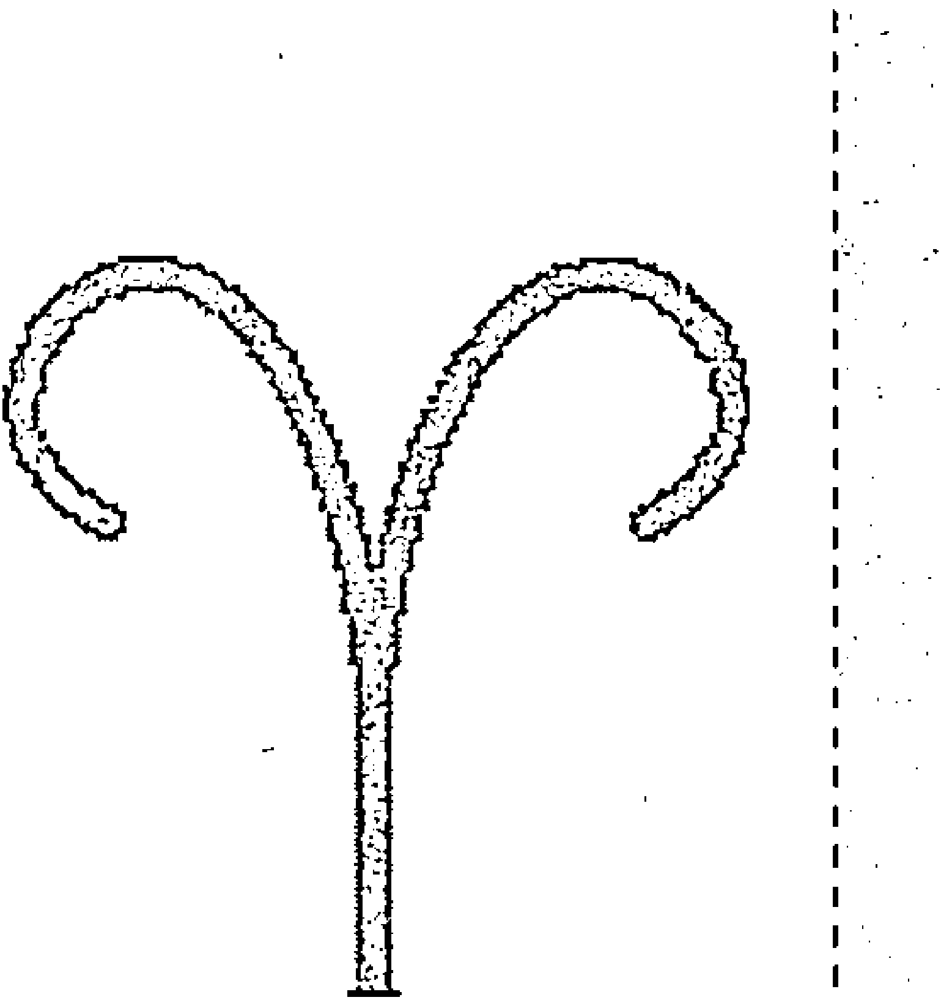

### 二、金牛座：一张圆圆的可爱的牛脸

金牛座的星座符号以简单的线条勾勒出牛的形象：圆圆的牛脸，尖尖的牛角。圆圆的牛脸代表一个人安逸与享乐的生活状态，

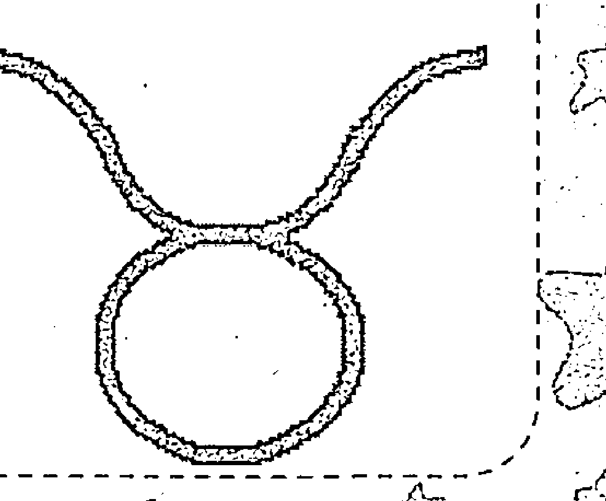

但突出的牛角又表示其内心充满欲望，偶尔也会发些脾气。所以说，矛盾正是金牛座的象征。
关于金牛座星座符号的含义还有另一种说法：其中的圆形形象征古代的金币，扩展开来，凡是能满足人们物质需要的各种事物都由它代表。因此，金牛座符号是收入和报酬的代号。

### 三、双子座：象征永不分离的双胞胎

双子座的星座符号象征均衡的双臂，代表神话中情深意重、永不分离的两兄弟——哥哥卡斯托尔和弟弟波鲁克斯。他们同心协力，赢得了无数英勇美名。

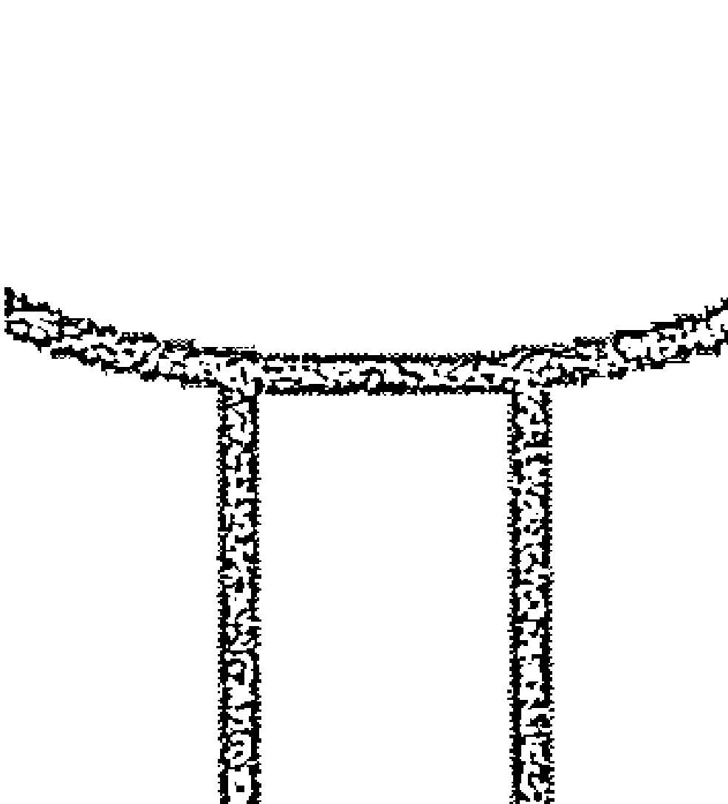

### 四、巨蟹座：好比螃蟹的两只大钳子

巨蟹座的星座符号象征人的双臂环绕在胸前，意为心胸广阔、渴望保护弱者、自卫能力很强。
另外，也有人指出，巨蟹的符号是象征巨蟹的甲壳，由此也可看出巨蟹座具有自我保护的特质和隐藏的习惯。

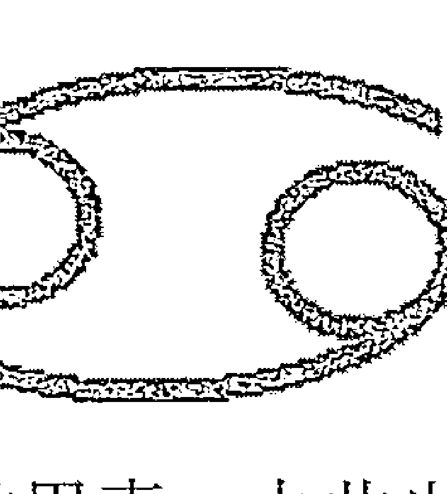

### 五、狮子座：一条高高扬起的尾巴

狮子座的星座符号象征狮子的心和尾巴，尤其是高高扬起的尾巴，充分显示出狮子的个性。狮子是百兽之王，它勇敢、善战。由狮子去联想狮子座的特性：不断地尝试表达自己，发掘自己潜在的个人能力。因此，狮子座会表现出一种高贵、王者之风。这就是属于狮子座的人被赋予的性格。

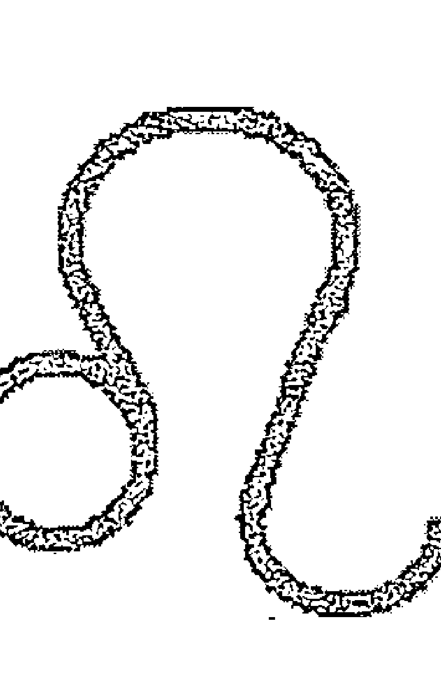

### 六、处女座：像少女飘逸的头发

处女座的星座符号象征少女飘逸的头发，表示永远年轻与清纯，由少女联想处女座的特质，也可以发现一些含义，如恬静、羞涩、谨慎等。

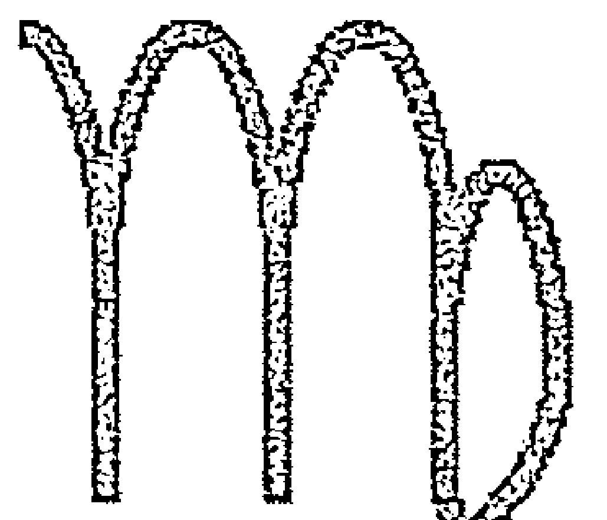

另外，也有人认为，处女座的符号就像一位少女手持一串谷物，而她手中的每粒谷物都象征着在富饶的田野中收获的智慧果实。所以，处女座也代表了聪慧。

### 七、天秤座：象征调和与均衡的秤杆

天秤座的星座符号好似一杆四平八稳的秤。秤本身代表着公平与公正，因此天秤座有追求平衡的基本观念，是绝对要求公平、公正、合理的星座。可以说，该星座代表了调和与均衡。但秤的两边无法达到平衡时，左右摇晃的秤杆也表示出天秤座的优柔寡断。

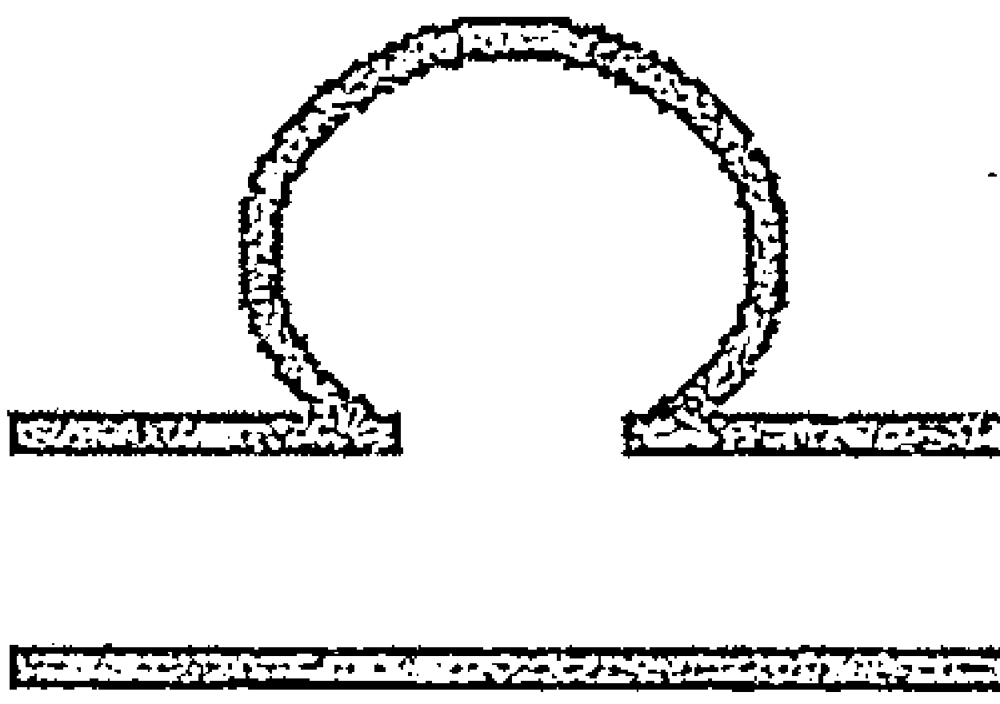

### 八、天蝎座：代表蝎子的甲壳和毒针

天蝎座的星座符号看起来就像是一只翘着尾巴的毒蝎子。蝎子体内含有剧毒，从侧面揭示出天蝎座具有复仇的特质。

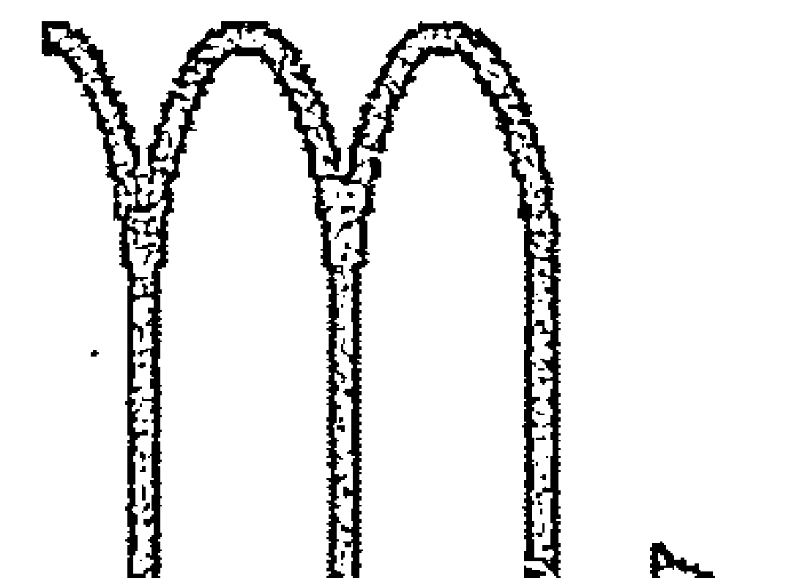

另外，也有人认为，天蝎座的星座符号象征男性的生殖器，说明天蝎座具有很强的欲望。

### 九、射手座：一支具有攻击性的箭

射手座的星座符号象征狩猎人手中的箭，说明射手具有攻击性，容易伤人。另外，射手座又名人马座。射手的原型是半人半马的弓箭手，既拥有智慧的人的上半身，又具有在原野上奔跑的马的下半身。上半身象征智慧，下半身象征向往自由，由此可以看出射手座的典型特点：智慧过人，爱好自由。

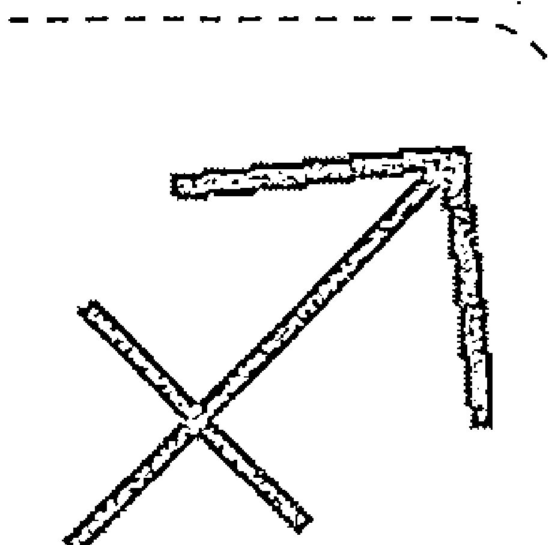

### 十、魔羯座：山羊头+鱼尾

摩羯座的星座符号象征山羊头和鱼尾。据神话传说，牧神因怪物的出现，惊慌跳入河里，浸泡在水中的部分变成鱼尾，而头部变成山羊的模样。由摩羯座的神话可以看出摩羯座人的担心和恐惧。摩羯座又叫山羊座，因其上半身的山羊模样所致。山羊是一种肯吃苦耐劳、意志力顽强的动物。所以，有“山羊”之称的摩羯座，具有攀登绝壁的坚强意志和持久忍耐力，做事认真踏实。

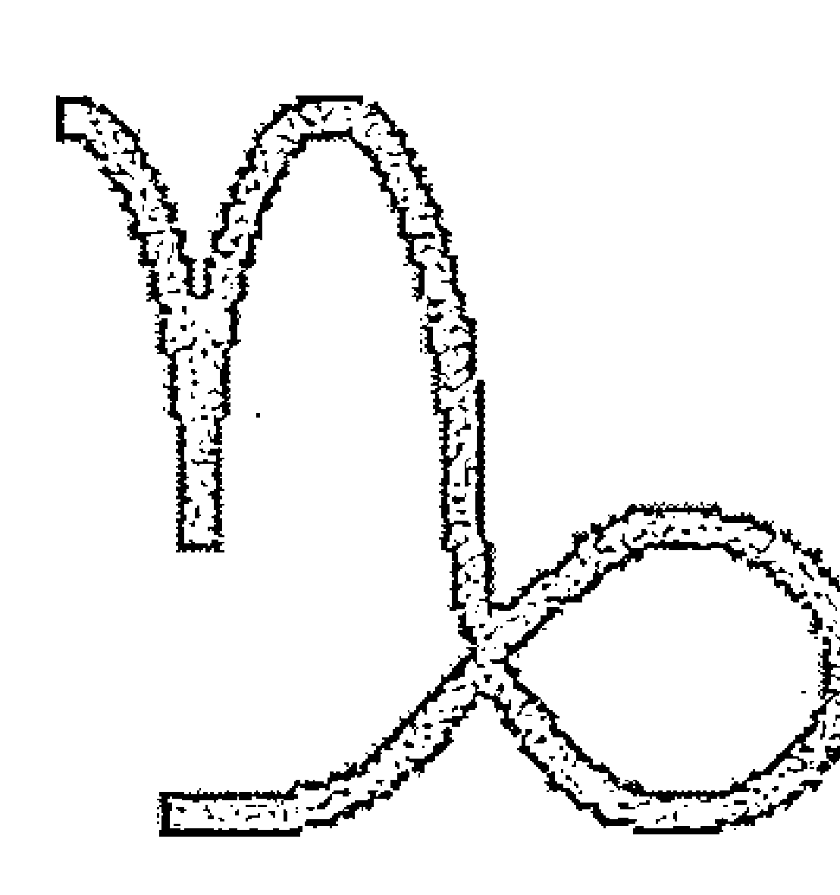

### 十一、水瓶座：水波或波动水面的风

水瓶座的星座符号象征两层水波或波动水面的风。象征水瓶座的波，是高度知性的代表，由波的特性去思考水瓶座的特质，看似有规律但没有具体的形象，是一个不可预测的星座。所以，水瓶座也因此成为十二星座中最复杂的超级大问号。

### 十二、双鱼座：用绳带连接的两条鱼

双鱼座的星座符号表示用绳子连接的两条鱼。一条顺流而下，一条逆流而上，但因中间有条线相连，无论怎么用力，它们还是无法分离。两条鱼分别游向两个方向，明显地点出双鱼座的双重个性，也象征了双鱼座的矛盾和复杂。

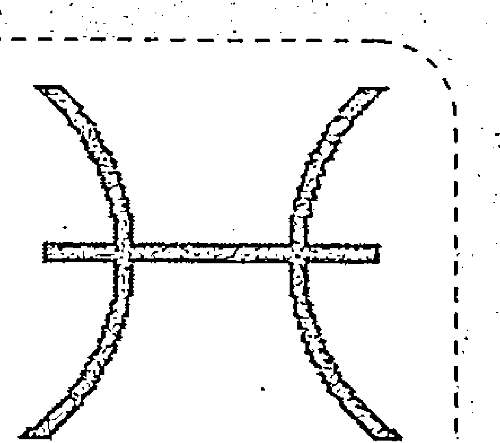

## 第六节 从星空中寻找十二星座

### 一、12月下旬，白羊座星空图

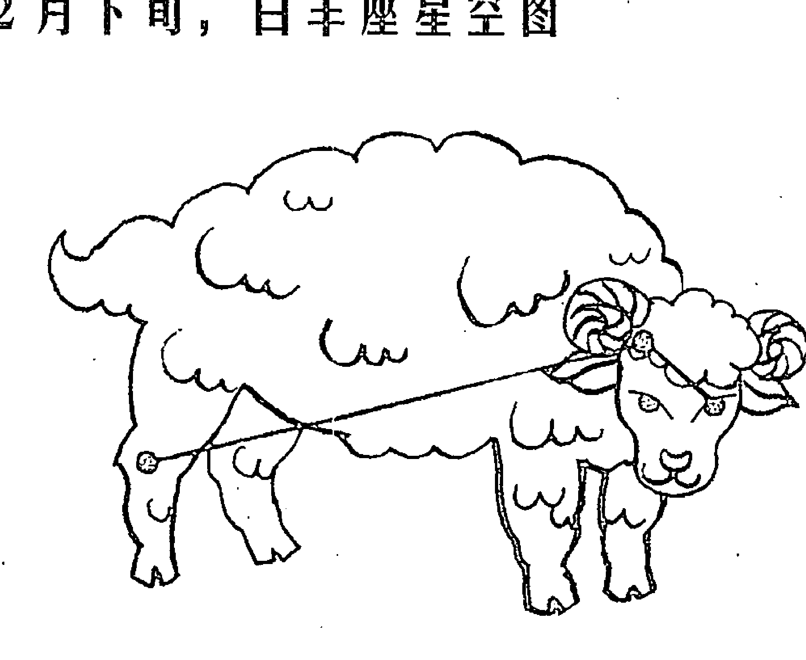

寻找白羊座

| 项目 | 描述 |
|------|------|
| 时间 | 每年12月下旬，冬天清冷的夜晚 |
| 方位 | 抬头，面向南方 |
| 黄道位置 | 位于黄道0°起到30°前的区间 |
| 特征 | 一个大三角图案，看起来好像是一只山羊正在往后看，那就是白羊座 |

### 二、1月下旬，金牛座星空图

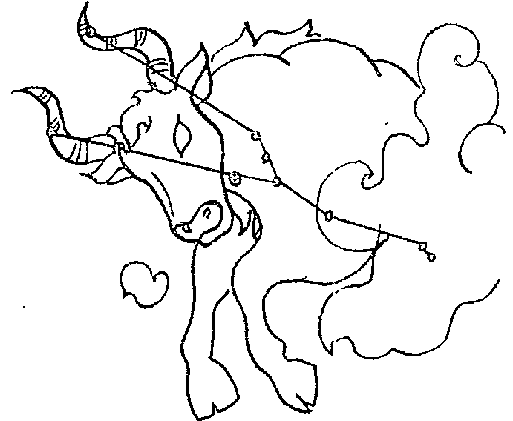

寻找金牛座

| 项目 | 描述 |
|---|---|
| 时间 | 每年1月下旬，严冬时节 |
| 方位 | 天空中央 |
| 黄道位置 | 位于黄道 30°起至 60°前的区间 |
| 特征 | 一个形似牛体的星座，这就是金牛座 |

### 三、3月上旬，双子座星空图

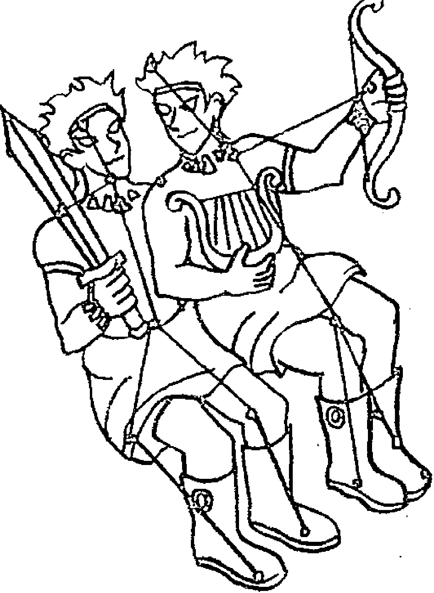

寻找双子座

| 项目 | 描述 |
|---|---|
| 时间 | 每年3月上旬，春寒料峭时 |
| 方位 | 天空南方 |
| 黄道位置 | 黄道 60°起到 90°前的区间 |
| 特征 | 貌似两个男子并肩而靠的星群，这就是双子座 |

### 四、3月下旬，巨蟹座星空图

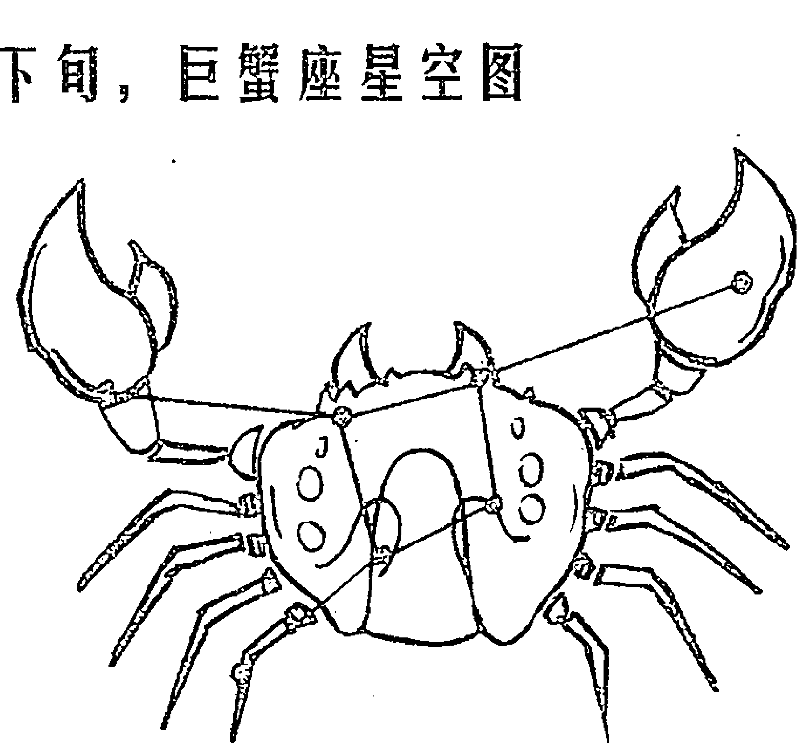

寻找巨蟹座

| 项目 | 描述 |
|---|---|
| 时间 | 每年3月下旬 |
| 方位 | 天空中央偏向南方，大约 15°角 |
| 黄道位置 | 黄道 90°起到 120°前的区间 |
| 特征 | 有一个隐约可见的星团，这就是巨蟹座 |

### 五、4月下旬，狮子座星空图

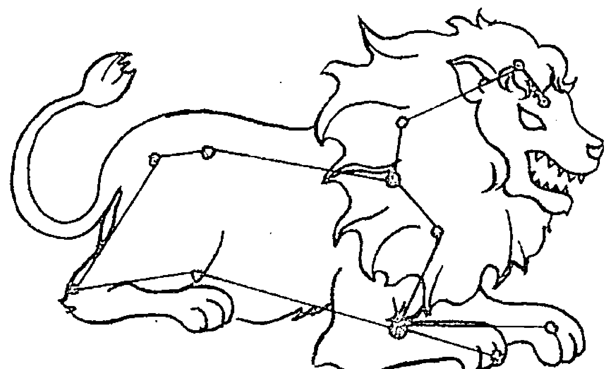

寻找狮子座

| 项目 | 描述 |
|---|---|
| 时间 | 每年4月下旬 |
| 方位 | 天空南方 |
| 黄道位置 | 黄道 120°起至 150°前的区间 |
| 特征 | 一个像问号的星团，这就是狮子座 |

### 六、6月下旬，处女座星空图

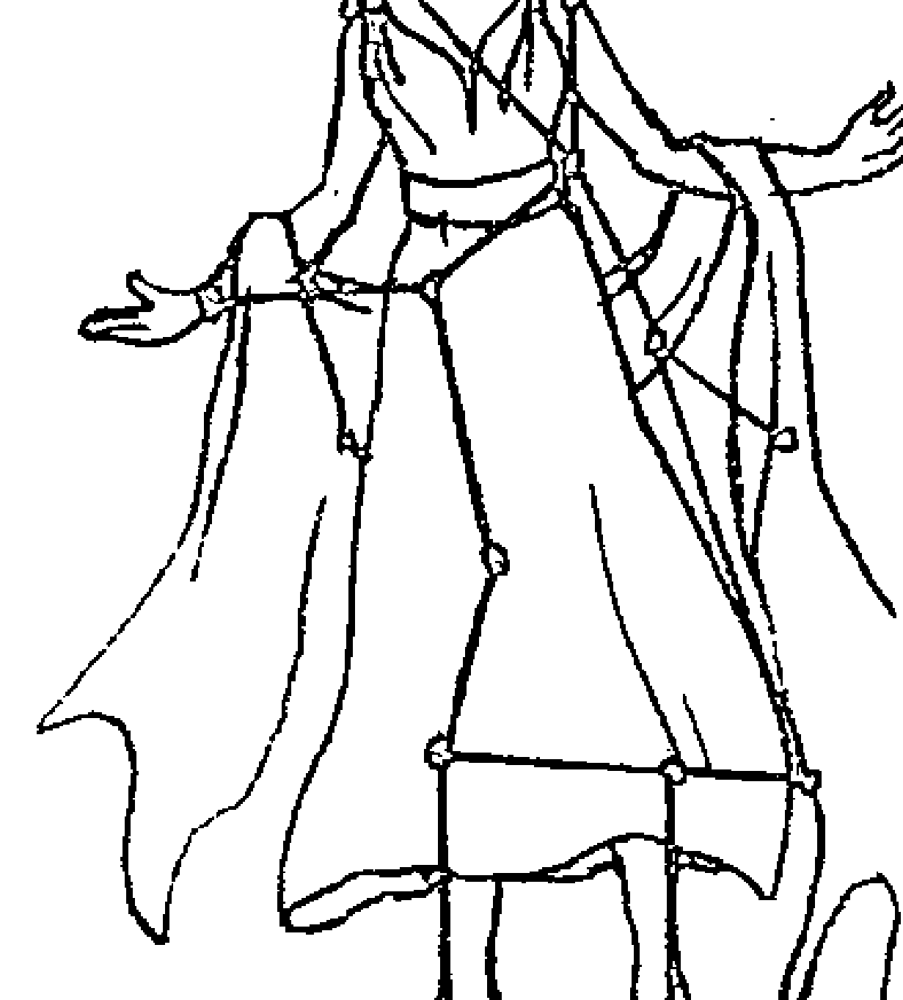

寻找处女座

| 项目 | 描述 |
|---|---|
| 时间 | 每年6月下旬 |
| 方位 | 天空南方 |
| 黄道位置 | 黄道150°起至180°前的区间 |
| 特征 | 有一个少女姿态的星座，这就是处女座 |

### 七、7月上旬，天秤座星空图

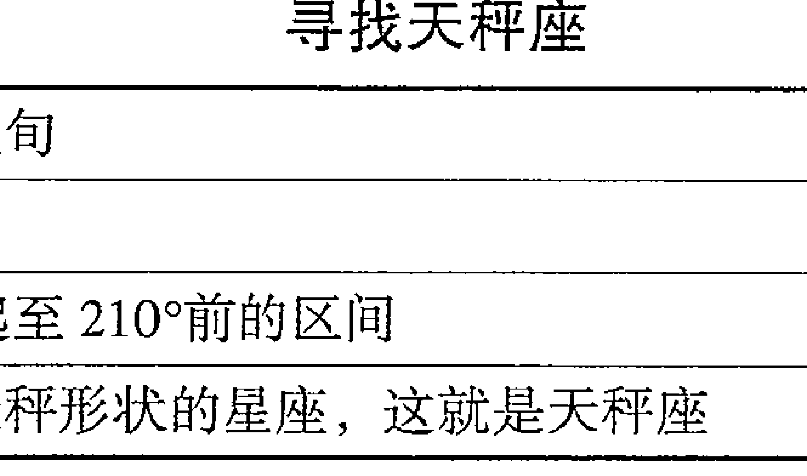

寻找天秤座

| 项目 | 描述 |
|---|---|
| 时间 | 每年7月上旬 |
| 方位 | 天空南方 |
| 黄道位置 | 黄道180°起至210°前的区间 |
| 特征 | 有一个像天秤形状的星座，这就是天秤座 |

### 八、8月下旬，天蝎座星空图

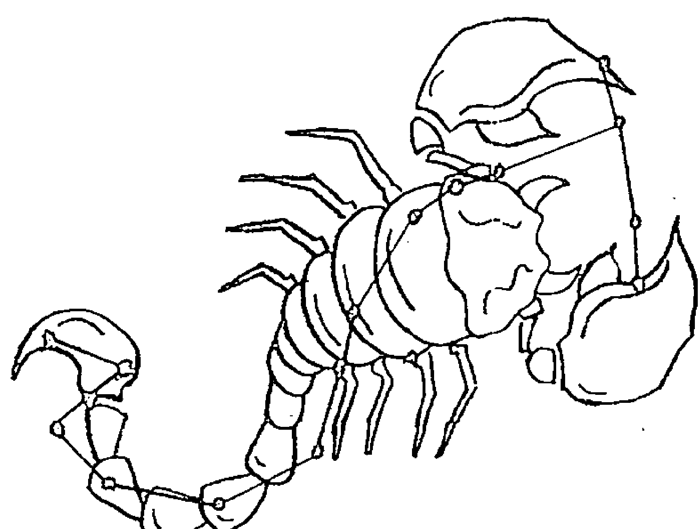

寻找天蝎座

| 项目 | 描述 |
|---|---|
| 时间 | 每年8月下旬，夏末秋初 |
| 方位 | 天空南方 |
| 黄道位置 | 黄道210°起至240°前的区间 |
| 特征 | 16颗金光闪闪的星星组成的S形，那就是天蝎座 |

### 九、9月上旬，射手座星空图

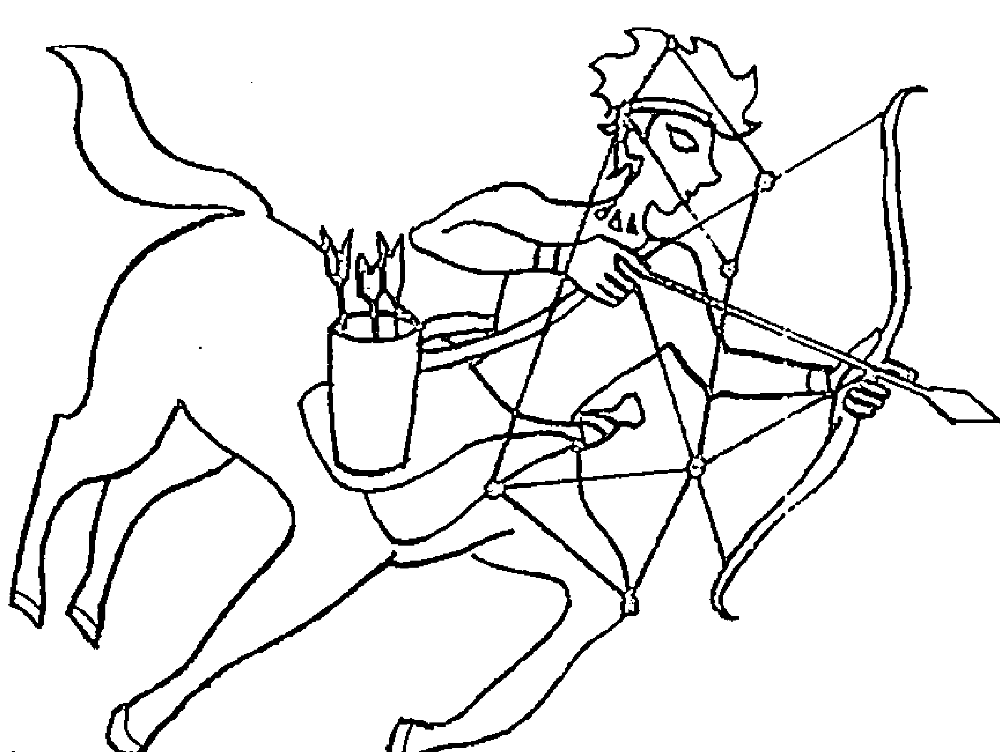

寻找射手座

| 项目 | 描述 |
|---|---|
| 时间 | 每年9月上旬 |
| 方位 | 在南方地平线附近 |
| 黄道位置 | 黄道240°起至270°前的区间 |
| 特征 | 与天蝎座遥遥相望的就是射手座。射手座每时每刻都指着天蝎座的心脏 |

### 十、9月下旬，摩羯座星空图

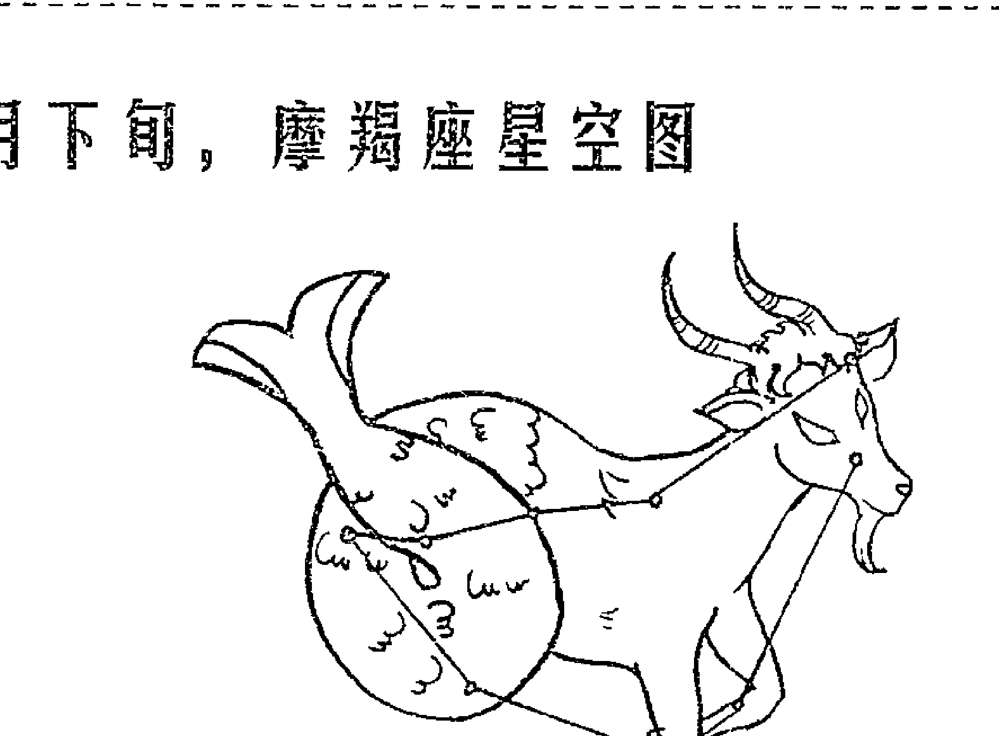

寻找摩羯座

| 项目 | 描述 |
|---|---|
| 时间 | 每年9月下旬 |
| 方位 | 在西南方向的天空中 |
| 黄道位置 | 黄道 270°起到 300°前的区间 |
| 特征 | 一个倒立的大三角形，这正是摩羯座。并排在上方的两颗小星星是山羊的角，而中间侧面的是鱼尾巴 |

### 十一、10月中旬，水瓶座星空图

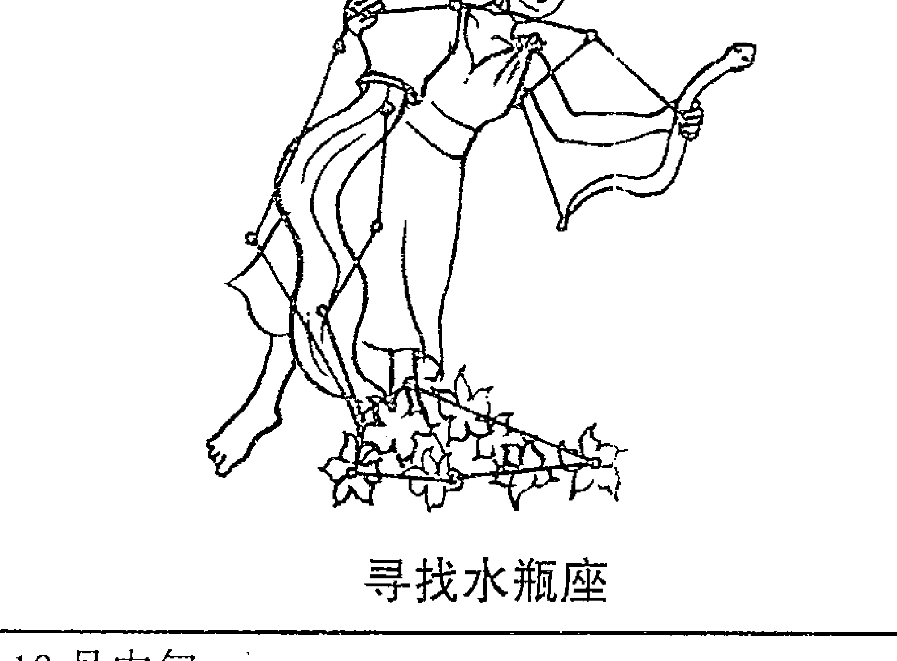

寻找水瓶座

| 项目 | 描述 |
|---|---|
| 时间 | 每年10月中旬 |
| 方位 | 天空南方 |
| 黄道位置 | 黄道 300°起到 330°前的区间 |
| 特征 | 在飞马和双鱼座之间，四星排成“Y”字形即瓶口，其他星星组成瓶身，形成了美丽的水瓶座 |

### 十二、11月下旬，双鱼座星空图

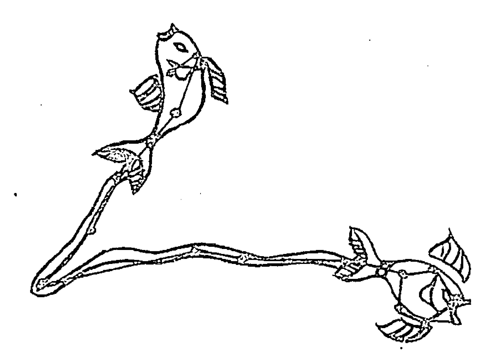

寻找双鱼座

| 项目 | 描述 |
|---|---|
| 时间 | 每年 11 月下旬 |
| 方位 | 在头顶偏东边的天空 |
| 黄道位置 | 黄道 330°起到 0°前的区间 |
| 特征 | 两条鱼相对，且中间像用一条绳索相连，暗示着心智与身体的紧密相连，这就是双鱼座 |

## 第七节 十二星座的“豪言壮语”

### 一、白羊宣言（3 月 21 日~4 月 19 日）

大家好，我是白羊美眉，位居十二星座之首，我很有创新和冒险的精神，偶尔也会表现出很强的领导欲。我精力充沛，不管做任何事情都会全力以赴，力争上风。我的性格是坦诚、直率，往往以自我为中心，同时也充满正义感，热情似火，对身边的人很有影响力。我总是坦诚地表达自己的想法，很容易获得别人的信任和尊重。

我很不喜欢因循守旧、按部就班的生活方式，人们都说我的思想是真正意义上的先锋。因此，有时我也会表现出急躁、好胜、没耐心等性格缺陷。白羊座的人具有积极主动的人格，一生中个人的、社会的、经济的各方面都取决于个人对心智及感情的表现。但有的时候，他们在物质、情绪、精神等方面有极端化的趋向，可能会产生过激的行为。

### 二、金牛宣言（4月20日~5月20日）

大家好，我是牛牛，十二宫的第二个星座，代表成长。我会给人沉静、勤奋、诚实、作风消极的印象，但其实我的人情味很浓厚。我的性格特点是很耐心，态度稳定，富有实干精神。不喜欢变化，钟爱自然物质，对待感情比较专一。我在面对重大抉择的时候会思前想后、犹豫不定，但是一旦下定决心，就能以顽强的意志力执著地向着目标迈进。

我有天生的审美能力，喜欢物美价廉的东西。做事小心谨慎，讲究方法的正确性，力求做到完美，而且忍耐力超强，这是我的优点。顽固、自私、懒惰、喜好奢侈浮华、容易自我放纵等是我的缺点。

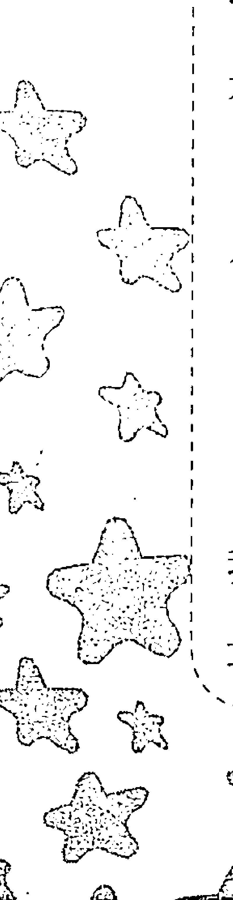

整体来说，金牛座的人不希望不劳而获，不是理想主义者，只求一步步地努力，最后获得成功的果实。

### 三、双子宣言（5月21日~6月21日）

大家好，我是兴趣广泛、多才多艺、思维敏捷的双子美眉。我的想象力丰富，适应能力强，兼备活力和聪慧。在性格方面的最大特征就是具有极敏锐的观察力、强烈的好奇心和不断汲取新知识的欲望。这一点使我能够保持年轻、精力充沛且富有魅力的特征，很多朋友喜欢和我交往，经常围绕在我的周围。我的优点是善解人意、乐于助人、宽容大度，能适应任何环境，并尽力保持独立的个性。

双子座的人外表很热诚，但心中却很冷，深受理智控制，不容易动真感情，很少会经历刻骨铭心的爱情。有双重的性格：一个性格是个性乖戾的艺术家态度，另一个性格是乐观明朗的社交家，这种双重性格使其生活常常发生矛盾，耽于幻想，易满足于沉思和白日梦，有时甚至悲观厌世。

### 四、巨蟹宣言（6月22日~7月22日）

大家好，我是温柔可爱的巨蟹座美眉，我有很好的领悟力和观察力，喜欢静静地沉思，勤于分析自己的思想和行动，想象力异常活跃，比较怀旧，喜欢默想过去发生的事，有敏锐的直觉，有一颗敏感亲和但是保守的心，不常直接表露真情。我对外亲和谦恭，颇有公众意识，但是对内自我保护倾向很强烈，具有传统及情绪化的特点。偶尔，我会为自己想要得到的东西而不惜一切代价去争取。

我比较保守，非常重视家庭，喜欢结交朋友，性格坦白、大方、正直，忠于朋友和个人的信仰，能够获得周围人的信任。

巨蟹座的人生性敏感，往往因别人的恶意批评非难而感到伤心。对过去的一切均怀念而且多愁善感，不会抛弃旧日的伙伴与昔日的友情。

### 五、狮子宣言（7月23日~8月22日）

大家好，我是精力旺盛的狮子，我的个性就像狮子一样，充满活力、热情洋溢、自信满满。我天生具有领导才能，喜欢成为众人瞩目的焦点，享受被崇拜和赞美的感觉。我的慷慨大方和忠诚会赢得很多朋友，我对待朋友非常仗义，愿意为他们付出一切。我的创造力和表现力都很强，无论在艺术、工作还是生活中，都力求展现出最耀眼的一面。

然而，我的自尊心极强，有时会显得骄傲自大、固执己见，无法接受批评和失败。我渴望权力，有时会为了维护自己的权威而显得独断专行。我需要学会谦虚和倾听他人的意见，控制自己的脾气，才能更好地发挥我的领袖魅力。

## 六、处女宣言 (8月23日~9月22日)

大家好，我是喜爱干净整洁的处女美眉，我天性纯洁，有多愁善感、忧郁的倾向。我的性格特点是富于灵感及活泼的直觉，能了解别人的个性和动机，自我感觉比较谦虚，不喜欢和他人竞争，表面好似消极，其实我的作风十分坚定且脚踏实地。我很讨厌不合理的事，神经也非常敏感，有吹毛求疵的倾向，但是这并不是我在故意找麻烦，只是天性使然。我喜欢沉思，很勤勉，非常热爱看书，大家都称赞我是智慧和学问的心智储藏者。我的性情是善于领会和容易感动，有一颗仁慈而悲悯的心，感情比较保守，专注于细节而易忽略整体。在受到攻击时我会以强烈的姿态进行反击。

处女座的人作为名副其实的完美主义者，喜欢把事情做得一丝不苟，喜欢把家收拾得井井有条。尽管也喜欢结交新的朋友，但真心的朋友只有几个而已，因为他们把友谊看做人生中的无价之宝。

## 七、天秤宣言（9月23日~10月23日）

大家好，我是人见人爱、花见花开的秤子。我很善于交际，喜欢融合于集体之中，对于善恶两极的想法总是保持着很平衡的状态。在我与人共处时，懂得在不同场合说话的分寸，能够掌握现场的和谐气氛。我的个性稳健而理智，会永远保持八面玲珑、圆滑的态度，能游刃有余地处理好各方面的关系，但是很少表现出内心的真实想法。我喜欢讲求逻辑和策略，不喜欢以暴力解决事情，我会以巧妙的手腕在对等的权利和利害中找出平衡点。但我有优柔寡断、犹豫不定的缺点。

天秤座的人有强烈的求知欲、领悟力、想象力和直觉力，也有平衡的心智和迷人的身材，天生喜欢表现，更喜欢受人钦佩和赞扬。他们珍惜和谐愉快的生活环境，平易近人，罗曼蒂克的理想主义，擅长交际，不喜争执，有避重就轻的倾向。

## 八、天蝎宣言（10月24日~11月21日）

大家好，我是爱憎分明的蝎子，我拥有非常复杂的个性，外表十分平静淡泊，但拥有惊人的忍耐力和意志力，一旦锁定了猎物目标，就绝对不会轻易放手，可谓不达目的誓不罢休。我的观察力敏锐，经常能够洞悉事情的真相，对事物也有独到的见解。行事时，采用完全的破坏和创新方式，充满神秘的色彩。我的特点是彬彬有礼、慷慨、忠心，有怜悯之心，但一旦被激怒，我的愤怒程度是无人能比的，甚至会失去理智，而且报复心很强。

天蝎座的人有神秘的倾向，有时有超强的“第六感”，能凭借直觉感受到他人所不能感受到的事情。他们比较敏感，有强烈的感情，有好的记忆力，有自我表白能力，有活跃非凡的灵感。天蝎座的人爱憎分明，会尽量保护自己的朋友和所爱的人，与人相处时有危险的嫉妒心理。

## 九、射手宣言（11月22日~12月21日）

大家好，我是勇猛而有胆识的射手美眉。我乐观、忠诚、正直，具有充沛的活力和积极向上的个性。我的自尊心很强，讨厌一切不文雅的举动，厌恶粗劣的东西。大家都夸我心智反应很快，对任何事物都学得很快，能把灵活的想象力用于实际事物。我也比较理性，可以自主调节情绪，人们都喜欢向我倾诉他们的苦恼，以寻求帮助和安慰。

射手座的个性既有平静的一面，又有热烈的一面。他们生来好奇心重，想认识所有的人和事，思维天马行空，令人无法捉摸，也具有叛逆性，但会很快平静下来，恢复常态。他们有很好的幽默感，但生气的时候可能会变得很顽固。射手座的人喜欢通过旅行接近大自然，有高尚的理想和高度的梦想，有一部分人会有点工作狂的倾向。

## 十、摩羯宣言（12月22日~1月19日）

大家好，我是善良而坚强的摩羯美眉。我的性格特点是谨慎、务实、节俭，凡事小心翼翼，有高度的耐力，在严苛的现实环境下仍然能够耐心等待，而且为了使计划顺利实现，可以熬过漫长艰辛的准备时期，绝不松懈，韧劲十足。我稳健而忠诚，谨慎而敏感，对于权威非常敬重，对人生持比较严肃的态度，有一种强烈的责任感。我办事光明正大，从不掩饰利己之心，有时会引起别人的反感。可能是由于洁癖或不愿意妥协等原因，我的人际关系并不太理想，经常会有孤独的感觉。

一般来说，摩羯座的人是讨人喜欢的，表现出出众而迷人的外貌，具有不俗的风度，不容易受刺激，有随机应变的处事能力。此星座的人善良和感情丰富的一面往往会被羞涩所掩盖，很会抑制自己，讨厌做事随便，会一步步踏踏实实地朝向目标迈进。其实，他们本质上不够自信，经常与机遇擦肩而过，也很容易被别人左右，改变自己的初衷。

## 十一、水瓶宣言（1月20日~2月18日）

大家好，我想死你们了，我是知性而颇有幽默感的瓶子。我的性格是温文尔雅、体贴细腻，富于冒险的开拓和研究精神，喜爱所有新鲜的东西，能接受新的发现，具有敏锐的观察力、推测能力及建立理论的能力，但我的社交能力不强。我的优点是性格均衡而健康，有天生的理性去了解人的本性，同时也拥有高度的容忍力。我的缺点是当受感情和偏见影响的时候，原本敏锐的判断力会变得很差。

水瓶座的人个性独立而执著，有人道主义的精神，有丰富的同胞爱和民主意识，能够打破社会阶级和人种的差异，培育出真正的友情。感情上比较敏感，容易受到伤害，但很快就平息下来，不会耿耿于怀。他们喜欢听恭维的话，诚挚恳切，心如止水，比较善变，拥有迷人的风度。

## 十二、双鱼宣言（2月19日~3月20日）

大家好，我是浪漫多情的双鱼美眉，我拥有独立而神秘的个性，敏感而仁爱，当别人需要帮助时，不仅会伸出援助之手，还会付出大量的爱心。我的记忆力很好，也有灵活而丰富的想象力，喜欢做白日梦，经常享受奇思妙想的境界。我常常会观看别人的脸色而改变自己的态度，本质上没有自信。的确，我的个性脆弱、优柔寡断，可能由于性格的关系，我经常会被卷入事端当中，很容易受别人的牵连。我的感情丰富，喜爱罗曼蒂克的气氛，天性需要别人的注意和关爱，若得不到则会受到深深的伤害。在爱情方面，我尤其敏感，耽于浪漫的幻想，显得不切实际。

双鱼座的人渴望远离世俗的隐士般的生活，有丰富的艺术才华，沉溺于诗般的情节和梦想，认为真正意义上的幸福是身心合一的境界，因而在物质上不会有太大的成就。他们忠于朋友，有自我牺牲精神，也因过于敏感而易于陷入悲观失望的境地，有神经质和忧郁症的倾向。双鱼座的人是真正的理想主义者，喜欢依赖和信任别人，性情整体上趋向于保守。

## 第八节 十二星座对命运的影响

通常来说，我们谈论的星座是指太阳星座。2000多年前，古希腊的天文学家西巴克斯为标示太阳在黄道上运行的位置，将黄道平均划分为12个区，每个区为30°，并以区内包含的主要星座来命名。这12个区就是我们所说的太阳星座，也就是十二星座。

十二星座以春分点为零点，即太阳每年在3月21日左右运行至春分点时开始排序，依次是白羊、金牛、双子、巨蟹、狮子、处女、天秤、天蝎、射手、摩羯、水瓶、双鱼。

一个人出生时，太阳在黄道上所处的区域位置，就是该人的太阳星座。同一星座的人，在性格特征、行为方式等方面有若干相似之处，由此可以看出星座对人的影响。

### 一、白羊座：3月21日~4月20日

- 所在星宫：第一宫，主管外显性格、外貌形象、行动、表达模式
- 宫位含义：生命与自我
- 人生法则：繁荣
- 自然元素：火象星座
- 基本能力：开创力
- 守护行星：火星
- 自我宣言：我是
- 守护神：战神马鲁斯
- 幸运石：钻石

### 二、金牛座：4月21日~5月21日

- 所在星宫：第二宫，主管经济状况、金钱价值观、处理财物的能力、所拥有的资源等
- 宫位含义：爱与真善美
- 人生法则：丰富
- 自然元素：阴性土象
- 基本能力：亲和力
- 守护行星：金星
- 自我宣言：我有
- 守护神：爱神维纳斯
- 幸运石：紫水晶

### 三、双子座：5月22日~6月21日

- 所在星宫：第三宫，主管学问、知识、表达力、兄弟手足
- 宫位含义：沟通与咨询
- 人生法则：互补
- 自然元素：阳性风象
- 基本能力：沟通力
- 守护行星：水星
- 自我宣言：我思
- 守护神：掌管信息之源的赫尔美斯
- 幸运石：黄水晶

### 四、巨蟹座：6月22日~7月22日

- 所在星宫：第四宫，主管母爱、感受力、想象力和生产力
- 宫位含义：家庭
- 人生法则：爱
- 自然元素：阴性水象
- 基本能力：滋养性
- 守护行星：月亮
- 自我宣言：我感觉
- 守护神：女神戴安娜
- 幸运石：黄水晶

### 五、狮子座：7月23日~8月23日

- 所在星宫：第五宫，主管爱情、子女、赌运、休闲娱乐、创作能力等
- 宫位含义：爱情与创造
- 人生法则：快乐
- 自然元素：阳性火象
- 基本能力：影响力
- 守护行星：太阳
- 自我宣言：我要
- 守护神：太阳神阿波罗
- 幸运石：红宝石

### 六、处女座：8月24日~9月23日

- 所在星宫：第六宫，主管工作、饮食、健康、身心平衡等
- 宫位含义：工作
- 人生法则：完美
- 自然元素：阴性土象
- 基本能力：服务性
- 守护行星：水星
- 自我宣言：我分析
- 守护神：女神阿斯多蕾亚与农神蕾美德尔
- 幸运石：玛瑙

### 七、天秤座：9月24日~10月23日

- 所在星宫：第七宫，主管婚姻、法律、结盟和敌对关系

### 八、天蝎座：10月24日~11月23日

- 所在星宫：第八宫，主管生死、性和秘密
- 宫位含义：死亡
- 自然元素：阴性水象
- 守护行星：冥王星
- 守护神：地狱之王普尔德
- 人生法则：火凤凰
- 基本能力：透视力
- 自我宣言：我渴望
- 幸运石：猫眼石

### 九、射手座：11月23日~12月21日

- 所在星宫：第九宫，主管宗教倾向、哲学思考和深造机会
- 宫位含义：旅行与进修
- 自然元素：阳性火象
- 守护行星：木星
- 守护神：众神之王宙斯
- 人生法则：变与常
- 基本能力：直觉力
- 自我宣言：我明白
- 幸运石：黄宝石

### 十、摩羯座：12月22日~1月20日

- 所在星宫：第十宫，主管个人抱负、理想、事业、社会地位与权力
- 宫位含义：官禄
- 自然元素：阴性土象
- 守护行星：土星
- 守护神：司时神汉斯
- 人生法则：成功
- 基本能力：支配力
- 自我宣言：我用
- 幸运石：绿松石

### 十一、水瓶座：1月21日~2月18日

- 所在星宫：第十一宫，主管社会抱负、理想、社团组织和社会正义感
- 宫位含义：社会与正义
- 人生法则：分享
- 自然元素：阳性风象
- 基本能力：博爱和利他
- 守护行星：天王星
- 自我宣言：我知道
- 守护神：天神乌拉诺斯
- 幸运石：紫水晶

### 十二、双鱼座：2月19日~3月20日

- 所在星宫：第十二宫，主管潜意识、梦想和秘密敌人
- 宫位含义：因果与报应
- 人生法则：奇迹
- 自然元素：阴性水象
- 基本能力：同情心和包容力
- 守护行星：海王星
- 自我宣言：我相信
- 守护神：海神尼普琴
- 幸运石：绿水晶

## 第九节 趣谈十二星座

显然，A型血与十二星座的组合已经让我们开拓了不少的见识，无论是对于星座与血型的性格了解，还是对其相关的爱情观、婚姻观、事业观、人际观等的认识。其实呢，十二星座的星座之间也存在着很多有意思的小知识，接下来让我们一起轻松讨论一下吧。

### 一、留得住青春的星座女

在“青春永驻”的问题上，以下星座女做得最好。她们有什么秘诀吗？赶快来看看吧。

1. 白羊座
   白羊座的女性是十二星座中独立性最强的女性，自信和骄傲是白羊座女性的特征。鉴于年轻是女人最重要的资本之一，可以想到，白羊座的女性会多么在意保持光鲜亮丽的外表。而且，白羊座率真开朗的性情也会让她们自然而然地做到这一点，至少在心态上，她们看起来会永远像是十几岁的少女。

2. 双子座
   双子座是所有星座中最能保持年轻心态的一个星座。双子座女性气质纯真，不做作，有强烈的好奇心，对新观念新潮流十分敏感。她们求知欲望强烈，给人总是个小孩子的感觉，这样的女人怎么可能变老呢？

3. 天蝎座
   天蝎座天生丽质，她们简直不需要保养，也不用刻意去减肥、美容，轻轻松松就能保持青春靓丽。她们是上天的宠儿，实在令人羡慕。天蝎座的女性比较向往自由自在的生活，所以单身的比例会比较高一些。

4. 狮子座
   狮子座的女性很容易有爱慕虚荣的表现，加上她们总是希望保持高高在上的姿态，所以显得比较傲气，这股子傲气也会让她们不那么显老。狮子座的女人大多比较有正义感，加上她们的高傲，就会显出一股孩子气来。所以，狮子座的女性看起来也总是那么年轻动人、精力充沛。

5. 处女座
   相比于狮子座的大气，处女座会多一点小女人的姿态，她们追求精致的生活，善于保养，她们总是愿意在保养肌肤上花钱，如果有一点老了的痕迹，她们就会想方设法抹去这些痕迹。她们追求高品质的生活，会本能地排斥一些会促进自己衰老的事情。所以，处女座的女性也会比较年轻。

### 二、“天才星座”原来是说水瓶座

水瓶星座常被称为“天才星座”或“未来星座”。因为它的守护星是天王星，而希腊神话中上通天文、下知地理，并有预知未来能力的智慧大神乌拉诺斯，是它的守护神。所以，水瓶座的人具有前瞻性、独创性、聪慧，喜欢追求新的事物及生活方式。

水瓶座的人心胸宽大、爱好和平，主张人人平等、不分贵贱贫富。他们不但尊重个人自由，也乐于助人、热爱生命，是个典型的理想主义者和人道主义者。他们深信世上自有公理，所以常有改革（或革命）的精神。

另外，水瓶座的人也很重视理论和知识，有优秀的推断力和创造力，客观、冷静、善于思考，思想博爱，讲求科学、逻辑和概念，价值观很强。他们是对超能力、超自然现象会积极证明，人缘及辩才均佳，忠于自己的信念，又令人难以捉摸的一类人。

水瓶座的人虽是个理想主义者，但他们一旦遇上爱情，就会变得非常实际。

### 三、女人眼中的星座魅力男

人类的审美观总是在悄然变化，哪些星座的男人是现在女人眼里的香饽饽呢？

#### 第一章 A星座男

#### 第一名：巨蟹座

特点：顾家

在有的年代，顾家会是没有出息的代名词，但是现在顾家好男人却是女人眼里的最佳人选。也许是生活条件优厚了，也许是女性越来越独立了，没人说得清。不过，话说回来，巨蟹座的男士温柔、慈祥，确实给了女人更多的发挥空间，给了女性更多的自主权。在这个强调个性的年代，女士们纷纷选择顾家的男人，也是为了更多的自由。

#### 第二名：金牛座

特点：多金

带一个“金”字的金牛，如果只用钱财来衡量他们就太小看他们了。他们稳重踏实、儒雅有礼、谈吐不凡，在爱情中还有点害羞、黏人，很可爱，可谓出得厅堂、下得厨房，这样的好郎君谁不喜欢呢？

#### 第三名：射手座

特点：阳光

代表阴柔的女性当然需要阳光的照耀了。射手座很有阳刚之气，也很有孩子气，所以既是一个好情人，也是一个“好孩子”，能充分满足女性们的多种需求。而且带出门的话，射手座的开朗健谈、博学多闻、幽默乐观会给女性们挣足面子。射手座还有一个优点，他们虽然在哪里都很活跃，但是并不花心，这一点尤其得到女性的青睐，不知不觉就会陶醉在射手座的阳光里。

### 四、最恋老婆的星座男

世上没有规定说，只允许妻子依恋老公，不允许老公依恋妻子。事实上，有很多星座男都很依恋老婆。

1. 摩羯座
   说起对老婆的依恋，摩羯座高居榜首。摩羯座心事比较多，平时又沉默寡言，所以他们这一辈子大部分话都是和老婆说的。在爱人面前，他们可以滔滔不绝说个没完，在别人面前他们就板起个严肃的脸，不言不语。所以，老婆要是回娘家住几天，他们就会不停地催她回来。再者，摩羯座比较懒，打扫房间、清洗衣物等事也较依赖老婆。

2. 白羊座
   短时间的分离会让白羊座很开心、很快活，但是时间稍微一长，白羊座就会感到烦躁，不断地打电话，先是撒娇，后是大吼，然后又撒娇，总之，非常好笑。

3. 天蝎座
   天蝎座不大喜欢在外面玩，也没有什么朋友，除了工作，就是家庭，所以对老婆比较依恋。天蝎座的老婆需要扮演性伴侣、最好的朋友、最听话的学生这三个非常重要的角色，其重要性不言而喻。

4. 巨蟹座
   不在老婆的身旁会让巨蟹座感到身边空荡荡的，害怕孤单的巨蟹座总希望有人在他的身边走来走去，那个人最好是自己的家人，最好是自己的老婆，那样他才能感到安心。如果有孩子在身边，他还能暂时忍受妻子不在身边的痛苦，如果是孤单一个人，他会不停地打电话，连一向爱看的电视都没心思看下去了。

### 五、一生富贵的星座

有些星座是“月光族”，而有些星座总有钱花，甚至一生不缺钱。那么，哪些星座可以一生富贵呢？

1. 金牛座
   金牛座早期的奋斗可能会有一点艰苦，可是只要小有积蓄，金牛座就能玩起他那最拿手的把戏——以钱滚钱。他们简直就是天生的金融学家，投资理财手段一流。

2. 天蝎座
   天蝎座在金钱方面显出了一个字的厉害：准！其实，他们在金钱上的动作并不多，但是一两次关键性的投机就能让他们一辈子衣食无忧。看起来非常简单，但是只有天蝎座自己才知道自己背地里付出了多少努力。

3. 水瓶座
   无心插柳柳成荫，这就是水瓶座的人生。潇洒的水瓶座从来不会把赚钱当成第一位，他们追求精神层面的享乐。但是，他们很容易依靠知识的力量，站到有利的位置，一旦发现金钱的重要性，偶尔花点心思，就能赚上一大笔。不过，这时候他们不会继续追逐财富，“够用就好”是他们的原则。

4. 双鱼座
   双鱼座是有福气的星座，他们没有什么大的理想，更不会为了钱拼命。但是，他们通常会有很好的家世背景，从小就能过着养尊处优的生活。即使不是这样，也总是能找到为自己遮风挡雨的靠山，不会为了钱而发愁。

### 六、最具拼搏精神的星座

十二星座里，哪些星座具有不懈努力的拼搏精神呢？

1. 白羊座
   讲起拼搏心，白羊座首屈一指。白羊座的人行动果敢，一旦定下目标就会马上实施，绝不会拖拖拉拉。挑战越大，他们的斗斗志就会越来越高。不过，白羊座的人有时候会陶醉于自己的胜利，有时候还喜欢逞能，做些力所不及的事情。

## 2. 狮子座

狮子座表面上看起来没有白羊座那么疯狂，但相比于白羊座，狮子座一般有远大的抱负，是属于为理想而奋斗的一类人。当然，他们的表现欲望很强烈，不会错过任何展示自己才华的机会。狮子座最大的问题是遇到挫折就很容易放弃，所以对于狮子座的人要多鼓励。

## 3. 天蝎座

天蝎座的人拼搏精神也很强，但不会特别显著。如果说白羊座的拼搏是在享受过程，那么天蝎座的拼搏则完全是为了结果，他们为了目标可以不顾一切、不择手段，或者规划很久后才去猛然行动。所以，总是在积聚力量的天蝎座是一个可怕的对手。

## 4. 摩羯座

摩羯座是个悲观主义者，他们总是做好了最坏的打算，然后用自己最理想的状态来应对压力。他们思虑周密，很注重细节的完美，总是毫不气馁，对要实现的目标死缠烂打。

## 七、勇于向压力挑战的星座

在现实生活中，压力无法避免。如果我们不能学会如何面对它，它就会来困扰我们。尽管我们通常不能控制那些导致压力产生的事情，但是我们能够控制自己面对压力的态度。以下几个星座为大家提供了一些面对压力的方法。

## 1. 处女座

处女座是最能应对压力的星座。实际上，他们面临的压力也会是十二星座中最小的，因为处女座是对自己要求最高的星座，他们对自己总是很苛刻，做什么事都会以挑剔的眼光来审查多次，如果他们要做什么事，就会把大事分成很细小的一件件小事来完成。总之，处女座对付压力的方式就是，总是走在压力的前面，所以也就不会有很大的压力了。

## 2. 射手座

乐观的射手座对于压力的处理比较有意思，那就是直接藐视压力。“没什么大不了的”是射手座经常挂在嘴边的话。射手座生性开朗活泼，总是能通过休息、娱乐来缓解压力，他们不会在心里埋怨什么，有什么想法就会坦率地讲出来。如此一来，他们不仅容易得到别人的谅解，也容易得到别人的帮助，所以，压力也就会真的变成像射手座说的那样，没什么大不了的了。

## 3. 金牛座

金牛座没有射手座这么洒脱，不过，务实的金牛座有独特的面对压力的方法。金牛座对付压力的方法说起来很简单，就是硬扛。稳重踏实的金牛座对压力的负荷能力远远超过其他星座，有点泰山压顶不弯腰的意思。退缩、失败的后果是金牛座绝不能接受的，所以死扛，“挺一挺就过去了”是金牛座的座右铭。

## 4. 狮子座

狮子座是最好面子的星座，要他们认输简直不可能。他们会把征服压力当成显示自己能力的一种方式。说到底，不服气就是狮子座面对压力时的心态。要知道，在别人面前抬不起头是狮子座最不能接受的事情。

## 八、喜欢自恋的星座

安妮宝贝说，不自恋的人不可爱。因为只有自恋的人才会更加探索自己的内心，了解、爱惜自己。那么，十二星座中，谁比较自恋呢？

## 1. 水瓶座

通过爱自己来爱世界，这是水瓶座的人生信条。如果一个人连自己都不爱，那怎能爱别人呢？水瓶座就是这样暗示自己的。他们总是在审视自己的内心，并且越来越爱自己，包括自己的外貌、自己的世界观、自己的家，进一步爱上自己爱的人、自己爱的人的想法、自己周边的事物。总之，一切以自己为起点。水瓶座给人的迷惑之处在于，他们有时也表现出爱自己以外的事物。

## 2. 处女座

处女座是很细腻的星座，他们最不能忍受马马虎虎，他们的细心会本能地产生对别的星座的随意排斥。久而久之，他们就只会越来越相信自己，让别人办什么事都不会放心，总要自己亲自做才觉得可靠。所以，处女座的人一旦看到别人犯错，就会说：“看，如果按我说的办该多好啊。”

## 3. 双子座

双子座比较好玩，而且喜欢和自己玩，他们的聪明灵活给了他们自恋的资本。如果在一起玩游戏的话，双子座总是优胜者，那么他们就会自我感觉良好，有些飘飘然。总而言之，他们总觉得只有自己才能和自己玩到一块，别人总是差那么一点火候。除了游玩娱乐外，双子座在衣着打扮上也总会体现很好的品位，在人群中比较醒目，这也是双子座自恋的另外一个原因。

## 4. 狮子座

与双子座的自恋不同，狮子座的自恋则更多地表现在工作、事业上，孤芳自赏、高高在上、好发号施令是狮子座自恋的表现形式。狮子座的自恋是建立在自信的基础上的，虽然有时候这种自信很盲目。

# 第一章 A型血

狮子座的自恋有时候给自己很强的进取心，有时候又会引起周围人的反感。要知道，狮子座的自恋会使他排斥别人的意见，而如果别人都对他言听计从的话，他又会瞧不起别人，越发自恋。

- 5. 天秤座

天秤座的自恋最容易表现为吹牛。他们总是沉溺于过去的小成就当中，然后自己潜意识进行加工整理，最后夸大 地讲出来，而且往往连自己都搞不清真假。所以，与其说他们爱自己，不如说他们爱自己的幻想。

## 九、爱发脾气的星座

俗话说气大伤身，不利于健康，但总有一些人控制不住自己的脾气。从星座的角度讲，以下几种人经常发脾气，且气势吓人。

- 1. 狮子座

和狮子座的名称一样，狮子座的人发起火来就是“狮子吼”，可见其惊人程度。火爆脾气的狮子座最不能容忍工作上的失误，如果有人在工作上麻痹大意，支配欲强的狮子座就会对这种失去控制的局面极为不满。另一个令狮子座发火的事情就是让他丢面子，如果不给足他面子，他就会发作起来。

狮子座发火的时候，其他人最好保持沉默，不论是辩解还是认错，都会引来他的新一轮轰炸。不听劝解，是狮子座脾气里的另一个重要特质。

- 2. 巨蟹座

如果说十二星座对应七宗罪的话，那么巨蟹座对应的就是愤怒。巨蟹座的人，不论男女，情绪都很不稳定，一会儿哭，一会儿笑。巨蟹座的男人疑心都比较重，对谁都不放心，一旦发起脾气来，千万不要和他对着干，否则就会遭到他疯狂的攻击。而巨蟹座的女人比较爱唠叨，虽然她们心地比较善良，但是嘴上功夫很厉害，所以不要和巨蟹座的女人争口舌的上风。

## 3. 双子座

双子座的脾气用火爆来形容不太贴切，确切地来说，双子座的脾气是急躁。他们总是希望用最高的效率来得到最好的结果，慢腾腾的办事风格很容易激怒双子座。有时候，双子座发脾气又会纯粹是孩子气的表现，心底有一点点不高兴就会乱发一通脾气。不过，他们发完脾气就什么事都没有了，不会持续很长时间。

## 4. 白羊座

白羊座其实是比较好相处的一个星座，他们热情而纯洁、率真而坦诚。但是，白羊座发起火来会比较吓人，他们的爆发力很强，一般会有摔打东西的表现。所以，白羊座的人发火时，家里的摆设大多会遭殃。

## 5. 天蝎座

如果说别的星座发脾气是被动的，是被别人冒犯的话，那么天蝎座就是典型的没事找事型。天蝎座的人天生带有攻击性，会主动挑衅别人，总希望别人按自己的想法来做事。他们自以为是，又死不认错，即使意识到自己不对，也要和人争得面红耳赤，往往争到最后的结果是，事情的起因变得不重要，就是为了胜负。所以，天蝎座发起脾气来很难缠。

## 十、星座也来追时尚

哪些星座会比较时髦，喜欢追求流行时尚呢？虽然只从十二星座的划分上来看有点笼统，但也可以简单地看出一点端倪。

## 1. 双子座

最爱赶时髦的星座，非双子座莫属。双子座是个比较好玩的星座，他们有强烈的好奇心，如果看到比较新颖的打扮或者协调的搭配，他们就会自己去尝试，如果加上他们自己的一点心得，受到别人赞美的话，就会更加乐此不疲。不过，他们并不会追求奇装异服，而是追求简单、大方的感觉。所以，在别人眼里，双子座是很新潮、很前卫，也很舒坦的，至少在穿着打扮上，他们会是朋友、同事羡慕的对象。双子座的幸运色是浅蓝色和黄色，所以双子座的男女可以多选择这两种颜色的服饰。

## 2. 水瓶座

水瓶座的人有创意并且作风大胆，往往能引领时尚潮流。他们创意无限，眼光非常独到，哪些是最有档次的，哪些是最合适自己的，他们往往一看就能辨别出来。所以，水瓶座的人去买衣服的话，不需要长时间挑选，就能很快发现自己所需要的衣服。

前卫的水瓶座是时尚的风向标，他们在审美方面有着自己独到的见解。能打破常规，用全新的思维来看待流行时尚。他们不会刻意去模仿别人，而是相信自己的审美观。总而言之，水瓶座是时尚的引路人，是带头者，而不是追随者。

## 3. 狮子座

喜欢炫耀自己，爱慕虚荣的狮子座当然不会落在时尚的后边。对于他们来说，时尚是一种实现自己优越感的重要手段，再加上他们热情和咄咄逼人的气势，不成为别人关注的焦点都很难。支配欲强的狮子座很容易变成购物狂，如果经济条件许可的话，狮子座的人就会把自己喜欢的东西买回家，他们除了会买很多漂亮的衣服，任何新潮的玩意儿都不会放过。另外，狮子座需要注意的是，衣物的颜色不要过度艳丽。

## 4. 天秤座

仅从爱美的角度来讲，天秤座在十二星座里排名第一。发现美、追求美是每个天秤座不经意间在做的事情。所以，与其说天秤座追求时尚，不如说天秤座在追求美。天秤座对时尚的态度，并不是一味的追随，而是冷静的观察和适当的介入。同时，因为天秤座对美的苛求，所以天秤座往往会花费大量的时间在时尚上。时尚杂志是他们最喜欢看的，而如果去逛街的话，你就会发现，天秤座是最挑剔的一类人，他们对东西总是挑挑拣拣，很难发现自己满意的东西。所以，千万不要误会天秤座的人小气，他们不过是对美过于苛求罢了。

## 5. 金牛座

金牛座是十二星座中最有艺术气质的，所以在追求时尚方面，他们会显露出非常专业的一面。他们虽然看起来比较内敛，甚至比较憨厚，但是实际上他们的眼光非常锐利，时尚的东西，哪些是好的，哪些是不好的，哪些是适合自己的，哪些是不适合自己的，他们都有明确的判断。而且金牛座的人比较务实，所以不会出现购物狂的情况。他们重视的是自己对价值的判断，而不是一味地追求新颖稀奇。他们喜欢优雅、简单的风格，注重的是整体的感觉。

## 6. 处女座

与金牛座相反，处女座的人追求的是细节。所以，处女座的人往往对一些小物件比较感兴趣，各种小商品或者首饰市场是他们最爱逛的地方，如何在哪里点缀一下，让自己变得更加光彩夺目，是处女座的拿手好戏。不过，他们普遍缺乏自信，所以买东西的时候会迟迟拿不定主意，需要别人的意见。

# 第二章 A型人性格奥妙剖析

## 第一节 A型人的性格大揭秘

从总体来说，A型人往往是这样一群有着丰富知识、远大理想，以及强烈使命感的人。他们既拥有出众的魅力，却也偶尔犯点小错，具备谦逊、低调的品质，却也时刻坚守着自己的性格。

- 1. 优点
天资聪颖，认真稳健；具有服务意识，善于照顾他人；有礼貌，态度良好；不易受骗，能察言观色；不会甜言蜜语，有公德心，行为得宜有节制。

富有团队精神，有责任感，工作认真；不喜欢出风头；有知识，有理想；踏实慎重，小心翼翼；自尊心强；讲理；善于做决断；能分辨好坏；为人公正，具有牺牲精神；思考问题比较周到；做事干脆，不拖拉；耐心进取，相当努力；有使命感，严于律己；执著，不辞辛劳；具有中庸精神；不会沉溺于自己的辉煌，不容易满足现状。

## 2. 缺点

目光短浅，行事表面化；神经质，疑心重，不信任他人；多一事不如少一事的心态；油滑，伪善；不善于创新，缺乏积极性和主动性。

## 3. 特性

最讨厌对方不懂得仔细观察自己深沉的心意，更拒绝对方太过露骨的表现方式。过度地恭维，对B型人或许管用，对A型人则是反效果，奉承逢迎只会招得厌恶。特意制造的惊喜也可能变成震惊和愤怒，有善意的惊喜还是提前预告比较好。与A型人谈话时切忌贸然下结论，也别说太多离经叛道的异说。表现十分谦逊的A型人，仍希望你能牢记他的恩惠。别冤枉A型者，这会让他记恨许久。别批评他的家族，更别批评男性的A型情人或以下犯上。

## 4. 欣赏的类型

喜欢对象衣着朴素，做事认真且行动有力，头脑灵敏，信心果决，较关心家庭与投资理财等。

## 5. 恋爱信号

害羞而内向的A型人即使对直觉上认为不错的人也不会毫不客气地邀约。一紧张就会面红耳赤的A型人主要是怕对方知道自己忐忑不安的心情。

## 6. 财务观念

一丝不苟的A型人，在理财方面也非常保守。大部分A型人的存折里都会有一笔积蓄，他们对钱也比较没有安全感，觉得钱放在银行里最好。即使利息节节下降，A型人还是不太愿意将钱拿去投资。因此，A型人不见得都很有钱，但也不会有缺钱的时候，他们也不会让自己大笔地支出。

如果你有一位A型的朋友，你可能会觉得此人很“铁公鸡”，对于钱似乎锱铢必较，其实不然，A型人只是比较会考虑他们所花的钱是否得到一定的价值而已，假如是他们认为该花的，A型人比别人都豪爽。

## 7. 服装偏好

对衣着的潮流很敏感，喜欢打扮，却不华丽；爱好清洁；强调重点，色彩感受很好，挑选服装时，以色彩为主。

## 第二节 A型=忧郁的蓝色

在人们的常识中，蓝色即意味着忧郁。因为蓝色是一种情感化很重的颜色，而喜欢蓝色的人往往喜欢待在自己的世界里并且对别人一直存在戒备心理。这一点，和A型人很像。

A型人的情感总是十分丰富。他们很容易被自己感受到的一些色彩、声音、协调的美以及有节奏的生活所打动。他们生来传统，容易恋旧，甚至时常独自一个人就莫名其妙地忧伤起来。习惯忧伤，便往往会对生活中的好些事情想不开、放不下，每每这时候他们就会顺便把自己封闭起来。于是，会更忧伤。

A型人，做任何事情都习惯小心谨慎、瞻前顾后，并力争做到完美无缺。正是因为他们对完美的刻意追求，往往会被残酷的现实打击到。理想中的完美与现实的残缺，会给他们的心理带来落差的同时，也送来了忧郁的心情。

A型人天生一副怜悯心肠，他们不仅在心理上同情弱者，在行动上也很是积极主动。尽管，他们也会时刻提醒着自己，不要总是对可怜的人提供施舍，那会助长他们的懒惰和依赖。他们善良，同时又满腔的大局思维。对于A型人来讲，集体的利益、国家和民族的利益，以及追求一个天下美好的盛世，是他们重大的使命所在，他们会为此而孜孜不倦地奉献。心系那么多的事情，总是给自己背负着强大的使命感，心情自然会被经常地打扰，忧郁也就不请自来了。这时候，想洒脱生活也就不容易了。

A型人感情丰富却也变化多端。他们时常顾虑重重、优柔寡断，并很容易地就钻了牛角尖，因为他们太容易自我曲解了。他们经常会对自己缺乏自信心，往往觉得自己没有别人做得出色。由于对自己的片面认识，他们总是对自己抱以自我掩饰的心态。他们太过在意外界对他们的评价，因此他们对自己所做的事情更加谨慎，甚至会谨慎的过头，想太多反而压抑更多。

另外，A型人在判断事物的时候，往往一味跟着自己的感觉走，很少与别人商量或倾听他人的意见。所以，他们的看法往往就带有了较多的主观因素。但问题的关键是，并非所有的新事物都可以用常理去推断的，这就促使A型人的敏感情绪产生“质”的转变了。

A型人的敏感、多疑、孤性、善良，注定了这些人的生活会多出一些蓝色的味道。尽管A型人与忧郁的蓝色之间可以画上等号，但这并不能绝对说明A型的人要与忧郁相伴终生。既然改变不了血型的现实，那就尽量改变一下自己的生活习惯。

A型的人，平时要多加强一些与人们的沟通；做事细心谨慎固然好，但不要太过敏感，要多想开一些；学着换位思维，当遇到令自己烦心的事情的时候，不要钻牛角尖，而是要站在别人的角度，重新审视一下事情的经过；善良是种美德，把做善心的事情当成快乐的事情去做，不要顾虑太多……

## 第三节 A型人之生活解读——女性篇

A型女性，善于顺应自己周围的人，尊敬长辈，说话做事谦逊有礼，为人立世循规蹈矩。她们大多心思细密，具有深谋远虑的优点。

A型女性爱讲道理，缺乏通融性，有时显得固执、想不开。然而，她们往往最具责任感，经常成为能够委托的女性。

A型女性，喜欢宁静，享受孤独。她们偶尔多疑，却更加多情。音乐、动画、绘画等往往是她们的感情寄托。

A型女性，在生活中还是比较注重节俭的人。她们在理财方面相当保守，她们希望自己拥有安全感，而存钱会让这种安全感变得牢实。

A型妻子温柔，体贴，能干。她们大多心思细密、待人和蔼，即使在与丈夫吵架时，也能挤出笑脸招待客人。

A型女性普遍缺乏野心，与世无争。她们多是贤妻良母，且善烹饪，对丈夫和子女照顾尽心竭力，把整个家庭料理得井井有条。A型妻子要求绝对的忠诚，她们容不得自己的丈夫有半点越轨行为。

总的来说，A型女性的主要类型有：温柔体贴型，认真、负责型，固执、想不开型，唠叨、爱讲道理型，悲观主义的顺从型。她们虽然可以被分为多种类型，但是她们骨子里都是善良、温柔、感性、稳重的。正是因为大多数的A型女性严谨、细心、待人亲和，故对异性充满无限魅力。

## 第四节 A型人之性格解读——男性篇

A型男性受自信心影响很大。在自信心尚未丧失之前，通常会表现得相当积极；一旦自信心受损，顿时会变得消极起来，自卑感也会油然而生，此时，绝大部分A型男性会变得更加内向。

A型男性非常讲究，对穿着的品位非常在意，经常会刻意打扮自己，借以引起他人的注意。

A型男人做事非常谨慎，在感情上十分痴情。A型性格的人往往不善于表达自己的感情，即使在内心很爱对方，但碍于自尊心，害怕被自己所爱的人拒绝，因此宁愿忍受感情的折磨，也不愿向对方吐露心声。所以他们往往抓不住机会，总是错过后才追悔莫及。

A型男人总是把恋爱和婚姻连在一起，在他们看来，恋爱的最终目的就是婚姻。他们通常会选择那些心地善良、乐观开朗、能理解自己、互相体谅的女性。

A型丈夫责任感最强，他们对自己的家庭非常重视，对于家庭的人际关系考虑得十分周全和细心。他们把家庭成员的幸福当作自己最大的快乐。

## 第二章 A型人性格心理剖析

做自己的幸福，尽忠尽责，为了家庭可以牺牲自己的一切。他们在家里一般比较放松，会流露出真正的自我。

总体来说，A 型男性的主要类型有：诚实的协调型，对人对己严格的默默努力型，自信很强的积极型，对世俗超然的学究型，自我逃避的内向型。A 型的男人乐于与人合作，有较强的集体归属意识，他们温文尔雅，并且有一副好脾气，很受别人的欢迎，容易得到别人的信任。

## 第五节 精于“算计”的A型人

A型人在生活中常常表现出下列行为：

- 同意把一分钱再分成几份花
- 认为银行应当和你分利才算公平
- 梦想别人的钱变成你的
- 出门在外常想搭个不花钱的顺路车
- 经常后悔自己买来的东西根本不值
- 常常觉得自己在生活中总是处在上当受骗的位置
- 因为给别人花了钱而变得闷闷不乐
- 买东西的时候，为了节省一块钱而付出了极大的代价，甚至自己都认为，跑的冤枉路太长了

A型人的“算计”在吃穿住行等方面体现得淋漓尽致。他们认真思索每个细节时，要把自己当做事件的中心参照物，主要是对自己有利还是有害，有多少利和有多少害，想清楚之后再进行操作。

但是，生活实践告诉我们，凡是对金钱利益太过于算计的人，都是活得相当辛苦的人，又总是感到不快的人。在这些方面，我们可以做出如下总结：

第一，一个太能算计的人，通常也是一个事事计较的人。无论他表面上多么大方，他的内心深处都不会坦然。算计本身首先已经使人失掉了平静，掉在一事一物的纠缠里。而一个经常失去平静的人，一般都会引起较严重的焦虑症。一个常处在焦虑状态中的人，不但谈不上快乐，甚至是痛苦的。

第二，爱算计的人在生活中很难得到平衡和满足，反而会由于过多的算计引起对人对事的不满和愤恨，常与别人闹意见，分歧不断，内心充满了冲突。

第三，爱算计的人心胸常被堵塞，每天只能生活在具体的事物中不能自拔，习惯看眼前而不顾长远。更严重的是，世上千千万万事，爱算计者并不是只对某一件事情算计，而是对所有事都习惯于算计。太多的算计埋在心里，如此积累便是忧患。忧患中的人怎么会有好日子过？！

第四，太能算计的人也是太想得到的人，而太想得到的人，很难轻松地生活。

第五，精于算计的人必然是一个经常注重阴暗面的人。他总在发现问题，发现错误，处处担心，事事设防；内心总是灰色的。

然而，从历史中淘滤出来的生活道理说明，如果能够“糊涂”一些、“傻”一些，人就会远离很多烦恼，活得更加快乐，不会被生活的琐碎吹皱脸上的皮肤。郑板桥的一句名言“难得糊涂”洞明世事：聪明易做，糊涂难为，被世事纠缠不清的人难有大智慧、大作为。

生活永远是没有固定逻辑的，付出不一定会得到，失去的也无法再讨回来。与其纠缠已经过去、无法挽回的，不如“自欺欺人”，把目光转向未来，转向好的方面。

## 第六节 A型人如何看待“闹情绪”

在现代的生活环境中，生活的压力、工作的压力总是如长江后浪推前浪般汹涌，压力太大太多，总是会占用自己很多放松的时间与空间，那么有情绪不可避免。由此看来，了解一下 A 型人自己的情绪，以及 A 型人看待其他人的情绪，对于协调好与 A 型人之间的相处是很有必要的。

A型人之间多数时候意见是比较一致的，所以，当A型人爆发情绪的时候，同为A型的人是很能理解他的。若他们之间不能相互理解，多半是出于私人利益或是情感的原因。

B型人的情绪反应很轻快，在A型人看来，似乎总是不太顾及自己的情绪，所以，令A型人很难理解。

AB型人兼具A型人和B型人的特质，他们像A型人一样，情绪释放很慢，这一点，A型人是很能理解的。但AB型人也有像B型人的那一半，情绪变化快且轻巧，这是A型人所不能理解的。

O型人的情绪比较激烈。他们的情绪通常是来得快，去得也快，除了这一点令A型人比较费解外，对于O血型人的情绪，A型的人还是比较好理解的。但是随着社会经验的积累，O型人会试着控制自己的情绪，不让别人看清自己的内心。在A型人看来，此时的O型人就显得比较木讷、呆板。

不同血型的人是有差异的，他们都有各自的独特之处。A型人，不要太自我，要走出自己的世界，学会控制好自己的情绪，这样才有可能去真正理解其他三种血型的人。

## 第七节 给A型人的建议

通过前面的分析，想必大家已经对 A 型人的性格有了比较全面的认识。A 型人既有他们积极的、值得学习的显性素质，也不乏拥有一些由隐性素质作怪的消极。那如何更好地扬长避短、趋利避害呢？

1. 首先，社会是由人来组成的。也就是说，如果你要在社会上立足生存，甚至成功，那么与他人之间架起桥梁，时刻敞开自己的胸怀，并且清楚地说出自己的需要和期待，那么你将得到更多的理解、信任与支持。
2. 其次，金无足赤，人无完人。有缺点与不足是正常的，不犯错误的圣人在世界上是找不到的。那么，A 型人更要懂得正视一下自己的不足，只有这样才能看到自己友好、耐心的另一面，进而让自己拥有安全感。
3. 再次，你不能总是把自己封闭起来，你应该学会更好的表达。就像菲利普亲王所说的：“如果没有人开始咳嗽，就不可能有人扫掉灰尘。”那么，大胆地说出你的想法吧。只要你是正确的，就没人会去耻笑你。
4. 最后，作为 A 型人，要学会自信，要相信自己。其实只要你愿意，你完全可以成为一个大有作为的人。不要惧怕眼前的失败，不要怀疑自己，只要有勇气站起来，果敢地相信自己，你会是一个出色的强者。

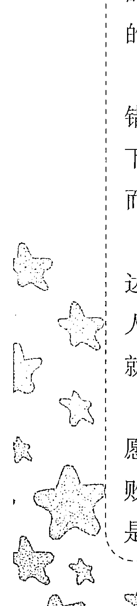

## 第二章 A型人格剖析

那么，接下来就勇敢地了解一下自己的弱点，学习一下相应的对策。

- (1) A型人不到万不得已，往往不容易集中精力。因此，在日常生活中，要每天加以训练，在周围确定注意目标，努力使意识集中在某一点上，这样还有助于自我控制感情。
- (2) A型人面对困难往往比较消极，他们不会采取积极姿态为自己开拓道路，稍一遭遇困难就失去信心。为此，A型人应不断进行自我鼓励，坚定自己必胜的信念，让自己能经受住打击，实现奋斗目标。
- (3) A型人什么事都爱往坏处想，常常畏缩不前、忧心忡忡，决断力很弱。所以，A型人应尝试着多朝胜利的方向去想、去努力，从可以决断的小事做起，试着果断地下结论，便能够决断下去了。
- (4) A型人总是考虑得太多，往往延误了行动，甚至会因此而缺乏行动的勇气。建议A型人与其思前想后，不如尽全力先干起来。
- (5) A型人在吸收知识、积蓄才能方面很出色，但在交际上语言有欠妥帖，由于很谨慎，所以一般表现消极。因此，A型人应尽量把真心话用富有感情的话语表现出来，这样便可以促进积极的对话，同时缓解讲话时的精神紧张程度。
- (6) A型人的行动带有抑制性，常会感到欲求不满足、心情烦躁、精神疲劳。要想解除这种状态，首先要行动，享受乐趣，活动身体，偶尔用休息日出去旅行，远离人群。

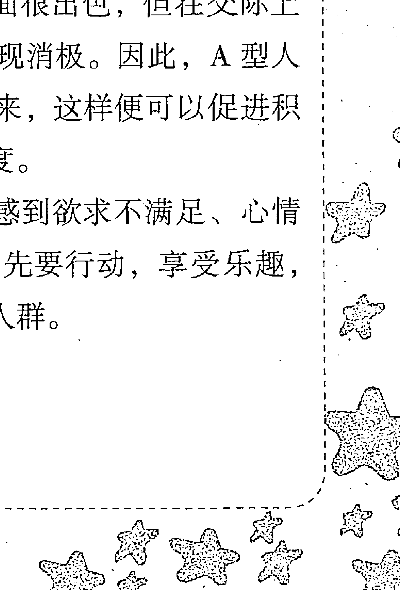

## 第三章

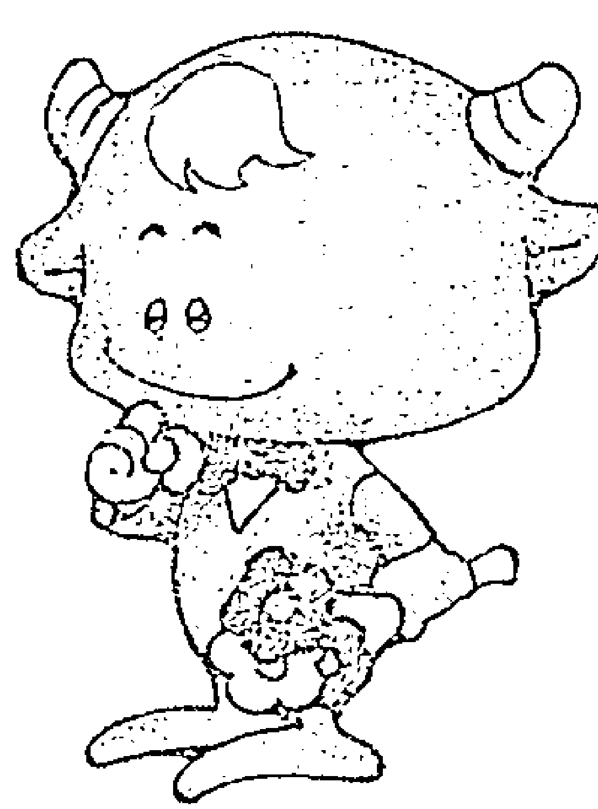

### A型人轻松玩转职场

## 第一节 适合A型人的工作类型

根据对A型人在职场中的表现来看，A型人在研究者、技术人员等职业领域有着很强的适应性，因此，A型人是很适合在“研究”、“技能”、“技术”三个部门工作的。并且，他们生来就有办事细心、管理负责和工作踏实的天性，因此他们在处理事务、革新和应用方面也会卓有成就的。

在日本，由于A型人占的比例远远要高于其他血型，于是在日本几乎所有的事业领域里都能够发现精明能干的A型人。调查发现，在其所从事的职务中，以国家公务员为顶点的公务员、事务职员所占的比例最高。他们作为国家大组织的一员，往往背负着伟大的使命感，为了出色地完成分配给自己的任务，他们踏实诚恳、埋头苦干、默默奉献，再加上强烈的现场会议意识以及富有的协调精神，他们在公务员事业中的成功也就理所当然了。

所以，根据 A 型人的特性，他们在科技、经济规划、作家、歌星、戏剧和短剧演员、摔跤及长短跑运动、记者、科学家等职业领域，也会很有建树。

另外，值得注意的是，头脑一流、创意十足的 A 型人最不适合组织严格或官僚主义盛行的大型公司。他们天生喜好自由、富有创造力，而古板老套的工作环境只会严重扼杀他们的活力。

## 第二节 A型主管的管理风格

在工作中，对主管的性格略知一二绝对是必要的，这可减少不必要的摩擦，而且也使工作更有效率，甚至对你的晋升都会带来不少帮助，而 A 型主管的特性有哪些呢？

1. A 型上司多爱“插嘴干预”

厌恶犯错的完美主义者，唯恐影响到前途而特别谨慎，以“完美”为信条。因其负有维护现场的责任，小心谨慎的特性是理所当然；若是在上班时间闲聊，他会以严峻的眼光瞪着你，就连影印时嘴上哼着小曲、订书机的运作声不绝于耳等小动作，都会受到他的特别注意。

2. A 型主管会因“执拗”而失败

A 型人的观念是：要道歉，并不是点几个头便可以了，并会生气地骂道：心不在焉。自己其实很重视那份诚心与关照员工，但是一经说出，却又成了“你自己心里明白”。他有时会想别过于心急地乱责骂人，但表达出来的却是唠唠叨叨。

3. A 型主管常因“没搞头”而扫兴

工作态度与谨慎通常是合为一体。当你认真工作时，由于想尽自己的心力，会去试试看是否有更好的提案，A 型主管会先夸说“这真是个好构思”，然后本着一贯的慎重，却不会给你一个答复。

4. A 型主管重视“礼数”

保守又注重形式的 A 型人，对于诚实与礼仪颇为重视。所谓礼仪，不光是指日常的寒暄，来家中探望或年节的礼貌性拜访等也都是重点。由于这种价值观在他心中已根深蒂固，因此他会率先作出表率。若偶尔尔发表了“废除繁文缛节是合理的”等论调时，应该是他觉悟了事后还礼的麻烦。但逢年过节时，他又不知该不该登门拜访，受属下批评的影响很大。

## 第三节 A型人的职场表现

不同血型的人在职场中的表现不同。包括他们是否能与同事友好相处，是否为工作过多担忧，是否对工作尽职尽责，甚至影响他们是否能成为老板等。

A 型人希望一起合作实现目标，他们不像 O 型人那样宣传个人英雄主义，崇尚 007 那样的孤胆英雄；也不像 B 型人那样懒散缓慢，缺少严谨的工作态度，更不会像 AB 型人那样喜欢猜疑。

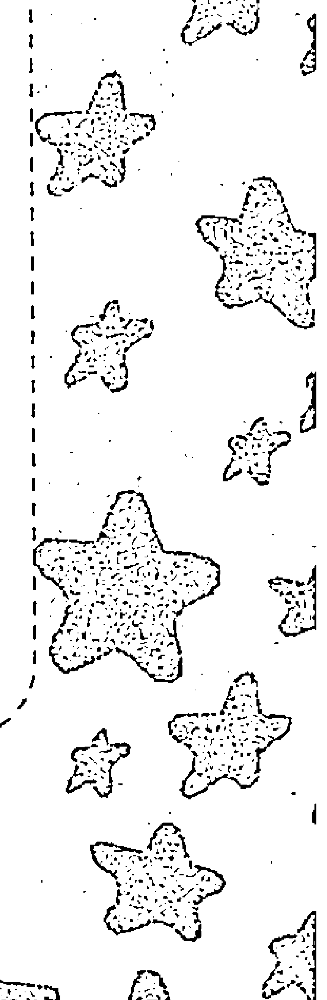

研究人员做过一个实验。他们把实验对象按 A、B、AB、O 血型分成四组，每组有三人。指定 A 血型组的人去调查本市婴儿用品市场，B 血型组的人调查妇女用品市场，AB 血型组的人调查老年人用品市场，O 血型组的人调查男士用品市场。

比赛前，研究人员对他们说：“假设我们在招聘人才，我们录取的人是用来开发市场的，所以，你们必须对市场有敏锐的观察力。让大家调查这些行业，是想看看大家对一个新行业的适应能力。每个小组的成员务必全力以赴！”随后，又补充道：“为了避免大家盲目开展调查，我已经叫助手准备了一份相关行业的资料，走的时候自己到助手那里去取。”

两天后，12个人都把自己的市场分析报告送到了研究人员那里。他们看完后，站起身来，走向 A 血型组的三个人，与之一一握手，并祝贺道：“恭喜三位，你们出色地完成了这次任务。”研究人员看见大家疑惑的表情，平静地解释道：“请大家打开我叫助手给你们的资料，互相看看。”原来，每个人得到的资料都不一样，A 血型组的三个人得到的分别是本市婴儿用品市场过去、现在和将来的分析，其他两组的也类似。老总说：“A血型组的三个人很聪明，互相借用了对方的资料，补全了自己的分析报告。而其他三组的九个人却分别行事，抛开队友，自己做自己的。我出这样一个题目，主要的目的是想看看大家的团队合作意识。B、AB、O血型三组失败的原因在于，他们没有合作，忽视了队友的存在。要知道，团队合作精神才是现代企业成功的保障。所以，在这次试验中，A血型组做得最好。”

A 型人的合作意识正是现代职场所欣赏的。现代企业在强调个人素质的同时，更多地强调团队合作精神。一棵大树永远成不了森林，只有森林茂密，树才能享受更好的生长条件。同样，只有团队获得成功，个人才能获得成功。

合作的技巧其实很简单，就看你是否愿意掌握它，如果你总觉得自己如何了不起，而不考虑别人的感受，是不会受到别人欢迎的，当然就不会有“人缘”。所以，基本的沟通与合作技巧是青年人应该掌握的。如果你稍注意一些交流技巧的话，就可以为你营造一个好的合作氛围。

1. 用动作求得一致

你付出什么，就收获什么。如果同合作者合作愉快的话，那么你们之间就有某种默契，或者说有一种感应。如果人们相处得非常好，那么他们彼此的动作、表情和神韵自然都很相似。如果你把自己和沟通良好的人的交谈情形录下来，再倒过来看看，你会发现这种交谈很像是在表演，一人摆出了某种动作，另一个自然就跟了上来。通常只有当你和别人相处融洽时，才会产生这种默契。通过这种体态语言的一致，你和你的交谈对象完全进入了合作状态。

2. 做一个倾听者

能够聆听他人是一种美德。青年人应该有这种美德。人人都希望有一个倾诉对象，也希望别人了解自己。但是，如果两个人都希望倾诉和被了解，却没有一个人愿意去倾听的话，两人要么争吵，要么互相不愿碰面。因此，如果你想被别人了解，就得先学会听别人倾诉。只有愿意了解别人的人，才能被别人了解。

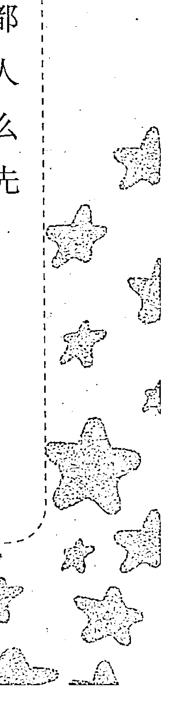

## 第四节 怎样任用A型下属

在职场上，学会和 A 型下属相处的诀窍，不仅会获得下级的良好口碑，也能给自己的职场生涯带来一份可观的人际财富。

### 一、如果你是 A 型上级

A 型人信仰团队精神，在集体行动中富于协作精神。他们不论处于什么环境，都能够适应、顺从，他们一心一意尝试改变自己，以便调和自己与环境的关系。A 型人的集体主义并不是表面行为，而是出自内心的集体归属感。通常 A 型的人比较敏感、孤独，有忧郁的倾向，神经比较紧张。同是 A 型的上司，应该很能充分理解下属的感受。在日常工作中，要多多鼓励和关照 A 型下属，应尽量避免直接说出他们的缺点，避免对他们恶语相向、大声指责；最好采取肯定和赞美的态度。这样在 A 型下属的心中，会充满感激之情，也会产生效忠之心，从而更加努力地为上司效命。A 型人的缺点是依赖心比较强、自主能力比较差，作为上司应当适时给予鼓励，可以帮助他更好地发挥出自己的能力和才华。如此一来，A 型上司会给 A 型下属一种信任感，两者之间的关系会越来越协调。

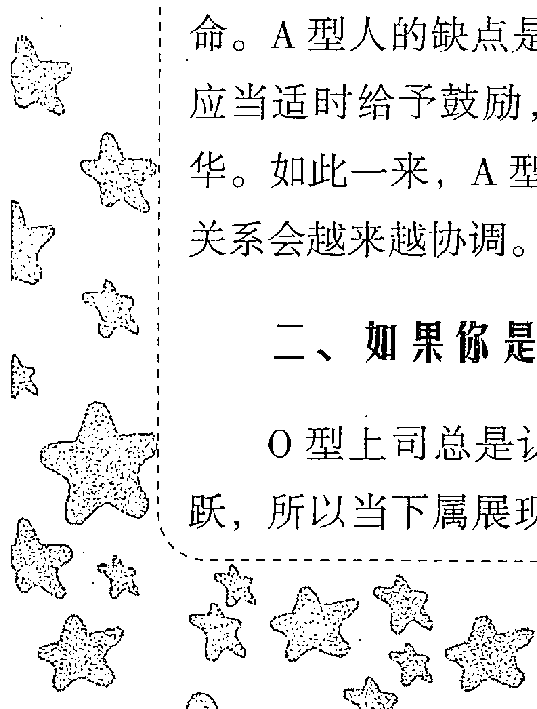

### 二、如果你是O型上级

O 型上司总是认为 A 型下属不够认真、不够积极、不够活跃，所以当下属展现他的成果时，O 型上司往往会以无法认可的态度对待，认为那是理所当然的事。长此以往，A型下属会渐渐产生挫败感，感到上司对自己一点也不重视，更会产生不自信感，甚至会出现丧失工作意愿的情形。其实，对于A型下属来说，他们无非希望被肯定、被委以重任。因而，即使是微不足道的工作成果，O型上司最好也予以适当的评价，对其进行鼓励。当他们的工作无法得到满意时，要以婉转的言词指出存在的问题，切忌一针见血、刻板生硬的态度，如此才能打动A型下属的心，使得他们在工作中加倍努力。A型下属的责任感通常很强，如果把任务交给他们，他们一定会细心谨慎地完成好，同时也会提升其自信。

### 三、如果你是B型上级

B型上司感觉敏锐，心思灵活多变，行动力很强。在他领导下的团队看起来比较火爆，做事情雷厉风行，干劲十足。而A型下属默默无闻的工作态度会让有着自我主义的上司很看不惯，当B型的上司表现出任何不满时，A型下属将产生抗拒的心理，两人之间甚至会陷入一种僵局。B型的上司应该在感觉到A型的下属行为及言词中有抗议的暗示时，静心倾听其表达心中的意见和不满。将工作交给A型下属去做时，不要保留小秘密，应该采取信任的态度，遇到任何麻烦时，也要让下属知道，并全权交给下属解决，只有相信下属，下属才会赴汤蹈火在所不辞。此外，B型上司说话直来直去的特点也会在不经意间伤害到心思敏感的A型下属，因此要特别注意，尽可能避免争执。

### 四、如果你是AB型上级

AB型的上司在A型下属的眼中是非常冷峻的，经常一味严厉要求下属，心机深沉，给人一种不可言喻的压迫感。如果 AB 型的上司对 A 型下属的工作成果没有什么反应，或者没有及时对其表示肯定，将使 A 型下属十分失望。因为他们很看重领导的看法和意见，每做一件事都害怕做得不好，也害怕遭人误会，十分恐惧失败，总是小心翼翼、患得患失。AB 型上司要尽量避免责骂，令其自我反省，再给其一次机会就好了。鼓励 A 型下属发挥自己的才华，避免触碰到他们所忌讳的，适当地对其进行物质或者精神鼓励，适时地纠正他们的缺点，这才是 AB 型的上司灵活任用下属的好方法。

通过以上分析可以看出，对待 A 型的下属要多采取肯定和鼓励的方式，尤其要避免打击和指责，最终以温和的态度引导其达到自己的标准。

## 第五节 A型+O型：上下级最搭配的血型组合

A 型人性格多稳重、办事细致谨慎，与 O 型人在职场上的表现呈相辅相成态势，O 型人喜欢直来直去，对人对事不拘小节、做事总是粗枝大叶。反过来，O 型的生气勃勃及其执著专注与顾虑重重、行动过慎的 A 型，无论是在一起工作还是生活，他们也都能够相互补偏救弊、共同前进，可以说是上下级最佳的搭配。

### 一、A型领导 VS O型下属

如果满分是 10 分，A 型领导与 O 型下属之间的默契指数高达9.5分，他们之间的关系可以用融洽、愉快来形容。A型领导按部就班、沉稳内敛等行事方式，可以征服高傲、自负的O型下属，获得他们的尊敬与支持。而O型下属在工作中表现出的积极进取、迎难而上等优点，深受A型领导的赏识。

O型下属多好学上进，时常会有很多问题，而A型的上司往往是非常有耐性的好老师，他们往往能够给予详细的解答，帮助O型下属快速成长。而好胜心、学习能力强且勇于尝试的O型下属也不负所望，成长为令A型上司非常满意的下属。

### 二、O型领导 VS A型下属

如果满分是10分，O型领导与A型下属之间的默契指数高达9分。

O型上司多注重实际，他们非常喜欢A型下属务实、吃苦耐劳的工作作风，因此，常常对A型下属给予表扬。

A型下属有固执的一面，当他们认为自己受到了不公正待遇，就会向O型领导提出想法。如果是私下里，O型领导会很认真地听取意见，只要他们觉得是对的就会加以改进；如果是公开场合，碍于面子，O型领导会不予理睬。

## 第六节 与A型同事“合作愉快”的秘诀

人脉是一个人终身受用的无形资产，是通往成功的门票，无论从事什么职业，只要拥有良好的人际关系，就成功了一大半。如果你的同事是A型的人，也许你会发现和他们相处的时候四周## 第七节 A型人的离职观

跳槽是一门学问，也是一种策略。“人往高处走”，这固然没有错。但是，看来轻巧的一句话，它却包含了为什么“走”、什么是“高”、怎么“走”、什么时候“走”，以及“走”了以后怎么办等一系列问题。

容易在职场中出现跳槽误区的人大都是 A 型的人，他们常以“跟自己的志向不合”作为离职理由，只是为了实现他们“我必须努力打拼，才能赢得好成绩，也才不会让别人看不起”的成就观。殊不知，他们大多数在跳槽的时候，并不够冷静。

所以在跳槽时 A 型人应该用正确的心态，理智地采取对策。为避免越跳越糟，还要特别注意以下心理误区：

- 1. 攀比心理
择业时总以别人的工作为“样板”，如收入、住房、福利、出国机会、管理等级等，想方设法为自己找一个符合此标准的职业。这种片面强调单方面因素而忽视其他重要方面的求职心理，不利于你找到真正适合自己的工作。

- 2. 冲动心理
由于一些突发事件，如未获得期望的奖励，与同事、上级发生争执，被人误解等，有些人会决意要离开现单位，而全然不顾所付出的代价。很显然这种情况下是很难一下子找到合适工作的，而不得不屈就某处。即使以后有了更好的机会而另谋他职时，也已浪费了不少时间和精力。

- 3. 盲从心理
有些人选择工作并非根据自己的兴趣及个人能力特点，跳槽时目标不明确，而是随波逐流，哪个行业热门就转向哪个行业，哪里钱多就往哪里跳，哪家公司名气响就往哪里闯，久而久之，就像候鸟一样飞东飞西，永远成不了雄鹰。

- 4. 犹豫心理
抱有这种心理的人一方面对新工作很感兴趣，另一方面又害怕放弃原来的工作会带来损失，患得患失，反复权衡，最后白白错失好机会，而又不能安心于现在的工作。

跳槽在个人的职业生涯中是一件大事，做得好它将是你成功道路上的阶梯，反之可能是陷阱。所以，我们每一个人在选择跳槽时要总结以往的得失，并规划好未来的道路。

# 第四章 A型社交达人的实战技巧

## 第一节 A型人的看人学问

A 型人在和人的交往中，总希望和别人经常都能保持一个风平浪静的人际关系，因此，他们很注重自己在谈话中的言行举止，同时对别人的一举一动也会尽收眼底。特别是对于初次见面的人，虽然他们表面上礼数周到，甚至很会为对方服务，但他们的内心与他人之间有一道围墙。

因此，对外人很有戒心的 A 型人对对方的反应总是很敏感，他们生怕自己会漏听对方所说的话。尽管他们喜欢与见多识广的人谈天说地，不停地点头称是，但内心总打着一个个问号。他们在听别人讲话的时候，虽然看似不会盯着人家看，常作低头沉思状，实际上他们总是在对方不察觉的时候，边听边认真观察着对方的表情以及对方的一举一动，他们很懂得把握说话的分寸，因此，和A型人交谈几乎不会出现争执的场面。

A型人由于在与人交往中，善于察言观色，因此他们的人缘是相当不错的。他们从事外事活动、与人交谈的时候，注重礼节，同时对周围人的一言一行极为敏感。敏感的性格促使他们的眼睛总会像雷达一样，“扫射”着他人的一举一动，由此他们会对对方的品行一览无余。只是他们不喜欢对别人评头论足，故对别人身上的不足虽然看在眼里却不动声色，反而会默默记在心里，避免自己的言语会揭露对方的短处。

既然，A型人在与人交际中如此重视、如此敏感，那么要和他们和睦相处的话，只要真诚表现自己就好，因为A型人喜欢和真诚的人在一起。

## 第二节 A型人的说话习惯与待人方式

- 1. A型人的说话习惯
A型人的说话习惯可谓是四种血型中最稳重、最亲和、最具条理的。他们在说话时总是很客气，而且表达清晰、条理分明，同时他们还喜欢注视着对方的脸说话，在他们看来这是一种对说话人的尊重。当他们聆听对方讲话时，又总会频频点头，表示赞同。另外，有趣的是，他们在打电话或者作为会议观众时，通常会不由自主地拿着笔在纸上乱写乱画。

- 2. A型人的待人方式
A 型人在与他人相处的过程中，一直坚守他们的细心谨慎，极力给对方或周围的人带来愉快、轻松、周到的感觉，绝对不会伤害对方的感情。他们在交际中，懂得迎合，懂得克制自己，虽然有积极为他人服务的一面，却又不肯轻易相信他人。可见，A型在与人相处中稳重、谨慎又多疑，是一种双重性格的体现。

A 型人与陌生人初次见面时，他们的和蔼可亲、周到服务，总会让人觉得他们是容易相处的类型。但是，如果接下来你们继续有了多次接触，你就会意外地发现，他们的待人态度和第一次见面的时候一样，谨慎、周到却绝不会吐露自己的心声。正因为 A 型人的内心封闭，他们更加期待能够多与人交往以盼望能够释放自己的心声，但是他们的这种愿望还是很难外露，除非能够在信任的基础上成为知己。虽然 A 型人不会有太多的朋友，但一旦结成莫逆，他们就会无微不至地关心对方，情真意切，倾诉衷肠。当然，强烈的自尊心是 A 型人的典型招牌。对于 A 型人来说，最大的侮辱就是被别人小看。

A 型人有一个很大的优点就是诚实待人，说话算数。A 型人一般不会轻易给别人承诺什么，而一旦许诺就绝对会全力以赴。因此，A 型人往往是值得信赖的最佳合作者。但是，A 型人对待他人的态度存在着严重的区别对待倾向，他们对自己人真诚实在，对待外人往往礼貌中带有猜疑。

## 第三节 A型人和其他血型的朋友关系

因为A型人只与特定的人深交，所以朋友数量不多，因此同为A型人，有可能会结成很深的友谊。与A型人交友，切记不要给对方添麻烦。

B型人可以成为A型人的好朋友。B型人一般没有城府，也愿意热心助人，他能帮你解决些问题，比如出主意、开开心等，但从根本上讲，你们的关系时好时坏，很难再深入。

AB型人觉得A型人很了不得，很有深度，所以，AB型人愿意为A型人效力，而A型人也能领情。

在A型人眼里，O型人大多脑子简单，一览无余。O型人对A型人多十分感激，因为在交往之中，A型人多很乐意顺手帮一把O型人。

## 第四节 日常交往中识别A型人

能够在日常的生活交往中，从一个人的外在表现判断出他或她的血型，对于你的相处之道还是很有用的。那么，下面教你如何从人群中认出A型人。

- 1. 从最初印象判断血型
初次见到A型人的时候，他们总是彬彬有礼、诚实可靠、整洁大方、小心谨慎、整体上给人以内向的感觉。

- 2. 从着装判断血型
A 型人善于把握流行趋势，喜欢打扮，但不会随心所欲。喜欢清洁，装扮总能令人眼前一亮。他们对色彩的感觉也非常敏锐，选择服装时会重点考虑颜色。

- 3. 从谈话的特点判断血型
A 型人善于倾听，愿意采取退让的姿态。在与人谈话时，会尽量避免伤害对方，绝不会说些无用的话。

- 4. 从将结论转为行动的态度判断血型
A 型人的做事风格是，在一件事情没有结束之时，不会开始另外一件事。慎重地思考之后才会转移到行动上，不会做出跳跃性的举动。他们很重视场合气氛。

- 5. 从情绪化变动判断血型
A 型人是一种情绪化比较明显的人。他们喜欢色彩，有音律感，有美感，甚至连有节奏的生活都会让他们感动不已。A 型人待人亲和，富有同情心。对生活充满向往与激情，同时他们也喜怒无常。另外，他们总是拥有着强烈的好奇心，对新事物、新朋友会格外感兴趣，当偶尔看到他们一惊一乍的时候，也不要奇怪。

## 第五节 如何与A型异性相处

不同血型的人体现出不同的性格特征，俗话说“酒逢知己千杯少，话不投机半句多”，如果两个性格相投的人走到一起，会产生相见恨晚的感觉。各种血型的人和不善交际的 A 型异性相处会擦出怎样的火花呢？

- 一、A型与A型异性的相处之道——控制完美主义倾向
两个 A型人在一起的时候，了解对方的性格就像了解自己一样，很容易发现对方身上自己喜欢的特质，交谈中也非常投机，容易进行下去。但是，A型人属于完美主义者，当两个同型组合走到一起时，难免会引发争论。他们平日里很注意掩藏个人的锋芒，但在表达个人的感情时，又是最没有妥协性、最固执的。A型的人往往会因考虑太多别人的想法，而使得自己也感觉不愉快。特别 A型异性对 A型的你的心灵动向十分敏感，倘若表现太过无理，A型异性心中会有上当受骗感。

明确地讲出“是”或“不是”，A型异性朋友可能比较容易接受。不答应对方自己做不到的事情，不乱发脾气，是和A型男友或A型女友和睦相处的秘诀。对自己严格，对对方宽容，这是两人相处时应该持有的态度。关键要控制完美主义倾向，不要抱怨太多，尽量保持平淡的心态。

- 二、O型与A型异性的相处之道——不可提过分要求
A型和O型可以说是最佳搭档，在很多方面正好互补。比如说，A型人办事深思熟虑，O型人办事雷厉风行；A型的人细致缜密、一丝不苟，而直性情的O型人粗枝大叶、不拘小节；A型人在思想上容易钻牛角尖，而O型人注重实际，讲究效率。这两种血型的人一旦结成伴侣，就会产生心灵和情感上的共鸣。在O型男和A型女之间，O型男性并不太觉得A型女性是异性，而完全以男孩子之间的相处方式与之交往，像朋友一般处于对等的地位。

在 O 型女和 A 型男之间，两个人的相处方式不像是异性朋友，完全站在平等的地位。但是，O 型血的人仍应特别留意，不可过分要求对方，因为一旦超过 A 型异性的能力负担范围，则其很可能会摆脱这份感情的枷锁。

- 三、B型与A型异性的相处之道——把他们当做弟弟和妹妹
对 B 型人来说，在与 A 型人交往的过程中，表面上看总是 B 型人占强势，因而需要以真心对待对方，不要自说自话，忽略对方的存在，而是应该学会倾听，多尊重对方的意见。若想和不是一般朋友也不是恋人关系的异性朋友维护亲密友好而又比较长久的关系，则 B 型人最好将 A 型人当兄弟姐妹对待，而且自己的角色往往是其中年长的一位。

如果 B 型男性和 A 型女性交往，可以把她当成妹妹一般疼爱，百般呵护，无微不至，相互依赖，两人的关系一点都不会复杂化，而且感情和睦，无话不谈。如果 B 型为女性，A 型为男性，则无论双方年龄如何，女性一定像个姐妹一般，悉心照顾 A 型男性，成为他的精神支柱；A 型男性也会相当信赖并尊敬 B 型女性，而且会逢人便夸奖 B 型女性的温柔可亲，这说明 B 型女性对 A 型男性的影响会很强烈。

- 四、AB型与A型异性的相处之道——相亲相爱，同心协力
AB 型血的人理智又稳重，富有博爱之心和宽广的胸怀，对于感情细腻容易受伤的 A 型人来说很有吸引力。A 型人和 AB 型的异性朋友在第一次见面时，就会给彼此留下十分美好的印象，随着接触的频繁和加剧，感情将会很快升温。如果 AB 型的人是男性，A 型的人是女性，则最好不要接触太频繁，应当保持一定的距离，这样才能维持长久的关系。如果 AB 型的人是女性，A 型的人是男性，则能无话不谈，尤其会说出自己的心里话，更能得到对方的帮助。但是，当 AB 型的人对 A 型异性朋友过好的时候，可能造成 A 型人的反感。总之，AB 型血的人要想与 A 型人维持长久的关系，需要尽情发挥自己的才华，与对方相亲相爱，同心协力。

其实，只要深入了解 A 型异性的性格特点，就会自然在交往中收获一份完满的感情。

## A型人养生大揭秘

## 第一节 A型人的健康问题

A型人，身体较灵巧，忍耐力较强，平时不常生病，一旦生起病来，很可能会病得很严重。

- 1. A型人很容易患高血压，这与A型人群的特异性格有关
A型人常自寻烦恼，情绪波动大而造成血压不经意间升高。精神因素是影响这一血型人群自身健康的主要因素，它们的初步表现可能为愤怒、焦躁、恐惧。时间长了，有可能引起自主神经紊乱，血管收缩外周阻力增加、心搏出量增加、血压升高。如果长期处于激烈紧张状态，这种改变就固定下来，成为不可逆的病理现象。

- 2. A型人与脑血管疾病较有缘，尤其是脑梗死病，为各血型之首
这是因为 A 型对血液黏稠度升高有较大的易感染性，而血液黏稠度升高则是脑梗死的重要发病因素。

- 3. A型人还较易患中风、癌症等多种致命性疾病
据临床资料统计，1/3 的癌症病人是 A 型血。A 型人常易患肉瘤、胃癌、舌癌、食道癌等。特别是胃癌，A 型者明显居多，因此 A 型人如有上腹痛、饱胀不适、消瘦、食欲减退、呕吐、便血等症状，尤其是萎缩性胃炎者，应及早就医诊治。

对于 A 型的人群来说，愉悦的心情是治愈疾病的免费良方。你可以按照以下方法来缓解压力。

- (1) 在日常生活中，多想想怎么令自己精神舒畅，情绪稳定。凡事想得开点，自己的心情也会舒坦点。
- (2) 听音乐是一种很好的调剂人情绪的方法。偶尔听听音乐，像轻音乐、钢琴曲、蓝调音乐等较舒缓的乐曲都是很好的情绪调味品，还能体现出一种生活的情调，不至于其单调乏味。

对于 A 型的人群来说，对于易患病症的饮食预防以及治疗也相当重要。A 型人可以根据自己的体质状况，明确自己在饮食上所需要注意的事情。

- 4. 易患胃病的A型人胃癌饮食应注意的事项
- (1) 多吃素食，少吃动物性食物或去除了纤维、矿物质、维生素的加工食品，如白糖、白米和白面包等。
- (2) 多吃绿色蔬菜和豆制品，尤其是多吃一些新鲜、没有煮过的水果和蔬菜，可以预防胃癌，提高身体的抵抗力。
- (3) 多吃蚕豆和蘑菇，其中所含的血凝素可预防结肠癌。
- (4) 每顿饭的食物种类不要太多，吃的食物太复杂会加重胃部和消化系统的负担。
- (5) 高蛋白质食物不要和碳水化合物一起吃，如肉类不宜和米饭、面包一起吃；蔬菜可和豆类一起吃，水果最好单独吃。

- 5. 易患动脉硬化的 A 型人饮食应注意的事项
- (1) 每天饮食所摄入的热量与所消耗的能量尽可能地保持平衡，多参加体育活动。
- (2) 尽量少吃或最好不要吃含脂肪比例较高的肉类。
- (3) 吃饭要定时，两顿饭之间不要吃零食，但可吃些苹果、生胡萝卜或其他不提供脂肪含量的食品。
- (4) 不吃或少吃奶油、糖果或酸味饮料，少吃甜食。
- (5) 少喝咖啡、茶和含咖啡因的饮料，这些饮料会刺激大脑、心脏和循环系统，而且刺激胃酸分泌，使人感觉饥饿。
- (6) 平时最好喝天然果汁、脱脂牛奶和水。

- 6. 易患心脏病的 A 型人饮食应注意的事项
- (1) 尽量不喝汤，尤其是鸡汤。否则容易增加血管压力，导致病情加重。
- (2) 不能喝凉茶。因为凉茶在咽部可刺激迷走神经，导致心跳减慢，诱发心律失常，从而加重病情。
- (3) 多补充膳食纤维素，多吃竹笋、梅干菜、芹菜、韭菜等蔬菜，多吃黄豆、燕麦等粮食作物。
- (4) 不宜吃含水量较多的水果，以免增加心脏负担。而宜吃柿子、桃子、草莓、柠檬，因为这些水果都含有丰富的钾，而钾能防止体内钠的积蓄，从而可以预防高血压等疾病。另外，可以多喝苹果汁。

## 第二节 A型人如何消除身心压力

A型人由于他们本身的性格特性，他们面对的压力往往也具有特点，然而无论在生活中还是在工作中，如何正确对待压力并消除是一件至关重要的事情。

- 1. A型人面对压力的表现
  (1) A型人做事缺少计划性，分不清事情的轻重缓急，当情况变化时，他们常常手忙脚乱，心生忧虑。随着压力的增加，情绪波动不定，出现忽喜忽怒的表现。
  (2) 当压力超过A型人的承受范围时，他们反而备感轻松，有种“既来之，则安之”的顿悟。情绪较为平缓，凡事也能泰然处之了。A型的压力极限点对个体的差异较其他血型更大些。
  (3) A型人的压力如果得不到释放，他们很可能会出现狂躁型忧郁症。好在A型人虽然较容易积蓄压力，但是他们大多没有耐性，脾气急躁，反而很容易在当时或稍后就把压力释放出去，鲜有自杀的念头。

- 2. A型人消除压力的方法
  生活中，我们可能会产生程度不同的压力。如果压力长期积在心中，就会影响脑的功能或引起身心疾病，因而，我们要及时排解。很多时候，只要我们找到有效的途径缓解压力，心情就会感到舒畅。当A型人感到有压力的时候，不妨试试。
  (1) 要建立自己的“支持网络”。不论任何时候，家人和朋友都是帮你缓解压力最坚强的后盾和最牢靠的庇护伞。朋友们发自
  (2) 多运动。如果你喜欢运动，可以在压力巨大时拼命跑步，使劲打球，或者打沙袋——把给你施加压力的事物想象成沙袋。
  (3) 听音乐。感到压力时，可以听听让人愉快的音乐，音乐会把你带入另一个时空，然后，你会发现让你不快的事情可能已经没有那么严重了。你也可以到歌厅里去吼几嗓子，不管你有多大的压力，它都会随着你的歌声冲上云霄。
  (4) 疯狂书写。把不满情绪尽情地写出来，想怎么说就怎么说，怎么解气怎么骂，可是写完后要一把火烧掉。你会发现你的气也化作云烟了。
  (5) 哭泣也是一种释放压力的方式，当过度痛苦和悲伤时，放声痛哭比强忍眼泪要好。
  (6) 不要拿自己的错误来处罚别人。有些人当自己受到冤枉或不公正待遇后，也会冤枉别人或不公正地对待别人。事实上，当你伤害别人时，自己会再次受到伤害。
  (7) 不要拿自己的错误来惩罚自己。何谓好人？如果交给他十件事，他能做对七八件，他就是好人。显然，这句话潜藏着另外一层含义，就是好人也会做错事，好人也会犯错误。所以，好人做错了事，一点都不要紧，犯了再大的错误也不要紧，只要认真地找出原因，认真地吸取教训，改了就好。
  (8) 多吃一些抗压食物。研究发现，含较多 B 族维生素的食物可以使人精神亢奋，如糙米、燕麦、全麦、瘦猪肉、牛奶、蔬菜等。含硒较多的食物可以增强抗压能力，如大蒜、洋葱、海鲜类、全谷类食物等。
  (9) 每天补充一粒维生素 C。维生素 C 能够有效消除压力，现代人绝不可忽视这个减压的好方法。

### 3. A型人情绪宣泄要合理

情绪应该宣泄，但宣泄应该合理。当有怒气的时候，一不要把怒气压在心里，生闷气；二不要把怒气发泄在别人身上，迁怒于人，找替罪羊；三不要把怒气发泄在自己身上，如自己打自己耳光、自己咒骂自己，甚至选择自杀的方法当做自我惩罚；四不要大叫、大闹、摔东西，以很强烈的方式把怒气发泄出去。上述做法不但于事无补，反而会使问题进一步恶化，给自己带来更大的伤害。

## 第三节 A型人的睡眠质量

大家都知道“健康来自于良好的睡眠”，低质量的睡眠会带来一系列的肌体损害，比如健忘、记忆力下降、免疫能力降低、内分泌失调等，更有甚者，还会引发神经系统的疾病。

因此，让我们振臂疾呼“我要睡眠”吧，正常的高质量睡眠不但不是什么可耻的事情，而且对人有百利而无一害。

A型人经常睡不踏实，称得上是“睡眠极浅”型的，这类人是值夜班的最佳人选。因为稍微有一点风吹草动，他们马上就会醒过来，只有在连续熬夜，体力实在不支的时刻才能倒头呼呼大睡。

据研究发现，人经历了18小时连续不睡后，相当于血液酒精浓度为0.05%，这说明睡眠不足的危害和酒精的毒性不相上下。

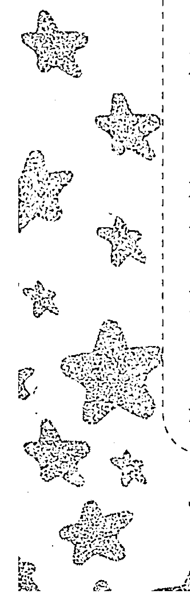

# 第五章 A型人养生大揭秘

对爱美的女生来说，睡眠差将会是肌肤美容的“天敌”，如果不想让自己“中毒”的话，还是应该主动采取措施改善自己的睡眠质量。

怎样让睡眠质量提高？

A型人要想拥有高质量的睡眠，不妨试一下以下几点小建议：

- (1) 听听有着催眠功能的轻音乐。研究表明，一些节奏舒缓、旋律平和的钢琴曲的催眠效果很明显。边听音乐边设想自己身在一座宁静的小木屋中，屋外是辽阔的星空，耳边拂过泉水叮咚的声音，这种身临其境的“大自然疗法”会让人很快入睡。
- (2) 多吃有利于睡眠的食物。面包、甜点、牛奶等含碳水化合物的食物不仅能够促进睡眠，还会延长睡眠的时间。但需注意不要喝太多饮料，否则会只顾去卫生间，最后反而越来越清醒，睡意全消。
  医生建议睡前饮一杯热牛奶，可以增加人体胰岛素的分泌，增加氨酸进入脑细胞，促使人脑分泌睡眠的血清素；同时，牛奶中含有微量吗啡样物质，具有镇定安神的作用，从而促使人体安稳入睡。
- (3) 身心松弛，有益睡眠。人越是紧张，越是强行入睡，结果越是适得其反，保持平常而自然的心态很重要。在睡觉之前到户外散散步，上床前用热水泡脚或洗个热水澡，对顺利入眠很有好处。
- (4) 保持正确的睡姿。睡眠姿势因人而异，以舒适为宜。科学研究表明，睡眠以侧卧为佳。养生家曹慈山在《睡诀》中指出：“左侧卧屈左足，屈左臂，以手上承头，伸右足，以右手置于右股间。右侧卧位反是。”这种睡眠姿势有利于全身放松，睡得踏实安稳。

A 型人经常是躺在床上的时候，脑子里的思维异常活跃，许多事情在脑海里徘徊不去，一个接一个。即使好不容易睡着了也是时睡时醒、多梦，长期下来搞得自己精疲力竭，工作时头昏脑胀、无法专心，长期下来不但容易头痛，也容易造成脑神经衰弱，甚至在外观上可能呈现未老先衰的现象。对于敏感的 A 型女性来说，失眠是造成黑眼圈与皮肤晦暗、粗糙、皱纹等老化现象的“罪魁祸首”，治疗失眠刻不容缓。

## 第四节 A型人不同年龄时期的保健要点

### 一、A型人的儿童健康

健康也是一项投资，需要从小培养。由于 A 型人肾上腺激素过高，并且肾上腺非常敏感，极易受到刺激，因此 A 型的儿童健康，应该做到以下几点：

- (1) 从儿时起，就要保证孩子不要看太多的电视，避免包含有暴力、恐怖、危险或战争的节目或电影。
- (2) 从小让他熟悉一些舒缓的运动，例如深呼吸和伸展运动等，并尽可能早地让他做这些运动。
- (3) 由于嘈杂、混乱是 A 型的人产生压力的大压力源，因此应尽量避免孩子处在嘈杂的人群中。
- (4) 要让孩子保持健康、美丽的身体，应建议孩子少食多餐，如可以每天吃六顿，而不是每天吃很饱的三顿。
- (5) 严格执行作息时间，保持人体生物钟的正常节奏，避免

### 二、A型人的少年健康

少年是人生成长的重要时刻，对A型的人来说，尤其重要。因此，父母应该对A型少年做到以下几点：

- (1) 少年开始对社会产生好奇，容易喜欢上一些暴力的、易冲动的人物艺术形象。因为A型的人肾上腺激素极易被刺激，所以应避免孩子看有暴力内容的电影和电视节目。相反，应该让孩子多看一些喜剧，笑声可以减轻压力。
- (2) A型人不适合做需要耐力和竞争性强的运动，因此在鼓励孩子运动时，避免做这些运动。
- (3) A型人更容易感到沮丧和气馁，尤其是成长时期的少年，因此，父母要及时与孩子谈心，要让孩子学会正确处理问题和对待挫折的态度和方法。

### 三、A型人的中年健康

中年阶段是健康相对稳定的阶段，对于A型人来说，虽然这个阶段的你会很健康，但不要太过大意，否则你的老年健康将会为此买单。

- (1) 这个时期的你，面对众多的生活与工作的压力，切不可慌乱，要冷静面对，处理事情也不要感情用事。注意情绪的调控。
- (2) 不仅要注重心灵的洗涤，还要多参加一些体育运动，增强机体活力，生活要更加规律才是。

### 四、A 型人的老年健康

A 型人更应该注意老年的生活。老年人生理机能开始衰弱，对于 A 型的老年人来说，胃酸大量的降低是他们健康的最大障碍。通常 A 型人进入老年后，胃酸还会降低 1/5 左右，这使本来胃酸就少的 A 型人的消化系统更加脆弱。因此，A 型的老年人更应该注意自己的饮食计划。

- (1) 要特别注意坚持 A 型的饮食计划，以保持胃酸的含量，促进食物的消化吸收。
- (2) A 型的老年人具有睡眠不好，甚至失眠的倾向，所以要保持生理节奏的正常运转，还可以在医生的指导下补充维生素 B12 或其他的营养成分。
- (3) 由于 A 型人饮食中缺少奶制品，这会影响 A 型人钙元素的吸收，所以 A 型的老年人及少年儿童要特别注意钙的补充。
- (4) 60 岁以后，A 型人的嗅觉就开始下降，这会影响食欲和消化系统的功能，导致食物摄入量不够，从而影响身体健康。如果嗅觉下降的话，可以在医生的指导下补充一些微量元素。
- (5) A 型的老年人要特别注意不要生气，因为激动、生气都会使得他们本来已经很高的肾上腺皮质素更高。如果经常这样的话，就可能会引发骨质疏松症，甚至导致老年痴呆症的发生。

## 第五节 A 型女性美容养颜策略

A 型女性大多比较清瘦，不易发胖，且 A 型的中年女性脸上的皱纹比其他血型的同龄女性要少。尽管她们有得天独厚的条件，但在平时她们还是应注意以下事项，这样才能够让自己的美丽以及魅力拥有更长的延期。

- (1) A型女人比较挑食，这不好，要尽量加以改变。人体需要多种营养物质，如果缺少某一营养素，人体就会出现不良症状，例如疲惫、贫血等。
- (2) A型女性喜欢熬夜，越在夜深人静时，她们的大脑越兴奋，但熬夜是美容的大敌。如果你想成为漂亮的女人，最好调整作息时间，早睡早起，久而久之，你便发现自己没有黑眼圈，皮肤红润有光泽。
- (3) 随着年龄的增长，肤质会有变化。要想始终保持光艳照人的肌肤，可以根据自己的年龄和肤质选择合适的化妆品，相信你的皮肤会越来越好！

## 第六节 A型人肥胖的原因及营养瘦身策略

你是不是经常会很诧异，为什么有的人怎么吃都不会胖，而有的人喝白开水也会胖起来？为什么有些人为了减肥，小心谨慎地少吃，甚至不吃，结果体重照样增加？其实，这与人的血型有关。美国著名的“自然疗法”专家彼德·达达姆医生曾提出“人的血型决定他们身体所需要的食物类型”。换句话说就是，人的血型决定了身体如何利用不同的食物。

A型人的祖先是最先从事农耕的。相较于O型血的人，A型人消化器官要弱得多。因此，A型人在饮食上应遵循下列原则，否则容易导致肥胖。

- (1) 植物性蛋白质如大豆蛋白质，是A型人最佳的健康食品，常吃可预防心血管疾病和癌症。所以，A型人更适宜以素食为主，在日常食谱中应加强对大豆、谷物、鸡蛋等的摄取。
- (2) A型人务必每天喝一杯木瓜汁，它能分解各式肉类中的脂肪及有害物质。
- (3) A型人应尽量少吃肉类食物，即使嗜肉，也应慎食牛肉、羊肉等肉类，最好以鲜鱼（鲈鱼、鲤鱼为佳）和鸡肉代之，否则将会有肥胖之忧。
- (4) A型人应对进食奶油及各种奶酪、冰淇淋、全脂牛奶等以纯乳为原料制作的食品有所限制。

下面是介绍A型人减肥方法，仅供参考。

- (1) 橄榄油、大豆、绿叶蔬菜、菠萝，是有瘦身追求的A型人的上选。
- (2) 肉类、奶制品、菜豆、小麦等食品，是瘦身的绊脚石，A型人要远离这些。
- (3) A型人适合做瑜伽，它不仅能安神定绪，减轻精神压力，而且还有助于瘦身。
- (4) 减肥期间，保持心情愉快很重要。A型人适合一季或半年的长程减肥计划，例如健美操、游泳、跑步等运动，再配合低脂饮食，身材窈窕将不会是梦。

# 第六章 A型人家庭生活小贴士

## 第一节 A型人的爱情态度

### 一、A型人爱情的两重性

总体来说，A型人的爱是在温柔的基础上，又兼具明显的两重性。

每当A型人收到别人爱意的表白的时候，他们从来不会直截了当地做出反应，更不会一下子满心欢喜地接受。哪怕向他（她）表达爱意的人是她们自己所中意的。A型人生性谨慎，对待爱情问题更是如此，因为他们难以承受爱情欺骗的赤裸裸，他们是自尊心很强的一种人。

在选择对象的问题上，A 型人不会太在乎对方的外貌如何，也不会像 O 型人那样对对方的聪明才智有太多的挑剔。他们通常喜欢诚实、单纯、直率性格的恋人，不希望自己的爱情让他们太费神，他们寻求双方在精神上的安慰与共鸣。所以，你会发现在现实生活中的 A 型人不论男女，似乎都乐意选择傻乎乎的人做爱人。其实，这一择偶现象并不是因为他们偏爱那些傻乎乎的人，而是他们相信这样的人可以给他们带来感情上的安全感。他们宁愿选择日后能够平衡、和谐过日子的人，也不愿意选择那些头脑灵活、反应敏感的人作为自己的爱人。

然而，与他们的择偶理念相矛盾的是，只要遇到了能够理解自己的人，无论他们怎么机灵，他们还是会立即倾心。由此，A 型人爱情的双重性完全显露出来。实际上，A 型人这种爱情的矛盾性源于他们的完美主义思想，他们常为别人对自己的偏见和不正确评价而苦恼。那么，当 A 型人遇上了那个能够理解自己的人的时候，除了相见恨晚之外，也就只有感恩了。

A 型人由于看重理解，因此在相处中，他们总会展现自己温柔、体贴的一面。而对对方温柔体贴的要求也正是当今社会的恋爱倾向。不仅 A 型人擅长温柔，他们同样希望自己的另一半也是温柔、体贴型，因为和这样具有秉性的人生活在一起，才会既可保有自尊心，也能产生对对方的依赖，达到自尊与安全感的并存。

### 二、痴情 A 型人

A 型人不会轻易谈恋爱，但是一旦遇到真爱，他们的爱情火焰会浓烈至极。“非他不嫁，非她不娶”，往往就是 A 型人的真实恋爱写照。

当 A 型人坠入爱河的时候，他们大脑的智商骤降。在他们的眼睛中，对方的一句贴心话、一个小小的动作都是那样美妙，他们已经看不到对方的缺点，会欣然地接受恋人的一切。

A 型人之所以出现这样盲目的爱情观念，或许与他们的那颗乞求理解之心以及盲目崇拜心息息相关。A 型人由于注重对任何事情追求尽善尽美，而常常得不到他人的理解，当突然出现一个人爱恋自己并表示可以理解时，A 型人在感动之余，更会选择为了这份爱奋不顾身地付出。再者，A 型人的好奇心重，当发现异性具有自己所没有的东西的时候，便会立即产生崇拜心，这或许也是由于尽善尽美的愿望不能如愿以偿所致。

### 三、偶尔佯装正经

A 型人表面总是一副很正经的样子，其实他们最喜欢追求异性。

在性方面，A 型人虽然明明对性很感兴趣，却又偏于克制，仿佛也具有了两重性。偶尔有一部分的 A 型人还会被称为“沉默寡言的好色者”，因为他们太容易酒后乱性。A 型人对钟情于自己的对象，从来都会严肃考虑性的问题，他们倡导对性负责，对彼此负责。但是，对于 A 型人来说，与对象的婚前性关系往往会成为爱情的升温良药。

## 第二节 遭A型女厌恶的男生

A 型女生往往多是善解人意型的、做事认真负责型的、偶尔唠叨却又是很讲道理型的，这样的女生对男生来说往往又具有着不可抗拒的“杀伤力”。所以男孩子要注意了，看看这些 A 型女生们到底讨厌啥样的男生。

从 A 型女生的性格来判断，她们最不愿意和下面几种男生在一起：

- (1) 太过空虚的男生。A 型女生一般天生拥有着姣好的气质，往往会在人群中也能吸引男生的注意。她们善于思考，也乐于将思考融于现实的实际生活中。因此，这些 A 型女生超级讨厌那些夸夸其谈的男生。在她们眼睛里，夸夸其谈、净讲些不着边际的大话的男生，太过于浮躁与肤浅。即使她们会对一般的男性朋友表示难得的理解与宽容，但她们万万不允许这样的男生做自己的男朋友。
  在 A 型女生的眼睛里，内涵是很重要的。夸夸其谈的男生往往得不到 A 型女生的信任。
- (2) 心里想一套，嘴上说一套的男生。A 型女生不仅讨厌夸夸其谈的男生，她们对于表里不一的男生更是恨得牙痒痒。A 型人的自我保护意识本来就很强，特别是 A 型的女生。所以，男生在追求自己喜欢的 A 型女生的时候，切记不可随便承诺。承诺可以，但是有承诺必须要兑现的，否则可会气坏 A 型女生的神经。
  为了不让 A 型女生厌恶，那就学会和她们一样的诚心实意吧。
- (3) 一味强调自我、缺乏集体融合性的男生。即使这样的男生有什么特别优秀的地方，已经深深吸引到了 A 型女生，但是只要让她发觉你有着很自我的个性，那么再优秀的你也不会再打动 A 型女生。对于那些集体团结意识高涨的 A 型女生，最看不起的就是那些没有大局、远离组织的男生。因为太过自我的人会让 A 型女生有着与生俱来的反感。
  为了不让 A 型女生对你太失望，那就与集体走到一起吧。何况走进集体，对自己、对组织来说，都是件好事。
- (4) 花天酒地、喜欢浪费的男生。A 型女生天生一副节俭生活的心性。她们在日常生活中，喜欢追求并拥有安全感。于是，她们喜爱攒钱，喜欢一分一分的保守式存钱，并讨厌毫无金钱观的男生。只有这样，到老年的时候才会更有保障。
  如果你生来就是爱糟践钱、爱浪费的男生，那么你还是不要惹我们那些可爱的 A 型女生了，省得让她们烦心你的不定性。
- (5) 行为举止粗俗、爱钻牛角尖的男生。A 型女生在平常的生活中，总是亲和待人，在与朋友们相处的时候也总是足够细心。在她们的世界里，她们刻意追求着完美，不允许瑕疵的存在。
  如果你是个动不动就脏话连篇、举止不雅、又爱钻牛角尖的男生，那么 A 型女生是绝对不愿意跟你整天待在一起的。因为在她们的意识里，你早就配不上她的气质了。喜欢 A 型女生的你，要时刻注意自己的言行举止。

## 第三节 A型男友的求婚方式

A 型男性内敛、稳重，一般不采取行为激烈的求婚方式。通常，他们先安排精心的交往，努力使双方自然和谐地发展，直到水到渠成，缔结良缘。

王楠和他的女友交往三年。一天黄昏，他带着女友来到一家 KTV 唱歌。先唱了几首情歌，有意无意地向女友传递“秋波”，然后点了一瓶美酒。最后，王楠站起身来，关掉电视，变戏法似地从口袋里掏出一枚戒指，单膝跪地，正式向女友求婚。这时，女友眼中泛着泪花，接受了这枚戒指。

女友之所以答应王楠的求婚，是因为在三年的交往中她感受到王楠对他的爱意。如果不是被这份爱慕之情感动，王楠的女友会接受这枚戒指吗？

作为 A 型男性的女友，大多是在双方关系已达到足够亲密的程度后才能体会到他们在日常言行中深藏着的爱慕之情。

由于 A 型男性对事较为认真、负责，对于他们的求婚，一般不应采取推诿态度，也不应采取敷衍、支吾方式，应以诚心实意地表明自己的态度为宜。例如，直接明确告诉他，你一直把他当朋友，或你已有爱人，请他另选别人。但是，切忌向 A 型男性炫耀自己恋人的优点、长处，以免伤害他的自尊心。

## 第四节 为什么爱家的 A 型男会出轨

A 型男人较沉默寡言，他们常常把话藏在心里不说，默默地承受压力。一旦到了他们觉得无法忍耐的地步，就会全面发泄。所以，如果 A 型男人出轨，多是想暂时缓解生活的压力或企图得到在家庭内尚未得到的东西。

小张毕业后被分配到某机关工作。他所在机关的现实使他看到，乖巧精灵者吃香，老实憨厚者吃亏，吹吹拍拍者升官，正派的无人问津。他虽然有所进取，可他刚直的秉性和积极做人的良知，约束他不去迎合那些腐朽的观念，而要做一个不卑不亢、埋头苦干的老实人。正因为如此，他吃了苦头，同他一起来的和后来的人，有的人入了党，有的提拔为科长。因为他有自己做人的宗旨，这一切他并不往心里去。可是，妻子不理解他，说他：“人家都提拔了，入党了，就剩下你一个人，啥也不是，不感到窝囊吗？”有一天，收音机里播送着优美的音乐，他情不自禁地随着唱起来。妻子这时又对他说：“连个科长都没当上，还挺乐呵呢，真不知道愁！”一句话，破坏了他的乐呵情绪。

这样的事在他们夫妻之间经常发生，小张经常听到妻子刺激的话。他感到，他与她之间的爱是苦涩的。事业不顺、家庭不和，小张开始上网，并与网友见面，发生了一夜情。

A型男人大多具有家庭毁灭的顾虑，因此，即使出轨，行为也多为诡秘，尽量不让人发觉。但是，如果A型男人的出轨是出于强烈的摆脱现状愿望，属于一种较为深思熟虑的行动时，其在出轨前就可能已有不惜家庭破裂的思想准备。

案例中，小张与妻子间的矛盾源于妻子对他的不理解。妻子对小张的理想、追求、品行、情操以及为人，都是那么生疏，他们真可谓缺乏共同语言。

夫妻间应该是互相了解的，是知音。只有你了解了对方，才能对其体贴、关怀，并辅佐其上进。如果小张的妻子能了解丈夫的品行，理解丈夫的追求，她就不会羡慕什么科长，而会鼓励丈夫做一个有生活情趣的人。

理解是夫妻间的黏合剂，夫妻相处要是连起码的理解与体谅都没有，这种婚姻会是很痛苦和寂寞的。当然，我们这里所说的理解，不单是指了解爱人的一般情况，而且是指对爱人内心世界的感知。因为人的行动是受思想支配的。你了解了爱人的思想，才能理解其行动。只有夫妻间互相理解，才能换来彼此更加深沉的爱。

## 第六章 A型人格的家庭生活小贴士

所以，女人应该在日常生活中给 A 型男人以理解、关怀，使家庭生活充满温馨。当丈夫感到家的温暖和妻子浓浓的爱意时，便会努力做个好丈夫，家里家外照顾周到，绝无出轨行为。

## 第五节 A 型 + A 型夫妻：我们从来不想分开

大家现在都已经很清楚，当 A 型人遇到自己喜欢的对象时，他们都喜欢隐藏自己的情感。可是大家有没有想过，当一个 A 型男爱上一个 A 型女，并且最终生活在一起的时候，又会出现怎样的状况？他们既然经历了漫长的考验、踌躇，接下来是否会幸福？

在“A型和A型”的夫妻档中，他们相互吸引，源自他们能够相互了解并互相理解。他们同样拥有敏感的神经，同样懂得服务于家庭、忠诚于伴侣，同样的温柔、体贴，即便是两个人的性爱也充满了柔情。他们会在对彼此的崇拜中度过一段和谐、平静的生活。这种宁静是否会持续到永远？

其实，在接下来的相处中，夫妻双方会面临更多的考验。因为他们的相似，他们走在了一起，然而因为他们的相似，要让他们一直在人生的道路上同样是件艰难的事情。生活中，夫妻双方会强烈地感受到：他们彼此都会对对方产生不可避免的失望和怒气，尽管两个人都在默默地忍受，殊不知，长时间的忍受只会让你们这段曾经美好的爱情走向结束。你们应该懂得多些沟通，可惜你们两个都是不折不扣的“掩饰者”。那么既然不能够在沉默中爆发，你们也只能够在沉默中灭亡了。

## 第六章 A型人家族生活小贴士

另外，这对“A型和A型”的夫妻之间往往存在着许多深刻的对话。他们本应该要借机尽可能地倾诉一切，并由此减少摩擦的。可是，他们还是会动不动就谈到那些可能引起争吵和扫兴的话题，因为他们的“好记性”，总是难以忘记对方的过错。
A型虽然外表柔和，其实内心固执得很，一旦夫妻之间有了争执，谁也不肯做出让步，喜欢用冷战的方式来解决，最终会在彼此心中留下深刻的阴影。况且，他们双方都希望能够很好地彼此适应，期待多得到些伴侣的赞赏。遗憾的是，他们两个都不善于表达与夸赞别人。
这时候的婚姻已经失去了原有的精彩和活力。健康的婚姻不怕吵闹，最怕的是双方已经失去了共同的话语。当爱情不在的时候，即使“A型和A型”夫妻曾经有多不想分开过，但是你们在一起已经没有太大的意义了。

## 第六节 A型媳妇怎样博得婆婆欢心

在媳妇的眼里，婆婆很少有对的时候。其实，每个人到年老的时候，都很爱唠叨，爱管闲事。老年人的思维与年轻人不一样，他们开始变得任性，变得贪玩，希望得到孩子们更多的关注、更多的宠爱。于是很多人老了，行为却像个孩子，没有了年轻时代的韧劲和霸气。
不要总是将挑剔的眼光放在婆婆的不是上，多给她一些体谅和关怀，才能消除你与婆婆间的隔阂。作为A型媳妇，你要小心对待自己的婆婆，懂得讨她们欢心，才会让生活更加和谐地继续。

### 一、A型媳妇与O型血的婆婆相处

在O型血婆婆的第一印象里，你可能并不是她想象中的称心儿媳。她常常会因为你的谨慎谦恭，觉得与你之间存在着距离。当然，要想与O型血的婆婆融洽相处也并非难事，你不妨这样来做：

- 1. 多花点时间与O型血的婆婆相处。只有多与她接触，并尽量地展现出自己随意、个性的一面，让彼此培养出信赖关系，就能够拥有更多的共识。
- 2. 凡事不要轻易就照着O型婆婆的说法来做，你可以发表自己的主张，彼此在讨论中寻求共识，使她认识到原来你并不是个斤斤计较的人，慢慢地她才会亲近你、接受你。
- 3. 在婆婆面前，开玩笑要注意分寸，即使对象是你的男友哦！因为O型血的婆婆有些溺爱子女，她是绝对不准许别人讲自己孩子坏话的。

### 二、A型媳妇与A型血的婆婆相处

同是A型血的婆婆，越是重视你，对你的审视可能会更加严格。这可能会给你增加许多压力，甚至会让你觉得生活有了几分“失真”，但是，一旦俘获她的心，婚后，你将能感受到她带给你的温暖和体贴。那么，怎样做才能获得她的认同呢？

- 1. 要尊敬长辈、以礼待人。A型的婆婆非常看重规矩礼仪，所以，在长辈们面前，你要尽可能地恭敬、孝顺和关心他们，不要一味地按照自己的意思来。
- 2. 处处留意自己的行为举止。光在她一个人面前表现是不够的，A型的婆婆还会通过各种途径搜寻有关你的消息，征求对你的评价。所以，随时随地注意你的言行非常重要。
- 3. 偶尔赞美一下未来的婆婆。“哇！真是好吃极了，教教我到底要怎么做嘛！”对于具有传统个性的你，可以这样偶尔赞美一下婆婆，让她觉得自己有受到尊重的感觉，相信你们能够相处得更好。

### 三、A型媳妇与B型血的婆婆相处

B型血的婆婆性格爽朗亲切，待人、看人是不拘泥于传统或是他人意见的。所以，要想获得她的首肯，你得积极一些。

- 1. 与B型血的婆婆交往，要尽可能地大方，千万不要猜测、揣摩、试探她的心思，这样只能招致她的迷惑和不悦。
- 2. 要尽量投其所好，留给她一个良好的第一印象。与她交谈时，你要适时地对她的观点表示赞同；当她换了一套新衣服或是做了新发型时，你要恰到好处地赞美她；谈话时，你要寻求她感兴趣的话题。这样，你才会赢得她对你的好感。
- 3. 营造亲近、融洽的气氛，使她感到你应是他们中的一员。与B型血的婆婆相处，你要尽可能地放松，也可以若无其事地模仿对方的一些动作，这样会让对方的潜意识感受到亲近感，气氛也自然会融洽许多。

### 四、A型媳妇与AB型血的婆婆相处

AB型血的婆婆充满个性，在她眼里，你是一个端庄有礼、稳重柔顺的好儿媳。尽管她非常中意你，但是你做事时一板一眼的认真劲儿，还是让她有些不满，她会认为这是死板、能力差的表现。要想让她“容忍”这点小小的瑕疵，你可以做这样一些尝试：

- 1. 以一颗宽大包容的心去接近婆婆的心灵深处，尝试着去了解她、体谅她。当她对你的行为有异议时，她可能会为此唠叨，甚至可能会有意地刺激你一下，你最好不要放在心上，要心胸宽大地想着“别跟这种人计较吧”才是！
- 2. 不要企图改变她，但是你可以通过自己的努力潜移默化地去影响她。在改变她对你的看法的同时，也完善了你们的关系。
- 3. 在没有与她商量前，最好不要互相侵犯对方的私人空间。因为 A 型的媳妇与 AB 型的婆婆都很神经质，对于与私事相关的争执都很坚持己见，甚至会闹到互不退让、不可收拾的地步。

## 第七节 与 A 型孩子的相处之道

我们知道孩子的性格与血型有关，而血型又是生来就有、不能改变的，所以父母就要以此为出发点，去观察、分析，根据血型科学的相处，避免与孩子的隔阂。面对自己的 A 型孩子，家长们该掌握以下几点相处之道：

A 型孩子要强、自信，所以，身为父母平常有意识地让孩子做一些简单题目，背一些容易的课文，让他们从中找到自己学习的信心和兴趣，认为：我还是最棒的，“我能够做到”，孩子便会不断地努力去超越昨天的自己。

惩罚对 A 型孩子影响强烈并唤起内疚感，所以，他们犯错时，家长要注意自己的言行举止，不要大声呵斥，避免伤害他们的自尊心。他们渴望得到表扬和肯定，那么，给予他们所希望的吧。

A型孩子关心他人，所以给他们一个适合的机会。例如，给他们买只宠物、玩具用品等。

当父母了解了孩子的血型特征，交谈中被他们激怒时，对待孩子的言行就比较冷静客观，做出的反应也比较恰当。因为孩子天生就是这种性格，即使用指责、埋怨、愤怒的方式也无济于事，只有用理解的态度宽容和体谅他们，才能避免矛盾的发生，并诱导事情向好的方向转化。

## 第八节 A型人的理财与消费

### 一、A型人理财：捡起芝麻丢了西瓜

A型人通常比较短视，不能从大局出发。因而，从财运上来看，他们很容易有些小财，但往往会漏掉大笔的财富，可谓因小失大，捡起芝麻，丢了西瓜。

A型人长于分析，却从不看重时间，为了做成一件事，他们宁可花费很多时间和气力，也不愿意多花点钱去做一件事。因此，在花钱上，他们一定会仔细考虑所花的每一分钱是否值当。当然，他们也不是“铁公鸡”，只要是他们认为该花的，反倒比其他人都豪爽。

A型人在理财方面非常保守，对待金钱总是小心翼翼、一丝不苟，他们绝不容许自己的支出大于收入。所以，A型人不见得很有钱，但也不会荷包空空。他们大多不喜欢张扬，所以你也别想听他们哭穷。

大部分 A 型人的存折里都会有一笔积蓄，这是他们平时辛辛苦苦存下来的。他们知道金钱得来不易，所以不太愿意将钱拿去投资，宁愿放在银行里，即使利息仍在节节下降。鉴于 A 型人对于小数目的金钱比较得心应手，建议其可选择零存整取的定存，或谨慎选择一家信誉好的公司来投资定期定额股票和基金。

### 二、A 型人消费：看似节俭，实则为冲动型消费者

谁都会有冲动消费的时候，但是对于 A 型人来说，就属于经常会克制不住自己的欲望冲动消费，他们很容易迷失在物质的诱惑之中，使得原有的计划被打破，原来的预算总是赶不上现实的开支。他们时常会感到钱不够花。

在上街之前，A 型女性通常会事先想好要买什么东西，并估算开支，可是一上街，这个喜欢，那个舍不得，结果是所有的计划和预算全都被抛到了一边，最后买得钵满盆满的，超支在所难免。

尽管 A 型女性喜欢买东西，但是她们也不是胡乱一气地去买，她们通常会选择品质较好的物品，价格倒在其次，首要条件是她们喜欢，且认为合用，才会买下来。

A 型男性在花钱方面似乎更夸张，在一天之内把零用钱或薪水花光，对这类人来说，实在是太平常了。他们的计划实在是满足不了膨胀的欲求。

# 第七章 A型名人大印证

### 名人名言

### A型名人大印证

## 第一节 精明商人吕不韦

A型人做事多小心谨慎、一丝不苟，一贯走的是保守与安全主义道路。他们对于金钱更是精于“算计”，精通商道。吕不韦就是一个典型。吕不韦，战国末年著名商人、政治家、思想家，后为秦国丞相，他从年少时就对商业表现出了独有的天分。

战国时期，秦昭王四十二年（公元前265年）的一天夜晚，吕不韦向以经营珠宝为生的父亲请教经营珠宝生意的经验。尽管父亲滔滔不绝地向吕不韦讲授着，但是吕不韦其实早已经身怀商技，他善于运用从商之道，让自己的父亲也为之汗颜。当时吕不韦问了父亲这样一个问题，他问道：“耕田能获利几倍？”父亲答道：“十倍多。”吕不韦再问：“那经营珠宝生意能获利几倍？”父亲回答说：“百倍多。”吕不韦接着又问，说：“那如果辅佐一国之君，请问父亲大人能获利多少倍呢？”父亲回答：“那将是无法估量的啊。”正当父亲想要责问不韦为何出此诳语的时候，不韦兴高采烈地对父亲说：“费力耕田，却仅能够保证吃穿；忙于经商，所获之利亦不能稳定；而辅佐一国之君，所获之利将千古流传。这种对自己百利而无一害的事情，为什么不去做呢？”

这就是 A 型人从商投机的精明之处，他们把钱财、名利都看得很重，懂得如何投机能够使自己的利益达到最大化。吕不韦对当时的话语也并非只是说说而已，他后来真的做到了。他成功的弃商从政，成为一大佳话，千古流传。与其说弃商从政，倒不如说是利用政权之变，为自己谋名谋利。

所谓精于“算计”，需要具备三大特质：一是眼光超前；二是精明细 致；三是敢于冒险。而吕不韦利用自己天生的睿智与机敏，已经成功做到了。

#### 第二节  谨小慎微善固察

A 型人最显著的特征就是低调、谨慎，是思想派的典型代表，无论做任何事都力争周全，不允许出现纰漏。他们平日里不张扬，韬光养晦，往往以较低的标准面对所发生的种种事件。其实，这种低调的人生态度正是“大智若愚，大巧若拙”的表现。在当今社会激烈的竞争中，能够做到淡泊名利、宁静修身、谦虚忍让是难能可贵的。A型人很会审时度势，能敏感地看到潜藏着的危险，所以他们在成功之后会采取功成身退的做法。湘军统帅曾国藩就是这样的典型。

曾国藩，字伯涵，道光年间考中进士。他6岁时入塾读书，8岁能读八股文诵五经，14岁时能读《周礼》、《史记文选》，并参加长沙的童子试，成绩俱佳列为优等，可见他自幼天资聪明，勤奋好学。道光二十二年，31岁的曾国藩从十月一日起为自己订立“日课册”取名“过隙影”，“每日一念一事，皆写之于册，以便触目克治”。就这样，曾国藩以每天记日记的形式不断地督诫自己，自省自新。曾国藩对自己严格要求，一丝不苟，这正体现了A型人审慎、内敛的作风。

同治二年，曾国藩做了浙江巡抚，打下南京后又被封爵。55岁时上书请求解除本职，注销爵位，仅以退休人员的身份“留营维系军心”。在他临终之前令儿子读其遗书，原来遗嘱写着为人的四条准则，其中的首条就是“慎独则心安。自修之道，莫难于养心；养心之难，又在慎独。能慎独，则内省不疚，可以对天地质鬼神。人无一内愧之事，则天君泰然，此心常快足宽平，是人生第一自强之道，第一寻乐之方，守身之先务也”。由此，曾国藩身上体现出的A型人的特质可见一斑，即谨慎修心、慎独内省。

曾国藩为清政府立下了汗马功劳，威望如日中天，当时满清王朝的半壁江山掌握在他的手中，可谓是位及三公、权倾朝野。但他处处谨小慎微，内心充满忧患意识。他懂得功高盖主可能导致的悲惨下场，于是急流勇退，告老还乡。他一生享受荣华富贵，占尽了福禄寿喜，这一切都得益于A型赋予他的谨慎小心的个性。

曾国藩的成功不是一朝一夕，而是暗蓄力量、厚积薄发的结果。他一生谨慎，时刻不忘修身养德，以孔孟思想作为自己的精神力量。在尚未出人头地之前，他能屈居人下、伺机而动，绝不锋芒毕露，争强好胜。他从不当众树敌，懂得与不同类型的人周旋，很会保存实力。即使在位高权重、声名显赫之时，他也保留一贯谨慎、节制的行事风格。因此，他得到了众人的拥护，也规避了很多权臣盛极而衰的宿命式悲剧，得以善始善终。

古人讲究以静制动、以柔克刚，其实低调也是一种妙不可言的人生境界。这种处事态度不仅可以保护自己，与人和谐相处，也能潜行匿迹，在无形中成就一番事业。A 型的曾国藩规避了人们共有的好大喜功、争强好胜的劣根性，把安贫乐道、不骄不狂的个性发展到极致，从而在历史上声名远播，赢得后世的赞誉和敬重。

#### 第三节 姚明——A型人的柔情

姚明手上的红线一直是人们津津乐道的话题。那是2002年6月，姚明在美国 NBA 成功地当选状元秀。去美国之前，姚明和叶莉两人都意识到今后会聚少离多，于是，叶莉编了两只红绳结分别套在姚明的左臂和自己的右臂上。她说：“红绳结象征我们的心永不分开！”

到美国之后，无论睡觉、比赛，姚明时刻都戴着它，一看到它，就仿佛看到了叶莉甜甜的笑容。它成了姚明的护身符，保佑着他在 NBA 越打越好。当然，姚明也送了份让叶莉惊喜的礼物：到 NBA 后不久，叶莉的生日到了，姚明给她买了两大箱毛绒玩具。直到现在，她还用那只灰熊当枕头睡觉呢。她说只要看到这些毛绒玩具，再累心情也会愉悦。

姚明和叶莉的幸福爱情与篮球有缘，当年东方男篮和东方女足都住在同一个训练基地，姚明认识了叶莉，便对她很有好感，为了能见到叶莉，姚明每天下午都站在训练馆门口。1999年末，第一次入选国家队的叶莉在一次训练中严重受伤，不得不返回上海做手术，在疗伤的漫长日子里，姚明每天都会给叶莉发手机短信。隔着万里重洋，叶莉才发觉姚明的好：幽默、有责任感、懂得照顾别人。谁曾想过这样一个高大的巨人竟然会有如此细腻的情感，如果你是一个男人，终于有一天，你凭借你自身的能力和努力，从一无所有到拥有世界级显赫的名声和威望，同时金钱多得这辈子都花不完，而且你身边美女如云，你是否依然会坚守住一份已有七年恋爱的感情，并让那个跟你相恋七年的恋人最终成为你心爱的妻子，让两人的爱情终于绽放出美丽的爱情之花，七年恋爱中没有一点绯闻，你能做得到吗？

进入 NBA，姚明并没有在金钱美人的浮华生活中迷失自己，对叶莉仍然执著，正如手腕上的那根红绳。无论在生活中还是赛场上，他从不取下。美国 NBA 球星都很花心，每人都有很多女友，他们多次说也要帮姚明介绍美国女友，可姚明认真地告诉他们：“我有女朋友了，是国内一名出色的篮球运动员。”姚明有辆蓝色宝马，特意改装了一番，把“YY-11”的标志镶嵌在车尾。“YY”是他和叶莉姓氏拼音的首个字母，“11”则是姚明在火箭队和叶莉在中国女篮的球衣号码。姚明想用这个向世人表明，虽然他一个人在异乡打球，但一点也不孤独，因为他和叶莉的心是相连的，姚明时刻都能感觉到叶莉的陪伴。

姚明和叶莉的爱情是值得我们推崇和学习的，在现今流行的……快餐式爱情中，爱情总是被镀了一层金色的外衣，充斥着太多的铜臭气。而姚明在拥有了财富和名利之后，却依然与爱人彼此对爱情坚守，不离不弃，从没有因为绯闻让对方伤心难过；他们相互鼓励，彼此支持，让两人在事业上都取得了成功和灿烂的辉煌。

姚明和叶莉在相恋七年之后，终于走进了婚姻的殿堂。在这七年里，姚明一直呵护着爱人，不想让任何人去侵扰他和叶莉的二人世界。或许在姚明眼里，两个人的幸福就应该如亚当和夏娃守着伊甸园一般，不需要其他人的打扰。所以，他在球场上不断拓展自己的领地时，也牢牢守着自己爱情的天空。一个成功的男人背后有一个好女人，一个好男人也会让一个好女人过得快乐和幸福，姚明和叶莉在爱情方面都实现了共赢！也共同演绎了一个完美和甜蜜的爱情故事！

> “我的每一个汗毛孔都被摆到放大镜底下了，我不愿身边的亲人或朋友也被这样对待。”

所以，七年来，他一直用硕大的身躯把叶莉挡在身后，为她挡风遮雨，把所有问题都自己扛。所以直到雅典，巨人的爱情才被曝光。很少有男人看见美女可以不回头。姚明也不例外，认识叶莉的时候，姚明的名气还没有现在这么大。当他在NBA渐渐如日中天的时候，他照样拒绝了澳大利亚女篮那个美女中锋的约会要求。这是一种对爱情的自私，自私的男人不可爱，但对爱情自私的男人不但可爱，而且可敬。因为这种自私，代表的是相濡以沫，始终如一。

在这个充满竞争的时代，爱情有时也会被当做交易品被牺牲掉，但是姚明恪守着自己的爱情，始终如一。幸福的爱情都是相似的，相爱的人们因对爱情的忠贞和执著而最终收获甜蜜和幸福！珍惜自己的爱情吧，珍惜身边的人，爱情不在于最初的一点心动，而在于长久！别让幸福在指尖溜走，爱情其实就是一根系

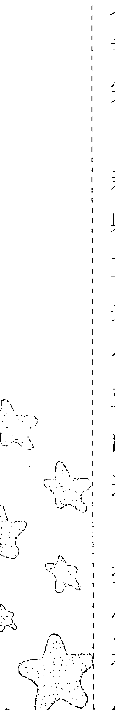

## 第四节 尽职尽责工作的梁朝伟

与A型人打交道，你会发现他们具有无私奉献、尽职尽责的精神。无论何时何地，只要有任务交付给他们，他们就会全力完成，即使赴汤蹈火也在所不惜。

梁朝伟是A型人，他具有很强的服务与责任意识。尤其在工作中，只要导演需要，他会拼命地达到要求，力求剧情完美，即使牺牲自己大量的时间、精力，甚至健康。

2009年，梁朝伟加盟《一代宗师》，饰演叶问。

为了在影片中展现中华武术精髓，数月来梁朝伟不停地跟师傅习武。有一天，他竟要求同时与四位师傅进行较量。虽说是场练习赛，但是梁朝伟全力以赴，俨然在与四位高手对决。结果，打斗中，一位师傅不小心踢到梁朝伟的左手。随后梁朝伟被送往医院。经医生检查后，证实他左手骨折，需要打石膏帮助恢复。然而被梁朝伟委婉拒绝，他认为打石膏会令他多日来练得的肌肉“消失”，体形发生变化，影响电影的开拍。

记者就这件事采访梁朝伟：“再拍戏时是否有心理阴影？”

> 梁朝伟说：“拍打戏受伤是常有的事。这次有经验了，正式开拍时就会注意很多。目前，我担心的是影响‘练功’进度，医生建议我不要运动，即使跑步也不可以。所以我在想办法，试试不跑跳也能练腿功。”

负伤了，梁朝伟首先想到的不是自己，而是耽误剧组拍摄进度、影响自己练功的进度。因为梁朝伟有这种尽职尽责的精神，拍戏全身心投入，所以他赢得了导演、同事的称赞，感染了身边的人，激发了他们的工作热情。

A型人就是如此，他们不言不语，满腔责任感，却能为大局、为别人牺牲自己。这种牺牲精神是种美德，人与人之间的交往首先需要的是给予，善于尽责才会架起沟通的桥梁，自私的人、只会想到自己的利益的人是不会受到大家欢迎的。梁朝伟这种尽职尽责工作的写照，正是A型人以大局为重的榜样。

## 第五节 倔强上将麦克阿瑟

倔强是A型人的特质。在历史风云人物中，没有谁像美国第二次世界大战中赫赫有名的五星上将麦克阿瑟那样，将A型人的特质演绎得那般淋漓尽致。

作为美国历史上杰出的五星上将，麦克阿瑟当之无愧是优秀的人物。在第二次世界大战中，麦克阿瑟被任命为远东盟军统帅，他运筹帷幄、临危不惧、亲临战场、出生入死，书写了一段叱咤风云的战斗经历。他以过人的胆略、坚强的意志为美国立下了赫赫战功，取得了令世人瞩目的战绩和荣誉。这一切都归功于他那“一根筋”似的“偏执狂”性格。这种极端自负与倔强的性格，决定了他必然是风云多变的战场骁将。

在实际生活和工作中，麦克阿瑟更是一位狂妄自大、唯我独尊、恃才傲物的指挥官。其中，最能够反映他自负与倔强性格的，当数他和总统杜鲁门之间的关系。

## 第七章 A国与六回国

第二次世界大战结束后，杜鲁门总统尽管对麦克阿瑟印象不佳，但仍相当重用他，他由此成为日本的绝对统治者。但是，麦克阿瑟没有得到批准，擅自将驻日美军削减一半，杜鲁门对此大为恼火，两人关系极为紧张。战争结束后，杜鲁门两次邀请他回国参加庆典，均遭拒绝。

麦克阿瑟还自作主张，未和杜鲁门打招呼就去中国台湾地区访问。杜鲁门非常气愤，认为麦克阿瑟抛弃了他使中国台湾中立化的政策。

1950年秋天，联合国军被堵在朝鲜半岛东南角的釜山。假如麦克阿瑟对釜山发动进攻，他的军队必然遭受重大伤亡。他采取了攻其不备的战术，突然从朝鲜半岛的西海岸港口仁川登陆，结果取得了成功。我们撇开关于朝鲜战争的性质，这里仅就麦克阿瑟的战术看，与他自负的性格不无关系。

仁川登陆后，麦克阿瑟继续扩大战火，把战火烧到了鸭绿江边，中国人民志愿军入朝参战，重创美军。由于军事上的失败，杜鲁门已经考虑停战了，但麦克阿瑟认为杜鲁门是“绥靖主义”、是“投降”，并公开指责他。

1951年4月，杜鲁门下令撤销麦克阿瑟的一切职务。

自负与倔强，最终彻底地毁了麦克阿瑟的政治前程。在他和艾森豪威尔一起竞选美国总统时，应当说凭麦克阿瑟的经历、战绩和在美国人心中的形象、地位，他应当是会成为赢家的，但最终人们还是选择了艾森豪威尔。这意味着，他在战场上的勇猛顽强，以及用自己出色的战略、战术拯救数以万计的官兵性命的辉煌过往，都已被他那自负、倔强和盛气凌人的派头一笔勾销。

就这样，这位曾经指挥千军万马的五星上将，最终以政治流

## 第六节 电影大师斯皮尔伯格

A型人最突出的特征就是他们绝对是个不折不扣的完美主义者和理想主义者，他们追求完美，为人小心谨慎，擅长思考，酷爱理性分析，在乎细节，敏感但喜怒不形于色。他们做事有条不紊，讲求章法，遇事总循原则，但有时也会显得过于死板。

但也正是由于A型人追求完美，有完美主义倾向，因此，他们也是四种血型中最接近艺术本质的性格，完美而细腻，深邃而独特。因此，A型性格往往是最容易造就艺术家的一个性格，在世界著名的艺术家中不少人都是A型。像导演过影片《大白鲨》、《ET外星人》、《霍克船长》、《侏罗纪公园》、《辛德勒名单》、《拯救大兵瑞恩》及《廊桥遗梦》等的著名导演斯皮尔伯格就具有典型的A型性格。

斯皮尔伯格1946年12月18日出生于美国俄亥俄州。童年的他是个腼腆的男孩，自以为鼻子太大而羞于见人。长辈们说他从小就不爱和人讲话，喜欢一个人待在角落里幻想。直到有一天，他从父亲的手里接过一台8毫米的摄影机，在摄影机后，那个优柔寡断的男孩突然变成了一个思想深刻、悲天悯人的大导演。他的影片，无论是孩子气十足的《ET外星人》、《霍克船长》，还是富有人性哲理的《辛德勒的名单》、《人工智能》，都会让我们为影片背后所展现的深刻内涵而感动深思。他怎么会把大制作拍得如此奇异、梦幻、富有童趣和温情，同时还可以在严肃的电影领域创造令人难以置信的辉煌？到底是怎样的精神世界，让他不但对宇宙产生美轮美奂的梦想，还对世界历史上的暴行产生充满历史感和责任感的叹息之情？当年那个害羞的小孩子今天已经成为世界级的大导演，可是在他的电影里，我们依然可以隐约看到那个孩童般富于幻想的精神世界。

> “我的电影都隐含着自己的童年，隐含在电影的故事或者构思里面，只有童年才能找到我想要的东西。童年是我创作取之不尽、渊博绵延的宝库。”斯蒂芬·斯皮尔伯格说。

A型人似乎天生就有一种高雅而脱俗的艺术家气质，他们总是在沉默中爆发出令人惊叹的力量。那么，就让我们用下面这一段话来概括所有A型人，这是对他们最好的评价：

洞悉人类心灵世界的敏锐目光，欣赏世界之美善的艺术品位。所有的天才都具有优势，创作前无古人之惊世作品的才华。工作忙乱时入微的观察，缜密的思维，始终如一的处世目标。任何事都做得有条不紊，具有圆满成功的理想和决心。

## 第七节 不善言辞的“奋斗者”冯特

A型人有一种一如既往、坚忍不拔的个性，一旦决定了目标，就会不遗余力地去行动。他们一般自有一套答案与做法，不管与他人讨论、研究什么问题都不采纳他人的意见，给人一种目中无人、我行我素的感觉。A型人即使受到打击被逼入困境当中，也会以超凡的毅力忍耐着，而不愿变更自己设定的想法，非常之顽固。所以他们即使失败，也不会表现于言辞与表情。总体而言，具有A型特质的人，其责任感总是异常强烈，一旦感到未尽到完全的责任，内心的自我责备比任何人都严厉，对自己相当严谨苛刻。汽车大王亨利·福特就是A型血型的典型代表。

亨利·福特是福特公司的建立者，也是世界上第一位使用流水线大批量生产汽车的人。福特极具进取心和挑战性，也有坚忍不拔的个性。在福特13岁那年的夏天，无意中看到了无轨蒸汽机，他十分感兴趣，开始研究内燃机。具有A型禀赋的他经常一个人独自探索研究，经过多年的反复实验，他终于发明了一台牵引机。凭借着第一次成功的探索，福特决心开创自己的事业。尽管创业的路程起伏坎坷，充满了无尽的困难，但福特没有轻言放弃，又凭着自己顽强的毅力，数年之后在图纸上发明了汽车。之后，福特到爱迪生照明公司当工程师，他总干夜班，以便有更充裕的研究时间。那时他生活很是拮据，月薪仅有45美元。为了做实验，他到处搜集自己需要的材料。后来，福特辞去了有稳定职务和收入的爱迪生照明公司的工作，开始了公司创业的风险路途。他如愿以偿地担任了由底特律政府和有钱人共同出资而建立的汽车公司的机械主管和总工程师。

但是，由于设计的思路并没有适应市场的需要，底特律汽车公司在仅仅制造了20辆汽车后，以亏损近9万美元而宣布倒闭。公司内部各种意见不绝于耳，在内外交困的情形下，福特不得不辞职离开公司。A型的福特勇敢地面对这次事业上的惨败，把研究的重点转移到加大汽车的马力上，终于改进了汽车的性能。

福特在创办公司的过程中几起几落，但A型特有的敏感细致让他很善于从失败中总结经验，从瞬息万变的市场捕捉机遇，以顽强的毅力忍受多次打击，终于在历经波折之后，福特收获了事业上的辉煌。

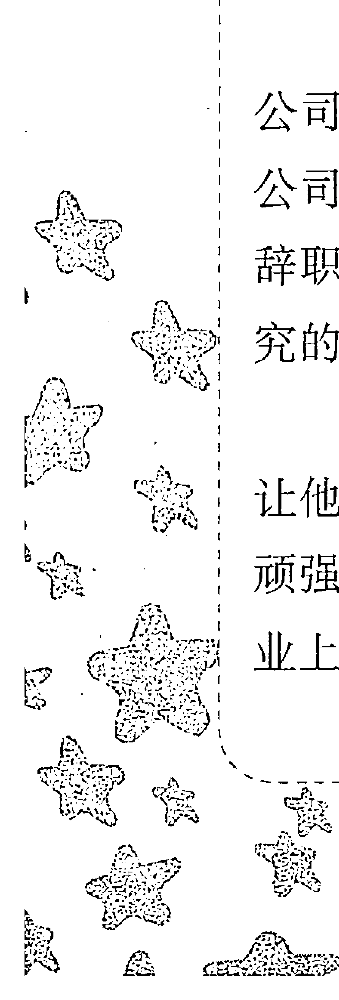

## 第八节 世界名模辛迪·克劳馥

A型人的外形和气质往往非常优秀，他们踏实稳重，有很强的忍耐力和向心意识。他们珍惜重视家庭生活，谋求幸福美满的私生活，也有很强的责任感和义务感。A型人细致谨慎，富于计划性，行动有节制，凡事都会经过周密的思考后再作出决定。辛迪·克劳馥就是A型人的代表人物。

辛迪·克劳馥出生于美国伊利诺伊州的一个蓝领家庭中，靠剥玉米的临时工作来赚几个零花钱，结果被一个当地小报记者发现并拍了一些照片。照片中的辛迪·克劳馥美丽秀气，气质清纯，被很多人看好。于是辛迪干脆辞了剥玉米的工作而专门去做模特。辛迪·克劳馥到纽约不到两年就成了一名真正的超级名模，她在一流的服装展示会上走秀，为顶级的杂志做封面人物，出席豪华奢侈的派对。辛迪神话般的故事并没有到此为止，她利用自己的美丽气质和绝顶身材成为一个身价超过千万元的人，她做广告发言人、身兼节目主持人，还涉足演艺圈，成为一位如日中天的当红明星。

拥有A型特质的辛迪并没有被眼前的辉煌冲昏头脑，她精于打算、未雨绸缪，积极思索着以后的人生道路。在经过深思熟虑之后，1988年辛迪·克劳馥成了首位给《花花公子》拍裸照的名模，裸照一出，声名鹊起。无数成功人士上门谈生意，与其签订合约。之后辛迪·克劳馥在时装电视节目做主持，一做就是六年，大获成功。正是A型赋予的禀赋，使辛迪能够在反复无常、变化多端的娱乐圈中，保持红得发紫的地位长达十年之久。

辛迪·克劳馥很有经济头脑，她精打细算的A型特征为她的事业打下了一片良好而稳定的基础。有一年在她的泳装照片被杂志剪掉之后，她干脆出版了自己的泳装挂历专辑，结果畅销无阻，带来了巨额的收益。同时，也是A型人特有的喜欢提前筹划的特点使辛迪在过30岁生日之前就已着手开始准备退役后的事业。她先是辞去了电视主持人的工作，然后到洛杉矶拍她的第一部电影。尽管电影惨败收场，但辛迪·克劳馥并未就此退缩。她努力经营着自己的事业，准备生产以自己命名品牌的化妆品，同时也考虑出书。她在2008年为美国时尚杂志拍摄的大刊封面以及内页大片，让身穿高级华丽晚礼服的辛迪看起来依然那么神采飞扬、光彩照人。

辛迪·克劳馥曾经是世界上曝光率最高的封面女郎，是全球第一批五大超级名模之一，全球600多家杂志封面都刊登过她的玉照，至1995年身价就达到690万美元。1997年，她被评为世界上第二大美女，同时跻身于20世纪百名性感女星的第五名。

> “有位记者曾经在有关她的专题文章里谈到：‘在时装界里没人是完美的，不过辛迪·克劳馥从人品和成就上是最杰出的一位模特。’”

辛迪·克劳馥一路款款走来，她的成功经历令很多圈内人士艳羡不已。在她身上充分体现出了A型人执著、缜密、有预见性和计划性的性格特点，正是如此才成就了她事业上不朽的神话。

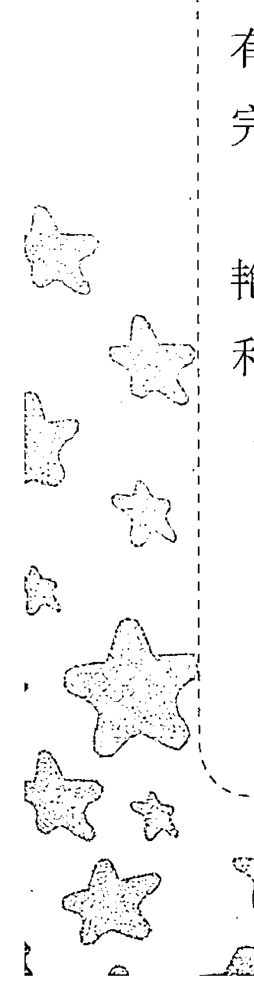

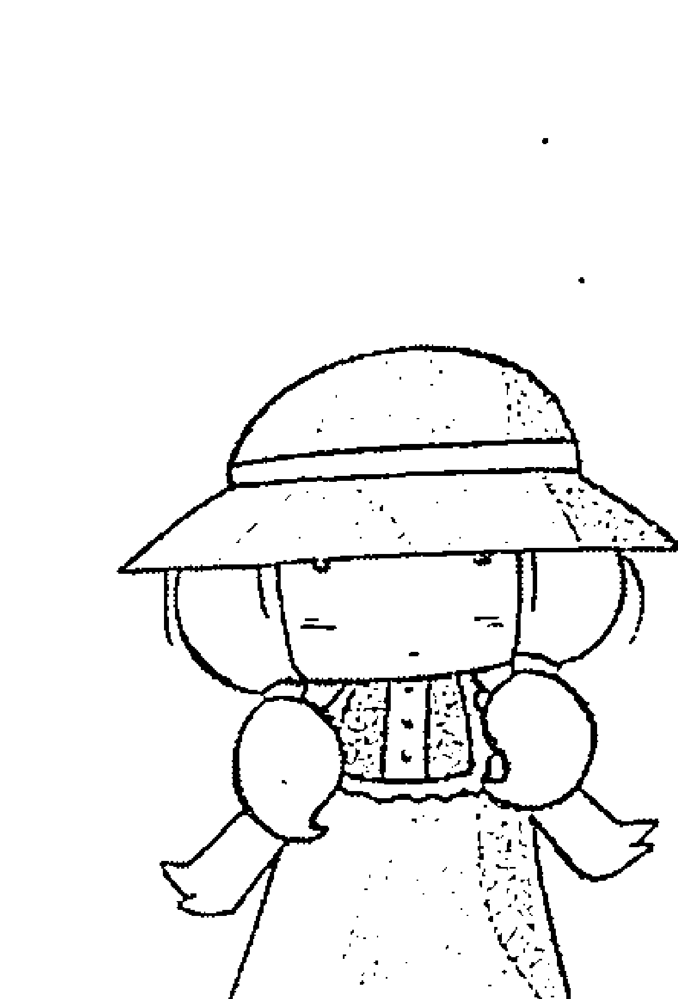

## A型人之黄黄十二宫

## 第一节 A型×白羊座

### 一、性格分析

虽然单纯的白羊座属于行动派，但是配上A型的白羊，会马上变乖好多。A型的白羊座做事情颇具计划性与率性。他兼具A型人的恒温感和白羊的热情冲动，在做事认真保守的外表下，总有一颗火热勇敢的心一直跳动着。

A型白羊座，最大程度地借鉴了白羊的纯洁与A型的倔强。因此，你会发现A型白羊座的人们往往看起来比实际年龄年轻很多。同时，他们骨子里充满坚韧，无论经历多少磨难，他们绝不会向困难低下高贵的头。

A型白羊座也从未舍弃过自己的公正主义观念，他们仍旧坚守自己的英雄主义，总爱打抱不平。别看他们偶尔会激进一些，但是A型白羊座人从来不会咄咄逼人，他们的温和谦让低调，让自己更加具有了双重性格的魅力。

- **【好运贴士】** A型白羊要提防A型与白羊座弱点的结合，要打破思想的藩篱，接受他人的意见，乐观进取。

### 二、白羊运势

A型白羊座，一生的整体运势还算不错。他们一直勇于追求丰富多彩、富有激情的人生。由于A型白羊座拥有一颗稳健的宽容之心，在积极对待磨难的同时，也开怀地吸纳了好些幸运。

A型白羊座，只要能够乐观地接受烦闷，开朗地去融入大众，那么快乐就会永远伴随身边。而且，心情好了也会给白羊带来很不错的爱情运。但要注意，真正适合你的另一半是颇具内涵的异性，要谨慎选择。另外，勇敢地表达自己的口才，加强公众认可，事业运才会不断提升。

- **【好运贴士】** 积极乐观的生活，会让自己好运连连。

### 三、职场命运

A型白羊座本年度的工作运需要更加努力一点。尽管A型白羊座对自己的工作一直很用心，总是喜欢给自己制定工作目标。但是，A型白羊座要注意了，无论自己是如何的才华洋溢，制定合理的前进目标才是最重要的。所以，放弃制定那些太优先于规定进度的目标，这样的工作态度才会让上司满意。

A型白羊座，由于是木星和天王星的入宫，所以经常会被一时外在的现象冲昏头，以致造成对自己的期许过高。因此，A型白羊座需要认识到这一点，要正确地看清前进的道路方向，进而促进工作、事业的节节高。A型白羊座最有利于将来事业的转化年龄是20岁左右。

- **【好运贴士】** 制定适合自己的工作目标，不要好高骛远，是A型白羊事业进步的关键。

### 四、赢在职场

无论白羊的职场运势如何，A型白羊座都要学会懂得“顺势”而为。不管运势好还是不好，只要找到转运点，那么成功依旧在。

对于才华横溢的A型白羊座们来说，性格与事业的成功与否有着重要关联。虽然A型白羊座天生具有强烈的目标意识，总是充满了活力与干劲，但是只要遇到了一些始料未及的挫折，便往往会显得焦躁不安、失去冷静，甚至会自暴自弃，这将严重威胁职场的命运。

那么，A型白羊应尽力克服这一性格缺陷，遇事要沉着冷静，让自己深呼吸一下。这样的话，加上优异的才能、勇于挑战的干劲，职场就是为A型白羊座的精彩而设置的舞台了。

- **【好运贴士】** 工作中，追求稳妥，戒骄戒躁，凡事冷静分析，切忌性格的冲动。

### 五、社交技巧

A型白羊座凭借自己的稳重、仗义，往往拥有很不错的人缘。再加上本身优异的才能，A型白羊座又往往在朋友中处于领导者的角色。但A型白羊座需谨记，切不可执著于自己的鲁莽与专断，否则会失去很多朋友的理解和支持。当遇到不顺心的事情的时候，无论对自己还是对待自己的同伴，要多一分体谅，少一分慌张与责备。

A型白羊座的人们还常存在这样一个误区，那就是与和自己性格不合的人对立。需知，朋友多了路好走，让自己心胸宽大些，结识多种性格的朋友。况且，在职场中的进步，除了依靠实力外，也离不开朋友们的帮扶。

- **【好运贴士】** A型白羊应常告诫自己，心大些，朋友多些，让社交圈子宽些，人生之路才更好走些。

### 六、财富密码

A型白羊座一直拥有着很不错的财运。在储蓄方面，A型白羊们喜欢用积少成多的方式来增加自己的储蓄。只是由于A型白羊座既拥有白羊的果敢，又兼具A型的稳重，这两种性格特点未免不会相互较量。

于是，当A型的特征胜过一筹的时候，A型白羊们会本着“安全第一”的原则，踏实的一点一滴的累积自己的财富。反之，如果白羊座的特征占了上风，那A型白羊们可就怎么想就怎么做了。他们一直梦想着自己的财富会一下子暴涨，那么接下来就会将资金果断地投向市场，期待获利。其实，无论哪种性格类型占了主导地位，A型白羊座们总能够赚取可观的财富，当然前提是A型白羊座们已经全心贯注于自己的事业。

但是，A型白羊座也要注意自己的缺点，就是一旦自己的工作或生活不顺己意，便会毫不心疼地挥霍金钱。另外，即使运气很旺的时候，也难免因不懂明哲保身而惹祸上身。所以A型白羊座在面对巨型借款的时候，一定要谨慎为之。

【好运贴士】A型白羊座在理财方面，应注意维持A型性格与白羊座特征的平衡，只有平衡才能稳定财运。

## 七、恋爱攻略

A型白羊座要想在恋爱中占有优势地位，那么就尽量让白羊的热情洋溢成为爱情方面的主导性格。A型白羊们的爱情往往来自一见钟情，如果摒弃掉A型的压抑，爱情便会如鱼得水般自在。

当然，A型白羊座很明白自己的两重性格。A型喜欢沉闷，白羊座却崇尚热情。由此，A型白羊座们的爱情总会在澎湃的压抑中备受煎熬。任凭恋爱的感觉在心中猛涨，却又极力压制，仿佛表白自己的爱情心声是种莫大耻辱似的。因此，A型白羊们，何不想开一点呢？何必让自己活在矛盾的炼狱中呢？勇敢地告诉自己的心上人有多爱他（她），爱情将会因此而豁然开朗。

另外，虽然A型白羊座的爱情总是轰轰烈烈，却难以持久。那么尝试着一点一滴地释放自己的感情，让爱情能够拥有细水长流般的温馨。

【好运贴士】对待爱情应该学会品，只有慢慢品，才能体会到爱情的韵味。

## 八、婚姻家庭

A型白羊座通常以现实的眼光来审视婚姻，喜欢自由式恋爱的感觉，在步入婚姻殿堂之前，往往已经有过多次恋爱的经历。A型白羊座十分渴望拥有一个稳固牢靠的婚姻，同时对婚姻中的罗曼蒂克甚是欣赏。A型白羊座在恋爱时候，总会轰轰烈烈、热情洋溢，但是一旦谈到婚姻，他们的冷静却超乎寻常。

A型白羊座往往认为恋爱是个人的，但结婚却是属于社会的，即自己的婚姻与社会的安定会息息相关。由此，A型白羊座对婚姻的态度更加慎重。A型白羊座在择偶的时候，通常要经过严密筛选。但是，如此谨慎的态度，反而会让A型白羊错失许多良缘，进而导致A型白羊座的晚婚趋势。

婚后的A型白羊座，在家庭生活上绝不属于朴实而安静的类型。A型白羊座总喜欢朋友的光顾，认为这样才够热闹。这时候的A型白羊女性，会转变成标准的贤妻良母，而A型白羊男性每每会有大男子主义作风，颇为独裁专制。同时，A型白羊座都愿意外出工作，体现自己的能力与价值。

【好运贴士】缘分来了就要把握住，切不可因为自己挑剔的脾性，错失好姻缘。

## 九、最佳速配

### 白羊座+射手座=绝配

白羊与射手在个性上都具有很热情大胆的特性，所以说他们的组合非常好，相同特性的性格在发展起恋情来，也是既热情又浪漫。除了他们在感情上会很顺利外，两人在想法上也很类似，所以彼此之间的相处会非常顺利和自在，是对非常让人羡慕的情侣。

他们之间的配对是无可挑剔的绝配，尤其是白羊们开朗机敏的反应让射手们非常惊艳和佩服，所以说，大部分时候这两个星座不但是最好的战友，也是能互相欣赏的情人拍档。他们对待感情都很热情，除此以外，彼此之间的了解和信任建立得很容易也很自然，不但会让感情加温，还能因此成为对方得利的帮手。

射手很喜欢白羊们的率真，所以白羊们尽情地做自己就可以，不必想太多，至于射手天生喜欢自由的个性，白羊们就值得注意了，要不你就陪着他们浪迹天涯，要不就不要太在意，只要给他足够的自由，和他在一起的时候让他觉得轻松自在，让他什么话都可以无所顾忌地告诉你，这就已经算是成功一半了。

白羊不错的星座搭配还有如下几个：

### 白羊座+狮子座

狮子座喜爱自由，精力充沛，一旦开始做某事即能全神贯注，拥有很强的执行能力。对于生性开朗、情绪却起伏不定的白羊座来说，狮子座的行动力恰恰是最能弥补他们的不足的。而且，两个星座都喜欢追求物质上的满足，一起买名牌、吃好东西，周游世界，一起参与娱乐性活动，默契十足，再加上他们有很多知心朋友，生活不会乏味。同时，他们勇敢、直接、乐观、坚强，这些原因都促成了他们能够很好地交流和沟通。

### 白羊座+双子座

双子座精力充沛，富有理性，且凡事有自己的观点，再加上兴趣广泛，因此做起事情来非常稳重。生性猜疑多变的白羊座与双子座结合，可以弥补其莫名其妙的不安定感。

## 十、健康驿站

A型白羊座由于性格存在的两难，因此常会出现积劳成疾的现象，所以A型白羊要注重平时的放松与休息。

白羊座是十二星座之首，根据白羊座对营养的特殊需求，要多给A型白羊补充维生素H。所以A型白羊们平时要多吃牛奶、蛋黄、动物肾脏、水果、糙米等富含维生素H的食品，预防自身的用脑过度。

再有，A型白羊要多保持开朗的心境，平时多做一些深呼吸的运动，让自己能够时刻保持着冷静的清醒，保有健康的身心。

### 白羊座健康减肥秘籍

减肥迫切性：☆☆
关键部位：腰部、腿部
原因分析：白羊座精力充沛、天生体质健壮，加上比较热情，办事冲动，行动力十足，喜欢到处跑来跑去，所以腿部会比较粗壮，尤其是小腿，可能是全身最难减下来的部位。而白羊座的人比较贪吃零食，很喜欢在闲谈、看电视的时候拿零食往嘴里塞，久而久之，不胖才怪。另外，白羊座的人对减肥没什么热情，即使开始减肥，也会很快就放弃，所以专心减肥、持久减肥，对白羊座都很难实现。如果白羊座实在肥胖得厉害，可以采用一些手术的方法来瘦身，如果情况不那么严重，就只有在平时多注意一些小秘诀了。

- 少吃容易让人发胖的食物。
- 不要买零食放在家里，更不要带到办公室里。
- 多给腿部按摩。

## 第二节 A型×金牛座

### 一、性格分析

A型金牛座，是A型与其他星座组合中最从容与淡定的组合。A型的金牛，最强调保险，即使走了好多弯路，只要安全其他的什么都不会计较。这种类型的人的生活节奏就仿佛是控制慢跑的乌龟，无论有什么十万火急的事情，总会不急不慢、不温不火。由于A型金牛的性情缓慢，一些急性子的人不愿和A型金牛打交道，然而，也亏了A型金牛的慢性，促使A型金牛成功的几率会更高，因为A型金牛们做事几乎不会犯错。

A型金牛，喜欢诚恳，唾弃故弄玄虚，有着正直的为人原则。A型金牛讲义气，重礼义，做事讲求责任。同时，A型金牛们无不拥有着坚忍不拔的意志力及耐力。但是，稳重的A型金牛座却也有着自己的偏执，缺乏变通，不擅长随机应变，决定的事情很难被别人改变，这就难免给生活带来太多的烦恼。

【好运贴士】历史经验证明，太过顽固的东西迟早是站不住脚的，那么放下自己的偏执，学会变通，才会招来好运、好心情。

### 二、金牛运势

和A型金牛的性情一样，A型金牛座的运势趋向为大才晚成型。凭借着A型金牛天生持久的忍耐力，以及做事兢兢业业的诚恳与谨慎，再加上埋下的稳固根基，好运总会来到身边。A型金牛一生的命运曲线不会有太大的起伏。在20岁到35岁以前，运气较坏。而其中的因素，多半是对自己所选择的路线，产生怀疑和不安所致，可能会牵涉到职业及人际关系。但是，35岁之后，运气会比之前好得多。

憨实的A型金牛并不擅长与异性的交流。为此，他们的爱情桃花不会太早开放。但是，只要遇到互相欣赏的人，能够走在一起的话，A型金牛绝对会对这份感情从一而终。他们会竭尽全力地满足恋人的要求，尽心尽力为恋人付出，让恋人时刻生活在感动之中。

A型金牛，只要结婚了就会专心致力于工作和其他的事物，同时，婚后的他们将会更加努力、更加拼命地为家庭付出着。他们的金钱也会因为他们的节俭而越攒越多。

【好运贴士】一如既往地坚持自己的追求，成功已经离你越来越近。

### 三、职场命运

做事稳健、认真的A型金牛座，在选择职业时，会首先考虑这份工作的稳定性以及长久性，他们不喜欢经常跳槽，让工作的性质变来变去。对于一些高度忙碌的工作，缓慢的A型金牛们也往往避而远之。

由于A型金牛座的人欠缺开拓精神，不善于表达口才，因此不适合外交或业务方面的工作。但是，A型金牛往往对数字和金钱有独具天才的敏感性。所以，如果A型金牛能够在会计、人事、总务等实务性工作上或者在金融界中崭露头角的话，将会获得很大的成功。此外，A型金牛超凡的嗅觉、味觉以及美感，适合担任厨师、雕刻家、画家、设计师等艺术性的工作。

【好运贴士】学会表达自己，学会与大众融合，加强工作上的人际关系，职场上的你会更出色。

### 四、赢在职场

A型金牛在工作中勤勤恳恳、务实求真，可以认真地完成每一项工作任务。但是，殊不知，生在职场，除了尽心工作外，还应尽力经营好自己的人际关系。所以，要想赢在职场，请务必扩大自己的交友圈，对于集体的活动热心参与，积极的心态将会是打通人际命脉的法宝。

A型金牛，虽然保有稳健、踏实的做事风格，却有时死板，甚至偶尔会担心结局的糟糕，导致自己畏缩不敢向前。那么，此时此刻的A型金牛们，应该果断舍弃胆怯，勇敢地向前，这样才会得到自己想要的成功。

缺乏变通，不懂随机应变也是阻碍A型金牛前进的绊脚石，要想在职场赢得成功，就让自己不要总像牛一样闷着了，学学猴子的机灵。

【好运贴士】正确认识自己的心性，打败自己心性中的弱点，迎合职场，必能成功。

### 五、社交技巧

天生具备诚实而柔和性格的A型金牛，一直注重给别人留下良好的印象。即使他们身边不会有太多的朋友，但是一旦友情达成，将会变得牢不可破。只是A型金牛偶尔太过顽强与任性了，于是和朋友之间常会产生一些不必要的纠葛。所以，坚韧的A型金牛们，要学会缓和自己的情绪，调整一下自己与人交际的弹性，和朋友之间尽量不要因为冲动而争吵。

A型金牛，在自己的成长历程中，将会结识更多的朋友。虽然A型金牛对朋友表现得很讲义气，但是却有一个明显的缺点妨碍了朋友关系，那就是只管自己进步，却不肯帮助朋友共同进步的习性。

A型金牛，虽然表面看来很懂得交友之道，但实际上却是欠缺包容性和具有很强占有欲的顽固者，所以当被朋友发现这点自我偏执后，多半选择远观而不会与之近玩。

【好运贴士】改进一下自己的交际能力，学着对朋友多些包容，对自己少些占有。

### 六、财富密码

A型金牛座，天生对金钱非常敏感。由于平日生活简朴，加上工作勤恳，年轻的时候就已经懂得一点一点地存钱，到了年老的时候，A型金牛的银行卡里已经拥有了一笔为数不少的资金。

A型金牛的财运很稳定，源自于要求安全感的金牛总喜欢把钱储蓄在银行，而不是去做风险投资。同时，除了守财致富之外，A型金牛在已经准备了足够的金钱外，可以适当地投资一下不动产，毕竟A型金牛们还是蛮有从事土地买卖的财运。

在理财方面，A型金牛很懂得节俭，不愿意浪费。在精神方面，A型金牛却表现得异常大度。例如，A型金牛可以不惜重金去买一本自己喜欢的书，或者去听一场足够水准的音乐会，而这只是为了满足自己的精神需求。

【好运贴士】节俭会让自己更加富有。

### 七、恋爱攻略

与A型白羊座截然不同的是，A型金牛座的人并不相信一见钟情。他们的爱情观念非常专一，不会无原则地和异性交往，也不会随便、轻易地爱上别人。尽管A型金牛们拥有比较广泛的交友圈子，但大部分是同性的朋友，由此，A型金牛们的恋爱机会会减少很多。A型金牛不会随便爱上别人，并不意味着就不会被爱情所困惑。其实，A型金牛常为情所苦，极易患上严重的相思之病。

A型金牛对爱情非常执著。只要A型金牛的另一半不变心，A型金牛将会终其一生厮守着他（她）。固然，爱情的忠贞值得肯定，但是想要得到真正的爱情，必须学会主动才行。因此，A型金牛切记不要太含蓄，也不要太过不好意思，爱情是需要沟通与表达的。

【好运贴士】要想自己的爱情运更加美好的话，请学会主动表白，积极追求。

### 八、婚姻家庭

既然A型金牛座，对爱情如此专一，那么对于婚姻他们同样热爱，对于家庭他们同样忠贞。A型金牛座，相对于恋爱来说，更适合结婚。毕竟恋爱对你们来说，没有婚姻来的有安全感。对于崇尚稳定的A型金牛座，建立一个幸福美满的家庭是最大的期望。

婚后的A型金牛座，绝对会精心打理自己的家庭。在对家庭的经营中，一直持有认真、诚恳、负责的态度。为了实现家庭的和谐与稳定，A型金牛座会很有条理地做家务，也总会对家里的事情做一些未雨绸缪的安排。通常，A型金牛座的家庭大多是在平稳与幸福中度过的，特别是在晚年，富足的准备会让A型金牛更加体会到家庭的温暖。

【好运贴士】忠实于家庭，给另一半充分的空间，幸福会万年长。

### 九、最佳速配

#### 金牛座+处女座=绝配

金牛与处女是绝配，这是有目共睹的事实。金牛座非常迷恋处女座的温柔气质，内敛个性加上睿智一流的分析能力，对金牛座来说，处女座就是他们心中梦中情人的缩影，而对于处女座而言，金牛座的踏实和含蓄也能带给同样也很含蓄的处女座们一种稳定感，所以当金牛遇见处女，简直会天雷勾动地火。

两人若想更好地经营彼此之间的感情，金牛们一定要多在处女身边陪伴，看似复杂的处女座其实是相当纯情且依赖情人的，虽然两人在交往中，处女座会比金牛座更了解对方，不过这并不妨碍金牛座在平日多给他们关心照顾和信心。如果能更多地了解处女座们的想法，那对他们的情绪会更了如指掌，两人的合拍指数会更高。

与金牛不错的星座搭配还有如下几个：

#### 金牛座+摩羯座

摩羯座喜好诗或哲学，学者气质比较浓厚。他们诚实、稳扎稳打、性格质朴，喜欢顺其自然的生活方式，不喜欢过于功利的人际往来，但会有几个志同道合的亲密好友。他们会对自己的专业拥有持久的热情，这与沉稳、谨慎的金牛座相当合得来。

由于性格使然，起初你们会有一段互相摸索的时间，当大家认定对方时，就会开始一起为将来的共同生活而实务计划，有了信心和安全感就会先组织家庭，还会很快生儿育女。感情不是惊天动地、高潮起伏，而是细水长流，可以组成一个小康之家。

### 十、健康驿站

金牛座是十二星座中最稳重的星座，他们需要结实的骨骼和富有弹性的肌肉，因此需要多补充维生素D。建议A型金牛座除了多吃富含维生素D的食物外，还要多在户外晒晒太阳。

A型金牛座的人容易患有咽喉、甲状腺方面的疾病，平时注意多预防。虽然A型金牛座的人做事非常认真、谨慎，但却总是疏忽自己的身体保健。不要一味地工作了，偶尔停下来多参加一些有益身心的运动吧。

#### 金牛座健康减肥秘籍

减肥迫切性：☆☆☆☆☆
关键部位：全身上下
原因分析：金牛座是十二星座中最容易得天生肥胖症的星座，即使金牛座中是少有的瘦子，也大多是因为生活状态比较糟糕导致的，这样也容易得上别的疾病。如果生活条件比较优越，尤其是长期从事运动量低的工作，金牛座不胖很难。不过，金牛座的胖是那种很壮实的胖，很少出现一身赘肉的情况。即便如此，金牛座的人也应该比别的星座的人更注意控制体重，如果家里有人烧得一手好菜的话，对金牛座来说可不是件什么好事。

- 少吃多动是金牛座很有效的减肥手段。
- 不要吃高热量的食物。
- 不要去附近的小餐馆。

## 第三节 A型×双子座

### 一、性格分析

A型双子座，不仅喜欢自在随意的生活，却也钟情于平静、安定的生活。A型双子座一般天生就具有极好的适应力，无论双子的性格有多矛盾，却总能应付的得心应手。但是，在别人看来，A型双子座的性格显现得那么的不可捉摸，本来严肃对待的事情却忽而失去了原则性。

A型双子座，总是对自己充满信心，精力充沛地去践行一件事。做事情的时候又从不盲目服从，时刻怀有大局观念。A型双子座的好奇心非常强烈，居十二星座之冠，喜欢对任何事情做深一步的研究。A型双子座虽拥有不错的理解力，却缺乏耐心，做事情不懂得持之以恒。尽管善于交际，但大多都只是泛泛之交而已，熟得快，忘记得也快。A型双子座对家庭的表现也一向冷淡，既不会对妻子爱得死去活来，也不会对家庭负有太大责任。A型双子座总是在害怕孤独与提防他人中矛盾的生活。

【好运贴士】切忌在生活工作中太过暴露自己的锋芒。

### 二、双子运势

A型双子座无论在行动力，还是对事物的理解能力，都表现得十分机敏。他们无论做什么事情，总会有一定的成果。只是A型双子座缺乏耐性和顽强，做事情不愿意持之以恒，缺乏对真理追根究底的坚持。所以，A型双子座的人一定要尽早树立好自己的人生目标，并要全力打好基础，这样才能够早日实现梦想。

A型的双子座往往在爱情中比较花心，他们不但不用心去经营自己的爱情，反而经常与两人以上的异性同时保持着交往。由此，A型的双子座较难寻找到并把握住一份真感情。然而，如果A型双子座想要交到好的金钱运，那就不要经常为自己的好奇心买单了，应学会在自己的工作中充分展现自己的才能，才能得到相应的价值体现。

【好运贴士】相信有一分耕耘就会有一分收获，只有坚持不懈地耕耘，才会收获最大的成果。要懂得坚持的价值。

### 三、职场命运

A型双子座在事业上的成败关键在于对职业的选择。

### 四、赢在职场

首先，随性、不够坚定的性格将会影响A型双子座一生的命运。如果要实现自己的职场梦想，首先A型双子座要正确选择好自己的职业，莫不可将自己推到英雄无用武之地的境地。

其次，A型双子座要学会珍惜自己的朋友，搞好自己的人际关系，这对于事业稳定具有重要意义。

最后，A型双子座拥有灵活的应变能力固然很好，但是也不能忽视自己本身对于耐性的匮乏。众所周知，古至今外，凡是成大事立大业者，无不拥有坚强的韧性与执著的追求。

【好运贴士】要想赢在职场，需要持之以恒地追求。所谓“冰冻三尺非一日之寒”，职场中切不可“三天打鱼两天晒网”。

### 五、社交技巧

A型双子座在交际方面比较有天赋，他们的开朗大方、口才流畅使其颇具人缘。因为机敏的A型双子座能够察言观色、投其所好。他们不仅能够观察到自己身边的人在什么时候需要什么样的帮助，还能够根据不同的人采取不同的交往方式。只是A型双子座在帮助别人、拉近感情的时候，并没有想过要和他们深交。

A型双子座灵活却缺少稳定，因此心智不够成熟。其实，这个时候他很需要有一个知交来帮助他走向成熟。因此，交朋友不要只在乎一时之兴，交到真朋友才会给自己带来好运。

【好运贴士】人生得一知己足矣，学会对人以诚相待，方能收获挚友，收获好运。

### 六、财富密码

A型双子座是一种集才能与弱性为一体的人，他们接受尖端的知识能力很强大，同时又总是对自己的事情不能强硬地坚持到底。因为A型双子座的出类拔萃，又因为追求对求知欲的满足，A型双子座的财运在总体上说是很不错的。才能可以给A型双子们带来很大的财富，当然这需要他们能够坚持住自己的目标，在事业上干出一番成就。想要成功，就不要懒得追根究底，要给自己施加勇往向前的坚韧以及顽强拼搏的意识。

由于A型双子座的善变性，所以无法更好地敛财。据调查，A型双子座的人中，只有少数是A型性格胜过双子座的性格，善于点滴储蓄。大多数A型双子座的人，都是花钱如流水的类型，他们对金钱的概念并不是很大。A型双子座需要注意，在青年期到中年期这一段时间的财运最为旺盛，这个时候要好好把握机会。

会，收敛一下随性，将能收获不少的财富。

> 【好运贴士】坚持事业目标，克制自身的惰性，钱财方能滚滚来。

## 七、恋爱攻略

A型双子座的爱情很矛盾，A型的性格特征要求他们对于爱情要学会保守与自我压抑，而双子座的随意又期待他们能够游戏感情。于是，A型双子座的恋爱就像善变的天气一样。A型双子座的人一会儿温文尔雅地面对爱慕者，一会儿又变成一个满口甜言蜜语的花花公子，很难让人猜透他们的真面目。不过，大部分A型双子座的人在谈恋爱时候的性格主导往往是双子座的特性。也就是说，大多数的A型双子座对于爱情很随性、很不专注，他们把爱情看得冷淡。因此，无论分离聚合，对他们的影响都不是很大。

也正是由于A型双子座的不稳定性，他们很难找到自己的真爱，即使找到了，也很难做到真心对待。A型双子座的花心毕竟不是优点，那会让自己备受情感的折磨不说，风流成性总会给自己惹来太多的情感纠葛。

> 【好运贴士】试着把变性转化成定性，情感世界将会因此而与众不同。

## 八、婚姻家庭

A型双子座的婚姻状况与A型性格和双子座特征有着同样密切的关联。保守的A型性格与追求自由的双子座特征，极易导致婚姻的两种极端。如果A型特征比较强势，那么A型双子座们一般会有早婚的意向，而且此时多有比较稳定的生活基础；反之，如果双子座性格特征比较活跃的话，A型双子们将是个不折不扣的爱情游戏专家，婚姻是他们最不感兴趣的话题。A型双子座的人不会主动寻求所谓的真爱，他们有强烈的反抗家庭的意识，往往是“谈婚姻色变”的类型。哪怕好不容易结婚了，他们的那种漂浮的心态还是不会消失。他们喜欢热闹，所以常常邀请朋友到家玩闹。他们对爱情比较冷漠，对另一半并不是很紧张，即使发现对方有了外遇，也会坦然接受，并试图以同样的方法伤害对方。其实，既然不适合过早地承担家庭的责任，那么就让自己在结婚之前多任性一些，结婚之后，应该懂得收敛秉性、稳定生活。

> 【好运贴士】婚前的随性不可以带到婚姻中去，婚姻是一种责任。

## 九、最佳速配

### 双子座+天秤座=绝配

同是风象星座的双子与天秤可谓是绝配，他们不但个性相似，做事方法也很合拍。只要他们一起出马的事情，都会很顺利地进行。天秤天生喜欢权衡也很温和，所以他们吵架的机会也会少之又少。

善于口才的双子遇上性情温和的天秤，两人在一起营造的气氛会很融洽，所以他们相处的一向很愉快。所以天秤不牵动双子的心才怪。

双子的灵活多变总是有意无意地搞出一些浪漫的惊喜，让喜好浪漫的天秤又爱又依赖，而天秤非常重视公平，这是双子所没有的特质，但是却非常欣赏。所以好学聪明的双子不妨多多学习一下，展示给天秤，久而久之他们的感情会更好。

双子不错的星座搭配还有如下几个：

### 双子座+狮子座

狮子富有才干，有领导气质，定会前途光明、平步青云。他们胆大心细，态度积极，主动思考，做事情极有效率，因此深受年长者的信任。他们与双子座结合，属于一种“强强联合”，很让人期待。

### 双子座+水瓶座

这两种星座的人都有着旺盛的求知欲，充满着现代感，对任何新颖的事物都带有强烈好奇心。刚刚认识时，双子座虽然难以掌握他们的性格，但是长久交往之后，会惊讶地发觉彼此情投意合。

双方的结合可以说是天作之合，他们都交游广阔，性格开朗，对感情比较洒脱，不会挤压对方的生活空间，不会给对方压力。两个人之间的关系能远能近，在一起不会腻，分开一段时间也不会过于牵挂。在事业上也能相互帮助，既是亲人又是同志。

### 双子座+射手座

射手座兴趣广泛，富有好奇心，热爱四处活动，精力充沛，凡事都想亲身体验，对待异性很温柔，射手的激情正是双子座所需要的。射手座对白羊座的影响将是天翻地覆的，可以帮他克服许多困难，弥补很多不足。

## 十、健康驿站

双子座是十二星座中最敏捷的星座，有强烈的好奇心和求知欲，因此对维生素 B12 的营养需求量比较大，因为维生素 B12 能帮助他们更好地集中注意力，所以建议 A 型双子座的人平时在饮食上要多吃些肝、瘦肉、鱼、牛奶、鸡蛋等。

配合 A 型双子座的良好的交际关系，A 型双子座的人往往会存在比较严重的肠胃问题以及呼吸道的疾病。所以，为了健康着想，你们应尽量克制饮酒、吸烟，也最好少去那些太过嘈杂的地方。

A 型双子座的你，平时太过吵闹，要注意多修身养性才是。沉静也是一种享受。

## 双子座健康减肥秘籍

减肥迫切性：☆☆

关键部位：腰部、手部

原因分析：双子座肥胖的几率非常低，但是如果胖起来的话，会显得特别魁梧。一般来说，多才多艺的双子座手臂比较发达，肩膀比较宽阔，一旦胖起来，上围会比较惊人，如果个子较高带一点勾背的话，就会非常难看。所以，对双子座来说，减肥的过程更多的是一个塑身的过程，是一个保持线条的过程。

- (1) 多活动筋骨，可以在休息的时候稍微做几下扩胸运动。
- (2) 吃高纤维的食物有利于保持身材。
- (3) 多喝茶、嚼口香糖，不要吃零食。

## 第四节 A型×巨蟹座

## 一、性格分析

A 型与巨蟹座组合在一起，仿佛是一种保守的强强联合。A 型的性格喜欢稳定、崇尚团结感，巨蟹座比起其他星座来说，喜欢安全感又比较重视国家、家庭和朋友等的集体利益。这两种相似的个性叠加在一起，使A型巨蟹座变得更加重视原则，乐于遵守社会法规及重视生活常识，喜欢安安稳稳的生活。A型巨蟹一直怀有顾全大局的大气，以及团结集体的领导风范。A型巨蟹喜欢传统，容易念旧，不喜欢接触新鲜事物，不喜欢与陌生人打交道。于是，A型巨蟹的交际圈子会相对封闭一些。

由于月球是巨蟹座的支配星，而月球主宰人类的感情，象征着母性的爱。所以，A型巨蟹座的心中总是充满大爱，乐于助人；感情细腻，有悲天悯人的胸怀。但是不可轻视的是，A型巨蟹感情太过丰富容易引发敏感情绪，做事情极容易缺乏理性。如果突然有件事让自己不开心了，A型巨蟹会很容易一头钻进牛角尖，然后郁闷得难以自拔。

> 【好运贴士】冲动是魔鬼，学会驾驭自己的情绪，而不是让情绪来左右自己。

## 二、巨蟹运势

巨蟹座一生的运气整体还不错，他们对家的热爱致使他们的家庭很和睦，与父母、妻子、儿女之间的关系都不错。巨蟹座的人大部分是比较有福气的人，与家人在一起，幸福感会不断增加。

但是，A型巨蟹座往往也会由于自己的脾性而带来一些烦恼。比如，巨蟹座的已婚者与另一半讨论事情的时候，因为固执己见，总会引来争吵；当事业中遇到挫折的时候，因为慌张而不知所措；进行物质消费的时候，盲目追求高品质。这些都会给自己的生活与工作带来太多的不愉快。

另外，过分注重家庭关系的A型巨蟹座，偶尔会忽视人际关系的和谐，这将会严重阻碍你的发展。因此，巩固一下你的人际，放宽心态，不要太过感情用事，才会加强你的成功根基，才会让自己有更大的发展。

> 【好运贴士】社会是由人来组成的，学会与人相处将会使自己受益终生。

## 三、职场命运

A 型巨蟹座的职场命运与自己的性格特征息息相关。大家都知道，螃蟹总是习惯随遇而安的惬意，而 A 型巨蟹座就如这只螃蟹一样，喜欢待在一个舒适、安全的环境里。所以，最适合 A 型巨蟹座的工作就属有关建筑或室内设计的工作了。A 型巨蟹座最大的性格就是拥有母性，看重家庭，懂得付出。因此，A 型巨蟹座的人也非常适合从事与感情关怀有关的工作，比如：护士、保姆、小儿科医生等。当然，对讲究饮食的 A 型巨蟹座来说，从事一些厨师、烹饪师等的工作也是不错的。

职场上，A 型巨蟹座给人以善于与领导沟通、乐于与团体合作的印象，再加上端正的工作态度让他们很容易得到公司同事的认可。只是，他们有时候容易把工作的事情与私人情绪混合在一起，严重影响工作的进展。

> 【好运贴士】做事情要讲求公私分明，切忌将其混为一谈。

## 四、赢在职场

鉴于 A 型巨蟹座与生俱来的母性特征，他们大多以奉献事业为重。所以 A 型巨蟹座当老师的有很多。A 型巨蟹男，往往是先成家后立业的典范，A 型巨蟹女则更适合做的是家庭主妇，她们绝对能把家庭管理得有条不紊。正确的定位会让 A 型巨蟹座的工作顺利。

## 第八章 A型人的命运手册

虽然 A 型巨蟹座习惯付出，乐于奉献，但是不要让自己的工作太过忙碌。勤恳是好事，却也应该多给自己留点为自己奉献的时间。由于视野相对狭隘，A 型巨蟹座必须锻炼自己的包容心以及遇事冷静的平常心。

尽管 A 型巨蟹座天生具有很强的忍耐力，做事贯彻始终。但是不要忘记，职场上不是只要自己刻苦就可以，而更需要一些朋友的帮助与关怀。那么，平时多注意拓宽一下自己的朋友圈子，与志同道合的朋友合作，会让 A 型巨蟹座如虎添翼，更容易获得成功。

> 【好运贴士】切忌做事感情用事、拖泥带水，以及太过主观。

## 五、社交技巧

重视原则、稳重保守的 A 型巨蟹座，对于社交问题并没有解决得很好。毕竟，他们继承了 A 型的保守与巨蟹座的安定，所以他们很乐意把自己封闭在一个习惯的环境里。但是他们很看重真正的友情，一旦有了值得信赖的朋友，他们便会对朋友无微不至的关怀。

由于 A 型巨蟹座重家的本性，他们会一切以家庭的利益出发，如果自己的孩子在外面惹了什么是非，他们会极力袒护自己的孩子，这可是构成人际关系恶化的一大障碍噢。爱护孩子固然正确，但是过于庇护孩子的成长，不管对孩子还是对你来说都是不够理性的。

A 型巨蟹座喜欢以自己的好恶作为标准来判断是与非，只愿意与自己情投意合、谈得来的人交往。另外，虽然 A 型巨蟹们很看重金钱，但是不要总是对朋友太小气，有时花点交际费会让自己得到更多，有付出必有回报的真理永远不会过时。

> 【好运贴士】 试着改变一下自己的情绪化标准，学会理智、包容地对待一切，将会收获更多的朋友。

## 六、财富密码

A 型巨蟹座对金钱非常有概念。A 型巨蟹座一直拥有相当不错的财运，他们的财富几乎全部来自于你的精打细算以及稳定的储蓄。A 型巨蟹座生性传统，从来不会幻想着突然有一天一下子暴富，也不会去做一些风险性的投资。A 型巨蟹座只是喜欢踏踏实实、安安稳稳地把钱存在银行里，越到晚年，财富越丰富，生活越舒适。积少成多的乐趣永远让 A 型巨蟹座着迷不已。

另外，A 型巨蟹座不仅擅长储蓄，对金钱的精打细算也是强项。A 型巨蟹座有节俭的生活作风，但并不意味着不舍得吃、不舍得穿，而是体现在当他们买一件东西的时候，永远都会计算在先，货比三家，对东西的质量与价格都要细细比较。精于保守理财的 A 型巨蟹，绝不会浪费自己的一分一厘，他们分配好每个月的具体开支后，剩下的都会被存进银行，再加上他们对家庭的责任感、对子女的疼爱，他们会更加努力地存钱，于是 A 型巨蟹的储财能力越来越被历练得炉火纯青。

【好运贴士】 钱财，不只会要存，更重要的是会要生，生财才是真正的富有之道。

## 七、恋爱攻略

A 型巨蟹座与 A 型双子座拥有完全不一样的恋爱观。A 型巨蟹座的人注重定性，他们的恋爱都是以婚姻为前提的。无论男女，A 型巨蟹座的人总是感情细腻，拥有强烈的母性。他们不喜欢浮躁的爱情游戏，也不习惯爱得轰轰烈烈，他们的爱情平凡、稳重，更有默默奉献的伟大。

A型巨蟹座渴望平静的爱情，却也总在幻想幸福的婚姻。如果在交往的过程中，发现他（她）就是自己要找的人，那么A型巨蟹会一心一意专情于对方。A型巨蟹座的爱情平淡无奇，不会有什么曲折离奇、引人入胜的故事发生，但他们恰恰喜欢享受平淡中的安定，以及安定中的幸福滋味。只是当A型巨蟹表达对爱人的忠诚热爱的时候，要多给他们一些自由的空间，太过缠人可是不好。

【好运贴士】多给另一半一点个人空间，感情的温度将会持续提升。

## 八、婚姻家庭

由于A型巨蟹座喜欢保守、稳定的生活方式，所以对爱情与婚姻的要求也希望平平淡淡。在A型巨蟹的眼中，平平淡淡才是真，那些曾经的轰轰烈烈、海誓山盟都是靠不住的。A型巨蟹的恋爱目的一般很明确，只要确立了恋爱关系，也就意味着接下来会步入结婚的礼堂。虽然A型巨蟹不擅长甜言蜜语，但是他们对另一半的体贴以及对家庭的热爱，会时刻打动伴侣。A型巨蟹座还时常为家庭生活做一些长远计划，注重家庭生活的条理。

A型巨蟹座是十二星座中最家庭化的典型。A型巨蟹座的老公往往在辛苦工作的同时，还是将家庭放在首位。他们顾家，常常帮助自己的太太做些家务，也喜欢照顾孩子，是典型的二十四孝好老公。只是A型巨蟹座的丈夫在插手家务事的时候，偶尔会引发夫妻间的矛盾。A型巨蟹座的妻子，则是标准的贤妻良母型喽。她们忠于自己的家庭，温柔、体贴、贤惠，对家庭默默地付出。如果说历来婆媳之间不可能相处好的话，那么A型巨蟹座的妻子会是个例外。她们不仅能够做个好媳妇，同样也是个好女儿、好妻子、好妈妈。

> 【好运贴士】看重家庭的同时，也应注重预防、解决家庭矛盾的纷争。

## 九、最佳速配

### 巨蟹座+狮子座=绝配

强势的狮子和温顺的巨蟹属于超级稳定理想的配对。因为他们都是家庭型的星座，温柔智慧的巨蟹很懂得给足狮子面子，而外表强悍的狮子往往很容易被这种善解人意打动，看起来是一刚一柔的结合，实际上，巨蟹总是以他特有的方式在背后支持着狮子。

所以这个配对的感情相当稳固，如果当他们开始共同描绘未来蓝图的时候，基本上就暗示他们将步入婚姻殿堂了。

巨蟹不错的星座搭配还有如下几个：

### 巨蟹座+天蝎座

两个都是水象星座，性格很相似，敏锐感性、头脑聪明。人生观、世界观基本一致，所以两个人在一起很谈得来，会有通电的感觉。他们的恋情往往是顺其自然发生的，由朋友慢慢转向恋人。但是，一旦确定恋爱关系，你们的恋情就会轰轰烈烈，十分迅速。特别是巨蟹座的情绪变化令人匪夷所思，可天蝎座对此却了如指掌。所以，巨蟹座常常视天蝎座为唯一的知己。

### 巨蟹座+双鱼座

如果有能让巨蟹座感到一见钟情的，那就非双鱼座莫属。双鱼座能够化解巨蟹座的一切烦恼，哪怕是很细碎的小事，双鱼座也能为巨蟹座排解。双鱼座的温柔和巨蟹座的多愁善感配合在一起，将是无比的默契。彼此能够体贴、彼此照应，双方也一定会意识到对方的不可缺少，从而更加珍惜这份感情。

### 巨蟹座+金牛座

专心的 O 型金牛座和重家庭的 A 型巨蟹座结合起来，家庭基础就会牢不可破，倔强的 O 型金牛还可以帮助敏感的巨蟹多拿主意。在金牛座面前，巨蟹座的一些多疑、保守的毛病会得到不同程度的改进，甚至有望变得爽朗起来。

## 十、健康驿站

巨蟹座是十二星座中最有母性的星座，也是个非常爱吃的星座，因此要时刻注意保护自己的胃，防止饮食过量。既然爱吃，那就需要多吸收些维生素 B2 来帮助脂肪燃烧，促进身体的新陈代谢。富含维生素 B2 的食物有谷物、蔬菜、牛乳和鱼等。

此外，A 型巨蟹座即使对情绪的控制能力极强，但是由于缺乏安全感，常会造成过大的情绪波动，并会因此陷于杞人忧天的境地。特别是当家庭出现矛盾的时候，精神极其不稳定。殊不知，精神太过波动，会让肝胆分泌不顺，容易引起肠胃问题。

顾家爱家的 A 型巨蟹座，大部分时间喜欢待在家里，建议不妨多出去走走，从事一些消耗体力的运动，可减少神经过敏的毛病。如果选择在水边的场所进行活动的话，会有好运降临。

## 巨蟹座健康减肥秘籍

- **减肥迫切性**：☆☆☆☆☆
- **关键部位**：全身
- **原因分析**：巨蟹座简直就是肥胖制造机。巨蟹座的体质是天生粗壮的那种，骨架比较大，又有肉，所以会显得很富态，甚至连眼睑也总是微微水肿，加上他们很有爱心，也容易得到别人的回报，会有人时常送来好吃的，这也导致心情总比较愉快，正所谓心宽体胖。何况巨蟹座往往厨艺还相当不错，胃口比较好。另外，巨蟹座的人有点懒惰，这就更是雪上加霜了。总体来说，巨蟹座具备了一切肥胖的要素，不仅自己胖，还会影响周围的人发胖呢！

- (1) 高强度的锻炼对巨蟹座最为重要，把肌肉练出来就会有很大改观。
- (2) 勤快一点，让自己忙起来。
- (3) 少下厨，吃简单一点。

## 第五节 A 型 × 狮子座

## 一、性格分析

A 型狮子座，拥有相当奇特的性格，时而消极时而积极，能显出浪漫气质的同时，也能显出 A 型所具有的内向害羞的一面，让人难以捉摸，略显神秘。

但是，对绝大多数 A 型狮子座的人来说，开朗活泼的狮子座个性往往能压住 A 型的朴实静谧。尤其在外在行动中更能显示狮子座的个性来，这些都可以从众多社会名流中看出。A 型狮子座拥有狮子般强大的信心，但是过大的自信往往会导致自大，在虚荣的影响下经常会表现出自以为是的心态。这种王者心态往往从小时候就表现出来，直到来到工作岗位上也是如此，A 型狮子座永远是站在顶点的领导人物。

A型狮子座中也有少数人是A型特征较为显著的类型，胸怀宽广，野心内敛，这往往会给别人留下保守的印象。也是因为这种保守让A型狮子容易受别人蛊惑、煽动的弱点也很明显。这种性格再加上A型的强烈自我保护倾向，可能会让A型狮子变成一个暴君，往往会去欺负那些善良弱小的人，这与A型狮子的内心是截然相反的。A型狮子很容易受到奉承的怂恿及谄媚，从而给了别人假借自己之手完成邪恶意愿的机会，而A型狮子自己可能往往是被人卖了还帮人家数钱，任由别人利用、摆布。

如果你是狮子座，那就轰轰烈烈地开创自己的新天地吧，因为A型狮子的性格具有开创和领导精神，同时保守的形象又有助于被社会所接纳。

> 【好运贴士】忠言逆耳利于行，千万不要让花言巧语蒙蔽了自己的双眼。

## 二、狮子运势

狮子座由太阳神阿波罗管理，所以颇具阳光、热情、自信、大方的特质。A型狮子座的总体运势是比较不错的，他们最终能够凭借自己的力量建立起不错的名声、地位和财富。虽说狮子座的人天生具备领导的能力，但不能骄傲自大，自大只会让自己受挫。所以，要想获得别人的认可与尊重，请放下一点身价，改变一下自己的固执。

A型狮子座的人生运势呈现先低后高的趋势。他们往往在幼年时期就要经历生活的艰辛，到了成年的时候，却又总经历不得不向别人低头的场面，此时的自尊心会受到严重打击。但是，只要努力把握好20~30岁的这段事业黄金时期，积极争取机会，最大可能地发挥自己的才能，就会赚到丰厚的财富与地位。

> 【好运贴士】 认真对待所经历的苦难，苦难会造就自己的成长、成熟与成功。

## 三、职场命运

天生能力高强的 A 型狮子座，由于受到太阳神的庇护，难免有些自傲。A 型狮子座喜欢组织并领导别人，希望看到手下有一大批人在听自己指挥。但是，生性固执的 A 型狮子座，不太乐意与别人进行沟通协调，这会严重影响自己的决策力。

A 型狮子座拥有自信的傲骨，喜欢用表演来将它淋漓尽致地表现出来，所以 A 型狮子座的人倘若从事演员、歌手、模特儿等工作的话，会有所建树。此外，A 型狮子座天生爱好热闹华丽，对美有独到的欣赏与挑剔，如果从事珠宝、皮革等高档奢侈品事业也有不错的运气。同时，A 型狮子座敏锐冷静的头脑和充沛的精力、体力，深有成为一名成功的企业家、政治家或商人的潜质。

所谓金无足赤，人无完人，A 型狮子座太过独断专行，不愿意接受别人的指导与建议，势必影响自己的事业。所以，要想事业名誉双丰收，就要在自己的性格中多发挥一下 A 型的气质。

> 【好运贴士】 不要太过孤高自傲，尝试着虚心接受别人的指导与建议。

## 四、赢在职场

A 型狮子座的人勇敢、果断、开朗有活力，同时具有王者的气派，选择一些可以体现自己领导才能的职业对自己很有利。同时，A 型狮子们精力充沛，交际灵活，进入演员、模特等的职业圈也会让才能得到很好的表现。因此，要想赢在职场，选择正确的职业很重要。

## 第八章 A型血之星座十二宫

### 五、社交技巧
A型狮子座的人天生阳光、豪爽、大气，很容易结识新朋友。即使对于初次见面的人，他们也能在顷刻间与之高谈阔论起来，给别人的印象往往是胸怀宽广、气魄伟大。

他们天生出色的领导才能，往往会吸引很多志同道合者的加入。对待朋友，他们热情包容，对待敌人却有着秋风扫落叶的残酷。因此，更能够得到朋友的拥戴。只不过，强大的自尊心常常促使他们独自发号施令，不与他人进行有效的沟通，缺乏组织协调性，这就容易在集体中树敌，影响自己的威名。

所以，A型狮子座的社交能力都是很高的，只是不要总是看重自己的意见，多征求一下他人的看法，不仅不会降低你的领导风范，反而会提升你的道德名望。

> 【好运贴士】有自尊是对自己的维护，但自尊心过强则会对自己造成伤害。

### 六、财富密码
A型狮子座的财运相当不错，偶尔还会赶上一些不劳而获的事情，让人相当羡慕，但是潇洒的性格让A型狮子座挥霍成性，得到再多的财富也不能长久，最后只能落得“两袖清风”。这不能太责怪自己，谁叫A型狮子座的人天生最恨吝啬小气的人呢，以致养成了花钱大手大脚、不知道节制的习惯。在A型狮子座眼中只要是看中的就一定要买，没有什么事能克制住他们的购买欲。但是，A型狮子座有时也会刻意地存一点钱，这是为下一次大的消费做准备，有时甚至不知不觉就把钱花掉了。

对于A型狮子座来说，他们喜欢把钱放在像赌博那样高风险的事业中去，开始可能大红大紫，但是十赌九输，最后很难保持自己获得的财富。

> 【好运贴士】见好就要收手，不要让悲剧发生。

### 七、恋爱攻略
A型狮子座的恋爱观比较特别，总是充满太多的戏剧化情节。他们喜欢天真烂漫的感觉，喜欢把自己变成被别人关注的焦点。他们的爱情看似潇洒、浪漫、不拘一格，即使是在大庭广众之下，也会毫不顾忌地与情侣亲热。在恋爱的过程中，他们只会享受着彼此的存在，不会在乎外人的议论与惊讶。之所以表现出这样的恋爱特性，多半原因来自于狮子座的浪漫喜好，但凡A型狮子座多一点A型人较强的自制力的话，A型狮子座的恋爱过程也会少受点争议。

A型狮子座乐于陶醉在恋爱的欢乐中，对此他们总是舍得往约会上投钱，只要能够开心，花多少钱都愿意。为此，A型狮子座经常囊中羞涩，但即使向朋友借钱，也要满足自己约会的快乐，这会导致A型狮子座的恋爱之路充满趣味及丑闻。

A型狮子座的男性，对女性都有着强烈的追求本能，特别是那些漂亮的女性。因为他们在选择恋爱对象时，更重视她们的容貌而不是品德。A型狮子座的女性，则在恋爱中怀有严重的自负情节。对一般的凡夫俗子、泛泛之辈，她们经常显摆自己的高傲与自尊，但是对恋人却是百般热情、柔情万千。不过，她们的眼眶很高，只对一些有名誉有地位的人感兴趣。

> 【好运贴士】对待爱情应该冷静一点，不要太看重外表，要注重体会一个人的涵养是很关键的。

### 八、婚姻家庭
A型狮子座的女人婚后的生活渐渐趋于平淡，她们不再热衷于外面的应酬与娱乐，不再关心自己是否仍是众人关注的焦点，仅仅享受家中的“女王”地位。她们不愿为家务牺牲自己，也不愿在教育孩子方面花过多的时间。在此家庭中成长的孩子无拘无束，多有独立自主的良好性格。总体而言，她们还是不错的母亲。

A型狮子座的男人是永远不服老的一群人，他们喜欢追求新鲜的事物，家庭对他们而言没有任何特殊意义。他们不时在外寻找刺激，对家人漠不关心，也从不因此感到愧疚。他们的大男子主义使他们坚信女人照看家庭是天经地义的事情；而男人就应花天酒地，享受生活。他们在孩子心中的地位并不高，只是个“很会玩的爸爸”。

> 【好运贴士】无论扮演着怎样的家庭角色，只要对家庭负责，对自己负责就好。

### 九、最佳速配
**狮子座+天秤座=绝配**
狮子的王者气息与天秤的优雅气质相匹配，简直是绝美的组合。从外表上看就已经是人群中的亮点，加上他们言谈举止间带来的魅力和亲密无间的默契，足以叫众人嫉妒。

天秤座的人特别喜欢有个性的人，而狮子刚好符合天秤的胃口，狮子在12星座中的性格非常明显，也许每个狮子座的人不一定会有那么明显的个性，但是天秤总会找出一些与众不同的特色与之欣赏。还有最重要的一点，天秤很喜欢犹豫，总是在仔细衡量之后还是拿不定主意，而狮子很喜欢挑战难题并习惯做决定，这就让总是爱犹豫的天秤非常喜爱。

在相处时，值得注意的是，狮子一定要表现出自己强大的王者风范，多注重穿衣和言谈举止，外形与内涵兼备就足以让天秤迷恋，如遇到问题时，狮子摆出一副一切都必须听他的架势，一定会让天秤死心塌地。

狮子不错的星座搭配还有如下几个：

**狮子座+射手座**
射手座坦率的性格是对狮子座的一剂良药，如果作为朋友，射手座很容易和狮子座发生冲突，但是作为情侣，射手座乐观，喜好运动，富有责任感，脸上经常带着笑容，很幽默，这些性格都是深深吸引狮子座的地方。

在性格与能力上，射手座与狮子座能形成一种互补。

**狮子座+白羊座**
如果说有什么能让狮子座感到离不开的话，那一定是白羊座。两个人都喜欢享受性的生活，追求生活质量，都喜欢浪漫，喜欢甜言蜜语。两个人配合起来，天衣无缝，生活就像在演戏一样，即使演起对手戏来，也是棋逢对手。而且，两人一定会有共同的朋友、共同的生活圈、共同的语言，白羊座简直是狮子座最亲密的战友。

**狮子座+双子座**
双子座的进取心和狮子座如出一辙，两方结合的话，会在事业上取得新的高度，双方可以相互鼓励，出谋划策。而且狮子的霸气、包容心正好可以遏制双子座的多变，双子座的温柔婉约正好可以抚平狮子的暴戾之气。

### 十、健康驿站
狮子座对应于人体的眼睛，因此，A型狮子座的人应多膳食维生素A，有助眼内感光色素的形成。富含维生素A的食物包括动物肝、胡萝卜、奶油和鸡蛋等。

A型狮子座的人在早年的时候过于忙碌自己的事业，会给自己的身体埋下健康隐患。因此，忙碌的时候请注意适当休息，做到劳逸结合才能有助于身心健康。

另外，虽然A型狮子座需要操心的事情有很多，但应避免心情烦躁带来的过激行为。在情绪极不稳定的时候，试着调控一下自己，比如，独自到幽静的地方散步，或者进行一次长途旅行。

### A型狮子座健康减肥秘籍
- 减肥迫切性：☆☆☆
- 关键部位：腹部
- 原因分析：天生注重外表、身材高挑的狮子座肥胖的几率并不高，即使肥胖，也不会十分严重。不过，养尊处优的生活倒是容易给腹部带来赘肉。如果狮子座的你确实胖了，千万不要听信别人的话，如果别人恭维你的身材的话，不过是在敷衍你罢了。要知道，你平时的所作所为不会让人乐意对你来个当头棒喝，“哎呀，你胖了，要减肥了”这种话，即使你最好的朋友恐怕也不会轻易对你讲出来。

## 第六章 A型处女座

### 一、性格分析
A型处女座的人纯洁而善良、谨慎而怯懦，他们有丰富的知识，做事一丝不苟，有旺盛的批判精神，并且有洁癖，不喜欢别人侵犯其生活空间。他们外表安静沉默，具有A型的特质，对外界的冲突总是采取逃避的方式，那是处女座的人胆怯和孤独的本性使然。但只要自己能够确定的事，便会比较大胆。他们做事不喜欢半途而废，对任何事都有自己周密的规划，然后一步步地实施并完全掌握。他们好学、求知欲旺盛，做什么事都很投入，而且拥有极好的口才。

A型处女座由于过度洁癖，有点挑剔又追求完美，因而眼里容不下一点污秽或丑陋的事情。他们对事物具有敏锐的洞察力、正确的判断力，自尊心极强，非常自负。但实质上A型处女座的人缺乏信心，在潜意识里认为自己不够美好。

> 【好运贴士】完美的事物是不存在的，其实缺陷也是一种美，不要对完美要求太严格了。

### 二、处女运势
A型处女座的学业运超好，他们的天赋就是学习。他们拥有超凡的智慧，善于研究学问并分析学习各种事物，能够从旧有的方法中找出新的方法，他们能将一切事物抽丝剥茧，找出更好的法门来解开谜团。当运势低迷时，A型处女座好高骛远、固执倔强，可能会迷失方向。同样，由于高人一等的财商，他们的金钱运势良好。据统计，世界上的亿万富翁中，以A型处女座的人居多，由此可见他们财运的确非同一般。

> 【好运贴士】遇到挫折的时候，放下一点倔强，冷静会让你守住前进的方向。

### 三、职场命运
A型处女座的人工作勤奋、比较务实，不仅心思慎重，还有乐于助人的天性，天生具有服务精神。因为有一股来自精神的力量支撑其行动力，所以在职场上他们看起来总是忙得不亦乐乎。大多数人在同一工作岗位上待久了，都会觉得无聊乏味，想要换个职业，但是A型处女座人往往会安之若素、乐在其中。

A型处女座天生便具有卓越的办事能力，做事一丝不苟，具有坚定踏实的作风，很适合秘书、会计等工作。他们在团队里属于默默耕耘的类型，虽不耀眼，但却是不可缺少的角色。他们外表沉默，具有锐利的批判眼光，工作绝不草率行事，做事有始有终，因此能得到上司的认可和同事的肯定。但有时过于谨慎的个性，使得行动看起来不积极，在职场中可能会阻碍成功。

> 【好运贴士】做事情讲究分寸，谨慎固然好，但过于谨慎会阻碍成功。

### 四、赢在职场
A型处女座的人在平静又有秩序的环境中才能保持冷静的工作情绪。由于心细，对事情的处理十分得体，他们很适合做办公室工作。但有时会过于琐细，对别人的过错不肯轻易原谅，容易惹出是非。所以，A型处女座人要记住“得饶人处且饶人”，多一事，不如少一事，凡事学会宽容忍耐，这样对自己的职场生涯是有好处的。

A型处女座的人野心不大，保守而安于现状，一生只守着一个小小的志向，在职场中很难有辉煌的成就。因此，他们除了脚踏实地默默耕耘之外，也应拥有远大的志向及魄力，这样自己的事业才有可能更上一层楼。

> 【好运贴士】“得饶人处且饶人”，懂得多一事不如少一事，凡事学会宽容忍耐。

### 五、社交技巧
一般来说，由于吹毛求疵的天性，A型处女座的人凡事总喜爱批评一番，还往往一针见血，不留任何余地，令人感到难堪。长此以往，在人群中他们多少会受到排斥。他们是完美主义者，有点神经质，平时会格外留意细小的事情，有时情绪会焦躁不安，和A型处女座的人在一起令人疲惫不堪，无法忍受。

因此，在人际交往中，A型处女座的人千万不要动不动就挑他人的毛病，或者口气刻薄地谈论别人的缺点。只有凡事学会大度，以容忍的态度与人相处，才会为自己赢得不错的口碑。

> 【好运贴士】给别人留点面子，也是给自己留有余地。

### 六、财富密码
A型处女座的人财运不错，虽不大可能一夜之间成为巨富，但收入十分稳定。他们很会量入为出和控制开支，每个月都会有一定的储蓄。他们喜欢未雨绸缪，从不任意浪费，每一块钱都能做最妥当的安排。这种作风往往被误认为是一毛不拔的守财奴，但事实上只要有充分的开销理由，他们会毫不吝惜地拿出钱来。

对他们来说，可以找个符合自己兴趣的副业来提高收入、增加财富。由于A型处女座的人个性勤勉认真，所以正业及副业都能兼顾。

> 【好运贴士】在投资时，要谨记“欲速则不达”，如果所拟定的计划过高，则可能痛失财运。

### 七、恋爱攻略
A型处女座的人谈恋爱绝对都是出自真心诚意，十分专一，对对方的关心无微不至。他们不会欲擒故纵或隐瞒真实想法，相当坦诚而忠实地爱着对方。在对方未表明爱意之前，他们因盲目揣摩对方的心思而感到痛苦。他们唯有在得到对方真心以后，才能放下心来谈恋爱。他们总是过分担心自己被拒绝而受到伤害，所以遇到喜欢的人时，往往因为不敢表达自己的感情而错失机会。有时他们也不够积极主动，和对方若即若离，使得交往无法更深入。

不过，A型处女座的人过于神经质，对爱情过分执著，对对方的要求十分琐碎，常让人感到无法呼吸，令人既不耐烦又不忍心翻脸。当量变达到质变，对方无法承受负荷的时候，可能就会不欢而散。

> 【好运贴士】要学会适当放手，给彼此多留一些私人空间，或许如此才能得到一份真正的爱情。

### 八、婚姻家庭
A型处女座的人对结婚相当慎重，考虑问题非常周到，连一些细节问题也要调查清楚。这是由于性格的缘故所致。他们有很强的家庭观念，对他们而言，家不仅是生活、休息的地方，更是精神的寄托之处。一旦结婚之后，他们对家庭的感情会更加深厚，喜欢“宅”在家里而极少外出。他们秉性忠厚而善良，对家庭很有责任感，会成为忠实的丈夫或贤惠的妻子，而绝少有外遇情况发生。

A型处女座的男性喜欢干涉家务事，凡事自己动手才放心，对家庭开销也要过问，夫妻之间往往因为芝麻绿豆大的事而闹得不愉快。不过此型的男性会为了家庭而全心全意无私奉献，这种态度着实令人感动和尊敬。总之，A型处女座的人具有顾家、恋家的性格特点，整体上他们的婚姻生活很单纯，既规律又平静。

> 【好运贴士】夫妻之间要懂得谦逊与礼让，多些和气，少些赌气。

### 九、最佳速配
**处女座+摩羯座=绝配**
处女座和摩羯座是非常般配的情侣组合，他们在对待很多事情上的看法都有共识，两人对事物的想法看法都非常相近，情侣之间有共同的目标和理想是维持感情最重要的因素，所以当处女遇见摩羯，多半他们会一边谈情一边设立目标，一起互相扶持着去打拼。

虽然他们同样具有思维缜密的特点，但摩羯座其实是比处女座世故许多，对任何事情的处理和看法都比处女座要考虑得完整，而处女座大部分只看到表面上的一些得失，所以让天生就善于学习的处女座非常愿意与摩羯座接触，学习他们身上的优点。时间久了，处女座会对摩羯座相当依赖，凡事都愿意征求摩羯座的意见。

如何让摩羯座认定处女座呢？其实很简单，当摩羯座把自己归入自己的计划或行程时，他们就已经认定你了。事实上，这样做的摩羯座是表示很想与你共度未来，所以处女座们平日要多注意摩羯座的行动，没准你就会发现很多期待已久的事情已经发生了。

处女座不错的星座搭配还有如下几个：

**处女座+金牛座**
金牛座也是能安守本分、甘于平淡的性格，和处女座结合可以带来稳定幸福的家庭生活，两个人平实而舒适的爱情态度会为生活打下基础。两个人的爱情一定可以天长地久，细水长流正是你们感情生活的写照。

**处女座+双鱼座**
从星座学来说，双鱼座和处女座很多地方都是相反的，但不过是表达方式不同，其本质是相通的。所以，两人会是很默契的一对，双鱼座用牺牲的想法去接受处女座的爱，处女座用服务的方式去对双鱼座，两人能够互相尊重、关心对方。而处女座也因为双鱼座天生的温柔，会减少很多无谓的唠叨，尤其擅长掌握他人的心思，能了解处女座的想法，是处女座的绝佳人选。

### 十、健康驿站
A型处女座由于自己彻底的完美主义倾向，对任何事情都过于较真，于是会让自己一辈子处于操劳之中。而长久的操劳势必会引发一些身体疾病，最明显的就是会导致焦虑、心神不宁、神经质过敏等症状的出现。因此，建议A型处女座的人要多吃豆类、肝、瘦肉及谷物、卷心菜等食物。这些食物富含维生素B6，可以有效减缓完美主义的处女座的焦虑、心神不宁等精神问题。

### 健康与减肥（A型处女座）
A型处女座的人们天生体弱，再加上爱钻牛角尖的毛病，很容易患上神经性胃炎、腹痛、痢疾等疾病。每当疾病到来的时候，切不可自己胡乱吃药，要及时就医，遵医用药。

对A型处女座最有效的治疗就是平静他们烦恼的心情。因此，平时应多练习淡定，遇事不急。另外，你们还应多做些瑜伽等修身养性的运动。

### 处女座健康减肥秘籍
- 减肥迫切性：☆☆
- 关键部位：无
- 原因分析：处女座基本上不会出现几个月或者一两年内胖了很多的情况。如果胖的话，大多是长期持续胖下来的，不过话说回来，处女座肥胖的几率很低。但是，如果真的发胖了，处女座的减肥往往以失败而告终，究其原因，无非是毅力不够。有点神经质的处女座总是突然意识到自己要减肥了，就拼命地想尽办法减肥，过不了两天，就又把减肥的事抛到九霄云外了。而且，他们的减肥方法也往往不从根本下手，喜欢“头痛医头，脚痛医脚”。
  1. 做一个详尽的减肥计划表，不要计划效果，而是计划过程。
  2. 照食谱饮食。
  3. 不要有太重的精神压力。

## 第七节 A型×天秤座

### 一、性格分析
A型天秤座个性坚强、聪明、上进、具有非常灵活而好质问的脑子，常有非凡的构想。有优秀的平衡感和公正的判断力，善于协调，八面玲珑，颇有社交才华。他们企图平衡、整合各种要素，以达到最佳的结果。他们具有卓越的审美观，十分厌恶人世间丑陋的一面，无论何时何地都不忘记留给别人美好的印象。

A型与天秤座的组合，有许多背道而驰的地方，所以A型秤子们可能会拥有两面性格。A型不喜欢无目标的生活，认为只有按部就班向人生目标迈进才会有充实的感觉，他们格外重视平时努力所获得的成果。但天秤座是典型的风象星座，想到哪里就到哪里，不被周密的计划束缚，他们天性热爱自由，向往无拘无束。A型天秤座的人诚实温和，是个理想主义者。他们的优点是心地善良，有古道热肠和同情心，处事力求公正与中庸，不愿偏激；缺点是优柔寡断，过分追求高雅的生活，因循守旧、注重琐事、缺乏坚定性。

> 【好运贴士】做决定学着果敢一些，做事情试着坚定一些。

### 二、天秤运势
A型天秤座在学业方面全面发展，特别是数理化、语音美学起来简直是如鱼得水，毫不费力。这要归功于他们善于理解、充满艺术气质的大脑以及喜欢质疑和提问的性格。在运势方面，工作运还算稳定，少有波折，在事业上的发展属于中年运，30岁之后是成功与否的关键，同时也会影响晚年时的成功与安定。这个时期至关重要，30岁左右时如果能全力以赴冲刺一番，事业上将会打开一片新的天地。但如果走弯路，或者努力不够，就要平平淡淡地度过一生。或许是由于不甘寂寞的个性和优雅的气质，他们的爱情运势相当不错，经常在不知不觉中赢得他人的爱慕。

> 【好运贴士】平稳的人生更不可大意，要多努力、多请教，少走弯路，人生才会在平稳中得以绽放。

### 三、职场命运
由于A型秤子们十分注重服饰及仪态的优雅，所以并不适合劳力型的工作，他们对工作环境的要求也相当高，必须置身于清静优雅的环境。A型天秤座的人天生具有艺术细胞和创造力，有令人激赏的音乐及艺术天才，假使能控制对享乐的沉溺，必可获得此方面的成功。此外，任何需要专业技能和沟通能力的行业都能给A型秤子们提供发挥天赋的舞台。

A型秤子们绝不轻言放弃，他们要想使自身的能力获取他人的认同，关键是将积极能干的形象展示给他人，用自己的工作实绩证明自己的才能。对于上司来说，大都喜欢工作有热情、接受任务时不打折扣、积极主动地克服困难的人，而A型天秤座正是这种典型。他们始终是保持一种高昂的工作热情，留给上司的总是“积极而又能干”的形象。尽管他们的工作能力相当不错，但偶尔缺乏冲劲，以致会给人散漫、消极的感觉，在职场上这样可能不会被委以重任。

> 【好运贴士】在选择职业时，一定要找一个与兴趣相投的工作。

## 第八章 A型血之星座十二宫

如此才会积极主动，保持对工作的热忱，提高办事的效率。

### 四、赢在职场

A型天秤座的人即使经历小小的失败也会忧心忡忡，他们活在幻想的世界中，与现实生活有一定的差距。他们很容易受到别人的影响，因为要配合别人而改变自己的态度，所以显得摇摆不定，给人一种爱拍马屁、不可信赖的印象。

A型秤子们必须明白这样一个简单的道理，凡是有事业心的上司，都赏识聪明、机灵、有头脑、有创见的下属。只有做出成绩，才能表现出自己的才能，有了才能，才可能不断升迁，任何上司都不愿去晋升一个毫无才能的人。

> > 【好运贴士】如果想在职场上获得成功，就要能尽快出成绩，这是迫在眉睫必须考虑的问题。

### 五、社交技巧

很少人能完全拥有A型及天秤座的优点，也很少人能同时表现A型及天秤座的缺点，通常都会形成微妙的组合。如果兼有A型的踏实稳健和天秤座的优雅自然，则将表现出有教养、有魅力的形象，令人十分着迷。他们待人接物和蔼有礼，交际手腕圆滑巧妙，很快便能获得别人的信任和好感。在社交中会赢得人们的敬仰及推崇。

但如果拥有的是A型的严肃拘谨和天秤座的散漫，则会成为一个不易相处的人。他们的自尊心极强，一经别人指出缺点，便立刻恼羞成怒，态度十分不友好。因此，给人任性而不讲理的感觉，也缺乏人情味。

> > 【好运贴士】千万学会克制情绪，不要钻牛角尖，以免使得身边的人疏远自己。

### 六、财富密码

A型天秤们不会突然发一笔横财，或者一夜之间成为巨富，也不可能突然破产，落到穷困潦倒的地步。他们的财运起伏不大，相当平凡安定。他们懂得如何妥善使用金钱，对金钱也挺有概念，天生有理财的本能。但是，年轻时跟发财几乎没有什么缘分，只有等到中年之后，如果事业有成，状况才可能好一些。秤子们懂得量入为出，虽然舍得花钱，但总在自己经济许可的范围之内，充分发挥A型的自制力，保持收支平衡。A型天秤座的人绝不会为了储蓄而节省开支，花在交际应酬上的金钱也不在少数，只要手头稍微宽裕一些，就想去好好地享受一番，往往出手很大方。

> 【好运贴士】A型秤子们的赌运很不好，偶尔玩玩还可以，切记不要沉迷。他们最好也不要参与投机和金融事业，以免深陷困境。

### 七、恋爱攻略

A型天秤座的外在条件极佳，能吸引异性的注意，所以恋爱运气不错。即使自己不去主动追求，喜欢你的人仍会找机会接近你，让容貌平庸的人十分羡慕。对于异性有充分的自信，但是一般不会把自信表现出来，只是快乐而优雅地享受着爱慕。
A型的自制力加上天秤座的优越感，导致他们无论做什么事都不会太热衷，完全采取淡然处之态度，在恋爱上更是如此。即使对方很令其动心，也摆出一种若即若离的姿态，掩饰自己的真情，让对方捉摸不透他们的内心。但他们绝对不是冷酷无情的人，有时难免真情流露。A型天秤座虽然早熟，但对“性”的体验并不算早，尽管好奇心很强，但具备了A型的自制力，不会被热情冲昏了头，而随随便便由恋爱发展到性爱。

> 【好运贴士】在恋爱中最重要的是收起自己“暧昧”的态度和完美主义倾向，敞开心扉，坦诚地与对方相处，必能迎来近乎完美的爱情。

### 八、婚姻家庭

A型天秤座一旦谈及婚嫁就变得十分谨慎与现实，会以敏锐的眼光和审美观挑选未来的另一半，绝不会被爱情所迷惑而糊里糊涂地完成终身大事。无论是自由恋爱或是经由媒妁之言，他们都能找到理想的终身伴侣，会拥有温馨、有趣又富于变化的家庭生活。婚后的秤子们也会努力成为一个好丈夫或是好太太。

他们对家庭环境相当重视，喜欢把家里布置得美妙、生气蓬勃。但A型天秤座的女性，不太喜欢做家务，希望丈夫能为她分担。有时，他们为了证明婚后的自己魅力不减，会到外面与同龄人进行热络的交往，但大都适可而止，不会危及婚姻。除非秤子们对对方彻底死心，否则，家庭绝不会出现不可逆转的危机，更不会以离婚收场。他们对子女的教育方式相当开明，会受到孩子的信赖及敬爱，是孩子心目中的好爸爸或好妈妈，家庭生活幸福和美。

> 【好运贴士】婚姻生活中，注意协调夫妻的分工与合作，幸福会偷偷来敲门的。

### 九、最佳速配

### 天秤座+水瓶座=绝配

天秤和水瓶都是风象星座，不论哪一方面都是配合得天衣无缝，属于人人称羡的天作之合。

天秤和水瓶都很擅长处理人际关系，两人都很受大家欢迎。这两个人交往时，水瓶是比较占上风的，而且掌握重大事情的决定权。天秤对水瓶独特的个人风格非常迷恋，而且水瓶天生冷静理智，做什么事情都无懈可击，更是让天秤佩服得五体投地。

水瓶座也不是完全没有缺点，他们最大的软肋就是不专情。他们对情人和朋友是没什么差别的，针对这一点，天秤座可以绞尽脑汁成为他们最好的朋友，然后再慢慢地了解他们。等到水瓶发现天秤非常了解自己，就会慢慢地将视线从别人身上收回来，专注到与天秤的爱情中。

天秤不错的星座搭配还有如下几个：

### 天秤座+双子座

开朗风趣的双子座是天秤座的快乐的搭档，他们会想尽办法取悦天秤座，例如，带你去从来没去过的地方远足、出席音乐会、泡酒吧等。他们的结合会让生活充满欢声笑语。他们在一起永远不会腻味，会想出许多的玩法，人也变得精力充沛，创造力十足，享受和对方在一起的欢乐时光。

对他们两种血型星座的人来说，最好是兴趣爱好相同，因此你们的年龄差距不可太大，最理想的是同年龄或相差一岁。

### 天秤座+天秤座

他们都是时尚的宠儿，对美的追求会让你们越来越亲密。是阳光的一对，在事业上也会有很多共通之处，可以互相帮助，互相鼓励，而且，他们拥有共同的生活圈子、共同的朋友，这些朋友会成为他们生活的润滑剂。

### 十、健康驿站

A型天秤座是处世最具中庸之道的组合，他们往往举止优雅、善于交际。对于A型天秤座的人来说，多吃维生素C是非常有必要的，因为维生素C可以帮助他们保持光彩亮丽的个人形象，使与人交际更富活力与魅力。富含维生素C的食物有新鲜的蔬菜、水果或生拌菜等。

A型天秤座的人一向抵抗力不强，很容易患疾病，因此平时应该注重加强体育锻炼。需要注意的是，锻炼不宜选择强度高的运动项目。

A型天秤座的人很容易患上腰痛、肝病、肾病以及坐骨神经痛等疾病，因此，你们平时应多注意对腰部的保养，散步的时候，经常转动腰部。

### A型天秤座健康减肥秘籍

- 减肥迫切性：☆☆☆☆
- 关键部位：下巴、脖子

原因分析：天秤座其实是俊男美女最多的星座，但是胖子的比例并不低，有时候会给人很惋惜的感觉，“某某某其实挺漂亮的，就是胖了一点”这样的话多半是形容天秤座。天秤座的胖不同于巨蟹座的那种结实，大多数是虚胖，像水肿似的。不过，天秤座胖都胖得比较匀称，甚至可以只是算肉感、丰满。但是减肥的话，天秤座很难坚持下来，自己想办法减肥不会有什么成效，真要下定决心减肥，就去专业的减肥机构吧！

- (1) 如果减肥的话，找个伴大家一起互相鼓励比较好。
- (2) 尽量不要去餐厅聚会。
- (3) 不要吃甜食。

## 第八节 A型×天蝎座

### 一、性格分析

用“动如脱兔，静如处子”这句话用来形容A型天蝎座的人是最贴切不过了。他们爱憎分明，拥有极端的个性，同时也是个十分理性并且沉默的聆听者，本质里温柔善良，内心有正义感，喜欢帮助别人。他们平日里性情内向、保守而安静，沉着、温和而从容，不热衷于交际，终日躲在自我的小天地中，极富神秘色彩。然而，内心深处潜藏的热情往往不逊于任何人，与冷酷淡漠的外表是两种截然不同的风貌。

A型天蝎座的人充满罗曼蒂克的情绪，但并非一味沉醉于不着边际的梦幻中。他们最无法忍受碌碌无为的生活，喜欢凭着自己丰富的想象力去幻想、描绘未来理想的蓝图。当他们内心激荡着炽热情感时，对比自己优秀的人会产生疯狂的嫉妒心。而且这种强烈的嫉妒心很快会转化成仇恨，在没完全打倒对方之前绝不肯轻易罢手。并且A型天蝎座的人也绝不容许被别人背叛。

> 【好运贴士】嫉妒心是一种不健康的情绪，学会正视自己的对手，懂得打倒对手最好的方法是强大自己。

### 二、天蝎运势

对于A型蝎子们来说，事业上偶尔的不顺并不是很糟糕，因为他们会有许多新奇的想法或计划来冲淡失意。尽管有时也会被这些想法和计划搞得疲惫不堪，来不及去清理自己的情绪，但总体上是有能力处理这类事情的。在金融投资方面的运势也算是可以，但却时常遇到惊险的事。A型蝎子们年轻时候美好的气度和魅力使得他们不乏爱慕者，在爱情方面他们是永远处于主宰地位的一方。

> > 【好运贴士】面对消极的事情，要用一颗积极的心去对待。

### 三、职场命运

A型天蝎座的人需要经常不断地处于忙碌之中，喜欢亲自动手去做，喜欢改善自己的工作和生活环境；喜欢更新自己的想法，他们的工作环境绝不容许任何外人入侵。职场上的A型蝎子们企图心旺盛、行事风格极端，但外表却是内敛沉稳、谨慎认真，其实明眼人能一下就看出他们是狠角色，野心很大，有强烈的权力欲。A型蝎子们总是不计代价想要成功，用尽全力去争取所要的东西，而且往往是低调行事，擅长放冷箭，让同事中招了还不知道是谁干的。

对人性观察十分敏锐的A型天蝎座，能在短短的时间里看出对方的整体性格特质。拥有这样的天赋，在职场生涯中当然是自信满满、一路高升。但是，一定要切记，山外有山，人外有人，有时也会遇上高手，可能自以为了解别人，到头来却发现还是被自以为为了如指掌的人摆了一道。

> > 【好运贴士】职场中可以自信满满，却不能够太过自以为是。

### 四、赢在职场

天蝎座本来就有著异常敏锐的直觉，再加上A型细心固执的个性，给人一种与生俱来便具有强大的力量的印象。他们与众不同的思考方式及卓越的逻辑能力具备了考古学家、作家及心理医生的条件。特有的勇气与坚韧使他们具有非凡的实践能力，无论对任何工作都能有始有终、贯彻到底。在向理想目标挺进时，难免会遇到各种阻力和重重困难，在这种情况下持之以恒是最难能可贵的。

A型蝎子们一旦发挥潜在的野心，即将绽放出人意料的锋芒。不过，缺乏与人交流、协作的个性使得人际关系可能不顺畅，进而可能影响到日后的成就。因此，A型天蝎座人要谨记一点，如果使人产生不良的印象，吃亏的还是自己本身，所以做事应以诚实取得别人的信任，才有成功的一日。平日里不妨多和同事小聚一下吧，这样才能更好地了解彼此。

> > 【好运贴士】少一点算计和嫉妒，也许会有意想不到的收获。

### 五、社交技巧

A型蝎子们独特的感染力及热情使他们可以交到很多真心的朋友。因为他们一旦确定目标就会勇往直前，这种坚韧的性格会让别人乐于与其相处。他们在与人交际中很懂得拿捏分寸，比较有原则，是个不贪便宜并且有恩必报的人。但是由于天性嫉妒心强，可能给人留下阴蛰的印象，不易被大家接受。

> > 【好运贴士】要注意收起阴沉、冷酷的一面，以便使自己更好地融入周围的人当中。

### 六、财富密码

A型天蝎座的人财运不错，除了固定收入之外，还经常会从一些投机事业之中赚上一笔数目可观的意外之财。他们懂得量入为出，很容易集腋成裘，迅速致富，所以具备了成为人人羡慕的大富翁的潜质。然而即使是发了一笔横财，也不会呼朋引伴、大宴宾客，以表示自己的欢欣之情，而是喜怒不形于色，不轻易向他人吐露内心情感。虽然他们有着勤俭节约的好习惯，但不是守财奴，只要有价值、有意义的开销，是绝不会吝惜金钱的。

总而言之，收入比支出多的天蝎座财运，加上A型喜欢储蓄的个性及周密的计划，必能使财富愈积愈多。

> 【好运贴士】正所谓“花无百日红，人无千日好”，虽然财运颇佳，但不宜深入到投机事业当中，以免身陷泥潭而无力自拔。

### 七、恋爱攻略

A型天蝎座的恋情以性爱为出发点，没有性的吸引而仅仅是精神上的爱，永远不能满足他们的欲求。他们极具魅力，尽管一向沉默寡言，却能吸引异性的注意。A型蝎子们一旦开始恋爱，便会全心投入，用满腔热情和不屈不挠的韧性打动对方，同时发挥自己犀利的洞察力去透视对方内心真实的想法，使之完全属于自己。他们有很强的占有欲，期望所爱的人永远忠于自己，绝不容忍背叛行为。一旦发现背叛，那种激烈的恨意几乎到了可以毁灭对方的地步。他们在恋爱时会很明显地表现出来天蝎座强烈的嫉妒心，有时自己喜欢的人跟其他异性表现得稍稍热心一点，便会打翻醋坛子。

对于A型蝎子们来说，他们用情相当专一，不会始乱终弃，但表现爱的方式有很多种，也要时刻节制自己的嫉妒心理。

【好运贴士】面对爱情，要时刻节制自己的嫉妒心理，不要太过偏激，以免引火自焚，害人害己。

### 八、婚姻家庭

A型天蝎座对结婚的态度十分认真，对结婚对象的选择亦非常谨慎。他们的感受性十分敏锐，想象力也很丰富，所以婚姻生活十分富有情趣。只要夫妻之间没有第三者的破坏，婚后的生活将依然热情如初恋，过得幸福而美满。不过，长期过这种只有爱情的生活，也会使对方产生厌倦，因为超重的爱情难免妨碍婚姻生活。

此类型的人虽然竭尽全力去追求爱情，但也会流露出嫉妒之心。疑神疑鬼、战战兢兢的态度可能会导致夫妻之间的问题丛生，严重时会走到崩溃的边缘。但他们不会以打架、争吵等方式来发泄不满情绪，而是以冷战来表现自己内心的愤怒和决绝。当家庭中有其他成员时，会缓和这种莫名其妙的对峙。因为他们双方会为了保护家庭和孩子而努力克制自己，发挥与生俱来的责任感。

【好运贴士】其实信任才是维系夫妻情感稳固的基石，过度的猜忌和束缚都可能摧毁苦心经营起来的爱巢。

### 九、最佳速配

天蝎座+巨蟹座=绝配

天蝎和巨蟹对爱情的态度都非常专一，一旦认定对方就不会想要改变。而且两个人都非常重视感情的长久经营，所以他们是一个深情的组合，能稳定下来成家立业、生儿育女的概率相当高。

天蝎与巨蟹相处，天蝎是占上风的一方。天蝎深情款款，还会表现出来妒意或占有欲，这让巨蟹们非常着迷，感受到浓浓的安全感。所以对巨蟹来说，天蝎是完美的情人，看起来好像没什么缺点。面对心目中的完美情人天蝎，巨蟹当然要表现出小鸟依人的一面，对天蝎百依百顺了。

巨蟹与天蝎在一起时，表面上虽然倔强得很，但是实际上心头早已小鹿乱撞。所以面对巨蟹，天蝎只要表现出自己的深情款款就好，光是这一点就足以让巨蟹感动不已、手忙脚乱。即使是心有所属的巨蟹，也完全可能为魅力十足的天蝎动心。

- 天蝎不错的星座搭配还有如下几个：
- **天蝎座+双鱼座**
  双鱼座是天蝎座在不知不觉中渴望占为已有的爱人，似乎有种神奇的力量把你们拉扯在一起。但需要注意的问题是，天蝎座喜欢未雨绸缪，而双鱼座似乎对什么都不负责任。允诺对双鱼座来说根本没用，这自然使天蝎座十分愤怒。因此，如何解决不和与纠纷，是你们之间必须注意的问题。
- **天蝎座+摩羯座**
  天蝎座希望遇上有点特别的人，而处事稳当迅速、具有令人称赞的耐力、坚持到底、富有行动力的摩羯座正是这样的人。
- **天蝎座+处女座**
  处女座是纯真幻想类型，天蝎座是务实专心类型，两者的结合必定牢不可破。这样的结合能把彼此受到的伤害降到最低，一旦两者了解到对方的真心，就会让感情升华到很高的境界。

### 十、健康驿站

A型天蝎座是12星座中，耐力和性欲望比较强的一个。因此，他们需要多吃一些富含维生素E的食物，以便可以通过维生素E来保持荷尔蒙正常的分泌。富含维生素E的食物包括花生、麦胚油、番瓜、豆类等。

A型天蝎座与A型天秤座的体质截然不同，A型天蝎座的人虽然看似不够强壮，却拥有着极强的抵抗力。虽然你们的体质很好，但却不能给自己的身体施加过重的负担，否则会严重影响老年的健康。

要多注意生殖器与泌尿器官方面的疾病，建议定期做体检。同时，多放松自己的心情，保持身心的健康。

### A型天蝎座健康减肥秘籍

减肥迫切性：☆☆☆

关键部位：背部、屁股

原因分析：天蝎座总是给人很粗犷的感觉，即使有点小肥胖也看不出来，而且即使肥胖，也不会肥胖在关键部位，最多就是背部、屁股、大腿上多长一点肉。所以，减肥的迫切性不高，就算不得不减肥，以天蝎座的毅力，减肥也不是什么难事。

- (1) 喜欢暗暗赌气的天蝎座最怕“不经意”地提到他的肥胖。
- (2) 多运动，把肥胖转化为力量。

## 第九节 A型 × 射手座

### 一、性格分析

射手座和A型两方面的特征融合起来会形成令人捉摸不定、难以理解的性格。射手座生性乐观、开朗，做事积极、进取且精力充沛，为追求自由奔波不懈，独立精神很强，喜欢我行我素，最讨厌被拘束。而A型的性格却恰巧相反，A型人相当注重传统道德及社会规范，无论任何事情都能以沉着冷静的态度去对待，极少超出常规，过着规矩的生活。而且射手座本身是一复体星座，具有双重性格，有时大胆，有时拘谨，有时爱追求真理，有时又沉迷于玩乐之中。这种复杂的双重性格，加上重视现实的A型气质，常常会让人感到莫名其妙。

A型射手是知性与理性的结合体，他们对理想的追求十分执著，得不到似乎很难罢休。他们几乎都是独立而闲适的个体，友善奔放的性格在人群中一直深受欢迎，“不善修饰，率性而为”是其最鲜明的特征。了解他们的人对其直率无心之言，不仅能够体谅反而觉得这正是可爱之处，但不了解的人常会为此而生一场闷气。

此类型的人头脑反应非常灵敏、迅速，颇令人招架不住。不过也有缺乏耐性、自我夸耀、缺乏责任心的性格弱点。

> > 【好运贴士】对自己有耐心，做事情要有责任心。

### 二、射手运势

A型射手座除了要对抗生活的挑战之外，在工作运势上，必须加强掌握问题核心。由于生活负担过重，体力与工作的效果容易打折扣，所以一定要发挥耐心。这对他们来说是最难的，要时刻保持成熟、优雅、大气的精神，否则可能错误百出，事倍功半。A型射手的财运向来不错，会有获得巨额财富的可能。

> > 【好运贴士】时刻保持成熟幽雅、大气的耐心，做事情方能事半功倍。

### 三、职场命运

A型射手座的人在工作中需要很大的空间让他们跑来跑去，喜欢自由无拘束的工作环境。幽默的他们常常为办公室里的人带来许多欢笑，他们不喜欢严肃的气氛，也不喜欢权威和官僚制度。在A型射手精神抖擞地向前冲时，千万别忘记要谦虚。因为就算你是公司的得力中坚力量，公事还是必须公办。对待下属和同事，如果压不住，那就充分授权，让他们各司其职。

A型射手在职场上做事的效率快得像只豹，总是活力四射，对人友善又豪气，让人忍不住想与其称兄道弟。正是这样的个性，使得能够与客户之间相互建立比较好的交情，就算没做成生意也会变成朋友。如此在推广业务时有如神助，在职场中前途一片明亮。

> 【好运贴士】职场中懂得谦虚，才能够更快地上进。

### 四、赢在职场

A型射手们要想在职场中有所作为，最重要的是选择适合自己的职业。他们对于富有挑战性与变化的职业，能愉快胜任，即使是面对单调的工作也会很有耐心。其实A型射手座更适合像律师、法官、大学校长等充满知性、富于挑战的工作，如此更能发挥他们的才华，获得成功的可能性也相对提高。

A型射手们冲动、知识丰富，工作态度也相当细心认真，只要从事适合的职业，都可赢得别人的信赖。但是，如果想要通过捷径取得成功的话，则可能陷入麻烦当中，因为职场中的射手们往往会忽略细节问题。因此，对于他们来说最重要的是要根据兴趣及能力选择岗位，这样假以时日必能在社会上出人头地。

> 【好运贴士】要记住，成功没有捷径，真正的成功来自于自身的拼搏。

## 五、社交技巧

A 型射手为人慷慨、待人友善，所以他们并不缺乏朋友。乐观的天性、丰富的幽默感使得有他们在的地方必定充满欢笑。不过，若遇到难以解决或无法掌握的事时，就会做事冲动，缺乏耐性，长久下去可能性情急躁，宛如暴君一般。令人有难以靠近之感。

因此，A 型射手们在与人的日常交往中，一定要时刻控制自己急躁冲动的脾气，把自己真诚、率真、与人为善的优点展现出来，让别人更深刻地了解自己。

> 【好运贴士】学会如何控制自己热情又多变的极端性格，适时地表达喜、怒、哀、乐，也是获得广泛而稳固社交关系的关键。

## 六、财富密码

A 型射手座对金钱的态度是慷慨大方的，但在赚取巨额财富之前必须克制自己一掷千金的习惯。他们在花钱享乐时，绝不会想到当初赚钱的辛苦，其人生态度是——“人生得意须尽欢，莫使金樽空对月”。他们把精神生活摆在第一位，不在乎物质利益，对金钱的支配并没有放很多心思。有时也会为达到某种目的而不惜熬夜工作，赚取大笔金钱，以满足自己的欲望。

A 型射手们在“钱财散尽还复来”的观念影响下，很少有储蓄的习惯。不过，他们的交际手腕很高明，拥有广泛的人脉，只要多跟有资源的人交往，便可带来财运。在股票、不动产、古董方面如果能发挥才能，将可带来一笔可观的财富。对 A 型射手们来说，并不适合保守型的储蓄致富，而是要巧妙地利用金钱投资来致富。

> 【好运贴士】投资可以给 A 型射手座带来一笔可观的财富，但是须知：股市有风险，投资须谨慎。

## 七、恋爱攻略

A 型射手座的爱情有许多都是由友情发展而成的，他们的独立精神很强，喜欢我行我素，不愿受到别人的约束。有时候恋爱是由知性的接触开始，比如，以彼此精神的鼓励，以及学业、事业的切磋琢磨为进展的。除此之外，他们对爱情的忠诚也有很高期望，如果对方并非死心塌地，则宁可舍弃而不希望有一丝的勉强。

忠于自己的想法，并切实去做，这是 A 型射手座的一贯作风，在性方面的表现也是如此。他们认为，在热情如火的时候，灵与肉的结合是很自然的事，绝不会有败坏风俗及逾越礼教的感觉。他们对性的要求，只是来自性观念的开放——爱等于性，认为这是无须求证的真理。所以当爱情由浓转薄，他们之间的性关系亦宣告结束，而不会藕断丝连，不会有任何心理负担。

A 型射手们在谈恋爱时，必须慎重选择交往对象，至少对方的性观念要和自己同等开放，否则遇到保守的人就很麻烦。同时，也要尽量避免为追求对方而不顾一切的作风。

> 【好运贴士】恋爱需要寻求志同道合者。

## 八、婚姻家庭

在漫长的婚姻过程中，A 型射手座的人具有多面性，有时会让对方感到善变、捉摸不透，因而寻找适应力强的伴侣相当重要。其实，A型射手喜欢过无拘无束的生活，婚姻对他们来说是一种无形束缚，经常为家庭的羁绊所苦恼，不知如何摆脱。但婚姻赋予的责任感令他们不会弃家庭不顾，仍旧会尽到做丈夫或妻子的本分。

事实上，A型射手座一旦面对婚姻问题会变得十分认真，绝不会是一个唯唯诺诺的人，而且一改以前的风流作风，变得既有担当又有责任感。只要他们与另一半坦然相处，多半可以维持一个和平而充满朝气的家庭，享受家庭乐趣。A型射手座有忽冷忽热的倾向，如果太早婚，彼此的感情不稳定，婚姻容易失败。不妨等到不再只关心自己，能够为他人着想的时候再安心地建立家庭，以享受美满的婚姻生活。有时较为情绪化会使夫妻之间产生误解，导致双方失和。

> 【好运贴士】夫妻之间要学会心平气和地沟通，这样你们相爱的心灵才会更靠近。

## 九、最佳速配

### 射手座+狮子座=绝配

射手和狮子是两个火象星座，谈起恋爱来绝对比别人来的热情高出数倍。他们因为个性上的相似，很少会对对方心生不满，超级速配。

射手喜欢狮子，不妨凑在一起和他们搞怪作乱，会让你们之间产生深厚的感情。通常射手想做的事情也会是狮子座有兴趣的，所以平常有事没事陪着他们一起做些琐事，这会让他们觉得很高兴。想和狮子座交往，只要让他们知道你在哪里就好了，主动报告会让他们放心，觉得你很依恋他们，慢慢就会走得很近了。

狮子座天生喜欢掌控全局，射手的自由个性会让狮子座产生不安，但只要射手座能给予狮子座足够的崇拜与支持，这段关系就能稳固发展。

射手不错的星座搭配还有如下几个：

### 射手座+双子座

双子座富于理性，是个性开朗的社交家，他们反应灵敏，擅长表达，多才多艺，好奇心强，是实干派。这些特征和射手座非常相似，所以两者往往能一见钟情。

### 射手座+天秤座

他们的感情不会十分热烈，但是可以天长地久。他们在一起，亲情大于爱情，对于爱情上比较随意的射手座来说，这反而有稳固的一面。如果天秤座充满知性美的话，那他们就是天造地设的一对，想拆都拆不开。

### 射手座+射手座

两个大度的人在一起，吵嘴的可能性非常小。如果两个人一起从事冒险活动，或者是做具有开拓性的事业的话，会相互鼓励、勇往直前、所向无敌。

## 十、健康驿站

A型射手座，是12星座中最随意的星座，他们讨厌束缚，喜欢自由、放荡，即使是吃饭也主张马马虎虎、应付了事。因此，A型射手座的人可以多食用些富含维生素B₁的芝麻、玉米、黄豆、瘦肉、白菜、芹菜等食物，因为维生素B₁是经常吃快餐的人所需要的。

A型射手座的人拥有健壮的体魄，以及极其迅速的新陈代谢能力，他们同样对自己的健康很自信，所以经常会做些强己所难的事情，这对身体危害极大。另外，由于 A 型射手座的人经常缺少睡眠，故很容易患上咽喉、风湿、肝脏、支气管之类的病。所以，无论有多年少，也无论有多健壮，保证充足的睡眠很重要。

同样可以多参加些体育运动，运动会让你的身体更具活力。

## A 型射手座健康减肥秘籍

减肥迫切性：☆☆☆

关键部位：屁股、大腿

原因分析：射手座发胖的几率比较高，不过大多是微胖，这些快乐的小胖子在生活中比较多见。不过，以射手座开朗活泼、精力充沛的特点，减肥的迫切性并不见得高。如果减肥，一定不要用枯燥、痛苦的方法，那对射手座不适用。射手座男性可以多选择球类运动，射手座女性可以跳健美操，做瑜伽。

- 不要往有好吃的地方去。
- 游泳、打球这类运动对射手座有效。

## 第十节 A 型 × 摩羯座

### 一、性格分析

摩羯座有如大地一般的坚实、稳固及包容，再加上 A 型本身具有这种特征，一般会表现出内向、略带忧郁、孤独、保守的特点，常会装出高高在上或是严厉的姿态以掩饰自己内在的脆弱。A 型摩羯意志坚定、有时间观念、有责任感、重视权威和名声，有过人的耐力。欠缺幽默感，重视现实利益及物质保障，是属于大器晚成的类型。他们极端现实，为了实现自己的目标而不懈努力，是典型的埋头苦干派。他们也具有强烈的社会责任感，喜欢摆出一副忧心忡忡的样子。

A型摩羯座人不易为环境的困顿所击倒，更不会心灰意冷而裹足不前，而是以与生俱来的韧性默默承受逐步朝成功的目标迈进。他们坚信付出总是有回报的，总是以坚韧不拔的精神和孜孜不倦的态度去工作。为达既定目标对于挫折不屈不挠的坚毅个性，正是A型摩羯者特有的优点，但若是固执且过于慎重和优柔寡断，有时会致使错过唾手可得的机遇。

> > 【好运贴士】 过分谨慎，反而会错过机会。

### 二、摩羯运势

A型摩羯座人工作热情饱满、干劲十足。工作中表现非常活跃，在完成工作同时，还会给大家带来不少的欢声笑语。偶尔会遇到一些小挫折，若能坚持下去就会获得不错的成绩。他们思维也很活跃，在某些问题上有自己独到的见解，因而学业运势也很不错。虽然A型摩羯者财运不错，但在投资理财方面会遇到较多难题，需要冷静、用心地处理。

> > 【好运贴士】 面对挫折，迎难而上，将会为自己带来日后的好运。

### 三、职场命运

不适合A型摩羯者从事的职业有外交官、设计师或与大众传媒有关的工作。这些职业都需经常交际应酬，跟他们的个性不符，且容易为虚华不实的环境所影响。他们如果能专心致力于工作，就会有卓越的表现，这也是获得成功的关键。

许多其他星座和血型的人因为孤独而难以应付落在身上的责任，而对于 A 型摩羯者来说，可能喜欢独自坐在办公桌前，并且与最亲密的同事也保持一定的距离。有时候他们缺乏灵活性，为人死板，容易被同事或周围的人敬而远之。如果有任何事削弱他们的权威时，也会感到异常痛苦。尽管不是所有的 A 型摩羯座人都这样独断，但不可否认其性格中存在这种成分。

职场上的 A 型摩羯座任劳任怨、勤恳踏实的工作态度容易博得上司的好感，然而与同事之间的关系比较僵硬。

> 【好运贴士】职场上的人际关系需要加强。

### 四、赢在职场

朴实的 A 型摩羯座喜欢在组织严密的机构里工作，每个人都各有所司，做事的方针和未来的发展都有明确指示。他们保守、重视传统与纪律，适合在大型机构工作。但是，由于不会克制死板、固执的坏脾气，难免会让同事厌恶、疏远。身为摩羯座的一分子，他们的心底同时蕴藏着两种相反的气质：一是强硬又坚韧的悍将风范；二是压抑又悲观的冷将风格。

另外，游山玩水或者适当的购物能松弛紧张的神经，可以增加工作时的干劲，启发创造性，而且也有助于获得圆融的职场人际关系。

> 【好运贴士】工作尽管很重要，但个人魅力也是不可忽视的。哪怕做得再多，不说出来也是没用的，一定要学会表达。

### 五、社交技巧

A 型摩羯们认为这个世界上最靠得住的就是自己，不易相信和接纳别人。由于对别人的不信任，因此很少有知心的朋友，生活相当孤独。他们天生具有坚韧的毅力，最后极有可能登上胜利的宝座，会得到别人的喝彩和欢呼。但如果过于努力地埋头苦干，容易给人独善其身的印象，会使人际关系受损。而且若是一味地只顾工作，会忽略身旁许多可爱的人和事，也会给人一种老顽固的印象。

> > 【好运贴士】严于律己的 A 型摩羯者不要忘记宽以待人，做事要变通，尽量有弹性一些，这样会更有助于人生。

## 六、财富密码

A 型摩羯座不会成为人人嫉妒的暴发户，但由于对金钱的合理利用加上自己勤于储蓄，在守财方面绝没问题。他们对金钱的感觉很灵敏，一旦获得钱财，绝不会轻易付出。这种滚雪球似的积财方式，使其不知不觉间可能就步入中产阶级的行列。

A 型摩羯座的人年轻时或许为金钱愁苦，但 30 岁之后，尤其是过了中年，财运会一直上升。他们从事赌博及投机事业的运气不佳，只要不涉足其间，维持一个小康的生活应不成问题。若想增加收入而投资其他副业，反而会丧失财运，甚至亏本，因此，还是安安分分地在本业上尽全力发挥，财运自然会随之而来。虽不至一举致富，但凭借着超凡的耐性及毅力，最终一定会得到可观的财富收益。

整体而言，A 型摩羯座的人不喜欢以不正当的手段来谋求巨额财富，对金钱的态度是保守而谨慎的，有时看上去比较小气。

> > 【好运贴士】最好对金钱适当活用，不宜过于吝啬，以免引起身边人的反感。

## 七、恋爱攻略

A 型摩羯者的爱情如同在黑暗中悄悄绽放的山野小花，没有华丽娇艳的色彩，也没有浓郁的香气。他们在遇到理想的伴侣之前会静静地等待。即使很喜欢对方，也不会直接表达，只是默默地注视，直到有一天被对方察觉，才会向他（她）倾吐爱慕之情。他们对于爱情相当慎重，由于不大相信别人，对异性更是采取消极的态度。因此，A 型摩羯者的恋情多半迟迟地才能开花。

务实的 A 型摩羯座对爱情的期望不是急风暴雨般的激情，而是细水长流式的细腻情感。他们不会向往童话中王子与公主的完美爱情故事，只求以真实体贴的感情来滋润彼此的心灵。如果知道双方没有结婚的可能，无论他们如何喜爱对方也不会投入感情。

A 型摩羯者在恋爱上的最大缺点是不善于表达，加上过强的自制心理，往往不易出现美好的结果。如果能放松心情，勇敢而巧妙地表达出自己的感情，其爱情将不会夭折。

> > 【好运贴士】不要害怕碰钉子，失败乃成功之母，勇敢地行动起来，把爱意大胆说出口吧！

## 八、婚姻家庭

A 型摩羯座多半进入 30 岁之后才结婚，是典型的晚婚型。他们不会以爱情为结婚的先决条件，对方如果无法符合现实中的条件，他们绝对不会考虑婚姻。在结婚以后会将以往积攒的感情全部倾泻而出，以无限的深情来对待自己的伴侣。这种爱意越来越浓烈，绝不会随着岁月的流逝而淡薄。随着年龄的增大，反而愈能表现出他们的优点，是属于老而弥坚的类型。他们择偶的眼光很少发生偏差，离婚的情形也很少出现。在婚前 A 型摩羯者可能会给人难以沟通的印象，但一旦组成家庭之后，就会努力做个称职、有担当的好伴侣。

A型摩羯座的人有个共性，就是非常顾家、任劳任怨，对子女也极为疼爱。

> > 【好运贴士】由于生性内敛和不善表达，所以有必要多对家人说些温柔体贴的话，以缓和家庭气氛。

## 九、最佳速配

### 摩羯座+巨蟹座=绝配

当摩羯与巨蟹交往的时候，一个星座中的绝配诞生了。

摩羯座与巨蟹座交往起来，两个人都规矩而踏实地为未来而努力，没有什么钩心斗角的问题。即使有不一致的意见，双方也会互相理解、相互妥协，尽快把问题处理掉。所以这是一个很坚强的组合，一旦配对成功就很难有什么原因能把两人分开了。这两个星座对于成家立业都有相近的认识，目标差不多，所以在一起后就会为以后的生活做准备。

摩羯座要想追求巨蟹，可以赶快把心目中的未来的目标拿出来实现，让巨蟹感到一片美好、充满安全的感觉，成就这段感情就没什么问题了。巨蟹不会拖摩羯爱人的后腿，如果你在为两个人的未来打拼，那么巨蟹一定会全心支持你，让你没有后顾之忧。摩羯需要做的就是平常一定要表现出对巨蟹的重视，让他（她）安心等待你的成功。

如果非要给这对璧人找点儿什么缺点，可能就是他们太为生活而努力了，有点儿不够浪漫。

摩羯不错的星座搭配还有如下几个:

**摩羯座+金牛座**
金牛座内向沉稳、刻苦耐劳，在别人看来也许很乏味，但在务实的摩羯座眼中，这样最可靠、最值得信赖。双方都会乐意和对方一起实现细水长流、天长地久的爱情。

**摩羯座+处女座**
这是难得的能对摩羯座产生强烈吸引力的一类人，温柔体贴、善解人意的处女座不经意就把摩羯座吸引过去的，随着双方在一起相处的时间越来越长，也越来越分不开了。这种从友情转到爱情的感情很适合让谨慎、对异性有排斥感的摩羯座上手。

**摩羯座+摩羯座**
完全同类的两个人在一起，一定能找到相同的生活节拍，真正做到夫唱妇随，琴瑟相谐。

## 十、健康驿站

忧郁严肃的性格是 A 型摩羯座的特质，因此，A 型摩羯座的人非常容易患中枢神经系统和肾上腺的疾病。这就需要多吃一些富含维生素 B₅ 的食物来加以预防和保持中枢神经系统和肾上腺的正常机能。富含维生素 B₅ 的食物包括绿叶蔬菜、牛奶、玉米、豆类和蛋类等。

身为摩羯座的你们，虽然身体素质极为良好，但却十分惧怕寒冷，因此，冬天一定要多穿衣，注意保暖。同时，由于你们很容易患风湿、神经痛、贫血等疾病，也要多加保护自己的膝盖部位。

平时在工作与生活中，要经常给自己适当的放松。压力过大，会伤害身心。还要多参加些户外活动，同时也要小心意外伤害。

## A 型摩羯座健康减肥秘籍

减肥迫切性：☆

关键部位：无

原因分析：严肃、深沉、忧郁的摩羯座要胖起来实在太难了，恐怕需要增肥的摩羯座比需要减肥的摩羯座还要多。当然，大多数的摩羯座有清秀、挺拔的好身材。如果摩羯座不幸肥胖了的话，大多数是内分泌失调导致的，只要调整好心情，肥胖便会消失。即使有极个别例外，因生活条件比较安逸发了胖，以摩羯座的毅力，要瘦下来也不是什么难事。

- 运动不仅能减肥，也能保持身材的匀称。
- 不要喝酒。

## 第十一节 A 型水瓶座

### 一、性格分析

在星座与血型的配合上，以 A 型及水瓶座的搭配最为极端，是兼有两种极端性格的一种类型。其性格形成了强烈的对比，在日常生活中会显露出矛盾而不协调的一面。比如说，有时虽持有独特的见解及思想，但是在行动上却无法突破，依然按照旧步调走。水瓶座有创新精神，而 A 型人却思想古板，墨守成规，不轻易突破现状。兼有这两种特质的 A 型水瓶座的行为往往缺乏连贯性，令人感到莫名其妙。这说明 A 型水瓶座的人的思想及行为有两极分化的可能性。

A 型水瓶座的人才华横溢、聪敏过人、喜欢沉思，具有客观的观察力、积极的求知欲、坚定的意志力和正确的判断力。个性刚正不阿，公正无私，为朋友的事情可以两肋插刀。但是，他们最大的缺点就是过于重视理想，可能会被误认为是个缺乏情感、自命不凡的人，让人感觉难以亲近。

> 【好运贴士】过分的冷静和理智也会造成与社会的疏离感，容易被误解为薄情寡义，这对于人际关系来说，具有相当负面性的影响。

### 二、 水瓶运势

不管是在工作、学习、生活环境中，还是周遭的人事、原来做事的方式等方面都会面临一些挑战。对水瓶座的人来说，这些挑战算是新的经验，需要花时间去学习、适应。A 型水瓶座的人整体运势颇佳，尤其在事业和学习方面，很可能会开拓出一片新天地。博爱开朗、明理懂事、尊重他人的性格特点也会为他们带来一帆风顺的爱情运势。

> 【好运贴士】适应新挑战，打造成长中全新的自己，才会让自己的运势芝麻开花节节高。

### 三、 职场命运

A 型水瓶座兼具丰富才能与积极进取之心，只要从事适合的工作，便可望成为该行业的佼佼者。他们喜欢按照自己的方式去做自己该做的事情，而不希望受到外部建议的干扰。他们很有抱负，善于从事能表达人文关怀的行业，因而能够成为出色的社会工作者和福利机构管理者。管理严格的大型企业或官僚主义盛行的职业场所，则不适合 A 型水瓶座人爱好自由、不受拘束的性格。

水瓶座的A型人具备了各方面的才能，应选择适合自己才华和爱好的工作。他们理想的工作环境必须能给他们足够的空间和自由，但现实中很难找到这样的环境，所以他们很少在一个地方待很久，常四处游走，学习和经历不一样的事物。由于水瓶座与A型在性格上的双重性，他们在工作中会给人一种善变、办事不牢靠的感觉，因此经常不会被委以重任。

> 【好运贴士】要想加强自己的职场角色，那就多学习办事情的执著与稳重。

### 四、赢在职场

A型水瓶座的人反应灵敏，思维活跃，在职场上要多发挥自己的特长，多做一些和创意和策划有关的工作。对上司，要学会尊重，在有不同意见的时候，要尽快提出，不能摆出一副懒得争辩、自命不凡的姿态。对同事，要学会坦诚相待，和平共处，对别人的缺点和问题采取包容的态度，避免与人争执，这样才能建立对自己发展有利的职场人际关系。

> 【好运贴士】学会以诚待人，宽大自己的胸襟，主动融入职场人际圈子。

### 五、社交技巧

A型水瓶座的社交关系属于博爱型，会有很多朋友，但是和他们最要好的朋友是相处最久的人。他们富于知性和理性，善于分析与思考，具有思想家的气质，因此天生有清晰冷静的头脑和丰富的创造力，对事物有独特的见解，与他们交往常会不自觉地受到影响。不过，A型瓶子社交的致命缺点是三分钟热度，容易让朋友产生被利用或被忽视的心理。

## 六、财富密码
A 型瓶子们比较重视精神方面的事情，对物质的欲望则较淡薄。即使有闲置的钱财也不会拿来投资或走其他生财之道。造成这种观念的原因在于此类型的人心中有美的意识在作祟，以致能察觉赚钱发财丑陋的一面。他们认为，只要能维持起码生活就可以了，所以不会过分注重钱财，也没有成为大富翁的渴望。尽管如此，他们赚钱的能力却高人一筹。

此类型的人也有花钱过于大方的倾向，一掷千金而面不改色，只要手头有一笔钱，就会随心所欲地花掉，根本不会考虑把这笔钱储蓄起来。然而，守护星天王星却能带给他们意想不到的财运。在生活中当他们卓越的才华受到肯定之后，财源便会滚滚而来。

> > 【好运贴士】应该适当改变一下花钱如流水、不加节制的倾向，学着把手头的资金变成不动产或者进行其他投资，都可能会迅速地得到可观的收益。

## 七、恋爱攻略
A 型水瓶座有着博爱精神和追求美好的事物的愿望，他们是追求永恒爱情的专一者，将男女关系看得既神圣而纯洁。对于爱情，他们是天生的冷静派，能透视潜伏在爱情之中的利己主义及独占欲。他们的恋爱过程，通常是由友情逐渐发展成爱情。他们很少牵涉到儿女私情或做出越轨的举动，不屑于接受不纯洁的爱情，谈恋爱时经常谈论的话题，不外乎人生、宗教、学问等单纯的内容。

A 型瓶子一旦找到发自内心喜欢的对象，会以深厚的感情去关怀所爱的人，成为一个包容对方的理想伴侣。同时，他们也有任性的一面，极厌恶思想或行动受到异性的束缚，只要对方有干涉自己的行动，便显得怏怏不乐。在性方面，思想的开放，并不代表行为的开放。对性的欲望也很淡薄，绝不会被肉体的欲望所俘虏。由于他们的自我意识较强，在性行为的过程中容易因为一时的情绪变化，而导致态度冷淡下来。

> > 【好运贴士】在恋爱中只要谨记相互包容、互敬互爱，就一定能拥有一份令人羡慕的爱情。

## 八、婚姻家庭
A 型瓶子们的婚姻家庭观与众不同，认为婚姻自由自在就好，甚至认为夫妻不必同床共枕，分居的状态反而较能保持婚姻的和谐。对 A 型水瓶座的人来说，随时站在对方的立场，以明朗的态度彼此扶持的伴侣，将是理想的对象。他们就算有怀疑或嫉妒心，也不会显露出来，所以夫妻关系表面上看起来十分平淡。

A 型的瓶子秉持宁缺毋滥的原则，在遇到真命天子或真命天女以前是不会草率结婚的。他们相信和家人最理想的关系就如同朋友般的感情，通常不会摆出一家之主的架子。女性会进入社会工作，男性则经常帮忙家务；互相努力，彼此分担。当家庭发生问题时，他们抱着宽大的胸襟去原谅犯错的那一方，希望能大事化小、小事化无，和平地解决。即使是有外遇之类的事情发生，那也不过是朋友的程度而已，绝对不会危及家庭的稳定。

> > 【好运贴士】夫妻之间，多些沟通和理解，少些怀疑或嫉妒，生活就会和睦更多。

## 九、最佳速配
### 水瓶座+双子座=绝配
水瓶座和双子座是两个很相似的星座，在一起不用说太多话就心有灵犀一点通，默契好得让旁人妒忌。不过，他们之间的默契是朋友间的默契而不是情人的默契，这个配对没有什么热情，相处比较像朋友。

这样有名的黄金配对怎么能就这样浪费了？还是找机会发展下关系比较好。双子们的习性和水瓶差不多，都很喜欢玩，而且一般居无定所、酷爱自由，两个人在一起轻松又惬意。所以如果水瓶喜欢双子，只要做回自己就好了，就能和双子游刃有余地相处。即使最后成不了恋人，也会相处得很愉快。

水瓶和双子相处水瓶比较占优势，因为种种智力的比较中，水瓶似乎略胜一筹。并不是说双子比较笨，而是水瓶想得总是比较周全一些，而且记忆力比较好。双子们玩心太重，玩着玩着就忘记了，要是情侣吵架，翻旧账记性不好可是很吃亏的。不过这种机会不多，水瓶和双子都不喜欢记仇。

水瓶不错的星座搭配还有如下几个：

### 水瓶座+天秤座
品位高雅、优雅从容、谈笑风生的天秤座对水瓶座拥有一种说不出来的吸引力。天秤座和水瓶座有个共同点，就是都喜欢认识朋友，交友广阔，同时也肯相信对方、各自保持空间，他们之间是属于心灵交流式的恋情。对在乎精神方面交流的双方来说，都是理想的情侣。

### 水瓶座+射手座
射手座很自由、开放、外向，对于新潮事物敢于尝试，其野性的一面可以帮助水瓶座实现理想，而水瓶座细心、有谋略，能很好根治射手座的鲁莽，是互补性的一对。

### 水瓶座+白羊座
白羊座求新求变、活力四射的性格特征，会对水瓶座热情的生活方式产生共鸣。而且，白羊座的性格要果断坚强得多，可以有效地治疗水瓶座优柔寡断的毛病。白羊座对水瓶座来说，简直是有百利而无一害。

## 十、健康驿站
水瓶座仿似模拟人体的血液循环，因而保持 A 型水瓶座的血液充足、循环通畅极其关键。所以 A 型水瓶座的人平时要多吃些富含维生素 B9 的食物，因为维生素 B9 能有效治疗贫血、食欲不振等病症。富含维生素 B9 的食物包括扁豆、甘蓝等。

A 型水瓶座的人，由于经常用脑，需要多补充营养。同时，对于 A 型水瓶座的人来说，精神疲劳时造成疾病的最大原因，故应多注意调控自身的情绪。每当有闲暇的时间，多从事一些户外活动，多欣赏些自然美景，对你的精神愉悦很有帮助。

手腕和脚踝是 A 型水瓶座最需要保护的地方，它们与自身的健康状况息息相关，因此要避免这些部位的受伤。

## A 型水瓶座健康减肥秘籍
- 减肥迫切性：☆☆☆☆
- 关键部位：腿部
- 原因分析：水瓶座是属于偷偷长肉的那种，他们暴饮暴食的生活方式很容易发胖。他们神经比较紧张，就常常在吃的上面来调节情绪，不知不觉就胖了。而且，水瓶座比较喜欢穿宽松的衣服，所以胖了也不容易察觉。
- （1）多穿紧身点的衣服监督自己。
- （2）别边看电视边吃零食。
- （3）别再骗自己什么“自然就是美”了，看看那些模特，难道那样不更好吗？

## 第十二节 A型×双鱼座
### 一、性格分析
A 型双鱼座最典型的特征是善解人意，他们想象力丰富，具有诗意的情怀，反应迅捷，思维灵敏，乐于助人，很不会拒绝别人。A型双鱼看到别人有困难，必定会伸出援助之手，即使因此受到牵连也绝不后悔，他们具有“人溺己溺，人饥己饥”的胸怀。A型双鱼除了给人善良、慈悲的印象之外，还有十足的神秘气氛。那些独特的想法很让人摸不着边际，无法理解。A 型双鱼平时给人的特点是深情易感、浪漫多情，这是来自守护星海王星的影响。

A 型双鱼最大的缺点是逃避现实，缺乏面对问题的勇气——他们往往意志不坚、犹豫不决、耽于幻想、不切实际，可能会陷入脚踏两只船的窘境。

> > 【好运贴士】多情切不可多疑，爱幻想切不可等同于生活，生活要求的是实实在在的东西。

### 二、双鱼运势
A 型双鱼座的人外表是有点腼腆的，谦让、文静而含蓄。他们的学业运超好，在各种考试中都有不错的成绩表现。工作运势也比较理想，在职场上会有许多创见、点子或是发明，而得到他人的认可也不是问题。A 型双鱼座的恋爱运势一般，容易陷入三角恋当中，由于过于敏感的特质会增加恋爱中的困惑和烦恼。

> > 【好运贴士】发扬自己的优势，学会懂得趋利避害。

### 三、职场命运
A 型双鱼座的人充满了梦幻情思，具有不计得失、服务人民的博爱精神。如果能将天赋发挥出来，则不难自成一家。其适合的职业有画家、小说家、诗人、音乐家等，另外诸如美容师、服装设计师、模特儿等主导流行的职业，也很适合 A 型双鱼座的人。A 型双鱼座的人不太善于组织工作，比较愿意做一些默默无闻的幕后工作。他们能够体察到别人的痛苦，喜欢帮助弱者，有成为伸张正义的律师的潜质。强烈的事业感也会令 A 型双鱼座的人进入医院或者宗教机构。

A 型双鱼座的人是极度敏感的一群，在职场上容易受到别人的排斥，也会不自觉地被卷进其他同事明争暗斗的旋涡当中，应该提高警惕，尽量避免事端和麻烦。

> > 【好运贴士】不要太过敏感，坦然地生活，也会让自己身心愉快许多。

### 四、赢在职场
A 型双鱼座的人在现实的激流中常身不由己地被冲离了原定方向，造成了变化多端的人生。如果想在职场上获得成功，就应该循着自己原定路线前进，尽情发挥才华和专长，倾注全力去发展自己的职业。立足点稳定与否相当重要，故应确定明确的目标，坚定信念勇往直前。

一般而言，A 型双鱼座的人只要是做自己喜爱的工作，在任何环境下都会有杰出的表现，也会收获事业上的成功。

> > **【好运贴士】** 正确定位自己，做自己想做的工作，将会获得一定的成就。

### 五、社交技巧
A 型双鱼座的人善于交际，应付环境的能力超人一等，容易获得极好的人缘关系。他们对人亲和、善解人意，也总是耐心听人倾诉，让人感觉很窝心。但是，偶尔也会沉迷于梦幻般的想象中，而忽略与身边的人们进行交流。A 型双鱼座的人要在充当倾听者的同时也多多表达自我的内心感受，向他人敞开心扉，让人更好地理解自己。对于 A 型双鱼座的人而言，不擅拒绝、不够果断的个性，使他们有时吃了闷亏也只好认栽，真是“哑巴吃黄连——有口难言”。

> > **【好运贴士】** 在和人交往时，最关键的是坚持自己的原则底线，在出现不同意见的时候大声说“NO”。

### 六、财富密码
A 型双鱼座的人平日和朋友出门喜欢抢着付钱，还经常出自同情心而掏腰包救济别人的事情，经常导致金钱匮乏。他们不为金钱所束缚，把财富看得很淡。A型双鱼座的人没有得天独厚的好财运，加上其本身也缺乏赚钱的能力，因此发大财的机会可以说屈指可数。

才能及直觉能力是A型双鱼座的人致富的秘诀，他们在经济上的转机大都得自艺术活动的成就。陶醉在自我的天地里的与世隔绝的孤立作风，无疑与财运背离。如果你想在人际关系上保持圆满的关系，跟他人交流使自己的魅力成为财运的桥梁，就必须活跃在社会上，把自己的才华发挥得淋漓尽致。

A型双鱼座人容易只顾别人，而忽略了自己。他们若是想要获得好财运，必须让大家肯定自己的才华和风格，这是成功与否的关键所在。

> > 【好运贴士】学会表现自己，赢得大家对自己的肯定，价值肯定的同时就意味着拥有良好的收入。

### 七、恋爱攻略
A型双鱼座人在纯洁的灵魂与混浊的情欲之间徘徊着，他们的爱情是一种如大海一般深不可测的爱情。他们的爱永远是被动又认真的，在对方明白地表达对自己的情意之前，会把思慕之情深深埋藏在心底，默默地守候和等待。他们的感情起伏非常激烈，喜、怒、哀、乐的表现也明显，容易受到伤害。在付出真情之前，很少考虑到对方值不值得爱。一旦发现自己热爱的对象是个无情无义的负心人，所受的伤害会是永难修复的。

A型双鱼座的人多半缺乏勇敢向四周障碍挑战的勇气，一旦面临困境，柔弱的一面就随之出现，继而放弃了爱情的努力。有时会因为不愿伤害别人，而无法抗拒对方的引诱及追求。其实，A 型双鱼座的人有种与生俱来吸引异性的能力，在恋爱中只要适时表达感情，就能轻而易举地掳获对方的感情。但是也要注意的一点是，当无法接受对方时，应在感情没深入之前向对方说明白，避免产生误会。

> > 【好运贴士】A 型双鱼座的人最好以友情开始，在互相了解之后再展开恋爱，才不会受到个性不合的情感折磨。

### 八、婚姻家庭
A 型双鱼座的人在婚姻的历程上走得十分辛苦，可能会经历一连串没有结果的爱情。一旦找到情投意合的对象结婚之后，就会全力以赴去做一个理想的丈夫或妻子。由于信奉爱情至上主义，可能会对对方要求苛刻，有时也会疑神疑鬼，弄得家中鸡犬不宁。最好在恋爱和婚姻之间划清界限，否则一旦受到对方感情的牵制，过着没有主见的婚姻生活，必然会带来许多痛苦。

A 型双鱼座的人在性生活方面，经常保持新鲜、快乐的心情，可是当另一半背叛了自己的时候，就会到外面寻求刺激企图刺激对方，最后弄得鸡飞蛋打、家庭破裂、不欢而散。所以切莫因对方背叛了就丧失理智，应先找出问题的病结所在，才不致毁了家庭幸福。而如果另一半能以诚相待，他们的婚姻会十分美满和谐。

> > 【好运贴士】对爱人多点信任，少点苛刻，多点理智，少点计较，那么将会迎来幸福的婚姻生活。

### 九、最佳速配
#### 双鱼座+天蝎座=绝配
双鱼与天蝎相处时，双鱼的浪漫多情会让天蝎不可自拔。而且双鱼对天蝎的了解相当深刻，叫天蝎座感动不已，想不动真感情都难。此外，这两个星座相处时爱情上的浪漫与温柔都是由双鱼座主导出来的。虽然天蝎座也魅力十足，但是与双鱼座无与伦比的制造浪漫的能力相比，在爱情交锋中还是逊了一筹。这也解释了为什么天蝎座总是被双鱼座迷得七荤八素。

双鱼座温柔天真的模样是吸引天蝎座的不二法宝。双鱼座只要保持若即若离的距离，暗暗撩拨天蝎座的心情就好，保证他们会自投罗网。为了双鱼座温情的微笑，天蝎座会排除万难来到双鱼座的身边，毅力十足。

双鱼座不错的星座搭配还有如下几个：

### 双鱼座+巨蟹座
巨蟹座是个实干家，他们没那么多幻想，也不在意一些虚无缥缈的东西，粗线条的巨蟹座配上细腻善感的双鱼座，可以说搭配合理、相得益彰。

### 双鱼座+摩羯座
摩羯座是个绝对可靠的人，他们无论处在任何困难的环境里，永远那么慎重而且勤勉，拥有别人望尘莫及的毅力，那亲切的笑脸、完美的表现，往往让双鱼座不由自主地心跳加快。

### 双鱼座+处女座
敏感、温柔、内向的两人很容易找到让自己心动的感觉，一旦确认到对方的心意，两人就再也不会分开，可以说，处女座与双鱼座是天造地设的一对。

### 十、健康驿站
A 型双鱼座的人极易纠结于各种矛盾之中，因此常会精神紧张、心情压抑，进而导致不想吃饭的状况。所以，A 型双鱼座的你平时要多吃些烟碱酸来减少疲倦厌食的情况。富含烟碱酸的食物有肝、瘦肉、蛋、鱼类、干豆类、绿叶蔬菜等。

A 型双鱼座的你，因为太过敏感，容易产生纠结的情绪，并常为他人之事而耗心劳神，所以你很容易得上精神方面的疾病。而精神方面的亚健康又常常会导致心脏病、妇科病的并发。另外，足踝至脚尖的部分是你身体的脆弱部位，平时要多加防护。

容易多事的 A 型双鱼座，更要注重养心。任何事情不要强求，一切顺其自然最好。同时，游泳是一项很适合你的运动。

## A 型双鱼座健康减肥秘籍
- 减肥迫切性：☆☆☆☆
- 关键部位：屁股、大腿
- 原因分析：与有些喜欢在外面大吃大喝的星座不同，双鱼座喜欢一个人窝在家里，一会儿往嘴里塞一点东西，加上不喜欢户外运动，不胖实在很难。对于双鱼座来说，最好的减肥方法就是去谈一场恋爱，既可以改变不喜欢和人打交道的毛病，也可以借助爱情的力量来完成减肥大计。
- (1) 瑜伽是最适合双鱼座的运动。
- (2) 节食要有度。
- (3) 多交性格开朗、好运动的朋友。