# 血型与星座AB

AB型是四大血型中极令人捉摸不透的血型，本书从AB型人的神秘个性入手，解密AB型人在生活中的独特表现、职场中的另类作风、社交中的多面风格、恋爱中的神秘莫测，以及在健康养生方面的小绝招，让AB型人彻底了解自己，让其他人读懂AB型人，不再困惑，并且从职场命运、恋爱密码等多角度剖析AB型12星座人的性格，是一本全面时尚的AB型人使用说明书。

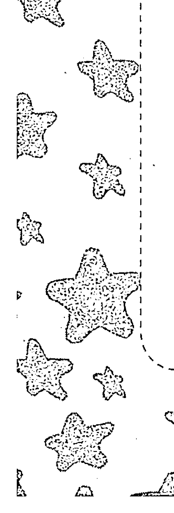

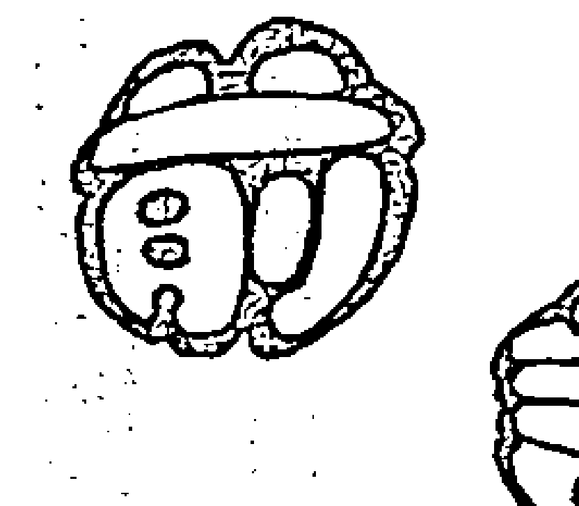

对于血型与星座，人们有两种截然不同的态度：一种是极度痴迷；另一种是嗤之以鼻。也许你会奇怪，为什么他言必谈血型与星座，着装、饮食、出行参照星座血型书，甚至连升学、升迁、择偶也以星座血型书的标准为标准？又为什么他对血型与星座不屑一顾，甚至大加批判？一种事物引起人们的喜欢和厌恶的感情达到极端时，这种事物就具备了被探究的价值。目前血型与星座已经成为许多专业人士和业余爱好研究者极为感兴趣的话题。那么星座、血型究竟是什么，它们之间有什么关系呢？研究星座与血型有科学道理吗？带着一系列的疑问，我们开启了星座与血型书阅读之旅，本书将带您了解“AB型人”的奥秘。

许多年轻人在选择书籍时，会顺手翻翻市面上畅销的血型或星座书，然后找到自己的血型和星座去看，结果多会发现书中所说的性格行为等和自己简直一模一样，甚至连自己没有觉察到的性格特质都被作者说出来了。如果顺便再翻翻自己朋友的血型与星座，发现也是八九不离十。于是年轻人对血型与星座的兴趣就逐渐产生了，这就是血型与星座的独特魅力。

每个人都有自己与生俱来的不会更改的血型，血型中有一种遗传物质按照遗传规律遗传给后代。日本血型研究学者古川竹二先生对1245名对象进行研究认为，血型决定一个人的性格气质。虽然这个观点遭到一些人的反驳，但有一点是肯定的，血型影响着人的性格与气质。同一血型的人非常多，性格也各不相同，但他们身上有许多相似的地方。

通常可以从四种血型判断人的性格气质，即知道一个人的血型，脑海中对他的个性就会有大体的印象；但反过来通过一个人的性格气质去判断他的血型，是行不通的。如一个人性格十分暴躁、容易动怒，我们可以猜测他是O型人的可能性要大一些，但是他也可能是其他三种血型中的一种，因为每类血型的人中都会有脾气暴躁的人出现。因此，从血型推断一个人的性格有一定的科学道理，但从性格推断血型就推不回来了。了解了这一点，读者就可以避免陷入血型主义的泥沼里，做出荒谬的事情。

以日本学者研究为代表的血型研究理论不仅在血型与性格上有比较深入的研究，且现在已经将血型研究的对象推广到国家、民族、企业与集团及社会生活、科技发展等各个范畴和领域，对现实有重要的指导意义。星座虽然是比较粗线条的理论，但是将血型与星座搭配起来，缩小研究的范畴，对了解同一血型不同星座人的性格又具有十分重大的意义。

AB型是四大血型中最晚出现的血型，是人类大迁徙时代的产物。人类从亚洲向西欧迁徙时，在西欧的东部地区出现了这一血型的人，如德国和奥地利等地。这些地方开始出现特殊的AB血型。为什么说AB血型特殊呢？因为根据遗传定律，如果夫妻双方为A型或B型，且都为显性，那么他们的后代一定是A型或者 B 型，很少出现混合的情况。

AB 型是 A 型和 B 型的混合，所以 AB 型人的个性十分矛盾，令人难以捉摸。他们有时很温柔平静，有时却很暴躁难耐，是矛盾的结合体，但这正是 AB 型人的独特魅力所在，也是他们在其他人眼中的神秘之处。AB 型人表面心思细腻，实际上作风大胆，常常做出令人刮目相看的惊人事实。如比尔·盖茨和巴菲特都是 AB 型人。那么，这类血型的人是天生的理财专家吗？与 AB 型人有过密切接触的人可能深有体会，你常常会觉得很难掌控 AB 型人的心理，而与他们进行异性交往的人肯定也煞费苦心。那么，如何应对变幻莫测的 AB 型上级，如何与深沉内敛的 AB 型恋人相处，如何教育冷静早熟的 AB 型孩子，你都可以在本书中找到答案。

本书是一本提供给 AB 型人或关心 AB 型人的血型与星座说明书，书中详细分析了 AB 型人的性格特征以及其关心的一系列问题，如 AB 型人怎样与人交际，AB 型人怎样玩转职场，AB 型人在健康养生方面应注意什么问题等，在书中都一一做出了解答。同时本书还把 AB 型与星座排列组合，更为细致地剖析不同星座的 AB 型人的性格特征、人生运势、职场命运、恋爱攻略、财富密码和健康驿站等，让 AB 型人更加了解自己，并向大家说清楚自己；让关心 AB 型人的人读懂 AB 型人，与 AB 型人和谐共处。

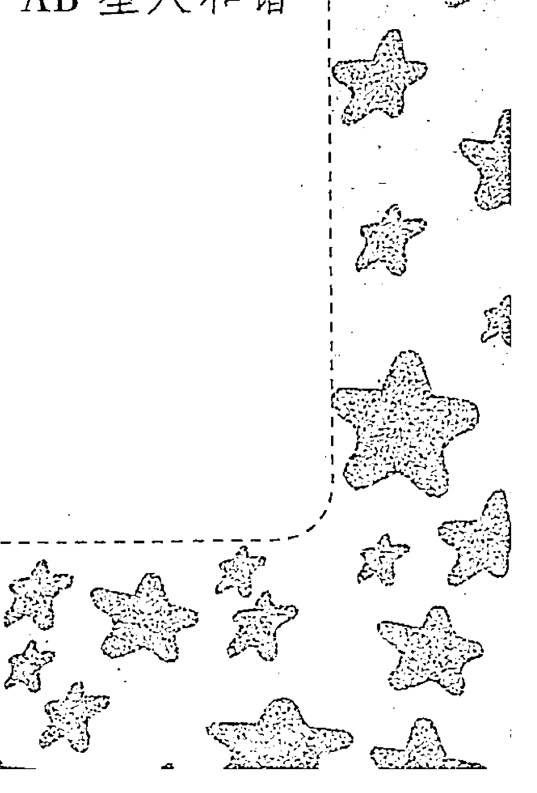

# 第一章 AB型概述

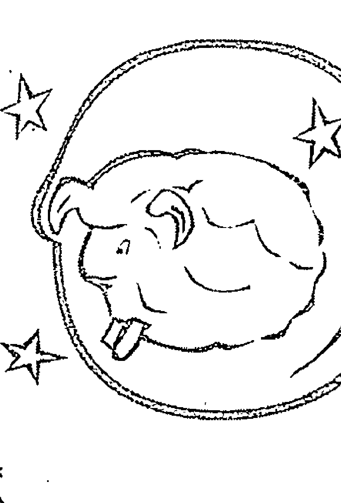

## 第一节 血型的起源与发展

血型的概念源自医学。血型被发现依赖于医学的进步，尤其是手术的兴起。人们发现输血可以挽救生命，同时也出现了新的问题，有的人输血能够存活，有的人输血反而加速了死亡。因此人们开始注意到虽然同是血液，但也存在着差别。

血型的确定是在 20 世纪初。1901 年，奥地利威恩大学的一名年轻助手卡尔·兰德施泰，读到一篇关于血球的论文后（英国病理学者谢塔克在伦敦病理学会上作的题目为《肺炎患者的血球和血清混合后的血球凝聚》的论文），产生了浓厚的兴趣，于是他在实验室中做了一个看似重复却意义重大的实验——将从22个人身上抽取血液分离出的血球与血清分别进行排列组合。在实验的过程中，他发现有些血液之间会产生凝血块（输血过程中发生红细胞凝集现象是一个危险的信号），而有些却不会，并且这种凝集现象不是由于病症引起的，而是一种正常的生理现象。

于是卡尔·兰德施泰对实验的数据进行整理，把这22个人的血型归类为A、B、C三类血型，C型即我们现在所称的O型。第二年，他的两位同事——泰卡斯特和斯塔利在其研究基础上发现了AB型，到此形成了完整的血型系统。

由于血型最开始的研究出现在医学范畴，所以人文血型的研究一直处于不被重视的阶段，直到20世纪，人们才开始重新审视血型在人文领域的影响。其中比较早进行研究的是日本人，但因为环境等条件的制约，他们的研究结果无法被科学所论证，所以没有得到广泛的认识和重视。

后来，日本一些研究人员开始对血型和性格之间的关系进行研究，取得了重大的进展。同时也使血型的概念蔓延到学术界，让很多人对血型产生了浓厚的兴趣，甚至为此着迷。

日本血型理论研究家对血型的研究不仅仅局限于性格，还把眼光抛向了社会，研究血型与国家、民族等诸多领域的关系，其中一些研究数据对后来的研究具有重要的意义。人们逐渐发现，日常生活中的一些问题可以归结为血型逻辑，这个观点不断地被实验和论证，使血型的概念更加融入到社会生活。

自此，血型开始逐渐融入到人们的社会生活中，它既可以运用到国际关系的领域，也可以运用到婚姻和家庭。血型分析可以在各种领域被适用，其理论随着实践的不断前进，逐渐成为生活中不可或缺的一部分；其发展和研究将向着科学化、专业化的方向发展。

## 第二节 血型与性格，你相信吗

血型与性格的研究已经进行了很多年，在亚洲尤其是在日本和韩国，“血型性格论”深入人心，人们经常拿血型来衡量工作和恋爱。但是不少严肃的日本心理学家研究过血型和性格的关系，发现两者并没有关联，或者有微弱的关联，或者被认为是因为受试者由于受血型影响导致的自我实现，即由于相信自己所属的血型应该有什么样的性格，不知不觉地以这样的标准要求自己。

韩国心理学教授孙荣宇和研究员刘圣益撰写的《血型类型学研究概况》中写道：A 型血的人较内向，但是他们的逻辑性较强；相对而言 O 型血的人则突出为外向性格；B 型血的人理性居高；而 AB 型血的人则没有什么突出的特点。

虽然由血型来判断性格未得到科学性的验证，但韩国的记者们已经开始运用了。他们分析前总统金大中慎重、追求完美和诚实，属于典型的 A 型血性格；另一位前总统卢武铉社交能力强、性格开朗和有较强的目标性，应该属于 O 型血性格。

韩国影视界也掀起了血型潮，如电影《我的 B 型血男友》纵横银幕，演绎了一段与血型有关的爱情故事。该片男主人公迎彬（李东健饰）是个对爱情十分随意、玩世不恭的 B 型血男人，他任性、自私、风趣和大大咧咧，很受异性欢迎。而女主人公夏美（韩智慧饰）是个 A 型血女孩，温柔、善解人意、内敛，但是错过了很多认识优秀男性的机会。一天，夏美巧遇迎彬，于是开始了一段自私任性的 B 型血男友和胆小羞涩的 A 型血女友的恋爱经历。该片反映出血型已成为人们择偶的标准之一。韩国某网站调查发现近一半的女性表示，她们不会嫁给B型血的男人，因为B型血男人被认为是约会的最差对象，这大约是由于B型人的任性而为让女性没有安全感。

虽然血型是由西方人发现的，但是却很少有西方人注意血型与性格的联系，他们很少关心自己的血型，除非是在输血等方面。

事实上，西方科学家也曾做过类似的研究，对人群做抽样测试，得出B型血是最温顺的一类人，可是当发表结论遭到质疑后，他们拒绝提供自己的原始数据进行核查，最后自己推翻了自己的研究结论。自此，西方鲜少有人研究血型与性格的关系，血型研究在西方也没有流行起来。

如果血型能够决定性格，那么说明性格也是由于先天遗传的，因为血型是由遗传决定的。但科学研究发现，人的性格并不能全部来自遗传，很多与后天的环境有关系，如一对同卵双胞胎在不同环境下成长，虽为同一血型但性格却可能有很大的差别。

但是我们不能否定血型与性格的关系，从血型入手来研究人类的性格，也是研究人文科学的重要组成部分。

## 第三节 日本人迷信“血型说”

### 一、日本“迷信风潮”，血型决定一切

近年来，在日本掀起了前所未有的疯狂的血型迷信潮。血型，俨然成了现代日本人的流行通行证。

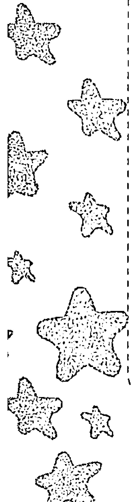

血型书受到追捧，销量惊人。2008年，在日本十大畅销书中，关于血型的书就占了4种。它们一上市就备受青睐，在不到两个月内，销量就超过了500万册。

血型影响日常交往和就业。工厂、公司录用员工，都会事先了解应聘者的血型，血型相合才能被录用；婚介公司为征婚人安排交往对象，也是以血型的匹配度为依据的，他们坚信，匹配度高则交往成功的概率高，婚后也才能幸福；同一血型的人总是有着他们的共性，所以，为了方便照看，幼儿园的小朋友都按血型分组；不但如此，女子棒球队的训练方案，也是根据队员的血型单独制定的。

不仅如此，血型的影响甚至渗透到了政党竞选、商业招标等重大活动中。据说，日本前首相麻生太郎在竞选中，为了打败政治对手、民主党党首小泽一郎，竟然在其个人官方网站上公开标明了自己的血型，血型的影响力由此可见一斑。

血型更是现代日本年轻人爱情的流行通行证。他们毫不置疑地认为，流淌在他们血管中的血液，不仅能够决定他们能否更好地把握生活、赚到钱、家庭幸福和事业成功，而且能决定他们的爱情和婚姻。不信，你可以看看下面的故事。

### 二、只嫁 AB 型

20岁的美智子甜美可人，追她的人排着队，然而不是他们表现太差，就是不符合她的择偶标准。不过，美智子倒不觉得惋惜，毕竟自己还年轻，有的是大把时间去挥霍和等待！

一天，美智子从电脑前抬起头来时，一张面孔势不可当地闯了进来。美智子定睛一看，不觉有些恍惚，这是一张多么富有朝气、多么英俊的面孔啊！而且，这张面孔的主人，正柔情蜜意地注视着她。“不是吧？我是不是眼花了？”没等美智子回过神来，他已经消失得无影无踪了。

“不得了，美智子你被董事长的公子看上了耶！你瞧他刚才看你的眼神，真的是好温柔、好温柔呢！”办公室里顿时骚动起来。

“原来是董事长的公子，这怎么可能呢？”美智子暗自嘀咕道。起初，美智子并未将此事放在心上，但是很快，这位叫反町的公子哥就展开了攻势，又是送花，又是假借出差带她出外旅行……原来他早就在一次公司舞会上对她一见钟情，这次来父亲公司见习才得以有机会追求她。

接下来的日子，美智子真切地感受到了幸福的滋味，反町的温柔与细心、英俊与绅士，如一阵春风叩开了她的心扉。然而当反町含情脉脉地向她表白时，她却犹豫了。

“怎么啦？是我做得不够好吗？”反町的语气有些焦急。在他的注视下，美智子低下了头，迟疑地说道：“不，不是的，只是，你能告诉我，你是什么血型吗？”

“AB型。这有什么关系吗？”

“真的吗？”美智子有些欣喜若狂，她相信，一定是上苍把这样的男子带到我身边的！

看着前后判若两人的美智子，反町有一瞬间的纳闷，但很快就被追求成功的喜悦替代了。

多年后，一位曾经的情敌见到反町夫妇时，不无艳羡地说：“美智子只嫁AB型的，我当时就是因为这个被挡在了门外，您的运气还真不错呢！”

原来，美智子一直坚持的择偶标准竟然是：只嫁AB型！

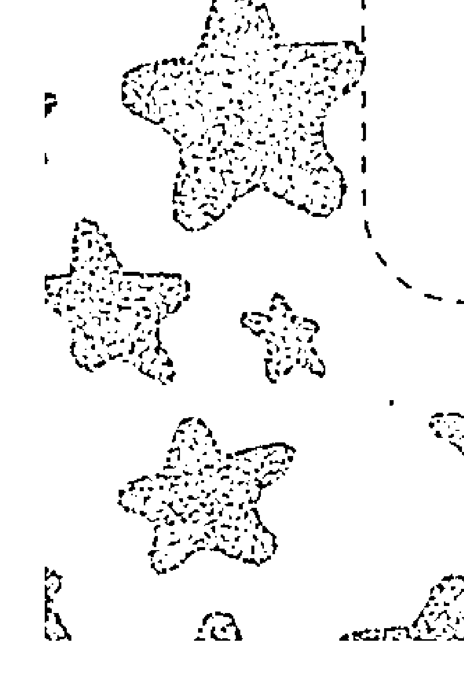

### 三、非 B 型不嫁

长得清纯靓丽的由奈美，同样拥有众多的爱慕者。然而，眼看就要步入中年的她却丝毫不动心，迟迟不肯开启她的爱之门。长辈们都看在眼里，急在心头。

其实，由奈美的情感世界也并非一片空白。她也曾有过一段美好的过往，一段若不是触动心扉她绝不肯开启的记忆。他叫川田，是一家网络公司的职员。那是三年前一个深秋的黄昏，他们在街心公园相遇了。

同样寂寞的他们相恋了，一起逛商场、游公园、泡咖啡厅、出外旅行……在他们各自的朋友看来，他们是幸福的一对，这段恋情应该有个完美的结局。精明而体贴的川田，也认为两人的爱已水到渠成，于是，他决定借着咖啡厅里缠绵的灯光，向由奈美表白自己的心迹。

“由奈美小姐，你愿意给个理由让我照顾你一生吗？”川田温柔地说道。

“川田君，我……我不能！”

“为什么？是我不值得你爱吗？是我做得不够好吗？”

“不，不是的，川田君，请你不要逼问我，我很感谢你留给我这么多值得珍藏的记忆……对不起，我先走一步！”说完，由奈美黯然地离开了咖啡厅。

对于这次求婚的结局，川田在心中设想了 N 种，但没有一种是这样的，这让川田不知所措。之后，由奈美对他避而不见，他只好去找她的好友静子小姐帮忙，然而，静子小姐的话彻底粉碎了他的幻梦。

“川田君，对于你们俩的结果，我真的很痛心。那天，当由奈美从别处打听到您的血型后，非常遗憾地向我哭诉：‘怎么川田君偏偏是 O 型呢？我可是非 B 型不嫁的啊！’在由奈美的眼中，O 型血人再怎么努力都是徒劳的，他们注定命运不济。任凭我百般劝说，她还是坚持己见，一心想要放弃。”

“毕竟她是爱过我的！”离开时，川田君默默地告诫自己要坚强，可眼前却一片模糊。他想起了那天由奈美离去的身影，落寞而忧伤……

### 四、A 型血的人没有爱情

要说优子，长得也算是美人了，可是在爱情这条路上，却走得非常辛苦。有时候，她甚至绝望地想要一个人走完这一生。

大学毕业后，优子在一家事业单位找到了一份文员工作，但不久就因为脾气暴躁被解雇了。之后，她几次出去找工作，都被告知血型不合要求。眼看半年过去了，工作还一点儿眉目都没有，她有些泄气：“难道 A 型血人就真的一无是处了吗？”尽管如此，优子还是做梦都想拥有一份自己的工作，哪怕是一份卑微的工作也行！

丢了工作的优子，在爱情上也遭遇了滑铁卢！还是在上大学那会儿，优子认识了在一家私人公司上班的木村。他长得不怎么帅，但心眼好，能够处处想着她。他们的爱情虽然没有太多的浪漫，却从不缺乏温馨感人的画面。多少个午夜，不管多困，木村都会准时给优子送去吃的，因为他知道她这会儿准饿；遇到暴风雨天气，木村也总是会提前等候在校外……为此，优子感动不已，发誓要真心对待他，与他共度一生。然而，临到谈婚论嫁的当口，木村却一反常态地要和她分手。

“为什么？这是为什么？”优子不明白。

“这些年来，你没感觉到吗？A 型血的你，脾气太暴躁了，我可不想再继续忍受下去，说不定哪天我会发疯的！”木村狠狠地掐灭了烟头，说道。

“难道因为我是 A 型血，就连与你撒撒娇和偶尔的争辩，都成我脾气暴躁、生性让人讨厌的证明吗？可是，为什么你不早跟我说，为什么还对我那么好？”优子感到难以理解，心头油然升起一股悲怆而绝望的情绪。

分手后的优子，又主动向几个小伙子发起过爱情攻势，但都是因为是 A 型血而遭回绝。

“为什么会这样？难道 A 型血的人注定没有爱情？”优子满腹的疑惑不知道该向谁去求证，只好一遍一遍地问自己。当她单薄的身影穿过黄昏的街头，没有人注意到她眼中闪烁的落寞和无奈。

## 第四节 十二星座的性格分析

### 一、白羊座（3 月 21 日~4 月 19 日）：激情四射

白羊座是黄道十二星座中的第一个星座。每年 12 月下旬，在冬天冷清的夜晚，稍微偏南的天空上，会出现一个大三角图案，看起来好像一只山羊正在往后看，那就是白羊座。白羊座的表现符号是头顶的两个羊角，所以它和战斗、竞争有关。白羊座的性格，可用“坚强”两字概括。当他们面临压力竞争会更加坚强、充满自信和不畏艰苦，虽然有时显得非常冲动，但是很少会丧失理智。

白羊座的人活力四射，是十足的行动派。他们的好奇心很强，热爱运动，喜欢大声讲话、大声笑，喜欢看戏剧片，自己想的事情很少，很容易和陌生人交朋友，对人没有防备心所以经常受骗，讲话随随便便让人讨厌；他们非常有激情，并且敢爱敢恨，直截了当。当你和白羊座的人在一起的时候，你会发现你和一个乐天派、行动派和激情派在一起。

### 二、金牛座（4月20日~5月20日）：务实稳重

金牛座是黄道十二星座中的第二个星座。每年1月份的下旬，天空的中央会出现一个形似牛体的星座，这就是金牛座。金牛座的表现符号是牛头。牛头给人沉稳、有力、慎重和顽固。金牛座的性格可以用温文尔雅、务实诚恳来概括。

金牛座的人是坚持按自己的人生原则走路的人。他们不轻易改变自己的生活习惯，在性格上的突出特点是固执己见，这同时也是他们的主要缺点。平时文质彬彬，一旦被激怒，他们会变得令人望而生畏。金牛座的人思想比较保守，但善于理财。当他们拥有十分充足的储蓄，手头非常宽裕时，才能感到轻松自在。金牛座的人家庭观念较强，他们在家庭中才能感到幸福，其理想就是过上安居乐业的生活。他们爱孩子胜过一切，把自己的所有期望都寄托在孩子身上。经济上，他们的现实感非常强，十分善于安排自己的物质和家庭生活。事业上，他们也是强者，具有天生的无懈可击的才华。

金牛座的人性格平稳、有毅力和耐力、勤劳智慧、富有实干精神。他们为人处世小心谨慎，感情真诚专一。同时他们有极其敏锐的感官，内心怀有各种欲望，向往舒适的生活环境，热爱大自然，对自然风光、花鸟虫鱼等情有独钟。但这些优点的背后还隐藏着爱猜疑、爱忧虑、忌妒、悲观失望、沉默寡言、忧郁孤僻的性格特点。他们很难改变自己的观念。此外，他们很顽固，对待事物的看法常常很极端，眼界比较狭隘。

总的来说，金牛座的人具有务实的性格，对自己的理想能够坚持下去。对待工作也有十足的耐心和勤勉，他们会利用自己的耐心和坚持去赢得最后的胜利。

### 三、双子座（5月21日~6月21日）：多面多变

双子座的人聪明伶俐，有些轻率和神经质。他们常常沉湎于令人难以理解的意念之中，只喜欢做他们感兴趣和使他们开心的事。他们对世上发生的事情无所不晓，头脑中充满着许许多多新奇的想法，但很难将其付诸实现。不是半途而废，就是被同时出现在脑海中的两个或更多个新想法弄得不知所措，进退两难。他们的想法和建议，往往会被思想比他们更实际、更富有持之以恒精神的人所采纳。不过，原则上他们总是一类开创通向成功之路的人。

双子座的人多半喜欢在事业上发挥自己的聪明才智，而不愿意用来达到物质上的利益。他们的头脑中的一闪念，常常会助于其事业上的成功。这一星座的人还有一个突出的特点，特别善于调动自己朋友的积极性。

双子座有着远远强于别人的力量和思考力，却也需要比别人花更多的时间去恢复。所以双子座是一个善良与邪恶、欢乐与忧郁、温柔与暴力兼具的复杂星座。双子座的人意志基本上都是一体两面的积极与被动、动与静、明与暗，此消彼长，共荣共存的。通常他们是个多面手，能同时处理繁杂的事情，有些则会表现出突出的两种或多种人格，这种善变的特性，常常令人难以捉摸。

## 第一章 AB星座概述

### 四、巨蟹座（6月22日~7月22日）：适宜居家

巨蟹座感情丰富、对事物的感受性强、谦恭亲和、充满母爱、重视亲情并且喜欢家庭的温暖。巨蟹座的人具有不屈不挠的意志，一旦制订计划，肯定付诸实际行动。为了私人利益，他们有时会显得很大方，应避免太过奢侈。

巨蟹座的人易有极端的情绪化表现，他们的情绪令人捉摸不透，常会突如其来地大发脾气，对别人的问话，也会随自己的心情，想回答就回答，不想就拒绝回答。心情好的时候，他们却变成最佳的听众，充分发挥体贴、心思周到的优点。

巨蟹座的人热爱事业，同时热爱家庭、珍惜友情，并重视爱人。巨蟹座的人有强大的包容心，一般不会为了一点儿琐事而介怀，具有容人的雅量，很少对人冷冰冰的，再加上其有礼貌、善交际和富幽默感之吸引人的个性及对人道主义的尊崇，会有许多朋友。实际上巨蟹座的人经常会在坚强的外表下，隐藏着一颗脆弱的内心。

他们的守护星是月亮，所以心情随着月亮的阴晴圆缺来变化。他们对别人的秘密十分感兴趣，却从不表现出来，并且对自己想要的东西具有强烈的占有欲。

### 五、狮子座（7月23日~8月22日）：唯我独尊

狮子座是十二星座中最具有贵族气息或是王者风范的气势，也是最具有权威感与支配能力的星座。他们非常独立，娴熟地运用能力和权术，善于用智慧达到自己的目的，所以更易赢得别人的尊重。

狮子座的本质有生气、乐观、光明磊落、不拘小节和心胸宽广，当然他们也有傲慢、专制和顽固的一面。他们对弱者有慈悲心及同情心，有崇高的理想，愿意为弱者和正义而战。他们精力旺盛、善于组织事务，加上他们的才华，能够为周遭的人创造平和的环境，是你身边的阿波罗战神。

狮子座的人缘不错，源自于他们对生活的热爱，对身边人的友善、体贴和慷慨，他们很容易交到朋友。但是由于喜爱被人们围绕和赞美，容易养成自大的性格。虽然狮子座看起来是强者，但是他们也有浪漫的一面。

### 六、处女座（8月23日~9月22日）：完美不止

处女座是有名的完美主义者，因为他们极具知性，对一切事物有着强烈的批判欲。他们对事物有自己独特的标准，希望别人与自己的标准看齐，所以易被称为完美主义者。他们对自己的标准要求之高，表现在生活中就是一个工作狂或者洁癖者。

他们厌恶虚伪的事情，总是怀着一颗赤子之心，对未来充满梦想。但是他们并不是白日梦者，也非常实际，处于幻想和现实的矛盾交集之中。

处女座对任何事情都有自己的完整规划，习惯对一切有掌控性，他们会很投入于自己的事业，对自己喜爱的事物抱有好奇、好学心。因为他们理性的缘故，喜欢对事物进行细致的分析，然后利用他们理性特殊的评论才能，发表自己独特、理性的看法。

处女座的人看似非常安静，这是源自于他们内向的性格，对一些事情常抱有逃避的态度，但是他们对自己看中的事情却会非常大胆，发挥其独特的才能，向自己的目标努力。

### 七、天秤座 (9月23日~10月23日): 和谐交际

天秤座是一个优雅的星座，他们天性善良，富有同情心，为人温和、善良。他们能够设身处地地为他人着想，总是使人如沐春风。他们是一个善于交际的星座，人缘和口才都不是一般的好，只要他们愿意，可以和任何人成为知己。

天秤座对美和艺术充满了鉴赏力，因此这也是一个极具创造力的星座，有优秀的理解能力；但是他们不容易专心，总是摇摆不定，容易将生活当做艺术和游戏，游走之间，虽游刃有余但是不易得到满足。

天秤座对待爱情的态度非常矛盾，没有找到真爱之前容易被认为对爱不专心，但是找到真爱后就会以爱情为唯一。天秤座在人群中常常是外向开朗派，但是有时也会多愁善感，而这并不有损他们的魅力，反倒会让其充满多面的美感。

天秤座的人多出俊男美女，即使不是，他们身上也有一种优雅的贵族气息，让人不由自主地喜欢他们。

天秤座的代表是天平，就像他们性格中具有的公平主义一样，注重公平和正义。他们是天生的理想主义和现实主义者，性格中总是充满了矛盾，总是在和平和战争的天平中相互倾斜斗争，理性和感性争斗不休。

### 八、天蝎座 (10月24日~11月21日): 神秘性感

人们对天蝎座的第一印象是神秘，因为他们在人群中总是隐藏在角落中的一群人，但是他们有敏锐的洞察力，善于感知各种信息，加上他们有强烈的第六感和准确的直觉，总是能够在第一时间对事物有正确的评价。当然这也使一部分人对天蝎充满误解，认为这种本领是种邪恶的窥视别人的举动。

天蝎座的人大多非常坚强，对自己的目标有非常准确的定位，为了达到自己的目标总是充满信心地进行努力。这些都缘于天蝎座内心的欲望，他们生来对自己的人生充满掌控，希望不断地超越自我。虽然人们经常看到天蝎座的人不断地达到自己的目标，但是很少人会发现天蝎座为此所付出的艰辛和不断接受的打击。

天蝎座虽然看起来很强大，但是他们的内心很软弱，这都是因为他们敏感的触觉，让其更容易接收到外界的声音。他们平时是个理智到极致的星座，但是当他们感性起来却是一发不可收拾的。他们表面看起来很平静、温文尔雅、沉默寡言，但内心像是一团火，这团火可以灼烧一切，在他们对待爱情和亲情时尤为明显。

天蝎座非常具有责任心和韧性，他们有自己的正义感，有属于自己的一套行为准则和方式。他们对人生充满了洞察、对世界充满了感触、对生活充满了热爱，虽有时行为较为极端，但是总体来说有一个复杂的、矛盾的性格。

### 九、射手座（11月22日~12月21日）：向往自由

射手座是一个充满阳光的星座，他们天生乐观、热情，奉行及时享乐。他们为人外向、善谈、追求潮流，喜欢新的概念，不喜欢被拘束和一成不变，讨厌束缚和压抑，他们似乎生来便是为了证明自由与不肯妥协的典型。

射手座的人缘也不错，因为他们充满了生命力，这些旺盛的生命力容易感染到他人，让周围的人都感受到他们的乐观气息。在生活中，射手座的人热爱运动和旅行，总是充满活力，精力充沛，非常的野性。但是这并不是说他们是个不思进取的人，他们有着远大的理想，任何时候都不会放弃希望和理想，不会丧失对生活的希望。

由于射手座过于自由和过分追求属于自己的生活，使得他们有时和周围显得格格不入，也使其想法显得那么的“与众不同”。

### 十、摩羯座（12月22日~1月19日）：执着冷静

就像是只走在高山绝壁的山羊一样小心谨慎、稳健踏实地度过逆境。摩羯座大多都很健壮，有惊人的毅力，责任感很强，重视名声，在领导方面有独特的才能，组织能力不错。

摩羯座的人看起来很内向，甚至在一些时候还有些木讷和孤独，这些都是其土象星座的显现。他们虽然内向，但是却会是一个优秀的领导者，因为他们对领导统御很有一套，并且自成一格，加上他们强大的组织能力，让其领导游刃有余。

摩羯座的人有过人的耐力，对于自己认准的事情，就像一头倔犟的山羊，不达到目标绝不会罢休。他们非常有责任感，但是缺乏安全感，总是用严厉的姿态来掩饰自己内心的脆弱。

摩羯座的人不是天生的聪明者，但是总是能取得成功，这与其强大的内心和坚持不懈有莫大的关系。无论在什么时候，他们总是心怀大志，生活的挫折对于他们来说就是种种磨炼，是达到成功的必经之路，他们总是能够乐观对待，最终达到成功。

摩羯座的成功不是一夕得来的，而是不断遭遇挫折，一点一滴的达成的。所以他们总是十分现实，无论是对待事业还是爱情。他们重视现实利益和物质保证，十分理智。

### 十一、水瓶座（1月20日~2月18日）：聪明善变

水瓶座常被称为天才星座，因为水瓶座的智商在十二星座中最高。他们通常十分容易掌握各种知识，对知识的理解也充满了自己的见解。他们能够未雨绸缪、思维独特、头脑聪明和富有理性，热爱追求新的事物及生活方式。

水瓶座是典型的理想主义与和平主义者，主张人人平等、不论贫富贵贱，倡导尊重个人自由。他们乐于助人、热爱生命，深信世上自有公理，具备改革的精神。他们具有极强的逻辑思维能力和优秀的推理能力，也重视科学和知识的力量，总是能在自己的领域做出卓越的贡献。他们对于自己的信念，从不放弃，并且为信念不懈努力。

水瓶座通常来说很温和，善于结交不同的人群，但他们对权贵不会阿谀奉承，有自己的行为准则。这是一个非常聪明、善变和难以捉摸的星座。

水瓶座虽然是理想主义者，但是对待爱情，他们确是不折不扣的现实主义者，十分清楚自己的爱情方向，这或者与其科学家的头脑分不开。

### 十二、双鱼座（2月19日~3月20日）：浪漫多情

双鱼座的人爱做梦，也爱幻想，总是活在一种梦想的世界中，他们的思想有时会显得不切实际。但是双鱼座绝不是那种一意只会做梦的人，他们对于一些大事绝不含糊，有一套自己的准则，这充分说明了双鱼座的矛盾性格。

双鱼座的人非常善良，有舍己助人的精神；他们温柔、敏感和多愁善感，抛开个人，他们又十分仁慈、和善、宽厚和与世无争。他们是一种多情的人，对一切充满爱，容易爱上，也容易放弃。

由于这些复杂的情绪和双鱼座与生俱来的独特气质，这个星座多产生一些伟大的艺术家，他们温柔独特的风格总是能够带给人不一样的感觉。

双鱼座的人充满着神性、魔力和善变，能够吸引到很多的目光，但是由于自身的优柔寡断和缺乏自信，使其不容易坚持下来，不强的自制力容易使他们中途放弃自己的梦想。他们身上也充满着矛盾，和双鱼座的星座象征一样，两条鱼，向着不同的方向。

## 第五节 十二星座的爱情总则

### 一、十二星座的理想情人

- 白羊座——你的理想情人是自信的人
因为你是一个充满自信的人，对所有你认可的目标都会全力以赴，所以你也需要这种自信的人，能够配合你的节奏，懦弱的人是不能满足你的要求。有领导特质、有实力、有能力和有自信的人，才能够入了你的眼，成为你的理想情人。

- 金牛座——你的理想情人是稳重的人
因为你是一个踏实的人，习惯有一个平静安定的生活环境，所以你需要的是稳重的情人，他能够让你学会平和和成熟，使你在生活中保持舒畅的心情。他能与你共享知性话题，探讨人生的哲理，指导你的人生之路，成为生活中重要的一部分。

- 双子座——你的理想情人是热情的人
你是一个兴趣广泛的人，对所有的事情都充满了兴趣；你的好奇心非常强，爱好很多，你的情人必须能够跟得上你的节拍，与你有共同的话题和相同的兴趣才能和你保持良好的沟通，热情的情人才会使你时刻保持新鲜感和热情感。

- 巨蟹座——你的理想情人是诚实的人
你十分恋家，愿意为恋人牺牲，对爱人全心全意，照顾他安慰他。因此你需要一个能够全心全意对待你的人，这样才能满足你的家庭梦想。当然，性感魅力也不可或缺，诚实还是首选。

- 狮子座——你的理想情人是出众的人
狮子座的你是一个习惯被光环围绕的人，喜欢周围钦佩的眼光。你希望你的另一半也是才貌出众、能力超群的人，这样才能够满足你的虚荣心和炫耀心，让你感到自己和另一半时刻受到众人的瞩目和羡慕。

- 处女座——你的理想情人是踏实的人
你是有名的知性派，对一切的苛刻也是出了名的，所以你不可能容忍没有智慧的人，也不能容忍不冷静不踏实的人。踏实稳重坚持的人才会赢得你的目光，他的踏实会让你感到安全感。

- 天秤座——你的理想情人是有个性的人
你的品位很高，优雅是你的生活信条，所以你需要一个眼光独特的恋人。有个性的恋人才能够满足你对生活的不满，增加你对生活新知的求知欲。那些有独特创意的恋人，个性十足才是你的最好选择。

- 天蝎座——你的理想情人是温柔的人
你是那种爱一个就会深爱一生的人，所以你需要一个忠诚的温柔的人，他能够理解你的情感，给予你足够的关怀和支持，与你共同面对生活的挑战。

恋人，一个可以温柔对待你的人，可以陪着你、和你长相厮守，可以从你的表情了解你的心意，让你能够感受到爱的温柔恋人就是你最好的选择。

- 射手座——你的理想情人是精力旺盛的人
你是一个热情洋溢的人，对生活充满了热爱，你喜爱旅行、冒险，喜欢新鲜事物，所以只有和你相匹配的恋人，才能够和你一起去冒险，去发现生活中的美丽，去感受来自恋人的幸福。

- 摩羯座——你的理想情人是乐观进取的人
你是一个老成持重的人，喜欢按部就班的生活。你对未知的事物非常谨慎，对方要了解你的性格，对你的胆怯有足够的信心，愿意满足你的情绪的乐观者才会让你开怀；努力进取的人，才会让你感受到你们之间的前途。

- 水瓶座——你的理想情人是有包容力的人
你是一个聪明的人，也希望自己的另一半也是有智慧、有能力的人。光是有能力还不够，你的另一半要能够包容你的不羁、包容你的任性、包容你的个性，让你有更广阔的发挥空间。

- 双鱼座——你的理想情人是成熟的人
你是一个纯情且爱做白日梦的人，对生活充满了好奇，对爱人也充满了憧憬。你对爱人总是死心塌地，所以你的爱人要忠心、要容忍你的摇摆不定和白日梦，成熟的爱人才能够包容你的个性。

### 二、十二星座纯情指数

- 白羊座——纯情指数 75
白羊座对每一任爱人的纯情指数都很高。白羊座喜欢一见钟情，对容貌的要求很高，当他们被吸引时，他们的爱情热情一下子被点燃。但是他们的纯情不一定能够维持很长的时间，通常可以维持在发现下一任之前。

- 金牛座——纯情指数 95
外表老实的金牛座，对爱情却是小心翼翼的，他们并不放心一下子将心全部放开，而是慢慢地把爱倾注。就像是投资，从小额慢慢地累积到一个很大的金额。慢热的金牛一旦认定自己的爱人，纯情指数就会居高不下。

- 双子座——纯情指数 50
多变的双子座并不能够长久的保持一段感情，他们像风一样，飘忽不定，对另一半的感情也是多变的。一旦另一半无法给予他们新鲜感，就会丧失对爱情的热度，重新寻找下一份恋情。

- 巨蟹座——纯情指数 95
巨蟹座能够非常长久地维持一段爱情，因为巨蟹是一个居家的星座，他们对爱情和家庭充满了责任感，愿意为爱人、家庭付出。所以，巨蟹的纯情指数非常高，但是也经常会因此而受到伤害。

- 狮子座——纯情指数 75
狮子座非常注重对方的外表和能力，只有入得了他们眼界的人才能被其接纳。狮子座的本性是追求美的，但是狮子还是非常忠诚的，他们的忠诚源自于责任感，他们会因为责任而长久地维持一段感情。

- 处女座——纯情指数 75
处女座的纯情度并没有想象中的那么高，原因是处女座天生没有安全感，所以他们迟迟不能够确定自己的恋情，他们会处处留情，使得其和很多人维持良好的关系。他们还易对旧情念念不忘。

- 天秤座——纯情指数 50
天秤座是一个优雅的星座，他们希望自己的另一半也能够如此，但是天性爱交际的他们同很多人都保持着良好的关系，自己的爱人同自己的关系大约也是比朋友近一点儿的距离。他们太专注于自我的发展和形象的保持，在某一方面使得爱人感受不到他们的纯情度，其实这也是天秤座不善于表达爱意的缘故。

- 天蝎座——纯情指数 90
天蝎座是出了名的专情者。当他们爱上一个人，就会死心塌地，往日的理智也不再见了，经常对自己催眠，忘记爱人的缺点。虽然天蝎外表冷冷的，但是对待爱人却是热情如火。他们愿意为一段感情付出一生，期待天长地久。

- 射手座——纯情指数 45
射手座和白羊座非常相像，很容易爱上，也很容易移情别恋。当他们发现自己的目标时，冲动当时的纯情指数是非常高的，一旦过了那个时间点，他们就会忘掉自己的冲动。他们的爱情持续的时间也非常短。

- 摩羯座——纯情指数 85
摩羯座很实际，他们总是把爱情同现实紧紧结合起来。在他们身上更愿意进行物质的爱情，在其看来物质的爱情更为实际，所以摩羯座的人很少随便放电，他们更希望找到同自己相匹配的爱人，长长久久地走下去。

- 水瓶座——纯情指数 50
水瓶座爱自由，生活独特，个性也是一流的奇怪，他们的对感情的态度十分洒脱，更注重精神恋爱。因此，用一般的评定标准去评定水瓶座的纯情指数非常难，他们更注重自己的内心。

- 双鱼座——纯情指数 85
双鱼座的纯情指数很高，他们很容易爱上一个人，并且愿意为爱情付出，也不怕因此而受伤。但是双鱼座很多情，他们能够同时对很多人纯情，而且也可以持续很长的时间。和双鱼座恋爱是一件危险的事情，但是也充满了浪漫，因为双鱼座的人是那种情感充沛、对生活充满感触的人。

### 三、十二星座 VS 一见钟情

- 白羊座
可以很容易在白羊身上看到“一见钟情”。因为白羊座的人是典型的“外貌协会”的，他们很容易因为外在的一些东西很快地爱上一个人，并且会积极地付诸行动。当然，白羊座的“一见钟情”会是多次的，他们很容易“喜旧厌新”。

- 金牛座
对爱情充满幻想，但是很少会出现一见钟情，因为以金牛的踏实和稳重，他们并不喜欢冲动行事，而习惯于掌控自己的生活，喜欢品味细水长流的爱情，在慢慢的累积中感受爱情的味道。

- 双子座
多变是双子的特性，他们无时无刻不在寻找新鲜感，更喜欢新鲜刺激的爱情，所以一见钟情对双子而言是大胆的尝试和有趣的经历。

- 巨蟹座
对爱情盲目的巨蟹虽然有一见钟情的冲动，但是一般不会付诸行动，他们会慢慢地守候，等待爱情，用自己的温柔去慢慢地俘获对方的心，在未来的生活中去感受长久的爱情。

- 狮子座
由于强大的魅力，会吸引到很多的追求者，很容易对自己钟情的类型一见钟情，并且敢于勇于表达自己的感情。

- 处女座
有名的“完美主义”，对感情品质要求很高，一见钟情的感性情境让他感觉很没有安全感，因此不会出现在他们的身上。

- 天秤座
总是处在抉择中，总是摇摆不定，其实对任何事物都是非常容易心动的，甜言蜜语还有温柔举动，都会让他们暂时昏了头产生好感，因此发展出一段恋情。

- 天蝎座
虽然这是一个生性多疑，不容易相信别人的星座，按照常理推断应该对一见钟情几乎绝缘，但当他们燃烧热情时，“一见钟情”就很容易，而且会更加一发不可收拾。

- 射手座
由于射手的单纯、真诚和热情，会很容易遇见心仪的对象，也就很容易发生一见钟情。当对象出现时，就会变得非常积极，让对方喜欢他。

- 摩羯座
通常来说摩羯座很老实、按部就班，不会被一见钟情所吸引，他们会按照自己的行为方式来找寻自己的爱情。

- 水瓶座
理性和聪明占据着水瓶座的感情区域，他们的感情表达并不热情开放。总是愿意对对方“审慎评估”和“分析判断”，像科学家一样严密，所以为爱冲昏头是不容易出现的。

- 双鱼座
丰富的感情和触觉使得双鱼很容易发现自己的爱情，一见钟情似乎总在上演，也很容易付出感情，但一般不会有告白的举动。

### 四、十二星座求爱秘籍

#### 1. 白羊座
- **【白羊女】** 对男友热情，爱向男友发号施令，却无论如何不受男人束缚。白羊MM个性独立，脾气刚烈，对爱情十分认真，想什么、做什么都会向男友坦白。
- **【白羊男】** 占有欲强，也有点倨傲，喜欢唯我独尊。当他们追求心仪的人时，不会因对方说“不”而罢休。但是白羊男对爱情的要求是很高的。
- **【最完美爱情配搭】** 双子座、射手座、水瓶座。
- **【求爱绝招】** 由白羊来决定去哪里，由他们决定大部分的事情，让其感觉到自己受到重视、受到保护。
- **【最浪漫约会地点】** 白羊座选择的地方。

#### 2. 金牛座
- **【牛小姐】** 很坚强、很能干，能够和伴侣同甘共苦，但不会对男人媚态相向。
- **【牛公子】** 有风度和修养，对女士很绅士。对人生有规划，生活中精打细算。但是有时过于固执。
- **【最完美爱情配搭】** 金牛座、巨蟹座、摩羯座。
- **【求爱绝招】** 跟着金牛的节奏走，跟他们分析股票、研究行情等；送礼物要讲求实用。
- **【最浪漫约会地点】** 可以探讨问题的咖啡馆。

#### 3. 双子座
- **【双子女】** 具有双重性格，经常变化，极度讨厌单调。性格外向，很合群，能够融入各种群体，思想灵活，经常有自己的独特见解，对别人的观点也很宽容。约会要经常变化约会地点，话题要经常翻新。
- **【双子男】** 花言巧语，为人风趣幽默，很会讨女生的欢心，红颜知己大把大把的。但是他们很怕负责任，总是怕伤害，对人总是忽冷忽热。爱玩，总是保持着年轻的心态。
- **【最完美爱情配搭】** 水瓶座、白羊座。
- **【求爱绝招】** 若即若离。
- **【最浪漫约会地点】** 俱乐部、健身馆、舞会。

#### 4. 巨蟹座
- **【巨蟹女】** 居家好女人，贤良淑德，非常具有母性。热爱家庭，对家庭甘愿奉献。容易轻信别人，感情受骗。
- **【巨蟹男】** 爱家又恋家的，好好丈夫的代表。他们比较害羞和慢热，但是其实很希望能够照顾你、保护你。会情绪化，要与之相忍让。
- **【最完美爱情配搭】** 摩羯座、金牛座、双鱼座。
- **【求爱绝招】** 逛家具店，讨论未来的居家生活等。
- **【最浪漫约会地点】** 家中。

#### 5. 狮子座
- **【狮公主】** 无论在什么地方总能引起大家的关注，为人热心，喜爱帮助人，有不错的审美观。爱就是爱，不爱就是不爱，对自己的爱能够主动去追求。有时也会耍公主脾气。
- **【狮王子】** 天生的领导者，走到哪里都有追随的目光。虽然他们看似专横，但是有一颗柔软的内心，对另一半的外表很挑剔。
- **【最完美爱情配搭】** 天秤座、水瓶座。
- **【求爱绝招】** 狮子女：大克拉的钻石，满足她的虚荣心；狮子男：温柔的话语，满足他的大男子心理。
- **【最浪漫约会地点】** 豪华有格调的地方。

#### 6. 处女座
- **【处女女】** 文静内向，做事一丝不苟，爱干净，害怕受伤没有安全感，并且绝对不会主动，面对竞争者会自动弃权。
- **【处女男】** 完美主义者，对生活和未来都有自己的完美规划。生活中的处女男是个斯文淡定的谦谦君子，不但长情而且有责任感。
- **【最完美爱情配搭】** 金牛座、双鱼座、巨蟹座。
- **【求爱绝招】** 让处女座感受到你的整洁和完美。
- **【最浪漫约会地点】** 有安全感的地方，如办公室。

#### 7. 天秤座
- **【天秤女】** 天性温和，看事情非常理智，习惯给人机会，很少会正面拒绝别人，也愿意把自己的关怀分给其他的人，是一个讲求公平的人。
- **【天秤男】** 很注重生活中的协调和平衡，总是很容易分辨出事物的正反两面。喜爱与人辩论，爱谈判。
- **【最完美爱情配搭】** 双子座、狮子座、天秤座。
- **【求爱绝招】** 和他（她）一起钻研法律、帮助他人。
- **【最浪漫约会地点】** 图书馆角落或者充满自由辩论气息的论坛茶会。

#### 8. 天蝎座
- **【蛇蝎美人】** 天蝎座的 MM 非常能够吸引别人的目光，即使她在人群中一言不发。眼睛非常有魅力，口冷心热，感情非常专一。
- **【蛇蝎美男】** 神秘莫测，总是很难猜透天蝎 GG 的心，他们善于隐藏自己的心情，有时给人感觉花心，但却念念不忘最爱的人。
- **【最完美爱情配搭】** 双鱼座、巨蟹座。
- **【求爱绝招】** 首先你要成为蝎子的目标，因为他们喜欢猎物自己上门的感觉。
- **【最浪漫约会地点】** 让人放松的水吧、灯光柔和的咖啡馆。

#### 9. 射手座
- **【射手女】** 活泼开朗、不拘小节；对情人非常的宽容，跟射手 MM 拍施，不用担心说错话，也不必担心忘记买情人节礼物。
- **【射手男】** 活跃好动、豪情奔放。他们很男人，但并不是大男子主义者，充满了英气但是却不是十分温柔。
- **【最完美爱情配搭】** 白羊座、水瓶座、天秤座。
- **【求爱绝招】** 陪着射手去冒险，做他（她）想做的事情。
- **【最浪漫约会地点】** 露营、音乐会等充满新奇的地方。

#### 10. 摩羯座
- **【摩羯女】** 摩羯座的 MM 外表看起来端庄成熟，内里也是一个保守并且条理分明的女孩，喜欢按部就班，不喜欢冒险，更不喜欢做有悖于普遍价值观的事情。
- **【摩羯男】** 摩羯座的 GG 一定是专一可靠、作风传统的好男人，他们对家庭充满了责任感，重视名利和别人的看法。缺点大概就是缺少浪漫吧。
- **【最完美爱情配搭】** 巨蟹座、金牛座、双鱼座。
- **【求爱绝招】** 和摩羯座一起规划未来，为将来奠定坚实的物质基础。
- **【最浪漫约会地点】** 有情调的西餐厅或者怀旧的茶馆。

#### 11. 水瓶座
- **【水瓶女】** 喜欢平等，为人博爱，心胸宽广。对恋爱的态度很开放，但是却是难以被控制的，有时让人觉得捉摸不定，没有安全感。
- **【水瓶男】** 十足的才气，灵气逼人。书生气息极浓，总是能够赢得女生的青睐。为人温和、善良，喜欢结交各种朋友，但是学不会对世俗妥协和阿谀奉承。
- **【最完美爱情配搭】** 双子座、水瓶座、双鱼座。
- **【求爱绝招】** 重视和瓶子的思想交流，能够满足瓶子互相交流的要求。
- **【最浪漫约会地点】** 专业讲座、学术交流研讨会和书店。

#### 12. 双鱼座
- **【人鱼公主】** 为人有点小迷糊，总是不在状态。喜欢做白日梦，对爱情抱有幻想，但是很容易爱多个人，非常博爱。
- **【人鱼公子】** 具有艺术气质、善解人意、乐意分担爱人的烦恼。看似简单单纯，但是也有非常理性的一面。
- **【最完美爱情配搭】** 天蝎座、双鱼座、摩羯座。
- **【求爱绝招】** 让双鱼座感受到浪漫。
- **【最浪漫约会地点】** 浪漫的海边或者烛光下。

### 五、十二星座变心时

#### 1. 白羊座
- **【白羊男】** 心不在焉，总是不在状态。没有耐心，也总是以没有时间为借口。
- **【白羊女】** 越来越挑剔，认为对方一无是处。

#### 2. 金牛座
- **【金牛男】** 分手之前会对对方更好。
- **【金牛女】** 小心隐藏，但是会不小心泄露自己的心情。

#### 3. 双子座
- **【双子男】** 有各种理由拒绝约会，拒绝见面。
- **【双子女】** 总说自己非常忙，不去约会。

#### 4. 巨蟹座
- **【巨蟹男】** 不敢面对对方，说话也没有底气。
- **【巨蟹女】** 会陷入天人交战中，梨花带雨是常事。

#### 5. 狮子座
- **【狮子男】** 出现了大额支出，但是没有告诉你原因。
- **【狮子女】** 对对方的指责变多，开始更加注重自己的形象。

#### 6. 处女座
- **【处女男】** 经常沉默，找不到话题，解不开僵局。
- **【处女女】** 很少再提起自己的标准，更很少和你去憧憬未来。

#### 7. 天秤座
- **【天秤男】** 对对方的关心少了，但是会隐藏得很好。
- **【天秤女】** 态度变得冷淡，似乎总是在忙，无暇顾及对方。

#### 8. 天蝎座
- **【天蝎男】** 很少能够让你看出他的变心，但会不再那么黏人。
- **【天蝎女】** 对你越来越冷漠，对你的一举一动不放在心上。

#### 9. 射手座
- **【射手男】** 行踪飘忽不定，寻找新的刺激游戏。
- **【射手女】** 开始频繁地拿你和别人做比较。

#### 10. 摩羯座
- **【摩羯男】** 不再重视你的感受，开始变得冷漠。
- **【摩羯女】** 开始嫌弃你的一切，金钱过少、事业不成等。

#### 11. 水瓶座
- **【水瓶男】** 花大量的时间同朋友在一起，你们之间的距离越来越大。
- **【水瓶女】** 总会明示或者暗示你回到朋友关系更适合。

#### 12. 双鱼座
- **【双鱼男】** 认了新的妹妹，总是在帮助不同的妹妹。
- **【双鱼女】** 总是恍惚，和你约会时心不在焉，偶尔还会蹦出陌生的名字。

### 六、十二星座分手绝招

#### 1. 男人篇
- 白羊座：每天唠叨他，让他感觉到无趣苦恼。
- 金牛座：送他廉价的礼物。
- 双子座：对他 24 小时用手机全球定位。
- 巨蟹座：不喜欢他的家。
- 狮子座：总是称赞其他男人的优点。
- 处女座：总是弄得很脏，让处女座洁癖发作。
- 天秤座：总是让他去做出决定，领导方向。
- 天蝎座：只要还爱着就不会分手。
- 射手座：束缚他的生活，占用他大量的时间。
- 摩羯座：在利害关系人面前揭他的短。
- 水瓶座：不准他天马行空地思考。
- 双鱼座：坚持要他理财和做规划。

#### 2. 女人篇
- 白羊座：跟她说你要一个成功男人背后的贤惠女人。
- 金牛座：忘记重要纪念日，忘记买礼物给她。
- 双子座：约束她穿衣服、说话、行为。
- 巨蟹座：跟她说你恐婚，愿意单身。
- 狮子座：有事情总是让她出头。
- 处女座：她有洁癖，你就按照不洁癖的来吧。
- 天秤座：总是忽略她的变化。
- 天蝎座：跟别的女人搞暧昧。
- 射手座：总是死气沉沉，不爱听她说话。
- 摩羯座：胸无大志就好。
- 水瓶座：不让她说话，总让她闭嘴。
- 双鱼座：不说我爱你，不浪漫。

### 七、如何让十二星座的男人爱上你

新时代的女性为了自己的幸福要大胆一点儿。喜欢他，就要表现出来。

#### 1. 白羊座
火相星座的白羊座精力充沛，很冲动，他们的爱情往往开始于性的吸引，所以对白羊座来说，要打扮得性感一点儿。白羊座尤其对女人身上的香味没有抵抗力，时不时用你的体香去诱惑他们，他们很快就会拜倒在你的石榴裙下。

#### 2. 金牛座
金牛座的男人，喜欢知性的女人，所以要表现出你的书卷气来。但是不要弄成女学生的模样，太嫩了会让稳重的金牛座犹豫是不是该下手，还是打扮得成熟一点儿为好。

#### 3. 双子座
要学会倾听双子座的话，他们的话往往话中有话。如果你能把握住他们的意思，就很容易和他们产生精神上的共鸣，如果加上几句赞美，双子座就会把你纳入考察的名单了。

#### 4. 巨蟹座
如果能烧一手好菜，先征服巨蟹座的胃就好了，实在厨艺不精的话，也没关系，赞美他的厨艺也能起到同种效果。巨蟹座比较有耐心，可以对他们多唠叨几句，他们不仅不会嫌你啰嗦，还会非常感动呢。

#### 5. 狮子座
有耐心地倾听狮子座的夸耀，哪怕是他们讲了一百次的陈年旧事。如果你还能适当地在他们情绪高涨的时候给他们点儿建议，他们会把你当做贤内助的人选。

#### 6. 处女座
耐心加细心，慢慢地打动他们。

#### 7. 天秤座
一定要拿出大嫂的风采，善待他的朋友，既要能下厨房做出一桌好菜，也要会热情地和人打招呼。如果他们要和朋友去玩、去喝酒、去打牌，一定要表示支持。

#### 8. 天蝎座
基本上只有美女能吸引天蝎座，所以一定要打扮得漂漂亮亮，为他们整容也在所不惜，而且最好不要告诉他们。保持身材、学会化妆，对他们忽冷忽热，很快就可以征服他们了。

#### 9. 射手座
千万不要在射手座的面前哭鼻子，虽然他们会很有风度地劝解你，但是下回他们就会避着你了。

#### 10. 摩羯座
要会节俭过日子，但是又不能太小气，把握好这个度，摩羯座就会给你很高的分数了。摩羯座也很爱美，所以要会打扮，但是不要用太贵的化妆品，那会让摩羯座发愁——怎么养活你。

#### 11. 水瓶座
水瓶座很在乎精神上的共鸣，要俘获他们的心，还是多了解一点儿他们的专业为好。此外，水瓶座的男子，很在意独立的空间，很害怕失去自由，所以你也要表现出很强的独立性，千万不要黏人。

#### 12. 双鱼座
双鱼座的男士，非常浪漫，每次注意调节好和他们相处时的气氛，或者拿些可爱的小礼物送给他们。同时，要表现出你善良的一面，久而久之，他们一定会爱上你的。

### 八、怎样知道心仪的男孩是否喜欢自己

你心仪的男孩子是否喜欢你？通过下面的内容可略知一二。

#### 1. 白羊座
白羊座最沉不住气，如果约会了几次还没有对你表白，不冷不热的，就不要抱什么指望了。

#### 2. 金牛座
先观察金牛座愿不愿意在你身上花钱，再留意每次和你见面的时候是不是都把皮鞋擦得锃亮，如果两个问题都是肯定的答案，多半是金牛座对你动心了。

#### 3. 双子座
双子座需要长时间的观察才能确定，因为他们特别嬗变。不过，如果和你相处的时候，一向从容的双子座微微感到紧张，那就比较肯定了。

#### 4. 巨蟹座

巨蟹座对什么人都比较体贴，如果你感到他们对自己很细心，千万不要急着下结论。人的身上只有眼睛不会撒谎，如果你发现他们偷偷看你，这事就成了八九分了。

#### 5. 狮子座

一向呼风唤雨的狮子座如果说起话来突然变得细声细气，那就是有了六七分了，你可以试着激怒他，如果他忍了下来，那就肯定是对你动心了。

#### 6. 处女座

处女座的自我保护意识很强，如果他们对你没有什么防备之心的话，那么他们可能对你动心了。这一点儿可以从平时一些细小的动作看出来，如和你谈话时的距离，一起散步时的小动作等。有点儿洁癖的处女座要是不排斥你进入他的隐私空间，那就肯定是对你认可了。

#### 7. 天秤座

这个最好让你的朋友或者兄弟去和他们接触试试，如果他们表现得比平时对别人还要热心些，那肯定是看你的面子啦。

#### 8. 天蝎座

天蝎座试试他们会不会为你吃醋，这招很管用，也很危险。所以，一定要把握好分寸，最好给自己留下清白的证据，以便日后解释误会。

#### 9. 射手座

不要以为射手座愿意和你一起玩就是喜欢上了你，这种判断方式完全不对。还是看看没有耐心的射手座在和你相处的时候是不是显得特别有耐心吧！

#### 10. 摩羯座

摩羯座很好判断，如果他们和你在一起的时候，话显得特别多，那就差不多了，如果他们唱歌给你听，那就是十拿九稳了。

#### 11. 水瓶座

水瓶座不同于摩羯座，非常难以把握。最好不要猜来猜去，还是当一回猛女，直截了当地问他们。

#### 12. 双鱼座

双鱼座的男生很羞涩，他们和你谈话的时候，面红耳赤的并非代表他们喜欢上了你。最好还是先和他们的好朋友拉好关系，从侧面打听一下吧！

# 第四章

# AB型人性格奥妙剖析

## 第一节 AB型人，你所不知道的秘密

我们会发现，AB型人在社会上从数量上看并不占优势，他们可以说是四个血型中数量最少的一族，但是其智慧却让其他血型难以企及。因为AB型人综合了A型和B型的性格特点，在他们的身上，可以找到A型的稳重和喜好孤独，也能找到B型的活泼与行动派作风。总而言之，AB型人兼容了A型和B型的性格特征，但是很容易和两者分开来。

对于AB型人的性格，可以用辩证的眼光来看待，在他们的身上显性性格只占一部分，其隐性性格可以说主导了他们性格的大部分。他们的性格弱点和优势也不能因此一概而论，要在现实中根据其生活环境详细分析。

## AB型人的典型性格：

- (1) 直觉非常准，常常第一时间把握事物要点，反应能力极强。
- (2) 非常冷静，对自己认定的事情非常执著，很少在乎别人的看法，尤其是负面评价。
- (3) 思维方式与众不同，让旁人无所适从，但能够充分利用人际关系，也容易被接受。
- (4) 更容易适应新环境，并享乐其中，同时也更善于抓住时机，特别是对自己有利的方面。
- (5) 能够非常客观地看待事物，把自己脱离为客观第三人。
- (6) 能够抓住事物的本质，辩证地看待事物的发展，不局限自己的思维。
- (7) 有独特的领导才能，但是过于独特，并不能被全盘接受。当然，他们的组织才能也不错。
- (8) 非常重视情感这方面，但是为人外冷内热，并不经常把自己的情绪表达出来。
- (9) 由于遗传的因素，智商通常很高，而且富有智慧，很少平庸。
- (10) 喜欢彰显自己的个性，喜欢与众不同，不走寻常路。对于生活的各个细节，非常讲究，绝不含糊。
- (11) 才能出众，对很多事物都有研究，加之眼光独到，总有独特的见解。
- (12) 有时很分裂，总是在各种看似矛盾的性格中游走。
- (13) 对于爱情，很少含糊，看似花心冷漠，其实非常专一。

## 第二节 AB型人之透彻解读——女性篇

AB型女性温柔可爱、情绪善变，有时很天真，有时又会有惊人之举。她们多喜欢刚强、健壮的男性。

AB型女性最缺乏野心，但求三餐温饱、生活安定便已心满意足。她们多是丈夫眼中“可爱的女人”，但是她们既任性又随便，堪称“可爱的坏女人”。

AB型妻子对物质生活要求不高，但却很在意整个家庭的布置和情调，她们往往热心于家居的装饰和色彩搭配。她们对丈夫很关心，不会因为其成功或失败而改变情意。她们对子女要求严格，但对孩子的关心和爱护则非常细心和周到。

总的来说，AB型女性的主要类型有：热心服务的活跃型、事事要求合理的正义型、可爱的坏女人型、毫无野心的知足型和对人恐惧的神经质型。

## AB型女性的魅力所在：

- (1) AB型女性对经过努力取得的东西，通常会加倍珍惜，因为她们懂得获得后的价值。AB型女性一般不会轻易爱上别人，所以一旦爱上了，她们会特别珍惜这份情感！
- (2) AB型女性尽管温柔、可人，但是也时常会有一些令人意想不到的举动。
- (3) AB型女性大多具有罗曼蒂克的内心，而缺乏罗曼蒂克的能力。所以，她们虽然比一般女人多一份理智，但也常常爱幻想。
- (4) AB型女性如少女般天真烂漫，有着自然的情趣，但有时又给人以狂野的感觉，迸发出令人难以抵挡的激情。

## 第三节 AB型人之性格解读——男性篇

AB型男性八面玲珑，擅长人际关系的调停斡旋，但对于亲情方面的关系却往往敬而远之。

AB型男性大多在社会上相当活跃，善于经营，其中有如O型般的能干型，有如A型般的认真做事类型，也有如同B型般的善于交际型。

AB型男性都喜欢和平，不愿意与人作正面冲突。一旦失去经济上的依靠，他们极易变得软弱无能、不知所措。

AB型男性习惯与人保持距离，所以他们喜欢从自己熟识的好朋友中选择恋爱对象。他们常常容易被外貌姣好、气质优雅的女性所吸引，但通常不会主动追求女性，而且他们表达感情的方式也很含蓄。

AB型男性对待婚姻很认真，因此在是否结婚的问题上，常常举棋不定。

AB型的丈夫很重视家庭，常常把整个家庭的活动安排得井井有条，是妻子很得力的帮手。他们一般很好客，但却讨厌繁文缛节。他们对子女要求比较严格。

总的来说，AB型男性的主要类型有：八面玲珑、擅长交际型，社交活跃、善于经营型，认真工作的能干型，亲切、洒脱的绅士型，极端内向的神经质型。

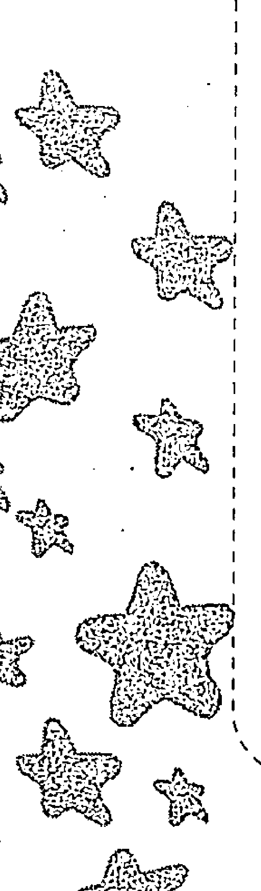

## 第四节 AB型人格弱点及对策

- (1) 尽管AB型人知识渊博，但他们仅能将一小部分付诸实践，有时明明知道全神贯注做某件事可以锻炼意志，但总是迟迟不去实行。因此，AB型人应花较长的时间来培养韧性。如做个全年的慢跑计划，相信只要能坚持下去，一定会得到预期功效。
- (2) AB型人做决断时不太受常识、伦理和人情等约束，一经决断就立即行动。因此，AB型人要注意充分利用所具有的合理性进行反省，以便杜绝或减少失败。
- (3) AB型人常常过分拘泥于合理，把握不住适当的度，因此，在行动上，AB型人需做到始终如一，保持节度。
- (4) AB型人能透彻地分析利害得失，常常会说出违心的话，做出违心的事。因此，AB型人应培养自己的真诚，学会站在对方的立场上考虑问题，否则会遭人嫌弃。
- (5) AB型人有时因为对周围的人漠不关心，极力回避给自己添麻烦，以致失去别人的信任，陷入孤立境地。因此，AB型人应有“为人所生”的思想，要有牺牲精神。
- (6) AB型人的感受多较他人敏感，因而常常会从一个极端走向另一个极端，为了控制住自己，他们时常感到精神紧张。平时，AB型人可通过发自内心地大声喊叫，将心中的烦闷发泄出去；也可以泡泡温水澡，用上等的香皂和洗发液等方法来慢慢理清心绪。

## 第五节 七点看AB型人

心灵关键字：AB型人 谈吐风趣幽默 生活丰富多彩 服务意识浓厚

经验等级：智慧指数☆☆☆☆ 法力指数☆☆☆☆☆ 受欢迎指数☆☆☆☆

AB型人，通常谈吐风趣幽默、生活丰富多彩、服务意识浓厚。

### 1. 优点

看问题比较理性，有敏锐的判断力；谈吐风趣幽默；做事有效率，能够抓住重点；能够有效地控制自己的情绪；能够正确地看待自己，不会迷失方向；兴趣广泛，生活丰富多彩；富有正义感，服务意识浓厚，有强烈的社会责任感；有企业家精神，有比较强的经营管理能力，能巧妙多元化经营。

### 2. 缺点

太看重名利，缺乏耐心，不懂礼貌，轻视礼仪，性格懦弱，不够坦率，自信心不强，阿谀奉承。

### 3. 特性

即使没把握和AB型情人这段恋情是否成熟稳当，也别刻意提出和别人讨论，以免触怒对方，且尽可能别在人前人后批评AB型者。千万别肆意在AB型情人面前大肆批评其性格的欠缺。绝对要避免把已委托AB型人的事情再转托付他人处理，且别算老账、翻旧账。

### 4. 欣赏的类型

喜欢的对象是穿着讲究、有品位、清爽、朴素典雅，可与其谈论有关学术性和艺术性的话题。

### 5. 恋爱信号

冷漠且干脆的AB型人即使直觉对方不错，也绝不会把感觉说出来，呈现的态度非常冷漠，好像漠不关心，其实当他们仔细观察你的行动时，就表示他们对你有好感了。

### 6. 财务观念

对于理财投资，AB型人会比较主观。就拿买股票来说，他们不见得相信业务人员的话，宁愿靠着自己吸收报纸书籍的知识来投资，而且可能会投资一笔令人讶异的数字。

不过，即使再怎么花钱，AB型人还是会留一笔预备金在身旁，当你听到AB型人哭穷时，说不定他们比你还有钱呢！

如果你有一位AB型的朋友，你可能会觉得他什么都要算得一清二楚，就连一同去面摊吃面，他也会分毫不差地出他该出的钱。不过，你可别认为他很计较，因为他不会占人家的便宜。

### 7. 服装偏好

喜欢色彩对比强烈的衣服。有时穿得很规矩，有时又很邋遢，很极端。选择服饰以色彩为主。

## 第六节 难以捉摸的AB型人

### 1. 少年老成

AB型的人，从小便用非常理智的眼光看待大人的世界，他们往往从小形成自己看问题的视角。虽然他们并不直接表达自己的看法，但是可以从其行动中看出：他们经常安静地待在自己的地方，不喜欢别人来打扰。同时他们身上有种不合年纪的稳重，让大人很容易对他们产生信任感。他们很会审时度势，知道什么样对自己更为有利，而且也很少做出损害自身利益的事情。

他们一般不喜欢提起自己的事情，即使两个人非常熟悉，也不喜欢说起自己过去的事情，对自己的保护欲非常强。他们更愿意谈到自己的现在，理智地看待现在。

他们和大人的距离总是保持在一个合理的范围内，并不像其他的血型能够和大人保持非常密切的距离。在他们的心里很难对别人产生信任感，总容易让自己超脱于主观的看法，把自己放在一个第三人的方向，所以他们给人看来很难接近，总是和人保持着一定的距离。他们即使和自己的父母，也只是比一般人与人之间的情感要深厚些。他们很少像其他血型孩子那样喜欢与家长或自己的亲人打打闹闹、撒娇取宠。其他血型的人容易和家人融为一体，建立互相信赖的关系，更可以成为可以互相交流情感的朋友。AB型的小孩就很难产生这样的绝对信赖，虽然他们的父母亲也能与他们建立一种非常亲密的关系，但这只是一种相对的亲密，与其他血型的完全信任相差甚多。

虽然很小，但是他们却会克制自己的感情，并不会将感情完全外露，总是平静、冷静，很少能够看到怒气冲天的AB型小孩子。他们容易受距离的影响，如果接受到的爱抚较少，他们更容易和亲人疏离，所以总给人一种冷漠的感觉。

### 2. 与生俱来的淡漠感

AB型的人感情比较冷淡，也很少去关心别人，似乎总是在自己的世界里，所以给人自顾自地冷漠的印象。他们也有活泼的时候，但是他们并非愿意坚持一种开朗的性格。相对于其他的血型，AB型人身上的生存感就非常薄弱，总是用一副随便的方式。从非常小的时候，他们就没有高高在上的样子，也不会因为自己的优秀而瞧不起别人，所谓的优势在他们眼中并不算什么。虽然他们也喜欢参与竞争，但是很少有非胜不可的思想，因此很少能见到他们怒气冲天的样子。

他们不愿意与人交谈，总让自己游离于外，就像是高高在上的监察者；他们不喜欢表达出自己的想法，但是不得不承认他们的分析和看法非常准确。

虽然更强的生命意识能够让物种繁衍得更加强盛，虽然AB型的人看起来冷漠、易避世、远离人群，但绝不是说AB型人在社会活动方面一事无成；相反，在社会各个领域活跃的人大多都是AB型人。

在爱情方面，AB型人的态度也很理智，所以总是让人捉摸不定，感到若即若离。

### 3. 参与社会活动的愿望若即若离

虽然AB型人天生与生活保持着距离，但等到他们到了一定的时期，就会产生回归社会的想法，因为他们知道如果不回到正常的社会生活中，那么是一定会被抛弃的，他们已经把现在的生活本能地划为社会之外。当他们有这个意识时，就开始了不懈的努力，由于其很高的智商和情商，总能在与人的交往中游刃有余。

因为他们的理智，不容易被感性主宰，更不容易被欲望迷惑，所以总能保持一颗清醒的头脑，在别人都为之着迷的时候，冷静地看出所存在的问题，一针见血地指出矛盾所在。不光如此，他们很会掩藏自己的内心，总是笑容温和地面对他人，总是能在他人的纠葛中斡旋调节，是一个非常好的外交家。但是当纠葛涉及到他们自身时，他们往往会迅速抽身，回到自己安全的世界里去。

# 第七章 AB型人的爱情独角戏

AB型人在爱情上是一个急性子，可以用唱独角戏来形容他们的行为。他们喜欢为自己的爱情幻想，有时还会单相思，希望爱情可以像自己的剧本中写的那样。AB型人的单相思不是盲目，更不是无法自拔的，他们也正视现在，也知道自己将要面临的结果。他们的爱情不是火，不会那么灼热，却是极光，绚烂到极致。他们希望自己是悲剧中的主人公，为爱情不顾一切地献身，越是这样的感觉，越能够满足他们的好奇心，但是慢慢地他们就会发现这不是爱情本来的样子。

AB型人总是要自食苦果，总是被遗弃、被伤害的那一类，因为有时候他们总是不愿面对现实。AB型人爱一个人的方式受他身上A型和B型的影响都很大，这让他们总是充满了矛盾，一厢情愿地做事情，得不到对方的理解。他们身上矛盾的A型与B型性格总是在不断的斗争，让他们的爱情观念也是来回变动，让对方没有信任感和安全感。

但是AB型人却是十分缺乏安全感，在爱情中，他们需要对方能够给其带来安全的一面，他们害怕因此受到伤害，他们身上利己的一面在爱情中发挥得淋漓尽致。但是他们却又无法给对方带来安全感，这又是他们矛盾的一面。

# 第二章 AB型人格剖析

拥有双重性格的AB型人重视人际关系，会非常清醒地保持人际关系中的平衡。他们很愿意让自己在人际交往中有所向披靡的感觉，并喜欢这种状态。他们对待爱情的态度不会损害到他们平时的人际关系，他们有清醒的头脑，所有的人际关系都是他们的财富，所以不会追求极端的爱情，而追求能够融入其交际生活的爱情。AB型人不是可以为爱牺牲一切的人。AB型人进入恋爱后与对方虽是平淡相处，但是最注重诚实。在这方面的优柔寡断也是AB型人的一大特色，而且他们更少有沉溺于某一事物的现象。

虽然AB型人看似对爱情并不是很在意，但是一旦两人确定关系，那么他们就会对自己的爱情忠诚，绝不会背叛自己的爱情。AB型人的恋爱关系，由于其理性的头脑，一般都是平淡的，但是却能够经得起流年考验。爱人就好像AB型的好朋友一样，这也是为什么AB型人和爱人分手了还能够成为好朋友的原因。在这样的相处关系中，AB型人不断观察对方，为对方打分。对于爱人，他们更重视一个人的人品，希望自己的爱人能够表里如一、忠贞不渝。他们希望靠现实说话，靠证据说话，而不是凭自己的直觉来面对。

## 第八节 给AB型人的建议

- (1) 不要因为别人的看法给自己贴上标签。人们通常对AB型的印象是凭着自己的主观的，可能会认为AB型人“性格分离”或者“反复无常”，不知不觉中，你也会相信自己就是这样的人，并且会用这些评论为自己的失误找理由，为自己的偷懒开脱，慢慢地你就真的会变成别人说的那种人。你要给自己信心，变成你想要成为的人，并且不要在意别人的眼光，路是要靠自己走下去的，别人的话听听就好了，那不是你。
- (2) 不要被现实所限制。保持你的美德：反抗暴力，追求公平和正义，不拘小节。这些都不必因为外部的压力而改变，它们都是你的魅力所在，是你成就梦想和实现人生价值最珍贵的财富。你不必因为外部的流言蜚语而改变，你的人生控制在自己的手中。当你发现自己不被理解时，也不必气馁，没有人能够被每个人所接受，更不会被每个人所欣赏，自由地做自己才能够让自己获得内心的满足。
- (3) 多姿多彩地生活，既然你不喜欢一板一眼的生活，就不必委屈自己在枯燥无味的程序化的岗位上浪费自己的时间。找寻属于自己的天地，把你的创造力尽情地发挥，发挥你独特的沟通能力，让工作和生活充满色彩，尽情去发展自己的个人能力。
- (4) 做有原则的人，无论怎样都坚持自己的原则。一个人难能可贵的并不是他能够做出多么大的成就，而是在人生的道路上他是否能够坚持走自己的道路。当你成长为独立的个体时，不要因为父母或者其他人的影响而去改变自己的方向，也不用因此而感到沮丧。你所亲近的人不会在乎你能够成为什么样的人，他们更在乎的是你的快乐和幸福。所以，坚持你的独立和原则，这些会让你找到自己前进的意义。
- (5) 找到自己的目标和方向。AB型人通常都有散漫的性格和与世无争的气度，当然并不能说这不是一个好的现象，但是作为一个社会个体，在社会的激烈竞争中保持这样的思想会让自己的人生发展走向一个难以预测的方向。因此，AB型的你，要给自己设定目标，知道自己将要努力的方向，知道自己将要克服的性格弱点。每个人都不是和社会脱节的，作为社会人也从来不是为自己而活，更多的是为了理想和目标而奋斗，这样才能实现自我的价值，实现人生的意义。
- (6) 什么样的目标适合你？你性格里的两个极端会让你做出格的事情，所以你要仔细想好自己的行动方向和目标。你要尽可能地具体化你的目标，这样会让你的行动更加确切，也让你每次的付出和回报都有可以衡量的标准。你的目标可能会很多，不过这样也没关系，要学会有舍有得，知道自己最想要到达的地方，闭上眼睛，听从自己内心的选择，慢慢地选择，找到最想要实现的目标，然后慢慢地去实现次要的目标。别人说的话，随便听一听，自己做决定，因为你才是自己的主宰。
- (7) 不必太过苛求自己。生命中没有那么多完美的事情，你应该去学着接受一些不完美，在不完美中发现生活的美好。你的感觉太过敏锐，过于追求完美会让你变得神经质，让你看不到生命的价值。你要学着去释放自己的情感，增加自己对他人的信任感。这个世界假若没有一个人值得相信，那么也没有一个人会相信你，所以要试着去相信别人，建立人与人的信任感，让自己轻松些。
- (8) 坚持原本的自己。这个世界纷纷扰扰的，人总是会迷失于各种各样的欲望。要试着去强大自己的内心，让自己从灵魂深处做回自己。这样你才能够不去理会世俗的眼光，不去掩饰自己的本性，让自己的生活变得轻松；你更能够不必考虑他人的反对，坚持自己的理想；你更可以因此而修炼出强大的内心，让更多的人注意到你丰富的内心，对你充满了钦佩，助你取得成就。

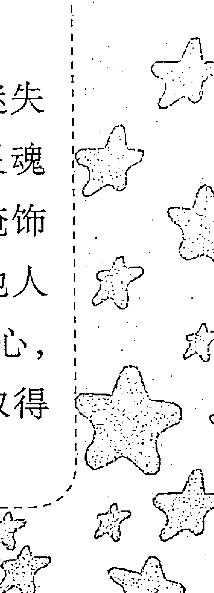

所以不必因为 AB 型复杂的性格而沮丧，每个硬币都是有两面的，你的复杂、你的多变都是你的个性所在，都是你独特的个人魅力，会聚焦更多人的目光，会为你带来更多的帮助和成就。

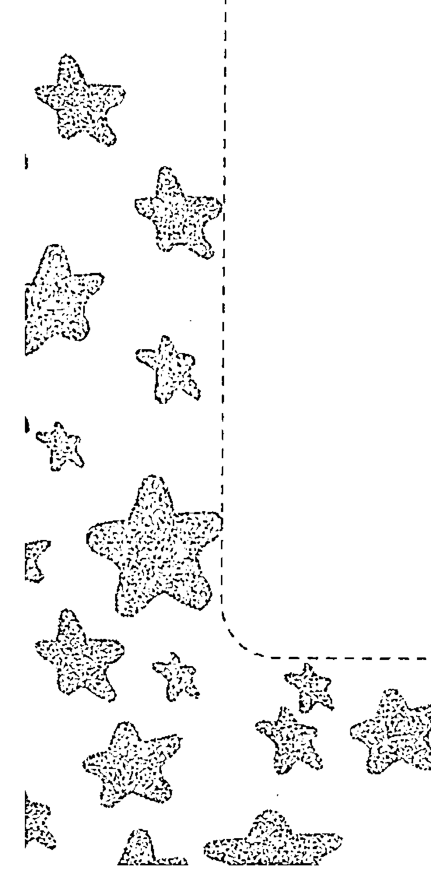

## 第四章

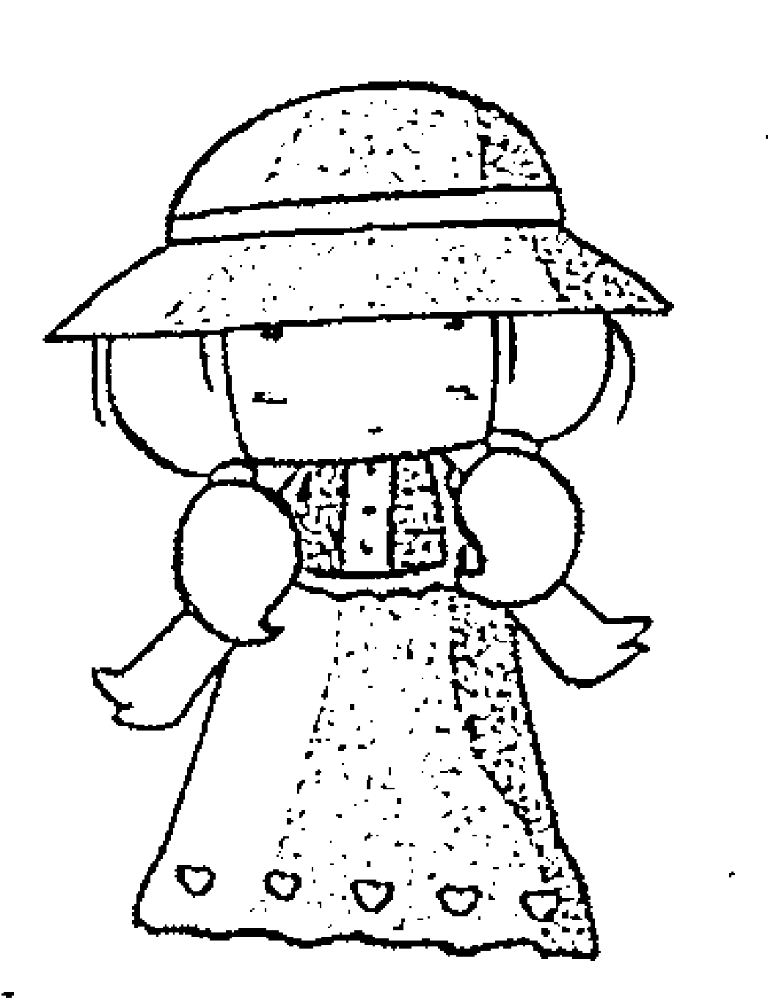

## AB型人轻松玩转职场

## 第一节 AB型人在职场中的特质

-   (1) 易自大，有时会妄想和暴躁，性格有时变得分裂。
-   (2) 善于社交，只要 AB 型人愿意，都能够和别人成为朋友。
-   (3) 对自己的期望非常高，要求自己必须要做到非常成功的地步。
-   (4) 非常能够适应现实的变化。
-   (5) 对自己的幻想非常执著，最怕幻想的破灭。
-   (6) 精于算计，很少有吃亏。
-   (7) 易和人保持着适当的距离，十分冷静。
-   (8) 容易放弃，虽然对自己抱有很高的期望，但是并不愿意竞争。
-   (9) 给人的感觉很神秘，不容易被看透。
-   (10) 事事通，涉猎的非常广，但是并不深究。
-   (11) 愿意隐藏自己的想法，别人猜不透他们是否真的喜好一件事物，而且还是一个十足的撒谎高手。
-   (12) 平时很少放纵自己，对自己的要求非常高，也非常严格。
-   (13) 有时候会过度的谦虚和看轻自己。
-   (14) 不会抢别人的风头，非常重视公平。
-   (15) 会崇拜能够给社会带来成就和希望的人，自己也暗暗想成为类似的人。
-   (16) 非常重视精神上的追求，有时显得非常的与众不同。

## 第二节 凡事追求高效率的 AB 型人

有些 AB 型人是名副其实的天才，能经常保持清醒的头脑，知道什么时间该做什么，该怎么做。由于他们具有抽丝剥茧的分析问题的能力，个性冷静，情绪沉稳，所以，做事总是有条不紊，效率极高。

在职场中，很多人都有这种感觉：每天忙忙碌碌，却总是忙而无功；感觉自己付出了很多，却还总是不能获得老板的满意；没有一刻空闲，月底总结时却说不出自己做出的成绩。如果你正处于这样的状态，这时的你就需要提高警惕了，也许你不是工作不努力，而是需要掌握正确的方法来提高工作效率。因为如今可不是讲求“慢工出细活”的时代，效率总是与工作业绩、奖金，甚至与晋升挂钩，因此需要向AB型人学习如何提高工作效率。

下面就解密他们四个提高工作效率的好方法：

### 1. 制订适宜的工作计划

在工作中，每个人都应认识到作出合理计划的重要性。为工作制订合理的目标和计划，做起事来才能有条理，时间才会变得很充足，不会扰乱自己的神志，办事效率也会很高。所以，你应当计划你的工作，在这方面花点时间是值得的。如果没有计划，你就不会成为一个工作有效率的人。工作效率的核心问题是，你对工作计划得如何，而不是你工作干得如何努力。

### 2. 将工作分类

将工作分类的原则主要有轻重缓急的原则、相关性的原则和工作属地相同的原则。轻重缓急的原则包括时间与工作两方面的内容。很多时候员工会忽略时间的要求，而只看重工作的重要性，这样的理解是片面的。相关性原则主要指不要将某一件工作孤立地看待。因为工作本身是连续的，当前的工作可能是过去某项工作的延续，或者是未来某项工作的基础。所以开始工作前，先向后看一看，再往前想一想，以避免前后矛盾造成的返工。工作属地相同的原则指将工作地点相同的工作尽量归并到一块完成，这样可以减少因为工作地点变化造成的时间浪费。这一点对于在现场工作的员工尤为重要，如果这一点处理得好，可避免在现场、自己的办公室、物资部、监理、业主及其他部门之间频繁接触。既节约了时间，又少走了路程，还提高了工作效率，何乐而不为呢？

### 3. 营造高效率的办公环境

每次办事的时候总是马马虎虎，好像需要的每一样东西都故意和自己作对，需要它们的时候总是找不到，其实这些都是办事杂乱无章，办公环境混乱造成的。要营造出高效率的办公环境，最有效的方法是将不常用的东西移出你的视线。你随便看看就会发现，办公室里很少使用的东西数量惊人，如过期的文件、废弃的信笺、从来不使用的台灯等。在伸手可及的范围内只保留那些最为常用的东西，将那些不是每天都要用的东西移出你的视线。

### 4. 立即行动不拖延

在工作中，有些员工总是喜欢把工作往后拖，把今天的事拖到明天再做。因此，很多工作因为做得不够及时而被耽误，效率也就难以得到保障。拖延是所有工作习惯中最有害的。职场中有许多人都是被这种习惯所累，造成挫败的结局，所以你应该竭力改掉拖延的习惯。要改掉拖延的不良习惯，唯一的方法就是在有工作要做时，立刻动手去做。“要做，就立刻去做”这是保持高效工作的格言。

## 第三节 AB型人与不同上司的交际攻略

AB型人非常厌恶攀附权贵和阿谀奉承，对很多现象嗤之以鼻，并且非常注重公平和自由，容易引起同事的反感。

### 一、面对A型上司

A型上司对AB型的冷静、客观和一流的判断力持赞赏的态度，更对他们不拘泥于习惯和经验非常欣赏，认为他们是非常有能力和创造才能的人。但是AB型的散漫和没有坚持力也会让A型上司感觉到他们是人才，但是不肯努力，只要努力一定能够做得非常到位。
面对A型的上司，要勇于展现自己的优点，让自己的冷静判断力发挥到极致；也要非常努力，不断地调整目标，让上司看到你的进步。

### 二、面对B型上司

AB型的平静和与世无争在B型上司的眼中就变成了冷漠，不善于团队合作，总是拘泥于自己的小天地，丰富的创造力在上司的眼中也容易变成做事情没有条理。让上司感到做事没条理，没有团队精神，更是对团队没有信任感。
因此，面对B型的上司，努力发挥自己善于交际的一面和勇于承担责任与工作的一面，学会团队协作，给予集体和上司充分的信任。

### 三、面对O型上司

AB型的能力是O型上司非常欣赏的，他们乐于接受有能力、有思想的员工，也能够看到下属的努力和进步，能够接受AB型员工天马行空的创造力。但由于AB型员工的太过不羁，他们也会有隐隐的不安，总是害怕AB型员工的能力超越自己。
所以，AB型部下要注意到不仅仅要努力工作，更要注意跟上司的交流。上司更在意的不是你的创意好不好，而是你的态度。多多沟通、多多询问上司的意见，让上司了解你在做什么才是让上司敢于放权的好办法。

### 四、面对AB型上司

能够碰到同血型的上司是一件非常难得的事情，这个概率大大小于其他血型的概率。由于相同的基础性格，所以彼此沟通起来并不存在非常大的问题，对于一些事情两人更容易达成共识。
由于 AB 型对自我的要求非常严格，那么作为下属要跟得上上司的步伐，要注意自己的态度，遵守公司的章程。要谦虚，不张扬，低调且有内涵；同时要注意自己的言行举止，充分听取上级的意见，认真执行上级的指示。

## 第四节 AB型+AB型是最佳职场搭档吗

AB 型与 AB 型的职场搭配属于“事不关己，高高挂起”的类型，因为 AB 型性格的原因，他们都不会对对方的隐私感兴趣，所以他们共事就是“相敬如宾”的模式。
正因为不感兴趣，他们不会建立起对立关系。虽然难免会在工作中遇到摩擦和利益冲突，但都会做出适当的妥协，他们不喜欢惹起事端。但他们和谐共处的状态不会给企业利益带来良性竞争，自然不会对企业产生良好的促进作用。
因此，优秀的领导者会合理利用血型的魅力，使他周围的血型人际关系更加复杂、微妙一些，让最佳血型性格搭档组合在一起，这样有利于工作的开展，也有利于企业的利益。

## 第五节 AB型人有着怎样的创业精神

有些人适合自主创业为自己打工，有些人天生就是当领导的材料。这些都属于精英人才，那么他们之间都有哪些共同点呢？

从血型角度上讲，很多大公司或知名企业的老板或者自主创业者都是 AB 型人。AB 型人具备创业性格，面对工作激进，甚至偶尔有些极端，很多工作狂人都出自这个血型，如世界首富比尔·盖茨。同时，AB 型人比较理性，遇到问题总是能理智地面对。因此，这类型的人通常具备冷静和专心的判断特质。

此外，相比较其他血型的性格而言，AB 型人在追求成功的过程中会更坚韧，也正是因为他们的坚持，才更容易让其在事业上接近成功。虽然如此，他们的缺点也很明显，往往在遇到利害冲突时，表现得太过冷静，从而给人一种冷酷无情的感觉，故在职场有不近人情之嫌。所以，AB 型人要想在创业的路上一帆风顺，还要多在人情世故上予以加强。AB 型的成功创业者一般都是“冷静型”的创业家。

## 第六节 如何与AB型同事“合作愉快”

### 一、如果你是A型人

不要在AB型人面前逞口舌之快。他们最讨厌肤浅的人，光逞口舌之快容易使其感到你的肤浅。他们并不在意你是否是个成功人士，更多的是在意你的本质是什么。

要充分表达自己的感觉，让AB型人感觉到你并不复杂，和他们直来直往更能够得到其好感。他们生来对人有隔膜感和不信任感，你的直爽更能够让他们放心，让其感到你是被他们所了解、所认知的。

把握他们的人生特色。你知道他们的性格，更容易去摸准他们的脾气，加之A型的你是一个能和任何人和睦相处的人，又是一个会关心人和良好的倾听者，所以AB型人和你合作一定会很愉快。

### 二、如果你是O型人

O型的你是一个大公无私，喜欢帮助同事的人。在你同AB型的人交往的过程中，你会给他们很多无私的帮助，他们也会欣然接受你的帮助。但是如果你对他们越来越好，不求回报，会让他对你产生怀疑。人的心理是非常微妙的，尤其是对于AB型人来说，这样的好处太多，会让他们失去安全感，失去信心，而非觉得两者之间的关系会日益密切，AB型的同事会本能地疏远这份关系。
所以，当你面对 AB 型的同事时，要善于把握同他们相处的度，不要过火，也不要过冷。而且 O 型的你要学着收起自己严肃的态度，虽然是为别人好，但是比较缓和的态度更能让对方接受。你应该使自己的心思更敏锐一些，这样有助于你去了解 AB 型同事的内心，也能够加强你们之间的交流，使你能够在工作中得到他们的协助。

### 三、如果你是 B 型人

对你而言， AB 型的同事是非常有魅力的，无论在什么场合，他们的表现都会让你感到有魅力，因此你也想更多地了解他们的想法，去倾听其声音。但是由于性格原因，你容易隐藏起自己的个性和声音，不容易和 AB 型的同事说过多的话，但会是一个好的倾听者，会赢得他们的青睐。

你经常能够从 AB 型人身上学到很多东西，这也是你为什么喜欢和 AB 型的同事讲话，因为你可以在同他们的交流中不断地学习。在这种接受与被接受的关系中，你往往会和他们保持良好的关系，会因此而得到 AB 型同事更多的照顾。

### 四、如果你是 AB 型人

由于是同样的血型，所以你们更能够了解对方的情绪，都了解对方是外冷内热的人。虽然外表像是不好相处，往往还带点清高的意思，但是其实你们都是非常好相处的人，对你们不熟悉的人往往会对你们产生误解，其实你们是可以为他们抛头颅洒热血的人，永远怀着一番赤诚。

作为同为 AB 型的同事，你们很会为集体着想，为对方着想，善于去发现对方未说出的话，给对方留有更大的空间和余地。你们能够成为非常好的朋友，能够在患难中相互帮助相互扶持。所以当你有一位 AB 型的同事时，要珍惜，因为他们能够成为你某种意义上的知己。

## 第七节 如何赢得 AB 型客户

### 一、如果你是 AB 型人

能够碰到 AB 型的客户是一件不容易的事情，小概率事件的出现也意味着是你的幸运，毕竟你非常了解他们的心理，更容易把握他们的情绪。虽然有如此的优点，但是也不能忽视对方也可能非常了解你的心理，所以你们之间的交流就像是高手的对决，不可以有一点儿投机取巧，虚假的东西一眼就会被对方看穿。

但是在生意场上，并不能因为你对 AB 型的了解而放松对客户需求的跟进。对待他们，更要把自己的耐心与细心表现出来，光是诚意还不足以构成成功获得客户的方法。同是 AB 型人，在看待问题上也会有同样的方式，也容易出现同样的固执，因此更需要去包容客户的这种固执，才能够达到满意的结果。

### 二、如果你是 A 型人

A 型的你是一个有亲和力的人，你温柔的举动能够赢得 AB 型客户的好感。AB 型人通常是外冷内热的，经常表面看起来话不多，态度一般来说也不是很好，对人总是有一种莫名的疏离感，但是 AB 型的客户还是非常喜欢 A 型亲切、自由的举动的，在频繁的接触中也会逐渐打开自己的内心。当你面对 AB 型的客户时，一定要让自己的话题吸引他们的注意，这样你才能够进一步阐述自己的产品。即使没有得到 AB 型客户的回应也不用害怕，他们并不是没有兴趣，可能是在思考，这个时候你不妨问问对方是否有什么疑问和想了解的，等待着客户发话，并给予真诚的解答，这样更容易赢得他们的好感。

### 三、如果你是 O 型人

O 型的人对于 AB 型人来说有着强烈的吸引力。同样，O 型的人也总能发现 AB 型人身上的闪光点，因此，你们的初次见面会比较和谐。AB 型的客户，会被你的理性魅力所吸引，在这种良好的氛围中进行会话，将会是一个良好的开始。你可以趁此把握机会，掌握住主动权，并且维持好现有的友好局面。

在你和 AB 型的客户交往中，你的理性虽然是他们所喜欢的，但是由于 AB 型人领悟较差，还特别坚持自己的看法，所以会让会话显得有些僵局。在这个时候你应该发挥你的耐心，让 AB 型的客户有发挥的空间，并且不要过于跟客户计较，更不要去推翻他们的观点，这样的话你的成功的几率就会非常大。因为 AB 型的人，非常不喜欢自己在争论中败下阵来，一旦败下阵来，他们会产生非常落败的情绪，让自己提不起兴致来。本来对你已经敞开的心房也会重新关闭。所以当你必须和他们争执时，不妨退一步，听听他们的意思，然后不去争论，把生意谈好达到自己的目的才是首要的。

### 四、如果你是 B 型人

你是一个面对客户可能会突然不知所措，脑袋一片空白，讲不出任何话的人。这个时候你需要的是一个缓冲期，去组织你的语言，这并不是一件有弊无利的事情。因为你的局促反倒会让 AB 型客户感觉你没有危害，会让他们本能地产生可信赖的感觉，所以你的弊端反倒可能成为你的有利条件。

所以，你在面对 AB 型客户时，要勇敢地表现出自己真诚的一面。你不需要多么华丽的辞藻，只需要将你的产品完完整整地表述出来，认真诚实地回答他们的问题，让其对你产生信赖感，那么你就会成功地赢得他们的心。

## 第八节 AB 型人的就业指南

如果单从性格来分析，AB 型人适应的工作并不多。因为他们天生似乎爱避世，天生不喜欢一板一眼，喜好自由，不喜欢被束缚，更重要的是他们对于世俗的眼光充满了不解。所以单单从性格这一方面来看，适合 AB 型的职业并不是很多。

但是 AB 型人有一个最大的特质，超强的适应能力，这也是我们能看到的。在各行各业取得成功的人数中，AB 型占了相当大的部分。因为他们能够非常快地适应环境，加上他们有意识地改变自己的态度，所以很多工作对他们来说都是小菜一碟。

无论工作的内容如何，AB 型的你要记住，做快乐的工作是会让人产生幸福感的。所以你虽然可以适合任何的工作，但是最重要的还是要找到能够发挥你的才能，给你带来成就感的工作。
一般来说你适合发挥灵感和想象力的工作，能够发挥个人能力的工作是你的首选。如广告创意、自由作家、公关和外交家等。
切忌一成不变的工作如超市收银员等。要记得发挥你的才能，不要让自己淹没在人群中，碌碌无为地过一生，既然选择踏入社会，那么就该尽量做到最好。

# 第三章 AB型人格的玩转职场

## 第一节 AB型人给人留下的第一印象

AB 型人在人群中就像是善变的一族，一般不会被人猜透他们的想法。看似冷漠，说话总带着几分小心翼翼。情感非常细腻，感触十分敏锐，让人有时难以接近。

穿着打扮别具一格，有时会不拘小节，喜欢强烈对比的打扮，喜欢与众不同，虽然可能会让人感到不是十分协调，但也有耳目一新的感觉。

对自己的要求非常严格，总是对自己有非常高的标准，对自己的能力有着非常谦虚的评价。虽然很少在人前表露自己的能力，但是会让别人对其印象非常深刻。

## 第二节 AB型人说话习惯与待人方式

AB型人说话非常小心，所以很少会伤害别人的心。加上AB型本身的与世无争，他们通常都是非常善解人意的。

他们小时候与长大后的性格经常会截然相反，很多小时候不善于表达的人到后来可能会成为优秀的演讲者或者斡旋的外交家，能够圆满地处理各种问题，非常有分寸有煽动力地表现自己的理想。

AB型人总是给人以淡漠的感觉，这是他们与生俱来的性格。他们对世事人情看得非常透彻，对人生的思考也非常早。所以，虽然他们心里有想亲近的可能，但是很少表现出来，久而久之，就变成外冷内热的性格，AB型人也渐渐习惯自己淡漠的性子，对人难以产生绝对的信任感。

虽然他们性格淡漠，但是天生有一种以天下为己任的性格。他们不会拒绝别人的请求，会最大限度地给人以帮助，但是仍然不会讲出自己的想法。他们会幻想自己是世界的救世主，希望自己像超人一样，给这个世界带来和平和幸福。因此，我们能够在各种公益社团中看到他们的身影，他们经常为公共利益和弱势群体奔走忙碌、呼吁帮助，只因为他们心中绝对的正义感和公平性。

正是由于他们身上强大的正义感，所以他们不屑于拉帮结派，不会去结党营私，对于阿谀奉承更是不屑一顾，总是坚持自己的想法。对于世俗人情，他们总是露出厌恶的表情，习惯君子之交淡如水。

虽然 AB 型人有强烈的好恶感，但是他们还是很少表现出来，会隐藏自己的情绪，对自己所厌恶的人也能够保持平静的心态。他们对于私人恩怨和公事分得十分清楚，是天生的温和主义者，绝不会因为个人原因而影响大局。

## 第三节 AB 型人如何对待朋友

一个人事业上的成功和爱情上的幸福，与其人际间关系有着非常密切的联系。而血型不同，往往会影响人际交往。那么，在实际交往中，AB 型人应该注意些什么呢？

B 型人与 AB 型人可以成为很好的朋友。他们之间有相互交谈的欲望，而且在交谈中，B 型人往往能提出具有建设性的意见，这给 AB 型人留下良好印象。

虽然，与 A 型人交往，多是 AB 型人付出得多，但是，A 型人也能给 AB 型人以无私的鼓励和帮助，帮助 AB 型人摆脱压抑情绪，充分展示自己的才华。所以，A 型人也是可以交往的对象。

AB 型人多很自负，因此，他们之间很容易相互看不起。但多数时候，他们心有灵犀，能够很好地理解对方，而且不会过分干涉，因此也不会让彼此感觉紧张。

AB 型人多半会觉得 O 型人难以沟通，但不会拒 O 型人于千里之外。在与 O 型人相处时，他们能够适时地放手，尊重 O 型人唯我独尊的“霸道”与不达目的誓不罢休的“进取精神”。

## 第四节 AB型人如何处理人际关系

### 一、AB型人与AB型人相处

你们能够相遇也是一件不易的事情。刚刚相处你们会发现非常合得来，因为同样的血型的原因，你们对彼此的性情非常了解，更能够理解彼此对问题的态度和看法，彼此颇有些惺惺相惜、相见恨晚的感觉。

经过一段时间的相处后，你们会逐渐发现彼此的缺点。其实这是在任何人与人之间的相处中都会出现的。因为对彼此的过于了解，你们很容易地发现对方的谎言和对方的闪躲等，这样会让你们似乎看到了一个充满了缺点的自己，会以对方为镜子，在对方身上看到不完美的自己。于是在这个时期，你们非常不能够接受对方，甚至会产生排斥的心理，影响你与对方的关系。

因此，AB型人之间相互的交流中要有包容心，要看到对方的优点，不要执著对方的缺陷，“金无足赤，人无完人”，发现对方的优点，包容其缺点，才会使自己真正找到知己。无论多密切的交往，都要适度，保持适合的距离；有适合的距离，才不会将缺点扩大化，才能够产生距离美。

### 二、AB型人与O型人相处

AB型的你在对待不熟悉的人时，往往被认为是好好先生（小姐），你的脾气非常的好，似乎总是笑脸待人，所以你很容易和 O 型的人建立起良好的关系。

O 型的人一见到你，就会非常喜欢你身上的感觉，你的魅力会对其产生影响，加之在后面的接触中，你的淡定、冷静、你解决问题时独特的能力，都会令 O 型人对你刮目相看。这时的你也会容忍 O 型人的自我为中心。但是当你们非常熟悉时，你的本性就会渐渐地显露出来，你的漫不经心与我行我素会让 O 型人十分受伤，他们会因为你态度的变化感到愤怒，殊不知这是你本来的性格。

在你们的交往中，一定要注意你的态度问题。如果想要做好好先生不妨把自己的好脾气保持下去，或者表里如一，让 O 型人真正了解你、理解你的行为，并尽量不与 O 型人发生利害关系，这样你们的相处就容易得多了。

### 三、AB 型人与 A 型人相处

你们之间也存在着相当大的共同性，所以很容易能够成为朋友。因为 AB 型来源于 A 型，所以 AB 型人特别喜欢 A 型的性格和处事特点，有时会表现出事事以对方为中心。

长久下来，AB 型人身上的闪光点就会被自己的态度和蔼、不偏激和性格好所掩盖，而 A 型的人恰恰是被 AB 型人身上的才气和能力所吸引。你以 A 型人为中心就会变为凡事依赖他们、没有能力、没有才气的人，这样会让 A 型人对你感到失望，感觉乏味没有吸引力，他们就变得不愿意与你接触。

要试着去发现自己的能力，充分施展自己的才华，让自己的魅力充分地表现出来。你要试着去了解他们追求现实的心理，在他们的梦想之路上给予适当的帮助，使其认可你的能力。

### 四、AB型人与B型人相处

AB型人对B型人的态度总是很随和，对B型人的神经质也会采取大而化之的态度，加之AB型人天生的冷漠和对自我事业的追求和完善，会让B型人感觉自己非常不受重视。加上你对熟悉的人的态度经常会有所变化，所以会让对方感到不理解，并且会非常惊讶。

若B型人能够接纳你的性格，和你关系十分密切，那么你们能够保持一段长久的感情；但是如果你没有改变自己的态度，B型人对于不甚熟悉的你会采取敬而远之的态度，和你保持相应的距离。

因此，在和B型人相处时，一定要学会保护他们的感情，不要去伤害他们的自尊，B型人是很容易被真诚所打动的。

## 第五节 与AB型人交谈的技巧

- 1. 要显示出你的内涵

你有知识、有能力、有分寸的谈吐会让AB型人对你产生好感。因为AB型人不能容忍低俗的人，更无法忍受不懂装懂的人。

- 2. 学会倾听

由于AB型人出色的能力和他们对自己的严格要求，他们的言谈举止中总会有许多值得你学习的地方，听他们讲话，也是你学习的一种方式。

- 3. 明白 AB 型人含蓄的表述

AB 型人比较含蓄，说话不会很直接，所以有时你要有意识地明白他们实际想表达的意思。这其实是 AB 型人比较内敛的一面，他们不喜欢让别人看出自己赤裸裸的欲望，却又想达到自己的目的。

- 4. 和 AB 型人保持适当的距离

无论是在生理上还是在心理上，AB 型人对于远距离没有感觉，太近的话又觉得害怕，适当的距离才能保持你们之间的感情。最好的方式还是 AB 型人主动来靠近你，这样的距离就是安全距离。

## 第六节 如何与 AB 型异性相处

### 一、与 AB 型异性的相处之道——如果你是 A 型人

AB 型身上散发着一种安详感的味道，他们似乎就是天生的与世无争，能够让你在纷杂中寻找到一丝安定，这就是 A 型的人对 AB 型着迷的原因。事实上，AB 型远远没有表面上看到的那么平和，其实他们也是暗里汹涌澎湃只不过表面看起来波澜不惊。

A 型男性和 AB 型女性的组合并不是一个完美的组合，A 型的男性容易忽略 AB 型女性的存在。他们往往感受不到女生的心中所想，也没有足够的耐心对待她们，使 AB 型女性没有存在感。其实，AB 型女性是很好的对象，如果 A 型的男性想找到理想的伴侣，那么不妨温柔耐心地倾听 AB 型女性的真实想法。

A 型女性对 AB 型男性表现出温柔的一面。AB 型的男性不喜欢自己受到批评，也不喜欢遭到质疑。即使是有益的劝告，也要以温柔的言语去打动他们，而不是一味地发牢骚，不在乎 AB 型男性的感受。

#### 【和 AB 型异性恋爱攻略】

AB 型人想象力丰富、开朗，具有正义感，故很容易得到 A 型人的好感。但真正建立亲密关系后，A 型人发觉 AB 型人似乎对自己没有诚意，经常说一套做一套，拿自己当“猴”耍。

其实，并不是他们没有诚意，只是他们习惯修改自己的逻辑。AB 型人的观察能力很强，当你还未感觉到客观变化时他们已经感觉到了，所以做了修改。例如，当你们说好去看一场电影时，AB 型人却临时变卦，放你鸽子。你追问为什么时，他会说：“当时是这么想的，可是现在变了。”这种情况还算好的，有时候 AB 型人根本不给你解释，早就消失得无影无踪。即使这样，你也不用担心，也许某个时候他又会突然出现在你身边，就像突然离开你一样。

#### 【对策】

对 AB 型恋人要有耐心，不怕他反反复复，经常爽约。要知道，他们不出现一定有理由。如果过于猜忌，以为对方不喜欢自己，不重视自己，那么恋情就有危险了。

### 二、与 AB 型异性的相处之道——如果你是 B 型人

这两类人在现实生活中容易成为夫妻或者情侣，但是更适合做普通朋友，因为两者的信任感很难建立起来。

B 型的男性经常被 AB 型女性的魅力所倾倒，她们散发着一种与生俱来的异性魅力，使 B 型的男子情不自禁地陷入。B 型的男性还会发现 AB 型的女性身上与他有着太多的相同之处，所以总是深陷感情。如果处理不得当，会遭到对方的拒绝。真诚地表现自己，让对方看到自己可信赖的一面就能缓解对方缺乏的安全感，使局面有转换的余地。

B型女性总能发现AB型男性身上存在的不和谐因素，如表面看起来非常的淡然，但实际上猜忌心很重、比较固执，这些都是B型女生所不能忍受的。因此两个人的交往最好保持一颗平常心，不一定非要以情侣为目标，这样B型女性更容易发现AB型男性身上的优点。AB型的男性也应该加强自己的反应灵敏度，同时修养自己的品行，让自己的言行一致，这样更容易打动B型女性的心。

> 【和AB型异性恋爱攻略】AB型人喜欢考虑他人的感受，B型男能理解对方的想法，从这点来看，AB型人和B型人是很合拍的一对情侣。他们的爱情是轻松、愉快的。
但是，AB型人怀疑、依赖的个性，让爱无拘无束的B型人感到头疼，仿佛掉进痛苦的深渊。AB型人在B型人眼中，俨然成了“怨妇（夫）”。

> 【对策】对AB型人要包容一切，不怕他什么都依赖着你，这其实是他爱你的表现。如果你爱他就包容他的一切，从生活习惯到脾气性格，这样你们的恋爱会更甜蜜。

### 三、与AB型异性的相处之道——如果你是AB型人

两个人非常能够了解对方，由于其性格特征，都是表面看起来无欲无求，其实内心躁动不安的人。刚刚接触时会有局促感，但是相互接触后会发现很容易沟通，对于彼此的思想也会有较深的感触。所以，两个人的相处不会有大的问题。

但是要注意，因为是同样的血型，也容易出现同样的缺点。如果不能理解和包容对方的性格，那么两个人的相处迟早会出现问题。当能够意识到虽有相通之处，但是仍有不同的时候，能够体谅对方，各退一步，那么两人的相处就会相对持久。

无论是男女，相处时一定要本着诚实的原则，不要自夸和吹嘘，以对方对你的了解，一眼就能看出你的小动作。保持本性，平和诚实的和对方相处，坦诚以待，这样两个同为AB型人才能够保持较为长久的情谊。

### 【和AB型异性恋爱攻略】

AB型人疑心较重，当两个AB型人谈恋爱时，起初有戒备心。他们会通过很多试探来了解对方是否爱自己，为什么爱自己。一次次的试探会令彼此感到不满和厌倦，但一旦度过试探期，感情依旧稳定，他们会认为对方是诚恳和可信赖的，就会全心全意地投入这段感情，会有浪漫、甜蜜的爱情生活。

AB型人具有依赖性，他们喜欢依赖别人，但不喜欢被别人依赖。如果两个AB型人在一起，一方一味地接受对方对他的依赖，会让他感到疲惫；而一味地让对方接受他的依赖，对方也会感到精疲力竭。终究，这份感情会像风雨中的小船，摇摆不定。

#### 【对策】

以一颗真诚的心对待恋人，不隐瞒、不撒谎、不试探，一心一意与他（她）相处，就会得到对方的真心相待。有时候，试探会让真心爱你的人远离你，真诚才会抓牢对方的心。

依赖是影响AB型恋人的最大隐患，如何平衡相互依赖关系，对他们来说非常重要。有人提议要他们分别独立，其实很不现实。两个人之所以走在一起，就是在人生的道路上相互扶持，相伴到老。只要AB型恋人把好“度”，不过分依赖，就能维持好这段感情。例如，偶尔独立应付工作，偶尔独立做出决定，偶尔独立和朋友聚会等。

### 四、与 AB 型异性的相处之道——如果你是 O 型人

在 O 型的男性眼中，AB 型的女性是非常具有女性化魅力的，他们喜欢这种类型的女生。但在与 AB 型女性的交往过程中，他们往往表现出的是自己消极的一面，而非男性化的一面，这样虽然 AB 型女性认为 O 型男性比较值得交心，但无法成为情侣，因为得不到安全感。因此，O 型男性一定要注意给对方展现自己自信魅力的一面。

O 型女性认为 AB 型男性是温柔、体贴又细腻并且适合长期交往的对象，他们非常欣赏 AB 型男性自然流露出的细腻的一面。当然，她们也不希望 AB 型男性表现得过于女性化，这样会让本来不是很女性化的 O 型感到不屑。AB 型男性不妨坦诚以待，真实地展现自己的一面，不必虚伪以待。

#### 【和 AB 型异性恋爱攻略】

恋爱初期，AB 型人在 O 型人眼中是个完美的人，但相处时间一长，O 型人发现，AB 型人并没有想象中那么完美，他们情绪化严重，多疑。
之所以出现这种情况，是因为 O 型人与 AB 型人有很大的个性差异。O 型人易冲动，AB 型人冷静理性。O 型人坦率，喜欢有话直说；AB 型人却喜欢拐弯抹角，压抑自己的情感。更主要的是，O 型人的粗心大意常会伤害内心敏感的 AB 型人，使他们缺少安全感。

#### 【对策】

O 型人要尽量仔细周到一些，照顾 AB 型人的感受，给他们安全感。用自己的热情、自信接纳和宽容他们压抑、多疑的个性，用乐观去感染他们，而不是进行冷战。

# 第五章 AB型人养生大揭秘

## 第一节 AB型人有着怎样的体质特征

从整体情况来看，因为AB型人不能承受睡眠不足，所以体质较弱。大概由于AB型人爱思考，他们比其他血型更容易感觉到身心疲惫，需要大量的睡眠来补充精力。如果睡眠不足，则会影响他们一天的工作效率。

AB型人性格内敛、稳重，谈吐得体，说话能掌握分寸。AB型人谈话时表情很丰富，擅长通过五官表达自己的喜怒哀乐的情绪，尤其是浓黑眉毛下那双机灵的眼睛，时常透露出AB型人既理性又温和的一面。但和A型、B型人一样，AB型人在交谈时，很少有手势等肢体动作。AB型人的协调能力强，这让他们能够在足球、排球等需要协作又需要个人表现的项目上充分发挥自己的能力。又因为他们平衡力强、反应敏捷，兼具A型人和B型人在体质上的优点，所以常常在体操、乒乓球等体育项目上也会获得卓越的成绩。AB型人若拥有良好的生活习惯、优质的睡眠，再加上合理的饮食调剂，他们的体形大多会圆润、丰满。

AB型人在健康方面而言，较易患缺铁性心脏病。要注意内分泌系统、呼吸系统和腹部等疾病。易患精神分裂症，有遗传倾向。很少患结核病和妊娠贫血。

## 第二节 AB型人如何减轻身心压力

AB型人不喜欢轻易暴露自己的内心世界，所以很容易集聚压力。尽管他们的抗压能力比一般人强，可是因为其情绪比较难以释放，一旦压力出现，就会做出让人意想不到的举动来。

AB型既有比O型更冷静的一面，也有随心所欲、喜怒无常的一面，其性格的双重性，使得其在情绪上也表现为两面性。他们有两条情绪曲线，一条如B型，既无明显起伏，又无明显的极限点；另一条则杂乱无章，会随时间和场所自由变化，令人捉摸不定。

下面是一些缓解压力的方法:

生活中，我们可能会产生程度不同的压力，如果压力长期积聚在心中，就会影响脑的功能或引起身心疾病。因而，要及时排解和宣泄情绪，但宣泄应该合理。当有怒气的时候，一不要把怒气压在心里，生闷气；二不要把怒气发泄在别人身上，迁怒于人，找替罪羊；三不要把怒气发泄在自己身上，如自己打自己耳光、自己咒骂自己，甚至选择自杀的方法当做自我惩罚；四不要大叫、大闹、摔东西，以很强烈的方式把怒气发泄出去。因为上述所有做法不但于事无补，反而会使问题进一步恶化，给自己带来更大的伤害。

所以很多时候，只要找到有效的途径缓解压力，心情就会感到舒畅。当你感到有压力的时候，不妨试试以下九种方法：

- 第一，要建立自己的“支持网络”。不论任何时候，家人和朋友都是帮你缓解压力的最坚强的后盾和最牢靠的庇护伞。朋友们发自内心的关心和问候会让你觉得在这个世界上，不管发生了什么事，你都不孤独。所以，平时建立一个自己的“支持网络”系统很重要，当你面临压力的时候，就不必独自烦恼了。

- 第二，多做运动。如果你喜欢运动，可以在压力巨大时拼命跑步，使劲打球，或者打沙袋——把给你施加压力的事物想象成沙袋。

- 第三，听音乐。感到压力时，可以听听让人愉快的音乐，音乐会把你带入另一个时空，然后，你会发现让你不快的事情可能已经没有那么严重了。你也可以到歌厅里去吼几嗓子，不管有多大的压力，它都会随着你的歌声冲上云霄。

- 第四，疯狂“书写”。把不满情绪尽情地写出来，想怎么说就怎么说，怎么解气怎么骂，可是写完后，要一把火烧掉。你会发现你的气也化作云烟了。

- 第五，哭泣也是一种释放压力的方式，当过度痛苦和悲伤时，放声痛哭比强忍眼泪要好。

- 第六，不要拿自己的错误来惩罚别人。有些人当自己受到冤枉或不公正待遇后，也冤枉别人或不公正地对待别人。事实上，当你伤害别人时，自己会再次受到伤害。

- 第七，不要拿自己的错误来惩罚自己。何谓好人？如果交给他做 10 件事，他能做对 7~8 件，他就是好人。显然，这句话潜藏着另外一层含意，就是好人也会做错事，好人也会犯错误。因此，好人做错了事，一点儿都不要紧，犯了再大的错误也不要紧，只要认真地找出原因，认真地吸取教训，改了就好。

- 第八，多吃一些抗压食物。研究发现，含较多 B 族维生素的食物可以使人精神亢奋，如糙米、燕麦、全麦、瘦猪肉、牛奶、蔬菜等。含硒较多的食物可以增强你的抗压能力，如大蒜、洋葱、海鲜类、全谷类食物等。

- 第九，每天补充一粒维生素 C。维生素 C 能够有效消除压力，现代人绝不可忽视这个减压的好方法。

## 第三节 AB型人在健康方面容易出什么问题

AB 型人比较敏感，因为身体血液中包含着两种相对的抗原，所以在易患病症的危险上，表现出复杂性。

### 1. AB 型人易感染呼吸道疾病

AB 型人极易感染急、慢性呼吸道疾病，要想降低感染率，在饮食上最好注意以下几点：

- （1）宜多食高热量、高蛋白和维生素含量丰富的食物，如牛奶、海鱼、某些新鲜水果等。
- (2) 最好忌烟酒，因为烟酒对呼吸道刺激非常大。
- (3) 尽量少吃辛辣刺激性食物，如辣椒、生姜、洋葱、韭菜等。
- (4) 如果有哮喘迹象，应避免进食生冷、咸寒、油腻食物，如梨、荸荠、生菜及海味等。
- (5) 感染过敏性哮喘后，应忌食鱼、虾、牛肉、牛奶、鸡蛋、公鸡肉、蜂蜜、巧克力、羊肉等食物，以免诱发疾病。

### 2. AB型人患高血压的概率明显高于其他血型

为预防高血压发生，AB型人应注意以下六点：

- (1) 控制食盐的摄入量，每天最好少于6克，以降低血液黏稠度。
- (2) 减少膳食脂肪的摄入量。脂肪是造成血流变慢的重要原因。
- (3) 多进食蛋白质、纤维素食物，多吃蔬菜和水果，摄入足量钾、镁、钙。
- (4) 应戒酒或严格限制饮酒。
- (5) 要控制体重，通常体重越重，患高血压的概率越高。
- (6) 保持健康的心理状态，减少精神压力和抑郁。

### 3. AB型人易患冠心病

有人类“第一杀手”之称的冠心病也极易光顾AB型人。AB型人血液中胆固醇含量高，所以一旦心脏受损，症状多较重，发生心肌梗死、心脏性猝死的比例也明显较高。因此，饮食对于AB型人来说就显得格外重要。好在AB型人的饮食中，有很多食物，如柠檬汁、大豆及大豆制品、鱼油、亚麻籽油和核桃等，对稀释血液、降低胆固醇有非常好的效果。

此外，由于 AB 型人群个性比较冷静沉着，神经反应较敏捷，因此患精神分裂症的概率比其他血型高出 3 倍多。在缺血性心脏病的病人中，也以 AB 型人居多。AB 型的女性较易患宫颈癌。

## 第四节 AB型人养生建议食谱

AB 型为最晚出现、最稀少的血型，这类人拥有部分 A 型血和部分 B 型血的特征。他们既适应动物蛋白，也适应植物蛋白，对于饮食及环境的变化能够随机应变。但其消化系统较为敏感，每次宜少吃，但可多餐。豆腐、奶制品和很多农产品是 AB 型人养生的好选择。

AB 型人胃酸少，不易消化肉类。鸡肉、牛肉、猪肉等不适合他们，最宜于 AB 型人的肉类蛋白质是羊肉、蛋类以及鱼贝类，特别是蜗牛肉，有预防乳腺癌的作用。

AB 型人的健康食品有海产品、鸡蛋、豆腐、绿叶蔬菜、奶制品和很多农产品，尤其是豆腐，但食无妨。

AB 型人的食谱要综合 A 型人与 B 型人的特点，再配合其消化系统脆弱的体质特点，其养生食谱更为精细化。

- 一、油菜

油菜富含维生素和膳食纤维，但脂肪含量很低，常吃油菜具有清肠通便、排毒养颜和强健身体的作用，十分适合消化系统敏感的 AB 型人。

### 蒜茸油菜

【材料】油菜500克，大蒜50克。

【调料】食用油、盐各适量。

【做法】掰开油菜，逐叶洗净；将大蒜制成蒜茸；将锅放置火上，倒入食用油烧热，加蒜茸爆香，翻炒油菜；等油菜快熟时，起锅前放进适量的蒜茸、盐即可。

### 二、山药

AB型人多吃山药可以促进消化功能。因为中医认为山药性平、味甘，不甜腻不干燥，入肺经、肠经、肾经，具有除湿、健脾、补肾、益精等多种功效。

#### 山药糕

【材料】山药500克，金糕、枣泥、土豆各200克，白糖250克。

【做法】将山药、土豆洗净，去皮，蒸熟；取出凉后，再将两者合拍成泥，混合后均匀分成3份；将准备好的金糕用刀抹成泥状，掺进白糖；再用一块湿布，将3份山药土豆泥分成薄薄的3层，然后在下面两层山药土豆泥上各加一层金糕泥和枣泥，共5层；将山药糕切成小块，撒上白糖即可食用。

### 三、豆腐

豆腐富含高蛋白，含有丰富的卵磷脂、不饱和脂肪酸和多种人体必需的氨基酸。AB型人多吃豆腐可以保肝护肝，促进新陈代谢，增强免疫力。

#### 番茄豆腐羹

【材料】番茄200克，嫩豆腐150克，豌豆粒50克，食用油、鸡精、白糖、水淀粉、盐各适量。

【做法】将豆腐剁成末，放入沸水中泡1分钟，捞出沥干；将番茄、豌豆洗净，把番茄切成小块，剁碎盛好；锅放置火上，添加适量食用油烧热，放入剁碎的番茄，再加入调料鸡精、盐、白糖，将番茄炒成番茄酱后，盛出。在锅中倒入适量凉开水，加入盐、豌豆粒、豆腐末，烧沸入味，用水淀粉勾芡；再放入番茄酱调匀，最后放入鸡精调味即可起锅。

## 第五节 AB型女生美容养颜秘笈

相较于其他血型的女生来说，AB型女生的免疫系统要弱些，所以在气候稍稍有所变化的时候，更容易患感冒之类的小毛小病。鼻塞眼干喉咙痛，当然也就美不起来啦！所以，AB型的女生更需要花些心思护理肌肤！

- 要注意加强自己的保暖以及各种体育锻炼，增强自己的体质。AB型的女生，往往是各种流行性疾病首当其冲的对象，因此各种健身锻炼相当有益。
- 要注意预防感冒。对于AB型的女生来说，补充各种富含维生素的蔬菜水果非常重要，尤其是像富含维生素的橙子之类，对预防感冒非常有效哦！
- 洗脸时宜用去污力较强的香皂，以保持皮肤的干爽，使皮脂腺畅通并能正常溢出，防止毛囊炎发生。
- 寻找适合自己的护肤品。AB型的女生喜欢自然美，讨厌脸上一层又一层涂很多东西。正是因为对护肤品之类的不讲究，所以也不会乱买乱用。但是随着年龄的增长，还是需要护肤品的呵护的。你不妨尝试着买一些安全性高的无香料无酒精的天然护肤品，其使用方法也很简单，而且绝大多数药房里都有卖哦。
- 要注意避免出现失眠和熬夜的现象。AB型的女性更容易因此而产生疲劳感，也会造成脸色差等问题。

## 第六节 AB型人减肥大法

下面介绍给AB型人的三项减肥方法，供大家参考。

- AB型人要减肥，最适合吃的水果非西柚莫属，它能帮助消化，分解体内脂肪，削下来的果皮更可放入水中浸浴，真正达到由外而内的瘦身目的。
- 适合A型人的太极拳、瑜伽、气功等舒缓定神之类的运动也适合AB型人。
- AB型人也较易出现冬季单纯性肥胖，为减去多余赘肉，打造完美身材，可多做运动，如晨跑、饭后散步、站着看电视、多做家务等。

# 第六章 AB型人家庭生活小贴士

## 第一节 AB型人对待家庭的态度

AB型人比较渴望结婚，但是他们对于成立家庭并不在行，总是很难找到合适的人选结婚。越是在关键的时刻，他们越容易迷失。总是很难找到方向，如果遇人不淑的话，就会误入歧途，与自己的目的渐行渐远。

其实无论是什么样的家庭，AB型人都会很喜欢。他们并不讲究家庭的生活方式，乐于去接受一个家庭，他们爱的是这个家庭的实质，而不在于其表面。这与他们从小与他人的莫名疏离有关，其实在他们的内心是渴望有一个温暖的家，有一个可以被其完全信赖的港湾。

他们很在乎家人的感受，虽然不善于表达，但是他们的行动总是流露了他们的内心，淡定的性格在面对家人的时候总是会变成喋喋不休或者患得患失，乐于为家庭去拼搏去奋斗。在我们看来，有的AB型人似乎不是很胜任家庭生活，但是几年后，他们就像是脱胎换骨了一般，成为让人非常羡慕的好妻子（丈夫）。

当然有一部分AB型人并不会回归到家庭中，这与他们身上的另一半疏离性格有关系，这样的AB型人不愿意让自己的小孩重蹈覆辙，所以愿意远离婚姻和家庭。

## 第二节 AB型人如何处理夫妻关系

### 一、AB型丈夫+AB型妻子

- **一致性**
  - 理解对方的做法，容易相处。
  - 看待事物的方式一样。
  - 判断事物的标准一致。
  - 相同的饮食习惯。
  - 相同的兴趣爱好。

- **相斥性**
  - 都好嘲讽他人，却不愿被批评。
  - 情绪起伏大，不容易控制，易冲突。
  - 急于解决问题，却很难冷静下来，遇到问题时容易加剧矛盾。

- **可能倾向**
  - 易组成牢固的家庭，一般来说女性要较吸引男性一些。
  - 婚后生活容易因为性格缺点发生矛盾，但是由于两人有较多的一致性，也较为能够弥补两人的感情漏洞。
  - 长久的相处和磨合易成为知心的夫妻。
  - 对外力的抵抗性较差，需要可信赖的第三人的指点和沟通。
  - 对待性生活有两个极端：热情和冷漠。

### 二、AB型丈夫+B型妻子

- **一致性**
  - 不是十分固执的人，不易产生矛盾。
  - 两者的自由性和创造性相互和谐。
  - 好独立行动不干涉对方，给对方留有较大的空间。

- **相斥性**
  - AB型本来好交际、好客和B型的不善交际易发生矛盾。
  - B型说话直白无禁忌易伤害到感情细腻的AB型。
  - 双方都过于独立易缺乏协调性。

- **可能倾向**
  - AB型丈夫和B型妻子在思想沟通上常属于最佳组合，也是开展相互对话最有效的一对。
  - B型妻子很宽容，对AB型丈夫的兴趣爱好多能持宽容和谅解态度，也能使AB型丈夫感到轻松、舒畅。
  - 当B型妻子热衷于事业而AB型丈夫需要其回归家庭时，两人易发生矛盾。B型妻子的自行其是容易加剧这些矛盾。
  - 一般来说较为和谐，但AB型丈夫要更主动一些。

### 三、A型丈夫+AB型妻子

- **一致性**
  - 各有分工，各司其职。
  - 互不干涉，对自由的态度非常包容。
  - 有童真和稚气的一面。

- **相斥性**
  - AB型妻子不满于A型丈夫的一些癖好。
  - 对亲属关系的亲疏有别，AB型妻子较为淡漠。
  - AB型妻子的感情变化较大，但是A型丈夫希望较稳定的生活。

- **可能倾向**
  - 易成为白头偕老的一对，两人能够互相吸引。
  - 两人对家庭都很专心，尤其是AB型的妻子，所以能够有较好的家庭关系。
  - 如双方不能相互理解时，容易发生矛盾。
  - 性生活上A型丈夫要照顾AB型妻子的感受才能使夫妻生活和谐。

### 四、B型丈夫+AB型妻子

- **一致性**
  - 容易接受对方的想法。
  - 都有幽默感，表达方式较为接近。
  - 行动特性非常相似。

- **相斥性**
  - 难以轻易听取对方意见。
  - AB型妻子追求稳健，B型丈夫追求变化性的刺激。

- **可能倾向**
  - 从“相互理解”这一点来看，这一组合可属于“最佳组合”。双方能够相互理解，气氛会较为轻松，有老夫老妻的感觉，但不会特别的甜蜜。
  - 双方都满足于恬静的状态，拥有较为稳定和安宁的家庭环境。
  - 易形成较为封闭性的家庭，但内部关系融洽。
  - 性生活和谐，但一定不要去责怪对方。

### 五、AB型丈夫+A型妻子

- **一致性**
  - 对日常生活事项均较为关心，趣味一致。
  - 都重视人际关系，能够妥善处理生活问题，不乐意制造矛盾。
  - 是互补的性格，能够和平共处。

- **相斥性**
  - 对待亲友的态度上易发生摩擦，AB型丈夫的冷漠易引起矛盾。
  - A型妻子的固执与AB型丈夫的辩解容易产生隔膜。
  - 为了减少家庭纠纷，总有一方要去示弱。

- **可能倾向**
  - 两者相互吸引，对彼此身上的陌生性格着迷，也能发现对方性格的美好之处，所以通常能保持良好的夫妻习惯。
  - 两人容易在世俗习惯上发生矛盾，调节不好也会使夫妻关系产生危机。
  - AB型丈夫在这对夫妻关系中的主导性较大。
  - AB型丈夫在性生活的冷漠容易刺伤A型妻子。

### 六、O型丈夫+AB型妻子

- **一致性**
  - AB型妻子喜欢O型丈夫的直爽。
  - 乐意成为家庭主妇的AB型妻子能够使O型丈夫感到满足。
  - 两人在注重人际关系上都有相通之处。

- **相斥性**
  - 两人的思考方式不同，AB型妻子善于深广和联想的思考，而O型丈夫惯于直线思考。
  - 两人的饮食趣味不同，AB型妻子乐于精致的饮食习惯。
  - O型丈夫过于注重家族观念容易使两人理念不合。

- **可能倾向**
  - 两人发生恋爱的概率非常高，彼此对对方都有较强的吸引力。
  - 当O型丈夫有充分的自信时，AB型妻子能够接受温柔热情的O型丈夫，而O型丈夫也喜欢AB型妻子的情绪化，这样两人易有非常甜蜜的夫妻生活，反之则会出现窘迫的现象。
  - 若能相互包容、相互理解，极易成为稳固的一对。
  - 在夫妻性生活方面O型丈夫经常忽视掉AB型妻子的反应。

### 七、AB型丈夫+O型妻子

- **一致性**
  - 思考方式上具有互补性。
  - 两人相处有轻松感。
  - 两者性格能够相互协调。

- **相斥性**
  - 表达爱情的方式不同。
  - 兴趣爱好的广泛度不一。
  - 两人对待人际关系的态度上易产生分歧。

- **可能倾向**
  - 对彼此的期望过高，但是在实际的婚姻生活中发现对方并没有自己想象中的完美，易产生失望情绪。
  - O型妻子的现实性及充满浪漫色彩的爱情表现倾向和AB型丈夫喜好空想、富于情趣的倾向互相协调时，两者能够成为较为协调的一对，反之就会产生矛盾。
  - 容易在事业上和共同承担家庭生活上达成共识。
  - 性生活较为平淡。

## 第三节 AB型男人为什么会出轨

AB型男人出轨的原因与B型男人相似，对性欲有特别兴致。不同的是，AB型男人贪玩，出轨主要表现在与第三者进行趣味性的游玩上，并不一定以肉体关系为主。即使以性欲为主的“享乐”派，也往往存在因此而使家庭崩溃的恐惧倾向。

晓岚看老公哪里都好，美中不足就是贪玩。仔细想想，男人孩子气一些很正常，何况他从小被父母宠爱，有点儿长不大。想开了，晓岚也就不把贪玩看做缺点。

晓岚的老公长得很帅，正所谓“爱美之心，人皆有之”，再加上贪玩的个性，自然很有异性缘。有个20岁出头的小女孩拼命地追求他，晓岚老公一边满足自己的虚荣心，一边被女孩的精致外表所吸引。渐渐地，就发展到了婚外恋。

晓岚知道后，提出离婚，老公坚决不同意。三个人旷日持久地拖着，晓岚对老公从非常愤怒到冷漠无奈，最后，老公舍弃小女孩选择了晓岚。

事情过去了，但晓岚无法释怀。她担心贪玩的老公会再做出同样的事情。如果有朝一日，老公长大成熟，那么自己才会放心，可这天什么时候到来呢？

AB型男人对离异、对簿公堂之类的做法较为厌恶，因此，一旦他们出轨，女人可运用这类方法加以“要挟”，也往往能使 之悬崖勒马。

方法有效，但治标不治本。案例中晓岚的故事告诉我们最根本的是塑造信心，包括对自己的信心、对老公的信心、对爱情和家庭的信心。显然，在“把婚姻生活进行到底”的这个前提下，相信自己，相信老公，是积极和明智的选择。

## 第四节 AB型媳妇如何与婆婆和睦相处

### 一、AB型媳妇与A型婆婆

AB型媳妇谦虚谨慎、知书达理，颇受思想传统的A型婆婆欢迎。为了让彼此相处更融洽，你可以多在以下三方面下工夫：

- 注重礼节、孝道。你可以依照对方喜好，如对方喜欢写信，你就多寄信件给她；平时多打电话慰问她；逢年过节时别忘了给公婆寄张贺卡，让他们感受到你的诚意和真心，慢慢地就会喜欢你。
- 要拥有让婆婆有面子的智慧。恃才而骄的你，有时会显得冷漠、清高，不愿受婆婆管束。你不妨表现得大智若愚点儿，毕竟在各个方面，A型婆婆都略逊你一筹。你只要让她保住面子，你们相处起来就会舒适许多。
- 闲暇时，要耐下心来多陪老人聊聊天，给她讲外面的新鲜事，或者找一些共同感兴趣的话题来聊，消除她的寂寞感。

### 二、AB型媳妇与B型婆婆

B型婆婆不善于掩饰自己的情感，喜怒哀乐都表现在脸上，对于直觉敏锐的AB型媳妇来说，这样更有助于交流。要维持你们的良好关系，同样需要掌握一些小技巧。

- 多亲近B型的婆婆，并试着接受她。你可以暗暗记下她的生日、爱好，如她最爱吃的食品、最喜欢的服饰等，在适当的时候买给她，给她个意外惊喜。这将成为你们婆媳之间很好的润滑剂。
- AB型媳妇不妨采取以退为进的策略，多听听B型婆婆年轻时候的故事，转移她的注意力。因为B型婆婆的好奇心实在很强，她们对AB型媳妇的事很上心，喜欢追根究底，常常让你感到自己的隐私极有可能被暴露。你这样既表现出你对她的关心，又避免了她对你的好奇。

### 三、AB型媳妇与AB型婆婆

同是AB型的婆媳俩，都有挑剔的目光、敏锐的直觉。因此，在相处时，应注意以下两点：

- 同为AB型的婆媳俩都善于交际，初次见面时很容易营造出一个温馨的氛围。然而，AB型的媳妇，应该清醒地意识到……

### 四、AB型媳妇与O型婆婆

O型婆婆天性喜欢热闹，有了中意的儿媳妇，当然会想向亲朋好友们介绍。于是，免不了家宴款待。这个时候，AB型媳妇即使百般不乐意，也要尽可能不扫她的兴。你可以参考一下别人的做法：

- 尽量参加这样的家宴，毕竟这是将自己融入这个家庭的快捷方式，也是展现自己魅力的时刻。在家宴上，一定要做一个好媳妇，礼节周到，应对得体。在亲朋好友面前，要适时地多赞美一下婆婆，给足婆婆面子，这样婆婆的最后防线也不攻自破。
- 如果实在不愿意参加这样的家宴，那么你可以婉转谢绝，但是次数不要超过被邀请次数的一半，否则会激怒O型婆婆。
- 要虚心向O型婆婆请教。O型婆婆有时候会比较自我，所以在她感兴趣的事情上，你要表现出一定的兴趣，这样你们的婆媳关系才会更理想。

## 第五节 AB型妈妈如何教育孩子

AB型妈妈具有“超强第六感直觉”。虽然她们一般都有很强的自我意识，内心充满矛盾，澎湃不安，情绪多变，然而在和孩子在一起的时候，AB型妈妈却能很容易的洞察先机，知道孩子心中的想法。所以AB型妈妈很善于运用睿智的方法和自己不同血型的孩子进行沟通，并引导他们学习各种东西。

在照顾孩子的方式上，聪明的AB型妈妈极少会溺爱或纵容自己的孩子，在和自己的孩子相处时，AB型妈妈理性加感性的母爱方式，以及他们巧妙冷静的方法，总是能让自己的孩子从小就显得与众不同，知道如何做人的道理。所以AB型妈妈的孩子大多会表现出忍让和有礼貌的特点，他们很懂得爱自己的妈妈，小小年纪就会察言观色，不会太任性撒娇，而做不该做的事情。即使有时因为犯了错而被妈妈处罚，孩子也总能以他的理智和懂事来应对，展现出不一般的乖巧成熟。

### 一、与A型孩子相处

A型孩子十分感性，兴趣广泛，喜欢幻想。如果AB型妈妈能够给孩子更多的耐心和引导，让他从小有机会和意识向着自己喜欢的方向发展，充分发掘孩子身上的潜能和才华，就会使自己的孩子从小便展现出不平凡的才华。

同时，AB型妈妈要注意教A型孩子多多学习新鲜事物，不可以固执或者钻牛角尖，不妨试着运用一下幽默的方式开导孩子，无论是生活还是学习都能够经常地给予他鼓励和肯定，同时也要督促他多和小朋友们交往，有意培养他乐观开朗的性情。

总之，由于A型孩子的乖巧和善解人意，常常惹得AB型妈妈很开心。因此母子双方都彼此喜欢和依偎，相处起来十分融洽。

### 二、与B型孩子相处

B型孩子很容易获得AB型妈妈的宠爱，因为B型孩子很善于表达情感，个性爽朗，活泼可爱，聪明乐观，而且反应极快，所以博得妈妈的欢心从来不是件难事。而经过AB型妈妈悉心抚养和教导的B型孩子，也能轻易就俘获众人的喜爱。

### 三、与O型孩子相处

O型孩子在AB型妈妈眼里常常是个可爱又可气的小家伙。因为天性顽皮而固执的O型孩子，经常会因为自己的淘气而不时地闯出一点儿小祸，真是让人伤透脑筋。但是AB型妈妈一定要保持冷静理性，不能轻易发飙，因为严声厉色往往只会令性格倔强的小孩子更加叛逆，甚至也极有可能更加顽皮，闯出更大的祸来。所以AB型妈妈在和O型孩子相处时，要注意方法，与一番严厉的教育比起来，幽默式的引导反而会收到意想不到的效果，也常常能让固执的O型孩子自己想通。

### 四、与AB型孩子相处

AB型孩子天生就具有那种“小大人”式的独特气质。他聪明而且富于理性，有着很高的自我期望，从小就表现出超强的独立性。AB型孩子希望能有更多独立的空间，所以很不喜欢妈妈每时每刻都盯着自己，这会让他感觉无比的束缚；如果妈妈能注意锻炼小孩子独立处理问题的能力，尽量不要过多地干涉他，孩子就一定会做得让人意想不到的出色。而对于AB型妈妈而言，孩子似乎总是满脑子的稀奇古怪的念头，要照顾好他必须充分调动自己的理智和冷静，当然也只有富于理性的AB型妈妈才能搞定我们可爱的AB型孩子。所以，AB型妈妈和AB型孩子真可谓是天生一对完美搭档。

## 第六节 AB型人在生活中的奇思妙想

AB型人大多有求助型人格，具有严重的依赖心理。

从小到大，AB型人总是寻求“靠山”。小时候依赖父母，上学时依赖几个知心好友或同学，谈恋爱时依赖对方，工作时依赖同事或领导。从他们身上，AB型人能得到莫大的好处，不管是经济上，还是情感上，抑或能力上。AB型人的这种“求助”方式很可行，总比个人奋斗来得容易。

但是，对他人而言，一直被依赖会成为一种负担。

苏珊是位AB型的年轻妇女，愿意让一位朋友摆布她的生活，且她是主动要求受控制的。当她的垃圾处理装置出毛病后，她给好朋友玛莎打电话，问她怎么办。订阅的杂志期满后，她也去问玛莎是否再继续订。有时她不知晚饭该吃什么时，也给玛莎挂电话问她的意见。玛莎一直像个称职的母亲一样，直到有一天出了乱子。那天，玛莎的一个儿子摔了一跤，手臂划了个口子，需要缝针。苏珊又打电话问问题了。由于非常疲倦，玛莎严厉地说道：“天哪！看在上帝的分上，苏珊，你就不能自己想想办法？”这一次！”说完就挂了电话。
苏珊对玛莎的拒绝感到迷惑不解，她说：“我还以为玛莎是我的朋友呢。”

依靠他人施舍来的幸福最不可靠，因为他人会随时取回这样的“恩赐”。为人一世，应当及早明白做人要靠自己的道理，将依赖拿走，同时也减轻被依赖者的负担。

摆脱对别人的依赖心理，靠自己创造自己的幸福，应该从以下几个方面着手：

-   1.  制定一份“自我独立宣言”，树立独立的人格，培养自主的行为习惯。用坚强的意志约束自己有意识地摆脱对其他同事和领导的依赖，同时自己要开动脑筋，把要做的事的得失利弊考虑清楚。这样心里就有了处理事情的主心骨，也就敢于独立处理事情了。
-   2.  树立人生的使命感和责任感。一些没有使命感和责任感的人，生活懒散，消极被动，常常跌入依赖的泥坑。而具有使命感和责任感的人，都有一种实现抱负的雄心壮志。他们对自己要求严格，做事认真，不敷衍了事、马虎草率，具有一种主人翁精神。这种精神是与依赖心理相悖逆的。选择了这种精神，你就选择了自我的主体意识，就不会因依赖他人而感到羞耻。
-   3.  当你充满信心去实践自己的主张时，不要太依赖外界的帮助；当你遇到困难时，不要轻易向别人求援或接受他人的帮助。
-   4.  消除身上的惰性。依赖心理产生的源泉，在于人的惰性。要消除依赖心理，首先要消除身上的惰性。要消除惰性，就得锻炼自己的意志。处理事情的时候，要果敢向前，说做就做，该出手时就出手；还得有灵活的头脑，要善于思考，勤于思考。

## 第七节 AB型人的理财方式和消费习惯

### 一、AB型人的理财方式

AB型人，不喜欢占人家的便宜，对自己该出的钱，他们算得一清二楚，一分也不会少出。借给人家钱的时候，通常也不太计较利息，而且还很健忘。所以，在AB型人感到身无分文、走投无路的时候，可能会有一笔“意外”的财富降临到他们头上。

AB型人常会预留一笔钱在身边，而且，平时也常会有意外的小收获，如随兴买的饮料可能会中奖等。所以，即使他们再怎么花钱，也不至于山穷水尽。

AB型人多比较乐观进取，在生意场上可谓是无往不利，而只要是钱，他们也没有不赚的道理。在理财投资上他们多数比较主观，获取投资情报的渠道主要是通过平时阅读理财书籍、收看理财节目，以及自己从多方收集。他们非常相信自己的眼光，有时一出手就是大手笔，让人为之咋舌。

鉴于以上几点，建议AB型人可多储备些黄金、珠宝和首饰，又能保值还不失体面。当然，要想赚取更多的钱，还需要请专业的理财顾问给予专门的指导。

### 二、AB型人的消费习惯

AB型男性或女性，都是属于勤俭储蓄型的人。因此，在花钱方面都显得比较理智。

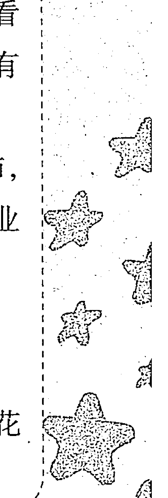

-   1.  AB 型女性花钱时都很谨慎小心，通常都会有计划地花钱，不会奢侈浪费。这是因为 AB 型女性对世俗的欲望很淡，喜欢踏踏实实地走过人生，不喜欢浮华奢靡。所以，她们大多很会买东西，也往往能买到价廉物美的东西。
-   2.  AB 型女性花钱的方式有时会比较奇怪。她们喜欢随兴的生活方式，因此，你若是看见她们身穿名牌衣服，却搭配着地摊上买的皮带或皮鞋，也就不足为奇了！
-   3.  AB 型男性相当有经济观念。他们对钱算得很精，但也不至于小气，对待朋友，也会大方地请客。但是由于他们对礼尚往来的观念很淡泊，所以并不希望对方回请或是耿耿于怀要去回报对方，因此，不了解他们的人，往往会产生误会。
-   4.  AB 型男性在购物上比较与众不同，属于收集性的购物型。他们对东西的价值观，往往取决于本身的兴趣，只要是他们喜欢的，尽管别人将它视为一文不值，他们都会买回来，视之如珍宝，小心收藏。鉴于此，他们较 AB 型女性在购物上容易冲动，但基本上还比较理智，通常都会有计划地购买。

# 血型

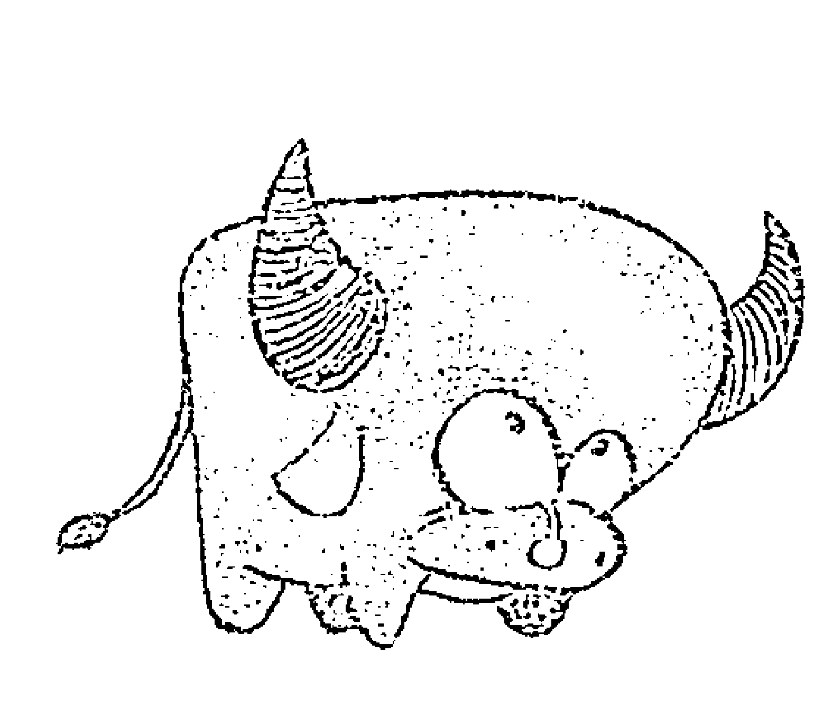

# AB型名人大印证

## 第一节 幽默大师林语堂

他是著名的作家、学者、中西文化交流大使；他一生著作颇丰，门下的弟子众多；他性格幽默、言语诙谐——他就是大名鼎鼎的才子林语堂。

林语堂是典型的 AB 型，淡泊名利、与世无争，并有强烈的优越感。此外，这种血型的人性情温和，想象力丰富，用时下潮流的话来说，比较“小资”。他们的缺点是缺乏豪爽气概和责任意识，面对问题时，多选择逃避。

AB 型人多比较幽默。林语堂在巴西演讲时曾说了段流传甚广的笑话：“世界大同的理想，就是住在英国的乡村，屋子里安装有美国的水、电、煤气管子，有个中国厨子，日本太太……”此言一出，全场哗然。

他的诙谐幽默不仅体现在演讲台上，还在生活中时时闪光。曾有一位朋友来探望他，开玩笑地说：“林语堂，你是谁？”他不紧不慢地回答：“我也不知道我是谁，只有上帝知道。”

他的这种幽默风趣、举重若轻的性格，征服过无数人。他的处世态度和行事风格都带着AB型人的特质，故了解他、崇拜他的人评价说，“林语堂的幽默充满了东方民族的睿智和机警”。林语堂曾这样解释幽默的含义：“人生是这样的舞台，中国的社会、政治、教育、时俗，甚至是一场把戏，不过扮演的人正正经经，不觉滑稽而已……”

## 第二节 性感女神玛丽莲·梦露

玛丽莲·梦露是性感的象征，直到现在她在全世界也有非常广泛的影响性。人们津津乐道的不仅仅在于她的美貌、性感，更在于她传奇的一生，多彩的私生活，以及她死后给人们带来的一系列疑团。

她是一个聪明的女子，就像所有的AB型女生一样，对现实有着非常透彻的了解，知道人们需要什么，所以总会摆出一副如是的样子。她总是给人一种金发尤物，但却胸大无志的感觉，是个金发的笨姑娘，但其实她却是清楚地了解这一切。“如果有必要的话，我可以变得狡猾，但大部分的男人不喜欢这样。”玛丽莲·梦露清楚地知道，怎么样做和做什么能够得到男人的青睐，她非常清楚这一切的缘由。

玛丽莲·梦露非常缺乏安全感，这和她的AB型性格密不可分。他们对能够给予自己安全感的人，就像是抓到了一棵救命稻草，愿意因此而付出所有。她在叙述一段历史时如是说：“性生活对于他来说意义重大，但对我一文不值。”那时她只有22岁，他就是她的情人，她爱着的人。她愿意为自己的情人，为自己认为可以得到安全感的人付出一切，就如同飞蛾一般。最终她一直只想得到关爱，因为她内心如此缺乏安全感。

尽管获得了巨大的成功，但梦露并不相信自己所拥有的令人艳羡一切，越被捧在高处，就越发的不安。在AB型的她心中潜藏了一方面对亲密无间关系的渴望，另一方面又希望极度的认真。这一对矛盾，花费了精力，有时还迫使她自己怀疑自己。她用几个小时来整理妆容，甚至只用来涂唇膏，她对每一张照片的挑选都达到了挑剔的地步。她害怕遭到拒绝，害怕被别人评头论足，害怕自己被他人否定，她的心里充满了不安全感。只有在与很亲近的人在一起时，梦露才会变得活泼，变回自己的本来面目，因为她得到了来自熟悉人的安全感。

表面上看玛丽莲·梦露非常的有风度，游走于各种场合，其实并不是这样。AB型人是一种很会隐藏的人，他们不善于让别人看到自己狼狈的一面，所以总能维持出体面的形象。

最著名的是梦露在约翰·肯尼迪的生日宴会上所唱的生日歌，其实就是娇滴滴地说了“生日快乐，总统先生”。虽然她一出场，就吸引了所有男士的目光，但实际上，她怯场得非常厉害，甚至不能走出宴会大厅。

天真与性感，智慧与美貌，总是缺乏安全感，容易沉溺于自己的世界中难以自拔，甚至毁掉了自己，这是多么典型的 AB 型人的性格！

## 第三节 微软大学问家·盖茨

比尔·盖茨的成功，与其具有 AB 型是分不开的。AB 型人做事雷厉风行、我行我素，且容易急不可耐，又无法容忍工作效率低。性格上总是性子急，节奏快，对待工作永远秉承追求最完美、最成功的结果。比尔·盖茨习惯也喜欢过快节奏的生活，对自己与他人都很苛刻，尤其是在工作中。他不仅在工作中劲头十足，而且平日里喜欢开快车，是典型的“工作狂人”。

这种“工作狂人”是 AB 型中的一类人，他们往往太过正直，感觉敏锐，所以有时让人觉得过于苛刻，但这类人对待人生会全力以赴。具有出类拔萃的活动力、勇气和胆识，而且即使面临工作上越来越大的压力，他们仍然可以理智冷静地对待。

AB 型的工作狂人盖茨就是一个典型例子，他在研究 DOS 系统时，打电话告诉母亲，他将“消失”6个月，潜心研究，以完成与国际商用机器公司的这笔交易。

在回答记者的提问“你是否真的每日工作至凌晨四点”时说，这是新闻界夸大其词，他仅是偶尔为之。为了让大众对他的工作有直接的了解，盖茨简单地描述了他一天的工作进程，“早9点上班，工作至午夜。其间与一些同事共进午餐，午夜之后，乘车回家，读1小时如《经济学家》之类的经济类杂志”，这就是这位 AB 型工作狂人的生活。从1993年到如今，他每周仍然工作6天，每天工作13个小时。

比尔·盖茨的成功就在于他的拼搏，这也是他连续数年被评为福布斯富豪榜第一名的原因。连他的竞争对手都曾在1991年对他做出一个很幽默的评述：“我们希望比尔成家，养一大群孩子，或许他会因此变得温和些。”

## 第四节 四种血型的个性

要说AB型的典型代表，则非著名的投资大师沃伦·巴菲特莫属。他以天生的聪明、不断进取的精神和冷静敏锐的头脑，创造了股市神话，书写了AB型人的传奇。

一个人炒股挣点儿钱不算啥，难的是一辈子投资股市，绝大部分时候只挣钱、不赔钱。然而，沃伦·巴菲特做到了。他凭借着聪慧的大脑和沉着冷静的个性，为广大理性的投资者树起了一面旗帜。

巴菲特认为，投资这一行是一项要求人们动脑筋的、有趣的游戏，而且又不太难赢。在他的神话宝典里，除了满腔的热情和兴趣之外，还有耐心。首先要确定企业值多少钱，然后决定每股股票值多少钱，最后决定买不买。因为你投资的前提是企业真正的价值。所以，只要公司真正有价值，股价便宜，买好后就不应该担心，即使证券市场关闭几年也无关紧要。

自信是成功的翅膀。自信来自知识，所以你要绝对诚实，对自己懂什么、不懂什么要非常清楚。对自己不懂的企业，即使股价再便宜，也请不要投资。

独立思考的能力也至关重要。千万不要因为他人而轻易动摇，在信息不充分的情况下，你最好不要做决定。一旦你的信息正确，判断也准确，就无须担心。

借债投资是他所摒弃的。投资者不爱钱则没有动力，但太爱钱，也会导致失败。所以，他认为投资者应该保持希望赚钱，但贪欲不应过重的心理状态，要注重投资过程而不是钱本身。由于很难发现好的公司，所以发现后就不要轻易卖掉。不能贪图便宜去买不好的公司，也不能为了占一点儿便宜而把手里的好公司卖掉。要长期持有股票，但也要灵活机动，发现不好就卖掉。

巴菲特堪称世界级的“天才理财家”。他经常说，一个优秀的投资者应该像企业经理那样考虑问题，而一个优秀的企业经理在思考问题时，也应该像一个投资者才对。在从事投资管理的专业人士中，巴菲特的机智和学问很少有人能与之匹敌。他经营的资金有 100 亿美元。他有 9 个助手，办公室里没有电脑，也没有显示股价瞬间变化的电视屏幕，但他的同事说他的思考速度比电脑还快，谁都跟不上。

不仅巴菲特对股市的把握令人称羡，他的为人与品格也受到世人称赞。他把自己在股市上的成功归功于允许他成功的社会。为了回馈社会，他成立了巴菲特基金，将把绝大部分财产留给巴菲特基金。

## 第五节 功夫巨星李连杰

李连杰是 AB 型人，“换位思考”是他经常挂在嘴上的话。

李连杰是个虔诚的佛教徒，他所体会的双向思维被他称为“阳”和“阴”两个对立面。在做一件事情的时候，要从多方面考虑才能全面，才能做到完全理解。他说：“理解与换位思考是很重要的，具备了这两种要素一切都会迎刃而解。”

偶然在报纸上看到李连杰说他理解记者的消息，感触很深。李连杰以前一出门就有人跟踪，走到哪里都会有人跟着，一点儿自由的时间都没有。现在李连杰总会倒过来看，记者跟着他只是因为记者的职业。他能体会到作为记者的辛苦。如果记者不这样做，那报社就可能把记者炒鱿鱼，记者也会很惨。

> “我不去看结果，只看我为他付出的东西，我付出就可以了，结果并不重要。他再写十年负面，但是肯定有一天他不会再写了。我很了解新闻记者，我见过各种各样的记者，包括亚洲的记者，传媒报道的风格也不停地改变，报纸也会因为自己的方向定宣传的途径，有些报纸喜欢正面的，有些报纸喜欢负面的，因为负面的报纸看的人比较多，我比较理解他们。”

作为巨星，他能够为报道他负面新闻的记者着想，这种大度的胸襟，真的很让人敬佩。

> 在生活中，李连杰常说：“也许因为我是习武的，从小就习惯多向思维，站在不同的角度看问题，这样就非常容易理解别人。”

这种理解包含对人生的透彻理解，蕴藏着仁爱与宽容的真谛，是侠之大者的风范。人们经常说“理解万岁”，好像每个人都要求别人理解自己，每个人都能够理解别人，但真正能理解别人的又有几个呢？

每个人都应做到相互理解，理解是彼此沟通的桥梁，理解是真诚的、是相互的，人们在交往中有了相互理解，感情才会长久。如果我们都能理解他人，那么世界将会变得更美好！

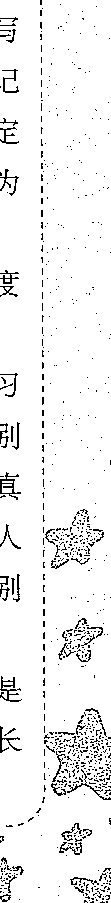

理解，是人生路上未语先香的“瑰丽宝贝”，它总是那么温馨，那么暖人。理解对方，就需要我们站在对方的角度思考，否则，就无法正确地思考与回应，沟通便会被阻断。真正的换位思考是一个“移情”的过程，要站到他人的立场上去，要像感受自己一样去感受他人。但不幸的是，许多人的换位思考缺少了“移情”这一个根本要素。他们或是站在自己的位置上去“猜想”别人的想法及感受，或是站在“一般人”的立场上去想别人“应该”有什么想法和感受，或是想当然地假设一种别人所谓的感受。这样的换位思考，仍然局限于自己设定的小圈子中，是无法体验他人真正的感受和思想的。

人们常说，良好的沟通是心与心的沟通，移情换位又何尝不是心与心的交流、心与心的沟通呢？生活中那些“善解人意”就是要做到了移情换位，用别人的眼光来想问题、看世界，以别人的心境来体会生活，才能拉近与别人之间的距离。

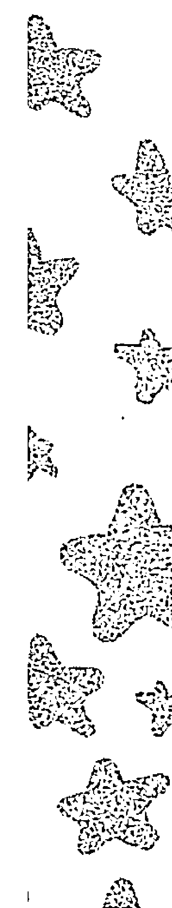

# 第八章

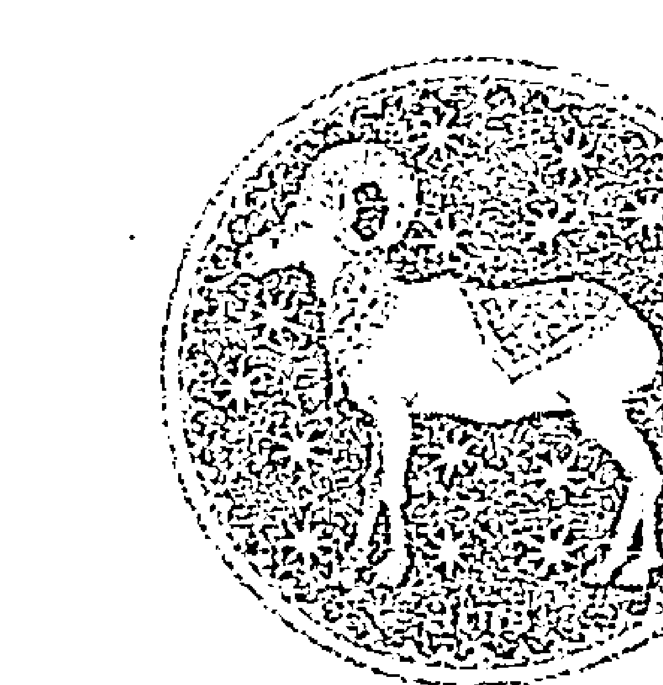

# AB型人之黄道十二宫

## 第一节 AB型×白羊座

### 一、性格分析

众所周知，白羊座是十二星座的领头羊，具有领导风范是义不容辞的，再加上 AB 型人独有的自信，就造就了这样一个具有无限魅力的族群。此型的你，意志坚强，好奇心强烈，具有不服输、迎难而上、大胆创新的精神，从不喜欢落于别人之后。当面对压力的时候，战斗力十足，属于越战越勇的类型。你的自信心十足，甚至有些固执，无畏困难与艰辛，积极进取，但有时会因此而显得很冲动。周围的人会觉得你整天一副“天不怕，地不怕”的样子，而且只要你下定决心，就算有“十头牛”也拉不回，一定要达到你的目的，不然绝不会善罢甘休。大多数的 AB 型白羊座的人脾气都不是很好，一旦爆发，马上就会变得像另外一个人，大家会感叹你怎么会变脸如此之快，真的犹如“河东狮吼”。你的脾气也是“冲动型”的，但绝对是属于“3分钟火气”，马上就会熄灭，然后仍旧会和以前一样和别人打打闹闹，玩玩笑笑，有一个再合适不过的形容词——那就是“纸老虎”。

不过如果有人惹你生气了，或是得罪了你，不用担心，你是绝对不会放在心上的，很快便跟没事一样，该怎样就怎样，你是从来不懂得记仇的。你很少去计较一些事情，总是大大咧咧的，感觉很粗心，但在照顾人这方面又显得很细心。你做事不拘小节，从不拖泥带水。

AB 型白羊座的你很重视朋友情谊，绝不会背信弃义，对真正在乎的人可以两肋插刀，付出一切。即使一旦有人背叛或伤害了你，你也只是嘴上说恨，借此来发泄一下，但心里却还会始终放不下那个伤害过你，背叛过你的人。对于感情你是优柔寡断的。

你是属于慢热型的，从未接触过你的人会认为你是那种从骨子里都很斯斯文文的人，但一旦在一起时间长了，就会觉得你真的是活泼开朗型的。虽然这样，你也会时不时从骨子里透出一种悲伤，甚至因为这样一种悲伤而自虐，要问你为什么会这样，你自己也不知道所以然。所以有的时候，就连你自己也不禁怀疑自己是不是有多重性格。

AB 型白羊座的男人属于典型的大男子主义，决不会允许别人用同情的眼光来看待你，所以你一定会靠自己的努力成功；而 AB型白羊座的女人是属于女强人一类的，都是不会甘心当全职太太的，你一定要有自己的事业。

不过 AB 型白羊座的你做事很容易走极端、爱激动、缺乏纪律观念。你内心的激动常常表露无遗，很少顾及后果，想什么就做什么，不会经过大脑的。你还不会满足于平淡无味的生活，渴望靠自己的奋发拼搏出人头地。通常具有挑战性的事情，你都会随时表现出极大的兴趣，即使失败了，也从不会气馁，因为你信奉永不言败。

会得贵人相助而成功，有种自然而然像贵族般的举止，眼光锐利，有过分注重仪表的倾向，缺乏耐心，要抑制这种倾向才好。

AB 型白羊座最有魅力的一点，就是不论男女，都是很有品位的人，都非常注重外表，总是会把自己打扮得光鲜亮丽，闪耀动人。

> 【温馨提醒】冲动是魔鬼，经过深思熟虑再行动。

### 二、白羊运势

AB 型白羊座是人才中的佼佼者，在年轻的时候就才华横溢、令人瞩目。缺点是不够耐心，不能对某件事给予长期的关注。因为这个缺点，经常造成家庭成员间的矛盾。

AB 型白羊座在人生前期运势很旺，无论在官场还是职场都能年轻有为。但因为没有持久的耐心，到了人生的后半段运势逐渐下滑。如果不改正无法耐心的缺点，可能人生运势一般；但若通过自己的努力，培养专心致志的精神，并能够灵活变通，AB型白羊座的人生便一帆风顺。

在人际交往方面，AB 型白羊座因为性格冲动，很容易和别人起争执；所以你要注意控制自己的情绪，与人为善，以和谐交际为原则，那么就会拥有不错的人缘。

【温馨提醒】培养自己的耐心，才能获得成功。

### 三、职场命运

AB 型白羊座的你，天生便具有领袖气质，凡事必喜争第一。遇到困难从不畏惧，不允许自己向任何逆境低头，“迎浪而上，我有我色彩”便是你一直追随的精神。所以在所谓的“上战场杀敌”的竞争激烈的职场生活中，AB 型白羊座的你通常都会尽挥“过五关斩六将”的气魄，达到期望的目标，得到上级的赏识。

但 AB 型白羊座的你最缺乏的便是耐心，最害怕别人的唠唠叨叨，而且很容易因此而发脾气、动怒，自己却像没事人一样不放在心上，殊不知却因为这样的琐碎事情而得罪了不少人。

AB 型白羊座的你，身处职场通常会把同事关系当做类似“哥们儿”的情谊，与同事无话不谈，把同事当成自己推心置腹的人，却不知道他们是否也把你当做“自己人”。只是自己一相情愿地认为别人也是和自己一样，不会去计较什么的，正是因为这样，可怜的 AB 型羊儿们就会在自己的莫名其妙中得罪很多人。

【温馨提醒】害人之心不可有，防人之心不可无，对其它人留个心眼。

### 四、赢在职场

AB 型白羊座十分聪明，反应敏捷，处理工作高效有序。AB 型白羊座领导人，能够应对激烈的竞争和工作压力，可以充分发挥白羊座的个性优势。

AB 型白羊座最好能够自己创业或在大企业中寻找发展的舞台。若是屈居他人下属，要想发挥自己的才干可能会很困难。

因为 AB 型白羊座生性活泼开朗，所以很适合与人打交道的职业，如公关、顾问、政治家、出版人员、广告文案者、演艺人员和美容师等。

值得注意的是，AB 型白羊座具有很强大的第六感，如果充分发挥第六感的作用，会给自己的职业生涯带来许多机遇。

> 【温馨提醒】好好把握自己的机遇，不然空有才华却得不到发挥。

### 五、社交技巧

AB 型白羊座个性耿直，容易敌我分明，很容易得罪人，和自己不喜欢的人往往很难交朋友。

AB 型白羊座热爱运动，通过参加运动社团或团体活动，可以拓展自己的交际范围。给 AB 型白羊座的建议是，可通过音乐、美术等艺术活动，扩大自己的兴趣层面，从而获得更多的人际交往机会。

-   AB 型白羊座最容易和处女座、天蝎座、双鱼座产生矛盾，最好不要和这些星座的人单独相处，但可以通过团体活动接触。

> 【温馨提醒】个性太直容易得罪人，做人要适当有所曲伸。

### 六、财富密码

AB 型白羊座的你似乎不喜欢追逐金钱，对财富没有很大的野心，即使这样你似乎也不会成为穷困潦倒的一族。因为你很善于理财，通常没有大的财富，也会过得很富足。

你也会有很拮据的时候，因为 AB 型白羊座的你很注重外表打扮，所以在外在装饰方面会花费相当多；此外，你还特别重朋友义气，所以在和朋友一起的时候通常都会抢着付钱，在交际应酬方面的花费也会占据很大一部分。

因此，AB型羊儿们要注重开“源”节“流”，这里的“源”，即是指发挥自己的“小脑筋”，广开财路；而“流”，便是流财，即是指要尽量避免不必要的花销。

> 【温馨提醒】多攒下一些资金，然后合理运用这些财富来创造更多。

### 七、恋爱攻略

AB型白羊座的你通常都是爱憎分明的，不过虽然这样对于你的天性来说，爱是深刻的，憎恨其实是心里从未有过的。你会死心塌地地爱一个人，却无法因为曾经爱过的人的欺骗或是背叛而去恨。你很好强，表面上会装得很无情，会表现得不在乎，很坚决，却不知道，其实在你内心深处是多么的在意，是多么的痛苦。

AB型白羊座的你很单纯、没有心眼，在谈恋爱时，也都是很直爽的，从不会欺骗他人的感情。但是你的爱似乎来势凶猛，去时也迅速。一旦是AB型羊儿们无可救药地爱上了的话，那就会不顾一切，哪怕会遭遇犹如飞蛾扑火结局的爱情，也会爱得彻彻底底，心甘情愿。

AB型白羊女脾气不是很好，有时甚至很倔，所以她们时常是口是心非的，喜欢说反话，明明爱一个人却总会说一些让对方误以为不爱的话。如果有天她们真的主动说喜欢一个人的话，那么就是真的喜欢上了那个人；如果有天她们真的主动说爱上一个人，那么就是真的要付出一切地去爱那个人了。

AB型白羊女的性格活泼、开朗，虽然她们很男孩子气、大大咧咧，但要她们真的说出“爱”字其实是很难的，所以这就需要给她们制造浪漫的气氛，让其在感动时，在内心“软弱”的状态下投降。

但表面坚强的她们其实内心是很脆弱的，往往会因为一些小事而伤感，一个人躲在被子里哭泣。她们还有一些大女子主义，很霸道、很不讲理，所以，想要制服她们最好的办法就是你比她们更霸道，比她们更不讲理。

AB型白羊男对于爱情都是很直接表现的，不会隐藏自己的内心，总是很容易就表现出自己炽热的爱意。因为他们还有一个很重要的特征就是天真，所以总是很容易相信一些事情。虽然白羊男很喜欢追求目标，但是他们并不知道如何与人相处，在相处的过程中，经常会伤到自己的另一半。

综上所述，AB型羊儿们的冲动，勇敢，不持久的激情，粗犷的心思，所有的一切都不过是同一个特性在不同时期的表现而已。这也就是为什么他们的爱情故事总是充满着峰回路转的戏剧性。

【温馨提醒】抛弃你内心深处对于情感的天真想法，经过感情历练的你才能变得成熟。

### 八、婚姻家庭

AB型白羊座的你，作为女孩一般都很早结婚，但有的受家庭影响，年轻的时候不得不拒绝恋爱，拒绝婚姻。等到适龄的时候虽然对感情徒生向往，但毕竟最好的时光已经过去了，对感情已经不容易把握了。

AB型白羊座的你热情冲动，恋爱通常会比同龄人要早，也经常迫不及待地步入婚姻殿堂。但是，由于少不更事并且没有时间让双方进行深入彻底的了解，所以婚姻生活很容易出问题，偏巧你又脾气火暴，更容易将小事化大。还有你对于事业的野心都不小，当在外打拼时，其旺盛的斗志和蛮干的劲头，也容易招惹烂桃花的垂怜，而你又颇享受照单全收的感觉。以上两项原因加在一起，使得你的婚姻有着易于摇撼颠覆的特性。

AB 型白羊座的你，婚后半年会产生危险期，家务和权力的分配，必定会在家庭里引起不小的风波。若先生或太太性格温顺，能依着你，倒还相安无事。但若不然，依你争强好胜的冲动性格，必定会把矛盾越闹越大。若不想从新婚族变成“闪离族”，AB 型羊儿们和伴侣都应学会谦让，共同承担家庭责任与义务，有话好说才是上策。

> > 【温馨提醒】稍稍收敛你的热情，表现得适当含蓄一些，遇事要沉着冷静，在繁忙之余也应多花点儿心思去经营你的婚姻。

### 九、最佳速配

AB 型白羊座的理想伴侣是勤恳踏实，积极上进，遇到任何困难和挫折都能泰然自若，能让人依赖、让人安心踏实的人；而且他也要是喜欢运动会玩的人。你看似玩心很重，实际上有很强的责任心，对任何事都善始善终。如果对方性格幽默加上长相帅气，对 AB 型白羊座来说是再完美不过了。

人缘很好，深受大家喜爱，谦逊得体不自傲，他们靠自己的努力为自己打拼。以客观的眼光看待对方，对对方做出实事求是的评价，是 AB 型白羊座的理想伴侣。年龄的差距不会阻碍为 AB 型白羊座与另一半的感情问题。但如果差距在两三岁之内，AB 型白羊座与理想伴侣的幸福指数会更高哦。

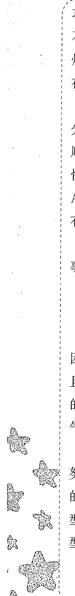

### 十、健康驿站

AB 型白羊座精力旺盛，体温偏高，能够承受强度较大的工作。在疾病预防方面要注意脑部、神经、眼、口腔以及肠胃等部位。

在工作忙碌之余要注意缓解精神压力，建议去户外打球或慢跑，呼吸新鲜空气，充分活动四肢。若出门旅行，阳光充沛的地方最适合 AB 型白羊座。有刺激性的户外休闲活动是 AB 型白羊座最适合的休闲方式。

## 第二节 AB型 & 金牛座

### 一、性格分析

星座是金牛座的你，会有倾向于现实的性格，你的字典里总是会有“计算”二字。你总是能够看到现实的利弊，然后找到适合自己的利益关系。而且你最重要的特点是老成持重，给人一种稳重的感觉。

血型为 AB 型的你，有着 AB 型的理性与冷静，你看事物非常的准确，加上你独特的判断力，使你看待事物的能力非常强悍。

所以，AB 型金牛座的你给人的第一印象是严肃且难以接近的，虽然你思考问题非常周密，做事情非常细致，待人接物非常老道，但会给人一种无法深交的距离感。由于你的理性过于强大，在很多人看来你似乎是缺乏人情味，但是这并不是说你就是这样的人，反而你是一个外冷内热、人情味十足的人，也乐意去给别人带来帮助，只不过这些都隐藏在你 AB 型冷漠疏离的外表下。

因此，你要正视自己的这个缺点。如果因为你的外在原因而丧失了使别人了解你的机会，少了一个可以成为知心朋友的人，岂不是得不偿失。你应该让大家看到你温暖而温情的一面，把自己的表情调整，不要学习 Lady Gaga 的 “poker face”，坚持锻炼自己脸上的笑肌，用微笑去面对大家，让别人能够了解你的感受，明白你的心意。

AB 型金牛座的你稳重踏实、崇尚和平，讨厌暴力，讨厌不公平。平时的你是平和对待事物的人，金牛的性格是温和而内敛的，所以很少能够看到你暴躁和发脾气的一面，加上 AB 型的冷静，所以大多数时候你总是保持着冷静平和的状态。当别人触犯到你的时候，你不会屈服于任何势力，而总是对于自己认为正确的事情执著不已、据理力争，你懂得只有用反抗来反对不公正，而非一味地退缩忍让。

你有着 AB 型的细腻和金牛的踏实，因此你的内心非常细腻、思维非常活跃，对于艺术有着自己独特的理解。你经常会表现出你丰富多彩、多才多艺的一面，让人不禁对你刮目相看。你善于去学习，但是你更愿意去学习与现实利益相关的事物。虽然你对任何事情都抱有兴趣，却对自己的兴趣非常执著。

现实中的你经常表现出小心翼翼的一面，总是在做事之前思虑得非常周密，所以你做事即使没有取得成功也不会走进失败的误区。你总是希望能够在各方面都取得较好的成就，并且也为此付出巨大的努力。但是这样也会使你分心，也让人觉得你过于固执。

所以你一定要放开你的心，试着让别人走进你的世界，了解你的内心。你不需要每一方面都去尝试，只要做好你最拿手的，走到巅峰，这样大家更能够见到你的成就。

> 【温馨提醒】你的理性让你看上去似乎缺乏人情味，多展现你热情的一面，就会获得大家的肯定。

### 二、金牛运势

AB 型金牛座一生运势都很强。你具有其他星座所无法比拟的好运气，一旦把握住机遇，就很可能获得很高的地位。能否抓住机遇，关键在于中年之前在事业上所做的努力。AB 型金牛座凭借天生的吃苦耐劳，可以发挥强有力的领导能力。

AB 型金牛座的婚后运势也很顺。你会选择一个顾家且能打理家务的理想伴侣，会和对方情投意合，会用奉献精神与爱心建立一个和谐愉快的家庭。

适当减少你的占有欲，更圆滑地处世，会更受大家欢迎。客观对待他人的评价，培养广泛的兴趣爱好，不断提升自己。

> 【温馨提醒】减少你的占有欲，学会圆滑处世，运势会更旺。

### 三、职场命运

AB 型金牛座属于勤勤恳恳，踏踏实实的员工，但因为自己的腼腆个性，常常将工作的不满压抑起来，不满的情绪得不到宣泄。一旦爆发出来，就一发不可收拾，老好人的形象也毁于一旦。

所以，AB 型金牛座要会做事，更要学会宣泄自己的情绪。和与自己志同道合的同事交流，在工作上学会说“不”，学会提出自己合理的要求，关键时刻学会隐身，让同事和领导发现自己的闪光点。这样你在职场中就会有不一样的成就感。

【温馨提醒】在职场中学会说“不”，学会为自己做宣传，让大家更早地发现你的闪光点。

### 四、赢在职场

AB 型金牛座的你有敏锐的判断和理智，有善于学习和吸收知识的卓越能力。你似乎天生比别人更适合做各种各样的工作，但是过于广泛的涉猎不利于你的职业规划，最好从事专门技术的工作，或是特殊的技能，一定会取得不错的成绩。

你的能力很强，但不是说你可以去做任何事业。你对于美有天生的敏锐感和独特的触觉，所以可以去尝试跟美有关的职业，如音乐人、画家、设计师、广告者和城市规划者。此外，你性格中金牛座对于经济问题的敏锐度可以使你在经济领域大展拳脚。你非常重视经济的概念，所以你可以从事投资、实业、资本等经济类的工作。你身上 AB 型的冷静理智和超群的判断能力都会给你带来非常大的收益。

你并不是天才，你的成功与后天的努力离不开，所以不要总是随便进入一个领域。你适合踏实地在一个领域内打拼。在你的领域中作出一番成就的时候，只适合去拓宽事业领域，而不是重起炉灶。

【温馨提醒】持之以恒，超越巅峰。选定目标，坚定不移地累积实力，不要总是想要成为全才，成为专才更能够让你的职业生涯辉煌。

### 五、社交技巧

AB 型金牛座生性害羞，低调沉默，但内心潜伏着强烈的激情。其他人只有在接触了一段时间后，才能发现 AB 型金牛座的优点。建议AB型金牛座在和他人交往时，主动将自己的优点说出来，这样，他人更容易亲近你。

AB型金牛座在工作上任劳任怨，就像老黄牛一样，是个名副其实的工作狂。在工作中的搭档若也是金牛座，容易产生共鸣，提高工作效率。AB型金牛座不仅踏实肯干，而且懂得欣赏他人。

> 【温馨提醒】改变自己固执自负的一面，用心听取他人的建议，就会赢得更多的朋友。

### 六、财富密码

金牛座的你，一向财运甚佳，金牛座与钱结缘最深，这就是这个星座被称为“金牛”的原因。你非常善于理财，这也就是你很少会贫困的原因。但由于你骨子里AB型的因素在作祟，所以你很少能够大富大贵，但积少成多是一定的。

你财运虽然非常好，但没有偏财运和横财运。所以你必须要踏踏实实地努力赚钱，而不是凭投机和风险去取得财富，更不是凭不正当的途径去取得钱财。只要你踏实肯干，一定会积累不少的钱财。

你非常喜欢财富积累起来的感觉，钱财的积累会让你感到踏实。所以你爱好收集值钱的东西，如钞票、古钱，它们让你有踏实的感觉。在积累的同时你要记得遏制住身体里AB型血液的不安定因素，踏踏实实地工作，不浪费，这样才能够使你老有所蓄，不至于走上穷途。

> 【温馨提醒】虽然你的财运稳定，也记住要适当花费，避免铺张浪费。只要你能坚持积攒，必然会有所累积。

### 七、恋爱攻略

AB 型金牛座的你不喜欢轰轰烈烈的爱情模式，平平淡淡的爱情之路更让你青睐。你会是一个温柔的情人，对待爱人也会像春风一样和煦，你们之间的感情也会是你想要的平和而稳定、简单却踏实。你不喜欢一见钟情的仓促，而更喜欢在慢慢的接触中寻找适合两个人的相处模式，慢慢地品尝爱情的芬芳和苦涩，一同经历爱情的快乐与伤悲。你不畏惧爱情路上的艰辛，只要认为是对的，你都会坚持走下去，直到爱情开出绚丽的花朵，结出甘甜的果实。

通常你选择的爱人是自己所熟悉的，就像前面说过的，一见钟情不会发生在你的生活里。陌生会让你没有安全感，让你患得患失，不符合你平和的人生观。你更倾向去选择自己非常了解的人，能够掌控的爱人是你的首选。你总是会安静地去观察，对待有好感的人并不着急，而是更多地了解，等到时机成熟的时候你就会迅速地确定关系。在这样的情境下，你们之间的关系会愈加密切，你们之间的心也会靠得更近，在不久的将来就会踏入结婚的礼堂。

你很少会主动寻找恋人，似乎给人的感觉有些被动。但当你确定了目标就会非常勇敢直白地讲出。你的平常心和淡然心理让你本能地会去逃避激烈的爱情，有时你也会尝试一下，但是当你发现无法掌控和了解对方的时候，你会选择放弃，因为你明白这样的爱情不会让你感到幸福，所以只有放手。

通常的你失恋时会没有过多的表现，看似平静，但是内心却伤痕累累。你不容易去遗忘过去的恋人，总是要花费非常多的时间走出伤痛。有时一些极端的事情也会出现在你的身上，这样只会伤人伤己，因此不必太过于执著。

你是一个非常正统的人，不会染指别人的男友，更不会破坏别人的家庭。你非常理智，知道什么事情该做什么事情不该做，所以畸形的恋情很少能发生在你身上。

对待性上你也是十分谨慎的，无论是对待自己还是对待爱人，都非常谨慎。只有确定了关系，认定了安全感，你才会去触碰，显露你深情恣意的一面。

> 【温馨提醒】 当你找到合适的爱人，就勇敢地表达吧。不要害怕被伤害，要相信你一定会碰上对的人，碰到能和你度过平淡流年的那个人。

### 八、婚姻家庭

AB型金牛座的你，从来不是一个盲目结婚的人，你非常清楚什么样的婚姻是你所需要的，所以你非常理智看待婚姻。你并不会对婚姻过分憧憬，当然也不会盲目悲观，能够非常实际地去考虑、规划自己的婚姻生活。你非常重视婚姻的经济基础，你是一个现实的人，不是一个只要爱情放弃面包的人，你希望两者都存在。所以这个时候的你会对你的婚姻有着非常细致、客观的评价，根据这个你才会选择自己的婚姻生活。

过分追求现实，不够浪漫既是你被人们诟病的地方，也是你被称赞的地方。你有婚姻家庭责任感，不会轻易许诺，但一诺必定会实现。事实上，你非常会将浪漫融入生活中，但是你的前提是要有足够的经济基础。

爱情和婚姻你分得非常清楚，这也是你理智和现实的最大体现。你可能也因为爱情而迷魂过，但是最后还是会回归到平实的婚姻生活中。你耐得住寂寞，守得住责任，会平静地走完自己的婚姻，维护自己的家庭。说到家庭，AB 型金牛座的你是一个好的爱人，是一个好的父亲（母亲），对家庭充满了责任感，是另一半的忠实伴侣，会给对方带来无尽的安全感。你会竭尽你的所能为家庭而奋斗，让你的家庭因此富足，其乐融融。

你非常爱惜自己的家庭，虽然 AB 型的蠢蠢欲动让你有时想要出轨，但是强大的责任感又会使你放弃这个念头。你希望一个安定的家，这是你 AB 型中的安全感的需要。你有时会陷入交战中，但是总是理性占了上风，你不会背叛自己的爱人和家庭，反而会随着时间的流逝，更加的深情和坚持。

你一定会找到能和你经得起平凡生活的爱人，当遇到时一定要敢于表达自己的爱。相亲也会是你碰到结婚对象的途径之一。

> 【温馨提示】在婚姻家庭中，一定要克制自己蠢蠢欲动的一面，保持自己爱家不变的初衷。

### 九、最佳速配

AB 型金牛座的最佳速配是性格外向、善于交际的人，这类人在节假日绝不会宅在家里，而是呼朋唤友，积极参加集体活动。他们往往是团体活动的组织者，善于寻找大家的共同话题，将聚会气氛逐步推向高潮。虽然他们会玩，但也是具有强烈责任心的人。

AB 型金牛座要警惕被这类人温柔外表所蒙蔽，一定要经过长期的考验，切不可贸然地在一起。和意气相投的同事或者旅游认识的朋友深交，会给 AB 型金牛座带来意想不到的人生际遇。

AB 型金牛座容易轻信他人，要小心身边人的陷阱。

### 十、健康驿站

AB 型金牛座是典型的工作狂，经常忽略自己的身体状况。即使生病，也要硬撑着工作，因此必须避免劳累过度。要留意甲状腺、扁桃体等方面的疾病，改善饮食习惯，健康会有保障一些。

放松情绪时，可听听古典音乐、做手工、看电影等，或者和朋友出门做自助型短途旅行，去游览历史古迹或者吃一顿美食，都是不错的选择。

## 第三篇 AB型 x 双子座

### 一、性格分析

有人开玩笑说 AB 型双子座自己可以打麻将了。是的，双子座 AB 型的组合，性格复杂可想而知。无论在任何情况下，你的内心总是不断地在挣扎、冲突。在各种场合下，你都能够随机应变，使得自己远离尴尬的场面。你也非常能够适应各种各样的环境，不会因为环境的改变而让自己无法正常地生活。新点子不断在你的脑袋里萌芽，而且一旦有必要，你还可以将这些点子化为犀利的言辞，给敌人来一个措手不及。无论何时何地，你总是忙碌地奔来走去，总是十分地乐于在自己的世界里。

你的性格总趋向于多样化，所以总是让人很难摸清你的性格。你非常聪明，学东西很快，一件事只要你看一下就能抓到要领，你最大的本事就是现学现卖。你颇似孙悟空，总是有各种让## 二、双子运势

AB型双子座天生拥有不凡的实力，早年在事业上奋勇拼搏，依靠自己的实力在中年之后当上领导。若在拼搏过程中遇上贵人，就会有功成名就的一生。

AB型双子座财运也极高，但由于自身自尊心强、爱慕虚荣的性格缺点，稍不收敛，就会将钱财散尽。而又因为自尊心强，你很难向比自己强的人低头。如果能虚心好学，团结合作，才能在人生这棵树上结出更繁盛、更甜蜜的果实。

不安分的AB型双子座，在婚后也不会安守于自己的事业，建议从事与自己兴趣相关的职业，发挥自己的实力。

> 【温馨提醒】虚心好学，团结合作，才能获得更大的成功。

### 三、职场命运

AB型双子座思维敏捷，脑子里总是有很多新奇的想法冒出来。但因为AB型双子座神经而又好动的个性，你很难沉下心来认真做一件事。往往还没等新主意付诸实践，又将注意力转移到另外一个主意上了，这导致AB型双子座的你很难做成功事。

冷静下来，权衡利弊，克服心神难宁的缺点，做事情有始有终，认真用心，真正专注地发挥自己的想象力与创造力，AB型双子座的你定能在职场中取得相应的成绩。

> 【温馨提醒】真正专注地去做事，成功的机会会更大。

### 四、赢在职场

你适合不受拘束的工作，能够最大限度地满足你对自由的需要，更能激发你的潜能。这样的工作会让你免予枯燥和乏味，在自由的世界中如鱼得水，把工作做得风生水起。比较适合你的工作如自由职业者、记者和作家等，这些都不需要程式化，而是有很大的弹性空间能够使你感到自由且有新意。

当然，你思维非常敏捷，反应非常迅速，所以很适合语言类的工作，如脱口秀的主持人。

但是由于你定性方面的原因，你总是很难稳定地长期工作，不论任何的工作都需要有一个坚持的过程，而这恰恰是你的弱项。虽然你的能力很强，但是若不能够坚持，那么以前所有的付出都将为零。

要有常性，所有的成功都是一点一滴积累起来的，不积跬步，无以至千里；不积小流，无以成江河。成功离不开坚持。

> 【温馨提醒】你良好的人际关系将是你发展事业的基础，所以一定不能放松对人脉的积累。

### 五、社交技巧

AB型双子座性格活泼开朗，喜欢说话，善于交际。和陌生人能够自来熟，经常是身边人的开心果，人缘不错。AB型双子座为了赢得朋友的欢心，经常花很多钱在交际应酬上，但也不用过分克制，量力而行最好。你的付出，往往会获得很高的人际回报，给自己的生活和事业带来意想不到的机遇。

爱动脑筋、好奇心强的AB型双子座，对任何最新的资讯都了如指掌，这些资讯成为和朋友交谈的丰富的话题，无论在哪里都受身边人的欢迎。

【温馨提醒】社交花费量力而行，才是掌握了社交的含义。

### 六、财富密码

你财运并不佳，一方面是因为你并不擅长赚钱，另一方面是因为你对钱财淡泊的观念。你不会被财运所抛弃，虽然不善于赚钱，但是你有非常好的偏财运。你的工作之余所做的副业，经常能够给你带来大笔的收益，甚至比正业还要多，这样你衣食无忧。你总是会有这样持续不断的好运。

如果你可以合理安排自己的收支，那么就能够稳赚不赔，加上你对副业的灵活运用也能够使你受益颇丰。

还有不要忘了良好的人际关系也会为你带来不少的赚钱机会，能够让你赚上一笔的人说不定就在身边。

【温馨提醒】要养成良好的储蓄习惯，不要对金钱过于看淡，这些是你老年生活安定的基础。试着做长期的投资以确保老年无忧。

### 七、恋爱攻略

AB型双子座的你，经常给人以花心的感觉。这与你太容易变化的性格和太容易转变的注意力有关。你总是时而疯狂地爱恋，时而无影无踪。你总是很理智地把自己脱开来，然后自认为深陷其中。你总是感觉自己在每段恋情中都付出了全心全意，其实你只是将爱情看成一种游戏。你很喜欢自己能够游走于不同人群中的感受。你对自己的变化感到自豪，并且深陷于这种感觉无法自拔。

其实你本质并非如此，你只是不知道如何找到爱人，更不知道如何去相处。你总是像个小孩子一样，按照自己的喜好进行，虽然你并不是故意要对爱情如此玩世不恭，但你所表现出来的确令人不敢恭维。你的天性让你无法在一件事情上保持长久的注意力，所以对待爱情时很容易厌倦和冷漠，这些都会伤了对方的心。当对方因此离你而去时，你又开始怀念在一起的感觉，认为对方伤害了你，不能够包容你的个性。

你容易给人造成一种不负责任的爱情形象，了解的人可以理解这是你向往自由的本性。但是大多数人都会被你不耐烦的态度和玩世不恭的感觉所迷惑，对你产生误解。

> 【温馨提醒】与其不断地寻找新的刺激，不如经营一个永恒的爱情，用你可以发现奇妙的眼睛去发现平淡生活中的精彩。

### 八、婚姻家庭

你并不喜欢婚姻，认为婚姻是一件能够束缚自由的事情。你选择结婚，大多也是因为一时的好奇，想要去发现未知的事物，但一旦发现婚姻与你想象的不大相同，你就会想要逃离。你并不认为结婚是人生必经的一部分，在你看来婚姻并不能够维系一段关系，所以你愿意单身。但是如果你的对象能够给予足够的空间和自由，不去牵制你的生活，你也不会去排斥婚姻。

你对家庭的责任感并不强，不会像金牛座一样很早就开始打算婚后的生活，也不会想到怎样发展以后的婚姻家庭生活。你还是活在自己的小圈子里，认为自己就是生活的全部。因此如果你不能碰到一个能够包容你这种性格，能够给你自由，不彼此束缚的人，就不要去结婚，否则，婚姻就会以悲剧收场。

婚后的你也不会因此而停止以前的社交活动，家庭对你来说和以往没有什么不同，你并没有什么家庭观念，还是会我行我素。

> 【温馨提醒】当你选择婚姻家庭时，一定要慎重选择能够接受你、了解你的人，你们的真心相爱才会带来美满的婚姻，否则会伤害到爱你的人。

### 九、最佳速配

AB型双子座的最佳伴侣是和自己性情相似，志同道合的人。表面玩世不恭、实际拥有强烈责任心，会工作也会生活的人会和AB型双子座一拍即合。此外，双子座也重视外表，对另一半的要求一定要长相体面，言行得体，举止优雅。

AB型双子座极其反感占有欲强的人，如果另一半处处都要求、命令自己，那只会让AB型双子座逃得远远的。

AB型双子座向往自由，婚姻生活也无法束缚你追求自由的心。希望婚姻生活像恋爱生活一样放松，在节假日休息时间，你更愿意外出和朋友聚聚或者去户外旅行，而不是待在家里陪家人。

### 十、健康驿站

AB型双子座是大大咧咧，对细节不太在意的人，这让你容易忽视自己的健康问题。AB型双子座也是容易神经过敏的人，要注意自己在神经系统方面的疾患，另外要注意呼吸系统的疾病。

舒缓压力，可以与朋友聚聚，在欢闹中忘掉烦恼；也可以去进行一场森林浴，体会自由呼吸的欢畅。双子座是善于交际的人，环球旅行，增加自己的人生阅历，也会非常有意义。

## 第四节 AB型×巨蟹座

### 一、性格分析

AB型巨蟹座的你单纯又随和，感觉非常敏锐细腻，情绪变化多端，但自我倾向不强，和谁都可以相处得很好，不会轻易发脾气，对自己不喜欢的人也不会表现出你的厌恶。你总是认为跟别人相处一定要有彬彬有礼、热心助人，才能赢得别人的好感。不过你虽然随和，但在心理上对其他人有些防备，通常也会因缺乏安全感而内敛，对陌生人表现得尤为明显。你非常害怕和讨厌粗俗急躁的人，对于不喜欢的人宁愿躲避，也不会和他起冲突。在家人和朋友面前十分自在，家庭是你的安全岛，在家里你能够发挥出自己的幽默细胞和潜在的开朗，甚至有时也会像小孩子一样可爱。这也是为什么说巨蟹座的人居家的缘由。你很有才华，充满想象力和创造力，在专业领域能成为十分拔尖的人才。多半情况下，你的竞争心不强，个性谦和有礼。不过对于自己非常喜欢的东西，还是会表现出巨蟹座人强烈占有欲的一面，不会轻易放手。

你对人的关系是一般性的交流，并不会有太深的交流。你想要保护自己，不想他人窥视自己的私生活。巨蟹座是十二星座中，防卫本能最强的一个，就像是星座的图标一样，紧紧地把自己隐藏在厚厚的壳子中。而AB型的人也非常看中自己私生活的隐秘性。你的目的是保证自己平和的心境，同时也怕被别人看透你的内心世界。

当有人踏入你的内心时，你需要花费很长的时间才能平复自己的内心，虽然表面看起来毫不在乎，但实际上已经暗流涌动。

> 【温馨提醒】让别人多看见你的内心，真诚地待人，把自己的情绪表露出来。走出困住自己的壳，不要惧怕伤害。没有疼痛，怎么对比出美好。

### 二、巨蟹运势

AB型巨蟹座一生运势平稳，属于大器晚成型。年轻时不被重视，到了中晚年，随着人生阅历和经验的累积，逐渐在事业上做出一番成绩来。因为在工作上的不断努力和全心全意的付出，赢得了很多人的信任。

AB型巨蟹座是非常恋家的星座，婚后，巨蟹女会成为贤妻良母，将家里里里外外打点得妥妥帖帖，和子女、公婆的关系十分融洽。如果后来不顾家庭，那也是因为丈夫不忠。随着岁数的增长，AB型巨蟹与另一半的感情日益稳定。

> 【温馨提醒】夫妻相处若从大事着眼，不纠结于小细节，会相处得很融洽。

### 三、职场命运

AB型巨蟹座的你工作十分努力，再多的工作也要求自己尽善尽美地完成，这样容易使自己陷入过度劳累的怪圈。若在工作时精神不振，心神不宁，脾气暴躁，和合作的同事与客户产生争执，就会导致工作无法按照你的较高的要求完成，进而又加班加点，使自己身心更加疲惫。

AB型巨蟹座的你，如果发现自己陷入身心疲惫的怪圈，不妨休个小假，在家彻底地轻松一下，享受家庭生活给自己带来的愉快心情。这样在工作上会更加事半功倍，也会赢得同事和领导的喜欢。

> 【温馨提醒】劳逸结合地工作，才能享受工作的乐趣。

### 四、赢在职场

AB型巨蟹座的你是一个现实主义者，总是一切以现实为主，绝对不会不切现实，也不会做虚幻而脱离实际的美梦。但是你在求职的路上总是遭遇到挫折，因为你择业方面考量的重点放在家庭，爱家的你通常都不大愿意从事离家太远或是长期在外跑的工作，所以选择面相对较窄。但耐心与细心兼备的你，可以选择从事服务业或是经营自家小店，这些都能够使你实现自己的职业规划。

你有时会过于敏感，往往会曲解他人之意，工作中因为这样而造成的误会尤其多。你要学习不要拒人于千里之外，当与人发生矛盾时，应该用自己的诚心和他人交流。就算自己所提出的计划、构想没有获得他人的支持，也不要一直放在心上。

作为AB型巨蟹座的女性，通常会因为家庭的因素而放弃事业。一旦选择了婚姻，你的重心就会倾斜到家庭上；一旦工作使你不能够照顾家庭，你就会毫不犹豫地放弃事业，回归家庭。AB型巨蟹座男士，通常会因为家庭的原因而更加努力工作。你奋斗的很大部分是源于对家庭的观念而非强大的事业心。

> 【温馨提醒】当你求职事业遇到挫折时，一定不能灰心，要相信自己的能力，无论做什么你一定会闯出自己的天地来。

### 五、社交技巧

AB型巨蟹座的你是人群中的老好人，朋友心中的“好大姐”、“好大哥”，朋友有了困难会最先请你帮忙，这让你在朋友中有良好的口碑。你有一颗细腻敏感的心，能掌握他人的心理，别人都愿意靠近你。你不喜欢搞小帮派，对谁都笑脸相迎，即使是自己不喜欢的人。你最害怕和其他人起冲突，在可能引起争执之前，迁就其他人。你在小帮派中很难获得真正的利益，在朋友面前容易失去自我，朋友们喜欢你，但不会和你深交。

【温馨提醒】适当地活出真正的自己，向朋友们敞开心扉，会拓宽你的交际圈。

### 六、财富密码

你的财运很稳健，不会有一夕暴富的神话，也没有偏财运，所以你只能老老实实地赚钱。你乐于追求生活的安定，因此，投机的事业不适合你，所以像炒股、赌博这类投机式的事情更要敬而远之。

生财的办法，就是你要善用自己最大的本钱——耐心与分析能力。此外发挥你的理性思维，广纳不同的人才和自己通力合作，强过孤军奋战。你很踏实本分，责任心很强，因此，对于别人所托一定尽自己最大的努力，这是你让人信赖的优点。这也会为你赢得合作的伙伴，会让你有不少的赚钱机会。

巨蟹座人在理财上应根据自己感知力强的特点，从小处着手，积少成多，把握微弱的商机，赚取钱财。

【温馨提醒】定期存款，选择信誉良好的股票投资或投资不动产，这些是你最稳健的投资方向。有良好的储蓄习惯是你保持财富的最好手段。

### 七、恋爱攻略

你心思细腻，多愁善感，非常在意对方的心理，甚至经常因为想太多而自寻苦恼。你好像一直都在照顾别人的感受，在爱情的世界也充当着一个大哥或大姐的角色，也就自然而然把关心对方当做自己的义务。但是实际上是因为你在感情上容易受伤，所以才会把自己的爱全部奉献出来，外表下的你其实内心非常脆弱，渴望被人保护，是在爱情世界里一直想做一个长不大的小孩，被别人宠溺着的人。

你非常想爱，但在爱情还没有到来的时候，会静静地等待；一旦有了爱慕的对象，你会不经意地表露出你的想法。你非常明白“爱要把握当下”，因为对方是你非常在意的人，所以不会计较谁爱得多，谁又爱得少。对你来说在爱情中“安全感”很关键，如果一个对你付出极多的情人却让你没有安全感，你还宁愿重新找个安全的地方避一避。

你在幸福甜蜜的时候，会把“爱与不爱”的问题掠过，如果感到被忽略时，就会把这个问题拿来认真思考。你希望被爱是因为你想要那种“安全感”，不喜欢模棱两可，如果要你不断地付出爱而抓不住对方的心思，你就会选择停下爱。

【温馨提醒】坦率让人欣赏，但太过情绪化是不成熟的表现，要学会控制自己的情绪，因为许多错误都是从失控开始的。

### 八、婚姻家庭

AB型巨蟹座的你无论时代变化得如何迅速，还是渴望传统的婚姻，一个给自己全部爱或者一部分爱的伴侣，一个温馨或者有点模式化的家庭。你永远需要属于自己的给自己家的感觉的空间，即使仅仅只是法律意义上的。

你在婚姻中并不追求完美，可以忽略自己的感受，可以平淡无奇，但却不会牺牲婚姻的存在。或许一些潮流派觉得你对婚姻的态度过于守旧，但你却在围城里自得其乐。

在考虑结婚前，你现实的一面就会表现出来，你需要一个稳定的家庭，所以你对对方是否能够提供坚实的物质基础非常在意。你也非常在意周围人的观点，希望获得周围人的祝福，这样你才会感觉自己的婚姻是幸福的。

你对家庭非常重视，甚至把它视作全部。家是你安全的港湾，是能够躲风挡雨的地方，你非常重视家庭的和睦和幸福感。你愿意为家庭去付出，如果你是一位女性，往往还会为家庭放弃事业。在你看来，没有什么会比得上家庭的成功而会使你的幸福感更强烈。

> 【温馨提醒】不要禁锢在家庭的小范围内，不然再温馨的家庭生活也会变得乏味。

### 九、最佳速配

擅长夸赞女性、在行动上无微不至地关照女性的异性，能迅速赢得AB型巨蟹女的心。AB型巨蟹女的理想伴侣一定是和自己的家人合得来的异性，若是家里有人对他不满，AB型巨蟹女可能会渐渐冷淡对方。

AB型巨蟹女的合适伴侣是行动积极、以家庭为中心、踏实努力的人。如果对方展开猛烈攻势，开始时AB型巨蟹女会反感，但慢慢地会被他的细腻体贴所打动，两人会携手步入婚姻的殿堂。在大多数情况下，AB型巨蟹女与年龄较大的异性更加投缘。

AB型巨蟹男的合适伴侣是顾家的贤妻良母型，善良温柔又孝顺长辈的异性最能打动AB型巨蟹男。

### 十、健康驿站

AB型巨蟹座的人胃口很好，对食物不挑剔。遇到美食容易暴饮暴食，因而会造成肠胃不适和肥胖的困扰。养成良好的饮食习惯，规律作息，会让自己的健康状况好起来。

AB型巨蟹座需注意肠胃、肝脏和水肿及硬化症。

## 第五节 AB型×狮子座

### 一、性格分析

如同字面一样，AB型狮子座的人具有“威严”的表象。无论做什么事都十分起劲，充满活力，且光明正大。在人群中，你都会显得很活跃、很显眼。不经意间，你便会使自己成为出尽风头的人，是社交强手。

虽然你给人以威严的表象，却不会让人感觉傲慢，难以接近。天真、活泼而开朗，往往与人相处的态度都是温和的，可与他人谈笑风生；但是，到该严肃的时候，你便会掌握分寸，马上收起笑脸，令人望而生畏。

在公众场合，AB型狮子座的你可以说是鹤立鸡群的耀眼存在，是社交界的名流，熠熠生辉，如此的个性以及气质，通常会让他人对你产生信赖感，对于别人的请求从不轻易拒绝，而且喜欢帮助他人，是善心人物的典型代表。但有人对你稍稍表现出无视的态度的话，你便会马上一改平常笑嘻嘻的态度，虽然表面上仍旧冷静，但内心却起了极大的情绪变化。AB型狮子座的你，自我表现欲很强，自尊心也很强。喜欢被众人注目，被人称赞，但太过讨好周围人的行为容易被他人误解，遭人反感，以至于让他人敬而远之。

但是，无论内心的不快有多深，在公共场合，你绝不会暴露出自己不愉快的内心情绪。你与生俱来有着避免与他人争吵及正面冲突等的能力，拥有巧妙的逃避本领。在私底下，你对于错误的决定或是不合道理的事，常常想坚决地贯彻，因而显得以自我为中心，对旁人的意见也置若罔闻。

AB型狮子座的你心胸宽广，很容易受周围人的煽动和诱惑。有了这个弱点，加上天生强烈的自我保护意识，也许会变成暴戾的人。有时你也会为满足自己的私欲，以强者为王的姿态，去欺负弱者，尽管这不是AB型狮子座的本性。

AB型狮子座的你不喜欢毫无色彩的生活，总会想尽办法让自己的人生变得戏剧化一点，这样才会充满朝气，这样才是真正的人生。以平淡的姿态来对待生活，是无法满足你的自尊的，这样的活法是你如何也无法接受的。

> 【温馨提醒】适当表现得低调一些，也是引人注意的方式。

### 二、狮子运势

AB型狮子座具有极强的运势，周遭会出现许多强势的伙伴，在事业上助你一臂之力。即使会遇到许多的困难和挫折，凭借你顽强的毅力和坚韧的个性，也能让你顺利过关。AB型狮子座是天生的领导者，在领导岗位上会发挥自己的领导才干和社交手腕，让上级领导器重你，下属信服你。若有好的机遇，很可能功成名就。

AB型狮子座要避免因为自己较好的运势而骄傲自大、目中无人，正确地认识自己，扬长避短，努力奋斗，一生运势才会顺利。改善自己霸道的领导欲，多替他人考虑，会帮你赢得更多的朋友。

AB型狮子座的女性，在家庭里能发挥自己的领导才能，将大家、小家都打理得井井有条。AB型狮子座女性不能满足于在家庭里的成就，在工作、社交等方面也要兼顾。

> 【温馨提醒】AB型狮子座女性不能满足于在家庭里的成就，工作、社交等方面也要兼顾。

### 三、职场命运

AB型狮子座的你严于律己亦严于律人，聪明又有创造性。喜欢和志同道合的伙伴一起工作，容易赢得大家的信任，成为团队中的领导者，你是一个能成就大事业的干才。

AB型狮子座的你主要特点是思想开放，会尽全力竭尽所能地战胜困难，去开创崭新的局面。对工作分外卖命，只为证明自己是最好的，拥有组织能力，在职场常成为很好的管理者。在危急时会展现出过人的勇气，面对同事讲义气，处处透露着王者风范。你通常有远大的志向、坚忍不拔的毅力，谋略过人，为人坦坦荡荡、宽宏大量，且富有激情。但有时会过分地相信自己的力量和优势，有以自我为中心的倾向。

你易受奉承者煽动从而成为他人所利用的工具，但自己却不知道。在通常情况下AB型狮子座的你，都能轰轰烈烈地在众人的推崇和支持下完成自己的事业。

> > 【温馨提醒】眼里只有自己的人，别人眼里也没有他。

### 四、赢在职场

AB型狮子座的你，在职场中想要获得很高的地位，这常常让你处世高调。因做事高效而又处世高调，AB型狮子座的你经常赢得领导的夸奖，但也会招致小人的暗算。建议对身边的朋友、同事谦虚低调，避开小人，交上真正的朋友。

AB型狮子座容易以貌取人，注意不要被人的外貌和花言巧语所蒙骗，真正会帮助你的人，不会大声声张，要学会辨别。

AB型狮子座的你拥有极强的领导欲，但切忌一步登天，应踏踏实实走好每一步。经验积累到一定时候，时机到了，便会有心想事成的一天。

> > 【温馨提醒】经验积累到一定时候，等适当的时机到了，便会心想事成。

### 五、社交技巧

AB型狮子座的你精力旺盛、行动力强，天生具有贵族气质和领导风范，懂得如何运用权力使自己获得更高的地位，拥有更多的权力。AB型狮子座的你外表强干，内心也很敏感细腻，同情弱者，好打抱不平。其他人会很敬重你，让你在领导岗位上充分发挥自己的才能。

AB型狮子座的你擅长交际，在聚会中能够有序地组织相关事务，让各种性格的人都很满意。你性格爽快、慷慨大方，又懂得体贴、理解他人，很容易交朋友，人缘相当好。

AB型狮子座的你喜欢美好的事物、人和语言，建议不要被美丽的外表所蒙蔽，不要轻信花言巧语，真正批评你的人才是真正的朋友。

> 【温馨提醒】不要轻信花言巧语，敢于批评你的人才是真正的朋友。

### 六、财富密码

AB型狮子座的你对财务是有些在意的，所以对于理财十分谨慎，绝不会马马虎虎。不过人们却无法想象在众人面前独具领袖风范的你，会在金钱的使用方面小心翼翼。不管平时有多么疯狂的表现，一旦涉及钱，你就会突然冷静下来，对你而言钱是必须做到锱铢必较的，“亲兄弟明算账”便是你对于金钱的人生格言。相比之下你的理财原则便是有进才有出，通常会做很保守的投资。

不过AB型狮子座人天生具有好大喜功的个性，你要的不只是财富的回报，更希望因为高明的投资而获得别人的赞叹。你想赚的只是大钱，小钱你并不放在眼里，因此回报小的投资，你不屑一顾。你在进行投资时，不会受进展和负面因素的影响而乱了方寸，也不会去占市场秩序失衡、有机可乘的那种便宜。你通常喜欢投机风险大的事业或理财方式，所以要尽量谨慎、仔细一些，不然容易造成财富的流失。

> 【温馨提醒】积少也可以成多，投资不要太有风险，否则会导致财富的流失。

### 七、恋爱攻略

对于爱情，AB型狮子座的你总是抱着超认真的态度，绝不会玩弄感情。你天生就喜欢考虑很多事情，才刚刚开始的恋爱，就可能已经做长远打算，想到将来要生几个孩子等的事情。成为AB型狮子座的恋爱对象是很幸福的，通常都会长长久久，因为你会一直默默地为对方付出。

AB型狮子座的你对于任何事情都会分析得很清楚，然而一旦陷进爱情旋涡中，就会变得傻傻的。由于性格温和又很好相处，再加上不知道如何拒绝他人，常常轻易造成另一半的误解。

AB型狮子座的你对于爱情也很顺从，无论男女都很容易陷入一份感情。但大多数时候都是激情来得快，去得也快。AB型狮子座内在没有安全感又很敏感，所以很容易便会从更有魅力、更具新鲜感的事物上寻找感觉。因此，想要让你死心塌地地留在恋人的身边可是一项巨大的挑战。你对于所有的事情都默默承受，属于不懂得浪漫的一群人。

AB型狮子座通常会很大胆地对情人表达爱意与倾慕，即使是女子，也会对对方采取主动攻势。而往往正是这种大胆的举动会让别人看成是优雅的气势，因此而更让人有想亲近之感。因为你会产生强烈的独占欲，所以除非是自己真的沦陷了，不然对一般的男人都是不屑一顾。

> 【温馨提醒】在感情上也要发挥你的理性气质，不然只会造成双方的伤害。

### 八、婚姻家庭

AB型狮子座的人通常都比较早熟，很早便会出现想要结婚的念头。年少时很轻易便会动心，对爱情激情澎湃，有时希望自己能够谈一场“前无古人，后无来者”的绝世之恋。

AB型狮子女喜欢温文尔雅、英俊潇洒的男性，在甜言蜜语的围攻下很容易经不住诱惑，因此而沉沦。不善于区分好感与爱情的界限，喜欢积极主动地迎合对方，所以通常情况下恋爱并不稳定。

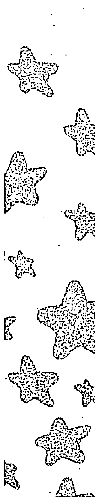

婚后AB型狮子女将变成职业家庭主妇，在家中仍具有王者风范，位居一家之主。在职场上，也是才华横溢，独当一面的女强人，偶尔也会有想要摆脱家庭生活的念头。虽然AB型狮子座的老婆外表会表现得很坚强，其实内心是脆弱的。她们怕容颜易逝，怕失去对其的尊重，她们是很依赖自己的老公的，所以不要给她们以打击，不然她们会真的离家出走，离配偶而去。

AB型狮子座的你的婚姻通常会在40岁左右的时候经历一场“浩劫”，因为这时你一般事业有成，事业上的成就已不能再带给你激情。你需要新的“成就感”来满足自己的虚荣心，于是在比自己年轻的异性面前会展现优势和魅力，吸引对方拜倒在自己的西装裤或石榴裙下。如若想要保住婚姻，AB型狮子座的爱人就必须不断改造自己，多称赞对方，让他们无时无刻都可以感到自己的优越性。

【温馨提醒】多为配偶着想，婚姻是双方的，而不是你一个人的。

### 九、最佳速配

AB型狮子座女性的理想伴侣是比自己强，会体贴人，给自己安全感的成功男性。比自己强不代表能够支配、指使自己，若是在某一问题上想要命令AB型狮子女该怎么做，那是不会如愿的。倘若和AB型狮子女认真商量，听取她的建议并以理服人，AB型狮子女才会更信服你。

AB型狮子女拥有狮子座女生的霸道任性的个性，喜欢有耐心，能够包容她们缺点的异性。在一些小事情上若容许AB型狮子女有自己小小的脾气，在大事上AB型狮子女就很容易听取另一半的意见。

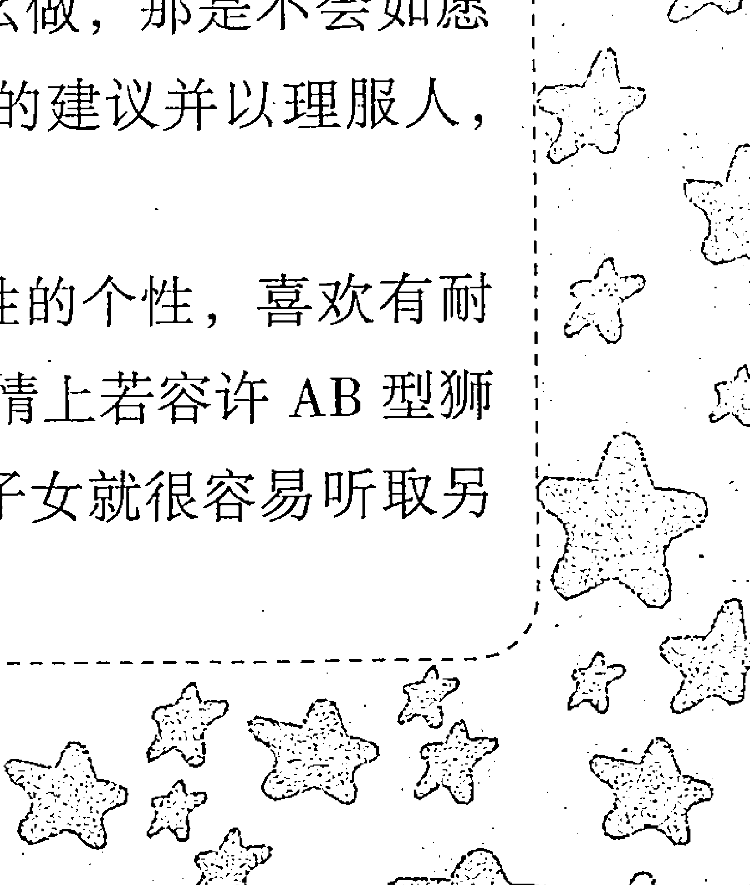

对待AB型狮子座的女生，细心温柔耐心将会使自己魅力倍增。

### 十、健康驿站

AB型狮子座的健康运势极佳，自身拥有良好的身体资本。切忌凭借自己优良的健康资本暴饮暴食、抽烟酗酒。

在参加聚会时应少量饮酒，量力而行。出门开车要平稳小心，培养良好的情绪，避免因抢道、追尾等和别人发生肢体冲突。

工作休闲之余要增加锻炼，巩固体质。足球、游泳和爬山等是适合AB型狮子座的最佳运动方式。

## 第六节 AB型&处女座

### 一、性格分析

AB型处女座的你，对人生有精到的感悟，会在一生中通过不断地克服困难来升华自己。处女座被奉为神的使者，被认为是最接近神的人，你善良、仁慈、博爱、宽厚、无私奉献，也正因为如此，你经历的痛苦，磨难比其他人要多很多。由于天生喜爱反省，因此不会在困难面前绝望，你会在进退两难的情况下，爆发出强大惊人的力量，并且越挫越勇，坚持到底，直至达到生命的巅峰。

你独有的特点是有丰富的知性，做事细致、一丝不苟，总会因为世事和你的主观标准不尽相同而去批评，是个不折不扣的完美主义者。即使随着时间的流逝，也仍旧保有一颗孩子般的心，喜欢回忆过去，憧憬未来。其实你也是很实际的，性格中的爱幻想和实际都是存在的，并不冲突。

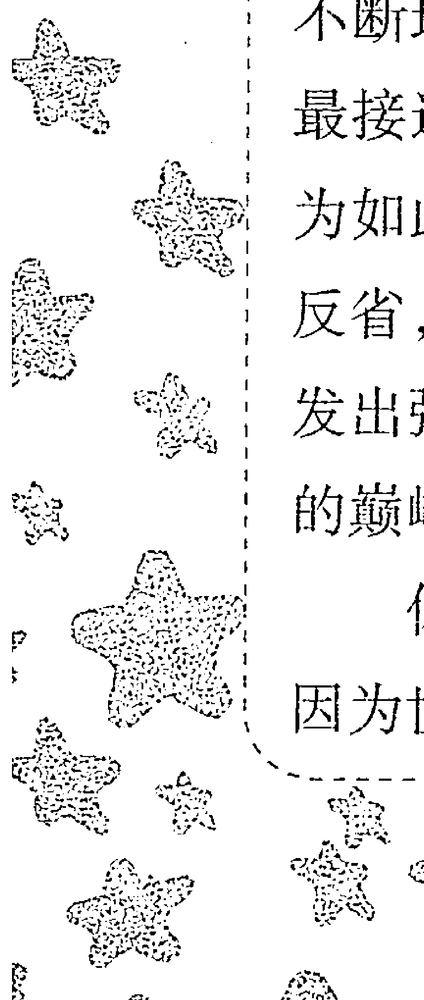

## 第八章 AB型处女座性格

AB型处女座的你做事细致、条理、理性，有极强的批判能力，习惯于将事物拆分后进行分析和点评。你非常注重完美的过程，极度厌恶半途而废。在做事情之前，有详尽的计划书，然后你会按照计划书的内容实行并实现。做什么事都很投入专心，而且好学、好奇，属于不耻下问的类型，并且拥有超棒的口才。对自己非常严格，成为工作狂的可能性很大。

AB型处女座对任何事都很投入，并且做任何事都有一套详细的规划。AB型处女座的你对人体健康和卫生多多少少会表现出极大的兴趣，也许会有些是偏素食者，如若不然，也会对日常饮食进行节制。

你天生喜爱干净，更甚者会有洁癖，这样就为自己和别人带来困扰，也容易造成人际关系的阻碍。只要纠正这个缺点，你温和的个性会受到很多人的喜欢和青睐。

> 【温馨提醒】学会隐藏你洁癖的缺点，招致别人厌恶，应该不是你想要的。

### 二、处女运势

AB型处女座的运势不太强，但只要坚持不懈，就能在自己从事的领域干出令人瞩目的成绩。

AB型处女座多是非常努力的人，无论自身能力强或不强。所以你要事先订好远大的目标，靠自己勤奋踏实的一步步努力，一定能实现自己的目标。这是你增强自己运势的秘诀。

AB型处女座不擅长处理人际关系，各方面追求完美常使自己备感压力。建议不要对自己要求太高，只要对人友善，用真心和他人交往，大家自然会发现你的优点和可爱之处。

AB型处女座具有极好的长辈缘，长辈们对你都疼爱有加。在家人的支持下，你会忘掉生活中的烦心事，工作也更加有动力。AB型处女座的你常常以学历和出身来判断他人的实力，在毫无知觉的情况下给自己招来敌人。建议不要以外在条件来判断人，要以能力判断人，多培养自己宽广的胸怀，这会让你拥有好人缘。

> 【温馨提醒】坚持不懈地努力，才能在自己的领域做出一番成就来。

### 三、职场命运

AB型处女座拥有处女座的典型个性，苛求完美。在职场中自己做事十分认真，对待合作的同事或者下属都要求极高。除个别脾气相投的同事会愿意与你合作，大多数同事会对你敬而远之。做事认真是一种优点，建议AB型处女座的你用自身的严要求感染身边的人，而不是自己对他们提出要求。

AB型处女座容易心软，若有人故作可怜来博得你的同情，你往往很难招架。对待他人有时要理性一点，不然很容易掉进别人的陷阱。

> 【温馨提醒】对待他人有时要理性一点儿，才能避免落入别人的圈套。

### 四、赢在职场

AB型处女座的你分析能力在十二星座中是数一数二的，有着其他星座难以比拟的敏锐和深刻。当你遇到问题时，就会用自己的方式去分析和判断，往往能够得到让人非常满意的结果。但是你对整体缺乏概念，有的时候太注意细节的成败，以致无法顾全大局，使得智慧局限于细节。若以你敏锐的思维能力和清晰的逻辑思维加之对细节的非常在意，在研究型的工作上，一定会有非常好的表现，会非常容易取得成绩。但是一定要遏制自己完美主义的发作和对细节的过分关注，学会用大局的思维来看待事物。

# 第八章 AB型人之黄道十二宫

AB型处女座的你，在处理琐碎的事务时非常有经验，而且讲求秩序，十分理性，默默善尽本分，个人色彩并不会太为彰显；但缺乏应变能力，只会学习他人，模仿他人，遵循别人的步伐，自己在工作中不敢加入新的想象的东西来求变化，缺乏独立性的个人创见，所以适合从事幕后的工作。

> 【温馨提醒】亦步亦趋会让人很难信赖你，处理事情要有自己的主见。

### 五、社交技巧

AB型处女座的你缺乏活力，在人际交往方面容易心有余而力不足；但你善良温柔、细心体贴的个性能弥补这个缺憾。如果在和他人交往时能够主动一些，会有意想不到的收获。

你不太容易交到朋友，但一旦交上知心朋友，便会对朋友全心全意地付出。所以，在人际交往方面，AB型处女座的你应做好打持久战的心理准备。

你天生具有批判精神，对自己看不顺眼的现象甚至生活习惯也会对人横加指责。隐藏自己的批判个性，或者换一种方式对他人善意提醒，这样才不会让自己成为众人唯恐避之不及的对象。

> 【温馨提醒】在社交方面，你应做好打持久战的心理准备。

### 六、财富密码

AB型处女座总是会把金钱支配得很完美，总是能够既随兴又安全地在金钱游戏里游走。你常常能够对投资做出准确的评估，轻松地赚一些利润，这源自于你的不贪心。在理财上你也能掌握住整个环境，正所谓“知己知彼百战不殆”的策略，你可是轻车熟路。

如果是要求较高的AB型处女座，则会致力于累积金钱的游戏，会以“合理”的标准来看待金钱的价值。在合理的规划下，你会积极寻求稳定的渠道，即使是存放在银行里，也不愿意冒太多的风险。

但是聪明的AB型处女座要注意，在理财的时候随兴常常会变成一种太过于相信自己的任性，所以在股票方面往往失手率颇高。稳定的理财是比较合适AB型处女座人的。

AB型处女座在金钱的处理上态度是比较随和，对金钱非常看得开，所以收支平衡表现良好。在你心中，钱只是让自己获得更好生活的工具，没有必要争得你死我活拔刀相向，所以对腥风血雨的投资战场实在提不起兴趣，还不如做一些优雅而有成就感的工作，赚一些安稳钱。

【温馨提醒】稳定的理财是比较适合你的。

### 七、恋爱攻略

AB型处女座的你具有洁癖的倾向，因而在情感生活上也较难和别人建立起亲密的关系。当你陷入爱情时，很少直截了当地表达，而是以含蓄的方式，故而恋情看来颇为婉转难测。

AB型处女座的你追求简单的生活，十分享受平淡爱情的细水长流，虽然特别执著地追求完美，不过也会在现实的逼迫下放下执著。只不过你在爱情上表现得有些谨慎，常希望对方以自己的标准为标准，以理性的态度对待恋人，容易造成两人情感的疏离。在平静的外表之下，你会把两人应承担的责任全部转嫁到自己身上，情愿牺牲自己也会迁就对方，但你表面上小心翼翼的态度容易让人十分反感。

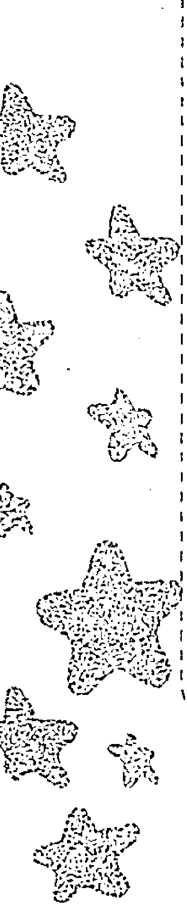

AB型处女座的你有着天然的优雅和高贵。你可以很容易地吸引其他人的目光。你通常都比较低调，很多时候都很安静。所以对于感情你是很让人踏实的选择，但你也比较敏感，不会花言巧语，不会讲肉麻的话，不过通过细微的举手投足，就可以知道你是否已经坠入情网。

AB型处女座的你都是很保守的一派，如果是思想意识很前卫的人，你是难以接受的，即使你会接受，也会在日后的相处中对他进行回归传统的教育。

AB型处女座的你不喜欢谈论感情，对于自己要好的朋友也不会随便聊起自己的恋人。在你看来，那是自己的隐私。而对于大多数人来说，谈论自己的恋人是很正常的事情，甚至包括很私密的事情。

> 【温馨提醒】对恋情保持开放的态度，尽情享受爱情的甜蜜。

### 八、婚姻家庭

当AB型处女座的爱情走到婚姻的关口时，你会选择理智而务实。你不会选一个自己不喜欢的人，来折磨自己一辈子。你会从喜欢的人中，挑选最具价值的一位，走上人生的新阶段。

你很容易去用理智来评判自己的婚姻生活，你知道想要和什么样的人结婚，婚后将有一个什么样的生活，以安定追求完美的你。在婚后你追求完美的心更甚，会用心经营自己的婚姻，追求完美的婚姻生活。

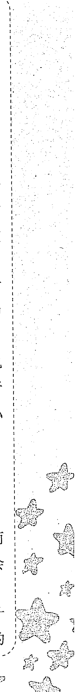

AB型处女座的婚姻很容易在日常的琐碎生活中纠缠到窒息，所以需要给予你完全属于自己的空间，就会对婚姻产生很大的促进作用，说不定你会因此在婚姻里真正地找到你想要的幸福感觉。而最适合AB型处女座人的婚姻形式便是周末式婚姻，即恋人双方领了结婚证，在法律名义上是夫妻，但在周一到周五工作日，住各自的房子，过各自的单身生活，只是在周末聚居在一起。

对于兢兢业业的AB型处女座老婆来说打理家务是分内事，当然不会要对方做太多家务，因为你很享受类似整理家居、烹调打扫等活动的。不过要是有人毁坏了你的劳动成果而且屡教不改的话，那就另有说法了，尤其是有人对你用心良苦的苦口婆心还显露出强烈不满的话，那他就是在逼你歇斯底里了。

> 【温馨提醒】不要纠结于生活中的小细节，那会让你的幸福婚姻大打折扣。

### 九、最佳速配

AB型处女座欣赏言行一致、富有强烈责任心的人。你自身对自己要求颇高，无论大事小事均全力以赴，你喜欢的另一半一定是个“行动派”。

你追求细节上的美好，如果对方细心体贴，在生活习惯及脾气秉性上都无可挑剔的话，你会很容易有幸福感。但你的眼光过高，也容易给自己带来困扰。适当地降低自己择偶的某一方面的要求，就会对自己的另一半很满意。

AB型处女座的你活力不够，喜欢热爱运动、浑身充满活力的肌肉男，如果他能擅长各种运动，如足球、篮球、游泳以及爬山，那么他肯定是你的不二人选。

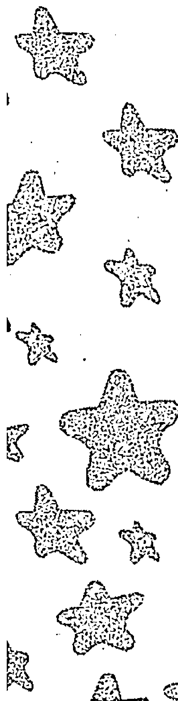

## 第八章 AB型处女座二三事

### 十、健康驿站

AB型处女座的你神经比较敏感，心思比其他人细腻，要警惕神经性的疾病，如神经性肠胃炎、神经衰弱等。在失眠时要渐渐摆脱对药物的依赖，不然会对健康造成隐患。

感觉有压力时，和朋友聊聊天、和家人去郊外及去大森林外出游玩是最佳的放松方式。AB型处女座要有意识加强身体锻炼，慢跑、骑自行车、瑜伽等有氧运动非常适合你。

## 第七节 AB型×天秤座

### 一、性格分析

AB型天秤座是天秤座的优雅特质和AB型的古灵精怪的完美结合。你通常有着淡雅自如的外表和举重若轻的姿态，没有什么能够让你大惊失色。同时，在优雅背后，你却保有自己独特的小想法、小性格，有时淡淡的一句却能够彰显出与众不同的个性，体现出你背后所积淀的深刻内涵。这让人觉得你既典雅却又不失亲密，就是这种若即若离的距离感会让人心生神往、百般着迷。你在社交中常常扮演“和平使者”的角色，你能够敏锐地观察到场内局势的变化，但却不会一语道破，而更愿意把冲突和矛盾巧妙地化为无形，从而让一切恢复到平和状态。

在社交场合，你永远不会站在风口浪尖，宁愿做一个水一样的角色，即使人们不会特意感觉你的存在，你却在人们的印象中不可或缺。

试图一直保持和谐的状态只是你的一个理想中的目标，因此无须对事事都竭尽全力去维持平衡。适当允许冲突的发生和矛盾的产生也是情感的一种有效的自我释放。

> 【温馨提醒】不要事事都竭尽全力去维持平衡，冲突和矛盾有时也能使情感得到有效的自我释放。

### 二、天秤运势

AB型天秤座的你，一生运势较为坎坷。一般而言，男性要比女性坎坷得多，尤其是在中年左右，家庭、事业方面的小困扰会让你身心俱疲。但你生性乐观，且具有惊人的平衡力和调节力，在平衡心态下，你能够一一化解自己的麻烦，通过自己的努力扭转自己本来不太好的运势。

关键是要百折不挠，无论遇到任何困难都不能轻易放弃，否则自身的运势很难好起来。虽然AB型天秤座会遇到很多小坎坷，但结果往往都是朝好的方面发展。若能有幸遇到赏识自己的伯乐和事业上的好伙伴，晚年的你将大有作为。

> 【温馨提醒】无论遇到任何困难都不能轻易放弃。

### 三、职场命运

AB型天秤座的你是社交达人，有很高超的社交手腕，能和各种各样的人处理好关系，人缘相当好。若能充分利用自己的好人缘，在官场、职场都能如鱼得水。

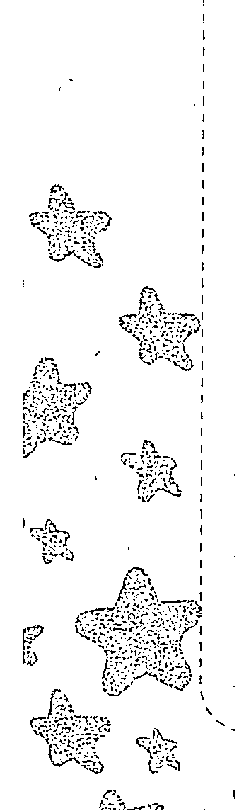

需要注意的是，有的时候你会为了迎合对方，而委屈自己，甚至牺牲自己的利益。你很在乎别人对你的评价，不喜欢和其他人起冲突。但当别人损毁了你的利益，你又做不到无所谓，从而忧心忡忡，伤害身心。AB型天秤座的你，一定要学会放宽心。

【温馨提醒】利益损失只是暂时的，适当吃点亏，才能真正地笑傲职场。

### 四、赢在职场

你喜欢轻松安逸又不失挑战的生活，因此，重复性较强的工作尤其不适合你。天生属于交际达人的你，往往能在职场交流时给人留下好的印象，但是优柔寡断、犹豫不决却是职场最大的绊脚石，往往由于一时纠结，错过大好时机。喜好平衡的你善于做沟通者和组织者，既能发挥你的优秀天赋，也能够在职场中有良好的晋升前途。

你非常适合团队合作，并在团队中发挥你的沟通联系作用，因为你有良好的口才和沟通技能。你可以发挥你广大的人脉资源，去做公关等相关工作，为很多企业牵线搭桥，帮着它们处理危机；你也可以选择做跟艺术美感相关的职业，你强大的美感能够给你带来不少的创意。

但要切忌在职场上露出你散漫的一面，不要把你的抉择难断的毛病带到职场，学着果断些，这样才能为你带来更多的机会。

【温馨提醒】你比较适合的职业，是在集体中发挥你协调能力的工作。

### 五、社交技巧

AB型天秤座的你具有社交天赋，擅长协调各方面的人际关系，在亲人、朋友、同事间都拥有相当好的人缘。你在人群中会注意到每个人的情绪，话题很丰富，并能激发大家交谈的兴趣。

大家乐意听你谈话，并在你的带动下，乐意互相谈话，谈话气氛恰到好处，既不过分热闹，也不至于冷清。你能侃侃而谈，也懂得倾听的艺术，朋友也很喜欢找你倾吐心事。你是经常被人们评价左右逢源的人。

AB型天秤座天生具有艺术细胞，喜欢结交喜爱艺术或者艺术圈的朋友，通过艺术爱好能不断扩大你的交友圈。如果能培养自己运动的爱好，则会扩大自己的朋友层次。

你性格上犹豫不决的缺点，会成为别人的话柄。若能克服，人际关系会有意想不到的效果。

> 【温馨提醒】改变你犹豫不决的缺点，是扩大你社交圈的秘诀。

### 六、财富密码

你天生属于财运平稳的人，一般不会有什么偏财，也很少能够得到意外之财。但是你很少会有一贫如洗的时候，总是能够得到身边人的帮助，所以你不必担心钱财的问题，这也是你为什么对钱财不甚重视的原因。

你很少会大富大贵，主要是你把时间多花费在享受人生上，不希望自己因为金钱而失去享受人生的机会。你很有才华，也很有眼光，但是并不是一个能够坚持的人。你的财运不错，但是由于对金钱的敏感度不高，常常会有花钱如流水的现象。再加上平时频繁的社交应酬，你注定和守财奴无缘。但是你在财富上往往能够有较好的运势，如果多加磨炼，必能拥有不错的财富运势，中年过后应该会有丰厚的财产积累。

> 【温馨提醒】最好把精力放在正常的工作生活中，利用自己的才智为自己的将来多做打算。切忌花钱如流水，适当地控制自己的消费欲望。

### 七、恋爱攻略

在爱情上，你更注重精神上的理解和交流，当然，一个良好的物质条件是营造完美的精神恋爱的前提。你非常看重两人之间的和谐，对于无法同自己交流沟通的人没有感觉，也不会勉强自己和他在一起。

你的眼光非常高，因为你对于美的感觉非常强烈，会要求自己的另一半有较好的容貌或者能力。你期望得到深刻的爱情，所以有时会不断地寻觅，在不断地找寻中获得适合自己的爱情。因此你经常被认为是花心，这其实与你的摇摆不定与暧昧有关，这让很多人对你产生了误解。其实你本意不是如此，你对自己认定的人是非常专一的。

你不是为了爱情可以牺牲一切的人，你善于平衡，不会因为爱情而丧失自我。通常在爱情中，你是比较理智的那个，会用理性的眼光看待爱情的过程。如果爱情是场游戏，你一定不会是沉溺于其中的那一个，而更像是可以写出攻略的那个。

> > 【温馨提醒】理想的爱情很难立足于现实中，只要找到认为可以永恒的爱情，就不妨大胆地尝试，不要再摇摆不定了。

### 八、婚姻家庭

你很容易很早走进婚姻，只要成为爱情的俘虏，你一定会选择进入婚姻。因为你选择爱情的过程是一个非常漫长的过程。你非常的早熟，在很早的时候就开始对自己的人生进行规划。你对于婚姻和家庭抱有非常大的期望，所以会非常认真地挑选自己的伴侣。你认为爱情重于婚姻。

你的婚姻是讲究“品质第一”的。你不会随便迁就自己的婚姻，对另一半的要求也不会降低。你会非常在意身边人的看法，总认为大家的观点更能够说明你们之间是否合适。你会百般地进行考量。

AB型天秤座的家庭会充满民主的色彩，因为你是注重公平的人，所以很少会和对方吵架，面对问题时也会采取息事宁人的办法。你不愿意破坏家庭的和谐局面，所以你的婚姻家庭大多时候都是非常和谐幸福的。

当然你也有不和谐的一面，当你有一个理由结婚，就有一万个理由拒绝婚姻生活，或许人们会觉得你自相矛盾，但其实你心中对浪漫的追求十分执著，执著到你宁愿放弃合法的性。因为你不愿意自己的婚姻生活沦落成庸俗，为了这个理想，你宁愿投身于柏拉图之中，享受无性式婚姻，让婚姻彻底在意识中纯洁、理想化。

> > 【温馨提醒】有一个家庭就去守护它，不要把你的摇摆不定也带入婚姻中来。要更多地重视对方的感受，正视矛盾才会解决矛盾。

### 九、最佳速配

处事冷静果断、刚柔并济的异性常常会赢得 AB 型天秤座女性的青睐。最好是下定决心就立即付出行动，同样具有聪明的头脑、较好的协调能力和高超的社交技巧，是 AB 型天秤座女性最速配的对象。

天秤座女性有较高的审美要求，对对方的外表具有很高的要求。如果对方恰好外形尚佳，会和 AB 型天秤座女性十分合拍。但也因此，天秤座女性会被外表美丽，但毫无内涵的异性所蒙蔽，所以在择偶时一定要慎之又慎，最好是重内涵而非外表。

生性好强的你，一定要找一个能够真正打动你的人。这类人外表朴实，但决断力强，拥有一颗强大的包容心。切忌草率结婚而招致恶果。

### 十、健康驿站

AB型天秤座的你擅长协调各方面的关系，并享受其中的乐趣。所以，一旦家庭、事业、朋友等哪一方面出了一点儿小问题，打破了你精心协调的人际关系网，你就会忧心忡忡，感觉自己很失败，精神压力很大。最好的缓解压力方法是使自己暂时摆脱人际关系的束缚，自己独处一天，听听音乐会、看看画展、做做手工，或是和家人一起外出旅行，使自己静下心来，压力烦恼自然烟消云散。

此外，你要注意预防颈椎、肠胃方面的疾病，多锻炼身体，注意饮食，健康基本无大患。

## 第八节 AB型×天蝎座

### 一、性格分析

AB型天蝎座的你，具有非常敏锐的感知力，总是很轻易就可以洞察他人的心思和意图，内心冷静，行事慎重。但是与此并存在你身上的是孩子般纯真无邪和渴望被关怀、被宠爱的一面，无论年龄多大，都喜欢以任性撒娇的方式来获得最亲的家人或爱人的重视。但是一旦走到社会上，你就会把这一面深深地隐藏，永远得体大方公正。你不喜欢是非之地，总是远离可能发生纷争的地方，一旦觉得被侵扰，不会贸然行事，与 O 型天蝎爱憎分明的表现不同，AB 型天蝎的你会尽量做出举重若轻的样子，以维持自尊和心态的平和，不过心中会耿耿于怀。

你不善于与人交际，所以很少能够在人群中游走自如，但是并不代表你不会成为一个成功的交际者。只要你想成为这样的人，就会非常迅速地改变自己的性格，你善于去演戏，让别人分不出真假。你非常重视自己的朋友，但是真正意义上的朋友并不多。你把朋友的界限分得十分的清楚，所以在不明真相的人眼中你总是一个冷漠的人。但到朋友的身边，你是一个值得信赖且充满了热情的人。

> 【温馨提醒】培养博爱之心，太过于神秘会让人不敢靠近你。

### 二、天蝎运势

AB 型天蝎座的你年纪轻轻就具有极好的运势，在 30 岁之前就能获得较高的地位。一定要好好把握自己的好运势，不然即使天生拥有好运势，也会被你挥霍一空。在 30 岁之前还坎坷波折、无名的你，可能天赋不够、能力不强，好运势没有发挥相应的作用，但通过后天的努力可以一一克服，到中晚年应该能够功成名就。

AB 型天蝎座的你很多情，很容易导致夫妻关系的矛盾。对待婚姻要全心全意，珍惜自己的爱人，婚姻生活必能甜蜜和谐。你通过闪婚而幸福的概率很小，切不可被自己一时的激情冲昏了头，对待婚姻需谨慎。

婚后的你是家庭中的主心骨，事无巨细都需要你操劳，但你也十分愿意享受为家人分担的乐趣。

> 【温馨提醒】积极奋斗，好好把握自己的好运势。

### 三、职场命运

AB型天蝎座的你，做事冷静而高效，生性循规蹈矩，领导交代的任务都完成得十分出色。偶尔会打破规章制度，按照自己的方法做，但也都是在合理范围之内，上级领导也会放任你的偶尔“不规矩”，因为事实证明你是对的。

AB型天蝎座的你，生性保守而谨慎，做事一步一个脚印，在社交方面不太擅长。找一份真正适合你的职业是你成功的起点。你不会在短期内和同事、领导处理好关系，只有长期相处，大家才会了解你的优点，才会慢慢信赖你，建议你找准职业长期干下去，必能取得很大的成功。

> 【温馨提醒】建议你找准职业长期干下去，成功指日可待。

### 四、赢在职场

你需要的是一个沉稳的工作，由于性格原因，对待这些工作你非常能够发挥自己的优点。同时你耐得住寂寞，所以不会因为工作内容的枯燥而轻易放弃。

你天生就是一个会出谋划策的人，敏锐的洞察力能为你带来各种的机遇。但是因为交际和野心的原因，你认为自己单打独斗不如背靠大树好乘凉，这样成功会来得更容易些。所以在很多的时候你会是一个幕僚的角色，在合适的时间你就会变成一个强势的领导者，建造自己的帝国。

适合你的职业有很多，如律师、法官，因为你甘于寂寞的心和敏锐的洞察力，以及自己内心独有的公平正义感，使你能够十分适应这种职业。

如果你想改变，可以适应任何的职业。若是想要生活过得开心，不妨选择自己喜爱的职业，不必为了身外之物和他人的看法而委屈了自己的想法，毕竟行行出状元。

> 【温馨提示】自己单打独斗不如背靠大树好乘凉，这样更容易成功。

### 五、社交技巧

AB 型天蝎座的你生性冷漠寡言，害怕别人了解你而深知你的内心世界，喜欢在众人眼中保持神秘感。你的个性低调、孤傲，不喜和人争什么，了解你的人会很喜欢你，不了解你的人会觉得你孤僻不合群。实际上你只是外表孤傲，内心掩藏着澎湃的激情。因为你的个性原因，很多人都对你敬而远之，所以你的朋友不多。你绝不会容忍朋友小小的背叛，一旦发生，你会和朋友绝交，老死不相往来。

> 【温馨提示】学会圆滑处世，学会释放你内心的感情，对你的人际关系大有帮助。

### 六、财富密码

早年你的财运并不佳，甚至有时还会入不敷出，这与你年轻时的不安于现状有关系。年纪较轻的你会有很强的虚荣心，这使你很难获得积蓄，并且你对金钱的管理并没有良好的规划，因此年轻就大富大贵是很难出现的。所以一般来说等你到 30 岁之后就能积聚财产，但不宜投资股票、房地产等投机性项目，最好进行非投机性投资。

你的人生中总是伴随着很多的失败，这些在你的财运中也有所体现，但是你有一颗可以忍耐、千锤百炼的心，所以要耐心地等待时间，不要焦躁，成功会慢慢地到来，在你付出足够的时侯会给你大的惊喜。

你非常有偏财运，因为你给长辈总是留下稳健、精明能干的形象，所以长辈愿意将财产交给你进行管理规划。这些虽然不足以使你成为暴富者，但是却能够助你在未来取得成功，为将来的发展打下基础。所以现在的你就要开始训练自己的性格，建立信任的形象，用耐心去获得财富。

> 【温馨提醒】耐心地等待，不要焦躁，成功会慢慢到来。

### 七、恋爱攻略

AB型天蝎的你有着不安全感和不稳定感。你是个很现实、很实际、很理性、有原则，同时也是个很敏感的人，对一件事情会从多个方面综合考虑，分析出所有的利与弊。爱情也是一样，你最需要的就是自由，不需要束缚。你很难爱上一个人，即使爱上在以后的生活中，如果发现自己已经无法把握住这份爱情就会立刻放手，虽然你会内心充满了伤痛，但是你更害怕被对方背叛。你是一个首先保护自己然后才会去保护其他人的人，同时也是个矛盾的人，既可以为爱不顾一切，也可以看似潇洒地放弃爱情。你是个以貌取人的人，对爱人的要求非常苛刻，不但要相貌出众，更多地要能力和气质。但是你还是一个会很容易因为一个举动就爱上对方的人，这也是你的矛盾所在。你喜欢一个人默默地承受所有，遇到困难也不会轻易地说出来，更加懒于解释，你要求的就是对方对自己百分之百的信任。

你爱上一个人就会把所有的爱都放在他身上，但是大多数时候都是在默默地奉献，所以单恋也常常会发生在你的身上。

当你遭遇背叛时，会像变了一个人一样，你身上的冷静和冷漠就会全不见，有时还会变成一个极端的人，你需要很长的时间才能够恢复过来。这些伤害对你来说，将会持续很久，在你的内心深处啃噬你对待爱情的勇气。

> 【温馨提示】 既然爱就不要害怕被伤害。

### 八、婚姻家庭

你很少会和自己的爱人步入婚姻，因为你的热情容易灼烧一切，让你无法控制自己爱情的走向。但是当你能够在岁月中沉淀下来，才会找到属于自己的真爱。

大部分的时候，你的婚姻与爱情无关，在岁月中一次次遭受到爱情的打击，让你对爱情产生了畏惧。在步入婚姻前，你往往会有很多次失败的经历。你很难去再尝试，所以会按照家庭的意思去结婚，你知道一相情愿的爱情是不可能的，会理智地挑选结婚对象，然后安稳地度过一生。

一般说来，步入婚姻的你就少了很多的乖僻，会重新恢复你的冷静。无论男女，都会变成爱家居家的人，愿意为家庭付出一切。

你的婚姻是建立在考量的基础上的，步入婚姻的你把家庭当做是你停泊的港湾。你非常重视自己的家庭，为了自己的家庭有时还会放弃事业或者人际交往。你对很多事情都没有安全感，但独独对自己的家庭充满了信任。

慢慢的你变成了家的守护者，很难再会陷入爱情的漩涡，也不会再有风流成性的表现。你会收获家庭的温暖。

> 【温馨提示】 建立家庭以外的社交圈，你会对家庭充满信心。

### 九、最佳速配

AB型天蝎座的合适伴侣是富有激情，情感外露的人。AB型天蝎座的你喜欢玩神秘，恰恰和你相反的人最容易吸引你。他们奔放的感情能引发你内心隐藏的火热激情，你们在浪漫的咖啡厅或音乐厅邂逅，最容易擦出爱情的火花。
但你玩神秘也喜欢神秘，有时个性神秘的异性也会吸引你，你的择偶观容易摇摆不定，更容易见异思迁。这会让你在恋爱、婚姻上大吃苦头，建议AB型天蝎座的你，用自己的真心去寻找适合自己的另一半，才会在情感道路上一帆风顺。最不适合AB型天蝎座的就是拥有强烈好奇心、刨根问底的人，双方互相信任，保持适当的距离是最适合你的恋爱方式。

### 十、健康驿站

因为朋友不多，AB型天蝎座的你喜欢压抑自己，长期以来容易患抑郁症、高血压、心脏病等疾病。AB型天蝎座的你，要学会给自己减压，听音乐、听相声、看看电影是极佳的放松方式。和家人一起聚聚，外出野餐或者运动，可以调节自己的情绪。此外，要注意预防便秘。

## 第九节 AB型×射手座

### 一、性格分析

AB 型射手座行动敏捷，犹如弓箭在弦，蓄势待发。AB 型射手座的你性格直爽，自由而奔放，具有野性般的热情，能在冷静的思考后做出相应的反应，讨厌一成不变的事物和人。你不喜欢被关在笼子里，喜欢进入自己的幻想世界，哪怕是进入一本书的幻想世界中，或进入一段哲学的思考中，你都是那么认真地陶醉在自己的那个美好的世界。

AB 型射手座的你热情是与生俱来的，一旦对人热情起来，想要自己熄灭这份热情之火焰也不是一件简单的事。往往周围的人会对你的过分热情感到意外和吃惊，这也是 AB 型射手座人的一个魅力点。

AB 型射手座的你心地善良，可以拥有最慷慨的灵魂，不管在物质上或情感上。但你是属于不愿意作出承诺的一族。不必对你作出很多的要求，你就会表现得很好，你就是有这样的天分。但以平常、惯有的方式来束缚你，你会觉得自己被压迫并且做不好。不要忘了，你是相当以自我为中心的，所以对周遭事物的理解会有所迟钝。当你忽略或考虑得不够周到时，就需要旁人适时地提醒你。

AB 型射手座的你拥有一颗最自由的灵魂，自由是你的最爱，其他一切都次之。爱运动是你的天性，流过热汗的你会更加爽快，所以如果对你有所求的话，那就约你出去自由地运动一下吧，然后再说出要求，这样会事半功倍哦。

通常你对任何事都是三分钟热度，坚持不了很久。涉猎也比较广，但都不会很精通，属于“样样懂却样样松”的典型。不断变化的事物会吸引你的眼球。

AB型射手座的你最大的优点就是宽容和独立。你是有些神经的人，做事情是不会去考虑后果的，需要旁人的指点以及建议，往往正因为这样你更会对别人的思想产生依赖。

你通常是很信命的一群人，但是又是特别不服输的一群人，最好不要在原则性问题上与你争论，你喜欢求同存异的生活方式。

> 【温馨提醒】你的致命缺点就是性急，误会问题是你的致命，你往往同时去做很多事情，把自己弄得乱七八糟，毫无空闲，应学会避免这样的错误。

### 二、射手运势

人生前半段拥有极强的运势，年轻时极有可能取得辉煌的成就。如果能专注地投入某件事，取得成功的可能性极大。但射手座对任何事都缺乏持久的耐性，年轻时取得的令人瞩目的成功会逐渐暗淡下去。

射手座对待感情也缺乏耐心，你是最有可能再婚的，再婚对象可能是自己的婚外情。如果不培养自己的耐心，你的人生很可能是孤独的，晚景将会很凄凉。

AB型射手座的贵人是富有协调能力的天秤座，和天秤座的同事合作必将有所作为。

> 【温馨提醒】只有耐心地去做事，才能让你的人生运势更强。

### 三、职场命运

AB 型射手座的你富于激情，喜爱挑战，对任何棘手的问题都能够处理得十分妥当。这让你在领导和同事心中具有相当高的威望。如果工作过于清闲，没有任何技术性含量，你绝不会感兴趣。

你最大的缺点是对一份工作很难产生持久的兴趣，到一定时间就会对工作产生倦怠心理，影响工作效率。你经常跳槽，这对你的职业生涯有利也有弊。若是你能将你丰富的工作经验合理地综合利用，自主创业，从事自己喜欢的工作，你必能在事业上获得一份成功。但若一直三心二意，见异思迁，也就很难在事业上取得长足的进步。这是 AB 型射手座的你应该注意的。

> 【温馨提醒】频繁跳槽，很难在事业上取得长足的进步。

### 四、赢在职场

在职场中，枯燥乏味的例行公事、无止境的责任以及要求和命令，对 AB 型射手座的你来说都是一种毁灭。个人的自由发挥对你就是至高无上的，你愿意为自由放弃所有。你绝对相信民主，所以别人不能对你施以命令的口吻。

你拥有多方面的兴趣，要选择符合自己兴趣的职业，如果你对现有的职业不感兴趣，那么就不会在工作上取得成绩，还会以各种借口去更换工作。在别人的经历中，不断地变换工作不容易取得成功，而你恰恰相反，频繁的变化工作反而使你能够学到更多，也使你增加更多的阅历。

有冲劲的工作更容易引起你的兴趣，同时能够自由发展的职业更容易引起你的青睐。你不喜欢一成不变的生活状态，每天都充满挑战的工作反而能激发你工作的热情和斗志，让你能够大胆发挥你的才能。

> > 【温馨提醒】一定要在选择工作的时候想好自己的兴趣所在，不符合你兴趣、性情的工作，只能让你在闷闷不乐中度过，这种折磨会迫使你寻找下一份工作。

### 五、社交技巧

AB 型射手座的你对别人很热情，性格外向活泼，所以很容易交到朋友。你的朋友很多，而且任何领域的朋友都有，即使在超市排队结账的过程中，你也能交到朋友。这让你的人生过得丰富多彩，朋友们都很信赖你，遇到困难时乐意请你帮忙。

但因为你“一根肠子通到底”的直率个性，说话做事都很直接，无意中会伤害朋友的心。多锻炼说话技巧，用善意的语言，对朋友提出建议，朋友既容易接受，又会非常感谢你。射手座个性直率，缺乏耐性，和天秤座、白羊座、水瓶座很能合得来。和性子较慢的金牛座很难一拍即合，但在了解的基础上也会培养出长久的友谊。

> > 【温馨提醒】多锻炼说话技巧，用善意的语言去帮助朋友，朋友会更加感激你。

### 六、财富密码

AB 型射手座的你有着非比寻常的财富野心，你太需要钱，因为你认为只有钱才能带给你安全感。

由于脑筋极佳，能力也很强，这便变成了你致富的有利因素。通常你很会赚钱，有一夕之间赚进大把钞票成为巨富的机会，但最重要的问题在于你是否有这个心。但同时你花钱也是大手大脚，很难守住财富，这让你的财运起伏不定。你需要学习理财知识，建立正确的消费观和投资观，才能让财富稳步增长。

> 【温馨提醒】学习理财，建立正确的金钱观，才能守住你赚来的财富。

## 第十节 AB型 × 摩羯座

### 一、性格分析

AB 型摩羯座的你是个具有极大忍耐力的人，又有着一种天真烂漫的气质，不过你还有着纤细敏感的内心，这与你外在的沉稳是多多少少有些矛盾的。基本上你会显得很理智，从不会轻易和他人发生不愉快，尽量让自己符合环境的各种需求。你会很认真努力地工作，却没有太多的奢望，做好一件又一件的小事情，会让你感到很满足。

你很早便学会了以自己独特的方式观察世界，这让你在人群中显得既理智又安静。你个性从不张扬，但在人群中你会很快辨认出你的冷静与睿智。你不喜欢表达自己的内心情感世界，总是会拒绝深入讨论自己的观念。

通常，AB型摩羯座女生都是沿着一个传统的轨迹成长起来的，即使年少时也不会像其他星座的女生一样会偶尔疯狂。很多人认为像你这样的女生是故步自封的，对于异性总是很冷漠，很排斥，其实这是源于你对受过爱情伤害的恐惧。

但就是你这样的女生，一旦陷入爱情，就会无法自拔，你会坚信自己的爱，坚守自己的选择，直到最后，永不言弃。AB型摩羯座的女生不但具有坚强的外表，还有一颗坚强的心。但即使有这样的一颗心也不是任人宰割的羔羊，如果被别人玩弄感情，当你受够了他的伤害，达到忍无可忍的地步时，你会不再留恋，大踏步地向前走，绝不回头，而他之后却会后悔再也找不到像你这样专情的人了。

AB型摩羯男的特性并不可以被认为是大男子主义、强势、喜欢挑战，你所拥有的更多的是理性和冷静。你不愿意表达自己的内心，隐忍而坚强。你不懂得浪漫，不懂得花言巧语。你的思维很简单，不会很复杂。对于感情，你会以低调的姿态去对待，有时也许会表现得很冷漠，其实那是因为你大部分时间都在考虑着自己的事业。你是很务实的，对自己的目标有相当强的毅力去坚持、实现。

你忠于关注周围人的人生态度，并以此来决定自己的交际圈。在与他人的交往中，AB型摩羯男是会小心翼翼的，因为你天生就是缺乏安全感的人，所以要让你在感到别人不会给你带来任何伤害的情况下，你才会主动与他深交。

AB型摩羯男对于感情的忽视，可以说是因为你想要拥有稳定。你不擅长对付情意缠绵的爱情，会尽量用忠诚和更多的爱护去换取他人的真心。你也许不是很好的男朋友，但是绝对是很优秀的老公。

> 【温馨提醒】AB 型摩羯座的你应该更加放开自己的心，不要总是去怀疑他人，要学会去相信别人，去接纳别人。

### 二、摩羯运势

AB 型摩羯座的你拥有很强的运势，年轻时就有机会遇到贵人相助，在事业上做出一番令人瞩目的成绩来。AB 型摩羯座女性可遇到牵手一生的人生伴侣。

AB 型摩羯座的你很有主见，对自己的未来很有规划，在贵人的帮助下，自己的人生目标能够提前实现。你很有韧性，遇到困难和挫折都能够靠自己顽强的毅力克服。

AB 型摩羯座女性拥有力挽狂澜的气势，在重大困难面前也不会屈服，并且能够获得朋友和亲人的帮助。

若是你能够多从他人的角度为他人考虑，减少私心，扎扎实实地走好人生的每一步，听取他人的意见，一生运势会更强。

> 【温馨提醒】若是你能够多从他人的角度为他人考虑，减少私心，人生运势会更强。

### 三、职场命运

AB 型摩羯座的你擅长稳中求升，做事稳重，步步为营，很少冒险。因为你长期以来积累的工作经验，所以对工作十分自信，在自己擅长的领域能够充分发挥自己的才能。你很努力并且有耐心，终有一天能走上领导岗位，取得不错的成绩。

若是能扩大自己的交际圈，多学习他人的优点，突破自己，事业上会获得更大的进步空间。

> 【温馨提醒】扩大自己的交际圈，多学习他人的长处，突破自我，是你职场好运的关键。

### 四、赢在职场

你的性格诚稳踏实，喜欢安稳的生活，因此应按照自己的兴趣找到适合自己的职业，长期坚守自己的岗位，在稳定中谋求发展。由于你本性有耐心、有毅力，只要坚守下去，就可以取得较好的成绩，至少也能谋得中上级领导职位。

你无论做什么，起初都不是一帆风顺地达到自己的理想，你属于“黑马型”人才，总能在最后时刻，让大家对你刮目相看。比如在上学期间，你的成绩只是中上等，但在最后的决定性考试中总能名列前茅。因为你属于马拉松好手，而不是短跑健将。

此型的你，因为在事业上取得的成就而对自己更加自信，并能够客观地评估自己各方面的能力。即使遇到一些打击和挫折，最后也能通过各种方式化解困难，证明自己不凡的能力。

外交、金融方面的工作最适合你，这些工作都需要顽强的精神、精深的知识，以及百折不挠的信念，加之你一直做事有条不紊，行事谨慎，能够避免重大失误，从政从商都适宜。此外，科学家、土木工程师和医师等，也都很适合你。只要记住，坚持信念，稳扎稳打，不随便跳槽，定有平步青云的一天。

> 【温馨提醒】坚守工作岗位，稳中求升，发挥你坚毅的性格优点，必能有所成就。

### 五、社交技巧

AB 型摩羯座的你因为天生缺乏安全感，而很少向人吐露自己的心声，害怕受到伤害。但是你待人亲切友善，经常笑脸迎人，给人的第一印象很好。而你的谨慎小心，自我保护会让人渐渐远离你。只有确认对方是真心对你的朋友，你才会向对方吐露心声。

你交友容易，失去朋友也很容易。摩羯座不善交友，但四种血型中，AB型摩羯座是朋友最多的。建议你多和朋友联系，交际范围会不断扩大。以轻松的心态对待朋友，向他们袒露你的真心，让其感觉到你的真诚和善良，朋友自然会忠心对你。不然你会陷入孤独感中，越来越孤僻哦。

> 【温馨提醒】让朋友感觉到你的真诚和善良，他们自然会忠心对你。

### 六、财富密码

你不是那种通过遗产或横财能够一夜暴富的类型，但是你年轻时十分努力，在30岁左右就能白手起家创业而致富。

AB型摩羯座的人，财富的积累随着年龄的增长而增加，到了中年仍毫无起色的类型，少之又少。你的财富有相当大的一部分都传给了子孙后代，后代中也鲜有贫困者。

你致富的方法来源于良好的储蓄习惯，你从小就具有理财意识，将储蓄的钱再投资，财富不断积累。但你不适合投机事业，不会从事投资炒股或期货买卖这类风险大的事业。万无一失、收益小但是稳定的投资方法是你的最爱。你追求生活质量，但很少买奢侈品。你勤俭节约，又善于理财，这种以少聚多的生财之道，是你成为大富翁的秘诀。

从你的一生来看，虽然早期过得稍微窘迫一些，但中后期便渐入佳境，你再也不会为缺钱而感到忧虑。

> 【温馨提醒】储蓄致富是你唯一的守财之道，偶尔心血来潮想冒风险，会损耗你的财运，甚至一无所有。

### 七、恋爱攻略

青春懵懂的少年时代，你在无形中有了爱慕的人，但是内向胆小的你没有勇气向对方表白。你的恋爱模式始于暗恋，往往经过很长一段时间你才能确定你的感情，这时你才会慢慢鼓起勇气向对方表白。你暗恋的对象一般是身边熟悉的人，如同学、朋友、同事等，这种有一定情感基础的稳定型恋爱比较适合你。你很少会一见钟情或者抱着游戏心理而开始一段恋情。你会在彼此熟悉、信任的基础上，谱出一段温馨和谐的恋曲。

你们在交往一段时间后，因为彼此的熟悉关系更加亲密，你们的爱情不是奔涌向前的激流，而是叮咚流淌的清泉。虽然波澜不惊但温暖感人，你们在乎彼此在一起的小细节，而不是轰轰烈烈的百般阻挠式的感天动地。你们之间的默契，让彼此多了一份信任感，更加忠贞地对待彼此。

你是爱情长跑的好手，能够经受住长时间的考验。同时，你也长时间地考验对方，那些在考验中淘汰的对象是真的不适合你，最后赢得长跑的人，是会坚贞地和你携手度过一生的人。

你喜欢柏拉图式的纯洁爱情，身上有强烈的道德感和责任感，虽然你对情欲有着强烈的好奇心，但你的自制力同样很强。你在爱情中扮演着控制者的角色，即使情到浓时，对方想要和你有更进一步的接触，你也会及时“刹车”，在盲目中清醒过来。

你这样的个性会给彼此带来尴尬和不快，但都只是暂时的，最终你会赢得对方的敬爱和信赖。艰难地跑完爱情马拉松后，你会收获成功的甜蜜的爱情。

总体来说，你的爱情遵守社会习俗和道德制约，属于安全稳定型，虽然有些平淡，但却让追求安定的你感到幸福。如果你能改掉消极与被动的缺点，勇敢去爱，你的爱情必能修成正果。

AB 型摩羯座的你恋爱观仍然是个性的反映，极为质朴，也十分认真。此型的你向来拙于向意中人表达爱情，因此恋爱过程也属于“大器晚成”型。

> 【温馨提示】你的爱情方式虽然有些笨拙，但不得不称赞你马拉松式的耐力，因为你最终必能抵达终点。

### 八、婚姻家庭

AB 型摩羯座的你十分看重婚姻，你的结婚对象是“宁缺毋滥”。你择偶的标准除了爱情因素之外，还有许多现实的因素。因为你充分体验到婚姻的重要性，所以看待婚姻的原则是稳定第一，没有充足的经济保障你是绝不会轻易结婚的。

你不期待“白雪公主”或“白马王子”型的对象，那在你看来只是童话故事，现实中很难出现。你重视对方与自己的相貌、学识、经济基础、社会地位及家庭相配的程度。

此型的你，十分适合晚婚。你会为了选择真正能够白头到老的伴侣花再多时间也在所不惜，一般来说，30 岁后才结婚并不算晚。

你也经常会有把自己的期望寄托在别人身上的通病，尤其是女性，婚姻之后极有可能成为标准的贤妻良母，为丈夫的升迁和前途而操心，料理好家庭的一切，在事业上也帮助他争取更高的成就。教育子女方面，你会用心督促，灌输给他们出人头地的人生观，完成自己无法达成的愿望。

“夫唱妇随，白头偕老”的婚姻模式是你明智的选择，你的婚姻“历久弥新”，这源于你在婚前慎重选择和准确判断。虽然你的婚姻中也会出现争执、吵架、冷战的小波折，但这只是情绪上的小波动，你通常会在时过境迁后很快原谅对方，有时甚至比没吵架更加恩爱。你们坚贞的感情只会更加坚贞。

你们即使吵得再凶也不会轻易闹离婚，因为一时怄气而冲动离婚的现象，在你身上是绝不会发生的。再多的磕磕绊绊你都不会觉得痛苦，反而是幸福生活的增味剂。

AB 型摩羯座的男性，大多是顾家而有责任感的好丈夫、好爸爸，把家庭的安定列为自己的责任。牺牲自己的自由和利益来换取家庭的和睦与安定，对你来说是天经地义的。AB 型摩羯座的女性大多是温柔贤淑的好妻子、好妈妈，在婚后培养自己理家的才能，把公婆、子女、丈夫的生活起居照料得无微不至，使丈夫毫无后顾之忧，并且还会在事业上助他一臂之力。

因此，AB 型摩羯座的你，一定要坚守“宁缺毋滥”的择偶原则。即使已过了适婚年龄，即使身负来自社会、家庭责任的因素，也不宜草率盲目地结婚。

> 【温馨提醒】以现实的条件来择偶无可厚非，但忽略爱情完全靠条件维系的婚姻，即使门当户对也是不会幸福的。

### 九、最佳速配

AB 型摩羯座女性大多数对年长的，有着丰富的人生智慧，对最好是显得霸气十足、很有男子汉气魄的男性十分有好感。你的爱情观十分朴实，不注重外表、学历、出身等外在条件，只要对方品性很好，勤奋努力，有着明确的人生目标，就会对他一心一意。

你们确立恋爱关系之前，已经是同事、同学或者朋友关系，你对对方有一定的了解，才会确立恋爱关系。一见钟情或者闪电式的恋爱，基本不会在你身上发生。
你和对方脾气相投，性格合适，若能加强与对方的沟通，让他多了解你的心意，你们对彼此会产生更强的依赖感，获得幸福的恋爱婚姻。

### 十、健康驿站

AB 型摩羯座的你对自己的健康很重视，平时也会看一些养生类的书籍，为自己的一日三餐制定食谱，为自己的锻炼计划制订方案。在工作之余也很重视锻炼身体，在你的重视之下，你的健康状况良好。

稳重踏实的性格是你的优点，但适当给自己的生活来点意外，你的生活说不定会更加富有乐趣。比如在假期和恋人一起去郊外野餐，和朋友去探访遗迹与古都，都是很适合你的休闲方式。在与爱人、朋友密切联系中，你的烦恼会一扫而光，心情也格外好。不外出的情况下，研究研究插花艺术、练练厨艺、做做手工，都会让你感觉精神愉悦。

此外，你还要注意预防颈椎、风湿等疾病。

## 第十一节 AB型×水瓶座

### 一、性格分析

AB 型水瓶座的你具有理性思维，能够冷静而客观地去看待和评价周围的事物。你的“理性”表现在判断力敏锐，而且思维明确，反应速度快，善于冷静思考，你的沉稳是其他星座无法与之相比较的。也因此，你常常成为别人所求助的对象，也是其他人所倾慕的对象。独到的见解以及特别的想法可以帮助你在人群中脱颖而出，你的与众不同是那么的耀眼。

AB 型水瓶座的你可以多角度思考问题，把复杂的事情简单化，并能掌握事情发展的全局，对未知进行合理预测，一般被认为是很有头脑、很聪明的一类人。你有自己处理事情的独特方式，不会拘泥于现有的思想框框，善于打破陈规，不会甘于平凡，有时做些出人意料的事情也是很正常的，这就是 AB 型水瓶座人独有的特质。

AB 型水瓶座的你往往会被误认为是“异类”，仅仅只是因为你独有的超过常人所拥有的理性和冷静的程度。事实也证明，你总是走在事物发展的最前端，构想具有独创性，因此创造力特别强，如此特殊的你会被周围的人视为“怪人”。但你却一点儿也不在乎，坚持己见，守护自己的那一丝与众不同，也因此常常成为被言语攻击的对象，虽然很无辜，但从某种程度上来说，你可以乐在其中，因为这才是真正的 AB 型水瓶座。

AB 型人的和蔼可亲与水瓶座的太过理性，似乎是水火不相容的两个范围，但就是这样特殊的结合，造就了即使周围人误解以及中伤你，你也根本不予以理会，但也因为这样使自己处于一个被人冷漠的境况。然而你独有的友善以及对人对物平等的观念，会使周遭对你慢慢产生好感，再加上你重情重义，所以人际关系还是很广泛的。

【温馨提醒】不要过于追求表达自己的独特见解，应先注意优先对待他人的想法，接受他人的建议。

### 二、水瓶运势

AB 型水瓶座的你一生会遇到许多大大小小的挫折，感情路也多坎坷。但是你性格活泼，擅长交际，弥补了低微的运势。若遇上贵人相助，也有可能大力扭转运势，晚年达到很高的地位。

无论遇到什么困难，你都不会服输。凭借你勤奋踏实的努力，人生即使经历坎坷磨难，结果也是光明的。

建议你不要为小事蹉跎光阴，也不要恃才傲物，提前树立自己的人生目标，为自己打造幸福美满的一生。

> 【温馨提示】凭借你勤奋踏实的努力，人生即使经历坎坷磨难，结果也是光明的。

### 三、职场命运

在事业上，你不是很注重名利，只希望能够充分发挥你的才能。你的思维很活跃，天生富有创造力，如果找到自己真正热爱的职业，一定能做出成绩来。你也热爱自由，不喜欢受过多被规章制度和团体束缚。你淡泊名利，但只要持之以恒，不知不觉中名利会伴随而来。

你需要注意的是，不要过多地强调你的个性，它虽然会让同事们欣赏你，但太张扬的个性，也会显得不合群。培养自己的宽容大度，注重其他人的意见，以理说服人，而不要对他人的观点嗤之以鼻。AB 型水瓶座的你是聪明理性的人，创新型的个性经常获得大家赞赏，但适当感性一点儿，会让你收获更多的好人缘。

> 【温馨提示】不要过多地强调你的个性，太张扬个性，也显得不合群。

### 四、赢在职场

AB 型水瓶座的你富有开拓精神，思维能力强，是具有“先知”特点的人。你喜欢推陈出新，发表新的、与众不同的观点，你才华横溢，因此也常常得到上司的赏识与青睐。但是由于喜欢自由的空间，所以相对来说，更喜欢能够拥有足够空间和自由的工作。这样才会让你随心所欲地思考和发挥你独特的创新精神，但往往生活中很难找到这样的环境，所以你总是不会在一个地方待很久。

任何职业对于 AB 型水瓶座的你都不是很艰难，只要有适合的环境，你会最大限度地发挥自己的才能，去挑战别人所不能企及的高度。

AB 型水瓶座的你比较适合具有开拓、创新精神的工作，因为你会在这种考验自我发挥能力的相对自由的空间里，最大限度地挖掘自身的才能。最重要的一点就是 AB 型水瓶座的你千万不要委曲求全，选择一份自己不喜欢的工作，这样自己的才能也许就完全被埋没了。

具有创新精神的 AB 型水瓶座最怕的就是一成不变，所以注定了你要走的路不会是平坦的大路。不过，要学会分清形势，不要盲目表现自己的创意，更应该听取他人的想法后再表达自己，这样会使你的人格魅力得到一定的升华，职场道路也会越走越顺。

> 【温馨提醒】 AB 型水瓶座的你千万不要委曲求全，选择一份自己不喜欢的工作，这样自己的才能也许就完全被埋没了。

### 五、社交技巧

AB 型水瓶座的你十分理性，并有着机械化的处事作风。你头脑机智，目光敏锐，冷静客观地对待一切复杂的事物。你身边的人会经常向你求助，你亲切随和的个性会让大家都很依赖你。但是当你和别人共事，你太过冷静、太过苛求的完美常常让人容易误解你。

你总是打破常规，追求创意，这是你的优点。但不要总是独断专行，听取他人的建议会激发你的灵感，让你受益匪浅。

> > 【温馨提醒】运用亲和力和活络的人际关系，你会不断开拓你的交际圈。

### 六、财富密码

AB 型水瓶座的你，财富运向来不是很稳定，因为自己的独创思维可以为自己带来很多意想不到的财富，不过也因为不注重金钱，所以也会因过度消费而使自己面临喝西北风的窘境。喜爱自由的你比较注重精神生活，因此就算有多余的钱也不想投资赚钱，是属于有财运但不惜财的怪人。

AB 型水瓶座的你若想要创造财富，就必须为自己定目标，可以分为长期目标和短期目标，然后通过一个个的短期目标来实现一生的长期目标，只要有了固定的目标就会不惜一切去实现。如果能做到这点，AB 型水瓶座的你绝对是一个理财的高手，想生活无忧就更加不成问题了。

AB 型水瓶座的你，思维转变较快，所以通常不重视长期投资，如果能改善这一点的话，你的财气就又会增加很多。

> > 【温馨提醒】想要创造财富，就必须为自己设定目标。

### 七、恋爱攻略

AB 型水瓶座的你，在恋爱方面会表现出极强的个性和古怪的脾气。你可能永远都不知道自己在爱情里追寻的是什么，但是你清楚自己不喜欢的是什么。有时可能会对恋人表现得很冷漠，其实是因为你实在不知道自己想要的是一个怎样的结果，会徘徊不定，所以无法表达自己。

你懂得爱人，但不会去过多的表达，因为怕在爱中受伤，正所谓“爱得越浓，伤得越深”。也正是为了避免自己会有一天越陷越深，所以你会选择不主动去爱，即使爱了，也会表现冷漠。即使在爱中受了伤，你也会自己舔舐伤口。

此型的你即使怕主动去爱，但真正遇到爱还是会情不自禁，渴望爱又怕伤害。对外表现得很柔软，其实骨子里是很坚强的。一旦主动去爱，你就会不顾一切，打破传统，这与你独特的思维多多少少有一些相关。

描写 AB 型水瓶座的爱情，有一句比较适合的广告词：“美特斯·邦威，不走寻常路。”

> 【温馨提醒】 在爱情中徘徊的人，很难收获理想的爱情结果。

### 八、婚姻家庭

AB 型水瓶座的你喜欢享受自由的生活，不会受周围人的影响，或因其他人的看法而改变自己的择偶标准。你认为 “Feeling Understood”（心灵的契合）才是最重要的，所以渴望快乐幸福的婚姻。即使有了共度一生的伴侣，你也会将浪漫进行到底，使自己的爱情婚姻变得丰富多彩。

AB 型水瓶座的你，在婚后的家庭生活中，前卫的思想以及理性的行动还是会表露无遗的，夫妻生活中更多的是小小的惊喜。总之，你只要动动脑筋，就会使两个人的婚姻生活变得很丰富多彩。

相同的道理，AB 型水瓶座的你，对于性也是有自己潮流的看法，但是绝不是会被性欲所支配的，不要忘了，你是很理性的一群人。关于性，只是爱人之间感情的添加剂，最重要的还是互相理解、互相支持，对于一味注重性享受的人，你通常会嗤之以鼻。

不要认为套上了结婚的枷锁，AB 型水瓶座的你就会有很大的转变。你仍旧会保持和婚前一样的习惯以及处事方法来对待两个人的生活，婚姻对于你来说只是表面上该有的形式而已，并不会改变与恋人之间的任何细节。你仍是你，我仍是我，不同的只是面对的是两个人的共同生活，但感情是早就产生早就存在的，所以 AB 型水瓶座的你也许依旧会在婚后我行我素。

虽然这样守护住了自己的思想，但这样对于两个人的共同生活还是会有很大影响的，所以为了更好地享受婚姻生活，AB 型水瓶座的你更应该多做换位思考，考虑一下对方的想法及处境，做到真正的互相理解，而不是固守着自己的所谓的“个人自由”。

> 【温馨提醒】多换位思考，才能做到真正的相互理解。

### 九、最佳速配

AB 型水瓶座女性喜欢风趣幽默、热爱浪漫和诚实稳重给人安全感的异性。

你虽然外表看起来冷静理智，但对待感情却容易失去理智。你在恋爱时爱幻想、容易斤斤计较，想要掌控对方。所以有耐力、有恒心、能够包容的异性与你最为般配。

你千万不要选择征服欲强的异性，这会让你失去自我，找不到安全感。你适合与处事大方，胸怀大度的人交往。你适合年纪比你大的人，姐弟恋一定要慎重。

### 十、健康驿站

AB 型水瓶座的你容易因为营养不调而造成身体不适，你需要注意眼睛、颈椎、肠胃方面的疾病，此外要格外重视心脏和血管方面的疾患。感觉体力透支时，一定要停下来休息。

心绪不宁时，慢跑、骑自行车、听音乐剧等，是适合你的调节方式。如果外出游玩，探险、蹦极、科技探索等富有新奇挑战性的项目，比较适合你求新求异的个性。

## 第十二节 AB型×双鱼座

### 一、性格分析

AB 型双鱼座的你，情绪起伏变化较大，但特别重情义。这样的双鱼座的你看起来是非常温和的人，是很适合安静倾听的人，但不要就这样认为你是一个优秀的倾听者，你也会偶尔时不时地参与进来，你的想法表达出来通常都很有意思、很幽默。与双子座相似，你这样的双鱼座也有矛盾的一面，但又不甘于让自己处于矛盾之中，所以最好的办法就是用自己的想象来逃避一切，让所有的事情都变得理想化。双鱼座是多愁善感的，总是小喜、小悲、小感动。自己的一些奇特的爱好有时是不被其他人所接受的，喜欢看一些富有感情的文字，精神世界很丰富，热爱一切温暖的事物。

AB 型双鱼座的你，特质是属于内在的，只有在进一步深入的交往中，人们才会发现原来你是非常低调的人，不喜欢炫耀，心灵很单纯。但就因为这样，你受周围环境的影响很大，总是在考虑别人的想法以及观点，顾虑颇多，所以就变得越发怀疑自己，进而自信不足。AB型双鱼座的你很敏感、很倔强、很自我，再加上很矛盾，所以你自己有时会怀疑自己是不是有些精神分裂。不过，你还是很优秀的，很务实，要认真起来是别人比不了的。

> 【温馨提醒】多愁善感的你，也要学会现实一些。

### 二、双鱼运势

你的感情很细腻，缺少理性，且对人生缺乏规划，会在他人的启发下，做出改变自己人生的重大决定。你不适合早婚，早婚会让你沉溺于感情的纠结而身心疲惫，建立在长期考验基础上的婚姻才会让你获得幸福。婚后若改变随意懒散的生活习惯，则会有美满的婚姻。

AB型双鱼座的你拥有敏锐的直觉，判断力很准。但因为优柔寡断的个性又会让你错失良机，建议你跟着自己的感觉走，加上自己后天的努力，必能获得成功。即使没有他人的支持，靠自己的奋发向上的上进心，也能实现自己的理想。

你拥有不错的财运，收入稳定，且在投资方面会取得不小的收益。但要用之有度才能不断生财，若消费大手大脚会失去你的财运。

> 【温馨提醒】对人生多一些规划，你反而能活得更自如一些。

### 三、职场命运

AB型双鱼座的你心思细腻，感情敏锐，天生富有艺术细胞，应发挥你的艺术天分。你的韵律感相当强，审美品位很高，可从事兼顾兴趣和收益的工作。

AB 型双鱼座的你天生浪漫多情，追求自由，讨厌束缚。也不会为现实和生存的压力而妥协。因为你爱幻想而淡泊名利，对生活缺少动力和使命感，喜欢过随性自在的生活，这常常会让你陷入窘境，让你产生怀才不遇之感。你若能将幻想与现实结合起来，稍微向现实妥协一点儿，在追求爱好的同时，也解决自己的经济问题，你的人生会更加一帆风顺。

> > 【温馨提醒】对工作多一份责任心，可以得到更多人的认可。

### 四、赢在职场

AB 型人的极端与双鱼座的矛盾特质结合起来，就造就了这样一个特殊的人群，你没有一定的原则性，通常对于事物的答案没有明确的结论。没有勃勃的野心，喜欢沉溺于美好的幻想之中，淡泊名利，喜欢享受生活，加之你是个性单纯的人，很明显，你不适合竞争力较强，钩心斗角的工作。

由于富于情感化，精神世界强大，所以凭灵感以及发挥天分性质的工作更加适合你。还有很重要的一点，因为你是极端与矛盾的结合体，所以会导致 AB 型双鱼座的你在工作中情绪波动较大，起起伏伏，这样就会让你感到伤痕累累，无比的累，进而会常常更换工作。

在实际工作生活中，你还因为总是在意别人的想法以及换位思考，而总是心软，学不会拒绝。如果能改善这一点儿，并提高自己对于生活的追求，压制一点儿自己的敏感，迎合周围复杂的环境，AB 型双鱼座的你会在工作中发挥很大的潜能，并能得到上司的赏识及重用。

> > 【温馨提醒】压制一点儿自己的敏感，迎合周围复杂的环境，在职场中会更自如。

### 五、社交技巧

因为你喜欢自由随性，对待朋友也平易近人。你心思细腻，擅长察言观色，能读懂别人的心，经常是朋友愿意倾诉的对象。
你不争、不计较，和其他人没有太多的利益冲突，身边人都很愿意接近你。但你对自己不太自信，缺乏决断力，经常错失良机。有的时候你会神经敏感，十分悲观，这种悲观情绪会让朋友厌烦。你需要建立自信，让自己更加活泼开朗一些，你的阳光心态会让朋友更加喜欢你，陌生人更加愿意接近你，从而开拓自己的人际交往圈。

> > 【温馨提醒】建立自信心，你会抓住更多的机遇。

### 六、财富密码

AB型双鱼座的你，最重要的财富来源便是人脉。个性单纯的你拥有广泛的人际圈，可以使你的才能得到淋漓尽致的发挥，因此财富也会随之增加。由于没有过多的野心，所以对金钱方面你是很容易满足的，喜欢享受生活，有时候可能会消费过度。不过，这时就需要充分利用自己的人际关系来拓展自己的财富了。

> > 【温馨提醒】改掉大手大脚的消费习惯，学会储蓄，是适合你的理财方法。

### 七、恋爱攻略

AB型双鱼座的你很敏感，所以对于恋爱有些至上主义。作为你的恋人，不能走得太远，也不能不在乎你，对你忽冷忽热，会伤害你脆弱的心灵。你喜欢一直观望着自己的恋人，哪怕什么都不做。
你对于感情也甚是敏感，所以有的时候不知道在为什么的情况下，伴侣很容易让 AB 型双鱼座的恋人感到失望，而且问不出你伤心难过的原因。其实很简单，这是因为你的精神世界太丰富，所以一点儿小事也能触及你敏感的神经。AB 型双鱼座的人通常比较喜欢戏剧性的恋爱，峰回路转，认为这样的爱才会有意义，才会长久，才是你所追求的至上至纯的真爱，哪怕会因此而伤痕累累。你是爱得很深刻的一群人。

> 【温馨提醒】爱情不是生活的全部，如此你才能将生活过得更加丰富多彩。

### 八、婚姻家庭

AB 型双鱼座的婚姻绝对是基于爱情基础之上的，因为你是爱情至上主义的拥有者，你需要的不是一时的爱人，而是能够陪你走过一生的伴侣。没有爱情的婚姻是你无法忍受的，想象一下你的敏感情绪会因此而扩大，所以这样的情况是你无法容忍的。

婚后的 AB 型双鱼座会一心一意关注家庭的事情，有一些恋家情结，所以也是较为理想的人生伴侣。AB 型双鱼女即使经过很多年，也还会保持少女时所拥有的青涩感。对于家庭生活中的琐事，你通常不会特别去在意，你通常会大度容忍，为对方着想。

而 AB 型双鱼男感情相对较为丰富，所以很容易导致一个严重的问题——多情，但不可以理解为花心。婚后的你会变得很慵懒，但对于夫妻感情还是会保留恋爱时的浪漫情怀，温柔、细腻、体贴，但仍会有一些幼稚、孩子气，和女性朋友还保持着良好的关系。

【温馨提醒】对待配偶更加忠贞一些，才有收获幸福婚姻的可能。

### 九、最佳速配

和 AB 型双鱼座般配的是个性冷静、果断坚决、诚实稳重、温柔体贴的异性。AB 型双鱼座女性喜欢能够兼顾家庭和事业的男性，以事业为重而忽略家庭的男性她们难以容忍。

天生浪漫的 AB 型双鱼座女性容易被外表帅气的异性所吸引，如果对方是个风趣幽默的人，则更讨她们的欢心。但也因为这样，她们容易被长相英俊的男人所骗，若不改变爱幻想而不切实际的缺点，很可能会给自己带来情感的伤害。

AB 型双鱼座的女性适合个性外向、努力上进的人。面对个性过于内向、懦弱但聪明的人，你很可能演变成姐姐或母亲的角色。

### 十、健康驿站

AB 型双鱼座的你容易偏食、厌食或者暴饮暴食，会导致肥胖和肠胃方面疾病的困扰。规律作息、合理饮食和调节情绪是你保持健康的关键。你需要注意牙齿、腿脚方面的小病痛。

你很有旅行运，在旅行中会结交很多朋友。南方旖旎风光和温婉柔情的小镇是最适合你的旅行地。

你适合结交热爱艺术的朋友，多和朋友联系，会扩大你的交际圈。遇到困难找朋友帮忙，这会让你生活更舒心。