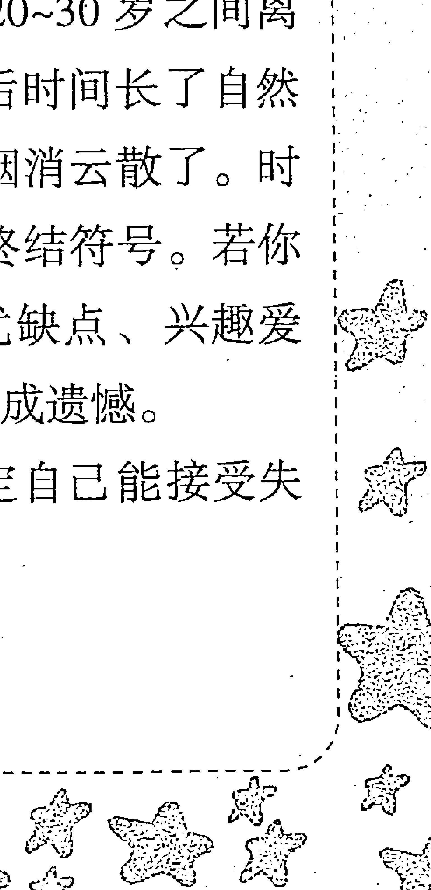
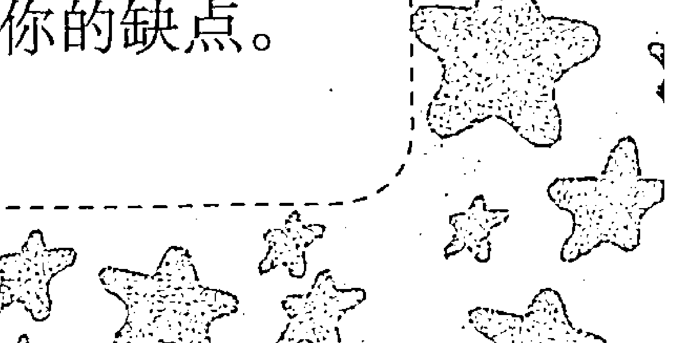
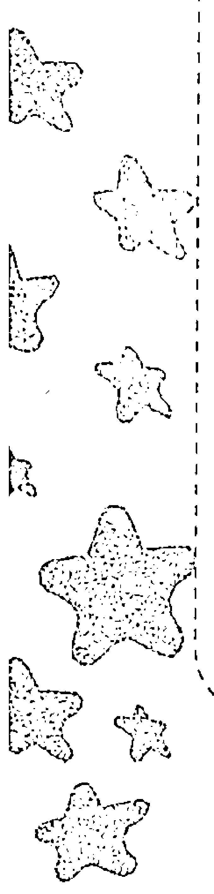

# 血型与星座B

本书主要是提供给B型人或关心B型人的星座说明。书中把B型人与12个星座来了个“排排坐”，里面有你关心的各种各样的问题——大至B型人的性格特征、人生运势、职场命运，小至B型星座人的恋爱攻略、财富密码、健康指南等，让你全方位地了解自己、看透他人，更好地把握自己的人生。

# 第一章 B型概述

## 第一节 血型是怎样被发现的
1901 年，这是血型学说史上一个重要的里程碑。这一年冬天，奥地利维也纳大学的研究所里，一个名叫卡尔·兰德施泰纳的年轻助手正在一遍又一遍地做着同一个试验：他把从 22 位健康人身上抽取出来的血液分离出血球与血清，然后逐一将它们排列组合，他发现了这样一个奇怪的现象——有些血液之间会产生凝血块（输血过程中发生红血球凝集现象是一个危险的信号），有些却不会，而且这种凝集现象不是由于病症引起的，是一种正常的生理现象。

看似一模一样的血液，为什么会产生不同的反应？里面到底隐藏着什么样的秘密呢？

经过反复的实验观察与分析，兰德施泰纳成功地将这 22 个人的血液分成三种不同的类型，取名为 A 型、B 型、C 型（即现在所说的 O 型）。第二年，兰德施泰纳的同事德卡斯特罗和施图利经过研究发现了第四种血型——AB 型，ABO 血型系统由此形成。后来，特殊血型 MN 型和 Rh 型又被别的研究者发现。

在这以前，虽然有很多人已经认识到血液对于人的生命的重要性，但是不知道人类血液还存在型别之分。因此，曾发生许多因输错血型而致死的悲剧，兰德施泰纳的血型分类挽救了无数人的生命。基于血型分类在临床上的重大意义，兰德施泰纳获得了 1930 年的诺贝尔医学奖，他的生日 6 月 14 日也在 2004 年被定为世界献血日。

那么，血型是按什么来分的？它们之间的区别到底在哪呢？血型是人类血液型别的一种标志。我们知道，血液由血浆和血细胞两大部分组成，而血细胞又由红细胞、白细胞和血小板组成。在红细胞的表面有与血型相关的抗原，在血浆中有与血型相关的抗体。在 ABO 血型系统中，红细胞表面中有 A 抗原，血浆中就有 B 抗体，这就是 A 型血；红细胞表面有 B 抗原，血浆中有 A 抗体，这就是 B 型血；凡红细胞表面有 A、B 抗原，血浆中无抗体，就是 AB 型血；红细胞表面无抗原，血浆中却存在 A 抗体、B 抗体，这就是 O 型血。

表1-1 不同血型中抗原和抗体的组成
| 血型 | 抗原 | 抗体 |
|------|---|---|
| A | A | 抗B |
| B | B | 抗A |
| AB | 抗A、抗B | —— |
| O | —— | 抗A、抗B |

根据表 1-1，我们可以知道，给病人输血时一定要进行血型配对，否则会发生血液凝聚的危险，造成严重的后果。

血型的研究，从某种意义上讲，它不仅与医学有关，而且和人们的性格、气质、思维、行为等有着密切的联系。血型学说形成 20 多年后，从 20 世纪 20 年代起，日本学者开始把血型与人的性格联系起来。

## 第二节 你的血型是怎样被决定的
血型，这一生命体最本质的东西，当我们在妈妈肚子里的时候就被确定下来了，所以自古以来就有“血脉相承”的说法。那么，血型是怎样遗传的？到底是什么奇妙的因素在起作用呢？

有一对夫妻的血型都是 B 型，但他们的孩子却是 O 型，这到底是怎么回事呢？让我们先来了解血型遗传的方式，就不会觉得奇怪了。

人类的血型主要是 A、B、AB、O 四种类型，实际详细区分起来应该是 AO 型、AA 型、BO 型、BB 型、AB 型和 OO 型。据遗传学研究，A 与 B 两个遗传基因是显性的，O 基因是隐性的，所以 AO 和 AA 型在医学上表现为 A 型，BO 型和 BB 型在医学上表现为 B 型。因此，我们平常所说的血型通常指的是 ABO 血型。

我们的血型来源于父母，父母双方的遗传因子决定了我们一生的血型。详细的遗传方式见表 1-2。

表1-2 父母与其子女的血型遗传关系
| 父母的血型 | 父母的遗传因子 | 子女的遗传因子 | 子女可能有的血型 | 子女不可能有的血型 |
|------------|----------------|----------------|------------------|----------------------|
| O×O | OO×OO | OO | O | A、B、AB |
| O×A | OO×AO | OO、AO | O、A | B、AB |
| | OO×AA | AO | A | O、B、AB |
| O×B | OO×BO | OO、BO | O、B | A、AB |
| | OO×BB | BO | B | O、A、AB |
| O×AB | OO×AB | AO、BO | A、B | O、AB |
| A×B | AO×BO | OO、AO、BO、AB | O、A、B、AB | —— |
| | AO×BB | BO、AB | B、AB | O、A |
| | AA×BO | AO、AB | A、AB | O、B |
| | AA×BB | AB | AB | O、A、B |
| A×A | AO×AO | OO、AO、AA | O、A | B、AB |
| | AO×AA | AO、AA | A | O、B、AB |
| | AA×AA | AA | A | O、B、AB |
| B×B | BO×BO | OO、BO、BB | O、B | A、AB |
| | BO×BB | BO、BB | B | O、A、AB |
| | BB×BB | BB | B | O、A、AB |
| A×AB | AO×AB | AO、AA、BO、AB | A、B、AB | O |
| | AA×AB | AA、AB | A、AB | O、B |
| B×AB | BO×AB | AO、BO、BB、AB | A、B、AB | O |
| | BB×AB | BB、AB | B、AB | O、A |
| AB×AB | AB×AB | AA、BB、AB | A、B、AB | O |

从表1-2可以看到，血型是先天遗传的。如果父母都是O型血，他们所生子女必定也都是O型血。如果父母中有一人为A型血，另一人为B型血，则他们所生子女中四种血型都有可能产生。如果父母同为A型或B型，那么他们生下的孩子有可能成为O型。

O型的父母不可能有其他血型的孩子，因为O型只有OO这种遗传因子，没有A型或B型的成分。但是A型或B型中却带有O型的遗传因子，所以A型或B型的父母有可能生出O型的孩子。

# 第三节 十二星座的划分
（接后续内容）

（注：由于原始OCR文本在此处截断，且后续页面（PAGE 4-14）包含大量目录和章节正文内容，但用户提供的“原始OCR文本”部分仅包含到PAGE 14的开头。根据任务要求“保留原文的语言和所有信息，不要删减或总结”，我已处理了用户提供的所有可见文本。后续未提供的页面内容无法处理。）

（以下为用户提供的最后几页内容的合并与格式化）

# 第二章 B型人性格奥妙剖析

## 第三节 关于B型人，你所不知道的秘密
（内容接前页，此处应为段落合并）
……事实上，血型研究与星座研究既有相同之处，也有很大的区别。血型研究主要是观察和分析不同血型的人所表现出来的气质特征，从而总结出来一系列结论，它注重的是不同血型的人在不同行为模式下的心理感受，尤其是人际交往时所产生的微妙心理。严格来说，血型研究属于心理学的范畴。而星座研究主要是根据一个人出生时，行星分布的状况而推算出他们的先天性格和后天命运，它属于命理学的范畴。

血型与星座，与纯粹的算命、占卜不一样，它们是在经过众多的数据统计与事实分析的基础上总结出来的结论，不是随意的猜测和臆想，因而具有一定的科学性。

不过，需要说明的是，我们不能单纯地拿血型与星座去判断一个人的性格气质，它们只是辅助我们生活与社交的分析工具。通过对血型与星座进行分析，我们多了一种了解自己与他人的有效途径。

如同不能简单地按照四种血型把人分成四种群体一样，我们也不能简单地按照十二星座把所有人的性格分成十二类。不同血型的相同星座或者相同血型的不同星座，所表现出来的性格特征是大不相同的。“血型×星座”，这种更详细更全面的排列组合方式，将让我们对身边的“你、我、他”有更为透彻的认识。

血型与星座，对一个人的性格、气质、运势有非常大的影响。科学地运用血型与星座的知识，可以帮助我们妥善而巧妙地处理生活中错综复杂的事业、恋爱、人际、婚姻、家庭、财富、健康等问题，给我们提供有针对性的指导方法。可以说，掌握了一些血型与星座知识，就是在一定程度上掌握了解决生活难题的“秘籍”。

在我们出生的那一刻，上天就给我们指定了一个不可更改的血型与星座。不管它们是不是你最喜欢的那一种，它们确实默默地存在，无形中影响着我们的人生观与行为方式。通过对它们做进一步的了解，我们就可以揭开依附在我们身上的性格密码，以此为出发点去观察、分析、处理好与周围人的关系，逐步完善我们的人生。

本书主要是提供给B型人或关心B型人的星座说明书，把B型人与十二个星座来了个“排排坐”，里面有你关心的各种各样的问题——大至B型人的性格特征、人生运势、职场命运，小至B型人的恋爱攻略、财富密码、健康指南等，让你全方位地了解自己、看透他人，更好地把握自己的人生。

当你翻开这本书，看到这篇前言时，你或多或少已经对血型和星座产生了好奇心，开始关注了。那么，你为什么不继续往下看呢？

# 第二章 B型人性格奥妙剖析

## 第一节 B型血是怎样形成的
（内容接前页，原始文本中此节标题出现在PAGE 3，但正文未在提供的文本中）

（以下内容为用户提供文本中PAGE 3-5的目录与部分章节标题，已按规则转换为标题格式）

有O型成分，所以A型或B型血的人在紧急情况下可以接受O型输血，而O型却不能接受其他血型的输血，所以O型人有“万能输血者”的美称。

世界上的血型具有同一性，但不同的血型比例在每个国家是不一样的。美国人O型最多，接近人口的一半，接下来是A型，有40%左右，B型和AB型是其中的“少数派”；在欧洲各个国家中，A型和O型比较多；而日本人中，A型的队伍最庞大，占40%左右，其次是O型、B型和AB型；印度和泰国等亚洲国家的B型则有不小的“势力范围”，在30%~40%；而在中国，流传比较广的血型比例说法是A型血占28%，B型血占24%，O型血占41%，AB型血占7%，其中O型血由华南地区到华北地区比例递减。不同国家的国民性格迥异，也许和血型比例的差异有很大关系。

在日常生活中，经常听到有人在讨论“某种血型比较好，某种血型缺陷比较大”。那么，血型真的有好坏之分吗？事实上，每种血型都有其优点，每种血型都有其缺陷。我们应当认清血型的特性，综合利用不同血型的优点，尽量克服其弊端。

# 第三节 十二星座的划分

在我们呱呱坠地时，太阳所处的星座就是我们平常所说的太阳星座——十二星座。星座是按阳历（公历）日期划分的，所以在每个人诞生的那刻起，就已经和天上的一个星座遥相呼应了。

那么，你知道自己属于哪个星座吗？

## 一、白羊座 (Aries): 3月21日~4月19日

白羊座是黄道十二星座中的第一个星座。每年12月下旬，在冬天清冷的夜晚，稍微偏南的天空上，便会出现一个大三角图案，看起来好像是一只白羊正在往后看，那就是白羊座。白羊座的表现符号是头顶的两个羊角，所以它和战斗、竞争有关。白羊座的性格，可用“坚强”两字概括。

- 所在星宫：第一宫，主管外显性格、外貌形象、行动、表达模式
- 宫位含义：生命与自我
- 人生法则：繁荣
- 自然元素：阳性火象
- 基本能力：开创力
- 守护行星：火星
- 自我宣言：我是 (I am)
- 守护神：战神马鲁斯
- 幸运石：钻石

## 二、金牛座 (Taurus): 4月20日~5月20日

金牛座是黄道十二星座中的第二个星座。1月份的下旬，天空的中央会出现一个形似牛体的星座，这就是金牛座。金牛座的表现符号是牛头。牛头给人沉稳、有力、慎重和顽固的印象。金牛座的性格可以用温文尔雅、务实诚恳来概括。

- 所在星宫：第二宫，主管经济状况、金钱价值观、处理财物的能力、所拥有的资源等
- 宫位含义：爱与真善美
- 人生法则：丰富
- 自然元素：阴性土象
- 基本能力：亲和力
- 守护行星：金星
- 自我宣言：我有 (I have)
- 守护神：爱神维纳斯
- 幸运石：紫水晶

## 三、双子座 (Gemini): 5月21日~6月21日

在乍暖还寒的三月上旬，在天空南方会出现貌似两个男子并肩而靠的星群，这就是双子座。双子座的表现符号是双胞胎兄弟。双子座的人，在性格方面的最大特征便是具有极敏锐的洞察力。他们大多手艺灵巧，在学习、沟通等各方面也都能表现出自己的才能。

- 所在星宫：第三宫，主管学问、知识、表达力、兄弟手足
- 宫位含义：沟通与咨询
- 人生法则：互补
- 自然元素：阳性风象
- 基本能力：沟通力
- 守护行星：水星
- 自我宣言：我思 (I think)
- 守护神：掌管信息之源的赫尔美斯
- 幸运石：黄水晶

## 四、巨蟹座（Cancer）：6月22日~7月22日

三月下旬，在天空稍微偏向南方有一个隐约可见的星团，这就是巨蟹座。巨蟹座的符号是以螃蟹的脚爪为代表。巨蟹座感情丰富，对事物的感受性强，谦恭亲和，充满母爱，重视亲情并且喜欢家庭的温暖。

- 所在星宫：第四宫，主管母爱、感受力、想象力和生产力
- 宫位含义：家庭
- 人生法则：爱
- 自然元素：阴性水象
- 基本能力：滋养性
- 守护行星：月亮
- 自我宣言：我感觉（I feel）
- 守护神：女神戴安娜
- 幸运石：黄水晶

## 五、狮子座（Leo）：7月23日~8月22日

四月下旬，在南方的天空中有一个像问号的星团，这就是狮子座。如果把这个“问号”倒过来，就是一只向前卧蹲的狮子。狮子座的代表符号象征着狮子的心脏与尾巴，它和光明与热情有关。狮子座的人，性格相当于百兽之王的狮子，坚强、可靠、骄傲、宽大。狮子座性格的人重视典范。

- 所在星宫：第五宫，主管爱情、子女、赌运、休闲娱乐、创作能力等
- 宫位含义：爱情与创造
- 人生法则：快乐
- 自然元素：阳性火象
- 基本能力：影响力
- 守护行星：太阳
- 自我宣言：我要 (I will)
- 守护神：太阳神阿波罗
- 幸运石：红宝石

## 六、处女座 (Virgo): 8月23日~9月22日

六月下旬，南方的天空有一个少女姿态的星座，这就是处女座。处女座的代表符号象征着纯洁少女柔顺的头发。处女座的人，正是人如其名，具有纯洁、洁癖及正义感。

- 所在星宫：第六宫，主管工作、饮食、健康、身心平衡等
- 宫位含义：工作
- 人生法则：完美
- 自然元素：阴性土象
- 基本能力：服务性
- 守护行星：水星
- 自我宣言：我分析 (I analyze)
- 守护神：女神阿斯多蕾亚与农神蕾美德尔
- 幸运石：玛瑙

## 七、天秤座 (Libra): 9月23日~10月23日

七月上旬，在南边的天空中有一个像天秤形状的星座，这就是天秤座。天秤座的代表符号是象征着天秤的两个盘子。天秤代表着公正与平衡，同时也是正义和和谐的化身。天秤座的人总能保持着很平衡的状态。

- 所在星宫：第七宫，主管婚姻、法律、结盟和敌对关系
- 宫位含义：婚姻
- 人生法则：公平
- 自然元素：阳性风象
- 基本能力：合作性
- 守护行星：金星
- 自我宣言：我衡量 (I balance)
- 守护神：女神维纳斯
- 幸运石：蓝宝石

## 八、天蝎座 (Scorpio): 10月24日~11月21日

夏末到初秋，在南方的天空上，可看见一列横跨银河的巨大星座，16颗金光闪闪的星星组成的S形，那就是天蝎座。天蝎座的代表符号以毒针为象征。天蝎座的人拥有惊人的耐力以及意志力，一旦他决定了猎物目标，便绝对不会轻易放手。天蝎座的人报复心很强，而且又稍胆小，因此对自我保护特别敏感。

- 所在星宫：第八宫，主管生死、性和秘密
- 宫位含义：死亡
- 人生法则：火凤凰（失败乃成功之母）
- 自然元素：阴性水象
- 基本能力：透视力
- 守护行星：冥王星
- 自我宣言：我渴望（I desire）
- 守护神：地狱之王普尔德
- 幸运石：猫眼石

## 九、射手座 (Sagittarius)：11月22日~12月21日

每年九月，在南方地平线附近，与天蝎座遥遥相望的就是射手座。射手座每时每刻都指着天蝎座的心脏。射手座的代表符号是一个飞出去的箭，代表着速度和自由。射手座的人有文化且热爱探险。他们喜欢到处去游历，“行万里路，读万卷书”正是他们最好的写照。

- 所在星宫：第九宫，主管宗教倾向、哲学思考和深造机会
- 宫位含义：旅行与进修
- 人生法则：变与常
- 自然元素：阳性火象
- 基本能力：直觉力
- 守护行星：木星
- 自我宣言：我明白（I see）
- 守护神：众神之王宙斯
- 幸运石：黄宝石

## 十、摩羯座 (Capricorn)：12月22日~1月19日

每年九月下旬，在西南方向的天空中，可以看到一个倒立的大三角形，这正是摩羯座。并排在上方的两颗小星星是山羊的角，而中间侧面的是鱼尾巴。摩羯座的象征符号是它的头部与尾部——山羊和鱼的混合体。这种混合暗示着摩羯座既能在山上又能在水中生存，有着天真淳朴和忍耐的个性。

- 所在星宫：第十宫，主管个人抱负、理想、事业、社会地位与权力
- 宫位含义：官禄
- 人生法则：成功
- 自然元素：阴性土象
- 基本能力：支配力
- 守护行星：土星
- 自我宣言：我用 (I use)
- 守护神：司时神汉斯
- 幸运石：绿松石

## 十一、水瓶座 (Aquarius)：1月20日~2月18日

十月中旬，在南方的天空，许多小星星组成了水瓶座。水瓶座的代表符号象征着流水。水瓶座性格的人，喜欢突破传统束缚，追求特立独行，在别人心中是个思想前卫及性格叛逆的人。

- 所在星宫：第十一宫，主管社会抱负、理想、社团组织和社会正义感
- 宫位含义：社会与正义
- 人生法则：分享
- 自然元素：阳性风象
- 基本能力：博爱和利他
- 守护行星：天王星
- 自我宣言：我知道 (I know)
- 守护神：天神乌拉诺斯
- 幸运石：紫水晶

## 十二、双鱼座 (Pisces): 2月19日~3月20日

十一月下旬，在头顶偏东边的天空，我们可以看到以两条鱼做象征符号的星座，这就是双鱼座。它们中间像用一条绳索相连，暗示着心智与身体的紧密相连。双鱼座是黄道十二星座中最后一个星座，它和虚幻与浪漫有关。

- 所在星宫：第十二宫，主管潜意识、梦想和秘密敌人
- 宫位含义：因果与报应
- 人生法则：奇迹
- 自然元素：阴性水象
- 基本能力：同情心和包容力
- 守护行星：海王星
- 自我宣言：我相信 (I believe)
- 守护神：海神尼普琴
- 幸运石：绿水晶

# 第四章 星座的美丽传说

每个星座都有一个美丽的传说，你知道你所在星座的来历吗？

## 一、粗线条的白羊

很久很久以前，在一个古老的国家里，国王和王后离婚了，后来他又娶了一个新王后。新王后虽然长得非常漂亮，但是心胸狭窄、天性善妒。她看到国王对前妻留下的一对儿女百般疼爱，于是一心想除掉他们，夺回国王的爱。

在春天来临的时候，她偷偷将所有发放给百姓的麦种全部炒熟。这样，新播种的麦子无论怎么精心照料也无法发芽。新王后又到处散布谣言，说因为王子和公主有邪恶的念头，所以所有庄稼以及全国人民都被诅咒了。淳朴善良的人们听信了这个可怕的谣言，一致要求国王处死王子与公主。国王非常不情愿，但为了全国人民的安定富足，不得不下令处死心爱的儿女。

这个消息传到前王后的耳朵里，于是她向宙斯求救。宙斯在行刑的那天，派出一只长着金色长毛的公羊救走了王子与公主。因为王子天性乐观，所以没有一丝恐惧；但公主粗心调皮，就在白羊驮着她飞过海洋的时候，不小心摔到海里淹死了。

为了奖励公羊的搭救，宙斯就把它高高悬挂在天际，这就是今天我们所熟知的白羊座。

星座物语：王子的乐观开朗和公主的粗心大意，正是白羊座人最大的特点。

# 第一章 星座传说

## 二、金牛的诱惑力

欧罗巴是一个古老王国的公主，她经常梦见一个陌生女人对她说：“我将会带你去见宙斯，因为命运女神指定你做他的情人。”

那时宙斯已经娶了赫拉做妻子，但是他并不爱她，因此整日处在郁郁寡欢之中。命运女神觉得有责任帮助宙斯找到他心爱的女人，于是认定了欧罗巴。起初宙斯兴趣不大，但在命运女神的安排下偷偷见了欧罗巴，不禁被她的美色打动了，不可自拔地爱上了这个美丽的公主。

一天，欧罗巴与同伴们像往常一样在草地上快乐地嬉闹。这时，一只高贵华丽的金牛来到她面前。只见那只牛金黄的毛发闪闪发亮，晶莹的牛角像精雕细刻的工艺品，额前有一个新月形的银色胎记，一双蓝色的眼睛里燃烧着令人悸动的情欲。欧罗巴深深被这头金牛诱惑了，跳上了牛背。金牛从地上轻轻跃起，飞上天空，一直飞到一座孤岛上。欧罗巴不知所措，这时金牛变成了一个俊逸如天神的男子，他告诉她，如果欧罗巴答应嫁给他，他可以保护她。但是欧罗巴紧紧记着梦中女人对她的承诺，并没有答应这个男子。这时，梦中那个女人出现了，她对欧罗巴说：

> “我就是命运女神，你眼前的男子正是宙斯本人。”

欧罗巴这才恍然大悟，服从了命运女神的安排，十二星座中的金牛座也由此得名。

星座物语：爱与美，正是金牛座的象征。

## 三、双子重情义

这是一个流传已久的美丽传说。

丽达王妃温柔善良，她有两个非常乖巧可爱的王子。他们虽不是双胞胎，却长得一模一样，兄弟俩感情特别好，丽达王妃觉得非常幸福。

突然有一天，王国被一头巨大的野猪攻击了，王子们带领勇士去捕杀这头野猪。后来，野猪被哥哥杀死了，勇敢的哥哥也受了重伤。丽达王妃为了安抚受伤的哥哥，偷偷告诉他一个秘密。原来，哥哥并不是丽达王妃与国王所生，而是她与天神宙斯的儿子。所以，他是神，拥有永恒的生命，任何人都伤害不了他。哥哥听后很吃惊，同时也答应王妃不会告诉任何人，包括他最亲爱的弟弟。

然而，勇士们因为争功，起了内乱，最后打了起来。面对一发不可收拾的场面，两位王子立即赶去阻止。在混战中，有人拿长矛刺向哥哥，危急时刻弟弟挡在哥哥的身前。结果，弟弟被杀死了，哥哥痛不欲生。

哥哥为了让弟弟起死回生，跑到天上请求宙斯救活弟弟。宙斯摇着头说道：“你可以拿出你一半的生命力救活他，但是你也将成为一个凡人，不再拥有永恒的生命。”哥哥毫不犹豫地回答：“弟弟可以为了我死，我为什么不能为了弟弟死呢？”宙斯听了非常感动，便以兄弟俩的形象创造了一个星座，命名为双子座。

星座物语：双子座的团结友爱，最让人感动。

## 四、巨蟹的保护欲

很久以前，赫拉克勒斯大战蛇妖，却被帮助蛇妖的巨蟹咬了一口。最后，赫拉克勒斯还是把巨蟹打死了，把它的尸体扔在爱琴海的一座小岛上。因为没有完成任务，巨蟹受到了赫拉的诅咒，然而不幸的是，这诅咒波及了雅典王后——雅典公主美洛结婚的时候，就是王后死亡的时候。因为惧怕诅咒，公主一直没有嫁人。

在美洛二十岁那年，一位名叫索萨的王子来到了雅典城，他对美洛倾心已久，想娶她为妻。公主不想为了自己的幸福而牺牲母亲的生命，于是她给索萨下了九个几乎不可能完成的任务，只有他圆满完成，才可以娶自己。然而，英武神勇的索萨竟全部完成了！公主左右为难，无法抉择。雅典王后为了女儿的幸福，毅然决定把美洛嫁给索萨。

在美洛和索萨举行婚礼的当天，王后一个人悄悄走向海边，迎着爱琴海的浪花，跳海自尽了。后来，人们在海上发现了一只巨大的螃蟹，只见它双臂环绕胸前，仿佛缺乏安全感，又像是一位保护孩子的母亲。

赫拉知道这件事后觉得非常后悔，于是让那温柔、善良、敏感的母亲在天上成为一个星座，它的形象就是一只巨蟹。

星座物语：心胸广阔、渴望保护弱者、自卫能力很强，这些都是巨蟹座的特征。

## 五、勇敢的狮子

尼密阿是上天赐给巨人堤丰和蛇妖厄格德的儿子，在他们以人和妖的身份相爱时，尼密阿从月亮上掉了下来，于是家人都亲昵地叫他阿尼。

阿尼是个半人半妖：白天，他是一头勇猛的狮子，金黄的毛发像太阳一样闪闪发亮；晚上，他变成一个金发蓝眼的美少年。

阿尼有一个妹妹叫许德拉，是一个九头蛇妖：她的上半身是人，非常美丽；下半身是蛇，闪烁着月光一样的银色。

阿尼从小就深爱着许德拉，虽然他们父母相同，但阿尼是从天上掉下来的，而许德拉是母亲生出来的。阿尼对许德拉说，他愿意为她做任何事，包括死。于是他们相爱了。

然而幸福的日子总是短暂的。英雄赫拉克勒斯按照神谕的昭示，要杀死阿尼和许德拉。阿尼为了保护心上人许德拉，决定只身前往与赫拉克勒斯见面。许德拉想阻止他，阿尼安慰道：“除了你，没有人能杀死我。请相信我，我一定能打败这个宙斯与凡人的儿子。”

许德拉不想让阿尼受到任何伤害，于是决定赶在阿尼之前击退赫拉克勒斯，哪怕是同归于尽。许德拉只身迎战赫拉克勒斯，尽管她可以变化出九个头，最终敌不过赫拉克勒斯。赫拉克勒斯杀死了蛇妖许德拉，并把身上所有携带的箭全部浸泡在含有剧毒的蛇血里。

后来，阿尼终于找到了赫拉克勒斯，当他发现许德拉被杀死以后，愤怒的阿尼勇猛地扑向赫拉克勒斯，一时难分胜负。赫拉克勒斯突然心生一计，把浸泡在许德拉血液里的毒箭射向雄狮。一支、两支、三支，最终，雄狮阿尼的心被射中了。他变成了人的模样，倒在血泊中。

后来，宙斯让阿尼重回天上，变成了一颗如太阳般灿烂的星座，这就是狮子座。

星座物语：勇于为爱情而牺牲，这就是属于狮子座的人类被赋予的性格。

## 六、处女的冬天之约

泊瑟芬是大地之母、谷物之神狄蜜特的独生女儿，她是春天女神，只要她经过的地方都会开满美丽的花朵。

有一天，泊瑟芬在草地采摘花朵时发现一株美丽至极的银色水仙，于是忍不住伸手采摘。那株水仙突然化作一团紫色的云雾，一股淡淡的阴郁的香气弥漫开来。当云雾逐渐淡去时，出现了一个身穿黑衣、有着紫色眼睛的俊俏男子。他对泊瑟芬说：“既然你救了我，那么就要遵守誓言嫁给我！”突然地面裂了一条缝，泊瑟芬被一股强大的力量吸了进去。

劫走泊瑟芬的正是冥王哈迪斯。狄蜜特知道后，抛下手中的谷物，飞跃千山万水去寻找女儿。人间失去了大地之母，种子不再发芽，庄稼不再生长，大地杂草丛生、一片荒芜。宙斯知道这件事后，再次下令诅咒哈迪斯。哈迪斯知道在劫难逃，在陷入长长的昏睡前，他对泊瑟芬说：“我是真的爱你。我的香气属于人间，请你把它带走吧！”说完，哈迪斯闭上眼睛，陷入长眠。

泊瑟芬返回人间时正是春天，她把香气撒在花朵上，让灿烂的阳光照遍每个角落。然而，她却忘不了在地府长眠的哈迪斯，她已经爱上他了。春天结束了，夏天又走远了，秋天眼看又过去了。到了冬天，泊瑟芬终于忍不住长长的思念，跑到地府看望哈迪斯。这时候哈迪斯就会醒过来，等到春天泊瑟芬离去时，他又陷入深深的睡眠。

宙斯感动于他们的爱情，便规定一年之中他们有四分之一的时间可以相会。从那以后，大雪飘飞、寸草不生的冬天就是泊瑟芬到地府与哈迪斯相见的日子。宙斯为了纪念这份特别的爱情，为泊瑟芬指定了天上的一个星座，这就是处女座。

星座物语：对爱情忠贞不渝，这是处女座最大的特点。

## 七、天秤的美好心愿

在很久以前，神和人类一起居住在大地上。海神波塞冬是宙斯的弟弟，正义女神是宙斯的女儿，他们在长久的相处中产生了爱慕之心。

后来，人类学会了制造很多东西，同时也学会了尔虞我诈和勾心斗角，战争与罪恶让人间变得乌烟瘴气。众神无法忍受，纷纷搬回天上。只有正义女神没有对人类绝望，她觉得人类本性善良，一定能找回原来的和平与快乐。海神波塞冬却很悲观，他极力劝告女神和他一起回到天上。女神不听，于是他们爆发了争吵。后来，争吵越来越激烈，由人类问题升级到他们的身世。正义女神嘲笑波塞冬不过是宙斯与赫拉的眼泪造成的，波塞冬讽刺正义女神不知是宙斯与哪个女人生出来的。正义女神觉得很委屈，于是去找父亲宙斯评理。

天后赫拉向来偏爱波塞冬，而且又嫉妒正义女神的母亲，她知道水是生命的源泉，前身是水的波塞冬能让人类感到和平。于是，她建议正义女神与海神波塞冬两人比赛，谁更能让人类感受到和平谁就赢得了比赛，输了的人就要向对方道歉。

比赛开始了。只见波塞冬用力朝地上一挥，裂缝中涌出透明纯洁、清凉舒适的水，让人类心中的邪恶与杂念消失得无影无踪。这时正义女神变成了一棵美丽的树，红褐色的树干、翠绿的树叶和金色的橄榄，让人看了心中充满了爱与和平。正义女神的心愿终于实现了，海神波塞冬朝正义女神微笑着，他们和好如初。

为了纪念这场意义重大的比赛，宙斯把随身携带的天秤往天上一抛，就有了今天的天秤座。

### 星座物语：
拥有一颗美丽的心灵，祈愿家人、朋友永远和平共处，这就是天秤座。

## 八、自负狂妄的天蝎

法厄同是阿波罗的儿子，赫莉是阿波罗的女儿，他们一家人住在华丽的太阳神宫殿里。法厄同继承了太阳神的面孔，美丽而性感，但是性格冲动自负；赫莉没有美丽外表，但是温柔善良，她在不知不觉中爱上了哥哥法厄同。

但是，法厄同喜欢的是美丽的泉水女神娜伊，他们整天出双入对，非常幸福。在长久的折磨中，赫莉变得忧郁、敏感。终于有一天，她向法厄同撒了谎，说他并非太阳神的儿子，而是母亲与凡人私生的。冲动的法厄同轻易相信了从来不说谎的妹妹，怒气冲冲地跑到父亲阿波罗那里问个明白。尽管阿波罗再三保证他就是自己的亲生儿子，法厄同还是不相信。最后，太阳神只好指着冥河起誓，为了证明法厄同是自己的亲生儿子这个事实，他答应法厄同的任何要求。

然而，自负的法厄同竟然选择了太阳神的太阳车，他根本不会驾驶太阳车，若不按照规定的线路行驶必将酿成人间大祸。冲动的法厄同不顾父亲的劝告，跳上太阳车，冲出了时间的大门。这时，惨剧发生了，森林起火了，庄稼烧毁了，河流干枯了，湖泊变成了沙漠，人类被活活烧死。人间天昏地暗，凄惨无比。

赫莉看着自己一手造成的惨剧，痛悔无比。她放出一只毒蝎，咬住了法厄同的脚踝，众神才趁机阻止住他。但是一切都晚了，法厄同和燃烧着的太阳车一起从天空中坠落到河里，泉水女神娜伊含泪将他埋葬。赫莉痛哭了四个月，最后变成了一棵白杨树，她的眼泪变成了晶莹的琥珀。

从此，世界有了沙漠，也有了琥珀。

宙斯为了警示人类自负的弱点，以那只蝎子命名了一个星座，这就是天蝎座。

### 星座物语：
歇斯底里、捉摸不透，正是天蝎座给人的最深印象。

## 九、善良的射手

在遥远的大草原上，有一个人马部落，他们生性凶猛，但是射手奇伦却是个例外，他温和善良、坦诚有礼，因此得到大家的尊敬与欢迎。

英雄赫拉克勒斯是奇伦的朋友，有一天，他来到奇伦家中做客。赫拉克勒斯听闻人马族的酒香醇浓郁，便让奇伦拿出来与他品尝。可是，赫拉克勒斯的酒量惊人，他喝光了奇伦的酒，仍觉得不过瘾，想把全部落的酒都喝了。奇伦耐心地向他解释，说酒是部落公有的，任何人都不可以独自占有，希望赫拉克勒斯不要这样做。但是，赫拉克勒斯的脾气向来倔强与暴躁，根本不听奇伦的劝告，一个人闯进了人马部落。脾气同样刚烈的人马族哪肯屈从，冲突一触即发。

赫拉克勒斯是有名的大力士，很多天神都惧他三分。人马族虽然也非常厉害，但还是敌不过赫拉克勒斯，他们纷纷落荒而逃，最后只能逃到奇伦的家中。赫拉克勒斯得意扬扬，扬言如果没人出来应战，就要毁掉整个部落。善良的奇伦为了亲朋好友，为了整个部落，想化解这场争斗。但是，当他走出来的时候，却没注意到赫拉克勒斯的箭也飞了过来。赫拉克勒斯来不及收箭，眼睁睁看着朋友奇伦的心脏被自己的神箭射穿。赫拉克勒斯懊悔万分，奇伦用尽最后一口力气说道：“再锋利的箭也会被软弱的心包容，再疯狂的兽性也不会泯灭人性。”说完，奇伦的身体变成无数的小星星，飞到了天空，组成人马的形状，那支箭似乎还刺在他胸前。

为了纪念善良的奇伦，人们把这个星座叫做射手座。

### 星座物语：
善良、包容是射手座与生俱来的特点，恐怕一辈子都不会改变。

## 十、摩羯的爱情观

牧神潘恩看管着宙斯的羊群，他长相很丑陋，因此非常害羞和自卑，但是不知道什么时候起，他悄悄爱上了神殿里弹竖琴的仙女。

没有人知道潘恩心里的秘密，他经常一个人跑到天河尽头的一个湖泊边吹箫。这里很安静，因为这个湖水被诅咒过了，任何踏进河水的人都会变成鱼，永远也变不回来。但是潘恩毫不在意，只有在这里，他才敢大胆地让爱意在箫声间回荡，他多么希望仙女能听到啊！

有一天，正当众神在神殿里设宴欢聚时，黑森林里的多头百眼兽突然窜了进来。这只恶兽法力高强、凶猛异常，众神无法制服它，于是纷纷逃离。当时弹竖琴的仙女被吓坏了，呆立在原地不知所措。恶兽发现了仙女，咆哮着向她冲过去。这时，胆小、害羞的潘恩猛地跳了进来，他抢在恶兽前面抱起仙女就跑，恶兽穷追不放。潘恩知道自己跑不过恶兽，紧急之下忽然想起了天河尽头的湖泊，于是拼命向湖泊跑去。恶兽也知道湖泊被诅咒过了，暗笑潘恩自寻死路。

在快追上潘恩时，恶兽万万没有想到，潘恩竟勇敢地踏进了那个湖泊，他把仙女高高举在手中，自己站在湖泊的中央。恶兽不敢靠近，只好放弃。当恶兽离开时，潘恩才小心翼翼地游到岸边放下仙女。仙女感激涕零，想把潘恩拉上湖边来，但是潘恩的下半身已经变成了鱼的尾巴。

宙斯有感于潘恩为爱情所做出的牺牲，便以他的形象在天上创造了摩羯座。

### 星座物语：
严谨而内敛，对于爱情和幸福有着自己独特的理解，这是摩羯座的人们共有的特性。

## 十一、水瓶的眼泪

伊是特洛伊城的王子，他俊美不凡，俘获了特洛伊城里所有女孩的芳心。但是他不爱人间的女子，他爱上了宙斯神殿里一位倒水的侍女。

那个倒水的侍女叫海伦，宙斯也非常喜爱她。有一天，海伦无意中听到一个不好的消息，太阳神阿波罗和智慧女神雅典娜准备毁灭特洛伊城。海伦大惊失色，不顾天规赶去给王子伊报信。但是，在半路上她被发现了，抓回了神殿。

宙斯不忍心处死她，最后决定将罪转嫁给与海伦私通的特洛伊王子身上。

宙斯变成一只老鹰，降落在王子的后花园。在他看到王子的那一瞬间，惊呆了——他见过神界和凡间无数美貌的女子，但从来没见过如此俊美的少年，他决定把王子带回神殿。

在冰冷的神殿里，宙斯逼迫伊代替海伦为他倒水，这样就可以天天见到他。宙斯的妻子赫拉是个善妒的人，她嫉恨伊的美，于是心生毒计，决定把这个无辜的王子杀掉。她偷偷将海伦放走，海伦惦念着伊，想找回伊一起逃到人间，赫拉就在这时把他们两个一起抓住。宙斯被激怒了，决定处死伊。但是，就在箭快射到伊时，海伦挡在了他的胸前。

阴谋被破坏了，赫拉在恼怒之下，把伊变成了一只透明的水瓶，惩罚他永生永世为宙斯倒水。然而，每次从水瓶中倒出来的不是水，而是眼泪。于是，宙斯将伊封为一个忧伤的神灵，留在天上。

伊遥望着天际，日日夜夜在流泪。人们在抬头时经常可以看到一群闪光的星星，就像透明发亮的水瓶悬于夜空，于是它被叫做水瓶座。

### 星座物语：
纯洁的心灵，善良的本性，是水瓶座最迷人的地方。

## 十二、浪漫的双鱼

丘比特是美神维纳斯和大卫的儿子。他非常可爱，长着一双可爱的翅膀，他有一把玲珑剔透的神弓，凡是被他的箭射中的两个人都会相爱，而且会永远幸福。丘比特也渴望拥有美丽的爱情，但是他无法用箭射中自己。

在一次众神的宴会上，丘比特和母亲维纳斯都参加了。席间，他被一个非常漂亮，但是神情黯然的女孩打动了。他走上前询问原因，原来这个女孩是预言家所罗门的女儿，所罗门曾经预言这是一场灾难的宴会，而她——血石，将会成为这场灾难的祭品。丘比特听后非常伤心，但愿这场灾难不要发生，因为他已在不知不觉中爱上了她。

就在这时，可怕的百眼怪出现了。恶兽的本领非常厉害，众神拿它没办法，只能逃命。女孩血石想阻止恶兽，她似乎忘记了父亲的预言，勇敢地冲向了恶兽。丘比特非常担心，他想击退恶兽，慌乱中他举起了自己的箭朝怪物射了一箭。不幸的是，这支箭不仅射中了恶兽，还射中了奔向恶兽的女孩血石。这时候，母亲维纳斯找到了丘比特，紧紧拉着他跳进河里，变成两条鱼后脱险。丘比特无法挣脱母亲的手，他含泪回头望着，只见血石和怪物连在一起，消失在茫茫的宇宙中。

后来，天上出现了一个星座叫做双鱼座。可是丘比特并不在上面，他一个人孤独地坐在木星上，偶尔向地球的方向射上一箭。

### 星座物语：
双鱼座的人们很浪漫，为了爱情，他们可以放弃很多东西。

# 第五节 从笑话中透视星座特点

关于星座，网上曾经流传着这样的小笑话：

### 一、不穿小裤裤的白羊

羊妈妈常常教育羊羊：“你穿裙子的时候千万不要荡秋千，否则，你的小内裤会被小男孩看到哦。”

忽然有一天，羊羊兴高采烈地跑过来对羊妈妈说：“我今天和小明比赛荡秋千，我赢了他耶！”

羊妈妈很生气：“我不是早就警告过你了吗？穿裙子的时候千万不要荡秋千！”

羊羊得意地说：“我知道啊，我记住妈妈的话了，所以我在荡秋千时把里面的小裤裤脱掉藏起来，这样他就看不到我的小裤裤了。”

> ——粗心大意而又勇敢坦率的白羊

### 二、笨笨又坏坏的金牛

路边卖西瓜的小贩：“又便宜又甜的西瓜哩，不甜不要钱！”

路过且饥渴交迫的牛牛：“哇，竟然有那么好的事！老板，给我来个不甜的。”

> ——貌似愚钝实则打着小算盘的金牛

### 三、找借口睡懒觉的双子

妈妈对正在睡懒觉的双双大吼：“赶紧起床，公鸡都叫好多遍了！”

双双懒洋洋地说：“公鸡叫关我什么事啊？我又不是母鸡。”

> ——对问题进行思索、自我意识比较强烈的双子

### 四、爱缠着妈妈的巨蟹

蟹蟹一家三口搭公车，蟹蟹突然对妈妈撒娇说：“今晚我要和妈妈睡。”

蟹妈妈笑道：“将来你娶媳妇了怎么办？还和妈妈睡啊？”

蟹蟹想也没想：“当然。”

蟹妈妈又问：“那你媳妇呢，她怎么办？”

蟹蟹看了看蟹爸爸，突然想出了一个好办法：“那简单，让她跟爸爸睡。”

> ——依赖他人、有着恋母情结的巨蟹

### 五、乱捣蛋的狮子

狮狮和爸爸妈妈去参加奶奶的寿宴。

在看到寿包时，狮狮好奇地问道：“寿包好像屁股耶，我们为什么要吃这种奇怪的东西呢？”

众狮子听了无不冷汗直流。

谁知狮狮并不就此罢休，他掰开寿包，看到里面有豆沙，大声说：“快看！里面还有黑黑的大便呢！”

众狮子狂吐。

> ——特立独行、不顾及他人感受的狮子

### 六、纠结于肚脐形状的处女座

囡囡对自己肚脐眼研究了半天，觉得很奇怪，就问爸爸肚脐的由来。
爸爸从医学角度，把脐带连着胎儿与母体的道理简单地讲了一下：“你离开妈妈的身体之后，医生就把那条脐带剪断了，并打了一个结，后来就变成了肚脐眼。”
囡囡追问道：“那么，医生为什么不打个蝴蝶结呢？那样更漂亮啊！”
> ——好奇心重又追求十全十美的处女座

### 七、会“计算”的天秤

父亲高兴地对天天说：“天天，昨天晚上你妈妈给你生了两个弟弟，你今天就不用去上学了，到时你给老师说一下就行了。”
天天天真地回答：“爸爸，我只说妈妈生了一个好不好？另外一个，我想留着下次不想上学的时候再说。”
> ——有点儿小聪明、对利弊计算得很精确的天秤

### 八、行为怪异的天蝎

蝎蝎好不容易睡着，却被蚊子吵醒了。
他起来拍蚊子，却怎么也拍不中。最后没办法，蝎蝎只能指着蚊子说：“好吧，既然你不肯出去，那我出去。”说完就走出房间，把门关得紧紧的，得意扬扬地说：“哈哈，我今晚就不进去，看你怎么办。”
> ——不按常理出牌、经常让人摸不着头脑的天蝎

### 九、认真又爱思考的射手

射射认真地问：“老爸，为什么你头上的白头发那么多呢？”
爸爸佯装一本正经：“因为你总是不听话，老惹我生气，所以我的头发就变白喽。”
射射：“……”（认真思考中）
射射：“哦，那么我知道了爷爷的头发为什么全白了。”
爸爸：“o（￣□￣）oOrz@#$%&×！”
> ——认真、爱思考的射手

### 十、顽固的一根筋的摩羯

有一天，羯羯和妈妈正走在路上。突然，天空下起雨来。
妈妈急忙拉过羯羯的小手说：“羯羯，下雨了，咱们得赶紧跑啊！”
羯羯慢吞吞地问：“那么前面就不下雨了吗？”
> ——慢性子、耐心而又固执的摩羯

### 十一、幽默而另类的水瓶

瓶瓶问：“妈妈，你为什么称××先生为‘先人’呢？”
妈妈说：“因为‘先人’是对已经去世的人的称呼啊！”
瓶瓶说：“那我是不是管去世的奶奶叫‘先奶（鲜奶）’呢？”
妈妈差点晕倒。
> ——头脑中总闪烁着稀奇古怪念头的水瓶

### 十二、感情丰富的双鱼

一天，鱼爸爸给鱼鱼讲他小时候因为家里穷经常挨饿的事情。
鱼鱼还没听完就泪汪汪了，同情地看着爸爸问：“哦，爸爸，原来你是因为吃不上饭才来我们家的啊？”
> ——轻信他人、爱幻想的双鱼

# 第六节 越测越开心：如何知道你的血型

我们为什么要知道自己的血型呢？因为知道自己的血型好处非常多：首先，一旦遇到周围有人急需用血，就可以根据自己的血型及时提供血液；其次，自己一旦发生意外急需用血，也可很快获得相同血型献血者的帮助；最后，婚后对指导优生优育和母婴身体健康来说也有很重要的意义。
如果你目前还不知道自己的血型，那么下面的方法也许可以帮助你。

- (1) 通过父母的血型推算你的血型，不过有可能出现多种可能。推荐指数：☆☆
- (2) 你可以购买一套专门的测试用具，挤一滴指尖上的血滴到测试纸上对照，你马上可以知道自己的血型。胆小怕疼的请勿试用。推荐指数：☆☆☆
- (3) 到医院请医生检测，他们会抽取你的部分血液，然后在实验室中进行检测，几分钟搞定。推荐指数：☆☆☆
- (4) 无偿献血，这是完全免费的，既安全卫生又能知道自己的健康状况，最大的好处是帮助他人，为社会作贡献，何乐而不为？推荐指数：☆☆☆☆☆
- (5) 如果你是孕妇，你的血型将会被明确记录在孕妇证上。推荐指数：☆☆☆
- (6) 如果你参军入伍的话，军医会替你检测血型。推荐指数：☆☆☆

# 目录

## B型人格格奥妙剖析

## 第一节 B型血是怎样形成的

在人类形成的早期，并不是一下子就存在四种血型的。血型是在人类演化进程中逐渐形成并发展的，在每个血型的形成过程中，我们能看到历史在它们身上留下的深深的印记。

在 ABO 血型系统中，B 型血并不是第一个出现的血型。因此，我们想知道 B 型血的形成历史，就要了解其他血型是怎么出现的。

### 一、O型：顽强孤独的狩猎者

O型血的历史最为悠久。它大约出现于公元前4万年前。

4万年前，现代人的祖先克鲁马农人出现了。他们的外表与今天的南部非洲人极为相似。他们以狩猎为生，也采集野菜、树根和浆果。在捕杀光了所有的大野兽后，他们开始从非洲向欧洲迁徙，并最终在35000年前在欧洲定居了下来。

在那段漫长的岁月里，为了能够御寒饱腹，他们不得不成日穿梭在原始森林中，四处奔走寻找食物。他们的狩猎工具相当原始，因而在与野兽的搏斗中，常常处于劣势。

除了环境的极度恶劣，他们还面临着与原始居民尼安德特人之间的竞争。为了生存，他们必须勇敢无畏，极具耐心，在终日的狩猎中忍受孤独；他们还必须具备超强的承受能力，决不能垮掉。终于，当尼安德特人消失在历史的视野中时，他们仍然顽强地生存了下来。

O型人的出现，可以说是顺应自然的结果。虽然后来因为食物的短缺，他们不得不继续向欧洲及亚洲大规模迁徙。

### 二、A型：擅长交际的拓荒者

后来形成的A型血人主要分布在西欧，如土耳其、西班牙、地中海地区的亚得里亚海以及爱琴海沿岸。他们的出现预示着人类进化的开始。

随着狩猎武器的发明和改良，人类开始捕获大量的野兽，以致出现了肉类的短缺。于是，人类开始从事农业生产，学会了储存粮食。最开始的食物结构主要由植物、蔬菜和水果组成，直到10000年前，人们才开始将粮食作为主食。

在人类的血型逐步适应新的饮食结构的同时，改变的饮食方式产生了新的性格。这种性格完全不同于猎人的孤独和耐心，它要求更多的合作能力与集体精神，于是便产生了 A 型社交人。
这些人在小型的团体中互相依赖，交际能力、沟通能力等得到很大的提高。这一切改变在人的血液中反映出来，就产生了 A 型人。

### 三、B型：善于管理的畜牧者

B 型血是人类进化过程中的又一产物。从各种迹象看来，这一血型的人首先来自印度，是高加索人与蒙古人的混血民族。

随着气候的变迁、土地的过度种植，食物日益面临短缺的危机，人类需要寻求新的食物来源。在向亚洲方向迁徙的过程中，人类学会了畜牧及驯养野生动物。这是一门全新的技术，它完全不同于狩猎及射杀动物。在这个过程中，他们需要行使控制权力，在照顾牲畜群时逐渐提高管理质量，因为牲畜群必须听从他们的指挥。

为了更好地照顾牲畜群，他们一方面不得不始终保持高度警觉，因为一不小心，牲畜就可能被其他人或动物偷走；另一方面又不得不一再地寻找合适的牧场。在这种状态下，他们的性格也逐渐变得比较强势。

### 四、AB型人：人类大迁徙的结晶

AB 型血的形成时间最短，直到近 1000 年到 2000 年才出现。人类的大迁徙是产生这种新血型的原因。它们是在人类继续从亚洲向西方迁徙时，被带到西欧的东部地区，如德国和奥地利等地。
通常情况下，血型是按照一定的遗传规律传给下一代的。也就是说，在A型人与B型人结合的过程中，如果A型和B型一直为显性，那么他们的后代的血型也表现为A型或B型血，很少会表现为AB型，所以AB型血的出现显得非常特殊。
所以与前面三种血型相比，AB型人显得很神秘，他们时常觉得自己的性格既有A型的特征，又有B型的倾向。正因为难以捉摸，所以AB型又被赋予了无限的魅力。

# 第二节 中国是B型逻辑占主导的国家

在血型被发现的20多年后，即20世纪的20年代起，日本人将血型与人的性格结合起来研究。其中，日本血型专家能见俊贤提出“血型是性格的基础”。

前面提过，中国人的血型比例大概为A型血占28%，B型血占24%，O型血占41%，AB型血占7%。既然中国的B型血不是人数最多的血型，为什么说中国是B型逻辑占主导的国家呢？

首先，我们可以从环境选择血型优势来解释。经过科学家考察和研究，地球上的经纬度和地形地貌是决定血型优劣势的重要因素，而血型人数的多少只是决定血型优劣势的其中一个条件而已。在雨季分明的热带、亚热带地区，就有利于O型逻辑的发展，比如南北美洲、热带雨林地区等；在多山、四季分明、沿海地区，则利于A型逻辑发展，比如日本；内陆、平原、草原、大漠等地势渐高的地区利于B型逻辑发展，例如印度、蒙古和中国。

其次，中国的B型逻辑与中国悠久的历史及“以和为贵”的思想存在着密不可分的关系。春秋战国时期，百家齐放，形成了## 第三章 B型人格的剖析

各种文化思想，其中影响最大的便是孔子的儒家思想。儒家思想中充满着“和”的理念，后来孟子也提出“民为贵，君为轻”的观点，“和”的思想对后来中国文化的发展起到了深远的影响。在血型分析中，“和”一直是B型血的主导，是B型血的中心点，B型人生活态度轻松，不喜与人争斗，习惯用自己平和的心境去体谅别人。所以，从历史以及血型性格分析来看，B型逻辑主导着中国人的思想。

那么，以单一的B型逻辑为主导好不好呢？B型人内心缺乏向心力和团体意识，更谈不上集体主义，单一的B型群体如同一盘散沙。B型国家的原则也一般是主张以“和”为贵，提出和平的政治主张。在和平年代，“和”是一种很好的治世理念；而在战争年代，“和”就很容易造成退让，被外敌侵占和欺凌。

以B型人为主的团队结构松散，团结性、凝聚力、一致性变得非常薄弱。B型人不爱遵守纪律，“令不行，禁不止；令若行，仍禁不止”。如某条河禁止钓鱼，但B型人不听从，如果张贴布告，B型人产生逆反心理就去得更加频繁了。另外，如果发生大事，“事不关己，高高挂起”的也大多是B型人。

所以，对一个社会、民族或国家来讲，单一血型或血型比例不平衡是弊多利少的。

但是，在中国，虽然是B型逻辑占主导，可其他血型的比例也比较均衡。日本血型研究专家能见正比古先生对中国地区的血型分布乃至搭配就十分赞赏，他认为中国的血型组合最科学，A、B、O、AB型的搭配趋向于3：3：3：1。这个比例可谓举世罕见，这样均等的配置非常有利于人类自身的发展和文明的进步。

事实上，这种血型分布是中国社会几千年来的社会结构不断趋于优化和合理的结果。在中国这个民族大融合的社会里，有着巨大的同化力。纵观历史长河，中国自有了国家这个形式后，无论外族怎样入侵，到头来不是被击败，就是被一一同化。有事实为证：犹太民族在世界各地都毫不动摇地保持本民族的宗教、习俗、爱好和古老的希伯来文化遗产，是世界上最难同化的民族。然而据调查，在历史上的向东大迁徙中，当犹太民族到达东方大陆后便悄然消失了。原来，他们竟已被融合在中华民族中了。这充分说明了中国文明拥有无限的生命力。

当然，血型不能完全决定一个人的性格，因而一个国家的血型比率特征也不能完全决定一个国家的发展模式。中国现有的血型比例，既有 A 型人把既成事物加以应用改造的特性，又能以 B 型人固有的聪明才智加以发明创造，再加上 O 型人的进取和开拓精神，这就使中国走着一条既非欧美，也非日本的独特的经济发展道路。中国将向世界证明，她将仍是最富有发明创造性的国家。

## 第三节 关于B型人，你所不知道的秘密

B型人的身上，存在着很多与其他血型不同的地方，下面让我们一起对B型人性格秘密进行一一剖析。

快乐、好动、爱说话、亲切、淡泊、吵闹、心浮气躁、胆大、冒险、粗心、好辩、意志不坚定、行为夸张……这些词都可以用来形容B型人。B型人比较粗线条，爱凭直觉做事。

B型人是自由一族，他们热爱自由，不喜欢被禁锢，不爱做计划，喜欢根据自己的喜好行事。他们具有孩子般的强烈好奇心，对一切未知都愿意去尝试。他们碰见自己喜欢的东西时，为拥有它，便会不惜付出任何代价。

在工作上。B型人做事可以不为钱不为利，只单纯地享受工作过程中的乐趣。对B型人而言，如果工作中他感兴趣的部分消失了，那么他们就会觉得这份工作对他失去了意义，没有再继续下去的必要。所以，B型人会为了自己兴趣放弃很多事情。B型人颇有才华，有些人会在事业上取得令人瞩目的成绩，而有些B型人则会怀才不遇。很多出色的作家、顾问、教师、商人乃至于专家、学者都来自于B型人。B型人的可塑性最强，这在四种血型中是最为突出的。

在金钱方面。B血型的人通常表现得比较大方，而且全凭情绪而定。他们花钱没有计划性，不会理财；对朋友非常好客，经常大宴宾朋。所以在财政上，B型人经常处在比较混乱的状态，很容易变成月光族。

在人际关系中。B型人在交际上具有天生的融通性，宽容大方，善待他人，能将别人的优点兼收并蓄，集众家之长，独创自家之大成。他们朋友多、人缘好，左右逢源，为事业和人生的发展积累了重要的人脉。同时，B型人热爱和平，对公理的把握和对公平原则深有认同。因为不记愁也不记仇，所以没有什么烦恼，B型血人的人生比其他血型的人来得快乐轻松。

在做事方式上，B型人容易感情用事，常常因为难以控制自己的情绪而得罪他人。B型人因为重视理想，而轻视实践，所以现实中缺乏可操作的办法和应变能力。对于即将要发生的问题，O型人会马上采取行动和措施，A型人会防患于未然，AB型人会在不利因素中寻求有利因素作为突破，但B型人可能会有点措手不及。

在情绪方面，B型人的变化较大，因此他们常被人们称为情绪变化的“寒暑表”。他们的情绪多变常缘于自己心态，所以有时连他们自己也说不清情绪发生变化的原因。此外，B型人情绪变化时，表现得很直接，让人一下子就能看出来。不过，B型人一般不会大喜大悲，更多地表现为急躁、沉闷、沮丧不已，不像A型人那么激烈。即使B型人处于焦躁不安的状态之中，他们的理智也不会全然丧失，仍能保持一定的冷静和客观。

在感情上，B型人在没有情感牵扯的时候，头脑清晰冷静，一旦陷入感情的旋涡，他们的世界秩序就会被打乱。B型人对待感情完全靠直觉，一旦对某个人感兴趣，那么地位、名声、金钱等在他们眼中就显得不再重要了。B型人乐意将自己的感情和别人分享，但对别人的评价会比较公正客观。

在生活态度上，B型人喜欢变化的生活方式，因此经常会大胆接触一些新奇的事物，寻求刺激。他们不会将自己局限在某个范围之中，喜欢到处走走。B型人具有独行侠般的思维方式，他们喜欢轻松的环境氛围，拥有属于自己的空间，远离纷繁复杂的世界，独自享受简单的生活。B型血人觉得生命是一场快乐的宴会，有亲情、有爱情、有友谊、有音乐、有美食，但这一切会随着时间而逐渐变淡、消失。所以，生活上他们毫不拘束、挥洒自如，不在意生活中令人满意的细枝末节，尽量享受每一分每一秒的欢乐与幸福。

B型人的人生，是充满情趣和自由自在的。B型人对于生命并没有很强烈的执著，不会刻意要求自己一定要得到什么，或要求其他人做到什么，既不约束自己也不约束别人。所以，B型人的人生一般都是快乐、自由、幸福的。

## 第四节 B型人七宗“最”

### 一、最乐观

B型人大多具备乐观的天性，他们乐观、开朗、充满自信，从不因为一时的失败而失意，也不因为不断的挫折而屈服。他们在困境面前表现出更多的是一种自信与坚毅，并能将这种乐观传染给周围的人。他们大多意志坚强，目光敏锐，头脑也异常冷静，这些都能帮助他们迅速地渡过困境，走上成功之路。

### 二、最有创意

有一部分B型人身上富有创意的特征比较突出，他们思想活跃，富有创造性，充满干劲，而且具有强烈的好奇心，勇于冒险、敢想敢为。他们常能产生一些新奇的想法，能够用创新而卓有成效的方法来解决问题、完成任务。他们对那种遵从固定程序、机械地重复过去的方式没有兴趣，所以他们常被称为“创造者”或“创新家”。

这部分B型人在困难时期，能以已有的经验、知识为基础，不断摸索，发现解决问题的新办法，从而不断地前进。为了充分发挥他们的创造力，他们最需要做的，除了集中精力、果断行动外，更重要的是注意综合能力的提高和加强，只有这样才能不断提高创造水平。

### 三、最反叛

B型人性格反叛，这是众所周知的事情。他们从不受制于陈规陋俗，敢于逆流而上，经常反其道而行之。他们敢于打破常规，另辟蹊径，踏入别人不敢问津之地。他们不理会一切教条或训诫，以自己的喜好为重，有些人会因此开创自己的风格，走上成功的道路，但大多数往往会为了自己的坚持而“众叛亲离”。

敢于逆流而上的反叛者与思想活跃、敢于创新的创造者有所不同，创造者对已有的经验有接受能力，而且可以把这些经验运用到新的创意上去。反叛者则是打破常规，标新立异，他们甚至会将已有的经验完全抛弃，独树一帜。

### 四、最狂放

在各种血型人当中都能找到狂放之人，但在B型人中，性格狂放者居多。在内心强烈的自我肯定意识的支撑下，他们对别人的评头论足毫不在乎，对自己的言行充满自信，敢于承担责任。

不过，这类型的B型人在强烈的自我发泄下，容易对社会、人类产生较强的抵触情绪。这类型的B型人大多才华横溢，一生中能留下不朽的作品。

但是，具有狂放性格的B型人，做事充满激情，坚持自己的理念不肯作出改变，因而显得缺乏变通，一生中难免会遇到失意和痛苦。

### 五、最爱幻想

人人都爱做梦，都希望把梦想变成现实。无数事实证明，人类各行各业的杰出代表绝大部分都拥有伟大的梦想，在梦想的支配下不断地付出努力，最终达到或接近最初梦想。在各种血型的人当中，B型人是最爱幻想的，他们想象力丰富，经常遨游在天马行空的世界里。因为爱幻想，所以具有很强的创造性。

不过，如果过分沉迷在幻想的世界里，性格很容易变得怪癖，与这个社会格格不入。所以，这部分B型人注意不要过分放纵自己的思路，要加以必要的收敛，回到正轨上来，有利于开创新事物。

### 六、最坦诚

B型人性格中有坦诚、豪爽的一面。他们将气质特征直接表现出来，为人坦诚，从不遮掩、拐弯抹角。他们对所有人都一视同仁，不存偏见。他们做事讲究诚信准则，待人真挚，能和可信赖的人架起心灵的桥梁，以此打开对方的心扉，进行合作，共创伟业。但是，太过坦诚的B型人有时候容易得罪人，被人家利用。

### 七、最会交际

在协调人际关系方面，B型人显然优越于其他血型的人，他们不愧为人际关系的高手。会说话、机灵、富有协调性是B型人的显著特征。他们洒脱好动，感性灵敏，喜欢成为全场焦点，有强烈的表现欲，而且适应能力较强，行动迅速，善于处理各种复杂的人际关系，人缘很好。他们是天生的“外交家”，B型人的这个优势对他们的人生和事业有很大帮助。

不过B型人在交际中可能缺乏计划性，显得较轻率，因此B型人在灵活洒脱中再添加些理性与谋略将会更成功。

# 第五节 简单而快乐的B型人

B型人崇尚简单的生活方式，遇到复杂的事情，喜欢用“简单”来处理，所以B型人很容易得到快乐。他们眼中的快乐，就是下面这些简单的事情：

- 听收音机里播放自己最喜欢的歌曲。
- 躺在床上静静地聆听窗外的雨声。
- 发现自己最想买的衣服正在半价出售。
- 躺在浴缸的泡沫里舒舒服服地洗个澡。
- 有人体贴地为你盖上被子。
- 在沙滩上晒太阳。
- 在去年冬天穿过的衣服兜里发现20元钱。
- 午夜时和心上人煲电话粥。
- 在细雨中奔跑。
- 听了一个绝妙的幽默故事而开怀大笑。
- 有很多好朋友。
- 无意中听到别人正在称赞你。
- 半途醒来发现你还有几个小时可以睡觉。
- 交到新朋友或和老朋友在一起。
- 与室友彻夜长谈。
- 爱人轻轻抚弄你的头发。
- 和心爱的人蜷在沙发上看一部好片子。
- 偶尔遇见多年不曾谋面的老友，发现彼此都没有改变。
- ......

## 第二章 B型人性格的剖析

享受生活的每一天，让每一天都灿烂明媚，其实就是B型人内心最大的幸福与快乐，因为只有单纯的心灵，才能在纷繁的世界中抓住最真实、最有价值的东西。

在四种血型中，B型人生活得比较洒脱、自由、快乐，是因为他们还掌握了以下“简单的方式”：

1.  不去理会，让一切顺其自然
    这种方法有助于减轻和放松精神压力，任何事情顺其自然，该怎么办就怎么办，做完就不再想它，不再评价它了。他们这种做法，往往能克服很多不必要的焦虑情绪。

2.  遇事沉着冷静
    很多人在遇到紧急任务时，会变得烦躁和焦急，想急于求成，但往往会方寸大乱。而B型人则采取了另外一种行之有效的应变措施，他们在工作中遇到难题或必须完成紧急任务时，首先会表现出沉着冷静，做放松性的自我暗示：“着急是无济于事的”、“欲速则不达”，这样他们就会放松心情，有效地排除难题或完成任务。这样就能形成良性循环，应急能力会变得越来越好。

3.  “心安理得”地生活
    简单是B型人追寻的一种心境，他们认为即使日子过得清贫，只要诚实、勤劳，吃自己努力后拥有的东西，吃起来都有滋有味；拥有一颗善良的心，对不劳而获、偷偷摸摸地享有别人的东西而感到不安；为人正直，不做亏心事，不必担惊受怕；没有贪念，可以经得起物质的诱惑，放弃不劳而获的物质生活享受，品尝心灵的自由与安宁。因为懂得这些，所以B型人往往很舒心，生活很有乐趣。

总之，简单心态不能与各种美德分开，具备勤劳、善良、美好的心灵，才能真正地、更好地品味生活、享受生活。

# 第六章 给B型人的建议

B型人优点多，缺点也不少。如果能在日常生活中有意识地收敛一下自己的行为、改变一些不太好的习惯，那么他们的生活可能会变得更加轻松自在、游刃有余。

B型人的性格中有独断独行、处世不够慎重、意志不坚定、容易朝三暮四的特点，所以B型人要有意识地提高自我控制能力，培养做事有始有终的习惯。

B型人有时过于自我，强烈的自我肯定、以自我为中心，让B型人经常显得无视他人的存在。他们在和他人谈话时，总表现得无所不知的样子，而且对他人往往是贬多褒少。所以，B型人经常给人留下狂妄、不知天高地厚的印象，引起一些人的反感。所以，B型人要注意收敛自己的狂傲，让自己变得低调、谦虚一些，这样才能受到更多人的欢迎，做起事情来也更加顺利。

B型人主观意识强，对自己不感兴趣的事情显得漫不经心、心浮气躁，对自己不认同的建议置之不理，所以有时B型人看起来很散漫，让人很头疼。鉴于这点，B型人要尽量学会换位思考，对于不喜欢的事情，也要学会适当妥协。过度地放纵自己，并不是一件好事情。

B型人如果脑海中萌生某个新奇的想法，会很快付诸行动，有时候这是一个抓住灵感的好方式。但是，有时候B型人会在没有做好充足计划和准备的情况下就行动了，会显得很冲动、冒失，效果往往也不太理想。有时候B型人面对难题时会把注意力放在别的地方，于是会出现不敢面对、逃避的情况。所以，B型人一定要培养自己直面现实的态度，不可过于乐观，做事情尽量做好足够的准备。

B型人短时的集中力是非常棒的，但是因为他们的兴趣和注意力不断转移，所以缺乏持久性。他们有时候在和别人说话时东张西望，有时候在工作、学习、读书时显得心不在焉，这些对他们长久的社交和工作来说是不利的。所以，B型人在做一件事情时要下意识地提醒、督促自己，要尽可能地专心、深入一点，每天适当地延长专注的时间，持之以恒，这样集中力就会慢慢变得持久。

B型人的决断力也是四种血型里面最强的，不过决断往往比较草率，给后期遗留很大的问题。B型人在做决断之前，最好要有慎重的态度。在做任何一个决定之前都要经过冷静思考和正确判断，否则，意气用事将会付出代价。三思而后行、充分地考虑、果断地行动，这样B型人才能保证自己的决策能带来良好的效果。

B型人有时候过于乐观，对自己的缺点、不良习惯、事情的隐患等认识不足，这些很容易造成严重的后果。所以B型人要学会反省自己，改变粗心大意的毛病，对自己的不足认识得透彻一点儿，对事情的进程把握得准确一些，让事情朝良好的方向发展。

总之，“金无足赤，人无完人”，B型人有自己性格上的优势，也有性格上的劣势。只要B型人在适当的场合发挥自己的优势，而在必要的时候又能收敛自己的劣势，优劣互补，这样就能创造更美好的人生。

## B型人轻松玩转职场

## 第一节 B型：职场中的自由人

职场中，B型人性格上的优势是想象力丰富、果断、处理事情干净利落、有毅力，但不足之处是性急、极端、以自我为中心、随心所欲、把事情想象得太简单。B型人对于自己喜欢的事物会表现出惊人的集中力，所以能很快完成。但是，有时候B型人容易受情绪影响，做出大家不认可的事情，容易被误解。

B型人喜欢别出心裁，以独创的方式进行工作，不大喜欢与人合作、集体讨论项目，不喜欢单一呆板的环境，不太爱遵守纪律与规则，所以，B型人是天生的自由派，适合从事创造性的工作。有时候，B型人对于上级指派给自己的“不得不做”的事情态度表现得很懒散，而对于与自己关系不大的“不得不做”的事情却很勤快，而且会拼命地尽快完成。

关于事业，B型人觉得迟早会取得一定的成就，于是经常把“立业”这个问题留到明天思考，今天先好好睡个觉。另外，B型人比较自我的一点就是，如果工作中有令他不愉快的地方，他会毫不惋惜地辞掉这份工作。在遭受失败后，B型人大多选择逃避，需要很长的时间寻找勇气来面对。

B型人属于完美主义者，对人或事的态度是比较谨慎的，但是有时候还是比较粗心大意。有些B型人会带有A型人多虑爱猜疑的特点，因此B型人创业缺乏一股O型人所具备的冲动，属于谨慎型的创业者。

在公司里，如果B型人比较多，那么这个工作团队很有活力，经常有出人意料的好点子出现。但是，这种团队也最缺乏向心力，因为每个B型人都比较自我，觉得自己的结论才是正确的，所以对立的意见会特别多。B型人有强烈的自我主张，容易跟上司、同事起争执。

有一家信息公司做过一项调查，发现不同血型的人在人际关系的需求上有很大的差异性。例如，在判断“工作为什么不好”或“为什么跳槽”时，“人际关系太复杂”是一项重要因素，但不同血型人对此因素的选择却大不相同，A型为35.64%，B型为24.75%，AB型为30.91%，O型为18.18%，由高到低的排列次序为A型、AB型、B型和O型。可见，在四种血型中，B型人不太关心人际关系，人际关系对B型人的影响不大，仅次于O型人。

那么，爱凭兴趣和感情做事、天生热爱独立自由的B型人适合什么样的职业呢？在现实社会生活中，B型人从事的职业和扮演的角色非常丰富：从朝九晚五的上班族到自由职业者；从官员、外交家、商人、军人、警察、演员，到作家、科学家、技术人员；从正面人物到行为怪异者；从杰出优秀的大人物到一事无成的糊涂虫……无不存在着B型人的身影。B型人的自由自在、随意、创意在任何行业都非常突出，他们的可塑性也是最鲜明的。

在面试时，B型人自由奔放的气质在面试中很能得到对方的认可，但有时候却使面试官反感。所以，对B型人来说，在面试时最好能乖一点儿，表现出自己踏实、有毅力的一面，这样优劣互补，往往能获得较好的效果。尤其当面试官是A型人或B型人时，B型人就更应该充分注意。

## 第二节 B型领导有着怎样的做事风格

我们知道，在工作中，不同的领导因为性格不同，所以他们的做事风格也是各不相同的，因此，通过血型了解领导的管理方式，将有利于提高我们的沟通与办事效率，减少不必要的摩擦。那么，B型领导的做事风格是什么样子的呢？

1.  B型领导的脾气象“六月的天，孩子的脸”
    B型领导的情绪和脾气经常让人捉摸不透，有时候会因为下属的一个小小的过错甚至算不上过错的小失误而怒目相对、大加指责；有时候又会莫名其妙地对下属特别好。B型领导的情绪和脾气就如天气一样多变，让人抓不住规律，琢磨不透。

### 2. B型领导经常“朝令夕改”

当然，B型领导的想法也让人难以琢磨，“下午1点开会”经常改为“下午的会议延迟到3点”，然后“下午3点的会议改为明天早上”，“昨天帮我约好的客户时间改到下星期”，等等。B型领导比较自我，根据个人的喜好更改别人的安排，他们这种突然的“变调”在刚开始时经常会让新人措手不及，但是，了解B型领导的作风之后，只要你时刻做好心理准备，就会慢慢习惯。

### 3. B型领导对承诺比较轻率，经常给人言而无信的感觉

B型领导的个人能力非常突出，往往会让下属心悦诚服，但是有时候说的话却让下属半信半疑。“小李，加把劲，把这个项目做完，放你几天假。”“最近你们部门的业绩非常不错，如果能把这个地方的销售量攻克下来，那么我会向总经理推荐你的。”“下个季度我们出国公费旅游。”类似的承诺下属刚听到时确实非常受鼓舞，项目做完了，业绩也攀升了，但是B型领导的诺言却迟迟没能兑现。难道B型领导开“空头支票”只是为了让下属更好地完成工作？其实，B型领导的承诺在开始是准备实现的，但是由于性格上的大意、健忘，才导致言而无信。B型领导轻率承诺的缺点确实对他们非常不利，让他们在下属心中的威信大打折扣。

### 4. B型主管喜欢“个性”下属

因为B型人本来就非常有个性，有很多稀奇古怪的想法，所以他们对那些有个性、有想法、聪明机灵的人比较看重。那些过于呆板、脚踏实地、默默无闻的人往往引不起他的注意。所以，在B型领导面前，你不要抱着“是金子就会发光”的想法，你有创意的话就大声说出来，说不定马上会被看中，从此“平步青云”。

## 第三节 怎样获得B型上级的青睐

在工作中，我们会遇到形形色色的上级，如果上级恰好是 B型人，你怎么办呢？别着急，下面是对付 B 型上级的一些技巧。

### 一、 当你是O型下属

O 型人给人的感觉是个性直率、执行力强。但有时候说话和做事太直接的 O 型人会给人唐突的感觉，往往容易得罪人，所以在工作上处理人际关系要非常小心。O 型人的工作能力往往比较突出，也是 B 型上级可信任的对象，但是 O 型人的嘴巴与态度却是 B 型上级的眼中刺。O 型人毫不婉转的批评、不经意表现出来的轻蔑态度，都是 B 型上级恨不得将 O 型人赶出视野之外的原因。所以，即使 O 型人有值得骄傲的实力，如果不会处理与 B 型上级的关系，那么，谁也不敢保证他不会被 B 型上级“扫地出门”。

所以，O 型下属为了不冒犯 B 型上级，避免使其产生不被尊重的心理，并不被认为你有越俎代庖之嫌，应该在和 B 型上级一开始接触的时候，就极力避免我行我素、独行侠的作风，努力遵从 B 型上级的意思。这样的话，关系处理好了，工作自然就可以顺利开展了。

### 二、 当你是A型下属

A 型人优点多多，对工作勤勤恳恳。但是，有时候面对 B 型上级不太合理的命令，心里难免会有怨言，不乐意去执行。所以，给 A 型人一个忠告，那就是忠实地履行职责，而且全力以赴完成任务。不愉快暂且先放在心里，谁让他是 B 型上级，而你是 A 型下属呢。

勤恳踏实的 A 型下属在思维比较另类的 B 型上级那里并不讨巧，尤其在第一次见面时，B 型上级十分喜欢有个性的新人，他们的一个新奇的想法都会得到 B 型上级的称赞，即使那个想法有点儿不切实际。B 型上级对任何事情都考虑周全的 A 型部下也许没有什么异议，可惜时间一久，就会对 A 型这种不痛不痒、没有太大作为的行为感到厌倦，态度也会逐渐趋向冷淡。明白了这点，你不必怒不可遏，虽然你无过，但是你的无功就是 B 型上级眼中最大的缺点。

所以，A 型的你即使对上级所交代的工作有疑问或者有不满意的地方，最好能提出你独特的想法，这样才能换得他的刮目相看。千万别向 B 型上级抗议，尤其特别要注意的一点是，在你情绪激动的时候，千万不要对 B 型上级做人身攻击，尤其忌讳“也没见得你的想法有多好”、“你怎么样”等语句，否则，只有“死路一条”，乖乖收拾包袱回家吧。

### 三、当你是 B 型下属

如果你的上级是 B 型血，而你恰恰是 B 型下属，那么，恭喜你！这种机会非常难得。你一定要珍惜这种难得的机会，在 B 型上级面前表现一把。在四种血型中，B 型上级对其他三种血型的下属不会特别关注，而唯独对同样性格、脾气的 B 型人最为欣赏。所以，B 型的你可以将你的能力在 B 型上级面前随心所欲地表现出来，而不怕被批评或打击。

当然，B 型的你毕竟是下属，所以在 B 型上级面前，还是要注意自己的态度，尽量表现出你的尊重。虽然相同的血型让你们之间很容易沟通，但上级的年龄往往比你大，为了避免产生不必要的误解，在做事的时候，你应该谦虚和认真，有个下属的样子。同时，不能因为得到B型上级的欣赏就扬扬得意，你还必须考虑周围同事的感受，注意维护和他人和谐的同事关系。

## 第三章 B型人与各种血型职场

### 四、当你是AB型下属

AB型的下属有双重性格，既有A型的谨慎、细致，又有B型的果断与爱幻想，所以，总体来看和B型上级相处得还不错。但是，他们也会有彼此不满的地方：在AB型下属看来，B型上级总显得过于自由、自我、冲动、没有耐心；而在B型上级的眼中，AB型的下属有时候冷静得可怕，过于虚荣和骄傲。所以两者之间都有彼此看不上眼的地方。

事实上，这些都是小问题，AB型的下属，如果你多关注B型上级的优点和长处，不那么在意他的缺点，那么，你会很容易与B型上司沟通。尤其在工作的时候，如果你忽视上级的缺点，那么自我发展、能力提升的空间将会变得更加宽广。总之，B型上级的职场阅历比你要丰富，他们身上有很多你值得学习的地方。当AB型下属了解了B型上级的脾气与心理，将自己的最大优点展现在上级面前，给予上级足够的辅助，必能获得上级的好感。抓住一切机会，以礼貌而谦虚的态度和B型的上级沟通交流，那么，你将会前途无量。

## 第四节 当遇见B型下属，你怎么办

一天，你的部门来了一个 B 型血的下属，怎么办？作为上司，你有责任因势利导、知人善用，以最适合 B 型人的方式与他沟通，你将能最大限度地调动他的工作积极性，大大地提高工作效率。

### 一、如果你是 O 型上司

对 O 型上司来说，B 型下属给他的第一印象是活泼、开朗、有个性。但是 O 型上司对 B 型下属往往缺乏细微的观察，B 型下属喜怒哀乐等情绪，O 型上司通常看不出来。其实，作为 O 型上司，要了解 B 型下属特立独行的性格，在工作的时候尽量亲自或派人与他沟通，在适当的时候给予鼓励，最好能将 B 型人的功劳当众表扬出来，这样一来，再有个性的 B 型下属也会被 O 型上司收服，工作起来更加卖力，努力地为上司效命。但是，如果 O 型上司不明白这些蕴涵在血型中的奥妙，往往无法挖掘 B 型下属的特长，就会白白浪费人才。

同时，对 B 型下属来说，如果过于追求精神的自由，不顾及公司的规章制度和团队合作精神，就会有可能触犯 O 型上司，成为被严厉批评的对象，即使才华横溢，也会来不及展现而被“炒鱿鱼”。

### 二、如果你是 A 型上司

在严谨细致的 A 型上司人的眼中，B 型下属的散漫、不按规则办事、难管理、有野心都是令其无法忍受的缺点。而对 B 型下属来说，A 型上司的条条框框又总是把他们压得喘不过气来，觉得没有自由发挥的空间，所以经常找借口逃避一些事情。A 型上司在任用 B 型下属时，要想让工作进行得更容易，最好的方法就是放下自己的条条框框，不要把交给他的工作压得太死，适当放任，给 B 型人一些活动的空间，尤其是太过琐碎的事情就完全可以不插手。这样一来，B 型下属在相对自由的空间里，就能发挥出应有的才华，达到 A 型上司所期望的效果。其实，B 型下属一向对自己的能力、言行和工作方法相当有自信，且对自己分内的工作相当有责任感。A 型上司对待 B 型下属最好的法则就是“忍”和“放”，忍住一时的不满，放开手让他去做，这样无论对彼此的关系还是工作来说都是最好的方法。

同时，对于 B 型下属来说，在一丝不苟的 A 型上司面前，还是注意收敛，改掉吊儿郎当、浮躁的习气，才更容易获得 A 型上司的青睐。

### 三、如果你是 B 型上司

因为同是 B 型人，所以上司和下属具有很多类似的性格倾向，往往能一拍即合，形成相辅相成的力量，他们之间也能轻而易举地维持和谐的关系。当然，其中的弊端也非常多：有创意但缺乏可操作性，团队的凝聚力不够，没有规则的约束很容易走错方向，等等。这些都是因为 B 型人想做就做的个性使然，为了避免产生这种相反的效果，B 型上司在任用 B 型下属时，应特别注意这一点。

所以，作为B型上司，应该以B型下属为镜子，把握和下属沟通的机会，针对彼此的缺点进行检讨。当然，在督促下属改正缺点的时候，别忘了随时修正自己，和B型下属一起进步。

### 四、如果你是AB型上司

AB型上司在处理与B型下属的关系时，要讲究技巧。

对于B型下属不时冒出的创意点子，AB型上司要给予足够的重视，如果不假思索地将他们的劳动成果随意抹杀的话，那么同时也将B型下属的创意和激情给抹杀了。AB型上司在给B型下属交代工作的时候，应该全权委托，从计划、履行到结果安排，这样才能最大限度调动他的积极性，让他们开心地工作。

其中，比较忌讳的是，AB型尽量不要对B型下属颐指气使，他们最不吃这一套。AB型上司在指派任务时，最好婉转一点，多点鼓励，这样会有更好的效果。

## 第五节 怎样做才能与B型同事合作愉快

我们与各式各样的同事共事，其中，一定会有B型人。掌握与B型同事共事的奥秘，我们的工作一定会更加顺利和愉快。

### 一、如果你是O型人

因为性格上的自我意识比较强、不太容易被他人的评价所影响，所以B型同事比O型同事缺乏全面的协调性，所以O型的你，大可不必拿这点为难 B 型同事。最好的方法是，在与 B 型同事合作时，不强求他去做需要太多合作交流的事情，而是在单独的项目上给他足够的发挥空间，你们在各自的优缺点上互相补充，这样才更容易取得成功。

在互相合作中，你不要太多干涉 B 型人的做事方式，如果能取得预期的效果，就随他好了。当然，如果因为一些基本问题而产生矛盾时，不要一味要求 B 型同事认错，你只需把事情的利害说明白，这样无论对他还是对你都会比较容易接受。

### 二、如果你是 A 型人

在 A 型人眼中，B 型同事的存在是不可忽视的，他在工作中确实能给 A 型同事很大的帮助。想让 A 型的你和 B 型同事合作更加愉快吗？诀窍是，共同参与一个项目时，尽可能将决定权交给他，让他有受到尊重的感觉，这样他才会安心而且开心地和你一起工作。当然，这样并非降低你的位置，你充分发挥你做事情的优势，不断出谋划策，表现你的执行力。你的井井有条、临阵不乱也会使 B 型同事深深折服。

当然，不要和 B 型同事起冲突，更要避免演变成势不两立的局面，这种情况 B 型同事会无所谓，但是你可能会非常难受。所以，与 B 型同事起争执，对你一点儿好处都没有。万一你们真有意见相左的地方，那么作为 A 型的你最好以静守代替攻击，这才是明智之举。

### 三、如果你是 B 型人

B 型的你，会和 B 型同事相处得非常愉快。如果他在某项工作上取得比较好的成绩，那么，千万不要吝啬你的赞语，你的一番美言会让他非常满足，也会使他对你的好感倍增。如果你们被指派合作一个项目，那么，你多请教他的意见，尽量以直接坦诚的方式。若有大家需要商量的地方，你也尽量坦率一些，这样都是 B 型同事比较欣赏的风格。

这些方法用在刚认识的 B 型人身上也很管用。只要 B 型同事将你视为志趣相投的合作伙伴，相信你们的工作一定能进展顺利。

### 四、如果你是AB型人

一般而言，对 AB 型的你来说，B 型同事是不可多得的好伙伴。在共事时，AB 型的你经常可以发现 B 型同事的优点，懂得加以利用，以提升工作的效益。

当然，你们之间的矛盾也会比较多，学会如何消除你们之间的矛盾，成了你们共同工作时最重要的问题。和 B 型同事共事时，尽量不要带着批评对方的心情，也不要将不满的心思表露出来。一旦出现摩擦，造成双方的不满，一定要赶紧解决，否则小小的不满累积成大矛盾，问题越积越大，很容易造成不可收拾的局面。AB 型的你尽量多让着 B 型同事，这是你和 B 型同事合作愉快的最大技巧。

## 第六节 如何应对B型客户

与客户打交道是一门交往的艺术，我们不妨以血型为切入点，希望能给那些经常接触到客户的朋友们提供一些帮助。

### 一、如果你是O型业务员

O型人遇事冷静且重理论，但B型客户比较自我而且喜欢跟着感觉走，两者的思维方式似乎完全不一样，让人不禁怀疑这两种人会不会像两条平行线，永远没有交会的那一天。事实上，这只是表象，两者中间存在许多相似的特质，可帮助他们建立相当不错的关系。

O型人很容易表现出给人值得信赖的样子，B型人同样拒绝不了别人的真诚。所以O型人在与B型客户沟通时，尽量表现出你的真心真意，在这种真诚的推动之下，O型人很容易获得B型客户的信任。

在交流的过程中，O型人一定要懂得尊重B型客户，时刻站在对方的立场，这样才更有说服力，增加对方的好感。

### 二、如果你是A型业务员

B型客户给A型人的第一印象是亲切、爽朗和健谈，所以，在第一次见到B型人时，A型人往往会窃喜，以为面前的客户很容易对付。事实上，B型客户是属于堡垒型的，往往久攻不破。

在A型人深入介绍产品时，B型客户往往会心不在焉，顾左右而言他，让人很疑惑他到底对产品感不感兴趣。这时，A型的你千万不要着急，仍要保持你的礼貌与风度，不要太早对事情感到灰心丧气。这里有一个诀窍，B型客户比较感性，喜欢凭感觉做事，你要想尽办法找出产品里能打动他的地方，能满足他当前的需求，让他觉得买下这个东西好处多多。同时，不要吝惜你的赞美，夸他的品位、眼光和时尚等，一定可以打动他。

### 三、如果你是 B 型业务员

当你在 B 型血时，遇到 B 型血客户是比较幸运的事情。相同的性格脾气能让你们在第一次见面时便一见如故。你们有很多共同的话题，常常能引起共鸣。

你们在经过几次沟通后，常常能在小范围内达成一致，合同的签订也会顺利进行。当然，这只限于金额比较小的交易，想取得巨额的合同则需要花费一定的时间。所以，同为 B 型血的你，要认真分析对方举棋不定的原因，针对这些问题主动释疑。学会主动、耐心地追踪客户，是赢得客户的一个重要技巧，对付 B 型客户尤其需要运用心理战术，B 型业务员应该特别留意这一点，将眼光放远，有助于长久关系的建立。

### 四、如果你是 AB 型业务员

AB 型业务员和 B 型客户的交谈总能在愉快和睦的气氛中进行。B 型客户总会在开始时表达对 AB 型业务员的赞同，因为 AB 型人在对产品的解说方面几乎无懈可击。但是，B 型客户会在冷静下来后，从 AB 型业务员完美的陈述中找出破绽，因此 B 型客户怀疑的态度总会在后期表现出来。针对这些情况，当 B 型客户提出疑点时，AB 型业务员必须提前准备充足的理由给予一一化解，为疑点找出一个合理的解释。当 AB 型业务员能再次让 B 型客户满意时，这笔生意几乎就能做成了。所以，在说服 B 型客户时，AB 型业务员一定要对自己的产品有足够的认识，无论优缺点都能自圆其说。

## B型社交达人的实战技巧

## 第一节 B型人给人的第一印象

活泼、开朗、随和、正直、热情、会说话、反应敏捷、善于交际、有很强的亲和力和社交能力——这往往是B型人给他人的第一印象。B型人性格豪爽，讲起话来滔滔不绝、表情丰富，话语中带有很丰富的感情，经常能打动他人。B型人在与人交往时毫无戒心，无论年龄老幼、富贵贫贱、地位高下都可以成为他的朋友。B型人经常能在与他人交往中展示自己的能力和才华，表现出众，加上本来为人热忱，所以比较容易获得较好的人际关系与社会地位。

B 型人有很高的社交天分，看上去很好相处，事实上，B 型人不太理会别人的看法，对人际关系的经营兴趣不大，尤其不喜欢与陌生人打交道，只愿和相互了解的人真诚交往。B 型人有反复无常的倾向，所以人际关系也容易走极端，要么人气极旺，要么被一部分人不欢迎。因为 B 型人本性乐观活泼，所以给人的第一印象还是不错的。下面分析 B 型人在社交方面的几个特点。

- 1. 会说话
   不喜欢太理性地分析问题，所以经常凭着自己的喜好评论事情。不管别人正在谈论什么，都可以轻而易举地插进谈话。B 型人说话虽然生动有趣，但有时候说服力不强。在快要冷场的时候，总能找到恰当的时机挽救糟糕的气氛，并表现自己，但有时候夸大其词。B 型人在人际关系中游刃有余、善于察言观色，即使突然改变自己对某件事的立场，也可应对自如。

- 2. 幽默
   B 型人的幽默方式比较夸张，而且不分国界、民族与性别，而且幽默的内容大都是不可能发生的事情。不过 B 型人的幽默是为了营造快乐的气氛，并无恶意。如果 B 型人的夸大式幽默运用得当，能起到很好的作用；运用不当，则会画蛇添足，让人莫名其妙。

- 3. 我行我素
   B 型人处世不够慎重，当遇到自己不开心的事情时，态度会忽然由热情转为冷淡，这种不够成熟的处世方式，经常会遭到别人的批评。B 型人以内心的喜恶为重，不管别人的看法。

- 4. 仿效他人
   B 型人引用别人的话时，很会模仿别人的语调，具有善于客观描述和模仿的才能。在无聊的时候，B 型人会突然模仿某个人，做出令人惊讶的行为来，这也是他们的言谈妙趣横生的原因。B型人有时候会厌恶自己的血型，感到无形的自卑感，于是在言行中故意仿效其他血型人的行为，试图混淆视听。

那么，B型人给其他血型的最初印象又是怎样的呢？

B型人善于辞令，话题广，而A型人是一个忠诚的聆听者，所以他们会成为谈话上的朋友。不过双方可能偶有小摩擦，使大家不愉快，两人如不及时化解，关系有可能跌到冰点。

B型人和B型人见面总有一见如故、相见恨晚之感，无论什么话题都可以谈得很愉快。两人在一起的时候，会很吵闹。双方矛盾比较少，如能一直保持联系，可互相帮助，成为一辈子的好朋友。

B型人觉得AB型人很可爱。但一旦AB型人表现出执拗的一面的话，往往会令B型人失望。所以很多时候，AB型人的态度和表现，决定了双方的关系。

O型人是典型的理论派，而B型人是靠直觉行动的非理论派。有时候，O型人的言论常能成为B型人行动的指导，形成互补。但双方有时候难免发生争论，容易各持己见，争执不下。一旦双方就某个问题达成一致意见，感情会得到进一步的推进。

## 第二节 B型人的说话方式与待人之道

B型人说话时很有趣，手舞足蹈、声情并茂，而且他们话语幽默诙谐，经常能引得周围的人群笑声不断。B型人基本没法安安静静地坐在同一个地方，喜欢到处走动，如在办公室里到处打

## 第四章 B型血型人的合拍转码

## 第三节 B型人如何与其他血型的人相处

在日常生活中，B型人又如何与其他血型的人相处呢？掌握下面的技巧，相信你可以在与人交往的过程中如鱼得水。

### 一、当对方是O型人

O型人理性，但是B型人却不同，比较感性。所以在最初接触的时候，B型人和O型人有点儿水火不容，彼此互不欣赏。相处时间一长，他们就会从对方身上发现不少相似之处，假如一方能表现出友好，那么彼此的关系能迅速建立起来。

在B型人与O型人最初相处时，往往是B型人的交往意愿比较强烈。一旦正式建立交往关系后，B型人就没有O型人积极了，主动权就偏向O型人一方。B型人有时候会比较极端，白的就是白的，黑的就是黑的，这些思维方式经常让O型人迷惑不解。当然，B型人有时候会言行不一，态度多变，经常不守约定，这也是O型人对B型人比较不能理解的地方。O型人对B型人总是真心诚意、尊重有加，对待B型人的缺点也能抱着平常心。所以，一旦O型人与B型人有矛盾，一般是B型人引起的，因为B型人似乎经常对O型人感到不满，于是便会发生争吵，而引爆者几乎都是B型人。

由于在性格上具有互补性，一旦O型人与B型人能愉快合作，那么O型人会是B型人的左膀右臂。

### 二、当对方是A型人

在第一接触时，B型人留给A型人的印象是不错的，风趣、有才、魅力十足。但是，随着彼此了解越来越深入，A型人会发现B型人不好的品性，比如冲动、马虎、任性、无条理，这些在认真细致的A型人看来都是不可忍受的。于是，比较敏感的A型人会感到不安，甚至产生厌恶的情绪。当无法忍受时，A型人会直接告诉B型人，而不拘小节的B型人觉得A型人太关注细节，于是，两人的分歧会逐步扩大，最后造成矛盾。

所以，B型人在与A型人相处时，一定要注意收敛自己过于随性的特点，考虑一下A型人的建议，尽量缩小两人的分歧。因为A型人的很多优点恰恰是B型人所缺乏的，所以，B型人如果懂得征服A型人，那么无论对事业还是人生都会大有裨益。

### 三、当对方是B型人

前面说的B型人与O型人、A型人的分歧，在两个B型人之间是完全不存在的。当B型人遇上B型人，就好像两个老友久别重逢，即使是第一次见面，也能敞开胸襟、无话不说。当然，这是因为B型人之间的脾气、性格都大体相同，能形成一定的默契。

B型人与B型人很容易在第一时间成为好朋友，在分别时互留联系方式。当然，彼此走得太近并非好事，因为即使同是B型人，在性格习惯、为人处世方面还是会存在一定的差别，所以，B型人在交友时注意保持适当的距离。

在工作上遇到B型同事时，他能成为你的好伙伴，一起参与项目时，一般会合作得比较愉快。

### 四、当对方是AB型人

除了B型血之外的其他血型中，要问哪种血型最能了解B型人，那就要算是AB型人。当O型人或A型人对B型所作所为大为不解时，AB型人会给B型人一个会心的微笑，并尽力支持B型人的做法，当然，前提是B型人做的事是合理的。

B型人和AB型人的关系可以走得很近，但是，往往是AB型人会做出拒绝的态度，因为AB型人对个人的精神空间比较看重，而且考虑的事情比较深入，不愿意为没有太大效果的事情付出太多的时间。所以，在与B型人相处时，AB型人会采取大而化之的态度。昨天两人还称兄道弟，今天可能对B型人就像对待客人一样客气了。所以，在AB型人面前，B型人没必要掏心掏肺，要时刻记住对方的个性和自己并不一样，守住一个基本尺度，才能和AB型人更好地相处。

## 第四节 B型人和其他血型的朋友关系怎样

生活中，B型人一定会有各种血型的朋友，那么，你们之间的关系如何呢？

### 一、当朋友是O型人

对B型人来说，有O型朋友在，做事情时完全不用花费心思，因为O型朋友有主见，事情处理得非常好，执行能力非常强。O型朋友还有一颗大海般的包容心，能包容B型人的随意与任性。虽然O型人有时候会像妈妈一样说教，但他们从不会对你的细微之处进行指责或纠正，有时候难得的幽默还会让B型人非常开心。总的来说，B型人和O型朋友能相处得非常好。但是，B型人要注意的是，在O型朋友面前切忌得意忘形，不要触犯他们的信条和原则。

### 二、当朋友是A型人

A型人给B型人的印象不太好，因为性格爱好相差太大了。在B型人眼中，A型朋友太没有主见，过分低调，不敢玩刺激新奇的东西。如果去游乐场或者酒吧，B型人绝对不愿意带A型朋友，因为他们玩不开、闹不起来，担心这担心那，比较无趣。

不过，A型朋友绝对是B型人生活上或工作上的好帮手，他们能帮你制订一些周详的计划。比如出游，B型人大可把随身携带物品的清单交给他们去处理，绝对不会出现差错。而且，谈心聊天，A型朋友也是不错的选择，他们能给你春风般的温暖。

### 三、当朋友是B型人

相同血型的B型朋友当然是B型人的好哥们，和他们在一起，你们可以玩得很尽兴。就算平常做个小决定，都能取得难得的一致，这样的感觉好极了。你们在一起经常笑声不断。当然，有时候B型朋友也很随性、直率，但能互相谅解和宽容。

B型朋友是你的动力来源。所以在生活中，多结交B型朋友，他们无论在日常生活还是工作上都能给你一定的帮助，而且，他们有可能成为你永远的朋友。

### 四、当朋友是AB型人

AB型人学识渊博，做人做事客观冷静，所以，当B型朋友遇到难题或心情不好时，找AB型朋友绝对没错。他们能给你一些不错的建议，而且他们的话会使你冷静下来，受益匪浅。不过，虽然AB型朋友为人看起来随和，但是他们要保持一定的私人空间，所以，你不要过多干涉他们的私人生活，不要问太隐私的问题。你们最好“君子之交淡如水”，这就已经很好了。

## 第五节 如何与B型异性相处

心理学上分析说，在各种血型中，B型男性最有男人味，B型女性最具有女人味。所以，与B型异性相处有很大的学问，如果你还不知道，那么赶紧来看看吧。

### 一、如果你是O型人

O型人和B型异性能形成坚定的友谊，尽管双方时有矛盾，但是随着矛盾的解决，你们的友谊将会更加深入，最后变成很好的朋友。

如果你是O型男性，面对B型女性：你们或许都有任性的时候，如果你们愿意为共同的目标而努力，那么即使有矛盾，也势必能先在精神上取得彼此谅解，这样，你们的友情将会一帆风顺。不过你要注意的是，千万不要牺牲B型女性的利益来达成你的目的，这样，你就犯了她的大忌，朋友也没得做了。

如果你是O型女性，面对B型男性：你对他要以常礼相待，不可拿他的性格、观点开玩笑。在和他交谈时，要对他公平些，不要以不尊重或轻视的眼光对待他，否则，你换来的也是他的不屑与不尊重。你们态度和立场一致，才能让友情之树常青。

### 二、如果你是A型人

如果你是A型男性，面对B型女性：在相处时，最好不要要求对方付出太多。因为经过心理学分析，A型男性是所有血性中男性化程度最低的，所以你和B型女性在思考、做事的方式上也许有些差别。作为朋友，你们的性情可以形成某种程度上的互补，友谊会比较长久。如果你想跟B型女性有更进一步的发展，得花一段相当长的时间才会收到成效。

如果你是A型女性，面对B型男性：A型女性比较女性化，遇到比较男性化的他，那么大可享受他的呵护与宽容。无论是不是情侣关系，你们的关系都会相处得很好。

### 三、如果你是B型人

相同性情的B型人，无论是同性还是异性都会相处得非常愉快。不过，对待异性，尤其是B型女性对B型男性会有一种“洁癖感”，对他们的要求和条件会更高一些。比如用餐时的礼节，虽然自己不太注意，但是对他却有高要求。如果他做出了什么令你不满的事情，你也会因此产生情绪波动。

### 四、如果你是AB型人

如果你是AB型男性，面对B型女性：你应避免在B型女性面前说其他朋友的坏话。B型女性在精神上有一定程度的“洁癖”，若你为自己的私利，做出狡猾的行为，在她面前又佯装什么都没发生，那么一旦她发现真相，她对你就完全没有好感可言了。所以，在B型女性面前，注意自己的言辞，表现最坦诚的自己。

如果你是AB型女性，面对B型男性：你要注意的是，不要经常批评B型男性，前几次他或许会自我反省，但是次数太多他就会觉得很烦，变得对你非常敏感，而且不喜欢和你交流了。所以，为了你们的友情，最好对他的不足之处点到为止，切不可为了显示的自己优势而贬低他。

# 第四章 B型女性的恋爱秘籍

## 第一节 B型人健康大揭密

### 第一节 B型人有着怎样的体质特征

从人类历史的发展进程来看，B型人是继O型人、A型人后出现的血型，是在O型森林狩猎者和A型山地拓荒者的基础上形成的草原畜牧者。B型人首先来自印度，是高加索人与蒙古人的混血。因此B型人既能接受O型狩猎者的高蛋白食物形式，也能很好地吸收A型拓荒者的素食风格，即同时具有O型人和A型人的体质特征，拥有平衡营养的能力，是一种比较完美的血型。

在ABO血型系统中，B型血是与A型血相对抗的血型，有专门对抗A型血的因子，因此无论在性格、为人处世，还是在体质方面，都表现出与A型血截然不同的特征。

在ABO血型系统建立后，研究者发现，不同的血型在体质特征上的表现是不同的。对B型血来说，红细胞上的B型抗原和血清中的抗A抗体能够很好地结合，形成非常完整的免疫系统。可以这样说，B型血是在四种血型中免疫力最强、最健康的血型。B型血强健的免疫系统，使B型人体内较容易取得平衡，能够快速地保护人体不受各种疾病和病毒的侵袭。

B型体质通常能够抵抗现代生活中许多严重的疾病，比如心脏病和癌症。而且，尤其值得一提的是，即使B血型的人得了这些严重的疾病，他们也是生存几率最高的人。在所有血型中，B型抗癌能力最强，很少患乙型肝炎，但是易患结核病和龋齿，较易患乳腺癌、白血病和口腔癌等疾病。

在饮食方面，B型人可以说是上天最恩宠的一类血型，无论是动物类还是植物类，几乎什么东西都能吃。所以，他们的适应能力特别强。

在消化系统方面，由于B型人的新陈代谢速度比较快、效率高，所以B型人不仅能够很好地吸收各种有益的营养物质，而且是四种血型中唯一能够尽情享用奶制品的人。所以，B型血也有“完美血型”之称，是最让其他三种血型的人嫉妒的对象。

虽然天生体质良好，但是由于B型人的漫不经心与我行我素，对身体健康状况关注不多，他们会根据喜好暴饮暴食，加上对疾病无关紧要的态度和懒散成习的惰性，所以比较容易患上糖尿病。

克制口腹之欲，多关注身体状况，加上持之以恒的运动，这是B型人保持身体健康的重要原则。

## 第二节 B型人如何减缓压力

B型人的承压能力。血型与承压能力之间没有直接的关系，但是不同的血型却因体内所含肾上腺激素的不同，对压力表现出不同的反应。

从医学角度讲，一个人承受压力的能力大小，与体内肾上腺激素的分泌有直接的联系。当压力来临时，肾上腺激素会对大脑神经和肌体组织产生刺激，从而使人产生担心、烦躁、愤怒等心理现象，继而出现神经紧张、食欲不振、抵抗力下降等生理现象。因此，肾上腺激素分泌的多少，以及对肌体神经的刺激顺序，直接关系到每个人承压时的表现。例如A型人遭遇压力时，通常是肾上腺激素先刺激他们的大脑神经，因此，A型人容易在心理上做出反应。与A型人不同的是，B型人在面对压力时，他们会在心理和生理两方面同时对压力做出反应。

B型人体中的肾上腺激素含量比较适中，而且其分泌能够被有效控制，所以，当遭遇压力时，B型人的肾上腺激素会同时对他们的大脑神经和肌体组织产生刺激，从而使他们在心理和生理两方面产生反应。面对压力，B型人会有烦躁、多动的反应。不过，与O型人和A型人相比，B型人的反应是最不强烈的。所以，从这个层面上讲，B型人对压力具有很强的承受能力和抵抗能力。

B型人的睡眠状况也许能为这个结论提供一些证据。我们知道，压力承受能力差的人经常会“日有所思，夜有所梦”，睡得不安稳甚至失眠。但是，B型人的睡眠状况在四种血型中，几乎是最好的。B型人是处处能睡型，无论白天里有什么难以解决的事，只要晚上睡觉时间一到，他们就会放下一切呼呼大睡，而且不论身在何处，都能睡得很安稳。

当然，压力承受能力并不是单单由血型决定的，除了血型，还受到出生环境、家庭背景、成长条件等因素的影响。但是，由于性格上的乐观开朗，大部分B型血人面对压力时，都能迅速调整心态，通过相应方法帮助自己减轻压力。当然，不同的B型人所表现出来的压力承受能力是不一样的。

B型人不喜欢太压抑、受束缚的工作，如果压抑束缚的工作状态持续下去的话，他们会产生心情苦闷、思想疲劳、精神不振等症状。那么，天性乐观的B型人最好以什么样的方式来“解压”呢？

首先，运动是B型人解压最有效的方法。不过，过于剧烈的运动和过于缓慢的运动对B型人来说都不是很适用，B型人最好选择中等强度的运动，比如平地散步、慢跑、平地骑车、上下楼梯、打羽毛球、划船，等等。这些运动可以有效地帮助B型人消除心里的压抑，让精神、情绪恢复到平衡的状态。当然，到大自然中走走，郊游、钓鱼，或者栽培植物、饲养动物等，这些运动也是不错的选择。

其次，B型人可以通过饮食减轻压力。B型人感到疲劳时，可以多吃一些动物蛋白质，如鸡蛋、瘦肉、海鲜等，这对消除疲劳有很大的好处。另外，B型人还可以适当多吃一些奶制品，特别是酸奶。

最后，保持规律的生活习惯。因为人体的各种生理机能都是按照人体生物钟的节奏运转的，而人体中肾上腺激素含量的高低也是按照生物钟的节奏进行调节的。规律的生物钟，不但可以使B型人各种生理系统的功能更强健，而且还会增强其对压力的抵抗力。一旦B型人破坏生物钟的节奏，那么，他们本来很适中的肾上腺激素的含量就会变得很高，从而降低承压能力。

## 第三节 四象星座中的B型人如何管理健康

在传统星座术中，十二星座又被分成水、火、土、风四象星座。下面，我们来看看在四象星座中的B型人是如何管理自己的健康的。

### 1. B型人中的火象星座

包括白羊座、狮子座和射手座。这三个星座中的B型人通常精力充沛、活动比较多，忙得团团转，所以他们对个人的事情比较粗心，常常忽略自己的健康状况。所以，这三个星座里的B型人要多注意日常饮食，要有良好的营养搭配意识，不要为了贪图方便而吃太多的垃圾食品。同时，要多注意个人的卫生习惯，防止细菌病毒的入侵。与此同时，火象星座的B型人有健忘的特点，所以在日常生活中多做提高记忆和集中注意力的训练。

### 2. B型人中的水象星座

包括巨蟹座、天蝎座和双鱼座。这三个星座中的B型人比较感性，容易敏感、情绪波动，所以压力经常比较大，睡眠质量没有其他星座的B型人好。而且，他们“心不宽”却“体很胖”，身体未到年龄却像发福一样，总是胖嘟嘟的。因此，给水象星座B型人的建议是：多做一些中等强度的运动，多消耗体内积累的热量；如果没有时间做运动，那么可以在上下课或上下班时间休息的时候，在屋子、走廊到处走走，伸伸懒腰、舒缓肢体，尽可能减轻浮躁、疲惫的感觉。

### 3. B型人中的土象星座

包括金牛座、处女座和摩羯座。这三个星座中的B型人身体的抵抗力一般比较强，耐力也比较好。由于担心的事情非常少，睡眠质量很好，身体一般不会有什么大病。不过，困扰他们的问题和上面其他星座的B型人一样，就是容易发胖。所以，给土象星座B型人的建议是，注意在饮食上有所节制，讲究营养均衡，最好能加上适当的中等强度运动。这样多管齐下，才能保证身体的健康与苗条。

### 4. B型人中的风象星座

包括双子座、天秤座和水瓶座。这三个星座中的B型人心态开朗，而且相对比较理性，他们比其他星座的B型人喜欢学习，对健康知识也有所关注，所以，他们的健康状况一般比较好。不过，他们还是避免不了B型人三天打鱼，两天晒网的缺点，对健康知识的涉猎与身体的保健运动总是半途而废。而且，他们喜欢热闹，又比较贪玩，生活节奏比较不规律。所以，给风象星座的B型人的建议是：克服自己的缺点，尝试坚持到底，多约束自己的行为，这样才能保证你的身体不出问题。

## 第四节 B型人的瘦身策略

在四种血型中，B型人体质算是比较容易胖的，在各种肥胖的原因中，出现在B型人身上的主要有以下两方面：

- (1) 喜欢美食，经常呼朋唤友聚餐欢庆，因此导致营养过剩。经常熬夜工作、作息不规律，导致饮食时间不正常。
- (2) 过量摄入鸡肉、面条、土豆、荞麦、花生、胡麻以及小麦等食物，这些食物含有凝结B型血液的血凝素，使B型人消化不良，阻碍其新陈代谢，导致营养过剩，以脂肪的形式储存起来。

所以，减肥，便成了B型人日常生活中的一件大事。

从理论上讲，B型人的瘦身之旅应该要比A型人容易，因为他们身体的调节能力比较强，不像A型人那样有胃酸含量偏低的消化系统问题，而且对各种食物的消化能力也比较强。但是，B型人的减肥过程总是比较“惨烈”，往往是“雷声大，雨点小”。因为B型人社交能力强，经常要应酬，难免吃得太饱；在他们的减肥口号喊响以后，热度常常只有三分钟；B型人爱凭自己的感觉做事，当发现减肥的过程太辛苦便会半途而废。

鉴于B型人的性格特征、兴趣爱好，有关专家专门给B型人量身打造了一个瘦身策略，做到以下几点，B型人拥有一个美丽、健康的身材便并不是可望而不可即的事情了。

要让热爱社交的B型人在家闭门修炼几乎是不可能的，所以B型人在聚餐的时候一定要时刻提醒自己：少吃东西、多交流，并且经常量血压。

减慢进食速度。在进食过程中，仔细咀嚼食物，会使得碳水化合物分解成为葡萄糖，葡萄糖吸收进入人体后，体内的血糖水平就会升高，当血糖升高到一定水平时，大脑的食物中枢会发出停止进食的信号，从而达到瘦身的目的。

把进食时间提早。早饭安排在 6 点钟以前，午饭安排在 10 点钟左右，就可收到良好的减肥效果。

奶制品可以多吃。与其他血型的人减肥要避开奶制品不同，B 型人可以多吃奶制品，食用适量的奶制品对 B 型人保持新陈代谢的平衡有一定的帮助。

吃饭时保持轻松愉快的心情。尽量每天在就餐环境舒适、食物味道好、有亲朋知己、有充足时间的条件下，轻松愉快地吃饭，这样有助于通过消除“脑疲劳”而减肥。

选择自己喜欢的减肥方式。B 型人是享乐主义者，不喜欢单调的减肥方式，所以最好选择带点游戏气氛的减肥方法，例如，网球、拉丁舞、健身操等有氧运动。B 型人只有把运动坚持下去，才能让“减肥大业”成功。

## 第五节 B型人易患的疾病及防治方法

我们知道，血型是人体最稳定的遗传性状之一，由于人体免疫也受遗传因素的影响，所以，一个人是否患病，患什么病与血型有着千丝万缕的关联。对 B 型人来说，因为拥有一套强健的免疫系统，所以他们似乎比别的血型多了份防护。但是，在疾病的易患系统上，B 血型的人却比 A 血型的人要多得多。

## 第五章 B型人的六大弱点

细菌好像特别喜欢B型人，所以B型人是四种血型中最容易受到细菌感染的。在流行性感冒发生的季节，B型人最容易患上感冒。B型人由于自身某些免疫系统功能失调，有时候会引发一些很难治愈的疾病，给他们带来巨大的折磨和痛苦。如风湿性关节炎和癌症，就是常见的典型自身免疫系统性疾病，而且女性得这类疾病的危险性比男性要大。

在四种血型中，除了流行性感冒，B型人也容易患上龋齿、结核病、细菌性痢疾、口腔癌、食管癌、肺癌、乳腺癌和白血病等疾病。下面针对B型易患疾病提出一些防治方法。

- 1. 流行性感冒

流行性感冒是B型人最容易招惹的病毒，因为流感病毒的某些抗原物质对B型人的B抗原及抗A抗体有很大的亲和力。在流行性感冒发生的季节，B血型的人要特别注意做好预防措施，远离人群聚集的地方，注意个人卫生，减少被感染的机会；平时通过运动增强体质，提高抵抗力；主动接受流感疫苗接种；在饮食方面，在保证营养充足的前提下，适宜清淡少油腻，平时多喝水。

- 2. 痢疾和腹泻

B型人易患痢疾和腹泻，这是由细菌感染引起的。饮食不当是导致B型人患痢疾和腹泻的最主要的原因，尤其在夏秋季节要特别注意。B型人平日要注意个人卫生、远离人群，减少被感染的机会。尤其不要生食食物，而且生食、熟食要分开存放，避免交叉感染。尤其要注意的是，如果一旦出现脱水的症状，要注意多喝盐水、糖水、蔬菜汁和果汁，以保持体力。

- 3. 慢性疲劳综合征

B型人如果长期处在高压力或者不愉快的环境中，就会产生慢性疲劳综合征。另外，如果缺少某些营养物质如维生素B、维生素C、镁元素和锌元素等，也会产生这种疾病症状。这时，B型人要尽快想办法减轻压力并调整自己的心理状态，这是预防慢性疲劳综合征最有效的方法。同时，也要适当补充各种所需的营养物质，不过，一定要在医生的指导下进行。

### 4. 食管癌

从理论上来说，B型人的抵抗力比较强，似乎不会患上消化道癌。但恰恰相反，食管癌却是B型人最易患的癌症疾病。专家经过研究认为，B型血中的一些基因可能与肿瘤有密切关系，而这种癌变可能与遗传和分子学机制无关，而与B型人的性格特征、饮食习惯等原因有关。要预防食管癌的发生，B型人需要改变不良的饮食习惯，不吃霉变、腐烂食物，少吃或不吃熏烤、腌制的食物，不喝受过污染的水，从食物来源上杜绝疾病的发生。

只要B血型的人坚持合理的饮食，并完全配合医生的治疗，即使是罹患癌症这样严重的疾病，也是最容易存活下来的那一个。所以，不管有没有患病，B型人都要格外注意平日饮食和保健，对自己的生命与健康负责。

## 第六节 B型人一周吃什么

与O型人和A型人相比，B型人是人类史上比较晚出现的血型，B型人是最早习惯于气候和其他变迁的草原游牧民族。所以，B型人对肉类和蔬菜都极适应，尤其奶制品特别适合B型人。但是有些食品如鸡肉、玉米、西红柿以及大部分坚果和种子不适合B型人食用。

第五章 B型人健康大揭密

下面是B型人的一周健康食谱。

- **星期一**
  - 早餐: 1杯牛奶+1个鸡蛋+2片面包+1碟小咸菜
  - 午饭: 米饭+胡萝卜炒肉片+海带鲤鱼汤
  - 晚饭: 小米粥+凉拌海蜇丝
- **星期二**
  - 早餐: 1碗菜肉馄饨+1杯香蕉奶昔
  - 午饭: 米饭+葱爆肉丁+1碗西红柿冬瓜汤
  - 晚饭: 1个馒头+毛干青椒+木瓜汁
- **星期三**
  - 早餐: 五谷粥+芙蓉花菜
  - 午饭: 米饭+葱爆羊肉丁+虾皮豆腐
  - 晚饭: 米饭+凉拌胡萝卜丝+羊肝汤
- **星期四**
  - 早餐: 1杯牛奶+2片干果麦片+1根香蕉
  - 午饭: 2块千层饼+素炒豆芽+羊骨汤
  - 晚饭: 鱼片燕麦粥+香菜豆腐皮+大麦芽茶
- **星期五**
  - 早餐: 1碗粗粮粥+1个苹果
  - 午饭: 米饭+糖醋排骨+金针菇汤
  - 晚饭: 米饭+素炒小油菜+香蕉奶冻
- **星期六**
  - 早餐: 紫菜饭团+1杯橙汁
  - 午饭: 米饭+炝炒油麦菜+海参猪骨红枣汤
  - 晚饭: 2片黑面包+大盘蔬菜+水果沙拉

## 星期日

早餐：1杯营养牛奶+1个鸡蛋+1小份蔬菜沙拉

午饭：1小份米饭+红烧鳕鱼+素炒甘蓝菜

晚饭：2份小馅饼+干煸四季豆+1杯菠萝汁

事实上，B型人在饮食上并没有太多的忌讳，对肉类和蔬菜都很适应，只要遵循饮食丰富、平衡的原则即可。

表5-1是适合B型人的饮食一览表，希望B型人能据此改善自己的饮食习惯。

## 表5-1 适合B型人的饮食一览表

| 类别 | 建议食物 | 可吃食物 | 忌讳食物 |
| :--- | :--- | :--- | :--- |
| 主食 | 大米、小米、燕麦、米粉、糙米粉、米饼、小米饼、年糕 | 大豆饼、非小麦做的高蛋白面包 | 玉米、黑麦、小麦、荞麦、大麦 |
| 肉类 | 羊肉、兔肉、鹿肉 | 牛肉、肝、火鸡、野鸡 | 鸡肉、咸肉、熏肉、鸭、鹅、心脏、火腿、鹌鹑、猪肉 |
| 蔬菜 | 青豆、四季豆、菜豆、大豆制品、胡萝卜、大蒜、甘蓝、甜菜、花椰菜、欧芹、茄子、土豆、山药、蘑菇、辣椒 | 绿豆、豌豆、蚕豆、黄瓜、南瓜、萝卜、芹菜、芦笋、茴香、竹笋、生菜、大头菜、菠菜、西红柿、洋葱、生姜 | 小扁豆、红豆、黑豆、鹰嘴豆、斑豆 |
| 海产品 | 鲶鱼、鳟鱼、鳕鱼、比目鱼、鲭鱼、海鲈鱼、小梭鱼、鲱鱼、鲻鱼、鲟鱼、梭子鱼、三文鱼、沙丁鱼 | 鲤鱼、鱿鱼、金枪鱼、旗鱼、扇贝、胡瓜鱼、鲍鱼、鲨鱼 | 螃蟹、海螺、贝类、蚌类、牡蛎、海龟、蜗牛、凤尾鱼、鲸鱼、鳗鱼、田鸡、虾、蛤、章鱼 |
| 奶制品 | 酸奶、脱脂奶、山羊奶、山羊乳酪 | 黄油、全脂奶、大部分的乳酪 | 冰激凌 |
| 坚果 | 核桃、杏仁 | 栗子 | 花生、南瓜子、葵花子、腰果、开心果、榛子、松子 |
| 水果 | 香蕉、木瓜、葡萄、李子、菠萝 | 西瓜、桃子、苹果、橙子、橘子、草莓、哈密瓜、杏、无花果、黑莓、猕猴桃 | 石榴、柿子、椰子、仙人掌果 |
| 饮料 | 绿茶、薄荷冰茶、奶茶 | 咖啡、茶、啤酒、葡萄酒 | 可乐、汽水、白酒 |

## 第六章

## B型人日常生活小贴士

## 第一节 B型人对待爱情的态度是怎样的

在四种血型中，B型人对男女之别的意识很差，无论是对爱情，还是友情，在开始的时候没有想过刻意去追求，一般任其自然发展。

B型人对追求的对象要求比较高，比较欣赏的类型是身材容貌出类拔萃、有一定的财富和社会地位、穿着端庄有品位、言谈举止得当、乐观开朗、热情大方等。

B型人的恋爱对象比较容易在朋友之间发展，具体来说，要想打动或吸引B型人，彼此之间需要互相了解一段时间。

血型与性格（B）

B型人在爱情上是属于慢热型的，一旦热起来，就会对对方非常热情。当B型人确定心仪的对象后，总是希望与对方有更亲近、更频繁、更长久的接触，随着这种渴望的增长，对方就会逐渐占据B型人的心。平日看起来比较懒散的B型人也会突然向对方献起殷勤来，假如对方一时没有领悟，B型人就会坐立不安，烦躁异常，然后会丢开手中的一切去追求对方。

用一个词来形容B型人一点儿也不过分，那就是山火。一旦燃烧起来，火势就会很猛，向四周蔓延，不但会搅乱本人的生活，甚至还要牵累周围的人。为了打动对方，B型人会把自己全盘端出去，把自己的一切展现到对方眼前，尽量让对方了解自己。但是，B型人并没有想过去要去深入了解对方，所以恋爱对象有时候觉得B型人的行为有点儿不可思议。

遗憾的是，B型人的过分热情往往把对方吓跑，这种急迫的恋爱方式成功率往往不高，被抛弃的人往往是B型人。

失恋后，B型人在开始时对对方还有些恋恋不舍，想办法尽全力挽救这段恋情。在一段时间内，这段失败的感情对B型人会造成一定程度的影响。但是，时间不久，当时过境迁或者B型人的兴趣有所转移后，失恋对B型人造成的伤痛也会随之消失。

B型人对性的态度很开放，认为性就是性，爱情就是爱情，能自如地将性与爱情分开。他们可以与不相爱的人发生性关系，而与相爱的人单纯地谈恋爱。

## 第二节 四象星座中B型人的爱情有什么特点

### 一、火象星座的B型人

包括B型人中的白羊座、狮子座和射手座。火象星座的B型人对爱情的态度是感性和随性的，闪电式的恋情通常发生在这三个星座的B型人身上。他们对待爱情的态度是，感觉对了就爱了，会不顾一切地投入进去。他们对待爱情是专注的，完全不会考虑任何世俗的眼光，年龄、背景、地位等差距不会影响他们对爱情的追求。一般来说，被他们追求的对象一般很难逃脱他们故意营造出来的浪漫感性的氛围中，半夜里到对方阳台下唱情歌，大摇大摆跑到对方的办公室里送花，这些都是火象星座B型人会做的事。

如果追求遭到拒绝，火象星座的B型人会一直坚持很长一段时间，有种不屈不挠的精神。但是，如果把对方追到手了，又感觉单身生活会受到束缚，两人世界过得久就会麻木。他们的激情来得快，去得也快，一般来说，火象星座的B型人容易因为新的恋情而出轨。

### 二、水象星座的B型人

包括B型人中的巨蟹座、天蝎座和双鱼座。水象星座的B型人对爱的态度是婉约和奉献。他们常常带有一种天真、温和的气质，在感情关系中不善于竞争。他们喜欢单纯简单的恋爱关系，不喜欢搞暧昧，对于不喜欢的追求者会立刻表明自己的立场，但是对于旧恋人却愿意保持着各种联系，怕被对方遗忘。水象星座的 B 型人一旦喜欢上一个人，就会把自己的全部心思集中到这个人身上，而且心思敏感，对方的一举一动都会让他们激动半天。因此，水象星座的 B 型血人面对爱犹豫不定、患得患失。他们面对喜欢的人时会变得笨拙、生硬，让对方摸不着头脑。
开始恋爱以后，水象星座 B 型人可以为了对方的需要牺牲自己的事业或者其他方面的发展。当然，这只不过是刚开始时候的状态，时间一长，他们还是会恢复原貌，可能又开始呼朋唤友到处游玩。

### 三、土象星座的B型人

包括 B 型人中的金牛座、处女座和摩羯座。土象星座的 B 型人对爱情的看法比较简单，也相对晚熟。他们认为谈恋爱的目的是希望得到彼此温柔的关心和照顾，第一次恋爱的时间往往会比较晚，而且心里并没做好充足的准备。
如果他们被追求的话，虽然对追求者并没有太大的好感，但是也会抱着试一试的态度去交往。土象星座的 B 型人如果向他们喜欢的对象表白失败，并不会非得坚持下去。他们比较现实，能够平静地接受失败。他们的恋爱心理是随着年龄的增长而逐渐成熟的。
大部分的情况下，婚后的土象星座 B 型人是一个安守本分、循规蹈矩的丈夫或者妻子。但是，也不排除他们中有一部分人表现出活跃、贪玩的一面，日子或者过得“波澜起伏”。

### 四、风象星座的 B 型人

包括 B 型人中的双子座、天秤座和水瓶座。风象星座的 B 型人追求的是轻松和快乐的爱。他们大多风趣幽默，善于表达自己，对异性有很强的魅力。他们对待爱情的态度是自由、轻松的，爱情不会是他们生活的全部，因此他们不喜欢过于沉重的爱情，更不会试图去占有恋人的全部空间。同样，他们也希望恋人可以给他们足够独立的空间和自由。

他们即使失恋，也恢复得很快。风象星座中的 B 型人桃花运很旺盛，拥有很多异性朋友，不过他们对友情和爱情分得非常清楚。在没有碰到值得付出真心的那个人之前，他们是花心人物的典型代表，不过一旦有了真爱，他们会马上收敛自己，绝对不会在外面拈花惹草。

## 第三节 B型人之爱情攻略——女性篇

B 型女孩子天生乐观、热情、不拘小节，相当重视朋友，所以身边总有一大堆异性围绕。B 型女孩看似亲切，但是对男朋友的选择要求比较高，能真正让她们心动的男生不多。B 型女孩好奇心重、爱憧憬、爱寻求刺激，对爱情一直抱有美好但不切实际的幻想，如恋上不羁浪子、与帅帅酷酷的男明星拍拖等。她们可以把爱情与结婚分开，一旦组成家庭，会是一个称职的贤内助。另外，B 型女孩对对方的外貌体型、经济条件、教育背景等比较在乎。

那么，四种血型中的男生，哪种最符合 B 型女生的口味呢？

### 一、当 O 型男遇上 B 型女

O 型男孩和 B 型女孩很容易被对方的个性吸引，拥有快速行动力的 O 型男生和积极主动的 B 型女生可谓是一拍即合，很容易产生热烈奔放的爱情。

O 型男孩和 B 型女孩都是相当热情的人，因此两人一旦专心投入爱情之中，会营造出一段轰轰烈烈的恋情。O 型男孩对爱情有着坚定的意志，对爱也很专一，不轻易爱人，一旦爱了就会陷得很深，在约会时也会表现得非常浪漫。不过，有时候 B 型女孩会被这种太深沉的爱情压得喘不过气来。两人如果没有相同的目标，那么在对待一个问题时会出现很大的分歧，很容易产生不愉快。所以两个人一定要注意沟通，寻求平衡点，不要把想法藏在心里。

### 二、当 A 型男遇上 B 型女

B 型女孩的活泼与幽默对 A 型男孩有致命的吸引力，而沉默、踏实、看上去酷酷的 A 型男孩也能对 B 型女孩产生难以抗拒的吸引力。因为两个人的性格刚好相反，能产生一种互补，所以如果两个人的恋情能修成正果的话，是一对不错的伴侣。

B 型女孩如果对 A 型男孩有好感，她可以变得很主动，所以 A 型男生只要把握好时机，两个人的发展就会变得非常迅速。不过，B 型女孩的过于主动与我行我素有可能会引起 A 型男孩的反感。同时，当双方相处一段时间后，B 型女孩会发现 A 型男生有不少缺点，比如他为人太木讷古板，做事又过于讲究细节或太程式化，这些有可能会让自由派的 B 型女孩受不了。

### 三、当B型男遇上B型女

因为性格脾气、兴趣爱好相近，所以两个人相遇的时候往往有相见恨晚的感觉。他们在长久的相处中因为可以互相体谅彼此，很有可能步向红地毯的另一端。

两个人都很主动，所以双方一旦有好感，恋情会发展得很迅速。不过，双方都比较随性，恋人关系可能会比较松散，看起来更像朋友关系。两个人爱争强好胜，都喜欢自由自在的生活，有时候难免有矛盾，想更深入地发展比较困难。随着交往时间变长，对彼此的好奇心也会逐渐变淡，如果不及时互相沟通，把心里的想法说出来，共同寻找解决方法，恋情很可能走到尽头。

### 四、当AB型男遇上B型女

AB型男孩的性格让B型女孩捉摸不透，而B型女孩的主动积极又被AB型男孩所欣赏，所以他们之间存在着神秘的吸引力。在他们目光相对的时候，常常能产生一种暧昧不明的感觉。如果两个人能在一起，互相会带来很多惊喜，爱情将会一帆风顺。

如果双方一开始就对对方产生好感，那么两个人会很快就交往起来。AB型男孩的冷静，可以大大弥补B型血女孩的不足。而B型女孩的某些看法，又很能得到AB型男孩的赞同。不过，有时候B型血女孩可能会对AB型男孩的内向表示不满，他们个性中一些互不相容的地方又会成为他们争执的导火索。所以，如果他们不多宽容对方，那么他们的感情可能会随着交往次数的增多而逐渐平淡。

与B型女孩约会，最好以有要事商谈为由，这样比较容易接近她。B型女孩喜欢有趣味、生动活泼的谈话气氛。和她在一起

## 第四节 B型人之爱情攻略——男性篇

B 型男孩幽默风趣、阳光俊朗、喜欢热闹，身边很容易围满追求他的女孩。所以，在 B 型男孩看来，把普通关系发展到恋人关系是轻而易举的事情。B 型男孩也喜欢乐观开朗的女生。他经常会把女朋友逗得非常开心，不过，老是嬉皮笑脸的 B 型男孩，很像花花公子，这也是很多女孩担心的事情。B 型男孩看似随意，但是想和他一起走上红地毯还不是一件简单的事情。除了注重女孩的外貌体型、教育背景、家庭状况外，还有一个重要条件是，能打动他的心，让他有和你从此安安分分守住一个家的感觉。那么，想捕获 B 型男孩的真心，女孩子们要忌讳哪些问题呢？

B 型男孩不喜欢别人对他熟视无睹，如果和他近在咫尺，而又故意把他当做透明玻璃，会让他感觉非常不舒服。所以，即使你们还不热络，在与他相遇时也尽可能打个招呼。

B 型男孩比较喜欢天马行空、滔滔不绝地高谈阔论，却不喜

# 第六章 B型人日常生活小贴士

欢他人断章取义，或者中间插入一些毫无营养的话。如果想赢得他的注意，最好仔细听他的话，适当的时候幽他一默，这样效果会好得多。

如果有事情要拜托 B 型男孩，只需给他交代大概需求即可，别告诉他太多的细节与要求，这样会让他很苦恼，他可能会对你产生啰啰唆唆、唠叨女的感觉。

如果刚开始和 B 型男孩约会，尽量和他享受眼前的甜蜜，千万别每次见面都故意提以后结婚了会怎样怎样，先别涉及太遥远的未来，B 型男孩不喜欢给人没有定数的承诺。

B 型男孩不喜欢被束缚，所以，女孩子们不要死缠着他不放，试着给他一部分私人的空间。

那么，和 B 型男孩交往有哪些技巧呢？

B 型男孩直率、洒脱、开放，非常容易沟通，如果你真的喜欢上他了，可以大胆说出你的感觉，他不会觉得突兀。因为，B 型男孩不太愿意去猜测别人的心思，如果你藏在心里不表露，那么他永远也不知道你曾喜欢过他。

B 型男孩比较爱面子，在他人面前，尽可能捧他，给他热烈的支持或善意的回应。这样，他会认为你是一个尊重他的人。

B 型男孩比较注重物欲的追求，所以，在他面前，你要打扮得时尚漂亮一些，尽量提高自己的品位，如果有突出的才华也尽量在他面前表现出来，这样你对他的吸引力会大很多。

B 型男孩做事大大咧咧，如果没有太大原则上的问题，切莫在他面前挑剔其细微的小毛病，这样会让他觉得心里不痛快。

B 型男孩比较重视周围人群的感受，如果和他谈恋爱，尽可能对他所关心的事情表示出你的兴趣，同时也努力提高这方面的认识，这样更能提高你对他的吸引力。

## 第五节 B型妻子 vs B型丈夫

当B型男孩、女孩踏入婚姻殿堂，他们的身份和家庭角色就发生了巨大的变化，那么，家庭中的B型妻子和B型丈夫，他们谁更有责任感，谁更会经营家庭呢？

### 一、当B型女孩变成B型妻子

B型妻子结婚后性情仍然直爽、干脆、亲切，只要有B型妻子在场，周围的气氛永远活跃热闹。所以，B型妻子很受左邻右舍的欢迎。

B型妻子如果把心思放在经营家庭生活上，那么爱情和家庭生活都会变得丰富多彩，相反，一如既往地贪玩，家庭生活就会变得乱七八糟，很让丈夫头疼。

B型妻子有的仍旧把工作摆在第一位，不会为了家庭而牺牲自己的工作爱好和学习计划，这个时候她们会表现出对家庭不够关心。而有的B型妻子会为了家庭而牺牲自己的事业，把所有心思都放在经营家庭上。如果B型妻子能在两者之间找到一个平衡点，那么就会减少很多家庭矛盾的发生。

有家的B型妻子情绪会变得很奇怪，当她们有时候觉得委屈或伤心的时候，便会毫不在乎地哇哇大哭，随后马上恢复，似乎什么事情都没发生过。这也许是她们逐渐接受家庭生活的磨合期。

B型妻子喜欢跟丈夫交流，理解丈夫并经常支持和鼓励丈夫，是成功丈夫背后的顶梁柱，也是丈夫可靠的人生伴侣。她们对丈夫很公正，在外人面前很少褒扬或贬低丈夫，有时候会满不在乎地在他人面前谈论自己和丈夫之间的事。她们在精神上对丈夫的依靠较少。

她们能同孩子玩耍，并进行朋友式的对话，但是教育孩子比较粗心，管教也不太严。

B型妻子会干家务，而且会非常快速，但是整理起来比较粗心。她们有一定的烹饪技术，有自己独特的风格，但是不够精细。

B型妻子常受到家里老人和邻居的好评，但有时候讲话不慎重，容易出错。与亲戚朋友间的礼尚往来思考得不够周到。

丈夫生活作风出现了问题，如果他们能够及时认错，B型妻子能给予宽容，有时也会彻底追究，将问题扩大化。

B型妻子直到晚年都充满朝气。

### 二、当B型男孩变成B型丈夫

B型丈夫性情豪爽，他们往往不善于对事物进行细致的思考，所以在家庭生活中也总是大大咧咧。他们不受家庭形式的约束，也很少摆丈夫的架子，无忧无虑，显得有些缺乏责任心。

B型丈夫比较在乎妻子对自己的关注，希望看到妻子通过各种方法表达对自己的关心，他们愿意把自己工作上的事讲给妻子听。

他们对妻子的行为、情绪和感情反应比较迟钝，经过交谈，能够充分理解妻子的立场和想法，能够体谅妻子的交际活动。他们在处理人与人的关系方面不太积极，特别是亲友间的红白喜事，多交由妻子去做。

B型丈夫对经济的管理有很大的差异，有人愿意完全交给妻子去管理，而有的则愿意进行干预，对收支预算非常认真。

B型丈夫对家务不太关心，但有时候心情不错时则会喜欢提出建议，愿意亲自下厨。

B型丈夫比较讲究饮食，所以爱下馆子。如果妻子的饭菜符合他口味则会大加赞赏，使妻子很受鼓舞，干得更加起劲。

B型丈夫爱和孩子一起玩耍，往往把细致的育儿计划和管教任务全部交给妻子去做。

B型丈夫生活作风方面一般不出现大问题，有时候爱和其他女人开玩笑。

## 第六节 B型媳妇怎样与公公婆婆相处

### 一、当遇到O型血公公婆婆

B型媳妇由于在单身时候自由自在惯了，会不太适应和了解家庭生活，更别说妥善照顾丈夫和老人了。所以，B型媳妇要有自知之明，在比较好强的O型婆婆面前，一定要谦恭有礼，有不明白的要及时请教她，这样即使你有什么做得不对的她也不会责怪你，而且在交流的过程中，你们的关系会磨合得更好。有时候，O型婆婆比较强调辈分严谨、长幼分明，所以B型媳妇一定要注意“尊老爱幼”，这样能讨得婆婆的欢心。

O型公公比较爱教训人，尤其是在发现B型媳妇不太善于经营家庭时，说教便会多起来。这时B型媳妇可以假装听一听，尽量不要反驳他，乖顺一点儿更能赢得公公的认可。

### 二、当遇到A型公公婆婆

不管有没有和公公婆婆住在一起，严谨的A型婆婆都会给B型媳妇有一定的压力感。A型婆婆很会经营家庭，她们经常把屋子收拾得干干净净、井井有条。所以，随意惯了的B型媳妇在开始的时候一定不能任意妄为，要收敛一下自己个性，先给婆婆制造一个好印象。在一起生活的过程中可以慢慢向婆婆学习持家之道，如果确实没法做到婆婆那么有条理，那么，可以在以后的生活中逐渐加入自己创意，边征求婆婆的意见，边改变她的观念。那么，最后你们会达成难得的一致。

A型公公不喜欢媳妇在外面抛头露面，所以B型媳妇最好在每次出门之前主动给公公打个招呼，这样能在无形中减少他对你的不满。

### 三、当遇到B型公公婆婆

B型媳妇和B型婆婆因为血型一致，在生活中有很多默契，相处会比较顺利。不过，即使B型媳妇对同血型的婆婆脾气有所了解，但是如果两人在某些事情上的态度不一致，而且都各执己见的话，会闹出很多不愉快。B型媳妇要试着在日常生活中多礼让婆婆，态度不要太坚硬，多和婆婆沟通交流，发挥能随时调整自己心情的特点，不要为了婆媳间的小事而影响夫妻间的感情。

B型的公公有自己的兴趣爱好，而且对儿子媳妇的事情不太插手，所以只要B型媳妇不犯他的大忌，在和公公的相处上不会出现大问题。如果家庭出现需要大家共同决策的大事时，公公就会变成一位比较“麻烦”的人物，做媳妇的必须要机灵一些，巧妙地采取适当的应对态度。

### 四、当遇到AB型公公婆婆

AB型婆婆为人处世的态度是内心非常关心，但是脸上总要装出一副严肃、拒人千里的样子。所以，B型媳妇对待AB型婆婆的态度是不要刻意去讨好或假装亲热，而是在交往上保持适当的距离，否则会让AB型婆婆觉得很虚伪。AB型婆婆不会关注所有事情，但有特定的喜好，B型媳妇可以此为突破口，多了解婆婆的兴趣爱好，提高这方面的知识量，这样，讨得AB型婆婆的认可并不是一件困难的事情。

AB型公公对B型媳妇很客气也很关心，在生活各方面尽量给予照顾。有时候会让B型媳妇有点受宠若惊，这正是公公表达对你关心的方式，你只需怀着感恩的心接受他的好意就行了。

## 第七节 如何将B型孩子培养成才

因为每个血型都有其特点，所以根据孩子的血型因材施教、循循善诱，挖掘和发挥他们的潜能、优势，弥补他们一些天性上的不足，是每个父母应该重点关注的问题。

B型孩子从小开朗乐观、无心机、机灵、大方、活力充沛、有表演天分，但有时候缺乏恒心、喜新厌旧、自由散漫、比较任性。比如他们看中了一件玩具，就会很直接地告诉父母他们想要，刚买到手时会爱不释手，可是没过两天就会将其扔到一边，而且会若无其事地送给其他小朋友玩。

做事情时，如果不是特别感兴趣的，B型孩子容易虎头蛇尾。

比如在做作业时，一旦有喜欢看的电视节目，不管写没写完，常常会扔下作业本跑出去看。如果电视节目不好看，那么他可能又会开始玩玩具。所以B型孩子做事情丢三落四，作业潦草，小错误很多，学习成绩不会很高。

B型孩子最大的特点是爱幻想，而且想象力极为丰富。他们喜欢看动画片、漫画，脑海中经常有很奇怪的想法。他们喜欢编造故事，加入很多主观臆想，情节新奇。对于想象力丰富的B型孩子，如果能加以正确引导，他们将会表现出非凡的创造力。

B型孩子因为散漫、任性，很难管教，最让父母头疼。所以，父母要想把B型孩子培养成才，尤其要注意以下问题：

### 一、如何纠正B型孩子的不良习惯

B型孩子领悟能力和学习能力都不错，但性格散漫，兴趣广泛易转移，缺乏做事情的持续性。要想让B型孩子得到更好的栽培，家长就必须注意帮助他们克服一些不良习惯。

B型孩子小时候乖巧听话，惹人喜欢，但是随着年龄的增长，就会对父母的一些管教产生抵触情绪和逆反心理，所以父母不宜对B型孩子管教太严、过度约束他们，应多给他们个人空间。

有的B型孩子喜欢一心二用，如边看电视边做作业，边吃零食边看书。父母要注意提醒他改掉这些坏毛病，制定原则性的条约，让他务必遵守，尽量养成一心一意、专心致志的习惯。

但有些B型孩子专注起来非常认真，什么事情都打扰不了他们，他们很多事情都是在这些短短的专注时间内做出来的。在孩子认真而专注地思考或做某件事时，父母尽量不要打扰他，即使那件事是你要求他当时不能做的。根据他的专注程度，不难发现他的兴趣所在。父母要对他的兴趣加以正确的引导，以挖掘他的天赋。

B型孩子爱幻想，有时候喜欢说谎，在他兴高采烈地虚构故事时，父母尽量细心倾听，不动声色地指出他话语中一些不切实际的地方，让他们在无形中发现自己说谎是不对的。

此外，不应太多地夸奖赞美B型孩子，因为过多的夸奖易使孩子扬扬自得、不思进取。

### 二、如何指导B型孩子正确学习

B型孩子酷爱自由，不喜欢被限制，读书态度也比较散漫。当他心思不放在学习上时，父母越督促他，他就越反感。如果他学习的兴趣有了，父母就是不催他，他也会高效地学习。父母要注意发现孩子学习的最佳时间，在他有兴趣学习的时候督促他学习，兴致不大时让他做其他事情，给予他适当的自由与权力。

B型孩子学习容易分心，父母最好能给他安排一个独立而清静的房间。房间墙壁、窗帘采用白色、蓝色等单色调的颜色，尽量少进出他的房间，以免分散他的注意力。

B型孩子缺乏耐心，做事经常有头无尾、半途而废，但是他们在有效的时间内效率奇高。所以，父母给他们安排学习的时间不要太长，最好以半小时为一单元，学习半小时玩半小时，或者做二十分钟的数学，然后做二十分钟的语文，这样B型孩子就不容易产生厌倦的情绪，可以弥补他缺乏耐心的缺点。

B型孩子的动手与实践能力比较强，可以让他们边实地观察边接受理念性学习，这样他们对知识的掌握会更快。

### 三、如何让B型孩子多与人接触

大部分B型孩子对人群有一种天生的距离感，不愿意参加集体活动，自己想干什么就干什么，比较自我。

父母要尽量改变B型孩子独来独往、我行我素的特点，应该让他们和大家在一起，同伙伴们一起上学、一起游戏、一起参加活动，或者创造条件扩大孩子的社交范围。总之，要逐步培养他们积极参与团体活动的意识，从而获得一定的人际交往能力。

## 第八节 B型人如何告别“月光族”

如果你有这么一位朋友，他（她）豪爽大方、热爱社会交往；耳朵软，经常在促销员的怂恿下买了一大堆不实用的东西；月初的时候，他（她）经常请你和其他朋友在饭馆吃豪华大餐，饭后毫不在乎地刷卡消费；月底，他（她）愁眉苦脸地去银行还钱，经常来蹭你的饭，馒头萝卜也愿意啃……没错，这个朋友百分之九十是B型人。

四种血型中，B型人是典型的“月光族”——月初钱多多，月底囊中羞涩。时常叮嘱自己存钱，却总是阻挡不了花钱的欲望。B型人对于喜爱的东西无法抵抗，总会想尽办法将它们买回家，即使知道那是一堆不适用的东西。信用卡刷爆这种事经常发生在B型人身上，毫无节制、入不敷出、捉襟见肘、窘迫、尴尬这些字眼用在B型人身上一点儿也不过分。

B型人无论男性还是女性，眼前一千元比三年后的一万元更具有吸引力，他们缺乏省钱、节俭、存钱、理财的意识，所以，他们总被批评为不善于利用时间与金钱的人。

那么，B型人要怎样改变自己的花钱习惯与理财方式，才能摘下“月光族”的帽子呢？

有些B型人的个性比较慵懒，投资意识不是特别强，“懒人理财法”比较适合他们。这些B型人其实生活很随意，对吃穿的要求并不太高，所以，他们的理财方式也比较随意、简单。有时候，B型人经不起保险公司或者基金公司推销员的怂恿，在没搞懂状况的情况下就掏腰包购买理财产品了。所以，这种B型人还是需要多花精力来学习理财。其实，比较适合他们的简单的理财方式是（假如他们确实比较有钱）买一套便宜的房子来收租，这对他们来说确实是一种省力而又稳定的好办法。

有些B型人的个性比较冲动，很容易头脑发热就花掉了许多不该花的钱，如某只股票已经涨得很高了，还一头热地冲进去；房子价格虚高，但经不起售楼小姐的吹捧，一冲动就买了。这些B型人的投资理财要避免冲动，做出投资决定之前，一定要三思而后行，对于投资的期望值也不要过高，更不能急躁。除了投资外，建议这些B型人还是保持一定比例的储蓄。如可规划定期定额的投资型保单，在每个月的发薪日从银行自动扣款，除了强迫储蓄外，还能分散投资的风险，储蓄后剩下的钱再拿来消费。

有些B型人因为缺乏安全感，比较热衷于储蓄。但是，因为丢三落四、忘记密码，要经常跑银行进行补办手续，结果打扫屋子时又总能在角落里搜出已注销的存折或卡片，他们的储蓄效果往往不是很明显。这些B型人因为耳根软，在平时的消费或投资上容易被骗，所以，一定要多提高警惕。另外，因为B型人罹患乳癌、口腔癌的几率较其他血型高，建议可规划还本型的防癌险及重大疾病险，兼顾防癌与储蓄功能。

总的来说，很多B型人之所以成为“月光族”，主要是因为他们好奇心太重、消费欲望太大、理财意识太薄。所以，B型人要多多控制自己的消费欲，树立正确的消费与理财观念。在努力提高自己赚钱能力的同时，学会让“钱生钱”，过上宽裕又从容的生活。

# 第七章 B型名人大印证

## 第一节 日本前首相田中角荣

据日本媒体统计，在战后日本27位首相中，血型为O型的有15位，A型的有8位，B型和AB型各有2位，而其中的两位B型血人分别是田中角荣和安倍晋三。

其实，在日本可以查到的政治家的血型中，B型人是不多的，而田中角荣却是其中一个对日本的变革和发展起到举足轻重作用的政治家，也是最受日本人敬佩的首相之一。

田中角荣，是日本历史上为数不多的亲华派首相。他1918年5月4日生于日本新潟县，16岁的时候到东京谋生，当过学徒、职员和见习记者。1936年毕业于东京中央工学校土木系，次年在东京创办共荣建筑事务所。“二战”期间，他应征入伍，被派驻中国黑龙江，但并未直接参加作战。1940年因为患重病被送回日本治疗，第二年以伤病军人退役。1943年他成立了自己的建筑公司，后来因为“二战”结束房地产价格暴涨而成为富翁。1947年开始参政，多次当选众议院议员，后又担任干事长、委员长、大臣等职务。1972年7月，他任日本首相和自由民主党总裁。1972年，这是中日友好活动达到新高潮的一年，敌视中国的佐藤政府倒台，日本各界进一步掀起了中日邦交正常化的热潮。1972年9月25日，刚上任两个月的田中角荣和外务大臣大平正芳访问中国。1972年9月29日，中日两国总理和外长发表《联合声明》，宣布两国在和平共处五项原则基础上建立和平友好关系，正式恢复邦交。

1972年田中角荣的访华可以说是一次破冰之旅，大大改善和促进了中日的友好发展。其实，在田中角荣之前和之后的不少首相都意识到发展与中国和东南亚等国关系的重要性，但因为历史和政治等多方面的原因，始终没有能够亲自实现与中国关系上的突破性进展。如果按血型来分析，可能主要是因为O型血和A型血人性格中小心谨慎、不敢轻易改变、恪守教条等因素，政治和外交上的保守束缚了他们的行动。而作为B型血人的田中角荣则不然，他参考民众的呼声，顺应历史潮流，思想上并不受过多条条框框的约束，敢于作出大胆决定，果敢地迈出了走向中日友好的一步。可以说，B型血个性在田中角荣身上的表现是比较明显的。

## 第二节 时装大师皮尔·卡丹

B型血人有一个非常突出的特点，那就是果断、敏捷、斩钉截铁、干脆利落、当机立断，总能根据多变的形势不失时机地对计划、方法、策略等作出正确的改变。声名显赫的服装设计师兼企业家的皮尔·卡丹可说是这类人的杰出代表。

皮尔·卡丹的成功取决于他“当机立断，迅速决定”的个性。凡是接触过他的人都会发现，他做事总是快节奏、快速度，从不犹豫不决、优柔寡断，但又并非草率从事。深思熟虑与当机立断在他身上体现得协调与完美。

在法国，一提起皮尔·卡丹的名字，人们自然会想起法国总统府高墙外的一幢幢现代化超级商场、歌剧院、艺术中心……那全是卡丹的势力范围。也就是说，他的事业堪称“皮尔·卡丹帝国”，而他就是这“帝国”里的君王。皮尔·卡丹几乎在全世界每个国家和地区都拥有分公司，雇员超过20万人。他的一万多家售货网点遍布世界每个角落，仅巴黎一个城市就有300多家。他是世界上唯一一个拥有私人银行的时装家。他拥有6座陈列馆，还拥有一个私人码头。

然而，年轻时候的皮尔·卡丹只不过是法国巴黎一家简陋裁缝铺的裁缝。1953年，31岁的卡丹在巴黎举办了时装展览，这些展览配有音乐伴奏的时装模特队的精彩表演，可谓别开生面。然而却导致他在名誉和生意上都遭受了巨大损失。当时的法国人较保守，他的这一举动为大多数厂家所不齿，甚至引起了服装业的强烈愤怒。因为此事，他被“巴黎顾主联合会”开除了。

失败并没有改变卡丹行事果断的性格。为了让自己的梦想变为现实，他在不断地创新和努力。3年后，卡丹终于重新返回“巴黎顾主联合会”并被一致选举为主席之职。直到今天，卡丹仍然是这个“顾主联合会”的名誉主席。

卡丹的行动和决断有时快得惊人。他是第一个来中国投资的法国人。1978年，他在中国举办了第一次服装展示会。当时，中国刚刚开放，经济还十分困难，就连法国驻华大使也认为，与中国发展外贸关系绝不会，也不可能有前途。对此，皮尔·卡丹有自己独到的经验和见解。“基于我对中国传统的了解，我觉得中法文明有许多共同之处，我坚信中国老百姓一定会喜欢上我设计的服装的。”最终，皮尔·卡丹在中国获得了巨大的成功。

成名后的皮尔·卡丹，仍旧不断地决定、行动、收获，一刻也不闲着。他像阵阵旋风一样席卷全球，一会儿去柏林签约，一会儿去东京主持仪式，一会儿返回巴黎伏案设计，一会儿又要赴纽约检查工作……他脚不沾地，一天到晚忙得不亦乐乎。“这就是我爱干的事情。我的名声使我能够把自己的生活变成当今世界持久性现实的一个组成部分。”

皮尔·卡丹是位实干家，更是一位成功的革新家。他总是不断地设想，然后付诸实践，又不断进行自我怀疑与否定。他以顽强拼搏的斗志和别具特色的创新精神，向世界服装业的因循守旧和嫉妒排挤进行了勇敢的挑战，并最终取得了胜利。

## 第三节 头号军火商阿德南·哈肖奇

要问当今世界到底谁是全球头号大富翁，答案不是人们所熟知的比尔·盖茨，而是沙特阿拉伯的阿德南·哈肖奇。他靠当军人交易中介商拿佣金起家，是当今世界上第一号军火掮客，也是个大实业家。他挥金如土，但财源总是源源不断地滚来。他的一生充满了传奇与冒险的双重色彩。在他的身上，我们不难发现B型血人中精明过人、胆大冒险、慷慨大方等特点。

1935年，阿德南·哈肖奇出生在沙特阿拉伯王国的圣城麦加一个医生家庭。受过西方教育的父亲为了儿子的前途，不惜重金送儿子去埃及的维多利亚学院深造。这所学院是当年英国人在埃及开办的世界顶级著名学府，也是中东各个国家培养高级人才的摇篮。

哈肖奇很小就聪明绝顶，他从不花费精力在功课上，但成绩不差。在上学期间，他把心思都放在了赚钱上，尤其注意同学中哪些家里是做生意的。他把他同学家做什么生意、经营什么货物、开办什么公司以及公司设立的地址等，都记得清清楚楚。靠此给有购货销货需要的同学提供有用的消息，充当中介角色赚取佣金。

后来，父亲认为他不务正业，把他送到美国学习，但他的心思仍放在做生意赚钱上。他利用父亲给他的购车费和生活费买了两辆大卡车，然后靠出租收取租赁费。他参加各种社交沙龙，不断扩大人脉，招揽生意。很快，他做成了不少大大小小的买卖，从中赚取了许多佣金。不过，他对金钱从不斤斤计较，深谙“钱生钱”的道理。他利用赚来的钱宴请别人，不断扩大自己的社交圈。

在他还是18岁的大学生时，便成了美国西雅图卡车制造公司的代理商。接着，许多家公司都纷纷前来聘请他做代理商。哈肖奇不负众望，源源不断地牵线搭桥，促成了一笔又一笔的生意。他的宾馆常常是宾客盈门、高朋满座，常常应接不暇，因此他的收入也越来越多。到了大学三年级时，他发现学业与做生意之间矛盾越来越大，权衡利弊，他背着父亲舍弃了学业，做起了专业掮客。

1956年，哈肖奇为沙特阿拉伯军队承办了装备军用卡车的合同，获得了一笔金额巨大的佣金。从此，他赢得了西方和阿拉伯国家政界、军界、商界的刮目相看，地位变得举足轻重起来。主动找他洽谈生意的人与日俱增，一家公司引来另一家公司，一桩生意带来另一桩生意。哈肖奇变成了西方大公司的抢手人物，在阿拉伯世界中的地位和影响力也越来越大。

有一次，哈肖奇凭着自己对现代化武器，特别是对美国武器制造业及武器库的全面了解，向国王介绍推荐了各类的武器。国王见他说得头头是道，当即拍板让他出面去跟美国作成这笔大买卖。于是，哈肖奇成了美国与沙特阿拉伯之间军火交易的中间商。靠着高回扣，哈肖奇一夜暴富。

哈肖奇是一位精明过人、老谋深算的掮客，他狡诈、果敢、会算计、慷慨而又贪婪，为达到目的甚至不择手段。他说过：

> 做生意一定要记住，看准火候要马上拍板，千万不要拖泥带水。如果一笔生意能够使你有利可图，我希望立即成交。可有的人却不同，死死抓住一笔生意不放手，指望从中获取更多的利益，这

## 第四节 巨人归来史玉柱

在中国商界有这么一个风云人物，他把中国的保健品市场搞得风生水起，之后又突然投入进互不相干的网络游戏，结果在竞争惨烈的网游里大获成功，令众多网游界的行家、高手们目瞪口呆，不得不甘拜下风，这个富有传奇色彩的人物就是史玉柱。史玉柱勇于开拓、敢于冒险、创意不断，并在每个行业里都做得很专注很成功。他的这些特点正是 B 型血人的突出特点。B 型血的史玉柱属于追求完美主义的开拓型人，所以他能在中国市场的众多红海中找到适合自己发展的蓝海。其实，史玉柱的一些 B 型血的成功特质在他小的时候就体现出来了。史玉柱特别爱琢磨——一旦对什么着迷了，他就非得弄清楚不可。他小时候是小人书的痴迷者，有人这样描述，史玉柱可以不吃饭，可以不睡觉，可以不上课，可以考试不及格，但不可以放下闪烁着童心光芒的小人书。他一本本地看，一遍遍地看，结果把该做的作业忘了，把该背的课本弄丢了。这样的描述也许是有点儿夸张，但他确实因为对小人书太投入而导致小学四年级时留级。当然，史玉柱对事物显然不仅是痴迷那么简单。史玉柱富于激情、对未来有丰富的想象力、不墨守成规、敢于反传统和蔑视权威、不拘一格、不断地超越、拥有巨大的勇气和胆魄以及敢于冒险的精神。重要的是，他对自己感兴趣的事情非常着迷、专注。史玉柱的商业经历中涉及过很多行业，但仔细研究起来，他在每一个行业做得都很专注。“10年来我分阶段做了三件事，保健品、投资银行业、网络游戏，成功一件再做一件。”史玉柱概括自己东山再起之后的历程时说。纵览国内保健品企业，依实力排名前五位者基本同时拥有 10 款以上的产品，唯独巨人只做一款产品：脑白金，这款产品成功 5 年之后，史玉柱才做了第二款产品：黄金搭档。

> “10年来我分阶段做了三件事，保健品、投资银行业、网络游戏，成功一件再做一件。”

在保健品和投资银行业取得巨大成功后，史玉柱在最近几年一头钻进了网络游戏的世界里。史玉柱游进了网游行业，与他一起进来的，还有他的专注、执著和追求完美。由于史玉柱的全身心投入，加上 B 型血人性格中的那种对工作的细枝末节都希望能够尽善尽美的特点，负责《巨人》游戏开发的 300 多研发人员都处在一种高强度的工作状态之中，大部分开发人员经常和他们的 CEO 一起从当天晚上 7 点一直忙碌到第二天上午 10 点，直到所有“补丁”都上传完毕，很多人忙到根本来不及回家就在办公室倒头睡下。在内测中，史玉柱一度发现有 1/3 的功能玩家并不“买账”。于是，“挑剔”的史玉柱坚决要求对这部分彻底返工，直至玩家满意为止。

“《巨人》3 月 28 日的公测版本在玩家感受上和内测版本相比，已经有了脱胎换骨的变化。而且，相比巨人公司的第一款游戏《征途》，《巨人》已经有了 300 多项功能创新。”史玉柱这样评价说。但是他还觉得不甚满意，“依然有大量的功能和细节需要继续完善”。在史玉柱不断追求完美的过程中，所有的竞争对手都胆战心惊：巨人游戏越完美，别人的游戏就会显得越不完美。正是史玉柱的追求完美，才使他的游戏产品在网游市场脱颖而出。

> “《巨人》3 月 28 日的公测版本在玩家感受上和内测版本相比，已经有了脱胎换骨的变化。而且，相比巨人公司的第一款游戏《征途》，《巨人》已经有了 300 多项功能创新。”

《巨人》上市后，史玉柱表示要将网游作为自己坚守的领域。

像若干年前一样，手里虽又有了巨额的现金，史玉柱这次却谨慎起来，不再轻易投资。经历太多风雨的史玉柱学会了反思，开始认真地进行自我批评。据说，史玉柱当初用脑白金打江山时，他的三个手下全是 B 型血，这三个人帮他造就了脑白金的辉煌。但是，成功后，便开始重用 A 型血的人，因为严谨务实的 A 型血的人可以帮他“守业”。因此，史玉柱属于典型的 B 型血“谨慎型”创业家。

无论如何，20年前借钱打广告、10年前带着几个年轻人就要“打遍天下”的冲动小子，如今已经成熟。保健品市场少了一个“狂人”史玉柱，网游市场上多了一个成熟史玉柱，这样的“游戏”江湖足够精彩。

## 第五节 健康明星汤海昕

有一次，南京红十字血液中心在统计数据时发现，南京血站的B型血一年到头都不缺，而且还经常出现“胀库”的情况。但与此同时，O型、A型、AB型血却一直紧缺，这到底是怎么回事呢？

据美国科学家推测，一个人的血型与其思维方式、性格心态、社会活动等有密切的联系。O型血的人因为争强好胜，会经常出现斗殴及交通事故等状况；A型血的人体质不好、容易患病；AB型血的人人数比较少，所以这三种血型的血在医院里一直比较紧缺。而B型血的人因为性格平和、自我调节能力强，很少出现意外，因此比其他血型的人都健康，所以医院的B型血就不那么紧缺。虽然目前科学家还没有足够的证据证明血型与人的性格、健康等有重要的关系，但一些数据与事实总在暗示，血型与健康似乎存在着千丝万缕的关系，B型血的另一个代表人物濮存昕就是一个很好的例子。

作为一个颇具影响力的知名人物，50多岁的濮存昕一直以健康的形象出现在公众面前。面对他那阳光般温暖而帅气的微笑，极少有人知道，他小时候曾受过病痛的折磨。两岁那年，他得了小儿麻痹症，医治后留下了明显的后遗症。整个年少时代，他遭受了很多人的耻笑，被同学讥讽。“……对我影响很大，总觉得自己不行，特别自卑。我当时特别崇拜体育好的同学，看着他们，我总是有一股强烈的愿望——我要健康。这种力量支撑我，在以后的生活中，每一分每一秒我都提醒自己：不能让人看出我腿不好。”

> ……对我影响很大，总觉得自己不行，特别自卑。我当时特别崇拜体育好的同学，看着他们，我总是有一股强烈的愿望——我要健康。这种力量支撑我，在以后的生活中，每一分每一秒我都提醒自己：不能让人看出我腿不好。

濮存昕没有气馁，“我拼命地跑，打篮球，我好运动，什么都爱玩，我跟人比试，我羡慕体育明星。”在他的潜意识中，健康成了他当时最大的追求，在这样一种求生和自强的毅力下，濮存昕积极锻炼自己的双腿，为了让自己变得更加健康。

> 我拼命地跑，打篮球，我好运动，什么都爱玩，我跟人比试，我羡慕体育明星。

濮存昕说自己是幸运的，他没有像很多患病的小孩那样瘫痪，他躲过了这一劫。他患病时得到了治疗的机会，“我要感谢生活，感谢命运，在很多时候，得到了很多的帮助，得到很多的机会”。他说，能够有今天，他要感谢那些挫折。正是B型血人那种对健康的向往、不懈的努力和良好的心态让他解开了心结，并最终恢复了健康。

> 我要感谢生活，感谢命运，在很多时候，得到了很多的帮助，得到很多的机会

濮存昕的形象和气度，并不跋扈、张狂，他也不是所谓的冷酷小生、奶油小生之类。在以硬派和奶油类男性演员一统天下的今天，濮存昕的出现，给人一种清爽、干净的感觉。这除了濮存昕拥有健康的心态以外，还拥有一种健康的锻炼意识。

> “健身应该是从十几岁开始的，其实是男孩子很自然的一种心态，一种成长过程中喜欢相互比较力量的心态。比如说，我小的时候觉得自己很有力量的事就是我能挤车了、能在双杠上游走自如了、有点儿二头肌了。坦率地说，就是从那个时候起觉得自己有点力量了。”

濮存昕经常对女儿说一定要锻炼，不锻炼整个人就没有速度感、没有节奏感、没有人和自然之间那种接触感。这是他的心里话，也是对年轻人最诚恳的指点。

> “……因为我有追求，我的追求之一就是追求健康，从某种角度来说，追求健康等同于追求所谓的革命理想，这是人生最重要的信仰之一。健康是一种信仰。现在信仰匮乏，人的自然属性信仰是什么？没别的，就是信仰健康。我们都要幸福地活着，而且要健康地活一辈子。”

从濮存昕身上，我们不难发现 B 型人那种健康的理念、健康的心态以及对健康的执著追求。幸福地活着，健康地活一辈子，这就是 B 型人对健康的信仰。

## 第七章 B型名人印记

# 第八章 B型人之黄道十二宫

## 第一节 B型×白羊座

#### 1. 性格分析

B型白羊座的人出生在冰雪消融、阳光和煦的三四月。因此他们的性格也一如暖洋洋、明艳艳的太阳般，明朗、热情、生机勃勃。

B型白羊座的人往往信仰这样一句座右铭“不管结果如何，尝试总比没有尝试过好”。他们对人、对事拥有永不停息的热情，一旦下定决心，便会勇往直前，不达目的绝不罢休。他们对自己能力拥有绝对的自信，像一位勇往直前的战士，往往能给身边的人带来勇气和力量。

他们拥有与生俱来的求知欲，比任何其他星座更具有上进心。在生命中的每一刻，他们都要求自己活得健康，活得有朝气。他们不喜欢维持现状，讨厌像死水一样的生活。所以，他们拼命地向未知领域挑战，努力开创更宽广的未来，丝毫不放松人生的任何可能，是个追求梦想、刺激以及一切可能性的冒险家。

他们的脑袋非常灵活，动作迅速而敏捷。在别人犹犹豫豫、拿不定主意的时候，他们往往早就选择好了要走的路，精神焕发地朝目标前进了。对他们这种快速的行动力，人们经常称之为“快刀手”、“急旋风”。在现代这个竞争激烈的社会中，明快的决断力及果断的冲刺精神，能帮助他们更快地掌握住机会脱颖而出。所以，即使他们不刻意追求第一，也能成为焦点人物。

不过，令他们为难的是，如果碰上做事拖泥带水的人，就像“急先锋”遇上“慢郎中”，会使他们焦急万分。依他们直截了当的个性，往往会忍不住把不满和急躁表现出来。同时，他们的行动因为过于迅速，没有做周密的思考和完整的规划，往往带有一定的盲目性。他们做事不拘小节，只顾大大咧咧地向前冲刺，而忽略了身边的小细节。因此，在奋斗的过程中，有时候他们也会因为粗心大意弄得头破血流。

> 【温馨提醒】适当放缓一下自己的脚步，你会发现周围有很多被你无意中忽略的美丽风景。

### 二、白羊运势

除了性格习惯、专业素养、个人努力等因素外，成功者之所以成功，还因为他们拥有一个共通之处，那就是拥有优越的外部条件或者非常难得的好运气。B 型白羊座的你恰恰就是一个好运气的人。一生中，你会拥有很多不可思议的好运势，例如，意想不到的邂逅，或者他人想象不到的神秘经验。

B 型白羊座的你还拥有极好的家庭运，家庭生活通常很圆满。即使偶有家庭纠纷发生，也总能在关键时刻赢得贵人相助，逢凶化吉，一场风暴瞬即变成风和日丽。

人们在被迫作出重要决定时，因为缺乏相关技术的支持与他人的指导，往往依据自己的直觉来做判断。当 B 型白羊座的你再怎么拼命努力也无法获得好结果时，可以不必急于分析问题，不妨凭自己的灵感做决断。B 型白羊座的你在第六感方面，往往比较准，能获得出人意料的幸运。

【温馨提醒】适当利用身边得天独厚的条件，你将比别人获得更多的好运气。

### ## 三、职场命运

与其他血型的白羊座的人相比，B 型白羊座的人职场命运差不多都排在了最高点上。良好的性格、难得的机遇、杰出的才华，几乎都集中在 B 型白羊座的人身上了。

B 型白羊的你就像一个斗牛士，机智勇敢、身手敏捷，总是以最佳的状态活跃在职场这个“角斗场”上。适合你的工作就像“公牛”一样，必须具有挑战性，才能激发你的勇气与力量。现代社会越是竞争激烈，工作越是困难、越是有挑战性，B 型白羊座的你越能发挥自己的才华与能力。恰恰相反，在平平静静、顺顺利利、像一潭死水的工作状态中，你的大胆进取、积极行动力都会跟着消失不见。所以，为了自身的发展，你必须寻找竞争激烈、具有挑战性、有自由发挥空间的职业。

职场中，B型白羊座的人最容易在复杂激烈的竞争中脱颖而出，他们拥有令人羡慕的四两拨千斤、天时地利人和等天然得势的能力。B型白羊座的男女存在一定的区别，B型白羊座的男人是卓有成效的工作狂，而B型白羊座的女人大都是优秀的下属。此外，B型白羊座的人善于低头，尤其是女性，在遇到很棘手的问题时，懂得以柔和的态度去对待，这一点也为他们争取了难得的职场生存空间。

总之，在没有硝烟的职场中，B型白羊座的人是比较顺风顺水、令人艳羡的一群人。

> 【温馨提醒】积极的态度与高昂的状态是助你勇往直前的宝剑。请记住，上战场之前一定要带上它们。

### 四、赢在职场

适合B型白羊座人的职业比较多，例如，需要敏锐的直觉力、迅速行动力的记者行业、大众传播业，企业经营、市场开拓、公关、宣传等冲锋陷阵的工作。此外，讲求速度与方向感的赛车运动也十分适合B型白羊座的人。另外，比较适合B型白羊座人的工作还有服装设计、旅游、职业运动员、企划、管理者等。

此外，B型白羊座的人由于缺少持续性而容易半途而废，所以他们不适合做那些默默无闻、需要长时间坚持才出成果的工作。不过，如果B型白羊座的人在画画、雕刻、工艺等方面拥有天赋，倒可以一展才华。那些琐碎的杂务，呆板而单调的研究工作，对别人弯腰点头展露微笑的服务行业等，并不适合B型白羊座的人。所以，调查研究员、技术研究员、公务员等职业可以排在他们的考虑范围之外。

你若是B型白羊座，应该选择一个充满活力、有压力、有很多大发展空间的工作环境，这样才能让自己的才华激发出来。如果你觉得现在的工作让自己有气无力，有才华而没处使，那么请衡量一下是不是该换一个职业了，以免埋没你的才华，耽误了你的一生。

在工作上，B型白羊座的你有唐突地采取行动、耐心不够的缺点。所以建议你在事前提前拟订工作方案，在工作进行的过程中给自己多一些信心与支持，相信凡事没那么糟糕，相信自己不比任何人差，甚至比大多数人还好，勇敢地面对工作中的一切暂时性的困难。

其实，B型白羊座的人潜能是无限的，只要克服一些心理弱点，就可以把潜能优势很好地发挥出来。

另外，值得注意的是，B型白羊座的人有时候可能会留给上司、同事傲慢无礼的印象。所以，B型白羊座的你要尽量克服自己随性、高傲、狂妄等不好的态度，以免自毁前程。

【温馨提醒】选准适合自己的职业，就会搭上人生的顺风车；谦逊一点儿、低调一些，你才能在职场上游刃有余。

### 五、社交技巧

B型白羊座的人宽宏大量、坦坦荡荡，有爱心、乐于助人，就算对待敌人也是光明磊落地交战，不会暗中算计别人。他们的善恶观念比较分明，厌恶暧昧不清的态度，喜欢把所有事情明明白白、利利索索地处理。不过，值得注意的是，有时他们的话说得太直白，很容易伤害人和得罪人。虽然他们内心是很善良的，从来没有恶意，但是如果这种太过直率的表达方式不加以适当的控制，那么就会在无形之中给自己树立许多敌人，对人生和事业都不利。当然，他们爽朗、乐观、不记仇的性格会在无形中给自己已增添个人魅力，不知不觉中吸引一部分真正欣赏你、真心喜欢你的朋友。

B型白羊座的人如果和别人交上朋友，就会非常仗义地帮他们做任何事。不过，如果做过头了，会有帮倒忙的可能，因此要注意自己的尺度。

> 【温馨提醒】对不同的人采取不同的交际方式，这才是真正的智者。

### 六、财富密码

B型白羊座的人波澜壮阔的一生就像一个大赌场，金钱很多但流动性很大，有时候运气好会大赚一笔，但倒霉时却会连本带利输得精光。B型白羊座的人就像一个疯狂的赌徒一般，把人生视为一场赌局大胆下注。

B型白羊座的人会很积极地赚钱，做投资，扩大事业，股票玩起来也得心应手，他们的财运属于攻势，只要巧妙地利用得当的方法，就会赚得盆满钵满。

B型白羊座的人也非常能花钱。他们花钱不懂节制，只要看到自己喜爱的东西就会不惜金钱地买下来，从不考虑物品的实用性及长久性。由于他们性格开朗，对朋友非常慷慨大方，聚餐时他们总是自告奋勇地请客，负责所有列席者的花费。虽然他们是真心真意地想请客，花起钱来也不心疼，可是这种老大式的付款方式，会使他们的财富以极快的速度流失，最后周围的朋友可能都被养胖了，而白羊座的他们却变成了穷光蛋。

若你是 B型白羊座，建议你通过正确的社交方式去拓展自己的人脉，一旦拥有良好的人际关系网，你的财路将会变得畅通无阻。年轻时的你可以相对冒险，但是一旦步入中年之后，你最好能有某种程度的节制。

【温馨提醒】学会储蓄吧，这或许是让你积攒养老金的最快方式了。

### 七、恋爱攻略

B 型白羊座的人相信一见钟情式的爱情，一个微笑、一个回眸、一个手势就可使他们对对方产生好感，迸出爱情的火焰。他们对恋爱的态度是热烈而急促的，虽然他们也很受异性的欢迎，但是他们这种对待恋爱的态度方式很容易让对方不知所措，而导致恋情的提前终结。如果他们能稍微含蓄一些，那么成功的几率便会有所增加。

若你是 B 型白羊座，当对方一口拒绝你的求爱时，你因为自尊心过强而容易变得心灰意冷，从而提前结束还没开始的恋情，从不愿意“死皮赖脸”地争取多一次机会。但是，往往是因为这样，你错失了不少原本还可以挽回的恋情。对于 B 型白羊座的你来说，不喜欢日久生情，不喜欢细水长流式的爱情，而偏向于轰轰烈烈、灿烂浪漫的爱情。

你只要一陷入热恋，就会失去冷静和理智，到最后竟达到无法辨别真相、正视事实的地步。你会完全看不见对方的缺点，甚至把对方的缺点看成是优点，完全丧失了自己的判断能力，对爱人产生过分理想化的倾向。当激情退尽，迷雾散去，你才有可能接受对方种种的缺点，但是这时候你可能已经被伤害得很深了。

B 型白羊座的你，虽然知道对方是有妇之夫或有夫之妇，但是你竟无法自拔、疯狂地爱上了他（她）。即使门第差别很大、周围没人支持你，但你就像飞蛾扑火般不顾一切地去爱对方，并想尽办法跟他厮守在一起，甚至作出私奔、离家出走等让人吃惊的行为。你对爱情充满了奉献精神，为讨得你所喜欢的人的真心，你会毫无保留地将自己的爱表达出来，毫不犹豫地为爱人做最大的牺牲。所以，B型白羊座的你应该学会对爱自私一点儿；否则，最后受到伤害的还是你。

B型白羊座的你在和异性交往时，应该注意保持与其交往关系的公开化，对自己充满信心。你不妨尝试着改变自己的外在形象，打扮得休闲些，看起来清爽、干净，也许会发现另一个自己，从而赢得异性的注意。与喜欢的人交往时，一定要讲究方法。你可以故意接近他（她）所尊敬的长辈或上司，以及常与他（她）为伍的朋友，获得这些人的好感，你将会有更多的机会来了解他（她）。

另外，B型白羊座的你性观念是比较开放的，当你把心交给一个人时，就会心甘情愿地把身体交给他（她），认为性关系是恋爱的一部分，是顺其自然的事情。

> 【温馨提醒】对自己的感情有所保留吧，一见钟情式的爱情太冒险了，在燃烧自己爱情的同时，注意千万别灼伤了自己。

### 八、婚姻家庭

B型白羊座不喜欢通过相亲、朋友介绍等形式寻找人生伴侣，主观而自信的他们相信自己一定会与生命中的那个他（她）相遇。一旦遇到喜欢的人，他们很容易变成闪婚一族。结婚日期会决定得十分突然，甚至他们与对方见面才两三个星期，他们便宣布了佳期。即使双方家长、亲朋好友有所劝阻，但是对于正沉醉在热恋之中的他们来说，谁也无法阻止两人早一点儿走上红毯的决心。对于婚姻家庭，他们觉得经济基础并不重要，因为他们相信结婚后通过两人的努力，一定可以让家庭变得更宽裕。

因为他们自我观念极其强烈，如果对方是一位性格柔弱，而且在性情、兴趣爱好上与他们存在很大差距的人，那么他们这段婚姻可能就无法天长地久了。不过，如果他们的伴侣与自己相近，或者至少某些地方他们彼此互相欣赏，那么他们夫妻将会恩爱有加，家庭会变得和睦幸福。

B型白羊座的女性结婚后，并不会留在家中相夫教子。因为事业心强，总想通过工作证明自己的能力，所以她们即使结婚之后，也一定还会积极找工作。她们会觉得终日无所事事、在家里料理家务、靠丈夫的养活是一种耻辱。边工作边体现生存价值，她们会在家庭与事业之间过着严谨忙碌而又快乐充实的生活。

B型白羊座的男性责任心很强，非常爱家，堪称是个可靠的好丈夫。不过，这根家里的顶梁柱却是一位不折不扣的独裁者，喜欢以自己的主见来行事，很少听从妻儿的建议，是十分典型的大男子主义者。

总的来说，B型白羊座的人热衷于婚姻，一般都能演出一场惊天动地、轰轰烈烈的闪电式婚姻，让周围的亲朋好友震惊不已。不过据统计，B型白羊座的大多数人竟然在20~30岁之间离婚。没有深刻了解对方的优缺点就立刻结婚，婚后时间长了自然就会发现对方的真面目，那种神秘与热情就随之烟消云散了。时间一长，感情变淡，离婚似乎就成了无法避免的终结符号。若你是B型白羊座，在结婚之前，你最好将对方的优缺点、兴趣爱好、文化素养等考虑清楚，切勿冲动结婚，免得铸成遗憾。

> 【温馨提醒】闪婚是一项冒险的活动，在确定自己能接受失败的挑战之前，再去接受。

### 九、最佳速配

- 1. O型双子座

O型双子座的人精力充沛，富有理性，且凡事有自己的观点，再加上兴趣广泛，因此做起事情来非常稳重。生性猜疑多变的B型白羊座的人与O型双子座的人结合，可以弥补其莫名其妙的不安定感。

- 2. O型射手座

O型射手座的人富有行动力，我行我素，一旦确定了目标便会奋发图强，不喜欢被人指使。只要自己认为可以操作的事情，即使碰到再大的困难也必定坚持到底，他们强悍的个性也和B型白羊座的人投缘。

- 3. B型水瓶座

B型水瓶座的人忠实于自己的感受，厌恶被他人指使。如果他们无法将自己的注意力聚焦于某件事上，便显得忐忑不安。这些性格特质，与B型白羊座的人太像了，经常一拍即合。

- 4. AB型狮子座

AB型狮子座的人喜爱自由、精力充沛，一旦开始做某事即能全神贯注，拥有很强的执行能力。对于生性开朗、情绪却起伏不定的B型白羊座人来说，AB型狮子座的人的行动力恰恰是最能弥补他们的不足的。

### 十、健康小站

B型白羊座的人体质很好，即使患有轻微的感冒，饮食也不会受到影响。但是因为他们经常像火山一样爆发自己的不满情绪，因而会出现内分泌失调的情况，引起痘痘、粉刺、皮肤疾病。尤其B型血的人与生俱来的乐观与粗心，导致对身体的不适没有及时去关注，往往耽误最佳的就医时间。

B型白羊座的人大都是工作狂，腰背部经常酸痛。另外，困扰B型白羊座人的疾病还有坐骨神经痛、腰膝酸软、皮肤炎、尿道炎等疾病。虽然这些病不至于影响生命，但一旦发作便会非常痛苦。B型白羊座的人一定要注意保暖，例如，在下雨天或吹空调感到不适时，注意多穿一件衣服，晚上睡觉时用电热毯之类的保暖物品保暖。

B型白羊座的人易缺乏磷，不妨多吃小鱼、核桃、韭菜、洋葱、芥菜和乳酪等。

B型白羊座的人常见疾病是皮肤炎症、尿道炎等。

## 第二节 B型×金牛座

### 一、性格分析

B型金牛座的人脚踏实地，方向感强，有点固执。他们坚持生活在自己所能接受的范围下，不会去追求天方夜谭式的梦幻，对超自然的、人类无法了解的神秘事物从来不感兴趣。对亲眼所见、亲耳所闻的事，才会深信不疑；按原计划达到的目标，才是他们所追求的。

同时，他们又是一个“陶渊明”式的悠然自得的乐天主义者，社会竞争再激烈，但依然我行我素，不为所累。人生的道路上，他们走走停停、看看路边风景，无比悠游自在。“贤的是他，愚的是我，争什么”是他们所奉行的座右铭，他们身上带有那么一点儿超越主义的味道和主张。

B型金牛座的人无法成为彻头彻尾的浪漫主义者，也许在夜晚的迪吧会情不自禁地放纵自己一小会儿，但事后往往容易后悔。

可能是个性所致，在思考或行动方面他们总是比别人慢半拍。所以，金牛座的人不适合、也不会喜欢从事那些需要立即作出反应的工作或活动。一旦环境与局势发生突如其来的变化，他们往往属于那个方寸大乱、不知所措的人。

B型金牛座的人与世无争，只对自己感兴趣的事情全身心投入。但是如果降临到他们身上的事情是强加的，违背他们的原则和意愿，他们将会变得非常愤怒，毫不犹豫地进行反抗。这是体现在金牛座身上的顽固一面。

尽管B型金牛座的人做事比较干净利落，但有时候做事情之前会思前想后，行动上的小心翼翼，常会给人一种不够积极的印象。久而久之，他们对自己这种不够果断的行动力会产生厌恶的心理，甚至是排斥、批判的心理。对那些做事风风火火、勇敢果断的人很羡慕，对那些快节奏的生活方式也产生过憧憬。

所以，给B型金牛座的人的建议是，过慢的生活步调有时候会消磨一个人的积极性，让人变得缺乏协调性及对突发事件的应变能力，将对你的工作和人际交往不利。所以，你应加快步伐，主动提高，就算不超越别人至少也要和他们步调一致。

> > 【温馨提醒】悠闲但不失为懒散，无争但不流于怯懦，这是B型金牛座人应该谨记在心的。

### 二、金牛运势

总的来看，B型金牛座的人不属于那种命好的人。幸运之神不光顾他罢了，有时坏运气还会接二连三地发生。例如，路上搭公交钱包被偷了，但回到家，发现屋里也遭贼了，这种屋漏偏逢连夜雨的破事儿，经常能让B型金牛座的人遇到。

若你是B型金牛座，你和朋友或爱人的相处十分融洽，他们在你不如意的时候能给你提供很大的帮助。另外，你在精神方面的运势还是不错的。你不会把物质方面的不如意放在心上，经常有内心充实快乐的感觉。

当B型金牛座的你学会淡然相对或全心投入某件事时，那些坏运气自会远离。但是，当你心情变得消沉郁闷时，便会遭逢坏运气。

> > 【温馨提醒】 你的好运经常在你心平气和、淡泊宁静时出现。

### 三、职场命运

在职场上，B型金牛座的你属于大器晚成型。你对于工作一向十分热心、认真，责任感超强，很容易获得别人的信任。但是因为你不喜欢变动，工作上的积极性和主动性不是太强，所以你想要获得上司的欣赏和肯定需要经历比较长的时间。对你来说，升迁的法宝不是才华而是持之以恒的努力。

B型金牛座的你总是表现得很温和，对其他人没有威胁性。所以，即使你身怀绝技也会表现得特别低调。你从来不会在人前逞威风，因此也容易被人忽视。你总是任劳任怨、默默地将工作做完，这种态度可让你避开职场上不必要的攻击与非议。你在思考问题时条理分明，处事时谨慎有加，因此很少遇到失败的情况。不过，必要的时候还是给自己添加点儿冒险精神吧！

> > 【温馨提醒】 踏实、默默无闻是你的优点，也是你的缺点。

### 四、赢在职场

B型金牛座的你，由于个性上不喜与人争，爱好悠游自在的生活。因此，个性沉稳、内敛的你在经济、金融方面发展将大有可为，从事与不动产相关的职业也会有相当不错的成绩。

另外，因为B型金牛座的你对美拥有一定的敏锐度，所以你适合从事艺术方面的工作。如果你本来就具有不凡的才华，再加上稳重的性格，从事珠宝鉴定及经营美术品等，通常都能争取到广大的顾客。在美术方面，你可朝雕刻、工艺方面发展。在音乐方面，你学习声乐可能比玩乐器更容易出人头地。此外，从事烹饪，也有可能使你成为一流的美食专家。如果你能静下心来专心朝艺术事业而努力，将会有一番佳绩。

由于性格上的原因，B型金牛座的你不适合从事需要辩才和协调能力的外交工作，而那些要求一流口才去说服别人的推销员工作当然也不适合你。

总的来说，适合你的职业有：具有专才的画商、宝石鉴定师、画刊编辑、医师、药剂师、教师、建筑师、卫生技师等。可以尝试的职业有厨师、雕刻、工艺服务业、律师等。而不适合你的工作是外交官、推销员、大众传播等。

> 【温馨提示】工作可以平凡，但态度不能平庸。

### 五、社交技巧

B型金牛座的你经常笑容满面，不会破坏别人的和平相处，可算是相当高明的社交高手。你的性格就像牛一般，态度稳定，处世相当慎重。但你的性格也很固执，一旦发起脾气来非常倔强，谁都说服不了，谁都阻止不了，固执己见而拒绝让步的程度让周围的人很头疼。

你个性温和又坚实，性情随和而踏实，对事物虽然犹豫不决，但是一旦决定下来，就能以坚忍不拔的精神，执著向前。你忍耐力很强，做事很负责任，受人之托必能忠人之事，绝不会中途放弃。你为人幽默、风趣，常能得到朋友的青睐。

此外，“慢”是你比较大的特征，因为你崇尚“生命在于静止”。所以，那些急性子的朋友可能不太愿意老和你在一起。另外，你不太喜欢全体一致的集体生活，你早已习惯我行我素，或者应该说，你是天生的特立独行者。

> 【温馨提醒】改一下你的牛脾气，你将会更受欢迎。

### 六、财富密码

在十二个星座之中，金牛座与钱结缘最深，这就是此星座被称为“金牛”的原因。你拥有最新的财富观念，对存款数字有很深的概念，而且你有很强烈的赚钱欲望。

不过，因为B型人对钱财看得不是很重。因此，如果你身上“B型”的气质胜过“金牛”的话，亦即血型与星座的对比时前者占主导时，那么你对金钱的观念可能就没那么强烈了；反之亦然。

但是和其他血型星座比较起来，B型金牛座人的财运还是相当不错的。因为踏踏实实工作，认认真真存款，加上对物质的要求不高，如此节俭踏实的“金牛”天生就是一个“钱罐子”。你会时不时地查一下银行里的存款，看到数字不断往上涨时心里就会很踏实。但是，B型金牛座的人并不是守财奴，也没那么小气，只不过是勤俭节约，善于存钱罢了。因为性格上的安定平稳，所以他们很少有花费巨资购物的举动，在投资方面也比较慎重，所以成为大富翁的机会也因此而大大减少。

到了晚年，由于你的人生经历和财富智慧不断增长，你的金钱运会随之增加，你的置产运不错，可能会拥有不少不动产。

【温馨提醒】不要让钱在银行里腐烂，适当投资，会获得更大的回报。

### 七、恋爱攻略

B型金牛座天性谨慎细心，在恋爱这件事上也不例外。除非你对对方的内涵及性格了解得很透彻；否则，你不会轻易和他（她）坠入情网。因此，一见钟情这种事情不可能发生在你身上。即使你察觉到异性对你的爱意，你也不会立刻主动向对方示爱。除非双方在某些方面都取得默许，而且十分确定这份爱情能坚持下去，否则你不会轻易地付出真心，作出许诺。比较好玩的是，因为你过分慎重及不善于言辞，所以在表达爱意时会略显尴尬和滑稽。不过，正是你这种老实而羞涩的表达方式，往往能真正打动对方的心。

你渴望平稳的爱情，不希望情变伤害了双方，所以经常把爱藏得很深很深。你对待爱情既诚实又现实，你不擅长甜言蜜语，但心里却十分认真、诚恳。通常，在你遇到有交往的机会时，首先涌上心头的不是罗曼蒂克的约会，而是对自己的提醒：这个人是否是理想的结婚对象？你们将来能否组成一对佳偶，过着幸福的日子？不过一旦双方有所承诺，你们的爱情便如细水长流，不因时间而变质。

在交往时，你表现出落落大方，不过度限制对方的自由空间。但实际上，你非常在意对方的一言一行。你的独占欲很强，不能忍受对方三心二意。在性爱方面，你属于晚熟型，但B型金牛座的人性欲都相当强烈，只要双方情投意合，欲火便不由自主地燃烧起来。

大致而言，B型金牛座的你是个相当不错的情人。如果真要挑毛病的话，大概就是你的善妒与顽固，如果能去掉这两个缺点，那么作为B型金牛座的你，将会是个百分之百的好情人。

> 【温馨提醒】爱情这东西，如果太过冷静客观，就会抹杀它的浪漫及美妙的感觉。

### 八、婚姻家庭

在B型金牛座的人的观念里，觉得人生最大的幸福就是拥有一个温馨的家庭。如果你正是B型金牛座的话，那么恭喜你！因为，这个血型星座的人正如他们所希望的那样，婚姻家庭大都是幸福而美满的。

对于婚姻，B型金牛座抱着十分谨慎的态度。年轻的时候你或许会惧怕婚姻，高喊独身主义，但是由于你天生对家庭保有一份依恋和向往，最终还是会走上婚姻这条路。当好不容易找到心仪的伴侣后，你会非常珍惜这份情缘。在你的经营下，你们的婚姻生活非常安定，婚后分居或离婚的比例非常低。

其实，B型金牛座的你大都早婚，很少有人超过适婚年龄而仍未婚的。关于选择伴侣，你往往有自己的标准和意见，不喜欢听从长辈的摆布。你有可能经由相亲而结婚，不过中间相亲的次数可能会比较多，因为除非你完全了解、满意对方，你是不会轻易点头的。你们中也有很多人是自由恋爱的，如果你们的恋情遭到长辈的阻挠，你甚至会作出离家出走、私奔等决定，总之会为了自己的爱情而坚持到底。

在家庭中，你最大的优点是具有强烈的责任感。你会为了使自己的家庭安定幸福而作出非常大的努力。不过，有时候你会因为过于理想化而不切实际，令计划最终失败，最后会让自己变得越来越沮丧。

你在家庭内外表现出截然不同的两种态度，例如对外人你总是温文尔雅、亲切有礼，但对待家人有时候就可能会很情绪化，会无缘无故地闹别扭，破坏家庭的气氛。当然，按你的性格，事情过去之后你便会忘得一干二净，但是家人会苦于应对你多变的情绪。

如果你是B型金牛座的男性，可能会经常表现出一家之主的架子，比较自我，希望其他家庭成员都听从你的意见。不过，你对妻子绝对是爱护备至、体贴有加，时刻为她着想，从她的立场出发，很多事情都征求她的意见，是个不错的丈夫。

如果你是B型金牛座的女性，那么你对家人的照顾可说是无微不至，尤其对家人的健康问题格外关心。不过，你对家务活不怎么擅长也不热衷，这是比较容易引起矛盾的。

【温馨提醒】对待家人，除了责任，还给予更多的关怀与换位思考吧！

### 九、最佳速配

- 1. B型天蝎座

B型天蝎座的人个性认真、脚踏实地，与他们交往过的人会发现他们非常努力且才华横溢，只是不擅长与人交际往来。他们的这些特点和B型金牛座的人有相似之处，所以比较能吸引B型金牛座的人。

- 2. B型双鱼座或AB型双鱼座

这两种血型的双鱼座的人诚实、脚踏实地，会朝着远大的目标一步一步努力，这点和B型金牛座的人非常相似。他们不怎么引人注目，朋友也不算多，但有时候会表现出出人意料的幽默感，会对心爱的人表现出奉献精神。

- 3. AB型摩羯座

AB型摩羯座喜好诗歌或哲学，学者气质比较浓厚，他们诚实、稳扎稳打、性格质朴，喜欢顺其自然的生活方式，不喜欢过于功利的人际往来，但会有几个志同道合的亲密好友。他们会对自己的专业拥有持久的热情，是B型金牛座人的最佳拍档。

### 十、健康小站

金牛座的人一旦遇到棘手的工作，只会埋头拼命苦干，而忘记了健康和休息。在月底或年底，金牛座往往以忽略健康作为代价而换取工作上的成绩，是一个彻头彻尾的工作狂。

B型金牛座的人大都体质良好，对疾病有足够的抵抗力。但在中年之后，会因运动不足或肥胖造成身体上的诸多不适。B型金牛座又因为热爱美食，生性懒散、不爱运动，本来就是肥胖高危的你，往往年纪轻轻时身材就已经走样。所以，为了自身的健康，一定要尽快制订一套健身计划。

B型金牛座的人比较容易患上的疾病是扁桃腺炎、糖尿病等。

## 第三节 B型×双子座

### 一、性格分析

B型双子座的人开朗明快、头脑聪慧、行动迅速、积极进取、多才多艺、富有教养。如果你是一个典型的B型双子座，那么你一定是个好奇心特别重的人；你的探险欲望非常强烈，对自己感兴趣的事情勇于亲自去尝试。同时，你的兴趣非常广泛，对于一些新奇事情总是打破沙锅问到底。

B型双子座的你非常动、爱说话，要你安静下来不动比登天还难。对于突发事件，你拥有非常灵敏的应变能力，而且你的观察能力也相当敏锐，很少会钻牛角尖。

B型双子座的你身上最大的优点的是能屈能伸，一时的失败绝不会让你屈服。你冷静、理智，无论遇到再重大的突发事件，仍然能保持客观的分析能力，并作出正确的判断。你的性格可说是知性重于感性，理智胜过情感。B型双子座的你，果断的个性中，竟然也隐藏了优柔寡断的一面。原因可能在于你过于客观，在分析事情时，很少流于偏颇，肯定一事的正反两面，也正因如此，你往往难以决定取舍。

【温馨提醒】你的能力与聪明在人群中很突出，有时候还是低调一点儿好。

### 二、双子运势

B型双子座的人没有大运气，却小运不断，因此可在小运气的护卫下平稳顺利地度过一生。

如果你是学生，通过平时的努力能获得很大的回报；如果你是上班族，随着就业年龄的增加，你的运气会越来越好。B型双子座的人有不动产方面的小运气，可以立即找到适合的房屋。

陷入最危险的状态时，B型双子座的人会比较急躁，毫不考虑周遭状况，这样很容易吓跑好运气。所以，在任何时候，B型双子座的人都应该保持一份平和的心态，这样才能赢得运气的青睐。

> > 【温馨提醒】慎重行动，与其在短期内求得结果，不如将眼光放远。

### 三、职场命运

择业如同择偶，选择正确的职业对B型双子座人的事业，甚至前途和命运，有着举足轻重的作用。所以，在择业时，你一定要做好长远的规划。

对B型双子座的你来说，选择了一个适合自己职业，会越干越有劲，将来的事业发展前景良好；而选择了一个不适合自己的职业，就有可能一事无成，或者事倍功半。按照你的性格，平凡的工作根本无法令你满足，甚至可能埋没你们难得的才华。但你有时候会因为过于追求新鲜的事物，把一些本来很不错的工作丢掉。总之，你在择业时遇到的选择很大，矛盾也很大，注意不要太追逐新鲜，一定要根据自己的实力、特长与喜好，选择最适合你的那个行业。

> > 【温馨提醒】多面的尝试绝对有利于你，但一定要均衡好其中的利弊。

### 四、赢在职场

B型双子座的你，如果能在本业之外，再从事一些副业，则不仅副业能做得不错甚至连本业也能跟着发达起来。如果你拥有多种工作，你都能以灵巧的方式应付自如。因为B型双子座的你个性开朗，很容易与他人打成一片，同时你又喜欢旅行，到各地去增广见闻，乐于与别人分享知识，再加上你语言表达很强，不论是外语或是沟通能力，都足以让你走遍世界各地，所以从事旅旅游业，如做旅行文学作家、导游等应该是一个不错的选择。另外，你沟通能力极强，新闻记者、广播、公共关系、信息媒体人及业务推销，都比较适合你。和语言有关的其他职业，也可以考虑，例如，广告方案设计、编辑、律师、播音员，甚至翻译工作都相当适合你。不过千万要记住，选择更好的工作环境需要经过周密的规划，随意地转换职业则会妨碍你成功。

B型双子座的你不适合从事刻板，甚至需要一个面对孤独的工作。例如，研究工作、司机、手工艺、公务员、银行职员等。这些保守而无趣的工作，绝对无法使你一展才华。而且，B型双子座的你也不会喜欢从事这类工作。

【温馨提醒】适合你的工作很多，但不是工作选择你，而是你选择工作。

### 五、社交技巧

作为B型双子座的你，能够非常巧妙地借助外部条件帮助自己达到目标，并且掌握得当。同时，你的处事方式十分圆滑，又不失原则，确实是无人可及的“两面人”。

你的头脑非常灵活，学得快，也记得牢，对于新知识掌握得快且准。你拥有得天独厚的口才和文采，常可以把所学融会贯通，再以不凡的口才传达给别人，往往比原来事物本身更加生动精彩。而且，你既机智又幽默，是个很受欢迎的演说者。有人这样形容，如果B型双子座的人当推销员，甚至能说服和尚买梳子，口才之好可见一斑。

此外，B型双子座还有随和的特点，“随和”与“善交际”两者的结合，使你很容易建立良好的人脉关系。

【温馨提醒】适度收敛一下自己，以免遭人嫉恨。

### 六、财富密码

B型双子座的你的财运特征与很多血型星座人不一样，你从事副业将可招致财富，甚至副业所赚的钱比本业还多，这是一种很奇怪的现象。

对于金钱，B型双子座的你是慷慨大方的，在本质上你厌恶吝啬小气的人。在你看来，钱财只不过是身外之物，过分重视，无疑是一种俗气的表现。当然，对那些沉迷于金钱游戏之中的人，你也不屑与之交往。

B型双子座的你赚钱相对容易，但花钱也快得惊人。不过，幸运的是，你天生拥有一个会精打细算的脑袋，虽然你出手大方，但还算懂得节制，不致把老本都花光了，让基本的生活失去保证。因此，你的财富虽然流动性大，但不安定的因素并不严重。

良好的人际关系对你很重要，好的人缘能给你带来很多赚钱的机会。因此，广交客户、善交朋友，保持良好的人际关系对你来说相当的重要。

【温馨提示】人际关系与投资，能给你带来不错的财运。

### 七、恋爱攻略

B型双子座的你，属于理智型的情人。或许由于双重性格的原因，在你的情感世界里，存在着“冰火”两重天，对待情人有时候热情得像火，有时候又冷漠得如冰。对待情感，你总能很客观地进行分析，绝不会盲目地行动。你拥有敏锐的观察力，很容易洞悉对方的心理，所以有时候你完全站在旁观者的立场去透视自己的爱情。

B型双子座的男性对待爱情的态度就像一场游戏，他们像玩家一样，总想尝试各种不同的游戏，所以频繁地换情侣在你看来是一件非常正常的事情，与道德无关。因此，他们的爱情很难持久，当激情消退，神秘感消失，他们便会厌烦这份感情，而目光也会很快转移到其他异性身上。事实上，他们正是人们常说的“花花公子”。

B型双子座的女性往往很受异性欢迎，总有很多男性拜倒在她们的石榴裙下。除非对方真正地打动了她们的心；否则，她们冷若冰霜，丝毫不为对方所动。一般的爱情模式，总是无法让她们感到满足。在她们的内心某处，甚至讨厌异性，所追求的是超尘脱俗的圣洁之爱。

B型双子座的你不喜欢腻得像糖一样的爱情，如果对方是个“药膏贴”，你往往会觉得厌烦。对于爱情，你总是干脆利落，爱与不爱，你总是很爽快，所以即使失恋了你也不会特别伤感与痛苦。失恋之后，你会很快地追求下一个目标，你的转变之快，往往令人难以捉摸。不过，只有你知道，你所做的一切，只是不想让自己伤得太重，你的态度是你疗伤的最好方法。

在双方相处上，你总表现得独立而理智。你对情侣的独占欲不强，更是很少吃醋。在双方交往上，你总给对方和自己保留相当大的独立空间。你觉得无论是自己还是对方都有选择最适合自己的情人的权利，更换情人是再正常不过的事情。自由恋爱，无牵无挂是你谈恋爱的最高宗旨。

B型双子座的你比较容易与相同圈子里的异性结为连理。你们约会最理想的地点是可以一边用餐一边交谈的地方。对你来说，表达爱意时，电话的效果远远比书信来得好，你希望自己的言语能加深对方的印象。不过你在紧要关头往往缺乏勇气，有时候会因为胡思乱想而不知所措。

在性方面，你相当早熟，甚至在小学高年级阶段便有所了解。但是，你会把性与爱分得很清楚，更不会因为性关系而丧失了理智。在本质上，B型双子座的你可以说是性欲不强，通常都是能以理智控制情感。

【温馨提醒】把爱情看成一项“计划”而实行，很难让你品尝到人世间最美的爱情。

### 八、婚姻家庭

对B型双子座的你来说，在年轻的时候，对婚姻和家庭有过排斥，甚至是个独身主义者。但是，B型双子座的人最后能保持单身的非常少。因为你有强烈的好奇心，当到了一定年龄后，你想尝试一下婚姻和家庭的感觉，于是往往因为一时冲动便走入婚姻殿堂。自始至终，你都是抱着试试看、不合则分的心态。因此，B型双子座的人离婚率偏高。所以，建议B型双子座的你尽量晚婚，等到你的心态、情感较为成熟沉稳时，你的婚姻才会更加美满长久。

与“结婚狂”相反，你对婚姻的态度是“停靠站”，在路过时可停可不停，有时会怕因为停下来而影响你整个人生的自由与潇洒。在你看来，只要路上有几个知心好友相伴，你就觉得甚为满足，此生无憾了。就算因为家庭、心理各方面的压力，你会选择结婚，但是你从不会在意婚姻形式，觉得这只是需要一个结果罢了。因此，如果你真的准备好要结婚了，你将会选择能接受你生活方式的异性，而且你的要求是不要对两个人的未来存有太高的期待；否则，你会觉得违背了自己的内心，感觉压力很大，甚至有喘不过气的感觉。

如果你有孩子了，你对待孩子的态度会是如朋友般的贴心，非常自由而真诚，不会对他们摆家长的架子。同时，有了家庭后，你还是非常热爱结交朋友，跟朋友相处的时间往往会占据你的许多家庭时间。你的生活热热闹闹，你的家庭生活可能洋溢着一股率真而自由的气氛。

【温馨提醒】为了家庭生活更加美满幸福，你最好能选择“志同道合”的伴侣；否则，婚姻对你来说就是一种折磨。

### 九、最佳速配

- 1. B型狮子座
B型狮子座的人富有干才，有领导气质，定会前途光明、平步青云。他们胆大心细，态度积极，主动思考，做事情极有效率，因此深受年长者的信任。他们与B型双子座人结合，属于一种“强强联合”，很让人期待。

- 2. AB型射手座
AB型射手座的人兴趣广泛，富有好奇心，热爱四处活动，精力充沛，凡事都想亲身体验，对待异性很温柔，但也会给人花花公子、花花女郎的印象。由此看来，AB型射手座的人与B型双子座的人比较“一拍即合”。

- 3. O型水瓶座、AB型水瓶座
这两种类型的人都有着旺盛的求知欲，充满着现代感。他们对任何新颖的事物都带有强烈好奇心。刚刚认识时，B型双子座的人虽然难以掌握他们的性格，但是长久交往之后，会惊讶地发觉彼此情投意合。

### 十、健康小站

B型双子座人的神经系统功能比较弱，体质比较敏感。如果有边吃饭边赶工的坏习惯，就很容易患胃肠消化不良症，可能常常出现拉肚子、便秘、胃痛、胀气等问题。

B型双子座的人一定要注意协调好工作与生活的关系，因为‘事业还没成功，身体早已病弱’这种情况是他们不愿意看到的。

B型双子座的人比较容易患上的疾病是神经痛、肩膀酸痛、肺炎等。

## 第四节 B型×巨蟹座

### 一、性格分析

B型巨蟹座的你兴趣广泛，爱幻想，想法奇特，好奇心重，并擅长表现自己。你一旦有了奇怪的想法，就恨不得马上去实施，所以你的行为举止经常让人瞠目结舌。在很多比较严肃的人的眼中，你是一个‘有点儿奇怪的人’。不过，你深受一些同样喜欢‘标新立异’的朋友们的欢迎。

你单纯质朴，开朗直爽，不拘泥于小事，富有浪漫的气息。在跟朋友交往时，你往往非常真诚，并希望与对方推心置腹，和对方做亲密的朋友。友谊对你来说是非常重要的，没有朋友你便会觉得孤单难受。虽然你渴望友情，但是除非是相处已久的朋友；否则你不会轻易对陌生人敞开心扉，接纳新的友谊。在你的性格中，有时候对人非常热情，有时候又表现得非常冷淡，所以，有点儿让人捉摸不透。

B型巨蟹座的你非常有个性，有很强的保护欲，对于家人和所喜欢的人有一股想好好保护对方的冲动。在与亲朋好友的相处中，你通常比较关心对方的健康状况。你富有爱心，对新来的同学、同事往往表现出长辈般的关心与指导。由于你的感情极为丰富，因此在考虑事情时难免不够理性，做起事来比较情绪化。对于比较有争议的话题，你会试着去了解，但到最后总是迷迷糊糊、分不清情况。

因为你对环境的适应性比较强，所以你无论在什么状况下都有坚强的生存意志，绝不会屈服于环境，被现实所压倒。

【温馨提醒】有时候，也要学会保护自己。

### 二、巨蟹运势

幸运之神一般只眷顾投身于自己的专业或特别感兴趣的事物上的人，B型巨蟹座的人就有这个运势。

如果B型巨蟹座的你能把学生时代培养出来的兴趣坚持下去，并当做事业来经营，那么你天生的才华加上运势的帮助，将很容易出人头地，很有可能获得巨大的成功。另外，你对工作总是忠实而勤勉，会获得上司和同事的信赖。

但是，如果你总是找不到适合自己走的路，那么运气不会与你“相遇”，你终其一生也很难掌握好运气。

【温馨提醒】你必须切实了解自己喜欢什么，对什么事物感兴趣，这是获得幸运的关键。

### 三、职场命运

据对B型巨蟹座的人能力的分析，B型巨蟹座的你与其挖空心思成为某个事业的开拓者，还不如走在他人已开发好的道路上更容易一些。总的来说，你比较擅长扮演辅佐的角色，也具有卓越的实务经验，从事大众化的职业是成功的关键。

B型巨蟹座的男性观念相当保守，而且想要改变他们原有的生活方式，是不太可能的。他们这样的个性，使自己对职业、社会和国家永远忠心耿耿、矢志不渝，是企业里难得的榜样员工。所以，事业运势不错。

B型巨蟹座的女性的事业运势就没那么好，往往是家庭运势站在事业运势的前面。如果她们非得把工作排在第一位，反而会破坏后者的运势。所以，顺其自然，不要刻意寻求事业的运势，家庭如果幸福美满的话，也算是对失意事业的一种弥补。

【温馨提醒】家庭也是一项事业，也需要你认真地经营。

### 四、赢在职场

从事衣、食、住、行等相关行业，对B型巨蟹座的你来说是不错的选择，因为就你的事业运势来看，这些行业可为你带来一笔财富。你适宜选择与大众有直接关系和接触的工作，或者能发挥你天生细腻感情及关心的工作，这样你才会表现得特别突出。举例来说，如果你想经营商店，那么你适合开那种兼顾各种年龄层顾客的店，如食品店、服饰店、超级市场等，而那些高级店、专卖昂贵稀少珍品的店铺就不适合你。

B型巨蟹座的你创造力和策划能力不是很强，所以创业不是很适合你。你比较适合从事公司里实务方面的工作，例如，总监、人事经理等。如果你是B型巨蟹座的女性，可以选择美容美发业，开一间美容屋或化妆品专柜，都是不错的生财之道。另一个选择是以孩子为对象，例如，幼儿园老师、童装设计师、玩具设计师或保姆等。如果你的外语能力不错，儿童外语教师也是个极好的选择。

总的来说，能让你成功的职业是社工、临床心理师、总务、会计、食品公司等。值得一试的职业是室内设计、服装业、美容业、餐饮、保姆等行业，千万别试的工作是企划、律师、大众传播、金融、广告文案等。

【温馨提醒】要突破自我，那么就不要只注意身边的事，这样则失之琐碎、狭窄。建议你扩大视野，这样人生的旅途将会更加广阔。

### 五、社交技巧

B型巨蟹座的你，不喜欢语言天花乱坠，也不喜欢摆架子。跟人交往，往往是快人快语，毫不扭捏做作，对待周围的人和事都十分关心。你具有同情心，不忍心看到别人遭受不幸。但是，你在表现对别人的关心时，不见得会表露在脸上，是个嘴硬心软、口是心非的人。一般来说，B型巨蟹座的你堪称是大家所敬爱的典型朴实主义者。所以，和你交往时间比较长的朋友都非常喜欢你，你的人缘非常好。

另外，你比其他星座的人都讲究人情，所以容易在工作或交际中流露出偏袒亲友及利己的本性，这个毛病必须改掉。

适合你的最佳的社交方法是迅速结盟，尤其是与兴趣相投、性格相近的朋友合作的话，更能让你的个人才华得以展现。

另外，感情用事、主观意识强都将是你的致命伤，务必要改进。

【温馨提醒】偏袒他人有时会让你失去更多。

### 六、财富密码

B型巨蟹座的你，拥有很卓越的金钱观。由于生活安定方面的要求，所以你时刻会为家庭生计做打算。储蓄是你的一良好习惯，你不太会乱花钱，存钱观念很强。因此，大致上来说，你的财富会和你的年龄成正比，越上年纪，你的财富积累就越多。你的晚年生活富足安康，不用为生计而发愁。

但是，或许是因为太节省了，你平日舍不得花大钱买质量上乘的东西，碰到降价处理的东西就买一大堆，但往往中了商家的计谋，买了一大堆不适用的东西，形同浪费，这种行为确实得不偿失。还有另外一个原因，便是你平常舍不得消遣娱乐，但有时压抑过久会由于一时冲动而爆发消费冲动，把好不容易节省下来的钱一股脑全花光。如果你的个性中有此倾向，那么你的财富积累就会受到很大的影响。

在你的财运中，没有投机、冒风险的好运，所以你没有一夜致富、成为大富翁的可能。你的生财之道还是选择风险小的方式较为妥当。

【温馨提醒】“投机取巧”的事情不适合你，以免“赔了夫人又折兵”。

### 七、恋爱攻略

大致来说，B型巨蟹座的你对谈恋爱是非常认真的，谈恋爱是以结婚为目的的。所以，你对伴侣的选择非常认真和严格，希望找到一个家庭观念跟你一样的对象。因此，你寻找伴侣的时间往往比较长。

B型巨蟹座的你比较多情，但因为性格上的小心谨慎，所以谈起恋爱来总是处于被动的地位，而且一般情况下你不会交出自己的真情。B型巨蟹座人中，有一部分人会喜欢上成熟沧桑的人，因为你总觉得历尽沧桑、感情经验丰富的人一定会更加懂得珍惜来之不易的感情。

另外，B型巨蟹座的你有单相思的倾向，明明已经喜欢上对方，但是总不敢表达出来。你以为自己的一些行为举止能让对方明白你的情意，结果到头来对方竟和别人走上了婚姻的红地毯。你的沉默，让对方无法摸清你的心思，虽然对方也曾经以为你会追求他（她），但你的不积极、无作为反而让对方生气，继而投入别人的怀抱。本是一段美好的姻缘，可是因为你的沉默与胆怯，就这样错失了，令人扼腕叹息。

如果你是B型巨蟹座的男性，那么，你所爱慕的对象往往是贤妻良母型的传统女性。你谈恋爱的方式也往往与众不同，别人是花前月下、浪漫无比，而你总是喜欢带着她回家见父母，或者四处拜访亲朋好友，希望得到亲友的肯定与祝福。你希望彼此认同对方的家人，成为家中的一分子。你和她下馆子时，点的往往都是家常菜，你最希望从她那儿得到礼物是她亲手编织的毛衣或围巾。

如果你是B型巨蟹座的女性，那么你的心态与方式基本和同血型星座的男性一样。你喜欢到他家里做客，并亲自为他们家里人挽袖下厨。

你对待性的态度相对保守，不会接受没有爱情的性行为，觉得只有你自己深爱的人才值得你献身。如果你们一旦两情相悦了，那么在性生活上会变得大胆而热情。

【温馨提醒】浪漫不需要花很多钱，重要的是你们的感情。

### 八、婚姻家庭

B型巨蟹座的人是传统的好丈夫、好妻子，脑海中有很深的“男大当婚，女大当嫁”的传统观念，所以大部分在适婚年龄时便各有嫁娶，极少人会晚婚或抱着独身主义的想法。值得一提的是，B型巨蟹座的你比较听从家里人的安排，相亲对象往往是家里人安排的，万一家里人对你的结婚对象不满意，那么你也会遵从家里的意见而放弃对方，因为你不愿自己的婚姻有任何阴影存在。

婚姻家庭对你的人生、事业有重大的影响，结婚后，你会比单身时更努力工作，更认真地生活，个性也变得更加收敛、沉稳。B型巨蟹座的你，拥有一个很大的优点，那就是对爱人谦让、宽容。当你们两人有分歧时，最后退让的一定是你，因为你不愿意为了没必要的争执而破坏你看重的温馨和睦。

B型巨蟹座的男性是一个非常称职的丈夫。他们是“准时回家”的忠实拥护者，虽然他们有时候也有贪玩的念头，但非常有分寸。加班或应酬时，他们总忘不了给女友或妻子打电话做报告，而夜不归宿这种事情鲜少发生在他们身上。出差时，他们总是一天往家里打几次电话。在相遇、结婚等纪念日，他们一定不会忘记表达自己的情意。他们的钱包里总有一家人的合影，逢人便诉说家庭的种种幸福，经常让同事羡慕不已。

如果谁娶到B型巨蟹座的女性，那么是一种幸运。她们非常爱家、顾家，结婚后如果经济条件允许，她们多数情况下会辞去工作，在家专心地相夫教子。家中一切都被她们收拾得井然有序，她们的家务活做得非常棒，连婆婆都会啧啧称赞。她们跟左邻右舍的关系处得非常好，总是主动帮助邻居解决一些家庭琐事，深受大家欢迎。在大家的眼中，她们是一个一切以和为贵的好妻子。B型巨蟹座的女性很喜爱孩子，但要小心别过分溺爱了。

值得注意的是，B型巨蟹座的人到了中年之后，会有外遇的想法，但家庭传统观念很强烈，很少有敢冒险的。

【温馨提醒】千万别让外遇破坏了你苦心经营的幸福家庭。

### 九、最佳速配

- 1. B型处女座或O型处女座
处女座中的B型血和O型血的人与B型巨蟹座的人很合得来。处女座的人拥有典型的传统的家庭观念，他们生性柔和，体贴他人，不会四面树敌，当双方拥有共同兴趣时，和B型巨蟹座的人能组成非常幸福、和睦的家庭。

- 2. O型巨蟹座或AB型巨蟹座
这两类人平时给人感觉似乎难以亲近，一旦深入地交往后，就会发现并非如此。这两类人能处理各种事务，也具有同情心，凡事三思而后行，也是B型巨蟹座人的最佳人选。

- 3. O型双鱼座
O型双鱼座的人与B型巨蟹座的人志趣相投，能相处得很好。

### 十、健康小站

B型巨蟹座的人喜欢为别人准备美食，自己也嗜食美味佳肴，不知节制，容易以暴饮暴食的方式来满足自己，使得胃肠负担过重，导致消化器官毛病连连。所以给B型巨蟹座人的建议是不要过量饮食，适度运动，小心肥胖和骨骼老化。

比较容易患的病是胃下垂、消化不良、拉肚子等。

## 第五节 B型 × 狮子座

### 一、性格分析
B型狮子座的你，个性非常突出，拥有吸引他人的神奇魅力；你天生外向，乐观坚强，自我意识很强；你的思想极富弹性，行事锋芒毕露，经常成为人群里令人瞩目的中心人物；你无法安静地等候，行动力非常强，属于行动远比思考快的人；你不欣赏平凡的人生，你生来就是在追求不平凡。

B型狮子座的你野心非常大，很看重权力与名誉，无论在什么时候都能表现出卓越的竞争力。正是性格上的原因，你无论做什么，总是表现得出类拔萃，让人刮目相看。B型血的人，多半兴趣都比较广泛，而狮子座的人则不然。B型狮子座的你，为了达到既定目标，刻意缩小自己的兴趣与爱好，心无旁骛地朝着目标奋力前进，不畏惧所有的困难与阻碍。即使失败了，也有再度站起来的信心和勇气。

B型狮子座的你，度量与气魄很大，很少会为鸡毛蒜皮的事情而大动干戈。同时，你非常有主见和胆识，在人群中经常扮演领导的角色，也经常能得到很多人的拥护。

你看上去如狮子般特立独行，但是在你的内心深处很惧怕孤独。在你看似倔强的个性中，有着天真、顽皮的一面，事实上甚至可以说这正是你最可爱、最具魅力的一面。不过，有部分狮子座的人因为太过于以自我为中心，常常表现出任性与骄傲，这常也是被人所诟病的原因。所以，在日常生活中切记要克服这些弱点。

> 【温馨提醒】想成为真正的王者，一定要远离骄纵与狂妄。

### 二、狮子运势
在大家眼中，狮子似乎拥有与其性格相一致的运势，但恰恰相反，B型狮子座的人缺乏爆发性的强大运势，一生之中很少发生天上掉馅饼的好事。不过，B型狮子座的人也很少发生不好的事情，人生大体上是稳定而顺利的。

B型狮子座的你要记住的是，不要过于追求不切实际的梦想，踏踏实实、一步一脚印，更能让你遇上好运气。无论与同性还是异性，你们的关系都处得非常良好，身边更不会出现恶意诋毁和中伤你的人。在学习或工作中，你总能获得朋友们提供的中肯的建议。

要切记，你的好运与你的努力有关，你必须持续踏实地努力才能获得成功。

> 【温馨提醒】好运只青睐那些持续努力的人。

### 三、职场命运
B型狮子座的你，职业运不错。虽然你的工作经常变换，但是成功的几率还是非常大。你讨厌被他人牵着鼻子走，而喜欢坚持自己的主张。你把工作看得比生活、婚姻还重要。越是困难，越是能激发你奋斗的欲望。你很好强，绝不在他人面前表现出懦弱。

依据你的个性，你不可能心甘情愿地当一辈子领薪阶级的小职员。你独立而卓越的能力，大胆冒险的性情，加上极强的策划组织能力，使你很有条件经营一家属于自己的公司，开创自己的事业。除了创业外，那些能充分发挥才能、氛围相当自由的工作也很适合你。此外，你应该避免从事单调、重复、乏味的工作，因为那可能会磨灭你的朝气，使你意志消沉，根本无法激发你的职业运。

> 【温馨提醒】你的职场命运在于开拓，请在这方面果敢一些吧！

### 四、赢在职场
由于 B 型狮子座的你天性乐观，创造力不俗，很能掌握时代尖端的最新信息。因此，你可以选择大众传播或广告策划等新兴的行业。如果你的艺术天分得以发挥，演艺事业也是个不错的选择。另外，值得你尝试的职业有艺术创作、推销员、宝石鉴定员、服装设计师、经营餐厅或饭店管理等。

总之，B 型狮子座的你应尽量别勉强自己从事死板的实务性工作，如公务员、医师、总务等都不值得你去尝试。经营自己的事业时，则应谨记切勿扩充太快，稳健踏实才是成功的最佳途径。

> 【温馨提醒】无论从事什么职业，踏实稳健都是你成功的重要因素。

### 五、社交技巧
B 型狮子座的你天生怀抱着崇高的理想，能够为周遭的人全力以赴，发挥旺盛的生命力。你对弱者有慈悲心及同情心，愿意为弱者或正义而战，所以在社交中你往往很受欢迎。

同时，你在社交上的表现有些自我矛盾。你本质阳刚、心胸开阔、光明磊落、不拘小节，但同时也有固执、傲慢、独裁的一面。所以，也有一部分人不喜欢你。需要特别注意的是，你坦诚正直、对朋友直言不讳，但由于自尊心过强所以难以接受他人的意见和批评。你这种过于自负的态度难免会得罪一些朋友。

所以，面对不同的人你要学会改变自己的社交态度，对强者你可以表现自己强势的一面；而对待弱者，尽量表现得亲切一点儿，让你的爱心为你赢得受欢迎的筹码。

> 【温馨提醒】学会换位思考，才能赢得更多人的认可与赞同。

### 六、财富密码
B 型狮子座的人赚钱欲望非常强烈，在关于财富计划上，脑筋非常灵敏，很擅长制订大规模的赚钱计划。而事实上，B 型狮子座的人成功的机会很大，能赚到不少钱。

不过，B 型狮子座的你似乎从没考虑过储蓄这件事。你总认为，不能让钱在银行里腐烂，而应该让钱滚钱。你通常把赚回来的钱作为其他的工作或事业的投资，你是个典型的企业家型的人物。不过，你的财运时好时坏，运气好时能赚上大大的一笔，运气差时会败得一塌糊涂，甚至亏损连连、债务缠身。

除了会赚钱外，你也特别会花钱，日常生活开支非常大。不过，即使是把钱花得精光，你还是有本事把它赚回来。你之所以比别的血型星座的人更热衷于追求财富，最主要的原因，不是为了攒下大量的财富，而是为了追求和享受由财富带来的地位与权势。

总的来说，如果 B 型狮子座的你想保证自己的财富不“来去匆匆”，那么你最好购置不动产。此外，你的财运虽佳，但是没有投机的好运。

> 【温馨提醒】地位与权势只是过眼云烟，又何必太在意呢？

### 七、恋爱攻略
B型狮子座的你在谈恋爱时，往往会出现两种极端的类型，一种是早婚，而另一种则是乐于享受快活的单身生活。

B型狮子座的你交往范围广阔，可选择交往的异性朋友也很多，所以你的恋爱经验可以说是相当丰富。B型狮子座的你，心中充满了热情和爱意，所以谈起恋爱来是轰轰烈烈的。对你来说，你的软肋是花花公子型或公主型的异性，一旦碰到他们，你总会招架不住。

在热恋阶段，你会全身心投入，无时无刻不在思念着对方，甚至到了魂牵梦萦的地步。但是，你不会因此而感到烦恼或困扰，因为无论你有什么想法都会大胆而勇敢地向对方表白。

按照你的脾气来说，你绝不会因为追求伴侣而卑躬屈膝。尤其是B型狮子座的男性，虽然会为了追求对方而无所不用其极，但是绝对不会为了对方而做出下跪、有损自尊的事情。在你的观念中，谈恋爱是两个人的事，需要双方互动，不能停留在单方面乞求对方的施舍上。因此，两人完全站在平等的地位。

如果你被对方拒绝，也不会因此丧失信心或放弃，通常会产生更强烈的追求对方的决心和信心。尤其是B型狮子座男性，认为如果还有一丝希望，就一定不会放弃对方。究其原因，一方面是B型狮子座的人很自信，自认为各方面条件不错；另一方面，则是觉得越不容易追求的对象，越具有神秘的吸引力。

在双方没确定恋人关系之前，B型狮子座男性出手非常大方，为了赢得美人心，甚至会不惜花费巨资购买贵重礼物送给对方，显得有些盲目冲动。B型狮子座的人，无论男女，一旦和对方确立关系，便会展开不凡的恋情，约会次数非常频繁，而且去的地方多半是气氛好、消费贵的高级餐厅。性格使然，你和对方谈恋爱时希望能支配对方，让对方听从你的意见。

B型狮子座的人，无论男女，对待性都采取开放的态度。有些男性，甚至认为性事只不过是一种游戏。

在此要提醒你，和对方相处时，不要光想着自己的感受，而要多为对方着想，多一点儿换位思考，多一分温柔体贴，这样才能让你们的恋情更长久。

> 【温馨提醒】恋爱时，将心比心绝对是最重要的前提。

### 八、婚姻家庭
B型狮子座的你在选择结婚对象时，考虑得最多的是“性格是否相合”，其他问题则不在你的考虑之列。在你的观念中，觉得两个人性情相投、互相理解是最重要的，如果两人经常意见不合、沟通不顺利，那么婚姻一定会出现问题。所以，对B型狮子座的你来说，这些情形往往是导致离婚或分居的原因。另外一件促使你离婚的因素，便是B型狮子座的人都很独立自主，一旦双方不合，便决意离婚，毫无依恋之心。

B型狮子座的人，无论男性还是女性，婚前大都过着逍遥自在的日子，可一旦结婚了，便又相当有责任感。男性觉得应该给妻子一个安全、幸福的生活；而女性则希望自己能成为丈夫事业及精神上的得力助手，除了把家务事处理好外，还经常能给丈夫的工作和生活给予很多好的建议。所以说，婚姻是B型狮子座人人生的分水岭，他们婚后会变成截然不同的一个人。

对于B型狮子座女性的你来说，如果婚后必须跟婆婆同住，那么婆媳问题会对你形成不小的心理负担：一方面是因为你婚前比较自我和任性，跟长辈共同生活，会让你觉得拘束、没有自由空间；另一方面，你非常自主，觉得生活上的事情最好能按自己的方式来处理，但是老一辈的意见和你基本上完全不同，会让你觉得受束缚，没有发挥才能的余地。换句话说，你喜欢大权在握，如果能和婆婆的个性形成互补，那倒也相处得非常愉快。若不幸遇上同样有个性的顽固的婆婆，那么，你们之间必定会有不少矛盾产生。

而且，婚后你不甘心在家当个只会做饭洗碗的黄脸婆。一般来说，你婚后仍会坚持工作，希望能跟丈夫平起平坐，有平等的经济和家庭地位。

对于 B 型狮子座男性的你来说，虽然婚后会变得很有责任感，但是并不愿意时刻受到家庭的羁绊。你在工作之余，喜欢自由自在的生活，如果家务事太多会让你烦恼不已，有时甚至会为了摆脱这种状况而夜不归宿、借故逃避。B 型狮子座男性的你，虽然不喜欢复杂琐碎的家务事，但对妻子还算十分体贴，比较听从妻子的意见。工作上、生活上的事情，也会跟妻子讨论，征求她的意见。但是，对妻子絮絮叨叨的家常话，并不十分乐意倾听。

> 【温馨提醒】婚姻不只是一种责任，还需彼此用真情去经营。

### 九、最佳速配
- 1. B型射手座
B型射手座的人拥有 B 型狮子座的人所缺乏的独特才能。所以对 B 型狮子座的人来说具有无形的吸引力，在性格与能力上能形成一种互补。

- 2. B型摩羯座
B型摩羯座的人行动力强，头脑灵活，比较有想法。若在 B 型狮子座遇到烦恼或挫折时给予适当的建议，可以成为他（她）

### 3. AB 型射手座
AB 型射手座的人坦率乐观，喜好运动，富有责任感，脸上经常带着笑容，很幽默，这些性格都是深深吸引 B 型狮子座人的地方。

### 十、健康小站
B 型狮子座的人拥有令人羡慕的健康。在没有过度劳累的情况下，B 型狮子座的人无论饮食还是睡眠都非常好。B 型狮子座的人富有活力，对疾病抵抗力非常强。但是，B 型狮子座的人因为自恃体质好，因此有经常加班、过度操劳的倾向，再加上不善于健康管理，就容易导致生病。

为了让自己的心脏更强壮、体型更漂亮，B 型狮子座的人切记食物尽量简单化。B 型狮子座的人可以多吃橄榄油料理、海鲜大餐，还可以经常小饮红酒，这样可以降低心血管疾病的风险。B 型狮子座的人也可以尝试针灸、草药、按摩。如果经济条件许可的话，也不妨与情人一起到温暖的南国地带旅游，晒晒太阳、放松心情，这样对你的身心非常有好处。

发生在 B 型狮子座的人身上的常见疾病是心脏病、动脉硬化、高血压等。

## 第六节 B型×处女座

### 一、性格分析
我们知道，B型血人乐观直率、行动积极，不过，有时计划不够周密、态度不够谨慎。而处女座的人，做事非常有条理、计划严密而谨慎，有时一板一眼中略带神经质，最厌恶半途而废、有始无终的人。他们常常为没有达到尽善尽美而感到内疚和不安，总是试图将自己的激情和冲动置于理智的控制之下。由此可见，B型血人与处女座人之间存在着截然不同的特征。那么，B型处女座的你，性格到底是什么样子的呢？

你的性格既带有 B 型血人的特征，又带有处女座人的特点。概括来说，你拥有矛盾冲突的性格。所谓矛盾冲突的性格，就是指这些对立的性格，时时在你的心中“激战”，使你做事时左右为难，经常会对自己的行动产生怀疑，让你心烦意乱、犹豫不决。

你给他人的第一印象是乐观、快人快语、容易相处，而事实上，你的内心却是谨慎的。例如，有些朋友经常会毫不保留地和你分享他们的工作、恋情，而你却鲜少把自己的事告诉他们。对于工作，你是绝对的认真，规规矩矩地完成它，甚至在内心已形成要求，没有亲自完成它，内心就会很不安；但在日常生活中，你就表现出完全不同的个性，丢三落四，懒懒散散。虽然，你经常提醒自己要放松一点儿，不要太在乎细枝末节，可是，你内心放不下的东西实在是太多了。你放不开规矩和教条的束缚，你的心灵没有得到预期的解放。

B 型处女座的你有一个很突出的特点，就是求知欲旺盛，是个非常用功的学生和员工。你对未知问题总是兴趣满满，总想仔细分析研究。你对细小的问题能掌握得很好，但是在需要抓住提纲挈领的大问题上，就显得力不从心。有时，你对事情的看法会因分析过度而拘泥于细枝末节，十分放不开。

“好辩” 是你的缺点之一。你对事情的分析能力很强，对于认可的事情，你总能分析得头头是道；而对于不屑的事，往往批评得体无完肤。在你的内心深处，总是希望美好的东西更加完美，而不完美的东西总是力求做到完美。对你这种苛刻的态度，身边的很多朋友往往受不了，所以如果你不适当地控制一下自己这方面的缺点，会导致你失去很多朋友。另外值得一提的是，处女座的你大多有严重的洁癖，衣食住行甚至都要做到一尘不染，这也是你让很多朋友望而却步的原因。

> 【温馨提醒】凡事不要太过于斤斤计较，以免遭人学究之讥。

### 二、处女运势
一生当中，B 型处女座的你运势非常好，在发生不好的事情时，总能遇到贵人，或者自己的灵机一动的想法也能帮自己走出困境。不过，这种运势的变化非常快，也许就在你庆幸有好运时，随即会陷入厄运之中。

另外，B 型处女座的你有其他血型星座所没有的持久耐力，在别人打退堂鼓时，你往往能坚持到底，这也是你能掌握住很多运势的原因。

不过，有时你会因为对任何事都做了太仔细的分析，考虑完细枝末节才采取行动，往往会让你错失了许多机会。如果你能在一些简单的事情上学会果断付诸行动，那么你的人生运势会更好。

> 【温馨提醒】果断行动，没有比这更好的方式更能让你获得好运势。

### 三、职场命运
B型处女座的你具有处女座在实务方面的卓越能力，所以掌握计算方面的能力相当不错。但由于受B型粗犷、奔放的气质影响，使你尽管在实务、计算方面表现良好，但无法真正喜欢这些工作。

B型处女座的你可以从容地兼顾工作与家庭生活，你的家会被你打理得井井有条，而工作上的事情也不会怠慢，堪称鱼与熊掌兼得型。

当然，如果想让自己的事业更上一层楼，那么建议你在工作中充分发挥已掌握的知识与技能。你要认清自己性格中的优缺点，并合理地利用到工作当中，优点要发扬光大，缺点要尽量规避。同时，你要让自己的胸襟更开阔一些，不要总为小事牵肠挂肚，要培养挑战的精神，以开放、舒畅的心情迈向更远大的目标。

> 【温馨提醒】裹足不前只能使自己丧失更多机会。

### 四、赢在职场
实务方面的工作比较适合B型处女座的你，因为你数字观念很强，会计、税务、银行等工作能让你很好地发挥特长。B型处女座的你文笔相当不错，可以胜任出版业、新闻杂志、评论或是写作方面的工作。

在上述职业中，最适合你的是评论家，因为B型处女座的你面对不符合自己理想中的世界时，就忍不住希望把它变成完美，你能从中挑出细小的毛病，一一进行批驳与改进。面对他人的文学作品时，你的态度亦然。所以，从事这种文字工作，你会比较得心应手。

不过，如果 B 型气质胜过处女座的气质，你的情形又有不同了。这时，你的身体状况不允许你从事需要耗费过多体力、过于劳累的工作，你应尽力避开那些细微烦琐的工作。

你在年纪渐长之后，职位会愈趋稳定，不过，到了一定的程度时，便不再往上升迁，相当可惜。

总的来说，适合你的工作是记者、报道文学作家、会计师、银行家、出版、评论家、学术研究、医疗、社会福利等，而不适合你的工作是公关、设计、律师、大众传播、演员等。

> 【温馨提醒】你不擅长的工作千万不要做；否则会耽误你的时间和精力。

### 五、社交技巧
B 型处女座的你可以把职场中的社交处理得很好，因为你八面玲珑与谨慎并存。不过，有时候过于拘泥于细节，又会让对方非常头痛。

对于讨厌的事情，你必须有断然说不的勇气。否则，你不但会让自己心里难受，而且还很容易遭受不必要的误解，惹来更大的麻烦。

你认为可行的事，不必把太多时间浪费在迷惑与抉择上，尽快付诸实行。

> 【温馨提醒】学会变通，但不要背离自己的内心。

### 六、财富密码
因为B型处女座的你对物质不是很重视，而侧重于追求精神上的富足，所以钱财在你看来并不是十分重要。但是，你的金钱运势还算是相当稳定而可靠的。

你的计划性很强，每个月都有固定的花费和固定的储蓄，所以你很少出现透支的情形，更不会成为“月光族”。在大多数人眼中，你是个勤俭致富型的人，由于你能一直保持这种良好的习惯，所以你的财运会随着年龄的增加而显得更加旺盛，越近晚年，你的生活越富足。

由于B型处女座的你生性谨慎小心，所以你一般不会从事投机的事业，因此你的财运不会出现大的危机；由于你对金钱的欲望很淡，所以你的储蓄也不会太多。总的来说，B型处女座的你几乎没有成为巨富的可能。到了晚年，你一般会有一批不动产。

> 【温馨提醒】可以尝试不太冒险的投资，能让你轻松增加财富。

### 七、恋爱攻略
B型处女座的你，向往柏拉图式的精神恋爱。在选择伴侣时，你最看中的不是对方的身高外貌，也不是对方的家庭背景，而是你与对方能不能深入谈心、互相沟通。你一旦觉得跟对方在人生观以及许多问题上能达成一致，便会感到相当满足。通常你们两人约会时，你极少与对方做出亲密的举动，你经常与对方保持恰当的距离，然后把话题引向你感兴趣的人生话题上来，接着大发评论。所以，你谈恋爱时，似乎总缺少了那么一点儿罗曼蒂克的恋爱气氛。这是处女座的人偏向理性方面的表现，然而，也有可能是你为了掩饰自己内心深处的热情。

虽然，你看中精神方面的交流，但并不代表你不关心“面包”问题。你还是比较看重对方的经济基础的，你希望对方给你安定、幸福生活的保证。

虽然处女座的人对异性充满了好奇，但有时会稍显拘谨和害羞，不敢轻易接受异性的邀请和表白。尤其是 B 型处女座的女性，甚至对男性有畏惧的倾向，觉得很难接受男性粗壮的身体及不好的气味，因为有洁癖的她们认为一个人应该干干净净、清清爽爽。

B 型处女座的你之所以会如此排斥异性，究其原因，或许是对性的一种恐惧与抗拒。心灵上的洁癖，会让你觉得肉体的接触及性欲是一种不干净的行为。此外，你小心谨慎，害怕和对方发生性关系后会受到伤害。所以，你对异性总是保持一段距离，给人冷若冰霜、拒人千里的感觉。

其实，在你的心中不时会浮现出罗曼蒂克的画面，尤其是 B 型处女座的女性，经常在内心编织纯纯的、浪漫的恋情。但是，一旦真正谈起恋爱来，却不知道怎么和对方自然相处，所以在态度上表现得比较消极。如果你无法改变自己的观念，那么你的恋情最后大都是以单恋结束，而且可能一辈子都没机会向对方表白，这不能不说是一个遗憾。

**【温馨提醒】** 在开放而自由的现代，如果你过分拘谨害羞，那么再美好的爱情都会与你擦肩而过。

### 八、婚姻家庭
B 型处女座的你，走进婚姻殿堂的时候，一般年龄都比较大。这和你谨小慎微、洁癖的性格有很大的关系。如果没有合适的、比较完美的伴侣出现，那么你总会一等再等，绝对不会贸然结婚。

## 第八章 B型血之处女座

虽然你属于晚婚型，但是你的婚姻生活总体看来极少有波动，比较稳定幸福。

在决定结婚之前，你会像神经质般担心很多没必要担心的问题，因此显得闷闷不乐。可是你一旦突破了这层心理障碍，整个人就变得积极而且快乐起来。结婚之后，你天生的责任感就会表现得非常强烈，你会为了维持家庭的幸福而付出很多。有时对方即使做错了事，令你不快，但因为不想让婚姻蒙上阴影，你也会极力压抑自己。

不过，虽然你很害怕离婚，但是如果这种让你不满的状况持续升级，那么你在沟通无效之后，便不会委曲求全，开始谋求其他解决之道。因为你努力构筑的完美世界被对方破坏了，所以你在失望甚至绝望之后，便会义无反顾地选择离婚。另外，如果你身上B型血气质较为浓厚时，你会很快找到另外一份真爱。

你的家总被你整理得干干净净、井井有条、一尘不染，看起来非常舒服。你对家庭的未来做过很细心的规划，而且为了达到这个目标，你一直在做不懈的努力。不过，有时B型血的“任性”会跳出来与处女座的“认真”作对，你会把本来整齐洁净的家弄得乱七八糟来发泄，然后过一段时间后，自己心里接受不了又开始收拾。B型处女座的男性有时会很勤劳主动地帮妻子做家务，但是有时候又借故逃避。

需要注意的是，如果碰到不如意的事情，千万不要把孩子当做出气筒。

【温馨提醒】做事千万不要太极端，找到其中的“黄金分割点”，你会活得非常轻松快乐。

### 九、最佳速配

- 1. B型双鱼座
B型双鱼座的人不仅体格英挺，谈吐有致，内涵丰富，尤其擅长掌握他人的心思，能了解B型处女座人的想法，是B型处女座人的绝佳人选。

- 2. B型金牛座和O型金牛座
B型金牛座和O型金牛座的人非常务实，做事认真，而且有很好的财运，这些，都能深深吸引B型处女座的人。

- 3. AB型狮子座
AB型狮子座的人坚强勇敢，富有行动力，而且脑袋异常的灵活。所以，他们总能巧妙地诱导并掌握B型处女座人的情绪，在不知不觉间打开B型处女座人封闭的内心。

- 4. AB型处女座
AB型处女座的人性情宽容，能够起指导作用。他们责任感非常强烈，喜好支配他人。刚开始时B型处女座的人可能会对这种作风感到不满，但会渐渐被其这种强悍的处事态度所吸引。

### 十、健康小站

B型处女座的人大都一副青春永驻的模样，外表看来一点儿也不老，但是缺乏活力，抵抗力较差。B型处女座的人容易肠胃不好，但又因为不好意思将便秘、拉肚子这种事情对外人讲，所以经常是有苦说不出。B型处女座的人运动前总忘记先做好热身运动，因此往往变成运动伤害的牺牲品，运动后肌肉酸痛、一拐一拐地走路是常事。

B型处女座的人常见疾病是肠胃疾病、精神疾病、虚冷症等。

## 第七节 B型×天秤座

### 一、性格分析

B 型天秤座的你很乐观，即使工作和生活不是很顺利，你也不会表现出消极、愁苦的样子。你性格爽朗大方，应变能力强，身边一切突发事件都能得到很好的处理。你喜欢过着悠闲自在的生活，绝对不会为了金钱而让自己过分劳累。

B 型天秤座的你是个和平主义者，争执、吵架等事情鲜少发生在你身上，在万不得已与人对立的情况下，你会采取冷静的商谈方式寻求协调。你更不会动辄发怒，也不会表现非常强硬的态度要求别人屈服。总的来说，你是个非常有涵养，情绪极平稳，态度很客观，做事有分寸，非常成熟理性的人，往往得到很多人的尊重与信服。

B 型天秤座的你就像是不偏不倚的天秤一样，将公正、公平作为自己的人生理念。你对人、对事的态度，绝对客观公正，不带有人情的成分。无论做什么事情，你始终保持冷静、理智的态度，而且能站在中立的立场判断事物的善恶好坏。你眼光独特，对是非对错有很强烈的看法，因此适合做从事协调的执法者。你有足够的理性，因此你最瞧不起那些整日被物欲支配的人，所以你对于那些自私利己、疯狂追求物质享受的人感到厌恶和不屑，甚至会挺身而出，以语言或文字告诫世人不要被物质名利所迷惑。
有时候，你的想法虽然积极，但并不会努力去实践，因为有时你的顾虑太多，过于在乎别人的看法，这就是你优柔寡断的一面。

事实上，有时候改变一下自己中立客观的态度，偶尔尝试一下做一些从来不敢做的事情，可为你死气沉沉的生活带来冲击力，让你更加有活力。

【温馨提醒】过多的担心会让你左右为难，试着跟着自己的内心走。

### 二、天秤运势

总的来说，B型天秤座的你一生可能过得比较辛苦，但是相当丰富多彩。你属于大善人类型，经常为别人尽心尽力、倾其所有，所以你人缘很好，很受周围朋友的欢迎。

无论在生活、工作，还是交际上，你与其让自己站在风口浪尖的位置，不如退而成为辅助角色，这样更能让你的实力与才能得到展示。

你一生中的运势不大好，很大一个原因就是你往往不会抓住机遇，经常会与之失之交臂。所以，你应该提高自己把握机遇的能力，观察得再认真一点，做判断时再果断一些，行动起来再迅速一点儿。这样你才有可能把握难得的机会，扭转人生的运势。

到了晚年，你将会过着安定幸福的生活。

【温馨提醒】机会掌握在你手中，千万不要因为粗心而与之失之交臂。

### 三、职场命运

大器晚成、稳定发展，这是B型天秤座人的职业运。若你是B型天秤座，要相信，只要能把握适当时机，你都可发挥才干。

B 型天秤座的你头脑灵敏、事务处理起来非常迅速，这方面几乎是其他血型星座比不上的。如果在专业知识与技能上，B 型天秤座的你再加强一些，那么你工作起来就会如虎添翼，必能让你的才能得到充分的发挥。尤其值得一提的是，B 型天秤座的你天生聪明，考试运非常好，考取各项技术资格认证也比一般人容易得多。

B 型天秤座的你容易在职场上陷入种种无聊的人事纷争当中，这样会浪费你非常多的时间与精力。所以，要切记，不要把自己有限的精力花在与自己专长无关的事情上。做事专注而高效，这是保证你在职场上能得心应手的最佳方法。

在你 30 岁之后，你的职业运开始走上坡，可以一直持续到晚年。

【温馨提醒】对你来说，做得越少、越精，越容易取得好的结果。

### 四、赢在职场

在职业上，B 型天秤座的你，最好能选择符合自己兴趣的自由职业。如果你善加利用你的社交手腕及冷静的判断力，在业务员或服务业方面，你将大有可为。不过，你的才能应该是体现在美感体验和艺术才能上，如果你能将你的才能应用得恰到好处，那么设计师、美术监督、广告撰文、服饰设计、发型设计、电视节目制作等工作都非常符合你，而且也较易取得成功。

另外，束缚的环境、保守的职业、单调的工作，以及那些需要耗费过多的精力及耐心的工作并不适合你，你最好避免选择这些职业。

总的来说，适合你的职业是律师、餐馆、外交、公关、谈判代表、推销员、中介员、作家、记者、服装设计等；不适合你的职业是总务、技术开发、医师、调查员、宗教家等。

> 【温馨提醒】 学会将自己的才能当做事业来经营。

### 五、社交技巧

B 型天秤座的你，处世方面做得非常得当，从不轻易得罪人或树敌，希望跟每个人都能保持良好的关系。不过，有时候你的这种态度，很容易被误认为是讨好别人。

在 B 型天秤座人身上体现得最为明显的一点是，无论男女，都是天生的社交高手，总能在社交中迅速抓住重点，不会浪费时间与精力。

不过，B 型天秤座人有一个缺点，在刚开始社交时不够自信，经常怀疑自己的能力与社交天赋，不相信自己是懂得职场社交的人。

当然，这种想法是大可不必的，无论 B 型天秤座的你有多少才能，只要你足够自信，往往在人际交往中让对方刮目相看。

> 【温馨提醒】 自信能让你取得更大的成就。

### 六、财富密码

B 型天秤座的你，对赚钱并没有太大的野心，也从来没想过要累积大笔的财富。在日常生活中，你有时甚至会产生这样的想法——金钱与地位只会给人带来某种程度上的约束。

虽然你对赚钱野心不大，但是你花起钱来却丝毫不会心软。你对花钱很豪爽大方，有极强的花钱欲望。有时候你会一掷千金地去购买一些奢侈品，但这是少数时候，一般情况下你出于生活的考虑，也会说服自己隔一段时间存上一笔钱，甚至有时候你还会拟订经济计划，为自己和家庭攒下足够的积蓄。

35岁之前，你注重享受，利用金钱为自己安排惬意的生活方式；而35岁之后，你会考虑到现实状况及养老状况，开始慢慢存钱。通常情况下，你都能如愿以偿地达到目标。

你的财运特色是由人际关系带来好运道，所以人际关系的建立是不容忽视的一环。

你由于会处世、脑筋灵活，所以你往往会借助身边的人脉为自己谋得利益。不过，这是一种很正常的方式，对别人、对自己都没有损害。正因为如此，你的钱包充实了。

总的来说，B型天秤座的你财运不错，一生大概很少有为钱烦恼的时候，到了晚年多半能过着富裕安康的生活。

> > 【温馨提醒】请控制自己的购物欲。

### 七、恋爱攻略

B型天秤座的你，对待爱情是非常理性的，你不会盲目地陷入爱的旋涡。你觉得恋爱是人生的一部分，只是生活的点缀品之一。所以你对谈恋爱的态度是非常轻松自由的，不合则分，不会带有沉重的压力或责任感。可以说，在爱情上，B型天秤座的你是游戏人间类型的代表之一。你总在不断地选择合适你的恋爱对象，在你看来，同时和两个恋爱对象谈恋爱是再正常不过的事情。同样，如果你的恋爱对象和别人谈恋爱，你也往往不会介意。手段很圆滑的你通常会小心处理这类事，不会让任何一方受到伤害。

B型天秤座的你气质高雅，有风流倜傥的文人气质；你非常注意形象，懂得如何装扮自己；你会处理人际关系，具有十分卓越的社交手腕……这些条件相加起来，使你变成了偶像级人物。

你给人的第一印象非常良好，也因此吸引不少异性的眼光，再加上你对异性的态度也是积极主动的，所以你恋爱的机会并不少。其中，B型天秤座的女性朝气蓬勃，在路上总能引起不小的回头率，这其实并不一定是因为她们的美貌或苗条的体态，而是因为她们身上散发出来的吸引人的开朗的气息。

在谈恋爱时，B型天秤座的你懂得很多求爱的手段与技巧。例如，为了打动对方的心，你会通过送礼物、游玩等表现出你百分之百的热情与关心。不过，你又属于花心的类型，当激情冷却后，你又会移情别恋。谈恋爱时，自尊心通常被你放在第一位，为了保证你的自尊心不受伤害，即使你的恋人出现移情别恋等情况，你也不会因此而表现出愤怒、嫉妒等有损你身份与形象的情绪来，你在任何时候都尽量表现出开阔的胸襟与大度的形象。

当然，B型天秤座的爱情与性也有关系，觉得性是谈恋爱的一部分，而且是爱情的催化剂。不过，并不是所有B型天秤座的人都很看重性关系，也不会用性来发泄欲望。当B型天秤座的人觉得感情已到尽头的时候，性关系也就终止了。

【温馨提醒】对爱情专心一点，三心二意最后受苦的还是你自己。

### 八、婚姻家庭

B型天秤座的你，大多是从自由恋爱而走入婚姻殿堂的。一方面，这和你良好的异性缘、恋爱运有关；另一方面，你从来不喜欢也不会参加保守死板的相亲。你结婚的首要条件是“安定”。你结婚的年龄比较适中，很少有晚婚或者独身主义的情况出现。你的婚姻生活大都比较安定，如果不是因为彼此性格不合，或者出现大的不可化解的矛盾，你不会轻易选择离婚，因为在你看来离婚是一件非常不光彩的事情。

你对结婚对象的选择非常严，如果达不到自己制定的标准，你绝对不会轻易点头，可以这样说，你是“宁缺毋滥”原则的忠实奉行者。关于结婚对象，你的第一个条件是，必须具有一定程度的文化水平和素质教养；第二个条件是，B型天秤座的女性要求对方有一定的经济能力并且有不错的工作，而B型天秤座的男性则要求新娘要有美丽并且气质良好。由此看来，B型天秤座的你还是比较看重物质方面的条件。

结婚之后，家庭在你的经营之下，大多数都相对平稳、幸福。同时，由于你们两个人的努力，经济状况也相当不错。遇到财政、交往等问题时，你或者凭自己的能力，或者借助外来的帮助，都能顺利解决。

无论婚前婚后，B型天秤座的你都是忠实的自由主义者。你相当尊重个人独立自主的权限，认为家中的每个成员都应拥有自己的独立空间。因此，你不会强迫家人尤其是孩子把所有的出行时间表交给你。同时，你也是为了保证自己有足够的空间，不想受到家庭过多的束缚。

如果你是B型天秤座的女性，那么你在结婚之后会继续发展自己的兴趣爱好，热衷于社交活动。你不喜欢做家务事，有时候会稍微显得冷淡了家庭。不过，正是由于你把心思放在工作和形象上，所以能保证自己的青春美丽，这点令你的丈夫非常满意。你相当重视生活的品质，所以有时候会造成浪费，有过于追求奢华的倾向。

你对孩子相当尊重，在孩子面前总会保持自己的风度与礼貌。所以，你的孩子比较信服你。

> 【温馨提醒】少了锅碗瓢盆合奏曲的家庭，会少很多温馨幸福。

### 九、最佳速配

- 1. O型双子座
O型双子座的人很会想尽办法取悦B型天秤座的人，例如，带他们去从来没去过的地方远足，出席音乐会，泡酒吧等。对这两类血型星座的人来说，最好是兴趣爱好相同，因此他们的年龄差距不可太大，最理想的是同年龄或相差一岁。

- 2. AB型水瓶座
B型天秤座的人在第一次见到AB型水瓶座的人时，会紧张不已，甚至不由自主地脸红，因为AB型水瓶座人的才学能让B型天秤座人怦然心动。

### 十、健康小站

总的来看，B型天秤座的人身体各部分的发展还是比较均衡的，但因为整天坐办公室，缺少运动，所以使得B型天秤座的人容易患神经衰弱，或与饮食有关的疾病。当气候转变，或在旅行途中，B型天秤座往往容易因为天气不适、水土不服而患上流行性疾病。

如果你是典型的办公室留守人，那么请记住：平时一定要多喝水；避免饮食过量或沉溺在烟、酒、咖啡因中；不要赖床或懒散地坐着不动等。

所以，为了你的身体健康着想，一定要进行适量的运动，这样有助于提高你的警觉性、意志力和魄力，可说是一举多得。另外，也建议你不要做“御宅族”，而要积极地走出屋子，譬如到商场逛逛、到郊外踏青等，总之，绝对不要闷在家里。

发生在B型天秤座人身上的常见疾病是胃下垂、血球异常、坐骨神经痛等。

## 第八节 B型×天蝎座

### 一、性格分析

头脑灵敏、做事敏捷、专注力与耐力强这些都是 B 型天蝎座人突出的特点，其他血型与星座几乎都比不上。除此之外，B 型天蝎座人天生敏感、直觉性强，有一部分人飞扬跋扈，其中“锲而不舍”是 B 型天蝎座人最为鲜明的特征。

B 型天蝎座的人，志向远大，对人生的目标非常明确，从制定目标开始，就一心一意地努力，很少会出现心猿意马的情形。不达目标不罢休、执著、耐心、毅力、坚持到底、毫不气馁、重头来过，这些词语都可以放在 B 型天蝎座人的身上。总之，B 型天蝎座人这种为了目标、梦想而付出的努力非常值得人敬佩。

B 型天蝎座的人求知欲非常旺盛。他们对于人类心灵、死亡真相、神秘世界、社会结构等比较严肃认真的话题非常感兴趣。对于人体的奥秘，他们也情有独钟，因此，他们走上医学之路的机会比较大。同时，部分 B 型天蝎座的人对无穷宇宙感兴趣，甚至会投入许多心思去研究，而且往往还取得不小成就。

B 型天蝎座的人思想深刻，有犀利的洞察力，总能轻而易举地通过对方的眼睛或神态读出他们的内心秘密。当然，B 型天蝎座的人不会轻易说出别人的心事；相反，总以冷眼旁观这个世界。

从外表来看，B 型天蝎座的人是很亲切随和的，但事实上他们的内心世界深藏着很多心事。B 型天蝎座的人看似坚强乐观，但内心却潜伏着一股让人看不清、摸不透的力量，总之他们是深藏不露的人。B型天蝎座的人虽然能看穿别人的心思，但把自己的内心关得很紧，很讨厌自己的内心被别人读懂。即使面对亲朋好友，也不会轻易把自己内心真正的想法说出来。虽然，B型天蝎座人的性格如此特别，但看起来他们并不消极或阴沉。他们在众人面前谈笑自如，只在一个人的时候才独享内心的宁静。

> 【温馨提醒】尝试打开自己心扉，你会发现心灵不但不受打扰，而且还会领略到鸟语花香般的美好。

### 二、天蝎运势

B型天蝎座的你，在20岁之前，过着平平凡凡、安安静静的生活，但20岁以后，你的人生将会波涛起伏。

B型天蝎座的你会一直朝自己的生活目标努力奋斗，但命运似乎总在捉弄你，你的生活跌宕起伏，有时候会遇上许多痛苦的事情，进而跌入黑暗的深渊。

在人际关系及家庭运势方面，有的人会好一些，而有的则会非常差。虽然，B型天蝎座的你在精神方面无法获得满足，但物质方面一般不用发愁，大多数十分富足。

事实上，B型天蝎座的你惨淡生活不会维持太久。因为在面临困境时，必定有贵人为你制造机会，带领你离开困境。所以从这一点看来，B型天蝎座的你在苦难时期不应该自暴自弃，要发挥坚持到底的耐力，等候机会的来临。

> 【温馨提醒】学会等候，这是你最该学会的。

### 三、职场命运

在职场上，B型天蝎座的你经常把自己放在忙碌之中，喜欢亲自动手去做感兴趣的事，喜欢凭自己的力量去改善自己的工作和生活环境，喜欢不断更新自己的想法。但不喜欢无所事事和碌碌无为的生活，因为那样会使你丧失生机和活力。

B型天蝎座的你坚忍不拔，如果遭遇失败，就会说服自己从零开始，凭着顽强的意志和精神，重新寻找成功的机会。你富于竞争力，是很多人眼中可怕的对手。不过，对B型天蝎座的你来说，成功是要付出代价的。当你信心百倍向目标挺进的时候，千万不要被那些讽刺的话语、嘲弄的笑声、卑鄙的评论所吓倒，你只需集中自己的注意力，朝着目标一心一意地前进即可。

> 【温馨提醒】越积极，你的职业生命就会越长。

### 四、赢在职场

B型天蝎座的你，体力充沛，适合从事朝九晚五的工作，你留在大公司里工作，成功的几率会更大。在变化多端、竞争激烈的职场中，你最好学习一项专业技术，拥有一技之长，这样你成功的机会将会大为增加。因为你比较不适合跟人共同合作，所以最好能从事可独立作业的职务。又因为你对事情往往有独特的见解以及深刻的思考，调查能力颇强，所以你从事研究工作，比那些竞争激烈、有很多潜规则的商业来得可靠。除此之外，不仅你的精神，甚至你的身体也有超人的耐力，所以你也可以尝试一下从事体能训练。另外，你还要学会推销自己，这样才能最大限度地抓住成功的机会。根据你的个性，你不适合创业。

总的来说，适合你的工作是科学研究、技术开发、医生、编辑、警察、侦探、检察官或刑事干部等。可以尝试一下职业运动员、医师、药品研究员、检察官、占卜等工作。另外，外交官、推销员、大众传播、裁判、服装设计等工作不适合你。

> 【温馨提醒】一技在手，前程无忧。

### 五、社交技巧

B型天蝎座的你性格激烈，所以在人际关系上经常走极端。如果你喜欢一个人，那么他（她）的任何缺点你都能忍受和包容；如果你不喜欢一个人，那么他（她）的优点在你看来也是缺点。喜欢一个人，你会表现得非常亲近，对他（她）非常和颜悦色；不喜欢一个人，你会摆脸色给他（她）看，甚至做出嫌恶的表情。所以你的朋友往往不多。事实上，每个人都有优缺点，和他人相处，你就该尽量发现对方的优点，而不是紧紧盯着他们的缺点不放。

最容易与你有矛盾的是白羊座的人，因为你们都很固执，对于自己所坚持的事互不相让。假如你肯稍做让步的话，那么你们就有可能成为要好的朋友。

在人生的大舞台上，你会成为非常活跃的人，常会遇到容貌颇具魅力、有丰富的表现力和具有超群的审美品位的人。所以，你很容易和艺术界、演艺圈以及有知名度的人成为好朋友。

除此之外，你具备卓越的语言才华，若能发挥这方面的能力，必有很好的发展。

> 【温馨提醒】在与人交往上，你需要修炼的一门功课是“包容”。

### 六、财富密码

B型天蝎座的你，赚钱能力并不是十分强，加上你在年轻时守不住财，所以经常会陷入经济拮据的困境。

B型天蝎座的你有很现实的金钱观，深谙储蓄致富之道，能计划性地用钱。如果你是 B 型天蝎座的女性，那么遗憾的是，你一旦陷入恋情中，就会把身上所有金钱全部交给男朋友。如果你是 B 型天蝎座的男性，那么遗憾的是，你往往会沉迷于投机事业，甚至把所有积蓄全部花光。事实上，B 型天蝎座的你，投机的运势很差。所以如果你不想弄得满身是债，最好节制投资甚至不投资。

大约在你 30 岁之后，你的财运会好转。如果你能把握住这个时机，努力存钱或是做安全性较高的投资，那么你都有可能攒下不少的财富。

总之，B 型天蝎座的你，很少出现一夜暴富的情形。所以不要再做中大奖的美梦，踏踏实实，一点一滴地储蓄，你才有可能攒下钱。有时候，你会因为贵人相助而赚不少钱，你要懂得知恩图报，这样才会有更多的财运。

> > 【温馨提醒】知恩图报，施比受更有福。

### 七、恋爱攻略

B 型天蝎座的你，因为性格上的深藏不露，给你笼罩上了一层神秘色彩，而你对自己性格不自知的态度，又给你的魅力加分不少。所以你的神秘气质总能吸引不少异性。但是你对待爱情相当有原则，如果对方没有打动你的心，你肯定不会借着自己的迷人的吸引力而去玩弄对方的感情。在对待感情上，你非常尊重彼此。

对待爱情，B 型天蝎座的你非常痴情和专一。你一旦开始谈恋爱，就会把他（她）当做你生活的唯一，你工作、吃饭、坐车……无时无刻不在思念着对方，恨不得两人每天形影不离。如果你们两人分别过久，你便会像热锅上的蚂蚁，焦躁万分，无法安心地做好每一件事。也正因为如此，B型天蝎座的你给别人的印象就是占有欲特别强。

在你的观念中，觉得两个人既然彼此应许了，就不该对对方有所隐瞒。如果对方辜负了你，那么无疑对你的伤害是非常深的，那时你的心中会妒火中烧。失恋之后，你并不是洒脱地说“再见”的类型，你会把自己封闭起来疗伤，结果因为还深爱着对方而让自己悲痛万分，陷入无法自拔的苦境。

对于性，B型天蝎座的你是非常慎重的。你觉得除非两人已明确恋人关系，而且快要走进婚姻殿堂，否则你不会轻易献身。你从来不渴望也不希望没有爱情的纯性交易发生在你身上。当然，万一你和恋人发生性关系后，那么你就会表现出爱情上的占有欲，你会想疯狂地占有对方的身体与思想。

> 【温馨提醒】适度地给对方自由的空间，醋劲别太大了。

### 八、婚姻家庭

B型天蝎座的人，对待爱情有点盲目，你们往往会因为一时冲动而与对方步入婚姻的殿堂。但是当这些甜美的爱情泡沫破裂后，你们会发现，剩下的液体是苦涩的。当爱情被婚姻家庭消磨光的时候，你们才知道原来自己对爱情缺乏现实利害方面的考虑。所以发生在B型天蝎座的人身上的离婚率要高很多。

若你是B型天蝎座，你会对爱情很执著，即使你的情侣得不到亲友的肯定，你也不会有所动摇，反而心意更为坚定。你是一个“重爱情，轻面包”的爱情至上论者。你觉得拥有爱情便拥有一切，对方的条件再差，你也乐意接受，或者根本不会放在心上。但是，当婚后的柴米油盐浇灭了你罗曼蒂克的爱情幻想，你才发现自己做错了选择，但追悔莫及，令人遗憾。

B型天蝎座的你，如果能在多尝试几次恋爱经验后再做选择，那么你必能找到更合适的结婚对象。随着年龄的增长，经验的增多，你的恋爱观念会更加明确，由此建立的婚姻和家庭才是幸福美满的。

你对家庭很依恋，所以为了家庭的幸福与安定，你似乎要把家跟外界隔离开来，以免家庭生活受到别人的干扰。同时，你希望家中每一个成员都能相亲相爱，对家有很强的向心力。因此在婚姻家庭中，你往往给人自私的印象。

在家庭中，你并不会轻率地发脾气，即使心情再难受，你还是会强颜欢笑，为家人做好该做的一切。B型天蝎座的你，是个顾家的责任感强的好丈夫，或者是相夫教子的顺从丈夫的传统好妻子。

在对孩子的管教方面，B型天蝎座的你，最好能给予他们足够的发展空间。

> 【温馨提醒】婚姻是神圣的，不能儿戏。

### 九、最佳速配

- 1. B型摩羯座和O型摩羯座
B型天蝎座的人希望遇上有点儿特别的人，而处事稳当迅速、具有令人称赞的耐力、坚持到底、富有行动力的B型摩羯座和O型摩羯座正是这样的人。

- 2. O型双鱼座和AB型双鱼座
O型双鱼座和AB型双鱼座的人是令B型天蝎座的人在不知不觉中渴望占为已有的爱人。

### 十、健康小站

和其他人相比，B型天蝎座的你身体、精神的承压能力都比较强，所以更能承担紧凑的工作。所以B型天蝎座的你有时候会仗着自己身体强健，一直蛮干不休息。但慢慢地，亚健康已经成了你最大的健康问题，你的身体已经不允许你再通宵达旦加班加点了。

你有时候会很压抑自己的情感，有时候情绪又像火山般突然爆发出来，让人捉摸不透。情绪如此波动起伏，很容易患精神衰弱、神经官能症等疾病。再加上B型天蝎座的你重视性欲，有时候纵欲过度会引起性病或生殖器官方面的问题，精力也会大大地耗损。

B型天蝎座的你常见的疾病有膀胱炎、神经痛、偏头痛等。

## 第九节 B型射手座

### 一、性格分析

B型血与射手座相结合，可以说是这类血型与这类星座的典型代表。因为两者之间存在许多共同点：都富有好奇心，对未知事物都想一探究竟；性格直爽，做事有尺度，对于好奇的事物不会沉溺其中；追求自由意志，拥有天马行空般的想象力；应变能力非常强，能屈能伸；心地善良，很少与人吵架动粗；判断力敏锐，处事能力很强；富有热情，是个梦想家；行动敏捷，头脑灵活，才华出众，成功的机会总是比别人多一倍。此外，如果非得找出B型血与射手座之间的不同点，那么就是前者比后者更重实际，而后者比前者更自由奔放。如果能结合两者的特长，那么B型射手座的人将会拥有优秀的“战斗力”，在这个快速变化的信息化时代里取得先机。

若你是B型射手座，那么你积极、乐观，个性自由，很少在乎世俗的目光，在大家看来你是个逍遥快活的人。你对金钱、名利等世俗凡物没有太大的野心和欲望，比较重视个人涵养、精神、知识及人生经验。可以说你在好奇心的驱逐下，非常愿意去尝试各种未知领域。所以你兴趣广泛、知识丰富、人生经验多姿多彩。

在你身上，如果非要找出缺点的话，那就是你的思考和行动都非常敏捷，再加上心态自由，往往是随兴所至，比较性急与冒进。所以做事情缺乏计划性，安排不周密，成功的几率不大。你做事时精神会高度集中，但缺乏毅力和耐心，所以经常半途而废、功亏一篑。

> > 【温馨提醒】虽然大胆却要心细，谨慎行事对你将更为有利。

### 二、射手运势

总体看来，B型射手座的你一生风平浪静。在家庭中，你将收获美满的婚姻；在事业上，你的工作做得比较出色；在友情上，你拥有很多交往颇深的好友，尤其是10~20岁交的朋友，往往能成为伴你一生的知己。

生老病死、自然灾害等突发事件，对你的打击往往比较大，如果你能挺过这些难关，那么便会时来运转。尤其是晚年之后，你的物质生活将会丰富多彩。

由于你对精神的要求比较高，在人生风平浪静的阶段，你会因为无所事事而觉得精神空虚。所以你最好找一些有意义的事情来充实自己，让自己获得精神的平衡，如制订读书计划、培养一些高雅的志趣、定期外出旅游、从事义工活动等，将会让你的人生更加饱满、有意义。

> 【温馨提醒】丰富而有意义的人生就是你一生中最大的好运。

### 三、职场命运

B型射手座的你，由于性格的原因，你很少能从一而终完成一件事，但由于你颇有才能，因此成功的机会也不小。总体来看，你的职场命运充满变数。

在工作中，你最大的缺点是没有耐心，虽然你的思考力及行动力都非常强，但是做起事情往往容易丧失耐性，无法坚持既定的目标。在做那些需要花费很多时间、精力的事情时，你总会比那些有毅力的同事落下一大截，跟不上他们的步调。

另外你性急、易厌烦、无视形式、轻视秩序，这些都是你职业的致命伤。你往往无法在一个固定的职位待太长时间，跳槽对你来说是追求理想的必然过程。对B型射手座的女性来说，只要她们遇上了值得付出真心的人，尽管她们有一份非常不错的工作，她们也会为了爱情断然放弃工作，一心一意退居幕后。

> 【温馨提醒】学会从一而终，也许是你需要改进的地方。

### 四、赢在职场

B型射手座的你颇具人文精神与创造力，适合多元化的工作。你在选择职业时，最好选择能发挥你才能的工作，或者使你感兴趣的工作，这样才能提高你成功的机会。

此外，虽然你多才多艺，但经常处在换工作的状态。这是因为你不适合从事单调、刻板的工作，这些琐碎繁杂、压力又大的工作，都会妨碍你才能的发挥。所以选择适合自己的行业非常重要。

你不妨考虑这些职业：自由作家、记者、旅行家、摄影师、计算机软件开发等，你可以在这些方面取得不错的发展。而翻译、艺术家、大众传播、诗人、宗教家等，也可以尝试一下。但是，园艺精密技术、行政管理、总务、制造业这些并不适合你，千万别尝试。

> 【温馨提醒】在工作时，注意克服性格上一些不良因素，你将大有可为。

### 五、社交技巧

B型射手座的你，不是很热衷于人际交往，因为你不喜欢自己的行动处处受限制，觉得为了达到目的而进行的交往方式是非常虚伪的，不符合你自由奔放的天性。此外，在人际交往中，你直爽、不会拐弯抹角，很容易让人产生误会，有时候难免会得罪人。

在社交中，你不会筑一道保护墙，用来掩饰和保护自己。你对任何人都直抒胸臆，把自己毫无保留地表现出来，虽然你的坦率、真诚会为你赢得一部分人的赞赏，但是容易被一些居心叵测的人所利用。所以在人际交往中，你不够小心，缺少慎重。

你最喜欢的社交地点，不是封闭的小会议室或者宴会厅，而是视野辽阔的山野、棒球场等场所。

> 【温馨提醒】学会在人际关系上给自己装一道防盗门。

### 六、财富密码

身为 B 型射手座的你的性格，赚钱的欲望并不是那么强烈。如果你正在拼命地赚钱，那是因为你想攒出足够的钱外出游玩或者满足你正在探索的事物的开销上。你天生不是守财奴；也不愿意为了赚钱而过分劳累、减少自己的休闲时间。你看重精神生活，几乎所有的钱都是用来满足你精神上的追求。

不过你赚钱的能力却不差。因为你的脑筋灵活，才能突出，这些都有可能让你一夜暴富。问题的关键是你有没有研究赚钱方式的兴趣。

你花钱慷慨大方，不会斤斤计较。只要能满足自己的喜好，花多少钱也在所不惜。

总的来说，你是个花钱和赚钱都没有计划的逍遥乐天派。你的财运变幻不定，金钱在你手上的流动性非常大，来得快，去得也快。鉴于此，建议你不如将金钱花在购买有价值并且能保值的字画、宝石等艺术品上。这样就能为你的老年生活提供丰厚的经济后盾。

> 【温馨提醒】再美丽的梦想没有金钱的支撑都难以实现，所以要学会经营你的财富。

### 七、恋爱攻略

B 型射手座的你，在爱情上也往往表现为无法善始善终，所以你的恋爱经历非常丰富。你总在爱情的路上走走停停，但无法真正为了某个人而停住脚步。所以你给人的印象是喜新厌旧、花心的情人。不过比较难得的是，虽然你曾经和不同异性交往过，但是你对待每次恋情都是一心一意，非常专注。

在谈恋爱上，你属于展开主动攻势的那一方。虽然你也喜欢貌美英俊的异性，但是你更看重的是内在，这是令人欣赏的一面。不过，因为你缺乏耐心与毅力，让很多美好的姻缘从身边白白溜走，相当可惜。

对待爱情，你非常投入而且热烈。你一旦谈起恋爱来，便如熊熊烈火一般，常会让周围的人为你捏一把汗。在谈恋爱时，你往往不计现实利害得失，可以为了对方而毫无保留地奉献自己的一切，这点也是让家人很担心的地方。

虽然你在爱情上表现得很热情，但是你的独占欲、嫉妒心却出奇的平淡。你尊重彼此的自由空间，允许对方有自己的秘密。

关于对方的背景，你考虑得也不多，例如对方年龄、经济状况、学历水平等，都不在考虑之内。你是爱情至上者，觉得这些虚无、世俗的东西统统要为真正的爱情让路。

一旦失恋，你往往坦然、潇洒地为这段恋情画上句号，你不会过多留恋，更不会死缠烂打。在爱情上你的自愈能力比较强。

在性态度上，B型射手座的你一般都比较开放，把性与爱分得很清楚。即使心中没有爱，但是也一样可以享受愉悦的性关系。

> 【温馨提醒】任何一个幸福的家庭，都是最忌讳轻率的。

### 八、婚姻家庭

B型射手座的你在婚姻上往往表现为两个极端：早婚或者晚婚。

早婚的原因是因为你年龄小，热情而又轻率，一旦爱上一个人，就容易在冲动之下和对方走入婚姻殿堂。这种婚姻因为双方都不够成熟，彼此了解不够，所以离婚的几率偏高。

而晚婚的原因是你害怕婚姻，怕自己自由的天性被束缚，或者你爱上了已婚对象，这样你的婚姻大事会被你一拖再拖。

一般而言，你在经过多次恋爱后，便能了解爱情与婚姻的真谛，因而对待家庭便能欣然接受，成功的几率便会提高了。根据你的性格，你的结婚对象通常是和你自由恋爱的，而很少通过相亲等传统的形式，因为你对这种形式抱有天生的排斥感。

在结婚后，你一如既往地秉持着自己自由的天性，不喜欢被束缚。你认为夫妻双方要互相扶持，但并非互相牵制，即使结婚后你和对方仍保持独立的个体。对 B 型射手座男性的你来说，不希望妻子整天控制你的行踪，动辄拿家务事烦你；而对 B 型射手座女性来说，不希望成为家庭的奴隶，整天纠缠在无穷无尽的烦琐的生活细节当中。

无论你是 B 型射手座的男性或女性，你的家庭观念都没有其他血型星座那么强烈。这并不是由于你的事业心强，而是因为你的天性使然。为了追求自己的理想、兴趣，你可以把对方为你做的一切置之不理，甚至为了自己的精神追求而放弃婚姻家庭。

在你有了孩子以后，甚至当你年老的时候，你的这种观念与生活方式都不会发生太大的变化。不过也正是如此，你的家庭氛围是自由、开放，富有朝气、充满阳光的。

要注意的是，切莫因过于放纵而变成不负责任，酿成家庭悲剧，应仔细想想自己对家庭的义务。

> 【温馨提醒】在婚姻生活中，你要学会多承担一些义务。

### 九、最佳速配

# 1. B型狮子座

B 型狮子座的人长相不算美貌英俊，但是不拘小节、富有干劲、精力充沛、充满生命力。B 型射手座的女性在看腻了其他星座那些外表英俊但没有内涵的男性以后，反而容易被B型狮子座的男性打动。

# 2. O型双子座

O型双子座的人富于理性，是个性开朗的社交家，他们反应灵敏，擅长表达，多才多艺，好奇心强，是实干派。这些特征，和B型射手座的人非常相似，所以两者往往能一见钟情。

### 十、健康小站

B型射手座的你拥有健康的体魄，新陈代谢极佳，而且也极其喜欢运动。但是因为你运动起来总是凭喜好而定，三天打鱼两天晒网；加上喜欢美食，爱吃油腻的东西，过多摄取热量；通宵玩乐、作息不规律、烟酒过量……这些都是导致很多B型射手座的人肥肉横生的原因，而且容易让你看起来比较显老。

B型射手座的人容易患上的疾病是肝炎、慢性疲劳、喉咙发炎、坐骨神经痛、神经衰弱等。

## 第十节 B型×摩羯座

### 一、性格分析

在大多数人的眼中，B型摩羯座的你的特点比较明显，如果用中性的词语形容，你是特立独行者；如果用略带贬义的词语形容，你是非常难沟通的死硬派。不过，因为受到B型血和摩羯座两种完全不同的性格因素影响，在B型摩羯座的你身上存在着相互矛盾的个性，你看似阴沉、压抑、古板，但是却拥有不为人所知的乐天、开朗。

B型血人的特征是果断、积极、行动力非常强、很随性，而摩羯座的人内向、孤独、怀旧、缺乏安全感与幽默感。这两种截然不同的气质特征互相影响、渗透，形成了B型摩羯座人谨慎、认真、耐心、严肃、理性、淡漠等个性。B型摩羯座的你，如果能在做事的态度上均衡两者的特性，那么成功的几率将相对大增。

B型摩羯座的你，有一个最大的特点，就是肯吃苦耐劳。你无论学习还是工作，都非常珍惜时间，时刻鞭策着自己努力进取。在求学阶段，你是个十分典型的废寝忘食的热爱学习的三好学生，无论排队、搭车还是临睡前的点滴时间，你都不会轻易放过，必定手不释卷。

你做事非常喜欢钻研，有很明确的目标，为了完成这个目标，你可以心无旁骛、专心致志，任谁都打扰不了你。你专心程度之强，毅力之坚定，都不是一般人所能理解的。你的生活一板一眼，很少有娱乐活动，因为你觉得逛街、K歌、玩游戏等都是浪费金钱、虚度光阴的无聊事。

你有强烈的出人头地的愿望，而你成功的机会也很大。你为了完成自己的既定目标，不会花太多时间去和人交流和应酬。所以你看起来既冷漠又无情，对周围的人太严厉苛刻。在此提醒你，一心一意追求理想是非常好的事，但是在这个过程中有很多值得你珍惜的东西，例如亲情、友情、爱心、互助。

> 【温馨提醒】不要为了自己的目标而忽略了许多身边有价值的事情，毕竟人生中值得追求的东西太多了。

### 二、摩羯运势

B型摩羯座的你一生充满梦想与希望。

你的生活波澜起伏，在与生活搏斗的过程中充分享受生活给予你的华丽与刺激。事实上，你能很愉悦地与生活共处，因为苦难再多你也总能心平气和地接受，并一直保持乐观的态度。不过，你身边的人倒常常为你担心。

结婚后，你仍能保持单身时候的朝气蓬勃，即使上了年纪，你也是显年轻的那一群人。

到了老年，你可能与儿女们相处得不好，所以你要提前做好养老计划。

> > 【温馨提醒】通融，是你身上所缺乏的一种重要态度。

### 三、职场命运

B型摩羯座的你，将“勤能补拙”、“天才是九十九分的努力加一分的幸运”等话语作为自己的座右铭。所以勤奋、努力是你职场上最明显的特征。在通往成功的道路上，你的勤奋与努力是你披荆斩棘的最好武器。

你的事业运非常旺盛，但是你要牢记的是，你的付出往往有一个周期，不是所有的努力一下子就能有回报的。所以你不要经常更换目标，一旦作出努力就要坚持到底，否则所有努力都将白费。因此选定方向之后，你只需奋力前进，时间会带给你最公正的评价。

B型摩羯座的你拥有别人所没有的专业知识和技能。所以当你全心全意投入自己的专业领域时就能比别人更容易取得成功。大多数情况下，你以发挥专长为乐，对工作重视的程度远远胜于其他事。

对婚姻的计划。当你产生结婚的念头时，你已经走入晚婚的行列了。

> 【温馨提醒】应该学会调剂人生与工作，这样你的生活才会变得更加丰富多彩。

### 四、赢在职场

适合 B 型摩羯座的工作很多，但是你最好做好长期的规划，选择能适合你一辈子的工作，这样你才能避免浪费太多的时间在寻找工作与适应工作上。

你适合从事那些需要耐心、毅力的研究性的或者能够磨炼技术的职业。对于吃苦耐劳的你来说，困难和失败都算不了什么，你只要一心一意地朝目标努力，一切艰难困阻都会向你让步。需要记住的是，你在 30 岁之前，最好就定好自己发展的方向，如果 30 岁后再频繁更换行业，那么你有可能会一无所成。此外，你不要同时追求两个目标，三心二意的结果会导致你两手空空。

你不适合那些变动性大、需要迅速完成、压力大的工作，这些工作与你性格不符，很快就会令你灰心丧气。

适合你的工作是律师、检察官、运动员、宗教家、会计师等；可以尝试的职业是公务员、表演、政治、外交官等；而不适合你的工作是设计、美容业、大众传播、旅游业等。

> 【温馨提醒】专注的蚂蚁比两头蛇走得更远。

### 五、社交技巧

在社交场合，你看起来比较随和亲切，往往给人很质朴的感觉。但是你往往执著于自己感兴趣的世界中，最多只让志同道合的好朋友走进来。你通常一个人在自己的世界里也能玩得很尽兴，自得其乐，反而觉得朋友多、交际广是一件吃力不讨好的事情。

B型摩羯座的你，在社交方面缺乏积极主动，很少主动去扩大自己的交际圈。虽然你有足够的社交技巧，但对朋友的选择你非常严格与苛刻，甚至带有强烈的功利色彩。当你觉得对方无论在精神上还是在物质上都能给你带来指导或帮助时，你才会使出社交手腕。

在社交上，有时候摩羯座著名的小心谨慎会强于B型血的积极大方，这对B型摩羯座的你来说就会显得谨小慎微、疑心重重。这是不利于你扩大社交群的。

> 【温馨提醒】把社交这扇窗，开得再大一点儿吧！

### 六、财富密码

大器晚成，基本上可以用来形容B型摩羯座的你的整个人生，包括学业、事业、爱情以及财运。你的财运与你的年龄成正比，年纪越大，财运越旺。因为你青年、中年时期工作非常努力，而且对事业有明确的目标与规划，再加上你有储蓄的习惯，所以你的财富会随着你年龄的增长而慢慢变多。另外，知识会为你带来不可估量的财富，如果年轻时你努力地学习新知识，那么将对你的财运大有裨益。

你不爱花钱，除了你感兴趣的东西、辅助事业发展的所需物品以及必要的日常用品外，你可以说是一毛不拔。

对你来说，适合你的投资方法是存款生息或是收藏艺术品，这是比较稳当的投资渠道。而赌博或股票，奉劝你不要染指，否则你会遭受巨大的损失。

你非常看重金钱，觉得没有金钱就没有人生。有时你这种“金钱万能”的观念会表现在你的言行举止当中，这会给别人留下不佳的印象。虽然金钱真的很重要，但人生中有很多东西是金钱买不到的，所以你在话语中尽量少带铜臭味；否则会给别人留下功利的感觉，影响你的社交。

> 【温馨提醒】金钱并非唯一，社交更重真情。

### 七、恋爱攻略

正如你的人生态度一样，B型摩羯座的你对爱情也是谨小慎微的。你对异性不是很有信心，你担心对方的脾气性格与你不合，你害怕付出的真情不被对方重视，你怕在感情的游戏中受到伤害，你怕对方不愿意和你结婚……作为B型摩羯座，你害怕与担心的事情太多了，所以你不敢向心仪的异性表示爱意，你犹豫不决、权衡再三，最终错过了一段又一段姻缘。所以B型摩羯座的你桃花运比较少，真正的恋爱总是姗姗来迟。

虽然，你的心仪对象不少，也有异性真正打动过你的心，但理智告诉你不能随意付出真心，你谈恋爱是以结婚为前提的。在尚未了解对方的性格、气质、家庭背景之前，你不会轻易作出选择，更不会打开心扉或奉献身心。你总把心仪的人当做结婚对象来考核，只有觉得对方符合结婚要求，你才愿意付出你的感情。但是你这种严肃、理性的态度，经常吓跑不少人。

B型摩羯座的你，虽然在表达情感方面比较笨拙、拘谨，但是你的内心却是最真诚的，是那么多血型星座中最忠实的情人。万一碰到心仪对象而羞于表达的时候，不妨请个朋友帮忙，充当你的恋爱顾问，这样效果必定不错。

与你谈恋爱或许是最不浪漫的事了，你一心想结婚，否则便会忐忑不安。而你与对方谈恋爱时，你对他（她）说得最多的不是撒娇装嗲或者甜言蜜语，而是很严肃地问起对方的家庭背景、经济条件以及未来在哪儿买房、生几个孩子等问题，往往让对方兴致全无，相当扫兴。

但平心而论，你是非常真诚的，而且对对方本着认真负责的态度。所以假如你对一份爱情付出过真心，而又被对方拒绝了，那么往往无法接受这个打击。虽然表面上你装出无所谓的样子，但是心中却悲伤万分。

对于性，B型摩羯座的人是保守而又慎重的，尤其是女性，觉得未婚就发生性行为是可耻的、不可原谅的。不过在结婚后，你在性方面又会表现出热情的一面，不像婚前那么淡漠。

> 【温馨提醒】千万别因一次失恋就否定了这世界上的爱情。

### 八、婚姻家庭

B型摩羯座的你，因为择偶上的认真谨慎，所以毫无疑问地落到了晚婚的行列。而你们中的很大一部分，是由相亲促成的。

你觉得选择伴侣的慎重，是获得幸福婚姻的保证。B型摩羯座的女性，在把对方列入考虑范围时，会非常注意对方的家庭背景、经济状况以及事业前景。同时，还会征求亲朋好友的意见，即使对方人品再好，如果其他方面离要求太远的话，B型摩羯座的女性也会毫不犹豫地选择放弃。至于B型摩羯座的男性，则比较注重女性的持家能力，外貌体形则为其次。

你虽然晚婚，但你一旦结婚后，你的家庭将会非常安定幸福，因为你会非常用心地去经营这份精挑细选得来的婚姻。同时，你家庭观念非常强，对妻子、丈夫非常忠厚，为了家庭的和睦和幸福，你会作出很大的牺牲，所以你是非常不错的结婚对象。

婚后，你为了维持家庭的良好状态，会精打细算、努力使家人过得好一些。因此你的生活异常朴实，工作也非常认真，所赚来的每一分钱都会得到你的合理安排，绝对不允许奢侈浪费的现象出现。所以你的家庭经济状况一直能保持在不错的水平。

如果你是 B 型摩羯座的男性，那么你的责任感则会得到很好的体现。你平时虽然沉默寡言、埋头苦干，而且很少把家里的事对外人讲，但是家里的事你从不懈怠，例如，妻子吩咐要买的东西、要拜访的亲友，你都会圆满地完成。

如果你是 B 型摩羯座的女性，那么你处理家庭事务的能力会得到很好的体现。你非常善于处理家务，家庭收支也计划得非常周密。你会做出各式各样的符合家人胃口的美味菜肴，能抓住家人的胃口，是个很称职的家庭主妇。不过，由于你重视实际、不爱打扮、话题总是围绕柴米油盐，丈夫会觉得你少了一些女人的魅力与风情。所以你在全身心为家庭付出的同时，还要把自己当做女人来打扮，这样才能抓住丈夫的心。另外，你还要注意的是，当你有了孩子以后，不要把全部心思都放在孩子身上，千万别忽略了你丈夫的地位和感受。这样你的家庭才能和和睦睦、幸幸福福。

> 【温馨提醒】别让浪漫被油烟淹没了。

### 九、最佳速配

- O 型处女座和 AB 型处女座
这两个类型的处女座的人聪明、努力不懈，他们和 B 型摩羯座的人有一定程度的相似之处。加上 O 型处女座和 AB 型处女座的人心地非常善良，极懂得体恤他人，所以往往能打动 B 型摩羯座人的心。

- B型摩羯座和O型摩羯座
同是摩羯座，在性格上很相似，所以能彼此了解，在很多事情上达成一致，因此成为佳偶的几率比较大。

### 十、健康小站

因为对自己的身体关注得比较多，所以 B 型摩羯座的你身体还算比较健康。平时你应特别注意调节情绪，例如，更换家里的摆设、种一些漂亮的花草等，都能让你时常消极的情绪得以缓解。此外皮肤问题是困扰 B 型摩羯座的你时间比较长的问题，你从青春期始就容易长雀斑、黑斑等，成年之后，皮肤也容易过敏或发痒。所以平时一定要远离那些容易伤害皮肤或导致过敏的食物或物品。另外，胃较虚弱的 B 型摩羯座的你绝对不能抽烟。

B 型摩羯座比较常见的疾病是骨折、皮肤炎、骨炎等。

## 第十一节 B型 × 水瓶座

### 一、性格分析

B 型水瓶座的你乐观积极、崇尚自由、前卫时尚、厌恶被束缚、适应力极强。你喜欢挑战新鲜事物，擅长与人交往。同时，你还是一个浪漫主义者。

B 型水瓶座的你创造能力非常强，你适合做理论证明方面的探索。你也喜欢就自己所理解的程度发表言论，不过你独断专行与自以为是的态度经常让人感觉到你是在夸夸其谈。

你的好奇心重、求知欲强，尤其对未知的世界拥有很强的探索欲望，例如，你对自然界、宇宙、动植物等尚未解开的谜团充满兴趣，曾试图做深入研究。对于生活中那些你还不掌握的知识或技能，你充满着求知的热情。在你的脑海里，你希望所有问题都能有一个比较正确或靠近的答案；否则，你就会有点儿不安心。

因为你的想象力过于丰富和奇特，有时会有脱离现实的情况出现。所以有时候你觉得和他人没有话题，不是因为对方知识浅薄，而是可能你的话题太不切实际了。在日常生活中，你必须注意这点。

你身上比较突出的一点就是——追求自由，这种气质几乎每个B型水瓶座的人身上都有。你讨厌被约束、被羁绊，甚至连婚姻、财富、地位、名声都被你认为是枷锁。

除了身心的自由外，你也追求思想上的自由，你喜欢让思想在一个毫无限制的想象空间里自由飘游。不受任何牵制的思考方式，是你的一个远大的理想。你很博爱，你觉得人生最有意义的事情大概就是如何为人类、为集体作贡献。

但是，无论哪种自由，在现实生活中都是比较难实现的。你必须具备足够独立的人格，能够耐得住孤独和寂寞。否则，你还是回归现实，过上世俗而真实的生活吧！

> 【温馨提醒】学会在现实与理想间要寻求平衡；否则，过度追求理想，会让你忽略现实中的很多美好。

### 二、水瓶运势

B型水瓶座的你的人生运势非常不错。

在20多岁时，你能遇上一般人很少遇到的机遇，借此机会你能取得非常优秀的成绩。如果这段时间你有贵人相助，那么也会有不错的运势。

30~40 岁，这是你人生中比较辛劳的时期，家庭生活不断出现烦恼，工作和人际关系也会遇到大大小小的问题。不过，如果你能凭着自己的努力顺利度过这段时间，那么你 50 岁后的人生将会变得安定幸福；如果这段时间你勉强度过，没有化解难题，那么你的晚年生活可能会漂浮不定。

总的来说，激发自身的潜能，将人生难题一一化解，不骄纵，不狂妄，那么你人生便会走得顺利、幸福。

> > 【温馨提醒】阳光总在风雨后。

### 三、职场命运

B 型水瓶座的你的职场命运与个人的兴趣爱好有非常大的关系。如果你能坚持自己的兴趣爱好，不断学习、拓展，并将它们发展成事业，那么你将会轻轻松松获得比较大的成就。相反，如果你把心思放在其他你不感兴趣的职业上，那么你可能会花费相当大的时间和精力，也无法取得很好的成绩。

此外，如果你想在工作上取得不错的成绩，那么你最好选择能自由发挥才能的工作环境，那些过于刻板或保守的工作，你最好不要去尝试。当然，按着别人的计划进行的工作你最好也别去碰，否则你的才干肯定得不到发挥。

有时候在失败面前，你往往表现得灰心丧气，但是，你如果再坚持一下，就有可能突破“瓶颈”而获得成功。

对于 B 型水瓶座女性的你来说，你既有工作又有家庭，如果你在工作与家庭间无法兼顾的话，你最好选择放弃工作。

> > 【温馨提醒】孰轻孰重，心里要衡量清楚。

### 四、赢在职场

对于 B 型水瓶座的你来说，从事自由职业或自主创业都是最合适不过的选择。因为这些职业能让你的策划能力、构思和创意得到最大限度的发挥。那些事务性或手工艺方面的工作并不适合你，这些工作需要长时间的专注、耐心和毅力，会剥夺你的创造力。

总的来说，适合你的工作有技术开发、策划制作、广告撰文、美术设计、画家、导演、计算机艺术等，你也可以尝试航天工业、飞行、社工、政治家、科学家等职业；最好别尝试的职业是公务员、制造业、会计师、营销、医师。

> 【温馨提醒】你的创造力，就是你职场秘籍。

### 五、社交技巧

B 型水瓶座的你随和、亲切，无论在哪种人群中都有超强的适应能力，和任何人都能打成一片，处理人际关系能力出类拔萃。所以你的人缘非常不错，往往拥有很多值得信赖的朋友。

不过有时你会因为过于豪放，对周围人群的心情与神色观察得不够仔细，也就是说你不太会“察言观色”，有时候得罪一些人却都不知道。

总而言之，在社会交往中，你显得比较自我，不太会顾及别人的感受，觉得别人对你言听计从也是理所当然的。

> 【温馨提醒】有时候，不要把自己看得太重要。

### 六、财富密码

B 型水瓶座的你，重视精神胜于物质，所以你属于对金钱不热衷的类型。事实上，虽然你不热衷于赚大钱，但是你的财运并不差，你拥有很强的赚钱能力。对待金钱，你认为赚钱是为了让生活变得更快乐和自由，所以你会“今朝有酒今朝醉”，再多的钱到你手上就像打水漂一样瞬间消失。你花钱慷慨大方，不惜到高级酒店大宴宾朋，所以交际费是你的一大笔支出。不过你觉得把钱花费在交际上是值得的事情。人际交往中的花费确实能给你带来不错的回报。因为从你的财运来看，别人带给你的财运，可能比你本身拥有的财运更强，所以你懂得适当扩大人际关系，充分发挥人脉的作用，财源便可因此滚滚而来。另外，要提醒你的是，在拓展人际关系时，切勿过度浪费，否则你将会遭遇财务困难。

> 【温馨提醒】财运不错，如果懂得稍加利用，你的人生会变得更加从容自得。

### 七、恋爱攻略

在那么多血型星座中，如果要问哪一类型的人对爱情最不在乎，那么答案肯定就是 B 型水瓶座。B 型水瓶座的你，爱上一个人时不会欣喜若狂，恨一个人时也不会痛哭流涕，你对感情的态度是“淡如水”，非常的淡定、淡然。这种态度与你博爱型的人道主义有很大的关系。你觉得爱情就像自然万物一样，存在是非常合理的，失去也是非常正常的。所以谈恋爱时你不会觉得这份缘分很难得，失恋时也不觉得是一种损失。B 型水瓶座的你，豪爽大方，所以总能吸引到很多不错的朋友，拥有真挚的友情。而你的伴侣，大多是从这些“细水长流”的友情中发展起来的。你们两人在一起，如同朋友一般交往、谈心，很随和自然。

谈恋爱时，你对对方没有独占的欲望，更不会有吃醋、嫉妒等情绪产生。你对待恋人的态度是：独立自主，不合则分，大家都有选择的权利。

你对性并不排斥，有可能跟对方相识不久就发生了性关系。但这在你看来并没有什么，只是两情相悦罢了，你不会因此就认定对方一定是陪你过一辈子的人。当然，这种关系也并不能因此而拴住你，或让你们的感情更上一层楼，演变成婚姻。你依然对对方保持一贯的平淡感情。或许正因为这个缘故，所以即使你和对方分手了，也不会觉得伤心难过，更少有依恋不舍的情绪。感情对你可以像往事一样，随时淡忘。

> > 【温馨提醒】如果在爱情上抱着“超然”的心态，那么你可能品尝不到爱情带来的激情与浪漫。

### 八、婚姻家庭

毫无疑问，B型水瓶座的你，适合自由恋爱而结婚，这跟你崇尚自由的本性不无关系。你不喜欢相亲，觉得这是一种束缚。大体来说，你通常会选择晚婚，因为你的自由奔放的个性不适合过早进入家庭中；否则往往会因受不了拘束而导致离婚。

过了适婚年龄后，你充分享受够了单身生活，这时选择结婚是再适合不过了。一般来说，你期盼着自由的婚姻家庭生活，你觉得两人在一起，不一定要互相干涉，可以各自寻找自己的兴趣和理想，也只有这样才能让你觉得自在和幸福。

你尽量不要选择过于保守、古板的伴侣；否则你们两人的生活步调将永远无法保持一致，家庭生活也便没有幸福可言。特别是对于 B 型水瓶座女性的你，如果你的丈夫太保守，那么他永远也无法了解你对自由生活的追寻，还会误解你，而产生嫉恨，甚至导致婚姻决裂。所以志趣相投，目标一致，这是择偶时必须要认真考虑的。

对待家人，你非常尊重，也会给彼此提供极大的自由空间。当家里出现问题时，你绝对不会以争吵的方式来解决，而是以十分民主公正的方式来进行沟通。因此你的家庭总是吉祥和睦、充满欢乐和朝气。

B 型水瓶座的你不愿被一般的家庭教条所束缚。在你的观念中，丈夫不一定必须是经济的供给者，而妻子也不一定就必须退避家庭相夫教子。

B 型水瓶座的男性，很少会摆出大男子主义的作风，但是在其内心深处，他们并不希望妻子过多地干涉自己，而家庭中琐碎的小问题，他们希望妻子能全部解决。

而 B 型水瓶座的女性，心胸非常开阔。她们对于全职家庭主妇并不感兴趣。她们希望自己还能回到职场，发挥自己的作用，表现自己的才能。不过要提醒一点的是，如果太专注于追求自己的理想，可能会导致家庭经营不当，矛盾多多。因此，B 型水瓶座的女性需要均衡一下家庭与事业的关系。

> 【温馨提示】自由很重要，但不能过分自由，这样会影响家庭中的关系。

### 九、最佳速配

- O型双子座、B型双子座和AB型双子座
个性强、有双重性格、令人搞不清楚心思的 O 型双子座、B 型双子座和 AB 型双子座的人与 B 型水瓶座的人有某种程度上的相似，因此双方具有一定的吸引力。

- AB 型天秤座
品味高雅、优雅从容、谈笑风生的 AB 型天秤座的人对 B 型水瓶座的人拥有一种说不出来的吸引力。

### 十、健康小站

B 型水瓶座的你很少会出现肥胖的情况，你对环境适应力极强，很少会因为气候与环境的变化而出现水土不服的状况。但是，B 型水瓶座的你患颈椎与脊椎疾病的几率非常大，因此一定要多加注意，尽早制订运动方案。此外，你也要注意调节自己的情绪，小心被焦虑症与忧郁症所困扰。

总的来说，你最好还是要经常参加运动，及时舒缓精神压力，更应避免毫无节制的生活。

B 型水瓶座的你常见疾病是颈椎病、脊椎病、血管硬化、心脏衰弱、胃溃疡等。

## 第十二节 B型×双鱼座

### 一、性格分析

B 型双鱼座的你非常感性和敏锐，对于他人微妙的心理变化，你总能把握得比较准。然而，你有时候又太在乎别人的感受和看法，容易受到伤害，这种多虑的性格让你变得比较神经质。

其实，在你的性格中，也存在着矛盾的一面。例如失败了，你有时非常在意，但有时候又能看得很开。前者是双鱼座的性格，后者则是 B 型血人的态度。双鱼座与 B 型血人的截然不同的性格混杂在一起，往往让 B 型双鱼座的你显得神秘莫测。

你的好奇心很强，对身边的所有事情总想一探究竟。同时，你对事情有打破沙锅问到底的精神，所以在你好奇心的“指使”下，你的兴趣逐渐多元化，知识面又非常广泛。但是由于天性上缺乏耐心，你总表现出朝三暮四、喜新厌旧的样子，这样导致你学习及兴趣都无法始终如一。

一般来说，B 型双鱼座的你，重视精神生活胜于物质生活。你对艺术及美感具有很敏锐的感知力和表达能力，是追求美与梦想的艺术家。B 型双鱼座中的一部分人，会对神秘宗教着迷，对那些灵异现象也保持着特殊的兴趣。

B 型双鱼座的你，心地善良，性格温和，热心助人，不会为谋求一己私利而侵犯他人的利益。但是你往往比较容易情绪化，心情总是左右着你的生活与工作因素。所以建议你学会调节自己的情绪，切勿因为不良情绪而严重影响到你的工作与人际交往。

> > 【温馨提醒】学会做你情绪的主人。

### 二、双鱼运势

B 型双鱼座的你，一生运势不错，你在物质上不是很匮乏，精神上也能得到满足。

由于你天生不擅长制订计划，因此你的人生几乎就是在不知不觉、混混沌沌中度过的。但是你的财运不错，所以你在物质生活方面过得非常从容大方，甚至有时候会出现爱慕虚荣、虚掷浪费的行为。

在 20 多岁到 34~35 岁时，是你一生当中钱财出入最多的时期。

期，这时千万不可忘记节俭。

总的来说，你生活的各方面都不错，很少会出现困扰。

【温馨提醒】好的运气是可遇不可求的。

### 三、职场命运

B型双鱼座的你拥有不俗的品位与杰出的才能，而且你又有顺应力，有难得的直觉力、想象力、艺术的天分和罗曼蒂克的气息。如果你选择到了能充分发挥这些魅力的工作，那么你将会成为事业舞台上一颗闪闪发亮的明星。

有时候，B型双鱼座往往耽于幻想，希望能通过一些省力的巧工夫得到想要的东西，他们的信条是：幸运、等待。但这往往是不可取的，幸运只给勤奋者，等待只会浪费时间，你只有经过自己的勤奋，才能走好人生的每一条路，获得事业的辉煌。所以你要切记的是，工作时不要加入太多幻想，应该以勤为本。

勤奋可以使B型双鱼座的你更充分地发挥自己的聪明才智，做到任何天才所能做到的事，以及许许多多许多人所做不到的事。

【温馨提醒】不要做思想的巨人，行动的矮子。

### 四、赢在职场

对B型双鱼座的你来说，想象力、直觉、敏锐性都是你职场上的最大财富。你善于遵从自己的感觉，而你的感觉又比一般人独特。所以如果你能依照自己的特长和兴趣爱好来选择职业，那是极佳的选择。例如，你的音律、节奏感相当不错，你就非常适合从事音乐和舞蹈的创作和表演。

由于你性情柔和，所以不适合在竞争激烈的公司里工作；而你又缺乏商业才能与实务方面的能力，所以金融、房地产方面的职业千万别尝试。

总的来说适合你的工作有音乐家、画家、诗人、演员、舞蹈、占卜师、美术教师、自由作家、设计师等。你最好别尝试会计、金融、房地产、总务、制造业等职业。

【温馨提醒】善用你的感觉，将你的天赋才能发挥到恰到好处。

### 五、社交技巧

B型双鱼座的你思维模式比较简单，天性乐观，在人际交往中往往比较粗心大意，不会将别人说的话记在心上。而且别人的烦恼也不会给你造成心理负担，所以朋友们都喜欢找你倾诉烦恼或秘密。

你热情、充满爱心、乐于助人，几乎不计较回报。你爱结交朋友和到处旅游，生命对于你来说是轻松快乐、自由自在的。

你的抗压能力很强，似乎没有什么事情能让你觉得很烦恼，即使碰到不开心或不顺利的事情，你好好睡一觉后便会忘得一干二净。你不喜欢与人竞争，甚至有点淡泊名利的感觉。不过朋友、上级交给你的事情，你都会很认真地去做。

B型双鱼座人有一个缺点，就是不擅长拒绝别人，经常让问题无限期地延长下去，造成不好的影响，为自己增添不少麻烦。所以你要学会说“不”，勿使自己吃亏而不自知。

【温馨提醒】对人生笑一笑，人生也对你笑一笑。

### 六、财富密码

作为B型双鱼座的你，金钱观是：有收入，能满足基本生活就好了；有得花当然最好，没得花也无所谓。由此可见，你不重视金钱，也没有赚钱的欲望，对财富数字没有任何的概念。

从你花钱的方式上可以看出你是一个非常慷慨大方的人，例如跟朋友一同吃喝玩乐，一定是你埋单，但并不是大家要求你请客，而是你总抢在大家前面付钱。你只要上街购物，总是大袋小袋带一大堆东西回来，也不管实用不实用，只要自己喜欢，觉得花再多的钱也无所谓。

你如果借钱给别人，90%的几率是收不回钱来，不是因为别人赖着不还，而是你根本忘了去催讨。当然，在这种情形下，你还是小心为妙。

总的来看“吝啬”二字，绝对扣不到你头上。但是“存钱”二字也几乎与你无缘。像你这样乱花钱、爱花钱的个性，想储蓄、积聚财富，可说是难如登天。

适合你的生财之道，是利用你的兴趣从事副业，例如，收藏古董、艺术品等。

【温馨提醒】身上别带太多钱，免得随手花掉。

### 七、恋爱攻略

B型双鱼座的你，是一个多情且敏感的人。

无论你是B型双鱼座的男性或女性，异性缘都非常好。尤其是女性，经常被异性追求，而且也很容易被对方甜蜜的表白所打动。因为你是个感情丰富的多情种子，实在不知道该如何去拒绝异性真诚的告白。通常，你的恋爱模式是等着别人来向你求爱。而事实上，你在众多求爱者中，总是举棋不定，因而你的爱情故事就接连不断地诞生了。但是奇怪的是，如果你主动对异性表达感情，却往往收不到预期的效果。

你对爱情的态度是认真而执著的，为了爱情，你可以牺牲自己很多东西。例如，在谈恋爱时，你只求付出，不求回报，即使对方再无理取闹，你也会毫无条件地包容对方。

你谈恋爱时和对方如胶似漆，属于浓得化不开的黏腻型。可是，如果不幸失恋了，你不会特别伤心，而且转过身，你又能马上接受一份新恋情。可以说，你是一个桃花运旺盛的情场高手。

B型双鱼座的你，在没接触性之前，对性很向往，而且抱着很强烈的好奇心。对你来说，性是美妙爱情的催化剂，你觉得如果缺少性爱，那么爱情便会索然无味。此外，B型双鱼座的你，有过分沉迷于性生活的倾向。所以你必须学会谨慎地把持自己，不要给身心造成太大的危害。

【温馨提醒】感情过于丰富便成了滥情，在爱情中尤其忌讳滥情。

## 第八章 B型人的命运十二宫

### 八、婚姻家庭

B型双鱼座的你，因为很受异性欢迎，所以你一生中的恋爱经验往往不止一次。

B型双鱼座的你大多是经过自由恋爱而结婚的，而经由相亲结婚的非常少。不过你并不排斥相亲这种方式，有时候还会觉得好玩。

你是个感性重于理性的人，尤其在谈恋爱时经常如此。所以你在为爱如痴如醉的时刻，缺乏理智的分析和考虑，便冲动决定结婚。但是，你对婚后所要面对的一切是根本没做过考虑和安排的。所以当你们的甜蜜爱情被烦琐的家务活和家庭关系冲淡了的时候，你们的婚姻也走到了尽头。对B型双鱼座的人来说，之所以离婚大多是因为上面的原因。因此婚前你一定要谨慎小心，对对方的优、缺点有足够的了解，觉得自己适合再决定也不迟，千万别意气用事影响了你一生的幸福。

如果你选择了合适的结婚对象，那么你们婚后将会过着非常稳定、愉快的家庭生活，即使过了很多年，你们的爱情却历久弥新，羡煞旁人。但是，如果婚后你们发现彼此性格相差太大，你绝不会抱着忍忍就算了的态度，而是开诚布公地和对方谈论，万一无法解决，你会义无反顾地选择离婚。这样的结局虽然令人遗憾，但B型双鱼座的你在离婚之后，异性缘好，一般不会孤独一生，再婚的几率非常大。

对于B型双鱼座男性的你来说，年轻时可能是个不太安守本分的人，经常做出任性、轻率的行为，可是婚后你就变成了截然不同的另外一个人。有了家庭之后，你会变得非常成熟和稳重，想方设法牢牢地守护着自己的家。妻子儿女在你心目中的地位非常重要，他们往往是你精神上的支柱。

值得一提的是，B型双鱼座的你，在结婚前虽然恋爱经验不少，可是一旦结婚后，你不会再出去玩，外遇的可能性几乎为零。

对于B型双鱼座女性的你来说，虽然在结婚前有和别人传过绯闻，可是婚后你也会发生一百八十度大转变，变成一个忠实的好妻子。而且你非常会带孩子，和孩子的关系处得非常不错。

【温馨提醒】选择一个好的伴侣，对你的一生影响很大。

### 九、最佳速配

### 1. B型处女座

B型处女座的人乐观、快人快语、容易相处，有时候内心又非常谨慎，这些特点和B型双鱼座的人有很大的相似之处，所以双方往往能产生无形的吸引力。

### 2. AB型摩羯座

AB型摩羯座的人是个绝对可靠的人，他们无论处在任何困难的环境里，永远那么慎重而且勤勉，拥有别人望尘莫及的毅力，那亲切的笑脸、完美的表现，往往让B型双鱼座人不由自主地心跳加快。

### 十、健康小站

B型双鱼座的你，在暴饮暴食之后，很快就会变成一个肉墩墩。易胖的体质让你饱受苗条者对肥胖者的歧视，所以减肥经常变成你一个月内喊几次的口号。不过，正确的减肥方式不是绝食，也不是没日没夜地疯狂运动，这些对你身体都没好处，而且还很容易产生副作用。你最好选择正确的合理的运动方式，并加上适当的食物指导。

B型双鱼座的人有些容易染上酒瘾，这点你需要特别注意。而且，容易神经过敏的B型双鱼座，有必要寻找消除压力的对策。

总的来说，B型双鱼座的你常见疾病是神经衰弱、高血压等。