# 血型与星座O

本书是提供给O型人或关心O型人的血型与星座说明书。书中详细分析了O型人的性格特征以及O型人关心的一系列问题，并对O型人怎样与人交际，O型人怎样玩转职场，O型人在健康养生方面应注意什么等问题一一做出了详答。通过把O型与星座排列组合，更为细致地剖析不同星座的O型人的性格特征、人生运势、职场命运、恋爱攻略、财富密码、健康驿站等，让O型人更加了解自己，让关心O型人的人读懂O型人，与O型人和谐共处。

## 前言

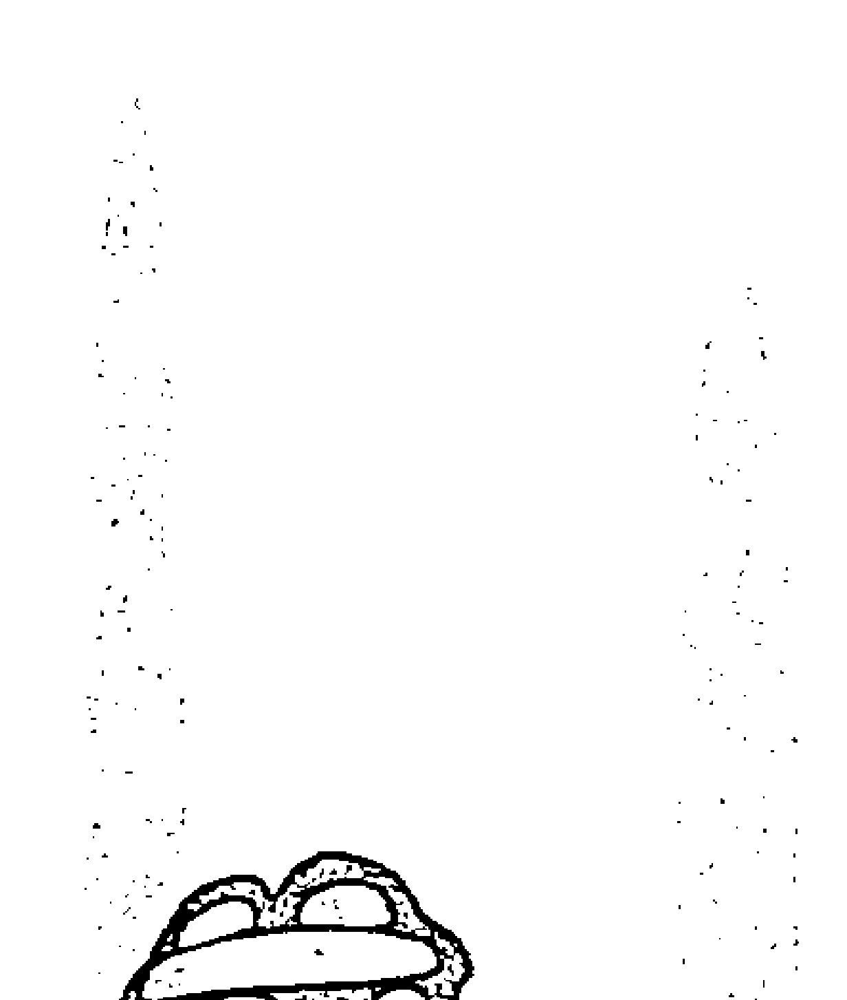

血型与星座是年轻人比较感兴趣的话题，有人形容“星座是小资的大本营，血型是文青的补血剂”，这个比喻十分形象。许多年轻人，无论是陌生人之间第一次见面还是朋友聚会，只要一提到血型与星座的话题，总能引起大家热烈的交谈兴趣。血型与星座之间的微妙关系，两者在分析人的气质、性格上的契合与关联，无论是笃信它们或者仅仅只是作为一种娱乐，总让都市青年产生精神上的愉悦。

那么，血型与星座是否能决定一个人的性格呢？

> “血型是对血液分类的方法，通常是指红细胞的分型，其依据是红细胞表面是否存在某些可遗传的抗原物质。”

1927年日本教授古川竹二对1245名对象进行血型调查研究，调查结果发现，虽然四种血型具有很大的差异，每个人的性格也不尽相同，但是同一血型的人具有非常相似的性格气质。A型人随和稳重，B型人聪明爽朗，O型人热情活跃，AB型人自信冷静。

> “血型是性格的基础”

日本血型专家能见俊贤说，很精炼地概括。

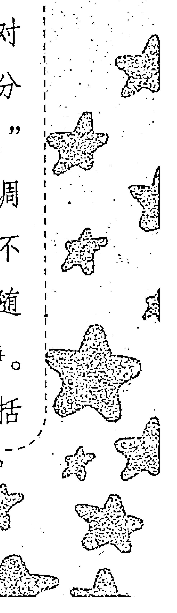

关于血型与性格的关系。

可以说血型影响着性格，也影响着我们的生活方式。而影响人们性格的不仅仅是血型，还有星座。十二星座是根据人们出生时太阳经过黄道的12个区域所划分的，从科学的角度来说，星座与地球在太阳系中公转的位置密切相关。在同一个时段里，受同样的位置、气场的影响，同一个时段出生的人在性格会有相似点。既然血型与星座共同影响人们的性格，那么四种血型与十二星座的排列组合，将有助于更细致、更精准地剖析不同血型、星座的不同性格。

人生总有些宿命的味道，有的人一出生就有别人羡慕的良好生长环境，不用挤破脑袋在社会上厮杀就能获得很高的地位；而有的人生来一无所有，靠自己一点点地努力拼搏，可能奋斗到白发苍苍也没有达到那些人生来就有的条件。尽管宿命不是人生的真正内涵，血型与星座不能解答我们对于宿命的困惑，但是血型与星座能够让我们更加了解自我、了解他人的性格，能够帮助我们更加和谐地处理与家人、朋友、同事和恋人之间的关系，让我们拥有更加完美的人生。

O型是四大血型中最古老、最原始的血型，大约出现于公元前4万年。日本血型研究专家能见正比古先生对全世界的血型分布作了调查，调查结果显示美国以及美洲地区的人以O型为主，占了近50%，所以美国可以说是O型社会。美国人的生活方式像打桥牌，既有朋友又有敌人，属于敌我分明型。他们崇尚自由、喜欢竞争和直率的性格等，都与O型气质有关。

O型血人的数量仅次于A型血。他们富于变化又幽默风趣，天生好“斗”的意识使他们在团体中渴望成为领导者，他们心怀浪漫却耐不住寂寞，他们是浪漫的英雄主义者，这是O型血人的显性特点。关于O型血人，还有哪些你不知道的秘密呢？如何赢得O型领导的青睐，O型血真的是万能的吗？关于O型血的各方面特征及秘密，即将在书中揭晓答案。

本书是提供给O型血人或关心O型血人的星座说明书，书中详细分析了O型血人的性格特征以及O型血人关心的一系列问题。O型血人怎样与人交际，O型血人怎样玩转职场，O型血人在健康养生方面应注意什么问题等，书中都一一做出解答；并把O型与星座排列组合，更为细致地剖析不同星座的O型血人的性格特征、人生运势、职场命运、恋爱攻略、财富密码、健康驿站等，让O型血人更加了解自己，并向大家说清楚自己。让关心O型血人的人读懂O型血人，与O型血人和谐共处。

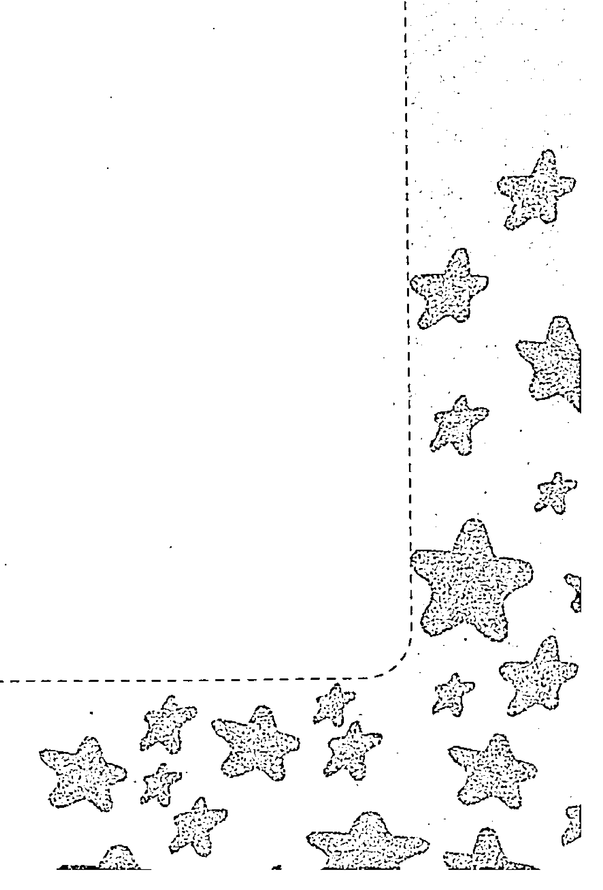

# 第一章 O型概论

### 第一节 神秘的血型

现代的女生在选择恋人的时候越来越多地关注血型等因素。可以毫不夸张地说，“血型”的确有很多问题值得我们去研究。人们越是关注它，就越发现它的神秘之处。之所以我们说它神秘，是因为我们从出生时就被划定为某个血型，而且这一特质将伴随我们的一生。相信你身边一定会有不同性格、脾气和品性的朋友——有人爱幻想，常常感动于生活中的小细节，有人则时常被戏称为“冷血动物”；有人天生忧郁，有人则总是在人群中成为闪亮的焦点；有人做事犹犹豫豫，有人行为之前必做缜密的准备和思考。当然，我们身边也许不乏那种“双重性格”的朋友，既有活泼开朗的一面，又有安静稳重的一面。这种人有时会让身边的人觉得难以捉摸，甚至费解。双重性格其实是一种复杂的多面人生状态，人们往往在面对不同的人或不同的事时选择采取不同的状态去面对，以达到平衡。

相信大家对一句话十分熟悉，那就是“细节决定成败”。但其实这句话更深一层的含义是细节决定命运，而性格决定细节。因为血型能够帮助我们用科学的方法更好地了解自己的性格、判断自己的人生方向，由此可见血型的重要性。

说到这里，有人会有疑问，“那是不是说只要血型一样的人，就一定有着相同的个性呢？”答案当然是否定的。虽然我们说血型决定着性格，但外因同样可以改变一个人的个性。就好比番茄鸡蛋这道菜，虽然原料都是一样的，但不同的厨师会做出不同的味道。但是，话又说回来了，番茄鸡蛋再怎么做也是番茄鸡蛋，绝对不会变成糖醋排骨的，所以从这个角度来看，血型在决定一个人性格的因素中占有绝对优势。我们越早地了解血型的奥妙，就能越早地发现自身不足抑或优势，当然也能帮助朋友们在选择恋人方面提供一定的借鉴。

1910年美籍奥地利病理学家兰德斯泰纳发现了血型的分类，并凭此获得了诺贝尔奖。血型被划分为四个“家族”——O、A、B、AB，也被称为O、A、B、AB型血。虽然之后也相继出现了其他学说与发现，但兰德斯泰纳的四分类仍然作为主流学说经历了百年的洗礼。同时，该学说也为亲子鉴定技术的发展奠定了理论基础。

事实上，O型的血型物质不仅存在于O型中，在A型、B型和AB型中也存在。所以，所谓的A型，实质上也可称为AO型，B型实为BO型，这就是为什么都是A型或B型的父母会生下O型的子女了。

1927年，一名日本教授提出了这样一个理论。他认为，具有不同血型的人也具有不同的性格气质，而同一血型的人具有相同的性格气质。他的理论为此后血型的研究方向与进一步调查研究奠定了基础。从研究中，我们知道了血型的分布与民族之间存在一定的关联。就拿我们O型血朋友来说，亚洲O型人占了27%。而欧洲和美洲O型人却占据了46%的比例。而O型人具有追求物质、执著、理性化的特质，十分符合欧美社会的整体氛围。

通过一代又一代的研究，我们对血型与性格的分析更加明晰。科学家发现，不同血型之间的实力其实并不平衡，而是存在强势与弱势的关系。对于这种非上下级之间而属于人与人之间交往的人际关系我们可以这样理解：通过血型之间实力的不平衡，我们可以控制整个社会的关系循环。人际关系的强与弱取决于一个人的性格与气质，而这种气质是由血型决定的。

如在本书开篇所说的那样，揭开血型的神秘面纱有助于我们更好地把握自我性格、掌控未来命脉。因为血型是形成性格的最重要也是最基础的要素。如果我们善用性格，可能会使我们左右逢源、一帆风顺。如果我们不善用性格，则可能使我们举步维艰、寸步难行。

朋友们若是能够明确血型的特质，调节与改善人际关系，增强人与人之间的了解，那么对生活的幸福与事业的成功百利而无一害。

通过以上对血型基本知识的介绍，朋友们应该知道血型的重要性了吧。既然如此，那就让我们继续探索它吧。

### 第二节 中国人血型的潜在优势

中国人的血型比例大概为A型血占28%，B型血占24%，O型血占41%，AB型血占7%。这个比例可谓举世罕见，它是中国社会几千年来的社会结构不断趋于优化和合理的结果。

如今的科学已证实，对一个社会或一个国家来讲，单一血型或血型比例太偏是弊多利少的。中国是一个多民族国家，在漫长的历史演变过程中，几乎每个朝代都曾有意识地溶进不同民族血型来优化它的血型比例。例如，在唐王朝的强大军队中，就有不少朝鲜族和维吾尔族的人担任要职，甚至被任命为大将，统领千军万马。元朝是中国历史上第一个由少数民族建立的统一的封建王朝，蒙古人骁勇善战、兵强马壮，他们打败金人，重新实现大一统的局面。

从某种意义上讲，中国可以算是世界上最早进行血型化验的国家。宋朝时，提刑官办案，有时就采用“滴血认亲”的方法。所谓“滴血认亲”，就是指孩子的血和大人的血如能溶在一起，便是父母亲生，否则就不是。这种方法在今天看来虽然缺乏科学依据，但仍不失为有益的尝试。值得一提的是，认识到引进不同民族血型的人才能繁荣昌盛这一道理，在中国已经有千年历史了，而在世界其他各国，包括现今头号经济大国美国在内，只是近两百来年的事。

血型不能完全决定一个人的性格，因而一个国家的血型比例特征也不能完全决定一个国家的发展模式。中国现今的3:3:3:1这一血型比例，既有A型人把既成事物加以应用改造的特性，又能以B型人固有的聪明才智加以发明创造，再加上O型人的进取和开拓精神，这就使中国走上一条既非欧美、也非日本的独特的经济发展道路。中国将向世界证明，她将仍是最富有发明创造性的国家。

另外，中国的血型比例具有强大的影响力。回顾历史，自从秦灭六国实现统一，建立国家政权后，无论外族怎样入侵，结果不是被消灭就是被同化。有事实为证。犹太民族被人类学家认为是世界上最难同化的民族，无论在哪里，他们都坚守本民族的宗教信仰、风俗习惯、兴趣爱好和古老的希伯来文化遗产。然而据调查，在犹太民族历史上向东大迁徙中，他们到达东方大陆后却失去了踪影。原来他们已经被融合在中华民族中了。这充分说明中国是世界上最有影响力的国家，也是最有生命力的国家。

中国3：3：3：1的血型比例被许多血型专家认为是ABO血型中的最优组合。各种血型既充分发挥自己的特性，又相互制约，防止出现由某一血型占主导地位而引起的不良现象。例如，日本和德国就以A型血占主导地位，他们某些人的非理性曾使整个世界陷入水深火热之中。相信，不久的将来，中国会凭她拥有的强大实力跻身发达国家行列。

### 第三节 O型血是万能的吗

过去，我们都听过家人或者朋友说过类似这样话：“O型血就是万能的，如果你失血过多需要血液救助的话，O型人是最佳人选。因为O型血能够和任何血型的人相匹配。”但随着我们开始用自己的双眼观察这个世界开始，我们就会对身边各种“老人言”或者规矩提出质疑，对待O型血的问题也不会例外——O型血到底是不是万能的？

关于O型血是否为万能的说法，医学界可谓各大学派各领风骚。认为O型血不具有万能功能的提倡者站在血型抗体和抗原免疫学的基础上抛出了这样一种理论思路：在O型血的血清中，含有抗A和抗B两种抗体，当O型血输入其他血型人的体内后，它可以与受血者血液中的红细胞发生凝集，继而发生危险的溶血现象。

之所以会产生万能论的误解，是因为在以往输血量比较小的情况下，血液的中和加上血液循环的稀释作用将溶血机会降至最低，所以发生O型血血液不良反应的概率很低，但不是不存在。也就是说，在输血量较大的情况下，还是很容易发生危险。

而对于提倡O型血是万能的学者则认为，O型血的红细胞是能够稀释A型血与B型血的血液原子的，即向病人体内输入O型血时不会产生血液反应。相反，时间一长O型血中的红细胞不仅不会受到破坏，而且还能够很好地提供血液运输功能。

两种意见各执一词，可谓公说公有理婆说婆有理，但无论支持哪派观点，都要明白自己是O型血人，所以如果以后万一自己、家人或者亲属去医院输血，还是谨慎为妙。

## 第四节 十二星座个性大揭秘

### 一、为什么白羊座容易给人独裁者的印象

白羊座是黄道12宫的第一宫，也意味着万物初生。他们有着强烈的好奇心和坚强的意志；有不服输、不怕困难、求新求变的精神。他们充满热情和富有创意，有一股内在力量来证明自己的能力，把争当第一视为理所当然，不喜欢落于人后。

白羊座的人喜欢无拘无束和自行其是，而不愿意步他人后尘。你从来不掩饰自己的感情，要么热情洋溢，要么怒发冲冠。如果你的愿望受阻，你也决不悄然收兵。无论是在家里还是在外面，你都不怕争执，但事后总是弃之脑后，从不记恨在心。在困难和危险关头，你能充分表现出自己的勇气和品格，得到人们的敬佩和赞扬。白羊座的你做事从不吝惜气力，宁可付出巨大的代价，也要力争前茅。总之，你从来不在任何困难和失败面前低头。

但是，争强好胜的你容易给人以“独裁者”的印象，这一点往往不利于你的工作和与周围人之间的融洽关系。另外，白羊座人举动常常带有启动性和影响性，能吸引别人进入自己所希望的轨道，并使他们发挥出更大的作用。

白羊座的人具有开拓者的胸怀，斗争、探索和征服对他来说，要比金钱更具有诱惑力。一旦有了钱，常常挥金如土，或者赠送给亲朋好友，或者投到冒险的事业中去。当经济拮据时，也不会坐以待毙，总能找到办法摆脱困境，重新打开局面，但往往好景不长……你喜欢千变万化、不厌其烦和朝令夕改，这些是白羊座的人生活中不可少的调味品，因为他们最不喜欢的就是单调而索然无味的生活。

铤而走险的欲望常常缠绕着白羊座的人，可能成功，但又常常会遇到很大的挫折。你的未来与变幻莫测的激情休戚相关。

### 二、为什么金牛座缺乏安全感

金星是金牛座的守护星，所以金牛座是保守型的星座。他不喜欢变动，安稳是他的生活态度。金牛座的人不会急躁冲动，只有忍耐。“吃得苦中苦，方为人上人”正是他们的真实写照。而且他们非常顽固，一旦决定了某事就不喜欢改变。

由于缺乏安全感，失业是金牛座最怕面对的问题。一旦失业，就代表他们的生活失去重心。金牛座男人有潜在的大男子主义，在家中他们不多发言，但很重视尊严。而金牛座女人除了关注现实外，还喜爱打扮自己，因为金牛座的守护神就是爱与美的化身（维纳斯）。他们属于慢热型，即要花一段时间才会适应一份感情、一份工作、一个环境，但适应之后，他们很少会改变，除非迫不得已。

金牛座的人有艺术细胞，具有高度欣赏任何艺术的品位和能力。

总之，金牛座的人个性温和又坚实，性情沉着而踏实。对事物虽然犹豫不定，但是一旦决定下来，就能以坚忍不拔的精神，执著向前。他们占有欲强，比较喜欢追求物质上的满足，而且凡事追求完美，是一个艺术设计及园艺方面非常有才气的人。金牛座的人为人幽默、风趣，常能得到朋友的青睐。

### 三、为什么双子座需要不停变换环境

思维多变是双子座的人性格上的主要特征。他是个心神不定、总想到“别处”去的人。其思维敏捷，但有时也会缺乏冷静的权衡。双子座的人需要不断地变换环境，例如，外出旅行、与别人交流思想，或者在各个方面表现自己，否则他们会感到烦躁不安。

双子座的人聪明伶俐，有些轻率和神经质。他们常常沉湎于令人难以理解的意念之中，只喜欢做他感兴趣和使他开心的事。

他们聪明机智，有辩才，是一个谋略家和演说家。

双子座的人对世上发生的事情无所不晓，头脑中充满着许许多多新奇的想法，但很难将其付诸实现。他们不是半途而废，就是被同时出现在脑海中的两个或多个新想法弄得不知所措、进退两难。他们的想法和建议，往往会被思想比自己更实际、更富有持之以恒精神的人所采纳。不过，原则上他总是一个开创通向成功之路的人。

双子座的人多半喜欢把自己的才智用于事业方面，而不愿意用以扩大自己的物质利益。他的灵光一闪常常会有助于他事业上的腾飞。

这一星座的人还有一个显著的特点：特别善于调动自己朋友的积极性。

双子座的人适合从事文学、商业及需要语言表达能力的职业。在这些方面他能脱颖而出。另外，在新闻、摄影、旅行等需要机智、灵活和果敢的工作中，以及涉及人际关系方面的工作中，他会表现出非凡的才干。

### 四、为什么巨蟹座情绪阴晴不定

巨蟹座的人天生具有旺盛的精力和敏锐的感觉，道德意识很强烈，对欲望的追求也总能适度地停止。他们有精辟的洞察能力，自尊心很强，同时也生性慷慨、感情丰富，乐意帮助需要帮助的人，并喜欢被需要与被保护的感觉。

大部分巨蟹座的人都比较内向、羞怯，虽然他们常用一种很表面的夸张方式来表达情感，但基本上他们缺乏自信，也不太能适应新环境。即使巨蟹座的人对新鲜事物很感兴趣，但其思想却很传统、恋旧，似乎有些双重个性。

巨蟹座是十二星座中最具有母性的星座，男性亦然。他们和善、体贴、不记仇，对家人与朋友非常忠诚，记忆力很好，求知欲很强，顺从性强，想象力也极其丰富。

巨蟹座的人的情绪就像月亮的阴晴圆缺一样。他们经常没来由地大发脾气，对别人的问话，会随自己的心情解答。心情好的时候可以成为最好的听众，充分发挥自己体谅、周到的美德。其实，只要巨蟹座的人学会控制情绪，就可以将力量转化到正确的方向上。对他们来说，情绪摇摆不定时，只有待在家中才可以安定下来。

### 五、狮子座的野心来源于何处

狮子座是英雄主义者，注重个人才华的表现，极为率性，创造力丰富，有热情的勇气和坚定的实行力，但自尊心比较强，天生就有要成为人上人、王中王的野心。在团体活动中，他们能掌握群众心理，扮演领袖者的角色。所以，狮子座天生具有群众魅力，即使只是默默地坐在那里，也能引起他人注意。

狮子座的字典里没有“优秀”二字，除了他们自己之外。狮子们讨厌一切漂亮的生物，也厌恶一切有智能、有才华的生命体。猫科动物的脑一向不大，却绝对骄傲任性，并自以为是地滥用他们绿豆般大的智商，到处下达指令且沾沾自喜到无法自拔。绝不能让狮子觉得他们“被需要”，一旦这个错觉产生，所有的狮子会顿时散发万丈豪光，令人觉得到了触目惊心的地步，而旁人完全无法理解他们到底是怎么了。

无论是说话还是做事，狮子座的人常常以自我为中心。倘若他们稍微调整自己的想法，并学会站在他人的立场上看问题，就能受到大家的尊敬。另外，若能承认自己的缺点并道歉，则更能使他有迷人的魅力。

若遇到意外发生时，狮子座的人敢以最大的勇气实现自己的理想，面对困难不退缩。但要提醒狮子座的人，众志成城，不要独断独行。

狮子座的情人，个性开朗大方，所追求的是亮丽炫目、豪华气派的爱情。打动他的心的方法就是要随时给予鼓励与赞美，但也要让他知道你也有他值得佩服的地方。

狮子座的人表现欲强，如果被人忽视的话，将会是最伤他自尊心的事。

### 六、天秤座最大的缺点是什么

天秤座的人天生具有理想主义和现实主义。他们个性坚强，具有灵活而好质问的脑子，常有非凡的构想。他们不喜欢争执，有时为了避免争执和不愉快的事情发生，喜欢采取避重就轻的方法解决问题。天秤座的人的最大缺点就是优柔寡断。

“船到桥头自然直”的观念在天秤座的人脑中根深蒂固，因而遇到棘手的麻烦时，他们总是一拖再拖，甚至爱理不理，容易给人懒散的印象。但是，真正的天秤座的人并不像外表那么柔弱，一旦目标确定时，他们则勇往直前，故而多半都能得到他所想要的。

天秤座的人天生好客，并且擅长社交活动。他们的家总是布置得美观而舒适，让客人有宾至如归的感觉。

然而，天秤座的人很难有发诸于情的恋爱。他们不甘寂寞的个性，常在毫无准备的情况下就接受了别人的感情。

天秤座的人一般适合从事任何工作，肮脏、气氛不佳的工作环境不包括在内。他们天生具有艺术细胞和创造力，有令人赞赏的音乐及艺术天赋，假使能控制对享乐的沉溺，方可获得此方面的成功。

### 七、为什么说处女座适合做秘书

处女座的人十分看重细枝末节，常为了细节的完美而忽略了大局。他们工作勤奋、注重实际。优秀的处女座的人不仅慎重，而且具有乐于助人的天性，充分享受施予的乐趣。

处女座的人具有洁癖的倾向，因而在情感生活上较难和别人建立起亲密的关系。当处女座的人陷入情网时，很少直截了当地表达，而是以含蓄的方式去表达。

由于天生欠缺领导能力，处女座的人很难成为出色的主管，但他们善谋略，最适合担任幕僚工作，给予领导者合宜而稳妥的帮助。

处女座的女性最适合从事秘书工作——永远是一身整洁高雅的服饰，办公桌也收拾得有条不紊，给人清爽利落的感觉，对老板交代的事情，更能够处理得条理分明。她们喜欢一成不变的例行公事，因为井然有序是她们所追求的目标。此外，凡是对任何有关分析方面的工作都能愉快地胜任。

## 第一章 性格透视

### 八、天蝎座的“性”吸引力来源于何处

天蝎座的人有强烈的第六感、神秘的探察能力及吸引力，做事常凭直觉，虽然有着敏锐的观察力，但往往靠感觉来决定一切。

过人的精力是天蝎座的人深藏不露的本钱，其他人往往想不到这一点而不知防范。他们若是将这份精力应用在正途上，其所具有的持久耐力，能不屈不挠地追求目标直到完成，能使他们在激烈的竞争中脱颖而出。天蝎座的人的占有欲、嫉妒心和报复心都极重，不只在情感上如此，其他方面也无法忍受别人的超越，甚至会因此采取冷酷的手段，施以报复。

天蝎座的人外表冰冷内在热情，富有好奇心，很有眼光。他们天生具有吸引别人的磁力，周身散发着活力、刺激而迷人的气息。虽然天蝎座的人天生不乏推理及分析的能力，能够一眼看穿自己所面临的难题，但是他的直觉感应却更为敏锐，因而往往会有不按常理出牌的表现。

由于是水象星座的缘故，天蝎座的人在情感上亦属多愁善感的敏锐型，但却以自我为中心，对别人的观点完全不予理会。通常他们是深情而且多情的，虽然表面上看起来很平静、温文尔雅、沉默寡言，但内心却是波涛汹涌。他们在决定行动时会表现得大胆积极，属于敢爱敢恨的类型。天蝎座的人通常是最具有“性”吸引力的，不论男女，对性方面的需要量都很浓厚，具有热情而深沉神秘的性魅力。如果性生活上得不到满足的话，他们会觉得在生活上和人格上有一种无可弥补的缺憾。

天蝎座的人无法忍受呆板而单调的职业，喜欢从事有成就感的工作。他们一旦发现工作上缺乏挑战性时就会另谋他职，甚至会强迫自己置身于麻烦中，努力从逆境中建立起自己的基业，或是放弃已具规模的事业，重新奋斗。

追根究底的学术研究工作，是天蝎座的人所擅长的项目之一。他们可以全神贯注在长期性的探索当中，并经常选择和医学有关的项目（如外科或心理学）当做研究的对象。天蝎座的人也可成为优秀的军人或水手，他们很有纪律，或许军事化的桎梏能够满足他近乎自虐的心态。若善用天赋，亦可在侦探、间谍、科学界大有发展。

### 九、为什么射手座是充满阳刚气息的星座

射手座的人崇尚自由、无拘无束及追求速度的感觉，生性乐观、热情，是个享乐主义派。射手座的守护星是希腊神话中的宙斯——宇宙的主宰和全知全能的众神之王。所以，射手座的人是完美主义者，他们有阳刚的气息、宽大体贴的精神，重视公理与正义的伸张。

射手座的人幽默、刚直率真，对人生的看法富含哲学性，也希望能将自身所散发的火热生命力及快感，感染到别人。所以，他们人缘通常都很好。他们外向、健谈，喜欢新的经验与尝试，尤其是运动及旅行。

射手座的人不肯妥协，向往自由，同时又具备人性与野性，精力充沛且活动力强，有远大的理想，无论何时何地都不会放弃希望和理想。

在爱情方面，射手座的人都拥有大胆、积极的作风，可以给生活带来无穷的乐趣。在健康方面，射手座的人新陈代谢机能发达，因此胃口很好。在财运上，射手座的人财运很好，在工作方面及娱乐方面，都可获得金钱方面的收入。在事业上，射手座的人所经营的事业，是崇尚变化、自由的职业。

### 十、摩羯座真的对一切都满不在乎吗

摩羯座的人讨厌自己的点子与别人雷同，如果不幸雷同，他们一定会在同一个点子上想出无人能及的花招，寻出独一无二的看法。他们并非想做“第一名”，只是摩羯座的人受不了有人跑在他们前面。

追求高难度的理想使摩羯座的人充满斗志。他们认为人生要有意义，即使为此搞得头破血流、妻离子散也绝不放弃。

摩羯座的人有领袖的实力与气量，但是，他们懒得去处理万机，尤其讨厌周旋在权力斗争中。因此，挂冠而去是很平常的事。

摩羯座的人不容易放松神经，但他们也会以自嘲的方式来疏解自己的情绪。事实上，在自嘲的范围之外，摩羯座的人是很不能接受别人开他们玩笑的。因此，他们欠缺幽默感。或者说，他们无法随时随地运用幽默感来润滑人际关系。他们常毫不忌讳地表露出“我很在乎”的样子，即使常迅速地装出“我才不在乎呢”，但一眼就会被他人看穿。

当摩羯座的人爱上你的时候，一定显得果敢无比。在他们眼中，爱就是爱，不爱就是不爱，有什么好犹豫呢？你大可享受他那种马力十足的求爱速度。不要拖延，因为拖延会使他们突然觉得一切都是假的。

摩羯座的人追求爱情的时候，爱情对他们最为重要，事业或理想都变得不值一提。但是，当他们正全力为事业冲刺时，也会对爱情和所谓的理想感到乏味。当然一旦他们锁定目标，追求一个理想时，爱情与事业皆可抛。

### 十一、为什么水瓶座被称为是天才星座

水瓶星座常被称为“天才星座”或“未来星座”。因为它的守护星是天王星，而希腊神话中上通天文、下知地理，并有预知未来能力的智慧大神乌拉诺斯，是它的守护神。所以，水瓶座的人具有前瞻性、独创性、聪慧，喜欢追求新的事物及生活方式。

水瓶座的人心胸宽大、爱好和平，主张人人平等、不分贵贱贫富。他们不但尊重个人自由，也乐于助人、热爱生命，是个典型的理想主义者和人道主义者。他们深信世上有公理，所以常有改革（或革命）的精神。

另外，水瓶座的人也很重视理论和知识，有优秀的推断力和创造力，客观、冷静、善于思考，思想博爱，讲求科学、逻辑和概念，价值观很强。他们对超能力、超自然现象会积极证明，人缘及辩才均佳，忠于自己的信念，又令人难以捉摸。

水瓶座的人虽是个理想主义者，但他们一旦遇上爱情，就会变得非常实际。

### 十二、为什么双鱼座总为别人牺牲自己的利益

双鱼座是十二星座中的最后一个，也是古老轮回的结束。所以，它总是陷入灵与欲之中，退缩在一种自创的梦幻世界之中。双鱼座的人爱做梦，无时无刻不在幻想，也常将这种情绪带到现实环境中去，因而总显得有些不切实际。

不过他们很善良，有舍己为人的奉献精神。

双鱼座是个古老复杂的星座，包含太多的情绪，所以在情绪方面起伏较大，矛盾、敏锐、感性、诗情和细致的触觉，在各种冲击之下，能够产生无与伦比的艺术天才。在人们所研究的古典音乐大师中，双鱼座是十二个星座中人数最多的。双鱼座的人温情、灵活而且神秘。粗暴的言行会使他们的精神受到强烈的刺激，他们希望自己的周围充满和谐友爱的气氛。和蔼可亲的秉性会让他们得到所有人的好感，但过分的真诚和善良有时会使他们陷入“奴隶”地位。实际上，他们经常处于需要献身或做出牺牲的情况下。生活中他们很容易受到别人的蛊惑和影响。

双鱼座的人身体很容易疲劳。噪声、熙熙攘攘的人群、匆忙以及紧迫的生活节奏，都会使他们筋疲力尽。如果在他们的生辰天宫图中没有更富激励性的火星或天王星方位的影响，那么他们的漫不经心会变成惰性。

双鱼座的人财富观念相当淡薄，他们常常处于不稳定状态，有时生活很宽裕，有时经济拮据。这种不稳定常常会给他们带来烦恼。每当这个时候，他们总想回避和逃脱。

双鱼座的人有可能终身都充满着幻想，他们最好选择需要幻想或想象的职业，音乐、艺术创作、电影、电视、戏剧，尤其是舞蹈。另外，海洋环境或与水有关的职业对他也十分有利。

## 第五节 十二星座她/他小资生活

哪个女孩不期待自己能够过上小资的生活？相信各位MM都憧憬着自己能在这繁华喧嚣的都市中找到自己安静的避风港，过着自己悠然而又充满味道的生活。或是饮着咖啡，手持一本米兰昆德拉的书，或是听听音乐遥望窗外过往的车流……城市越浮躁，我们越想追求心中片刻的宁静。但是，每个星座有着不同的追求生活的方式，而对于小资的生活方式，哪种方式更适合你呢？如果想为未来画好蓝图，那就在下面的文字中找到适合自己的自由吧！

### 一、白羊座

白羊座的女生最爱美了，每天不照镜子绝对不会出门的。所以，对于爱美的白羊座女生来说，选择一个SPA会所或许是最佳选择。另外，我们的白羊女也不是只顾外表而不顾内涵的，“书中自有黄金屋”是她们牢记于心的名言警句。所以，书店对白羊座的女生也并不陌生。闲暇时候，就会去小书屋选择一个安静的角落，边翻看着自己喜欢的书籍，边小酌奶茶，十分诗情画意。当然如果这时候放些音乐就更完美了。

### 二、金牛座

金牛座的女生注定是个好妻子，因为她们具有超高的烹饪技术，并且乐于研究美食，并享乐其中，这与金牛座女生稳重的性格有关。金牛座女生爱恋厨房并不影响她的小资情调，鸡尾酒也许是金牛女饭桌上必不可少的一道浪漫风景。

晚饭过后，小调曲子响起，金牛座女生伴着音乐闭上眼睛，靠在沙发上回忆着往事，思考着明天，也别具一番风味。

### 三、双子座

双子座女生最怕寂寞了，友情与爱情是生活中重要的调味剂。双子女爱朋友，惧怕寂寞，喜欢热闹，常常疯狂地做出一些举动。虽然逛夜市、唱KTV、和大帮朋友去吃街边小吃与“小资”情调似乎不接边儿，但是双子座的小资生活体现在她能够在热闹的环境中找到属于自己的甜蜜细节，比如与朋友在夜市中边逛边摆弄一些小挂饰或者在KTV边唱歌边和自己的闺蜜聊天。最具青春与活力的双子座小资女人，永远都是精神气儿十足。

### 四、巨蟹座

用一句话形容巨蟹座的女生，那就是“生活在自己的小世界里”。巨蟹座女生为人处世比较低调，有心事的时候常常自己消化而不会轻易对别人倾诉。所以，巨蟹女能耐得住寂寞，比较享受一个人的生活。坐在咖啡厅或者茶楼，看着窗外的景色，遥望天际的星云或许是对巨蟹女小资生活的最好诠释。但是也不要忘了，巨蟹座女生的情感非常细腻，她的情感世界容不得一点瑕疵。所以，比起狮子座女生，巨蟹座的MM会选择悄悄地流泪哦。

### 五、狮子座

狮子座女生有着天生的领导气场，所以会使自己不知不觉便成为人群中的焦点人物。你看，走在大街上一排女生中边走路边夸张地叙述，或者张牙舞爪地比划动作的多数都是狮子座。狮子座女生虽然天生具有一种霸气，但是她内心世界十分丰富，经常会为电影里的某些情节所打动。外表坚强的狮子座女生有着内心最脆弱的一面，她非常依恋朋友与亲人，重视人与人之间的情谊。但是无论如何，大大咧咧还是狮子座女生的总体特征。她们似乎永远不知疲倦，永远喜欢追求时尚前言，并喜欢玩起“隐约性感”的服饰。所以，和朋友逛街、去品尝各种新开的小店美食是狮子座女生的小资情调。

### 六、处女座
追求完美与小小的洁癖是经常被用来形容处女座女生的词语，但是殊不知，处女座女生还有另外一个明显的特质，那就是对生活品质的挑剔，这种挑剔有点宁缺毋滥的气势。处女座女生凡事都喜欢追求完美，无论是对爱情还是对事业，“要做就做到最好，否则就不做”是经常被处女座女生挂在嘴边的口头禅。小小的洁癖是处女座女生对生活环境的要求，同时也是对生活品质挑剔的体现之一。所以，对于处女座女生来说，逛夜市或看电影都不是最佳的小资生活方式，而优雅的舞蹈课与摄影是处女座女生的首选小资情调。

### 七、天秤座
天秤座女生在处理人际关系上总体现出与生俱来的能力，她们的亲和力会让身边总是聚满朋友。当然，这也与天秤座女生本身爱热闹怕寂寞有关系。天秤座女生在对待朋友和家人方面显得十分宽容与体谅，所以做天秤座女生的朋友是件十分幸福的事儿。对于天秤座 MM 的小资方式，热闹的夜店与酒吧更适合。在舞池中疯狂地舞动，与朋友们 Happy Hours、大聊私密话语将会成为天秤座女生非常惬意的放松方式。

### 八、天蝎座
天蝎座女生是典型的选择恐惧症携带者，虽然她们具有十足的个性，时不时地便会冒出怪异的想法，但外人看起来她们可是十分低调的。外表的温柔与内心小宇宙的爆发经常发生冲突，这个时候也许情景别致的小格调餐厅更加适合天蝎座女生。安静的角落是告别浮躁城市的最好方式，而天蝎座女生便会选择这样一种方式去品味自己的生活。

### 九、射手座
射手座热爱自由、讨厌束缚，她们忍受不了一切牵制自由与思想的事务。精神饱满的射手座女生喜欢蓝蓝的天空与碧绿的青草，喜欢奔跑在辽阔的海边或是坐上一个快艇直追落日。虽然射手座女生不安于平静的生活，但如果某些时候你发现她们安安静静地坐在书桌前看上一本言情小说，写上一段杂记散文，请你不要吃惊她们竟然还有这么才情的一面。

### 十、摩羯座
摩羯座女生心思细腻，以至于经常会在一个问题上思索很久，她们总会有自己独特的想法，是个天生的评论家。多愁善感也是摩羯座女生的性格特质之一，比起喜欢热闹的天秤座女生，她们更喜欢独处的静谧。此外，她们对时尚有着自己的见解，喜欢古典的情怀一直不变，但是对于新鲜事物也有很强的适应能力。对于摩羯座女生来说，或许陈旧的返古咖啡馆更适合自己。

### 十一、水瓶座
水瓶座女孩与其说注重体味生活，还不如说她们是天生的收藏家，喜欢收藏各式各样的小玩意儿。比如，筷子可能会买各种颜色、各种材质、各种造型的，窗帘会买各种季节、各种碎花象征、各种心情的等。水瓶座女孩喜欢逛一些小街的小店，像北京的烟袋斜街当然是她们向往的地方。所以对于水瓶座女孩来说，逛逛卖各种可爱饰品与生活用品的小店是她们主要的消遣方式，而逛街过程中劳累的时候走到街边的酸奶店或奶茶馆喝一杯更是十分惬意与美好的小资生活。

### 十二、双鱼座
双鱼座男生是浪漫的使者，而双鱼座女生是温柔的女神。她们将爱情奉为生活中的第一位，甚至超越了事业与友情。这么说可能有点残酷，但是敢爱敢恨的双鱼座女生心中总是有着白雪公主或者 Beauty and Beast 的浪漫憧憬。她们喜欢与爱人牵手旅行、一起下厨、共进晚餐。这些浪漫的点点滴滴都是双鱼座女生梦想的小资生活。而对于如此看重爱情的双鱼座来说，城市中小小的咖啡馆已经不能满足她们了，或许城外的高山与白云、日出与日落将是她们向往的美丽梦境。

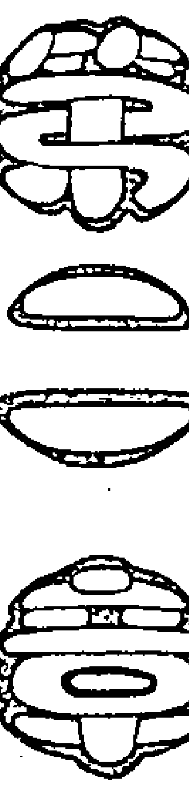

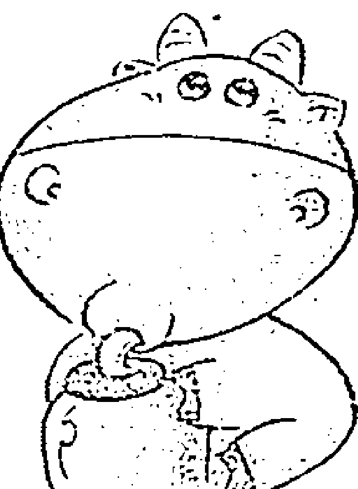

# O型人格奥妙剖析

## 第一节 O型人，你所不知道的秘密
由于O型血属于人类最基础的血液类型，这不仅让O型人具备了其他血型人均具备的基本特质，而且让O型人在“四大家族”中占有了一定的优势。这表现在以下几个方面：

首先，O型人对良好的生活品质具有较高的要求，能够灵活地调整生活节奏，让自己在繁忙中仍然能够十分自如。

其次，O型人对待情感类问题总是十分敏感，她们受不了感情中的点点瑕疵，所以有时在男朋友面前避免了“小题大做”的争吵。但是，了解O型人的人都知道，O型血是典型的“刀子嘴”“豆腐心”，时间一长，表面的强硬难掩内心的脆弱与柔弱。

最后，O型人追求像《欲望城市》里一样的奢华生活，向往女主人公拥有的华丽服饰和迷人外形，并且渴望出入于时尚高档场所。说O型人物质，倒不如说O型人能够听清自己心底的声音，知道自己到底想要的是什么。

O型人有以下典型特征：

- （1）凡事都先考虑其结果，方采取行动。O型人在做事情之前喜欢做出周密的计划，并能够按照计划一步一步地进行。
- （2）O型人虽然对未来充满梦想，但是却不会做不切实际的“白日梦”。他们往往能够看清自己的实力，做力所能及的工作。每一步都在为未来打地基，等待量变到质变的蜕变瞬间。
- （3）在挑选合作伙伴的时候往往理性的抉择超越感情的选择。O型人看人很准，因为他们往往看重人的综合能力与素质，并对其本领和硬件实力做出综合性评价。所以，O型血的眼光非常独到且准确。这一显性素质也为他们在人际关系群的选择方面占有一定的优势。
- （4）只要决定的事情就一定会尽全力做好，但这绝对不是完美主义的化身，而是一种对目标的执著与毅力。
- （5）做事目的性较强，不打无准备的仗，更不会只嘴上说说而不付诸行动。O型血的血液气质中充满了将军的风范，他们具有较强的实践能力，拒绝纯粹的理论研究或谈论。
- （6）从来都懂得时间就是金钱的道理，所以办事效率较高，受不了拖拖拉拉的合作伙伴。
- （7）对市场的信息把握得非常准确，并且与人交流比较直接，在谈论针对性问题时不会绕弯子，而会选择直切主题。
- （8）重视物质追求的O型人是个天生的实干家，不屑那些纸上谈兵的理论家。
- （9）O型人非常懂得这个世界上没有“天上掉馅饼”的美事儿，所以他们善于挑战、乐于创新。
- （10）O型人对待从事的工作具有坚定的毅力，面对挫折与坎坷能够从容面对，在哪里跌倒，在哪里爬起来。但是如果面对实在越不过的鸿沟，也不会太较劲儿的。
- （11）O型人非常乐于交朋友，重视沟通，也明白信任才是朋友之间永保默契与情感的纽带。
- （12）观点鲜明，立足点明确。

## 第二节 O型人之性格解读——女性篇
O型女性，似乎与生俱来善于获取他人的保护。她们不仅敢爱敢恨，而且还有撒娇的天才。她们所表现出来的纯真与快活，往往给人以十足“可爱的女人”之感。O型女性直率，常会做出一些不小心的言谈举止，并因此得罪他人而不自知。

O型女性浪漫、热情、情感丰富，因此显得更加妩媚动人。所以，她们往往令她们的恋人倾心、爱慕不已。

O型妻子婚后可能会由浪漫可爱的少女变为很现实经济的家庭妇女。她们很关心丈夫，也是家里的贤内助；对子女的事情也很上心，是典型的“全能”母亲。她们大多人缘很好，家里常常有客人拜访。

总的来说，O型女性的主要类型有：可爱女人型；大方的母性型；好活动、爱管闲事型；有不平、不满即到处抱怨型。

## 第三节 O型人之性情解读——男性篇
O型男性一旦对自己的社会地位感到不满，常常会有种失败感。这么一来，他们对任何人都容易生气。当他们逐渐孤立之后，会对周围的人胡乱地产生戒心，并因此产生反抗意识或变得固执起来。

O型男性的爱情炽热如火，一旦投入爱河，势必爱得轰轰烈烈。他们通常容易为对方的才能和显著个性所吸引，一旦选择了理想的恋爱对象，便会主动进攻，大胆、直率地向对方表明心意。O型男性活泼热情，在他们身上常常发生一见钟情式的爱情。他们极具语言表达力，知识渊博，幽默热情，所以他们的恋爱较容易成功。

O型男性对爱情疯狂投入，但这并不表明他们一定会与恋爱的对象走向婚姻。对他们来说，恋爱与婚姻还有很长一段距离，不能等同视之。

O型男性会是好丈夫和好父亲。他们总希望得到妻子和子女的最大信任，成为他们最好的保护者。

总的来说，O型男性的主要类型有：明朗快活、富于活力型，稳定、能干型，把事情看得太简单的少爷型，一心一意地用功和提高工作能力型，反抗、固执、沉默寡言型。

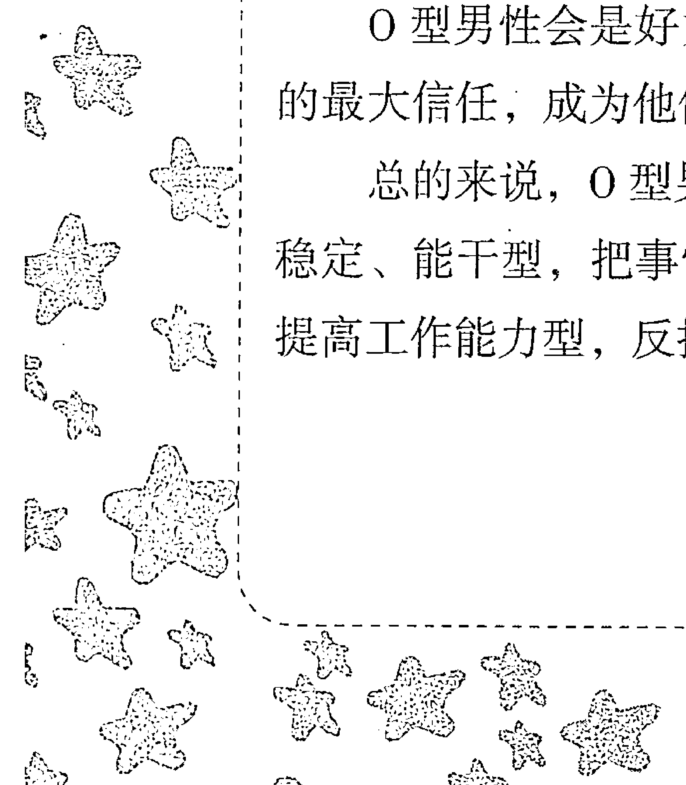

## 第四节 七点看O型人
心灵关键字：O型人 富有人情味 和蔼可亲 知恩图报

| 经验等级 | 指数 |
| :--- | :--- |
| 智慧指数 | ☆☆☆☆ |
| 法力指数 | ☆☆☆☆☆ |
| 受欢迎指数 | ☆☆☆☆ |

总体来说，O型人富有人情味、和蔼可亲、知恩图报。

### 1. 优点
执行能力比较强，踏实肯干；意志坚定，不会轻言放弃；热情奔放，对爱情忠贞不渝；富有诗情，文采较好；有远大的理想和抱负，不服输；做事果断，有魄力；独立自主，不依赖别人；自尊心比较强；对生活充满信心。

有良好的直觉力；善于照顾他人，富有人情味，和蔼可亲，知恩图报；善于保护自己，不会被他人利用，守口如瓶；具有独创性，不受环境影响，注重个性，开放、开朗、率直。有主见，有领导力，有说服力，逻辑思维能力较强；易与人交谈，重视人际关系；行动明快有信念；不会偷偷摸摸，做事光明磊落；淡泊宽容，能饶恕他人，有强烈的政治意识。

### 2. 缺点
不太会设身处地为别人着想；有时候为了达到目的，不择手段；过于精打细算，反而无法尽情享受生活；欲望强烈，占有欲强；权力意识比较浓，升迁欲强；好下赌注；扰乱协调，缺乏耐性；脾气暴躁，有些孩子气；家族思想浓厚，派别性强，只会照顾亲人；警戒心过强，过于自我防卫；自以为是，有时候顽固不化；好恶激烈，喜欢出风头，自我宣传；理由特别多，言行不一致；对他人的好恶很神经质；有过强的政治意识。

### 3. 特性
绝不可在 O 型情人面前对其他异性献殷勤或示好，想对谁都讨好，势必会得罪 O 型情人。两人间私密性的对谈若通过第三者传达，则必定会使 O 型人恼怒。对待 O 型男友不可得理不饶人，想指责他就要先帮他找好台阶。O 型人最忌别人颐指气使，想要他俯首称臣、命令他，不如协商或恳请。绝对禁止言谈间有贬低对方的口吻。O 型人先天特质上以自我为中心、爱表现，直来直往的性格，可能也会惹得他不高兴。对于没有良好气氛和心理准备的性行为绝对要避免。

### 4. 欣赏的类型
喜欢对象装扮入时且对自己身材容貌都颇有自信，个性活跃，谈吐热情又风趣等。

### 5. 恋爱讯号
可以天南地北地聊，表现最好的自己，举出他们得意的事，设法给对方好印象，这是 O 型人的象征。不过偶尔也会成为大傻瓜，扮演小丑的角色。

### 6. 财务观念
相对于小心翼翼的 A 型人，O 型人可称得上是喜欢投资的血型，大部分的 O 型人都对数字有一定的兴趣，对各种理财、投资项目都很有兴趣，所以一旦他们决定要投资，数目一般不会太少。

如果你有一位 O 型血的朋友，你可能会觉得他时而大方、时而小气，原因就在于 O 型人比较实际，当他大方的时候，通常是他赚到钱或者对你有所求的时候。不过也不要因此对 O 型人敬而远之，因为当他将你视为知心朋友时，他会对你非常豪爽的。

### 7. 服装偏好
他们不喜欢鲜艳的色彩，整洁、穿着正统即可。对于服装的设计，注重个性。选择服装以花样为主。

## 第五节 浪漫英雄主义的O型人
时而现实时而浪漫，时而安于传统时而追求个性，时而好强时而柔弱，多面性格的 O 型人给人太多的不同印象。他们热衷新鲜事物，但是又保有依恋传统的情结，就好像现代的返古风潮一样，那在风中飘荡的红领巾和 Hello Kitty 的文具盒都是他们藏留在心底最美好的童年记忆。

到底浪漫英雄主义的 O 型血朋友具有哪些特征呢？让我们一起看看吧！

### 一、只要他（她）爱上了你，就会为你付出全部
如果说岳飞是 O 型血，你一定会觉得很惊讶。无论他是不是 O 型血，我们只想用这个例子说明一个道理，那就是 O 型人真的非常具有开拓和进取精神，敢于冒险、敢于拼搏、敢于挑战。自古以来一些伟大的思想家、革命家、将军将领以及著名的企业家等都是 O 型血。但是，并不是说只有 O 型人才能成为这些伟大的思想家、革命家抑或将领，只是说 O 型人比起 A 型血或 B 型血的人在这一方面更容易成功。此外，浪漫主义也是 O 型血血液中蕴涵的特质。O 型血的浪漫主义不是追求形式浪漫，而更多的是一种实质浪漫。她（他）们不求情人节的花朵，不求肉麻的短信，只求失败时一个温暖的拥抱，失落时一个坚定的目光。所以说，O型女生和男生是非常务实的伴侣。

国内某些研究血型与星座的学者认为O型血与“思考者”的A型血人和“注重感觉”的B型血人相比更具有冒险与挑战的英雄主义气概。这种英雄主义气概在中国的大环境中更为国家所需要，因为中国人民的思想传统中本来就有“圣君”情结，所以遇到这种能够在国家危难时挺身而出，非常具有胆识且勇敢的人当然会被需要。人们也都盼望这种具有英雄气概的人来拯救我们的民族，可以说，O型血的英雄气概对我们人类社会的发展具有不可估量的作用。

但是，凡事皆有两面。如果对这种具有英雄气概的人不能够循循善诱的话，他们的实力与能力很容易发展成为背叛国家或集体的不稳定因素。

至于说为什么O型人对此这么敏感，其实这仍然与他们“英雄气概”的气质有关。在这个世界上没有完美无瑕的人，任何人都存在性格上的缺陷与不足，O型人亦是如此。举例来说，他们具有领导才能，但是在处理问题时显得固执己见；他们具有坚忍不拔的毅力，所以一旦做出决定就很难改变，但是这样一来，就会让他们变得很难听进他人中肯的建议，容易陷入孤战的境地；他们具有很强的自尊心，但是却时常不会考虑他人的自尊与情面，这在团队合作中会给他们造成不好的发展因素。但是，并不是所有的O型人都会如此固执，有些人虽然善于言辞并始终坚持自己的主张，但是在面对相反意见时显得十分大度与宽容，并不会试图去改变他人的想法，而是会折中地倾听他人的建议。

# 第三章 血型性格密码
除此之外，就像清末时期变法改革者都要想办法和儒家思想联系在一起一样，O型人总会找到一些合适的头目和自己的观点或理由相结合。这未必不是好事，因为凡事都要有个合适的理由。但如果O型人将这种名头作为自己因为冲动而做出决定的理由，则就另当别论了。

O型血的特质总是让人喜忧参半，但是有一点，那就是O型血的执著与毅力绝对是值得人们竖起大拇指的。虽然O型人具有领导才能和英雄气概，但是在他们没有显露之前还是十分沉默寡言不露声色的。他们会将理想演化为动力与不懈的奋斗，把梦幻化成目标与永不停歇的追求。他们坚定的信念不会被轻易改变，更不会轻易低头认错，但是这种人往往自省能力非常强。俗话说得好，当家的也要有资本。具有领导才能的O型人只有不断地改善自身不足才能在团队和集体中树立起不倒的威信，才会让自己的孤傲感长存。否则，单纯的英雄主义就没有存在价值。

O型人，尤其是O型血女生往往会与“专情”和“为爱情献身”等词汇挂钩。她们的爱情观非常特别，但是它却是符合我们传统的爱情理念的，只是将这种爱情观放到当今社会就会觉得非常特别罢了。她们一旦爱上了一个人，就不会轻易放弃，同时会为对方付出所有。所以，如果你没想好是否爱这种O型血的女孩，千万不要轻易许下诺言。

O型人还善于察言观色，这也成了他们与人交往沟通必不可少的武器。他们非常渴望得到他人的肯定与赞美，当然也不排斥善意的批评与建议。如果他们的努力没有换来关系人的肯定，他们会变得十分焦躁不安。因此，我们才说O型人是十分“风风火火”的事业型，因为他们不会让自己埋没在人群中，他们一定会以不同的方式让别人看到自己的能力和工作效果。

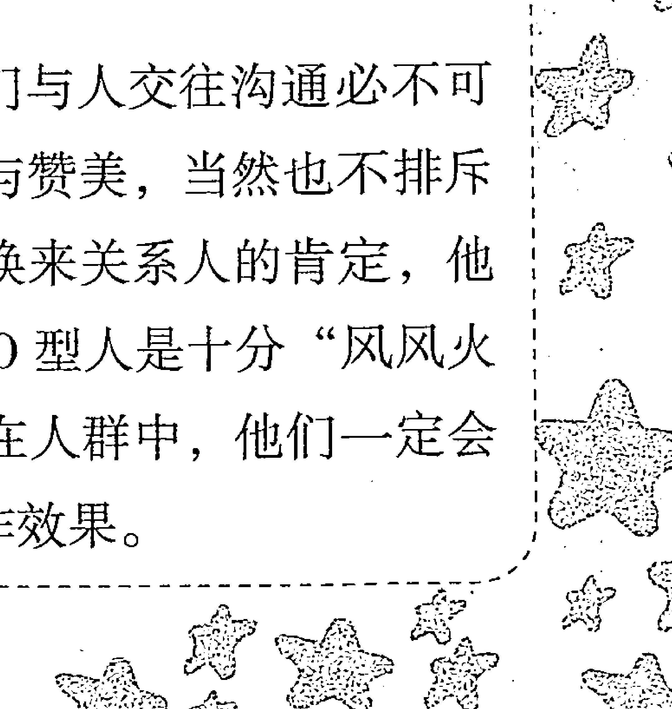

通过以上的分析，不同的 O 型人具有不同的特性，这是由他们潜意识的行为所决定的。但是，他们的一个共同点就是都具有极强个性与使命感。O 型人不同的性格特征除了由潜意识的行为决定以外，还有其他因素的影响。比如他们之间缺乏沟通，使得一些事情的处理非常个性化。但是，个性化并不等于非理性化。任何血型的人都没有 O 型人具有更多的理性了，他们不仅能够理性地思考问题，还能理性地处理问题。只是由于 O 型人的孤傲与固执，所以他们之间经常缺少联络，而且他们的“反省”特质，也经常使他们陷入逻辑的僵局。 但是非常奇妙的是，这种沟通与联络的缺乏却使他们更加注重联系，由此产生了一种“互相联系建立起连带关系非常必要”的感觉。

### 二、总是充满活力、青春洋溢
前面我们已经提到，“浪漫”这个词语经常会被用来与 O 型人相联系。因为他们对爱情的执著，对感情的注重，对实质浪漫主义的追求，使得 O 型人寻找朋友的渴望非常强烈。

当然，O 型人也爱憎分明，他们通过直觉去感受对方是敌是友，并会在自己的团体里利用领导者的优势对朋友多加关注与友善，而对“敌人”表现出毫无保留的憎恶感。这种友善与憎恶表现得非常明显，比如对待朋友他们会表现出对朋友应有的义气与照顾，但是对待“敌人”的行为就会表现出排挤、戒备与烦躁，并且不可能为他们“开绿灯”。虽然说 O 型人凭借直觉去感受对方是怎样一个人实在有失公正，但是这与 O 型人的特质非常符合，我们无法要求固执及缺乏沟通的 O 型人能够通过深入了解一个人的全部特征后再做出判断。

例如，有个 O 型女性，她非常爱当时的男友，甚至连跟朋友在一起逛街的时候都在不停地和对方打电话煲，生怕一个不小心对方就蒸发了。那个女生牺牲自己非常优越的工作机会来迁就男友，即使穿上她难以忍受、十分厌恶的10寸高跟鞋陪男友出席同学会也变得不再抱怨。这样的如胶似漆只保持了三个月，三个月后得知男友劈腿，该女生气急败坏之下去前男友家大闹一场，并摔坏了她给他买的所有东西。通过这个例子我们可以看出来，O型血的女生在面对自己爱情的时候是容不得一点瑕疵的，尤其是对那种自己非常看好的爱情。但是，如果属于那种在开始之前就觉得不可能或者不会有美好结局的爱情，那么O型女就绝对不会让这段恋情有开始的空间——这就是敢爱敢恨的O型女。

此外，O型人还具有喜欢讲道理的特质。无论是在日常生活中还是在工作中，O型人的这种特质表现得比较明显。时间一长，这也成为区分O型血与A、B、AB型血的基本标志之一。

O型血喜欢对人讲道理的特点虽然有时会让不了解情况的人觉得很突兀甚至反感，但是对于明白O型血这一特质的人来说，O型人的善意与用心会让对方觉得受益匪浅。所以，接受与否完全取决于对方的态度与认可度。当然这也要求我们本身得有足够的涵养来承受这种训导。对于涵养不够的人来讲，这种训导是难以忍受的。但是终究有这种境界的人还是少数，所以O型人的这种特质会无意中得罪不少身边人。

所谓知己知彼百战百胜，一旦懂得了O型人的典型性格特征，那么在应付或者交往此类人的时候就变得非常容易。而且，也很容易和O型人成为好朋友。因为人性本善，O型人从本质上讲是善良的人，只是有个孤傲的心罢了。

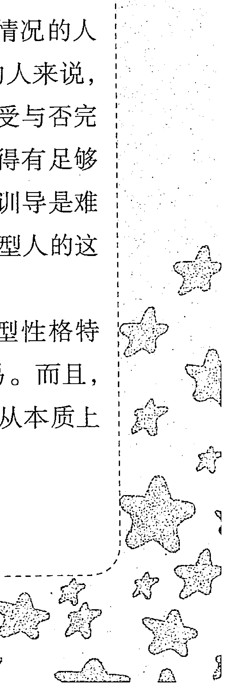## 三、O型人的缺陷和不足

我们能够接受的是万物皆不完美。从血型分析学的角度说，单细胞型就是 O 型中的一种比较差的表现型，这一类型的人，容易片面看问题，而且盲目地相信自己的主张是正确的。但无论如何也应承认，O 型人对世界发展变化具有推动力量。

## 第六节 O型人的爱情

### 一、O型人具有的爱的特征：小溪般纯净细腻的爱

每个人的心中都有对一份甜蜜爱情的向往与憧憬，每个人心中也都有一份属于自己的纯净爱情记忆。这份向往与记忆往往鞭策着我们要不断去寻找命中注定的伴侣，寻找那份在喧嚣的城市中显得弥足珍贵的爱情。其实每个血型的人都有每个血型的爱情特征，比如 A 型人的爱情更加轰轰烈烈，B 型人的爱情更加追求形式主义的浪漫情调，而 O 型人的爱情则如小溪般耐人寻味。

O型人纯净细腻的爱更侧重于现实主义。它的基调是：男性希望寻觅到一位知书达理，能够为自己妥善处理好家庭大小事务的妻子，而女性则希望找到能为自己开拓出幸福生活的丈夫。O型人对夫妻之间的关系体现为“依恋”，他们更希望在生活中逐渐体现出彼此爱护和体贴的细节，而不追求那种轰轰烈烈、死去活来的爱情。

当然，有的 O 型人还是逃脱不了浪漫主义的魔法圈，她们喜欢甜言蜜语，喜欢玫瑰的芳香，更加抵抗不了钻石的诱惑。但是我们不要忘记，O型人追求的不是形式浪漫主义，而是一种实质浪漫主义，所以当他们步入婚姻的殿堂，开始每天与柴米油盐酱醋茶打交道时，他们会清醒地意识到生活的现实紧迫性，并不免显得有点手足无措。

在上面我们已经讨论过关于O型人在团队中经常无法听进他人的建议，那么在爱情方面O型人会不会延续我行我素的作风呢？答案是肯定的。O型人非常相信自己的眼光，他们在择偶方面也很自信。对于他人的劝说O型人可以说是完全听不进去的，只有自己去相处后发现不合适或者恋情失败后才会意识到曾经他人建议的存在。

### 二、O型人一见钟情

很多人不相信一见钟情的爱情，像在如此浮躁的社会中，人们自然而然就会对陌生人产生很强的防范意识，从而不相信某人对自己一见钟情的鬼话。但是O型人仍然像韩剧中的女主角一样，仍然保有对“一见钟情”的幻想。他们很容易被人撩起爱情的火焰，所以一见钟情对于O型人来说并不是奇怪的事情。

要说起O型人爱情产生的源头，我们就不得不阐述这样一个观点：O型人对自己的眼光非常自信，相信自己的第一感觉。虽然说O型人会通过与人交谈或者相处而判断此人是否能够成为自己的伴侣，但是也存在很多情况即发生了突发或偶然事件使O型人瞬时间坠入爱河。例如，对方帮自己捡起掉在地上的书；拾到者送来自己丢失的手机；工作过程中与自己并肩作战的战友；遇到困境时同舟共济的队友等，都可能使O型人产生爱意。O型人一旦爱上你，那么此种感情便会一发不可收拾，那种爱情之火如小溪般细腻，当然也会绵延不绝地延续下去。

O型人相信一见钟情，但绝对不是喜新厌旧的那类人。他们被称为所有血型中爱情能力最强的人也不是没有道理的。因为他们对爱情的执著可以说十分类似于对事业或想法的坚持。他们会始终守护着自己心中纯净的爱情，守护着自己认定的人生伴侣。用几个词来形容O型人的爱情特征，那就是专一、坚定与执著。

O型人的爱，跟石油燃烧器一样，不会有连烧其他之意外。不过，一旦遇到爱情的威胁者，敏感的O型人的意识中马上会被敲响警钟，并为守护自己的爱情付出努力。当然，凡事都不是一帆风顺的，强劲的对手也有可能使O型人的生活变得混乱。如果O型人失恋了，你一定不要认为对待爱情如此执著的O型人会一直萎靡不振下去。O型人一旦感到爱情失败了后，他们会用清醒的头脑面对这一切，坦然地接受并不会纠缠不休。O型人的爱情像一阵风，他们的爱情发生得突然，消失得也突然。你绝对不会发现O型人在爱情上萎靡不振、拖拖拉拉。在男女朋友恋爱阶段，很多O型人会因为爱对方而将自己的身体交给对方。可是，由于O型人的爱像一阵风，这阵风刮走后，他们随着爱情的性欲也会变得烟消云散，所以千万不要指望通过性爱来换回O型人的爱情。关于这一点，想和O型人恋爱的帅哥MM们就要格外小心。

### 三、给O型人的建议

尽管O型人具备很多性格上的优点，但是有两处弱点却是不容小觑的：一是缺乏人情味，二是承受约束的勇气不足。O型人，对别人的赞同少，而且当别人向他倾诉忧虑及担忧时，O型人要么是事不关己高高挂起，要么就是敷衍的表面式的关心，这容易使朋友觉得失落，得不到关心。如果一直这样下去，他的人际关系一定处理得不怎么好。也许，他们觉得这只不过是一些琐事，根本没必要拿到桌面上来谈。但是当有这种想法的时候，就会表现得很高傲，不近人情，这样就会伤害到其他人。O 型人一定要谨记，理解是第一位的，尽管你有与生俱来独立和慎重的性格，但在现实生活中有些事还是需要投入兴趣，这种参与会使 O 型人受益匪浅。

O 型人可以试着关注一下自己周围的人，不时地询问一下身边的人今天感觉怎样；关注一下别人有没有什么情绪上的波动，高兴抑或悲伤，疲倦还是兴奋；多与身边的朋友聊聊，建立更紧密的联系，多花些心思探索他人的“内心世界”吧！

O 型人在聆听别人的倾诉时，请多一点儿耐心，让自己看起来对别人的事有着浓厚的兴趣吧！这对于向 O 型人倾诉的人来说可能会有非同一般的意义，因为往往有些时候，人们需要的不是马上动身去解决问题，而是需要一个认真的倾听者，等待他们把烦恼、忧愁一股脑都发泄出来，即使一句话不说，只在一旁默默地应和着，问题也就解决了。

O 型人大可不必强迫自己去做根本不愿意的亲近。当过多地刻意制造亲近的时候，最终会越来越不耐烦，因为这种压力对于 O 型人来说是缓慢而巨大的。这个时候就需要 O 型人勇敢地说出自己的需求，要学会说不。问题不在于他人，一切都是 O 型人的本性所决定的。给自己喘息的时间，避免在同一时间有过多的要求，保持良好的心态和健康状况。

O 型人最终会看到，你多年织就的社会关系网是多么的重要，生活是艰辛的，很多事都有很大的变数，并不如人们所想象的那样努力就会成功，往往越到最后，事情的成与败并不是由一人决定，最终取决于那张关系网是否足够结实。O 型人有必要细心地呵护人际关系。当他们真心地而不是刻意地要求自己去对别人施舍关爱的时候，就会发现这才是最幸福的。

O型人是充满幻想的人，但大多承受不太能够承受的约束。一些很有天赋的O型人，不是集中精力于自己专长的领域而是处处受到保护，不够相信自己，任由自己被恐惧和疑惑所摆布。他们很少要求自己，完完全全是“被塑造”出来的胆小鬼。

不要怀疑自己的性格不好，更不用抱怨自己为什么总是对他人的事提不起兴趣来，现在就告诉O型人，你们的血型很棒，它赠给了你很多机会。需要做的就是喜爱它并了解它，更好地利用血型优势，为将来设定合理的目标。大家都相信O型人具备控制自己情绪的才能，一定会充分挖掘自身才能，将聪明才智运用到工作中，使自己成为更有价值的人！

# 第四章 O型人轻松玩转职场

## 第一节 O型人在职场中的特点

O型人在职场中具有以下特点：

- (1) 简单、快乐、随和、缺乏认真。
- (2) 看上去很乐观，但也总是“留一手”。
- (3) 心地善良，对人坦诚，戒备心不强。
- (4) 充满幻想，不够现实。
- (5) 对于投入了感情的肌肤相亲十分在意。
- (6) 聚会中总是充当调节气氛的角色，视此为己任。
- (7) 这类人当中的很大一部分记忆能力超群。
- (8) 身体的疼痛感往往来源于精神上的压力。
- (9) 对他人很信任，一旦有人背叛，挫败感也是四个血型中最强烈的。
- (10) 平日里好脾气，发起火来很恐怖。

## 第二节 如何赢得 O 型领导的青睐

#### 一、如果你是 A 型下属

A 型下属最忌讳的就是对领导阳奉阴违的情形发生。如果你的上司是 O 型人，你若对他所命令的事不去遵守，这在他看来是很难容忍的，他会认为这是你对他极不尊重的表现，会十分生气。但是 A 型人能很快地分析整个事情的来龙去脉，归纳条理，对于说服 O 型上司他们有自己的一套。也许最初 O 型上司会被 A 型下属的巧言妙语所迷惑，并且很容易接受，但是慢慢地他就会参透其中的缘由，一旦这种情形再发生，O 型上司将会变成一个很严厉的、毫不留情面的领导。以上这几点就是 A 型下属对待 O 型上司时应该特别注意的。

以什么样的态度对待 O 型上司才是最恰当的呢？可以总结归纳为两个字：服从。默默地恪尽职守，默默地执行命令，把报告做得尽可能地详细。任何事都尽可能地按照 O 型上司的意见去执行，并做好协助工作，要知道 O 型上司需要的不是一个对手，而是一个助手，少说多做，责无旁贷地完成自己分内事就是最好的。此外，O 型上司与 A 型下属沟通的时候，O 型上司会做少许的让步，A型下属应尽力守住基本原则。

假如你对O型上司的做法感到不满，那么请用最好、最直接、不带责备又不会伤害到他的语气和态度对他讲出来，请他注意并加以改正，如果你的建议或意见完全合理，那你肯定能收到良好的效果，因为O型上司基本都会欣然接受。

#### 二、如果你是O型下属

O型上司的特点是一定要把事情做好才可以放心，O型上司大都具备丰富的常识，自己制定管理的各项规章制度，并要求部下一定要遵守，同时重视大众的观念也是O型上司的特征之一。然而，O型下属往往明知领导的脾气秉性却总是无法服从，这样久而久之你说你的，我干我的，肯定是两股绳拧不到一块儿去，O型上司和同血型的下属就很难保持良好的关系。

O型上司，对待下属大多比较亲切，做决定的时候也会和下属商量并征求下属的意见，他们采取的不是命令式的态度而是有事拜托的姿态。只有问明白了你愿意照着他的意思去做，他才会定下决策。所以当你的上司有此意的时候，你最好特别留意一下，不要断然拒绝，免得不给上司面子，使他难看。

此外，O型的下属，从心底里就很难和O型上司亲近，作为同血型的一对上下级关系，二者确实是个矛盾体，作为O型的下属被上司斥责是再平常不过的了，所以最好有点心理准备。

#### 三、如果你是B型下属

在O型上司的意识里，B型的人是很热情真诚的，但是他们的缺点在于爱说大话而且信誉度不高，经常会给领导惹来麻烦。一旦B型下属对O型上司感到不满的时候，一般都会指责上司只为自己着想，对员工要求太苛刻，总是把困难推给别人，如此一来，上司自然会很生气，相处起来也不愉快，两者之间的关系也就会越来越糟糕。那么，B型的人请你不要顾忌太多，把你对上司的意见中肯地和他提出来，而且当着他的面提出来，不要在背后议论纷纷，私下里和同事说领导的坏话。O型的上司对于态度谦和的下属没有脾气，并且会听从你的建议。所以只要你有表达的勇气，勇敢而直接地说出心中的不满，无论上司是否采纳你的意见，都有助于你打开心结，消除误会与不满。

B型人在工作中是很顺从的，他们一般都会听从上司的意见，绝对遵从上司的命令。但是B型人天生不喜欢在压力下生活，虽然他们对于上司的命令和意见表示遵从，但往往使自己陷入疲惫之中，常有不胜负何之感；所以B型的人在O型上司的面前，只会在背后大发牢骚，而没有勇气说出自己的不满。

#### 四、如果你是AB型下属

AB型的人，对于O型的上司做出的交代和批评，一般要认真记下，并提出建议性的意见，这样上司才能信任你。当你得到别人的信任后，你就容易对O型上司产生歧视的态度，一旦你尝到甜头，你就会对上司不够尊重。当你有所转变的时候，这时O型上司会马上转变态度，有更特殊的也许就会利用自己的职权打压你，甚至更有甚者让你从此坐冷板凳。AB型的下属要避免和O型的上司成为敌人，在这方面你要特别地注意。一旦你们陷入对立的处境，那对你来说将是非常恐怖的。

由于具有超强的实际行动力，又可以很迅速地将工作完成并且做好的AB型下属，并不习惯将工作中的细节部分，十分详细地向上司报告。不过，假如想赢得O型上司的好感，很多必不可少的工作，即使细节繁多，也要在短暂时间内，把工作的细节和最终结果，一一详细报告给上司听。O型上司对待AB型下属，对其能力一般可以予以适当的肯定，并且有一定的信赖感，然而，假如AB型的人超越了本来的工作范围，并且做到独当一面，反而会给O型上司带来一些不安全感。

对于AB型下属，切忌向O型上司隐瞒事情的真相，一旦没做好工作，或是没有完成计划，最好的办法是把事情一一说清楚。如果这件事是自己不知道的，他们是不会轻举妄动的。

## 第三节 O型+O型是最佳职场搭档吗

因为性格的原因，O型与O型的职场搭配会产生最为激烈的对立关系。O型人具有强烈的自我个性，他们好强、独立、不服输的特点，让他们合作起来，谁也不服谁，谁也不听谁的。若是牵扯到利益冲突，他们的斗争会相当激烈。

为了争夺各自的利益，他们合作起来会耍阴谋、使手段，造谣中伤对方，或者千方百计地扯对方后腿，不仅无法合作，严重起来会达到“同归于尽”的地步。这对于企业的利益与发展是毫无帮助的，而且会破坏企业的团结，拖垮企业。但若能够引导他们的对立竞争往良性发展，使他们感受到合作的乐趣，而非斗争的心力交瘁，就能够带动企业的发展，有助于企业向心力的形成。所以，O型与O型绝不是最佳职场搭档。

## 第四节 如何与 O 型同事“合作愉快”

#### 一、如果你是 A 型人

对于 A 型的人来说，他们的 O 型同事非常好相处，和他们合作一般都很愉快，在工作中，O 型同事也是相当容易合作的伙伴。假若 A 型的你，不论在生活或工作之中，常把同事的劝解当做耳旁风，把你和 O 型同事的良好友谊不当回事，要是一直这样下去，A 型的人一定会遭到 O 型同事的反感，对于 A 型人的态度也会发生 180°的大转弯，以后，他们将很难再向 A 型的你敞开心扉。

我们不难发现，上面所说的一切在现实中都将得到验证，无论在任何情况下，假若 A 型的人想取得 O 型同事的赞同与支持，一定要为 O 型同事着想，以他为重心，站在他的一边，切勿忽略了他的存在。

#### 二、如果你是 B 型人

B 型的人想要获得 O 型同事赞许支持的第一条件，就是要有充足的信心和积极明快的步调。B 型人的很多言谈举止，在 O 型同事的眼中往往让人捉摸不透，B 型人是典型不被信赖的人，他们就是那种吃着碗里看着锅里，意志不坚定的一类人。所以，尽管 B 型人本身具备很强的能力，但是他们的坚定力却是太让人失望了。O 型的人往往会尽心尽力地帮助有求于他的 B 型的人，尽管这样，他们成为交心的朋友、亲密伙伴的几率非常地小，那是O型人从心底里，从未把B型人当作是一个强有力的工作伙伴。

B型人有着明确的目标，一直在不断地朝着这个目标与方向前进，但是他们所欠缺的就是别人在背后的推动力。而B型人恰恰将O型人当做他心中的榜样与典范，他们认为O型人是一个心中合适的效法对象。作为同事，在O型人与B型人的关系中，B型人不是任何事都愿意依赖他人，而是一个凡事都爱亲自动手的人。

#### 三、如果你是AB型人

在O型同事与AB型人的组合中，AB型的你，若想获得O型同事的长期支持，切不可一味地坚持自我主张，而是应该先征询对方的意见。

在AB型与O型同事的关系中，AB型的人总保持沉默，不愿意表示任何意见。即使很需要O型同事的帮助，也总是不改变原有的作为。此外，即使十分坚持自我主张，也不会将想法表达出来。

AB型的你，如果想将自己的意思表达给O型同事知道，想取得O型同事的支持，不妨以婉转的态度表达，先说出自己的意思，再询问对方觉得如何。这样才能让O型同事接受自己的意见，并认真考虑其可行性。就整体性而言，双方能得到良好的沟通，才能建立起互相信赖的关系。

#### 四、如果你是O型人

一般情况下同一血型的人比较能准确掌握对方的心理行动，从言谈举止之中，可以了解对方的想法立场，当双方站在同一立场的时候，更能站在同一阵线，守护自己的疆土。若想抓住O型同事的心，唯一的诀窍就是将心比心，随时为对方着想，如果你能了解 O 型同事的心情，就能应付他的各种举动。

在各种血型当中，O 型的人占很大的比例，所以如何和 O 型人建立良好的人际关系，成为一件十分重要的事。

## 第五节 O型人有着怎样的创业格局

O 型人是四个血型中最热衷创业的了，他们个性随和、待人热情，受大家喜爱，因此人际关系不错。

O 型人个性冲动，创业的 O 型人急于求成，头脑容易发热而让自己做出冲动的事情。他们个性直率，又是富于行动的行动派。只要他们想到的，就会第一时间去做，加上他们固执的个性，很难听进其他人的建议，容易冒进。心思细腻、行事谨慎的 A 型人是 O 型人最理想的创业副手。

总而言之， O 型人属于“冲动型”创业家。

## 第六节 如何赢得O型客户

#### 一、如果你是 A 型人

O 型人是性格坚毅、不怕失败、富有自信的人。A 型人常在实际中帮助 O 型人达到成功。在做商品销售的时候，O 型客户会对A型人一丝不苟、认真负责的精神留下很好的印象。但是，在轻松愉悦的氛围中，O型人也不会轻而易举地与人做交心之谈，O型人总是不甘心沿着别人计划的模式行事，而是按照自己的想法办事，有自己的一套。所以如果A型人心思太细腻、策划过于精心，这也许不但得不到O型客户的好感，反而会给其留下不够实在的印象，最终使O型客户紧闭心扉，不愿诚心交谈。

作为A型的你，在和客户做完简单的报告之后，应该对自己有足够的信心，不要过于急躁，在客户表态之前，切勿轻易暴露出自己的想法。此刻要做的是对自己有足够的信心，切忌操之过急，应该安下心来，等待对方的表态。要对O型客户的意见表示尊重的态度，而且对他的精神表示景仰，礼貌客气地接待他，要使O型客户对你有一个最初的好印象。而急于分出输赢胜负，往往是自取失败的开端。如果上述各点都注意到了，你一定能掌握成功的机会，和O型客户相处顺利。

#### 二、如果你是B型人

如果想要和O型人建立良好的客户关系，操之过急是千万不可取的。不要因为一两次谈话不投机，就武断地断绝与O型客户的来往；B型人向O型客户做商品销售的第一印象往往是不坏的，但是想要更深入地与他交谈往往会比较困难，但是O型人是乐于帮助别人，心胸开阔的人，他们很容易接受他人提出的意见，因此，只有给予他们一些耐心，从小处着手，从点滴中让对方体会到你的诚意所在，那样他们就会很容易接受你的意见，然后慢慢地接纳你。

B型的你，在前两次与客户会面的时候，说话说得天花乱坠，维持不了多久，热情便慢慢消退了。这一点，随心所欲而活泼的## 三、如果你是AB型人

AB 型人对人和蔼可亲、心思细腻、会说话，留给客户的印象也很不错；千万不要对 O 型客户进行长篇大论，因为无论 AB 型销售人员口才多好，说服技巧多么强，对看重理论的 O 型人来说，都是枉费心机。用精准无误的言语、简单精练的报告来说明情况，滔滔不绝地发表意见，企图与 O 型人建立良好客户关系的 AB 型人将使效果变得适得其反。比如，你可以在推销新产品时，给 O 型客户直接拿出产品清单作为参考，如果有实物也可以拿出来直接说明，然后请客户试用，同时询问对产品有什么意见，有没有什么地方不清楚。做完这些，AB 型推销员最好等待 O 型客户提出问题，不要给产品下任何定论。如果客户有问题拿来问，都要认真回答，不管问题困难与否，都要耐心地给客户解答，做到这样对于 AB 型的你不算是能力范围内的事。

O 型人往往注重真实而单纯的东西，信任实在而简单的东西。因此在与 O 型客户相处的时候，最忌讳用天花乱坠的词语来扭曲实情。AB 型的你，无论对待何种客户，只要诚心诚意地对待，你们一定能有愉快的合作。

#### 四、如果你是O型人

同一血型人，比较容易了解彼此的个性，O型的推销员，如果能站在客户的立场说服他则效果会比较好。但是由于双方的自尊心都很强，自我表现欲和自我肯定的信念都相当强烈，一旦双方意见冲突，O型客户就成为O型推销员难以应付的对象。所以对O型推销员而言，为了顺利达到目的，必须特别小心，不要和客户意见冲突，宁愿退后一步，多多倾听客户的意见。在聆听的时候，可以对对方的兴趣、思考方式、知识水准作一个判断，这样会使你知道如何投其所好。一旦投其所好，就能让客户对你产生信赖感，这就是退一步海阔天空的道理。道理虽然简单，做起来可不容易哦！

## 第七节 O型人适合的职业

O型人在职业上显著的特点有：有自信、竞争性强，有冲劲、成功欲望较强烈，对于喜欢的事情想法简单直接、会很热忱，不善于也不喜欢处理纷繁的人际关系（尤其是年轻的O型人），但是为了能较好地融入社会，会迫使自己学习相关技巧。

- 1. O型水瓶座

O型水瓶座的组合，一般都是个性比较活跃，兼具创意和领导性，能够制造自由的气氛并整合各方意见，适合做IT产品研发或其他创意团队的负责人，善于接受新的想法和建议，会是受年轻人欢迎的领导者。另外，也类似O型天秤和双子，适合主动性 强的沟通类工作，比如销售、公关等。

- 2. O型双鱼座

O型双鱼座人同情心很强、热心，细腻周到，即使付出得不到回报也不会很计较，有服务和牺牲精神，对物质不是很看重，适合的工作有：秘书、服务员、慈善工作者、宗教行业、兽医等帮助性质的工作。O型双鱼座人的想象力也比较丰富，还可以从事和创意创作有关的工作。缺点是较感性、胆子小，当见血拿刀的外科医生估计有点困难，病人没晕自己先晕了。

- 3. O型白羊座

这个血型星座的组合，是一个极具活力与勇气的类型，不管男生还是女生，年轻的O型白羊座都很爱展现自我，有自信，活跃，较早地崭露头角，比较适合社交型的工作，例如公关、企业事务和销售等经常与人接触的拓展性工作，同时表现性强的工作，比如说演员等也很适合这一类人去做。O型的白羊座组合也具备其性格上的不足，其缺点是变化性大、容易冲动、性格起伏较大，让他们整天待在办公室里工作，无异于把他们关进牢笼，让O型白羊座人做模式化死板的工作，其结果会令他们整日郁郁寡欢。

- 4. O型金牛座

O型的金牛座人，性格中有O型活泼开朗的一面，同时也具备金牛座小牛一样的坚毅性格，稳重的性格使他们很容易钻研某一领域，最终在这一领域取得成功，并且上进心和事业心也很强。O型金牛座人极其渴望自己在某些领域有所建树，他们比较擅长文学、艺术等方面，小时候就会表现出超凡的天赋，由于其坚毅的个性，很容易将自己的爱好一直保持下去，并在以后的不断学习中将其发展壮大。O型加上金牛座，这种组合的典型不足 是过于固执、缺乏合作精神与主观意识过强，不懂得适时的妥协，当然他们的这些特点在领导眼中就是木讷、不知变通，这类人不善于与人合作共处，既不适合被人领导也不适合领导别人，故比较适合某些专门领域的自由职业者，如作家、演奏家、歌手、科研或是学术专家等。

- 5. O型双子座

O型双子座人，冷静、灵活、主意多，同时善于与人打交道，适合公关、市场策划或是人力资源类的工作，销售工作也比较适合他们，但和O型白羊座相比冲劲稍逊，维持性的销售工作更加适合他而非拓展性销售工作。性格中的不足在于，虽然不像O型白羊那么活跃好动，但也容易厌倦，年轻时一般不具备专业稳定性，转换职业对他们来说就是家常便饭，因其比较喜好新鲜感强的特点，比如记者、杂志编辑之类的工作会比较适合他。总之，在选择工作领域的时候应该尽量选择与时尚潮流相关的行业。

- 6. O型巨蟹座

O型巨蟹座人，在O型人中他们显得较低调不善于表现，但他们善于为他人着想，做事细致周到且个性细腻，具备一定的领导与决策能力，人们很难在其职业的早期，发现他们所具备的潜在能力，往往随着一对一的深入交往与沟通，他们的能力常能令人信服，这类型的人比较适合的工作类型有社会福利类、教师、技术、投资分析、心理咨询类等工作。随着其年龄的增长这类人容易在专业领域成为精英，最终成为这一领域的领导者。

- 7. O型狮子座

O型狮子座人性格强势，内心对于成为领导者有很强的期盼，他们的优势在于自信有主张、讲信用，他们言出必行的作风常常让人服从，但也经常容易因成功欲望受压抑而显得非常痛苦， 在工作上极具表现能力，一个适合他们发展的舞台会给他们的事业带来极大的成功，此类型人很容易捕捉到成功的机遇，从而获得晋升。他们适合的工作类型和O型白羊比较相似，最适合的是外向型的工作，但是他们也会把暂时内向型的工作尽职做好，往管理方向发展对于他们也是不错的选择。适合的职业有公司经理、部门主管、销售经理、政治家、公关、导演、制片、自己创业等。

- 8. O 型处女座

O型处女座人，对于老板的意见和策略能够坚定地执行，对待工作兢兢业业，追求细致完美的工作作风，是较好的管理人才。由于变通性和灵活性不佳，基本上在任何岗位都无法做到特别优秀和突出创意，工作不会有差错，但也不是很出色，基本维持在80分以上。相对做一个领导者来说，执行者和贯彻者的角色更适合他，做内部工作往往比直接接触外面的工作更适合他。合适的职业有采购、社会福利工作者、技术工人、医生、文员、部门主管、公司经理等。

- 9. O 型天秤座

O型天秤座人，平衡性、领导性俱佳，常把事情考虑得非常细致周到，也会照顾到方方面面，是个很好的管理者，对内对外沟通作用都很好，年轻的他们比较适合公关、销售、助理、导游、高级秘书类的工作；年龄稍大一些，可以考虑往管理层发展。他们的缺点是，总是掩饰自己内心的真实想法，考虑的过多，面面俱到粉饰太平，容易让人有虚伪之感。O型狮子座人在这一点上可以成为他们的榜样，多学习O型狮子座人强势的一面，有必要的时候可以勇敢地说出内心的真实想法。

- 10. O 型天蝎座

O型天蝎座人，胆大心细，有很好的管理和执行能力，直觉 敏锐、洞察力强，适合做行政管理、人力资源、医生之类的工作，待具备一定的社会经验之后自己创业也是一个不错的选择。年轻的 O 型天蝎人非常珍惜工作的机会，吃苦耐劳，工作也往往十分努力，对于新行业有很强的适应性。缺点是将人际压力看得较重，思虑过多，常常给自己造成不必要的压力与困扰，可以尝试着放宽心、简单化一些，多给自己一些放松的时间。

- 11. O型射手座

O 型射手座人，优点在于是天生的交际天才，无论同上级还是下级都可以沟通得很好，办事效率高，不拖泥带水，兴趣也比较广泛。但在其年轻的时候，很容易迷失自己的奋斗方向，同 O 型天秤座等类似，可以从事销售、助理、公关之类的工作，缺点在于性急、不能吃苦，平时要多注意克服这方面问题。

- 12. O型摩羯座

摩羯座给人的感觉是冷漠的、不近人情的。O 型摩羯座人因其 O 型血的勇气与热情，在很大程度上弥补了这方面的不足，使 O 型摩羯座人看起来还是比较热情诚恳的。因而他们从事销售等外向型工作也可以做得很好。在摩羯人的字典里，工作是最重要的字眼，O 型摩羯座更是狂热的工作人，一旦他们确立了自己的目标，在各行各业他们都会做得很出色，应该都有不错的建树，年轻的 O 型血的摩羯座容易遭受到挫折与磨炼，往往等年龄渐长可以获得丰厚的回报。适合的职业有企业管理、投资咨询、新产品销售拓展、医生、律师等艰辛但是收益回报高的工作。

## O型社交达人的实战技巧

## 第一节 O型人给人留下的第一印象

爽朗明快，但不浮华，做事有主见，O型人给人的第一印象非常不错。性格活泼，谈吐精辟深刻，说话方式讨人喜欢，颇具个性，却摆脱不了正统的包袱，拘泥于设计上的搭配。不喜浮华，给人唯我独尊的印象。

## 第二节 O型人说话习惯与待人方式

O型人的待人方式可以总结为以下三点：对于善恶敏感、重信用讲义气、好与别人比较。

O型人对不甚了解其意图和不明其底细的人的警惕性远远高于常人，差不多是一般人的五倍。在社交场合，O型人非常注意观察对方的态度，他对于对方是友好或是敌意的感觉非常灵敏。当他们在公共场合发表自己的观点时，常常很注意赞同与反对他的两方面的人。

O型人一旦认定对方是可以信赖的朋友时，他们的态度会发生极大的变化：亲切随和，直爽开朗，热情主动却又有点强加于人的关照，充满着人情味儿，并且他们还喜欢全家交际。可以说，O型人算得上是最值得结交的朋友了。反之，若O型人认定对方和他是敌人的话，他们的反应也会很强烈。

O型人很爱和对方作力量的比较，对待强于自己的人，则会出人意外地无条件服从之，对待弱小者则会表现为豁达大度，通常他们会跟和自己实力相当的对手纠缠不休、一争高下。论资排辈是O型人最厌恶的事情之一，徒有虚名而无真才实学的位尊者往往不能够使他们信服。

## 第三节 O型人如何与朋友相处

### 一、A 型的朋友

A 型的朋友会在你感觉孤独的时候，用一种母爱的力量来抚慰你的心灵。对于 O 型的人来说，和经常给自己打气的、称赞自己的 A 型朋友在一起，会时刻充满自信。他会在你失落需要安慰或是你们两个一同陷入困境、情绪低落的时候成为你心灵上的依靠。跟他在一起，大大咧咧的 O 型人会潜移默化地学到一些探究细微事情和内心世界的方法，渐渐地变得细腻。在一起的时候，A 型的朋友常常会成为你的良师益友，使你感到受益匪浅。

### 二、O 型的朋友

你们是一对欢喜冤家。你们常常会因为一点小事不断地争吵，好起来又是不分你我。因为小事不高兴而引起口角的情况应该也会很多，虽然是好朋友，但心里面总会觉得“绝对不想输给他”，所以也是一对竞争对手。和 O 型的朋友认识不用太久，你们就会感觉像熟识的老朋友那样亲密。所以你不用太介意，任何事都可以轻松地和他讲，他也会毫不保留地说出自己的想法。

### 三、B 型的朋友

对于 B 型的朋友，你常常是喜爱和嫉妒两种感情并存，幽默开朗的 B 型人，喜欢开玩笑，开朗的个性和 O 型人很合得来，当 你们在一起的时候，是一对很快乐的朋友。但是由于 O 型人往往过于谨慎、顾虑太多而无法在现实生活中随意挥洒，能自由发挥、按照自己的想法去生活的 B 型的朋友时常让你觉得羡慕，你觉得“我要是能那样该多好呀”，其中一半出于嫉妒，一半是他的行为令你感到不高兴。

### 四、AB型的朋友

AB 型的朋友总是八面玲珑，让人捉摸不透他到底在想些什么，你和他与其说是感情好，倒不如说是他是你消息的来源处。你们在交往很久以后，也总是觉得有隔阂无法彻底解开，O 型人总是追求深交，所以你对你们之间的交往会感觉有些寂寞。但是，因为他是个情报通、人缘很广、又会玩，你觉得他有用得着的地方，他总是能给你带来一些有用的信息，充实和丰富你的生活，所以还是继续和他做好朋友吧。

## 第四章 O型人的人际魔方

### 一、O型人与O型人相处

因为气质倾向的类似，很容易惺惺相惜，而又由于气质相似，又会相互排斥，一旦有了冲突，容易反目成仇。所以，同一血型的人成为好朋友的可能性和成为敌人的几率几乎是一样大。因此，当你和 O 型的同血型人相处的时候，除了要对对方的情况有所了解外，更要重视对方的存在，最好的方法是以自然的言谈 举止交往，这样你们才能建立更深的感情。然而，一旦你和同血型的人处于对立的状态下，你们之间的矛盾将升级以至于无法妥协。如果你想和 O 型人维持长久的良好关系，首先一定要认清他的长处与短处，在采取任何行动之前，最好保持“退一步海阔天空”的心理，使自己变得胸怀坦荡些，体谅对方的心情，这样才能和睦相处。

## ## 二、O型人与B型人相处

B型人大都会在最初交往的时候，表现得很主动、很积极，但是往往随着正式交往的开始，你在交往中会逐渐占据主动，成为掌握主动权的核心人物，一跃而成你们交往中的关键角色。即使 O 型人作为领导人物，也会比较尊重对方的想法，绝不妄自尊大、自作主张，产生不尊重对方的想法。只要你诚心诚意地对 B 型人好，他会立刻就感觉到，即便你在你们的关系中占据主动关系，而 B 型人处于从属地位，你们之间的良好关系也会非常快地建立起来。在别人眼中，领导型的你和简单、真诚的 B 型人是天生的一对朋友。在朋友之间，争吵和纠纷是在所难免的，你会把 B 型人的诸多缺点当成是优点看待，从心底里对他有着无比的包容，但另外一方面，B 型人常常会对你的不足表示不满，动不动地就会挑起你们之间的争论和战争。朋友间闹点小矛盾是在所难免的，但遇到大事的时候你们会一扫之前的不快，一起将矛头指向主要矛盾，你们关注的焦点会突然来一个大转弯，两人重归于好，一起合力处理问题。但是，一旦你们的交往不是出自真诚的友谊，而是为自己的利益而利用 B 型人时，你们之间的友谊将不复存在，建立起来的信赖关系便会轻而易举的丧失，甚至关系破裂。O 型人的本位态度让 B 型人 感到十分敏感，假若你要和 B 型人建立良好而永久的关系，切记这一点。

如果 O 型血人想与 B 型血人保持天长地久的友谊，就要尽可能避免矛盾的发生，因而学会控制自己的情绪显得尤为重要，O 型血人不妨在实际中表现得客气些，当 B 型血人对你的事很上心，很关心你的境况的时候，你首先要接受他的好意，适时地、成倍地表达感激，报答他对你的好，做到这些才可能建立起深厚的情谊。

## ## 三、O 型人与 A 型人相处

你与 A 型人最好的交往方法就是真实自然。不要花言巧语又过度热情。最好自然地和他交谈接触，自然与他交流。因为对于你来说，表现自己算是一件轻而易举的事，在实际的交际场中，你也许是多话的。你只会在自然的公众场合的表现中，A 型人才能感受到你的诚恳的态度、多才的能力、行为能力以及不懈努力等优点。只要按照上面说的这个方式，适度地和对方接触，两方便会渐渐地成为交心的朋友。伴着一些差别的消失，对方就会成为自己精神上的最优伙伴。如果你想要持续两人长久的交往关系，最好的方式便是君子之交淡如水，切忌过急地了解对方的心理世界，或多或少地保持一定距离，逐渐地与他接近，这样最终就可以赢得 A 型人的信赖。

## ## 四、O 型人与 AB 型人相处

与 AB 型人打交道之前你就要弄清楚一点，他们很会看准时机，即使 AB 型人对你再讨厌，也会主动前来亲近你。你会在与 AB 型人相处的过程中充分发挥互助合作的精神，并让大家都注 意到。你不在意分担较多的工作，只是会越来越觉得不是滋味，最后变得非常厌恶 AB 型人。而 AB 型人是一个目的性很强的类型，而你又是性格比较坚毅的，在你们接触的时候，完全出于工作上的目的，他会利用你，这相对于 AB 型人来说是最好的结果。但是认真一想，AB 型人会害怕你对他紧抓不放的态度，他们一般会对你敬而远之，这时候两个人通常都自然而然地疏远，而肯定不是正式的一刀两断。如果你们想维持长久的关系，那么最好不要轻易放弃彼此。AB 型人有时也是很坦率的，只要你向他表现出友好并愿意交往时，他会很乐意与你交心并亲密地和你往来，只要你不多管闲事，而且双方没有形成对立关系，你们就会长期保持关系，而不至于各奔东西。
和 AB 型人长期友好交往应注意以下三点内容：一是过分的客气是不必要的，二是要三思而后行，三是对于朋友的缺点尽量不要妄加评论或用言语攻击。

## 第五节 如何与O型异性相处

#### 一、与 O 型异性的相处之道——如果你是 O 型的人

两个 O 型异性在一起时，所显露的特征是双方都很理性，而且在他们眼里不会看到对方是异性的人，不被感情所左右、理性稳重是 O 型人的优点，他们不会顾及到你是否是异性，一点也不会谦让和妥协，都会以很干练干脆的方式和对方交往。
作为 O 型的人，他们常常会对对方表现出不客气的举止和行因为，尤其是O型的人经常不考虑对方的心情和状态，在对方的面前，彰显自己的优点，有时会笑话对方的缺点和错误，所以尽管O型人平时做事都是光明磊落的，但尤其要注意在与人相处的时候，要收敛一些，不要让自己的锋芒刺伤别人。

此外，O型的人好恶分明，不喜欢神经敏感纤细的人，他们对于男女朋友也是这种态度，但是面对不喜欢、讨厌的事情时，嘴上虽然会说出来，但是表现出来的还是很平静，尽管此时可能内心很愁苦憋闷。

#### 二、与O型异性的相处之道——如果你是A型的人

对A型的人来说，O型异性是非常重要的一部分，尽管在表面上，A型的人总是不愿意承认这个事实。

如果O型的人是男性，A型的人是女性，那么A型女性最好在不委屈自己的前提下，站在O型男性的角度，尽量以O型男性为中心，当O型男性认为你给足他面子，让他很有尊严的时候，他一定会充分散发出O型人的魅力，尽心尽力地为A型女性效劳。当A型女性与O型男性正式成为情侣的时候，A型女性一定不要太过女权主义，否则双方的关系不会太长久。

如果O型的人是女性，A型的人是男性，则A型人最好以“男性化”的态度与O型女性交往，长久交往之后，对方自然能了解你是什么样的人。如果不是频繁地交往，则不以男性化的态度与对方交往，因为那样容易遭到误会。无论如何，以理解为最先决的条件，明白地表现自己，O型朋友将不会离开你。

#### 三、与O型异性的相处之道——如果你是B型的人

当O型异性和B型的你相处的时候，也许一开始，双方配合得可能很不协调，甚至可能出现对立的矛盾，但是随着时间的推移，你们将会成为感情很好的朋友。

如果O型是男性而B型是女性，那么双方都固执己见，或者都无法接受对方的观念的话，即使成为朋友，他们也无法好好相处。O型男性认为B型女性是值得信赖的，是适合作为情侣的类型，但相对于B型女性而言，O型男性却是一个不易相处的人，所以如果有一方觉得和对方相处不容易，朋友关系的成立也是很难的。

如果B型是男性，而O型是女性，因为双方有很多共同点，感受性也相似，而O型是女性又带些男性化的倾向，那么他们会相处比较融洽，生活在一起也会很愉快，他们是一对绝妙的组合。当B型的人发现，O型女性并不像第一次见面时印象中的那样完美的时候，出于感情，他也会敞开心胸，完全接纳对方。相反，O型女性对于没有能力的男性却是很看不起的，所以也就不能和那样的男性成为朋友。如果B型男性富有学识又很有能力，双方又有共同兴趣，那么他们将成为很好的朋友。

#### 四、与O型异性的相处之道——如果你是AB型的人

谈到与O型异性的相处之道，那一定要分两种情况来看，一种是AB型男与O型女的组合，另一种是O型男与AB型女的组合。对于AB型的人来说，无论对面的O型异性是男是女，你们之间都很容易开出友谊之花。

假如AB型作为女性，而O型作为男性的话，两方都不太善于考虑对方的想法，也不太去关心对方的行动，长此以往，不可能保持永恒的友谊。一旦这个AB型女性是个爱钻牛角尖的人，当她任性地去做某些事的时候，O型男性将会对此感到非常迷惑和混乱。行动型的O型男性往往由于不能忍受这种混乱，而对AB型女性说拜拜。然而作为AB型女性来讲，以忍耐的态度与O型男性相处的话，一定不可能保持长久的友谊，假若O型人想要维持一定的关系，只有一个办法那就是对AB型女性做到体贴入微。
假若AB型作为男性，O型作为女性，则两方一定要以温情相对待，当O型女性有求于你的时候，冷静的AB型男性，一定要收敛起冷若冰霜的态度，即便O型女性从心底里想和AB型男性成为朋友，但往往由于得不到温情而丧失耐心。而就AB型的男性来说，这会是相当大的一个损失。

## 第五章 O型人大养生大揭秘

## 第一节 O型人有着怎样的体质特征

O型人是四种血型中体质最好的。因为在成长阶段中，食欲旺盛、睡眠充足，所以他们大多体格健壮、身体结实，他们中往往产生许多优秀的运动员。O型人，无论男女，男性化特征比其他血型明显，他们性格爽朗、说话干脆、上进心强，在外貌特征上有毛发浓密的典型特点。

O型女性说话声音比其他血型的女性要响亮很多，她们更容易动怒。因为O型人起源比较早，他们说话时的肢体语言比较多，面部表情和变化也要丰富得多。他们精力十分旺盛，比较好动，因此常常喜欢过夜生活，喜欢熬夜。他们的睡眠质量很好，男性中打呼噜者较多。

O型人在健康方面，容易患病，但寿命都比较长。易患胃病、十二指肠溃疡、妇科病、膀胱癌等。还容易神经衰弱。

O型人现实的推理性思维方式，也影响了他们的体质特征，这其中的原因还在探索当中。

## 第二节 O型人如何减缓身心压力

O型人进取心强，即使身体感到不适也不愿放弃手中的学习或工作。因此，积聚在身体中的压力无法释放，很容易得胃溃疡。

通常情况下，如果O型人稍微有一些压力或遭受一些困苦，他们喜欢以唠叨的方式转嫁到周围人身上，所以不容易积聚压力。

当O型人所承受的压力超出他们的极限时，他们的情绪、情感会发生急剧变化，产生极大的波动，通常会表现出沉默寡言、不知所措的状态。这与平时的他们判若两人。

O型人适合的减压方式：

1.  暴力减压
    暴力减压是用较为暴力的方式来发泄情绪。在英国、日本等地都出现了许多以“暴力”形式减压的店铺，在店里可以打各种人偶，摔桌子、摔碗等，让人们宣泄压力，生意十分火爆。
    O型人可以随身携带一些小气球、捏捏球、塑料玩具等小物品，心情郁闷时，可以捏一捏，或者找个没人的地方，摔塑料盘子。或者找个空旷的地方，如足球场、天台，大声吼几声，来缓解家庭、生活中的各种压力。

2.  音乐减压
    音乐可以舒缓人的情绪，当人们伴随着音乐节奏快乐或平静时，压力能够得到释放，关于这一点很多人都深有体会。
    无论听什么歌，当人们沉浸在音乐中的氛围里时，能够让人们忘记或者淡化自己的压力，心情也慢慢平静。这是四种血型通用的减压方式。

3.  运动减压
    O型人的体质特征，天生就富有充沛的精力，十分适合剧烈运动。O型人在消耗体力的过程当中，使得肌肉组织呈现酸性，这正是O型人精神的来源。

## 第三节 O型人在健康方面容易出什么问题

O型人群大多具有较佳体质，虽然平常较易生病，但平均寿命较长。相较于其他血型的人群，O型人群患癌症、心脑血管疾病的概率比较低。

O型血这一最古老的血型，具有原始的开放性和包容性。因此在健康上，很容易出现原始的消化系统疾病特征。

1.  O型人群最易患胃肠类疾病，如肠炎以及消化道溃疡等
    这是由于O型人胃酸分泌本来就多，加上他们的性格又大大咧咧，不注意饮食调养，所以很容易刺激胃肠，引发胃肠类疾病。因此，在日常饮食上，O型人群可适当注意下面两点：
    *   (1) 多食用生姜、亚麻籽、海藻等，对预防胃肠炎有较好效果；
    *   (2) 可食用富含B族维生素、维生素C的食物（如新鲜蔬菜、水果）和黄连素等，防止细菌感染引起消化道溃疡。

2.  O型人易罹患甲状腺功能失调和炎症
    O型人甲状腺最容易出现机能亢进或减退的情况，这给O型人带来了很多健康问题，包括脱发、恐慌紧张、浑身乏力等。而且，O型人可能发生炎症的范围和概率都比其他血型的人更大一些。所以，这类人在饮食上应坚持O型血的饮食计划，避免食用过多的谷类食物，尤其要避免全麦食物和奶制品。

3.  O型血易在手术中大出血，所以需格外注意
    *   (1) 如需做手术，手术前千万不要吃大蒜、银杏等，这些食物会使血液变稀；
    *   (2) 平时补充一些维生素A、维生素C、维生素K等，有助于血液凝固。

此外，在B型肝炎患者中，O型人最多，且病情较重。发生妊娠中毒的患者也以O型血最多，且与新生儿溶血病关系密切。O型血的男性易患前列腺癌、膀胱癌等。

当然，以上所述并非绝对，易患疾病也只是相对而言。影响人体疾病发生和发展的因素众多，只有养成良好的心理与生理习惯，并注意保健，才是真正的健康养生之道。

除此以外，还有以下五种基本的预防疾病的方法：

1.  增加运动
    加强自我运动，可以提高人体对疾病的抵抗能力，是放松心情的良药。可以制订一个锻炼计划，通过慢跑、骑车、打球等，释放情绪，减少自由基的侵害。

2.  少烟少酒
    吸烟时人体血管容易发生痉挛，局部器官血液供应减少，营养素和氧气供给减少，尤其是呼吸道黏膜得不到氧气和养料供给，抗病能力也就随之下降。少酒有益健康，嗜酒、醉酒、酗酒会削减人体免疫功能，必须严格限制。

3.  保证睡眠
    睡眠应占人类生活的1/3时间，它是帮你和“亚健康”说再见的重要途径。

4.  把心放宽
    人在社会上生存，难免有很多烦恼，必须应付各种挑战，重要的是通过心理调节，维持心理平衡。

5.  劳逸结合，张弛有度
    不能让身心一直处于高强度、快节奏的生活中，每周远离喧嚣的都市一次。郊外空气中，离子浓度较高，能调节神经系统。适度劳逸是健康之母，人体生物钟正常运转是健康的保证，而生物钟“错点”就是亚健康的开始。

## 第四节 O型人养生建议食谱

每种血型都具有一定的抗原，用不同的方法作用于不同的物质，尤其是对植物血凝素，所谓植物血凝素是一种含在食物中的蛋白质，可以让血液凝固。可增加体重的食物：小麦及其副产品如面饼、甜面包、白面包、玉米、馅饼、饼干、小扁豆、四季豆、花椰菜和洋白菜等。经过炎热而漫长的盛夏，身体消耗较多的能量而进食相对不是很多，因此在气候温度渐低的秋季，就有必要调养一下身体，也为寒冷的冬季的来临积蓄好能量。人们经常会因为快节奏的生活而忽略平日的饮食，大部分人仅是满足于简单的温饱就好，忽略了营养搭配。一瓶纯净水一份快餐、一杯可乐一个汉堡可能临时骗过我们的肠胃，长期这样往往会对健康构成慢性危害。饮食保健得当，肯定能让O型人愉快地生活！

O型人祖先是狩猎民族，饮食特点是以肉食为主，他们的消化系统也比较适应这种饮食特点。但是光吃肉食是不行的，还是要注意营养平衡，才能保证身体健康。因此，除了肉食外，O型人饮食原则应遵循以果蔬为辅的原则。具体措施可如下：
*   （1）O型血的人经常吃肉类食品，所以应该适当地补充适量的蔬果。应该遵循肉食为主、蔬果为辅的饮食原则。
*   （2）每周可以吃几次富含优质蛋白质的肉类食品，以增强体力，数量不宜过多以中等为宜，这样可保持旺盛的精力和快速的新陈代谢，从而增强体力。但如果肉类食品煮得过熟，就会破坏其中的营养成分，所以要注意在烹饪过程中把握好火候。
*   （3）要少吃或者最好不吃奶制品，它们不容易被O型血的人消化吸收。
*   （4）一些深海鱼类，如鳕鱼、鲑鱼和沙丁鱼等，富含鱼油，可以适当地吃一些。这类食物有降低胆固醇、改善心脑血管的作用，对因高血脂、高胆固醇、高血压引起的心脑血管疾病起到了很好的预防作用。
*   （5）豆类不是O型血的人特别好的蛋白质来源，要适量食用。
*   （6）O型血的婴幼儿不宜多饮果汁，特别是不满两周岁的婴幼儿。因为水果中部分物质，易与O型血液产生凝集反应，从而影响孩子食欲和铜元素、钙元素的吸收，进而导致孩子营养不良，影响正常的生长发育。
*   （7）如果你的消化系统有毛病或体重过重，则要避免燕麦。全小麦食品也会引起很多问题，要尽量避免食用。玉米、小麦、土豆、花生、菜豆、四季豆和小扁豆等含有对O型血有害的凝集素食物，尽量避免食用。

## 第五节 O型女性美容瘦身金攻略

当O型血的女性发现皮肤出现状况时，例如干燥、起皱纹、长斑，不管什么化妆品，统统抹在脸上，希望立刻改善。这绝对不是明智的做法。在美容方面，O型血女性应注意以下两点：

1.  细心呵护自己的皮肤。O型血女性性子急，凡事急于求成。虽然速效化妆品能解决“燃眉之急”，但对皮肤有刺激。所以细心呵护才是保养皮肤的有效方法。
2.  不要频繁更换化妆品。O型血女性皮肤表面的皮脂腺、汗腺较粗，乱用护肤品，容易造成皮肤过敏或拮抗作用。必要时，你可以请教美容师帮你分析肤质，挑选适合自己的化妆品，坚持用完一定的疗程。

## 第六章 O型人家庭生活小贴士

## 第一节 O型人在生活中的奇异表现

O型人具有强烈的竞争意识，无论是爱情还是事业，他们期望在一个公平的环境下，大家可以展开竞争，看看到底鹿死谁手。

一个在事业上颇有建树的O型人曾说：“我决心获胜，决心使我们公司的业绩更上一层楼并击败竞争对手。”血型说的研究证实，O型人的竞争意识一般比较强，无论是在工作中还是在游戏里，他们都热衷于竞争。

竞争有利于提高工作效率和学习成绩，增强智力和操作能力。在竞争的过程中也能培养良好的人格品质。列宁在谈到竞赛对人格品质形成的作用时说，竞赛“在相当广阔的范围内培植进取心、毅力、大胆和首创精神”。

然而，在形成良好人格品质时，我们需要克服人性的弱点忌妒。忌妒心每个人都有，甚至某些时候会成为前进的动力，但过于忌妒，就会在竞争失利时心理不平衡，采取非常手段打击、报复对方。

消除忌妒心理，可采用下面的方法：

1.  自我宣泄。有时面对生活和事业上的巨大落差或社会的种种不公正现象，人们都难免会出现一时的心理失衡和忌妒。这时要是实在无法化解，可以适当宣泄一下。例如，找一个较知心的亲友，痛痛快快地说个够，出气解恨，求得心理上暂时的平衡，然后由亲友适时地进行一番开导。发泄以后你可能会觉得好受许多。当然，这种方式并不能最终解决忌妒心理，还需要其他方面的调整。
2.  正确评价竞争。如今竞争无处不在。当看到别人在某些方面超过自己的时候，不要盯着别人的成绩怨恨，更不要企图把别人拉下马，而应采取正当的策略和手段，在“干”字上狠下工夫。
3.  正确评价成功。有了关于成功的正确价值观，就能在别人有成绩时给予肯定，并且虚心向对方学习，迎头赶上，以靠自己努力得来成功为荣。采取正确的比较方法，将人之长比己之短，发现不足、及时改正、迎头赶上。
4.  正确评价他人的成绩。忌妒心往往是由误解引起的，即人家取得了成就，便误以为是对自己的否定。其实一个人的成功是付出了许多的艰辛和巨大的代价的，人们给予他赞美、荣誉，并没有损害你，也没有妨碍你去获取成功。
5.  提高心理健康水平。心理健康的人，做人做事光明磊落，而心胸狭窄的人，容易产生忌妒。忌妒心一经产生，就要立即打消它，以免它在你心中作祟。这就要靠积极进取，使生活充实起来，以期取得成功。
6.  能客观评价自己。忌妒是一种突出自我的表现。无论做什么事，首先考虑的是自身的得失，因而引起一系列的不良后果。所以，当忌妒心萌发时，或是有一定表现时，要能够积极主动地调整自己的意识和行动，从而控制自己的动机和感情。这就需要冷静地分析自己的想法和行为，客观地评价自己，找出差距和问题。当认清了自己后，再重新认识别人，自然也就能够有所觉悟了。

竞争在所难免。若想自在生活，愉快工作，使自己的生活充满阳光，必须走出忌妒的泥潭，学会光明正大地竞争，克服忌妒心理。

## 第二节 O型人有怎样的婚恋家庭观

#### 一、O型男子——家庭的核心、家长

希望自己成为家庭的核心是妻子和孩子的保护神和最可信赖的、强有力的保护者，愿意扮演一名好家长的角色。如果在能力上能达到这一要求则会成为最温存大度的好丈夫；反之，会因为过于大男子主义而贬低妻子，甚至有时动用家庭暴力。一旦他的权力欲望得不到满足，则会自暴自弃，重则离家出走，甚至堕落到赌博、酗酒、移情别恋的地步。对家庭和子女感情最深，特别疼爱子女，特别重视独生子女的教育问题。

生活方面靠得住、能力强，愿意掌握家庭经济的决定权，亲自管理钱物收支。很大一部分人除了交给妻子支配一部分生活必需费用之外，其他都由自己独揽。非常重视人际关系。对重要的交际对象在请客送礼方面一丝不苟。在客人面前或外面谈笑风生，幽默风趣；在家里沉默寡言，这种丈夫较多。在家里，有的懒得什么都不干，有的则非常勤快，各不相同。一般说愿干自己拿手的家务。喜欢讲解，但有些故弄玄虚。

在工作方面，能够得到妻子理解的愿意多讲，否则就只字不提。

不愿做饭，对厨艺的兴趣不高，但食欲很好。在生活作风方面，最经不起女子温柔与痴情。除了有时表现出一些无大碍的轻浮行为之外，大都是有贼心没贼胆儿，只是想入非非，绝对没有行动。

#### 二、O型女子——会生活、家庭内的核心

性情稳定、感情平淡、令人信赖，但风度略显不足，显得有些小气。不过，有时也喜欢诗意般的幻梦，轻佻中略显天真，让人感到是个可爱的妻子，是富有感情的母亲。尽管结婚前还是很天真烂漫的少女，一旦结婚就会立即成为非常实际的家庭主妇。重视家庭关系的和谐，充满母爱，是维系家庭关系的核心人物。

很懂得如何撒娇博得丈夫的欢心，但也绝不会屈服于丈夫的压制。可以在别人面前批评自己的丈夫，把他贬得一文不值，但是却不能忍受别人说他一点儿不是。一开始，对于丈夫的工作表示极大的关心，并积极给予帮助，但是不久就泄气了，不能一贯坚持下去，一旦对丈夫的事业出现失望，则变得只会关心孩子。发现丈夫不爱自己时，会与之进行激烈的斗争。但对丈夫为了一时痛快而发生的生活作风问题却能够给予谅解。

精通教育子女之道，是一个十分疼爱孩子的母亲，但是有时也特别容易溺爱或是管教过严，使孩子产生反叛情绪。很会积累财产，绝对不会因攒钱造成生活艰苦而牢骚满腹，家庭收支计划充分，执掌财政大权。在料理家务的时候不够耐心和细心，只抓大的方面，厌烦机械性的事务和家务劳动。对于烹饪技术只要稍加学习即能很好地掌握，但不经过训练，便是一窍不通，手脚比较笨拙。不愿涉足法律方面的问题，一般都将此类事务交给丈夫去做。她们中的大多数人善于交际、热情好客，抱着扬善除恶的理念，常常会树敌。在她们中年之后对于社交活动的欲望变得越来越强烈，中晚年享受富有个性的社会生活。

## 第三节 O型男女如何应对夫妻关系

#### 一、O型丈夫+O型妻子

#### 1. 一致点
*   (1) 双方都是重视人际关系的人，在对外的事务上保持着一致的态度，而且步调相一致。
*   (2) 双方都是比较现实的人，所以他们在生活态度和生活方针方面非常地相似。
*   (3) 双方都比较尊重对方的个性。

## 第六章 O型人家庭生活小贴士

## 第四节 O型男为什么会出轨

O型血男人具有大男子主义，当他们认为自己在家庭中毫无威信时，可能产生出轨行为，并由此导致家庭危机。如果他们的出轨是由于其他原因，如夫妻性生活不协调，男人对此不满足等，那其本身并不想造成家庭破裂。据调查，O型男人的出轨很多源于此。

微微在某公司做模特，身材苗条，是公认的美女。她的丈夫高程是位性情浪漫的广告设计师。夫妻俩的感情一直很好，是朋友眼中最般配的一对。唯一欠缺的是，每当两人过夫妻生活时，高程就感到郁闷、窝火。无论他怎样做也感受不到微微的热情，好像她天生对性缺少感觉。对此，微微不以为然。她仗着自己年轻貌美、身材好，自信可以拴住高程的心，从没想过丈夫有一天会背叛自己。

某晚，高程在卫生间冲凉，这时手机响起。微微顺势拿起，发现一条暧昧的短信“想你了”。微微吓了一跳，这种亲密的语言只有她和高程之间才有，这是谁呢？微微记下了这个号码，第二天去营业厅打电话详单，发现丈夫和这个人来往密切，顿时不祥的感觉弥漫全身。

微微决定主动出击，以高程妻子的身份给对方打电话，希望她能与自己见一面，对方爽快答应。当这个女人出现在微微面前时，微微不敢相信自己的眼睛。面前这个女人不仅相貌平平，而且年纪也大高程很多。

> “真没想到你会玩婚外恋，即使找也要找个比我强的吧，那样丑陋的老女人你也看得上？”

> “你怎么知道她不比你强？难道所有不如你漂亮的女人都比不上你？”

> “我究竟哪里不好，你非要去找老女人？”

高程说：“知道查尔斯王子为什么不喜欢戴安娜，而偏偏要找又老又丑的卡米拉做情人吗？因为卡米拉能征服查尔斯。”

满足O型血男人的自尊心，凡事多与他商量，征求他的意见，让他有一家之主的感觉。如果O型血男人的出轨属于对夫妻生活不满足，那女人应在日常生活中采取积极协调、配合的态度，以使夫妻生活更和谐、美满。

传统的女性始终无法挣脱保守性观念的束缚，她们依旧会把性看做是放荡的表现，对性抱着拒绝的态度。男人一旦在婚姻中得不到和谐的性生活，就会被迫到婚姻之外寻求慰藉和补偿。“花心”男人能够在婚外情中维持“柏拉图式的精神恋爱”的少之又少，大部分有外遇的男人，都从外遇中体会到了在婚姻中难以体会的性满足。而性感觉良好、敢于表达自我的女人能激发起男人的征服欲望，是男人增强自信的致命武器。

## 第五节 O型女如何与婆婆和睦相处

### 一、与O型血的婆婆相处

O型血的婆婆，对于子女的恋爱对象，一定会挺身而出、严格把关；而O型血的你占有欲极强，且从不服输。说到底，你与婆婆之间的障碍在于O型血之间常常表现出的竞争心理，具体的表现就是对丈夫和儿子的争夺。那么怎样做才能缓和你与婆婆之间的关系呢？
(1) 在婆婆面前表现出一些弱势，这并没有什么不好。相反，

（接上文）
### 二、O型丈夫 + A型妻子

#### 1. 一致点

- (1) O型丈夫一般都是性情较为粗犷，A型妻子则是性格细腻的成分多一些，双方正好可以达到互补。
- (2) O型丈夫做事雷厉风行，行动指向性和目标性都比较强，对于既定目标会勇敢大胆地追求，A型妻子心思细腻、行动谨慎，双方都能够肯定对方。
- (3) 重视人际交往的O型丈夫和富有服务精神的A型妻子可相得益彰。
- (4) O型丈夫做事轻率，这种个性使同他一起生活的A型妻子感到压力没那么大，会比较轻松。

#### 2. 相斥点

- (1) O型丈夫做事易缺乏深入细致的思考，容易使A型妻子对他产生不满。
- (2) 生活上具有享乐倾向的A型妻子和以实用为主的O型丈夫在生活态度上可能发生冲突。
- (3) A型妻子性格不够直爽而且固执爱钻牛角尖，会使O型丈夫感到棘手、难相处。

#### 3. 可能倾向

在A型妻子看来，O型丈夫处事的粗略态度和时而表现出的单纯性又很有趣而可爱。O型丈夫具有对目标不懈追求和勇往直前的能力，而且生活能力也是超强，因此颇具男性魅力。对于O型丈夫来说，A型妻子的周到、细心以及服务和奉献精神也是女性可信赖和魅力的表现。因此，这一男刚女柔的组合通常会形成夫唱妇随的关系。特别是在新婚阶段，更容易成为形影不离的人生伴侣，家庭生活也会无比甜蜜和谐。但是，随着时间的推移，A型妻子表现出来的不妥协的固执态度和爱争论的倾向可能使O型丈夫产生惧内的感受，同时对A型妻子感到束手无策，甚至有的可能会去家庭外部寻找快乐和精神上的安慰。

此外，不少O型丈夫在家中都是沉默寡言的，特别不会理解妻子，所以这种组合很容易使妻子感到不满，从而对丈夫抱有埋怨之心。当这种不满积压过多的时候，一旦爆发就会对家庭生活带来危险。

### 三、B型丈夫 + O型妻子

#### 1. 一致点

- (1) 爽直的O型妻子和表里如一的B型丈夫在思想上很容易进行沟通。
- (2) O型妻子常常是感情表露得十分丰富，这一点会得到B型丈夫的由衷欣赏。
- (3) O型妻子现实感很强，她会及时纠正容易出格的B型丈夫的行动。

#### 2. 相斥点

- (1) B型丈夫思考方式灵活、兴趣广泛，这一点常常和直线型思维的O型妻子相悖。
- (2) B型丈夫在行动倾向上容易自行其是，这一点和O型妻子个性较强的性格易产生冲突。
- (3) B型丈夫的幻想浪漫与不合实际倾向容易使现实感强的O型妻子感到难以对付。

#### 3. 可能倾向

在B型丈夫+O型妻子的组合中，妻子一般都起到很大的影响作用。O型妻子往往善于对人进行鼓动，而B型丈夫是比较容易受到他人鼓动的一类，在这一组合中，B型丈夫由于经过长期受到O型妻子鼓动、引导而改变人生道路的情况时有发生。而这一组合也常被引导、鼓动为中心的授受关系所支配，在这一类型中丈夫多是极易相处的类型而妻子也是整日欢笑。此外，B型丈夫还有将自身工作作为家庭生活话题的倾向，O型妻子具有积极关心、支持丈夫事业的愿望，同时还可以在人际交往方面弥补丈夫的不足。因此，O型妻子一般都能成为丈夫的贤内助。

此外，当O型妻子对B型丈夫的社会活动能力和生活能力失望时，O型妻子也可能对B型丈夫产生反感。而O型妻子对社会活动、人际交往过多时，B型丈夫也可能产生不满，甚至由此给家庭带来不幸。

B型丈夫与O型妻子的性生活受到B型丈夫较强的影响，导致O型妻子往往波动会比较大，因此，这一组合的夫妻性生活取得和谐的关键是从结婚第一天起就应该不断协调双方的节奏。

### 四、A型丈夫 + O型妻子

#### 1. 一致点

- (1) A型父亲较为严厉而O型妻子比较富有母爱而慈祥，他们在教育子女方面是一对良好组合。
- (2) A型丈夫在人际交往方面比较周到、细心，O型妻子对于交往也是一样的周全和热心，两人配合默契。
- (3) A型丈夫较为细心而且情绪稳定，与较为粗心的O型妻子正好可以取长补短。

#### 2. 相反点

- (1) 相对于O型妻子对家庭环境的不在意，A型丈夫对家庭环境、布置、摆设较为热心、讲究且喜欢经常更换。
- (2) A型丈夫在生活中一般是爱消费，属于享受型，但O型妻子却大多吃苦耐劳，较重视实际。
- (3) A型丈夫常常喜怒哀乐不形于色，经常压抑自己的感情，这一点常常令热情、爽直的O型妻子感到不满。

#### 3. 可能倾向

在这一组合中，O型妻子常常渴望得到丈夫理性的指导与男子汉式的保护。从这方面讲，A型男性比较适宜丈夫的角色，对于O型女性来说，A型严厉而合乎情理的态度和自我压抑中所隐藏着的坚毅都是O型女性所欠缺的气质，这些都深深吸引着O型女性。在她看来这是男性阳刚之气的表现，并且A型男性细致的作风也被O型女性看做是聪慧的表现。但是，从O型妻子来说，A型丈夫不肯畅所欲言的保留倾向以及A型丈夫对维持家庭秩序的严厉性既可能使O型妻子感到不满，也可能使她感到束缚。如不能很好加以调整，也可能给这一组合带来阴影。

从A型男性看来，O型女性的单纯、直爽和天真童趣，都会给A型男性带来轻松感，使他的情绪安定、祥和、平静。此外，当O型妻子对事业过于热心时，可能会因此与丈夫产生矛盾与冲突。因此双方应多开展对话，增加理解，从而在谅解的基础上达到幸福和完美。

A型男性在家庭里颇有些大丈夫味道，同时A型男性为维持家庭而表现出来的强烈责任感在O型女性眼中也是充满现实生活力的表现。A型男性对妻子体贴入微，能博得妻子的欢心。所以他们若能认识到A型男性和O型女性的种种特性，这对组合将成为一对安定、美满的夫妻。在夫妻性生活方面，O型妻子属于情绪起伏比较强烈的类型，而A型丈夫却又不善于表现自己。因而，依靠着O型妻子的积极引导，这一组合往往能达到性生活的美满和谐。

### 五、O型丈夫 + B型妻子

#### 1. 一致点

- (1) O型丈夫在家庭内不喜欢说太多话，而是喜欢听对方说，而B型妻子却属于在家中话比较多的类型，这种特性正好使双方达成互补，形成一听一讲的结构，家庭气氛会很愉悦。
- (2) 双方都可以在彼此面前畅所欲言，开诚布公地、一本正经地，很少进行说教和讽刺。
- (3) 双方不是很流连于曾经的伤痛和感情，以前的矛盾也容易一笔勾销，不会想太久。

#### 2. 相反点

- (1) 在饮食方面O型丈夫比较注重味觉，强调实用。而B型妻子却是对各方面都很挑剔，要求饮食的色、香、味、形俱全。
- (2) 在家庭财政方面O型丈夫注重实际，而B型妻子却是失于算计，经常会超支。
- (3) B型妻子待人亲和、平等，不论高低贵贱，只要性格相投均可成为朋友，这与O型丈夫的独占性正好相悖逆。

#### 3. 可能倾向

这一组合的O型男性会因为B型女性奔放、热情的态度而觉得她可爱，从而产生爱慕之情。在这一组合中，B型妻子通常是愿意听从丈夫合理的生活指导，一同为建设家庭出力奋斗，能够成为生活上的真正伴侣。此外，B型妻子不会介意O型丈夫在家里的种种不良行为，如在屋子里抽烟、把脏衣服随便乱放等，使丈夫感到舒畅、轻松。但这一组合在婚后O型丈夫不懂得如何取悦对方，以至使对方感到不满足。因此，这一组合的夫妇丈夫也可能将精力主要用于自己的工作与事业上，一般很少有柔情蜜意的婚后生活。

这一组合的夫妇婚后关系比较稳定，B型妻子对人无差异性倾向导致即使在夫妇之间，B型妻子也不太承认丈夫在家中的绝对权威地位，即使丈夫为此事发怒施威，妻子可能也只是觉得丈夫是专横跋扈而不予理解，最终将会导致丈夫感到家庭生活无望。此外，O型丈夫比较重视人际关系交往，但B型妻子却对此不屑一顾，最终会使丈夫陷入窘境。尤其当丈夫处于逆境时，这些因素一旦存在，将最终导致丈夫对妻子的不满与日俱增，严重时可能会导致家庭破裂。

在这一组合中，由于O型丈夫在性生活方面波动较大，有时也会使B型妻子有不满足感。但B型妻子大多会在意O型丈夫性生活的要求来满足他。因此由于一方的迁就，这对组合也是比较幸福美满的一对。

### 六、B型丈夫 + AB型妻子

#### 1. 一致点

- (1) B型丈夫的思维比较有广度，而AB型妻子属于思维敏捷型的，这样的组合双方比较容易接受和理解对方的想法。
- (2) 双方在思想表达上比较接近，生活中幽默感较强。
- (3) AB型中其中“B”型成分快速的行动特性和B型丈夫正好一致，“A”型成分具有强烈的思考能力对B型丈夫能够产生刺激，从而使其发生兴趣，因而双方步调比较一致。

#### 2. 相斥点

- (1) 双方相近、实力相当，在采取共同行动时，两人都有自己的见解，不愿轻易听取对方意见。
- (2) 在行动上，B型多追求变化性的刺激，而AB型则属于稳健成熟的作风。

#### 3. 可能倾向

从“相互理解”这一方面来讲，这对组合完全称得上“最佳组合”。这一组合的双方对对方的工作和生活常较少干涉，有利于各自在事业上的发展。但B型丈夫常有希望妻子关心、理解自己工作的愿望，因此对妻子的不干预态度多少也会抱有不满。不过B型丈夫在家庭生活中最看重家庭本身的安宁和稳定，所以这点不满也不至于酿成重大后果。而且，随着时间的推移，丈夫会渐渐地放弃这一要求，从而形成一对“恬静型”的夫妻组合。

一般说来，双方的爱慕之情往往在理解的基础上建立起来，婚前就认为他们对自己的性格和思想了解得比较深入了。在婚后这种相互理解感一般不会有太大的改变，双方的家庭环境会是比较轻松、舒适的。但是略带有些“学究气”的B型丈夫，经常会在有些事情上面显得死板，所以这种气氛即使很轻松，也产生不了特别的甜蜜感。

与其他组合相比，这一组合的夫妇间刺激感和紧张感都不强，但同时遇事凝聚力和抵御力也比较弱。此外，AB型对世俗陋习较为厌恶加之B型的不善社交，他们两人形成的家庭形态会是比较封闭的。

夫妻性生活方面较为协调，但在感情和心理上面的沟通会有所不足。因此，要想长久地生活在一起，一定要注意家庭气氛的渲染以及在性生活问题上的协调。

### 七、O型丈夫 + AB型妻子

#### 1. 一致点

- (1) AB型妻子对于家庭中的地位追求不高，满足于主妇的地位，从而使追求家长地位的O型丈夫感到满足。
- (2) O型丈夫的爽直容易被AB型妻子充分理解。
- (3) AB型妻子在接待客人和烹调方面比较擅长，这一点是注重人际关系的O型丈夫比较得意的一方面。

#### 2. 相反点

- (1) O型善于“惯性直线思考”，而AB型的较深广的联想和思考方式可能使“惯于直线思考”的O型应接不暇，有时甚至会令O型变得焦躁、着急。
- (2) AB型讲究饮食趣味，而O型则注重以实用饮食为主，因此二者可能会在日常饮食中发生摩擦。
- (3) “追求合理性”的AB型一般会对家族观念较强烈的O型产生抵触情绪甚至反感。

#### 3. 可能倾向

对AB型女性来说，如O型男性有较好教养，对女性态度温柔、热情，而且如果O型男性没有自卑感时，则可能成为理想的丈夫。这时的AB型妻子就可能全身心地投入O型丈夫的怀抱，把O型丈夫作为精神的寄托。O型丈夫对AB型妻子的娇嗔、情绪的变化都毫不介意，并且乐于接受，从而成为“极为甜蜜”的一对组合。

O型男性性格活泼好动，对伴侣比较深情，AB型女性常常认为O型男性五大三粗的作风是男子汉气质的体现，所以AB型女性和O型男性发生恋爱的概率较高。但如果O型丈夫因某种原因产生自卑感，那情况就会大不相同。O型丈夫天生具有强烈的家长作风，甚至会对妻子采取“高压政策”，但是这么做只会引起AB型妻子的蔑视和反感，甚至对丈夫报以尖刻的嘲讽和蔑视，这样的话，夫妻间的矛盾将会逐步升级，甚至最终仇视对方，成为对立的敌人。当然，谁也不希望这种情况的发生，AB型妻子负有大部分责任。因为作为AB型妻子，她对O型丈夫不应该像批评小孩子一样，应该给他留些面子，不能使丈夫感到太窘迫。

总之，在这一组合中，双方都应对对方思想方法的改进和为人采取尽量的宽容和理解，尽量发展双方的一致点，寻找到更多的兴趣契合点和爱好。只要AB型的合理性和O型的现实性能够相辅相成，他们就一定能在事业上和实际生活中成为美满的一对。

在夫妻性生活方面，AB型妻子比较能适应O型丈夫较大的波动，但容易对O型丈夫不顾及对方反应的行为感到不满。

### 八、AB型丈夫 + O型妻子

#### 1. 一致点

- (1) AB型丈夫理性的判断和O型妻子现实的计划可相互弥补、相互协调。
- (2) AB型丈夫不倾向于追求家庭中权威地位，O型妻子会在家庭生活中感到满足与轻松。
- (3) AB型丈夫善于多方位思考，他能对O型妻子起到指导作用，弥补O型妻子直线思考的不足。

#### 2. 相斥点

- (1) 在爱情表现方式上双方的差异较大。
- (2) AB型丈夫大多兴趣爱好广泛，这点是O型妻子不具备的，常常令其望尘莫及。
- (3) AB型丈夫性情淡漠，这在O型妻子看来易形成误解，认为其缺乏情感，同时O型妻子的交往特性又容易被丈夫理解为交际泛滥。

#### 3. 可能倾向

O型强烈的浪漫色彩和爱情表现力如果和AB型富于情趣、好空想的倾向互相协调时，这一组合也能成为极为美满的一对。但双方不能很好协调时，AB型的幻想就容易和O型的现实性发生冲突，AB型的合理性和O型的浪漫性也可能产生摩擦。当这一组合产生危机时，常以女方采取主动为多。

在O型女性看来，AB型男性的敏捷性、合理性以及多方位的思考方式都是智慧和理智的表现，O型女性一般都是以仰慕之情来看待AB型男性，且常常给予超乎实际的评价。在AB型男性看来，O型女性爽朗的个性、较强的现实生活能力，以及天真、可爱、单纯的气质会令AB型男性充满向往。但是，当O型妻子发现AB型丈夫与自己理想中丈夫的标准还有差距，也可能由此深深地失望，给家庭生活带来阴影。其实，如果这一组合在事业和家庭生活上配合协调的话，也是一对不可多得的完美合作伙伴。

这一组合的夫妻性生活大多缺乏激情、较为平淡，尤其是O型妻子常常觉得得不到满足，关键是从双方气质和体质的角度多多关怀体谅对方，这样夫妻生活就会在共同合作的基础上得到充实。

### 二、O型血的婆婆相处

O型血的婆婆，对于子女的恋爱对象，一定会挺身而出、严格把关；而O型血的你占有欲极强，且从不服输。说到底，你与婆婆之间的障碍在于O型血之间常常表现出的竞争心理，具体的表现就是对丈夫和儿子的争夺。那么怎样做才能缓和你与婆婆之间的关系呢？
(1) 在婆婆面前表现出一些弱势，这并没有什么不好。相反，## 二、与A型血的婆婆相处

A型血的婆婆都希望自己的儿媳端庄有礼。所谓“礼多人不怪”，你就尽量满足她这个心愿，表现得知书达理一些吧。当然，要想给你这位未来的婆婆留下非常良好的印象，你需要多注意以下几点：

-   (1) 平时少打些马拉松电话，不要动不动就在夜间与他联络。努力克制自己随意散漫的生活作风。
-   (2) 去他家做客的时候，更要注意自己的言行。进门时与家人全体打一遍招呼，吃饭前后主动伸手帮忙做些家务，告辞时慎重选择时间和机会。
-   (3) 要体贴顺从A型血的婆婆，凡事以婆婆的感觉为优先考量。O型血的媳妇拥有非常浓厚的人情味，所以很能够善解人意，懂得婆婆的辛劳，适时地体谅婆婆很必要；但若太过于关心在意，反而会使彼此疲惫不堪！

### 三、与B型血的婆婆相处

与B型血的婆婆相处是很轻松的。生性乐观开朗的B型血婆婆，对于你这位对小节完全不在意的O型血媳妇，也是相当有好感的。此外，B型血婆婆十分开放，教育孩子的方式也很灵活，所以，对子女交友没有太多限制。与她们相处，你可以参考一下下面的方法：

-   1. 大大方方地与男友往来，以本来面目与你未来的婆婆交往，而不必过分担心她对你个人的看法，也不必顾虑她是否会干涉你们的关系。如果让她发现你们把合影藏起来或是在夜里悄悄地打电话，反而会让她觉得没意思。
-   2. 要多和她聊天，聊天是增进感情的最佳途径。你不妨问问她年轻时的恋爱经历，向她讨教一些下厨的经验。相信会令你们的关系更亲近！
-   3. 对于一些小事不必斤斤计较，也别企图改变她，这根本就是不可能的，还是早早放弃为妙。

### 四、与 AB 型血的婆婆相处

内心敏感的你，遇上 AB 型血的婆婆，可能会很容易觉得受到了冷落。其实，这都是因为 AB 型血的婆婆喜欢清闲、为人冷淡，子女成人后并不会对子女有太多的依赖，因此对他们的婚事也就显得不甚关心。与她们相处，还是有些技巧的：

-   1. 你大可不必想尽办法去博得她对自己的认同。AB 型血的母亲早已看透了这些凡情琐事，过分讨好只能招致她的反感。
-   2. 与其百般讨好她，还不如有一句没一句地与她说说闲话，反而使她觉得，有了你更增加了她晚年的乐趣，因此乐意接纳你这名新成员。
-   3. 多花点时间相处，不要轻言放弃。尽管 O 型血媳妇很容易与人亲近，但是与 AB 型血的婆婆相处，你还是会感觉到有一道难以亲近的墙，即便这样你也不要轻易放弃，多花点时间，相信会有所好转！

都说婆媳关系难处，可是你要记得，你的老公是他们含辛茹苦地拉扯大的，你就不会再那么苛刻了。你应该对他们温柔一些、体贴一些。如果你非常友善地对她说：“妈妈，你辛苦了，歇一歇，家里的事情由我来做。”相信没有哪一个婆婆会跳起来说：“你说得不对，那些都是屁话。”

## 第六节 O型妈妈如何教育孩子

O型血具有慷慨热情的人格特性，做了母亲的O型人很容易对孩子出现“溺爱”倾向。O型血妈咪具有强烈的母性特质，会对可爱的小宝贝投入全心全意的关爱与呵护。但正是这份溺爱，使孩子变得很主观、很霸道，反而给孩子很大的压力。

### 一、照顾孩子的方式

身为O型血妈咪，你需要给孩子一点时间和空间，不妨尽量保留您的直率和热情，若是能给孩子更宽松的环境，建议你用商量的语气和孩子说话，这样会比命令式的语气好很多，效果也会棒很多。

### 二、与各血型孩子相处秘招

-   1. A型孩子

当“急惊风”的O型妈咪，遇到“慢郎中”的A型孩子时，真是会有“快要抓狂”的状况发生。O型血妈咪与A型血孩子相处的最好方式就是要懂得“忍一时风平浪静”。由于A型血孩子天生有着超脆弱的自尊心，O型妈咪对他又吼又叫是让他非常难以忍受的，或者 O 型妈咪对他慢吞吞的动作表示责怪，这都会令他很伤心。此时，孩子内心是又气又难过，而在一旁生气的 O 型妈咪，这时还不知道状况，还在猜想为什么这个动不动就闹别扭的小宝贝这么难应付呢？其实，只需要 O 型妈咪转一下脑筋，退一步想，试着用平常的口吻和 A 型孩子多一些耐心的交流，情况就会大大改善了。

-   2. B 型孩子

O 型妈咪与 B 型血孩子会相处得非常融洽，只要你带着古怪精灵的 B 型孩子和你一起按部就班地做游戏、学习，你们就能开开心心地度过一整天。B 型血孩子天生喜欢新鲜事物、活泼好动，O 型妈咪大可放手让孩子在生活的大风大浪中去闯、去学习，这也会培养他形成具有领袖自信心的人格特质。但是，好动爱耍酷的 B 型血孩子，可是又闹又爱发火的，O 型妈咪千万别真跟他斗气，反而要用一颗宽容的心去引导他。

-   3. AB 型孩子

在 AB 型血孩子的内心深处充满着深厚的感情，会因为感情丰富而情绪起伏不定，也很容易受到伤害。所以，O 型血妈咪千万不要以你自己的原始性格去和这个“小大人”相处哦。你越强势，他就越排斥你，甚至会疏离你。如果 O 型妈咪能用感性的态度和 AB 型孩子相处，则彼此都能互相依赖，并用浓浓的爱去拥抱对方。

-   4. O 型孩子

固执的 O 型妈咪以强势的角色和同血型的孩子相处，因为两个人都具备太过“强悍”的个性，妈妈如果太过固执势必会伤害两人之间的感情。甚至 O 型孩子会由于害怕，而躲避和 O 型妈咪单独相处。如果 O 型妈咪以温柔的态度和建议的口吻跟孩子说话，那么和热情又乐观的 O 型孩子就会很好相处，孩子也会很开心很快乐，只要一句话，一分钟以前那个固执的小蛮牛，就会破涕为笑忘记自己为什么要哭闹了。

## 第七节 O型男的理财方式和金钱观

O 型人的财运比较差，他们似乎与钱结了怨，总是需要玩命地赚，才能比较有钱。每遇到赚钱的事，他们都是分秒必争、六亲不认，近乎于抢，在他们的赚钱哲学里，是不允许坐等钱从天上掉下来的。因此，眼前有钱，他们势必赚之而后快。

与 O 型人为友是一件很愉快的事，他（她）会对你非常慷慨。当然，这仅限于你是他（她）的知心朋友。有时他们也是很小气的。当他对别人比较大方时，多是因为他赚到了钱或者对对方有所求。他们是比比较现实的一种人，你大可不必因此而疏远他（她），因为他（她）对朋友间的交往还是真诚、可以信赖的。

O 型人对金钱的直觉很敏锐，能够嗅出“钱味”，比较喜欢可以控制一笔钱的感觉，也有掌控金钱的能力。大部分 O 型人对数字都很感兴趣，也热衷于各式各样的理财、投资方式，而且一旦确定了目标，他们极可能会大笔投资下去。因此，O 型人可称得上是超爱投资的一类人。这类人通常在古董、字画的收藏上极有心得。

## 第七章 O型名人大印证

## 第一节 天才音乐家肖邦

天才音乐家肖邦是好色而不淫的 O 型人，他的罗曼史是一定要提。他身上带着 O 型人的浪漫气质，作为音乐人的他创作了非常多的颇具影响力的作品，其中很多都成就于与女人恋爱时期，因此人们称他为“在女人身上找音符”的音乐家。其行事风格在其成名后明显体现出 O 型气质特征，他有过多次恋爱体验。他的初恋情人是华沙音乐学院系的女生康丝丹彩·葛拉特柯夫丝卡。

24 岁的肖邦，一次偶然的机会，他在华沙观赏歌剧的时候认识了这位女生，并且对她一见钟情。但出于羞怯，肖邦一直隐藏着自己的那份感情，没敢向她吐露爱意，只是默默地一个人将感情憋在心里，甚至有一次差点因为想那个姑娘而走神撞车。肖邦在那个时期和朋友的书信中写道：“这半年来，我无时无刻不在想她，尽管我还不曾和她有过一言半语的交流，但我总能梦见她。我边想着她，边创作出了协奏曲中的慢板乐章。”这就是为世人所熟悉的 F 小调第二钢琴协奏曲。

后来，肖邦离开华沙，前往维也纳学习与演奏，不久便定居巴黎，随着时间的推移，他渐渐地将康丝丹彩淡忘。就在他 25 岁时和玛丽亚邂逅，两人在卡尔斯巴特共度了一段美好的寒假时光，即将分手之际，肖邦即兴弹奏了一首圆舞曲献给玛丽亚，这首圆舞曲就是后来被称为《告别圆舞曲》的降 A 大调圆舞曲。

此后，肖邦经人介绍在巴黎认识名作家乔治·桑。这时一个比他大 5 岁的魅力十足的女人，她喜欢女扮男装，行为举止十分奇特，起初肖邦对她的第一印象很不好，但慢慢地被她身上的独特气质和超人魅力所吸引，两人一起生活了 9 年。9 年中肖邦为她谱写的名曲有很多，最为著名的就是降 B 小调第二奏鸣曲和 B 小调第三奏鸣曲，这些作品全是在乔治·桑位于诺昂那乡间别墅的生活写照。

这位 O 型血的音乐才子，用自己的行动将 O 型血好色而不淫的特质做了最生动形象的诠释。

## 第二节 O型人的爱情观

通常说来，O 型人大多在性格中较一般人有较强的冲动、自信和成功欲望，这些在表面看来可以算得上是优点，但是这些优点同时又是他们的缺陷，因为任何事物都具备两面性，这是不容忽视的。也就是说 O 型人的优点既是他们自身的优势所在，同时也会给他们带来不利。人的一生中可以犯很多错误，有的错误微不足道，然而有的只要犯一次，它就有可能改变一个人一生的人生轨迹。

希特勒就是一个这样的例子。他集自大、自负、固执、自信、坚强、急躁、强悍、专断等性格于一身，他也是 O 型人。基于这些特质，加上他过人的政治才华，为他能在政坛崛起、独揽大权奠定了坚实的基础。但也由于他性格中的这些特质，导致他会发动世界大战，最终由盛而衰，国家灭亡，最后他自己也自尽身亡。

众所周知，不可一世、气焰嚣张的纳粹军，在对苏联的战争中首次尝到了失败的滋味，1941 年 6 月 22 日早晨，德国突然袭击了苏联。在苏联边境的 150 个师德军，从北、中、南三路展开进攻，有飞机掩护，以强大的装甲部队为前导，他们很快就攻占了几座主要城市，四个月后，50 余万平方公里的土地就被攻占下来。但苏联不是省油的灯，苏联早就把西部重要工厂迁往中亚或西伯利亚，同时实施焦土政策，并出动游击队展开破坏活动，使德国无法速战速决。战事一拖延，麻烦也就随之而来。苏联的冬季十分寒冷，由于地域面积宽广，德军的后勤补给线过长，加之又屡遭苏联游击队袭击，军需品甚至军火都开始缺乏。待苏联反攻之后，德军便吃尽苦头。德国无往不利的闪电战都在这场战役中瓦解。德国呈现败象从此开始。为何德军不再早几个礼拜避开大寒进攻苏联，难道聪明的希特勒会想不到气候变化吗？如果不碰上如此寒冷恶劣的气候环境，德军是不可能输得这么惨的，希特勒也不可能输得这么惨，希特勒聪慧过人，当然是知道这一点的。

其关键就在于事先发生的一件事，使希特勒愤怒无比，他大发脾气，最终失去理智判断而铸下大错。本来希特勒早先已经得到了南斯拉夫国王的支持，想取道南斯拉夫，攻击巴尔干半岛。不料世事有变，在南斯拉夫国王回去之后，在国内引起轩然大波，国内一致反对与德国合作。希特勒本以为稳操胜券的事，最终落空。他感到自己的举世威严遭到挑战，失去理智的他决定摧毁南斯拉夫以解心头之恨。幕僚们提醒希特勒，如此莽撞的做法将会带来全盘的失利，因为还有六个月德国便要攻击苏联，在这个节骨眼上发生转变，势必会影响作战计划。但希特勒无视战事拖延可能造成的后果，他像一头愤怒的狮子，毅然决然地晚些时候再对苏联发起进攻，先去攻打南斯拉夫。其后，南斯拉夫小国于十天内投降，一个星期后希腊也沦陷，希特勒狂妄自得，得意洋洋，于是不接受幕僚的警示，开始发动对苏联的进攻，由于当地天气严寒导致的种种不利条件，终于使大批军队最终动弹不得。

希特勒被情绪冲昏了头脑，不听取周围人的劝解，刚愎自用，认为强烈进攻就一定能取得最终的胜利。但事实证明，希特勒不一定永远都是对的。

## 第三节 赛车手舒马赫

说到德国第一号赛车手米歇尔·舒马赫，应该无人不知、无人不晓。印象中，他始终穿着红色的工装裤，开着一辆红色法拉利。受工作影响，舒马赫是个拥有强大自制力的人。当有人问他自己最大的缺点是什么时，他会坦率地回答：“我有一点儿自私。”他欣赏他人那种“心如止水”的品质。他的存在可说是为O型人的特质做了最好的诠释。

O型人总是充满活力、精力旺盛且追求成功。他认定的事，从不轻言放弃，即使是遭受失败与挫折。他只是视之为挑战，为自己设定新的目标，并积极解决问题。在英国银石赛道的严重事故发生的三个月后，舒马赫的法拉利赛车的引擎声再次在马来西亚赛道上响起。

O型人乐观、有野心。他们满怀胜利的信心，并对自己的能力及取得的成绩深信不疑。这并不是吹牛，他们知道自己想要干什么，能够干什么。在他们的身上，总是有着无意但相当自然的耀眼光芒，而这也正是他们如此让人着迷的地方。1996年，舒马赫转到法拉利车队。他凭借健康强壮的体魄、出色的控制能力和强烈的个性，那一年赢得了三个分站赛冠军。他的胜利家喻户哓。但他并不满足于自己已取得的成绩，在赛车的路上，他只会继续前进，一直前进。

然而他坚毅的外表，难掩他那颗善良、脆弱的心。2000年6月的蒙特卡洛大奖赛中，他出局了。尽管他很失望，但还是沉着面对。“我没有尝过比这更难受的。但是这次出局也并不是那么糟，它是我在这个赛季中出现的第一个技术问题，随时都会出现的，而它在此时此刻发生了，只能说很遗憾。”这就是舒马赫，他时刻保持冷静的头脑。

在赛车的路上，他是个“孤独的猎人”。虽然舒马赫得到赞助商、机械师、设计师等人的大力支持，但在比赛中，他只能凭借技术、聪慧的头脑和多年来的经验，独自一人应对挑战。对手不可能成为他的朋友，他只相信自己。他深信在关键时刻，除了自己，谁都无法帮助你解决困难。

这就是具有典型 O 型性格的舒马赫，他非常感谢自己的性格。当然，只靠血型，舒马赫并不能获得成功，毕竟还需要经验、天分以及运气。

## 第四节 浪漫优雅赵雅芝

曾有人对赵雅芝在演艺高峰隐退不解，具备 O 型血的她可谓家庭事业双丰收，对于在事业的高峰归隐，她却这样解释“家庭才是她最大的幸福”，这就是集浪漫优雅于一身的著名香港演员——赵雅芝。

赵雅芝这个名字，曾传遍大江南北，她出演过的每部电视剧几乎都能轰动整个华人世界，其扮演过的很多角色都深入人心，她的成功有一部分是幸运，但更多的是努力。她于 1955 年出生于香港，祖籍河南开封，20 世纪 70 年代的赵雅芝曾担任过日本航空公司的空姐，两年后，19 岁的赵雅芝毅然决然地辞去了航空公司的工作，参加了由香港无线电视台举办的第一届香港小姐选拔赛，赵雅芝以清丽脱俗的容貌、富有智慧的谈吐，获得当届香港小姐第四名，之后与香港无线电视台签下了合约，从此走上了影视之路。

在完成合约期后，赵雅芝决定投身往台湾发展，首次出演林语堂佳作《京华烟云》扮演主角姚木兰，她把这个角色刻画得入木三分，而 O 型女子骨子里透出的贤淑展露无疑。1991 年她应邀和当时香港一线小生郑少秋合作开拍清宫古装戏《戏说乾隆》。在剧中，她分别饰演三个角色，她对于这三个人物的性格、心理拿捏得非常到位，表演得恰到好处；与剧中饰演男一号的郑少秋配合默契。这部电视剧又一次迎来了空前的收视高潮，传遍大江南北，轰动了全世界的华人。

赵雅芝有着 O 型血的罗曼蒂克和强烈的现实性格，一般 O 型人非常注重事业发展，在工作中冲劲十足，尽管如此 O 型人有别于工作的另一面；就是对家庭生活的向往和对感情浪漫的追求。在众多艺人里，赵雅芝算得上在家庭和事业上双丰收的典型。

## 第八章 O型人之黄道十二宫

## 第一节 O型 × 白羊座

#### 一、性格分析

O型白羊座的你，总的来说性格的原则是“爽快、干脆、断然”，行动特征是分析判断型。无论做什么事情都慎重判断当时的情况，要仔细看清事实，然后才付诸行动。

你人际关系虽然很好，却不喜欢唠唠叨叨、死缠活追的关系，无论做什么事，你都讨厌拖泥带水，喜欢干净利落。你不以自我为中心，但是却有很强的自我意识，不肯服输，你最讨厌在别人后头做一只“应声虫”受人指挥。如果无法时刻走在别人前面，心中便觉得不舒坦。

你的另一个特征便是富有人情味，虽然很重视人情世故，但是却讨厌暧昧的人际关系，你帮助弱势的意识非常明显，尤其遇到路见不平的情形，促使你勇于挺身而出、拔刀相助。总之，O型白羊座的你，能允许别人来依赖你，却不喜欢依赖别人。这种心态，或许能够理解成具有强烈优越感的表现。你很容易使周围的人你尊崇于你的领袖气质，周围的人会为你着迷，所以你容易被推举为团体的领导者，这便是O型白羊座的你得天独厚的地方。因此，你会比任何人都还要重视生存的价值，积极发挥个人潜在的能力，身为别人部属，你或表现出平庸无能的样子，但是，只要有机会就会从人群中脱颖而出，你就能成为备受瞩目的领导者，这或许就是O型白羊座的潜力。

不过在O型人中，白羊座是最积极而且很有冒险精神，这种个性导致他们在动机未完全成熟之前，就开始行动，毅然做出决定。这种草率的行动，自然是成功的例子少，而大多数都是因估计错误而失败，或是被迫重新开始。你的好胜心，可以说是由O型特有的浪漫意识，以及白羊座爽快的特质相融合产生的气质。所以你不会因为一时的挫折而意志消沉，因为你是积极行动型，所以你不会让自己一直在失败的悔恨中生活，这样难免会让人感觉好胜心过强但却缺乏耐心。你不会因为好胜，而拒绝接受失败的事实。同时也不会因为害怕失败，而丧失行动的勇气。

> 【温馨提醒】由于你的性格比较爽朗，所以在拒绝别人请求的时候不够爽朗，因此应格外注意不要被狡猾的人所利用。

#### 二、白羊运势

O型白羊座的你属于少年有成的类型，在年轻时即能获得同龄人难以企及的成就。你的财运总体来说不错，不会有缺钱花的苦恼，你为人大方、出手阔绰。但你并没有看起来那么阔绰，因为不会为钱做自己不爱做的事情，因此也容易错失财运。若能学会合理地理财，财运会更佳。

你有可能经历极为轰动的恋情，并成就幸福的婚姻。但要记住再轰动的爱情都必将转为平凡的夫妻生活，彼此的信任和忠贞是最重要的。

> 【温馨提醒】学会合理理财，可以加强你的财运。

#### 三、职场命运

你有很强烈的自我意识，甚至连自己都没有感觉到，你的个人意识常常让你不愿意服输，讨厌受到别人的限制。如果身边能有人提醒你，你会更加客观地应对问题。

你的性格有时会过分冲动，这让小人有了可乘之机。你要培养自己的理智和冷静，让自己不至于头脑发热，造成不可挽回的后果。即使有小人污蔑中伤你甚至陷害你，也不要乱了手脚。先静下心来反省反省是不是自己的过失，再想出对策来。

因为你擅长交际，当你遇到困难时，朋友们都会伸出援手，这让你在职场总能逢凶化吉。有时吃一点亏，没什么大不了，小不忍则乱大谋，培养自己的忍耐力，方能在职场上开拓出一片新天地。

> 【温馨提醒】小不忍则乱大谋，要想在职场上获得成功，就要培养忍耐力，时刻保持冷静和理智。

#### 四、赢在职场

O型白羊座的你，社会交往能力强，颇具交际手腕。你有极强的进取心，在新环境中也很快就能适应。所以，O型的你对有挑战性和有弹性的工作比较感兴趣。因为，你认为工作是自我能力的一种体现，是对你人生经历的一项重大考验。在女性中，O型白羊座属于典型的职业妇女，你极其喜欢变化性大、有新鲜感的工作，你的热情也是一般女性所达不到的。在职场中，管理严格的公司并不适合你。假若你有机会找到一个大的发展平台，那些可以充分发挥你智慧以及才能的工作才是你适合的，所以应该尽可能选择这样的工作，比如，业务部门和开发部门等，对于财务或总务这样的工作，你最好还是不要考虑了。

总的来说，O型白羊座的你，富有开拓者的精神和强烈的自主性。因此，自己独立经营生意，并掌握一技之长才是你最好的选择。其次如果达到学有专长，能够做到一个自由的学者的高度，当然专家更好。一旦所有的天时地利人和都齐备，你一定能在工作中有所成就。

> 【温馨提醒】工作变动在35岁以前，胆识要过人，切记在转行之前，要经过再三的考虑再行动。但是不要顾虑太多，有了努力的目标朝着目标不断前进，才有可能获得更大的成功。

#### 五、社交技巧

O型白羊座的你性格活泼外向，待人诚恳热情，属于充满活力的行动派，常常是大家关注的焦点。虽然你生性不太喜欢交际，但是你富有同情心、富有人情味，热心助人，这让你身边的人都不自觉地依赖你。虽然你很少依赖别人，却很喜欢被依赖的感觉。所以你在朋友圈中深受大家欢迎。但有时你冲动的个性让你有些鲁莽，最好多听听朋友的意见。

你随和开朗的个性，让你的工作搭档很喜欢你，和你合作起来感觉很愉快。你享受成为众人焦点的感觉，但有时收敛你的锋芒，变得稳重一些，会得到更多人的理解。

> 【温馨提醒】要想获得更多人的理解，就要避免锋芒毕露，变得沉稳一些。

#### 六、财富密码

O型白羊座的你赚钱积极，精力旺盛，因此工作收入总要比一般人高很多。但O型白羊座很难攒下钱，因为这种人天性浪费，天性浪漫的O型白羊座会因一时冲动买下一大堆中看不中用的废物。所以总是积蓄不了太多的金钱。你并不是不懂得存钱的好处，而真的是心有余而力不足。

你在金钱方面的另一个特征是，能够迅速掌握市场的动态，十分擅长投机性的事业，因此，这种短时间便能分出胜败，比如买卖股票，是最适合O型白羊座的。像这种短期能得到结果的事，凭着你敏锐的感觉，以及对市场情报资料掌握的程度，很快便能获得收益。由于你最忌讳拖拖拉拉的事情，而且你有成功的条件和自信。

中年之后，应该开始存钱，尽量改掉浪费的坏毛病。因为，你即将步入上有老下有小的压力时期，要为突发事件做最充分的准备。你却难有稳定的财富，但也不至于到经济拮据的地步。

> 【温馨提醒】年轻时不要吝惜交际费，多交些朋友，他们会适时给你提供机遇，给你带来财运。

#### 七、恋爱攻略

由于O型白羊座的恋情大多经历的时间考验较短，一般都是在瞬间的激情下产生的，所以由爱情到发生性行为也是迅速惊人的。但是，O型白羊座的你，并不把爱情视为游戏，只不过从爱的自觉到性的结合的过程比别人快乐一些而已。当O型白羊座的你失恋时，也不会长期闷闷不乐。你也许会换个新发型或大醉一场，然后一切便随风而逝，画下休止符。等伤心期结束了，你就会再次回到原来的生活中做自己该做的事。对待恋爱你“拿得起，放得下”，对于点燃了火花的爱情，你会倾注全部的精力投入到里面，并期望得到好的结果。那种一拖数年的恋爱和所谓细水长流的爱情长跑是不适合O型白羊座的，你最厌恶这种恋爱方式，即便是最短暂的邂逅，你也希望能完全地释放感情，让对方立刻察觉。

O型白羊座的你，会立刻展开行动，追逐你所喜欢的人。你的行为仍有一定的分寸，而不会采取唐突猛烈的方式，因此，对方对你的热情会有感受而不觉得唐突。但当你尝到失恋的苦果时，你会仔细观察对方的心理变化和态度，并思考如何进行下一步行动，但由于充满了激烈的情绪，所以往往会使冷静的估计有所偏差。

在你的观念中，因爱而生的肌肤之亲是理所当然的事。因此，你不会让自己被一些世俗的观念所左右，但是不是每个人都能接受这种特殊的想法及做法。因而，往往有些O型白羊座的女人被大众误认为是水性杨花。O型白羊座的你，不是生性轻佻的人，也不是欲望特别强的人，由于你天性喜欢浪漫的氛围，所以你比较重视和谐的气氛和制造浪漫。对于有些人为了达到自己的目的不顾一切的行为，你会感到不屑。

综上所述，便可知道你在感情的表达上既积极又敏锐，常以热烈的激情来影响对方的动向。你对于男女之间亲密的关系，虽然认为是自然的事，但也不会强求和你想法不一样的对方去做他不愿意的事。

> > 【温馨提醒】尽量在恋爱和性行为的事情上和对方多沟通，多商量，双方达成一致，才更有利于爱情的长久。如果只是一味以自己的步调来做事情，即使能恋爱成功也是短暂的。

#### 八、婚姻家庭

大多数的O型白羊座的人，不分男女，通常容易由于一时的冲动而在20岁左右的时候，做出终身的选择，也往往是容易后悔的类型，在激情退却之后更理性地审视对方，才发现对方存在你难以忍受的缺陷，悔之莫及。所以，O型白羊座的人因婚前认识不清而导致婚姻失败的例子屡见不鲜。因为，经过年轻时代的恋爱经验后，你对异性的认识会越来越成熟，这样的婚姻才能永恒。所以，无论如何早婚对你来说是不利的，或许晚婚是比较适合的选择。毕竟，婚姻生活是现实的，是需要经得起时间考验的，两个没有经历过考验的年轻人凭借一时的激情结合在一起，一旦朝夕相处，以前看不到的缺点就会一一显现出来，从而原形毕露了。O型白羊座，你属于积极行动的类型，无论男女，有95%以上的人是自由恋爱而结婚的。经由相亲方式结婚并不适合你。

O型白羊座的男性，有着强烈的事业心，而对于家庭的责任心自然就会被冲淡了。在生活作风方面，这类男人在婚后更会放纵自己在外面拈花惹草，因为你认为逢场作戏是免不了的。但除非有特殊情况，你还是有一定自制力的，你有分寸使自己绝不致沉迷其中，而破坏了家庭生活。由于O型白羊座的你，具有相当浓厚的社会性，所以家中出入的朋友特别多，家里自然而然成为热闹的社会场合。

O型白羊座的女性，你会成为一名职业女性，你一般不大过问家庭事务，虽有扮演好主妇的例子，但却是少之又少，因为你倾向外界的个性，使你不甘心在家里做一个贤妻良母，你更加追求事业上的成功与社会的肯定。若是被家庭的枷锁套牢了，你心中就会积怨很深。所以O型白羊座的女性，即使在结婚之后，多半也不愿放弃追求实现自我价值的事业。

O型白羊座的你，在25岁之后到30岁左右，就可以选择理想的终身伴侣，但男性不是所谓的顾家型，女性也不是贤妻良母型。因此，婚后虽能组织一个洋溢欢乐的大家庭，但也不会是个和家人厮守在一起的大家庭。这种类型的你对待孩子通常是采取开明、说服性的教育方式，你不会过于严格，也不会过于溺爱孩子。

【温馨提示】在选择伴侣的时候，要慎重选择比你智力水平高或是相当的异性，如果和你结合的异性能力方面远远差于你，你们的生活将会不断出现矛盾。

#### 九、最佳速配

O型白羊座的你喜欢一见钟情的恋情。对于你来说，一旦你有了爱慕的人，让你憋在心里是很痛苦的一件事。你的恋情闪耀着激情的火花，但一旦开始之后，还需经历长时间的考验，否则草率的婚姻会给你带来莫大的伤害。

你能够在短时间内将情感全部倾吐出来，但也能够拿得起、放得下，即使遭到拒绝也能够快速地恢复活力。
O型白羊座的女生喜欢浪漫，在外貌上要求比较高。对待感情太直接，常常会让人觉得有些轻浮。其实这只是她们表达爱情的方式。
虽然你喜欢热烈的情感，但你不适合闪婚也不适合早婚，有一定情感基础的婚姻，才能让你幸福。

#### 十、健康驿站

O型白羊座热情豪放，大多喜欢喝酒，也很有可能酗酒。小酌几杯无妨，但不要贪杯。要预防心脏、神经痛、脑部和肠胃方面的疾病。

适合你的休闲方式是慢跑、爬山、羽毛球、网球等有氧运动。感到压力时不妨完全放下手头的工作，到大自然中放松精神。当你苦恼时，朋友的安慰是莫大的鼓励。

## 第八章 O型×星座组合

#### 一、性格分析

充满行动性和意志力的O型，在金牛座的细心及从容不迫配合下，往往使出浑身解数，发挥及时刹车的作用。凡事不慌不忙便是你处世的态度。O型金牛座的你一般说来，特征就是做事从容不迫，任何事都能按部就班地去完成。金牛座的你不愿意轻易改变自己的生活习惯，是一个喜欢按自己的人生哲学行事的人。

> 固执己见是你最为突出的性格特点，而且也是你最为主要的缺点。

你是从容不迫的实践者，遇事不骄不躁，既不想走在别人面前，也不会有依靠别人一步到达目的地的欲望。你认为与其冒着跌倒的危险领先别人，倒不如安全地抵达目的地。但这并不表示你缺乏行动的意念，也不是不想付诸实行，只是行动时过于谨慎，所以行动就显得迟缓，犹如老牛拉车一样。在别人看来，你们踏实、按部就班的这种个性常被误以为是消极怠工和精神不振，而性急的人在紧要关头常常会为你们感到担忧，你这种保守的行为模式，大可理解为“皇帝不急，急死太监”。这种老黄牛的性格，在事业方面，可能产生正反两方面的作用。一方面由于今天社会节奏快，讲求效率，而你由于判断力迟缓，所以常错失良机，往往吃亏的是你。然而你的耐心和毅力却将为你赢得另一方面的运气。

O型金牛座的你，毅力和耐心是你最大的优点所在，而一般人认为，当取得成功的基本条件存在之后，剩下的不外乎是运气，运气是强求所达不到的。既然如此，你成功的概率便由于运气不佳而大打折扣。O型金牛座的你，所缺乏的就是把握运气的敏锐反应，这也是你的致命伤。因为运气并不是与生俱来，天天都有。所以这就要求你具有敏锐的思维，主动把握稍纵即逝的运气，但是你缺乏把握时机的特征，最终只能是白白错失良机。换一种说法来讲，你用缓慢的步调，以耐心和毅力朝目标迈进，绝不半途而废。O型金牛座的身上也绝不会出现因过于焦躁而做出错误的判断。人生就像是一场赛跑，对于O型金牛座来讲，即使是落后，你也将尽力跑完全程，O型金牛座极富有运动员的精神，是那种即使失败也要坚持到底的类型。

【温馨提醒】需当机立断及行动迅速的职业不适合你的个性和行动模式，应尽量避免，从事这些职业与你的天性相悖，你将不易把工作做得完美无缺。

#### 二、金牛运势

O型金牛座没有太大的运气，但却小运不断。靠着自己诚稳踏实的“老黄牛”作风，O型金牛座的你虽然在自己偏执的个性下，容易错失良机，但也能够积攒丰厚的人生阅历和财富。随着年龄的增长，金牛的运势越旺。你适合投资不动产，喜欢将精力花在一定会有结果的投资上，感情也是，看清楚没有结果的事情，你是不愿意耗费自己的宝贵时间的。

你外表沉闷，但有的时候会做出惊人之举，总体来说不会太离谱，因为O型金牛座的你有自己的主见。你对待婚姻十分谨慎，一般能够拥有平凡但不缺乏幸福的婚姻。建议你勇敢地去爱，如果懦弱可能让你失去一生的最爱。你很有长辈缘，子女也十分孝顺。

> > 【温馨提醒】在事业方面还需花更多的心思。

#### 三、职场命运

你是职场中的老好人，同事们遇到什么技术上的难题都会向你请教。情绪上的波动、心态的不平衡等也会找你倾诉。但你固执己见的个性也得罪了不少人，要学会圆融变通，处世灵活一点，不然你只能看着本该属于你的机会从你眼前溜走，甚至被自己信任的人夺走。

你要试着从别人的角度考虑，接纳不同的意见。坚持你的信念固然是优点，但在达成的过程中可以做出相应地变通。

你很谦虚谨慎，但有时过度的谦虚显得你很自卑。正确地评价自己，树立自信，是你当前要做的功课。

> 【温馨提醒】坚持你的信念固然是优点，但也要学会适时地变通。

#### 四、赢在职场

那么，什么样的职业适合O型金牛座的你呢？简单地说，需要毅力和耐性的工作是最适合的。对于流动性强、变化激烈以及需要敏捷果断的工作，都跟你的性格相反，因为那种工作都需要八面玲珑的性格。O型金牛座的你，如果找到适合自己的工作，你就会充满干劲、全力以赴，所以成功的概率较大。但是，如果工作性质不适合你，你就好像蜗牛一样，行动更加缓慢了，总之能否找到适合的工作，便成为你人生的转折点。在工作方面，O型金牛座属于踏实稳重的类型，你在金融机构和财务部门是最适合的职员了，即使你的事业倾向是大器晚成型的，但是如果你有合适的工作，给你一片施展才华的天地，发挥你的才能，那你多半都会取得成功，或是在某一领域取得不错的成就。

> 【温馨提醒】不要看不清自己的能力或妄自菲薄，了解自己的才能所在，就是成功的开始。发挥金牛坚毅的个性，对于认定的工作要坚定不移地干下去，唯有埋头苦干才是成功的关键。

#### 五、社交技巧

O型金牛座的你天生不擅长交际，但你温柔敦厚的个性，让大家十分信赖你。你遇到危急情况总能从容不迫，冷静对待。加之，对待别人的要求你不懂得拒绝，即使你很难做到也会应承别人，有时会无形中给自己树敌。

你的个性容易招致极端，让喜欢你的人很喜欢你，讨厌你的人很讨厌你。你给别人的第一印象总是很好，但要真正交到知心的朋友却很难。一旦认定对方是你真正的朋友，你会对他忠心不二，直到对方背叛你为止。

多参加一些朋友聚会，多去一些社交场合，会开拓你的视野。千万不要经常宅在家哦。

> 【温馨提醒】多参与社交场合，锻炼社交技巧。

#### 六、财富密码

就血型来说，O型的你，并非与钱无缘。所以O型金牛座的你，财运可说是得天独厚的。就占星术来说，金牛座在星象中是主宰金钱的星座，因此你对于金钱会特别执著，而且很有财富概念，也就是说你的这种个性意味着你的财运也会特别的好。虽然你不属于能在短期内赚进大把钞票的人，但是，聪明的你，深知存下来的钱是最简便也是最安全有效的赚钱方法，既不会减少又有利息可拿。

O型金牛座的你，由于你很懂得深谋远虑、未雨绸缪，如果顺利的话，到了中年就可拥有相当的财富，所以，旁人需要时时刻刻提醒你金钱的重要性。如果O型金牛座的你，一旦在金钱方面感到缺失，那么一定是由O型投机性质较强所造成的结果。O型的人或多或少都有些冲动的个性在里面，即便是稳重踏实的金牛座也很难抹杀这种个性，所以，对于投资一定要慎重，偶然冲动下进行的投资事业，最终很有可能导致失败的命运。

> 【温馨提醒】俗话说：世事难测，天有不测风云，人生不会是永远一帆风顺，万不可轻举妄动，因贪恋一时之财，而酿成大错。

#### 七、恋爱攻略

O型金牛座在日常生活中，虽然比较善于维持人际关系的协调性，但你并不是真正的擅长交际，当和异性发展到了某一深入程度的时候，你立刻会变得小心翼翼，因此，轻松自在的恋爱对你来说是不可能的。金牛座中的女性大多属于性格偏内向型的，在经济上一般都比较独立。这类人嫉妒心强、好攀比。然而一旦她确信得到了自己所钟爱的人给予的爱，她会成为一个最忠心、最贤惠的妻子。生辰星位在金牛座的男性能弥补她性格上的空白，尽管共同生活中难免会有些摩擦，但和谐的私生活会使他得到精神上的平衡。

此型的你，一旦谈起恋爱耐心就会远远超过一般人，一旦你认准目标，就准备好了爱情长跑的姿态，你会用足够的耐心和时间来打基础。虽然你经常感情很充沛，不太可能因为一时的冲动做出出格的事。严格说来，正是由于你天生做事步调缓慢、小心谨慎，遇事也能及时收住脚步。

O型金牛座的你，把爱情当成一场游戏，因贪图一时的快乐与异性发生关系，这种事绝对不会发生在你的身上。这倒不代表你会受所谓道德观念的自我约束，而是因为你的个性。O型金牛座的你，个性笃实认真，你的恋爱基本上是以结婚为前提，你可以把爱情维持得很久，你追求天长地久的爱情，这是你追求的理想。即使明知彼此个性不合，但为了避免伤害对方的心，你也不会和对方提出分手，因为你本身就非常有耐性，你大都会忍耐到极限。

性欲在你的男女关系中占据着极其重要的地位，有必要谈到的是，O型金牛座的你，只有在婚姻制度的保障下，才会和异性发生超友谊的关系，否则，你会和异性的距离保持的很远，一旦你们结婚了，那么你的婚姻生活一定会很幸福。

在性生活方面，尽管你在此方面不是太懂得富于技巧变化，但却拥有着极强的性欲，尽管你一直用缓慢的步调，但你却强烈传达出心中浓浓的爱意，对方为此也会感到十分满足。如果你面对的另一半是个焦躁型的人，那么和对方耐心的沟通和理解是非常有必要的，否则将造成困惑。

> 【温馨提醒】在感情方面，如果未及时分手或是错失了结合的良机，那么你将很容易失去好运，而且不幸会一直延续下去。

#### 八、婚姻家庭

O型金牛座的你，晚婚比较能掌握幸福，你不属于早婚型，对待婚姻的态度也是要反复权衡、考虑充分。金牛座的人喜欢根据对方的工作能力和家境作为选择的主要条件，因为他所要求的妻子应该是能够帮助他料理财政和具备承担家庭生活压力的能力。你只希望婚后能组织一个平静、温暖的家庭，不追求刺激和变化大的生活方式，在这一切条件之中，你最应该找人测测配偶的生辰八字，也许有人会说这是迷信是不可信的，但是，有些你不了解的事最好还是不要持否定的态度，婚姻大事是一辈子的事，相信你也不愿意在争吵中过一辈子吧？

此型的你，属于不轻易改变志向的类型，一旦你结婚太早，多会由于人生经验尚浅，对异性缺乏足够的鉴赏能力，太早结婚多半不会太幸福。对于诚实稳重的O型金牛座来说，一般不愿意轻易改变所作的决定，在错误的婚姻中，他们也不太爱做出改变，因此很可能造成终生的遗憾。相反地，直到年华老去，迟迟没有结婚，才暗自焦急，在这种情形下，也容易犯下和前面相同的错误。你在25岁之后，你一般会接受相亲，这种类型因相亲而结婚的例子不在少数，其实，这种方式不太适合你，因为你常常心肠柔软，经常会因为别人的介入而失去自身的判断力和主张，尤其是女性，容易在尚未了解对方之前便草率答应结婚，因此，适时的拒绝和切忌太过感性是非常必要的。因此，你应该相信自己的感知力和判断力，对待婚姻可以持谨慎的态度来面对，但也不能一再地踌躇不前，面对到手的机会一定要抓住不能让它轻易溜走。

O型金牛座的你，在夫妻生活的步调协调一致的前提下，才能保证婚姻生活的幸福。你们在保证夫妻大目标一致的前提下，尽管对事情的想法或是价值的判断或多或少有所不同，但是经过理性的沟通也一定能解决感情上的问题。如此一来，你们的婚姻将一步步走进理想的境界。你的婚姻目标是友好互爱、美满幸福，在婚后，你会对对方忠贞，也不会闹出花边新闻。

如果你和喜好刺激又性急的人结婚了，那么一旦你们在漫长的婚姻生活中出现问题，一定要及时解决。否则，不断地拖延问题只能使你们的感情变得更糟，更加无法收拾，最终对双方的感情造成莫大的伤害。O型金牛座的你性格中具备内刚外柔的特点，你常在家庭生活中表现出顽固、不妥协的个性，这一点常常造成夫妻间的不和睦。以你O型金牛座的性格来说，你认为的幸福就是拥有一个温馨而快乐的家。但是，特别需要提醒的是，O型金牛座的女性，很难做到家庭、事业兼顾，妥善处理两方面的和谐与平衡，面面俱到。如果有必要借助工作来减轻家庭经济负担，最好的办法是选择家庭中的副业去做。

> 【温馨提醒】面对感情中出现的问题，你们很容易保持长时间的对立，感情的裂痕很难弥补。因此应尽量避免冲突的发生，多进行心灵上的沟通。

尽量把问题控制在萌芽阶段，多做沟通与交流。

#### 九、最佳速配

O型金牛座的你对待爱情、婚姻十分保守，相对于自由恋爱来说，相亲更加适合你。因为你的任何恋情的开展都会以结婚为目的。起初你不会轻易地袒露自己的真心，但经过一段时间的交往后，你确定对方的心意后，就会全身心的投入。巨蟹座、天蝎座、双鱼座是最适合你的星座。

你属于外表冷漠，但内心富有火热激情的人，你的另一半会感受到你的浓浓爱意，因此，你能收获较为美满的爱情。

O型金牛座女性，在婚后会成为贤妻良母，但也要有自己的事业。局限于自己的小家庭是很容易带来不和谐因素的。

#### 十、健康驿站

O型金牛座稳重踏实，但有时也应该释放内心的激情，和同事、朋友一起去狂欢，释放所有的压力和不快，放松自己，也会让朋友更加了解你，增进与朋友的感情。

在健康上要注意喉咙、肾脏、甲状腺、卵巢等方面的疾病，尤其是喉咙方面的疾病。身体不适时要及时治疗，但也不要过度依赖药物。最关键的是调整作息规律，饮食清淡。

去学学插花，上上厨艺班，学习绘画或者舞蹈，都是很适合你的休闲方式。外出旅行的话，人多的热门景点不是你明智的选择，最好的是幽静的小山庄、小镇，清新的空气、清幽的环境能让你静静地思索或者阅读。

## 第三节 O型×双子座

#### 一、性格分析

O型双子座的你，从性格方面来讲，简单地说是多面行动型，双子座的多面性和O型的行动性相结合，形成你开朗、活泼的个性。此类型的你，存在着两种性格，一个好动，一个安静，懦弱和逞强同时存在你的内心中，可以说是两个极端并存于一个人，而恰恰你很容易被这种情况所迷惑，这种矛盾甚至分裂的性格，会使你在做重要决定的时候犹豫不决。结果你所做的决定一般都是很草率的。

O型双子座的你，求知欲和好奇心都很强，兴趣爱好更是广泛，加上你活泼的个性，只要对一件事物产生兴趣，立刻就会展开行动。同时追求两三个目标，对你来说一点也不稀奇。当然主要还是你具有博学多才的条件。因为具备这种独特的双面性格，O型双子座常常会做出脚踏两条船的事，同时追逐两个目标对于他们来说一点也不稀奇，自然而然他们的精力就会因此而分散。由于本身就已经很混乱，在这种情况下再要做出准确的选择，想必是更加困难。

本来，O型的气质同双子座的个性之间存在着很多共通点，一旦两者融合，这种共通点就会显得更加明显与强烈。但是，此型的你，对于事情的热情不会持续很久，属于热得快、凉得也快的类型，对很多事情的热情也只有五分钟热度。一旦热情退却，你就会把事情忘得干干净净，对于原来的不满或是怨气也都一扫而光，大大咧咧的，什么事情都不愿意深入研究。因此，你的这种性格在别人看来，他们会以为你对于很多事情都是略知一二，但却不见得有一样是精通的。

O型双子座的你，在对于流动信息的捕捉方面相当敏捷，你接受新知识比一般人快，掌握情报也是先于他人。虽然你博学多才，但是大多时候你的论点虽多但见解都不够深刻精辟。所以，O型双子座的你，外在表现是爽朗、不拘小节、个性开朗，但是你的缺点就在于你缺乏持久力与意志力。例如，在处理事情的过程中，你的目标是很明确的，但是当实施起来的时候，你就很容易被临时的困难所吓倒，一蹶不振，或者是处理问题的时候马马虎虎，不够仔细。这样的你很容易因为细节而与成功擦肩而过，这便是你性格上的缺陷。

O型双子座的你，想法、做事都非常灵活，具有通融性，在任何环境中你都能适应。由于你才能出众，因而，处理突发情况的时候你比别人敏锐，反应速度也比一般人快，所以也容易招致嫉妒，因此，你张扬的个性经常会遭到别人的不满。

> 【温馨提醒】最大的优势在于知识积累丰富，兴趣爱好广泛。缺点也与此相关，了解的广泛而思考得不够深入，容易敷衍了事和半途而退，这是你行动时的最大阻力。

#### 二、双子运势

一生当中，O型双子会遇到大大小小的波折，并不是一帆风顺。但会有朋友、亲人的鼎力相助，可以化解危机，中晚年运势逐渐转好。

O型双子座的典型性格特点是双重性格，既能随机应变，又能顺应环境的变化。在本职工作之外，还能从事副业，不断积累财富。你的财运较为波折，一生会小有积蓄，从不会为钱发愁。你为人大方、出手阔绰，让别人感受到你的义气，交到更多的朋友。

O型双子座的女性婚后不是一个称职的家庭主妇，仍会有自己的事业。建议将中心稍稍向家庭偏移一点。

> 【温馨提醒】O型双子座女性的你，最好将家庭、事业兼顾。

#### 三、职场命运

O型双子座的你具有协调一切事务的能力，思维敏捷、反应迅速，你不喜欢受约束、受制约，所以不太适合规律的朝九晚五的工作。你是天生的劳碌命，许多事情你都事必躬亲。有时因压力过大，会带来工作上的重大失误。你必须以一颗放松的心态来面对工作，这才能让你充分发挥你的能力。

你擅长协调各方面关系，和同事在工作上的合作会很顺利，但你为人较为刻薄，说话不太讲究技巧，常常会得罪同事。但你活泼开朗的个性会有一定的弥补。

> 【温馨提醒】多多锻炼你的交际口才，职场中的你会更受大家欢迎。

#### 四、赢在职场

才艺双馨的你，具备了广泛的知识及敏捷的行动力，最适合富于变化的职业，O型双子，完全具备处理一切突发事态的才能，而且行动敏捷、机智，对于你来说，一切需要判断能力与应对能力的工作都会处理得游刃有余，如鱼得水般轻松自如，随着经历的丰富，终有一日会取得成功。有了这样的优秀条件，你无论从事任何行业，生活都不至于发生困难。

但是单独凭借这些条件想要获得成功，也是比较困难的。尽管你具备很好的运气，但是获取成功的三大要素包括努力、耐性和运气，而多才多艺的你偏偏缺失三大因素中的努力及耐性，要知道运气可是最不可靠的东西。所以，O型双子座的你，要想在事业上取得成功，就一定要从细节做起，在平时的生活和工作中，努力培养自己的耐性和毅力，只有踏踏实实地将工作基础打牢，才能成就一番伟业。

> 【温馨提醒】不要常立志，应该立长志，而且你最好在30岁之前坚定自己的目标，一旦确立目标之后就不要轻易改变，即使遇到再大的困难也要逆风而上，这便是你成功的要诀。

#### 五、社交技巧

你活泼开朗的个性往往给大家留下很好的第一印象，你是典型的“刀子嘴，豆腐心”，往往嘴上不饶人，但心地却很善良。你的“毒舌”会让你得罪不少人，若不改变说话方式，可能会民心尽失。

在聚会中，你常常是组织者，从约见朋友到最后聚会结束，你都扮演着重要角色。双子座是坐不住的那一种类型，在周末时待在家里会让他们觉得很闷，常常和朋友聚会或外出游玩。

在个性上O型双子座的你容易钻牛角尖，喜欢和别人争论，你很难向对方认输，即使已经争论输了，嘴上绝不松口。

你容易陷入办公室恋情，与其遮遮掩掩招来流言蜚语，不如大大方方地承认，这会为你的恋情加分不少。

> 【温馨提醒】说话动听些，大家更容易懂你的善良。

#### 六、财富密码

O型双子座的你，缺乏耐性的特点不仅表现在工作上，也体现在金钱方面。O型双子座的你，可以充分发挥你多方面的才能，经营多项副业。但是，要切记，在经营副业的同时，千万不能抛弃本行，把副业所赚的钱积蓄起来，到了中年才能拥有某种程度的财富，并且还保有一份你原来正常的职业，这也算是一份成功。

在赚钱的方式上，即使有了完整的计划和方案，你也很难一直贯彻执行下去，O型双子座的显著性格如果太突出，那么你在实际生活和行动中仍不免会遭到失败。大致来说，你不适合独立经营某种生意，但却适合跟别人合伙。因此，你若是选择经商致富，那么选择好合作伙伴对你来说是非常重要的事。同样的道理，一旦你储蓄金钱达到了一定的数目，就开始动摇决心了，这个时候你会盘算着用这笔钱尽情享受一番。所以，你的存钱进程和一般人还不一样，你不但不会使存款急速增加，反而会使存款数目在增减之间徘徊。

> 【温馨提醒】你不适宜经营投机性的副业，最好能避免，如果你执意要那么做，那就请准备好足够的钱并在心理上做好接受失败的准备。

#### 七、恋爱攻略

O型双子座的你，善于展现自己的才能，这一特点将使你身边围绕很多异性，但由于你善于冷静地控制自己的感情，即使不乏异性的爱慕，你也不会头脑发昏，随便陷入爱情的旋涡。这种个性的你在年轻的时候和异性交往的态度大都是非常自由、明朗的。恋爱时也能保持冷静，不至于热衷到放弃一切，反而会平静地处理一切，尽管如此，你对爱情还是有着强烈的愿望，只是你不会表现得过于激烈，对于恋爱的态度，你能很好地把握火候。即使处于热恋之中，你也不会冲动，能够平心静气地把对方的一切看得清楚，犹如水晶球一般，明白地显示出双方的个性，这样的相处方式，并不会带来日后的痛苦。

但是，你谈恋爱时，常会表现出忽冷忽热的态度，让人摸不清你的情绪，这是因为兼具两个自我的极端个性时刻处在此消彼长的变化中，于是产生一时像热情地燃烧，一时又冷静地结束的情形。这种善变的心理，常使你同时爱上两个人，这并非代表O型双子座的你用情不专，只是内心存在的本性在作祟罢了。在你年轻的时候，由于你情绪多变，因此很难获得成功的恋爱，冷静的态度使你不会迷迷糊糊地爱上一个人，即使你和对方发生了性关系，你仍能不动声色，把对方当普通朋友看待。这种恋爱方式为你避免了很多日后的纠缠不清和麻烦。此型的你，如果在年轻时候找到一位情投意合的对象，大多会用一生去爱对方，这份爱也会保持很久。对你来说，你最重视的是双方的想法及对事物的价值观能否相一致，如此相处在一起，便不会感觉无趣了。对O型双子座的你来说，恋爱是一种颇具意义的体验。

O型双子座的你，在性爱方面对异性有着极为旺盛的好奇心，而且对于两性间的亲密行为也是很大胆开放。所以，你认为有了爱意的肌肤之亲是理所应当的。即使在发生性行为时，你也不会因激情而忘却自我，因为你总是把这一切都看做是对一种生活经历的体验。在结婚这件事上，做出如何的选择对你今后的道路影响极其深远，如果能选择一个好对象，必能在未来产生良好的作用，成为生活中最美好的体验。

> 【温馨提醒】不要在年轻的时候对异性抱着随便玩玩的态度，认真对待感情，仔细挑选对象是你恋爱成功的关键。

#### 八、婚姻家庭

O型双子座的你，判断力和理解力都比较强，很难做出愚蠢不自知的行为，O型双子座的你自我观念极强，特别了解人类的自私心理。因此，在你选择另一半的时候，十分挑剔。你会仔细思量对方的各种条件，例如，经济能力、外表的吸引力、内在美等，O型双子座的你在婚前都会有一番详细的分析。什么人适合做伴侣，什么人适合做情人，你是了然于胸的。你总不忘记以冷静的头脑来衡量对方，即使你因恋爱而结婚，也不会在热恋期间对对方盲目地爱慕和宠爱。O型双子座的你，选择婚姻对象的时候，是熟悉对方的身世及背景，看清对方的性格及态度，彼此十分了解了之后才心甘情愿地和对方携手步入礼堂，相伴一世。你用理性的思考和冷静的头脑捍卫自己的婚姻堡垒，即使这样的婚姻在外人看来是缺乏热情，富有戏剧性的，但是，这样却往往能够顺利地维持很久。婚后，你们的婚姻生活很和谐默契，你会尽力组织一个开放、明朗的家庭。因此，在O型双子座的人身上很难找到婚姻失败的例子。

但是，在人生体验不足的时期，只因年轻时刹那间的激情而结婚，或者因被对方的热情所迷惑而结婚，这种过程虽然充满了戏剧性，但如此的婚姻形态往往也潜伏了危险性。因为，热情会逐渐冷却，一旦热情降到了冰点时，一切便来不及了，也就是说，对方的酒窝，现在看在眼中倒成了黑斑，结果，世界上便又多了一对怨偶。为了不使婚姻因为了解不够而导致失败，你在25岁以前，对于婚姻还是多加考虑为妙。

> 【温馨提醒】避免悔恨的最好办法是慎思敏行。

#### 九、最佳速配

双子座、天秤座和水瓶座是和O型双子座最速配的三个星座。O型双子座大多和这几个星座性格最相投、最谈得来。

你在感情方面比较早熟，在初中阶段即会陷入一段恋情，但因年纪尚小，你虽很早开始恋情，但最后想要修成正果却比较难。

O型双子座女性的你比较适合成熟稳重的，年长一些的，会体贴人的异性。你虽然很容易开始一段新的恋情，在婚姻上还是需要经过时间的考验。你不太适合早婚，25~30岁结婚较为适合，姐弟恋也不要轻易尝试。

#### 十、健康驿站

O型双子座的你，外表看起来活力十足，但却天生体质不佳。你不大能承受起体力劳动较强的工作。因为你体质的原因，加之神经有点过敏，容易将小事挂在心上，所以很容易引起神经衰弱等精神上的毛病。关键是你要有充足的睡眠，适宜的休息。不然，容易受疾病的困扰。

对于你来说，保证健康的体质，最重要的是心情上的愉悦。要经常为自己找开心，不要将烦恼事挂心头，经常和朋友接触，和大自然接触，保持开朗的心境。

## 第四节 O型&巨蟹座

#### 一、性格分析

你是一个典型的热爱生活的人，你的想法绝对不会与生活脱节，你的感情丰富，不流于空洞的理想主义，这或许是由于O型气质的缘故，所以O型巨蟹座的你倾向于实利主义。O型巨蟹座的你，具有强烈的恻隐之心而且感受性特别敏锐，对于敌我分得很清楚，O型巨蟹座的你不经意地总是寻求保护，这是O型巨蟹座的与生俱来的特性。在现实生活中，你具有居家的现实生活能力和适应能力，你始终保持着价值观与行为准则的一致性，对于现实情况你绝不会反抗，换句话说，一旦你所处的现实生活情况发生改变，你也会很快随之做出调整。反过来讲，如果现实状况不发生改变，你也没有主动改变现状的想法。

总之，O型巨蟹座的你，绝对不会因环境产生变化而感到无所适从。你会不断寻找一个可遵循的典范，或者是发挥你的才智向智慧团体靠拢。一般说来，这一星座的人很容易赢得他人的支持和好感，你具备强大的对奇异事物的感知能力，而且相信机遇，如此幸福之神也常常眷顾你。

O型巨蟹座的你，不轻易改变传统的世俗的观念和生活形态，这种生存方法看起来很保守，尽管在现实生活中它已表现得很不适用，你仍不愿做出改变。一般而言，O型巨蟹座的你，对于事物的价值观和实际生活的态度都很保守，即使有时你的思想会有所转变，但你仍不会趋附潮流，走在时代的前端。在社会生活中，你很在意自己势力范围的界限，对于自己的权限划分得一清二楚，你在潜意识里把自己的生活领域规划出来，并且讨厌别人闯入自己的生活领域中。你能够把自己势力范围内的亲友照顾得相当周到，但是与你无关的人，你常常显得很冷淡，吝啬自己的感情。因此，O型巨蟹座的你，你在待人接物过程中常把关系划分得很明确，并能够以不同的态度来面对他们。

> 【温馨提醒】固执己见是你人际关系失败的主要原因，应努力从自身找问题，积极听取他人意见。

## 第八章 O型血之星座十二宫

#### 二、巨蟹运势

一生极不稳定、戏剧性较强，可能一夜富贵，也可能顷刻名声尽毁。在少年以前过得极为坎坷，但后来运势渐佳。一生中坎坷的经历，都被O型巨蟹座生来的乐观个性和坚韧品质所克服。晚年有子孙福，之前所做的努力在晚年都会有所回报。

O型巨蟹座的你擅长交际、很讲义气，所以拥有极好的朋友运。朋友中多大富大贵的人，这些人无论在生活中还是事业上都会给予你很大的帮助，给你的人生带来好运。所以你不要吝啬交际上的花费。

你的结婚对象是自己的同学、同事或朋友，起初物质生活并不丰富，但你们很有长辈缘，在长辈的扶助下渐入佳境。你可能会有金钱的纠纷，在处理金钱问题上，最好谨慎一些。

> 【温馨提醒】认真地生活是稳定运势的关键。

#### 三、职场命运

O型巨蟹座的你具有很强的适应能力和学习能力，无论在任何工作岗位都能得到同事的认同和领导的赞赏。因为你天生性格温和并且乐于助人，总能赢得大家的信赖。但因为你有极强的好奇心，说话不讲究方式，所以在隐私方面可能会伤害别人。

你擅长人际交往，但也因为在人际上的纰漏给自己带来很大的麻烦。因为有时你看人的能力不够强，喜欢凭借第一印象来判断人，如果能克服这方面的缺点，你将在职场中洞察人际交往的规律，使自己在职场中更加得心应手。

> 【温馨提醒】性格是把双刃剑，学会平衡。

#### 四、赢在职场

O型巨蟹座的你，对于任何环境的通融性和适应性都很强，因此你的职业适应范围比较广，换句话说，你能胜任一切类型的工作，前提是你用心去做。但是这并不意味着你的成功概率很大。根据占星术分析，巨蟹座的你较适合与现实生活密切相关的行业，比如有关衣、食、住的职业。就你的性格来说，你可以充分发挥巨蟹座对事物的适应性，一展雄才，这些职业是最适合不过的了。换句话说，你对脱离现实的学术研究工作不感兴趣，在这些方面很难获得成功，如果在企业中，你最适合的职位就是总务和会计。

这种类型的你，人际关系处理不当是工作上最不利的因素，因为你对人对事只凭初次印象来判断，缺乏知人之明的洞察力，结果往往有偏差，再者你对事情的看法，往往由于过分注重实际而变成眼光短浅而毫无远见的人。尽量避免这些缺点，便能促使你朝着成功迈出更近的一步。O型巨蟹座的你，天资聪颖，加之后天的不断努力，成功便是指日可待的事情。但是，在成功之后，人际关系的培养显得尤为重要，在你中年之前要避免树敌太多。

#### 五、社交技巧

O型巨蟹座的你，感情比较细腻，天生乐善好施，这让大家很喜欢你。但你的个性比较保守，交际圈子相对要窄一些，朋友大多是自己的同事、同学，你喜欢固守在自己的小圈子里自得其乐。你对自己圈子里的朋友相当仁慈、善解人意。但对不属于自己圈子的陌生人，就十分冷淡，吝啬付出自己的感情。你对待人际关系敌我分明的态度，会让你十分吃亏。

你的感觉十分敏锐，对艺术比较有天赋，而且自己也有不少艺术圈的朋友，建议你以自己兴趣圈为基础，有意识地拓展自己的朋友圈，你会发现自己的生活会更加丰富多彩。

> 【温馨提醒】多结交有共同兴趣爱好的朋友，你的社交会更加丰富多彩。

#### 六、财富密码

O型巨蟹座的你，天生对不动产有非常好的控制力，你对金钱有敏锐的感知力，只要是运用正当方法依靠自己的意志运用金钱，便不会失败。此型的你，对于储蓄很擅长，尽管你属于储蓄型，但也可以理解为你不是会储蓄金钱而是会运用金钱，你常常能使金钱有如滚雪球一般愈来愈多。

就是过分信赖别人，甚至委托别人帮你对金钱进行利用和管理，这常常造成你在金钱方面的缺失，因为你对于钱财具有强烈的洞察力，而别人却不一定有此能力。可以简单地说，假如你在金钱上有了损失，一定是中途有人介入。
如果你能知人善任，多分析自己并分享别人的经验，如此当你年老之后，你的事业一定会有所成就。你不太适宜投机性的事业，因此除非你很了解，否则最好少碰为妙。假如你要做某一方面的投资，一定要在之前做好充分的准备，先认真分析自己手中的资料，这样才会增加自己的胜算。

> 【温馨提醒】你多是由于贪心导致自己上当受骗，因此，务必记住，甜言蜜语背后也许就是陷阱。

#### 七、恋爱攻略

O型巨蟹座的你，尽管在恋爱的时候是热情洋溢，但是却表现得不够明朗。因此，你在恋爱时，不会把行动明显表露在外。一旦投入感情中，你会变得比平日更为谨慎。你在对方态度尚未明朗化之前，总是刻意地保持一般距离，尽管表面上热情洋溢，却也不轻易坠入情网，这情形对O型巨蟹座的女性来说尤其明显，经过一段时间，双方已陷入热恋中，接下来的发展便极为自然了。此型的你，发生秘密的婚外情的可能性很大。

O型巨蟹座的你，你不是那种在短期内散发所有感情的激情派，你最喜欢的方式是慢慢用深情来拴住对方的心。你会对你的情人无微不至，直到对方感到你的爱让他很有压迫感，这是典型的温柔陷阱方式，一旦其他型的人和你相遇了，就难免为情所困。此型的你，具有强烈的占有欲，对于自己的伴侣，绝不允许他对其他异性表现出关爱，在这一点上，你不仅如此要求对方，对于自己也是同样严格要求。

O型巨蟹座的你，当你确认了对方对你是真心相爱的时候，## 第八章 O型巨蟹座十二宫

便会在性方面产生强烈的需求，所以，只要与对方的关系达到了亲密的地步，就很难控制内心的激情。但是，也不能说O型巨蟹座的人在性行为方面都是主动大胆的，无论男女，都比较被动。O型巨蟹座的女性，因为你多半体态丰满富有魅力，所以能够吸引对方，拜倒在你的石榴裙下。即使你性行为并不开放，却能深深地吸引对方。你对异性的包容力非常强，你认为只要双方发生了亲密关系，你就要对待爱情忠贞。在这种关系下，小小的纠纷并不会导致分手。

你的恋爱特征就是对于自己关爱的人会显露出无比坚毅的恒心。你虽拥有持续性的热情，但是，别人往往很难忍受你强烈的占有欲和猜忌心，因此分手的例子也很多。一旦分手，你也会哭哭啼啼，难舍难分，因为你总是依恋双方曾经有过的亲密关系，这可以看成是对感情本身的执著，但是就客观的分析而言，这种藕断丝连的暧昧关系，对双方都不好。

> 【温馨提醒】俗话说“长痛不如短痛”，“强扭的瓜不甜”。如果已经没有交往下去的必要，那么就快速做出决定，免得让自己痛苦。

#### 八、婚姻家庭

O型巨蟹座的你，是一个喜欢顺从和充满温情的人，你有强烈的寻求安定环境的观念，在家庭中，这种观念可以表现为爱护家庭的顾家型，而出现在婚姻上，就会有为家而结婚的妥协型婚姻。

O型巨蟹座的你，因相亲而结婚的概率非常大，就现代的眼光来看，这样的想法未免过于古板了。然而你却坚持着这个原则，无论是相亲结婚，或是自由恋爱结婚，你把结婚看成是恋爱的最终目的。怀着这样的想法结婚，你在家庭生活中一定会更加努力与配合。如果过了适婚年龄还没有找到合适的配偶，你和普通人一样，会表现得很焦虑。你本身渴望稳定的爱情，加之亲朋好友给你施加的压力，因此，你往往草率了事和并不十分满意的对象结合。对你来说，离婚是一生中最大的损失，就意味着要放弃辛苦建立起来的家庭，因此，O型巨蟹座的你即使在婚姻中充满不快，也不轻言离婚。

O型巨蟹座的你，具有浓厚的家庭主义，由于O型外向气质的缘故，你善于为家庭制造开朗的气氛。尽管你的想法是传统的保守派，但是你的家庭氛围却很轻松、活泼，你在家庭中扮演着调节气氛的角色。你把温馨甜蜜的家庭，作为自我中心的精神堡垒，而你自己则是这座城堡的主人。根据占星术来说，巨蟹座的女性属于贤妻良母型，你在理家方面比较擅长，往往能把家庭事务料理得井井有条。O型巨蟹座的你，辛辛苦苦营造温暖的家庭氛围，你常常是别人羡慕的对象，而你的家庭也是别人眼中的模范家庭。

【温馨提醒】在选择对象的时候，不要过分看重对方的外在条件，尽量多关注内在的品质。人品是第一位的，至于其他的条件不妨稍做妥协。

#### 九、最佳速配

和巨蟹座最为搭配的星座是巨蟹座、天蝎座、双鱼座，O型巨蟹座和这些星座有共同话题，并且志趣相投。

O型巨蟹座喜欢事业成功又能兼顾家庭的异性，所以容易陷入婚外情。但当你确定你们的感情没有结果时，你会迅速从“不伦恋”中脱身。你喜欢细水长流式的恋情，你容易深陷恋情中难以自拔，所以一旦爱上你难免为情所困。

婚后的O型巨蟹座女生是典型的贤妻良母，你的重心全部转移到了家人身上，你会料理好家里所有的事务，让丈夫没有后顾之忧。但同时沉溺于家庭琐事中的你，容易与社会脱节，与丈夫没有了共同话题，渐渐使你的婚姻陷入危机。所以，无论多么爱自己的家人，也没有必要投入全部的心血，你还需要有一份自己的事业，有自己的朋友圈。

#### 十、健康驿站

O型巨蟹座的人大多热爱美食，自己也擅长烹饪美食，对任何美食都没有抵抗力。这就使你容易暴饮暴食，常会有肥胖的困扰和肠胃、消化系统的毛病。如果不控制自己对美食的欲望，健康会有很大隐患。

适合你的休闲方式是与家人在一起，即使是在一起谈谈心，看看电视，也会让你获得精神上的愉悦。外出的话，和家人一起去钓钓鱼、打打球，这会让你真正放轻松。

## 第五节 O型 × 狮子座

#### 一、性格分析

O型狮子座的你，活力十足、眼界开阔，在性格上最大的特点便是具有很强的行动力，一旦遇到阻碍，你会立刻改变方向，而不是停留在原地思考或是懊恼。明智的你会离开他/她，开拓一片新的天空。

不拘小节、心胸开阔，正是O型狮子座的你拥有的魅力。你不但不会计较部属的过失，而且会巧妙地让部属自行反省，若是身旁有意志消沉的人，你便会以天生爽朗活泼的个性来融化对方，这也是作为一个领袖应有的胸襟和气度，所以你的人缘非常好。由于你的心中充满活力，你在行动的时候也不忘为自己做宣传，这种过分自信的态度，表现在行动上时，就会引起周围人的厌恶。所幸，O型的气质能很好地帮你控制狮子座里过分自信的成分，O型狮子座的你，有时因为不注意会用强迫的态度向别人表示善意，你的出发点是好的，所以你那种略带强迫的态度，也容易令对方忽略，这也可说是O型狮子座另外一种魅力所在。

O型狮子座的你，就像一棵永远朝阳的向日葵，无论何时何地都无法削弱你的进取心。这种进取精神，会促使你无论别人说什么尽量不听。随着社会地位的升迁，你很有可能变得自满、骄傲，甚至成为目中无人、独裁专制的人。此型的你，把世间看做是自己一个人的大舞台，擅自演着独角戏，你这种旁若无人的态度，经常会使周围的人不满。

无论何时你都有戏剧化的人生，你无法忍受生活的灰暗和行动迟缓的人生。你认为，如果你的虚荣心得不到满足，那活着还有什么意思。从气质上来讲，O型狮子座可称得上是烈焰型，再加上O型积极的行动性，这两种性格碰到一起，就犹如火上加油，在这种组合下热情有劲的你，经常会有路见不平，拔刀相助的行为。虽然具有“赴汤蹈火，在所不辞”、“虽千万人吾往矣”的勇气。如果对方想吸引你，那么他极富挑战性的对象，这是因为O型狮子座的你，凭借内心的骄傲，你一辈子都可能不会重复这一件事儿了。

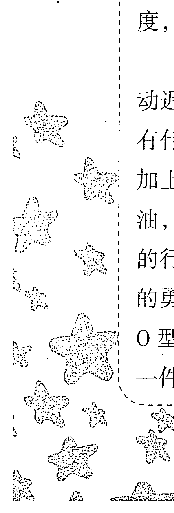

【温馨提醒】切记，一定要改掉性格中嚣张和自傲的特性，否则很容易令人对你的善意产生误解。

#### 二、狮子运势

O型狮子的运势较强，因为天生的领导才能，在年轻时即能达到较高地位。在任何场合，O型狮子座都能发挥自己的领导才能。

O型狮子还拥有极强的朋友运，能够结交许多良师益友，在人生道路上给予你及时的指引，并在关键时候能帮助你走上领导岗位。

你的缺点是名利心太重，将名利看做自己毕生追求的目标，不达目的很难罢休。因此，你在一些重大抉择上常常会犯错。贪图荣华富贵，贪念荣誉成就，这可能会给你招来横祸。

你和父母的感情淡薄，年少时的叛逆深深地伤了父母的心，经过时间的洗礼，和父母的关系才慢慢转好。你的适婚对象是没有太大野心，感情较为冷淡的人。

【温馨提醒】把名利看淡一点，把感情看重一点。

#### 三、职场命运

O型狮子座的你天生具有贵族气质和纵横天下的霸气，无论在什么场合，你都散发出耀眼的光芒，职场更是你表现自己的绝佳舞台。你会不自觉地显现出领导气质，并且让大家服从你的指挥。

你拥有很强烈的责任心，属于加班狂的类型，只有努力地工作才能让你有归属感。你拥有很强的组织能力和耐力，是天生的管理者。你对待同事像家人一样，对待上级像兄弟一样。但有的时候你过于独断专行，会忽略他人的意见，这常常让你成为众矢之的。要记住多听取他人的意见，也是一种领导艺术哦。

当你还没走上领导岗位时，因为你不服输的个性，常常和领导起冲突，变成同事不喜欢、领导不待见的人。虽然你很有实力，但是心性不定，容易受诱惑。最好不要从事副业，这样会分散你的注意力，应将注意力投入到一份固定的职业上，才能在职场更加一帆风顺。

> 【温馨提醒】多听取他人的意见，在领导岗位上会坐得更稳。

#### 四、赢在职场

对于O型狮子座的你，假如想让你出色的领导能力得到最大限度的展示，一个企业的培训师或是创业者可以成为你最好的选择，应该算是再合适不过了。如果你认为这些工作都没太大意思，放开一切，画家、设计师就是你独一无二的选择，因为在从事这一类工作的时候你不会感到受约束，能体会到充分的自由感，O型狮子座的你自身具有与生俱来的艺术气质，假如从事和文艺相关的工作，必能愉快地胜任。具有很强的自我表现欲，懂得享受生活中的华丽色彩，所以O型狮子座的你适合社会中出现的新兴行业，普通的生活和一成不变的工作是不适合O型狮子座的。最好能做歌手、模特儿、演员诸如此类的职业，上述的这些工作都能吸引别人的眼球，使O型狮子座的你，能够感觉到时刻被人关注的乐趣。

不管怎样，你的运气远大于一般人，只要你的精力足够多，不吝惜你自身的旺盛精力，你从事任何职业成功的算数都是很大的。作为O型狮子座的你，天生就是一个喜欢讨好周围，卖弄交际手腕的人，假如你过于表现自己招致周围人的嫉妒，那么你很容易就会被人群孤立，变得孤立无援。

> 【温馨提醒】在集体中的时候，你应该时刻提醒自己不要过于表现自我，以免被人群孤立。

#### 五、社交技巧

O型狮子座的你属于精力旺盛的行动派，浑身充满了活力，感染你身边的人也变得阳光起来。你热心助人，擅长在众人面前表现自己的优点，因此大家都很喜欢你。但你有的时候显得有些急躁，固执己见，不允许有人扯你后腿。你的虚荣心较强，喜欢听阿谀奉承的话，这是你的致命缺点。若能注意和改正，你的能力更能得到充分发挥。

你的个性活泼开朗，身上的阳光魅力和领导才干，征服了很多人，但有时你以一种命令的方式表达你的善意，这容易引起别人的误解。

忠言逆耳，学会听取不同的意见。善意若表现不当就成了恶意，注意方式。

> 【温馨提醒】表达自己的善意时，要注意表达方式。

#### 六、财富密码

O型狮子座的你，财运旺，一般情况下轻而易举地便能财源滚滚，运气好得挡也挡不住。要想获得不错的财运，良好的人品和人缘是非常重要的。因为你如果要发展，在你筹措资金的最初阶段离不开朋友的帮助。由于受到狮子座气质的影响，你不懂得如何珍惜你的运气，这就要求你将O型血的敏捷及冷静的行动力运用出来，这样将挽留住你的好运气，不至于让它白白溜走。总的来说，当有好运气出现时，如果没能及时把握，等到运气白白流失时，也许会陷入十分穷困的境地，如果仗着自己有好运气而深陷于赌博中，可能会使自己陷入无底洞，一旦陷入在里面就很难再抽身了。

作为O型狮子座的你，没有明确的储蓄观念，你所赚得的钱也会很快花光。你是那种即使借钱也要自己玩得开心的人，你不会有压力感，会通过拼命赚钱来弥补亏空，一旦你手里有闲钱了，就会不由自主地大手大脚起来。金钱对你来说没有特别实际的意义，它只是满足你欲望和获取快乐的工具。

【温馨提醒】储蓄的习惯虽然看起来不够有魄力，却是实实在在的积蓄的手段，如果总是大手大脚的，丝毫不懂得节约用钱，成为富豪将待些时日。百里之行终要始于足下，不积跬步无以至千里，不积小流无以成江河，要想挣大钱，就要好好珍惜小钱。

#### 七、恋爱攻略

O型狮子座的你，总是把人生比作一场戏，老是想要演好这场戏。你的恋爱，充满了积极和快乐，生活中满是绚烂美丽的色彩。在适合你的角色和舞台上，你认真挥洒着自己的青春才华。可以说你的爱情犹如一场戏剧，当戏剧化的你坠入爱河时，你就像电影中的主角一样，沉醉在一种情绪中，久久不能自拔，并享受在其中。如果你性格中的O型气质较强，那么你还好，能够在激情达到一定程度的时候让自己暂停下来，静下心来展望双方的未来。谈恋爱享受于富于浪漫气氛的场所，如果谈情说爱是在这些地方，你才能从对方含情脉脉的眼神中，享受到幸福的感觉，感受到爱情的喜悦。即使你在恋爱时，也不会是谦虚有礼的态度，你一贯的作风是能吸引别人的注意力，便是一种愉悦。

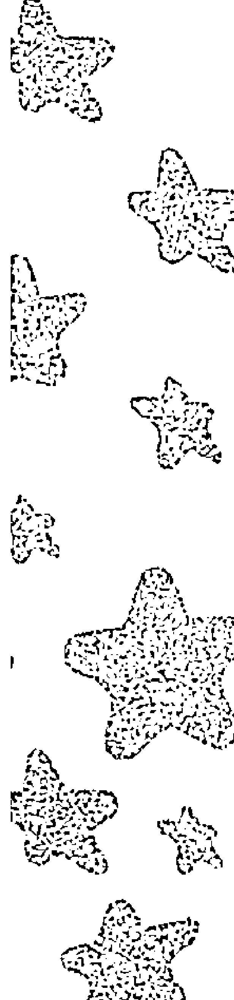

# 第八章 O型血型星座十二宫

O型狮子座的你从来不隐藏恋情，恰恰相反你总是得意洋洋地炫耀自己的恋情，一旦失恋了你会强迫自己打起精神，收拾自己受伤的心灵，马上又开始挑选新的对象。轰轰烈烈的爱情是你做梦都想要的，你不愿意把爱情埋藏在心底，时时刻刻都盼望对方能够感受到你所有的感情，感受到你的爱意多么浓厚。一般情况下，O型狮子座的你，常常迷恋在激烈的爱火之中，以至于燃烧自己也不会在惜。在寻找爱情的道路上，一旦找到和你兴趣相投的人，你便很快融入角色之中，同你的伴侣相处融洽。在寻觅爱情的途中，你一旦对某人萌生了爱慕之意，绝不会矫揉造作，而是直接向对方表达自己的爱意，约会之前你会慎重地选择约会的地点，尽量找一个能让对方放松的环境，尽可能给对方惊喜，想尽办法营造出完美的爱情场景。一望无际的沙滩和鲜花盛开的公园，往往会留下你们深深的足迹及美丽的故事。

你属于爱情轰轰烈烈，而对于性则显得稍微平淡的类型。尽管你追求戏剧化的爱情，充满对爱情的向往，但是你也不是纯粹的柏拉图式的爱情，当你的恋情进行到身体上的接触的时候，你们之间的感觉就会有急剧性的转变。这在周围的人看来，你全身心地投入恋爱的方式很现代化，尽管你在谈恋爱的时候轰轰烈烈，但是你却很难和对方发生超友谊的关系。一旦你们突破了友谊的界限，改变了这种停滞的状态，你就将完全释放心中的激情，将积压已久的感情源源不断地释放出来。

> 【温馨提醒】如果不考虑对方感受，擅作主张，最终将导致失败。

#### 八、婚姻家庭

O型狮子座的气质使你在追求浪漫时，情绪一直非常高亢，

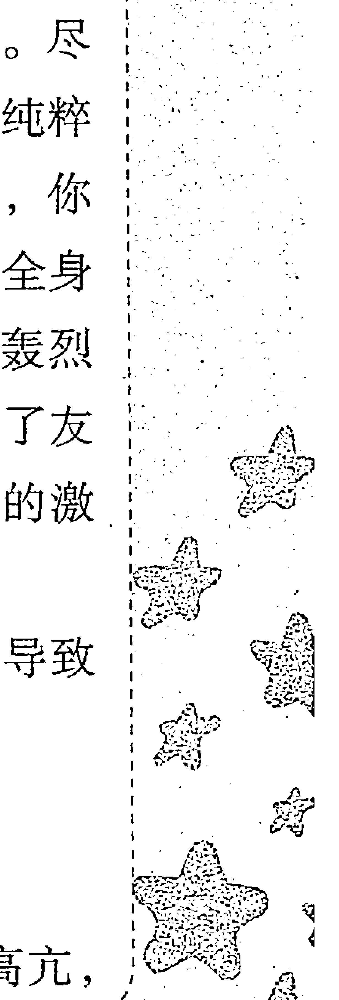

但一旦面对现实问题，就不会再热情洋溢了。O型狮子座的你，对待婚姻和恋爱有着迥异的态度，当你恋爱了，你始终保持着高昂的热情，但是对婚姻却始终提不起兴趣。或者可以说，你不愿意结婚而只想谈恋爱。在你的观念中，你认为恋爱和结婚根本上存在区别。对于婚姻，你抱着不折不扣的现实态度，只要一谈到结婚，O型冷静的特征就逐渐加强了。恋爱在你的头脑里始终认为是一种不折不扣的美好时刻，但是不得不承认婚姻是现实的，成为狮子座最终的配偶要至少具有极佳条件才有机会，才能让你的自尊心有些满足感。在现实生活中，作为O型狮子座的你可以说是个踏踏实实的人。就算这样，结婚和恋爱之间也没有什么相同之处，从情人变成配偶会成为大部分我们所能见到的结果，不管是哪种情形在别人的眼里大多都是荒谬的，前者是三心二意的负心型，后者则是心中渴望的爱情故事的续集。责任心太差劲对于前者来说是最大的缺点，而总生活在幻想中，不切实际则是后者最大的致命伤。

O型狮子座的你，在踏入红地毯之后，仍崇尚浪漫的生活，家庭束缚并不是问题。所以，再好的男人最终也会成为不顾家的典型，然而常常会被当做典型的大男子主义对待，让妻子感到莫大的困惑。琐碎的家务是最让女性烦恼的问题，总渴望和丈夫一起外出交际应酬或争取外出工作的机会，但是，这种想法正是丈夫最烦恼的问题。

O型狮子座的女性，虽然总是让琐碎的家务困扰着，但是还是有地方优于别人，喜欢和小孩子在一起就是其中一点，不仅很喜欢教育孩子，而且在闲暇的时间里特别喜欢和孩子们一起游戏。假如无法接受婚后的现实生活，无法摆脱恋爱时期浪漫的梦幻生活，如此一来，会让你的另一半备受挫折感，更有甚者会引起一场家庭风波，在这个时候你要感谢活泼开朗的与生俱来的性格，所以你们俩之间的小打小闹还不会导致离婚。虽然你本着游戏人生的生活态度，但是你本身具有O型的基本特征，不会让自己做出愚蠢的傻事，而使自己的家庭生活遭到破坏。

一般来说，你在家庭中的人际关系不会让你感到烦恼，甚至让你引以为傲，但是，如果你过于优秀，可能往往会遭到对方的嫉妒，甚至产生不愉快。因此会导致一场家庭的纷争，后果不堪设想，这个未免太不值得了，所以即便在家里面，在这些方面对于自己的家人还是要在感情上多加注意，要让情绪有所节制。

> 【温馨提醒】恋爱时总是渴望生活在浪漫的爱情故事中，这种渴望并不是不可以，但是，周围的环境变化还是要时刻注意的，切忌由于一时的冲动，而将自己辛苦建立的生活基础毁掉。

#### 九、最佳速配

和O型狮子座最搭配的是狮子座、射手座、摩羯座，其次速配的是双子座、天秤座、水瓶座。你与这些星座的人，在性格脾气上很能合得来，若有共同的兴趣爱好或人生志向，速配指数更高。

O型狮子座的你喜欢浪漫而富有激情的恋情，过于平淡会让你感觉寡淡无味。你的理想伴侣是富有浪漫激情，并且长相突出的异性，你不在乎对方的学历、家世等外在条件，越是不般配的恋情越能激发你的兴趣。你渴望一场轰轰烈烈的爱情，需要注意的是，过于看重恋情的轰动而忽略实质，会让你吃尽苦头。

适合你的伴侣是幽默风趣、处事大方、诚恳踏实的行动派，学会迁就、学会体谅，和伴侣之间的默契会更多哦。

#### 十、健康驿站

O型狮子座的你，为了交际在烟酒上无所禁忌，你需要注意肝脏、高血压、咽喉方面的疾病。烟酒可以少量，无所禁忌的话，你的健康必然亮起红灯。另外，你还要注意眼睛、颈椎和关节上的毛病。

你有极好的旅行运，外出旅行中总能交到很多好朋友，也会邂逅你的意中人。你适合到冰天雪地的北方旅游，滑雪、溜冰等运动也很适合你。

## 第六节 O型处女座

#### 一、性格分析

O型血处女座的你是韩剧中最甜美纯真的角色，你对爱情专一而执著，并兼具强烈的责任感。此类型的男生往往不具有雄才伟略，但是却有将对方捧在手心，照顾好家庭的能力。你聪明伶俐，从小深得老师和长辈的喜爱。你对人生总是有很多梦想与目标，即使有的你知道根本实现不了，但是还是会时而做做“白日梦”，并会为梦中的美好蓝图而窃喜。由于你非常具有智慧，所以身边人往往会觉得你在“耍酷”而让他们有距离感。其实，了解你的人才知道，你为人热情，对生活充满感恩，对待事物非常积极乐观，对待朋友更是没话说。但是，你是非常理性的，尤其是在面对新事物和陌生人及作出决定之初。正是基于这种理性的

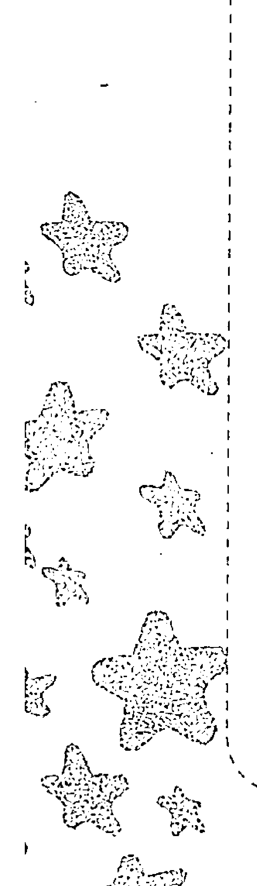

## 第八章 O型处女座十二宫

意识，加上你平时比较关注法律的惩罚性措施，所以你绝对有不违法的本领。

当然，有人说处女座的你在生活中有洁癖，但其实你只是对他人的“行为”或环境要求较高，而自己也是个随性的人呢！你无论对人对事都喜欢直来直去，不喜欢“话里有话”的感觉，当然也比较厌恶那种在背后捅刀的小人。你对待身边人与事认真的态度，经常能够给朋友带来一种霸气感。但是，尽管如此，朋友们就是喜欢你这种真诚、不做作、不马虎的表现。

O型处女座的你也许经常思考这样一个问题：人活在这个世界上，究竟应该追求什么？是金钱？是名誉？是地位？还是快乐？

也许有的人会说，当然是金钱了。俗话说得好，有钱能使鬼推磨！在这个物欲横流的社会，有了金钱似乎等于拥有了一切。但是，我们还是看到很多有钱人照样有着我们寻常人的烦恼，一样过着不开心的生活。钱不是万能的，但没有钱是万万不能的。金钱固然重要，因为它能让我们衣足饭饱以满足我们最基本的需求，但是它买不到真情，也买不到快乐。这个道理没有人比你更懂了。

O型处女座的你有种“任尔东西南北风，我自岿然不动”的心态。你能用冷静的心态去看待身边发生的一切事情，并对这些事情作出较为客观的评价。O型处女座有着天生严于律己、宽以待人的倾向，对自己要求非常严格，甚至有点神经质，但是对待身边人却能够显示出一种宽容与谅解。由于你做事认真，并且给人一种冷酷的印象，所以刚刚认识你的人都会觉得你是一个非常傲慢而难缠的家伙。如果O型处女座的帅哥美女们能够发挥O型人的基本特征——亲切感与领导才能并重的话，将会收到意想不到的效果。

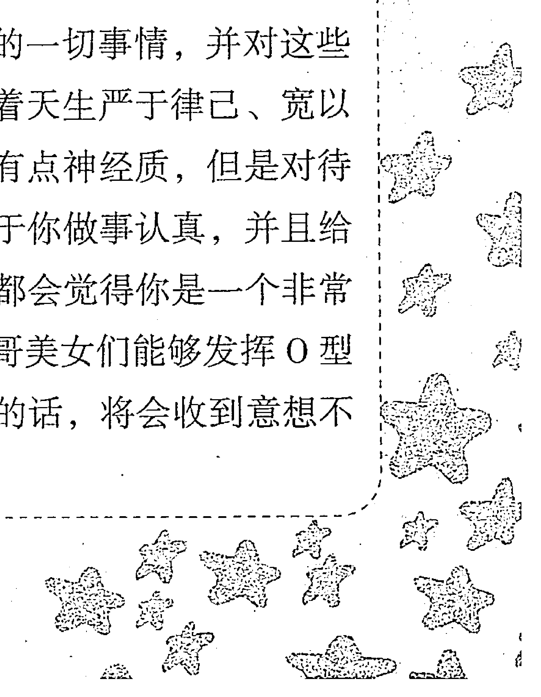

O型处女座的你，无论男女，内心都有对纯洁爱情的憧憬。你就像《山楂树之恋》中的静秋与老三，内心仿佛被一丝清风吹拂。无论处境多么嘈杂，身边的人对爱情的贞操观多么不屑，你心中对纯洁爱情的向往始终不变。那些给人“傲慢”与“不可一世”的第一印象，也只不过是想保持自己内心的净土罢了。但是，请你记住，个性与真自我是有价值的，可成熟的标志往往是“外平滑而内棱角”的，所以只有更好地发挥O型的积极行动性，才能弥补这项不足。

【温馨提醒】若是太过于坚持真自我，往往会让身边人产生距离感，不利于人际关系的开展，也会对仕途产生一定的影响。

#### 二、处女运势

你的人生运势一般，但因为认真勤劳的人生态度，无形中给自己创造了好运气。你会得到贵人的帮助，在事业、婚姻上都能达到你的理想。你很有可能因为朋友带来财运而过得比较宽裕。但切记不要把致富的希望放在投机上，不然会落得人财两空。

在交朋友方面要学会鉴别，要交良师益友型的朋友。若交到小人型的朋友，可能会给你的人生带来厄运。

你很有父母缘，你很孝顺自己的父母，子女也很孝顺你，不会因家庭关系的不和谐而忧心。

【温馨提醒】交到真正对你有帮助的朋友，是你开运的关键。

#### 三、职场命运

O型处女座的你，做事认真、毫不含糊、让人信赖。在工作上臻于完美，让欣赏你的人更加认同你，让你的搭档信任你。但你对自身的完美要求，会无意识地渗透到其他人身上，让人感觉你过于冷血、过于苛刻。

如果你的个性以积极、热情的方式表现出来，既把自己的分内工作做好，又帮助合作伙伴共同做好工作以达到你的要求。在人际交往上更加圆融一些，你会成为众人敬仰的对象。

你的判断与分析能力强于常人，适合做分析研究类的工作，这让你更能发挥你的特长。若纠结于自己不喜欢的工作，会成为你压力的主要来源。

> 【温馨提醒】在人际交往上更加圆融一些，你会成为众人敬仰的对象。

#### 四、赢在职场

O型处女座的你是典型的职场达人，因为你头脑冷静、心思缜密、做事认真。仅凭这一点，你的工作能力就会得到单位领导的认可，前途一片光明。但是你并不适合自己当老板，因为你没有办法让自己的行为不受监督或鼓舞。

或许单位的办公室文员、财务负责人或者秘书的职位更加适合稳重的你。别看这些职位不起眼，这可是一个单位的核心环节，如果出了一点错误，将会损失惨重。所以，这些细心活交给O型处女座的你完成是再合适不过了。

当然，O型处女座也是学术界的高手。因为你稳重而不张扬的性格，非常适合在学术领域“低调”地游走。如果O型处女座的人能够在学术层面多下功夫，相信会成为非常著名的专家、学者。

总之，无论发生什么事情，交给O型处女座的工作都会顺利完成，且不会出现什么严重的问题。同时，我相信O型处女座的人绝对是成功人士必不可少的事业合作伙伴。

> > 【温馨提醒】如果你选择一位性格开朗、头脑灵活并且具有远大梦想的人作为你的合作伙伴，那么你离成功就不远了。

#### 五、社交技巧

O型处女座的你个性比较保守，处世比较谨慎。自身良好的家教，让你在社交场合散发优雅的魅力，虽然你自己并未觉察到。若能够更加大方一些，更加善谈一些，你会吸引更多的眼球。

O型处女座的你，自尊心很强，神经比较敏感，待人经常好恶分明，无意中会得罪一些人。你的眼睛里容不得沙子，对待别人的缺点深恶痛绝，却看不到自己的缺点。你喜欢批评别人，却听不进别人对自己的批评。

> > 【温馨提醒】时刻保持空杯心态，虚心听取意见，会提升你的交际魅力。

#### 六、财富密码

O型处女座的人是朋友眼中的“铁公鸡”，他们从不浪费钱财，并且认为应该将每一分辛苦钱都用在有价值的地方，而不是用在享乐与购买奢侈品上面。O型处女座的你一生不会得到意外之财，但是通过自己的努力与耕耘，手中积累的财富会越来越多。属于生活不至拮据，但是也不会很富足的类型。你总是能够掌握家中的财政大权，并且将生活里的所得与花销计划得非常合理、井井有条。

不过话又说回来了，O型处女座的人也是十分爱面子的。偶尔的大方也会发生在你们身上，比如说朋友远地来访，作为“地主”，你肯定要大方地请朋友吃饭、安排住宿，甚至还会买一些当地特产让朋友带回家中。这时的你们，自尊心占据了主导地位。

> 【温馨提醒】要谨记“贪小便宜，吃大亏”的教训，在理财方面要尽量将眼光放长远。生活中的每一笔投资，包括人际关系的投资其实并不是一种浪费金钱的表现，相反那是一种对未来更大收获的前期投入。

#### 七、恋爱攻略

O型处女座的女生，比起恋爱时的甜言蜜语，更喜欢踏踏实实的爱情。但是，这并不表明你不向往甜蜜的爱情，只是你对待爱情的态度比较谨慎，而且都会考虑婚姻的问题。你可能永远也无法理解玩劲舞团的那些男生女生们在游戏过后可以见面，甚至在一起这种事情。也只有如此的小心翼翼，才能保护向往纯洁爱情的你。因此，“我爱你，但是如果他/她能带给你幸福的话，我选择放弃”这种话绝对可以出自O型处女座之口。即使你在追求一个女生或者爱慕一个男生后，未能如愿以偿地获得同样的好感，也会在心中为她/他祈祷，并希望他/她会幸福、快乐、美满一生。

对待感情的谨慎与真性情是O型处女座的典型特征。虽然，在恋爱期间会给人留下些傻傻的、不动脑筋的印象，但是这丝毫不影响你对爱情的认真与纯情。无论你的人生经历过什么，在爱情的道路上抑或坎坷，抑或一帆风顺，你总会坚持对纯洁爱情的向往。心中的一丝清泉，永远不会被泯灭。随着时间的流逝，你遇到的异性越来越多，但是对于爱情观却能保持不变，这对于O型人的确很难得。

我们知道，恋爱中的O型人是活在自己世界里的爱情精灵，O型人是可以为了爱情付出一切的，甚至不在意身边人的眼光。然而，作为O型处女座的你却不会如此“盲目”，一般而言，你给人的更是一种神秘的印象。对纯洁爱情向往的你，尤其是女性，对爱情中的性生活表现得小心翼翼，更加向往柏拉图式的性爱，而厌恶那种激烈、冲动、暴力型的性爱方式。这是因为，处女座本身就是一个理性星座，O型处女座的人更不可能将自己的爱情与不确定的因素联系在一起，所以“一夜情”之类的事情不会发生在你们身上。因此，要追求O型处女座女孩的男生注意了，她们更喜欢在温柔的、浪漫的气氛下与所爱的人发生亲密关系哦。

> 【温馨提醒】不要过于沉溺爱情，即使在热恋中也千万不要丧失理性。

#### 八、婚姻家庭

O型处女座的你们，在婚姻家庭方面显得非常保守。O型处女座的人追求纯洁的爱情，也追求精神恋爱。在婚姻观念上，你们介意世俗道德观，介意周围人的眼光。所以，结婚的排场很重要，婚后的生活质量也很重要。对O型处女座的人来说，婚姻是一件非常神圣的事情，你们不会因冲动情势所迫而迷迷糊糊地步入婚姻殿堂。在你的意识中，婚姻象征着另一种人生，另一个人生的起点。你希望你的婚姻得到家人的祝福、社会的认可，也希望你的婚姻会成为你事业的后盾。

无论是在经济方面、教育子女方面还是在家庭生活方面，你都会有详细的计划。在你眼中，没有计划的事情是不会考虑的。而且，即使周密的计划要花费很长一段时间，你也一定要维持心里理想的目标，始终不渝。在选择配偶上亦是如此，O型处女座的人选择配偶是会考虑得非常长远的，而且眼睛里不容沙子。对于女生来说，她们总是喜欢假设一些问题不厌其烦地反复问对方，然后通过对方的回答考察对方的性格、态度、发展以及双方的感情坚固程度。

你们的座右铭是一丝不苟地做好本职工作。所以认真与责任心是你们给朋友的第一印象。一般说来，O型处女座的人虽然做事情一丝不苟，适合办公室、财务等细致的工作，但是你们不善于到独立的事业中发挥领导才能，而更愿意被领导、被监管。因为你们在面临选择的时候，总有一种忧郁的气质。

结婚以后，O型处女座的人会把家庭生活安排得有条不紊，绝不打无准备的仗。从结婚开始，你们对于何时买车、何时要孩子、何时搬家等规划就已做得很详细。此外，O型处女座的女性还是厨房高手，你们用厨艺套住老公的胃，并对研究烹饪技术乐此不疲。而O型处女座男生则非常有责任感，且有卓越的办事能力，踏踏实实地去做好每一项工作。

虽然婚后的女人会逐渐变成家庭主妇，但O型处女座对待婚后感情仍然充满浪漫的期待。你们不希望婚后生活变得枯燥无味，仍然期待情人节的玫瑰及圣诞节的小惊喜。

【温馨提醒】明晰自己的身份，不要混淆夫妻之间的角色扮演。夫妻之间发生不快时，要妥善解决，不要悲观。

#### 九、最佳速配

你纯洁、保守的个性让你对待爱情有一种精神洁癖。你喜欢的伴侣是浪漫纯情、以爱情至上的异性，O型处女座女性喜欢有男子汉气魄又保留着内心那一份纯真的异性，O型处女座男性的理想伴侣则是单纯可爱的小鸟依人型的女孩。

一旦你投入到恋情中，最开始的时候你绝不会到处宣扬，你喜欢进行秘密的“地下式”的恋情。适合你的对象一定是你心中完美的人，并且他/她具有强大的包容心，包容你的坏脾气和小任性。斤斤计较，无法容忍你洁癖的人，绝不是适合你的人选。

和你最为搭配的星座是处女座、金牛座、摩羯座，其次是巨蟹座、天蝎座、双鱼座。其中O型摩羯座和B型金牛座最了解你。

#### 十、健康驿站

O型处女座容易神经敏感，要注意神经衰弱等神经方面的疾病。在饮食上要营养均衡，避免暴饮暴食。O型处女座女性要注意妇科病、神经性胃炎、湿疹等。

外出旅行的话要选择阳光充沛、风景秀丽的景区，比如大海或者小岛，这让你更能放松心情。

# 第七节 O型天秤座

#### 一、性格分析

O型天秤座的你是个性情温和的人。无论待人接物都显得十分得体，不走极端。冷静与灵活是你的性格特征。所以，你特别讨厌发生争吵，为了保持美好形象，你不会选择在大庭广众之下轻易动怒。在这种情况下，你给人的第一印象是非常好的，因为身边的人会觉得你温文尔雅、处事大方、适合交往。

O型天秤座的你，具有天生的一种唯美意识，是一个典型的理想主义者。你是美的追求者，是美的代言人。就拿用餐来说，即使是最细微的部分，你也会严格挑选出精美的食材与作料，做出最完美的一餐。但是，物极必反，过分地追求细节完美的 O 型天秤座也容易变得粗俗浅薄，不重内涵、只重外表。如果这种性格强烈地显露出来，就会使自己变成令人讨厌的轻佻型人物。

O 型天秤座的你，做事情比较讲求效率与质量的良好结合。不喜欢拖拖拉拉地完成工作，不喜欢犹豫不决的做事方式。所以，好人缘是你的过人之处。人们会发现，你永远是人群中的焦点，大家喜欢围绕着你。你的亲和力与向心力是别人不能比的，也正因为如此，你和社会中很多绅士与淑女一样，热爱交际。

O 型天秤座的人，有两种典型的性格类型：一种是犹豫不决型；另一种是黑白分明型。但是对于第二种类型的 O 型天秤座的人来说，其实是容易走入极端的陷阱的。

> 【温馨提醒】不要过度地关注外表，要更加注重人心，将心比心，可以使你交到更多的朋友。

#### 二、天秤运势

O 型天秤座的人生态度是等待而非冲刺，安于现状，不去积极地开拓自己的人生版图，所以 O 型天秤座的运势平平，还伴有大大小小的波折。

你的人生中可能会经历很大的痛苦，可能是由于自己的家庭造成的。你的婚姻伴侣不是自己的理想伴侣，可能会再婚。你再婚的对象可能是有钱人，你又很擅长积累财富，财运较佳。

> 【温馨提醒】若你能制定自己的人生目标，积极努力地去实现，你的人生运势会慢慢好转。

#### 三、职场命运

你很会协调人际关系，绝不会轻易和别人发生争执，即使发生不可避免的争执也能较妥善地处理。你的事业心不是特别强，选择工作全凭自己的兴趣，不会强迫自己做不喜欢的事。

你在职场中属于中庸的人，对工作不是那么拼命，但很有责任心也很能吃苦，对自己分内的工作能够完成得很好。你在职场中属于受大家欢迎的类型。你能够应对复杂的职场斗争，对职场潜规则有清醒的认识。若能培养自己的决断力，你能赢得更多的支持者。

> > 【温馨提醒】要想赢得更多的支持者，就要注重决断力的培养。

#### 四、赢在职场

从哪里跌倒就从哪里爬起来。O型天秤座的你，不是为工作能够拼死拼活类型的事业型强人。你在工作时总是为自己留有余地，所以努力不足会使你离成功总是一步之遥。所以，只要你抓住机会的尾巴，努力奋斗、勤奋图强，成功还是会垂青你的。

由于你追求完美的性格，所以一切与美有关的职业都适合你。例如，服装设计师、美容师、化妆师等。当然，如果你具有特殊的才能，台前的工作也是你所向往的，如主持人、舞蹈演员等。

此外，由于你具有整合资源的超凡能力，所以你总是有他人不知道的消息。只要你能够恰当地利用这种消息，就可以大幅度地减少失误的发生。

所以，无论从事何种职业，如果能够用灵活的头脑应对挑战的话，你离成功就不远了。

> 【温馨提醒】世上没有免费的午餐。凡事都要付出十分的努力，才会得到十分的回报。所以，不要轻看任何一种工作，你的财运与仕途可能就取决于它们。

#### 五、社交技巧

O 型天秤座为人温和，宁肯忍气吞声也不会给自己树敌。很多人都愿意接近你，你的朋友非常多，生活得很热闹，但大多是泛泛之交。知心的朋友很少，因为你的防备心理比较重。大声地说出你的真实想法来，会让朋友觉得你更加诚实可信。

你天生优雅从容，社交圈里都是和你一样优雅的绅士、淑女。O 型天秤座的艺术天赋十分突出，你在音乐、美术、戏曲等艺术领域都有涉猎，多和兴趣圈的朋友往来，你会结交更多志同道合的朋友。

> 【温馨提醒】多和同一个兴趣圈的朋友往来，你将获得更多志同道合的朋友。

#### 六、财富密码

金钱在眼前，人人都想得到，甚至想得到的越多越好，这是很多人的心理。古人教育我们说，君子爱财，取之有道。贪欲者，众恶之本。一个人如果贪得无厌，就会感觉不到世间其他快乐的东西，更会就此乱了方寸，心中谋略一乱，欲望就更多。贪欲多，心术也会不正，就会被贪欲所困、失去理智去行事，容易把事情做绝做坏，大祸也将临头。所以，不忍心中的贪欲，什么事物都会办不好。受贪欲的影响，总是奢望自己能够多占多得、不劳而获，而将生命中更重要的真情、亲情等弃之不理。要记住，虽然我们的生活离不开金钱，但是生命之中永远有更重要更精彩的东西值得我们去追求，这点也是 O 型天秤座心中时时应谨记的道理。

O 型天秤座的你，财运并不旺盛，但是可以维持小康水平。储蓄虽然是最常见的生财之道，但是只要能严格控制每天的收支，慢慢就收到一些效果。不要眼高手低，若是花费在自己的计划范围之内，就会有充裕的生活。

> 【温馨提醒】如果太过在意他人的眼光，就会破坏个人的财势。你应该避免死要面子活受罪，在别人面前装大方，吃亏的只是你自己。

#### 七、恋爱攻略

别看 O 型天秤座的你为人处世大方得体，喜欢交际，但是在爱情方面，你还是比较被动的。你即使有爱慕的对象也不会说出口，而会选择默默地观察与等待。你对自己的魅力非常有自信，你相信机会是留给有准备的人的，所以在爱慕对象面前，总会用最美丽的一面出现。

O 型天秤座，处在恋爱中的你像是公主一样魅力四射。你的身上有吸引异性之处，你有丰富的表情，高超的谈话技巧，活泼的个性，开朗的笑容，这其中的任何一个特征都足以引起异性的注意。

在性爱方面，O 型天秤座的人比起处女座来说，显得更加保守。你喜欢“半糖主义”的感情，而害怕缠绵，因为这对你来说是一种负担。你喜欢浪漫，但是不喜欢没有内涵的浪漫语言。也许在浪漫的海边沙滩餐厅共进烛光晚餐，和爱人在简单的小调伴奏下翩翩起舞比狂欢更加适合 O 型处女座的你。只有在这种点滴浪漫的过程中，你才会为之动容并尽情享受天伦之乐。

> 【温馨提醒】要在爱情中保护自己，不要轻信他人的看法与建议。只有你自己才知道想要的是什么样爱情。

#### 八、婚姻家庭

天秤座的你注重公平平等，也非常注重均衡。你无法接受婚前的同居行为，认为这是一种破坏均衡的形式。其实这更在于你害怕外界的言论。你非常爱惜自己的羽毛，所以不希望自己的行为被外界说三道四，因此在平常的行为中你会避免出现出格的情况。所以，在你的身上，绝不会出现为爱疯狂、私奔等事情，你会非常理智地看待这些事情，非常优雅地面对。对于你而言，婚姻是一件非常重要的事情，你非常重视婚姻的合理性。到了一定的年龄，你就会本能地把结婚提上日程，这并非是因为你有了结婚的对象，而是你觉得再单身的话会被周围的人说，说穿了你更加在意别人的眼光。

你的婚姻是非常现实的婚姻，在婚前你会认真地考量自己婚姻的质量，你非常重视另一半的发展，这样理性的婚姻一般来说能够得到大家的祝福，而且延续较长的时间。

结婚后的你会是一个热爱家庭的人。你喜欢和谐，在生活中你会尽量避免矛盾，所以你将会是一个好妻子/好丈夫。你非常重视另一半的看法，所以夫妻之间也会很有默契，如果你的另一半也是一个非常理性的人，那么你们通常会有非常平衡的婚姻，没有人会在家庭中一人独大。

婚后的你，非常注意家庭的美感，这与你天生是一个追求美感的人有关，你的家庭总会布置得非常漂亮，并且装修也会非常有品位，你生活中也不乏浪漫的因子。

你对小孩的教育也非常民主，在你的家庭中，家人的地位是平等的，所以你的小孩子从小就会养成非常独立的性格。

【温馨提醒】你容易养成依赖性，所以要保持相当的独立性，给彼此留一些空间；同时要避免自己爱美的心泛滥，导致家庭的人不敷出，要掌控好自己的理财，建议选择一个比较会理财的另一半。

#### 九、最佳速配

O 型天秤座女性比较欣赏果断刚强、事业与家庭兼顾、品味高雅的男士，彼此情投意合，有着相似的婚恋观，可以共创幸福的生活。和 O 型天秤座搭配的是天秤座、双子座、水瓶座。拥有恶劣生活习惯的男士，即使性格再好，也难以打动你的芳心。

O 型天秤座女性不是天生的家庭主妇，因为自己的优雅作风，喜欢买一些华而不实的家居装饰，这常常会成为夫妻吵架的导火索。你会为了自己心爱的人而培养自己理家的能力，但这无法成为你的专长。O 型天秤座女生大多有大小姐脾气，即使脾气再好的男士也会被你磨掉耐性，要有意识地改正。

#### 十、健康驿站

O 型天秤座身体底子较弱，对冷空气、湿气比较敏感。要注意预防皮肤、呼吸系统、肝脏等方面的疾病。你不太会释放自己的压力，心情郁闷也会引发健康隐患。找朋友倾诉倾诉是很适合你的解压方式，此外，还可以多做运动，打太极、羽毛球、网球等运动都很适合你。

## 第八节 O型 × 天蝎座

#### 一、性格分析

O型天蝎座的性格十分复杂，几句话难以概括。O型天蝎座的外在个性对天时、地利、人和的要求极高，根据不同时机表现出不同的特点。同样是O型天蝎座，不同的人又会有不同的差异，但总体来说，O型天蝎座的你具有显著特征：固执己见、意志力惊人、信念坚定。这几种复杂的个性综合起来，就会显得相当矛盾。但是，严格说来，O型天蝎座的个性以天蝎座强烈的个人意识为主。O型的气质被掩藏在天蝎的气质之下。你平静的外表，让你在第一次和别人见面时容易忽略你，但是，你具有相当令人震惊的深沉，你顽强的意志力也是其他星座血型无法比拟的。你的意志力稳如磐石，任何人难以动摇。

你的另一个显著特征是富有丰富的想象力，你在社交上常常陷于被动，直到找到和你志同道合的人，才会完全地信任对方。你常常运用敏锐的直觉和奇异的想象，洞察他人的心思，掌握他人的心理。你在交友上容易爱憎分明，对你第一感觉不喜欢的人爱答不理，绝不会说迎合对方的话。同时，你平静冷漠的外表给人拒人千里之外的印象。

其实，你本质上是真诚善良的人，你信奉诺言，很少做出承诺。一旦说出承诺，就坚决会遵守。你的朋友都十分地信赖你，但你害怕朋友太过了解你，有时你会故意隐藏自己的内心，显现出一种神秘的样子。你的占有欲也很强，一旦你感兴趣的东西，你就会想方设法得到。在感情上更是如此，因此你会陷入各种纠纷中。

因为你天生坚定的意志力，在性格上显得顽固而刚愎自用，登上领导岗位的你可能会因此而受同事的排挤。你十分要强，自尊心很强，很难向强者低头，你不服输的劲头让你暗暗努力，争取有一天能超过自己假设的敌人。对于他人的建议，你不置可否，依然按照自己的意见行事。在别人看来，你是个不折不扣的顽固派。

> 【温馨提醒】你无意中流露出的神秘气息，常常会掩盖你诚实善良的本质。

#### 二、天蝎运势

O型天蝎座属于大器晚成型，年轻时并不怎么顺利，但到了中、晚年，之前所做的努力都能实现，人生步入坦途。

在爱情上也不是特别顺，有可能被情人背叛，但因为O型人的乐观性格，不会给你造成太大的伤害。你可能不止一次婚姻，历经波折才在最后获得美满的婚姻。

虽然各方面都会遇到些小挫折，但你很有朋友运，每次都能得到朋友的帮助，化危机为转机。你自己的冷静理智也增强了自己的运势。

> 【温馨提醒】保持冷静理智，可以增强你的运势。

#### 三、职场命运

O型人和天蝎座的结合，使你综合了敏感多情和顽固坚定的个性，这两种相反的气质使你在别人眼中显得神秘。但你能在适当的时机展现你令人喜欢的一面，还需要将两者保持平衡，不至于过分矛盾。

你拥有坚忍不拔的意志力，在工作上遇到任何苦难都不会乱了手脚，这让大家十分信赖你。

你冷静理智的态度，容易让人觉得你冷血无情、置身事外，这让人无法容忍。有的时候表现出你主动积极的一面来，更容易获得大家的共鸣。

> 【温馨提醒】在和同事合作时，要加强与合作伙伴的沟通，你们的合作才能更加和谐。

#### 四、赢在职场

你自身具有极强的责任心，无论做任何事情都一丝不苟，这比较容易让你有成就感。凭借认真的态度，你可以获得某种程度的成绩。你内心潜藏着强大的野心，强大的意志力促使你制订出详尽的计划，你会坚定地朝着目标前进，破除成功道路上的任何障碍。

良好的人际关系是你成功的关键。你虽然有吃苦耐劳的精神、顽强拼搏的劲头，但你容易忽视和别人的团结合作，有时对自己自视过高，忽略自己的众多缺点。在这个处处需要协作的时代，个人的力量是微不足道的，若你能重视和他人的团结合作，时刻发挥集体观念，才能离成功更近一点。

O型天蝎座的你对工作具有强烈的责任感，较适合从事敏锐性及洞察力强的职业。例如医生、作家、心理学家、企业界（限研究开发），也因与生俱来的强健体魄，较适合从事导游、警察、船员、职业运动选手等职业。

> 【温馨提醒】改善自己有些封闭的个性，多和朋友联系，以扩大自己的交际圈，开阔自己的视野，必对你有所帮助。

#### 五、社交技巧

因为你不会刻意地迎合别人，对人敌我分明的态度和很难信任他人的心理，你的知心朋友并不多。你的朋友都是你喜欢并且和你志趣相投的人，对你讨厌的人你会很明显地表现你的反感情绪，加之你冷若冰霜的外表常常让人误解你是难以接近的人。在人际交往上，你要以百倍的热情对待，才不至于沦落成孤家寡人。

你认为真正的朋友中，可能有不是真心对你的人，还有可能遭遇情人的背叛，你要学会更加敏锐地洞察他人。经常参加一些交际活动，会扩大你的交际圈，也会有更多的机会交到真正的朋友。

> 【温馨提醒】在人际交往上，以百倍的热情对待，就不会让自己沦落成孤家寡人。

#### 六、财富密码

O型天蝎座的你，处事十分谨慎，善于未雨绸缪，你会有相当可观的储蓄，并且你的理财方式也十分科学。懂得投资，懂得开源节流。你的财运，让你不用太拼命就能过得比较舒心。你在投资方面相当有魄力，不用绞尽脑汁就做出决定。大多数情况下你的投资都有收益。偶尔还会有小小的意外的惊喜。

总之，你有相当不错的财运。因为你十分勤奋，除了工作上的固定投资，还会有股票、债券方面的收益。

虽然你不是一毛不拔的铁公鸡，但你的控制欲也比较强，有时会有守财奴的心理。当你有了一定财富之后，你可能为了达到自己的目的而铤而走险，干出一些不法勾当。另外，你也可能收受贿赂，因为你实在太爱钱。

【温馨提醒】保持优良的理财习惯，切不可为了积累财富而做出后悔终身的错事。

#### 七、恋爱攻略

O型天蝎座的你对待爱情冰火两重天，在恋爱中可能出现截然相反的两种态度。天蝎座的气质，在恋爱的时候会表现得更为强烈，理智的态度就会显得无比强硬，O型的冷静性恰好可以来加以调和。当你的个性表现为O型血时，表达爱情的方式就很直白。但表现为天蝎个性时就会有相当强的耐力。这两种矛盾的态度让你十分苦恼。

但总的来说，你的爱情模式本来就是复杂多变的。可以肯定的是，在大多数情况下，只要你投入到恋情中，你就会有蜗牛般的耐性，像藤蔓一样紧紧缠绕着墙壁。

你的伴侣假如是你的同事，你就会紧紧追随对方，常常让对方十分痛苦。不管怎么样，你总是用誓不罢休的态度坚决地对待你的伴侣，不然很难满足你对感情的火热追求。每一次你对待感情都全力以赴，只要让对方觉得幸福，你都会在所不惜。

虽然你心底的感情十分火热，但你和白羊座、狮子座不一样，你的爱情表现方式不是热烈的、华美的，而是低调而深沉的。你会将这种深沉的感情转化为细水长流的方式，使你们的感情更加坚固。

你对待感情十分投入，所以在婚前就可能发生很亲密的关系。你的性欲很强，而且在乎对方的感觉。所以，O型天蝎座男女，都会让人误解为情场老手。事实上你对待爱情太过于投入，你是真诚地对待对方。你的这种恋爱方式，和处女座追求柏拉图式的精神恋爱截然相反。因此，你在爱情上的大胆行为，总让人感觉你很轻浮。因为你付出了全部，一旦被对方背叛，你的愤怒可想而知。积压长时间的愤恨只要爆发出来就难以收拾，你的复仇是相当可怕的。但是，O型血冷静的一面又会做出一定的弥补，这让你失恋的态度稍为缓解，缓解到和其他人相同的程度。

【温馨提醒】恋爱中的你不要过分沉溺在自己的感觉中，要时刻询问对方的感受，为对方考虑，懂得经营自己的感情。培养两人的默契才是最重要的。

#### 八、婚姻家庭

O型天蝎座的你，喜欢一个人的孤独，你沉浸在感情中就会十分投入。但在最初你不会贸然考虑结婚这么长远的问题。你的独立个性会让你很难软弱和感性起来。你事事都不想依靠别人，你认为靠你自己的努力也可以活得很好。你强烈的责任感和真实的本性，也让你对待婚姻很谨慎。婚后的你绝不会因为结婚而后悔，因为这是你深思熟虑后的结果。你对家庭也有着天生的责任感。家里的一切你都会放在心上。等有了孩子，无论男女，都会非常宠爱孩子。

O型天蝎座的男性，婚后放下婚前追求个人自由的心理，勇于承担自己的责任，不仅给妻子孩子物质上的卓越享受，也会给他们的精神世界带来享受。O型天蝎座的女性，对待婚姻十分忠贞，婚外情和第三者这样的事和她无关，因为你的忠贞，你的丈夫也会相应地忠贞，被背叛的可能很小。你建立起了典型的“男主外，女主内”的最佳模式。男性对家里的事关心但不会过多干涉，女性分担家庭要务，也很少干涉丈夫的事。你们共同教育孩子，以一种开明的态度对待孩子，不会有拔苗助长的心理，追随世俗脚步，让孩子在一个开放自由的环境里自由健康地长大。在教育孩子方面，你有自己独到的教育观和价值观，让孩子深受影响。

O型天蝎座的你，即使感受到婚姻生活的幸福，也希望拥有自己的独立空间。所以，即使夫妻在一起，你也会让自己的思想自由驰骋，开辟自己的精神空间。这无可厚非，但这容易让夫妻之间产生矛盾。如果这个矛盾积攒时间过长，一旦钻进牛角尖，就会造成夫妻的信任危机。并且就像定时炸弹一样，时常爆发一下。很多时候夫妻关系岌岌可危，在你善良的本性下，才及时挽回。而十分宠孩子的O型天蝎座，为了孩子也不会轻易离婚。

> >【温馨提醒】一味追求自己的个人空间，常常产生夫妻间隙。互相给予对方关心，多为对方着想，才能稳固两人的感情。

#### 九、最佳速配

O型天蝎座的最佳速配星座是天蝎座、双鱼座、巨蟹座，金牛座，处女座和摩羯座也能和你合得来。

适合O型天蝎女的伴侣是热情开朗、真诚善良的、温柔体贴的异性，不要轻易尝试姐弟恋，比你小的人很容易和你产生矛盾。

你的伴侣通常是你的朋友或同学，办公室恋情你不感兴趣。

只有真正了解你的人，才不会被你冰冷的外表吓到，才发现你闪光的品质，被你所吸引。

改善自己冷血的一面，在恋情方面你会有意外的收获。

#### 十、健康驿站

O型天蝎座大都挑食，有的甚至厌食，加之你的消化功能较弱，所以O型天蝎座的你很容易遇到肠胃疾病的困扰。你需要养成良好的饮食习惯，营养均衡才能摆脱病痛的苦恼。
你天生拥有好体质，需要留意头痛、便秘、扁桃体发炎等小病患，也要注意预防意外身体伤害。
扩大你的交际范围，你的烦恼会逐渐减少。

## 第九节 O型×射手座

#### 一、性格分析

O型射手座的你，性格热情奔放、落落大方，即使第一次和陌生人见面也绝不害羞，能迅速和他们打成一片。你具有宽广的胸怀，你具有远大的理想和热爱自由的品性，你讨厌被束缚。因而你也重视其他人的感受，经常为他人着想。你会在不过多干涉别人的基础上，以别人很好接受的方式去帮助别人。

O型人是敢说敢做的类型，行动力极强。综合射手座的活力，O型射手更富有灵动性。O型射手座的你，判断力很强，加上你的行动力，你经常朝着正确的方向，一步步达成自己的目标。你无论在工作、恋爱、交际中都表现出无比的热情，你富有激情，并毫不吝啬消耗激情。尽管有的时候你显得有些浮躁，但总的来说是受大家欢迎的人。

同时，你的兴趣十分广泛，对某个兴趣的热爱不会持久，这显得你有些反复无常。因为射手座的个性中有忽冷忽热的因子。热情时，你对别人无比热心。冷淡时，你拒人千里。你这种变幻莫测的个性，让你周围的人很难把握。但你本性纯朴，性格坦率。不做作，这是你吸引大家的地方。你胸无城府的单纯，对你的人际交往十分有利。但要小心小人利用你的纯真。一旦你遭受陷害，你丝毫不掩饰自己的愤怒，无形中为自己树立了难缠的敌人。
O型射手座的你兼具O型唯美的欣赏品位和射手座的艺术天分。你对艺术的感觉十分敏锐。你不仅重视外在美，更重视内在美。你喜欢研究未知的领域，特别是科学与哲学，对神秘的占卜术也十分感兴趣。

> 【温馨提醒】你的反复无常的个性可能是你的最大缺点，为自己定心。否则见异思迁、朝秦暮楚，你会失去自己的信用。

#### 二、射手运势

年轻时的运势低迷，35岁后开始有转机。在35岁左右会遇到重大的人生变故，可能会有亲人离开，跌入人生最低谷。但有贵人相助，35岁之后渐入佳境。

可能会有两次或两次以上的婚姻，会遇到家庭方面的困扰，也是因为婚姻。

拥有极佳的朋友运，无论是在人生低谷还是人生高潮，你的朋友是你的情感支柱，并给予你极大的帮助。

你很有长辈缘，深受长辈们的喜欢。但子女缘较薄，你第一个孩子可能会和你不合，但在成人后和你的关系渐渐和睦。

> 【温馨提醒】只要以积极向上的阳光心态生活，再低迷的运势也可以扭转。

#### 三、职场命运

O型射手座充满活力，思维、行动都相当敏捷，经常会提出很好的创意。在创意创造价值的当今，你是一个难得的人才，很容易得到上级的赏识。你十分努力，很有干劲，但一直往前冲的你可能会忽视和同事间的协作，显得不那么合群。职场是一个十分需要团结协作的地方，你要回过头来配合他人的步调，这样才不至于被踢出局。

婚后的你不适合做全职主妇或全职煮夫，保留你的职业才能获得美满的婚姻。

> > 【温馨提醒】家庭与事业兼顾，才会让你感觉存在的价值。

#### 四、赢在职场

你爱好自由的个性，让你极其讨厌束缚。对于严谨的规章制度，你很难容忍。所以你不适合待在大公司，你喜欢没有约束的做事方法，经常按照自己的意志办事。并且你具有新颖的创造力，不会每天重复做同样的事，朝九晚五的上班生活对你来说是深牢大狱。你只会做自己喜欢的，加上你的坚持不懈的拼搏，短期内就能在某个领域名利双收。

你即使在无法保障自己的经济来源的情况下，也不会做自己不喜欢的事，但你很少有经济上的困扰。你奋发向上的进取心和热忱的工作态度，常常让你有丰富的经济来源。你适合自由的独创性职业，比如作家、律师、诗人及教师等。另外，O型血多方面的社会性，加上你与生俱来的语言天分，你也很适合从事空中小姐、观光导游、语言教师、翻译员等职业。

在工作上，如果长期从事同一项工作，你容易产生倦怠心理，对工作半途而废。培养你的耐力来对待工作，这样你更容易走上成功之路。

> > 【温馨提醒】热爱你的工作，即使再枯燥、乏味的工作，你都应用你的创造性眼光发觉工作的趣味性。

#### 五、社交技巧

O型射手座大多是热情开朗、善于交际的人，即使第一次和陌生人见面也能大方得体，迅速和人打成一片，赢得大家的好感。但是你也会有害羞的时候，这正是你可爱的地方。

因为你热爱自由，讨厌被束缚被管制，所以你很少干涉别人的事情，即使是自己的亲人朋友。你很乐于助人，无论谁有困难都会尽自己最大的努力帮忙，当然是别人请你帮忙的情况下，否则你不会主动伸出援手，因为你怕别人认为你多管闲事。不了解你的人会误解你袖手旁观。

但是，你本性真诚朴实，你热情的时候会显得十分真诚坦率，这会弥补你较为冷漠的一面，也是你最让朋友们喜欢的一面。

射手座、摩羯座、天蝎座是和你很有默契的星座，你会交到这几个星座的知心朋友。

> > 【温馨提醒】隐藏你的冷漠，多展现你的热情，你会更受大家欢迎。

#### 六、财富密码

因为性格原因，你的财运并不是很好。因为你崇尚自由，不喜欢被束缚，即使过得再窘迫，你也不会为了钱而放弃你的自由。你对钱的淡泊心理，对你很有帮助，你的道德感不会促使你因钱犯罪，无心插柳中还会得到贵人相助。

由于O型重视现实利益，你也不会做出没有钱就出门游玩的荒唐行径。表面看起来，这样的你似乎在经济上很宽裕。其实你根本没有多少积蓄，常常月光，你属于有多少钱花多少钱的消费方式。在交际上，你也十分爱面子讲义气，不管怎么样，都是你掏腰包请朋友。

O型射手座具有独特的魅力，常交到富裕的朋友，在经济上赞助自己。甚至你不用主动去请求帮助，就有经济雄厚的男性自愿替你投资，你会收到许多礼物。因此，你才有机会从事自己喜爱的工作。

> > 【温馨提醒】“不为五斗米折腰”是一种高贵的气节，但现实生活中我们为了生存不得不去挣钱。为了自己不被饿死，为钱做出相应的努力也是应该的。

#### 七、恋爱攻略

O型射手座的你，喜欢柏拉图式的精神恋爱，比较重视精神层面。你的恋爱要求是找寻和你有着共同的生活习惯和相同理想的人。你的恋爱理想就是和自己有着共同追求的人，一起实现理想的行动，你享受在行动中所产生的精神默契带来的幸福感。你选择的对象多半是条件相似性情相投的异性。你讨厌恋爱时如胶似漆般的亲密，你喜欢双方保持一定的距离。否则你的自由天性就无法得到满足。

O型射手座的你，无论男女，在表达爱意时，都有如火的热情，就像两团火焰，比赛谁的火势更旺。但你们都不会陶醉在甜言蜜语中，你们是清醒而理智的。你在和对方在一起时，不仅让自己感到愉悦，也很重视对方的感觉。

你的恋爱有两种模式，一种是高雅的精神之恋，一种是潇洒放手的游戏恋爱。这两种极端的模式，都源于你尊重对方的心理。游戏恋爱并不是说两人暧昧不明或者有悖伦理的恋爱，而是一开始，双方都明确了自己的爱情理想，都会尊重对方追寻自由。万一最后分手，即使曾经海枯石烂、山盟海誓，也会彻底斩断情丝，你不喜欢纠缠不清的爱情方式，你即使在热恋中，也会出现浓情蜜意的样子。但一旦分手了，也不会对对方余情未了，分手后便成为一般的普通朋友了。

在你的观念中，性行为就犹如一种运动，洋溢着健康的气氛。你的个性让你在性行为方面也干净利落，你很少会沉溺在性爱中，而且也不会以性爱关系作为借口，纠缠要和你分手的恋人。

【温馨提醒】恋爱犹如跳舞，只有步调一致才能谱出和谐的恋曲。即使你追求自由，但你很爱一个人时，就不要冷落他，这只会让他离你更远。彼此互相关心，互相体贴才能彼此都珍视对方。

#### 八、婚姻家庭

O型射手座的你，因为向往自由，总体而言，不太适合结婚或组织家庭，更不适合早婚。这类的你，无论男女，即使过了适婚年龄也依然过得潇洒自在，你认为婚姻的对象是遇到的，而不是找到的。而且你不介意世俗社会观念，晚婚的可能性极大。即使晚婚，你的结婚对象也是你的理想伴侣，你依然会感受到自己的行动受家庭太多的限制，也会有精神上的压力。从另一个角度上说，也是你不负责任的表现。

即使你十分投入恋爱，爱得难舍难分，也有可能早婚。但婚后的你马上会体验到婚姻生活的单调枯燥，你会感叹婚姻是爱情的坟墓。经常对伴侣十分冷淡，这让对方十分反感。你也不会是合格的妻子或丈夫，你不会害怕孤独感，一个人反而乐得自在。表面上你维持着婚姻关系，但并没有履行婚姻的义务。你十分讨厌被束缚的感觉，但基于爱情的因素，你维持着彼此的关系。但是对方会受不了，你们的关系也岌岌可危。所以，你非常不适合## 早婚

在夫妻生活中，你很容易产生倦怠心理，平淡的夫妻生活会让你无法忍受。你会经常和朋友在一起，以逃脱婚姻的束缚，常常会夜不归宿。所以，你的婚恋观是开放自由式的，双方不要约束彼此，只有在婚恋观上和你达成共识，你才会有合你心意的婚姻。

可以说你没有家庭观念，不操心家庭事务，还常常不爱回家。但你本质上对伴侣具有责任感，即使被配偶埋怨，你对配偶还保持着爱情，你也可以与配偶保持相敬如宾，互帮互谅的关系。你们之间会因为你淡薄的家庭意识，有着无数次的争吵，但你的配偶是真正爱你，并能够容忍你的。只要你多一些家庭意识，和配偶同进同退，一定能组建一个幸福的家庭。

> 【温馨提醒】不要挥霍配偶的感情，你若不用心经营你的婚姻，再牢固的爱情，也会因你的不负责任，而分崩离析。

#### 九、最佳速配

你喜欢追求彼此不受束缚的恋爱，适合你的伴侣一定是和你有共同理想的人。你崇尚柏拉图式的精神恋爱，你是远距离恋爱中成功率较高的星座。所以将爱情当做生活重心的人完全不适合你，你会十分反感在情感上的纠结。

和你较为速配的是白羊座、狮子座、巨蟹座。其次速配的是双子座、摩羯座和水瓶座。

建议O型射手座女性，想要征服A型异性，向他展示你精湛的厨艺，让他感受家的温馨。想要征服O型异性，可以送一个贴心又精美的礼物。想要征服AB型异性，不妨主动一点，安排一场浪漫的约会，会让他感动不已。

A型处女座和A型双鱼座会束缚你的自由，在选择时要谨慎。

#### 十、健康驿站

O型射手座的人大都作息时间不规律，会经常熬夜、出差等，所以你一定要注意调节饮食，协调好生活与工作，在身心放松的情况下，才能高效率地工作。

需要注意的是失眠，绝对不要依赖药物。还要注意肝脏、呼吸系统、分泌系统方面的疾病。

O型射手座的好奇心较强，像登山探险、考古旅行等会很合你的胃口。外出旅行时要格外小心，以免粗心而遇到灾难。

## 第十节 O型×摩羯座

#### 一、性格分析

O型摩羯座是埋头苦干的实践家。你会提前制定好翔实的计划，并踏踏实实地、坚持不懈地达成自己的目标。你不怕吃苦，对逆境有着顽强的忍耐力，无论条件再艰苦，你也能顽强地去完成自己的任务。你行事谨慎，不做自己没有把握的事情。你对新奇事物有好奇心，但因为好奇而贸然做对自己无益的事。并且你对自己的计划深信不疑，你坚持自己的主张，无论别人怎么劝你。

你生来就像勤勤恳恳的老黄牛，默默地在自己的土地上耕耘。而你冷漠寡言的性格，让人难以靠近。你从不抱怨，但你屈从命运的做法让你身上笼罩着一层悲剧色彩。你似乎经常十分忧郁。而你墨守成规、不喜欢突破的个性，又给人保守固执的印象。但当你身上O型富于弹性的社交能力发挥作用时，才会给人随和的感觉。

其实，在你沉默的外表下面，你有着火热的激情和诙谐幽默的一面，你只会在你的亲人或知己面前才会显现出来。你对自我严苛的要求，让人觉得神圣不可侵犯。

虽然你诚实稳重，但是你身上的忧郁气质，使你在聚会中显得落落寡合，本来热闹和谐的气氛，可能因为你的存在而被破坏殆尽。其实，这并不是你的本意，你本来就不适应人多的场合。但这的确是你很大的缺点，若不克服，难免变成孤家寡人。

> 【温馨提醒】对自己有很高的要求无可厚非，但是你严肃的外表让人对你敬畏三分，不敢靠近你，就不太好了。

#### 二、摩羯运势

O型摩羯的运气不是很好，幼年时就开始有一些小波折，和父母、兄弟姐妹的关系不好，严重者甚至离家出走。20岁左右和亲人的关系开始缓和。

自己规划的人生常常达不到自己的理想，但凭借自己顽强的意志力，虽然遇到很大的困难，也都能够克服。

不太适合早婚，早婚很可能导致离婚，晚婚可能幸福。和伴侣会经历较长时间的磨合，但是最后一般都能牵手一生。

你很会理财，既会储蓄又能在投资上获得收益，会有不错的财运。但最好不要投资股票等风险较大的投资，基本上不会致富反而会有破产的危险。

> 【温馨提醒】稳健投资，可生财运。

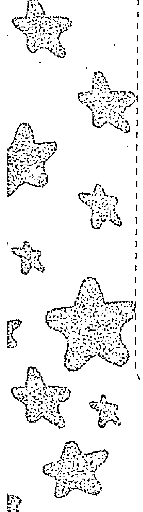

#### 三、职场命运

O型摩羯在职场上的天赋并不突出，可能和自己同一个起点的人已经小有成就，而你仍然没有大的起色。但是你千万不能急，你的持久性和耐力是强于其他血型星座的，只要持续不断地努力，一定会达成自己的目标。你比较专注在某一个行业中，不适合频繁转行。

你的自信来源于自己在职场上的成绩，但也不要过分自信，时刻保持空杯心态，才能在职场上获得更大的成就。

你在职场上的自我倾向较为明显，这种态度最容易引起上司和同事的反感。要培养自己的包容能力，虚心接受别人的建议。另外，在你熟悉的领域你容易侃侃而谈，甚至忽视对方是否感兴趣。学会察言观色才是真正的职场达人。

> > 【温馨提醒】职场中积极奋斗的你，定能笑傲职场。

#### 四、赢在职场

O型摩羯座很有才华，但有的时候不懂得发挥出来。你内心深处潜伏着强大的野心，外人难以察觉。而且你摒弃妇人之仁，认为狡诈狠毒才能在事业上取得巨大的成功。你的才华若得到充分的发挥，再加上你脚踏实地的持久耐力，是你上进的最大动力。即使你现在只是公司基层的小职员，也会想尽一切办法，努力向上爬。为了成就你的野心，你甚至会牺牲眼前的利益，这种运筹帷幄的决断力是别人所不具备的。

你稳固踏实的个性，为了目标奋斗的伟大激情，很适合安稳的职业。比如公务员、教师、会计师等。此外，如数学家、测量技术、电脑程序设计师，这一类需要缜密思维的职业也很适合你。若是想利用天生的艺术才能，可以考虑做一个音乐家或者作曲家。

> > 【温馨提醒】 你在工作上能够发挥你的才能，但是很多时候成功的事业离不开广阔的人脉关系。在努力工作的同时，要记得扩展你的人脉关系。

#### 五、社交技巧

O型摩羯的人性格较为封闭，喜欢独来独往，所以朋友不多，但仅有的几个朋友一定是非常知心的朋友。可能会因为朋友的离别或者背叛而影响自己的生活。

你为人严谨，做事勤奋踏实，无论朋友让你帮什么样的忙，无论完成的困难有多大，你都能泰然处之，最后帮助朋友解决困难。这让大家对你很放心，但你固执保守的个性，让一些人对你避而远之。

试着让自己活得轻松一些，向别人展现你最真实的一面，喜欢你的人会更多。多和人接触，训练自己的交际能力，向别人敞开心扉，你才能在社交上更上一层楼。

> > 【温馨提醒】 以轻松的心态与他人交际，在职场中你会越走越顺。

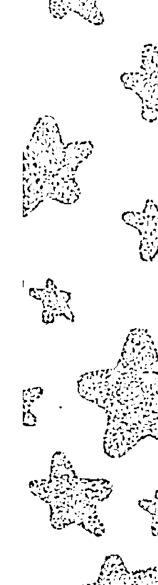

#### 六、财富密码

O型摩羯座在理财方面相当有主见。你不断加强自己的经济实力，你奉行“君子爱财，取之有道”，你会花钱，更懂得如何赚钱。你认为，工作就是为了获得经济报酬，老板和同事们“在工作中能收获很多，就不要在乎工资水平”这种唱高调的说法，你不以为意。对于不愿付出你的理想薪酬的老板，你就不会为他效力。尽管你对待财富比较重视，但你也不是见钱眼开的角色。你一切财富来源都合情合理。虽然你没有太好的财运，但你拥有稳固的财富观，随着年龄的增长，你也会积累相当可观的一笔财富。

但是，O型摩羯座的人自尊心极强，也极好面子。在交际场合，你会为了面子毫不吝啬钱财，经常会有预料之外的交际支出。对于不太擅长交际的你来说，这方面确实是值得投入，但也要分场合、地点，否则就是花冤枉钱了。在交际费用上的花费，你要有所计划，才能不至于做出不合理的支出。

【温馨提醒】理财是门大学问，用钱过度合理或者过度不合理，都会变成别人厌恶的守财奴或者败家子，一定要注意此点。

## 第八章 O型摩羯座十二宫

#### 七、恋爱攻略

总体来说，O型摩羯座的你，小心谨慎的性格也表现在恋爱上，你是那种真诚不做作的内敛派。当你真正对一个人动心，你也会掩藏你内心喷薄的爱慕之心，表现出毫不在意的态度。因为你追求的是真正的爱情，你厌恶虚伪，所以之前都会长期考察对方，直到认为看清了对方真正的面目，才会考虑你们的将来。你爱慕的对象一定是能够迁就你的，满足你的野心的人。你不会在意对方的外表、条件等，你只会重视他的内在。简而言之，你希望你的对象和你一样有着强烈的上进心，并且很有能力，能够实现自己的目标。你不是积极主动型，而是消极被动型，即使你确认了对方是理想的伴侣，也没有勇气去告诉他，在爱与不爱之间挣扎徘徊。

O型摩羯的你，外表严肃保守，但是摩羯在传说中原本就是一种好色的动物，实际上你继承了摩羯贪婪、好色的本性。由于你自身具有旺盛的精力和野心，在性爱方面有相当浓厚的兴趣，你当然不会把这种好色率直地显露出来，但是，你习惯以眼神凝视你感兴趣的异性。如果在你身上O型气质胜过摩羯性格，那么你的恋爱模式是清爽单纯的，这种恋爱方式比较自在。但若是相反，你就擅长浓郁的情感，对爱情的表达是热情奔放的。外表庄重的你，在性爱的表现上十分奔放。

此型的你，无论男女，外表看起来都保守安稳，实际上你对待性爱相当开放，并且沉溺在其中。女性也会成为外形妩媚的妇人，有招蜂引蝶之嫌。女性白天像淑女，晚上其实相当豪放。男性即使在中年以后，也会利用自己的魅力去迷惑年轻女性，这就像是他的天性一样。

> 【温馨提醒】你的外在和内在截然相反的表现，让人对你捉摸不透，应适当平衡综合起来。

#### 八、婚姻家庭

O型摩羯座的你，闪婚不太可能，在热恋中走入婚姻殿堂的可能性也不大。即使在热恋中你也不会一时头脑发热就结婚，你认为婚姻是终身大事，必须谨慎。你会在头脑中一再地思索，对方是不是适合自己的人，和他组成家庭会不会幸福等类似的问题。O型摩羯座男性会选择会照顾家庭的女子做妻子，因为你在婚后一心拼搏在事业上，不想因为家庭的不和睦而影响事业。O型摩羯座的女性，会青睐自己信赖的并且能给自己带来现实利益的人做丈夫，使自己心甘情愿地守卫着家庭。

O型摩羯座，无论男女，你的婚恋观都是十分现实而且坚贞。婚后的你会成为好丈夫或好妻子，你的责任心让你对家庭十分负责任。虽然你也会和伴侣之间有一些磕磕绊绊，但你绝不会因此而引发一场家庭革命，甚至闹离婚。你建立的家庭生活是你一心规划的理想模式，在家庭中你将你的忍耐力和上进心发挥到极致，可以共创幸福的家庭。

你的个性十分独立，撒娇对于你来说是弱者的行为。一旦你发现对方的某些缺点，你都会一吐为快，而且毫不讲究情面。但你也不会为了细节上的矛盾而伤神。你对待婚姻十分理性，虽然内心是个富有温情的人，但你十分在乎自己作为丈夫、妻子或者父母的面子，说出去的话你就不再收回，而且你强烈的自尊心也不允许自己认错。因此，夫妻之间发生了什么问题，你都会闷在心里，以致对方对你渐渐疏远。加上你强健的体格和旺盛的精力，别人在你眼里都只是弱者，久而久之，你对待家人的态度渐渐冷淡，家人的感情也很受伤。

在教育孩子方面，你也相当重视，虽然你给孩子提供了很好的生长环境和学习环境。但你会不自觉地把自己的意思强加给孩子，这样你就变成不近人情的家长了。如果你发挥你身上的O型弹性的人际关系，你就会成为一个教育孩子的专家。

> 【温馨提醒】把问题闷在心里，那就永远都是问题，有时候要向配偶表达你内心真正的想法。不要用自己的标准苛求别人，更不要强求孩子。

#### 九、最佳速配

和你般配的是性格外向、热情活泼、擅长交际的异性，因为性格互补的关系，你和这样的异性相互吸引，也比较有共同话题。和你性格太相像的星座因为太了解彼此，可能刚开始会比较有默契，但相处时间久了，就会爆发很多矛盾，又因为你们固执的个性，这些矛盾是很难消除的。

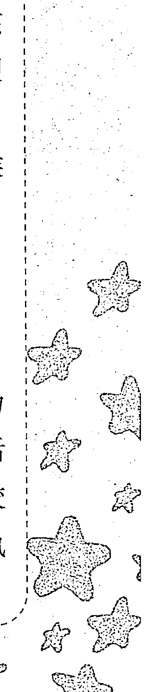

和你速配的星座有巨蟹座、处女座、射手座，其次搭配的是天蝎座、金牛座、双鱼座，彼此拥有相似的人生观的奋斗目标，可以共创幸福生活。

给O型摩羯座女性的建议：对待A型人，必须向他敞开心扉。和B型人相处，温暖贴心的小礼物就可以让他感动。和AB型人相处，做最真实的自己便可以吸引他。

#### 十、健康驿站

O型摩羯座天生具有健康的体魄，不会有重大疾病，但会有一些意外的小伤病。要注意感冒、皮肤炎、蛀牙、阑尾炎等疾病。

天生的好体魄也不能忽略了锻炼，跑步、仰卧起坐、网球、足球等都是适合你的健身方式。

有压力时你喜欢一个人去释放，多找找朋友，你会豁然开朗。

## 第十一节 O型×水瓶座

#### 一、性格分析

O型水瓶座的你，人情味很浓，十分重视跟身边的人的感情，同学、同事、朋友、邻居、客户，你都会和他们保持稳定的感情联络。而且你总是设身处地地为他人着想，你和她们相处，一定会让他们感觉舒服。当然，你自己也保持着良好的心态。

O型人强大的社交能力，你很会营造热闹轻松的氛围。热情爽朗的你总是给人留下很好的第一印象，再加上富有个性的水瓶座，你的人际关系良好。你的思维十分活跃，而且你很爱动脑筋，能想到别人想不到的地方，所以常常让人有意外惊喜。大家都很喜欢和你相处，因为和你在一起，每一天的太阳都是新的。但有些时候，你另类的行为也会让大家大吃一惊。你看重每一个在你身边出现过的人，即使再也不见的人，也都会被你身上浓浓的人情味依依不舍。但你有个缺点，你缺乏果断力，让你迷惘，找不到人生的方向。

O型水瓶座十分富有激情，有时虽然你内心很激动，但O型的现实主义特征，也不会让你表现得太过火。不管何时，你都秉承着“实事求是”的原则，一丝不苟，但你并不是绝对的顽固派，在保持与他人的和谐的基础上来坚持自己的原则，这是你的优点。

另外，如果O型水瓶座的理想主义特别突出，那你追求理想的信念极为强烈，在任何情况下，也很难退缩。虽然你在言语上容易激烈，但绝不会中伤他人，导致他人的厌恶。这因为你身上还有理性现实的一面。现实和理想的两面性并不矛盾，反而能让你获得自在开心，你也绝不会浪费光阴。O型的现实主义和水瓶座的理想主义和谐统一、和睦共处。

O型水瓶座的人，性格开朗又富有同情心，和别人和谐共处，人缘不错。此型的你，将现实与理想完美地融合，因此能显现出独特的气质。你与各种性格的人都能交朋友，对你的人生将有莫大的助益。

【温馨提醒】重人情味的你对周围的大多数人都热情友善，以一种博爱的平等精神与他们相处，对自己讨厌的人要隐藏自己的厌恶，否则，对他们的伤害无法估计。

#### 二、水瓶运势

一生较为坎坷，不会有重大的变故，但是小的不快时常发生。比如和最好的朋友被迫分离，被同事排挤等。

开运的关键在于多交朋友，朋友运较好，朋友较多，并且有权势有地位的朋友较多。他们能在你危难的时候救你于水火之中，但有时也会成为成功路上的波折。

家人会带来经济上的支持，可能会继承遗产。没有财运，但也不会成为痛苦的来源。

> 【温馨提醒】你开运的关键在于多交朋友。

#### 三、职场命运

你率性而为的个性让你不在乎他人的批评，但他人的忠告往往是对自己非常有利的建议。如果独来独往，不顾一切地往前冲，只会给人留下不好的印象。如果你换位思考，将自己放在他人的位置上多做考虑，你会用你善解人意的心来吸引更多的追随者。

在工作上，你常常能够打破传统，以创新思维来做事，开始时很难让人接受，但最后事实证明你的思路是对的，渐渐大家也就放手让你去做。

你有一颗博爱的心，但是对讨厌的人的情绪外露太明显，有时太过直的话语无意中会伤害到别人。

> 【温馨提醒】多培养自己的体贴心，在职场中你会赢得更多的支持。

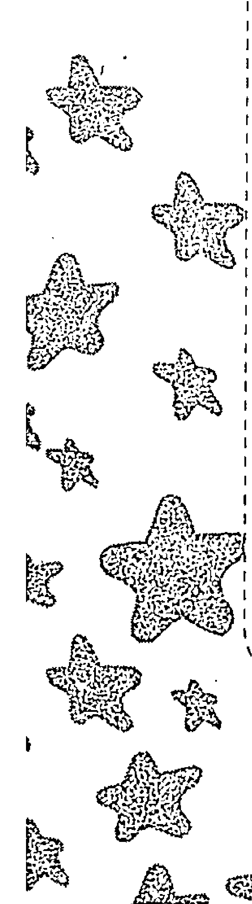

#### 四、赢在职场

O型水瓶座的你，想象力丰富，喜欢创新设计，大家手边常见的小物品，你都能改造成新颖独特的新玩意。你也喜欢发明创造，经常亲手制作一些独特的小设计。还有一个很大的优点就是，你非常擅长带动周围人的情绪，使气氛热烈而活泼，让人感觉很放松，尤其对于沉默寡言的人来说，你甚至让他们感觉到存在的价值。

所以，O型水瓶座的你，身边从不缺少朋友，更不缺少得力的助手，使你在职场能够充分实现自己的理想和发挥自己的领导才华。你热爱自由，极其讨厌受到约束，精神上的束缚更让你无法容忍。身为下属的你，厌恶专横跋扈的上司；你不会为了生存而从事自己不喜欢的工作，待在自己觉得不舒服的工作环境。你对国家机关，或者规规矩矩的工作，会感到枯燥无味。因为你个性柔和，喜欢结交各种各样的朋友，你的这个优点，对你在职场的发展十分有利。

就你的个性和专长而言，你很适合节目主持人、科学家、作家、医生、发明家、艺术家、律师、飞行员等职业，其次天文学家、作曲家也非常适合你，在这些领域能充分利用你的聪明头脑，发挥你过人的想象力及独特的设计能力，在职场上获得成功也是水到渠成的事。

【温馨提醒】你是个头脑聪明、灵活善变的人，但是你水瓶座的激烈个性表现出来的话，也许会发生跟人争执的场面，你应该学会控制自己的情绪。

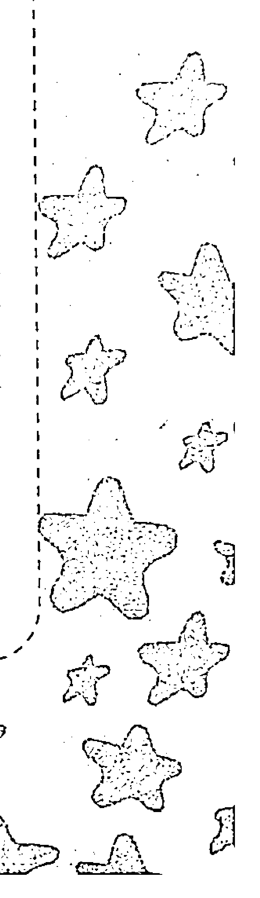

#### 五、社交技巧

在所有星座血型里，O型水瓶座是最受大家欢迎的人之一，因为O型水瓶座的你天生性格爽朗并富有同情心，并且热心帮助他人，待人真诚不做作，属于“知心姐姐”、“知心大哥”的类型，很多人乐意找你倾诉衷肠。

你不是天生的领导者，但是善于聚集各类人才为你所用，在领导岗位上也能充分发挥自己的才能。

你虽然有些冲动，但在关键时刻能够控制自己不至于招人讨厌。你追求理想的热情，不会因现实而发生任何动摇，大家都被你这种纯真的执著精神所打动。O型水瓶座是你最得力的助手。

> > 【温馨提醒】保持内心的纯真，朋友们会被你感动。

#### 六、财富密码

O型水瓶座的你，安贫乐道、淡泊名利。你不热衷追求财富，也不热衷于储蓄生财，你认为钱财乃身外之物，也不汲汲于追求物质的享受，更看重精神上的愉悦。虽然你的经济能力不强，但你总是毫无计划地花钱，一段时间内你手头比较宽裕，但马上就会被你消费出去。加上你极其看重人情，在人际交往上绝不手软，和朋友聚会时总是抢着付钱，经常超出你的承受能力，而且每当有朋友需要金钱上的支持时，你绝不会吝惜，甚至会倾囊相助。另外，如果为了工作或兴趣，你也会不惜花费大量金钱，以求达到更令你满意的程度。这让你基本上积累不了什么财富。

你不常为钱发愁，对自己的经济状况相当不以为然。你认为这种生不带来死不带去的东西，当做生命中应该有但不应重视的东西。这对于单身的你来说无可厚非，反正“一人吃饱，全家不饿”，但是成家后的你继续保持这种金钱态度，也许就有些不负责任。年轻时，你可以不储蓄，利用金钱扩充自己的人脉。但成家后的你，要学会理财，处理稳定的工作收入来源外，再做相应的投资。这样一来，等你到中晚年，你的人脉也有了，财富也有了，就可以过自己理想自在的生活。你的财运不是非常好，但却因为朋友和过硬的艺术，晚年积累到财富。

> 【温馨提醒】要学会利用钱财做长线投资，购买书籍或参加学习班，提升自己，这就是增加财富的方法。

#### 七、恋爱攻略

O型水瓶座的你，大多是自由恋爱，相亲式的恋爱对于你来说十分稀少。你重视恋爱的感觉，喜欢浪漫的氛围，你喜欢在自由的氛围下，跟着自己的感觉走。你在挑选恋爱对象时，一定是精挑细选，绝不贸然行事。你看重对方的外貌、条件等，但一旦真正的爱情来临，你也会忽略这些爱情的条件。你可以在双方差异的基础上，和对方保持甜蜜的恋情。有艺术情调的咖啡厅、音乐厅、美术馆、剧场等都是合你口味的约会地点。而且这些地点是提升你们爱情品位的绝佳地点。

你喜欢在爱情里花些心思，你对待伴侣的方式总是新颖巧妙，经常给他意外的惊喜。比如你会收集一些搞笑的小新闻，或者对方感兴趣的话题，你也会在装扮上变换花样，和你谈恋爱总是轻松又有趣。同时，你对待感情也干脆利落，如果被对方拒绝或者对方变心，你绝不会勉强，会决然地分开。虽然你内心十分脆弱无助，你也不会在他面前表现出来。你讨厌对待感情拖泥带水，一旦分手，不会再做朋友，从此一刀两断。当然追求浪漫的你，也会考虑一些现实的因素，为一段不适合的感情浪费精力，

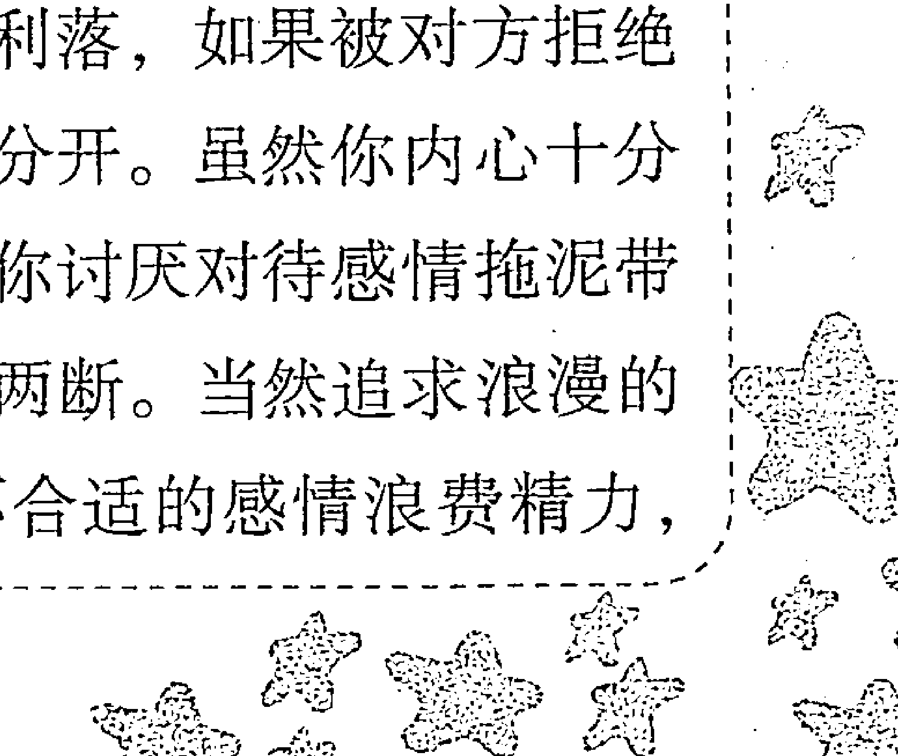

你也不会去做。你除了重视两人之间的感觉，你也会考虑对方和你是否谈得来，是否能与你共同创建一个你理想的家。爱或者不爱，你都会清楚地表达出来。

O型水瓶座的你，对性欲有好奇心，但兴趣不大。你外表看起来浪漫多情，但你也十分清醒。和性爱的乐趣比较而言，你更重视生活中一起相处的感觉。你不认为性爱的和谐对稳固爱情具有重大的作用。所以，即使在床上，你也尽量让自己冷静。你很重视卧房的灯光色调的搭配，你希望尽量营造出浪漫的氛围。在这样的气氛下，你和伴侣发生关系后会感觉十分甜蜜。你在性爱方面，既热情又冷静又看重情趣，在伴侣眼里看来是个十足的可怜虫。

> 【温馨提醒】恋爱时不要把对方奉上至高的地位，在性爱方面更加开放一些，也许能获得更大的快乐。

#### 八、婚姻家庭

O型水瓶座的你，在恋爱时就已经有意识地考察对方，所以当你决定结婚时，已经做好了充分的准备。但是你太过理智的个性，无论是在恋爱还是婚姻中，感情一直都没有付出全部的心思。并且会对于繁琐的婚姻形式和平淡的婚姻生活，日渐感觉枯燥乏味。另外，你理性的一面让你寻思你的伴侣真正适合你吗？他真的能给你带来你想要的生活吗？你的三心二意和过多的考虑有时会适得其反。事实上，既然你已经下定决心和他走入婚姻的殿堂，合不合适就不再是你考虑的问题了，你应该考虑的是如何经营自己的婚姻。你们建立婚姻的那刻起就是爱情成功的开始。

幸福的婚姻是靠你和配偶之间共同经营的，你们要培养共同的爱好，寻找共同的追求，靠着两人的默契，在米油盐酱之下的共同生活中逐渐建立起来的。适合O型水瓶座的婚姻模式是轻轻浅浅的，太过浓烈的婚姻模式会让你招架不住。清浅的婚姻比浓烈的婚姻更能持久。但你对于婚姻的繁琐始终有些不安。如果你太过于重视现实的因素，你对待婚姻会少了那么一点热情。

O型水瓶座的你，会将自己极好的人际关系淋漓尽致地发挥在家庭中，因为你感情丰富，所以会以配偶和孩子为中心，形成和谐的夫妻关系和亲子关系。你不会和家庭成员发生纠纷，与每个人都和睦相处。假如其他家庭成员之间发生纠纷，O型水瓶座的你，凭借自己的判断力和协调能力，也能妥善处理，说到每个人的心坎上，让每个人都信服你。

你喜欢创新的特点也会在家庭生活中充分体现，隔三差五地让家居装饰换个样子，利用旧物自己做一下改造，都能让家保持心情舒畅。有的时候你会偶尔突发奇想，使家人不知所措。例如，你会偶尔带家人去一家新开的、有特色的餐厅共进晚餐。或者偶尔不做家务，更有时会不归家。虽然这些小意外不是家人想看到的，但偶尔发生一两次，他们也没有指责你的理由。总体上说，你是个称职的丈夫或妻子。

【温馨提醒】突发奇想虽然会给家人带来新鲜感，增进彼此的感情，但太过频繁，会让家人疲于应付，并觉得你有些神经质。

#### 九、最佳速配

最速配的星座是巨蟹座、狮子座、处女座，其次是摩羯座、射手座、天秤座，性格合得来，而且有共同的人生志向，较为般配。

对于O型水瓶座女性的建议是：和A型人相处，要花心思营造浪漫的气氛。和O型人相处，要表现得极为热情。对待B型人，要用另类的方式表达你的爱意。对待AB型人，说话尽量要简洁利索，适合与之谈论细节问题。

#### 十、健康驿站

需要注意的是手脚、牙齿、循环系统的毛病，也很容易导致营养不均衡，因此要格外注意饮食习惯。

对于O型水瓶座，如果想要放松心情，到清净的禅寺中静修，是非常好的办法。另外听听音乐会、看看电影，也能让你释放情绪。

你的朋友比较多，交际应酬也很多，因而交际费也不少。但过多的交际也会让你疲于奔命，在一段时间内，一定要留给自己一天安静的时间来思考。

## 第十二节 O型×双鱼座

#### 一、性格分析

O型双鱼座是十足的大好人，对待他人十分尊重，尊重到你看起来似乎都没有主见。O型双鱼十分善解人意，总是首先考虑他人的感受，甚至会牺牲自己的利益，去迁就别人。

双鱼座的你，拥有春风般柔顺且质朴的性格，你强大的适应能力也不是常人能比的。你的正义感十足，喜欢打抱不平，甚至“拔刀相助”。你具有平等的博爱精神，对待谁都是那样亲切友善。你浑身散发出一种温暖的力量，让许多人都想靠近你。连你的眼神都具有安抚人心的作用。另外，你还具有敏锐的细腻心思，你懂得别人的喜怒哀乐，并和别人产生共鸣。不过你太在意其他人的感受而忽视自己的利益，这多少对你不太有利。适当地保留自己的意见，才是真正的爱自己。

O型双鱼座的你，心地十分善良，而且是个浪漫的理想派，你心中永远不会放弃那个虚幻缥缈的浪漫理想。O型双鱼座的你，无论男女心中都有超脱世俗的一颗赤子之心，你淡泊名利，不喜欢和别人争名夺利。有的时候宁愿吃哑巴亏，也不会抱怨社会的不公。你性情柔顺，脾气太好，容易被势利小人牵着鼻子走；你太在意别人的看法，也会失去自己的主见。这是你最大的缺点。若是能遇到可以依靠的人，或许能够减少你的性格缺点给自己带来的伤害。

此型的你，如果O型血冷静理智、现实的气质占主导地位的话，也会出现豪爽果断的人物。但大多数情况下，O型双鱼人性格软弱，感情脆弱。你经常为了配合别人的步调而忽略自己，这让你会困惑自己存在的价值。甚至在一些小事上也都会很难下定决心。你缺乏决断力，意志力薄弱，这也是你的致命伤。多培养自己的决断力，才能真正活出自己有意义的人生。毕竟自己的人生掌控在自己手里。这也是你减少伤害的最佳方法。

你心中那个浪漫的梦想，因为你个性的原因和现实的因素，你总是无法实现。这也让你很有挫败感。因而，你会经常摇摆不定，无法确定自己要走的人生路，经常让身边关心你的人捶胸顿足。人需要有自己的梦想，但梦想太不现实，就没有坚持的必要了。如何把握现实和梦想之间的差距，就看你能否克服自己的缺点了。

> > 【温馨提醒】过于在意别人眼光，就成了为别人而活。有时不妨坚持自己的原则，活出自己的人生来。

#### 二、双鱼运势

O型双鱼的运势不好不坏，随着年龄的增长，会获得更高的地位和财富。和亲人之间关系比较和睦，偶尔遇到重大苦难时都会得到亲人们的大力援助。

婚姻生活可能不是那么一帆风顺，但经过一段时间的磨合之后，能获得幸福的婚姻。

不仅在本业上取得成功，而且自己的副业也经营得相当好。晚年可能会为子女操心，但能长命百岁。

你的朋友很多，你很信赖你的朋友，但因为心软会招致朋友的利用。

> 【温馨提醒】太过于心软，也是一种罪过。

#### 三、职场命运

O型双鱼座在职场中基本不会遇到太大的困难，无论做任何工作都能很快上手，并有中上等的表现，但绝不能因此而骄傲自大。只是你的运气较好，有人无形中帮助了你。

O型双鱼座的你很会利用女性的特点，向大家展现出娇羞迷人的女性魅力，因此在职场中能获得很多人的帮助。但是你撒娇的手法不要太做作，否则会达到相反的效果。

有时可以有自己的小任性，但不要过头，多听听他人的经验之谈，多听取别人的建议才能在职场中团结同事，赢得升迁的机会。

> 【温馨提醒】职场不容许任性，要理智一些。

#### 四、赢在职场

O型双鱼座的你，尤其是双鱼座气质占主导地位的你，缺乏主见的缺点会较为突出，无论大事小事都做不了决定，还经常被别人牵着鼻子走，你优柔寡断的个性让别人很难放心地把事情交给你。你十分在意其他人的眼光，只要别人建议你怎么做，八成你都会按照他的意思来，甚至改变自己原来的决定。这个缺点对你来说可以是致命的，成为你成功道路上最大的绊脚石。一旦你被认定为无法托付的人，别人就很难对你改变看法，这对职场中的你来说十分不利，无论从事任何职业，可能都不会一帆风顺。所以，最关键的是你要在态度上表现得更为积极一些。虽然你在工作上也很有责任心，但是你低调的态度无法让人看到你的责任感。最好能展现你积极的一面，这对你的职场生涯有很大的帮助。因为你富有同情心，而且十分善解人意，加之天生的浪漫因子和艺术家气质，你适合从事老师、护士、舞蹈家、作曲家和作词家等，另外，双鱼座原来是和水有缘的星座，所以你也很适合从事公共关系、海洋学家、水产养殖业等。在这些行业，只要你努力，更容易做出一番成就来。建议你根据自己完善的职业计划来选择职业，然后，听取他人的意见，不断改进自己的工作做法和工作态度。

【温馨提醒】不要在工作上摇摆不定，提前做好规划，脚踏实地地朝自己的目标迈进。

#### 五、社交技巧

O型双鱼座是社交界出名的老好人，你很在乎其他人的感受，无论做任何事都不会忽略其他人的看法。你过于尊重他人，会让自己迷失方向，开始犹豫不决。你的性格温柔，十分善解人意，大家和你交往感觉温暖，有了心事也都会找你倾诉。常常朋友倾诉完自己的郁闷心情之后，开始变轻松。你反而因为朋友的烦恼，心情开始变坏。这正是你的可爱之处，不过朋友的倾诉最重要的是要你的倾听，如何去解决不是最重要的，倾听即是帮助他的最好办法。否则你又会为朋友而伤神，影响自己的健康和情绪。

有时你过于在乎他人的想法，经常为了他人而迁就自己，而使自己没有主见，即使处理小事时也会拖泥带水。缺乏决断力是你的致命缺点，你需要多锻炼自己的判断力和决断力，才能使自己和他人免受伤害。

> 【温馨提醒】太在意他人的想法，会让自己没有主见。

#### 六、财富密码

O型双鱼座的你，拥有很强的财运，但因为你奢侈的消费习惯，只要是自己喜欢的，就一定要买回家。所以，通常你不会有太多的积蓄。

此型的你，因为强烈的虚荣心和超过常人的占有欲，养成了奢侈的消费习惯。并且你丰富的同情心，你会经常施舍路边的乞丐，虽然有人无数次告诉你，他们多是职业乞丐。还有可能在朋友找你借钱时，必定倾囊相助。你善良的心地，太容易相信别人，也会让你出现被坏人骗钱的情况。

好在你对钱财并不在意，你抱着“破财消灾”的心态，让你免受钱财之苦。而你对待金钱的淡然态度，反而让你遇到贵人。所以你在财运上是一波三折。即使你生活比较拮据，你也能保持开朗的心境。另外，随着年龄的增长，到晚年你也能为自己积攒一定的积蓄。但如果你不培养自己的判断力，有再强的财运，有再多的贵人，你也会最后落得两手空空。

> 【温馨提醒】没有谁能永远帮你，只有强大自己才能真正追求到属于自己的幸福。

#### 七、恋爱攻略

O型双鱼座的你是个天生浪漫的情种，喜欢憧憬甜蜜爱情的样子，如果对方是个白马王子或白雪公主的形象，你就会更加痴情地沉溺于幻想中。这让你误以为自己陷入到恋爱中，但这其实只是一个模糊的感觉而已。喜欢制造浪漫的你总是容易陷入到爱情的错觉中。身边一旦出现一个合适的对象，要是他一句话或一个眼神，都可能让你产生好感。因此，你的恋爱经验十分丰富，形式也很多样，单恋、多角恋等层出不穷的形式。多情的你总是有很多感情的苦恼。你对每次恋爱都全身心投入，最后痛苦的也是自己。

每当你陷入到恋爱中，你会一改平时冷淡的样子，开始变得活跃、主动起来，在社交中你也变得侃侃而谈，你周围的人都感到你欢喜的情绪。O型双鱼座女性，会甘愿为爱情做出任何牺牲，你愿意为了自己的伴侣变得温柔，你愿意为他而改变，十分顺从他的意思。而且你要求自己变成他心目中的理想情人，也会一改自己的大女子主义，为了他可以做出改变甚至妥协。所以，这样的你太过于看重恋情，经常容易陷入爱情的泥沼无法自拔，使自己深受伤害。但是，你在爱情中温柔如水的模样，浪漫迷人的气息，你所营造出的温馨画面也让对方十分回味。你会是个称职的情人。

你喜欢恋爱的感觉，身边一旦有人展开强烈的追求攻势，你就会招架不住，即使你很可能不爱对方。但当你的O型冷静和理智的气质展现出来时，也没什么问题，但你也缺乏恋爱主见，一旦别人对你大方示好，你就会不自觉地投入到一场恋爱中。你对性爱也是同样的情况。你经常被人看做是风流的人或者放荡的人。这还是因为你的软弱无主见，只要对方的态度很强硬，你就会顺着他的意思，在性爱方面，你常处于被动地位。这也会让你很受伤。

> 【温馨提醒】有的时候要懂得拒绝，以免陷入爱情的纠葛里。

#### 八、婚姻家庭

O型双鱼座的你，在恋爱时摇摆不定，并且没有主见，让人觉得你三心二意。婚姻对于你来说有收心的作用，它能使你的心安定下来，婚姻的社会世俗约束力量会让你渐渐开始有自己的主见。所以，你选择的配偶，一定是具有决断力，对你温柔体贴，无论在任何事上都能够正确地指引你。只要你能够选择一个值得信赖的对象，你就能建立一个安定而且幸福的家庭。婚后的你，因为婚姻让你开始有担当，让你开始成熟起来，有勇气面对做决定的挑战。所以，你婚姻幸福的关键是找一个真正值得信赖的对象，若是选了一个和你个性相似，尤其是有着同样优柔寡断缺点的人，那么遇到小事还可勉强应付，但对待重大事情，就只有互相推诿了。

O型双鱼座的男性，比较适合姐弟恋，因为年龄较长的女性能让他成熟起来。而O型双鱼座的女性喜欢找兄长般的给她主见的人。总之，O型双鱼座的你，无论男女，只要选择了适合的配偶，都会变成好丈夫、好妻子。尤其是O型双鱼座女性，在婚后比婚前有很大的变化。你会改变过去多愁善感的性格，主动承担。

#### 十、健康驿站

你常常忽略自己的身体健康状况，因为忙碌或是对自己的体质过于自信。在身体稍感不适时要及时就诊，延误了医治只会拖垮自己的身体。你需要注意泌尿系统、消化系统方面的疾病，还要注意眼睛、皮肤、牙齿等小毛病的困扰。

在平时要注意一些细节方面的健康问题，比如按时一日三餐，每天锻炼身体等等。你比较适合外出旅行，因为你热爱大自然，经常接触接触大自然，为下一阶段的生活积蓄更多的力量，会让你更加从容。