# 西洋占星自学指南

在星辰的指引下，踏上追尋命運之旅。

風象時代關鍵詞
尊重自由或個性。
掌握資訊或人脈具有價值。
新科技投入實用領域。

## 人們自古以來，就用高掛在天空的星星占卜著未來

自遠古時代起，人們的生活就與天體密不可分。早晨在自地平線升起的太陽光耀下醒來；夜晚則從天空的星辰尋找著天候徵兆與季節的變化——在尚無時鐘與日曆的古代，這可說是一種極為自然的生活智慧。然後，基於「星辰運行會影響地面上一切事件」這一概念，不僅是天候、自然異變或國家的發展，不知不覺間，人們甚至開始向星辰詢問個人的未來。

## Introduction

## 當時代大為震盪時，星辰也會大幅變動

西洋占星術會根據星辰位置或星星之間的角度進行占卜，而當星辰出現罕見的配置或動向時，也會發生動搖社會的事件或價值觀的變化，彷彿兩者之間有所連結。在時代轉變期大幅移動的星星，往往象徵著即將到來的新時代，甚至能如此占卜社會整體或國家動向，也是西洋占星術的有趣之處。而當世道改變時，自然也會為我們個人的情緒或命運帶來變化。

## 在星辰的指引下，踏上追尋命運之旅吧

## 睽違約兩百年，時代於二〇二〇年底改變！星辰的指引從土象邁向風象時代

### Topic 1

約每兩百年會造訪一次，新時代揭開序幕之年

二〇二〇年底上演了「大合相」。所謂的大合相，指的是木星與土星大約每二十年會一度重合，是對社會現象具重大影響力的配置。而木星與土星於「何處」相遇也是重要關鍵。

自一八四〇年左右起，大合相長時間都發生在土象（將十二星座分類為火、土、風、水四種元素，此為其中之一）處，而從這一次起，舞臺將轉往風象。大合相會在每兩百年左右轉變一次元素，或許會因此迎接時代的重大轉變期。

## Introduction

### Topic 2

## 二〇二〇年七月，土星返回摩羯座

土星為代表抑制與努力的星體，它是如同老師一般的存在，會給予人必要的課題，並守護其成長。土星平均每二・五年會運行到同一個星座上。二〇二〇年三月，土星睽違兩年地從摩羯座移動到水瓶座。

然而從七月到十二月，土星又倒退回摩羯座，直到十二月才終於正式移動到水瓶座。這一連串故弄玄虛的動向，暗示著自二〇一七年底起大約兩年之間所承擔的問題，容易造成人們的困擾或是死灰復燃。而人們直到十二月為止，可能都必須與之對峙、加以清算或下定決心接納。

### Topic 3

## 土星和木星在水瓶座的大合相

在十二月上演的大合相，木星與土星會剛好在水瓶座會合。木星也被稱作「天上的聖誕老人」，象徵著擴張及幸運；另一方面，土星則象徵著抑制及考驗，存在替事物踩煞車的作用。

由於兩顆互為反作用的星體重合，因此會產生相當程度的矛盾與糾葛。然而在歷經磨難之後，兩顆星將會產生化學反應，因而誕生絕妙的新火花吧。
在你的星盤中，水瓶座的0度對應到哪個宮位呢？只要關注該宮位的主題（126頁），就能掌握於新時代獲得成功的線索。

## 大合相年表！

## 1663年左右~ 火象時代

## 1842年左右~ 土象時代

「武力或理念」具有價值的時代

- 正值美國獨立戰爭、法國大革命等革命的時機成熟。
- 華盛頓成為美國總統，拿破崙當上皇帝。
- 「啟蒙思想」開枝散葉，追求並非宗教，而是以理性為基礎的生活方式。
- 資本主義經濟建立。

## 大合相與時代的關聯

「事物、金錢或土地」具有價值的時代

- 明治維新，發布廢刀令。
- 殖民地之爭愈演愈烈，接連發生世界大戰。
- 化學、電器、石油、鋼鐵工業在第二次工業革命中蓬勃發展。

## 2020年左右~ 風象時代

- 工業化越發進展，進入大量生產、大量消費的時代。

- 隨之而來的是發生公害、地球暖化等問題。

## 一九八一年亦於風象星座（天秤座）上演大合相！

網路開始運用於商務上。

人手一支手機成為理所當然的時代。

- 「持有」高級汽車、不動產、名牌貨等物品一事象徵著富裕。

- 發生經濟大蕭條等撼動貨幣經濟的大變動。

## 資訊與人脈」具有價值的時代

二〇二〇年十二月二十二日在水瓶座0度上演大合相！

- 資訊化社會正式到來。

- 邁向透過社群網路與眾多人們產生關聯的社會。

- 提升對環境、人權、性別歧視等社會問題的關注度。

- 轉變為遠距辦公等更重視「個體」的工作方式。

## 解讀將持續兩百年的「新時代」風象時代

預測接下來將是怎樣的時代？

剛才提到，大合相的舞臺將從土象轉變為風象。接下來會持續約兩百年的「風象時代」將揭開序幕。

發生典範轉移、存在於「土象時代」的威權主義或舊體制遭到廢除，慢慢朝著自由化與多樣化的趨勢邁進；將會以眾人皆尊重彼此的存在、情感富裕的社會為目標；從重視縱向聯繫轉為重視橫向聯繫，並改組、重建原本的結構；某些國家或企業甚至可能會發生群體一度解體，再以「全新構造」重組的情況。

在AI等科技方面，發展也十分驚人，夢想中的新技術投入實用領域，令生活變得更有效率。結果似乎會導致誕生了在土象時代難以想像的全新職業、使得家庭中的角色分工大為改變。不過，在風象時代難以獲得「肉眼可見的明確事物」，因此可能將導致預測或持續努力比目前更為困難的情況，關鍵在於如何靈活有彈性地生活。

- ### 風象時代的關鍵詞
  - 尊重自由或個性。
  - 掌握資訊或人脈具有價值。
  - 新科技投入實用領域。

- ### 土象時代的關鍵詞
  - 重視秩序或傳統。
  - 擁有金錢或物質具有價值。
  - 追求穩定、現實主義。

## 風象時代的生活方式如何改變？

## 怎樣的人能夠活躍？

徹底受到終身僱用制與年功序列制（※）保障的時代就此結束，人們將得自行負責掌舵，航向「活得像自己的人生」。機會將會接二連三地降臨於具獨立心且能靈活變通的人，或是能敏銳察覺潮流的人身上。
此外，在風象時代將會迎接資訊化時代「正式登場」，社群網路或網路服務成為日常生活不可或缺的一部分。人們將能夠迅速傳送有益且正確資訊的人評為「可靠的人」，而不執著於金錢或物欲的類型，也與風象時代十分相稱。

## 需要留心什麼事才能成功？

風象時代是變化的時代。為了跟上令人眼花撩亂的變化，重要的是不受到過去的實績或常識所束縛。此外，土象時代的成功理論或範本已不再適用，成功重點將著眼於如何創新且具獨創性。為了與時俱進，就必須隨時仔細研究自己本身，並設法擴展屬於自己的獨特才華。雖說這是個以個性或自由為信念的時代，還是要注意別淪為利己主義，請本著「和而不同」的精神，並重視體貼之心。

## 所謂的風象時代……

是能找到符合自身幸福的時代！

※註：日本的企業文化，以年資與職位制度鼓勵員工在同一間公司工作到退休。

## 前言

每當星辰展現特別的動向或配置時，占卜鑑定的委託就會增加。不可思議的是，有許多人明明不具備西洋占星術的知識，也從未閱讀過占卜相關文章，卻會在那時突然下定決心採取行動。在我提起「土星在本週睽違兩年地移動了」，客戶就納悶地詢問「因為這樣，我才會突然想要占卜嗎？」其實對方或許是因為下意識「感覺到星辰的動向」，才會前來找我鑑定的。人們在擔憂未來時，自然而然會試著想從天空尋覓命運發展的線索，這點自古以來都未曾改變。而在面臨動盪的時代到來，未來越發難以預料、內心越發感到不安的此刻，可以預期人們將會對占卜更加感興趣。購買了本書的你，將會獲得稱作「星盤」的人生羅盤。你可以透過根據出生年月日製成，專屬於自己的星圖＝星盤，解讀出性格、才華、與重要之人的契合度、未來的運勢。若再加上宮位或相位，就能得出比各位熟稔的太陽星座預測更詳盡的占卜內容。綜合性的掌握與連鎖性的推理，是星盤解讀方式的基礎。開始，你可能會覺得光是解讀各個環節就已經是極限了。其中許多解釋及含義，有時每顆星還會分別呈現完全相反的意義，究竟該採納哪種解讀才對——你應該會像這樣感到迷惘。不過，星盤中囊括了你的存在與過去、現在、未來的所有時光，因此內容既細膩而充滿眾多面向也是很正常的。首先，請一個一個地仔細揀選星盤上的所有要素，在你能夠詳細占卜後，或許還會浮現出至今為止從未察覺到，令你感到意外的自己。而在你面臨做出選擇的分岔路口，或是感覺到什麼的時候，請務必以星盤來「對答案」。這麼一來，你就會逐漸掌握屬於自己的解讀方式，在人生的航向上也會更暢行無阻。那麼，請拿起星盤，踏上星辰所邀請的新時代之旅吧。

## 第1章

### 星盘的由来

## 歡迎來到西洋占星術的世界

### 西洋占星術的起源

相傳占星術的起源可以追溯到距今約四千年前，位於底格里斯河、幼發拉底河流域的美索不達米亞地區（今伊拉克）的古巴比倫尼亞。當時，人們會透過星辰的動向來預測農作物播種或收割的時機、國王的健康狀況、能否在戰爭中獲勝等國家的動向。一般認為，占星術自這古巴比倫尼亞誕生，接著流傳到世界各地，並在反映出當地宗教觀念的狀態下逐漸發展。然後到了西元一世紀，在曾為古希臘殖民地的埃及亞歷山卓地方建立起一套體系。

### 占卜所需的事物

使用西洋占星術占卜時，需要的是「占卜對象」、「占卜主題」，此外，還需要「時間」與「地點」。比如說，在占卜你的命運時，需要的是你的出生年月日、出生時間、出生地點的經緯度。接著根據這些資料，計算出在你誕生的那一刻，從當地仰望天空時所見的行星配置方式，並以此為基礎來占卜。當然，也有許多不清楚出生時間與地點的案例，不過只要能明確掌握對象及占卜主題，對占卜而言已經足夠了。

## 什麼是星盤

### 顯示你命運的星群地圖

據說「星盤（Horoscope）」一詞源自古希臘語Hora（時刻）與Skopos（偵察、觀察）。顯示的是在某個瞬間，占卜所需的行星位於天空哪個位置的圖，可說是「星群地圖」。

那麼我們在占卜時，為什麼要確認星辰的位置呢？這是因為古人覺得「在天上發生的情況會反映在地面上的事件上」，並認為位於太陽運行路徑（黃道）上的行星「強烈影響著地面上的事物」，而加以崇拜。

基於這項基本理念，先人們將星辰呼應了地面上的何者、哪顆星位於何處時發生了什麼事的內容，進行了系統化的整理，更進一步融合各時代的價值觀。而這套占星術，便一步步發展至今。

當然，現在的我們知道，星辰移動並不會直接影響地面上人們的命運。然而，我們根據先人們所研究的龐大資料，得以藉由追尋星辰的動向，讓預測我們可能會處於何種運勢、迎接怎麼樣的未來一事化為可能。因此，才會將展現占卜所需的星辰配置的星盤稱作「顯示命運的星群地圖」。

## 星盤的結構

### 你出生時的行星地圖

在看人的命運時，東方的四柱推命會使用從出生年月日看運勢的「命式」，在西洋占星術中，同樣也會根據占卜對象的出生年月日、時間及出生地點，計算出行星地圖——「出生星盤」，藉此確認在對象出生地點的上空，行星當時正運行到何處。針對幸運的人，常有人說「那個人吉星高照」。古人則認為，一個人的能力或人生運勢，是受到其呱呱墜地時的行星配置所左右。

神的名字，暗示該行星所具備的能力。太陽為太陽神阿波羅；月亮是女神黛安娜；水星為傳令之神墨丘利；金星為愛與美的女神阿芙羅黛蒂；火星為戰神瑪爾斯；木星為眾神之王朱比特（相當於希臘神話中的宙斯）；土星為農耕之神薩圖恩努斯；天王星為天空之神烏拉諾斯；海王星為海神涅普頓；冥王星為冥界之神普魯托。在你出生時，這十名神祇分別從自己所停留的星座贈予了祝福。祂們贈予了什麼樣的祝福呢？占星術師將會從出生星盤找出這點。

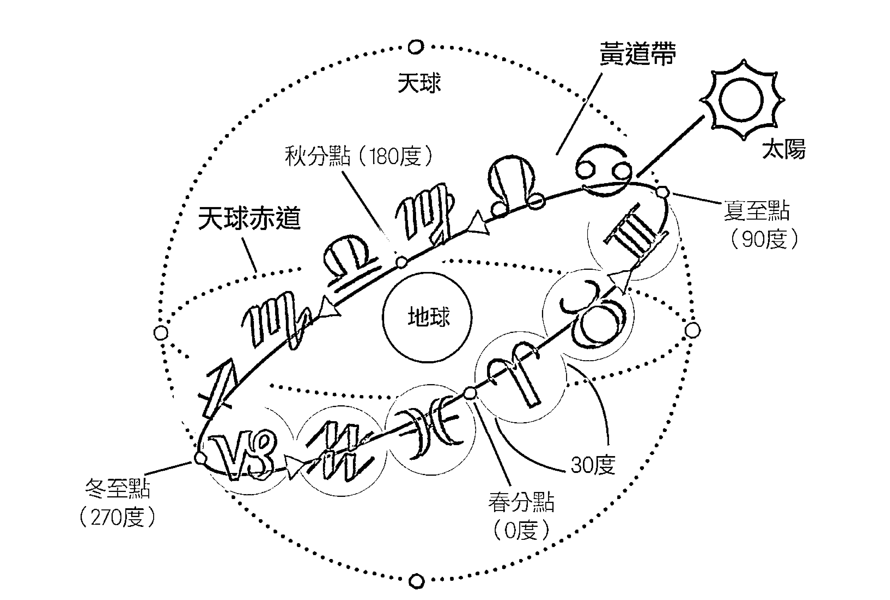

## 占星術的宇宙觀

占星術的宇宙觀，源自古希臘的哲學家亞里士多德的宇宙觀。而西元二世紀左右，活躍於亞歷山卓的天文學家托勒密基於此提出「天體以不動的地球為中心，圍繞著地球公轉」的概念，為天動說奠定了體系。 在這天動說當中，宇宙為被稱作「天球」的球體，而地球則位於其中心。然後，將地球上的赤道投射到天球上，就成了「天球赤道」。 黃道以與天球赤道形成傾斜角度23.4度的狀態下通過，十二星座則排列在黃道上。人們認為由於以太陽為首的十大行星繞行於這些星座上，而對地面上造成各式各樣的影響。

## 能透過星盤得知的內容

### 你的一切都描繪在星群地圖上

如同我在「顯示你命運的星群地圖」（19頁）中所說過的，星盤可以預測我們會處於何種運勢、可能會迎接怎麼樣的未來，換言之，就是用來作為鑑定從過去、現在到未來的畫面；而到了近代，星盤則化為分析自己本身的線索。

星盤由十大行星、十二星座以及十二宮位所組成。將這三大要素以各種邏輯組合，藉此了解一個人的稟性。人際關係的傾向、面對工作或學習的方式、用錢方式……出生星盤上記載著能了解一個人在種種狀況下，可能會如何採取行動的相關線索。而占星術則活用於當這些行動可能招致不理想的未來時，可以事先加以提醒注意的情況上。

此外，在雜誌等媒體上常見的「你是這樣的人」一類的十二星座占卜，看的只有太陽這部分，雖然並非完全不准，但人類是很複雜的。若藉由仔細確認十大行星如何配置，將能更詳細了解自己本身。

### 原本的自我

我們在社會上生活之際，往往會為了避免與周遭產生摩擦，而在難受時仍露出笑容、穿著並不符合自己喜好的服裝等，壓抑著原本的自己採取行動。然而，像這樣持續壓抑，就會迷失原本的自我，而容易遭到「我到底是為了什麼而活？」的不安侵襲。

在這種時候，就可以試著在出生星盤上確認顯示「原本的自我」的太陽，位於哪個星座或宮位上。此外，藉由確認哪顆行星進入顯示一個人本質的第1宮，或是第1宮的宮首星座（第1宮的始點），也能發現找回原本自我的提示。答案不止一個，這也是星盤的深奧之處。

### 才華

自己擁有怎樣的才華呢——在出社會之前，甚至在成了社會人士之後，都常會浮現這樣的疑問。想透過占星術來看才華時，可確認水星位於出生星盤上的哪個位置。

不只是看星座，也請確認落在哪個宮位。這一點不僅限於確認水星時，會這麼提醒，是因為若不考慮這一點，就會演變成同一天出生的人，都會擁有同樣才華的情況了。

不過，只要在確認時搭配宮位，即使是同一天出生的人，水星位置也會隨著出生時間而改變。至於才華會以何種形式發揮，本書準備了十二×十二種答案，能更詳細地呈現出「自己擁有這樣的才華，會以這種形式發揮」。

### 適合職業與戀愛觀

「適合自己的職業」、「適合談怎樣的戀愛」也是人們會感興趣的主題。大多數雜誌或網路占卜看的都是太陽星座，但若是確認出生星盤，就能找到最貼近自己內心的答案。

關於適合的職業，可以藉由確認太陽落入的宮位，得知怎樣的工作能令人獲得成就感。此外，如果任職於水星星座或水星落入宮位所顯示的工作，人際關係應該會很順利，令你覺得「這是適合我的職業」才是。

至於戀愛觀，只要確認金星星座、火星星座，以及金星與火星落入宮位所顯示的戀愛觀，你所期望的對象究竟是何種類型、什麼樣的約會能令你滿意、性傾向如何等更為深沉的部分就會浮現出來。

### 缺點

出生星盤同時也存在著「會凸顯出自己不太想面對的缺點」這樣的一面。

比如說，火星若是落在天秤座，就能解讀為雖然行為舉止優雅，卻沒有耐力；同樣地，火星若是進入代表婚姻和契約的第7宮，就會引發衝動決定結婚、在生意上做出容易惹麻煩的言行舉止等情況。此外，當兩顆行星形成特定的角度時，則會造成負面影響，或展現出缺點。就連被稱為「幸運星」的木星，萬一與太陽形成引發負面影響的角度，同樣存在著若是得意忘形則容易失敗的特性。

不過，只要明白「自己有這樣的傾向」，針對以上情況都能擬定出對策才對。

### 與在意之人的契合度

契合度也是十分重要的占卜主題。手上如果有兩人的出生星盤，就可根據目的選擇最合適的行星占卜。比如說基本契合度就看彼此的太陽；戀愛契合度看金星與火星；婚姻契合度看太陽與月亮等。

這時重要的並非「契合度佳不佳」，而是以「怎樣的契合度？」這樣的視角來確認的態度。如果彼此間是容易產生誤會的契合度，就可以藉由確認對方的水星星座，了解該怎麼做比較不會產生誤會等，思考更具體的接近方式。

藉由了解對方，就能建立積極正向的關係，並在個性上有所成長。獲得這樣的效果，也是解讀星盤的有趣之處。

### 未來運勢

占卜的起點是確認未來運勢。本書中也會提到（321頁），在占卜個人的未來時，最常見的方式是將想了解時期的星辰位置與出生星盤重疊，確認星辰會造成怎樣的影響。

那麼，想請各位試著想想，當有兩人的出生星盤配置相同時，他們的未來會一模一樣嗎？答案是「否」。即使個性或運勢傾向相似，仍然不會變得完全相同。性別若是不同，在星盤中所看的行星也會跟著改變。根據至今為止相遇的人物而異，思考方式、行動模式也會隨之改變，因此擁有相同未來的機率近乎於零。

## 取得專屬星盤的方式

### 占星之門

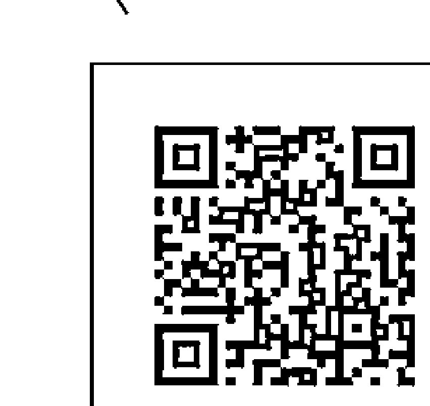

https://astrodoor.cc/horoscope.jsp

你可以在本書所附錄的網站中製作星盤、占卜未來運勢。只要掃描右方的QR碼就能進入網站，請試著取得你的出生星盤吧。

※根據使用裝置或網絡環境，可能會有無法使用或另計網絡費用的情況。本服務可能會在沒有事先預告的情況下進行變更，敬請諒解。

### 輸入畫面

### 星座命盤免費查詢與分析

免費算個人星盤的上升星座、太陽、月亮、水星、金星、火星、木星、土星等落入的12星座與宮位，還有命盤流年運勢、古典占星等功能喔！

①請輸入出生時間

Step1 西元2022 年 [6]月 [23]日 [10]時 [59]分 不確定出生時間

②請設定出生地點

預設 台灣 台北
找不到出生地？改用地圖搜尋吧！

- Step1 選擇你的出生年月日。
- Step2 選擇你的出生時間。如果不知道出生時間，請戶政事務所或出生醫院查詢。
- Step3 請選擇你的出生地點。如果不知道出生地點，請選擇「預設」。

## 星盘画面

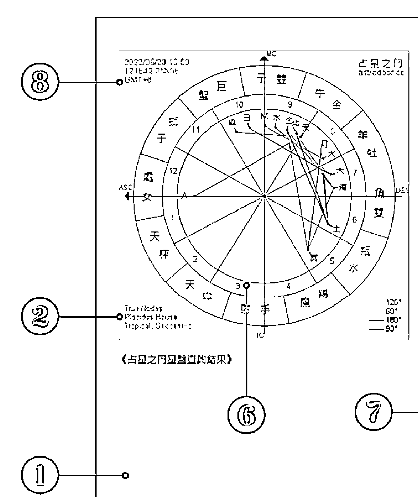

| 行星 | 星座 | 宫位 | 解释 |
| :--- | :--- | :--- | :--- |
| 太阳 | 巨蟹座 1°39' | 第10宫(官禄宫) | 解释 |
| 月亮 | 牡羊座 25°20' | 第8宫(疾厄宫) | 解释 |
| 水星 | 双子座 9°53' | 第9宫(迁移宫) | 解释 |
| 金星 | 双子座 0°7' | 第9宫(迁移宫) | 解释 |
| 火星 | 牡羊座 21°23' | 第8宫(疾厄宫) | 解释 |
| 木星 | 牡羊座 6°42' | 第7宫(夫妻宫) | 解释 |
| 土星 | 水瓶座 24°59' | 第6宫(奴仆宫) | 解释 |
| 天王星 | 金牛座 17°24' | 第8宫(疾厄宫) | 解释 |
| 海王星 | 双鱼座 25°26' | 第7宫(夫妻宫) | 解释 |
| 冥王星 | 魔羯座 27°58' | 第5宫(男女宫) | 解释 |

### 网站阅读方式

- ① 显示在输入画面中输入的资料。
- ② 你的出生星盘。
- ③ 显示行星分布（二元性、三大模式、四大元素）状况。
- ④ 显示十大行星落入哪个星座、宫位（解说于78页～）。
- ⑤ 显示行星之间的相位（解说于180页～）。
- ⑥ 显示十二宫位各自对应的宫首星座。
- ⑦ 显示十大行星所在的角度。后方若标注了「R」，则显示该行星处于逆行（解说于247页）状态。
- ⑧ 以行星过运来占卜未来运势时使用（解说于322页～）。

### 星盤圖

### 如何觀看星盤

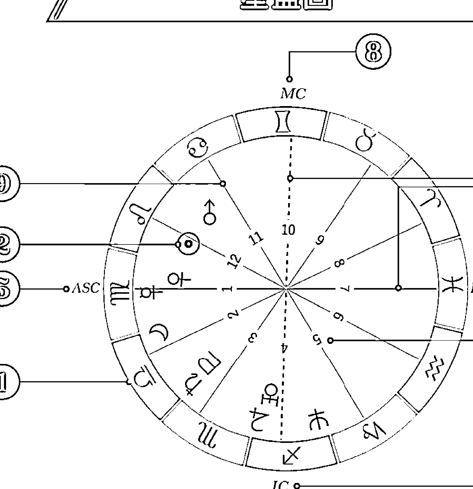

※若有複數行星彼此接近，顯示的行星符號可能會重疊。難以辨識時，請參閱表格（27頁之④）確認十大行星落入哪個宮位。

※在星盤製作網站中，會在各宮位的始點（界線）上顯示宮位編號，但在本書中為了方便查閱，會顯示於各宮位之中。

在瀏覽網站時，請搭配表格（27頁之④）確認十大行星落入哪個宮位。

| 行星 | ⊙ | ☽ | ☿ | ♀ | ♂ | ♃ | ♄ | ♅ | ♆ | ♇ |
|------|---|---|---|---|---|---|---|---|---|---|
| ⊙ |   |   |   |   |   |   |   |   |   |   |
| ☽ |   |   |   |   | 60 |   |   |   |   |   |
| ☿ |   |   |   |   |   | 60 |   |   |   |   |
| ♀ |   |   |   |   |   |   | 90 |   |   |   |
| ♂ |   | 60 |   |   |   |   |   | 0 |   |   |
| ♃ |   | 60 |   | 120 |   |   |   |   | 60 |   |
| ♄ |   |   |   |   |   | 90 |   |   |   |   |
| ♅ |   |   |   |   | 60 |   | 90 |   |   |   |
| ♆ |   |   |   |   |   | 150 |   | 60 |   |   |
| ♇ |   |   |   |   | 90 |   | 0 |   | 60 |   |

| 行星 | 角度 |
|------|------|
| ⊙ 太陽 | 18° 39′ |
| ☽ 月亮 | 2° 31′ |
| ☿ 水星 | 14° 51′ |
| ♀ 金星 | 8° 13′ R |
| ♂ 火星 | 28° 50′ |
| ♃ 木星 | 1° 21′ |
| ♄ 土星 | 29° 5′ |
| ♅ 天王星 | 5° 4′ R |
| ♆ 海王星 | 26° 40′ R |
| ♇ 冥王星 | 27° 4′ |

※在本表格中，行星角度將顯示至分（′）。度數後方若標注了「R」，則顯示該行星處於逆行狀態。

### ① 星座符號

以春分點為起始，將星盤的圓周（太陽運行路徑，即黃道）以每30度均分，並分配給每一個星座（各符號所代表的星座，請參閱32頁）。星座幅度實際上並非均等，而是各自相異，但基於作為座標的功能而加以調整。

### ② 行星符號

於西洋占星術中所使用的十大行星之符號（各符號所代表的行星，請參閱33頁）。太陽與月亮雖然並非行星，但為了方便起見，在本書中視為「行星」。此外，這項符號也用於天文學中，可以窺見其與占星術有相同的根源。

### ③ 行星位置

顯示各行星進入該星座的幾度位置。請藉由星盤圖與這張「行星角度」表格，確認行星進入的是哪個星座，並落在該星座的幾度位置。從這張星盤圖中，可得知太陽落在獅子座的18度39分位置上。

### ④ 宮位編號

將太陽運行路徑的黃道劃分為十二區塊後，每一區塊稱作宮位。並從東方地平線（上升點）起，逆時針分配為第1、第12宮。每個宮位都有對應主題，可藉由各宮位有哪顆行星登場來解讀星盤。

### ⑤上升點（ASC）

假設當自己站在天球中央面對正南方時，太陽從東方地平線升起的地點就是Ascendant，中文稱作「上升點」，並顯示於星盤左側。上升點是第1宮的始點，可透過哪個星座位於此處，來確認一個人帶給他人的印象為何。

### ⑦天底（IC）

位於星盤圓周（黃道）最下方的地點。IC是拉丁文中Imum Coeli的縮寫，意思是「天底」。是第4宮的始點，可透過確認出生星盤中，哪個星座位於此處，來確認支撐一個人的價值觀、能獲得療癒的環境為何。

### ⑥下降點（DSC）

太陽從西方地平線落下的地點是Descendant，中文稱作「下降點」。顯示於星盤右側，是第7宮的始點。可透過確認出生星盤中，哪個星座位於此處，來確認能令自己獲得成長的是怎樣的人物。

### ⑧天頂（MC）

位於星盤圓周最上方的地點。MC也是拉丁文，是Medium Coeli的縮寫，意思是「天頂」，又稱「上中天」。是第10宮的始點，可透過確認出生星盤中，哪個星座位於此處，來確認一個人在社會上能有何成就。

### ⑨ 宮位界線（始點）

顯示交界的線稱作「始點」。星座的界線為每30度一條，當行星跨過這條界線，樣貌就會完全改變。宮位的界線十分模糊，位置可能因為時間、地點、計算方式而改變。而當行星位於界線上時，也可以將其視為進入下一個宮位。

### ⑩ 星盤軸

連接上升點與下降點的軸為「地平軸」，連接天頂與天底的軸則為「子午線軸」。這兩條線為星盤的軸線，會以此為基準分配各宮位。由於第1、6宮位於地平線下方，位於此處的行星實際上看不見的。

### ⑪ 相位

當兩顆以上的行星在星盤上形成特定角度時，稱作「形成相位」。相位有許多種類，但本書中則聚焦於代表性的六種相位（關於主要相位的種類、各相位的作用，請參閱180頁）。

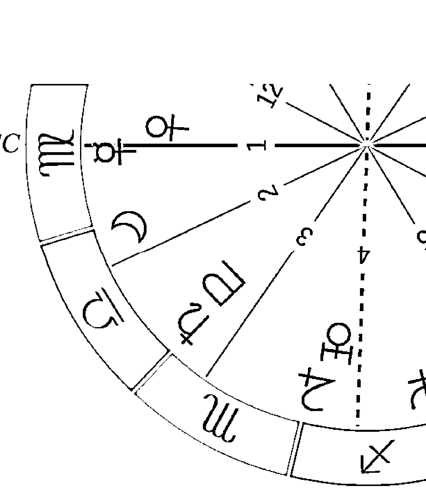

※關於劃分宮位的計算方式，有著「普拉西德（Placidus）制」、「柯赫（Koch）制」、「芮吉歐蒙他拿斯（Regiomontanus）制」等各種宮位制，本書採用的是「柯赫制」。

※星座雖以每30°均分為十二等分，但宮位以「柯赫制」的計算方式劃分區塊，因此與星座的界線並不一致。

## 十二星座的符號

### 星座符號一覽表

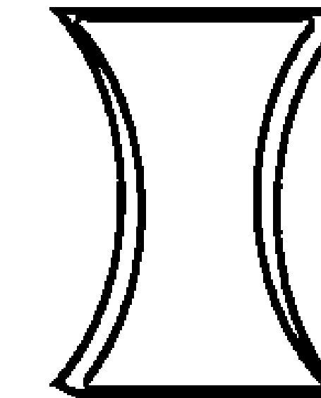

雙子座

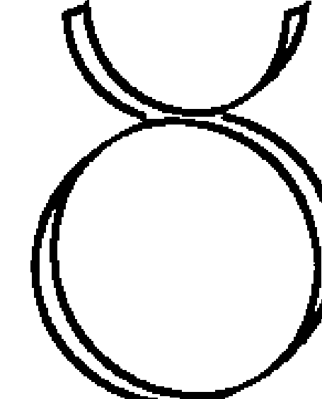

金牛座

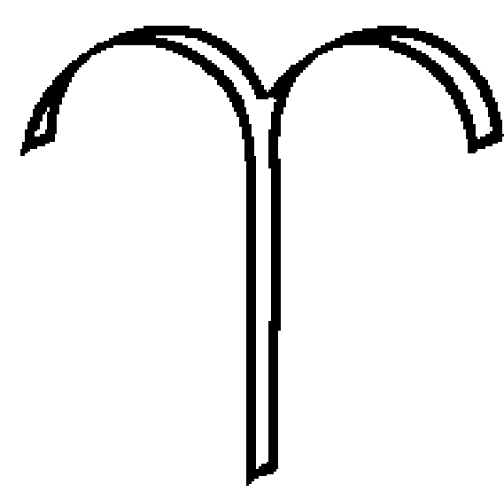

牡羊座

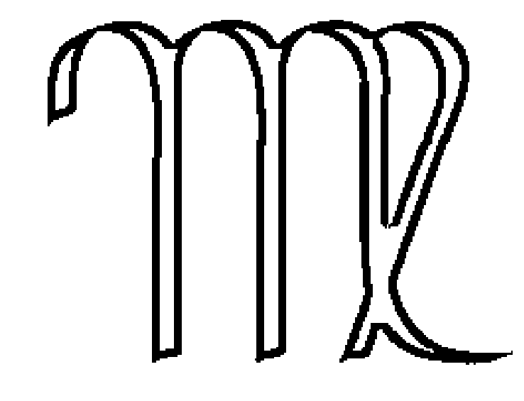

處女座

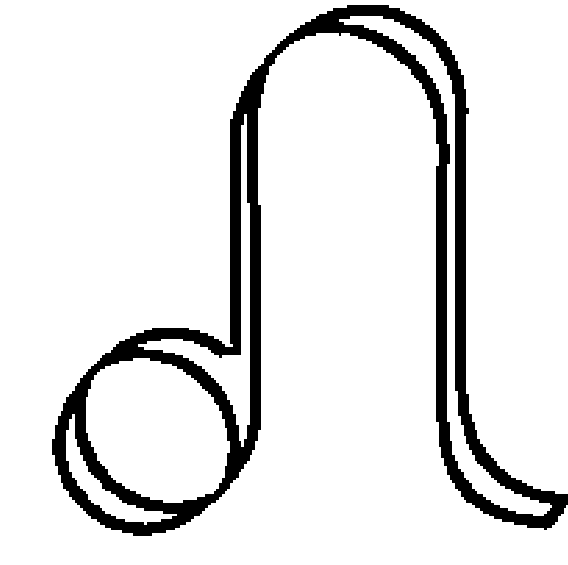

獅子座

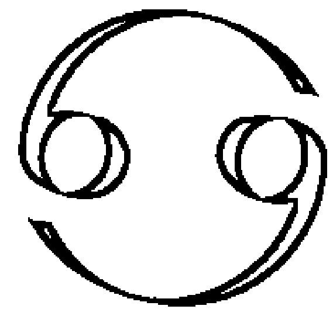

巨蟹座

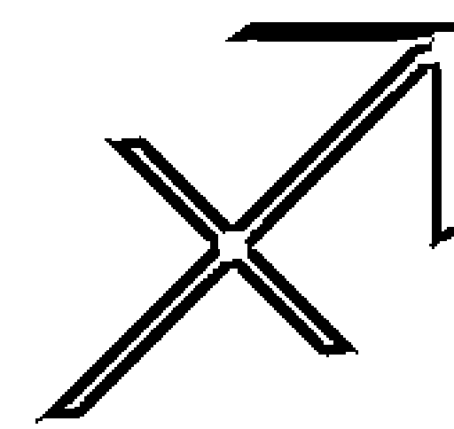

射手座

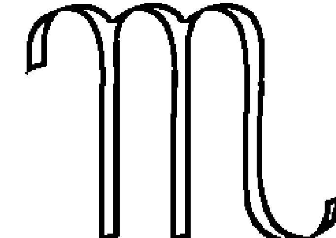

天蠍座

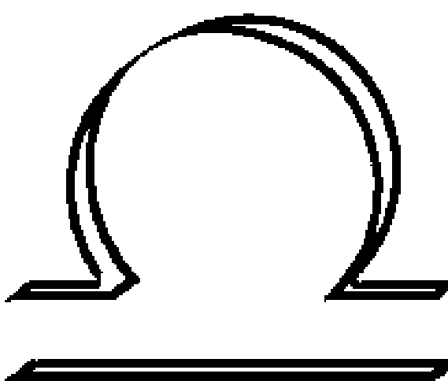

天秤座

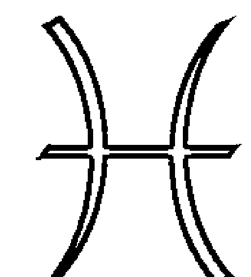

雙魚座

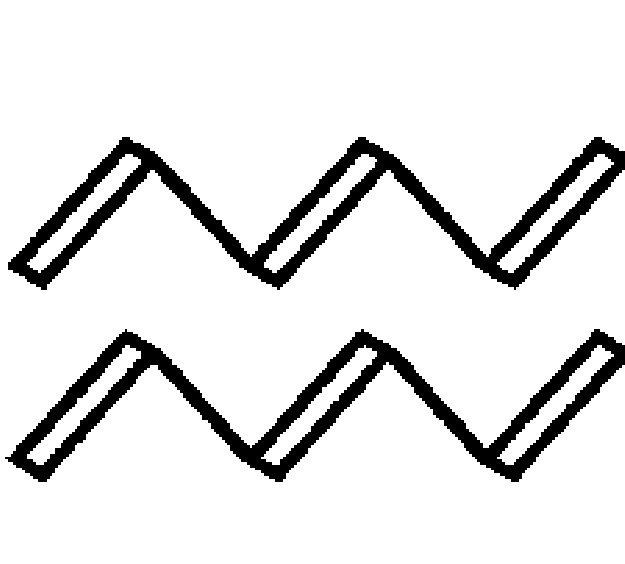

水瓶座

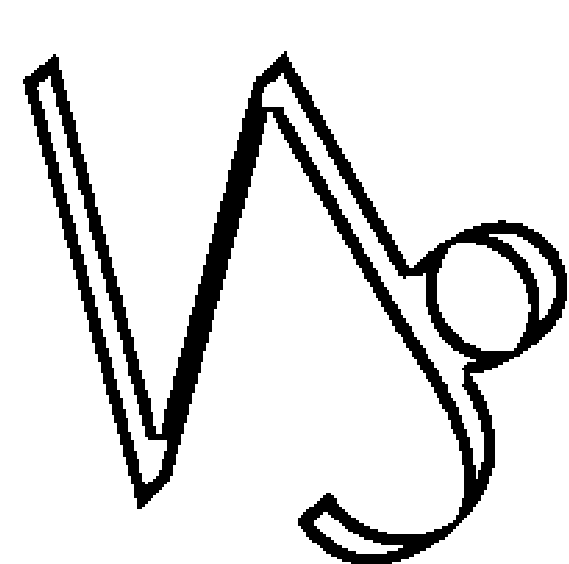

摩羯座

## 十大行星的符號

- ♂ 火星
- ♀ 金星
- ☿ 水星
- ☽ 月亮
- ⊙ 太陽
- ♇ 冥王星
- ♆ 海王星
- ♅ 天王星
- ♄ 土星
- ♃ 木星

### 主要相位的符號

- □ 90°四分相
- ✳ 60°六分相
- ☌ 0°合相
- ☍ 180°對分相
- ⚺ 150°補十二分相
- △ 120°三分相

## 不知道出生时间的人，该如何制作星盘？

出生时间、出生地点会决定上升点，并形成正确的星盘。但虽然有宝宝手册，仍可能无法确认出生时间。若要制作别人的星盘时就更是如此了。此时可以采用基于日出时刻的「日出盘（sunrise chart）」，这是因为作为一天起始的日出，那一瞬间的星辰配置汇聚了那一整天的情况。实际上，若是根据日出图来制作，会让那个人天生具备的潜在事物浮现出来，十分耐人寻味。此外还有各式各样的做法，比如说假设为出生日期的中午诞生，或是将太阳星座的0度作为第1宫的始点等，但无论何种方式，都会优先确认星座、相位。

## 第2章

### 述说命运的星盘

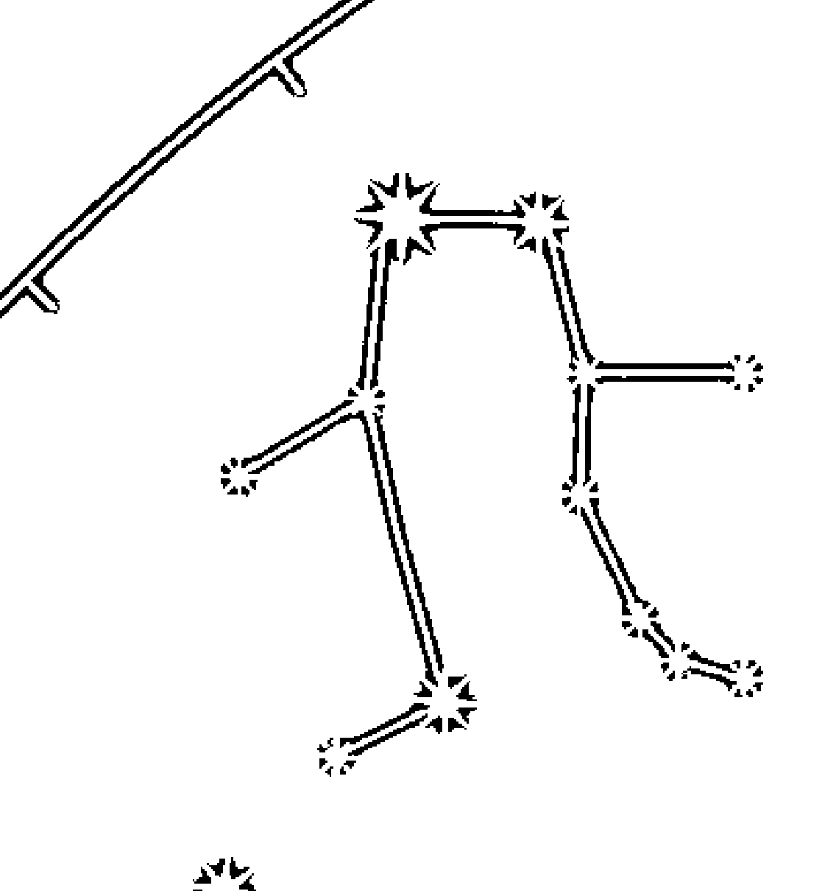

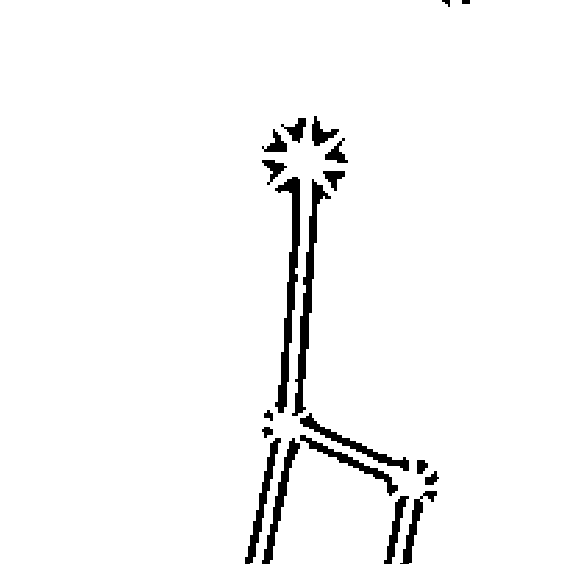

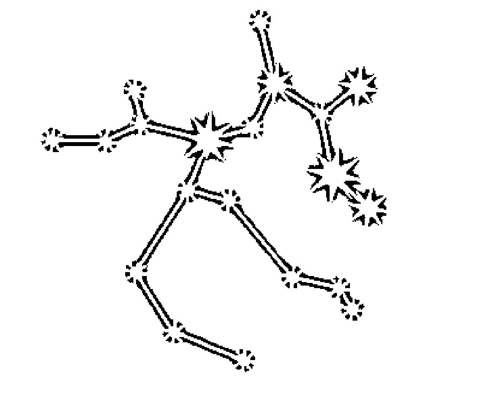

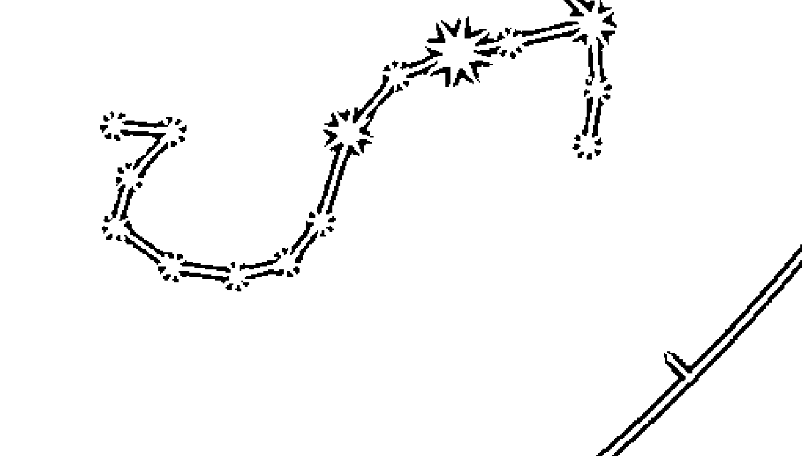

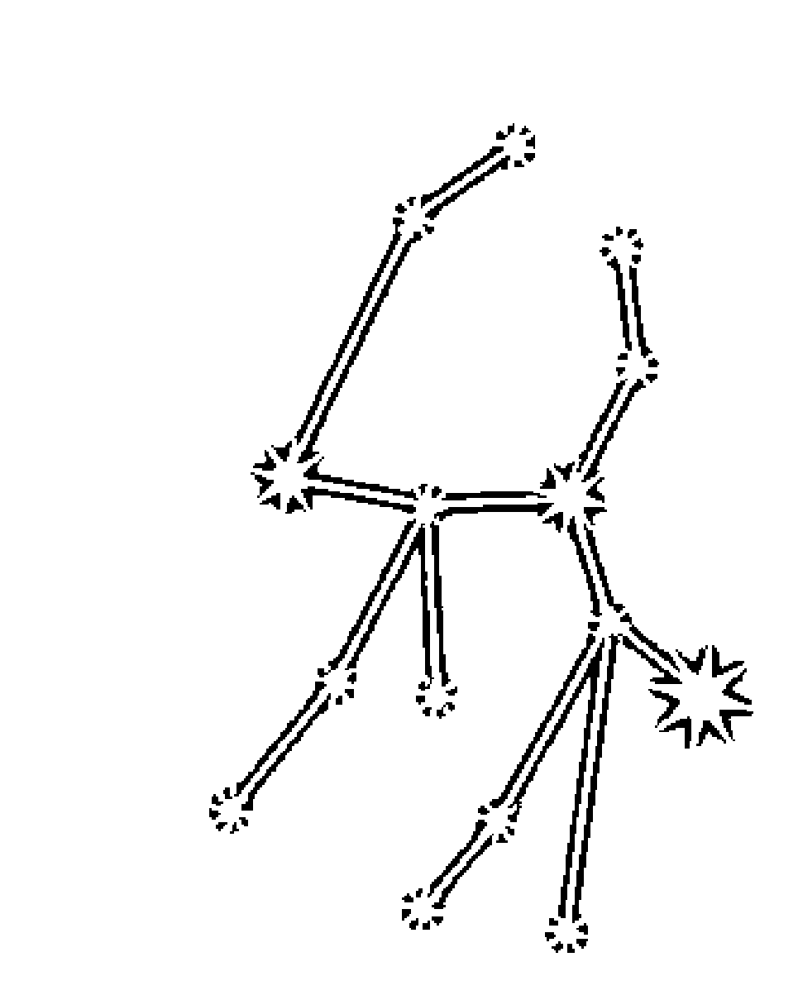

## 解讀星盤的步驟

### 星盤的解讀要從宏觀到微觀

在由各種要素所組成的星盤當中充滿了資訊，首先請試著解讀自己的星盤。建議從能掌握整體的宏觀視角開始，再將視線轉往細節。

- ① 從行星分布掌握大致趨勢，確認② 主要的星座與③ 行星的配置，藉由④ 星盤上有哪些行星落入各宮位來調查各領域的特徵，並⑤ 調查行星之間的相位。請試著挑戰，解讀顯示你本身模樣或未來的「星群地圖」吧。

首先來檢視十大行星的配置狀況。行星的配置狀況會因為人而截然不同，即使同一天出生的人，也會因為出生地點或出生時相異而有所偏移，因此可根據其分布狀態來了解大致趨勢。比如說散布範圍廣闊就是全能型選手；集中於狹隘範圍裡的就是專家人型人物……等等。首先了解自己是哪種類型後，再來進一步細看吧。

### 1 透過星盤整體分布來看趨勢

> P.38~ ↓

### 2 從星座掌握自身本質

詳細解讀星盤的第一步，是為了了解你的本質及個性。需要掌握的重點是星座與行星。藉由同時解讀十二星座所擁有的特質，以及十大行星所擁有的力量或象徵事項，就能認清你的本質。太陽、月亮、上升星座的重要性特別高，據說意味著本人的特質、基本性格及行動類型。

> P.52~

### 3 透過行星配置來看個性

> P.78~

### 4 透過宮位來看人生主題

> P.126~

接著再從第1宮開始，依序研究進入各宮位的行星。所謂的宮位，指的是將太陽運行路徑劃分為十二塊的區域，分別代表著「金錢」、「戀愛」、「家庭」、「健康」、「社交」等主題。藉由哪顆行星在哪個宮位登場，來講述你的人生故事。也請確認是否有哪一宮裡有複數顆行星，或哪一宮裡完全沒有行星。

### 5 從相位來看行星之間的影響

> P.180~

星盤中的十大行星不僅會在各自的位置獨自發揮力量，當行星之間彼此形成特定角度時，會發揮強大的力量。根據形成的角度，可以確認行星之間的能量交互作用。這意味著兩顆行星之間產生了密切的關聯，因此在解讀出生星盤時也不容錯過的重點。

## 透過星盤整體分布來看趨勢

### 從行星配置來確認趨勢

首先來檢視行星分布的傾向，這可說是星盤的第一印象診斷。行星配置會因人而異，比如說幾乎全在下半部、平均分散在整個星盤上等，可說各不相同。

在西洋占星術之中，上方為南、下方為北、左邊為東、右邊為西。並將南半球設為社交性、北半球設為個人生活、東半球設為自主性、西半球設為被動性的型態。請試著確認你的行星大多聚集於何處吧。如果行星沒有明顯偏向哪一側，而是平均落入四個半球之中，則請視為適當地具備四個半球各自的趨勢。

### 東西南北四半球

當眾多行星位於星盤左半邊時，代表你是個「藉由自己的想法與力量打造人生的行動派」。

第1宮與第12宮顯示的是展現自己的方式或自我確認等；第2宮為收入；第3宮與第11宮為資訊與溝通；第10宮則是使命或野心等，主要行星位於這些宮位，展現出對於社會的積極性。

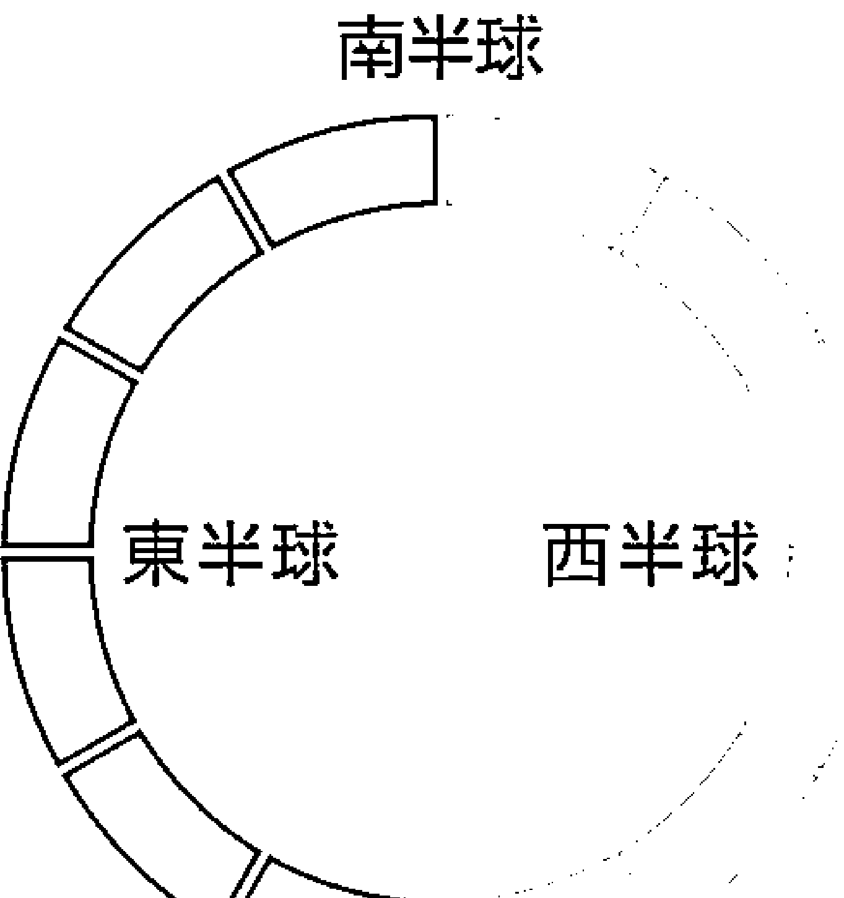

行星集中在東半球（左側）的人

## 第2章 * 述说命运的星盘 〈透过星盘整体分布来看趋势〉

當眾多行星位於星盤右半邊時，則與東半球類型相反，顯得較為被動。比起靠一己之力開拓人生，你是認為受到周遭人們影響或協助的生活方式更為舒適的類型。第4宮顯示的是家庭；第5宮與第8宮為喜悅及利益等；第6宮與第9宮則代表著透過人際關係獲得的工作或想法等。

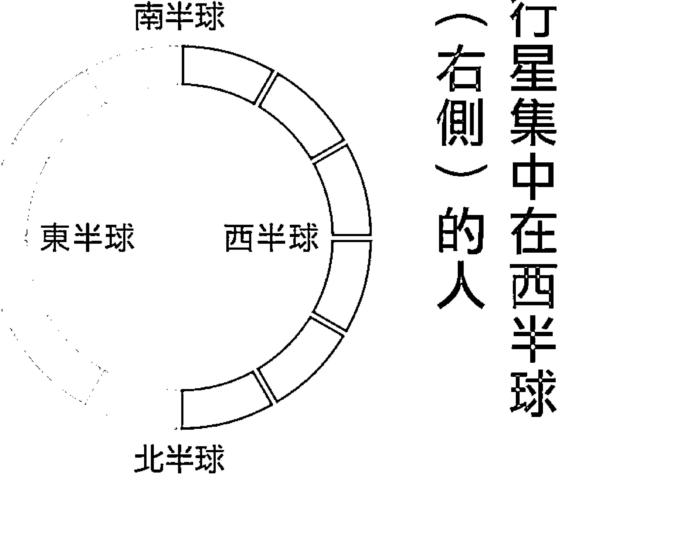

當眾多行星位於星盤上半邊的範圍時，代表你是注重社交生活更勝於私生活的類型。行星配置為這類型的人，多擁有這樣的志向，也能獲得機遇，因此會年紀輕輕就功成名就。由於行星集中於連接星盤上升點與下降點的橫軸——地平線軸上方，使得與肉眼可見的地面上現實世界相關的力量十分強勁。

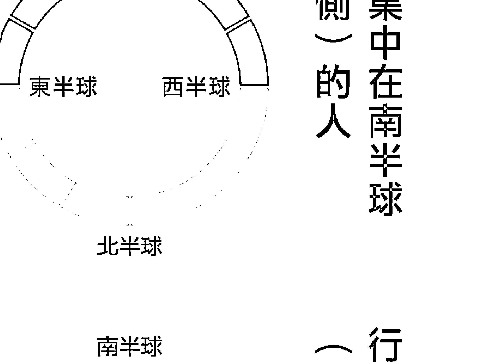

當眾多行星位於星盤的下半部時，則與南半球類型相反，有著注重私生活的傾向。比起名聲或成功，你反而會將個人的樂趣或生存價值視為優先。其大器晚成的傾向也與南半球類型呈對比。位於地平線軸下方的第1宮到第6宮，屬於隱藏的私人領域，存在於此的行星，能在精神成長時，灌注各式各樣的能量。

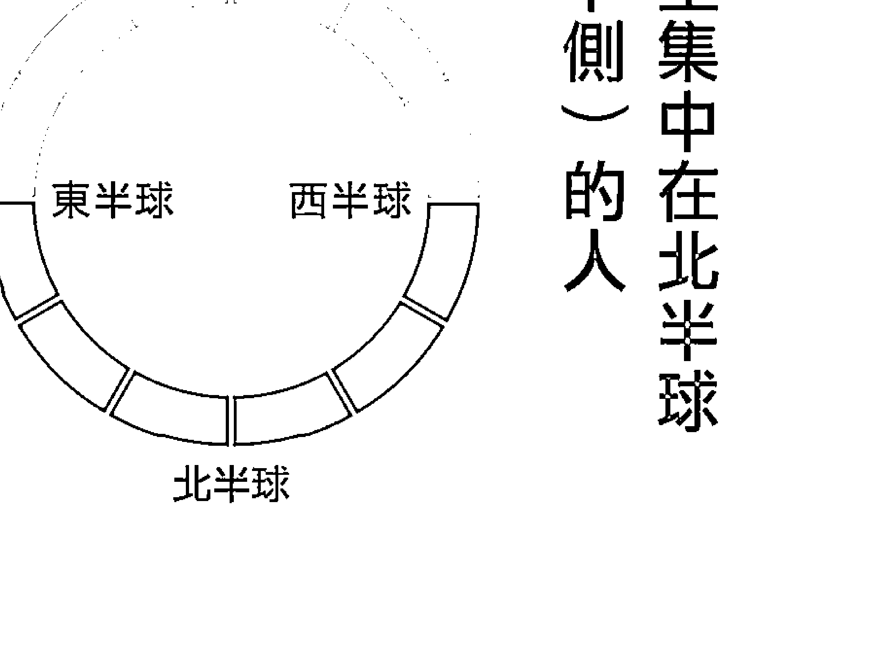

## 從行星分布的七種類型看出個性

除了以半球方式加以診斷，還有從星辰的分布情況掌握全貌的方法。此為美國占星學家所建立的理論，共有以下七種分類。或許有人十分符合這七種分類之一，也有人會覺得「有點不一樣」，或猶豫「自己是這兩者的哪一種」。即使用配置並未符合圖面說明，也不表示就完全不符合內容所介紹的特徵，請將分類視為大方向的趨勢，並檢視最為接近的那個類型。與東西南北半球一樣，這將會成為顯示「能適應各種情況，保持良好平衡的人」或「專注於某一方面的專家型人物」等第一印象的線索。此外，一開始先藉由行星的分布狀況掌握概要，接著分析各部分，然後再回到分布狀況，最後作綜合解析也是不錯的方式。

### 行星分布的七種類型

### 散落型

如同水灑落一地般，散布在整個盤面上的類型。你的興趣廣泛，累積了各式各樣的知識。性格上較無偏頗，為人敦厚。凡事都能順利無礙地完成，但也顯得較無特別突出的一面。與其持續做著同樣的事，你更適合接二連三地著手、發展全新事物的環境。

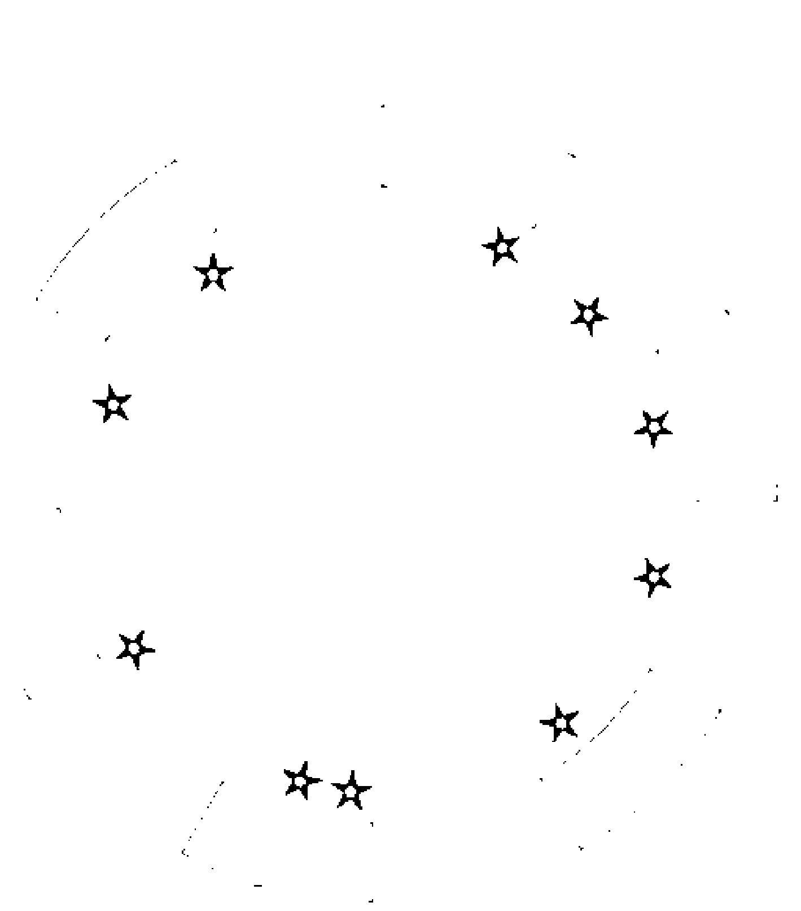

## 第2章* 述说命运的星盘 <透过星盘整体分布来看趋势>

### 扩展型

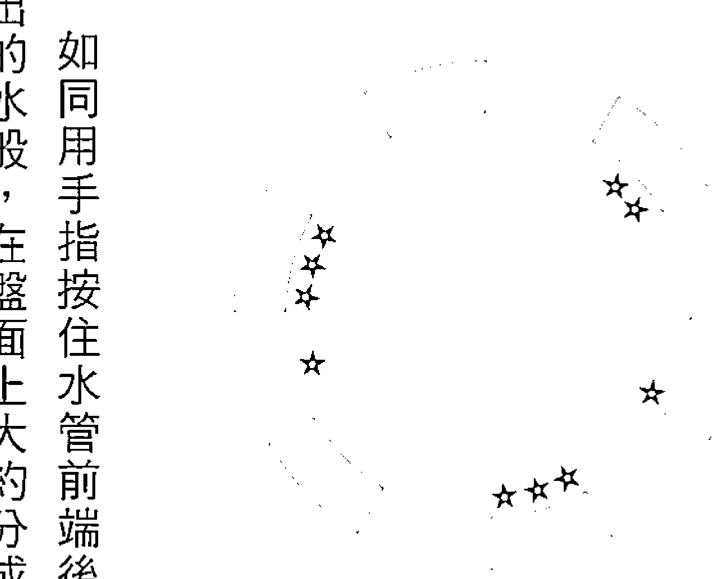

如同用手指按住水管前端后喷出的水般，在盘面上大约分成三块的类型。你具备适应环境的能力，能悠闲自得地发挥才华。若是聚集在如同将星盘分成三等分般的位置，则多会形成三分相（178页）或大三角（196页），是容易受到幸运之神眷顾的类型。

### 集团型

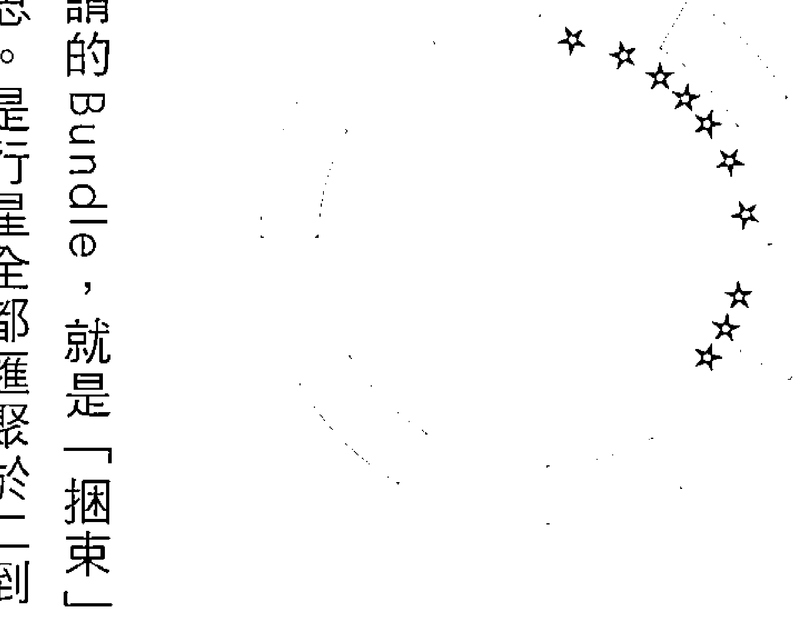

所谓的Bundle，就是「捆束」的意思。是行星全都汇聚于一到五个连在一起的星座中的类型。你精通于特定领域，并于此崭露头角。这类人多会成为专家、研究人员、追寻者，并有着不谙世事的倾向。形成合相的行星愈多，这类趋势就愈强。

### 碗型

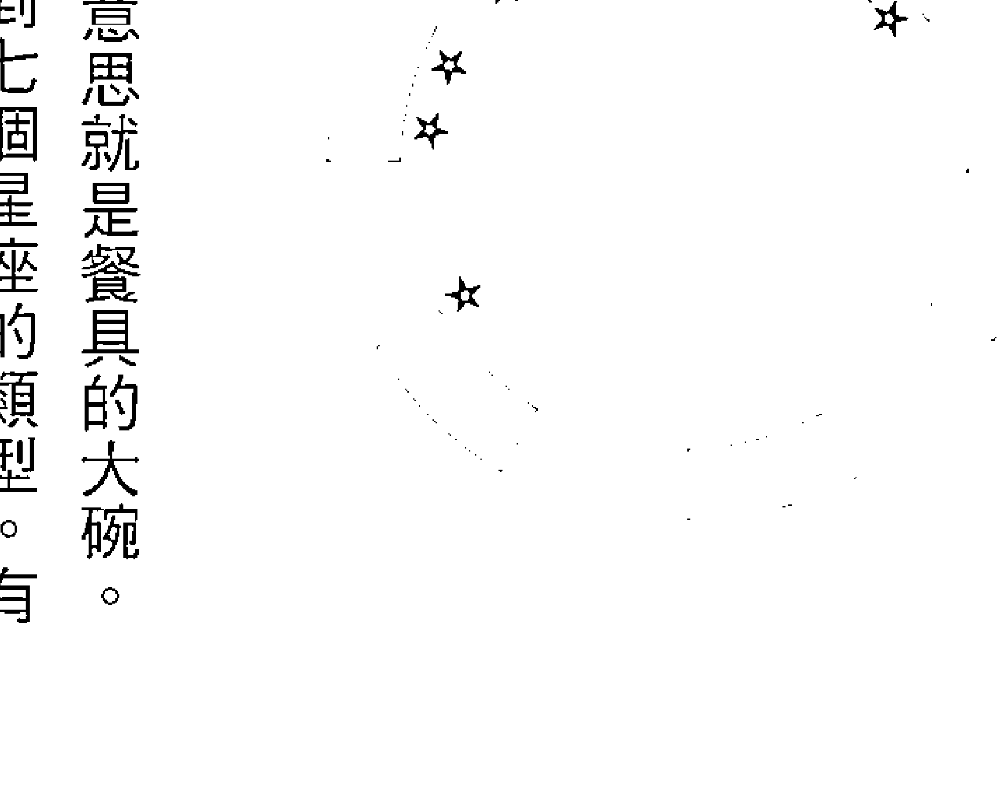

Bowl的意思就是餐具的大碗。是跨越六到七个星座的类型。有时即使跳过一个星座，但整体仍连成半圆形的话，仍符合这个类型。你是会在各半球所显示的领域（38页）中累积人生经验并加以成长的类型。即使无法漂亮地对应到东西南北半球，仍能彻底运用自己具备的知识或经验，做出成果来。

### 提桶型

Bucket指的是水桶。一颗星就像水桶的握柄般离得特别遥远，而其他九颗行星则集中在相对的半球中的类型。你虽会为了目的而竭尽全力地努力，但由于有一颗行星位于相反侧，而同时具备完全相反的观点，并因此感到纠葛。位于握柄处的行星称作「孤星（Singleton）」，肩负着牵引人生的职责。

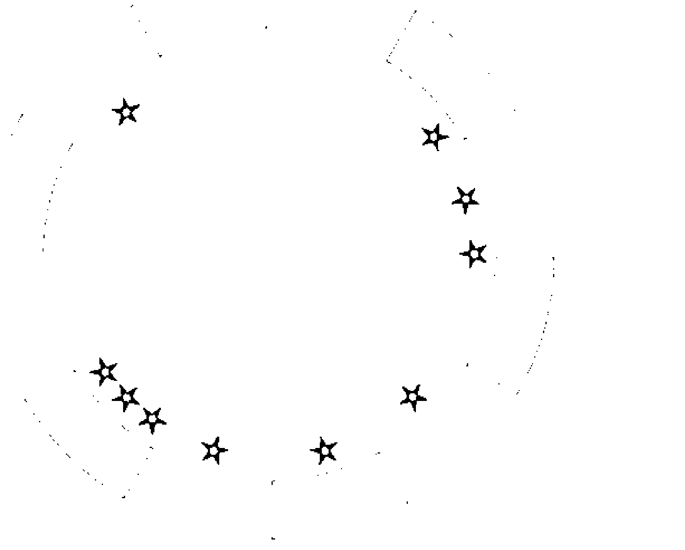

### 火车头型

行星落入七个以上连在一起的星座中，而且没有跳过任何一个星座的类型。Locomotive是火车头的意思。你如同强而有力的火车头，会充满活力地朝着目标迈进。虽然会毫不考虑周遭的状况而向前猛冲，但即使遭遇障碍，也能加以克服并成长，更容易发挥所具备的力量。

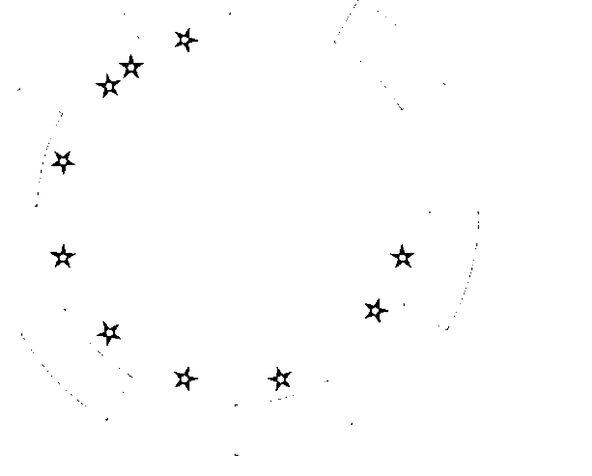

### 跷跷板型

分为两大区块，两边各有五颗，或四颗与六颗这样的类型，并且在两个区块之间存在两个以上完全没有行星的星座。如同「跷跷板」字面上的意义，你在任何事上都想保持平衡，情况一旦偏向一边，就会期望着反作用。习惯从表里两面看待事物，并有同时进行两种相异活动的倾向。

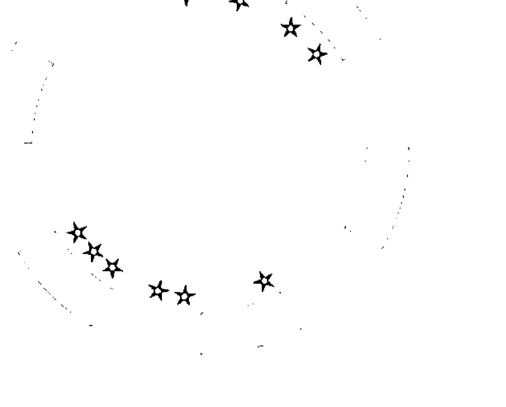

## 注意靠近星盤軸線的行星

所謂的星盤軸線，指的是連接上升點與下降點水平線軸，與連接天頂與天底的垂直（子午線）軸形成的十字。此為白天與黑夜、地面上（社會上的自己）與地面下（內在）的界線，是星盤結構的基準軸。上升點是代表自己，下降點代表他人或環境，天頂代表人生目標，天底則是代表自身基礎的重要交點。

而位於這軸線前後5度以內的行星，影響力會特別強勁。尤其是位於上升點前後5度以內的「上升星」（204頁）或中天（位於天頂前後5度）的行星力量會特別強大。不過由於範圍狹窄，也常有完全不存在任何行星的情況，不需要為此擔心。

落在星盤軸線前後5度以內的行星，具有強大影響力。

如果在這範圍內有行星，就是上升星。

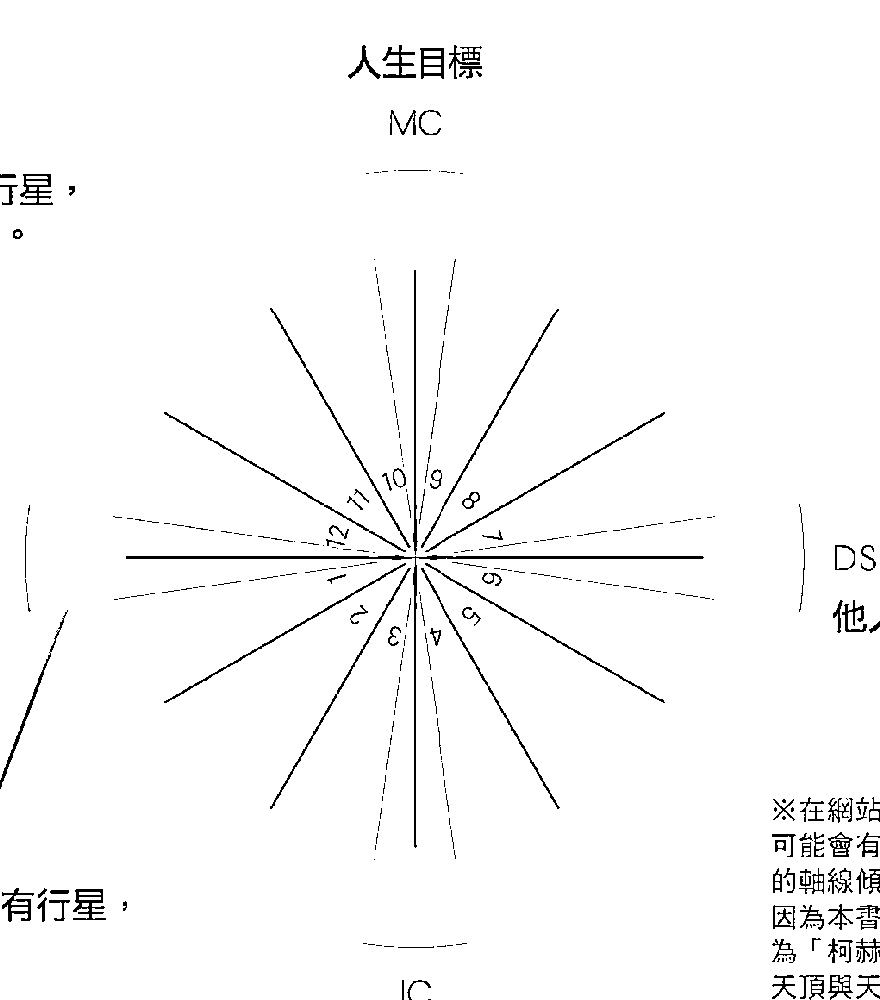

> ※在網站製作出的星盤，可能會有連接天頂與天底的軸線傾斜的情況。這是因為本書所採用的宮位制為「柯赫制」，因此連接天頂與天底的軸線傾斜度會依日期、時間、地點而改變。

## 從星座掌握自身本質

### 位於黃道帶的十二星座

共有十二個星座位於太陽運行路徑，也就是黃道上。目前常見的稱法為「〇〇座」，但另外也稱作白羊宮（牡羊座）、金牛宮（金牛座）、雙子宮（雙子座）、巨蟹宮（巨蟹座）、獅子宮（獅子座）、室女宮（處女座）、天秤宮（天秤座）、天蠍宮（天蠍座）、人馬宮（射手座）、摩羯宮（摩羯座）、寶瓶宮（水瓶座）、雙魚宮（雙魚座）。古人或許是將其想像成了太陽依序造訪十二座宮殿的情境吧。此外，由於星座中有許多動物，因此黃道又稱「獸帶」。黃道與天球赤道的交點為「春分點」、「秋分點」，而位於春分點及秋分點中間的則是「夏至點」、「冬至點」。在這些交點之間，以春分點為基準，將黃道平均劃分為十二等分，每一等分為30度。並從牡羊座起，依序分配了十二宮。太陽會於春分進入牡羊座，並大約每三十天移動到下一個星座。通過夏至點的夏至進入巨蟹座，通過秋分點的秋分進入天秤座，通過冬至點的冬至進入摩羯座，最後再回到春分點。

### 十二星座象徵的事物

不僅是太陽，月亮、水星、金星、火星、木星、土星、天王星、海王星與冥王星十顆行星也會陸續行經黃道上的十二星座。每顆行星都具備不同的力量，而當行星進入獅子座或處女座時，其力量的展現方式也會相異。十二星座可說是決定了行星的力量與方向將以何種特徵展現的存在。我們可以說「如果行星是『主詞』，星座就是『副詞』。」在本書中介紹象徵各星座的事物「關鍵詞」（53頁），這可以說是星座的說明書。所謂的「主宰行星」，指的是主導、管理該星座的行星。「二元性」指的是外向、投射性的陽性與內向、接受性的陰性兩大分類；「三大模式」則是開創、固定、變動三種特質；「四大元素」指的則是火象、土象、風象、水象四大元素。此外，「司掌的身體部位」，代表的是該星座主導著身體的哪一部分；「司掌方位」則是指該星座主導的是哪個方位。比方說，在27頁的A小姐的星盤中，代表美麗與喜悅的金星落在處女座，因此A小姐的情況就能解讀為：處女座司掌的腸胃會影響美貌相關；而在西北方位則會有許多令人愉快的事情發生。

### 象徵性格的三種星座

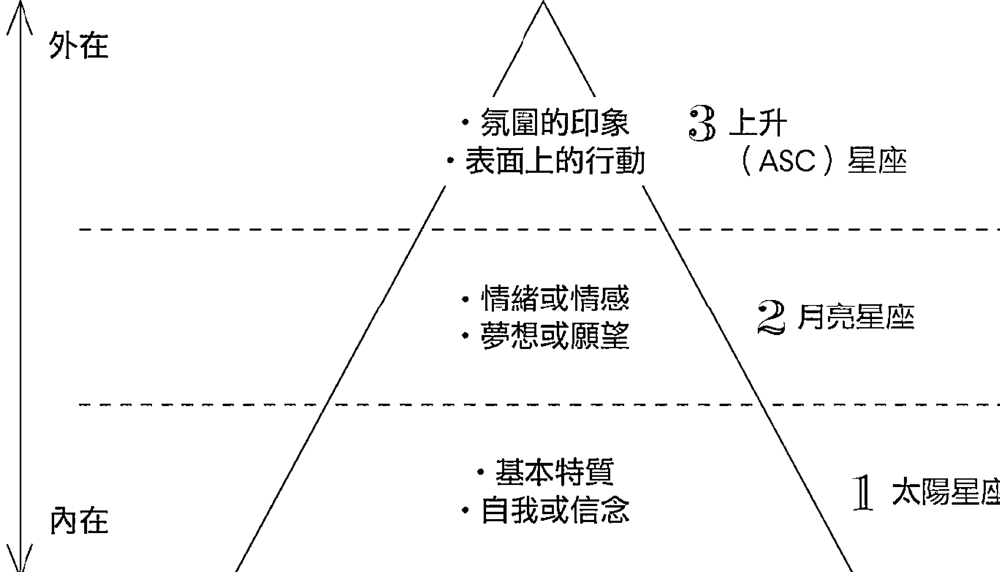

在西洋占星術中，太陽所在的星座稱作「太陽星座」，月亮所在的星座稱作「月亮星座」，而位於東方地平線（星盤左側）——上升點（ASC）的星座則稱為「上升星座」。在出生星盤中，這三種星座會是得知個人性格的重要線索。

在上圖中所呈現的是這三種星座的位置。從由太陽支撐著月亮與上升星座的形式可以得知，若是沒有太陽，月亮與上升星座也無法成立，或是會非常不穩定。

然而，正因為太陽星座代表本質，因此出乎意料的，難以產生自我認知；相較之下，容易外顯的上升星座，以及容易有所自覺的月亮星座，反而更容易令自己及他人覺得貼切也說不定。

## 第 2 章 * 述說命運的星盤 〈從星座掌握自身本質〉

### 1 太陽星座
代表基本特質

太陽星座顯示的是基本性格特質、自我或信念等鮮少因為年齡、狀況或環境而改變的內容。並會在從雙親的庇蔭下獨立，與他人或社會有所交流，時而碰壁後自問「自己想怎麼做？」一時才初次產生自覺，也就是所謂的社會認同。因此即使平時覺得太陽星座並不像自己，但是當你想詢問「自己是為了何種生活方式而出生的？」這類根本性的問題時，就可以檢視太陽星座所呈現的內容。

### 2 月亮星座
代表情感或願望

月亮星座顯示的是一個人的情感或情緒。所以說月亮星座所呈現的是會根據狀況而大幅變動的部分，或許是由於自古以來就認為「月亮的陰晴圓缺對人的情感或情緒起伏有密切影響」此一看法也說不定。此外，相對於太陽星座代表的是社會人士的一面，月亮星座代表的則是獨自一人或僅在面對家人時會展露的，私人的的一面。因此，不少人會認為月亮星座所顯示的內容更為貼切。此外，一般也認為學齡前兒童比較容易呈現出月亮星座的性格特質。

### 3 上升星座
代表他人對自己的印象

上升星座顯示的是他人對自己的印象，這是一個人在一生之中不可或缺的形象。因此透過上升星座，可以得知對方是怎麼看待自己，並藉此了解該採取何種態度、如何採取行動。不同於以自己本身為中心的太陽星座或月亮星座，上升星座是以他人的視角為主體，因此或許會發現「原來別人是這樣看自己的！」而感到吃驚。不過，當月亮星座或太陽星座與上升星座相同時，或許就不會感到如此驚訝了。

### 十二星座的分类

> 代表积极性的二元性
<阳性星座、阴性星座>

星座虽然分为十二个，但其中还能够再细分成几种类型。首先介绍的是分为阳性星座、阴性星座的二分法。所谓的二元性，代表的是行动与思考模式是投射性（主动）还是接受性（被动）。虽然在星盘上有较多行星落入的星座，其分类的特质会明显地呈现出来，但这里指的只是思考方式上的特性，而无关吉凶，即使偏向任何一边，也不会因此有任何运势上的影响。

- 分类为阴性星座的星座
  - 金牛座/巨蟹座
  - 处女座/天蝎座
  - 摩羯座/双鱼座

- 分类为阳性星座的星座
  - 牡羊座/双子座
  - 狮子座/天秤座
  - 射手座/水瓶座

### 阳性星座较多的人

你重视外在甚于内在，是会积极沟通，主动面对问题，并将自己的想法往外投射的类型。当月亮与太阳位于阳性星座时，这样的倾向就会更加显著。虽然令人感到可靠，但特质过于强烈时，也会带给人强硬蛮横的印象。

### 阴性星座较多的人

你重视内在甚于外在，是无论沟通或面对问题都处于被动守势，接受周遭的想法来思考自身行动的类型。当月亮与太阳位于阴性星座时，可能会出现消极负面的倾向。或许虽然善于倾听，却不太擅长主动表达想法。

### 代表行動類型的三大模式 〈開創星座、固定星座、變動星座〉

所謂的三大模式，是將十二星座分為開創星座、固定星座、變動星座三類，加以判斷一個人『行動力的特質』。在這三大模式中，哪種模式的星座聚集愈多，其特質就更為強烈；如果進入的行星較少，或甚至完全沒有半顆行星時，可以視為該項特質微弱；而如果行星平均散布在每一種模式中，則可以解讀成每種模式互相影響。此外，由於太陽與月亮進入的星座，其特質會比其他模式更為顯著，因此會對行動力的方針造成更大的影響。

### ※ 分類為變動星座的星座

- 雙子座／處女座
- 射手座／雙魚座

### 變動星座較多的人

你的視野開闊，思考靈活。無論面對何種變化都能即時應對，並選擇當下的最好做法，由於狀況愈是多變，就愈能發揮其真正價值，因此比起擔任領袖，更適合負責輔佐。

### ※ 分類為固定星座的星座

- 金牛座／獅子座
- 天蠍座／水瓶座

### 固定星座較多的人

你在採取行動之前會先仔細思考流程。面對多項任務時，雖然較不擅長有效率地處理，但很有耐心及毅力，擅長按部就班地著手進行一件事，具備紮實獲得結果的執行力。

### ※ 分類為開創星座的星座

- 牡羊座／巨蟹座
- 天秤座／摩羯座

### 開創星座較多的人

你有行動力且積極主動，並具備領導能力。面對新事物時的處理態度積極，精力充沛且迅速，行動的原動力為精神上高昂感，屬於身體會比大腦先動起來的類型。

### 代表性性格特質的四大元素
〈火象、土象、風象、水象〉

所謂的四大元素，是將星座特質分為火象、土象、風象、水象四種，加以判斷一個人的性格。這是根據西元前五世紀的哲學家恩培多克勒所提倡的「世上的一切都是由這四種元素所構成」理論所建立的分類。與二元性、三大模式相同，有太陽與月亮進入的元素分類，就請當作其影響會比其他元素更為顯著。如果行星平均分布在各元素中，則可視為四種元素很平衡地互相作用。每種元素都具有個性，即使偏向任何一種也無關吉凶。

- ※ 風象星座
  - 雙子座／天秤座／水瓶座
- ※ 火象星座
  - 牡羊座／獅子座／射手座
- ※ 水象星座
  - 巨蟹座／天蠍座／雙魚座
- ※ 土象星座
  - 金牛座／處女座／摩羯座

### 火象星座較多的人

火元素為「精神」的象徵，聚集於此的行星愈多，創造性的特質就愈強烈。你具備從零開始創造事物的開拓精神與開闢命運的熱情，不甘心走在他人事先鋪好的軌道上。自尊心強，卻也有著如燃燒火焰般急躁的一面，在人生中最重視的是精神上的志向。即使無法獲得他人理解，也要優先重視自身能否獲得滿足。重視結果甚於過程，但由於具備向未知事物挑戰的強烈精神，而能不畏懼失敗地果敢挑戰。

## 第2章 述说命运的星盘 十二星座的分类

### 土象星座较多的人

土元素为“物质”的象征，聚集于此的行星愈多，物质的特质就愈强烈。建立于物质的稳健感与务实的谨慎态度，会强烈地展现在其价值观中。你会为了内心平静而试图获得众多事物，并且彻底守护到手的事物，因此可能有执着于人事物的倾向。具备进步的经济观念，重视自己的五感或过去经验更甚于理智。虽然极为畏惧失去或失败，却是能按部就班，且很有耐心地彻底思考“该怎么做才能成功？”的类型。

### 风象星座较多的人

风元素为“知识”的象征，聚集于此的行星愈多，机敏的特质就愈强烈。你是长于巧妙操纵理论或言词的强者，沟通能力出类拔萃。是学识渊博的情报通，且多为散发轻松氛围的人。但由于求知欲旺盛，因此容易流于样样通样样松。在社交上总是群体当中的红人，不过视场合而定，也可能会被认为是冷漠不讲情面的人。对于事物总是根据合理性以理智态度下判断，会运用多方面视野，并重视“是否有效率”。

### 水象星座较多的人

水元素为“情感”的象征，聚集于此的行星愈多，感性的特质就愈强烈。虽然给人敦厚稳重的印象，但内心其实怀着各式各样的情感，强烈情绪偶尔会爆发。你的个性温柔，但由于感性上的要素强烈，容易情绪化，无论好坏，情绪起伏都十分激烈，容易被自己的情感牵着鼻子走。即使会吃亏，仍将“在情感上能否接受”视为最重要的事。此外，也有着懂得察言观色，擅长感受肉眼看不见的能量的一面。

## 十二星座的关键词

## 牡羊座

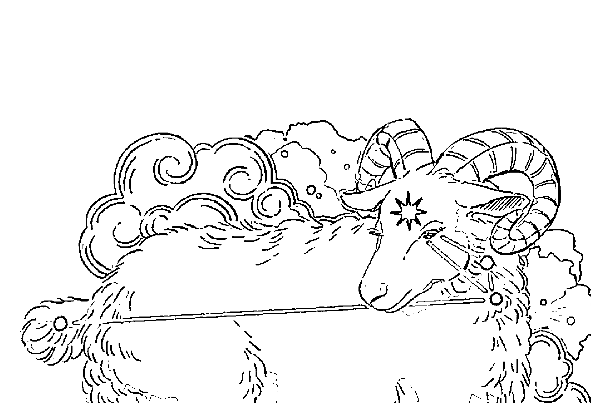

Aries

### 神话

统治希腊色萨利的国王阿塔玛斯有两个孩子，名叫佛里克索斯与赫勒，但他新娶的王后伊诺不喜欢这对兄妹。她策划了各式各样的计谋，企图夺走他们的性命。国王的原配涅斐勒为了保护孩子的性命，向主神宙斯祈祷，宙斯听见她的祈祷，派来一头会说人话且会飞的金羊。金羊驮着兄妹飞往空中，逃离王后的魔掌，但由于急着迅速飞离，赫勒不小心掉进了海里，金羊虽然回头在意掉进海里的赫勒，仍持续往前飞翔，平安守住了佛里克索斯。宙斯认可牠的功绩，让牠成为天上的星座。

## 第2章 述说命运的星盘 十二星座的关键词

## 喜怒哀乐表现丰富的热情之人，在思考前就会先采取行动

牡羊座的人态度积极进取，无论在工作上或私底下都十分主动。总是明确决定『YES』与『NO』，不擅长处理模棱两可或黑白不分的状况。你在面对陷入胶着的问题时，会发挥天生的领导能力，将事情迅速地导向终点。由于身体会比大脑先动起来，可能会因此重蹈覆辙，不过擅长在关键时刻发挥能力，就好的意义而言，具备将周遭事物卷入其中的力量，是能化危机为转机的类型。倒不如说，愈是陷入逆境，你就愈会心想『我绝对要成功！』而发挥自身潜质。

### 特质

- 积极／活跃／热情
- 乐观／战略性／精力充沛
- 瞬间爆发力强／迅雷不及掩耳
- 短跑选手
- 擅长照顾人／勇敢／纯粹
- 开朗／热血男儿
- 重视结果甚于过程
- 领导能力／有同情心
- 心软／感受性丰富
- 朝着顶点前进

- ※主管行星：火星
- ※分类：
  - 二元性 —— 阳性星座
  - 三大模式 —— 开创星座
  - 四大元素 —— 火象星座
- ※司掌的身体部位：脸部、脑部、头部
- ※司掌方位：东方

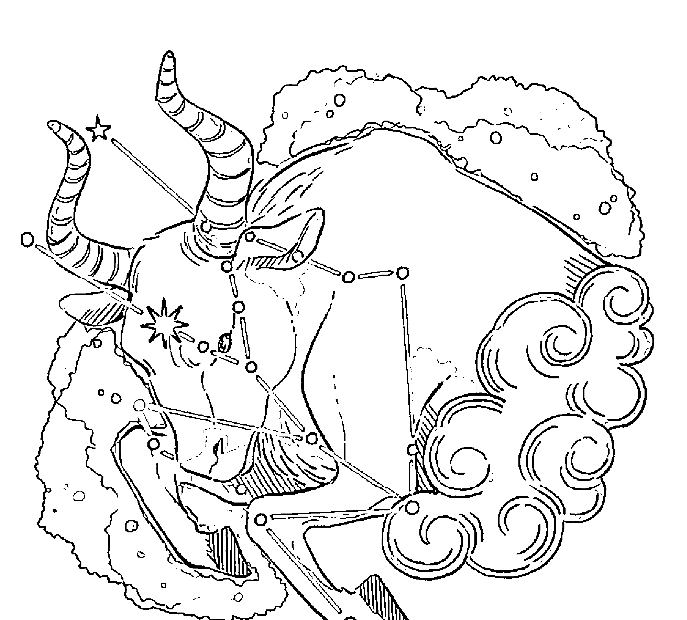

## 金牛座

Taurus

### 神话

腓尼基的泰尔国王阿戈诺尔有个名叫欧罗芭的美丽女儿，甚至令主神宙斯对她一见钟情。某天，当欧罗芭正在原野上采花时，一头壮硕的雪白公牛出现在她面前。欧罗芭被牠漂亮的毛色吸引，坐到牠的背上，公牛竟然猛然跑了起来，牠带着欧罗芭冲过原野，翻山越岭，渡过爱琴海，最后将她带到了克里特岛。在因为远离出生长大之地，束手无策地颤抖着的欧罗芭面前，借用公牛外貌的宙斯现出原本的面貌，向她求婚。后来，两人顺利结婚，而被宙斯借用了姿态的公牛最后升上天空，成了金牛座。

## 脚踏实地处理事情，坚持自己步调的努力之人

### 特质

金牛座的人带有沉着、成熟且优雅的气质。由于你是个总是在脑中仔细思考步骤后才采取行动的谨慎型人物，因此容易带给人自我中心的印象。一旦着手处理某件事，就会有强烈的责任感，无论发生任何事都不会半途而废，坚持到底完成它，因此也受到周遭的强烈信任。很有耐性的一面也可能因此让你被视为“顽固分子”，但待人和善，不会不小心树敌。由于五感敏锐，也拥有艺术品味，尤其在味觉、触觉的敏锐度在十二星座中首屈一指。

### 关键词

- 内向／因循保守／物质性
- 有财运／迟钝／稳重
- 踏实仔细／大器晚成／被动
- 容易亲近／收藏家／执着
- 害怕失败
- 慢热／小心谨慎
- 彬彬有礼
- 容易受到长辈或上司喜爱
- 有受提拔的运势
- 喜欢美丽的事物
- 十分讲究

- * 主管行星：金星
- * 分类：
  - 二元性 —— 阴性星座
  - 三大模式 —— 固定星座
  - 四大元素 —— 土象星座
- * 司掌的身体部位：下颚、颈部、咽喉
- * 司掌方位：东北东

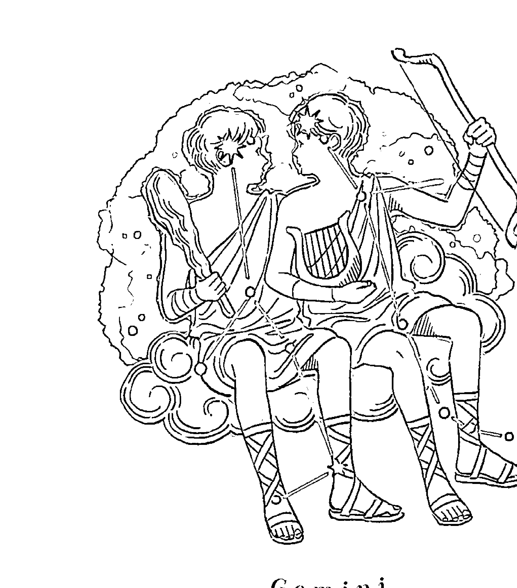

Gemini

## 双子座

### 神话

斯巴达王后丽达的美貌迷住了主神宙斯，祂变身成一只天鹅接近她。丽达接受了宙斯求爱，最后生下继承了人类血脉的卡斯托与继承神祇血脉的波路克斯这对孪生兄弟。这对兄弟感情和睦，一起成长为出色的年轻人。卡斯托擅长战术，波路克斯长于拳脚功夫，兄弟俩在战场上功勋卓著。然而他们被卷入堂兄弟之间的争执，继承人类血脉的哥哥卡斯托因此丧命，悲痛欲绝的波路克斯直接向宙斯恳求，『希望前往死亡之国与哥哥一起生活』，但不被允许。兄弟俩深厚的情谊令宙斯感动，祂让两人化为星座，分别住在天国与死亡之国。

## 第2章 述说命运的星盘 十二星座的关键词

## 凡事都能多工同时进行，思绪敏捷的知识份子

### 特质

双子座的人能够一边思考同时行动，一边同时思考。你是求知欲旺盛，对新奇事物或别出心裁的事物格外着迷的类型。不畏惧失败，会认为“因为在意，就来尝试看看吧！”而向各种事物挑战。由于敏锐度高而能掌握领域广泛的各种资讯，但是因为同时拥有冷漠的一面，一旦自己的热情消散就会迅速收手，而可能被认为是“热得快也冷得快的人”。主管行星是智慧的象征——水星，因此整体而言给人知性的印象，尤其擅长沟通交流。

### 关键词

- 沟通／交谈
- 两面性／敏捷／灵光一现
- 点子多／爽朗
- 对流行很敏感／时尚／灵巧
- 机动性高
- 善于临机应变／见异思迁
- 幽默／聪颖／爱开玩笑
- 直觉力／善于说谎／尖酸刻薄

- * 主管行星：水星
- * 分类：
  - 二元性 —— 阳性星座
  - 三大模式 —— 变动星座
  - 四大元素 —— 风象星座
- * 司掌的身体部位：手臂、肺部、神经系统
- * 司掌方位：北北东

## 巨蟹座

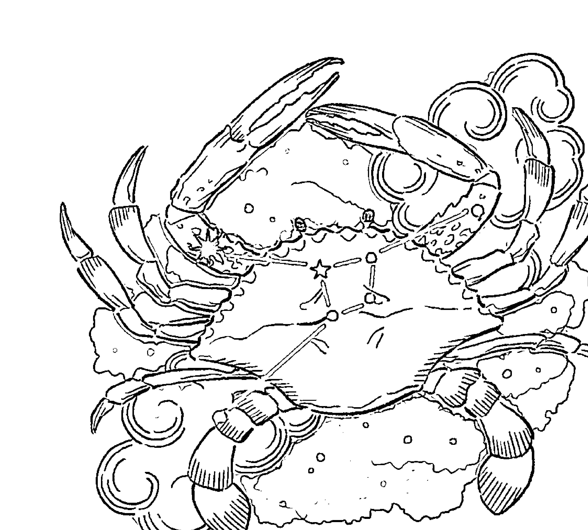

Cancer

### 神话

主神宙斯的正妻赫拉厌恶自己的丈夫与人类女性阿尔克墨涅所生的海克力斯。海克力斯为了逃离她的诅咒，必须面对十二项难题，其中之一就是击败拥有九个头的怪物——九头蛇。海克力斯挥剑砍下凶暴的九头蛇的头，但无论怎么砍，头都会再生，完全没有减弱的迹象。战斗一开始平分秋色，但形势逐渐转为海克力斯占上风，焦急的赫拉就派了一只大螃蟹来妨碍海克力斯。大螃蟹虽然用自豪的大螯奋斗，却被愤怒的海克力斯一脚踩死，同情牠的赫拉于是让大螃蟹升上天空，成为天上的星座。

## 重视家人或伙伴，感受性丰富且具同情心之人

### 特质

巨蟹座的人具备强烈的感受性，对于细微变化都会敏感地反应，绝不错过。由于性格好交际且爱照顾人，因此带给周遭人们“细心体贴”、“氛围营造者”的强烈印象。你的魅力在于对任何人都很有爱心，情感表现丰富。然而，这项特质若是倾向负面，就可能会变成容易因一点琐事而严重消沉、难以重振，或对于现实过度悲观。比起建立新的人际关系，更珍惜家人或朋友圈这样的小团体，喜欢与能推心置腹的伙伴平稳度日。

### 关键词

- 情绪丰富／母性／顾家
- 因循保守／小心谨慎／慎重
- 挂虑／温柔
- 擅长照顾人／能干
- 子女多／阴晴不定／被动
- 深思熟虑／惹人喜爱
- 和蔼可亲／依赖
- 受长辈欢迎／大众化

- ※主管行星：月亮
- ※分类：
  - 二元性 —— 阴性星座
  - 三大模式 —— 开创星座
  - 四大元素 —— 水象星座
- ※司掌的身体部位：胸部、胃部、乳房
- ※司掌方位：北方

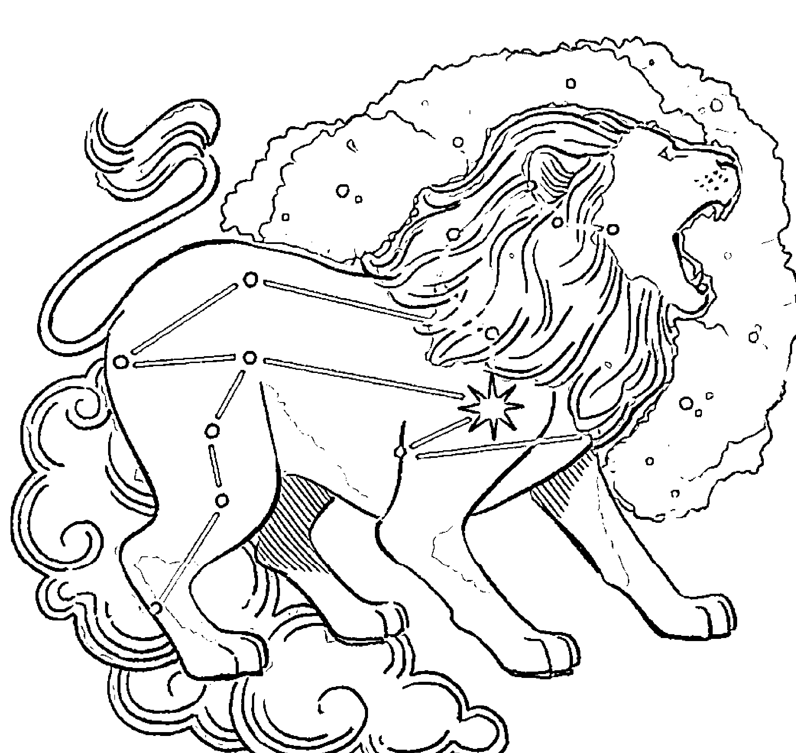

Leo

## 狮子座

### 神话

主神与人类女性阿尔克墨涅所生的海克力斯勇敢无惧，被众人誉为英雄。他一生中必须面对十二项难题，并加以克服。其中一项难题是击败住在涅墨亚山谷，拥有刀枪不入之身的狮子。牠会咬杀家畜或人类，因此令人畏惧。海克力斯一开始试图放箭杀死狮子，但完全没用；接着他用橄榄树制作的粗木棒殴打狮子，跟牠搏斗了三天，最后勒住狮子的颈部，好不容易才完成了难题。海克力斯披着这头狮子皮的模样，就成了他日后的形象。而宙斯为了夸耀海克力斯的丰功伟业，将狮子升上天空，成为星座。

## 以与生俱来的华丽，持续站在舞台上的明星

### 特质

狮子座的人是太阳般的存在，以天生的开朗个性照亮周遭。凡事都以顶点为目标，为了获得第一名而不遗余力地努力，不惜一切代价，也要抵达自己设定的目标。你具备向心力与领导能力，一旦受到周遭人们依赖，就会更加充满干劲。然而，高度自尊心有时也会成为阻碍，令你在难受时无法坦率地撒娇，或无法坦率接受自己的失败而固执逞强。基本上个性正直且单纯，因此受人欢迎，尤其受到晚辈或部属仰慕。

### 关键词

- 权力／自尊
- 精力充沛／信念／正义
- 焦点／擅长打动人心／夸张
- 华丽／领导力／统率能力
- 威严／可靠
- 主导性／值得信赖的人物
- 包容力
- 重视上下关系
- 运动型／领袖魅力／开朗
- 恋爱

- ※ 主管行星：太阳
- ※ 分类：
  - 二元性 —— 阳性星座
  - 三大模式 —— 固定星座
  - 四大元素 —— 火象星座
- ※ 司掌的身体部位：心脏、背部、血管
- ※ 司掌方位：北北西

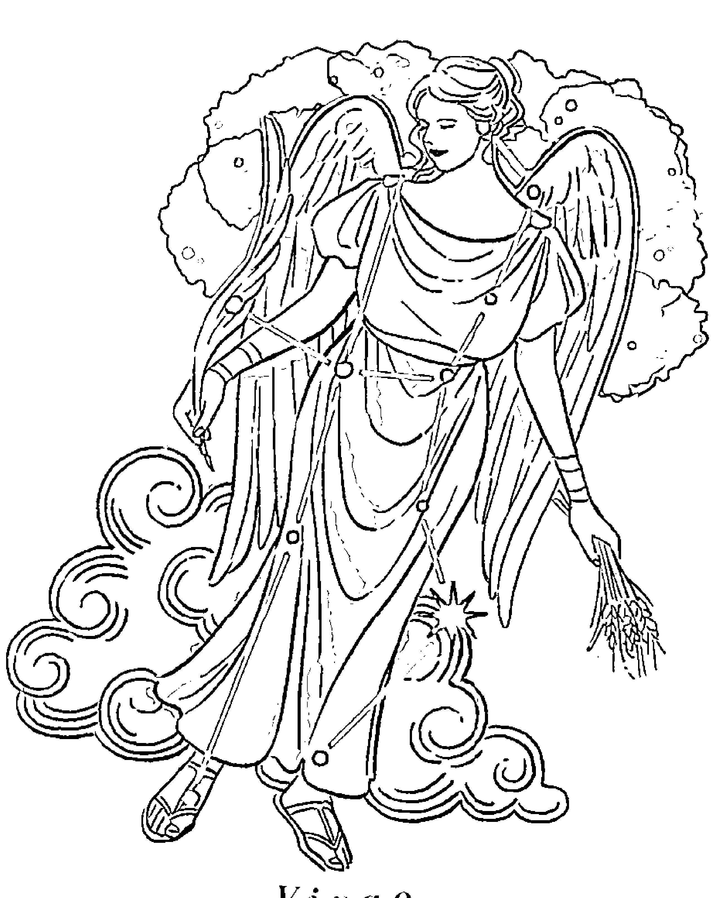

## 处女座

### 神话

在希腊神话中关于处女座的故事众说纷纭。有一说其原型是手持麦穗的农业女神狄蜜特，也有另一有力的说法为正义与少女的守护神阿斯特赖亚。女神阿斯特赖亚为了让善行普及于人世，一手拿着判断正义或邪恶的天秤，从天界来到人界指引人们。然而，随着地面上的人类增加，丑陋的争端或冲突也逐渐增加。其他神祇早就放弃了人类离开地上，唯有阿斯特赖亚仍坚持不懈地宣扬公平与正义，希望人界恢复和平。阿斯特赖亚相信人类的可能性而孤军奋战，却仍无法阻止人类的恶行，天秤一直往邪恶倾斜，而阿斯特赖亚终于感到厌倦，决定回到天界，成为了处女座。

## 彬彬有礼、拘谨客气，凡事都十分认真的努力之人

### 特质

处女座的人观察力与洞察力优秀，即使并未直接接受工作上的指导，也能透过观察而理解一切的类型。由于责任感强且重视规则，过着规矩的生活对你而言可说是人生最重要的事。虽然是才华洋溢，且凡事都很有计划地处理的努力之人，却也因为过度的完美主义而吃亏。你不太擅长表达情感，但察觉问题、察言观色的才华可说出类拔萃。由于擅长整理组织资讯或状况，并俐落地采取行动，而会给周遭人们“彬彬有礼且关心体贴之人”的印象。

### 关键词

- 认真／彬彬有礼／胆小鬼
- 批判性／正直／辅助角色
- 因循保守／健康意识
- 细心／礼节
- 劳动／工作热忱／求知欲
- 行政能力／深思熟虑／秘书
- 分析能力／冷嘲热讽
- 富有理智／完美主义
- 洁癖／责任感强烈

- ※主管行星：水星
- ※分类：
  - 二元性 —— 阴性星座
  - 三大模式 —— 变动星座
  - 四大元素 —— 土象星座
- ※司掌的身体部位：肠胃
- ※司掌方位：西北西

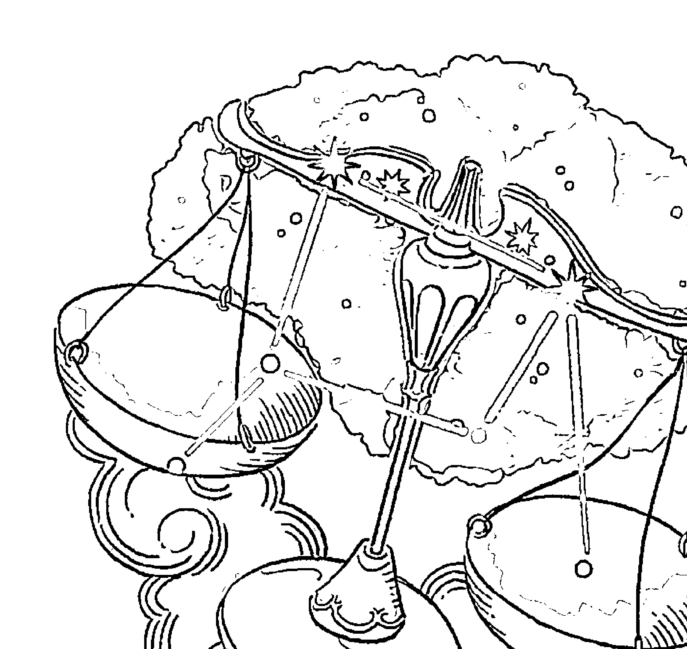

## 天秤座

Libra

### 神话

正是天秤座的由来。女神阿斯特赖亚的形象总是一手拿着天秤，另一只手则握着斩断邪恶的宝剑，为了不流于私情而用眼罩将双眼遮住。她为了向人类宣扬善恶的理想型态而来到地面上。然而，随着人类增加，犯罪与不公也逐渐增加，由于无论再怎么宣扬公正的重要，人类仍不改想法，阿斯特赖亚最后终于厌倦了人类，决定回到天上。即使如此，阿斯特赖亚仍为了让憎恶不公、热爱正义的想法深植人心，将自己手中的天秤放上天空，变成星座，而保持处女之身的自己也成了处女座。

## 第2章 述说命运的星盘 十二星座的关键词

## 重视公平、热爱华丽，具有影响力之人

### 特质

天秤座的人带给维持理性与情感的平衡、沉着稳重的印象。你善于交际，沟通能力也十分出色，适合成为人与人之间的桥梁或担任争执的仲裁者，并大为活跃。由于容易相处，身边总是不知不觉围绕着人群，也是自然而然地受到瞩目的受欢迎人物。虽然细心体贴，但你因为试图尽量对任何人公平，而容易有优柔寡断的倾向。而且也可能会对某些不方便的障碍视而不见，导致养成懒惰的习惯。具有时尚品味，对流行很敏锐，而且喜爱华丽的事物，因此大多都打扮时尚。

### 关键词

- 中庸／平衡／婚姻
- 伙伴关系／优雅／雅致
- 善于交际／迷人／受欢迎
- 优秀的审美品味
- 谨慎型／受欢迎／有质感
- 机会主义／八面玲珑
- 和平主义／浪费癖／公平
- 成熟／迷人
- 早熟／知性／时尚
- 很有品味

- ※ 主管行星：金星
- ※ 分类：
  - 二元性 —— 阳性星座
  - 三大模式 —— 开创星座
  - 四大元素 —— 风象星座
- ※ 司掌的身体部位：腰部、肾脏
- ※ 司掌方位：西方

## 天蝎座

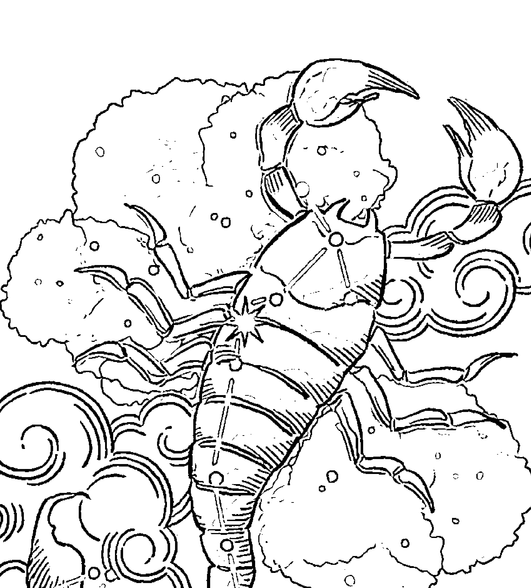

### 神话

在希腊有个非常有名的猎人，名叫俄里翁。他的身材如岩石般魁梧，而且长相俊美出众，因此总是被人们包围着。俄里翁也因为很受欢迎而感到自傲。然而，主神宙斯的妻子赫拉最讨厌高傲的男人，她听到俄里翁发下豪语说“没有我无法逮住的动物”后，就派了一只有剧毒的大蝎子到他身边。大蝎子乘隙用含有剧毒的针刺伤他的脚跟，让俄里翁最后中毒死亡。赫拉称赞大蝎子的功劳，而将牠升上天空成了星座。即使到了现在，据说俄里翁还是一看见蝎子就会逃跑，因此每当天蝎座升上东方天空，猎户座（俄里翁）就会沉入西方地平线。

## 具有神秘气质，能敏锐地洞察本质之人

### 特质

天蝎座的人洞察力优秀，看人的眼光在十二星座中首屈一指。即使是一些若无其事的动作或细微变化都不会放过，能明确地看透人事物的本质。你的性格认真，是比起团体行动，更喜欢独自一人默默地处理工作的类型，因此总是令人甘拜下风。你也深受他人信任，无意间说出的一句建言可能会获得出乎意料的感叹。由于讨厌谎言或诓骗，警戒心极强，很难信任他人，在沟通上也总是处于被动姿态。然而也十分重情义，面对一度敞开心房的对象，就会鞠躬尽瘁到底。

### 关键词

- 探求心／嫉妒／超自然
- 灵感／有个性／耐性／毅力
- 秘密主义／八卦／感情
- 独占欲／沉默寡言／不屈服
- 意志坚强／欲望／性／谨慎
- 因循保守／封闭／遗产／世袭
- 孤注一掷
- 性感

- ※主管行星：冥王星
- ※分类：
  - 二元性 —— 阴性星座
  - 三大模式 —— 固定星座
  - 四大元素 —— 水象星座
- ※司掌的身体部位：生殖器、膀胱
- ※司掌方位：西南西

## 十二星座的关键词

## 射手座

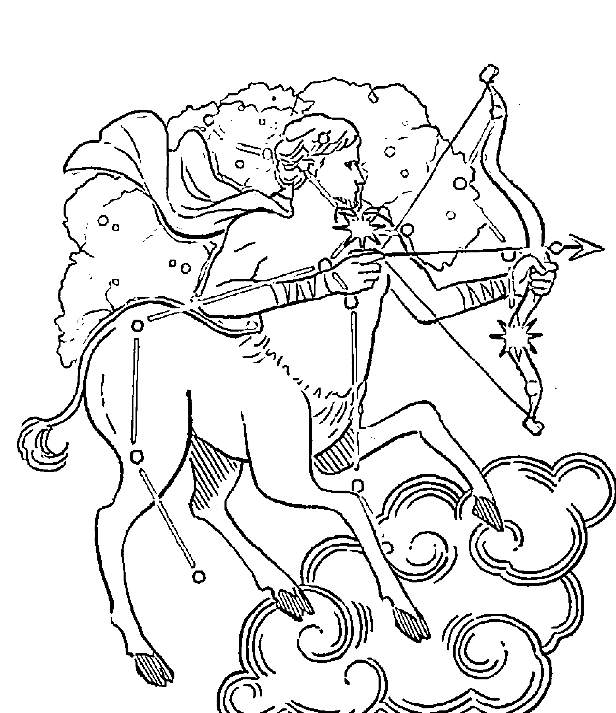

Sagittarius

### 神话

司掌时间之神克洛诺斯之子——半人马族的奇戎，是拥有不死身的半人半马的怪人。在野蛮且粗暴的半人马族当中，奇戎罕见地是个学识渊博的人物，有许多人向他求教。在英雄海克力斯要击败山猪时，与半人马族起了争执，事态发展成打群架，海克力斯射出抹上剧毒的箭矢遏止了纷争，但他射出的箭不幸地射穿奇戎的膝盖，让拥有不死之身的他求死不得，痛苦不堪。据说奇戎将不死之身的能力让给朋友普罗米修斯，让自己从痛苦中解脱。而主神宙斯对他的才华感到惋惜，将他升上天空，成了射手座。

## 对各式各样的事感兴趣，天生的哲学家

### 特质

射手座的人求知欲旺盛，是有在意的事物，如果不加以尝试或调查就不善罢干休的类型。你的机动性高、行动力强，不会抗拒漫无目的的独自外出，反倒讨厌受到束缚。虽然不讨厌集体行动，但如果要说，应该还是觉得单独行动比较轻松。射手座的人随时随地都很我行我素，会马上将内心的想法说出口，但当事人并没有恶意。随心所欲的言行举止容易被人误会，但由于不怕生且善于撒娇，因此给周遭的人“虽然吵闹，却无法讨厌”的印象。

### 关键词

- 探求心／国外／宗教／冒险心
- 速度／上进心／奋发向学
- 热情之人／爱讲道理／哲学性
- 全球化／朋友多
- 阴晴不定／多愁善感／自由
- 好奇心旺盛／随心所欲／旅行
- 容易厌倦／流浪／灵活
- 没有坚持／不执着
- 没有歧视／难以捉摸

- **主管行星**：木星
- 分类：
  - 二元性 —— 阳性星座
  - 三大模式 —— 变动星座
  - 四大元素 —— 火象星座
- **司掌的身体部位**：臀部、大腿
- **司掌方位**：南南西

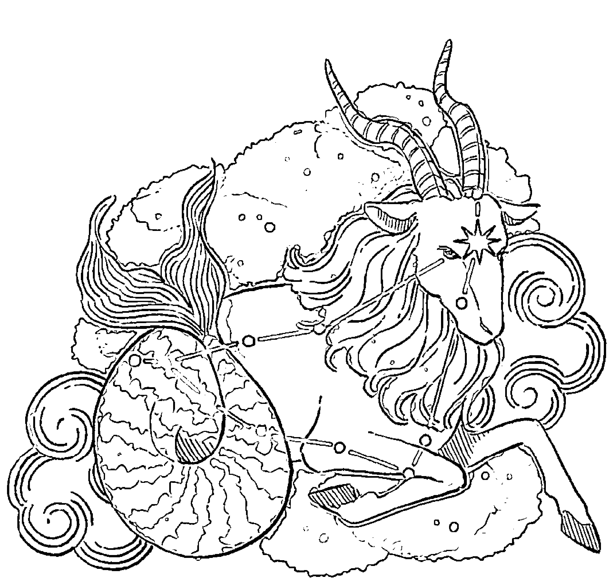

Capricorn

## 摩羯座

### 神话

牧羊神潘有着头长山羊角、上半身为人类、下半身为山羊的姿态。他的性格开朗，喜爱音乐，尤其擅长角笛，如山羊般在原野上奔驰，过着愉快的日子。某天，众神在幼发拉底河岸举行宴会，潘吹着角笛为宴会助兴时，有着一百个舌头的怪物堤丰出现，发动了攻击。堤丰是连宙斯都难以应付的凶暴怪物，众神争先恐后地逃跑。潘也连忙变身成鱼，想跳进幼发拉底河，但由于慌张过度，却变成了上半身为山羊，下半身为鱼的奇妙姿态。最后主神宙斯将潘的这副姿态升上天空，变成了星座。

## 第2章 述说命运的星盘 十二星座的关键词

### 特质
责任心强、勤勉且耿直，一旦被仰赖就会干劲十足的努力之人

摩羯座的人虽是主张合理及实力主义，但同时也具备凡事谨慎前进的深思熟虑。你重视常识及面子，会以严厉的态度对待扰乱和谐或不守纪律的人；自己本身也努力并锻炼不懈，以作为周遭的榜样。不过，由于认为准备万全的状态才好，不太擅长应对突发变化。会按部就班地累积，因此整体而言是大器晚成型。摩羯座的人因为给人面对目标虽然积极却冷静的印象十分强烈，所以也容易被误会为“难以亲近的人”，不过是会随着相处越发融洽，而愈展露充满人情味一面的类型。

### 关键词

- 现实性／合理性／实力主义
- 谨慎／正经／踏实
- 野心勃勃之人
- 权力／顽固／意志坚强
- 执行力／受到长辈或上司提拔
- 自信／受信赖／晚婚／工匠精神
- 善于倾听／耿直
- 不知变通／有组织性
- 喜爱怀旧／历史性／传统性

- ※主管行星：土星
- ※分类：
  - 二元性 —— 阴性星座
  - 三大模式 —— 开创星座
  - 四大元素 —— 土象星座
- ※司掌的身体部位：膝盖、关节、皮肤
- ※司掌方位：南方

# 水瓶座

## 神話

住在特洛伊的牧羊人蓋尼米德是個非常俊美的少年，人稱他的美貌是「沒有任何女性能比擬的姿容」。聽說這傳聞的主神宙斯，也在一睹蓋尼米德的容貌後就深受吸引，並決定將蓋尼米德留在自己身邊，於是變成大老鷹將他攜走。宙斯賜給蓋尼米德長生不老，並讓他隨侍在自己左右，每當眾神舉辦宴會時，他就會四處斟酒。蓋尼米德俐落勤快地侍奉眾神的模樣，令宙斯十分欽佩，而賜予他一只裝滿睿智之水的水瓶作為獎勵。日後，蓋尼米德就與他手中的水瓶一同升上天空，成為水瓶座。

## 充滿獨創性且幽默，古怪的藝術家

水瓶座的人由於具備獨特的感性，因此或許會帶給周遭的人「與眾不同之人」的印象。你的求知欲強烈且好學，吸收知識的速度也出類拔萃。是善於以俯瞰角度縱覽事物，從大局掌握情勢的類型。不滿足於在腦中思考，還伴隨著行動力，因此能機動性高且靈巧地處理任何事。不過，由於受不了因循守舊的既定思考方式、常識及所謂團體規則等「規矩」，因此不適合守舊的團體。唯有與合得來的對象保持著若即若離的距離，坦率地來往，比較符合你的個性。

## 關鍵詞

- 博愛主義／愛講道理
- 邏輯性／朋友／社群網路
- 古怪／幽默
- 才華洋溢／靈巧／自由
- 隨心所欲／善於社交／個人主義
- 興趣多樣化／狂熱／合理性
- 進步／獨創性／理想主義
- 人脈／國際意識
- 視野寬闊

## 主管行星
天王星

## 分類
- 二元性 —— 陽性星座
- 三大模式 —— 固定星座
- 四大元素 —— 風象星座

## 司掌的身體部位
小腿、血壓

## 司掌方位
南南東

# 雙魚座

## 神話

雙魚座的主題是愛與美的女神阿芙蘿黛蒂，以及她的孩子——愛神厄洛斯。某天，阿芙蘿黛蒂與厄洛斯正在幼發拉底河畔散步時，遭到恐怖的怪物堤豐襲擊。堤豐是大地之神蓋亞所生的怪物，有著火焰般的閃耀雙眼，並會吐出灼熱的火焰，據說他擁有足以與主神宙斯匹敵的力量，凶暴至極。吃驚的兩人連忙變身成兩條魚，跳進河裡逃命，並為了避免被河川沖散彼此，而用一條繩子將彼此的尾巴繫在一起。據說阿芙蘿黛蒂與厄洛斯逃過劫難後，就以這副姿態升上了天，成為雙魚座。

## 善解人意，富有同情心的浪漫主義者

雙魚座的人屬於捨身奉獻，對任何人都十分溫柔且富有同情心的類型。在溝通交流方面，你基本上處於被動，但由於容易與人親近，給人難以放著不管的感覺，因此在團體中不會遭到孤立。雖然具備善解人意的溫柔個性，卻也有無論好壞都容易受感情面影響的一面。一旦跟沮喪的人在一起，連你自己都會跟著陷入低潮。思考或行動的步調稍慢，因此比起迅速俐落完成，不如以自己的步調進行還比較合適。直覺或靈感出眾，並擁有想出意想不到點子的才華。

## 關鍵詞

- 直觀／容易情緒化
- 感受性豐富／充滿情緒
- 藝術家／捨身奉獻／溫柔
- 服務／自私任性／戀愛體質
- 天真無邪／優柔寡斷
- 沒有時間感／慈悲／陶醉
- 依賴／夢想／浪漫
- 敷衍搪塞／反覆無常
- 沒有自信／不怕生
- 少女心

## 主管行星
海王星

## 分類
- 二元性 —— 陰性星座
- 三大模式 —— 變動星座
- 四大元素 —— 水象星座

## 司掌的身體部位
腳踝以下、神經系統

## 司掌方位
東南東

## 星盤上星座與行星的關聯

### 透過行星配置來看個性

所謂的星盤解析，會藉由出生星盤上的哪個宮位是什麼星座、有哪顆行星坐落於此、行星之間的角度為多少等綜合資訊來確認。到目前為止，我們已經掌握了行星分布的類型與十二星座的關鍵詞，接下來則要繼續了解十大行星、十二宮與相位的含義。你或許會因為必須記住的資訊眾多而覺得很辛苦，並且會因為顯示的內容有好幾層含義而容易混淆。不過，在這一張圖中潛藏著許多連結，愈是深入理解，就愈能結合含義加以掌握，因此請務必檢視眾多星盤，反覆練習。十二星座不僅與太陽有關，而且是與十大行星全部有關的特質。「月亮位於牡羊座」及「月亮位於雙魚座」時，兩者表達情感的方式或感受事物的力量都截然不同。像這樣裹著十二星座關鍵詞，擔任特定角色的行星，會藉由在「宮位」這個環境中散發光芒，而讓「你」這個人物的面相變得立體起來。

## 了解十大行星的特征

每個人的星盤上雖然都有十大行星，但配置方式其實是五花八門。只要出生年月日、出生地點與出生時間並未完全相同，就不會出現同樣的配置。其中，公轉速度快的太陽、月亮、水星、金星、火星五個行星為個人要素，太陽與月亮尤其重要。在雜誌或電視上的十二星座占卜，雖然只是依太陽星座這一大分類來占卜，不過就汲取重點這方面而言，內容可說是充滿啟示。此外，由於木星意味著「擴張、幸運」，土星意味著「限制或努力目標」，因此是診斷人生重大運勢時不可或缺的行星。從太陽到土星為止的七顆行星，司掌著「表露的事物」；另一方面，天王星、海王星與冥王星三顆行星則是從太陽算起，比土星還要遙遠的行星，因此代表的是「潛在的事物」，並被稱作「土星外行星」。這三顆行星的特徵為公轉速度較慢，因此如果是年紀相仿的同輩，常會落在同一個星座中。建議初學者在自學時，優先學習身為地球上萬物之源的太陽，以及對地球而言最為親近的月亮；到了第二階段，再來替代代表戀愛與金錢的金星、智慧與傳達的水星、熱情與戰鬥的火星等下標語，同時熟悉其他行星。

## 太陽

## 「生命力」與「能量」的象徵

在西洋占星術中，太陽與月亮同樣被視為最重要的行星之一，因為它是生命力與能量的象徵，代表著一個人的基礎特質。如果將人類比作汽車，太陽就是引擎，月亮則是方向盤，換言之，太陽正是一個人自身的基幹及原動力。一般的十二星座運勢，是以太陽所坐落的星座來占卜，不容易受年齡、環境、狀況等左右，可以確認基本個性。

此外，對任何人而言都顯而易見地，太陽也是意味著自我的行星。當想占卜一個人「想要怎樣生活」、「想成為怎樣的人」等基幹內容時，解讀太陽所在的星座是最恰當的。

太陽的關鍵詞為光、意志、表面化、名譽、健康、驕傲自大、自我中心；太陽象徵的人物為父親、丈夫、掌權者、英雄。

## 第2章 述說命運的星盤 〈行星的意義與影響〉

### ♉ 金牛座

追求穩定與富裕，腳踏實地努力的人

太陽落在金牛座的人，總是面帶微笑且沉穩，情緒也很穩定。想必你穩重大方的氣質，療癒了不少人的內心。此外，你希望能過著優雅且衣食無虞的生活，對物質的執著較為強烈。另一方面，也具備耐性與意志不屈不撓的一面，會為了能過著穩定而富裕的人生，付出相當的努力。

## ♈ 牡羊座

充滿勇氣與活力的先驅

太陽落在牡羊座的人，具備打頭陣衝進未知世界的勇氣與活力；然而，一旦得知沒有獲勝的希望，就會立即撤退。其切換想法的速度與迅速的行動，正是牡羊座的特徵。此外，由於你熱得快冷得也快，而且喜怒哀樂的情緒劇烈，帶給人「熱情的人」的印象。

### ♋ 巨蟹座

容易親近且顧家，受人喜愛的角色

太陽落在巨蟹座的人，渴望被愛的欲望比任何人都來得強烈。因此會展現充滿魅力的行為舉止，總是受到許多人圍繞著。有時還會因為過於在意愛這件事，而勉強自己。另一方面，你散發著容易親近且顧家的氣質，也十分會照顧人，因此應該常被人認為「要找結婚對象就要找這型的」。

## ♊ 雙子座

冷酷而高雅，聰穎的知識份子

太陽落在雙子座的人，總是充滿好奇心並追求刺激，因此，應該會接二連三地轉移感興趣的對象。另一方面，你對流行的敏銳度也比任何人都高，擁有先見之明，此外還有著腦筋轉得非常快，凡事都能巧妙處理的一面。整體而言是散發著高雅氣質的類型，喜愛明亮且活躍的氣氛。

## ♍ 處女座

聰明穩重，擅長不著痕跡地關心他人

太陽落在處女座的人，個性拘謹穩重，有著敏銳的觀察力與分析能力，可說是非常聰明的人。此外，你謹慎且計畫縝密，不會有出大紕漏的情況。態度親切，善於不著痕跡地關心他人，所以受到許多人的喜愛。再加上散發著清爽的氣質，更令你受到歡迎。

## ♌ 獅子座

高傲且具備上進心與明星風範的人

太陽落在獅子座的人，是散發著華麗氣場，如明星一般般的存在。由於自尊心高，因此非得常駐於頂點才罷休，並為此不遺餘力。此外也受到信賴且寬宏大量，受人依賴就會負起責任關照。另一方面，你也非常獨立，因此從年輕時起就有不假他人，自力更生的傾向。

## ♏ 天蠍座

內心隱藏著熱情，沉默寡言而神秘的人

太陽落在天蠍座的人，是不會向他人敞開心房的秘密主義者。你沉默寡言，散發著神秘的氣質，但內心其實蘊含著熱情，且會以堅韌的精神力擊退困難，以達成艱鉅的目標。此外，由於你具備深入的洞察力，而能輕易看穿謊言或欺瞞。但另一方面，內心溫暖且真誠。

### ♎ 天秤座

平衡感優秀，高尚優雅的社交高手

太陽落在天秤座的人，擁有優秀的平衡感，總會表現出最符合當下狀況的行為舉止，不會擺出破壞氣氛的態度。你善於傾聽他人意見，仲裁糾紛，是維持和平的社交天才。而且也能適當表達自己的意見，因此容易受到上級提拔。高尚且優雅的氣質，是受歡迎的原因。

### ♑ 摩羯座

遵守規矩且嚴守分際，冷靜果斷而有常識的人

太陽落在摩羯座的人，懷有強烈的責任感，遵守規矩且嚴守分際。你會確實遵守時間或約定，並負責到底。雖然給人作風老派且拘謹的感覺，但其實充滿野心，期望能在社會上出人頭地。另一方面，也有著極為厭惡白費功夫，具合理性且冷靜果斷的一面，因此有時會做出冷酷的判斷。

### ♐ 射手座

討厭束縛，坦率且天真無邪的自由之人

太陽落在射手座的人，總之就是討厭受到束縛，是會受到好奇心驅使而前往各地冒險的人。此外，由於你總是保有少年少女般坦率而天真無邪的特質，因此應該會受人喜愛。另一方面，也因為總是想要「隨心所欲」地生活，顯得十分任性，但不可思議的是並不會因此惹人厭惡。

## ♓ 雙魚座

以無償的愛拯救周遭，如天使一般的人

太陽落在雙魚座的人，滿懷無償的愛而不求回報。你那天使般的純潔及毫無設防，在拯救周遭眾人的同時，應該也令他們產生「不能放著不管」的想法。因此你受到許多人疼愛，偶爾耍任性時也能獲得原諒。另一方面，你具豐富的感受性與創造性，有可能在藝術方面發揮才華。

### ♒ 水瓶座

自我中心且具獨創性的天才型

太陽落在水瓶座的人，有著不落俗套的性格。你是會發表具獨創性的點子，震驚周遭的天才型人物。此外還是會平等對待每個人的博愛主義者，不受偏見或先入為主的觀念束縛。話雖如此，在與他人交流時也不會太黏，而會保持一定的距離，是會按照自身步調，自由活著的人。

## 月亮

## 代表原原本本的自己，與太陽呈相反的存在

相對於太陽是代表「社會認同」的行星，月亮則是意味著「在親密之人面前所展現的，原原本本的自己」的行星。換言之，如果說太陽所顯示的是公眾的一面，月亮所顯示的就是極為隱私的一面。因此，月亮會制定一個人不為人知的癖好、習慣及生活方式。說起來，月亮是距離地球最近，對我們產生眾多影響的天體。比如說潮汐的漲退正是月亮造成的影響；此外，月亮的盈虧也孕育出了「時間概念」。因此，月亮在西洋占星術中佔有極為重要的地位也是理所當然的。月亮的關鍵詞為母性、生產、保護、受人歡迎、獨占欲、嫉妒心；象徵的人物為母親、妻子、普羅大眾、監護人。

### ♉ 金牛座

不會察覺惡意，穩重而悠閒自得的人

月亮落在金牛座的人，就好的方面而言是十分遲鈍。由於悠閒自得而沉穩，不太會察覺他人針對自己的惡意。此外，也有著長於忍耐，不太會感到痛苦或辛勞的一面。也不會為了堅持自己的主張而排擠他人。另外，你對於時尚、美容、美食方面的興趣，則有比別人多出一倍的堅持。

## ♈ 牡羊座

易熱且注重人情，值得信賴的類型

月亮落在牡羊座的人，情緒易熱且容易感動。雖然性急，但不會長期累積負面情緒，一口氣爆發完就結束了。此外，也有著幹勁十足而好戰的一面，若是有競爭對手就會燃起鬥志，絕不想輸給對方。你的正義感從孩童時代起就格外強烈，會在夥伴之間主動扛起領袖的職責。而且注重人情，可說是值得信賴的類型。

### ♋ 巨蟹座

非常重視自己人，善於細膩地關心他人

月亮落在巨蟹座的人，十分細膩，對於他人微不足道的一句話都會敏感地有所反應。正因為容易受傷，在溫柔體貼地對待他人這點上才會如此令人讚嘆。不過，如果你特意展現了好意，對方卻不買單時，可能會有些情緒化。同時有想守護自己世界的強烈心情，因此不允許有與自己人或重要之人敵對的人物存在。

## ♊ 雙子座

臨機應變與冷酷態度兼備的精明之人

月亮落在雙子座的人，十分精明，能根據現場氛圍、周遭狀況及對方心情，臨機應變地應對。由於你既不直接表現出內心想 法，也不會同情心氾濫，因此有時會被人認為「不知道在想些什麼」、「冷酷」。話雖如此，那毫不黏膩的溫柔顯得單純質樸，而獲得他人對你的好感。

## ♍ 處女座

親切且神經纖細的人

月亮落在處女座的人，冷靜、沉穩且個性細膩。總能察覺細微之處，也無法對小瑕疵或錯誤置之不理，可能會因此加以批評或發牢騷。此外也總是勞心傷神且愛操心，不過正因為你的神經如此纖細，才能立即察覺他人的任何變化並加以關心。

## ♌ 獅子座

豪邁且擁有控制欲，自尊心高的人

月亮落在獅子座的人，個性豪邁而不會介意瑣事。不過在守護自尊這點上顯得神經質，也會為了絕不顯露缺點或弱點而勉強自己。你即使感到難受或寂寞，仍會裝出若無其事的態度。另一方面，控制欲強也是特徵之一，當你有想獲得的事物時，就會不擇手段也要得到它。

## ♏ 天蠍座

擁有激烈情感與意念的秘密主義者

月亮落在天蠍座的人，平時總是沉著穩重，不會積極提起自己的事。然而內心其實蘊含著劇烈的情感及強烈的意念，唯有你真正信任、能敞開心房相處的親密對象，才看得到這一面。尤其是嫉妒心或自卑感等情緒的表現。另一方面，你也只會向那些人表顯出自身的滿滿愛意。

### ♎ 天秤座

總是十分冷靜，社交手腕高超

月亮落在天秤座的人，情緒總是十分穩定。無論身處何種狀況，都會努力保持冷靜，而不會哭鬧怒罵。你厭惡擾亂和諧，甚至會因此改變自身想法來配合周遭。即使如此，仍具備出色的交際手腕，能設法令他人接納意見。即使違背真正想法地擠出討好笑容，也不以為苦。

### ♑ 摩羯座

以理性壓抑情感，冷靜的理性主義者

月亮落在摩羯座的人，自制心強，會以理性壓抑情感。你同時也是具有極度合理精神的人，會試圖徹底排除毫無意義或白費功夫的事物。此外，你也有著深情嚴厲的一面，會為了對方著想而刻意提出忠告。平時顯得客氣拘謹，不過在熟人面前則容易呈現相當放鬆的狀態。

### ♐ 射手座

滿不在乎且坦率的樂天派

月亮落在射手座的人，總是心胸開闊，想法積極。態度顯得滿不在乎，不會一一計較瑣事，即使失敗也能心想「下次繼續努力就好」。甚至陷入危機時，都能樂觀地認為「船到橋頭自然直」。另一方面，你的個性也十分坦率，當與人起了爭執，發現錯在自己時，就會隨即認錯並道歉。

## ♓ 雙魚座

單純且容易相信人，會與對方的情緒同調

月亮落在雙魚座的人，有著坦率而單純的一面，容易相信別人。總是只看著事物好的一面，並覺得這樣「很美好」。此外，你也容易與對方的情感同調，當別人找你商量煩惱時，容易連自己都跟著沮喪起來。另一方面，你無論到了幾歲，都還是在極為親近的對象面前展現天真無邪且任性的一面。

### ♒ 水瓶座

難以捉摸，飄忽不定的人

月亮落在水瓶座的人，總會散發著有些難以捉摸、飄忽不定的氣質。可能會突然做出超乎預期的行動，並因為對方吃驚的模樣而感到開心。此外，你會因為討厭與他人相同，而刻意選擇特立獨行的路線，因此周遭眾人對你的評價會分歧為「天才」、「怪人」兩種。

## 水星

## 司掌意志或情感的表現，傳達與智慧

水星與在神話中登場，擔任眾神傳令使者的墨丘利相關。墨丘利是通訊、商業、聯絡、學問的守護神，而在西洋占星術中則將這名神祇的特質直接套用在水星上。在確認講話方式、手勢、事物進行方式等表現上，或是溝通方式、人際運、學習運與工作運之際，水星就是關鍵。這是因為水星所司掌的，正是如何將太陽或月亮所顯示的「意志」及「情感」傳達給對方、進行交流。

此外，水星是運行軌道距離太陽最近，公轉速度很快的小顆行星，因此水星星座常會與太陽星座相同，或是在其前後的星座。

水星的關鍵詞為速度、好學、智慧、技術、語言、通訊、資訊、輕率、容易厭倦；象徵的人物為兄弟姊妹、商人、年輕晚輩。

### ♉ 金牛座

有續航力，最終能完成重大工作

水星落在金牛座的人，說話方式及舉止都十分沉穩。不僅如此，措辭或行為甚至可能令人覺得老派。不過，與沉穩且拘謹的印象相反，你其實擁有極為堅強的意志。此外，雖然進展事物的速度略為緩慢，但是因為續航力強，最後還是能完成重大工作。

## ♈ 牡羊座

以直接的表達方式認真地發言

水星落在牡羊座的人，在想法上極為直接了當，鮮少會有在講到一半時語塞，或陷入沉思的情況。而且你的表達方式嚴厲，顯得毫不客氣，但不會因此讓人討厭。因為你總是十分正直且認真地發言，即使是面對初次見面的對象，也能毫不畏懼，堂而皇之地自我推銷。

### ♋ 巨蟹座

能打動廣泛年齡層的心，受到歡迎的人

水星落在巨蟹座的人，會有想組建團體或派系的傾向，並在其中以領袖身分展現成果。另一方面，由於你能坦率地表達感謝之意，合作夥伴也會自然而然地增加。同時也很擅長貼近大眾心理，因此會廣受各年齡層的人們歡迎，或創造出令大眾接納的熱銷商品。

## ♊ 雙子座

重視速度，接二連三地消化工作的創意人士

水星落在雙子座的人，重視速度勝於一切，因此在工作的完成度上，或許會略顯遜色。然而在同時消化多件工作時的理解力、靈巧度及臨機應變的反應上，則無人能出其右。此外，由於你總會浮現許多點子，是個忙於處理資訊的人。

## ♍ 處女座

以出色的實務能力完美無誤地完成工作

水星落在處女座的人，總會試圖完美地完成交辦的工作，不犯錯誤。你以高度事務能力為傲，也擅長細膩的計算或分析，而且即使使得從事一成不變的工作也滿不在乎。此外，因為可以有計畫地做事，而能遵守完工期限。另一方面，由於有完美主義之故，而無法忽視別人的錯誤。

## ♌ 獅子座

擁有高度管理能力，充滿魅力的領導者

水星落在獅子座的人，具有成為有魅力領導者的資質。但是，如果你發現自己無法立於頂點，就會離開組織，徹底當個獨行俠。在工作方面展現出高超的管理能力，完全按預訂計畫完成。相反地，你不擅長產出新想法及應對計畫外的事情。此外，也很擅長簡報。

## ♏ 天蠍座

選擇特定對象，建立密切的關係

水星落在天蠍座的人，喜歡緊密而深入的人際關係，僅會與極少數的對象建立密切的關係。朋友雖然很少，但對方的存在就像自己的分身，所以你不會感到寂寞。在工作上能發揮極高的專注力，默默執行某些特定業務。此外，你在談判場合上能解讀對方的心理，使交涉對己方有利。

### ♎ 天秤座

可以完美應對任何對象的社交天才

水星落在天秤座的人，無論面對何種對象都能相處融洽。你能體察對方的感受，並以既不裝熟也不疏遠的絕妙距離感來相處。由於你完美的社交能力，而被認為是「難以掌握真正想法的人」。在工作方面，能精明且有效率地進行，無論是業務上或是事務性工作，都能圓滑周到地完成。

摩羯座
靠出色的溝通技巧成為受歡迎的人
水星落在摩羯座的人，會練就一身出色的溝通技巧。你的朋友雖少，卻非常受歡迎。不過，由於你的講話方式簡明扼要，跟你不熟的人或許會覺得你的方式嚴厲。在工作方面，你會仔細地預先調查，以萬全狀態面對，但不會讓周遭的人察覺你的努力。

射手座
表裡如一，不擅長說謊與奉承的老實人
水星落在射手座的人，由於爽朗與坦率的一面，讓你能夠很快地與初次見面的對象熟稔起來，因此交友廣闊。你為人正直，表裡如一，不擅長說謊與奉承，因此受到信賴。在工作方面，你是職場中珍貴的氣氛製造者，並且會藉由反覆跳槽來更上一層樓。

雙魚座
因為溫柔與容易親近而受到喜愛
水星落在雙魚座的人，容易親近，受到眾人的喜愛。總是溫柔地對待夥伴，並盡力貢獻而不求回報。也因此反而更受人疼愛。你在需要與人互動的工作上，能提供細膩的服務，而獲得優異的成績。相反地，不太擅長要求精密、完美或計畫緊湊的工作。

水瓶座
不會因對象改變態度，措辭方式獨特
水星落在水瓶座的人，不會因對象而改變態度。因此甚至會面對朋友的口吻與上級交談。你僅措辭方式或言談內容獨特，態度也難以捉摸，會在該生氣的時候傻笑，卻會因為無關緊要的事情而發脾氣。在工作方面，你能以靈活的優秀頭腦處理好任何事情。

金星
司掌戀愛對象與審美觀，顯示喜好與財運
金星自古以來就被視為子孫繁榮昌盛的象徵，月亮雖然同樣也是寄託了子孫繁榮昌盛期望的行星，但其含義有所差異。相對於金星顯示的是「戀愛行為」，月亮所指的則是「繁衍」。在西洋占星術中，會用金星來占卜愛與美、藝術與品格。若是想知道自己會認為什麼事物「很美好」，或是了解興趣消遣、審美觀、感興趣的戀愛對象時，就可以確認金星。相反地，也能透過金星來解讀「違反自身審美觀的事物」、「厭惡的事物」、「容易逃避現實的事物」等。此外，由於金星會在一個星座中停留將近一個月，因此會被用來預測每月運勢，尤其是戀愛運或財運。金星的關鍵詞為愛、美、快樂、藝術、和平、怠惰、飽食；象徵的人物為年輕女性、美人、財主。

金牛座
金星落在金牛座的人，有著出色的審美觀，因此非常喜歡美麗的事物。而且你會覺得符合自己喜好事物特別美麗並格外溺愛，所以也有很強烈的「御宅族」特質。在戀愛方面，你只要遇到認定的對象就會死心塌地。雖然有著明確的用錢觀念，但會毫不吝惜地將錢花在興趣上。

牡羊座
金星落在牡羊座的人，會根據自己的價值標準來判斷，包括戀愛在內，而且好惡分明，也不太會改變傾向。你的金錢觀豪邁，也不太討厭小氣，用錢方式也十分大膽。一旦出現令你下定決心的事物，就會努力精進到專業程度。

巨蟹座
金星落在巨蟹座的人，會為了充實生活舒適度而花錢，在選擇產品時，比起趕流行，更喜歡傳統而經典的物品。在戀愛方面，你會尋找有母性的對象。在金錢方面則牢靠到甚至會被人說「唯利是圖」，也善於省錢及存款。然而，當壓力累積過多時，你可能反過來會有揮霍的傾向。

雙子座
金星落在雙子座的人，非常喜歡新奇事物，且對流行很敏銳，會勤快地確認新聞或新產品資訊。此外，你會因為好奇心強烈而花不少錢，常會一時興起買下不需要的物品，或透過網購接二連三地消費，不過你也有著天生的理財觀念。在戀愛方面，因為善於進退，因此相當受歡迎。

處女座
在儲蓄或理財方面品味卓越
金星落在處女座的人，對於簡單且整齊乾淨的空間有所堅持，最喜歡打掃或整理。另一方面，你也略有些御宅族特質，在戀愛上總會被偶像等脫離現實的對象吸引。在金錢方面，你有著出色的儲蓄或理財才華。只要工作賺了錢，就會藉由理財、投資或股票等方式來增加財產。

獅子座
會為了享樂而用錢，財運佳的人
金星落在獅子座的人，非常喜歡名牌貨或高級感的美麗事物，並會為此毫不吝惜地投入金錢。你喜歡華麗的對象，討厭邋遢的模樣。而且總是吃得好、喝得好、玩得好，開心地享受。另一方面，你一但決定儲蓄，就會按部就班地存錢。財運與賭運佳也是特徵之一。

天蠍座
財運佳，會透過遺產或繼承獲得大筆金錢
金星落在天蠍座的人，不會從普及而簡單易懂的事物上去感受魅力，而會從專業人士的品味中發現價值，令周遭人們感到欽佩，認為你「真是行家」。在戀愛方面，你會找出「只有自己知道其優點的對象」，並由衷深愛對方。你的財運很好，可能會因為遺產或繼承等緣故，獲得意料之外的大筆金額。

天秤座
嚴格選出符合高度審美觀的事物
金星落在天秤座的人，有著高度審美觀，即使稍微奢侈，也會選擇最漂亮、最舒適的事物。反之，也會試圖將違背審美觀的醜陋、骯髒、鬆垮的事物從生活中徹底排除。在戀愛對象上，你的標準也很高。而在金錢方面，你也有很高的儲蓄意識。

摩羯座
熱愛傳統或名作，熱衷於研究股票
金星落在摩羯座的人，能發現並熱愛傳統或名作的價值。喜歡的是專業工匠精心製作的珍品，或是感受到歷史的復古物派的人。在尋找戀愛對象上也是個老派的人。在金錢方面，你有著熱衷於參加講座、反覆研究的傾向。此外，你因為習慣按部就班地儲蓄而被認為小氣，但在關鍵時刻則會放手運用。

射手座
金錢是累積經驗的工具，以專利或著作權作為財產
金星落在射手座的人，喜歡充分運用金錢及時間來盡情遊玩。你對最新的時尚或旅遊有強烈興趣，如果是想要的事物，即使用貸款也要得到。在戀愛方面，喜歡追求他人。你是個會花多賺多的人，認為金錢是累積經驗用的工具。並會以專利或著作權致富。

雙魚座
浪漫主義者，會花錢在能療癒自身的事物上
金星落在雙魚座的人，有著天生的戀愛體質，興趣或喜好甚至會根據交往對象而改變。此外，你喜愛浪漫的世界觀，希望自己能在可愛的角色等療癒型商品環繞下生活。在金錢方面，你的用錢方式略嫌鬆散，如何減少用途不明的花費，將會是一輩子的理財課題。

水瓶座
喜歡不尋常的事物，運用投機直覺賺錢
金星落在水瓶座的人，喜歡不尋常且奇特的事物。你會穿上無人擁有的衣服，令周遭感到吃驚。此外，在戀愛對象上，你喜歡有個性且古怪的人。你在金錢方面的感覺敏銳，投機直覺優秀，因此，很有可能會創造出新商品或商業模式，藉此一攫千金。

火星
告知勝負運或健康狀態的戰爭之星
火星由於外觀散發如血一般的鮮紅光芒，自古以來就被視為「戰爭之星」、「不祥之星」而令人畏懼。因此容易被認為是招來戰爭或麻煩的「凶星」，不過也並非全是負面意義，火星同時也是勇氣或活力的象徵。從火星可以解讀出自己為了取勝該如何採取行動等，以及攻擊性、鬥爭本能及下決斷的時機。此外，火星也能告訴你健康狀態或性能量等資訊。火星會在一個星座中停留近兩個月，在每月運勢中，經常會被用來占卜健康運、戀愛運、勝負運等。由於是與金星所擁有的女性形象完全相反的行星，因此將火星視為男性形象，應該會更容易記住。火星的關鍵詞為熱情、勝利、冒險、鬥志、急躁、粗暴、征服、攻擊；象徵的人物為年輕人、軍人、運動員。

牡羊座
以出类拔萃的行动力与精力，追求第一
火星落在牡羊座的人，行动力出类拔萃，瞬间爆发力也很出色，一旦起心动念就会立刻采取行动。你因为个性急躁而容易贸然误会或出错，不过这份积极与速度仍让周遭感到钦佩。此外，你十分拘泥于「第一」，如果无法成为第一，甚至可能会放弃竞争。在健康方面，一旦精力衰弱，身体也会感到不适。

金牛座
防御本能强，但并不好战的人
火星落在金牛座的人，有著很强的防御本能，当自己的领域或权限可能受到威胁时，就会强烈反击。但是，如果对方并未攻击，就不会主动挑衅对方。在谈判场合上，你出乎意料地会直截了当提出意见，并坦率地表达想法。在健康方面，你的精力充沛，能承受严苛的运动或熬夜。

双子座
轻巧地闪避攻击，并回以讽刺挖苦
火星落在双子座的人，即使受到攻击也能轻巧地闪避，并回敬一两句讽刺话语。但是，如果真的惹你生气，你也会冷酷无情地断绝关系。你针对事物会很快地下决定，是认为比起深思熟虑，在行动中寻找正确答案更有效率的类型。在健康方面，如果活动过量，往往会搞坏身体。

巨蟹座
为了保护自身或自己人，总是时刻提防外敌
火星落在巨蟹座的人，会为了自身或自己人的安全，而总是提防著外敌。万一受到攻击，你就会以钢铁般的防御保护到底。但你不会主动发动攻击，而且在采取新的行动之前会耗费不少时间。在健康方面，由于爱操心，容易因为不安而导致胃痛，也要注意吃得过多而发胖。

處女座
會為了自身或夥伴的安全而正面迎戰
火星落在處女座的人，認為與其浪費時間吵架，不如將精力投入工作或興趣上，因此也不會胡亂攻擊。只有在他人冒失地闖入領域，或夥伴面臨危險時，你才會發揮攻擊本能，而在這種情況下，你也會正面迎戰。在健康方面，要注意過勞，別只靠精力來彌補。

獅子座
如果自尊心受到傷害，會毫不留情地攻擊
火星落在獅子座的人，簡直像充滿力量的國王。你喜歡為了備戰而聚集並率領著支持者的生活方式。一旦夥伴有難就會出手相助，並享受著獲得周遭稱讚的喜悅。另一方面，如果你的自尊心受到傷害，會毫不留情地徹底攻擊。在健康方面，你需要注意心臟或血液循環相關疾病。

天蠍座
猛攻敵人直到他們撤退
火星落在天蠍座的人，會毫不留情地攻擊那些失禮地踐踏他人內心的人，或否認自身價值觀的人。一旦將其視為「敵人」，你就會加以猛攻直到對方撤退為止。攻擊之際，你會謹慎地預先調查才採取行動，因此不會失敗。在健康方面，你擁有充沛的能量與精力，性能力也很強。

天秤座
基於自身的美學，進行正義之戰
火星落在天秤座的人，鮮少表現在憤怒或進行激烈的攻擊，但會為了維護正義而戰。在這種情況下，你會基於自身的美學來貫徹正義。如果美學遭到否定，你就會拚命地反駁。在健康方面，由於你沒有太多耐力，需要注意休養。

第2章 述說命運的星盤〈行星的意義與影響〉
摩羯座
善於政治謀略戰鬥方式的高手
火星落在摩羯座的人，擅長缜密周詳的智力戰。你會先掌握攻防時機與對方的弱點等，再擬訂完美的作戰計畫加以挑戰。而且也擅長有政治謀略的戰鬥方式，還會確實替對手準備好退路。在有排名次序的競爭中，你會擊敗競爭對手而脫穎而出。在健康方面，不要過分相信自己的堅韌程度。

射手座
會當場表達憤怒，而不會留待日後
火星落在射手座的人，如果自由受到限制或被人擅自決定事情，就很容易勃然大怒。你雖然會因為瑣事而隨即發火，不過因為會毫不隱瞞地當場表達憤怒，而不會將情緒留到日後。你下定決心的速度很快，不太容易為此發愁。此外，在各項運動方面，感覺都出類拔萃。

雙魚座
將憤怒暗藏於內心，以免傷害他人
火星落在雙魚座的人，攻擊本能較弱。由於不想傷害自己或他人，而會將憤怒暗藏在心裡。在作決定上，你因為直覺敏銳，所以會順從自己的靈感，所以會順從自己的靈感會有好結果。在健康方面，你的神經容易疲勞，所以要經常提神醒腦，還需注意不要讓日常生活節奏過於鬆懈。

水瓶座
反抗上級或掌權者，並與自己戰鬥的人
火星落在水瓶座的人，十分好戰，會毫不客氣向上級或掌權者提出意見。因此被人認為「棘手」，卻也會被稱讚「勇敢」。你總是與自己戰鬥，將昨天的自己視為「陳舊」而否定，試圖重生為全新的自己。憤怒的重點與周遭的人不同。在健康方面，精力和體力都在平均水準。

行星的意義與影響
木星
象徵成功與發展的天上聖誕老人
木星是太陽系中體積格外龐大的行星，用肉眼也可以清楚地在夜空中掌握它的身影。木星被視為具有擴張、膨脹事物屬性的行星，是「發展」與「成功」的象徵。此外，木星在星盤上普遍都是正面含義，甚至被喻為帶來好運的「天上的聖誕老人」或「幸運使者」。另一方面，在出生星盤中，則會用木星來占卜在社會上取得成功的願景。從木星可以解讀出一個人所重視的價值觀，以及這份價值觀如何被社會所接受。木星的關鍵詞為擴張、膨脹、增加、發展、幸運、成功、名譽、正義、開放、過大、寵溺、不在意、肥胖；象徵的人物為壯年男性、成功人士、法官、宗教家、旅人。

金牛座
在與生活密不可分的工作類型上取得成功
木星落在金牛座的人，若能最大限度地活用強大的勝負運，就能在社會上取得成功。由於木星會協助你成為贏家，因此即使風險很高，也請鼓起勇氣挑戰。你會在早期階段取得成功，並以充分活用勝負運的意義上，你與運動或投機的世界都有出類拔萃的契合度。

牡羊座
活用勝負運，早期獲得成功
木星落在牡羊座的人，若能最大限度地活用強大的勝負運，就能在社會上取得成功。由於木星會協助你成為贏家，因此即使風險很高，也請鼓起勇氣挑戰。你會在早期階段取得成功，並以充分活用勝負運的意義上，你與運動或投機的世界都有出類拔萃的契合度。

巨蟹座
憑藉史無前例的大拔擢取得成功
木星落在巨蟹座的人，一輩子都有受提拔的運勢。有可能會被上級提拔，獲得超乎實力的地位。由於你不會忘記恩惠而精益求精，即使受到史無前例的大拔擢，也能獲得善意的認同。此外，在人生的危機中，家人會是強力的後援。能在以女性為客層的工作或女性較多的環境中取得成功。

雙子座
由於恬淡寡欲，反而會受到提拔
木星落在雙子座的人，並沒有強烈的「想變偉大」或「想變有錢」的欲望。你那恬淡寡欲的爽朗態度，反而激起上級的興趣，你在媒體、運動、IT相關的業界容易取得成功，並可能透過涉足全新的事物而一躍成為轟動一時的人物。

處女座
以只有自己辦得到的技術確立地位
木星落在處女座的人，與其說是獲得華麗的成功或突然爆紅……更屬於紮實地提升技術或地位的人。你會掌握只有自己才辦得到的技術，確立寶貴的地位，也可能會擔任研究職位，並留下成績。此外，你的煩惱和問題會隨著年齡的增長而解決，這也是特徵之一。

獅子座
帶給人們夢想和希望，留名後世
木星落在獅子座的人，會在工作或興趣上取得成功，受到公眾的矚目。也可能會帶給人們夢想和希望，而留名後世。此外，你會受到掌權者提拔，做出超乎實力的成果，但由於會為了配得上這份成果而不遺餘力地努力，因此不會受到嫉妒。你與榮譽職或獎金也很有緣分，許多人會從年輕時期起就獨立維生。

天蠍座
確實活用有限的機會
木星落在天蠍座的人，天生就擁有獲得好運的強大運勢。你在人生當中獲得的機會雖然不多，但能確實掌握並順利活用，藉此獲得最大的幸福。同時，你也具有領袖魅力，可能會成為教祖般的存在。另一方面，還可能會捲入龐大的遺產繼承鬥爭中。

天秤座
通過與人往來吸引好運
木星落在天秤座的人，會因為增加跟人互動的機會而提升幸福度。你會在從事介紹他人或與眾多人士往來的工作上獲得成功。藉由打理外表或生活方式，在高品質的事物環繞下生活，就會帶來更多幸運。你也有合資的見解，但成功率會根據合夥對象而改變。

第2章 述說命運的星盤〈行星的意義與影響〉
摩羯座
無論是公司職員或自由業者，都會以頂點為目標
木星落入摩羯座的人，無論是隸屬於組織之中還是擔任自由業者，都會以頂尖為目標。這是因為木星的成功能量，多了摩羯座具備的野心加乘的緣故。此外，你的認真個性應該會受到上級或掌權者注意，而受到喜愛。不過，因為你是大器晚成型，所以不要急於求成功，準備好長遠計畫才是聰明的做法。

射手座
即使沒有強烈渴求，也會在不知不覺中成功
木星落在射手座的人，木星的幸運能量會倍增。雖然你對名譽或財富不感興趣，但會在追求喜歡事物的期間，就不知不覺獲得了成功。即使厭倦了目前正在做的事情而放棄，重新開始做其他事情，也會再次獲得成功。而且還可能在國際舞臺上大為活躍。

雙魚座
分享與感謝才是成功的關鍵
木星落在雙魚座的人，可藉由分享自己成就的機會，並在成功時向周遭表達感謝之意來提升運勢。此外，你如果獲得財富，請記得盡己所能地樂捐。這麼一來，想讓人感到高興、讓重要的人變輕鬆的心情就會得到滿足，並成為養育成功之芽的養分。

水瓶座
不察言觀色地採取行動並獲得成功
木星落在水瓶座的人，別過於在意社會地位或周遭的目光，反而比較容易出人頭地。即使你因為不拘常規的想法受到上級責怪，也無須在意。試圖察言觀色反而會降低成功率。你將會在研究新技術等有助於未來的工作中取得成功。到時候得好好管理，避免浪費研究經費。

土星
顯示人生課題、考驗、該克服的事物
在西洋占星術中，相較於木星的含義為「擴張」、「增加」，土星的含義則為「縮小」、「抑制」，因此也被稱為「考驗之星」。然而，土星也代表「忍耐」、「努力」，可用來占卜你應該克服的主題、課題，以及努力後能獲得的事物。土星的公轉週期約為二十九・五年，會在一個星座中停留約兩年半。跟會在一個星座中停留一年左右的木星相同，可以在解讀整年運勢時參考。此外，運行中的土星會在三十歲左右繞行一周後返回，並與出生時的土星位置重疊，這段期間稱作「土星回歸」。在這段期間，你的價值觀可能會有所改變，或是容易迎接人生的轉捩點。土星的關鍵詞為勤勉、壓抑、忍耐、縮小、時間、限制、考驗；象徵的人物為年長者、勞工、政治家。

第2章 述说命运的星盘《行星的意义与影响》
金牛座
若能舍弃执著心，就有机会前进与成长
土星落在金牛座的人，往往会执著于一件事上。若是因此起了负面作用，就容易错过进步与成长的机会。你在运势低迷时，要反思一下自己是否执著于某件事。此外，要改变喜欢的习惯，也需要耗费许多精力，或许会为了戒掉美食、酗酒或菸瘾而煞费苦心。

牡羊座
让内心拥有倾听批评声音的余裕
土星落在牡羊座的人，禁不起来自周遭的批评，会为了守护自尊心而仔细地做好事前疏通工作，或是激烈地反驳。此外，你往往会对上级显露出狂妄的态度，需注意感谢并接纳有益的意见。只要让内心拥有倾听批评声音的余裕，就不用担心成为「穿新衣的国王」。

巨蟹座
尊重并更加相信对方的自由和意志
土星落在巨蟹座的人，会有些「沉重」之处。「想要支配」心爱之人的想法会抢先一步，而想要掌握一切。因此，你甚至会彻底追究对方「在何时何地跟谁做了什么事」，直到完全搞清楚为止。此外，也要注意避免像当事人一样，过于烦恼重要之人所面对的问题。

双子座
只要不逃离现状，忍耐下去就会成功
土星落在双子座的人，可能会有想冲动地逃离现状的情况。一旦遭遇障碍，使事情无法迅速推展时，你就会觉得一切都很麻烦。但是唯有在此时坚持下去，才能取得更进一步的成功。此外，只要你不轻视常规或礼仪，真心诚意地应对，就能获得年长的贤者帮助。

## ♍ 處女座

### 注意過度的完美主義與禁慾主義

土星落在處女座的人，有些危險之處。你一旦因為某些契機而受到刺激，就會下意識地劇烈批評他人，或設計陷害對方。此外，在過於禁慾的情況下，可能會對你的身心帶來龐大的負擔。請注意不要過分追求完美，有時要懂得拜託周遭協助。

## ♌ 獅子座

### 接觸競爭對手的方式是成長的關鍵

土星落在獅子座的人，在他人對自己不再感興趣時，就會突然變得無精打采。此外，若是你的掌權欲望起了負面作用，可能會在競爭對手出現之際過於在意，而滿腦子想著「如何打倒他」。你很容易沉溺在危險的戀情中無法自拔。如果明白情勢不對，就要有捨棄自尊的勇氣。

## ♏ 天蠍座

### 忘記過去的討厭回憶，面向未來

土星落在天蠍座的人，會有過於謹慎而錯失機會的情況。此外，當你陷入沉思時，可能會被競爭對手超越。而且因為容易意識到過往，往往會長時間受到不愉快記憶的束縛，而懷著後悔或怨恨的心情。只要你能讓自己盡可能地轉而面向未來，就不容易受到負面運勢的影響。

### ♎ 天秤座

### 如果能說出真心話，孤獨感就會消散

土星落在天秤座的人，常會有淺而廣泛的人際關係或僅限於一時的溝通交流。因此，似乎會有受到孤獨感侵襲的情況。由於原本是強烈的「不想被人看到自己寂寞的模樣」的情緒，所以你或可以試著將真心話講給平時不太常交談、也很少接觸的人聽，這樣應該會讓心情輕鬆一些。

## 第2章 述說命運的星盤 〈行星的意義與影響〉

### ♑ 摩羯座

### 對權力堅持

土星落在摩羯座的人，對於權力有著強烈堅持。你有時會為了達成野心而背叛重要的人或心愛的人。請時時捫心自問，自己是否真的需要過多的榮譽與財富。只要不過度立志於往上爬，就能過著儉樸而符合自身的生活，晚年也不會陷入孤獨。

### ♐ 射手座

### 來者不拒 逝者不追

土星落在射手座的人，抱持的態度是「來者不拒，逝者不追」。但那些離開的人有著明確的理由。等你在晚年終於意識到這一點後，或許會感到後悔。而不瞻前顧後的行動，容易被周遭牽著鼻子走，請注意這點。請明白自己偶爾也需要反省。

## ♓ 雙魚座

### 保持心理健康是畢生的課題

土星落在雙魚座的人，感受性過於豐富，對謊言也很敏感。因此會考慮過多而煩惱，操心個沒完。你容易遭遇不必要的麻煩，懷著焦慮的同時而有搞壞身體的危險。相反地，也有變成自私任性麻煩製造者的風險。如何保持心理健康將是你畢生的課題。

### ♒ 水瓶座

### 關鍵在於如何在社會中發揮個性或才能

土星落在水瓶座的人，與其他人不同，喜歡自由的生活方式。你年輕時或許會周遊世界，或反覆換工作。但是隨著年齡的增長，有可能會難以找到容身之處。請思考該如何在社會中發揮自己的個性或天賦。腳踏實地構築家庭也是不錯的選擇。

# 天王星

### 帶來全新變化與創造性的行星

天王星的公轉週期約為八十四年，會在一個星座中停留大約七年。有種理論認為「時代的變遷是以七年為週期」，因此在解讀一個時代的流勢時，天王星就是重要的關鍵。而天王星為「創造與改革的行星」，顯示「人生中發生的突發事件」、「正在發生的事」等，可展現時代的趨勢。在個人的星盤上，即使同樣是變化，也會是「無法靠一己之力改變，造訪人生的突然變化」。
與天王星相關的事件會有獨特的特徵，這是因為其中具有天王星的「獨創性」及「創造新事物」的特質。
天王星的關鍵詞為變化、事件、改革、獨創性、進步、自由、乖僻、魯莽、革命、未來、分裂；象徵的人物為科學家、發明家、博愛主義者、專業技術人員。

### ♉ 金牛座

### 為了避免意外，而徹底做好計畫與管理

天王星落在金牛座的人，現實且嚴肅。你會為了避免人生發生意外，徹底做好計畫與管理。也因此不太擅長處理突發狀況，有失去堅守至今的事物的危險。請務必提防一瞬間的鬆懈。尤其特別要注意財產相關的問題。

## ♈ 牡羊座

### 若能積極適應變化，就會獲得巨大成功

天王星落在牡羊座的人，可能會在人生重要階段迎接刺激性的轉機。由於你這一輩的人大多有著強烈的獨立意識，容易有與上級或掌權者關係不好的傾向。你會建立全新體制或價值觀，以滿足前進的力量。若能積極適應變化，就能獲得巨大的成功。

### ♋ 巨蟹座

### 藉著意外事件，讓人生更為有趣

天王星落在巨蟹座的人，個性保守。你雖然不是主動求變的類型，但會因為家人或結婚對象的改變而迎接轉機。當時自己可能優先考慮對方的心情並加以配合。你這一輩的人會重視自己人或個體，因此大多自我中心，但順應著變化或意外事件，才會讓人生更為有趣。

## ♊ 雙子座

### 一旦採取行動，運氣就會提升而成功

天王星落在雙子座的人，會在人生中經歷幾次刺激的轉機。由於你這一輩的人多為靈活且機動性高，在轉機之後，即使一時間運氣低迷，也會在採取行動之際掌握成功。不過，要避免在陌生的土地上冒險。因為容易在旅途中遭逢意外狀況，請特別注意。

## ♍ 處女座

### 用獨特的想法或新技術 打破常識

天王星落在處女座的人，能夠在工作與健康領域提出獨特的管理技術和理論，或藉由打破常識的新技術取得成功。你這一輩的人也善於注意細節，能有效率地工作。有著御宅族的一面，而在知識方面，也會將擅長領域精通到極限。不過在健康方面，需要注意突然間身體不適。

## ♌ 獅子座

### 沒有錯過關鍵轉機， 大獲成功

天王星落在獅子座的人，會看準關鍵轉機一口氣採取行動，因此能大獲成功。雖說你這一輩的人充滿改革精神，擁有足以改變社會的能量，但應該能盡情享受充滿玩心的人生。可能會替世界帶來新的價值觀。但是請注意，如果得意忘形，就容易採取毫無計畫的行動。

## ♏ 天蠍座

### 果斷決定而讓人生朝著意 想不到的方向前進

天王星落在天蠍座的人，往往與他人有十分深入的關係。由於甚至連人情世故都很重視，基於基本上容易持續過著毫無變化的生。然而，你也會在某一時刻企圖做出大膽的轉變。這個果斷的決定，可能會導致你的人生朝著意想不到的方向前進。事實上，你這一輩的人出乎意料地滿懷往上爬的意願和行動力。

### ♎ 天秤座

### 人生可能會因為夥伴 而產生劇烈變化

天王星落在天秤座的人，在人際關係上似乎有著獨特的價值觀。你可能也喜歡不尋常的婚姻風格，比如說週末未婚或分居婚等。此外，你這一輩的人能與任何人建立平衡良好的關係，而且很有品味的時尚人士。由於人生會因為夥伴狀況而產生劇烈變化，因此在合夥事業或結婚時，需要謹慎決定。

### ♑ 摩羯座

### 即使發生意外也能冷靜地克服

天王星落在摩羯座的人，會藉由智慧和努力克服人生中的波濤起伏。即使發生意外，也能冷靜應對，將損失降到最低。你容易遇到的麻煩，是捲入公司的繼承、人之爭或派系鬥爭。你這一輩的人能乾脆爽快地達成重大工作，而夥伴愈多，成功程度就愈高。

### ♐ 射手座

### 有可能跨越國家或年代藩籬大為活躍

天王星落在射手座的人，有著追求新鮮想法與生活方式的強烈傾向。因此會有許多出國旅行、移民或透過與外國人交流而活躍的機會。你這一輩的人也有著強烈的求知欲，非常積極。因此可能透過網路等方式，跨越國家或年代藩籬而變得知名。

## ♓ 雙魚座

### 熱愛大自然，期望平靜地生活

天王星落在雙魚座的人，熱愛大自然，期望能在重要之人身旁過著平靜的生活。如果這樣的想法變得強烈，你可能會成為狂熱的自然主義者，或傾心於靈性世界。不過，由於容易沉浸其中，需要注意極端的生活。小心別因過度禁慾的飲食方式等情況搞壞了身體。

### ♒ 水瓶座

### 具備獨特的價值觀，追求快樂的生活

天王星落在水瓶座的人，具備獨特的價值觀或理想，而不善於配合周遭環境。因此跟不上需要受團體行動或常識束縛的生活。你因此容易被不同輩的人認為是「怪人」，但你會找出同類的人，聚集在一起追求愉快的生活方式。特徵之一是有許多未來性想法。

# 海王星

### 司掌神秘性或精神世界，映照出世態

海王星被定位為代表神秘超感覺的行星。 因此，在意味著「藝術性」、「不透明的事項」、「靈性事物」、「被隱藏的事物」等含義的同時，也顯示出癖好、精神創傷等本人下意識抱持的事物。 當這顆行星在重要的官位，這個人的感性就會很豐富。 會對神秘或靈性事物產生濃厚的興趣，也有著緣分。 另一方面，如果海王星在負面方向起了作用，則會有愛作白日夢、容易受騙或容易依賴人的特質。 海王星的公轉週期約為一百六十五年，在一個星座內會停留約十四年。 因此可以從中解讀所謂的「社會世態」。 海王星的關鍵詞為想像力、神秘、音樂、影像、精神世界、夢、迷信、無意識、曖昧；象徵的人物為藝術家、海洋相關人士、演員、養母。

### ♉ 金牛座

### 具備連結藝術與商業的才華

海王星落在金牛座的人，有著死心眼的特質。因此，一旦相信了不誠實的對象或偏差的思想，也難以輕易斬斷。另外，你對食物很挑剔，遇到討厭的事情時，會試圖用吃來緩解焦慮。另一方面，你也有著能夠活用與生俱來的藝術美感，將之與日常生活息息相關的商業相結合的天賦。

## ♈ 牡羊座

### 於強韌的身心追求價值而自我鍛鍊

海王星落在牡羊座的人，精神面大多十分穩定，不會被負面情緒所淹沒。你認為強韌的身心具有價值，會藉由改造肉体或精神訓練，禁慾地逼迫自己。另一方面，一旦沒了勝負的刺激，你就找不出人生的樂趣，這點需要注意。賭博要適可而止。

### ♋ 巨蟹座

### 掌握大眾芳心，存在本身就令眾人著迷

海王星落在巨蟹座的人，擁有掌握大眾芳心的才華，存在本身就令眾人著迷。此外，你也擅長從無到有的創作，例如作曲和作詞等。不仅如此，你還具備獨特的天賦，能夠理解兒童或動植物的心靈相通。另一方面，你與母親的關係密切，而往往有點依賴。

## ♊ 雙子座

### 由於總是勞心勞力，而喜歡獨自行動

海王星落在雙子座的人，直覺敏銳，說話方式非常有技巧。你可能會在沒有惡意的情況下，導致結果變得誇大不實。此外，由於你的腦子雖然轉得快，但也容易耗費精神，因此更喜歡獨自行動。你總是勞心勞力，可能會與學生時代的同學、兄弟姊妹之間數度發生爭執。

## ♍ 處女座

### 最令自己高興的事為對社會有所助益

海王星落在處女座的人，對於對社會有助益的事情會感到非常高興。而且會懷有強烈的「最喜歡工作」、「要好好生活」的心。因此，你傾向於以責任感來驅動自身。你的神經原本就纖細且容易疲乏，而有依賴藥物或醫院的傾向，因此平時定期地注意保養精神，較能放心。

## ♌ 獅子座

### 凡事都獨力解決的堅韌精神力

海王星落在獅子座的人，有著堅韌的精神力，會試圖凡事都獨力解決。此外，你也有令人們信任的才華。你在戀愛上尋求刺激的情況，喜歡一夜情或讓對方沉溺其中的戀愛。另一方面，你對強大的事物懷有憧憬與排斥的矛盾感覺，也有反抗父親或壓迫孩子的傾向。

## ♏ 天蠍座

### 在日常生活中與無形的世界十分親近

海王星落在天蠍座的人，與神秘或靈性領域有很深的緣分。你有著將占卜或心靈相關等肉眼所看不見的世界，理所當然般地引進生活中的傾向。此外，當情緒高漲時，你也會發揮令人陶醉的領袖魅力。由於影響力非常強大，請謹慎行事，不要隨意控制周遭。

### ♎ 天秤座

### 追求樂趣和愉悅，喜愛浮誇的愛情模式

海王星落在天秤座的人，憧憬著「愉悅的事」或「樂趣」。因此你會有強烈的「我不想那麼辛苦」、「開心就足夠了」的心情。此外，由於有早熟的傾向，你從年輕時起的戀愛模式就會十分浮誇。由於無論好壞，你在精神上都容易受到他人的影響，因此要慎選往來對象。

### ♑ 摩羯座

### 野心強大，對權力有強烈堅持

海王星落在摩羯座的人，富有潛在的強烈野心。甚至會為了掌權而選擇嚴厲的手段。你如果無法從事政治家或經營者一類的職業，或許會對社會產生扭曲的情緒。你的精神面非常堅韌而強大。比起憑藉直覺，以講道理的方式推展事情，更符合你的個性。

### ♐ 射手座

### 富有思想品味和語言才華

海王星落在射手座的人，解讀事物的方式獨特。由於你的感覺稍微有些脫離世俗，或許難以獲得周遭人們的理解。另一方面，你在思想方式上很有見識，可能會因為某個偶然契機而展開思想活動。此外，你也富有語言才華，容易與外國結緣。

## ♓ 雙魚座

### 感覺敏銳，容易受到環境影響

海王星落在雙魚座的人，有著感覺搶先於思考的傾向。有的人會富有靈性力量或療癒能力。另一方面，由於你的感覺過於敏銳，會導致精神上的不適。因為容易受到環境影響，請你注意居住空間，以過著健康的生活。也要慎選工作場所或結婚對象。

### ♒ 水瓶座

### 有著規模宏大而不切實際的一面

海王星落在水瓶座的人，思考方式規模宏大，滿懷對人類的愛。你對於每天會發生的日常瑣事不感興趣，總是無邊無際地想著未來或宇宙。也因此，可能會缺乏現實感，而沉浸於虛擬世界中。此外，你也有喜歡獨立而不隸屬於任何地方的傾向。

# 冥王星

### 象徵著平時看不見的潛在事態

在西洋占星術中，距離地球最遠的冥王星是顯示「看不見的事物」的行星。比如「生與死」、「前世」、「業」等。此外，也可以從這顆行星解讀出「破壞與重生」、或隱而不宣的「性事」。
在任何一種情況下，冥王星所象徵的都並非能透過觸摸識別的物質事物，而是存在於我們的意識最深處，可說是平時絕對看不見的事態。冥王星也是解讀突然的大變動、危機狀況下的潛力、與親戚之間的關係或問題等事的關鍵。
冥王星的關鍵詞為開始與結束、重建、探究心、大變動、因緣、前世、生殖、洞察力、破壞、滅亡；象徵的人物為考古學家、參謀、不動產相關業者、採掘相關人士、祖先、幕後黑手。

### ♉ 金牛座

### 隱藏著對擁有事物的強烈欲望

冥王星落在金牛座的人，總是懷著「想占有」的強烈欲望。你會莫名其妙地想得到或執著於此，是因為「想獲得」的本能失控的緣故。因此，儘管你平時是個有常識的人，但偶爾會像變了一個人一樣貪婪。然而，因為你很容易在一得手後就失去興趣，所以在出手之前要仔細考慮。

## ♈ 牡羊座

### 獨立心的強度會影響人生

冥王星落在牡羊座的人，會因為獨立心的強度影響人生。你會趁年輕時大膽地獨立，比如說白手起家、獨自離家等。然而，往往沒有可以跟你分享成功喜悅的夥伴。建議尊重那些關照過自己的人，事先留下隨時能回復的良好的關係。

### ♋ 巨蟹座

### 與老家或親屬之間的緣分密切，追求穩定

冥王星落在巨蟹座的人，與老家或家人之間有著強烈緣分。如果起了正面作用，無論面臨任何危機都會有親人出手相助。但如果是，如果起了負面作用，則可能無法離家獨立，為了與父母之間的關係所苦。另一方面，於一九一四年到一九三八年之間出生的這一輩人較為保守，對於穩定的人生有著強烈憧憬。

## ♊ 雙子座

### 沒有特定主張或信念的自由之人

冥王星落在雙子座的人，是期望「過著不受常識或規則束縛的生活」的自由之人，並沒有一應「這麼做」的主張或信念。也因此你在戀愛方面，可能也不會因一心所欲地同時與複數對象交往而有罪惡感。另一方面，你似乎有在遠離家鄉的地方活躍的傾向。

## ♍ 處女座

### 雖然能幹，但內心容易感到不足

冥王星落在處女座的人，即使身處嚴厲的規則或障礙中，也能鞏固自己的位置。你雖然能心無旁騖地朝著目標前進，但與此同時，也有可能會失去內心的滋潤或餘裕。因此可能會在某一天突然感到空虛而停下腳步。於一九五七年、一九七一年出生的人屬於這一輩，似乎有許多能幹的人。

## ♌ 獅子座

### 壓倒性的領袖魅力與強大力量

冥王星落在獅子座的人，具有壓倒性的領袖魅力，並有達成偉大事業的可能性。但是，過強的力量如果朝著毀滅的方向發展，就有可能一口氣失去一切。於一九三八年、一九五七年出生的人屬於這一輩。你具有旺盛的叛逆精神，無論在工作上或娛樂上，都會幹勁十足地認為「要由我們來建立新時代」。

## ♏ 天蠍座

### 愈是被逼入困境，就會變得愈強大

冥王星落在天蠍座的人，擁有超自然的力量。愈是被逼入麻煩或爭執等危機當中，就愈能發揮強項。但是，如果活用力的方式錯誤，就會讓你深不見底的力量失控，因此需要傾聽忠告。於一九八三年、一九九五年出生的人屬於這一輩，有著喜歡或不感興趣之間落差很大的傾向。

### ♎ 天秤座

### 在受到自己人保護的同時，一邊拓展緣分

冥王星落在天秤座的人，會受到老家、親戚或祖先的守護。由於你擁有擴展緣分的特質，也暗示著家庭之間的感情十分強烈。如果受到結婚對象的正面影響，就會在合夥事業中大獲成功；如果是負面影響，就可能會因為對象而蒙受損失。於一九七一年、一九八三年出生的這一輩人，能夠與任何人穩定相處。

## 第2章 述说命运的星盘 <行星的意义与影响>

### ♑ 摩羯座

### 在人生的要冲上，以地位或特权为优先

冥王星落在摩羯座的人，怀有强烈的掌权欲望。你在人生重要的转折点时，会选择以地位与特权为优先的道路。于二〇〇八年（二〇二四年出生的人属于这一年），虽然被说保守，仍会在好好遵守社会规则的同时，确实地一再获得成功。此外，特征之一是讨厌浪费。

### ♐ 射手座

### 不会停留于一处的流浪人生

冥王星落在射手座的人，讨厌束缚，无法停留在同一个地方。所以，纵使一切顺利，你也可能会突然破坏幸福，不过也拥有能获得其他幸福的坚强。于一九九五年（二〇〇八年出生的人属于这一年），多会藉着自由的想法与行动力，在国外大为活跃。

### ♓ 双鱼座

### 感性敏锐，富有神秘的才华

冥王星落在双鱼座的人，感度很敏锐。不管你本身喜不喜欢，都会对他人的内心造成强大影响。尤其因为你具备艺术或灵性领域的才华，而会倾心于疗愈、神秘学、音乐或舞蹈的世界。结果或许会导致生活在远离现实的世界，而被认为「简直像仙人」也说不定。

### ♒ 水瓶座

### 追求自由，可能在某一天踏上旅途

冥王星落在水瓶座的人，会认为规律或常识「令人厌烦」。在过着普通生活时，或许连你自己都不会察觉这样的想法。但是，如果持续遭遇不讲理的对待，可能会突然间抛弃一切逃避。另一方面，只要与亲昵建立起朋友般的坦率关系，就能友好相处。

## 讓行星的特質閃閃發亮的舞臺布景

### 透過宮位來看人生主題

在星盤上可見有線條從中央呈放射狀延伸，將星盤分為十二個區域。這些界線叫做「始點」，而界線切分而成的區域則稱為「宮位」，呈現出工作、婚姻、家庭等人生當中的十二種場景、情況。出生星盤可以確認一個人與生俱來的能力，會在何種情況下以何種形式發動的傾向。比如說，如果想確認你天生的財運如何，就可以確認出生星盤中，有哪顆行星坐落於代表財運的第2宮。正如各位讀到這裡的內容，光是各顆行星落在哪個星座，都可以用來占卜一定程度的內容。不過，藉由確認行星宮位可說是令一個人的特質閃閃發亮的舞臺布景，並看出命運流勢——換言之，另一方面，沒有半顆行星坐落的宮位，雖然對人生不會有重大影響，但絕對沒有毫無意義的宮位（175頁）。

## 解读进入宫位的行星

在西洋占星术中，经常能听到这句话：“行星是演员，星座是角色，宫位是舞台布景。”在出生星盘中，可藉由行星在出生的瞬间坐落于哪个星座，来掌握占卜对象的内在倾向或资质、可能性。同时也会根据行星进入哪个宫位，来了解那股力量具体而言会在怎样的情况下发动。
例如说，显示智慧或沟通能力的水星，如果落在代表个性的第1宫，就可以视为“好奇心旺盛且理性的人”；如果落在代表家庭环境的第4宫，就显示爱情或魅力的金星，若是落在代表天职的第10宫，可以视为“拥有在魅力四射的世界里获得成功的可能性”，落在代表人生最后目的地的第12宫时，则可解释成“热衷于服务或慈善事业”。就像这样，即使是同一颗行星，也会根据作为舞台布景的宫位不同，而改变呈现象的场面。
此外，行星与星座大约每两小时会换一个宫位，因此即使是同一天出生的人，只要出生的时间不同，宫位就会相异，行星力量的展现方式也会随之改变。展现力量的方式改变，人生自然而然地就会变得截然不同。
换句话说，如果学会解读宫位，就能更深入地理解一个人的人生。

## 宫位是由四大尖轴为基础所形成

所谓的尖轴，指的是在天球上黄道（太阳运行路径）与地平线轴、子午线轴相交的四个交点。太阳首先从东方地平线的“上升点（ASC）”升起，穿过位于天球最高点的“天顶（MC）”，再从西方地平线的“下降点（DSC）”落下，最后经过位于天球底部的“天底（IC）”，再度从上升点出现在我们眼前。尖轴是将一天分为四部分的时间界线，在占星学中是十分重要的交点。上升点～天底分成三等分，分别为第1～第3宫；天底～下降点分成三等分，分别为第4～第6宫；下降点～天顶分成三等分，分别为第7～第9宫；天顶～上升点分成三等分，分别为第10～第12宫。

## 司掌人际关系
下降点（DSC）

行星或星座落下的地点，为第七宫的起始点。在出生星盘上，与代表自己本身的上升点呈相对的两极，显示的是伙伴的特征。这里所谓的伙伴，不仅是指结婚对象，也包括竞争对手或搭档等“令自己成长的存在”。关系有时虽然会显得紧张，但是在与拥有“坐落于下降点中的星座”特征之人相处的过程中，人们将确实地有所成长。

## 司掌第一印象
上升点（ASC）

行星或星座升起的地点，为第一宫的起始点。在出生星盘上，会从坐落于此的星座来确认一个人的第一印象。所谓的第一印象，是一个人在世界上生存所需的形象，若能活用坐落于此时的星座优势，就能活得更像自己。正如46页中也提及的，因为相当重要，所以会分别介绍各个星座的含义（122页）。

## 司掌获得平静的场所
天底（IC）

与天顶呈相对的两极，位于星盘最下方的地点，又称“下中天”，为第4宫的起始点。在出生星盘上，代表一个人作为根基的部分、在社会上活跃所需的根本地。因此能从坐落于此时的星座来解读支撑一个人的价值观，能令其获得疗愈的环境。此外，据说位于天底前后5度的行星，也暗示着家族相关的事物或命运。

## 司掌社会性使命
天顶（MC）

在一天之中，行星位于最高位置的地点，又称“上中天”，为第10宫的起始点。在出生星盘上，代表的是人生中应该抵达的地点、社会性使命。因此，可从坐落于此时的星座来确认一个人在社会中，需从事怎样的活动，应该达成何种成就。另外，在天顶前后5度以内的行星称作“中天行星”，与出人头地、名声有着强烈关联。

## 上升星座的意义

### ♈ 白羊座
如婴儿一样天真无邪 且开朗

上升白羊的你带给人运动员般的爽朗印象，实际上也很适合运动风的装扮，总之就是开朗明亮。无论做任何事都是率先着手的类型。特征为说话方式，你总会将想说的话一口气说出来，有时还会打断对方的话语。会毫不踌躇地说出自己的好恶，但完全没有恶意。天真无邪的态度，使你被形容成“很像婴儿”。

### ♉ 金牛座
沉稳悠闲爱好自然的 质感主义者

上升金牛的你给人一种“只有这个人身边的时间流动得很缓慢”的印象。特征为沉稳优雅，给人教养良好的感觉。许多人的声音优美，讲话方式轻快，在大多数时候都是担任听众。不过，你的美感比他人敏锐一倍。此外，比起人造物品，你更喜欢存在于大自然中的美好事物，因此，身上常会挑选天然材质的服饰等物。

### ♊ 双子座
给人单纯而聪明的印象，健谈且充满朝气

由于无论抛出古今中外各式各样的话题，上升双子的你都能毫无畏惧地应答，而给人一种单纯且聪明的印象。总之你就是喜欢讲话，在谈话对象的脑中应该会浮现“口若悬河”这句成语。此外，你的灵活度高，而且好奇心旺盛，是即使在跟某人交谈的同时，仍会四处张望，下意识地收集情报的类型。由于总是充满朝气，令人在听到你的实际年纪时会大吃一惊。

### ♋ 巨蟹座
乍看之下很怕生，熟稔之后则是很温柔的人

上升巨蟹的你十分怕生，因此在初次见面时容易给人难以接近的印象。不过，在了解脾气之后，就会变成总是温柔待人的人。如果能让身边的对象感到相处舒适，你自己也会很高兴。是由于深情且迷人，而受到周遭喜爱的类型。你在时尚方面的标准，是不会让身边的人感到难为情，因此不会选择与众不同的事物。通常倾向于选择大众喜爱的事物，如果身为女性，则会选择让人感觉可爱的事物。

### ♌ 狮子座
总是充满自信，具有王者风范

上升狮子的你如同身为百兽之王的狮子，散发着王者风范。给人的第一印象是具有压倒性的存在感，沉着而充满自信、威风凛凛。但你并非难以亲近，而是开朗而容易受人仰慕的类型。你说话时的声音强而有力，行为举止会比他人夸张，因此自然就显得格外突出。另外，大多适合黄金等首饰、原色或花纹华丽的服装，这可说也是聚焦目光的因素之一。

### ♍ 处女座
智慧且冷酷，给人毫无破绽的印象

上升处女的你给人智慧且冷酷的印象。即使跟朋友在一起时，也不会乱开玩笑，是只会说必要内容，不会过与不及的类型。你给人的印象是“虽然拘谨，其实相当能干的人”，另一方面，也会被认为是“毫无破绽，难以亲近的人”。这是因为你希望获得周遭众人认同的意识，导致了“凡事都必须确实完成”的想法。大多数会遵守礼仪，确实地使用敬语。适合干净整洁的服装等。

### ♎ 天秤座
沉稳且高雅，被评为时尚人士
上升天秤的你气质高雅，在时尚方面也能掌握流行，选择获得大众好感的事物，而获得“时尚人士”的评价。你不会对任何人大声怒吼，或流于情绪化，而给人沉稳且温柔之人的印象，鲜少树敌。这全是因为你具备俯瞰整体，客观看待自身能力的高度。偶尔会出现过度在乎“他人如何看待自己”，而使得行动模式流于被动的例子。

### ♏ 天蝎座
沉默寡言，给人神秘的印象
上升天蝎的你眼里蕴含着坚强的意志，但沉默寡言，容易被人认为不知道在想些什么。你适合黑色或酒红色等深色系的颜色，给人神秘而不可思议的印象。有时被认为是性感的魅力。事实上，上升天蝎的人有着深入挖掘自己本身的强烈倾向。但你认为与其率直地说出口而被人误会，还不如保持沉默比较好，因此才会变得木讷寡言。是属于不擅长自我表达的类型。

### ♐ 射手座
豪爽且坦率，乐观的言行具有魅力
上升射手的你虽然光明磊落，却不会给人压迫感。给人的第一印象是豪爽且坦率，不拘小节的人物。在时尚方面，不可思议地适合波希米亚风或民族风等外国民族服饰。你有着强烈的求知欲、探究心，相信只要采取行动，就会有光明的未来，所以总是充满气势地跳进未知的世界。是由于其乐观的言行与果断的行动力，而让众人支持担任领袖的类型。

### ♑ 摩羯座
沉静而刚强，
给人可靠之人的印象

上升魔羯的你虽然给人沉静而谨慎的印象，但内心其实蕴藏着想要留名于世的强烈意念。你会为了实现这一点，而做好每刻当下所能尽的努力，以提升实绩，因此带给周遭刚强而可靠的印象。在服装方面，你适合剪裁合身的古典风格服饰，这样的气质常会让你受到上级的信赖而加以提拔。由于会谨慎地挑选词汇，自然而然练就了具说服力的讲话方式。

＊＊＊＊

### ♒ 水瓶座
不受先入为主的观念束缚，
在性别、年纪上都很自由

上升水瓶的你由于有着避免受男性或女性气质等先入为主的观念束缚的强烈倾向，因此自然而然地给人中性的印象。在时尚方面也不会受到年纪拘束。你适合独特的设计、人造霓虹色彩或金属色泽材质的服装。与人往来时，是不会对任何人抱持偏见，而培养广泛人脉的类型。你具智慧而有逻辑，讲话方式也条理分明，不过有时会冒出足以改变场合气氛的劲爆发言。

＊＊＊＊

### ♓ 双鱼座
喜欢原本的模样，
给人落落大方的印象

上升双鱼的你不善于将自己与他人嵌入“应该如此”的框架中，而是希望能保持原本的模样。这点散法在外表上，而给人落落大方的印象。在时尚方面，宽松的设计、颜色柔和的服装似乎很适合你。讲话的特征是会以温柔的声调说话，避免伤害对方，因此有不少人会单方面地依赖你这样的气质，而撒娇说任性话，也有许多人则觉得想从这类人手中“保护你”。

＊＊＊＊

## 第2章 * 述说命运的星盘 〈解读宫位的行星〉

### 第1宫
#### 你的本质

作为宫位起始的第1宫，意味的是“你自己本身”。代表基本的性格，如对人生的态度、个性、长处或强项等特色、行为模式。每一样都是对人生至关重要的元素，可说是主宰人性本质的宫位。还显示了自己在人生中想要珍惜的事物、使命、与社会互动时会怀着什么主轴行动，以及你在别人眼中是什么样的人。此外，也能展现如何充分利用自己的优点获得幸福的提示，以及碰到困难时该怎么做的讯息。

### 太阳
高举理想开阔道路，领导者般的存在

太阳落在第1宫的你充满能量且有存在感，凡事都会引人注意。自我主张强烈，也善于自我表达。你充满站在人前引领众人的素质，以及吸引人心的魅力。有行动力，也具备实现自身理想与野心的能力，很可能年纪轻轻就已经获得名誉或权力。不过，当形成凶相位时，可能会因为自信过头的态度而被人撂倒，别忘了多方面注意，并客观地审视自己。

## 月亮
深情而温柔的性格吸引他人

月亮落在第1宫的你，是温柔而深情的人，总是体贴待人，而受到周遭众人喜爱。因此在工作职场上及兴趣投合的伙伴之间，都能建立良好的人际关系。当你发生事情时，即使保持沉默也常有人出手相助，可窥见被动的特质。有着容易受周围人们的言行所左右而压抑自己的心情、内心受到动摇的一面。当形成凶相位时，个性上容易操心或烦恼，要注意别过于受到琐事束缚。

## 水星
以好奇心与点子丰富人生

水星落在第1宫的你对于社会上的动向或资讯很敏感，是个好奇心旺盛的人，也善于将获得的资讯融入日常生活来享受。具有高度分析能力与理解力，在工作上不仅能顺应潮流，还能通过合时宜的企划取得具有社会意义的成果。此外，你善于表达及自我营销，而容易聚集合作之人或伙伴。当形成凶相位时，这种话术可能会引来灾祸。严禁说谎或试图蒙混过去，诚实的话语才能让人感觉到魅力。

## 金星
热爱人与人之间的协调与美的和平主义者

金星落在第1宫的你不善于争执，性格沉稳。是因为协调性佳而受到众人喜爱，尤其受到长辈疼爱的类型，也很受异性欢迎。此外，你往往会被美丽的事物或具文化价值的事物所吸引。无论工作还是兴趣，只要找到能活用自身审美观与眼光的场合，人生就会变得丰富。当形成凶相位时，可能会过度依赖他人而造成对方困扰。如果不仅请人来协助自己，自己也怀有支持他人的想法，就会更有魅力。

# 火星
独立心旺盛，讨厌失败的热情之人

火星落在第1宫的你对凡事都充满热情，是具有强烈挑战精神的人。也有很强的斗争精神，会用胜败来思考事情。你不喜欢受别人指挥，有着自己的人生靠自己开拓的强烈想法。愈是碰到困难就愈燃起斗志，并会在朝着更高的理想和目标前进时感到充实。当形成凶相位时，可能会对于理想过于坚持而看不到周遭，或有嫉妒顺利的人的倾向，要培养客观地审视自己的眼光。

# 木星
落落大方且器量大而广获信任

木星落在第1宫的你性格积极开朗，是即使碰到困难，也能继续前进而不失去希望的人。你的心胸宽广，品格高尚，不会说人坏话，因此受到朋友仰慕。个性上无法忽视有困难的人、处于弱小立场的人，所以也深受人们信任。这份诚实也体现在工作方面上，很有可能年纪轻轻就获得认可，透过工作获得幸福。当形成凶相位时，可能会窥探得到粗枝大叶的一面，必须注意仔细确认，别忽略细节。

# 土星
靠耐心与毅力招来成功的努力之人

土星落在第1宫的你是有耐心，凡事都能按部就班地努力的人。愈是面对他人设置的高门槛，愈能发挥这份特质。你也很有毅力，是以坚忍精神克服困难，获得成功的类型。不太擅长与人往来，但因为性格认真，因此令周遭的人甘拜下风。当形成凶相位时，可能会试图独自承担责任，或过分逼迫自己。有时要寻求他人意见或依赖他人，沟通也是很重要的。

# 天王星
以与他人不同的价值观 走上独特道路
天王星落在第1宫的你是以独特的价值观，以及与他人不同的角度来思考事物的人。是充满个性，不受常识束缚，朝着自己选择的道路前进的类型。偶尔可能选择令周遭感到吃惊的生活方式，从而导致人生波涛汹涌。你原本就是聪明且脑子转得快的人，因此如果能善用独创性，就会大获成功。当形成凶相位时，容易因为过于拘泥自己的想法而变得顽固。要懂得保持灵活度，才不会单纯被当成“怪人”，而被周遭敬而远之。

# 海王星
具备出色想象力、艺术性的艺术家气质
海王星落在第1宫的你感性丰富，给人有些爱作梦的感觉。是想象力或灵感优秀，也富有艺术才华的艺术家类型。有的人或许会对灵性世界感兴趣。反之，你在现实生活当中，则有些不谙世事且不稳定的一面，不过周遭则将其视为有个性。当形成凶相位时，不谙世事的这一点可能有遭人利用的危险，拥有值得信赖的朋友或顾问非常重要。

# 冥王星
长于面对逆境，朝着自身道路勇往直前的人
冥王星落在第1宫的你，认为自己的人生凡事都要靠自己选择，是拥有坚强意志的人。自尊心高，不受接受他人指示。你也是一个拥有目标，并且不遗余力去实现的人。长于面对逆境，在工作方面，可能会将困难视为机会，引发极大改革。当形成凶相位时，可能会显得善妒，或有摆出傲慢态度的倾向。支配欲过高容易招致反感，因此请别独善其身，而是重视客观的角度。

### 第2宫
#### 金钱、收入

第2宫是与人生中的金钱相关的宫位，比如说收入、财务状况与拥有的欲望等，司掌通过工作获得的事物。而通过继承等方式获得他人赠与的财产，则隶属于第8宫的管辖范围。

钱财或收入是支撑我们生活的重要事物，用钱方式或储蓄方式等平时的作风自不待言，而为了获得收入该重视些什么？这点因人而异，并且与面对人生的态度也密切相关。通过解读这个宫位，能得知与钱财或物质的缘分、拥有的程度、应该注意的重点等。

此外，还能看出一个人在财运、物质运、不动产运等方面的问题或倾向。

### 太阳
大笔赚进再浮夸地用，财运豪迈之人

太阳落在第2宫的你似乎能过着财富无虞的人生。不仅具备能藉由自身才能与资质赚取收入的能力，双亲还是财主，或拥有能从上级获得利益的运势。同时，你也是考虑到要过着经济上游刃有余的生活，而埋头积极赚钱的类型，但也有将赚得的钱浮夸地花用的倾向。当形成凶相位时，可能会将大笔钱财投入在娱乐上，或因事业扩展过度而失败，也请学会理性判断或管理收入的能力。

## 月亮
月亮落在第2宫的你，精神面会受到物质的丰富程度左右。有着想通过赚取收入、得到想要的事物，藉此让精神保持稳定的倾向。因此你很明白自己需要一定程度的收入，但工作动力却会因情绪而升降，这也导致收支可能变得不稳定。工作方面，在关于妇女或儿童的领域，或是针对大众为对象发展的领域上，似乎存在着商机。当形成凶相位时，容易发生支出增加，超过收入的情况，因此也需要计划性储蓄。

## 水星
水星落在第2宫的你，是很容易将收入与自身擅长的事物相连的人，比如说穷极专业领域的研究人员，或是发挥文采等。由于也拥有高度的沟通能力，因此也有可能在贩售、业务职位，或需要在人们面前讲话的工作上发挥实力。同时，你也很适合需要理解金钱流向或经济结构的经营管理或会计工作。考虑到必要的收入或未来，也会发展副业，有策略地赚钱。当形成凶相位时，容易考虑能轻松赚钱的方式，请注意避免卷入可疑的工作。

## 金星
金星落在第2宫的你喜欢光鲜亮丽的世界，很可能会从事时尚、室内装饰、珠宝饰品等相关行业的工作。亦很有美感，能活用才华获得收入。此外，有的人会通过与财主恋爱或结婚而获得财产。你本身拥有财运，但也可能会为了保有光鲜亮丽的生活而耗费巨资。就结果而言，储蓄可能无法增加。当形成凶相位时，要注意别为了兴趣或恋爱而投入太多钱。

# 火星
想要有效率地工作，稳定赚钱的类型

火星落在第2宫的你是对工作充满热情的类型，选择只要认真努力就能稳定获取收入的工作。你并不讨厌工作本身，但希望更能有效率地完成，不擅长需要按部就班、长时间忍耐的工作。也有选择肉体劳动、成果制或限期工作的倾向。可能会将获得的收入一下子花完。当形成凶相位时，可能会萌生藉由赌博或投资来一本万利的想法，但有陷入泥沼的风险，因此并不建议。

# 木星
赢得周遭的信任，赚取大钱

木星落在第2宫的你，会过着在物质上或财富上都十分富足，与繁荣或投资理财都很有缘分的一生。这时候，自己的社会信用是不可或缺的，只有得到人们的信任，才能提高社会地位，增加收入。你可能会任职于特定领域的专业职位，并在工作上获得成果，因此获得社会信用。也很适合理财，能踏实地累积财产。当形成凶相位时，可能会超乎必要地奢侈，或出现浪费癖，得确实做好收支管理。

# 土星
藉由踏实地工作，赚取稳定的收入

土星落在第2宫的你，为了获得财富，需要按部就班、脚踏实地工作。如果能在一定程度的长时间都待在同一个地方，学习技术并工作的话，就会带来收入，不半途而废的决心也很重要。你跟需要耗费时间学习技术的领域，例如农业、传统产业等也很有缘分。经济观念扎实，有着节俭的一面。当形成凶相位时，可能会因为节俭至极而感到意志消沉，或有经济上陷入困顿的情况。请以天生的耐力、冷静来跨越难关。

# 天王星
靠稳定的工作来撑过不稳定的财运
天王星落在第2宫的你，财运浮浮沉沉。经济面上无论好坏都显得不太稳定，可能会有意想不到的收入，也会有突发性的大笔支出。你有发明或想出点子的天赋，可藉由有趣的企划来收取报酬。你有机会因为学会特殊技术或考取证照而获得工作。当形成凶相位时，会有财务问题的征兆，比如说大买特买，或是花大钱在假货上，购物时需要谨慎小心。

# 海王星
艺术家类型，对财富漠不关心
海王星落在第2宫的你对财富不太感兴趣，是金钱意识较薄弱的类型。有时甚至无法掌握自己有多少收入，在什么地方花了多少钱，似乎也没有深入考虑过储蓄的事。另一方面，你拥有艺术或文学的才华，能获得将其与工作结合的机会。当形成凶相位时，被人以甜言蜜语朦骗，而骗去财富的危险性很高。不仅要小心欺诈，还得避免跟熟人和朋友之间有金钱上的借贷往来。

# 冥王星
无所畏惧地动用金钱，富有才华的人
冥王星落在第2宫的你对于财务问题敏感，而且对钱有强烈执着的人。可能会藉由大胆而冷静的判断，以投资方式赚取大笔财富，与财富及权也很有缘。有的人可能会被安排在需要运用大笔金钱的工作或立场上，并非为了生活而赚钱，而是思考该怎么做才能赚取大笔收入。当形成凶相位时，可能会为了存钱而不择手段，导致树敌而一口气失去获得的财产，要注意避免为了获得钱财而弄脏自己的手。

## 第3宮

### 知識、好奇心

第3宮司掌天賦、智慧活動、教育環境、好奇心的方向性等。代表興趣內容或感興趣的領域，並可檢視如何在人生中活用這份好奇心。

而且，這也是審視一個人如何以這些天賦與外界聯繫的溝通能力、人際關係或社交性的宮位。尤其與傳達想法、對話或議論等以言語溝通的交流密切相關。

此外也代表了旅行或移動等向外行動的傾向。可藉此明確解讀自己喜歡的事物、擅長的事物，以及如何有意義地活用這份才華的提示。

## 太陽

### 窮極感興趣的領域，也有教育者的天賦

太陽落在第3宮的你求知欲強，是對語言或文化性事物特別感興趣的人。是在累積研究或調查之中感受到快樂的類型。你會幸運地獲得兄弟姊妹的支持，能夠沉浸於自己想做的事情中，學習生活過得很充實。因為也長於傳達自己的想法，因此有在教育界指導人們的天分。常有因為演講等事而移動或出差的傾向。當形成凶相位時，愛講道理的一面容易令人生厭，需要小心不要炫耀自己的知識。

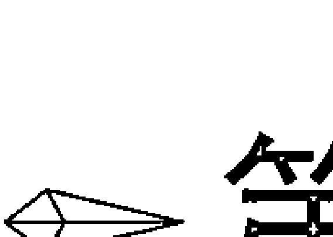

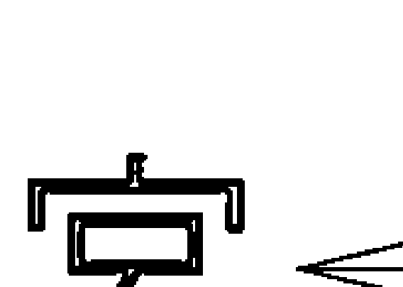

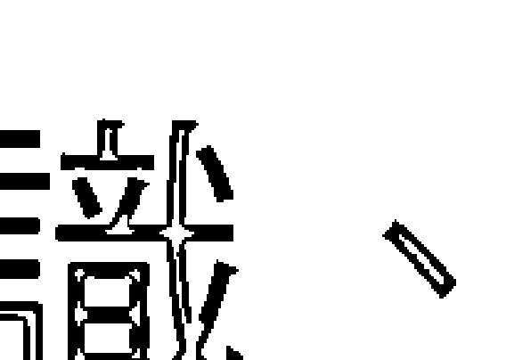

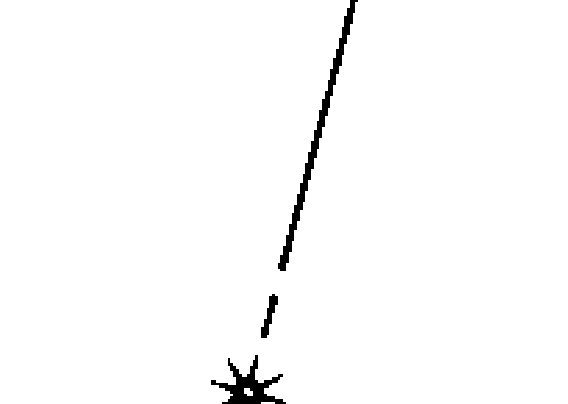

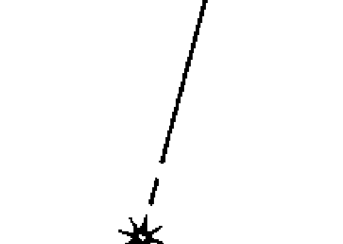

## 月亮

### 重視心靈交流的浪漫主義者

月亮落在第3宮的你，是比起滿口客套話，更喜歡內心交流的人。你是個浪漫主義者，渴望確實地與他人心靈相通。尋求著可以由衷信任、互相暢談的朋友，而非膚淺的關係，也喜歡讓對方高興，因此受人喜愛。你的想像力豐富，有著繪畫、音樂、影像等方面的才能。當形成凶相位時，可能會心血來潮地冒出想漫無目的地旅行的想法，當想喘口氣或是讓生活產生幹勁時可以考慮。

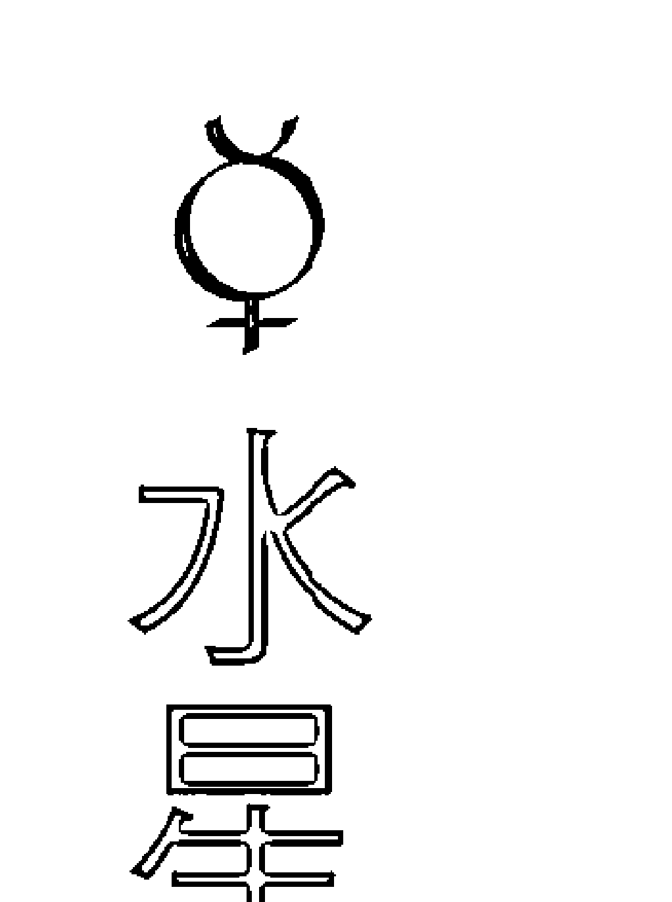

## 水星

### 有著以語言品味令人愉悅的才能

水星落在第3宮的你，是透過閱讀或與人交談來拓展求知慾的人。因為腦子轉得很快，理解力也高，而能在短時間內學會各式各樣的事。你具有文采，並長於話術，善於用文章或談話來取悅他人，很有可能在足以充分發揮這份才能的工作上活躍。若是藉由旅行汲取靈感，更能大為活躍。當形成凶相位時，可能會有草率發言或愛講道理的傾向。不僅是仰賴言詞，採取誠摯的行為也很重要。

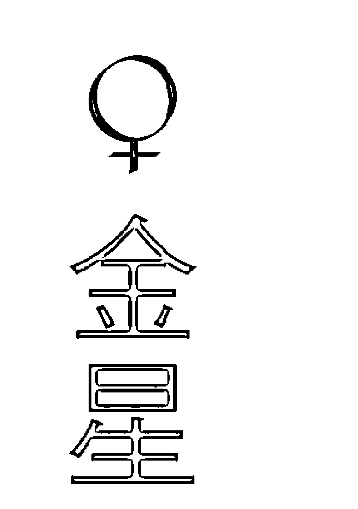

## 金星

### 善於交際，華麗的藝術家類型

金星落在第3宮的你是個對各種事物都很感興趣，博學多聞且求知慾強的人。其中，屬於藝術、音樂、文藝方面的興趣或才華格外顯眼，有些人會在該領域活躍。似乎有許多透過旅行來接觸、體驗藝術的機會。你擅長以沉穩的說話方式吸引他人，與人融洽相處，善於交際，與包括自己人在內的眾人關係良好，而有許多人願意提供協助。當形成凶相位時，要注意別過於八面玲瓏，導致與異性起糾紛。

# 火星

火星落在第3宮的你，是對於社會動向或資訊很敏感，對學習最新知識有強烈意識的人。也有將獲得的資訊回饋社會的資質。以好奇心在社會上派上用場的領袖氣質。

# 木星

木星落在第3宮的你，是能從朋友或夥伴身上接受良好刺激並成長的人。人際關係良好，有幸獲得家人、身邊之人的大力支援。你也能在平靜的環境中孕育出深入確認事物的深思熟慮、富有哲理的思想或話語，並將這份天賦發揮在教育或寫作活動上。旅行會為你帶來大幅成長與眾多好運，與在目的地遇到的人之間的緣分，會成為進一步開闢道路的契機。當形成凶相位時，要注意過度擴大事業範圍，而是專注於目標上。哲學性思想吸引許多人。

# 土星

土星落在第3宮的你，孩童時代即使對讀書或學習感興趣，也沒有許多深入學習的機會，因此在長大成人後，會積極地把握學習機會，靠上進心與專注力成長。你雖然沉默寡言，但認真、默默學習的態度獲得高度評價，也受到周圍人們信任。與工匠般的氣質相通，與古都也很有緣分。當形成凶相位時，會有迴避新知識而採用保守方法的傾向。如果能更新思考方式，成長的機會也會隨之增加。重視學習機會，以進一步成長為目標。

# 天王星

### 以自由的想法改變世界的創意人士

天王星落在第3宮的你，想法或行動顯得遠離現實，容易給人怪人的印象。實際上，你有以不拘泥於框架的點子，創造出有用物品或機制的可能性。雖然可能不受長輩理解，但有的人能在IT或科學領域提出劃時代的想法，並推動了發展。當形成凶相位時，事情可能不會如預期進展，而令人焦躁。成功的關鍵是改變毫無計劃的行動，不懈怠地做好準備，有耐心地不追求立竿見影的結果。

# 海王星

### 具有卓越直覺力、想像力的感性之人

海王星落在第3宮的你，容易受神秘現象、幻想、精神世界等事物所吸引，有重視感官事物的傾向。尤其是孩提時期，常會帶給人「難以捉摸的孩子」的印象。實際上，你的感受性豐富，理解他人感受的能力也十分優秀，在人際關係上不會有大問題。當形成凶相位時，在面對他人時會有消極性格強烈的傾向。如果很難直接傳達想法，請嘗試使用訊息等文字方式溝通。

# 冥王星

### 分析事物或人心，並合理地行動

冥王星落在第3宮的你，是合理劃分自己所需及不需要的事物，並徹底積極處理問題的類型。因此你的思考方式或行動也顯得極端。有些人在感興趣的領域成為專家。由於你善於察言觀色，在談判中也能掌握對方的心意，實現希望。凡事都有明確的目的，鮮少有多餘的行動。當形成凶相位時，容易批評別人，不要忘記體貼的心。

## 第4宮

## 家庭、生活

包括天底在內的第4宮，代表的是一個人而言，作為根基的家庭環境或與家人之間的關係，還顯現了成長過程以及與父母之間的關係。這些對塑造一個人的個性或思考模式有很大的影響，因此解讀這個宮位，對於了解自己會有很大的幫助。即使這是令人想要別開目光的過去，也並非因為家人或家庭環境感到自卑，而是能成為跨越並向前邁進的契機，也能成為今後與家人之間關係良好的關鍵。此外，這也是代表居所、不動產、長大成人後家庭生活的宮位。

## 太陽

### 珍惜家人或家族，繼承眾多事物

太陽落在第4宮的你，是在溫暖的家庭中以滿溢的愛養育長大的人，許多人與家人感情要好，並過著經濟上無虞的生活。此外你有著強烈的重視家族的傾向，或者有代代相傳的不動產或財產。由於在充滿愛的環境中長大，因此很珍惜家人，家庭運到晚年都很穩定。當形成凶相位時，可能會覺得受到繼承的事物束縛而感到負擔。請珍惜家人的感情，思考什麼是最好的，並加以應對。

## 第2章 述說命運的星盤（透過進入宮位的行星來看人生主題）

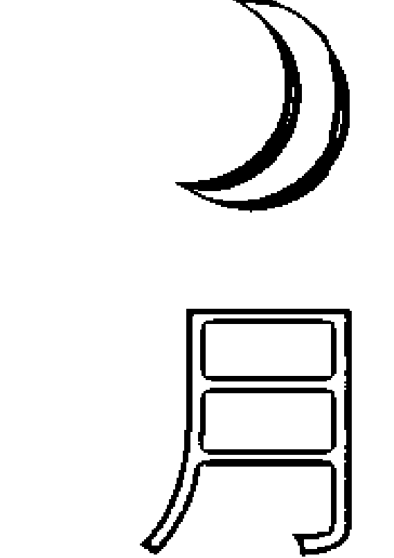

## 月亮

### 由於經常搬家，而對故鄉懷有強烈意念的人

月亮落在第4宮的你，經常搬家或家庭環境變化較多。原因各式各樣，有的人可能是因為父母工作的關係，而違背意願地轉學，或有與家人分開生活的經驗。也因此，不少人對家人或家庭有所執著，年紀輕輕就想擁有自己的家庭，也有人強烈依戀著出生的故鄉而返回。當形成凶相位時，可能會有孩提時代的親子關係拖延到成年後的情況。與母親的良好關係，對你的人生十分重要。

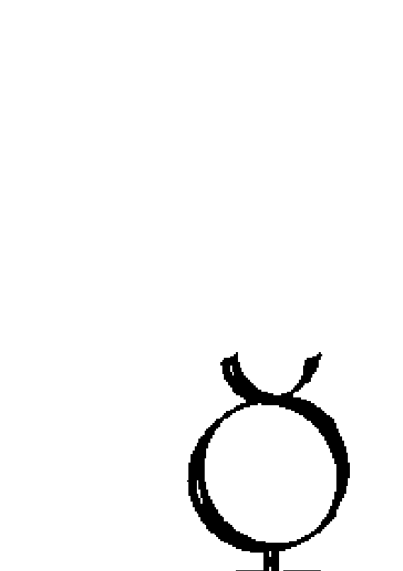

## 水星

### 廣泛的經驗孕育了豐富的人性

水星落在第4宮這種行星配置的人，多出生在充滿活力的家庭，由開朗的父母養育長大。家庭與親戚或鄰居的往來頻繁，少不了休閒娛樂或家族旅行。由於雙親熱衷於教育，有許多人因此不僅讀書學習，還有學習運動或興趣的經驗，而且有許多人的經驗會與一輩子的興趣或工作相結合。當形成凶相位時，容易經常搬家，人際關係淡薄。不過，每次搬家都能鍛鍊你在當地交友的社交能力。

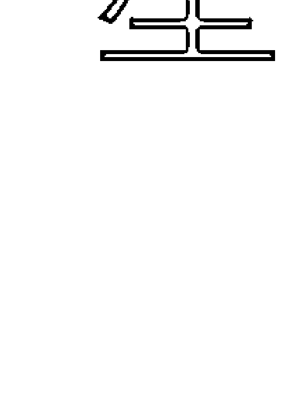

## 金星

### 出身良好吸引了幸福的家庭運

金星落在第4宮的你，有著從家人身上獲得許多愛，經濟上也不虞匱乏的家庭環境。因此許多人的特徵是性格沉穩而溫柔。在結婚之際，你會希望建立一個如同養育自己長大的家庭般溫暖的環境。到了晚年，也會在家人的陪伴下過著精神穩定的生活。當形成凶相位時，會有疏於整理家務的情況。由於屋子裡亂七八糟，內心也會紊亂，因此請注意平時就要保持整潔。

# 火星

火星落在第4宮的你，大多是與家人常有爭執、雙親感情不睦等不穩定的家庭環境中成長。有的人或許因為討厭死板的氛圍，而與家人保持距離。因此你有強烈的獨立心，會早早就離開家。也有很多人在學校的成績很好，並在體育等方面嶄露頭角。你能明確地思考未來，具備獨立生活的能力。當形成凶相位時，可能會有遭遇意外或麻煩的情況，小心火災和失竊。

# 木星

木星落在第4宮這種行星配置的人，會有一對寵溺孩子的雙親，以滿溢的愛將你養育長大。經濟方面也不虞匱乏，是「不知人間疾苦的大小姐、大少爺」，也有的人處於可繼承財產的立場。良好的教養也體現在品格上，並因此招來幸福的人生。當形成凶相位時，可能會出現父母保護過度的負面作用，令不諳世事的任性態度變得顯眼。而且會顯現出浪費癖，可能會有失去不動產的風險，得客觀地審視自己，並重視關心他人。

# 土星

土星落在第4宮的你，可能是由對孩子漠不關心，或相反地過於嚴厲的父母養育長大的。在經濟方面或許也有過困苦的經驗。在家裡自由受到限制，令你感到拘束。這份忍耐或壓抑的經驗，會培養精神上的強韌或耐力，並對自身嚴格。當形成吉相位時，這份精神力會有正面作用，構築起令人有安全感的家庭或財產。別因為不合理的過去而低聲下氣，積極正向的態度會帶來好運。

# 天王星

### 在獨特的家庭中成長，獨立心旺盛

+   ＊ ＊ ＊ ＊

天王星落在第4宮，暗示著你有對自由奔放的父母，構築起有些奇特的家庭環境，並在這不受形式拘束的家庭中成長。由於雙親以自己的人生為中心，使得你們之間的關係顯得有些冷漠，因此你的獨立心強，有的人年紀輕輕就獨自謀生。認為依賴他人是錯的，人際關係可能會顯得淡薄。當形成凶相位時，可能會有工作不穩定或居無定所的情況。為了避免遇到突發問題而驚慌失措，建議事先儲蓄。

# 海王星

### 在家的孤獨時間培養著感受性

+   ＊ ＊ ＊ ＊

海王星落在第4宮這種行星配置的人，常有在複雜的家庭環境中成長的情況，比如說父母經常不在家，或是由父母以外的人養育等。你可能會因此感到不安或寂寞，對於自己的家庭與別人不同而感到自卑。因此在精神上不太穩定，有過度尋求他人的愛的傾向。你也有愛作夢的一面，會從現實別開目光，在幻想世界中遊玩。當形成吉相位時，這份特質會起正面作用，令人鍛鍊想像力，有的人會在具創造性的工作上獲得成功。

# 冥王星

### 在「家」與「自己的想法」之間搖擺不定

+   ＊ ＊ ＊ ＊

冥王星落在第4宮的你，處於無論是好是壞，都從「家」繼承了許多事物的立場，不僅是財產或不動產，還有家業等，視情況或許可能會被迫走上自己不想走的道路。從孩童時代起，可能就會因為「出生在這個家中」這個理由，而被決定了出路或職業，並因此感到痛苦。你受到落伍的家庭障礙所苦，無法與家人融洽相處，可能會遭受精神上的傷害。當形成吉相位時，能藉由依據自身信念採取的行動，獲得財力或能夠接受的人生。

## 第5宮

## 戀愛、娛樂

在人生當中，「喜悅」或「快樂」極為重要。就算再有錢，如果感覺不到購物的喜悅，或是無論有多受歡迎，卻找不出戀愛的喜悅，就會顯得空虛。即便是周遭認為「應該很幸福」的狀況下，如果那並非當事人由衷追求的事物，就稱不上真正的幸福。
在這個宮位，可以檢視一個人真正追求的喜悅或幸福的形式。比如說，休閒娛樂等所有遊樂、製作物品、產生藝術的創作活動、比賽或賭博，當然還有戀愛、育兒。請在此確認自己所追求的是何種幸福。

## 太陽

### 擅長享受戀愛，光鮮亮麗的當紅人物

太陽落在第5宮的你，即使身處眾人之中也十分顯眼，是具有華麗氛圍的人。你對時尚十分感興趣，是如果被人稱讚「真棒」會非常開心的類型。參加或主辦能展現自身時尚品味的派對，最能自我推銷，因此十分積極。而在戀愛方面，有自由奔放的傾向，你是受歡迎的類型，一生中會有許多戀愛經驗，也是喜歡賭博的人。但是，當形成凶相位時，要注意避免深入。

## 月亮

月亮落在第5宮的你是深情且溫柔的人，因為愛照顧人且親切，能從照顧他人之中獲得喜悅。而且由於你的感受性十分豐富，在美術、工藝、攝影或設計等創作性事物上有著天賦。整體來說，你的作品就如個性一般溫柔，因此製作特別以女性或孩童為對象的作品，可能會大受歡迎。當形成凶相位時，容易過於依賴情人。請注意不要陷入若是沒有對方就什麼都做不了的狀態。

## 水星

水星落在第5宮的你，由於很有智慧，而容易熱衷於知性的興趣上。比如說沉迷於猜謎節目，甚至實際去參加。你可能會為了學習外語或考取證照而去上相關課程，這與是否能派上用場無關，而是你能從中感受到獲得知識的喜悅。話雖如此，由於你擅長經商或文采，而很有可能透過所學獲得成功。你會尋找能共享知性興趣的情人。當形成凶相位時，會有見異思遷或坐立不安的感覺。

## 金星

金星落在第5宮的你，是美感意識很高的浪漫主義者，會為了維持美麗而努力不懈。被人稱讚看起來比實際年齡年輕或時尚，就是你最大的喜悅。你會將藝術鑑賞作為興趣，也熱衷於創作活動，會鍛鍊自己的技能，製作出美好的事物。在戀愛上追求華麗，並善於營造氣氛。當形成凶相位時，可能會無法停止奢侈浪費，或沉溺於戀愛中而導致生活變得紊亂，需要特別注意。

# 火星

### 尋求刺激與戲劇性，熱情且戀情豐富的人
＊ ＊ ＊

火星落在第5宮的你會從品嚐刺激感中獲得喜悅。愈是刺激，就愈會令你湧現鬥志，並飛撲過去。此外，你也喜歡活動身體，適合從事所有運動。在美體美容方面，可能會超脫興趣的範圍而成為工作。在戀愛方面，你也是尋求興奮的類型，有許多戲劇性的戀愛經驗，但容易採取不瞻前顧後的行動。尤其在當形成凶相位時，容易引來戀愛上的麻煩，要格外注意。

# 木星

### 熱愛藝術，支持藝術家的愛情勝利者
＊ ＊ ＊

木星落在第5宮的你喜歡藝術領域的人，是比起本身從事創作活動，更喜歡欣賞藝術的類型。比如說，你會從發現不為人知的作品並加以推廣這件事中感受到喜悅，也可能會在作為贊助人的支援中找到樂趣。在戀愛方面，你尋求的是平安穩固，容易獲得戀愛機會，並不會讓認定「就是這個人！」的對象逃跑，而順利進展到結婚。當形成凶相位時，沉溺於快樂的傾向較強。

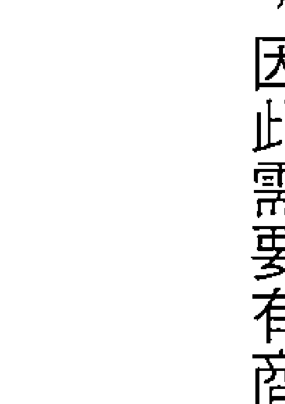

# 土星

### 追求堅定不移的戀情與務實娛樂的謹慎型人物
＊ ＊ ＊

土星落在第5宮的你，是對於未經深思熟慮的享樂不感興趣的類型，如果是沒有實際利益的休閒娛樂，就無法令你感到快樂。你追求的是能獲得經濟利益或自身成長的事物，甚至認為頭腦空空地遊玩的行為毫無意義。在戀愛方面，總之就是堅定不移的謹慎型，能從一心一意地愛與被愛當中感到幸福。無論有多受異性歡迎，只要有個摯愛的對象在身邊，就能心滿意足。當形成凶相位時，可能會談一場艱辛的戀情，因此需要有商量對象。

## 第2章 述說命運的星盤（透過進入宮位的行星來看人生主題）

### ☆天王星
非常歡迎跳脫常識或醜聞的自由之人

天王星落在第5宮的你，是略微古怪的人，你的興趣或感興趣的方向也很奇特，對於偏門的領域較感興趣。雖然周圍的人很難理解，但你本人並不在乎。由於你原本就擁有出色的創造力，如果徹底掌握，甚至可能成為權威。在戀愛方面，你不會受常識束縛。尤其在當形成凶相位時，可能會主動跳進會引發醜聞的戀情中，讓自己與對方的立場變得危險，不要忘記保持冷靜。

### ♆海王星
擁有獨特世界觀與戀愛觀的浪漫主義者

海王星落在第5宮的你，是憑感覺思考事物的人。靈感優秀，能從構築獨特的世界中感受到喜悅。在藝術領域，會創作出常人無法理解的作品，有可能在該領域大為活躍。在戀愛方面，你有追求浪漫的傾向，原本就很有魅力，機會也不少，你還會主動營造有氣氛的環境，令異性深受吸引。當形成凶相位時，容易導致三角關係或更為複雜的關係。

### ♇冥王星
愛著獨特的世界，貫徹一心一意的想法

冥王星落在第5宮的你，對獨特領域感興趣的人，常會注意到他人不太感興趣或盡量避免的黑暗領域。比如你關注生物的死亡，或對於與死比鄰的強烈事物感興趣，並因此無法獲得周遭理解而遭到孤立。你喜愛激烈的戀情，只要是心愛的人，願意獻上自己的一切。當形成凶相位時，可能會有在戀愛上受傷害的經驗，需要保持冷靜。

## 第6宮

## 勞動、健康

第6宮代表的是為了生活、與社會相連繫而應盡的義務、責任或能力。說到為了生活所需的事物，第一項就是工作，因此，這個宮位主要提及的就是與工作相關的事物。由於也有人不需工作就能維生，因此在這種情況下，請將這個宮位的內容解釋成身為社會中的一分子，應盡的義務或責任的內容。

第6宮也能用來判斷工作的適應度、工作方式，究竟是隸屬於組織中較能發揮能力，還是獨立工作型態較佳？以及最適合一個人的工作方式、職場上的上下關係或人脈等中得知在健康方面應該注意的事項。此外，也可從人際關係方面的事。

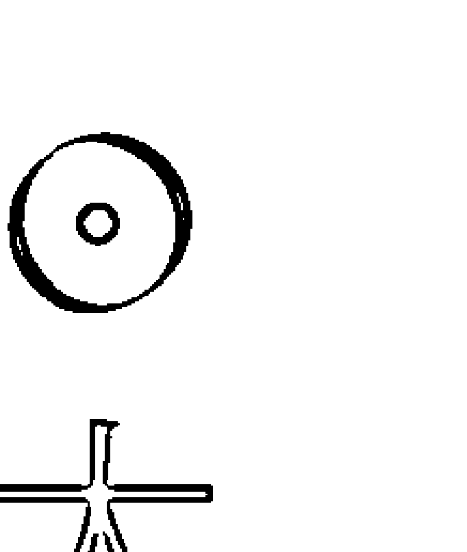

## 太陽

### 在組織中才能發揮真正價值的人

太陽落在第6宮的你是個認真且實務能力優秀的人。即使是毫無變化，需要耐心面對的麻煩工作也能確實完成。你得身在團體當中才能發揮實力，而你也清楚明白這一點，為了履行自己的職責而在組織中努力貢獻，反而不太擅長獨自創業並立於頂點。你因為責任感強而容易工作過度，需要做好健康狀況管理，避免過勞。當形成凶相位時，千萬別輕忽心臟等循環系統的問題。

## 第2章 述说命运的星盘 （透过进入宫位的行星来看人生主题）

### 富有志愿精神的支援类型

月亮落在第6宫的你是富有志愿精神的人，工作的目的是为了对社会有所助益。你喜欢工作，即使要加班或在假日上班都不以为苦。在职业种类方面，你很容易从高公共性质的工作或大众性质的工作中感受到人生价值。比起独立创业，身处组织中更能发挥实力。不过，你容易体力不足，需要定期休息。当形成凶相位时，肠胃方面较弱，需要注意定期健检及纾解压力。

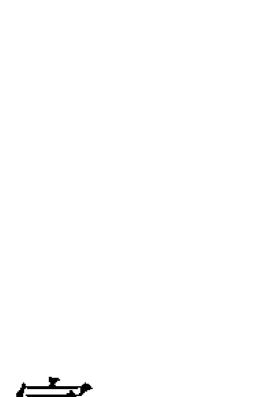

### 兼具出色谈判技巧及高智商的脑力劳动者

水星落在第6宫的你是个脑子转得很快的人，由于适合所有需要脑力劳动的工作，如果从事需要精细计算、文书处理相关的工作或担任研究人员等职务，就能尽情发挥能力。此外，由于你善于谈判，也很适合从事事务或客服服务的行业。因此，虽然即使独立创业也能获得一定程度的成功，但还是隶属于组织更能活用自身能力。在健康方面，需注意因压力引起的肠胃炎或操作电脑导致的腱鞘炎。当形成凶相位时，容易被人误会，需记住随时诚实待人。

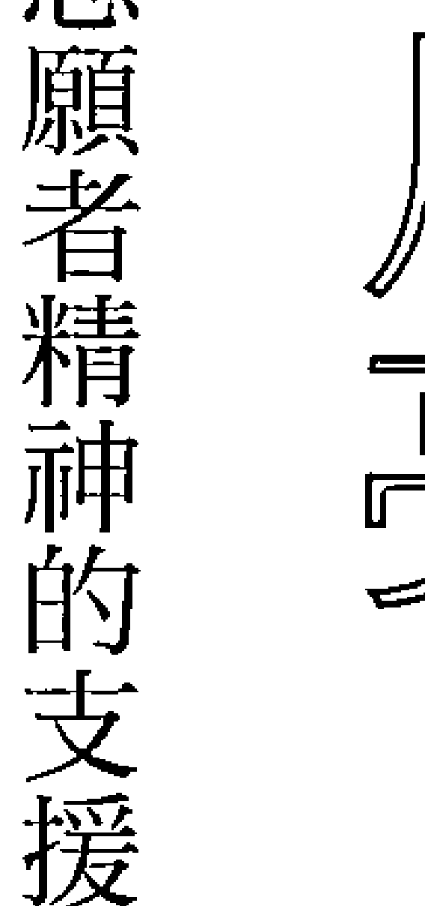

### 优秀的艺术品味与出类拔萃的协调性是强项

金星落在第6宫的你是个艺术品味优秀的人，不分类型，适合所有设计或艺术方面的工作。另一方面，你既不需要体力的工作，也无法从中找出人生价值。你的性格温和，所以即使创业也不会有太大困扰。若是独立创业的情况，设立容易沟通协调的小公司就会顺利。在健康方面，需要注意因压力引起的咽喉疾病或腰痛。当形成凶相位时，需注意别因为优先考虑自己的方便，而导致获得负面评价。

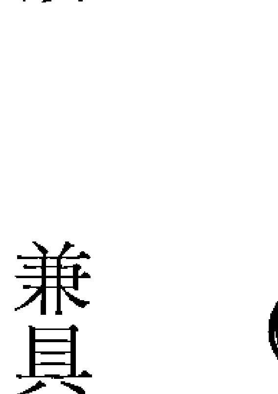

## 第6宫 劳动、健康

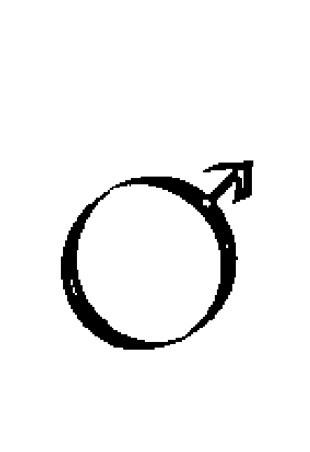

### 精力充沛且具领袖气质的实力主义者

火星落在第6宫的你是在工作上精力充沛的人。喜欢在实力主义的世界中受到锻炼，并在这样的场所崭露头角，充满活力。你适合从事需要竞争业绩的业务或销售工作，担任常需要移动、体力活的工作，由于具备领袖气质，独立创业也会成功。在健康方面，需注意工作过度造成过劳，或因粗心导致受伤。当形成凶相位时，有对晚辈或部下过于严厉的倾向，要顾虑到对方的感受。

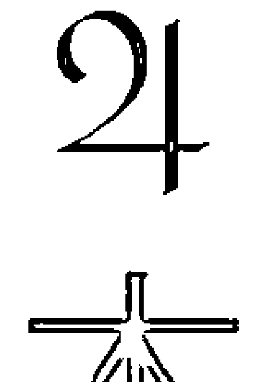

### 富有伙伴及工作运，努力也容易获得回报

木星落在第6宫的你，是个一辈子在工作及人际方面都富有好运的人。而你也是努力就会获得相应的回报，收入会随之增加的类型，可以说是十分幸运的人。比起在办公室做内勤，在外走动的工作更容易发挥你的才华，因此适合从事事业或服务业。由于很有人望，也推荐独立创业。在健康方面，不需要太过担心。不过，当形成凶相位时，要注意过度自信。也容易暴饮暴食，需注意肥胖或肝脏疾病。

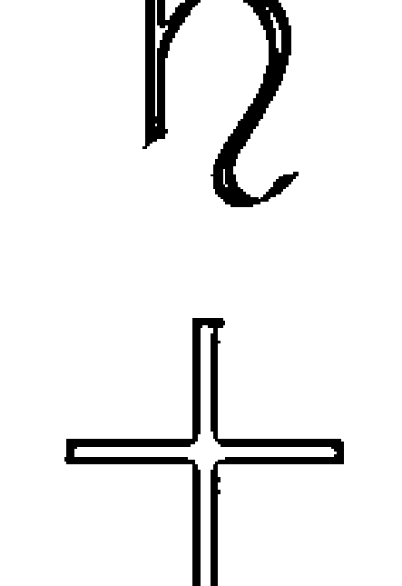

### 以天生的责任感与坚韧度为信条的努力之人

土星落在第6宫的你是个责任感极强的人，会竭尽全力处理交办的工作，并完美地完成，也能无怨无尤地达成需要耐心的麻烦工作。你会在无名英雄一类的工作、林业、不动产业等与土地相关的职场上发挥能力，建议从事需要坚韧度的工作。比起独立创业，待在组织中更为稳定。在健康方面，需注意皮肤病、关节疾病或骨折。当形成凶相位时，要小心因疲劳而引发麻烦。

## 第2章 述说命运的星盘 （透过进入宫位的行星来看人生主题）

### 天王星 ♅

活用独特的想法，令才华开花结果

天王星落在第6宫的你，是拥有丰富才华，潜藏各式各样的可能的人，才华能在需要运用专门知识或技术的工作上开花结果。如果从事文书职务等幕后工作的职业，或是重复单调的工作，你很快就会厌倦。由于你拥有独特的思考方式，以自由业者的身分工作，会比起置于身于组织中增加更多活跃的机会。在健康方面，需注意不规律的生活可能会带来负面影响。当形成凶相位时，有再换工作的危险，有时忍耐也是必须的。

### 海王星 ♆

会在艺术相关的工作或疗愈人心的工作上活跃

海王星落在第6宫的你是拥有卓越直觉或想象力的人，可在设计或艺术领域发挥能力。不过，你缺乏注意力，态度上也难以说适合担任下属，因此与其期望在组织中晋升，选择独立创业的可能性更为宽广。你也适合从事为人奉献、疗愈他人的服务业。在健康方面，需担心因依赖烟酒或咖啡等嗜好品而使健康受损。当形成凶相位时，在职场上受人利害的情况会增加。因此请确实公私分明，并学会如何说不。

### 冥王星 ♇

追求价值，期望依循信念工作

冥王星落在第6宫的你是期望能怀着信念工作的人。即使是伴随危险的工作，只要能从中感受到价值，也能将其当作天职。倒不如说，越是特殊的工作，对你来说越有魅力。你不太擅长建立人际关系，因此需要经常与人往来的工作，往往会让你感觉到压力。在健康方面，生殖系统或排泄相关器官容易出问题，因此需定期检查。当形成凶相位时，工作上会有起落，请记住临机应变地应对。

## 第7宫

### 婚姻

以下降点作为起始点的第7宫，是代表伙伴的宫位。虽是外人，但与你有很深的关联，当听到这样的「伙伴」时，首先浮现脑海的想必是结婚对象吧。当然，结婚对象可说是这个宫位最重要的存在。在这个宫位中，可解读你容易遇到怎样的结婚对象、你期望的对象类型、根据伴侶对象不同，人生会有怎样的变化等。此外，除了结婚对象，这个宫位同时也司掌了各种形式的伙伴。比如说在工作职场组成搭挡的对象或竞争对手、一生的挚友，或是创业之际的工作伙伴等。

### 太阳

太阳落在第7宫的你，会获得开朗活泼，经济方面也有益的伙伴，倘若是契合度高的组合，就能过著连在精神方面都十分充足的生活。如果是结婚对象，不仅会是一对恩爱的夫妻，还能提升你的社会地位；如果是工作伙伴，将会以合夥者身分为你大显身手，将你导向成功。当形成凶相位时，于公于私都会出现棘手的竞争对手，不过，只要忍耐应对，还是可能并肩合作。

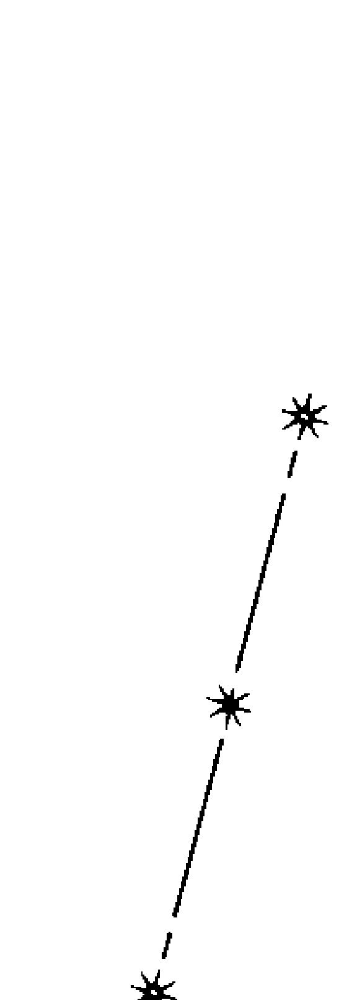

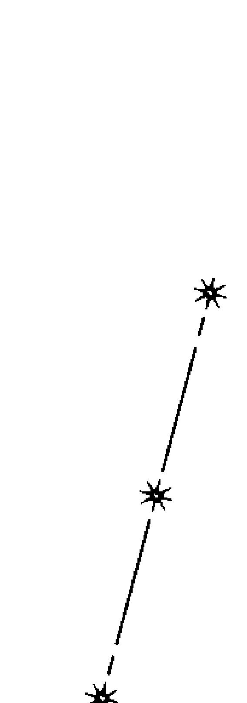

## 第2章 述说命运的星盘 （透过进入宫位的行星来看人生主题）

## 月亮

#### 强烈渴望结婚，也寻求着工作搭档

月亮落在第7宫的你，强烈渴望结婚，并希望有人能在工作上及追求梦想上陪伴着你。月亮落在第7宫的特征，是根据相位不同，状况会大幅改变。当形成凶相位时，容易过度追求理想而看不到现实，即使决定了伙伴，仍会三心二意而定不下心。当形成吉相位时，会拥有充满爱情的平稳婚姻生活，也能解释成获得工作上的好伙伴，特别有很高的可能在受欢迎的生意上获得成功。

## 水星

#### 伙伴带来的人脉会拓展机会

水星落在第7宫的你，期望伙伴是拥有高智慧，能与你共享知识性兴趣的人物，而在结婚对象方面，你会选择善于交际且聊得来，凡事都能一起享受的人物。藉由共享彼此的人脉，将产生新的邂逅，兴趣、乐趣及好奇心的幅度也会随之扩展。在工作上，各方面都会获得人脉的有力人士协助；在日常生活上，也能期待与知识分子之间的交流。当形成凶相位时，会因伙伴的虚伪不成实而烦恼。

## 金星

#### 获得最棒的伙伴，丰富精神面以及物质面

金星落在第7宫的你，在婚姻、工作或人际关系各种情况下都能获得很棒的伙伴。如果是结婚对象，会是能向周遭炫耀的伴侣，并过着经济方面不虞匮乏、爱情满满的婚姻生活。由于你能与任何人建立良好关系，获得好伙伴，因此在工作方面会吸引众多良缘，如合夥伙伴或赞助商。当形成凶相位时，无论公私都容易显露散漫的一面，导致错失机会，必须有所自觉并严以律己。

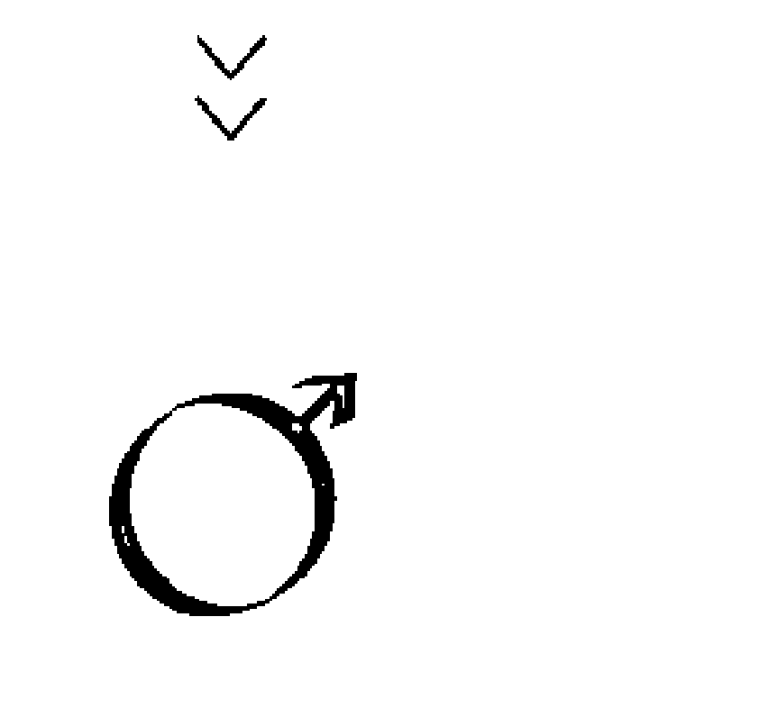

# 火星

#### 与工作或恋爱上的伴侣建立具刺激性的关系

火星落在第7宫的你有对伴侣热情如火的倾向，当你陷入热恋，可能会完全看不见周遭，并在短时间内决定步入婚姻。此外也有与伙伴竞争的倾向，在工作方面，你会从与竞争对手较劲的过程中感受到价值。当形成吉相位时，会与伙伴建立私下互相切磋琢磨、互相成长的关系；当形成凶相位时，则可能将自己的想法强加于人，必须注意热度，并且不吝于关心体贴。

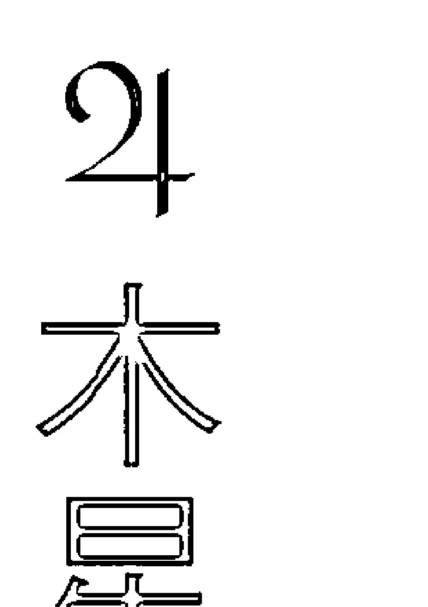

# 木星

#### 在工作、交友及婚姻上，都获得最棒的伴侣

木星落在第7宫的你，无论在人际关系、工作还是婚姻上，都能获得诚实且可靠的伙伴。你的结婚对象很可能有崇高的社会地位，并营造富裕的生活。如果选择受到周遭祝福的对象，就能获得最棒的幸福。无论你是否意识到自身有这样的运势，对人都十分宽容，因此能建立良好人脉，并自然而然地吸引好伙伴。当形成凶相位时，婚姻生活会起波涛，记得与对象保持良好的沟通。

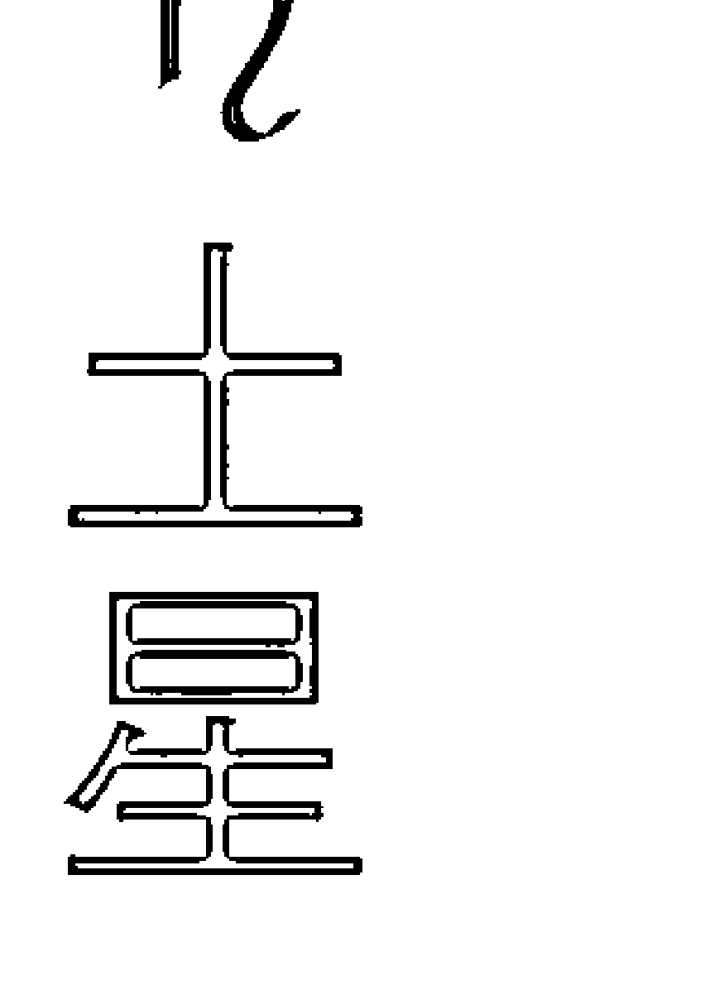

# 土星

#### 与拥有地位的年长伴侣相结合

土星落在第7宫的你，有着不善于处理人际关系的倾向，是需要耗费长时间建立信任关系的人。你的结婚对象很可能既勤勉并拥有地位，而且相当年长，但只要不疏于沟通，就不会因年龄差距而造成弊病，可过着平稳的婚姻生活。在工作方面，你可能会获得并非共同事业，而是生意客户或支持者身份的好伙伴。当形成吉相位时，在面临困难后，对方将会成为一辈子的伙伴。

## 第2章 述说命运的星盘（透过进入宫位的行星来看人生主题）

### ♅ 天王星

天王星落在第7宫的你，在婚姻方面是贯彻独特风格的人。有可能会选择不寻常的形式，比如说未登记的事实婚、分居婚或契约婚姻等。你喜欢与众不同的类型，会获得拥有非比寻常价值观或感性的伙伴。在工作方面，比起发展共同事业的伙伴，更建议你建立若即若离的伙伴关系。当形成凶相位时，请小心因反复无常而引发问题。

## ♆ 海王星

海王星落在第7宫的你，是强烈憧憬着婚姻，并追求梦想或浪漫的人，有可能会与艺术家或演艺圈相关人士结婚。但如果这个愿望变成妄想，就可能看错对象，请仔细确认，别选到欠缺道德观或责任感的对象。在工作上你必须培养看人的眼光，避免被看似成为伙伴的对象利用。当形成凶相位时，可能会以情绪决定事情，并感到后悔。越是重要关头，越要保持冷静。

## ♇ 冥王星

冥王星落在第7宫的你，无论在工作上或婚姻上，都会有堪称命运般的邂逅，是与伙伴之间有强烈情谊的人。你会为了结婚对象牺牲奉献，总是将伴侣放在第一位，是人生会因婚姻而大幅改变的类型，需要注意别对伴侣过于执着。在工作上，你会发挥谈判能力，建立良好的伙伴关系。当形成凶相位时，会有一旦将事情往坏处想就停不下来的倾向，建议培养一套让自己摆脱低潮的方法。

## ☀ 透过进入宫位的行星来看人生主题 ☀

## 第8宫

### 继承、性爱

第8宫是司掌「继承」与「性爱」的宫位。继承包括一个人会获得的各种形式的财产，并不仅限于从的血亲那里继承的事物，还包括因双亲、亲戚、配偶等死亡而获得的、有形、无形的遗产，以及生前移转的财产或权利等。即使认为就现状而言，「没有这样的亲戚」、「对自己而言是不可能的事」，但状况不知何时何地会产生变化。此外，关于「性爱」方面，可以确认一个人的性观念。具体而言喜欢怎样的性爱、实际上经历过怎样的性经验等，此外也包括结婚后的性生活充实度或问题等。

### 太阳

经济状况及地位会因继任或继承而提升

太阳落在第8宫的你，很有可能因为从他人手中继承了财产或地位，使得社会地位提高。或是缔结师徒关系的对象，提高你作为继承人的立场。任命你为继承人，或从双亲、亲戚那里继承遗产。在性爱方面，若要说的话，是属于开放方面，你期待的是轻松而健康的性爱，与伴侣之间也有良好的性生活。当形成凶相位时，容易让异性误会你有那个意思，或是被怀疑出轨而引发问题，言行举止要小心谨慎。

## 月亮

婚后变化多，内心的联系十分重要

月亮落在第8宫的你，与财产或地位的继承没什么缘分。婚后生活容易起变化，配偶的资产状况也显得不太稳定。话虽如此，因为你重视人与人之间的联结，甚于财富，只要爱的实际感触就会幸福。你认为性爱是确认彼此爱情的重要沟通方式，十分重视营造浪漫气氛或情感上获得满足。当形成凶相位时，灵性方面的感受性强，容易被人影响，需要小心。

## 水星

继承前人知识或技术的知识分子

水星落在第8宫的你是继承知识或技术甚于物质事物的类型。有的人会拜工匠或艺术家为师，学习专业知识。你容易对神灵相关的事产生兴趣，也可能继承宗教相关的产业。请小心别被卷进继承财产的争端中。当形成凶相位时，要避免与契约相关的专断或臆测。在性爱方面，你是追求变化的类型，但会想与伴侣一同享受，性生活大致令人满意。

## 金星

容易藉由婚姻或继承变得富裕

金星落在第8宫的你，容易过着不虞匮乏的生活，尤其可能藉由找到金龟婿而嫁入豪门，即使伴侣身份寻常，也会从周遭获得某些协助。由于你有强烈的性魅力，而深受异性瞩目，也有许多性方面的机会，而你本身也极有性方面的兴趣。在性爱方面，相较于精神面，你更重视肉体上的结合或满足感，因此如果遇上有技巧的对象，可能会有沉溺于性爱的倾向。当形成凶相位时，要注意灵性相关的问题。

## ♂ 火星

获得及失去财产的机运均会突然造访，稍纵即逝

火星落在第8宫的你可能会意外继承他人地位或财产。由于你拥有理财才能，只要能巧妙运用，就能过着富裕的生活。不过，也有容易因失窃或灾害等失去财产的一面，因此事先采取对策也是很重要的。你在性爱方面虽然积极，但瓶颈在于容易想要支配对方。当形成凶相位时，可能会因为一时的情绪而采取行动，导致伤害他人，请学习在自身情绪高涨时该如何处理。

## ♃ 木星

婚姻会带来富裕的生活，提升财运

木星落在第8宫的你，很可能会与经济实力雄厚的人结婚，并过着富裕的婚姻生活。抑或是你的配偶会继承遗产或获得金援。总之是因为婚姻而让生活变得富裕的类型。在工作方面，也有获得投资者的运势。性爱方面有较为奔放，经历各式各样体验的倾向。当形成凶相位时，会有因出现浪费癖而把好不容易获得的财产耗尽的危险，请记得要保持坚定踏实的态度。

## ♄ 土星

不太能期待继承事物，但有留下财产的可能

土星落在第8宫的你，如果期待继承遗产、地位或金援等事，可能会落空。即使有继承的情况，也不要急于求成，慢慢进展才是上策。此外，请避免担任保证人或借用名义，为了避免遇到财务纠纷，必须小心谨慎。但若是，当形成吉相位时，就有继承不动产的可能，若能发挥管理能力，就可累积一笔财产。你对性爱方面不太感兴趣，态度显得较为淡泊，即使是婚后，可能会因为配偶的态度而产生厌恶。

## 第2章 述说命运的星盘 （透过进入宫位的行星来看人生主题）

# 天王星

容易由于经济问题，导致婚后生活较不稳定

天王星落在第8宫的你，有因为配偶的财产或继承相关的事情，而导致家计不稳定的危险。有的人可能会遭遇意料之外的事态，比如说某人毁弃约定等。当形成凶相位时，或许会因为财务问题而卷入法律纠纷中；当形成吉相位时，在问题解决后将能获得好的结果。在性爱方面，你追求较反常奇特的内容，如果是接受这点的伴侣就没有问题，但需要注意别因此成为你与伴侣之间的火种。

# 海王星

比起仰赖财产，不如靠自己赚取较为可靠

海王星落在第8宫这种行星配置的人，难以期待从结婚对象那里获得财产。束紧钱包，脚踏实地赚钱更重要，如果坚定踏实，稳定的生活就能持续下去。在性爱方面，由于你是唯美派，重视氛围，因此对情境有所坚持，不过在性行为本身则容易流于被动。当形成凶相位时，有因疏忽大意或诈欺而失去大笔金钱的危险，请小心注意，尤其需要谨慎看待神秘学相关的事物。

# 冥王星

天生拥有嗅到赚钱机会的嗅觉

冥王星落在第8宫的你，对钱财有着敏锐的嗅觉，赚钱手段自不待言，还会获得从他人手中继承资产的机会。此外，你也擅长不主动采取行动，而藉他人的手获得财富。不过如果是期待带来财富的婚姻，就容易失败。你对性爱方面有浓厚的兴趣，也精力充沛，会为了过着充实的性生活而不遗余力。当形成凶相位时，会以自身利益为优先，或出现自我中心的言行举止，这点必须自重。

## 透过来自进入宫位的行星来看人生主题

## 第9宫

### 精神、向学心

相较于第3宫代表的是孩童时代获得智慧的方向，第9宫显示的则是更为高度深入的学问。透过这个宫位，可以了解一个人比起物质上的事物，更想了解的抽象事物、尚未见识的事物的想法，比如说思想、宗教、信仰与外国的关连方式等，以及想特别学习的专业领域为何。并透过这些内容获得全新的价值观，因此成长。此外也能从中得知将在生活过程中学习的事物或人生教训，并窥见未来的提示。如果有复数颗行星落在这个宫位，代表这个人与外国有缘，很有可能会出国旅行、留学、国际婚姻或在国外永久居留等。此外，也有人会培养身为国际人士的素养，因此大为活跃。

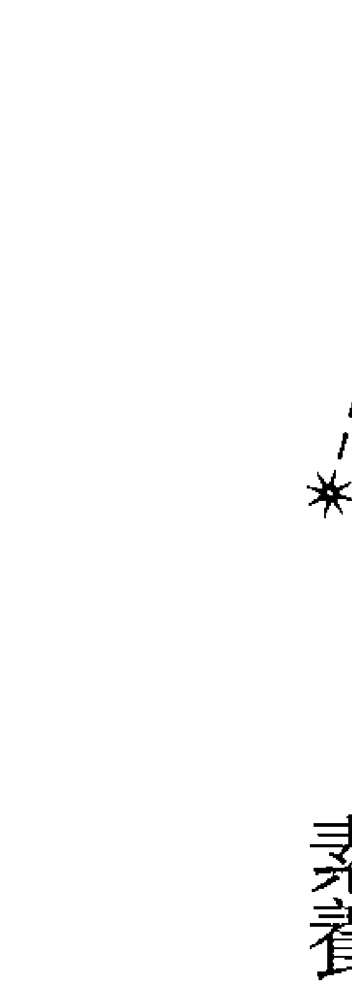

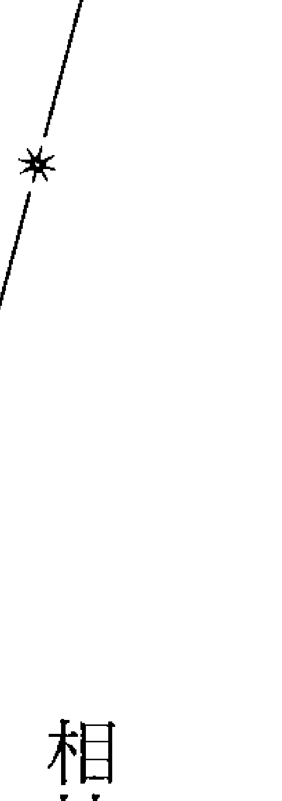

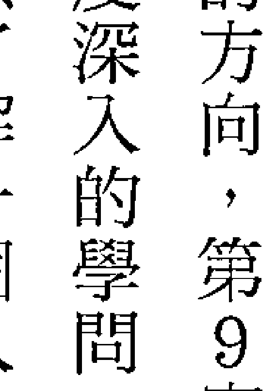

### 太阳

太阳落在第9宫的你有着强烈求知欲，会彻底追求感兴趣的事物，对于宗教、哲学、法律领域特别感兴趣。你会学习专业知识或技术，以全球性的活跃为目标，并将自身视为竞争对手，想像着未来获得成功的自己，不遗余力地努力。由于你与外国有强烈缘分，成功也不是梦想。然而，当有凶相位时，强烈的自我会是成功的绊脚石，因此需要忍耐。

## 月亮

将对外国的强烈憧憬化为现实

月亮落在第 9 宮的你，有着信仰心强烈的倾向，会相信能赋予你特定思想或哲学觉察的对象，并尊敬不已。可能会以此为契机，让你往后的人生大为改变。你对外国也有强烈憧憬，有许多长期旅行的经验。此外，你与海洋或船只也很有缘，也常会来趟船上之旅。当形成凶相位时，会欠缺耐心与耐力，令想法难以延续下去。为了让梦想与成功连结，就必须具备强悍的意志。

## 水星

以出类拔萃的表现力与求知欲为武器

水星落在第 9 宫的你有着强烈的求知欲，并一心向学，是会眨眼间吸收学习内容的类型。而且你的语文能力格外优秀，能在口译或翻译领域发挥才华，任职于贸易相关、外资企业的话，将会大为活跃。此外，也很适合从事写作，不问主题，你的表现能力将令许许多人为之沉迷。当形成凶相位时，可能会发生祸从口出的情况，需注意避免不负责任的发言造成周遭的困扰。

## 金星

开朗的和平主义者，会投入服务活动

金星落在第 9 宫的你，是个充满爱心的和平主义者。有的人会热衷于慈善义卖或义工服务，或是在世界各地奔走，企划慈善事业或活动。你也有许多外国朋友，很有可能会有国际婚姻或移居外国。此外，你潜藏着身为艺术家的天赋，善于创作出独特的世界，可以期待在相关领域大为活跃。当形成凶相位时，可能会因反复无常的一面而容易失去目标，必须不时确认自身的立场。

## 第9宫
精神、向學心

## ♂ 火星
好奇心強烈，
以旺盛野心持續挑戰

火星落在第9宮的你，是上進心及好奇心都十分強烈，總是持續奔跑著的人，會對宗教特別感興趣，而有熱衷於傳教活動的傾向。此外，你也會豎起資訊天線，仔細環顧周遭，對於與自己不同的環境或新事物十分敏感，並懷有強烈憧憬。你很有膽量，會毫不猶豫地踏進未知的世界。不過，當形成凶相位時，就需要謹慎行動，因為難保沒有在國外或出差地捲入問題的風險。

## ♃ 木星
於專業領域活躍，
也有向國外發展的可能

木星落在第9宮的你，是對任何人都十分慷慨，具有極為高尚精神的人。你對宗教、法律、專業領域的研究深感興趣，一旦下定決心的道路，就會全心投入。也可能會站在指導他人的立場上。此外，你與國外有緣分，藉由參與相關事情，會更容易獲得好運。在專業領域獲得高度評價，想成功向國外發展也不是夢想。不過，當形成凶相位時，容易擺出自信過度、高高在上的態度，千萬別忘了謙虛。

## ♄ 土星
踏實地累積努力，
在後半生獲得回報

土星落在第9宮的你是勤奮努力之人，比起外國事物，對於自己國家的傳統事物或思想更感興趣。此外，相較於追求眾多而嶄新的事物，你是屬於專注於一件事物上的類型。非常認真，甚至將娛樂或旅行都視為學習場所，絕不浪費。你會像這樣比一般人累積更多努力，並在後半生獲得回報。當形成凶相位時，有著強烈執著於自身想法的傾向，請記住要讓自己能靈活地應對事物。

# 天王星
發揮天才型才能的個性派類型

天王星落在第9宮的你是個思考方式非比尋常的人，對於平凡事物不太感興趣。你對科學或神祕學深感興趣，也很喜歡刻意為抽象類型的事物賦予理論邏輯。你若是尋求一個特定領域，將能發揮你天才型的才能，並獲得留名青史的成功。不過，當形成凶相位時，有被捲入意外事件的危險，尤其可能在外國遭遇奇特的事件，請謹慎行動。

# 海王星
帶有神祕氣質，直覺敏銳的人

海王星落在第9宮的你，是對於神祕學或靈性事物感興趣，也擁有能力的人，即使內心所想化為現實也不奇怪。此外，你帶有一股神祕的氣質，是令人們認為「不知道在想些什麼」的類型。在旅行方面，與有水的地方有緣，會帶來好運。不過，當形成凶相位時，會有產生強烈遠離俗世的想法。請注意別離開日常生活過遠。此外，這也暗示了你會在外國流浪。

# 冥王星
需注意別讓出類拔萃的注意力搞錯方向

冥王星落在第9宮的你擁有出類拔萃的專注力，並充滿求知欲，會廢寢忘食地沉浸於感興趣的事物之中。你也對魔法、心靈、宗教很感興趣，視情況而定，甚至會對人生有重大影響。此外，你如果交了外國朋友，或許會受對方影響，使得生活大為改變，甚至有人會終其一生待在國外。當形成凶相位時，你會有沉浸於異端思想的強烈傾向，必須注意別看不見周遭。

※ 透過進入宮位的行星來看人生主題 ※

## 第10宮
### 社交

相較於位於對側的第4宮代表的是家庭，以天頂（MC）為起點的第10宮顯示的是與社會的關聯。這顯示了一個人在社會上應努力的職責、目標，以及藉由努力可抵達的社會性終點，同時也是能夠了解地位、名聲、天職的宮位。不過，即使能恪盡天職，也未必能帶來財富，因為這也與第2宮的因素相關。此外，第10宮還顯示了與上級或領導者之間的關係，根據落在這個宮位的行星而定，有的人會因對方的提拔而掌握好運。此外，有許多顆行星落在第10宮的話，可說是一個將社會活動看得比家庭生活還要重要的人。

### 化為兇猛的工作狂，早早就發揮才能

## 太陽
太陽落在第10宮的你是個活力充滿至極的人，你相信自身的才能，會搭配所吸收的知識認真投入工作。你那相信努力終將開花結果而每日奮鬥不懈的身影，深據獲了周遭眾人的心，也會獲得長輩的賞識提拔，並確實掌握機會嶄露頭角，獲得地位或名聲。不過，當形成凶相位時，容易因成功而顯露驕傲自大或目中無人的態度。即使身處上位，也千萬別忘記要常保謙虛之心。

## 女性是掌握成功关键运势之人

月亮落在第10宫的你有著协调性，并重视人与人之间的联繫。你的个性温柔且待人和气，因此在周遭眾人之间也有人望。若从事以普罗大众为对象，尤其是以妇女或孩童为目标的工作，会缔造相当程度的实绩。此外，也可能因为女性有力人士作为后盾，而获得成功，但你本人并没有太大欲望。当形成凶相位时，或许会因为一时兴起换工作，导致危及你构筑至今的地位，需要持续努力。

## 藉由智慧能力与广闊人脉留下庞大实绩

水星落在第10宫的你，是能发挥智慧能力，顺利立身处世的人。你的沟通能力尤其出类拔萃，适合从事出版、通讯、资讯、贸易业界的工作。如果担任企划、业务、销售职务，或许会留下刷新纪录等级的实绩。此作，也能利用广阔的人脉来发展外，也会有『样样通，样样松』的情况。不过，当形成凶相位时，也会有『样样松』的情况。从长远来看，能获得更为专业的知识较令人放心。

## 在光鲜亮丽的世界得到强大后盾，获得成功

金星落在第10宫的你是凡事都能圆滑地处理的类型，适合需要审美品味的业界、光鲜亮丽的世界，而这也符合你本身的喜好。你能藉由活用设计或造型等方面的能力，或因为天生品味，大为活跃，也相当地受欢迎，而受到眾所瞩目。你也能得到拥有地位或财富的长辈作为后盾，因此获得成功。不过，当形成凶相位时，你也会有强烈地想坐享其成的倾向。请认清自己应做的事或立场，好好工作。

## 心懷野心闖逼競爭激烈的社會

火星落在第10宮的你是野心勃勃且懷有強烈爭鬥心的類型，嚴厲的社會對你而言算不了什麼。你會為了達成目的而不遺餘力地努力，並有強烈的獨立心，待在組織之中以一介員工的身分工作，或許並不符合你的個性。你適合從事需使用身體的活動型工作或技術職務，並會在該領域嶄露頭角，獲得地位及成功。不過，當形成凶相位時，你單獨行動的模樣往往會在壞的一面引人矚目，並招致反感，請重視與周遭的協調。

## 深獲人望，獲得最棒的夥伴與支持者

木星落在第10宮的你，在出社會後會大為活躍，並獲得地位或名聲，而且還能藉由從事喜歡的工作而獲得成功。你這一類的人個性非常慷慨且誠實，會毫不吝惜地與周遭分享自身努力所得的事物。這樣的態度令你有良好的人際關係，並能獲得願意支援你的夥伴，以及能成為你後盾的有力人士。不過，當形成凶相位時，在事物的最終階段容易輕忽大意。如果想獲得成功，關鍵在於直到最後一刻都不能鬆懈，澈底完成。

## 以誠實的人品與責任感獲得成功

土星落在第10宮的你個性極為認真，凡事都真誠面對，你那負責並堅持到底的態度，獲得眾多人們的信任。你也在他看不見的地方付出比一般人更多的努力。年輕時或許比較辛苦，但這份辛苦也是值得的，令你在後半生爬上穩固的地位，身居要職並成為令人甘拜下風的存在。當形成凶相位時，可能會變得只顧外表形式。請以「勿忘初衷」為座右銘，給予自己回顧原點的時間。

## ⛢ 天王星
活用專業技術，表達獨創點子

天王星落在第10宮的你不喜歡受框架拘束，若是處於不允許自由創造的世界，就會感到侷促。在工作方面，你適合能創造豐富變化事物的職業、以自身點子一較高下的業界。如果能擁有專業證照或特殊技能，就能向周遭表達，並總有一天獲得成功。當形成凶相位時，是暗示獨特的價值觀難以獲得周遭理解。並不是勉強他人接受，而是找到能夠理解你的人才是最好的。

## ♆ 海王星
以靈感為武器，持續追尋夢想

海王星落在第10宮的你，有討厭長期屈居他人之下的生活或踏實地努力的傾向，會傾其一生追尋夢想。你的直觀力或想像力出色，若是待在重視靈感的業界，可期待大為活躍。而從事寫詞作曲、文學或療癒人心的職業，則會創作出觸動人心的作品。不過，其反作用是會令你無論如何都想逃離現實世界。當形成凶相位時，夢想到頭來可能終究只是夢想，別忘記努力與動腦，好好挑戰。

## ♇ 冥王星
帶有領袖氣質的魅力，擄獲周遭眾人

冥王星落在第10宮的你擁有吸引眾人的神秘魅力，在你所選擇的道路上，會成為領袖般的存在。你實際上是擁有能力的人，同時也具備了獲得地位與權力的運勢，尤其可能會在政治界或代代相傳的傳統類型工作上，處於繼承棒的立場。在工作方面，你除了有自身的獨創性，還有能力令周遭信服的能力，甚至會有破例出人頭地的情況。不過當形成凶相位時，傲慢自大的態度會成為負面傳聞的原因，請無論何時都別忘記保持謙虛的態度。

☀ 透過進入宮位的行星來看人生主題 ☀

## 第11宮
### 人際關係

第11宮是代表人際關係，或是團體生活中的樂趣、期望或理想的宮位，顯示的是人與人之間的聯繫，並不包括自私自利。從這個宮位，可以了解你與友人是以何種主題連結起來的，不僅是樂趣，還能找出共同處，以及如何相關。此外，也顯示了藉由與他人共享目的或志向，在社會上做出何種貢獻，並得知道這一點對你的生活有何影響，造成怎樣的變化，這對於某些人而言，還會成為人生的最後目標。此外，所謂的團體生活，指的是從輕鬆隨意地聚集在一起的社團，到社會上的團體活動均包括在內。

## 太陽
太陽落在第11宮的你，由於個性真誠且寬容，因此人脈廣闊，其中也有許多富有學識素養的人或知名人士，可獲得多支援或各式各樣的提拔關照。如果你發現擁有同樣志向的團體、組織，請積極參與，因為在參與活動當中，會認識許多贊成你的想法並加以協助的人。不過，當形成凶相位時，可能會因為過於廣闊的人際關係引發問題，令你感到煩惱，因此需要關心周遭。

## 月亮

月亮落在第11宫的你，由于和蔼可亲且爱照顾人，因此交友众多。你喜欢在团体中工作，会热心的参与社会活动。当有人向你表示感谢之意，你就会猛然干劲十足，但是当感觉烦躁时，也可能一再改变活动领域或据点。当形成凶相位时，会想束缚自己的朋友，由于难以压抑情绪，导致关系变得尴尬。如果能意识到以「浅而宽广」的方式往来，友情就能持久。

## 水星

水星落在第11宫的你，会透过知性的社团活动、研究会等方式与许多人交流。这份人际关系十分广阔，不分男女老少，还有各式各样立场的人们，这些人全是你的好顾问般存在，会为你带来有益的事物。此外，你也会主动向周遭传播资讯，建立起人与人的关联。当形成凶相位时，关系容易变得浅薄。为防万一，能够有个可以依靠的人物或许比较好。

## 金星

金星落在第11宫的你，拥有既诚实、在经济上有所助益且兴趣众多的朋友。你的朋友会对你的生活方式或言行举止造成众多人的影响，此外，也有人会透过朋友获得浪漫的恋情。你所参加的社团或团体，几乎都是和平而舒适的，你会在团体中扮演吉祥物般的职责。当形成凶相位时，有因人际关系而招致嫉妒，最终产生财务纠纷的危险。为了避免关系过深，请重视彼此之间的距离感。

# 火星
火星落在第11宮的你的個性黑白分明，認為沒必要勉強與不擅長相處的人物打交道。你是會積極參與團體活動或社團活動的類型，而且富有膽量，即使是毫不熟悉的環境，也會為了實現自身理想而一躍而入。你在隸屬的單位態度凜然，常會被賦予領導職務。不過，當形成凶相位時，可能會因為過於熱心投入活動，經常與周遭的人起口角。失言也可能會引發大問題，請注意保持冷靜。

# 木星
木星落在第11宮的你，對任何人都十分慷慨，不會根據社會地位、年齡或性別來選擇往來對象。這樣的性格使你受到喜愛，朋友眾多。在朋友之中，有許多地位崇高的，或是經濟資源豐富的人，你會因為這些人而受到龐大影響。當你在團體活動中開始做某件事時，會受到周遭的支援，大部分的事都會成功。當形成凶相位時，會增加許多只有客套話往來的關係。只要從一開始沒有太過深入往來，也不太需要煩惱。

# 土星
土星落在第11宮的你，為了建立深厚的人際關係，朋友人數並不算多。不過，因為你總是誠心誠意地與人往來，而能建立長遠的關係。此外，因為比起同輩或晚輩，與長者更聊得來，想法也比較成熟，會在長輩的提拔下獲得成功。不過，當形成凶相位時，可能會極為怕生而有孤立的傾向。為了避免主動築起一道牆，請記住要意識到這點去溝通也是十分重要的。

## 第2章 * 述說命運的星盤（透過進入宮位的行星來看人生主題）

### 水 天王星
有個性的人群聚一處的人 際關係

天王星落在第11宮的你十分獨特，抱持著想與擁有自己所沒有的能力之人深入交流的想法。因此，你所往來的人物全是很個性的，你也可能加入與眾不同，或十分特殊的團體。此外，由於你的朋友或熟人多屬思想創新而不受常識侷限的類型，他們的思考方式對你會有龐大的影響，有時甚至會令你的人生觀發生巨大的變化。當形成凶相位時，在社交關係上會有劇烈的變動，可能會突然變得親密或是疏遠。

# 海王星
認為心靈聯繫十分重要，會為了朋友而奮不顧身

海王星落在第11宮的你，與人不會僅限於客套話的往來，而是期望彼此之間確實有心靈交流。你有時會過於在意周遭目光，但總是抱持捨己奉獻的深厚感情跟人相處。此外，你對於藝術或志工活動也有濃厚的興趣，跟心懷相同理想的人們一起活動，就會變得積極起勁。當形成凶相位時，可能會因為沒有常識的朋友，而有蒙受損失的危險。此也暗示著可能會因為深入朋友的私生活而造成麻煩，請小心注意。

# 冥王星
以不可思議的緣分為契機，找到一輩子的朋友

冥王星落在第11宮的你，對於擁有非凡才華的人心懷強烈的憧憬，並以朋友的身分與對方加深互動。在不可思議的重重偶然之下，可能會以此為契機培養起友誼。尤其是與能分享秘密的對象之間，有著強烈的信任關係。在社交方面，你會選擇加入一個從事不起眼活動的團體。當形成凶相位時，與人往來會變得只考慮利害關係。在這種情況下，連朋友都可能變成敵人，因此請謹慎處理與周遭之間的關係。

## 透過進入宮位的行星來看人生主題

## 第12宮
### 業力

最後的第12宮，代表的是你在這世間所肩負的事物……業力、前世的因緣)。那包括了無形的問題或障礙、敵人、秘密、潛意識、當事人並未察覺的力量或弱點、靈感在內。同時也能確認在你內心深處所畏懼的事物為何。
由於這是超出當事人意識之外的事項，因此在日常生活中或許會難以察覺。因此，第12宮又被稱作「秘密宮位」。
第12宮看的不只是業力，藉由深入了解這個宮位，甚至能察覺如何緩解生活中的痛苦，以及令人生變得富足的訣竅。

### 貢獻社會是人生的生存價值

## 太陽
太陽落在第12宮的你，是個將能夠對社會做出多少貢獻、能夠幫上誰的忙這種事，看得比個人能否獲得高度評價或在工作上獲得成功還更重要的人。這是你人生中最大的主題，也是能令你獲得充實感的事項。你會受到父母、長輩、有力人士的眾多支援，不過也可能因此受到一定程度的限制。當形成凶相位時，在願望實現之前會遭遇些許障礙。但是只要不放棄地繼續努力，實現願望就不是夢想。

### 守護處於弱勢力場的事物，奮不顧身地支援

## 月亮

月亮落在第12宮的你，一生中會多次歷經孤獨或悲傷，但愈是遭遇困難時，就愈會有人伸出援手，挺身而出。因此，你會有強烈想法，持續守護弱者就是你的課題。你還會從事慈善活動，支援在不幸家庭中長大的孩童，或領養動物。當形成凶相位時，精神上容易變得不穩定。因此你需要找到能令自己順利地重新振作的方法來轉換心情。

### 具備出色的直觀力，在研究、寫作上大為活躍

## 水星

水星落在第12宮的你，如果能將出色的直觀力活用在研究或寫作上，就能留下漂亮的成績。不過，由於你的注意力散漫，許多事情需要耗費時間才能完成，如何順利地轉換心情、營造合適的環境是成功的關鍵。此外，有的人會透過旅行、與他人交流來獲得覺察，並達成人生中的目的。當形成凶相位時，可能會因為自己的研究或作品引發糾紛，令你遭到中傷或誹謗。請注意別流於情緒化，並對自己的言行負責。

### 若能全神貫注地投入慈善或創意活動就能安泰

## 金星

金星落在第12宮的你，是會因為對他人有所助益而感到非常喜悅的類型，會熱衷於服務或慈善活動。此外，從事藝術性的創作活動，也能從中獲得充實感。然而，你會因為太容易同情他人，或是無法公諸於世的祕密戀情而失敗，有遭到怨恨的風險。因此，你必須堅定內心，避免涉足多餘的事情。當形成凶相位時，有祕密戀情藕斷絲連的情況，此外，還會讓好不容易穩起來的朋友變成敵人，因此必須謹慎行動。

## ♂ 火星

火星落在第12宫的你擁有堅強的意志與熱情，是每天奮鬥不懈的人，卻也會因為性急或任性而導致時常惹上麻煩。你似乎有說話方式容易傷人而導致樹敵的傾向，而有令好不容易構築起來的事物崩塌的危險。因此，你應該養成習慣，從平時起就思考自己的行為會令對方有何觀感。當形成吉相位時，勇敢的行為能夠幫助他人。此外，也暗示著需注意在夜路上受傷或發生意外。

## ♃ 木星

木星落在第12宫的你簡直像是受到無形的事物守護般，即使遇到困難或麻煩，也能輕易找到解決的線索。你原本就為人慷慨且品格高尚，因此自然會有人出手相助，有時他人甚至會在你完全沒察覺的情況下，私下出手替你解決事情。此外，你也很適合參與慈善活動。當形成凶相位時，即使替他人奉獻，這份好意也難以傳達出去。話雖如此，也請你別因此嘔氣。

## ♄ 土星

土星落在第12宫的你，是與社會劃清界線，於公於私都喜歡孤獨的類型。此外，你還常懷抱著他人無法理解的煩惱。因此你具備了獨自克服煩惱的強悍。在你的一生中，有遭受各式各樣的障礙或限制的傾向，重要的是即使如此仍不鬧彆扭，一邊尋求著機會，積極地生活下去。當形成吉相位時，暗示著有人正在暗中替你的努力加油。

# 天王星
将麻烦减到最小

天王星落在第12宫的你，或许会在毫无前兆的情况下被捲入麻烦中，使得人生为之一变，比如说被朋友背叛、遭到某人妒忌而暗算的危险。拥有这种行星配置的人，并不需要太过广泛的人际关系，你所需要的并非是看上你的身份头衔、并非会计较利益得失，而是能由衷信任的朋友，即使用数不多也无妨。当形成吉相位时，总是能由衷地朋友，即避免最糟的事态发生。无论何，千万别深入麻烦之中。

# 海王星
重要的纾解压力及信得过的朋友

海王星落在第12宫的你，由于直观力与想像力优秀，因此比一般人更容易产生迷惘或烦恼。你也有精神上烦躁不稳的时期，并有依靠某些事物而逃避现实的倾向。由于也有过度热衷神秘学或事物或宗教的一面，请特别留意。当形成吉相位时，拥有能抚慰人心的能力，即使是敌对的对象，到头来也会成为你的伙伴。如果有个能让你畅所欲言的朋友，就能解放内心。

# 冥王星
应该正确使用出类拔萃的洞察力

冥王星落在第12宫的你拥有优秀的洞察力，能敏锐地能看穿人心的黑暗或背后的另一面。如果能将这份能力用在正途上也罢，但若是将此用来操控资讯或控制他人，反而会将自己逼上困境。你需要注意与人相处的方式，请意识到需体贴待人这一点。当形成吉相位时，会有无形的神秘力量或事件，将你从困境中解救出来。

## 当复数行星进入同一宫时，该如何解读？

有三颗以上的行星汇集在一个宫位的状态，称作“众星云集”或“星群”，并将这一部分视为“强调”。在出生星盘中，如果存在有三颗以上的行星汇集的宫位，就会认为这个宫位的含义将以各式各样的形式影响人生。抑或是该宫位所代表的事项，是人生中必须优先着手的课题。比如说，如果有人的行星汇集在代表金钱或经济状况的第2宫，就表示对这个人而言，重要的是如何改善自身的经济状况到更为良好的状态。此外，即使存在带有相反含义的行星，彼此的含义也不会互相抵销，请当作其含义会视情况较为强势或居于劣势。

## 没有行星进入的宫位职责为何？

既然有复数行星坐落的宫位，相反地，也存在完全没有半颗行星坐落的宫位。若要说这样的宫位所代表的含义是否与人生无关，也并非如此。没有行星坐落的宫位，比较不会对人生造成影响，优先顺序较低。比如说，代表婚姻的第7宫里如果没有半颗行星存在，并不表示你与婚姻无缘，而是可以解释成在你的人生中，并没有关于婚姻的重大话题，因此不存在值得一提的显著影响。此外，如果想了解没有行星坐落的宫位有何含义，请确认位于该宫位起始处（始点上）的星座，将其视为“这个星座的主管行星落在该宫位”并试着解读。每个星座的主管行星，请从52页起各星座关键词的右栏确认。

## 从相位来看
### 行星之间的影响

**由两颗行星形成，带有含义的角度**

使用于西洋占星术中的十颗行星分别拥有各自的力量，但是当两颗以上的行星在星盘上形成特定的角度时，就会互相影响，产生力量的方式也会改变。
这种位于特定角度的状态称作“形成相位”。相位的英文为“Aspect”，可确认行星之间形成特定角度之际，每颗行星之间的力量将如何显现，又如何影响运势。
相位就如吹拂的风，吹起来舒不舒服，会取决于其强度或风向。吹起的是强度适中的“顺风”，凡事就会顺利进展；反之，若是龙卷风或狂风，或许就会引发极大的混乱。
话虽如此，这终究只是个性之一，重要的是对于这样的倾向要有自觉，并意识到这一点。

### 相位的种类及观看方式

相位有好几种，我们根据影响程度的大小，将其分成“主要相位”、“次要相位”。在本书中，会解读五种重要的“主要相位”，以及补十二分相。需要注意的相位有合相（0度）、六分相（60度）、四分相（90度）、三分相（120度）、补十二分相（150度）、对分相（180度）。其中，补十二分相原本并不被视为主要的相位，但考虑到其影响力，在本书中会将其与其他主要相位一同研究。

此外，形成相位的角度并非必须精准符合特定度数，即使稍有偏差，只要落在称作“容许度”的范围之内，就可视为形成相位。不过，关于容许度的范围并无定论，会依照相位的种类、形成的行星、占卜内容甚至是占卜师而有所差异。在本书中，主要相位的容许度取前后5度，而补十二分相则为前后2度。比如说，如果月亮与木星在角度115度到125度的范围内形成相位，就可视为“月亮与木星形成三分相”，而容许度数字愈小，影响就会愈强。

### 主要相位的种类

| 角度 | 相位名称 | 特征 | 符号 |
| :--- | :--- | :--- | :--- |
| 0度 | 合相 | 这是位置非常接近，甚至可说是“重叠”的重要相位，行星会互相强调各自的含义。就结果而言，有的会因为行星的含义显示出卓越的力量，也有的会显示出对本人而言的沉重压力。 | ♂️ |
| 60度 | 六分相 | 在相位中，三分相最为协调，而60度则拥有其一半左右的力量。行星会促进彼此的正面意义，带来好的机会。不过，并不代表自己完全不需做任何努力。 | ✴ |
| 90度 | 四分相 | 由于行星之间变得不协调，力量会互斥，因此诊断为“需要跨越障碍或困难”。这就像即使存在拥有长处的两个人，但特质如果无法互相磨合，就无法发挥实力的印象。 | □ |
| 120度 | 三分相 | 这是最为协调的相位，行星会引出各自的正面含义，此外也有“良机”的意思。不过，还能解释为由于太过顺利、没有需要挂心之处，反而流于安逸。 | △ |
| 150度 | 补十二分相 | 影响力虽然比180度要弱得多，但这是一个“不协调”且“带来压迫感、引起不安”的相位。行星各自的特质会纠缠在一起，令人感觉到压力，也多为表现人际关系的紧张。 | ⚻ |
| 180度 | 对分相 | 这是行星位于对角线上的相位，由于处在拔河一般的位置上，因此必然会引发紧张。然而，如果是占卜恋情、婚姻的两人之间的行星，代表的则是虽然排斥却意识到彼此，强烈互相吸引的相位。 | ☍ |

## 第 2 章 * 述说命运的星盘〈从相位来看行星之间的影响〉

所谓的吉相位较为协调，而凶相位则是较不协调的。不过这并不只是单指吉凶，因为如同右页所提的180度相位，根据主题不同，也能解读成正因为有难度才会有强烈的影响力，并“刺激而促进成长”；吉相位也不能一概认定“这就是吉”，会根据行星的组合或当事人的生活方式而定。也可以将吉相位视为稳定，凶相位视为变动剧烈。如果以做菜当成比喻，或许会比较容易理解，如同即使是同样的食材，也会根据其组合方式、调味、烹调方式而做出不同的菜肴，行星之间的角度产生的作用也同样多采多姿。请尽情享受这深奥的世界吧。

## 吉相位

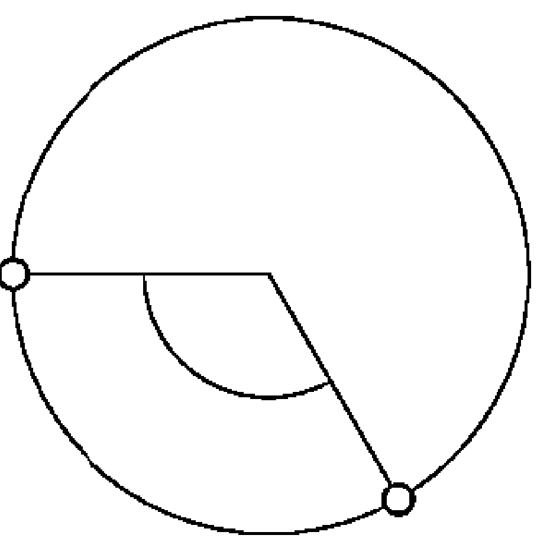

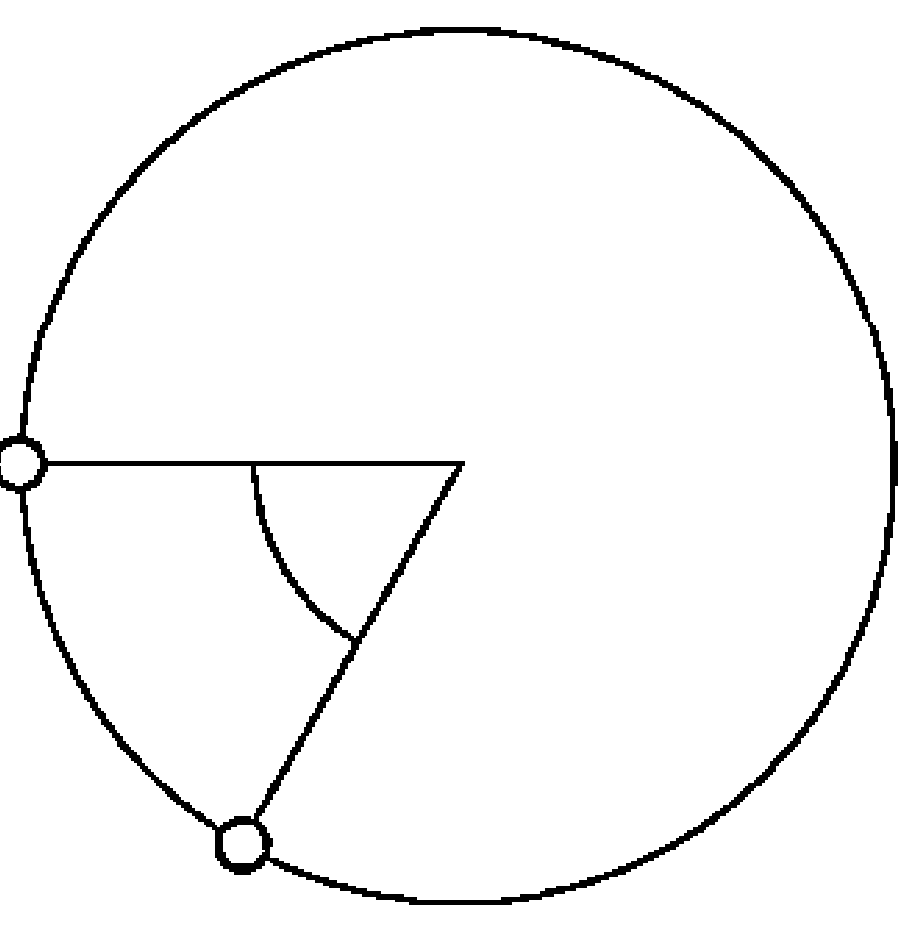

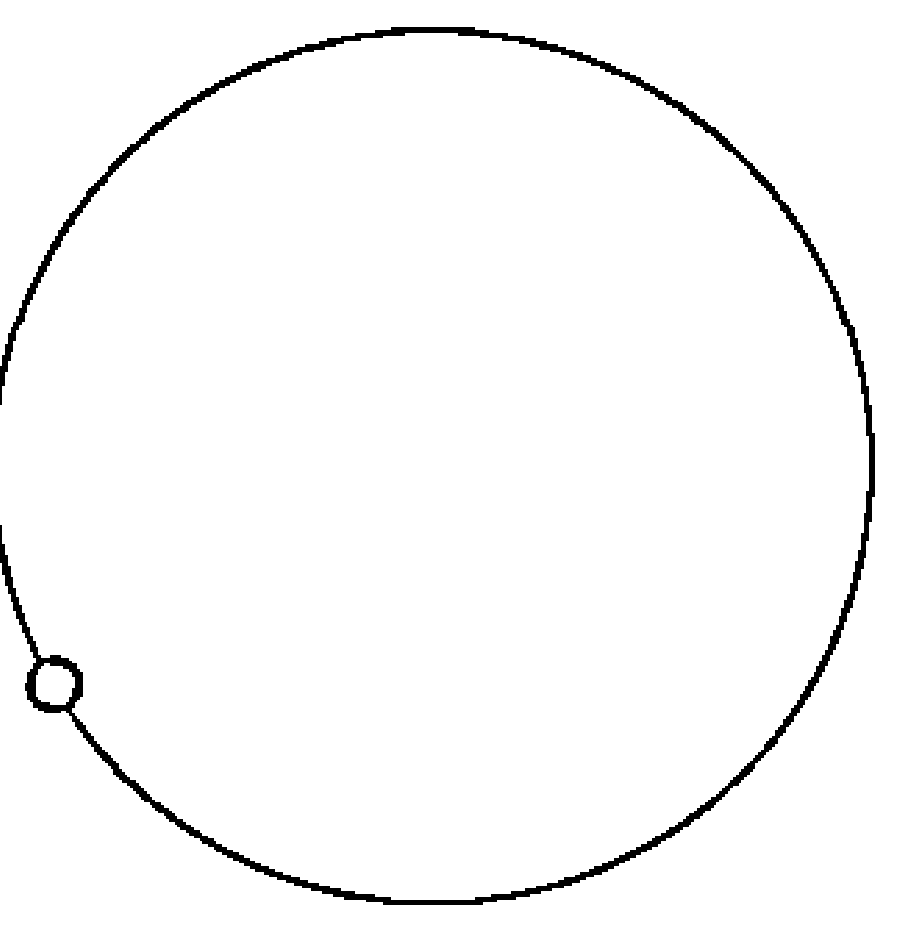

## 凶相位

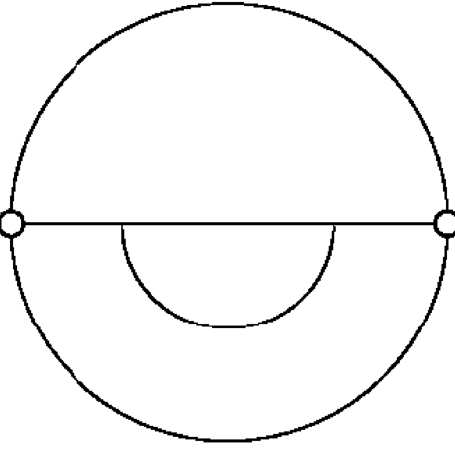

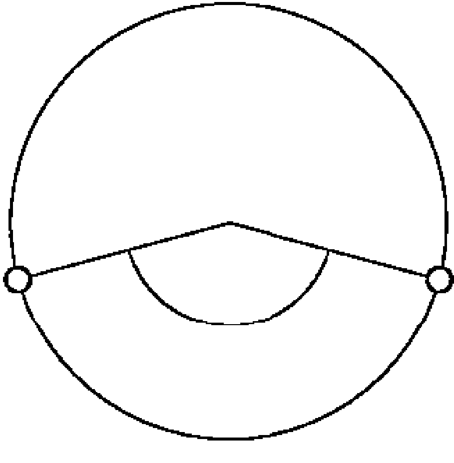

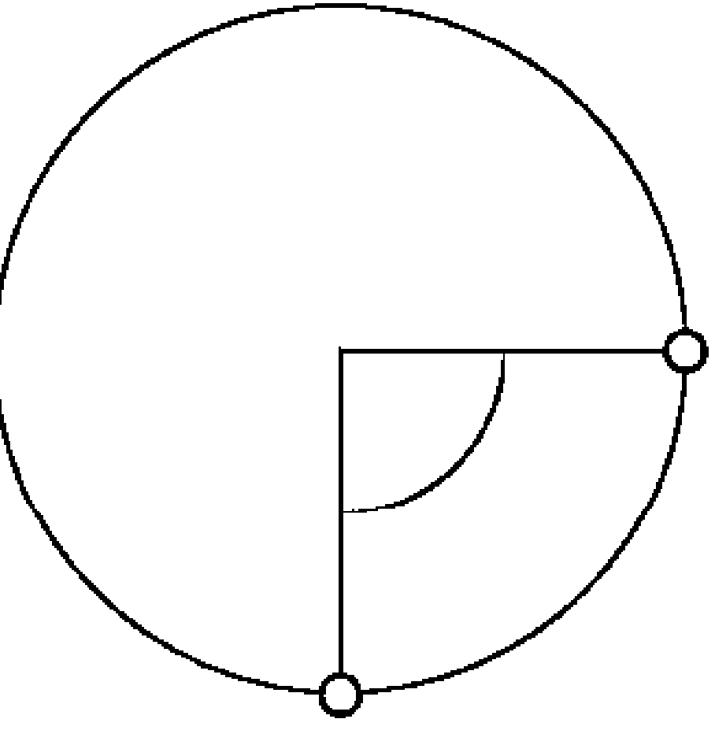

## 行星之间相位的含义

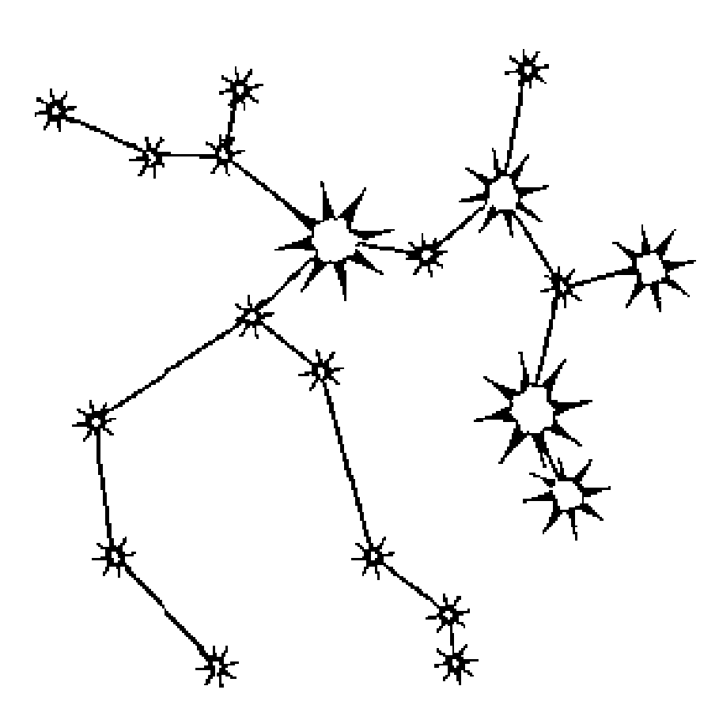

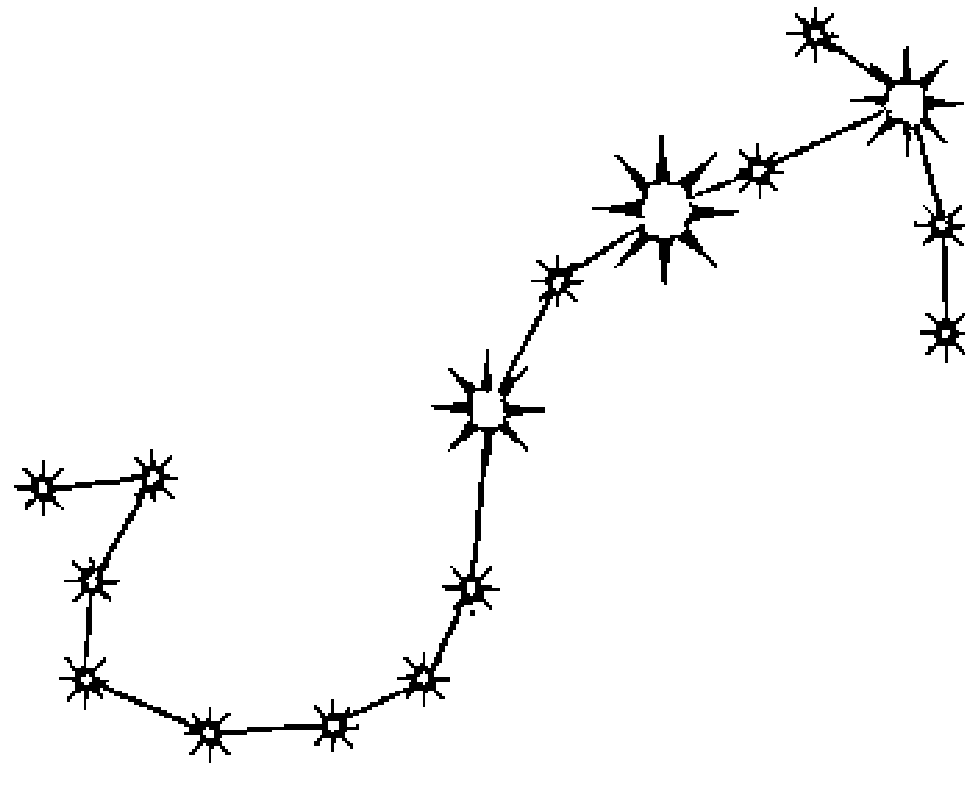

### 太阳的相位

太阳的相位代表着一个人本质上的性格、特质、行为模式或价值观。此外，由于太阳对女性而言代表了父亲或丈夫，因此从太阳的相位也能得知女性与其父亲、丈夫之间的关系。

| 凶相位 （180°／150°／90° ） | 吉相位 （120°／60° ） | 合相 （0° ） |
| :--- | :--- | :--- |
| 你有着容易紧张或变得神经质的一面。也不擅面对突发事件，会失去冷静而导致严重失败。虽然一生中会有许多烦恼或纠葛，但由于你的脑子转得很快，也有行动力，最后还是能掌握成功。 | 你在得天独厚的环境中成长，由于性格坦率而温和，可以说容易受到周遭的人喜爱，也容易获得他人相助。这同时也是身心都十分健康的类型。在婚后能与理解你的配偶建立稳定的家庭。 | 这是非常强大的相位，具有吸引机会的力量及重大的使命感。由于你能在下意识中了解自己办得到什么、办不到什么，从年轻时起就受到瞩目并大为活跃。 |
| 由于太阳与水星之间的距离绝对不会超过28度，因此除了合相之外，并没有特别需要一提的相位。 |  | 你的特征为求知欲旺盛及灵活度高。拥有高度沟通能力，与任何人都能爽朗地享受交流互动。藉由努力克服不擅长的一面，而过着令人满意的人生。 |

## 第 2 章 * 述说命运的星盘 〈行星之间相位的含义〉

| 凶相位 （180°／150°／90° ） | 吉相位 （120°／60° ） | 合相 （0° ） | 太阳与金星 |
| :--- | :--- | :--- | :--- |
| 由于太阳与金星之间的距离绝对不会超过48度，因此除了合相之外，并没有特别需要一提的相位。 |  | 你富有美丽的外貌及美感，带给周遭良好的印象，善于交际且性格开朗，因此很受人欢迎。你很容易掌握机会，比如说被有力人士看上，不过如果认为能够轻松获得成功反而会失败，需要特别注意。 | 太阳与金星 |
| 你有着血气方刚而容易与人起冲突的一面，在人际关系上会有许多麻烦。另一方面，由于你也拥有投身困境帮助他人的勇气，会受到晚辈的仰慕，并获得强力支持。 | 你拥有无论任何事情都勇于挑战的开拓精神及活力。由于十分可靠，令你自然而然地会在团体中以领袖身分崭露头角。拥有充沛的体力，不太会生病或受伤。 | 你总是精力充沛，是一旦想到就会立刻采取行动的类型。对于喜欢的事情会积极争取，而且因为很有毅力，容易掌握成功。如果有竞争对手就会燃起斗志，让你更加提起干劲。 | 太阳与火星 |
| 你有对于事物过于乐观而导致失败的倾向。不擅控制自己的欲望，因此会不顾前后地采取行动而失败。但由于你的思考非常积极正向，所以不会因为失败而影响到日后。 | 你拥有幸运的人生，由于个性慷慨且人品高洁，而受到周遭的支持，能在社会上获得成功或名声。由于比起主动，更常接纳外来的状况，因此更容易吸引好运。 | 你是个开朗且心胸宽大的人，拥有吸引幸运的能量，能过着令人满意的人生。虽然偶尔会因为自信过度而失败，但由于你生性乐天，因此不会受到致命性的打击而能重新出发。 | 太阳与木星 |
| 你拥有强烈责任感，且热衷于研究，但有着凡事消极以待的倾向。与他人相比，你也较容易感到自卑。藉由能沉浸其中的工作或兴趣，提升人生品质，容易获得幸福感。 | 你有着凡事都要基于缜密计划进行的倾向。由于善于忍耐且具有不输给逆境的强大精神力，一旦下定决心，就一定能达成目标。你也是个性真诚且认真的人，深受周遭信任。 | 你是名副其实的禁欲主义者。虽然会在不为人知的情况下脚踏实地累积努力，最后掌握成功，却因为容易对事物想得太深远，而从年轻时起劳心劳力。这也暗示着你戒心很强，容易晚婚。 | 太阳与土星 |

**凶相位 (180° / 150° / 90°)**

**吉相位 (120° / 60°)**

**合相 (0°)**

**太阳与天王星**

你的独立心旺盛且喜爱自由，而会遭到孤立。不过，由于你认为与其在意周遭，一个人还比较轻松，因此不以为苦。但是自己的想法太固执的话，就会错失机会，因此保持灵活性也很重要。

你拥有不受常识束缚的独特价值观。虽然是个怪人，不过是周遭都认为你很有意思而愿意接纳的类型。你擅长获取专业知识，与特殊的工作有缘。

你由于讨厌无趣的日常生活，而有追求刺激的倾向，人生容易显得波涛汹涌。然而即使面临困境，你也绝不会低头。甚至会以强大的独立心与优秀的表现力，将危机化为转机。

**太阳与海王星**

你有些爱作梦，不善于正视现实地思考。虽然拥有艺术才华，但由于不擅努力，容易花上不少时间才能出人头地。此外，也有因为人太好而遭到欺瞒的倾向，当事情听起来很棒时，你应该认为背后有鬼，并加以警戒。

你的感受性丰富，且拥有敏锐的灵感。是能在音乐、舞蹈、绘画等领域发挥优秀才华的人物。你同时也拥有将梦想化为现实的力量，因此能成为带给众多人希望的存在。

你是无论到了几岁，都还是想要追求梦想的理想主义者。个性略嫌优柔寡断。有着对宗教、占卜、艺术相关等远离现实的世界感兴趣的倾向，能在相关领域发挥卓越的才华。

**太阳与冥王星**

你充满热情且精力充沛，但不时会因为使用方式错误而有失控的倾向。为了过着平稳的人生，重要的是尽量避免一意孤行。学会接纳事物的态度，将能为你带来好运。

你是能以长远角度观看事物，并脚踏实地努力的人。由于拥有想达成目标的坚强意志，成功的可能性可说十分大。不仅如此，还是个能获得周遭支援的幸运儿。

你拥有强烈的探求心，凡事都会深入挖掘到满意为止。也拥有强烈信念，只要是自己想做的事，无论如何都会坚持到底。由于拥有出类拔萃的专注力与精力，因此可以掌握成功。

### 月亮的相位

月亮代表着一个人对于事物所采取的想法。从月亮的相位，也能得知孩提时代的环境或个性。此外，月亮对男性而言代表了母亲或妻子，对女性而言则代表了自己会成为怎样的妻子。

|  | 凶相位（180°/150°/90°） | 吉相位（120°/60°） | 合相（0°） |
| :--- | :--- | :--- | :--- |
| 月亮与水星 | 由于你的心情会随着当下气氛而改变，因此有着难以获得信任的一面。为了避免多余的麻烦、过着稳定的人生，随时保持一贯的言行举止，注意控制情绪是重要的。 | 你是个善于表达的人。特征是交谈过程不会令人感到不快，并擅长书写文章，因此在需要使用语言的所有领域都容易获得成功。你也很擅长家务，因此家中随时保持舒适。 | 你是个善于解读他人心情，总是非常细心贴心的人。感受性敏锐，也非常善于表达自己的心情。特征之一是拥有出类拔萃的沟通能力，具有学习语言的才能。 |
| 月亮与金星 | 你的个性天真无邪且坦率不做作，不过也有着自私任性的一面。虽然是个受欢迎的人，却有容易令情人或配偶感到不满的倾向。为了过着幸福的人生，需要懂得正视对方的长处。 | 你的个性坦率正直，是表里如一的类型。由于平易近人且可爱，受到众人喜爱，是能吸引良缘的人。你具备高度美感，有着被美丽事物包围会感到幸福的一面。 | 这个相位的人在外貌上得天独厚，大多五官端整，体型均称。由于性格温和且人品高雅，可说是不分异性同性，受到众人的喜爱。 |
| 月亮与火星 | 你拥有勇气及行动力，但会因为个性冲动而有容易失败的倾向，也有着情绪容易爆发而引发众多人际关系问题的一面。为了掌握成功，重要的是记得凡事必须深思熟虑，避免做出轻率的举动。 | 你是个无论面临何种状况都不会畏惧，能坦率直言自己意见的人。也拥有强韧的体力及精神力，会在大型组织中崭露头角。由于个性表里如一，也容易受到周遭人们的信任。 | 你的精力充沛且活跃，对于喜爱的事物会投注惊人的热情并埋首其中。不过，由于在各方面都显得容易升级，会做出欠缺判断力的行为。为了过着幸福的人生，有必要培养如何拿捏平衡感。 |

## 凶相位 (180°／150°／90°)

## 吉相位 (120°／60°)

## 合相 (0°)

### 月亮与木星

你是虽然会描绘远大梦想，却往往因为没有伴随行动力，而导致梦想终究是梦想的人。看待事物的想法天真，有不负责任的一面。若能学习一旦开始做一件事就要坚持到底的毅力，事态就会好转。

你是不会因为细微琐事而动摇的类型。同时也拥有能将他人痛苦视为自己痛苦般的同理心及服务精神。为人大方且脾气很好，因此受到周遭众人喜爱，常会获得提拔或协助。

你的个性积极开朗，同时也富有同情心，因此是个周遭总是聚集人群的受欢迎人物。在财运上也备受眷顾，能过着幸福人生。无论男女都能获得良缘，建立温暖而稳定的家庭。

### 月亮与土星

你有着总是关注事物负面意义的倾向，容易心怀不安。常会拿别人与自己比较，并因此感到沮丧。为了消除不安感，恢复正向积极的态度，建议拥有能独自放松的时光。

你凡事都十分谨慎且严谨守纪。由于做事会按照计划进行，不会有严重的失败。虽然对异性的态度消极，导致恋情有需要花费许多时间才能开花结果的倾向，不过婚后能建立稳定的家庭。

你是正经且真诚的类型。人们对你的好感度虽高，你却较为悲观，容易心怀不安。有时也会因为理想与现实之间的落差而感到痛苦。只要脚踏实地努力就能否极泰来，因此重要的是千万别自暴自弃。

### 月亮与天王星

你有着极端讨厌束缚或限制的倾向，因此在与亲密的对象往来时，会希望能互相尊重彼此的自由。由于喜爱受人瞩目的快感，因此与在意他人目光而无法做自己想做的事这种压力无缘。

你拥有特殊的表现力与独特的思考方式。虽然是个怪人，但由于个性爽朗，善于跟人保持适当的距离，因此深受周遭众人欢迎，能够建立充沛的人脉。此外也有擅長數位方面的特征。

由于你有追求刺激生活的强烈倾向，常会遭遇突发事件，过着充满变化的人生。你是属于走在自己道路上的类型，不擅长过团体生活。也有新奇的点子广受世人接纳，因此有可能大为活跃。

### 月亮与海王星

由于你的非现实思考方式的倾向强烈，容易因理想与现实之间的落差而烦恼，常会别开视线，不愿面对现实的严峻。为了人生稳定，重要的是能确实完成办得到的事的态度。

你是容易与无意识世界连结的人，直觉敏锐，拥有能顺利回避危险情况的能力，并且会从梦境接收重要的讯息。由于擅长自我表现，很有可能在艺术领域开花结果。

你是容易对无形世界等神秘事物感兴趣的类型，感受性强并富有灵感，拥有能吸引你所期望的现实的力量。是很有可能以占卜师或心理治疗师的身分活跃的人。

## 第 2 章 * 述说命运的星盘 〈行星之间相位的含义〉

| 凶相位 （180°/150°/90°） | 吉相位 （120°/60°） | 合相 （0°） |  |
| :--- | :--- | :--- | :--- |
| 你的喜怒哀乐情绪剧烈，容易心怀嫉妒，有彻底讨厌敌视对象的倾向。由于会忍耐到极限后一口气爆发，导致与周遭的关系恶化，因此要勤快地纾解压力。 | 你充满爱心且擅长照顾人，拥有为了守护心爱之人，什么事都办得到的强悍。认为哪怕为数不多，也要珍惜地培养与信任对象之间的感情，有着一旦接受恩情就绝对不会忘怀的正直个性。 | 你是一旦自己想这么做，无论发生任何事都会强硬地贯彻到底的人。由于行动十分突然，有容易过于极端的倾向，因此失败的情况不少，但还是具备能从谷底回归的潜力。 | 月亮 与 冥王星 |

### 水星的相位

水星的相位代表智慧或学习能力，显示出一个人容易发挥才华的领域。由于水星也意味着沟通，因此也可从中得知如何与他人或社会有关联。

| 凶相位 （180°/150°/90°） | 吉相位 （120°/60°） | 合相 （0°） |  |
| :--- | :--- | :--- | :--- |
| 由于水星与金星之间的距离绝对不会超过76度，因此除了合相、吉相位之外，并没有特别需要一提的相位。 | 你是求知欲旺盛，且沟通能力很强的人。由于应对给人良好的印象，是令人好感度高的类型。你充满感受性，也具备艺术才华，所以也适合创作、设计方面的工作。 | 你是个善于拿捏平衡感且具协调性的人，同时善于交际，有取悦他人的才华。工作方面，很有可能会在兴趣与实际利益兼具的领域上获得成功。由于能灵活地应对变化，适合从事走在时代最尖端的职业。 | 水星 与 金星 |
| 你较为神经质且会拘泥于细微琐事，此外也有着任性的一面，如果其他人无法与自己以同样的步调行动就会感到烦躁。若能留心接纳他人，从更宽广的角度来看待事物，就能提升人生的品质。 | 你的上进心强，凡事都会积极地处理，而且行动力强，一旦想到什么就会立刻付诸行动。由于你是博学多闻且言出必行的类型，因此深受周遭的信任及仰慕。 | 你是脑子转得很快，灵活度高的类型，也善于处理事情。工作上虽然能干，却会因为讲话方式直接而招致反感。若想获得成功，重要的是留心慎选言词。 | 水星 与 火星 |## 第 2 章 述說命運的星盤 〈行星之間相位的含義〉

| 凶相位 (180° / 150° / 90°) | 吉相位 (120° / 60°) | 合相 (0°) | 行星組合 |
| :--- | :--- | :--- | :--- |
| 你是喜歡華麗、很有自信的人。由於對事物的看法粗率而缺乏責任感，有難以獲得周遭信任的傾向。為了獲得成功，凡事萬分小心謹慎可說是不可或缺的。 | 你是正義感強，思考方式健康的人。由於向學心強烈，能在需要專業知識或高度技術的領域活躍。你會透過腳踏實地努力，受到有力人士青睞，獲得成功。 | 你渾身散發出爽朗的氣質，是令人好感度很高的人。具備高度的溝通能力，能與任何人相談甚歡。而且做事精明能幹，可期待在各式各樣的領域大為活躍。 | 水星與木星 |
| 你有著事情應該是何種型態的強烈想法，因此溝通能力差強人意，認為獨處比較輕鬆。可能會因為杞人憂天而失敗，如果認為有機會，重點是不假思索地採取行動。 | 你是非常喜歡學習的類型，由於對腳踏實地累積努力完全不以為苦，很有可能在專業領域獲得成功。你在工作職場上並不亮眼，但謹慎且很少出錯的工作表現，令你受到周遭眾人的信任。 | 你雖然能認真且腳踏實地努力，但由於有些笨拙，若想獲得世人認同，有需要花費不少時間的傾向。也會因為過於堅持自己的意見而遭到孤立。學會凡事靈活應對的方式，是成功的關鍵。 | 水星與土星 |
| 你是頭腦清晰，善於表達自身想法或心情的人。雖然也具備特殊才能，但由於較為偏門，而難以受到眾人支持。如果擔任自由業者，會更容易獲得成功。 | 你的腦子轉得很快，還具備出類拔萃的記憶力與果斷決心。富有發明或企劃才能，同時具有先見之明，可望在擅長領域大獲成功。你也善於交際及創造人脈，很容易獲得合作夥伴。 | 這個相位常出現在被稱為天才的人身上。你頭腦聰穎，具備一般人想也想不到的表現力，可在特殊領域獲得成功。也有貫徹獨特生活方式的傾向，總是思考未來也是特徵之一。 | 水星與天王星 |
| 你具備想像力及寫作品味，若是置身於創作界，就很容易掌握成功。由於有著精神力弱且容易逃避現實的傾向，重要的是記得保持腳踏實地的想法。 | 雖然你給人飄忽不定而難以捉摸的感覺，其實是十分嚴謹守紀的類型。是會為了實現夢想或目標而努力的人，由於想像力豐富且富有文采，多會從事寫作相關的職業。 | 你兼具敏銳的想像力及豐富的靈感能力。對神秘事物感興趣，希望自己也能成為神秘的存在。如果注意在藝術領域自我表現，就能掌握成功。 | 水星與海王星 |
| 你的腦子轉得很快，專注力驚人。雖然也擁有足以抵抗逆境的強悍，不過一旦努力不受認同，就會突然失去活力。尤其在工作職場上，常會在發洩不滿後感到後悔，因此言行舉止都要注意冷靜。 | 你討厭虛有其表的往來，想要確實地溝通以加深互相的理解。由於具有果斷的決心，且具備一旦說出要做的事就一定會付諸行動的堅強意志或行動力，而能在職場上獲得高度評價。 | 你的腦子轉得非常快，也具備優秀的洞察力，因此不會讓自己陷入不利的狀況。嚴以律己也嚴以待人，是在工作上貫徹始終的類型。請注意避免因為工作過度而搞壞身體。 | 水星與冥王星 |

## 金星的相位

金星代表的是一個人的戀愛傾向或財運，若形成吉相位，就能過著財運及戀愛運得天獨厚的豐富人生，不過根據相位而定，也會顯示出玩過頭導致失敗等負面的傾向。

| 凶相位 (180° / 150° / 90°) | 吉相位 (120° / 60°) | 合相 (0°) | 行星組合 |
| :--- | :--- | :--- | :--- |
| 由於你有容易沉溺於物質快感的傾向，仍會與內心早已遠離的對象長久持續著貧瘠的關係。在財務方面，容易有衝動購買的情況。若能將熱情投注在創作活動上，精神就會游刃有餘，過著穩定的生活。 | 你不僅受到異性的歡迎，還擁有令眾人羨慕的幸福戀情。你也富有美感，知道如何讓自己展現美麗的一面。在金錢觀念上的平衡也很好，能順利地累積儲蓄。 | 由於你充滿吸引異性的魅力，從未缺少戀愛對象。不過，你很容易沉溺於快感之中，導致在不夠了解對象的情況下就陷入過深的關係，需要特別注意。在財務方面，常有衝動購買的傾向。 | 金星與火星 |
| 你喜歡鋪張奢侈浪費，經常大肆揮霍，不太能存錢，因此重要的是提醒自己，要過著符合自己身分條件的生活。由於個性開朗且喜歡有趣的事，受到異性歡迎，但有著自私任性地將對方耍著玩的傾向。 | 這是一輩子都很有人緣的幸運相位。你會擁有許多戀愛機會、受到有力人士的提拔而實現夢想等，十分容易獲得好運。而且也有物質方面的運氣，凡是想要的事物都能輕易獲得。 | 你擁有豐富的愛情，能過著令人滿意的人生。在金錢上、物質上也得天獨厚，過著衣食無缺的生活。由於你善於交際且平易近人，而受到周遭喜愛，也能引來社會性的成功。 | 金星與木星 |
| 你會因為比較消極而錯失機會，或是受到喜愛的人誤會。積極表達對對方的想法，是讓戀情成功的關鍵。在財務方面有過於節省的傾向，記得重點是凡事都要適可而止。 | 你會對由衷尊敬的對象一心一意地奉獻。有受到年長且博學多聞的對象吸引的傾向，並在婚後建立穩健踏實的家庭。你是屬於按部就班地存錢的類型，喜歡符合自身條件的生活，鮮少過度浪費。 | 你喜歡儉樸的生活而能存錢，但在關鍵時刻有捨不得拿出來的傾向。在戀愛方面，你會因為無法順利表達自己的心意而長期苦戰，容易持續單戀很長一段時間。請記得要積極地嘗試溝通。 | 金星與土星 |
| 你是容易迷戀上人，順著心意行動的類型，需要小心謹慎，避免被捲入戀愛相關的麻煩中。雖然能活用創意方面的才華賺錢，卻有因為毫無計畫而難以存錢的傾向。 | 你在戀愛方面，有著與一般人不太一樣的戲劇性傾向，比如說因為許多不可思議的偶然狀況重疊，而與人開始交往等。雖然不太擅長儲蓄，但擁有好運，在緊要關頭總會不可思議地獲得幫助。 | 你擁有獨特的感受性與品味，喜歡古怪的異性。因此常有波濤洶湧的戀愛經驗。在財務方面是起伏很大的類型，也可能會獲得大筆的臨時收入，比如說彩券中獎等。 | 金星與天王星 |
| 你對平庸的戀情不感興趣，而有與有問題的對象談戀愛的傾向。如果能將熱情投注於創作活動上，而非談戀愛，就能避免厄運。在財務方面，活用創意才華就能賺錢。 | 你是想談浪漫戀愛的人，由於愛照顧人且為人和善，而有喜歡上能刺激你保護本能的人的傾向。財運雖然不差，但由於不太堅持得住，最好避免有金錢的借貸往來比較安全。 | 你有著難以言喻的神秘魅力，也擁有療癒他人的能力，因此相當受歡迎。也有為了心愛之人願意付出一切，捨己奉獻的想法。你有著敏銳的直覺，所以不會為錢所苦。 | 金星與海王星 |
| 你會談一場難以稱得上有道德的戀情。雖然會留下痛苦回憶，但藉由難受的經驗也會令你更添魅力。由於只要是想要的物品就會努力取得，所以很難留住錢。 | 你充滿吸引人的魅力，雖然經常有人追求，但你並不輕率，不會輕易答應邀約。而是會與令你著迷的對象談一場身心都獲得滿足的戀情。財運也很好，一輩子都不用為錢所困。 | 你雖然是個非常受歡迎的人，但在戀愛方面容易波濤起伏。一旦認為不行就乾脆地離開，這樣就能躲避不幸。儘管財運起伏劇烈，但也蘊含著可一擲千金的可能性。 | 金星與冥王星 |

## 火星的相位

從火星的相位，可以解讀出一個人容易對怎樣的事情投注精力，或是會如何向周遭自我推銷。此外，也能得知性方面的癖好。

| 凶相位 (180° / 150° / 90°) | 吉相位 (120° / 60°) | 合相 (0°) | 行星組合 |
| :--- | :--- | :--- | :--- |
| 你是對一切都充滿熱情的人，但由於行動十分突然，也容易專斷獨行，容易與周遭起摩擦。能過著幸福人生的關鍵，在於要記得以客觀角度看待自己的言行舉止。 | 你既熱情且具行動力，有著大方且愛照顧人的一面，也十分可靠，所以常會被交付領袖般的職責。因為喜歡活動身體，所以能在運動或舞蹈領域中發揮實力，並出人頭地的可能。 | 勇於投入感興趣的事物中，而不顧有何風險。由於對事物的態度熱衷而專注，很有可能在專業領域獲得成功，但也會因為做過頭而失敗。需要培養如何拿捏平衡感。 | 火星與木星 |
| 你雖然具備熱情或積極度，但不善於長期投入在一件事情上。一旦產生半點覺得不太對勁的想法，就會乾脆地放棄，而讓人生顯得有些半途而廢。如果想獲得成功，就必須學會不屈不撓。 | 你兼具計畫性與執行力，會從克服問題中感受到喜悅，每當跨越一道考驗就會大幅成長，增添個人魅力。由於擁有維持精力的力量，而能在需要體力或耐力的工作上獲得成功。 | 你擁有比常人多一倍的自律心，卻也有容易累積壓力的傾向。雖然會面臨障礙或意外狀況，卻也具備解決問題的能力。你的課題在於必須有耐心地處理任何事，而不半途放棄。 | 火星與土星 |
| 這是常會對社會產生反感的類型，有採取激進行動的強烈傾向，而受到周遭的提防。由於你衝動的言行舉止容易造成人生起起落落，因此在採取行動前請養成三思的習慣。 | 你是具備獨特信念與創新思考方式的人，討厭無聊，有著積極採用新的事物來享受人生的傾向。也擁有豐富的表現力，可因應場合做出適當的判斷，因此深受周遭的信任。 | 你具備非凡的瞬間爆發力與直覺力，但因為有些神經過敏，令人覺得你是沉不住氣的人。由於有強烈的批判精神，而會惹怒他人，因此最好記得放軟說話方式。 | 火星與天王星 |
| 你是心思細膩而容易受傷的類型，如果無法順利適應社會，就可能有陷入不健康生活的傾向。容易受人影響，也容易遭人利用，重要的是必須慎選親密往來的對象。 | 你是個總是情緒高昂且開朗的人，周遭的人只要跟你待在一起，就會覺得獲得活力，讓你經常因此受到感謝。你喜歡幻想世界，也是擁有豐富想像力的人，因此會從事創作活動獲得成功。 | 你是個具備優秀靈感與洞察力的人，才華能在藝術方面開花結果。你容易對神秘世界著迷，並實際有過感覺到無形事物的體驗。由於禁不起誘惑，容易在戀愛方面遭遇麻煩。 | 火星與海王星 |
| 你的個性十分堅持而不願妥協，一旦遭人否定，就會出乎意料地有攻擊性。雖然在精神上與肉體上都很強韌，卻也容易勉強自己。為了人生過得穩定，請記得凡事要適可而止。 | 你擁有強韌的精神力，討厭失敗。即使面對逆境或障礙也絕不感到挫折，會用盡各種手段試圖突破。由於你充滿了創造全新事物並加以推動發展的力量，出社會後將會大為活躍。 | 你是個擁有強勁能量的人，凡事都會貫徹始終，絕對不會半途放棄。並具備抵抗逆境的力量，可在講求勝負領域的相關工作上嶄露頭角。 | 火星與冥王星 |

## 木星的相位

木星是司掌擴張、成功、發展的行星，可以從中得知一個人究竟在哪方面得天獨厚、擁有發展什麼方向的力量，相反地，有哪一方面可能會有做過頭的風險等。

| 凶相位 (180° / 150° / 90°) | 吉相位 (120° / 60°) | 合相 (0°) | 行星組合 |
| :--- | :--- | :--- | :--- |
| 你是內心有許多糾葛的人，雖然懷有崇高的理想，卻沒伴隨著行動力，時常導致理想終究是理想。掌握幸運的重點是要記得在自己所處的環境中竭盡所能。 | 你總是客觀地審視自己，十分清楚自己能辦到什麼、辦不到什麼。擁有優秀的判斷力與下定決心的勇氣，耿直而嚴守分際的個性，令你大受周遭眾人信任。你很有可能會受到上級提拔，因此出人頭地。 | 你是個正經八百而耿直規矩的人，充滿計畫性，也有一絲不苟的一面。你的自制力強，善於控制情感。由於能確實地推動事物發展，深受周遭信任，常能以領袖身分活躍。 | 木星與土星 |
| 你擁有創新的思考方式，也具備領袖氣質，能以推動眾多人的領袖身分活躍，不過也容易產生激進的思想，有導致失敗的危險。請留心別追求突然的變化，而是培養如何拿捏平衡感。 | 你是積極且尖銳的人，無私無欲，總是思考著該怎麼做才能為社會貢獻。善於拿捏平衡感，個性開朗而受到周遭喜愛。也會獲得從天上掉下來的好機會。 | 你總是積極向上，充滿希望。善於交際且重視人與人之間的聯繫，而能建立廣闊的人脈，也會與外國結緣。由於有強烈上進心，很有可能在專業領域大為活躍。 | 木星與天王星 |
| 由於你人很好，因此有容易上當的傾向。在戀愛問題及財務上有蒙受傷害的危險，需要特別小心。因為有些散漫，也有令人難以信任的一面。為了獲得成功，需要徹底地自我管理。 | 你是富有同情心且希望站在社會弱勢那一方的人，會藉由參與慈善活動或環保運動獲得喜悅。由於你的內心單純，有可能受到他人利用，與人接觸時要保持一定程度的警戒。 | 你兼具吸引人的神秘感與直覺力 & 洞察力，靈感也十分豐富，能在創作活動中發揮才華。個性不夠堅定可能會釀禍，因此要盡量避免與態度強硬的人扯上關係。 | 木星與海王星 |
| 你是難以控制自身欲望的類型，由於會強迫事情朝自己的意願發展，可能會受到周遭排斥。為了彌補這缺點，你必須記住要保持道德心與謙虛。 | 你很有魅力，並具備吸引許多人的領袖氣質。能順利地在社會上獲得成功，成為名人。由於是富有財運的人，可能會繼承名貴的物品等，而能享受舒適的生活。 | 你蘊含了在各種領域都能成功的可能性，為人努力且人品高尚，能在社會上獲得崇高的地位。你也善於賺錢，與經濟困苦無緣。如果能傾力於國際交流上，就會進一步提升運氣。 | 木星與冥王星 |

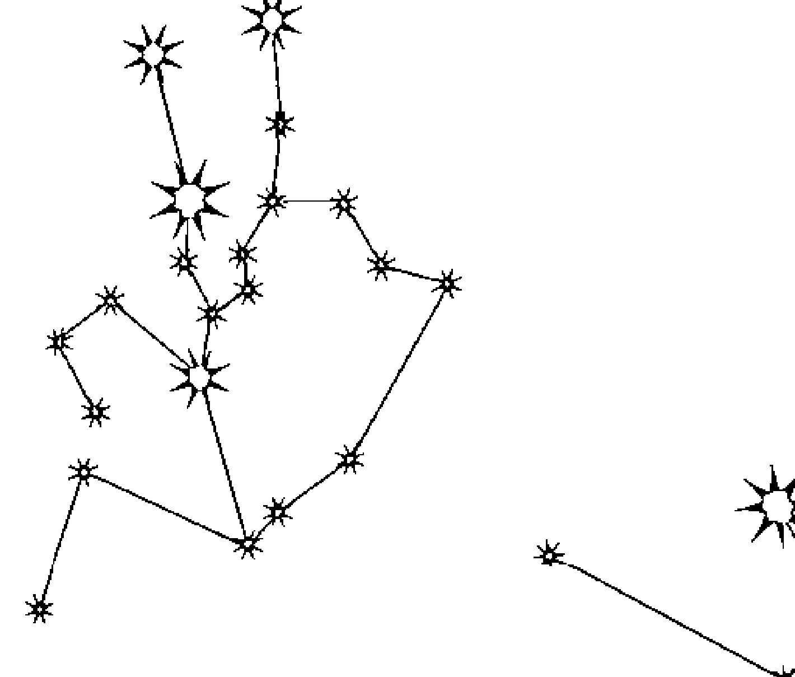

## 土星的相位

土星是考驗與限制的行星，土星的相位代表的是不擅長的領域或應該克服的課題。為了活用土星的相位，需要積極地將面臨的困難視為自己應該克服的課題。

| 凶相位 (180° / 150° / 90°) | 吉相位 (120° / 60°) | 合相 (0°) | 行星組合 |
| :--- | :--- | :--- | :--- |
| 由於你比較有個性，難以被周遭的人接受而十分辛苦，容易感到孤獨，也會感到悔恨。需要較長時間才能獲得社會的評價，不過只要全神貫注於一件事情上，就一定能成功。 | 你是個很有個性、很認真，責任感強的人。即使明知狀況艱難，也不會逃跑，會勇於正面迎戰。雖說成長需要時間，但是晚年能獲得社會地位。 | 由於嚴以律己也嚴以待人，你很容易受人疏遠。因為也討厭他人干涉，所以容易遭到孤立，不過你擁有足以忍耐困境的強悍精神力。擅長深入追究一件事，擔任研究人員會獲得偉大成就。 | 土星與天王星 |
| 你很容易懷抱自卑感且態度消極。由於會無法擺脫負面思考而將自己逼進死路，學會如何客觀地觀察思考，逃離負面循環是很重要的。 | 你心懷遠大的夢想，但不會讓夢想終究是夢想，會為了實現夢想而竭盡所能去做的人。由於能腳踏實地思考，也擁有領袖氣質，常會以領袖身分大為活躍。 | 你是能為了達成夢想或目標而踏實努力的人，雖然給人可靠踏實的印象，不過也會懷抱遠離現實的夢想。你的課題可說是如何在現實與理想之間取得良好平衡。 | 土星與海王星 |
| 你是容易遭逢重大困難或障礙的類型，為了跨越難關，需要在與人相處時不求回報。藉由接觸他人的善良親切與溫暖而改善人生，並能平安順利地克服困難狀況。 | 你是個不遺餘力地努力改善人生的人，由於身心都十分堅韌，具備能克服眾人都認為辦不到的事的力量。是隨著鍛鍊經驗、年齡增長而越發有魅力，也能踏實地提升地位的類型。 | 你擁有不畏考驗或障礙，不屈不撓的精神。是相信努力必定有回報，會不為人知地持續努力的人。你也善於自制，只要有那個想法，無論在任何領域都能獲得成功。 | 土星與冥王星 |

## 天王星的相位

## 海王星的相位

| 凶相位 (180° / 150° / 90°) | 吉相位 (120° / 60°) | 合相 (0°) | 行星組合 |
| :--- | :--- | :--- | :--- |
| 你對於神秘、宗教、超常現象等感興趣，由於有濫用或遭到濫用的傾向，使你常會遭遇麻煩。此外，你也很容易沉浸於反常的事物中，對危險的遊戲心懷憧憬。 | 你對於靈性領域有著濃厚興趣，是能自然而然地接受無形事物的人。也對生與死、時空或宇宙等感到好奇而想深究。由於這是屬於跨世代的相位，鮮少會呈現在個人的星盤上。 | 你是脫離了物質世界或欲望，對無形世界十分理解的人，擁有高度精神性。由於海王星與冥王星都是公轉速度很慢的行星，因此極少會形成這個相位。 | 海王星與冥王星 |

## 冥王星的相位

冥王星會影響潛意識的事態現象，或人生的重要轉機。當有許多吉相位時，很有可能掌握龐大權力；而當相位不佳時，則有凡事容易失控的傾向。

※冥王星所形成的相位，請見其他行星各表格的最後一欄。

## 關於次要相位

在現代的占星術中，比從前更長採用次要相位。所謂的次要相位，有六分相的一半——微吉相位十二分相（30度）、四分相的一半——微凶相位八分相（45度）、與四分相意義相似，加上90度與45度可形成的補八分相（135度）、將360度星盤分成五等分形成的五分相（72度）、與五分相含義相似的倍五分相（144度）等。次要相位的重要性不高，只要當作知識了解即可。

## 三顆以上的行星 重合的特殊相位

也有三顆以上的行星形成特定角度的情況，這被稱作「特殊相位」。由於是以剛才所介紹的主要相位其中兩種以上組合而成，可以想見展現的行星力量既複雜且強大。不過，並不是所有人的出生星盤都會存在特殊相位，只是擁有這類特殊相位的人，應該能更明確地感受到比剛才所介紹的內容更為強勁的影響。特殊相位有好幾種，在此介紹廣為人知的其中五種。

### T型三角

兩顆行星形成對分相（180度），另外一顆行星則分別與這兩顆行星形成四分相（90度）。由於正好形成英文字母的「T」，因此稱作「T型三角」。由於是以不協調相位的對分相與兩個四分相所形成的狀態，而會增加心理負擔，但也能解釋成需學會深思熟慮的含義。可視為導向成功的相位之一。

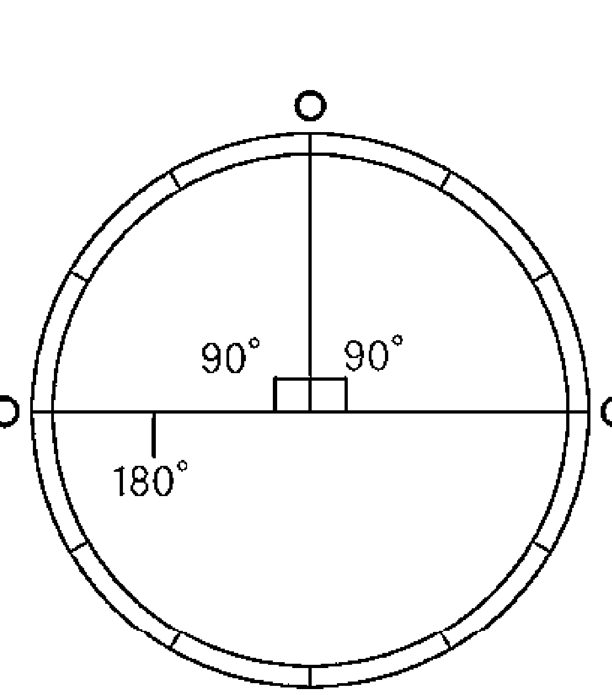

### 大十字

這是由兩組行星分別形成對分相（180度），而這四顆行星再分別形成四分相（90度）的相位。由於正好形成「十」字，因此稱作「大十字」。這個相位代表著困難，同時也代表了克服困難的強悍。在出生星盤上有這個相位的人，可以解釋成雖然辛苦，但能夠開拓人生，並累積人性的強度。

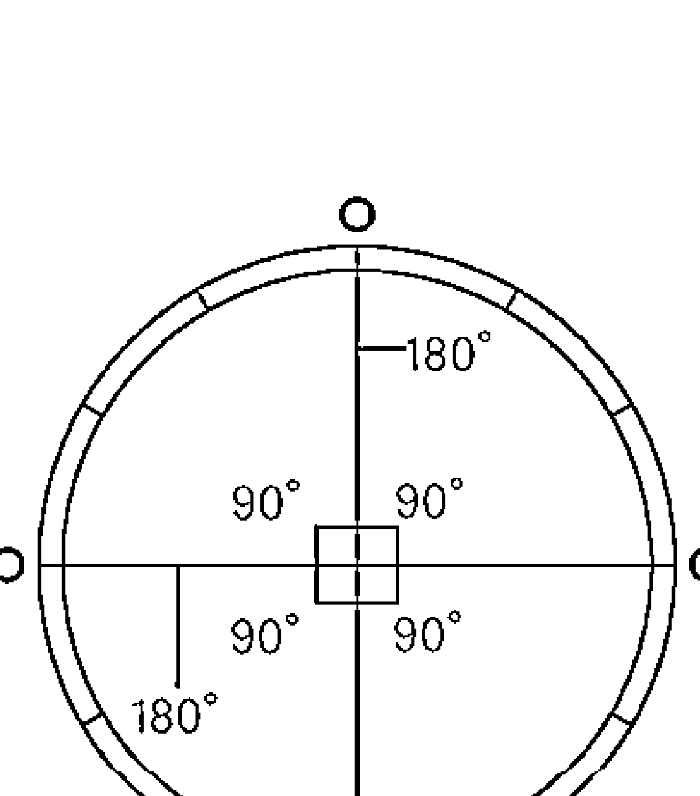# 大三角

互為三分相（120度）的三顆行星形成等邊三角形，常在同一元素的星座之間形成，又被稱作「幸運大三角」。在出生星盤上有這個相位的人，能過著富有支援的平穩人生，但另一方面，也可能被解釋成有流於安逸的傾向。這只要自覺，嚴以律己就能掌握幸運的相位。

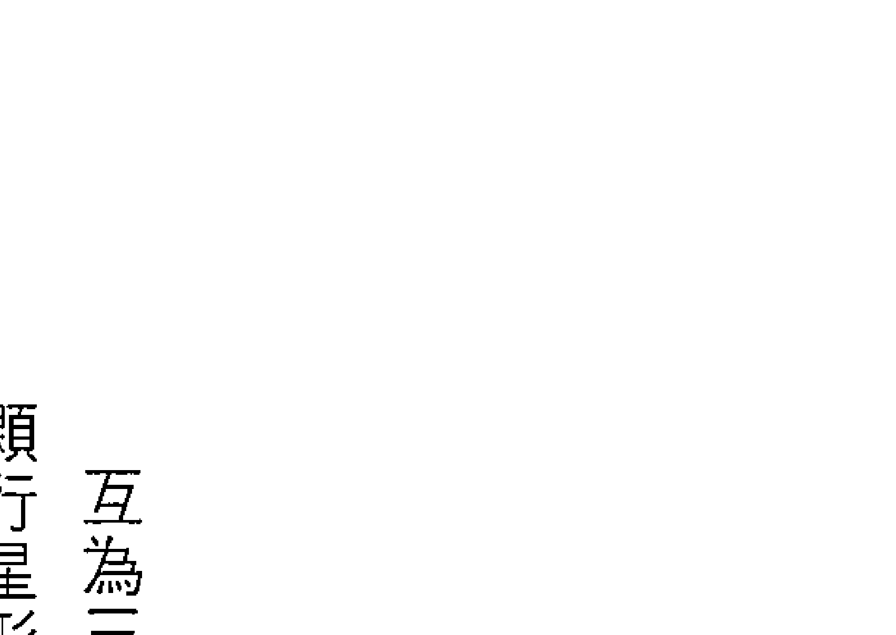

# 上帝手指

兩顆行星形成六分相（60度），而另一顆行星則分別與這兩顆行星形成十二分相（150度）。是在星盤上呈現英文字母的「Y」的配置。有著這個相位的人，容易過著彷彿被神之手推動的命運般人生，而在出生星盤上時，則容易令人感受到壓力。重要的是與自己的意志協調，接納命運並尋找活用之道。

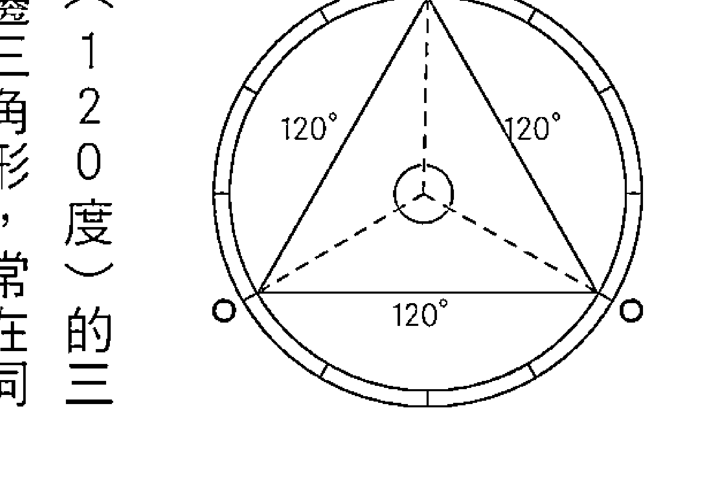

# 風箏

由三顆行星形成大三角，而另一顆行星則與大三角的行星之一形成對分相（180度）。這四顆行星的配置是因為正好形成風箏的形狀而得名的相位。由於對分相給容易流於安逸的大三角帶來適度的緊張感，如果在出生星盤上有這個相位，可以視為不會甘於好運，取得良好平衡的人。

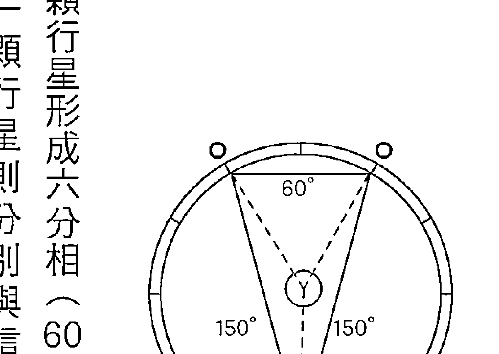

所謂的「緊密」，指的是「緊貼」、「密合」的意思。比如說，即使行星之間的相位為85度或93度，如果將容許度設定為5度，則兩者就都在90度的範圍內，也就是形成「四分相」。在這個範圍內，愈接近90度，就稱作「緊密」，相位的含義會被強調。當然，從0度～180度的其他相位也是相同的。

愈是緊密，愈是形成重要的相位。尤其是主要相位中，如果是與太陽、月亮、上升點或天頂形成緊密相位，就可認為影響力愈大。不過，視情況而定，也會有並非緊密的相位產生強大影響的情況。到頭來，還是需要囊括相位之外的情況，做出綜合性的判斷。

## 當存在『緊密』相位的情況？

## 關於未形成相位的行星

當沒有形成合相、對分相、四分相、三分相、六分相等主要相位時，就稱作「無相位」（這時候不會將補十二分相算作相位）。無相位行星會帶來何種影響，要視情況而定，而且含義也會依行星而異。並未形成主要相位時，可以解讀成該行星的特徵不會受到其他行星影響，而會直接展現出來；相反地，也會有因為與其他行星之間沒有管道，而導致難以發揮力量的狀態。另一種模式是累積至極限的行星之力，或許會在某一天突然爆炸性地釋放出來。無論如何，都可說是需要關注的行星。

# 第3章 解讀星盤

## 首先按順序閱讀

## 實踐！解讀星盤

請運用讀到這裡為止的基礎知識，進一步實際解讀星盤吧。首先，作為練習題，請按照「從整體到細節」的順序來診斷虛構的A小姐的星盤。接者再按照同樣的程序，檢視你自己的星盤。從210頁起有可填充整理的表格，請加以運用。

接下來，還會根據人生的七大主題——財運、戀愛、工作、婚姻、人際關係、健康、幸福——來說明將重點放在星盤的何處。此外，還會列舉「特別相位」，介紹若有突出的才能或好運，會以怎樣的配置來呈現。

在解讀自己的星盤時，負面的關鍵詞或許會令人感到排斥，不過首先請坦率地將其視為「了解自己的」把鑰匙，享受解讀的樂趣吧。接著，也請試著挑戰分析你所熟知其性格的人們，比如說情人、朋友、家人等的星盤看看。

## 被關鍵詞搞混時

解讀星盤時，有時會出現含義相反的關鍵詞，比如說太陽星座為「積極」，但月亮星座卻是「消極」的情況。尤其是相位的數量會根據行星分佈而大為不同，數量愈多，關鍵詞也會隨之增加，或許會造成混亂。不過，這正是人類的複雜性及多面性，請視為一個人身上擁有各式各樣的要素。此外，這些並不會全都以同樣的強度在你身上起作用，相信你能透過累積解讀星盤的經驗，切身掌握行星或相位的重要度。

並非局限於關鍵詞本身，掌握含義的核心，並與現實相結合的過程也很重要。即使含義相同，如果能轉換成「靈光一閃的詞彙」，就會更加有趣。

## 解讀星盤的樂趣

只要檢視過的星盤數量愈多，就愈能體會其深奧之處，也會增加樂趣。在看完自己或是重要人們的星盤後，也請試著運用網站盡量製作你知道出生年月日的人的星盤。即使是名人或歷史人物，只要知道出生年月日，也能製作出簡易的星盤。出生地點姑且不論，由於有不少人無法確定自己的出生時間，因此請選擇「不詳」後製作。這麼一來仍能診斷月亮之外的星星星座或相位。不過，請確認舊曆等曆法的差異。此外，如果清楚創立的年月日，甚至還能製作公司或團體的星盤來解讀，想必會對其中符合現實的內容或所暗示的未來著迷不已。

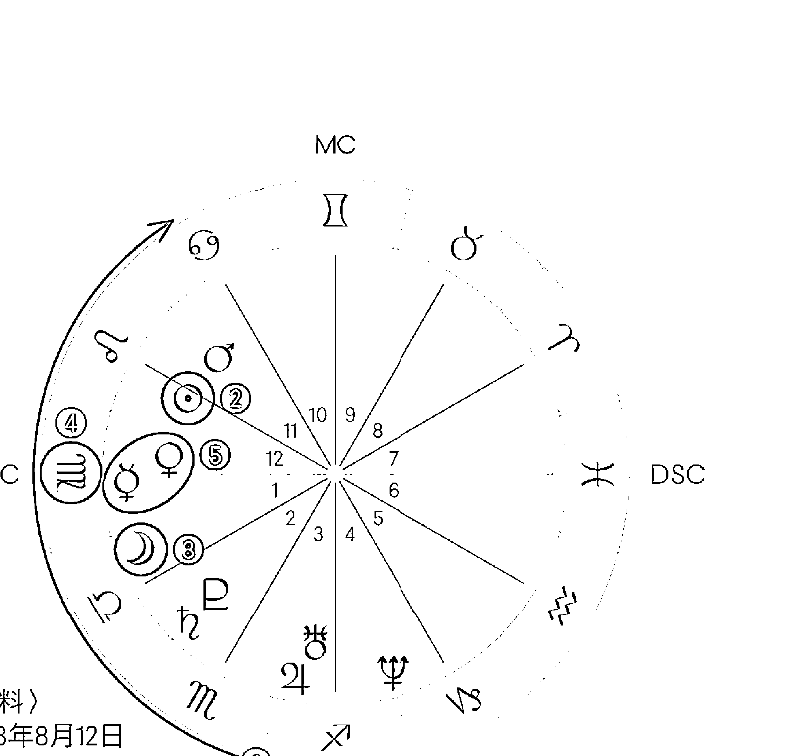

# 練習題 解讀 A（37歲、女性）的星盤

〈資料〉 1983年8月12日 7:00 東京都出生

## ① 行星分布為碗型

A小姐的星盤，行星從巨蟹座跨至射手座，分布成漂亮的碗型。由於主要在左側的東半球相連，因此代表她是個「藉由自己的想法與力量打造人生的行動派」，可解讀出有積極自我實現的傾向。

> 參閱 P.41

## ② 太陽星座為獅子座

太陽星座為獅子座，是活潑開朗的人。富有創造事物的能力。可以得知她是個想活得華麗，自尊心強的人。會被職場上的同事認為「十分可靠」，而看在熟人眼裡，則覺得她「雖然好勝，其實出乎意料地怕寂寞」。

> > 參閱 P.60

## ③ 月亮星座為天秤座

從落在天秤座的月亮，可以得知她在情感上取得良好平衡，總是提醒自己「保持冷靜」。太陽獅子座的喜愛自我表現，與月亮天秤座的討厭誇張看似矛盾，但正因為如此，才會十分自製，展現出恰如其分的形象。

> > 參閱 P.84

## ④ 上升星座為處女座

上升處女座的診斷為「善於關心他人，容易受傷。比起擔任領袖，更適合擔任秘書」。給予初次見面的人的第一印象，是整潔而拘謹。不過，她的本質開朗爽快，可以推測愈是熟穩，就愈會展露她無微不至而有氣概的一面。

> > 參閱 P.123

## ⑤ 上升星為水星與金星

由於水星與金星都落在上升點前後5度內，因此屬於上升星。可以診斷她美麗而氣質高雅，是個受歡迎的人，而且根據她的話語，甚至可能改變人生。如果從事需要使用語言的工作，會獲得高度評價，並因此提升地位等。

> ※上升星的解說請見下一頁。

# ☆何謂上升星？

# 與上升點接觸的行星

所謂的上升星，指的是位於上升點5度以內的行星。這類行星的能量，會對基本性格或命運帶來重大影響。如果有複數顆行星存在時，請將以下符合的內容全加入診斷中。即使沒有存在行星，也不代表欠缺任何事物。

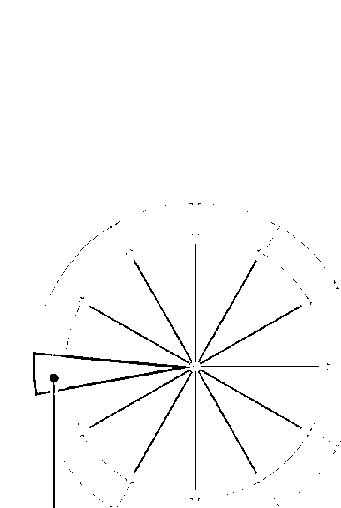

⊙ 太陽
散發著高貴氣質，只要你一登場，就會展現出令周遭都明亮起來的存在感。若是落在第1宮，就會因為自己的行動而獲得成功；落在第12宮時，如果身為女性，就會因為父親或丈夫的支援而獲得成功。

☾ 月亮
十分迷人而受歡迎，是非常體貼且富有同理心的人。會擁有比別人加倍傾注沛愛情的人生。不過在運勢上欠缺穩定，有著容易改變工作或環境的傾向。

☿ 水星
散發著充滿智慧的氛圍，尤其是你在工作上遇到的人，會給他們「腦子轉得很快的人」的印象。可擴展活躍的舞台並獲得高度評價，但反之，也可能會因為失言或惹火眾人而改變立場。

♀ 金星
給人柔和的印象，行為舉止美麗而高雅。因此受到許多人喜愛，並受到長輩疼愛。能過著在物質方面不虞匱乏的生活，但如果沒有堅定信念，就會有無所事事地度日的危險。

# 火星

散發出蘊含了深不可測力量的氛圍。視情況而定，可能會顯露出具攻擊性的一面。為了實現自我願望，會不問條件或風險地奮勇前進，過著強而有力的生活。也有因為情感激烈而樹敵的傾向。

# 木星

擁有得天獨厚的豐裕環境，也會獲得有力人士或財主的庇護。給人的印象也是“落落大方的人”、“在充滿愛的環境中長大的人”。獨立之後，容易過著較為奢侈的生活。

# 土星

大多直到二、三十歲左右，都是在長輩的限制下度日。父母的教育方針嚴厲，會受到教練、師傅、上司一類的人物鍛鍊。不過，你會以努力與耐心克服一切，並在後半生獲得成功。

# 天王星

給人很有個性的印象，“討厭與他人相同”的想法總是十分強烈，喜愛奇特的事物。無論處於任何環境，都會是十分顯眼的存在。在人生之中會發生幾次突發狀況，並因此左右你的生活。

# 海王星

給人一種輕飄飄而難以捉摸的印象。有些愛作夢，即使是白天的活動時間也常會徘徊於幻想世界中，不太善於規劃現實的人生。你需要能夠確實支持你的夥伴。

# 冥王星

散發著獨特的氣質，容易被周的人認為是“複雜的人”、“難應付的人”。會繼承許多因當地風俗而留下的習慣。因人而定，可能會難以擺脫所謂前世因緣的神秘要素。

# ⑥ 解讀A小姐的行星坐落星座與宮位狀況

接著，依序來確認A小姐的行星與宮位。在上升星那段（203頁）已經提及了落在第1宮的水星，同樣落在第1宮的還有月亮，顯示出智慧而體貼，情緒容易受到環境左右的一面；代表收入、財產的第2宮，則有落在天秤座的土星與冥王星對應。可以提取出的關鍵詞是雖然善於交際，但人際往來廣而淺，是對於金錢有強烈執著的類型；落在射手座的木星與天王星對應第3宮，擁有會在喜歡的事情上成功的運勢，有豐富的點子；對應第4宮的海王星，顯示出由於出生成長的家庭環境，令她有比別人加倍追求他人的愛的傾向。而從海王星落在射手座，也能得知她具備哲學性品味。第5～10宮沒有行星，在這個情況下，就請確認各宮位對應的宮首星座的主管行星（52頁）。由於第5宮的始點落在摩羯座，就請確認摩羯座守護行星的土星×第5宮的含義；同樣地，第6宮的宮首星座為水瓶座，主管行星為天王星，因此可以診斷出她特別會在工作職場上，活用獨特的想法。第7～10宮為止的內容請見左頁表格。火星對應代表人際關係的第11宮，因此是個常會成為團體領袖的人，但因為火星落在巨蟹座，所以有愛操心的一面。太阳落在第12宮獅子座，是上進心強且引人矚目的存在。作為上升星，落在處女座的金星同樣對應第12宮，可以診斷出是會從慈善活動中獲得喜悅的人。

# 第 3 章 * 解读星盘 <解读练习题的星盘>

| 宫位 | 对应该宫位的行星与坐落星座 (如果没有行星，则填入宫首星座的主管行星) | 宫位、行星、星座的含义 |
|:---:|:---|:---|
| 1 | 水星 (处女座) 月亮 (天秤座) | 实务能力高、完美主义、 总是保持冷静、善于交际 |
| 2 | 土星 (天秤座) 冥王星 (天秤座) | 广而浅的往来关系、 对金钱执著 |
| 3 | 木星 (射手座) 天王星 (射手座) | 不知不觉间成功、 创意人士 |
| 4 | 海王星 (射手座) | 孤独的孩提时代、 哲学性品味 |
| 5 | 无行星：宫首星座为摩羯座 → 土星 | 恋爱为一心一意且谨慎 |
| 6 | 无行星：宫首星座为水瓶座 → 天王星 | 独特的想法 |
| 7 | 无行星：宫首星座为双鱼座 → 海王星 | 结婚对象的职业光鲜亮丽 |
| 8 | 无行星：宫首星座为牡羊座 → 火星 | 财运突然起伏 |
| 9 | 无行星：宫首星座为金牛座 → 金星 | 开朗的和平主义者 |
| 10 | 无行星：宫首星座为双子座 → 水星 | 智慧能力、人脉 |
| 11 | 火星 (巨蟹座) | 领袖人物、爱操心 |
| 12 | 太阳 (狮子座) 金星 (处女座) | 上进心、明星风范、 慈善活动、善于储蓄 |

# ⑦ 解讀 A 小姐的相位

接著來調查A小姐的相位。共有兩組合相（0度）：木星與天王星形成的0度代表的是「積極且善於交際」、「建立廣闊的人脈」；土星與冥王星形成的0度則含有「嚴以律己且嚴以待人」、「承受困境的強韌精神力」的意義。不過，因為這些均是移動緩慢的行星之間形成的相位，與其說是個性，倒不如說是這個世代的特徵。

屬於吉相位的60度與120度共有六組：火星與木星形成的三分相（120度），由於代表活力充沛的火星與擴張的木星十分協調，因此顯示著充滿熱情。再加上太陽獅子座，會浮現出開朗而強悍的女性形象。具備一旦感興趣就會投身其中的勇氣，也蘊含領袖資質。

六分相（60度）首先由月亮分別與火星、木星、天王星三顆行星所形成。由此可找出「不畏懼地坦率直言」、「脾氣很好」、「爽朗」、「善於跟人保持適當距離」等關鍵詞；而土星與海王星形成的60度為「懷抱著遠大夢想」；海王星與冥王星形成的60度則為「對神秘事物的好奇心」。

屬於凶相位的四分相（90度）共有三組，沒有對分相（180度）：金星與天王星形成的90度為「容易迷戀上人」；火星與土星形成的90度為「不擅長持續」；火星與冥王星形成的90度則為「十分堅持、容易勉強自己」。

由此可以整理出，A小姐是個個性開朗強悍、希望對人有所助益、對事情的態度熱衷而專注的人。

# 第3章 * 解讀星盤〈解讀練習題的星盤〉

月亮與火星、木星、天王星呈60度。可解讀出活潑且受歡迎、在經濟方面獲得成功、人生富有變化等。

| | 日 | 月 | 水 | 金 | 火 | 木 | 土 | 天 | 海 | 冥 |
|---|---|---|---|---|---|---|---|---|---|---|
| **日** | | | | | | | | | | |
| **月** | | | | | | | | | | |
| **水** | | | | | | | | | | |
| **金** | | | | | | | | | | |
| **火** | | 60 | | | | | | | | |
| **木** | | 60 | | | 120 | | | | | |
| **土** | | | | | 90 | | | | | |
| **天** | | 60 | | 90 | | 0 | | | | |
| **海** | | | | | 150 | | 60 | | | |
| **冥** | | | | | 90 | | 0 | | 60 | |

火星與木星呈協調的120度。含有熱情、開朗的意義。

火星與冥王星呈90度。會顯得有些攻擊性。

## 分析你的星盘

填充式

接下來的內容，是整理出你的出生星盤中各要素的表格。請參考A小姐的案例，來分析你的星盤吧。

行星分布可從38頁的類型中，挑選出最接近的即可。關於太陽星座，保險起見，請先確認過出生時間、出生地點後再輸入。

並從太陽星座的項目（52頁）中，摘錄出最符合自己的關鍵詞，並填入空格中。雖然沒有準備表格，但是也請同樣確認在月亮星座之後的水星、金星、火星、木星、土星、天王星、海王星與冥王星的坐落星座。

① 行星分布為____型

② 太陽星座為____座

③ 月亮星座為____座

④ 上升星座為____座

⑤ 上升星（如果有的話）落在____座

# ⑥ 你的宮位行星與坐落星座狀況

接著來整理你星盤上的宮位狀況，將對應各宮位的行星與坐落星座填入表格。

在將資料填入本書時，由於空間有限，當有複數行星坐落的情況，請運用行星符號與星座符號。請從各宮位的行星關鍵詞（126頁）、各行星座的坐落星座診斷（78頁），挑出符合的內容或在意的內容並寫下來。

然後，再寫下你星盤上的相位，並從各自的診斷（180頁）中選出關鍵詞。我想你應該已經確認過符合自己的部分了，但藉由重新統整起來，就會更容易掌握。

### 填寫範例

| 1 | 月亮（天秤座） | 情緒不定的人 |

| 宮位 | 對應該宮位的行星與坐落星座 | 宮位、行星、星座的含義 |
| :--- | :--- | :--- |
| 1 本質 | (         座) (         座) |  |
| 2 收入 | (         座) (         座) |  |
| 3 好奇心 | (         座) (         座) |  |

※請參閱P.78～與P.126～，在右邊欄位簡單填入對應各宮位的行星含義。

# 第 3 章 * 解讀星盤 〈分析你的星盤〉

| 宮位 | 對應該宮位的行星與坐落星座 | 宮位、行星、星座的含義 |
| :--- | :--- | :--- |
| 4 家庭、生活 | ( ) 座 ( ) 座 | |
| 5 戀愛、娛樂 | ( ) 座 ( ) 座 | |
| 6 勞動、健康 | ( ) 座 ( ) 座 | |
| 7 婚姻 | ( ) 座 ( ) 座 | |
| 8 繼承、性愛 | ( ) 座 ( ) 座 | |
| 9 向學心 | ( ) 座 ( ) 座 | |
| 10 社交 | ( ) 座 ( ) 座 | |
| 11 人際關係 | ( ) 座 ( ) 座 | |
| 12 業力 | ( ) 座 ( ) 座 | |

※如果在一個宮位裡有多顆行星，寫不下時請統整在筆記本等處。

## 吉相位〈0度、60度、120度〉

### 填寫範例

| 火星 | 120度 | 木星 | 熱情、行動性 |

| 行星 | 相位 | 行星 | 兩顆行星形成的相位含義 |
|------|------|------|----------------------|

### ⑦ 你的相位狀況

※請參閱P180起的相位內容，按各行星分別在右邊欄位簡單填入含義。

## 凶相位 〈90度、150度、180度〉

填寫範例

| 金星 | 90度 | 天王星 | 容易迷戀上人、難以存錢 |
|---|---|---|---|

| 行星 | 相位 | 行星 | 兩顆行星形成的相位含義 |
|---|---|---|---|
| | | | |
| | | | |
| | | | |
| | | | |
| | | | |
| | | | |
| | | | |
| | | | |
| | | | |
| | | | |
| | | | |
| | | | |
| | | | |
| | | | |
| | | | |
| | | | |
| | | | |
| | | | |
| | | | |
| | | | |
| | | | |
| | | | |
| | | | |
| | | | |
| | | | |
| | | | |
| | | | |
| | | | |
| | | | |
| | | | |
| | | | |

※如果有許多相位，無法全部寫進本頁時，請統整在筆記本等處。

關於形成相位較多或較少的行星

形成眾多相位的行星，會對星盤各處多有影響。因此，在考察綜合運勢之際，基本上在判斷相位時，要先從形成相位較多的行星確認起。其中，如果行星形成了大三角、T型三角、上帝手指等特殊相位的話，首先請關注這些相位（195頁）。接著，一般而言會依序確認主要相位、次要相位。此外，如果有無相位的行星，仍可能有特殊的影響，會另外關注。

你的情況

- 無形成相位的行星
- 形成相位較少的行星
- 形成相位較多的行星或形成特殊相位的行星

## 解讀吉象、凶象的角度

在占星術中，自古以來就將吉象（Benefic）稱作「吉星」，意指帶來喜悅的行星，主要有木星、金星，接著是太陽、月亮。另一方面，則將凶象（Malefic）稱作「凶星」，意指造成傷害的行星，主要有火星與土星。此外，水星則被認為是吉凶皆有可能的行星。然而，吉凶的標準也會根據時代或立場而改變。說到底，行星原本就有多重含義，難以單用吉凶區分。比如說，作為凶象的土星代表壓抑或考驗，給人強烈的凶星印象，卻也是培養人生中重要的耐心或自制心的行星。在解讀星盤時，請保持「並非關注吉凶，而是了解該如何活用行星的力量」這樣的態度。

# Money

## 解讀人生的七大主題

## 與金錢的緣分、生財方式

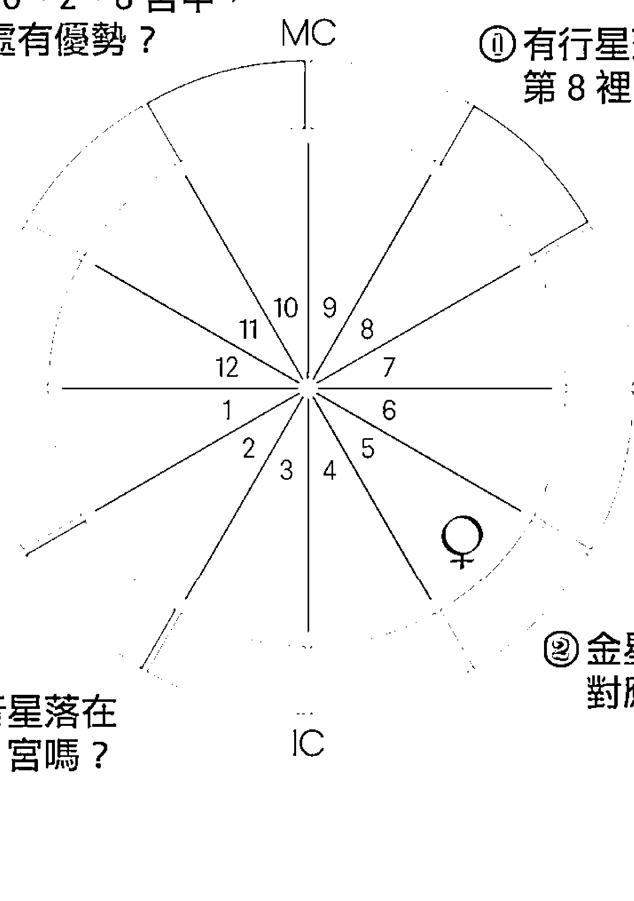

第2宮最能顯著表現出一個人與金錢的緣分、財務意識的高低。當有行星落在這個宮位時，與金錢的緣分會比沒有行星的情況更深厚。其次重要的是位置與第2宮相對的第8宮。相較於第2宮顯示的是自己所賺的錢，這個宮位所代表的是與生俱來、繼承的遺產等不勞而獲的事物。從第8宮的角度來看，債務同樣也是財產（能借錢的信用也算是財產之一）。

> > 第2宮的詳情參閱130頁，第8宮參閱154頁～

- ② 可從金星坐落的星座得知想要的事物，對應宮位了解你的資金來源

如果只是將錢拿在手中欣賞，並沒有太大的樂趣，如何運用也很重要。所謂的財富有各式各樣的型態，是現金、土地等不動產，還是名貴的寶石或股票？你想要持有何種型態的財富？想如何運用在什麼地方上？主要就由金星坐落的星座來呈現這些內容。藉由掌握興趣或嗜好，就能了解符合你的財富運用方式。此外，金星對應的宮位，則會告訴你自身的資金來源會位於哪個領域。

> 金星星座的詳情參閱90頁～，對應宮位參閱126頁～

- ③ 確認第10、2、8宮，何處為強勢狀態

要論如何生財，大多數情況下與工作有重要關聯，因此就要確認代表天職的第10宮與天頂。如果有木星、太陽坐落於此，令這些宮位具有優勢，出人頭地、創業的話就有機會獲得社會名聲及財富。然而，工作與財富有時未必會直接相關。當第2宮較強時，會將「賺錢」視為最優先，而工作內容等就成了附加的；第8宮較強的話，即使不靠自己賺錢，也有獲得各式各樣恩惠的情況。第10宮看的則是榮耀、人脈等財富。這麼一來，你也能確認在自己的人生中有何財富了。

> 宮位的詳情參閱126頁～

# 戀愛習慣與邁向婚姻的過程

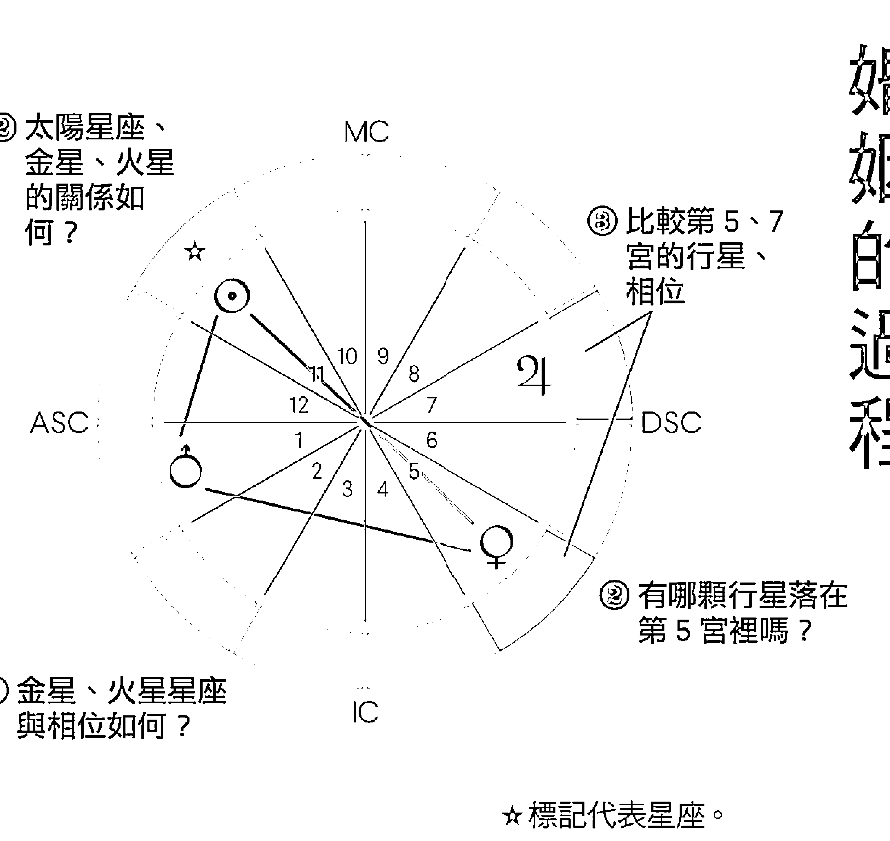

- ① 金星、火星星座與相位如何？
- ② 太陽星座、金星、火星的關係如何？
- ③ 比較第5、7宮的行星、相位
- ② 有哪顆行星落在第5宮裡嗎？

> > ☆標記代表星座。

## ① 從金星和火星坐落的星座與相位了解戀愛習慣

最能夠代表戀愛習慣的，是又稱「戀愛雙星」的金星與火星。只要得知這兩顆行星落在哪個星座，就能明白自己會受什麼樣的人吸引，會想談怎樣的戀愛。比如說，如果金星與火星落在同一個星座或元素，戀愛傾向就會有一致感。但如果金星落在火象、火星落在水象這類元素並不協調的星座時，就會形成雖然想談一場活躍的戀情，卻會被溫柔而多愁善感的男性所吸引，顯得不太搭調。此外，如果形成凶相位時，就容易陷入有問題的恋情，而吉相位則很有可能談一場圓滿的恋情。

> > 金星星座的詳情參閱90頁～，火星星座參閱94頁～，相位參閱180頁～。

## ② 從第5宮看戀愛經驗，從太陽看資質上的戀愛運

對戀情而言，邂逅運也很重要。如果金星、木星等吉星（217頁）落在第5宮，就容易獲得戀愛機會；若是土星的話，戀愛經驗就很容易減少。雖說戀愛次數的多寡並不直接攸關幸福，但知道自己有多少戀愛機會是很重要的。此外，由於原本擁有的基本資質與戀愛運也大有關聯，因此太陽與月亮坐落的星座及其相位也很重要。如果太陽、月亮、落在第5宮的行星、金星與火星對應的各星座形成吉相位等，在平衡良好的情況下，整體而言的戀愛運也會很好。

第5宮的詳情參閱142頁，相位參閱180頁，太陽星座參閱78頁

## ③ 比較第5宮與第7宮的狀況，了解戀愛與婚姻的關聯

你的戀愛觀與婚姻觀是一致的嗎？還是認為戀愛與結婚是兩回事呢？若想了解在戀愛的未來是否存在婚姻，請同時確認第5宮與第7宮。如果在第5宮與第7宮雙方都存在吉象，或是具吉相位的行星等協調的情況，就很有可能會順其自然地從戀愛步入婚姻。然而，比如說只有第5宮較好，就可能表示戀愛運雖佳，但若要考慮結婚，就不太順利了。相反地，如果只有第7宮較好，也可能是認為將戀愛與婚姻分開來考慮比較明確。

第5宮的詳情參閱142頁，第7宮參閱150頁

# 天職與工作人生

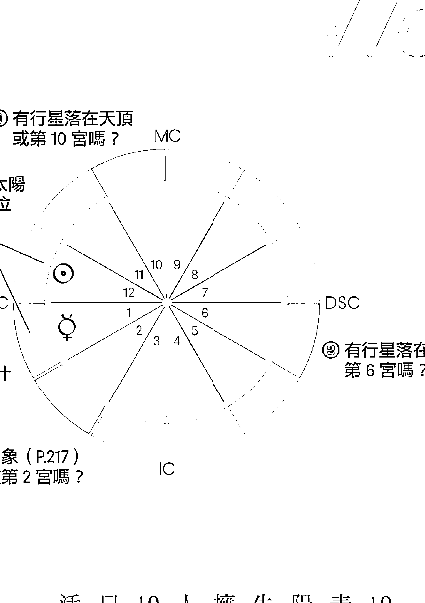

- 1. 有行星落在天頂或第10宮嗎？
- 2. 水星落在什麼星座？
- 3. 有吉象（P.217）落在第2宮嗎？
- 4. 有行星落在第6宮嗎？
- 5. 第1宮與太陽星座、相位如何？

## ① 天頂與第10宮代表人生的目標，也顯示出人生中的工作價值

位於星盤頂端的天頂，或是以此為起點的第10宮代表著人生的目標。如果有行星坐落，就表示你很有可能遇見自己的天職，而那若是太陽、木星或土星，或許還能視為「工作就是人生」並期待發光發熱。然而，並不是每個人都擁有天職，因此也可以考慮成是在工作之外的人生價值，或是在人生中的收穫。當天頂或第10宮裡沒有行星時，也能解釋成想活出「並非只有工作」的人生，與工作保持一定距離的生活方式或想法，將會令你的人生更加豐富。

> 第10宮的詳情參閱162頁

# 第3章 * 解讀星盤 〈解讀人生的七大主題〉

## ② 從第6宮看適合職業，從第2宮、水星看賺錢才能

即使必非天職，一個人還是需要工作，而且，每個人都有適合自己的職業。在想要了解工作方面時，除了第10宮，其次重要的就是第6宮。得知適合自己的工作方式或職場環境，工作起來就更加順手，也更容易找出能感覺到價值的工作。如果這兩個宮位裡都沒有行星坐落，就請確認第2宮。如果在第2宮有行星，而且還是吉象，就代表著比起從事何種職業，「工作賺錢」這件事的意義更大。只要仰賴能告知自身才能的水星所在的星座，就能重點式地尋找能賺到更多錢的工作。

第6宮的詳情參閱146頁），第2宮參閱130頁），水星星座參閱86頁）

## ③ 第1宮與太陽顯示該如何活出人生

星盤頂部顯示的是事業，代表事業對人生就是如此重要。而第1宮與太陽肩負的重大含義也會影響到事業。由於第1宮與太陽顯示的是該如何活出人生，在考慮事業方面時也是不可或缺的。太陽星座會顯示出大方向，而其光芒則有整合一切的力量，如果在事業或人生方面有所迷惘時，請回歸到太陽星座吧。太陽形成的相位若是吉相位就要培養溫厚，若是凶相位就要培養自我，與構築事業或人生有所關聯。第1宮對應的星座也會顯示你的長處或強項何在。

太陽星座參閱78頁），第1宮參閱126頁）

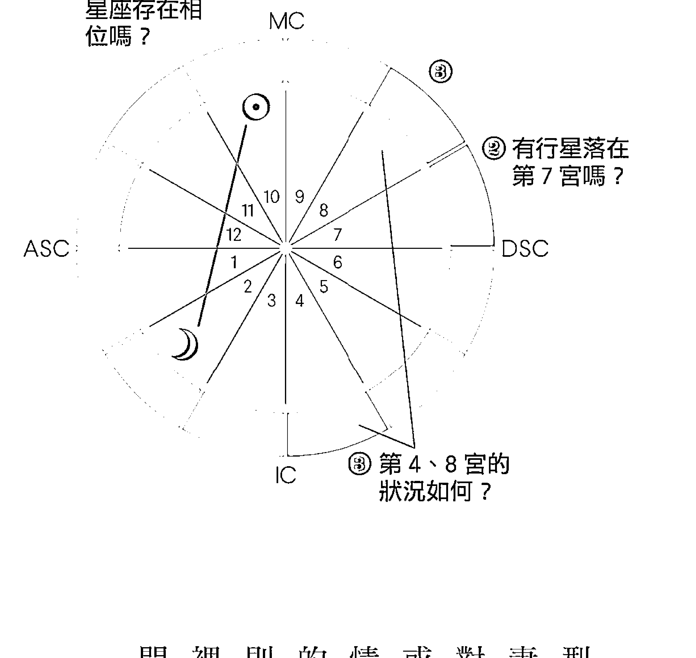

- 1. 太陽與月亮星座存在相位嗎？
- 2. 有行星落在第7宮嗎？
- 3. 第4、8宮的狀況如何？

# 婚姻與家庭生活

## ① 確認太陽與月亮星座是否有相位

對女性而言，太陽代表的是理想中的丈夫類型；對男性而言，則是月亮代表著理想中的妻子類型。直截了當地說，該星座也會是結婚對象的太陽星座，即使並非如此，也常有上升或金星等其他重點是相同的星座或同一元素的情況。如同確認「婚姻契合度」這一項，女性的月亮代表的是身為妻子的自己，男性的太陽則是身為丈夫的自己，因此如果在自己的星盤裡，太陽與月亮形成吉相位，就可以說夫妻之間的溝通順暢，婚姻生活會十分順利圓滿。

太陽星座的詳情參閱78頁，月亮星座參閱82頁，太陽與月亮相位的詳情參閱180頁

## ② 從第7宮的行星了解結婚對象的模樣

說到第7宮所顯示的夥伴關係，最具代表性的就是結婚對象，藉由坐落在宮位的行星導出的人物形象，很有可能就是結婚對象。如果落在個宮位的是代表肉眼看不見的無形現象、業力等的冥王星，就能解讀成可能因為理論難以解釋的神祕緣分而結緣。此外，行星代表的不只是人物形象，也可能會是怎樣的婚姻。比如說，如果是土星，就表示會在自己本身的精神面成熟之後才結婚。而與落在第7宮的行星形成相位的行星，則會告知如何步入婚姻的路線或提示。

## ③ 從第8宮看婚後生活，第4宮診斷建立家庭

第8宮所管理的內容之一，為「與他人的深厚感情」、「性愛」主題也與這個宮位相關，但不只如此，透過這個宮位，能窺見婚後的整體生活狀況會如何。內容可從落在第8宮的行星、宮首星座的主管行星等形成的相位來推測。此外，第4宮為人生之中支撐一個人的「根基」部分，考慮到婚姻生活可解釋成「獨立之後靠自己建立的根基」，只要搭配第8宮來解讀，也能得知自己會建立怎樣的家庭或家族。

第7宮詳情參閱150頁

第8宮詳情參閱154頁

第4宮參閱138頁

# 人際關係、溝通能力

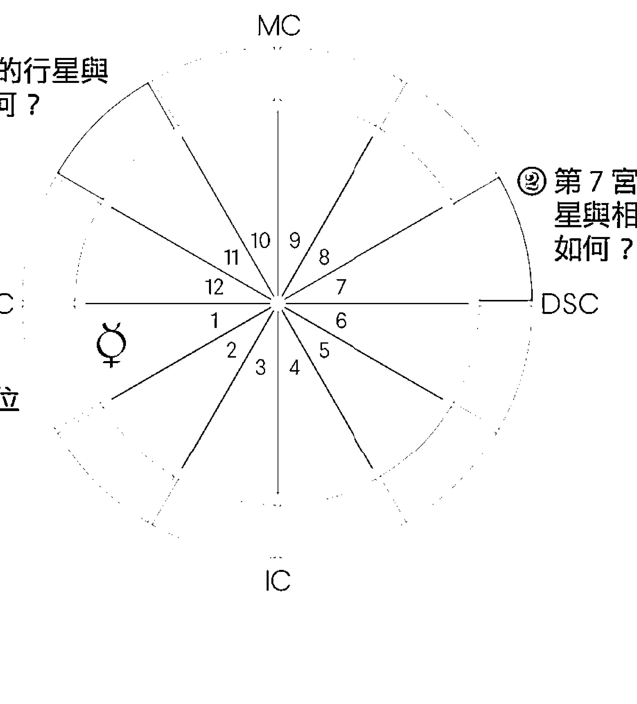

- ① 水星星座為何、相位如何？
- ② 第7宮的行星與相位如何？
- ③ 第11宮的行星與相位如何？

## ① 從水星星座與相位診斷與他人之間的往來方式

身為傳令之神的水星，能清楚顯示一個人的溝通方式。水星坐落的星座代表的是一個人想如何與周遭往來。形成吉相位的行星代表的是擅長的社交方式，形成凶相位的行星則表示不擅與人交際的部分。無相位的情況下，則表示有自己的想法無法順利傳達出去，或是無法獲得周遭理解的傾向。不過，也因此使得內在世界變得豐富，而能培養想像力。此外，這部分也可能藉由其他行星加以彌補。

水星星座的詳情參閱86頁，無相位參閱198頁，水星的相位參閱185頁～

## ② 從第7宮的行星或相位，可以得知密切合作的對象

落在第7宮的行星所代表的不是結婚對象，而是與一對一面對的人物之間的關係。該行星的形象，往往會直接表現出這類關係的人物。當凶相位眾多，或是落在第1宮的行星形成對分相時，代表這段關係難以順利發展，存在必須克服的課題。只要藉由避免兩人發展共同事業，而是盡可能地以團體形式往來，藉由下這些功夫，應該就能迴避大多數麻煩。

> 第7宮的詳情參閱180頁)，相位參閱150頁)

## ③ 第11宮顯示成年後的朋友與朋友圈中的位置

第11宮主要是了解「成年後結交的朋友」，比如說出於興趣或相同目的而聚集夥伴的時候，作為關鍵的宮位。這裡如果有複數行星坐落，代表成年後也會在許多朋友的圍繞下活動。當然，還是要確認坐落的行星為何、形成何種相位。如果是太陽或木星落在這個宮位，並形成吉相位時，就容易在這樣的朋友圈中成為領袖般的存在，在退休後或工作之外的活動會成為人生價值，在社會上也會有顯眼的活躍度。

> 第11宮的詳情參閱180頁)，相位參閱166頁)

# 健康、美容、減壓法

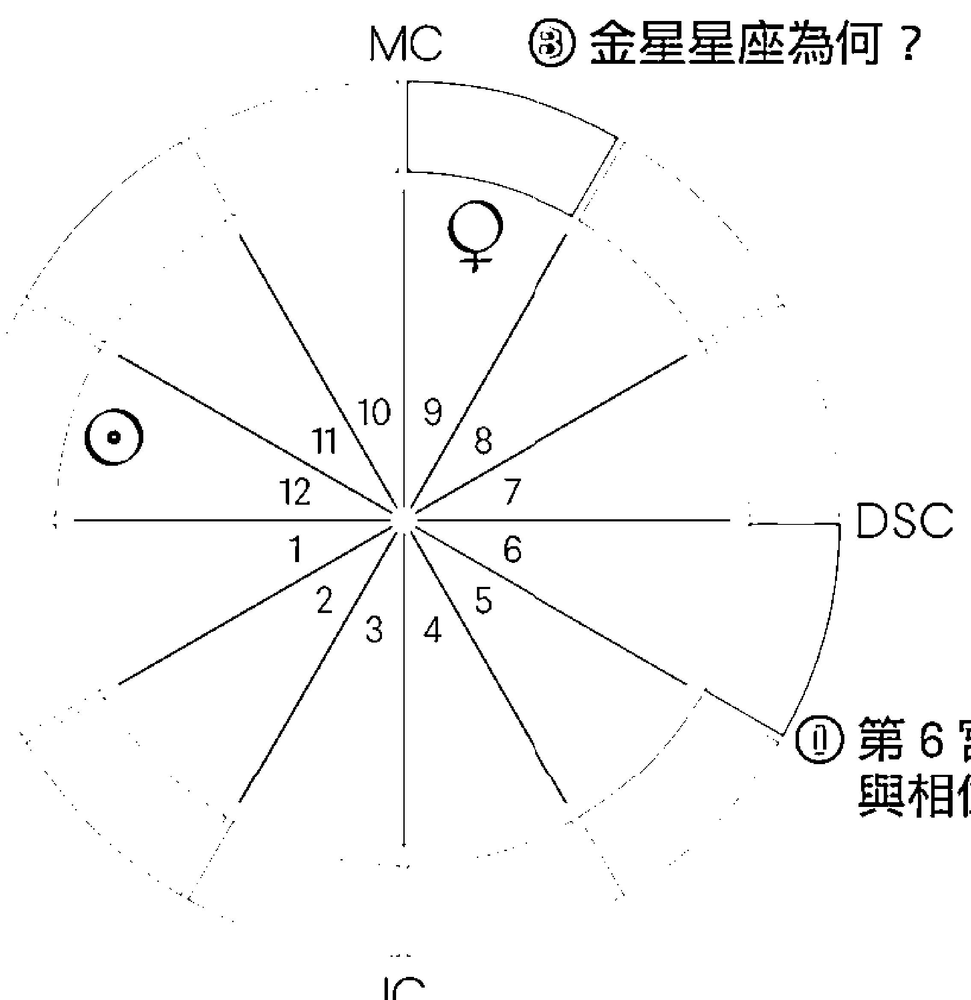

## ① 從第6宮的行星與相位來診斷健康方面的主題、部位

這裡所謂的『健康』，只是一個人身體上天生的特點。如果已經出現任何症狀，請務必遵從醫師的指示。請調查第6宮裡有何行星坐落、形成怎樣的相位。行星代表著一個人在健康方面容易成為焦點的身體部位，即使是吉象（217頁），也顯示出某些健康方面的主題。而從坐落行星或形成相位的行星所顯示的關鍵詞，有找出原因的可能性。藉由確認這些內容，就有可能迴避危險，比如說防止發病或演變成重症等。

> 第6宮的詳情參閱146頁，相位參閱180頁

## ② 太陽星座代表能量的特點與要害

太陽所顯示的星座，代表著一個人所具備能量的特點；同時，該星座司掌的身體部位，也可能會是弱點所在，那個地方對一個人而言，或許是最重要的「要害」。而與太陽形成相位的行星，也可以解讀成影響健康方面的因素。如果是與凶象（217頁）形成凶相位，就需要特別注意。比如說，落在牡羊座的太陽如果與火星形成四分相，就可以解讀成雖然精力充沛，卻缺乏耐力，也需要小心受傷。

> > 太陽星座司掌的身體部位詳情參閱52頁，相位參閱180頁

## ③ 金星星座顯示的是魅力、美麗、心理健康領域

金星坐落的星座，會告知一個人最大的魅力與美麗之處，同時也會顯示哪種美容方式最適合你。如果落在雙魚座，代表你的魅力所在是可愛或治癒系的氣質，一味地面對機械的禁慾型訓練並不適合你，而舞蹈等同時能發揮美感的運動，則可以長久持續下去。此外，金星星座還會表現出一個人單純覺得有趣的事物為何。培養該星座司掌領域的興趣，也有助於維持心理健康。

> > 金星星座的詳情參閱90頁

# Values & Happiness

# 價值觀、幸福觀、生存價值

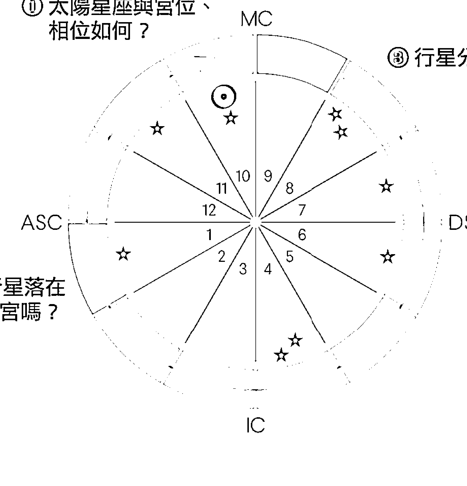

- ① 太陽星座與宮位、相位如何？
- ② 有行星落在第1宮嗎？
- ③ 行星分布如何？

☆標記代表行星。

## ① 從太陽星座與宮位、相位診斷應該前進的方向

最能明顯代表一個人應該前進的方向的，就數太陽星座了。因人而異，或許也有人會認為太陽星座的特質完全不符合自己，感覺很不舒服。不過，即使是這樣的情況，藉由以太陽星座所顯示的工作或職業為目標、在興趣或地區活動等方面活用太陽星座的含義，大多還是會讓整個生活變得活力十足。此外，也請將太陽落入哪個星座，與其他行星形成何種相位考慮進去，太陽的光芒將會確實照亮你應該前進的道路。

太陽星座的詳情參閱78頁)，宮位參閱126頁)

## ② 從第1宮的行星確認價值觀，沒有行星時以主管行星診斷

若想得知在人生中會從什麼事物發現價值，請確認落在第1宮的行星。如果是金星坐落，就代表你期望能被美術品或金銀珠寶等美麗的事物圍繞；如果是火星，就代表你的人生要憑實力在充滿競爭的社會中獲勝，才能感覺到生存價值。如果有兩顆以上的行星坐落，就將每一顆行星的含義融合起來。而且性格也會因此變得更為強悍，極有獨立開拓人生的傾向。如果沒有行星坐落，就用作為第1宮起始點的上升星座的主管行星來判斷。

## ③ 星盤上的行星分布顯示生存價值

從星盤上的行星配置，可以得知一個人在人生當中的重心何在。如果大多分布在南半球（上側），表示會藉由讓自己積極投入社會大為活躍，來獲得充實感；如果是北半球（下側），則代表是從與身邊的人溫暖地交流或個人的樂趣中找出生存價值。尤其是在四大尖軸（上升點、下降點、天頂、天底）附近有行星時，就會加強那半球的含義。就像這樣，乍看馬虎隨便的判斷方式，其實也含有重要的啟示。

# 呈現在星盤上的特別相位

## 確認能創造特別運勢的行星配置、相位

星盤由各式各樣的相位所交織而成，而其中也存在「如果有的話就太幸運了！」的「特別相位」。如果以手相作比喻，就是「斷掌」、「神秘十字紋」等特別的手相，這並非像生命線或感情線一般，是每一個人都有的線條。跟手相一樣，星盤中其實也存在好幾種當仔細觀察行星之間的相位，或是哪個符號位於哪個宮位時，令人只能認為是「在受吉星眷顧下誕生」的模式。具有這種特別相位的人，即使沒有自覺，也能獲得許多行星的眷顧，不過重點在於當事人有沒有察覺到這一點。
接下來，就來確認看看在你的星盤上是否存在這類「特別相位」吧。如果有符合的相位，就證明你有天生的幸運體質，值得高興。當然不能夠完全依賴這種相位，但在人生旅程上，請務必意識到這點並加以活用。

## 第3章 * 解讀星盤〈呈現在星盤上的特別相位〉

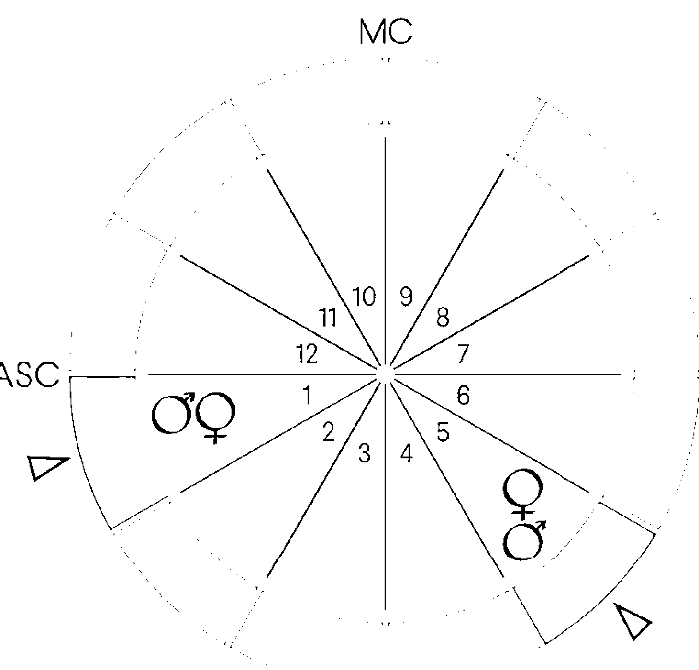

## 搶手的星盤

> ·*·**·
無論到了幾歲都很受歡迎的人
·*·**·

### 金星與火星在第1宮或第5宮形成合相

司掌愛人與被愛能力的金星，與能增強周遭吸引力的火星如果形成合相，就會隨時散發魅力，令你非常受歡迎。尤其是當這個相位落在象徵自己本身的第1宮，或是象徵戀愛或樂趣的第5宮時，就可以說是無敵。即使只是靜靜地待在原地，仍會散發氣場，帶給人存在感強烈的印象。這份運勢不會隨著年紀增長而變化，讓你能獲得比常人更多的戀愛機會，持續吸引著周遭眾人。這可說是在戀愛至上主義者身上常見的相位。

# 戀愛時一心一意的星盤

## 會陷入劇烈戀情的人

### 金星與冥王星在第1宮或第5宮形成合相

當感受愛情喜悅的金星，與擁有足以令命運產生劇烈改變的威力的冥王星形成合相，就會有為談一場充滿戲劇性的戀情而拚命的傾向。尤其是當這個相位落在象徵自己本身的第1宮，或是象徵戀愛或樂趣的第5宮時，就常有陷入令周遭大感吃驚的劇烈戀情中的情況。視狀況而定，也可能一再發展出從三角關係或外遇演變成私奔等，可說是一事實比小說驚人一的戀情。不過，深厚的愛情也有轉變為憎惡的可能。

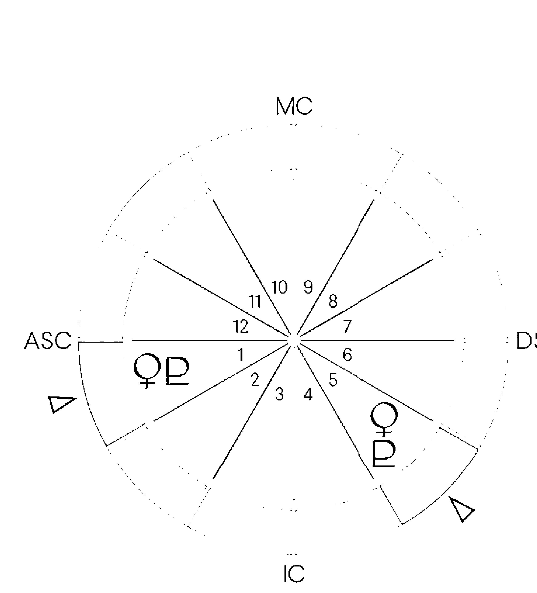

## 第3章 * 解讀星盤〈呈現在星盤上的特別相位〉

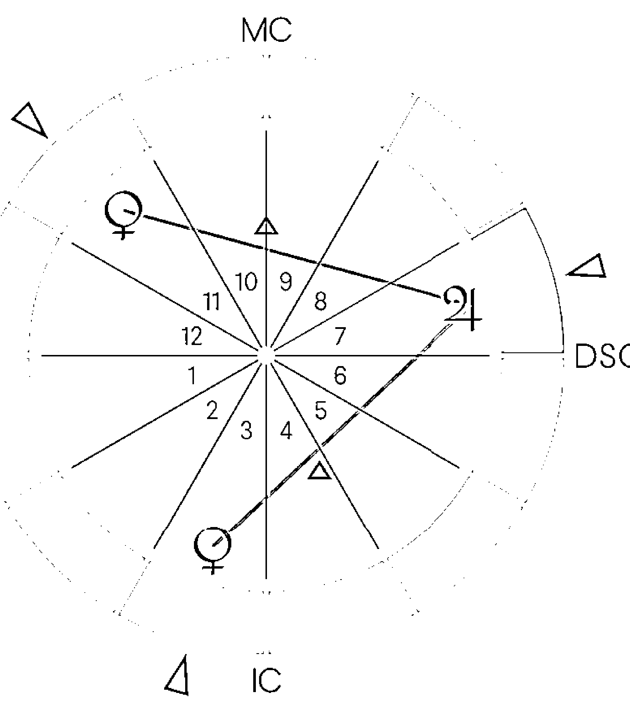

## 麻雀變鳳凰的星盤

### 木星與金星在第7宮形成三分相

### 人生因婚姻而發生劇烈變化的人

當代表發展、擴張的木星位於象徵婚姻的第7宮時，基本上就已經暗示了十分幸福、圓滿的婚姻生活。而當木星又與意味著財富和愛的金星形成三分相，換言之就是金星落在第3宮或第11宮時，代表豐盛程度會隨著婚姻升級！擁有這種相位的人，極有可能會被知名財主或具有財力的人物求婚而「麻雀變鳳凰」。簡直就像眾人羨慕的灰姑娘故事，將能盡情享受安穩且優雅的生活。

# 天才的星盤

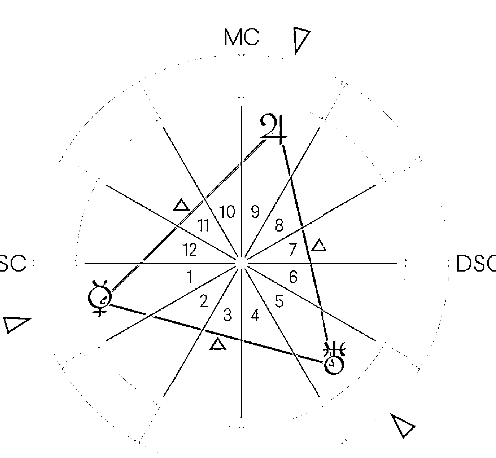

## 堪稱完人之輩

### 水星、木星、天王星形成大三角

當司掌工作能力的水星、代表發展與擴張的木星、象徵嶄新創造力的天王星在同一元素下形成大三角時，這個人就會擁有能綜合發揮多樣能力的力量。不但能接二連三地誕生獨特點子，還能延伸到各處，甚至獲得附加收穫。能夠同時兼顧好幾種不同產業，展現多才多藝的模樣，簡直是神乎其技。尤其是當這個相位落在代表「思考」的風元素時，孩提時代就極有可能會跳級升學，被人稱作神童。

用發現、點子改變世界的人

太陽與天王星在第10宮（天頂）形成合相

當顯示原本生活方式的太陽，與象徵發現或創造力的天王星形成合相時，就會成為能想出無人料想得到的點子的人物。這個相位若是落在天頂或第10宮，就不會僅限於個人的點子，甚至會延伸為改變整個社會或世界的重大發現。如果擁有這個相位，請務必將你的點子向外界宣傳，這麼一來定能對某人有所助益、賦予提示，如果是在工作上，創造出熱賣商品貢獻社會也不會是夢想。

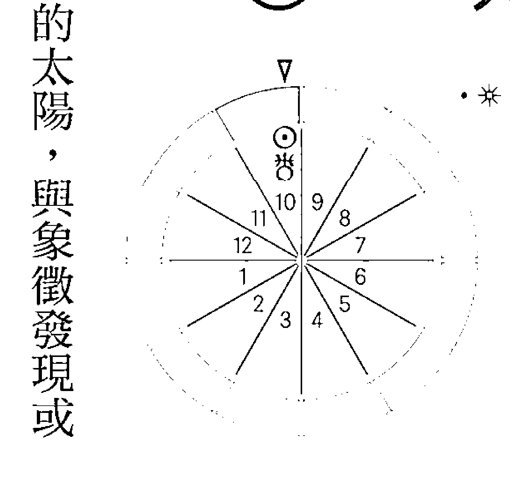

過著戲劇化且高密度人生的人

太陽、月亮、冥王星形成大三角

當代表自己本身的太陽、司掌潛意識領域的月亮、象徵命中註定的命運冥王星形成大三角，就有過著戲劇化且高密度人生的傾向。與自己的意志無關，你會有如同戲劇主角般被宏大的運勢之流吞噬的感覺。儘管如此，因為這是吉相位，所以不會往糟糕的方向前進，也容易上演只能認為是祖先庇佑的翻轉劇情。將會過著漫長而認命的人生。

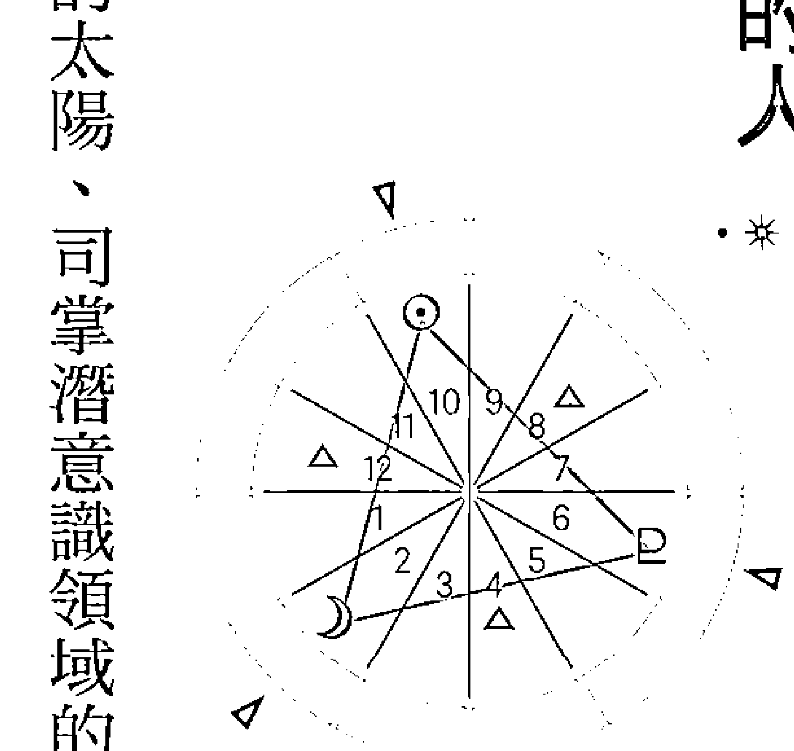

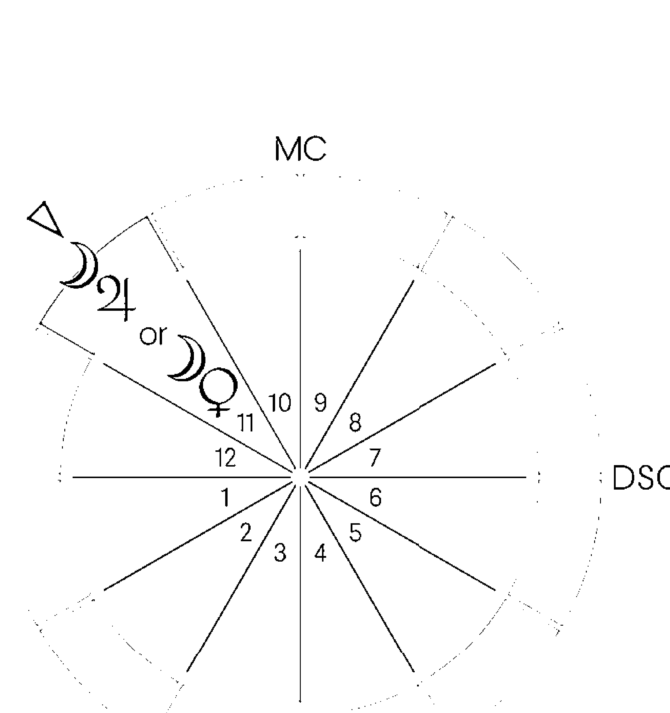

## 爆紅的星盤

### 受到每一個人喜愛的人

### 月亮與金星或木星在第11宮形成合相

當代表受到社會大眾歡迎的月亮，與愛之星．金星形成合相時，會顯示出極為強大的受歡迎運；而月亮與象徵擴張、發展的木星重疊時也帶有相同的含義。當然，如果是月亮、金星、木星三顆行星重疊，將會成為受到每一個人喜愛，人際關係無敵的存在。尤其是如果相位落在司掌友愛或夥伴的第11宮，將會與擁有社會地位的人們建立人脈，獲得受到疼愛的好運。這也能說是「永遠的偶像」的形象。

後半生會成為眾人矚目的焦點

落在第10宮的土星與太陽形成三分相

太陽與土星形成三分相，意味著花費長時間窮究一件事。這同時也是典型的大器晚成型相位，會受到長輩的提拔而活躍。尤其是當土星落在作為起始點的第10宮時，可說是後半生比年輕時期更容易沐浴在聚光燈下。你會藉由一再努力而爬上頂點，接受在社會上堪稱重要地位的職責。是在經年累月積累了知識或經驗後，發揮真本事的政治家身上常見的相位。

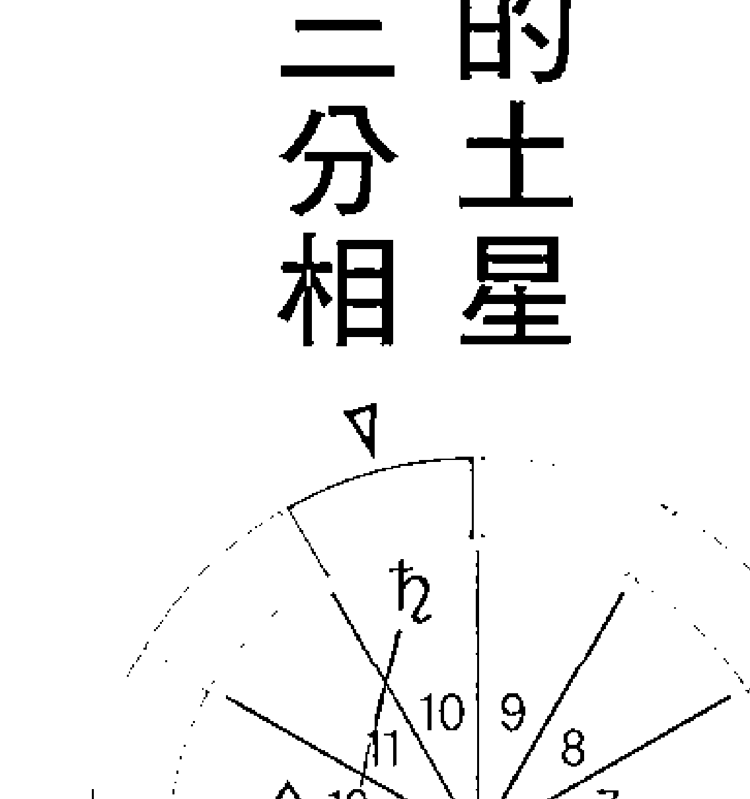

## 衝上頂端的人

### 太陽與木星在第10宮（天頂）形成合相

當象徵原本生存方式的太陽，與擴張、發展的木星形成合相時，會是無論在哪個方面都富有機會，能眨眼間衝上頂端的人。尤其是這相位如果落在天頂或第10宮時，就會以受到愛戴的領袖身分大為活躍，成為大企業ＣＥＯ等級也不是夢想。由於木星是受到周遭喜愛的行星，你不會因為位於頂端就令人望而生畏，而會受到周遭的支持。「自然而然地被捧上臺」這樣的形容十分貼切。

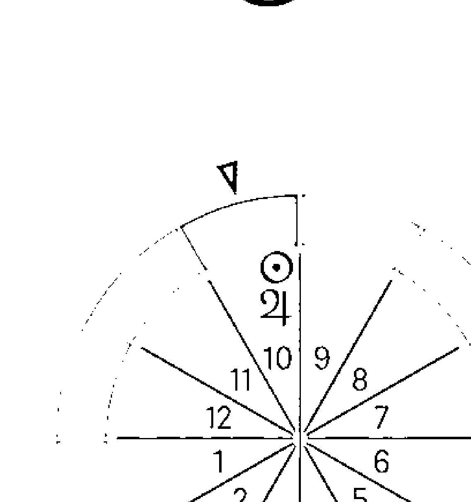

## 品味高雅的星盤

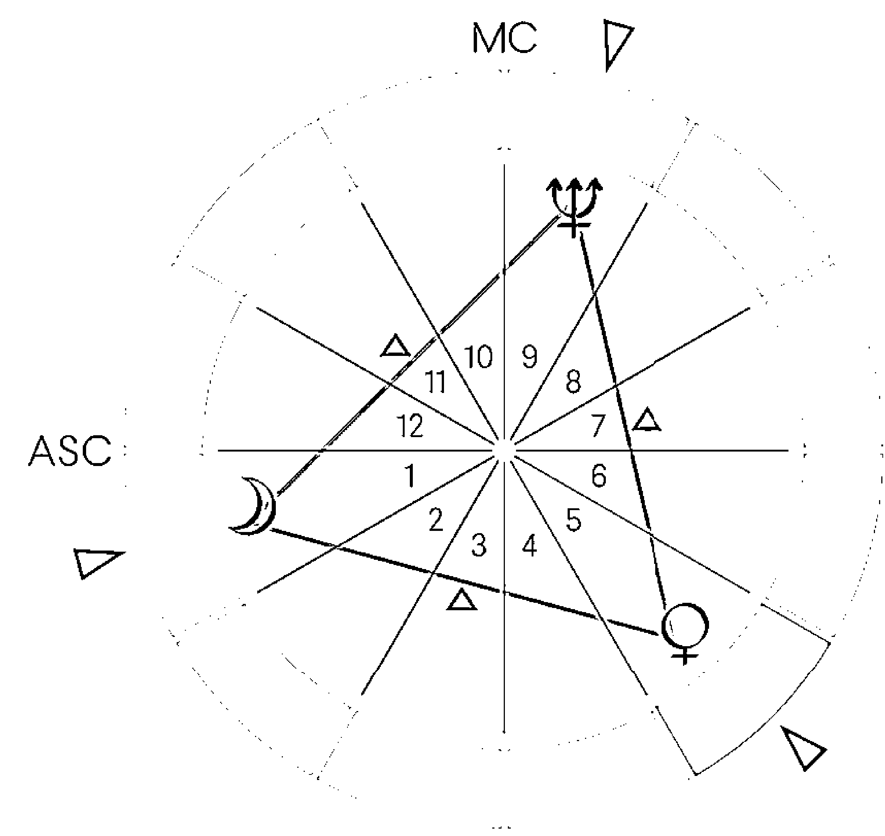

月亮、金星、海王星形成大三角

### 創造出帶給人們夢想事物的人

金星與海王星形成的三分相代表細膩的情感，善於在藝術領域表現美感的事物。當象徵大眾性的月亮加入這個相位後，就會賦予一個創造出令大眾產生共鳴的作品的才華，你會如同呼吸一般，持續地將詩詞、音樂、畫作呈現給世人，帶給人們勇氣與夢想。如果金星落在第5宮，並與海王星形成三分相，出於興趣製作的作品則會沐浴在聚光燈下。這是一在社群網路上介紹作品，被電視報導後一躍成為知名人士的人身上常見的相位。

## 生活方式鼓勵著他人的人

### 太陽與土星在第9宮形成0度或對分相

太陽與土星形成合相，是人生自力更生的證明。雖然絕非精明之人，卻能心懷信念腳踏實地累積努力，最後獲得成功的相位。當這個相位落在第9宮，你一心一意地追求理想的生活方式會受到尊敬，並影響許多人。如果是對分相時，嚴峻度會提升，你肩負著苦難，時而遭受挫折仍持續前進的身影，將會感動眾人。年輕時雖然勞心勞力，但在到了一定年紀後，就會成為很有深度的人物。

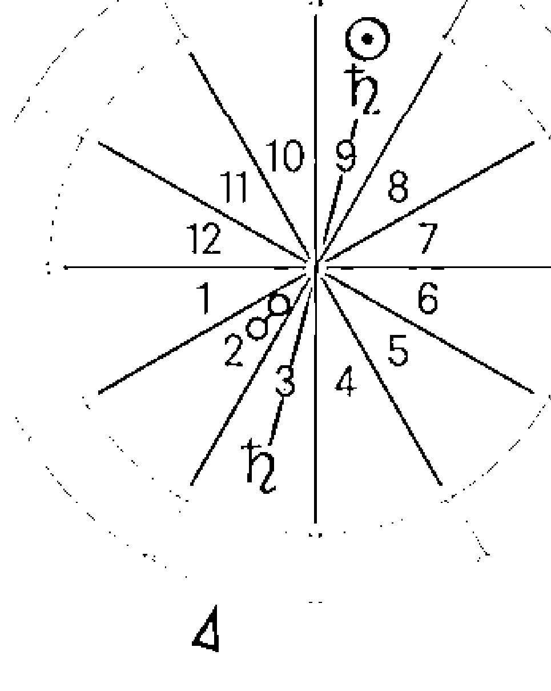

## 有出色品味，成為受人憧憬的對象

### 月亮與金星在第1宮或第7宮形成合相

月亮與金星形成合相的人，言行舉止都十分溫柔且可愛，容易獲得眾人的好感。如果這個相位落在第1宮，就會因為美感十分優秀，善於挑選襯托外表的色系或服裝，再加上性格善良而受到眾人喜愛。另一方面，落在第7宮的月亮與金星，則顯示著會獲得擁有高雅品味的夥伴或朋友。受到周遭人們的影響，你也會自然而然地親近美好事物，鍛鍊品味。兩種相位都有深受女性歡迎的傾向。

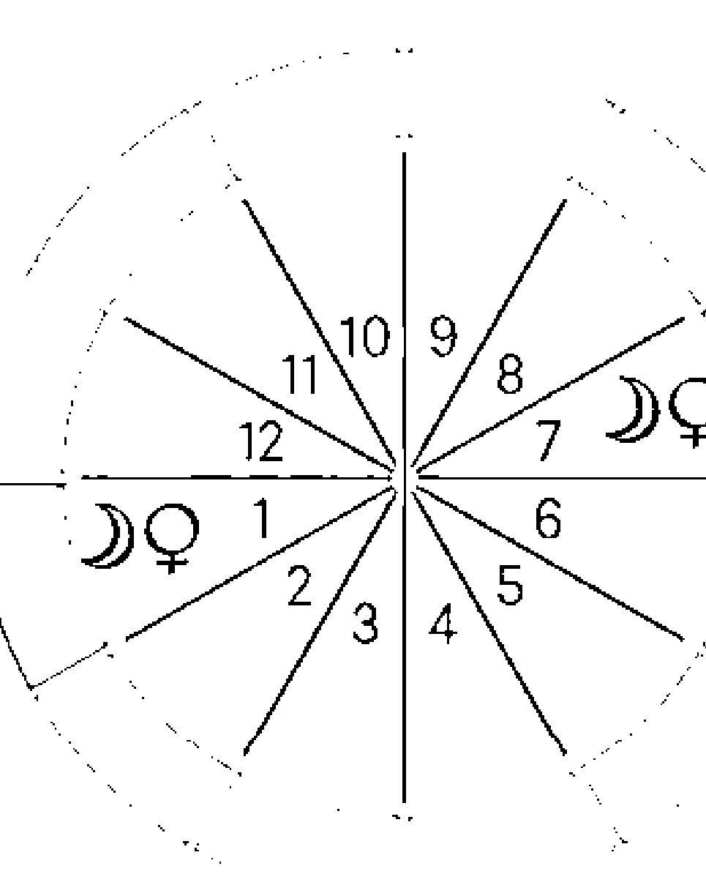

## 不知危機為何物的星盤

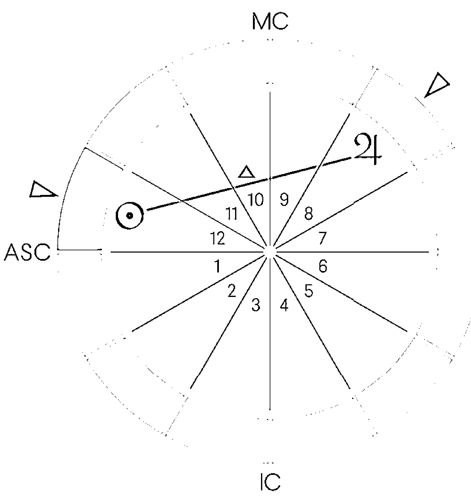

太陽與木星在第12宮形成三分相
總是受到周遭相助的人
太陽與木星形成三分相，代表著樂天且積極正向的個性，樸素而悠閒自得，是容易令人產生好感的相位。再加上太陽如果落在第12宮，就暗示著擁有「幫助運」，在爆發麻煩或困難，不知該如何是好時，就會有人伸出援手，或獲得解決方案。此外，由於擁有這種相位的人通常不太在意自己的面子，因此在需要幫助時會坦率地說出「幫幫我」，結果常在事態變嚴重之前，問題就得到解決。

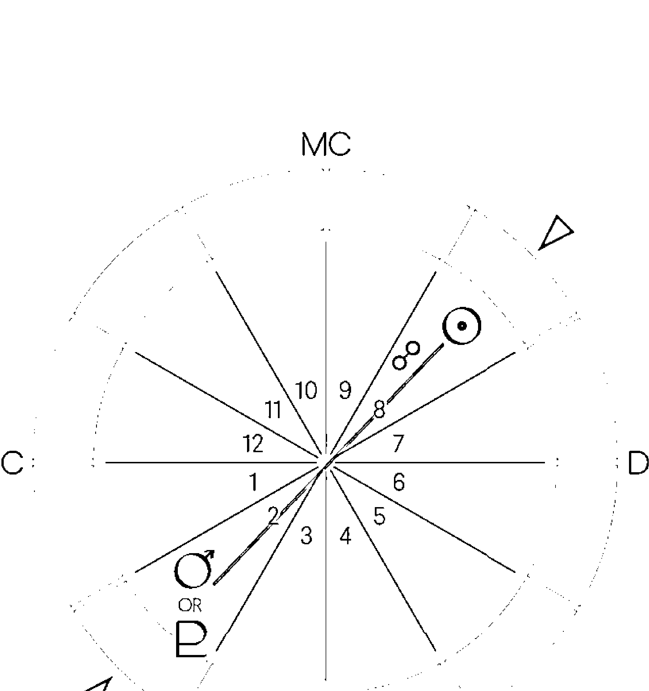

## 百折不撓的星盤

### 太陽與火星或冥王星形成對分相

### 翻轉局勢掌握勝利的人

火星或冥王星與太陽形成對分相，是擁有翻轉運之人的特徵。太陽與火星呈180度，會塑造出頑強而討厭落敗的人；太陽與冥王星呈180度，則會塑造出不顧一切地努力的個性。再加上對分相原本就含有「持續面對問題」的強悍，在這些效果相輔相成之下，賦予太陽力量，使得這個人即使受挫也會重新站起來。擁有這種相位的人，總會挑戰面對某些事物，否則容易顯得有太多力量無處可用。愈是忙碌時，身心狀況反而會愈好。

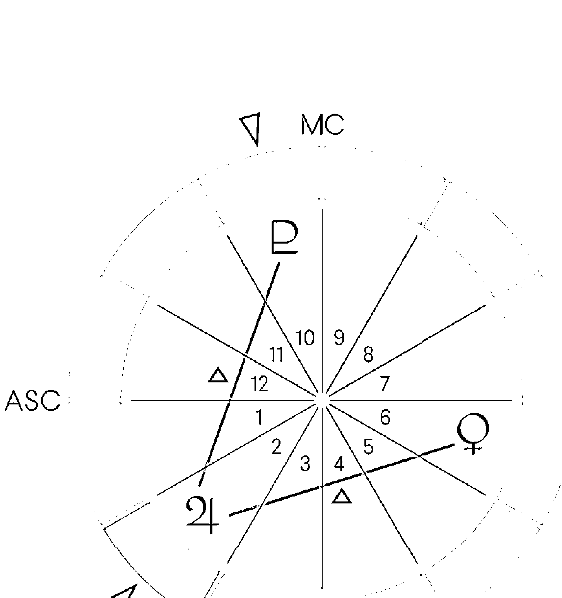

## 名媛的星盤

### 能不需辛勞就過著富裕生活的人

### 落在第2宮的木星與金星或冥王星形成三分相

木星落在第2宮顯示著「豐饒」，可以期待擁有社會性成功或豐盛的財富，光是如此就可以說有強大財運了，如果再與金星或冥王星形成三分相，就堪稱恐怖至極。與金星呈120度代表高度的美感意識，會將錢花在美食或時尚上，不過也擁有強大運勢，能賺回花掉的收入。另一方面，與冥王星呈120度是成功人士常見的相位。你擁有指揮團體的能力，極有可能鼓舞工作夥伴，締造驚人的業績。由於這兩種相位都擁有浪費傾向，請嚴格管理財務。

## 從他人手中繼承許多事物的人

### 落在第8宮的太陽或木星與其他行星形成吉相位

如果有行星落在第8宮，就代表有「繼承」某些事物的緣分。尤其如果是太陽或木星落在這個宮位，又與其他行星形成吉相位時，代表有很高的可能會繼承祖先或前人的社會地位或財產。第8宮也代表配偶的財運，所以也可能會因為結婚而提升社會地位。繼承的事物未必一定是錢財，也包括技術、傳統、人脈等無形的財產在內，可以從形成相位的行星一定程度地推測出具體而言會繼承什麼事物。

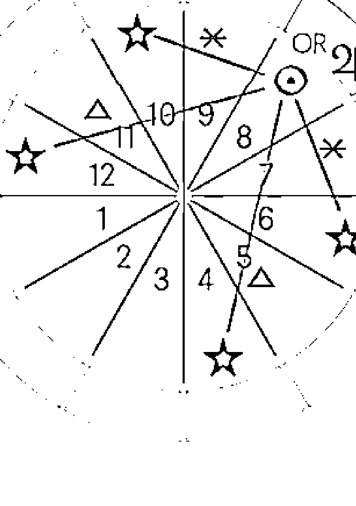

## 容易遇見機會的人

### 太陽與木星180度，木星落在第1或第9宮，與其他行星形成吉相位

太陽與木星的對分相會為你的生命力帶來多得不得了的機會，在日常生活中也容易發生幸運事件。你雖然會變得相當忙碌辛苦，不過就結果而言，有很高的機率能在短期內晉升或掌握成功。此外，落在第1宮或第9宮的木星代表高度精神性，溫和而高潔的人品會吸引許多合作夥伴或支持者。如果與其他行星形成吉相位，機會就會透過支持者降臨。

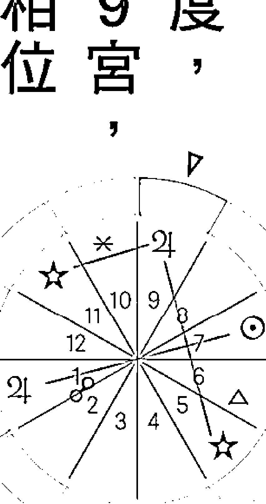

## Q&A 消除針對星盤擔憂之處的

Q 我用網路上的免費資源製作星盤，為什麼會有差異？

A 根據宮位的計算方式不同，劃分界線的方式及星辰位置都會有所改變。

劃分星盤的宮位，有各式各樣的計算方式。本書的網站使用的是稱作「柯赫制」的方式，除此之外還有「普拉西德制」、「太陽宮位制」等，其他網站會使用不同方式，以此為準計算的話，宮位劃分的方式或大小都會隨之改變。每一種計算方式都有優缺點，先以一種方式為主，等習慣解讀後再嘗試其他方式也可以。

本書到目前為止從各種角度介紹了解讀星盤的方式。不過，這種「解讀方式」只是其中一種範例，根據占卜者的思考方式，以及時代的演變，解釋也會隨之變化。你目前才剛站上起跑線，從現在起，請盡量閱讀星盤，判斷「或許還有這種解讀方式」，建立起屬於自己的解讀方式。接著，在這裡回答幾個今後在解讀星盤的過程中，可能會浮現腦海的疑問。

## 第 3 章 解讀星盤〈消除針對星盤擔憂之處的 Q & A〉

Q 我經常聽到「逆行」這個詞彙，是行星會逆向移動嗎？

A 這指的是「看起來」倒退的現象，行星的影響力會減弱。

行星通常會從牡羊座以順時針方向，往金牛座→雙子座……雙魚座的順序移動。不過，除了太陽與月亮以外的行星，有段時間會有看似從摩羯座→射手座，或牡羊座→雙魚座的現象，這種現象就稱作「逆行」。當然並不是行星實際在倒退，只是因為與地球公轉速度的差異與行進軌道的緣故，而讓人看起來覺得如此罷了。呈現逆行狀態的行星，影響力會降到大約70％，可視為行星所意味的事物無法順利進行。

Q 在二元性、三大模式上偏向某一邊，是代表性格上有偏差的意思嗎？

A 所謂的偏移是個性的表現，並非判斷「好壞」，而是看成「是怎樣的個性」。

所謂二元性（陽星座性、陰性星座）、三大模式（開創星座、固定星座、變動星座）的平衡有偏移，代表的是此人多麼有個性。存在著容易強烈表達出個人特質的傾向，比如對事情有所堅持或好惡分明等。如果能將應該發展的事物盡量發展，就有可能成長為可充分活用個人特質、充滿魅力的人。重點在於，那並非「好壞」，而是一個人的個性表現。此外，比如說在三大模式下，有的宮位完全沒有行星坐落，也可能受到身邊之人的影響，彌補該宮位的不足。

Q 我的水元素中沒有半顆行星，是否代表我在情感方面有所欠缺？

A 元素只是顯示出思考迴路的習慣，並不是缺少情感。

比如說，代表情感的行星是月亮，由於所有人的星盤上都存在著月亮，因此並不是代表沒有情感。

「水」元素代表的的確是情感、情緒，不過比起性格，更是在顯示思考迴路的習慣。即使思考的是同一件事，如果是缺少水元素，較多風元素的人，思考時就會先想到理論面，接著是現實面，最後才是情感面。這並不是說欠缺情感，而是說先從其他角度開始思考，比較容易著手。

Q 代表婚姻的第7宮及代表家庭的第8宮沒有行星！是我的婚姻運很弱嗎？

A 沒有行星坐落的宮位，代表的是不包括可視為人生高潮的話題。

如果有行星坐落在宮位中，無論好壞，該宮位的確都十分「強大」，但是沒有行星並不代表你無法結婚。比如說，如果是寫自傳，有行星坐落的宮位就會充滿足以寫好幾頁的話題；沒有行星的宮位，就會幾乎用不到一頁。意味婚姻的第7、8宮裡沒有行星坐落，並不是代表結婚運弱，而是可以解讀成「過著平穩的婚姻生活，不會發生可成為人生高潮的事情」。

## 第3章 解讀星盤〈消除針對星盤擔憂之處的Q & A〉

Q 代表金錢的第2宮位裡沒有行星，是表示我的人生與財富無緣嗎？

A 財運不只看第2宮，也要看第8宮，此外也要確認金星、太陽的狀態。

第2宮指的是金錢或經濟，尤其指一個人親手工作賺取的財富。如果這個宮位沒有行星坐落，與其說是與財富無緣，不如說是在人生中沒有什麼與「自己獲得的財富」相關的話題。也可能是當事人並不看重金錢。根據代表從他手獲得財產的第8宮狀態而定，或許會有與「繼承財富」相關的話題，而財富的狀況也會根據金星或太陽、接近天頂的行星狀態等有所差異。

Q 代表限制的行星・土星形成許多相位，是代表我的人生會受到諸多限制嗎？

A 這代表的是有許多應該克服的主題，換言之，會獲得許多成功的機會。

「土星＝限制眾多」這個含義是不能一概而論的，如果土星造成正面影響，就會帶來信任、努力、耐性，或成為某些方面的專家等，有在人生中獲得重大成就的可能性。土星之所以會有「壓抑」的形象，是因為這代表的是在人生中有許多應該克服的主題。當土星形成許多相位時，代表著從許多方面都有需要克服的事件降臨，雖然或許需要耗費各種工夫，但也表示增加了許多成功的機會。

太陽或木星等重要的行星形成許多凶相位，是代表人生困難重重嗎？

雖然存在許多不以為苦的波折，人生或許仍會有重大成就。

重要的行星形成許多凶相位的人，在人生当中需要下足功夫，或许需要多少绕点远路。不过当常人似乎不觉得有那么困难或辛苦。这类人的特质原本就是多属「如果没有些许风波，就没有努力日志」的强者。对于呈许多凶相位的人而言，所谓的「美好生活」，就是即使多少有些波折，结果还是能获得真正追求的事务，并有重大成就，因此大多不会将其视为艰辛的人生。

如果爱之星·金星形成凶相位，是代表恋情会有障碍吗？

有的或许并非障碍，而是「学习」。以吉星为武器加以应对吧。

这代表的或许并非障碍，而是代表在恋爱方面有需要学习的事物或跨越的主题。不过，金星代表的并不只是恋爱，还有财富、艺术等各式各样的含义。此外，也会根据显示一个人基本特质的太阳或月亮的状态等而有所差异，因此难以一概归纳成「恋情有困难」。无论如何，跨越障碍的方法要多少有多少。其中一种，是在自己星盘上强大（状态佳）的行星作为武器，再搭配与对方之间的契合度，将吉星作为王牌来应对，就有可能谈一场幸福的恋爱。

## 第4章

## 透過星盤診斷契合度

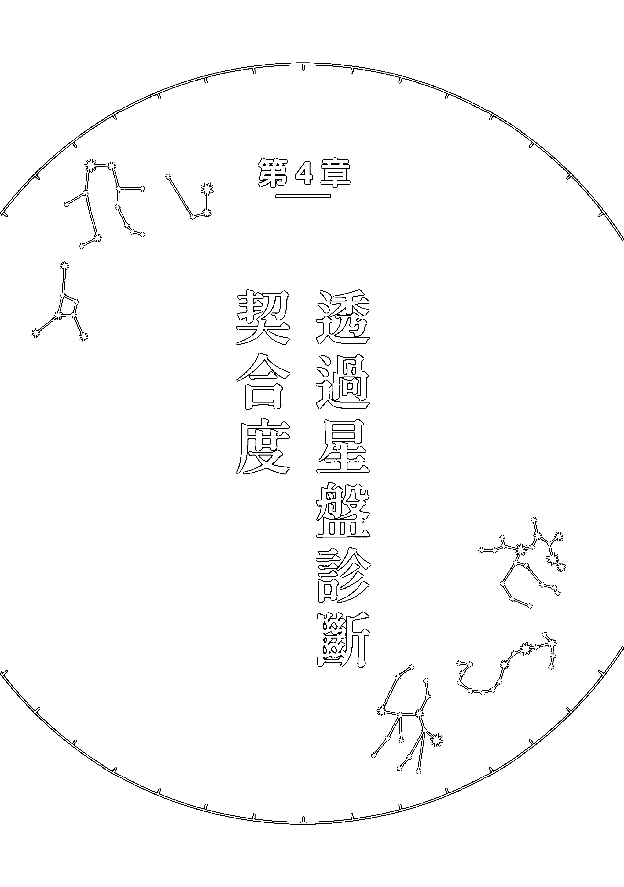

## 基本、戀愛、婚姻三大契合度

### 你與周遭人們之間的契合度

「人無法獨自生存」，是一句常見的話。就廣義而言，指的是生活上難以自給自足的現代社會；而另一種意義則是在我們的人生中總會與其他人有關，由家人撫養長大，向朋友、長輩、老師學習許多事物，在喜怒哀樂中成長。在出社會後，就會與更多人產生關聯，並締結戀愛、結婚這種特殊的人際關係，接著又增加了家人……一切事情都與人密不可分。

有的人第一次見面就意氣相投，彷彿認識許久般相處熱絡；另一方面，也有的人明明已經待在身邊許久，卻不知為何關係尷尬。而在占卜鑑定時，也有許多前來諮詢的問題是類似「我跟這個人能相處順利嗎？」等，與契合度有關的內容。在本章中，首先會仔細檢視從基本性格解讀「基本契合度」、許多人諮詢的「戀愛契合度」及「婚姻契合度」後，再介紹與

## 透過太陽星座解讀彼此的基本契合度

從下一頁起，會將太陽的十二星座×十二星座的所有模式以表格方式呈現。請檢視你的太陽星座那一頁，並確認你與周遭人們之間的性格契合度。由於是基本契合度，因此不分年齡性別，能適用於所有對象。即使對方是外國人或在外國出生，只要確定太陽星座就能占卜。在表格中塗了底色的星座，是與你的太陽星座相同元素的星座，代表著價值觀合得來的良好契合度。即使會與在星盤上處於完全相反的兩側（對立，267頁）的星座互斥，仍是不是容忽視的契合度。

### 基本契合度簡易指南

*   同星座的兩人之間容易互相理解，契合度佳。另一方面，也會有過於親密的傾向。
*   元素相同，同為火象、土象、風象、水象星座的兩人之間會很投緣。
*   火象與水象、土象與風象之間的性格會完全相反。
*   火象與風象、土象與水象之間的契合度有相乘效果。

## 牡羊座的你與十二星座的基本契合度

*   **雙子座**：兩人都是靈活度高的行動派，興趣或想做的事情如果一致，就會非常合得來。雖然能一同度過愉快的時光，但因為兩人都是三分鐘熱度，欠缺持續性。或許需要努力維繫交流。
*   **處女座**：你對處女座的印象是「細膩」、「神經質」，而對方則容易覺得你「沒神經」，乍看之下或許是水火不容的關係。不過，務實的處女座同時也是能彌補你不足之處的可靠對象。
*   **射手座**：兩人都是直覺型且十分活躍，也有許多共同點，似乎能一見如故，意氣相投。雖然是十分合拍，無論做什麼事都十分享受的搭檔，卻也容易順勢而行，所以在工作等實務方面上令人有些擔心。你似乎需要擔任輔助角色。
*   **雙魚座**：是由牡羊座掌握主導權的組合。雙魚座會配合牡羊座，不過因為依賴心重，可能會覺得一味走自己的路的你「薄情寡意」。如果能隨時關心，對方就會更仰慕你。
*   **金牛座**：與活躍的牡羊座相反，金牛座屬於文靜型。乍看之下並不平衡，不過只要能確實將彼此的職責做好分工，就會是很好的一隊搭檔。雖然是由你主導的關係，不過只要不是單方面，也尊重對方的執行力就會是◎。
*   **獅子座**：兩人都同樣討厭失敗也同樣努力，是會互相認同，成為良性競爭對手關係的契合度。當意見不合時，可能會有固執己見而爭執不下的危險，但只要你主動既往不咎，就能維持良好的關係。
*   **天蠍座**：對於外向的牡羊座而言，內向的天蠍座就某方面來說是神祕的存在。由於天蠍座十分謹慎，是需要花費時間才能消除隔閡的類型。不過一旦敞開心扉，就會將你視為可信任的對象，所以請有耐心地建立這段關係。
*   **水瓶座**：兩人都很友善，是感情要好的契合度。雖然說是由牡羊座在引導的關係，不過配合度高的水瓶座也很合拍。由你來將對方的點子付諸執行，就能發揮良好的默契。
*   **牡羊座**：兩人的性格傾向原本就十分相似，也因此一旦表現出討厭失敗的一面，或許就容易起爭執。另一方面，當擁有共同的目標或興趣等指標時，就能以良性競爭對手或令人放心的夥伴身份組隊。
*   **巨蟹座**：巨蟹座驚訝於牡羊座的大膽，同時也感到羨慕。而對方會讓你感覺像與家人相處般平靜舒適，因此一旦熟稔起來，關係就會出乎意料地融洽。面對個性細細的對方，你需要注意避免直截了當地說得太過頭。
*   **天秤座**：天秤座具協調性且處事精明，相對地，牡羊座則有著魯莽笨拙的一面，所以或許是截然不同的類型。不過，正因為不同才容易互相吸引，能彌補彼此之間所缺乏的事物，可說能成為很棒的搭檔。
*   **摩羯座**：牡羊座單純明快，摩羯座深思熟慮，兩人很容易感覺到彼此間價值觀的差異，需要花費時間才能消除隔閡。面對摩羯座時，誠實非常重要，只要不將意見強加在對方身上，尊重彼此間的差異，就能培養信任關係。

## 第4章*透過星盤診断契合度〈透過太陽星座解讀彼此的基本契合度〉

### 金牛座的你與十二星座的基本契合度

雙子座▶求知欲旺盛的雙子座，是聊起天來很開心的對象。若是待在一起，對方會告訴世界顯得狹隘的金牛座各式各樣的資訊。另一方面，處事精明卻三分鐘熱度的對方，也常令你感到不知所措。是需要理性思考作判斷的契合度。

金牛座▶兩人同星座，價值觀也相似。由於彼此都較為保守，需要花費時間才能熟稔，但一旦熱絡起來後，就會關係良好。雖然是令人安心而穩定的契合度，不過由於兩人同樣固執，一旦吵架就有冷戰的傾向。

牡羊座▶由於牡羊座相當活躍，穩重型的金牛座得耗費心力才能跟上，可說是節奏合不來的契合度。然而，跟對方待在一起，行動範圍也會擴大，是能讓生活模式趨向固定的金牛座拓展自身世界的對象。

處女座▶能自然而然地熟稔起來的組合。處女座細心體貼，令人能放心把各種事交給他，對方也能被你療癒而敞開心房。藉由對彼此關心體貼，雙方能建立非常良好的關係。

獅子座▶獅子座是領導型，而溫厚的金牛座則會追隨他，是能建立良好關係的契合度。雖然凡事只要交給決斷的對方「就能放心」，但由於彼此都相當頑固，一旦起了爭執，就需要花費時間才能修復關係。

巨蟹座▶是容易熟稔的契合度。由於彼此追求的都是家人般的感覺及誠實的關係，待在一起就能感到放心。雖然能建立良好的關係，不過獨占欲強的巨蟹座會希望建立只有兩人的世界，或許會令你感到有些窒息。

射手座▶對於穩定型的金牛座而言，大膽的射手座是無法預測的對象，常會發生「搞不懂為什麼要做那種事」的情況。然而，眼界遼闊的射手座也是能讓你學習全新價值觀的對象，因此請接受對方的自由吧。

天蠍座▶兩人乍看之下完全相反。由於天蠍座的警戒心強，一開始會給人難以接近的印象。不過，對方既誠實又一心一意，只要花費時間獲得信任，就能建立良好關係。尤其在戀愛方面，會培養出穩固的感情。

天秤座▶兩人的美感都十分優秀，品味方面也十分相似，會擁有良好印象。但另一方面，由於根本上的價值觀有細微差異，容易令人感覺偏差。關鍵在於必須理解彼此的差異，並且不要過度介入。

雙魚座▶金牛座的情感穩定，雙魚座的個性纖細，由於能不著痕跡地互相輔助，是容易互相吸引的契合度。雖然容易成為朋友，但也存在只要情感上有所偏差，關係就會惡化的一面。重要的是確實將關心的話語說出口的態度。

水瓶座▶對於感覺型的金牛座而言，講求邏輯的水瓶座是難以相處的對象。不過由於對方擁有很具個性的想法，是同時能拓展你的眼界的契合度。不要一味地關注差異，而是尊重能互相認可的地方，就能建立良好關係。

摩羯座▶兩人同是現實主義者，價值觀相似。由於同為謹慎型的人，需要花費時間才能消除隔閡，但由於基本上契合度佳，而能一點一點地建立信任關係。是隨著往來愈多，就愈能體會到彼此優點的關係。

### 雙子座的你與十二星座的基本契合度

雙子座▶兩人個性相似，十分有默契。興趣與話題也聊得來，是能夠一同愉快度過時光的關係。契合度絕佳，不過由於彼此都不會過於深入，關係容易流於膚淺，需要努力維繫關係。

金牛座▶雙子座是行動派，金牛座是謹慎派，基本上是步調不合的組合，但金牛座的堅韌或包容力，是雙子座沒有的特質。若能尊重這一點，由你來主導，就能發揮良好的默契。

牡羊座▶兩人都擁有行動力，且十分合拍，如果感興趣的方向一致，契合度就會無比良好。對於一同享受想做的事的雙子座來說，勇於冒險的牡羊座應該能成為你的好搭檔。不過，由於對方較為急躁，考慮到這一點很重要。

處女座▶彼此都是知識型，但兩人的方向不同。神經質的地方也十分相似，堅持的部分則不同，可說是容易感受到微妙偏差的契合度。話雖如此，由於彼此都有值得尊敬的地方，只要保持一定距離就能友好相處。

獅子座▶雙子座為投射型，獅子座為執行型，若是由獅子座實現雙子座的點子，就能合作愉快。可說是一起做事時最強的組合。由於雙子座容易成為支援角色，所以要好好控管。

巨蟹座▶相對於追求家人般關係的巨蟹座，雙子座則喜愛自由，價值觀不同的對象容易令你喘不過氣。然而擅長照顧人的巨蟹座如果成為夥伴，會是非常可靠的對象。只要保持適度的距離，應該就能建立良好關係。

射手座▶好奇心旺盛的兩人，是容易互相吸引的組合。雖然契合度佳，卻也因為十分相似而容易變成競爭對手。或許需要注意容易競爭而吵架這點，若能發展成切磋琢磨、互相成長的關係是最好的。

天蠍座▶對於喜歡廣而淺的交流的雙子座而言，期望窄而深入關係的天蠍座是價值觀合不來的對象。是容易在溝通上失之交臂的關係。重要的是理解彼此間的差異與個性並加以尊重。

天秤座▶兩人都既有知性品味又是交際高手。你們的價值觀也相似，可以馬上互相理解彼此想說的話，是知己程度的契合度。雖然能舒適地往來，不過相乘效果無論好壞方面都相當大，關鍵在於必須自制，別被拉住歧途。

雙魚座▶雙魚座是能夠配合人的類型。由於也能配合雙子座的點子或興趣，而讓你能愉快地主導。不過對方的依賴心也重，可能很容易增加你的負擔。為了維持良好的關係，保持適度的距離感很重要。

水瓶座▶兩人都是知識分子，也有追求變化的強烈傾向。因此能培育出良好的關係，成為互相刺激、一起成長的存在。契合度出類拔萃，不過美中不足的是雙方也都是三分鐘熱度。藉由在團體中交流，應該能長久往來。

摩羯座▶雙子座是進步派，摩羯座則是保守派，是一開始就容易令人感覺「合不來」的組合。另一方面，在工作等實務上則能合作愉快。對方能將你的想法在現實面上經由妥協後統整起來，似乎能成為很好的搭檔。

### 巨蟹座的你與十二星座的基本契合度

雙子座▶巨蟹座感性，雙子座理性，是容易切身體會到價值觀差異的關係。不過，學識淵博的雙子座似乎會為你展現截然不同的世界。只要不完全將對方的言行舉止當真，在某種程度上聽過就算，就能建立良好的關係。

金牛座▶兩人的價值觀一致，是共同點眾多的契合度。由於彼此都是重視家庭或生活的類型，能成為即使什麼也不說仍能互相理解的關係。另一方面，由於常會建立只有你們倆的世界，使眼界變得狹隘，因此要意識到與社會的接觸點。

牡羊座▶你常會被不顧一切往前衝的牡羊座牽著鼻子走，容易形成只有單方面的關係，是會累積壓力的契合度。不過，當有共同目的時，能成為指揮塔的牡羊座就會是非常可靠的存在。這段關係中的角色分配非常重要。

處女座▶兩人都十分細膩且細心體貼，是能夠分擔煩惱，待在一起十分放心的組合。不過因為雙方都有些怕生，需要花費時間才能消除隔閡。重要的是慢慢培養感情。

獅子座▶細膩的巨蟹座會依偎在具領導能力的獅子座身邊，兩人是這樣的關係。只要你支持對方，對方也會保護你。不過，一旦意見或主張起衝突，可能會長時間僵持不下，因此需要你主動退讓一步。

巨蟹座▶同星座的兩人，十分有默契。是即使不多說也能互相理解的契合度。待在一起十分舒適，只要不忘記體貼，關係就能長久維持下去。不過，由於會散發出一種令他人不敢靠近的氛圍，因此與其他人交流也很重要。

射手座▶射手座落落大方的態度，看在巨蟹座的眼裡反而是粗率且沒神經；射手座也覺得巨蟹座十分死板，兩人湊在一起相處，會十分辛苦。然而，樂天派的射手座卻能拯救容易消沉的巨蟹座，可說是互補型的契合度。

天蠍座▶兩人都十分情緒化且重視他人的心情。由於情感機制相似，是自然而然地能傳達彼此想法的「心領神會」的契合度。由於重視一心一意及誠實，能培養出更為堅韌的感情。不過也有容易排他的問題，需要注意。

天秤座▶天秤座是外向型，而巨蟹座是內向型。兩人感興趣的向量不同，是難以理解彼此的關係。天秤座喜歡廣泛與人交流，因此容易令獨占欲強的巨蟹座產生不信任感。重點在於要接納彼此的不同，別過於束縛對方。

雙魚座▶兩人 在情感豐富這點很相似，是能感覺到療癒的組合。待在一起會十分放心，而隨著關係愈來愈親密，信任程度也會加深。雖然堪稱是「默契絕佳」的名搭檔，不過由於兩人都容易受情緒左右，或許很容易欠缺果斷。

水瓶座▶對於重視心情的巨蟹座而言，愛講理的水瓶座是講不贏的對象，因此令你容易累積挫折，但你又會從理論派的水瓶座身上感受到自己所沒有的魅力。若能以寬敞的心胸接納，應該就能建立良好的關係。

摩羯座▶兩人都十分保守且踏實，在生活方面的價值觀也有許多相似之處。另一方面，家庭性的巨蟹座與社會性的摩羯座之間，對於社會上角色的意識則有很大的差異。如果角色分工得好，就能建立非常好的關係。

### 獅子座的你與十二星座的基本契合度

雙子座▶兩人都是開朗的行動派。雙子座的見多識廣對於獅子座很有助益，而獅子座的執行力則能拉著雙子座前進，因此能進一步擴大彼此的行動範圍。只要不束縛住自由的雙子座，兩人就能維持良好的關係。

金牛座▶兩人的性格傾向完全相反，但頑固之處卻十分相似。由於兩人都不會主動低頭，是一旦吵架，關係就難以修復的組合。另一方面，由於在生活中所重視的事物，如購物或美食等容易想法一致，只要配合喜好就會關係良好。

牡羊座▶兩人都擁有堅強的意志，是能夠互相刺激、一起成長，具發展性的契合度。能成為追尋同一個目標的夥伴或良性競爭的對手，互相切磋琢磨。不過，由於雙方有堅持主張互不相讓而起爭執的危險，讓步的態度也是很重要的。

處女座▶對於領導型的獅子座來說，處女座是會成為能幹秘書的存在。然而，那是當獅子座在權力關係中處於上位時的情況，如果立場顛倒，反而容易顯得尷尬。視情況而定，必須注意謙虛或態度謙遜。

獅子座▶兩人十分相似，契合度出類拔萃。由於前進的方向容易一致，會以強大的動力與決心達成許多事。然而，由於在起衝突時也會竭盡全力，吵起架來容易鬧得很大。禮讓之心是關係圓滿的秘訣。

巨蟹座▶犧牲奉獻型的巨蟹座會支持著強而有力的獅子座，兩人之間是這樣的關係。雖然因為類型不同而容易互相吸引，但相對地，在價值觀或情感方面也容易產生摩擦。你不只是拉著天真浪漫的巨蟹座前進，重要的是還得時時以寬廣的心胸關懷體貼對方。

射手座▶雙方都是積極的行動派。擁有崇高理想的兩人，是能互相刺激、一起成長的契合度。雖然是能共享夢想或目標，並加以支援的關係，但若是其中一方遭受挫折，就會形成奇妙的氛圍。你需要無論何時都能認同對方的度量。

天蠍座▶對於態度開放的獅子座而言，戒心很強的天蠍座是難以理解的存在，是難以融洽相處的組合。不過若能讓對方敞開心扉，就能互相尊重彼此的信念。若能花費時間構築起關係是最好的。

天秤座▶這是善於交際的出色組合。獅子座是能拉動周遭的類型，而天秤座是能整合眾人的類型，兩者可說是平衡性佳的契合度。另一方面，則可能因為雙方都過於在意外表，使得腳步有些不穩，因此需要更穩固一些的觀點。

雙魚座▶對於愛撒嬌的雙魚座而言，獅子座是能守護他的存在。由於對方十分坦率地表達對你的仰慕，你也會覺得幹勁十足。另一方面，情感上則容易產生偏差。在面對纖細的雙魚座時，需要特別注意講話方式。

水瓶座▶兩人都十分重視自己的生活風格或個性，相似之處眾多，是容易互相吸引的契合度。另一方面，由於彼此的個性及主張都很強勢，有無法坦率而互斥的一面。你要成熟一些，退讓一步的態度是很重要的。

摩羯座▶獅子座是活躍型，摩羯座是謹慎型，在生活步調或價值觀上都容易感覺到落差。另一方面，兩人 在社會方面都上進心強且野心勃勃，因此是作為競爭對手時會甘拜下風的關係。如果擁有共同的目標，就能建立起良好關係。

### 處女座的你與十二星座的基本契合度

雙子座▶兩人都是健談的知識分子，乍看之下似乎很合得來，但由於你們感興趣的知識方向並不同，是容易感覺到落差的契合度。對處女座而言，雙子座顯得有些輕率，不過如果將他視為能提供不同觀點的存在加以尊重，就能關係良好。

處女座▶同星座的兩人，是默契很好的契合度。由於雙方都是謹慎派，無法一認識就志同道合，但是會透過工作等情況，在作業過程中培養信任。只要維持體貼的心，就保持良好關係。

射手座▶對於管理能力強的處女座而言，行事隨興的射手座是超乎理解範圍的存在。雖然很容易被耍著玩，但你也有被樂天派的射手座拯救的一面。另一方面，對於對方而言，處女座顯得較神經質，因此重點在於不要凡事都出手干預。

雙魚座▶處女座與雙魚座的關係，會是處女座負責照顧雙魚座。由於雙魚座會仰賴責任感強的處女座，而讓你總覺得「該做些什麼」，因此變得像對方的監護人一樣，使得關係失衡。重要的是別做過頭，保持適度距離的態度。

金牛座▶兩人都真誠而踏實，契合度出類拔萃。雖然缺少刺激，卻是能給人溫暖安心感的組合。不過，一絲不苟的處女座也可能會被態度一派悠閒的金牛座搞得煩躁不已。若能好好地引導，就能維持良好的關係。

獅子座▶處女座會追隨值得信賴的獅子座，兩人之間是這樣的關係。處女座的細心體貼，對獅子座而言也是很有幫助的存在。雖然能建立良好的關係，但處女座可能會有被迫忍耐的情況，因此別勉強自己配合對方，要注意適當地「斟酌」。

天蠍座▶兩人都很認真而責任感強。天蠍座給人乍看難以接近的感覺，因此一開始會難以融洽相處。另一方面，對天蠍座而言，處女座則是足以信任的存在。而且這份感覺會隨著時間愈來愈強，能成為待在一起就很放心的夥伴。

水瓶座▶處女座講求紀律，水瓶座熱愛自由。兩人雖然同為知識分子，價值觀卻不同。水瓶座過於獨特的思考方式會令你手足無措，不過若能改變角度，也能學到許多。藉由在現實面上加以輔助，就能培養良好關係。

牡羊座▶牡羊座講求迅速，處女座講求謹慎，是節奏不合的契合度。不過，對於細緻的處女座而言，精神強大的牡羊座也是你憧憬的對象。不要一口氣縮短距離，而是花費時間建立良好的距離感。

巨蟹座▶對於細緻的處女座而言，巨蟹座是能理解你情感細微之處的存在，能讓你產生「受到理解」的安心感，培養良好關係。另一方面，巨蟹座的獨占欲強，因此最重要的一旦承諾了就不能背叛的誠實。

天秤座▶善於交際的天秤座對處女座而言是耀眼的存在。會不著痕跡地關心人，令你有很好的印象。此外，務實的處女座能成為天秤座的良好後援。不過，必須注意別因為對天秤座抱持期待而太過嘮叨。

摩羯座▶兩人都很踏實而認真，有許多共同點。只要由處女座引導保守的摩羯座，就能加深關係。尤其如果擁有相同的目標，在工作等合作上就能成為以絕佳默契進展的最佳夥伴。

### 天秤座的你与十二星座的基本契合度

双子座▶ 具灵活度且出色的两人，契合度出类拔萃。总有聊不完的话，是待在一起十分自然的关系。然而，你们虽然尊重彼此的自由，却也容易造成关系肤浅。为了维系关系，有时聊些深入的话题，比如说分享烦恼也是很重要的。

金牛座▶ 两人的美感极高，是认同彼此品味的组合。如果兴趣或嗜好合得来，就能培养出非常良好的关系。另一方面，对方的固执也会令你感到疲倦，为了维持感情，建议保持若即若离的关系。

牡羊座▶ 牡羊座积极主动，而天秤座则尊重和谐，是能互补缺少部分的契合度。你会受活跃的牡羊座刺激，但相反地，也会感觉到他不拘泥的一面。别让对方过度踏入自己的领域，保持一定的距离，就能维持良好关系。

处女座▶ 对天秤座来说，处女座是完美主义且严厉的存在。虽然处女座容易觉得你是「处事精明的人」，不过其中蕴涵了羡慕天秤座高度沟通能力的念头。若能尊重对方的的意见，对方将会成为令人放心的盟友。

狮子座▶ 喜爱华丽事物的两人，是容易互相吸引的契合度。藉由善于拿捏平衡的天秤座来辅助领袖型的狮子座，能建立良好的关系。虽然天秤座总会需要让步，但或许不会感到很难受。

巨蟹座▶ 对于总是保持冷静的天秤座而言，巨蟹座有些棘手，你可能会觉得「真是个沉重的人」。不过，一旦与善于照顾人的巨蟹座熟稔起来，他会成为可靠的存在。首先如果能从在团体中相处着手，应该就能抹去觉得对方难搞的感觉。

射手座▶ 对天秤座而言，具行动力的射手座是可靠的存在，你总会受到积极正面的射手座鼓舞。射手座虽然可以主导，却会有些小毛病，比如说漏掉关键重点等。如果由天秤座握住缰绳，就能维持好这段关系。

天蝎座▶ 天秤座追求广阔的交流，而天蝎座则追求窄而深入的交流。是容易感觉到价值观落差的契合度。另一方面，天蝎座也憧憬著天秤座的品味，并对你感兴趣。只要认真地面對，就能逐渐消除隔阂。

天秤座▶ 同星座的两人波长相合，价值观及兴趣也很合得来，因此会自然而然地就建立良好的关系。另一方面，你们就连不说真心话的倾向也很相似，因此实际上得花点时间才能敞开心房。请确实地传达你的真正想法。

双鱼座▶ 对于会与任何人保持一定距离的天秤座而言，因为爱撒娇而与他人之间的界线模糊的双鱼座，是令人不知道该如何应付的对象。另一方面，也有许多能向善于撒娇的双鱼座学习的地方。如果你能下定决心主动依赖对方、说出真心话，就能建立全新的关系。

水瓶座▶ 两人的求知欲都很旺盛，是平衡感极佳的契合度。对水瓶座而言，天秤座的灵活度充满魅力，并希望能学习这份品味。如果能偶而交流讨论，传达真心话，就能培养出更良好的关系。

摩羯座▶ 对于踏实的摩羯座而言，天秤座似乎给人夸张的印象。虽然很容易觉得两人合不来，但实际上却对天秤座的沟通能力钦佩不已。此外，耿直的摩羯座也是能在工作等社会方面促使你成长的对象。

### 天蠍座的你與十二星座的基本契合度

雙子座▶ 雙子座對時尚很敏感，天蠍座則不會受潮流所影響，是容易感覺到價值觀差異的契合度。雙子座喜愛淺而廣的人際關係，相對地，天蠍座則是獨占欲強，常會因此吃醋。不加以束縛、尊重對方自由的態度是很重要的。

金牛座▶ 兩人都是一心一意且真誠以對的類型，認為彼此都是「可信任的對象」，是容易互相吸引的契合度。不過因為雙方都很謹慎，需要花費時間才能熟稔起來。此外，兩人 在頑固這點上也很相似，一旦吵架可能會拖很久。

牡羊座▶ 兩人在充滿熱情這點很相似，不過牡羊座是外放型，天蠍座則是隱藏型。一旦起了爭執，雙方可能都會十分逞強而搞得很嚴重。因此你需要成熟一些，擁有控制住對方的氣魄。

處女座▶ 對於纖細的處女座而言，凡事不動如山的天蠍座是令他欽佩的存在，而天蠍座也很佩服處女座細膩的關懷體貼，因此會是平衡良好的契合度。不過，由於雙方的戒心都很重，或許需要花費一些時間，才能消除隔閡。

獅子座▶ 兩人在意志堅定，「我走我的路」這一點上十分相似。然而，外向型的獅子座與內向型的天蠍座所前進的目標不同，因此是難以與彼此靠近的契合度。有時退讓一步，擁有配合對方的度量，就能建立良好的關係。

巨蟹座▶ 同樣重視他人的心情的兩人，契合度出類拔萃。你們可說是能彼此理解、相互扶持的最佳拍檔。另一方面，因為自己人的意識很強烈，而容易沉浸於兩人世界裡，因此需要刻意去拓展你們自己的世界。

射手座▶ 對喜愛窄而深入的交流的天蠍座來說，自由奔放的射手座是完全相反的存在，應該常被對方耍著玩。另一方面，對情緒容易影響很久的天蠍座而言，善於重新來過的射手座是有許多地方可以學習的對象。藉由與對方往來，也可以拓展視野。

天蠍座▶ 兩人都是直覺型，且感性相似。愈是關心對方，就愈能「心領神會」，會成為即使不多說也能共享深入部分的關係。另一方面，由於在尚未了解彼此前會互相牽制，因此需要花費時間才能敞開心房。

天秤座▶ 善於交際的天秤座與內向的天蠍座，兩者在「不展現真心」這點上其實十分相似，而不太能解除戒心，若能承認差異，就會有許多收穫。不過要注意避免深入對方的領域。

雙魚座▶ 感覺相似的兩人契合度出類拔萃，精神性強韌的天蠍座，會自然而然地輔助感受性強而纖細的雙魚座，兩人是這樣的關係。此外，雙魚座的溫柔對天蠍座而言是至高無上的療癒。只要不忘記關懷，就能培養長期的良好關係。

水瓶座▶ 兩人都有強烈堅持，是難以找出妥協之處的困難契合度。由於意見或價值觀上的顯著差異，使得兩人的關係往往呈平行線。然而，博學多聞的水瓶座是能拓展你視野的存在，有時你也會被水瓶座奇特的想法所拯救。

摩羯座▶ 凡事都竭盡全力，兩人 在認真面對該做的事這一點上十分相似，不過因為能誠實認真的往來，是會令人有安心感的契合度。雖然是能夠彼此信任的關係，但因為兩人連謹慎這點也很像，所以進展步調也較緩慢。

# 射手座的你與十二星座的基本契合度

雙子座▷ 兩人的靈活度高且合拍，是很合得來的搭檔。你們的求知慾都很旺盛，也有聊不完的話，是能夠愉快度過的契合度。在興趣廣泛這點上也很相似，不過由於彼此都是隨興的人，如果不互相關心，關係或許就容易自然消失。

金牛座▷ 射手座積極進取，金牛座消極被動，兩人的行動步調不同，接觸點原本就少。性急的射手座容易對金牛座感到煩躁，但對方累積努力的模樣也有許多值得學習之處。尊重長處的意識很重要。

牡羊座▷ 積極活躍的兩人，可說是電光石火的組合。一旦認識就一拍即合，組隊合作的話，凡事都會迅速進展。另一方面，由於兩人在三分鐘熱度跟討厭失敗這些點上也很相似，需要努力維繫關係。

處女座▷ 處女座是現實主義，射手座是理想主義，因此是難以互相理解的組合。精打細算的處女座或許會令你感到受拘束，但對方如果能成為夥伴，他的縝密度或計畫性會成為令你感到很放心、非常可靠的存在。關鍵在於首先要接納意見。

獅子座▷ 是能夠尊重彼此、互相協助的契合度。可靠的獅子座會成為夢想遠大的射手座強力的後援。雖然可能會感覺到壓力，但只要豁達地接納，就能維持良好關係。

巨蟹座▷ 保守的巨蟹座會覺得「跟不上」射手座的大膽無畏，而射手座往往會無視於巨蟹座的關心，是個常會擦身而過的組合。話雖如此，巨蟹座的勤懇仍有參考價值，請仔細觀察。

射手座▷ 同星座的兩人契合度佳，一相遇就立刻志同道合。由於能夠互相理解、尊重，而能建立非常良好的關係。不過由於兩人都十分隨興，因此雙方都需要努力勤快地聯絡。

天蠍座▷ 對於開放的射手座而言，沉默寡言的天蠍座是不知道在想些什麼的對象。雖然容易覺得對方難搞，但隨著時間過去，會發現彼此意外地有相似之處。由於天蠍座的持續性有許多值得學習之處，若能慢慢地消除隔閡為◎。

天秤座▷ 友善的兩人契合度很好，由於能尊重彼此的自由，而能建立平衡感佳的關係。雖然能夠愉快地度過，卻也不擅面對麻煩，而容易選擇逃避。需要由你主動加以面對。

雙魚座▷ 射手座我行我素，雙魚座個性纖細，兩人的價值觀雖然相異，但雙魚座出乎意料地依賴射手座。由於浪漫的雙魚座會支持射手座的夢想，不會加以否定，若能好好相處就能獲得活力。

水瓶座▷ 感覺很合的良好契合度，能順利地熟稔起來。由於在熱愛自由、理想主義這點上也十分相似，而能互相刺激、彼此影響。不過，因為兩人都不擅長整合，所以若是由兩人著手的事物，有可能會難以收拾。

摩羯座▷ 摩羯座是不疾不徐型，射手座則是直覺型，乍看之下或許會覺得「合不來」。但事實上，兩人在面對工作或目標時，是屬於能互補不足事物的契合度。一旦搭配得來，就能發揮良好默契。

# 摩羯座的你與十二星座的基本契合度

雙子座▶ 對於一心一意的摩羯座而言，容易變卦的雙子座是難以理解的對象。不過，如果在工作上有相同目的就是另一回事了。企劃力高的雙子座的點子，能交由務實型的摩羯座付諸實行，形成互相合作的關係。

金牛座▶ 希望穩定的兩人，是價值觀一致的契合度。待在一起時能感到平靜，是有安心感的關係。由於兩人都是慢熱型，容易花費時間才能熟稔起來。話雖如此，也會慢慢地培養感情，而不會太過焦急。

牡羊座▶ 牡羊座活潑，摩羯座謹慎，乍看之下是容易感覺合不來的契合度。不過，進攻型的牡羊座與防守型的摩羯座，如果能做好攻守的角色分工，就能發揮良好默契。是能從彼此身上獲益良多的組合。

處女座▶ 雙方都有強烈責任感且務實，自然而然合得來的兩人，能在合作關係中展現名搭檔的本事。雖然在工作表現上發揮高度精確度，但也容易變成公事公辦的關係。如果能擁有相同的興趣，就能培養長久的關係。

獅子座▶ 對於拘謹的摩羯座而言，威風凜凜的獅子座令人覺得有壓迫感。雖然是容易覺得合不來的關係，不過實際上也是能以指揮塔與參謀身分發揮實力的組合。尤其是工作上等社會性場合中，就能成為很好的搭檔。

巨蟹座▶ 巨蟹座的夥伴意識強，摩羯座喜歡獨自行動，因此起初對彼此容易感到棘手。另一方面，兩人是在「重視信任」這點上十分相似。如果善於關心人的巨蟹座能理解摩羯座的耿直並主動消除隔閡，契合度就會很好。

射手座▶ 射手座大膽，而摩羯座保守，對摩羯座來說，射手座是容易令你感到排斥卻也羨慕的對象。另一方面，在實務方面，射手座則對摩羯座甘拜下風。因此應該能成為互補差異的好搭檔。

天蠍座▶ 由於雙方都是謹慎型，是如果沒有接觸點，就很難熟稔起來的關係。另一方面，在面對需處理的事物上都很真誠這點，兩人十分相似，所以契合度其實很好。尤其在工作等實務方面能互相信任，培養出堅韌的感情。

天秤座▶ 天秤座喜愛游刃有餘，摩羯座討厭白費功夫，是愈有接觸，就會感到不協調的組合。天秤座的優雅看在摩羯座眼裡是「無益」的事，不過在內心游刃有餘這點上，有許多值得學習之處。請保持適當的距離，建立良好的關係。

雙魚座▶ 對於略欠缺自主性的雙魚座而言，獨立心強的摩羯座是值得尊敬的對象，會在各方面受到依賴。另一方面，善於撒嬌的雙魚座對於摩羯座而言，是會挑起「沒有我不行」的保護欲的存在。是平衡感出乎意料地好的關係。

水瓶座▶ 對務實的摩羯座而言，水瓶座給人不腳踏實地的印象。面對抱持理想主義的對象，你會切身體會到價值觀的差異。不過兩人獨立心強這一點十分相似，若能尊重彼此的個性，就能建立切磋琢磨的關係。

摩羯座▶ 同星座的兩人，契合度出類拔萃。而且同樣誠實，價值觀相近，一旦變得親密，這段情誼就不會輕易斷絕。雖然會自然而然地熟稔起來，但如果雙方是競爭對手關係，就會因為出於戒心而花費時間才能消除隔閡。

# 水瓶座的你與十二星座的基本契合度

雙子座 ▷ 求知慾強的兩人，是互相吸引的契合度。由於雙方都很友善，能自然而然地熟稔起來。雖然是堪稱最佳拍檔的關係，但進展順利的同時，也容易懈怠而忽略要努力維繫，而有關係容易自然消失的一面。

金牛座 ▷ 對於水瓶座而言，期望穩定的金牛座是刺激較小的存在。雖然在固執這點上十分相似，意見卻因此合不來，容易呈平行線。另一方面，金牛座的務實面有許多值得學習之處，尤其在工作上，是能讓你獲益良多的對象。

牡羊座 ▷ 雙方都是創新型且朝自己的路邁進的類型。擁有自由精神的兩人，是能夠互相認同並提升彼此的組合。雖然看似是牡羊座在主導，其實是由水瓶座手握著韁繩，由你成熟地守護對方的契合度。

處女座 ▷ 兩人在同為知識分子這點上很相似，不過由於前進的方向不同，時常會產生不協調感的契合度。精打細算的處女座常會抱怨或指責，如果不加以無視，而是視為「有其道理」，就能有所成長。胸襟開闊地接納吧。

獅子座 ▷ 兩人的意志堅強而頑固，是容易意見不合而起衝突的組合。另一方面，其實也有容易被彼此的個性吸引的傾向。是能互相刺激，一同成長的關係。如果你能夠退讓一步，交由對方主導為◎。

巨蟹座 ▷ 巨蟹座獨占慾強，水瓶座熱愛自由，是令人感覺不協調的組合。自己人意識很強的對象，雖然會令你感到呼吸困難，不過善於照顧人的巨蟹座如果能成為夥伴，就會可靠至極。保持適當的距離，建立良好關係吧。

射手座 ▷ 兩人都是熱愛自由並追求理想的人，是會立刻一見如故，一口氣就熟稔起來的組合。射手座的氣勢雖好，但魯莽冒失的個性也會令冷靜的水瓶座降溫。如果能好好引導，就能維持良好的關係。

天蠍座 ▷ 秘密主義的天蠍座對博愛主義的水瓶座而言，是不知道在想些什麼的對象。你儘管被對方神祕的個性吸引，卻也因為意見不合，關係容易呈平行線。藉由工作等方面獲得信任，就能建立良好關係。

天秤座 ▷ 兩人的感覺很合，契合度出類拔萃。由於能尊重彼此的自由或個性，一起度過時能感到非常放鬆愉快。由於有高度共鳴，會使得刺激減少。若能不時在關係中注入新的活力，常保新鮮感就會很好。

雙魚座 ▷ 對於理性型的水瓶座而言，感性型的雙魚座是難以理解的對象。雖然水瓶座喜歡討論，但或許很難與憑藉感覺的雙魚座暢談。另一方面，在你沮喪時，雙魚座的溫柔則會成為療癒來源。重要的是認同彼此長處的態度。

水瓶座 ▷ 兩人十分相似，契合度良好，是能自然而然融洽相處的組合。不過，由於雙方都是對任何人十分友善的博愛主義者，而容易欠缺「非得是這個人」的決定性因素。可說是不即不離，能維持細水長流關係的對象。

摩羯座 ▷ 對水瓶座來說，保守的摩羯座顯得缺乏樂趣，是容易感覺合不來的關係。另一方面，摩羯座則是能將水瓶座模糊不清的形象化為明確現實的對象。如果能成為夥伴，就會是非常可靠的存在。

# 第4章 透過星盤診斷契合度〈透過太陽星座解讀彼此的基本契合度〉

# 雙魚座的你與十二星座的基本契合度

雙子座▶ 靈活度高的雙子座，是能告訴你未知世界的存在，是能令你坦率地感到尊敬的對象。另一方面，你也會有對冷酷的雙子座抱持著不信任感的一面。為了維持良好關係，需要保持一定的距離。

金牛座▶ 對於雙魚座而言，沉穩的金牛座是令人放心的存在。由於有「絕不背叛」的可信任感，基本上是良好的契合度。不過，由於容易缺乏刺激，而會讓你見異思遷。如果你能保持真誠，就能維持良好關係。

牡羊座▶ 兩人類型相異，牡羊座單純明快而直接，或許難以理解雙魚座的複雜情感。另一方面，正直的牡羊座則是把想法都寫在臉上。只要由善於撒嬌的你去依賴對方，就能建立良好的關係。

處女座▶ 實踐性的處女座與憑藉感性的雙魚座，雖然雙方在纖細這點上很像，但其實是有許多差異的契合度。雙魚座的情感細膩，難以承受處女座精細的指摘，但對方也促進了你的成長，因此需要坦率地接納。

獅子座▶ 自我主張強烈的獅子座，對雙魚座而言是需要費心的對象，可能會為了避免惹對方不快而提心吊膽。另一方面，可靠的獅子座也是能保護你的存在，如果能一口氣投入對方的懷抱，就能建立良好關係。

巨蟹座▶ 感受性豐富的兩人，契合度出類拔萃。巨蟹座能理解雙魚座的浪漫，可說是最佳搭檔。另一方面，獨占欲強的巨蟹座，往往會沉浸在兩人世界裡，這使得眼界容易變得狹隘，請注意這點。

射手座▶ 雖然兩人都是直覺型，但行動節奏不同，是很容易被任性的射手座耍著玩的組合。另一方面，對於雙魚座而言，活躍的射手座是能拓展你眼界的存有。如果別過於忍耐，把該說的話說出口，就能建立良好的關係。

天蠍座▶ 直覺型的兩人，波長也十分相符。並不是憑藉理論，而是因為感覺而互相吸引的對象。不過，由於彼此間不需要言語，而常會發生「對方應該明白我的想法」這樣的臆測情況。請記得「再親密的關係也需要懂禮貌」，培養長久的關係。

天秤座▶ 儘管類型不同，卻容易被彼此的感性吸引。雙魚座對天秤座的品味感到憧憬，不過也覺得他是難以了解真心話的對象。只要記得別束縛對方，維持淡泊的往來方式，對方也會很重視你。

雙魚座▶ 細膩而感受性豐富的兩人，由於能自然而然地理解彼此的心情，是容易互相吸引的契合度。不過，你們「希望對方關注我」、「希望對方了解我」的想法也比常人高出一倍，彼此間的力量關係得注意不要失衡。

水瓶座▶ 合理性的水瓶座對情緒化的雙魚座而言，是完全相反的類型。也會感覺到珍惜的事物有所不同。另一方面，獨立心強的水瓶座是能促使你成長的存在。尤其是在工作上，會作出沒有忖度的判斷，若能努力獲得對方的認可為◎。

摩羯座▶ 具穩定感的摩羯座是可靠的存在，他會確實守護好善於撒嬌的雙魚座，基本上是良好的契合度。不過，自律的摩羯座討厭散漫，尤其在工作上會是嚴格的存在，這一點或許需要做好心理準備。

# 尋找契合度佳對象的七大條件

如果能滿足以下①～⑦條件之一，就視為「良好契合度」，是「與你契合度佳的人」的線索。當有在意的對象出現時、展開戀情時、考慮結婚時，如果可以，請詢問對方的出生地點與出生時間，來製作星盤。接著，請與你的星盤比較，確認主要行星——太陽、月亮、金星與火星。

在西洋占星術上，有好幾種診斷契合度的方式，比如說重疊兩人的星盤，將各行星的度數相加後除以二等。在這裡則列出能立刻診斷的基本要素。正因為是太陽、月亮、金星與火星這些基本要素，才能用以掌握本質。

- ① 太陽與月亮為同元素
  比如說，你的太陽星坐落在「水瓶座」，對方的月亮星坐落在「雙子座」時，由於水瓶座與雙子座同為「風象」元素，就是良好契合度。當「你的月亮」×「對方的太陽」，以及行星相反的情況，即使是風象以外的「火象」、「土象」、「水象」元素也適用。你能夠完全了解對方的行動，而你的行動則能帶給對方安心感及愉快的刺激，因此是非常良好的契合度。

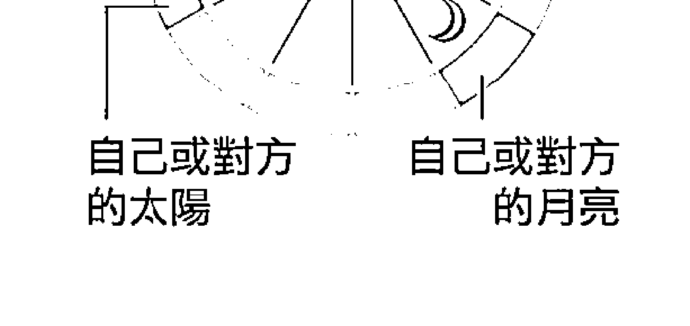

# ② 雙方的太陽、雙方的月亮為同元素

如果說代表基本性格的太陽星座為同元素，或是代表情感的月亮星座為同元素，不難想像兩者的關係會相當協調。由於兩人之間有許多相似之處，因此價值觀也合得來，並會追求彼此。如果是結婚對象，對女性而言對方會是理想的丈夫；對男性而言，女性則幾乎符合你心目中介一直以來所想像的妻子形象。

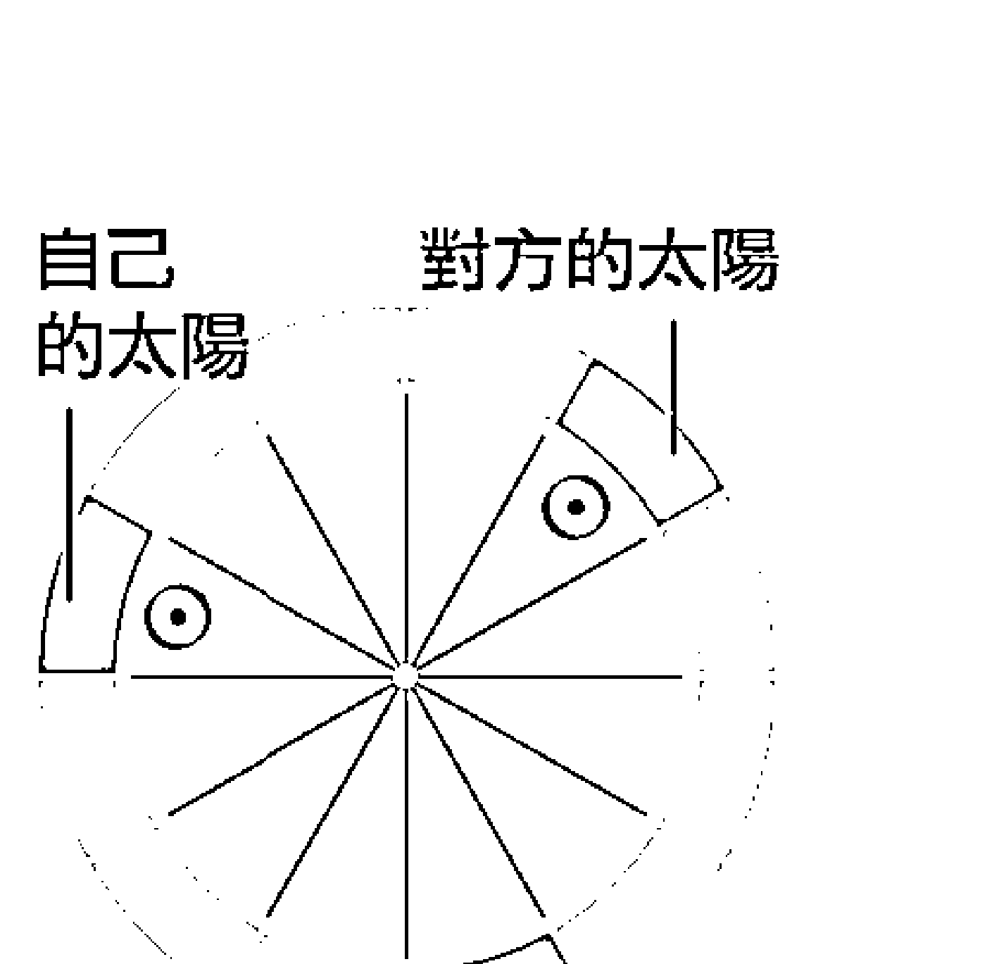

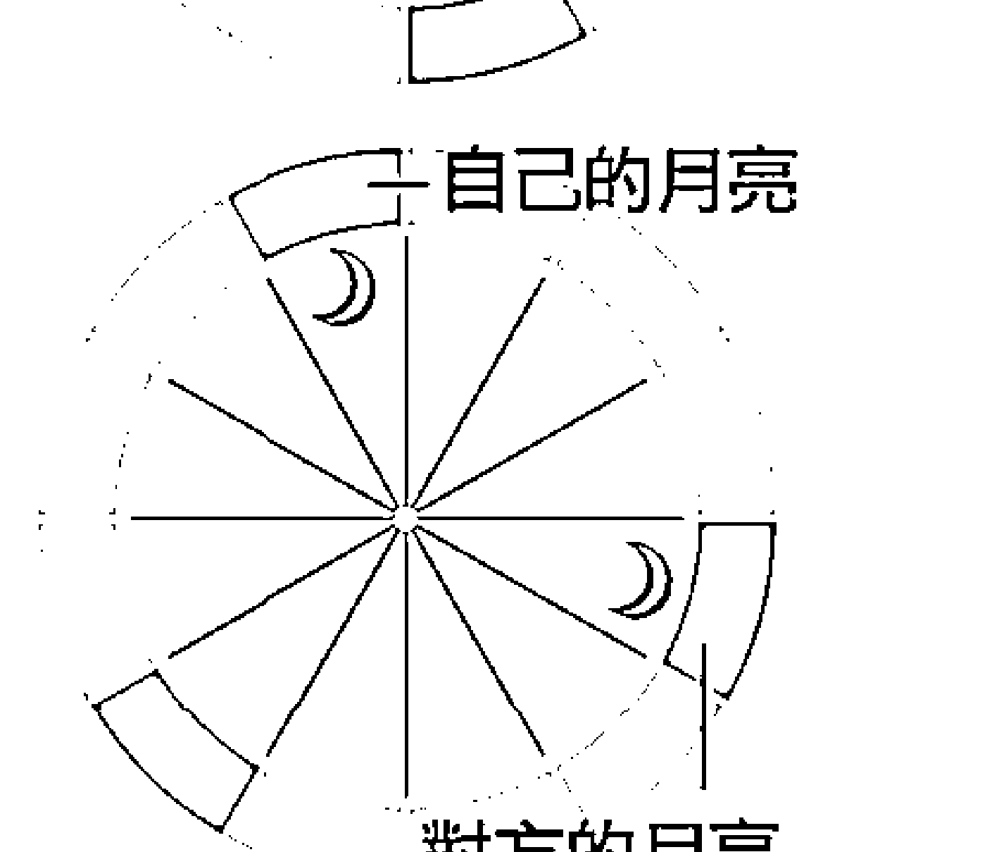

※對於各太陽星座，同元素的是在P.254～265的表格中有上底色的星座。

# ③ 太陽與月亮為對宮星座

所謂的對宮星座，意思是兩者在星盤上的位置處於正對面的兩側。由於一個星座有30度的寬度，因此雖然並非所有相對星座均符合，但其中也存在能形成對分相（180度）的關係。自己的太陽星座與對方的月亮星座，或是自己的月亮星座與對方的太陽星座呈對宮位置時，將會互相起強烈反應，但由於是不同的類型，而會充滿刺激。能成為互補彼此不足之處，相互支持的關係。

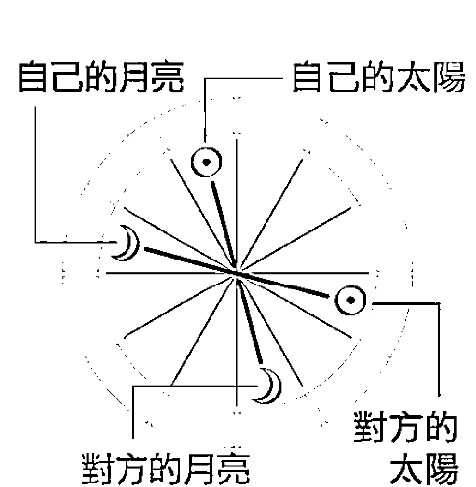

**對宮星座**
| 星座 | 對宮星座 |
|------|----------|
| 牡羊座 | 天秤座 |
| 金牛座 | 天蠍座 |
| 雙子座 | 射手座 |
| 巨蟹座 | 摩羯座 |
| 獅子座 | 水瓶座 |
| 處女座 | 雙魚座 |

## ④ 雙方的太陽、雙方的月亮為對宮星座

當雙方的太陽星座、月亮星座為對宮星座時，在戀愛、婚姻方面可說是特別良好的契合度之一。即使剛見面時無法順利發展關係，卻也會不知為何無法離開彼此，並逐漸互相吸引。在過了幾年交往或婚姻生活後，就能在完全接納對方缺點的情況下，建立互相合作的關係。不過，如果是沒能步入禮堂的情侶，就會有藕斷絲連，持續著秘密關係的危險。

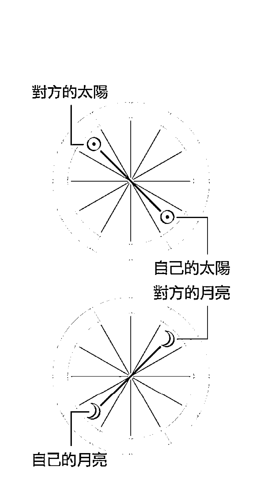

※相對星座參閱P.269的下半部分。

## ⑤ 金星與火星為同元素

當你的金星坐在雙魚座，對方的火星坐在巨蟹座，或是你的火星星座為天蠍座，對方的金星星座為雙魚座的情況，由於這些星座同樣為「水象」元素，會有良好的契合度。當然，如果同為「火象」、「土象」、「風象」也適用。在男性戀愛的情況下，是男性會覺得女性的言行舉止可愛得不得了的組合。愛人的一方與被愛的一方都不會有摩擦與不滿。當女性是火象星座時，就會由她來掌握這段關係的主導權。

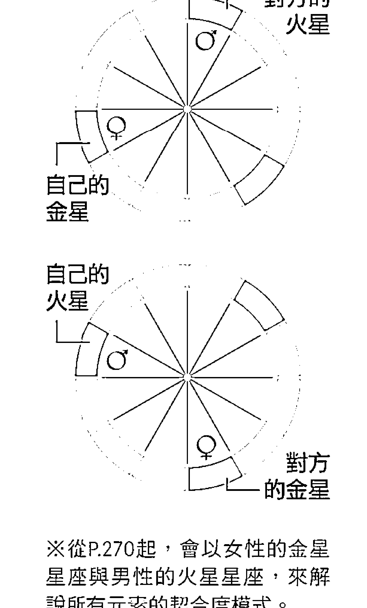

※從P.270起，會以女性的金星星座與男性的火星星座，來解說所有元素的契合度模式。

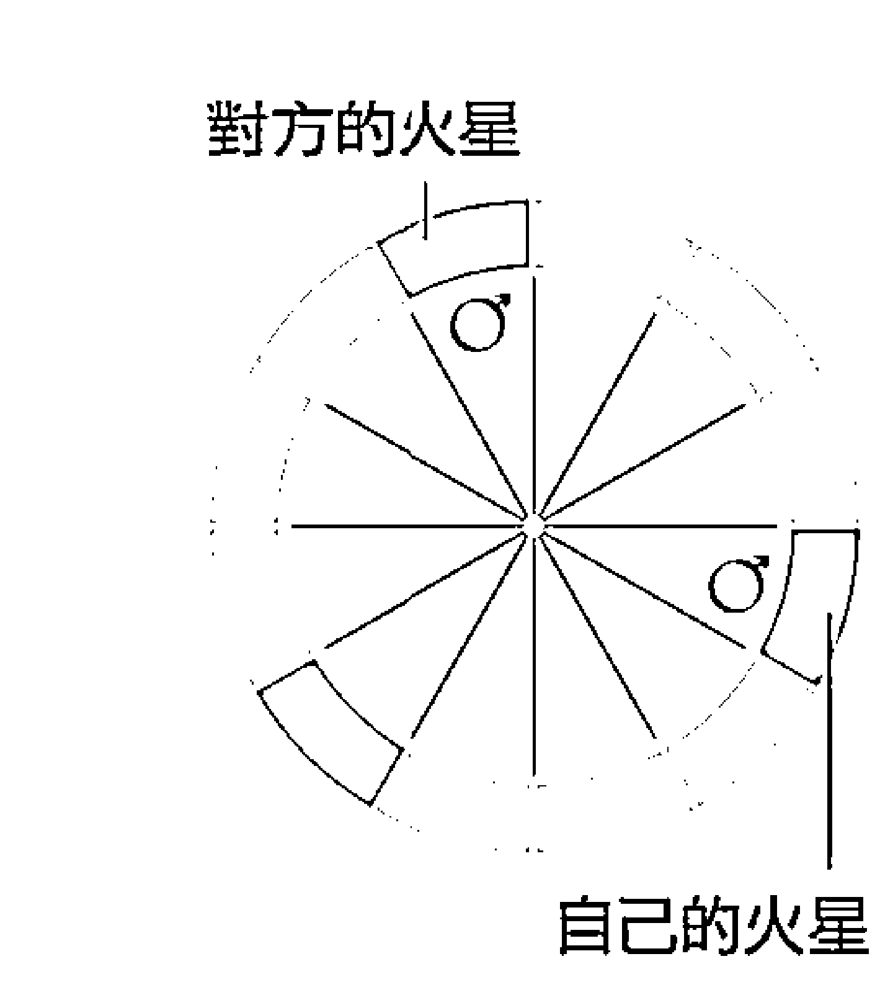

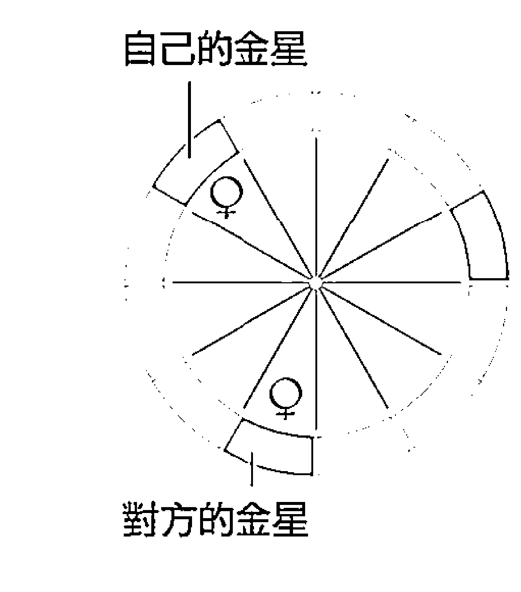

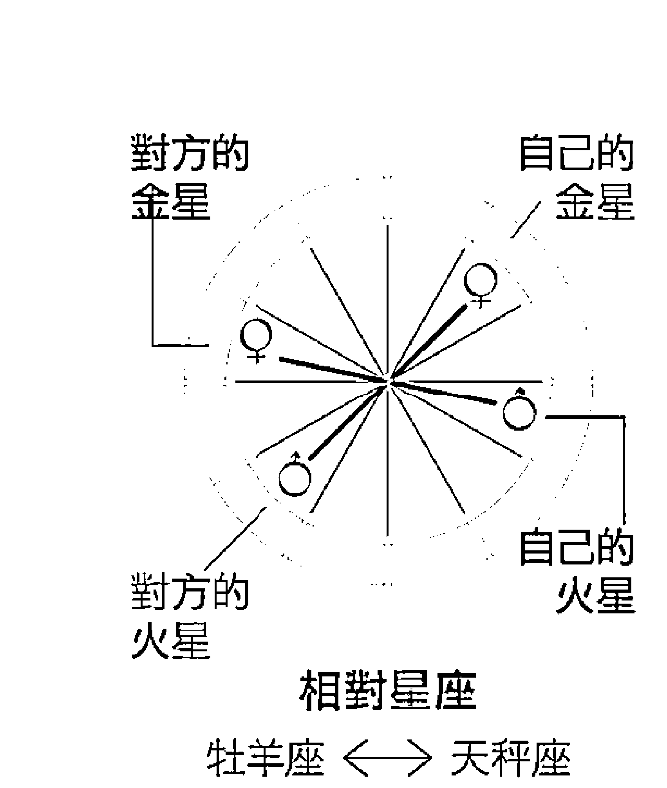

### 相對星座
| 星座 | 相對星座 |
|------|----------|
| 牡羊座 | 天秤座 |
| 金牛座 | 天蠍座 |
| 雙子座 | 射手座 |
| 巨蟹座 | 摩羯座 |
| 獅子座 | 水瓶座 |
| 處女座 | 雙魚座 |

# ⑥ 雙方的金星、雙方的火星為同元素

雙方的金星或火星是同元素時，也是良好的契合度。如果是男女雙方的火星為相同元素的情況，男性的引導會令女性有好感，進而交往順利，在性愛方面的契合度也很不錯；當雙方的金星為同元素的情況，女性會完全符合男性心目中的理想情人形象。在這段關係中，追求的事物也十分相合，而能建立一段充滿安心感的關係。

# ⑦ 金星與火星為對宮星座

如同太陽與月亮，當金星與火星為對宮星座時，也會是莫明在意對方，且對方在你心裡逐漸成為重要存在的契合度。這裡指的是自己的金星與對方的火星為對宮星座，或自己的火星與對方的金星為對宮星座的情況。雖然當雙方的金星為對宮星座時，也會有同樣的解釋，但換作雙方的火星時，或許反而容易萌生競爭意識，造成麻煩不斷。

# 透過金星與火星解讀戀愛契合度

在契合度七大條件中，尤其是「女性的金星星座」對「男性的火星星座」，是戀愛契合度的重要關鍵。這是因為女性可從金星確認戀愛傾向，男性則要從火星來看戀愛傾向。如果雙方追求的愛情形式相似，戀情就容易開花結果。即使並非如此，如果能了解對方所追求的愛情形式，就能加以回應並獲得對方的愛。

接下來，就以顯示特質的元素組合來確認細節。元素最適合透過喜好與價值觀方面來調查戀愛契合度，接著會依「雙方為相同的元素」、「雙方為協調的元素」、「雙方為性質相異的元素」的順序來說明。

# 金星與火星為同一元素

- 雙方同為火象星座（牡羊座、獅子座、射手座）
  - 成為情侶之前：是最棒的契合度，能夠毫無顧忌地相談甚歡，也能到各處玩得很快愉快。是最適合作為朋友的對象，但由於是同樣懷有燃燒般戀愛熱情的人，一旦喜歡上對方，是無法將這份心意隱藏在心裡的。雙方會是超越朋友、不到情人的關係，永遠不需煩惱。雙方都能順利地往戀愛關係發展。
  - 交往之後：會成為互相擁抱、互相傾訴熱切愛意的甜蜜情侶。如果付出愛情，就會獲得加倍的愛情。

- 雙方同為土象星座（金牛座、處女座、摩羯座）
  - 成為情人之前：雙方都懷有深厚而溫暖的愛情，能夠實現穩定的友誼。缺點是由於不善於表達愛情，需要花費時間才能走到交往這一步，但一旦心靈相通後，就是能夠長久相處的情侶。會藉由累積微小的喜悅或愉快的回憶，穩健踏實地加深愛情。如果興趣或生活方式相同或相似，就更容易發展戀情。
  - 交往之後：能夠深切信任彼此。由於不需要在對方面前偽裝自己，待在一起不會感到疲倦。會是能夠令人安心的交往關係。

- 雙方同為風象星座（雙子座、天秤座、水瓶座）
  - 成為情人之前：會是輕鬆而開朗的友誼。聊天時能一唱一和，使得氣氛熱烈，相談甚歡。雖然也很適合當朋友，不過一旦感覺對了，馬上就會展開戀情。年紀差距或置身環境差異，並不會成為戀情的障礙。不過，由於雙方都懷著清淡的戀愛情感，有難以區分友誼與愛情的一面。
  - 交往之後：會成為不受常識拘束，隨性交往的情侶。由於聊得來也合拍，待在一起會非常愉快。

- 雙方同為水象星座（巨蟹座、天蠍座、雙魚座）
  - 成為情人之前：就連難以言喻的心情都能互相理解的組合。由於雙方都擁有深厚的爱情，能將對方的喜悅視為自己的喜悅。從令人喜悦、對人有益的情況中感到幸福，不會互相要求回報。不過，缺點在於會因為過於替對方著想，難以表明心情，導致容易花費許多時間才能接近對方。
  - 交往之後：會是彼此竭盡全力，能獲得滿足的交往關係。由於雙方都是專情的人，與背叛無緣，能持續溫柔的戀情。

## 女性的金星元素与男性的火星元素为协调、性质相异

## 何谓协调

我们每一个人在性格或价值观等等方面都拥有不同的个性，如果对方是个性相似的人，就容易理解，而容易建立良好的人际关系。不过，当面对个性截然不同的对象时，我们的反应会分成“虽然不同但喜欢”与“因为不同而不喜欢”两种。这种感觉“虽然不同但喜欢”的元素组合，就称作“协调”，这样的双方能够顺利地愈走愈近，迅速地熟稔起来。

女性的金星落在火象星座（牡羊座、狮子座、射手座） × 男性的火星落在风象星座（双子座、天秤座、水瓶座）

### 成为情人之前
是良好的契合度。男性会高明地从旁协助想随心所欲行动的女性，并会提出正中要害的指摘，加以鼓励、称赞。也因此让女性能够尽情发挥魅力与才华。对于男性而言，看着对方坦率地听从自己的建议并有所成长，也会感到愉快并产生自信。

### 交往之后
会是愉快而毫无顾虑的交往关系。不过，女性对恋爱有相当的热情，或许会令男性感觉是负担。

## 女性的金星落在土象星座（金牛座、处女座、摩羯座）×男性的火星落在水象星座（巨蟹座、天蝎座、双鱼座）

### 成为情人之前
由于双方都十分深情，能尽情地爱着彼此。对女性而言，即使喜欢对方，也会软弱地心想“选择我真的好吗？”使得恋情难以开花结果。不过，看在男性眼里，这份拘谨则令人有好感。是会互相珍惜的组合。

### 交往之后
即使思考方式不同，只要对方还愿意陪伴在自己身边，恋情就能持续下去。愈是遭遇挫折时，就愈能体会对方的温柔。

## 女性的金星落在风象星座（双子座、天秤座、水瓶座）×男性的火星落在火象星座（牡羊座、狮子座、射手座）

### 成为情人之前
对于理性派的女性而言，男性单纯明快的想法或行动容易理解，而能放心地面对。男性则对于迅速判断，不会拖拖拉拉或纠缠不清的女性抱持好感。只要女性能找出男性身上值得尊敬的地方，立刻就会萌生爱情。是拥有能创造全新事物力量的两人。

### 交往之后
能够玩得很开心，约会时会很愉快。不过，女性身上缺少男性所追求的恋爱热情，或许会令他感到有些美中不足。

## 女性的金星落在水象星座（巨蟹座、天蝎座、双鱼座）×男性的火星落在土象星座（金牛座、处女座、摩羯座）

### 成为情人之前
女性虽然内向，但是只要感觉到对方需要自己，就会全心全意地奉献。男性则能坦率地接纳对方的好意，加以感谢，并回以温柔体贴，对于女性来说，这是最令人开心的事。在对待对方的过程中，爱情就会确实地萌芽。

### 交往之后
会是一对互相照顾的情侣，彼此都会想随时陪伴着对方，只要待在对方身边，爱情就不会冷却。

## 何谓性质相异

感觉“个性虽然不同但喜欢”的组合称作“协调”，相对地，容易感觉“因为不同而不喜欢”的组合就是“性质相异”。说到性质相异，或许会令人认为是难以相容的事物，但并非如此。若能跨越一开始的轻微不协调感，认同彼此的差异，就有可能相爱。能通过与拥有可能缺少事物的对象交往，互相弥补不足之处，就会成为感情深厚的情侣。

女性的金星落在火象星座（牡羊座、狮子座、射手座）
男性的火星落在土象星座（金牛座、处女座、摩羯座）
### 成为情人之前
女性的判断与行动速度都很快，因此会觉得谨慎的男性动作缓慢。即使提议或请求，对方也迟迟不愿采取行动，而令人感到焦虑。此外，迟迟不愿表达自己真正想法的男性，也容易令女性感到急躁，但男性也会因此而固执起来，女性这方要有耐心。

悠然自得的他会令人烦躁，或会对想法保守的他感到排斥。因此需要记得配合对方的步调，并尊重对方。

女性的金星落在土象星座（金牛座、处女座、摩羯座）
男性的火星落在火象星座（牡羊座、狮子座、射手座）
### 成为情人之前
沉稳的女性觉得下决定快且具行动力的男性十分可靠，而保护本能强烈的男性，是受人依赖会感到高兴的类型，会觉得仰赖自己的女性很可爱。虽然容易萌生爱情，但交往时间一长，女性的坚强意志就会令男性感到惊讶。

毫不考虑就采取行动的他，会令谨慎的她感到烦躁。对他的印象可能会从“觉得可靠”变成“跟不上对方”。

## 第4章 透过星盘诊断契合度〈透过金星与火星解读恋爱契合度〉

## 女性的金星落在风象星座（双子座、天秤座、水瓶座） × 男性的火星落在水象星座（巨蟹座、天蝎座、双鱼座）

### 成为情人之前
女性是外貌协会，只要外表合乎自己喜好就会心动。不过，对于同时追求智慧和刺激的女性来说，男性空有温柔而缺乏刺激，即使觉得“真不错”，也难以发展成恋情。此外，对于基本想要干净利落地交往的女性而言，喜欢跟对方腻在一起的男性是感觉沉重的存在。

### 交往之后
他的嫉妒心之重令人吃不消，即使觉得爱撒娇黏人的他“很可爱”，也只有一开始而已，或许会渐渐地感到厌烦。

## 女性的金星落在水象星座（巨蟹座、天蝎座、双鱼座） × 男性的火星落在风象星座（双子座、天秤座、水瓶座）

### 成为情人之前
女性期望的是浪漫的恋情，但对男性而言，恋情是友谊的延伸。此外，对于追求认真谈恋爱的女性来说，男性可能会认为恋爱是一场游戏。双方所追求的事物或想像的恋爱形式都截然不同，令女性常会心怀不满与不安。男性如果能怀有妥协的温柔就好了。

### 交往之后
虽然他总是很温柔，却令人有种被高明地玩弄于股掌之间的感觉。他拥有许多女性朋友这点也令人在意。

## 女性的金星落在火象星座（牡羊座、狮子座、射手座） × 男性的火星落在水象星座（巨蟹座、天蝎座、双鱼座）

### 成为情人之前
在困难时出手相助的男性的温柔，令常在众人面前逞强的女性深受感动。当这样的男性无意间透露烦恼时，就会点燃女性的保护本能，是容易萌生恋情的组合。不过，随着交往时间一长，男性沉重的爱也容易令女性感到窒息。

### 交往之后
当他心情愉快时，就能交往愉快。然而当他彻底陷入沮丧时，她就会不知所措而感到伤脑筋。

## 女性的金星落在土象星座（金牛座、处女座、摩羯座）×男性的火星落在风象星座（双子座、天秤座、水瓶座）

### 成为情人之前
女性十分深情，相对地，男性的爱情则很轻快。即使男性想尽办法要让女性注意到自己，或许也无法打动女性的心。不过，只要由女性积极主动，男性就会心动。比如说，尽可能夸张地夸奖对方的个性或才华。但如果将爱情强加在男性身上，对方可能会逃跑，要注意这点。

### 交往之后
无论是怎样的女性，都会因为他的温柔而吃醋。即使抱怨，对方也会以“对女性温柔是理所当然的”来带过。

## 女性的金星落在风象星座（双子座、天秤座、水瓶座）×男性的火星落在土象星座（金牛座、处女座、摩羯座）

### 成为情人之前
如果对方不回头注意自己，女性就会干脆转而喜欢上其他对象，这么一来男性反而慌了手脚。尽管就在自己小心翼翼地要看清对方的真心的期间，对方就变了心……男性完全跟不上女性改变主意的速度。

### 交往之后
即使邀请对方说“我们去玩吧！”，懒惰的他可能也兴致缺缺，但当她决定“那一个人出去吧”的话，他就会觉得“被抛下了”而闹别扭。

## 女性的金星落在水象星座（巨蟹座、天蝎座、双鱼座）×男性的火星落在火象星座（牡羊座、狮子座、射手座）

## 透过月亮与太阳解读婚姻契合度

当论及婚姻时，在契合度七大条件中需要特别重视的是“女性的月亮星座”对“男性的太阳星座”。让我们透过元素的组合来确认细节吧。女性在婚后的行为可确认月亮星座，身为妻子，妳在家庭里会如何与丈夫或孩子相处呢？而要确认婚后的男性身为丈夫，在家庭里会如何与妻子或孩子相处，则是看太阳星座。从下一页起，将会以“女性的月亮星座元素”ד男性的太阳星座元素”加以解说。请男性及女性分别参阅符合自己情况的项目。

| 依照月亮星座元素分类的女性婚姻观 | 依照太阳星座元素分类的男性婚姻观 | 元素 |
| :--- | :--- | :--- |
| 期望朝气蓬勃的婚姻生活，理想是夫妻同心协力跨越困难。无法接受度量狭小的丈夫，该离婚时也不会犹豫。 | 期望开朗愉快的婚姻生活，理想是家人能如同玩伴一般。另一方面，也有守护家人的强烈想法，希望自己受到依赖。 | 火象 |
| 具有传统的婚姻观念，期望踏实稳固的婚姻生活。如果丈夫的收入够高，即使多少有些难处也可以睁一只眼闭一只眼。 | 期望安稳的婚姻生活。虽然希望妻子能以家庭为重，不过如果妻子拥有财产、很会赚钱，也会尊重妻子的意愿。 | 土象 |
| 在享受夫妻时光的同时，也很珍惜属于自己的时间。理想是保持适当距离的夫妻。只要有精神上的联系，即使分居也可以。 | 期望着自由的婚姻生活。理想是将工作、兴趣、友情视为与家人同样重要。也接受事实婚或分居婚。 | 风象 |
| 期望夫妻间永远心灵相通，只要有爱，稍微弱一点也无妨，只要能看见家人的笑容就是最大的喜悦。 | 理想是与情侣时代相同，恩爱的婚姻生活。家人的喜悦就是自己的喜悦，但如果无法获得期待的反应，心就会远离。 | 水象 |

## 女性的月亮落在火象星座（牡羊座、狮子座、射手座）

### 男性的太阳落在风象星座（双子座、天秤座、水瓶座）
会成为想要享受夫妻生活的丈夫。不会拘泥于性别，而是积极接受分担家务，即使妻子有工作也不会感到厌恶。能够过着自由受到较少限制的婚姻生活，对于月亮落在火象星座的妻子而言，是值得高兴的事。但由于对孩子的态度是放任主义，在育儿这方面，意见往往会产生分歧。

### 男性的太阳落在火象星座（牡羊座、狮子座、射手座）
会成为强烈想要保护家庭的丈夫。不过，他会为此而努力工作，导致看起来就像是将“工作视为第一，家庭视为其次”。不过，如果是月亮落在火象星座的妻子，就能理解丈夫的想法，夫妻间不会因此有隔阂。两人在全力守护、养育孩子的心情上也是一致的。

### 男性的太阳落在水象星座（巨蟹座、天蝎座、双鱼座）
会成为重视家人的丈夫。在还没有孩子时会向妻子撒娇，离开妻子身边。他比较强烈希望妻子成为全职主妇。对于月亮落在火象星座的妻子来说，是个有点沉重的丈夫。当有了孩子后，他会产生多少责任感，而开始认真努力。不过希望陪伴在妻儿身边的想法依然不变。

### 男性的太阳落在土象星座（金牛座、处女座、摩羯座）
会成为认真工作，也努力做家务的好丈夫。将经营稳定生活视为第一，制订踏实的生活计划。也会勤快地照顾孩子。作为家庭的一分子是最棒的，不过对于月亮落在火象星座的妻子而言，甘于做个把家庭摆在第一位的爸爸，会显得格局较小而模样缺乏雄心，令人会想要激励他“再加油一些”。

## 女性的月亮落在土象星座（金牛座、处女座、摩羯座）

### 男性的太阳落在风象星座（双子座、天秤座、水瓶座）
会成为明事理的丈夫。能适当地努力工作，并积极接受家务的无懈可击态度，会令月亮落在土象星座，不那么精明的妻子感到惊叹不已。对妻子的朋友们也很友善，并善于与孩子相处，是令人骄傲的丈夫。然而，要让丈夫全盘接纳自己的想法，似乎有些困难。

### 男性的太阳落在火象星座（牡羊座、狮子座、射手座）
会成为站在前方引领家庭的丈夫。身为“家庭”这个团体的领袖，他会想守护自己的妻儿。对于月亮落在土象星座的妻子而言，这份态度可靠至极。只要加以称赞、奉承、依赖，就会努力赚钱这方面，也是令人高兴的一点。以夸张的方式表达爱意或感谢、加以称赞，是夫妻生活美满的秘诀。

### 男性的太阳落在水象星座（巨蟹座、天蝎座、双鱼座）
会成为温柔的丈夫。虽然有些爱撒娇，但能够确实理解妻子的心情，总是陪伴在妳身边。如果是这样的丈夫，就能确实接纳月亮落在土象星座的妻子那深沉而沉重的爱意。夫妻之间的感情会非常稳固。如果有了孩子，就会建立更强韧的家族亲情。

### 男性的太阳落在土象星座（金牛座、处女座、摩羯座）
会成为努力打造舒适家庭的丈夫。不会到处乱玩花钱，而会认真工作支撑家计。在经济基础稳固这点上令人放心，对于月亮落在土象星座的妻子而言，是值得信任的丈夫。两人能同心协力打造舒适的生活，并长久陪伴彼此。夫妻俩都会很疼爱孩子。

## 女性的月亮落在风象星座（双子座、天秤座、水瓶座）

### 男性的太阳落在风象星座（双子座、天秤座、水瓶座）
会成为能平衡兼顾工作与家庭的丈夫。由于他希望妻子永保美丽，而会协助分担家务，或让工作变得省力，甚至外包。月亮落在风象星座的妻子也是属于公私充实的类型，因此双方的心情十分合拍，能成为恩爱的夫妻。一旦有了孩子，全家人都会成为像朋友一样的愉快关系。

### 男性的太阳落在火象星座（牡羊座、狮子座、射手座）
会成为令人感觉不到实际年龄的丈夫。他就是如此孩子气，会独自出门游玩，或随兴地外出旅行。月亮落在风象星座的妻子在精神上较为独立，因此这种程度还在接受范围内。只要他认真工作并重视家庭，妳就不会加以责怪。如果有了孩子，就会经常陪他一起玩。

### 男性的太阳落在水象星座（巨蟹座、天蝎座、双鱼座）
会成为将家人视为第一的丈夫。虽然很高兴被爱，但由于他强烈希望妻子待在家里，对于月亮落在风象星座、热爱自由的妻子而言，往往会感到窒息。如果能对这点视而不见，这个珍惜家庭的丈夫就令人毫无怨言了。如果生了孩子，会疼爱到保护过度的程度。

### 男性的太阳落在土象星座（金牛座、处女座、摩羯座）
会成为在外勤奋工作，在家庭里会爽快地接受分担家务的好丈夫。不过，月亮落在风象星座的妻子在性格上比较随机应变，因此当丈夫只做自己被分配到的家务时，妳会不满地认为“就不能再细心一点吗”。如果生了孩子，会成为疼爱孩子的父亲，看到这点，妻子也会将不满抛到脑后。

## 女性的月亮落在水象星座（巨蟹座、天蝎座、双鱼座）

### 男性的太阳落在风象星座（双子座、天秤座、水瓶座）
会成为喜欢享受生活的丈夫。不但喜欢与妻子一起外出走动，也喜欢邀请朋友来家里。但月亮落在水象星座的妻子不太善于交际，陪丈夫出门也就罢了，但丈夫经常邀请朋友来家里，对妳而言是个沉重的负担。如果生了孩子就会很疼爱他，但仅限于自己时间方便的时候，这点也令人不悦。

### 男性的太阳落在火象星座（牡羊座、狮子座、射手座）
会成为努力工作的丈夫。怀着梦想与热情工作的模样十分有魅力。不过，月亮落在水象星座的妻子，是希望将家庭视为第一的类型。即使清楚丈夫会努力工作，是为了守护家庭，仍会感到寂寞。如果生了孩子就会很疼爱他，但是与孩子站在同样水准一起游玩的丈夫，也令人感到棘手。

### 男性的太阳落在水象星座（巨蟹座、天蝎座、双鱼座）
会成为把家庭看得比任何事物还重要的丈夫。喜欢全家一起出发去玩或旅行，希望总是陪伴在家人身边。由于这样的想法与月亮落在水象星座的妻子不谋而合，因此能构筑起笑声不断的温暖家庭。如果有了孩子，虽然会很疼爱他，却也有想永远把他留在身边的想法。

### 男性的太阳落在土象星座（金牛座、处女座、摩羯座）
会成为稳如泰山，不会因为些许琐事而手忙脚乱的可靠丈夫。对于月亮落在水象星座，内心容易受到影响而动摇的妻子来说，只要能待在他身边就会感到安心。虽然会注意细节，但本质上较为大剌剌，即使待在一起也不需要过度关照。如果有了孩子，会成为很照顾孩子的温柔父亲。

## 综合诊断恋爱契合度与婚姻契合度的方式

### 透过太阳、月亮、金星、火星与上升星座来诊断是否有缘
所谓的契合度并没有绝对的“好”或“坏”。既有契合度虽佳却无法步入礼堂的情况，也存在契合度差却仍然结婚的情况。请将星盘视为了如何培养缘分的工具。正如“寻找契合度佳对象的七大条件”中所提到的，打一开始就十分顺遂的缘分，是太阳、月亮、金星、火星星座的元素相同或协调的人。接着，刺激较多且互相吸引的为相对星座。如果是除此之外的组合，也能藉由了解对方的特征来改善契合度。此外，上升点也是个重要因素。当自己与对方的上升星座元素相同、协调或呈相对位置时，契合度也会很不错。不过，由于在出生时间不详时，就无法确认上升点的正确位置，请在能询问到出生时间时再以此诊断。

### 婚姻风格多样化，诊断也会随之改变
恋爱契合度与婚姻契合度之间多少有些差异，基本理论为在恋爱方面关注金星星座与火星星座，而婚姻方面则关注太阳星座与月亮星座。不过，在婚姻风格多样化的现代，也不需要过于拘泥这点。比如说，即使太阳星座与月亮星座为性质相异，无法相容时，只要金星星座与火星星座相配，或许就能成为永保情侶心态的夫妻；如果上升点与水星形成相位，就可推测会成为如朋友一般相谈甚欢的夫妻。此外，当情侣双方皆为男性，或皆为女性的情况下，同样也请关注金星星座与火星星座、太阳星座与月亮星座的关系。如果是接近男女角色的同性情侣，“女性”角色的一方的人就可以用金星星座或月亮星座来诊断。契合度是可以培养的，只要有共同处就加以扩展，相异处则互相尊重，以这样的方式培养。契合度诊断是用来找出共同处与相异处，以及加深缘分的时机，而要如何真正建立恋爱或婚姻的关系，则要靠当事人的想法与努力，请别忘了这一点。

## 你与周遭人们之间的契合度

### ① 你与上司、前辈的契合度（以双方的太阳星座确认）
如果对方是朋友、情人或结婚对象，就能选择与自己契合度佳的人往来。但对方如果是上司或前辈，就无法自行选择。即使合不来，也必须设法与对方融洽相处。

在这种时候，西洋占星术的契合度占卜就能派上用场。只要藉由了解对方并加以配合，就能好好地与对方相处，让工作变得更轻松。只要知道上司、前辈的生日，就能用太阳星座来占卜。以“你的太阳星座元素”为准，可得知与“上司、前辈的太阳星座元素”之间的契合度与应对方式。不过，当生日落在星座交界时，若能制作对方的星盘会更为明确。

| 依照太阳星座元素分类的上司、前辈特征 | 元素 |
| :--- | :--- |
| 热情而具有行动力。性情虽然较为激烈，但不会屈服于强者，而是拥有高尚精神，能守护弱者的人。 | 火象 |
| 生活方式踏实的人。鲜少有情绪的波动，拘谨而温和。思考方式谨慎，脚踏实地而务实。 | 土象 |
| 是具冷静智慧的理论派，不会流于感性。沟通能力强，善于交际。对于人事物理的执着不深。 | 风象 |
| 是温柔而感性的人。情绪容易动摇，如果诉之以情就难以拒绝。是若能让他入感到高兴就会非常开心的人。 | 水象 |

### 你的太阳落在火象星座（牡羊座、狮子座、射手座）

#### 上司、前辈的太阳落在风象星座（双子座、天秤座、水瓶座）
风象星座的上司或前辈，都是明理而好沟通的对象。不过，千万不能轻忽大意。要注意避免在交谈时得意忘形，说出失礼的话。此外，这位上司、前辈会适时地附和你，令你感到愉快。如果能一起工作，就能尽情发挥自己的能力。

#### 上司、前辈的太阳落在火象星座（牡羊座、狮子座、射手座）
即使面对上司或前辈，你也能毫不畏惧地直言意见。火象星座的上司、前辈也不会意外发怒。如果愿意倾听，就会采纳。因为他也是坦率直言的类型。话虽如此，也不能过于依赖这点，注意行为举止上要有礼貌，该尊重时就要尊重对方，这样就会受到喜爱。

#### 上司、前辈的太阳落在水象星座（巨蟹座、天蝎座、双鱼座）
水象星座的上司或前辈，是让人感觉受拘束的对象。比如说，当你意气风发地提出了新企划时，虽然知道稍微有些粗略，但认为只要一边修正一边进行即可。然而，这位上司、前辈却会指摘出企划上的粗略部分，打击你的干劲。这是因为对方很爱操心，而不是心眼坏，因此不用太在意。

#### 上司、前辈的太阳落在土象星座（金牛座、处女座、摩羯座）
土象星座的上司或长辈拘谨而重视秩序。如果你以跟朋友交谈的感觉搭话，可能会吓到对方，或是惹对方不快。严禁失礼或违反正礼仪。建议在熟稔起来之前，务必使用敬语，与对方接触时稍微保持一点距离。如果能彬彬有礼到甚至让你自己觉得“死板”，比较能获得对方的好感。

## 上司、前輩的太陽落在風象星座（雙子座、天秤座、水瓶座）

風象星座的上司或前輩，是穩定的和平主義者，這一點與你相同。表面上顯得風平浪靜，能夠順利相處。不過，由於對方的腦子轉得很快，如果沒有一唱一和的反應回答，就會令對方感到不安，懷疑「自己說的話或許沒有傳達出去」。別一個人陷入沉思，首先記得回應。

## 上司、前輩的太陽落在火象星座（牡羊座、獅子座、射手座）

火象星座的上司或前輩比較性急。因此對於重視準確度勝於速度的你而言，常會有自己被催促的感覺。當對方提問，你如果不立刻回答，對方就會明顯地開始不耐煩，令你感到焦慮，因此重要的是冷靜下來。對方秉性公平，因此即使需要花費時間，但如果能提出正確答案，他還是會確實給予評價。

## 你的太陽落在土象星座（金牛座、處女座、摩羯座）

## 上司、前輩的太陽落在水象星座（巨蟹座、天蠍座、雙魚座）

水象星座的上司或前輩，也無法自我推銷，容易吃虧。水象星座的上司或前輩，則溫柔對待這類老實或立場薄弱的人。即使不用誇張地自我推銷，也能確實獲得關注。不僅是成果，也能連你在做事過程有多努力等無法以數據呈現的部分也會加以評價，因此可以放心。

## 上司、前輩的太陽落在土象星座（金牛座、處女座、摩羯座）

土象星座的上司或前輩，最喜歡認真努力的人。只要你能保持禮貌，確實遵守約定或時間，就能讓對方滿意。換言之，你這樣不對對方的理想。即使稍微不太精明也不要緊。你將能獲得提拔或關照，足以充分發揮自己的實力。

## 上司、前輩的太陽落在風象星座（雙子座、天秤座、水瓶座）

你能夠臨機應變且處事圓滑，是會受到上司或前輩關愛的類型。你與腦子轉得快且節奏輕快的上司或前輩合得來。能成為超越年齡或立場差距的好夥伴關係。話雖如此，「再親密的關係也需要懂禮貌」，該尊重時也要懂得尊重對方。

## 上司、前輩的太陽落在火象星座（牡羊座、獅子座、射手座）

火象星座的上司或前輩是值得信賴的人物。由於你善於待人接物，容易與人親近，會受到對方的多方關照。當你迷惘時，對方會加以鼓勵並推你一把，是可靠的對象。因此如果認為「這是錯誤的對象」，就坦率地說出來吧。彆扭的態度或諷刺的說話方式，只會惹得性格直率的對方不快。

## 你的太陽落在風象星座（雙子座、天秤座、水瓶座）

## 上司、前輩的太陽落在水象星座（巨蟹座、天蠍座、雙魚座）

水象星座的上司或前輩是重感情的人。比如說，即使你提出了有效削減成本的方案，也會被以「這樣○○先生會丟了工作很可憐」這種不合理的理由否決。如果要與對方好好相處，必須先理解彼此之間的判斷基準有差異。自己這方也要不時訴之以情，並有耐心地面對。

## 上司、前輩的太陽落在土象星座（金牛座、處女座、摩羯座）

土象星座的上司或前輩，會「嗯、嗯」地理解你，傾聽你的話語。然而，當你發現雖然已經把想法傳達出去，事態卻毫無改變，就會感到失望。不過，這只是因為對方十分謹慎地在考慮議題內容罷了，如果自己太快做出結論而感到煩躁或沮喪，反而會因此吃虧，有耐心地等待吧。

## 上司、前輩的太陽落在風象星座（雙子座、天秤座、水瓶座）

風象星座的上司或前輩，是冷靜的知識分子。對方做出一個接一個的明確判斷，俐落地完成工作的一個姿態，令容易迷惘的你心懷憧憬與尊敬。另一方面，卻也感到有些乏味，認為「沒有更貼心的做法了嗎！」不過，還是避免情緒化的說話方式比較保險，也要尊重對方的做事方式。

## 上司、前輩的太陽落在火象星座（牡羊座、獅子座、射手座）

火象星座的上司或前輩的聲音很大，且講話清晰，是令纖細的你感到有些害怕的類型。雖然會忍不住想逃跑，但是對方並沒有惡意。倒不如說，對方會覺得不能放著敦厚老實的你不管，而幹勁滿滿地想照顧你。所以拋棄覺得對方棘手的想法，主動撲進對方的懷裡吧。對方會守護你並關照你的。

## 你的太陽落在水象星座（巨蟹座、天蠍座、雙魚座）

## 上司、前輩的太陽落在水象星座（巨蟹座、天蠍座、雙魚座）

水象星座的上司或前輩會溫柔地守護著你的成長，不會說出令你的幹勁受挫的嚴厲話語。由於你對此有共鳴，會回應對方的信賴加以努力……雙方會以這樣的態度，往正面循環的方向相處。然而，也可能因為互相顧慮，發生令人難以置信的差錯。該傳達的內容還是要明確傳達。

## 上司、前輩的太陽落在土象星座（金牛座、處女座、摩羯座）

你會在意對方的心情，一旦上級心情不悅就會縮起來，而不敢說出想說的話。而土象星座的上司或前輩個性敦厚，情緒也很穩定。因此你在土象星座的上司、前輩面前也能感到放心，隨心所欲地行動，並得以自然而然地發揮長處及實力。重要的是不要過於依賴，而是彬彬有禮地相處。

## ② 你與部下、晚輩的契合度（以雙方的太陽星座確認）

在面對部下或晚輩時，總會希望能掌握其性格，順利培養對方。但如果光憑自己的感覺為前提加以指導，有的人會坦率地接納，卻也有並非如此的對象，這點令人煩惱。自己的想法沒能正確傳達，對彼此而言都十分遺憾。這時就運用占星術，了解對方的性格或價值觀，在圓融溝通的同時，最大極限地引出對方的能力吧。只要知道部下、晚輩的太陽星座（生日）即可。以「你的太陽星座元素」為準，可得知與部下、晚輩的太陽星座元素之間的契合度與應對方式。

依照太陽星座元素分類的部下、晚輩特徵

| 元素 | 特徵 |
| :--- | :--- |
| 火象 | 說話方式坦率，且只要內容合理，即使是刺耳的指摘也能坦率接納。討厭被權威或權力所左右。 |
| 土象 | 認真努力之人，責任感強，是可以放心委託工作的類型。思考時也會考慮利害得失，有著不吃虧的一面。 |
| 風象 | 理性型的人，討厭受情緒化影響，或是私人領域遭人干預。在採取行動之前，會要求令人信服的說明。 |
| 水象 | 溫柔親切，但是細膩而內向。不擅面對他人態度強硬的說話方式。一旦敞開心房，就會誠實且親力親為地工作。 |

## 你與部下、晚輩的契合度

## 部下、晚輩的太陽落在風象星座（雙子座、天秤座、水瓶座）

風象星座的部下或晚輩，會分清楚該投入努力的部分與可以省略的部分，精明圓滑地工作。對於熱血分子的你而言，雖然希望對方能更滿懷熱情地工作，不過風象星座的部下、晚輩並沒有隨時全力以赴決勝負的體力。也是神經比較纖細的人，請理解這一點。在提醒對方時，必須慎選話語。

## 部下、晚輩的太陽落在火象星座（牡羊座、獅子座、射手座）

火象星座的部下或晚輩，跟你一樣是性格單純明快而不會說謊的人。不需要愚蠢的花招或顧慮，坦率地稱讚或斥責對方吧。由於對方在幹勁高漲時就能發揮超乎實力的力量，以稱讚的方式培養更有效果。與火象星座的部下、晚輩搭檔時，溝通起來會很快，能愉快地工作。是能互相提昇，雙方都有所發展的對象。

## 你的太陽落在火象星座（牡羊座、獅子座、射手座）

## 部下、晚輩的太陽落在水象星座（巨蟹座、天蠍座、雙魚座）

面對水象星座的部下或晚輩，如果大聲斥責，對方就會縮起來，甚至可能會掉下眼淚，是稍需顧慮的對象。不過，水象星座的部下或晚輩對於想幫上他人的忙、想令人開心的心情比常人高出一倍。因此請多加運用「謝謝」、「幫了大忙」這類話語，這麼一來對方一定會幹勁十足地工作。

## 部下、晚輩的太陽落在土象星座（金牛座、處女座、摩羯座）

土象星座的部下或晚輩是認真而努力的人，是會踏實處理，覺得對方的工作進展速度較慢，也要有耐心地等候。如果無謂地催促，反而會令對方緊張而犯下不必要的錯誤。重要的是尊重對方的步調。在得出結果後，也別忘了確實評價對方的本並加以稱讚。

## 部下、晚輩的太陽落在風象星座（雙子座、天秤座、水瓶座）

風象星座的部下或晚輩處事精明、工作能幹，是能幫得上忙的。然而，對於凡事都希望仔細掌控的你來說，仍有些令人擔心之處。你會忍不住想一再確認或建議，但建議打消念頭。頻繁地插嘴反而會帶給對方壓力。重點在於，一旦委託了工作就放手讓對方以他的方式去做。

## 部下、晚輩的太陽落在火象星座（牡羊座、獅子座、射手座）

火象星座的部下或晚輩，即使面對年齡或資歷在自己之上的對象，仍會毫不畏懼地說出想說的話。因此以立場壓人，擺出威懾人的態度並不是上策，即使你這個人的態度並不是上策，只會令對方排斥。對的事情就是對的，錯的事情就是錯的，就坦率地傳達給對方知道吧。這麼一來，對方出乎意料地會聽進去。

## 你的太陽落在土象星座（金牛座、處女座、摩羯座）

## 部下、晚輩的太陽落在水象星座（巨蟹座、天蠍座、雙魚座）

水象星座的部下或晚輩會仔細體察你的心情，並配合採取行動。雖然是可以輕易說出想說的話、能輕鬆交辦工作的對象，但其中也有陷阱。你或許會在無意間過度勉強對方，而對方也是會努力到極限的類型，因此千萬別忘了注意對方的身體狀況或工作行程。

## 部下、晚輩的太陽落在土象星座（金牛座、處女座、摩羯座）

你與土象星座的部下或晚輩的價值觀或行動步調相似，只要記得仔細說明，就能把你想說的話明確傳達給對方。不會好出鋒頭，也明白禮儀或禮節，是令人坦率地覺得很可愛的對象。如果一起腳踏實地處理工作，也能提升實際成果。只要告知具體的目標，對方就會盡力而為。

## 部下、晚輩的太陽落在風象星座（雙子座、天秤座、水瓶座）

風象星座的部下或晚輩，跟你一樣是腦子轉得很快的類型。由於能夠確實了解你的想法，下指示時很輕鬆。最重要的是，在交談時只要一拋出去就會有回應，令人感覺很好，而能夠開心地工作。不過對方的抗壓性較弱，如果能告訴對方「責任由我來扛」，對方就會放手努力工作。

## 部下、晚輩的太陽落在火象星座（牡羊座、獅子座、射手座）

火象星座的部下或晚輩坦率而正直，是內心所想的事情全寫在臉上的類型。對你來說是好相處的對象。只要善於鼓勵，對方就會幹勁十足地工作。訣竅在於別以雞蛋裡挑骨頭的方式指摘對方的缺點，導致挫了對方的幹勁。若能用稱讚的方式「很好、很好」地提升對方的情緒，就能讓對方超乎實力地大為活躍。

## 你的太陽落在風象星座（雙子座、天秤座、水瓶座）

## 部下、晚輩的太陽落在水象星座（巨蟹座、天蠍座、雙魚座）

水象星座的部下或晚輩是感受性敏銳的類型，可能會把隨口說說的玩笑話當真，而認真地煩惱。因此最好避免玩笑話或並非真心話的措辭方式。水象星座的部下、晚輩喜歡他人與自己有共鳴，因此在意見分歧時，不要一開始就加以否定，而是先接納後仔細溝通，就能互相妥協。

## 部下、晚輩的太陽落在土象星座（金牛座、處女座、摩羯座）

土象星座的部下或晚輩，個性溫和，卻出乎意料地固執。如果有無法接納的事或違規的情節，甚至會堅決拒絕處理。即使你用盡言詞說明，對方也會充耳不聞。如果讓對方實際體會，就會比較好談，只要遭遇失敗就會清醒。不過，前提是僅限於你能夠補救的工作。

## 第4章 * 透過星盤診斷契合度 〈你與周遭人們之間的契合度〉

## 部下、晚輩的太陽落在風象星座（雙子座、天秤座、水瓶座）

風象星座的部下或晚輩，是不會受到情緒影響的理性派。由於對方類型和自己截然不同，容易覺得不擅應付對方。一旦面對面，無法下達明確的指示。不過，對方也是充滿服務精神的類型。如果能放下覺得對方棘手的感覺，就能理解對方的心情或想法，盡情引出對方的才華，並使其大為活躍。

## 部下、晚輩的太陽落在火象星座（牡羊座、獅子座、射手座）

火象星座的部下或晚輩，下決的速度快，具執行力，是非常可靠的對象。不過可能會不夠深思熟慮，順勢行動而犯下大錯。當感覺到有危機時，就鼓起勇氣制止對方吧，這就是你的職責。千萬別認為這麼做是對難得提起幹勁的對方潑冷水。

## 你的太陽落在水象星座（巨蟹座、天蠍座、雙魚座）

## 部下、晚輩的太陽落在水象星座（巨蟹座、天蠍座、雙魚座）

水象星座的部下或晚輩，會對於能幫上他人的忙感到開心與驕傲。也因此，如果無法在工作上活躍，就很容易沮喪。記得多向對方說些「謝謝」、「幫了大忙」之類的話語。如果能讓對方感受到自己對工作職場有所貢獻，就能成為戰力。身為工作夥伴，是令人能感覺到深厚情誼的對象。

## 部下、晚輩的太陽落在土象星座（金牛座、處女座、摩羯座）

土象星座的部下或晚輩是腳踏實地努力的類型。由於在面對你的心關心時，會坦率地表現出開心，讓你覺得很可愛，是可以放心委託工作的對象。這讓你不由得抱持期待，認為可以「馬上付重要工作」，但這麼做很危險。與其一口氣賦予重大目標，倒不如先讓對方將小目標一一達成，才能讓對方穩定成長。

## ③你與母親的契合度（以母親的太陽星座與你的月亮星座確認）

無比溫柔溫暖，在孩子身上傾注無償的愛——這就是世人對於「母親」的普遍形象吧。然而，如同日文中「毒親」一詞一樣，也有不少孩子為了與母親之間的關係所苦。親子關係，尤其是母子之間的關係，會成為人際關係的基礎。據說如果一個人與母親的關係良好，也會容易跟別人建立良好關係。從現在起也不會太遲，藉由理解你的母親，了解相處方式，建立良好的關係吧。接下來，我們將以母親的太陽星座，與你星盤上月亮星座之間的位置關係，來確認母子的契合度。

例：在自己的星盤上，從自己的月亮算起，確認母親的太陽是第幾個星座。如果自己的月亮落在雙魚座，母親的太陽落在巨蟹座時，診斷就是母親為「第5個」星座。

## 從你的月亮算起，母親的太陽落在第2個星座

是能自然做自己的母子關係。對你來說，你的母親就像空氣般的存在。雖然不可或缺，但平時並不會特別意識到對方。由於不，鮮少發生衝突。這樣淡泊的關係，讓你覺得缺乏母親的愛。在你成年之後，比較能建立良好的關係。

## 你的月亮與母親的太陽落在同一個星座

樣的事物笑或哭泣，是步調一致的母子。如果融洽相處時，感情就會非常好，但是當在對方身上的話，就會發現自己討厭的一面時，就容易產生強烈的拒絕反應。當母親嚴厲指摘你的缺點時，就當作母親是在講給自己聽吧。

## 從你的月亮算起，母親的太陽落在第4個星座

當相處融洽時，是一對感情好的令人羨慕的母子。然而若是起了衝突，你就會無法對母親暢所欲言。雖然希望母親能主動讓步，但對方也會莫名地倔強，不給你解釋或道歉的機會。時間拖得愈久，關係就會愈彆扭，所以要盡快跟對方和好。

## 從你的月亮算起，母親的太陽落在第3個星座

在母親面前，你可以隨心所欲地行動。如果你是會清楚表達想法的類型，母親則會願意傾聽你的話的對象，兩人之間會建立這樣的關係。在成年之後，你與母親還會一起出門逛街等，令周遭羨慕。

## 從你的月亮算起，母親的太陽落在第6個星座

你是從小就莫名地對母親敬而遠之呢？認為母親所說的話就是絕對，而從未考慮過要反對。實際上，只要你乖乖聽話，母親就會對你很溫柔。如果你是想強調自我主張的類型，就是令人痛苦的契合度。成年之後如果能分開生活，關係就會比較融洽。

## 從你的月亮算起，母親的太陽落在第5個星座

是可以愉快往來的母子，不過，因為彼此都有希望能融洽相處的強烈想法，使得母親容易寵溺你。對你來說，即使能向她報告好事或愉快的事，但遇到困難時也難以開口商量。如果避開討論厭的話題，就只能建立友好的關係。當發生問題時，就盡量找對方商量吧。

## 從你的月亮算起，母親的太陽落在第8個星座

對方並不是好溝通的母親。你會從她身上感覺到無言的壓力，而從孩提時代起，就不太向母親說任性話。不過，母親就是母親，如果你不肯天真無邪地向她撒嬌，她還是會感到寂寞。是一對情緒難以合得來的母子。從現在起也不遲，試著坦率地撒嬌看看如何？

## 從你的月亮算起，母親的太陽落在第7個星座

從頭到尾都截然不同的一對母子。對你來說，母親或許是令人憧憬的存在，對於母親來說，你也是令人驕傲的孩子。不過，如果母親是過度干涉的類型，原本的憧憬則容易轉為劇烈的反抗。別因為是母子就擅自闖入內心，互相尊重才是融洽相處的訣竅。

## 從你的月亮算起，母親的太陽落在第10個星座

雖然可靠，卻有點嚴厲…… 是你對母親的感覺。同時也會對朋友家溫柔的母親感到憧憬…… 在青春期時，母親會令你感到特別厭煩。雖然對母親來說，她只是擔心重要的你而多說幾句罷了。請理解在嚴厲話語或態度背後的母愛。

## 從你的月亮算起，母親的太陽落在第9個星座

你在母親面前能不加矯飾地做自己。可以說即使在外會畏首畏尾，回到家也能輕鬆地暢所欲言。你這樣的模樣也令母親感到幸福，而能輕鬆地跟你相處。兩人的關係良好，無論是愉快或難受的事情，都能毫無保留地對彼此說出口。即使在你成年之後，仍能維持良好的關係。

## 從你的月亮算起，母親的太陽落在第12個星座

無論是你的撒嬌或任性，母親都會接納。她現在想必也正為了你做菜，或送日常用品給你吧。你可以放心地向母親撒嬌，是幸福的關係。然而，如果你是獨立心重的類型，這份親情就會令你感覺沈重。

## 從你的月亮算起，母親的太陽落在第11個星座

由於母親總是對你講道理，而令你有些抗拒也說不定。對你來說，她若是能說出「如果妳這麼做，媽媽會很高興」這種話，你會比較坦率地聽話。是感受方式有些差異的一對母子。如果母親是理論派，你也以理論回應；如果母親是感性派，你也用訴之以情的方式來回應，就能相處融洽。

## ① 你與父親的契合度（以父親的太陽星座與你的太陽星座確認）

如果說母愛能令人聯想到「無償的愛」，那麼父愛能令人聯想到的話語就是「嚴厲而溫柔的愛」了。母愛往往是偏盲目的，相對地，父愛則常會教導我們如何分辨善惡、倫理道德等事。如果說與母親關係良好，能幫助你建立私人的人際關係，那麼與父親關係良好，就能讓你更容易建立社會性的人際關係。理解父親並了解相處方式，建立良好關係也是同樣重要的。

接下來，我們將以父親的太陽星座，與你星盤上太陽星座之間的位置關係，來確認父子的契合度。

例：在自己的星盤上，從自己的太陽算起，確認父親的太陽是第幾個星座。如果自己的太陽落在天秤座，父親的太陽落在獅子座時，診斷就是父親為「第11個」星座。

## 從你的太陽算起，父親的太陽落在第2個星座

是容易相處的契合度。父親會溫柔地守護你，不會讓你感覺到壓迫感或畏懼。由於非常符合你的心所欲地施的步調，讓你能夠隨心所欲地施多虧了穩定而悠閒的父子關係，讓你即使面對長者或掌權者，也能毫不畏懼地面對。

## 你的太陽與父親的太陽落在同一個星座

是無論優點還是缺點都互相強調的契合度。合得來時就會非常合得來，但排斥時就會徹底互斥。並不是因為無法理解才沒辦法治接受，而是因為自己厭惡的地方被放大後擺到自己面前，令人想別開目光。如果能理解這一點，就會減少互斥的情況。

## 從你的太陽算起，父親的太陽落在第4個星座

是有些難以理解心情的契合度。兩人並不是關係差，你很喜歡父親，父親也很疼愛你。不過，感覺父親有些不知道該如何跟你相處，而顯得有些冷淡。這令你感到寂寞。試著坦率地把想說的話說出口吧。

## 從你的太陽算起，父親的太陽落在第3個星座

是受到珍惜的契合度。即使耍任性，父親也會覺得你「很可愛」。你從孩提時代起想必就是嬌生慣養吧。能切身體會到被父親所愛，是一件好事。如果你是女性，就能友善地與男性相處；如果是男性，就能自然而然地溫柔對待女性，會非常受歡迎。

## 从你的太阳算起，父亲的太阳落在第6个星座

母亲的话」的态度。父亲会对你摆出一个孩子要听父亲的性格爱压迫人，而是因为父亲跟你之间是领导与被领导的关系，只要你能够坦率地听话，就能够建立良好关系，但如果反抗，关系就会变差。一边尊重父亲，同时好好地把自己的想法传达出去吧。

## 从你的太阳算起，父亲的太阳落在第5个星座

是协调的契合度。即使没有特别关心，也能好好相处。你坦率地依赖父亲，父亲也为了回应你的期待而努力，因为他希望你认为他是可靠的父亲。不过，彼此也会因为想展现好的一面而有些勉强。如果能坦率地展现弱点，并直接地畅聊失败或问题，就无懈可击了。

## 从你的太阳算起，父亲的太阳落在第8个星座

是令你感到难以靠近的契合度。即使父亲邀你出游或吃饭，只有两人一起出门的感觉也会很拘束。而父亲似乎也对于该如何跟你相处感到伤脑筋。首先由你主动，试着将内心想法坦率地说出口吧。父亲即使不知所措，也会加以配合，这么一来关系应该会有所改善。

## 从你的太阳算起，父亲的太阳落在第7个星座

你们两人的特质相反。父亲拥有你所缺乏的特质，这令你对他相当憧憬并抱持敬意；相反地，如果存在令你不中意的事物，就会感到强烈反弹。相处融洽的诀窍，是认清彼此间的差异。如果能做到这一点，就可以互补不足之处，建立理想的父子关系。

## 第4章 透过星盘诊断契合度（周遭人们之间的契合度）

### 从你的太阳算起，父亲的太阳落在第10个星座

这是在受保护的契合度。在面对严厉的父亲时，你会有点紧张。另一方面，也能感受到受保护的安全感。在你尚未成年之前，可能会因为受到禁止或限制而感到厌烦。但在成年之后，父亲如果认为你能独当一面，减少干涉，问题就会解决。

### 从你的太阳算起，父亲的太阳落在第9个星座

是能够对彼此畅所欲言的契合度。彼此之间没有谎言或秘密，这能够建立坦诚的关系。此外，这也是能从父亲身上学到许多的契合度。尽可能地多聊聊吧。交谈的次数愈多，就愈能接触到彼此的优点，而能尊敬对方。如果拥有相同兴趣也是很好的事。

### 从你的太阳算起，父亲的太阳落在第12个星座

是会被宠溺的契合度。父亲对你疼爱有加，明明应该正在挨骂，却在回过神来后，已经变成令你高兴的发展，比如说不知不觉约好了去哪里玩。对父亲而言，你能常保笑容就是他最大的幸福。即使长大成人，还是可以尽量撒娇，这就是对他的孝顺。

### 从你的太阳算起，父亲的太阳落在第11个星座

是撒娇不起作用的契合度。父亲会将孩子视为独当一面的人尊重，试着以人与人的关系面对。不过，就连孩子特有的可爱任性都会视为自我中心的行为，孩提时代会不会感到寂寞？相对地，由于父亲不会过度干涉，随着年纪成长，两人的互动也会改善。

### ③ 你与孩子的契合度

（以孩子的星盘，确认你的太阳星座对应的宫位）

要制作高精准度的星盘，除了出生年月日，还需要出生时间与出生地点，不过既然是自己的孩子，应该都很清楚出生时间或出生地点等资讯才是。自己与孩子的契合度，要使用孩子的星盘，来确认你的太阳星座对应的宫位。

即使是孩子，也是与你拥有不同人格或个性的人，或许会存在你无法理解的部分。尤其是青春期，会令你不知道该如何与对方相处。如果能更加了解孩子，掌握契合度，那么不仅在育儿上能更加轻松，也能顺利发展对方的长处或才华。

（图片描述：调查自己的太阳落在什么星座几度上，并察看孩子的星盘，确认对应的宫位。在上图中，自己的太阳落在处女座，对应的是第4宫。）

### 你的太阳落在孩子的星盘的第1宫

是契合度非常好的亲子关系。即使孩子调皮而难缠，你也能了解孩子的心情而妥善应对。容易成为像朋友般的亲子，但要等孩子长大后，才能以接近对等方式相处。在孩子还小时，还是像个父母亲，采取坚决的态度比较好。无论是儿子还是女儿，如果有必要时，在大多数情况下，稍微严厉点斥责也不要紧。孩子也能了解父母亲的心情，不会畏惧或畏缩，导致性格变得扭曲。

### 你的太阳落在孩子的星盘的第2宫

你能以豁达的心情守护着孩子。即使在意孩子所做的事，也别啰唆地插嘴。让孩子以自己的步调活动，就是发展其个性或才华的诀窍。你也可以当作「不顺从父母想法的孩子，比较能成大器」。无论是儿子还是女儿，都严禁过度干涉。如果出手或插嘴，只是让孩子变得倔强也罢了，但担心的是孩子会表面上不加反抗，却暗自累积内心的怒气而封闭心房。

### 你的太阳落在孩子的星盘的第3宫

你们是很合得来的亲子。当你邀请孩子时，孩子会眼睛发亮地回应。孩子如果提了什么建议，你也会觉得「很有意思」，而立刻赞成。从孩子小的时候起，你们就可以愉快地一起行动。尤其是在女儿到了小学高年级的年纪左右，就几乎能与你对等地交谈了。虽然将兴趣或出路交给孩子自己选择，比较能顺利发展，不过孩子也会深受你这个父母的影响。让孩子从小就累积各种经验，拓展他的世界吧。

## 你的太阳落在孩子星盘的第4宫

你非常疼爱孩子，而孩子也希望受到疼爱。契合度听起来似乎很好，但你所认为的温柔，与孩子所追求的温柔并不相同。这孩子容易看父母脸色而忍受耐的组合。别因为孩子不说出不满而感到放心，沉稳地听听她想怎么做吧。如果用强硬的口吻询问，对方很有可能会有所顾虑，而只说出令你高兴的话来。

## 你的太阳落在孩子星盘的第5宫

是感情很好的亲子，彼此间可以畅所欲言。即使吵架也不会拖很久，马上就能恢复原本要好的亲子关系。与其不分青红皂白地指示「给我这么做」，不如稍微放低姿态拜托，孩子会比较乐意听你的话。这对父母亲希望受孩子喜爱，而容易过于宠溺的组合。如果是父女或母子的组合，这样的倾向就会更明显。该责备时还是要好好斥责。

## 你的太阳落在孩子星盘的第6宫

你对孩子而言是可靠的父母，会满怀热情地照顾孩子。然而，如果呵护得无微不至，可能会有摘除孩子独立心嫩芽的危险。孩子会因为害怕被抛弃而学会看你的脸色。放手让孩子去做自己办得到的事吧。当有人向孩子提出问题时，也请注意别等不及当事人自己回答，而代替他回答。

### 你的太阳落在孩子的星盘的第7宫

如果亲子间的行动步调合得来，就不会有问题。是虽然偶尔吵架，却能融洽地相处的关系。你也会在孩子身上发现自己所缺乏的长处，而感到赞赏。

尊重孩子的意志，能帮助他发展自己的能力。当亲子间的行动步调合不来时，父母努力配合是很重要的。

如果父母感到烦躁，孩子就会敏感地察觉而反抗。如果在妥协上失败，跟孩子的关系就会永远是两条平行线，要当心。

### 你的太阳落在孩子的星盘的第8宫

这是孩子在面对父母时会有所顾虑的组合。如果以为孩子在面对父母时，会随心所欲展现自己，那就大错特错了。

对孩子而言，你是令人生畏的存在。因此孩子会压抑自己的想法，迎合你讲出（自己推测）你想听的答案。如果你希望孩子能天真无邪地撒娇，对方也会这么表演。

尤其如果是女儿，更会敏感地解读父母的内心。如果能让孩子无忧无虑地成长，也能发展才能，带给你喜悦。所以学会尊重孩子本人的想法吧。

### 你的太阳落在孩子的星盘的第9宫

是很合得来的亲子。无须过度小心翼翼，也能愉快地相处。

即使稍微溺爱也不会不妥，就算严厉斥责，感情也不会恶化。是很容易按照你的期望成长的孩子。

你的儿子或女儿时常令你感到骄傲，使其发展个性或才能的诀窍，在于放手让孩子去做想做的事，无论何时都要加以称赞、鼓励。当孩子表示想做什么时，别泼冷水或令对方难得鼓起的干劲受挫。

### 你与孩子的契合度

你很容易在没有自觉的情况下压抑了孩子。如果你认为管理孩子的生活是身为父母理所当然的义务，就需要注意了。

### 你的太阳落在孩子的星盘的第10宫

尤其是对女儿来说，你可能会凡事过度严厉地叮咛提醒，要注意适可而止。

如果是精神性强韧的孩子，总有一天会强烈地反弹，如果是精神性软弱的孩子，难免不会对父母紧闭自己的心房。在青春期后，认同孩子是一个独立的存在，并尊重对方的意志是很重要的。

你能够以“一家人”这个名称的伙伴身分支持着孩子。能够如此也是因为你能坦率地认同孩子的想法或做事方式。

### 你的太阳落在孩子的星盘的第11宫

由于这样的态度传达给对方，孩子得以随心所欲地行动，并信任父母，凡事都会跟你商量。

即使离开你身边生活，亲子之间深厚的亲情也不会改变。

别以父母的想法或社会上的常识束缚孩子，凡事都让他自由地去做，这就是发展个性或才能的诀窍。

是父母会将孩子视若珍宝的契合度。即使竭尽所能地呵护备至，仍觉得还有什么事可以替对方做。

### 你的太阳落在孩子的星盘的第12宫

在接受满满的亲情关照下，孩子就像王子或公主般可爱地成长。即使成年后也善于撒娇，受到所有人的喜爱。

不过，要是照顾得太小心翼翼，也会有难以发展自我的倾向。在孩子进入暗潮汹涌的社会之前，先藉由学习运动等事情，让他练习培养坚强的意志或许比较好。

## 第4章 透过星盘诊断契合度〈你与不擅长相处之人的契合度〉

### ⑥你与难相处之人的契合度
（以难相处对象的太阳星座，是从你的太阳星座算起第几个来确认）

在这世上，总会存在着不知为何就是无法融洽相处的对象，比如跟你合不来的公司同事、无论再怎么尽心侍奉仍不给你好脸色看的婆婆等。你跟对方或许根本就合不来。

如果能够避免跟那种对象有所牵扯就再好不过，但当无法如愿时，就令人难受了，必须设法与对方好好相处。即使契合度为性质相异，仍存在能顺利相处的方法。调查对方的特质或类型，来了解合适的相处方式吧。请透过对方的生日，以太阳星座来确认。

（图片描述：在自己的星盘上，从自己的太阳算起，确认难相处对象的太阳是第几个星座。如果自己的太阳落在天蝎座，对方的太阳落在摩羯座时，诊断就是对方为「第3个」星座。）

### 从你的太阳算起，对方的太阳落在第2个星座

是能够充分信任的对象。即使有些爱撒娇，对方也能接纳。容易亲近，有许多地方令人喜爱的对象。虽然因为宝贵的存在而想加以重视，但实际上会因为撒娇而感到舒适，容易单方面地依赖对方。这么一来，你对对方来说就会变成沉重的存在。别一味地撒娇，也要思考如何成为对方的助力。

### 你的太阳与对方的太阳落在同一个星座

这是长处与短处都一并强调的关系。当你觉得不擅长与这个人相处时，会在对方身上找出与自己相似的短处。由于连自己的缺点都被讨厌而尽可能避开，不看自己的缺点，令人感到难受。一旦发现面前令人感到难受的缺点被毫不留情地摆到自己面前，想到对方或许也很困扰，这点就会感觉亲近起来，感到棘手的想法也会减轻。

### 从你的太阳算起，对方的太阳落在第4个星座

是让你无法强烈表现的对象，因此你无法畅所欲言。对方也因为你什么也不说，不知道你在想什么，导致苦于该如何应对，态度也会因此变得强硬。这么一来，你会觉得对方愈来愈难靠近。只要留心沟通，就能改善事态。

### 从你的太阳算起，对方的太阳落在第3个星座

是能够坦率往来的关系。你其实能在对方面前悠闲自得地展。不过，若是处于严格的上下级关系或竞争关系，就会产生不协调的苦闷感。尽量避免变成针对对方的憎恶，或避免在同一个场合中竞争。

## 第4章 透过星盘诊断契合度（你与不擅长相处之人的契合度）

### 从你的太阳算起，对方的太阳落在第6个星座

令人感到不快的对象。会讨厌对方的原因与其说是觉得棘手，不如说是不知道如何相处才会感到棘手的类型。即使试着提供对方可能感兴趣的话题，对方也不会附和，使得双方聊不下去。对方也在回避着你，与你保持距离。双方都试着别过于警惕，坦率地将想法说出来吧。

### 从你的太阳算起，对方的太阳落在第5个星座

是可以自然而然地依靠或被依靠的对象。原本应该是能够协调的关系。然而，你们两人在性格的缺点上也十分相似。如果彼此将不擅长的事情互推给对方，就无法避免反目。应该互相弥补弱点，将不擅长的事情分工进行。这么一来，出乎意料地，你们可能会很合得来而融洽相处。

### 从你的太阳算起，对方的太阳落在第8个星座

当回过神来时，自己正在照着对方的话做。是只有你容易吃亏的关系。既然如此，只要向对方的提议说「NO」就好了，但就因为办不到才烦恼。不过，如果将主导权交给对方，双方的关系就不会起风波。如果想跟对方好好相处，不如就干脆地回「好好」并尊重对方。

### 从你的太阳算起，对方的太阳落在第7个星座

第一印象是令人感到排斥的对象。那是因为对方拥有你所没有的事物。尽管排斥，却也无法毫无在意，就是这样棘手的对象。首先请认同彼此间价值观或思考方式的差异。这是尽管第一印象差劲，却会逐渐改观，不知不觉间成为独一无二的挚友或情人——这是常有的模式。

### 从你的太阳算起，对方的太阳落在第10个星座

是具有压迫感的对象。对于你所做的任何事都能插嘴。虽然令人厌烦，但由于对方太多出于好意，所以不要反弹才是上策。即使觉得麻烦，也一一仔细说明获得对方的理解吧。如果表露烦躁的态度，或试图强行突破，反而会让对方的善意或爱情转为恶意或憎恨。

### 从你的太阳算起，对方的太阳落在第9个星座

照理来说是个容易融洽相处的对象。不需有多余的顾虑，凡事都能畅所欲言，并互相提升成长。但由于是能轻松相处的对象，也容易熟稔起来，接着就会觉得对方的缺点十分惹人厌。也会产生希望对方多顾虑一些的想法。你也要记得「再亲密的关系也需要懂礼貌」这一点。

### 从你的太阳算起，对方的太阳落在第12个星座

对你而言，照理来说是个很好聊的对象。这是因为对方对你很宽容，能让你无须顾虑地畅所欲言。当意见分歧时，对方也愿意让步。由于聊起来很轻松，你有没有不小心直接将情感表达出来，或说了任性的话呢？如果因为对方很温柔而得意忘形，对方原本宽容的态度也会变得强硬。

### 从你的太阳算起，对方的太阳落在第11个星座

照理来说是能不在意年龄或性别差异，愉快相处的对象。这个很重视自己的步调，同时也很重视他人的步调。正因为如此，才讨厌自己的步调被人打乱，或有人闯入自己的领域。先以坦率的气氛让对方放松，并注意别一不小心就做出旁若无人的行为。

## 透过诊断身边人们或名人的契合度来学习

### 累积实际经验 习惯星盘

说到契合度分析，一般很容易只考虑到「契合度是好还是坏呢？」但星盘是由十二星座、十大行星、十二宫以及相位所构成，内容其实十分复杂。并没有契合度是一切都好或一切都坏的。因此，在分析契合度时不是只看好坏，最重要的是解读「是怎样的契合度」。

挑选同为知名人士的人来练习如何诊断契合度，是很有效果的方法。有许多知名人士不乏情侣、夫妻、前夫妻、兄弟姊妹、亲戚、搭档、伙伴……等组合。而且也很容易取得出生年月日及一定程度的人物资讯。

在分析完各自的星盘后，来确认两人的行星之间形成怎样的相位吧。从下一页起，会举出四个案例介绍（以出生时间、出生地点不详来诊断）。

※广濑爱丽丝
1994年12月11日出生
※广濑铃
1998年6月19日出生

### 身为同行的当红女演员姊妹，互相刺激的契合度

#### 案例1
广濑爱丽丝、广濑铃姊妹

（图片描述：广濑爱丽丝小姐的星盘，广濑铃小姐的星盘）

### 是相互激励提升干劲的存在

铃小姐的太阳与木星形成四分相，与土星形成六分相。是兼具认真与散漫两面性的类型。由于月亮落在牡羊座，热衷与不热衷的方面差异很大，人们对她的印象会因人而异。不过，水星落在巨蟹座，有容易亲近与充满表现力、容易受大众喜爱的倾向。

爱丽丝小姐的太阳与水星在射手座形成合相。脑子转得很快而灵巧。由于好奇心旺盛，对于未知事物的吸收速度快，是能在国际上大为活跃的类型。不过很容易勉强自己的身体，因此也需要勇于保留。

铃小姐的太阳与爱丽丝小姐的火星形成六分相，水星分别与金星及土星形成三分相。姐姐对妹妹而言，是个能带给她积极进取，一心努力的心情的存在，尤其是铃小姐在工作方面的动力之一，由于从事同样的工作，而受到更强的信任。姐姐的太阳与水星，与妹妹的火星形成对分相。铃小姐的活跃也对爱丽丝小姐造成刺激，在振奋的同时，也会成为强烈的压力。不过，由于双方的木星形成三分相，因此对双方而言，彼此都是能够为自己在演艺圈带来好运的对象。

### Point
对妹妹而言，姐姐是积极心情的泉源。
对姐姐而言，妹妹是刺激与压力。不过也是互相带来好运的关系。

※ 伊达干生
1974年9月5日出生
※ 富�泽岳史
1974年4月30日出生

### 好感度出类拔萃！令人露出笑容的搭档，交情的主要因素为何？

#### 案例 2 三明治人

（图片描述：伊达干生的星盘，富泽岳史的星盘）

### 两人之间充满慈爱，堪称契合度佳的范例

富泽先生落在牡羊座的太阳与水星大致形成合相，火星与水星形成六分相。是个脑子转得很快，心胸开阔且活跃的人。从月亮星座可知他喜欢演艺娱乐，并拥有艺人的特质。

伊达先生落在处女座的太阳与木星形成对分相，与土星形成六分相。是个能够积极而踏实努力的人。水星与火星都落在处女座，因此是个会注意细节，并采取对对方期望去行动的人。月亮落在牡羊座，是善于照顾人的可靠人物，无法对有困难的人视而不见。

双方的太阳形成三分相，月亮也同样为火象元素，可说是契合度佳的典型案例。对于彼此正在想什么、喜欢什么、讨厌什么，不用说出口就能互相理解。富泽先生的太阳与伊达先生的木星形成六分相。伊达先生能让富泽先生感到开心，尤其是令他在精神上富足。代表工作运的富泽先生的水星，没有与伊达先生的行星形成相位。给人的印象是，与其说是为了工作，不如说是跟伊达先生一起工作真的非常开心。另一方面，伊达先生的水星与富泽先生的金星及土星分别形成凶相位，因此代表着他在确实感觉到责任的同时，也随时意识到搭档或社会对自己的期望为何。

**Point** 双方的太阳形成三分相，月亮为同样元素，富泽先生的太阳与伊达先生的木星形成六分相，契合度佳。

※ 香川照之（市川中车）
1965年12月7日出生
※ 四代目市川�猿之助
1975年11月26日出生

### 多方活跃的堂兄弟，今后的发展如何？

#### 案例 3: 香川照之（市川中车）、市川猿之助

（图片描述：香川照之的星盘，市川猿之助的星盘）## 在求取知識的貪婪及善於交際上是共通的

香川先生的太陽與土星、天王星、冥王星形成四分相。不僅博學多聞，而且學識淵博。凡事都要追究到底，不允許妥協，令周遭的人跟不上他。不過他的水星落在射手座，火星落在摩羯座。彬彬有禮，而且擁有旺盛的服務精神，希望能帶給人們快樂。市川先生的太陽與水星形成合相，與土星形成三分相。是好奇心旺盛，對於許多事都積極挑戰並掌握的努力之人。由於火星落在雙子座，金星落在天秤座，因此對於流行或時尚十分敏感，善於交際，在許多領域都有朋友。雙方的水星形成合相，香川先生的金星與市川先生的水星及金星形成相位。市川先生的太陽也與香川先生的水星及金星形成相位。兩人作為工作或遊玩夥伴十分合得來。市川先生的海王星與香川先生的太陽形成合相，與冥王星形成六分相，因此市川先生對香川先生而言，是能拓展自身演技幅度，讚同自己所認為的傳統並加以繼承的存在。不過，香川先生的火星與市川先生的金星、木星形成四分相。代表他會在市川先生面前得意忘形，或是加以勉強，市川先生或許有對香川先生唯命是從的可能。

### Point

在工作上及遊玩上都是良好的契合度。不過，也有得意忘形而勉強人、過於依賴的一面。

## 案例4

木村拓哉

一家

## 集憧憬于一身的家庭關鍵為何？

- Cocomi
2001年5月1日出生
- Kōki,
2003年2月5日出生

- 木村拓哉
1972年11月13日出生
- 木村（工藤）靜香
1970年4月14日出生

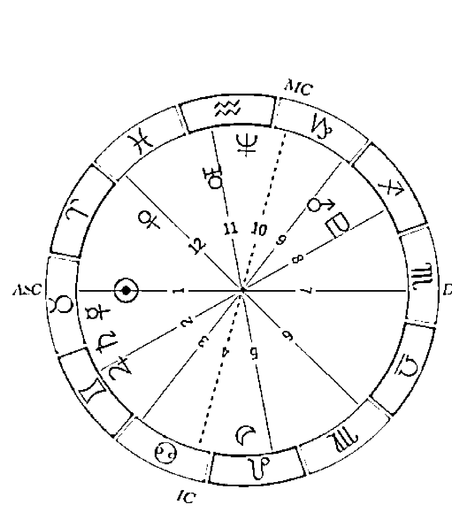

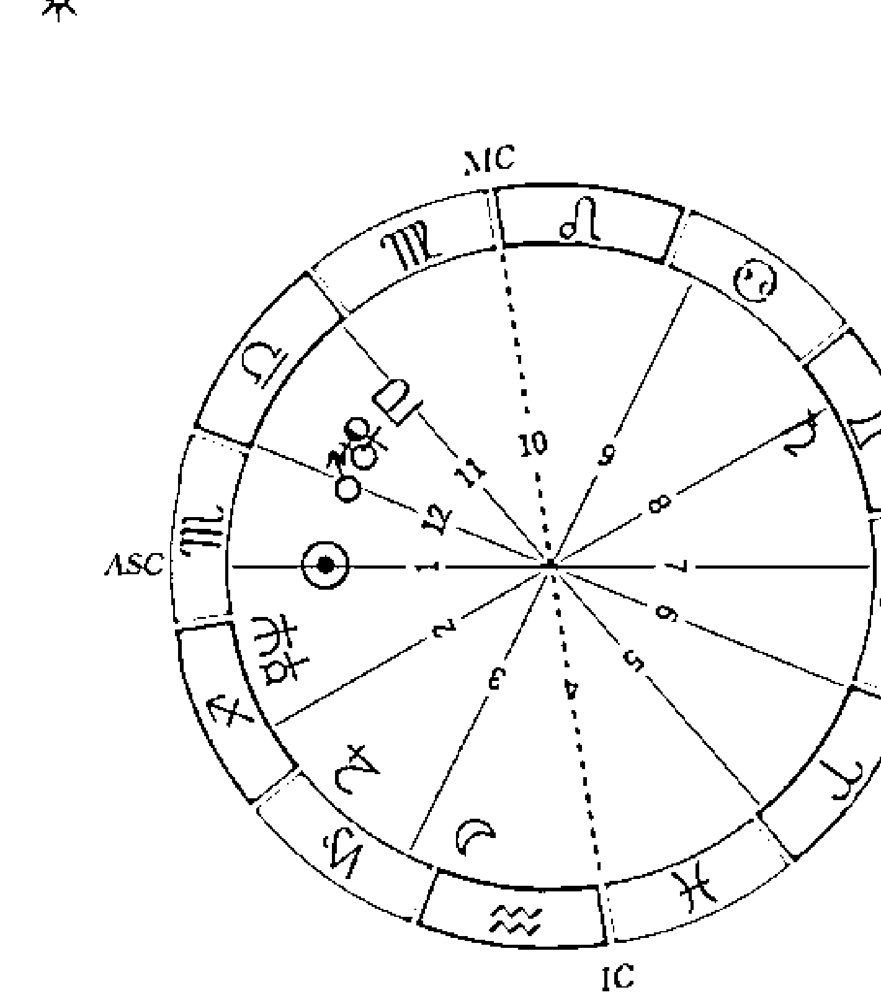

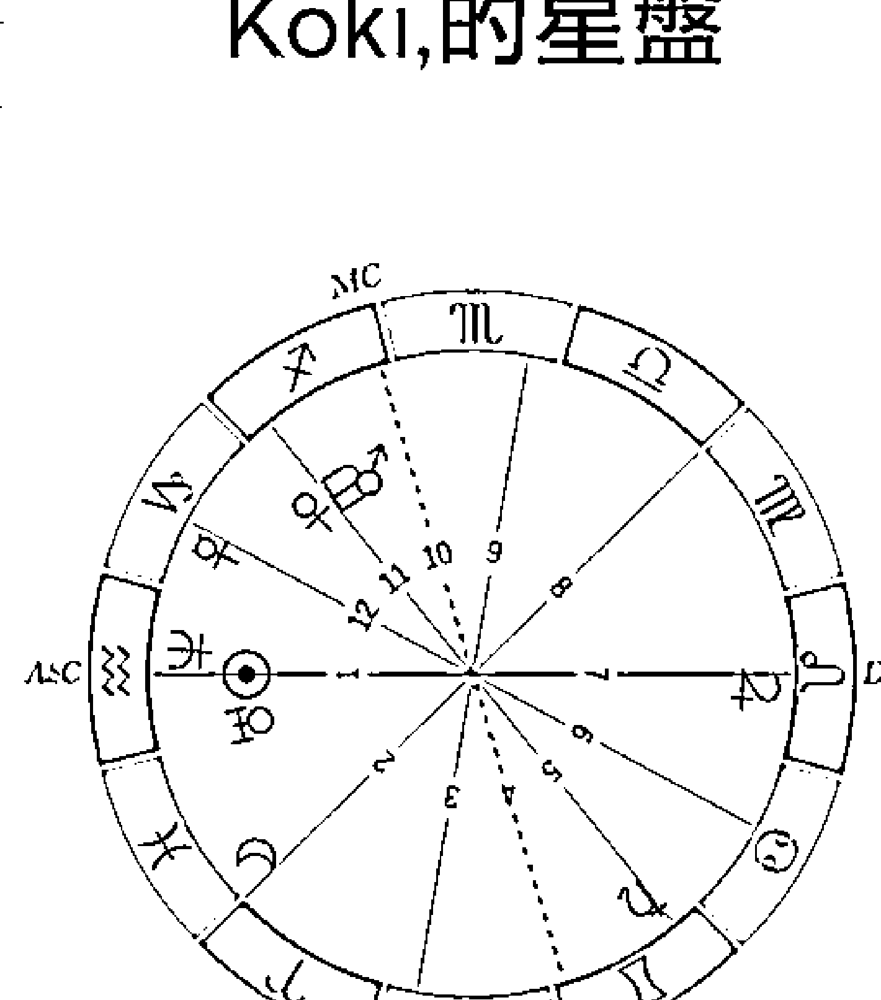

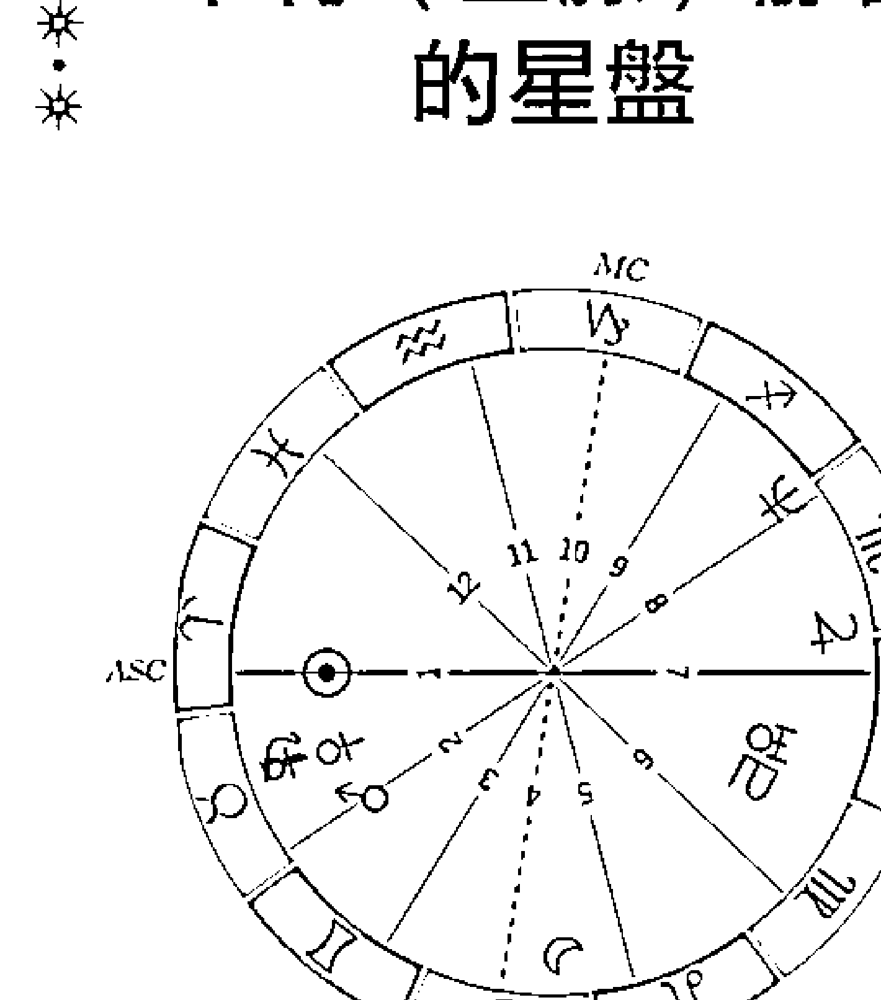

## 第4章 透過星盤診斷契合度（透過診斷身邊人們或名人的契合度來學習）

## 女兒們的運勢比父母還強！家人間的溝通活躍

木村先生的太陽沒有主要相位，代表著雖然確立了個性，但也擁有著能處理跨越多領域工作的靈活度。工藤小姐的太陽可能也沒有主要相位，不過，落在金牛座的水星、金星及土星形成了人格的核心。

長女的太陽與海王星形成凶相位，有許多糾葛與煩惱。由於海王星與數顆行星形成相位，如果能活用社群網路或想像力為佳。次女的太陽與海王星在水瓶座形成合相，與火星形成六分相。代表她擁有最新醫療或現代藝術等領域上的才華。

夫妻的太陽及火星分別都幾乎形成對分相，代表兩人尊重彼此的行動，並保持適度距離。角色分工明確，因此鮮少有衝突。姊妹倆

### Point

是溝通活潑的一家人。由角色分工明確的父母與感情要好的姊妹所組成。工作方面取決於父親的本事。

的興趣或嗜好雖然不同，但能以這份差異作為話題，建立良好的關係。由於父母與女兒們形成許多相位，代表影響力強，溝通活躍。由於有許多凶相位，代表在管教上可能重視規定，十分嚴厲？似乎過著出乎意料地以女兒們為中心的生活。木村先生有好幾顆行星與女兒們的水星形成相位，因此在工作方面是個很好的嚮導。父親的本事攸關女兒們能否活躍。

## 診斷社群網路時代的契合度，也需要關注水星！

戀愛的契合度基本上看金星與火星，而婚姻的契合度則以太陽與月亮來分析。不過，近年來還有另一顆行星，被認為扮演了重要的角色，那就是水星。隨著社群網路時代的到來，司掌溝通或通訊方式的水星，在分析契合度上成了不容忽視的存在。這不僅會影響男女，還會影響所有人際關係。藉由關注水星，或許可以發現如何保持人際關係圓融的提示，避免有所誤會等等。此外，即使在出生星盤上顯示你是難以交到男女朋友或結婚的特質，視契合度而定，也有可能消除這個問題。不過，由於也可能發生相反的情況，因此分析與相關對象之間的契合度是很重要的。

## 第5章

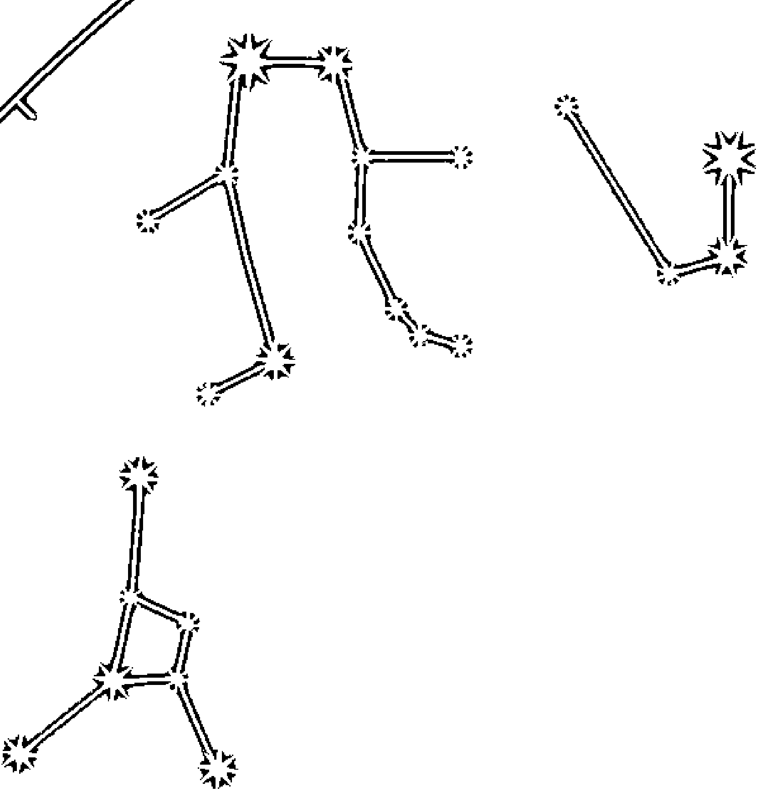

## 透過星盤占卜未來

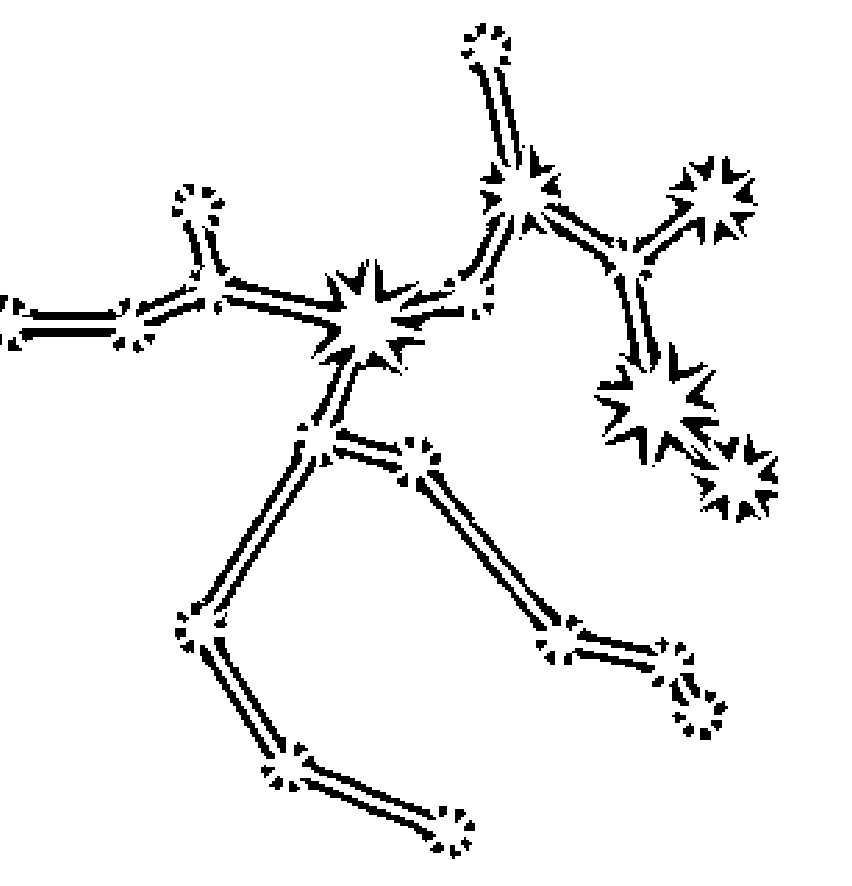

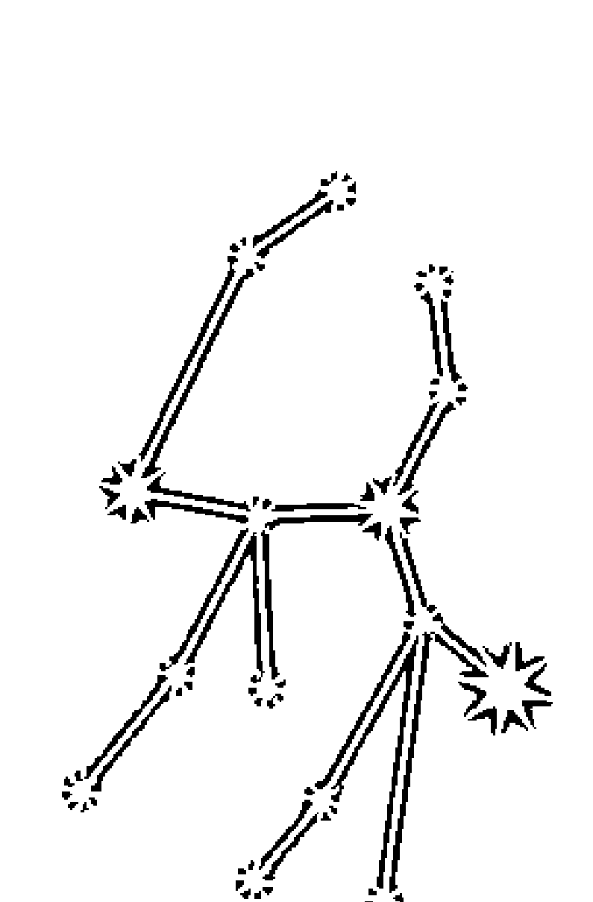

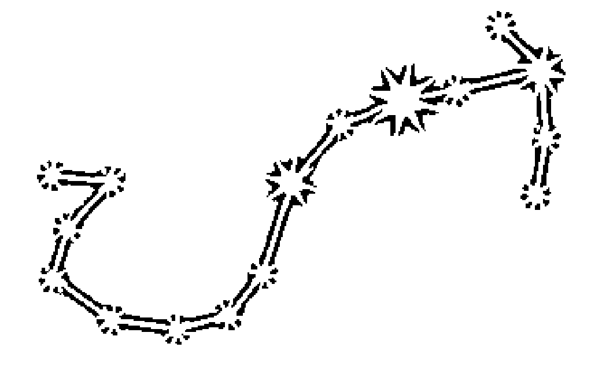

## 關於占卜未來

### 確認行星的動向如何在自己身上發揮作用

在西洋占星術中，有許多種解讀未來的方法，本書中使用了稱作「行星過運法」的推運方式。這項方式是計算在你所想知道的時機當下，行星會運行到天球上的何處，接著與出生星盤相對照，確認行星落在哪個宮位、與出生時的行星形成何種相位。藉由思考運行中的行星對地上會造成怎樣的影響，來預測個人的運勢或未來。至於究竟會造成何種影響，取決於行星以及其坐落的宮位而定，在追尋行星動向的過程中，你就會得知何時會有怎樣的好運造訪，或是容易遭遇怎樣的麻煩。請將此作為過著充實日子的提示，思考該如何度過那段時期。

此外，為了將你所想知道的時機運行的行星，與在你出生星盤上的行星區隔，會將其稱作「行運（Transit：經過）行星」，在本書中也有幾處會以「T太陽」、「T木星」的縮寫形式呈現。

## 透過進行木星的動向占卜整年運勢

據說木星會帶來擴張與發展。因為木星過境一個星座的時間大約一年，所以在西洋占星術中，會用它來確認一整年的運勢。由於根據出生星盤，木星落入出生星盤的那個宮位，可知一個人在這大約一年之間，會獲得怎樣的發展機會，因此只要在此投注心力，就能更輕易達成目標。然而，木星的擴張作用會影響到任何層面，同樣地也可能會擴張該宮位的要害，需要注意這點。

2021年 3月 21日 15時

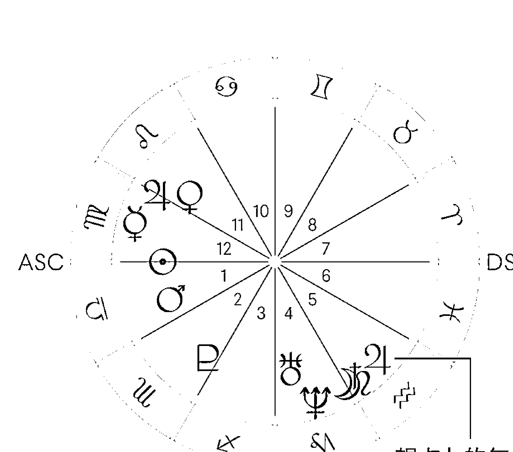

在網站上輸入想查詢的年月日，找到「木星」的位置，確認它所在的宮位。

## 行運木星的動向

| 日期範圍 | 星座 |
|----------|------|
| 2020年12月19日～2021年5月13日 | 水瓶座 |
| 2021年5月14日～同年7月27日 | 雙魚座 ※6月20日～7月27日為逆行 |
| 2021年7月28日～同年12月28日 | 水瓶座 ※7月28日～10月17日為逆行 |
| 2021年12月29日～2022年5月10日 | 雙魚座 |
| 2022年5月11日～同年10月27日 | 牡羊座 ※7月29日～10月27日為逆行 |
| 2022年10月28日～同年12月19日 | 雙魚座 ※10月28日～11月23日為逆行 |
| 2022年12月20日～2023年5月16日 | 牡羊座 |
| 2023年5月17日～2024年5月25日 | 金牛座 ※2023年9月4日～12月30日為逆行 |
| 2024年5月26日～2025年6月9日 | 雙子座 ※2024年10月9日～2025年2月3日為逆行 |

## 行運木星落在你的第1宮的年份

能拓展眼界，並擴大行動範圍，是充滿希望與進取心的一年。當你設定了需透過長期計畫達成的新目標後，事情會順利得令人驚訝。此外，你的想法會受到認同，而獲得發揮實力的機會，不過由於過於順利，會讓你容易變得不注重小地方而流於馬虎，需要注意。

## 行運木星落在你的第2宮的年份

財運會提升，經濟活動會透過你的計策而活化。你能活用至今為止鍛鍊出來的工作技能或興趣，創造新的收入來源。同時，認真儲蓄也能吸引好運。由於行運木星顯示出的是只要工作就能確實獲得回報的踏實步調，因此不適合股票等投機或賭博的方式。

## 行運木星落在你的第3宮的年份

是能順著好奇心採取行動的有趣一年，如果能活用社群網路或部落格等網際網路方式為佳。會有些令人欣喜的發展，比如說獲得一點收入，在意想不到的方向建立人脈，使得有人在你想做的事情上推你一把等。在讀書或學習等各方面也能迅速進步，而學會各式各樣的技能，身邊的人們也會有喜事發生。

## 行運木星落在你的第4宮的年份

發生許多與房屋或家人相關的喜事，比如說因為結婚或生產等原因而增加家人、購買不動產、搬到比現在還寬敞的房屋等。如果你對現在的住處有所不滿，只要積極收集資訊，就有很大機率遇到優良物件。由於強化家族親情，尤其是與母親般的人之間的關係，能招來好運，如果與對方分開生活，就請頻繁保持聯繫。

## 行運木星落在你的第6宮的年份

是能期待在工作方面有所發展的時期，比如說投注心力處理的案件獲得認可、工作職場上的人際關係順利等，也有機會找到條件良好的工作。在健康方面也會遇見轉機，找到適合自己的養生方式，或遇到很好的治療方式等，得以解決長年不適的問題。然而，你也可能會對於自己的健康過於自信而有所勉強。

## 行運木星落在你的第5宮的年份

會增加休閒娛樂等許多享受非日常生活的機會。也有許多戀愛機會，有很大的可能會懷孕。如果從事藝術活動的人盡量把握發表作品，就能掌握發展的契機。此外，現在也是適合投資等的時期，不過只能獲得一時的喜悅。即使能靠投機方式賺到一筆，也只是錢一到手就花完。

## 行運木星落在你的第8宮的年份

能加深與夥伴之間的情誼。由於想和長時間共度的對象加深關係的想法十分強烈，性生活也會很充實。同時也是容易懷孕的時期。你有機會獲得一大筆錢，並有效運用這筆錢，因此也是貸款或投資的好時機。

## 行運木星落在你的第7宮的年份

是在人際關係上有新發展的時期，會遇見可稱之為「最佳拍檔」的對象。如果是單身人士，友人會介紹通往婚姻的對象，而情侶則是邁入婚姻的好時機。如果是在工作的人，會獲得喜歡的工作夥伴。除此之外，訴訟或簽約也能朝有利的方向前進，在合夥經營或合資方面也有好處。

## 行運木星落在你的第10宮的年份

是至今為止的努力與忍耐獲得認同，收入也會提升的一年。只要認真工作，也有晉升的可能性。還能遇到得以發揮自己才能的『天職』，也適合獨立、換工作。責任雖然會增加，不過擁有不將這份壓力當一回事的氣勢，因此會積極面對被賦予的挑戰。

## 行運木星落在你的第9宮的年份

提升追求未來的目標，眼界變得開闊，將會是鍛鍊貢獻社會技能的最佳環境。適合為了取得司法考試為首的國家證照而唸書，也有以世界規模大為活躍的機會。如果能提升外語會話能力，在能力所及範圍處理社會問題等，運勢就能顯著提升。

## 行運木星落在你的第12宮的年份

是會為了人們竭盡心力，而獲得好運勢的一年。煩惱都能解決，即使發生問題也會出現協助者，讓你成功克服。直覺變得敏銳，能從夢境等地方獲得解決問題的提示。話雖如此，現在並不是積極主動出擊的時期，而是保持被動狀態多休息一會兒。

## 行運木星落在你的第11宮的年份

提升對於貢獻社會的興趣，產生『人生目的』，也有可能獲得達成目標的機會。此外，也會增加能協助你活動的熟人，擴大人際關係。託際網路的福，你也能獲得世界各地人們的支援，是能與這些人同心協力，讓事情有所進展並獲得成功的一年。

## 從行運土星解讀大約兩年半的課題

土星自古以來就被視為帶來厄運的星辰，不過，近年也有一透過考驗促進成長的行星這樣更為積極正向的解釋。土星過境一個星座的時間大約兩年半，請確認T土星落在出生星盤上的哪個宮位。這麼一來就能從該宮位的主體，得知這個時期容易發生怎樣的障礙，進一步能學習到什麼事情。

比如說，如果落在代表收入的第2宮，就可以解讀成或許會在收入方面發生無可奈何的事。不過也能藉由它過境第2宮的期間，重新審視用錢方式，並學習如何理財、鍛鍊自己的金錢品味。

## 行運木星與行運土星的相位

木星象徵擴張與好運，土星象徵抑制與考驗。當這兩顆力量完全相反的行星形成相位時，想必也會對社會整體造成很大的影響。二〇二〇年，兩顆行星完全重疊的「大合相」，就像是同時踩下汽車油門與煞車的狀態。儘管一開始顯得混亂，也能藉由土星的一板一眼而指示全新的方向。當形成吉相位時，土星與木星的能量也能取得良好平衡，朝著踏實的方向發展。形成凶相位時，能量則會起相反的作用，由於失去平衡，或許容易引發經濟蕭條或重大事件、意外。

## 第5章 透過星盤占卜未來〈占卜以月為單位的未來〉

## 透過行星太陽的動向占卜以月為單位的未來

如同你所知道的「從3月21日到4月19日之間出生的人為牡羊座」一般，太陽過境一個星座的時間約為一個月。接下來，將介紹藉由確認正在運行的太陽會落在你星盤上的何處，來解讀它在大約一個月內會引發怎樣的作用。由於太陽會照亮該宮位代表的事物，並給予溫暖，因此帶來該領域在生活中活化的形象。

2021年 2月 14日 15時

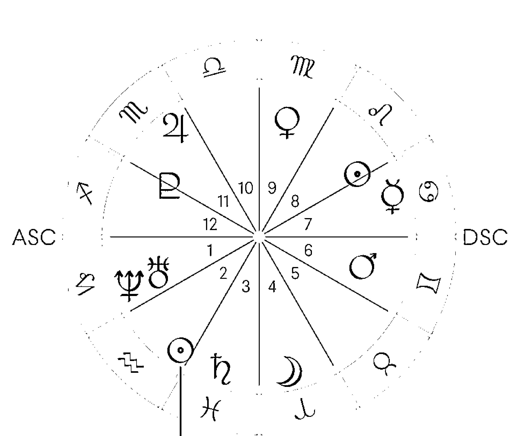

在網站上輸入想查詢的年月日，找到「太陽」的位置，確認它所在的宮位。

## 行運太陽落在你的第2宮的期間

運氣平平。是擁有的事物沐浴在聚光燈下的時期。所謂擁有的事物，除了實際物品，也包括愛情、財富、地位等在內。如同與T金星所帶來的「財運」互補一般，會重視你所擁有的事物，並好好培養壯大。此外，事情會以自己的步調取得進展，並找到許多微小的幸福。

## 行運太陽落在你的第1宮的期間

運勢良好。由於會受到囑目，是適合強調自己想法的期間。對一件事是否對自己今後有所加分相當敏感，能從這個角度判斷事物。一旦訂定目標就會產生幹勁，而有比平時更大膽挑戰的可能。也會拓展交友範圍，可以積極地自我推銷。同時也暗示著遲滯的事項按照自己的想法開始動起來。

## 行運太陽落在你的第4宮的期間

運勢低迷。與其在外頭活躍，更適合安穩地與親近的人相處，以培養感情為主。可以藉由整理房間或改變擺設來為生活環境帶來新的變化。開運行動為打掃房間或改變擺設。與志同道合的夥伴之間也是處於能夠獲得許多刺激的時期。此外，與母親之間的關係增加，有獲得協助的運勢。自己也會成為母親般的角色，增加多管他人間事的情況。

## 行運太陽落在你的第3宮的期間

運勢佳。事情大致上都能順利進展。靈活度變高，是充滿輕快氛圍的期間。由於陽光照耀在知性上，可以解讀成在知性活動上很走運。如同與「水星所帶來的「溝通運」互補一般，能提升對話能力。在新的收集資訊方式或方便的網路工具上很走運。

## 行運太陽落在你的第6宮的期間

5宮的受歡迎截然不同，會減少光鮮亮麗的程度，是不起眼地進行事物的運勢。在興趣方面，只要穩紮穩打地學習，就能獲得成果。也是思考自身責任或職責的好契機。會在意起細微瑣事，身心健康的態度嚴厲。這個時期的主題是

## 行運太陽落在你的第5宮的期間

運勢良好。戀愛、創造性、遊戲等運勢都會活化，是能享受眾多愉快事情的期間。增加積極度，運勢明顯看漲。行為舉止會變得誇張，受到矚目。藉由坦率地展現內心的自我表現，也能獲得莫大喜悅。但是，自尊心也會因此提高，而會對於他人對自己的種種話語變得神經質。

## 行運太陽落在你的第8宮的期間

是重視自己的運勢。變得內向，放慢事物的進展速度。與善於交際的第7宮期間相反，由於說話不夠而發生令人著急不耐的事件。會變得生疑，煩惱加重，但在過去的經驗中有恢復狀態的提示。關鍵在於凡事都要堅持不懈地處理。此於不分工作職場或家庭，也有繼承某些事物的運勢。

## 行運太陽落在你的第7宮的期間

運勢吉凶參半。在人際方面有變動，有人與你變得接近，也有敵我雙方顛倒的情況。現在是不抵抗變化，順其自然的好時機。如果意識到團隊合作或夥伴契合度，會是獲得充實感的時期。也有提升美麗或品味的運勢。開運行動為同時鍛鍊外在與內在。

## 行運太陽落在你的第10宮的期間

運勢曲折。原本在進行的事情動作會變得遲緩，但可能達成工作上的目標。向上爬的意願及或認可的慾望提升，會做出好成績，獲得高度評價。也能期待受到上級關照提拔，在這段時期好好努力，就能大為活躍。另一方面，也暗示著容易拘泥於自己的做事方式而變得固執。在簽約或約定方面的事情上嚴禁焦慮。

## 行運太陽落在你的第9宮的期間

運勢良好。氣勢復活，是能自由豁達地行動的運勢。會熱情地想探求並深入理解某些事物。時常被拖到核心位置，由於態度坦率而受到歡迎。判斷力與決定力也會提升。由於他人會傾聽你的話語並支持你，有機會將之前所想的事情付諸執行。出遠門為吉。

## 行運太陽落在你的第12宮的期間

是重視自己的運勢。這是進入接下來的第1宮之前，累積力量的期間。判斷力降低，行動力也會變得遲緩，不要勉強自己比較好。容易對於無法明確掌握的事物感到畏懼，而會杞人憂天，造成自己不安。與人事物之間的距離也會拉近或疏遠，請只考慮留下自己真正需要的事物，順其自然。

## 行運太陽落在你的第11宮的期間

運勢佳。事物進展的速度加快，人際方面良好。發生的好事都來自周遭的人們。由於協調性增加，氛圍變得和善，是容易獲得協助者的時期。此外，腦子運轉的速度加快，能發現有意義的方法。至今為止只能大致掌握方向的事物，也可能得以清楚鮮明地確認細節內容。

## 更詳細掌握未來透過行運水星占卜工作或人際關係上的運勢

透過行運水星，能解讀一個人現在或未來的工作運以及溝通運。隨著水星過境各個宮位，也會照亮工作上的各個方面。當水星落在你星盤上第1宮的期間，在工作上會產生幹勁，提升處理速度，也更容易發揮能力。在移動到第2宮時，速度雖然會變慢，但耐性會增加，是在工作能力上容易獲得評價的狀態。溝通運也是相同的，只要得知人際關係上的進退時期，而對自己有所幫助。

2021年 2月 14日 15時

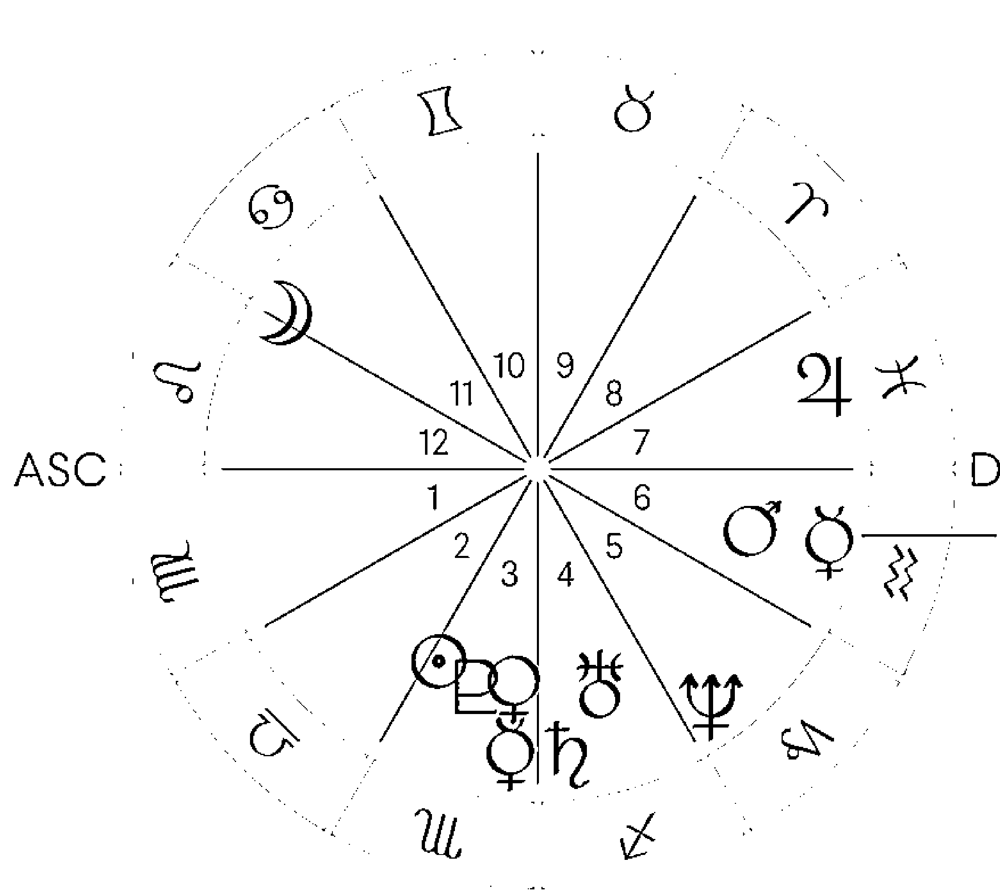

想占卜的年月日的水星配置在網站上輸入想查詢的年月日，找到「水星」的位置，確認它所在的宮位。

## 行運水星落在你的第2宮的期間

是工作運勢看漲的時期。由於是能夠發揮耐力的時期，專心進行就會有所進展。工作上有強烈堅持雖然能提升品質，卻也會導致速度略微減緩。此外，也有可能透過活用技術、證照及經驗，獲得報酬或獎金等臨時收入。也容易開始發展副業。

## 行運水星落在你的第1宮的期間

與朋友、熟人之間的溝通活化，是增加往來或聯繫的時期。也會出現與休閒或興趣相關的新計畫。積極進取的態度奏效，對工作也產生正面影響。此外，除了有活用特長的機會，對於第一份工作也會充滿幹勁地處理。收到有益的資訊，談判交涉十分順利。

## 行運水星落在你的第4宮的期間

是會奮不顧身地工作的時期。由於是人來人往頻繁、調動、物品移動的運勢，會過著靜不下來的每一天。然而，在這段期間的努力將能提升生活品質。改善職場環境會有好運。在人際關係方面，雖然會珍惜自己人，卻容易與新成員或外人之間築起高牆，需要注意。

## 行運水星落在你的第3宮的期間

工作運勢順利。在工作相關的學習或孜孜不倦練習的事物上有所成長。如果有任何以提升等級為目標的考試或實力測驗，將能獲得好成績。此外，在這段期間也很容易從大眾媒體或社群網路上獲得進一步提升生活的有益資訊。也暗示了會收到意料之外的通知。

行運水星落在你的第6宮的期間

能夠仔細作業，提升工作品質而獲得高度評價。在講求縝密的工作上可得到成果。事物雖然不會一蹴而就，但能有計劃地進展，是先前的累積能明確化為有形的期間。上下級關係可能會發生變化。此外，在健康管理上，是資訊會成為關鍵的時期。蔚為話題的商品等具有維持健康的效果。

行運水星落在你的第5宮的期間

是「努力遊玩，努力工作」的運勢。私生活充實對工作也有正面影響。你將會湧現很棒的點子並加以活用，大為活躍。在交涉談判上，如果由你掌握主動位置，發展會對你有利。在工作技能競爭等方面可獲得好成績。心情變得開朗，可以擺脫萎靡。

行運水星落在你的第8宮的期間

在工作方面，如果要說的話會是處於被動立場，但堅持不懈地踏實推進被交付的工作，會帶來好運。相對地，專注力會大為提升。在某些事情上會遲於報告、聯繫、商量，導致容易受到周遭的人誤會，需要小心。此外，或許會有得知他人秘密而不知所措的情況。

行運水星落在你的第7宮的期間

是容易受到工作對象影響的時期。會受到對方的心情左右，而有意料之外的發展，或事情難以解決的情況。不過，由於商務禮儀良好，且能臨機應變地應對，就結果而言能提升你的評價。也可能會有工作上的競爭對手登場，但能締造互相刺激的良好關係。

行運水星落在你的第10宮的期間

是有活用經驗或技能的機會的時期。你實務方面的能力會獲得認可，得到高度評價。這也暗示著就結果而言，會獲得意想不到的機會。雖然責任會變重、感覺到壓力，但是值得挑戰。在工作或社會上，會發生可讓自己積分的事件，而獲得良好體驗。

行運水星落在你的第9宮的期間

是適合學習專業知識、技術的期間。即使你已經學會許多技術，仍能藉由重新審視、回歸初心，發現進一步成長的契機。在升級考試、證照考試時也會有成長的機會。接受外國語時也會發展。而且，也會產生濃厚興趣，並從中獲得許多可加分的事物。

行運水星落在你的第12宮的期間

是與其說身先士卒地推動工作，不如擔任輔助角色來處理工作，更能獲得成果的時期。似乎會聽到背後的資訊或秘密，其中也包括了對自己有利，可以活用的內容。在工作方面，有不小心出錯的機率增加的危險，在管理文件或資料上需要謹慎。請注意別搞錯客戶的姓名。

行運水星落在你的第11宮的期間

工作自不用提，在興趣等團體活動也是十分活躍的時期。在職場上，能順利與團隊成員合作而工作愉快。此外，也暗示了工作方式或地位的變化。在學習會或研究會上，也會有些具發展性的變化，使得人際關係變得豐富。有機會結識你憧憬的對象、知名人士。

更詳細 掌握未來 透過行運金星占卜戀愛 與金錢上的運勢

當金星過境出生星盤的各個宮位時，可解讀成在戀愛或財富上有各式各樣的時機造訪。而「各式各樣」的種類，指的是由過境宮位所掌管的事項。比如說，如果談論戀愛運時，落在第1宮可解釋成「藉由直接表達自己的想法，可讓自己與喜歡的人的關係有所進展」；落在第4宮時，則是「給人家庭型印象的進攻方式奏效」的情況。那段期間的金星光芒會使相遇風格、在情人身上追求的事物浮現出來。以月分為單位的財運起伏，也是行運金星的守備範圍。

- 2021年
- 2月
- 14日
- 15時

想占卜的年月日的金星配置

在網站上輸入想查詢的年月日，找到「金星」的位置，確認它所在的宮位。

行運金星落在你的第2宮的期間

五感變得銳利，會希望能夠清楚區隔美醜，或是令自己舒適或不愉快事物的時期。在戀愛方面，稍微有些神經質。對於喜歡的對象或夥伴的要求和執著會變得強烈。在財務方面，討價還價或態勢和善有加分作用。交涉時，會獲得援助。食衣住方面的開支會增加。

行運金星落在你的第1宮的期間

充滿為了實現戀愛而採取行動的幹勁。即使是關係薄弱的單戀對象，也能透過細微的契機加深感情。希望你在意的對象或夥伴能強烈意識到自己的存在，這樣的想法也日益加重。會追求能證明自己被對方愛著的證據。在財運方面，是迅速判斷可獲益的時期。藉著「先搶先贏」而變得更強。

行運金星落在你的第4宮的期間

會感覺到家人或身邊人們愛情的時期。另一方面，如果自己在意的對象或夥伴無法理解自己的心情，就會陷入不安的情況。你會為了求安心而容易對對方抱持過多期待，下意識地帶給對方壓力。在家務或物質方面，可期待家人的支援。也暗示著因為會錯意而多了不必要的開支。

行運金星落在你的第3宮的期間

會增加造訪他人或被造訪的機會。能發展成戀愛的邂逅機會也會隨之增加，不過交際費用也同時暴漲的時期。會為了展開興趣或學習技能而需要初期投資。在戀愛方面，容易維持「超越朋友，戀人未滿」的關係，首先就先享受溝通的樂趣，不要焦急地建立信任關係。

行運金星落在你的第6宮的期間

是受到上級疼愛，晚輩仰賴的時期。也會獲得善意的夥伴或協助者，並吸引邂逅的機會。調查能力提升，並對戀愛有所助益，可以期待藉由工作獲得邂逅。約會容易陷入一成不變的模式，要下點功夫。在財運方面，是能踏實地節省或存錢的時期。

行運金星落在你的第5宮的期間

是能與意中人或情侶、伴侶愉快度過的時期。能夠以溫柔的心情看見對方好的一面。也能輕鬆地回應對方所期待的事情。在這段期間有特別的約會為吉利。在物質運方面，是能夠一邊享受一邊獲得的愉快時刻。可接受他人的邀請或委託。另一方面，開支也容易增加。

行運金星落在你的第8宮的期間

是獲得意料之外的贈禮，或可以期待臨時收入的時期。不過，賭博或以預測方式進行的投機行為不會成功。容易有來自己奇怪人士的誘惑、危險的邀約接近自己，要注意這點。在戀愛方面，是與特定對象加深關係的運勢，你會以神秘的魅力令對方為你著迷。同時也容易成為互相束縛的關係，要注意不要過度。

行運金星落在你的第7宮的期間

是與意中人、情侶或夥伴之間瀰漫著緊張感的時期，那並非爭執，而是策略。你也能運用高明地引導對方的說話術。因為某些原因，對原本就在於一起的人感情加溫，正在考慮結婚的兩人會遇上具體化的契機。在財運方面，雖然金錢進出頻繁，但大致良好。在簽約等的時候要確實審查內容。

行運金星落在你的第10宮的期間

是期望與高水準的人們接觸的期間。會受到有出色經歷或頭銜的人吸引。尊敬之情有可能會轉變成愛情。透過以結婚為前提相親的邂逅，也是良緣的預兆。此外，關心對方的父母親會有加分作用。在財運方面，容易為了獲得周遭稱讚而盛宴款待。

行運金星落在你的第9宮的期間

是與外國人接觸的機會增加，活用語言能力拓展社交範圍的時期。雖然有邂逅，但由於你熱得快冷得也快，而有戀情短暫的傾向。有機會與情人談論未來的事。不僅是喜歡，還試圖認同彼此的人性。在這段期間旅行會非常愉快。然而，很有可能會不注意細節而揮霍，要特別注意。

行運金星落在你的第12宮的期間

是容易吸引邂逅的時期。會奮不顧身地對意中人傾注愛意。一旦被對方寵溺就會變得軟弱，而有唯命是從的傾向，需要保持堅強的意志。也有發生三角關係、出現意料之外的競爭對手，或沈溺於無法公諸於世的關係中的危險。在財運方面，暗示著會敗給充滿魅力的銷售話術，而購買不需要的事物，或受到傳聞迷惑而花錢。

行運金星落在你的第11宮的期間

期望與有教養的人及學識淵博的人深入交流，變得積極進取的時期。也可能會找到理想對象並發展成交往。不過，與其說是以口氣加深關係，倒不如說是以「超過朋友」的感覺發展。與情人或朋友之間也有「摯友」的感覺。在財運方面，會為了讓想法更加豐富，發現獨特的節省方式或獲得臨時收入的方式。

還要關注會催化事物的行運火星！

更詳細掌握未來

伴隨著火星過境，在出生星盤上對應宮位的事物也會動起來，有在此點燃導火線的印象。火星過境一個星座的時間為將近兩個月，不過會以每兩年一次的頻率逆行，在這段期間，會在同一個星座停滯半年左右。比如說，從二〇二二年八月下旬起的大約七個月間，火星都沒有離開雙子座。在你的出生星盤上，雙子座對應哪個宮位呢？該宮位顯示的事項可說是持續受到火星活化著。火星與太陽、水星及金星，都是適合用來確認短期事件的行星。

- 2021年
- 2月
- 14日
- 15時

在網站上輸入想查詢的年月日，找到「火星」的位置，確認它所在的宮位。

## 行運火星 落在你的第2宮 的年分

特別在工作或打工方面湧現幹勁，變得活躍。不過，雖然有幹勁，行動卻很緩慢，有凡事都要花費時間的傾向。由於會顯得貪得無厭，帶給周遭人們手頭不寬裕的印象。是會衝動購買或有意 外開支的時期。容易流於輕鬆的方式，顯得運動不足。也需要注意暴飲暴食或喉嚨不適。

## 行運火星 落在你的第1宮 的年分

是能夠在維持高度張力下活躍的期間。冒出想引人矚目的主意，而會想吸引周遭人們的注意 識，而會想挑戰全新事物或周遭的人從 事，很走運。此外，也可能容易頭痛或牙痛，也要小心受傷或燒燙傷。在運動時要仔細做好暖身。

## 行運火星 落在你的第4宮 的年分

家中充滿活力，對家人而言的新議題會浮上檯面。另外一方面，也容易在家中起爭執的一面。 氣氛會變得尷尬，讓你開始考慮要暫時與家人保持距離，或趁此機會獨立。此外，身體狀況容易起變化，是需要非常注意病毒感染的期間。如果身體有從之前就很在意的不適問題，千萬別放著不管。

## 行運火星 落在你的第3宮 的年分

是整體速度加快，步調變得輕快的時期。容易顯得急躁，在隸屬團體中引發麻煩。此外，可能會有講了不合時宜的話語而引發口角的危險。也容易因為對方的措辭方式變得神經質。另一方面，也暗示著會與在意的對象有新的交流。手臂或肩膀的不適問題最好儘早處理。

行運火星落在你的第6宮的年分

會沈浸於工作或照顧他人，不過由於不夠細心，「自己想這樣進行」的想法會搶先一步。一旦做過頭，可能會被長輩疏遠，或有被晚輩扯後腿的危險。是學習健康相關知識或技術的適當時機。另一方面，也暗示著工作過於繁重而使得身體變差，需要注意。

行運火星落在你的第5宮的年分

是戀愛熱情高漲的時期。在戀愛方面，這段期間由自己主導會比較順利。縱使是有些苦衷的戀情，如果大膽向前衝，也可能壓制得住相關人士。在運動比賽或競技方面，有機會活躍。此外，這也是想接觸賭博的時期。在健康方面雖然平安，不過要注意別對自己的體力過度自信而累積疲勞。

行運火星落在你的第8宮的年分

是能活用他人賦予的事物，並大展鴻圖的時期。在財運方面，能想到好的運用方式。另一方面，需要注意信用卡支付、房貸或借貸。也暗示了這段期間借出的錢會收不回來。還有毫無理由被造謠中傷的危險。在健康方面，是身體莫名不舒服的期間。如果是女性，千萬別輕視生理不順的問題。

行運火星落在你的第7宮的年分

是人際關係或社交活化的時期。你能與工作夥伴搭配發揮實力，度過危機。另一方面，也暗示著競爭意識過剩，導致容易與周遭的人起衝突。此外，在身體狀況方面容易有起伏，因此要注意提升飲食或睡眠品質，保持規律的生活步調。如果有不適的地方要檢查。

行運火星落在你的第10宮的年分

期望獲得社會性的成功，熱衷於工作或公眾活動。雖然才能常受到周遭認同的期間，但過於引人矚目反而會造成長輩反感。此外，會想讓周遭的人留下「自己與意中人之間有特殊感情」的印象，而光明正大地宣揚。由於相當忙碌，時常勉強自己，容易累積疲勞。當心宿疾惡化。

行運火星落在你的第9宮的年分

是上進心提升，希望在精神上有所成長的想法變得強烈的時期。雖然立志在許多方面活躍，卻容易擬訂過於勉強的行程表。你會想展開一場漫無目的的旅行，但心情會隨著火星的移動而冷靜下來。身體上的煩惱向專業醫師諮詢為上。此外，也要注意在運動時受傷。

行運火星落在你的第12宮的年分

一旦意識到「是為了這個人」，就可能採取大膽行動的時期。另一方面，自己想做的事情容易無緣無故地遭受反對。此外，會難以忍受他人的做事方式而累積壓力。可能會因為粗心而撞到什麼或掉了東西，需要注意。此外，需要注意可能會因為攝取過多嗜好品，而造成精神上的不適。

行運火星落在你的第11宮的年分

是萌生對未來的希望，湧現幹勁的時期。會在隸屬的組織中擔任某些職務。此外，能冷靜地向周遭訴說關於自己夢想的計畫。也暗示著朋友熟人贊同你的夢想，給予物質或精神上的支援。是健康方面沒什麼問題的時期，雖然對最新的健康資訊有高度興趣，但請先確認是否適合自己。

## 透過行運月亮 占卜每日運勢

最後要介紹的是「今日運勢」，以移動速度最快的月亮作為指標。由於月亮一天會前進大約13度，因此只需兩到三天就能跨越有30度寬的一個星座。只要想像月光會每兩到三天分別照耀在你出生星盤上的各個宮位，應該很容易理解吧。月亮與太陽不同，與其說是加以活化，不如說是有「賦予變化」的作用。藉由得知一、兩天內會有什麼變化，並自我調整，就能導出良好的結果。

如下圖所示，月亮會在兩至三天內移動到下一個星座，大約二十七天可繞行十二星座一周。藉由其現在位置對應你星盤上的哪個宮位，就可得知每日運勢。

在上圖的案例中，顯示的是第7宮的運勢。

## 運用行運月亮，占卜『今天的心情』或『明天的事件』吧

月亮與太陽等相同，顯示的並非「人生中的大事」，而是「今天、明天的心情或日常上的變化、存在微小幸運的領域」。最適合作為每日行動的契機，實際上，我們常見的「每日運勢」，也常常是運用月亮來指引的。
由於月亮不會逆行，會規律地從牡羊座繞行到雙魚座，接著再回到牡羊座，以單一方向繞行著。月亮只要進入牡羊座兩、三天後，就一定會移動到金牛座。換言之，只要知道今天的月亮落在你的出生星盤上的何處，就能預測到幾天後一定會輪到下個宮位的運勢。
比如說，如果今天的月亮落在你的第4宮，就可以把「家庭方面的事會有好運，所以就來整理吧」設定成「今天的主題」。接著，「因為過兩、三天就會過境到我的第5宮，就來安排約會吧」——只要像這樣運用月亮，就能輕易排定生活中的計畫了。
此外，最近也有愈來愈多人在意識到新月或滿月，也有「從新月之日展開新的事情」、「在滿月實現願望，並展開下一輪」的說法。一邊看著每日改變姿態的月亮，一邊設定目標並回顧，也是將行運月亮的訊息活用於生活中的方式之一。
在本書的網站中，為了正確顯示，並沒有將移動迅速的行運月亮列入其中，因此關於「今天的月亮星座」，請參閱列入月亮星座的月曆或行事曆、網站。

## 每日運勢關鍵詞

在此根據出生星盤的各宮位，將行運月亮過境時的「心情、事件、象徵」列出關鍵詞。

| 行運月亮的位置 | 關鍵詞 |
|---|---|
| 第1宮 | 強而有力、主動的、想法為之一變、大膽、主角、運動 |
| 第2宮 | 平穩、物質、金錢上的變化、享樂的、占有欲、藝術 |
| 第3宮 | 輕鬆、溝通、資訊、求知欲、小旅行、兄弟 |
| 第4宮 | 情感的、家庭、人情、容身之處、照顧人、雙親 |
| 第5宮 | 生氣勃勃、積極的、豪華、戀愛、遊玩、休閒 |
| 第6宮 | 踏實性、勞動、健康、計畫、秘書角色、寵物 |
| 第7宮 | 優雅、人際運勢、夥伴、戀愛&婚姻、平衡 |
| 第8宮 | 內向的、忍耐、繼承、復活、性魅力、神秘、嫉妒 |
| 第9宮 | 活潑、熱情、精神性、國外、遠行&旅行、學問、魯莽 |
| 第10宮 | 限制、工作、社會性、野心、使命、固執、上司 |
| 第11宮 | 獨特、友誼&友愛、合作夥伴、改革、效率、未來性 |
| 第12宮 | 同情的、服務精神、共鳴、志工、藝術 |

## 查询运势，就是每天活得像自己

你认为怎样的人是「好运的人」呢？你所想象的是能避免厄运、善于顺应时势的形象吗？所谓的顺应时势，最重要的前提在于要明白时势究竟是好是坏。只要仔细观察运势的强弱或高低，反复预测及验证，就能确实分辨出好的运势。此外，只要了解行星的运行方式，就能明白不会唯有厄运永远持续下去。所谓的解读运势，是让你不需要过度畏惧明天，而能活得像自己的秘诀。

## Conclusion

在風象時代中，財富競爭告終，如何以自己的方式實現各自描繪的幸福形象，成了新的人生主題。整齊劃一的時代理念消弭，「隨時隨地都想成為的自己」這樣的多樣性時代就此展開。在這樣的時代中，自我創造的想像力至關重要，透過西洋占星術了解自己就是第一步。除此之外，也請積極接觸哲學或宗教等各式各樣的學問或資訊，打造專屬於你的幸福神話吧。

## 在風象時代，採納各式各樣的資訊，打造原創的幸福神話

## 結語

我一再說過，「做自己」將是今後的時代追求的重點。西洋占星術非常適合用來研究自我，在藉由這本書了解星盤結構及解讀方式後，就請馬上運用在你自己的人生中。所謂的煩惱源自差異。自己與他人、理想與現實，正因為某事物與某事物之間存在隔閡，人們才會煩惱，掙扎著試圖填補這份隔閡。然而，只要透過星盤了解自己本身，並邂逅適合自己的理想或夥伴，就能過著沒有勉強的生活方式，而不再在意那份差異了。此外，所謂的差異其實是主體性的事物，在得知那不過是特徵上的不同後，甚至會令人覺得這份差異彌足珍貴。這正是「我就是我，只要維持原本的模樣就行了」這種自我肯定感的真相。而星盤是「宇宙所發的出生證明」，無論何時都會百分百肯定你的人生。

你的出生星盘打從出生起就不曾改變，是這世界上絕無僅有的一個星盤。然而，即使是同樣的星盤，也會根據年齡或狀況而改變解讀的角度，這也體現了你的命運是流動不止的。
西洋占星術雖然承認不變的命運，但也認為只要藉由自我研究、努力及留心，就能夠改變命運。人生只有一次，但你可以無數次重新來過。群星會永遠陪伴在你身邊，透過星盤向你傾訴。而你現在正試圖透過本書，學習如何聽取群星的聲音，請你務必在人生當中的每一刻都側耳傾聽。

René Van Dale 研究所Rene Van Dale研究所（モナ・カサンドラ、ステラ・ボンボヤージュ、月影沙織、アイラ・アリス、加賀宮萌、朝風かおる）

一九七六年由Rene Van Dale・渡邊所創設的占星學、神秘學暨心理研究所。從學術角度解析“世界的占卜”，並從全新心理學的立場出發，研究如何直接對現代生活有所幫助。創設至今長達約四十五年的時間，仍總是將確立個人的自我一事放在心上，並將持續投身於追求人類幸福的理想狀態視為使命。著作有《占星天文曆2018～2030年》（星雲社）、《最為簡單的西洋占星學入門》（ナツメ社）、《第一次塔羅諮詢（戀愛篇）、（工作、人際關係篇）》（フリースペース）等。此外並於個人鑑定、雜誌、網路連載等眾多方面大為活躍。

- Rene Van Dale 研究所官方網站
https://www.rene-v.com/

### Staff

- 藝術指導　江原レン（mashroom design）
- 設計　森紗登美（mashroom design）
- 插畫　pai
- DTP　竹內眞太郎、菊地紗ゆり、金城梓（スパロウ）
- 編輯協力　黒沢眞記子、藤沢千穂子、阪上智子、酒井陽子（說話社）

KISO KARA WAKARU SEIYO SENSEIJUTSU NO KANZEN DOKUSHU
© 2020 RENE VAN DALE SUPER NATURAL INSTITUTE
All rights reserved.
Originally published in Japan by NIHONBUNGEISHA Co., Ltd.
Chinese (in traditional character only) translation rights arranged with NIHONBUNGEISHA Co., Ltd. through CREEK & RIVER Co., Ltd.

## 西洋占星自學指南

- 出　　版／楓葉社文化事業有限公司
- 地　　址／新北市板橋區信義路163巷3號10樓
- 郵政劃撥／19907596 楓書坊文化出版社
- 網　　址／www.maplebook.com.tw
- 電　　話／02-2957-6096
- 傳　　真／02-2957-6435
- 作　　者／Rene Van Dale研究所
- 譯　　者／Shion
- 企劃編輯／陳依萱
- 校　　對／黃薇霓
- 港澳經銷／泛華發行代理有限公司
- 定　　價／560元
- 出版日期／2022年8月
- ISBN／9789863704478