# 解密占星术

## 前言

小心噢，你手中的这本书可以说是“法力无边”。它囊括了所有关于来自远古智慧的强大威力的无价信息。除非你准备好去发现改变你生活的新事物，否则还是放弃这本书吧。

我讲这些话是因为我深有体会。二十多年前，我读了由相同作者写的同一主题的书。我遵照他们的指引，采纳了他们的建议，请看看在我身上发生了什么！

德里克和朱莉娅·帕克就像一对天真坦率的占星术教师，但是他们是非常、非常搞怪的一对。他们狡猾地摒除了那种枯燥、复杂的规则，他们让占星术变得轻松有意思……之后他们慢慢影响你，让你强烈地想要获取更多的东西。

这种渴望在不知不觉中加剧，很快就变得疯狂、无法满足而且完全不可救药。它能够使你在几个星期之内变成一个羽翼丰满、正确行事的占星师。它能吸引你一晚接一晚地熬夜，计算星位，翻阅书本，对于宇宙的运转惊叹不已。

占星术确实让我如此疯狂。感谢帕克夫妇，我简直对占星术不能自拔。当然，我不能把所有的一切都归咎于他们。其中一些是我的错，是我任由自己被狂热的浪潮吞噬。我没能做任何努力制止自己成为一个宇宙痴迷者、一个黄道带上瘾者、一个占星狂热者。然而，帕克夫妇对我确实需要负大部分的责任。他们让我激情焕发，让我占星的第一步迈得更容易，因为他们为我提供了简单实用的重要信息，而且上面还裹着糖衣。

所以作为一个负责任的良好市民，我现在必须警告你同样的事可能会在你身上重演。我也应该指出，如果是其他的占星书，这样的事情就不太可能发生。因为它们大多数枯燥、乏味、有价值但晦涩难读。正因为如此，他们相当安全，最糟的情况不过是让你在阅读时进入梦乡。

而德里克和朱莉娅·帕克有办法让你保持清醒并融入其中。伙计，他们精于此道！如果你坚持看下去，你将会更早了解自己的事。所以，如果你认为不能简简单单就成为占星师……那么现在就放下这本书。把它放回书架上你找到这本书的地方，再捡起一本封皮看上去更严肃、内容更冗长、由某些知道的还不如德里克和朱莉娅·帕克四分之一的人写的书。你不会有任何可能改变生活的危险，除了你今天会感觉很累！

乔纳森·该纳

## 导语

有人愿意花时间读导语吗？可能没有。我们大多数人习惯不去理睬“说明”，而直接开始做一件事情——可能是一个新的计算机程序或者是DIY的娱乐中心。大约半个小时后，我们就会脑门沁出挫折的汗水，伸出双臂大喊“我肯定漏掉了什么东西！”只有此时我们才转过头来看说明。

所以，此时也许你已经读过本书第二部分自己“星座”的描述（我们占星师称之为“太阳星座”）。之后也许你翻看了书中剩余的部分并碰到了一段文字，标题是“水星对金星的相位”。天呀！也许你看了一点关于金星与土星的合相内容。更糟糕！在这以后你看到了所有那些布满数字、日期的书页和书尾的奇怪符号。现在你可能会想知道这种厚度的书是不是刚好用来垫厨房餐桌的一条短腿！要是这样多遗憾。

我们已经花费了三十年最美好的时光，写了四十本书——从1971年的《有造诣的占星师》到1997年的《帕克占星集》——努力说服人们真正的占星术是根据你出生时间和地点的占星术，它远比你在报纸和杂志上读到的“占星术”有意思而且有意义得多。但是，不知怎么回事，我们从来没有彻底成功过。

了解并理解“真正”的占星术可能是艰苦的工作。这也就是到目前为止我们很难成功的原因。

每个潜在的占星师都需要一本既实用又明了、马上就进入具体细节的初学者大全。这是一本不对你有任何知识程度限制的初学者大全，一本不会用大量知识瞬间“噎死”你也不会很久才甩给你一点皮毛的初学者大全。这本书手把手领着你从A到Z一步步完成——在这儿，任务可能就是（这是我们在这本书中仅有的两个假设！）了解真正的占星术，学到的东西足够画一张你自己的出生图。

所以你拥有的《解秘占星术》是最好的占星初学者大全。唾手可得！首先，我们采取了简单的按部就班的方式教你占星术的基本知识。我们从基础的历史知识开始，以如何解释你的出生图结束。只有你真正地入门后才能见到有关太阳星座的内容。

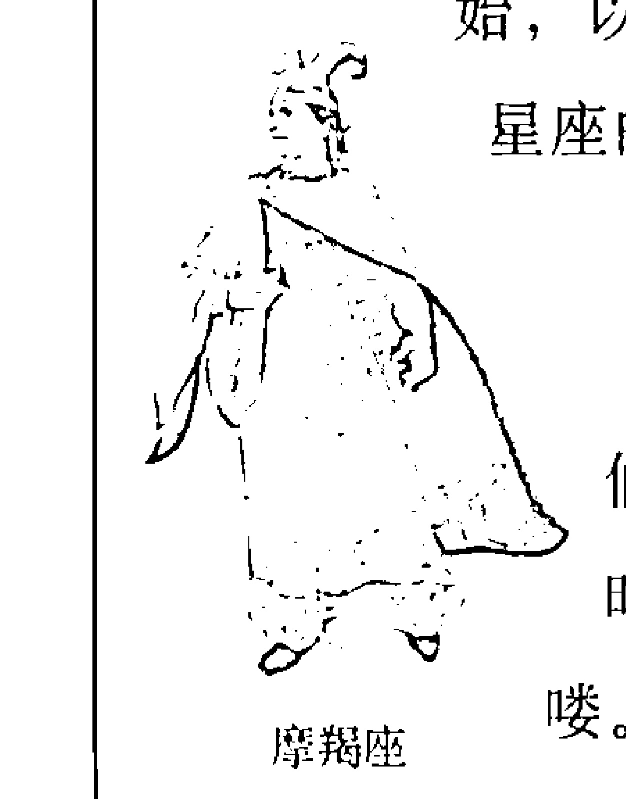

在这条路上，我们竭尽全力让一切简明扼要、直截了当。因此，我们在正文中使用了一些小标志（和符号），空白处加了方框，提醒你何时遇到了特别重要或者有趣的信息。那么要注意下一页上的这些图标喽。

最后，找找正文空白处的信息方框，那里面有注释、网上资源和奇闻轶事。

我希望这本《解秘占星术》让你感兴趣也给你灵感，也许能激励你在这条回报很高的占星之路上走得更远。即使我们只让你在征途上走了半程，我们也非常高兴了。

祝你阅读愉快……

德里克和朱莉娅·帕克

## 这里有什么？

《解秘占星术》里的内容是按从简单到复杂的方式排列的。从基本开始，然后慢慢地进入更深入的章节对你来讲是最有效果的。

# 第一部分

你将了解占星术的常识——它是如何起源的、如何发展的以及它究竟是什么。我们介绍基础知识和基础工具，让你可以开始编写和理解你自己的出生图。

# 第二部分

在这一部分我们深入探讨了十二星座神秘的、令人惊奇的相互联系的特征，以及它们是如何影响你的人际关系、家庭、事业和健康的详细信息。

# 第三部分

在这儿我们向你展示了有点难的部分——如何一步步绘制你的出生图，并让你毫不费力。在第10章，有关的基础知识将使你得心应手地绘制出曾让你棘手的出生图。

# 第四部分

现在，你已准备好学习如何将出生图理解得更详细一点。在这一节，我们浏览了每个行星在通过每个黄道星座、宫位、主要相位、上升星座（本命星座）和中天时的独特影响。

## 额外说明

翻开这本书，你会发现贯穿全书的许多方框和符号。这些是需要你特别注意的要点，我们希望你能重视它，因为它对你理解占星术是非常重要的。
你将看到：

### 非常重要

这个符号标示出我们认为特别重要的主题。你有必要在继续下去之前了解该信息。

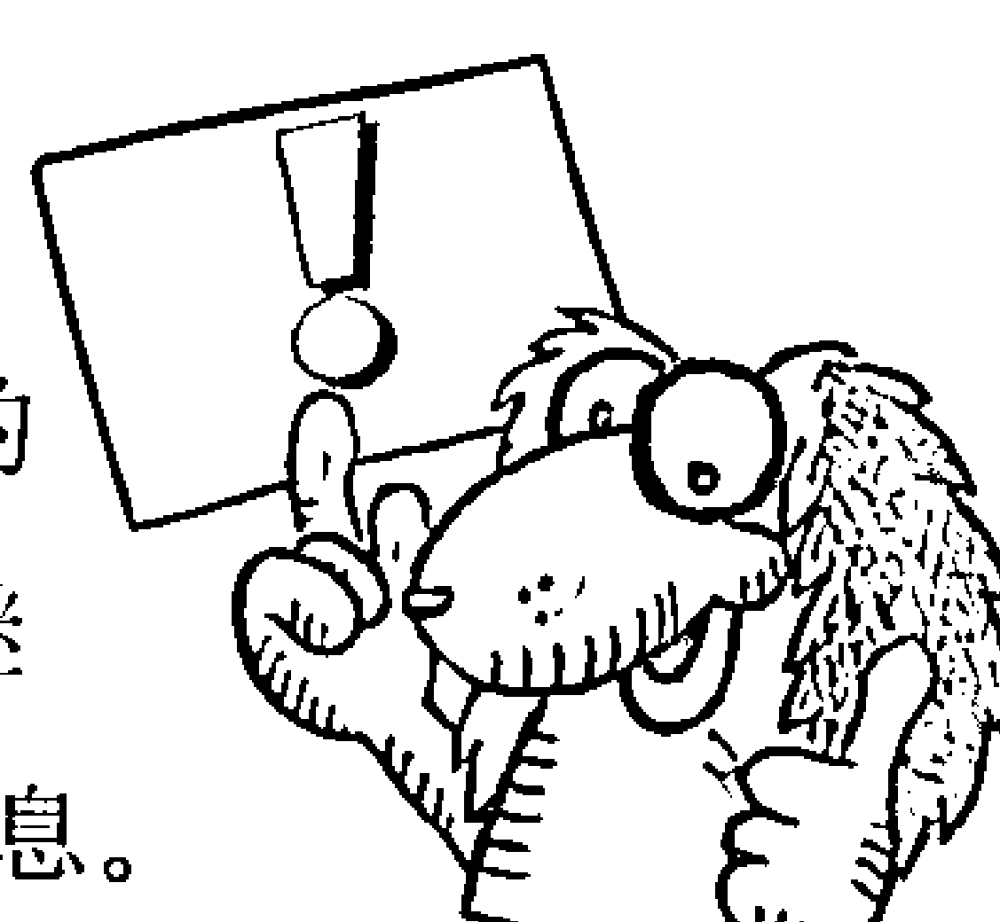

### 绝对禁止

这是一个警告，我们建议你不要做某些事情或者要有防范的意识。

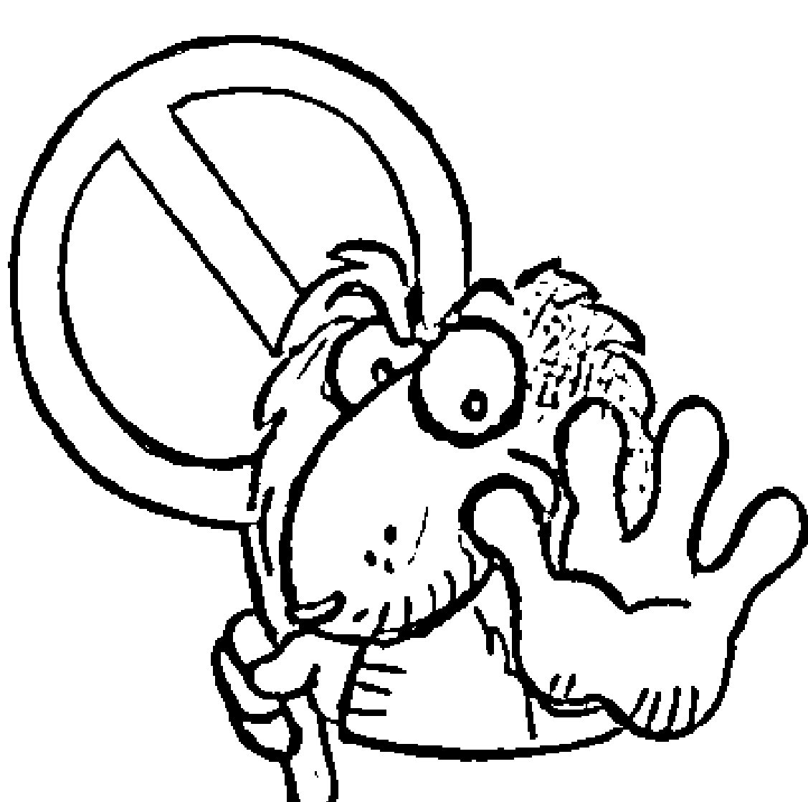

### 获得技巧

表示提供的信息比较专业，需要仔细阅读。

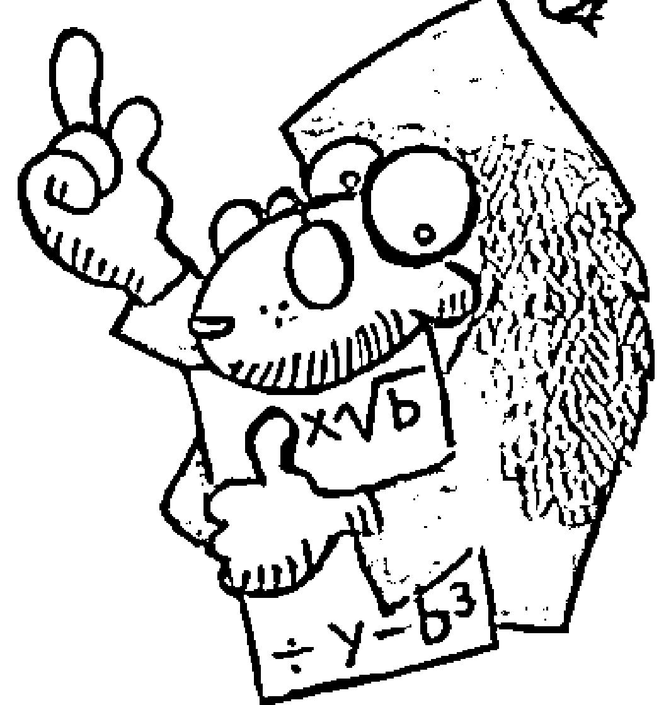

### 内幕信息

这是一些特别建议或者是来自占星师个人经验得到的信息。


你也会看到一些小方框，里面包括我们认为重要、有用或者只是有趣的信息。

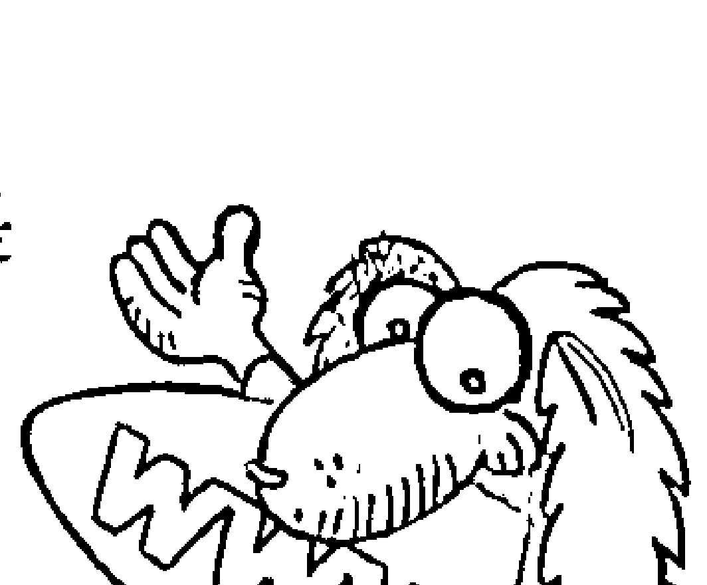

##### 奇闻轶事
一些有趣的琐事，使你获得一些占星术常识外的有用信息。

### 注释
将一些专用词语或约定俗成的表达方法变成方便您理解的语言。另外，你还可以在本书的附录中找到一份关于星象学的术语表。

### 网上资源
**WWW.DK.COM**
如果你对占星术感兴趣，网上资源将是一个很好的信息源，我将我认为有帮助的网址挑选出来，方便你查阅。

# 第一部分

- 第1章 黄道带：太阳星座入门
- 第2章 上升和星座：你的上升星座
- 第3章 行星家族
- 第4章 你就是要有朋友！
- 第5章 宫位并不是家

银河是我们所在的星系。

## 了解占星术

如果你自认为已知道有关占星术的一切……那么，我们在此提醒你，如果太阳星座是你对占星术的唯一接触，你只是发现了冰川的一角而已。

例如，你知道什么行星掌管你的太阳星座以及它是什么意思吗？你知道谁是第一个占星师以及为什么他是吗？你知道什么是“现代”行星吗？或是一个相位？或者你的上升星座？

我们抓住你的注意力了吗？好！第一部分回答了上述所有问题，甚至更多。你将先学习有关占星术的历史，获得进入占星术的方法，深入研究行星，学习要了解的“星座”的每个特点，并发现在占星术中宫位的意义。

祝旅途愉快！

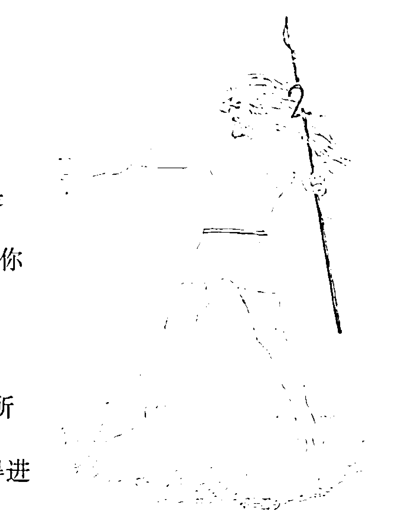

### 第1章 黄道带：太阳星座入门

在古代并不总是有12个黄道星座，通常还有更多，有时也会少些。但是在西方过去的几个世纪中，占星术通常使用所有行星在公转过程中经过的12个我们所熟悉的黄道星座。在这里，我们看一看黄道星座是如何被“发现”的，以及与每个星座相关的主要人性特征和星座的神秘来源。

在本章中我们会讨论……

- 简单的开始
- 白羊座
- 金牛座
- 双子座
- 巨蟹座
- 狮子座
- 处女座
- 天秤座
- 天蝎座
- 人马座
- 摩羯座
- 水瓶座
- 双鱼座

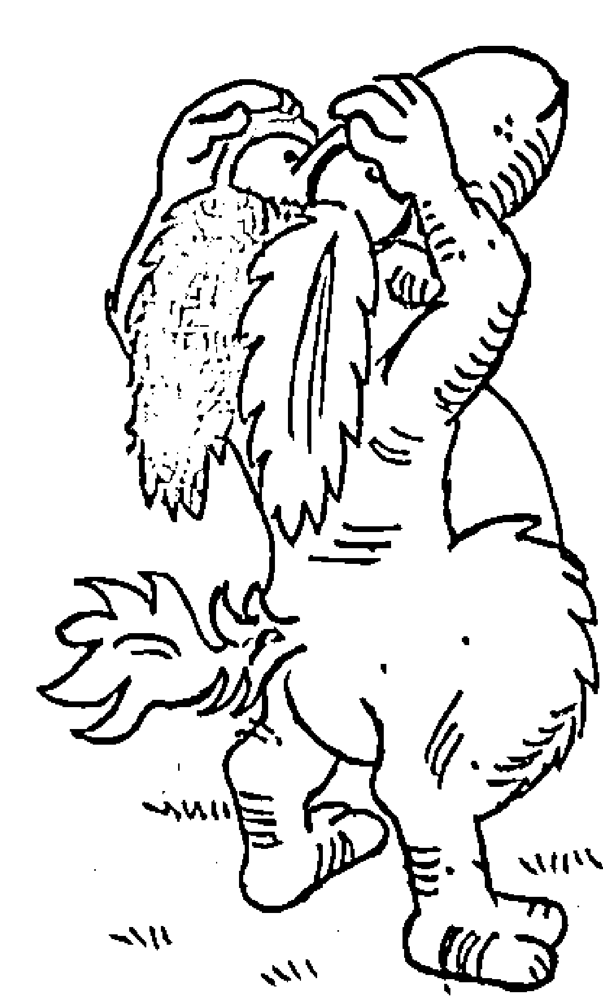

#### 简单的开始

很久很久以前，古人把天空中360度的黄道带每隔30度分成一个区间，每个区间里的星群根据它们的图案形象地被赋予了现在的名字。黄道星座接纳了它们所处的星群的名称。但是经过了几个世纪的漫长时间，地球自转与它围绕太阳的公转一样不规则，古代人观察到的天空现在已经“移位”了。实际上，黄道星座用以命名的固定星群在天空中一直慢慢地向后移动（这一过程被称为“昼夜平分点的运动”）。到现在为止，星星已经移动得太多，黄道星座已不再位于它们原始的星群中了。

天文学家想利用这样的事实指出占星术根本是胡说八道。可是他们没明白的是“星座”和“星群”的区别。一个星座只是描述了黄道带上特定的30度区间；星群是起初被用于给星座命名的星星组合。对于占星师来讲，在过去几千年内星星已经移动了多远并没有带来什么不同，星座基本的占星完整性保持完好。还有，黄道星座的特点和以它命名的星群所附带的象征性历史之间的关系经常令人心醉神迷。

这里我们将向你大致介绍一下与每个黄道星座相关的主要特性（星座的详细描述见第二部分），还有它的神话历史。

#### 黄道带的12星座

- 白羊座
- 金牛座
- 双子座
- 巨蟹座
- 狮子座
- 处女座
- 天秤座
- 天蝎座
- 人马座
- 摩羯座
- 水瓶座
- 双鱼座

##### 白羊座：公羊

3月21日 ~ 4月20日

- 关键词：过分自信、急躁、精力充沛、直率、自私、狂热

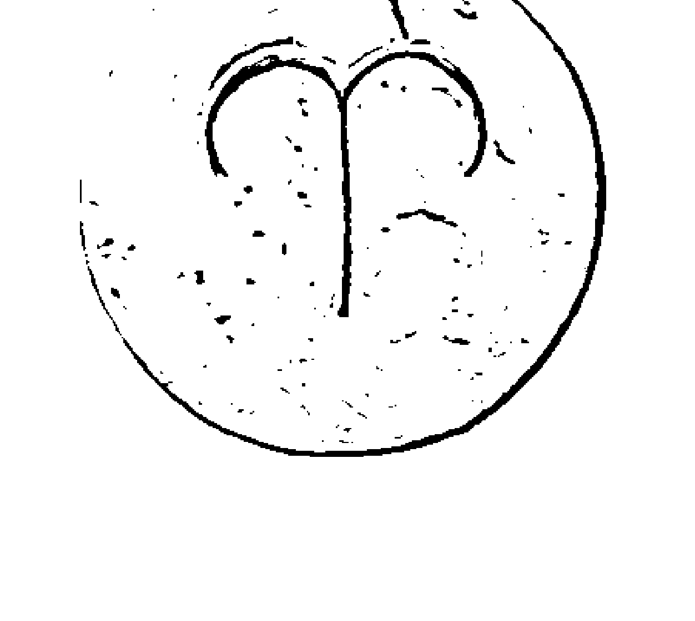

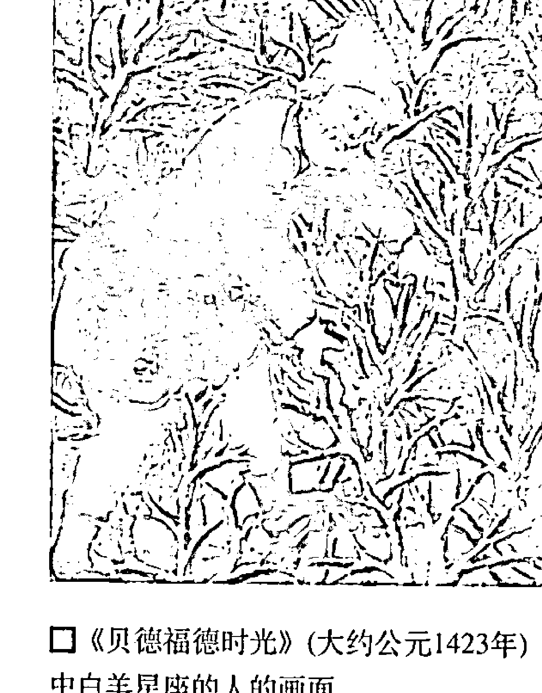

##### 白羊座的人：

白羊座的人以其暴躁、积极、冲动的本性闻名。他们被看作是十二星座中最狂热的一群，精力充沛，经常过着快节奏的生活。白羊座的人态度直率、竞争性强、喜欢冒险。他们想成就事情的急躁情绪导致他们有时会头脑发热和鲁莽。代表他们星座的公羊脚步轻盈，能优雅、敏捷地爬上最崎岖的山坡。白羊座的人也和公羊一样，都是按照他们自己的方式做所有的事情，积极果断，不畏艰险，一往无前。

##### 白羊座神话：

白羊座的代表符号是金色公羊，作为占星术的动物符号它第一次出现是在古代埃及人的黄道图中。之后，在古代希腊神话中金色公羊再度出现，它被描写成为海神波塞冬（他将自己变成了公羊）和美丽的凡人女子西奥芬（被波塞冬变成一只母羊）的私生子。 波伊提亚的王后涅斐勒发现这只到处游荡的金色的半神公羊，就让她的孩子佛里克索斯和赫勒把它带到科尔喀斯作为祭品献给战神阿瑞斯。于是他们按照母亲的话去做，终于到了科尔喀斯，之后又从公羊身上剪下了金色的羊毛，悬挂在阿瑞斯神庙里，由一只龙守护。直到许多年之后伊阿宋和他著名的阿尔戈英雄们才找到了金羊毛。宙斯为了纪念这只公羊的献祭，让它成为阿瑞斯六星星群的组成部分。

##### 金牛座：公牛

4月21日~5月21日

关键词：耐心、占有欲强、可靠、任性、固执、热情

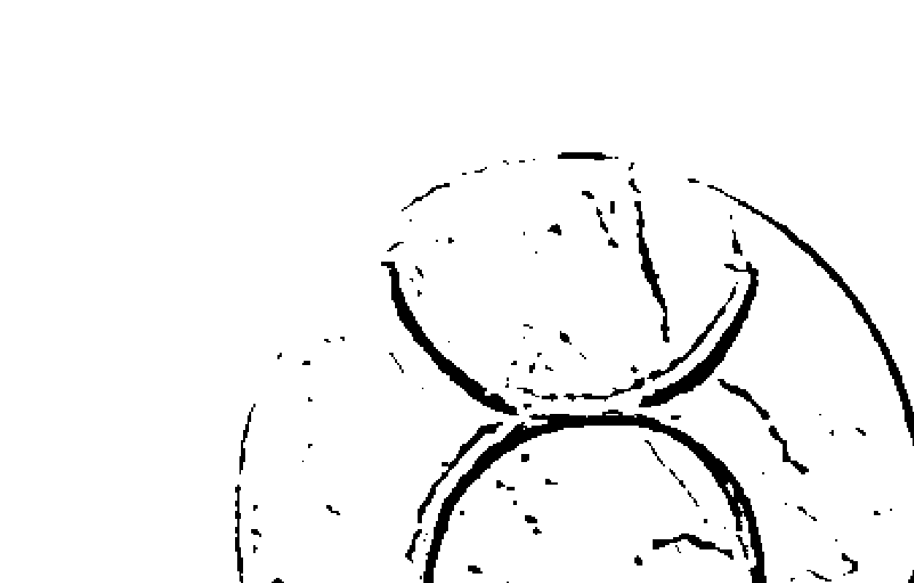

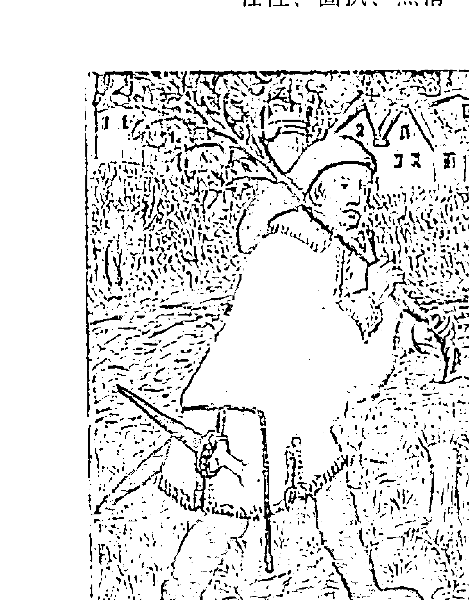

##### 金牛座的人：

金牛座的人以其浪漫主义、可靠性、魅力著称。他们经常被认为是十二星座中最漂亮的人。他们的热情、慈爱、真挚往往激发着周围人的自信和忠诚。金牛座的人极为需要财务和个人的安全感。他们喜爱奢侈、舒适和美丽的东西，这种趋势能够促使他们自己痴迷于占有欲。与象征他们星座的公牛一样，金牛座的人不容易发怒，但是一旦怒火被激起，他们会变得十分可怕。

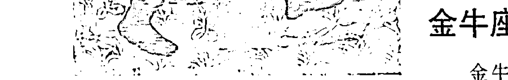

##### 金牛座的神话：

金牛在神话中是一只特别的动物，以其矛盾的特点（可怕的力量、充满热情的性欲、优雅有教养）著称于古巴比伦和古罗马神话中。但是希腊神话中有关公牛的传说是著名的。宙斯——希腊诸神之王，爱上了腓尼基国王极为漂亮的女儿欧罗巴。为了引起欧罗巴的注意，宙斯把自己变成了最英俊的公牛，在她父亲的牛群中开始吃草。当欧罗巴看见这只健壮的动物时，她马上被他的魅力和尊贵所诱惑了，就骑上了牛背。宙斯立刻驮着她飞过海洋，来到克利特岛，变回他的神形，与欧罗巴结成伴侣。欧罗巴最终给他生下了三个孩子。为了感谢公牛对这件事的帮助，宙斯让它作为十四颗星的金牛星群在夜空中永生。

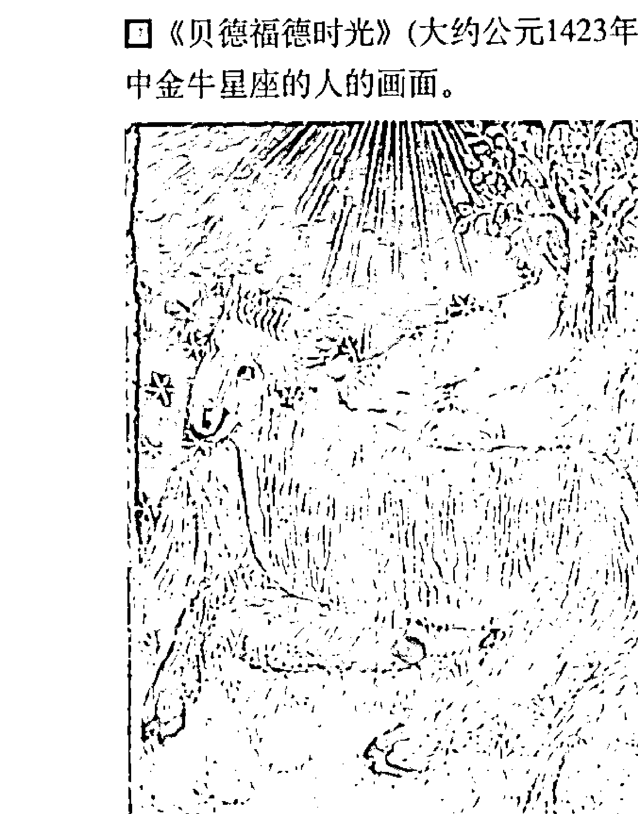

# 双子座：双胞胎

5月22日 ~ 6月21日

关键词：健谈、多才多艺、好动、诙谐、聪明、敏锐

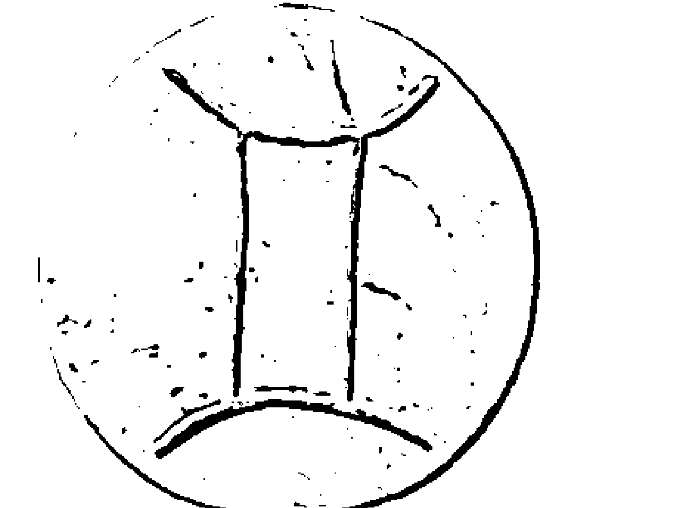

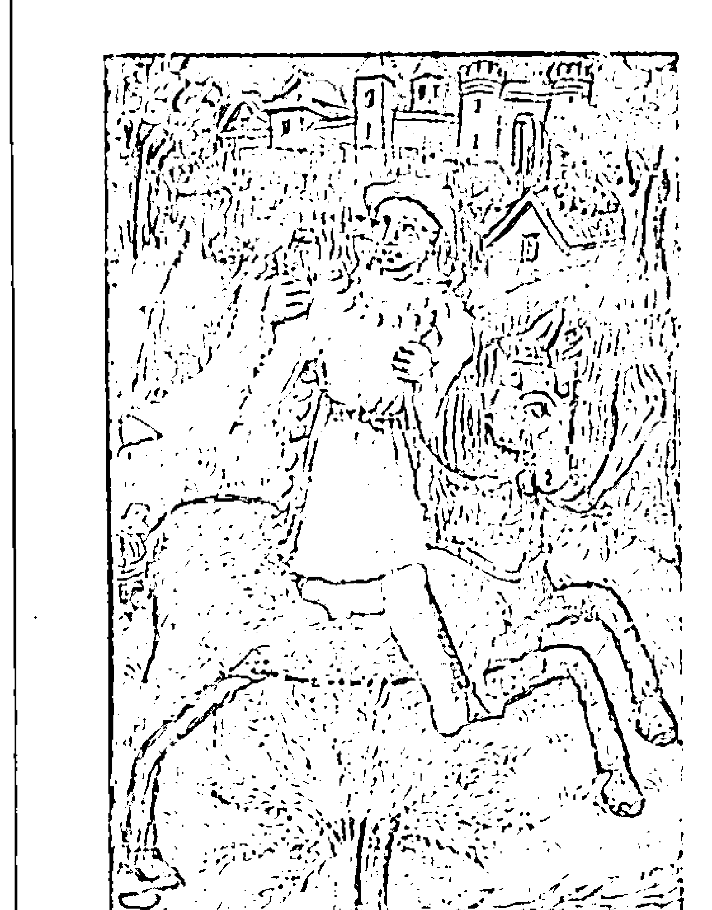

□ 《贝德福时光》(大约公元1423年) 中双子星座的人的画面。

##### 双子座的人：

双子座的人有活泼、好动、机敏、反应快、善变的特性，他们很少在一个地方（物理意义或哲学意义上）呆很长时间。他们是绝妙的交流者，很容易就让人们倒向他们自己的观点和看法。双子座的人厌恶枯燥，并且经常喜欢把他们无尽的情感和智慧力量分配在各种任务（和人）上！这种一次做多件事情的能力是双子座人的双重特性的典型特点，这对双胞胎适宜地代表了这种双重特性。然而，在引导不利时，双子座的人不能专注在一件事情或者一个人身上，会导致他们看上去肤浅而且有掩饰生活中的重要细节的倾向。

##### 双子座的神话：

双子座双胞胎的起源可以追溯到古巴比伦占星术时代，那时他们以“伟大的双胞胎”闻名，是双子座七星星群中两颗明亮、硕大的星星的名称。这对双胞胎的古代希腊起源在故事和诗文中经久流传。神话是这样说的：诸神之王宙斯伪装成一只天鹅，引诱了凡人女子丽达。他们结合之后，丽达生下了两个蛋。一个蛋出来的是一位男神和一位女神，即波吕丢刻斯和海伦；另一个蛋里是一对凡人兄妹，即卡斯托耳和克吕泰涅斯特拉。卡斯托耳和波吕丢刻斯成了形影不离的朋友，他们一起长大，都成了著名的竞技者，之后又并肩作战。卡斯托耳在一次战斗中被杀害，波吕丢刻斯悲痛不已。宙斯感于他们的兄弟之爱，把卡斯托耳变成神，将这对兄弟并排放在双子座七星群中，让他们永远在一起。

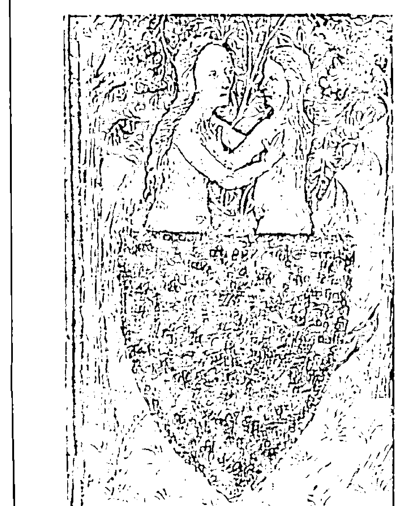

##### 巨蟹座：螃蟹

6月22日 ~ 7月22日

关键词：敏感、易激动、呵护备至、喜怒无常、富于想象、钟情

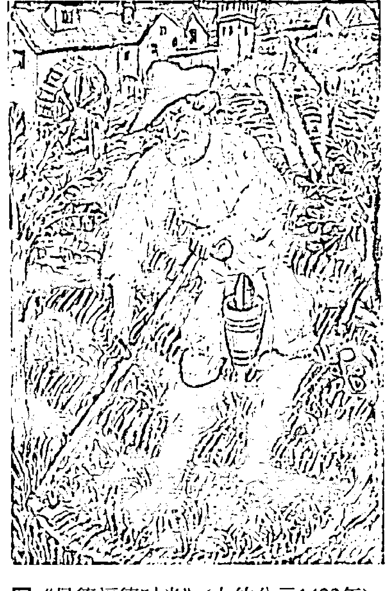

《贝德福德时光》（大约公元1423年）中巨蟹星座的人的画面。

##### 巨蟹座的人：

巨蟹座的人敏感（但经常执拗），又有富于想象的创造力和艺术天赋（但是经常被家庭或过去的琐事所困扰），他们是要了解的十二星座中最具有挑战性的一群。与象征他们星座的螃蟹一样，他们经常以坚硬、顽固、甚至无动于衷的外表面世界，看上去孤僻、冷淡、缄默。但是在这样的外表里埋藏了一个感情细腻的、敏感的灵魂，有着丰富的同情心和敏锐的洞察力。和螃蟹一样，巨蟹座的人顽强，保护家里的每一寸草地，天生是呵护备至的父母和忠实的朋友。

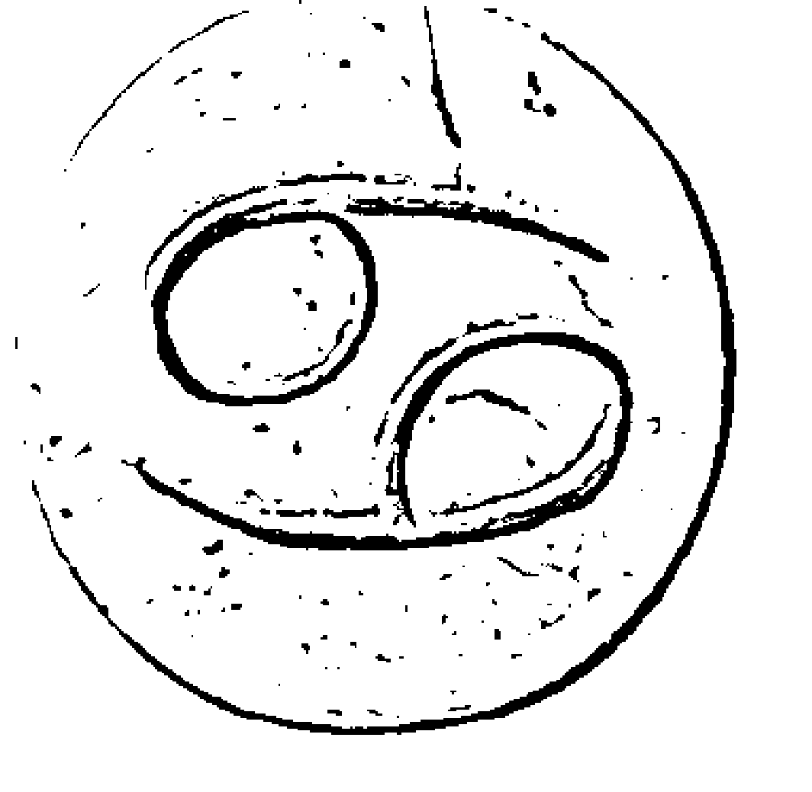

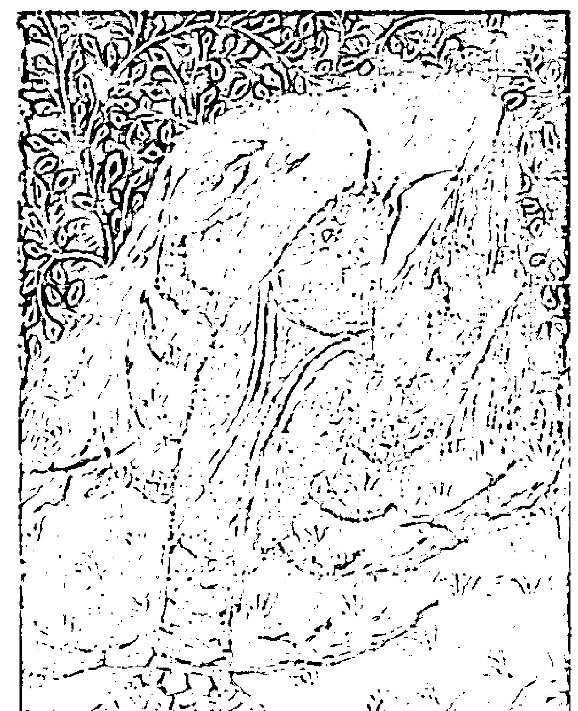

##### 巨蟹座的神话：

大力神赫拉克勒斯是很多神话传奇中不朽的人物，他作为古代希腊文明中最伟大的英雄，在巨蟹、狮子、人马三个黄道星座的神话起源中也扮演着卓著的角色。巨蟹座的故事是这样的：希腊国王尤里斯交给赫拉克勒斯12项危险的任务，让他为杀死他自己妻子和孩子的行为赎罪。第一个任务是杀死令人恐惧的狮子尼米亚（见狮子座）并剥了它的皮。第二件任务是杀死一头长着狗身的九头蛇怪许德拉，他呼出的恶臭气体能让任何接近的人吸入一口气就中毒而死。赫拉克勒斯在与许德拉厮杀的时候遇到了麻烦，每次他砍掉一个蛇头，在原处立刻又长出了两个！趁赫拉克勒斯与许德拉作战时，天后赫拉派一只巨大的螃蟹来偷袭他。赫拉克勒斯把巨蟹击败在脚下后继续去杀许德拉。为了感谢巨蟹的帮助，赫拉把它放在巨蟹座六星星群中。

##### 狮子座：狮子

7月23日～8月23日

关键词：慷慨、豪爽、钟情、专横、有创造力、令人印象深刻

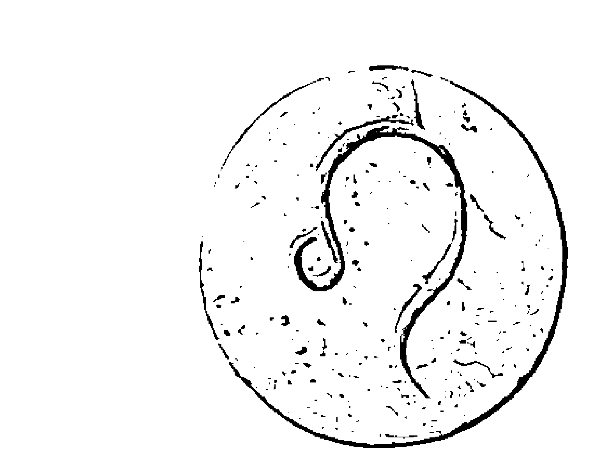

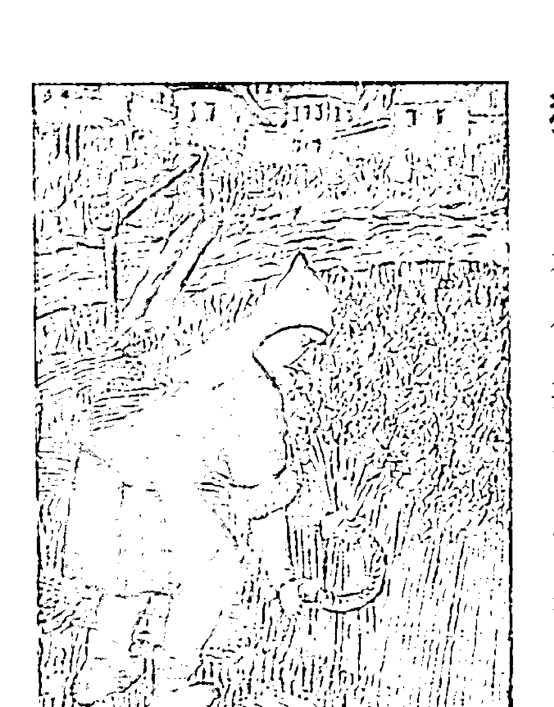

##### 狮子座的人：

狮子座的人与狮子一样具有高贵的气质，令人印象深刻，是天生的领袖。狮子座的人热情洋溢，有着与生俱来的慷慨气质，他们极度高傲和自信，喜欢过充实的生活；他们期望并且一定要在家中、工作中和游戏中成为领袖。他们极度的感情丰富、引人注目和富有创造力——世界上许多著名演员都是狮子座的。狮子座的人痛恨眼光狭小、挑剔找茬的行为，但是他们自己偶尔也会很固执、专制和教条。

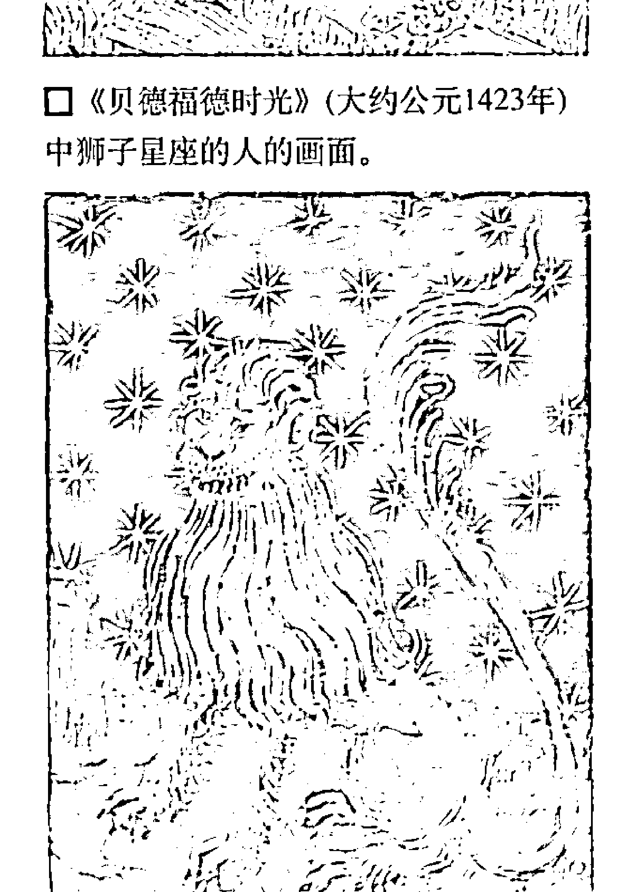

##### 狮子座的神话：

在关于狮子座的希腊神话中也记录了伟大的希腊英雄赫拉克勒斯的英勇战绩。这个故事说到希腊国王尤里斯交给赫拉克勒斯12件危险的任务（著名的赫拉克勒斯苦行）为他杀死妻子和孩子的行为赎罪。第一件任务是杀死可怕的雄狮尼米亚并剥了它的皮。这当然不是一只普通的狮子，因为它是蛇女厄喀德那和堤丰这个永远与众神作战的丑陋巨兽生下的孩子。他们的儿子狮子尼米亚几乎是永生的。当赫拉克勒斯试图用弓和箭射杀狮子没有成功时，他使出了浑身解术剑砍棍击，但是丝毫没有效果，狮子只是朝着赫拉克勒斯的努力打了几个哈欠。之后赫拉克勒斯决定靠他的天生神力掐死这头狮子，最后他终于成功了。他砍下了狮子的头，并用狮子的爪子剥下了狮皮。在完成剩余的艰巨任务期间他都以狮头为盔，以狮皮为袍。宙斯因此让狮子尼米亚在狮子座十四星星群中永生。

##### 处女座：处女

8月24日～9月22日

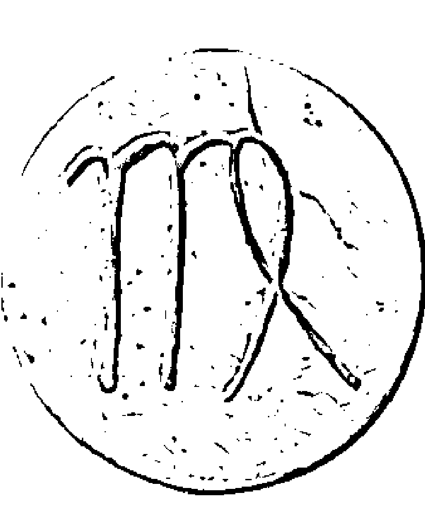

关键词：善于分析、爱挑剔、谦虚、小心翼翼、聪明、为琐事而烦恼

##### 处女座的人：

处女座的人在别人看来非常谦虚、不喜欢出风头、工作勤奋、做人很实际，但他们私底下常常都是朴实、热情、可爱的，与代表处女座的处女形象十分相称——在古代处女是代表着土地和丰收的女神。处女座的人思路敏捷而且善于分析，他们总是有充足的脑力，以至于经常处在压力和紧张中。他们追求完美和勤奋的性格也使他们有时过于挑剔。水星（掌管交流的行星）掌管双子座和处女座。处女座的人是优秀的、善于说服人的交流者，可以使用他们敏锐的智力在争论中获胜并赢得人心。

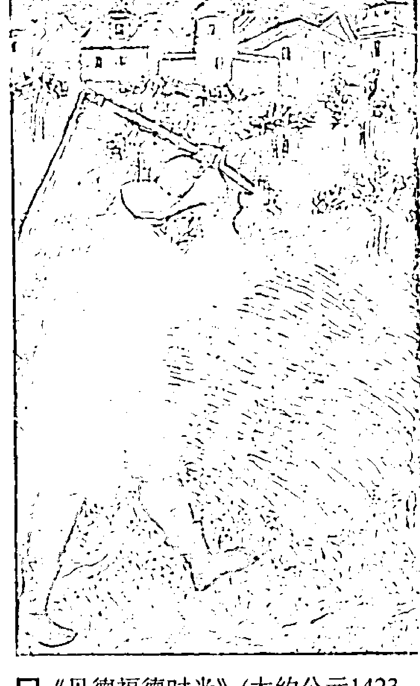

□《贝德福德时光》（大约公元1423年）中处女星座的人的画面。

##### 处女座的神话：

处女座中处女的原型在几个古代文化中都已出现，它是十二星座中为数不多的以人而不是动物为代表的星座之一。在古巴比伦，她是谷物女神尼达巴或称沙拉，被描绘成在星群中挥着鞭子的少女，鞭子的轨迹越过了狮子座的尾部。在一份古埃及黄道带图中，代表处女座的少女抓着代表狮子座的雄师的尾巴。在希腊神话中，处女座的原型被视为是以下两处之一。一个是阿提卡国王伊卡里修斯的凡人女儿厄里戈涅。伊卡里修斯是葡萄酒的发明者，后来被喝醉的牧羊人杀害。厄里戈涅对父亲的死悲痛不已，宙斯就把她上升到处女座13星星群中。她忠实的狗马尔拉（Maera）陪伴着她，被称为狗星。另一个神话认为原始的处女座是阿斯特来亚(意思是布满星星的少女)，她是长久以来与正义相连的纯洁和天真女神。

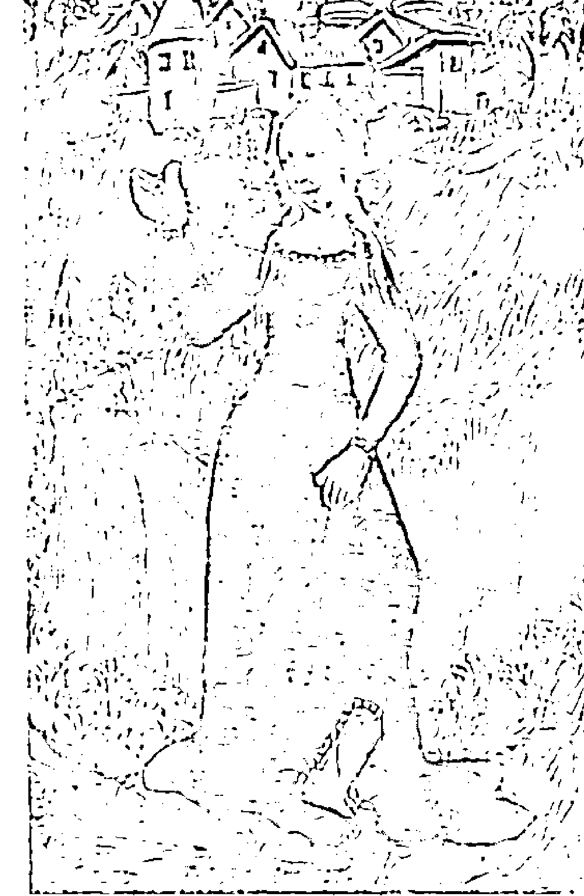

##### 天秤座：天平

9月23日～10月23日

关键词：迷人、随和、有外交手腕、友善、易受骗、易怒

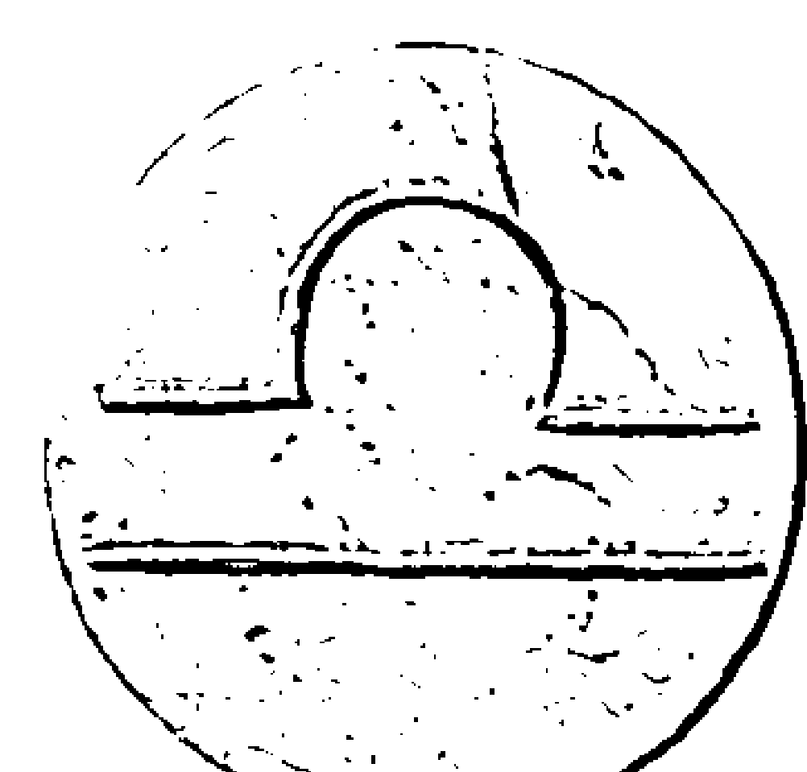

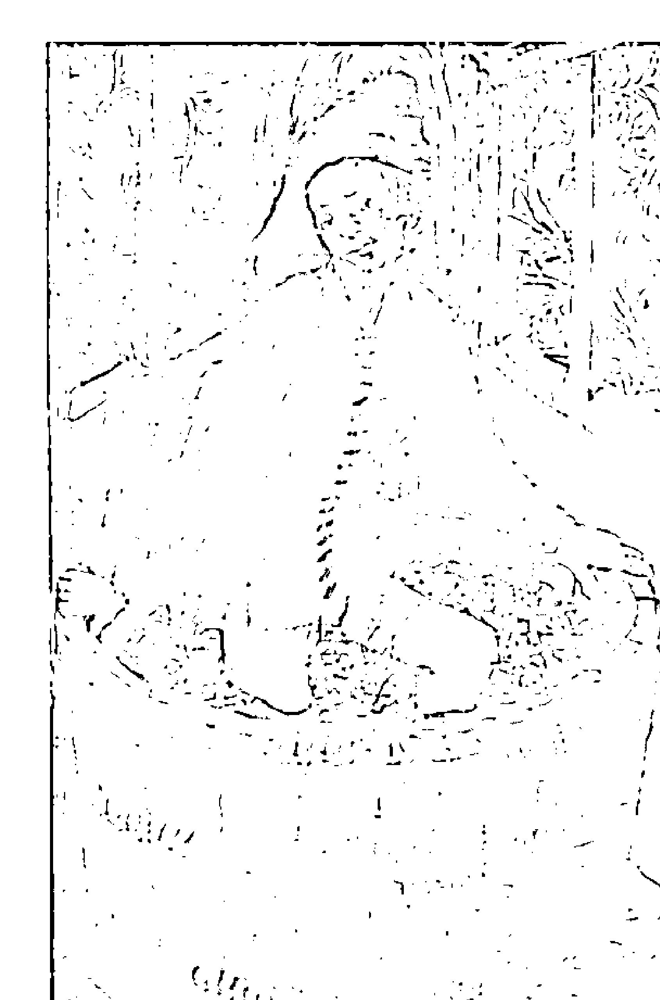

□《贝德福德时光》（大约公元1423年）中天秤星座的人的画面。

##### 天秤座的人：

天秤座的人对人友好、热心、非常友善，就像代表该星座的天平一样，他们非常注重在人们之间和他们周围的世界中实现平衡、和谐、和平和公正。他们也有足够的魅力、聪明、坦率、说服力和轻松的交流能力来实现平衡和谐的理想。有时他们做事过于松弛和懒散，于是被冠以不该得的懒惰名声。实际上，他们可以成为勤奋的工作者，而且经常在本领 域内成为领袖。他们尤为擅长任何“维持和平”类型的工作，因为他们卓越的天赋能够使他们一眼看清（和调和）问题的正反两面。

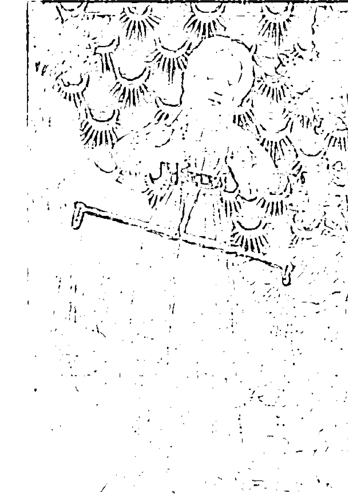

##### 天秤座的神话：

天秤座作为天平、平衡、正义的星座，与任何神话人物都不相关。实际上，它是唯一不以动物或者人物为象征的黄道星座。天称座象征着一个哲学观点，即在最后审判日那天称重灵魂。这种哲学观点的来源可以追溯到古代埃及那本著名的《死者之书》。在那本书中写着，判定一个人灵魂的价值，就要将他的心脏放在天平的一端，代表真理的羽毛放在天平的另一端，衡量两者的重量。天秤座四星星群离天蝎座非常近，也与处女座星群有所交迭。

##### 天蝎座：蝎子

10月24日 ~ 11月22日

关键词：充满热情、易动感情、富于直觉、有吸引力、好猜疑、好冲动

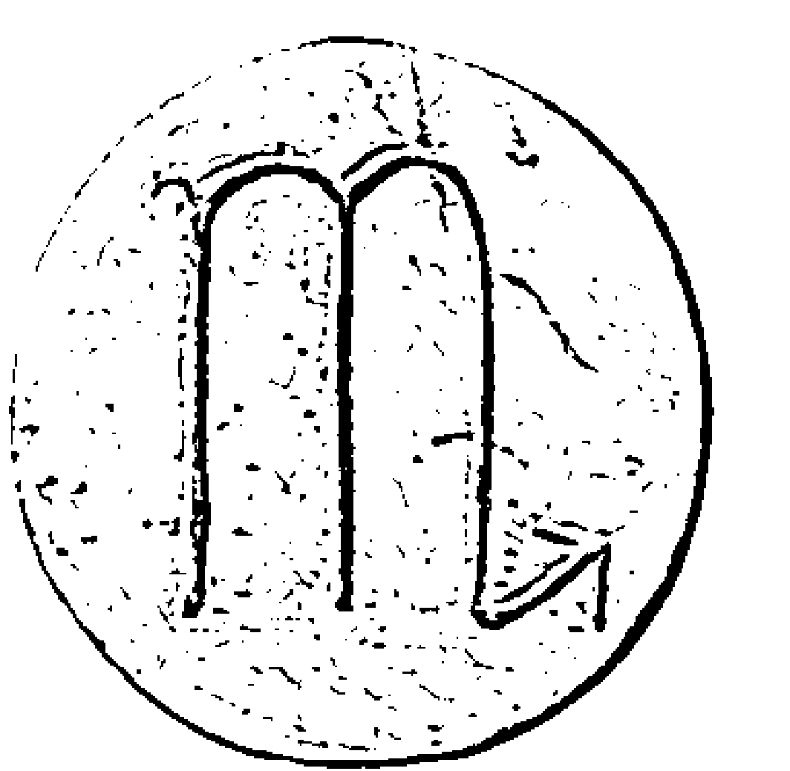

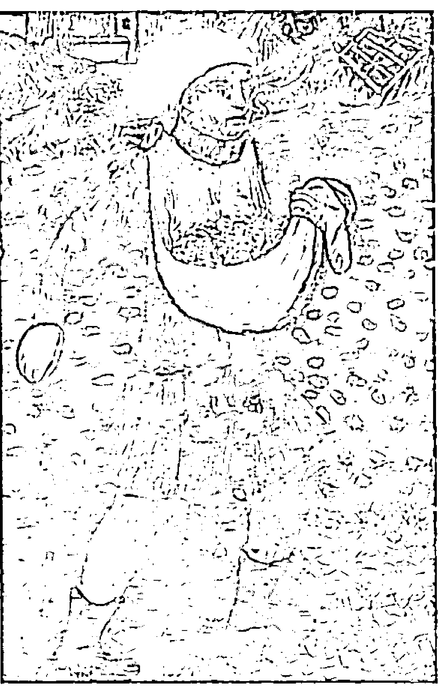

##### 天蝎座的人：

神秘的天蝎座的人深思熟虑、注重私密、易动感情、非常性感、总是与人群若即若离。因为他们易动感情和对个人隐私的强烈需要，天蝎座的人经常无意地散发出“危险”的味道，这当然是分享了象征他们星座的致命毒蝎的特性。但这只是天蝎座的人相当复杂的性格的一面而已。他们可以是被鞭策的工作者和实现者，因为他们拥有克服巨大的挑战性障碍的能力。他们也高度重视亲情和友情，能够为了他们爱的人幸福尽最大的努力。

##### 天蝎座的神话：

伟大的希腊巨人欧利安（他有自己的一个星群）是一个传奇猎手，也是神话时代地球上最英俊的男子，颇为希腊众女神所青睐。黎明女神厄俄斯特别迷恋欧利安，在一次热烈的幽会中，他向她夸口说他是一个十分了得的猎手，能够消灭地球上所有野生的兽群。这激怒了阿波罗神（他负责掌管兽群），他派了一只巨蝎去把欧利安蛰死。阿波罗的妹妹阿耳特弥斯也迷恋欧利安，试图通过用她的著名的箭射死那只蝎子。不幸的是她没有射中蝎子而是射中了欧利安。为了纪念这名英俊的巨人，阿耳特弥斯将欧利安上升到一个星群中，并且在靠近天秤座的位置也给了那只蝎子自己的七星星群。

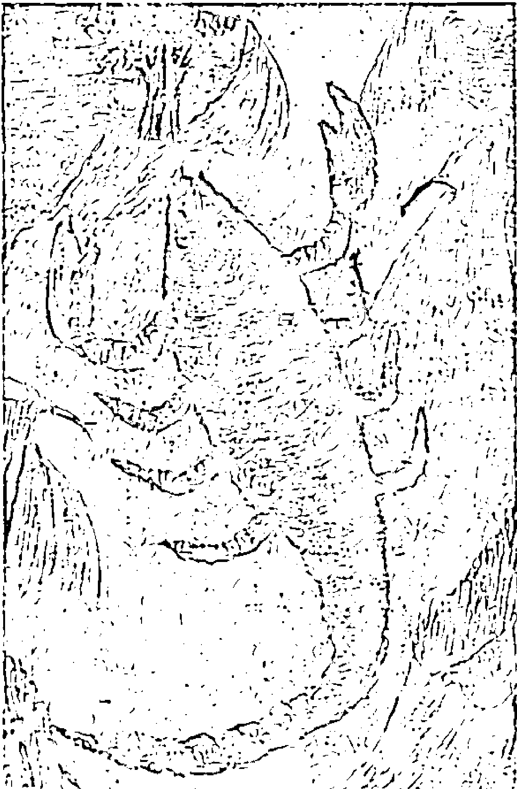

##### 人马座：射手

11月23日～12月21日

- 关键词：贤明、乐观、聪慧、探求、不老练

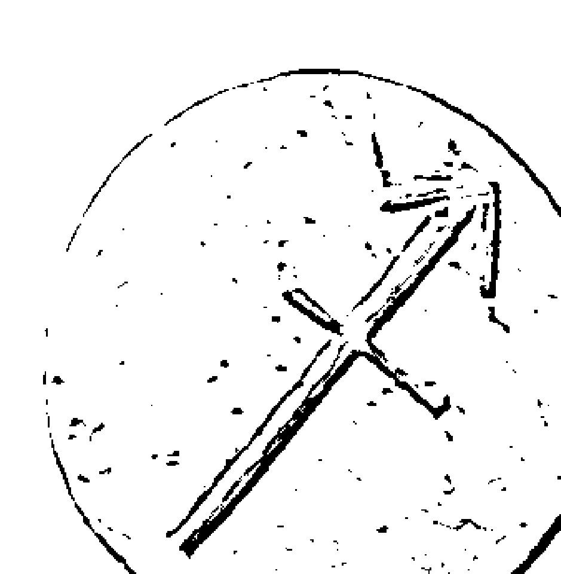

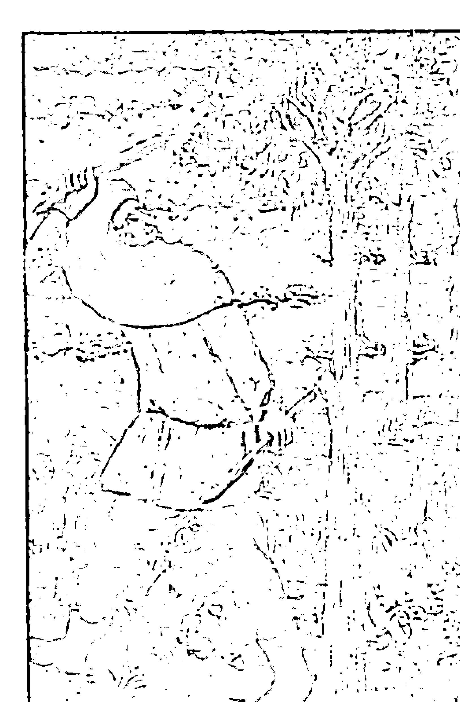

##### 人马座的人：

人马座的人喜欢各种智力或体能的挑战，并以无限充沛的能量投身于脑力或体力的各种挑战。人马座的人对于单纯智力追求和高强度体能冒险的兴趣突出了他们多才多艺的本性，这与人马座的象征——以智慧和勇敢著称的半人半马神喀戎的双重本性密切相连。人马座的人经常是泰然自若的乐观主义性格外向者，能够得到他们遇到的所有人的崇拜和喜爱。

##### 人马座的神话：

象征人马座的射手不是一个普通的弓箭手，实际上他是希腊神话中带有传奇色彩的人首马身的怪物之一。半人马兽喀戎是农神萨杜恩的儿子，他以仁慈和渊博的知识而备受崇拜，有着那些淫荡、好斗的人首马身怪物从来不曾拥有的高尚品质。喀戎成了一位受爱戴的老师，他的学生包括一些神话中最伟大的人物：赫拉克勒斯、阿基里斯，以及伊阿宋和他的阿尔戈英雄们。喀戎意外被赫拉克勒斯的一支毒箭射伤，作为神他不会死亡，然而他不得不承受一切充满痛苦的死亡的折磨。他把自己的不朽之身给了长期受苦的普罗米修斯（那个被宙斯诅咒永受折磨的人），代替了普罗米修斯的位置，最终找到了死亡的宁静。为了让大家记住喀戎伟大的献身，宙斯让他和毒害他的那一支箭在人马座十星星群中永生。

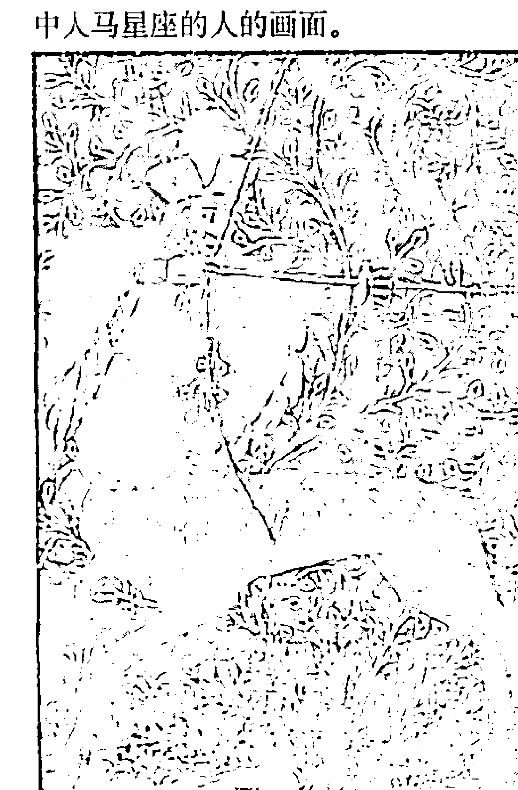

##### 摩羯座：山羊

12月22日 - 1月20日

关键词：谨慎、精明、实际、野心勃勃、遵守纪律

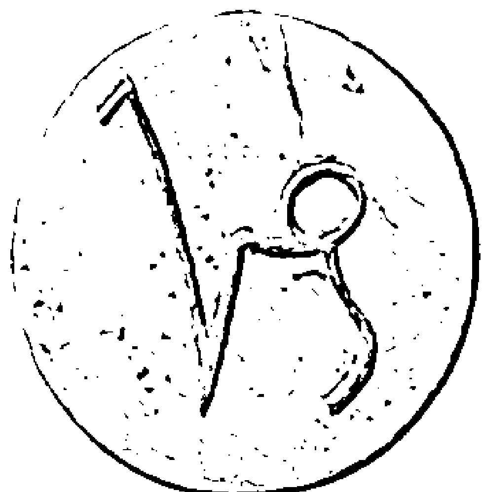

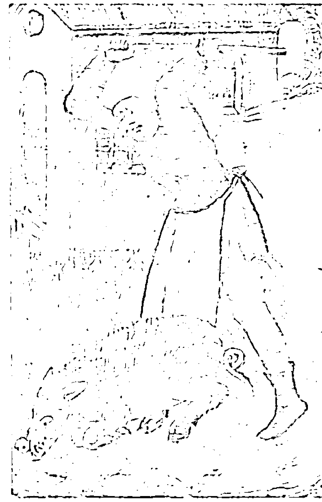

□ 《贝德福德时光》（大约公元1423年）中摩羯星座的人的画面。

##### 摩羯座的人：

象征摩羯座的山羊在传说中被描绘成半羊半鱼的形象。这样复杂的双重本性反映在摩羯座的人的性格中，其性格是在所有黄道带12星座中最复杂的。他们有两种截然不同的本性：星座的一面表现为野心勃勃、勤奋努力、富有进取心。这类摩羯座的人动机性强、热爱生活，能够制定高的而且可以实现的目标。然而，摩羯座的人的另一面是迷失在现实世界与想象中的各种阻碍成功的因素中，进一步说，这样的摩羯座人经常不能找到动力去采取行动并挑战那些障碍。甚至成功的摩羯座人也有哀诉和抱怨想象中的负担的倾向。而摩羯座人内向的本性和对孤独的喜爱无法缓解这些悲观的倾向。

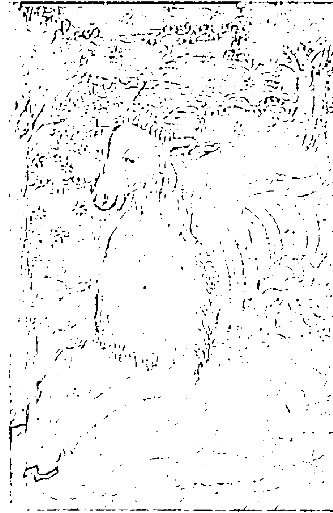

##### 摩羯座的神话：

摩羯座经常是以半人半山羊作为象征，在古代占星著作中被称为羊鱼。在古巴比伦，他被称为知识之神伊亚，一个穿着鱼状外衣、套着鱼头鱼尾、正在行走的人。他住在美索不达米亚山谷的大海中，在这片大海中，他浮出海面与人分享他的知识天赋。在古希腊，摩羯是自然之神——潘。在一次众神与巨人们的战役中，最凶猛的巨人堤丰把诸神赶到了埃及。诸神从堤丰的愤怒中逃离出来的唯一方法就是改变他们的外形。潘把自己的上半身变成山羊，下半身变成鱼，然后跳入尼罗河游走了。宙斯对于潘发明的形态印象极为深刻，他将其置于摩羯座八星星群中永存。

##### 水瓶座：水瓶

1月21日~2月18日

关键词：独立、仁慈、创新、诚实、独创、冷漠

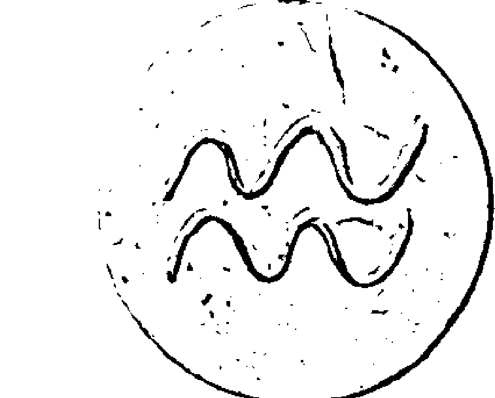

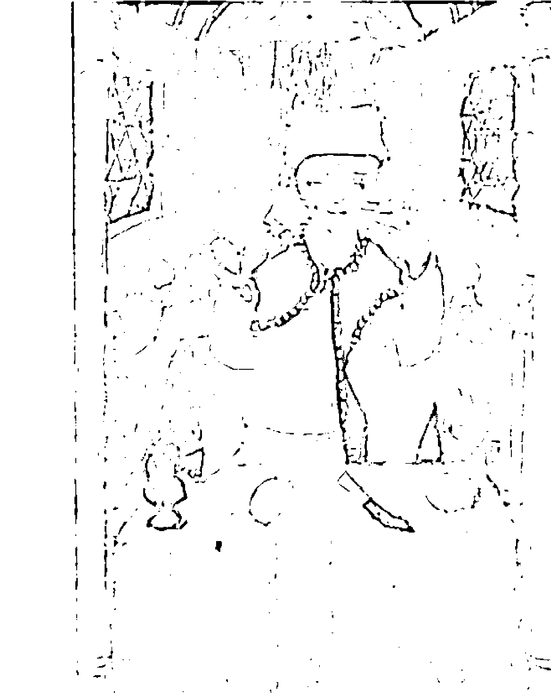

##### 水瓶座的人：

水瓶座的人经常被看作是所有黄道带星座中最难以捉摸的一群，他们是极端个人主义且独立的知识分子，很少与任何人形成永久的关系。然而，他们也通常被认为是友好、善良、乐于助人的一群，他们天生有着深厚的人道主义本能。尽管如此，他们依然总是保持着典型的个人空间。水瓶座人有发明、独创的天赋，在诸如社会工作、科学等截然不同的领域中工作都同样顺手。

□《贝德福德时光》（大约公元1423年）中水瓶星座的人的场面。

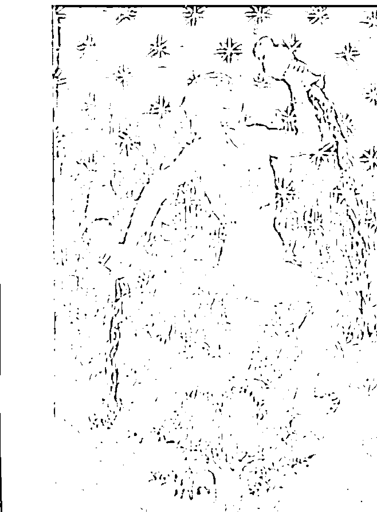

##### 水瓶座的神话：

水瓶座水瓶的起源可以追溯到几个古代文化。在古巴比伦，水瓶座一开始是作为知识之神，被描绘成水从他的手中流下来。在埃及他是尼罗河之神哈普，在画中哈普经常被描绘成拿着两个盛满地球生命之水的花瓶的神。在古希腊神话中，盖尼米得是特洛伊的王子，也是所有人类男子中最漂亮的一个。因为他太漂亮了，诸神之王宙斯自己也不可救药地爱上了盖尼米得，他决心不让任何其他的神或人拥有这个凡人。于是宙斯变成一只鹰，把这个漂亮的男孩带到天上，让他成为水瓶座十二星星群的不朽之神。在天上，盖尼米得为众神倒酒，引起雨水洒落在大地上。

##### 双鱼座：鱼

2月19日～3月20日

关键词：敏感、富于想象、含糊、善良、富于直觉、易受控制

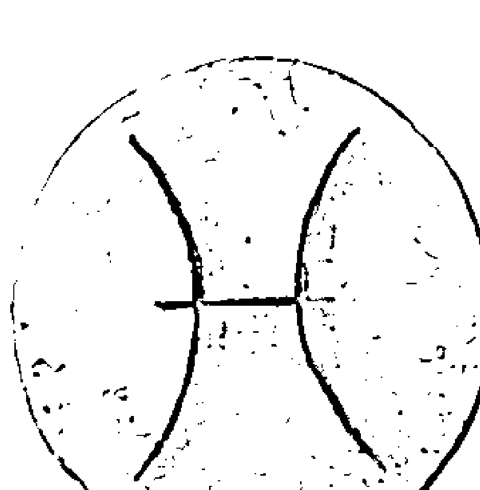

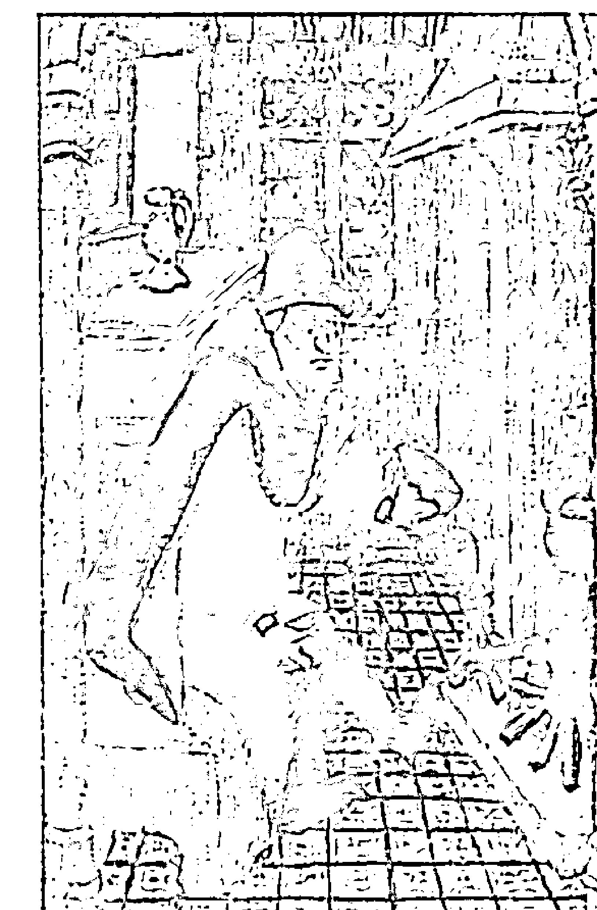

■ 《贝德福德时光》（大约公元1423年）中双鱼星座的人的画面。

##### 双鱼座的人：

双鱼座的人敏感、世俗、易动感情、想象力和创造力丰富，他们是黄道带12星座中超俗的梦想家和诗人。双鱼座的人深受其星座（向相反方向游动的两条鱼为标志）的双重特性影响，他们经常处于两难的境界，又想在世界上做一些真实而有价值的事情（他们经常被人道主义事业和艺术事业所吸引），又想回到他们私人的想象和梦想世界中去，那里有更为安全的港湾。这对于双鱼座的人是强大的牵引力，正因为这种力量，使他们经常倾向于极度神经紧张甚至逃避现实（有时用酒精和麻醉品）。缺少自信几乎总是双鱼座人不能在真实世界中生活的根源，但是当这种弱点被克服时，双鱼座的人可以成为世界上最好的人道主义者和艺术家。

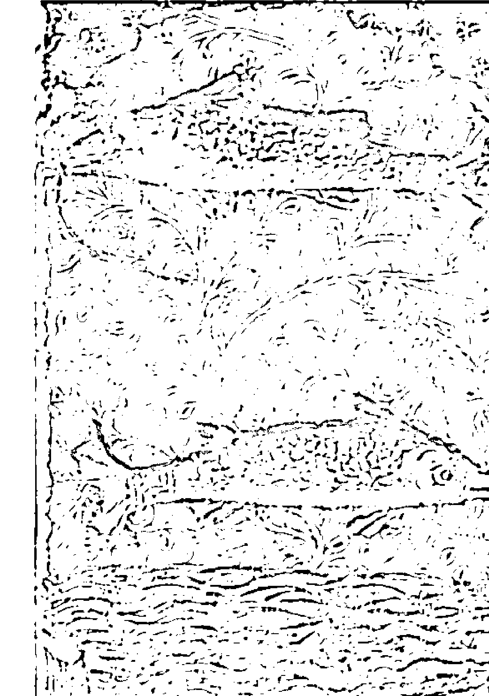

##### 双鱼座的神话：

希腊爱神阿芙罗狄蒂和她的儿子伊洛斯正在沿着幼发拉底河的河岸走时，遇到了一个叫堤丰的发怒的、可怕的怪物。堤丰是巨人族中最年轻、个头最大、最丑陋的，他是天神优利纳斯和大地女神盖亚的儿子。受惊吓的爱神和她的儿子向宙斯呼救，诸神之王就把阿芙罗狄蒂和伊洛斯变成了鱼。他们跳入了幼发拉底河，游到了安全的地方。为了纪念此次事件，宙斯将两条鱼放在后来被称为双鱼座的十一星星群中。

#### 简要的概述

- 黄道12星座最初是由古代每个星座所处的星群的名字命名的。
- 几个世纪以来，星星在天空中向后移动（被称为“昼夜平分点进程”），所以黄道星座不再处于它们各自被命名的星群中。但这并不影响占星意义和今天与星座相连的象征意义。
- ♈ 白羊座——以希腊神话中的金色公羊为代表。白羊座的人精力充沛、热情豪爽。
- ♉ 金牛座——以神话中的公牛为代表，是宙斯为了引诱一个凡人女子而装扮的外形。金牛座的人热情、可靠、占有欲强。
- ♊ 双子座——以双胞胎兄弟波吕丢刻斯和卡斯托耳为代表，他们在双子星群中永生。双子座的人机敏、好动、多才多艺。
- ♋ 巨蟹座——以当赫拉克勒斯试图杀死蛇妖许德拉时攻击他的巨蟹为代表。巨蟹座的人情绪化、呵护备至、深情。
- ♌ 狮子座——以被赫拉克勒斯杀死的可怕的狮子尼米亚为代表。狮子座的人慷慨、豪爽、给人深刻印象。
- ♍ 处女座——以女神阿斯特来亚为代表，她是纯洁天真的女神，也是土地和丰收女神。处女座的人谦虚、聪明、善于分析。
- ♎ 天秤座——以古埃及象征着正义和平衡的天平为代表。天秤座的人有魅力、随和、好交际。
- ♏ 天蝎座——以阿波罗神派去杀死希腊巨人猎手欧利安的致命毒蝎子为代表。天蝎座的人热情、富于直觉、有吸引力。
- ♐ 人马座——以叫做喀戎的半人半马怪物为代表，他因其智慧和勇敢而受到爱戴。人马座的人贤明、乐观、爱探险。
- ♑ 摩羯座——以古巴比伦的羊鱼神伊亚和希腊神潘为代表。摩羯座的人精明、实际、野心勃勃。
- ♒ 水瓶座——以为大地和诸神永远的持瓶者盖尼米得为代表。水瓶座的人独立、善于创造、新颖独特。
- ♓ 双鱼座——以反方向游动的两条鱼（他们最初是伊洛斯和阿芙罗狄蒂）为代表。双鱼座的人富于想象力、敏感、超凡脱俗。

## 第2章
#### 上升和星座：你的上升星座

正如太阳看上去就像在绕地球旋转一样，整个黄道带也是如此。在每一天的24小时中，12个黄道星座看上去好像陆续从东方地平线升起，划过天空，之后消失在西方地平线下。由于地球旋转的角度，一些星座上升的速度比其他的要快，例如在北半球。然而在南纬地区，星座上升的速度要更加缓慢。例如在澳大利亚在天蝎座上升时出生的人数比英国多，因为天蝎座在南半球上升花费的时间更长。一个星座上升需要的时间越长，在它“上升”期间出生的人数就会越多，就会有更多人把那个黄道星座作为他们的上升星座或本命星座（这两个词同义）。

- 本命星座或上升星座
- 在本章中我们会讨论……

#### 本命星座或上升星座

你可能已经性急地读过了第二部分中关于太阳星座的内容。或许那就是你最先着手的事情。现在该看看同样也重要（也许更重要）的其他占星因素，它们可以帮助你去了解一个人的性格、动机、行为。这些因素中的第一个是你的上升星座，也被称为本命星座。前一个词“上升星座”最容易记住，因为它是星座作用的完美描述。

你甚至可能不知道你的上升星座是什么！实际上，过去只有占星师才能告诉你答案。而大家都知道自己的太阳星座（因为它涵盖了你出生前后的四个星期时间），还有这个星座的所有特质。几乎从能够认字开始，你就开始有意无意地了解到你所属的太阳星座的特点：你发现它们无处不在，咖啡杯上，祝福卡片里，T恤衫上，报纸和杂志娱乐栏目上。实际上，如此频繁地看到你的太阳星座特质，你在有意无意中多半已经习惯并“接纳”了它们。

> 简单地说，你的上升星座或者本命星座是指你出生的那一刻，东方地平线升起的黄道星座。查阅本书第360页，寻找并确定你的上升星座。

过去，占星师相信太阳星座揭露了只被最接近你的那些人所了解的“秘密的你”。相反，上升星座被认为是揭露了那个“公众形象的你”，就是你面对世界的形象。今天，我们相信反过来是对的：你的太阳星座影响你的公开形象，而上升星座显示了那个“内在的你”。合在一起考虑，两种星座都揭示了你内在和外表是个什么样子。

##### 白羊座上升

如果你是白羊座上升，你自然就想打败视野内的任何其他人、任何东西！你与生俱来的力量和精力，使你在做每一件事情时都全力以赴。你渴望出人头地并成为掌控全局的人。这可能导致家庭争端。例如，如果家中的大孩子的上升星座是白羊座时，他们会坚持他们的立场，而且试图控制他们的兄弟姐妹，甚至还有父母。这在年幼时是个问题，大多数人会及时度过这个阶段。

你的优势在于非常了解自己，包括你的优点和缺点，而且你的适应性也很强。如果你能够适当地输导你旺盛的能量，就能在恰当的时间、地点将你的活力善加利用，并且达到你想要的效果。

太阳星座在白羊座的人容易发生意外事故，由此推断上升星座是白羊座的人也会有同样的问题，但问题的程度会有所减轻。比如，太阳星座是白羊座的人常常由于粗心的行为使头部受些小伤，而白羊座上升的人容易由于担心和紧张导致头疼或者偏头疼。

上升星座是白羊座的人极需要永久的关系，虽然他们常常陷入毫无意义的风流韵事。如果你做了那样的事，很可能过后会遭受内疚的折磨。你内心的一部分深切地需要忠诚于你的关系，公正诚实地对待你的伴侣。然而背信弃义根本不是诚实，尽管你可能成功地隐藏了这些感情，你也会私下责备自己，充满对自己的厌恶。

沙特尔教堂的彩色玻璃上有关黄道带的白羊座图案。

##### 金牛座上升

占有欲强和嫉妒是太阳星座为金牛座的人最糟糕的缺点。当金牛座是上升星座时，这些缺点被转变为拥有东西的基本需要：去乞讨、购买、借用、如果必要甚至去偷盗！你不会满足于把钱藏在银行里。你需要显示财富——开一辆昂贵的车，把你的家（自然是奢侈的）装满最昂贵的家具、画像、装饰品。你的家就是你的城堡：不仅因为它漂亮，而且因为你在里面比在外面的世界中感觉更安全。和大多数金牛座的人一样，你热爱安全感和常规。但是太阳星座为金牛座的人表现出来的固执特性在金牛座上升时甚至更加突出了。你绝对相信自己一贯正确。甚至当有相当令人信服的证据证明你错了的时候，要劝说你还是困难得很。

□沙特尔教堂的彩色玻璃上有关黄道带的金牛座图案。

你和你的伴侣之间充满着激情（当然还有占有欲）。你也是非常苛求的人。你需要在浪漫关系中存在坚固的友情成分的同时，你高度的情感能量还要求一种彻底满足的性生活。如果后者在伴侣关系中没有提供给你，你可能被迫在家庭以外寻找。

要重复这一点：无论怎么强调你是多么强烈地需要性满意度都不过分，而且如果你的需要不被满足就会被折磨得非常糟糕（身体上和情感上），你的伴侣必须意识到这点。能够成为你的伴侣必须忍受你的苛求。要真正幸福，金牛座上升的人需要一个不仅在性事上宽宏大量，而且也是朋友、知己、情人和爱人的人。只有当这些都齐全时金牛座上升的人才会有牢固的伴侣关系。

健康方面，参照太阳星座金牛座的人有时会有咽喉症状的情况，上升星座是金牛座的人有可能会有类似的甲状腺问题。如果你突然毫无原因地开始增重，那就应适当去看医生了。

##### 双子座上升

太阳星座是双子座的人新鲜点子层出不穷，并且试图把所有的想法都继续进行下去。与之相比，那些双子座上升的人更加脚踏实地一些。你会在付诸实践之前，从所有角度认真分析和测试任何一个你想到的观点。你也会在你的头脑中搜寻、评价自己的每种情绪、态度、反应和行为。

这种严格的自我检查可能相当成问题。为试图延续每一丝想法或者你做出的情绪反应，你经常会深陷于自我分析当中，以至于彻底迷失在你自己的智力迷宫中，或者完全不能够采取任何行动。你需要一些剧烈的体力发泄去燃烧掉多余的脑力能量。

双子座上升的人是好伴侣，特别适合那些有点儿缺少野心或者自我猜疑的人。你有鼓励朋友和情人去追求更大、更好的目标和成就的突出天分。你用热情去感染别人，并非常乐于看到取得任何的积极成果。你特有的充满热情的才华很有感染力，你的伴侣可能发现他们自己扩展活动范围的积极性比没有你的鼓励时要大得多。

另一方面，你不能容忍关系中的嫉妒和占有欲，尽管你有时正是其中的缘由所在。并不是你倾向于发生风流韵事：只是你很自然地对其他人感兴趣，但你的伴侣可能会误会你与别人单纯的友谊。太阳星座是双子座的人喜欢动手，手也很灵巧。但是那些双子座上升的人容易得关节炎，如果你的手指或者关节慢性疼痛和僵硬，应该去找医生诊断。你可能也容易患哮喘，这个病可能由于神经紧张而突然袭来。

□沙特尔教堂的彩色玻璃上有关黄道带的双子座图案。

##### 巨蟹座上升

太阳星座是巨蟹座的人享受家庭乐趣的特点也突出表现在上升星座是巨蟹座的人身上。实际上，这种偏好可能非常强烈以至于你只把焦点集中在你的家庭生活和家人身上，而忽略或者拒绝外面的世界。

幸运的是，你热衷于与家和家人的关系是具保护性而不是占有性的，这和一些“纯粹”的巨蟹座人是鲜明对比。你不会和你的伴侣抱怨应在离家近一些的地方工作，也不会用溺爱窒息你的孩子并试图让他们尽可能长时间地呆在家里。另一方面，当你的孩子离开家时，你可能过度担心他们——尽管不会把着不放或者过于呵护。（顺便说一句，这对于巨蟹座上升的男性和女性来讲都适用。）

一个尚未建立家庭的巨蟹座上升的人肯定要找一些途径来释放这种养育和照管的欲望。慈善工作经常是不错的排遣出路，但是更好的选择是从事援助或护理类的相关职业工作或志愿性的工作。关于工作的主题，要注意：巨蟹座上升的你可能工作得太努力了，以至于不能帮助你的伴侣得到她（他）想要的东西；而这种趋势鲁莽的一面就是：巨蟹座上升的人可能每隔一段时间就出现某种情绪性的冷漠（和表面上的漠不关心），甚至在面对最亲近的人也是如此。如果这成了问题，伴侣应该毫不犹豫地指出来。

巨蟹座上升，你就会非常易受出生图上显示的其他影响的诱惑——特别位于第一宫位中的行星，尤其是当它和本命星座形成合相时。这可能成为一个真正严重的问题，所以要警惕。

##### 狮子座上升

狮子座上升的你，可能拥有极好的组织技能，而且你也很清楚这一点。这可能导致你特别有自信，到了虚夸的地步。你经常相信你知道得最多，并且你要让每个人都知道这一点。如果你想在这个世界上继续生存（与其他“微小的凡人”共同生活！），谦卑是一门难学但又不得不学的学问。

你迫切需要成功，甚至不惜一切（包括一些你独有的才华）去得到。要记住你也需要锻炼你的创造性天赋。如果你花费太多时间和精力用在获得成功和金钱上而忽视了心灵的满足，这将是白费时间。

你有巨大的内心力量并且也极为自信。这两个特性保护你在参与一些有益的自我批评时免受伤害，时不时进行这样的自我批评可以帮你在追逐成功和进行创造性探索的需要之间保持平衡。你的信心也帮助你挺过其他人最严厉的批评，但你应该听从并考虑其他的一些事情，特别是在你比较自负和独裁的时候。一个可信赖的伴侣可能是你最好的陪衬。

就伴侣关系而言，你确实需要有一个意志坚强、独立思考的人，他不会轻易地转向你的想法并且对你的每个愿望都做出让步。对你来讲，你为伴侣的成就自豪，是狮子座的自豪；你也是一个热情的鼓励者。

鉴于你对成功的迫切需要会在你和你爱人之间造成不少冲突，对于你来讲，可能存在一些心理方面的困难也是不足为奇的。它们可能起初以模糊的经常性的疼痛为信号，尤其是在背部或者颈部。狮子座上升的人如果发现他们自己习惯性地担心（或被指责）事业、家庭和个人成就之间的平衡，特别是如果还会有顽固性头疼或者背疼的状况，应该去做身体和心理检查。

##### 处女座上升

处女座上升的人的主要问题是经常极其缺乏自信。你倾向在内心质疑自己并批判你所采取的每一个行动、你所拥有的每一个想法。最终的结果是你经常不得不超时工作去让自己确信你终究是有优点，或者能为这个世界做贡献的。这个问题对上升星座处女座的人来讲比大多数太阳星座处女座的人要大得多。这种不断挑剔自己的情况最好的结果是引起慢性忧虑和压力，最坏的结果能导致实际的身体疾病。

如果你的父母对你在孩提时期非常苛求，这个问题可能会更严重。当你在解释你的出生图时，要找找其他行星的影响，这种影响会增强你的自信，鼓励你去称赞自己。

在你的人际关系中，你会发现和太阳星座处女座的人相比你更容易成为亲切而友好的人。你温柔而可爱，拥有极为温存而热情的品质。

最后一件要当心的事情：你太容易向他人屈服，太容易从争执和冲突中退出。但是我们很快就能找到帮助的。当处女座上升时，水星掌管的另一个星座——双子座经常处在出生图的顶端（中天位置）。机敏和畅谈的双子座的这种位置会帮助你将对立的观点结合在一起（而不是从争执中退却），并把自己看成一个具有真正潜力的整体人格。水星的影响将会很愉快地促使你对人友好，去交流你的看法，把自己看作是对社会有价值的人。

□沙特尔教堂的彩色玻璃上有关黄道带的处女座图案。

##### 天秤座上升

这里简单而不幸的事实是在出生图中天秤座上升的影响根本就不是非常强烈。天秤座不是在关键时刻十分张扬的星座。当天秤座上升时，它产生的实际影响被极大地抑制住了，并且经常被出生图上其他地方更为强烈的影响遮蔽。并且这些消极的、抑制的品质影响了与此星座相关的每个特点。

例如，你天生需要依靠某人，需要一个可以为情感支柱的伴侣。这种倾向由于天秤座上升而如此强烈，致使你完全不思考就一头冲进了婚姻中。你所选择的伴侣经常对你是个可怕的错误。

这种情况并不因为那些天秤座上升的人比许多太阳星座天秤座的人性欲上更活跃而有好转，它也可能吸引不合适的伴侣。最后，你会爱上爱情这个想法，过早地投入到婚姻中。所以要警惕：在做出情感承诺之时要从容不迫。

奇怪的是，你也许相当自满，或是认识不到你的错误，或就是不去理会它们。因为你太迷人了，你经常侥幸逃脱，但从不会长。一个仁慈、有判断力的伴侣或者朋友会帮着劝阻你改掉这种脾性——如果你真正听他们的话！

相当多的天秤座上升的人在他们的出生图上、甚至在第一宫位中会有海王星靠近本命星座。这两种位置中的海王星都能进一步促使你投机取巧，所以要小心。另一方面，海王星也会使你更温柔、更富于同情心。如果你把这些感觉变成积极的、具有建设性的行动，那将是非常令人宽心的影响，但是如果你用同样的感觉逃避现实就不那么美妙了。

我们讨论逃避现实的话题：如果海王星在你的出生图上第十二宫位的天秤星座里，要谨防你可能通过使用麻醉品寻求逃避。你最好通过一些创造性的艺术形式释放你更“难以捉摸”的情感。

##### 天蝎座上升

当天蝎座上升时，该星座的所有最强的性格特点都将显现无疑，而且他们本人也注意到了这点。就算你拥有最敏锐的目标感，你也要不停地暗暗质问自己的动机。你不喜欢任何对你了解得太多的人。但是，你确实会把自知之明变成非常积极的行为。面对挑战时，你很了解自己，你就能够迅速地强调你的实力并抑制你的弱点去适应任何情况。因为你对自己太了解了，不要走极端去罗列你的错误和缺点。天蝎座上升的人滑落到自我厌恶的地步而不是健康的自我意识简直是太容易了。

你出了名的喜好私密性的特点将影响到你的个人关系。你温柔和实在，不会向你家里以外的人显示更为脆弱的特点。但是你可能是个占有欲强又好嫉妒的人，你对秘密的沉溺使你与伴侣之间讨论任何问题都变得很困难。未解决的困难表现在身体症状上：最好的情况是焦虑症，最坏的情况是性无能。

当天蝎座上升、狮子座位于中天时，天蝎座的干劲和情感资源被狮子座的组织能力和领导才能所丰富。这很好——只要你不把这些品质投入到对权力的角逐和统治倾向上。这些能量要是得到积极使用，就会成为你最有价值的财产；要是消极使用，就会缔造一个独裁甚至于为权力而疯狂的人。

沙特尔教堂的彩色玻璃上有关黄道带的天蝎座图案。

##### 人马座上升

太阳星座是人马座的人需要挑战。当人马座上升时，对于挑战的需要更加强烈。你能够很容易地升到事业的顶端，也会最大限度地利用你的天赋。作为积极和乐观的人，你自然是自信的，但是从不自满。你很容易认识到（并且设法改掉）你的缺点，实际上，你渴望尽可能彻底地了解自己。你相信你的本能，在任何时候都毫不犹豫地凭直觉行动。

你的头脑冷静赋予你重要的特征，你对生活的和谐展望经常与一些太阳星座人马座的人形成鲜明对比。这些听起来都是完美的，但是那些人马座上升的人可能会用他们非常珍视的自我意识羁绊住自己。你可能错误地断定你对自己了解得太彻底了，你愿意应付任何事情。

你需要从伴侣那里得到友谊和身体的满足感。你对智力挑战的兴趣旺盛，你也喜欢对更大的问题进行争论。生活本身对你一定总是具有挑战性：你需要一直忙碌在智力和体力上的事务中。如果生活为你放慢了脚步或者变得过于单调，那么到新的、令人愉快的环境中去旅行对于你的焦躁不安是一副合适的良药。

##### 摩羯座上升 ♑

摩羯座上升的人经常呈现出奇怪的不寻常现象：在一些方面过于自信，其他方面又信心不足；或者是一天积极，一天又消极。例如，一个摩羯座上升的成功商人在处理几百万英镑的问题上彻底而坚决，而一会儿又陷入给妻子写生日贺卡的痛苦中。

这种“忽热忽冷”的问题可以扩展到你生活的方方面面。例如，你可能在工作上极有能力，但是会怀疑自己是否能够保持一种满意的个人关系。这个问题的根源在于你不能客观地看待自己，而且你可能过于低估自己的能力和成就。

无尽的称赞、升职或者涨薪水能够让你踏下心来。你必须经常提醒自己你非常有能力，无疑会非常成功。

摩羯座上升的你，在人际关系上比太阳星座摩羯座的人更加热情和有同情心。你更加自由地表现你的情感，你对伴侣的态度更加温柔和体贴。你能更纯粹地看待你的家庭，而不是把他当作财产或在社会上的地位标志。

健康方面，你可能有消化系统的问题，甚至胃溃疡。紧张也是个问题，详细计划过的常规锻炼、放松和简单消遣都是良药。你有点儿消极并且可能容易消沉。体育锻炼是很好的纠正方法。

##### 水瓶座上升

如果你是水瓶座上升，你甚至比典型的太阳星座水瓶座的人更重视个人隐私。爱人和朋友可能感觉他们从来没有真正了解你，这对于爱人来讲特别成问题。你必须分清有益的个人独立和不健康的与世隔绝之间的不同之处。

你有最佳的水瓶座品质——友善、温柔、慈情，这些品质使你乐于帮助他人，你可以成为了不起的人道主义者。但奇怪的是你不接受别人给予你的爱情、温柔和仁慈，宁可远离朋友和情人。你必须努力摧毁这种情感的障碍。当然说起来比做起来要容易，因为你觉得做出改变非常困难。这样下去最糟糕的后果是，你可能有时会顽固地甚至是愚蠢地坚持做出冰冷、独立的姿态。

在密切的人际关系上，所有这些倾向都非常容易显露出来，也都有可能成为潜在的破坏生活的因素。找找你出生图中的反向的影响，那会促使你更加尊重爱情和友谊。或者找一个只要受到你的关注就非常高兴的伴侣。

□沙特尔教堂的彩色玻璃上有关黄道带的水瓶座图案。

你可能会宽容地对待某个错误，但是当它再次出现的时候，你需要带头给予帮助来改正错误。你不能接受别人对你流露的宽容，这对于任何一个伴侣都是非常难以忍受的事。如果你不能时不时地“退让”，你会发现自己已经置身于一个危险的境地。

健康方面，要注意两种可能的发展情况：或是忧郁症倾向，过分而不必要地担心你的健康；或是完全对医生和医疗保健不屑一顾，甚至你实际上病得很厉害。虽然传统的治疗方法是最佳的选择，但你可能更依赖一些替代药物和非传统的健康治疗方法。水瓶座掌管循环系统，积极、经常锻炼对你来讲极为重要。

##### 双鱼座上升

还记得那首民谣吗？“那天在台阶上，我遇到了一个没有在那儿的人……”嗯，他可能是双鱼座上升了！

双鱼座上升的人非常擅长融入到周围环境里，以至于别人注意不到他们。最糟的状况是其他人会忘记你的存在，最好的状况是他们就是不理你。这是件遗憾的事，因为你是个非常有用的人，你知道如何井井有条地完成事情，并可以成为许多组织或者机构的骨干。你必须继续建立自信，认识到自己在社会中的价值。

你不是一个天生的领袖，在某些情况下你本能地站在后面正好能证明这点。你在幕后默默工作的效果要好得多，如果你面前有一个领导的职位，多花一些时间好好考虑你是否真正想接受这项责任。

#### 上升和星座：你的上升星座

演员经常承认他们喜爱这份职业，是因为当他们在舞台上时能够把真实的自我隐藏在角色后面。双鱼座上升的人也有类似的观点。事实上，你扮演一个角色的信心看起来如此坚决，致使你开始忘记自己真正是谁了。

你周围的那些人可能永远看不到真实的你。这种角色扮演只要不导致自欺欺人，就没有真正的危害。但是一定要记住偶尔也要把面具摘下来，至少私下里这样，要给你自己机会发现在内心里你是何种人、你真正想从生活中得到什么。

一个友好的警告：双鱼座上升的你，可能会对情人吹毛求疵，甚至发展到可能伤害你幸福的婚姻。

#### 简要的概述

- 上升星座又称本命星座，是你出生时在东方地平线升起的黄道星座。
- 你的太阳星座影响你的公开形象；你的上升星座显示那个“内在的你”。两者在一起揭示了你这个人的完整画面。
- 白羊座上升的人过分自信、精力充沛、自私。
- 金牛座上升的人富于耐心、占有欲强、任性。
- 双子座上升的人善于交流、多才多艺、好动。
- 巨蟹座上升的人情感丰富、呵护备至、钟情。
- 狮子座上升的人慷慨大方、专横跋扈、独创。
- 处女座上升的人善于分析、谦虚谨慎、急躁。
- 天秤座上升的人娇媚迷人、逍遥自在、轻信。
- 天蝎座上升的人充满热情、易动感情、嫉妒。
- 人马座上升的人贤明达观、乐观向上、聪明。
- 摩羯座上升的人小心谨慎、遵守纪律、精明。
- 水瓶座上升的人独立自主、人道慈爱、冷漠。
- 双鱼座上升的人感觉敏锐、富于想象、暧昧。

# 第3章

#### 行星家族

了解行星和其作用与了解黄道星座和上升星座一样重要。我们之前提到过，但还要重复一下：占星术研究行星对于地球以及地球上所有生物（包括你！）的影响。

占星术不只是研究太阳星座。如果你只关注你的太阳星座，那就好比桌上放着肉和土豆你不吃，只靠小点心填饱肚子。虽然尝试一两次感觉美妙有趣，但那不是你长期赖以生存的饮食。当你制作出生图时，你就会发现天空的其他部分有许多行星；换句话说，你不只有一个特殊的星座——太阳星座，全部的行星对你来说都有特殊意义。

- 在本章中我们会讨论……
  - 占星术的行星家族

雕花圆轮显示了各种元素和黄道带星座。

#### 占星术的行星家族

正如我们在第二章所了解到的，古人知道的七颗行星的家族——太阳和月亮（在占星术中总是被视为“行星”）、水星、金星、火星、木星、土星，在过去四个世纪以来又有“现代”行星加入——天王星、海王星、冥王星。占星师需要研究在出生图中所有十颗行星的影响；有他们单一的影响，更重要的还有他们彼此结合在一起、并在黄道星座内施加的影响。

**注释**

每颗行星都对一个或两个黄道星座有特殊的掌管作用，这被称为守护行星。因为只有十个行星对应十二个星座，所以有两个行星——水星和金星是分别守护两个星座的。当然，行星的任务在三颗“现代”行星被发现之前更为艰巨。在古代，火星守护天蝎座和白羊座，木星守护双鱼座和人马座，土星守护水瓶座和摩羯座。

如果你的太阳星座是处女座，你可能也知道水星是掌管处女座的行星。你肯定认为你所拥有的许多处女座人的特质是受到水星的影响。

但是水星同时也掌管双子座，其作用与在处女座上的截然不同。这两个星座的人拥有完全不同的特质，尽管他们分享某些技能。

在这两种情况下，行星一点儿也没有改变什么，也不会增加任何处女座星群和双子座星群所拥有的涵义。占星师把这些星座中行星可变的影响与阳光透过彩色玻璃窗改变颜色的方式相比。同样，行星的影响被它们掌管的星座“染了色”，反之亦然。行星在出生图上除了拥有影响黄道星座特质的首要责任以外，也可能在图上被个性化，也就是对某个人来说出生图里的行星都被赋予特殊的

**注释**

在出生图或星位图上，有一颗行星是被个性化的，这颗支配上升星座（可以被称为本命星座，有时也被称作守护星）、太阳星座或者月亮星座的星，被称为个人星。除了上述的情况以外，在创作一张出生图时，太阳和月亮也总是个人星。一颗行星象征的个性、特征、一般品质的力量和影响都在行星被个性化时会显著的增强。

□在占星词汇中月亮总是一颗“个人”星。

**注释**

除了守护一个具体的太阳星座外，每个行星也对应一个特殊的星座，在这个星座上行星的作用特别明显，该行星的影响更加显著一些。行星对这个星座是处于“强势”状态，例如太阳统治狮子座并在白羊座为强势。（见背面行星关系图。）

重要含义。根据黄道星座在出生图中的位置，它们的影响也可被扩大（称为强势）或者缩小（称为弱势）。

**注释**

除了守护一个具体的太阳星座以外，每个行星也有一个在它上面行星可能运转得比预期的要差的星座，行星的影响可能也更不显著。在这样一个星座上，我们说该行星处于“弱势”状态。水星统治双子座和处女座并在双鱼座上为弱势。（见背面行星关系图。）

#### 守护行星

每个行星“守护”一个特定的星座——水星和金星各统治两个，在“现代”行星被发现之前，火星守护天蝎座和白羊座，木星守护双鱼座和人马座，土星守护水瓶座和摩羯座。行星的影响在它们守护的星座上尤其强大，所以学习下面的守护行星列表绝对有帮助：

| 黄道星座 | 守护行星 | 黄道星座 | 守护行星 | 黄道星座 | 守护行星 |
|----------|----------|----------|----------|----------|----------|
| 白羊座   | 火星     | 狮子座   | 太阳     | 人马座   | 木星     |
| 金牛座   | 金星     | 处女座   | 水星     | 摩羯座   | 土星     |
| 双子座   | 水星     | 天秤座   | 金星     | 水瓶座   | 天王星   |
| 巨蟹座   | 月亮     | 天蝎座   | 冥王星   | 双鱼座   | 海王星   |

#### 行星和它们的符号

#### 行星关系简表

| 行星   | 太阳星座       | 强势星座 | 弱势星座 |
|--------|----------------|----------|----------|
| 太阳   | 狮子座         | 白羊座   | 天秤座   |
| 月亮   | 巨蟹座         | 金牛座   | 天蝎座   |
| 水星   | 双子座和处女座 | 处女座   | 双鱼座   |
| 金星   | 金牛座和天秤座 | 双鱼座   | 处女座   |
| 火星   | 白羊座         | 摩羯座   | 巨蟹座   |
| 木星   | 人马座         | 巨蟹座   | 摩羯座   |
| 土星   | 摩羯座         | 天秤座   | 白羊座   |
| 天王星 | 水瓶座         | 天蝎座   | 金牛座   |
| 海王星 | 双鱼座         | 狮子座   | 水瓶座   |
| 冥王星 | 天蝎座         | 处女座   | 双鱼座   |

#### 行星家族

接下来，让我们简单看一下跨越黄道带的十颗行星的神话起源和占星意义。太阳和月亮被包括在行星中。

#### 太阳

关键词：自我表现、活力

太阳代表我们的活力和自我表现力。通观人类历史，太阳在我们的生活中有着不可动摇的重要性。从这个世界产生开始，几乎每个文明都崇拜过太阳神。在西方神话中，最著名的太阳神是阿波罗，即朱庇特的儿子，他的形象是一位英俊、裸体、体格健壮的男人，是个纯洁、天真、强壮的人。

被认为是由大天使米迦勒掌管的太阳守护着狮子座，在白羊座上强势，在天秤座上弱势。它与金属黄金相关并且执掌心脏。位置好的太阳能够带来内心的慷慨大方、创造力、欢乐、友爱、健康的自尊、宽宏大量。但是位置不好的太阳可能导致自负、自私、浮夸、狂妄、卖弄。那些拥有太阳强势位置的人很慷慨，经常处于有影响力和权利的高位上。

> □阿波罗大概是神话中最著名的太阳神。

> □太阳被视为具有占星用途的行星。

#### 月亮

关键词：本能、直觉、情感、踌躇、敏感

贯穿所有古代文明，月亮被称为伟大的母亲女神，它被看作是“女性”，并以各种女神的姿态出现在古典神话中，她既仁慈又残忍。

月亮统治巨蟹座，在金牛座上是强势，在天蝎座上是弱势。它和金属银相关，并执掌胸部、消化系统和淋巴腺。月亮与潜意识关系紧密，它引起自然、本能的行为，对情感影响强烈，与想象力和敏感性也相关。当月亮在出生图中强势时，人的性格会相当内向、敏感、易受感动、优柔寡断。

月亮不仅可以让我们有耐心和同情心，但也会让人变得不可靠。虽然一些拥有月亮强势的人能在公众生活中寻求显赫的位置，但是大多数其他的人更有可能成为喜爱隐居和保卫家庭安全的不惹人注目的人。

#### 水星

关键词：智力、交流

在希腊神话中，水星是众神的信使和旅行者的保护神墨丘利。他是一名及其出色的运动健将，在古代塑像中墨丘利的形象是穿着一双带翅膀的鞋子，这双鞋给予他速度；他还戴着一顶神奇的头盔，这顶头盔保护他这个重要信息的传递者。

水星守护双子座和处女座，在处女座上是强势，在双鱼座上是弱势。它和金属汞和镍相联系，掌管手、胳膊、肺、神经系统。水星影响智力、交流能力、情感、体力和多项技能。

当水星处于出生图的强势位置时，它激发迅速和敏捷的思维、良好的交流技能、感觉的敏锐性、想象力、分析能力。位置不好时，水星也可能使人过于挑剔、好争论、讽刺、欺诈。水星守护的人并不一定是伟大的思想家，但他们能够迅速、聪明地对情况和外界刺激作出回应。他们头脑敏捷，做事不费力，喜欢参与口头交流，对于那些比他们自己反应慢的人容易产生厌倦。

#### 金星

关键词：爱情、和谐、一致

金星，罗马神话中的爱情女神（如同希腊爱情女神阿芙罗狄蒂），它执掌的不仅有性爱，还有对家庭和配偶的爱。在古代爱神神庙中，总是有些隐蔽的角落可以供她的崇拜者在那里做爱。

金星守护金牛座和天秤座，在双鱼座上是强势，在天秤座上是弱势。它和金属铜有关，并且执掌整个身躯，特别是背下部和甲状腺。金星突出了个性的“女性”方面以及精神和感观层面的爱情（而不是性方面）。

在出生图上处于强势位置时，金星带来温柔、友情、机智、外交手腕、浪漫。位置不好时，金星抑制交流能力并导致懒惰。行星也影响我们对待工作、灵感和抽象观点的态度。拥有强势金星的人总是很漂亮、有创造力，受异性的欢迎。

##### 奇闻轶事

象征金星的符号是国际上认可的代表“女性”的符号。

#### 火星

关键词：体能、主动

火星是凶残的罗马战争之神（以希腊战神阿瑞斯命名），他在战场上所向披靡，但是在爱情上很不幸。虽然最初火星是罗马农业之神，但是他总是被描绘成全副武装的样子，甚至是在他投身于一场场的风流韵事的时候。

行星火星守护白羊座，在摩羯座上是强势，在巨蟹座上是弱势。它与金属铁有关，并执掌着头部。处于强势的火星使人努力工作、乐观、充满活力和勇气、过分自信、狂热。

##### 奇闻轶事

象征火星的符号是国际上公认的“男性”的符号。

火星也和身体性特征、生殖腺和器官、攻击行为有强大的联系。无论位置处于强势或者弱势，火星都促使性急、发怒和粗暴。火星首先与身体能量以及能量如何在工作中和在玩耍中得到输导相关。

#### 木星

关键词：扩展

朱庇特是罗马诸神的强有力的统治者（希腊神话中的对应角色是宙斯），也是古罗马城的特殊保护者。罗马士兵在前往战场之前来他的神庙中寻求朱庇特的保佑。朱庇特也可以是一个残酷并且爱惩罚人的神，他经常被描绘成从天上愤怒地猛掷雷电的样子。

在古代，木星守护人马座和双鱼座。在现代占星术中，该行星守护人马座，在巨蟹座上是强势，在摩羯座上是弱势。它与金属锡相联，执掌臀部、大腿、肝脏。处于强势位置时，木星促使积极、爽朗的态度、乐观主义、忠诚、高尚、公正、慷慨、忠实。

木星与学习能力、哲学、语言、道德、解决问题的关系非常紧密。位置不好时，木星导致放纵、缺少自控、道德感差、有勇无谋。传统上木星被认为是扩展的行星，它与身材大小相联系，不可思议的是，它还和秃顶、多毛发相联系。

#### 土星

关键词：稳定、约束、限制、控制

在古典神话中，萨杜恩是罗马农神，他是诸神之王朱庇特的父亲。萨杜恩因古代罗马著名的农神节而闻名，农神节每年十二月中旬举行，后来被基督教堂采用，重新命名为圣诞节。

在古代，土星守护水瓶座和摩羯座。在当代占星术中，土星守护摩羯座，在天秤座上是强势，在白羊座上是弱势。它与金属铅相联系，并掌管着身体上的所有骨头，特别是膝盖骨。土星传统上与限制和界限相联系，因此经常被认为拥有一般的约束影响力。

当它的位置处于强势时，它促使高实用性、可信性、实用主义、诚实。土星与坚定不移和坚忍不拔相联系。位置不好时，土星的约束影响充分发挥，并有抑制和阻碍积极感觉和行为的倾向。

#### 天王星

关键词：改变、分裂、震惊

天王星是第一颗“现代”行星，它是1781年被英国天文学家威廉·赫歇尔发现的，他称这颗星为“乔治星”，（乔治三世是当时的英格兰国王）。许多年前，天文学家们已经提到了一颗未知、假想的行星，他们称之为“Ouranos”，最终赫歇尔发现了这颗新行星被命名为天王星。占星师迅速将这颗行星与其神话同名者联系起来。优利纳斯是古代天空之神，他和大地之母结成配偶，创造了第一批人类。他后来又成为希腊爱神阿芙罗狄蒂的父亲。在一次血腥政变中，优利纳斯被更为传统的奥林匹亚诸神废黜（并阉割了）。

天王星守护水瓶座，在天蝎座上是强势，在金牛座上是弱势。它与金属铝相联系，并执掌着胫骨、踝、循环系统。最重要的是，天王星是代表变化的行星——个人变化和社会变化。位置处于强势时，该行星促使高水平的创新、多才多艺、独立（经常是超出常规的）。

天王星传统上与革命、巨变、违法相联系。位置不好时，天王星带来古怪、叛乱、犯罪、暴力、反常、性越轨。该行星也常常出现在宇宙探索话题和科幻小说中。

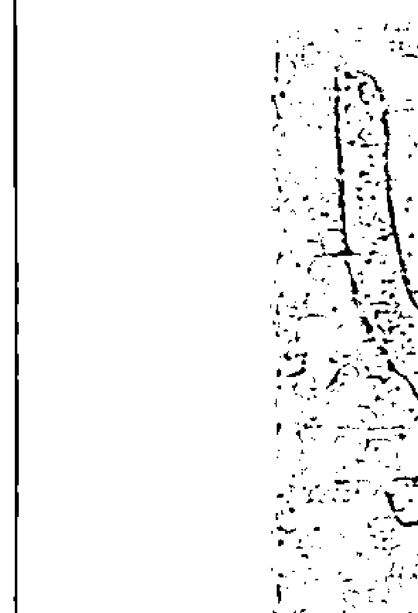

#### 海王星

关键词：阴郁、不切实际

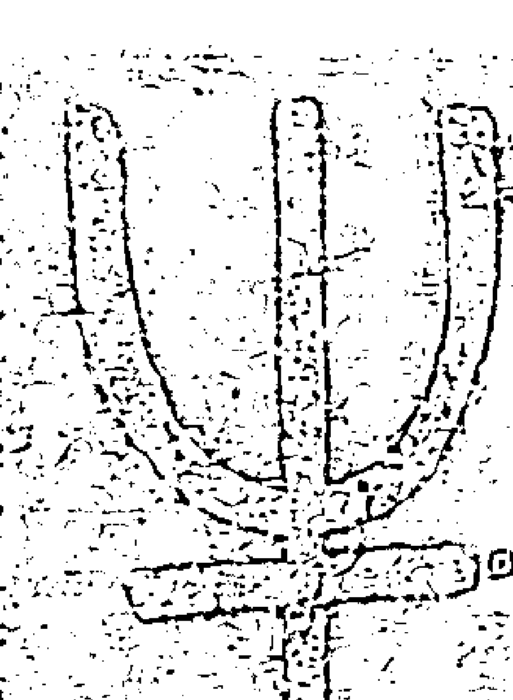

海王星是另一颗“现代”行星，它在1846年被发现。在经过一番考虑之后，占星师们认为它的影响与水有关，就赋予它守护非常情绪化的双鱼座。在神话中，尼普顿是罗马海洋、湖泊、河流之神（希腊神话中对应角色是波塞冬），后来他变成了马去追求罗马农业女神刻瑞斯（希腊神话中的得墨忒耳），她自己当时是一匹马。

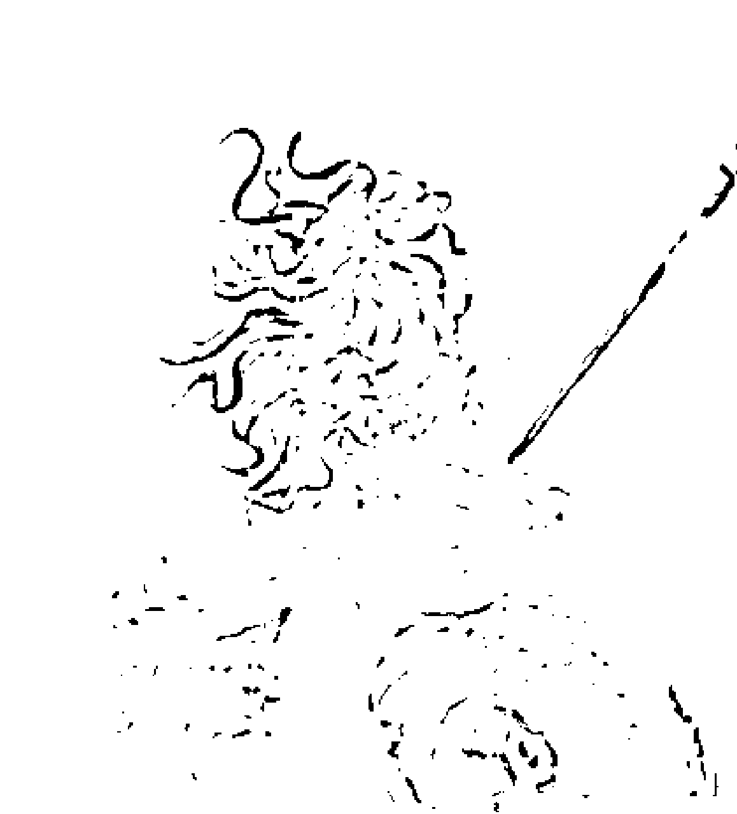

海王星守护双鱼座，在狮子座上是强势，在水瓶座上是弱势。它与金属铂和锡相联系，并执掌着足部。海王星位置处于强势时，它促使纯粹的纯理想主义、极大的想象力、敏锐的创造力。确切地说，它一般与艺术家、作家、诗人、舞蹈有关。

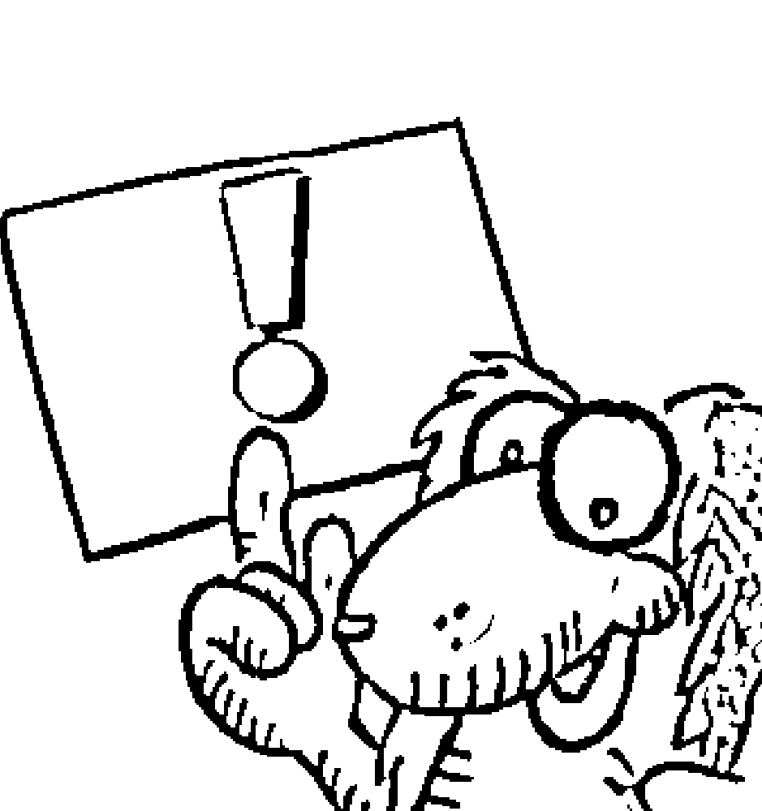

#### 冥王星

关键词：消除、爆发性变化

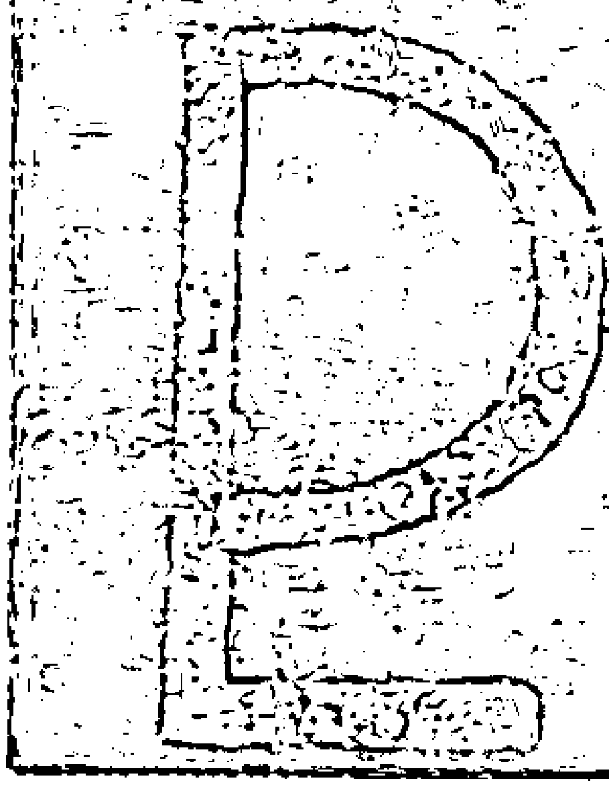

冥王星是“现代”行星中最新的一颗，它于1930年被发现。尽管一些人会让你相信，但事实上它不是以米老鼠的狗布鲁托命名的！普路托是古代农神，他还有另外的（隐秘的）任务是统治神话中的阴间（死亡地域），在那里死去的灵魂沿着冥河行进。他还有隐身的力量。

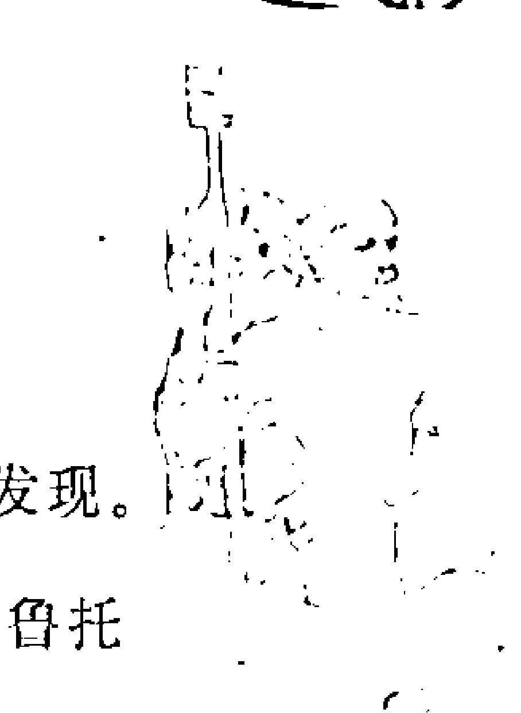


冥王星统治天蝎座，它在处女座上是强势，在双鱼座上是弱势。它与金属钢和铁相联系，并执掌着生殖器。处于强势位置时，它促使个人去应对和克服障碍——无论是心理的、身体的、社会的。

冥王星与“消除”的概念紧密联系，并与最深沉的潜意识领域，特别是隐藏、抑制的情感驱动力相联系。它也与人的生殖和繁衍强烈相关。位置不好时，冥王星引起残酷、批评、隐匿、狡猾、犯罪、痴迷（尤其对于非传统的事情或者倾向）。许多近乎走火入魔的心理学者的出生图上，冥王星处于显著的位置。

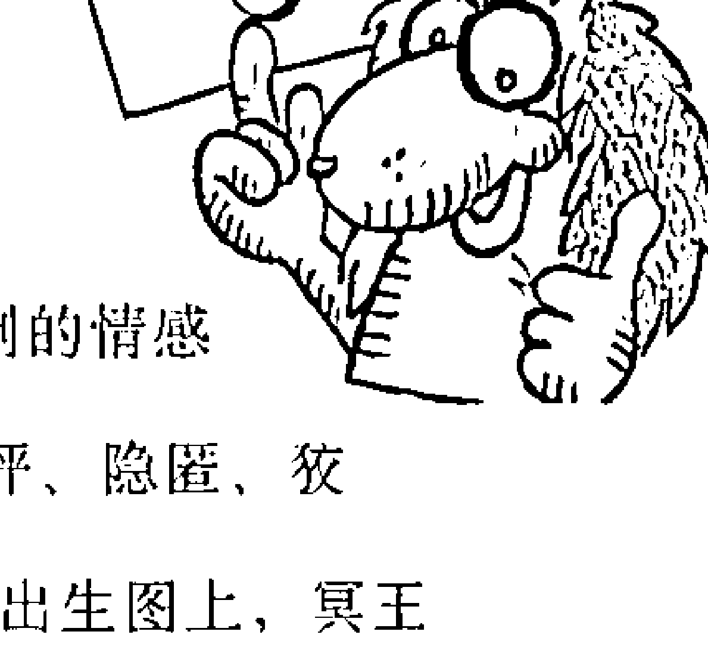

#### 简要的概述

- 了解行星和了解你的太阳星座和上升星座一样重要。
- 在你的出生图上，十颗行星分别处于不同的黄道星座中。
- 太阳、月亮、水星、金星、火星、木星、土星是古代占星师都知道的七大传统行星；三大“现代”行星包括天王星、海王星、冥王星，它们在过去四个世纪中加入到行星家族中。
- 每个行星守护着一个具体的黄道星座，每个行星在出生图上也会被“个性化”；根据行星“在”哪个星座上，它们或处于强势，或处于弱势。
- 太阳守护狮子座，它与欢乐、慷慨、自我表现、活力相联系。
- 月亮守护巨蟹座，它与情绪、本能、直觉、响应相联系。
- ♊ 水星守护双子座和处女座，它与交流、智力、理智、多才多艺相联系。
- ♀ 金星守护金牛座和天秤座，它与美丽、温柔、和谐、爱情相联系。
- ♂ 火星守护白羊座，它与进攻、坚定、积极、身体能量相联系。
- ♃ 木星守护人马座，它与豪爽、奢侈、公正、乐观主义相联系。
- ♄ 土星守护摩羯座，它与谨慎、控制、稳定、坚韧相联系。
- ♅ 天王星守护水瓶座，它与变化、古怪、独立、创新相联系。
- ♆ 海王星守护双鱼座，它与理想主义、想象、敏感性、无忧无虑相联系。
- ♇ 冥王星守护天蝎座，它与消除、爆发性变化、隐匿、性欲相联系。

### 第4章

### 你就是要由朋友!

除了每个星座和行星各自的特点以外，星座和行星还有其它的特质，能够赋予出生图另一层的含义。星座的特点按惯例分为四种形式。行星的影响力主要受出生图上行星之间的距离（度数）所左右，这使它们形成了相位。行星、星座、相位的作用都会出现在出生图四个主要角度的界限内，这四个角度对出生图也有一定的影响力。让我们首先了解星座分类特点、行星相位，还有出生图的四个主要角度。

- 在本章中我们会讨论……
- 了解各种归类形式
- 行星相位
- 相位组
- 根本没有相位!
- 天空中的其他行者——天空的基本点


#### 了解各种归类形式

多年以来，黄道十二星座传统上分为四种形式或关系，在这种分类形式或关系中，它们分享某些与在其小组的其他星座的特点互补或者对比的基本特点。这四个分类形式是性别（二元性）、元素（三合星座分类法）、特质（四合星座分类法）、对宫。

#### 性别

星座的第一组分类形式是按性别分类。传统上，12个黄道星座被区分为阳性的，或是阴性的，占星师尊重这个传统。

阳性星座有白羊座、双子座、狮子座、天秤座、人马座、水瓶座。阴性星座有金牛座、巨蟹座、处女座、天蝎座、摩羯座、双鱼座。在这里，“性别”一词并不是指男人或者女人的真实性别（一个女人可能属于阳性星座；而一个男人也可能是阴性星座），而是指与每个人的阳性与阴性特质有关的原型属性。阳性黄道星座趋于更加外向、好交际、受外力驱策；而阴性星座更加内向、不太好交际、专注于内心深处。

##### 奇闻轶事

占星性别或者二元性的概念是古代的概念，在西方的传统中，可追溯到公元前500年希腊数学家毕达哥拉斯的理论。实际上，可能比这还更加久远。在象征意义上，占星性别/二元性与有四千年历史的中国阴阳概念非常相似，阴阳是宇宙的最初元素：阴象征女性、黑暗、封闭、潮湿、冰冷；阳是男性、光明、开放、干燥、火热。


#### 元素或者三合星座分类法

第二种星座的分类形式是根据生命的四大元素进行的：火、土、风、水。每三个星座被归类于一个元素：白羊座、狮子座、人马座是火象星座；金牛座、处女座、摩羯座是土象星座；双子座、天秤座、水瓶座是风象星座；巨蟹座、天蝎座、双鱼座是水象星座。火象星座积极，土象星座实用，风象星座是理智主义，水象星座情绪化。这些元素也称为三合星座分类法。


我们强烈反对一种看似普遍的观点，那就是某些太阳星座的人就是不能与另一些其他太阳星座的人关系融洽。不过，我们承认分享同一种元素的人相处起来特别融洽，例如两个火象星座的人。

#### 特质或四合星座分类法

星座的第三种分类方式是按照被称为特质的三类能量进行的，即本位、固定、变动。每四个星座归属于一种特质：本位星座有白羊座、巨蟹座、天秤座、摩羯座；固定星座有金牛座、狮子座、天蝎座、水瓶座；变动星座有双子座、处女座、人马座、双鱼座。本位星座趋于冲动而且好交际；固定星座坚决而有点儿严厉；变动星座多才多艺、灵活。这些特质也被称为四合星座分类法。

#### 对位

星座的第四种分类形式是按对位分类。每个黄道星座都与它相对的星座（在黄道圈上与之正对的那个黄道星座）配对。相对的星座有：白羊座/天秤座，金牛座/天蝎座，双子座/人马座，巨蟹座/摩羯座，狮子座/水瓶座，处女座/双鱼座。

尽管在黄道带上两两“对位”，但相对星座决不是在心理上对立；事实上，它们之间通常有一种特别的联系，尤其是成为商业伙伴或者其他类型的工作关系时。如果某人的太阳星座与他的合作伙伴的太阳星座是对位关系时，通常这两个人会发现尽管他们并不是对一切事情都达成一致，但他们却相当理解对方的态度和动机。


亲身体验，本书的作者之一的太阳星座是双子座，而另一个作者的上升星座是人马座，即双子座的相对星座；到目前为止，他们已经几乎有45年幸福的婚姻生活了。


**网上资源**

WWW.EFN.ORG/-PATRICIA

这个轻松的网址为人们在处理关系方面——或者想开始一段关系方面——提供了一些令人快乐的技巧，教你如何配对两个人的相容性和对比出生图。

#### 行星相位

到现在为止，看清出生图里的主要构成要素和图形对你来说可能就不那么困难了。实际上相对来说，这要比认出行星位于哪个黄道星座和宫位，或者黄道星座位于哪个宫位容易多了。

要认出行星之间的关系或者相位（以度数来测量）略微更困难一些，但是相位在出生图中的影响相当大。做一些练习后，你就能够很容易地看出一个行星相对于另一个是否存在相位。行星可以形成九个相位，按类型（正和负）和力量（剧烈、强、中等、或者弱）归类。让我们在这里简单看一看所有的九种相位，它们如何形成及其通常影响。

> 注释
当在出生图的圆周上测量两颗行星，如果行星之间形成一个特定的夹角度数，那么我们说一颗行星是在另一颗的相位上（见下图）。出生图上一圈的圆周是360度，1度等于一圈的1/360。

#### 正相位和负相位

| 相位 | 轮廓 | 类型 | 相隔度数 | 容许度 |
| :--- | :--- | :--- | :--- | :--- |
| 合相 | ♃ | 正或负 | 0° | 8°~10°<br>与☉和☽ |
| 三分相 | △ | 正 | 120° | 8° |
| 六分相 | ✱ | 正 | 60° | 6° |
| 对相 | ☍ | 负 | 180° | 8°~10°<br>与☉和☽或守护星 |
| 四分相 | □ | 负 | 90° | 8° |
| 八分相 | ∠ | 负 | 45° | 2° |
| 补十二分相 | ⚻ | 负 | 150° | 2°~3° |
| 补八分相 | □ | 弱-负 | 135° | 2°<br>与☉和☽或个人星 |
| 十二分相 | ⚼ | 弱-负 | 30° | 2° |

> 注释
对于两个或者两个以上在相位上的行星，它们必须有一定的夹角度数（见图）。例如，六分相是两个或者两个以上行星在出生图上形成60度的夹角。然而，确定的距离并不经常出现。因此，占星师想出了每个相位的容许度，在此容许度内仍旧是该相位。对于六分相来讲，容许度是向前后方向各延伸6度。也就是说，如果两颗行星间隔54度和66度，它们都可以形成六分相。这种度数允许量被称为容许度。

#### 相位

合相 所有相位中最简单的是合相。这发生在两个或者两个以上行星处在出生图上相同或者几乎相同的度数。例如，如果太阳和月亮在一个星座的同一度数，比方说白羊座的6度，它们就说是合相了。可正可负的合相是所有相位中最强大的，极大地加强了对所有有关行星的影响。


形成相位的行星并不必须要间隔固定的度数。形成合相的两颗行星不一定要在同一度数。但是它们的间隔必须不大于8度。当这种情况出现时，度数允许量被称为容许度。


对相 对相是所有相位中第二个比较简单的相位。当两颗行星间隔180度夹角，处于相对位置时，我们称之为对相。这是一个强大的负相位，经常表示分裂和冲突，但也会激发力量和为变化而斗争的意愿。


三分相 它是较强大的正相位之一 当两颗或者两颗以上行星在图中间隔120度时三分相出现了。三分相促使平衡和协调，通常使生活变得更轻松。


六分相 它是另一个强大的正相位。当两颗或者两颗以上的行星间隔60度时六分相出现。在有益的影响上六分相和三分相类似：它引导无压力的生活方式，也是那些处于相位的行星正面品质的公开表现。


四分相 它是较强大的负相位之一。当两颗或者两颗以上的行星间隔90度时四分相出现。它可能表示一个人生活中的重大障碍和挑战，但也使人坚韧和坚定不移。


八分相 它是一个不太强大的负相位（与对相或者四分相相比）。当两颗或者两颗以上的行星间隔45度时八分相出现。在出生图中它代表压力和紧张。


#### 相位组

补十二分相 它是另一个较弱的负相位。当两颗或者两颗以上的行星间隔150度时补十二分相出现。与八分相类似，补十二分相稍微加强了压力和紧张，也增加了不可预知性。


补八分相 它是一个微弱的负相位，其影响和八分相类似。当两颗或者两颗以上行星间隔135度时出现补八分相，它通常与消极性和紧张相关。


十二分相 它是一个轻微的正相位。当两颗或者两颗以上行星间隔30度时出现十二分相。它也和紧张、消极性相联系，但是比补八分相的程度要低。


实际上，一些相位被称为“负的”或者“正的”，并不意味着它们总是有负面或者正面的影响。例如，对相和四分相都是强大的负相位，它们一般产生的作用不利于你，但是在一些情况下可以有相当正面的影响，刺激你去直面困境，从而促使个人的成长和激发性格的力量。

有时当你看出生图时，你会看到相互之间处于相位的行星不仅被一个特定的度数分开，而且事实上好像在出生图里形成组合。这些组合被称为相位组，它们对一个人的影响无论是负面的还是正面的，都是非常强大的。从我们的图解可以看出，有时三个甚至四个行星组成相位组。然而，在一些特殊情况下，甚至可以有四个以上的行星形成组合。当这种情况发生时，相位组的影响被极大地加强了。这里描述的主要相位组是T形三角、大三角、大十字、指针、众星云集。

##### T形三角

当两颗行星呈对相、而第三颗行星与这两颗都形成四分相时，它们形成的相位组被称作T型三角。T型三角的影响根据相关行星的特质变化。通常它能够增加动力、活力、决断力，但也经常阻止个人行为，妨碍潜力的积极开发。


##### 大三角

在出生图上形成一组三个三分相看起来表面上是极好的事情，但事实上一个“简单”的行星分组常常可能对你不利。这种相位组激发魅力，但是有时也导致性格的弱点，并可能显示一种过于冷淡和懒散的倾向，以及带来任何事情你都能侥幸成功（你经常能做到！）的想法。有了这个相位组，就要在出生图的其他地方找一些令你“更坚毅”的迹象，就是培养性格和力量的那些迹象。


##### 大十字

在这儿，四个行星大致相互间隔90度：它们形成两个对相，在出生图上成一个十字；同时，四个行星中的每个都与其他两个形成四分相。这是相当罕见的现象，据说有时起到成就或者毁灭一个人的作用。积极方面，它能够促使某些人极为勇敢、精力充沛、强大、成功。然而，另一些人都不能应付此相位组的强大力量，而屈服在它的影响之下。


因为其独特性，大十字被归为三个不同的特质（与赋予星座的能量特质相同），即本位的、固定的、变动的特质。这些特质在决定大十字如何影响个人时至关重要。

本位大十字有抑制作用。即使你想要释放丰富的能量储备，但是不能够做到。当有本位大十字时，必须培养和鼓励自信心。

固定大十字导致极端倔强。父母或者教师经常习惯于把你当成孩子般制止或控制。你的积极性和信心已经被严重破坏了，所以你必须重新建立你的自信心和自主性。

##### 指针

这是一个充满压力的结构：一个对面的行星与其他两个都构成补十二分相，形成了一个箭头的形状。也有可能是两颗行星与基本行星之间形成十二分相。


这种形状据说象征着指明一个方向，指针的箭头集中指向暗示事件的宫位。不要完全依赖于这个理论，要记住指针行星总是标志着出生图中非常有压力的区域，所有相位影响的更消极的一面将出现在这个人的性格中。

##### 众星云集

当一组三个或者三个以上行星出现在一个星座或者宫位中时，它们形成一个众星云集，就像在出生图里大堵车一样。一般情况下，出现众星云集的星座自有的特质将被突出，而出现在相关宫位的区域则会带来更大的压力。太阳星座通常被包括在内，因为太阳、水星、金星最经常在同一星座里。在这种情况下，不仅在你的性格中有星座特点，而且你会以星座的方式去考虑、去爱。如果月亮也在同一星座中，你也会以该星座典型的方式对情况做出反应。

众星云集的影响太强大了，以至于它能够导致性格失衡。正被讨论的太阳星座的正面和负面品质都非常强大，并且都被过度强调了。如果出现众星云集，为了稳定和抗衡它的效果，要仔细看看出生图中其他行星和星座的位置和影响。

> 网上资源

WWW.ASTROADVICE.COM

如果你想找到关于相位的更为详尽的情况，这个网址提供了非常好的综合信息。

##### 根本没有相位！

有时（并不经常出现）当你在出生图上看到，一颗行星的位置与任何其他行星或基本点都根本没有形成相位。我们称这样一颗行星是“无相位的”，你可能据此认为像这样一颗被冷落的行星，其影响也就相对无关大碍，行星本身也不重要。你错了。


无相位星确实非常重要。实际上，你将尤为强烈地体验这颗行星的影响。这种影响感觉明显不同，并且具有相当古怪、反复无常的力量，非常不容易应对。通常，无相位星毫无疑问地会带给你情感压力和心理困境。

#### 天空中的其他行者——天空的基本点

想象一下座钟的圆形钟面上只有四个点：第一个在九点的位置，正向西；第二个在十二点的位置，正向北；第三个在三点的位置，正向东；第四个在六点的位置，正向南。

现在以占星的视角再看一看钟面。在传统占星术中，九点钟是上升基本点的宫位；十二点钟是中天基本点的宫位；三点钟是下降基本点的宫位；六点钟是天底基本点的宫位。


这些基本点——或称之为“度”，特别是上升和中天，在出生图上施加了它们自己的独特影响，并与各行星形成相位。

上升位于出生图的左手端——在时钟的9点钟位置，或者是在占星圆盘上“日出”的位置。上升是出生图上最初画上的线条之一，它标志包含你的上升星座的黄道带区位的开始。上升适当地揭示了你内在的自我，那个只为与你最亲近的人所知的、甚至是无人了解的“你”。从象征意义上讲，上升代表你真正性格的基础，也是你如何适应环境的最强有力的指标。任何附近的行星或与上升基本点形成相位的行星都应该接受认真分析。(在出生图中，“上升”一词经常被缩写成“Asc”。)

中天

中天或者天顶——意思是“天空的中点”——被简称为MC，它位于出生图的顶端，就是在时钟的十二点位置，或者占星表盘“正午”的位置。中天显示了那些个人品质和能够被我们敏锐地感受到的生活领域。

下降

下降位于上升的正对面，出生图的最右端，就是时钟的三点钟的位置，或者是占星表盘的“日落”位置。它总是在有伙伴关系的第七宫位的尖端，因此它与宫位关注的个人和职业关系有非常强烈的关系。

天底

天底——意思是“天空的最低部分”——被简称为IC，它位于正对中天点的位置，在出生图的底部，即在时钟的六点钟的位置，或者占星表盘“午夜”的位置。它象征着我们的根基和祖先背景，与代表着家、家庭、母亲、土地的第四宫联系强大。

既然我们已经见到了占星术中的所有主要元素：黄道星座、上升星座、行星、星座分组形式、行星相位、天空基本点，该是到它们所在的宫位里转一圈的时候了。

#### 简要的概述

- ✓ 在出生图中，除了一般特点和影响之外，星座和行星有额外独特品质，赋予它们特殊的意义。
- ✓ 星座的额外特点按惯例分为四种形式。
- ✓ 星座的第一种归类是按照性别划分的（阳性或者阴性）。
- ✓ 第二种归类是按照元素划分的（火、土、风、水），也称为三合星座分类法。
- ✓ 第三种归类是按特质划分的（本位、固定、变动），也被称为四合星座分类法。
- ✓ 第四种归类是按对位划分的，每个星座都有直跨黄道带的相对星座与之配对。
- ✓ 行星的影响通过出生图上彼此的夹角度数进一步增强或者约束，使它们形成几种具体相位。

九个行星的相位是合相、对相、三分相、六分相、四分相、八分相、补十二分相、补八分相、十二分相。相位可能在效力上是正面的或是负面的；在影响上有剧烈、强、中等、微弱之分。

✓ 行星相位经常在星座内形成组合，这也在出生图上施加了强大的影响。最重要的行星相位组是T型三角、大三角、大十字、指针、众星云集。相位组在效力上可能是正面的或者负面的，在影响上几乎总是强大的。

✓ 出生图上的四个主要基本点或者度——位于出生图圈的南方（“正午”位置），西方（“日落”位置），北方（“午夜”位置），东方（“日出”位置），代表了个人性格的主要相位。四个基本点（度）是上升（东方）、中天（南方）、下降（西方）、天底（北方）。

### 第5章 宫位并不是家

我们已经指出了星星不仅执掌具体的太阳星座——以星座命名的黄道圈的12个区段之一——而且还与黄道十二宫有关。当你在第12章画出你的出生图时，你会给这些宫位从一到十二编号（逆时针），从上升线（“九点钟”的线）正下方的第一个30度区位开始。可能首先你会注意到星座和宫位并不完全一致。这是因为第一宫总是从上升线下面开始。但是根据你上升星座或者本命星座是什么及其所在位置，黄道星座会落入不同的宫位中。而你的上升星座总是位于第一宫中。（关于此第12章还有更多内容。）

在本章中我们会讨论……

- ✓ 分割宫位

#### 分割宫位

有各种形式的“分宫制”。在这本书中，我们使用了等宫制，它是最古老的系统，对我们来说好像也是最简单的。普莱西德（Placidus）分宫制是最流行的分宫制之一，它存在某些异常的地方：例如，在极北的纬度地区不能计算上升度数。

宫位象征着人类生活的十二个具体领域，因此它们给出生图增添了另一层重要的含义。如，第五宫位象征创造力和快乐。如果你出生时第五宫中有太阳在处女座同时水星在天秤座上，我们就认为你会热爱美丽（天秤座的影响），对朋友友好（太阳在处女座的影响），还有相当多的创造能力（第五宫位本身的影响）。

#### 宫位简表

| 宫位 | 相关星座/行星 | 关键词 |
| :--- | :--- | :--- |
| 1 | ♈ 白羊座，火星 | 身体和心理的健康、态度、性情 |
| 2 | ♉ 金牛座，金星 | 安全、财产、感觉、伴侣 |
| 3 | ♊ 双子座，水星 | 兄弟姐妹、交流、早期教育、迁移 |
| 4 | ♋ 巨蟹座，月亮 | 家、家族、父母（特别是母亲）、土地 |
| 5 | ♌ 狮子座，太阳 | 创造力、父母身份、孩子、爱情生活、冒险 |
| 6 | ♍ 处女座，水星 | 一般福利、饮食、锻炼、日常工作 |
| 7 | ♎ 天秤座，金星 | 个人和职业关系 |
| 8 | ♏ 天蝎座，冥王星 | 性欲、投资、遗产、自我发现 |
| 9 | ♐ 人马座，木星 | 旅游、高等教育、理想、梦想、良知 |
| 10 | ♑ 摩羯座，土星 | 雄心、志向、权威问题、事业变动 |
| 11 | ♒ 水瓶座，天王星 | 社会生活、友情、良好事业、个人目标 |
| 12 | ♓ 双鱼座，海王星 | 空想、隐居、潜意识、反省、信念 |

##### 第一宫
白羊座和火星

这是出生图上最重要的宫位。因为它包括你的上升星座，这个星座表现了你的性格、性情、对生活的一贯态度，以及你的身体健康、幸福的情况、身体特征。如果在这个宫位中还有一颗行星，特别是它与你的上升星座的夹角在80到100度之内，就会对你的性格、外表、行为和上升星座本身的效力产生尤为强大的影响。

##### 第二宫
金牛座和金星

第二宫揭示了你对于财产、安全、伴侣的态度（但不包括风流韵事，第五宫中会讲到）。从这里我们能发现你有多么看重安全感、你的占有欲如何以及你是否会把人（和物）当成私人财富。情感的安全感和财政安全感之间有强大的联系。金钱和爱情在许多占星指示中被明确地连在一起（例如第17章，“金星的运转”），这个宫位就是其中之一。特别注意，在这个宫位中的行星或星座，它们的影响将显示情感安全和财政安全在你的生命中是否达到一种平衡，或者你是否会为了一个而牺牲另一个。

##### 第三宫
双子座和水星

第三宫涉及你所有最亲近的亲戚（除了你的父母）：兄弟姐妹、祖/外祖父母、叔伯、婶姨、堂/表兄弟姐妹。有关这些亲属关系的任何难题或者问题将在第三宫表现出来。这个宫位也显示了孩子对学校生活的态度，并且能够给父母提供有关早期教育的重要线索。此外该宫位还与沟通（双子座和水星的双重影响）、迁移和环境有关。例如，如果你计划搬家，第三宫会影响你选择什么类型的环境对你来说是最好的——城镇或者乡下，喧闹还是偏僻。

##### 第四宫
巨蟹座和月亮

第四宫与你的家、家族、父母（他们在第十宫权利宫中也起重要作用）相联系。第四宫清楚地揭示了你与父母的相处模式，以及子女和父母的关系成功还是失败。然而，在精确地解释任何家庭关系时，尤为重要的是必须得到所有家庭成员的出生图，尤其是在需要解决某些问题的情况下。不过，这个宫位非常强烈地暗示了你对父母的真实感情。这也是家和财产的宫位，可能会强调你的家庭生活。如果这个宫位在你的出生图上被非常有力地突出出来，那么你可能是个非常恋旧的人。

##### 第五宫
狮子座和太阳

这是创造力的宫位。创造力不仅与艺术联系在一起，你还可能在厨房、车库、会议室里尽情发挥创意。创造力经常是由一个人的父母激励起来的，这个宫位关注的是身为父母的人对与孩子的感觉（与第四宫强调孩子对父母的感觉形成对比）。第五宫与快乐、尤其关于你对风流韵事、爱的行为、生儿育女的态度联系强大——也就是说，你将情感和精神的爱转换成物质形式的一切方式。

##### 第六宫
处女座和水星

第六宫和第一宫一样都和健康有关。但是第一宫关注的是身体健康，而第六宫与卫生、饮食、内脏——所有那些可能与身体健康连在一起的事情关系强大。这个宫位也指出了当你做生意或养家时，如何处理每日的工作和杂事。它显示了当你面对日常杂事时是否守规矩，以及你是否会变成日常杂事的奴隶或者杂乱无章的牺牲品。从传统角度看，第六宫也揭示了你对于仆人的态度——这个概念现在已经不再适用。然而，这个宫位指出了我们是如何对待那些帮助我们生活得更加舒适的人：木匠、水管工人、电工、承包人。

##### 第七宫
天秤座和金星

这个宫位主要突出了你对情感关系或者伴侣关系的态度和感觉。第七宫位尤其揭示了你在爱情领域深层次的需要，你要寻找什么样的伴侣，以及你在伴侣关系中保持和谐和美好的难易程度。它也指出在情感关系中你的自制力和独立性如何。第七宫应该和第五宫（创造力和风流韵事之宫）在一起解读，揭示了你对于爱情的行为和生育孩子的态度。个人的和谐关系和感觉是这个宫位首要考虑的问题，它也会影响你如何对待诸如友情和工作关系此类的其他类型的伙伴关系。

##### 第八宫
天蝎座和冥王星

第八宫有时被称为死亡之宫。但是在这种情况下，“死亡”象征着变化、新的开端、重生或者对根深蒂固的问题妥协。还有它与财产捐赠、遗产、中头彩联系强大！无论你何时想到投资或者购买保险，都要查询第八宫位。犯罪、研究、调查在这里也被突出出来。传统上，这是最初的“生命动力”之宫，不可避免地与性连在一起。在性方面，强调个人最深层、最基本的（有时也是最难以启齿的）性欲望，而不是那些简单的性行为。

##### 第九宫
人马座和木星

这里我们找到你对生活的哲学见解，还有你对宗教、精神实质、现行教育的态度。长途旅行在这里也被强调了，如果你考虑休假一年去探索世界——无论是你的心灵世界还是环球之旅，第九宫都是不能被忽视的建议来源。当某人计划去国外居住或者留学、从事旅游或者出口行业的工作，或者以教育界特别是大学教育为职业时，通常要咨询这个宫位。第九宫主要关注的其他方面还有文学、法律、出版、语言技能、梦想以及灵感。

##### 第十宫
摩羯座和土星

这里我们能找到关于希望、进展、责任的宫位。第十宫位将揭示你在世界上过得怎样——不仅是金钱方面，而且还有实现你最深层的志向方面。你在这里发现你对责任和权利处理得如何，你对家庭、传统价值、社会地位真正的认识是怎样的。如果你的个人星出现在这个宫位中，你可能强烈地需要将感情投入到某项事业中去。通常来说，第十宫经常能指出你是否要转换你的主要职业，或者是否会在社会地位或工作职责上经历一次大幅度提升。

##### 第十一宫
水瓶座和天王星

这个宫位揭示了你与他人在社交上的关系如何，这一宫较注重友情和社交。这个宫位大力强调了你如何“参与”到这个世界中——具体来说，你对于诸如生态、政治和社会压迫、观点偏狭等此类问题的态度。例如，从这个宫位寻找你为慈善或者人道事业工作投入时间和精力的可能性有多大。传统上，第十一宫揭示了你推行慈善的力量是否是诚恳的，还是仅仅追求自我膨胀的沽名钓誉。你也会了解你和其他人相处得如何，尤其是在大的群体或者职能单位中，以及你对公共办公室是否有亲和力。

##### 第十二宫
双鱼座和海王星

这是空想、隐居、孤立的宫位。传统上，它与医院、监狱、精神机构，即我们能够经历深切孤独和孤立的所有地方相连。第十二宫也是神秘主义、潜意识心灵、心理问题根源的宫位。你会找到关于深层心理困境的基本性质方面令人吃惊的线索（而第八宫向你显示如何处理这些困境）。看看包含你上升星座的那段黄道带区位，如果那里有一颗行星，特别是当它非常接近上升线时，那么就清晰地显示这里有一个“隐藏”的问题必须被挖掘出来。回顾行星的影响，作为如何着手处理这件问题的线索。牺牲的观念在第十二宫非常强烈地存在着，但是这种牺牲可以使性格增强和长期悬而未决的问题得到解决。

#### 简要的概述

✓ 行星不仅执掌特定的黄道星座，每个行星还与黄道带的十二宫位之一有力地联系在一起。

✓ 每个黄道宫位代表了人类生活的一个特殊区域。黄道十二宫对行星们施加了的另一种个性化的影响，经常是强大的心理影响。

✓ 有各种“分宫制”，其中一些比其他的更复杂。在这本书中，我们使用最古老、最简单的等宫制。

- ♈ 第一宫位执掌心理动机和康乐，它是白羊座和火星的宫位。
- ♉ 第二宫位执掌财产和情感，它是金牛座和金星的宫位。
- ♊ 第三宫位执掌兄弟姐妹、早期教育、环境、迁移，它是双子座和水星的宫位。
- ♋ 第四宫位执掌家、家庭生活、父母（特别是母亲），它是巨蟹座和月亮的宫位。
第五宫位执掌创造力、快乐、风流韵事、冒险、孩子、父亲，它是狮子座和太阳的宫位。
第六宫位执掌健康、饮食、锻炼、业余爱好、日常工作，它是处女座和水星的宫位。
第七宫位执掌伴侣和关系，它是天秤座和金星的宫位。
第八宫位执掌性、投资、遗产，它是天蝎座和冥王星的宫位。
第九宫位执掌理想、高等教育、挑战、长途旅行、梦想，它是人马座和木星的宫位。
第十宫位执掌雄心和志向，它是摩羯座和土星的宫位。
第十一宫位执掌朋友、社交生活、社会道德、目标，它是水瓶座和天王星的宫位。
第十二宫位执掌信念、空想、隐退、风俗，它是双鱼座和海王星的宫位。

# 第二部分

#### 第6章 炫目：火象星座
### 第7章 根本：土象星座
### 第8章 活跃：风象星座
### 第9章 深情：水象星座

中世纪有关太阳神的描述。

#### 简易的太阳星座占星术

现在我们终于进入到辉煌而又神秘的太阳星座的讨论，这是占星术中大家最期待的部分。在此，我们要稍微背离以往普遍流行的太阳星座分述方法，我们将按照火、土、风、水四大元素来划分黄道十二星座，每三个星座分为一组。通常，隶属于同一元素的星座之间，有着异常紧密的联系。

在每一个星座的讨论里，你都可以发现它所有的由来已久的占星学联系，以及它对你生活主要方面的影响的深入阐述。

我们担保，对于你自己所属的太阳星座，你肯定会学到一些以前从未知悉的东西，并且还会在这一学习过程中获得很大的乐趣。

#### 第6章 炫目：火象星座

白羊座、狮子座和人马座是黄道星座中最精力充沛、最热情的星座。它们分别被活泼好动却过度自信的火星、有王者气概却以自我为中心的太阳，以及雍容华贵却放纵的木星所主宰。简单而客观地说，作为火象星座的白羊座、狮子座和人马座的人们，具有天生的超人气吸引力和几乎是永不知足的生活热情。他们热衷于工作、行动、改革和挑战，在伟大的领导者、探险家、运动员和艺术家的行列里，经常可以找到属于这些星座的人。当他们处于颠峰状态的时候，会慷慨地无私地跟他人分享自己光芒四射的天赋；可当他们境况糟糕的时候，则会转向自我封闭，残忍，对什么都缺乏兴致。

在本章中我们会讨论……

- ✓ 白羊座的性格特征
- ✓ 狮子座的性格特征
- ✓ 人马座的性格特征## 白羊座的性格特征

白羊座的必胜决心——在任何竞争中都会一马当先——将会影响到你生活中的许多领域。当然，无论是激励你成为行业里的佼佼者还是成为一个出色的运动员，它对你都是一种极有好处的特质。

但是，你不能把责任感从强烈的决心中排除出去。你的责任就是：克制自己无限膨胀的欲求，决不能通过践踏别人来达到目的。

请记住，白羊座们往往会把自己摆在第一位，认为自己是世界上最重要的人。这种倾向使他们经常在职业中表现得非常自私，也将会使他们不受家人、朋友或同事的喜爱。由于他们具有白羊座式的果断，因此也有变得固执的危险，这一点也需要谨慎提防。此外，白羊座的你喜欢过忙碌的生活，并且可以在喧闹嘈杂的环境中工作得游刃有余，尽管别人会认为这种环境非常分散注意力。你的精力非常充沛，所以，如果不想变得不安和不满，就务必要找到积极地释放过剩精力的方式。很多白羊座的人通过运动来达到这一目的，也有人将性爱当作解决之道，另外一些人则投身到繁忙的公事中。

如果你认为这些都在暗示你是个严肃并且全身心投入的职业人，无暇顾及友情和享乐，那你就误会了。事实上，你有极好的幽默感，经常会表现得爱调侃人和滑稽可笑。此外，你也经常会被笑声和愉悦的气氛包围。

- 白羊座 (3月21日～4月20日)
- 特点：自信果断、率直坦率、自私自利、急躁莽撞
- 守护星：火星
- 性别：阳性
- 元素：火
- 特质：本位
- 需要格外重视的身体部分：头部
- 理想的居住国家：丹麦，英国，法国，德国，日本，波兰，叙利亚
- 理想的居住城市：伯明翰（英国），不伦瑞克，卡普阿，佛罗伦萨，克拉科夫，莱斯特，马赛，那不勒斯，乌得勒支，维罗纳
- 幸运石：钻石
- 幸运色：红色
- 幸运树：冬青、冷杉、荆棘或者灌木
- 幸运花草：山金车花，月桂果，金雀花，泻根，荆豆，忍冬，蛇麻草，天竺葵，刺柏，韭菜，乳蓟花，芥菜，荨麻，洋葱，椒薄荷，大黄，烟草，金缕梅
- 适合的食物：啤酒，韭菜，洋葱，番茄以及大多数味道浓郁的食品。

###### 爱情和性生活

对白羊座性格所做的总结中，有一条通常很准确，那就是关于他们往往会对人一见钟情并且欲望强烈的断言。白羊座们非常需要活跃的性生活来满足自己，他们还非常可能对自己迷恋的人猛扑而去。这一点会在不止一个方面引起灾难。

白羊座的欲望如此强烈，以至于连简单的求爱过程也常常被他们忽略。白羊座们会忘记，比起在汽车后座上草草地做爱，大多数人更喜欢被温柔地追求和一张舒适的床。那些在满足了自己之后，就转过身去，丝毫不考虑伴侣的感受而呼呼大睡的男人，很有可能就是白羊座。同样真实的是，白羊座们经常会非常迅速地在一见钟情的火花中草草许下承诺，不过，这种承诺完结得同样迅速。

急于深入一段看上去可以永远的爱情关系很有可能成为一个错误。一旦信守了这一准则，白羊座们对自己的爱人——他们也必须是同样热情活泼并且准备做出承诺的——所做出的可靠而持久的承诺将会是非常美好的。

对白羊座的你来说，你的伴侣可能会，甚至可以说是一定会，不得不忍受你身上某种程度的自私。不过，如果你的伴侣能够巧妙地指出这一点，对你来说改正它也不是十分困难。不必为这种自私过分担心，即便它有可能成为你们关系中无法改变的一部分。它并不会掩盖你们爱情中纯粹的快乐，因为白羊座的你所具有的制造快乐的能力是无与伦比的。

###### 家庭

很抱歉不得不老话重提，但是过于自私的性格又一次成为你必须去调整的一个非常重要的因素。你可能常常把自己的爱好或者对某一事物的狂热置于首位，而让家庭屈居次要地位。

如果你的家人没有意识到这是你的白羊座性格使然，那就很有可能会经常发生争吵。比如说，白羊座身上有狂热地喜欢DIY（自己动手）的倾向，这一点通常表现为喜欢动手拆卸和建造。白羊座们经常想通过自己动手改建以使家人们住得更舒服，但不幸的是，由改建带来的混乱场面发生得实在是太频繁了。培养伴侣或孩子分享你的爱好，可以说是一个解决之道。但你过于旺盛的精力也可能造成障碍。当你感觉自己被束缚在某一个固定的轨道之中时，你会想方设法地尽快挣脱它。但这对你的家庭，则意味着突然的、令人不安的转变，尤其是对你的伴侣来说。

关于你的伴侣，有一点极为重要，请务必谨记，那就是，他或她是你的伴侣，所以你必须学会分享生活。

此外还有一点也一定要记住，在每个白羊座的身上，或多或少地存在着好斗的性格。如果你的出生图中显示有这种特点存在，那么它就会在各种领域表现出来：在工作中，在家庭里，开车的时候，或者是运动的时候。你可以在你的出生图中寻找其他的影响力来平衡这一特质。

小小的导火索通常会伴随着侵犯行为，所以控制你的脾气是非常重要的。

最后要告诉你的是，你是个花钱大手大脚的人。经常性地把买食物、汽油和付账单的钱预先留出，不失为一个好办法。此外，对白羊座来说，制定至少一个储蓄计划，也是一个不错的主意。否则，你的钱会在不知不觉中消失得无影无踪。

###### 事业

请想象一下，一份有着漂亮、舒适但非常沉闷的办公室和一成不变的日常事务的工作。丝毫引不起你的兴趣吧？这不奇怪，因为所有的白羊座们都会这么认为。你需要的是在开放、活跃的氛围中工作。同时，你非常需要工作——不论是体力劳动还是脑力劳动——这会激起并投入你所有的激情和精力。

你特别需要一份能够让你达到事业顶峰的工作，无论对你的事业发展轨迹来说它们意味着什么。成为管理者或领导是典型的白羊座的目标。事实上，你的野心会让你变得非常无情。试着控制自己吧。尽管你能很好地应付压力，但是以扰乱他人来增强自己的这种能力并没有任何好处。

毫无疑问，白羊座们无法轻松地习惯那些需要高度耐心的工作。那么，哪种工作对你来说最合适，你又能最能做好哪种工作呢？工程学和其他任何类型的与金属有关的工作都能激起白羊座的兴趣。他们还能成为第一流的汽车机械师、消防队员和铁道工人。

- □韭菜和洋葱是与白羊座相关的食品。

那些醉心于艺术的白羊座们通常会在手工艺中获得享受。另外，典型的白羊座特性还会在艺术上得以体现：画家喜欢大刀阔斧的艺术形式，而不是水彩画或小画像；而音乐家们则对长号或小号的兴趣远胜于小提琴或竖琴。

令人吃惊的是，白羊座非常有希望成为出类拔萃的精神病医师，心理学家，牙科医生和发型设计师！

###### 健康，饮食和运动

白羊座获得健康体魄的关键是确保其所有的精力都被积极地消耗。如果你使你的物质生活平衡，你该不会有健康上的问题——除了偶尔的头疼（甚至有些幸运的白羊座们压根儿不知道头疼为何物！）。如果你被头疼所困扰，那么抽一点时间去做一个全面检查是非常值得的，轻微的肾功能紊乱可能才是根本原因。一个从来没被头疼纠缠过的白羊座是非常罕见的。有时别人会误以为你似乎故意把脑袋撞得青一块紫一块来寻找刺激，而实际上你只是常常太过草率和鲁莽。

所以你要特别小心哦！例如，当你在厨房中忙碌的时候小心锋利的刀或身边的沸水。此外，当你运动的时候，要特别小心偶然的牙齿脱落，肌肉扭伤，甚至是骨折。

除了你自己造成撞伤和扭伤以外，你可能还会经常碰到事故。火星，作为白羊座的守护星，会让情况变得更糟。你可能会发现，在任何运动中你都很难把速度降下来，所以一定要采取适当的预防措施：在需要的时候永远别忘了使用烤箱手套、安全头盔，以及护目镜。可能你会很喜欢辣味食物——要小心了！因为它们会让你的血液温度过高——而且你需要足够的蛋白质。如果不碰甜食，你的胃口总会非常好。你可以用干果来代替甜食。

> > □根据传统，绵羊是和白羊座紧密联系的动物。

运动对你来说非常重要——最理想的是竞技运动，它可以让你拼尽全力并一决胜负。拳击、摔跤、武术都会给你带来乐趣，有氧运动和器械运动也会培养你的肌肉和力量。

###### 孩子与父母

作为白羊座的人，你有时会把自己的事情放在首位，对陪伴孩子的时间则颇为吝啬。实际上，你需要制定一份详细的时间表，以使你能够有固定的闲暇时间和自己的孩子相处。如果你做不到，那么，你和你的孩子都会受到伤害。

很多白羊座对他们的兴趣爱好过度痴迷，使得他们的孩子不得不把看电视和玩电脑游戏当作唯一的消遣。这是非常遗憾的，因为当你和孩子在一起时，有种东西你绝对不缺乏，那就是热情。而这种热情，是会传染的。

但是千万不要忘了，你是耐心有限的人。不耐烦和坏脾气都可能会酿出很多问题，特别是当孩子还很小的时候。

幸运的是，任何风暴都去得很快——但是不要试着把它们驱散。你会在为人父母和教育孩子中获得极大乐趣。作为出色的实干家，你会希望自己的孩子在学校中表现突出。白羊座的孩子们会很闹人，有些时候会相当自私，永远活泼好动，精力充沛。既然众所周知白羊座很容易碰到事故，所以要准备好急救药箱和一个拥抱——当你的孩子摔倒，撞伤自己，或是碰伤头的时候……喔，是啊，他们当然会弄伤头了！

当白羊座的孩子对什么事情不感兴趣时，他们很容易感到厌倦，老师们会觉得让他们在课堂上对不感兴趣的课程集中精力是格外困难的。要特别留意你的白羊座孩子身上的这一特性，还要提醒他们，在学校中学习基础知识对于他们所渴望的成功来说是必不可少的。

###### 闲暇时间和退休

你的闲暇时间可能都用来加班了。假设你是个汽车机械师，你很可能会在你的车库里伴着油乎乎的汽车零件度过夜晚和周末，甚至会把它们放在餐桌上！运动也会占据你很多空闲时间。正如我们已经建议过的那样，去体育馆做做运动或是参加一个团体项目，都能帮你消耗掉过剩的精力和潜在的侵略性。

如果你对外出健身感到厌烦，或是你觉得已经做了足够的运动，你可以考虑养一条狗。在乡间小路上长距离遛狗，或是在城市里闲逛，都会是非常令人愉快的。

你也许永远不会丧失DIY的兴趣，家庭酿酒对你来说也许是非常有吸引力的。如果你已经有了可以支配的储蓄，你可能会在股票上做些投资。保险、采矿业、或钢铁制造业也许是很适合你的投资领域。至于相关的更多富于思想性的消遣方式，你可以享受辩论带来的乐趣（有时则是过于激烈了）。如果你能够保持心平气和，你将在社区工作中表现出色。另外，你会发现，天文学是多么的迷人。如果你开始对占星学产生了兴趣，无论如何你都要先学习天文学！

□金银花是白羊座的幸运植物。

#### 简易的太阳星座占星术

##### 狮子座的性格特征

每个属于狮子座的人都需要一片供自己统治的王国，不管它是庞大的企业集团或小小的手工作坊，你都会用自己的方式来找到它。你将为在自己的王国中所做的一切感到无比自豪。你对人生的看法通常是积极且乐观的，每次情绪低落时的退缩都不会持续很久。你充分利用每一分钟，不会在无谓的责备和悔恨上浪费时间。

狮子座最大的缺点就是过于相信“我无所不知”。好，就算你确实见多识广，可永远固执于这一点并不是好想法。此外，你往往会觉得你不仅应该掌控自己的生活，还应该包括其他任何人的。

你是位非常出色的组织者，你不仅仅是希望，而是绝对地需要成为事务的核心人物。你非常擅长激励别人，当你很圆滑地处理问题时，别人都会乐于服从你的领导。但是，你可能也是相当专断的——尤其是和消极的或是过于苛刻的人相处的时候。这自然会在你和那些居然敢和你作对的反对派之间引起矛盾。

通常情况下，你的热情是你最好也是最有用的财富。不要抑制它，尽管这样会受到批评。不过一定要记住，热情过度也可能成为你的问题之一。

确实，你有渴望用各种方式来表现自己的倾向，你需要注意的是：一旦涉及到展示财富，狮子座就会做得有些过火。要小心，不要穿得太考究或者打扮得惊世骇俗。否则，特别是到了晚年，一些狮子座们就会显得，怎么说呢，就好像汉堡包偏要打扮成鱼排，国王却穿戴得像个王子似的。

- **狮子座 (7月23日~8月23日)**
- 特点：有创造力，给人印象深刻，有力，独裁
- 守护星：太阳
- 性别：阳性
- 元素：火
- 特质：固定
- 需要格外重视的身体部分：心脏，脊椎，后背
- 理想的居住国家和地区：捷克，斯洛伐克，意大利，黎巴嫩，罗马尼亚，西西里岛，伊拉克南部，法国南部。
- 理想的居住城市：巴思，孟买，布里斯托尔，芝加哥，大马士革，洛杉矶，马德里，费城，朴次茅斯，布拉格，罗马，锡拉库扎
- 幸运石：红宝石
- 幸运色：从黎明到黄昏的太阳的颜色
- 幸运树：月桂树，柑橘树，橄榄树，棕榈树，胡桃树
- 幸运花草：杏树，白屈菜，向日葵，刺柏，月桂，金盏花，槲寄生，西番莲，椒薄荷，紫罗兰，迷迭香，芸香，藏红花
- 适合的食物：肉，含铁量高的蔬菜

###### 爱情和性生活

当狮子座坠入爱河的时候，他们的认真程度极高。如果他们的爱得到了回报，那么生活就会像田园诗般的美好。但是，好事总是多磨的，因此，狮子座的心总是受到伤害，甚至会为情而心碎。和其他星座相比，狮子座需要更长的时间来疗伤止痛。你总是会想，“我要尽全力爱他”，所以你需要注意了，不要用爱将你的伴侣淹没。那些在积极性和信心方面不能和你匹配的人，或许会觉得他们正在感情的旋涡里漂浮不定呢。

就像你用远超过你有能力付出的时间去陪伴你所爱的人一样，在感情问题上你有时会爱过头。这要引起你的注意，尤其是在相处的初期。你总不希望把他（她）吓跑吧？

忠诚是你的天性，但是你在感情上和性生活中，确实对伴侣要求过多。如果你的欲望没有得到满足，你会觉得没有得到充分的反馈，你们之间的感觉就会变得尴尬。你可能会因为要求过高而犯错。无论在交往、友谊或是性事中，一位能做出很好反应的伴侣是你所最需要的，他（她）能在任何方面配合你的激情。

太阳是狮子座的守护星。

但是，需要记住非常重要的一点，在爱情里，你们是一对相爱的人，而不是你一个人和你的附属物（他或是她）相处。分享，是相爱的全部。你不能武断地决定你们两人要做什么、怎么想。

###### 家庭

你需要注意的是，你喜欢在任何关系中取得领导地位——无论是与你的伴侣还是和你的孩子。这种倾向有可能会变得太出格。如果你的伴侣确实很难做决定，那么不妨由你来做。但是如果他或她有很正常的决断力，他们未必会喜欢总是听凭你的指挥。

事实上，由于你的过分专横、独断和固执，你的家庭将会受损。

从上面我们所说的来看，和狮子座的伴侣或父母生活在一起，永远不会感到索然无味。哪怕手头很紧，他们也可以把钱的效能发挥到极致：餐桌上哪怕只有一杯咖啡，感觉上也会和在酒吧里吃庆祝大餐一样。

你还会使尽浑身解数，鼓励你的伴侣和孩子充分利用生命里的每一分钟，他们取得的成功会让你和他们自己一样兴奋。事实是，你是如此在乎你的家庭成员的表现，希望他们能够永远进步并不断取得更大的成就，以至于当他们不像你这么渴望成功的时候，你将变得十分暴躁。

按照这种趋势，当你的家人发现你如此容易伤心时，他们会觉得非常诧异。如果你的一位家庭成员让你觉得失望，你的整个世界都要为之失去光彩。请试着不要用英雄主义的水准来苛求你的伴侣和孩子吧，这样，即便你的期望落空了，也不至于被伤害到难以恢复的境地。

###### 事业

首先要告诉你，你是个表现欲极强的人，而且这一性格特点会在你所享受的任何一项职业中体现出来（“享受”在这里是一个最重要的词哦！）。不管你的工作有多么枯燥，你都会从中找到展现才华、本领和热情的机遇。你雄心勃勃，希望到达事业的顶峰。此外，你会光明正大地做到这一点，而不是靠耍阴谋诡计踩着别人的肩膀往上爬。你是个努力工作的人，同时，你与生俱来的热情和对工作充满情感的投入，都确保了你事业上的成功。

当你管理别人的时候，你会希望他们也能依照你对工作的高要求来工作。可是，如果他们做不到这一点，你往往会表现得严重缺乏耐心。你需要学会宽容那些不如你的人。

当然了，认为某些太阳星座的人可以把某种特定工作做得非常出色，而另一些星座的人却无法做到，这种观点是错误的。不过，狮子座的确会在需要创造力和社交魅力的工作中表现得格外出色。很多狮子座的人都会选择在戏剧界工作（比如，演员、导演，或设计师），另一些则进入时尚圈工作。活跃的狮子座主厨在高级饭店和电视节目中炫技般的表演。而在军队的高级军官中，也能发现严肃的狮子座的身影。狮子座还有成为性格活跃的传教士的天赋。

###### 健康，饮食和运动

狮子座的人总是精力充沛，但是除了不喜欢寒冷气候之外，你还要面对血液循环的问题。你总是挺直了腰杆儿（典型的狮子座式的骄傲），这一点对你来说大有好处。但是你的脊椎会给你带来一定的烦恼。你可能会不得不忍受后背上的病痛，比如，你长久地伏案工作之后的劳累。瑜伽或简单的拉伸运动都是很有效的治疗法。

□金盏花和白屈菜是狮子座的幸运花。

心脏是狮子座的主宰器官，所以你要经常做运动，保持心脏的健康。这对改善循环系统也有好处。大多数狮子座都喜欢跳舞，因此，一堂好的舞蹈课对你来说是极佳的运动形式——部分是由于这种活动比较有创造性，不像慢跑或爬台阶那样总是一成不变。

如果在团体运动中你被选为队长的话，你也会乐于投入其中。只是你要特别注意，一旦成为团队的首领，就别做得过分。你会情不自禁地想要表现，无论什么事你都可以比他们做得好。这会带来不快和压力。

一旦你找到了一种你喜爱的运动形式，你就会把它坚持到90岁。你将开始真正了解自己的身体，并且更好地疏导你的能量来调整自己。还是要劝告你，在体育馆（和其他任何运动场合）里，你要尽力克制自己的表现欲。过分出风头的行径，不会给你带来任何好感，弄不好最终还落得个满身伤。


□狮子被象征性地与狮子座联系起来。

###### 孩子与父母

传统上，狮子座被认为是象征父性的星座，所以你的孩子将会拥有一个令人愉快的充满爱心的家长，这样的家长能使他们永远有事可做，还会鼓励他们最大程度发挥他们的天赋——当然，也对他们要求过高。某种程度上来说，狮子座的这一倾向是非常不错的，如果你不会因为你的孩子无法达到你过高的要求而感到失望的话。狮子座的父母经常会犯的错误通常是他们想“利用”自己的孩子来完成自己无法达成的梦想。这种想法永远都是错的。

狮子座身上有一点是非常可爱的，那就是他们能够诚恳地站在孩子的角度思考问题，这使得他们能够理解自己的孩子。请永远记住，孩子也许并不会像你一样雄心勃勃和自信。

你非常乐意把钱花在孩子的教育和素质培养上，比如带孩子去运动，去剧院，去博物馆或是旅行。你希望孩子能够充分地利用个性形成的那几年尽可能多地学习，同时也尽可能地享受生活。


如果你有一个狮子座的孩子，记住当他们做出任何成绩时，都要尽可能热烈地褒奖他（她）。在批评他们的时候，要注意技巧。狮子座的孩子是非常容易伤自尊的！


尤其是，要使他们在幼年就建立起坚定的自信。这将使他们能够承受那些令人沮丧的时刻——不可避免的，他们发现他们难以达到自己所设定的高目标。

###### 闲暇时间和退休

有时候人们说，狮子座是一个没有兴趣爱好的星座——他们只有事业。这话有一定道理。实际上，很难建议狮子座的你在空暇时间或退休后从事什么活动能让你感兴趣（这倒不是说，狮子座的人从不真正退休，他们只是用新得到的空闲时间来发展一项或两项新的事业！）。

问题是，如果你愿意把它称为问题的话，你会把爱好摆到和谋生同等重要的位置上——你希望自己在爱好上，也表现得同样出色。


举例来说，假如你在业余时间里研究考古学或者尝试手工刺绣，你会去找最好的老师，探掘最重要的考古地点，买最昂贵的丝绸。你还会努力获得最完整最高深的技艺——无论是修复已经残损的精巧古埃及花瓶，还是绣出最美丽的主教法冠！

基本上，当空暇和退休就在眼前时，你的脑子里想的最多的词就是“创造性的工作”。你将成为任何一个组织机构中的最大财富，并且势必要当上领导者。你同样会喜欢那些能够让你一展所长的活动，由此你能博得尽可能多的人的认可。非常明显地，你还有望成为一名成熟的、引人注目的社交名流。不过，研究占星学也同样有益于你——你可以把本书作为起点，最终在本书资料部分所列出的著名占星学校中取得学位！


在神话中，宙斯让尼米亚猛狮升天，成为狮子座。


##### 人马座的性格特征

说人马座最突出的特征之一是“自由”并不是没有意义的。这种对自由的强烈渴望在带来快乐的同时也制造出了难题。你经常会太急切地想以自己的方式生活，以至于你另类的行为有时会使你陷入窘境。

你通常是很粗心的，比如说开车时，你那种漫不经心的狂热绝不会让你的乘客感到特别舒服。确实如此，你喜欢冒险，并且几乎是为冒险而冒险。此外，因为你热衷于体育运动，你应该做好受伤的准备。

但是，你并不是个满口胡言乱语的性格外向者。你还具有哲学家似的睿智。就你而言，追求智慧和追求物质生活是同等重要的——尽管你会在任何可能的时候，用物质手段来接近知识的领域。东方武术——它能将哲学和动作结合在一起，冷静地、不带感情地运用身体力量——对你来说极具魅力。此外，竞争和挑战在你眼中也非常诱人。

你是一个出色的多面手，从这一点来说，你真的应该去控制自己，不要追求样样皆通。否则，你的生活将由一次又一次的半途而废组成。

既然你不能放弃凡事都得做得尽善尽美的想法，那么，你必须学会在工作时，只接受比你自以为可以承担的量少一些的工作。你的积极性是你的巨大财富，但你盲目的乐观主义就不是了。所以，你身上特有的不知疲倦和永不知足的心态，是不可取的。真的没有必要这样。


- 人马座 (11月23日~12月21日)
- 特点: 不拘小节，崇尚自由，具有哲学气质，有洞察力
- 守护星: 木星
- 性别: 阳性
- 元素: 火
- 特质: 变动
- 需要特别关注的身体部分: 臀部，肝脏，大腿
- 理想的居住国家和地区: 沙特阿拉伯，澳大利亚，匈牙利，西班牙，前南地区
- 理想的居住城市: 阿维尼翁，布拉德福，布达佩斯，科隆，那不勒斯，诺丁汉，设菲尔德，斯图加特，托莱多（西班牙和美国各有一个），多伦多
- 幸运石: 黄玉
- 幸运色: 深蓝，蓝紫色
- 幸运树: 岑树，栗子树，白桦，酸橙树，桑树
- 幸运花草: 香脂草，越桔，琉璃苣，肉桂，蒲公英，苔藓，桑葚，石竹花，鼠尾草，菊花
- 适合的食物: 芦笋，芹菜，韭菜，洋葱，番茄

###### 爱情和性生活


和人马座的情人保持契合是相当费神的：人马座的你精力旺盛，善变，并且勇于实验。所有这些都可以带来很多欢乐，当然，这不是对一个渴望过那种平稳甚至有些乏味的生活的人而言的。

在年轻的时候，对于爱和性的“召唤”，你是非常敏感的。你会发现你很容易被一位漂亮的女孩或英俊的男子吸引，同时你会毫不犹豫地接近他们。事实上，你也能用同样充满活力的性向他们表达你的爱。当你更成熟一些的时候，你将意识到悠闲的交谈和安静的相伴也是一种享受。此外，你还会发现，在一段恒久的感情中更容易充分地传达你的爱意。

尽管如此，你的伴侣也许有时会觉得你对感情的态度不够认真。事实则是，你身上那种对变化的需要使你不时地“误入歧途”。


但是，即便有时你对爱情的态度相当随便，但这并不是说你就不会爱得坚定持久。你的伴侣只需试着习惯，这不过是你典型的随心所欲性格的一部分而已。

木星是人马座的守护星。

实事求是地说，你和伴侣之间的关系，尽管不必非是开放的，但也必须有一些弹性。人马座完全不能忍受任何被控制被离间的倾向——就像任何由嫉妒（哪怕它并非没有理由）引起的猜忌一样。你完全不能理解嫉妒这种心理，一位嫉妒的伴侣势必会让你勃然大怒。请记住，你的伴侣可能用和你不同的方式得到爱和性。所以，一定要注意这个问题！

###### 家庭

对于任何一位人马座来说，最糟糕的事情莫过于，发现自己被束缚在一个紧密的家庭关系内。“不要限制我的自由”已经成为人马座的圣歌了。显然，你无法忍受那种令人不适的被禁锢感，所以你的父母必须意识到这一事实，以建立良好的家庭氛围。

#### 炫目：火象星座


厌倦感是人马座需要面对的另一个问题。一成不变的生活——六点起床，赶七点四十三分的车去办公室，中午一点的时候休息用餐——这样的生活对人马座来说就像整天待在家里做乏味的家务劳动一样致命。

人马座的家庭生活不会乏味无趣，而且你也会竭尽全力做到这一点。只要你能够激励你的家庭，并说服他们像你一样充满激情地加入到你的活动中来，一切都会是非常美好的。如果不是这样，也许有些事情，或者有些人，就会突然发作！事实上，共同参与活动对你来说至关重要。那些在一起游戏的人马座家庭，通常会有很美好的合家欢时刻。你们还会轮流地挑战彼此，并且享受它所带来的乐趣。


下面要说的问题对你和你的伴侣尤其重要。你必须认为他或她在智商上与你并无多大差别。如果你觉得自己处于劣势——这也许是因为你伴侣的事业属于一个你不熟悉的领域——你会很难承受。毫无疑问，你的反映会是加倍努力瞄准该领域。这时，一位明智的伴侣就会及时注意到你的这一动向并给你鼓励。

记住，情侣间的相互挑战可能会促发不可思议的创造性哦！

###### 事业

人马座的人总是渴望着能看清楚自己要走的路，并闯过路上所有的障碍。被包围在平庸的琐事或沉闷的办公室中，你绝对不会感到快乐，你仍旧需要用自己的方式去做事。


换句话说，在工作中，你需要表达的自由。同样你也需要挑战。如果你真的觉得自己处在一个非常呆滞的工作环境中，那么就为自己设立一个你所能想到的高目标并为之奋斗。就算你不能真正的完成它，奋斗的过程本身就会让你受益无穷。

任何与旅行有关的工作都适合你。这样，你就有机会离开枯燥的案牍事务出去走走。你有语言方面的天赋，你还擅长做计划——无论是为你自己还是为别人。处理细节问题你也很在行，但有时你会抓不到问题的核心，或者就是因为你有点粗心。

很多占星家认为，人马座是黄道十二星座中天生的运动员，确实，你的决心可以为你的成功提供动力。同时你还擅长做买卖，所以销售方面的工作——当然，最好也是和旅行有关的——对你来说既有乐趣又可获得成功。此外，竞争的挑战对你也是颇多裨益。

###### 健康，饮食和运动

和其他星座相比，运动对于人马座来说最为重要。如果缺乏运动，你的整个身体系统都会变得沉重和僵硬——同时，意志也会消沉起来。

你所要做的，就是寻找一种吸引你的运动方式，这样你会乐意拿出时间和精力去健身。理想的状态就是，你加入一个不错的健身机构，在那里，你不会觉得枯燥。可以灵活地参加感兴趣的健身课程，在不同的健身机械上锻炼身体。你还可以根据季节的不同改变健身方案——从秋天的力量训练到春天的塑身训练。当然，你还可以根据天气情况选择不同的运动形式——从足球到网球再到游泳。


就人马座而言，臀部和大腿是最需要关注的身体部位。尤其对于女性来说，体重的增长首先在这两个部分体现出来。需要指出的是，坚持运动加上节食，是唯一的解决之道。遗憾的是，这会让酷爱美食和美酒的你感到难过。酗酒无度尤其不健康，因为肝脏是人马座要重点呵护的器官。当然，如果你的身体不得不需要坚持一份严格的食单，那么，不妨把它看成是一种挑战。你热爱挑战，而且面对挑战你总是能取得胜利。


□在神话中，人马座是半人半马的形象。

你也有总是遭遇事故的倾向，所以如果运动得太剧烈，你就很容易把自己弄伤。成熟的人马座们总是合理的运动，以此来避免肌肉损伤。


能够增加能量和高蛋白的食物，对你的健康大有好处。但是，一定要管好你的嘴。毫无疑问，糖可以增加体力——但是也会使你的体重随之增加！垃圾食品是你的大敌。不过，柑橘类的水果，比如橘子和柠檬，特别是柚子，都是最适于你的食物！它们可以为你提供充足的维生素C。

###### 孩子与父母

人马座极具成为模范家长的潜力。你天生就对生活满怀激情和热爱，这一点将深刻地影响到你的孩子。此外，你觉得抚养孩子是一个异常美妙的过程，你乐意为此付出时间和心力。

#### 炫目：火象星座


尽管如此，在养育孩子的问题上，人马座仍然会遇到小问题，对于人马座妈妈来说更是如此。当你的孩子很小的时候，你会感觉良好，但随着孩子开始步履蹒跚地咿呀学语，你就会被他们无尽的颠三倒四的嘟哝分心，特别是当你感到自己24小时都被孩子牢牢地束缚住的时候。

切记，你并非最有耐心的人。此外，事实上一个只有三四岁大的孩子，不可能表现出你想要的智力。因此，你必须找个出色的保姆——或者说服你的父母帮忙——使你每天有一两个小时的空闲时间。这可以让你重新获得自由的感觉，并且让你的思维重新活跃。


你也要注意，不该在孩子的成长过程中，以过高的标准来要求他们。尤其是当他们似乎总是不能把握住机遇的时候，千万不要表现得没有耐心和烦恼。

> > 有时候，孩子们是把浪费时间当成享受！

如果你的孩子是人马座，那么他或她必须学会区分什么是真正的、自然的激情，什么是无谓的亢奋。年幼的人马座孩子总是在该睡觉的时候还很兴奋，所以你难免会在这种时候把他们弄哭。但是别绝望，一旦你发现你的人马座孩子与生俱来的兴趣所在，你就能毫不费力地鼓励他们。事实上，你不得不经常督促他们把注意力从外界转到功课上来。而且，做到这一点绝对不容易！


□鹿和人马座有着紧密的联系。

□越橘是人马座的标志物。

###### 闲暇时间和退休

对你来说，爱好和空闲活动中的挑战也将像工作中的那么重要。因此，在不同的工作需要和消遣时光之间，请设法达成平衡。如果你的工作以脑力劳动为主，你的业余爱好就应该以体力活动为主。反之亦然。


你有与生俱来的冒险精神，所以像攀岩和滑翔这样的运动很合你胃口。旅行会是非常吸引人的。但是如果你没有时间旅行，阅读旅行方面的书籍也很美妙。人马座一向被看作是黄道十二星座里的猎人，这适于各种形式的猎获活动，无论是对古董还是其他稀有收藏品。

□橡树和人马座有着紧密的联系。

你很可能是一个活到老学到老的人。所以，为成人举办的各种学习班都会吸引你，你都会始终如一充满激情地参加。

不过你要记住，和双子座一样（黄道带上你的对位），你在学习上多少会有些浮躁。在很多事情上你都可能会流于一知半解，而难于成为某个领域内的专家。如果这就能使你感到满足了，倒也没什么不好。可是这种态度并不能让你顺利通过考试。所以，如果你想取得更多的学位或证书的话，你必须学会精神专注！


□在黄道带中，人马座和双子座是正相对的星座。


#### 简要的概述

- ✓ 白羊座，狮子座和人马座同是火象星座。属于这些星座的人，都是活跃且精力充沛的。他们积极地工作、运动、搞创新以及迎接挑战，他们通常在任何事上都表现得很出色。


- ✓ 白羊座的人十分好胜，有时候会为了取得胜利不惜任何代价。他们身上充满活力和创造力，所以他们需要那些能够疏导精力的事业和活动。需要小心那种过于自私的倾向。


- ✓ 狮子座的人积极而快乐，从不浪费时间去后悔。他们是出色的组织者和忠诚的伴侣。而他们的缺点就是他们总想主导一切——爱情、事业、养育子女，以及人际关系。


- ✓ 人马座的人无忧无虑，多才多艺，充满激情。他们喜欢脑体结合的任何活动。但是他们非常害怕被束缚——不论是被日常琐事，家庭关系，或者责任。


## 第7章

## 根本：土象星座

金牛座、处女座和摩羯座，是黄道带家族中最务实、最单纯的成员，被称为“土象星座”。它们分别为敏锐且感性的金星，激烈却健谈的水星，以及实际而又谨慎的土星所主宰。属于这些星座的人，是世界的规划者、组织者和家庭守护者。他们会有蒸蒸日上的工作，并且因奉献、坚定、实干和诚挚赢得声誉。土象星座的人总是不知疲倦地工作在一线，他们为其他星座的日常生活和自己家庭的幸福日夜忙碌。


- 在本章中我们会讨论……
- 金牛座的性格特征
- 处女座的性格特征
- 摩羯座的性格特征

#### 简易的太阳星座占星术


##### 金牛座的性格特征

金牛座最容易犯的错误总是占有欲过强。你对自己手中所拥有的很多东西都握得太紧了。举例来说，一位情人，最终会觉得自己也是你的私有财产之一。而你这样做的最重要原因之一，就是你需要安全感。


在自己的周围摆满自己的所有物能让你感觉到安全，包括你的金钱。你需要这样做带来的安全感，所以你很难改变这个习惯。这样做有时候会让你看起来相当物质化，当然这种看法存在着误解。实际上，你是一个很可靠、很“安全”的人。你像一架性能优良的机器那样运作自己的生活，并且在与人相处时非常值得信赖。

你从不会寻求捷径，当然你也不该这么做。例如需要冒风险的投资，是非常不适合你的。的确，通常情况下你不是一个冒险者。实际上，你如此坚定以至于有时显得太较真，甚至在某种程度上，你变得有些偏执。此外，你还有巨大的耐心和魅力。有时候，你可能使人感觉有点反应迟钝——例如，在交谈中——但是如果人们认真去听你在说什么，他们总会发现你的话题是有趣的。

你是个深思熟虑的人，而你最大的潜力，就在于你能够按照自己的规划建立稳固的事业构架和生活蓝图。

###### 金牛座 (4月21日～5月21日)

| 属性 | 详情 |
| :--- | :--- |
| **特点** | 占有欲强，不会轻易变化 |
| **守护星** | 金星 |
| **性别** | 阴性 |
| **元素** | 土 |
| **特质** | 固定 |
| **需要格外重视的身体部分** | 喉咙，脖子，甲状腺 |
| **理想的居住国家和地区** | 卡普里岛，塞浦路斯，埃及，希腊，伊朗，爱尔兰，瑞士 |
| **理想的居住城市** | 博洛尼亚，都柏林，伊斯特本，黑斯廷斯，莱比锡，卢塞恩，曼图亚，巴勒莫，圣路易。 |
| **幸运石** | 祖母绿 |
| **幸运色** | 淡蓝色，绿色，粉红色 |
| **幸运树** | 杏树，苹果树，岑树，无花果树，梨树，葡萄树 |
| **幸运花草** | 桤木，洋蓟，黑莓，苜蓿，楼斗菜，雏菊，接骨木，毛地黄，蜀葵，薄荷，罂粟，报春花，玫瑰，酢浆草，紫罗兰 |
| **适合的食物** | 谷类食品，特别是小麦；苹果，浆果，葡萄，梨；香料 |# 爱情和性生活

金牛座的你，总能因魅力和容貌顺利地开始一段感情。


真的，金牛座的外表在十二星座中声誉最高。比如说，假如人们在拥挤的房间里发现了你，他们会想方设法接近你。如果他们也能引起你的注意，他们会感到大为愉悦。


你是所有人梦想中那种经典的浪漫人物。你享受——也乐于分享——美食，美酒，以及生活中所有的舒适、甚至是奢华的物品。而求爱是你最愿意花费时间去做的事情。

当交往进入深层次之后……这么说吧，不会出现彼此失望的场面的。对于做爱，金牛座的情人有极好的态度，他们乐意将自己感受到的快乐同等地回馈给对方。所以，你会给你的伴侣留下细心体贴的印象和有被珍爱的感觉。

金星是金牛座的守护星。

不过，一旦关系确定，事态可能会开始下滑。这并不是说你不愿意再花时间为你和你的伴侣建立一个舒适的甚至是奢侈的家。金牛座与生俱来的追求美好爱情与美好生活的特质，是无法改变的。

但是，金牛座的占有欲肯定要逐渐抬头。当你的伴侣感觉到自己被监视或者变为你的私有财产时，即便美妙的性爱、美食、美酒，以及美好的生活都不能补偿他们的感受。


此外，猜忌心也可能成为一个问题。这种猜忌不一定是性方面的，但是你会感觉伴侣不完全属于自己。你一定要小心！当你的爱人感到被包围，被幽闭或被监视的时候，你的麻烦也要随之而来了。

###### 家庭

我们说过的关于你的爱情生活的话，也同样适用于你的家庭生活。当你习惯了家庭生活之后，你会感受到感情上的安定。除此之外，你会觉得一切都变得十分美好。确实如此，但前提是，你允许伴侣和孩子自由享受自己的生活。例如，允许他们有你所没有的兴趣爱好。不要忽略这一事实。至少你要尝试着对家人喜欢做的事情表现出好奇，并且尽可能地参与到其中去。


最重要的是，不要把挣钱看成是当务之急而让工作占据过多的时间，使你没有余暇陪伴家人。

你还要记住，在涉及到家庭生活的时候，你本质上是较为传统的，而你的家人则有可能不是。实际上，他们很可能不喜欢永远过着一成不变的生活。你要准备好面对这种情况，千万不要反应过度。

有一点很重要，那就是决不要假定你的伴侣和你一样遵守习俗。可能你的丈夫喜欢自己在家看孩子而由你外出工作养家。或者，你的太太比起养育孩子来更愿意有自己的事业。请记住，仅仅是你想要孩子——并且非常擅长照顾孩子——并不意味着你的伴侣也甘愿如此。在你做出重要的决定之前，一定要考虑到这一点并把它解决好。

不论你是男性还是女性，你希望能有一个既舒适又安全的家。当家里有一位金牛座的时候，任何一位来访者都会享受到美味佳肴和一把舒服的扶手椅。

###### 事业

金牛座对成功野心勃勃，部分是由于成功通常意味着安全、稳定和得到你所希望的丰厚的收入——所有这些都会给你安全感。如果你能在一个传统领域里为一个大公司工作，那就是最让你愉快的事了，这些工作可能是银行业，或者跨国制造业。一份时间固定、程序明了且较少变动的工作——那正是你想要的。

- 罂粟花和毛地黄与金牛座有紧密的联系。


但是，如果你能够找到一种相对没有风险的方式来进行投资——你会慎重安排用于投资的每一分钱——你会做得非常出色。

如果你真的打算自己做老板的话，一定要考虑合作的问题——尽量找一个不像你这么求稳怕冒险的人（别误会，我们可没说你枯燥）！你不要仅仅因为有风险就让一个绝佳的挣钱机会擦肩而过，这太遗憾了。当你发现自己实在不愿承受风险的时候，试着让自己勇敢地面对未知的变动。要保持开放的意识，并且把握好分寸。


#### 简易的太阳星座占星术

至于保守的金牛座适合的职业，你似乎总是能在奢侈品或与美容产品有关的行业中表现出色。比如说，你可以成为优秀的美容师，或者大商场的专柜工作，对你来说也不意味着枯燥乏味。传统上（这不是你最喜欢的词么？），金牛座总能把乡镇规划方面的工作干得很漂亮。建筑业、财会和农艺等，往往会吸引金牛座。金牛座还是最有音乐天赋的星座之一，有许多卓越的音乐家的太阳星座都属于金牛座。

###### 健康、饮食和运动


我们曾经指出过，在十二星座中，金牛座的人普遍有着最佳的外表。所以，你们有义务保持对其他人有致命诱惑的面孔和身材。但是，这也是一个最有可能饮食过量的星座。你多半是酷爱甜食的人，例如巧克力。当然这能够导致体重上升。


如果你允许自己不时地大吃大喝，那么一份运动计划就是必须的了，当然，在你隔三差五的大餐之间，仍需要合理安排饮食。

和多数金牛座的人一样，如果你既新陈代谢缓慢又不喜欢运动，超重也会成为困扰你的问题。请多考虑水果和蔬菜吧！只要长期坚持，你会发现水果比糖更可口，而高纤维的食物要比蛋糕好得多。

你的动作灵活，所以定期参加舞蹈学习班也许是很好的选择。在健身房里，你不会像其他人那样容易对器械运动生厌，这种规律性强的运动方式非常适合你。运动之后做全身按摩或者洗个桑拿将对你大有好处。

金牛座需要特别关注颈部和喉咙。就像你早就知道的那样，一场感冒的到来首先会表现为喉咙的不适。记住，金牛座要特别注意保护甲状腺。如果你发现自己体重开始持续增长并且无法减下来，那么仔细检查一下甲状腺是很有必要的。

###### 孩子和父母

正如我们已经说过的那样，你想要孩子，并且乐意照顾他们。你会尽力把自己所享受到的安全感提供给他们——有时候，你会忘了他们也许并不像你那样渴望安定。


如果你习惯了循规蹈矩并且对孩子灌输纪律的重要性的话，那么你需要注意，他们需要的自由可能会超出你许可的范围。当你确实不得不管束自己的孩子时，一定要耐心地解释清楚你为什么要责备他们，千万不要苛求孩子，以至于给他们施加过于严厉的惩罚。

你对奢侈品、美食和美酒的热爱，会使你希望孩子也能享有这些。你会无限制地给予他们礼物、衣服，或是资助他们外出旅行，这对他们并没有好处。另一方面，由于你对金钱有本能的谨慎态度，这使得你不断鼓励孩子为自己的“额外”需求进行储蓄。

从幼年时起，金牛座孩子就富于耐心，性情随和并且乐于服从。他们会吃下你摆在他们面前的所有食物并且还会再要。所以，用巧克力就能很容易地笼络他们。抵抗住这种诱惑——或者至少你不要总用这招。

你会发现你的金牛座孩子做事总是井井有条并且有谋略——尽管有时候会显得效率不高。不要催促他们，特别是在和学习有关的事情上。允许他们按自己的步伐来发展。

但是，一定要密切注意他们身上的惰性！记住，金牛座的孩子会运用他们天生的魅力来逃避他们不想做的事。你要学会在他们面前毫不妥协。


###### 闲暇时间和退休

作为一个富有耐心的金牛座，你能在一些让其他太阳星座感到腻烦的兴趣爱好上做得津津有味。当你用像蜘蛛腿粗细的小零件组装起来一个巨大的帆船模型，或是用细密的针脚绣出一副美丽的刺绣作品时，你会觉得无比快乐！


有趣的是，尽管你的外表可能是高大魁梧的甚至显得有些笨拙，你却总是被那些精细小巧的手工所吸引，并且驾轻就熟。此外，如果你热爱音乐（尽管金牛座通常并非如此），你会喜欢上参加合唱队或是歌剧社。

金牛座总是喜欢手工劳作，比如雕塑和陶艺。他们同时还是出色的园艺师，这是出于对花的热爱。你特别喜欢在自己家里酿造啤酒或葡萄酒（当然了，你也喜欢喝掉他们）。你对美食的欣赏会让你成为一名好厨师，尤其擅长做味道醇厚的调味品和甜点。至于运动，在你年轻的时候，你会非常喜欢竞技性的团体运动。到了晚年，高尔夫和保龄球都会是非常有吸引力的。


洋荆花和葡萄与金牛座紧密相关。

#### 简易的太阳星座占星术


##### 处女座的性格特征

处女座有这样的名声：他们谦虚、古板、害羞、性格内向又挑剔。如果在出生图的其他区域，没有强大的影响力来中和这种倾向，你会发现自己很难成为外向而自信的人。此外，很不幸的是，你身上很多非常好的正面性格特征都被抑制了。尽管如此，一旦运气来了，这种情况就不会发生了。


处女座的性格优势——脚踏实地，专注细节，以及思维敏捷——都会帮助你克服自己身上的消极性。当你希望改善过于谨慎的生活态度（这种态度可能会阻碍你的成功并让你缺乏自信）时，你的性格优势会起到实实在在的促进作用。

对于聪明并且分析能力强的处女座来说，有很多机会可以带来个人的和专业上的成功。举例来说，在辩论方面你非常出色，你会条理分明、逻辑严谨地组织和提出论据，从而打败对手。


但是你必须小心，发表言论时不要苛刻和激烈过度，以防人们在还没有接受你的观点之前就开始疏远你。还要记住，你的分析才能和你完美主义的倾向有时候都会被看成是冷酷和严厉。

| 特点         | 善于分析，好批评，挑剔，谦虚                             |
| :----------- | :------------------------------------------------------- |
| 守护星       | 水星                                                     |
| 性别         | 阴性                                                     |
| 元素         | 土                                                       |
| 特质         | 变动                                                     |
| 需要格外重视的身体部分 | 神经系统，胃，肠                                         |
| 理想的居住国家和地区 | 巴西，克利特岛，希腊，伊拉克，美索不达米亚平原，土耳其，前南地区或是未被开发的岛屿 |
| 理想的居住城市 | 雅典，波士顿，科林斯，巴黎，海德尔堡，耶路撒冷，里昂，雷丁，温泉疗养胜地的城市。 |
| 幸运石       | 缠丝玛瑙                                                 |
| 幸运色       | 棕色，深灰色，海军蓝                                     |
| 幸运树       | 所有果实为坚果的树木。                                   |
| 幸运花草     | 所有由双子座守护的花草，特别是那些有明亮的蓝色和黄色花朵的植物 |
| 适合的食物   | 所有由双子座管辖的食物，块根类蔬菜，特别是胡萝卜和土豆 |

#### 简易的太阳星座占星术

你以不畏劳苦且忘我地工作而著称。确实如此，很多处女座的人都把生命耗费在为他人工作上了——这一点有时候也有不利的一方面。在一定程度上，你有可能成为那些老式的“小女人”，她们把一生都花在为家庭奉献和为如何让伴侣活得更舒服而忧虑上了。在你变成这种人之前，一定要三思。不论你是男性还是女性，这种生活都很可能让你感到非常沉闷单调。


###### 爱情和性生活

在爱情和性生活中，你的关键问题在于无法想象会有人爱上你。毕竟，你“内在的挑剔”经常让你觉得自己不够漂亮，不够英俊或者不够聪明，不够有趣，不能吸引任何人。所以，最有力的反驳就是大声对自己喊一句“你可以！”

你必须克服处女座性格中的自我苛求，那是禁锢你活力的障碍。谦虚是种美德——但只在适度的时候！

当我们谈到谦逊这个品质时，我们必须意识到，有些处女座的人在涉及与性有关的问题时，他们身上清教徒似的对性的回避让他们非常苦恼。你需要一位能替别人着想并且非常耐心的伴侣，在你准备享受爱情中身体上的快乐时，他会帮你放松。


> 水星是处女座的守护星。

一旦你对一段关系做出承诺后，就会成为一位非常忠诚的伴侣。不过你还是需要学得洒脱一些，不要为卧室是否足够干净或者是否选对葡萄酒而担心。

对处女座来说，最危险的莫过于他们对伴侣的非理性的苛责——这种苛责是很常见且非常较真的——虽然他们并不是故意要这样做。比如说，你的伴侣会因为你无休止地批评他（她）的小习惯而感到无比愤怒。


如果你总是为自己的伴侣感到恼火，那么请尝试着探究你的不满情绪从何而来。也许，很多时候，问题出在你这儿，而不是另一个人的错。

请记住，在生活中，有比教给伴侣如何妥善地放置真空吸尘器重要得多的事情。如果你总是在那些伤人且无谓的抱怨上浪费时间，就太愚蠢了。

###### 家庭

你会为给自己和家人营建出一个理想的家而夜以继日的工作。大多数处女座的职业女性都不会为如何平衡个人与伴侣，以及家庭生活之间的关系而烦恼。但是，某些处女座的人会坚持认为家庭比事业重要。如果你是其中之一的话，那么，你要想清楚了，是否愿意为把家打扫得一尘不染和让孩子按时起床，而放弃外面世界的所有乐趣！


处女座永远不会在抒发己见方面感觉有任何困难，这是你最卓越的品质之一。当家庭产生问题的时候，你会迅速的分析情况，并把分析的结果有条理地表述给家人，然后再端出早已准备好的解决方案。所以，你家里的气氛，永远都不会变得死气沉沉！

但是要重申的是，你一定要注意你那处女座式的吹毛求疵和过分焦虑的弱点。这很可能会给你的伴侣和孩子造成很大的困扰。


提醒自己，非处女座的人很可能无法认同你对待生活的那种严肃认真劲儿。实际上，偶尔停下来放松一下，对你和你的家庭都是非常有好处的。

有必要培养一项兴趣爱好，尤其是那种可以调动起你天性中求知欲和好奇心的事情。如果你坚持认为应该有建设性和有条理地度过闲暇时间，那么也好，你可以试着享受聆听音乐和阅读爱情小说所带来的乐趣。


> 小而色彩明亮的花朵，比如毛茛花或是藏红花，和处女座有紧密的联系。

###### 事业

你需要的是能给你带来一定安全感的职业，但你总免不了为工作的事情患得患失。如果你选择了一份需要付出很多心力的事务，那么，你就不会有太多时间和精力替未来焦虑了。

处女座最典型的职业之一就是秘书或是行政助理。善于关注细节是你的天性，另外，比起与一大堆人合作，一对一的工作关系对你来说更容易处理。首先，团队成员永远适应不了你对他们的高标准和严要求。而且，去批评他们，这种诱惑你无法抗拒。如此发展下去，你的麻烦肯定少不了。

尽管这样，也不要觉得你会受困于一个配角的地位。在某些领域中，你天生的处女座的能力、头脑以及实干、忠实和勤奋等品质，能让你毫不费力地取得很大的成功。比如，处女座可以成为一流的教师，当然了，前提是要控制你吹毛求疵的习惯，特别是在那些要和孩子直接打交道的时候。新闻采编和市场调研也能给予你成就感，正如政治和人事工作所能给你的一样。


处女座的人还对饮食业，健康业（特别是可取代药物治疗的产品），卫生事业以及其他很多开发潜力大的领域感兴趣。你对户外活动和大自然都非常有好感，所以，农业、景观美化或园艺都很适合你。

顺便提一句，如果你发现自己有一天失业了，千万不要只是坐在那儿为生计发愁。好好安排自己的时间，查询报纸，撰写简历并把它们统统邮寄出去。一定要行动起来，积极地去寻找新的工作。无所作为只会加重你天性中对职业生涯的不自信感。

###### 健康，饮食和运动

你天生就有过人的体力和旺盛的精力，这些都必须被合理地疏导。但问题是，如果你不够关注运动，或是投入的时间不够时（当工作彻底拴住了你时），身体和精神上的活力就会受阻，并最终导致健康问题。

处女座最敏感的身体部位就是神经系统和胃，也就是说，当你在生活中遭受挫折时，最先出现问题的就是你的胃，以及神经性的紧张烦躁。然后，就是长时间的头疼，接着，你会为头疼感到焦虑，又会因为焦虑而胃疼——这样的恶性循环是很难被打破的。


你的精力和体力都需要被好好管理起来：首先，要把它们消耗在令你感到满意的心智活动中；其次，要注意合理饮食和运动。

举例来说，你需要摄入大量的粗食物纤维。我们所说的这种纤维可以帮助你清理肠道，而且你也会满意地发现，合理的饮食结构是带来生命活力的关键所在。你甚至可以做一名素食者。同时，你还需要足够的运动。比起在健身房里运动，你更喜欢散步，慢跑或骑脚踏车兜风。


年轻的处女座一般都很喜欢团体运动和快速的运动，比如壁球、网球和羽毛球。如果你有轻盈的体格，你可能会喜欢体操。更有艺术感的处女座会对芭蕾舞课程非常热衷，这比有氧运动更有效果。到了晚年，你会对高尔夫球产生兴趣。同样，园艺活动也是一种非常不错的锻炼方式。无论你选择何种运动，你都要定期锻炼身体并且坚持下去。但是，你要记住，为了避免感到枯燥，你需要让运动形式多些花样。

###### 孩子和父母

作为父母，处女座热诚地相信他们的孩子也像他们一样喜欢忙碌，所以，他们迫切地希望可以用各种各样的活动来充实孩子的生活。这么做并不总是对的。要记住，孩子需要每天有一定的自由时间来游戏。

你一定要格外小心，不要对自己的那种苛刻倾向失去控制。没有必要因为你孩子画得不如伦勃朗(荷兰画家)出色，就对他大加指责。批评过度会让孩子失去对成功的渴望，除非这种批评是谨慎且有技巧的。与剖析问题的细节相比，你的孩子会更欢迎热情的激励。


很多处女座的人都有当老师的禀赋——并且极为卓越。所以，你百分之百可以做到让你的孩子永远有事可做，他们不会像其他孩子那样整天在电视机前虚度光阴。

和其他星座的小孩不同，处女座的小孩痛恨无所事事。事实上，对他们来说，悠长的假期甚至可以说是种考验，除非父母能够安排足够多的活动，让这些孩子有事可做。他们是非常有活力的孩子，并且，能够对几乎任何领域都感兴趣。


顺便澄清一个误区：人们认为处女座的孩子（他们和其他太阳星座的孩子非常不同）不能同时对两三种爱好付出心力。这是非常错误的。实际上，他们能游刃有余地同时完成多项工作。

处女座的孩子通常都是整齐干净和注意力集中的。他（她）的笔记总是条理清楚，没有污点，他们的字迹总是很清晰，易于阅读。在学校里，他（她）似乎总是顺从老师的权威。所以，如果不想让其他学生嘲笑他（她）是老师的宠物的话，最好要注意培养他（她）的独立能力。


###### 闲暇时间和退休

处女座的人对于宠物有比其他星座多得多的热情。此外，处女座的人需要形式多样的休闲活动，最好是又能挑战体力又能激发智力的活动。

> 所有的家养宠物，包括猫，都在处女座的守护之下。


> 玛瑙是与处女座紧密相关的宝石。

别忘了，当你因过分焦虑而承受不断增加的压力时，你需要至少一种可以放松的爱好。这种爱好必须既能让你的身体动起来，同时还能松弛你的神经。所以，园艺就是一种显而易见的好选择，因为处女座的人通常都很喜欢户外活动，并且热爱植物，你会发现，这是最适合你的活动。

如果你没有花园，或者也没地方建一个花园，你可以尝试盆栽。我们不能保证你一定能成功：有些处女座是天生的养花高手，当你进屋的时候，你总能看到生机勃勃的植物在向你微笑；而另外一些人则总是把植物养死，无论你选择什么样的植物，你和你种的东西都只能一再地面对失败。

- 薰衣草和大茴香等香草类植物与处女座紧密相关。
你对任何手工艺都易于产生出浓厚兴趣——比如做衣服，缝被子，刺绣，钩织，或者编织。陶艺、木雕和泥塑也会很讨你喜欢。

但是，你要清楚，处女座的人似乎总想走捷径以便尽快地把工作完成——这就会让你的成果看起来不够精致。而你恰恰又是一个最严厉的自我批评者！

此外，由于你还喜欢阅读，所以图书装订对你来说也是个不错的选择，在你退休后，它能带给你非常愉快的休闲时光。

- 处女座的象征是一位年轻的少女。

##### 摩羯座的性格特征

摩羯座以个性一丝不苟，不屈不挠，雄心勃勃和自信著称——但是他们的生活中缺乏最简单的生活情趣。当然，这种个性可能只是有一点点过分。但是比起大多数人来，你的确是更注重自己的责任，也更加诚实。正是由于这些特质，在生活方式的选择上，你会体现出典型的摩羯座两种个性之一。

通常说来，你总会成为下面两种情况中的一种。第一种情况是，你诚实地面对自己的野心，希望在任何事上都能获得成功——并且一步步走向成功；第二种则是，你同样渴望成功——但是似乎很难做到，这很大程度上是因为你缺乏自信。

如果是后一种的摩羯座，遇到不顺利的事，他们总会把自己的失败归咎于每个人每件事上（除了他们自己），比如，“我没有受到良好的教育；我没碰到好机遇；我已经为别的工作筋疲力尽了。”但是，自信的摩羯座会不断完善自己，自己创造机遇，他们还会合理地减轻工作量以保证自己的利益。

要记住，自信是一定要培养的。告诉自己，你是值得信赖和遵守纪律的，在任何一个需要这些素质的领域里你都可以取得成功。这样想的话，有什么领域是不行的呢？实际上，你需要成功。你越成功，你就会越自信。

###### 摩羯座（12月22日～1月20日）

- **特点**：雄心勃勃，精明，谨慎，易怒
- **守护星**：土星
- **性别**：阴性
- **元素**：土
- **特质**：本位
- **需要格外重视的身体部分**：骨骼，膝盖，皮肤，牙齿
- **理想的居住国家**：阿尔巴尼亚，保加利亚，印度，立陶宛，马其顿，墨西哥，苏格兰
- **理想的居住城市**：布鲁塞尔，德里，根特，梅克伦堡，墨西哥城，牛津，塞得港，以及所有政治中心城市
- **幸运石**：紫水晶，绿松石
- **幸运色**：黑色，深棕色，墨绿色，灰色
- **幸运树**：白杨，榆树，松树，柳树，紫杉
- **幸运花草**：酸樱桃，颠茄，紫草，毒芹，天仙子，欧楂果，舟形乌头，洋葱，三色堇，温柏，黑麦
- **适合的食物**：麦芽，肉类，含淀粉的食物

#### 简易的太阳星座占星术

不幸的是，无论你有多成功，你都可能是个爱发牢骚的人，这一点真的很让人厌烦！你并不反对巴结权贵的做法，这会使你和朋友及同事疏远起来（而且这么做并不像你所认为的那样有用）。

另一方面——与被众人普遍认为的相反——你是个有幽默感的人！以你独特的、非同寻常的方式运用它吧，这会赢得大家的好感。还要记住，仅仅是因为你习惯了遵守社会准则，并非意味着你要成为规则的奴隶。

###### 爱情和性生活

> “当我坠入爱河时，将是永恒。”

正如这首老歌里所唱道的，当摩羯座爱上别人时，追求永恒就变成他的信条了。但是，你不会鲁莽地做出过火的浪漫举动。而是在感情发展的时候考验它的持久性。你会非常确定自己的感觉。同时，你将尽你所能地去确定你未来的情人对你的感觉如何，这是因为你害怕被拒绝。实际上，为了避免受到伤害，你宁愿选择原地踏步。

你的爱人会很快意识到，你对金钱的态度是十分严谨的。就算你非常希望给你的爱人留下深刻的印象，你还是不会大手大脚地把钱花在过于昂贵的礼物和餐厅上（因为你宁愿好好攒着它们）。爱你的人需要明白，冷静是你天性的一部分。不过，一旦关系确立——这样你就放松下来了——你们之间绝不会缺少欢笑。

土星是摩羯座的守护星。

不要忘了，在摩羯座的山羊和希腊神祇潘——一位半人半羊的山林和畜牧之神——之间，存在着密切的联系。并且，潘从来不在任何可以带来欢笑和游戏的机会面前退缩。所以，你当然也不会！

如果你能够说服自己：与为现实考虑相比，在爱情中浪漫情调也是同样重要的，那么你的感情生活将很顺利。（说到这儿，我们要说，几乎所有关于结婚的想法都来自摩羯座！）记住，有时候，你需要比你认为自然的方式，更加热烈一些地表达自己——特别是在床上。最重要的是，不要认为感情是你定期分一点施舍给伴侣的，就像发放救济金那样。学会顺从自己的欲望——不管在什么方面——不失为和伴侣相处时为自己设定的最好的目标。你可能发现这并不容易，可说实在的，生活中又有什么是轻而易举的呢？

###### 家庭

在家庭生活中，最需要注意的，也是最危险的，就是摩羯座总是想赚尽可能多的金钱来确保家庭生活的安定富足。

但非常讽刺，过量的工作意味着你可能没多少时间来享受家庭欢乐，而你正是为得到它才如此努力工作的！

当然，你很重视家庭的纽带，你还是一位令人敬爱的忠实伴侣。不过，这不够补偿你因沉溺于工作而错过的与伴侣和孩子在一起的欢乐时光。所以，送给家人的精美礼品（不管这有多浪费）固然很好——你很有可能这么做，但礼物并不能取代和家人相处时表现出来的爱，特别是对孩子来说。

现在我们谈谈爱这个问题，你很难表达你对孩子的爱，对伴侣也是如此，这使你们的关系变得疏远。记住，很多时候，你所爱的人需要听你说你爱他们。如果你的伴侣希望你能有更多时间留在家里——以便了解孩子并且陪他们玩耍——你最好听从这一建议。

- □山羊与摩羯座有密切联系。
说到伴侣，摩羯座身上有一种希望与带有强烈父性或母性的对象结婚的倾向。基本上这并没有什么不好，很多摩羯座与性情酷似自己父母的人结婚，并且拥有非常成功的婚姻。

但是，很多摩羯座也有这样的倾向，他们并不是为了爱或浪漫才开始一段关系。比如说，一位与老板女儿结婚的男士，很有可能就是摩羯座的人。

这样的关系有时可以达到预期的效果——但是通常成功的机会很小。如果你真的只是为了能得到提升，就打算开始这样一段可笑的爱情，请好好考虑一下，用两个人的痛苦，去换得到董事长位置的可能性，这代价是不是太高了？

###### 事业

很多人都认为，典型的摩羯座的人，很适合成为一名标准的商人，这种看法通常都是对的。你处理日常事务的能力很强，同时，你对安全感的渴望促使你涉足政治和商业。在一些大权在握的位置上，你也有卓越表现，所以，你很有成为优秀主管的天赋（此外，还有不少摩羯座的优秀的校长和教导主任！）。财务经理、房地产经纪人、牙科医生和正骨医生、也是非常适合你的职业。

在艰苦的逆境下，你也能工作得极出色，所以很多从基层做起最后实现自我的人都是摩羯座。

对于成功，你有非常强烈的，甚至是势不可挡的欲望。但是，你并非不考虑危险和阻碍就盲目地蛮干。你渴望有自己的公司，并且为经营它尽职尽责。单打独斗很符合你的脾气，靠自身奋斗成功的人往往是摩羯座人的代称。

当你需要扩大自己的公司的规模时，一定要反复且慎重地考虑找合作人的问题。开始与他人合作，对你来说也许是很危险的一步。你要记住，你强烈地热衷于自己的想法、不拘小节和诚实的个性，在你与下属相处时会让你表现得非常好，但当你与地位相当的伙伴打交道时，它们可能会造成很多问题。

当然你有能力和别人共事。但是比起与别人合伙做生意，享有同等的决策权，你更适合自己单干或者作为负责人领导一个团队。但是如果你确实决定与别人成为合作伙伴，那么你需要和他们建立起一种如同伴侣的和谐关系。

###### 健康、饮食和运动

随着年龄的不断增长，你需要注意的唯一问题就是骨关节僵化。膝盖和小腿是摩羯座最敏感的部分。在孩提时代，你就可能已经开始把这些地方弄得伤痕累累了。年纪越大，你就会发现自己的行动越迟缓。如果你必须长时间地坐在办公桌后工作，运动就显得更为重要了，因为它可以让你的关节和肌腱保持灵活强壮。

实际上，“保持运动”对摩羯座来说是最应该遵守的原则。你将认识到，比起在健身房里运动，慢跑带来的乐趣更多。当然，跑步是不费钱的，这点对你也很有诱惑力！你还喜欢长距离的徒步，甚至去参加马拉松。

###### 孩子和父母

我们不想重复，但是这一条忠告一定要反复强调：摩羯座的父母太看重功名，以至于他们只给自己留出很少的时间来享受和孩子们在一起的乐趣。这种倾向通常伴随着摩羯座式的吝于表露感情和强调纪律，可能给健康的父母和子女之间的关系带来毁灭性的破坏。最糟糕的情况就是，它可能会制造出无法逾越的代沟，这一点，会让你在以后的生活里悔恨不已。

事实上，你喜欢让自己的屋子非常凉爽，甚至其他人会觉得屋里很冷。记住，这种过分的凉快对你的身体没有好处。它可能造成各种形式的关节风湿病，而这种疾病是摩羯座非常容易患上的。

的确，常识告诉我们，你最好生活在温暖的气候里——这温暖不妨是人工的。如果你希望自己身体灵活，一定要保持令你感到舒适的温暖。

有一点很重要，那就是记住，你的孩子需要你时常向他们敞开心扉展示对他们的关爱和欣赏。仅仅是望子成龙是远远不够的，还需要尽可能地帮助他们达成这个目标。这是针对身为摩羯座的父母说的。你还要学会享受为人父母的乐趣，尽管这些乐趣有时候是简单的，甚至是纯粹无功利性的。永远记住，一定要留出足够的时间陪孩子做些随心所欲的游戏并与他们沟通。

最重要的是，要控制住你身上过于严肃和死板的倾向。当然，你有很高的道德水准——你也希望自己的孩子能有同样的价值观——但是，在管教孩子的时候，运用一些灵活性、开放式的交流，以及你那著名的不寻常的幽默感是很有必要的，特别是在你的孩子处于青春期的时候。

至于摩羯座的孩子，他们不太会给大人找很多麻烦。在所有星座的孩子们中，他们是最诚实也是最懂规矩的，他们总是用非凡的耐心、谨慎和自律来面对生活。

毫无疑问，为人父母最大的挑战就是如何培养摩羯座孩子享受欢乐，并且让他们学会为享受生活而享受生活——与此同时，还要让他们有他们最渴望的安全感和结构性。摩羯座孩子很有可能非常缺乏自信，所以，你需要不断地培养他们的自我和自尊。更重要的是渐渐教会他们如何更开放地表达自己的感受，克服自身的摩羯座式的腼腆。

摩羯座的孩子非常热切地想在学习上取得进步，但是他们的进步总是慢慢累积的。不要奢望他们在学习上以突飞猛进的方式前进，但当他们取得哪怕是一点点成绩的时候，都要记得鼓励他们，让他们享受到由勤奋学习得来的乐趣。

###### 闲暇时间和退休

“你是说你有休息的时间！？”一个摩羯座很可能会这么问。的确，很多摩羯座的人对休息和退休的念头不屑一顾。通常来说，你对人生目标和工作过于投入，以至于认为娱乐是无关紧要的。

如果你确实有工作以外的兴趣，那么，他们也很可能是与工作有关的：打高尔夫，比如说，因此让你有机会和有价值的客户——甚至是你的老板建立联系。你还可能会很乐意参加聚会、音乐会，或是下午赛马场上的聚会，但是，这情况会发生只是因为在聚会上你可以获得更多的信息；更确切地说，这种情况只发生在你确定有一些重要人物出席，并会注意到你的时候。

假如你有兴趣爱好的话，势必与土地或其它的自然物质有关。你很可能会喜欢园艺劳动，陶艺、木雕、研究地质学和地理学，对你来说都很有意思。摩羯座和音乐之间也联系紧密。你最喜欢的音乐形式可能包括古典音乐，或是长篇的叙事音乐。但是，就像这一节中所表述的那样，很难想象你有足够的空闲时间来享受这些爱好。

#### 简要的概述

- ✓ 金牛座，处女座和摩羯座被归类为土象星座。被这些星座所影响的人，他们有雄心，细致，有决心，能实干，谦虚并且守规矩。他们是黄道带中的实干者，对于工作和家庭也是最关注的。
- ✓ 金牛座的人热心、有魅力并且不易动摇。他们对财富和个人生活上的成功都非常向往，并且热爱豪华舒适。但是，他们必须密切注意过分的占有欲和放纵。
- ✓ 处女座的人实干、谦和、聪明并且有分析头脑。同时，他们也是黄道带中最出色的交流者。由于总是满足于幕后工作，处女座可以说是天生的老师、科学家和医生。处于低谷时，他们必须小心，不要被自己身上的自我贬低的倾向所蒙蔽，当然，还要克制住同样强烈的批评他人的欲望。
- ✓ 摩羯座保守，强调纪律，谨慎而现实。他们也是最乐意为爱人付出的。

很多摩羯座都是白手起家的成功者，因为他们非常善于独立思考。而有一些人，则处理不好家庭与事业之间的关系，为了事业忽视了家庭。

### 第8章 活跃：风象星座

双子座、天秤座和水瓶座是黄道带中最有活力、最唐吉诃德式的星座，他们被归结为典型的“风象星座”。这三个星座分别被聪慧又多才多艺的水星，风度翩翩又浪漫的金星，以及既传统又有创新精神的天王星所守护。由于具有沸腾的精力、多变的思想以及积极的社交能力，双子座、天秤座和水瓶座是最典型的交流者、知识分子、冒险家、情人和叛逆者。

在本章中我们会讨论……
- 双子座的性格特征
- 天秤座的性格特征
- 水瓶座的性格特征

##### 双子座的性格特征

所有的双子座身上都体现了两面性。他们可以（并且也确实应该是这样做的）在同一时间阅读两本以上的书，在看电视的时候做字谜，或是开车的时候听音乐。这一点对你来说是非常有好处的，它可以成为你的一个大优势。很多时候，你都可以把两种事业做得同样成功，至少也能在职业生涯中找到一份以上的工作。在某一领域里，你很有可能频繁地变动工作和岗位。

你对多样性的这种关注，主要是因为你无法忍受枯燥。你对枯燥无味的东西深恶痛绝，并且为了避免它甘愿付出几乎任何代价。而你的两面性也有它的缺点，这很显然——容易变得浅薄，不能长久地把注意力集中在一件事或一个人身上。下面，我们会对此有更详细的分析。

你很喜欢生气勃勃的生活方式，并且你会变得神经质，这一点有时会给你造成高压和过度的疲劳。一旦你意识到这种情况有可能发生，你能够把它考虑清楚，也许你会用很多放松的技巧来应付它。你的思维方式是流动的、热切的、积极的，也是有逻辑的，所以，你必须找到一种有建设性的方式来应用它。

如果你不能为你的强健的精神力量寻觅到一条积极的出路，那么，它可能会变得有害，并且导致欺骗，甚至极端严重的欺诈。

你天生具有很强的怀疑精神，并且不会只凭表面现象就接受任何东西。你希望可以检验任何言论，弄清所有的秘密，不相信任何人对你所说的任何话——除非你已经暗自相信他们了（有时，即便这样你都可能还不太相信）。

- 双子座 (5月22日-6月21日)
- 特点：适应能力强，善与人交流，不知疲倦，精力充沛
- 守护星：水星
- 性别：阳性
- 元素：风
- 特质：变动星座
- 需要格外重视的身体部分：手臂，神经，肩膀
- 理想的居住国家和地区：亚美尼亚，比利时，埃及，撒丁尼亚岛，美国，威尔士
- 理想的居住城市：布鲁日，加的夫，科多巴，伦敦，墨尔本，麦茨，纽约，纽伦堡，普利茅斯，旧金山，凡尔赛
- 幸运石：玛瑙
- 幸运色：所有明亮的颜色，特别是黄色
- 幸运树：所有结坚果的树木
- 幸运花草：大茴香子，杜鹃花，香脂草，美洲南蛇藤，泻根，香菜，蕨，槭木，熏衣草，野生百合，铁线蕨，香桃木
- 适合的食物：所有坚果，特别是榛子和核桃；大多数蔬菜（除了白菜）

###### 爱情和性生活

一旦你有了追求的目标，你可以轻易地和自己所有喜欢的人开始接触。实际上，被你选中的人会发觉自己已被你的电话、信件、电子邮件和传真所包围。对你来说，交流是件轻而易举的事情。

尽管如此，你的爱人——不管仅在交往初期还是已相伴半生——都必须面对你的两面性，这一点可不那么容易。

你可能会赞许对伴侣忠诚的信念，但是，由于双子座对无聊的痛恨，一生完全忠诚于一人的念头，对你来说基本上是不认同的。你最起码要让你的伴侣对此有一个正向的理解。

你至少要能做到愿意和伴侣讨论这个问题。在双子座看来，精神上的同步与性爱的和谐是一样重要的：在一场性爱结束后，你肯定还要好好聊天。

- 水星也是双子座的守护行星。

撇开你徘徊不定的倾向不谈，你的伴侣永远不会抱怨你不知道如何用多种方式表达自己的爱。确实，你总是询问伴侣是否快乐，并且对他（她）倾诉自己的爱意。即使你发现有时候很难通过语言体现出你深切的爱，你还是会做一些这样的表白，尽管它有些令人尴尬。

在性爱上，双子座的人是非常有活力的，也很容易激动——有时是太容易激动了。你必须要学会放松地做爱，这同样是门艺术。对与性有关的问题，双子座的好奇心很重。此外，尽管我们找不到可以表示同性恋的占星术的特征——即使是在最基础的出生图上——但是，我们还是可以这样说：双子座会比大多数人更乐于尝试任何事。

###### 家庭

就像在对爱情的论述中一样，你的伴侣必须认识到发生在你身上的任何不忠诚——不论是身体上的还是精神上的，都不是批评可以解决的，它更多地反映了你对单调的恐惧。

如果你的伴侣因为你的不忠诚而深受伤害，一定要克制住你想这样说的欲望：“好了，当然，你是非常出色的，我当然也爱你！但是，你能不能只关心你的鱼排，不要管别的事情呢？”这样的争吵并不像你想象的那样有说服力。你必须牢记，如果让对方单方面地承担义务，你将很深地伤害他（她）。

毋庸置疑，和你生活在一起永远不会感到枯燥。生活将成为从感情和身体上，对极限所做的不同程度的冲击，这一过程中的波澜起伏会很刺激。如果你的家人可以接受这种高潮和低谷的交替，并把这看成是与双子座生活在一起的一部分，他们会觉得和你一起生活很有趣，也是充满戏剧性的。可是，当你们之间的差异真正体现出来的时候，你的伴侣——还有你的孩子——会发现很难直面矛盾，甚至不能和你好好吵一架。你无法应付吵架，你宁愿用辩论的方式来回避它。此外，因为你具有超乎寻常的急智，你总是能在辩论中占上风。不过你要记着，这样的处理手段也许会更加激怒你的伴侣。还要记住，你往往也很固执，这对你没好处。

- 所有结坚果的树木都和双子座之间有神秘联系。

对你来说，在家庭中伴侣之间的友好与理解和性吸引同样重要。你很重视在家庭成员之间分享共同的兴趣。最主要的是，你无论如何都不能容忍对方的妒忌心理，无论这种妒忌是针对另外一个男人或女人，还是对某一种让你为之着魔的嗜好。

###### 事业

在双子座看来，每天都面对千篇一律的事务而没有机会做任何改变，简直就是标准的地狱！如果你做得正是这样一份工作，那么不要继续下去了，越快越好。

实际上，再怎么强调下面的这一警告都是不过分的：任何需要例行公事、有固定的工作时间和每天相同的任务的工作，不适合自尊心很强的双子座。此外，这样的一份工作只会带来麻烦！

另一方面，任何与交流有关的工作都很适合你——不论是需要你为销售电话或媒体任务冲锋陷阵，还是需要你为别人制定工作路线。导游或者相关旅游产业的职位对你来说也很有可能，此外还有与电讯、互联网或新闻业有关的工作都适合你。很多双子座都在广播电视领域里找到了自己称心的工作，他们还能成为非常优秀的广告人和广告文案撰写者。实际上，大多数每天需要与公众接触的工作都很吸引双子座，包括在书店、报亭或是柜台做销售。

凭着你热望于交流的天性，去教书也是不错的选择。你的天性让你摈弃或削减枯燥无味的方法，在课堂上保持活跃和激情。你在高等教育中会表现得更好，这是因为你对小孩子没什么耐心。双子座还极为心灵手巧，所以很多一流的外科医生都是双子座的人。你卓越的沟通能力也将把你造就成出色的医生或心理医生。

###### 健康、饮食和运动

通常，双子座的人都身材修长并且健康。大问题通常只在你无法把所有的精力都消耗掉的时候才会发生——这也是为什么一个枯燥、需要重复的工作不适合你的另一个原因。

你必须为你高效的新陈代谢找到一个发泄的机会，否则，你就有被磨蚀得筋疲力尽、麻木迟缓、枯燥乏味、情绪低落和愚笨的危险。

需要消耗大量精力的日常活动通常都是最好的选择，你可能会喜欢跑步、骑车、壁球和网球。然而，你也要为纯粹的放松留出足够的时间。你绝对不会喜欢不断重复一成不变的运动形式。跑步机或是有氧运动的课程，都会让你觉得枯燥。如果你可以找到综合多种锻炼项目的大型健身场所——最好是那种有壁球室、游泳池，还有一个室内跑道的地方，那么，它就是你所需要的锻炼场所。如果找不到，你就得自己制订运动计划。不管你选择哪种方式，都要严格遵守每天运动的原则——尽管这对你来说，实在是太难了！

双子座需要特别注意的身体部位是肩膀、手臂和手——这些部分都很容易因为事故而受伤。请特别关注自己的手，必要时带上安全手套，并且在冷天里注意保护它们。双子座还要重视肺部健康，支气管炎是你的潜在威胁。双子座应该视吸烟为比不用降落伞就跳出飞机还要危险的事情。如果你的父母中有人肺部不够健康，那你就需要定期去医院检查。

###### 孩子与父母

为人父母的双子座能轻松地解决好代沟的问题。确实如此，当和孩子在一起的时候，你也会变成一个孩子。对于新鲜事物和冒险你有孩子一样的好奇心，面对新的情况也会像孩子一样很快改变主意和情绪。所以，尽管要激发一个孩子的某种兴趣非常困难，但是，在所有的太阳星座中你是最有可能做到这一点的。

记住，其他太阳星座，特别是你的非双子座子女，并不像你这样具有光速般的能量去适应新环境和新挑战。时刻提醒自己要放慢速度来配合他们。他们很有可能比你工作得更细心！

如果你是一位双子座的母亲，在孩子很小的时候，你会感觉比其他星座的母亲经受了更多的家庭束缚之痛。你要竭尽全力地找到一个可以帮你照看好孩子的人，这样你就可以脱离这种束缚，并且发现比你半岁的孩子更能激励你的事情！而双子座的孩子则是对父母的一个考验，要跟上他们那充满动力的思维和到处乱跑的身体，是极不容易的事。你需要找到又新又难的游戏、活动和社交性质的外出，以满足他们的爱好，这实在是一个持续的挑战（对你也是真正的教育）。

此外，需要严密关注孩子对什么都不求甚解的倾向，并且需要不断遏止这一趋势；长远地看，浮泛的作风，对你孩子的人际交往及学业都非常不利。

记住，年轻的双子座很容易给人留下“万事通”的印象。但是实际上，他们仅仅是皮毛地搬弄某一领域的知识，这仅仅是为了炫耀自己。

最后要提醒大家的是：双子座是非常友善和外向的，他们对世界有着强烈的好奇心。与其他星座的孩子相比，双子座的孩子更需要了解轻信陌生人的危险性。这是一个令人不快的提醒，但百分之百正确。

###### 闲暇时间和退休

> “退休？那是什么东西？”你很有可能这么问。双子座是永远不退休的星座。你有可能被强迫从一个已经干了50年的岗位上退休，原因是你太老了。但是，你很快就会把自己的兴趣转移到其他事物上。因为你总是细致地计划着如何度过自己的空闲时间，所以退休对你来说是件很值得高兴的事情。这回你可以为自己的嗜好倾注全部心力了，它们比工作有趣得多。

你需要确保你的闲暇活动与工作尽可能不同。对你来说这是最好的缓和你对枯燥的恐惧心理的办法。

任何与辩论或聊天有关的俱乐部或聚会都适合你。一个辩论社团或是政治俱乐部可以让你的思维活跃起来，当然也能让你施展雄辩（口才对你来说通常根本不成为问题！）。你还会乐于学习一门新的语言并且参加这方面的课程。双子座也是时尚分子，因此你会喜欢为自己设计和制作服装。玩车可能是你一种相当于生活必需品那样的嗜好，参加一个高级培训班提高技巧，或在专门的跑道上全速冲刺，对你来说都是最大的乐趣。

对退休后的双子座最后的忠告就是：持之以恒，对你的兴趣爱好和其他任何事情来说，都是首要的。如果你不能坚持到底，你的人生就是一个半途而废的作品。

#### 简易的太阳星座占星术

##### 天秤座的性格特征

建立良好、稳定的私人关系，对天秤座的人特别重要。事实如此，相当多天秤座看起来不能发挥任何作用，除非他们与他人建立了非常和谐的关系。你时常会感受到一种强烈的想与他人分享自己生活的冲动（此后还会更强烈），不过，这主要是由于你畏惧孤独。这并不意味着你不满足于自己的伙伴圈子，但是更确切地说来，你是一个很喜欢社交、也非常渴望开拓社交圈的人。幸运的是，建立一个良好的朋友圈子对你来说并不困难，因为你总是给予别人帮助、亲切、得体，并且时刻准备伸出援助之手。

另一方面，你可能对友谊的要求过于苛刻了，你务必留心自己的这种倾向。你希望别人承认你的友谊有多重要，对你成为他们的朋友心存感激，还要对你为他们所做的每件小事表示欣赏和感谢。你强烈地需要这些欣赏和感激，如果得不到，你很容易就变得产生怨恨：“看看他是怎么对待我的吧！连一句谢谢也没有！”

天秤座的性格中，最主要的缺点也许就是优柔寡断了：你真的很有可能成为墙头草哦！你处理问题时，一再地把时间浪费在估量是否火候已到——而这时机会都已经溜走了。当然也不总是如此，但你还是要小心这一性格特征。这种性格不仅会惹恼你周围的每一个人，而且在人生路途上，它也会拉你的后腿。

| 项目 | 描述 |
| :--- | :--- |
| **天秤座** | (9月23日~10月23日) |
| **特点** | 有条不紊, 容易不满, 有同情心 |
| **守护星** | 金星 |
| **性别** | 阳性 |
| **元素** | 风 |
| **特质** | 本位 |
| **需要格外关注的身体部分** | 肾 |
| **理想的居住国家** | 澳大利亚, 中国, 缅甸, 印度, 日本, 一些太平洋岛国, 埃及 |
| **理想的居住城市** | 安特卫普, 哥本哈根, 法兰克福, 弗赖堡, 利兹, 里斯本, 诺丁汉, 维也纳, 拉萨 |
| **幸运石** | 蓝宝石 |
| **幸运色** | 淡蓝色, 绿色, 粉红色 |
| **幸运树** | 所有藤本植物, 树, 柏树 |
| **幸运花草** | 同金牛座, 但不包括红色和粉色的花 |
| **适合的食物** | 同金牛座, 尤其是水果和牛奶, 但是不包括酒类, 淀粉和糖 |

###### 爱情和性生活

要说你真能享受什么的话，那就是恋爱——你很容易爱上别人，并且经常会爱上别人。这一点当然会招来麻烦了。对你来说，认定“他（她）就是那个人”太过轻易了，而这种认定，通常都发生在没有任何迹象表明这认定有意义的情况下。

造成天秤座这一性格特点的原因之一，就是你习惯于用外表来判断人。举例来说，如果有人对你调情，你很难区分他究竟是调情还是对真爱的重大表白。总是这样很有可能会带来大麻烦的！

与此相似，当你坠入爱河时，至少要在内心的一角保持冷静和清醒。尽管豪华的婚礼非常诱人，但你还是要为婚后的生活景观多做些现实的考虑。

你是纯粹的浪漫主义者，因此，和你恋爱是件相当愉悦的事情。你示爱的方式花样百出：送爱人小礼物，设计最浪漫的约会，还有花比自己能承受的多很多的时间来陪伴爱人。你的爱需要回报，这种回报不仅要是浪漫的，还要体现在性方面。你很喜欢取悦爱人，但是你需要了解他（她）的感受，你想听到他（她）喜极而泣，或是满意的叹息。不仅如此，你甚至把将做爱持续到天明的提议视为一种对你的不满。此外，尽管你喜爱一种和谐、平衡的关系，你还是偶尔会严重地破坏这种平衡，把重心向自己这边倾斜。

###### 家庭

一旦你做出了承诺，而且这种承诺开始兑现了，你就会非常高兴。但是，你必须记住，你的伴侣可能没有能力随时随地向你表达他们有多高兴有你相伴或对你所做的一切心存感激。有时你的伴侣已经是非常感激你了，你还是不安心。的确，很多天秤座都因莫须有的原因挑起争端。这可能是一种乐趣——我是说偶尔一两次，但是你的伴侣不会永远都能忍受这个。尝试着承认自己有这种倾向，并且控制它吧。

我们必须要一再地强调：由于你总是坚持让自己的伴侣表达他（她）有多爱你，你可能已经把你们的关系置于危险的境地了。

#### 活跃：风象星座

当然，某些人可能觉得满足你这种需要并不费力，但是更多的人则做不到。如果你已经选择了某一个，而他（她）又恰恰比你要保守一些，看在上帝的份上，留些余地吧。

如果一段关系被牢固地建立起来，你很渴望把自己的家建设得又舒服又漂亮，无论你所居住的是城堡还是小木屋。但是，如果你真的居住在后者里，你的小木屋就会成为你舒适的、井井有条的“王国”。你几乎可以适应任何居住条件，只要你能和自己喜欢的人住在一起，并且有令人愉快的邻里关系。

###### 事业

你总是会在自己周围聚集出人气，这世界上你最怕的事情就是孤独。灯塔守护者这样的工作对你来说是不可思议的！出于同样的原因，你并不热切追求权力很大的位置，因为在那样的位置上，人都是很寂寞和被孤立的。你确实有非常出众的魅力，所以，时尚行业、美容美发业都很适合你。同样，影视或戏剧圈也对你有诱惑力——但是有必要提醒你，一旦你真的进入其中，它们的光彩就有可能不再依旧。

可以尝试自己经营小店，你很可能获得成功。但是，如果可能的话，最好找一个比你更务实的合作者。在与顾客交流的时候，你是最出色的，因为你非常善于让人感到舒服和放松。

天秤座的人有成为优秀教师的天赋。在小班授课或一对一教学的情况下，你的能力很强，但你不善于同时应付太多的学生。你还能成为出色的代理商或仲裁员，此外，外交部门也是天秤座天生的职业归宿。有趣的是，为数不少的天秤座人在军队中取得了要职。很多占星家都发现了这个令人费解的现象。这也许是由于天秤座受到了白羊座的微妙影响吧。炽热的白羊座——在黄道带上，它是你的相对星座，或者说是截然相反的星座。

###### 健康、饮食和运动

天秤座的人在所有事情上都需要平衡，饮食和运动也不例外。你有充足的精力，但是你需要稳定均衡地消耗这些精力，这样你就可以应付大量的工作而不会累垮自己了。

你需要固定运动的另一个原因就是你很容易发胖。尽管你的守护星金星赋予你中等之上的美貌，但多余的脂肪会破坏它。同样的原因，天秤座一定要努力控制住对甜食、美食和美酒的热爱！虽然对天秤座来说，纪律不是一个令人愉快的词；但尽管如此，你也应该自然而然地实现平衡。所以，做任何事情都要适度。

天秤座的关键器官是肾脏，如果你觉得长期以来自己脸色不好——特别是还伴随着头疼的时候——去看医生是最好的办法。你的守护星金星掌管甲状腺，这一器官使身体里的水分保持平衡。倘若这些水分不能够维持均衡，或者排泄出现问题，你的健康很可能要受到损害。如果你开始觉得身体沉重笨拙，极有必要去做一次全面体检。

你很可能会有新陈代谢过缓的毛病。靠运动来加速新陈代谢是一种很好的办法。但不幸的是，你往往容易对任何运动都持有先天的抵触心理。无论如何，你要找出一种你喜欢的锻炼方式——并且持之以恒。一种解决的办法就是去适应健身房或体育俱乐部中的固定运动模式。如果你只想享受一下放松的感觉或社交的愉悦，那么，做一次全身按摩，一次面部护理，或仅是在酒吧中边喝橙汁边闲聊，都会起到同样的效果。

- 薄荷是适于天秤座的香料。

###### 孩子和父母

你的孩子会发现你是个很随便的人。虽然你确实如此，但这并不是出于你对孩子漠不关心或过于纵容。事实上，当你表现得很随便时，你只是正在像通常那样左右为难。所以，当你面对孩子提出的要求时，你很容易就出现这种状态，也就是为是否要答应而犹豫不决。更糟糕的是，你总是带着某种仿佛享乐般的情绪，将大把的时间浪费在做决定上。这种习惯很有可能让你周围的人极度懊恼。

举个例子吧，当你终于决定在学校发来的组织学生去法国旅游的通知上签字的时候，你的孩子的班级可能已经结束了在巴黎为期一周的活动，各自回家了。

过于拖沓会让很多机会白白溜走，所以一定要时刻警惕这种天秤座的不良倾向。

另一方面，你很容易就会对孩子妥协，这只是出于你极端渴求安静平和的氛围；你讨厌任何形式的混乱。再有，在应对孩子的要求方面，也请逐渐锻炼自己，不要靠向伴侣求助来逃避抉择。

除上面谈到的之外，你还热衷于传授给孩子善良和宽容的美德，而且你也非常乐于把钱花在他们的服装和课外活动上。

不用说，天秤座的孩子需要在很小的时候就被鼓励，以便他们能有决断的能力。当他们问你：“你怎么认为的呢，妈妈？”的时候，仅仅告诉他们实际情况并且坚持让他们独立思考。他们很有魅力，也很愿意让别人高兴——但是他们同样有可能对自己的利益过于疏懒了。鼓励他们参加学校的活动或社会活动——特别是课后的活动——否则他们很容易变成电视迷。

###### 闲暇时间和退休

休息对天秤座来说十分重要，他们几乎把休息当成一项事业来做。所以，你是那种渴望退休的人。并且，你会花大量时间，用坚定且慢速的工作节奏来达到一个特定目标。如果你有音乐天赋的话，你会发现学习演奏一种乐器能带来极大的乐趣。由于你很喜欢取悦自己的朋友，高超的厨艺也是你梦寐以求的境界。另一方面，很多有外向魅力的天秤座，都需要某种剧烈的户外活动，以宣泄他们在内心压制了的攻击性。是的，我们说的是攻击性！

这是个让人吃惊的事实——但却是真的：与他们那文雅、爱交际、天生懒散的性格极端对立的是，天秤座往往有深植在心里的、与生俱来的攻击性。因此，用休闲活动来消解这种进攻性是好办法，这样它就不会表现为街头暴力、打架或争吵、或其他形式的自我破坏。

天秤座无论男女都将迷上柔道。天秤座女性尤其喜欢——并且极为擅长——自我防卫技术。天秤座的男性会精于空手道。此外其他的快速运动，比如足球、网球和壁球，也能积极地疏散掉天秤座的攻击性。

天秤座的人有出众的创造力，而且这一优势能被很好地体现在摄影艺术中——它是能今天秤座的人深度着迷的活动。他们不仅仅喜欢拍照片（优美的肖像、美丽的风景之类），而且也乐于自己动手冲洗和扩印照片。天秤座还能成为卓越的时装设计师和制衣师，他们似乎凭本能就可以搞出引领最新潮流的服饰来。

- 所有种类的蜥蜴都与天秤座有密切联系。

##### 水瓶座的性格特征

一想起水瓶座我们就会想到魅力——酷而有距离感的魅力，还有那种一进入某个房间就能吸引所有眼球的男人或女人。问题是，当你确实拥有这种耀眼的光环时，人们——包括你最亲近的好友——会感到你和他们之间有隔阂，并且很难接近你。显而易见的事实就是，有时，想近距离地了解你近乎等于不可能。

这并不是说你不友善。恰恰相反，你是那种在人们危难时会援手相助的人，因为你总是充满同情心并且乐于提供意见，还是精明强干的助手。尽管如此，这种可接近性并不是出于你个人的感情，而是因为你能够对事态做出冷静且逻辑性强的评析，使你懂得该在什么时间做什么事。

除了在必要之时提供理性的意见外，你极其重视保护自己的隐私。你严格按照自己的意志设计自己的生活方式，不允许任何人来破坏它。你甚至回避情感的许诺，因为，你一想到这种关系将破坏你的固定生活轨迹，就觉得无法忍受。

与你冷静和疏远的行为相反，你拥有积极乐观的生活态度——并且你很可能成为那种凡事都积极筹划的人。但是另一方面，你也很可能在年轻的时候就早早地树立起固定的观念并对之忠贞不渝，这会给人留下古板守旧的印象。所以，你要紧跟当前的形势，掌握住变化的潮流。有远见的水瓶座不会成为时代的落伍者！

水瓶座（1月21日~2月18日）

- 特点：有距离感，行为古怪，仁慈，独立
- 守护星：天王星
- 性别：阳性
- 元素：风
- 特质：固定
- 需要格外关注的身体部分：循环系统，小腿，踝关节
- 理想的居住国家：埃塞俄比亚，伊朗，以色列，波兰，俄罗斯，瑞典
- 理想的居住城市：布莱梅，汉堡，墨西哥城，萨尔茨堡，圣彼得堡
- 幸运石：紫水晶，绿玉
- 幸运色：铁蓝色
- 幸运树：果树
- 幸运花草：和金牛座以及摩羯座有关的植物，特别是接骨木，秋麒麟草属植物，兰花，以及酸模属植物。
- 适合的食物：和金牛座有关的食物，特别是那些保鲜好的食物，比如苹果和柑橘类的水果，果子干，以及冷冻食品。

###### 爱情和性生活

就像磁石一样，你身上融合了吸引力和排斥力。几乎没人能抗拒水瓶座性格所具有的令人神魂颠倒的魔力，可一旦被吸引并且接近了之后，很多人就会发现他们被水瓶座冷淡了！实际上，你有时看上去就像脸上写着“闲人勿扰”四个大字，阻止那些未经你许可就试图接近你的人——很多人甚至并没有靠得那么近。不合逻辑的是，当警告他们离远点儿的时候，你实际上又希望他们能够再靠近点，可你不知道该怎样邀请他们涉足自己的生活！

你不动声色的外表很难透露你内心真正的情感。所以，要谨慎，不要向别人发送模糊不清的信号——你可能会错过得到生命中的真爱！

实际上，当你真的爱上一个人的时候，你是特别投入的。一旦你下决心欢迎某个人进入自己的生活，你们两人就会有充满激情和满足感的关系。顺便说一句，你对伴侣的选择可能会让人大吃一惊。你似乎喜欢那些有点与众不同，或者是与你迥然相异的人——比如说，不同种族。

天王星是水瓶座的守护星。

在涉及到爱情领域的时候，你必须比平时更开放地表达自己的感情——或者感觉自己能够如此。和其他风象星座一样，水瓶座有情感内敛的倾向。这使你很难把自己投入到伴侣所需要的那种充满激情和感官享受的关系中去。

柑橘类的水果都与水瓶座相关。

###### 家庭

一旦你对一段感情做出承诺或准备组织一个家庭的时候，就要为巨大的改变做准备了！

很显然，当你组建了家庭之后，你必须要付出一些——可能甚至是很多。在你孩提时代，你就已经开始把自己的玩具藏起来，不与邻家的小孩分享了。你还小心地营造起自己的生活模式和习惯，避免自己的生活被外界影响。但是，对爱情和家庭的承诺就是影响的前兆。

你不仅要改变自己的生活模式来适应新情况，还要承认这种改变对你家庭生活和谐的必要性。当然，你的伴侣需要认清这一事实：你永远需要一定程度的个人空间，但请你记住，在你打算建立长久关系之前，要事先在此问题上和伴侣达成共识。

如果你恢复到那种过分紧密的自我保护状态，特别是把自己生活中重要的部分在伴侣的面前遮掩起来，家庭中势必会出现危机。这种状态会体现在很多方面，从你出于本能的讨厌某种人或事物，到你不喜欢让别人挨近自己。但是，毕竟彼此亲近是所有感情中的关键，如果你真想要一段成功的感情的话。你必须每天和自己的伴侣做敞开心扉的交流。是的，这对你来说相当困难，但值得你努力尝试，它的回报将是——和谐愉快的家庭氛围。

你总是时刻准备着，在伴侣要做任何事情的时候鼓励他们，而且你的体贴和善良无人能及。虽然有时你的脾性似乎让人难以琢磨，但这也是种有趣和令人兴奋的吸引。另一方面，你同样有顽固和古板的特点，在爱情中，它会引起不必要的麻烦。

杨桃

###### 事业

如果你做的不是每天都能和人直接交流的工作，那么，你天生的慈悲胸怀和对他人的巨大同情心简直是浪费了。你能成为一流的社会工作者，比如说，用你的善心和关怀使他人的生活变得更轻松或者至少不那么黯淡。即便如此，你需要的仍然是那种能以自己的方式独立进行的工作。事实正是如此，忍受办公室内的嘈杂和干扰将使你恼怒不已。很明显，你不需要接受太多建议和参考——尽管它们都是善意的。但这并不意味着你无法和别人良好地合作，恰恰相反，你是团队工作中出色的一员，前提是你被赋予一定程度上的自由。

在黄道带十二星座中，你是又一个只有全情投入才能将工作做好的星座。如果你发觉自己的工作很乏味，你会很轻率地去偷懒，当然，这样你就会一事无成了。因此，有挑战性并且多姿多彩的职业对你来说格外重要。

很多水瓶座天生热爱科学，那些从事科学研发的人凭借自己的发明和创新，能在这一领域干出大成绩来。通讯技术也吸引了很多水瓶座，还有航空工业等。你热烈的人道主义天性会把你推向国际组织或慈善组织，比如联合国或红十字会。

总而言之，你拥有创意和发明的天赋，“聪明”这个词通常都是在形容你呢——尽管随后紧跟着另一个形容词——“古怪”！

> □所有灰色的鸟，包括猎鹰，都与水瓶座有联系。

###### 健康，饮食和运动

水瓶座和它的守护星天王星，与循环系统有非常密切的联系。一定要多注意自己的循环系统，否则你会惹来各种相关的病痛。我们这里只大概提两种，静脉曲张和动脉硬化。与你相对的星座也对你的健康有一定的影响（就像所有人的对位星座一样），就你来说，你的对位星座对你的影响格外显著。

狮子座是你的对位星座，而狮子座掌管心脏部位。健康的心脏与良好的循环系统之间的关系，其重要性还用再重申吗？由于你的星座指向在心脏方面的双重重要性，你需要尽早开始采取保护心脏健康的举措：低脂肪的食品，坚持锻炼，还有戒烟都是你最好的防护措施。

在寒冷的天气里把自己包成粽子状对你的健康没有好处，尽管你很可能喜欢这样做。（狮子座也是掌管背部的星座，所以一定要采取预防措施，避免后背肌肉扭伤和劳损。）

为了让循环系统保持正常运作，运动对你来说必不可少（顺便说一句，风湿病和关节炎威胁着你）。有氧运动和跳舞都很适合你，但是一定要小心脚踝，这是水瓶座容易受伤的部位。你还将是热爱游泳的人，实际上，你可以投入到任何形式的运动中去，特别是当你年轻的时候。你的个人项目成绩好于团体项目。

水瓶座似乎总是依赖那些全身治疗的药物和选择性的保健疗程，特别是在自然疗法和传统药物上。尽管你非常尊重传统医学，但你可能对药方极度不信任，所以你很有可能采取自然疗法，比如长期服用草药。至于食物方面，清淡的饮食是你最好的选择（尽管你更喜欢含有大量奶油、蛋白质和糖的食物）。你发现要控制饮食并不容易，但你必须这样做。当你为成功解决超重问题而高兴时，也千万别用大吃一顿来庆祝！

□狮子座是黄道带上与水瓶座相对的星座。

###### 孩子和父母

你是思想独立的人，所以你也鼓励自己的孩子们独立思考。你绝不是那种希望孩子重复你的思维方式的父母。确实，一个跟你像是一个模子刻出来的孩子会让你备受打击。你给予孩子绝对的表达自由，以及在有时看来显得过分了的行动自由。

从另一面看，很多水瓶座犯了这样的错误，他们太想当然地认为自己的孩子也像自己那样独立不羁。事实上，你孩子的天性可能比你保守得多。如果孩子喜欢听从命令，随大流，或者在仿效邻居的孩子，你千万不要觉得压抑和失望。尽管你很反感他们的这种保守倾向，还是要尊重它的存在。

□海鸟和水瓶座之间联系紧密。幸运的是，你非常尊重他人的观点。你很愿意和自己的孩子平等地交流，随时准备听取他自己的观点。另外一个水瓶座的优点就是，你百分之百的诚实：你绝对不会用愚蠢的敷衍来糊弄孩子们的好奇心。只要有问题提出，就能得到一个答案，这对维护你们间的关系很有帮助。同样有帮助的还有经常真挚地表达爱意，这对你来说就比较困难了。一定要努力克服你天生对表达感情的不信任感。

水瓶座的孩子总是有些某种形式的“与众不同”，应该允许他或她发展自己的创意。只要学校教育不至于过度压抑，或者不被那些愚蠢的规定所控制，他们总会成长得很好。必须要提醒他们控制捉摸不定和固执的个性。

###### 空暇时间和退休

水瓶座需要多样性，并且坚持满足这种需要。如果你的工作不能满足，那么一定在闲暇时间设法寻求它。你可能会很喜欢通过为他人带来乐趣而使自己高兴。凭借天生的绝佳才能和魅力，你会成为任何一个成熟的话剧或歌剧社团的宝贵财富。你喜欢大场面，所以庆祝音乐会，首场演出，以及其他任何形式的庆祝活动都吸引着你。你美好的天性和乐于助人的品质可以良好体现在你所从事的慈善活动中。通常说来，你特别喜欢加入到生态和绿色环保运动中去。

你特别好客，在狮子座（也就是你的对位星座）的帮助下，你可以为客人提供一顿丰盛的晚餐和一个节日晚会。作为一名厨师，你不喜欢照着菜谱做，不过你的成果总是能被形容为……嗯……怪。不过它们会很受欢迎。

所有这些休闲活动都能延续到退休之后，只要你愿意，那就把它坚持下去吧。保持活力并且避免被套路束缚，不仅是你的天性，而且对你也有极大的好处。

尽管如此，请务必记住，一定要留出一些空闲时间。你不仅仅需要从模式中解脱出来，还需要有一时冲动去做某件事情的激情。所以，在你安排的满满的时间表上，保留一些“以防万一”的空闲吧。

#### 简要的概述

- ✓ 双子座，天秤座和水瓶座通常被归类为风象星座。受这些星座影响的人们往往精力充沛，聪慧，有些古怪，热爱自由，社交态度主动，并且是非常出色的交流者。他们热爱知识并且追求智慧，非常擅长将思路转化为语言和行动。
- ✓ 双子座的人诙谐，活泼，神经质，聪明并且贪心。他们在那些需要交流技巧和个人魅力的领域表现卓越，包括传媒业、销售业和广告业。但要小心他们的反复无常，特别是在爱情的问题上，此外还要小心他们对知识不求甚解的倾向。
- ✓ 天秤座的人老练，浪漫，有些随便和爱好交际。他们痛恨孤独的感觉并且有把人们和谐地组织到一起的能力。他们必须时刻关注自己的轻信、犹豫和疏懒的倾向。
- ✓ 水瓶座是个有创造力，独立，友好并且仁慈的星座。他们总是愿意向别人伸出援助之手，但与此同时，在内心深处他们又喜欢享受孤独——有时享受得过份了。他们通常都会选择这样一项事业——科学研究，比如说——在该事业中他们可以独立工作并且投入所有的创造热情。但是其中的障碍就是，保持孤独和独立思考的特性很容易转变成自闭和顽固。

# 第9章

#### 深情：水象星座

巨蟹座、天蝎座和双鱼座是黄道带十二星座中最感情丰富、最敏感的星座，他们属于水象星座。这三个星座分别被富于同情心、感情丰富的月亮，神秘又容易情绪爆发的冥王星，以及敏感和理想主义的海王星所守护。他们都因为具有深厚的同情心、爱、感性、直觉和想象力而著称。巨蟹座、天蝎座和双鱼座是这个世界上最好的伴侣、母亲、情人、艺术家、研究者和梦想家。

- 在本章中我们会讨论……
- [x] 巨蟹座的性格特点
- [x] 天蝎座的性格特点
- [x] 双鱼座的性格特点

#### 简易的太阳星座占星术

##### 巨蟹座的性格特点

很多人都会发现巨蟹座的性格是很难被明确定义出来的。当我们第一次遇见你，你通常显得相当有进攻性和缺乏同情心。并且你的防范意识很强，也许仅仅一些随意但无害的言谈就能把你惹恼。发生这种情况的时候，你的反应是拒人于千里之外，把别人挡回去。

当然，人们很快就发觉到，巨蟹座的戒备并没有看上去的那么森严。如果我们坚持一下，它会被轻易粉碎，于是一个包容又很敏感的人就会站在我们面前。这个人极关注别人的问题，并且也极乐于付出同情心和援助之手。

你有喜怒无常的名声。你时而非常健谈且兴高采烈，时而极度沉默，落落寡合。在我们突然造访你的时候，有时会得到热情洋溢的接待；而有时，你的态度却让人觉得自己不该来！尽管如此，这种巨蟹座式的情绪爆发往往来得快去得也快。即便是突然登门揽扰了你（你的坏心情并不总和我们有关！），你还是会很快忘记它，并且钻进厨房，为我们准备美味的煎蛋卷和我们最喜欢的饮品。

你绝佳的想象力通常源于你的喜怒无常和戒备心。巨蟹座的想象力是美妙、生动又多彩的——如果能正确地运用它，它将成为你最宝贵的财富。相反，如果被错误地运用了，它会让你变得坏脾气，并且没缘由地担心任何人和事。这种倾向对你极为不利。

| 项目 | 内容 |
|------|------|
| 特点 | 忧郁，防备心强，敏感 |
| 守护星 | 月亮 |
| 性别 | 阴性 |
| 元素 | 水 |
| 特质 | 本位 |
| 需要格外关注的身体部分 | 消化道，胸腔，乳房 |
| 理想的居住国家 | 阿尔及利亚，荷兰，新西兰，北非的国家，巴拉圭，苏格兰，西非的国家 |
| 理想的居住城市 | 阿尔及尔，阿姆斯特丹，伯尔尼，热那亚，伊斯坦布尔，马格德堡，米兰，纽约，斯德哥尔摩，突尼斯，威尼斯，约克 |
| 幸运石 | 珍珠 |
| 幸运色 | 淡蓝色，银色，烟灰色 |
| 幸运树 | 所有树木，特别是那些富含树液的树木 |
| 幸运花草 | 苣荬菜，旋花属植物，天竺葵，金银花，百合，虎耳草，莲花，白色罂粟，白玫瑰 |
| 适合的食物 | 富含水分的蔬菜和水果，比如圆白菜、黄瓜、生菜、瓜、蘑菇、南瓜、芜菁甘蓝 |

所以，用一种积极的方式来释放你想象力的能量是非常重要的，而通常要达到这个目的最好的办法就是用想象来带动创造——那将是极具巧妙性和独创性的。

###### 爱情和性生活

令人满意的爱情生活可以完全改变巨蟹座的世界：你强烈的感情会完全投入到你的伴侣身上，有时候你会变得过分小心和保护欲过强。你是真正的浪漫主义者，你的求爱行动充满了美丽的情感表达和奇妙的时刻。

然而，你的情感有可能会失控。因此，当你的伴侣因为这样或那样的原因不能给你同等程度的回报时，难题就来了——还可能发生非常戏剧性的场面！

你过分的关注会让对方畏惧，当他（她）觉得像被幽闭在一个狭小的空间里时，你们之间的问题就会产生。

尽管任何太阳星座的人之间都可能建立良好的情感关系，但我们可以想象得出，一个独立的水瓶座或人马座与过分关心他人的巨蟹座之间，可能难于相处。实际上，不管对方是何种太阳星座，都会受到你的情感钳制，因为你慷慨地付出，也就会对反馈有很高的期望值。你必须注意了，一定要给伴侣留出身心的自由空间。

在性的方面，巨蟹座有非常美妙的感性倾向，你对满足自己和取悦伴侣有着同样的热情。但是，如果伴侣对你在做爱中的表现没有足够的欣赏，或者说，对你的努力反应冷淡，你会用极其尖锐的言辞毁灭掉所有的乐趣。

的确，一种轻度的紧张会发生在卧室里，因为你无法停止胡思乱想，还有你习惯性地担心着卧室的门是否关好。

但是，如果你锐利的言辞激起了伴侣同样强烈的反应，不要吃惊。在这种氛围已经破坏殆尽的情况下，你还是把灯打开，专心地读一本好书吧。

还要注意你的另一个倾向，那就是沉溺于以往的罗曼史，这种执着使你不愿意再为今后的感情去争取什么。试一试吧，别这么敏感。并且请记住，就像生活中的其他事一样，感情也必然要发展和变化。

###### 家庭

家庭对典型的巨蟹座人来说是极其重要的。事实上，即便是最有野心的巨蟹座女商人，也会为家庭放弃事业，做一些自己从没觉得自己能做到的事情——既简单又纯粹地当一位家庭主妇或母亲。但是，这种单纯可能会在一段时间后让人觉得腻烦，所以你必须要找到使思维保持敏锐和有创造力的办法。

在你决定把自己完全奉献给家庭之前，一定要三思。你可能比你自以为的更需要来自外界生活的刺激。

虽然是这样，也要记住，在任何情况下你都需要家的感觉，无论在工作中还是和伴侣相处之时，它使你有一种归属感。如果在你的生活环境中，关于家的问题没有得到满意的解决，你那典型的巨蟹座式的不安感和忧郁症，就开始发作。

莲花和牵牛花是巨蟹座的幸运花。

把这些告诫放在一边不提，巨蟹座真的很喜欢安定于一段感情，无论男女都会是极为体贴的伴侣。你喜欢用婚姻的方式来表达爱意，你非常努力地经营感情，特别是当困难威胁你的时候。如果伴侣希望你做一些改变，比如搬家之类，你们之间就会出现## 简易的太阳星座占星术

矛盾。你已经习惯于自己的方式并且很不愿意改变。

这一点可能在孩子长大自立门户以后造成很多难题。你会坚持守着一个偌大的房子，虽然你并不真的需要房子那么大，而只是因为你无法接受分家这种观念。

你还对很多东西有依赖感：巨蟹座的阁楼、地下室或车库，就是一个废旧物品的博物馆——每件东西都与你的记忆和生命中的重要历程有关。作为所有星座中空前的囤积者，你几乎无法丢弃任何东西。

###### 事业

你喜欢多样性和变化，但是你需要在日常工作中找到连续性。巨蟹座的性格特点使得他们对健康非常关注，由此，护理专业显然是他们的第一选择：护士，当然是产科或与孩子有关的科室。

巨蟹座还有成为顶级厨师的天赋。所以，当一名职业厨师，或者食品采购员——或者更简单些，比如学校或单位食堂的厨师——都很适合你。

巨蟹座正像我们所知道的那样，有平和的脾气——厨师都有这种特点。如果你希望满足巨蟹座式的热爱大海的天性，你可以选择与海洋有关的工作，比如轮船上的乘务员、事务长或豪华客轮上的旅游主管。这样的选择给你带来一定兴奋度的刺激——甚至是一定程度的冒险感，这二者都是你非常需要的。

- 螃蟹和贝类与巨蟹座有紧密联系。


#### 深情：水象星座

巨蟹座总强烈地怀旧，所以你对古董交易往往很感兴趣。的确，在古董市场经营一个货摊是最好的兼职工作。维护和保存古董方面的工作也会让你倾心，比如在博物馆工作。你很强悍并且有商业头脑，因此经营自己的公司——无论是任何形式的——都不会太困难（也不会不赚钱）。那些与向他人提供商业上的智谋相关的职业，也会给你带来满足感。只要记住，对巨蟹座来说，成就感比挣钱更重要！

###### 健康，饮食和运动

你体格很好，焦虑是唯一能够扰乱你身体系统的东西——如果你对它不加控制的话！巨蟹座比其他星座的人更容易陷入焦虑。实际上，在你意识到自己开始焦虑之前，胃疼和情绪不稳就已经宣告焦虑的存在了。


你必须要找到解决焦虑的方法。如果情况还不太糟，焦虑可能导致瘙痒或其他皮肤问题，并且虽然这些小痛痒在根本上是由心理压力造成的，它们依然会给你造成麻烦。最坏的情况就是，焦虑会导致溃疡，会破坏你的免疫系统并给你的精神承重能力造成永久性的损伤。

所以要提高警惕。毫无疑问你已经听过——并且是经常听到的——朋友或者是情人对你说，“看在老天爷的面子上，振作起来，别再焦虑了！”正如你所十分了解的那样，这种建议无效。但是，意识到自己有多么严重的焦虑倾向——通常是非常恼火地意识到它——就是学习如何解决问题的开始。相信自己的直觉，因为那直觉通常很正确。


尽管在英语里巨蟹座和癌症是同一个词，但二者之间绝对没有联系。和其他星座相比，你不比任何人更容易患癌症。然而，平安总比缺憾强。巨蟹座最需要注意的部位就是胸部，此外，这个星座还守护着乳房。因此，对巨蟹座女性来说，定期检查乳房特别必要。巨蟹座的守护星——月亮，和消化系统紧密联系：食管、胃、胆囊、胆汁输送管、胰以及肠。对这些部位给予额外的密切关注是非常值得的。

- 牛奶和萝卜是适合巨蟹座的食物。

###### 孩子和父母

很多巨蟹座都非常地渴望建立家庭，而且你总会在你的伴侣准备好之前就开始游说他接受。你会是杰出的父母，唯一需要真正注意的问题（正如你在处理感情问题上要注意的一样）就是，你身上保护欲过强，以及感情过剩给孩子造成了精神上的窒息感。

实际上，你的感情使你在处理孩子的问题时，很难做到有逻辑并且有理性。你反感让他们去幼儿园，你更不能接受他们长大离开家。


尝试着锻炼自己承受这种时刻，并且限制自己多余的担心和情感表达。否则，你会自寻烦恼。更糟的是，在你和你的孩子之间会出现一个无法逾越的鸿沟——这对巨蟹座来说是非常悲惨的。

你能成为非常优秀的父母，并认为值得让孩子按自己的方式发展。你必然会用自己不变的爱和教育为孩子的生活带来一个良好的开端。并且你超凡的想象能力——这使你成为一个绝佳的讲故事者和有创造力的玩伴——将激发他们的思维并且鼓励他们发展自己的兴趣。

巨蟹座的孩子，不管性别如何，都会像妈妈那样照顾他（她）的兄弟姐妹。一个六岁大的小男孩承担了他八岁大的姐姐的责任，这一幕是非常感人的。尽管如此，注意你的巨蟹座女儿，不要让她过早表现出母性。试着用这样的方式锻炼她：给她离开洋娃娃房间进行冒险的机会，以此来培养她的胆魄。当然，这一招对男孩也同样适用。不论哪种性别的巨蟹座孩子，都喜欢养宠物。这可以培养他们的责任感，并且表达他们很早就显现出的善理家务的天性。

> 珍珠是和巨蟹座有关的珠宝。

###### 闲暇时间和退休

在休闲活动方面，你不会有任何难题。最重要的是，不要限制自己并且一定要勇于冒险：这是你人生中最得意的时刻！

- 枫树等有充足树液的树木，由巨蟹座掌管。


就像我们已经指出的那样，巨蟹座是黄道带十二星座中的储藏冠军，所以你很有可能有收集的爱好。你会发现这不仅绝对有趣，并且你的收藏——举例来说，比如邮票，钱币，洋娃娃或古董厨具——可能最终带给你很大的收益。

的确，如果你在工作的时候就开始你的收藏活动，退休时你已经可以把它们卖掉并得到很高的经济利益了。这样，你就可以开始另一项全新的收藏，更加能赚钱的哦！你发现自己不仅喜欢寻找和得到东西，还喜欢研究它的历史，并且最终成为这一领域的专家——不管那领域是什么。


巨蟹座的女性总是能成为极好的手工艺者，并且特别擅长缝纫。男人也同样喜欢小手工和刺绣。这类活动反映出巨蟹座身上渴望平衡与安静的一面。所以，钓鱼也将是巨蟹这一水象星座酷爱的事情。尽管巨蟹座可能会觉得在餐厅的厨房工作吵闹而压力大，但在自家的厨房里就完全不同了。当然，你也可以报名厨艺课程，它能点燃你的烧饭热情，使你和你的亲友们大饱口福。


- 巨蟹座的形象，在她的服装上有她的象征符号、食物和花朵。


##### 天蝎座的性格特征

哦，是的——性感！当然是它了！也许正是由于这个星座与它所掌管的性器官之间的紧密联系，人们总是认为天蝎座是黄道带十二星座中最性感的星座。但是拜托了，不要过分地一再引证天蝎座的这个名声。人们有时以为天蝎座几乎完全被性驱使，这个推断把天蝎座固定在一个相当阴暗的形象背景上。这是一个错误。

事实上，天蝎座具有丰富的情感、精神和身体能量，所以如果你想变得快乐和有成就感，就需要用多种方式疏导它们。当然了，除了性，还有更多方法可以做到这一点！


举例来说，你是个典型的事业型的人，坚定并且积极，对你的工作完全投入（无论这工作是什么）。工作可以宣泄你过剩的精神和身体能量。只要身心精力能全情投入，就算天蝎座做一名把自己全部奉献给家庭和孩子的老式家庭妇女，也会感到非常满足。不过，坦率地说，当天蝎座的人无法找到正确的宣泄渠道时，事情就会变得可怕，这个星座的阴暗面——易怒、嫉妒、灰暗、深刻且不断滋长的对生活的不满都会一一呈现出来。也许天蝎座的恶名就是由这些阴暗面所带来的，但他们绝对不是根深蒂固或者彻头彻尾的消极。

- **天蝎座**
  (10月24日 ~ 11月22日)
- 特点：热情，嫉妒，有激情
- 守护星：冥王星
- 性别：阴性
- 元素：水
- 特质：固定
- 需要格外关注的身体部分：性器官
- 理想的居住国家：德国，韩国，摩洛哥，挪威，南非，叙利亚，乌拉圭
- 理想的居住城市：巴尔的摩，辛辛那提，多佛尔，菲斯，哈利法克斯，赫尔，利物浦，密尔沃基，纽卡斯尔，新奥尔良，圣约翰（纽芬兰），斯托克波特，巴伦西亚，华盛顿特区
- 幸运石：蛋白石
- 幸运色：栗色，深红色
- 幸运树：所有的灌木，黑刺李
- 幸运花草：所有和白羊座有联系的植物，特别是深红色的花朵，玄参，胡椒薄荷，野生蓟
- 适合的食物：和白羊座相关的事物，特别是番茄，洋葱和像辣椒、甜辣椒和红辣椒这样辛辣的食物

###### 爱情和性生活

嫉妒，这我们已经谈到过了，对恋爱中的天蝎座是极大的障碍。抛开告诫不谈，在所有的太阳星座中，你是最能够表达自己最深层和最富激情感觉的人，这种感觉既包括心灵上的，也包括身体上的。而且，你表达的方式也层出不穷，通过语言、礼物和特殊的场合。的确，被一位天蝎座追求的经历是非常让人难忘的。在你的任何一段感情中，都会有非常开心的时刻。但是这样的感情还是会以或此或彼的方式结束。


当伴侣无法用有同等质量的反馈回报你充满激情的付出时，你是最容易暴怒的。


事实上，如果伴侣不准备全身心地投入到感情中去，你们的感情不会持久。当这种迹象开始表现出来的时候，你那著名的嫉妒心也随之发作。

这并不是说你不需要一位在性上能与你和谐一致的伴侣，你往往比其他大多数人都需要。但是你（和你的伴侣）仍然需要发展卧室之外的兴趣——不但有共同兴趣，还要有各自的爱好。此外，不要认为嫉妒就总是和性有关的！如果你的伴侣需要的是你不能分享的外界的兴趣，那么麻烦又来了。

> 冥王星是天蝎座的守护星。

要对嫉妒保持永久性的清醒，这点我们怎么强调都不过分。学着如何去信任吧！伴侣必须和他人一起工作，或者正在由衷地赞美别人，也并不代表他把你排斥在外。他们既不是相信别人在工作上可以比你做得更好，也不是——更糟糕的——认为别人在床上的表现比你要好。显然，那些嫉妒的想法是荒谬的——难道不是吗？


###### 家庭

我们必须说：无论你多么热情地想将一段感情维护得天长地久，也无论你多么坚定地想成功，更无论你多么肯定伴侣是爱自己的——这些都可以给你的感情带来一个好的开端——嫉妒心，这种不可爱和多余的感情，会不时地抬起它丑陋的头。信任将会和它斗争，因此，信任就是你需要建立的东西，并且要建立得尽量早、尽量牢固。

你需要在家庭之外发展自己的兴趣。你的精力如此充沛，以至于在家庭关系中很难把它全部消耗掉。如果你可以操控好它，那么尝试寻找一种可以和伴侣分享的兴趣。如果这办不到，并且伴侣恰好在家庭之外找到了他（她）自己的消遣方式，那你的嫉妒和偏执就会按捺不住了。请别这样，你应该做的就是：尽管伴侣的爱好不吸引你，也试着去关注它。你天生就有非常强大的能力，可以鼓励别人进步并且取得成功，而这就是发挥你这一长处的良机。


- 所有密生类灌木，都与天蝎座相关联。

###### 事业

工作是否能让你满意，关键就在于它是否能吸引你全心地投入，不管你所选择的工作是什么。你痛恨每天早上乘同一趟公车疲惫地奔向办公室，坐在同一张办公桌前，做着完全相同的枯燥事务——天天如此。一成不变的工作模式立刻就会让你觉得厌烦。

你需要表达自己的想象力，即便是在银行业和保险业这类领域中。所以，大生意会非常吸引你！实际上，你有绝佳的商业头脑，你应该构筑自己的事业并且很可能赚到大钱。


即使你不得不干一种你讨厌的行当，你仍然会乐于使它变得为己所用，也就是说，把你的想象力和精力应用在上面，并且塑造一个高效率的形象。

在陆军和海军供职（虽然他们崇尚模式）也可能满足你。在政治工作中，你的想象力会被运动到极限；你热爱发掘细节并且能成为一位出色的侦探。当然，你也能成为一名出色的罪犯——这也是天蝎座的一个倾向——不过在这领域的成功意味着早晚要被幽闭到极端枯燥的环境里去（比如说，监狱）。通常情况下，矿业、工程学，以及酒品贸易业都和天蝎座有关。而另外一些天蝎座的人则有望成为卓越的外科医生或者心理医生。

###### 健康，饮食和运动

天蝎座与生殖器官的紧密联系意味着：天蝎座的男性特别需要定期且仔细地检查他们的睾丸。天蝎座守护着生殖系统，同时也和它密切相关，任何这方面的问题都应该通过体检及早发觉。

我们已经谈过了你身心方面的过人能量，所以不用多说运动会给你会带来什么样的好处——无论身体还是心理方面。但也不要过于狂热！一定要选择与你的年龄和能力相适应的养生法。


年轻的天蝎座喜欢剧烈的团体运动，拳击以及武术——所有这些都为他们暗藏在性格中的侵略性和暴力倾向提供了安全的发泄渠道。但不幸的是，这些运动总会对身体造成小小的伤害，比如轻微撞伤，淤血和肌肉拉伤，所以要当心点。

水上运动也是天蝎座的极佳宣泄途径，天蝎座会爱上高台跳水和潜水。但你最终可能发现自己最擅长的是台球，在这项运动中你可以充分发挥出目光的敏锐和身体的灵巧。

天蝎座的患病，通常都是由某种身体或心理的阻塞造成的。就身体方面来说，不要陷入对便秘的过分焦虑中。它几乎从来没那么严重过，但假如它的确困扰了你，那就找医生仔细咨询一下。如果你的工作需要整天坐在办公桌前，等待你的就将是痔疮；同样，长时间的站立会导致静脉曲张，这个病也需要被科学地治疗。

###### 孩子和父母

你非常热切地希望把孩子变得和自己一样充满激情地努力工作，你要确信他们在学校内外都是忙碌的。

好，那很不错——我们是对某些孩子而言，特别是对天蝎座的孩子们。但是要特别注意你的非天蝎座孩子，他们会发现很难满足你的要求，而这一点让你不满或者生气，而你的反应会使孩子们感到不安——这些将给你们之间的感情造成硬伤。


还要对纪律格外小心。有些孩子可以遵守——也确实需要——非常严明的纪律，但对另一些孩子来说，这会束缚他们的创造力。

至于爱意，你当然会爱你的孩子，但是你难免要爱得太过强烈。你必须学会如何不时地放轻松，并且只是单纯地享受快乐。你有绝妙的想象力——那就用好它吧！

天蝎座的孩子会非常非常活泼，且精力极为旺盛，所以他们需要保持忙碌的状态。体育运动在他们的生活中将扮演重要的角色——也必须如此！尽管这样，有时天蝎座的孩子看上去会陷于某种无法表明的心事重重。不要为这些低落的阶段担忧，但是要尝试着触及问题的根本。那种状态很可能反映出他们在学校遭受了挫折，或者对自己的身心发育成长产生了不适应。在另一些时候，天蝎座的孩子会觉得精力没有像期望的那样被积极地运用，所以他们也许会需要如何更有意义地消耗过剩精力的建议和指导。


###### 闲暇时间和退休

天蝎座的旺盛精力和生动的想象力当然可以被应用到运动或消遣中去。但这里的关键是，你要选择一种你能近乎完全为之着迷的休闲活动，并且可通过它释放你饱涨的身心能量。

运动是绝对必要的，当你年轻的时候运动会花去你很多时间。智力上的能力可以转向任何一门学科，只要这一学科需要真正的专注和学习，并且能够运用你惊人的侦探般的才能。


作为一个水象星座，天蝎座喜欢钓鱼、划船，以及所有水上运动。但是赛车也让你觉得过瘾，即便你只能站在边上观看。也许把调情加到你闲暇时间活动的列表上，是个相当好的主意。不管你是一个多么令人愉快的伴侣，也总是可以找时间搞点无害的调情——这也可以给你的伴侣一个体验轻微妒忌的机会！

退休后你还可以运用你的商业头脑来经营慈善事业。在这样的组织里，总能找到很多乐于助人的人，但几乎没有人像天蝎座这样既有组织能力又有热情。


##### 双鱼座的性格特征

善良、仁慈、有创造力、聪慧以及富于牺牲精神，你肯定会为抚养孩子而把事业和雄心推到一旁。为双鱼座欢呼吧！（鼓掌……）但是在这些值得尊敬的特征的背后，隐藏着这样一个事实，那就是出于对你自己利益的考虑，有时你得面对现实，你需要有人帮你组织协调好生活，并让生活步入正轨。你真的愿意沉溺在一个属于自己的梦想世界中，而且你决不是可以帮别人修水龙头甚至换个灯泡的人。

说真的：尽管你可能极其有才能，但通常这种才能并没有表现出来。你发现很难对自己有信心，并且你太经常被情绪所左右。正如其他的水象星座——巨蟹座和天蝎座，你的想象力很容易就变成胡思乱想，这点导致了你经常杞人忧天并且为没有意义的事情耗费精力。

当双鱼座将其强大的创造潜力发挥出来的时候，他们处于最佳状态，尽管这需要有另外的性格——也许它来自于伴侣——来引导你表现出自己的才能。传统上，我们认为双鱼座是黄道带十二星座中的诗人——这里“诗人”一词有着最宽广的含义：就是那些在生活中任何一个领域中运用其创造天赋的人。但是，我们要重申的是，如果你想深入了解自身的潜力，你确实需要引导。

你星座的标志是两条被绳索连在一起但游向相反方向的鱼！黄道带十二星座的符号总是能体现本质，就双鱼座的符号来说，也恰好是这样的！


###### 双鱼座 (2月19日 - 3月20日)

| 属性 | 描述 |
|------|------|
| 特点 | 暧昧，欺诈，易受影响，敏感 |
| 守护星 | 海王星 |
| 性别 | 阴性 |
| 元素 | 水 |
| 特质 | 变动 |
| 需要格外关注的身体部分 | 脚 |
| 理想的居住国家和地区 | 以色列，葡萄牙，撒哈拉地区，斯堪的纳维亚（半岛）（瑞典、挪威、丹麦、冰岛的泛称），地中海的小岛国 |
| 理想的居住城市 | 亚历山大，圣地亚哥，塞维利亚 |
| 幸运石 | 月长石 |
| 幸运色 | 柔和的海水绿 |
| 幸运树 | 海边常见的树木，岑树，白桦，栗子树，桑树，诺福克松树，橡树，柳树 |
| 幸运花草 | 蒲公英，肖苔，酸橙花，苔藓，石竹花，莲花；以及和巨蟹座、人马座相关的草本植物，包括鼠尾草和虎耳草 |
| 适合的食物 | 和巨蟹座相关的食物，包括黄瓜和瓜 |

###### 爱情和性生活

你的情人将会高兴地接受你大方的情感表达。你是个非常敏感和体贴的情人，极为乐意为伴侣提供快乐，并接受快乐。的确，你肯定能用爱征服情人的心。但是要小心下面的倾向。

你非常容易兴奋，以至于来自于伴侣的一个不那么热情的反应——或者一个很微不足道的评论或手势——都会突然造成非常可怕的卧室争吵。


- □海王星是双鱼座的守护星。


此外，当双鱼座在卧室中时，有一点很重要：那就是你身体的激情更多源于浪漫氛围而不是性本身。实际上，你对性的兴趣有限，在一段关系刚开始的时候可能极美妙，但当最初的着迷过去之后，你会发现自己希望建立一种稳定平和的性关系。这特别适合你，并且它的确有相当诱人的一面，但是对你的伴侣来说它可能不够刺激。一定要确保你对性的浪漫态度不会让你那在床上更为热情的伴侣失望或疏远你。

另一方面，作为一个非常浪漫的人——双鱼座是最浪漫的人之一——你有特别明显的优势。你的体贴和想象力丰富，能为你赢得一个理想的情人，而且你的柔情会在稳定关系建立后还一直持续下去。不过，要记住下面的警告：

当你坠入爱河，你立刻就会给自己戴上玫瑰色的眼镜，看不清伴侣的本质。最终，你可能太过轻易就爱上某个寡廉鲜耻的人——又太过轻易地彻底失望。或者你会很难发现伴侣的缺点——但每个人都是有缺点的！

###### 家庭

正像在恋爱中你最重视浪漫一样，在你成家之后它仍然处于最重要的地位。你竭力维护和伴侣之间的感情，并在此后的岁月里不断培养它。因为你相信这种对浪漫的终生培养至关重要。如果伴侣不持有这种观念，你就会过度烦恼——并且，在他或她面前，挑起一些争端。

相反地，你天生善解人意，而且热切地需要去理解他人，请充分运用这点。对于任何家庭来说，它都是无价的财富，可以使你毫不费力地推断出伴侣和孩子在想什么，真正需要什么，以及在他们需要帮助的时候察觉到他们的问题。同时，一定要试着控制你那天生的优柔寡断和容易忧虑的性格。一个明智的伴侣会鼓励你在需要做决定时保持果断和自信，无论在经济、社交方面，还是家庭内。对于这种鼓励，你必须学会欣然接受它，否则将导致很糟糕的后果。


记住，当事情变糟的时候，你首先的反应总是逃避和茫然，就像身在云里雾中那样，然后你就陷入不知如何是好的无限烦恼中。


再重申，一个伴侣能促使你做出自己的决定。如果没有伴侣相助，下决心和采取行动就全靠你自己了。注意，凡事都别犹豫太久，也不要以为难题会自动消失，通常情况下那是不可能的。如果你正处理一件可能会断送感情生活的棘手事，无论如何要避免双鱼座式的自欺欺人！谎言也许在短期内能奏效，但会在今后的日子里让问题变得更糟。所以，尽量简化生活问题，诚实且勇敢地走下去。此种态度是你天性中所缺乏的，但它是最值得你下大力气去培养的品性。

###### 事业

在很多领域里，双鱼座都能出色地完成幕后工作，而不是那些出风头的工作。可具有讽刺意味的是，很多一流演员艺人都是双鱼座。这样一个谨慎地遮掩自己丰富感情的戴着面具的双鱼座，在掩饰了自身的性格特点后，却能将其他人性格的方方面面刻画得入木三分，比如外向，内向，甚至伪君子！

由于关心他人是双鱼座天性中最明显的特点，你天生就适合从事护理方面的职业，并能成为出色的护士、辅导员和看护工。


在双鱼座和早期基督教之间存在着古老的联系，在基督教中鱼象征并强调着“利他”精神。很多双鱼座的人，在时装及化妆品业中展现出很高的审美能力。无论什么职业，只要不缺乏灵活性和多样性，都会适合你。你可能是铁饭碗的崇拜者，但请警惕那些让你觉得被束缚的工作。切记，在你某个新工作或任务的起步阶段，你往往需要他人的带动，所以在一个乐于点拨你的老板手下工作，你会越干越出色。事实上，如果你是个特别用心的学生，你本人就能成为领导者，比如，担当领班、部门主任或总监等受人尊敬的角色。


鱼：基督教的象征


永远不要忘了，双鱼座的标志暗示着该星座具有两面性（像双子座和摩羯座那样）。很多双鱼座都能在同一时间安排两项事务。无论你选择何种行业，你都需要一个能提供足够变化和多样性的工作。你惊人的多才多艺，所以一旦你的才能被很好发挥出来，那将成为你职业生涯中的一个巨大优势。

最后，为自己留出时间和精力去发掘你创造性的潜力，你绝对有这方面的天赋。考虑到你犹豫迟疑的天性，你的创造天分可能会轻易地被掩埋或者流失掉。

###### 健康，饮食和运动

你的身体系统看起来相当敏感，易于受到外界影响。海王星是你的守护星，它和整体神经系统之间联系紧密，特别是负责在感觉器官间传递信号的丘脑。因此，你对外界环境的反应是极其敏感的。的确，比如某人说你看起来挺疲惫，这时你就会以为自己真的该看医生了。即便是很单纯的批评，也能把你搞得特别沮丧，甚至还会造成头疼和胃疼。

双鱼座需要格外关注的身体部位是脚，大多数双鱼座的人都会忍受过水泡、脚趾变形、拇趾囊肿和其他足部疾病的困扰。你对鞋的舒适程度要求很高，并且喜欢穿便鞋——即便在寒冷的天气里。对于那些折磨人的时尚潮流，比如超高跟鞋和尖头靴子，你从来漠不关心。嗯，你做得很对！

关于你的健康方面，我们得一再强调，双鱼座的人对药物的反应是很强烈的。请慎用抗生素类药，并特别重视服药后的反应。甚至对阿司匹林这样的普通药物都应该格外小心。

对药物有抵触情绪的双鱼座人比比皆是，他们甚至拒绝服药。这样做是无谓且危险的。如果你真的生病了，应该和医生一起研究所有可行的治疗方式。考虑到你对外界影响的敏感性和容易产生焦虑的倾向，当你感到压力很大的时候，要警惕任何进入体内的东西——你很有可能被诱导着这么做。强调自我治疗和对正规药品的不信任解决不了问题，反倒会导致健康的崩溃和滥用不良药物。这个星座很容易上瘾。因此，你应该远离烟草并尽可能少接触酒类。

###### 孩子和父母

> □柳树是双鱼座的幸运树。

你是个望子成龙的人，为了激励他们，你往往不惜一切代价。不过，在你这种良好的愿望下，很可能隐藏着一个真正的目的：希望他们在某个曾令你遗憾的领域里创造出辉煌的业绩。如果你是个蹩脚的舞蹈爱好者，就不要强迫自己的女儿成为职业舞蹈家；如果你曾是一名失败的医学院学生，那么别逼你的儿子当外科医生，没有比这更可悲和弄巧成拙的了。请尽力不要向你身上的这一双鱼座式的倾向屈服吧。相反地，要理智地用你的关爱和鼓励引导孩子向他喜欢的方向发展。

记住，你那凡事都犹豫再三的性格也影响着你的孩子，因为你的优柔寡断很容易潜移默化地使他们变得缺乏毅力……或者缺乏原则性。孩子们需要指引，如果你不能成为榜样的话，某个远不如你的人就会取代你的位置。那样的话就太遗憾了。

你的双鱼座孩子希望取悦你，这使得他或她过于轻易地认同你的一切意见，而不是发展独立自主的人格。被强迫服从也可能促使孩子为了敷衍你而撒谎。如果你本身就是双鱼座，你会很不争气地同情并纵容这种行为。这可不是正确的成长道路，所以要既坚定又温和地矫正他（她）。他们的动机也许不错，但是，方式不对。

你对美有热切的欣赏能力——无论是自然之美还是艺术之美——并且，你应该尽你所能地和你的双鱼座孩子交流对美的感受。当你年幼的双鱼孩子表现出创造天赋时，无论这天赋是什么都要鼓励它；对于双鱼座来说，重要的是表现他们的创造潜力，而不是抑制它。


还要注意到的是，那些孩子在学校中可能显得有些反应迟钝。双鱼座的孩子会觉得专注于现实生活是很难的，他们更喜欢生活在自己构筑的幻想世界里。劝告他们，至少要有一只脚是踏实地踩在现实世界里的。毕竟，现实世界是我们必须生活、爱和工作的地方。

###### 闲暇时间和退休

退休和闲暇时间给了双鱼座探索自己无法在工作中运用的创造潜力和艺术兴趣的机会。


但是，要小心这样的倾向：你总是认为自己没有时间去做，所以你倾向于从来不开始某种创造性的乐趣：在双鱼座的字典里，这通常就表明你不认为自己有才能。

安排好时间，那么才能就会随之显现出来。拥有一个你能够投入其中的创造性的、艺术性的兴趣爱好或者活动，会将你的生活带到一个令人惊奇的新高度。

对你来说，参加舞蹈或运动学习班可能是大有好处的。瑜伽或许最有效，因为用意志来约束自己会帮助你提高内在的力量。手工艺也是消磨闲暇时光的极好方式，因为你有很高的艺术天赋，而这天赋必须以某种方式被满足。双鱼座通常都是非常出色的读者，而且作为黄道十二星座中的诗人，你没有理由只读不写。

最后，慈善活动和社区劳动也会使你得到很大满足。的确，它们对你来说是非常理所当然的事，并且你也很乐于帮助别人。在这样的事务中从事幕后工作，比起在公众面前工作，更适合你；但是你那容易对情绪失控的倾向，可能让你变得非常固执。


#### 简要的概述

+   - ✓ 巨蟹座，天蝎座和双鱼座被归类为水象星座。被这些星座所影响的人们通常都富于同情心，充满深情，重视感官，并且有丰富的想象力。他们可以成为世界上最好的伴侣、父母、情人、艺术家、研究人员和梦想家。
- ✓ 巨蟹座的人有爱心，喜欢养育，想象力丰富并且对人呵护备至。他们是天生的优秀父母和护理人员，并且对旧时光和传统有非常强烈的爱。他们在幕后工作会发展得非常好，但如果他们从商、当教师、或是做护理职业，同样能表现出色。尽管如此，他们可能会有过强的保护欲，情绪抑郁并且依赖性强。
- ✓ 天蝎座的人直觉强烈，尖锐有力，充满激情和吸引力。凭借神秘的感知力，他们成为了黄道十二星座中著名的情人，而且他们总能在“诚实”的生意场上取得成功。天蝎座最糟糕的特征就是嫉妒心——在卧室里，在起居室里，在会议室里，在健身房里——这可能会让你美好的生活整个垮台。
- ✓ 双鱼座敏感，有艺术细胞，专注于精神，并且富于同情心。他们是黄道十二星座中的诗人并且能把他们强大的想象力应用到个个领域和各种情况中。就像巨蟹座和天蝎座一样，双鱼座是天生的养育者，他们在医药业、心理分析领域以及田园工作中都表现出色。很多世界顶级的演员都是这个星座的。但是，这个有双面性的星座中比较阴暗的一面就是对现实的逃避态度，过于敏感以及喜欢欺骗。


# 第三部分


### 第10章 绘制出生图的基本要领

### 第11章 对出生图的简单解释

### 简易出生图

让我们感到自豪的是，本书的这一部分也许并不像你所想象的那样难懂（或许你在将月亮的位置放进出生图的时候感到有些棘手，但每个人刚开始的时候都会这样的）。

是的，绘制自己，或是朋友的出生图，是本书中我们将面对的最具挑战性的任务，但它也是最吸引人，最刺激，而且，我们相信，也是最有趣的部分。你所需要的只是某个人的出生日期、时间和地点。


我们将用尽量简单的步骤教你学会出生图的绘制过程，提供大量的例子、窍门和建议。还有书后的表格，这是我们所能做到的最精简的格式，能够帮助你建立起自己的出生图。再一次，我们承诺：当你看完本章，你绝对能够在占星术的世界里如鱼得水，拥有为每一个人绘制他的出生图的自信。


### 第10章 绘制出生图的基本要领

在这里你将学会如何绘制你的出生图。我们将一步步带你走入这个世界，并承诺其中绝大部分的步骤都很容易掌握。

+   在本章中我们会讨论……
- 什么是出生图？
- 张三的出生图
- 绘制你的出生图
- 确定黄道带十二星座的位置
- 确定中天的位置
- 确定太阳星座的位置
- 确定月亮星座的位置
- 确定其他行星的位置
- 出生图中其他组成部分


#### 什么是出生图？

当然，在网上有小程序或专门的网站在你输入一些资料之后能够为你输出出生图，有时或许要收取少许的费用。这些绘制出生图的方式很吸引人也很有趣，但是它们总缺乏一些人工所独有的特点，比如直觉、神会，还有你能重新体验这种古老的生活方式，另外，还有很多人缺少使用电脑的便利条件。

> **注释**
出生图是一张天空的示意图，标明了在你出生的当时当地，太阳、月亮、行星和黄道星座在天空中的位置。


最后，如果想要掌握占星术基础，学习解释出生图的涵义，亲手绘制一张出生图是最好的方式。随着你绘制和解释的出生图逐渐增多，你的占星知识就会慢慢加深，这也是为什么很多资深的占星师仍然坚持亲手绘制出生图的原因。


绘制你自己的出生图是掌握占星基础的最好方式。

#### 绘制出生图的基本要领

为了帮助你学会绘制出生图的基本要领，并且保证你所绘制的第一张出生图尽量准确，在这一章里我们将为某个叫做张三的人绘制一张完整的出生图。如果你感到在绘制自己出生图的时候遇到困难，或者在阅读书后表格的时候遇到问题，参照张三的出生图的绘制过程，你将找到问题的所在以及它的答案。

奇闻秩事

术语出生图 (horoscope)，来自希腊文horoskopos，它的原意是“从高处向下观察”。

但是首先，我们需要一个能将你带入绘制出生图情绪里的小故事……

如果可以的话，想象你的母亲在一块空旷的地方，在夜空下将你带到这个世界上来，想象她正好位于地平线的正中。想象在你诞生的那一刻，当她听到你的第一声啼哭的时候，你的母亲抬头望向天空。想象她看到了所有的行星和星座，在天幕中用各自的象征符号代表。在你的出生图上，它们以同样的位置出现，并且分成以30度角为间隔的六个部分，形成你的出生图的上半部分的黄道带，而在她视线以外的地平线下的星座，则同样各自间隔30度角，出现在你出生图的下半部分。


在东边，也就是你母亲的左侧，是上升星座——也就是你出生时刻正在从地平线上升起的星座；在西边，也就是你母亲的右侧，是下降星座——也就是你出生时刻正从地平线消失的星座；在你母亲头顶正上方，在出生图的最顶端，是中天，也叫做天顶；在你母亲的正下方，黄道带的最低点，叫做天底。

想象整个夜空被分为12等分。

注释

就像上面所说的，占星师们用象征符号来代表不同的行星、黄道带星座和相位，比如，⊙是代表太阳的象征符号，♉是代表金牛座的象征符号，而☌是代表行星的合相的象征符号。

在绘制你的出生图的时候，你需要将夜空的两部分——看得见的和看不见的、地平线以上的和地平线以下的——结合起来，这就是你出生时整个天空的全貌。现在你将看到你的母亲没有看到的，在你发出第一声啼哭时黄道带的所有细节。令人兴奋吗？当然！那么请系好你的安全带，我们开始一段奇幻之旅。

##### 张三的出生图

让我们马上开始绘制出生图的第一课！首先我们学习为一名叫张三的人绘制出生图。在等一下我们开始……一点点绘制自己的出生图时，可以将这个过程作为参考。

在张三出生图的外侧是一个平均被划分为12部分的圆环，每一部分都分别标注上代表十二星座的符号，请注意它们是逆时针而不是顺时针排列的，而且它们跟出生图圆心周围所标注的12个数字无关，那些数字用来标注出生图的宫位。

正如在出生图外圈上，分别标注的十二星座与我们的个性有关；出生图的内圈分别代表了我们生活的不同领域。它们从地平线以下开始，逆时针方向推进，地平线之下的第一部分就是我们所说的第…宫。

整个黄道带的内侧圆环按每10度角等分为36小份，每30度为一宫。而行星的位置在内侧圆环上用点标出，旁边分别标明代表每个行星的符号。


由于出生图的布局，行星既会落在外圈代表的某一星座的区域内，同时也会落在内圈代表的某一宫位的区域内。所以在你开始解释某人的出生图时，首先要找出每个行星所在的位置，我们通常从太阳开始。

在张三的出生图里，太阳落在天蝎座，第…十一宫，所以在你开始解读出生图的时候，先考虑太阳落在天蝎座的时候，将带给张三怎样的人格特点，再决定由太阳落在天蝎座而引起的这些特点会在第十一宫里发挥怎样的作用。

解释其他的行星在星座和宫位的位置时也遵照同样的步骤。

#### 绘制出生图的基本要领

除了星座和十二宫之外，你也可以考虑各大行星彼此间的相互作用。（我们已经在第六章里对此进行了阐述，并将在稍后的章节里对其进行回顾。）

以上就是张三出生图的概况，下面我们来初步绘制你自己的出生图。

##### 绘制你的出生图

画出、描出或影印下面的空白图表。

##### 标出十二个宫位

从地平线左下方第一个30度的部分开始，逆时针依次标出十二个宫位。

##### 你的上升星座

参照第360页的图表，找出你的上升星座。


> **网上资源**

WWW.ASTRO.COM.ATLAS

这个网站提供了所有好的地图所能提供的信息，并且更简单便捷。

在这一步你可能需要一张地图。如果你能够登陆因特网，你可以使用本页左侧提供的网址。


首先，在你的地图里，找到你出生的城市所在的纬度，如果在地图上无法找到你出生的城市，那么选择离它最近的大城市，然后在360页的图表中找到离你出生纬度最近的纬线。

第二步，在日期栏里，找出你的生日，在时间栏里，找到你的出生时间，如果你不知道自己的出生时间，用那一天里的正午代替。

| 月份 | 日期 | 上升星座 | 出生具体时间 |
| :--- | :--- | :--- | :--- |
| 十二月 | 30 | ♑ | 12 |
| 一月 | 10 | ♑ | 1 |
| 二月 | 20 | ♒ | 2 |
| 三月 | 29 | ♒ | 3 |
| 三月 | 10 | ♓ | 4 |
| 三月 | 20 | ♓ | 5 |
| 四月 | 30 | ♈ | 6 |
| 四月 | 20 | ♈ | 7 |
| ... | ... | ... | ... |

*注：表格右侧列出了几个城市及其纬度作为参考（如诺福克 36°52'N 等）。*

在你的出生日期和出生时间之间画一条线。

第三步，拿起铅笔和尺子，在两点之间画一条线，标出这条线和图表中上升星座线交叉的位置，这个位置所对应的星座符号就代表了你的上升星座，记下这个交点是在这部分的上方、下方还是中间的位置。


如果你出生在春天、夏天或秋天，请将夏令时的因素考虑在内。你会在当地图书馆里找到相关记载，或者你可以在前页给出的网站中得到帮助。

第四步，在出生图中地平线的左上方，也就是第十二宫的位置，它又被三等分——分别标注了1、2和3的数字。对照第360页图表，如果你的连线穿过上升星座的上三分之一处，那么把它的符号标注在1的位置上；如果在中间三分之一处，那么把它的符号标注在2的位置上；如果在下三分之一处，就标注在3的位置上。这样，你就已经在自己的出生图上确定了上升星座的位置。为了清晰起见，可以在这个位置的旁边用asc标注，用来代表上升星座的英文ascendant。


将第十二宫等分为三部分。

注意：这是在出生图中找出和标明所有行星位置需要遵循的最基本程序。

###### 举例

让我们看看张三的出生图，张三出生于纽约，北纬40° 43′，在图表里，与之最接近的纬线是盐湖城……

##### 确定黄道带十二星座的位置

首先，看看你的出生图，在标注了数字12的宫位上，你已经将上升星座标注在数字1、2或者3的旁边。从内环上代表你上升星座位置的那一点，延半径向外圈画一条直线。

###### 举例

在张三的出生图里，上升星座是摩羯座，它在标注了1的部分里升起。

从你刚刚画好的上升星座线开始，你要将出生图的外圈划分成十二等份。

从上升星座线开始，以逆时针方向，每隔三个内环的刻度，从外圈向内延半径画线（线不要超过外圈边界），直到将整个外圈分成十二等份，你的出生图这时看起来应该和右图类似：

你出生图外圈的12等份的第一部分已经被标注上升星座符号，剩下的第二至第十二部分按逆时针方向依次标明相应的星座符号。


在下一页的图表中，分别列出了黄道带12星座和行星的传统排列顺序及象征符号。

现在，如果你的上升星座是巨蟹座，巨蟹座将占据外圈的第一部分，那么根据星座的传统排列顺序，狮子座就是要被放置在第二部分的星座。

同理，处女座在狮子座之后，所以处女座就是外圈的第三部分，以这种方式继续排列这些星座，当你找到双鱼座（一般说来是十二星座的最后一个）后，从白羊座重新开始（一般说来被作为十二星座的开端），依次下来，直到十二部分都被填满。

###### 举例

在张三的出生图里，摩羯座是上升星座并被放置在第一部分，然后水瓶座被放在第二部分，双鱼座第三部分，以此类推。


##### 黄道带星座与行星图表

下面是代表各个黄道带星座和行星的象形符号图表：

###### 黄道带星座符号

###### 行星符号

| 星座 | 符号 | 行星 | 符号 |
|---|---|---|---|
| 白羊座 | ♈ | 太阳 | ☉ |
| 金牛座 | ♉ | 月亮 | ☽ |
| 双子座 | ♊ | 水星 | ☿ |
| 巨蟹座 | ♋ | 金星 | ♀ |
| 狮子座 | ♌ | 火星 | ♂ |
| 处女座 | ♍ | 木星 | ♃ |
| 天秤座 | ♎ | 土星 | ♄ |
| 天蝎座 | ♏ | 天王星 | ♅ |
| 人马座 | ♐ | 海王星 | ♆ |
| 摩羯座 | ♑ | 冥王星 | ♇ |
| 水瓶座 | ♒ |  |  |
| 双鱼座 | ♓ |  |  |

##### 确定中天的位置

参阅364-367页的图表以确定出生图中中天的位置。你还将需要一张地图或网站www.astro.com.atlas的帮助。

寻找中天的方式和寻找上升星座的完全相同，但这一次你用到的是离你出生地最近大城市的经度，在图表中找到最接近你出生地点经度的经线。

| 日期 | 中天 | 出生具体时间 | 经度 |
| :--- | :--- | :--- | :--- |
| 十二月 30日 | ♑ | 12 | 塔尔萨城 (美国俄克拉荷马州) 94°38'W |
| 一月 10日 | ♒ | 1 | 斯托克顿 (美国加利福尼亚州) 95°23'W |
| 一月 20日 | ♓ | 2 | 达拉斯 (美国得克萨斯州) 96°48'W |
| 一月 30日 | ♈ | 3 | |
| 二月 10日 | ♉ | 4 | |
| 二月 20日 | ♊ | 5 | |
| 三月 10日 | ♋ | 6 | |
| 三月 20日 | ♌ | 7 | |
| 三月 30日 | ♍ | 8 | |
| 四月 10日 | ♎ | 9 | |
| 四月 20日 | ♏ | 10 | |
| 四月 30日 | ♐ | 11 | |

在你的出生日期和出生时间之间画线。


在日期栏，找到你出生的日期，

在时间栏，找到你出生的时间。如果不清楚具体出生时间的话，请用那一天正午的时刻代替。

用线连接日期和时间两点，这条线将和中天线有一个交点，这个交点所在位置的星座符号就是你的中天星座，同样，记住这个交点是在那一部分的上方、下方还是中间。

查看你出生图的外圈，在那里你已经分别标注好了十二星座的符号，找出你的中天星座符号。然后在这一部分的上方、下方或中间在内圈的圆上相应的画一个点来表示具体位置，在这个点旁边，你可以写上MC两个字母，用来代表中天的英文：Medium Coeli。为了让中天更容易辨认，你还可以在这一点上向外画出箭头。

###### 举例

张三出生在纽约，纽约的经度是西经74° 00′，在表格中最接近的经度是泽西城的经线西经74° 04′。张三出生于11月6日的上午11点19分，在张三出生的时间和日期之间画线，和中天线相交在天蝎座的上三分之一处，在他的出生图里，张三的中天就落在了天蝎座，被标注了1的位置上。

用箭头注明中天的位置。


##### 确定太阳星座的位置

你已经知道了你的太阳星座，对吗？不过如果你的生日恰巧是太阳星座交替的那一天，你可能就不太肯定了。查阅348页的表格，在横排找到你出生的年份，在竖行里找到你出生的月份，确定你的太阳星座。


在两者交会的地方所注明的符号，会显示你的太阳星座是什么。在出生图中将代表太阳的符号标注出来，如果你的生日是在这个星座所代表时间段的前十天，就将符号标注在太阳星座前三分之一部分的正中，同理如果你的生日是在中间十天或者后十天，就相应的把符号标注在中间部分或后三分之一部分里，三部分的排列也是逆时针的。

###### 举例

在张三的出生图里，他的生日是1975年11月6日，用太阳星座表，我们在顶端横行里找到1975年，再在左边的竖行里找到11月，我们发现，太阳从10月25日开始运行到天蝎座，所以到11月9日为止，太阳已经在天蝎座里13天了，这意味着张三的太阳星座落在了天蝎座的第二部分，这正是我们要将符号标注在出生图里的位置，同样，这个符号也在内圈的圆周上。


用符号在出生图上注明你太阳星座的位置。

在张三的出生图里标注出太阳星座的位置，它落在天蝎座的第二部分。

##### 确定月亮星座的位置

你准备好了吗？从这里开始将要有一点难度。确定月亮星座的位置可能是这本书里最具有挑战性的任务，因为月亮的运行太快，以至于很快就走出了某个星座的位置，很难进行精确的计算——但它确实很有必要。你需要精确地确定月亮星座的位置（误差只能有一两度而已），这样你就能考察月亮在你的出生图中对其他行星重要的影响力了。


为了得到结果，我们设计了一个系统，它比大多数计算方法都简单，但是这需要一定的集中力和实践。但幸好步骤很简单，我们保证稍加练习之后，你就会发现它变得相对简单起来了，更重要的是，当你确定了自己月亮星座的位置之后，你的出生图就相当于已经成功了一半！

首先将书翻到359页的月亮星座表，这个表中含有一个黄道带星座符号表、一个月亮图表和一个从1910年到2008年的年份表。在年份表的横行里找到你的出生年份，在左边的竖行里找到你的出生月份，在两者交会处找到一个黄道带星座符号。

下一步，在月亮表里“日期”栏中找到你出生的日期，在同一行“需加个数”栏里得到一个数字。再从黄道带星座符号表中找到你在年份表中得到的星座符号，由这个符号开始向下数出刚才在月亮图表中得到的数字，得到的符号就代表你的月亮星座。

好吧，现在让我们深呼吸几下，现在我们将要开始计算在张三的出生图里，月亮星座的位置，我们还记得，他出生在纽约，1975年11月6日，上午11点19分。

##### 第一步

在年份表的顶端横行找到1975年。

##### 第二步

在年份表左边的竖行找到11月，两行交会的地方，我们可以找到天秤座的符号。

#### 绘制出生图的基本要领

##### 第三步

在黄道带星座符号表里找到天秤座。

##### 第四步

在月亮图表里找到日期6，在它一旁的“需加个数”栏里的数字是2，这就意味着我们要在已经在年份表里找到的天秤座的基础上再向下增加两个星座。

##### 第五步

再在黄道带星座符号表里找到天秤座，向下数两个星座，我们就得到了人马座。因为“需加个数”栏里的数字在下一天也就是7日就变成了3，所以月亮星座应该落在人马座的最后部分上。

现在看看我们得到了什么？


太阳在天蝎座

月亮在人马座

上升星座在摩羯座

行星都被标注在内圈线上

黄道带星座的符号被标注在外环上

到现在为止，你应该熟悉这是怎么一回事了吧……

##### 确定其他行星的位置

###### 水星、金星、火星和木星

要找到你的水星、金星、火星和土星所在的位置，请将书翻到348页的表格，就像我们在确定太阳星座时所做的一样。这四个行星分别有它们自己的表格，在表格顶部横行里找到你出生的年份，在左边的竖行里找到你出生的月份，找到两者的交汇点，你就会发现在你生日那一天，相应的行星运行到了十二星座的哪个位置上。

你同样可以在348页的表格中看到表示星座变化的线条的颜色从浅到深又从深到浅，这种变化表示了各大行星具体应该在哪一个黄道星座内确切的区域里（仍然是逆时针方向的排列）：最浅的颜色代表前三分之一处，其次深的颜色代表中间的三分之一处，最深的则表示后三分之一处。在对应的黄道带星座以及星座内确切的区域内，分别用一点来代表这四大行星——水星、金星、火星和土星，在点的旁边标出它们分别对应的象形符号。


张三出生于1975年11月6日，这时的水星正从天秤座穿过天蝎座走向人马座。因为这种简易表格和方法的局限性，我们无法具体知道水星在张三出生当时正在天秤座还是天蝎座，所以我们将水星的位置放在分隔天秤座和天蝎座的线上。

金星从11月9日开始就要进入天秤座，向天蝎座接近，所以张三的金星是在处女座的最后三分之一处。

火星处在最浅的标有巨蟹座符号的表格里，所以将火星的符号画在出生图里巨蟹座的第一部分。

1975年的整个11月，木星都处于金牛座的位置上，对于张三来说，它所在的地方是浅色，所以将木星的符号画在出生图里金牛座的第一部分。


现在，我们可以在出生图上添加更多的行星符号……

###### 土星、天王星、海王星和冥王星

土星、天王星、海王星和冥王星需要的表格比前几个星座短得多，因为它们移动得相对较慢。我们只给出了它们转换星座位置的日期，因为在我们和我们朋友出生的那一天，恰好能赶上它们变换星座的机会非常小。

找出土星、天王星、海王星和冥王星在出生图上的位置，要借助于356 - 358页的表格，就像水星、金星、火星和木星表格一样，对于这四个行星，同样有分别对应的表格。

在每一个行星的表格里，从顶端横行找到你的出生年份，然后在这一竖栏的表中找到在你生日之前（或恰好是你生日）的最接近的时间，找到它们各自对应的星座，同样的，最浅的颜色代表前三分之一处，其次深的颜色代表中间的三分之一处，最深的则表示后三分之一处，这三部分在圆周上的排列顺序为逆时针。

在相应的黄道带星座以及星座内部正确的区域，分别用点来代表这四大行星——土星、天王星、海王星和冥王星，并在点的附近标出行星对应的象形符号。


张三的出生图里，天王星在1月1日和5月2日之间都在天蝎座，之后走向天秤座，然后从9月8日开始回到天蝎座，所以张三的天王星是在天蝎座第一个三分之一的部分里。

冥王星在天秤座，在11月也是中间三分之一的位置。

从1月1日到6月26日土星在巨蟹座的位置上，然后它走向狮子座，所以张三出生时土星在狮子座上，而且是狮子座的前三分之一的部分里。

整个1975年海王星都在人马座的位置上，11月份的海王星应该落在了人马座中间的三分之一处。

□好的，又添上了一些东西，我们已经非常接近成功了……

##### 几乎完成

这样，你的出生图就接近完成了，黄道带十二星座、上升星座、中天和所有的行星都各就各位，拼图还剩下最后的几小块！

我们寻找行星位置的这种简易方法的准确性到底有多高？好吧，来检测一下，我们到电脑上计算了张三生日时各行星确切的位置如下，比照一下吧：

| 我们找到的位置 | 电脑计算的位置 |
| :--- | :--- |
| 上升星座--摩羯座的中间 | 摩羯座13度 |
| 中天--天蝎座第一部分的末尾 | 天蝎座8度 |
| 太阳--天蝎座的中间 | 天蝎座13度 |
| 月亮--人马座 | 人马座25度 |
| 水星--天秤座或天蝎座 | 天蝎座0度 |
| 金星--处女座后部分 | 处女座20度 |
| 火星--巨蟹座第一部分 | 巨蟹座3度 |
| 木星--金牛座的中间 | 金牛座16度 |
| 土星--狮子座第一部分 | 狮子座2度 |
| 天王星--天蝎座第一部分 | 天蝎座3度 |
| 海王星--人马座的中间 | 人马座0度 |
| 冥王星--天秤座的中间 | 天秤座10度 |

怎么样？还不错吧！

##### 出生图中其他组成部分

在第4章里，我们详细探讨了和黄道带星座有关的所有传统因素，还有各大行星彼此间的主要相位，所有这些因素和相位为出生图添加了额外的，常常也是强大的新的意义。

##### 传统因素

参阅第4章和第二部分里有关太阳星座的列表，找出所有和你出生图中黄道带十二星座有关的因素，记得一定要包括以下这些，与上升星座、中天和各大行星所在的星座相关的因素：

- 星座的性别——阳性和阴性
- 星座的元素——土、风、水、火
- 星座的特质——本位、固定和易变

将这些细节写在出生图上，标出你的守护星（又被称作出生图的守护者）。守护星主导上升星座，如果巨蟹座是你的上升星座，月亮就是你的守护星（因为月亮主导巨蟹座）。在黄道带星座和宫位里都注明主导行星的位置。


同样，注明所有上升行星的位置——上升行星就是指那些落在你的上升星座里或非常接近的那些行星——和对宫的位置。对宫就是在出生图里和太阳星座正对位置上的星座。将这些也详细地记录在你的出生图上，绘制、描制或影印出下面的相位表用来专门记录这些细节。

| 行星 | ☉ | ☽ | ☿ | ♀ | ♂ | ♃ | ♄ | ♅ | ♆ | ♇ |
| :--- | :-: | :-: | :-: | :-: | :-: | :-: | :-: | :-: | :-: | :-: |
| 太阳 | ☉ | | | | | | | | | |
| 月亮 | ☽ | | | | | | | | | |
| 水星 | ☿ | | | | | | | | | |
| 金星 | ♀ | | | | | | | | | |
| 火星 | ♂ | | | | | | | | | |
| 木星 | ♃ | | | | | | | | | |
| 土星 | ♄ | | | | | | | | | |
| 天王星 | ♅ | | | | | | | | | |
| 海王星 | ♆ | | | | | | | | | |
| 冥王星 | ♇ | | | | | | | | | |
| 上升星座 | Asc | | | | | | | | | |
| 中天 | MC | | | | | | | | | |找出相位

回顾第4章，里面详细介绍了这本书里涉及到的行星间的几个主要相位，这些相位包括：合相、对相、三分相、四分相和六分相。

合相和对相很好辨认。合相是指出出生图上两颗行星落在了相同或者接近的角度或部分中。对相是指两颗行星分别恰好或者接近落在了出生图直径的两端。

为了帮助你熟悉三分相、四分相和六分相（这些要稍难一些），你可以将59页提供的相位图形拷贝下来，描在硬纸上，做成一样大小的模板。

在模版上分别写下每一种相位的名称。这些模板比出生图的内圈要小，你可以重复转动这些模板，使模板上的一角轮流指向每颗行星，这样你可能很容易的看出模板上的另一点是否落在或者接近任何其他的行星。这样就能找出行星之间的相位。

绘制相位线

你会发现在所有完成的出生图里都有一些线条，用来标明行星之间相位。传统上，我们用红线表示正相位（合相、三分相和六分相），用黑线表示负相位（对相和四分相）。在刚刚开始绘制的时候可能会有一点小的障碍，但经过练习之后，这些都会变得简单起来。

回到张三的出生图上。拿起你的铅笔，画出代表月亮对金星的负相位四分相的相位线。在对应这两个行星位置的点向内圈里约半英寸的地方画两个新点，用红线连接它们。我们可以用同样的方法，表示火星对中天的正相位三分相。

如果你有圆规，那么把它两脚间的距离设置在比半径短一厘米（也就是半英寸）的程度，然后用它们来帮助确定铅笔点。

###### 相位和它们的符号

如果你不确定是否两个或多个行星之间存在相位，这里有一个提示：如果在表格中，这些涉及到的行星都位于同样颜色深浅程度的格子中的话，那么它们之间非常有可能形成相位。将所有在相位表中提到的行星间的相位都在出生图上标明。我们从太阳开始，从第189页相位表的对角线右侧，在第一横行标明代表太阳和相关行星之间形成相位的符号。

举例来说：如果火星和中天成三分相，在火星的竖行和中天的横行交汇处的格子里画下一个三角符号。对每一个行星、上升星座和中天重复同样的步骤。

天王星对上升星座四分相

上升星座对太阳
六分相

月亮对金星四分相

土星对中天四分相

火星对中天三分相

水星对火星
三分相

木星对海王星三分相

□在张三的出生图里找到的所有相位。

完成这张相位表

这样，在张三的出生图中，有六个水象行星，两个土象行星，三个火象行星和一个风象行星；三个本位星座，七个固定星座和两个变动星座；九个阴性星座和三个阳性星座。他的上升星座是摩羯座，而守护摩羯座的行星是土星，所以土星是整个出生图的守护星。因为土星落在张三出生图的第七宫里，所以守护宫位是第七宫。没有行星和上升星座呈合相，所以出生图里没有上升行星，对宫在巨蟹座。

将所有细节和摘要写在一张纸上，现在，你就拥有了一张完整的出生图，上面绘制出了所有必要的细节，现在你所要做的就是揭开它的奥秘！我们会帮你一把：第11章为你提供一些简明的指南，使你学会解释出生图。那么，让我们继续吧！

####### 相位表

| 行星 | ☉ | ☽ | ☿ | ♀ | ♂ | ♃ | ♄ | ♅ | ♆ | ♇ |
| :--- | :- | :- | :- | :- | :- | :- | :- | :- | :- | :- |
| 太阳 | ☉ | | | | | | | | | |
| 月亮 | | ☽ | | □ | | | | | | |
| 水星 | | | ☿ | | △ | | | | | |
| 金星 | | | | ♀ | | | | | | |
| 火星 | | | | | ♂ | | | | | |
| 木星 | | | | | | ♃ | | | △ | |
| 土星 | | | | | | | ♄ | | | |
| 天王星 | | | | | | | | ♅ | | |
| 海王星 | | | | | | | | | ♆ | |
| 冥王星 | | | | | | | | | | ♇ |
| 上升星座 | Asc | ╳ | | | | | | | | |
| 中天 | MC | | | | △ | □ | | | | |

##### 传统因素

- 上升星座落在摩羯座——土象、本位、阴性
- 中天、太阳、水星、金星和天王星都落在天蝎座——水象、固定、阴性
- 月亮和海王星落在人马座——火象、变动、阳性
- 火星落在巨蟹座——水象、本位、阴性
- 木星落在金牛座——土象、固定、阴性
- 土星落在狮子座——火象、固定、阳性
- 冥王星落在天秤座——风象、本位、阴性

简要的概述

- 绘制你自己的出生图可以变成一件非常简单的事情。
- 找到其他行星的位置，关于行星有两个系列的表格，将所有传统因素和相位也注明在表格里。
- 循序渐进地完成任务。在绘制自己出生图之前，先研究一个完成的样本。
- 检查你画好的出生图，确保它的准确性。
- 网上资源站点和电脑程序都可以绘制出生图，但它们的阐释都不会比你自己的更独特更准确。
- 进入下一章，找出图中所有内容的含义。
- 考虑到你出生时天空中的所有元素，在头脑中建立起一个完整的图像。
- 学会绘制你和你朋友的出生图，找到你上升星座的位置，找到黄道带星座的位置，记住会给绘制出生图带来方便的象形符号的意义。
- 找到并绘制中天、太阳星座和月亮星座的位置。最后一个任务有些复杂，深呼吸，慢慢地进行计算，直到得出准确的结果。

## 第11章

## 对出生图的简单解释

在你已经掌握了解释一张出生图所需要的所有信息，下面你将开始尝试的是最有趣（也最严肃）、最吸引人（也最困难）的一部分。在我们开始之前，记住关于解释出生图的一些最基本的东西是非常重要的。这一章将带给你一些基本的信息，之后在本书的第四部分会有详细的解释。

- 在本章中我们会讨论……
- 平衡各种元素
- 解释关键元素
- 解释传统因素
- 解释行星的影响

```

(3)^3 - (2)^3 = (3-2)((2)^2 + (3x2) + (2)^2)
27-8=(1)(9+6+4)

```

#### 平衡各种元素

首先也是首要的，我们需要尽量平衡出生图中的各种元素。现在我们可以很轻松地从椅子上跳起来欢呼庆祝我们在本书前面部分得出的相当准确的指示了！但在你对出生图里的东西做出任何判断之前，你必须记得要将其中的传统因素、星座位置、行星位置和宫位影响等内容都全面地考虑到。

将你画好的出生图中的所有内容拷贝到下面的空白图表中，以便于参考。

下面你将要记录很多的东西，所以找一张尽可能大的纸，将它分成若干份，分别用来记录你生活不同方面的笔记，比如：个性、爱情、家庭、金钱、健康和爱好等等。

在记录的过程中使用彩色铅笔是个好主意，用红色代表很强大的影响力，蓝色代表中等程度的影响力，黄色代表比较微弱的影响力。

##### 如果你遇到了麻烦！

因为我们并没有教授你那些复杂的计算出生图的精确方法，所以有可能你无法确定某颗行星应该落在哪个星座上。这种事情在我们之前学习的过程中发生过，还记得吗？张三出生图里的水星。

如果你遇到了这类问题，将行星可能所在的两个星座的影响都考虑一下。拿张三的例子来说，可以在本书的第四部分“行星的运转”的第14章“水星的运转”里，找到讨论水星在天秤座和水星在天蝎座的内容。根据那些信息，决定到底哪个星座更适合他的出生图的具体情况。

月光：一个告诫

对于第一次绘制出生图的人，计算月亮的位置可能是最容易出问题的环节，月亮在星座间移动得那么快，所以要列出它每一年经过的星座列表是很不现实的。在第10章里我们已经给出了我们所能做的到最简单的计算方法，尽管乍看起来让人畏缩，但经过实践，你就能够通过这种方式得到令人满意的计算结果。

##### 传统因素

| 行星 | 符号 | ☉ | ☽ | ☿ | ♀ | ♂ | ♃ | ♄ | ♅ | ♆ | ♇ |
| :--- | :--- | :- | :- | :- | :- | :- | :- | :- | :- | :- | :- |
| 太阳 | ☉ | × | | | | | | | | | |
| 月亮 | ☽ | | × | | | | | | | | |
| 水星 | ☿ | | | × | | | | | | | |
| 金星 | ♀ | | | | × | | | | | | |
| 火星 | ♂ | | | | | × | | | | | |
| 木星 | ♃ | | | | | | × | | | | |
| 土星 | ♄ | | | | | | | × | | | |
| 天王星 | ♅ | | | | | | | | × | | |
| 海王星 | ♆ | | | | | | | | | × | |
| 冥王星 | ♇ | | | | | | | | | | × |
| 上升星位 | ASC | | | | | | | | | | |
| 中天 | MC | | | | | | | | | | |

好了，我们如何开始解释一张出生图呢？当然是从最简单的开始。
□如同第192页张三的相位表一样，将你画好的出生图中的各种信息拷贝到下面的空白表格中，以便于参考。

##### 解释关键元素

在你开始解释那些更为复杂的影响之前——比如第四部分“行星的运转”中提到的行星在各星座、宫位或相位时的影响——首先写下以下这些出生图中的关键元素：

- ✓ 上升星座，它永远在第一宫里
- ✓ 太阳星座与太阳宫位
- ✓ 月亮星座与月亮宫位
- ✓ 守护星的星座以及它的宫位

再写下其他各大行星——水星、金星、火星、木星、土星、天王星、海王星和冥王星在出生图里所在的星座和宫位。根据出生图的主人的自身特点，重新考虑那些有疑问的星座和宫位各自的特点。

#### 解释传统因素

在你记下了你出生图中的关键元素之后，也要关注一下与星座和行星联系在一起的传统因素（见第4章），包括以下的问题：

- - ✓ 性别（二元性）——列出哪些星座是阳性的，哪些是阴性的；记一个的性别对另一个性别的任何优势地位。
- ✓ 元素——分别列出有多少行星是火象（热情）、土象（实际）、风象（智慧）、水象（敏感）；记下相似元素之间的任何聚集和优势情况。
- ✓ 特质——分别列出哪些行星是本位（外向）、固定（不屈）、变动（有适应性）的；记下相似特质之间的任何聚集和优势情况。

尽管传统因素在出生图中的影响力并不像关键元素和行星那样强大和重要，但汇集起来考虑，特别是当某些因素存在优势的时候，它们能指示一些微妙的趋势或人格特征，为出生图的解释增添新的一层意义。

#### 解释行星的影响

本章之后的本书的第四部分“行星的运转”，详细地介绍了占星术中的十颗行星在黄道星座和十二宫里起到的作用，以及在出生图里对其他行星及元素造成的影响。第四部分可以作为你解释出生图的引导，而在这里我们只简要地介绍在你研究出生图的行星位置时需要注意的关键特征、性质和影响。

然而，在你开始研究行星的影响之前，要记得列出掌管你个人的行星是哪几颗并确定它们所在的星座和宫位，这些行星的影响力比其他的更强，而且在整张出生图里，它们具有特别的意义。

对出生图的简单解释

掌管个人的行星是太阳，月亮，落在上升星座位置上的行星（也叫做守护星），落在太阳星座位置上的行星和落在月亮星座位置上的行星。

#### 解释太阳的影响

关键词：活力、自我表现

##### 太阳星座

太阳星座，像我们在前面说过的一样，并不是出生图中最重要的因素，虽然它确实影响一个人的个性，但这种影响通常会被其他因素的影响力所调整。一般说来，太阳星座展现了我们“公众面前的自己”，我们呈现给世界的形象，我们想要甚至需要被别人看到的样子。当太阳星座是狮子座的时候，它显示了最强的影响力。

##### 太阳宫位

太阳影响了我们的活力和自我表现力，它们也被太阳所在的宫位影响。太阳宫位揭示了我们将大部分活力释放于生活中的哪些领域。第一宫和第五宫是太阳的作用最强的位置。

#### 太阳的相位

太阳对其他行星形成的相位揭示了我们表达在生活中受太阳强烈影响的方式，太阳和出生图的守护星之间的形成的相位尤为重要。

#### 解释月亮的影响

关键词：直觉、情感、本能、改变

##### 月亮所在的星座

月亮星座，即出生图中月亮所在的星座，通常揭示了我们从父母处继承的不同方面的性格特征。如果这些月亮的影响正被压抑着，那么我们必须自由地将它们释放出来。一般说来，月亮星座鼓励我们本能地展现个性，它强有力地影响着我们的直觉能力，月亮在巨蟹座的时候，影响力达到了顶点。

##### 月亮宫位

月亮宫位指出了那些我们生活中通过直觉和本能而不是理智与理性处理的领域，第四宫是月亮发挥最大作用的宫位。

#### 月亮的相位

月亮和其他行星的相位影响我们的反应，对火星的相位使反应敏锐，对土星的相位使我们变得谨慎，对木星的相位使我们变得积极。月亮使所有和它成相位的行星变得具有个性，而这些行星对出生图主人的影响就会变得非常强烈。

#### 解释水星的影响

关键词：交流、多功能性

##### 水星所在的星座

水星是智力之星，从水星所在的星座里我们可以看到我们头脑运转的方式：充满逻辑的还是遵循直觉的，理性的还是感性的。水星星座也展现了我们做出正确决定和与人有效交流的最好方式。水星星座是双子座和处女座的时候，它显示了最强的影响力。

记住因为水星是内行星（在太阳和地球之间）的缘故，所以它只能在太阳星座或太阳星座相邻的星座出现。如果它出现在你出生图的其他位置，那么一定有什么地方出错了！

##### 水星宫位

水星所在的宫位反映了我们在生活中最运用智慧的领域。水星在第三宫和第六宫作用最强烈。

#### 水星的相位

任何和水星形成负相位的行星造成的影响都可能成为压力和紧张的来源。所有的水星相位通常都会影响我们头脑运转的方式，它通常能够让我们的智慧变得敏锐，还能够给予我们生动表达自己想法的能力。

#### 解释金星的影响

关键词：融洽、爱、和谐

##### 金星所在的星座

金星，是与金牛座和天秤座有紧密联系的行星，掌管着爱、个人关系和我们天性中母性的一面。金星让我们变得温柔、机智和友善，但如果影响过度，它也可以导致优柔寡断、粗心大意、过分浪漫和不够独立。

和水星一样，金星是太阳和地球之间的内行星，这使它只能出现在太阳星座、太阳星座之前两个星座或之后的两个星座里。如果它出现在其他位置，那么那一定是错误导致的。

##### 金星所在的宫位

金星所在宫位呈现了我们最善于用温柔但有说服力的方式赢得人心的领域，金星最有力的位置是第三宫和第七宫。

#### 金星的相位

金星对我们生活的作用通常可能太富于魅力了，它形成的相位将显示我们是否能在生活中展现超凡的魅力或人格力量。金星的相位也会增强我们对爱情的表达能力以及处理金钱的能力。

#### 解释火星的影响

关键词：体力、主动

##### 火星所在的星座

代表战神的火星和白羊座紧密相关。因此火星影响我们的侵略性倾向、主动性、天性中阳刚的一面和性能力。当然，如果影响过度，它也会让我们变得过分粗鲁和好斗。

##### 火星所在的宫位

火星将把它强大的能量注入到它所在的宫位代表的生活领域中，并鼓励我们在这些领域里呈现出非常积极好斗的（积极或消极的）个人力量。

#### 火星的相位

火星带来的积极和消极影响之间天差地别，火星对其他行星形成的相位将决定你如何运用火星的力量：用积极的乐观的方式，还是用一种助长压力和紧张的好斗方式。

#### 解释木星的影响

关键词：智力和体力的扩充

##### 木星所在的星座

木星与对学习、语言以及哲学的热爱相联系，它鼓励乐观、忠诚和正义的品质，但也会让我们盲目乐观、奢侈、自我放纵和自负。木星在人马座的位置上能够发挥最大的影响力。

##### 木星所在的宫位

木星的关键词是扩充，这种特征会强烈的作用在木星所在的宫位上。例如，如果木星在第二宫，会驱使我们去赚钱，但也让我们甘于冒更大的金融风险；而在第六宫的时候，它会让我们体重增加！

#### 木星的相位

如果木星形成正相位，会强化性格特征。然而如果不幸是负相位，会造成不满、不忠和反应过度强烈的趋向。令人遗憾的是，木星的负相位往往比它的正相位作用强烈的多。

#### 解释土星的影响

关键词：稳定性、控制力、约束力、局限性

##### 土星所在的星座

土星象征了权威。这个行星和局限性具有密不可分的关系，它趋向于限制行动和思路，但它也增强了坚忍不拔的品质。土星会让我们变得更加谨慎和务实，但也可能使我们思路狭隘、自私甚至残忍。

##### 土星所在的宫位

土星促进了我们对它所在宫位所代表的生活领域严肃思考的能力。这些领域通常代表了我们生活中遇到的屏障。我们常常能感到自己在不断地和生活进行斗争，尽管通常我们可以成功地应对它们。并在过程中学到不少东西。

#### 土星的相位

土星的相位会影响人的思想和行为，这种影响可能是严肃的，甚至是严峻的。土星形成的相位通常会限制我们的行为甚至打击我们的野心，但它同样可以让我们拥有更稳定的力量，帮助我们用一种现实而不是消极的眼光来看待事物。

#### 解释天王星的影响

关键词：改变、恐惧、破坏


##### 天王星所在的星座

天王星和性欲无度、偏离、扭曲、背叛和神经衰弱紧密相连。这些可能性中没有一个是不可避免的，但趋势仍然存在。从更积极的方面讲，天王星让人更加有创意、多样化和独立。天王星在一个星座里停留长达7年之久，所以它影响了整整一代人。

##### 天王星所在的宫位

延误、未曾预料到的扭曲和突变可能出现在人生活中天王星宫位所代表的领域里，这时我们通常需要通过强制力来逾越障碍，尤其当问题涉及到掌管个人的行星的时候。天王星通常会带来需要被转化成积极行动的压力。

#### 天王星的相位

天王星形成的相位通常会持续很长时间，影响很大一批人。不过，天王星也会具体影响某个人。如果天王星的力量被它所在星座或宫位增强的话，它的影响会成为一个人个性和人格里突出的东西。

#### 解释海王星的影响

关键词：超现实、阴暗


##### 海王星所在的星座

海王星要用14年才能经过一个星座的位置到达下一个。同样的，它也会对一整代的庞大人群构成影响。在它所在宫位里通常可以很清楚地看到海王星对个人性格的影响。

##### 海王星所在的宫位

海王星给它所在的宫位代表的领域里带来了不确定性。它促使个人在处理不同情况时的不确定性，面对困难缺乏做抉择的能力，以及逃避问题和挑战去寻找捷径的趋势。

#### 海王星的相位

海王星与上升星座或中天形成的相位有强大的影响——虽然这种影响很难被感知到，但值得仔细研究。

#### 解释冥王星的影响

关键词：消灭、巨变


##### 冥王星所在的星座

冥王星通过一个星座的位置需要13到32年，所以它也有对一个时代的影响力。它对个人的作用主要体现在它所在的宫位和相位上。

##### 冥王星所在的宫位

冥王星所在宫位代表的领域对于任何人来说都是不容易掌握的，当我们开始朝着要实现的行动和个人的野心前进的时候，就会发现自己正在重蹈覆辙或迷失掉自己。冥王星也会导致让问题严重化的过激反应。

#### 冥王星的相位

正确的出生时间对分析冥王星的相位是至关重要的，因为这个行星只能对中天和上升星座构成相位。（它与其他行星的关系通常是它们对它形成的相位。）虽然冥王星对中天或者上升星座形成的相位实际上是非常强大的，但这些相位微妙而复杂，所以进一步的阅读非常必要。

现在是进行下一部分内容的时候了，我们要对一些复杂的图表进行解释。所有的行星都在星座、宫位和相位的作用下不停“运转”着。

#### 简要的概述

- 专业的出生图解释来自于实践，但它总是需要平衡出生图中的所有元素和影响，而不是孤立地看待每一个元素和影响。
- 解释出生图的第一步从研究出生图里的关键元素开始。这些关键元素包括：上升星座、太阳星座、太阳宫位、月亮星座、月亮宫位和守护行星所在的星座。
- 在回顾了出生图里的各个关键元素之后，记下其他所有行星——水星、金星、火星、木星、土星、天王星、海王星、冥王星——在出生图里所在的星座和宫位。
- 在完成对关键元素和各大行星的位置的研究之后，回顾一下在出生图里出现的传统因素，其中包括了每个星座的性别（阳性和阴性），元素（土、风、水和火），特质（本位、固定和易变），写出所有可能的各因素之间的优势和联合关系。
- 在你开始研究一个特定行星的影响之前，记下所有掌管你个人的行星和它们的位置。这些掌管个人的行星的力量被加强了。掌管个人的行星是太阳，月亮，落在上升星座位置上的行星（也叫做守护星），落在太阳星座位置上的行星和落在月亮星座位置上的行星。
- 在你开始研究一个特定行星的影响时，最好努力记住和它们相关联的关键词和主要特征，再研究这个行星在它的星座和宫位里对这些性格特点的潜在影响，以及它对其他行星的相位。

# 第四部分

- 第12章 太阳的运转
- 第13章 月亮的运转
- 第14章 水星的运转
- 第15章 金星的运转
- 第16章 火星的运转
- 第17章 木星的运转
- 第18章 土星的运转
- 第19章 天王星的运转
- 第20章 海王星的运转
- 第21章 冥王星的运转

夜空中的行星。

#### 行星的运转

你已经绘制出了自己的出生图，并且已经作了初步的记录，现在一切都开始在你面前展开了：行星所在的星座、星座所在的宫位、行星间的相位、在你左边升起的上升星座、在你头上闪耀的中天。那里有在天秤座的金星，有在第五宫的月亮和巨蟹座，有从地平线冉冉升起的狮子座，以及和上升星座形成合相的某个星座……它们各自意味着什么呢？

接下来，我们就将告诉你这一切的意义，将这第四部分作为你解说出生图的“圣经”吧。这一部分里的每一章都会详述一颗行星：它对黄道带十二星座、对十二宫的独一无二的影响力，它对上升星座、中天或者其他行星形成的相位。如果你在完成对这一部分的阅读之后还没有感到略有小成，那一定是我们的责任。


## 第12章

## 太阳的运转

太阳，占星术中最重要的“行星”，确实是一颗巨大而宏伟的星星——或者说发光体。其他的行星，也包括地球，正是围绕着太阳运行在他们各自的轨道上。几乎所有已知的古代文明都把太阳当作万能的神灵加以崇拜，他们这样做有很充分的理由，因为太阳的确是我们人类社会的中心，是太阳让我们的存在成为可能。在我们每一个人的心目中，太阳都象征了最初的能量、巨大的力量、至上的自我、终极的权利、宽广的胸怀，而且，最根本的，它象征着生命力本身——包括了我们物质的身体以及更微妙的精神世界。


在本章中我们会讨论……
- 十二宫里的太阳
- 太阳的相位

#### 十二宫里的太阳

因为太阳代表了最初的生命、我们的生命力、自我表达和广义上的自我，所以出生图里由太阳掌管的宫位就显得尤其重要，那个宫位代表的领域就是一个人最本质最独一无二的能量集中的地方，也是一个人心灵的家园，正是从那里开始，一个人逐步地走进了他生命中其他方方面面的领域。关于宫位的内容参见本书第68页。

##### 太阳在第一宫

太阳在第一宫的时候，你的太阳星座和上升星座可能是同一个，这时你就会非常符合人们对你太阳星座的描述。第一宫和白羊座相互联系，因此你具备一种典型的白羊座式的“个人至上”的态度，对任何一件事，在任何时候，你总是想赢，不管那是家庭野餐中的小游戏，还是对数百万资产公司高级主管职位的竞争。


##### 太阳在第二宫

如果一个人的太阳在代表领地和伴侣的第二宫，这意味着他（她）将是一个非常关心家事并乐于向别人展示自己领地的人。你可能如此渴望占有东西，以至于将你的丈夫、妻子或小孩看作你的私人财产，而不将他们看作具有自己意志和自由的个体。一定要小心这样的倾向。你同样会是一个寻求快乐的人，在美食、美酒、华服和娱乐面前，你从不矜持。


##### 太阳在第三宫

你热切地使用着自己的智慧，尤其当你还处在教育的初等阶段——比方说中学的时候。如果你对自己从前所受的教育并不满意，你现在正在努力地改变现状并填补那些学业上的“黑洞”，你有强烈的和其他人保持联系的需要，至于用何种方法，则取决于你的太阳星座。


##### 太阳在第四宫

第四宫代表了家庭和家人的领域，并且在其中有对为人父母的特别的强调。对于你来说，对家庭强烈的归属感会让你难以离开它。当太阳在第四宫的时候，注意，你和你孩子的关系非常重要，画出他们的出生图，比较父亲、母亲和孩子们的出生图，找出有契合或会造成冲突潜质的领域。


##### 太阳在第五宫

第五宫是掌管创造力和孩子的领域，同样，也是掌管风流韵事的领域。而且因为第五宫本身就和狮子座以及太阳本身紧密相联，所以当太阳在这个宫位的时候，会给整个出生图带来特别巨大的影响。你不会在感情的领域遇到麻烦，因为爱情、友情和性在你的生活中会得到很好的平衡。因为你需要完满的性，所以在这一宫太阳会影响你，使你有时会冒感情的风险去实现这一点。有些时候这些风险值得，有些时候则相反。这个宫位通常也会和体力上的活动比如体育运动，以及和创造力有所联系。


##### 太阳在第六宫

在这个代表健康、食物和锻炼的宫位里，太阳会影响你的整体健康情况。同样的，这个宫位还与责任和例行常规紧密联系，所以你可能会有强烈的责任感并且喜爱固定的日常程序。太阳在第六宫的人在媒介领域工作有先天的优势，比如说报纸媒介或电视新闻等。


##### 太阳在第七宫

第七宫是恋爱关系的宫位，也是友谊和公务交往的宫位。在恋爱里，你需要和你的伴侣分享一个长久的感情稳定的关系。这种太阳和宫位的组合通常会让你有一生只有一个伴侣的想法，或者至少是许下终身的承诺。如果一段关系产生了裂痕，不管是和朋友还是和伴侣的，你在处理这种事情的时候将会比太阳落在其他宫位的人感到更多的困难。


##### 太阳在第八宫

自省、自我探究以及“生命意义”是这个宫位的主题。你会对自己的人格和行为产生兴趣，于是你比其他人花费更多的时间注视自己的心灵。提醒你自己，过度的自省会产生反效果——这是很多刚刚接触占星术的人所犯的共同错误，毕竟，长时间地注视着自己的出生图也是另一种过度自我关注的形式。


##### 太阳在第九宫

第九宫和自我提升关系非常密切，自我提升的方法通常是通过进一步的教育、旅行，或是更长时间的游历。这种旅行最好是你的精神之旅，这样你不仅能到达新的地方，还能够开阔心智的疆域。
你具有想要尽量了解生命和宇宙整个意义的好奇心，并且为了建立起你自己的哲学和信仰系统会不懈地努力。


##### 太阳在第十宫

和第十宫相联系的是物质方面的进步、社会地位、传统以及责任感——你可能对以上这些东西都很感兴趣。你格外需要在世界上留下自己存在的证据，而且，对你来说，一生中最重要的事情莫过于在你的工作领域中寻找满足感，你需要感到你的工作是有价值的，并且和你生活中其他的要素一样投入感情。你可以取得很多成就，如果太阳落在火象星座上的话，你将拥有很强的行动力并能够用你的乐观感染周围的人。


##### 太阳在第十一宫

你将是一个激励者或是一个行动者，和其他的人一起，享受并改进你所生活的社会。你可能会热衷于参加国际志愿组织或社区委员会这样的机构，并在这样的组织中如鱼得水。你尤其擅长鼓动他人，即使不是一个团队里的领袖或幕后领袖，你也将是其中不可或缺的一部分。


##### 太阳在第十二宫

你需要大量属于自我的时间，而且通过各种各样的手段确定自己能够得到这些时间，这种倾向不好的一面就是你太专注于自我分析和自我反省，记住这样做会打击你的自信。从事幕后工作能让你更加如鱼得水。你有伟大的天赋，使你能为了说服别人将他们的想法和目标付诸实践而放低你自己的成就。


#### 太阳的相位

在占星术里，太阳的影响力给其他行星带来的影响是非常重要的，行星们不易察觉地——有时也并不那么不易察觉地——影响着太阳的影响力被人们感知的方式。有些时候一个相位能够加强太阳的各种影响，有时候又会改变它们。当太阳和某颗行星之间的距离非常近并形成一个重要相位（比如说合相）时，这时太阳对一个人生活的影响力，将被加诸强大的有特殊意义的效果。

##### 太阳对月亮的相位

###### 合相

你本能和直觉地体验着自己太阳星座所代表的个性，并且根据不同情况你会做出符合你星座基本行为模式的反应。


###### 正相位

由相同元素的行星构成的三分相可以对各种元素的天性特点带来积极的影响，比如说乐观（火象星座）、实际（土象星座）、智慧（风象星座）以及感情（水象星座）。六分相同样很有帮助，它突出了性格内向或外向的特质，具体情况取决于它是在外向（阳性）还是内向（阴性）的星座里。


###### 负相位

不得安宁和无法感到满足的感觉很难应对，情绪化和易变也可能造成困扰（有时是在感情关系中）。


##### 太阳对水星的相位


###### 合相和十二分相

因为水星和太阳之间的距离非常近（两者之间所成的角度从不会超过28度），所以二者间只可能出现合相和十二分相的情况。如果水星落在太阳星座之前或之后的星座里，你在精神上可能会显示出你水星星座的特征。如果合相中的二者非常地接近，例如所成角度不超过5度的话，你在童年时代可能发展得很慢，事实上可能一直过着节奏缓慢的生活。但另一方面，这个相位带来了积极、乐观的性格和对成功的决心。

##### 太阳对金星的相位


###### 合相、十二分相和八分相

同样因为彼此之间的接近，金星和太阳之间所成的角度也不超过48度，所以两者之间的相位只可能是合相、十二分相和八分相（在这本书里，为了使解说的方式更简化，我们不讨论八分相）。如果太阳和金星同属一个星座，它们就能够提高你的爱情运与友情运。合相鼓励了温暖、友爱和爱情这些生活中奢侈的欢愉。十二分相（一个影响力轻微的正相位）将与对艺术和音乐的鉴赏力相联系。

##### 太阳对火星的相位


###### 合相

太阳和火星之间的这个相位意味着强大的能量积存，这种能量必须通过健身、运动或强体力劳动等方式积极地疏导。太阳孕育了生命力，而火星突出了身体能量。情感的力量也会很强大，尤其当两个行星都处于水象星座（巨蟹座、天蝎座或双鱼座）的时候。你的性生活将非常活跃，而且你鲁莽而有勇气，你必须防范自私、过度劳累以及冒险行为。


###### 正相位

同样的，这种情况下，又意味着体力或感情的巨大能量积蓄，但少了很多过度劳累和进行冒险行为的倾向。


###### 负相位

过度劳累和冒险行为的倾向变得明显起来，所带来的结果就是压力、紧张和急躁的性格。


##### 太阳对木星的相位


###### 合相

按照传统的说法，这个相位被称作“幸运”相位，但“幸运”一词在现在的占星师中已经过时了，我们倾向于说如果你有这个相位，你的生活会充满财富。更进一步的说，你有特别的赚钱能力，不管在何种条件下，不管何时需要。

###### 正相位


这里我们会发现和合相差不多的影响力，但是你才智的显露可能不那么直接，比起严肃的工作，你可能更擅长填字游戏和国际象棋。

###### 负相位


你更倾向于对情况或问题做一个笼统的看法，而不是专注细节并给出指导方向或解决方案。你的决定往往建立在片面的线索和考虑的基础上，而且会有夸大其词的倾向。

##### 太阳对土星的相位


###### 合相

太阳和土星如此不同，所以在传统占星术里它们会被看作“敌人”。太阳是慷慨、外向、振奋的；而土星象征着约束、谨慎和阴沉。总的说来，在这个合相里，太阳积极的个性被土星削弱或以某种微妙的方式抵消了。举例来说，太阳热情的影响力会因为土星沉暗下去。这使我们要在出生图中寻找其他行星形成的积极的相位，将土星的消极影响尽量变得积极。

##### 太阳对天王星的相位

###### 合相

这个强有力的相位会引发叛逆、古怪的行为和不可预知性。你可能会渴求权力，从而走向极端的行为。

###### 正相位

你机警而乐观，但通常处于古怪的缺少建设性行为的状况中。

###### 负相位

太阳和天王星之间的负相位，尤其是四分相的时候，助长了反常、倔强和任性的性格。你可能有难于相处的名声，尤其当你感到紧张的时候。

##### 太阳对海王星的相位

###### 合相

当海王星与太阳形成合相的时候，太阳星座的性格特征在某种程度上被减弱了，同时也增强了敏感和向往理想世界的倾向。你需要在出生图的其他部分寻找象征实践性的地方来缓和这种倾向。

###### 正相位

这时你会拥有无穷的被激发的想象力；同时，也有太懒散和爱做白日梦的趋势。

###### 负相位

这里要着重强调自欺欺人以及置身事外的特点，它们总是不折不扣地存在着，可能因为在有些人看来这才是解决问题的最好最轻松的办法。在压力之下，你可能会通过成瘾性的东西来逃避问题，可能是抽烟，也可能是更糟糕的酗酒和服用其他违禁药品。

##### 太阳对冥王星的相位

###### 合相

如果你出生图里的太阳和冥王星形成了合相，尤其当它们都在天蝎座的时候，就意味着你对检视你人格中的每一个角落、分析每一个最正常最微小的反应和行动背后的动机有一种深切的需要。

###### 正相位

这时你成功自我分析的能力变得很强。为了改善自己的生活，你在态度和方向上的转变总是很成功。你的一生都可能会致力于自省和继续深造（比如心理学方面）的尝试。

###### 负相位

这些负相位可能会造成心理上的屏障，使孩子很难与父母交流，或使恋人无法对另一半敞开心扉。

##### 太阳对上升星座的相位

###### 合相

如果太阳和本命星座（也就是你的上升星座）之间形成合相，你一定是在日出之前半个小时以内或者恰恰是日出之时出生的。事实上，你的太阳星座和上升星座很可能是同一个。这意味着，你可能具有双子座或白羊座或天蝎座等星座的双份的特征力量。如果太阳位于第一宫，那么你一定是一个非常健全的人，生活平衡，心理健康。如果太阳在第十二宫，你将有强烈的对隐私和独处的需要，并将不善于自我激励。当你解释这个独特的相位的时候，出生图的所在宫位变得尤为重要。

###### 正相位

再一次，仔细地观察宫位，在解释正相位的影响时务必把它计算在内。对上升星座的正相位可以联结和加强太阳和上升星座之间的纽带，当太阳在第五宫的时候，影响显得最为强烈。第五宫是太阳最自然的归宿，在那里，积极的表达能力和真正的满足感将被强调。

###### 负相位

太阳位于第六宫时和上升星座形成的对宫相位可能会造成健康状况不佳，以及精神上容易紧张和过度劳累的倾向。但如果太阳对守护星，比如月亮，或火星之间形成了一个正相位，那么这个相位会切实地鼓舞你。如果对宫形成在第七宫，你的人际关系很可能因此受到影响。

##### 太阳对中天的相位

###### 合相

在出生图中拥有这种相位的人一般都在正午左右出生，这时太阳所有的巨大能量和驱动力将被引入到取得成就和产生野心的领域——那些野心将非常强大。你会非常自信，同时你也可能有些夸大其词和华而不实，对这种倾向尤其要当心。（可参阅太阳在第十宫时的解说。）

###### 正相位

你将非常符合中天（也就是整张出生图最高点）所在的黄道带星座的特征，你不必采取冷酷无情的手段就能够认识到自己的野心。

###### 负相位

虽然对你来说确定中天星座的特质并不容易，但你会通过奋斗让它们成为自己生活的一部分，这种奋斗，一般来说，可能会成功，但必须付出艰苦的努力。

#### 简要的概述

- 在占星术中，太阳是最重要的行星（尽管从天文学角度来说，它是一颗恒星），它所象征的，一般来说，是终极的东西，比如能量、力量、自我和权利，慷慨和生活本身。太阳同样也和毅力、生命力、宽宏大量、温暖、友爱、创造力、快乐和自尊密不可分。
- 在对其他行星形成的相位中，那些行星可能会对太阳的影响力带来微妙但有效的影响。一些相位能够大大地提高太阳作用的效力，而另外一些能够更改这种效力。一个重要的相位，比如说合相，也就是说当某一行星与太阳非常接近的时候，会给太阳对个人生活的影响力带来强大而具有特别意义的影响。
- 那些太阳所在的宫位代表的生活领域非常重要，因为那是一个人会将他所有的注意力和能力集中投入的领域。

### 第13章 月亮的运转

月亮是占星术里第二位重要和有影响力的行星（太阳是第一位）。不管出生图的主人是男是女，月亮都与原始的“阴性”特质紧密相连，比如说母性的冲动、为人父母的意愿、怜悯之情、养育后代的本能、想象力和对家庭的挚爱。与月亮有关的关键词——敏感、本能、直觉、波动和情感——指出了月亮对个人的心理构建以及感知外部世界的方式所造成的最强烈的影响力。

在本章中我们会讨论：

- 十二星座里的月亮
- 十二宫里的月亮
- 月亮的相位

#### 十二星座里的月亮

在你开始解释月亮给所在星座带来的影响之前，先考虑一下这个星座本身代表的特征，再记住月亮的影响力就是，会鼓励人在无论何种情况下都会用本能和直觉的方式表现出这些特征。月亮也说明了我们的直觉和本能在特定的主题和条件下如何被我们的父母或家庭成员塑造，同样月亮的影响力也强调了那些给我们带来障碍和困扰的抑制因素，并给我们指出了克服这些束缚的方式。

当月亮和太阳或出生图中的守护星形成正相位，尤其是合相的时候，月亮在星座中的作用最大（参见本章后面的“月亮的相位”一节）。

##### 月亮在白羊座

你非常感性，而且你本能地在任何能够唤起激情感觉的事物面前都能做出迅速（有时是不加思考的）反应，这样做的后果是有时你会反应过度。你的情绪多变，尤其在月亮与火星或冥王星形成负相位的时候，不过你在解决问题的过程中始终很有主见并能抓住形势的各个方面。在性生活方面，你很容易感到厌倦，不管是在卧室之外还是卧室之内，你都需要更多的冒险。你可能会有些自私：面临挑战时很自然的把自己放在第一位——虽然你会很快对所有的误解感到后悔。意外和漫不经心的行为方式会增加你生活中发生事故的可能性。

##### 月亮在金牛座

月亮在金牛座时，它会使你保守而传统。你很坚定，热衷于自己的想法，有些时候可能很顽固。你的情感反应能力被月亮加强了，所以你显得非常温暖、和蔼可亲。舒适对你来说是必需的，而不是含糊的野心：你的卧室里最需要舒适，接着扩展到房间的每一个角落！事实上你必须被舒适甚至奢侈的东西包围，否则就无法放松并让自己感到快乐。你是一个享乐主义者，热爱美食、美酒和所有漂亮的东西。

##### 月亮在双子座

双子座的多面性在这里被大大地强调了。如果面临五六个同样紧迫的问题，你会投入进去把所有的事情一次解决，而不是将任务分清主次，然后各个击破。你对理由的热爱可能会造成不信任的情绪（不管是对你自己还是对别人），也会让你把理性、分析的方式延伸到生活中的每一个领域。这种方式可能会与月亮主导的情感和直觉冲动产生冲突，所以你必须在这两种截然不同的生活态度之间找到一个健康的平衡点。在健康上，小心紧张和疲劳，它们会带来消化系统的问题或加重哮喘。（双子座和肺部紧密相联。）

##### 月亮在巨蟹座

由于月亮掌管巨蟹座，所以它对这个星座的影响尤为强烈。一方面，它会提高你在任何情况下自我保护的倾向，不幸的是，在你用来保护自己的坚硬外壳下面通常都隐藏了一个非常温柔的性格。你通常都非常富于情感并且直觉强烈，所以请不要踌躇，相信自己的情感并依靠它们。另一方面，你有时可能会过分感性，这放纵了你强大的想象力：轻则经常会感到忧虑，重则会严重的抑郁。

##### 月亮在狮子座

狮子座最好的特质——积极的力量和快乐的自信——在这里得到了提升。你有相当强的领导和组织能力。不幸的是，月亮在狮子座的时候也会助长一个人个性中教条主义、倔强和试图改变所有事情的倾向。月亮在狮子座的人经常会感到他们精通任何事，完全不顾周围人的感受。但讽刺的是，你可能在内心深处很没有安全感，并且会比你实际的情况表现得更加外向、爱好交际。总之，你当机立断的特点如果善于利用的话会给你带来很大好处。

##### 月亮在处女座

月亮在处女座时，你通常能对形势作出极快的反应，而且你很容易在竞争中胜出。你强大的精神能量资源如果得到了积极的表达方式，会对你很有帮助；但如果缺乏自信或有不必要的忧虑，它也会带来麻烦。你很有理性，但在紧张的时候，你也可以滔滔不绝的谈话。在辩论方面你很有天赋，并能对那些能帮助你在论战中站稳脚跟的人给予迅速的回应。而且月亮位于这个位置的时候，你通常会具有文学方面的天赋。

##### 月亮在天秤座

月亮在天秤座的人有平息事件的能力，他们有轻松发现别人遇到的问题的重点的天赋，而且能够老练得体地将问题所在表达出来。你有一种在高处看所有冲突和问题的自然倾向，总是保持冷静，似乎永远都不会惊慌失措。你总是干涉很多的事情，即使在已经很确定哪一方是正确的情况下，因为你对激发别人内在最好的潜能十分热衷也十分在行，你总是试图让别人感到轻松。

##### 月亮在天蝎座

在你面临挑战和煽动的时候，感情的闸门就一下子被打开了。不管你如何应对一个局面，积极的还是消极的，理性的还是本能的，你总是会用富有感情的方式去表达。你希望自己身边的人像你一样对生活充满热情，当他们没有这样做的时候，你从来不会掩饰自己的失望之情。嫉妒可能会成为你最大的问题，不管是在家庭里还是在工作中，要始终记得你强烈的感情如果通过消极的渠道表达可能会具有同样强大的破坏力，而如果表达得体的话，就会给你带来好处。

##### 月亮在射手座

乐观和热情是月亮在这个星座时带来的两个关键词。面前的障碍会让你兴奋，你热爱挑战，迫不及待地要去迎接它，并能很快找到解决之道。但一定要注意避免那些忽略可能会很重要的微小细节的倾向！你总有一种跃跃欲试的倾向，急于进行各种体力和脑力的活动。要当心，你可能会不耐烦地向人咆哮，注意在出生图里寻找那些能让人变得镇静可靠的影响。

##### 月亮在摩羯座

月亮在摩羯座的时候，促进的是更加冷静的反应，以及更加谨慎和深思熟虑的做法，而不是任何轻举妄动的行为。你总是隐藏自己的真实情感，事实上，你始终有将自己从人群中隔离开来的倾向。你希望给人留下深刻印象，但通常都是独自行动，很少接受任何帮助，尽管这种做法是善意的。（一般说来是你这方做得不对！）另一方面，你很内敛，这样就防止了你会鲁莽轻率的冒险。

##### 月亮在水瓶座

月亮在水瓶座的人通常对别人有一种脆弱的反应。你先天的魅力和迷人的性格会很快地吸引别人的注意，但当别人试图靠近你的时候，你又会拒人于千里之外。你看起来总像是要隐瞒什么事情，给人留下神秘和难以预测的印象。你经常会对状况作出难以预料令人惊讶的反应，而且你对自己所处位置的认识十分顽固。这样的难以预料性和顽固会让婚姻变得难以驾驭，可能会成为你生活中真正的麻烦。你有自己对浪漫的观点，但别人可能并不那样以为。研究一下火星和金星在你整个出生图中的位置和影响，找出你在爱情关系中如何表达自己的线索。

##### 月亮在双鱼座

月亮在双鱼座的人通常会先从他们的情感最深处对情况作出反应，举例来说，你可能很容易被感动，不管是一段怀旧音乐还是感伤的电影，都会让你发出欢快的大笑或者流下凄楚的眼泪。你不分场合时间对任何事物所抱有的浪漫态度可能会给你带来大麻烦。事实上，因为不忍心伤害别人，你经常对他们说谎，因为你相信事实总是残酷的。而这种欺骗往往会让事情变得更糟，而且对双方都带来伤害。在健康方面，你可能会对处方药有不良反应，所以在服药的时候都要小心注意。感到压力时，你可能会养成依靠烟草、酒精甚至是毒品的习惯。注意你容易上瘾的倾向！

#### 十二宫里的月亮

月亮所在的那个宫位所掌管的生活领域对一个人来说有着特别的重要性，也突出反映了月亮最主要的影响力：想象和渴望、母性的本能与养育、家庭的安全感、稳定性和可变性。月亮形成的相位越多（参见本章中“月亮的相位”一节），它在宫位中就越重要。当巨蟹座被上升星座或太阳星座强调，或金牛座是上升星座或太阳星座的时候，月亮的影响力将大大增强。

##### 月亮在第一宫

你对别人总是有深切的关心，想要去照顾和保护他们。事实上你的感情和直觉都很强烈。你的消化系统非常敏感，饮食稍不注意就会破坏平衡。对于女人来说，生殖系统也可能会很敏感，作为男人的话，你和自己母亲的关系可能会很复杂，需要好好疏理。

##### 月亮在第二宫

你需要安全感，而且是离开了安全感便没法正常行动的类型。微薄的银行存款、可能无家可归的危机和薪水降低（当然，这些情况对大多数人来说都挺可怕）会让你陷入一种全然的恐惧和强迫性的忧虑。你会开始胡思乱想，直到将生活中可以克服的坎坷变成完全无法逾越的死路，讽刺的是，尽管你强烈的需要经济上的安全感，但仍然花钱如流水。对于任何一种请求，尤其是那些需要你的朋友所发出的，你都会温和地回应。

##### 月亮在第三宫

你需要让每一个人都知道你对所有重要事件的感想，并且你花费很多时间打电话或上网。（你的电话账单总是让人叹为观止！）你不仅需要和好友之间保持频繁的联系，你同样试图将你的观点在尽可能多的人中传播。机敏活跃的谈吐，让你在任何情况下都能够轻松地与人交流。

##### 月亮在第四宫

良好、安全、令人满意的家庭生活对你来说极为重要。不管出于何种原因，如果你的家庭生活受到了震动和威胁，你的反应会极端强烈，在感情上也会非常紧张（这种紧张感会影响到你生活的每一个领域）。当你的孩子已经长大并准备离开家独立生活的时候，你可能会感到难以割舍（这种倾向在你的太阳或者月亮在巨蟹座的时候会更为强烈）。而事实上，你准备独立的孩子可能看上去不仅毫不领情，而且似乎正一意孤行地破坏你们整个的家庭生活。即使你（勉强地）接受了这个现实，你依然会为孩子们的幸福忧心。那些你爱的人会因为你的这种倾向而有窒息感，所以你要学会试着用工作或其它爱好来转移这种围绕着家庭的母性本能。

##### 月亮在第五宫

你非常急于（或曾经非常急于）组建起自己的家庭，而且你是养育孩子的最佳人选。你本能地知道如何在自己和孩子之间建立良好的关系，只要他们还需要你，你就能够轻松而温柔地指导他们经历人生。第五宫也是掌管性爱的宫位，当月亮在第五宫的时候，你会是一个互动出色的伴侣，在性爱中永远将伴侣的欢愉放在自己的欢愉之上。

##### 月亮在第六宫

在第六宫的月亮对健康影响强烈。在年轻时就养成了良好的健康习惯，不喜欢烟草、酒精或容易上瘾的药物；比起普通人，你更容易被由这些习惯引起的严重的健康问题所困扰。在压力下，你的饮食可能会出问题，厌食症和贪食症都可能成为你的麻烦。你需要努力维持健康的平衡，不要让一时的放纵成为强迫性的习惯，如果月亮在土象星座，当你认识到健康习惯的必要性和价值所在，你会感到保持健康的习惯并不难。

##### 月亮在第七宫

月亮在这个位置，好则会鼓励你相当温暖感性地对待你的伴侣或爱人；而最坏的可能是使你完全依赖你的伴侣，你的伴侣会感到你好像成了他/她的累赘，你的依赖使他/她感到没有自己的空间，而这也会削弱你的个性。

##### 月亮在第八宫

你与伴侣的良好关系建立在你对性的强烈感受上，而且你能够将这种感觉热情完全地表达出来。对你来说，你的伴侣能够同样不受拘束地享受性的乐趣十分重要。你完全相信你的伴侣是你幸福的根本。就像所有具有强烈性需求的人一样，嫉妒可能是你的严重问题。


##### 月亮在第九宫

你可能很难集中注意力在你手头要做的事情上，并且你的纪律感淡薄。不管你多想要将你的全部注意力集中在某个特定的事件或问题上，你总会不可避免地发现自己的意志力开始动摇。面临挑战作出成功的抉择以及针对问题选择正确的答案对你来说似乎总是难以做到的。事实上，你的判断力总是会被感情所蒙蔽，因此，你需要加倍努力工作来让自己变得脚踏实地，并在出生图上，试着找到那些象征智慧和坚定的因素。


##### 月亮在第十宫

月亮的这个位置赋予了你同情心和理解力，月亮在第十宫的人通常会被人爱戴和敬仰，甚至崇拜。你为别人投入了大量的感情，总是试着去理解他们的问题并尽自己的力量给予帮助。不管从事哪一种事业，你都会经常需要变化和多样性，而且你会希望成为那种可以处理一切的人。


##### 月亮在第十一宫

在这里，我们看到了很多情感上的冲突。一方面，你渴望成为一个温暖的关系紧密的团体的一员；另一方面，你在众人面前并不能无拘无束、轻松自如。或者你是一个非常渴望爱情的人，但你又往往不能将这份感情持续下去。事实上，你常常会激烈地为自己的爱情辩护，因为有时你的恋爱方式会让人望而生畏。而最终一旦有人给了你所渴望的那种爱情后，你又会感到无法快乐自如的接受它。在这一点上，月亮在第十一宫的人有一种容易焦虑的倾向。你需要观察出生图的其他部分，看看是否有针对这种问题的解决之道。


##### 月亮在第十二宫

月亮在第十二宫时，不管你是如何外向活跃的一个人，都会需要在奔忙之中停下来独处的时间。如果你意识不到这种建设性的独处的必要，麻烦就会随之而来。你天生本能地需要退隐，这种需要来自你的灵魂深处。如果你不能时常拥有快乐的独处时光，就可能会转向用消极和逃避的行为来满足那种回归的欲望，包括沉迷于酒精或毒品。


#### 月亮的相位

你需要非常仔细地研究月亮的相位，因为月亮能够对每一个和它发生相位的行星产生微妙而有效的影响，而这种影响会对行星本身的特性产生相当的作用，乃至影响你的性格和人生。举例来说，与火星形成相位，月亮让反应能力变得更加敏锐；对于土星，月亮则增强了它所代表的谨慎感；在和木星的相位里，它促使你更加乐观。参阅月亮在十二星座以及在十二宫的内容，找出月亮组成相位可能会有的额外影响的线索。月亮相位会对人的直觉和应对日常生活的迅速反应能力施加强大的影响。


（关于月亮对太阳的相位，参见第213页的“太阳对月亮的相位”。）

##### 月亮对水星的相位

###### 合相

这个相位具有活跃的影响力，增强你天生的本能，赋予你强大但具有逻辑性的直觉。水星可以增强月亮星座本来具有的思维敏捷的能力，你所具有的和现实紧密相连的想象力在你生活的每一个领域都会成为宝贵的财富。


###### 正相位

你的注意力非常专注，你具有足够的常识、实际的观点，也就是兼具了月亮的感性和水星的机灵，你所作的决定都建立在逻辑和直觉的双重基础上。


###### 负相位

你爱挑剔的敏锐会被水星和月亮的负相位所增强，所以有时你会做出一些尖锐甚至刻薄的要求。


##### 月亮对金星的相位

###### 合相

你是一个受欢迎、富有吸引力、冷静、平和的人，你本能地明白自己伴侣的需求。这些天赋会为你的亲密关系带来好处。


###### 正相位

你具有合相中所有积极的特征，并且乐观和富有洞察力。你的魅力非凡——甚至可以通过自己的魅力免除许多麻烦。


###### 负相位

你有强大的爱的能力并且热切地渴望被爱。因此，你往往太急于开始一段关系，而常常忽视那些不合适的地方，直到发现的时候已经来不及挽回了。


##### 月亮对火星的相位

###### 合相

月亮提高了你身体和情感力量的水平，让你变得更为感性，加快了你对形势的反应速度，并让你用最直接的方式解决问题。


###### 正相位

这种相位在你身体能量和情感能量之间建立了一条积极的纽带，而你也必须做出一些努力来加强这种联系。你的健康状况一定很好，你精力充沛，并且乐意利用自己全面均衡的能量去造福他人。


##### 月亮对木星的相位

###### 合相

你回应他人的时候非常敏锐，而且很乐于向人传授你的知识和经验（一个天生的教师所具有的最好素质！），你是一个亲切、温柔、慷慨而且仁慈的人。


###### 正相位

在这里我们可以看到与合相类似的积极影响——敏感、善良和慷慨．除此之外，正相位还增强了你的想象力以及相当出色的哲学方面的探索能力——有些时候是通过非常规的方式。


###### 负相位

不幸的是，你常常错误地判断别人，而且你总试图过分夸大状况。你经常会被消化不良和胆部的疾病困扰，尤其在纵容自己暴饮暴食时。


##### 月亮对土星的相位

###### 合相

这是一个非常沉重的相位，带给你一种严肃阴郁的观点，和相当迟钝的情感。然而，你的工作非常努力，始终抱有实际和脚踏实地的态度。


###### 正相位

常识、决心和审慎是这种相位带来的特质，这些特质阻止了出生图上其他地方所带来的一切过于冲动的倾向。你以一种富有原则性和实际的方式处理事务，并由于你的可靠和严谨慢慢积累起不错的声誉。


###### 负相位

压抑和缺乏自信有时会成为你生活中的障碍，当你用非常消极的态度对待生活的时候，甚至可能会出现抑郁的症状。你确实存在牢骚满腹的倾向，而这会使你的朋友相当不耐烦。这些感情上的状况也会削弱你的体质，因此你有频繁患感冒的危险。


##### 月亮对天王星的相位

###### 合相


这是一种非常好的相位，但通常它的效果会被出生图中其他的影响因素影响。月亮对天王星的合相事实上是一种非常强大的相位，有潜质造成积极和消极的双方面的影响。它促使一种富有吸引力的、动态的、原生的、智慧的、直觉强烈的精神。但是，天王星代表的“反常”可能会给这些特殊的天赋蒙上一层黑暗的基调，比如说，将智慧的创意变成惹麻烦的异端。

###### 正相位

这个相位可以为你增加积极的情感能量，使你用积极和原始的方式来使用你的创造力和能量，不管是在科学还是在艺术方面。然而，尤其在你年轻的时候，你会常常在听取了别人建议之后又按照相反的方式做事。


###### 负相位

在这个相位里你的固执是真正的麻烦。但你可以努力将这种固执引到建设性的行为中，从而使其转变为积极的力量。身体锻炼就是一种很好的避免这种负面影响的方式。


##### 月亮对海王星的相位


###### 合相

这其实是一个非常好的相位，但必须注意的是，你可能过于理想主义、善良和富于同情心以至于别人会存心占你的便宜。你了不起的想象力，如果可以被创造性地引导，就会成为获得自我满足和职业成就不可多得的良好基础。

###### 正相位

在这种相位里，两颗行星的作用都发挥得很好，它们让你的想象力和情感变得更加活跃。你需要尽量让你的想象力向积极的方面发挥；否则，你自由表达自己想法的能力就会被暧昧和混乱阻碍。许多有这种相位的人都有独特的精神天赋。


###### 负相位

伴随着对生活的不切实际的态度，你通常有种过于不满足的缺点。在现实中你会发现取得任何一点进展都很困难，这促使你寻找简单的方法解决困境。


##### 月亮对冥王星的相位

###### 合相

你用超乎寻常的自由和力量来表达自己。事实上，你的情感如此强烈，以至于你的生活会由一系列令人感到困扰的强烈的感情爆发组成。当然，这是令别人感到困扰。对你来说却可能是有利健康的：如果你试图完全压抑自己的强烈情感，你的内心就可能发生自我消耗式的损害。


###### 正相位

尽管你的感情非常充沛，但在你的生活中很少发生戏剧化的场面，除非在你需要释放压力的时候。需要明白的是，不要误解那些针对你的偶尔的评论，或把事态想得更严重。


###### 负相位

你可能会感觉到表达自己的情感是一件很困难的事情，由此造成的情感障碍可能会摧毁你和对你来说很重要的人之间的关系。如果害羞和保守在出生图的其他部分也被强调的话，这几乎是不可避免的趋势。


##### 月亮对上升星座的相位

###### 合相

这种相位会加重多变性和情绪化的倾向，这些特征主要来自月亮的影响力，从本能、直觉和反应等诸多方面，你会很明显地体会到这些倾向。通常你会非常容易被你周围的事物和他人的反应所影响。


###### 正相位

这种相位对人的个性具有极好的综合影响：你在自我妥协时不会遇到任何的心理障碍，你的常识丰富渊博，而且你具有与生俱来的优势能够和人轻松交往。


###### 负相位

不管你多么有魅力，这种相位带来的难于接近和缺乏耐心的特征具有破坏任何一段感情关系的力量，即使是和初次见面的人。你也会发现自己被内心深处琐碎的不满所困扰，因为这些不满总是不停地挣扎迫使你不得不面对它们。


##### 月亮对中天的相位

###### 合相

按照传统的说法，这通常是那些注定成名的人出生图中所具有的相位！你几乎必然拥有强大的自我和特别出众的外表。在领导为数众多的人的时候，你总是能非常出色。


###### 正相位

你的中天星座（根据你出生图中的最高点）所代表的特质被这个相位大大地增强了。另外，你识别和表达这些特征的能力也会因此增强。


###### 负相位

受到月亮和中天之间负相位的影响，你很难意识到自己的野心。如果你意识到了，你就很难对自己已经取得的成就感到满足。事实上，你通常很难确定你到底有什么野心。


#### 简要的概述

- 月亮是占星术里第二具有影响力的行星，它和“阴性”的特质密不可分，这些特质中包括母性冲动、怜悯、情感和哺育，直觉、本能、想象力和多变性是属于月亮的关键词。当月亮的地位在出生图里显得非常重要的时候，多变性就是在这些月亮象征的特质后面隐藏的驱动力，而这时通常可以发现相互矛盾的情感和行为并存，比如说，深深的悲悯之情和极端自私。
- 月亮的影响力会使人用本能和直觉的方式表现出其所在星座的特征。月亮的影响也同样能够强调那些会让人退缩的保守的特征。月亮在和太阳或守护星之间有正相位，尤其是合相的时候，能够发挥最大的积极作用。
- 月亮所在的宫位掌管的生活领域对一个人来说有着独特的重要性，并将受到月亮完全的最有效的影响。特别是在巨蟹座或金牛座被强调的时候，这种影响将大大增强。

月亮能够对每一个和它发生相位的行星产生微妙而有效的影响。比如说，在和象征平和稳重的木星发生相位的时候，月亮会为它增加乐观的元素。月亮的相位强烈地影响着一个人的本能和日程生活中的迅速反应能力。


## 第14章

## 水星的运转

不管是是在星座、宫位还是某种相位里，水星独特的影响都反映在头脑上。它在出生图里的具体位置和相位反映了一个人的头脑运转的方式：本能而快速的，深思熟虑而缓慢的，智慧而富有逻辑的，或是充满感情和直觉的。水星也同样影响了我们做出决定的过程以及和别人交往的方式。

在本章中我们会讨论……

- 十二星座里的水星
- 十二宫里的水星
- 水星的相位


#### 十二星座里的水星

水星是内行星之一（金星是另一个），它的轨道位于地球和太阳之间。从地球上看，水星总是在太阳的附近出现。同样的，在出生图上水星永远不会出现在远离太阳28度角以外的地方。

> **注释**
>
> 水星和金星——它们的轨道在太阳和地球之间（因此它们比地球离太阳更近）——被我们称为“内行星”。而那些比地球更远离太阳的行星——火星、木星、土星、天王星、海王星、冥王星——被称为“外行星”。


记住出生图上代表每一个星座的那段扇形部分的顶角都是30度，而水星总在距太阳28度角以内的地方，所以它只可能在三个星座中出现：太阳星座或太阳星座之前之后的星座。

比如说，如果你的太阳星座是巨蟹座，那么水星只可能落在巨蟹座、双子座或狮子座里。换一种方式来说，如果你绘制的出生图正确的话，当水星出现在巨蟹座的时候，太阳星座只可能是双子座、巨蟹座和狮子座，如果你是白羊座的人，而你的水星却出现在巨蟹座，那么你必须回到这本书的前一部分去检查到底是哪里出了错。

##### 水星在白羊座

在白羊座的时候，水星增强了一个人的判断力、快速思考的能力以及清晰坚定的审视问题的能力。如果水星同时和火星形成了负相位，你可能会有易冲动的倾向，但天生的果断也会对你大有好处：你会做出正确的决定并采取积极自信的措施。你也总是能够直入问题的核心，但这并不意味着你对讨论和商议毫不宽容。事实上，你对独自做决定和团队讨论都很热衷，而且很乐于给出富有煽动性和鼓励性的建议。你对生活基本的展望态度是积极乐观的。

###### 太阳星座是双鱼座

水星在白羊座时：
你非常有主见、积极且自信。你的想象力活跃，同时你还具有巨大的创造性潜力。双鱼座特有的高度的情绪化会得到轻松的表达。事实上，对于你来说交流情感是很容易的事情，但如果水星与月亮或天王星形成负相位，你可能会体验到一些超出正常范围的紧张，伴随时而积极兴奋时而不确定不自

信的情绪变化。在这里，双鱼座强大的意志力又有所增强。

###### 太阳星座是白羊座

水星在白羊座时：这种情况下白羊座思维敏捷的特征将被强化。另一方面，你要脚踏实地，避免鲁莽行事草率做决定的倾向。同时注意察看月亮和上升星座对你性格的影响。

###### 太阳星座是金牛座

水星在白羊座时：与典型的金牛座人相比，这种位置的人少一些谨慎，你的行为可以用以下的词语来形容：活跃、迅速和自信。消极的一面是，当你的建议得不到热烈响应的时候，你会变得暴躁和不耐烦。

##### 水星在金牛座

个性顽固几乎是不可避免的，你需要好好培养灵活性以避免想法变得过分固执。在最极端的例子中，你会无法摆脱对安全感的过分渴望。大多数情况下，你生活的每一步都会尽量走得谨慎、实际而且保守。你丰富的常识、为人稳健和训练有素的工作习惯，几乎永远让你在工作中取得成功。

###### 太阳星座是白羊座

水星在金牛座时：白羊座性格中最冲动的部分将被在金牛座的水星稳定下来。你稳健的建设性的思考能力对于避免作出鲁莽匆忙和错误的决定有着至关重要的作用。

###### 太阳星座是金牛座

水星在金牛座时：踏实、可靠和谨慎，你就是典型的那种强大而沉默的类型。你只在需要说话的时候开口，对新的观点反应缓慢，而且必然要经过深思熟虑。如果你想在生活中走得更远，那么就需要在出生图里找到能激发活力的因素。

###### 太阳星座是双子座

水星在金牛座时：
就像所有双子座的人一样，你是典型的活泼、敏捷、多才多艺的类型。但由于水星掌管双子座，所以在这里会有非常强力的影响，为你的性格增添更多的稳重感。这时你的思维方式和典型的双子座人相比显得更加审慎和有建设性。

##### 水星在双子座

双子座是水星的上升星座，因此水星的影响力在这里显得格外强大。交流的特质在这里被格外强调了：你需要和别人交换看法，需要别人的倾听，需要和人交谈而不是保留观点。你总是很快地将想法付诸实践，而且经常会同时进行多项工作。你所遇到的最主要的困难是对严重地沉溺在肤浅的程度，不管是思想还是行动上。对事物深层次的检视不是你的天性。你可能很缺乏耐心，对工作进度比你慢的人不存同情之心。狡猾也可能是你的特征之一。

###### 太阳星座是金牛座

水星在双子座时：
你喜欢有规律的生活但并不像其他金牛座的人那样成为规律的奴隶。多才多艺和良好的适应能力会给你带来很多好处，并且不会削弱你金牛座式的明确目标和决心。

###### 太阳星座是双子座

水星在双子座时：
你需要格外注意双子座肤浅和躁动的负面倾向。不过总体来说，你还是一个机智、随机应变、使自己能从任何情况下平安脱身的人。

###### 太阳星座是巨蟹座

水星在双子座时：
水星鼓励你改变自己的主意，而巨蟹座的作用是鼓励你改变自己的情绪。这两者的结合经常会使状况变得极不稳定，但水星一般会约束巨蟹座特征中容易变得过分多愁善感的倾向。

##### 水星在巨蟹座

怀旧之情对你来说可能会成为一个问题，这并不是说时常回顾过去是件不愉快的事，而是说对过去过份的留恋可能会破坏你前行的能力以及对未来的计划。事实上，你全然不喜欢这样做，因为你对未知事物有天生的理解力。还记得吗？你的想象力可能会发挥失控——甚至变得消极，以至于所有你遇到的障碍都可能成为不可逾越的高山。但如果经过积极的引导，你的想象力也可以成为你的优势。结合你的恋旧之情，你的想象力似乎有了最好的用武之地——比如说研究历史或创作历史浪漫小说。要防备感情凌驾于逻辑之上的倾向，这通常会成为你最大的弱点。

###### 太阳星座是双子座

**水星在巨蟹座时：**

在双子座敏捷的思维之上，又增加了属于巨蟹座的强大的直觉和本能反应。水星的这个位置增加了你的敏感，尤其是在评估别人的反应时。你多半会持悲悯而不是批判的态度。

###### 太阳星座是巨蟹座

**水星在巨蟹座时：**

你具有非常活跃和有效的想象力，但这种想象力必须经过适当的积极引导。放肆的想象力很容易就可以转换成过份的担忧。而且如果出生图中有其他体现消极抑郁的因素的话，这种担忧就会变得格外夸张。还要小心的就是过于多愁善感的倾向，它可能会对你周围的人造成消极的影响。

###### 太阳星座是狮子座

**水星在巨蟹座时：**

狮子座式的乐观会帮助你克服巨蟹座式的忧郁。水星在这种情况下为你增添了和善、为人着想和富于同情心的特质。思路的灵活性和一定程度上的谨慎会为狮子座的剧烈热情的影响带来稳定的因素，这时你的想象力仍然强大，而且你也总能够善用这种天赋。

##### 水星在狮子座

水星在这个位置上的时候，你的想象力、感情能量以及组织技巧都会很丰富。你会以感性和实际兼顾的方式毫不含糊地解决所有需要完成的工作。你有令人敬畏的集中力，也能够创造性的思考，但需要小心的是你顽固、独裁的性格倾向，尤其当你的观点和做法是错误的时候。你乐观而且热心，有着高超的交流技巧（尽管有时你显示出很强的优越感）。但所有这些优越的特征都可能被出生图中其他负面的因素所影响，尤其是月亮和土星之间的负相位。

###### 太阳星座是巨蟹座

水星在狮子座时：
巨蟹座式的直觉被一定程度上的现实主义因素所影响，所以你会用更实际的手段实施新想法，并且会采取更加深思熟虑和小心的步骤。和你积极的人生观一样，高明的领导能力也是优点之一。

###### 太阳星座是狮子座

水星在狮子座时：
你可能醉心于领导别人，这种倾向会对本来非常乐观积极的人格造成破坏。另外值得注意的是不要变得太顽固，要培养灵活的对待生活的态度。

###### 太阳星座是处女座

水星在狮子座时：
水星掌管处女座，所以它在这个位置上的影响力会格外强大，可以对抗处女座式的忧虑性格。水星还能够帮助处女座的人建立起自信和乐观的生活态度。后者将调和你对待细节的僵化态度，帮助你看得更广。

##### 水星在处女座

水星既掌管双子座，也掌管处女座，因此在此处它的影响被加强了。这种组合带来了出色的分析问题的能力并让你能够用深邃的眼光去衡量事物的每个方面。你会用常识和实践来掌控生活。如果无法脚踏实地的话，你很难有快乐的感觉。小心这种不良倾向：你必须在任何情况下都明确自己该做什么以及该怎样做，否则就会惶恐不安。这种倾向可能会使你过分拘泥于细节而忽视大的问题。（然而，木星在你出生图中的位置以及它的相位会对这种状况起到一定的调节作用。）你可能容易神经紧张，因此你需要找到积极的排遣情感的方式，以及避免可能的胃肠方面的疾病。

###### 太阳星座是狮子座

水星在处女座时：
水星通常被认为是移动很快甚至匆匆忙忙的行星，但在处女座的水星可以替狮子座华而不实过分乐观的性格刹住车。处女座实际的判断力可以帮助你避免过度的情绪反应以及调和你爱卖弄的倾向。

###### 太阳星座是处女座

水星在处女座时：
这种情况下我们看到了多种处女座的显著特征，比如说多虑，对别人和自己都很挑剔，还有羞涩和缺乏自信。

###### 太阳星座是天秤座

水星在处女座时：
有了水星在处女座起作用，天秤座拖拖拉拉优柔寡断的倾向就变得容易控制得多了，同样的，这个位置还可以中和天秤座的懒惰。

##### 水星在天秤座

水星专注的力量被天秤座所冲淡，但你很有同情心并且对结识朋友和善待朋友有一种真诚的需求。对你来说，迅速清晰的思考有时候是一种挑战，正因为如此你通常会保持一种懒洋洋的态度。

###### 太阳星座是处女座

水星在天秤座时：
太阳星座和行星位置的这种结合，决定了你会是一个善于放松的人。事实上，你对生活的态度有时甚至到了冷淡的地步！（尽管你有时也会饱受神经质的紧张之苦。）你从不冲动，也不愿意做决定。你必须认识到自己优柔寡断的倾向并努力设法去克服它。

###### 太阳星座是天秤座

水星在天秤座时：
水星在这个位置上对作为太阳星座的天秤座没有太大的帮助：它会让天秤座懒惰的个性变本加厉；另一方面，你可能需要这样懒洋洋的外表来掩饰内心的缺乏自信。另外，优柔寡断的问题在这时也变得更加严重。

###### 太阳星座是天蝎座

水星在天秤座时：
对于太阳星座是天蝎座的人来说，这是一个很有利的位置，在天秤座的水星会为你摘掉身上多刺的个性，让你能够设身处地地聆听别人的话。顽固不再成为问题，你会更加的放松，变得更有魅力。

##### 水星在天蝎座

这是一个强有力的布局：水星象征的逻辑和合理性与天蝎座象征的直觉和强度相互结合。你面对问题总是能坚定不移，仔细地审视它的每一个角度。你有作为一个天生的研究者和调查者的头脑，有时你甚至会有过份执著的倾向——尤其当水星和冥王星之间形成负相位的时候。对你来说，表现得外向很难，你宁愿专注于自我审视和分析。因为对你来说敞开心扉并不容易做到，你不愿意或不能够和旁人讨论那些终极的问题。由于你把所有的问题都留给自己，所以它们显得更加难以解决。你的伴侣或亲密的朋友可能会注意到这一点并试图帮助你，但他们的努力很少成功。

###### 太阳星座是天秤座

水星在天蝎座时：
天秤座的优柔寡断会与水星在天蝎座所带来的决心和目的性发生冲突。幸运的话，后者会胜出；最坏的结果是你看起来摇摆不定。这时你需要依靠自己的直觉来告诉你应该选择哪个方向，即使作出这种选择需要的时间会比较长。

###### 太阳星座是天蝎座

水星在天蝎座时：
这种组合带来的决心和目的性非常强大，所以你会对一些目标和计划格外地执著。而这些目标和计划往往来自你强大可信的直觉，仔细地考虑每一个细节，往往能够取得巨大的成功。

###### 太阳星座是人马座

水星在天蝎座时：
人马座并不关心细节，但在天蝎座的水星将会纠正这一点，并鼓励一种踏实的态度和不急于求成的乐观情绪。因此你会变得对任何事情过分乐观的可能性就大大减小了。

##### 水星在人马座

在传统的说法里，大多数的占星学家会把水星在人马座看作一种消极的位置，但水星在智力上的激发作用对于人马座来说还是有好处的。一般说来，你需要不断地努力工作以避免表面化和浮躁的倾向。你对细节有一种快速广泛的感知力，这一点在许多情况下都非常有用，但要避免过于频繁地更换职业和休闲活动。试着对生活建立起一种哲学的态度，这样一切就都会得到改善。

#### 行星的运转

###### 太阳星座是天蝎座

水星在人马座时：

水星将会削弱一些天蝎座带来的有些沉重的影响，会让你不必太严肃地对待自己以及不要在某些个人问题上显得太执著。在这种影响力下，你通常思想开明、乐观、宽容而且直率。

###### 太阳星座是人马座

水星在人马座时：

这种位置会让你变得过分活跃，你需要在出生图里的其他地方寻找到增强稳定性的元素。如果没有找到，那么就要小心不要变得过分乐观，也不要被自己的积极热心搞得头重脚轻。

###### 太阳星座是摩羯座

水星在人马座时：

在人马座的水星为摩羯座严肃的天性注入了乐观的活力。你顽固的坚持和一根筋——摩羯座的伟大长处——不再那么严重，你会拥有更加轻松的生活态度。

##### 水星在摩羯座

水星在摩羯座时你不会有无所事事的闲谈时间，而只有平实的直指问题本身的讲演，通常是悲观的（尤其当月亮和土星之间形成负相位的时候），但也是现实和有建设性的。你的头脑运转得缓慢而谨慎，你所采取的每一步行动都经过周密的计算。因此你能对事物的全局有一个清醒合理的认识。你非常有野心，并能够通过水星在摩羯座的人特有的决心和决断力去实现自己的目标。

###### 太阳星座是人马座

水星在摩羯座时：

人马座狂热过头的烦恼会被水星在摩羯座的影响稳定下来。这种位置同样能够增加你的常识、谨慎、实际性和处理细节的能力。

###### 太阳星座是摩羯座

水星在摩羯座时：

你通常看起来都是一个辛勤工作的人，而且思维严密。这些特质能让你轻松应对许多不同的情况并对自己的人生有高瞻远瞩的规划。你对未来的态度是积极、活跃、充满野心的，你总是急于并且也能够应对所有的竞争。

###### 太阳星座是水瓶座

水星在摩羯座时：

摩羯座的实用主义特征可以冲淡水瓶座的怪异，固执在这里也不再是严重的问题了，不能集中精力的缺点也已经被改善，尽管有时你还是会在特立独行和循规蹈矩两个极端间摇摆不定。

##### 水星在水瓶座

你很有智慧，并有着敏捷独立的思路，总能够表达出独一无二的观点。但同时你也是非常固执己见的人，尤其在你感到压力的时候。你可能会出现神经紧张的问题并且很难让自己放松（尤其当水星与火星或天王星形成负相位的时候）。你非常友善，乐于助人，尤其善于快速精确地分析和解决问题。然而，你确实需要在所有事情上保持坚定专一的态度。

###### 太阳星座是摩羯座

水星在水瓶座时：

你强烈的任何时候都要“做正确的事”的摩羯座倾向与水瓶座的要求个性和独立的特征之间可能会发生冲突。生活会告诉你如果想过得快乐，你该如何在这对立的两者之间作取舍。

###### 太阳星座是水瓶座

水星在水瓶座时：

在个性上，这种行星和星座的组合并没有任何缺点，但你还是会显得有些顽固不容变通。最糟糕的事情是，你很难接受自己顽固的现实。

###### 太阳星座是双鱼座

水星在水瓶座时：

不管怎么说，这都是一个绝妙的组合，双鱼座的充沛感情与水瓶座的客观和人性化之间取得了最好的平衡。你不会像典型的双鱼座那样完全为感情所驱使。而且，你出色的直觉能力也有了强大的逻辑思维能力作为后盾。

##### 水星在双鱼座

含混和矛盾无疑是你最大的困扰。比如说，如果你在某位不幸的朋友身上投入了太多的同情心的话，你对其他朋友的态度就会显得漫不经心和健忘。在许多困难的情势下，你的态度通常是以下两种之一，要么是“一切都会好起来的”，要么就是“这不关我的事！”。换句话说，你选择了最不费力气的方式，你的朋友必须学会容忍你这一点。有意思的是，考虑到你给别人留下的印象，害羞和缺乏自信对你来说也会成为问题。你的直觉往往敏锐而精确，而你过分生动的想象力却会带来麻烦。你总是为可能出现的最坏的情况担忧：一个同事没有正常上班，他（她）一定是被外星人绑架了！一定记得在你的出生图里寻找那些让人脚踏实地的元素。

###### 太阳星座是水瓶座

水星在双鱼座时：

对于那些水星在双鱼座的水瓶座人来说，从他们强烈的感情中自拔大概是非常困难的事情。你对别人的遭遇怀有温暖的同情心，因而水瓶座式的反复无常会被水星带来的对别人以及他们感觉的敏感性所缓和。

###### 太阳星座是双鱼座

水星在双鱼座时：

困惑和迷惘总是围绕着你，你的注意力如此的不集中以至于你想要变得有序的本能永远不能实现。但你的确是一个非常敏感非常善良的人，你生动的想象力能够让你用极具创造性的方式表达自己。

###### 太阳星座是白羊座

水星在双鱼座时：

白羊座的富有进攻性和自私的特点会得到水星的调解（除非金星受到了你出生图里其他因素的强大影响）。你在小事上非常健忘，并常常因此火冒三丈。你不像典型的白羊座那样决断，但你也并没有受到白羊座式的坏脾气的很大影响。

#### 十二宫里的水星

水星所在的宫位代表的生活领域是你的思想和分析领域，水星影响了你在这些领域里的思维方式——通过逻辑还是直觉，乐观的还是悲观的，理智的还是充满幻想的。在你的出生图里寻找其他能够影响你思维方式的因素，来确定你到底是根据常识来进行建设性的思考，还是更依赖于天马行空的想象。

##### 水星在第一宫

“典型的水星性格”对你来说恐怕是最好的形容词，你健谈、富有机智、随机应变、多才多艺。你对和人交流有迫切的需要，而且具有一切能让你达到良好交流效果的素质，但是你肤浅和浮躁的倾向很容易将事情搞砸。水星的正相位会改善你那些“不可爱”的特点。不管你对待生活的态度是积极还是消极，水星的相位都会让你的世界观变得丰富多彩起来。

##### 水星在第二宫

你喜欢讨价还价并对此非常在行。你热爱买卖交易，并能够在市场中如鱼得水。买卖股票对你来说是十分有趣并能获得利益的爱好，即使交易的数额不是很大。你对金钱的态度非常稳健，理财的本领也值得信任。但需要小心的是，你很有可能会为追求暴富而被卷入到危险的投机生意中去。

##### 水星在第三宫

交流是你生活中的重要组成部分，尽管有时你注重说话的方式超过说话的内容。事实上，有时在你的话脱口而出之前你并不知道自己头脑里真正的想法！利用自己敏捷的思路和强大的观察力，你对任何事物都能很快地学到一点皮毛，但无法掌握某一特定事物某一方面的深层特征。

##### 水星在第四宫

家庭对你非常重要。然而你仍然会经常感到不安，会感到在你的家庭中仍然有不安定的因素，所以经常会有搬家的念头。尤其当太阳和月亮互相形成负相位（象征了内心的不满足）的时候，这种倾向就变得更加明显。

##### 水星在第五宫

冒险——不管是出于直觉、逻辑还是实际——都是你最显著的特点之一。你同样是一个善于调情的人，总是能说出最讨喜最浪漫的话——毫无疑问你因此收获了很多的好感！对你来说制造诱惑和被别人诱惑是同样享受的事情。不幸的是你甜言蜜语的对象会因此误以为你把他们当作唯一的真爱，这时你就要当心麻烦了！

##### 水星在第六宫

如果出生图里还有其他因素显示了你是一个很忧虑的人，那么忧虑几乎肯定会成为你生活中的一个重要部分。更严重的是，这种忧虑可能会给你带来身体上的疾患，例如说胃疼或头疼。你总是把视线集中于问题和麻烦上，而且总是迫不及待地想要解决它们，势头就像饥饿的人扑在面包上一样。一些合理规划令人振奋的体育锻炼会对克服这些症状有所帮助。

##### 水星在第七宫

因为你总是能够开诚布公地与人交流，所以你会是一个理想的伴侣，但不要对自己的伴侣过分依赖。如果对方是一个比你强势的人，那么你有可能会把所有作决定的权力移交给对方。

##### 水星在第八宫

这种位置造就了一个非常严肃并且有哲学倾向的人，后一种特征可能会变得难以驾驭，尤其当海王星和月亮之间存在负相位的时候。你会发现自己对那些伟大的无法解决的有关生与死的神秘命题有非常浓厚的兴趣，以至于几乎完全遗弃了现实世界。另一方面，水星的这种位置象征了过人的有创造性的性驱动力和意味深长的性幻想。


##### 水星在第九宫

第九宫有时被称为“梦想之宫”，水星在这一宫的人有时会做太多的白日梦以至于无法认识到自己的真实潜力。你总是向往旅行，这和你经常会有的摆脱一切的想法是密不可分的，这和邻居的草坪总是更绿的故事类似。当然，你知道这根本不现实。


##### 水星在第十宫

对你来说很难在一个事业里安定下来。即使你获得了暂时的稳定，你的自我推动力和野心也会随时间的流逝而改变。你需要一个尽可能每天都能够带给你新的挑战的工作。否则，厌倦就会成为一个大问题。


##### 水星在第十一宫

丰富而良好的社交生活对你来说非常重要。即使你没有太多亲密的朋友，但熟人却总有一大票。而且你非常愿意成为某个组织或团体中重要的一员，这对你来说意义重大。


##### 水星在第十二宫

第十二宫是关于直觉和情感的宫位，而水星是掌管智慧和逻辑的行星，所以这种情况下注定会发生一些冲突，特别是当水星位于水象星座中时。如果你的直觉能够被合理化而感情能通过合适的渠道表达，那么不仅问题不存在了，这种组合还会为你带来很多好处。


#### 水星的相位

水星的相位强调了和它发生相位的行星的特征中和智力有关的部分。因为它激发了积极富有表现力的思想，所以它的影响几乎总可以被看作是积极的。另一方面，负相位经常导致神经紧张和压力（特别是它和天王星的负相位）。

> > （关于水星对太阳的相位，参见第214页“太阳对水星的相位”，关于水星对月亮的相位，参见第229页“月亮对水星的相位”。）

##### 水星对金星的相位

提示：因为水星和金星之间所成的角度不会超过76度，所以两者只可能形成合相、十二分相、六分相和八分相。在本书我们不讨论八分相，八分相的难度已经超出了本书的范围。


###### 合相

良好的交流能力在这里得到了强调，你会感到和爱人、朋友或同事交流是件很轻松的事情。你的伴侣会非常幸运，因为你表现出无尽的爱意、天生的同情心和善解人意。


###### 六分相

善于表达友善是这个相位突出的特征。并且这个相位增加了对手工业的兴趣及其技巧，尤其是和纺织有关的工作。


##### 水星对火星的相位

###### 合相

这是一个非常有利的相位，它能使你的思路变得强大敏捷，也保证了从事紧张脑力劳动的能力。你思路敏捷、决断、自信而且富有竞争力。


###### 正相位

这时你不仅能够得到和合相相同的一切优点，还拥有强大的神经系统，能够使你很快摆脱紧张和疲劳。


###### 负相位

和前两种相位几乎效果相同，你的智力变得敏锐了，但是神经紧张成为了一个重要的问题。你有不经思索就采取行动的倾向。


##### 水星对木星的相位

###### 合相

你有出色的头脑。如果在出生图的艺术或科学领域能够找到创造力，你就会有潜力取得很大的成就。


###### 正相位

除了拥有好的头脑之外，你还具有善良的天性和乐观精神。然而，你容易变得懒散。


###### 负相位

你可能对琐事心不在焉，有散漫和夸张的倾向。你是一个怀疑论者，但你总是忽视细节。在签署任何合同和协议之前请详细阅读那些小的条目。


##### 水星对土星的相位

###### 合相

这个强相位激发了严肃的观点、常识、谨慎、实际和某种程度上的悲观。你可能会拥有出色的集中力，以及发展和贯彻长期计划的能力。


###### 正相位

这种相位会在你的性格中添加正面的沉稳的特质，尤其是当你是个非常活跃、乐观和热心的人的时候。在这里你小心有条理地运用自己的头脑，因此你说出的话总是很正确。人们总是信得过你，而你也因可靠而著称。


###### 负相位

你对秩序和整洁有一种超乎寻常的热情，因此常常让周围的人感到厌倦（甚至会把某些人逼疯掉！）。有时你会有些小心眼，容易被激怒、害羞以及缺乏自信。


##### 水星对天王星的相位

注意：这两个行星之间形成的相位通常会出现在专业占星师的出生图上！


###### 合相

你非常独立，但也可能很顽固和任性，尤其在出生图别的地方也出现这种倾向时。你富有独创性、思维敏捷、多才多艺，但你又是一个需要大量私人空间的人。


###### 正相位

合相相位所带来的影响在这里也有，包括了对独立的需要。如果狮子座或木星在你的出生图里地位重要，或者水星或天王星是你出生图的守护星的话，这些特征还将被进一步强化。


###### 负相位

你有聪明而独具创造力的头脑，但神经疲劳可能会造成你说话不经思考的不良习惯。


##### 水星对海王星的相位

###### 合相

水星的智慧结合海王星的想象力和灵感，这种相位会造就一个古怪但富有魅力的人格，尽管你的判断力并不怎么值得称道。不过你要避免做白日梦的倾向。


###### 正相位

同样，合相相位中的特征在这里都有——智慧、想象力和灵感的完美结合，还增加了优雅的善良、温柔和善感。


###### 负相位

你狡猾的天性和欺骗的倾向在这里被强调了。如果水星或海王星是出生图的守护星，那么自我欺骗和逃避现实的缺点就可能出现。在出生图的别处寻找能够有助于让你脚踏实地的特征。


##### 水星对冥王星的相位

###### 合相

你拥有强烈的直觉，喜欢自我分析和解决问题，在深入全面地思考心理学问题方面很有天赋。如果问题能够通过自我反省的方式得到解决，你一定是唯一能够做到的人。但你仍然要避免在一个问题上过分钻牛角尖的倾向。


###### 正相位

你对细节倾注了特别的注意力，而且喜欢就一个问题展开深刻的研究。你拥有合相中解决问题的能力，如果水星或冥王星是你的上升星座，你还能够更轻松更快地解决这些问题。


###### 负相位

你总是显得很神秘并避免谈论有关私人的问题，事实上你顽固地保护着你的私人生活，即使这样做会为你和你周围的人带来麻烦。


##### 水星对上升星座的相位

###### 合相

你思路敏捷，拥有多种才能并热爱和人交流观点——说到交流你确实非常在行。要注意你神经系统的任何小问题，避免过于浮躁的倾向。


###### 正相位

我们在这里看到与合相类似的特征，敏捷、多才多艺、善于沟通，但它们在这里被强调得不是很强烈。


###### 负相位

神经的压力是你真正的麻烦。你的紧张通过你的交流过程表达出去。比如说，你越紧张，你就说得越多越快！而且有时你会对自己的健康状况过分担心。


##### 水星对中天的相位

###### 合相

你恐怕总是无法避免四处忙碌。你可以把这种不安分的倾向通过旅行疏导出去，但你却更喜欢不停地更换工作。事实上，你常感到不得不这样做。一定要记住，如果你在一生中总是这样游移不定的话，你会为此付出高昂的物质和精神代价。


###### 正相位

合相造成的影响在这里也能感受到，但是并不那么明显了。水星施加了更多积极的影响，浮躁几乎不再会造就破坏性的后果。


###### 负相位

你可能会被反复出现的神经紧张和压力所困扰，尤其当你需要做出决定的时候。如果水星是你的守护星，困难就会变得更加明显。


#### 简要的概述

- 不管是在星座、宫位还是某种相位里，水星独特的影响都反映在头脑上，关于我们如何思考和解决问题（思维敏捷还是缓慢，有逻辑的还是感情冲动的）。水星也同样影响着我们如何做决定、如何与别人沟通。

- 在相位中，水星强调了和它发生相位的行星的特征中和智力有关的部分。总的来说，水星的相位带来了敏捷的思维、想象力和良好的沟通技巧。偶尔这些积极的特质会伴随着紧张和压力。

- 水星与太阳之间的角度永远不会超过28度。因此在出生图上，水星只能落在三个星座上：太阳星座，以及太阳星座之前和之后的星座。

- 在宫位中，水星影响你对水星所在宫位所掌管的生活领域的思维方式。例如，在某个特定领域我们是智慧、敏感还是直觉的，乐观的还是悲观的。


## 第15章

## 金星的运转

金星影响了我们和别人相处以及对他们产生感觉的方式，不管是从社会还是经济的角度。这颗行星与伙伴关系的观念联系紧密，不管是工作上的还是生活中的。我们对爱情、性、金钱和私有物方面的态度（以及我们是如何获得和索取它们的）也归金星掌管——在这些问题上，有时一个人对金钱和爱情的态度居然那么相像！

在本章中我们会讨论……

- 十二星座里的金星
- 十二宫里的金星
- 金星的相位


#### 十二星座里的金星

金星是内行星之一（另外一个是水星，参见第14章），它的轨道位于地球和太阳之间。因此，从地球上看，金星和太阳非常接近。在出生图里，金星与太阳的夹角不会超过48度。

还记得么？出生图里每一个黄道带片段（分别属于12个星座）只占据30度角的位置。因为金星总是在与太阳48度角以内的范围里，所以金星总是出现在太阳星座，以及太阳星座之前和之后的各两个星座里。


举例来说，如果你的太阳星座是巨蟹座，金星就只可能出现在巨蟹座、金牛座、双子座、狮子座和处女座。换句话说，如果你的出生图中金星在巨蟹座（确定你标出的位置是正确的），那么太阳星座就只能是金牛座、双子座、巨蟹座、狮子座和处女座之一。如果你的太阳星座是双鱼座，而出土图上的金星却出现在了巨蟹座，你就需要检查你出生图里的错误了。

##### 金星在白羊座

你充满激情、活力和胆识。你经常会采取极端冒险的投机方式赚钱，所以你一定要小心经济损失。你总是需要性方面的满足来享受快乐和无压力的生活。你无法忍受在卧室里不如你一般热情的伴侣。


###### 太阳星座是水瓶座

**金星在白羊座时：**

水瓶座冷静的态度被来自白羊座的金星的温暖感染了。在感情关系里，你温暖而有激情，然而在对方要求关系更进一步的时候你会感到犹豫。

###### 太阳星座是双鱼座

**金星在白羊座时：**

这里，白羊座强烈的热情战胜了双鱼座水一般的柔情。而双鱼座为这种热情增加了温柔的成分，你会因此成为一个优秀的善解人意的爱人。

###### 太阳星座是白羊座

**金星在白羊座时：**

激情和热心，结合慷慨以及一定程度上的自私，让你成为了一个有趣的情人。你向往自由，又回避那些瞬间产生的承诺。

###### 太阳星座是金牛座

**金星在白羊座时：**

你非常热情，也很情绪化。你是善于表达的好情人，但记住突然的感情失控也会颠覆你的爱情之船。

###### 太阳星座是双子座

**金星在白羊座时：**

你有一种过分审视并尽量合理化自己爱情关系的倾向，并且必须努力才能表达出自己的情感。你可能会发现自己在赢得友谊方面会比对待充满激情的爱情更有天赋。


##### 金星在金牛座

一个努力尽职的人，追求奢华和舒适、美丽的艺术、美味的食物。在卧室里，你是一个积极、兴奋、浪漫而且温柔的情人，你可以轻松地表达出自己的爱意。然而，占有欲可能会成为你的麻烦。记住，你的爱人并不是你的私有物。

###### 太阳星座是双鱼座

**金星在金牛座时：**

金星在这个位置的双鱼座是坚定、直率、实际、具有常识和理财头脑的人。你是一个可靠的朋友，尽管有些时候还是占有欲太强。在这里，你自然的创造力被加强了。

###### 太阳星座是白羊座

**金星在金牛座时：**

太阳星座是白羊座，金星在金牛座的组合会让你热情如火——如此热情以至于你必须用你仅有的审慎来尽力调节你的热情。如果不这样做的话，就很容易给你的个人和工作关系带来伤害。当爱情来了的时候，你可能看起来非常谨慎，而且并不立即回应，但你爱慕的对象却可以确定无疑地感觉到你隐藏的热情。

###### 太阳星座是金牛座

##### 金星在金牛座时：

你是一个典型的金牛座，一个对性、浪漫、金钱和所有美好事物美丽的人的热爱者。你把感情和经济上的安全看得高于一切，紧随其后的就是对美食和美酒的热爱。因为这一类型人的新陈代谢是著名的缓慢，所以你可能会遇到超重的麻烦。

###### 太阳星座是双子座

##### 金星在金牛座时：

如果你希望享受爱情的欢乐，你会比典型的双子座人更温柔地表达自己的感情。你的反应敏捷，喜欢愉快的对话，没什么占有欲（不像大多数的金牛座人那样占有欲强）。但你仍然有很好的品位，热爱一切奢侈品。

###### 太阳星座是巨蟹座

##### 金星在金牛座时：

你是一个体贴敏感的爱人，对你和你所爱的人来说生活是快乐的。但需要注意的是不要让金牛座的占有欲和巨蟹座的保护欲结合起来，这会造成一种幽闭的气氛，使很多人离你而去。


##### 金星在双子座

你是一个善于寻找快乐的朋友，也是一个活跃的、热心的爱人。根据你的太阳星座，你可能在爱情中不善于表达自己，但毫无疑问还是一个惹人喜爱的朋友。而且你非常喜欢调情，随之而来的是你明显的朝三暮四的倾向。你必然试图（或曾经试图）同时发展几段关系。你需要一个能应付你这种特点的伴侣，他（她）必须能够接受你无可抑制的热情和性感，并且把这些当作对偶尔出轨的补偿。

###### 太阳星座是白羊座

##### 金星在双子座时：

白羊座的自私和双子座的调情让你成为那种只想达到目的而不在乎会伤害到谁的人。

###### 太阳星座是金牛座

金星在双子座时：

所有金牛座的魅力都被金星的位置增强了——温暖、性感、浪漫和富有魅力。而金牛座过于认真和占有欲过强的缺点大部分也能被这时的金星（金牛座的守护星）所中和。


###### 太阳星座是双子座

金星在双子座时：

你总是倾向于进行那些非常危险的调情和诱惑。你做这种事情的借口很典型：因为调情和诱惑不包含爱情，所以它们也无伤大雅。这个借口也反映了你另一个不良倾向，那就是过分找借口和刻意地忽视某些重要感情（往往会因此伤害别人）。如果无法控制这样的负面冲动，那么真正的爱情和浪漫就可能因此远离你。


###### 太阳星座是巨蟹座

金星在双子座时：

巨蟹座过分忧虑和非常情绪化的倾向得到了在双子座上的金星的有效调节，因而在生活和爱情中有了更加平衡的表现。在爱情生活里，你需要的伴侣必须身体与头脑都同样出色。你们之间的友谊非常重要，对你来说并不亚于激情。而巨蟹座的忠诚最终甚至能战胜双子座的游移不定。在家庭以外的地方，你会是一个精明的商务人士。

###### 太阳星座是狮子座，

金星在双子座时：

喜欢调情的个性在这里仍然明显，但因为对真爱挚情的强烈需要同等重要，所以在你确定自己已经找到了最适合自己的那个爱人的时候，就能克服这种倾向。在一段关系里，你所要的远远不只是爱与激情。友谊、慷慨和享受生活的能力——不管生活本身处于高峰还是低谷——对你来说都同等重要。


##### 金星在巨蟹座

金星在巨蟹座的时候，你会热切地需要一段非常有安全感的关系。但要小心不要将自闭性的保护欲错认为是安全感。当然，你可爱、和善而充满同情心，可是当你照顾家人的愿望变成了过分的感情用事和过剩的保护欲时，带来的就不是好处而是坏处了。


###### 太阳星座是金牛座

金星在巨蟹座时：

爱情在这里被肉欲的激情增强，但占有欲有时会成为问题，偶尔会在你的感情关系里造成愤怒的争吵。当一段关系结束时，尽量当机立断。在分手后仍然保持暧昧关系对你来说可能是致命的。尽量做有逻辑性和原则性的思考对你会有帮助。在工作中充分运用你对生意的好头脑同样不错。

###### 太阳星座是双子座

金星在巨蟹座时：

典型的双子座的冷静被巨蟹座的金星温暖，感情和浪漫的爱情在这里也能被积极地表达了——尽管你同大多数双子座人一样需要令人兴奋的刺激的性生活。你对别人来说是一个非常棒的朋友，可以和周围的人轻松交流。

###### 太阳星座是巨蟹座

金星在巨蟹座时：

忧虑对你来说实在是一个大问题。任何一段关系，不管多么充满激情和柔情，都可能被你时常出现的对你伴侣的过度的忧虑之情所毁坏。你总是急于帮助和照顾朋友，并可能因为这一点被看作占有欲太强。你要尝试着检讨这些倾向，否则你可能会因此失去那些你最在意的人。

###### 太阳星座是狮子座

金星在巨蟹座时：

在这里，高度的情绪化和狮子座天生的命令态度混合，让你的爱人或伴侣有时会觉得在感情上被你统治。更糟糕的是，你将你所爱的人放在放大镜下，任何一点小的闪失都被你看成是破坏你们关系的致命的东西。


###### 太阳星座是处女座

金星在巨蟹座时：

你非常的情绪化，但也非常的害羞而且保守，所以你不容易表达自己的感受。你对所爱的人的过分担心会存在于所有的亲密关系里。而且也要注意，你也可能对你爱的人们过于挑剔。

##### 金星在狮子座

作为一个情人或者伴侣，你总是非常忠诚，但你同样有过于戏剧化的倾向——如果不多加注意会给你造成麻烦。你更希望拥有一种舒适的不然就是奢华的生活方式，所以你总是去赚更多的钱，来维持这种生活方式。你是与众不同的让人愉快的朋友，尽管有时有点儿专横，你还是以乐观和热心著称。

###### 太阳星座是双子座

金星在狮子座时：

你需要性生活方面的变化，而且你一直在追求它——甚至这样做对你现在的伴侣来说意味着不忠诚。另一方面，你的伴侣永远不会抱怨和你在一起生活乏味。你能够在日常生活所能给予的所有简单快乐中，给你的感情关系带来一种奇妙的冒险和绝对的享乐感觉。

###### 太阳星座是巨蟹座

金星在狮子座时：

在这里，巨蟹座的情绪化结合狮子座的统领一切的决心构成了无穷的机会。如果不是你天生的热心，这种星座的结合将具有一定的危险性。你是一个外向的忠诚的伴侣，一个坚定的乐观的朋友。但你要小心来自狮子座的独断专行和来自巨蟹座的多愁善感的倾向。

###### 太阳星座是狮子座

金星在狮子座时：

你是一个热情、活泼、值得称赞的伴侣，没有什么比鼓励和支持你所爱的人们更让你快乐的事情了。但是你确实有点儿夸大其词和过于戏剧化的倾向，这样可能会造成交流中的误读，尽管多数时候你只是说说而不真正付诸行动。用老练机智的社交手腕克服你的戏剧化倾向，偶尔彻底地放纵一下自己的言行。


###### 太阳星座是处女座

金星在狮子座时：

在性生活方面，你身上处女座的含蓄和狮子座的外露会造成一些冲突，这会让你和你的伴侣都感到被弄糊涂了。另外还要小心当自己紧张或疑惑时，你那滔滔不绝的让人无法忍受的唠叨！

###### 太阳星座是天秤座

金星在狮子座时：

由于金星掌管天秤座，加上金星在狮子座，所以在这里金星的影响将非常强大，造就了一个热爱美好生活的热心的浪漫主义者。你对自己所爱的和敬佩的人们表现得非常慷慨，甚至有些夸张。但是一定要注意，你不能用金钱来购买爱你的心。


##### 金星在处女座

金星在处女座的人有一种天生的魅力，谦逊、友善而且非常含蓄。你总是试图给那些需要帮助的人以实际的援手。然而，你通常会在性方面感到紧张和抑制。而且还可能有过分挑剔和唠叨的倾向。

###### 太阳星座是巨蟹座

金星在处女座时：

巨蟹座的情绪化加上金星在处女座所激发的过于挑剔的倾向——这可能出现麻烦，尤其当你将自己巨蟹座式的忧虑用在你的伴侣身上的时候。

###### 太阳星座是狮子座

金星在处女座时：

在这里我们看到了狮子座的专横作风和处女座挑剔倾向的混合体。针对一些问题，下面是解决之道：你应该还记得，狮子座放纵的言行加上处女座的谨慎只能让人感到混乱。你要学会识别这些一点儿都不可爱的倾向，尽量去控制它们，并在你的出生图的其他地方找出那些积极的有助于克服它们的因素。当然，在另一方面，你是个非常活跃和有趣的朋友，有相当厉害的交际技巧。

###### 太阳星座是处女座

金星在处女座时：处女座天生的含蓄和温柔会让几乎所有人倾倒，但你的伴侣可能会发现在卧室里你很容易遭受挫折。尽力铲除那些横亘在你和你真正想得到的满足之间的壁垒。

###### 太阳星座是天秤座

金星在处女座时：天秤座的爱与和谐和处女座的羞涩与内向在这里构成了一个不稳定的组合。找出这两种相互冲突因素之间的平衡点，如果能够做到理想的平衡，人们将会发现你是一个活跃健谈——尽管有时有点儿武断——但能做忠诚好朋友的人。

###### 太阳星座是天蝎座

金星在处女座时：这种组合最糟糕的影响是在对待性的态度上：你或者怀有极度的热情，或者极端的压抑。而最好的影响就是你是一个充满活力善解人意的朋友和伴侣。但仍然要小心你过于挑剔的倾向。

##### 金星在天秤座

当金星在天秤座的时候，“爱上爱情”可以作为你生活的主旋律。你对爱情会有一种理想主义的浪漫情节，对朴素的爱情和性同样珍视。你是一个和善的充满同情心的朋友，有老练的社交技巧，对舒适的东西和奢侈品具有极大的热情。从消极的方面讲，你优柔寡断、易怒、懒惰并且对错的事情表现得很软弱，尤其当出生图的其他部分中也表现了类似的特征时。

###### 太阳星座是狮子座

金星在天秤座时：有这种星座和行星组合的悠闲的人们热爱美好的生活，对待他人像对待自己一样慷慨，能够让你所参加的每一次活动都变得特别。


###### 太阳星座是处女座

金星在天秤座时：

在天秤座的金星可以帮助羞涩的处女座变得放松，并且享受恋爱的感觉。

###### 太阳星座是天秤座

金星在天秤座时：

所有天秤座的特征——消极的和积极的——都在这里被强调了。如果太阳和金星之间形成合相，你将是一个典型的天秤座的人。

###### 太阳星座是天蝎座

金星在天秤座时：

这会是一个充满激情的天蝎座，会有令人惊讶的浪漫的一面，比某些典型的天蝎座对伴侣更有同情心和善解人意。但当麻烦到来的时候，天秤座式的易怒和天蝎座式的嫉妒会让生活变得极端艰难。

###### 太阳星座是人马座

金星在天秤座时：

与大多数的人马座不同，追逐爱情的过程和虏获芳心一样让你感到享受。你不像典型的人马座那样难以安分下来，你更加的浪漫、丰富和达观。

##### 金星在天蝎座

在一段充实长久的感情关系里，金星在天蝎座的人需要组成快乐的爱情生活的所有元素：浪漫、令人满意的性生活、和谐、友谊和爱情。当所有这些积极的元素都存在的时候，你就能够克服那些几乎必然会表现出的（但仅仅是偶尔）嫉妒和愤怒了。

###### 太阳星座是处女座

金星在天蝎座时：

处女座的腼腆将会与金星在天蝎座带来的性感的影响有些许冲突。你可能会非常有魅力，如果你能够平衡处女座和金星带来的影响的话，你会让所有人惊叹不已。


###### 太阳星座是天秤座

金星在天蝎座时：

在天秤座独特的强烈的浪漫表现背后，对性的需要如此强烈，以至于最初的浪漫神秘氛围结束在你们的身体相互接触之后的一刹那。

###### 太阳星座是天蝎座

金星在天蝎座时：

就像我们在本部分开始时所说的，“金星在天蝎座”——在一段充实长久的感情关系里，你与伴侣的关系必须包括组成快乐的爱情生活的所有元素：浪漫、和谐、友谊、爱情和满意的性生活。这是一种苛求，但是当一个人的行星和星座这样结合的时候，他们就会这么要求自己，并且最终达到！伴随这种爱与和谐的快乐组合，你能比典型的天蝎座人更容易处理偶尔的嫉妒和愤怒。

###### 太阳星座是人马座

金星在天蝎座时：

人马座有足够的激情一马当先，而金星在天蝎座可能会让你多少有一点过火。举例来说，你的嫉妒心可能非常的严重。而你人马座的一面会让你憎恨爱嫉妒的自己。

###### 太阳星座是摩羯座

金星在天蝎座时：

你有对性的强烈需要，但是也有严肃的头脑。这不是一种轻松的组合，所以你可能永远也达不到你所秘密期望的快感的高度。

##### 金星在人马座

你经常同时拥有多个伴侣。这是一种对变化的偏好以及对独立的需要，这种偏好可能会长时间地阻止你拥有稳定的感情关系。


###### 太阳星座是天秤座

金星在人马座时：

你坚持说自己不在乎任何人也不要任何人的爱，这其实并不是真的；你像其他人一样需要浪漫（尽管你的爱人同时也要成为你的朋友）。在这种位置下，你比典型的人马座多了一份理智。

###### 太阳星座是天蝎座

金星在人马座时：

天蝎座爱嫉妒的天性和人马座对自由的需要以及对变换情人的偏好相结合，会让你变成一个让人困惑的混合体。即使金星照亮了天蝎座的灰暗，但仍然不足以避免在爱情上遇到麻烦。

###### 太阳星座是人马座

金星在人马座时：

你爱追逐爱情胜过一切。你如此热衷于浪漫地追求那些潜在的恋爱对象，以至于当你最终成功的时候你会感到一种征服的快感！你在爱情方面反复无常的态度对大家没有任何帮助。

###### 太阳星座是摩羯座

金星在人马座时：

当金星在人马座的时候，严肃的摩羯座人会变得更会享受生活；你不再总是板着面孔而是变得更加富有感情。你喜欢有主见的伴侣，事实上你可以从他们那里得到启发。

###### 太阳星座是水瓶座

金星在人马座时：

由于在性方面的独特品位，你也会成为最晚确定长期爱情承诺的人。


##### 金星在摩羯座

金星热衷于“去爱”；而摩羯座热衷于领先，走在世界的前面。这两种野心在一起的时候并不合拍。当你陷入爱情，你可能很难表达自己的感受和需要。

###### 太阳星座是天蝎座

金星在摩羯座时：

天蝎座深厚强烈的情感和摩羯座冷静的计算在这里并不是一个代表着玫瑰和月光的浪漫和谐组合！要当心在生意中变得过分冷酷的倾向，尤其是当你想成为公司一把手的时候。

###### 太阳星座是人马座

金星在摩羯座时：

你对待自己的感情生活颇为认真，尽管人马座的热情在这里表现得没那么强烈。你在爱情里很忠诚，但是摩羯座的纪律感和人马座表达和行动方面的自由观念可能会发生冲突。

###### 太阳星座是摩羯座

金星在摩羯座时：

回顾“金星在摩羯座”总的介绍。当太阳在摩羯座时，相似的问题又出现了，而且更加突出。你会有将工作带进家庭生活的倾向，但你仍会是一个忠诚的伴侣。

###### 太阳星座是水瓶座

金星在摩羯座时：

水瓶座在这里的影响可能会阻止你拥有坚实的感情关系，而浪漫的冲动则被加倍地抑制了。不管你在别人眼里多么富有魅力，面对世界，你总是摆出一副冰冷令人难以接近的表情。

###### 太阳星座是双鱼座

金星在摩羯座时：

土象和水象一向是很好的组合，就像这里双鱼座和摩羯座的组合。金星会帮助平复双鱼座的感情泛滥，而摩羯座的冷静会带来更多实用的谨慎和判断力。

##### 金星在水瓶座

你欣赏发展一段感情关系的主意，但你不喜欢因此带来的束缚。有点遗憾啊，因为实际上你有一种了不起的能力，可以享受毫不掩饰的浪漫。

###### 太阳星座是人马座

金星在水瓶座时：

人马座激情澎湃的一面被水瓶座冷静下来，而你对独立的热爱也有所增加。在必要的时候，你是一个忠诚的伴侣，并且拥有随意但富有魅力的外表。


###### 太阳星座是摩羯座

金星在水瓶座时：

你看起来通常都很冷淡，有时候给人谁也配不上你的印象。这种态度只是一些小诡计，能够让你脱离表达和承诺感情的苦役。


###### 太阳星座是水瓶座

金星在水瓶座时：

你对爱情和爱慕有一种强烈的需要，而对独立的需要则更为强烈。对你来说，承诺一段婚姻非常困难，甚至有点不可能。因为感情的束缚会让你失去独立的生活方式。

###### 太阳星座是双鱼座

金星在水瓶座时：

这是一种创造力和灵感与实用的常识结合的组合。你轻松地让自己远离那些表面化的情绪而依靠自己的直觉。在经济方面，你需要从别人那里获得关于金钱的实际的建议。

###### 太阳星座是白羊座

金星在水瓶座时：

金星冷漠的超然态度和白羊座的热情相遇，对稳定关系的渴望会被对自由的需要冲淡。你对投机生意有一种天生的才能，但不好的倾向就是在一些涉及到金钱的问题上容易轻举妄动。


##### 金星在双鱼座

你需要表达出自己所有情感，当然，我们都希望你是对一个值得自己这样做的人吐露情感。记住，你可能会欺骗自己视而不见那些可能成为你的伴侣的家伙的真实意图。别人也会很容易利用你。你是一个好说话的人，所以经常会轻易地去投资那些看起来很好实则不然的项目。

###### 太阳星座是摩羯座

金星在双鱼座时：

当太阳星座是摩羯座的时候，双鱼座变得不那么容易轻信别人。同时，在双鱼座的金星软化了你那颗摩羯座的冷漠的心。这样，你就拥有了两个星座中最好的部分。

###### 太阳星座是水瓶座

金星在双鱼座时：

水瓶座的冷静被双鱼座的金星温暖，而感情麻烦对你来说就变得容易多了。双鱼座的情感会让那些你可能的爱人免受水瓶座独立性格的伤害。

###### 太阳星座是双鱼座

金星在双鱼座时：

有这种星座和行星组合的人可能会轻易的沉溺在感情里无法自拔。一定要当心，不要成为别人的垫脚石。

###### 太阳星座是白羊座

金星在双鱼座时：

温暖、友善和情感与内在的自信得到了完美的结合！你很仁慈也很友善，但不会过于轻信或者过于挑剔。另外，你的性欲在可以接受的伴侣面前显得非常强烈。

###### 太阳星座是金牛座

金星在双鱼座时：

这种组合带来了深刻但是温柔的情感体验，而不受典型金牛座的占有欲的影响。你是一个非常注重感觉、有激情而且体贴的情人和伴侣。


#### 十二宫里的金星

在十二宫里，金星深刻地影响你处理私人关系的方式，比如爱情、婚姻和商业伙伴关系，具体取决于金星所在的宫位所代表的生活领域。这种影响在两个传统的金星宫位里体现得最明显：第二宫（关于金钱、私有物和商业伙伴关系，以及艺术品）和第七宫（关于感情关系）。

##### 金星在第一宫

你需要一段充满爱情的关系；如果你还没有找到的话，你就会感到自己的生活不完整。你是一个优雅富有魅力的人，非常和善而且仁慈，不管在何时都很乐意进行轻松随意的闲聊。事实上你看起来总是有空闲的时间。你的行动有一点儿慢，在生活中显得不太积极，但没有人会把你的随意态度看作是没有原则——事实上你的头脑非常灵活。


##### 金星在第二宫

不要让占有欲肆意泛滥！你的家庭成员可能会被你遥控，成为你的收藏品和附属物！收集美丽的东西和经济上的安全感可能会成为你生活中重要的部分。金星在这个宫位会让你欣赏美的能力得到加强。


##### 金星在第三宫

你在交流的时候不会感到任何障碍，即使当你需要就一些很难的事情进行沟通的时候。这种沟通将非常普遍，因为你热爱智力上的挑战并且经常缓慢但一丝不苟地研究一些复杂的问题。你喜爱社交，也能轻松地与朋友和家庭保持亲密关系。


##### 金星在第四宫

没有人比金星在第四宫的人更懂得家的重要性。你付出巨大的努力确保家园的美丽和舒适，然后你花费很多的时间待在家里，和家人相处。但当你的家庭成员长大并开始离开家庭的时候，麻烦就开始了。当你美丽的巢穴开始变空


##### 金星在第五宫

良好、快乐、充实的爱情生活对每个人都非常重要，但对那些金星在第五宫的人来说，爱情是他们成功和快乐的绝对核心。你可能已经拥有了丰富多彩的爱情生活，奢侈地建立在浪漫和幻想的基础上，被那些舒适的奢侈品充满。你可能也会热爱艺术，并具有一定的艺术才能。


##### 金星在第六宫

减肥计划的广告简直就是为金星在第六宫的人准备的。金星在这个宫位的时候似乎总是能够鼓励人们去吃喝享受以至于让他们增加了那么多的体重。而它所带来的对运动的憎恶更是雪上加霜。在工作方面，你对建设性的批评的反应非常好，而且能够依照固定的程序坚持下去，但你讨厌肮脏的令人不愉快的工作环境。


##### 金星在第七宫

你非常需要一个伴侣，以至于你经常在还没有想清楚的时候就做出承诺。一旦做出承诺，出于对自己伴侣纯粹的热爱和赞美，你会接受他（她）所有的性格。你需要努力在爱情关系中建立一种平衡的友谊关系，因为在一段关系里，良好的交流和精神上的共同目标与快乐和谐的性生活一样重要。


##### 金星在第八宫

你将拥有非常健康和快乐的性生活，但如果金星受到了土星或冥王星的抑制，可能会出现精神方面的问题。幸运的是，你所拥有的巨大的洞察力和慷慨的同情心，会帮助你克服一切的困难。这一宫和遗产紧密相关——别屏住呼吸。

## 金星在第九宫

你热爱旅行，只要有机会就会出发。你是一个放松的有哲理的人，所追求的目标是平和安静的快乐生活。在传统的说法里，占星师们会认为你有和外国人结婚并住在国外的倾向。事实上，这种情况确实经常发生。


##### 金星在第十宫

你与别人合作的效果会比自己工作时更好，因此如果成为领导你会感到不快乐，因为那会将你与同事割裂开来。你处理不好你所担负的责任。事实上，有时你显得有些嗜睡和懒惰。


##### 金星在第十一宫

你在一大群的老熟人中间周旋，除了享受非常丰富的社会生活之外，你在慈善机构和社会公益性组织里也会如鱼得水。你生活在别人的敬仰和爱慕中，这些东西还可以推动你，让你在感兴趣的社会和人权方面的工作里更为努力。


##### 金星在第十二宫

如果说金星在某个宫位会鼓励一段秘密恋情的话，这里就是了！事实上，在金星在第十二宫的人的生活中，从不缺乏隐秘的浪漫史。然而，这段不为人知的爱情之所以如此隐秘，通常是由于你太害羞以至于无法表达自己的情感，也有可能是其他无法言说的理由。


#### 金星的相位

在传统的占星术里，金星一般被看作是有益的行星。这意味着它的影响几乎永远是积极的，这一点在它和其他行星的相位中有所体现。金星的影响只有在它夸大了其他行星所代表的积极特质时才是消极的——比如说让过分的风情演变成了浅薄，或者温柔的敏感变成了脆弱。

（关于金星对太阳的相位，参见第214页“太阳对金星的相位”，关于金星对月亮的相位，参见第230页“月亮对金星的相位”，关于金星对水星的相位，参见第252页“水星对金星的相位”。）

#### 金星对火星的相位


###### 合相

火星降低了金星的敏感度，而金星净化了火星的欲望：这是一个非常好的组合。让你对所有好的事物都有健康的向往，并让你充满精力和热情、以及适度的敏感和温情。

###### 正相位

在这里我们看到了和合相类似的影响，但行星所在星座的元素（风、水、土、火）极大地修正了这些影响：风象带来了超脱；土象带来了对安全感的需要；火象带来了热心和激情；水象带来了敏感。


###### 负相位

这种相位让你对爱情和性的态度生动了起来，并提高了你对各种事物的欲望，尤其是性。长期的紧张会是很大的麻烦，要想享受性生活，必须先学会放松。


> 注释
在古代占星术中，一些行星被看作是“益星”，它们的影响通常是非常积极的。金星和木星就是益星。而另一些通常象征不利影响的行星，比如土星，则被古代占星师称为“煞星”。

#### 金星对木星的相位

###### 合相

金星和木星的结合带来了过盛的魅力和慷慨，所以你无疑非常的受欢迎。


你的心理素质非常好，很少焦虑，在对生活的观点上甚至是理想化的。

###### 正相位

你非常受欢迎，令人愉快，你会感到和人相处是再容易不过的事情。这种相位通常也是长寿的特征。


###### 负相位

浮躁和偶尔的不满足在这里出现了，这两个特征可能会带来暴食和酗酒的习惯，进而损害你的健康。


#### 金星对土星的相位

###### 合相

这两个行星的合相可能会为你带来害羞、保守的性格以及在个人关系方面相当冷漠的态度。人们很难了解和接近你，快乐的爱情生活可能会因此远离你。


###### 正相位

害羞和保守的倾向在这里显得轻松多了。对奢侈品的热爱在这里被强调，但也带来了出现经济困难的可能性。


###### 负相位

保守的倾向在这里非常严重，尽管你可以通过在出生图里表现出来的其它积极的感情力量克服它。如果不能，记得向外界寻求专业的帮助。


#### 金星对天王星的相位

###### 合相

你有巨大的个人吸引力和强烈的性需要，但你倾向于对未来的伴侣人选保持一定的距离。要当心生活中使你堕落任性的元素，以及那些需要积极表达的过量的神经紧张。


###### 正相位

这种相位的影响与合相差不多，但紧张在这里得到了缓解。另外，创造力得到了激发，给你的紧张压力提供了积极有创造性的疏通渠道。但是和你的伴侣保持距离的倾向更强烈地被突出了，并可能因此造成不愉快的分手。


###### 负相位

这里的负相位增强了个人关系里的紧张和压力。你可能很难放松下来，在表达自己的时候总是心口不一也会造成你的困扰。


#### 金星对海王星的相位

###### 合相

浪漫和理想主义的生活态度与强烈的敏感（尤其当合相发生在天秤座的时候）在这里得到了结合。这是一种可爱、温柔的组合，但你也很容易因为敏感而被别人伤害。


###### 正相位

在你脚踏实地的务实个性里，同情心和友善又加上了富有光彩的一笔。即使你经常掩饰你柔软的一面。


###### 负相位

这种相位加重了出生图其他地方表现出来的浮躁和不满的特征。观察太阳和月亮的相位。如果它们是负相位，你可能会遇到一些严重的缺乏毅力的麻烦。你会发现自己总是在工作和工作、人和人之间游移，很难安定下来。


#### 金星对冥王星的相位

###### 合相

当你坠入爱河的时候，你沦陷得突然而且深切。当这种爱情得到回应的时候，双方就都能享受到令人羡慕的精神和肉体双方面的激情和满足。有趣的是，这种强势的相位经常意味着在商业行为中不择手段的本领。


###### 正相位

你非常的性感和感情充沛，这是必须由具有相同热情的伴侣来满足的特质。但对你来说找到这样一个伴侣并不是难事，因为你具有天生的吸引力和虏获人心的本能。


###### 负相位

你的感情上的能量可能被束缚，而你的激情无法顺利地表达。如果这些是由具体的问题造成的，你会感到很难启齿跟别人讨论它们。专业人士可能会帮助你找到答案。


#### 金星对上升星座的相位

###### 合相

长期稳定的伙伴关系对你来说非常重要。你是一个热心的活跃的人，在和你的伴侣建立一种平静和谐的生活方面可能会遇到一些小麻烦。你对美有一种敏锐的鉴赏力。要当心，你迟缓的新陈代谢可能会被人视为懒惰，而且还可能会造成超重的麻烦。


###### 正相位

这里，着重体现的是给予和接受爱的能力。你富有同情心、善解人意，拥有丰富快乐的社会生活。


###### 负相位

夸大其词、自我放纵、易怒和优柔寡断都是这种相位可能带来的影响。


#### 金星对中天的相位

###### 合相

在工作中，你是和善细心的同事，你在团队中的表现要比单独工作时好。然而，如果你身处高位，你会是一位善于聆听的富有同情心的领导。但要小心自己很难坚持原则的倾向。


###### 正相位

这种相位和合相所表现出的特征十分相像。你享受良好的工作环境，享受努力工作的快感，享受同事之间良好的关系——尤其在你的工作显得沉闷的时候这点尤为突出。在办公室之外，你充实的社会生活也是获得满足感的源泉。


###### 负相位

这种相位意味着你可能会在一个乏味无趣的岗位上工作，它会使你不满和易怒。可能正是因为这种潜在的不快乐和易怒的存在，你在生活中有时会被看作是傲慢和狂妄自大的人。


#### 简要的概述

- ✓ 金星影响了我们对爱情、性、金钱和私有物方面的态度和行为，以及我们如何获得它们。这颗行星也影响我们和别人相处的方式，包括生活中的和生意上的伙伴关系和投机态度。

- ✓ 在传统的占星术里，金星一般被看作是有益的行星，这意味着它的影响——特别是在相位中——几乎永远是积极的，它能够加强与它形成相位的其他行星的积极影响。而金星在相位中的负面影响只出现在它过分夸大了其他行星所代表的正常积极特点时。比如说，金星可能会将天然的魅力变成令人不快的肤浅。

- ✓ 金星是内行星之一，和太阳的夹角不超过48度。因此它只能出现在出生图的五个星座里：太阳星座，以及太阳星座之前和之后的各两个星座。

- ✓ 在十二宫里，金星影响了我们看待和处理自己生活中各种关系的方式，比如说爱情、婚姻和生意伙伴关系，具体的领域取决于金星所在的宫位。这种影响在两个传统的金星宫位第二宫和第七宫里体现得最明显。


## 第16章

## 火星的运转

以希腊战神阿瑞斯命名的红色行星火星，影响着我们的性驱动力、体格、竞争力、主动性以及自信心。由于火星掌管我们身体的肾上腺，火星在出生图上的位置也显示着我们有多容易生气或者面对压力的反应速度。火星也强烈地关系到我们面对生活的挑战时从言行中吐露出的进取精神，尤其当面对那些需要迅速行动和立即解决的问题和冲突时。在消极的方面，火星掌管我们潜在的怒火，引发我们草率的决定和粗鲁的行为。

- 在本章中我们会讨论……
- ✓ 十二星座里的火星
- ✓ 十二宫里的火星
- ✓ 火星的相位


#### 十二星座里的火星

火星围绕太阳的轨道半径比地球的要长。因此，与水星和金星（常常在出生图中出现在靠近太阳的黄道带星座中）不同，火星可以落在黄道带上任何一个星座里。无论你是男人还是女人，火星都会增强它所在星座所代表的特质的阳性，特别是关于一个人的身体力量和侵略性倾向，面对压力时情绪的稳定性，以及需要做决定时显示出的行为方式。

火星在白羊座

你强壮而有些过分自信，清楚自己想去哪里，并会毫不犹豫地开始一段旅程——无论这段旅程驶向何方。然而不幸的是，在你追寻目标的时候，从不会站在别人的立场上进行考虑。事实上你忘记了，那些在你通往成功的阶梯上被当做垫脚石的人，当你有麻烦的时候，将不会给你太多的支持。也许吃过苦头你才能明白这个道理。你的性驱动力强大而直白，而且由于你从不陷入任何复杂的情感，所以你几乎不会有任何心理困扰。实际上，不论从哪方面说，你都是个简单的人。

火星在金牛座

你充沛的性欲将通过令人愉快的金牛座的方式表达，比如温柔和爱情。但是你确实非常需要爱情的回报和情绪的安全感。当你心情很坏的时候，金牛座的耐心能够调节火星的影响，但是一旦情绪失控仍然相当严重。当你暴怒的时候，你气昏的头脑使你完全注意不到周围人的感受，你愤怒的言行可能会伤害到他们。在金牛座的火星带给你的最好的影响是果断、坚定以及在工作和爱好中顽强努力的能力。


火星在双子座

你多才多艺、精力充沛，让你轻闲可是件难事。同时着手处理多件事情对你来说是件好事，这样你就能够根据实际需要从一件事转换到另一件上去。一心多用是你放松的方式，让你浑身的能量得到发泄，还能享受到不同的挑战和乐趣。至于性，你把它看作是生命中最大的乐趣，只要身体条件允许，你都会乐于享受它（甚至是直到生命的最后一刻！）。另一方面，其他的锻炼形式对火星在双子座的人来说非常无聊，所以你可能不会涉及任何一种，那么结果也就最明显不过了。


火星在巨蟹座

有这种行星和星座组合的人会渴望组建自己的家庭。火星在巨蟹座会对性生活产生直接又强大的影响。你是位感觉敏锐的情人，知道如何给自己的伴侣最大的快乐。而且相比自己的快乐，你更渴望让你的伴侣得到快乐！当心让你巨蟹座的人道精神的倾向变成占有欲；你花了大量的精力在伴侣的利益上，以至于你的空间变得有点封闭了。你还有点小小的坏脾气，容易生气。每当被人激怒的时候，你的爆发简短、尖锐、非常有破坏性。


火星在狮子座

火星的影响能很好的融入狮子座的特征中，所以有这种行星和星座组合的人无疑会是个好的领导者和组织者——甚至还能支配那些同样积极但不如他们外向的人们。你非常热爱生活，能够积极地表达自己的情感，允许和激励其他人享受性（或其他事情）能让你得到特别的快感。然而，你必须注意自己有时戏剧化的表现，以及将险峻的困境看成是小风小浪的倾向。你痛恨卑鄙的灵魂，但是你却纵容自己夸大的言词。你的脾气火爆，爆发起来无所顾忌，尽管平复常常和爆发一样快。


火星在处女座

火星和处女座的特质并不合拍，你的性驱动力可能并不是特别强或者十分均衡。你的激情持续不长，尽管你能够深入地摸索周围环境或自然。火星在处女座的这种位置会导致对周围一切的普遍不安感。你的性格可能急躁而紧张，浮躁而神经质，你需要通过不断的活动耗尽你神经质的紧张感，否则这种紧张感就会很容易演化为一腔怒火。瑜伽或深度放松能够帮助你控制情绪紧张。工作方面，这种位置也施加了强大的影响，它使你形成非常好的工作习惯，特别是对细节的额外关注（有时简直是强迫性的关注）。


火星在天秤座

天秤座令人愉快的浪漫生活态度，在火星的影响下更加锦上添花。面对一段感情关系，你仍旧渴望浪漫、爱以及和谐。但与典型的天秤座相比，你在性方面更加活跃。另一方面，火星在这个位置则很难发挥它的威力，甚至火星强大的能量也会被天秤座“别烦我”的态度耗尽。这种位置带来的影响之一就是鼓励一见钟情式的爱情，当然这也很容易令人心碎。你可能受到头痛的困扰（可能由于轻微的发脾气引起），也可能为小事吵翻天。你对健身也很热心，虽然你更注重的是一间好的健身俱乐部带给你的社交圈。


火星在天蝎座

别激动！火星和天蝎座一起组成了令人满意的性生活绝对需要的要素。“满意”意味着刺激、多样化、新的尝试、体力以及规则……好啦，这些看起来适用于我们所有人！但是火星在天蝎座的人必须要得到性方面的满足，否则就会有麻烦或者完全没有幸福可言。要小心你的嫉妒心。虽然容易嫉妒的人是你，但讽刺的是，事实上你的言行给了伴侣更多嫉妒的理由！在最极端的情形下，你会真的采取有敌意的行为，将你的嫉妒付诸于报复行动，有时甚至是为了你想象中的背叛。

背叛。你对口腹之欲怀有同性欲一样的狂热爱好。你无情地控制自己的体重，刻意节食，直到达到你理想的体重，然后很快又会反弹回去。运动方面，武术和水上运动都很适合你。


火星在人马座

人马座的身体和精神力量都被火星增强了，但是一定要注意积极地疏导这些剩余的能量。这对你来说不成问题，因为你很享受处理变化多样的事情，特别是那些同时需要你付出体力和智力的工作。尽量保持你所付出的智力和体力之间的平衡，通常这样你就能享受到环绕在你周围的成功的结果。你可能还是个多面手，但是你应该密切关注这点，因为你倾向于太过轻易地从一份工作换到另一份工作，或者从一个恋人换到另一个恋人。你渴望冒险、刺激，甚至危险也能让你的爱情生活更加充沛。而你内心对冒险的狂热可以理解为渴望孤注一掷的爱情，并伴随着上瘾的危险。


火星在摩羯座

火星在这个位置的人耐力惊人，这不仅让你在一些工作和休闲项目上拥有巨大的优势，而且在床笫之间也不可小觑！你野心勃勃，而火星能激励你向着目标飞驰。你能处理任何危机（尤其是身体方面的危险），而且你也会明智地避开不必要的麻烦。所有这些条件都表明你通常能够成为一名优秀的运动员或运动能手。带着在任何事情上（除了在卧室里）都要冲在第一位的决心，你永远都竭尽全力达到最好。你对于性很重视，在做出任何行动之前都会考虑清楚。


##### 火星在水瓶座

水瓶座并不是一个以丰裕的感情而闻名的星座，甚至活跃的火星亦不能改变多少它的特质。在这里火星的主要影响是赋予了你一种古怪的疯狂和热切的幻想。不幸的是，你可能很固执，而你的职业生涯注定充满艰辛：你经常以十二分的精力来开始一个项目，但随后很快却开始偷懒。个性上来讲，你有时会感到好像在强迫自己继续生活下去，但是你却很难振作起来。这样下去，你会饱受神经压力和紧张之苦，但你却常常拒绝别人的援助之手。你个性太独立，或者说太个人主义，所以很难接受别人的好意。在这种星座和行星的组合中，你能够出色地为他人的利益奋斗，尤其是投身于一些世界性的救灾组织。


##### 火星在双鱼座

当火星在这个位置的时候，双鱼座的性驱动力必定会被富于想象力地表达出来。在你身上体现了高度的灵肉合一：充沛的情感和令人满意的性能量——除非你在性方面被压抑，并且导致了心理上的困境。换个方式说，火星在双鱼座的人提高性满意度也能够更好地促进他们为另一半无私奉献。这样的人适合从事那些能够助人的行业。你有时很武断，并且有逃避现实的倾向；而且你没有足够的自信心和决断力。当出现问题时，你可能会尽量逃避，拒绝去讨论它，假装问题并不存在。你还有可能借助毒品逃避问题。轻信别人是你的另一个缺点。你的想象力丰富多彩，你能够创造性地运用它。


#### 十二宫里的火星

火星在宫位中的主要影响是强调火星所在宫位所指向的生活领域以及其特质。因此，你需要在一些具体方面花费大量的精力去寻找最直接的指向你所拥有的能量的线索：阅读火星对宫位的影响（参见下页），有关你的太阳星座（第二部分）以及上升星座（第2章）的描述。而这种能量具体是以健康积极的方式、还是以具有侵略性破坏性的方式得到运用，将取决于你的决定。

##### 火星在第一宫

无论你从事什么行业，你都拥有极其强大的意志力以及对成功的强烈渴望。你对那些比你迟钝的人没有任何耐心，也不能忍受和蠢人相处。你常常冒冒失失，喜欢挑战。在追逐你的目标时，你也会决绝地自私自利。你有粗心的倾向，这会导致你发生意外。


##### 火星在第二宫

火星在第二宫聚集的能量直接指向财富的获得。你享受你拥有的金钱，乐于消费，甚至愿意与其他人分享。至于这些金钱来自谨慎的投资、体力劳动，还是来自复杂的金融交易，取决于火星所在的星座。你对性爱充满热情，能够带给你的伴侣极大的快乐。但是最好选择在性爱方面能够回应你同样热情的伴侣，否则他（她）们将很难长久地伴你左右。


##### 火星在第三宫

几乎没有什么能比一次完胜的辩论让你更高兴了。如果你热衷于某个特殊的理论或缘由，你会以坚定不移的信念去贯彻它。你的好奇心旺盛，对每个问题都想找出答案。如果答案并不那么容易得出，你会非常的不耐烦。你喜欢开快车，开车时也常常有神经质的紧张感；因此，参加一些训练课程来提高你的驾驶技巧是非常必要的。


##### 火星在第四宫

当火星在第四宫时，你的家庭生活——通常是亲子关系——将非常融洽。对家庭的重视使你对DIY项目有浓厚的兴趣，你会花费大量的时间改进和装修你的家。在另一种极端的情况下，你会变得对周围的装修很容易感到厌倦，有频繁搬家的倾向。


##### 火星在第五宫

在本宫位中火星强调性的愉悦，这会为你带来有益的充满活力的爱情生活。你是一位大胆自信的爱人，无论是在简单有趣的玩笑中还是在充满冒险色彩的尝试中，你都需要占据主导地位。显然，你所需要的伴侣在二人世界中必须拥有同等的热情！冒险对你来说有不可抗拒的诱惑，而火星所在的星座会为你指出线索，引导你如何控制和积极利用这种倾向。然而，要抵制赌博的诱惑，对你来说这是一朵藏有隐秘危害的“恶之花。”


##### 火星在第六宫

当火星在第六宫的时候，你对生活中的那些琐碎小事——嗯，我想你的意思是指那些每天必须做的事情——非常不耐烦。与此同时，你对工作坚定而热心，以一套有点儿令人不太舒服的精确规律来处理每天的例行程序。你可能会受到压力，特别是身体方面的紧张感，有时会表现为皮肤病的症状。来自太阳、月亮或守护行星形成的正相位，将能增强你的身体力量和痊愈能力，强健你的神经系统。


##### 火星在第七宫

你十分热衷于协调和理顺你的工作伙伴关系以及伴侣关系，事实上在这方面你确实花费了很大的精力。你刻意避免争吵，把争端化解于无形。除此之外，火星对你的感情生活和职业生涯亦有帮助。你的性生活积极并且精力充沛，而充沛的性能量也能得到疏导。然而，除了性能量外，你仍然保有充足的能量与你的伴侣分享其他方面的乐趣，使你与伴侣的感情中保持活跃与持久的友谊。


##### 火星在第八宫

你拥有强大的性驱动力，必须得到积极的表达；否则你会变得不满甚至对生活没有兴趣。你常常对自己的性格和感情感到迷惑，要当心这种倾向。你喜欢分析每一种感觉和别人的反应，为此你浪费了可观的时间和精力——而且通常是毫无令人感兴趣的结果。在职业舞台上，你对生意场上的各种诡计非常着迷。


##### 火星在第九宫

火星在第九宫施加的影响会增加你的勇气：你将愿意迎接各种各样的挑战，而且是以一种渴望和喜悦的心情接受那些挑战。你需要永不停息地为生活奋斗，因此一旦你前进的脚步变得缓慢甚至停止或者你的计划被阻碍，就会导致你强烈的挫败感。如果在你出生图的其他位置上没有代表耐心的特征，你会急躁地表达出你的挫败感。你所热爱的、也是生命中不可缺少的旅游，可以疏导和释放这种挫败感。


##### 火星在第十宫

这个宫位突出了你的职业生涯，火星在这个宫位上，你事业成功的可能性非常高。

你凡事多爱计较是非，也不能容忍脑子转得比你慢的人。如果火星与天王星或者你的个人星形成负相位，你会受到神经紧张的困扰，并且时不时就会爆发。


##### 火星在第十一宫

你是一个十分独立的人，倾向与别人保持一定的距离。然而你对社交生活怀有巨大的热情，而且在社交圈儿中你很可能是一位主导人物。你的拿手好戏是鼓动起朋友们，使他们忘情地投入到不同的活动中去。但是你不能专横地强迫他们加入你的活动。


##### 火星在第十二宫

对任何从事人道事业或希望为此尽力的人们来说，火星在这个位置非常之好。在性格方面，你是个有点神秘的人。尽管你能出色地帮助身边的其他人解决他们的问题，但如果事情落到你头上，你情愿守口如瓶，不与任何人分享秘密。你容易沉迷于强烈而多彩的幻想世界。

#### 火星的相位

火星能够激励任何与它相关的行星，但是由火星组成的相位带来的积极或消极的影响会比其它行星间形成的相位的影响更加的不同和极端。在积极影响方面，火星鼓励非凡的行为或成就；在消极影响方面，它导致侵略性的行为和严重的压力，必须小心地加以控制。

（关于火星对太阳的相位，参见第214页“太阳对火星的相位”，关于火星对月亮的相位，参见第230页“月亮对火星的相位”，关于火星对水星的相位，参见第252页“水星对火星的相位”，关于火星对金星的相位，参见第277页“金星对火星的相位”。）

##### 火星对木星的相位

###### 合相

这种相位鼓励你的行动、事业以及处理那些让其他人畏缩的事务的强烈热情。你的性格有点儿过于好争辩，喜欢冒险，对金钱有一种大胆的态度。


###### 正相位

这种相位强调了乐观、热心和积极的行为。而且在这种相位下，你能够控制自己的脾气，减少争论。你体格矫健，性格活跃，头脑敏捷。


###### 负相位

浮躁是这个相位最明显的迹象。另外，在生活的各个方面你几乎都有夸张和做作的倾向。


##### 火星对土星的相位

###### 合相

有时候你工作到废寝忘食直到体力不支倒下，另一些时候你又在家里无所事事地发呆。这种行为会带给你无尽的挫折感和沮丧感。


###### 正相位

这种相位带给你忍耐力和决断力，让你足以在任何困难的情况下谈笑风生。


###### 负相位

对人忽冷忽热，时而热心时而拒人于千里之外，时而开朗时而沮丧，时而积极时而消极——这里突出了典型的“变脸比翻书还快”的情绪。


##### 火星对天王星的相位

###### 合相

尽管你顽固而倔强，但你也非常果断、能力卓著、坦率直言——有时达到不容异己或狂热的程度。


###### 正相位

聪明和强健的能量会成为你的宝贵财富，还有你的创造力以及在任何状况下快速反应的能力。


###### 负相位

如果在你出生图的其他地方显示会有紧张和压力，那么在这种相位下情况会更严重。争吵和反常也会大大增加。


##### 火星对海王星的相位

###### 合相

你的热忱和多彩的想象力活跃在众多领域中，而且大概在你的性生活方面最为显著。你醉心于肉欲，但如果你的性生活不能令人满意，你会变得十分浮躁，并且很难解决任何私隐问题。


###### 正相位

对你来说，性感受非常重要，你会热烈但敏感地表达出你的性感觉。记住要牢牢地控制住现实，特别是在那些风流韵事中。


###### 负相位

抽烟、酗酒、甚至尝试毒品——在这里你非常有可能消极逃避现实，尤其是当你处于压力之下的时候。


##### 火星对冥王星的相位

###### 合相


如果合相出现在天蝎座或处女座，并且天王星也在那个星座，那么暴烈的脾气几乎是你不可避免的。被压抑的能量和情绪可以通过体能锻炼释放出去。

###### 正相位

你所拥有的身体和情绪的能量必须积极地释放出去，你该试试健身以及拥有一段满意的伴侣关系。


###### 负相位

你有强大的能量，在野心的驱动下你的能量显得让你无法控制。要小心你那种把任何小麻烦都太当回事儿的倾向。


##### 火星对上升星座的相位

###### 合相

如果火星在第一宫，请阅读“火星在第一宫”的注释（参见本章），然后再把行星的效果乘以十！而且如果火星与上升星座越接近，那么行星的那些效果就会越增强。


###### 正相位

你的身体储备了巨大的能量，这些能量必须通过工作或娱乐消耗出去。你性格独立，需要参与众多的活动。


###### 负相位

你有过度操劳的倾向，尤其当你的火星在第六宫的时候。如果火星在第七宫，那么对你来说活跃而有性奖励的伴侣关系是必不可少的。


##### 火星与中天的相位

###### 合相

对成功的强烈愿望、野心勃勃、独立，这些特质意味着一旦你真正投身于你的职业，那么你必定会成为职场中的佼佼者。


###### 正相位

在工作上，你是一位富有感染力的全情投入者，你有能力让你的同事们点燃工作的激情。


###### 负相位

必须要有耐心！除非你想用无休止的抱怨激怒那些工作比你慢的同事们。至于你，当然，在你倒下之前都会快乐地工作着。


#### 简要的概述

- 火星强烈影响我们的性驱动力，身体能量，竞争力，主动性以及自信。这颗行星也显示了我们多快会生气；面对压力的刺激时，我们有多积极（或者消极）。火星暗示了在面对日常问题时我们的反应有多么积极进取，以及我们在与其他人的交流中如何显示我们的进取倾向。

- 火星非常有力地增强了任何与它有关的行星的相位，包括积极的和消极的影响（还有极少的现象是中性影响）。积极的一面是，火星鼓励果断的行为；消极的一面是，导致急剧的压力和侵略性。

- 在星座中，火星的位置会增强星座自身特质中阳性的方面，尤其是体能、侵略性的行为以及处理问题的方法。这与出生图的主人的性别无关。

- 在宫位中，火星能够加强它所在宫位所代表的生活领域的特质。至于你是如何表达这些充盈的能量——比如，态度是积极还是消极，采用的方式富有建设性还是破坏性——我们可以从你的太阳星座（第二部分）和上升星座（第2章）的特质中找到线索。


## 第17章

### 木星的运转

木星，太阳系中最大的行星，大约每十二年环绕太阳一周。这颗行星掌管慷慨健谈的品质、身体和智力的发展以及知识的获得。在积极的方面，木星鼓励哲理性的视角，乐观，宽容以及积极直率的智力能量。在消极的方面，木星的影响与言行放纵，投机，浪费，盲目乐观，做作以及具有破坏性的行为联系在一起。

- 在本章中我们会讨论……
- 十二星座里的木星
- 十二宫里的木星
- 木星的相位


身为“诸神之神”的朱庇特，对人类的影响非常广泛。

#### 十二星座里的木星

首先我们花一点时间温习一下在第二部分中有关太阳星座的特质的内容，木星强烈地影响着一个人认知世界的智慧和哲学方式，尤其是与以下的这些品质强烈相关：学习能力和语言天赋、乐观、忠诚、正义、自我放纵和狂妄。

##### 木星在白羊座

白羊座与木星的特质结合融洽，二者共同造就出你自信、宽宏大量、对人热心的优秀品质。你热爱自由，真切需要拓展你的生活——尤其喜欢冒险和旅行。你渴望竞争；由于你的体格不错，你很有希望成为一名优秀的运动员——但你必须明白，运动只是你生活的一部分，千万不要把它视为人生的全部！如果木星与太阳、月亮或火星形成负相位，那么你可能会有铤而走险的倾向，花点心思在出生图的其他地方寻找代表谨慎的影响是非常值得的。你是一位性格超级外向者，会毫不犹豫地自吹自擂——即使有时会惹烦其他人。


##### 木星在金牛座


你对赚钱最基本的渴望常常会为你带来巨大的成功。处在这个位置上的金星，使你拥有良好的投资直觉、做生意的才能、以及对时机的敏锐触觉。你为人非常诚恳，具有善解人意的幽默感。你喜欢款待你的朋友们，在这点上你尤其慷慨，认为财富就像一种肥料，应该用掉它做些有意义的事！对待自己你同样的慷慨，你热爱生活中那些奢侈的东西，特别是美食和美酒。

##### 木星在双子座

古代的占星师们从来不怎么喜欢处在双子座的木星，这个位置的木星通常被认为会带来令人不安的影响。木星鼓励了双子座的浮躁倾向，你宁愿对所有的事情都知道个皮毛，而不愿花精力对某件特定的事情做通透的了解。这种关于智慧方面的浮躁心态以及你喜欢在不同的学科之间游走不定的倾向，意味着你可能不会成为一名好学生。但是这并不代表你会错过什么，你天生的慷慨和聪慧使你仍然能受益良多。然而，你仍要牢记，深入钻研一个领域所获得的回报，远远超过浅尝辄止的知识所能带来的。


##### 木星在巨蟹座

木星在巨蟹座会产生一种奇妙的影响，它会推进你天生的直觉和情感天赋。你生性和善，富有同情心，善解人意，对人呵护备至。你不仅挂念周围人们的幸福，还关心世界性的普遍问题。无论是专职还是志愿者，慈善组织的工作都能让你如鱼得水。你投入了大量的注意力在子女身上，但并不溺爱他们。由于你自身具有出色的想象力，所以你也非常注重发展和培养子女们的想象空间。你是个精明的生意人，并且渴望拓展关于你所选择的职业的知识领域。你的想象技巧让你能从事一些创造性的工作，例如写作，也有可能是科学和发明领域。你在厨房中也能充满创意，因此成为一名好厨师一点也不令人吃惊。


##### 木星在狮子座

木星在狮子座弥漫着一种非常喜好社交的情绪，出生图拥有这样位置的男男女女们永远不会成为羞怯的人。实际上，你常常忍不住闹哄哄地夸夸其谈，炫耀成为了一种生活方式。对你周围的人来说，这可一点也不有趣，特别是需要面对你时不时装模做样夸大其词的态度。然而，这个位置上的木星也有积极的作用，除了那些乐观、慷慨、热情的品质，你还具备热心助人的伟大力量。你决定充实地度过生命中的每一刻，而你最痛恨的就是浪费时间。不过有时你实在应该学着放松一下。也许，有一天你会成为一位伟大的演员：在狮子座的木星驱使你站到舞台的中央——而且你一定会爱上它！


##### 木星在处女座

你欠缺自信和果断，情势需要你挺身而出时也不能大胆地主动出击。然而，你对生活的态度非常切合实际、实事求是。这种态度将有助于解决所有那些因为你的踌躇而衍生出的问题，使你能在这些两难问题中选择一个——通常是比较好那个——解决方案。在选择职业时你同样谨慎而明智，前景一片光明。你是天生的思维缜密的怀疑论者，而且你的批判意识非常强。但你总能控制这一点，不会经常与他人起冲突。


##### 木星在天秤座

这个位置的木星毫无疑问造就了一些充满吸引力的特质——慵懒，富有同情心，魅力四射，友善。但是，有可能会让你太懒了，什么事情都要“等明天”（当然，明天过后还有明天……）。你可能非常热爱奢侈生活，一旦手中有些余钱，一切事情——甚至工作——都要为享受一盘精致的美食或一杯佳酿让步。你既不特别热衷于拓展思维也不怎么愿意接受挑战。你的伴侣也许能帮助你更加脚踏实地一些。顺便说一句，找一位伴侣对你来说是个好主意：你痛恨孤独，也需要和别人分享。然而，要留意自己太过依赖对方的倾向，尽管对方一定会回应你充足的爱意和友善。


##### 木星在天蝎座

虽然传统上认为天蝎座的人并不缺乏开创性，然而在这个位置上的木星确实赋予了你强大的动力。拥有这个位置的人们通常希望自己活得充实，甚至达到稍不留意就要耗尽自己的程度。你需要完全投入到生活中的各个方面——特别是事业和爱情——而且你需要所有的努力都得到令人满意的回报。当心精神紧张和神经衰弱。如果出现神经衰弱的状况，可以回头审视那些让你花费太多精力的方面。只要加以适当的引导，处在天蝎座的木星拥有的所有能量就能变成巨大的优势：你拥有非凡的忍耐力和决断力，二者能够发挥你所有的潜能。然而，一定要小心你善猜忌的天性，不要被猜忌的念头迷惑住。还有，克制你虚荣和骄傲的倾向！


##### 木星在人马座

木星是人马座的守护行星，所以在这个位置上木星的作用尤其强大。现在值得花些时间重温一下本书的第二部分中有关太阳星座是人马座的人拥有的性格特点的内容。毫不夸张地说，你一定拥有很多相符的性格特点。你乐观而热情的性格是一笔巨大的财富，但是可别过头。如果出生图中有来自土星的稳固影响，就能帮助你避免盲目乐观或者过分热情的倾向。随着年龄的增长你会变得越来越明智。当人到中年甚至步入老年时，你将进一步拓展自己，学一些新东西。顺便说一句，你很有语言天赋，并且热爱旅行。


##### 木星在摩羯座

你很明智，能够接受未知的挑战，但永远不会对自己成功的机会盲目乐观。常识、谨慎、以及来之不易的成功是你生活的组成部分。听起来很枯燥，对么？还要考虑到摩羯座严肃的一面带给你的悲观忧郁的影响。但是，振作起来！你也可以是积极外向的。你颇有幽默感，即便板起一副扑克脸，你仍能不动声色地让周围的人笑到合不拢嘴。需要注意的是，你最大的敌人就是自己，千万别认为自己永远都是正确的。固执己见并不是交朋友的好办法。


##### 木星在水瓶座

你判断别人的标准宽容而公允，感情不轻易外露但富有同情心。在水瓶座的木星使你对有关人道主义的问题特别敏感，而且你会探究这些问题并寻找一系列积极的解决方法：说服别人为伟大的理想或目标效力是你的拿手好戏，在这方面你确实令人印象深刻。你有强烈的正义感，你坚信在任何情况下美好正直之事必胜。木星能让水瓶座变得亲切，友情变得对你十分重要。另外，你善于原创和发明，具有科学、音乐以及文学方面的天赋——尤其是当你出生图的其他位置也有这些特点的时候。


##### 木星在双鱼座

来自双鱼座的木星影响造就了一个和善、富有同情心的你。拥有这种位置的木星的出生图的主人，通常从事人道主义方面的职业，比如：护士和医生；或者是兽医之类的职业。另一方面，你可能很难按自己内在的慈悲本性行事。一些木星在双鱼座的人们会产生遁世的想法，他们会通过祈祷或冥想来表达自己的同情心与教养的本能。你非常情绪化，拥有强大的想象力和直觉。事实上，你的天赋过于强大了，有时甚至会导致一些麻烦。例如，你可能对自己的爱人产生不必要的担心，一定要注意抑制住这种倾向。你生性和善，再加上你慈悲的心灵，你能与那些你真正关心的人们建立起牢固的友情。进一步说，你对整个人类社会都抱有好感。


#### 十二宫里的木星

木星的关键影响“扩张”一般被认为是一种积极的特质，它能够增强或者扩大在出生图中已经展示出来的那些有利的特征，因此你要在木星所在的宫位所代表的生活领域中留意寻找出那些积极的影响。在消极的方面，出生图的其他地方代表的原本是积极的特质会在木星的影响下显现出危险的夸张倾向。

##### 木星在第一宫

你对人生充满积极乐观的态度，并拥有让生活变得充实的信念。你也坦率而诚恳地相信，其他人与你抱有同样的信念。在发现并不是所有人都那么想之后，你会感到有些失望。你对生活的热爱还包括对美食美酒的热衷。


##### 木星在第二宫

这一宫着重强调了金钱！你渴望金钱，为了得到更多你甚至不惜冒些风险。在花钱方面你绝不吝惜，尤其是当你想要款待朋友或者为了使自己的家变得更加奢华的时候。木星影响你变成一位慷慨的伴侣，常准备些华丽昂贵的礼物——甚至在你还负担不起的时候。


##### 木星在第三宫

第三宫是掌管思想的宫位，而木星与智慧相联系，因此，你需要些智力挑战，会热情而果断地参加任何竞赛。在完成学校教育后，你仍然会不断地进修，提高自己的专业水平。你需要表达自己的观点，而作为一名沟通技巧出色的人，这一点对你来说不成问题。


##### 木星在第四宫

木星处在这个宫位中的人们，很大几率上对家务方面的事情相当在行，而且很可能拥有美好快乐的童年。对孩子们的问题你永远持着积极的态度，你会热心地（尽管有些混乱地）鼓励他们，为他们买回一屋子的书本、唱片、计算机软件以及其他一切能帮助学习的东西。


##### 木星在第五宫

你一定算得上全世界最热心的人，但是热情过头会给你带来各种各样的麻烦——毫无疑问，麻烦之一就是你喜欢冒各种各样的风险。你的爱情史绚丽多彩，你十年中交往过的对象比大多数人一辈子的艳遇还要多。有点夸张是么？哦，“夸张”正是木星在第五宫的关键词。


##### 木星在第六宫

你的性格慷慨又乐观，乐于助人是你的天性，无论是谁有任何需要，你都会毫不犹豫地冲上前去出钱出力。当然，最重要的是献出你的一片热心。如果你不注重饮食结构，那么很有可能在你年纪轻轻的时候就会体重超标——而且很难瘦下来。天生缓慢的新陈代谢让你的塑身过程变得冗长而困难。


##### 木星在第七宫

在私人关系中，你倾向于认为“邻居家的草坪更绿”——这种态度会让你自寻烦恼。在爱情方面，当你做出任何新的行动之前，请抛开你的情绪尝试理性的思考。自我分析对你来说是最合适的。在挑选伴侣时，你需要一位与你拥有同等智慧的人。


##### 木星在第八宫

你醉心于性欲，并且需要一位与你同样醉心、并且沉迷于性享受和性经验的伴侣。如果你的伴侣在这些方面不能与你合拍，麻烦可就大了。床第之外，处在第八宫的木星孕育了一位精明的生意人——但即使是在这个宫位，自我控制仍是十分重要的。


##### 木星在第九宫

你的智慧超群，生活态度乐观（而且很有哲理性），颇有先见之明以及富有创造性的想象力。你的求知欲惊人，总是希望获得更多的知识。即使在你完成学业之后，也会尽量为自己创造各种各样的机会学得更多。你特别喜欢学习外语。


##### 木星在第十宫

你渴望站在高位，独揽大权，而且基本上你能够积极而得体地行使这种权利。另一方面，如果你无意中听到某人谈论你“华而不实”，就要留意了。华而不实对你来讲有时是一种不能抗拒的诱惑！总的来说，无论你身处何地在做什么，你总能吸引别人的注意力。


##### 木星在第十一宫

几乎人人都是你的朋友，因为你是个名副其实的社交动物，到处都是熟人。“我们只是好朋友”这句话是对你来说最自然不过的口头禅，尽管它掩盖了某些长久而奇妙的故事的发展。


##### 木星在第十二宫

安宁与平静对你最为重要，而你的思维比身体活跃多了。尽管如此，你仍然需要保持一份现实感，人不能只活在思索哲学问题的世界中！单独工作是件好事，但也要把你的工作成果公之于众，造福他人。


#### 木星的相位

当木星形成正相位——特别是与太阳、月亮、火星或土星形成正相位的时候，它增强了你的积极特质。这些被增强的特质可以在木星所在的宫位或星座中寻找，因此当出现强相位的时候，还要阅读本章中木星影响的相关宫位和星座的描述。

- 关于木星对太阳的相位，参见第215页 “太阳对木星的相位”，
- 关于木星对月亮的相位，参见第231页 “月亮对木星的相位”，
- 关于木星对水星的相位，参见第253页 “水星对木星的相位”，
- 关于木星对金星的相位，参见第277页 “金星对木星的相位”，
- 关于木星对火星的相位，参见第292页 “火星对木星的相位”。

##### 木星对土星的相位

###### 合相

这里的合相增强乐观精神、判断力、实践力、目的性以及根据环境状况调整自己变得热情还是抑制的能力。你对人生采取积极的态度。只有当诸事不顺时土星才会带给你阴云密布的心情。


###### 正相位

你能很好地平衡你的判断力和热情的乐观精神，而你敏锐的计划性带来出色的决策以及将这些决策顺利执行下去的天赋。


###### 负相位

如果你不想让浮躁和不满支配你的生活，就要试着处理它们。尝试不要被任何不利因素或者斥责影响。

##### 木星对天王星的相位

###### 合相

态度积极，思维敏捷而独到，对生活有远见而且博爱，这些优点在这种相位展现出来。当心那些偶然会有的紧张感，它会阻遏你进行积极的行动、参加有趣的工作，以及发展吸引人的业余爱好。


###### 正相位

你拥有强有力的独到思维，良好的幽默感，以及难以遏止的想要帮助他人的需要。


###### 负相位

你可能是一位浮躁而古怪的人，通常对生活会感到不满和缺乏热情。你会被独立的执念所困扰，达到会拒绝实际上必需的帮助的地步。


##### 木星对海王星的相位

###### 合相

这种合相与几乎所有美妙的慈悲特质都有关联——理想主义、谦卑、精神力量、乐观，而且只要你能避免陷在白日梦里，你身上实际存在着巨大而明显的潜力，让你能够去做有意义的事情。


###### 正相位

这种相位分享了在合相中涉及到的慈悲特质，包括理想主义和谦卑，尽管这里还特别需要你具有足够的敏感去回应别人施加的影响，以及将梦想变为现实的能力。


###### 负相位

健忘和爱做白日梦的特点意味着你所有的良好意图最终都可能化为泡影。


##### 木星对冥王星的相位

###### 合相

你需要成功，为了达到目标不惜采取冷酷无情的手段。通常，你对取得成功的热情会变成明显的沉迷。你是一位具有优秀的组织能力的领导，像磁石一般吸引着他人。考虑你出生图中的其他特质，你很有潜力做些有益——或是邪恶——的事情。


###### 正相位

你有强大的内在力量，能以坚定的决心追求任何目标——并且最终会获得成功。你能出色地运用智慧，并且特别适合领导和组织别人。


###### 负相位

当心盲目的倾向，不要滥用你天生对权力的感觉，以至于误导其他人——通常只是为了显示个人的力量有多强大而没有任何实际意义。


##### 木星对上升星座的相位

###### 合相

这个合相的力量取决于木星所在的区域——第一宫，或者在第十二宫。木星所在的宫位是解释这种合相对你的生活产生的影响的关键，所以你需要阅读本章中提到的对木星在第一宫和第十二宫的描述。若木星在第一宫，合相影响你形成热情、积极、思想开明的性格；虽然你可能会有夸张的倾向，并且追求情感和体能的冒险。而木星在第十二宫，合相使你不那么外向，而变得更加喜欢沉思和内省。你可能会有某种强烈的职业感觉，它会带给你特殊的职业生涯，或让你成为某种特殊的角色。


###### 正相位

在这里，那些合相拥有的特质同样出现了：乐观、热情、思想开明、夸张、喜欢冒险。但是与合相相比，力量并不那么强烈。


###### 负相位

你有炫耀的倾向，甚至到了令人厌恶的地步！看看你的出生图其他地方有没有可以削弱这种倾向的线索——但你仍然需要留意自己的炫耀冲动！


##### 木星对中天的相位

###### 合相

天生的热情和乐观带来无限的潜力去获取成功——以及最终令人满意的生活。你的乐观和热情强大到足以贯彻几乎所有你承诺的事业或项目。


###### 正相位

你总是直面挑战，而你所取得的任何成功将增强你的自信心，增加你的乐观和热情。


###### 负相位

炫耀和夸大你的成就并不能让你受欢迎，也不会提高你的身份和社会地位。


#### 简要的概述

- 木星是太阳系中最大的行星，绕黄道带十二星座一周需耗时12年。扩张和全面发展是木星的主要影响。在好的方面，木星能够加强乐观、宽容和能量。在坏的方面，这颗行星会带来投机和盲目乐观的影响。
- 木星拓展了一个人太阳星座特质中有关智力和哲学方面的维度。木星与学习、语言以及公正性有关。在消极的方面，木星纵容放任和狂妄的性格。
- 木星最强烈的影响积极地表现在木星所在宫位代表的生活领域中，给予你在这个领域中的智慧的深度和乐观的基础。它也会纵容夸张和滥用其他积极的特质。
- 木星与太阳、月亮、火星及土星的正相位能够增强其所在宫位或太阳星座的积极的性格特点。

### 第18章 土星的运转

土星代表权威——有时是天生的权威，偶尔也会在情感、心理以及身体方面的挑战或危险面前起到尽责的警示作用。通常当你想要采取一些绝对不适合做的行动时，土星的影响会让你及时悬崖勒马，在心中响起“不行！”的警告。另一方面，土星也可能会在我们需要鼓起自信心开始新生活的时候起到抑制作用。因此如何平衡土星影响我们采取“可以做”或“不能做”的反应，以及对土星的影响采取怎样的看法，对控制这颗强大的行星的抑制作用是非常重要的。

在本章中我们会讨论……

- 十二星座里的土星
- 十二宫里的土星
- 土星的相位

#### 十二星座里的土星

复习第二部分中有关太阳星座的特质和性格特征的内容，然后考虑土星的抑制作用对那些特质和性格特征产生的可能的影响。记住，如果每次你总是不由自主地欣然接受让步，你可能是对自己抱有疑虑，即使在需要你有所作为的时候也无法承担重任。而相反地，如果你总是不经思索就回绝土星指出的你性格上或者行为中确实存在的弱点——这是来自土星的权威的发自内心的呼喊，那么实际上你正在莽撞地陷入灾难的泥潭。会有人喜欢这颗行星么？土星确实有其沉闷的（而且压抑的）一面，但是它也能抑制我们某些误入迷途的超过允许限度的行动或想法。这对我们来说是件好事。

##### 土星在白羊座

白羊座鼓励热情与行动，而土星鼓励谨慎与约束；两者之间并不是愉快和谐的关系。有时你显得强势而专横，其他时候你又显得羸弱和犹豫。很明显你必须做一件事情，就是适当地运用土星的影响。让土星的判断力和谨慎来调节你的热情——而不是打击你让你变得沮丧。偶尔在你心中会出现土星的观点与白羊座的呼声两方对峙不相上下的局面，这会让你陷入一片混乱。学着从双方面考虑进行取舍，总好过堵上耳朵谁的意见也不听。你能感觉到土星对你身体上的影响，白羊座的巨大能量被土星约束，使你产生了神经紧张感。你需要找寻积极的方式发泄你白羊座的过剩能量，比如参加体育比赛或某种健身练习。

##### 土星在金牛座

土星鼓励你谨慎，而金牛座赋予你忍耐力使你更加谨慎，在两者的作用下你很可能变成闷头苦干的那类人。你热衷于如何取得成功的念头，特别是社交上的成功，你深思熟虑地向着目标稳步进发。但你喜欢让自己舒适，不愿为了成功做太多牺牲，即使有时你的心底响起了来自土星的轻声责备——你花费了太多钱用在奢侈的事物上。如果你已为人父母，一定要留意：适合你的严格规则和纪律也许用在你的孩子身上并不能收到同样良好的效果，所以试着不要太苛责他们。在感情上要懂得放松一点，不要害怕表达你的感觉，大方表达你的善意和关心；不要压抑这些情感，这些良好品质并不会削弱你的权威。

##### 土星在双子座

这个位置的土星的影响完全围绕着“沟通”这件事，你应该特别关注与别人沟通的方式。你惜字如金，但你所说的话简洁、明了、极度具有权威性；人们不仅听取你的观点，还会听从你的建议。双子座典型的行为信口开河决不是你的风格。事实上，你有沉默寡言的倾向——甚至到了被别人认为无礼的地步。有时来自他人的苛责和挖苦会带给你一些不愉快。你天生的幽默感可以在必要时帮你化解，因此某些看起来富有攻击性的评论也会由于你的机智隐去棱角。记住，人们经常会把你随口的猜测当真（“说话时保持微笑”对你来讲是非常好的座右铭）。

##### 土星在巨蟹座

这种位置强调了两个主题：家庭与忧虑。而且这两者很可能会自然地合二为一。你通常非常在乎家庭生活，希望为你的伴侣和子女营造一个安全的避风港。情感方面，你确实需要放松一点。你宁愿对伴侣隐藏自己的感情，甚至在他面前表现得十分胆怯。可是你的这种做法并不能为你带来良好牢固的伴侣关系。当需要你去解决某些事的时候，你就悄悄地躲入自我封闭的套子中，直到风平浪静不再需要由你做任何决定。你希望采取行动，但是内心经常隐隐响起这样的声音：后果将非常严重；或你需要重新考虑自己的观点；又或也许什么都不做才是最明智的选择……这么想是最糟糕的。你也有可能是个非常愁眉苦脸的人，尤其当出生图上的其他地方还存在类似的倾向的时候。然而，你天生精明，特别是在理财方面；而且一旦你做出某项决定，你会变得非常坚韧，目的明确。

##### 土星在狮子座

你专制而骄傲，你所拥有的强大意志力，很容易演变成一意孤行。你对生活的严肃态度很可能会压抑狮子座惯有的令人愉快的热情。事实上，土星的影响如云朵遮月般消减了狮子座的热情。当然，土星的这种位置仍带来了积极的影响：拒绝接受限制，对成功的真正渴望与决断力，在你参与的任何项目中扩大你的影响力，能处理任何状况的能力，以及出色的组织能力。但也要留心这些土星带来的影响的危险一面：丧失自己观点的倾向，错用你的忠诚，以及仅仅因为你认为“这样做是对的”就去做。对于最后一个倾向，你的问题在于：也许别人期望你做的和你所做的是两回事。

##### 土星在处女座

你喜欢规范，当你的工作井井有条时你会处在最好的状态，怀着巨大的耐心每天重复同样的工作，并且非常关注细节。对你来说根本不存在捷径一说！这些特点让你成为一名优秀的员工，或者是苛刻的工头。对你来说，纪律就是一切，而且你坚持要别人也达到你的高标准要求，你的这种倾向颇为不得人心。试着控制自己对他人的期望，对别人多些宽容——虽然这对你来说并不容易。颇为讽刺的是，你对自己的成就十分谦逊，你并不是非常自信的人。事实上，你可能极端害羞。试着认识你的优点，即使它不为外人知。土星的影响让你变得好挖苦、冷酷、有距离感；这些影响会使你怀疑自己的每个想法和潜在的动向。如果这样会让你对生活的看法更加现实和实际，那么也是好事一桩；也有可能它会使你更注重细节以及谨慎计划，但是不要让这些带有批评色彩的影响阻止你继续前进。留心你的一种倾向，当你感到压力时，你什么都不想做，只是静等风暴过去。困难将会过去，只要你去解决它！

##### 土星在天秤座

土星与天秤座的特质似乎可以完美地契合：强烈的正义感、同情心、和善、有常识方面的判断力、老练、有交际手腕、正直、公正、为人灵活……土星与天秤座简直是天作之合！这话没错，只是……不和谐主要是你有可能无法对你的伴侣或同事抱有宽容之心。另外，你有可能会在终身承诺面前退缩，尽管事实上你非常渴望拥有一段永恒的感情关系。你对承诺的犹豫很可能与性压抑或无法自由地表达你的感情有关。在另外一面，你慷慨而善良，永远希望帮助或款待别人。然而，你总希望得到太多的感激作为回报，一定要注意这种倾向。“毕竟我做了这么多都是为了你！”——很可能你就是会说这种话的人！

##### 土星在天蝎座

土星对你的性生活存在特别的抑制作用，阻止你不能自由和慷慨地表达自己的情感。当心，你可能太专注于自己的快乐而忽略了你的伴侣。事实上，在天蝎座的土星带给生活各个方面的影响并不是非常积极。你更倾向于性格中阴暗和沉郁的一面，当你朝着目标进取时，你还拥有强大的企图心、顽固的决心，以及过量的情感能量。最糟糕的情况下，当你关注某项具体的事物时，你可能变得非常走火入魔以及令人恼火的“一根筋”。你的天性中果断的残酷与无情会暴露出来，并导致大麻烦。土星的其中一个积极影响是，它增强了你的商业头脑。你也会拥有极好的（尽管非常反传统的）幽默感。你可以用幽默感化解与家人、朋友或商业伙伴之间的紧张感。

##### 土星在人马座

在人马座中，土星强调发展你的潜在智力，并且会鼓励你不断学习。这种学习模式会贯穿你的人生，而并不仅仅指你的校园生活。土星也会鼓励你果断甚至大胆地说出你的想法，因为你的想法和观点必然与众不同。你希望毫不犹豫地按你的观点行动，但这时你也会发现自己常常踌躇不前（然后你会对自己的踌躇迷惑不解）。这是因为你内心的一部分本能地清楚很多情况下的困难和缺点，而人马座的热情会被土星的谨慎约束。这并不必然是件坏事。谨慎的措施——被你内心的另一部分轻视的特质——能使你免于受到太多的反对。

##### 土星在摩羯座

你果断但为人谨慎，野心勃勃却脚踏实地，而且你为了实现野心不惜做出任何牺牲。但是如果土星形成负相位，你的想法会变得冷酷而强硬，而你对任何事物的决策即使初衷美好最后却容易弄巧成拙。你对权力的渴望可能会让你周围的人感到不舒服，他们也不太喜欢你向上层爬的做法。你很有可能十分吝啬自己的时间和金钱，尤其当土星形成负相位的时候。你花了太多的时间用在工作中，这让你的家庭成员常感到自己被忽视了。当然，你会说，你所做的任何事情都是为了他们！然而即使你所言非虚，你的家人除了金钱和社会地位也同样需要关注。土星严肃的天生特质习惯权威性地发号施令，让你不由得立刻遵从它的指引。遵从土星的谨慎指令总好过完全漠视它，但是也别被它唬住了。

##### 土星在水瓶座

在水瓶座的土星鼓励果断、独创性、人道主义精神以及了解自己的真实想法。但是就像通常那样，这里也有土星影响的不利方面。例如：“特立独行”在18岁的年纪是讨人喜欢甚至是令人惊讶的，但到了80岁，它就变得令人厌烦了。你并没有随着时间成熟起来。而由于你确实了解自己的想法，所以你的性格中倔强的一面会时常提示你表达对立观点，而这仅仅是为了显示你与众不同。如果你的土星存在负相位，那么你会十分狡猾地表达那些对立观点。你也发现结成亲密的友谊对你来说有点困难，即使对你最好的朋友你仍宁愿保持一些距离。独立对你来说太重要了，你甚至可以为此忍受一定程度上的孤独。留意这一点：你天性中的一面渴望安全感，而另一面则向往叛逆和反传统。注意平衡这两大对立阵营之间的拉锯战。

##### 土星在双鱼座

在某种程度上，你在公众注视下本能的退缩的样子看起来颇有吸引力。但在另外一个层面上，你害羞的天性会变成一种真正的阻碍，必须引起注意。你仁慈而有同情心，你对别人的同情心建立在一些强烈的直觉能力上，对自己的直觉你一直深信不疑。你还会指望用你的直觉天赋去对抗偶尔的不自信，后者是土星在双鱼座产生的不幸影响。你必须试着阻止自己的悲观想法：比如认为自己毫无吸引力，对生活没有任何贡献。恰好相反，实际上你颇有建树：你独有的强大想象力和直觉使你能够看到别人无法看到的——有关生活中的问题和生活对你的回报。要小心情绪忽变或抑郁症的倾向，尤其当你的出生图中存在土星与月亮的负相位时。

#### 十二宫中的土星

我们有理由相信必须要仔细关注土星所在的宫位，因为土星很可能会给它所在宫位代表的生活领域带来抑制作用。这种作用不一定是不好的，但无论如何，你都可能不得不做一些特殊的努力去消除土星对生活某些方面的强烈影响。

##### 土星在第一宫

你可能非常害羞，缺乏自信。你天生谨慎，思想与态度都很守旧，颇有判断力。有时你的处世态度很悲观，感到无力应付生活。在另一方面，你能坚定地坚持你所认为的你应担负的责任。

##### 土星在第二宫

即使你最终成为一名超级大富豪，你的金钱也是来之不易的：你不得不辛勤工作以维护你所赚到的每一分钱。对你来说积聚财富的最好方式是明智的投资——可能是些更稳定保值的股票——而不要做任何投机冒险。在个人方面，土星会抑制你的情感，而你也有可能不得不努力工作以获得感情上的安全感。

##### 土星在第三宫

你明智而现实，有能力做长期计划并坚持下去。这些计划可能趋于保守，但最后总能成功。你的绝大部分闲暇时间都用来学习充电，完善自我。

##### 土星在第四宫

你的幼年是否活得像个斯巴达人一样，缺少真正的友情？是否你的父母对你过于严苛，吝啬给你鼓励或温暖？他们是不是拼命向你强调纪律的重要性？如果不幸确实如此，那么你将花费不少时间与你的过去达成某种妥协，而你会发现对你来说表达感情和观点非常困难，因为你常常会无意识地感到恐慌，对自己缺乏正确认识。

##### 土星在第五宫

你可能很有创造力，但你的创造天赋需要慢慢地发掘。你把爱情看得非常严肃，你需要有亲密的关系，但说到真正的终身承诺你还是需要一些时间，这很可能是来自你父亲的强烈影响。这种影响在男人对女人的态度上尤其强烈，但也会影响女人对男人的感情。

##### 土星在第六宫

你工作勤奋，专注细节，但有可能你并不很看重自己的工作，觉得它不值得努力。当你这么想的时候，你会不断抱怨。但你不太可能会转换工作，因为你不想冒险。

##### 土星在第七宫

你可能很犹豫是否应建立一段感情关系，而一旦你找到意中人——有可能比你年长——你将对感情十分忠贞。之所以你会犹豫，其中一个原因是由于你认为承诺是一种严肃认真的责任，这种责任非常重大，因此你保持单身就是因为不想陷入到责任中去！

##### 土星在第八宫

你在性方面的尝试决不是传统之人，而你也担心你的伴侣会感到“厌倦”。别担心，那简直太少有了。但是你一定要当心你那要命的忌妒心。你的直觉强烈，很少出错。相信它吧！

##### 土星在第九宫

你很可能不喜欢面对问题或挑战，虽然你有能力将问题考虑深远，但你的头脑很少愿意任何冒险，最后的解决方法通常传统而枯燥。害羞与缺乏自信对你都是大问题，尤其当你的土星与任何个人星形成负相位时。

##### 土星在第十宫

土星似乎让你有时承担了太多的责任。然而你能应付自如，因为你是个热情高涨的野心家。这里对你有个警告：有时你被这些热情和野心冲昏了头，以至忽略了你的家庭，这会让你和你所爱的人们之间出现一条巨大的鸿沟。

##### 土星在第十一宫

形成亲密的友谊对你来说很困难。当你交朋友的时候，通常都会选择比你年长很多的人。他们吸引你的原因之一是，你认为年长之人比你更加有智慧（事实并非如此！）。不过尽量放轻松：至少你有不错的社交生活，享受它吧！

##### 土星在第十二宫

你厌倦世间生活和它带来的诸多烦恼，只有当你封闭在自己的小小空间里的时候，方能感到安全。不要陷在隐遁的情绪里！记住你需要一定量的身体锻炼。参加健身房或瑜伽训练班能起到一石二鸟的作用：锻炼身体，并让你走出屋子。

#### 土星的相位

在这里我们详细解说土星与天王星、海王星、冥王星——太阳系中三颗在土星轨道之外的行星——形成的相位。由于以下的相位都可以在很长一段时间内保持，因此它们会出现在很多人的出生图中。虽然它们对个人的性格存在抑制作用，但也都是稳定的力量。

- 关于土星对太阳的相位，参见第215页“太阳对土星的相位”。
- 关于土星对月亮的相位，参见第231页“月亮对土星的相位”。
- 关于土星对水星的相位，参见第253页“水星对土星的相位”。
- 关于土星对金星的相位，参见第278页“金星对土星的相位”。
- 关于土星对火星的相位，参见第292页“火星对土星的相位”。
- 关于土星对木星的相位，参见第304页“木星对土星的相位”。

##### 土星对天王星的相位

###### 合相

这种合相会出现在生辰在1986年12月至1989年12月之间的人的出生图中，它的力量潜隐在这三年中出生的整整一代人的个性中。如果在出生图中土星和天王星还与太阳、月亮、上升星座或中天形成相位，那么出生图的主人很可能成为他们那一代人的领导人物，观点有力，也不缺少表达观点的能力。这会是一位追求个性但需要引导和纪律的领导。

###### 正相位

你表面上十分传统，但暗中却十分同情和欣赏反传统的做法。你拥有意志力、决心和忍耐力。

###### 负相位

你有时沉迷于自己的固执中，也更倾向于保持距离感和冷漠感。如果你身在高位，你会发现赢得员工的忠诚对你来讲并不是件容易事。

##### 土星对海王星的相位

###### 合相

就像土星对天王星的合相（见上文）一样，这个合相同样十分有效。但是海王星削弱了决心和判断力。

###### 正相位

你和善而有同情心，既有些理想主义又富有实践精神。这些相位常鼓励你表达你可能具有的创作本能。

###### 负相位

这是一个弱影响的负相位，不太起作用。它显示你可能拥有不愿显露的天赋。

##### 土星对冥王星的相位

###### 合相

对太阳星座是狮子座的人来说，这个相位发挥了负面的影响。它抑制了你的情感，并可能使你因此产生一些心理问题。而对天秤座的人来说，这个相位就没那么糟糕了，它带给你的最显著的特点就是“果断”。

###### 正相位

这种相位带给你决心和充沛的能量。但只有当土星和冥王星都是你的个人星时，这种相位才有可能是强相位。

###### 负相位

拥有这种相位的人很可能有这样的口头禅——“别来烦我！”，或者还有另外一些令人觉得不好相处的行为。

##### 土星对上升星座的相位

###### 合相

在第一宫的土星会降低你的自信，令你成为一个害羞的人。但你为人脚踏实地，你的信心会随着年月的增长逐渐积聚增强。而在第十二宫中的土星会让你把自己深深地封闭起来。

###### 正相位

这个相位为我们带来谨慎、务实与判断力，总之都是一些好的影响。但你也要留意过于感情用事的倾向。

###### 负相位

缺乏活力、阴郁——而且爱抱怨！如果你承认自己有这些倾向，试着让自己变得高兴起来吧。但事实上我们并不指望你能那样。

##### 土星对中天的相位

###### 合相

如果土星在第十宫，那么这就是个强相位，它会让你承担很多责任——但都在你能承受的范围内。你的野心不可抑制地膨胀。事实上，你几乎忽略了生活中有趣的一面。着重阅读本章中关于土星在第十宫的内容，留意自己的倾向吧！

###### 正相位

你拥有所有土星的积极特质——脚踏实地、有常识方面的判断力、守纪律以及一定的野心，所有的特质都被土星特有的谨慎控制和调节。

###### 负相位

你可能不得不忍受大量的挫折，但是这些你前进道路上的障碍反而使你积累自信和决心。你的野心终将会达成，但远比你所希望的来得缓慢而扎实。

#### 简要的概述

- ✔ 土星代表天生的权威之声以及任何行为的抑制者。土星在我们面对感情、心理或身体方面的挑战时发出警告，当你做出任何错误的行动时土星扮演“踩刹车”的角色。
- ✔ 土星对它所在的星座的特质起到抑制作用。在积极方面，它对那些比较活跃的、不稳定的太阳星座带来的过量的情感或能量起到约束作用。在消极方面，土星在那些比较安静、缺乏信心的太阳星座需要有所作为的时候起到阻止作用。
- ✔ 土星所在的宫位代表的生活领域会受到土星的压抑作用。即使土星在宫位中没有起到过于限制性的作用时，它也能在你的性格中添上一抹阴郁的色彩。
- ✔ 土星通常会抑制行为和感情，但当你的感情过于丰富时它也会成为一股稳定你的力量。

## 第19章

### 天王星的运转

在神话中，代表天王星的乌拉诺斯是天空之神，泰坦人的父亲（泰坦人是居住在地面的巨人族）。据神话中描述，天神乌拉诺斯被大地之母盖亚生下，之后又与后者结合。泰坦人就是这种禁忌之爱的后代，他们是大地的统治者，直到后来被奥林匹亚的诸神打败。领导奥林匹亚诸神的是代表土星的克洛诺斯，他最终将乌拉诺斯阉割了。但是乌拉诺斯还有最后一搏——虽然有点讽刺，从他被阉割的生殖器中诞生了爱神阿芙罗狄蒂（也就是后来我们知道的维纳斯）！也许正因为如此，天王星相应的就与个性、独立、激进的想法、变革、以及个人的转变联系在一起。而天王星比较阴暗的影响则包括叛乱、疯狂的古怪以及彻底的扭曲。

在本章中我们会讨论……

- ✓ 十二星座里的天王星
- ✓ 十二宫里的天王星
- ✓ 天王星的相位

#### 十二星座中的天王星

天王星经过黄道带中的每个星座都需要花费七年的时间，所以它会出现在某个具体的七年时间段中出生的每个人的出生图中的相似位置。通常，天王星对人的日常生活没有什么强烈影响；相反，它是能影响整整一代人的行星之一（另两颗是海王星和冥王星）。然而，如果天王星是你出生图上的一颗个人星，它对你的影响就会显得更加重要。记住，这是一颗掌管个人变化的行星。

##### 天王星在白羊座

天王星将带给你创意以及把创意公之于众的动力，除非出现了负相位。无论从事什么领域的工作，你都能愉快地找到新鲜和不一样的东西。你是个飘忽不定的人，没有太多耐心，你强烈的自尊心使你很难接受纪律的规范——甚至是自我规范！

##### 天王星在金牛座

一旦你决定了什么事，这件事情几乎就确定了。说服你改变主意简直就是浪费时间。你真的应该试着变得更灵活点儿，因为你很可能有固执的缺点（特别是当你的出生图上还有类似的象征时）。留心你的财政平衡：你有可能太慷慨和浪费了，你对金钱的态度通常相当的偏离常规。

##### 天王星在双子座

你未来的路一片光明，但神经紧张可能会导致与压力有关的麻烦，尤其当天王星与太阳、月亮或水星形成四分相或对冲，或与上升星座形成负相位时。

##### 天王星在巨蟹座

巨蟹座让你情绪化，而天王星则难以捉摸——这可不是个轻松的组合。如果巨蟹座在你的出生图上是个重要的星座，或者天王星是一颗个人星，那么你必须试着控制你的情绪或者任何时候都三思而后行，否则你一定会尝到苦头。

##### 天王星在狮子座

你固执而颇有自信心。活跃的能量与对权力的渴望相结合很可能给你带来麻烦，但幸好你有非常积极明确的领导才能。

##### 天王星在处女座

如果你出生图上的其他地方也显示了任何导致你神经质和不安的元素，那么虽然这个位置的天王星没法帮你缓解情绪，但它却让你拥有了解决问题的能力，而你将非常善于分析和研究。

##### 天王星在天秤座

你非常独立，与人相处时甚至有点冷漠，但你会是一个本性温柔并且颇有同情心的真性情朋友。这并不意味着你会随意开始一段感情，因为你总是要考虑再三之后才下定决心。

##### 天王星在天蝎座

天王星在这个星座带来了显赫而高贵的强烈影响，让你英勇而大胆——然而隐藏了某些情感。即使你的内心正在剧烈翻腾，表面上却能不动声色。内心的积压可能导致你在某时某刻爆发。

##### 天王星在人马座

独创性和不同寻常的思维让你以一种非常积极和独特的方式面对挑战。你的思想和身体都热爱冒险，而且你也绝不缺少为之奋斗的好理由——从保护海豚到拯救地球！

##### 天王星在摩羯座

每个出生在这七年中的人都能感到在摩羯座的天王星的作用，理性、冷漠以及有点保守。常常你都会感到不得不做那些正确的事情，但你有时会被自己对某些人和事件出人意料的反应震惊不已。

##### 天王星在水瓶座

天王星守护水瓶座，而在这个位置它的影响会让你更加具有和善，更加具有人道主义精神。然而，你让人难以预料，有时甚至是难以驾驭。当人到老年，你比其他人更加注重外表的修饰。

##### 天王星在双鱼座

独创、想象力、激情、理想主义、和善以及同情心：这些就是天王星遭遇双鱼座的结果！但如果出生图中的其他地方同样强调了双鱼座，你也有可能有欺骗或容易上当的特点。总之，避免一切药品和毒品——如果可能的话也少用处方药——你很容易上瘾。

#### 十二宫中的天王星

天王星所在宫位代表的生活领域可能会面临突然的改变或出乎意料的发展。伴随这些变化你会感到巨大的压力，通常的补救方法是将内心的紧张感转化成积极的行动。

##### 天王星第一宫

除了强烈的创新和独立感，你很有可能喜怒无常不可预料。敏锐地观察在你出生图中天王星的特质：这些特质就是你个性的重要组成部分。如果天王星存在负相位，你大概会遭受情绪紧张的痛苦。

##### 天王星在第二宫

在赚钱方面你很聪明，但在理财方面你事实上有点失去理智。而且，任何突发性的财务问题很可能都是你自己的错误造成的！认清这个事实：你很有可能在这方面犯下严重的错误，不要因为偶然赚到一大笔钱就认为自己是个理财天才！

##### 天王星在第三宫

在正相位的作用下，你冷漠、冷静、镇定。无论做什么你都显得智慧而有独创性，当然你完成得都很出色。对任何问题你希望掌握它的核心关键，并且寻求符合逻辑的答案和解决方法。偶然你会任性而固执。

##### 天王星在第四宫

“与众不同”是人们对你的评价，他们的意思可能是赞扬，也可能是批评！你有可能很聪明，也有可能是个喜怒无常的家伙。你需要一个稳定的家庭环境，但无论如何它不能限制到你的自由。

##### 天王星在第五宫

如果你颇有艺术美感，这个位置的天王星会增强你的创作努力、锐利的思维，以及表现这些才能的良好能力。你在自己的掌控之下进行感情的冒险，你的风流韵事积极、活跃、收获颇丰。

##### 天王星在第六宫

对你来说压力和紧张是大问题。事实上压力和紧张使你易受感染并导致生病。对你的饮食更上心一些，学着放松自己。用一种平衡的方式小心的消耗你的能量——这样比毫无规律的间歇性的方式对你更有好处——它对稳定你的神经系统有帮助。

##### 天王星在第七宫

你魅力四射，发展一段恋曲对你来说根本不是件难事儿。然而，在爱情中你常很不能确定究竟应该依赖内心的感受还是应该更加理智些，这种犹疑不定的态度带来很多麻烦。你需要自由，以及一位能理解你的这种需要的有同情心的伴侣。

##### 天王星在第八宫

你对金钱的态度相当豁达：如果有钱当然好；但如果没有，起码还拥有很多金钱以外的东西。这种态度很好，至少不会导致破产。对于爱情，你会在两种态度中漂移不定：或者对恋情怀有狂热的热情，或者看起来并不在乎。这让你的伴侣颇不轻松。

##### 天王星在第九宫

你聪明、热情、富有创意、需要刺激和全新的体验。你渴望智慧和身体双重的旅行，并且会对某个外国国家有特殊的感情，或者会爱上一个外国人。

##### 天王星在第十宫

天王星在这个位置会影响你对职业的选择，你会对航空业、空间项目、科学或者天文学有浓厚兴趣，也有可能你会对护理专业产生兴趣。在这里你也有突然转行的迹象，天王星在第十宫的人们很可能会抛下自己从事了大半辈子的专业领域，在另一个新的领域重新开始。

##### 天王星在第十一宫

你为人友好，但仍保持点儿距离感。你乐于享受良好的社交生活——这确实对你非常重要——但事实上你从不与别人交往亲密，甚至没有一个特别知心的朋友。毫无疑问这就是本宫位的一大特点。

##### 天王星在第十二宫

强烈的助人欲望——有可能是慈善工作——与天王星在第十二宫强烈相关。那些需要冷静和分析能力才能处理的紧急事件你同样能够出色地完成。而对家庭生活的需要和渴望仅次于你的事业，居于第二重要的位置。

#### 天王星的相位

天王星移动得非常缓慢，而由于海王星和冥王星与太阳的距离比天王星与太阳的距离更远，因此天王星与海王星或冥王星形成的相位作用的时间将会更漫长并且受众更广。这些相位的影响更加深远地体现在一代人而不是单个人的身上。不过，仍能从你的个人生活中寻找到可能类似的影响。

（关于天王星对太阳的相位，参见第216页“太阳对天王星的相位”，关于天王星对月亮的相位，参见第232页“月亮对天王星的相位”，关于天王星对水星的相位，参见第254页“水星对天王星的相位”，关于天王星对金星的相位，参见第278页“金星对天王星的相位”，关于天王星对火星的相位，参见第292页“火星对天王星的相位”，关于天王星对木星的相位，参见第305页“木星对天王星的相位”，关于天王星对土星的相位，参见第317页“土星对天王星的相位”。）

##### 天王星对海王星的相位

###### 合相

这个合相大概每171年一次。个性、创新、独立的天王星与超自然神秘主义的海王星结合，使你对环境问题和生态学特别感兴趣。

###### 正相位

你富有创意和想象力，直觉准确而有逻辑头脑。如果你投身于科学领域，你会具备所有需要的一流素质；即使你是位普通人，也会具有很多有关出色的创造力的特点。

###### 负相位

如果你的出生图中其他地方显示有紧张的迹象，这个负相位会增加紧张的程度和几率。如果压力和紧张成为你必须面对的一大问题，那么学习放松技巧是非常有帮助的。

##### 天王星对冥王星的相位

###### 合相

大约每115年发生一次的这种合相是真正的能量源，通常能够积极地将任何不公正一扫而光。在消极的一面，这些能量会起到破坏性的作用——通常与滥用药物有关。

###### 正相位

你时常感到需要做一些彻底激烈的变化，但同时也会感到实施这些变化将遇到很多的困难。对你来说，当务之急是得到权力。

###### 负相位

这种负相位可以说是紧张的源头。紧张通常出现在你需要做改变的时候，过后你又会为这些改变后悔，毕竟你常仅仅为了改变而改变。


##### 天王星对上升星座的相位

###### 合相

你创意无限，个性非常独立，能够毫不费力地吸引别人的注意。但如果天王星有负相位，那么要小心你反常的固执带来的紧张感。


###### 正相位

这种相位增加了创造力和特立独行的性格，为你的个性增加了一抹闪亮的智慧色彩。如果天王星在第五宫，你很可能会有幸福生动多姿多彩的爱情生活，虽然你会一直坚持强烈的独立主张，并会将这种主张延伸至你的婚姻。


###### 负相位

这种负相位让你产生紧张、不可预知甚至反常的行为（特别是在形成四分相的时候）。


##### 天王星对中天的相位

###### 合相

你需要一切尽在掌握中和绝对的独立感，甚至需要叛逆感。在你的一生中会经历数次职业方向的彻底改变。你也会发现自己将慢慢感受到政治的吸引力。


###### 正相位

这里有与合相相同的独立、反叛和掌控一切的渴望，不同的是这里更加强调了在事业和生活变革方面的原创性。但是当心不要转换得太频繁！


###### 负相位

在你的工作中你会体验到过多的紧张感，而一轮轮的紧张感通常因为你很在意同事或上司的评论或行为。工作的不安全感以及对未来的不安导致了你的紧张。


#### 简要的概述

- 天王星鼓励个性、独立、激进和变革的想法或行为。这是一颗关于个人转变的行星。它的负面影响包括叛逆、古怪和扭曲。
- 缓慢移动的天王星相位将它们的影响作用在很长时间内的一大群人身上，并且强调周期性的变化和崩裂。即使这些影响具有极大的世代性，但我们仍应该谨慎地研究它们以找出与之类似的个人变化的线索。
- 天王星每走过一个黄道带星座需要七年时间。所以它会出现在某个具体七年期间中每个人的出生图中的相似位置。天王星的影响更多地体现在一代人而不是某个人身上，除非它成为出生图中的个人星之一。
- 天王星引起了它所在的宫位代表的生活领域中突然的不可预知的变化和崩裂。与天王星的崩裂相联系的是不可避免的巨大压力，但这颗行星预言的变化最终都会有好的结果。


## 第20章

## 海王星的运转

以海洋之神命名的海王星对一整代人能产生有力的变化作用。慢慢地，随着时间的流逝，海王星的影响会改变整代人的态度、生活方式、社会规范和精神信仰。对个人来说，海王星与人类的最高理想和追求，以及个人梦想、希望、渴望、洞察力紧密相关。而变化导致的最差结果是，海王星会鼓励欺诈、寡断、沉溺和逃避。

- 在本章中我们会讨论……
- 十二星座里的海王星
- 十二宫里的海王星
- 海王星的相位


#### 十二星座中的海王星

海王星每146年绕地球一周，在每个黄道带星座中停留大约14年的时间。海王星会影响在某个具体时段中出生的所有人。海王星在双子座的人现在有少数仍然健在，但已经没有海王星在白羊座、双鱼座或金牛座的人活在世上了。因此本书中略去这四种情况。

##### 海王星在巨蟹座

如果海王星是你出生图中的一颗个人星，它会增强你的敏感、情绪以及直觉；如果这里的海王星存在负相位，那么你在发现自己有困难时会倾向于用简单的方法解决。你的想象力也过于丰富，所以又会使你为了根本不存在的问题和状况作无谓的担忧。如果你很有创造力，这个位置的海王星会带给你对工作精确敏感的态度。


##### 海王星在狮子座

带着一丝梦幻感的迷人风情，你表达情感的方式积极、活跃、热情。海王星对个人来说具有非常强烈的影响，如果它是一颗个人星并且形成了正相位，那么你的想象力和创造力将得到鲜明的突出。通常有这种位置海王星的人们对艺术，特别是摄影，非常有兴趣。


##### 海王星在处女座

如果在你出生图中海王星是一颗个人星，或者处女座对你是一个重要的星座，那么想象力丰富和表达能力非凡将是你突出的特点——也许你的文笔也不错。但是记住处女座是土象星座，所以你对畜牧业和园艺业也会抱有浓厚的有创新性的兴趣。在处女座的海王星，能够降低你的自信心，所以你要正视你取得的成就而不是轻视它们；你还要避免海王星在这个位置所带来的不满和急躁。


##### 海王星在天秤座

除非狮子座在你的出生图中因为其他的原因被突出强调了，否则这个位置的海王星并不会有特别强的影响。海王星确实增加了你对他人和善的同情心，但如果你的出生图的其他地方显示你有懒惰的迹象，那么海王星会加重你对生活的随意态度。如果天秤座是上升星座，那么注意海王星是否在第一宫或第十二宫，并且阅读本章中“十二宫中的海王星”中相关的描述。如果海王星与上升星座形成合相，那么阅读“海王星的相位”中相关的描述。这些描述对解释这个位置的海王星都很重要。


##### 海王星在天蝎座

如果海王星是你出生图中的一颗个人星，那么它会让你情感的强烈程度有所增加；如果海王星有正相位，它会鼓励你的天赋，并为你实现抱负提供极大的帮助。但除非天蝎座在出生图其他地方也被强调，或者你的情绪或天赋也被其他的要素突出，否则海王星的影响并不强大。


##### 海王星在人马座

如果出生图的其他地方同样强调了人马座，那么海王星的这个位置会显著地提高你的领导天赋。海王星温柔的鼓励会有很多形式，但其中一种肯定与你对动物王国的认识有关，你显然容易成为一名素食主义者，并为保护我们的绿色星球做出努力。


##### 海王星在摩羯座

这个位置的海王星进一步强调了你天生的感情低调，我们也希望低调的情绪能缓和摩羯座冷酷粗烈的特质——特别是当摩羯座在出生图中被强调时。你的个性果断而不失谨慎。而通常在海王星强烈影响下的人群中容易出现的消极逃避倾向将不会成为这个位置的人们的问题。


##### 海王星在水瓶座

水瓶座人道主义的特质和海王星温和的影响之间十分融洽，可是水瓶座超然、冷酷、独立和有距离感的另一面与海王星情绪敏感的一面并不那么相合。然而，如果行星在出生图中的位置很好，二者的结合还是能起到非常好的作用。


#### 十二宫中的海王星

你对海王星所在宫位所代表的生活领域的态度相当的暧昧、含糊、踌躇。而面对这些事件或问题会让你陷入混乱不堪的境地。比起现实地直面挑战，你更愿意找出最简单的方法代替。海王星带来的影响中最积极的一面，能够鼓励你拓展自己在精神、理想主义或者创造性方面的潜能。


##### 海王星在第一宫

这个位置的海王星可能会削弱上升星座的影响，而你会发现自己在让生活更有组织性方面会遇到困难。你会设法避免面对挑战的状况，不希望直面挑战，而且通常你都并没有意识到自己全部的潜能。你有变成梦想家或理想主义者的倾向，但是由于你并不喜欢争取机会，你的梦想没有机会成真。


##### 海王星在第二宫

你对金钱的态度颇为不稳定，一旦有人向你求助，你就会被冲昏头脑变得比你所能承受的更加慷慨。在金钱方面你还很容易受骗上当，因此在理财方面听信谗言对你来说是致命的。你的情感纤细，你的多愁善感令人情不自禁地爱怜，你在表达爱意时妩媚而充满想象力。但你的感情过分激烈需要加以控制。


##### 海王星在第三宫

你会拥有出色而活跃的想象力，但是在表达它时却时常感到非常紧张，这是因为你认为自己的学历不高或不够专业。这个位置的海王星有时似乎会暗示个人的早期启蒙教育不力。如果你是家里最大的孩子，来自弟弟妹妹的强烈嫉妒会充斥你的童年生活。


##### 海王星在第四宫

你的早年生活并不特别轻松。你与你母亲之间的关系也许有些问题，你醉心于母亲的角色。也许她不能达到你的期望，或者没有成为向你提供爱与鼓励的守护者。这个位置的行星说明你的童年生活管束严格。试着换一种方式思考你所经历的缺乏鼓励的童年，它对你成年后的人生有积极的意义。


##### 海王星在第五宫

你太容易爱上别人，并对你所爱之人的任何缺点都视而不见。当这些缺点不可避免地显露出问题时，你才如梦初醒般大吃一惊。你的爱情和性生活充满热情、创意不断、多姿多彩，理智完全被情感（或者性欲）取代了。在你的情人们的眼里，你太容易受骗了，常常去冒一些愚蠢的危险——而且并不只是为了感情。


##### 海王星在第六宫

过分夸张的想象力多半会让你患上忧郁症。而你也很有可能患有过敏症，尤其是对某些食物或处方药。整体医学（holistic medicine）比之传统医学更加适合你。你会以自己独特的方式进行工作，有时也是为了得到其他同事的钦佩。


##### 海王星在第七宫

当面临婚姻问题的时候，你的行为倾向于以下两种模式中的一种：或者你会不假思索地一头冲进婚姻中去；或者你发现建立家庭的这种想法太吓人了以至于你根本就不想开始！如果你已经建立了家庭，那么也许你对另一半的期许颇多——或者是太多了。你还十分的浪漫，这让你更加不可救药。试着回到现实世界吧，不要希望你的伴侣能做到所有持家细节。


##### 海王星在第八宫

如果你的海王星在天蝎座，那么周围的任何人最好离你远一点——或者说让他们好好自保吧。在第八宫的海王星将强烈地影响你的性生活。当你能积极释放自己的时候，在性方面会变得创造力无穷而且得到的回报颇丰。性对你来说非常重要，如果有任何压抑都必须尽快解决（有必要的话应该寻求专业帮助）。你对金钱的态度就像对爱情一样十分慷慨，尽管在投资时应该更加谨慎些。


##### 海王星在第九宫

你不可避免的理想主义精神和哲学思维使你容易变得饱含学究气质甚至是具有虔诚的宗教信仰。为了全面运用你的头脑，你必须养成一定的怀疑态度，只确信符合逻辑的事物或观点。一些海王星在第九宫的人们能够将自己的梦想耕耘到不寻常的程度，并能将他们梦想中的某些信息在实际中朝着高效多产的方向加以实现。


##### 海王星在第十宫

目标远大，海王星在第十宫通常暗示了你会从事一种多姿多彩的职业，但职业方向也会比别人有更多次的改变。你的内心感受迫使你必须做出这些改变，而命运——无论这对你来说意味着什么——通常也会助你一臂之力。你天性浪漫，对你活跃的想象力加以利用能为你带来很大好处。由于你有很好的职业方向感，无论目标多么高远你都能实现你的野心。


##### 海王星在第十一宫

你享受交游广阔的社交生活，但你非常喜欢和人们在一起并且享受这种乐趣，这意味着别人可能会利用或捉弄你——有时的确会如此。你很享受为慈善事业工作，虽然只是作为组织中普通的一员而不是领导。你对承担责感到担心和烦恼。如果你必须承担责任，那么要尽量作风实际脚踏实地，这样可以避免不必要的紧张。


##### 海王星在第十二宫

你可能会倾向于离群索居，离开众人关注的中心独自工作对你是最好的选择。你时常需要片刻的独处，有时还需要更多的时间，在这段时间里你能从生活的重压中逃脱出来，给自己重新充电。你会在与护理相关的专业中发挥出色，你能理解和感同身受他人的痛苦。海王星在第十二宫是极好的位置。


#### 海王星的相位

虽然海王星与在它内侧的行星形成相位的意义重大，然而你应该将目光集中在它在与上升星座和中天形成的相位中的固定影响上，这才是海王星最大的影响所在。

（关于海王星对太阳的相位，参见第216页“太阳对海王星的相位”，关于海王星对月亮的相位，参见第232页“月亮对海王星的相位”，关于海王星对水星的相位，参见第254页“水星对海王星的相位”，关于海王星对金星的相位，参见第279页“金星对海王星的相位”，关于海王星对火星的相位，参见第293页“火星对海王星的相位”，关于海王星对木星的相位，参见第305页“木星对海王星的相位”，关于海王星对土星的相位，参见第317页“土星对海王星的相位”，关于海王星对天王星的相位，参见第327页“天王星对海王星的相位”。）


##### 海王星对冥王星的相位


现存于世的所有拥有海王星与冥王星相位的人只可能拥有海王星与冥王星形成的六分相，这是非常庞大的人群。六分相是所有正相位中作用最弱的，所以它并不是非常重要（特别是在本节中）。然而，如果两者中有任何一颗是个人星，那么这个六分相的积极影响会增强你的直觉，让你感情丰富。

##### 海王星对上升星座的相位

###### 合相

在第一宫中这个合相会削弱上升星座的特质。你的决心不再那么坚定，你的性格和善而敏感，你自我激发的能力相对减弱。如果合相在第十二宫，那么它会有更加积极的作用：它会使你工作出色——但需要独立工作。你还强烈地需要平和以及安静。


###### 正相位

虽然作用不是很强烈，但是这种正相位会柔化上升星座的特质，使你的想象力和直觉更加出色。如果海王星在天蝎座，你的诱惑力将是致命的！


###### 负相位

海王星会增加欺骗和不切实际的倾向。


##### 海王星对中天的相位

###### 合相

你的职业方向很可能会有多次改变，并且还会表现出海王星的其他特质。请阅读本章前面出现过的对海王星在第十宫的解释。


###### 正相位

如果你所从事的职业正是与海王星相关的职业，比如摄影、护理专业、舞蹈，或者任何需要灵感和想象力的职业，那么这种作用相当弱的弱相位也会对你有所帮助。


###### 负相位

这种负相位增强狡猾、欺诈、阴险以及蒙蔽他人的愿望和能力。


#### 简要的概述

- ✓ 海王星会产生影响整整几代人的变化作用，改变一世代人主流的态度、信仰和生活方式。对个人来说，海王星积极地影响着个人的希望和最高追求。而变化导致的最差结果是，海王星会鼓励欺诈和自我逃避。

- ✓ 海王星与其他行星形成的相位发挥出最有效的作用，但它和上升星座或中天形成的相位同样强大而更加微妙。

- ✓ 因为海王星环绕太阳一周需要146年的时间，它经过每个黄道带星座的时间大约为14年，因此它会对一个庞大的人群产生世代性的影响。在我们这个时代的人们，出生时海王星所在的太阳星座包括巨蟹座、狮子座、处女座、天秤座、天蝎座、人马座、摩羯座和水瓶座。仍有少数长寿之人的海王星在双子座中，但没有人的海王星在白羊座、双鱼座和金牛座。

- ✓ 在宫位中，海王星对个人通常有种弱化的影响，在它所处宫位代表的生活领域中增加不确定性和优柔寡断的性格。然而，海王星能增强你的精神力量和创造力。

## 第21章

## 冥王星的运转

以冥府之神普鲁托命名的冥王星既与人类生活中的阴暗面（比如灾难事件和死亡）有关，也与性器官和人类繁衍联系紧密。事实上，冥王星最强烈的影响表现在潜意识和未知事物上：被埋没的情感，心理上的伪装以及隐秘的动机。冥王星也与个人的障碍以及跨越障碍的能力紧密相关。冥王星能够发挥的最坏的作用是影响人们变得狡猾和残忍。

在本章中我们会讨论……

- 十二星座里的冥王星
- 十二宫里的冥王星
- 冥王星的相位

#### 十二星座中的冥王星

冥王星是移动最缓慢的行星。由于它古怪的运行轨道，虽然它通过每个黄道带星座的最快速度为13年，但通常需要长达32年的时间。因此，冥王星也具有世代性的影响。现存于世的人不可能有冥王星在摩羯座、水瓶座、双鱼座、白羊座以及金牛座的情况，所以本书中对这些情况略过不提。而在1995年，当冥王星踱着缓慢沧桑的步伐进入到人马座时，近代第一个冥王星在人马座的人诞生了。

##### 冥王星在双子座

那些仍然健在的冥王星在双子座的人们，被赋予了敏锐的好奇心——而上个世纪确实有很多新东西能引起他们的好奇。他们有怀疑的思维模式，时常测试和挑战现况。他们通常对年轻人极为和善。

##### 冥王星在巨蟹座

如果冥王星是个人星或者巨蟹座被突出，那么你能够积极有力地运用自己的直觉和情感；如果冥王星与太阳、月亮、守护行星或者上升星座形成负相位，那么你情绪能量的流动会受到阻碍，并且有可能会引起（或已经引起）精神方面的问题。但这里也显示了你有充沛的坚忍精神。

##### 冥王星在狮子座

狮子般的领导能力在这里被强调，但需要出生图中狮子座或冥王星被突出。冥王星所在宫位变得非常重要，因为它将决定你究竟只是个权力狂，还是能运用你的天赋为众人谋幸福。你有很好的商业触觉并且热爱冒险，但你可能欠缺一些机灵劲儿。

##### 冥王星在处女座

你是否是个容易沉溺的人？这很可能，尤其是当你出生图的其他地方也有类似的暗示时。注意天王星与冥王星在处女座形成合相的影响，以及冥王星所在宫位造成的影响。如果天王星与冥王星形成负相位，你会发现毫无障碍地表达自己的想法是件困难的事情。

##### 冥王星在天秤座

冥王星为天秤座添了些小小的情趣，但也增加了天秤座容易招来麻烦的倾向，虽然你仅仅为了有趣——你会时常考验伴侣对你的感情。如果天秤座是太阳星座或月亮星座，这个位置的冥王星会让你的性生活变得活跃，但如果冥王星形成负相位就会给你带来性方面的问题。如果天秤座被强调或者冥王星是个人星，那么嫉妒和占有欲也可能造成问题。

##### 冥王星在天蝎座

由于冥王星是天蝎座的守护行星，因此它的影响力在这个星座增强了，而且特别强调了潜在的阴暗面：夹杂了少许危险的性爱，虚无主义的反文化倾向。因此就很好解释二十世纪七十年代末出现的艾滋病流行以及激进的朋客摇滚运动。你会发现自己到现在为止（也许现在依旧是）都在为应付某些困难的课程而努力。而冥王星在天蝎座有利的一面是，上世纪八十年代末到九十年代中期行星的影响变得更加积极和更有改善作用。赚大钱，尤其是在国际市场上盈利在这里被强调。

##### 冥王星在人马座

冥王星与人马座的影响正好相反。冥王星有限制性、神秘主义以及占有欲强。人马座则代表开放、自由的爱以及独立。解决这两种影响似乎会让你遇到很多麻烦。不过，通过人马座以及它的守护行星木星的智慧，这种矛盾很有希望被最终解决。

#### 十二宫中的冥王星

冥王星落在任何宫位中，都会强调这个宫位所代表的生活领域中的困难和障碍。如果冥王星形成负相位，你会更加深陷于这些问题而不能自拔。

##### 冥王星在第一宫

你是个情感热烈的人，渴望深度探究所有的问题和状况——这个宫位会让你成为一位非常出色的研究者！但同时这个位置会有容易沉溺的倾向，并让你有时想要操控其他人。你的能量将需要时常通过性来释放，但在其他领域你强烈的目标感会引导你取得成功。

##### 冥王星在第二宫

你是一流的职业人，不仅能赚取财富还有能力建立自己的商业王国。你对财富上的成功有着急切的欲望，还可能热爱收藏——有时还可能是拥有某些人：这会给你带来麻烦。你的感情剧烈而热情，而冥王星更增强了你的感官表达能力，这一切让你成为一位极好的情人。

##### 冥王星在第三宫

拥有超级强大好奇心的你几乎不会错过任何事情——即使在你看起来似乎不怎么留意的时候。就像一位优秀的桥牌高手，表面上你总是不动声色。虽然第三宫强调表达的需要，但冥王星本身的作用则是保持安静！如何解决这个小小的矛盾呢？看看出生图的其他地方是否有相关的提示吧。

##### 冥王星在第四宫

幼年时的某些挫折也许会延迟你的心理成长，但你敏锐的直觉会帮你找出解决问题的方法。你很可能能够运用充分的自我分析为任何矛盾找到成功的决定。

##### 冥王星在第五宫

心理成长对你很重要，而你在这方面的成功将会直接反映为你的个人幸福，即使你的职业成就或物质幸福不如你所期望。只要你对爱人的要求不是太多，你的爱情生活将是热烈而快乐的。

##### 冥王星在第六宫

对自己不要太刻薄。你有非常好的专注力，而你的能量会被积极引导并为你带来好处。控制你的体重，尤其当你有任何暂时性的感情问题的时候，大吃大喝并不是治疗感情问题的良药。

##### 冥王星在第七宫

在你的出生图中找出冥王星所在的星座，然后熟读本书第二部分中有关这个星座的内容——这些内容对你非常重要！你很可能在婚姻关系中需要成为拥有支配权力的一方，而这会带来你们之间激烈的争吵。试着不要操控伴侣，或者也可以有意识地选择一位比你弱势的人作爱人。

##### 冥王星在第八宫

你拥有出色的直觉，而它由你强烈的逻辑感作为支持，两者是最完美的组合。你有精明的商业头脑和丰富的情感。然而在性爱中你的感情可能无法自由地流露，在这方面你可能需要一些帮助。

##### 冥王星在第九宫

作为一位享受智力挑战的带有强迫性格的学生，你会发觉由于从不承认自己头脑运转有多么劳累，所以只能任由紧张和压力不断堆积。除非达到完美，否则你永远也不会满意。但完美则意味着必须花费大量的时间，你对此肯定不会满意的！

##### 冥王星在第十宫

你需要忘情投入到工作中，而且必须一直坚持某个能被认可的目标。对成功你有强烈的渴望。为了达到目标有时你会受到权力综合症的困扰，这导致你的行为无情而冷酷，尤其当冥王星与天王星形成相位时。

##### 冥王星在第十一宫

你有一点过于在意朋友对你的态度了。你总是下意识地想：“别人会怎么认为？”别人的想法和观点会极大地困扰着你——但即使你已经意识到了这一点，你仍然会发现克服这种想法有多难。

##### 冥王星在第十二宫

天性喜欢保有秘密，你很有可能变得喜欢独自待着，并且你会发现向他人表达你的感情或者寻求帮助对你来说是多么困难的事情。你带有神秘色彩的迷人风度对一些人是致命的诱惑，但对你自己则造成了巨大的压力。

#### 冥王星的相位

冥王星是太阳系中距离最远的行星。因此，这里我们只需要处理它与上升星座和中天的相位——这些相位本身对影响你掩饰情感以及隐藏动机作用巨大。然而，你必须精确核对你的出生时间，因为仅仅几分钟的时间就能明显增强或削弱冥王星的作用。

(关于冥王星对太阳的相位，参见第217页“太阳对冥王星的相位”，关于冥王星对月亮的相位，参见第233页“月亮对冥王星的相位”，关于冥王星对水星的相位，参见第255页“水星对冥王星的相位”，关于冥王星对金星的相位，参见第279页“金星对冥王星的相位”，关于冥王星对火星的相位，参见第293页“火星对冥王星的相位”，关于冥王星对木星的相位，参见第306页“木星对冥王星的相位”，关于冥王星对土星的相位，参见第278页“土星对冥王星的相位”，关于冥王星对天王星的相位，参见第327页“天王星对冥王星的相位”，关于冥王星对海王星的相位，参见第337页“海王星对冥王星的相位”。)

##### 冥王星对上升星座的相位

###### 合相

复习本章中冥王星在第一宫和第十二宫的内容，作为你掩饰情感的线索。你具有澎湃的情感和健壮的体格，两者都需要经过调和并通过积极的方式释放，否则就会让你经历周期性的精疲力竭。忠实地守护你的隐私，以及过分热情地解决工作与生活中的各种问题，这是你常常会有的两种倾向。

###### 正相位

你有某种根深蒂固的需求感，经常需要对你生活中的各种问题做一次大清扫，然后继续前行追求更大更好的东西。事实上，你的的确确有超凡的能力成功处理和适应巨大的改变。

###### 负相位

在做出改变的时候当心喜欢走极端或做出不合情理决定的倾向。你充沛的能量在遇到挫折或对立时会显露出相反的一面，它令你变得迟钝甚至根本无所适从。

##### 冥王星对中天的相位

###### 合相

即使你有事业成功的潜力，你仍需要注意自己为了得到权力而与当权者恋爱的倾向。不论你已经取得了多大的成就，你仍有可能感到需要转换职业——或者人生目标。在实施这些事情之前，请先想清楚自己的动机。

###### 正相位

只要你能积极疏导丰沛的情感，你可以非常容易地接受变化，也能处理好突发的巨变。

###### 负相位

当你感觉不到自己充足的能量时，自信和精明的处事能力会离你而去，你会变得犹豫不决害怕做任何决定。

#### 简要的概述

- ✓ 冥王星与潜意识、隐秘的事物以及神秘主义密切相关。在星座、宫位或者相位中，冥王星的作用全部指向隐藏的情感、微妙的心理活动以及秘密的动机。
- ✓ 冥王星是移动最慢的行星，通过一个黄道带星座通常需要长达32年的时间。因此它对出生在某个具体时期内的数量庞大的人们具有强大的世代性影响。
- ✓ 在宫位中，冥王星强调它所在宫位代表的生活领域中会出现的任何问题和障碍，并且也会为解决或克服这些问题和障碍提出某些建议。
- ✓ 冥王星是太阳系中距离最远的行星，因此它意义最重大的相位是与上升星座或中天形成的相位。这些相位中的冥王星影响人们对情感的掩饰以及隐秘的动机。

### 行星图表

运用以下图表可以锁定你出生时太阳、月亮和其他行星的位置。在最上面的一行找到你出生的年代，在左边一列找你出生的月份。即可画出在你出生图中每颗行星在某个星座的具体位置（前三分之一、中段或后三分之一处）。

| 行星的代表符号 | |
| :--- | :--- |
| ☉ 太阳 | ♃ 木星 |
| ☽ 月亮 | ♄ 土星 |
| ☿ 水星 | ♅ 天王星 |
| ♀ 金星 | ♆ 海王星 |
| ♂ 火星 | ♇ 冥王星 |

| 黄道带星座的代表符号 | |
| :--- | :--- |
| ♈ 白羊座 | ♎ 天秤座 |
| ♉ 金牛座 | ♏ 天蝎座 |
| ♊ 双子座 | ♐ 人马座 |
| ♋ 巨蟹座 | ♑ 摩羯座 |
| ♌ 狮子座 | ♒ 水瓶座 |
| ♍ 处女座 | ♓ 双鱼座 |

| | 1910 | 1911 | 1912 | 1913 | 1914 | 1915 | 1916 | 1917 | 1918 | 1919 | 1920 | 1921 | 1922 | 1923 | 1924 | 1925 | 1926 | 1927 | 1928 |
| :--- | :--- | :--- | :--- | :--- | :--- | :--- | :--- | :--- | :--- | :--- | :--- | :--- | :--- | :--- | :--- | :--- | :--- | :--- | :--- |
| 1 | 20♑21.59 | 21♒3.51 | 21♓9.29 | 20♈15.19 | 20♉21.12 | 21♊3.00 | 21♋8.54 | 20♌14.37 | 20♍20.25 | 21♎2.21 | 21♏8.04 | 20♐13.55 | 20♑19.48 | 21♒1.35 | 21♓7.28 | 20♈13.20 | 20♉19.12 | 21♊1.12 | 21♋8.57 |
| 2 | 19♒12.26 | 19♓18.20 | 19♈23.56 | 19♉6.44 | 19♊11.39 | 19♋17.23 | 19♌23.18 | 19♍5.05 | 19♎10.53 | 19♏16.48 | 19♐22.29 | 19♑4.20 | 19♒10.16 | 19♓18.00 | 19♈21.51 | 19♉3.43 | 19♊9.35 | 19♋15.43 | 19♌21.10 |
| 3 | 21♑12.03 | 21♒17.54 | 21♓23.29 | 20♈6.18 | 21♉11.11 | 21♊16.51 | 20♋22.47 | 21♌4.37 | 21♍10.26 | 21♎16.19 | 20♏21.59 | 21♐3.51 | 21♑9.49 | 21♒15.29 | 20♓21.20 | 21♈3.12 | 21♉9.01 | 20♊14.53 | 20♋20.44 |
| 4 | 20♒23.46 | 21♓5.36 | 20♈11.12 | 20♉17.03 | 20♊22.53 | 21♋4.29 | 20♌10.25 | 20♍16.17 | 20♎22.05 | 21♏3.59 | 20♐9.39 | 20♑15.32 | 20♒21.29 | 21♓3.08 | 20♈8.59 | 20♉14.51 | 20♊20.30 | 21♋2.32 | 20♌8.17 |
| 5 | 21♓23.30 | 21♈5.19 | 21♉10.57 | 21♊16.50 | 21♋22.38 | 21♌4.10 | 21♍10.06 | 21♎15.59 | 21♏21.46 | 21♐3.39 | 21♑9.22 | 21♒15.17 | 21♓21.10 | 21♈2.45 | 21♉8.40 | 21♊14.33 | 21♋20.15 | 21♌2.08 | 21♍7.52 |
| 6 | 22♓7.49 | 22♈13.35 | 22♉19.17 | 22♊1.10 | 22♋6.55 | 22♌12.29 | 22♍18.24 | 22♎0.14 | 22♏6.00 | 22♐11.54 | 22♑17.40 | 22♒23.36 | 22♈5.27 | 22♉11.03 | 22♊16.50 | 22♋22.50 | 22♌4.30 | 22♍10.22 | 22♎16.05 |
| 7 | 23♈18.43 | 23♉0.29 | 23♊6.14 | 23♋12.04 | 23♌17.47 | 23♍23.26 | 23♎5.21 | 23♏11.08 | 23♐16.51 | 23♑22.45 | 23♒4.35 | 23♓10.30 | 23♈16.20 | 23♉22.01 | 23♊3.58 | 23♋9.45 | 23♌15.23 | 23♍21.17 | 23♎3.02 |
| 8 | 24♉1.27 | 24♊7.13 | 24♋13.01 | 24♌18.48 | 24♍0.33 | 24♎6.15 | 24♏12.09 | 24♐17.54 | 24♑23.37 | 24♒5.23 | 24♓11.21 | 24♈17.15 | 24♉23.04 | 24♊4.52 | 24♋10.48 | 24♌16.33 | 24♍22.14 | 24♎4.06 | 24♏9.53 |
| 9 | 23♊22.31 | 23♋4.18 | 23♌10.08 | 23♍15.53 | 23♎21.34 | 23♏3.24 | 23♐9.15 | 23♑15.00 | 23♒20.46 | 23♓2.35 | 23♈8.28 | 23♉14.20 | 23♊20.10 | 23♋2.04 | 23♌7.58 | 23♍13.43 | 23♎19.27 | 23♏1.17 | 23♐7.06 |
| 10 | 24♋7.11 | 24♌12.58 | 24♍18.50 | 24♎0.35 | 24♏6.17 | 24♐12.10 | 24♑17.57 | 24♒23.44 | 24♓5.33 | 24♈11.21 | 24♉17.13 | 24♊23.02 | 24♋4.53 | 24♌10.51 | 24♍16.44 | 24♎22.31 | 24♏4.18 | 24♐10.07 | 24♑15.55 |
| 11 | 23♈4.11 | 23♉9.56 | 23♊15.48 | 23♋21.35 | 23♌3.20 | 23♍9.14 | 23♎14.58 | 23♏20.45 | 23♐2.39 | 23♑8.25 | 23♒14.15 | 23♓20.05 | 23♈1.55 | 23♉7.54 | 23♊13.45 | 23♋19.35 | 23♌1.28 | 23♍7.14 | 23♎13.00 |
| 12 | 22♑17.12 | 22♒22.53 | 22♓4.45 | 22♈10.35 | 22♉16.22 | 22♊22.16 | 22♋3.59 | 22♌9.48 | 22♍15.42 | 22♎21.27 | 22♏3.17 | 22♐9.07 | 22♑14.57 | 22♒20.53 | 22♓2.45 | 22♈8.37 | 22♉14.33 | 22♊20.19 | 22♋2.04 |

| | 1929 | 1930 | 1931 | 1932 | 1933 | 1934 | 1935 | 1936 | 1937 | 1938 | 1939 | 1940 | 1941 | 1942 | 1943 | 1944 | 1945 | 1946 | 1947 |
| :--- | :--- | :--- | :--- | :--- | :--- | :--- | :--- | :--- | :--- | :--- | :--- | :--- | :--- | :--- | :--- | :--- | :--- | :--- | :--- |
| 1 | 20♑12.42 | 20♒18.33 | 21♓0.18 | 21♈6.07 | 20♉11.53 | 20♊17.37 | 20♋23.26 | 21♌5.12 | 20♍11.01 | 20♎16.59 | 20♏22.51 | 21♐4.44 | 20♑10.34 | 20♒16.24 | 20♓22.19 | 21♈4.07 | 20♉9.54 | 20♊15.45 | 20♋21.32 |
| 2 | 19♓3.07 | 19♈9.00 | 19♉14.40 | 19♊20.28 | 19♋2.16 | 19♌8.02 | 19♍13.52 | 19♎19.33 | 19♏1.21 | 19♐7.20 | 19♑13.09 | 19♒19.01 | 19♓0.56 | 19♈6.47 | 19♉12.40 | 19♊18.27 | 19♋0.15 | 19♌6.03 | 19♍11.52 |
| 3 | 21♈2.55 | 21♉8.30 | 21♊14.06 | 21♋19.54 | 21♌1.43 | 21♍7.28 | 21♎13.16 | 21♏18.58 | 21♐0.45 | 21♑6.43 | 21♒12.28 | 21♓18.24 | 21♈0.20 | 21♉6.11 | 21♊12.03 | 21♋17.49 | 21♌23.37 | 21♍5.33 | 21♎11.13 |
| 4 | 20♉14.10 | 20♊20.08 | 21♋1.40 | 20♌7.28 | 20♍13.15 | 20♎19.00 | 21♏0.50 | 20♐6.31 | 20♑12.19 | 20♒18.15 | 20♓23.56 | 20♈5.51 | 20♉11.50 | 20♊17.33 | 20♋23.32 | 20♌5.10 | 20♍11.07 | 20♎17.02 | 20♏22.30 |
| 5 | 21♊13.48 | 21♋19.42 | 21♌1.15 | 21♍7.07 | 21♎12.57 | 21♏18.35 | 21♐0.25 | 21♑6.07 | 21♒11.57 | 21♓17.50 | 21♈23.27 | 21♉5.23 | 21♊11.23 | 21♋17.08 | 21♌23.03 | 21♍4.51 | 21♎10.40 | 21♏16.34 | 21♐22.09 |
| 6 | 22♌22.01 | 22♍3.53 | 22♎9.28 | 22♏15.23 | 22♐21.12 | 22♑2.48 | 22♒8.38 | 22♓14.22 | 22♈20.12 | 22♉2.04 | 22♊7.39 | 22♋13.36 | 22♌19.33 | 22♍1.16 | 22♎7.12 | 22♏13.02 | 22♐18.52 | 22♑0.44 | 22♒6.19 |
| 7 | 23♍6.53 | 23♎14.42 | 23♏20.21 | 23♐2.18 | 23♑8.05 | 23♒13.42 | 23♓19.33 | 23♈1.18 | 23♉7.07 | 23♊12.57 | 23♋18.37 | 23♌0.34 | 23♍6.26 | 23♎12.07 | 23♏18.05 | 23♐23.50 | 23♑5.45 | 23♒11.37 | 23♓17.14 |
| 8 | 24♎15.41 | 24♏21.26 | 24♐3.10 | 24♑9.06 | 24♒14.52 | 24♓20.32 | 24♈2.24 | 24♉8.11 | 24♊13.58 | 24♋19.46 | 24♌1.31 | 24♍7.29 | 24♎13.17 | 24♏18.56 | 24♐0.55 | 24♑6.48 | 24♒12.35 | 24♓18.26 | 24♈0.09 |
| 9 | 23♏12.52 | 23♐18.36 | 23♑0.23 | 23♒6.10 | 23♓12.01 | 23♈17.45 | 23♉23.33 | 23♊5.28 | 23♋11.13 | 23♌17.00 | 23♍22.49 | 23♎4.46 | 23♏10.33 | 23♐16.10 | 23♑22.12 | 23♒4.02 | 23♓9.50 | 23♈15.41 | 23♉21.29 |
| 10 | 24♐21.41 | 24♑3.26 | 24♒9.18 | 24♓15.04 | 24♈20.48 | 24♉2.36 | 24♊8.29 | 24♋14.16 | 24♌20.07 | 24♍1.54 | 24♎7.46 | 24♏13.39 | 24♐19.27 | 24♑1.15 | 24♒7.08 | 24♓12.56 | 24♈18.44 | 24♉0.35 | 24♊6.26 |
| 11 | 22♐18.48 | 22♑0.34 | 22♒6.25 | 22♓12.10 | 22♈17.53 | 22♉23.44 | 22♊5.35 | 22♋11.25 | 22♌17.17 | 22♍23.05 | 22♎4.59 | 22♏10.49 | 22♐16.38 | 22♑22.30 | 22♒4.22 | 22♓10.08 | 22♈15.55 | 22♉21.46 | 22♊3.33 |
| 12 | 22♑7.53 | 22♒13.40 | 22♓19.30 | 22♈1.14 | 22♉6.58 | 22♊12.49 | 22♋18.37 | 22♌0.27 | 22♍6.22 | 22♎12.13 | 22♏18.06 | 22♐23.55 | 22♑5.44 | 22♒11.40 | 22♓17.29 | 22♈23.15 | 22♉5.04 | 22♊10.53 | 22♋16.43 |

| | 1948 | 1949 | 1950 | 1951 | 1952 | 1953 | 1954 | 1955 | 1956 | 1957 | 1958 | 1959 | 1960 | 1961 | 1962 | 1963 | 1964 | 1965 | 1966 |
| :--- | :--- | :--- | :--- | :--- | :--- | :--- | :--- | :--- | :--- | :--- | :--- | :--- | :--- | :--- | :--- | :--- | :--- | :--- | :--- |
| 1 | 21♌3.18 | 20♍9.09 | 20♎15.00 | 20♏20.52 | 21♐2.38 | 20♑8.21 | 20♒14.11 | 20♓20.02 | 21♈1.48 | 20♉7.23 | 20♊13.28 | 20♋19.19 | 21♌1.10 | 20♍7.01 | 20♎12.58 | 20♏18.54 | 21♐0.41 | 20♑6.29 | 20♒12.20 |
| 2 | 19♍17.37 | 19♎23.27 | 19♏5.18 | 19♐11.10 | 19♑16.57 | 19♒22.41 | 19♓4.32 | 19♈10.18 | 19♉16.05 | 19♊21.58 | 19♋3.48 | 19♌9.33 | 19♍15.26 | 19♎21.16 | 19♏3.15 | 19♐9.03 | 19♑14.57 | 19♒20.49 | 19♓2.38 |
| 3 | 20♑18.57 | 20♒22.42 | 21♓4.35 | 20♈10.25 | 20♉16.14 | 21♊22.01 | 20♋3.53 | 21♌9.35 | 20♍15.20 | 21♎21.15 | 20♏3.00 | 21♐8.55 | 20♑14.43 | 21♒20.32 | 20♓2.30 | 21♈8.20 | 20♉14.10 | 21♊20.05 | 21♋1.53 |
| 4 | 20♌4.25 | 20♍10.17 | 20♎15.59 | 20♏21.48 | 20♐3.17 | 20♑9.25 | 20♒15.20 | 20♓20.58 | 20♈2.43 | 20♉8.41 | 20♊14.27 | 20♋20.17 | 20♌2.06 | 20♍7.55 | 20♎13.51 | 20♏19.35 | 20♐1.27 | 20♑7.25 | 20♒13.12 |
| 5 | 21♍3.58 | 21♎9.51 | 21♏15.27 | 21♐21.15 | 21♑3.04 | 21♒8.53 | 21♓14.47 | 21♈20.24 | 21♉2.13 | 21♊8.10 | 21♋13.51 | 21♌19.42 | 21♍1.34 | 21♎7.22 | 21♏13.17 | 21♐18.58 | 21♑0.50 | 21♒6.50 | 21♓12.33 |
| 6 | 22♎12.11 | 22♏18.03 | 22♐23.35 | 22♑5.25 | 22♒11.13 | 22♓17.00 | 22♈22.54 | 22♉4.31 | 22♊10.24 | 22♋16.21 | 22♌21.57 | 22♍3.50 | 22♎9.42 | 22♏15.30 | 22♐21.24 | 22♑3.04 | 22♒8.57 | 22♓14.50 | 22♈20.33 |
| 7 | 23♏23.08 | 23♐4.57 | 23♑10.30 | 23♒16.21 | 23♓22.07 | 23♈3.52 | 23♉9.45 | 23♊15.25 | 23♋21.20 | 23♌3.15 | 23♍8.50 | 23♎14.45 | 23♏20.37 | 23♐2.24 | 23♑8.18 | 23♒13.59 | 23♓19.53 | 23♈1.43 | 23♉7.23 |
| 8 | 24♐6.03 | 24♑11.48 | 24♒17.23 | 24♓23.16 | 24♈5.03 | 24♉10.45 | 24♊16.36 | 24♋22.19 | 24♌4.15 | 24♍10.02 | 24♎15.46 | 24♏21.44 | 24♐3.34 | 24♑9.19 | 24♒15.12 | 24♓20.58 | 24♈2.51 | 24♉8.43 | 24♊14.16 |
| 9 | 23♑13.22 | 23♒19.06 | 23♓0.44 | 23♈6.37 | 23♉12.24 | 23♊18.06 | 23♋23.55 | 23♌5.41 | 23♍11.35 | 23♎17.26 | 23♏23.09 | 23♐5.00 | 23♑10.42 | 23♒16.35 | 23♓22.24 | 23♈4.17 | 23♉10.05 | 23♊16.06 | 23♋11.43 |
| 10 | 24♑12.18 | 24♒18.03 | 24♓23.45 | 24♈5.36 | 24♉11.22 | 24♊17.06 | 24♋22.56 | 24♌4.43 | 24♍10.34 | 24♎16.24 | 24♏22.11 | 24♐4.11 | 24♑10.02 | 24♒15.47 | 24♓21.40 | 24♈3.29 | 24♉9.21 | 24♊15.10 | 24♋20.51 |
| 11 | 22♑9.29 | 22♒15.16 | 22♓21.03 | 22♈2.51 | 22♉8.36 | 22♊14.22 | 22♋20.14 | 22♌1.55 | 22♍7.50 | 22♎13.30 | 22♏19.29 | 22♐1.27 | 22♑7.18 | 22♒13.08 | 22♓19.02 | 22♈0.49 | 22♉6.39 | 22♊12.29 | 22♋18.14 |
| 12 | 21♒22.33 | 21♓4.23 | 21♈10.13 | 21♉16.00 | 21♊21.43 | 21♋3.31 | 21♌9.24 | 21♍15.11 | 21♎20.59 | 21♏2.43 | 21♐8.40 | 21♑14.34 | 21♒20.26 | 21♓2.19 | 21♈8.15 | 21♉14.02 | 21♊19.50 | 21♋1.40 | 21♌7.28 |## 行星图表

| 1967 | 1968 | 1969 | 1970 | 1971 | 1972 | 1973 | 1974 | 1975 | 1976 | 1977 | 1978 | 1979 | 1980 | 1981 | 1982 | 1983 | 1984 | 1985 |
|---|---|---|---|---|---|---|---|---|---|---|---|---|---|---|---|---|---|---|
| 20 | 20 | 20 | 20 | 20 | 20 | 20 | 20 | 20 | 20 | 20 | 20 | 20 | 20 | 20 | 20 | 20 | 20 | 20 |
| 19 | 19 | 18 | 19 | 19 | 18 | 18 | 19 | 19 | 19 | 18 | 19 | 19 | 19 | 19 | 15 | 19 | 19 | 18 |
| 21 | 21 | 20 | 21 | 21 | 20 | 20 | 21 | 21 | 21 | 20 | 21 | 21 | 21 | 21 | 20 | 21 | 20 | 20 |
| 20 | 20 | 20 | 20 | 20 | 19 | 20 | 20 | 20 | 19 | 20 | 20 | 20 | 19 | 20 | 20 | 20 | 19 | 19 |
| 21 | 21 | 21 | 21 | 21 | 21 | 21 | 21 | 21 | 21 | 21 | 21 | 21 | 21 | 21 | 21 | 21 | 20 | 21 |
| 22 | 21 | 21 | 21 | 22 | 21 | 21 | 21 | 22 | 21 | 21 | 21 | 22 | 21 | 21 | 22 | 21 | 21 | 21 |
| 23 | 22 | 23 | 23 | 23 | 22 | 23 | 23 | 23 | 22 | 23 | 23 | 23 | 22 | 23 | 23 | 23 | 22 | 22 |
| 23 | 23 | 23 | 23 | 23 | 23 | 23 | 23 | 23 | 23 | 23 | 23 | 23 | 23 | 23 | 23 | 23 | 23 | 23 |
| 23 | 23 | 23 | 23 | 23 | 23 | 23 | 23 | 23 | 23 | 23 | 23 | 23 | 23 | 23 | 23 | 23 | 23 | 23 |
| 24 | 23 | 23 | 23 | 24 | 23 | 23 | 23 | 24 | 23 | 23 | 23 | 24 | 23 | 23 | 23 | 23 | 23 | 23 |
| 22 | 22 | 22 | 22 | 22 | 22 | 22 | 22 | 22 | 22 | 22 | 22 | 22 | 22 | 22 | 22 | 22 | 22 | 22 |
| 22 | 22 | 22 | 22 | 22 | 22 | 22 | 22 | 22 | 22 | 22 | 22 | 22 | 22 | 22 | 22 | 22 | 22 | 22 |

| 1986 | 1987 | 1988 | 1989 | 1990 | 1991 | 1992 | 1993 | 1994 | 1995 | 1996 | 1997 | 1998 | 1999 | 2000 | 2001 | 2002 | 2003 | 2004 |
|---|---|---|---|---|---|---|---|---|---|---|---|---|---|---|---|---|---|---|
| 20 | 20 | 20 | 20 | 20 | 20 | 20 | 20 | 20 | 20 | 20 | 20 | 20 | 20 | 20 | 20 | 20 | 20 | 20 |
| 18 | 19 | 19 | 18 | 18 | 19 | 19 | 18 | 15 | 19 | 19 | 18 | 19 | 19 | 19 | 19 | 19 | 19 | 19 |
| 20 | 21 | 20 | 20 | 20 | 21 | 21 | 20 | 20 | 21 | 20 | 20 | 21 | 21 | 21 | 20 | 20 | 21 | 20 |
| 20 | 20 | 19 | 20 | 20 | 20 | 19 | 20 | 20 | 20 | 19 | 20 | 20 | 20 | 19 | 20 | 20 | 20 | 19 |
| 21 | 21 | 21 | 21 | 21 | 21 | 21 | 21 | 21 | 21 | 21 | 21 | 21 | 21 | 21 | 21 | 21 | 21 | 21 |
| 21 | 21 | 21 | 21 | 21 | 21 | 21 | 21 | 21 | 21 | 21 | 21 | 21 | 21 | 21 | 21 | 21 | 21 | 21 |
| 23 | 23 | 22 | 23 | 23 | 23 | 22 | 23 | 23 | 23 | 22 | 23 | 23 | 23 | 22 | 23 | 23 | 23 | 22 |
| 23 | 23 | 23 | 23 | 23 | 23 | 23 | 23 | 23 | 23 | 23 | 23 | 23 | 23 | 23 | 23 | 23 | 23 | 23 |
| 23 | 23 | 23 | 23 | 23 | 23 | 23 | 23 | 23 | 23 | 23 | 23 | 23 | 23 | 23 | 23 | 23 | 23 | 23 |
| 23 | 23 | 23 | 23 | 23 | 23 | 23 | 23 | 23 | 23 | 23 | 23 | 23 | 23 | 23 | 23 | 23 | 23 | 23 |
| 22 | 22 | 22 | 22 | 22 | 22 | 22 | 22 | 22 | 22 | 22 | 22 | 22 | 22 | 22 | 22 | 22 | 22 | 22 |
| 22 | 22 | 22 | 22 | 22 | 22 | 22 | 22 | 22 | 22 | 22 | 22 | 22 | 22 | 22 | 22 | 22 | 22 | 22 |


| 1910 | 1911 | 1912 | 1913 | 1914 | 1915 | 1916 | 1917 | 1918 | 1919 | 1920 |
|---|---|---|---|---|---|---|---|---|---|---|
| 1 | 1 | 1 | 1 | 1 | 1 | 1 | 1 | 1 | 1 | 1 |
| 2 | 2 | 2 | 2 | 2 | 2 | 2 | 2 | 2 | 2 | 2 |
| 3 | 3 | 3 | 3 | 3 | 3 | 3 | 3 | 3 | 3 | 3 |
| 4 | 4 | 4 | 4 | 4 | 4 | 4 | 4 | 4 | 4 | 4 |
| 5 | 5 | 5 | 5 | 5 | 5 | 5 | 5 | 5 | 5 | 5 |
| 6 | 6 | 6 | 6 | 6 | 6 | 6 | 6 | 6 | 6 | 6 |
| 7 | 7 | 7 | 7 | 7 | 7 | 7 | 7 | 7 | 7 | 7 |
| 8 | 8 | 8 | 8 | 8 | 8 | 8 | 8 | 8 | 8 | 8 |
| 9 | 9 | 9 | 9 | 9 | 9 | 9 | 9 | 9 | 9 | 9 |
| 10 | 10 | 10 | 10 | 10 | 10 | 10 | 10 | 10 | 10 | 10 |
| 11 | 11 | 11 | 11 | 11 | 11 | 11 | 11 | 11 | 11 | 11 |
| 12 | 12 | 12 | 12 | 12 | 12 | 12 | 12 | 12 | 12 | 12 |

### 附录

| 月份 | 1921 | 1922 | 1923 | 1924 | 1925 | 1926 | 1927 | 1928 | 1929 | 1930 | 1931 | 1932 | 1933 | 1934 | 1935 | 1936 | 1937 | 1938 | 1939 | 1940 | 1941 | 1942 | 1943 | 1944 | 1945 | 1946 | 1947 | 1948 | 1949 | 1950 | 1951 | 1952 | 1953 | 1954 | 1955 | 1956 | 1957 | 1958 | 1959 | 1960 | 1961 | 1962 | 1963 | 1964 |
|---|---|---|---|---|---|---|---|---|---|---|---|---|---|---|---|---|---|---|---|---|---|---|---|---|---|---|---|---|---|---|---|---|---|---|---|---|---|---|---|---|---|---|---|---|---|
| 1 | ... | ... | ... | ... | ... | ... | ... | ... | ... | ... | ... | ... | ... | ... | ... | ... | ... | ... | ... | ... | ... | ... | ... | ... | ... | ... | ... | ... | ... | ... | ... | ... | ... | ... | ... | ... | ... | ... | ... | ... | ... | ... | ... | ... | ... |
| 2 | ... | ... | ... | ... | ... | ... | ... | ... | ... | ... | ... | ... | ... | ... | ... | ... | ... | ... | ... | ... | ... | ... | ... | ... | ... | ... | ... | ... | ... | ... | ... | ... | ... | ... | ... | ... | ... | ... | ... | ... | ... | ... | ... | ... | ... |
| 3 | ... | ... | ... | ... | ... | ... | ... | ... | ... | ... | ... | ... | ... | ... | ... | ... | ... | ... | ... | ... | ... | ... | ... | ... | ... | ... | ... | ... | ... | ... | ... | ... | ... | ... | ... | ... | ... | ... | ... | ... | ... | ... | ... | ... | ... |
| 4 | ... | ... | ... | ... | ... | ... | ... | ... | ... | ... | ... | ... | ... | ... | ... | ... | ... | ... | ... | ... | ... | ... | ... | ... | ... | ... | ... | ... | ... | ... | ... | ... | ... | ... | ... | ... | ... | ... | ... | ... | ... | ... | ... | ... | ... |
| 5 | ... | ... | ... | ... | ... | ... | ... | ... | ... | ... | ... | ... | ... | ... | ... | ... | ... | ... | ... | ... | ... | ... | ... | ... | ... | ... | ... | ... | ... | ... | ... | ... | ... | ... | ... | ... | ... | ... | ... | ... | ... | ... | ... | ... | ... |
| 6 | ... | ... | ... | ... | ... | ... | ... | ... | ... | ... | ... | ... | ... | ... | ... | ... | ... | ... | ... | ... | ... | ... | ... | ... | ... | ... | ... | ... | ... | ... | ... | ... | ... | ... | ... | ... | ... | ... | ... | ... | ... | ... | ... | ... | ... |
| 7 | ... | ... | ... | ... | ... | ... | ... | ... | ... | ... | ... | ... | ... | ... | ... | ... | ... | ... | ... | ... | ... | ... | ... | ... | ... | ... | ... | ... | ... | ... | ... | ... | ... | ... | ... | ... | ... | ... | ... | ... | ... | ... | ... | ... | ... |
| 8 | ... | ... | ... | ... | ... | ... | ... | ... | ... | ... | ... | ... | ... | ... | ... | ... | ... | ... | ... | ... | ... | ... | ... | ... | ... | ... | ... | ... | ... | ... | ... | ... | ... | ... | ... | ... | ... | ... | ... | ... | ... | ... | ... | ... | ... |
| 9 | ... | ... | ... | ... | ... | ... | ... | ... | ... | ... | ... | ... | ... | ... | ... | ... | ... | ... | ... | ... | ... | ... | ... | ... | ... | ... | ... | ... | ... | ... | ... | ... | ... | ... | ... | ... | ... | ... | ... | ... | ... | ... | ... | ... | ... |
| 10 | ... | ... | ... | ... | ... | ... | ... | ... | ... | ... | ... | ... | ... | ... | ... | ... | ... | ... | ... | ... | ... | ... | ... | ... | ... | ... | ... | ... | ... | ... | ... | ... | ... | ... | ... | ... | ... | ... | ... | ... | ... | ... | ... | ... | ... |
| 11 | ... | ... | ... | ... | ... | ... | ... | ... | ... | ... | ... | ... | ... | ... | ... | ... | ... | ... | ... | ... | ... | ... | ... | ... | ... | ... | ... | ... | ... | ... | ... | ... | ... | ... | ... | ... | ... | ... | ... | ... | ... | ... | ... | ... | ... |
| 12 | ... | ... | ... | ... | ... | ... | ... | ... | ... | ... | ... | ... | ... | ... | ... | ... | ... | ... | ... | ... | ... | ... | ... | ... | ... | ... | ... | ... | ... | ... | ... | ... | ... | ... | ... | ... | ... | ... | ... | ... | ... | ... | ... | ... | ... |

### 行星图表

| 年份区间 | 1966 | 1967 | 1968 | 1969 | 1970 | 1971 | 1972 | 1973 | 1974 | 1975 |
| --- | --- | --- | --- | --- | --- | --- | --- | --- | --- | --- |
| 行1 | 数据 | 数据 | 数据 | 数据 | 数据 | 数据 | 数据 | 数据 | 数据 | 数据 |
| 行2 | 数据 | 数据 | 数据 | 数据 | 数据 | 数据 | 数据 | 数据 | 数据 | 数据 |
| 行3 | 数据 | 数据 | 数据 | 数据 | 数据 | 数据 | 数据 | 数据 | 数据 | 数据 |
| 行4 | 数据 | 数据 | 数据 | 数据 | 数据 | 数据 | 数据 | 数据 | 数据 | 数据 |
| 行5 | 数据 | 数据 | 数据 | 数据 | 数据 | 数据 | 数据 | 数据 | 数据 | 数据 |
| 行6 | 数据 | 数据 | 数据 | 数据 | 数据 | 数据 | 数据 | 数据 | 数据 | 数据 |
| 行7 | 数据 | 数据 | 数据 | 数据 | 数据 | 数据 | 数据 | 数据 | 数据 | 数据 |
| 行8 | 数据 | 数据 | 数据 | 数据 | 数据 | 数据 | 数据 | 数据 | 数据 | 数据 |
| 行9 | 数据 | 数据 | 数据 | 数据 | 数据 | 数据 | 数据 | 数据 | 数据 | 数据 |
| 行10 | 数据 | 数据 | 数据 | 数据 | 数据 | 数据 | 数据 | 数据 | 数据 | 数据 |
| 行11 | 数据 | 数据 | 数据 | 数据 | 数据 | 数据 | 数据 | 数据 | 数据 | 数据 |
| 行12 | 数据 | 数据 | 数据 | 数据 | 数据 | 数据 | 数据 | 数据 | 数据 | 数据 |

| 年份区间 | 1976 | 1977 | 1978 | 1979 | 1980 | 1981 | 1982 | 1983 | 1984 | 1985 | 1986 |
| --- | --- | --- | --- | --- | --- | --- | --- | --- | --- | --- | --- |
| 行1 | 数据 | 数据 | 数据 | 数据 | 数据 | 数据 | 数据 | 数据 | 数据 | 数据 | 数据 |
| 行2 | 数据 | 数据 | 数据 | 数据 | 数据 | 数据 | 数据 | 数据 | 数据 | 数据 | 数据 |
| 行3 | 数据 | 数据 | 数据 | 数据 | 数据 | 数据 | 数据 | 数据 | 数据 | 数据 | 数据 |
| 行4 | 数据 | 数据 | 数据 | 数据 | 数据 | 数据 | 数据 | 数据 | 数据 | 数据 | 数据 |
| 行5 | 数据 | 数据 | 数据 | 数据 | 数据 | 数据 | 数据 | 数据 | 数据 | 数据 | 数据 |
| 行6 | 数据 | 数据 | 数据 | 数据 | 数据 | 数据 | 数据 | 数据 | 数据 | 数据 | 数据 |
| 行7 | 数据 | 数据 | 数据 | 数据 | 数据 | 数据 | 数据 | 数据 | 数据 | 数据 | 数据 |
| 行8 | 数据 | 数据 | 数据 | 数据 | 数据 | 数据 | 数据 | 数据 | 数据 | 数据 | 数据 |
| 行9 | 数据 | 数据 | 数据 | 数据 | 数据 | 数据 | 数据 | 数据 | 数据 | 数据 | 数据 |
| 行10 | 数据 | 数据 | 数据 | 数据 | 数据 | 数据 | 数据 | 数据 | 数据 | 数据 | 数据 |
| 行11 | 数据 | 数据 | 数据 | 数据 | 数据 | 数据 | 数据 | 数据 | 数据 | 数据 | 数据 |
| 行12 | 数据 | 数据 | 数据 | 数据 | 数据 | 数据 | 数据 | 数据 | 数据 | 数据 | 数据 |

| 年份区间 | 1987 | 1988 | 1989 | 1990 | 1991 | 1992 | 1993 | 1994 | 1995 | 1996 | 1997 |
| --- | --- | --- | --- | --- | --- | --- | --- | --- | --- | --- | --- |
| 行1 | 数据 | 数据 | 数据 | 数据 | 数据 | 数据 | 数据 | 数据 | 数据 | 数据 | 数据 |
| 行2 | 数据 | 数据 | 数据 | 数据 | 数据 | 数据 | 数据 | 数据 | 数据 | 数据 | 数据 |
| 行3 | 数据 | 数据 | 数据 | 数据 | 数据 | 数据 | 数据 | 数据 | 数据 | 数据 | 数据 |
| 行4 | 数据 | 数据 | 数据 | 数据 | 数据 | 数据 | 数据 | 数据 | 数据 | 数据 | 数据 |
| 行5 | 数据 | 数据 | 数据 | 数据 | 数据 | 数据 | 数据 | 数据 | 数据 | 数据 | 数据 |
| 行6 | 数据 | 数据 | 数据 | 数据 | 数据 | 数据 | 数据 | 数据 | 数据 | 数据 | 数据 |
| 行7 | 数据 | 数据 | 数据 | 数据 | 数据 | 数据 | 数据 | 数据 | 数据 | 数据 | 数据 |
| 行8 | 数据 | 数据 | 数据 | 数据 | 数据 | 数据 | 数据 | 数据 | 数据 | 数据 | 数据 |
| 行9 | 数据 | 数据 | 数据 | 数据 | 数据 | 数据 | 数据 | 数据 | 数据 | 数据 | 数据 |
| 行10 | 数据 | 数据 | 数据 | 数据 | 数据 | 数据 | 数据 | 数据 | 数据 | 数据 | 数据 |
| 行11 | 数据 | 数据 | 数据 | 数据 | 数据 | 数据 | 数据 | 数据 | 数据 | 数据 | 数据 |
| 行12 | 数据 | 数据 | 数据 | 数据 | 数据 | 数据 | 数据 | 数据 | 数据 | 数据 | 数据 |

| 年份区间 | 1998 | 1999 | 2000 | 2001 | 2002 | 2003 | 2004 | 2005 | 2006 | 2007 | 2008 |
| --- | --- | --- | --- | --- | --- | --- | --- | --- | --- | --- | --- |
| 行1 | 数据 | 数据 | 数据 | 数据 | 数据 | 数据 | 数据 | 数据 | 数据 | 数据 | 数据 |
| 行2 | 数据 | 数据 | 数据 | 数据 | 数据 | 数据 | 数据 | 数据 | 数据 | 数据 | 数据 |
| 行3 | 数据 | 数据 | 数据 | 数据 | 数据 | 数据 | 数据 | 数据 | 数据 | 数据 | 数据 |
| 行4 | 数据 | 数据 | 数据 | 数据 | 数据 | 数据 | 数据 | 数据 | 数据 | 数据 | 数据 |
| 行5 | 数据 | 数据 | 数据 | 数据 | 数据 | 数据 | 数据 | 数据 | 数据 | 数据 | 数据 |
| 行6 | 数据 | 数据 | 数据 | 数据 | 数据 | 数据 | 数据 | 数据 | 数据 | 数据 | 数据 |
| 行7 | 数据 | 数据 | 数据 | 数据 | 数据 | 数据 | 数据 | 数据 | 数据 | 数据 | 数据 |
| 行8 | 数据 | 数据 | 数据 | 数据 | 数据 | 数据 | 数据 | 数据 | 数据 | 数据 | 数据 |
| 行9 | 数据 | 数据 | 数据 | 数据 | 数据 | 数据 | 数据 | 数据 | 数据 | 数据 | 数据 |
| 行10 | 数据 | 数据 | 数据 | 数据 | 数据 | 数据 | 数据 | 数据 | 数据 | 数据 | 数据 |
| 行11 | 数据 | 数据 | 数据 | 数据 | 数据 | 数据 | 数据 | 数据 | 数据 | 数据 | 数据 |
| 行12 | 数据 | 数据 | 数据 | 数据 | 数据 | 数据 | 数据 | 数据 | 数据 | 数据 | 数据 |

#### 1910 - 1934
| 1910 | 1911 | 1912 | 1913 | 1914 | 1915 | 1916 | 1917 | 1918 | 1919 | 1920 | 1921 | 1922 | 1923 | 1924 |
|------|------|------|------|------|------|------|------|------|------|------|------|------|------|------|
| 1    | 1    | 1    | 1    | 1    | 1    | 1    | 1    | 1    | 1    | 1    | 1    | 1    | 1    | 1    |
| 2    | 2    | 2    | 2    | 2    | 2    | 2    | 2    | 2    | 2    | 2    | 2    | 2    | 2    | 2    |
| 3    | 3    | 3    | 3    | 3    | 3    | 3    | 3    | 3    | 3    | 3    | 3    | 3    | 3    | 3    |
| 4    | 4    | 4    | 4    | 4    | 4    | 4    | 4    | 4    | 4    | 4    | 4    | 4    | 4    | 4    |
| 5    | 5    | 5    | 5    | 5    | 5    | 5    | 5    | 5    | 5    | 5    | 5    | 5    | 5    | 5    |
| 6    | 6    | 6    | 6    | 6    | 6    | 6    | 6    | 6    | 6    | 6    | 6    | 6    | 6    | 6    |
| 7    | 7    | 7    | 7    | 7    | 7    | 7    | 7    | 7    | 7    | 7    | 7    | 7    | 7    | 7    |
| 8    | 8    | 8    | 8    | 8    | 8    | 8    | 8    | 8    | 8    | 8    | 8    | 8    | 8    | 8    |
| 9    | 9    | 9    | 9    | 9    | 9    | 9    | 9    | 9    | 9    | 9    | 9    | 9    | 9    | 9    |
| 10   | 10   | 10   | 10   | 10   | 10   | 10   | 10   | 10   | 10   | 10   | 10   | 10   | 10   | 10   |
| 11   | 11   | 11   | 11   | 11   | 11   | 11   | 11   | 11   | 11   | 11   | 11   | 11   | 11   | 11   |
| 12   | 12   | 12   | 12   | 12   | 12   | 12   | 12   | 12   | 12   | 12   | 12   | 12   | 12   | 12   |

#### 1925 - 1939
| 1925 | 1926 | 1927 | 1928 | 1929 | 1930 | 1931 | 1932 | 1933 | 1934 | 1935 | 1936 | 1937 | 1938 | 1939 |
|------|------|------|------|------|------|------|------|------|------|------|------|------|------|------|
| 1    | 1    | 1    | 1    | 1    | 1    | 1    | 1    | 1    | 1    | 1    | 1    | 1    | 1    | 1    |
| 2    | 2    | 2    | 2    | 2    | 2    | 2    | 2    | 2    | 2    | 2    | 2    | 2    | 2    | 2    |
| 3    | 3    | 3    | 3    | 3    | 3    | 3    | 3    | 3    | 3    | 3    | 3    | 3    | 3    | 3    |
| 4    | 4    | 4    | 4    | 4    | 4    | 4    | 4    | 4    | 4    | 4    | 4    | 4    | 4    | 4    |
| 5    | 5    | 5    | 5    | 5    | 5    | 5    | 5    | 5    | 5    | 5    | 5    | 5    | 5    | 5    |
| 6    | 6    | 6    | 6    | 6    | 6    | 6    | 6    | 6    | 6    | 6    | 6    | 6    | 6    | 6    |
| 7    | 7    | 7    | 7    | 7    | 7    | 7    | 7    | 7    | 7    | 7    | 7    | 7    | 7    | 7    |
| 8    | 8    | 8    | 8    | 8    | 8    | 8    | 8    | 8    | 8    | 8    | 8    | 8    | 8    | 8    |
| 9    | 9    | 9    | 9    | 9    | 9    | 9    | 9    | 9    | 9    | 9    | 9    | 9    | 9    | 9    |
| 10   | 10   | 10   | 10   | 10   | 10   | 10   | 10   | 10   | 10   | 10   | 10   | 10   | 10   | 10   |
| 11   | 11   | 11   | 11   | 11   | 11   | 11   | 11   | 11   | 11   | 11   | 11   | 11   | 11   | 11   |
| 12   | 12   | 12   | 12   | 12   | 12   | 12   | 12   | 12   | 12   | 12   | 12   | 12   | 12   | 12   |

#### 1940 - 1964
| 1940 | 1941 | 1942 | 1943 | 1944 | 1945 | 1946 | 1947 | 1948 | 1949 | 1950 | 1951 | 1952 | 1953 | 1954 |
|------|------|------|------|------|------|------|------|------|------|------|------|------|------|------|
| 1    | 1    | 1    | 1    | 1    | 1    | 1    | 1    | 1    | 1    | 1    | 1    | 1    | 1    | 1    |
| 2    | 2    | 2    | 2    | 2    | 2    | 2    | 2    | 2    | 2    | 2    | 2    | 2    | 2    | 2    |
| 3    | 3    | 3    | 3    | 3    | 3    | 3    | 3    | 3    | 3    | 3    | 3    | 3    | 3    | 3    |
| 4    | 4    | 4    | 4    | 4    | 4    | 4    | 4    | 4    | 4    | 4    | 4    | 4    | 4    | 4    |
| 5    | 5    | 5    | 5    | 5    | 5    | 5    | 5    | 5    | 5    | 5    | 5    | 5    | 5    | 5    |
| 6    | 6    | 6    | 6    | 6    | 6    | 6    | 6    | 6    | 6    | 6    | 6    | 6    | 6    | 6    |
| 7    | 7    | 7    | 7    | 7    | 7    | 7    | 7    | 7    | 7    | 7    | 7    | 7    | 7    | 7    |
| 8    | 8    | 8    | 8    | 8    | 8    | 8    | 8    | 8    | 8    | 8    | 8    | 8    | 8    | 8    |
| 9    | 9    | 9    | 9    | 9    | 9    | 9    | 9    | 9    | 9    | 9    | 9    | 9    | 9    | 9    |
| 10   | 10   | 10   | 10   | 10   | 10   | 10   | 10   | 10   | 10   | 10   | 10   | 10   | 10   | 10   |
| 11   | 11   | 11   | 11   | 11   | 11   | 11   | 11   | 11   | 11   | 11   | 11   | 11   | 11   | 11   |
| 12   | 12   | 12   | 12   | 12   | 12   | 12   | 12   | 12   | 12   | 12   | 12   | 12   | 12   | 12   |

#### 1955 - 1969
| 1955 | 1956 | 1957 | 1958 | 1959 | 1960 | 1961 | 1962 | 1963 | 1964 | 1965 | 1966 | 1967 | 1968 | 1969 |
|------|------|------|------|------|------|------|------|------|------|------|------|------|------|------|
| 1    | 1    | 1    | 1    | 1    | 1    | 1    | 1    | 1    | 1    | 1    | 1    | 1    | 1    | 1    |
| 2    | 2    | 2    | 2    | 2    | 2    | 2    | 2    | 2    | 2    | 2    | 2    | 2    | 2    | 2    |
| 3    | 3    | 3    | 3    | 3    | 3    | 3    | 3    | 3    | 3    | 3    | 3    | 3    | 3    | 3    |
| 4    | 4    | 4    | 4    | 4    | 4    | 4    | 4    | 4    | 4    | 4    | 4    | 4    | 4    | 4    |
| 5    | 5    | 5    | 5    | 5    | 5    | 5    | 5    | 5    | 5    | 5    | 5    | 5    | 5    | 5    |
| 6    | 6    | 6    | 6    | 6    | 6    | 6    | 6    | 6    | 6    | 6    | 6    | 6    | 6    | 6    |
| 7    | 7    | 7    | 7    | 7    | 7    | 7    | 7    | 7    | 7    | 7    | 7    | 7    | 7    | 7    |
| 8    | 8    | 8    | 8    | 8    | 8    | 8    | 8    | 8    | 8    | 8    | 8    | 8    | 8    | 8    |
| 9    | 9    | 9    | 9    | 9    | 9    | 9    | 9    | 9    | 9    | 9    | 9    | 9    | 9    | 9    |
| 10   | 10   | 10   | 10   | 10   | 10   | 10   | 10   | 10   | 10   | 10   | 10   | 10   | 10   | 10   |
| 11   | 11   | 11   | 11   | 11   | 11   | 11   | 11   | 11   | 11   | 11   | 11   | 11   | 11   | 11   |
| 12   | 12   | 12   | 12   | 12   | 12   | 12   | 12   | 12   | 12   | 12   | 12   | 12   | 12   | 12   |

### 行星图表

行星图表（1970-1984年）

行星图表（1985-1999年）

行星图表（2000-2008年）


行星图表（1910-1927年）

一个从1929年到2004年的年历表格，按行展示年份，列展示每月的日期和星期信息，每个单元格包含数字和缩写符号。

### 行星图表

| 2005 | 2006 | 2007 | 2008 |
|------|------|------|------|
| 1 | 27 | 17 | 1 |
| 2 | 16 | 0 | 1 |
| ... | ... | ... | ... |


| 1910 | 1911 | 1912 | ... | 1959 |
|------|------|------|-----|------|
| 1 | 1 | 31 | ... | 1 |
| 2 | 1 | 1 | ... | 1 |
| ... | ... | ... | ... | ... |

| 1940 | 1941 | 1942 | ... | 1997 |
|------|------|------|-----|------|
| 1 | 10 | 20 | ... | 1 |
| 2 | 1 | 1 | ... | 1 |
| ... | ... | ... | ... | ... |

| 1908 | 1910 | 1930 | ... | 2008 |
|------|------|------|-----|------|
| 1 | 1 | 1 | ... | 10 |
| 2 | 8 | 1 | ... | 1 |
| ... | ... | ... | ... | ... |


### 附录

| 1910 | 1911 | 1912 | 1913 | 1914 | 1915 | 1916 | 1917 | 1918 | 1919 | 1920 | 1921 | 1922 | 1923 | 1924 | 1925 | 1926 | 1927 | 1928 |
|------|------|------|------|------|------|------|------|------|------|------|------|------|------|------|------|------|------|------|
| 一月 1/7 | 一月 1/7 | 一月 1/7 | 一月 1/7 | 一月 1/7 | 一月 1/7 | 一月 1/7 | 一月 1/7 | 一月 1/7 | 一月 1/7 | 一月 1/7 | 一月 1/7 | 一月 1/7 | 一月 1/7 | 一月 1/7 | 一月 1/7 | 一月 1/7 | 一月 1/7 | 一月 1/7 |
| 二月 2/8 | 二月 2/8 | 二月 2/8 | 二月 2/8 | 二月 2/8 | 二月 2/8 | 二月 2/8 | 二月 2/8 | 二月 2/8 | 二月 2/8 | 二月 2/8 | 二月 2/8 | 二月 2/8 | 二月 2/8 | 二月 2/8 | 二月 2/8 | 二月 2/8 | 二月 2/8 | 二月 2/8 |
| 三月 3/9 | 三月 3/9 | 三月 3/9 | 三月 3/9 | 三月 3/9 | 三月 3/9 | 三月 3/9 | 三月 3/9 | 三月 3/9 | 三月 3/9 | 三月 3/9 | 三月 3/9 | 三月 3/9 | 三月 3/9 | 三月 3/9 | 三月 3/9 | 三月 3/9 | 三月 3/9 | 三月 3/9 |
| 四月 4/10 | 四月 4/10 | 四月 4/10 | 四月 4/10 | 四月 4/10 | 四月 4/10 | 四月 4/10 | 四月 4/10 | 四月 4/10 | 四月 4/10 | 四月 4/10 | 四月 4/10 | 四月 4/10 | 四月 4/10 | 四月 4/10 | 四月 4/10 | 四月 4/10 | 四月 4/10 | 四月 4/10 |
| 五月 5/11 | 五月 5/11 | 五月 5/11 | 五月 5/11 | 五月 5/11 | 五月 5/11 | 五月 5/11 | 五月 5/11 | 五月 5/11 | 五月 5/11 | 五月 5/11 | 五月 5/11 | 五月 5/11 | 五月 5/11 | 五月 5/11 | 五月 5/11 | 五月 5/11 | 五月 5/11 | 五月 5/11 |

| 1929 | 1930 | 1931 | 1932 | 1933 | 1934 | 1935 | 1936 | 1937 | 1938 | 1939 | 1940 | 1941 | 1942 | 1943 | 1944 | 1945 | 1946 | 1947 |
|------|------|------|------|------|------|------|------|------|------|------|------|------|------|------|------|------|------|------|
| 一月 1/8 | 一月 1/8 | 一月 1/8 | 一月 1/8 | 一月 1/8 | 一月 1/8 | 一月 1/8 | 一月 1/8 | 一月 1/8 | 一月 1/8 | 一月 1/8 | 一月 1/8 | 一月 1/8 | 一月 1/8 | 一月 1/8 | 一月 1/8 | 一月 1/8 | 一月 1/8 | 一月 1/8 |
| 二月 2/9 | 二月 2/9 | 二月 2/9 | 二月 2/9 | 二月 2/9 | 二月 2/9 | 二月 2/9 | 二月 2/9 | 二月 2/9 | 二月 2/9 | 二月 2/9 | 二月 2/9 | 二月 2/9 | 二月 2/9 | 二月 2/9 | 二月 2/9 | 二月 2/9 | 二月 2/9 | 二月 2/9 |
| 三月 3/10 | 三月 3/10 | 三月 3/10 | 三月 3/10 | 三月 3/10 | 三月 3/10 | 三月 3/10 | 三月 3/10 | 三月 3/10 | 三月 3/10 | 三月 3/10 | 三月 3/10 | 三月 3/10 | 三月 3/10 | 三月 3/10 | 三月 3/10 | 三月 3/10 | 三月 3/10 | 三月 3/10 |
| 四月 4/11 | 四月 4/11 | 四月 4/11 | 四月 4/11 | 四月 4/11 | 四月 4/11 | 四月 4/11 | 四月 4/11 | 四月 4/11 | 四月 4/11 | 四月 4/11 | 四月 4/11 | 四月 4/11 | 四月 4/11 | 四月 4/11 | 四月 4/11 | 四月 4/11 | 四月 4/11 | 四月 4/11 |
| 五月 5/12 | 五月 5/12 | 五月 5/12 | 五月 5/12 | 五月 5/12 | 五月 5/12 | 五月 5/12 | 五月 5/12 | 五月 5/12 | 五月 5/12 | 五月 5/12 | 五月 5/12 | 五月 5/12 | 五月 5/12 | 五月 5/12 | 五月 5/12 | 五月 5/12 | 五月 5/12 | 五月 5/12 |

| 1948 | 1949 | 1950 | 1951 | 1952 | 1953 | 1954 | 1955 | 1956 | 1957 | 1958 | 1959 | 1960 | 1961 | 1962 | 1963 | 1964 | 1965 | 1966 |
|------|------|------|------|------|------|------|------|------|------|------|------|------|------|------|------|------|------|------|
| 一月 1/9 | 一月 1/9 | 一月 1/9 | 一月 1/9 | 一月 1/9 | 一月 1/9 | 一月 1/9 | 一月 1/9 | 一月 1/9 | 一月 1/9 | 一月 1/9 | 一月 1/9 | 一月 1/9 | 一月 1/9 | 一月 1/9 | 一月 1/9 | 一月 1/9 | 一月 1/9 | 一月 1/9 |
| 二月 2/10 | 二月 2/10 | 二月 2/10 | 二月 2/10 | 二月 2/10 | 二月 2/10 | 二月 2/10 | 二月 2/10 | 二月 2/10 | 二月 2/10 | 二月 2/10 | 二月 2/10 | 二月 2/10 | 二月 2/10 | 二月 2/10 | 二月 2/10 | 二月 2/10 | 二月 2/10 | 二月 2/10 |
| 三月 3/11 | 三月 3/11 | 三月 3/11 | 三月 3/11 | 三月 3/11 | 三月 3/11 | 三月 3/11 | 三月 3/11 | 三月 3/11 | 三月 3/11 | 三月 3/11 | 三月 3/11 | 三月 3/11 | 三月 3/11 | 三月 3/11 | 三月 3/11 | 三月 3/11 | 三月 3/11 | 三月 3/11 |
| 四月 4/12 | 四月 4/12 | 四月 4/12 | 四月 4/12 | 四月 4/12 | 四月 4/12 | 四月 4/12 | 四月 4/12 | 四月 4/12 | 四月 4/12 | 四月 4/12 | 四月 4/12 | 四月 4/12 | 四月 4/12 | 四月 4/12 | 四月 4/12 | 四月 4/12 | 四月 4/12 | 四月 4/12 |
| 五月 5/13 | 五月 5/13 | 五月 5/13 | 五月 5/13 | 五月 5/13 | 五月 5/13 | 五月 5/13 | 五月 5/13 | 五月 5/13 | 五月 5/13 | 五月 5/13 | 五月 5/13 | 五月 5/13 | 五月 5/13 | 五月 5/13 | 五月 5/13 | 五月 5/13 | 五月 5/13 | 五月 5/13 |

| 1967 | 1968 | 1969 | 1970 | 1971 | 1972 | 1973 | 1974 | 1975 | 1976 | 1977 | 1978 | 1979 | 1980 | 1981 | 1982 | 1983 | 1984 | 1985 |
|------|------|------|------|------|------|------|------|------|------|------|------|------|------|------|------|------|------|------|
| 一月 1/10 | 一月 1/10 | 一月 1/10 | 一月 1/10 | 一月 1/10 | 一月 1/10 | 一月 1/10 | 一月 1/10 | 一月 1/10 | 一月 1/10 | 一月 1/10 | 一月 1/10 | 一月 1/10 | 一月 1/10 | 一月 1/10 | 一月 1/10 | 一月 1/10 | 一月 1/10 | 一月 1/10 |
| 二月 2/11 | 二月 2/11 | 二月 2/11 | 二月 2/11 | 二月 2/11 | 二月 2/11 | 二月 2/11 | 二月 2/11 | 二月 2/11 | 二月 2/11 | 二月 2/11 | 二月 2/11 | 二月 2/11 | 二月 2/11 | 二月 2/11 | 二月 2/11 | 二月 2/11 | 二月 2/11 | 二月 2/11 |
| 三月 3/12 | 三月 3/12 | 三月 3/12 | 三月 3/12 | 三月 3/12 | 三月 3/12 | 三月 3/12 | 三月 3/12 | 三月 3/12 | 三月 3/12 | 三月 3/12 | 三月 3/12 | 三月 3/12 | 三月 3/12 | 三月 3/12 | 三月 3/12 | 三月 3/12 | 三月 3/12 | 三月 3/12 |
| 四月 4/13 | 四月 4/13 | 四月 4/13 | 四月 4/13 | 四月 4/13 | 四月 4/13 | 四月 4/13 | 四月 4/13 | 四月 4/13 | 四月 4/13 | 四月 4/13 | 四月 4/13 | 四月 4/13 | 四月 4/13 | 四月 4/13 | 四月 4/13 | 四月 4/13 | 四月 4/13 | 四月 4/13 |
| 五月 5/14 | 五月 5/14 | 五月 5/14 | 五月 5/14 | 五月 5/14 | 五月 5/14 | 五月 5/14 | 五月 5/14 | 五月 5/14 | 五月 5/14 | 五月 5/14 | 五月 5/14 | 五月 5/14 | 五月 5/14 | 五月 5/14 | 五月 5/14 | 五月 5/14 | 五月 5/14 | 五月 5/14 |

| 1986 | 1987 | 1988 | 1989 | 1990 | 1991 | 1992 | 1993 | 1994 | 1995 | 1996 | 1997 | 1998 | 1999 | 2000 | 2001 | 2002 | 2003 | 2004 |
|------|------|------|------|------|------|------|------|------|------|------|------|------|------|------|------|------|------|------|
| 一月 1/11 | 一月 1/11 | 一月 1/11 | 一月 1/11 | 一月 1/11 | 一月 1/11 | 一月 1/11 | 一月 1/11 | 一月 1/11 | 一月 1/11 | 一月 1/11 | 一月 1/11 | 一月 1/11 | 一月 1/11 | 一月 1/11 | 一月 1/11 | 一月 1/11 | 一月 1/11 | 一月 1/11 |
| 二月 2/12 | 二月 2/12 | 二月 2/12 | 二月 2/12 | 二月 2/12 | 二月 2/12 | 二月 2/12 | 二月 2/12 | 二月 2/12 | 二月 2/12 | 二月 2/12 | 二月 2/12 | 二月 2/12 | 二月 2/12 | 二月 2/12 | 二月 2/12 | 二月 2/12 | 二月 2/12 | 二月 2/12 |
| 三月 3/13 | 三月 3/13 | 三月 3/13 | 三月 3/13 | 三月 3/13 | 三月 3/13 | 三月 3/13 | 三月 3/13 | 三月 3/13 | 三月 3/13 | 三月 3/13 | 三月 3/13 | 三月 3/13 | 三月 3/13 | 三月 3/13 | 三月 3/13 | 三月 3/13 | 三月 3/13 | 三月 3/13 |
| 四月 4/14 | 四月 4/14 | 四月 4/14 | 四月 4/14 | 四月 4/14 | 四月 4/14 | 四月 4/14 | 四月 4/14 | 四月 4/14 | 四月 4/14 | 四月 4/14 | 四月 4/14 | 四月 4/14 | 四月 4/14 | 四月 4/14 | 四月 4/14 | 四月 4/14 | 四月 4/14 | 四月 4/14 |
| 五月 5/15 | 五月 5/15 | 五月 5/15 | 五月 5/15 | 五月 5/15 | 五月 5/15 | 五月 5/15 | 五月 5/15 | 五月 5/15 | 五月 5/15 | 五月 5/15 | 五月 5/15 | 五月 5/15 | 五月 5/15 | 五月 5/15 | 五月 5/15 | 五月 5/15 | 五月 5/15 | 五月 5/15 |

| 2005 | 2006 | 2007 | 2008 |
|------|------|------|------|
| 一月 1/12 | 一月 1/12 | 一月 1/12 | 一月 1/12 |
| 二月 2/13 | 二月 2/13 | 二月 2/13 | 二月 2/13 |
| 三月 3/14 | 三月 3/14 | 三月 3/14 | 三月 3/14 |
| 四月 4/15 | 四月 4/15 | 四月 4/15 | 四月 4/15 |
| 五月 5/16 | 五月 5/16 | 五月 5/16 | 五月 5/16 |


| 1910 | 1911 | 1912 | 1913 | 1914 | 1915 | 1916 | 1917 | 1918 | 1919 | 1920 | 1921 | 1922 | 1923 | 1924 | 1925 | 1926 | 1927 | 1928 |
|------|------|------|------|------|------|------|------|------|------|------|------|------|------|------|------|------|------|------|
| 一月 1/13 | 一月 1/13 | 一月 1/13 | 一月 1/13 | 一月 1/13 | 一月 1/13 | 一月 1/13 | 一月 1/13 | 一月 1/13 | 一月 1/13 | 一月 1/13 | 一月 1/13 | 一月 1/13 | 一月 1/13 | 一月 1/13 | 一月 1/13 | 一月 1/13 | 一月 1/13 | 一月 1/13 |
| 二月 2/14 | 二月 2/14 | 二月 2/14 | 二月 2/14 | 二月 2/14 | 二月 2/14 | 二月 2/14 | 二月 2/14 | 二月 2/14 | 二月 2/14 | 二月 2/14 | 二月 2/14 | 二月 2/14 | 二月 2/14 | 二月 2/14 | 二月 2/14 | 二月 2/14 | 二月 2/14 | 二月 2/14 |
| 三月 3/15 | 三月 3/15 | 三月 3/15 | 三月 3/15 | 三月 3/15 | 三月 3/15 | 三月 3/15 | 三月 3/15 | 三月 3/15 | 三月 3/15 | 三月 3/15 | 三月 3/15 | 三月 3/15 | 三月 3/15 | 三月 3/15 | 三月 3/15 | 三月 3/15 | 三月 3/15 | 三月 3/15 |
| 四月 4/16 | 四月 4/16 | 四月 4/16 | 四月 4/16 | 四月 4/16 | 四月 4/16 | 四月 4/16 | 四月 4/16 | 四月 4/16 | 四月 4/16 | 四月 4/16 | 四月 4/16 | 四月 4/16 | 四月 4/16 | 四月 4/16 | 四月 4/16 | 四月 4/16 | 四月 4/16 | 四月 4/16 |
| 五月 5/17 | 五月 5/17 | 五月 5/17 | 五月 5/17 | 五月 5/17 | 五月 5/17 | 五月 5/17 | 五月 5/17 | 五月 5/17 | 五月 5/17 | 五月 5/17 | 五月 5/17 | 五月 5/17 | 五月 5/17 | 五月 5/17 | 五月 5/17 | 五月 5/17 | 五月 5/17 | 五月 5/17 |

| 1929 | 1930 | 1931 | 1932 | 1933 | 1934 | 1935 | 1936 | 1937 | 1938 | 1939 | 1940 | 1941 | 1942 | 1943 | 1944 | 1945 | 1946 | 1947 |
|------|------|------|------|------|------|------|------|------|------|------|------|------|------|------|------|------|------|------|
| 一月 1/14 | 一月 1/14 | 一月 1/14 | 一月 1/14 | 一月 1/14 | 一月 1/14 | 一月 1/14 | 一月 1/14 | 一月 1/14 | 一月 1/14 | 一月 1/14 | 一月 1/14 | 一月 1/14 | 一月 1/14 | 一月 1/14 | 一月 1/14 | 一月 1/14 | 一月 1/14 | 一月 1/14 |
| 二月 2/15 | 二月 2/15 | 二月 2/15 | 二月 2/15 | 二月 2/15 | 二月 2/15 | 二月 2/15 | 二月 2/15 | 二月 2/15 | 二月 2/15 | 二月 2/15 | 二月 2/15 | 二月 2/15 | 二月 2/15 | 二月 2/15 | 二月 2/15 | 二月 2/15 | 二月 2/15 | 二月 2/15 |
| 三月 3/16 | 三月 3/16 | 三月 3/16 | 三月 3/16 | 三月 3/16 | 三月 3/16 | 三月 3/16 | 三月 3/16 | 三月 3/16 | 三月 3/16 | 三月 3/16 | 三月 3/16 | 三月 3/16 | 三月 3/16 | 三月 3/16 | 三月 3/16 | 三月 3/16 | 三月 3/16 | 三月 3/16 |
| 四月 4/17 | 四月 4/17 | 四月 4/17 | 四月 4/17 | 四月 4/17 | 四月 4/17 | 四月 4/17 | 四月 4/17 | 四月 4/17 | 四月 4/17 | 四月 4/17 | 四月 4/17 | 四月 4/17 | 四月 4/17 | 四月 4/17 | 四月 4/17 | 四月 4/17 | 四月 4/17 | 四月 4/17 |
| 五月 5/18 | 五月 5/18 | 五月 5/18 | 五月 5/18 | 五月 5/18 | 五月 5/18 | 五月 5/18 | 五月 5/18 | 五月 5/18 | 五月 5/18 | 五月 5/18 | 五月 5/18 | 五月 5/18 | 五月 5/18 | 五月 5/18 | 五月 5/18 | 五月 5/18 | 五月 5/18 | 五月 5/18 |## 行星图表

| 1948 | 1949 | 1950 | 1951 | 1952 | 1953 | 1954 | 1955 | 1956 | 1957 | 1958 | 1959 | 1960 | 1961 | 1962 | 1963 | 1964 | 1965 | 1966 |
| --- | --- | --- | --- | --- | --- | --- | --- | --- | --- | --- | --- | --- | --- | --- | --- | --- | --- | --- |
| ... | ... | ... | ... | ... | ... | ... | ... | ... | ... | ... | ... | ... | ... | ... | ... | ... | ... | ... |

| 1967 | 1968 | 1969 | 1970 | 1971 | 1972 | 1973 | 1974 | 1975 | 1976 | 1977 | 1978 | 1979 | 1980 | 1981 | 1982 | 1983 | 1984 | 1985 |
| --- | --- | --- | --- | --- | --- | --- | --- | --- | --- | --- | --- | --- | --- | --- | --- | --- | --- | --- |
| ... | ... | ... | ... | ... | ... | ... | ... | ... | ... | ... | ... | ... | ... | ... | ... | ... | ... | ... |

| 1986 | 1987 | 1988 | 1989 | 1990 | 1991 | 1992 | 1993 | 1994 | 1995 | 1996 | 1997 | 1998 | 1999 | 2000 | 2001 | 2002 | 2003 | 2004 |
| --- | --- | --- | --- | --- | --- | --- | --- | --- | --- | --- | --- | --- | --- | --- | --- | --- | --- | --- |
| ... | ... | ... | ... | ... | ... | ... | ... | ... | ... | ... | ... | ... | ... | ... | ... | ... | ... | ... |

| 2005 | 2006 | 2007 | 2008 |
| --- | --- | --- | --- |
| ... | ... | ... | ... |


| 1910 | 1911 | 1912 | 1913 | 1914 | 1915 | 1916 | 1917 | 1918 | 1919 | 1920 | 1921 | 1922 | 1923 | 1924 | 1925 | 1926 | 1927 | 1928 | 1929 |
| --- | --- | --- | --- | --- | --- | --- | --- | --- | --- | --- | --- | --- | --- | --- | --- | --- | --- | --- | --- |
| ... | ... | ... | ... | ... | ... | ... | ... | ... | ... | ... | ... | ... | ... | ... | ... | ... | ... | ... | ... |

| 1929 | 1930 | 1931 | 1932 | 1933 | 1934 | 1935 | 1936 | 1937 | 1938 | 1939 | 1940 | 1941 | 1942 | 1943 | 1944 | 1945 | 1946 | 1947 |
| --- | --- | --- | --- | --- | --- | --- | --- | --- | --- | --- | --- | --- | --- | --- | --- | --- | --- | --- |
| ... | ... | ... | ... | ... | ... | ... | ... | ... | ... | ... | ... | ... | ... | ... | ... | ... | ... | ... |

| 1948 | 1949 | 1950 | 1951 | 1952 | 1953 | 1954 | 1955 | 1956 | 1957 | 1958 | 1959 | 1960 | 1961 | 1962 | 1963 | 1964 | 1965 | 1966 |
| --- | --- | --- | --- | --- | --- | --- | --- | --- | --- | --- | --- | --- | --- | --- | --- | --- | --- | --- |
| ... | ... | ... | ... | ... | ... | ... | ... | ... | ... | ... | ... | ... | ... | ... | ... | ... | ... | ... |

| 1967 | 1968 | 1969 | 1970 | 1971 | 1972 | 1973 | 1974 | 1975 | 1976 | 1977 | 1978 | 1979 | 1980 | 1981 | 1982 | 1983 | 1984 | 1985 |
| --- | --- | --- | --- | --- | --- | --- | --- | --- | --- | --- | --- | --- | --- | --- | --- | --- | --- | --- |
| ... | ... | ... | ... | ... | ... | ... | ... | ... | ... | ... | ... | ... | ... | ... | ... | ... | ... | ... |

| 1996 | 1997 | 1998 | 1999 | 2000 | 2001 | 2002 | 2003 | 2004 |
|------|------|------|------|------|------|------|------|------|
| ...  | ...  | ...  | ...  | ...  | ...  | ...  | ...  | ...  |

| 2005 | 2006 | 2007 | 2008 |
|------|------|------|------|
| ...  | ...  | ...  | ...  |


| 1910 | 1911 | 1912 | 1913 | 1914 | 1915 | 1916 | 1917 | 1918 | 1919 | 1920 | 1921 | 1922 | 1923 | 1924 | 1925 | 1926 | 1927 | 1928 |
|------|------|------|------|------|------|------|------|------|------|------|------|------|------|------|------|------|------|------|
| ...  | ...  | ...  | ...  | ...  | ...  | ...  | ...  | ...  | ...  | ...  | ...  | ...  | ...  | ...  | ...  | ...  | ...  | ...  | ...  |

| 1929 | 1930 | 1931 | 1932 | 1933 | 1934 | 1935 | 1936 | 1937 | 1938 | 1939 | 1940 | 1941 | 1942 | 1943 | 1944 | 1945 | 1946 | 1947 |
|------|------|------|------|------|------|------|------|------|------|------|------|------|------|------|------|------|------|------|
| ...  | ...  | ...  | ...  | ...  | ...  | ...  | ...  | ...  | ...  | ...  | ...  | ...  | ...  | ...  | ...  | ...  | ...  | ...  | ...  |

| 1948 | 1949 | 1950 | 1951 | 1952 | 1953 | 1954 | 1955 | 1956 | 1957 | 1958 | 1959 | 1960 | 1961 | 1962 | 1963 | 1964 | 1965 | 1966 |
|------|------|------|------|------|------|------|------|------|------|------|------|------|------|------|------|------|------|------|
| ...  | ...  | ...  | ...  | ...  | ...  | ...  | ...  | ...  | ...  | ...  | ...  | ...  | ...  | ...  | ...  | ...  | ...  | ...  | ...  |

| 1967 | 1968 | 1969 | 1970 | 1971 | 1972 | 1973 | 1974 | 1975 | 1976 | 1977 | 1978 | 1979 | 1980 | 1981 | 1982 | 1983 | 1984 | 1985 |
|------|------|------|------|------|------|------|------|------|------|------|------|------|------|------|------|------|------|------|
| ...  | ...  | ...  | ...  | ...  | ...  | ...  | ...  | ...  | ...  | ...  | ...  | ...  | ...  | ...  | ...  | ...  | ...  | ...  | ...  |

| 1986 | 1987 | 1988 | 1989 | 1990 | 1991 | 1992 | 1993 | 1994 | 1995 | 1996 | 1997 | 1998 | 1999 | 2000 | 2001 | 2002 | 2003 | 2004 |
|------|------|------|------|------|------|------|------|------|------|------|------|------|------|------|------|------|------|------|
| ...  | ...  | ...  | ...  | ...  | ...  | ...  | ...  | ...  | ...  | ...  | ...  | ...  | ...  | ...  | ...  | ...  | ...  | ...  | ...  |

| 2005 | 2006 | 2007 | 2008 |
|------|------|------|------|
| ...  | ...  | ...  | ...  |


## 月亮星座表

月亮与你从父母处继承的特质、情感对你的影响力，以及你如何对情况做出反应有关。

请参考下图找出你出生的年份对应你出生月份的黄道星座符号。

首先请看最右方的月亮图表，在这个图表所表示的自然月中的每一天都对应一个数字。这个数字代表你将在下图所找到的你出生的年份与月份对应的符号再加上多少个黄道带星座符号（见右图）才能得到你的月亮星座。如果你在相加的过程中遇到双鱼座，那么下一个星座则回到白羊座。

例如：假设你出生于1978年5月14日，在下图中得到你出生的那个月对应的星座是水瓶座。而月亮图表中显示生于14日的人，需要加上的黄道带星座是6个。那么从右方的黄道带星座符号表中从水瓶座向下数6个，我们得到属于你生日的月亮星座是狮子座。

| 黄道带星座符号 | |
|---|---|
| ♈ | 白羊座 |
| ♉ | 金牛座 |
| ♊ | 双子座 |
| ♋ | 巨蟹座 |
| ♌ | 狮子座 |
| ♍ | 处女座 |
| ♎ | 天秤座 |
| ♏ | 天蝎座 |
| ♐ | 人马座 |
| ♑ | 摩羯座 |
| ♒ | 水瓶座 |
| ♓ | 双鱼座 |

| 月亮图表 |
|---|
| 自然月中的日期以及需要加上的黄道带星座的个数 |
| 日期 | 需加个数 | 日期 | 需加个数 | 日期 | 需加个数 | 日期 | 需加个数 |
| 1 | 0 | 9 | 4 | 17 | 7 | 25 | 11 |
| 2 | 1 | 10 | 4 | 18 | 8 | 26 | 11 |
| 3 | 1 | 11 | 5 | 19 | 8 | 27 | 12 |
| 4 | 1 | 12 | 5 | 20 | 9 | 28 | 12 |
| 5 | 2 | 13 | 5 | 21 | 9 | 29 | 1 |
| 6 | 2 | 14 | 6 | 22 | 10 | 30 | 1 |
| 7 | 3 | 15 | 6 | 23 | 10 | 31 | 2 |
| 8 | 3 | 16 | 7 | 24 | 10 | | |

| | 1910 | 1911 | 1912 | 1913 | 1914 | 1915 | 1916 | 1917 | 1918 | 1919 | 1920 | 1921 | 1922 | 1923 | 1924 | 1925 | 1926 |
|---|---|---|---|---|---|---|---|---|---|---|---|---|---|---|---|---|---|
| 一月 | ♑ | ♒ | ♓ | ♈ | ♉ | ♊ | ♋ | ♌ | ♍ | ♎ | ♏ | ♐ | ♑ | ♒ | ♓ | ♈ | ♉ |
| 二月 | ♍ | ♓ | ♈ | ♉ | ♊ | ♋ | ♌ | ♍ | ♎ | ♏ | ♐ | ♑ | ♒ | ♓ | ♈ | ♉ | ♊ |
| 三月 | ♍ | ♓ | ♈ | ♉ | ♊ | ♋ | ♌ | ♍ | ♎ | ♏ | ♐ | ♑ | ♒ | ♓ | ♈ | ♉ | ♊ |
| 四月 | ♌ | ♉ | ♊ | ♋ | ♌ | ♍ | ♎ | ♏ | ♐ | ♑ | ♒ | ♓ | ♈ | ♉ | ♊ | ♋ | ♌ |
| 五月 | ♒ | ♊ | ♋ | ♌ | ♍ | ♎ | ♏ | ♐ | ♑ | ♒ | ♓ | ♈ | ♉ | ♊ | ♋ | ♌ | ♍ |
| 六月 | ♓ | ♈ | ♉ | ♊ | ♋ | ♌ | ♍ | ♎ | ♏ | ♐ | ♑ | ♒ | ♓ | ♈ | ♉ | ♊ | ♋ |
| 七月 | ♈ | ♉ | ♊ | ♋ | ♌ | ♍ | ♎ | ♏ | ♐ | ♑ | ♒ | ♓ | ♈ | ♉ | ♊ | ♋ | ♌ |
| 八月 | ♊ | ♋ | ♌ | ♍ | ♎ | ♏ | ♐ | ♑ | ♒ | ♓ | ♈ | ♉ | ♊ | ♋ | ♌ | ♍ | ♎ |
| 九月 | ♈ | ♉ | ♊ | ♋ | ♌ | ♍ | ♎ | ♏ | ♐ | ♑ | ♒ | ♓ | ♈ | ♉ | ♊ | ♋ | ♌ |
| 十月 | ♉ | ♊ | ♋ | ♌ | ♍ | ♎ | ♏ | ♐ | ♑ | ♒ | ♓ | ♈ | ♉ | ♊ | ♋ | ♌ | ♍ |
| 十一月 | ♉ | ♊ | ♋ | ♌ | ♍ | ♎ | ♏ | ♐ | ♑ | ♒ | ♓ | ♈ | ♉ | ♊ | ♋ | ♌ | ♍ |
| 十二月 | ♓ | ♈ | ♉ | ♊ | ♋ | ♌ | ♍ | ♎ | ♏ | ♐ | ♑ | ♒ | ♓ | ♈ | ♉ | ♊ | ♋ |

| | 1951 | 1952 | 1953 | 1954 | 1955 | 1956 | 1957 | 1958 | 1959 | 1960 | 1961 | 1962 | 1963 | 1964 | 1965 | 1966 | 1967 |
|---|---|---|---|---|---|---|---|---|---|---|---|---|---|---|---|---|---|
| 一月 | ♌ | ♏ | ♑ | ♈ | ♉ | ♊ | ♋ | ♌ | ♍ | ♎ | ♏ | ♐ | ♑ | ♒ | ♓ | ♈ | ♉ |
| 二月 | ♐ | ♉ | ♊ | ♋ | ♌ | ♍ | ♎ | ♏ | ♐ | ♑ | ♒ | ♓ | ♈ | ♉ | ♊ | ♋ | ♌ |
| 三月 | ♐ | ♉ | ♊ | ♋ | ♌ | ♍ | ♎ | ♏ | ♐ | ♑ | ♒ | ♓ | ♈ | ♉ | ♊ | ♋ | ♌ |
| 四月 | ♎ | ♊ | ♋ | ♌ | ♍ | ♎ | ♏ | ♐ | ♑ | ♒ | ♓ | ♈ | ♉ | ♊ | ♋ | ♌ | ♍ |
| 五月 | ♑ | ♋ | ♌ | ♍ | ♎ | ♏ | ♐ | ♑ | ♒ | ♓ | ♈ | ♉ | ♊ | ♋ | ♌ | ♍ | ♎ |
| 六月 | ♒ | ♌ | ♍ | ♎ | ♏ | ♐ | ♑ | ♒ | ♓ | ♈ | ♉ | ♊ | ♋ | ♌ | ♍ | ♎ | ♏ |
| 七月 | ♑ | ♉ | ♊ | ♋ | ♌ | ♍ | ♎ | ♏ | ♐ | ♑ | ♒ | ♓ | ♈ | ♉ | ♊ | ♋ | ♌ |
| 八月 | ♐ | ♉ | ♊ | ♋ | ♌ | ♍ | ♎ | ♏ | ♐ | ♑ | ♒ | ♓ | ♈ | ♉ | ♊ | ♋ | ♌ |
| 九月 | ♊ | ♋ | ♌ | ♍ | ♎ | ♏ | ♐ | ♑ | ♒ | ♓ | ♈ | ♉ | ♊ | ♋ | ♌ | ♍ | ♎ |
| 十月 | ♊ | ♋ | ♌ | ♍ | ♎ | ♏ | ♐ | ♑ | ♒ | ♓ | ♈ | ♉ | ♊ | ♋ | ♌ | ♍ | ♎ |
| 十一月 | ♊ | ♋ | ♌ | ♍ | ♎ | ♏ | ♐ | ♑ | ♒ | ♓ | ♈ | ♉ | ♊ | ♋ | ♌ | ♍ | ♎ |
| 十二月 | ♋ | ♌ | ♍ | ♎ | ♏ | ♐ | ♑ | ♒ | ♓ | ♈ | ♉ | ♊ | ♋ | ♌ | ♍ | ♎ | ♏ |

| | 1927 | 1928 | 1929 | 1930 | 1931 | 1932 | 1933 | 1934 | 1935 | 1936 | 1937 | 1938 | 1939 | 1940 | 1941 | 1942 | 1943 |
|---|---|---|---|---|---|---|---|---|---|---|---|---|---|---|---|---|---|
| 一月 | ♐ | ♈ | ♉ | ♊ | ♋ | ♌ | ♍ | ♎ | ♏ | ♐ | ♑ | ♒ | ♓ | ♈ | ♉ | ♊ | ♋ |
| 二月 | ♒ | ♊ | ♋ | ♌ | ♍ | ♎ | ♏ | ♐ | ♑ | ♒ | ♓ | ♈ | ♉ | ♊ | ♋ | ♌ | ♍ |
| 三月 | ♒ | ♊ | ♋ | ♌ | ♍ | ♎ | ♏ | ♐ | ♑ | ♒ | ♓ | ♈ | ♉ | ♊ | ♋ | ♌ | ♍ |
| 四月 | ♈ | ♉ | ♊ | ♋ | ♌ | ♍ | ♎ | ♏ | ♐ | ♑ | ♒ | ♓ | ♈ | ♉ | ♊ | ♋ | ♌ |
| 五月 | ♊ | ♋ | ♌ | ♍ | ♎ | ♏ | ♐ | ♑ | ♒ | ♓ | ♈ | ♉ | ♊ | ♋ | ♌ | ♍ | ♎ |
| 六月 | ♑ | ♍ | ♎ | ♏ | ♐ | ♑ | ♒ | ♓ | ♈ | ♉ | ♊ | ♋ | ♌ | ♍ | ♎ | ♏ | ♐ |
| 七月 | ♈ | ♍ | ♎ | ♏ | ♐ | ♑ | ♒ | ♓ | ♈ | ♉ | ♊ | ♋ | ♌ | ♍ | ♎ | ♏ | ♐ |
| 八月 | ♑ | ♉ | ♊ | ♋ | ♌ | ♍ | ♎ | ♏ | ♐ | ♑ | ♒ | ♓ | ♈ | ♉ | ♊ | ♋ | ♌ |
| 九月 | ♌ | ♍ | ♎ | ♏ | ♐ | ♑ | ♒ | ♓ | ♈ | ♉ | ♊ | ♋ | ♌ | ♍ | ♎ | ♏ | ♐ |
| 十月 | ♏ | ♎ | ♏ | ♐ | ♑ | ♒ | ♓ | ♈ | ♉ | ♊ | ♋ | ♌ | ♍ | ♎ | ♏ | ♐ | ♑ |
| 十一月 | ♏ | ♎ | ♏ | ♐ | ♑ | ♒ | ♓ | ♈ | ♉ | ♊ | ♋ | ♌ | ♍ | ♎ | ♏ | ♐ | ♑ |
| 十二月 | ♓ | ♈ | ♉ | ♊ | ♋ | ♌ | ♍ | ♎ | ♏ | ♐ | ♑ | ♒ | ♓ | ♈ | ♉ | ♊ | ♋ |

| | 1978 | 1979 | 1980 | 1981 | 1982 | 1983 | 1984 | 1985 | 1986 | 1987 | 1988 | 1989 | 1990 | 1991 | 1992 | 1993 | 1994 |
|---|---|---|---|---|---|---|---|---|---|---|---|---|---|---|---|---|---|
| 一月 | ♍ | ♒ | ♊ | ♋ | ♌ | ♍ | ♎ | ♏ | ♐ | ♑ | ♒ | ♓ | ♈ | ♉ | ♊ | ♋ | ♌ |
| 二月 | ♋ | ♌ | ♍ | ♎ | ♏ | ♐ | ♑ | ♒ | ♓ | ♈ | ♉ | ♊ | ♋ | ♌ | ♍ | ♎ | ♏ |
| 三月 | ♋ | ♌ | ♍ | ♎ | ♏ | ♐ | ♑ | ♒ | ♓ | ♈ | ♉ | ♊ | ♋ | ♌ | ♍ | ♎ | ♏ |
| 四月 | ♒ | ♊ | ♋ | ♌ | ♍ | ♎ | ♏ | ♐ | ♑ | ♒ | ♓ | ♈ | ♉ | ♊ | ♋ | ♌ | ♍ |
| 五月 | ♒ | ♊ | ♋ | ♌ | ♍ | ♎ | ♏ | ♐ | ♑ | ♒ | ♓ | ♈ | ♉ | ♊ | ♋ | ♌ | ♍ |
| 六月 | ♈ | ♉ | ♊ | ♋ | ♌ | ♍ | ♎ | ♏ | ♐ | ♑ | ♒ | ♓ | ♈ | ♉ | ♊ | ♋ | ♌ |
| 七月 | ♊ | ♋ | ♌ | ♍ | ♎ | ♏ | ♐ | ♑ | ♒ | ♓ | ♈ | ♉ | ♊ | ♋ | ♌ | ♍ | ♎ |
| 八月 | ♑ | ♊ | ♋ | ♌ | ♍ | ♎ | ♏ | ♐ | ♑ | ♒ | ♓ | ♈ | ♉ | ♊ | ♋ | ♌ | ♍ |
| 九月 | ♈ | ♌ | ♍ | ♎ | ♏ | ♐ | ♑ | ♒ | ♓ | ♈ | ♉ | ♊ | ♋ | ♌ | ♍ | ♎ | ♏ |
| 十月 | ♑ | ♉ | ♊ | ♋ | ♌ | ♍ | ♎ | ♏ | ♐ | ♑ | ♒ | ♓ | ♈ | ♉ | ♊ | ♋ | ♌ |
| 十一月 | ♑ | ♊ | ♋ | ♌ | ♍ | ♎ | ♏ | ♐ | ♑ | ♒ | ♓ | ♈ | ♉ | ♊ | ♋ | ♌ | ♍ |
| 十二月 | ♐ | ♊ | ♋ | ♌ | ♍ | ♎ | ♏ | ♐ | ♑ | ♒ | ♓ | ♈ | ♉ | ♊ | ♋ | ♌ | ♍ |

| | 1944 | 1945 | 1946 | 1947 | 1948 | 1949 | 1950 | 1951 | 1952 | 1953 | 1954 | 1955 | 1956 | 1957 | 1958 | 1959 | 1960 |
|---|---|---|---|---|---|---|---|---|---|---|---|---|---|---|---|---|---|
| 一月 | ♓ | ♈ | ♉ | ♊ | ♋ | ♌ | ♍ | ♎ | ♏ | ♐ | ♑ | ♒ | ♓ | ♈ | ♉ | ♊ | ♋ |
| 二月 | ♊ | ♋ | ♌ | ♍ | ♎ | ♏ | ♐ | ♑ | ♒ | ♓ | ♈ | ♉ | ♊ | ♋ | ♌ | ♍ | ♎ |
| 三月 | ♊ | ♋ | ♌ | ♍ | ♎ | ♏ | ♐ | ♑ | ♒ | ♓ | ♈ | ♉ | ♊ | ♋ | ♌ | ♍ | ♎ |
| 四月 | ♒ | ♌ | ♍ | ♎ | ♏ | ♐ | ♑ | ♒ | ♓ | ♈ | ♉ | ♊ | ♋ | ♌ | ♍ | ♎ | ♏ |
| 五月 | ♈ | ♉ | ♊ | ♋ | ♌ | ♍ | ♎ | ♏ | ♐ | ♑ | ♒ | ♓ | ♈ | ♉ | ♊ | ♋ | ♌ |
| 六月 | ♋ | ♌ | ♍ | ♎ | ♏ | ♐ | ♑ | ♒ | ♓ | ♈ | ♉ | ♊ | ♋ | ♌ | ♍ | ♎ | ♏ |
| 七月 | ♈ | ♉ | ♊ | ♋ | ♌ | ♍ | ♎ | ♏ | ♐ | ♑ | ♒ | ♓ | ♈ | ♉ | ♊ | ♋ | ♌ |
| 八月 | ♉ | ♊ | ♋ | ♌ | ♍ | ♎ | ♏ | ♐ | ♑ | ♒ | ♓ | ♈ | ♉ | ♊ | ♋ | ♌ | ♍ |
| 九月 | ♍ | ♎ | ♏ | ♐ | ♑ | ♒ | ♓ | ♈ | ♉ | ♊ | ♋ | ♌ | ♍ | ♎ | ♏ | ♐ | ♑ |
| 十月 | ♊ | ♋ | ♌ | ♍ | ♎ | ♏ | ♐ | ♑ | ♒ | ♓ | ♈ | ♉ | ♊ | ♋ | ♌ | ♍ | ♎ |
| 十一月 | ♉ | ♊ | ♋ | ♌ | ♍ | ♎ | ♏ | ♐ | ♑ | ♒ | ♓ | ♈ | ♉ | ♊ | ♋ | ♌ | ♍ |
| 十二月 | ♐ | ♋ | ♌ | ♍ | ♎ | ♏ | ♐ | ♑ | ♒ | ♓ | ♈ | ♉ | ♊ | ♋ | ♌ | ♍ | ♎ |

| | 1995 | 1996 | 1997 | 1998 | 1999 | 2000 | 2001 | 2002 | 2003 | 2004 | 2005 | 2006 | 2007 | 2008 |
|---|---|---|---|---|---|---|---|---|---|---|---|---|---|---|
| 一月 | ♑ | ♊ | ♋ | ♌ | ♍ | ♎ | ♏ | ♐ | ♑ | ♒ | ♓ | ♈ | ♉ | ♊ |
| 二月 | ♒ | ♊ | ♋ | ♌ | ♍ | ♎ | ♏ | ♐ | ♑ | ♒ | ♓ | ♈ | ♉ | ♊ |
| 三月 | ♑ | ♊ | ♋ | ♌ | ♍ | ♎ | ♏ | ♐ | ♑ | ♒ | ♓ | ♈ | ♉ | ♊ |
| 四月 | ♈ | ♉ | ♊ | ♋ | ♌ | ♍ | ♎ | ♏ | ♐ | ♑ | ♒ | ♓ | ♈ | ♉ |
| 五月 | ♊ | ♋ | ♌ | ♍ | ♎ | ♏ | ♐ | ♑ | ♒ | ♓ | ♈ | ♉ | ♊ | ♋ |
| 六月 | ♌ | ♍ | ♎ | ♏ | ♐ | ♑ | ♒ | ♓ | ♈ | ♉ | ♊ | ♋ | ♌ | ♍ |
| 七月 | ♊ | ♋ | ♌ | ♍ | ♎ | ♏ | ♐ | ♑ | ♒ | ♓ | ♈ | ♉ | ♊ | ♋ |
| 八月 | ♋ | ♌ | ♍ | ♎ | ♏ | ♐ | ♑ | ♒ | ♓ | ♈ | ♉ | ♊ | ♋ | ♌ |
| 九月 | ♌ | ♍ | ♎ | ♏ | ♐ | ♑ | ♒ | ♓ | ♈ | ♉ | ♊ | ♋ | ♌ | ♍ |
| 十月 | ♍ | ♎ | ♏ | ♐ | ♑ | ♒ | ♓ | ♈ | ♉ | ♊ | ♋ | ♌ | ♍ | ♎ |
| 十一月 | ♎ | ♏ | ♐ | ♑ | ♒ | ♓ | ♈ | ♉ | ♊ | ♋ | ♌ | ♍ | ♎ | ♏ |
| 十二月 | ♈ | ♌ | ♍ | ♎ | ♏ | ♐ | ♑ | ♒ | ♓ | ♈ | ♉ | ♊ | ♋ | ♌ |

### 如何找到你的上升星座

查找你出生地点的纬度以及你的出生时间。在下面的图表中找出与你的出生纬度最接近的地点，然后在同一幅图表中找出你的出生日期和时间，将这两点连成一线。这条斜线与上升星座线的交汇点就代表了你的上升星座。至于这个交点在上升星座线段的顶端、中间或底端没有任何关系。

| 黄道带星座的代表符号 | |
| --- | --- |
| ♈ 白羊座 | ♎ 天秤座 |
| ♉ 金牛座 | ♏ 天蝎座 |
| ♊ 双子座 | ♐ 人马座 |
| ♋ 巨蟹座 | ♑ 摩羯座 |
| ♌ 狮子座 | ♒ 水瓶座 |
| ♍ 处女座 | ♓ 双鱼座 |

| 行星的代表符号 | |
| --- | --- |
| ☉ 太阳 | ♃ 木星 |
| ☽ 月亮 | ♄ 土星 |
| ☿ 水星 | ♅ 天王星 |
| ♀ 金星 | ♆ 海王星 |
| ♂ 火星 | ♇ 冥王星 |

| 十二月 | 日期 | 上升星座 | 出生具体时间 | 地点 |
| --- | --- | --- | --- | --- |
| 十二月 | 30 | ♑ | | 卡尔加里<br>(加拿大阿尔伯塔省)<br>51° 2'N |
| 一月 | 10<br>20 | ♒ | | |
| | 30 | ♓ | | 安特卫普<br>(比利时)<br>51° 13'N |
| 二月 | 10<br>20 | ♈ | | |
| | 29 | ♉ | | 莱比锡<br>(德国)<br>51° 20'N |
| 三月 | 10<br>20<br>30 | ♊ | | |
| | | ♋ | | 加的夫<br>(威尔士)<br>51° 28'N |
| 四月 | 10<br>20<br>30 | ♌ | | |
| | | ♍ | | 华沙<br>(波兰)<br>52° 13'N |
| 五月 | 10<br>20<br>30 | ♎ | | |
| | | ♏ | | 阿姆斯特丹<br>(荷兰)<br>52° 23'N |
| 六月 | 10<br>20<br>30 | ♐ | | |
| | | ♑ | | 伯明翰<br>(英格兰)<br>52° 30'N |
| 七月 | 10<br>20<br>30 | ♒ | | |
| | | ♓ | | 柏林<br>(德国)<br>52° 32'N |
| 八月 | 10<br>20<br>30 | ♈ | | |
| | | ♉ | | |
| 九月 | 10<br>20<br>30 | ♊ | | |
| | | ♋ | | |
| 十月 | 10<br>20<br>30 | ♌ | | |
| | | ♍ | | |
| 十一月 | 10<br>20<br>30 | ♎ | | |
| | | ♏ | | |
| 十二月 | 10<br>20<br>30 | ♐ | | |
| | | ♑ | | |

| 十二月 | 日期 | 上升星座 | 出生具体时间 | 地点 |
| --- | --- | --- | --- | --- |
| 十二月 | 30 | ♑ | | 布达佩斯<br>(匈牙利)<br>47° 29'N |
| 一月 | 10<br>20 | ♒ | | |
| | 30 | ♓ | | 西雅图<br>(美国)<br>47° 45'N |
| 二月 | 10<br>20 | ♈ | | |
| | 29 | ♉ | | 慕尼黑<br>(德国)<br>48° 8'N |
| 三月 | 10<br>20<br>30 | ♊ | | |
| | | ♋ | | 维也纳<br>(奥地利)<br>48° 12'N |
| 四月 | 10<br>20<br>30 | ♌ | | |
| | | ♍ | | 斯图加特<br>(德国)<br>48° 46'N |
| 五月 | 10<br>20<br>30 | ♎ | | |
| | | ♏ | | 温哥华<br>(加拿大不列颠哥伦比亚省)<br>49° 14'N |
| 六月 | 10<br>20<br>30 | ♐ | | |
| | | ♑ | | 渥太华<br>(加拿大)<br>49° 55'N |
| 七月 | 10<br>20<br>30 | ♒ | | |
| | | ♓ | | 基辅<br>(乌克兰)<br>50° 24'N |
| 八月 | 10<br>20<br>30 | ♈ | | |
| | | ♉ | | |
| 九月 | 10<br>20<br>30 | ♊ | | |
| | | ♋ | | |
| 十月 | 10<br>20<br>30 | ♌ | | |
| | | ♍ | | |
| 十一月 | 10<br>20<br>30 | ♎ | | |
| | | ♏ | | |
| 十二月 | 10<br>20<br>30 | ♐ | | |
| | | ♑ | | |

### 上升星座表

| 日期 | 上升星座 | 出生具体时间 |
|------|----------|----------------|
| 十二月 30 | ♑ | 12 伍斯特 (德国) 43°9'N |
| 一月 20 | ♒ | 1 上午 伍斯特 (德国) 43°9'N |
| 二月 20 | ♓ | 2 下午 伍斯特 (德国) 43°9'N |
| 三月 20 | ♈ | 3 上午 巴塞罗那 (西班牙) 43°16'N |
| 四月 20 | ♉ | 4 下午 马赛 (法国) 43°18'N |
| 五月 20 | ♊ | 5 上午 图卢兹 (法国) 43°37'N |
| 六月 20 | ♋ | 6 下午 布加勒斯特 (罗马尼亚) 44°27'N |
| 七月 20 | ♌ | 7 上午 哈利法克斯 (加拿大) 44°45'N |
| 八月 20 | ♍ | 8 下午 贝尔格莱德 (塞尔维亚) 44°50'N |
| 九月 20 | ♎ | 9 上午 伍斯特 (德国) 43°9'N |
| 十月 20 | ♏ | 10 下午 尤尔卡利 (俄罗斯) 43°9'N |
| 十一月 20 | ♐ | 11 上午 巴塞罗那 (西班牙) 43°16'N |
| 十二月 20 | ♑ | 12 下午 马赛 (法国) 43°18'N |

| 日期 | 上升星座 | 出生具体时间 |
|------|----------|----------------|
| 十二月 30 | ♑ | 12 塔什干 (乌兹别克斯坦) 41°7'N |
| 一月 20 | ♒ | 1 上午 波尔图 (葡萄牙) 41°8'N |
| 二月 20 | ♓ | 2 下午 巴塞罗那 (西班牙) 41°21'N |
| 三月 20 | ♈ | 3 上午 萨拉戈萨 (西班牙) 41°39'N |
| 四月 20 | ♉ | 4 下午 芝加哥 (美国) 41°50'N |
| 五月 20 | ♊ | 5 上午 沈阳 (中国) 41°50'N |
| 六月 20 | ♋ | 6 下午 波士顿 (美国) 42°18'N |
| 七月 20 | ♌ | 7 上午 底特律 (美国) 42°22'N |
| 八月 20 | ♍ | 8 下午 杜布罗夫尼克 (克罗地亚) 42°39'N |
| 九月 20 | ♎ | 9 上午 塔什干 (乌兹别克斯坦) 41°7'N |
| 十月 20 | ♏ | 10 下午 波尔图 (葡萄牙) 41°8'N |
| 十一月 20 | ♐ | 11 上午 巴塞罗那 (西班牙) 41°21'N |
| 十二月 20 | ♑ | 12 下午 萨拉戈萨 (西班牙) 41°39'N |

| 日期 | 上升星座 | 出生具体时间 |
|------|----------|----------------|
| 十二月 30 | ♑ | 12 巴伦西亚 (西班牙) 39°27'N |
| 一月 20 | ♒ | 1 上午 里诺 (美国) 39°32'N |
| 二月 20 | ♓ | 2 下午 北京 (中国) 39°49'N |
| 三月 20 | ♈ | 3 上午 丹佛 (美国) 39°50'N |
| 四月 20 | ♉ | 4 下午 安卡拉 (土耳其) 39°58'N |
| 五月 20 | ♊ | 5 上午 巴库 (阿塞拜疆) 40°27'N |
| 六月 20 | ♋ | 6 下午 马德里 (西班牙) 40°27'N |
| 七月 20 | ♌ | 7 上午 西雅图 (美国) 40°30'N |
| 八月 20 | ♍ | 8 下午 盐湖城 (美国) 40°45'N |
| 九月 20 | ♎ | 9 上午 巴伦西亚 (西班牙) 39°27'N |
| 十月 20 | ♏ | 10 下午 里诺 (美国) 39°32'N |
| 十一月 20 | ♐ | 11 上午 北京 (中国) 39°49'N |
| 十二月 20 | ♑ | 12 下午 丹佛 (美国) 39°50'N |

| 日期 | 上升星座 | 出生具体时间 |
|------|----------|----------------|
| 十二月 30 | ♑ | 12 诺福克 (美国弗吉尼亚州) 36°52'N |
| 一月 20 | ♒ | 1 上午 迈阿密 (美国佛罗里达州) 37°42'N |
| 二月 20 | ♓ | 2 下午 雅典 (希腊) 37°59'N |
| 三月 20 | ♈ | 3 上午 圣路易斯 (美国密苏里州) 38°40'N |
| 四月 20 | ♉ | 4 下午 里斯本 (葡萄牙) 38°43'N |
| 五月 20 | ♊ | 5 上午 华盛顿特区 (美国) 38°58'N |
| 六月 20 | ♋ | 6 下午 诺福克 (美国弗吉尼亚州) 36°52'N |
| 七月 20 | ♌ | 7 上午 迈阿密 (美国佛罗里达州) 37°42'N |
| 八月 20 | ♍ | 8 下午 雅典 (希腊) 37°59'N |
| 九月 20 | ♎ | 9 上午 圣路易斯 (美国密苏里州) 38°40'N |
| 十月 20 | ♏ | 10 下午 里斯本 (葡萄牙) 38°43'N |
| 十一月 20 | ♐ | 11 上午 华盛顿特区 (美国) 38°58'N |
| 十二月 20 | ♑ | 12 下午 诺福克 (美国弗吉尼亚州) 36°52'N |

| 日期 | 上升星座 | 出生具体时间 |
| --- | --- | --- |
| 十二月 | ♑ | 12 洛杉矶 (美国) 34°0'N |
| 一月 | ♒ | 1 帕萨迪纳 (美国加利福尼亚州) 34°5'N |
| 二月 | ♓ | 2 京都 (日本) 35°0'N |
| 三月 | ♈ | 3 休斯顿 (美国) 35°2'N |
| 四月 | ♉ | 4 阿尔伯克基 (美国新墨西哥州) 35°5'N |
| 五月 | ♊ | 5 俄克拉何马城 (美国俄克拉何马州) 35°7'N |
| 六月 | ♋ | 6 俄克拉何马城 (美国俄克拉何马州) 35°25'N |
| 七月 | ♌ | 7 丹吉尔 (摩洛哥) 35°50'N |
| 八月 | ♍ | 8 |
| 九月 | ♎ | 9 下午 |
| 十月 | ♏ | 10 下午 |
| 十一月 | ♐ | 11 下午 |
| 十二月 | ♑ | 12 下午 |

| 日期 | 上升星座 | 出生具体时间 |
| --- | --- | --- |
| 十二月 | ♑ | 12 德里 (印度) 28°42'N |
| 一月 | ♒ | 1 休斯顿 (美国) 29°45'N |
| 二月 | ♓ | 2 新奥尔良 (美国) 29°57'N |
| 三月 | ♈ | 3 开罗 (埃及) 30°1'N |
| 四月 | ♉ | 4 杰克逊维尔 (美国佛罗里达州) 30°15'N |
| 五月 | ♊ | 5 上海 (中国) 31°15'N |
| 六月 | ♋ | 6 马拉喀什 (摩洛哥) 31°40'N |
| 七月 | ♌ | 7 东京 (日本) 32°3'N |
| 八月 | ♍ | 8 |
| 九月 | ♎ | 9 下午 |
| 十月 | ♏ | 10 下午 |
| 十一月 | ♐ | 11 下午 |
| 十二月 | ♑ | 12 下午 |

| 日期 | 上升星座 | 出生具体时间 |
| --- | --- | --- |
| 十二月 | ♑ | 12 帕萨迪纳 (美国加利福尼亚州) 19°0'N |
| 一月 | ♒ | 1 圣地亚哥 (古巴) 20°1'N |
| 二月 | ♓ | 2 瓜达拉哈拉 (墨西哥) 20°40'N |
| 三月 | ♈ | 3 海防 (越南) 20°55'N |
| 四月 | ♉ | 4 火奴鲁鲁 (美国) 21°19'N |
| 五月 | ♊ | 5 麦加 (沙特阿拉伯) 21°30'N |
| 六月 | ♋ | 6 澳门 (中国) 22°11'N |
| 七月 | ♌ | 7 香港 (中国) 22°16'N |
| 八月 | ♍ | 8 |
| 九月 | ♎ | 9 下午 |
| 十月 | ♏ | 10 下午 |
| 十一月 | ♐ | 11 下午 |
| 十二月 | ♑ | 12 下午 |

| 日期 | 上升星座 | 出生具体时间 |
| --- | --- | --- |
| 十二月 | ♑ | 12 金奈 (印度) 13°8'N |
| 一月 | ♒ | 1 曼谷 (泰国) 13°45'N |
| 二月 | ♓ | 2 亚的斯亚贝巴 (埃塞俄比亚) 14°34'N |
| 三月 | ♈ | 3 达喀尔 (塞内加尔) 14°40'N |
| 四月 | ♉ | 4 阿布贾 (尼日利亚) 15°19'N |
| 五月 | ♊ | 5 喀土穆 (苏丹) 15°31'N |
| 六月 | ♋ | 6 金斯敦 (牙买加) 18°0'N |
| 七月 | ♌ | 7 圣胡安 (波多黎各) 18°28'N |
| 八月 | ♍ | 8 太子港 (海地) 18°33'N |
| 九月 | ♎ | 9 下午 |
| 十月 | ♏ | 10 下午 |
| 十一月 | ♐ | 11 下午 |
| 十二月 | ♑ | 12 下午 |

### 上升星座表

| 月份 | 日期 | 上升星座 | 出生时间 | 地点 | 坐标 |
|------|------|----------|----------|------|------|
| 十二月 | 30, 10, 20 | ♑, ♒, ♓ | 12, 1, 2 | 路易港 (毛里求斯) | 20°09'S |
| 一月 | 20, 30, 10 | ♒, ♓, ♈ | 3, 4, 5 | 布拉瓦约 (津巴布韦) | 20°10'S |
| 二月 | 20, 20, 10 | ♓, ♈, ♉ | 6, 7, 8 | 马塞卢 (莱索托) | 23°30'S |
| 三月 | 20, 30, 10 | ♈, ♉, ♊ | 9, 10, 11 | 罗克汉普顿 (澳大利亚) | 23°32'S |
| 四月 | 20, 30, 10 | ♉, ♊, ♋ | 12, 1, 2 | 艾丽斯斯普林斯 (澳大利亚) | 23°36'S |
| 五月 | 20, 30, 10 | ♊, ♋, ♌ | 3, 4, 5 | 圣保罗 (巴西) | 23°40'S |
| 六月 | 20, 30, 10 | ♋, ♌, ♍ | 6, 7, 8 | 安托法加斯塔 (智利) | 23°50'S |
| 七月 | 20, 30, 10 | ♌, ♍, ♎ | 9, 10, 11 | 桑托斯 (巴西) | 23°56'S |
| 八月 | 20, 30, 10 | ♍, ♎, ♏ | 12, 1, 2 | ... | ... |
| 九月 | 20, 30, 10 | ♎, ♏, ♐ | 3, 4, 5 | ... | ... |
| 十月 | 20, 30, 10 | ♏, ♐, ♑ | 6, 7, 8 | ... | ... |
| 十一月 | 20, 30, 10 | ♐, ♑, ♒ | 9, 10, 11 | ... | ... |
| 十二月 | 20, 30 | ♑, ♒ | 12, 1 | ... | ... |

| 月份 | 日期 | 上升星座 | 出生时间 | 地点 | 坐标 |
|------|------|----------|----------|------|------|
| 十二月 | 30, 10, 20 | ♑, ♒, ♓ | 12, 1, 2 | 亚松森 (巴拉圭) | 25°25'S |
| 一月 | 20, 30, 10 | ♒, ♓, ♈ | 3, 4, 5 | 比勒陀利亚 (南非) | 25°44'S |
| 二月 | 20, 20, 10 | ♓, ♈, ♉ | 6, 7, 8 | 马邦代 (南非) | 25°50'S |
| 三月 | 20, 30, 10 | ♈, ♉, ♊ | 9, 10, 11 | 马托博 (博茨瓦纳) | 25°58'S |
| 四月 | 20, 30, 10 | ♉, ♊, ♋ | 12, 1, 2 | 贝特布赖滕 (纳米比亚) | 26°29'S |
| 五月 | 20, 30, 10 | ♊, ♋, ♌ | 3, 4, 5 | 图库曼 (阿根廷) | 26°50'S |
| 六月 | 20, 30, 10 | ♋, ♌, ♍ | 6, 7, 8 | 布里斯班 (澳大利亚) | 27°25'S |
| 七月 | 20, 30, 10 | ♌, ♍, ♎ | 9, 10, 11 | 日惹 (印度尼西亚) | 27°28'S |
| 八月 | 20, 30, 10 | ♍, ♎, ♏ | 12, 1, 2 | ... | ... |
| 九月 | 20, 30, 10 | ♎, ♏, ♐ | 3, 4, 5 | ... | ... |
| 十月 | 20, 30, 10 | ♏, ♐, ♑ | 6, 7, 8 | ... | ... |
| 十一月 | 20, 30, 10 | ♐, ♑, ♒ | 9, 10, 11 | ... | ... |
| 十二月 | 20, 30 | ♑, ♒ | 12, 1 | ... | ... |

| 月份 | 日期 | 上升星座 | 出生时间 | 地点 | 坐标 |
|------|------|----------|----------|------|------|
| 十二月 | 30, 10, 20 | ♑, ♒, ♓ | 12, 1, 2 | 科尔多瓦 (阿根廷) | 31°22'S |
| 一月 | 20, 30, 10 | ♒, ♓, ♈ | 3, 4, 5 | 珀斯 (澳大利亚) | 31°57'S |
| 二月 | 20, 20, 10 | ♓, ♈, ♉ | 6, 7, 8 | 弗里曼特尔 (澳大利亚) | 32°3'S |
| 三月 | 20, 30, 10 | ♈, ♉, ♊ | 9, 10, 11 | 瓦尔帕莱索 (智利) | 33°5'S |
| 四月 | 20, 30, 10 | ♉, ♊, ♋ | 12, 1, 2 | 圣地亚哥 (智利) | 33°24'S |
| 五月 | 20, 30, 10 | ♊, ♋, ♌ | 3, 4, 5 | 开普敦 (南非) | 33°59'S |
| 六月 | 20, 30, 10 | ♋, ♌, ♍ | 6, 7, 8 | 布宜诺斯艾利斯 (阿根廷) | 34°40'S |
| 七月 | 20, 30, 10 | ♌, ♍, ♎ | 9, 10, 11 | 阿德莱德 (澳大利亚) | 34°55'S |
| 八月 | 20, 30, 10 | ♍, ♎, ♏ | 12, 1, 2 | ... | ... |
| 九月 | 20, 30, 10 | ♎, ♏, ♐ | 3, 4, 5 | ... | ... |
| 十月 | 20, 30, 10 | ♏, ♐, ♑ | 6, 7, 8 | ... | ... |
| 十一月 | 20, 30, 10 | ♐, ♑, ♒ | 9, 10, 11 | ... | ... |
| 十二月 | 20, 30 | ♑, ♒ | 12, 1 | ... | ... |

| 月份 | 日期 | 上升星座 | 出生时间 | 地点 | 坐标 |
|------|------|----------|----------|------|------|
| 十二月 | 30, 10, 20 | ♑, ♒, ♓ | 12, 1, 2 | 珀斯 (澳大利亚) | 35°15'S |
| 一月 | 20, 30, 10 | ♒, ♓, ♈ | 3, 4, 5 | 奥克兰 (新西兰) | 36°52'S |
| 二月 | 20, 20, 10 | ♓, ♈, ♉ | 6, 7, 8 | 墨尔本 (澳大利亚) | 37°40'S |
| 三月 | 20, 30, 10 | ♈, ♉, ♊ | 9, 10, 11 | 布兰卡港 (阿根廷) | 38°35'S |
| 四月 | 20, 30, 10 | ♉, ♊, ♋ | 12, 1, 2 | 瓦尔迪维亚 (智利) | 39°50'S |
| 五月 | 20, 30, 10 | ♊, ♋, ♌ | 3, 4, 5 | 吉斯伯恩 (新西兰) | 41°25'S |
| 六月 | 20, 30, 10 | ♋, ♌, ♍ | 6, 7, 8 | 但尼丁 (新西兰) | 43°33'S |
| 七月 | 20, 30, 10 | ♌, ♍, ♎ | 9, 10, 11 | ... | ... |
| 八月 | 20, 30, 10 | ♍, ♎, ♏ | 12, 1, 2 | ... | ... |
| 九月 | 20, 30, 10 | ♎, ♏, ♐ | 3, 4, 5 | ... | ... |
| 十月 | 20, 30, 10 | ♏, ♐, ♑ | 6, 7, 8 | ... | ... |
| 十一月 | 20, 30, 10 | ♐, ♑, ♒ | 9, 10, 11 | ... | ... |
| 十二月 | 20, 30 | ♑, ♒ | 12, 1 | ... | ... |## 如何找到你的中天

查找你出生地点的经度以及你的出生时间。在下面的图表中找出与你的出生经度最接近的地点，然后在同一幅图表中找出你的出生日期和时间，将这两点连成一线。这条斜线与上升星座线的交汇点就代表了你的中天。至于这个交点在中天线段的顶端、中间或底端没有任何关系。

### 黄道带星座的代表符号

| 符号 | 星座 |
|------|------|
| ♈ | 白羊座 |
| ♉ | 金牛座 |
| ♊ | 双子座 |
| ♋ | 巨蟹座 |
| ♌ | 狮子座 |
| ♍ | 处女座 |
| ♎ | 天秤座 |
| ♏ | 天蝎座 |
| ♐ | 射手座 |
| ♑ | 摩羯座 |
| ♒ | 水瓶座 |
| ♓ | 双鱼座 |

### 行星的代表符号

| 符号 | 行星 |
|------|------|
| ⊙ | 太阳 |
| ☽ | 月亮 |
| ☿ | 水星 |
| ♀ | 金星 |
| ♂ | 火星 |
| ♃ | 木星 |
| ♄ | 土星 |
| ♅ | 天王星 |
| ♆ | 海王星 |
| ♇ | 冥王星 |

### 中天查找图表（左）

**参考地点及经度：**

- 勒阿弗尔 (法国) 0°7'E
- 阿克拉 (加纳) 0°14'W
- 巴伦西亚 (西班牙) 0°22'W
- 阿利坎特 (西班牙) 0°30'W
- 波尔多 (法国) 0°35'W
- 格美 (多哥) 1°14'W
- 图卢兹 (法国) 1°33'W
- 尼斯 (法国) 1°37'W

图表包含月份、日期、中天符号和出生具体时间（上午/下午）的刻度。

### 中天查找图表（右）

**参考地点及经度：**

- 布伦 (法国) 1°37'E
- 奥尔良 (法国) 1°55'E
- 巴塞罗那 (西班牙) 2°9'E
- 亚眠 (法国) 2°20'E
- 日内瓦 (法国) 2°47'E
- 奥斯坦德 (比利时) 2°55'E
- 布鲁日 (比利时) 3°13'E
- 拉多斯 (尼日利亚) 3°30'E

图表包含月份、日期、中天符号和出生具体时间（上午/下午）的刻度。

## 中天表

| 日期 | 中天 | 辅助符号 | 出生具体时间 | 城市和经度 |
|------|------|----------|--------------|------------|
| 十二月 | ♑, ♒, ♓, ♈ | ♋, ♌, ♍, ♎ | 12, 1, 2, 3, 4, 5, 6, 7, 8, 9, 10, 11, 12, 1, 2, 3, 4, 5, 6, 7, 8, 9, 10, 11, 12 | |
| 一月 | ♑ | ♌ | 上午 | 科隆 (德国) 6°58'E |
| 二月 | ♒ | ♍ | | 波恩 (德国) 7°5'E |
| 三月 | ♓ | ♎ | | 巴塞尔 (瑞士) 7°35'E |
| 四月 | ♈ | ♏ | | 卡诺 (尼日利亚) 8°32'E |
| 五月 | ♉ | ♐ | | 苏黎世 (瑞士) 8°32'E |
| 六月 | ♊ | ♑ | | 阿维克梭 (法国) 8°43'E |
| 七月 | ♋ | ♒ | | 斯图加特 (德国) 9°11'E |
| 八月 | ♌ | ♓ | | 米兰 (意大利) 9°12'E |
| 九月 | ♍ | ♈ | 下午 | |
| 十月 | ♎ | ♉ | | |
| 十一月 | ♏ | ♊ | | |
| 十二月 | ♐ | ♋ | | |

| 日期 | 中天 | 辅助符号 | 出生具体时间 | 城市和经度 |
|------|------|----------|--------------|------------|
| 十二月 | ♑, ♒, ♓, ♈ | ♋, ♌, ♍, ♎ | 12, 1, 2, 3, 4, 5, 6, 7, 8, 9, 10, 11, 12, 1, 2, 3, 4, 5, 6, 7, 8, 9, 10, 11, 12 | |
| 一月 | ♑ | ♌ | 上午 | 维也纳 (奥地利) 16°23'E |
| 二月 | ♒ | ♍ | | 巴里 (意大利) 16°53'E |
| 三月 | ♓ | ♎ | | 克拉科夫 (波兰) 16°55'E |
| 四月 | ♈ | ♏ | | 布林迪西 (意大利) 17°56'E |
| 五月 | ♉ | ♐ | | 斯德哥尔摩 (瑞典) 18°3'E |
| 六月 | ♊ | ♑ | | 西蒙斯敦 (南非) 18°26'E |
| 七月 | ♋ | ♒ | | 萨拉热窝 (波斯尼亚和黑塞哥维那) 18°30'E |
| 八月 | ♌ | ♓ | | 仰光 (缅甸) 19°0'E |
| 九月 | ♍ | ♈ | 下午 | |
| 十月 | ♎ | ♉ | | |
| 十一月 | ♏ | ♊ | | |
| 十二月 | ♐ | ♋ | | |

| 日期 | 中天 | 辅助符号 | 出生具体时间 | 城市和经度 |
|------|------|----------|--------------|------------|
| 十二月 | ♑, ♒, ♓, ♈ | ♋, ♌, ♍, ♎ | 12, 1, 2, 3, 4, 5, 6, 7, 8, 9, 10, 11, 12, 1, 2, 3, 4, 5, 6, 7, 8, 9, 10, 11, 12 | |
| 一月 | ♑ | ♌ | 上午 | 沙捞越 (马来西亚) 113°15'E |
| 二月 | ♒ | ♍ | | 澳门 (中国) 113°30'E |
| 三月 | ♓ | ♎ | | 汉口 (中国) 114°17'E |
| 四月 | ♈ | ♏ | | 斯里巴加湾市 (文莱) 115°0'E |
| 五月 | ♉ | ♐ | | 巴厘岛 (印度尼西亚) 115°19'E |
| 六月 | ♊ | ♑ | | 弗里曼特尔 (澳大利亚) 115°45'E |
| 七月 | ♋ | ♒ | | 珀斯 (澳大利亚) 115°50'E |
| 八月 | ♌ | ♓ | | 天津 (中国) 117°12'E |
| 九月 | ♍ | ♈ | 下午 | |
| 十月 | ♎ | ♉ | | |
| 十一月 | ♏ | ♊ | | |
| 十二月 | ♐ | ♋ | | |

| 日期 | 中天 | 辅助符号 | 出生具体时间 | 城市和经度 |
|------|------|----------|--------------|------------|
| 十二月 | ♑, ♒, ♓, ♈ | ♋, ♌, ♍, ♎ | 12, 1, 2, 3, 4, 5, 6, 7, 8, 9, 10, 11, 12, 1, 2, 3, 4, 5, 6, 7, 8, 9, 10, 11, 12 | |
| 一月 | ♑ | ♌ | 上午 | 京都 (日本) 135°45'E |
| 二月 | ♒ | ♍ | | 阿德莱德 (澳大利亚) 138°35'E |
| 三月 | ♓ | ♎ | | 横滨 (日本神奈川县) 139°38'E |
| 四月 | ♈ | ♏ | | 东京 (日本) 140°7'E |
| 五月 | ♉ | ♐ | | 墨尔本 (澳大利亚) 144°21'E |
| 六月 | ♊ | ♑ | | 塔斯马尼亚 (澳大利亚) 145°0'E |
| 七月 | ♋ | ♒ | | 霍巴特 (澳大利亚塔斯马尼亚州) 147°9'E |
| 八月 | ♌ | ♓ | | |
| 九月 | ♍ | ♈ | 下午 | |
| 十月 | ♎ | ♉ | | |
| 十一月 | ♏ | ♊ | | |
| 十二月 | ♐ | ♋ | | |

| 月份 | 日期 | 中天 | 出生具体时间 | 城市（坐标） |
|------|------|------|--------------|--------------|
| 一月 | 30, 10 | ♍ | 12,1,2,3,4,5,6（上午） | 堪培拉（澳大利亚）149°10'E |
| 二月 | 20,29,10 | ♊ | 6（上午） | 伍伦贡（澳大利亚）150°53'E |
| 三月 | 20,30,10 | ♉ | 6（上午） | 纽卡斯尔（澳大利亚）151°45'E |
| 四月 | 20,30,10 | ♈ | 6（上午） | 汉密尔顿（巴布亚新几内亚）152°12'E |
| 五月 | 20,30,10 | ♋ | 6（上午） | 马里伯勒（澳大利亚）152°42'E |
| 六月 | 20,30,10 | ♌ | 6（上午） | 布里斯班（澳大利亚）153°2'E |
| 七月 | 20,30,10 | ♍ | 6（上午） | 里斯摩尔（澳大利亚）153°16'E |
| 八月 | 20,30,10 | ♎ | 6（上午） | |
| 九月 | 20,30,10 | ♏ | 6（上午） | |
| 十月 | 20,30,10 | ♐ | 6（上午） | |
| 十一月 | 20,30,10 | ♑ | 6（上午） | |
| 十二月 | 20,30,10 | ♒ | 6（上午） | |

| 月份 | 日期 | 中天 | 出生具体时间 | 城市（坐标） |
|------|------|------|--------------|--------------|
| 一月 | 30, 10 | ♍ | 12,1,2,3,4,5,6（上午） | 苏瓦（法属波利尼西亚）166°28'E |
| 二月 | 20,29,10 | ♊ | 6（上午） | 努库阿洛法（汤加）175°56'E |
| 三月 | 20,30,10 | ♉ | 6（上午） | 瓦努阿图（西南太平洋岛国）168°0'E |
| 四月 | 20,30,10 | ♈ | 6（上午） | 马绍尔群岛（太平洋岛国）170°0'E |
| 五月 | 20,30,10 | ♋ | 6（上午） | 斐济（西南太平洋岛国）170°32'E |
| 六月 | 20,30,10 | ♌ | 6（上午） | 基里巴斯（西南太平洋岛国）172°38'E |
| 七月 | 20,30,10 | ♍ | 6（上午） | 奥克兰（新西兰）173°59'E |
| 八月 | 20,30,10 | ♎ | 6（上午） | 奥克兰（新西兰）174°45'E |
| 九月 | 20,30,10 | ♏ | 6（上午） | |
| 十月 | 20,30,10 | ♐ | 6（上午） | |
| 十一月 | 20,30,10 | ♑ | 6（上午） | |
| 十二月 | 20,30,10 | ♒ | 6（上午） | |

| 月份 | 日期 | 中天 | 出生具体时间 | 城市（坐标） |
|------|------|------|--------------|--------------|
| 一月 | 30, 10 | ♍ | 12,1,2,3,4,5,6（上午） | 里约热内卢（巴西）34°53'W |
| 二月 | 20,29,10 | ♊ | 6（上午） | 萨尔瓦多（巴西）38°31'W |
| 三月 | 20,30,10 | ♉ | 6（上午） | 累西腓（巴西）38°31'W |
| 四月 | 20,30,10 | ♈ | 6（上午） | 圣多利亚（巴西）40°20'W |
| 五月 | 20,30,10 | ♋ | 6（上午） | 贝洛奥里藏特（巴西）43°54'W |
| 六月 | 20,30,10 | ♌ | 6（上午） | 桑托斯（巴西）46°18'W |
| 七月 | 20,30,10 | ♍ | 6（上午） | 圣保罗（巴西）46°40'W |
| 八月 | 20,30,10 | ♎ | 6（上午） | 贝伦（巴西）48°29'W |
| 九月 | 20,30,10 | ♏ | 6（上午） | |
| 十月 | 20,30,10 | ♐ | 6（上午） | |
| 十一月 | 20,30,10 | ♑ | 6（上午） | |
| 十二月 | 20,30,10 | ♒ | 6（上午） | |

| 月份 | 日期 | 中天 | 出生具体时间 | 城市（坐标） |
|------|------|------|--------------|--------------|
| 一月 | 30, 10 | ♍ | 12,1,2,3,4,5,6（上午） | 拉巴斯（玻利维亚）68°0'W |
| 二月 | 20,29,10 | ♊ | 6（上午） | 瓦尔帕莱索（智利）71°38'W |
| 三月 | 20,30,10 | ♉ | 6（上午） | 库里蒂巴（巴西）71°57'W |
| 四月 | 20,30,10 | ♈ | 6（上午） | 蒙得维的亚（乌拉圭）73°0'W |
| 五月 | 20,30,10 | ♋ | 6（上午） | 布宜诺斯艾利斯（阿根廷）73°5'W |
| 六月 | 20,30,10 | ♌ | 6（上午） | 圣地亚哥（智利）74°2'W |
| 七月 | 20,30,10 | ♍ | 6（上午） | 费城（美国）75°11'W |
| 八月 | 20,30,10 | ♎ | 6（上午） | 巴尔的摩（美国）76°37'W |
| 九月 | 20,30,10 | ♏ | 6（上午） | |
| 十月 | 20,30,10 | ♐ | 6（上午） | |
| 十一月 | 20,30,10 | ♑ | 6（上午） | |
| 十二月 | 20,30,10 | ♒ | 6（上午） | |

| 日期 | 中天 | 出生具体时间 | 地点（经度） |
|------|------|--------------|--------------|
| 十二月 | ♑ | 12（上午） | 蒙特利尔（加拿大）73°34′W |
| 一月 | ♒ | 1 | 渥太华（加拿大）75°42′W |
| 二月 | ♊ | 2 | 利马（秘鲁）77°3′W |
| 三月 | ♋ | 3 | 圣何塞（哥斯达黎加）84°3′W |
| 四月 | ♌ | 4 | 华盛顿特区（美国）77°0′W |
| 五月 | ♍ | 5 | 利马（秘鲁）77°3′W |
| 六月 | ♎ | 6 | 杰克逊（美国）77°20′W |
| 七月 | ♏ | 7 | 圣安东尼奥（美国）77°26′W |
| 八月 | ♐ | 8 | 马萨诸塞州（美国）77°51′W |
| 九月 | ♑ | 9 | 新英格兰（美国）77°51′W |
| 十月 | ♒ | 10 | 马萨诸塞州（美国）77°51′W |
| 十一月 | ♊ | 11 | 新英格兰（美国）77°51′W |
| 十二月 | ♋ | 12（下午） | 蒙特利尔（加拿大）73°34′W |

| 日期 | 中天 | 出生具体时间 | 地点（经度） |
|------|------|--------------|--------------|
| 十二月 | ♑ | 12（上午） | 梅萨斯（美国亚利桑那州）94°38′W |
| 一月 | ♒ | 1 | 休斯敦（美国）95°23′W |
| 二月 | ♊ | 2 | 达拉斯（美国）96°48′W |
| 三月 | ♋ | 3 | 俄克拉何马城（美国）97°31′W |
| 四月 | ♌ | 4 | 坦佩（亚利桑那州）97°51′W |
| 五月 | ♍ | 5 | 圣安东尼奥（美国）98°29′W |
| 六月 | ♎ | 6 | 密苏里（美国）100°18′W |
| 七月 | ♏ | 7 | 丹佛（美国）104°59′W |
| 八月 | ♐ | 8 | 新英格兰（美国）104°59′W |
| 九月 | ♑ | 9 | 丹佛（美国）104°59′W |
| 十月 | ♒ | 10 | 新英格兰（美国）104°59′W |
| 十一月 | ♊ | 11 | 丹佛（美国）104°59′W |
| 十二月 | ♋ | 12（下午） | 梅萨斯（美国亚利桑那州）94°38′W |

| 日期 | 中天 | 出生具体时间 | 地点（经度） |
|------|------|--------------|--------------|
| 十二月 | ♑ | 12（上午） | 卡尔加里（加拿大阿尔伯塔省）114°4′W |
| 一月 | ♒ | 1 | 圣迭戈（美国）117°10′W |
| 二月 | ♊ | 2 | 长滩（美国加利福尼亚州）118°11′W |
| 三月 | ♋ | 3 | 洛杉矶（美国）118°15′W |
| 四月 | ♌ | 4 | 里诺（美国）119°48′W |
| 五月 | ♍ | 5 | 西雅图（美国）122°20′W |
| 六月 | ♎ | 6 | 波特兰（美国俄勒冈州）122°41′W |
| 七月 | ♏ | 7 | 温哥华（加拿大不列颠哥伦比亚省）123°7′W |
| 八月 | ♐ | 8 | 新英格兰（美国）123°7′W |
| 九月 | ♑ | 9 | 温哥华（加拿大）123°7′W |
| 十月 | ♒ | 10 | 新英格兰（美国）123°7′W |
| 十一月 | ♊ | 11 | 温哥华（加拿大）123°7′W |
| 十二月 | ♋ | 12（下午） | 卡尔加里（加拿大）114°4′W |

| 日期 | 中天 | 出生具体时间 | 地点（经度） |
|------|------|--------------|--------------|
| 十二月 | ♑ | 12（上午） | 玛丽亚（法属波利尼西亚）149°30′W |
| 一月 | ♒ | 1 | 莫雷阿岛（美国夏威夷州）150°0′W |
| 二月 | ♊ | 2 | 巴尔（美国夏威夷州）156°24′W |
| 三月 | ♋ | 3 | 里奥格兰德（美国夏威夷州）157°20′W |
| 四月 | ♌ | 4 | 威基基岛（美国夏威夷州）158°8′W |
| 五月 | ♍ | 5 | 威基基岛（美国夏威夷州）158°8′W |
| 六月 | ♎ | 6 | 威基基岛（美国夏威夷州）158°8′W |
| 七月 | ♏ | 7 | 威基基岛（美国夏威夷州）158°8′W |
| 八月 | ♐ | 8 | 威基基岛（美国夏威夷州）158°8′W |
| 九月 | ♑ | 9 | 威基基岛（美国夏威夷州）158°8′W |
| 十月 | ♒ | 10 | 威基基岛（美国夏威夷州）158°8′W |
| 十一月 | ♊ | 11 | 威基基岛（美国夏威夷州）158°8′W |
| 十二月 | ♋ | 12（下午） | 玛丽亚（法属波利尼西亚）149°30′W |## 致谢

漫画提供：BARRY ROBSON © DORLING KINDERSLEY

DK出版公司向以下机构表示感谢，感谢他们热心地允许本书复制和使用所需要的图片：

- BRIDGEMAN ART LIBRARY，涉及页码：32, 34, 35, 37, 54, 55, 56, 57, 58, 59, 60, 61, 62, 63, 64, 65, 66, 68, 70, 71, 73, 74, 75, 76, 77, 78, 79, 80, 104, 116
- GALAXY PICTURE LIBRARY，涉及页码：24
- MARY EVANS PICTURE LIBRARY，涉及页码：50
- NASA，涉及页码：390
- SCIENCE PHOTO LIBRARY，涉及页码：26, 94
- SCIENCE AND SOCIETY PICTURE LIBRARY，涉及页码：40
- STILL PICTURE，涉及页码：16, 17
- TOPHAM PICTUREPOINT，涉及页码：43, 47

插图提供。 DK公司。涉及页码：36, 49, 85, 216, 217, 218, 219, 220, 222, 223, 225, 226, 227, 229B, 231B, 232, 236, 237

其它插图提供。 FOUNDRY ARTS/DOUGLAS HALL AND FOUNDRY ARTS/JENNIFER KENNA

所有照片的处理与成像由印刷厂完成。

所有其它图片©DORLING KINDERSLEY

进一步的详尽信息请查看： WWW.DKIMAGES.COM

特别感谢CHESTER KEMP提供的月亮图表与行星图表。

DK出版公司感谢封面设计NEAL COBOURNE，以及编辑PETER JONES。