# 财经占星全书

本書運用占星學來觀察、分析、歸納財經市場的變化趨勢，在星盤中，可以解讀出哪些星相暗示了經濟不景氣，哪些行星運行跟市場漲跌有密切關係，財經起伏有跡可循，行星和相位皆是重要解讀的符號。當我們具備正確投資理財觀念，以及解析星盤的占星基礎，便能在浩瀚星海中找到最理想、最適合自己的理財投資模式。這絕對是一本占星師及占星學習者們不能錯過的專業經典作品！

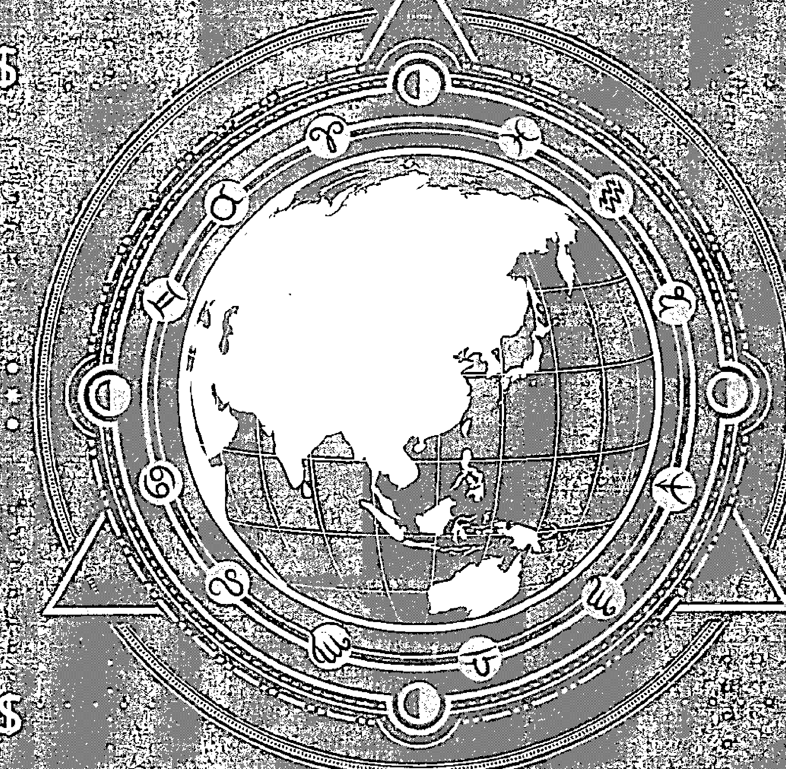

# 作者序

「要了解財經占星，不能沒有世俗占星的基礎。」我的老師——相當知名的占星師蘇湯普金老師曾經這麼告訴我，而在我多年的財經占星教學經驗中，我也深深地認同這句話。

這句話的起因是因為我們談到了幾個知名的國際投資機構，這些機構因為想要更了解投資大師姜恩近乎神秘的分析技巧而邀請占星師們去教學。當他們體認到這與占星學的密切相關時，便要求占星師們是否能夠在兩三個月或兩三天內教會他們「財經占星」，當我們說學完這樣的概念至少也要兩到三年時，這些殷切的投資人大半都沒興趣了。

經濟活動與市場投資都是人類社會活動的一環，而政治的變動更是深深地影響經濟與市場的走向。因此想要了解如何從占星學預測股市漲跌的朋友們，我誠誠地建議先去了解當前的社會政治以及全球政治的局勢，再進一步地學習如何從占星學預測政治的發展。有了這些基礎之後，我們才有可能了解如何從占星看財經，這是財經占星的宏觀總體層面。

從另外一方面來說，個人的星盤也是一個重要的部分，無論市場如何表現，擁有投資能力與正確投資觀點的人仍然能夠獲利。了解個人的個性，進一步從性格分析個人適合的投资領域，或者從傳統角度看個人的財運，這些都屬於財經占星的個體層面。由此結合世俗占星的宏觀層面，才能夠真正的運用財經占星學。

我從1997年開始從事占星教學工作時，就一直關注經濟活動與行星運行的關聯，這本書是我的財經占星課程的一部分內容，這個課程一直受到占星爱好者的歡迎，我邀請我的香港同事布莱恩老師以及CiCi老師一同探討，擇選出適合大眾讀者的部分，並由布莱恩老師撰寫個人星盤金錢層面與運勢的分析。

在此要感謝這兩位同事在財經占星學課程與這一本書的貢獻，我同時要感謝小修校長、Jupiter老師、Amanda老師、Monique老師、Karen老師與許展老師為國際占星研究院（A.O.A）所做出的貢獻，讓我能更專注在研究與教學的領域。

魯道夫
2017年二月·台北

# 導論

「你可不可以預測某股票的走势？」

「你可不可以幫我選股票？」

相信這是每次當我提起「財經占星學」時最常聽到的問題，而答案其實比較傾向是否定的。或者有人會說：「如果不能選股，那還叫什麼財經占星學呢？」我並不認同這說法，原因是某公司的股價會以其營運好壞做為標準，我們當然可以預測股票價格的漲跌，如果我們看到一家公司營運良好，那麼我們可以先買它的股票，等它獲利的时候獲得股利分紅，而如果它不獲利的话就把它的股票賣掉。這裡的取決標準，跟那家公司的經營狀況、老闆本身的狀況、他的生日及運勢、還有公司的成立日期都有著密切關連；此外，這也同時跟國家、區域的經濟影響有關。我研究的是財經占星學，這門學問是從占星的角度去觀察世界的經濟及金融狀況，而股市的運作只是其中的一部分。

我學過一點經濟學，知道最基礎的經濟學原理，例如市場供需概念，但我不是股市專家，我只是一名占星師，雖然我知道經濟發展的要素，但坦白說我並未有太深入掌握股票市場的細節，我帶給大家的是怎樣運用占星學去觀察財經市場的概念，可是我沒有辦法在此書中深入剖析經濟或金融界的操作方式，我認為這部分應該交給其他真正深諳投資理財的專家。不過，我能告訴大家怎樣從占星學去觀察經濟市場的變化趨勢，而你們必須同時具有投資理財的概念及能力，當兩者兼備，你自然能夠做出正確的投資判斷，你們可以去上課或購買相關書籍學習投資理財的理論及操作，從中慢慢建立一些概念，但在星盤中，我們需要知道的則是當中哪些星相暗示了經濟不景氣。如果你個人沒有投資理財的正確觀念及基礎，只學習財經占星學只會讓你獲得一半的能力，所以我希望在本書最初的這一部分說明，關於任何投資理財細節的部分，或許可以留給各位讀者跟別人討論，我沒有資格給予關於投資理財的建議，因為我研究的是占星學，關注的是行星運行跟市場漲跌之間的關係。

### Chapter 1 從本命盤觀察個人投資理財傾向

相信你之所以購買這本書，必然是希望能夠藉著占星學的技巧來預測財經市場，或是對這門占星學問感到興趣，如果你是前者的話，想必你也對投資深感興趣。本書主要目的當然是跟大家討論占星學中可以預測經濟市場的實用技巧，但在開始之前，讓我先問大家一個問題：「你適合投資嗎？」又或者我應該問：「你適用怎樣的投資風格呢？」

你不了解自己的投資態度，任由自己單憑直覺買入賣出，甚至一不小心讓市場投資成爲了自己心理投射的對象，導致最後賠本收場的話，那應該不是你想得到的下場。如果你有自信學習財經占星學這種相對複雜的占星技巧的話，在此之前，何不先觀察一下自己本命盤、更加了解自己投資方面的主題呢？

我們討論的畢竟是占星學，而占星學中最廣爲大眾所知的部分當然是本命盤。本命盤就像是我們的人生藍圖，很多人喜歡從中找尋人生方向、個人潛能發展等看似宏大的主題，但本命盤畢竟描述的是活於現實世界中的人，所以我們當然也能夠從中知道一個人在世俗事務、尤其財務方面的表現、才能及特質。也许這世上並不存在完全適合或完全不適合投資的人，重點在於你是否理解自己的投資態度，並且了解星盤中有哪些行星原型左右你的投資決定。如果

以下會集中討論金星及木星之星座及相位，以及第二宮及第八宮之表現，畢竟這些占星主題跟投資理財有最直接關係，在行星主題方面的論述也會集中於相關層面之上，如果你對這些占星符號在本命盤中其他範疇感到興趣並想要深入了解的話，不妨詳細參閱《占星全書》（魯道夫著／春光出版）。另外，以下內容只就單一行星討論，實際上我們必須整合整張星盤方能做出分析觀察，不建議憑單一星象斷定一切。

# ※ 金星及木星之星座及相位

在占星學中，跟財富及金錢有最直接關係的行星非金星跟木星莫屬，守護金牛座的金星跟物質有非常密切的關聯，它是金錢、價值、財富，當然也跟愉悦逸樂有關。大師麗茲·葛林認為，金牛座之所以追求穩定及堆積物質財富，目的是為了從中得到愉悦、滿足及自我價值，這統統都是金星所掌管的關鍵字詞。這同時也告訴我們，人類為什麼會追求財富及投資，目的不外乎是為了滿足金星的需求。我們從金星的星座及宮位中找到這些價值及滿足，同時也在這些位置中透過金星追求更多的價值和滿足。

至於木星，也許很多占星初學者都會把它視為跟信念、宗教、膨脹、擴展有關，不一定理解到這種擴展及膨脹其實除了在自我意識或精神上呈現之外，也可以在物質生活中表現。自古以來，木星就跟金星一起被視為吉星，它代表了幸運，同時也象徵從那裡可以獲得較多的利益，這特質對於投資者來說可說是非常重要。也當然，因為木星是社會行星，平均來說差不多一年才會移動一

## 金星星座及相位

金星牡羊座的人在財務投資方面可能會直接而衝動，這些人總是充滿勇氣及行動力，當他們看到喜歡的東西時也會想要馬上得到。因牡羊座是火象星座而且是開創星座，他們相當重視直覺，也有著強烈的冒險精神，因此，當他們斷定某市場或某股票會帶來回報的時候，往往會把風險視為這次冒險中的一環，依循自己的直覺做出判斷；正因為這些決定往往是迅速而大膽的，所以他們可能很快又會因為投資失利而感到後悔，這種急性子可能不太適合做長線投資。牡羊座也相當強調個性及行動力，在自己重視或喜好的事情上容易以自己為中心，所以他們可能不太會聽從別人關於投資的意見。

當金星在金牛座的時候，它回到了自己的守護星座，也就是說，這裡是金星最能夠發揮其特質之一的位置（金星另一守護星座為天秤座）。金牛座以穩定及緩慢見稱，它是一個重視感官享受的星座，當金星在這裡，這些人會喜歡舒適的生活，也因為他們不喜歡經常更動，因此比較適合穩健的、長線的投資發展；當然，喜歡累積資源的金牛座也可能根本沒有投資的打算。在金星的影響之下，金星金牛座的人對藝術、服裝、飲食這些跟感官有關的項目也有相當高的鑑賞力，所以他們在這些領域可能會有比較獨到的眼光。

跟「家」有著密切的關連，這可以延伸到「家國」及「文化」歷史之上，金星巨蟹座的人可能會相當熱愛歷史及文化，並因此對於古董及文物有著比別人更深一層的認識，在投資方面，這可能會是他們可以考

### Chapter 1 從本命盤觀察個人投資理財傾向

統行業有關，也因爲它跟巨蟹座在同一軸線的關係，金星在摩羯座的人也會對於傳統文化、歷史文物或傳統行業深感興趣，這也可以是他們考慮投資的項目，例如投資古董或古玩等等，這些強調摩羯主題的物品可能會是帶來金錢收入的途徑。

財務上的合作的话，也需要注意帳目是否清楚，因爲雙魚座容易被說服也具有同情心，也許他們需要在財務上提高警覺，劃清楚自己與別人之間的界線，或在投資的時候提醒自己時刻遵從一些原則或規則。

金星在水瓶座的人對各種新奇事物都感興趣，而且思維與眾不同也不易被影響，在現今世代，所謂的新奇事物很多時候都跟統稱爲3C的產品有關，某程度上這些電子行業或電子產品也跟水瓶座的守護星天王星有著密切關聯，所以這些人可能會以這些行業或商品做爲投資項目。朋友及社交圈子也是水瓶座所強調的人際領域，因此金星水瓶的人也有機會透過朋友迎來收入，而且這些人的喜好及投資態度也可能會相當與眾不同，畢竟水瓶座本身就相當強調這種態度。

接下來，我們會討論金星於本命盤中的相位將如何影響一個人於理財投資方面的表現，同樣地，實際上我們必須整合整張星盤做出分析觀察，不建議憑單一星象斷定一切，也不建議各位運用宿命論的視野去看待相位。並不是強硬相位就一定是壞事，它可能象徵一個人非做到某件事不可，當中的壓力跟張力其實同樣也可以被視爲強大的行動力；相對地，柔和相位也不一定是好事，一個人擁有某種自然而然的天賦，可能就覺得事情是理所當然的，這個人也有可能因此什麼都不去做也說不定。

金星在雙魚座是擺升位置，基本上這的確代表金星的特性將在雙魚座完全發揮，例如以感受性、無遠弗屆的方式發揮它的愛和情感。但同時我們也無法否定雙魚座是一個比較夢幻、比較多幻象泡沫的星座，它們也很容易在財務上迷失或混亂，這會是他們理財及投資時特別需要注意的。而如果他們跟別人有

太陽跟金星最遠只會相距48度，因此它們只可能形成合相、半六分相跟半四分相。日金合相的人可能天生就相當懂得自己渴望什麼，他們可能重視物質，甚至把物質視爲自我認同的一部分，物質跟金錢對他們來說就如同自己的手腳，這些人也可能重視享樂，而現

今世代中享樂往往跟金錢掛勾，但日金合相不一定代表他們很會賺錢，也有可能代表他們很愛自己。半六分相的人可能會在個人跟財務之間忽視了其中一方，他們可能只著眼於物質，或者忘了自己是需要金錢去支援生活的，這或許會是他們需要學習的；至於半四分相，這些人在財務上也許很容易會跟別人產生衝突。

月亮跟金星兩者都是女性象徵，也強調了一個人日常生活中所重視的、感到滋養的、並從中建立安全感的主題。月金合相的人可能很難把安全感跟物質分開，對他們來說，帳戶裡的存款要有一定程度才能讓自己安心，又或是他們必須花費一筆錢去令生活達到一定程度的舒適，自己才會感到被滋養；月金的柔和相位可能代表著相當擅長花錢，購物跟消費能讓他們感到滿足，但當然這些人也可能很會賺錢，這可以透過當事人的成長背景與原生家庭背景做進一步探索；至於月金強硬相位則往往有機會因為物質或財務而讓自己焦慮或感到壓力，尤其是跟家人、母親或女性，這裡暗示的財務困境也有可能跟消費主義有關。

金星跟火星的相位在伴侶關係上舉足輕重，火星可能是競爭心，也可能是生存本能，當然它也是天蠍座的傳統守護星，而天蠍座某程度上也跟財務和投資有著密切關聯。金火合相或四分相的人可能會覺得自己一定要在財務或投資上達到什麼成就才行，又或是像月金合相一樣，認為物質是自己生存必須的，但這裡的迫切性會更強烈一點。金火三分相或六分相會相當懂得運用自己所擁有的資源去爭取或得到些什麼，視乎金星跟火星星座方可得知這些人在投資上會是急性子還是比较沉穩，在土元素的三分相會比火元素冷靜。至於金火對分相，不得不注意自己有否因投資或財務而引起危機或衝突，這些危機或衝突也有可能發生在伴侶或伙伴身上，又或是跟他們因這些主題而爭執。金火強硬相

水星跟金星彼此間不會超過72度，水星強調的是學習和辨析能力，不

[content]
[PAGE 14]

## 財經占星全書

### Chapter 1 從本命盤觀察個人投資理財傾向

位也可能暗示了衝動的消費或浪費行爲，容易帶來財務拮据。

正如上面所述，金星跟木星都跟財富有關，金木合相的人相當慷慨和善，木星也會把金星的主題擴散，不排除暗示了這些人擁有相當豐富的資源財富，甚至可能是天生就擁有的財富。但必須注意的是兩顆行星都比较不強調行動力，所以可能讓人比較懶散。三分相、六分相及半六分相帶來正面愉快的想法，也讓這些人樂於幫助別人，但跟合相一樣，這些人仍然有可能比較懶散，雖然金木同樣跟財富有關，但除非有其他行星的介入，否則跟投資能力或理財能力關係不那麼大。至於強硬相位，雖然金木兩者都不會帶來傷害或衝突，但這些人可能透過會帶來壓力的方式去擴張金星主題，例如毫無節制的花費、奢侈浪費，甚至因此欠債，金木敏感相位則可能需要在身邊那些貪婪或放縱的人跟自己的財務狀況中取得平衡，有可能 是身邊人一直向自己借錢，得學會拒絕免得犧牲自己。

己跟別人的財產之間劃下非常清楚的界線。這種保守意識當然也會延伸到投資理財的態度之上，而這種意識有可能源自於覺得自己貧窮或不足的想法，它也可能讓人透過伴侶關係或人際關係達成自我對名利與物質的追求。柔和相位會爲這些人帶來穩健的財務狀況，我們不會期待這些人在投資上有多積極，但這也不是壞事，他們只是理解自己的極限，也爲自己的財務負責任而已，但不論是柔和相位還是強硬相位，金土相位的確暗示了這些人如何透過身邊人去得到成就或財富。柔和相位的人可能會優雅地創造出雙贏的局面，而金土強硬相位容易因經濟因素而影響伴侶關係，或相反地爲了伴侶而導致財務狀況，他們可能很常遇到拮据的狀況，而且對財務也傾向悲觀，四分相會尤其強調周轉不靈。

在財經占星學中，天王星象徵資本家，但在個人盤的詮釋上可能仍然著眼於其帶來改革及難以預測的變動之上比較好。金星跟天王星的合相可能帶來突如其來的變動，但不一定是橫財，雖然也有這可能性，但也可能是突然破財的暗示。天王星本身具有強烈的理想主義特質，不排除會被結合到個人的理財之上，也可能是他的投資取向或理財方式
相當與異不同。柔和相位會讓這些人對電子、高科技與身心靈活動都有興趣，這可能影響他們的投資取向；至於強硬相位，我們可能需要關注天王星的「切割」主題，它可能在这裡暗示了這些人跟金錢切割，其理想主義或反社會思想讓他深信金錢跟物質都是不重要的，當中尤其以對分相爲甚。

海王星會把界線消融，爲事情帶來如夢似幻的特質，金星海王星有相位的人可能需要對自己的投資及財務狀況份外關注。當然，海王星也象徵狂熱，金海合相有可能暗示一個人對金錢的瘋狂著迷，但同時這相位也許代表了一個人如何戴上「玫瑰色的眼鏡」去看待自己財務狀況，把事情都想得過於美好，而且也會比較慷慨；強硬相位會更強調這個人財務有多混亂，他們可能跟別人的帳目不清不楚最終導致自己吃大虧，又或是爲了幫助別人而讓自己背負債務。不論是哪種相位，金海相位的人都應該注意自己的犧牲傾向，不論是財務上、人際關係上還是伴侶關係上。

金星跟冥王星相位也許會讓人對於財務投資抱有熱情專注的態度，而且這會是具壓迫性的。冥王星往往象徵一種強大的、不可違抗的力量，金冥合相可能表示這些人認爲金錢會賦予他們這種力量，於是他們才會迫切而熱情地投放心力在投資財務之上，當然，冥王星也可能代表責辱，金冥合相的人也可能拒絕金錢，原因可能是他們感受到這背後的巨大力量並感到害怕。四分相可能暗示了這個人爲了免於死亡而覺得自己不盡力賺錢不行，又或是覺得不投資的話就死定了；對分相則可能暗示了於合作關係及伴侶關係中潛伏的強烈情緒，或容易在這些關係中產生激烈的衝突，但這些人往往最後都能夠強大地承受這些衝擊。

金星合軸也會爲這個人帶來強烈影響：金星合上升會讓人以富金星特質的眼光看待世界或以這種特質呈現自己，當然這可以意指令人喜愛的特質或具魅力的外表，也可能是能說善道的社交手腕，但也可能是財務或投資上的眼光。合下降點的時候可能就會把這些特質投射到伴侶或合作伙伴身上，或是這些人會爲你帶來投資機遇或收入。金星合天頂會讓這個人相當重視自己的外表或魅力，尤其在職場之中，他們也可能特別容易於職場中察覺到良好的投資機會，並從中帶來收入；至於合天底的時候，可能是家人或家庭環境相當重視財務及投資，這個人從小就被灌輸相關的概念，讓他也重視如何管理自己的財富。

[PAGE 17]

### Chapter 1 從本命盤觀察個人投資理財傾向

當本命盤出現金星逆行時，由於金星象徵金錢、情感和興趣，這當然暗示了人們情感表達能力會受阻，但逆行本身其實象徵往內的檢視、重覆的審視等特質，當這特質引伸到金錢、投資及理財時，這個人對於花錢會步步為營，但他也可能對於物質享受及收入感到卻步，需要反覆的思考這當中的價值，這或許會被視為浪費很多賺錢的機會，只是他們需要花很長時間才能清楚知道自己想要得到的是什麼。

## 木星星座及相位

木星牡羊座的人自信、勇敢而且富冒險精神，他們人生所重視的可能正是如何達成自己的目標，他們追求的可能也是充滿挑戰的未來及人生。也因為這種人充滿自信及熱情，而且欲望直接而強烈，他們可能為別人帶來麻煩，但無可否認的是火元素的人往往具有企業家精神，如果星盤中有重覆暗示的話，木星牡羊座的人可以是成功的老闆或投資者。

木星金牛座強調的信念是其象徵的物質、財富、金錢及資源，當木星在固定星座的時候，這些人的信念、其所相信的事情很難被動搖分毫。古人視木星為吉星，當它來到象徵金錢物質的金牛。

當木星來到弱勢的雙子座，其擴展、向遠方探索、尋求高等知識及哲學這種縱向特質會讓強調橫向的雙子座較難發揮。正如很多人說雙子座的人懂很多可是都没有深入研究一樣，木星在這裡可能正反映了這種主題。雙子座強調的是資訊的收集、文字、知識、短途旅行，不能說這方面相關的運氣或信念跟財富完全沒有關係，但木星雙子的人可能進行市場的比較分析方面比較在行。

木星在巨蟹座是強勢位置，我們都知道巨蟹座跟家、家族、父母有關，當然也可以延伸到祖國或家鄉，甚至是跟祖國的歷史文化有關係的一切東西，都會是賦予木星巨蟹的人信念及人生方向的地方，同時不排除這些主題的投資會是他們運氣所在的地方。另外，因為巨蟹座象徵「家」，這些人很可能會從家族或父母身上繼承或得到可觀的財富，當然這需要視乎星盤中其他重覆暗示，

获取更多好书，请加微信：13641926204 或 QQ:715104687

[PAGE 18]

## 財經占星全書

### 木星在獅子座既強調創造、創作，

同時又象徵娛樂，當它在這裡或在第五宮，也許會在娛樂方面有一點運氣，也就是俗稱的「橫財運」，或是這些人會透過創作去追尋自己的信念，同樣地，這個人的創作可能會爲他帶來運氣及財富。木星在第五宮可能也會強調子女或孩子，這裡強調的可能是孩子或子女會爲你帶來財富及運氣，但木星在獅子座的時候不一定會有這樣的暗示。如果木星在施子座的人成爲老闆的話，他們也會希望自己的事業（某程度上也是自己的「孩子」）能夠領先同儕（獅子座的領導精神）。

### 木星在處女座是另一個弱勢位置，

他們強調的是服務精神及細節，也強調流動性及彈性，如果一定要跟投資拉上關係的話，一些生產日用品的公司或服務業公司如果有上市的話，或許他們可以考慮一下，一般來說，運氣比較可能會出現在他們的日常生活裡面，以及服務別人的過程之中。處女座強調細項，木星則強調「大」及「遠」，所以跟雙子座一樣，木星在這裡也比较難發揮其特質。

天秤座象徵的是人我互動、合作及伴侶關係，當木星在天秤座，其中一個可能性會是所謂的「貴人」幫助，與別人的合作互動往往會是你的運氣所在，當然伴侶也有這一種爲你帶來財富的可能。在他們追求信念的過程中，可能會得到多於一種的選項，或明白到這世界很多事情都是多元的，「以和爲貴」

## 財經占星全書

位本身並沒有強調任何跟「實現」有關的主題。木海合相可能暗示了為理想做出犧牲，而且這些理想可能會相當夢幻。柔和相位可能強調了跟藝術相關的工作，也相當適合從事創作；強硬相位可能會特別強調木海相位當中虛無的幻覺，他們追求的目標可能是根本無法達成的，當木海相位象徵巨大的泡沫，而這泡沫因現實而爆破的時候，這些人可能會對人生感到相當失望。

出生起就有不錯的運氣。當木星合軸下降點，運氣及財富主要來自合作伙伴及伴侶，而且有著相當愉快的人際關係。木星合天頂基本上代表了非常強大的事業運，非常容易取得成功，至於木星合相天底，則代表了父母及家庭會爲這些人帶來廣闊的視野及強大的運氣，這些人也可能出生於宗教氣息濃厚的家庭環境。

木星冥王星相位強調的可能是被放大的權力及財富，也可能暗示了本質極端的信念，或是人在極端狀況中所建立的、對未來的期盼。木冥合相除了有機會象徵財富被放大之外，同時也象徵了不能見光或沒有曝光的財富，這些財富可能是來自地下資源的，例如礦產、石油等等，也可能是家族的遺產。冥王星本身的極端特質也可能強加到木星所象徵的運氣之上，又或是讓這個人擁有非一般的野心，柔和相位可能暗示了這些人會在向著目標前進的道路上挖掘更多潛能，至於強硬相位則可能代表這些人在追求目標的過程中有機會採取極端手段。

本命盤中的木星逆行暗示了個人對於信念、哲學及宗教抱持審慎態度，往往需要反覆思考才能歸納出自己相信的答案。

華倫·巴菲特（Warren Buffett）是美國非常有名的投資者、企業家及慈善家，他是世界上最成功的投資者之一，被喻爲「股神」，於1930年8月30日下午3時於美國內布拉斯加州的奧馬哈出生，這項出生資料的羅丹評級（Roden Rating）爲A，表示這出生資料爲引述自當事人的記憶或是新聞提及的，算是可信的程度，而羅丹評級最高級別爲AA，代表資料來自出生證明，例如出世紙或醫院紀錄，又或是有紀錄證明的資料。

木星合軸也許會爲個人帶來相當強的運氣，木星合軸上升讓人自信樂觀，也可能會不知節制，但這些人基本上自
Warren Buffet
Male Chart
30 Aug 1930, Sat
15:00 CST +6:00
omaha, Nebraska
41°N15'31" 095°W56'15"
Geocentric
Tropical
Placidus
Mean Node

（圖 01-01）本星盤出生資料摘自 www.astro.com 的 Astro databank, Rodden Rating:A

巴菲特是波克夏·海瑟威（Berkshire Hathaway）的董事長暨執行長，擁有經濟學學士及碩士學位，雖然身爲世界首富之一，但於 2006 年，他決定死後把大部分遺產捐給人道組織及慈善組織，而不是留给子女，某程度上，他於
### Chapter 1 從本命盤觀察個人投資理財傾向

這一年建立了相當龐大的慈善事業，這是他事業生涯中相當重要的一頁。

從巴菲特的星盤中，首先我們會看到金星於天秤座合軸天頂，木星則於巨蟹座，不難發現這兩顆行星都在其強勢位置，金星在其守護星座，木星則在其擢升位置，這暗示了他的財務表現及運氣應該不弱。之前說過天秤座的金星重視合作及伴侶關係，跟伙伴或伴侶合作共同投資也許是可以參考的選項。巴菲特最初於1956年成立的巴菲特聯合有限公司是一個投資合夥事業，他後來又陸續創立了幾個合夥事業，到1962年，當他購入波克夏·海瑟威的股權後，當時任職波克夏副總裁的查理·芒格後來成為巴菲特重要的生意伙伴，這也是巴菲特經常公開表明的，非常符合金星天秤座特質。至於木星巨蟹座對於家庭的強調，巴菲特生在一個富裕家庭，父親是兩任美國國會議員與成功的商人，巴菲特11歲已經開始在父親的證券經紀商工作，也頭一次買進股票，木星在這裡的暗示，除了財富來自家庭外，出生在這種家庭環境也許會對他的信念及人生哲學有著重要響。

他的金冥四分相也許反映出其展現於投資上的力量，投資及商業成為他的終身事業之一，讓他投放相當多的心力在投資之上；木冥相位也帶來相似的氣圍，至於其金星合軸天頂也讓他於事業中強調合作關係，社會也看到他的理財能力，他也察覺到良好的投資機會並從中帶來收入。

巴菲特的第二宮位於水瓶座，第八宮則在獅子座。水瓶座本身跟人道主義、利他主義及社會慈善公益等主題有關，這本身已經相當呼應他的慈善事業，而且他不願意讓大量財富代代相傳，這算是相當不傳統的想法，甚至曾經表示：「物質生活原本就不是我所追求的」，反映出水瓶座跟物質、資源切割的心態，他認為：「你能夠獲得的好處都是取之於社會，而你也必須回報給社會。」第二宮的守護星分別是土星及天王星，土星位於第一宮，天王星則合軸天底，兩者均反映出巴菲特相當重視自己的這一套價值觀。至於在獅子座的第八宮，強調的是在合作關係中如何發揮領導才能，或如何富創意地管理共享資源，第八宮的守護星太陽也在第八宮，巴菲特也的確在自己的企業王國裡表現卓越的現金流管理及資產負債表管理能力。

## ※ 第二宮及第八宮之宮首星座

星盤除了行星及星座外，也有十二個宮位，這些宮位掌握了我們人生中不同的領域，而每一個宮位的宮首都必定會落入某星座之中，這星座的主題及特質會為那一宮所掌管的事物帶來影響。在這十二個宮位之中，跟投資及理財有著最直接關係的宮位會是第二宮及第八宮，這兩個宮位剛好在星盤中位於彼此的正對面，並因此形成了一條軸線，這兩個宮位的宮首星座往往也反映了一個人的理財及投資態度，尤其不是每個人的第二宮跟第八宮都有行星提供或補充更加明確的資訊。

第二宮的關鍵字是「價值」，雖然它象徵的不單是金錢、財富這些物質價值，更包括個人價值、才華等等心理學議題，不過在這本書中我們會專注於理財、金錢事務上的討論，因為這會與財經及投資有比較直接的關聯。而在第二宮對面的第八宮，它象徵的是「他人的資源」，這裡所指的他人基本上包括父母、伴侶、合作伙伴等等，所以這一宮掌管的包括字面上的「他人的資源」外，也包括了遺產。而第八宮也暗示了
你與他人的財務合作或糾葛，在心理學上，第八宮包括了跟別人建立親密關係所附帶或衍生的議題，包括恐懼、死亡、性愛等等，不過同樣地這些不是我們於本書中所討論的範圍。

第二宮跟第八宮的宮首星座基本上會是相隔六個星座的組合，例如牡羊跟天秤，金牛跟天蠍等等，不過星盤可能會因為不同宮位制或當事人出生經緯度的影響，讓星盤出現截斷的狀況，那時候第二宮跟第八宮的宮首星座就可能会出現其他可能性。

## 第二宮牡羊座、第八宮天秤座

第二宮在牡羊座的人在處理金錢及財務議題上往往會有著一種冒險挑戰的元素，並且會展現火元素的自信及勇氣，也會直接了當地追求自己想要得到的。牡羊座的人往往以目標為本並且不怕挑戰，會按捺不住馬上行動去爭取。這些人一般來說上升星座會是雙魚座，帶著夢幻的眼光去看待世界，如果他們看到的是一個富裕的未來，他們真的會咬緊牙關去拚命賺錢，可是，第二宮牡羊座的人其實也有可能花錢花得直截了當。

第八宮在天秤座的這些人，在處理
自己財務時可能會比較衝動，當他們要處理別人的財務或要跟別人共享資源時，通常也代表那是基於人際關係的緣故，而不會是他們自發想要做的事。而因為這些人有著比較理想化的目光，並且有機會以樂觀勇敢的態度毫不猶豫地花錢，天秤座在這裡可能暗示了他們在投資事務上可能跟別人一起合作會比較好。

## 第二宮雙子座，第八宮射手座

第二宮的雙子座強調二元及流動性，上升星座金牛座的他們會相當重視物質享樂，收入及支出也會像雙子座的特質一樣不斷流動，一方面一直賺錢，另一方面又一直花錢。同時，雙子座的守護星水星本身也是交易之神，這些天生就懂得看到別人或事物身上價值的人，當他們察覺到自己這種讓財務流動交易的天賦，他們很難不成為成功的生意人或投資者。但前提是，他們會否因著上升金牛的特質就一定只囤積資源而不花費投資。

## 第二宮金牛座，第八宮天蠍座

金牛座本身跟資源有著密切關係，他們往往有明確的目標，但不至於像太陽牡羊座的人一樣衝動。他們不一定懂得累積財富，而這是他們需要學習的，他們需要明白這些資源是他們往前冒險的資本，沒有資源就沒有往前邁進的本錢。而金牛座本身也是一個行動緩慢的星座，對於這些以行動為主的人來說，耐性也許會是他們重要的資本之一。

這些人的第八宮在天蠍座，跟他們的上升星座牡羊座有著同一顆守護星火星，天蠍座的行動方式可以是強勢而激烈的，這些人在投資上往往不怕危險，甚至可說是視死如歸，畢竟這也符合了他們本身那愛冒險的精神。但要注意的可能是這些人必須察覺自己金牛座特質的重要性，要記得累積一定的物質資源
第八宮的射手座強調的是愉快及流動的火元素特質，重視探索未知的精 神，而且目光往往放在遠方，不一定會關注到面前可見的事物或現實，這種態度可能會是他們投資時先要注意的，而且射手座往往是樂觀的，很容易與高采 烈地投入一件事。此外，因為射手座也與國外事物有關，這些人可能比較適合進行國外投資。

## 第二宮巨蟹座，第八宮摩羯座

第二宮巨蟹座的人以充滿好奇心的眼光看待這個世界，但是他們本身在財務上很需要得到安全感，他們經常擔心錢，雖然他們看待世界的目光是理性的，但面對財務他們卻往往未能做到這一點。一直到處跑動的他們，也許需要對某人或者某事物衍生歸屬感、駐足停留，那會是他們需要發掘的特質。歸屬感可能會成為他們賺取收入的條件之一，有一個能夠服務奉獻的對象對他們來說可能會是好事。

第八宮在摩羯座的人，他們的投资態度會傾向保守踏實，雖然他們以輕鬆的態度去看世界，但是這些人也明白世界是瞬息萬變的，這或多或少影響了他們的投资態度，加上這些人很容易擔心自己的財務狀況，這會讓他們的投资態度更加審慎。此外，因爲摩羯座本身象徵的事物相當實在，這些人的投资目標可能也會以實際的商品較好，例如房地產。

## 第二宮獅子座，第八宮水瓶座

這些人的上升星座在巨蟹座，這星座強調的往往是滋養別人、照料別人，第二宮宮首的獅子座強調的卻是自己、

水瓶座比較強調理性、抽離的面向，因此這些人在個人財務層面上雖然有可能一頭熱，但是當需要處理別人的財務及投資時，他們可能會以抽離客觀的態度看待，不排除上升巨蟹座讓這些人只願以家庭為先，根本沒有想過進行投资發達，所以才冷漠以待。當然水瓶座本身也象徵了一種非主流的態度，而且強調新穎的想法，所以也有可能暗示了這些人發揮了自己的創意，以嶄新的理財或投資態度取得財務上的成功。

## 第二宮處女座，第八宮雙魚座

第二宮處女座的人可以運用其勞動及分析力去處理財務及賺取收入，上升獅子座的人會以大鳴大放的華麗姿態踏足世界，但是處女座的低調內債特質可能是他們在理財時需要學習的。當然，這些人有可能為了面子而大破悭囊，事
後又後悔不已，不過他們更應該在顧存面子的同時，以具彈性及務實的態度去調動自己的資源，而且處女座所象徵的辨識能力及巧手，對於這些人的生意投資可能有著不可或缺的幫助或影響力。

得在財務上，當跟別人合作時，不要覺得自己是爲別人服務，要堅持合作平等的态度。

當八宮宮首在牡羊座，這些人在投資上往往有明確目標，而且會勇敢地行動，有趣的是雖然牡羊座是一個衝動、比較不強調理性的星座，但是在這星盤配置中，在上升星座處女座及第二宮的天秤座的卓越分析力輔助下，八宮宮首的牡羊座往往暗示了不俗的投資表現。

## 第二宮天秤座，第八宮牡羊座

天蠍座本身象徵地下資源及神秘作風，當它出現在第二宮，除了天蠍座本身強調的理財能力，也暗示了這些人其實相當善於處理危機。雖然天秤座跟天蠍座也象徵了某種層面的人我關係，但天秤座強調的是人我關係的建立及互動，是比較社交性的面向，天蠍座則是當二人建立親密關係、共享對方資源或於這種關係中所感受到的黑暗面。二宮天蠍座可能暗示了你跟別人建立深層連結的能力，這種信任會是你得到收入的特質之一，當然天蠍座也象徵了神秘的行事作風。

上升星座的天秤座本身不是一個急於做決定的星座，第八宮宮首的金牛座
## 第二宮天蠍座，第八宮金牛座

上升處女座也許會讓這些人比較害羞內斂，但是二宮宮首的天秤座強調這些人的社交技巧及人際關係，能讓他們得到自己想要賺取的財富。天秤座重視平衡，處女座擅長分析判斷，天秤座則擅長審視兩邊輕重，這些人在理財上有著相當不錯的態度。天秤座也可能暗示人際關係、合作關係及伴侶關係會是這些人賺取收入的一個重要特質，但須記
## 第二宮射手座，第八宮雙子座

當第二宮在射手座，知識、願景、探索精神

### Chapter 1 從本命盤觀察個人投資理財傾向

險等事項而引起爭執。

## 木星

當幸運的木星出現於第二宮，這類人往往不需要太擔心自己的財務，當然木星偶爾也暗示了這些人揮霍無度的花錢方式，但這需要以整張星盤做考量。另一方面，因為木星具有哲學觀，也有著擴充、發展的意涵，木星在第二宮的人可能會以賺錢為己任。另外木星也暗示了宗教及國外事務，所以他們可能會以自己的信仰為資源，或是可以透過國外事務賺錢。

木星出現在第八宮會讓這些人的運氣出現於處理他人財產資源的過程中，稅務管理、遺產管理、保險等等是適合他們的工作。因為第八宮也有投資的暗示，不排除這些人有機會透過投資致富，不過同樣地，也可能暗示在投資上太過貪婪。因為第八宮也代表伴侶或合作伙伴的金錢，所以這些人的財富可能來自於另一半，跟別人的生意合作對他們來說也會是好選擇。

## 土星

土星嚴肅保守的態度會加諸於第二宮的財務金錢議題之上，他們在金錢上相對保守穩健，而且一般會踏實地慢慢賺錢，不會想一步登天。土星的蕭條特質也會在這裡體現，他們可能出生在貧窮的家庭，或是對於貧窮的生活環境感到恐懼，並因此讓自己在事業上有一定成就，賺取收入讓自己免於陷入這種局面。這些人保守而努力的作風及面對現實的風格，也是他們重視的個人特質。

出現在第八宮的土星則暗示了財務管理上的穩健作風，他們非常提防危機的發生，可能會因此而發展出非常慎密的理財手段。不過這種發展的背後是源於他們會因為與別人的財務合作、或因伴侶的財務而讓自己陷入困境，這種心態有可能影響他們的投資取向，甚至因恐懼而不敢投資。土星的防範心態也可能讓這些人難以跟別人有財務上的合作，但這種作風往往也暗示了他們其實是理財專業方面相當合適的人選。

## 天王星

不按常規出牌的天王星來到第二宮暗示了突如其來的收入，但相對地也暗示了突如其來的破財機會，金錢往往會來去匆匆，他們也可能透過科技及新事物賺錢，或是以比較少人從事的行業及賺錢方式賺取收入。天王星重視自由，所以這些人有機會跟自己的金錢切割，

變得不重視，而他們的自由、創新視野及富有人文主義的眼光，也會是他們能夠發揮並賺取收入的方式。

他們可能也很嚮往與別人共享資源，但要小心問問自己是否把事情想得過於美好，不然當夢幻的泡沫爆破，受傷害的會是他們自己。

## 冥王星

冥王星是看不見的東西，而且它往住會有一種命運弄人的感覺，他們可能把金錢視為禁忌，與金錢議題保持距離。另一方面，冥王星也跟生死有關，這些人不一定一開始就明白自己擁有什麼，甚至可能要終其一生不斷挖掘、尋找自己的才華及價值，明白自己為什麼會把金錢視為禁忌、恐懼或危險之源。此外，這些人也可能從事跟生死議題或神秘主義相關的工作，例如殯儀、礦業、狗仔隊、偵探及醫學等等。

當冥王星出現在第八宮，這可能暗示了相當多不同可能性的議題，可以是跟別人的合作中因為財務而出現權力角力，也可能是個人對於與別人共享資源或運用他人資源的恐懼，當然也可能是他們對於投資的抗拒。他們可能需要深入挖掘這種恐懼背後的原因，又或是認真了解何謂理財投資，以更加掌握這些恐懼背後的原因。

## 海王星

海王星本身是虛幻，但也象徵狂熱及嚮往，因此，在第二宮的海王星暗示了這些人可能會以虛幻的眼光去看待自己的財務，也可能對於金錢及財富有一種狂熱。而且海王星不強調界線，他們可能會把自己的錢當成別人的錢，因此讓自己亂花錢；也可能誤把別人的錢當成是自己的，或是在財務上做出誤判。這些人也可能透過海王星的主題去賺錢，例如藝術、靈性修行、治療、化學等等。

當海王星出現在第八宮，這不能說是相當適合投資的暗示，他們在這方面也許會需要格外留神，與別人的財務合作也需要非常小心，不然他們很可能因為投資上的失誤而為別人犧牲自己。當

- 他們可能需要深入挖掘這種恐懼背後的原因，又或是認真了解何謂理財投資，以更加掌握這些恐懼背後的原因。

## ※ 個人流年財務運勢

前面內容中所討論到的，是個人本命盤中關於行星、星座、宮位所暗示的財務投資可能性，以及個人有可能的投資取向。本命盤描述的是個人天賦、潛能、性格等特質，不過相信研究命理的人都知道，畢竟人各有際遇，相信你也聽過很多人說自己明明很有天賦卻遇上了不好的時機。當然，本書主要討論的財經預測技巧可以協助大家做出更精確的投資判斷，但那畢竟是以投資及商品市場做預測及研究對象，那是全球性、世俗性的，有多少人在市場中一時誤判做了完全相反的決定？因此，在配合財經預測的同時，我們也需要同時觀察自己本命盤的流年運勢。

現代占星學中有很多不同的流年預測技巧，當中最常見的包括行運、二次推運、太陽回歸及太陽弧正向推運。很多人喜歡使用單一技巧就馬上跳到結論，事實上也不能說這做法是錯的，但我們同時也要明白一件事，不同的預測技巧其實有著各自強調的重點，建議最好至少使用兩至三種預測技巧，綜合當中歸納的結果，最後再得出一個所謂的流年預測結果。而且，建議把著眼點放在行星的符號語言之上，不要急於把可能性局限於所謂的「準確性」之上，這會限制預測的可能性，我們畢竟不是神，只是占星師而已。

以下簡單介紹這幾種流年預測技巧，如果想深入了解的話，請參閱魯道夫老師的著作《占星流年》（春光出版）。

## 二次推運法

方法是將出生第二天同一時刻的行星繪製成一张星盤，用來預測出生第二年的運勢。如果可以仔細推算出月亮的移動速度，並除以十二，再以內插法算出平均每個月的月亮位置，就能更精確地算出該年每個月的運勢。

在進行二次推運預測時，不妨把注
意力主要放在月亮之上，因爲它是二次推運法中移動最明顯的行星，其所在的星座、宮位都會明顯地影響我們的需要及對生活的態度。也因爲它的移動速度比其他行星都來得快，因此月亮往往也扮演了觸動本命盤中強硬相位的角色。當月亮在二次推運星盤中變動星座或宮位的時候，那也往往代表可能會出現重大的人生變化。

星體的基數，其中包括上升、天頂及全部宮位。假設每一天太陽會移動一度，那麼要看兩歲星盤時，就將本命盤所有星體及宮位移動兩度；要看三十歲的星盤，則把所有星體、上升、天頂都移動三十度。這技巧有強烈的「象徵」特質，其星體移動完全是虛擬的，只是以太陽象徵性的一天移動一度來做爲每年運勢預測。

從前面的討論中，我們已經知道第二宮跟第八宮會跟財務及投資有著密切關聯，當二推月亮經過這兩個宮位的時候，也許那會是我們需要密切注意財務狀況的時候；而如果它同時跟其他二推行星形成強硬相位，甚至月亮觸動了本命盤中的強硬相位的話，那就更需分外當心了。最後，注意二次推運盤中宮首星座的變換，例如當上升或天頂變換到跟你本命盤不一樣的星座，或是當它們從某星座變換到另一星座的時候，這暗示了我們的生活重心將會出現明顯變化。又例如如果第二宮宮首變換星座的話，那當然也暗示了金錢、物質等主題將會產生變化。

當我們進行太陽弧正向推運的時候，觀察重點在於當中變換星座的行星及宮位，這象徵了該行星相關的特質會出現變化，也可以注意它們有否觸動本命盤中的強硬相位，或是它們是否與本命盤行星形成強硬相位。若這些星體在象徵某年移動時與本命盤行星產生相位，那麼顯示這兩顆行星所掌管的事件將會沾上另一顆行星的色彩，這時候也必須注意這個相位所代表的影響，並研究它們所掌管的事件、宮位及相位的特質等等。

## 太陽弧正向推運

這個技巧是將出生當天太陽移動的度數，做爲未來推運時星盤上所有移動
在各行星及軸點的移動中，特別注意外行星出現在四角的時候，那往往暗示極爲重大的人生變化，可能會面臨嚴重的危機或生離死別的時刻。至於推運軸點如果變換星座，則暗示了我們的重心出現了明顯的變化。

## 行運

行運是眾多流年推算法中最常被應用的一種，我們只需要有一張本命盤，以及要預測日期當天的行星位置，就可以預測當時的事件及心理狀態。在觀察流年時，我們必須從本命盤下手，因為行運行星在黃道的位置對大家來說都一樣，例如大家都同樣面臨水星在摩羯座，但每個人可能有不同的反應，原因是每個人對水星的感受不一樣，他們受到刺激的反應也不同，要謹記所有預測的基準都要以本命盤為主，要注意當下行星的移動與本命盤的對應關係。

外行星行運的影響時間往往長達數年，它們最主要在兩個層面呈現：首先是外界的變化，它們可能會透過在外界社會、國家、文化、公司等發生的事情對我們帶來影響，尤其當外行星經過本命盤軸點或跟本命盤行星形成強硬相位的时候；另外，從心理學來說，它們可能象徵你內心當中某一個部分跟這些變化連動，這些主題可能是你過去沒有注意的，而這些外界的變化提醒了你一些事情，例如「父親給你很大壓力」，而你把這些轉移到領導人帶來的壓力上去了，這其實反映了一個人內心渴望成長的部分。行運也可能會透過一些特別勾
起你情緒的事情去呈現，這些事情令你特別有同感，它們可以是外在的、周遭人事的運作，事後當個人冷靜下來時，可能會發現這其實都是發展的機會。

三王星和凱龍星的過運都會幫助我們打開生命的大門，敞開我們的心胸去看外界的事情，它們象徵強烈改變的可能性，並會以它們的方式去打破我們生命中的自我限制和界線。因為有些時候如果我們緊緊抓住過去的習慣或依靠的話，我們便沒有辦法去成長或改變，天王星、海王星、冥王星和凱龍要我們必須切斷或正視自己跟過去的關係。當它們在本命盤中跟行星產生強硬相位，人們都會有被挑戰的感覺，它們會以透過一連串內外的事件迫使我們改變。

內行星在行運中扮演「觸發」的功用，特別注意強硬相位、半四分相及八分之三相。太陽跟火星的觸動不妨多加注意一下，因為一來兩者都比较慢，二來它們象徵的主題都比较易察覺；水星和金星的行運則會比較溫和。

## 太陽回歸

「循環」的概念在占星學中舉足輕重，從黃道的觀點上來看，每顆行星都會在一定年份完成公轉後回到同一位置之上，占星師們會利用這些循環做爲從此時到下一次循環之間的事件預測，而太陽回歸是其中一種最常用的回歸圖。太陽大約經過一年之後就會回到出生時的位置上，占星師認爲當太陽回到出生時的黃道位置時，此刻的行星關係及星盤將會影響未來一年的運氣，這正是所謂的太陽回歸圖。

當畫出一张太陽回歸盤後，我們可以運用剖析本命盤的手法去進行，如果一個人的本命盤沒有風元素，卻在這張太陽回歸盤當中看到有行星落在風元素，那麼，這可能暗示這一年他會透過這些風元素的行星去展現他對風元素的重視，但是影響也只有這一年而已。另外，在太陽回歸盤中，我們非常重視天頂的星座，因爲它是最重要的位置，代表太陽於最高空、最獲得眾人仰望的位置。太陽回歸盤的重點專注在太陽的路徑及循環上，太陽回歸是看得見的、意識得到的，它所帶來的主題很容易被察覺。

在分析太陽回歸盤的時候，我們可以跟分析本命盤一樣關注其元素、性質等等，如果星盤本身有很豐富的開創特質，在太陽回歸盤當中卻欠缺的話，這就表示這個人在今年生活中缺乏開創性質或動力，他也不斷在尋找動機或動
作。而假設本命盤欠缺某元素，太陽回歸盤中卻有很多行星落入該元素的話，那麼這一年可能是他學習該元素的大好機會。

此外，也可以注意太陽回歸盤的上升和天頂落在本命盤的哪個宮位，這表示來年哪些生活領域是我們跟外界接觸的地方。而如果太陽回歸盤中有行星跟本命盤的四軸合相，或跟本命盤的行星產生強硬相位的話，那都會是應當注意的重點。

## 案例：川普的商業生涯

Inner Wheel
Donald Trump
Male Chart
14 Jun 1946, Fri
10:54 EDT +4:00
Jamaica, NY
40°N41'29'' 073°W48'22''
Geocentric
Tropical
Placidus
Mean Node

Outer Wheel
Donald Trump
Event of 14 Jun 1991
Sec.Prog. SA in Long
14 Jun 1991, Fri
05:33:34 EDT +4:00
Jamaica, NY
40°N41'29'' 073°W48'22''
Geocentric
Tropical
Placidus
Mean Node

![](img/f7c

## 財經占星全書

近他的天底，我們知道財務危機一直伴隨著他，斷斷續續的沒有離開過。另外，行運月亮跟凱龍緊密合相，川普的金土相位，再度強調了其財務問題。

值得注意的是，川普的本命凱龍本身就位於第二宮，所以在這張太陽回歸盤中，凱龍爲川普的財務狀況或個人價值所帶來的傷痛，其本質或多或少也跟金錢或資源有關。另外，行運海王星也跟他本命第二宮的凱龍形成緊密的四分相，海王星的相位往往會持續好幾年，海王星是他第八宮守護星，重覆地反映了川普於財務上遇到的危機。

最後，行運土星亦即將跟二宮守護水星形成十二分之五相的敏感相位，到目前爲止，我們在二次推運圖及太陽回歸圖中看到了非常多的重覆暗示，而太陽回歸圖亦反映出當時川普所經歷的行星行運狀況。

接著，我們可以觀察他當年的太陽弧正向推運圖（圖 01-04），因爲我們一般使用的角距容許度是 1.5 度，所以推運天頂嚴格來說在这一年並沒有跟二宮守護水星合相，但我们知道這只是遲早的問題，財務相關的議題會是他之後一年需要面對的。

推運火星其實於 1986 年開始已經慢慢跟本命海王星形成合相，財務狀況畢竟不是一時半刻就可以導致發生的，也许當時就經有一些遠因慢慢醞釀中，我們知道它會陸續跟本命凱龍及木星合相，直到 1998 年才離開川普二宮內的所有行星。值得注意的是，因爲太陽弧正向推運的角距容許度比較窄，而川普本命木星跟海王星其實相距一段距離，因此，於 1996 年左右的時候，火星其實並沒有跟這兩顆行星形成任何相位，那也是我們在前面二次推運時提到過的，他於 1996 年時經歷其股票上漲的階段。

而當 1998 年火星合相木星的時候，他的股票股價跌至個位數，別忘了木星跟海王星都是其八宮守護星。另外，推運凱龍不但剛剛經過本命盤天底，也經跟金星剛完成三分相，記住 1991 年是他財務難關的中間，所以推運凱龍的這些相位象徵了之前已經發生的事，推運凱龍跟金星的三分相也許暗示了雖然發生難關，但川普當時畢竟沒有真的破產，這有可能是當中三分相的意涵。

### Chapter 2 世俗占星學與財經占星學

### Chapter 2 世俗占星學與財經占星學

財經占星學跟世俗占星學是兩門密不可分的學問，如果没有世俗占星學的基礎，就沒有辦法體會財經占星學。具有金融投資經驗的人都知道，世界局勢跟投資市場是互相影響的，當要觀察一個國家或公司的時候，我們必須考慮全球的經濟及政治局勢，政治不穩定可相對地讓投資者看清楚當地的投資市場，例如當中東地區發生戰亂，原油價格就會不斷急升，原因是取得原油的困難度會因戰亂而相應增加，當原油價格上涨後，很多需要運用石油生產的商品價格也會上涨，例如塑膠製品。所以我們必須有一個概念，我們在財經占星學中進行的不只是預測股價，而要有一個大格局的概念，我們要預測的是某地區有沒有動盪或自然災害，我們必須觀察人類整體環境、及與每個行星之間的關連。當中尤其重要的是外行星，外行星的星座及彼此間的相位象徵了非常重要的主題，當中包括人類社會的政治、文明、經濟的改變，所以，我們不能把經濟及金融市場的預測從世俗占星中切割。如果你希望觀察某個地區的大格局，或希望預測某一地區的局勢時，你需要先學習世俗占星學。很多占星師都認為世俗占星學才是占星學最早的形態，古時在美索不達米平原生活的巴比倫人，他們把天上的行星視為天神的代表，行星的位置則是天神想要傳遞的訊息，這可能是飢荒、災害、國王的生命力及其運勢吉凶的預兆。而在中国，當西方占星術還未出現之前，也有自己的占星預測，許多古老的概念告訴我們，透過彗星、日月蝕與行星跟星座之間的互動關連，我們可以預測世局政治的變化與及自然災害。因此，世俗占星學的應用其實相當廣泛，它包括了政治占星學、財經占星學及研究自然災害的「占星氣候預測」，它們事實上都歸屬於世俗占星學。

世俗占星學的英文是mundane astrology，mundane一字意指「世間的
事情」，我們必須用一個大的格局來看待，各種自然災害都是古時占星師的研究對象，當時沒有衛星、雷達或觀測站，他們只是根據行星的位置、日出日落的方向去預測洪水、飢荒或乾旱，這些災害會影響經濟、政局及收成。所以我們必須了解的是，世俗占星學研究的是大格局，丹恩·魯依爾（Dane Rudhyar）也告訴我們，行星的星座宮位其實有著幾種層面，包括個人生活、社會部分及靈性部分，社會部分正是分析政治局勢變化的學問。

日月蝕的預測與四季入境圖在占星學中是預測世俗事件中相當重要的一環，它們既做出區域性預測，也跟全球性預測有關。當占星師根據某一地點畫出日月蝕盤或四季入境盤，他就可以預測每年或每季當地需要注意的細節。我曾在台灣聽到有老師教導年度運勢時都只用冬至圖，過去我也只用春分圖，但事實上夏至跟秋分同樣有著重要影響。

世俗占星學有非常多的預測技巧，基本上我們必須從外行星的星座、外行星彼此之間的相位做出全球的觀察，這些影響是全球性的，並且是財經占星的基礎，我們會在後面的章節詳述。我們也會觀察入境圖與日蝕月蝕新月滿月星盤，這幾種技巧我們會在稍後說明。除了四季入境圖、日月蝕及新月滿月之外，每個國家也有自己的國家盤，我們經常搭配外行星的位置與四季入境圖還有日月蝕與國家星盤一起觀察，國家星盤如同一個人的本命盤，是預測該國發展的重點。更重要的是每個國家可能有兩到三張以上不同影響的星盤，千萬不要以爲一個國家只能有一張星盤才是對的，因爲我們有可能不知道國家眞正的成立時間。像是中國最常用的國家星盤資料是10月1日，也有人使用9月27日，當中沒有對錯，只是常用與否或有沒有密切關聯而已。同樣道理，台灣該用1912年元旦民國成立，還是1947年國民政府憲法通過的時間點來建立星盤，到目前爲止也沒有一個標準定案。很多台灣人都會說1911年10月10日是台灣國慶，也就是武昌革命那一天，雖然那天不能算是國民政府開始的時間點，但很多人仍然會選擇使用。也有很多人選擇使用台灣光復節，也就是日本移交台灣予國民政府的一天，但這其實也不恰當，台灣眞正重要的日子，應該是1912年1月1日凌晨，孫中山先生在1月1日晚間11點多才就職，但我目前還在搜尋資料眞正證實的時間。

香港的國家盤時間則因爲非常近代，所以很容易找得到，但當中也有
1997 年 7 月 1 號凌晨 0 點還是 1997 年凌晨 1 點半的不同說法。前者是移交儀式開始的時間點，但當時特區政府到一點半才宣誓就職，要使用哪個時間點視乎占星師自己的看法，記得保持開放及彈性的眼光去看待這些星盤。我們必須研究國家跟星盤之間的關連性，例如當大型災難或政治動盪發生的時候，該星盤有沒有出現相關的訊息；又如果那是一個比較新的地區，例如深圳，如果你找到深圳成立的時間，那會是非常有趣的，你可以找資料看一下，例如深圳成立特區開始運作的那一天。

我們信心的領袖；但當人民被保護太久之後，國家又可能會選出一個能改變一切的領袖。當領袖跟國家盤的月亮產生相位，不論是三分相、六分相還是合相，他都能夠讓所有國民相信他能夠帶來改變，法國前任總統正好就是這種案例，雖然他没有改變法國，但卻讓人民相信他会带来改变。

在所有上述預測技巧中，日月蝕及四季入境圖都可以畫出占星地圖，顯示哪些地區在日月蝕或四季入境圖中有行星正在當地地平線或天頂。這些行星會對這地方帶來三個月到一整年的影響，占星地圖可以廣泛地應用在這上面。如果你有國家領導人的星盤，你甚至可以看他本命盤的占星地圖，从而得知他跟其他國家的關係，柴契爾的星盤就有經過福克蘭群島，布希跟東尼·布萊爾的火星線則同樣經過阿富汗，我們能夠從占星地圖得知領袖對哪些地方友善或不友善。

## ※ 世俗占星學中的宮位

很多人都知道看個人星盤，而一個國家也會有自己的星盤，每當我們打開一張日蝕圖或春分圖的時候，它們都可能暗示著這地方、地區、國家最近需要
beijing, China
39°N55' 116°E25'
Geocentric
Tropical
Placidus
Mean Node

![](img/f7c3ca8a03a2a66db152947d8bd7fc85_48_0.png）

（圖 02-01）中國國家盤。

注意的事情。在絕大多數時候，我們看
到的國家星盤都跟個人星盤大同小異，
但是我們解讀的方式，或一些宮位所代
表的主題則可能不大一樣。例如當我們
要觀察一個人的金錢狀況時，多半會去

看第二宮及第八宮，這會是我們的主要
考量；而考量某國家或地區的經濟狀
況的時候，我們同樣會主要專注在國家
盤、四季入境圖或日蝕圖的第二宮及第
八宮，並討論如何透過這些技巧得知一
年或一季的經濟狀況。首先，讓我們以中國爲例子（圖 02-01），認識一下在一张跟國家盤或重大國際事件的星盤上，每個宮位到底象徵什麼主題。

## 第一宫

與個人星盤一樣，第一宮象徵這個人及其外貌和身體，在國家盤中則象徵了這個國家給人的印象及國家整體的發展特色，當有行運行星經過這裡，可能就會對國家主體或是給外界的印象造成影響。中國的上升點是水瓶座5度，它的第一宮要到雙魚座22度37才結束，算是一個相當大的宮位，我們知道目前有海王星跟凱龍在這裡，所以，目前全球在看中國時，都會看到海王跟凱龍的印象。

妨優先觀察第一宮及第二宮，雖然土地本身屬於第四宮，但資源跟第二宮有關，而土地也是資源的一部分，所以它依然有一部分歸第二宮所守護。

在占星學中，沒有一件事情會只由一個宮位或行星代表，例如漁業跟第四宮、月亮、海王星及雙魚座都有關係，所以，土地肥沃與否、能否種出東西都跟第二宮有關，而土地本身同時也跟第四宮有關。

## 第三宫

某程度上，這象徵了國家的基礎教育、陸地交通狀況、傳播、通訊及郵政，有時候，國家盤的第三宮也象徵了這個國家跟鄰國的關係。

## 第四宫

第四宫是土地，當中包括國家的房屋政策及土地疆域，如果有邊界紛爭，就可能跟第四宮有關。此外，地底下的任何東西也跟這一宮有關，所以地下資源及礦產同時屬於第二宮及第四宮。通常來說，如果強調的是第二宮，那麼它的意涵就不只是地下資源那麼簡單，但如果強調的是第四宮，那麼就絕對是跟土地、房屋及礦產有關。

## 第二宫

凱龍目前在雙魚座17度，離中國第二宮非常近，第二宮象徵國家的金錢及財富，所以，貨幣、經濟、商業狀況及經濟發展會是屬於第二宮表象的呈現。國家擁有的資源，包括任何生產力、競爭力、礦產、農產、資源的貧瘠及肥沃都歸第二宮守護，所以絕大部分經濟活動都跟第二宮有關。當你打開國家星盤、四季入境圖或是日月蝕圖的時候，不
[content]
## 財經占星全書

## 第五宫

第五宮是福利及娛樂事業，是我們於世俗占星學中比較不重視的。另外，有人說第五宮跟股票市場有關，但我個人不這樣認爲，雖然第五宮在傳統占星學中象徵賭博，但很多人其實都誤解了當中的意涵，這裡的賭博並不是爲了錢，而是爲了娛樂，如果你買股票是爲了好玩的話，我會建議你繼續使用第五宮。

## 第七宫

第七宮多半是這國家的外交關係，就像個人星盤的第七宮暗示了他的人際關係。我們可以看到在中國的國家盤中，土星、火星及冥王星都落在第七宮，這暗示著外交關係對中國來說會是一個比較艱辛的工作，也暗示了一些在外交關係上容易遇到的挑戰。

## 第八宫

關於國家盤的第八宫有非常多的說法，它可以代表經濟，但第八宫也跟一個國家可能遇到的危機及危險有關。此外它也跟死亡率有關，出生率則屬於跟第五宫管轄。如果有行運行星進入第八宫，多半暗示了一些重大事件，有可能是公共災害或大型傷亡事件，但在一些傳統占星學的觀點中，第八宫可能是其他國家的錢，在金融及財經上，這正正就是外匯。

## 第六宫

第六宫多半代表勞工、工人、中下階層、工廠及生產線，它特別跟重工業及勞工狀況有關，這裡關注的是勞工權益及勞工階級之間的議題，而不是國家本身的生產力。另一個相關主題是軍警及消防隊員，很多占星師認爲第六宫在個人星盤中跟健康有關，因此在國

### Chapter 2 世俗占星學與財經占星學

訂的日期，如果你把這視爲香港的起點的話，那它仍然會有影響，因爲那是這個地區開始發展的星盤，特區政府的影響則從1997年開始。

英國有兩張經常使用的星盤，一張是1066年征服者威廉在西敏寺登基的星盤，另一張是1801年英國與愛爾蘭合併成爲聯合王國的時間。不同的英國占星師有著不同的看法，基本上我們認爲1066年與英國的皇室活動有著比較密切的關連，而1801則確切地反應英國的國情。不過，前幾年行運冥王來到英國1066年星盤天頂的位置時，對英國的經濟造成非常大的打擊，而接下來天王星也即將運行到上升點的位置，對於國家的整體狀況可能會有一場翻天地覆的變化。這張星盤可以針對皇室、傳統文化、民族性的議題做爲基準進行觀察。而1801年的星盤時間則是在英國統一了英倫三島的時候，可以針對政治因素做爲觀察。

其實國家星盤具有很多不確定性，但重要的是，如果那一天是被大多數民眾所接受所相信的日期，那麼這個日期的星盤以及其行運推運就會有效應，並且產生一定的影響。做世俗占星預測的時候必須要釐清這個概念。

如果國家成立的時間不確定的話，很多老師會選擇使用凌晨零時，因爲現代人的時間概念都從半夜開始，因此，二十及廿一世紀的事件都可以使用半夜時間，特別是跟法律通過的相關事情。因爲很多法律事項條文都從某年某月凌晨開始，例如歐元正式實施於市場上被視作貨幣當天，那天就會是歐元的生日，我們可以使用凌晨零時做爲星盤時間點，但問題是那些更古代的時間，特別是自然事件或人爲事件，這些情況下可以使用日出做爲星盤時間點，因爲日出是一般人概念中的「新一天」，特別對古人而言，當時的占星師觀察的是日出而不是半夜。

關於美國國家盤（下頁圖 R 2 - 0001），我們要先知道一件事，那就是美國開國時有幾位非常有名的科學家及哲學家，他們都是共濟會成員。事實上，美國社會高層的精英依舊有著共濟會的思想，這也解釋了爲什麼美國的大學有兄弟會及姊妹會，而且有入會儀式，那是英美社會菁英的運作方式。美國開國之初的經濟實力都落在這些人身上，富蘭克林其實也是共濟會成員，美金鈔票上的生命之眼出現在強調科學的鈔票上，而共濟會也是相當占星學的組織，所以，我相信事實上美國星盤

的成立絕對有擇日。

美國獨立宣言的宣布時間是美國重要的開端，相信這些共濟會的成員不會不看日期及時間就隨便開始。雙子座8 度的上升絕對是主流，此外，射手12 度上升則是另一張經常被使用的星盤，這是占星師西伯里校正過的美國國家星盤，占星師們稱射手座12 度的星盤為西伯里星盤（Sibly Chart）。

Compliments of: Rod Chang
rod@rodmagic.com

获取更多好书，请加微信：13641926204 或 QQ:715104687

國家領導人的本命盤其實也可以反 映出國家的狀況。所謂國家領導人，指 的是實際運作國家的人，根據英國憲 法，王室是象徵性領袖，他們沒有實際 干涉的權利，自從光榮革命後，很多證 據顯示王室干預政治的狀況不多，人民

大都希望王室不要干政，所以，看英國 的星盤時也應該以首相為主。有些國家 有雙首長制，例如德國就有總統及總理，但我們絕對不會知道總統是誰，因 為他没有出來做事，眞正執行工作的是 總理；法國也有總統及總理，但他們的

Inner Wheel
USA – Sibly Chart
Event Chart
4 Jul 1776 NS, Thu
17:10 LMT +5:00:39
philadelphia
39°N57′08″ 075°W09′51″
Geocentric
Tropical
Placidus
Mean Node

Outer Wheel
911 event – Sibly Chart
Event Chart
11 Sep 2001, Tue
08:45 EDT +4:00
philadelphia
39°N57′08″ 075°W09′51″
Geocentric
Tropical
Placidus
Mean Node

任務不一樣，總統比較像決定全國性事務的人，總理則是內政部長或施政的人，而且總統還有實際權力，所以我們必須注意哪個才是當家的人，然後從他的本命盤中可以觀察出一些影響。

如果一個國家有重大動盪或事件發生，那麼這個領導人的星盤應該也會有所顯示，這是根據我們對於國家治理的聯想，如果一個國家有事，領導人理應也會面臨一些重要影響。所以，當觀察國家的狀況時，除了之前討論的技巧及國家盤之外，國家領導人的星盤也會有著重要而特殊的關聯。我們需要觀察的是他在那段時間的運勢狀況，看看是不是真的有一些需要注意的地方，這對我們來說可能是相當重要的資訊，也可能是我們用來判斷星盤的重要方式，所有的技巧都可以用來判斷國家領導人的星盤跟國家際遇之間的一些關聯。

外圈是九一一事件的星盤，這張星盤時間點是2000年9月11日上午8時45分的紐約，當時恐怖份子（冥王星）用飛機（射手座）撞毀了雙子塔（土星雙子座），自此之後，很多占星師開始使用Sibly Chart。之前美國國家星盤至少有六至七個不同版本，如果這個Sibly Chart星盤正確的話，美國國家盤的第二宮起點會是摩羯座16度，敏感的人就會知道目前冥王星正在那裡徘徊，很快就會進入Sibly Chart的第二宮，我們可以觀察一下接下來的市場狀況。很多人目前都估計美國經濟大好，但冥王星就是冥王星，當它來到美國第二宮的時候，我們大概可以知道接下來會發生什麼事。

另外，事實上，我們可以在國家盤上使用所有的預測技巧，太陽弧正向推運以及二次推運都經常被使用，也有許多占星師使用傳統占星學的小限法或主限法。

※ 日蝕圖及月蝕圖

除了國家星盤外，我們也經常運用日月蝕及四季圖進行預測。日月蝕的

如果我要觀察一個國家的經濟狀況，我們需要看國家的行運，讓我們以美國國家盤以及九一一事件爲例：

上一頁圖 R2-0002 內圈是我們最常用的美國國家盤，名爲Sibly Chart，時間爲1776年7月4日下午5時10分，地點是美國的費城，這張星盤之所以被驗證爲可靠，原因是美國的九一一事

資料可以簡單地從占星軟件中找到，基本上有占星師使用日蝕月蝕開始的時間（可以在天文網站上找到，例如NASA），也有占星師使用日蝕的日月合相時刻或月蝕的日月對分時刻。

在古代，日蝕象徵了一年的運勢，一年有兩次日蝕，與兩到四次的月蝕，加起來共有四至六張星盤，它們可以透露一些跟國家有關的重要資訊，得知未來一年中會發生什麼事情。如果我要觀察一個國家，可以以其首都爲主去繪製日月蝕圖，但如果那個國家幅員相當遼闊，例如中國、美國或俄羅斯，以中國爲例，中國的權力集中在北京，所以很多時候我們從北京的角度繪製星盤來觀察中國不會有太大問題。但在美國，除了用白宮爲主要的繪製星盤地點之外，每州政府都各自有不同行動，東西岸、南北部反應都不太一樣，所以有些時候，我們真的可以以城市爲焦點去觀察日月蝕圖。我們必須仔細的觀察日蝕及月蝕，以發生日蝕的時間爲主。

所有日蝕都發生於農曆的初一，因爲日蝕是新月，至於月蝕則會是滿月，也就是農曆十五。日月蝕發生的時候，北交點通常會在太陽月亮的正對面或在它們附近，當繪製日蝕及月蝕圖的時候，星盤時間必須是太陽月亮真正合相
的一刻。坊間有兩種計算日月蝕發生時間的方式，有些人在計算日蝕的時候，或者如果是由非占星師的人去計算的話，他們所提供的資訊會是日蝕開始的時刻，而不是日蝕真正形成新月正相位的時刻，這兩者當中有些差別。因爲對占星師來說，日蝕是一次新月，月蝕則是滿月，所以我習慣運用新月跟滿月去進行探討，因此也必須找到太陽跟月亮真正合相正相位的那一刻去繪製星盤。另外，於日月蝕圖中，如果星盤四個軸點有重要行星出現的話，多半暗示了那行星的事件會跟這地區有關。

## 案例：2013年馬航事件（1）

我們先探討一些比較簡單的日月蝕觀察，然後再討論其他比較有趣或深度的技巧。

首先，當觀察日蝕圖的時候，可以用一種仔細的態度去觀察。圖02-03是2013年11月3日發生於吉隆坡的日蝕，我選擇這張日蝕圖的原因是因為2014年春天馬來西亞航空發生了一次飛機失蹤事件，在這次事件中，中國也受到牽連，因爲那是飛往北京的航班，所以對中國及馬來西亞都有顯著影響。

在這種飛機失事的事件中，我們可以觀察航班兩邊目的地的星盤，我個人認為如果這兩個地方在日蝕圖或四季入境圖都有顯著暗示，尤其當星盤四個軸點有受到影響的時候，往返這兩個地區的航班可能就需要注意。

我們知道日蝕的影響將為時一年，日蝕也代表太陽及月亮同時靠近月亮交點的時候，所以從上面這張星盤中，它幾乎是一次日全蝕，太陽跟月亮距離北交點只有三度，代表那是一次相當飽滿的日蝕。這裡之所以會使用2013年的日蝕而非2014年，原因是這次意外發生的時候，2013年這次的日蝕仍然具有影響力，它的影響力會持續到2014年11月，因此也可以說是跟這次事件有關的主要日蝕圖。

在這張日蝕圖中，我們看到海王星及凱龍緊密合相天頂，這明顯不是一件好事，為什麼會得出這個判斷？首先，我們靠占星符號，看看這兩顆行星象徵什麼：海王星象徵化學、海洋污染及毒品，凱龍是任何的傷痛。另外，如果這地方是台灣、智利或日本這些靠近太平洋火環的地區的話，任何合軸星或任何跟災難有關的暗示，都有機會聯想到地震。如果是香港，因爲它不處於地震帶，所以不需要聯想到地震。我們要運用一點常識，要明白我並不是說任何行星合軸於台灣星盤都會暗示地震，如果那地方位處地震帶或斷層帶，那麼你的確可以把災難跟地震拉上關係，但如果並沒有明顯跡象的話，我們則需要考量哪些行星會跟地震有關。天王星、

### Chapter 2 世俗占星學與財經占星學

Solar Partial Eclipse (NM)
Natal Chart
13 Sep 2015, Sun
14:41:13 AWST -8:00
Beijing, China
39°N55' 116°E25'
Geocentric
Tropical
Placidus
Mean Node

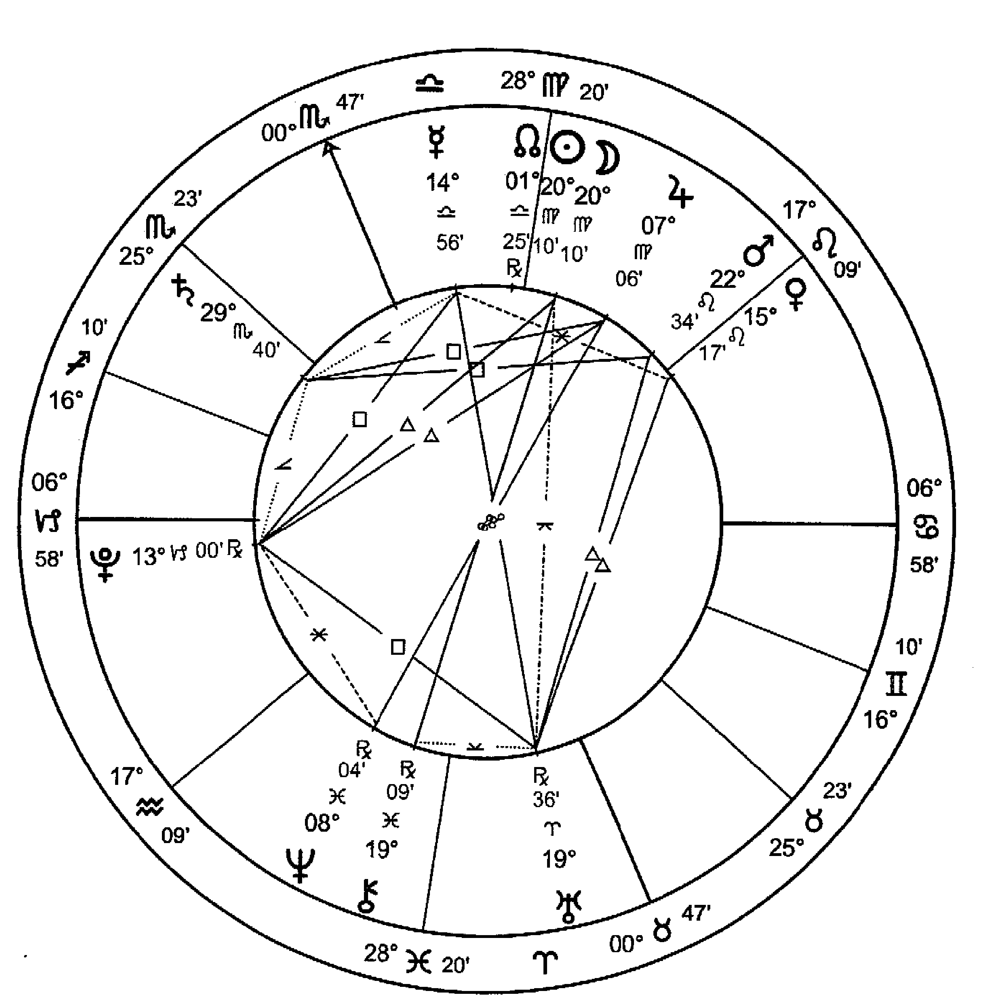

医疗及弱势团体，中国在那一年间很可能需要注意这些议题（那一年的8月12日发生了天津大爆炸）。

图02-09是2015年9月13日下午2时41分北京的日蚀图，太阳、月亮跟北交点落在同一边，这里的合轴星包括上升点的冥王星，两者相差大概七度左右，所以冥王星会是中国于2015年9月至翌年9月期间需要注意的行星。冥王星象征危机、灾难、遗产及大量人口伤亡，它守护第十宫及第十一宫，因此这些主题都需要注意，另外，日蚀盘第二宫有海王星及凯龙，第八宫也有很多行星出现，特别注意火星位于第八宫宫首，这暗示了经济外汇会是中国这一年特别需要注意的事情。土星落在天蠍座29度，土星可能跟社会福利、养老政策及儿童福利政策有關。居住于其他地方的人可以用一样的方法绘制星盘，可能会看到其中的差异。

日蚀图跟月蚀图都可以用来判断国家需要注意哪些事情。从图 02-10 日蚀图中，你们认为应该注意什么主题呢？

在做出预测之前，应该先考量该行星到底代表什么？火星合下降点可能暗示与别国的一些紧张冲突，可能也应该多注意航空安全及航空管理，因为火星所在的射手座跟航空有關，而且冥王在九宫。土星在射手座其實本身就代表所有国家都要注意航空安全，而同樣跟航空有關的木星正四分土星、三分冥王星、并跟日蚀正对分相，2016 年航空安全应该会是世界各国都應該注意的，木星或土星落在四個轴点的国家都會有这些暗示。

不过要注意的是，每个迹象我们至少需要两个证据，另外，因为火星合轴，所以应该要注意火星守护的宫位，天蠍座于第六宫被截夺而沒有位於任何宫位的起点，所以可以观察由牡羊座做為起点的第十二宫，它代表医疗行业，另外第十一宫的星群也需要注意。

月蚀是日月对分的时刻，它比较影响个人层面，但也有可能展現于国家需求及人民反應之上，在研究世俗占星学的時候，雖然月蚀的影響可能沒有日蚀那麼明顯，但仍然有研究價值。

## ※ 四季入境圖

除了透過日月蚀圖去判断一年中的狀況外，也可以觀察四張入境圖有沒有劇烈影響。這四張星盤的時間點包括春分的牡羊座 0 度、夏至的巨蟹座 0 度、秋分的天秤座 0 度及冬至的摩羯座 0 度。春分圖的影响从 3 月 21 日到 6 月 21 日、夏至圖从 6 月 21 日影响到 9 月 23 日、秋分圖从 9 月 23 日到 12 月 21 日、冬至圖从 12 月 22 日影响到 3 月 20 日。

当然，如果日期相當靠近下一次入境圖的話，我們可以同時做出觀察，相信大家都記得占星學其中一個重要觀念：當行星聚集在開創星座的時候，它們容易提前反應，如果我要觀察經濟影響的話，這四張入境圖會是我們觀察這三個月期間市場變化的方法，包括了金融局勢、自然災害及人爲災害，如果有土星、凱龍或天海冥合軸的話，這往是一個警訊。

四季入境圖的觀察重點及方式跟日月蚀圖分析一樣，包括合軸行星、星群落入的宫位及強硬相位出現的位置。讓我們先以 2015 年的四張入境圖爲例子，展示一下四季圖的觀察重點。

在 2015 年北京的春分圖中（圖 02-11），我們可以看到非常多的行星落在第十二宫。

同年夏至圖中（圖 02-12），我們可以觀察到太陽合軸天底，它守護象徵工人階級、生產線及勞工狀況的第六宫。如果要觀察中國經濟狀況的話，第二宫裡面有落在雙子座的水星，這乍看是強勢行星，但注意它跟海王星有非常緊密的四分相，這或許暗示了一些事情。

在秋分圖中（圖 02-13），土星合相天頂，所以注意力應該放在國家領導及跟鄰國關係之上；關於財經狀況，第二宫的天王星可能會帶來劇烈的驚嚇，尤其天王星跟冥王星之間形成了四分相。

同年的冬至圖中（圖 02-14），天王星合相上升點，屆時中國很可能會有讓大家驚嚇的新聞，而 2016 年 1 月 4 日中國的股市開始實施熔斷機制，金星在第七宮并即将进入第八宫，土星所象徵的政府管理及控制落入第八宫，這可能跟外匯管制有密切關連。當然，這是一個比較入門級的簡單解讀方法。

我們討論了如何在这一年或一季之间預測國家運勢，你可以從國家盤的行運、二次推運、太陽弧推運及太陽回歸做出觀察。我建議至少使用兩種方式去做比較，如果你所選擇的兩種技巧都說出了同一主題的話，你才可以說那個國家今年應該注意那些主題的事件。世俗占星師會用這幾張星盤去分析地區的政局勢及社會發展，以及今年需要注意的事項。

經濟絕對離不開政治及社會發展，更離不開國際形勢，所以研究財經占星學時一定要有整體格局的概念，觀察各地的日月蝕圖及四季入境圖，例如當看到澳洲局勢好轉的時候，也許不妨開始思考澳幣價格會否回升，這時候如果你有外匯操作的技巧，那麼這可能是供你做出相關考量的前提或背景資料。

最後，我們要探討如何觀察占星地圖。你可以用日月蝕圖及四季圖觀察接下來的時段中哪些地區是容易受影響的地區，并特別注意外行星線經過的地方。

# Chapter 3 行星與景氣循環

## * 占星學中的循環

占星學從地球小小的自轉循環出發，到它環繞太陽的公轉循環，再到太陽繞著整個銀河系的循環層層遞進，每一種循環占星師們都會觀察，當中存在著一些特殊的循環。例如當我們從地球觀察木星或土星環繞太陽的軌道、從地球去看木星跟土星從這一次合相到下一次合相之間的時間點，這些循環當中都有著一些跟地球經濟活動相關的資訊，占星師們認為這些資訊能夠幫助人們做出市場景氣循環的預測。

所以在這一章的內容會先介紹行星的循環概念。

第一種循環是行星繞行太陽的公轉循環，也就是行星繞著太陽運行的循環。需知道行星繞行黃道的過程中，當它停留在某星座的時候，當中其實有著一些意涵，美國財經占星師們非常在意科學精神，也喜歡統計，但我認為占星學是神秘學，它是符號語言，我不否認他們把精力花在統計學上所得出的那些成果以及努力相當傑出，但除此之外，不要忘記占星學可以透過符號解讀可能發展的狀況。就好像易經及塔羅一樣，我們利用行星的移動及循環去得出規律，並從不規律的狀態中整理出我們能夠掌握的規律。

在財經占星學的基礎部分，相位及循環的概念會非常被強調。占星學相當強調「循環」，我們每天看到太陽從東方升起，於西方落下，周而復始，假設今天月亮合相某恆星之後，它會於28天後再次合相此恆星，這是月亮循環的概念。同樣地，每年生日太陽都會出現在黃道同一位置，這是太陽循環。「循環」的概念對於占星師來說十分重要，當然，經濟也有其循環，各產業都有自己的供需循環，金融市場也有其漲跌循環，如果你有這些概念的話，你就會明白，行星循環與市場的景氣循環也有一定程度關係。

在占星學中，有非常多我們不知道或過去沒聽過的循環存在著，行星循環是世俗占星學中範圍最廣的，它不會只預測一個地區，因爲星相是全球都受影響的，就像流年一樣，我們要先看大的格局，得知一整年的氣圍。而外行星之間的相位會帶來非常長的影響，甚至可以持續三、四年，以天冥相位爲例，從2012年的正四分相開始，到2015年年底雖然不再形成正相位，但不會有人認爲它已經結束了，因爲2016年一到三月期間它們還會再一次形成只有1度距離的四分相，因此仍然是相當緊密的關係。

我們透過外行星循環了解全球局勢，移動越慢的行星及爲時越久的相位影響越久，天王星公轉一周要84年，它帶來的是革命跟改變；海王星公轉一次要165年，海冥相位循環需時400多
年；冥王星公轉一周要248年。這些循環都是大格局，不能說它對我們沒影響，只要它們落入我們星盤的某星座、跟我們的星盤形成強硬相位的時候，那就可能是衝突的頂點、結果呈現的開始，所以我们要注意行星的循環。

在柏拉圖的時代，人們就已經相當重視循環的概念，因爲循環帶來了周而復始的主題及演變。當時的人們認爲世上最大的循環是歲差年，需時25,765年，它其實就是春分點時太陽的位置，我們通常說春分點在牡羊座0度，但其實春分點目前已經走到雙魚座的位置。春分點逆黃道而行的移動被稱爲「歲差」，它在巴比倫時代正位於牡羊座，但到了大概公元0年時，春分點就己經慢慢退到雙魚座，當時有占星師發現春分時的月蝕月亮沒有落在天秤座，幾十年後，他發現春分點其實正在移動，這引起了諸多占星學的革命跟討論。部分占星師（特別是東方的）決定改用天空中的黃道，希臘的占星師則決定繼續使用回歸黃道，把春分點跟長年以來認識的牡羊座做連結，也正因爲這樣，春分點的歲差移動成了一個相當重要的概念，它是最大的格局，於每個星座的停留歷時2160年。

這也是爲什麼我們經常聽到「水瓶
時代」或「寶瓶時代」，水瓶時代是近年很多身心靈研究者非常廣泛討論的東西，他指的是春分時太陽的落點移動到天空當中水瓶座的的位置，他們認為這是強調人性、人人平等、帶來全新體驗生活的年代，但我們現在其實還沒進到水瓶時代，春分點目前仍在帶來二元時代的雙魚座中間，大概還需要 600 年才會進入到水瓶時代。

### 1. 外行星的循環

當每一次外行星進入一個星座，都象徵著文化特質的一種轉變，而根據每個行星本身的意涵，它會影響那個時代的特質。例如木星每一年移動一個星座，它是最簡單的年度指標。

我有一位學生曾經研究過，那一年木星進入天蠍座，他調查網路上的關鍵字搜尋，一般來說，被搜尋的次數最多，就代表那東西越流行。特別的是，那一年討論危機、死亡、殯葬的關鍵字竟然是相當高位的，木星天蠍這一年便有這樣的影響。木星的每個星座都告訴我們那年的景氣行業，因為木星代表發展，2015 年木星在處女座，這是木星弱勢的位置，在這裡它較無法發揮自己推廣的特質，包容能力會降低，但木星仍然有著帶來發展的暗示，因此處女座
象徵行業仍然會發展。這一年雖然經濟發展可能受限，但大家可以思考處女座跟哪些工作行業有關？例如醫療、生物科技、軍火及服務業可能有一些明顯的關聯，但同時也要知道 2015 年木土四分，這些行業會受到土星的影響，因此大家必須知道木土四分什麼時候發生，就算要投資，也要先知道你想投資的行業會受土星影響。此外，日用品及保健相關的服務或產品也可能是需要注意的，如果是大型企業，則可能會受國際影響，小企業則可能有發展機會，因為處女座強調小的、精緻的、每天能用到的。

當木星剛進入處女座不久的時候，美國一名對沖基金經紀人買下了某藥品公司，並調高愛滋病用藥價格 55 倍，這種藥並不是真的用來直接對抗愛滋病，而是用來殺害寄生蟲，但只有嬰兒與愛滋病患這些免疫力非常弱的人才會面對這些寄生蟲的威脅。這個人後來被全球罵翻了，但重點是即使你知道經濟不景氣，但木星還是可以告訴我們哪些行業是可行的，而醫療和微生物跟處女座亦有關聯。

土星每兩年半換一個星座，跟那個星座有關的事件及行業都會受到整肅。土星在 2014 年年底進入射手座然後退## 財經占星全書

回天蠍，2015 年九月下旬又再次回到射手座，占星師會優先觀察 2014 年 12 月底到 2015 年年初土星在射手座時所發生的事件，或觀察三十年前土星射手時所發生的事。重要的是眼界要寬廣，同樣的指標及氣圍會再次發生，但並不是一定會發生同樣的事件。

愛滋病本身，因爲它被世界認知的時間正好是八十年代中期土星進入天蠍座的時候，它於土星天秤時被發現，但那時候仍然機密，直到 1983 年左右「愛滋病」這名字正式出現，當時還不知道病毒到底是什麼，後來改名 HIV，它到土星天蠍座的時候開始被媒體關注，也象徵了人們對性的恐懼。

2014 年年底，當土星在天蠍座最後一天及射手座的第一天發生了兩宗新聞：第一宗是英國的國家衛生單位所發布的警訊，內容關於英國北部爆發了淋病的疫情（透過性接觸傳染的疾病），當時據說已經完全沒有抗生素可醫治（土星在最後一度，有疾病沒辦法被醫治）。這是土星回到天蠍座那幾個月所發生的事，新聞在這最後一天被報導。此外，當時英國媒體也充滿了早年明星、新聞主播及政治人物的性醜聞，尤其關於戀童癖，這是土星入射手座第一件被挖掘的新聞，例如某兒童節目主持人向兒童下手，幾十年後方被報導，報導隔天土星就進入射手座。

1950 年代還沒出現愛滋病，當時土星正要離開天蠍座之前，人類有一個重要的發現：小兒麻痺症的疫苗被正式公布，然後非常有趣的是 2013 年土星進入天蠍座沒多久的時候，比爾·蓋茲（Bill Gates）基金會大力推廣小兒麻痺症的疫苗接種。蓋茲本身土星天蠍，兩次土星回歸之後他大力推廣這疫苗，也就是土星再次進入天蠍的時候。在 1950 年代之前，小兒麻痺症曾經是流行病，被視爲恐怖的絕症，但現在很多人已經不再知道它有多恐怖，疫苗於 1950 年代出現，2013 又被呼籲接種，所以 1980 年代出現的愛滋病是不是在 2013 至 2015 土星離開天蠍座前會找到預防或治療方式呢？

在墨爾本，同一天晚上，同志區街頭出現了整條街的海報說治療愛滋病的藥有效，所以以後不需要再使用安全套（相當屬於土星離開天蠍的消息），相當「大魔王要離開」的氣圍。事實上這新聞之所以引起我的關注，原因的確是 事實上並沒有，但我們知道有一些非常有效能延長愛滋病人壽命的藥物。病人的日常生活作息都跟正常人一樣，他們也必須更注意自己的健康，他們也

以可能因此比一般人更健康。而且在2015年5月就開始有新聞討論預防愛滋病的方式，有一些人不愿意使用安全套，所以開始了實驗每天使用這些抗愛滋病藥物然後檢查，檢驗的時候這些人沒有得到感染，這也是墨爾本街頭爲什麼貼了那些海報——這就是占星跟世俗事件的觀察。

三王星每次移動星座都會帶來劇烈的改變，例如天王星進入天秤座帶來了婚姻制度的改變；當它來到牡羊座之後，歐美一些名人都開始留鬍子，在過去很少人會喜歡不刮鬍子。當上一次天王星進入天秤座時，社會流行的是男穿女装及女穿男装，現在則是換過來，男性變得越來越陽剛。

外行星進入開創星座多半都會帶來劇烈的世局震盪，因爲開創星座是能量進入地球的入口，是起點所在。外行星的變化、震撼進入到開創星座時，多半會有政治局勢不安的影響。2011年天王星進入牡羊座，當年3月11日當天福島發生最大的地震，最大的後續影響是輻射洩漏及人們對核電廠的關注，這些都跟天王星有關，那時候社會升起了反核熱潮，全球都在重新檢討核電廠的安全問題。天王星象徵鈍，它進入牡羊座讓人再一次看到它的重要性。

接下來海王星會進入牡羊座，冥王星則還要一段時間才離開摩羯座。外行星也會帶來經濟震撼，例如冥王星每次在巨蟹摩羯座軸線時，這二十多年都會有重大的經濟結構轉變，所有占星師都預測冥王星在2024年離開摩羯座前，我們會看見一些新型態的經濟模式出現，它很可能是人類未來幾百年將要使用的經濟模式。我們正處於一個對資本主義相當不利的年代，過去的經濟制度很可能會改變，進行投資的人必須想好怎樣面對後資本主義時代的到來。每當看到資本主義引發的問題或有人倡導不一樣的觀念，我們都要提高警覺，那可能是賺錢的好時機，又或是目前財富被毀掉的危機，它不一定象徵資本主義完全消失。

南北交是文化指標，因爲它們跟日蝕有關。例如此時當它在牡羊天秤軸線，在歐美，很多人討論同志婚姻跟教會之間的衝突，2016年日月蝕軸線會移到雙魚處女，到時候海王星、凱龍及南交點都會在雙魚，木星跟北交點則在處女座，未來一兩年會是非常非常強調這軸線的時間。

# Chapter 3 行星與景氣循環

### 2. 相位循環

相位循環指的是當兩個行星產生合相之後，行星分別以不同的速度在黃道上順逆行，過一段時間之後，兩行星會產生第一次的半四分相，接著是四分相、對分相、再一次的四分相然後最後一次的半四分相，最後產生第二次合相。

人類最易觀察到的相位循環是太陽跟月亮之間的循環，也就是月相循環。月有陰晴圓缺，在日月蝕圖的部分中，我們提及了日蝕是新月，新月是太陽跟月亮在同一位置的时候，也就是農曆初一，之後月亮會往前移動，上弦月會慢慢出現，從圖03 - A中，1到2之間月亮其實往前走了45度，被稱爲新月的階段。

當月亮走到3的時候，它來到跟太陽形成四分相的位置，被稱爲上弦四分相，也就是合相之後的第一次四分相，時間是合相後第七天左右；然後再隔三天左右就會來到凸月的階層，這時候太陽跟月亮大概相距135度，這象徵了快要靠近滿月的階段；當月亮走到5的位置，它會完全反射太陽的光芒，那是滿月，也就是日月對分相。接下來，月亮會繼續往前走，並進入下弦月的階段，這階段被稱爲傳播月或散播月相，月亮會開始慢慢變小，這位置是占星學中太陽跟月亮另一方向的135度相位。然後當月亮來到7的位置時，那是下弦四分相形成的时候，也就是另一次90度，月相在這裡快要進入日月循環完結的周

期；最後，位置8是消散月相，月亮會開始不被看見，並慢慢變成新一次循環中的新月。

在中的國家盤中，水星跟海王星同樣在第八宮，分別落在天秤座的13度及14度，形成合相。假設水星當時沒有逆行的話，它會一直往前走並到達射手座18度，海王星的位置則基本上不會有太大改變，這是水海循環的開始，大概一年後差不多同一時間，水星又會再次跟海王星合相，這標示著一個

Innermost Wheel Exact Electoral Event Event Chart 28 May 2000, Sun 5:03:42 pm BST -1:00 London, UK 51°N30' 000°W10' Geocentric Tropical Placidus True Node

Middle Inner Wheel Exact Electoral Event Event Chart 17 Dec 2005, Sat 5:16:11 am UT +0:00 London, UK 51°N30' 000°W10' Geocentric Tropical Placidus True Node

True Node Placidus Tropical Geocentric 51°N30' 000°W10' London, UK 11:36:21 am BST -1:00 3 Aug 2015, Mon Event Chart Exact Electoral Event Outermost Wheel

Compliments of - Rod Chang rod@rodmagic.com

Exact Electoral Event Middle Outer Wheel

（圖 03-00）木土循環圖。

获取更多好书，请加微信：13641926204 或 QQ:715104687

## 案例：1973年石油危機及1923年華爾街崩盤事件

Oil Crisis
Event Chart
16 Oct 1973, Tue
06:00 EDT +4:00
new york, New York
40°N42'51'' 074°W00'23''
Geocentric
Tropical
Placidus
Mean Node

（圖 03-01）

圖 03-1 是1973年石油危機發生時的星盤，這時間是比较概括的，使用的是日出時間，我們可以專注在這星盤中的一些重要資訊上。如果你了解當

時的世界局勢的話，那麼你會認為這次危機真的是因爲沒有石油而發生的嗎？答案當然是「不」，這次危機的發生不是因爲石油出產出了問題，而是源自於國家之間的政治鬥爭，是石油生產國跟美國之間的對抗。

政治權力跟土星有關，石油跟海王星及冥王星有關，在這星盤中，土星在巨蟹座4度停滞，冥王星在天秤座4度，兩者形成緊密的四分相。兩者中土星走得比較快，所以當時它們正形成的是下弦四分相，而且即將進入下一次合相，這下弦四分相多半標示了重大危機的時刻。同時，位於巨蟹座4度的土星跟射手座5度的海王星形成十二分之五相，這是非常敏感的相位，所以我們可以推斷石油跟土海相位、土冥相位甚至火冥相位都有關係。我一直研究火冥、土冥及土海相位跟石油之間的密切關聯。除此之外，木星當時正在水瓶座2度，基本上它跟其他行星沒有太多關聯，但我們要注意的是，這次危機會一直維持到1974年，土星會從四分冥王星的位置一直維持到四分天王星為止，非常精彩。

在人類經濟發展歷史中，歷來最大的危機發生於1929年的華爾街崩盤事件，當時股票全部化灰，很多投資者跳樓自殺，隨之而來的是長達十年的經濟大蕭條。圖03-02 這張星盤的時間點是股票開始崩盤的第一天，當中沒有任何重要相位，但如果仔細看的話，你會發現一些蛛絲馬跡。

我們先從木星開始，木星在雙子座15度，土星在射手座26度，雖然它們這一天並沒有相位，但它們幾個月後很快就會形成對分相。記住1929年的这一天只是事件的起點，那時候大家都還沒警覺，但到1930年時大家都快崩潰了。木土正位於形成對分相的星座，土星同時也即將進入摩羯座，到時候會跟天王星形成四分相，同時要注意的是，我們在觀察的是長達十多年的大蕭條，所以相位的角距容許度可以不用太拘謹。天王星在牡羊座8度，如果它再往前移動一點點的話，就會跟土星四分相。

最後，讓我們透過1929年及1973年這兩個案例，印證一下我們於這一章中所討論過的技巧。

## Wall Street Crisis
Natal Chart
24 Oct 1929, Thu
06:00 EST +5:00
new york, New York
40°N42'51" 074°W00'23"
Geocentric
Tropical
Placidus
Mean Node

（圖 03-02）

## Solar Annular Eclipse (NM)
Natal Chart
24 Dec 1973, Mon
10:07:01 EST +5: 00
new york, New York
40°N42'51" 074°W00'23"
Geocentric
Tropical
Placidus
Mean Node

（圖 03 - 03）

## Solar Total Eclipse (NM)
Natal Chart
30 Jun 1973, Sat
07:38:44 EDT +4:00
new york, New York
40°N42'51" 074°W00'23"
Geocentric
Tropical
Placidus
Mean Node

（圖 03 - 04）

## Solar Total Eclipse (NM)
Natal Chart
9 May 1929, Thu
02:07:10 EDT +4:00
new york, New York
40°N42'51" 074°W00'23"
Geocentric
Tropical
Placidus
Mean Node

（圖03-05）

## Solar Annular Eclipse (NM) Natal Chart
1 Nov 1929, Fri 07:00:46 EST +5:00
new york, New York
40°N42'51" 074°W00'23" Geocentric Tropical Placidus Mean Node

（圖 03-06）

## 財經占星全書

在研究財經占星學的時候，其實大家必須有一個概念，那就是請不要剛學不久就馬上用占星技巧去預測股票市場。所謂財經占星，不是指從占星推算股票漲跌，我們要了解的是經濟市場起伏的全貌。本書在稍後的內容中會略為介紹美國二十世紀非常傑出的財經占星師姜恩的一些理論，去推測股票及期貨價格的漲跌。但即便你掌握了這些技巧，仍不能完全保證你能夠只賺不賠，原因正如前文所述：你還有自己的本命盤需要考量，每個本命盤都有自己跟財務有關的宮位，因此你也需要從本命盤中了解一下自己是否有本事進行財務操作、或在哪個方面操作財務會比較順利，大家都必須牢記：本命盤非常重要，這也是本書前面章節討論過的重點。

1. 人們對於經濟市場的態度。例如股票之所以會漲價，你必須知道其原因在於投資人預期該公司會在最近獲利。但很多跑短線的人只說：「反正它會漲」，真正股票市場是中長期投資，我知道某公司這一季或今年可能會分紅或有股息之類，所以我去投資它，這是股票市場運作的概念；而期貨市場的概念也相當類似。舉例說，如果我預計三個月或一年後黃豆會欠收，所以我就去買黃豆，等漲價後賣掉獲利。

2. 在中國，很多人非常盲目地投資，所以大家如果投資中國市場，就要更小心人為因素及政府影響，要了解投資怎麼進行、市場反應如何，這是大家自己需要做的功課，占星學只負責透露全球市場氛圍及取向。

我剛剛提到的姜恩曾經提出相當特別的技巧，他預測某一年美國密西西比河地區會氾濫，所以預先投資棉花，當氾濫眞正發生的時候，棉花欠收，於是他之前所投資的棉花就賺錢了——你必須要有這樣的概念，而不是跟市場大嬸一樣盲目投資。請學習一下基本投資概念，要清楚市場如何運作，而不是盲目聽取財經投資老師的意見然後跟風跟著買或賣，必須對自己的財務負責。我非常尊敬的占星師貝爾納德·布雷迪

# Chapter 3 行星與景氣循環

（Bernadette Brady）老師有一年在教授個人經濟財務的時候說，如果她的學生或客戶來到她面前，只問：「我有沒有財運？我今年會不會賺錢？我投資這個會賺錢嗎？」她只會反問這位學生或客戶一個問題，而我也希望大家可以問問自己這個問題——你知道自己每個月賺多少錢、花多少錢嗎？你知道自己全部存款及負債有多少嗎？如果你不知道這些問題的答案，那麼，從現在開始至少整理出每個月的進帳及支出，這是變有錢的第一步。

布雷迪老師認為，如果這個人沒法做到這一點的話，占星師再怎樣幫他看財運也不會有太大幫助，這一點我非常認同。當然有些人可能會認為一個人只要有財運的話，他無論如何都會有財運，但是再強的財運畢竟也會坐吃山空，所以在現代占星學概念中，這個人也需要對自己行為負責。

經濟學中有景氣循環的概念，以半導體行業為例，假設目前市場相當蓬勃，不斷有新商品推出，那麼可能會需要半導體去生產 CPU 處理器；或者像近年，市場需要相當多的電腦或手機，又或是當蘋果即將推出新型號手機時，這時候市場需求就會增加。但當市場來到飽和點的時候，需求就會降低，人們對半導體的興趣也會相應減低，於是這些半導體公司的股票便沒有以前那麼吸引人，必須等到這些半導體的庫存被消耗掉之後，又或是那些公司再次推出新的電子產品的時候，需求才會再次增加，人們也才會再次對這些半導體感到興趣。

我們腦中必須擁有這些概念，財經占星學觀察的是景氣循環，占星學本身也強調循環，每年太陽都會來到牡羊座，從這一次到它下一次再來到牡羊座的時候，期間就會完成一次循環，從你今年生日到明年生日也是一次循環；月亮星座回到出生盤位置的时候正好是月亮回歸，這也是一次循環。

我們接下來要討論的是木星、土星、凱龍、天王星、海王星、冥王星及南北交點繞行黃道的過程，及對世界經濟活動的影響。同時會討論兩個一組的行星，例如木土、木天、土海、天冥、以及行星跟南北交點之間交會的循環。之前我們已經略為討論過木土的合相、四分相與對分相，對地球的經濟活動有著非常嚴重的影響，而 2015 年至 2016 年期間我們正處在最危險的一次關卡當中。我們這一章要專注於循環的概念當中，首先必須認識每個行星在黃道運行中所帶給我們的資訊。

## 財經占星全書

假設木星來到了巨蟹座的前半部，當木星在一個星座的前半部時，它通常容易帶來經濟景氣的影響。結果你聽到這句話之後就馬上投資，但其實我們不能這樣做，因為我們還有非常多的資訊需要做同步的處理及判斷，也必須參考其他的資訊，絕對不能夠只因某一行星落入某星座，就馬上判斷接下來股票一定會漲或跌。從占星學來觀察經濟走势是非常高深的學問，需要觀察非常多的星盤資訊才可以進行推測，千萬不要以為只憑單一星象就可以幫助推算。

### 3. 30 度圖象星暦

30 度的圖象星暦很少被使用，在本章節的一開始講解外行星與南北交點的星座時，我們使用到 30 度的圖象星暦，我們可以觀察到在圖 03 - B 中最左邊的刻度是從 0 開始，一直到 29 度結束。而上方標示著日期，往右移動日期增加。每一條曲線都代表著行星的運行，當行星沿著黃道順行時，因為度數從 0 度開始增加，往 1 度、2 度、3 度的方向移動，曲線就會往下走，一直到 29 度 59 分到達圖表的最下方。然後接著會再回到圖表的最上方，並且移動到下一個星座的 0 度。

當行星逆行時，由於度數可能是從

# Chapter 3 行星與景氣循環

### 7. 三王星及凱龍與景氣循環

們，2016及2017年的政治及經濟局勢都相當容易混亂，我們要提高警覺。

天王星在黃道上個每星座會待上七年，所以它在一個星座的時間就已經差不多等同於一個景氣循環，因此這圖表完全沒有任何需要注意的資訊，我們也不用太在意它。但我要知道的是，每當土星、天王星、海王星、冥王星及凱龍進入開創星座的時候，都會帶來震懾，同時也要注意它們經過銀河中心的時間點。

海王星會於一個星座逗留十四年，在財經占星學中，它象徵了狂潮或夢幻，同時也象徵了一種非常具有泡沫特質的經濟狀況，所以財經占星師們點出了以下重點：每當海王星進入火元素星座的時候，往往會帶來一種長期的熱潮跟景氣，而當海王星來到土元素星座，這種熱潮跟景氣就會衰退下來。

1807年至1820年期間，海王星當時正位於射手座，帶來了十九世紀初的快速經濟成長，而熱潮差不多在1819年左右瓦解。1820年到1834年期間，當海王星在摩羯的時候，當時歐洲經濟開始放緩，1861到1873年期間則再次出現經濟熱潮，當時海王星在牡羊座，後來1875年到1888年，海王星來到金牛座，出現了農業不景氣；及後，於1929年到1942年期間，如果你熟悉歷史的话，應該會知道那正是二戰及經濟大蕭條發生的年代，當時海王星位於處女座。

1970到1980年代初期，可以說是全球重要經濟市場復甦的階段，當時海王星在射手座，經濟快速復甦膨脹，亞洲四小龍跟日本的經濟都瘋狂起飛；但來到1980年至1981年的時候卻有一些衰退，原因是當時的木土相位。但來到1987年過後，經濟就非常不景氣，1987年至1990年出現經濟衰退，日本經濟也出現危機；1994年拉丁美洲跟墨西哥出現貨幣危機，1995年英國霸菱銀行（Barings Bank）倒閉，造成整個歐洲市場的信用危機。1997年東南亞跟泰國均有經濟危機，1998年俄羅斯經濟危機，這期間正是海王星在魔羯座的階段，這不但是土元素所象徵的不景氣，更是開創星座帶來的震懾。

在占星學中，海王星不僅象徵著靈性精神與提升，波塞頓是給予人類召唤動物的動力的神，雖然海王星的確象徵幻覺及泡沫，但它其實也跟生產有關。想想看，古代人靠農業為生，但是希臘
土地貧瘠，人們主要靠漁業、貿易及航運爲生，在早期人類文明發展中，特別是中東跟地中海地區，人們靠的是漁獲及貿易，米諾斯國王就是爲了祈求國運昌隆去跪拜海神，因爲他統治的克里特島位於地中海，如果他想要國家強大的話，就必須要有豐富的漁獲跟強大的航運。農神地位的提升是因爲後來的羅馬帝國，因爲羅馬人不喜歡海洋，他們喜歡在陸地上打仗，所以農神變成他們崇拜的對象。海王星其實一直跟經濟發展的榮景有關，你不妨翻翻星暦，目前海王星正在雙魚座，2025年到2039年期間會入境下一個星座牡羊座，那會是十多年的景氣，這是我們可以期待的。

相當重要的指標。這條軸線是父母的軸線，巨蟹象徵生產，所以一般來說，當外行星經過摩羯或巨蟹時，將會帶來非常強烈影響的重大指標。當然，這不代表餘下兩個開創星座就不會帶來影響。

關於冥王星，基本上我們只需要知道它在開創星座期間會帶來重大影響就夠了。

所有美國占星師都不使用凱龍，我是少數研究財經占星學仍然在用的人。關於凱龍，我們需要注意的仍然是開創星座及銀河中心，當然，如果凱龍進入金牛座，那仍然可能暗示它對全球經濟狀況的影響。1960年代凱龍牡羊時經濟上並沒出現特別暗示，但1970年代初當它準備進入金牛座時，就帶來了重大影響，所以要注意它進入開創星座的時間點。

我們在上述內容中所討論的，是關於製造業指數跟行星運行之間的關係，當我們知道這些關係之後，我們就能掌握接下來什麼時候會出現下一波景氣，到時候我們便能向投資老師請教。前面我們討論到木星的黃道位置跟經濟市場反應之間有著非常精確的關聯；火星印證了行星對國家盤的影響；土星告訴我們其對經濟影響力之低，但同時也讓我
們知道開創星座總會反映某些重要資訊，它每次轉換星座都會帶來蕭條跟危機。一戰的時候土星在巨蟹座，石油危機的時候也是，土星天蝨也可能會帶來危機，在魔羯座的時候危機最多。例如1931年歐洲銀行危機、1929年的華爾街崩盤、1930年的全球經濟衰退、1960年的另一次全球性衰退、1989年的再一次經濟衰退、以及1990年日本危機及隨之而來長達十年的經濟蕭條。

經濟蕭條的最大差別，在於危機只是一陣子，是一個關鍵時刻，蕭條則是一段很長的時間。從長期的局勢來看，從2007年年底到2015年，如果著眼於全球局勢的話，或許我們需要承認目前正處於經濟蕭條。

### 8. 南北交與景氣循環

南北交在財經占星學中占有相當重要的地位，很多占星師不重視南北交，或只著眼於它的靈性面上，但如果你是財經占星師的話，你絕對不會容許自己錯過南北交在這方面的研究。我們在上一章曾經提到過它代表一個完整的經濟循環，甚至跟美國的地產循環有關。所有行星都在黃道上，從牡羊座開始沿著金牛、雙子、巨蟹的方向運行前進，只有南北交不一樣，它的運行方向是反過來的，從雙魚、水瓶、魔羯、射手一直前進，北交點會在一個星座逗留十八個月左右。

我們知道的是，從處女座開始到巨蟹座是復甦的，然後差不多到牡羊座之前會出現非常劇烈的滑落，然後再從牡羊座回到雙魚座，雙魚到水瓶是上揚的，然後一直回到射手座——這是北交點跟美國製造業產能之間的關係，是我們需要注意的。北交點可以反映非常明
確的經濟景氣，我們會在下一章的內容中論及一些姜恩的理論，當中有一個歷時大約八至九年的經濟循環表格，那表格正是根據北交點景氣循環而做的，在那部分我會嘗試把它還原到占星學當中，但是大家可能需要先記住下滑的階段在哪。

除了製造業，我想跟大家討論南北交點跟美國房地產市場之間的關係，透過討論，我們能夠了解怎麼觀察一個市場，雖然這例子只限美國房地產，但從中我們能夠知道一些觀察其他市場的技巧。

首先我們要知道的是，南北交點的星座在所有美國財經占星師眼中，一直都是非常強烈的經濟活動指標。從符號詮釋上，它是太陽軌道跟月亮軌道在同一高度交會的點，當太陽跟月亮來到這一點，它們的高度會跟地球一致，於是地球偶爾會擋住太陽的光芒，並於新月及滿月的時候產生日蝕或月蝕。在財經占星師眼中，南北交點不只是七十年代靈魂演化占星學所說的前世今生，它有另一層意涵，象徵人與人的交會，就像是路口一樣。當月亮跟太陽同時來到這個高度，於這路口交會之時，那象徵了人群的動向，很多行星跟南北交合相或四分相的時候，例如當火星跟南北交合相，你會看到人們的瘋狂；土星跟南北交合相期間，你則會看到人們很嚴肅，這正正反映了人群的動向如何被行星影響。

在這裡我們看到的不只是南北交對人們的影響，它甚至影響經濟活動，並精準地描述了美國的房地產市場。美國占星師 Louise Mcwhirter 的著作在財經占星界相當有名，雖然當中資料相當古老，但仍然非常值得一讀。根據過去 70 年的美國股市資料研究，她認為當北交點離開雙魚座並進入水瓶座的時候，那會是美國股票市場的最低點，股票市場的高點則往往出現在北交點進入獅子座的時候，要注意的是這些景氣搭配的循環。

房地產的銷售通常是一個 18 至 20 年的循環，在美國房地產市場中，有著 8 至 9 年的高點及低點，美國房地產市場的高點通常出現在北交點從金牛座進入牡羊座的时候，然後多半在出現最高點後開始掉下來。月交點告訴我們非常多的資訊，但無論是怎樣的高點，當它遇到其他外行星相位左右、或者當外行星進入開創星座的時候，它都會受影響。當行星跑得越快，其影響力越小，因為在傳統占星學觀念中，走得越慢的行星力量越大，因此，如果木星在最景
氣的巨蟹，但冥王星及天王星分别在摩羯和牡羊的話，經濟氛圍仍然會是壞的。這種概念清楚地告訴我們，雖然北交在牡羊金牛的確是高點，但必須理解的是差不多從北交巨蟹開始就已经是景氣的起點，可是當中有任何外行星強硬相位的話，這種景氣循環的時間點仍然會被影響到。

信用不好的人的房貸，最後這些人沒有能力還款，造成了次貸危機的出現。

可是當時沒有人察覺到一件事，很多人以為次貸危機只出現在美國，但那其實是一個全球危機的警訊。房價從那時候開始下跌，而因為人們沒能力還款，次貸危機影響到銀行及政府，整個經濟於是開始崩塌，所以它跟房地產有關聯。北交點差不多在巨蟹到牡羊期間是美國房地產上漲的時刻，過了牡羊座之後市場就開始掉下來，通常當北交點從牡羊座移動到雙魚座的时候，就會是美國房屋泡沫出現的時候。2007年3月，房屋價格只有之前的一半並一直持續滑落，直到2010年左右，當時有新聞報導中國組團去美國買房子，聽說底
特律的房子一幢只要一美金。

北交點從雙魚座移動到摩羯座的时候會接近市場最低點，2009年左右，除了美國之外，西班牙也出現了相似問題，當地房地產也差不多在那時候開始出現嚴重衰退，這階段的北交點的確被視為經濟低點。然而，因為我不是房地產跟經濟景氣如何相互影響的研究專家，所以我要提醒的是，我不知道經濟景氣跟房地產買賣之間是否正向關聯，但我很清楚的是北交點星座的指標能夠發揮的影響力並不如土星、天王星、海王星及冥王星。

如果你估計北交點摩羯座是低點，並且準備要開始復甦的話，那你可能需要小心。因為在2009年的時候，天王星正準備進入牡羊座，冥王星也剛進入魔羯座，木星要離開巨蟹座，當時很多行星都在開創星座，並與冥王星進入四分相的範圍。從美國國家盤中，我們可以看到當冥王星進入魔羯座之後，就影響到美國的金星、木星及太陽，所以這當然會影響房地產的景氣。我們剛才提及美國房地產的景氣高峰在北交點牡羊座，而國家盤第四宮跟土地及房地產有關，美國國家盤第四宮宮首落入牡羊座，北交點在星盤上順時針來到這位置，越過天底後市場開始不景氣，來到
上升點則差不多是最低點——注意第四宮，北交在第四宮及第五宮的時候會是房地產的熱潮。如果你關注台灣房地產，我使用的是民國元年1月1日的星盤做為國家盤，而它同時也有這種跡象。

### 9. 四季入境圖之應用

在這部分，我們會仔細檢視人類的經濟活動跟占星之間的關係。占星師透過很多占星符號去觀察人類的經濟活動，其中包括早期的人類社會。占星學中有所謂的歲差移動，它每二千年會移動經過一個星座，幾千年前當春分點位於巨蟹座的时候，那時候出現了人類文明及農業社會，當它之後來到雙子座，書寫系統開始出現；到金牛座時出現大型的宮殿、城牆及大型的耕作體系；牡羊座的时候則是戰爭的開始。春分點目前雙魚座，人類探索二元的關係，包括肉體與精神、黑暗與光明等等。春分點將於2600年左右進入水瓶座，關於很多人掛在嘴邊的水瓶世紀或水瓶時代，或許占星學可以提供一些人類文明的世俗活動指標及觀察。

但我要知道的是，每當行星移動進入某星座，它都會突出一些主題，現代的占星師認為一個行星的符號可以有
非常多不同的指向，也就是說占星符號會是一個獨特的指標。你覺得木星的特質是什麼？它代表什麼？擴張、哲學、幸運、信心、膨脹、信念等等，如果把這些主題跟社會事件、機構、團體或人物做連結的話，我們可能會聯想到學者、高等教育或宗教團體，這些事件多半也跟文化有關，例如出版業、文化交流及大眾傳播，也可能跟國際性事物有關。

然而如果木星每年更換一個星座，那麼星座的事情就會受木星的影響。好幾年前，我會經有一位學生進行研究，調查那一年的網路熱門關鍵字，那一年是木星天蠍，他搜尋到的熱門關鍵字包括了保險、殯葬、死人化妝師等等，我覺得非常有趣。的確，我跟出版社朋友都會討論每年的出版方向，根據木星當年的星座告訴他們哪些行業或特質會比較適合那一年的發展。

其實很多人都明白行星運行跟社會之間的一些關係，重點是大家能否精確地把這些運行連結到社會事件上。有些人眼光比較狹隘，

## 財經占星全書

我必須強調的是，我們不能單憑以上的技巧去做出關於買賣的決定。以上這張雙重星盤，外圈當中有第二宮星群，這看起來是一個非常忙碌的第二宮，但忙碌代表市場上漲嗎？還是代表下跌？有機會是忙著救市嗎？這一張星盤是春分圖，它告訴我們的資訊是春天期間國家的情勢，但我們不能夠單憑這張星盤就知道自己應該於某一個月進行買或賣，我們只能憑藉它得知春天會有非常忙碌的經濟活動。

如果看到中國這年春天有如此忙碌的經濟活動的話，所有投資人會因此認為應該於上一年冬天就應該進入市場，所以這張星盤告訴我們的是，我們在這之前就應該動手了。在這個春天裡，我們看到土海四分卡在中國第一宮，海王星同時是中國的二宮守護，在這些危機暗示下，我們就知道隨時要準備賣了，重點只是你需要更確切的時間點，我們會在後面內容中討論相關技巧，這門技巧將會跟月亮及內行星有關。

我們現在先從以年度為單位的技巧進行觀察，春分圖是以季度為單位的年度觀察，看看有什麼需要注意，之後再從季度收窄到月份，一步步做出判斷。

大格局是重要的，在占星學中有所謂木星的十年及土星一年，2000 到 2010 是木星的十年，期間只要一點點良性的刺激，就可以帶動市場大漲。但是，當來到土星十年，一點點好的星象刺激不會造成大漲，因為人們沒有以前樂觀，而且變得更加謹慎，不會因為一點消息就做出瘋狂的舉動，必須等這十年過去了，人們厭倦了死氣沉沉的氣圍，然後再度進入木星十年，人們就會更加大膽。我們必須從大的循環出發，一步一步的看下來。目前我們正處在土星十年，我們要知道整個世界及國家行事都是小心翼翼的，它們不會做出大膽的動作，這時候即使我們看到一組會刺激經濟的相位，也要心裡有底，知道不應該隨便跟著一起瘋，或者應該盤算離開收手的時間，提醒自己這是土星十年，能賺到就應該收手了，除非你有更專業、更具金融知識的其他手法。

# Chapter 3 行星與景氣循環

## 案例：2015年香港房地產市場

Inner Wheel
Hong Kong – National Chart
Natal Chart
1 Jul 1997, Tue
01:30 AWST -8:00
Hong Kong, China
22°N17' 114°E09'
Geocentric
Tropical
Placidus
Mean Node

Outer Wheel
Solar Partial Eclipse (NM)
Natal Chart
13 Sep 2015, Sun
14:41:13 AWST -8:00
Hong Kong, China
22°N17' 114°E09'
Geocentric
Tropical
Placidus
Mean Node

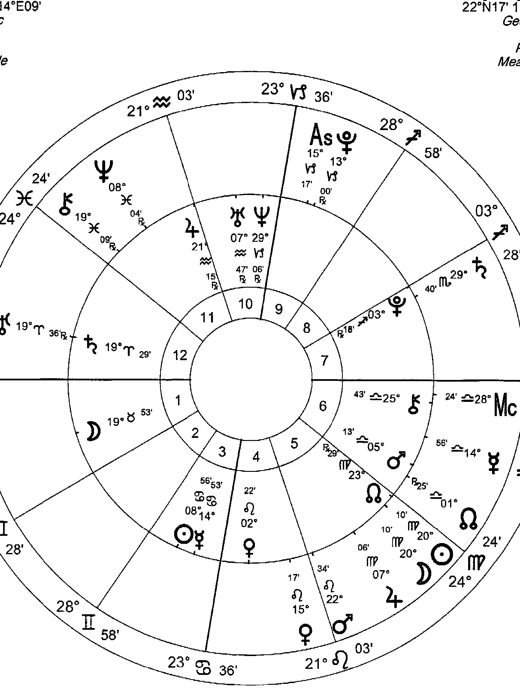

（圖 03-18）

## 財經占星全書

另外，之前提及過房屋跟房價市場，我們可以先從香港的市場開始著手觀察。2015年，香港的房價開始下跌，我們可以看看圖03-18星盤。

先判斷哪些符號跟房屋市場有關，我們知道第四宮、巨蟹座及天底都跟房屋有關；至於行星的話，月亮則比較有關聯。香港國家盤的天底位在巨蟹座23度，之前我們提及過美國房地產景氣幾乎都於北交來到天底時候達到高點；另外，注意外圈的星盤是日蝕圖，我們需要對月交點特別注意。

北交點來到第六宮，我懷疑它到獅子座時樓價可能會回升一點；另外，香港的本命月亮在金牛座19度，注意有沒有行星這時候跟月亮產生相位，因為它不但於星盤中擔任房屋的代表，而且更是一般星盤的房屋代表。行運火星金星都跟本命月亮四分相，有趣的是日蝕圖的土星非常靠近本命冥王，日蝕盤的天王星則靠近本命土星，特別注意如果有外行星來到第四宮的時候，它會對房屋價格造成重大影響。透過簡單的日蝕圖及春分圖，我們就己經可以預測房價高低的狀況。

# Chapter 3 行星與景氣循環

## 10. 關於外行星相位循環

外行星的相位循環會透露相當多的資訊，行星在星座上的循環透露了世界局勢大致上的氣團，但更具影響力的是接下來要探討的外行星相位循環。在開始討論前，有一些重要概念需要先知道，這些內容我們之前的確討論過，但讓我們先在這裡快速地複習一下，因為這會影響到對接下來內容的理解，而理解及掌握相位循環對世俗事件及經濟市場的影響，可說是財經占星學中相當重要的一環。

當兩個行星在同一星座及度數會合，那就是合相。從合相開始，運行比較快的行星會往前走，另一顆速度慢一點的行星當然也會前進，但會因為速度比較慢而落後。當兩者一直往前移動並第一次形成四分相，合相被認為是這循環的起點，第一次四分相則被認為是這循環中的第一次危機點，是一次跟發展有關的抉擇。在經過四分相之後，兩顆行星會繼續往前走，然後兩者形成對分相，在這裡，兩顆行星會互相看見，可以想像種子在合相的時候被埋下，在四分相時茁壯，在對分相時開花結果，成果這時候會被看見。最後，當行星在經歷對分相後，它們會來到另一階段——

另一次的四分相，也是循環中第二次危機。這一個四分相是跟結束有關的抉擇，循環不會在這裡結束，但這裡會有很多危機告訴我們這次的循環即將踏入終點。

我們知道合相是0度，第一次四分相是90度，對分相是180度，下一次四分相又是90度，如果把星盤看成一個圓形的话，循環結束前的四分相其實是270度的位置。在占星學中，所有強硬相位都可能暗示程度或大或小的危機，合相、四分相及對分相幾乎都是危機點，我們要觀察的是哪些行星帶來的危機特別容易影響經濟。合相也是危機點，因為只要兩個行星相遇，它們就會彼此互相影響，合相不一定是好的相位，這概念不論傳統還是現代都一樣，要注意的是相位由哪些行星形成。例如金木、木海、木天還是木冥，有些時候即使是強硬相位，它們仍然有可能刺激經濟發展，原因是這些行星都跟發展有關，但聽到土星及冥王時則要特別小心。

接下來我們會從木土相位循環開始，一組組的討論每個外行星相位循環，因為這些行星的特質才是我們應該關注的。例如我們已經知道木土相位容易帶來經濟危機，原因是它是快速的循環，所以它帶來的是危機而不是蕭條，當然它也可能帶來短暫的經濟刺激；木土三分及六分不一定是好事，相位孰好孰壞，觀察的重點在於行星本身的特質，行星才是重點。木星的確會鼓勵發展及擴張，但土星也的確會帶來壓抑，只要它們產生相位，你就要知道這時候市場會出現調整跟控制，差別只在於手法是靈活還是高壓。

因此，當觀察相位時，我們必須拋棄固有概念，三分相跟六分相不一定是好的，必須觀察的重點在於行星。無論是什麼相位，只要土星介入，那麼即使相位不同，當中分別也許只是死得快和死得慢而已。柔和相位比較快，強硬相位比較延緩，所以木土一直都是關於對市場的控制，這也是爲什麼占星師這麼重視木土相位。木土相位不會告訴你市場什麼時候大涨，但它會告訴你接下來是靈活的調控還是硬著陸。

試回憶一下中國2015年6月時救市的方式，那搶救方式比較像是六分相還是四分相？答案當然是四分相，因爲那是手段比較暴力的救市，中國用上所有資源去處理這件事情，這手段不像六分相，三分相跟六分相只是靈不靈活，是手腕上的分別，與結果無關。

不是每組行星相位都可以告訴你市場會否發展，最重要是注意市場什麼時候會遇到挑戰，大部分關乎土星的相位多半都需要注意。另外，冥王星有時候代表危機，所以也需要注意，至於其他的行星相位我們會逐點討論。

同時，我們要知道的是，0度、90度、180度跟270度位置都是相當值得注意的。我們其實可以想像黃道上的0度是牡羊座，90度是巨蟹座，150度是處女座，180度是天秤座，天蠍座是210度，也就是另一邊的150度，摩羯座是270度。摩羯座的時間從12月21號開始一直到1月18日，這是北半球的冬天，天氣也越來越冷，通常差不多一月到二月左右是最冷的，這時候外面一片蕭條死寂，很多財經占星師透過這概念告訴我們，270度是死亡的交叉點，當行星循環到兩顆行星270度的階段，很多東西都會「死掉」，要等到下一次合相過後一陣子，萬物才會像春天降臨一樣再次重生。

在財經占星學中，除了對分相後的四分相、也就是270度位置外，另外相當需要注意的是兩個150度位置，所有學派的占星學都認爲它跟危險、危機、調整及控制有關。黃道上的兩個150度星座是處女座及天蠍座，處女座跟整理

# Chapter 3 行星與景氣循環

及控制有關，天蠍座則跟死亡及蕭條有關，因此，在相位概念上，木土150度也會是值得注意的位置。

## 為單位，一個360度等於八個45度，所以，開創星座0度會在圖象星暦的最上方，春分點是太陽進入牡羊座0度的一刻，我們在圖表最上方看到那位置有一黑點出現，每過一天太陽就會往下移動一度，一個星座有30度，我們預期在刻度30度的地方應該有另一個小圓點，它代表太陽在那裡轉換星座，因此，30度這位置同時也代表固定星座0度，然後又像前述一樣往下走，32度的位置等於是金牛座的2度，33度是金牛座3度，如此類推。

### 45度圖象星暦

圖03-19是45度圖象星暦，它對占星師非常有幫助。圖表上方是年份及月份，左方則是0度至45度的刻度，事實上，當行星線來到45度之後，它就會馬上接著從最上方繼續。這等於我們把一張星盤的360度變成了以45度

## 財經占星全書

當它來到45度位置的時候，那裡是金牛座15度，然後線就會跳回最上方，那裡同樣是金牛座15度，接下來線會像之前一樣往下走，於是，固定星座30度剛好會是刻度15度的位置，因此那裡會是變動星座0度位置所在，行星線會一直以同樣邏輯於圖表走完餘下部分。

圖象星暦有什麼用呢？當要觀察一整年星盤的時候，占星師不可能畫出360日的星盤，而且占星師們也會想要知道相位形成的時間，這時候圖象星暦就相當有用。讓我們透過天王星跟冥王

## 財經占星全書

星於2012年至2015年的相位做例子解釋一下（圖03-20）。

2012年年初的時候，天王星來到圖表最左上方的位置，然後從牡羊座1度開始一直往下，往下走代表順行；來到第三季的時候，線停了下來並往上走，那代表了停滯跟逆行。之後它在2012年年底停滯並於2013年第一季回復順行，幾年來一直來回於牡羊座當中的位置。

接下來讓我們看看冥王星，它這幾年來一直位於開創星座的魔羯座，並跟天王星形成四分相，在圖象星暦中，所

## 財經占星全書

有關創星座的度數都出現於圖表前 30 度的範圍之中，所以你會發現冥王星同時出現於圖表的上方。

在圖 03-21 中，在我們看到冥王星在 2012 年第二季開始逆行，並跟天王星在 6 月 21 日形成正四分相，這也正是兩條行星線交會的位置；兩條行星線交會之處正正就是兩顆行星形成強硬相位的時間點，也就是說，在這三年來，天王星跟冥王星前後發生了六次的正四分相。這種圖表能夠幫助占星師進行大格局的預測，並可以預先看到哪些行星會在什麼時候形成相位。

我們可以在圖象星暉中同時觀察多顆行星的運行（圖 03-22），不妨留意一下北交點的線走勢相當有趣，它是逆著其他行星方向前進的，而且看起來彷彿有點「抖」。它之所以逆著方向行進，原因就像我們之前討論的，月交點永遠是逆著黃道運行的。在這圖表中，我們看到 2015 年期間天王星跟冥王星曾兩次形成正四分相，土星跟木星及冥王星在八月的時候同時形成強硬相位；另外，土星及海王星於 2015 年 2 月左右曾經非常接近，並於 2015 年 11 月 26 日形成強硬相位，這些都是特別需要注意的時刻。圖象星暉對財經占星師

## 財經占星全書

相當重要，因爲他們研究的是年度及季度走势，是時間跨度相當長的觀察。

內行星靠過來的話，就會觸動這組四分相並讓它被看見。也因爲這組外行星的四分相會僵持一陣子，因此其他行星靠近的時候就會觸動它，在這狀況下，無論這第三顆行星跟兩者形成的是六分相、三分相還是其他強硬相位，它都會刺激這組行星。

## 12. 外行星相位循環

我們會從這部分開始討論外行星彼此之間組成的相位循環，它們合相的位置是0度，請務必留意當兩個行星相距0度、90度、180度、270度還有150度跟300度的時候。我們說柔和相位會讓事情發生得比較輕鬆容易，要知道的是，假設我們現在有木土四分相，它們強硬得就像緊繃的弦一樣，如果這時候

## 財經占星全書

另外，非常有趣的是我們很常看到內行星透過三分相跟六分相觸動別的行星相位，因爲在占星學中三分相代表「放鬆」，當緊繃的弦突然被放鬆，箭很自然就會彈出去。也就是說很多劇烈

## 財經占

# Chapter 3 行星與景氣循環

的話，就可以用靈活手腕調整，如果是四分相及對分相，則可能是嚴格管理，所以要注意它們的相位。在財經占星學中，我們必須把眼光放在相位循環身上，不論它們形成任何相位，我們全部都需要注意。

發生，角距容許度有時候可以放寬到5度，這是相當準確而且值得研究的一組行星相位。根據占星師的觀察，我們通常會在木土合相的時候來到一個景氣的低點，也就是說木土合相的時候多半會是經濟景氣低潮，因為那是整個循環的開始，而且又有土星的影響，會有一種嚴重的壓抑氣氛，所以我們必須小心注意這種狀況。

如果木星象徵經濟發展，那麼土星的政治、法律、權威及規範就會來影響經濟發展，這被稱為「調控」，最主要的是政治力量進入經濟的影響。當兩顆行星60度或120度的時候，政府很有可能需要進入市場去進行一些刺激，至於在90度或180的時候，政府此時可能必須做出嚴控限制。但由於木星移動得比土星快很多，因此木土相位的影響通常會維持一兩週甚至一個月左右，而且逆行的時候同一相位可能會再發生一次，但因為木星之後又會繼續往前進，因此，這組行星相位通常突顯的是小的、短期的危機、一個月以內的經濟調整、或者小幅衰退。

另一件事則特別需要注意，所有財經占星師都認為，根據木土相位所做出的經濟發展判斷是最準確的，你可以根據木土相位發生的時刻預測政府管理法案出台時間、出手進行經濟調控時間、或大型機構觸犯法規影響市場的時間點，這些事件幾乎都會有木土相位的。

## 案例：1995年霸菱银行倒闭事件

在財經占星師的觀察中，每當遇到木土合相、對分相或四分相的時候，那都是我們必須小心注意的時候。因為木星走得比較快，所以它真正造成的可能是短時間的危機、恐慌及緊張，不會是長時期的蕭條。我們知道在一些經濟事件中，包括1773年東印度公司股票危機，這事件在財經歷史上相當有名，也是相當早期的股票買賣，當時因為國家在背後強力支持，所以東印度公司的行情一直被看好，在1688年之後，很多股票投資者開始用謊言來操作股票，一下子說東印度公司的船隊正要回來，一下子說他們遇到暴風雨，一下子說他們擱淺，一下子又說它們修好船所以可以回來，公司的股價就這樣子受影響並且暴升暴跌。最後東印度公司的船隊回國後，人們發現貨品沒想像中好，整個東印度股票就暴跌，影響當時的倫敦股市市場，那一年有木土對分及土海合相。

另一個值得我們研究的案例是1995年霸菱銀行倒閉的事件，有人說這種投資銀行出事後都會隨便怪罪某交易員，說他是惡棍交易員。1995年，白寧銀行交易員Nick Leeson投資失敗，造成14億美金的損失，讓1762年建立的這家百年老店最終破產。

圖03-24是事件發生時的星盤，那是1995年1月16日，隔天發生了相當有名的神戶大地震。這一天，這位人在新加坡的交易員在金融商品投資上造成嚴重失敗，在發生神戶大地震過後，他的投資也越來越慘，最後他所造成的14億損失是這銀行資本額的兩倍。他後來逃到馬來西亞及德國，最後被引渡到新加坡，服刑6個月後於1999年被釋放。

在事發當天，木土正形成四分相，木星在射手座7度，土星在雙魚座9度，這是270度的時間點，即下弦四分相，同時我們看到金星跟木星在射手座7度合相。你可能聽過很多人說金木相位會對市場有一定幫助，但在這裡它並沒有帶來太多正面影響。木土四分會維持一段時間，金星在這裡扮演了驅動的角色，正因為土星在雙魚座9度，因此所有位於變動星座（4 度至 14 度之間的行星都可能產生影響。這期間可能長達兩至三個月，期間如果內行星接近這些位置的话，木土相位就會被觸動。

## 財經占星全書

Solar Total Eclipse (NM)
Natal Chart
3 Nov 1994, Thu
13:35:29 GMT +0:00
London, UK
51°N30' 000°W10'
Geocentric
Tropical
Placidus
True Node

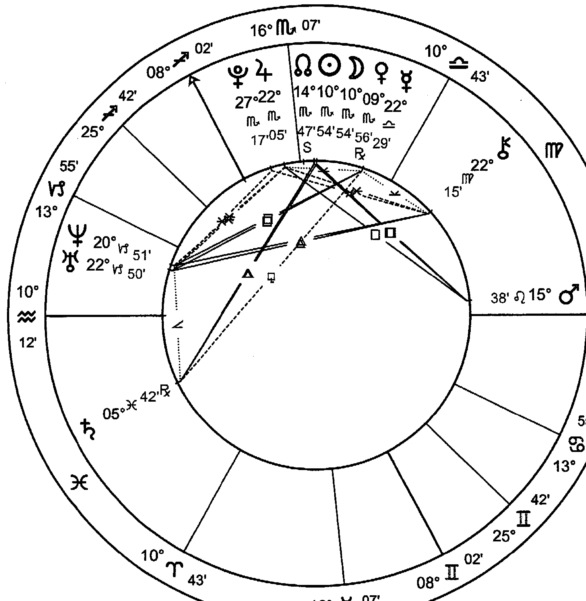

（圖 03-25）
這是投資者失敗的一天，銀行最後是在 1995 年 2 月底倒閉，這在當時是相當重大的社會事件，而且也是當時相當有名的金融業案件，雖然這不是史上第一次出現的投資危機，但它能夠導致一家相當有信用的百年老店

# Chapter 3 行星與景氣循環

倒閉著實也不簡單。除了木土相位外，當時還有天海合相，當然最主要的仍然是木土相位。我們在2015年夏天左右也有木土相位，2016年則會再產生一次。

木土相位循環是年期最短卻最具影響力的一組外行星相位循環，在研究當中，木土相位有著相當多的影響，相比起其他外行星相位循環，它造成的衝突是比较短期的。我們透過木土相位了解到行星之間最危險的是150度及270度距離，從歷年來的研究中得知，很多重大危機都很容易出現在木土150度、180度及270度附近，但如果真的發生在這種時間點之上，我們很有可能會看到一種短期的危機，這不是什麼魔法或奇怪的东西，而是非常基礎的占星學。我們必須知道的是，如果我們擁有正確的占星學概念的话，我們可以很清楚的了解為什麼150度或270度附近會有這麼多危機發生，它們都跟占星學的符號象徵有關，這兩個相位跟處女座及魔羯座有關。處女座是秋收的時刻，樹葉開始掉落，摩羯座則是北半球陷入一片荒涼寒冷的時刻，所以在占星學中，如果能注意這些行星的相位，那麼我們就可以清楚判斷什麼時候容易出現危機，再根據與那時候相關的四季圖及日月蝕圖，去判斷該危機會否出現於這地方。

霸菱銀行是一家英國銀行，如果我們觀察剛才事發當天的星盤的話，可以看到其中有木土四分相。剛才提到過木土四分相發生的时候很容易會有經濟危機，於是，下一個動作會是判斷這經濟危機會出現在哪裡，然後根據不同國家星盤搭配分析。

例如英國國家盤搭配日月蝕圖及四季圖，距離1995年1月16日最近一次的英國日蝕圖是1994年11月3號，在這日蝕圖中（圖03-25），火星在獅子座15度，太陽及月亮在天蠍座10度，火星在下降點並跟南北交四分，日火四分，火星也守護太陽及月亮，更重要的是火星守護第二宮，所以這告訴我們需要注意跟金錢財務有關的議題。白寧銀行當時是英國相當重要的金融單位，它的倒閉當時嚴重影響歐洲、日本及新加坡。

### 木天相位循環

每觀察一組行星相位循環的時候，我們都會去考慮這一組行星究竟代表什麼樣的意涵。讓我們把眼光放在木星跟天王星上面，想想木星的主題是什麼：擴張、有錢人、發展、冒險、交易、對外的貿易等等。那天王星呢？它是突如其來的、創新的，不會是慢慢演進的，它代表高科技及3C產品、宇航、所有電子產品等等，這些都跟天王星有著密切的關連。美國財經占星師認為木天相位跟財經預測沒有關聯，根據統計，他們認為木天相位並不能夠充分顯示財經市場跟製造業指數的反應。當我還是財經占星學初學者的時候，我曾經同意這看法，因為從來沒有一個木天相位能精準預測市場的危機及危險，而如果你只專注市場的危機及危險的話，這說法無疑是對的，因為當你只著眼於經濟危機時，你的確會看不見木天的效應。

要知道的是，在高科技產業中，電子產業及3C產業對近年製造業市場非常重要，NASDAQ絕對跟木天相位有關，因為它大部分都是科技公司。那麼，為什麼過去占星師們會認為木天或土天相位沒辦法反映市場跟製造業呢？原因是天王星跟傳統製造業關係並不密切。

每當天王星形成相位的時候，3C產品、電腦及科技產業當然要被提到，資本家的操作及其市場也必須被注意。

天王星還有另一組關鍵字：「自由」（freedom）及「解放」（liberation）。天王星帶來解放、自由及鬆綁，如果我是個要進行投資的資本家，當政府告訴我要遵守哪些規範，例如要怎樣處理污染、我的污染處理不達標的話，我當然不會高興，資本家們最希望沒人去管他，希望隨心所欲，因為這些規矩會增加資本，這正是天王星所代表的自由。

如果木天有相位，投資會變得相當活躍，即使木天形成的是強硬相位，我們也必須關注當時的市場，並可以預期市場同樣會有投資上或跟資本家相關的刺激即將出現。它有可能是經濟發展過程中突發的轉變、驚喜或驚嚇，「突破發展」是非常木天意涵的主題。

根據很多占星師的研究，蘋果電腦很多重要產品的上市跟發展都有重要的天王星相位，例如iPhone這個劃時代智慧型手機推出，它帶來前所未有的改變並造成瘋狂。它於2007年1月9日面世，當時木天形成正四分相，各位可以思考到底木天相位對於市場的影響

是否真的並不重要，重點是如果你要進行買賣的是電子科技業的產品，那你會怎樣看待木天相位呢？以下是一個比較有趣的研究，我們會觀察木天之間的關連及蘋果股價的移動。

## 財經占星全書

iPhone
Event Chart
9 Jan 2007, Tue
09:00 PST +8:00
san francisco
37°N46'30" 122°W25'06"
Geocentric
Tropical
Placidus
True Node

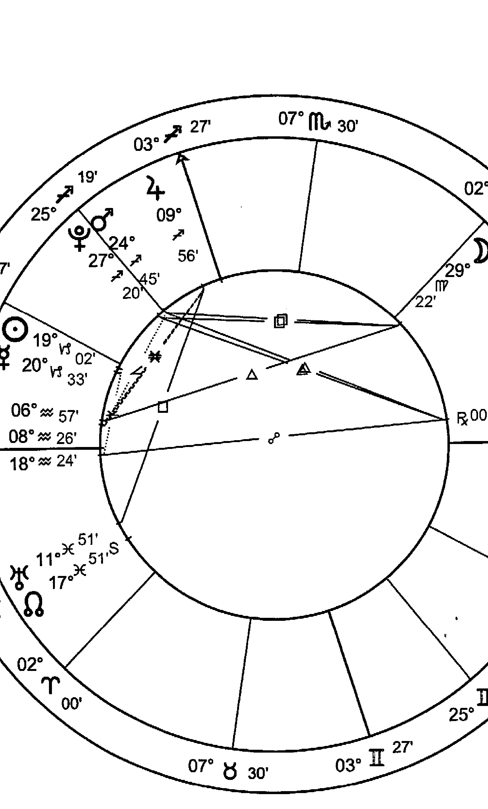

(圖 03-26)

# Chapter 3 行星與景氣循環

這是蘋果發表第一支 iPhone 當天的星盤，有一件事必須提醒，我使用的是當天早上九點的星盤，因為我記得蘋果通常都於早上舉行發表會，這有可能是不準確的時間，如果時間晚一點的話，很可能天王星會接近甚至落在上升點之上。

在這星盤中，我們明顯地看到當中有木天四分相，事實上，木星在射手座9度並且非常強勢，天王星在雙魚座11度，它相當接近北交點。我們知道木星天王星跟一些科技發展有關，所以每當木星與天王星產生相位的時候，你大概可以預期屆時會有新的科技新聞，這不限於電腦產品，科技可以涵蓋的範疇有宇航、太空科技、核能跟能源。

當我們之前討論外行星的時候，提到外行星進入開創星座往往帶來重大事件，然後我們討論了2011年3月11日那一天，當天王星入境牡羊座，同一天發生了日本福島大地震，導致核電站爆炸。相信這事件大家到今天仍然印象深刻，媒體到今天都仍在討論事件對附近的生物、植物及海洋所造成的影響。天王星的確跟能源有關，尤其是核能，但這裡的能源指的是電力本身，石油這種能源就跟天王星關聯不大。我認為新能源也跟天王星有非常密切的關聯，因為它跟科技上的改革跟突破有關。

另外，當木星跟天王星產生相位的時候，蘋果股價於期間發生的變動相當有趣。2007年是蘋果發表第一支智能手機的時候，木天四分相的正相位發生於在1月21日左右，於1月9日發表會當天，木星跟天王星相距2度，同日股價上涨，我們看到每當木天即將產生相位的時候，蘋果的股價都會有所變動，直到出相位的时候漲勢就停了下來。由此可見，木天相位循環的確能刺激科技股的走势。

### 木海相位循環

木星跟海王星同時代表了對未來的期盼及夢想，它們雖然有點差別，但兩者的確都跟夢想有關，所以這兩個行星的關鍵字中不存在壓抑及蕭條，它們帶給人們夢幻及願景，或許是對市場經濟有幫助的願景及夢幻。

木海的相位可能暗示著在經濟投資上的高度期待，但此時需要注意的反而是其他帶來蕭條及破壞意味的行星，是否對木星與海王帶來影響。要判斷的是這時候有沒有其他的強硬相位，土星有沒有影響木星及海王星，土星有沒有影響天王星，如果都沒有的話，那麼我們所預期的經濟願景可能真的會出現。因為如果土星做出干預的話，那麼這些預期都可能會被影響；但如果都沒有受到土星及其他外行星的影響、也没有跟內行星形成相位的話，那麼，木海相位形成的时候，我們可以預期一點點的泡沫，否則這些泡沫可能一吹就破。

海王星除了夢幻外，別忘了人類古時候的經濟活動刺激也跟這種夢幻及願景有關，尤其是股票及期貨。如果你有進行股票跟期貨操作的話，當你預期人們哪時對石油會有大量需求，然後從低位買入，等價格上升並需要最大量期貨的時候，就可以用較高價格賣出去，這就是期貨。有人說：「炒股就是炒預期」，這也解釋了為什麼很多消息會影響股價，例如當我們聽到某公司可能跟蘋果合作，該公司的股價通常會隨即上漲，所以木海相位的確跟預期有關。然而它只告訴我們預期跟期望，卻很少告訴我們這些期盼什麼時候停下來。

這相位循環仍然給予了我們幾個有趣的時間點。我們曾經提及，占星學中150度相位特別跟危機、危險、經濟、整理有關，注意150度至180度，以及240度至270度這兩個階段。前者在占星學

## 財經占星全書

信用不好的人，一方面避開風險，另一方面又在那國家賺點錢。當時冰島的銀行在英國所開出的定存利率是百分之十五，這利率坦白說是高得不尋常，這時候，所有貪心的人及機構都把錢存放於冰島的銀行，就連英國的政府機構跟警察基金也統統把錢存到這些銀行。然後來到2008年9月，冰島財務開始出現危機，人們於是開始撤退，英國比較有錢或有市場概念的投資人開始把錢拿回來，這時候冰島的經濟受到嚴重影響。當時的土天對分相影響了冰島的第一宮跟第二宮，冥王星同時也卡在冰島的上升點之上，要這個國家先死一次然後重新再來。這時候，冰島政府宣布銀行倒閉，他們把那些操作銀行金融的人關到監獄，同時也不出手救市，政府統統都不管。當時其他國家相繼前來跟冰島討債，英國是當中最兇的，因為英國政府的基金資金全部都在冰島的銀行裡領不出來，當時人們說這可能是英國跟冰島之間第二次的鯨魚戰爭，它們在1980年代曾經因為鯨魚撈捕權而發生衝突。

時美國通過了一條貨幣控制法案，美其名是貨幣控制法案，這控制法案聽起來很土星，但實際上它是對財務金融及銀行的大糾綁，不再限制銀行的業限，銀行也不必再讓主管機關知道它們在做什麼，這是所謂銀行業跟金融行業自由化的開端。

這法案於1986年正式通過，當時的土天六分把政府糾綁了，同時把很多東西都放掉不管。所以，如果回到過去所學的相位循環來看，0度到45度之間是嘗試，45度到90度是決定發展周期，當中60度是關鍵所在，可是這當中所努力的、所發生的事情，要到180度才開花結果及被看見。冰島的案例完全符合了相位循環的理論，2008年的事件發生在土天對分相的時候，土天也的確跟銀行管理法案有密切關係。土星代表了管理的一方，天王星則是糾綁，另一方面也代表了銀行家及資本家，什麼資源都沒有的冰島靠金融站起來，也因金融自由化而於土天對分相的時候倒下去。這讓我們看見財經占星學是多麼有趣的學問，我們要充分應用自己對每一行星的理解去解讀事件，所以土天相位跟金融有絕對的關係，雖然傳統的財經占星老師可能會認為只有土天強硬相位的时候我們才需要注意。

# Chapter 3 行星與景氣循環

### 土海相位循環

在財經占星學上，木土、土天跟土海。這三組相位循環是所有財經占星師公認對世界經濟影響最劇烈的。當中最有份量、時間最長、最容易對經濟帶來影響的，就是土海相位循環。每次土海相位發生時，經濟市場都會抖動一下，雖然在世俗占星中土海相位的主题不限于經濟，它可以跟宗教、慈善團體、石化行業跟政府之間的關係有關，但最重要的仍然是在經濟及金融上，土海相當嚴重的影響了它的發展。

讓我們回到最基礎的行星關鍵字上面。之前我們討論過，土星是政府、權威、管理、蘿條、限制，那海王星呢？它是泡沫、狂熱、夢想、滲透、瓦解、潰散。海王星可以是經濟活動的重要指標，而且的確是一種以市場預期為主要動力或運作方式的經濟活動，所以在財經占星學的學習中，如果特別想了解股票及期貨市場的話，你必須關注海王星的動向，因為它跟市場有最密切關聯。但如果海王星是夢想及泡沫的話，那它可能就跟投資市場裡的那些大媽一樣，大媽們不一定知道市場是什麼，不一定知道人們為什麼投資，他們是狂潮，大家買她就跟著買，要記住他們是海王星；當土星過來的時候，它會限制這些夢想，擋住這個狂潮，象徵現實的土星想要讓這些泡沫爆破，每次土星跟海王星產生強硬相位，那幾乎都是市場崩潰的時候，所以要特別注意這一組行星的任何相位，不管那是強硬還是柔和相位。圖象星暦不會顯示柔和相位，但每當土海形成相位，我們多半都會看到一些市場的激烈反應，我們必須知道市場的確已經明顯、清楚地位映了泡沫如何被摧毀的狀況。在所有財經占星師的眼中，只要土海靠近而且產生強硬相位的時候，幾乎都是對市場有相當強烈影響的衝突時刻。根據研究，自古至今，許多重要的土海強硬相位都會帶來重大的經濟危機。土星相位循環每35年至37年一次，它們會帶來蘿條及衰退，只要它們接觸，不管是什麼相位，市場都會下跌。

80年代的經濟市場也受到土海四分的強烈影響，當時帶來了非常多的恐慌。土海六分相相當有趣，在1745年倫敦黑色星期五事件及1637年的鬱金香泡沫事件中都有著土海六分相；而土海四分相則多半帶來重大的經濟衝突，在1890的銀行危機、NASDAQ與及俄羅斯危機都發生於土海60度至90度之間。土海對分相的時候也有非常多的事 件，1970年代的經濟衰退、2007年開 始的歐洲經濟危機、與及1720年的南 海泡沫事件也跟土海有關。

投資歷史上有三大狂熱事件，包括 1637年的鬱金香狂熱事件、1720年的 南海泡沫事件及1717年的密西西比事 件，當中的鬱金香狂熱事件跟南海泡沫 事件幾乎是學習投資的人必學的投資歷史事件。1634年的時候，投資人把目 標轉向鬱金香，鬱金香在投資市場上本 來並没有任何特別好的行情，但是人們開始關注到那些珍貴的品種，並開始抬 高這些品種的價格，這些投資人本身並 不喜歡花，但是他們只要看到珍貴品種 就會去收購。當時鬱金香的價格分成三 …

種方式計算：首先，如果是奇珍異種的 話，他們會一顆一顆的按重量買賣，普 通一點的品種則是一顆一顆的計算，再 次等一點的則是一袋袋的賣。原本價格 被抬高的就只有這些珍貴品種，可是這 個投資的風氣馬上傳到了「大媽」的身 上，大家只要一聽到鬱金香就瘋狂的購 買，把所有的錢都丟到鬱金香上面去。

到了1636年狂潮的時候，一顆鬱 金香球根可以換八隻豬、四隻牛、兩噸 奶油、一千磅乳酪、一個銀杯子、一包 衣服、一張床垫及一艘船，這是有文字 紀錄的，差不多等同於一個農夫的所有 資產。他們用自己的所有資產去交換一 個鬱金香球，原因是這種鬱金香交易能 賺相當多錢，它把所有工人及農民都吸 …

- 沒有資金的人就去借錢
- 到最後，非特別品種鬱金香的需 求 也開始因爲這種轉賣而增加，期貨開始出現，由於鬱金香球根主要在冬季交易，但冬天還沒到人們就想要買了，於是就開始預期買賣，他們去酒店寫上兩張紙條，一張寫自己想要什麼球根，另一張寫自己支付費用的日期及預付款，當時也接受以物易物。

我們可以看到土海對分相的影響及崩潰，從1637年開始，鬱金香價格崩潰，有一些便宜的品種再沒人買，於是人們也賺不了錢，當時阿姆斯特丹受到影響的有三千人，他們不知道球根該賣給誰，也不知道款項該找誰付，泡沫已經完全造成混亂而且無法收拾。一直到政府於1637年做出限制，調查結束之前鬱金香交易都無法進行，而且所有票據都失去效力。我認爲其實這是最有效處理金融危機的方法，這跟冰島政府2008年的處理手法是一樣的，政府凍結交易並讓參與其中的所有人都失去他們的資本，鬱金香狂熱就在這時候結束，這正是土海對分相的時候，我們從中看到了人們的狂熱及期待。

## 案例：南海泡沫事件

南海泡沫事件發生於 1720 年，南海公司是一家英國公司，於 1711 年成立，它們經營的是英國跟南美洲之間的貨運轉口航線，是一家政府支持的金融機構。它們跟政府合作發行股票並左右政府的政策，讓政府幫助它們爭取更好的航線賺更多的錢，也透過政府的保證去欺騙股民們說公司已經得到政府的保證，因此股民們可以去買他們的股票。

它們公司的股價從 1720 年的 120 英鎊，到同年七月上升到 1000 英鎊，從此，英國全民炒股，而且因爲股票市場的狂熱，更多類似的公司出現，這些公司不經營生意，但取了一樣的名號，打算趁著南海公司的股票上市之後可以開始賺錢。同年六月份，英國政府早已看到了這些亂象並決定整頓，因此後來通過了泡沫法案，把熱潮壓抑下來。這正好是土海對分的時候，南海公司的股票從七月的 1000 英鎊到同年九月下跌至 190 英鎊，所有人都血本無歸，當中包括牛頓（Isaac Newton），這是歷史上另一次發生於土海對分相的泡沫事件。

| 日期       | 星圖類型   | 地點                 | 赤道系統 | 舍儀系統 | 均輸节点 |
| ---------- | ---------- | -------------------- | -------- | -------- | -------- |
| 8 Feb 1720 | 太陽環食 (NM) | London, UK          | 地心      | 赤道     | 平行节点 |
| 4 Aug 1720 | 太陽環食 (NM) | London, UK          | 地心      | 赤道     | 平行节点 |
| 25 Dec 1066 | -          | London, UK          | 地心      | 赤道     | 平行节点 |
| 11 Sep 2001 | -          | philadelphia        | 地心      | 赤道     | 平行节点 |
| 4 Jul 1776  | -          | philadelphia        | 地心      | 赤道     | 平均节点 |

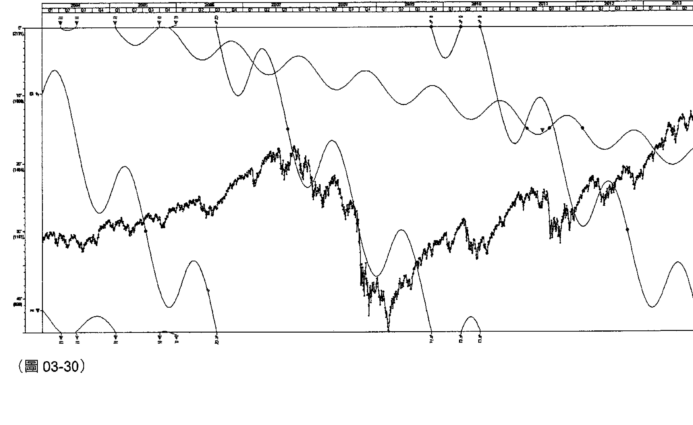

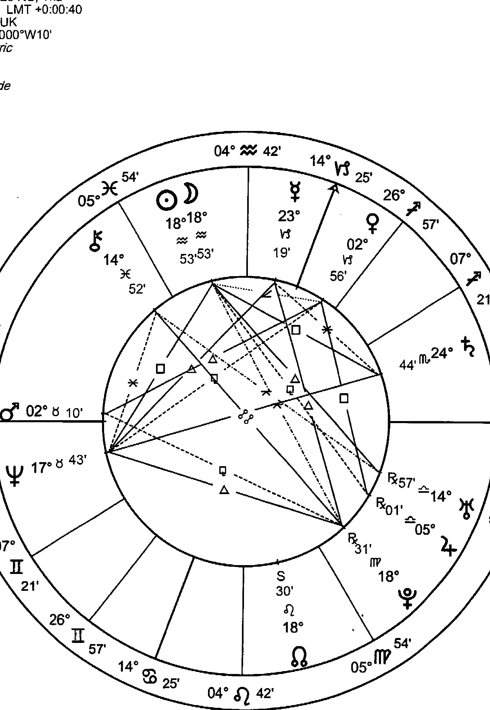

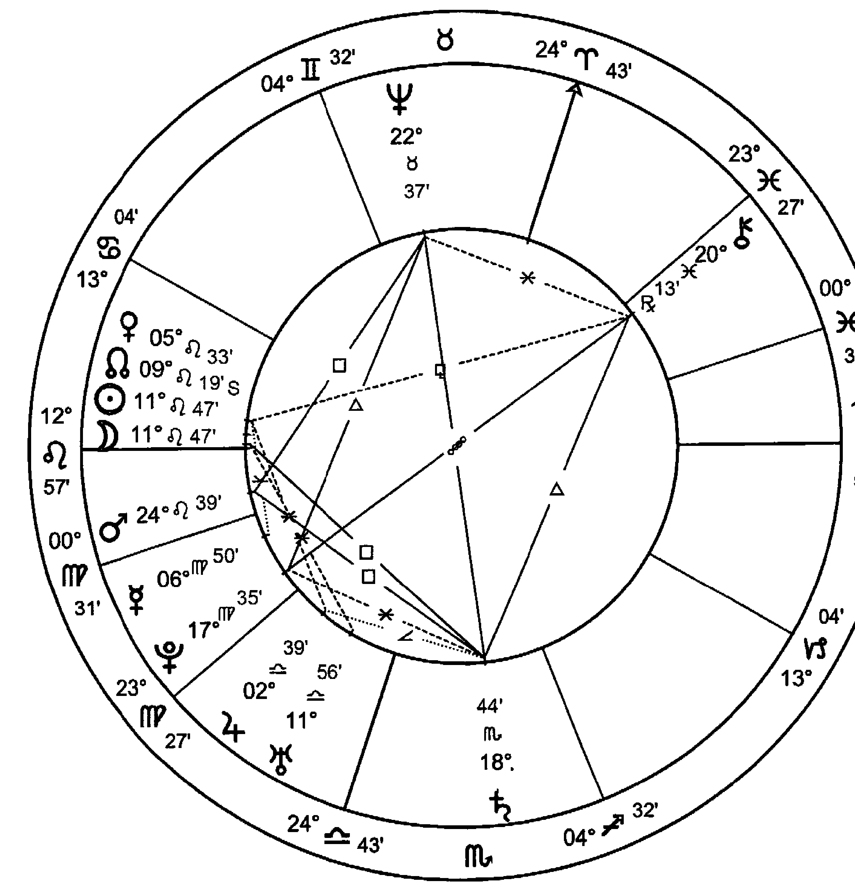

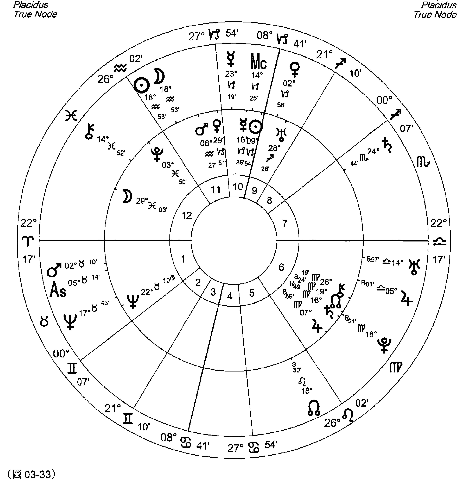

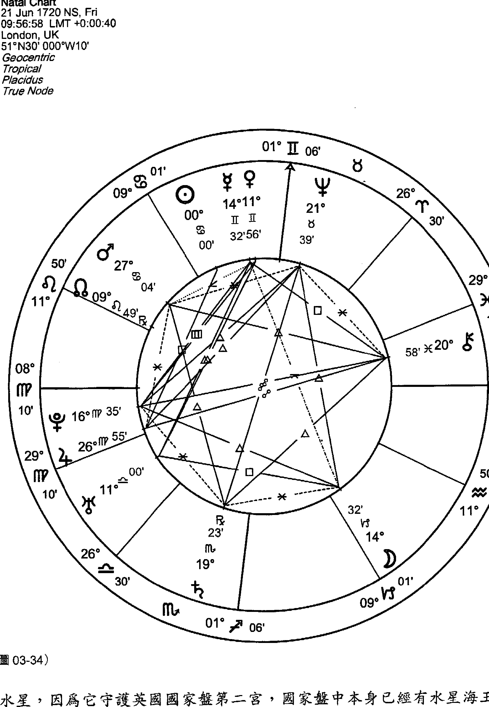

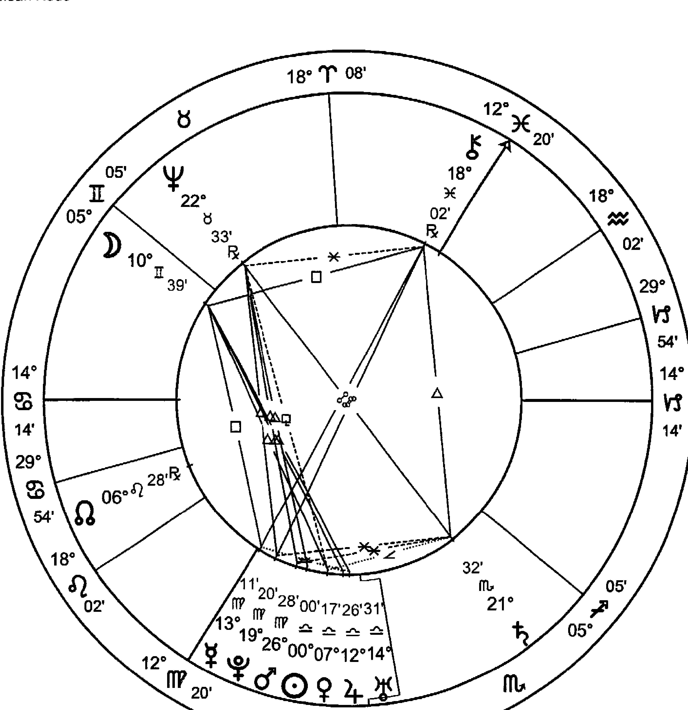

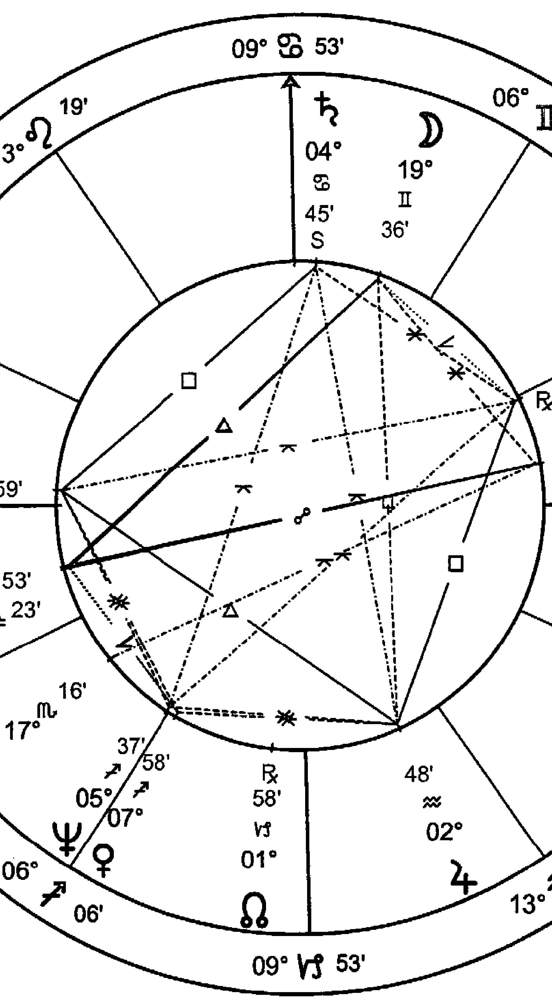

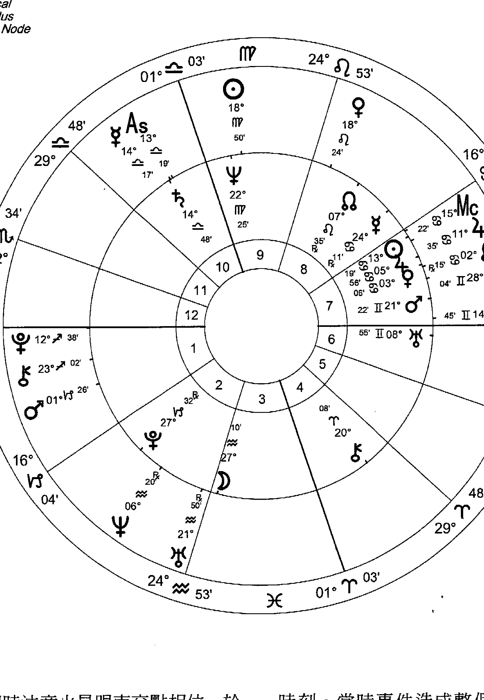

# Chapter 3 行星與景氣循環

我們能否找出土冥相位跟上海股市的互動呢？圖 03-38 是土星冥王星的運動跟上海股市之間關係的圖表，2015 年 6 月 12 日是土星跟冥王星相距 1 度的時候，2015 年八月底則是土冥相位完結的時候，這兩個時間點都是指數大跌的時候，當土星跟冥王星之後慢慢相距比較遠時，指數也穩定下來。另外，即使在指數暴跌之前，我們也看到當兩顆行星相距比較遠的時候，指數會經開始攀升，但當它們靠近並形成正相位的時候，指數就大幅下跌。我們藉此看到了土冥相位與市場之間的關係，它的確對市場有著明顯的影響，而且其影響非常可能來自重大的社會事件，另外，要記住它很有可能會帶來蕭條。

政治上，土冥相位也有一些非常明顯的衝突，它算是政治上明爭暗鬥最明顯的階段，或是之前沒被看見的東西終於曝光的時刻，殖民、反抗及革命都跟土冥有著密切關聯。1982 年 12 月 4 日，中國通過了現行的憲法修訂，憲法是土冥對架構的重大改變。

### 天冥相位循環

在過去學習財經占星學的過程中，我的老師認為天冥相位對經濟市場的影響並不重要，認為它傾向跟社會事件有關，我跟他的意見不太一樣。我清楚知道天王星代表資本主義者、變動跟科技業，所以當天王星跟冥王星產生強硬相位的時候，它們的影響會越來越明顯，

尤其天冥相位很久才發生一次，它們多半會帶來一種預期跟緊張。

天王星是緊繫的狀態，冥王星則是具壓力的狀況，當天冥發生強硬相位時，基本上它會維持相當長的一段時間，例如從2012年到2015年，天王星跟冥王星前後就有七次的正四分相。當我在教授財經占星學或發表相關文章時，總有人問我爲什麼還在討論天冥四分相，因爲天冥四分相明明已經結束。事實上，從圖象星暦中，我們會清楚看到2016年1月至3月期間，天王星跟冥王星會相當靠近，彼此只有1度距離——1度距離算是「沒有產生相位」嗎？當行星相位在角距容許度內，即使不是正相位，它們也仍然會互相影響。

天王星跟冥王星的影響是漫長而遠的，在2016年1月至3月期間會有1度角距，甚至2017年都仍然會有3至4度的角距，天王星跟冥王星都走得非常慢，所以它們不會輕易分開。當預測2016年春天走势的時候，我們可以先回顧一下2012年到2015年之間曾經發生什麼事情。天冥相位每個循環需時127年，我們必須先觀察這相位循環中早前的敏感時間點曾經發生了什麼事，觀察上一次天冥形成相位的时候發生了什麼，這對於我們進行預測相當重要。

天冥相位暗示了政治影響力的衝突，André Barbeau認爲天冥相位象徵了殖民國家跟殖民地之間關係的影響，雖然現在很多地方已經脫離殖民國家，但中政治影響力的關聯仍然存在著。例如歐洲有很多來自象牙海岸的人（都說法文），很多中東及印巴人因爲文化上的熟悉感而喜歡移民英國；台灣曾被日本統治五十年，很多老一輩都認爲自己是日本人。我們必須明白的是，當你曾被某國家統治一段時間，該國家的文化會深刻影響你生活的每一件事情，這是文化及教育所帶來的影響。在英國統治香港期間，當我們去香港的時候，雖然那裡一樣是中國人居住的地方，但文化差異相當大，因爲英國人的文化深植其中。

1960年代最著名的是中東衝突，整個以色列的建國運動奪取了巴勒斯坦的土地，讓巴勒斯坦地區無法立國並身處在挣扎當中。巴勒斯坦的建國一直跟天海有關，每次中東衝突都跟天冥強硬相位有關，這是西方列強當時所做的好事。1960年天冥合相時，當時很多非洲殖民地發生獨立運動離開殖民國家，但最近幾年，辛巴威（Zimbabwe）或一些非洲國家出現了很多政治紛爭，最後需要原殖民國家的介入，辛巴威的政。

再被傳統女性生育角色限制住，我認爲這是非常重要的事情。

天冥於處女座合相時會對精細的東西帶來影響，其經典作品是液晶體的出現；電腦剛發明的时候，也就是1947年到1960年期间，它們的體積差不多是一個房間般大，液晶體當時的出現及使用讓機器從相當龐大的體積大大縮小，它是工業的重大革命，也的確跟天冥有密切關係。而天冥接下來會有最後一次靠近的機會，不妨觀察當下會否有相關的重大資訊出現。

時間有其連動性，天冥合相與2012年至2015年期间發生的天冥四分關聯非常緊密，所有在1960年代發生的事情會在這組四分相期間產生最激烈的選擇，中國當然也包括在内。2012年期间當我正在中國时，看到了一些有趣的現象，並讓我聯想到六十年代中國發生的事情。中國在六十年代發生了文革，如果你人在香港的話感受可能會比較深刻，因爲天冥四分相期間香港不同觀念的市民之間的衝突，他們會指責對方是紅衛兵；另外，2012年我在上海时，那陣子有「唱紅歌」的運動，那是歷史時代的東西，它跟文革有明顯關聯也互相呼應，但那不代表天冥四分相期間是文革再現，我們只需要知道兩個時

代之間藉由天冥相位而互相呼應。

天冥相位也跟經濟有絕對關聯，因爲天冥相位的關鍵字很有可能涉及金權管制。我們現在的社會某程度上算是金權管制的社會，有錢人掌握政治局勢，有錢人告訴你生活該怎麼過，他們掌握政治實力，爲你定義對錯，只要你反對，你就是違反國家安全；天王星想要改革，它代表的是中產及資本家，也就

是那些被控制、不能享受權力但又有錢的人。

我們可以看看歷史如何忠實地反映天冥相位的影響。圖 03-C 是法國的第一共和國家盤，也就是發生在法國大革命不久之後的星盤。天王星在獅子座 21 度，冥王星在水瓶座 21 度，我們之前會經提及過，領導法國大革命的是那些中產階級、有錢但没有貴族身分的人，雖然資本主義社會的歷史課本告訴我們當時窮人走上街頭喊著要麵包吃，於是農民們攻陷了凡爾賽宮並把路易十四跟瑪麗·安東尼拖出去砍頭，但是直到我到法國唸書，才知道事實根本不是這樣一回事，真正領導這場革命的不是窮人而是中產階級。

來到廿一世紀，我們看看天冥四分相期間發生了什麼事情？不論美國、台灣、香港、日本、韓國都有不同社會運動發生，這些制度上的改革絕對會對經濟帶來強烈影響，當天冥四分發生的時候，不必急著猜測它是否影響經濟，應該做的是著眼於整個大環境都正身處的變動之下。如果說這幾年天冥相位對中國來說是反腐運動，那麼它對中國經濟及股市有沒有最直接的衝擊呢？是不是一宣布之後股票馬上下跌呢？在這反腐運動中，天冥相位有可能從背後影響先前的經濟運作，讓很多人不敢花錢並把資金轉移出去，這樣的確會進一步的影響經濟。

天冥相位對投資市場的影響巨大深遠，但它帶來的不是立竿見影的直接效果，所以要觀察整個時代背景，不是天冥相位一形成我們就預測經濟會馬上掉下去，必須觀察整個時代背景遭受的深遠影響。

## 其他外行星相位

關於天海相位，到目前為止我不認為它對經濟有劇烈影響；海冥相位循環帶來的影響範圍更大，它是一個歷時差不多五百年的相位循環，比較像是人類文明演變的循環，所以沒有明顯的經濟關聯，而且短內我們不會遇到太多次的海冥相位。

因此，我認為需要關注的相位循環是：木土、土天、土海及天冥。土冥相位循環對其他國家影響沒有中國跟香港深刻，但仍然在做出預測的時候列入考量。

## 南北交點

記住南北交點於財經占星學中非常重要！我們之前在 911 事件案例中，看

到火星合相南交點，2015 年 11 月巴黎恐襲事件中也出現這個星象。南交點或北交點在占星學中的定義除了業力外，它也同時意指事物交會的地方，南北交是十字路口，所以它影響的是人群。

簡單來說，當南北交跟任何外行星產生相位的時候，都會帶來該行星爲主題的感受，人們會對那行星的主題感到強烈的呼應，這就是爲什麼當火星靠近南交點的時候，全世界都看見了戰火跟屠殺，並引起了人們的注意。2015 年 11 月那幾天，其實敘利亞、黎巴嫩跟肯亞也發生了大屠殺，只是在以西方媒體主導的環境中，焦點就只關注法國身上。但重點不是有沒有被報導，而是我們可以想想，當聽到敘利亞跟黎巴嫩發生戰火的時候，你會有何感想？你也許並非鐵石心腸，但這些地區這幾年本來就戰火頻生，所以人們可能已經癱瘓了；但當襲擊在巴黎發生，那就會是比較罕見的事件，於是這種罕見的事件會引起人們的注意，這正是火星南交點合相的焦點所在。

展、希望、宗教的影響；土星跟月交點合相或四分相讓人們感到抑鬱、壓抑、不快樂、蕭條；天王星跟月交點合相或四分相帶來的是驚訝、驚嘆、切割；海王星跟月交點合相或四分相帶來瘋狂、狂熱、污染、混亂、疾病，因爲海王星跟病毒有關。冥王星跟月交點合相或四分相則可能帶來危機、生死存亡的時刻、以及一些大幅的壓力跟控制；凱龍跟月交點合相或四分相則可能帶來傷痛，美國占星師比較不注意凱龍，我們在財經占星學中也比較少觀察，但它會在當下所在的星座帶來傷害跟傷痛。有趣的是在我的凱龍研究中，可以看見凱龍入境所帶來的影響，在經濟當中，我們會預期當凱龍轉換星座或產生相位的时候，可能帶來重要及直接的影響。

每次當外行星跟月交點合相或四分相的時候，我們都會看到市場被該行星所影響，千萬不要小看南北交點的影響力，在財經占星學中，每當它跟外行星產生相位，都會看到市場被該行星影響。

所以要注意的是，每一次當包括火星在内的外行星、凱龍、南北交點合相或四分相的時候，我們都需要注意那行星所帶來的影響力。火星帶來的是生死、槍擊、傷害、屠殺；木星是經濟發
[content]
# Chapter 3 行星與景氣循環

我們能否找出土冥相位跟上海股市的互動呢？圖 03-38 是土星冥王星的運動跟上海股市之間關係的圖表，2015 年 6 月 12 日是土星跟冥王星相距 1 度的時候，2015 年八月底則是土冥相位完結的時候，這兩個時間點都是指數大跌的時候，當土星跟冥王星之後慢慢相距比較遠時，指數也穩定下來。另外，即使在指數暴跌之前，我們也看到當兩顆行星相距比較遠的時候，指數會經開始攀升，但當它們靠近並形成正相位的時候，指數就大幅下跌。我們藉此看到了土冥相位與市場之間的關係，它的確對市場有著明顯的影響，而且其影響非常可能來自重大的社會事件，另外，要記住它很有可能會帶來蕭條。

政治上，土冥相位也有一些非常明顯的衝突，它算是政治上明爭暗鬥最明顯的階段，或是之前沒被看見的東西終於曝光的時刻，殖民、反抗及革命都跟土冥有著密切關聯。1982 年 12 月 4 日，中國通過了現行的憲法修訂，憲法是土冥對架構的重大改變。

### 天冥相位循環

在過去學習財經占星學的過程中，我的老師認為天冥相位對經濟市場的影響並不重要，認為它傾向跟社會事件有關，我跟他的意見不太一樣。我清楚知道天王星代表資本主義者、變動跟科技業，所以當天王星跟冥王星產生強硬相位的時候，它們的影響會越來越明顯，

尤其天冥相位很久才發生一次，它們多半會帶來一種預期跟緊張。

天王星是緊繫的狀態，冥王星則是具壓力的狀況，當天冥發生強硬相位時，基本上它會維持相當長的一段時間，例如從2012年到2015年，天王星跟冥王星前後就有七次的正四分相。當我在教授財經占星學或發表相關文章時，總有人問我爲什麼還在討論天冥四分相，因爲天冥四分相明明已經結束。事實上，從圖象星暦中，我們會清楚看到2016年1月至3月期間，天王星跟冥王星會相當靠近，彼此只有1度距離——1度距離算是「沒有產生相位」嗎？當行星相位在角距容許度內，即使不是正相位，它們也仍然會互相影響。

天王星跟冥王星的影響是漫長而遠的，在2016年1月至3月期間會有1度角距，甚至2017年都仍然會有3至4度的角距，天王星跟冥王星都走得非常慢，所以它們不會輕易分開。當預測2016年春天走势的時候，我們可以先回顧一下2012年到2012年之間曾經發生什麼事情。天冥相位每個循環需時127年，我們必須先觀察這相位循環中早前的敏感時間點曾經發生了什麼事，觀察上一次天冥形成相位的时候發生了什麼，這對於我們進行預測相當重要。

天冥相位暗示了政治影響力的衝突，André Barbeau認爲天冥相位象徵了殖民國家跟殖民地之間關係的影響，雖然現在很多地方已經脫離

## 財經占星全書

BRICS Natal Chart 30 Nov 2001, Fri 06:00 GMT +0:00 London, UK 51°N30' 000°W10' Geocentric Tropical Placidus True Node

象徵「想法」，行運土星這時候緊密合相本命水星，彷彿之前大家聽到這基金的時候，一片歡天喜地，然後土星這時候走過來跟你說：「不好意思，它其實行不通。」行運土星跟本命土星正形成對分相，請務必關注這種相位，如果你看到任何一家公司的星盤，其行運土星來到了跟本命土星四分相或對分相位置

的時候，請注意這公司的運行狀況。或者更簡單的是，當一家公司來到它第七年、第十四年、第廿一年或第廿八年的時候，它絕對會遇到重大關卡，原因是

在這些時間點上，行運土星會跟本命土星形成四分相、對分相或合相，所以這合盤中的土土對分相絕對是非常重要的主題。

此外，我們也可以注意行運盤的海王星，它分別跟行運土星及本命土星形成四分相。要注意的是，這個基礎圖屬於一個想法而不是一家公司，否則它應該已經倒閉了。如果你有在投資的話，當年第一次聽到「金磚四國」這概念的時候，你感到興奮嗎？很多人或許會，因爲它象徵了出產原物料的國家、製造業的國家以及代表新興市場、非常有發展潛力的國家，當中可能象徵不少願景跟希望，在這行運盤中的土海四分相則敲醒了這個夢想。最後高盛聲稱這基金已經虧本了一、兩年，所以要把它停掉，也表示他們認爲「金磚四國」這個概念已經再沒有任何吸引力，這是當年創立這基金的人自己親口講的話。

## ※ 分析紐約證交所公司盤

從金磚四國的案例中，我想大家應該已經明白，一個念頭的出生盤或一家公司的出生盤其實有著非常重要的影響，讓我們用紐約證交所的公司盤（圖03-44）做案例跟大家再分析一下。

紐約證交所於 1792 年 5 月 17 日上午 7 時 52 分正式開市，如果你去觀察歷年來美國股市大漲跟大跌時段的行運，你會發現以上星盤中四個軸點跟月亮都會是非常重要的敏感點。這星盤本身有一組土星跟木海形成的對分相，這相位跟我們在上述的 2016 年夏至圖分析中所看到的那一組非常相似，如果你有一定占星學基礎的話，可以想想，當本命盤中有著某組相位，然後行運盤中再度出現同一組相位的時候，那到底會發生怎樣的影響？一般而言，我們認為

在這情況下，這本命盤的主人會特別容易感受到該相位影響並產生共鳴。

## ※ 分析中國及香港 2016 年 3 月概況

圖 03-45 是由中國國家星盤（內圈）與及 2016 年 3 月日蝕圖（外圈）所組成的合盤。我們看到日蝕圖的木海對分緊密地落在中國國家盤的土星上，而日蝕圖的天王星則合相中國的北交點；日蝕圖的海王星對分中國的土星，

日蝕圖的凱龍在雙魚座20度；日蝕圖的太陽、月亮、凱龍都非常靠近南交點，並且相當靠近中國的第二宮宮首。

海王星是中國的二宮守護，日蝕圖的木土四分跟土海四分絕對會影響中國的經濟，原因是木星跟海王星都是雙魚座的守護星，當兩者這時候同時被土星所左右，這絕對會對中國經濟帶來影響。另外，我們看到其實行運北交點會越來越接近中國的土星，越接近2016年下半年，北交點會越靠近中國的土星，所以會有那種讓人明顯感受到壓力跟蕭條的氣圍。

我們也可以用同樣的方法觀察2016年的夏至圖跟中國國家盤之間的互動（圖03-46）。這時候我們看到凱龍已經來到中國的第二宮，這會是一個重要指標，當然這不代表中國的經濟一定會下滑，但某程度上它可能暗示了中國政府的立場即使不跟隨市場起舞，但也不會立刻放棄。夏至圖的木星也跟中國的土星合相，夏至圖中逆行的火星剛剛經過天頂退回第九宮，夏至圖的土海相位落在中國的第一宮跟第十宮，暗示

了政府主要的應對方向。

我們也可以獨立觀察這張以上海爲基礎的日蝕圖（圖 03-47）。火星在下降點，守護第十二宮；另外雙魚座有星群，如果牽涉其中的是第十二宮的話，那麼我的判斷會傾向於中國在2016年春天之後最需要注意的其實並不是經濟問題，因爲當下中國已經著手處理了。火星在這裡暗示了非常明顯的騷動，這騷動可能跟醫療、醫院或監獄有關。

家盤跟上述同一次日蝕圖之間的互動。日蝕圖的雙魚星群落在香港第十一宮，土星在香港第八宮的影響會變劇烈，它會跟香港的水星形成150度相位，而水星是香港的二宮守護，所以這也不是一個非常看好的位置。

如果觀察香港國家盤跟同年夏至圖互動的話（圖 03-49），注意夏至圖中的水土對分跟土海四分，夏至圖的冥王星也對分香港的水星，對香港來說，這也不會是一個太輕鬆的時刻。

# Chapter 3 行星與景氣循環

## ※ 周期與波動

在前面的內容中，我們從完全不了解財經占星學的背景，到慢慢了解到財經跟占星學之間的互動，占星學能夠顯示一些重要的世界大事，也能夠告訴我們生命中一些循環周期，例如重大危機、重大事件及生老病死。事實上，透過占星學符號，我們也能夠看到國家或公司的經濟或股票可能受到的影響，所以我們叫它周期及周期中的波動。

周期的概念周而復始，從一個出發點到高潮、經歷谷底最後再回到出發的原點，這種概念一直是占星學看待事業的依據及標準。就像太陽每天從東方升起、到達黃道的最高處天頂然後下降，日落後來到地球另一端我們看不見的天底，隔天早上再從東方地平線升起，這是一天的周期。至於太陽跟地球的關係，也有太陽對準赤道帶來晝夜平分的

一天，那是春天的時候，太陽會在赤道牡羊座，然後它會慢慢因為地軸傾斜而在夏天來到北緯23.5度，位置相等於台灣花蓮嘉義一帶。然後太陽會慢慢往南半球移動，在9月23號左右會回到赤道，也就是秋分點，並且再繼續往南走，最後來到最低點的南回歸線，也就是南緯23.5度，位置相當於澳洲的昆士蘭。太陽經過最南端之後，會慢慢又再回到赤道，3月21再次進入牡羊座，也就是跟赤道同一高度的地方，這是太陽跟地球周而復始的循環。

月亮周而復始的循環可以從任何一個星座的起點到另一個地方，生命當中周而復始的循環則可以從你誕生那天的太陽位置，到隔一年太陽再次來到你出生那天的同樣位置，也可以從你誕生那一天的木星位置到它再次來到同一位置之間所形成的循環。很多人都聽過土星回歸，你誕生那一天土星的位置，在你出生大約29年後，土星會再次回到這個位置。 循環也可以是兩個行星的交會，例如新月就是太陽跟月亮之間的交會，從一個新月到下一次新月之間形成了循環，也就是中國人相當熟悉的農曆。循環也可以是任何兩顆行星所組成的循環，例如在上一章裡討論過的木土相位循環，就是所有占星師從巴比倫時代開始一直沿用今天，用來判斷人世間政治經濟及社會變遷的重要循環。所以，我們其實一直都在研究循環周期，這些周期當中有高點及低點，在上一章，我們討論及建立了幾個重要基礎：第一，相信大家現在已經非常熟悉我們所研究的是外行星在黃道上的循環；第二，行星相位循環是從合相到上弦四分相、對分相及下弦四分相最後再次合相的循環；第三，我們也列出了一些重要的資訊，例如木星星座有著相當明確的指標，這些都是周期循環與波動，希望大家有掌握好這些概念。

另外，在之前的内容中，我們鎖定了个別國家地區做討論，接下来我們首先會快速的複習一些波動與周期的概念，因為我們要進一步應用這種周期的概念，甚至会掌握到更深入的周期概念。在接下來討論的内容中，最主要是要把預測範圍縮小，我們已經清楚行星

在哪些星座容易帶來市場的混亂、高潮及谷底，也知道哪兩個行星交會會帶來刺激、危機、以及如何靈活地應用這些概念，而在危機及谷底的時刻，行星的交會也可能保護市場。所以如果你擁有完整的占星學概念，就不会偏頗地認為土星只会讓市場降下來。

接下來我們會先複習及更加深入探討行星周期及波動的概念，然後會討論月交點八年的景氣循環。在這當中，內行星相位能讓我們把範圍從年度或數年間慢慢縮短到一年甚至某一段短時間之内，並能夠透過內行星相位預測市場上的一些重要起伏。此外，我們也會討論行星的順行、逆行、停滯對市場的影響。在這一部分的内容中，其中一個最重要的主題會是日蝕，雖然前面我們已經討論過如何於預測技巧中應用日蝕圖，但在這一章裡我們會重溫及加深對日蝕的了解，甚至運用日蝕把預測的時間範圍縮短至一個月左右，並探討月亮的運行跟經濟、交易市場之間的互動。最後，我們會討論已經學過的國家經濟的觀察方式，在上一章的案例中，我們已經展示過幾個交易所及股票市場都有它自己的出生圖，每檔股票、公司都有它可以應用的星圖，這是很多人都知道的、比較簡單的占星學概念。但你應該

要知道並小心背後的影響，這會是我的財經占星學比較與眾不同的地方。

我們無疑可以從公司盤看出該公司交易的漲跌，但問題是如果你欠缺完整的占星學概念，那麼你不知道這些東西可以受到日蝕、月蝕、四季入境圖、外行星相位循環及國家星盤的影響。有學生告訴我2015年年初有金木三分，因此股票市場應該會大漲，然後問我爲什麼當時沒有發生這件事，那是因为他們忽略了一件事情，我們現在正處於木土二十年循環中的土星十年，而且我們更接近的是木土循環及土海循環的下弦四分相，象徵了自然界的秋冬階段。這是重要的關卡，如果你沒考慮這部分如何暗示了全球蕭條的氣氛，那麼你自然也會誤以爲分量很輕的金木相位可以撐起整個股市。所以，我們需要考慮全球背景氛圍，外行星背景是需要優先考慮 的，記得考慮我們當下處於哪個外行星循環階段，然後再套用內行星運行、停滯及月相周期，這部分有很多細小、複雜的內容，因爲如果要學會預測一個月或一段時間的發展局勢的話，有很多細微的規則需要考慮，所以希望大家記住，這也是爲什麼我在這一章要再次占用篇幅再次提起周期跟波動。

每年7月1日就是你人生循環的重要時間點，原因是太陽再次來到了其循環的起點並再次出發。國家的生日就是太陽於國家盤的太陽回歸，是一個帶來新的演變階段的時候，我們可以同樣地看待其他行星的回歸，所以黃道度數的循環是特別重要的。

事實上，行星在黃道當中有一個非常重要的概念，我們必須知道行星並非只會在同一條線上運行，因爲其中同時牽涉了赤緯高度。在下頁圖中（圖R4-001），中央的是地球，中間向右傾穿過地球的是傾斜的地軸，我們看太陽的時候，會以爲它跟赤道位在一樣高度，但其實它有些時候比赤道高或比赤道低，最高或最低的位置都是23.5度。地軸的傾斜爲我們帶來了四季的分別，從傾斜的地軸，我們得知地球是斜著自轉的。同樣地，當我們把赤道投影到天球上，會帶來相應的天球赤道（celestial equator），至於太陽的軌道則是上圖正中央成水平線橫著的圓圈。

古人認爲太陽繞著地球運轉，事實上大家需要明白一件事，雖然我們說行星在黃道上移動，但那其實是行星投影在天球赤道上下附近移動的意思。我們看到此圖中（圖R4-001）土星跟火星都在牡羊座12度，但問題是它們並不
是跟著太陽在同一條線上行走，它們有時候偏南、有時候偏北，行星移動的這個範圍就像是一條帶子，所以我們常常說的黃道帶其實是一條從赤道開始、南北各有23.5度寬的一條寬帶，就像是一條有不同行車線的大馬路。車子有時靠近北半球，有時靠近南半球，有時候則會跨過赤道去另一半球，也就是說，行星在運行的時候也有高度上的循環，它不止會在經度回歸，也會在緯度之間
來回移動。自然的循環有黃道度數上的循環，也有行星之間的相位循環，然而在這一章的最後，我們會觀察非常特殊、大家都了解卻從沒應用過的循環，它叫「紀念日循環」。例如生日、國慶日、公司成立的日子、以及重要經濟活動的日子，像是證交所成立的日子及上證成立的日子，我們會討論一些成立日期需要
考量的細節。這些特殊的紀念日包括了
一些重要漲跌的日期，它們都是我們接
觸財經占星學時需要學習的。自然循環、相位循環跟重要紀念日循環都是需要考量的，人類的太陽回歸、新年或是
四季入境圖，市場都有其景氣循環，我們可以找出這些循環的特色並從中看見
一些特質。例如美國房地產的18年循環或是香港股市的10年股災循環，它
們其實都對應了占星學上的某些循環，例如木星與土星的10年周期、木星12
年循環、土星28年的循環以及其相關
的7年周期。

後，也就是結婚14年之後，土星會來
到天蠍座並跟當年的土星對分相。然後
再過7年

# Chapter 4 進階財經占星技巧

會有不錯的市場景氣，有時候在火元素10至15度左右會有一些震盪，並從這個位置開始掉到低點，例如獅子座。

在土元素的開始位置時，市場可能比較高峰，這或許是從火元素蔓延過來的，但在土元素的時候，這個經濟景氣會一路下滑，通常木星在風元素的時候會在15度來到危險的時間點，從15度開始到25度會是經濟比較活躍的時候，木星一進入水元素通常就會有高潮點，然後慢慢往下，這是財經占星師對黃道度數的觀察。火元素多半比較勢，但在10度到15度期間會有比較多晃動跟不確定性；風元素也需要注意，當木星在風元素15度左右通常會來到整個景氣的最低潮，然後從15到25度左右慢慢回到一個比較景氣的市場環境。記住雙魚、巨蟹、射手都是它來到高峰的地方，木星最容易在水瓶座及處女座來到低潮，這些時候要買要賣就要靠你的投資知識。

## 財經占星全書

土星也一樣，在上一章內容中，我們討論過土星在開創星座多半有非常危險的時間點，雖然所有外行星都一樣，但土星更重要的是有7年一次的時間點，而且反應非常劇烈，包括姜恩跟其他財經占星師都這樣認為。上圖（圖 R4-003）是道瓊指數從1901年到1919年期間的資料，我們看到市場從1904年開始攀上1907年的高點，然後在1907至1908年的時候，指數劇烈的滑落，當時土星來到雙魚座的尾巴。很有趣的是，在1914年左右市場又發生了另一次大幅滑落，那是土星在雙子座的時候，而且下跌的幅度跟1907年差不多的谷底，時間相隔7年，彷彿就像「七年之癢」發生於股市一樣。

下圖 R4-004 是1921年到1939年的道瓊指數資料，1921年的時候土星來到處女座20度，指數跌到谷底，之後，1929年市場從土星射手座到摩羯座0度期間又大幅下跌，所以很多財經占星師提醒我們，要注意的是土星進入開創星座，這些時候市場往往會有劇烈反應。有趣的是股票市場比起實際經濟活動反應來得快，有人認為股票市場通常會提早三至六個月出現反應。

上一章討論的內容告訴我們的是經濟活動指數，它告訴我們當土星來到開創星座，經濟活動多半都不活躍，而如果股票市場真的提早三至六個月前就會出現反應的話，那麼，多半從土星於變動星座20度左右時，我們就會看到一個重要的劇烈下滑現象，這時候我們就要開始提高警覺。土星運行得很慢，這時候你必須同時參考其他外行星的運行、星座及相位。例如2015年土星在射手座，難道我們真的要等它來到射手座20度才推測下跌嗎？不，因為2015年至2016年期間會形成土海四分及天冥四分，要記住2016年會發生什麼事情，這兩組外行星相位對我們來說都相當重要，所以完全不用等到土星進入變動星座20度才說市場反應如何，因為它會在之前就反映了。所以這是需要靈活應用的概念，不要墨守成規，我們必須了解的是2016年發生的這些事情會怎樣影響我們。

我們知道土星的循環非常特殊，在某幾位財經占星老師的研究中就提出過一些相關理論，尤其是道瓊指數，於上述兩個早期年分中都曾經每7年出現一次的大幅滑落。這些老師喜歡說市場「回到原點」，原因是當時的股票市場漲跌幅度並不大，所以回到原點很正常；在現代的市场中，我們不會真的回到原點，但市場會出現相當激烈的滑落。

## ※ 月交點的八年景氣循環

接下來我們要討論的是非常重要的18年循環，下頁圖中（圖 R4-005）看到的表格是姜恩的18年景氣預測表格，表格的前半部由他本人製作，後半部則是他的學生根據其理論所做的。在這表格中有大約8至9年的循環，姜恩並沒有告訴我們他怎樣預測出這84年的循環，他的表格中也没有使用任何星暦，但它告訴你這是姜恩在投資市場的重大發現。根據 Louise Madwort 的解說，事實上姜恩這表格所根據的正是南北月交點的循環，我們可以先看看姜恩的預測，嘗試解讀他的代碼。

## 姜恩18年經濟循環表

|1794|1803|1821|1840|1858|1877|1895|1914|1932|1951|1969|1988|1990|2008|2027|2045|2064|2082|2101|
|1785|1804|1822|1841|1859|1878|1906|1915|1933|1952|1970|1989|1992|2010|2023|2047|2066|2085|2103|
|1786|1805|1823|1842|1860|1879|1897|1916|1934|1953|1971|1990|1993|2011|2030|2048|2057|2085|2104|
|1787|1806|1824|1843|1861|1880|1898|1917|1935|1954|1972|1991|1994|2012|2031|2049|2068|2086|2105|
|1788|1807|1825|1844|1862|1881|1899|1918|1936|1955|1973|1992|1995|2013|2032|2050|2069|2087|2106|
|1789|1808|1826|1845|1863|1882|1900|1919|1937|1956|1974|1993|1996|2014|2033|2051|2070|2088|2107|
|1790|1809|1827|1846|1864|1883|1801|1920|1938|1957|1975|1994|1997|2015|2034|2052|2071|2089|2108|
|1791|1810|1828|1847|1865|1884|1902|1921|1939|1958|1976|1995|1998|2016|2035|2053|2072|2090|2109|
|1792|1811|1829|1848|1866|1885|1903|1922|1940|1959|1977|1996|1999|2017|2036|2054|2073|2091|2110|
|1793|1812|1830|1849|1867|1886|1904|1923|1941|1960|1978|1997|2000E|2018|2037E|2055|2074E|2092|2111E|
|1794|1813|1831|1850|1868|1887|1905|1924|1942|1961|1979|1998|2001F|2019|2038F|2056|2075F|2093|2112F|
|1795|1814|1832|1851|1869|1888|1906|1925|1943|1962|1980|1999|2002|2020F|2021|2039|2057|2076|2113|
|1796|1815|1833|1852|1870|1889|1907|1926|1944|1963|1981|2000|2003|2021|2040|2058|2077|2096|2114|
|1797|1816|1834|1853|1871|1990|1908|1927|1945|1964|1982|2001|2004|2022H|2041|2059H|2078|2036H|2115|
|1798|1817|1835|1854|1872|1891|1909|1928|1946|1965|1983|2002|2005H|2023|2042H|2060|2079H|2097|2116H|
|1799|1818|1836|1855|1873|1992|1910|1929|1947|1966|1984|2003|2005H|2023|2042H|2060|2079H|2097|2116H|
|1800|1819|1837|1856|1874|1993|1911|1930|1948|1967|1985|2004|2006|2007|2025|2044|2062|2081|2093|2118|
|1801|1820|1838|1857|1875|1994|1912|1931|1949|1968|1986|2005|2007|2008|2025|2044|2062|2081|2093|2118|
|1802|1821|1839|1858|1876|1995|1913|1932|1950|1969|1987|2006|2008|2026|2045|2063|2082|2100|2119|
|1803|1822|1840|1859|1877|1996|1914|1933|1951|1970|1988|2007|2009K|2027|2046K|2064|2083K|2101|2120K|
|1804|1823|1841|1860|1878|1997|1915|1934|1952|1971|1989|2008|2010|2028K|2047|2065K|2084|2102K|2121|

(圖 R4-005) 姜恩表格。

在這表格當中，姜恩預測了股票市場的循環，當市場從低處重新爬升的年分，他會在表格的最右方給予一個 A 的標記，這一年會是市場復甦的年分；B 的年分是高點，通常在來到高點的兩年之後，我們會來到標記了 C 的年分，C 代表恐慌，D 是最低點。很有趣的是，市場通常會在 E 的年分又來到了高點，然後又隨即在 F 的年分遇到恐慌，並在翌年或相隔一年後來到 G 所代表的低點。注意 D 跟 G 都是低點，有趣的是，在姜恩的股票預測當中，H 的年分通常會是大量的金錢流動，市場來到最高點，非常多的奢華跟浪費都發生在這一年。

然後就來到 J 的市場大恐慌，通常聽到最高點之後人們都會提高警覺，因爲最高點之後往往就是大跌。在市場大幅滑落之後的兩三年，我們來到 K 所代表的低潮跟蕭條周期，有些時候 K 跟 A 是差不多的時間點。這表格有時候會特別多出一年，這讓很多人都想不明白，他們因此認爲這表格很凌厲，明，明乍看很有秩序，但每隔一陣子它又會調整一下，特別是在 E 跟 F 的年分。

如果要按照笨蛋的秩序，覺得一定要第幾格就怎樣的話，這表格一定會出現問題。標記的年分之所以不太統一或需要調整，原因是製作這圖表的姜恩同時也是占星師，他根據南北交點的循環給予我們重大的資訊，在姜恩的邏輯中，他有时候使用19年循環，有时候使用18年，這其實是因為北交點的完整循環是18.6年，而且每隔十多二十年就會再調整一次。不知道大家有沒有注意到K跟A其實是同一年，K通常就是許多蕭條罷工失業發生的時候，而跟A差不多同時發生的時候，那幾乎就是股票市場非常低、人們感到絕望、但也是市場開始復甦的時間點。然後慢慢地市場會來到低點，低點通常是中間階段的高潮，但它維持不了多久，一兩年之後又來到市場比較低的位置，通常會在C發生恐慌。在這表格中，離我們最近的C發生在2015年，在1997年的時候，東南亞跟俄羅斯都發生過經濟危機，然後中國跟巴西經濟都相當不景氣，所以我們可以看到這樣的一個特質。

當討論財經占星，我們若能關注大盤、留意全球景氣的話，你大可以跟著這個表格走，而且這是調整後的表格，它是可信的。

這表格曾經預測大恐慌會發生在2006年，但事實上眞正的大恐慌是從2007年開始，然后

## ※ 財經占星全書

## ※ 內行星相位

在後面的內容中，我們的注意力會從外行星的觀察轉移到內行星的影響，我們要認識內行星在投資市場中所帶來的影響。我們會先從內行星跟外行星的相位、及內行星彼此之間的相位中取得資訊。我在這一兩年找出了標普500跟上海上證指數前50個大漲日子的星象以及前50個大跌日子的星象，做出了一些非常有趣的統計，相信這能幫助你更深入地了解占星學。

子帶來高點、巨蟹座恐慌、在雙子座低點、在金牛座及水瓶座是蕭條、水瓶座到天蠍座是復甦等等，如果這個人因為對占星學不感興趣而錯過了這些資訊的話，那麼他就同時錯過了非常重要的資訊。他會以為姜恩這些數字符號的年分是從1月1日開始的，所以，姜恩這些數字及表格其實確實地傳遞了一些資訊，但只有研究占星學的人才能真正發揮。

仍然有一些追隨姜恩的學者在做另一層面的發揮，他們嘗試根據當中的圖形跟符號去做推演，但在我個人角度而言，我認為姜恩於其理論當中把占星符號數字化跟符號化，而他的學生再使用這些數字跟符號做出演變，那已經不再是占星學了。而我是一名占星師，雖然我不是研究姜恩的學者，但透過閱讀姜恩的著作及教材，我了解他為什麼要教大家去找出木星、土星、天王星、海王星及冥王星的行星中點做為年度敏感點。他直接寫出了占星學，直接告訴讀者如果想要了解他的理論的話，他們需要了解占星學。那個年代中點是占星學中相當重要的一門技巧，根據中點的計算技巧，能夠找出每個行星的位置，然後求取它們中間的一個敏感點，於是那個敏感點的數字就成了跟價格變化、翻

我們已經複習了一些關於外行星循環的概念，也討論了八年景氣循環，這些內容讓我們知道，不論是姜恩的概念還是之前討論的循環基礎概念，包括行星及紀念日的循環，這些循環的概念主導了非常重要的財經占星學研究。我知道有些人會想馬上知道某檔股票的漲跌，但我希望讀者能夠根據這些方法預測並進行更多的財經占星研究，發揮以前的人沒想到的內容。

例如姜恩的八年景氣循環事實上是根據南北交軸線的移動而建立，其目的是要教導不懂占星又沒耐性的人如何賺錢，並嘗試把占星學變成符號。問題是如果你不知道這些符號暗示了北交點獅

Chapter 4 進階財經占星技巧

轉或變盤有密切關聯的位置，正如他用火木運行的交會做爲黃豆最高價格的預測。

經占星中的影響。

在上一章，我們討論了非常多的外行星循環及相位循環，當中有一些循環非常準確，例如木星，但它們很容易受到其他更具影響的外行星循�環的左右而改變我們對它們的預期。你可能預期木星進入巨蟹座跟獅子座可以帶來不錯的經濟發展，可是我們已經討論過土海相位或木土相位會帶來影響，如果這一年外行星都在開創星座、發生土海強硬相位、土天強硬相位的话，種種跡象指出了市場的蕭條，這樣會掩盖木星巨蟹本應帶來的繁榮。這時候我們就必須判斷，光是木星在巨蟹座不足以預測經濟市場的逆轉，相信大家已經慢慢清楚這一點。

我們要先建立幾個概念：第一，你必須了解內行星的影響力少於外行星，火星、金星、水星、太陽跟月亮彼此間的相位很少帶來重大影響。也就是說，如果你是進行短期投資的話，內行星會有一些幫助，但更重要的是月相及月亮的位置。對於一般的、不是非常熟悉瞬息萬變的經濟市場的人，你要掌握的是外行星彼此間的相位、以及內外行星之間的相位。前者能幫助你做出中長期的決定，後者可以得到中短期的訊息，而內行星之間的相位及月相所帶來的影響是非常短期的，只歷時一兩天，我們將逐一討論。

二十世紀初，一些財經占星師們研究並得出了一些他們認爲能幫助股票市場的行星相位，他們認爲只要這些行星形成相位就可以了，不用再區分四分相、合相、三分相等等，只要兩顆行星接觸就代表有影響。這想法源自於美國很多占星師都是漢堡學派的研究者，他們在美國發展出相當多具影響力的概念，他們認爲行星只要有相位就是產生連結，無分好壞。所以我們也用同樣的觀念去看待跟討論內行星相位的部分，不用再認爲三分相跟六分相是好，四分相對分相是壞，漢堡學派的人認爲這是

從這裡開始，我們要慢慢把預測範圍從大格局縮小到可能是月分或星期。之前討論外行星循環的時候，我們以「年」做單位去進行預測，我們目前已經掌握了長時間影響的預測，現在要討論的是比較短期的影響，當中我們要綜合前人及現代的研究，一起討論內行星在經濟市場的變化。

首先，讓我們認識一下內行星在財

對市場發展有利之内行星相位

首先，讓我們先討論一下在傳統財經占星師眼中，哪些相位對經濟發展及股票市場有利。首先是跟太陽有關的相位，包括日月、日水（它只會產生合相）、日金、日木及日天相位，他們認爲這些相位是能夠刺激經濟市場及股票市場發展的。這時候我們要考慮的是這些相位到底能夠影響多久？日月相位影響不到兩三個小時，日水及日金相位可能影響三五天，日木及日天相位的影響可能長達十天。

金星跟木星、天王星、海王星及冥王星的相位多半都會帶來一些市場發展，但必須注意投資項目是什麼，因爲它可能會跟金星的一些變化有關。例如金冥、金木有些時候被認爲跟黃金價格有關聯，更不用說金星跟月交點的相位。過去的財經占星師有時候會特別看待南北交，金星跟南北交的相位往往會帶來特別的市場變化。金木、金天、金海、金冥相位都是相關的，尤其金冥相位需要我們小心思考，因爲它會帶動黃金價格。但你知道黃金價格什麼時候容易推升嗎？金星跟冥王星不代表全然的投資市場，也不一定是經濟不好的時候金價才會升，但大家都傾向把黃金跟美元掛勾，當美國不景氣、美金弱勢的時候，黃金價格是不是通常就升高？此

至於跟月亮有關的相位，月水、月金、月木及月海相位容易帶來對市場有幫助的影響，但由於其快速的移動速度，月亮的這些相位影響力通常都只持續幾小時而已。

至於水星，水金、水木、水天、水海相位多少能夠刺激商業交易，對股市推升有些幫助。但請想想看，水海當然會有狂熱信息，但也可能帶來市場混亂；水金相位的影響期比較微妙，如果

金星跟冥王星不代表全然的投資市場，也不一定是經濟不好的時候金價才會升，但大家都傾向把黃金跟美元掛勾，當美國不景氣、美金弱勢的時候，黃金價格是不是通常就升高？此

對市場發展不利之行星相位

相對地，傳統占星師認爲哪些行星相位會對經濟市場及股票市場帶來壞的影響呢？同樣地，首先是跟太陽有關的相位，包括日火、日海及日冥相位，這

水星包括了水火、水土、水凱、水冥；金星則包括了金土及金凱。很多老師告訴我金火相位會爲股市帶來壞影響，從符號來說，火星的確代表破壞及強烈影響，但我個人不完全這樣看，同

## 財經占星全書

的日子數目越高，那就表示該相位跟標普大漲無太大關係。例如火星跟北交點的相位，我們看到這相位跟標普的大漲關係不大，這也算符合我們於前述內容中所討論的，因爲我們知道當火星跟北交點有相位，人們都會感受到緊張、攻擊、刺激。

我們可以從上表中看到一些有趣的相位組合。上表中（圖R4-008）數字高於5的相位組合相當值得我們注意。例如日金半四分相的數字是7，意指它在32個大漲日中曾經出現7次。很多人會認爲半四分相不是好相位，但我們需要注意的是，半四分相其實是太陽跟金星距離的極限。當太陽跟金星產生相位的時候，它們只能形成合相、半六分相跟半四分相，也就是說，每當日金相位出現，它們幾乎都跟市場漲幅有關，在32個大漲幅日子中，只有17天沒有日金相位，大家可以同樣的邏輯去解讀上表。

我們可以再看看月火相位，在32個大漲幅日子中，有28天是沒有月火相位的，意思是月火相位對市場大漲沒有重大影響。有趣的是，透過上表，我們大概可以認爲月水相位、月凱跟月亮北交點相位跟漲幅有關。但要注意的是，月亮是相當快速的行星，即使它跟

外行星形成相位，這數據仍然不太可靠。

另外一些值得討論的相位包括日土半四分相，這相位的出現相信是蠻讓人意外的。另外，在這32天的數據中，水金合相出現過5次，水金半四分相則出現了7次，我們可以認爲水金相位在這裡是非常重要的相位；水海相位在這裡的影響力也非常高。讓我們把這轉換成占星學語言的話，水星是市場，海王星是狂熱，於是我們就不難理解水海相位對於市場上漲爲什麼這麼具影響力。

所以我這表格其實是在告訴我們，如果我們的占星學語言紮實、思想脈絡夠清晰的話，其實我們是有能力推測上表中具影響力相位背後的原因。同樣道理，我們看到金火相位沒有多大影響，金木相位則蠻有趣，我們看到金木四分相、六分相及半四分相有一定出現次數，反而金木合相、金木對分跟金木三分很少出現。在三王星中，金海相位出現次數比較多，同樣需要注意的是金冥合相出現了4次，最值得注意的是金星北交點相位，它的出現次數蠻多，算是一個值得觀察的指標。火星的影響力不算特別明顯，但看一下火冥相位，它的影響次數還蠻高的，尤其是火冥半六分相的時候，這不能夠說是絕對的關係，但無疑

是相當有趣也值得觀察的地方。

木土相位的出現次數高達8次，我們需要留心的是，外行星彼此之間的相位會維持比較長的一段時間，如果它們有出現一個股市漲幅的好影響的話，那麼它會帶動連續好幾天的大漲。像是木土有相位的时候，並不代表它一定會帶來不好的狀況，木土三分應該會是影響最明顯的時刻，另外木天相位的影響也不少。

看法，我們看到水金跟日金的確有影響，水海相位也值得我們注意，然後還有木土相位。

下頁圖 R4-009 是標普500歷年來50個最大跌幅的相位資料，這堆資料反映的是那些有機會導致大跌的相位。我個人認為其實這是相當值得注意的，這也是一個比較有難度的觀察，因為老實說，這表格的資料分布還變平均的，所以我們只能夠從相關資訊的比例著手。例如我們看到日金相位彷彿也跟市場大跌有關，而且次數跟大涨那张表格幾乎一樣，這說明了什麼呢？這裡我有一個很大的疑問，為什麼日金相位於大涨跟大跌的日子會同時出現？這是我們必須進一步研究，它當時到底是在相位循環的開始還是結束？跟行星當時的廟旺是否有關？

我個人認為最值得注意的相位有兩個，第一個是天海相位，半六分相出現次數在這裡高達12次，請特別注意三王星彼此之間的相位數據，因為當它們形成相位的时候，以天海相位為例，這相位其實可以長達好幾年，所以應該要小心看待上表中（圖R4-008）從天海相位開始之後的數據。上表中我採樣的年分大約是90年代，當時有天海半六分相出現，上表中天凱相位的高次數原因亦一樣，因此我不認為這兩組相位跟市場的好表現有關，它們只反映出我採樣的年分。

日金相位其實解釋了非常多的事情，日冥相位也很有趣，尤其日冥半六分相在這裡出現高達6次之多。這些數據可以告訴我們一些跟過去不太一樣的。

同樣地，水金半四分相出現了7次，我的老師之前一直告訴我日金相位及水金相位對股市大涨有幫助，但如果觀察上述統計的話，恐怕我不這樣認為。我認為這兩張表格其實是在告訴我們，只要這些行星有相位，那麼屆時股市反應都會驟烈。同時我们也發現在表中（圖R4-009）幾乎沒有其他次數多於5的相位，唯一只有金冥合相跟火海四分相。更有趣的是我們看到木土相

|                | Conjunction | Opposition | Trine | Square | Sextile | Semisquare | Sesquisquare | Semisextile | Quincunx | None | TOTAL |
|----------------|-------------|------------|----------|-------|--------|----------|-------------|--------------|------------|--------|-------|
| Moon/Sun       | 0           | 0          | 0        | 0     | 4      | 1        | 1           | 0            | 2          | 42     | 50    |
| Moon/Mercury   | 0           | 3          | 3        | 3     | 1      | 2        | 0           | 1            | 2          | 35     | 50    |
| Moon/Venus     | 1           | 1          | 4        | 1     | 1      | 1        | 1           | 2            | 2          | 36     | 50    |
| Moon/Mars      | 0           | 0          | 0        | 3     | 1      | 2        | 2           | 2            | 1          | 39     | 50    |
| Moon/Jupiter   | 1           | 0          | 2        | 1     | 2      | 0        | 1           | 1            | 0          | 42     | 50    |
| Moon/Saturn    | 1           | 0          | 2        | 1     | 2      | 1        | 1           | 0            | 1          | 41     | 50    |
| Moon/Uranus    | 3           | 1          | 0        | 1     | 0      | 2        | 2           | 1            | 0          | 40     | 50    |
| Moon/Neptune   | 1           | 0          | 2        | 1     | 1      | 0        | 2           | 1            | 0          | 42     | 50    |
| Moon/Pluto     | 0           | 1          | 1        | 0     | 0      | 1        | 2           | 0            | 2          | 43     | 50    |
| Moon/Mean Node | 0           | 2          | 3        | 1     | 0      | 1        | 1           | 1            | 1          | 40     | 50    |
| Moon/Ascendant | 0           | 0          | 4        | 1     | 1      | 1        | 1           | 0            | 1          | 41     | 50    |
| Moon/Midheaven | 0           | 0          | 1        | 0     | 0      | 1        | 2           | 0            | 2          | 44     | 50    |
| Sun/Mercury    | 2           | 0          | 0        | 0     | 0      | 0        | 0           | 0            | 0          | 48     | 50    |
| Sun/Venus      | 1           | 0          | 0        | 0     | 0      | 7        | 0           | 5            | 0          | 37     | 50    |
| Sun/Mars       | 1           | 0          | 1        | 1     | 1      | 1        | 0           | 1            | 0          | 44     | 50    |
| Sun/Jupiter    | 2           | 2          | 0        | 2     | 1      | 0        | 1           | 1            | 1          | 40     | 50    |
| Sun/Saturn     | 0           | 0          | 1        | 0     | 3      | 2        | 0           | 3            | 1          | 40     | 50    |
| Sun/Uranus     | 1           | 3          | 1        | 2     | 4      | 0        | 1           | 2            | 2          | 34     | 50    |
| Sun/Neptune    | 1           | 0          | 1        | 3     | 0      | 2        | 1           | 0            | 1          | 41     | 50    |
| Sun/Pluto      | 0           | 0          | 0        | 1     | 1      | 3        | 0           | 4            | 2          | 39     | 50    |
| Sun/Mean Node  | 0           | 0          | 2        | 4     | 1      | 1        | 0           | 0            | 1          | 41     | 50    |
| Sun/Ascendant  | 0           | 0          | 0        | 0     | 4      | 2        | 0           | 1            | 0          | 43     | 50    |
| Sun/Midheaven  | 0           | 0          | 0        | 0     | 0      | 22       | 0           | 7            | 0          | 21     | 50    |
| Mercury/Venus  | 3           | 0          | 0        | 0     | 0      | 7        | 0           | 2            | 0          | 38     | 50    |
| Mercury/Mars   | 2           | 0          | 0        | 0     | 1      | 2        | 0           | 4            | 0          | 41     | 50    |
| Mercury/Jupiter| 0           | 1          | 2        | 2     | 0      | 1        | 1           | 0            | 0          | 43     | 50    |
| Mercury/Saturn | 0           | 0          | 0        | 0     | 0      | 3        | 0           | 1            | 0          | 46     | 50    |
| Mercury/Uranus | 0           | 0          | 1        | 1     | 0      | 2        | 1           | 2            | 4          | 39     | 50    |
| Mercury/Neptune| 1           | 2          | 3        | 0     | 1      | 0        | 3           | 0            | 0          | 40     | 50    |
| Mercury/Pluto  | 0           | 0          | 1        | 1     | 1      | 3        | 2           | 2            | 0          | 41     | 50    |
| Mercury/Mean Node| 0       | 0          | 1        | 1     | 1      | 3        | 0           | 0            | 1          | 44     | 50    |
| Mercury/Ascendant| 0       | 0          | 0        | 2     | 3      | 4        | 0           | 2            | 0          | 39     | 50    |
| Mercury/Midheaven| 0       | 0          | 0        | 0     | 4      | 4        | 0           | 6            | 0          | 36     | 50    |
| Venus/Mars     | 2           | 0          | 0        | 2     | 4      | 0        | 0           | 2            | 0          | 40     | 50    |
| Venus/Jupiter  | 2           | 1          | 0        | 1     | 1      | 2        | 1           | 0            | 1          | 41     | 50    |
| Venus/Saturn   | 0           | 0          | 1        | 1     | 2      | 0        | 0           | 2            | 2          | 42     | 50    |
| Venus/Uranus   | 1           | 1          | 2        | 0     | 0      | 3        | 1           | 0            | 3          | 39     | 50    |
| Venus/Neptune  | 0           | 0          | 1        | 1     | 4      | 4        | 1           | 2            | 0          | 37     | 50    |
| Venus/Pluto    | 5           | 0          | 0        | 0     | 1      | 0        | 2           | 0            | 0          | 42     | 50    |
| Venus/Mean Node| 1           | 0          | 0        | 1     | 0      | 1        | 0           | 0            | 0          | 47     | 50    |
| Venus/Ascendant| 6           | 0          | 0        | 1     | 1      | 0        | 0           | 3            | 0          | 39     | 50    |
| Venus/Midheaven| 1           | 0          | 0        | 2     | 2      | 2        | 0           | 2            | 0          | 41     | 50    |
| Mars/Jupiter   | 1           | 0          | 0        | 0     | 1      | 0        | 1           | 0            | 1          | 46     | 50    |
| Mars/Saturn    | 1           | 1          | 0        | 1     | 1      | 3        | 1           | 1            | 0          | 41     | 50    |
| Mars/Uranus    | 0           | 0          | 1        | 2     | 1      | 4        | 2           | 2            | 2          | 36     | 50    |
| Mars/Neptune   | 0           | 0          | 1        | 5     | 0      | 1        | 0           | 2            | 0          | 41     | 50    |
| Mars/Pluto     | 0           | 1          | 1        | 2     | 1      | 1        | 0           | 3            | 0          | 41     | 50    |
| Mars/Mean Node | 0           | 0          | 1        | 1     | 1      | 0        | 1           | 0            | 0          | 46     | 50    |
| Mars/Ascendant | 0           | 0          | 1        | 4     | 1      | 1        | 0           | 0            | 1          | 42     | 50    |
| Mars/Midheaven | 2           | 0          | 0        | 0     | 4      | 1        | 1           | 4            | 0          | 38     | 50    |
| Jupiter/Saturn | 1           | 0

# Chapter 4 進階財經占星技巧

位跟大漲和大跌都有關，這時候我們必須問自己：「爲什麼？」原因不是因爲資料出錯，而是在告訴我們要如何看待行星的相位。

其他指標是否也有影響，透過不同資料的比對，我們可以看清楚哪些項目是值得注意的。

之前曾提及過行星的廟旺落陷對市場的影響，坦白說我不是非常清楚當中影響有多密切，下面這張柱狀圖（圖 R4-010）是50個大跌日子裡面金星星座的統計，大跌日子出現最多次數的是金星天蠍的時候，金星弱勢的位置，最少則是金牛座，也是金星守護的位置，所以可能有一點影響。

土天相位出現次數其實也很高，土天對分甚至高達9次，合相也有3次，這非常值得關注。它跟日天相位算是這表格中最明顯的兩組相位，它們都有著大跌的影響，但這其實跟剛剛我提及老師所教導的內容是有差異的。三王星跟凱龍彼此間的移動非常緩慢，相位維持時間也相當長，所以一樣不需要考量。

我們必須清楚的是，前面這兩張表格（圖 R4-008、R4-009）只限於標普500，我只是嘗試從中得出一些線索。事實上，我們必須觀察其他市場，看看

讓我們也看看北交點跟標普500中50個大跌日子之間的統計（圖 R4-011）。北交點在水瓶的高次數相當符合我們之前討論，關於北交點在水瓶座時市場會觸底的内容。

北交點跟標普500中50個大跌日子之間的統計（圖 R4-011）。北交點在水瓶的高次數相當符合我們之前討論，關於北交點在水瓶座時市場會觸底的内容。

右頁這個表格（圖 R4-012）是上海證券指數 30 個最大跌幅日的資料，是我爲了跟標普 500 比對而製作的。要注意一件事，占星學跟統計學只能用來互相參考比對，我不喜歡用統計學來驗證占星學，所以我其實很少做這種統計，但無疑地我們從中看到了一些非常有趣的跡象。例如我們看到在上證這邊，月凱相位跟金星北交相位的影響力還變明顯的，也同樣看到日金相位的影響。日金半四分相在這 30 個大跌日子中就出現了 5 次，但水金相位的次數在這裡就不如上面標普 500 的大跌表格明顯。土天相位是出現次數最多的，當中以土天半六分相尤甚，火木相位的次數也相當高。我們其實可以看到這跟進入該市場的人其買賣的個性有關，可能中國人比較容易衝動，所以火木相位的影響比較明顯。

在上證大跌日子的統計裡面（第 218 頁圖 R4-013），金星廟旺的影響非常明顯，金星天蠍跟金星牡羊的日子非常多，這是相當值得關注的。

再看看第 218 頁的圖 R4-014，在上證大涨的日子裡，我們得出了一个比較有趣的结果，金星牡羊出现的次数非常高，天秤座跟魔羯座也在前幾名。從这些資料中，我認爲內行星的星座位置還是需要一定程度的考量。

我必須告訴大家兩件事：第一，我

## 行星之順逆行及停滯

我們之前討論了一些比較特殊的概 念，如果我們整理一下從最基礎的占星學到不同層面的占星學的觀點，我們會知道任何一種關於兩個行星的接觸都會對財經、市場預測造成影響，從最簡單的行星相位，它們都暗示了行星在某種程度上彼此互相影響。而在財經占星學中，我們不會錯過任何一種影響的暗示。

接下來我們會討論兩個部分，第一個是大家都非常熟悉、卻很常會記不清 楚原理或解釋的行星逆行及停滯，以及它們在財經占星中的影響；另一個部分是討論跟月亮有關的一些判斷，並會用月亮嘗試進行每週預測。

我們知道當觀察財經市場中短期效應的時候，要以外行星黃道星座與彼此相位為主，同時也要觀察外行星它們的停滯，太陽及月亮則是中短周期的敏感點，內行星的高度及停滅逆行則提供其他敏感點，並以其角距容許度做為反應長短的根據。我們要在腦海裡建立一個資料庫，要開始知道哪些占星學上行星運行的變化很有可能直接對經濟市場帶來什麼效應或暗示了哪些天災人禍，並會對市場帶來什麼影響。這門學問之所以叫做財經占星學而非股票占星學，原因在於這門學問中廣泛地討論發生哪些事件，而大家應當自行掌握這些事情發生的時間點及地點，必須就這些事情的时间點去思考會不會對某特定產業帶來影響。

舉例來說，中國主要稻米產區在湖南一帶，從入境圖及日蝕圖中，如果我們預測到湖南一帶可能出現炙熱氣候，那有可能會帶來乾旱的天气，這時候你是不是可以預測大米價格會上漲？在美 國，姜恩利用占星學概念預測密西西比

河流域的洪水狀況，密西西比河流域一帶是美國重要的棉花產區，於是他馬上下單買入了棉花期貨，原因是他預測了那一年密西西比河會洪水氾濫，棉花收成將會不太好，而市場對棉花一直有一定的需求，那時候很多人會前來想要購買你手上的棉花，於是現有棉花價格會因此上漲。你必須知道某地方發生事情的時候將會影響什麼，至少我們可以根據地區的四季入境圖及日月蝕圖，去預測這個國家或地區接下來幾個月會經歷哪些獨特的事件。我要帶出的概念是你們必須知道如何使用這些預測工具，因為接下來的內容會跟這些資訊有關。

度2分的位子，這時候我們看到水星會慢慢停下來，在占星學中這稱作「停滯」，星盤中會以S標示。水星會停留在水瓶座0度至1度之間幾天，然後會開始退回到摩羯座29度，逆向回到它之前剛剛經過的地方，這正是「逆行」。水星逆行會持續大概三周左右，然後就會開始恢復順行。

我們知道順行跟逆行的定義，也知道在逆行開始及結束之前行星都會出現停滯。事實上，根據天文學原理，行星其實並不會真的逆行，所有行星其實都依著同一方向繞著黃道打轉，從天文學來說，逆行之所以會發生，是因爲我們從地球看行星的時候，假設行星剛好在牡羊座10度，五天後地球移動到另一位置，火星亦然，投射的位置告訴你火星來到牡羊座2度，但地球的軌道在這情況下比火星的小，所以相對地地球移動得比較快，並因此發生這樣的狀況。

占星師最常用的比喻是，當一輛火車跟旁邊速度快上好幾倍的高速列車一起出發，假設你正在高速列車之上，你的高速列車追趕過普通火車的時候，你會看到那台普通火車就像是慢慢往後退一樣。同樣的道理，這正好解釋了為什麼我們從地球上看的時候，行星會在第222頁圖（圖R4-015）e的相對位置

停滯，並從 d 的相對位置開始看似向後退。這是解釋外行星逆行的時候相當重要的原理，它描述了行星的狀態，某程度上它跟行星運行的角度有關，另一方面也跟行星運行速度的落差有關。

至於內行星停滯逆行，當中原理會比較複雜一點。當我們從地球看水星，

它跟太陽之間的距離永遠不會超過28度，金星則是48度左右，所以從地球角度出發的話，以水星為例，假設太陽落在獅子座10度，水星落在獅子座15度，視覺上當水星來到跟太陽相差28度的距離，這時候看起來它就像不會移動似的，從地球角度看，它就像正在原地打轉，這其實是角度問題；然後我們會發現水星開始往後退，這裡我們會看到水星逆行跟停滯的狀態。

半，也就是說從今次金星逆行後，要18個月左右才會發生下一次逆行。火星逆行就更不常見，大約26個月才會發生一次。

內行星及外行星的逆行都跟太陽的角度有關，所有外行星的逆行都會發生在它們跟太陽距離130度左右的位置。舉例來說，當太陽經過火星之後，來到第一次相距130度左右距離，火星就會開始逆行，但太陽會繼續向前，所以它們會在火逆過程中遇到一次對分相；太陽接下來會繼續向前，火星則完成逆行，再發生另一次130度的位置。所有外行星都是這樣子，每次逆行都是它們發生120至130度左右的距離的時候。

我們已經了解到行星的運行方向及當中意涵，接下來我們要知道一些關於停滯及逆行的事實：水星逆行一年發生至少三次，有時候因為跨年，所以可能會有4次，每次歷時三周左右。金星非常少逆行，但金星逆行每次都會維持大約一個月。兩次逆行的間距大約是一年

退表示自己沒有敵意，再慢慢讓君王靠近你。

最容易發生的逆行其實是水星以及木星以外的行星，水星一年三次，每次21天；木星及以外行星每年有三分之一至四分之一的時間是持續逆行的。

在過去的教學中，很多學生都曾經問我水逆會不會讓市場大跌，或是想知道市場大跌跟水逆有沒有特別關聯，我們甚至會看到非常有名的股票占星師說水逆跟金逆會導致股市大跌。從占星學角度來看，水星暗示交易、合約、資訊，水星逆行的確可能暗示合約或交易某程度上的延緩或資訊的不明確，也可能會出現信息的落差，所以如果水星正在逆行，它的確可能暗示這些事情的發生。

但這裡沒有明示「市場大跌」，而是如果市場真的下跌的話，水星象徵的是大跌背後的交易混亂或信息不明確；同樣道理，金星象徵貨幣，金星逆行可能跟貨幣市場混亂有關。但除金星之外，你有没有聯想到有其他行星會對市場帶來直接的影響呢？我們可能會注意木星跟海王星，冥王星也可能有一定程度的影響，這些行星逆行的时候的確會帶來經濟市場不穩定的狀態。但是你同時要知道幾件事：是只要有水逆，所以接下來那21天市場都會是下跌的嗎？你必須結合其他指標觀察。但水逆的確指出了這段時間的信息不透明，金逆也沒有暗示那一個月市場會下跌，木星每年逆行三、四個月，難道市場每年都下跌三至四個月、沒有回升機會嗎？海逆也是同樣道理。

雖然如此，但行星逆行仍然透露了相當多重要的資訊，我們先從外行星講起，因為這相當重要。當包括火星在内的外行星在停滯周期的時候，市場會最為混亂，政局也會最為動盪。舉例來說，當你看到接下來幾天天王星處於停滯的時候，我們就要從占星學的角度做出觀察，天王星是能源、科技、電力、資本家，這時所有眼光都會放在跟天王星相關的事情上面，這時該怎麼判斷哪些國家受影響呢？我們必須從四張入境圖中觀察，如果天王星停滯的這個周期接近冬至圖發生的時候的話，我們可以從冬至圖中觀察哪些地方受影響，天王星停滯的這幾天非常有可能出現天災或人禍；接下來，我們必須觀察感興趣的地區這期間或最接近這期間的入境圖，如果剛巧在冬至，我們可以看冬至圖中有哪些影響。

2015年12月底有天王星停滯，它告 訴我們 12 月 22 至 12 月 30 日這八天特別 容易有重大災害發生。接下來，我們必須 觀察這段時間的入境圖，剛巧這段時間 相當接近那一年的冬至圖，所以我們可以觀察這張冬至圖中所暗示的影響。

下頁是當時倫敦地區的冬至圖（圖 04 - 17），我們知道 22 至 30 日有天王 星停滯，所謂外行星停滯是以它停下來 的度和分做判斷。天王星於 12 月 26 日下午在牡羊座 16 度 33 分停下並恢復順 行，只要天王星移動到這位置，它就算 是停滯，至於內行星的停滯我們看度數就好。因此，我們必須觀察行星兩次停 滯的位置及度數，當行星停在那位置的 那幾天，那就是我們所說的停滯周期。 讓我們觀察早一星期的星盤（圖 04-18）。這時候天王星在牡羊座16度 34 分，慢慢地，逆行中的天王星就會移動到 16 度 33 分。一般來說，我們會預期天王星繼續前進到 16 度 32 分，但是事實上並沒有，天王星在 12 月 26 日那天於牡羊座 16 度 33 分的位置停了下 來並且恢復順行，並於 12 月 31 日當天再次來到 16 度 34 分。於是，占星師們認為，從 2015 年 12 月 22 日天王星逆行踏入 16 度 33 分開始，一直到 12 月 31 日它順行離開 16 度 33 分為止，這 差不多十天的時間正正就是天王星停滯周期。

在2016年1月5日，水星在水瓶座1度2分停了下來（左頁圖04-19），正如之前所述，我們觀察水星跟金星停滯的時候只看度數就可以。如果你查看星曆表，水星於之後一天就回到了0度58分的位置，也就是說它就不再在1度的位置，不再算是停滯，所以內行星的停滯非常快，大概一兩天就結束了。三王星的停滯時間從五天到十天不等，越外圍的行星停滯時間可能越久，於是，我們最關注的會是天王星、海王星、冥王星跟凱龍的停滯周期，它象徵了重大的驚嘆事件、自然災害事件及人為災害事件。這是一個你可以預測明年哪些時候會有重大災害的時刻，在你自己的投資跟布局上面，你可以參考那一陣子是不是有你需要注意的事情。

以下是2016年行星停滯時間：

水 星 | 1月4-5日（1月5日回復順行） / 4月26日 -5月2日（4月29日開始逆行） / 5月19-26日（5月23日回復順行） / 8月30-31日（8月31日開始逆行） / 9月21-23日（9月22日回復順行） / 12月19-20日（12月19日開始逆行） 
火 星

# Chapter 4 進階財經占星技巧

2015 Capricorn Ingress
Event Chart
21 Dec 2015, Mon
23:47:55 EST +5:00
whitehouse
38°N53'50" 077°W02'13"
Geocentric
Tropical
Placidus
Mean Node

(圖 04-20) 2015 年美國冬至圖。

是這些停滯周期對該地區會帶來什麼影響，而這些影響又會如何左右經濟市場或投資市場的狀況。例如在上述英國的例子中，那陣子洪水的時候，該地區的煤礦暫停運作，如果是20年前，我們就可以預測能源價格可能會上漲，因為英國的煤礦產區遭受到大洪水，整整兩個星期都不會有煤生產。讓我們回到

获取更多好书，请加微信：13641926204 或 QQ:715104687

## 財經占星全書

2015 Capricorn Ingress
Event Chart
22 Dec 2015, Tue
15:47:55 AEDT -11:00
canberra, Australia
35°S17' 149°E08'
Geocentric
Tropical
Placidus
True Node

（圖 04-21）2015 年澳洲冬至圖。

2006 至 2007 年，當你看到巴西地區的
星盤有天王星、土星或海王星出現在星
盤四個角落，那麼你可能會預測山崩、
山泥傾瀉或洪水，它會影響巴西鋼鐵業
及出口業，這時候你就可以預測鋼鐵行
情出現重要變動。這需要你對市場有足
夠的了解，占星學則會為你提供地點跟
時間點，也就是外行星的停滯周期發生
的時間點。

至於水星跟金星，根據我個人觀察，經濟市場變動通常不是發生在水逆
期間，而是在水逆發生的前一周及後一周，也就是停滯前的那幾天及停滯後的那幾天。我經常看到這些時間點期間投資市場或經濟市場會發生一些有趣的改
變，所以，關於外行星我會建議大家關注停滯周期那幾天，至於水星及金星，則注意停滯前的三五天及停滯後的三五天。

有三四宗飛機失事意外，包括馬航、台灣復興航空以及阿爾及利亞。同時那時候的政局也相當不穩定，當時以巴戰火非常激烈，經濟局勢也說不上好。財經占星師們對於外行星停滯都非常敏感，我們要做的功課是觀察靠近這些停滯周期的四季圖及日蝕圖，注意受影響的地區。

至於行星停滯及逆行爲市場帶來的狀況，外行星的停滯往往暗示著重大發生的時刻，如果好幾個外行星的停滯周期重疊在一起的話，那麼狀況會更加慘烈。例如2014年7月的時候，土星天王星先後於同一天停滯，那三四天總共
當你打開一張日蝕圖的時候，我們可以使用專業軟體繪製出它的占星地
圖，然後觀察有哪些地區有重要的行星線經過。我們可以忽略太陽、月亮、水星及金星，把注意力放在餘下的外行星之上。例如在這張由 2015 年 9 月日蝕圖所繪製的占星地
圖中（圖 04-23），我們看到華中一帶有天王星線經過，在海南島廣西一帶有冥王星上升線經過，這告訴我們，這些地區會是未來一年中最容易受到突發事件驚嚇的地區。

北部昆士蘭一帶，但我看到澳洲東部有海王星線經過（圖 04-24），那麼我可能會懷疑接下來這地區會不會暴雨或洪水爲患、或是化學污染事件。土星線經過凱恩斯到墨爾本，我會想它有沒有可能跟土壤或土地事件有關？是否跟機械操作不良事件有關？這會不會影響到我的投資？這是我會考量的地方。

又例如，我知道澳洲的煤礦業在東
我們解釋了如何在財經占星學中觀
察行星逆行相關的現象，但要記住，我們觀察的不是逆行本身，水星及金星需要關注的時間點是停滯前後一周，這是市場通常發生反應的時刻，至於外行星，我們則需要觀察它們的停滯周期。讓我們嘗試用 45 度星盤去驗證一下，我們在上圖（圖 R4-025）左下角看到水星線，它兩次停滯的時候對市場的影響不算很明確，但三月當金星停滯的時候，股價在停滯前幾天的確出現了
下跌的現象，五月的時候水星停滯跟土星停滯同時發生，六月則發生木星停滯，八月中的冥王星停滯相當重要，市場也從那時候開始掉下來。不要忘記的是，我們同時要考量外行星的位置及彼此間所形成的相位，然後要把停滯周期當作觸動時刻，也就是如果我們預測某一年經濟景氣不是很好，那麼外行星停滯周期可能會是發生重大自然災害或人為災害的時刻。這些事件會間接影響經濟市場並導致經濟表現不佳，所以我們
必須先從外行星星座及相位開始觀察，
而外行星停滯及逆行則是觸發點。

※ 日蝕、新月、滿月

我們在前面已經討論了一些比較重要的內容，包括行星順行、逆行及停滯
25 Sep 2015
Natal Chart
25 Sep 2015, Fri
11:39:20 AWST -8:00
taipei, China
25°N03' 121°E30'
Geocentric
Tropical
Placidus
True Node

（圖 04-27）

我們早前已經討論過月亮交點的 9 年及 18 年循環，根據姜恩的理論，這是以一個接近年度的單位，並且相當準確的循環觀察。事實上，除了年分外，月分會是另一個我們觀察的時間單位，你們如果去問那些研究姜恩理論的人，他們會告訴你他們是以月分為單位基礎。但事實上其實不是這樣子，如果是姜恩理論，那絕對不會是以一月、二月、三月這種邏輯推進的，他應該是根據每 28 天的月循環做為單位基礎。所以當你去看那些姜恩理論的翻譯本的时候，請千萬別搞錯，當它提及月分的时候，你要記著這裡所指的是月循環，但
外面很多一知半解的人都以爲那是意指月暦上的月分，那絕對是錯誤的。

同時，姜恩所觀察的月循環不止28天而已，當中還包括了新月、上弦
月、滿月及下弦月的周期，也就是新月到上弦月、上弦月滿月、滿月到下弦月、以及下弦月到新月這四個月相階段，所以，學習姜恩理論的人會一直告訴你，數字7跟8是非常重要的市場
Transits 16 Oct 2007
Event Chart
16 Oct 2007, Tue
09:30 AWST -8:00
Shanghai, China
31°N14' 121°E28'
Geocentric
Tropical
Placidus
Mean Node

（圖 04-29）

當你看到某股票來到一個高點，你會接著觀察這高點能否維持3天、7天、14天，至於下跌也是一樣，當你看到某大盤開始下跌的時候，如果它3天內沒有止跌的話，那看看8天左右它會否翻轉，如果仍然沒有的話，那你要看14天，熟悉占星學的人一定知道這些天數是根據新月、上弦月、滿月及下弦月周期做出預測。

讓我舉個例子說明一下（上頁圖04-29）。2007年10月16日，上海的股市來到高點。爲什麼人家會告訴我們3天、8天、14天、21天、28天這些觀察周期呢？原因是因爲3天之後月亮會來到半四分相的位置，月亮本身在射手座15度9分，3天之後它會來到魔羯座21度51分，跟3天前的月亮形成了大約45度的相位；如果是8天的话，那麼月亮會來到跟當初的月亮形成四分相的位置。相信大家現在會明白那些神奇的數字來自哪裡，爲什麼人家會強調這些特別的觀察周期，它們並不是魔法數字。所以，28天後月亮又會回到當初的位置。

那3個月、7個月又是怎麼來的呢？這其實是非常傳統占星學的内容。古代的占星師利用星盤預測病人可能再次發病的時刻，稱爲危機圖（Crisis Chart）。假設一個人在2007年10月16日生重病，如果他患的是急性病，例如心肌梗塞，我擔心他可能撐不到一個月，假設他生病的星盤，月亮在射手座15度9分，那麼我就會看當月亮來到變動星座15度9分，也就是雙魚座、雙子座、處女座及下一次再次來到射手座15度9分的时候會發生什麼事，預測這個人會否在這四個危機點期間有生命危險。假設15天之後一切美好，太陽合相金星、三分木星等等，那麼我會預測15天之後他的狀況會和緩下來。這張星盤被稱爲「危機圖」，透過行運月亮跟事發時候的月亮所形成的合相、四分相及對分相的時間點，去診斷危機的發展。

當代占星師把這技巧應用在股票市場上，那爲什麼3個月及7個月是觸發點呢？再次觀察上圖（圖04-29），太陽在天秤座22度18分，3個月之後它会來到魔羯座廿多度的位置，並會跟當初的太陽形成四分相，3個月跟7個月的时间點也是因應這理論而出现的。

古代的醫療占星理論認爲，如果這個人患的是慢性病，需要長時間才能康復的話，那麼我們就應該用太陽做爲基礎，觀察行運太陽跟當初的太陽形成四分相、對分相及合相的時間點，並根據
這些時間點做出考量，這正是姜恩技巧的應用。當這些理論放到了股票市場裡不懂占星學的人手上，便出現了「3個月或7個月就會出現變動」的說法。股票分析甚至有「36個月」的看法，原因也是差不多，事實上，當你回到占星學的基礎，這些技巧你自然會一目了然。

月亮循環有助於幫助我們以星期、甚至以日數做單位進行觀察，我們可以根據太陽跟月亮之間的關係而得出不同月相，而新月、上弦月、滿月及下弦月通常會暗示了重大的影響。占星師Pugh甚至認為在期貨市場中通常都會出現一些跟月相有關的操作策略，他說人們如果在滿月的時候買進小麥，新月的時候賣出的話，多半都會有所獲利，但會建議大家先不要急著背下這東西。在許多研究當中，我們找出了新月、滿月、上弦月跟下弦月的規律，在不同的研究中，人們很多時候發現在新月的時候，也就是日月合相那天進入投資市場獲利機會比較高，滿月那天進去投資市場的買賣獲利機會則低一點。不過這只是新月跟滿月之間的比較而已，重點在於通常在新月到滿月期間比較多人買進，滿月過後則比較少人買進，當然這也只是買進跟賣出的資料。

根據一篇專門研究道瓊指數的MBA論文，它指出了在消散月相到新月之間有著相當高比例的投資市場價格上揚的機會，道瓊指數經常在新月至第一象限月之間上揚，在消散月相至新月之間市場則溫和地上揚，上揚的次數非常多，但是漲得不高。總括而言，我們可以認為從消散月相開始到第一象限月之間，市場價格上揚的機會一般都很高，然後要注意：最不容易預測、價格最起伏不定的階段會是第一象限月至滿月之間，那是我們不易肯定漲跌的階段。但我們非常能夠肯定的是，滿月到消散月相之間市場多半是下跌的，而且機率非常高。

剛剛我們只觀察了下頁圖表中的日月蝕（圖R4-030），在資料中，N是新月，F是滿月，圖下方起伏的線條則是市場反應。我們看到每次新月之前市場上漲的機率還變高的，另外，別忘了月蝕是滿月，滿月之後下跌機率也很高；新月開始則變多是上漲的，當然，這不是百分百的鐵則，只是屬於非常容易操作的短周期預測，但絕對不是公式，它只是用來搭配之前討論的內容。

如果現在有著強烈外行星四分相，例如土海、土天或木土的強硬相位的话，我們估計市場反應不佳，同時如果
外行星停滯的話，估計市場或災難發生的機率會非常高。也就是說，我們之前討論的是關於如何做出判斷的資訊，那部分的討論是最重要的，它是關於觸發點的資訊，雖然我們知道新月之前到新月之後這幾天市場上揚的機率非常的高，但不保證每一次都會出現同樣狀況。同樣地，雖然我們知道滿月到消散月相之間市場下調的機會相當高，但這同樣地不是百分之百一定會發生的，如果到時候遇到了其他同樣暗示下跌的
指標的話，那麼我們可以勇敢地預計市場會在這時候下跌。

* 公司盤及首次交易星盤

在這部分，我們會討論兩種重要的星盤，並了解觀察這些重要星盤的技巧。我們每個人都有自己的出生盤，每個國家的成立也有自己的國家盤，事實上，一家公司、一個投資市場、以至一
權股票的誕生都有它自己出生時間的星盤，這在財經占星學中被視為相當重要的基礎概念。我們接下來會討論兩種星盤：公司盤跟首次交易星盤，我們會討論及觀察這些星盤的技巧，同時透過一張分析表格，重新複習一下已經討論過的内容。

透過公司盤及首次交易星盤這兩種概念，我們可以研究一個地區其交易所的交易指數及大盤，例如上證、恆生指數或台灣的加權指數。首次交易星盤對我們相當重要，之後我們會結合這兩種技巧，並綜合之前所討論的各種技巧做出綜合觀察。

每個人誕生時都有自己的星盤，證券交易所也有，證券交易所成立的時間就如同它的生日，學過占星的人都知道每當行星經過星盤重要位置，例如跟月亮、太陽產生相位，或行運外行星來到星盤四個軸點的時候，都會對這個人產生影響，如果這是一家公司的話，它也會受到影響。在我們找尋資料的同時，也需要對占星學有相當充分的了解，當你有充足的資訊，

# Chapter 4 進階財經占星技巧

NYSE Natal Chart 17 May 1792 NS, Thu 07:52 LMT +4:56:02 new york, New York 40°N42'51" 074°W00'23" Geocentric Tropical Placidus True Node

（圖 04-34）紐約證交所的成立星盤。

這是上海證券交易所的眾人規範一起開始交易的時間，除非在當天他們有一個開幕典禮，而且有一個首次交易的動作。

開幕儀式可以被視為是重要的，就我個人來說，我覺得這張星盤很有用，原因在於這星盤的上升點。為什麼我會單憑上升點就認為這星盤可靠呢？如果

## 財經占星全書

SSE 1990
Natal Chart
19 Dec 1990, Wed
09:15 AWST -8:00
shanghai, China
31°N14' 121°E28'
Geocentric
Tropical
Placidus
True Node

（圖 04-35）上海證交所的成立星盤。

你看過中國國家盤，你會發現中國國家盤的月亮落在水瓶座 3 度，跟上海證券交易所這張星盤的上升點緊密合相，另外我也認為獅子座 3 度這位置本身跟上海證券交易所有著密切關聯。如果我們看上海證券交易所這張星盤，就會知道需要去注意一些重要的時間點。例如這張星盤整個魔羯座星群在最近幾年一直

# Chapter 4 進階財經占星技巧

HKSE
Event Chart
27 Jun 2000, Tue
09:30 AWST -8:00
Hong Kong, China
22°N17' 114°E09'
Geocentric
Tropical
Placidus
Mean Node

（圖 04-36）香港證交所的成立星盤。

被冥王星所影響，當中包括了海王星，意。

而海王星是這張星盤的二宮守護；這星盤另一個需要注意的位置是冥王星合軸天頂，靠近這位置的行星我們都需要注

我知道中國除了上證之外也有深證，那裡也是創業板買賣交易的地方，

所以你也可以把深圳證券交易所視為創業板的交易市場。當然你也可以分開來看，分別觀察深圳證券交易所及創業板分別成立日期的星盤。

上頁圖 04-36 是 2000 年 6 月香港證券交易所再度合併當天的星盤，怎樣可以測試到這張星盤是否準確呢？我們可以找出在這張星盤成立之後歷年以來發生重大漲跌的日子，越是單獨的事件，例如上證或美股沒有發生大漲大跌、只有港股獨自發生大幅度起跌的日子，這些日子的行運非常能夠測試出這張星盤能否反映出當中的特質。當然我們也可以觀察全球股市大漲大跌的日子，看看當時的新月或滿月是否落在這星盤的重要位置。

另外，我們觀察到這星盤中有著木土相位，在之前的内容中，我們已經討論過木土相位對經濟景氣循環影響力有多強大，而在交易市場星盤或公司盤中，越是有木土相位的星盤，越能夠反映經濟活動的特質。當然這也有機會暗示了這交易所成立後五年左右，也就是木土上弦四分相的時候可能會遭遇危機或發生重大事件，但換一個角度看，香港證券交易所的第三次合併發生於木土合相的階段，全世界不論是美國、英國、歐洲還是上海股市如果出現了一些

狀況，香港股市也都會跟著震動，這能夠反映出香港股市的敏感度。 除了交易市場的首次交易星盤外，我們接下來會討論另一個重要的星盤技巧——從公司成立日期去建立星盤，並觀察當中暗示的影響。大家應該都知道上市跟成立不一樣，我們需要的是公司成立的日子，如果能夠找到那當然最好，但問題是很多人找到的公司成立資料都只是公司登記日期，那麼我們要怎樣觀察呢？這時候，許多占星師會使用中午十二點去繪製星盤，在邏輯上這做法是被認可的，因為中午是一天中最活躍的時刻，也是太陽日正當中的時刻，當公司把資料送到商業登記的時候，它會有一個登記的日期，但那只是核可日期，官員蓋章確認公司正式成立。大家不妨想一下，老闆能否知道自己公司是在哪一刻誕生的？應該不知道對不對？所以，這時候有一些不一樣的討論。第一，如果這是一家小公司，或在成立一天、登記之前有辦成立活動或宣告儀式的大公司，例如你在11月2日上午10時舉辦酒會慶祝公司成立，那麼這時候就可以被視為公司的出生時間，因為不論是否已經登記，你都在這時間宣布了公司的成立。對於公司而言，它是一個重要的歷史日期，如果你要像某些占星

師一樣使用登記日期及中午十二點的話，那麼我也不反對。

另外，有些人可能會問：「為什麼不使用午夜十二點？」需知道很多時候世俗占星學的星盤之所以會使用半夜十二點，例如非洲某些國家從1965年1月1日開始獨立宣布脫離殖民地政府，這個地方確實從當天凌晨零時零分開始成爲新的個體，成爲一個獨立的国家。以香港爲例，香港在1997年7月1日凌晨宣布香港特別行政區政府成立並脫離英國統治，但是香港政府在當天凌晨一點三十分才完成宣布就職，所以對香港來說，凌晨12點0分的星盤有它的意義，1點30分的星盤也有它的意義。

零分，這是我們必須知道的，例如我眞的不知道台灣證券交易所的時間，那麼我可能會使用中午時間，因爲它不是在當天凌晨零時開始的，但成立活動的確是在那一天舉行；公司盤可以使用中午時間，我知道很多財經占星老師都這樣使用，公司很少在凌晨成立，所以我會建議不要在公司星盤使用零時零分。

另外，比較古老的占星學認為日出標示了一天的開始，不過這只是一個簡單的概念，我建議如果你找不到正確時間的話，不妨還是選擇使用中午，但要注意它的準確性相對沒那麼高，這是你需要注意的。當我們觀察的是公司盤的時候，要非常小心謹慎。

如果一家公司推出股票的時間有紀錄的話，那麼所有在證券交易所的股票都會登記其上市日期，我們可以從上市那一天開始交易的時間，做為這家公司股票上市的时间。此外我們也可以同時參考兩件事情，一個是這家公司可能的成立星盤，另一方面是這家公司股票上市的日期時間。

在下頁（圖04-37）我們看到雷曼兄弟在紐約證交所上市那一天的星盤，它們曾經發生過多次合併及拆股的過程，最後一次是1994年5月2日。我

Inner Wheel
Lehman Brother
Natal Chart
2 May 1990, Wed
09:30 EDT +4:00
new york, New York
40°N42'51" 074°W00'23"
Geocentric
Tropical
Placidus
True Node

Outer Wheel
Lehman Brother Event of 15 Sep 2008
Event Chart
15 Sep 2008, Mon
23:57:45 EDT +4:00
new york, New York
40°N42'51" 074°W00'23"
Geocentric
Tropical
Placidus
True Node

（圖 04-37）

我們都知道雷曼兄弟在 2008 年的金融風暴中所發生的事情，對於我們來說這相當重要，它在 2008 年 9 月 15 日破產，當時香港及台灣有相當多的投資者因爲

投資了雷曼兄弟的迷你債券或連動債券而受到影響，引發相當多的抗爭，當時台灣也發生了許多抗爭，一年後當我去香港的時候，仍然看到有抗議者坐在花

旗銀行外面。記住，我們必須知道上市的時間，也需要知道公司的首次交易時間及歷史高低價位。

Inner Wheel
SSE
Event Chart
19 Dec 1990, Wed
09:15 AWST -8:00
shanghai, China
31°N14' 121°E28'
Geocentric
Tropical
Placidus
True Node

Outer Wheel
SSE Fall
Event Chart
4 Jan 2016, Mon
09:30 AWST -8:00
shanghai, China
31°N14' 121°E28'
Geocentric
Tropical
Placidus
True Node

（圖 04-38）

# (圖 04-38)

我們知道雷曼兄弟在 2008 年的金融風暴中所發生的事情，對於我們來說這相當重要，它在 2008 年 9 月 15 日破產，當時香港及台灣有相當多的投資者因爲

投資了雷曼兄弟的迷你債券或連動債券而受到影響，引發相當多的抗爭，當時台灣也發生了許多抗爭，一年後當我去香港的時候，仍然看到有抗議者坐在花

旗銀行外面。記住，我們必須知道上市的時間，也需要知道公司的首次交易時間及歷史高低價位。

我們知道雷曼兄弟在 2008 年 9 月 15 日破產，左圖（圖 04-37）內圈是雷曼兄弟首次交易星盤，外圈則是它宣布破產那天的行運星盤。那天落在天頂的行運天王星是相當重要的位置，而那天同時出現了日天對分，很多重要事件都有這個相位；同時這一天也是滿月，月亮非常靠近天王星，這時候我就會懷疑雷曼兄弟有沒有位於 23 度的行星：雷曼兄弟的海王星落在魔羯座 23 度，而南北交點軸線也在 23 度的位置，這都是值得我們觀察的。

注意，無論如何都請不要忽略傳統守護星，例如在這星盤中，天頂在雙魚座，其傳統守護星是木星，現代守護星則是海王星，我知道很多人會不習慣使用傳統守護星，要注意這個部分，注意行運木星正在下降點附近，土星也即將過天底，木星、土星及天王星基本上形成了一個寬鬆的 T 三角，並且同時遇到了滿月，對於一個占星師來講這幾個星象就已經足夠了。此外，行運土星也對分本命土星，是土星半回歸，這也是重要的日子。

所以，當我們找到一隻單一股票的上市時間的時候，我們可以用非常簡單的行運法則去觀察，只要你有步驟跟邏輯就可以，如果你們不知道哪些影響是最強烈、最重要的話，那麼你們就會失去判斷的準則。不要因為水星金星同時來到天枰座 19 度並四分海王星、月亮在雙魚座 27 度合相天頂就認為市場會怎樣，要記住內行星的這些相位都只是一個小小的觸發動作，如果没有天王星合相天頂、沒有土星靠近天底、木星沒有在下降點的話，滿月、火火對分、土土對分這些都不會是最重要的暗示，即使冥王星靠近銀河中心也是一樣。

我把 2006 年至 2008 年的信貸危機跟冥王星經過銀河中心掛勾，2016 年 9 月火星也會經過銀河中心，大家要記分明輕重，記得一定要先判斷外行星的影響，例如天冥四分、冥王星靠近銀河中心、同年即將形成的土天對分及木土三分，記得不要因為是三分相或六分相就掉以輕心，行星只要有接觸就會有反應。

在分析完外行星的狀況之後，我們可以開始觀察內行星，水金在天秤座 19 度合相，這組合相跟本命火星有寬鬆的對分相，當然這組水金合相同時也合相行運火星，除了內行星外，最重要

# Chapter 4 進階財經占星技巧

的莫過於月相，我們要觀察月相的位置有否觸動什麼，而在上頁圖中（圖 04-37）明顯是有觸動到，滿月將會發生在23 度，貼近天頂天底軸線，同時也貼

近天王星，這會是一個能夠影響股價的重要指標。我們可以用同樣方法，去觀察

2016 年 1 月 4 日上海證券交易所大跌當天的狀況（圖 04-38）。首先，就像之前所講，先觀察外行星的狀況，記住外行星位置、星座、相位是分析的基礎，是最重要的根基。行運冥王星落在魔羯座 15 度，這張上證成立星盤有沒有行星落在這位置附近呢？我們看到海王星跟月亮都落在這裡，月亮相當敏感，它代表人民，也代表這交易所的股民，而它跟火星同時都守護這星盤的天頂的守護星；海王星在雙魚座 7 度，它會不會影響上證星盤的行星呢？目前不算有直接的影響；天王星在牡羊座 17 度，同樣影響上證的月亮；土星在射手座 11 度，三分本命盤的木星，木星是上證的二宮守護，它在這裡非常的重要。行運木星來到處女座 23 度並合相北交點，木星合相北交點的確有一種發展的意味，但畢竟木星同時三分了上證的土星，整組相位都同時影響著北交點；加上木星正在處女座，另外木星北交點也三分了上證的火星，火星是天頂守護，我覺得這統統都是需要注意的。

完全錯誤的判斷，我不是說三分相就一定是壞事，但是要記住這畢竟是木星跟土星的接觸，是兩個行星之間的相互作用，木星是發展，土星則是限制，所以這一定會有一些影響。當然，我們也要相當注意這裡的土天三分、土海四分及天冥四分，記住土天雖然是三分相，但有接觸就會有影響，所以不要掉以輕心。

當我們解讀完這些跡象之後，接下來要觀察內行星，我們看到行運水星在水瓶座 0 度合相上升點，正如我們之前內容討論過，這一天的水星相當接近停滯狀態，這絕對會帶來影響，它會是一個觸動機制。行運金星在射手座 5 度，沒有太重大的影響；火星在天蠍座 0 度，一般來說這是一個不錯的火星位置，但是它明顯地跟行運水星形成緊密的四分相，記住火星是上證天頂守護之一。

上證的土星在魔羯座 24 度，兩者形成三分相，注意，這裡行運木星跟本命土星三分，行運土星也跟本命木星三分，如果你依照古書所言，認為三分相就是好的話，那麼在這裡你會做出一個

我們也提及過，在古代天頂跟天頂守護星象徵了獲利、利潤，是投資的收獲及盈利，著名財經占星師 Louise McWhirter 認為紐約證交所的天頂非常敏感，每當有行星影響的時候，通常就會有非常多的買賣或非常多的股價落差出現，特別是當新月及滿月影響天頂的時候。例如當它們發生在天頂天底軸

[PAGE 251]

# Chapter 4 進階財經占星技巧

線，或者當它們跟

# Chapter 4 進階財經占星技巧

我們之前討論過首次交易圖，那是根據一個市場或公司首次交易時的年、月、日、時間及地點去建立的一張星盤。現在我現在要帶給大家另一個概念——高價圖及大循環，雖然我叫它高價圖，但事實上高價圖包括了高價及低價，它背後原理其實非常簡單：特殊的紀念日往往有重要的意義。更有趣的是，在股票或大盤上，紀念日也有其顯著的影響。

一檔股票或一個大盤來到歷史上的敏感點，或當看到一些人分析大盤或股票時提起曾經在某年某日來到最高點、觀摩現在能否突破的時候，這些字句都是我們日常在新聞中經常聽到的。歷史高點是大家印象最深刻的，當價格來到歷史高點，市場會出現不同反應，在眞正市場分析中，歷史高點是一個非常重要的指數，它是重要的轉折點。

假設當市場來到歷史高點然後開始跌到幾年內低點的時候，我們可能又會期望它是否觸底反彈，所以在一般的投資學中，歷史高點及低點的指數是需要相當在意的敏感指數。當投資的時候，日期越接近發生這些歷史高點或低點的紀念日指數，投資人與分析師就越見緊張或興奮。但問題是我們在乎的不是這指數，而是在歷史上的哪一天這股票來到高點或低點。你可以不使用高點的時間點，例如上海指數在2007年10月18日上午10點18分創下高點，你可以不這麼準確，可以用這一天的開盤時刻去研究就好；我們也可以用歷史低點的時刻做目標研究，這也是接下來我要帶著大家研究的第一個內容。

有些人可能認為最重要的是「突破價格壓力點」，這概念非常的棒，但事實上我們要預測的正是如何突破這些壓力點本身，所以我們眞正在意的是，當

坦白講，雖然我比較喜歡研究商品跟共同基金，不太喜歡投資股票，但道理是一樣的，股票、大盤、黃金、原油

Taiwan 1997 Event Chart 26 Aug 1997, Tue 09:15 AWST -8:00 taipei, China 25°N03' 121°E30' Geocentric Tropical Placidus True Node

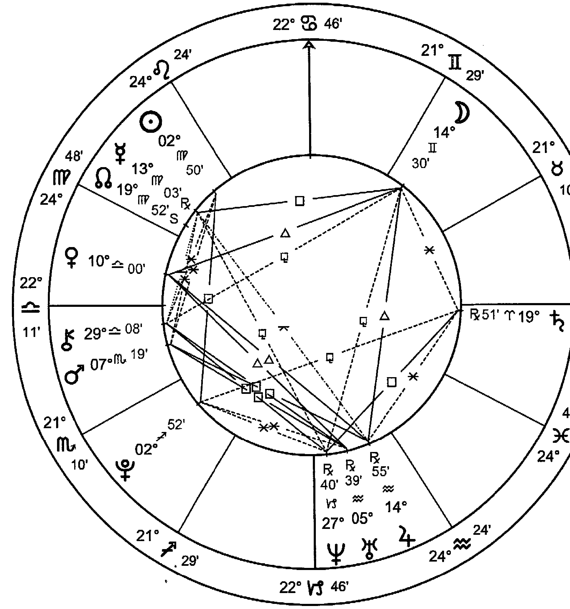

（圖 04-40）1997 年 8 月 26 日台灣股市圖。

的最高日跟最低日都是同樣道理，都相當值得我們研究。

如果你觀察的是股票或基金，你可 以使用那一天開盤的時間，而我也許的沒有觀察過最高點一刻或最低點一刻那個時間點的星盤，你們如果有興趣的話可以研究一下，它們說不定也有一定的

256 获取更多好书，请加微信：13641926204 或 QQ:715104687

Taiwan 1999
Event Chart
22 Jun 1999, Tue
09:00 AWST -8:00
taipei, China
25°N03' 121°E30'
Geocentric
Tropical
Placidus
True Node

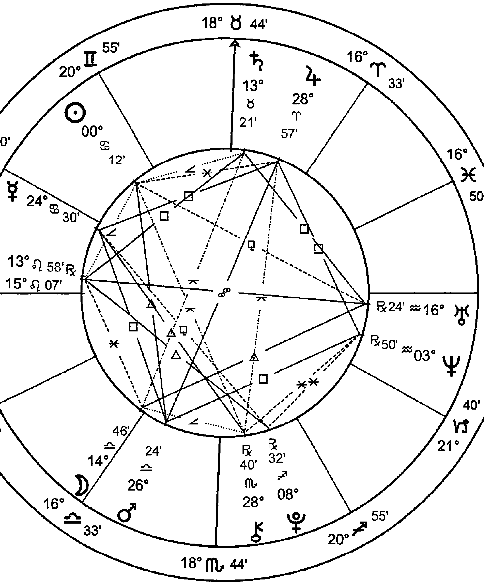

（圖 04-41）1999 年 6 月台灣股市圖。

至於變盤的方向，我要老實跟你們說這其實沒那麼簡單，你也大概猜得出我的答案——你必須觀察那一陣子的走勢，其實這也是比較實際的態度。我不

能告訴你行運土星經過就會跌市，例如1997 年跟 1999 年的星盤都是高價圖，1999 年土星在金牛 13 度，跟 1997 年木星的位置形成四分相，而且我們知道

Taiwan 2007
Natal Chart
8 Oct 2007, Mon
09:00 AWST -8:00
taipei, China
25°N03' 121°E30'
Geocentric
Tropical
Placidus
True Node

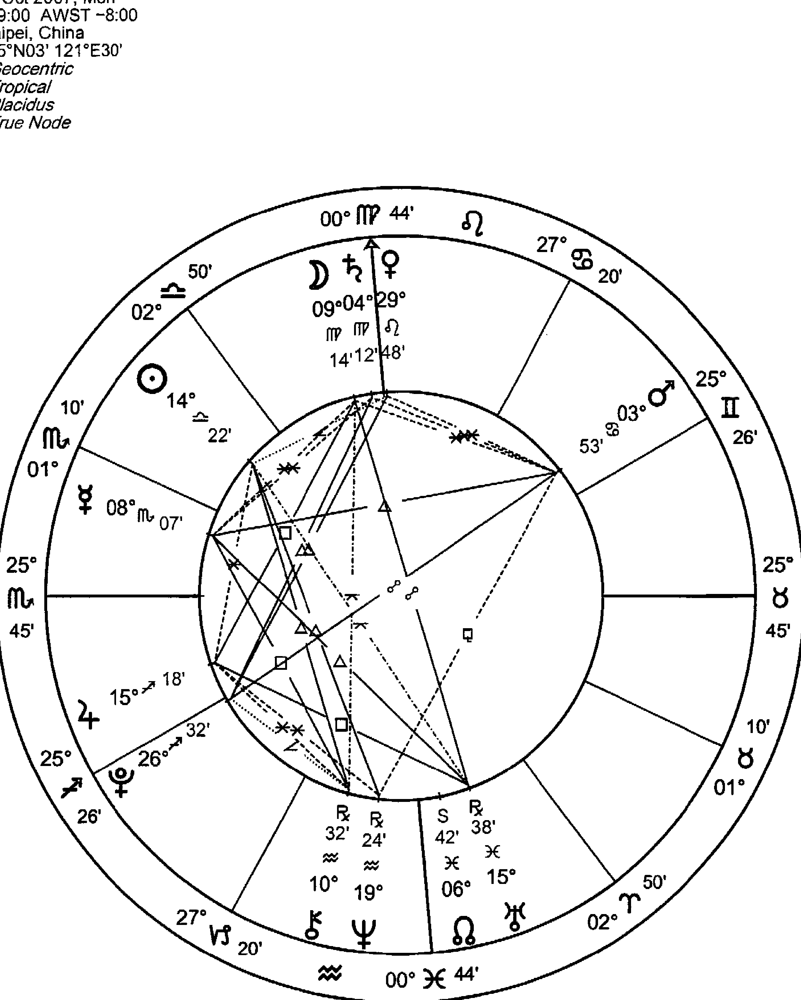

（圖 04-42）2007 年 10 月 8 日台灣股市圖。

1999 年 6 月 22 日的時候台股漲到了階段性的高點，當時土星擠到了木星，我們可以推測有可能下跌；同時我們要根據當時的股票做出判斷，如果當時市況

不斷上漲，我們可以推測當土星踩到木星的位置時，這個高點就有可能被擱截下來。所以你必須同時參考那一陣子現實層面的跡象，變盤點越接近，你越會

获取更多好书，请加微信：13641926204 或 QQ:715104687

Taiwan 2000 B
Event Chart
5 Apr 2000, Wed
09:00 AWST -8:00
taipei, China
25°N03' 121°E30'
Geocentric
Tropical
Placidus
True Node

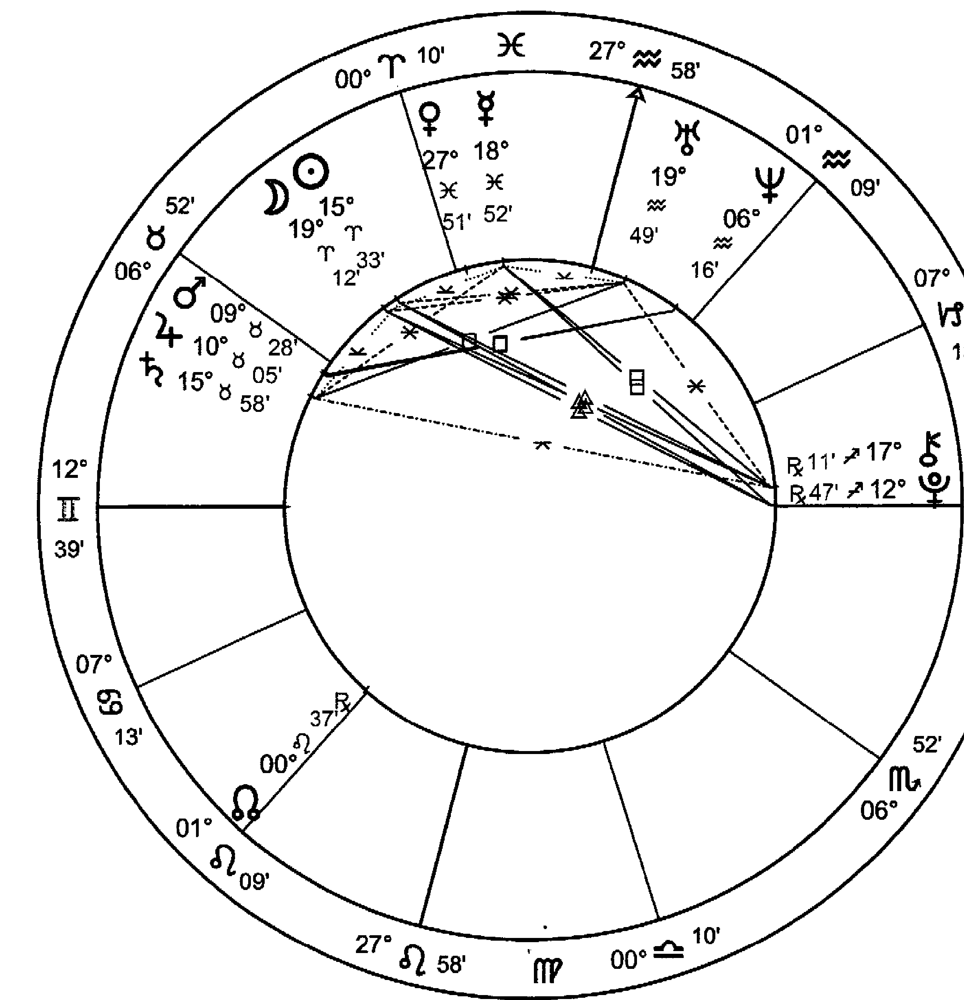

（圖 04-45）2000 年 2 月台灣股市圖。

知道變盤的方向。另外，如果出現了新的歷史，那麼往後的高點很有可能被這新出現的高點所影響。

月、等等技巧縮小範圍，抓出更精準的時間點。

事實上，圖象星暦是非常好用的工具，我們可以把歷史高價圖或低價圖的木土位置當作是敏感點，每次當木星、土星、三王星或者凱龍來到它們的敏感點，而且你預期正將變盤的時候，你就可以抓出它的簡單時間區塊，然後再運用我們之前學習的技巧，例如新月、滿

Taiwan 2000
Event Chart
5 Apr 2000, Wed
09:00 AWST -8:00
taipei, China
25°N03' 121°E30'
Geocentric
Tropical
Placidus
True Node

（圖 04-45）2000 年 2 月台灣股市圖。

2000 年 2 月台灣股市再次來到高點的時候，其中天王星在固定星座中間，火星來到變動星座 29 度，木星土星合相，這個合相位置雖然沒有落在剛才的敏感點，但這時候的木星相當接近 1997 年的木星。至於在 2000 年 4 月 5 日的星盤中，土星也來到了金牛座 15 度的位置，我們剛才討論過，這是台股攀上歷史高點並且準備滑落的階段，這星盤的土星映點也觸碰到了 1997 年星盤中木星的位置。由這些高價圖的示範中，我們明白到一個市場或商品高價圖，其敏感點包括了第三泛音盤和第八泛音盤的位置。

我希望告訴大家的是，在財經占星學中，被簡化爲「第 3 天」跟「第 8 天」、「第 35 调」跟「第 8 调」或「第 3 個月」跟「第 8 個月」的第三泛音盤跟第八泛音盤技巧及映點都不應該被忽略。事實上，兩種泛音盤技巧計算的是黃道中的 8 個敏感點及 3 個三分相位置，我們也討論了要同時把映點及反映點納入考量。所以，如果你明白這些方式的话，不妨開始嘗試找出你所投資的市場當中的這些敏感點，觀察你想要投資的目標，它在某一天來到最高或最低點的時候，找出當中的這些敏感。

點，當外行星觸碰這些敏感點的時候，那通常會是我們需要注意的時刻。

## ※ 沙羅周期及銀河中心

在個人占星學中，沙羅周期跟銀河中心這兩個主題並不特別重要，但當從世俗占星角度出發的時候，我們很有可能透過它們觀察到一些比較特殊的局勢。

### 沙羅周期

日蝕在意象上是「太陽被吃掉」，是不太好的兆頭。在日全蝕的十多分鐘之間，太陽會變得黯淡無光，同時也會引起很大恐慌。太陽在古代象徵君王，當太陽被擋住的時候，古人們想像太陽被怪獸或龍吞掉，占星師會在這時候向國王做出建議，以免影響其安危。於是就有傳說指國王必須於日蝕前暫時離開其王位，並且立一個假君主，待日蝕過後再把這假君主趕走。由此可見，在古代君王眼中日蝕是重要的，因此預測下一次日蝕何時發生是當時占星師的重要工作，占星師也因而透過不斷觀察整理出一套相當科學的計算方式。

簡單來說，如果今天在北京發生了

一次日蝕的話，占星師會肯定地告訴你，下一次要在北京看到相似的日蝕會是56年後的事。我們知道日蝕跟南北交有密切關係，地球的軸線是傾斜的，所以太陽及月亮也會圍著我們打轉，它們越過赤道並穿梭於南北半球之間，太陽也是這樣子在南北回歸線之間運行。日蝕的發生是因爲新月發生在南北交界的地方，也就是太陽、月亮跟地球軌道交會之處，屆時太陽的光線會被月球擋住，所以地球某個角落的人們會看到太陽完全被月亮擋住，這就是日蝕發生的時候。當占星師觀察的時候，他們看到的是南北交點18年又9個月的循環，他們也把這循環命名爲沙羅周期（Saros）。

天文學家及科學家把沙羅周期重新編排大概是八十年代發展的事，占星師用的是古代的沙羅周期，它告訴我們一種日月蝕發生的秩序，跟現在天文學家使用的不一樣。南北交點每18年9個月會回到黃道上同一位置，但是新月滿月也有這種循環，當它們走在一起，就會形成一個複雜的循環——歷時大概18年9個月的沙羅周期。每相隔18年9個月，日月蝕會發生在黃道上相近的度數，這些發生在相近位置的日月蝕被視爲屬於「同一組沙羅周期」，南半球及北半球各自編排了1至19號日月蝕變化。

所謂沙羅周期影響，19年一次循環的沙羅周期會發生在黃道上同樣度數，每54～56年（每3次）會回到相近地區，並會在地球上由極地往赤道移動。我們知道最近一次全新周期發生於2011年，假設它是編號5的第一次，18年又9個月後，編號5的日蝕會發生在相同時間的南極上空，19年後2029年的日蝕會發生於再靠近赤道一點點的緯度位置，然後移動經度，2048年又會再往上一點點然後經度移動120度，這3次日蝕都發生在不同地區，到第4次，它會回到黃道上54年前相近的地方並靠近赤道一點點的位置，就這樣一直移動到赤道，歷時將近一千多年，一直到它去到另一頭或是另一極，這個周期就會結束，同時會有新的沙羅周期在南極發生（也可能是由南往北，到赤道結束）。

同一沙羅周期的日蝕每次會移動120度經度，假設第一次在格林威治0度的话，1925會發生的位置會往前移120度並往南一點，1943又再移120度，最後又回到格林威治0度。

公元2011年6月及7月同時發生

日蝕，7月1日那次是日偏蝕，發生在南極附近，2029年7月11日也會發生一次日偏蝕，位置從非洲南邊移到南美洲，再下一次會發生於2047年，將發生於澳洲附近，2066年則會發生於印度洋上空——每18年9個月發生於相近日期，一邊往西移動一邊往另一極前進，每56年回到原來地點附近。

同樣地，2011年6月那一次日偏蝕正在消失，所以2028年6月那次會發生於更北邊，2047年6月它會更加接近北極，占星師用這種方法設計了19套沙羅周期，發生位置越接近赤道則越會是日全蝕。

貝爾納德·布雷迪（Bernadette Brady）是著名的沙羅周期研究者，她的一些技巧比較不電腦化的，很多占星師都認爲她的研究相當有趣，她其中一本名爲Predictive Astrology的著作，其中一半章節都在介紹沙羅周期，她認爲每一次的沙羅周期都會有一個所謂誕生的时候，也就是這個沙羅周期第一次在兩極其中一方被觀察到的時候，這是過去的占星師無法觀察到的。當2011年第一次的沙羅周期出現在南極的時候，很有可能就用那一天南半球的地理位置去建立那一次日蝕產生時間的星盤，並根據當時的行星相位及中點去判斷這一系列的日蝕大致上有怎樣的氛圍，我們可以使用7月11日南極的星盤，從中判斷出一些跟這系列日蝕相關的特別事情。

下頁圖SNN13是這系列日蝕的誕生星盤，編輯爲南半球13。當中有土天冥日月大十字，因此，往後每18年9個月一次的日蝕都會有著這個大十字的氛圍。布雷迪會使用中點，所以我們也可以用中點去觀察這些星盤。

2016年的南半球日蝕編號爲南半球18（圖SNN18），它於1096年8月20號下午6點第一次被觀察到，當時日月處女，金星巨蟹20度，水星獅子25度，我們看到木星在水瓶20度，所以當中重要氛圍會是金木150度，金星木星都跟金錢有關，這一系列日蝕也許暗示了跟財富有關的危機。同時布雷迪也用簡單的文字描述了日蝕誕生星盤中的金土中點：「這一系列的日蝕是一個象徵分手、分離、結束的日蝕，很可能有人會離開或移民國外，政治上可能象徵時代的結束，並帶來新的機會。」
[/content]

## 財經占星全書

盤告訴我們一種踏實、把眼光放在當下的氣團。對個人來說，這可能暗示我們看見舊有狀況如何影響我們，讓我們透過它們看到更實際的畫面，而其中的金木土四分暗示了現實與理想的差距及對未來懷抱的夢想。

透過沙羅周期，我們可以看到

Solar Partial Eclipse (NM) Event Chart 1 Jul 2011, Fri 9:53:54 am BST -1:00 London, UK 51°N30' 000°W10' Geocentric Tropical Placidus True Node

Compliments of:- Rod Chang rod@rodmagic.com

# Chapter 4 進階財經占星技巧

2016 年春天的日蝕發生於峇里島附近，它會重覆 1998 年的特質。沙羅周期第一次在兩極被看見的時間所建立的星盤非常重要，並爲同系列的日蝕帶來了近似的氣圍，這需要豐富的想像力，它同時也告訴我們每次的周期發生的第一次日期在哪裡。有些日蝕非常古老，例如在 2015 年遇到的第 18 號日蝕，它 Solar Partial Eclipse (NM) Event Chart 20 Aug 1096, Wed 6:33:14 pm LMT +0:00:40 London, UK 51°N30' 000°W10' Geocentric Tropical Placidus True Node

（圖 SNN18）

获取更多好书，请加微信：13641926204 或 QQ:715104687

269

## 財經占星全書

第一次出現在地球的時間是公元 1060 年 2 月 4 號 9 點北極，沙羅周期的誕生星盤告訴我們這日蝕家族的特性。

2015 年 3 月我在英國看到日偏蝕，如果我把它發生的年分減去 54，代表這是 1961 年曾經在英國發生過的日蝕，同樣地，如果我把 2015 加上 54 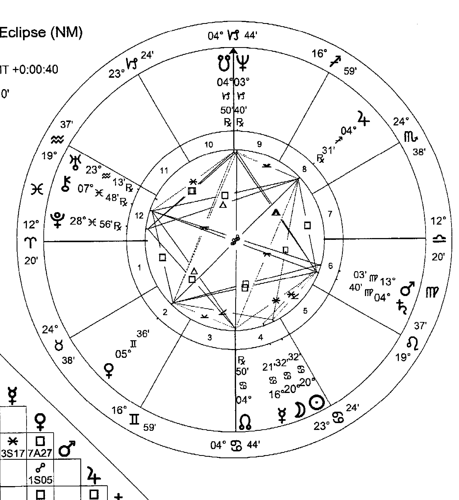

Solar Partial Eclipse (NM)
Event Chart
5 Jul 1331, Fri
10:55:56 pm LMT +0:00:40
London, UK
51°N30' 000°W10'
Geocentric
Tropical
Placidus
True Node

（圖 SNN19）對應的表格内容

Compliments of--
Rod Chang
rod@rodmagic.com

270
获取更多好书，请加微信：13641926204 或 QQ:715104687

# Chapter 4 進階財經占星技巧

的話，2069年的時候會有日蝕發生於4月21日，而且會是一次整個歐洲都看到的日偏蝕，這系列的日蝕同時也會走向北極並慢慢消失。

的焦點（意識與無意識的）這一類的意涵。如果你能夠讓全世界的人圍著你打轉的話，你可能就是領袖、核心、重點所在。

如果想要預測明年沙羅周期，我們可以觀察上一次同系列日蝕時的重大社會事件。1997跟1998年曾經有兩項重大事件發生：東南亞經濟危機及俄羅斯經濟危機，我們目前也己經看到各地有太多經濟問題發生。

### 銀河中心

我們都知道地球圍著太陽公轉，它位於太陽系的特定位置，而太陽事實上也在圍繞著某更大的中心點旋轉——太陽系是銀河系的一部分。因此，如果要觀察太陽系跟銀河之間的關係的話，我們可以把注意力放在銀河正中央上。根據科學家的研究跟描述，那裡應該有一個巨大的黑洞，它有強大的吸引力讓整個銀河系圍著它打轉，從地球觀察的話，銀河中心會被投射到射手座26度的位置，這個位置在當代占星師眼中是相當重要的敏感點，它尤其是世俗占星研究所在。

在占星學上，銀河中心可能意味著事件發展的中心、以及事件與人們環繞的焦點（意識與無意識的）這一類的意涵。如果你能夠讓全世界的人圍繞你打轉的話，你可能就是領袖、核心、重點所在。

德國總理梅克爾（Angela Merkel）誕生於1957年7月17日，本命火星正好落在銀河中心；另一位歐洲領導也有火星落在這位置——普京的火星跟梅克爾的火星合相，法國總統的本命火星也在這裡，他們擔當歐洲領袖的時候，歐洲居然沒有戰爭或衝突其實還讓我訝異的。另一個案例比較讓我不吃驚，羅馬天主教教宗的太陽也在銀河中心25度54分，所以我們看到這些人物都有讓人圍繞著他打轉的本事。愛德華·史諾登（Edward Snowden）的南交點及海王星也在射手座26度，當他洩露機密後，全世界都圍繞他打轉，這裡並不限於人物，只要有行星落在射手座25至27度的话（1度角距容許度），不論那是人物本命盤還是事件盤，它都很有可能可以運用銀河中心做出重大事件及改變。

冥王星於2006至2008年期間一直落在銀河中心，所以我們看到當時非常重要的金融危機，從歐洲、美洲到亞洲都被捲入；2001年則是凱龍落在銀河中心，當時發生了911事件，所有人都被捲入這種「生命消失」的感受。1980年代末期，中國及東歐政局都不穩定，當時有著天海摩羯的影響，但事實上1988年左右這些事情就開始蘊醞，蘇聯總統戈巴契夫改革時就經有跡可循，當時天王星都落在銀河中心。同期，台灣跟南韓也有相當大程度的政治解放；1929年華爾街崩盤的時候，土星就正好在銀河中心，而火星每次進入銀河中心的時候我們也會提高警覺，它相當有可能是另一次危機及衝動，因為它會觸動三位歐洲領袖的本命盤。

火星會在2016年9月20日靠近銀河中心，但目前土星在射手座，它會在2017年2月5號進入射手座25度，整個2017年的二月都會停在銀河中心，一直到三、四月會開始在那裡逆行，停留在這位置一直到五月繞回射手座26度，於六月退出到24度，最後於十一月再一次經過銀河中心，這些時間點都是人們應該注意的。

每當土星經過銀河中心，像是1929年我們可以看到土星帶來全球的重大蕭條，1958年當時有明顯的全球民權運動，所以我們看到每次有外行星經過銀河中心的時候，都應該注意重大事情的發生。外行星經過銀河中心會帶來這些特質：第一，所有人跟所有國家都會被捲入，圍繞某些事情打轉；第二，黑洞的特質，人們會體驗相當大的壓力，也會有看不見光芒的感受，所有東西都會被黑洞吸入並處於混沌、失控、失序的狀態，這樣的騷動會讓舊秩序鬆動，新的秩序繼而產生。

黑洞本身是恆星的結束、死亡、崩場，一個恆星在死亡後會產生大爆炸，那是往內的塌陷，所有東西都會被拉往那邊，然後形成黑洞，但這樣的過程同時也造就了新星系的誕生。在過去的事件當中，如果没有1986年戈巴契夫的改革，1989年就不會有東歐的政治改革，因為戈巴契夫當時鬆綁了很多事情，讓東歐國家開始想做自己渴望的事情。注意射手座26度的位置，所有行星進入摩羯座之前都會經過銀河中心點，如果外行星進入摩羯座徵重要世俗工作的開始的話，那麼銀河中心很可能就是把舊有的東西打掉、鬆綁舊有秩序讓新的事物發生。這些所謂誕生在銀河中心的人物不一定會是名人，但是如果你有個人行星落在這裡的話，你很有可能運用這行星的力量，讓人們跟你合作或繼續你打轉，你也有機會成為重要人物。

這幾年，只要火星靠近銀河中心，通常都會發生一些重大的戰火，例如

2014 年 10 月當火星經過銀河中心的時候，巴基斯坦與以色列因爲耶路撒冷恐怖攻擊衝突加劇，而美國芝加哥因爲黑人被射殺的事件引發大舉抗議。但火星經過銀河中心歷時相當短，外行星經過時則通常會有非常重要的事情發生。

# Chapter 5 2016 年變盤時刻

# Chapter 5 2016 年變盤時刻

在這個部分，我會示範如何綜合本書中討論過的各種技巧，計算出一年之中重要的變盤時間點。

我們已經討論了相當多關於如何計算出國際投資市場變盤時刻的占星學技巧，討論過姜恩技巧跟占星學之間的連結，也有一些相當專注於占星學之上的內容。我想要提醒各位讀者，如果你想要研究變盤技巧的話，我已經說過很多次，不要跳進星盤中抓住其中一組相位，然後無限上綱說那代表變盤時刻，外行星的相位也許還有一定程度的可靠 性，但內行星的話真的盡量避免這樣做。

在高價圖或低價圖的技巧中，當你看到某一組相位跟這市場的高價或低價有關的話，一般來說我都建議「從頭開始分析」，先研究這個市場或這個地方，無論你研究的是香港、中國還是美國，我們都要優先觀察日月蝕圖跟四季圖對這區域帶來的影響。要觀察日蝕圖及月蝕圖中有沒有行星落在星盤的四個軸點，如果有的話，這個行星可能會影響未來一整年的氣團。另外，我們也可以觀察當中的第二宮，因為它跟這個區域的金融財富有關，當然也别忘了天頂，我已經多次重覆它在傳統占星學中象徵「獲利」，所以，觀察天頂跟天頂守護星的吉凶、分析它是否受到其他行星干擾會很有幫助。

當分析了將會持續影響一年及半年的日蝕跟月蝕後，接著要觀察四季入境圖。每張入境圖都會帶來持續三個月的影響，雖然我自己習慣比較著重春分圖及冬至圖，但比較適當的方法是四張入境圖都要做出觀察，因為這會比較準確。看看四個軸點附近有沒有行星、跟金錢、金融及交易有關的金星的位置、第二宮及第八宮，當然不要忘記天頂、天頂守護星及木星，木星多半也跟財富有關；然後，我們可以把日蝕圖、月蝕圖及四季入境圖套到國家星盤及市場星盤之上，例如紐約證交所的星盤，從而觀察這些占星技巧的星盤對當地的影響。

這是非常基礎的判斷，也只有進行了這些步驟，我們才能夠斷定這一季期間市場是否面臨重大變化，接著才跳到高價圖及低價圖的分析之中。

我們會以美股及上證做爲分析例子，因爲這兩個市場跟我們中港台地區比較有密切關聯。

## ※ 2016 年紐約證交所變盤時刻

我們先觀察以紐約爲基礎的 2016 年 3 月日蝕圖（圖 05-01），記住當觀察日蝕圖的時候，別忘了日蝕發生的度數，因爲那個度數會非常敏感。我們都知道一張星盤有很多地方需要關注，以至於有時候連我也會一時疏忽而忘了某些重點，事實上日蝕的度數非常敏感，例如在上面的日蝕圖中，日蝕發生於雙魚座 18 度 55 分，在 2016 年 3 月 29 日，埃及發生了一宗劫機事件，當時很多占星師就指出劫機發生時金星剛好在雙魚座 19 度，當時我就想：「居然連金星觸動日蝕度數也會發生這種程度及性質的事件。」而因爲那是金星，我當時還在想至少事件應該會比較溫和，或至少會有金星氣團的特質，然後我就從媒體那兒聽到關於這名劫機者的故事：他先要求政府庇護，然後要求跟前妻通話，據說他劫機就是爲了跟前妻聯繫。

這聽起來是非常罕見的劫機事件，因爲一般來說我們可能覺得劫機事件會牽涉傷亡或衝突，但這次劫機完全沒有任何人受傷，乘客還跟劫機者自拍，這的確是非常金星特色的劫機事件。我覺得當時還好是金星經過這位置，因爲聽說劫機者的確有把炸彈綁在腰帶上，如果觸動這個日蝕位置的是火星的話，恐怕事情發展就不一樣了。更有趣的是，這航班原定從埃及飛往賽普勒斯，賽普勒斯是神話中維納斯誕生的島嶼，整件事情都充滿了占星學的各種符號。

如果我们观察这時候的紐約的話，身爲第二宫守護星的火星跟土星都在第二宫，这告訴我們以紐約爲主的投資市場絕對需要注意，很可能會有火星的爆衝跟土星的蕭條同時出現。另外，雖然我們一直強調影響最大的真的是靠近四個軸點的行星，但在這張星盤中我們沒有看到任何行星靠近四個軸點。

我们也可以用傳統的方法观察天頂守護星及二宫守護星，二宫守護星火星在射手座 1 度，它跟水星及金星都有相位，这可能暗示了交易上的一些狀況；天頂的守護星是月亮，月亮在雙魚座，靠近日蝕位置，这可能告訴我們這一年的獲利或許不是太好。
接著，我们观察兩星期後的月蝕
Appulse Lunar Eclipse (FM)
Natal Chart
23 Mar 2016, Wed
07:00:46 EST +5:00
New York, New York
40°N42'51" 074°W00'23"
Geocentric
Tropical
Placidus
True Node

（圖 05-02）

（圖 05-02），这星盤就更噁人了。當中有冥王星合天頂，天王星则靠近上升點，这兩個位置告訴我們這個區域在月蝕過後的半年之內應該會有重大事件。

要注意的是，古代占星師有一種說法，在那些能夠用肉眼看到日蝕或月蝕的區域中，人們可以把接下來一年分成四個區塊，當日蝕或月蝕出現於第十宫至第
2016 Aries Ingress
Natal Chart
20 Mar 2016, Sun
00:30:08 EDT +4:00
New York, New York
40°N42'51" 074°W00'23"
Geocentric
Tropical
Placidus
True Node

（圖 05-03） 2016 年紐約春分圖。

十二宫的位置，相關事件通常會於日蝕或月蝕後三個月之內發生；如果是在第七宫至第九宫之間的話，那麼它會在距離日蝕或月蝕三個月到半年左右發生。 以剛才的日蝕圖為例（圖 05-01），日蝕發生在第五宫，所以相關事項會在日蝕之後大概六到九個月左右發生，火星跟土星落在第八宫，所以這一年

## 財經占星全書

Solar Total Eclipse (NM)
Natal Chart
9 Mar 2016, Wed
09:54:25 AWST -8:00
Shanghai, China
31°N14' 121°E28'
Geocentric
Tropical
Placidus
True Node

(圖 05-07)

## * 2016 年上海證交所變盤時刻

接著讓我們觀察上海。當我們把
2016 年的日蝕圖地點改為上海（圖 05-07），可以看到火星合軸下降點，這就
已經非常精彩了。當然，日蝕圖顯示的

# Chapter 5 2016 年變盤時刻

Appulse Lunar Eclipse (FM)
Natal Chart
23 Mar 2016, Wed
20:00:46 AWST -8:00
Shanghai, China
31°N14' 121°E28'
Geocentric
Tropical
Placidus
True Node

（圖 05-08）2016 年3月月蝕圖。

不單指經濟事件，出現在這裡的火星很可能暗示了一些暴力事件或衝突事件出現在上海市區；第二宮的守護星水星也不是很強勢，天頂守護星土星當時正
跟木星四分相，而且跟日蝕位置的日月形成 T 三角，土星是當中的壓力端點，木星的氣圍不會不存在，它的氣圍仍然會是擴張膨脹，但會讓人感到威脅。

Solar Annular Eclipse (NM)
Natal Chart
1 Sep 2016, Thu
17:03:02 AWST -8:00
Shanghai, China
31°N14' 121°E28'
Geocentric
Tropical
Placidus
True Node

（圖 05-09）2016 年 9 月日蝕圖。

上一頁是上海 2016 年 3 月的月蝕圖（圖 05-08），它比較沒有顯著的影響，火土一樣在第二宮，所以三月到六月上海證券的狀況真的非常值得注意。 上面是 9 月的日蝕（圖 05-09），木凱對分落在二八兩宮，木星是天頂守護，它在處女座 28 度不算是好事情，原因首先是它弱勢，另外它也四分了
Appulse Lunar Eclipse (FM)
Natal Chart
17 Sep 2016, Sat
03:05:02 AWST -8:00
Shanghai, China
31°N14' 121°E28'
Geocentric
Tropical
Placidus
True Node

（圖 05-10）2016 年 9 月月蝕圖。

銀河中心，同時第十宮也有火土緊密合相，而且木星落在第八宮，很有可能一些一直沒有曝光的事情會逐漸被揭露。

2016 Aries Ingress
Natal Chart
20 Mar 2016, Sun
12:30:09 AWST -8:00
Shanghai, China
31°N14' 121°E28'
Geocentric
Tropical
Placidus
True Node

(圖 05-11) 2016 年上海春分圖。

八宮軸線的主題絕對是 2016 年人們值得注意的。接下來，我們同樣再用四張入境圖去做季度預測。

首先是上海的春分圖（圖 05-11），二宮守護位於天頂，而且這是它擢升的位置，雖然這看似對經濟會有非常正面的影響，但別忘了天頂附近同時
2016 Cancer Ingress
Natal Chart
21 Jun 2016, Tue
06:34:09 AWST -8:00
Shanghai, China
31°N14' 121°E28'
Geocentric
Tropical
Placidus
True Node

（圖 05-12）2016 年上海夏至圖。

有天王星，天王星代表劇烈的變化，所以我們可以預期它會帶來突發的震懾；
同時，天頂的守護星是火星，它三分太陽，因此基本上我認爲這一季上海的股
市還是不錯的。
上圖是 2016 上海的夏至圖（圖 05-12），首先我們看到天頂守護星火
2016 Libra Ingress
Natal Chart
22 Sep 2016, Thu
22:21:06 AWST -8:00
Shanghai, China
31°N14' 121°E28'
Geocentric
Tropical
Placidus
True Node

（圖 05-13）2016 年上海秋分圖。

星在第五宮逆行，十宮依然有天王星在裡面，它象徵劇烈的變化；第二宮跟第八宮沒有行星，但冥王星相當靠近下降點，這暗示了第二季出現問題的機率可
能會比較大一點；另外，土海四分落在五宮跟九宮，這會是需要值得注意的，別忘了它是比較全球性的相位。

2016 Capricorn Ingress
Natal Chart
21 Dec 2016, Wed
18:44:08 AWST -8:00
Shanghai, China
31°N14' 121°E28'
Geocentric
Tropical
Placidus
True Node

（圖 05-14）2016 年上海冬至圖。

左圖是 2016 年的秋分圖（圖 05-13），我認爲這張圖相當值得一看：海王星落在天頂，而且它是天頂守護星，天頂的另一守護星是木星，正跟太陽緊 密合相，它落在天秤座並跟火星四分相；注意火星的位置，火星正經過銀河 中心，記得我們在之前曾經討論過，每 次當火星及外行星經過銀河中心的時
候，世界都會出現一些非常劇烈的變動。

圖 05-13 這張星盤中月亮是二宮守護，它落在上升點上面，對經濟及財富的關注會是 2016 年秋季上海的焦點所在。另外，海王星在天頂，火星在下降點，它們正呈現共軸關係，會在這裡產生共鳴。火海象徵騷動及混亂，而且這時候海王星也相當靠近南交點，記住靠近月交點的行星特質會是那陣子所有人都感受到的，海王星讓很多事情變成泡沫，這會是上海第三季需要注意的事情。海王星的另一層面是暴涨，如果整體外行星的形勢是好的，那麼的確會有暴涨的可能，但是根據行情以及到這爲止的分析，我們清楚知道當下應該只是等它下滑而已，上海於 2016 年秋天期間相當值得注意。
安全、公共衛生或食物安全相關事件也許有可能爆發並影響到股市，因爲這都跟火海有關。尤其冥王星同時出現於軸點的時候，我懷疑會不會有重大傷亡，這些會是第四季上海需要注意的主題。同時，這張冬至圖是 12 月 21 日星盤，待會當檢查準確時間點的時候，我們會看到 2016 年聖誕節假期期間會有非常多的星相變動，也就是說，當聖誕節及新年假期一放完，市場可能就已經到頂，可能要救也來不及。雖然這張冬至圖會跟 2017 年最初三個月有關，但是如果你要在投資市場進行任何動作的話，也許在聖誕節之前完成會比較適合。每當看到這種長假期間有那麼多星相變動的時候，難道要等到假期完結之後才出手嗎？
最後是冬至圖（上頁圖 05-14），冥王星相當靠近下降點，天王星則相當靠近天頂，海王星在第八宮靠近第九宮的地方，火星在雙魚座靠近南交點；南交點有著「你過去所做的事的呈現」的意涵，記住不要只爲占星符號賦予一層意涵，南交點也不是只跟業力有關，北交點是吸收，南交點則是釋放，當海王星跟火星都這麼靠近南交點、而且都落在第八宮的時候，我懷疑重大的公共安全、公共衛生或食物安全相關事件也許有可能爆發並影響到股市，因爲這都跟火海有關。尤其冥王星同時出現於軸點的時候，我懷疑會不會有重大傷亡，這些會是第四季上海需要注意的主題。

接下來，我們要一步步的做出整理。在上面討論過的紐約跟上海眾多星盤中，基本上我們知道 2016 年整體來說都不算太好，但當中其實有兩個特別重要的時間點：首先是 2016 年 4 月至 6 月這段時間，當中會有相當多激烈的行星主題；另一個時間點則是第四季的時候，記得要習慣觀察日蝕及月蝕的技巧，我們會一直運用到。

2016 年 3 月的日蝕發生於雙魚座 18 度 55 分，於是，任何行星來到變動星座 18 度 55 分附近的時候都會成爲觸動日蝕的媒介。我通常建議先找出一些重要的星相，例如逆行、停滯等等，當這些星相發生的時間點一個個慢慢累積起來，我們就會歸納出一些日期，這些日期會很明顯地指出整體不算很好的狀況。同樣地，月蝕在 3 月 23 日發生在牡羊天秤軸線的 3 度 17 分，我們也需要注意這個度數，有非常多的國家成立日期在 1 月 1 日，它們的太陽多半都落在開創星座 8 至 9 度，每當看到牡羊天秤或巨蟹魔羯軸線的月蝕，我們就知道那幾乎會涉及全球，没有人能夠倖免。

發生的位置落在日蝕或月蝕的度數的話，通常就會觸動，很多重大事件都會發生於這些時間點當天或前後一兩天。
我記得 2007 年英國的爆炸案剛好發生在上弦月，而那次上弦月就剛好觸動到那一年的日蝕，自此之後我就開始持續的觀察，並發現很多重要事件都發生於上弦月或下弦月觸動日蝕或月蝕的時候。2016 年需要注意的時間包括 6 月 5 日的下弦月到新月期間，它發生在雙子座 14 度，會觸動到 3 月 9 日發生於雙魚座 18 度的日蝕；而 6 月 12 日的上弦月會觸動日蝕點，加上海王星停滯，6 月 27 日的下弦月則會觸動日蝕點，加上火星停滯。

所以大家現在應該會明白爲什麼我之前說六月是死亡陷阱，這時候大家可以做的是觀察市場反應，看看有沒有哪個金融機構或公司有報告要發表。

9 月 9 日上弦月會觸動日蝕點，9 月 23 日下弦月也會觸動日蝕點，10 月 1 日新月會在天秤座 8 度，並寬鬆地觸動月蝕，未來一個月循環會有很大機率被影響。有趣的是，同時行運火星也落在月蝕度數上，加上冥王星停滯，我們必須特別注意這段時間，不要忘記我一直提到開創星座前面幾度不是好玩的度數，同時這一天會是中國國慶，所以如果這
2016 年下半年的日蝕會比較特殊，9 月 1 日的日蝕發生於處女座 9 度 21 分，月蝕則於 9 月 16 日發生在處女座 24 度 17 分，距離跟銀河中心形成緊密四分相只有三度距離，如果當時有行星在這些位置附近的話，例如 2017 年 1 月水星逆行的位置會在射手座 28 度，那會帶來一定程度的影響。

根據習慣，我接下來會著手觀察上弦月跟下弦月的觸動，這是我在前面內容中沒有提及過的，也就是說，我們要找出太陽跟月亮每次四分相的時刻與度數，如果新月、滿月、上弦月或下弦月
時候有什麼消息的話，等到國慶假期回來之後，大家或許就來不及反應了。雖然那個月蝕點在3度，這次新月沒有真的很準確地觸動它，但事實上它們還是有關聯。一般來說，如果没有其他星象的重覆暗示的話，我真的會認為不用太在意它，但這裡除了新月之外，火星同時也有觸動到，而且火星的度數真的落在月蝕點之上，而當冥王星同時也在這裡停滯的時候，加上又是中國的國慶，這意味著它的太陽回歸，國家盤的太陽回歸絕對會釋放一些訊息。

蝕那一天，就越需要注意。 同時5月26日會是另一次正相位的時間，這也相當接近2016年6月危機時間點的地方。此外，越接近5月我們越要注意，因為在接近5月26日正相位的同时，到時候土海四分也會慢慢形成中，這絕對會添加多一層的危機。此時水星跟火星也會準備逆行，也就是說木土四分跟土海四分會同時出現；6月17日是土海正相位的時間點，我们都知道要注意這一天，越靠近這一天越危險，壓力也越來越增加，6月17日之後土星跟海王星就會慢慢出相位。另一個緊湊的時間點會是9月，那時候會有日月蝕，這個我們待會兒會再次討論到。

12月7日上弦月會觸動日蝕點，12月14日落在雙子座22度的滿月會跟處女座的日蝕點產生寬鬆四分相，土星射手也會與日蝕點四分，這些四分相帶來了一些緊張感，它們有機會意味著事情已經發生然後大家開始趕忙救市。最後是12月29日發生在魔羯座7度的新月，它會觸動月蝕，同時土星會觸動三月的月蝕點，加上天王星停滯，這也是需要高度警戒的日期。

接下來，我們會觀察2016年中一些重要的相位，首先是這本書中已經討論了很多次的木土相位，它會在2月20日至6月26日期間出現，所以這段時間會是我們需要警戒的，越接近3月23日正相位的時間，同時也是月一般來說，土天三分相不太得到人們重視，土星可能會是拯救，所以土天相位可能會是救市。那什麼時候需要救市呢？1月至4月期間沒有土天正相位出現，12月24日的正相位剛好也在聖誕假期之間。中國的朋友也許需要特別需要注意土冥相位，因為如果你有觀察上海證券指數的重要變盤時間星盤的話，當中都有土冥相位的出現，所以10月30日至11月21日期間也許需要注意一下。

而土冥會於11月10日正相位，此外，出現火冥相位的夏季也需要注意。一般來說火冥相位跟油價有關，我們知道2016年第一季油價會經創新低，4月初的時候又回來一點，如果它一直回穩的話，當5月17日至24日（21日正相位）火冥相位慢慢形成的時候，我們會需要注意一下；另外的火冥相位時間點會是8月1日至6日（4日正相位）及9月1日至4日（2日正相位），由於火冥相位會是油價變動的時間點，透過油價跟股市的互動，我們需要留意火冥相位的這三個時間點，縱使這火冥相位會是次要相位。另外要注意9月及10月火冥相位的時間點，包括10月12日至26日（19日正相位）、11月29日至12月1日（11月30日正相位）與及12月19日至22日（21日正相位）。

日金半四分相同樣是過去比較少人關注的，但透過我們

## 財經占星全書

## D. 日蝕月蝕

現在是否在顫動周期  
年度日蝕月蝕特點  
公司星盤是否受到日月蝕影響  
長期分析是否有利經濟發展  

## E. 中短周期影響

月亮狀態  
月亮是否出界或赤緯0度  
月亮是否在靠近近地球點或遠地球點  
北交點是否停滯且準備轉換方向  
消散月到新月/滿月到下弦  

## F. 內行星的影響

內行星與外行星相位  
內行星與北交合相（包括赤緯相位）  
太陽與北交的相位  
金星相位  
內行星其他重要相位  
內行星是否逆行  
內行星赤緯0度或出界  
內行星赤緯相位  
當下是否來到了內行星所暗示的市場劇烈指標或轉向指標  
