# 通向自我意识的占星指南

# 唐娜·康宁汉姆的一些电子版书目：

- 如何解读你的星盘：宇宙谜团的相位(How To Read Your Astrological Chart: Aspects Of The Cosmic Puzzle) 1999
- 你生命中的月亮(The Moon in your life)1996
- 月亮星座：内在生活的关键(Moon Signs: The Key to Your Inner Life) 1988
- 咨商占星家的指导手册(The Consulting Astrologer’s Guidebook) 1994
- 占星术和震荡疗法(Astrology and Vibrational Healing) 1988
- 占星和精神发展(Astrology and Spiritual Development) 1989
- 花香疗法手册(The Flower Remedies Handbook) 1992
- 治疗上瘾的精神维度(Spiritual Dimensions of Healing Addictions) 1988
- 治疗上瘾的深层维度(Further Dimensions of Healing Addictions) 1988

多亏了史蒂芬·阿诺尤以及 CRCS 出版社的同事们才有了这本修订版的《通向自我意识的占星指南》。如果不是史蒂芬·阿诺尤在二十世纪七十年代中期找过我，并让我考虑是否出本书，这本书将不会问世。尽管很多年前我就开始发表文章了，但是写一整本书对我来说依然是一件非常有压力的事情。史蒂芬坚持鼓励我，并且通过大纲和一开始的几个章节来训练我。尽管本书的版权在它第一次印刷的时候就已经卖给了 CRCS 出版社，并且通过这本书的出版我的声誉更胜从前。我非常感谢出版社在此书不再出版之后，把版权归还给我，因此这个电子版本才有可能问世。

没有我朋友汤姆·萨瓦雷斯的帮忙，这个版本是不可能问世的，多亏了他心中的仁慈，他浏览了电子版书目的每一页，因此我就不需要再将所有的书目再打入电脑中一次。过去的 20 年中，汤姆一直都是一个非常无私的朋友，我有幸能在生命中遇到他。除此之外，他的黑色幽默使我开怀大笑。

也感谢来自编辑服务商的慈祥的海勒霍格，她非常努力，用一种初学者的观点浏览了本书，使本书浅显易懂。也感谢凯伦·麦考利对于一些专业章节的编辑。

最终要对我早期的占星导师和老师们送上爱和感谢，特别是理查德·埃德蒙和罗德·崔斯。在书中你将时常看到他们的影响和洞见。

亲爱的读者：

欢迎来到电子书的世界。电子书能够提供非常丰富的图画，而彩色的图画和照片在实体书本中是非常昂贵的。电子书永远都不会消失，没有时间的限制。当一些新增的材料是有用的时候，你不需要再去买一本完整的实体书，仅需要下载几个新的章节就可以了。不像现在大部分的纸质书，当发行人发现觉得电子书还有教育意义时，电子书可能又会在多年之后被出版。

这种媒介带来了令人兴奋的可能性，我在此也制作了很多电子书。为了能得心应手，可以花点点时间去熟悉Adobe Acrobat Reader的性能。

然而，我希望你们仅仅保存电子版本而不要将其打印出来。我们都希望手中有本实实在在的书，然而改变是不可避免的，即使是有必要的。看树被砍的速度，在5~10年间，可能我们的孩子就不会有纸质的书了。通过电子书你我可以为环境贡献一份力量。它们对空气质量、濒危动植物种群和降雨量都是至关重要的。以下是一片古老森林的照片，以前的和现在的，它可能比我的语言更有说服力。

唐娜·康宁汉姆

## 基本占星术汇总表

为初学者准备的，本书中用到的一些专业术语的定义，全都集中在一起，以方便大家查阅。任何时候需要查阅，只需打开书签页，然后打开它就可以。

## 如何阅读电子书

掌握这种新媒介的一些小建议和指示；电子书的特征；给环境的礼物。

# 简介：别指责行星

三十多年前我写了这本书的第一版，现在我继续写一个修订版，我发现自己时不时地会...

对三十年前自己每一页中自己奉为经典的观点觉得搞笑和尴尬。那时的自己明显还有很多地方是需要改进的，然而那时的自己却似乎知道所有的答案。你可能曾经想过这个作者一定单手发明了形而上学、深度心理学和女权主义。

进入新纪元，已经年过 60，我对自己几乎没有那么多的答案，并且对你们也没有更多答案——然而我的客户和读者似乎发现我更加实用了，更不要说不再那么傲慢了。或许我仅仅是在生命中遇到了比较多的进退两难的局面，或者现在的生活本身比起二十世纪七十年代要复杂得多。而占星学仍然能教给我们无限的东西，因此这个版本就是为那些想要超越太阳星座进入更深层的命盘解读的初学者提供的一个学习指南。

由于占星学的发展，一个全新的因素需要被整合进来，这就是小行星。我请了我尊敬的同事，乔伊斯·梅森，写了凯龙星那一章，凯龙星是最常用的小行星。由于三十年前想都没想过会有占星软件，另一个挑战是技术。今天的学生将会为占星数据银行（Astro Data Bank）中的光盘信息而高兴，这些信息包括了 26000 个名人的星盘信息和其它一些有趣的案例，这一软件财富源于路易斯·罗登一生的工作，使数据收集工作成为一个连续长远的工作。在这个版本中，我额外列举出了占星数据银行中有特征的名人星盘图。

这些年在这个领域中我的角色一直是一个开拓者也是麻烦制造者，不过至少，我坚持下来了。过去十二年一直住在太平洋西北部，看着我们渐渐失去森林，我无法再容忍我的书以纸质的形式出版。除了成为你居住的环境的一个朋友之外，读电子书的你也会发现电子书有很多令人惊奇的特征，像搜索功能，以及同网络相连的链接。

另一个电子书的优势是我可以在新的版本中呈现很丰富的图片和其它图画，把想法图形化。（纸质书本呈现这么多的图片，成本是很巨大的！）这也使得单调的对着电脑屏幕的阅读丰富起来，它很快成为一种教学工具。

适当的图片可以使我呈现出比生动文字更好的效果，有助于抓住我 35 年通过占星学观察人们和循环的经验。单独用言语来描述一个冥王型的人或一个天王型的人的特质是单调的，直接给你一张他们的图片，会更生动。请记住，书中的每一张图片、彩色字体和每个符号都是有意义的。即使你意识上无法理解冥王星、月亮或土星的形象，下一次你可以通过身边人的行为来理解，照片更有意义。

这些年来不变的是写作背后的信念系统。让我来解读下我是如何进入占星术的，这样当你决定是否认同我的结论时，也有个大框架。我寻求星盘描述的特质和行为的心理学解释。简而言之，我不希望把星盘作为所有可能性的借口。（“我无法停止喝酒，法官，我是一个双鱼座。”）它是理解人们，发现人们优势和劣势的好工具。例如，一些临床医生把占星术作为他们工作的辅助工具，发现通过病人的星盘，很快能找到病人的问题。我也相信我们是可以改善的，通过洞见和意识的努力，我们可以停止神经和自我毁灭的行为。星盘有助于帮助我们找到使用特质的建设性方法。

我的第二个偏见是，正如题目所说，不该指责行星。我相信我们的生命不是被外力控制，而是我们自己的思考模式控制着我们的生命。行星只不过反映了在发生的是什么。就像一面镜子可以反映，但无法控制我们一样，行星不会使糟糕的事情发生在我们头上。我们通过自我毁灭、神经质、叛逆或忽略的行为使糟糕的事情发生。如果你被解雇了，非常容易指责那颗死天王星过我的中天。但为什么不责备自己一直以来工作总是迟到？同样地，行星也不会使好的事情发生。我们通过生命中可能的开放的态度、决心和信仰带来了好事。

你可能正在问，“如果这是真的，那么占星术的意义是什么？”这就像在问一个外科医生，X 射线的意义是什么，一个建筑师，这些设计图都是用来干嘛的，一个旅行者，为什么需要一张道路地图。如果你走错方向啦或没选择最佳道路，这不是星盘的错。

在其它一些类型的预言中，我们更容易意识到工具本身不会产生问题，而仅仅描绘出了地形和指出方向。例如，在手相学中，我们发现你的掌纹并不会决定你特定的生活方式，而仅是反映了你就是像那样活的。我们也不会觉得塔罗预测中，是塔罗牌导致了情景像牌中所说一样发生。我们意识到牌只不过是反映和描述了你现在可能的处境，以及如果你按此发展下去，会有的行为。如果你选择改变你的行为，情况就会改变。至于甚至是更加极端的行为，让我们来看一下茶叶。茶叶可以做预言，但如果你没有注意它们的警告，茶叶的确不该被指责。人们不会说这样的话，“直到我喝了那杯茶，我老婆才这么好”，除非，当然，茶里面有砒霜！

因为这也是为什么我们可以接受人们说，“海王星完全毁了我的生活，”或“土星毁了我的婚姻？”更好的描述方式是所有的星盘都只是描述性的。星盘描述的是你，不是星盘使你成为那样，也不是星盘限制了你潜能的发挥，或为你带来了负面表达，如果你现在潜能受抑制或负面表达很多的话。

在我写第一版这本书的时候，我一直被列为一个好战的精神疗法师，坚信二十世纪七十年代的绝对典型论证，如果你改变了你的想法，你可以改变你的现实。在这套信念体系下，不是外在状况决定了你的经历，而是你内心的态度、信仰、情感和需求，它们就像吸铁石一样吸引你生命中外在、可触摸的环境到你身上。就像很多有经验的形而上学家，我可能会推论出如果你切实遵守你的自我断言和看到的事情，那么你的外在事实是不会改变的，你在做一些错事，你在形而上学的挑战之中。现在我所处的位置更加温和了，不是盲目地乐观，在某种程度上，我非常不情愿地开始相信命运。无疑真相在两个极端之间。

我相信，正如很多占星师也相信，在我们出生前我们计划了我们这一生，我们的经历可以提供我们最大程度的成长。我们的本命盘携带了这个计划的密码，因此占星术是一个有助于理解和处理我们自己设定的挑战的学科。我们也必须意识到可选择的范围受到当时环境的影响，甚至是限制，这种自由选择也是人类集体一直在追求的。很多在这个领域中的我们相信，我们本命盘星座位置和外行星（天王星、海王星、冥王星）行运过的星座揭示了集体的命运。

另一个我的偏好是不拿业力去解释那些发生在我们身上的事情。同时我确信轮回转世，事实上它是一种推测起来需要怀疑的观念。我们一般没有智慧知道为什么特定的经历或特定的人会进入我们的生活中。如果我们能模糊看清原因，它通常仅在回顾上一世时。

很多时候“惩罚”不是关键点，设计的特定的痛苦经历有助于我们变得强大，使我们脱离陷入的常规中。这一生很多的痛苦是自作自受，没有人让我们拿头撞墙。这样的经历不是业力而是神经症，我们在有其它选择之前一直重复的自我毁灭的模式。“业力”仅是我们用来避免在我们制造的痛苦经历中自我检讨的标签，另一个完美的借口。

不幸的是，很多人把占星术当作一个借口，就像那些学了一点点心理学的人，或听过太多奥普拉的人，然后将生命中剩下的时间用来责备折磨他们的行星。占星术逃避会将责任推卸到更宽广的层次，“星体”。最高级别的借口是，当这么遥远、宽广和超出控制的东西制造了混乱时，是它们希望你澄清生命中的问题。

进化中的个人会从占星术和心理学中学到相同的东西，作为成年人，我们需要承担我们行为和自己的所有责任。我们意识或潜意识地通过我们内心的矛盾、需求和态度吸引外在的事件和情景。错误的思想和错误的行为是导致我们更大麻烦的根源。在一个问题情景中检视你的思想、行为和感情，看看你如何贡献或招致了你得到的虐待。

你会发现的是本命盘中每一个困难相位以及每一个行运和推运都会使我们在精神道路上走得更远，为我们带来更加积极、建设性的洞见。通过处理我经历的逆境、内心的冲突和困难，我们获得了成长的机会。记住这一点，我们可以将困难相位、行运和星座配置作为成长的机会。

占星术，更高层次的使用是活出我们生命的地图。星盘真实的用途是给我们关于自己更深的洞见，这样我们就可以欣赏我们自己的个性和潜能，然后使其更加完美地表达出来。从另一个角度看，你的星盘仅是你生命过程的一个仪表盘。你依然是驾驶员！

## 第一章：作为了解自我工具的占星术

对新人说的话 欢迎来到占星世界。你将会以相当剧烈的方式遇到很多新的术语和观点，有时你可能觉得你的脑袋被拉扯了。是的！我的编辑，海勒·霍格，她本身就是一个占星学界的新人，指出文中容易让人觉得混淆的部分，因此希望本文就像这个无法令人相信的复杂题目一般清晰简单。尽管文章中都会对术语做出解释，但有时你可能会忘记它们的意思。在这一页中的书签页，你将会发现一个占星术语表，这样子，任何时候你都能很快查询到你想了解的术语了。

占星术有两大实用功能。一个功能是鉴别出我们拥有的优势和能力，这样我们就能更好地利用它们。例如，仅是因为有很多占星家鼓励我写作，我对自己成为一个作家就有了信心。在那之前，我认为自己是一个恶心的诗人，只能停留在这个层次。我依然是一个糟糕的诗人，但是占星学给了我勇气让我尝试写一些其它的东西，这些东西带来了更大的成功和满足感。我本命盘里的信息导致了我事业和生活的改变，我成为了一个作家。

第二个功能，也是这一章中重点关注的，就是帮助我们发现我们自己制造问题的方式，以及导致我们自己和周围的人不开心的方式。正如我们在简介中学到的一样，行星无法对我们的开心或不开心负责，仅能指出我们创造自我满足或自我挫折的方式。星盘是真诚直接面对问题的指南。

外界任何批评都不一定会将自我挫折感强加到我们身上，它更像是我们自己的问题。你知道你成为自己最糟糕敌人的方式吗？传统地，为了找到这个答案占星家会看一看十二宫，但是整个星盘都需要调查。学习星盘中在困难星座、宫位和相位的行星将揭示出你是如何为自己制造麻烦的。

我们生命中自我挫折的方式就像服装设计一般。同一个款式可以重复使用。因为材料、颜色或大小不一样，所以衣服看起来也有些不同，但本质上款式是一样的。同样地，你进入的恋爱关系，朋友关系，或者工作环境可能在开始的时候看起来有点不一样，但是后来发现它们惊人地相似。例如，一位给我的咨询专栏写信的女士，她已经结过3次婚了，三次婚姻中丈夫都打她。尽可能巧妙地，我答复她这样的丈夫两个都嫌多了，然而潜意识地她选择了这些男人，除非她寻求帮助，几乎可以预见的是她选择的下一个男人同样会打她。我的预言并非基于占星学，仅是一种推理。

一旦发现了一种自我打击的行为模式，无论如何，星盘都能带领你了解它的根源以及如何开始改正它。每一颗行星，星座和宫位都描述出了你在特定的生活领域中的表现方式，正如你会在这本书中学到的一样。用 Zipporah Dobyns 博士的一个普及系统来说，上一页涉及到星座，行星和宫位的表格中，这三者是相互对应的。白羊座同火星和一宫有关，这意味着它们有特定的共同特征和特点；双子座和水星和三宫有关，等等。

表一：星座、宫位、行星之间的本质联系

| 黄道星座 | 符号 | 主管星 | 符号 | 相关宫位内容 |
| :--- | :--- | :--- | :--- | :--- |
| 白羊座： 火相星座 创始能量 | 白羊座符号（公羊角图形） | 火星 | 火星符号（♂） | 第一宫：第一印象和对待外界情景的第一方式，印象，外貌，自我呈现。 |
| 金牛座： 土相星座 固定能量 | 金牛座符号（牛头图形） | 金星 | 金星符号（♀） | 第二宫：金钱和挣钱方式，管理钱方式，财务态度，比金钱更有价值的东西。 |
| 双子座： 风相星座 变动能量 | 双子座符号（双子图形） | 水星 | 水星符号（☿） | 第三宫：沟通，思考和学习的风格，兄弟手足和邻近亲属，邻居，早期教育。 |
| 巨蟹座： 水相星座 创始能量 | 巨蟹座符号（螃蟹图形） | 月亮 | 月亮符号（☽） | 第四宫：家和家庭生活，根基，家人联结，遗传，家庭影响，养育你长大的双亲，老年生活。 |
| 狮子座： 火相星座 固定能量 | 狮子座符号（狮子尾巴图形） | 太阳 | 太阳符号（☉） | 第五宫：孩子，浪漫爱情，创造力，自我表达，表演，休闲活动，冒险。 |
| 处女座： 土相星座 变动能量 | 处女座符号（少女图形） | 水星 | 水星符号（☿） | 第六宫：工作和它的意义，工作习惯，工作类型，同事和员工，健康和健康习惯。 |
| 天秤座： 风相星座 创始能量 | 天秤座符号（天平图形） | 金星 | 金星符号（♀） | 第七宫：伴侣关系——个人的，生意的，亲密，有承诺的关系，我们吸引人的类型。 |
| 天蝎座： 水相星座 固定能量 | 天蝎座符号（蝎子图形） | 冥王星 | 冥王星符号（♇） | 第八宫：性，伴侣的资源，遗产、福利等等，税收，出生，死亡，转化，治疗。 |
| 射手座： 火相星座 变动能量 | 射手座符号（弓箭图形） | 木星 | 木星符号（♃） | 第九宫：宗教，生命的哲学，高等教育，进阶学习，教书或讲道，法律，国外。 |
| 摩羯座： 土相星座 创始能量 | 摩羯座符号（山羊鱼尾图形） | 土星 | 土星符号（♄） | 第十宫：事业，长期目标，你是如何被人们想起的，双亲的威信，老板，你会成为怎样的老板。 |
| 宝瓶座： 风相星座 固定能量 | 宝瓶座符号（水瓶图形） | 天王星 | 天王星符号（♅） | 第十一宫：友谊，同龄人之间的友谊，团体成员，社会活动，激进。 |
| 双鱼座： 水相星座 变动能量 | 双鱼座符号（双鱼图形） | 海王星 | 海王星符号（♆） | 第十二宫：被压抑或隐藏的东西，自我挫折的行为模式，慢性病，服务，退却，精神追求。 |

在之后的章节中我们将会学习占星中的个人行星以及十二宫的一些知识。最好的开端是请一位专业的占星家来解读本命星盘。正如我们一直提到的一样，你依然需要一台电脑打印出你的出生星盘图，如果你现在还没有一份的话，去找一份能看清行星之间相位的出生星盘图。你也可以把出生星盘图弄得有特点些，如果你还不习惯使用行星符号来表达，那么可以用一些简写，就像海王星（Neptune）可以用 NE 来代表，土星（Saturn）可以用 SA 来代表。大约30美金，你可以得到一份30页长的星盘解析报告。占星服务也就是星盘解析服务，对于初学占星的人还是有些帮助的，包括一个免费的序列号和有帮助的电话客服人员：http://www.astromumerics.com。另外两个可信赖的服务是：http://www.alabe.com，和占星交流，http://www.astrocom.com。

如果你是一个初学者，你现在还无法将行星、星座和宫位联系起来，当你读完这本书的时候，你应该可以做到。你将会学到如果你的沟通能力出了问题，无法被人理解，你需要分析下你的水星，三宫内的行星以及三宫宫主星。如果你的感情方面有些问题，你最好看一看金星，七宫内的行星以及七宫宫主星。随着时间的流逝，你将学会去追溯困难的根源——仅仅说出来水星在天蝎座代表公开表达情感方面的迟疑是不够的。你还需要会分析，你是如何变成这个样子的？如果你看了本书中提到的心理上地疑问，星盘也将会告诉你答案。

自我挫折最常见的一个根源是自我憎恨，你能够感受到的最痛苦情绪中的一种。同样也是最极限中的一种，因为当你痛恨你自己时，你的行为就会使其他人拒绝你，或者你的行为带有自我挫折的意味，最终导致了自己的失败。接着拒绝和失败就会让你更加痛恨自己。你如何才能摆脱这个恶性循环呢？找到自我痛恨的原因，然后通过接受自己和爱自己来战胜这些原因。

我怀疑是否任何精神治疗师会因此而争辩，治疗可能需要完成这个听起来似乎是很简单的任务。然而，完全理解你的星盘在这个过程中是非常有帮助的。本命盘为我们提供了一个捷径，通过这个捷径我们辨别出了那些导致自我憎恨的模糊的、潜意识的、似乎是非理性的矛盾点。

### 我们喜欢恨的星座——以及它们告诉我们什么

有时我们只能通过间接的方式来发现我们自我憎恨的点——通过检视我们恨别人身上的点。我们可能都会有遇到过一些我们直接就不喜欢的人的经历，我们不大容易接受的是，这恰恰告诉了我们，我们之所以这么讨厌那个人，是因为他们在某些地方同我们不喜欢的自己是非常相似的。我们对他们反应十分强烈的面向，正好是我们无法面对的自己的某一个面向。

这同样适用于太阳星座。我的老师，理查德·埃德蒙指出你讨厌的太阳星座告诉了你不一定是关于星座本身而是关于你自己的很多信息。通过心理学上的投射机制，我们否认了那些我们不赞成自己的部分，并且把它们投射到了我们之外的某个人或某个团体的身上。“我倾向于被动和无助而不是自我满足？不，那些是双鱼的特点。”

至今为止你还有没深入太阳星座的本质，你可能会惊讶于发现你的出生星盘图中带有一些你讨厌的星座的特点。看一看表一中的星座，行星和宫位的联系，你可能会发现这是毫无疑问的。如果你的太阳合了木星，但是你却无法忍受射手座，你自己实际上就有射手的特点！如果你讨厌白羊座的激情，而你的火星合了上升点，或许你讨厌你自己挑衅、竞争的一面。无法忍受双子？或许你的南交点正在双子座？处女座让你咬牙切齿？奇怪，如果你有很多行星落在六宫，你同处女座都有很多共同点！看看星盘中你讨厌的星座，你可能会发现你正在将自己否认而重要的一部分投射到其他人身上。

因为这发生在我们被要求检视我们的错误的时，所以当自我憎恨的真相出现时，一个人可能会有很多的自我忏悔，通常就像在说教一样。“为什么我这么‘坏’？是什么让我做出这些糟糕的事情？这么有竞争性真是太坏了！”通常在这些案例中我们在做的和我们星盘中的一些部分是相符合的，通常这么做会压抑另一些主要的部分。我们认可以及想要成为的部分通常是我们父母认为“好的”部分，同时我们否认自己的部分是父母告诉我们“坏的”部分。文化环境也有作用，在我们的文化中，如果一位男士显现出了很强的金星特质，我们通常认为这是“坏的”或“不正常的”。实际上在一位男士的星盘中有很强的金星能量，既不是好事也不是坏事，而仅仅是他内在本质的一部分。

上升星座（也就是上升点）通常反映了我们父母所鼓励和赞赏的品质。上升点所在的星座揭示了我们试着同别人相处的面具或工具。上升星座并不是我们最本质的自己，太阳和月亮更能够体现我们的本质。

很多人完全认同他们的上升星座。有一个朋友因为发现自己双鱼座的上升而更加相信占星学。“我时常觉得我更像双鱼座。为什么，因为狮子座不是善类！”尽管作为一个双狮，也就是说太阳和月亮都在狮子座，她是很温顺的，看起来一点也不戏剧化。双狮没有表现出一丁点的狮子座的特性，这将是一个会有很多麻烦的狮子座。我将这种类型的麻烦叫做“陷入上升星座。”

一个陷入她上升星座的客人，太阳合了土星和天王星在双子座。她有巨蟹座的上升，这也是大部分人对她的感觉，世界之母。当我指出实际上在她的骨子里并没有母性的特点，她承认她确实很恨她必须照顾所有人。“但如果成为你所描述的太阳的人，那就太坏了。”花了很长她才能接受成为她太阳所描述的人，不仅仅是不坏的，而且那才是更加真实和真正的她自己。我告诉她我觉得她是一个非常聪明的人，她浪费了很多时间去照顾那些根本不感谢她照顾的人。如果她努力发展她太阳的很多潜能，她可能会为人类做出更大的贡献。正如这个案例，当你的太阳和月亮或者上升点的本质有矛盾而不可调和的时候，大量的自我的憎恨的情绪也会产生。

### 通过出生星盘图来了解属于我们的矛盾部分

如果你想不起来你星盘中有哪两颗行星是构成直角的，你可能看一看之前从电脑中打印出来的星盘图。自我憎恨一个主要的来源就是星盘中的困难相位，刑相，直角或九十度的相位。我们将在十四章详细讨论相位，但是刑相的特殊之处在于，需要去解决内心的矛盾。一种常见的虚假的解决方式是，以消耗刑相中的一颗行星为代价认同刑相中的另一颗行星。你支持哪一方是无法预知的，但是被压抑的另一方也会爆发出来，然而以一种伪装和不大健康的方式爆发出来，这种爆发对意识目标更加有害。

让我们来看一看有火星刑海王星的两个人。问题“解决”的两种方式有赖于他们的教育。假设其中一个人从小在一个非常信仰宗教的家庭中长大（海王星影响的一方面），在那里火星的竞争和挑衅都被认为是“坏的”。这个人可能就会压抑公开竞争，而通过扮演“伪善的”类型或传道者来竞争。（传道者渴望征服的战利品是什么？）

另一个有火海刑的人可能从小就一个竞争性很强，甚至是好战的家庭长大（火星影响的一方面），在那里家庭成员嘲笑同情和精神性（同海王星有关的特征）。这样一个人可能会通过挑衅的种族主义、爱国主义宗教，或其他一些好战行为来解决这个矛盾。（多种族论可能同海王星或天王星有关。）

在两个案例中被压迫行星的能量都通过一种伪装的方式表达出来了。在潜意识的层面，一颗被压迫的行星依然是非常活跃的，并且会用一种有害和自我挫折的方式通过行为表达出来。火星——海王星的冲突可以通过健康的渠道来解决，但是在上述案例中倡导压抑能量是一种不健康的表达方式，压抑一颗行星而发扬另一颗行星。

当你发现你的两颗行星间有冲突时，或当你发现你的太阳或月亮同上升点不协调时，你能做些什么？首先，停止价值判断！矛盾中互相冲突的两个特质和需求都是你自己鲜活的一部分。它们本质上没有好坏之分，它们只是你特性中的一部分。为了找到健康、平衡和某种程度上的舒适感，我们必须完全意识到矛盾双方所代表的需求和动力，并且学着去满足双方的需求。

我曾经为一位太阳在摩羯座而月亮在宝瓶座的女士绘制星盘图。真实地发挥她太阳摩羯座的能量，她承担了无数的责任，使自己精疲力竭，并且重来不给自己放假。与此同时，她宝瓶座的月亮又渴望自由，从她必须做的工作当中脱离出来，做些非传统的事情，不再承当这所有的责任。这个矛盾影响着她的健康。我为她解释了这两个星座所带来的矛盾，并给她开了一张看起来非常现实的处方：“处方：一个月休息一周，完全脱离工作。”得到允许自己休息的许可后，她每月如实地履行处方，觉得很舒心。

通过熟悉你星盘上所有的特征，你将更加了解自己。认识到每一个特征都代表你心理鲜活的一面，而这些特征是存在的，必须得到表达的。压抑或忽视你自己的一些面向仅会带来麻烦——情感或身体上的麻烦或其它你引来的外界的麻烦。或许如果你理解了每一个行星、星座、宫位和相位的积极潜能之后，你能更完整地接受自己。如果你的火星在天蝎座三宫缺乏计谋，事实上在某些无需警惕的情况下会变得相当糟糕，你可以有意识地影响这一点，但是这个位置也给你了一种非常犀利、分析的头脑，确实是一个珍贵的礼物。

有些自我厌恶可能是有效的，因为你将命盘中一些行星或星座的负面能量排除在你人格之外。但是对于不喜欢的自身特质，比起念念不忘它，让它成为自我憎恨的点，去影响它是一种更加健康的回应方式。自我憎恨和内疚是停滞的和没有产出的。将星盘中困难特征用一种积极的方式表达出来将会改变你的自我形象并发展出自爱。

然而还需要知道我们是在很多不同层面运作的，有时在有些领域中我们震荡并确信生命，在其他时候其他领域中我们可能自我制造挫折。我们中的一些人可能在智力领域的发展（水星，天王星）比情感领域（月亮，海王星）要快，而其他一些人可能在人际关系领域（金星）是第一个完成发展的。因此，严厉地批判我们自己或同别人比较是没有意义的。期待完美是不现实的，而当人们面对压力的时候，为了再次获得根基感和在进入下一步之前充好电的暂时的退回，是非常人性的做法。

另一个自我憎恨的来源是错误的定义。这是一个通过反转让人们发笑的老笑话了：“他说我很吝啬，我说我是一个很好的管理者。”我们时常用消极和严厉的方式定义我们自己，却没有意识到在其他人眼里我们自己定义的缺点可能是优势。正如我们所熟知的，牡蛎自己可能会觉得珍珠是非常畸形的产物，而我们却把珍珠当作珍贵的珠宝。同样地，一个水星在金牛座的人可能觉得这是他的缺点，因为他的想法太具体了；其他人可能会觉得他是紧密联系实际而有判断力的。所有都有赖于你的定义。多次让人本主义的占星家解读同一个星盘能够提供不同的见解并每一次都会形成更加积极的自我定义，这就是为什么这么做是非常有帮助的，即使对于一个高级的占星学生而言亦是如此。

### 如何将弱势变为优势

同样地从长远来看，那些开始看起来的弱势时常发展成很强的优势，因为我们会努力弥补这些弱势。这是常有的事，例如，土星落入的宫位和星座，由于土星代表了我们在辛勤劳动和自律的过程中变得成熟的领域。我需要时时刻地重新定义我们自己。通过努力工作，你可能已经战胜了一些弱点，因此让你的意识跟上你的成长。或者，你可能正在努力战胜他们中的一部分，由于我们一直在成长，但是至少你可以承认你已经取得的成果。

其他一些我们认为的弱点是聚焦和特化的结果。我们对一个的目标花的时间和精力越多，我们对于其他的目标所剩的时间和精力就越少，这完全是一个过程的问题。那些被星群在一个星座或一个宫位，特化的人们，或有太阳和月亮在同一个星座或宫位，或那些大部分行星集中在星盘中某一段的人们，都特别容易有这种倾向。

如果你的星盘有这种配置，你将发现你会将绝大部分的能量用在生命中某一个领域上。自然地，在那个集中精力的领域中你会发展出来更多的技巧和能力，因此在其他领域中可能就会有某种缺失感，而这些缺失的领域是我们文化中认为重要和值得拥有的。为什么要因为这些缺失而指责自己呢？只有通过专业化和付出你才能获得一些真正有价值的东西。

很多我们时代的天才都只将他们的精力投入一个方向，因为他们投入了大量的时间去联系他们的技艺。他们应该讨厌这个只有单一方向的人吗？这就像一个神经外科医生恨自己不会拔牙一样愚蠢。例如，有时我会后悔自己不会绘画，但是我用语言来绘画，这是我选择的投入精力的地方。以我为例，星群都在双子座，一个非常能说和有沟通能力的星座。

自我憎恨也是自爱的反面。“看一看我！我太吓人了！我是地球上最大的怪物！”这让你变得多么重要啊，不是么？海王强的人通常会进入这种模式，或就像我“温顺的”双狮子朋友一眼的双鱼和狮子座的联合，她喜欢戏剧性地表现她缺乏价值的感觉。我曾经问过诗中的一个问题，我依然觉得是一个很好的问题：“为什么真正的谦卑与自我憎恨无关？”除了变得悲惨之外，选一些其他的方式来表达你的重要性。

如果你承认自己的行为有时是通过自我挫折的方式来表现的 现在开始去战胜这些模式吧。对我来说，我很早之前学习占星学的时候，一看到 Isabel Hickey 的书中所指的我正在表达的冥王星的负面方式，我就开始调整我的冥王星。(我的同事，一点也不客气，把我叫做我们的冥王星女士。)通过三十五年的在这些领域的勤奋关注，我可以说我有了进步，绝不完美，但确实有进步。

治疗或康复可能需要战胜一些我们占星学上的负担 这是真的，但这是在深度理解了你的本命盘之后。它是一件无价之宝，帮助我们获得自己的见解，找到存在我们身上的矛盾和自我挫折的工具。通过发现了你星盘中自我挫折和自我憎恨的来源，你将能够更加自如和开放地确认你的生命。随着时间的过去通过接受你所有的面向并且让他们积极表达，你将成为一个健康、完整的人。

## 第二章：太阳——我们人格的中心

流行占星学时常提到太阳星座 通常专业的占星家对黄道十二个太阳星座的解释都会有所保留。占星家的这种做法既有对的地方又有错的地方。他们对就对在要真正全面了解一个人确实需要看到这个人的整张星盘图才行，错就错在他们轻视了太阳的重要性。太阳是太阳系的中心，所有的生命的发展都源于太阳。相似地，我们星盘中的太阳是我们人格的中心，也是我们生命最原始的动力。太阳的黄道星座对于形成我们的性格是至关重要的，并且能提供很多关于我们的信息。你之所以会来看这本书 相信之前你已经看过一些十二星座的解释，本书中我们将不去探索太阳星座，但这一章将集中理解太阳在我们星盘和生命中的角色。

### 为什么你的太阳星座的解释不适用于你

很多刚刚接触占星术的人能在其他人身上看到他们的太阳星座是如何显现的 却迷惑于为什么他们的性格和自己的太阳星座没有共鸣。这一类的矛盾可能源于怀疑论者对于占星术的一些偏见。真相是，通过出生星盘图中一些会改变太阳本质的因素，太阳的黄道星座会受到影响，甚至于会超越太阳星座。两个最强大的影响因素来自于太阳所落的宫位以及太阳的主要相位。稍后，我们将会用大量的章节来书写关于解释整张星盘图的宫位和相位以及它们的位置。这里最重要的是能够理解这些特征是什么以及它们是如何影响太阳的。

简而言之，出生星盘图被分成了叫做宫位的十二块，（见图表）每个宫位本质上同某个特定的星座和行星相似。每个宫位代表了一系列相关的生活领域（例如：七宫代表了婚姻，生意伙伴关系，以及其他承诺的关系）。

你可能会想知道，为什么找到太阳坐落的宫位如此重要？每个宫位都同于一个黄道星座有联系，宫位同它们对应的黄道星座一样拥有相同的兴趣和关注点。例如，一个太阳在二宫的人同金牛座有关系，他们同金牛座一样关注财务。取决于他们真正的太阳星座，他们可能或不大可能像土相星座金牛座一般有生意常识，但是他们也需要将大部分的精力投入到挣钱和管理财政方面。一个太阳在二宫双鱼座的人可能在财务方面比起一般的双鱼座要更加脚踏实地，但是比起一般的金牛座对于保持物质和生意常识会更加困难。正如你所见的，结果可能是两种星座的混合，尽管太阳星座是二者中较强的一方。

如果你有出生星盘图，浏览它找出太阳符号所坐落的宫位，太阳符号就像右边的图画一样。图表中每一个宫位里面，都会有宫位的占星符号，这些符号跟黄道十二星座的符号是一一对应的。例如，一个宫位中在数字1之后，你将会看到白羊座的符号，黄道的第一个星座。在二宫中，你将看到金牛座的符号，黄道的第二个星座。数字和星座如此一一对应下去，直到最后一个星座双鱼座。对那些还没有熟悉符号的人，以下是一个列表。

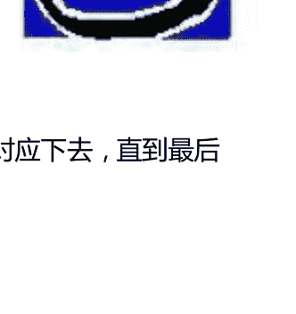

- 1. 宫类似于白羊座
- 2. 宫类似于金牛座

- 3 宫类似于双子座
- 4 宫类似于巨蟹座
- 5 宫类似于狮子座
- 6 宫类似于处女座
- 7 宫类似于天秤座
- 8 宫类似于天蝎座
- 9 宫类似于射手座
- 10 宫类似于摩羯座
- 11 宫类似于宝瓶座
- 12 宫类似于双鱼座

融合太阳星座和宫位的特征有助于你更好地了解自己的基本特点。例如，太阳在四宫人，由于他们会将主要的精力放在家庭、家人和根基上，所以跟巨蟹座会有一些相同点。取决于他们真正的太阳星座，他们可能也不大可能会有一些巨蟹座明显的特征，像情绪化、闷闷不乐或者恋旧啊，例如，太阳在四宫宝瓶座的人，很明显就不是一个恋旧的人。至于那些太阳在七宫的人，同天秤座会有一些共同点，因为关系是他们的一个主要关注点。其他任何的星座和宫位的配对都有类似的联系。我们在十三章的时候会深入学习宫位。（如果你想看一看你太阳所落宫位的一些解释，可以使用左边的书签直接跳到十三章。）

第二个影响同太阳的主要相位有关。在十四章你将学到更多各种各样的相位，但是这里让我们来看一看最强有力的相位，合相，黄道上两个行星彼此之间的夹角在 8-10 度的范围内。当某颗行星和太阳相合时，它的影响力是强而有力的，以至于太阳星座几乎被掩盖了。例如，冥王星同天蝎座有关，更加确切的说法是天蝎座的主导行星。当人们的冥王星合了太阳，无论太阳星座是什么，他们都会有些天蝎座的特征。他们可能有强烈的情感，高度关注

### 作为天体的太阳

如果我们看一看天文学中的太阳，我们将会更加相信它是星盘中最重要的部分。太阳占据了整个太阳系的 99.9%，太阳系中所有其他的行星、行星的卫星、小行星、彗星和流星加起来还不到 1%。太阳的重量是其他所有行星重量加起来的 700 倍。因此太阳的巨大使得太阳系中其他部分显得渺小，我们星盘中的太阳代表了巨大的影响力。

太阳系因为太阳才有了生命，而没有氢就没有太阳。氢是构成恒星最基本的材料，例如我们的太阳就是由它构成的。其它物质是通过行星内部核反应生成的。难以置信的是高温融合了氢生成了氦，接着再渐渐形成其它更复杂的元素。氢和氦占据了所有物质的 99%，一颗行星生命中的 99%的时间都在不断地把氢转变为氦，于此同时其它元素就是在剩下的 1%的生命历程内形成的。

因此氢是所有物质形成的基础物。氢是最简单的原子，仅有一个电子环绕着中子和质子。我惊奇地发现氢原子的图形和太阳的符号完全相同。值得注意的是，科学家将氢元素作为第一个元素，并将它放在元素周期表的中心，正如命理学中将太阳排在第一位一般。燃烧氢使太阳有活力，数十亿年之后，当氢被烧尽，太阳将会瓦解并死亡。太阳从燃烧氢得到的光和热使我们能够生存。正如古老的玄学家维拉斯坦利·阿尔德所认为的一样，太阳本身是活着的。他们告诉我们星星和行星都是活着的物体，

这发展到了一种我们无法想象的境地。很多科学家认为迷信和玄学是愚蠢的，然而现代科学，特别是量子物理学都渐渐向着神秘学的方向发展。

科学家们渐渐发现所有的系统，从单个的原子，到细胞，到太阳系，到整个银河系都是以相同的方式构成的。在那里有一个中心或核子，系统中所有其他的物质都围绕这个中心或核子旋转。古老的太阳符号中已经很明显地显示出了这个原则，这是个无论何时都能理解生命的符号。当圣经说神根据自己的形象创造了人时，这令我震惊，这完全不同于人类创造了上帝。然而这可能值得的是生命均是根据相同的法则运作，物质均会围绕着一个核子旋转，包括组成我们身体的原子和细胞。

如果所有的事情都会围绕着它的中心转动，那么我们也应该一样。为了活得完整并发挥我们最大的潜能，我们必须有中心点。作为中心点的必须是我们人格内心最深的部分，确切地告诉我们，我们是谁。正如太阳是太阳系的中心，我们星盘中的太阳代表了我们人格的中心。研究它的星座、宫位和相位能帮助我们发现自己。忽视星盘中的太阳将可能使我们失去我们生命中必须涉入的每一件事。一个找到中心的技巧是沉思太阳本身的符号，看着它直到你觉得你画出了内心深处的图画。它就像一个简化了的曼茶罗。（有效的太阳符号有它自己的部件，但是离开这个符号去谈太阳是非常困难的。）

找到中心点并不同于一些有强势太阳或狮子座位置的人的自我中心倾向。当我们还是孩子的时候，我们相信周围的一切都是围绕着我们发生的。我们在一种心理学上叫做婴儿全能的状态下。那是说，我们相信我们是宇宙的中心，我们创造了身边的一切，所有事都因为我们而存在。简而言之，我们觉得自己是上帝。我们确实是上帝，但是宇宙中的每个人每件事也都是上帝。（太阳管辖狮子座，狮子座的人一生中都相信所有的事情都是围绕着他们的。）

太阳通过引力成为了我们太阳系统的中心。引力是吸引物体在一起最微弱的力，然而太阳的引力是很强的（是地球引力的28倍），以至于所有行星都在轨道上绕着它转。我们星盘中的每一颗行星也绕着我们的太阳转动，这种精确的力量应该让太阳成为我们生活的中心，而不是让其他任何一颗行星超越太阳的重要性。将中心放在太阳以外的地方，或者让其他任何一颗行星显得比太阳要重要，将会使我们变得古怪（字面地，偏离中心的）或自我挫折。

通过思考太阳有关的现象我们能获得洞见。古代人们是非常害怕日蚀的。现代除了那些把日蚀看作是“痛苦”征兆的占星家之外几乎没人在害怕日蚀。由于每年可预知的日蚀会有2-5次，天文学家们会提前准备好，到那些地球上能看到日蚀全貌的地方观测它们。在日蚀的过程中，他们收集太阳大气层和成分的信息。我们星盘中的太阳即代表我们的本我也代表最本质的自己。正如日蚀能够显现出太阳的本质一般，我们也时常在压力下学到关于自己的很多信息，当本我暂时黑暗了或遮住了。

太阳黑子是一种定期发生的有趣现象。太阳黑子是太阳表面漆黑的区域，引起地球的磁暴现象。一个占星同僚，罗伯特·奈特，向我解释这些黑子时，把它们比作太阳表面的座疮，这些地方太阳的皮肤从地下冒了出来。这个类比让我觉得很有趣，因为从形而上学的角度来看，皮肤问题都代表身份认同的问题，在青少年时我们的座疮是最多的，那时我们也是最不确定自己是谁。我们星盘中的太阳代表了我们最基本的身份认同。

探索作为天体的太阳将告诉我们在太阳系中和我们的星盘中太阳都是最有力的。因为星体的转动，太阳可能相对来说小了且微弱了，但是离开它我们是无法存活的。太阳是太阳系中唯一真正的光源，行星的光只是太阳光的反射。如果你想找到你生活中真正的光源，注视并沉思你星盘中的太阳吧。

#### 太阳的符号和它的力量

太阳的符号是所有占星符号中最有力量的，也是含义最丰富的。我在一个戒酒中心教授占星术，曾经开过一个关于这个符号象征的研讨会。我们努力一步步深入，我们从它的外形和形状能够学到什么，最后我们到了如此深的一个层次，以至于很多男士都感动得落泪了。我只希望能同你们在此分享下那次研讨会的一些精神。

太阳这个符号已经至少有5万年的历史了，很可能比这还要久远。证据源于墨西哥的考古学家，他们发现了一个写字板，并且根据写字板的一些周围环境断定它属于第三纪。在写字板上，有代表太阳的符号，被当作是神 Ra 来崇拜。在之后的写字板，符号也代表国王；有力量的国王名叫 Ra，并被当作是神。这种将太阳与神的头像等同起来的现象在很多国家和区域都有，在埃及的法老，中国的日神，以及欧洲相当于神的国王。在占星术中，太阳管辖了帝王星座，狮子座。有趣的是，太阳的最外层被称作日冕，因为它就像皇冠一样凸出来。

在神秘象征中，圆圈代表着完整、无限、不朽以及所有的这一切。太阳中心的哪一点代表一个特殊点、处境、个人或集体中的时间。然而我们从未经历过完整，因为总有些更大的东西。例如，符号可以代表一个原子，那一点就是核子。如果你是一个电子，原子似乎是无限延伸的。它也可以代表一个细胞，通过核子，边界似乎是无限延伸的，然而在人类身体中也有数十亿的细胞。

从太阳系中一个人类的角度来看，太阳似乎是无限延伸的。在我们的银河系中至少有一千亿个像太阳系这样的星系，这将是多么地宽广，我们的太阳需要花两千万年的时间才能绕银河系的中心一圈。然而银河系甚至还不是宇宙的尽头，因为它们是以万的数量级来计数的，很有可能有更加宽广和未发现的中心。网上我最爱的专栏是白天的天文学图片，充满了银河系的图画，星云和其他天文景观。看一看这些有助于我们创造力的形成。（访问：[http://antwrp.gsfc.nasa.gov/apod/archivepix.html](http://antwrp.gsfc.nasa.gov/apod/archivepix.html)）

除了以上谈到的系统之外，占星学的太阳代表自我。因此太阳象征了我们是整体的一部分，于此同时也敏锐地指出了宇宙之外还有我们未知的事物。我们是既是伟大的神，同时也非常渺小的。如果中心点代表的是我们，那么就完整体现了与我们分离的部分，然而也是有所有东西的一个整体。

然而，对于那些高度自我心中的人，圆圈代表了一道在一个人以及与之分离的所有东西之间的墙。从占星的象征主义来看，圆圈也代表着精神。圆圈中的点是我们的人格、灵魂，因此太阳符号让我们知道我们的精神是以我们的人格为中心的。点被精神包围了，上帝无所不在。圆圈是一种界限或者圆环，使我们不会迷失自己，永远都逃离不了自己的精神性。

不限于传统的象征主义，让我们来点创意的。太阳的符号也代表一个蛋。蛋有潜力发展为某些东西。静止而受精的蛋包含了所有成人的物质。蛋代表了一个人的全部潜能，星盘中的太阳亦是如此。在人类胚胎的发育过程中，我们看到了所有生命都融合为一，因为胚胎的发育历经了变形虫、一条鱼、一种爬虫和一只鸟，在变得像人了之后还需要大约七周德时间才能真正成人。

太阳的符号还让我想起了一个有窗的靶子，我们星盘中的太阳描述了我们的目标是什么。另一个寓意是如果我们想要打中靶子，我们必须聚集并且有中心点。也像掉进一个漏斗和隧道之中，二者都需要专注，如果我们想要保持中心位置。

太阳的符号也像人类的眼睛。眼睛是人类灵魂的窗户，特别能揭示出一个人真正的特点和意图。同样地，星盘中的太阳也代表灵魂和真正的特点。星盘中的太阳既说出了我是谁，也描绘出了我们的本我。本我可能会妨碍真我的发展。如果你太过自我中心，你可能就会忽视自己精神层面的发展，也就是我是谁。

接着符号也让我想起了飞速旋转的纺车轮。命运之轮和玛雅的化身变成一个轮子进入了脑海中。这个圆形物让我们想到生命是循环不息的，历史总在一次次地重复着。中心的点代表了如果想要脱离轮子唯一的方法就是找到的精神的中心。我相信星盘中太阳的星座、宫位和相位显示出了作为一个特定的人的此生最重要的任务和目标，以及能取得最大成长的领域。

正如你看到的，太阳符号的寓意是非常丰富的。我们至今已经洞悉的还仅是一部分。如果你继续沉思太阳的符号，可能仍然会发现更深层次的意义。

## 第三章：理解月亮——戴安娜的反思

天空中还有比月亮更加美丽和迷人的物体吗？古人因为感受到月相对地球和地球生物的影响而崇拜月亮。由于科学家、社会学家和警察都发现了月亮的有效性，最近一些迷信月亮的人开始受到尊敬。同样在占星学里面，我们也认识到了月亮对个人的强大影响力，无论是通过引力、一些神秘力量、或者是一些未知的事物。在西方占星学中，月亮被认为是仅次于太阳的对我们性格形成有影响的行星。在印度占星学中，印度古时的占星圣贤，甚至认为月亮比太阳重要得多。

### 月亮象征，月亮崇拜和女人

在占星学中以及玄学的其它领域中没有什么符号是比月亮的符号更加容易辨认的，但是你们可能会想为什么选择了特定的月相，新月？为什么不是其它月相呢？恩斯特·哈丁在她富有魅力的书，女人的神秘感中写道这是因为，古人认为月亮代表成长和多产，新月正是那个有最多的成长空间的月相。除此之外，新月时节也是最适合种植作物的时候，因为它能够使庄稼丰收。

正如我们研究太阳符号时一样，当面对一个图形象征时，让你的想象力和创造力自由流淌，有助于你找到额外的意义。例如，我曾经注意到一个雷达的屏幕看起来就像月亮符号一样。在选择雷达的过程中，科学家们无意间使用一个月亮功能的本质。它看起来就像是一张雷达网，通过我们对外界的浏览、接受、对细微的印象做出的反应。这种敏感和回应带给了月亮占优势的人们很强的直觉，在其它地方我把这类人叫做月亮型。

我的占星导师，罗德·崔斯指出了船的形状很像月亮。船只把持并且保护我们，保护性是月亮的一种功能。月亮也同样描绘出了掌控情绪的方法，月亮和船只的相似之处教会了罗德，处理我们情绪的唯一方法是随之漂浮，而不是被它们淹没或被它们淹死。

在很多神秘学的研究中都能发现基于月亮的象征主义。在古代神话中，月亮女神是戴安娜，她掌管了自然和丰收。求子的女人会去供奉戴安娜，而怀孕的女人则相信戴安娜能够保佑她们生产顺利。她是一个非常重要的女神，并且同至关重要的母性功能有关。尽管我从占星学和神话中知道了这些信仰，当我对我的本命盘做推运时，我依然因此而觉得惊讶。很多次当推运的月亮同我的上升或中天形成相位时，或当外行星行运同我本命月亮形成相位时，一位非常重要的女人走进了我的生命中，并且每一次这位妇女的名字都叫戴安娜！

正如我在不同的预言系统做的实验一眼，我被月亮在大部分预言系统中的图像迷住了。例如，命理学相信数字 2 源于月亮象征。命理学中数字 2 的意义同占星学中月亮的意义是很相似的，代表则阴性法则，合作和伴侣。命理学中，2 是情绪和直觉，与月亮在占星学中一样。当你从命理学的角度来看戴安娜时，它代表着数字 2。那不是一个巧合。

在塔罗里面月亮和数字都有呈现。数字 2 最主要的奥秘是高尚的女祭司，似乎同戴安娜有关。这张牌显现一个很有神秘感的妇女，教授古时的智慧，例如巫术。盈月在她的脚下，她端坐在代表了正义和邪恶的两根柱子之间。塔罗牌有四种风格，如果你分析第二张牌的所有四种风格，他们似乎都表达了合作的变化或者缺乏合作。我在牌阵中也发现了像月亮一般的六芒星牌阵。它的名字叫接受牌阵，由阴（女性的）线组成。六芒星表示投入、补充和永恒的女性法则。值得注意的是，这是六芒星的数字 2。

因此，我们发现月亮有很多玄学的意义。对我来说本书之前提到的女人的神秘是非常重要的，不仅仅是为了理解月亮和它神秘意义，同样也是为了理解我们人类的女性面向，在这一生中我们在生物学上到底是男是女。本书追溯了世界各地自发和分离的月亮宗教的发展，以及一些关于这些宗教是如何向着文化成长和改变的文件。所有这些宗教中，月亮都被认为是阴性的，并且对于女人特别重要。在二十世纪七十年代另一本重要的书中，第一性特征，伊丽莎白·戴维斯提供了一些当女族长出现时，月亮宗教占据主导，而当父权制建立后，太阳崇拜占据主导的证据。

在读了女人的神秘，我为之着迷之后，我同我其中一个占星班级做了一个试验，一群来自布鲁克林 Bedford Stuyvesant 区域正在从酗酒中恢复的人。我假设他们是非常原始和隔绝的部落聚集在一起只为了建立一种信仰。他们十分投入实验，为各自分配好了部落中的角色，并且摈弃了一切一个原始人所不可能有的知识，除了那些通过对大自然的观察而来的知识。

令人吃惊的是，他们推理的结果同戴维斯书中描绘的古人的思想不谋而合。他们决定崇拜太阳和月亮，二者都是无法控制的，并且推断这两个天体都是活着的，因为他们在移动。太阳被指定为阳性的，因为它更加强大和具有统治地位。月亮全体一致认为是阴性的，因为它的柔和、浪漫的本质和持续的变化。月亮本身和月相的改变正如怀孕中的妇女以及女性月经周期一般。

我不再如曾经一般讨厌班上人们和戴维斯心中所持的男性至上主义的观点，并把女性看作是月亮，我不得不认为这一定意味着什么。正如我们将看到的，月亮在星盘图中是很有支配性的，那么在一张男性的星盘图中我们应该给月亮一个怎样的角色呢？很多古时候的占星家们认为月亮在男性星盘图中代表着他生命中的关键的女人而忽略男性星盘图中的月亮。

然而，月亮掌管了一些心理学的功能例如情绪和依赖性，对于一个男性来说忽略这些是不大健康的。这些即在男性身上也有在女性身上有，但是我们的文化迫使男性压抑它们，普遍来说对男性都是很刻薄的。更好的方式是将月亮看作是男性心中的阴性的一面（用荣格的话来说就是灵魂），正如火星在女性星盘中代表男性斗争一般。当男性和女性面向分裂存在时，我们就无法真正变得完整，除非我们整合它们。

### 月亮和母性：种瓜得瓜

或许月亮描绘出的人类最最重要的职责就是母性——你付出的母性和你得到回报的母性。我们将看到二者几乎是密不可分的。一个更好的词汇来形容这种功能就是养育——毕竟，我们也能从我们的父亲和其他人身上得到关心、食物和爱。作为成年人，很多男性确实需要去关心照顾其他人（朋友和亲戚，和孩子）。这是男性星盘中月亮的一个功能，尽管在西方文化里面这种功能时常被压抑或伪装。

当这本书的第一个版本出版时，很多人的养育都非常传统，生物学上的母亲扮演了月亮神的功能，因此星盘中的月亮时常被解读为母亲。鉴于大部分的妇女都走入工作场所，现今孩子们的照料者也就有更多的可能性，孩子们最基本的需求的满足也不像母亲在身边时一般，因此星盘中的月亮可能代表任何一个意义重大的照料者。月亮描绘出了我们是如何照顾他人以及满足他们的需求，以及我们是如何接受我们心中相同的需求的。我们能接受依赖感并且努力使这些需求得到满足吗？以及，相似的，当其他人依赖我们时我们是如何回应的？

例如，月亮在巨蟹座，依赖性通常是很强的。这些人可能非常明显地依赖他人，或者，相反地，他们可能会藏起他们自己的依赖感，意识或潜意识地，强制地照顾其他人。这种行为在这里的关键是世界母亲的姿势能使这些人避免被消耗，避免感觉上的饥渴。相反的，月亮在白羊的人，高度赞赏独立，很难容忍他人的依赖。通过他们设计的这些聪明的、闪光的新计划，能够得到照料。

心理学告诉我们，我们对待他人和自己依赖性的态度，直接源于我们的双亲，特别是母亲。如果双亲用一种爱但平衡的方式来处理依赖性，既不过分保护也不忽视，那么我们同样有能力合适地处理依赖性。月亮与土星有相位或月亮落在摩羯座的人可能有一个忠实的母亲，但对他们的需求很冷漠，希望他们能快点成熟起来。月亮与海王星有相位或月落双鱼座的人们，他们的双亲可能表面上对于他们的需求很同情，但是双亲又很奇怪难于琢磨。有这两类月亮星座的人在回应他人的需求方面都会有所困难，就跟他们双亲的行为一样。

像或不像，我们一般都会成为像我们双亲一种类型的父母。如果我们清楚自己的心理状态，我们可能立誓不再像父母对待我们一样对待我们的孩子。

尽管如此，当孩子确确实实降临时，我们还是成为了我们父母一样的人。为什么会这样？月亮代表了我们早年的模式、习惯和记忆，很多都是潜意识的。我们学到了什么我们就用那种方式来生活，我们从父母那里学到的一课就是如何做爸爸妈妈。由于这种学习过程大体上是潜意识或者是通过行动来模仿的，也就是说这发生在孩子可以用语言描述之前，这些模式是无法通过理智控制的。例如，被辱骂的孩子可能非常沮丧的发现当他们成为父母或孩子的照料者后，他们也有辱骂孩子的冲动。

月亮也掌管我们最基本的安全感，早期父母对我们的影响是至关重要的，但却是通过潜意识的方式来运作的。它来自于当孩子哭的时候，父母给孩子的照顾、喂养和回应，做这些事情的时候都有爱、焦虑、不关心或甚至是敌视。幼年时，我们的生存有赖于我们的父母。因此这个阶段我们接受到的养育方式形成了我们对我们生存的世界的态度。它是一个安全的地方还是一个充满敌意的地方？我们觉得可爱吗？我们觉得被需要还是几乎难于忍受？分析星盘中的月亮将找到答案。根据心理学家埃里克森的经典理论，在还不会说话的阶段，我们发展出了或丧失了最基本的信任感。最基本的信任感代表着我们发现世界和世界上的人都是善良而值得信任的。这个阶段对我们与他人亲近和生活普遍适应性的能力有积极的影响。

例如，月亮落在天蝎座的人，可能很小就学会了不信任。父母可能假装关心和关怀（甚至是过分保护），却有一些其他的，不是爱的动机在里面。很多时候，双亲都是有操纵性和控制的，与此同时又假装在心中最最关心孩子。因此，孩子学会了怀疑和自我防御，猜测找到他们的真实动机。作为一个成年人，这个人就会时常采取一些父母控制自己的手段，去维月亮在金牛座的人，除非月亮有一些困难相位，将有更多积极的养育。双亲是很稳定的，并能接受孩子的需求。他们会更加坦白，不是那么难于理解，也不像月亮在天蝎座的人一般有那么强烈的情绪。因此，孩子很安全的长大了，觉得他或世界基本上是很好的。（当然，星盘中的其他相位可能会对此产生影响。）传统认为月亮在金牛座是月亮最好的位置，月亮“擢升”了。月亮在金牛座也有缺陷，例如当面对改变时缺乏变通性，但从一种基本的安全和信任感的角度来看，月亮在金牛是很好的。

星盘中的月亮显示了在怎样的情景下你会觉得最有情绪安全感，因人而异。月亮坐落的宫位揭示了带来安全感情景的更多信息。一个月落十一宫的人可能当他身边有很多朋友或在一些有意义的社团中时会觉得比较安全。一个月落七宫的人，通常仅在卷入一段长期的亲密关系中才会有安全感。

星座和宫位会有矛盾，月落宝瓶座意味着在自由和改变的状态下获得安全感。月亮在四宫宝瓶座的人最好有一个变动的家庭，因为如果固定不动宝瓶座会因此而窒息。很多人会严厉批评使他们感到安全的东西。例如，月亮在四宫宝瓶座的人可能会说，“不得安宁对我来说真是太糟糕了。”占星学可以帮助你认识到这些鲜活的需求，以及他们的重要性，从而帮助你行动来满足他们。

通常地，月亮的星座、宫位和相位将描绘出现实中的母亲，有时在某种程度上孩子的月亮星座和母亲的太阳星座是一样的。然而，有趣的是，在同一屋檐下的孩子月亮星座千差万别。例如，在一个家庭中，年长的哥哥和姐姐的月亮都在白羊座，而年幼的妹妹月亮却在天蝎座。年长的孩子都被鼓励独立（白羊座），但在妹妹出生的时候，妈妈几乎丧命。（天蝎座有时和死亡有关。）由于这个原因，或许妈妈跟小女儿的关系本质会很不一样。她饮食过量，受到过度保护，到十四岁的时候还被称作是婴儿玩具。我们能够推测母亲在潜意识里面恨这个孩子让自己险些丧命，却通过过度保护和隐私过量来掩饰这种感觉。

为什么同一个家庭会有不同的月亮星座？月亮描绘的不是真实母亲，而是孩子经历中的母亲。也就是说，月亮显示的不是完全脱离孩子而存在的真实的母亲，而是孩子眼中的母亲。双亲无法用完全相同的方式对待所有的孩子，一些孩子得到了更多的爱，一些孩子用错误的方式来争取爱，一些人将这些保留在他们爱或恨的人身上。然后家里面的环境也可能改变，或者母亲本身也可能改变，变得更好或更坏，这改变了母性的特质。

你可以通过一次观察后代月亮的情况来追溯家庭历史。例如，较早的一个或两个小孩可能有一颗良好相位的月亮落在金牛座，代表同母亲之间的一种温暖和给予的关系。然而，第三个孩子出生之后，或许经济条件就迫使母亲去工作。或许那个孩子的月亮就在摩羯座了，代表母亲现在更加关心生意了，当一天工作结束之后也少有时间照顾孩子。依然有相同点，金牛和摩羯都是土相星座，但是第三个孩子没有感受到很多母亲的温暖，被期望着快快成熟起来。因为母亲觉得工作很累，催促孩子赶紧长大，减轻自己的负担。

另一个例子，有时一个孩子的月亮在天秤座（或者有关这个星座的位置）被认为是因为母亲觉得它将粘结一段分裂的关系（或者，如果还没有结婚，希望有男人同她结婚）。这个策略很少是有用的，因为事实上一个新生的孩子会给一段关系带来很大的压力，即使是一段很好的关系。因此，如果一段关系已经分开了或者变得非常遥远了，母亲时常会转向她月亮天秤的孩子，来弥补从孩子父亲那里丧失的爱和亲密感。孩子在长大之后就需要这种持续的亲密感，并且十分渴望形成关系。这可能是一个无法忍受孤独的孩子，孤独会让他或她觉得不安全和不高兴。

### 月亮和情感

我们星盘中的月亮也代表我们的情绪以及我们是如何处理他们的，以及我们是如何对我们周围的情绪做出回应的。这再次同我们作为一个小孩子的养育有关。父母是如何回应我们的情绪表达的形成了我们允许自己感受到的情绪以及如何处理它们，以及如何处理身边人的情绪。

通过考察一个星座的元素，发现星座本质，有助于我们了解很多。在那些月亮落在风向星座的人(双子座,宝瓶座以及天秤座)，当孩子哭泣或表达一些母亲觉得不舒服的情绪时，母亲可能在回应这些情绪上有些困难，从而母亲更倾向于将自己从这个情景中抽离出来。作为一个结果，孩子学会了切断自己的情绪，并从情绪中抽离出来。要么是因为失去了母亲的爱或失去了母亲的赞许。在极端的例子中，这将导致一个人同大部分的情绪中抽离。

通常地，风向星座的月亮，母亲是能够很理智地掌控情绪的，并让孩子把情绪解释出来或者使他们变得理智。（但是我们自己的情绪本身就很难是理智的！）成年之后，这些人用理智来对待感觉而不是直接去感受它们。他们想谈论他们的情绪和其他人的情绪。在一些案例中，月亮在双子座的人可以模仿情绪，他们理智地知道在特定的情境下应该有怎样的感觉，因此他们伪造了不是确实存在的情绪，只为了可以被社会接受。

土相星座的月亮（金牛座，处女座，摩羯座）在处理情感方面也有相当大的困难。（对他们来说，如果你看不到、摸不到、或尝不到，它就不是真的。）金牛座相对来说更能接受感情以及其它的任何东西，但会努力保持平静。很多月亮在摩羯座或处女座的人允许自己拥有的自己最基本的情绪是由于他们不够完美而产生的忧郁的自我指责情绪，这种情绪往往源于一个过分挑剔的父母。虽然如此，土相星座的月亮处理情绪往往是非常实际的，他们会努力找出悲痛的来源，找出缓解这种悲痛的切实可行的步骤。出于这个原因，他们对于那些内心正体验情感危机的人来说就像直布罗陀海峡里面的大石头一般，因此他们很难处理外在世界的情感需求。

火相星座的月亮（白羊座，狮子座，以及射手座）倾向于积极回应，有时甚至去挑衅或挑战生命中面临的情景，包括情绪。他们本能地对那些困扰他们的问题有防御，并且努力追逐他们需要的。我们大部分人都很难清晰感受到自己的愤怒，但是火相星座月亮的人比起大部分人更加容易感受到愤怒，除非月亮有困难相位，像土星、冥王星、或海王星。火相星座月亮最缺乏的是对别人感受的敏感。他们渴望追逐他们所关心的，很难放慢脚步去考虑其他人对他们行为的感受。首先你必须引起他们的注意。然后，如果你被认为是他们环境的一部分（狮子座最典型）或如果他们的本我在其中，他们将会用他们回应自己情绪一般地来回应你，充电。

水，在玄学中，代表情感，水相星座的月亮（巨蟹座、天蝎座和双鱼座）通常是所有星座中最有感情的。一些缺乏同情心的人也会因为他们的感情而着迷。月亮在巨蟹座或天蝎座，大量的精力将被用来发现，经历，并消化情绪。荒谬的是，月亮在双鱼座的人，是最有情感潜质的人，能用很长时间来逃避不愉快的情绪，在一些情况下成为了一个成瘾的人格或活在一个幻想的世界中。水相星座的人对他人的感受是很敏感并容易给出回应的。通常，在一种知觉的层面上，他们能感受到你所感受的。

### 名人的月亮星座

这篇文章基于占星数据银行中对于名人档案的调查，这有人们月亮落在黄道十二星座的例子。不像太阳在一个星座的停留时间会有一个月之久，月亮每2.5天就会换一个星座，因此不到一个月，月亮就绕着黄道走了一圈。月亮正如你的太阳一般是你占星结构中很有意义的一部分。

- **白羊座**：安东尼奥·班德拉斯，惠特妮·休斯顿，玛蒂纳·纳芙拉蒂诺娃，艾梅里尔·拉加西，席琳·迪翁，杰米·李·柯蒂斯，希瑟·拉克里尔，马龙·白兰度，艾伦·德杰尼勒斯，梅格·瑞恩，朗地·特维斯
- **金牛座**：迈克尔·福克斯，卡梅隆·迪亚兹，吉娜·戴维斯，英国亨利王子，黛米·摩尔，伊莎贝拉·罗塞里尼，安德烈·阿加西，查尔斯王子，杰西·杰克逊，威廉·杰斐逊·克林顿，莫妮卡·莱温斯基
- **双子座**：波姬·小丝，罗西尼，戈尔迪·霍恩，柯林·奎因，伦纳德·尼莫伊，查里斯·诺斯，小弗雷迪·普林兹，柯特·布朗宁，迪伦·麦克德莫特，施特菲·格拉芙，朱丽安·摩尔，艾丽莎·米兰诺，乔治·卡林
- **巨蟹座**：威利·纳尔逊，英国威廉王子，西恩·潘，布里奇特·方达，蒂姆·艾伦，德鲁·巴里摩尔，哈莉·贝瑞，基努·里维斯，伊丽莎白·库柏勒-罗斯博士，罗斯福
- **狮子座**：汤姆·克鲁斯，汤姆·汉克斯，奎因·拉蒂法，茱莉亚·罗伯茨，玛丽娅·施瑞弗尔，切尔西·克林顿，多莉·帕顿，夏洛蒂·激奇，玛丽·玛特琳，帕特里克斯韦兹，杜鲁·卡瑞，安娜·库尔尼科娃，汤姆·塞立克
- **处女座**：朱迪·福斯特，马修·麦康纳，安妮·希奇，威廉·达福，兰斯·阿姆斯特朗，塞雷娜·威廉姆斯，米歇尔·法伊弗，麦当娜，克里斯·洛克，索菲·里斯琼斯，Bill Cosby
- **天秤座**：梅尔·吉布森，尼古拉斯·凯奇，莱昂纳多·迪卡普里奥，凯特·卡普肖，娜塔莉·克尔，埃米·欧文，安娜妮科尔·史密斯，樊娜·怀特，尼可·布朗·辛普森，布特·雷诺茨，小乔治·布什
- **天蝎座**：艾迪·墨菲，乌比·戈德堡，本·阿弗雷克，卡西·阿弗莱克，詹娜·布什，芭芭拉·布什，关颖珊，沙奎尔·奥尼尔，菲利西亚·拉斯海德，伊丽莎白·泰勒，卡罗琳公主，丽莎·库卓
- **射手座**：奥普拉·温弗瑞，克里斯托夫·里夫，迈克尔·乔丹，泰格·伍兹，詹妮弗·安妮斯顿，贾斯汀·汀布莱克，玛利亚·凯利，妮可·基德曼，凯文·科斯特纳，比利·格雷厄姆牧师，艾尔·夏普顿牧师
- **摩羯座**：达赖喇嘛，玛丽安娜·威廉森，约翰尼·德普，马特·达蒙，雯娜娜·贾德，乔治·克鲁尼，朗·霍华德，金·贝辛格，克里斯丁娜·安纳西斯，罗伯特·肯尼迪，雪儿，露西尔·鲍
- **宝瓶座**：布鲁斯·威利斯，布兰妮·斯皮尔斯，康纳·欧布莱恩，丹泽尔·华盛顿，罗素·克洛，约翰·F·肯尼迪，卡罗琳·F·肯尼迪，托尼·布莱尔，伍德罗·威尔逊，让-保罗·萨特，玛丽莲·梦露
- **双鱼座**：罗宾·威廉姆斯，迈克尔·杰克逊，凯瑟琳·泽塔-琼斯，瑞奇·马丁，拉什·林堡，薇诺娜·赖德，丽莎·玛丽·普雷斯利，埃尔维斯·玛丽·普雷斯利，马丁·路德·金，科丽塔·斯科特·金，米开朗基罗

水相星座的月亮最主要的困难之一是他们太过沉溺于他们的情绪中，从而忽视了外在的世界。情绪，同生命中其他的事情一样，我们都需要学着去平衡。

### 扩宽你的占星学知识

#### 从太阳星座到月亮星座

除了你的太阳星座，星盘中的月亮是最能够影响你的身份认同的。事实上，在很多案例中，月亮星座比太阳星座还要重要。例如，假设太阳星座是火相的（白羊座，狮子座，或射手座）而月亮落在了摩羯座，根据我的观察，摩羯座月亮的影响将会超过太阳星座。在很多的方面，这个人回应生命中挑战的方式将更像摩羯座，通过成功努力建立安全感。不像典型的火相太阳星座，他们将会谨慎、严肃，甚至倾向于压抑，对自己和他人都充满了摩羯式的完美主义，比较刻薄。

观察你身边人的月亮星座，你可能会发现为什么他们没有将他们太阳星座的特性最好或最糟糕地发挥出来。上一页的表格展示了不同人的不同月亮星座。如果你已经学习过太阳星座，你就有了一定的基础去理解月亮和其他行星在不同星座的运作模式。不仅仅有十二个太阳星座，还有十二个月亮星座，十二金星星座，等等。相同的十二星座反应了你自己的不同面向。月亮代表了最基本的作用，例如情绪、安全感、母亲的影响，以及我们是如何处理我们自己和他人的依赖性的。你的月亮星座描绘了你是如何处理你生命中这些重要领域的。

为了将黄道十二星座的特征用到太阳之外的行星上，我们将会使用占星学教给我们的关键词，关键词就是代表星座和行星特性的一连串的词或短语。通过罗列太阳涉及到的性质，我们开始探索关键词。例如，假设你正努力理解一个月亮在双子的人是怎么样的。从观察和著作中你可能会知道典型的双子座是爱说的、热爱交流的、思维很快的、充满了好奇心、很容易觉得烦、不平静和善变的、活在他们的思想中且很爱笑。接着将这些特点和这一章中我们探讨的月亮的特点联系起来，看看得到了一个怎样的混合体。以下是二者的一些关键词：

| 双子座 | 月亮 | 月亮在双子座 |
| --- | --- | --- |
| 活在他们的思想中 | 情绪 | 理智多于感受 |
| 充满好奇心 | 母亲的影响 | 妈妈鼓励读书和学习 |
| 热爱学习 | 母性 | 渴望对一些有关父母的书 |
| 闲不下来的 | 家庭根基 | 可能时常搬家 |
| 很容易觉得无聊的 | 安全感 | 因为无聊而放弃安全感 |
| 思维很快的 | 对危机回应 | 危急时刻站着思考 |
| 诙谐、爱笑的 | 本能反应 | 巧妙的应答 |

月亮在双子座还有更多的关键词以及它们的链接，对于任何一个月亮星座，我们都可以用这种关键词自由组合得出一些解释，至少这种方法让你有些头绪。从 A 列中选出一个关键词，接着从 B 列中再选出一个关键词，看看这个月亮星座给你了怎样的洞见，以及你身边有这种月亮星座的人又给了你怎样的洞见。

总结下这章的内容，我们星盘中的月亮是有很大意义的。如果你的月亮落在一个困难星座中，例如摩羯座，天蝎座或双鱼座，或者说跟行星形成了困难相位，例如土星，冥王星或海王星，那么在童年早期就可能会受到一些关于安全感和建立根基方面的巨大的压力和挑战。在这种情况下，依赖性和信任感就会受到影响，一个人也可能很难去平衡地处理他的情绪。很好地理解每一张星盘中的月亮是非常有用的。然而，我多加一个警告：不要自己妄下论断！在你对自己的母性能力得出任何结论，或通过解读月亮星座来预测你女婿的健康状况之前，请一个能很好地平衡、人道主义的占星家来帮你解读星盘。

## 第四章：水星和头脑

水星，双子座的主导行星，是一颗管辖智能、智力、语言能力和沟通的行星。星盘中水星或双子座强的人通常很擅长脑力活，并且能通过他们的才智和一连串迷人的言谈吸引我们，现在占星学警告我们，“不要相信双子座。” 水星也是非常灵活和肤浅的，但是水星在合适的地方的话，机智是一个非常好的工具。让我们来看一看是否能找到水星最适合的地方在哪里。

就像地球的月亮一样，水星因为附近太阳的引力，而没有大气层。也像我们的月亮一般，有月相，用适合的望远镜，你会看到一个初见的、新月一般的、一半的和完整的水星。这意味着水星（智力）将像太阳的人造卫星一样，是我们最基本的特征或灵魂。当你很好地平衡了人格和整体中剩下的部分，智力和语言能力是有价值的。太阳是心脏，语言和学习都是空的和机械的，除非语言和学习也有心脏。太阳而非水星才是太阳系的中心，如果我们以水星代表的思想为我们生活的中心，那么就变得古怪了。

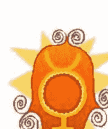

太阳系中，水星的位置在太阳和金星之间，水星（沟通）是我们内心自我（太阳）和我们想要与之分享的人（金星）之间的桥梁。水星在黄道上是十分接近太阳的，在我们的星盘里跟太阳的角度不会超过27度，所以它们时常会在同一个星座同一个宫位。然而，如果我们的思想太酷爱我们自己，我们可能就创造了一定的障碍而不是桥梁。很有趣的是你会发现水星和金星的符号是如此地相像，我一个学生不可抑制地说水星是长了角的金星。金星管辖了爱，但是如果在一段亲密关系中缺乏沟通这是很难让人忍受的。

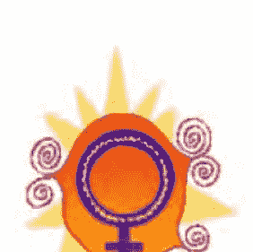

### 水星——神话和金属

在神话里面，水星是一个神的信使，是一个在他的帽子和鞋子上长了翅膀的非常有速度的人。思想是有翅膀的，我们的思想和语言确实会带着我们信息快速移动。水星也是一个同商业和工业有关行星，没有沟通我们不可能做生意。然而通常使我们动摇的广告和销售人员所说的并不是完整的真相而是真相中的一个版本。同样地，天神水星也是非常狡猾和聪明的，古时候他是小偷的守护神。水星的工具，语言，也时常被用来掩盖和欺骗，因为语言是需要交换和交流的。水星式的人，也会在某种程度上地超越道德底线的发挥他们的语言技巧。

除了作为太阳系中的一颗行星和神话中的一个神，水星也是一种金属，一种非常奇特的金属。它是液态的，但是又跟水不大像。如果你将它倒到桌子上，它不会留下任何湿润的痕迹。替而代之的是，它会形成银色的小球，向各个方向跑去。由于这种金属对于温度和压力的改变非常敏感，所以水银被用在了温度计、气压计和血压计中。水星式的人在很多方面跟这种金属很像。流体、适应性强以及善变，他们能很轻易地对周围社会环境的改变做回应，并很快改变。（这一类人不不仅仅包括了太阳，月亮或上升在双子座的人，同样也包括那些在他们星盘图中水星有很多相位，或有很多行星在星盘的3宫，交流之宫的人。）

另一个常用来形容水星金属属性的名字是水银。水银和水星式的人都被用来描述快速移动、快速谈话和不断地变的人。当你把这种金属倒出来之后，它会向各个方向跑去，水星式的人是不安静而容易分心的，倾向于把他们自己能量用在很多方面。分散不会危害到金属水星，也不会危害到水星式的人，他们有能力将这些分散的信息聚集在一起，并且找到彼此之间的联系，正如那些小金属球是很容易聚合在一起的。因此，向各个方向跑去也是避免陷入困境的一种方法。水星人比起大部分人来说会有更多的观点，多样的经历。因此，很多水星人是很有趣而健谈的，并且似乎在智力成长方面有无限的可能性。

水星强的人能对他人很敏感并且做出回应。然而，这种敏感是有别于水相星座（双鱼座、巨蟹座和天蝎座）人的敏感的。（在占星术和其他神秘学中，水都代表感觉。）水星的敏感主要是用智力去认知和理解带来的敏感，而不是感觉，面对感觉水星人更多的是离开这种感觉而不是去感受它。然而，理性思考的能力同样也使我们免于被情绪淹没，有助于我们用理性的态度去对待非理性的感觉。在咨询和指导中，特别是，双方都需要很强的沟通来达成共识和洞见时，像这样口头的交流将会起作用。

金属水星很容易变成它所接触的物体的形状。用硬币蘸水银，水银将会粘附在硬币的表面和每一个凹槽内。同样的水星人本能地会模仿其他人，有意识地或无意识地。诀窍在于通过模仿往往能带来幽默和开心。即兴脱口秀节目主持人韦恩·布瑞迪在模仿方面颇有天赋，他的水星合了太阳在双子座。在搞笑剧“这究竟是谁的台词”中的杜鲁·卡瑞，韦恩的上司，也有太阳落在双子座，很强的水星落在6宫，但是接近7宫。

水星的模仿倾向也揭露了一些更深层次的行为模式。当这样的人跟你在一起时，他们可能会占据你的思考和行为，因此跟你在一起时，你们就好似一对双胞胎（双子座的符号）。然而，当他们离开了你之后，那些四处散播的点又会聚集在一起，等待着下一次的社会联系。这种模仿的倾向使他们能够有能力同任何一种人混在一起，适应任何类型的情景，而不是陷在原始的文化背景之中。

水银时常用在电的开关和其它电子设备方面，因为它是电的良导体。是最重的流体（比水重13倍），比起固体金属水银在电子流动过程中产生的阻力和摩擦会更小。水星人的口头技巧和魅力也使他们能够自由地在各个社会圈中流动，不会有摩擦和阻力。他们话多的天赋减少了观点不同或背景产生的摩擦。

### 水星——医学和欢笑

传统上金属水星最常见的一种用途是医学。它被用在水银红药学和其他消毒剂中，在确定的药剂混合物，在牙医的工作中。然而水银和很多它的复合物都是有毒的，正如很多水星泛滥的人发现的一样。水星神在古人眼中也是同医疗有关的。医学专业的象征式缠有两条毒蛇的一个棒子。

人们说笑是最好的药，水星在占星学中管辖了才智和幽默。过去十几年中，发展出来了一个治疗分枝，被叫做幽默疗法，对一些特别严重的病人表现出来了较好的疗效。它源于诺曼·库辛的经验，是周六回顾杂志的编辑，在二十世纪六十年代的时候，他患了胶粘脊椎炎，一种非常痛和极限的关节炎。

尽管他的医生认为痊愈的可能性不大，库辛开始研究是否幽默和其他积极的情绪能够帮助他痊愈。在医院病房内他被幽默包围着，不断地看喜剧片，接着他发现一个半小时的欢笑，将带来两个小时的安睡。他每天尽可能频繁地做这些事情，开始治疗之后的六个月他痊愈了。他把这个经历写成了一本书，一场疾病的剖析，鼓励其他人研究幽默的疗愈能力。

### 沟通和智力

在相同的时间，儿科医生亚当斯在临床上采取比较极端的幽默方式来治疗，这是通过每天他去巡视病人时总是穿着小丑的服装来实现的。亚当斯，1999年一部电影主角，饰演了罗宾·威廉姆斯，说过，“快乐比其它任何药物都要重要。”他在华盛顿的“为你的健康干杯！”的机构致力于促使幽默成为一种辅助疗法。亚当斯的太阳落在水星管辖的双子座，并与滑稽的天王星呈合相，摩羯座的动物和牛虻的行星。

在亚当斯和库辛的带领下，医学研究者开始研究欢笑对人体的影响。很多研究表明笑能引发内啡肽的释放，一种能够限制痛苦，产生良好感觉的化学物质。罗马琳达大学的研究员对笑对免疫系统的影响作了长时间的研究，发现笑能导致肾上腺素和其它压力激素大量减少，在参与者看了一段60分钟的喜剧之后。（压力激素会破坏免疫系统，降低疾病抵抗力。）笑同样增加了防御T和B细胞的数量，T细胞是对抗疾病的蛋白质叫做伽马干扰素，B细胞能产生抗体。笑也能增加呼吸，提高氧气的使用率，心跳频率，刺激循环系统，暂时降低血压。

研究喜剧演员的星盘使我们更加相信幽默和水星有关。他们其中的一些人太阳，月亮或上升点在双子座，但是更常见的是，太阳合水星。例如，伍迪·艾伦的太阳合了水星在射手座，乌比·戈德堡的月亮合了水星在天蝎座，太阳也在天蝎座。有趣的是太阳合水星所在的星座为幽默染上了不同的颜色，或选择了不同的讽刺目标。比尔·考斯比的太阳合了水星在巨蟹座四宫，本质上是很像巨蟹座的。这个星座是非常关心家庭和家人的。考斯比最快乐的时候就是同孩子们相处的时候，以及在家庭剧中的时候。另外两个太阳合水星在处女座的喜剧演员是亚当·桑德勒和达蒙·威亚斯。处女座，就像六宫一样，与同事之间会有亲密关系，这两个喜剧演员都是通过蓝领的背景使我们发笑的。所有的星座和行星据说都会管辖身体的一部分，我必须说水星管辖了我们的幽默天赋。（如果你对此还有兴趣继续深入调查，占星数据银行有很多的案例，不包括在信息年鉴中出版了他们生日的现代喜剧演员，包括网络版本。）

水星掌管了沟通和智力，而这时常分不开的。一个油腔滑调的人，或许水星在天秤座，通常被看作是很聪明的，比起那些深思熟虑的人，例如一个水星在天蝎座的人。智力测试很大程度上是基于语言能力的，外国人或语言方面有一定困难的人，智力测试得分一般都不高。与此同时智力测试也被证明了对一些特定类别的人是有歧视的，而那些人的智商是很高的，依然允许智力测试作为学校选拔的一种手段，因此在某种程度上可以用来评估我们的教学质量。

想一想我们的灵长类祖先——猴子，猿和大猩猩，在智商方面远落后我们。然而，研究发现当我们给它们教授了一些手语或其他形式的非口头的沟通方法，这些灵长类动物显示出了大量的词汇能力，以及跟我们相似的推理能力。给它们中的一些做智力测试，得分为75分或80分。关键点是我们没有教给它们思考和沟通，由于它们一直以来都有自己的思考和沟通方式。我们教会了它们同我们沟通的方式，唯有如此，我们才能欣赏到他们的才智。

沟通在某种程度上可能是有赖于智商的，但是没有了沟通，我们就无法利用智商和其他人的经验了。由于单独的个人经验有时比起已经共享了集体经验要宝贵，所以交流、朗读和写作的能力将影响我们的学习量。天生的智力仅能够将我们带到现在，至少是现在这个世界纪。研究一个学生星盘中的水星能告诉我们他们如何学习才是最好的，但是我不确定水星是否一定能代表他们的智商。占星学硕士路易斯·罗登，从她的研究来看，相信有水星、土星相位的个人是最聪明的，从我看博士学位的人的星盘的经验中，这确实如此。

沟通能力的缺乏，以及误解的感觉是很难忍受的，但是就像大多数的技能一般，沟通通过练习也能变得更好。我教授占星学的治疗中心的人把沟通看得非常重要，因为他们知道如果他们的病人和他们无法沟通的话，这将是非常有问题的。我们曾经就水星展开了激烈而富有成效的讨论。当我说出一些基本的观点时，学生们就开始就不同组员间的沟通问题，展开激烈的讨论。（为了分析一个人在这个领域中的障碍，可以考虑下本命的水星，水星坐落的星座、宫位和相位，以及三宫，和三宫内的任何行星。）

### 揭穿水星逆行的假面具

现代占星学对水星逆行的一些解释是非常不合理的。我曾经接过无数个客户打来的电话以及现场预约的客户，他们都过度关注水星逆行的影响。我们被告知水星逆行期间不要签署任何合约，不要买任何东西，不要有大的开销，可能会有一些约会会被取消，合约被取消，储蓄方面的失误以及社交活动的拖延。我们听说了大量水星逆行期间可能会发生的有趣的事，并害怕这些事发生在我们身上。然而，在水星逆行期间也有无数的人们买车、开始新工作、结婚以及买房，但是他们也没有经历任何困难。每年水星会逆行3或4次，每次会持续三个星期，世界不能仅因为此而停止。如果世界真的因此而停止了，试想一下这对会经济造成怎样的影响。

那么，为什么这么多的占星爱好者会在水星逆行期间经历到这么多的困难呢？根据著名的玄学理论，信仰的力量会形成某种心理暗示，从而使占星爱好者比起普通人在水星逆行期间经历更多的困难。不断重复负面的想法，将使我们的行为产生重大失误，因为我们“知道”这将发生。这成为了一种自我实现的预言，当有一天生活中乱作一团，占星爱好者就说，“我已经告诉过你会发生的，”从而进一步强化了这种信念。对思维混乱或没有完成的事情，以及没能准时赴约，这成为了这些行为最简单的借口。接着，更戏剧的一面发生了，你会责备你星盘中的行星，而觉得这一切同你没有关系。

对满屋子的占星爱好者而非占星学生组织一个研究项目是很有趣的一件事，告诉他们水星逆行了。首先会向他们介绍水星逆行可能会产生的一些问题，然后要求他们将最近一两周内有关水星逆行影响的事件写下来。但最需要注意的是，这个实验进行时，水星根本没有逆行，而正很顺畅地顺行中。我打赌，暗示的力量，几乎会使房间内的每一个人想出很多类似于书本上所描绘的水星逆行时的情景。

那并不是说水星逆行毫无影响，在那段时期确实有些事情我是完全不会做的，像购买软件或通讯设备。我会很谨慎地检查重要的会谈和约会，并且对电脑资料做备份。我会重复检查我所有客户的占星资料以及对他们的一些建议，但凡涉及到钱的，都会翻倍地检查。水星逆行之前我会做好电脑资料的备份，并且定期备份这些资料。定期备份是一个好习惯，但是水星逆行会迫使我加紧备份。（无论如何还是有用的！）

依然，水星逆行（Retrograde）是一种很自然，甚至是有帮助的循环周期，水星逆行的时间一年不会超过70天，它是生命自然的韵律，就像季节一样。这些时间段内，我们有机会来反思（Rethink），回顾（Review）和调整（Revise）我们的思想和我们写出来的东西以及口头上的沟通方式。如果我们用它来复查（Reexamine）我们的工作流程和每一天生活的流程，这些小的失误将有助于校正我们的行为。它们是非常有价值的，在它们的帮助下，我们发现了工作中的一个个不完善的地方，组织了这些不完善的点进一步积累，而形成更加严重和持续的错误。正确使用这些小失误有助于提高我们的效率以及工作质量。

例如，水星逆行期间是修正和更新你工作流程的大好时光，邮件名单，以及其他的系统，因为在水星逆行期间，你倾向回到过去的一些事物中，并发现其中的障碍和死角。将旧文件分类，弥补之前的一些信件，完成之前的文书工作，汇编老板在几个月前坚持要的单调乏味的数据资料，同之前的同事和客人保持联系，追回遗失的客户。看一看你的银行结束单，看看是否有好的方法将数字翻番。处理成堆的邮件和信用卡收据。浏览积累下来的成堆的杂志、新闻报纸、或刊物，把需要保留的文章保存好，然后废物利用。这样就能很好地利用这段时间了。

作为一个作家，我非常珍惜和依赖每年水星逆行的几周。事实上，如果没有水星逆行的自然韵律，以及它带来的直接引导，我不确定我是否能完成一个巨大的写作项目，因为比起水星顺行，在水星逆行期间我时常会有更多的想法和灵感涌现。我把编辑和校正工作安排在水星逆行期间，因为回顾材料，我能看到很多表述不当的地方。水星逆行期间，我似乎也更有耐心去精确检查我的资料，纠正错误和撰写打字稿，并且为了支持我的结论而作一些必要的调研，以及一些繁琐的工作，就像标注脚注，参考书目以及目录。水星逆行期间似乎头脑更加冷静了，我也能看到文中最好能保持我的观点的地方。我在接近三周的水星逆行期间决定开始创作本书的修订版。工作进展非常顺利。（除了当看到二十世纪七十年代的那个版本中自己的一些观点时，心中呻吟“我当时在想什么啊？”之外，一切顺利。）

对于那些占星术学习得比较高级的人，你们可能很有兴趣知道所有人的水星逆行期间会发生什么。那些在水星逆行期间做好防备的人，能很平静地度过这段时间。有些人也可能确实过得很糟糕，没有一件事情是顺心的，电脑文件时时出问题，没法完成文书工作或搞定约会。据我观察，水星逆行并非是决定性的因素，而是水星逆行时和其它行星所形成的一些相位。在水星逆行的这段时间，水星走得是很慢的，所以任何这段时间形成的困难相位都可能大约会持续三个星期之久。

如果你本命盘中水星是逆行的会怎么样呢？这是否意味着你的一生中都会持续发生水星逆行时有关的麻烦？本命盘中水星逆行可能带来的影响有很多种说法。有些书说在水星代表的领域中个人的发展是比较缓慢的，或一个人在水星代表的领域中是比较内向含蓄的，或反应比较慢，或水星就像一颗沉默寡言的行星一般。坦白说，我也不确定这些结论是否是通过严格的资料统计得出的。在占星数据银行中，我们可以通过一定的工具测试出所需占星主题的相关结论。

我专栏的一个读者很关心这个问题，他本命盘的水星逆行合了太阳在射手座，我想看一看有类似水星相位的人，这是一件多么有趣的事情。通过占星数据银行，我找到了水星逆行在射手座的数据，取出了103个样本，包括大量的占星家、作家、传道者和艺术家。否定了水星逆行在射手座能量将会更加内向的说法，这个组中也包括了一些很有名的人士，例如贝特尔·米德尔，蒂娜·特纳，萨米·戴维斯。我接着在这一组中找到了和我的读者一样有水星逆行合了太阳在射手座的人，并将样本缩小到54个。其中包括了亿万富翁保罗·格蒂，前白宫发言人奥尼尔，悬疑作家雷克斯·斯道特，粗犷的演艺人员小理查德，以及一些精神障碍或行为迟缓的人。

显而易见的是本命盘中逆行水星能量的发挥和水星逆行期间能量的发挥是相反的。很多本命盘中有水星逆行的相位的人发现在水星逆行期间签署合约、买车以及做一些重大决定是很容易的，并且做得很好。特别是本命盘中水星相位良好的话，这似乎就更容易了。（在之后的一章中你将学会分析相位，但是在看盘时，你可能需要将相位打印出来。）

### 思考的积极力量

水星掌控语言、观念和思想。圣经说，“开始只有语言。”它指的是我们宇宙的创始，但无论何时我们创造一个东西时，这个过程都会发生的。想法是第一个出现的，接下来行动才会将想法变为现实。我一开始只是构思了这本书、这一章和这一页，然后才将其变为现实。观念先于概念产生。

为什么思想有这么大的力量？神秘学认为存在一个叫灵界，当我们做梦、出神或死后，我们会去那里。在灵界中，我们的思想变得有具体的形状，尽管我们依然无法触摸到它们。无论何时，如果我们很长时间都在孕育一个想法，消极的想法也好积极的想法也好，灵界就会形成思想的框架，接着物质层面也会因此而形成具体存在的东西。因此，思想确实是有力量的，我们必须观察我们在想的东西。

如果你接受这个前提，寓意将会十分深远。尽管形而上学的观点有时会被一些好战的形而上学主义者过度强调，但在解释我们观念创造经历中还是有它的真实性的。如果你生活的任何一个假设的领域中的经历是负面的，那么你对这个领域的思想、信仰和观念也相对来说是比较负面的。只要你的想法是负面的，你生命中的经历也可能因此而变得消极。如果你经常说，“没有人会爱我”，之后你可能就会将自己与爱隔绝，并且很难吸引爱。如果在任何一个面试之前你对自己说，“我知道我不会被录用的”，那么结果可能是你确实没被录用。

那些在爱、工作或健康方面有自我挫折行为的人，只要他们相信他们无力去改变，那么他们可能就很难去改变这些模式。当一种新的、积极的信念进入他们思想的时候，他们就可以开始转化他们的经历了。因此，如果你想改变生命中消极的行为模式，形而上学教会你需要先改变创造这些行为模式的思想。这不是一个简单的事情，因为我们很多的负面的想法和思维习惯是在孩童时期通过身边的关键人物灌输到我们的思想中的，并且在成人之后这些思想进一步的得到了强化。

作为一个成熟的精神分析师，我不认为改变一种不想要的生活方式，只要简单地每天重复积极的暗示就能够实现。千年以来，我们的世界都是很复杂的，它经济地和生态地独立于个人存在，我们作为个人是改变不了其中一些因为集体的原因而产生的更加痛苦的现实。然而，如果你觉得压制不好的惯性想法而用积极的想法代替它们是有意义的，这将改善你个人的生活品质，看一看一些先哲们对于这个问题的文章有助于你发现这个规律。一些作家关于改变消极想法的书能给到我们很多工具，像玛丽安·威廉森，简·罗伯茨，狄巴克·乔布拉的书，如果在当地书店找不到的话可以在网上找一找他们的书。

## 第五章：爱的学习

当我在写这一章的那段时间，我在路上散步，然后突然间我在脚边发现了一个有古老花式的美丽的心形饰物。爱就像它一样。无需努力追寻、无需计谋、无需计划就能得到它，更不需要像在书中描写的一般为了赢而用尽手段。你需要做的仅是不断发展自身，有一天爱就出现了。爱当中甚至不存在罪有应得的说法，即使那些在身边有无数情人或情妇的腐败而应该受到指责的人。金星正如太阳系统中其它行星一般也是很反复无常和难懂的。让我们试着来理解下金星在我们生命中的角色。

传统的占星家都认为金星和木星是吉星，意味着它们应该有仁慈的力量，为我们未来的道路带来好运气，但是二者如果被误用的话也是会有一些负面的影响。金星的负面影响将会使一个人变得懒散、自我沉溺、空虚和贪婪。当然，金星也可以很有魅力和外表吸引力的，但是如果人们生活中仅仅依靠外表的这些特性，那么他们就丧失了他们的成长的潜力以及特点。很多美丽的女人和男人都把他们的外貌看成是一种诅咒，倒不是因为他们通过外表得到了我们的同情，而是因为太过美丽本身也会带来阻碍。

罗德·崔斯金星是现实相关的一个美丽的陷阱。他引用了维纳斯的捕蝇草和性病（金星被看作是性病这个词的词根）(译者注：英文中性病是：venereal disease，金星是venus)，将二者作为金星危险的一种指示。当我们用美丽、魅力、或者财富去吸引另一个人爱我们时，一旦美丽和财富消失之后，基于美丽和财富的爱也可能不存在了。然而对于大部分的男人和女人，这些非常肤浅的金星特征在很大程度决定了是否会接受或拒绝一个有机会发展的人。

我们太阳系统中每一颗行星的物理特征似乎都对应了行星在我们生活中的角色。太阳代表了我们的中心，金星仅仅是一颗围绕着太阳转的星体。这意味着我们不能够将我们其他人的爱变为我们生存的中心，而变成一个远离我们中心的人。如果我们把一个人放在了中心的位置，然后失去了他，我们将会留下一个大洞，觉得空虚。自我与他人的平衡是很难找到的。

金星带来的冲突或许正如令人害怕的外行星，土星、天王星、海王星或冥王星，带来的冲突一样难于解决。至今为止我在幽谷占星杂志我的建议专栏中收到最多的信件都是同爱有关的，同爱人难于相处、崇拜爱人、爱人离开了（在一些案例中双方的感情超过了25年）以及缺乏爱。一致的是，这些人都很悲伤。爱和被爱在天秤的两端，用健康的方式去爱而不要丧失自我似乎是生命中最困难的任务。

### 金星的象征和天秤座

金星的符号应该是比较熟悉的，因为女权主义者和一般大众都将它作为女性的代表。事实上，它不是一个被解放了的符号，金星的符号代表了二十世纪七十年代失败了的女权运动的一些特征，例如美丽的重要性，诱惑，以及拼命保持和平。在神话中，金星是爱神，然而今天的女性更希望人们把她们看作是一个完整的人，而不仅仅是爱神。

我们文化中这么容易就接受了金星是女性的象征，这意味着什么？金星代表了吸引力、优雅、感觉、爱情、合作、同情心和艺术。将这些所有的金星的特征用在妇女身上都是很适合的。这种观点中有个含义就是女性不该努力去追求她们想要的，而应该把自己装扮漂亮，然后通过诱惑他们的男人，从而得到她们想要的。

所有的男性星盘中也会有金星，但是我们的文化倾向于压抑男人的这部分特质，并认为那些展现出这种特质的男人是女人气的。然而男人也如女人一样需要在他们的生命中直接活出金星的特质，而不是通过生命中的女人代替自己活出这种特质。我们的文化认为金星代表女人，而非占星学本身。

让我们看一看金星其他的一些符号可能告诉我们关于这颗行星的一些内容。很多占星家都发现金星很像一朵花，一种非常漂亮、闻起来很香的物体，我们用它来表达爱。如果我们给花朵施加压力，花朵就变成了一团，也正如我们对待爱一般，如果我们给爱施加压力，爱也就会像花朵一样被摧毁。毕加索有一幅画叫做女人花，画中女人的头就像一朵花一样，这幅画构成了金星的符号。

金星的符号也让我们想起一种窥镜，金星式的人可能会很满意自己的外表然后非常空虚。那些太阳合金星或上升天秤的人，容易有自恋倾向。另一方面，金星如果没有那一横，看起来就像棒棒糖，那一横可能是警告你成为一段关系中的吸血虫，或者不要把另一个人吸干了。

金星掌管的天秤座其中一个符号是一台两边必须保持平衡的老式天秤。无论你星盘中的天秤座强不强，分析金星你会发现你是如何努力维持平衡的。我的金星合了天王星，代表占星学的行星，在占星学中我时常努力平衡很多因素。我同样用占星学来平衡我的情绪和冲动。天秤座缺乏行星或金星有困难相位代表着难于在物质层面上保持平衡。金星合了天王星，我时常摔倒，因为我的脚踝突然地支撑不住。

在精神和智力方面缺乏平衡也同金星/天秤座的不足有关。另一方面（一个天秤的人的表达！），平衡是我们所有人都需要学着去掌握的金星/天秤座的课题。我知道无数的天秤座的人当失去平衡时，绝望地挣扎着去恢复这种平衡。过度关注一个方面，无论是精神、情感或物质，都会导致一种不健康的不平衡。然而一定程度的失去平衡（专业化）对于成功也是必不可少的。

我曾经发现一些关于金星符号很有意思的东西。我曾经试图解释做朋友的几率的一些法则，并且做了一条正态分布曲线，或贝尔曲线，这样大部分的数据都能符合这个分布。（就是，大部分的得分都落入了给定区域接近中间的地方，然而两边落有非常高的得分和非常低的得分。）典型分布的例子曲线如下图一般：

当你把曲线从图表中分离出来时，你会发现它同天秤的符号是十分相似的。如果我们释放自己的直觉去体会这些符号们的意义，我们会发现这些古老占星符号的设计者（人类或其它的东西）为之注入了大量的精神智慧。

让我们看一看这个发现和天秤座之间的联系。天秤座和这个叫做生命的游戏都有盲目的正义和公正。保持平衡和中庸之道是天秤座的愿望。曲线中标记得最多的部分也就是智力较高的部分，天秤座本身是一个非常关注智力并且追求智力的星座。

## 擢升、失势、落陷的金星我不是十分关注传统上占星系列中行星的入庙、失势和陷，因为这些位置的发挥方式似乎和书本上所写的相反。然而，考虑这些东西似乎有助于澄清金星的本质以及它在我们生命中的合适角色。金星擢升在双鱼座，失势在处女座，落陷在天蝎座和白羊座。

当我们想到爱人的关系时，金星掌管的领域，我们脑海中出现了一对夫妇正在慢慢一起跳舞，你立即就知道了为什么金星擢升在双鱼座，跳舞的星座。一段亲密关系例如婚姻，就像一场舞蹈。看上去是一方在主导，有控制的感觉。但实际上其中的每一个人都需要敏锐地感受对方，并采取相应的行动。与之相关的有流动性、安逸、韵律和优雅。每个人都知道何时退缩和妥协，这就是罗德·崔斯所说的双鱼座的策略。

后来，我发现这种想象在很大程度上是基于一些古老的观点的。随着交际舞的出现亲密感和舞蹈都变了。现代舞中，伴侣不再依靠另一方，也没有领导者。双方都是临时准备的，并且“做他们自己的事情”，有可能反应也有可能无法反应出他们伴侣的情感，这取决于对方是否适合他。

在这种类型的舞蹈中有自由、平等、自发性、个性和创造性的自我表达，我们社会现在所鼓励的关系就是这样的。然而，金星（以及金星掌管的天秤座）考虑的是平衡。如果舞蹈中的双方或关系中的两个人过分地注重自己关注的点，他们可能会失去联系并朝着两个完全不同的方向发展（就像现在很多的关系一样）。因此，同样的关键点是找到联系和自我表达之间的平衡。

金星失势在处女座，很多不受人欢迎的特点都和金星在处女座有关。第六宫，和处女座有关的宫位，能为我们提供理解的图画。第六宫掌管了仆人，在其它的事情中，如果你是你伴侣的一个仆人或如果你爱的人是你的仆人，关系中就没有了平等性，那就会有问题。处女座同样和贞节有关，甚至是假装正经有关，尽管实际上，当处女的一些要求达到时，处女座还是有性欲的。

金星在白羊座和天蝎座都是落陷，因为在这样爱的关系中爱最重要的特性平等性是非常容易迷失的。关于金星在天蝎座的本质可以通过古时候的传统婚礼仪式来理解。婚姻应该是同天秤座或七宫有关的，但是传统婚礼上的宣誓天蝎座或八宫的色彩是很浓的。承诺，很多现代夫妇在结婚典礼上忽视的东西，“无论疾病还是健康，无论贫穷还是富裕，都将不离不弃，直至死亡将我们分开，”这个承诺是非常像八宫的。

在这种观念下，伴侣被看成是一种拥有的财产，我们社会的法律也依然没有完全摆脱老旧的观念，旧观念中妻子是不可以拥有和控制她自己的财产或自己的生命的。如果被爱的人是被拥有和占有的，也就没有了平等，接着金星就落陷了。在我们个人主义的宝瓶纪元，很多人都拒绝使用以前的婚姻宣誓，拒绝接受它们的暗示，取而代之的是自己做出属于自己的宣誓。

至于说金星在白羊座，也是没有平等性的，当涉及到一些被做的事情或为了他人而做的事情时，从掌控或入侵了自由选择或成长自由的权利的角度来看。如果关系中涉及到行动，金星在行动导向的白羊座下确实会落陷。这个角度来看确实是落陷的，如果一个人有这种位置，并且热衷于做事情，而从不停下接受其他人的话。

然而，每颗行星在每个星座都有它积极和消极的表达。例如，很多人道主义者有金星在处女座，热爱服务，很多领导有金星在天蝎座，爱的复原能力。不要批评或赞赏任何一颗在特定星座的行星，将星盘中的每一颗行星和每一个相位都以正面的方式来发挥它们的能量。占星术不是用来评判和声讨的，而是用来改进和启蒙的。这就是为什么天王星，代表占星学的行星，在天蝎座擢升，再生的星座。

### 金星和外行星——个人爱情的挑战

尽管说金星同个人行星形成困难相位会带来关系上的困难，但是比起外行星（土星、天王星、海王星和冥王星）同金星形成的困难相位带来的困难，它们就不算什么了。（我说的困难相位包括合相、半四分相、四分相、梅花相和对冲相。）我发现合相是其中最困难的相位，但是所有这些相位都预示着形成关系方面的困难。

由于外行星对关系造成重大影响，我们依次看一看金星是如何被这些行星影响的，并且看一些名人的例子。除此之外，如果金星落入了外行星掌管的星座，也会带来类似相位的影响。例如，土星掌管摩羯座，所以金星在摩羯座会呈现出金星和土星有相位的相同的约束。然而，行星落在星座带来的影响远比我要描述的行星相位带来的影响小，所以不要把相位描述当作是星座的典型表现。

金星和土星：（与金星落在摩羯座相似）金星和土星的联合将使一个人难于形成关系并觉得自己值得爱。通常，这样的人从双亲之一或双方感受到了土星负面的能量，相当冷漠、严格、忧郁、独裁以及没有能力表达爱。他们时常把孩子当作是一种额外的责任，额外的负担，或甚至是他们自己目标和野心路上的绊脚石。父母不爱他们后代的一些顽皮和孩子气的特质，因此孩子学会了快快长大，只为了避免父母的不高兴。唯一让父母开心的方法就是成为像父母一样的土星式的人，因此孩子学会了唯一被爱的方式就是一个认真、像一个生意人一样和成功，一个模范小孩。

金星土星的相位是很痛苦的因为它通常承担了心理学上所说的双重束缚（你做也很糟糕，不做也很糟糕）。有这个相位的孩子为了取悦父母必须依赖自己。然而，孩子越是依赖自己，父母就越是退缩，感激孩子不再需要他们太多的时间和关爱。（情感需求不再能使父母离开其它手头工作，来到自己身边。）因此，变得独立和靠自己也同父母变得更疏远了，因此孩子处在一个双重束缚中，无论他做什么，他都会失去一些东西。

土星同时时间和成熟有关。土星现在的（行运的）星座，以及它同本命盘中行星形成的角度，引发了我们生命中某一领域的成熟过程。土星绕行太阳一周大约需要29.46年，每7年行运的土星同本命土星形成特别强的相位，7岁时，我们开始上学，14岁时我们成了青少年，21岁时，在法律上我们成年了。

自然地，对于金土型的人，每次行运的土星和本命土星形成相位时，也会同本命金星形成相位。因此每段时间都会带来成长、完善、成熟以及承担更多的责任，更少地依赖父母。这样的经历使这些人很难信任其它人会能满足他们的需求。他们从父母那儿学到的是如果他们不是土星式的人他们不会得到爱，但是当他们成为了土星式的人他们依然得不到爱，因此他们的逻辑结论是他们完全不可能被爱。他们觉得爱被剥夺了，为了防止受到伤害，他们可能会在与外界间建立一座墙。墙的存在加强了他们不可爱的感觉，因为迟早其他人会停止努力穿墙。

金星土星相位积极的一面是你越老越好。大器晚成，青少年时期的你可能是很简单很笨拙的，但是在你三十多岁或四十多岁的时候，你可能突然变成了一个大美女。你的年龄可能不像其他同龄人一样，你可能会看起来比他们年轻。你的声望也会随着年龄而增长，对于一个青少年严肃可能是一个问题，但是中年人和老年人来说严肃还是必不可少的。随着时间你积累了一组有意义的人，他们能给你支持，这些联系能持续很久。尽管对生活保持认真的态度，在成功的道路上你依然能够赢取很多尊重。由于你完成了一些很重要的目标，你将倾向于放松和值得开心，你得到了补偿。

有金星土星相位的人：占星数据银行的调查显示，有合相的人包括，唐纳德·特朗普，丹泽尔·华盛顿，爱什莉·贾德，瓦内莎·威廉斯，约翰·肯尼迪。

金星和天王星：（类似于金星在宝瓶座）有这个相位的人要学会在关系中“保持放松”或遭受很多挫折。平淡无奇的生活琐碎，租借式的爱是不会吸引他们的，他们想要刺激、闪光和变化。此外，他们觉得那些有点危险、潜在不稳定的类型是很有吸引力的，仅仅是为了获得兴奋刺激感。他们通常会同那些同他们完全不一样的人形成关系，有时是背景和他们很不一样的人，有时是令人胆颤惊心的、反叛的、反宗教的人士，这些人可能会跳上一辆摩托车，在夕阳中咆哮。

只要你不去占有，不需要根基也不需要承诺，这是很兴奋的，但是如果你坚持长久的和天王式的人在一起，你会突然发现他们走了。这个相位最有名的就是爱情生活的突然改变和瓦解，似乎是不可能等到金婚周年纪念的。不要期望这个人会时常陪在你身边，你的天王星伴侣可能会抽离，不去感受你的感觉。那么这段关系能给你带来什么？你是做出选择的一方，你选择了这种模式，满足了金星天王星相位的需求。为了更有安全感，你可能需要学着去关心那些不是那么刺激的人，但是这些人在你需要他们的时候更可能出现。

什么样的心理因素和童年的经历导致了这样一种模式？天王星可能意味着一个破裂的家庭或父母总是不可预知地来了又走了，也可能是家里面发生了一些巨变。通常，成年以后巨变就成为了一段关系中期待发生的事情。

这个相位积极的一面是什么呢？这导致了一种四海为家的经历和同很多不同类型人相处的能力。通常你会同很多来自不同的文化和背景的人有联系，他们很有趣也能给你带来刺激感，还开阔了你的视野。我把这个相位叫做四海之内皆兄弟相位。你也可能同年轻人保持联系，帮助他们解决成长的苦恼。此外，你可能会对那些素未谋面的人保持开放和接受的态度，因此你总是能从他们身上学到东西。

有金星天王星相位的人：一个占星数据银行的研究显示，有金星天王星合相的人包括，汤姆·克鲁兹，迈克尔·杰克逊，溜冰手-斯科特·汉米尔顿，瘦身主义者-理查德·西蒙斯，伊丽莎白·泰勒，坎迪斯·贝尔根。

金星和海王星：（类似于金星在双鱼座）出生时带有这个相位的人在爱情关系中时常存在一种救赎和被救赎的情节。你可能精心挑选了一些你认为可以感化的人，海王星/十二宫式的人，像有前科的人、酒鬼、病人或有严重创伤的人。当你感化或治疗这些人的目标没有实现时，这样的选择方式会带给你伤害。当你被酒鬼伤害几次后，你可能会避开这些酒鬼，但继续寻找其它类型的海王星式的人。最奇怪的是，你潜在的选择方式在外表现得越不一样，你选择的人在内心本质上就越相似。

拥有这种相位的人精神敏感是十分敏锐的，即使你把这敏感用在了自我毁灭的选择上。在你不断一个一个魔法般地挑选出符合这一模式的伴侣前，你必须意识到这种情景下你扮演的角色，以及为什么你总是在潜意识里面挑选一些伤害你的人。你不是一个受害者，尽管有这种相位的你可能相信你就是一个受害者，并且秘密地享受着这种感觉，如果是这样子的话你可能就是那些享受受害者角色的人中的一员了。尽管外界已经对你发出了在你身边的人的红色警戒，而你神经质的需求可能使你变得盲目，看不清这些人的真实本质。可能是一种功能紊乱的模式，潜意识中这样的行为使你觉得自己很出众，与此同时又很特别，超级富有同情心的超人，并施展治疗魔法。

这种问题也源于你所见的家庭中互相依赖的关系。作为一个社会工作者，我发现每一个有嗜酒丈夫的女人，在她的童年时期父亲嗜酒或其它意义重大的人是一个酒鬼。这种嗜酒的行为满足了她母亲对家庭的拯救和直布罗陀岩（译者注：直布罗陀岩又称“大力神之柱”作者此处用词来比拟母亲希望在家中成为神一样的支柱）的需求，这种模式遗传到了女儿身上，并形成了她关于婚姻应该是怎么样的一些定义。她兴致勃勃的选择了一个要么是喝酒喝得太多但是“为了我而放弃”的人，放弃，也就意味着，当第一次爱火消失时，可能会继续喝酒。她也可能选择了一个她说，“我之前不知道他喝酒，”即便如此，因为他的父亲，她应该是非常熟悉她选择的这个人的一些和喝酒有关的特征的。吸毒者的妻子也有一些类似的行为。

金星海王星有相位的人的出口是保持对这些人的同情心，而不要觉得有必要去拯救他们，扮演牺牲者的角色。伴侣的最佳选择是一些发挥了海王星积极特征的人，精神性、创造力、致力于服务。

有金星海王星相位的人：占星数据银行的一份调查显示，那些有金星海王星合相的人包括，比尔·克林顿，理查·吉尔，梅格·瑞恩，乔迪·福斯特，克里斯多夫·里夫，马特·达蒙。

金星和冥王星：（类似于金星在天蝎座）有这种相位的人可能在两个极端中轮转，一个独身的人，或卷入一场共生体的（联系是非常密切的）关系中，这段关系很令人窒息，有强烈的占有欲，以至于很难在其中保持独立状态。嫉妒、怀疑和缺乏信任是常有的事，伴随着前爱人给你带来的伤害和沉思，你赶走了这种窒息的感觉。“直到死才能把我们分开”是你在任何一段关系中的座右铭，因此你发现很难忘记，或很难原谅，离开那个人。然而，你的剧烈感和需求会淹没人们，让他们觉得窒息，以至于离开你。

在你的关系中控制可能也是一个主要的问题，如果确实如此，如果你还没有取得控制权，你可能会操纵并且用尽心机直到你获得了控制权。如果另一个人已经在你的掌控之下，你可能会将分手权控制在你的手里。非常明显的，这种同另一个人形成关系的模式，没有自由和个人空间，使他们离开了你，也不会使你们任何一方觉得开心。宽容地对待你的控制和占有欲是一个艰难的工作，但是坚持这些方式将扭曲你的关系。（在冥王星的那一章可以读到一些建议）。

有金星冥王星相位的人：一个占星数据银行的调查显示了那些有金星冥王星合相的人包括：安东尼奥·班德拉斯，西恩·潘，女公爵-莎拉·佛格森，碧昂斯·诺斯，医生-菲尔·麦格劳，西蒙·考威尔，拉蔻儿·瑞芝。

我们在此仅是很肤浅的探讨了外行星同金星相位的内容，它们会带来怎样的关系模式以及如何建设性地使用这些相位的能量将是非常复杂的问题。在本书的之后的章节中，将会有专门的章节分别讨论外行星的影响，阅读那些章节有助于你理解它们同金星形成的相位。除此之外，关于金星天王星、海王星或冥王星相位的理解，你可能想读一读我的电子书，外行星和内在生活 第二卷 不同的外在灵魂追求是相同的。（The Outer Planets and Inner Life, Volume Two: Exceptional Soul Seeks Same.）每个相位都会有一章的描述，并附有名人案例，在以下网站订购此书：http://www.moonmavenpublications.com

#### 外行星行运过天秤座——理解现代关系模式的进化

自从七十年代中期此书出版后，关系发生了巨变。关系发生变化的催化剂是外行星行运通过了金星掌管的天秤座。天秤座是结婚和离婚以及所有关系类型的星座；关系中的平等性、正义；美丽和时尚、外交；公平竞争和和平。海王星在 1942 年至 1955 年期间在天秤座；天王星在 1968 年至 1975 年在天秤座，冥王星则是 1971 年至 1984 年。土星在 1950 年至 1953 年以及 1980 年至 1983 年在天秤座。这些外行星的交叠出现在天秤座，使情况变得更加复杂。（关于外行星转动，以及生命的领域是如何在外行星转动中进化的，是一个很有意思的事情，尽管这已经超出了本书的讨论范围。）

这些时间段内，社会的改变导致了性关系的改变，并对所有类型的关系产生了影响。例如，整容手术的流行始于冥王星在天秤座的那段时间，这是一种出生在冥王星在天秤座的年轻人为了找到一个伴侣而使他们变得更加有吸引力的方式。

这些行星过天秤座的后果就是在美国的一些州离婚率高达 50%。在困难关系中的人们必须从另一个人身上找到新的基点，这个调查还远远没有结束。为了理解你星盘中某一区域所代表的个人关系模式，一些参数是必不可少的。这包括了本命金星的星座、宫位、相位，以及你星盘中代表关系的宫位中的一些情况——特别是第七宫、第八宫和第五宫。（在之后的章节中你将会学到关于宫位和相位更详细的内容。）

正如我们所见的，金星代表了我们爱的能力以及同其他人保持联系的能力。一段良好的关系包括分享、合作、平等性和和谐。爱也有很多的缺陷，金星并不像传统占星学中认为的是一颗很容易处理的，会带来好运的行星。必须用对待其它外行星的方式从精神的角度来看待金星。在今天的世界中，个人的爱时常会带来失望，但是基于精神性的爱却是非常正确的。

## 第六章：火星和健康的自我确立

传统的占星家把火星称为煞星或凶星，从两方面来看我是不赞成这种观点的。首先，将凶星和吉星分开来看的观点是局限的，任何行星被正确的使用都会在我们的生命中发挥建设性的功能，任何行星使用不当也同样是毁灭性的，甚至被看作吉星的金星和木星也一样。

第二，火星本身的能量既不是正面的也不是负面的。它关键的寓意是“有方向的能量”，无论这种能量带来的结果是正面的还是负面的，这有赖于我们发挥这种能量的方式。结果在很大程度上有赖于我们个人的特点，而这种个人特点是整张星盘的总和，是我们生活历史的总和，而不仅仅是火星和它的相位。

在所有事情中，我们星盘上的火星代表了愤怒、竞争和性，或许这也是为什么火星被认为是凶星的原因。我们的文化还不能完全地认可这些最基础的冲动和情绪，并觉得它们是很不舒服的。在这一章中，我们将会探讨积极使用火星能量的方式，看一看火星能量误用是怎么样的，并且考虑是否那些困难的表达，例如像愤怒，不仅仅是正常的，甚至是人类本质的一种健康表达。在试图理解火星的过程中，我们将会看到关于愤怒、挑衅性和自我确立的一些心理学原理。

### 火星的符号

占星学的符号能传达出很多有深度的意义，如果我们能打开我们的思想，并接受它们，它们会用比起我们意识思考更有力的下意识的方式跟我们沟通。在戒酒中心教授占星术的时候，我已经很多次地仅仅画出火星的符号，而不告诉他们任何关于火星的信息。他们的观察是很深远的。一个人说它是向外的永恒运动，其他人说它是充满能量的、有力的和好斗的。你可能想要自己来试一试。

我们的文化接受了把火星的符号作为男性的象征。当然，如果你把箭头轻微地拉长，它也能够代表勃起的男性生殖器。男性勃起是因为愿望所驱使，火星也代表了驱使我们的愿望。然而，火星既不是阳性的也不是阴性的，而是每个人都会有的本质，因为它是人类愤怒、竞争、有强烈性需求以及对其他人表达一些火星特征的代表。尽管男女角色的转变已经经历了数十年，但是一个有很强火星能量的女人依然可能被看作太过侵略和阳性，正如男性有很强的金星能量依然可能会被看作太女人。

### 火星和能量

我们之前已经说过火星的关键词是“有方向的能量”。分析火星在你星盘中的一些信息，星座、宫位、相位，能带来很多关于你能量发泄的方式以及如何最大程度地利用能量的洞见。你可以学着去处理你的能量高峰和低谷，而不是对抗这种能量，从而缓解压力，提高你的效率。再一次地，首先分析你太阳星座的一些特性，接着想一想这个星座将会如何使用关于火星的能量。你的能量是古怪的，用来追求一些不寻常的事物么，就像火星在宝瓶座一样，还是很缓慢、稳定，甚至是单调乏味的，就像火星在金牛座一样，牛的星座？不要期望火星在金牛座的人用冲刺式的方式做事或将事情放到最后一分钟。他们需要时间去预热，不接受催促，因此他们在任务刚刚开始时就应该开始行动。

火星在双子的人为了不觉得无聊可能需要同时进行很多的任务，但是也需要认识到一次进行很多的活动或跟太多人谈话会使他们每一件事是完成的。或者，他们可以安排他们的日程表，比如说边讲电话边做一些单调乏味的事情，这样就不会觉得无聊了。他们能完美胜任同时进行多个任务的工作。通过分析和理解你的火星以及它本身的特质，你可以更加有效地使用你的时间和精力。

观察你行运盘中火星现在的星座或其它行运行星同火星形成的相位有助于你发泄你的能量，并且最大程度地使用它们。当行运的月亮通过你的火星星座或同本命盘的火星形成相位的时候，是完成很多事情的时候。我写这一章的时候，我双子座的水星同行运的处女座的火星形成了相位。处女座对于细节的敏感，它是我所知的最好的编辑。因此，我选择了将能量用于写火星。我曾经误用这种能量，表达了一些处女座的负面特质，不断地做家务或者抱怨我身边的不完美。我心理面觉得很需要去做这些事情，但是又拒绝做，最终被它们激怒了。

> > （跟随你的星盘，找到能量发挥的最佳途径。）

### 火星建设性的功能

火星一些建设性的功能包括行动、主动、领导力、建立并完成的需求、努力自我掌控。这些都是火星向外的一些能量，就像火星符号中的箭头一样。一个受到火星能量积极影响的人将是精力充沛的、多产的、独立的和有力量的。当火星的能量如此发挥时，我们应当把它当作是吉星而非凶星。如果没有这些能量我们如何完成一件事呢？

星盘中火星或白羊座能量很强的人通常是非常积极和充满能量的，甚至可以说他们有点多动。如果这些能量是很专注的并且受到控制的用在一些特定的目标上，丰富的能量能够完成大量的事情。然而，很多火星占主导地位的人们都喜欢为自己的目标而行动。他们做事情都是凭着冲动，而没有完整的思考整件事情。结果是，他们完成的事情价值不大，他们的努力被白白浪费掉了。有时从对实现目标没有贡献的活动中抽离出来是更加有意义的。除非他们的努力是有中心的，否则他们可能一直在忙碌而完成的却很少。火星擢升在摩羯座，这告诉我们如果我们能事先规划和控制好，我们的能量才能最有效地发挥，行动才是最有意义的。

领导力是白羊座和其他火星强的人有的另一种特质。白羊座的人在所有的事情中都希望当第一，他们的先锋精神使他们带头。我引用一个罗德·崔瓦斯的观点，如果你想做一个好的领导者，荒谬的是，你必须先做一个好的追随者。他指出，管弦乐的指挥者跟随了乐谱，演员听从剧本，军官听从更高一层领导的命令，精神领袖服从上帝。实际上，很多有名的将军（例如，德怀特·艾森豪威尔）一直都是天秤型的人而不是白羊型的人。比起直接进入战争，有时等待或用策略的方式来对待更好。所有事物都有两面性，领导力积极的一面是勇气、活力和敏锐。

很多人对竞争保持负面的评价，另一个火星的特性。然而，我们别忘了人类历史是如何植根在这个人类心理的极度兴奋的面向，竞争之上的。没有良性的经济竞争，很多我们现在认为理所当然的进步和物品可能就不会被发明或变得普及。

当我观赏奥林匹克运动或其他运动比赛时，我看到了火星纯粹的美。运动员们挑战自己部分是因为自我掌控的意愿，但同时也因为同其他有天赋的运动员比赛能带给他们刺激感。这些比赛不断开拓人类心理的潜能，给我们展示了超乎想象的东西。例如，在花样滑冰中，做出一个720度跳跃曾经很令人惊讶，而现在1440度的跳跃是取胜所必不可少的。当然也有可能会过度竞争，像一些父母只有当孩子在社团或足球比赛中获胜了，才给予孩子爱和赞赏。然而，孩子本身的竞争动力可能因此而完全被压抑，成年后孩子可能就只有很小的成就动机和自我控制动机。

如果你觉得某人有一些以上讨论的火星相关领域的问题，详细分析这个人星盘中的火星，有助于你发现原因。或许这个人还没有开始表达火星的正面能量。将能量重新用在积极的方面可以治疗很多火星能量误用带来的经历。在星盘中找到火星的符号，标注出火星所在的宫位和星座。检查打印稿中火星的相位。

作为一个例子，让我们看一看火星在双鱼座或火星海王星的相位。人们可能会负面发挥这种能量，花很多时间沉迷于药物或酒精，从而有碍于他们的人生发展。更加有建设性的一些表达包括艺术、音乐或舞蹈，帮助残疾人或病人，或追随精神道路。火星在双鱼座的人或火星海王星有相位的人是很迷糊而缺乏目标感的，但是一旦他们能把这些能量用在海王星之上所说的正向表达方面，他们将有大量的创造力或精神活力，然后他们的生命将会拥有之前缺乏的方向和意义。正面表达火星海王星相位能量的人包括泰格·伍兹，艾迪·墨菲，芭芭拉·史翠珊，约翰·丹佛，卡罗尔·伯纳特。

这种可能性的一个特别的例子可能是星盘里面的火星落在天蝎座三宫（交流之宫），我曾经听过来形容这个组合的是“舌头空手道比赛中的黑带。”在音乐表演中显示了这种火星落在天蝎座三宫的激烈口头表达的三位歌星是凯瑟琳·道恩·朗，摇滚歌手玛丽琳·曼森和乡村歌手维伦·詹尼斯。负面的使用这些能量可能是讽刺，和亲属不合，或挖掘邻居的秘密讲闲话，这会为那些有这个位置的人或被他们挖苦的人带来痛苦。一种更加积极的能量发泄方式可能是学习、写作、教书或研究心理学、治疗或玄学。研究医学或写悬疑小说都是不错的选择。如果这个人的能量被用在这些迷人的活动上，时间和激情就不会被浪费掉了。

另一个例子是火星在宝瓶座六宫，工作之宫。在这个星盘能量得到正面发挥之前，这个人可能有一个古怪的工作历史，无法遵守规章制度，时不时地会同老板爆发性地吵一架，最终被解雇了。该如何建设性地发挥能量呢？选择从事正确的行业是很关键的。这个行业不能是很传统的，每天都有常规事情，而应该是有很多自由、灵活度、变化和精神刺激的。这个人需要独立工作，或许是放养一般，而不是被严格监控。一种现代的、技术领域例如电脑科技可能比较适合。这个人甚至可能成为一个占星家。如果这些条件都被满足了，这个人可能会成为一个非常出色的员工，火星在6宫会倾注大量的精力和行动在工作上，并且宝瓶座代表了创造力和创新力。

当在一个星盘中看到火星的位置比较困难或有困难相位，不要因为书本上负面的解释而使你泄气。火星在每一个星座、宫位和相位都有积极的表达方式，如果你分析它们你会发现这些积极的表达方式的。朝着积极的表达方式的方向努力，你受到消极的影响就会减少。老旧的习惯很难改变，但是偶尔我们会取得一点进步。至少你生命的目标感会加强，路途上将会有更多的积极能量的表达，而不是消极的表达。

### 火星和好斗

当火星外在的箭头被拉到满弓的时候，一个人可以变得不听从命令、草率、粗心和好斗。火星的率直和锐利的特征就被用在了挖苦甚至是残忍之上了。这使一种本质中立的能量表达成了更加好斗和敌对。心理学家已经很透彻地研究过好斗，他们的发现可能会提供一些关于火星以及它的能量是如何被转移成负面形式的信息。一个非常有名的理论是，好斗是一种学习而来的行为，产生好斗行为的关键因素是挫折，特别是最低层的需求或动机。

我们可以在那些努力希望得到母亲关爱，却又失败了的孩子身上观察到这一点。孩子可以一开始对母亲说，然后是触摸母亲，接着开始强烈地拉母亲，最终，当发现这一切的努力都没有成功时，通过咬或把母亲踢出去来表达这种挫折和愤怒。本意不是有敌意的，但是巨大的挫折使这种不友好升级了。不论是用一种公开的还是非常隐秘的方式来表达，成年人身上的挑衅行为也有相同的原理。例如，想一下那些因为交通拥挤而受挫的司机，他们大叫并咒骂。童年时期学习到的挑衅的模式会带入成年生活，并在行为中表现出来，即使那时已经忘了最原始的挫折。

如何将挫折带来的挑衅同火星联系起来？火星是性格中最基本的外向推力，是指向一些目标的能量和愿望。当我们在达到目标的过程中遇到障碍或挫折，正如现实生活中时常发生的一样，火星愤怒、挑衅的一面就出现了。火星本身并不是愤怒的，但愤怒是火星能量的第二种表达方式，当火星无法向着目标前进时，愤怒出现了。愤怒和挑衅都是正常的，不可避免的情绪。他们源于在生活中我们不总是能够得到我们想要的东西，若不是因为这样我们是会接受这些情绪的。

如果我们知道了个人星盘中火星落在了什么星座，我们就能知道一个人学会了处理愤怒的方式。它可能很容易公开地表达，正如良好相位的火星在白羊座一样。乱发泄和自我破坏，正如困难相位的火星在双鱼座一样。或当愤怒被激活时，不惜一切代价地压抑这种愤怒，就像火星在天蝎座十二宫一样。这些位置中，我们都需要学着积极地使用火星能量，工作可能是需要将能量的表达从负面转向正面。

习惯性地压抑大部分的愤怒会损害我们的精神和身体健康。如果我们通过防御机制把愤怒从我们身上藏起来，我们可能会用间接的方式表达它。潜意识中的愤怒并没有消失，长时间地被镇压，将会以毁灭性的方式爆发出来，包括，消沉、心理疾病和沉溺。如果一个人长时间地负荷了太多愤怒，当火星行运激发了它时，可能会发生一场巨变。火星额外的力量，不一定是自我毁灭，也能够引爆被压抑的愤怒。暴怒是和火星有关的，当确实不健康地积累了大量的愤怒。

用健康方式承认、表达和管理愤怒的人们，从来不会积累到爆发出来，因此行运的火星也不是一种毁灭性的力量。他们同样更加容易表达出之前提过的火星的积极特征。反过来，压抑火星的一面，也会冻结、毒害或在火星的其他功能方面施加压力。例如，当我们在工作中积累了一大堆的愤怒，比起在工作中很开心，我们回家后会觉得更累和精疲力竭。学会处理压抑的愤怒的人们变得更有活力、更加多产、更完全地表达性。沮丧和心理症状都消失了，他们的生命会更加饱满。

自然地，告诉人他们必须学着去处理愤怒比起让他们实际行动要容易很多。在一些案例里面，可能需要心理治疗师、愤怒管理小组或其他外在的干涉。我不是建议大家把愤怒发泄到所见的一切之上，这同压抑愤怒一样会造成毁灭性的后果。例如，那些暴怒的人，通常都是因为生命中积累了太多的问题，例如婚姻问题或长期积压的愤怒。

占星学能帮我们鉴别出这些愤怒的问题，并且找到引起愤怒的原因。假设一个人的火星合了海王星，而海王星管辖了第十宫，描述了我们权威形象的宫位。这个人成长的权威形象可能是不理性或矛盾的，因此害怕表达愤怒之后有损自己的权威形象。另一个例子是一个火星合了冥王星在狮子座1宫的人，冥王星掌管了4宫（家庭根基、特别是母亲）。在这个案例中，双亲之一，可能是他的母亲，可能积极压抑了这个孩子的挑衅性和愤怒的行为，因此孩子潜意识地害怕公开表达愤怒受到惩罚。然而，不是愤怒本身而是压抑和积累愤怒导致了这些后果。

### 火星和易怒

易怒是一种火星能量扭曲的形式。易怒的人时常在环境中发现一些让人恼火的事情，比其他人更容易发火似乎是一种遗传的体格，你甚至可以从婴儿身上看到这些不同点。解释星盘中火星的星座、宫位和相位有助于看清易怒的来源，并更有针对性的处理它们。火星在一些星座是不大容易发怒的，例如火星在金牛座或狮子座的人，是不大容易发怒的除非火星形成了困难相位，例如火星同天王星或土星形成了困难相位。火星在处女座的人时常因为不完美而有挫败感，工作场所中亦是如此。火星在双鱼座的人会经历一些不显著的易怒感，他们可以通过跳舞、游泳或打太极来释放这些感觉。一般来说，运动都有助于释放怒气。

艾伯特·艾利斯，一个研究出合理情绪疗法的精神治疗师，找到了发现隐藏的愤怒的一种方法。他让我们留意那些导致我们神经质的潜意识中不合理的“话语”。有火星在巨蟹座的人，可能走来走去地发怒，因为他们相信，“我已经照顾了每一个人，但是没有一个人会来照顾我！”这种话有两点是不合理的。首先，是谁告诉你的你必须成为超级母亲，并且照顾你身边的每一个人的？没有法律规定你一定要这么做，无数例子表明，在没有你的帮助下每个人都生活得很好。第二，如果没有人曾经来照顾过你，这种关系也是你自己选择的，潜意识中你选择了那些只会索取而不能给予的人。

火星在处女座的人的陈述可能是这个样子的，“这里所有事情都是错的，我总是那个需要改正这一切的人！”出于两个理由这种想法是荒谬的。首先，是谁说这里所有的事情都是错的？你吗？是谁让你去判断别人眼中的正确错误的标准？你觉得是错的和不舒服的点在别人眼中可能是最有效的方式，或可能甚至是别人的一个独特的想法。（你知道亚伯拉罕·林肯立法办公室的地板有多脏，以至于任何苹果核掉到上面都可能会发芽。而他同样也非常支持人道主义！）第二，是谁说你就是那个需要将事情改正的人？如果这确实是错的和有问题的，而不仅仅是用你完美主义的观点来评判，那么其他人也会意识到这一点，他们都会自发地同你来一起工作。唯一确实有用的改变是不要将你自己的标准强加到其他人身上。觉得你是唯一能够改正这些事情的人，这难道不是一种追求个人主义的满足吗？

火星在其它星座也会有一些不合理的想法，当你去发掘易怒的来源时，你会发现他们。火星在摩羯座可能会说，“不是总有人想得第一吗？”火星在宝瓶座可能会说，“为什么总是有人告诉我该做什么？”发掘出这些不合理的想法，当然这种方法也适用于星盘内火星以外的一些点。关于金星的一些不合理的想法，可能包括，人们为了确认他们是否爱我们的一些不合理要求。关于太阳的不合理想法可能包括了，为了显示我们的重要性我们相信我们需要被关注的类型。

跟火星相关的易怒也会在身体的层面上显示出来，星盘中火星坐落的星座有关的身体部位可能会有愤怒、发火和易得传染病的倾向。玄学和精神学都认为，身体的每一个部位都与特定的生命主题有关，正如星座和宫位一般，如果我们愿意聆听的话，身体也有自己的一套语言系统。根据这套学说，当我们的眼睛受到感染时，那么我们可能看到了一些激怒我们的东西，而我们又不愿意近距离看清楚。如果我们突然喉咙很疼，可能我们忍住而没有去讨论一些使我们很痛苦的问题，或者可能我们在一场激烈的争吵中被激怒，但是问题没有解决使我们觉得很痛苦。这个话题已经远远超出这一章的范围了，因此我略作解释，以下是一张传统上十二星座和身体部位的对应表。

| 星座 | 身体部位 | 星座 | 身体部位 |
| :--- | :--- | :--- | :--- |
| 白羊座 | 头部 | 天秤座 | 肾脏 |
| 金牛座 | 喉咙，扁桃腺 | 天蝎座 | 性器官 |
| 双子座 | 肺部，四肢 | 射手座 | 大腿，臀部，肝脏 |
| 巨蟹座 | 胸部，胃，子宫 | 摩羯座 | 膝盖，骨头，皮肤 |
| 狮子座 | 背部，心脏 | 宝瓶座 | 脚踝 |
| 处女座 | 肠 | 双鱼座 | 脚 |

### 火星和自我确立

书本上和报告会上关于自我确立的一些信息是不大容易用在现实中的。我们现在正在进行一个受到法庭委托的愤怒管理训练。考虑到别人的感受于此同时又自我确立依然是使我觉得惊讶的火星最健康的表达方式。自我确立的人们知道如何在没有攻击或侵犯到其他人的前提下，为自己的权益和意愿抗争。如果他们不愿意去做一些事情，他们直接说出来而不是假装同意，然后在做这些事情的时候又充满了愤恨。如果有人做了一些惹怒他们的事情，他们会直接告诉惹怒他们的人，而不是压抑这种矛盾直到问题变得更严重。

星盘中火星很强或白羊座的人时常会本能地自我确立，除非有一些很严重的限制或困难。其他人，例如像火星在双鱼座或十二宫的人，可能是很难自我确立的，或者说是通过非常迂回的方式来确立自我。被动攻击的人可能是一个例子，他们通过不与对方合作，“忘记”做某事，或失败来表达自己的攻击性。( 甚至是暴怒或者是酒醉之后的狂闹也是一种间接地自我确立的方式——“我再也不会依照你的规矩做人！” )。这是一种表达支持自己有权去按自己的方式做事的扭曲而自我毁灭的方式。如果在一开始的时候就拒绝不是会更好么。那些火星相位困难的人，可能需要一些支持和治疗性的工作来完成这种方向的改变。

### 火星和性欲

在很多占星学的书上，火星等同于性，但是火星仅是性的一种形式或一方面，征服和插入。当你同其他人做爱的时候，无论他们是否参与进来，火星都代表比较积极的法则。性还有其他的很多方面，金星法则的吸引力和分享，月亮法则的回应，水星法则的沟通和甜言蜜语，这些元素的加入才会使性比起火星法则独立运作时更加享受。似乎每颗行星都有助于人们将性发挥得更加丰富和完整。

再次重申，性不仅仅是男性的特权，女人也可以发起性，成为一个更加积极的参与者。对于男人和女人一样，研究星盘中的火星有助你发现你最满意的性行为的种类。例如，如果你有火星在巨蟹座或月亮火星的相位，给出或收到口头上的满意可能是非常开心的。火星在狮子座的人可能代表着有趣的前戏或扮演一些性方面的戏剧将会很满意。火星在双子座，在做爱的时候交谈或做足前戏更加享受。研究你星盘中火星的位置，你知道你的性需求以及如何得到更大的满足感。

### 同战神和平相处

我们已经努力理解了火星外向的负面表达是如何发展的，以及我们在什么时候是需要他们的。我们已经看到了火星更加正面和建设性的功能对于一个完整、健康的人来说是多么重要。火星的一些面向在我们的文化里面可能依然是令人不舒服的，例如愤怒、竞争和性驱力，但是它们就像是呼吸一样普通和自然，也是不可避免的。给他们带上坏的标签，就像是你藐视你的一个肾，并且把它取出来一样是有害的。火星既不是一颗凶星也不是一颗吉星，火星就是火星。

## 第七章：木星——过度的利益

木星是射手座的主管行星，也和第九宫有关。我们将会发现木星通常意味着过度做一些事情，饮食过量、饮酒过量以及通常的过度放纵。木星本身在占星学里面有过度做一些事情的意思，我们的学生和从业者高估了它带来的好处以及当木星行运过我们的星盘时它会带我们的利益。这一章，无论你是否相信，我们甚至会发现，土星，下一章的主题，对于成功和好运的影响同木星一样，与此同时木星也会造就它自己的霉运。通过探究木星，我们将会对这颗行星产生一种更加平衡的看法（就像射手座的箭头一样），木星就不是一个吉星也不是一颗凶星，只是二者的综合体。

在占星学中，木星是一颗成长和扩张的行星，木星式的人是非常宽大的。在太阳系中，木星是一个巨人。它的体积是地球的 1300 倍。它可以装下太阳系中所有其它的行星。科学家们已经发现了一些木星同其它行星不一样的证据，但它的材质可能跟恒星是一样的。另一个支持这个观点的证据是它释放出来的辐射量是它从太阳那儿接受到的辐射量的 9 倍。同样地，占星学里面认为木星同善行有关，精神导师告诉我们当我们付出的时候，我们会得到 9 倍的回报。

### 木星和肝脏

在医学占星术中，木星掌管肝脏，关于这种联系我们可以讨论很多。正如木星是太阳系中最大的行星，肝脏也是最大的人体器官。肝脏有很多功能，它分泌胆汁帮助我们消化和吸收食物；它储存并分配过量的营养物质；它把有毒物质过滤出去；并且帮助我们造血和分解血细胞。木星在我们一生中也有很多重要的功能，有一些同肝脏的功能很相似。通过消化和吸收经历我们拥有了智慧，因此我们从失败中成长。同样也是不要再犯有害错误的智慧。

木星擢升在巨蟹座，掌管了营养物质的星座。木星掌管智慧，当身体的营养物质过剩时，肝脏要么是将它们储存起来，要么分解掉过剩的营养物。一个功能良好的肝脏知道什么是过剩，同样一个拥有良好相位的木星也知道什么是过剩。然而，一个生病了的肝脏和失去平衡的木星很难处理好过剩的东西，也很难去控制自己。木星同成长和扩张有关，当我们饮食或喝酒过剩时，肝脏也会因此而扩大。在多年的放纵之后，肝脏就永久地肥大了，并生病了。如果我们太久以来都很纵情欢乐，我们的肝脏就出问题了。木星式的人，也就是有太阳、月亮或很多行星落在射手座或木星有很多相位的人，时常不知道何时停止放纵，因此他们中的一些人的肝脏出问题了。

### 木星——更宽广的视野

太阳落在木星管辖的星座，射手座的喜欢闲逛，在他们的思维和演讲中也能发现他们的思想分散到了各个地方，但是如果你能阻止他们，你会发现他们各种各样想法的背后是有联系的。木星的含义也意味着分散和范围很广的，但是只要我们一直走下去我们将会找到联系。

我们将会在下一节中，发现木星其他的一些特性，像热心、智慧、哲理和仁慈是如何构成了木星应该会有的特性，幸运的。另一个同木星相关的宫位九宫和木星的似乎与之前含义无关的一些含义还包括，高等教育、国外旅行、法律和宗教。

在中世纪时，没人会质疑这些大杂烩一般的含义为什么跟木星有关，因为从那时的历史背景来看这是很明显的。学习的地方很少而且离得很远，学生们为了求学不得不长途跋涉。甚至现在，我们说旅游开阔并使我们认识到其他的文化和其他做事的方式，为我们的生活和我们自己的标准和价值观带来了宽广的视野。那些习惯朝圣的人就能够理解宗教和旅游之间的联系了。

重要的宗教都是通过一些外国的旅行者或传教士从它们的发源地向外传播的。宗教和教育不再联结在一起也是上个世纪才有的事。在中世纪，只有修道士和贵族才能接受教育，而修道士会教育贵族们。年轻想要求学的男士通常必须加入一家修道院才行。甚至在美国，第一家大学都起源于教堂。

宗教和法律之间的联系也随着时间而被淡化，但这依然是非常重要的。第一部法律就是根据宗教法令发布的，像摩西律法。美国的建国者为了成立一个真正独立的政府，发表了一份将教会和政府分离的特别声明。教会在立法方面有很大的影响力，例如在拿破仑时代各地争论了很久的反堕胎斗争，以及反离婚法都受到教会的影响。法律之所以和外国有联系是因为拿破仑法典和其他一些特定的法典都被应用于国外。法律是欧洲大学中最早开设的学科。

木星各种各样的含义和九宫（高等教育、国外旅行、法律和宗教）从历史的角度来看是有联系的，在无形的层面上它们也同样是有联系的。它们都源于人类想要超越自身狭窄的世界，并同更多的社会大众有联系的渴望。在星盘中，同木星有关的议题不再仅是关注自身的（太阳和月亮），或和自身紧密联系的东西（水星、金星、火星）。取而代之的，这些行星显示了整个一生中的个人。

木星所在的星座指示出了我们在社会中是如何寻求扩张和成长的。例如，我认识一个英语教授，他的木星在有交流倾向的双子座。木星在双鱼座的人可能通过为监狱中或其他机构中的人服务来成长。木星在摩羯座的人能在管理岗位中发挥重要功能。木星在处女座的人通常会掌握很多实用的技能，并且很愿意将这些技能教授给别人。

### 木星和赌博

你甚至可能会惊讶于将木星的一些寓意例如：教育、国外、宗教和木星的另一个追求，赌博联系在一起。五月花之所以能航行到世界各地，征战殖民地，有赖于英国博彩业的资金支持。耶鲁、哈佛和达特默斯也是用博彩业的资金建立起来的。博彩业也为革命军队筹钱，并使美国最终独立。甚至是今天，一些合法的博彩业依旧会注资于教育业。在一些特定的州，赌博游戏和“拉斯维加斯之夜”是合法的，仅仅是因为教堂在运营他们。最终，教堂和其他慈善机构永远地通过出售梦想中奖的彩票来筹集资金。

很多木星式的人物很喜欢赌博，尽管其他一些木星式的人可能从来没有买过一张彩票，但是他们的“高”收入可能来源于其他的一些冒险活动中。一些冒险是很美好的，就像对新的观念保持开放态度或去经历一些你梦想中的事情，与此同时其他的一些冒险也可能是非常愚蠢的，就像是错误的一些信念带来的结果一样。然而，一些木星式的人可能会忍不住去赌博，特别是那些火星木星有相位的人。

尽管，适当的赌博从现代的角度来看是有一些好处的。木星和乐观是有关的，悲观的人是很少赌博的。盲目乐观的乐天派一直玩啊玩，无论他已经输了多少次，他总相信还是有成赢的机会，因为他不相信他真的会输。可能他已经输掉了一包钱了，但是这一次，请你记住，他一定会赢的。不要告诉他，他会输，因为他完全听不进去。“你真的要把霉运传给我吗？”

同乐观主义联系最紧密的是希望，没有希望我们没有人能继续我们的人生。对那些陷在贫民窟中、或者困在无聊的工作中、或在一种绝望的生命情景中的人，稍微的赌博能燃起他们的希望。当贫民窟中的人们仔细斟酌最终将钱用来买彩票时，这给他们带来了一个活过今天的希望，以及明天将会结束这一切噩梦的希望。

马里奥·普佐，写了《教父》这本书，曾经是一个强迫性的赌徒，在书中他写出了很多关于赌博的一些洞见。在他的书中，“在拉斯维加斯里”这一章中，他说：

> “是什么占据了成熟的人们的心，他们应该很清楚生活到底是怎样的，而他们却相信赌博可以解决他们的问题？绝望，一些给你生命中加点料的东西。在精神病中关于赌博的解释如下：赌博仅仅能给世界上无数的对生活没有希望和最基本的梦想的人带来安慰和愉悦。”

那些对未来有梦想或希望的人是不大倾向于无休止的赌博的。普佐在解释为什么他会放弃赌博中证明了这一点。

> “现在我生命中的第一次挣了很多前所未有的钱，我不得不承认，尽管如此，经济上我很难承担赌博的支出。最简单的原因是赌博太过冒险，是极有可能导致“破产”的因素之一。当我很贫穷的时候，地狱都已经去过了，破产是无所谓的。”

同贫穷和赌博的关联相类似的是今天很多人在从事的木星式的冒险，法律诉讼。对很多人来说，能使他们摆脱财政困难的唯一方法是彩票中奖或打赢一场大官司。同时请你记住，他们很多财务方面的困难是源于木星的一些负面表达，过度消费、信用卡超支、过度沉迷于奢侈品，他们之所以负担不起这样的开销，是因为他们坚持活得比自己的收入要好。与此类似的，世界各地出生在贫穷国家的人也通过移民到外国追寻财富，反映了木星式的希望。

正如我们已经知道的，木星同信仰和宗教有关。赌博同信仰之间的联系是很明显的，信仰是一种希望和乐观主义的进一步扩张。但是宗教呢？以下是普佐一些很有趣的洞见：

> “真相是赌博是我们种族特有的最原始的宗教本能……宗教领袖，那些很有冒险精神的最高骗徒，是受到尊敬的，但是赌徒却被嘲笑因为很多人认为赌博是一种愚蠢的想法。”

> “你并不是想输掉你已经赢得的东西，仅是因为你不相信会输。当你赢的时候，你确信上帝爱你。这种接近上帝的感觉就像是我一生中的一些宗教感觉一样。或者成为一个神童。”

> “这同那些宗教信仰者坚信他们死后会入天堂有什么两样？我想所有的赌博的魔力在于最基础的努力，以及无辜感。不论我们有怎样的特点，不论我们有什么样的行为，不论我们是否是丑陋的、刻薄的、杀人犯、圣人、罪人、蠢蛋或其他任何一种人，我们都能获得幸运。”

开始准备接受宗教和赌博是有关的了么？毕竟，我们灵性学习中的很多工具都会用到几率法则，抽塔罗牌，丢硬币，或卜卦盘。然而我们相信有一些更高层的力量在掌控着这些牌、硬币和卜卦盘，通过一种精神性有意义的方式说明我们的生活。到目前为止应该可以理解为什么说赌博是一种信仰了。

赌博的感觉，或者是得到开奖那一刻的兴奋感，可以把它当作一种娱乐来做一做。但是无休止的赌徒坚信他能够战胜几率，并且在这种毫无希望的游戏中获得大量的金钱。源于赌博的一些霉运，同样和木星的特质有关，过度放纵、过度自信和盲目乐观。在适当的位置上和适度的情况下，赌博是有一些积极影响的。它为绝望者带来希望，为活得阴暗的人带来兴奋，在我们赢得那些瞬间也带给了我们一种神圣的感觉。正如我们前面提到的一样，赌博甚至会给一些有意义的机构带来财政支持。然而同所有的事情一样，平衡和智慧在赌博中是需要的，这样才不会将它由一种无害的娱乐方式变成一种自毁的行为。

### 木星和土星——幸运和成功的共同管制者

我一生中一直是一个相对幸运的人，曾经，在一连串的幸运之后，我开始分析这种幸运。我觉得或许通过我理解自己的幸运，我不仅仅可以增加自己的幸运，或许也可以把我至今为止潜意识中的方式传授给那些一直不幸运的人。自然，我思考了很多关于木星的东西，传统上跟好运有关的行星，但是我非常惊奇地发现，土星跟木星一样，甚至是比木星要更加同幸运有关。土星？我知道它被叫作“宇宙第一凶星”和“严酷的惩罚者”，它应该会带来所有的不幸。如果你确实深入研究土星，尽管，土星不会带来任何没有付诸努力的东西，如果你已经做了一些奠定好运基础的事情，那么比起仅是木星带来的好运，土星将会带给你更好以及更长久的“幸运”。让我给你举个例子。土星在十二宫的时候曾经刑了我的中天，持续了大约6周的时间。很多传统的占星师可能会说，我正在经历一些来自于“老恶魔”的霉运。而那时发生的事情或许是我一生中最幸运的事情，在我工作的医院中我被提拔为了首席社会工作者。当职位空缺的时候，我恰巧能满足职位的所有条件，但是我在那只工作了四个月。在正常程序中，如果我没有工作够五年的话，我是连评选资格都没有的。我确实有需要的能力，但同时也在正确的时间出现在了正确的地点。因为土星不一定像人们认为的一样会带来霉运。事实上，很多人认为的幸运跟木星一点关系都没有，在本质上是非常土星的。不是运气，而是努力工作、自律和做足了充分的准备，最终获得了补偿。你可能曾经整晚地坐着苦练你的写作技巧。然后当你最终足够好，进入重要的杂志社时，那些不够自律的作家会说，“我希望我有你幸运就好了！”这让我想起来演员比尔在他的一个连续剧曾经的话。他说，“我25年的辛勤劳动换来的是一夜成名。”土星是否同木星一样对幸运有影响啊？

另一个跟幸运有关的土星式的特点是时机。你可能万事俱备只欠东风，你有了一个好的主意，好的财政支持，合适的人在为你工作，但除非时机是对的，不然你可能会失败。有个谚语是这么说的“任何一个想法都没有时机成熟了来得重要。”这在你的职业生涯或个人生活以及其他任何事中都是真理。“幸运”的人本能地知道在合适的时间提出加薪，合适的时间发起一项运动，或采取很久之前预计好的行动。生命就像一场纸牌游戏，除非你能抓住时机，否则将失去很多好机会。

我们在下一章中将学习更多关于土星的东西，但是简而言之，土星式的特征对于成功和幸运是很重要的，这包括坚持、自律和跟进。你可能在道路上遇到一个非常好的机会，除非你已经准备好了不然你将错过这个机会。或者你已经拥有了一个机会，但是除非你能够自律地跟进努力工作，不然机会还是会消失的。我已经理解的是土星和木星是幸运的共同管制者，他们杂乱地有联系。如果我们看一下二颗行星对应的符号将更明显，在一些更老的版本中，一个甚至是另一个倒转的符号。

让我们来看一看木星意义的组成，看看它们是如何增加我们对幸运的理解的。木星其中的一个含义是智慧，很多被认为是幸运的人也确实是很有智慧、远见、才智或仅仅是感觉良好的。没有人想要承认他们在某些事情方面没有你聪明，所以他们说，“你很幸运。”我怀疑那些在股市或房地产方面很幸运的人，例如，通常是那些能预知什么样的投资会有回报的人。

幸运是正确的人在正确的时间出现在了正确的地点。然而，幸运的人也需要一些谨慎的评估，意识地或潜意识地，他是正确的人，这是正确的地点，必须在心理上正确的时间到达那里。我也有曾经是一个在错误的时间出现在错误的地方的错误的人，但是从来没有因此而觉得是“霉运”，因为我能意识到通过不让自己投入过多或呆得太久，而使问题变得简单。

这给我们带来了好运的另一个成分，你不会在传统的木星特质中找到这种成分，而是木星符号代表的一些东西，你会惊讶于为什么它被忽视了这么久。新月的接受能力，右图中的半个月亮的图形，是你画木星符号的第一笔，并且我已经发现接受能力是我好运的一大部分。如果你的思想是闭塞的，坚持做事的方法只有一种，这限制了你自己和你的机会，你是那个在合适的时间出现在合适的地点的合适的人，但是如果你甚至拒绝考虑这种合适的观点，你就失去了这个机会，更有接受能力的人将抓住幸运并让幸运发挥作用。

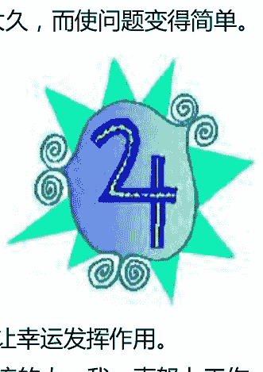

接受能力的一部分是适应事件。我不是说要成为一个随波逐流的人，我一直努力工作，为了心中一个长远的目标，但是我每一天的目标会因为当天新的信息或经历而改变。很多我的突发的幸运都是来自于我愿意改变或当更好的事情发生时我会推迟我的游戏计划，然而有些人可能会花很多时间来避开这些幸运，最终失去了机会。

那些不够幸运的人通常反抗接受的，有一些类似于物理上的摩擦和阻力。这些人不能够让生命自由流动因为他们在他们的道路上放置了太多的障碍，老旧的观点和行为模式，通常被“我不能”“我不会”“我应该”“我不应该”“我们总是”“我们从来不”等等的语句装饰着。这些预想好的关于应该如何做事的观念成为了障碍，因为幸运通常有赖于一个新观点的接受。我不是暗示说你应该牺牲掉自己的道德标准，而是说你应该牺牲关于你自己老旧和过时的观点，以及做事的方式，以及行为的流程。不要限制在一个行为流程中，仅是因为你之前就是那么做的。

赌博同木星有关，毕竟为了获得某种运气，好或坏的，你在一些事情上必须去搏一把。记住，当我们说运气的时候，我们不仅仅是在说打牌或玩骰子，我们说的是你生命过程中冒的各种各样的险。如果你是一个不敢冒险的人，你将永远止步不前。木星本身仅显示出赌博的驱动力，很多人当他们不该赌博时依然赌博，但是这就是木星再次跟好运有关的部分。谨慎的木星式的人本能地只会冒那些可预期的险，赌一些最可能得到回报的事情。出于这个原因专业的赌徒总是“幸运的”，我想所有成功人士内在都是一个专业的赌徒。

开放和外向也是木星的特征，它们在成功中也扮演了一个角色。一个执行官分析了成功的执行官获得最佳工作的详情后。他发现，在大多数的案例中，他们动用了一连串的熟人。

他发现幸运的人是群居的，并且对别人感兴趣的。反之，他们的开放也使其他人能用一种礼貌的方式接近他们。他总结出来，你的人脉关系越广，你找到最佳工作的机会也就越大。很明显，正如一个老谚语说的一样，“关键的是你认识谁”，这是真的。通过和人们形成良好的关系你在积攒自己的运气，这不是说我们交朋友、乐于助人的目的是为了它，但是这是它的副产物。

木星型的人因乐观和热情而闻名，关系中会体现这些人格品质，也会带来重要的好运。热情是可以感染的，也使其他人更加容易接受。两个条件相同的候选人，哪一个更可能被雇佣……沮丧、消沉的人还是热情似火的人？因此，热情的人在他们的道路上通常会有更多的幸运，他们获得了工作，他们完成了销售任务，他们找到了他们的爱。因此，乐观能增加怎么样的幸运呢？在任何新的观念没有被尝试之前保持悲观、消极和愤世嫉俗的看法是聪明的。始终这样想的人压制了他们自己最好的观点和冲动，也就难于冒幸运所需要的险了。如果他们自己想这么做，这是他们的权利，但是我关心的是这种愤世嫉俗者用愤世嫉俗的观点去影响其他人，从而结束了我们真实世界所需要的令人气馁的创造和创新。

是的，乐观有助于好运。幸运的人有一些代表积极思考的东西，就像佛教徒时常说的南无阿弥陀佛，真正的幸运护身符是基于很深的玄学法则的，就是你的外在经历源于你一贯的思考模式。如果你相信你将会很幸运，你幸运的几率就增加了。如果你相信，“我除了霉运一无所有，”这最后也会被证明是对的。

这自然就带领我们来到了木星管辖的另一个领域——哲学。哲学同幸运有什么关系呢？好的，我们的经历就我们是如何评价它们而变得很中肯。如果你相信你自己是一个幸运的人，那么即使当两个人经历的事情是一样的时候，比起悲观主义者你也更加倾向于认为你的经历是很幸运的。

我认为我自己是很幸运的，我多年前很渴望热衷的一些事情没有实现。根据更多的经历和洞见，我现在能看到它们如果开始了那将是很具破坏性的一件事。一个乐观的人，确实经历着相同的失望，可能也从不会认为他的经历是糟糕的，然而如果他已经实现了他的愿望，可能他会在在余生的思考中，将此仅作为他一贯幸运的另一个例子。我是足够哲学的一个人，也发现我大范围的幸运更主观失望的瞬间没有关系，而悲观者却把这些瞬间看作是他们霉运的证据。这些哲学的想法或缺乏哲学的想法是如何影响现在或未来的“幸运”的？正如它们会影响我们的自我概念和冒险的意愿，你最基本地相信自己是幸运还是不幸的通常会变成一种自我实现的预言。

同哲学一起的，仁慈通常也被看作是木星的一个特征。很多有名的金融家好运是基于税收法则的，也就是将它们百分之十的收入捐给慈善机构。他们怀有信仰地做这些事，从他们刚起家没有什么可以分享的时候，他们就有了这种信仰。他们没有等到他们有钱了之后才开始捐钱，你也是一样的。你付出得越多回报得越大，这难道不是真的吗？奉献的好处太复杂，以至于在这里就不多讨论。土星再次扮演了帮你有责任地付出而不是不加选择地付出的角色。不加选择地付出通常会有不好的影响，不论是对给予者还是接受者。（不加选择的付出，有些救赎的气息，更加像是海王星的功能而不是木星。）

我时常有的另一种幸运的类型，一定是木星和土星的结合。我的座右铭之一是“美德自有回报”，因为当我通常是为了别人而做一些不那么愉快和乏味的事情时，常会有幸运光临，仅是因为这是该做的正确的事。例如，对一个强烈不同意我所写的东西的读者，努力回复有责任的答案，包括一些数据，我时常会因此积累到足够的材料和对于另一篇文章的观点。如果我忽视或很生气地毁掉这些无礼的信件，我的任何一个观点都不会被澄清。至少很多人下意识地会把美德和幸运联系起来，因为对于幸运的降临时常会有这样的评论，“你一定是做了什么好事。”

### 木星和霉运

我们确实时常会像制造好运一样频繁地制造霉运。事实上，我知道很多人因此而制造了大量的麻烦。我们其中的一种方式就是看不见我们行为的后果。我们都知道那些时常自找麻烦的人，最终麻烦也找上了他们。这可能是木星的一些负面影响，“推动你的好运”，一种非常愚蠢的乐天主义或过分自信，那是在说，“我不会被抓到，”或“这不会发生在我身上。”最终，推动你的幸运并不会使你过关。如果你继续这样，最后结果会打到你，不要责怪土星给你带来了霉运，责怪自己吧。忽视责任和忽视我们行为的后果是二者时常带来霉运的特征。

另一个你发现的时常听到“不幸的”人的独白式它们的霉运是有一种模式的，它们时常是让人倍感意外而折腾的。对于一个有酒鬼父亲的女人很倒霉地连续嫁给了三个先后都被发现酗酒的男人，你能说些什么？你会说，“你需要一个幸运魔法，”或者你会说，“你需要帮助”吗？咨询或者自我帮助小组会帮助这样的人理解并纠正潜意识的自我挫折的原因。（请一个有心理意识的占星师诠释星盘是深入理解这类持续问题的良好开始。）

最后一个木星的成分是从经验学习的能力，很多不幸的人似乎是没有这么做的。他们一次又一次地犯相同的错误，然后说，“我仅是运气不好。”研究你脑中类似的经历找出是什么地方出问题了。你之后就可能采取行动更正他们，并且在未来计划好如何处理这些情况。

传统地，木星在十二宫被认为是一个幸运的位置。会有一些神圣灵感的瞬间，在人们最需要的时候救兵就来了。这两个倾向都是非常正确的，然而十二宫也是自我毁灭之宫。木星在十二宫的人时常相信，“神在我身边，”因此可能会在一些行为中度放纵自己，冒太多愚蠢的险。这个人可能会无惧地投入到一些不明智的行为中，认为这是神的旨意，然而实际上只是一些潜意识的耳语。是的，救兵会在最后一秒钟到达，但是当救兵因为个人不适合的冒险活动而一次次地被调动时，那最后救援的一秒钟是自我挫折。

在一些看似不幸的类型中，有些疯狂的行为。我很多年的临床工作都涉及到未婚母亲，非常明确是无论她们如何抱怨她们的不幸遭遇，怀孕在潜意识里面是深思熟虑的。这能满足很多不同的需求，像躲开可能需要她们付出很多的有威胁性的成功。就像有的人隐秘地享受不健康，也有人是享受她们的霉运的。他们把自己看作是戏剧的、悲剧的人物，有资格得到额外的关心。特定的文化背景孕育了这类悲剧形象的地位。我个人没有这些也能活，你能不能安静地、持续地幸运而不要戏剧性地不幸？

### 木星——是否过度扩张？

我们已经看到了木星的很多面向，并试着找出他们之间最重要的联系（一个典型的木星式的行为！）在考虑构成幸运、好运和成功的元素时，我们发现运气不再仅是来源于木星，还来自于土星，如果双方被积极使用，都会对我们的成功有影响。我已经学了木星能量的误用会带来像煞星一样的霉运。在使用木星的能量中最重要的是平衡

## 第八章：用爱对待土星

在数以百计的恐惧症还有一种是没有被字典记录的，但是只要字典编撰者开始熟悉占星术，那么这种恐惧症就会出现在字典中。我在说的是土星恐惧症，一种只会影响占星家和他的学生以及客户的神经症。因为越来越多的人成为了这个组中的成员，土星恐惧症有一天将会成为一种很常见的精神健康问题。土星恐惧症，对于土星以及同它相关的占星学寓意的恐惧，它不会像幽闭恐惧症，旷野恐惧症，或禁忌恐惧症（害怕数字13）带来那么多的束缚，但是它确实会阻碍精神成长。作为所谓的煞星之一，土星传统上被认为是宇宙第一大凶星，老恶魔，或甚至是严酷的收割者，这些名称为为数不少的占星学生带来了对它的恐惧。由于知识能够战胜恐惧，让我们来看看这些学生到底在怕的是什么。

正在经历重大土星行运相位的人可能在实现他们的目标时，遇到无数的拖延，从而有种想发怒的感觉，生命中搭建得不稳固的结构也可能因此而坍塌，会被沮丧或觉得他们正在变老的感觉困扰。土星代表的是现实法则，也就是刺骨的拒绝和面对现实。尽管我们中大部分人倾向于珍惜我们的幻想，当土星行运的时候我们必须面对现实，这也是土星被称为是煞星的另一个原因。但是现实是一直都在那儿的，现实是我们造就的，而不是土星，如果我们之前一直逃避现实的话。我本人，会把土星看作是占星影响中最有利的因素，因为当我们用成长的眼光来看待土星行运带来的问题时，我们获益良多。或许当这一章结束的时候你会认同我的观点。我总是说如果你关照土星，土星也会关照你。

### 土星的符号和物理结构

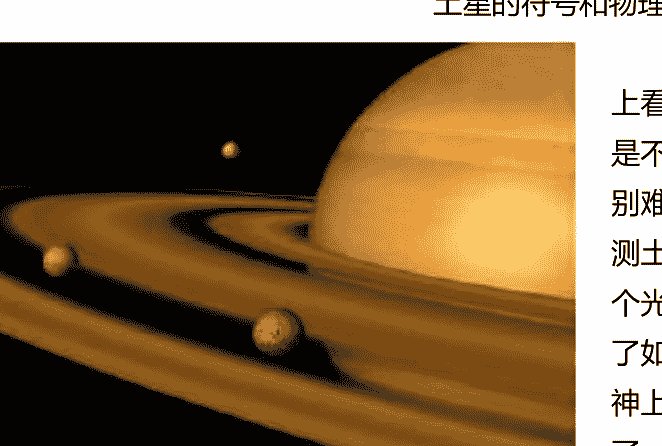

土星是很美丽的。如果你曾经在望远镜上看过土星，你就会知道左边那副图实际上是不能真实反映出土星的美的。摄影器材特别难捕捉到它的光环。从神秘学的角度来推测土星光环的意义是很有趣的。当它带来一个光环，它怎么能被叫做煞星呢？光环代表了如果你对土星善加利用，将带来的无限精神上的强大，我想土星和它的周期确实代表了一种精神发展的点。只有当我们掌握了土星的需求，在它之外的行星——天王星，海王星和冥王星——的能量才能建设性地表达。

从侧面看到的土星，正如我们时常看到的它一样，就像上面的那张照片一样。如果你换个角度，从数百万公里外看土星，将很像太阳的符号。我确信土星和太阳之间有强烈的联系。你的真我（太阳）只有当你成熟的时候才能表现出最大程度的强势和发展，特别在29岁时“土星回归”之后，我们稍后将讨论这个占星学的里程碑。

土星涉及到时间，围绕着这颗行星的环带代表了时间通过周而复始地重复循环或轮转。它们提醒我们当我们做出一个重大决定的时候我们不能只考虑时间中的一个点，必须考虑涉及到这个决定的所有事情，在这之前的一切以及因为这个决定需要承当的一切。占星师们在提到土星时，都会谈到土星的周期，以及它们在我们生命中的意义。

建筑学的一个基本原理是结构服务于功能，对于星体构造同样适用，因为土星的环带同我们生活中的土星功能是密切相关的。在二十世纪七十年代时，发现的天王星的星体构造上也有光环，因为在土星之后，天王星的循环似乎在人类生命循环中另一个重要影响。二者都有光环指出了二者间兄弟情义一般的联系，它们的循环交织出了关键年龄，大约在 21、42、63 和 84 岁。

罗德·崔斯指出了土星目的的意义。尽管土星的大小是地球的 95 倍，但是如果我们可能将它放在任何一个海洋中，它都能够漂浮起来。他觉得这显示出了，我们不应该觉得土星和它的责任是一种负担，而应该用一颗轻松的心来面对它们。

土星的符号有很多种写法，但是最古老的一个土星的符号代表了一个镰刀。与此同时土星恐惧症的人把土星叫做“残酷的收割者”，这颗行星确实代表了收获你播种的东西。如果你已经种下了一些对你好的东西，土星的 7 年周期将给你带来欢乐的丰收，你会得到你应该得到的一切。如果你种下的是对你或其他人有害的东西，之后土星也会收获它们。人们认为土星和业力是一种惩罚，认为它是一种非个人的法则，并不会因为你利用得好或不好而改变。土星不会自己对你好。我时常说如果你把土星用在了正途上，土星也会把你导入正途。

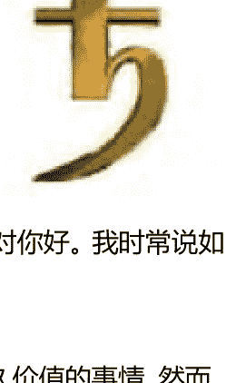

### 土星——正面和负面

土星有很多有用的特质，如果没有这些特质我们很难完成一些有长久价值的事情。然而，我发现很难将土星的正面特质和负面特质区分开来，因为很多不那么受欢迎的特质仅是正面特质的夸大。这在某种程度上对所有行星都如此，但是对土星来说这似乎特别真实。让我们来看看我的意思。

在人类的身体中，土星管辖了骨骼系统——给我们形状的骨架，软骨和皮肤，这使我们远离像水母一样漂浮。在我们的生活中，土星也代表了结构、形式，以及你能够组织得有多好。本命盘中土星的星座和相位显示了我们如何能很好地安排结构。他们也同样代表了对我们最有益的优先序，以及我们最有组织的领域。

例如，土星在双子座的人可能会为他们成堆的纸质文件整理出杰出的文件系统，因为这是他们的优先权，但是对于其他的一些领域可能就没那么有组织了。土星在六宫的员工对于他们的工作可能是非常有组织的，但在保持社会联系方面可能会有些麻烦。太过有组织是一个土星的负面特质，这种人会强迫性地为所有事情列一个清单，然后再为所有清单列一个清单。我们不能在生活中的每一个领域都保持组织性，在简单的生活中我们也需要有一些自发性和快乐。

土星同岩石有关，正面土星型的人是一块“直布罗陀巨岩”，成熟、稳重、可信赖。他们已经学会了在岩石而不是沙地上建造他们的房屋，知道当他们仔细做事并且打牢基础的时候，他们的努力才会有更多的永恒性。当然，这可能也会带来一些极端的问题，源于土星型的人太过坚固和刻板。这种刻板的源头通常是焦虑，土星型的人非常倾向于经历的一种感受。他们可以是自寻烦恼的人，因为他们能够清晰地看到所有可能走错路的事情。

不满足于小石头，土星和摩羯座同样和山有关，这些人在心中也是一个登山者。他们瞄准高度，他们为他们成功的登途精心准备，减少所有不必要的一切。他们事先做好计划，并且设定优先权。土星型有很强的这些特质的人，对于实现那个目标是野心勃勃的，为了达到他们的目标，甚至是冷酷无情的，利用人们，或者踩着他们的尸体向上爬。

很多摩羯座的人或土星型的人膝盖都容易有问题，膝盖是同摩羯座有关的身体部位。由于每一个身体上的问题都有它对应的神秘学的原因，在这里通常是因为在人格中缺乏灵活性。膝盖是需要弯曲的，但是过于刻板的土星型的人在有需要的时候弯曲膝盖也很困难。下跪代表了谦卑，与此同时土星型的人可以非常自我批评，但是他们很多人是非常缺乏谦卑的。（“我可能是非常不完美的，但我远比其余的人优秀。”）我的导师，罗德·崔斯，时常提到的摩羯座极好的座右铭，“为了爬到山顶，你首先必须学会屈膝。”

自律是同土星有关的一个很重要的特质。没有它，我们如何能够完成任何重大的事情呢？耐心，恒心，以及抵制诱惑的刚毅，这所有的都是土星的优点，自律的一些表现。同样的，在每一个领域当中都做到自律是不大可能的，除非我们忽视了人类的需求和快乐。那些为了更多的工作忽视他们家庭的管理人员，可能认为他们自己是自律做得非常好的，但是他们的生活是很不平衡的。土星行运一种较好的使用方式是，在很大的机会上增加了我们的自律，不仅仅是在星盘涉及到的领域中，对于我们人格的核心也是一样的。（在写这篇文章的时候，行运的土星同我的火星有个相位，很多占星认为会产生困难。然而，我一直很自律，保留能量，并且设定了优先权，这本书才被写出来。）

土星最基本的功课是责任。当你发生了一些事情，去责备他人是不成熟的表现。精神导师和心理治疗师都认为一旦你告别了孩童时期，你对自己和你的行为就负有责任。如果土星在你星盘中是一个问题领域，坐下来，坦诚地问一问自己，“我是在推卸责任吗？在这个问题中我负有多大的责任？在什么地方我忽视了我对自己和他人的承诺？”精神导师认为最好每一天都做一做这一类的自我检查，或者定期做一做这一类的自我检查，这样你边走边消化你的业力，而不是将它留到生命结束的那一刻。

土星影响很重的人通常在他们很年幼的时候就承担了沉重的责任，这样的孩子被迫成为了一个大人。接受责任的能力，当然是成功的先决条件，但是那些不能将部分责任委派给他人的人，也会付出巨大的个人代价，同样也夺去了别人成长和学习的机会。当土星，摩羯座，或相关的十宫在本命盘里面很强或行运的时候很强，这通常代表进入管理层的机会。作为一个管理者，唯一真正成功和舒适的方法是学会如何授权以及将需要的技能教授给员工。如果你犹豫于要不要授权，觉得其他人会取代你，你有教授和监督他们完成任务的责任。

土星是现实的，另一个他们成功的原因。他们太现实了以至于不会将他们的精力放在一些无法计算结果的事情上，他们可以预见到一个行为的后果，因为他们用长远的眼光来看问题。他们有时太现实了，缺乏想象力，成为了第一个害怕冒险而很扫兴的人，可能正在努力平衡实用主义和机会主义，夸大了他们最基本建设性的特质。

土星型的人是很严肃的，这个特点可能在快乐至上的社会中是不大受欢迎的。年轻的土星人通常是不被欣赏的，特别是同龄人就更不欣赏了。甚至是土星人认为工作中需要积累诚信的理想想法，在现代这个愤世嫉俗的社会，有越来越多的欺骗和挑战道德底线的行为的社会，也近乎是得不到认可的。然而，认真，“照顾好生意”的视角也可以完成很多事。一旦走上了这条路，非常容易在土星负面的特质中失去平衡，变得阴暗、忧郁和沮丧。字典里还找不到土星恐惧症，但是阴郁（saturnine）在里面，有阴郁的意思。慢性抑郁，尽管有时从生物学和遗传学的角度看可能同样与无法实现珍贵的希望和梦想有关。当土星式的人开始向着一个有价值的目标努力时，他们就会停止抑郁的感觉。同样的，当土星行运的时候，我们可能也会觉得沮丧，除非我们能严谨地使用这些时间，朝着有意义的事情努力。

完美主义是同土星和摩羯人有关的特质，同样也代表一种过分追求的有建设性的性格特点。土星同高要求高标准有关，并且会在他们的能力范围内做到最好。我认识的很多专业人士都是摩羯人，完美地清晰地知道他们的事业以及很好地经营他们的事业。在这几年，我大部分的私人医师都是摩羯人，这似乎就是如此。

专业这个词也有两个方面的意思是不那么被人接受的，过度形式主义，等级分明，以及被刻板的流程所限制。土星型人对于质量和正确性的把控会使他们对自己以及他人都很完美主义。完美主义有时在完成事件时也会带来阻碍，因为花时间去重新做一些在功能上已经够好的事情，这同时也浪费了向前推动的时间。或者说他们对一些事情的要求太高了，以至于甚至是他们自己害怕去尝试。

### 土星的周期和行运

我们之前说过土星的光环，并把他们同土星的周期联系起来。我们将不在这里详细讨论土星的周期，简单来说，土星绕太阳一圈需要 29.4 年。土星的困难相位（刑相或对冲相位）每七年会发生一次，因此每 7 年的结束，都会带来新的成长，变得更加成熟，重新审视我们的人生。我们在大约 28-29 岁的时候真正成年，当土星回到本命盘中太阳的位置的时候，我们把这段时间叫做土星回归。这些时期发生在我们 28 到 30 岁的时候（土星第一次回归），以及 56 到 58 岁时（土星第二次回归）。这些回归被认为是人类成熟周期中的重大里程碑。

每七年土星和本命土星形成相位，会为我们的生活和成长带来正向的压力，心理学家把这称为标准化危险期（例如，14 岁左右青春期的骚动，或 21 岁时的独自上路）。我们都经历过这些危险期，但是如果你本命土星本身有些困难相位，（例如，同太阳、月亮、上升、冥王星或海王星的困难相位。）这些时期将更加困难。如果你是一个土星型的人，你必须学会与土星和谐共处，并对土星善加利用。当行运的土星同本命土星或其他行星形成相位时，改变土星能量的滥用，并更好地发挥土星能量的机会来了。21 岁被普遍认为是我们成年的年纪，事实上它仅是成年的一个初级阶段。28 岁到 30 岁的人会面对很多的挑战，并成为一个老练的成年人。

土星和成熟以及变老有关，土星能量正面的表达方式是成熟。土星是时间的里程碑，除非我们停滞不前，这不是一件坏事。对于那些通过持续的努力稳步成长和发展的人，时间并没有带来遗憾，因为他们不是在变老，而是在变得越老越好。事实上，在每一个领域中他们更像是夕阳红的人，土星型的人时常在他们晚年的土星周期中得到他们想要的。
（就像我能够成为一个骄傲的姑姑，右图是我的侄女谢丽，她在 35 岁的时候完成了她毕生的目标，获得了学士学位。这张照片成为了当地报纸的封面。）

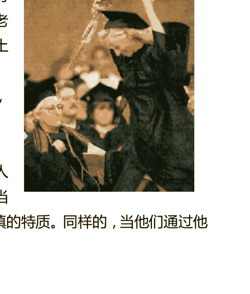

很多年轻的土星人比他们的年龄要老成，也不被同龄人欢迎。他们的舒适程度会随着年龄的增长而增加，特别是当他们进入了事业和家庭中，因为二者很需要这种成熟和谨慎的特质。同样的，当他们通过他们的成就找到了一种安全感和自我价值时，他们会更加舒心，因此一些负面的表达例如不安全感和自我责备也就有了改善。

如果你一直对你需要面对的问题采取摇摆不定或自欺欺人的态度，土星行运的时候迫使你面对现实。积极的方面是一旦当你结束抱怨所有的不公时，你也能够开始着手建立更加稳固和坚实的基础了。打基础可能没有幻想和做白日梦那么有趣，但是仅仅做梦是不会成真的。即便你很笨，你的母校被人鄙视，土星的智慧来源于经历。

很多土星带来的负面情况都源于开始没有正面应用土星的能量。如果你还没有发展出自律，土星的行运可能带来一些因为你不够自律而带来的损失。强加的外在限制是需要你培养内在的自律。如果你在沙地上建造了你的房屋，象征性地说，土星的行运将使房屋升级，使你回头重建稳固的基础。土星不是惩罚性的，而是不偏不倚地纠正错误，天体电脑踢了一下你，让你改正你的错误，因为“它是无法算计的。”

建设性地使用土星的行运能帮你发展出稳定性，强度，自律，组织和构建生活的新能力。如果你已经在被土星行运影响的领域中操练这些特征，接下来在这个领域中将取得巨大的成长，并且收获你已经种下的种子。

### 土星——牡蛎中的珍珠

土星在本命盘中的宫位和星座有时是一个麻烦点，因为我们会经历延误和障碍。这种经历是不愉快的，但是通过遇到并战胜困难，我们赢得了一些有价值的东西。希腊的演说家德摩斯梯尼，战胜了自己的语言障碍，开始了这段事业，并且在数个世纪之后依然被人传颂，成为了一个如此有技巧的演说者。通过努力工作，自律，和决心，土星在本命盘中的位置能带来一些有意义的事。

另一个关于土星的比喻可能会更清晰地展示这种法则。我把土星比作是牡蛎中的一粒珍珠。沙粒激怒并使牡蛎觉得有挫败感，牡蛎甚至想知道为什么它要被如此对待，直到沙粒打破了牡蛎的防线。它不断建造，不断建造，直到最终建造出了一个可爱的珍珠。我们发现珍珠是很美很有价值的，但是牡蛎却因此而苦恼。同样地，我们本命盘和行运土星带来的问题也是很让人挣扎的，在日常的层面上我们可能会觉得很不舒服，但是通过长远地克服他们，我们可能会构建出很多美丽的事情。把土星看作是正在打造的珍珠，你会更好地处理它。

## 第九章：凯龙星和完整性

来自唐纳的注解：在占星学研究的所有小行星中最重的就是凯龙星了，它的轨道围绕着土星和天王星。我对凯龙星的意义不是很了解，因此为了满足今日读者的需求，我请了我的老友以及尊敬的同事，乔伊斯·梅森，写了这章凯龙星的文章，并在得到她的许可下，登在了这里。乔伊斯是一个作家和占星家，她精通于占星术，塔罗牌，香精和梦的解析。同戴尔·般·布莱恩一起工作，从1992年到1995年，她帮忙在国际时事通讯凯龙星系列上报到一系列的关于凯龙星的发现。她关于凯龙星的文章可以在网站www.aplaceinspace.net上看到。可以通过以下邮箱联系到她：wordmonger@starstream.net

很多凯龙星的面向归结起来都是一个单一的概念——完整性，星盘中的凯龙星是我们为了觉得更加完善，必须去努力和解决的关键。是的！宇宙确实会有暗示。通过凯龙星的力量我们能更好地理解“星座”并将神的启示用到日常生活中，把天堂付诸实践。我们是拥有人类经历的灵魂。当我们把灵性带到日常的情境中时，生命是充满意义和令人吃惊的简单的答案的。我们活出了圆满和精神性。

然而完整也涉及到一个旅程，抵达目的地的过程有时也是愉快的。凯龙星同难于愈合的伤口有关，为了不让它们打断我们的旅程或陷入伤口无法自拔，我们必须很好地忍受这些伤口。另一个朝着完整进发过程中的重要面向是分享我们的才智。这意味着凯龙星在我们追求我们为了得到自己满足所爱的东西和他人的利益方面扮演者特殊的角色，是我们身上与众不同的点。

### 凯龙星，更好和更糟

本命盘中凯龙星很强势的人可能会很擅长解决问题，治疗（特别是各种种类的治疗），做着最有疗愈效果或全盘工作的事情，扮演了他们自己内心冲突和同他人之间冲突的桥梁。那些凯龙星被强调的人确实会将精神性带到世上，通常有些神圣不可侵犯的感觉。一个经典的例子是新世纪的喜剧演员，Swami Beyondananda，他的凯龙星合了木星，这使他妙语连珠，用轻松的方式说出凯龙星的意义，引人发笑。

凯龙型的人在一个团体中会展示给他人如何处理某种特定种类伤痛的方法。他们的工作是战胜痛苦，高举他们的解决方案，成为一个积极的社会案例，或改变的媒介。试想一下这对余下的我们这些人将是怎样的一个财富，由于我们为了变得完整，最好能经历书中各种各样的业力。我们稍后将看到一些很好的案例。

凯龙星主导的人们一直觉得被束缚的人，然而，可能会错用这种束缚，几乎到被奴役的状态。他们可能潜意识地去创造一些问题去修复，伤口去治疗，而抗拒调停。他们可能会待在伤口中，给这个被折磨的人颁发一个英雄的荣誉。英雄主义是凯龙星人的真正潜能，他们勇于处理他们的故事，同时也教授团队中他们的朋友圈以及爱的人如何处理。

我听过一个很特别的关于凯龙星的表达“当生活给了你柠檬，就做柠檬汁吧。”凯龙星人不仅可以用他们自己的柠檬汁来经营自己的事业，他们也会从其他人的柠檬中榨取果汁。他们通常善于将很苦的经历转化为希望，通过改变人们的看法，然后处理它们。一个非常有名的凯龙星的咒语是：屈服还是不屈服于折磨，这是可以选的。

一个挤出了悲剧中最后一滴柠檬汁的人是坎迪·莱特纳，她十三岁的女儿在1980年的时候死于酒后驾车事故。将这种愤怒转化为行动，她和她的朋友成立了MADD，抗议司机酒后驾车协会。从那以后，酒后驾车引起的交通事故下降了43个百分点。其他一些类似的人有弗朗西斯和卡罗尔·卡琳顿，他们的女儿、孙女和朋友在1999年的时候在约赛米蒂国家公园被残忍地谋杀。他们升华了自己的悲伤，成立了纪念奖金基金会，目的是为了确保失散的亲人能够归家，确保那些暴力的罪犯受到应有的惩罚。“卡琳顿希望其他家庭引以为戒，不要再发生他们家一样的悲剧。”

### 凯龙星：现代的发现，巨大的问号

在凯龙星被发现之前，人文主义占星师戴恩·鲁迪亚预言在土星和天王星之间将出现一个新的星体，就像一个“高级月亮”一样。凯龙星确实是在土星和天王星之间发现的，凯龙星这一章也间于土星和天王星两章之间，也象征了凯龙星在宇宙中的位置。凯龙星很有月亮的一些特质，就像任何一位母亲一半，凯龙星调和了监督者土星和反叛者天王星的能量，试图使我们每一个人内心的力量变得平静和平衡。

占星师面对这个新生儿，凯龙星在1977年被发现，接下来的15年中，没人可以确定凯龙星的组成成分。它古怪地围绕着土星，最后一颗可视的行星，和天王星，第一颗外行星运转着，凯龙星的大小跟彗星一样，而其它的一些物理性质却很像一颗小的行星或小行星。

查尔斯·科瓦尔，凯龙星的发现者，根据神话故事中的半人马族轻易为其命名，凯龙，一半是人一半是马，一种合成的生物体。凯龙星也最终被认为是一种全新的星体，天文学家把它叫做半人马星体，也是为了纪念神话中的凯龙。从天文学来看，半人马星体会围绕巨大的外行星转动，也就是我们熟知的行星穿梭者。

轨道交叉这一个特点也是我们理解占星学中凯龙星功能的关键，因为外行星代表了内心的转换和文化上深远的转变。凯龙星人会一耳贴地，感受即将来临的巨大改变。他们能够告知他人即将来临的转变，帮助人们适应这些变化，从这点来看，他们对他人是无价的。这种同凯龙星有关的改变是一步一步的，是一个组织构建的过程，不像天王星带来的激进改变一般。它代表了某时一定程度理解的接受和放手，而不是排拒。当我们让一些事情离开时，我们不会很轻松地放手，而是有些犹豫的，徘徊在过去和现在之间的。想一想要分离的爱侣间的离别之吻。凯龙星就在当时和现在之间。

为什么这么多的现代占星师会对凯龙星的发现感到迷惑呢？首先，发现一个新的行星是很罕见的，最后三颗被发现的行星分别是，1781年发现了天王星，1846年发现了海王星，1930年发现了冥王星。（更近一些的是，2004年在冥王星之外发现了星体 Sedna，但是占星师依然还没有看清它在我们星盘中的意义。）凯龙星和冥王星确实有很多共同点，包括他们级别的一些争论。奈吉尔·亨毕斯在行星一书新世界的肖像一章中告诉我们，我们不该把冥王星看作是最小的行星，而是“所有彗星的终结者。”

除了二者都曾经被考虑为彗星之外，冥王星和凯龙星的发现都给了现代占星师一个独特的机会可以来决定它们的占星学意义，而不是接受很久以前就流传下来，甚至是来自远古时期的意义。行星没有意味深长的寓意是不完整的，就像T恤的洗涤说明一样，没有它们T恤也是不完整的，当他们第一次出现在天文学家的望远镜中时，对占星师来说它们是不完整的。由于大部分的天文学家都比较厌恶占星师，占星师的解释也让他们觉得是缺乏科学依据的，即使说天文学家有一串行星解释，他们也倾向于住口，绝不告诉我们。

早期的一本写凯龙星的书中清晰讲述了寻找凯龙星意义的一些事件，已故的厄米尼·兰特罗写的《不断发现凯龙星》。大约三十年来，这些连续的发现通常是很令人兴奋和惊奇的。凯龙星给了我们一生的时间进行象征主义之旅，成为现在追寻生命意义的约瑟夫·坎贝尔。

第二个我相信占星师们会对凯龙星有如此的共鸣的原因是，它是他们的守护神。凯龙在神话中是第一个占星师。他指导英雄们，就像所有好的占星师也想指导他们的客户一样。他是古代版的文艺复兴大师，训练年轻的男子们尝试各种艺术，武术、艺术、音乐和其它美术以及所有艺术的综合，分享他们的才智。每一个咨商师都在效仿它的原型。有不像的地方么？

### 凯龙的符号，宇宙特征，和文化联系

解释一个新的行星时占星师们会看三点：行星的天文学属性；命名来源的神话，何时都能用来纠正的神话；在行星被发现期间的文化改变。为了让你能近距离感受这些经历，我们将略述三者。

凯龙星的符号或象征是一把钥匙。不是任何锁的钥匙，而是一把万能钥匙，能够打开所有门的万能钥匙。无论是从宇宙的观点还是荣格所说的集体潜意识，它们为凯龙星创建的速记符号，捕捉到了它钥匙的本质。理解你星盘中的凯龙星，你需要打开世界的大门，移除所有到达顶点会产生的障碍。打开它将有助于你融合星盘中不同星座中你的不同部分，以及融合世界的二元性，阴和阳，光明与黑暗，深刻和亵渎。

凯龙星和其他的一些天文学中的半人马星体，今天超过其中的 40 个都是在柯伊伯带中发现的。一个在海王星之外的环带，相信很多彗星都是由这个环带孕育产生的，在那里汇聚了很多短时彗星，这些彗星的环绕寿命少于 200 年。来自曼彻斯特大学的占星师马克·贝利认为凯龙星是所有短时彗星之母。换言之，凯龙星曾经是很完整的，所有其它的短时彗星都是由他分裂而出的。这个理论证明了凯龙星寻求完整的功能。就像我们的精神在来世的领域中也曾经是完整的，当我们落入地球时，我们被打散了，必须学着再次变得完整。同神圣分离的感觉是一种凯龙式的伤口。随着我们不断生活，其他的伤口也就出现了。

纵观历史，很多文化将彗星看作是一种征兆。凯龙星的发现可能指向了需要将一种完整的可选择的生活风格的平衡，这将支持地球以及地球上所有的人们变得更加富足。凯龙星的发现也让我们意识到需要治疗生态系统。不出奇的是，凯龙星同生态学有关。

从行星到个人，凯龙星发现期间最深远的运动就是朝着整体治疗和保健学的发展。从 1977 年开始的年份，在很多人的生命中古代的治疗系统像针灸疗法和印度医草学已经开始同抗生素并肩作战。卫生保健已经渐渐偏离了主流的医药学，一些相关的新生者进入的时间也不少于两个世纪，比起上千年的古老医学，被认为可以从二者中择其一。

在同一时间内，妇女的权益成为政治和社会主流，特别是选举权，支持罗诉韦德案在 1973 年的决定。学校、商业和其他一些正面的新兴产业也在发生。在那十几年内马丁·斯科西斯，弗朗西斯·福特·科普拉，和其他一些导演导出了他们最有审美观点和最成功的电影。在现代社会中女性也开始有了地位，平衡了男性的优先权。黑人和白人之间的区别也变得模糊；艺术再次受到赞赏。

### 凯龙星的神话

神话中的凯龙星是一个不合时宜的东西，既不是人类也不是马，而是一个半人半马长蹄的生物。然而他不像其他半人马生物一样，这些生物最有名的就是喝酒、抢劫、掠夺和毁灭环境。他成为了一些英雄的老师，像伊阿宋，大力士和阿斯克勒庇俄斯，医学之父。但这是对痛苦的智慧，因为凯龙星不像其他半人马生物一样，他有一个受伤的过去。如果你帮助他发展高层的一半，就是像人的一半而不是他低层或兽性的一半，考验使他变得更加柔和而有人性。

被双亲抛弃，母亲还感到很尴尬，因为他是一个畸形，凯龙被遗弃从而需要照料自己。在古希腊中，这类神话是源于，那些出生有缺陷的孩子通常会被遗弃在山坡上，自然死亡。太阳神阿波罗和月神阿尔特弥斯假借太阳和月亮的形象来指导他，这也预示着我们所有人都需要找到方向。事实上，这如已经提到过的，凯龙作为第一个占星师的位置揭示了天空和土地之间的联系，为了找到完整我们所有人也必须将二者联系起来。

随着凯龙和引导他的光线间的谈天，他长成了一个受尊敬的社会成员，因引导一些蛮横的少年成为好人而著名。事实上，他指导了当时很多非常重要的领导。关键似乎是他教授了很多实用的生存技巧，就像箭术和武术，并把创造艺术和治疗技巧结合起来，换言之，是一种全方位的教育。

关于凯龙神话最戏剧的一点，就是凯龙在一场结婚典礼上意外受伤，是他所爱的大部分学生和大力士造成了这种局面。野生的半人马生物闻到了婚礼的酒香，这种酒对他们来说是很稀有的，吸引他们来到了婚礼现场，他们像平常一样把那儿搞得很乱。由于凯龙和同他一起来的人试图保护女眷，以防被野生的半人马生物蹂躏，在混乱中，凯龙被大力士射出的迷途的箭，射中了大腿。

因为他是神和一个人类的海仙女的儿子，凯龙是不会死的，但是他能感受到身体的折磨。他的伤口，就像永远不能痊愈的败血症一样，只要他活着一天伤口就存在，但是他无视伤口坚持活着。因为他无法治愈自己的伤口，因为他帮助很多其他人治愈伤口，受伤的治疗者是占星师时常提到的凯龙星神话意义之一，以及对于那些凯龙星占主导的人，受伤的治疗者也是时常会用来形容他们的。

最终他取代了被折磨的普罗米修斯的位置，普罗米修斯因为盗窃了神的东西而被用链条绑在一个大石头上。作为这种审判的一部分，每晚一只鹰会啄食掉他的肝脏，第二天肝脏又会重新长出来，构成了有些恶毒的循环。因为凯龙自己本身就在受折磨，所以他提出了同普罗米修斯交换位置。被凯龙的利他主义所感动，神赐予了凯龙凡人死亡，然后把它升到了星空中，成为了我们看到的半人马星群中的一员。

与此同时，21 世纪中，凯龙很强的人时常觉得他们无法适应社会。他们可能会经历父母的拒绝，就像凯龙星一样，被迫寻求自己的资源，找到处理自己伤口的方法。拒绝有很多的方式，就像达赖喇嘛经历的被迫直接放逐一样，当中国共产党威胁到他的生命时，他在1959年的时候逃到了他喜爱的台湾。其它凯龙星很强的人可能在某种程度上有些生理上的缺陷，就像凯龙自己本身一样。混种？神话中凯龙的指示是找到灵性的方向，并成为他发泄的管道。凯龙星的人时常会有接近精神性的关键经历，这些经历也改变了他们生命的历程。

就像凯龙星，凯龙式的人也时常会无视巨大的痛苦而坚持下去。通过人们的爱，通过主导培养英雄来保持社会稳定，免于野生半人马动物的捣乱，凯龙得到了报偿。凯龙式的人成为了伟大的老师、导师和治疗者；凯龙是外科医生和草药医生。然而即使是他最好的药方，他还是无法治愈自己。

#### 凯龙星的特征告诉我们如何成为真正的英雄

忍受着持续的痛苦并没有让凯龙失去所有。神话故事中凯龙的解决方式是成为了替罪羊，很好地发挥了他的遭遇，让普罗米修斯得到休息。这有一些现代英雄的例子，他们升华了痛苦，教会我们如何处理自己的伤口：

迈克尔·J·福克斯。在他那个年代最受欢迎的演员之一，迈克尔·J·福克斯有一个更加强悍的凯龙星相位，凯龙星在第一宫并紧密地对冲了冥王星。他在《家庭关系》和《回到未来》中扮演的角色是令人难忘的，就像他在《贪婪》、《美国总统》和电视剧《旋转城市》中扮演的角色一样令人难忘。静静承受帕金森综合症几年后，福克斯向公众公布了他患病的消息，2000年的时候也因为这个病而停止了电视剧《旋转城市》的拍摄。他继续做着行为的榜样，将他的疾病用来改变。他开创了迈克尔·J·福克斯基金来研究帕金森综合症，并且维持了他一贯的幽默形象，鉴于他的基金会其中的一个标题是：“在治疗帕金森的途中，发生了一件有趣的事。”

克里斯托弗·里夫。在克里斯托弗死后的一周时，我正在写这篇文章，今天当地的报纸画了两张画。第一张是“克里斯托弗·里夫扮演的超人”。第二张描写了克里斯在他的轮椅上，标题是“超人扮演的克里斯托弗·里夫。”他是最后的凯龙式的角色，无论是以何种形式展现在他自己面前。本命盘中，凯龙星刑了太阳水星的紧密合相，当一场马车意外使他全身瘫痪，他不仅超常发挥了他的治疗能力，他努力寻找脊髓神经损伤的原因，并研究干细胞来治疗。他保持工作，他抱有希望。他相信到他死的那一天，他将再次可以行走。凯龙星同“能做精神”很有关系，无论是什么。

卡罗琳·肯尼迪·施罗斯伯格。我常会想卡罗琳·肯尼迪是如何做到的，我希望永远都不要再讲到所谓的“肯尼迪诅咒。”（对那些更精通占星技术的人来说，卡罗琳有一个很紧密的月亮合凯龙星的相位，对冲了天王星，刑了火星，成为了T三角中的一部分，一种认为是有巨大潜在挑战的三角相位。）不用说她个人忍受着无数的损失，偶然看到她本命盘中凯龙星的位置将预示着痛苦的感受是不大一样的。她从小在公众下面过度曝光也使她有潜力成就这种命运。写作一本叫作《隐私权》的书，谁是最佳人选？她没有仅仅是留在没有疆界的万人注目中，她告诉了我们如何设立这种疆界。这是一个凯龙星将痛苦转化为祝福的能力的绝佳例子。

凯龙式的人是谦卑的，分享他们的才智的。卡罗琳是很了不起的，律师、作家、总统的女儿，艺术家埃德温·施罗斯伯格的妻子，三个孩子的母亲。她有成为一个普通人的能力的例子是，不管她声名显赫的家族，当她老公的弟弟阿诺德被任命为加州州长时，她买了8件“阿诺德的唯一”T恤。

### 更好或更糟：完整性，内心的整合和凯龙星的区域

占星师很有代表的是会觉得一颗行星“管辖”一个特定的星座。从这点来很少有行星能像凯龙星一样带来这么多的争议。著名占星师一致同意的觉得很有说服力的说法是，凯龙星既掌管处女座，也掌管射手座，处女座是因为治疗者和有问题的人都需要常规，学校老师型的人也会培养出英雄。后者，射手座，它的符号中有一个是半人马的射手，自然是符合凯龙星的。其他人觉得因为凯龙星的近地点（凯龙星轨道中最接近地球的点）在天秤座，平衡和关系的星座，它可能会掌管天秤座，也是它调和和整合功能的关键。有些人甚至争论天蝎座的统治地位，因为凯龙星的基督式的死亡和重生的故事，包括它的牺牲，以及三天后他是如何升入天堂的。

但是，怎么能仅考虑完整性这一点呢？和其他很多占星师一样，我相信凯龙星没有特定管辖的星座。我宁肯相信所有这些理论都只是部分正确，凯龙星掌管的是黄道上从处女座到射手座的区域，我将它叫做凯龙星的区域。

你已经开始学习占星术中的星座，星座代表了一个人的本质。下一章将讨论占星术的宫位，代表了一个人的环境。你已经学习了十二宫位和十二星座间的自然联系，开始于白羊座/第一宫，金牛座/第二宫，双子座/第三宫，等等，依次环绕黄道。我们将会集中看一看同凯龙星的区域相对应的黄道上的三分之一。

如果我们将黄道看成是一个人生旅途的象征，在处女座，我们在六宫的环境中，工作会支持我们使我们获得的独立，学会依靠自己。唯一在关系中获得圆满的方式首先是同这种方式来挖掘我们的身份认同。处女座代表了内心的整合以及变得完整途中的开始。紧接着关系的星座，天秤座，外在的整合出现了，以及在七宫领域中的合伙关系。在天蝎座关系更加深入，性带来的一体性，在八宫其他人的资源之宫带来了奇迹般的转化。

一旦我们的关系稳定下来，我们就想分享我们的开心并知道射手座在九宫代表的生命领域中，例如，哲学、精神信仰和出版物，是如何地宽大。（这就是为什么有很多人们写的自助的书，指出了如何生活，并想将这些观点同世界分享。）我们在贡献我们的才智和知识时感到很开心，现在我们从内而外生活回到了完整。

当我们掌握了这个过程之后，我们将有望对那些在黄道最后三宫中遇到的人展现出更多的平静和爱，同最后三个星座有关，摩羯座、宝瓶座和双鱼座。这三个宫位同公众生活有关，事业、组织和社会福利。凯龙星的区域，从处女座到射手座，似乎在情感成熟的过程中也是很关键的，自我的问题和其他的问题将被解决，这样我们就可以在世界上找到我们的位置了，就是从“我”到“你”，到“我们所有人”的转变过程。

### 凯龙星的周期和生命的目的

三大占星学生命周期之一就是凯龙星的回归，当凯龙星转完太阳一周，回归到它出生时最初的位置时。三重唱包括：土星在30岁左右的回归；天王星在40岁左右的对冲；凯龙星在大约50岁时的回归。凯龙星的倡导者芭芭拉·汉德·克洛赋予了这三个周期关键词：身体危机（土星），情感危机（天王星），意识危机（凯龙星）。当土星回归的时候，我们为生命寻找正确的机构和基础，非常切实的事情，就像我们住在哪儿，谁同我们一起生活。当天王星对冲的时候，我们想打破那些形式，因为他们已经变得太过限制。这是中年危机隐含的占星学因素之一。最终，在凯龙星回归的时候，我们必须完成整个同他人联系的过程，包括同神的联系。

在50.7年的循环周期内，然而，凯龙星同样会同本命凯龙星形成一系列的重大相位，为凯龙星回归做足准备。这些相位代表了一步步加深的灵性，使我们回忆起我们物质形体中的灵魂。这个过程始于出生，那时我们每一个人都进入了催化我们内在成长的环境中，身体的、文化的、种族的、宗教的、社会经济的和心理烙印的。无论我们遇到什么样的痛苦，唯有用“正确的精神”才能升华它。

在第一次对冲的时候，你开始模糊地知道或意识到凯龙星的伤害和这些伤口对你的影响。凯龙星的轨道是很古怪的，所以这可能会发生在5岁半到23岁半的任何时间。在一些层面上，这个伤口通常是同一些分离的感觉有关。你特定的伤口，凯龙星在你本命盘中的星座和宫位有助于你的理解，这将仅仅会引发我们所有人都拥有的现有的出生的外伤，正如之前提到的，觉得同精神性切断了。你星盘中凯龙星的星座描述了个人分离痛苦的特征。尽管我们在这里无法说尽十二星座，我们来看一个例子。

凯龙星在巨蟹座的人，大部分都出生在1938年至1941年之间以及1988年至1991年之间。巨蟹座本质上是同母性有关的星座，因此凯龙星在巨蟹座的典型伤口来源于过度保护、溺爱、遗弃或其他不恰当的抚养方式，通常是和母亲有关的。母亲通常在我们的文化中是生存的救命索，也是我们最初感受生命和人类温暖的来源。

巨蟹座也是所有情感星座中最情绪化的一个，同样在固定星座中和水相星座中也是如此，因此回想凯龙星受伤的治疗者的原型，他们是一些受伤的感受者。一个例子是非常有名的女演员琼·克劳馥的养女，克里斯蒂娜，她在她的书《我最亲爱的妈妈》中写到她被虐待的童年。在琼·克劳馥的故事版电影中演出的克里斯蒂娜·克劳馥和费·唐娜薇，都有凯龙星在巨蟹座。

凯龙星对冲时发生的事件通常在形式跟原始创伤是很相似的，如果不能使你成长，意识到这种一再出现的模式会令你受伤。随着《通向自我意识的占星指南》被再版，凯龙星在巨蟹座的人（包括大部分出生于1938年至1941年，以及1988年至1991年的人）正经历着凯龙星的对冲相位，因为凯龙星行运到了摩羯座。（这对于较年长的一组是第二次对冲，第一次对冲发生在1951年至1955年的某一个时间段）。

在这个行运相位中，他们更可能被迫去面对他们受伤的感觉，特别是如果他们一直把这种感觉和他们心中的母亲形象压抑着。一些形式可能涉及到母亲的健康危机，从而引发了过去的伤口，感到一种突然的决心想疏远这个人，或被迫去面对一个已经疏远母亲的兄弟姐妹带来的问题。凯龙星在巨蟹座的十多岁的孩子可能会面对一次意外怀孕，可能会影响到以后的怀孕能力，或由环境所迫需要像父母一样去照顾兄弟姐妹，所有这一切都使他们回溯自己童年时的抚养问题成为可能。

接下来一连串的相位，第二次（或上一次）的刑相是你开始重新解释生命中伤害的时候，特别是更早的循环已经成功使你做足精神功课。你可能会开始重新构建生命中被伤害的区域。凯龙式的伤口有望开始治愈，而不再是那么条件反射式的回应。有自尊问题的人在加入主持人协会后获得了更多的勇气，这个组织专注于学习公众演讲。残疾人也不再认为他们是不一样的或被孤立的，而把肌肉萎缩或听力受损作为他们身体的一些特点。

最后，当凯龙星在50岁左右回归时，如果你正在做一些内心的功课，一种进化的方式来看待老旧的伤口，身体上的伤口或情感上的伤口，应该被控制了。你将坚信无论何时你需要它，神的干涉都在那里。你将会发泄你的‘空洞’，生命中失去的东西，因此你能抓住它们，然后经历完整性和圆满。（有时这种感觉是文字无法表达的！）如果你一直朝着完整性努力，你凯龙星的伤口就不再仅是一个痛点，而是一个开放的痛点。它总在那里像条件反射一般，像打仗留下的老伤口，但是现在，你知道它的目的是非常神圣的。

### 现在就找到它——我们生命中凯龙星的目的

凯龙星的目的是帮助你成为一个英雄，用你自己的方式，帮助他人。伤口中有治愈的钥匙，你凯龙星的伤口时常包含着你的特殊才能。一些有名的例子之前已经给出了，达赖喇嘛，迈克尔·J·福克斯，克里斯多夫·里夫和卡罗琳·肯尼迪。

另一个例子是派奇·亚当斯，在同名电影出品，被观众熟知前，一个凯龙星在处女座合了中天的导演，从1972年开始他就用幽默给大家带来欢乐、友谊和健康。但是成为一个英雄不一定要有名。这是一个非常完整的从业者，混合了过去最好的和现在的治疗技术，为了每一个人把二者合二为一。这是特殊奥林匹克运动员或是一个之前饱受虐待，而现在在家庭暴力避难所工作的妇女。是一个非常害羞的人最终在公众面前演讲克服了自己的恐惧，成为了一个演讲者或演员。

现在为止，我希望你已经大致了解为什么凯龙星的不断发现是如此地令人兴奋。凯龙星，以及凯龙星代表的所有东西，从我们受伤的惯性中激发出了完整性，在我们自己的生活中以及我们伙伴的生活中从一个受害者变成一个英雄。这就是这颗仅有新汉普郡这么小的星体带来的完整性。

## 第十章：天王星和与众不同的鼓手

如果没有天王星我们的生活将多么无趣啊！它是我们星盘图中占星学的驱力，让我们突然改变常规，当我们太过无动于衷或害怕做出需要的改变时。占星师讲述天王星的行运时会告诉你你应该“期待一些想不到的事情，”因为你可能会遇到一些不同寻常和无法预料的事情。它同样是个性的行星，使我们保持有别于千篇一律的个性。就像土星和火星一样，天王星也有煞星之名，无疑这是因为人类都害怕改变，人类都会察觉到那些与众不同的人。然而，正如我们将会发现的，天王星是人类灵魂中更深层次的必要的力量，使人类不断向新的和更高的意识层面前进，而不至于停滞不前。它是科学发现和发明的行星。没有我们心智中的这部分，人类可能还会停留在石器时代！

### 我们能从天王星的符号中学到什么

天王星的符号同其它行星的符号是非常不同的，我们星盘中天王星的位置也确实显现出了我们个人与众不同的点。已故的占星师唐纳德·布拉德利相信天王星同出生过程有关，为何我们会离开子宫，成为一个独立的个体。布拉德利觉得天王星的符号象征了生孩子的过程，因为符号看起来就像是一个婴孩儿，头在下，正在通过产道。天王星和冥王星都同生育有关，但是冥王星代表的是复制的过程，有些东西在我们体内渐渐成长。天王星代表了将新生命驱逐出安全、保护的子宫，进入世界的过程。随着我们精神的成长，我们离开了身后的子宫，成为了一个独立体。例如，占星师把天王星和离婚联系在一起，离婚意味着双方现在都要成为独立的个体，拥有自己的权益。

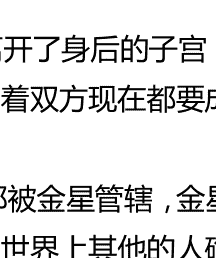

我们也能在天王星的符号中看到倒置的金星符号。爱和美丽二者都被金星管辖，金星被倒置将从很宽广的不同的角度非主流来经历爱和美丽。天王型的人比起世界上其他的人确实会有一种不一样的审美观，看一看现代艺术、电脑绘图或边缘时尚，所有金星管辖的领域，受到天王星调调人们控制的后果。金星，就像我们星盘图中的七宫一样，显示了我们如何对待承诺的关系，很多天王星很强的人无法接受将传统的一夫一妻制的婚姻作为他们唯一的关系选择。随着文化的进步，爱的观念可能会被倒转。理解宝瓶/天王星式的四海之内皆兄弟情谊和和平的关键是对所有人的非个人的，无条件的爱，而非是占有的、有条件的、个人的爱。

最后，天王星的符号使我想到一个头手倒立的人，一种瑜珈的姿势可以改善大脑的血液和氧气状况，有助于我们头脑清醒。天王型的人努力使头脑清醒，但是他们的看法有时同剩下的人是完全相反的。然而，我们星盘中都有天王星和宝瓶座，因此在我们生活中的某些地方，我们的观点是同传统不一样的。在我的电子书《外行星与职业象征》中，我在占星数据银行中做了一个关于天王星合中天（十宫宫头，星盘中顶端的事业点）的人的调查。说来也古怪，我发现他们中大部分人要么是极端地左倾，要么是极端地右倾。尽管他们的政见是非常不同的，几乎是彼此反对对方的，他们的相同之处在于他们的观点是如何地极端和非主流。天文学家用的天王星符号同占星学是不一样的，左边图片中显示

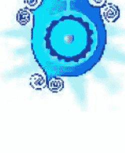就是，大部分欧洲的占星师也接受了这种符号。我不明白为什么天文学家要用这个特殊的符号，但它似乎是太阳和火星符号的联合体。火星，你将想起来，同直接的能量有关，而太阳代表了我们人格的中心，因此如果二者联合，它将代表什么？确实，只有当我们有了清晰地我是谁的定义时，我们的能量才能正确地被控制，当我们成为一个个体有自己的权力时也是一样的。然而，不稳定的天王型的人也可能会像火矩一样，煽动闹事，就像极端的火星一样。

### 天王星不同寻常的特质

当我们考虑天王星这颗星体本身的一些特质时，我们会发现它一些很明显的与众不同的特质。《简单天文学》中指出了天王星与众不同的四点。这四点对我来说都与天王星的意义有关。

首先，天王星特别之处就在于它是第一颗借助望远镜被发现的行星，由于所有的内行星包括土星都是裸眼可以看到的。这似乎是很合适的，由于天王星同科技和现代科学的发展有关。

其次，天王星是被天文学业余爱好者威廉·赫歇尔在做其它一些观察时意外发现的。第一次看到天王星的人是业余爱好者而非科学组织，这很合适，占星学上，天王星也是我们生活中一种非主流的力量。

同样也是一个意外发现，天王星环带的发现是 1977 年的一个天文学奇迹。天王星行运有时同意外有关，可能是身体的意外也可能是创新过程中的意外发现。天王星同空间侦查有关，这些环带的发现，在照片看不到的环带，复兴了已经被搁置了的航海者关于外行星的探索。（在那个点上望远镜的技术一定是有提升的，因为那一年还发现了在天王星和土星之间的小行星凯龙星。）

第三，天王星绕轴转动的方向同剩下的其他行星相反，天王型的人通常会用与众不同的方式来做事情，有些甚至是与常人完全相反的。

第四，天王星是斜的，它的赤道面几乎同它绕太阳的轨道垂直，我们人格的中心同时也是太阳系的中心。占星术中的直角是刑相，一种冲突的相位，天王型的东西终身都会同社会有摩擦。天王星的赤道平面同环绕太阳的平面相垂直既有积极也有消极的解释。为了成为真正的个体，我们在某种程度上必须同被接受的路或标准产生摩擦，我们也必须从不同的角度来看待我们自己的成长过程。另一方面，如果我们一直保持发生摩擦是为了我们自己的目的，正如一些热衷于兴奋的天王型的人做的事，我们散失了自己的见解，不再有中心感。

从这四点来看，天王星是天文学中打破规则的人，很多天王型的人相信规则就是用来被打破的。他们时常觉得他们很独特，因为规则不适用于他们。然而，在另一个太阳系中，天王星可能是规则本身而不是一个例外，那是说，在某个太阳系中，所有的行星可能都是反向运转的，也是斜的。同样的，天王型的人在一个社会中被认为是古怪或与众不同的可能在别处是一种标准。

### 独立的过程

现在让我们回想下唐纳德·布拉德利关于天王星的符号代表出生的洞见，出生的过程伴随了从子宫分离的痛苦，同样也伴随着成为一个独立个体的自由。心理分析思想家像埃里克·埃里克森和埃里奇·弗若姆将个性化定义为在不同的生命阶段和时间发生的循环过程。个性化是一个逐渐成为有自我权益的个体的过程。无论这个过程是多么的无知无觉，每个人的生命中在某种程度上都不可避免地要面对这个过程。很多人都害怕离开我们个人的子宫，包括安全但有限制的家庭圈，稳定但无聊的工作，或熟悉但有限制的思考方式。

弗若姆认为这种对我们冲击的害怕是一种自由恐惧，这不仅仅是个人成长的问题，也是社会的问题，就像人类历史上存在的各种各样的集权主义政体（例如，希特勒的德国，萨达姆的伊拉克）。然而，镇压抚养了革命，这样的时间段也时常出现革命，就像美国和法国的革命恰巧发生在天王星被发现的1781年左右。

天王型的人（和被天王星行运影响的人）有很小的选择余地，他们需要自己处理这个冲击，他们被迫无休止地行动，一种创造的驱动力，对于现状的不舒服。他们被推向更巨大的个性化，困难地通过产道与此同时空气也在不断增加。然而，这些人越个性化，就越会站出来抵抗顺应环境的大多数人，他们也因为变成社会害怕的不一样的人而更容易受到攻击。这是一个令人心痛的孤独的位置。弗若姆说我们攀登个性化的山峰越高，那么我们就会受到更大的拉力，使我们重新回到安全和舒适的人群中。

### 团体：青少年，叛逆者和激进分子

鉴于这些摩擦力，做一个有个性的人，而非巨大整体中的一员，天王型的人能不断与社会发生冲突，同样也与自己的自我保护机制不断发生冲突（土星）。由于这种天王型的孤独和易受攻击是非常痛苦的，一个典型的解决方案是加入一组有相同的观点和关注点的人群中。在很多类天王型的人中我们都可以观察到组建团体的倾向，从青少年，到各种有创意的人，到激进主义者，一直到占星协会。更加极端的例子就是那些哥特式的街头混混，有秘密对话室的电脑黑客。

于此同时这些紧密连接的团体可能积极反对社会强加在我们身上的规则，甚至在团体中还要遵守比社会更加严厉的规则。他们逃出了相对来说会会更有自由的他们反叛的社会中，而加入了一个更加有限制的团体。团体中的领导甚至会比他们反对的任何组织中的领导还要独裁和专制。这种盲目的服从被合理为是共同理想成功的必需品。

如果你很惊讶为什么青少年也会在这之中，请记住青春期是叛逆期。青少年的衣着、说话、习惯、音乐和行为同大人权威们的期望或渴望是非常不一样的。仅仅是为了回避家长和老师的要求和请求。符合大众对典型的青少年来说是很重要的。如果当下的时尚是反穿衣服，他们就会那么做。那些排拒同龄人标准的青少年会受到服从的压力，如果他们无法融入进去，他们通常会被残酷地排挤。

青春期的经历对于青少年们和家长们是否仅是一场不愉快的周期病，还是说这段时间会有一些建设性的目的？弗若姆和埃里克森认为这是独立的关键时期，在这个时期内青少年们将自己从依赖父母的状态下释放出来，开始学着如何独立生活。天王星的行运在第一次的时候可能是很极端的，直到建立了一些稳固的新发展，之后天王星就会更加温和了。

因此，青少年们可能必须在第一次的时候努力反叛，建立自由和独立。很多家长也需要这种冲击，从而唤醒他们，让他们面对他们不再是同一个孩子相处的事实。

尽管，通常反叛的需求源于孩子内心而非是外在，部分也是随着他们成年身体内化学物质的转变。青少年为了独立的需求，反叛内心寄居的父母。除非这个阶段的进展比较顺利，不然结果可能是一个过分独立的从未回过家的40岁的老儿子和女儿。星盘图中天王星越被强调，青春期可能就越叛逆。对于父母或青少年有些安慰的是，这样的星盘图在社会中也容易展现出巨大的创造潜能或扮演一个纠正错误的特殊角色。这种类型的灵魂会非常需要相当程度的自由以及独立，为了在肉身中实现它的目的。

是什么创造了叛逆和激进，这个问题很复杂。当然一颗强势的天王星是诱因，但是我们所有人星盘图中都有天王星，在适当的环境下，我们也都可能被诱导而叛逆。在19世纪60年代期间冥王星和天王星相合在处女座（平民的星座），妇女，学生，黑人和同性恋者觉得饱受压抑，开始了运动，为了他们的权益起义。

然而激进分子的道路，有很强的天王星（也有很强的海王星）。或许这些人并没有开始反叛，仅是变得与别人不一样而已。当他们的不合作受到镇压和放逐时，他们的行为就有了挑衅意味，变得更加刚硬。他们变得激进，部分原因是自我保护，为了他们的权益，站出来，显得不一样，部分原因是社会努力使他们进入一个不是他们制造的模具中，这让他们觉得愤怒。在字典中查一查激进（radical）这个词，我们发现它最原始的含义是“找到根源，或最基本的原理。”（radical 源于 radix，这个词的意思是根，激进分子时常谈论“基层运动”。）这个单词后来被用来形容支持极端的变革或改革。激进分子主张了解问题的核心本质，这可能意味着在我们社会中进行一些非常基层的改变。

真正的激进分子通常会在更早的时候以团体的名义聚集在一起商讨。形成一个天王型的有组织有结构的团体，然而，这似乎是不可能的。他们在本质上是非常个人主义的，也很难接受他们同辈人组建的团体的权威，更何况是一个建立起来的权威。最终随着战争的激烈进行，最后一个小的团体将会分裂出来，形成一个分裂团体。（这个术语是多么的天王星啊！）。可以用在目标上的能量往往浪费在内战上。对于任何时间中很多政治运动的效率都是有限的，因为参与者无法就行动过程达成一致。

### 天王星和占星学的领域

天王星是大多数占星师认为同他们的专业有关的行星，很多占星师星盘中天王星和海王星的能量都很强。不必说，这使他们有一些困难的特质需要处理，古怪，独断，傲慢，叛逆和优秀！努力运营一个占星学组织，并使氛围和谐，就像努力使无政府主义者观点一致，困难。每一个占星师都有他或她自己的观点，胜于认可他人，而形成天王本质最需要和期望的结果（形成一个组织），这些人坚持认为那些不赞成自己的人就是“敌人”。长期斗争是很正常的，作为结果的是，比起任何的政治运动，占星学有更多的分裂团体。甚至在那些自称自己是天王型的占星师中也有小集团。开始我觉得这个术语完全多余，但是后来发现这确实适用于他们使用的特别技术。

仅仅关注太阳星座的通俗占星学，正渐渐被人们所熟悉。而很多占星师也嘲笑通俗占星学太肤浅，虽然如此也是一个进步。我们的社会还不是一个很自省的社会，太阳星座占星学能满足人们了解自己的希望。更加自省的人就会想超过太阳星座的级别，看看一张个人星盘图中提供的深层次的自我意识。

占星术，天王型，带着所有天王星能量过剩的危险。天王型的人是声名狼藉地被分裂的，一个危险就是我们将使用占星术的行话将我们同我们的感情和现实中发生在我们身上的事情分裂开。我们也很容易误用占星术来推卸发生在我们身上的事情的责任。（“是火星使我攻击我老婆，法官。”）有希望的是，我们最终学会了用更加积极的方式来使用天王星的分裂，拥抱星盘图，获得一个关于我们自己以及我们有问题的行为的全新视角，帮助我们发现我们自己的个性。

占星学，天王星的学科，能帮我们缓解远离人类的感觉，同时确认我们的个性。我们所有人都有所有的行星和所有的十二星座和宫位，因此每一个人都有相同的最基本的需求和情感。然而宫位、星座、行星相位的不同联合就变得特别了，这就是我们。当一个老练的占星师抽离了社会的应该还是不应该，他能用一种没有偏见的方式来看待我们的星盘，占星术可以帮助我们用全新的视角来看待我们自己，免于社会的评判。

### 天才和怪人

我听说曾经有人做过一个调查，在名人纪念馆中最多的星座是宝瓶座。我也听过一个调查，在精神病院中，宝瓶座的数量多于其它星座。我无法断言两个故事的真实性，但它带有一个古老谚语的意味，天才和精神错乱只在一线之隔。

无论天王型的人是否是名人馆或精神病院中的常客，再次重申的是这是一个社会以及社会对于我们行为的定义的问题。如果天王型的人有一些与众不同的看法，提出了一些有用的、有趣的或很娱乐的洞见、想法和发现，在特定的时期特定的文化背景下，社会认为他们是天才。相反地，如果他们的想法不是当时社会准备认可和理解的，那么天王型的人就定义为怪人。相同的人，不同的标签。当社会改变，天王型的人的定义也可能会改变。这些有价值的转变或时尚的发生通常与天王星行运通过黄道星座有关，大约每七年天王星会变换一个星座。（最近即将到来的行运星座包括：宝瓶座，1995 年至 2003 年；双鱼座，2003 年至 2011 年；白羊座，2011 年至 2018 年。）

人们说先知在他们自己的国家里是不会受到尊重的。因为熟悉而轻视，因此随着我们长大，我们倾向于忘记了我们的能力和观点。很多杰出、有创意的人为了获得赏识和赞赏必须离开他们的初生地。很多天才也是走在时代之前的，被他们的时代认为是疯子，或者不被时代所认可，直到数十年甚至是几个世纪之后，才会被认可。社会把他们事先印好的标签贴在我们身上，而标签通常是错的。

就像其他天王型人一样，有创意和杰出的人时常会受到放逐因为他们是不一样的。为了友谊和认可，他们组建了他们自己的团队，就像作家俱乐部，艺术家协会，以及门萨。只要这些团队鼓励和培养个人的艺术性，他们就是舒适、灵感和友谊的来源。然而，如果他们有其它社团的一些缺陷，规定了风格的准则，他们也可能是阻碍生产的。

尽管我们已经讨论了精英中一部分的天才和创意，但是占星学也指出了这一系列想法的荒谬之处。天王星同天才有关，我们星盘中都有天王星和宝瓶座，因此我们所有人都有自己独特的天才之处。但是坚持从众，会抑制创造力，同样社会上关于天才的定义也是狭窄的，美术、学术和科学。如果某人的天赋不是发挥在这些地方，我们可能就不认为他是天才。全面了解你的星盘有助于你找到自己的天赋。

### 天王星和团体

在讨论天王型的人时，似乎我一直在讨论的是关于“他们”，而不是你和我。这显示了我们是多么地习惯于从团体中和团体外的角度来看待人们，以及我们离宝瓶座的理想宇宙式的爱和平等性多么遥远。作为一个普通人和正常人似乎不会如此认为。这是一个基于统计学和我们会将我们不一样的地方隐藏起来的幻想。我们所有人的星盘中都有天王星和宝瓶座，因此我们所有人都有自己的怪癖。

非常奇怪的是，当我们参加一个自助小组和自我成长工作坊，我们发现这些似乎是怪癖的东西一点也不奇怪，很多人身上都有。仅仅是因为社会压力使得大部分的人都没有自由地直接说出这些他们与众不同的地方。或许因为如此的经验，团体意识到了天王星或宝瓶座同我们日常生活的分裂，从而唤起了我们的知觉，给我们一种同别人联合的感觉。接着，我们就面临了一个自相矛盾的情景，有什么能比天王型还自相矛盾？一方面，通过与非团体的人区别开，我们可以在团体中看到自己的独特性在发光。与此同时，在团体中也会带给我们一种同普通人一样是有联结的感觉。占星术和团体经验都是天王星管辖的，当它们以平衡的方式运作时，二者都可以治愈因为我们的不同而觉得孤独和放逐的问题。对于天王星觉得非常与众不同的感觉，我们可以通过加入一个天王星（十一宫）的治疗小组，有共同兴趣爱好的团体。

### 天王星行运带来的意外和突变

在特定的天王星行运相位中，比如说天王星同火星、土星或上升点之间的相位，占星师一般会警告盘主担心意外。这不仅仅是一个可能性，在这段行运期间你确实要明智地更加小心。或许我们该看一看意外以及它们是如何发生的。我的脑科学老师，埃里克·佩斯，在不知道，天王星掌管了意外和叛乱的时候，曾经被卷入到意外和叛乱中。发生意外的人通常是反叛安全条例的人，很多天王型的人也有发生意外的倾向。天王型的人相信规则就是用来被打破的，但不幸的是，胳膊、腿和脚踝也是如此。

然而，看得更深一点，如果我们更接近地研究意外，我们会发现大部分自我导致的意外都是一闪而过的造反感觉下发生的。在一个写作班的实地之旅中，我在一个小时内连续碰到两次潜在的严重意外。我清晰地知道每一次我脑中的想法，因为我们被要求在做特定的任务时观察我们的感觉和想法。每一次，在一闪而过的造反念头（不听指示）之后意外就发生了。你可能想甚至是在一个小意外之后观察一下你自己，努力推想一下在意外之前那会儿你在想什么。

然而，在很多严重事故中，人们会得一种古怪的健忘症，记不起来发生了什么。这是因为“震惊”（一个天王星的词语），可能部分是正确的。然而，健忘症和遗忘其中有很大程度的镇压，也就是说把一些不能接受的愿望和情感排挤到潜意识中。在一场自我诱发的意外中会有什么是无法接受的，除了意外后面的动机？在潜意识的层面上，是没有意外的，很多严重的事故在潜意识中都是精心安排的。动机可能是非常反叛的（“通过伤害自己，我将暗中破坏他们的需求”），是自我毁灭的，或甚至是逃离某种情境的绝望企图。但是，在事故的背后有我们导致自己如此的动机。

事故的物质层面结果是不愉快的，但是如果沉思事故能使一个人对于他或她所反叛的东西有新的看法，这将带来积极的改变。例如，我一个住在公共农舍的朋友，对此很不高兴，但是她别无他法。对她来说，她采取了折断她的腿两次的方法，来离开那里。在第二次骨折时，她的父母来了，把她接回家治病，最终她入学了，成为了一个脊椎指压治疗者。尽管痛苦和折磨是巨大的，这两次意外成为了她生命的一个转折点。然而，如果她清晰地知道自己，并且下决心离开那个压抑自己个性的地方，那么打断自己的腿的意外似乎就没有必要了。

天王星似乎和破裂有关。（土星，另一方面，同刹车有关。）在天王星行运的时候夫妻关系可能会被“分裂。”一些人可能会“休克”，这不总是因为精神有问题，当他们这么做的时候，也使我们改变环境或将他们脱离破坏性的环境。青少年爆发出青春痘，在形而上学上所有皮肤的问题都同身份认同有关，而天王星也与寻找自己的个性有关。不是所有的分裂都是有害的。当创意性的意外和发现发生时，我们把它叫做“突破”或一个“幸运突变。”如果你在天王星行运的时候发生了一场事故，这象征着你的潜意识在让你离开一些压抑你个性的东西，导致了你的反叛。让自己休息一下，分析下情况。

### 天王星行运——闪电还是地震

我常听人们把天王星的行运描述为“晴天霹雳”，一个完全没被意料的事情就像闪电一样的冲击。然而，当你往深处看的时候，在闪电的表面和事件的背后有很多东西。回到唐纳德·布拉德利关于天王星和出生过程的比喻，孩子不仅仅出现在空气中，他在子宫里面已经孕育了九个月。同样地，很多在天王星行运时发生的震惊看起来像晴天霹雳的事件，不完全是自然产生的，而是一些内心的智力、情感和精神相当长时间累积的结果。

出于这个原因，我不同意天王星行运就像晴天霹雳一般，它们更像是地震或火山喷发。地震看起来也像晴天霹雳，但研究地震的过程能告诉我们很多关于天王星的信息。深入地球表面，岩石层是由很多参差不齐的板块组成的。（值得注意的是，它们的形状就像宝瓶座的符号一样。）如果板块的边缘排列不紧密，张力和压力就会不断上升，直到板块间突然发生了地震释放了这种能量为止。接着还会发生多次余震，使板块能够重新排列和彼此适应。

天王星行运的运作方式很像地震。像板块一样的裂痕或分裂可能在你生活之下发展出来。或许你的婚姻压抑了你的个性，你开始想要你的自由。压力不断积累，直到天王星行运代表着一个分裂，或需要进行婚姻咨询去建设性地释放这种关系中的能量，为双方带来更多的自由和独立的可能。在这个案例中，“余震”是你和你的配偶之后必须做出的调整。

板块间的故事可以说明人们在天王星行运下会出现的一些不可预知或想不到的行为。一个突然离开成功的事业到深山中居住的人，可能已经渴望摆脱这类工作的压力很多年了。有时天王星行运也会看到突然间发生的暴力，例如，同火星有关的行运。这是事件不是晴天霹雳，而是释放多年来积累的愤怒和挫折。一个不激烈的例子，吵架可能有助于清除两人间的压力，定期的吵架，如果是以一种健康的方式来维系关系，将更加远离突变。

我们生活中也如此需要地震么？如果你不让压力在板块间累积，我们是不需要地震的。地理上一个有很多“滑动”的板块是不倾向于地震的，也就是，灵活性和自由移动。这个地理上的真相教会我们生命的是不要压制你的个性，和你对于自由的需求，否则可能会走向自我毁灭的道路。你越依附于社会规则努力使自己做一个不是真实自己的人，在板块间也会积累越多的压力，将你的生命导入正途的地震也就越大。

### 天王星和危机

震惊是天王星的单词。如果我们没有很好地接地，电会震惊到我们，如果我们不能基于现实，我们偏离中心的行为也会让人震惊。有时我们的生活中需要一些震惊来使我们摆脱常规。唐纳德·布拉德利说天王星是通过震惊前进的行星，要让我们吃惊才满足。

有些人似乎需要引起危机。不仅仅是因为这令人兴奋（天王星的能量是电性的），也因为危机是使我们知道行动的唯一方式。这种所有人都有的特质，部分是因为惯性以及对改变的抗拒，有时我们确实需要它来提升我们的激情和意识来使我们行动。

然而，天王星式的人，有时也会对兴奋和危机上瘾，纯粹为了那种兴奋感。他们容易觉得厌烦，为了脱离他们身边的事物，他们可能有些煽动性的行为。极端的例子是，本命盘中天王星的能量很强，有很多困难相位，这些更加不稳定的天王型人甚至可能会被叫做自由大炮。

创造危机也是一种回应社会对于改变的压力的方式，我们身边的人通常不希望现状被搅乱，也会镇压我们，让我们不要捣乱。作为结果的是，我们通常潜意识地制造一些危机，这些危机被认为是改变愿望的充足理由。例如，已经结婚的人有一个很好的家和家人，但仅仅不再爱他们的配偶，想要改变对他们来说是很难的，除非发生了一些戏剧性的事情（例如，通过欺骗，或通过家庭暴力事件）。或者你可能有一份很稳定、很好的工作，但是你已经非常厌烦这份工作。如果你辞掉这份工作，找了一份不稳定又没之前好的工作，但是更令你兴奋，其他人就会想要一个解释——“你为什么这么做？你已经有一份很完美的工作了。”发火解答了这个问题，这似乎不是你自己的选择。

因为我们所有人身上都有强有力的压力迫使我们服从和镇压我们自己的表达和个性，我们可能会觉得我们必须有一个原因或借口去打破那些阻止我们做自己的情景。一个天王星的行运相位通常伴随着这类的危机，允许我们做出一直想要做但没有勇气做出的改变。问题是，改变和外在强加的危机是痛苦而有破坏性的。为什么是断了一条腿，为什么不仅仅是做出改变？或偶尔休息一下？

做自己的勇气源于很好地表达天王星。找到定期表达自己独特性的方法将降低破坏性坍塌出现的可能性。团队领导，一个周末骑摩托车的人，作为一个中产阶级的妻子和母亲，每年组织几次占星讨论会，同人们分享她的一些符号语言，就是一个例子。分析你星盘中天王星的星座，宫位和相位能教会你如何用兴奋、创意和建设性的方式来表达你的独特性。如果你学得还没那么深，同一个占星师的讨论有助于了解你的这一面。

## 第十一章：与海王星共处——人生不总是高潮

值得注意的是现在的环境和心情是多么能反应这颗我正在写或教授的行星。水星或双子座的课程充满了活跃、玩笑和生动的讨论，而土星的课程是非常严肃的，有时还有轻微的抑郁的感觉。这个法则在写海王星章时也同样适用，写这章花了我9个月的时间。（在数字命理学中，数字9代表海王星。）海王星是模糊而神秘的，我海王星的一些资料文件夹曾经有两次神秘失踪，每次失踪的时间都长达数月。在真实海王星的基础上，我把这理解为这预示着我还不该写这一章。海王星是模糊的，拒绝结构的，另一个这章写了这么长时间的原因是我不知道如何组织这一章，尽管通常情况下我能轻松组织我的文章。

不奇怪的是这时很多人发现我们自己飘荡在海上，海王星是海之神，海王星也同海洋有巨大的联系。鱼是海王星掌管的双鱼座的代表，鱼也是基督教的代表，在双鱼纪元中发展出来的重要宗教。

海洋最原始的力量使海王型的人有一种特殊的魔力，抚慰人们，使人们平静。高潮和低谷是我们生命的节律，而海王型的人也会花一生的时间，甚至是几生的时间来学习面对现实，面对人生不总是高潮的现实。在低潮时，海王型的人可能会寻求一些上瘾的物质（海王星的另一种形式）使他们再次达到高潮，但是如果他们太过依赖于这些肤浅的手段，他们会上瘾，例如，喝很多酒。

### 物质层面和灵魂层面

为了处理生活中物质层面的问题基于现实的一些想法是必不可少的。可以确信的是如果我们没有从现实中学到有价值的东西，我们也就不可能存在于现实中。然而，海王型的人常想要摆脱这个层面，在这个层面上漂流和做梦。对于成瘾的人格这是真相，对于精神分裂患者这也是真相，对于精神或神秘学一样是真相。我提到的这三种类型事实上是一种，所有的都是海王星能量的强烈表现，不同点在于他们沉迷的东西不一样。

这一点有力的证据是成瘾的人是多么频繁地从海王星的一种表达转移到另一种表达的。很多心理上严重酗酒或抽烟的人都指出这是为了增强他们的感觉。酒鬼可能通过加入教会而变得镇静，对于治疗的深层精神道路，很多有毒瘾的人也通过基督教而被治愈。一个国家戒毒所的研究显示几乎一半的吸毒者同时也是酗酒者或有严重的饮酒问题。

接着在错觉和精神追求之间就有了纽带，两个海王星能量表达的极端点。很多精神病学家已经指出他们的病人精神上是如何地危险，在精神病中宗教错觉也是很常见的。在一些特殊团体中，例如波多黎各人巫师教会，那些看起来疯疯癫癫被灵魂附体，被当做是上帝信使而倍受尊敬的人，你和我可能会觉得他们是疯子。把你和我这种精神启迪的人同那些疯子、酒鬼和吸毒者联系在一起，会不会让你觉得不舒服？喜欢也好，不喜欢也好，在这些事情里面海王星扮演了强有力的角色。我们所有人星盘中都有海王星，那里你和我都会为了上帝的仁慈而行动。这也不是一场只需要赢一次的战争，因为当进入精神追求时，为了保持精神健康，你必须不断地努力用平衡的方式来处理海王星的能量。

这些看起来不同的团体有什么共同点么？我相信在灵魂层面中他们有非常显著的联系，我们所有人在晚上做梦的时候都会去到这个层面，我们死后也会回归到那儿。但那些对它不是很熟悉的人来说，灵魂层面是一个非物质的存在状态，在那里我们的思想和情感形成了一个虚拟现实。例如，当我们梦见我们在飞的时候，我们可能确实在经历出窍（例如，灵魂出窍）。灵魂层面缺乏掌管物质层面的时间和空间的界限，因此精神性的人通常能够灵魂出窍，在时间或空间内向前或向后移动。应该更确切地把这些人叫做灵魂苏醒的人，我们所有人都有精神能力，尽管，对很多人来说是一种潜在的能力。任何强烈的物质或情感的压力，例如濒临死亡或逼近的危险都可能使我们同那个层面联系。

灵学和精神分裂症患者有时可能都会接触到灵魂层面，但是灵学有随意进出的能力，与此同时精神分裂患者是没有选择，可能在某种程度上地被困在里面，就像一个他们无法逃出的恶梦一般。这个层面也是上瘾的一部分。一个服食迷幻药在飘荡的人，在酒精中沉迷的人也一定是基于灵魂层面的。很多土著文明发现像配奥特掌（仙人掌的一种）或曼陀罗这种植物的种子，会引发幻觉，对土著居民来说追求幻觉通常是入会和典礼的一部分。（大部分这种植物都是有剧毒的，因此萨满巫师们会非常严格地控制这些植物的使用。）

尽管我们在梦中会拜访这个灵魂国度，但对于大部分刚刚进入灵性道路的人来说这是害怕的，可能是因为失去了意识的控制。当我们还不足够成熟到可以处理这种恐惧时，这种恐惧使我们不去尝试精神表演或灵魂出窍。也可能是因为我们见到了太多警告我们远离这种状态的糟糕精神经历，直到我们已经准备好了。为了用一种负责的方式处理精神经验，控制因此而产生的情感、恐惧和欲望，我们的精神需要变得成熟。

很多人误用了他们的精神天赋来增强本我或控制他人。在这么做的时候，他们的精神能力通常会变得不可信，因此他们就会通过一些欺诈的手段来推进它们。很多灵媒在开始的时候是近乎真实的，但是一旦他们的本我过分卷入就容易变成欺诈了。精神、占星师、灵性追求者或宗教导师的负面海王星的本我通常是没有边界的。所有灵性追求者的终极目标都是与神合二为一，但是海王星式的本我之旅相信他自己会以某种特殊的形式与神合一，例如成为一个神的化身或救世主。

很多海王星式的人物已经把他们心中这个最深最珍贵的秘密告诉我了，我现在也提供给你一个规则：告诉我一个私底下不相信他就是救世主的海王型人，我将展示给你这个海王型的人正在说谎！！（自然地既然我已经拥有了这么多的启迪，我不再认为我是重要的，但是我确实会珍惜持久而公认有些奇异的想法，我能够获得这一世的圆满，再也不会成人。）医生，另一个海王型的团体，也喜欢把自己看作是像神一样的人。值得注意的是，比起任何职业医生是最容易酒精中毒的，可能是因为他们时常会看到一些自我很渺小的事情，而不断提醒他们，他们仅是一个人而已。为什么本我会对海王星式的人设下一个这样的陷进？易经学派的占星师指出海王星是联结我们集体意识的纽带，是我们同所有事情的整体性。只有暂时忘却我们的独立，我们才能经历到这种整体性，与神合一。

天王星的驱力是发现我们的个性，天王星转动时比海王星更加靠近太阳。或许只有在我们完全认识了自己的个性之后，才能去经历自己的对立面（海王星），也就是同所有物体的一体性。最近出生的有天王星和海王星相位的人，五度以内容许度的三分相出生于1937年至1945年，五度以内容许度的四分相出生于1952年至1958年，合相在1988年和1998年。这三类重要的世代，这些时间段内出生的人可能成为探索这个疆界的人，从而成功融合这两大星体的能量。

海王星令人着迷的一体性的经验，也就是融入到比我们更广大的东西中，是很高尚的。将注意力放在本我之上，不仅失去了高尚，同样失去了通过精神和灵学而产生的同集体意识的联结。毒品和酒精的使用者努力达到这种高尚的融合境界，既不知道也不承认通过这种他们在追求的精神经验可以令他们感到自己很优越。

共产主义的先驱，卡尔·马克思说过宗教是大众的鸦片。在一个时代中，当大众无法从传统的宗教中找到很多安慰或主旨时，越来越多的人试着通过鸦片和其他肤浅的手段来获得这种高尚，包括强迫性购物或连续数小时的锻炼。这一点已经被爱荷华州的议员哈罗德·休再三强调，在从政之前他是一个酒鬼，最终他也离开了政坛，成为了一个牧师。被问到在我们社会中酗酒者和吸毒者人数上升的原因时，他说这是源于普遍存在的精神空虚。对于那些在他们星盘图中海王星被强调的人，我们社会精神空虚的文化氛围可能是非常有破坏性的。这些人必须花额外的精力来探寻生命的意义，与之对应的负面的表达是逃避现实。

如果他们的任务成功了，海王型的人可以成为有效的灵性导师，引领人们走出海王星负面的追求，从更深的层次唤醒人们的信仰，而不是那个我们熟悉的物质层面。如果你正在同毒瘾抗争，这一点都不仁慈，或者说多产，为了未来可能会失去的东西而打败自己。海王星是同沉迷和精神成长都有关的行星。鉴于你已经完全了解了海王星的教训，它们中的大部分不能写在简历上，但在精神和灵性层面上确是非常有用的。

### 万能药的问题

副作用似乎是海王星特有的现象。从最新发明的药物到最近社会的改革事项来看，确信无疑的是任何声称是万能的药物一定都会有不可预期的副作用。今天奇迹般的药物通常明天就是头疼。在我们热心寻找一些病的治疗方法时，我们欺骗了自己药物的真正本质。我们干个不停，就像一个从跳板上跳下来被溺死的跳水运动员，仅发现这真的是一条鸡肋。

去寻找一个问题的万能药也就使我们容易自我欺骗和接受副作用。这个法则已经被不断验证。根据适者生存的法则，一种更加强效的药物，也会使难题随之升级。我们不断地研究更强的抗生素，这只不过是源于病毒变得更强，抵抗力也更强。更强的杀虫剂也只不过是增加了更强大的蟑螂和超级老鼠。对于上瘾也是一样的，随着身体对物质容忍性的提升，同时也就需要更加有效的物质。

历史上的上瘾的药物也遵循相似的模式。在十九世纪，人们意识到鸦片的瘾之前，鸦片被当作是一种所有专利药品中的万能药。吗啡和海洛因，源于鸦片，同样在一开始也向大众隐瞒了他们成瘾的副作用。当海洛因成为社会的一个主要问题时，另一种鸦片的衍生物出现了，美沙酮，因治疗药而著名。被证明了美沙酮的瘾对身体的伤害远远超过海洛因。当美沙酮项目出现时，而不包括一些治疗小组和咨询服务，这是社会控制上瘾的人远离犯罪行为的一种基本形式。海王星跟压迫人民有密切的关系，在英雄时代，高加索人故意使用酒精来控制本土美国人和非洲奴隶。甚至到了今天，这两个种族还在强烈地同上瘾斗争，同这个化学破坏的悲哀遗传作斗争。

上瘾本身是想要逃避问题和痛苦情绪而产生副作用。酒精既是一种镇静剂也是一种刺激物。一剂镇静剂副作用仅持续两个小时，而刺激的效果会在身体内持续十二小时。两剂镇静剂会使身体镇静四小时，但是刺激身体二十四小时。当你喝醉的时候，酒精镇压了焦虑和其他不愉快的情绪，但是有反效果，当酒醒之后，焦虑的水平变得更显著了。因此酗酒者继续喝酒来延迟不愉快的情绪和身体上的反应。耐受性会随着时间而增长，最终一个完全成瘾的人就出现了。

那些对酒精或其他物质上瘾的人使用海王星的防御机制否认使他们自己和别人相信并没有上瘾。另一个我双鱼座朋友罗德·崔斯经常使用的暗喻是当我们让自己沉迷于酒精和其他的类似物时“小心回头浪”。

一般来说，逃避你问题的副作用就是问题会变得更糟糕。这就像是一个长满杂草的花园。你决定你只是“无法面对它，”因此你一个星期或两个星期不管它。杂草不会消失，他们迅速地成长，根除它们变得越来越难。它们变得不屈不挠，长出了藤蔓，坚硬的叶子，错综复杂的根，以及强壮像木头一样的茎，因此它们确实很难根除。很快，他们开始俘获你一部分正常的植物。如果你在它们年轻和幼小的时候就把它们扯下来，这可能会非常简单，确实是一件日常的苦差，但是长远来看会更轻松。你必须彻底根除，包括所有的根，否则一旦遇上它遗留的细片，它还会长回来。我们生命中面对的大问题需要像培养花圃一样来处理。

是否要怀疑所有的万能药都有副作用？是的，直到它被证明没有。酒精似乎蒙蔽了你的麻烦，酒精中毒也需要很多年才会发展起来。一些用了二十年或更多年数的处方药的有害副作用可能到现在才被发现。同样地，一些我们盲从的，似乎是“精神”导师的人，会愚弄他们自己和我们，仅在很短的一段观察期和测试期内能够看到益处。我们绝不能不假思索地接受任何我们没有亲身体验过的观点。过度依赖任何化学物质会导致精神和情感的不均衡，相似地盲目听从一个人类导师进入海王星的旅程也会带来精神上的不均衡。

### 海王星——升华的金星？

至今为止我们已经关注了海王星的负面影响，海王星比起星盘中的任何其它行星似乎更容易遇到一些捉摸不定的事情。海王星代表了我们心中最好和最糟糕的一面，圣人和恶棍。但是海王星建设性的一面是什么呢？传统上认为海王星是金星的高八度能量，意味着如果金星最大限度发挥的能量将是海王星的能量。另外，正如我们在之前章节讨论的一般，金星按理擢升在双鱼座，海王星管辖的星座。

金星代表了个人的爱和关系，海王星将爱带到了一个精神层面，无私和无条件的爱，不需要任何回报的爱。无私使自我的疆界消融，我们再次回到那个所有都是一体的集体意识中。在这种精神状态下，你的痛苦就是我的，所以视为一体、同情和移情也就自然产生了。

> “我感受到了你的痛苦。”

我相信他确实感受到了，因为海王型的人是非常有同情心的，但是克林顿作为总统的致命弱点是在性关系中缺乏边界。很多海王型的人有严重的边界问题。

平衡也是一个大挑战。如果你不陷入这种感觉，你很难切身体会到别人的痛苦，过度卷入问题中也会使你失去自己的见解而变得无能为力。狡猾的是为了足够客观你必须分离，然而海王星的状态很难保持分离。金箴说“像他人对你一样对待他人，”但是如果你过分认同另一个人，你的行为通常是不明智的，为他们和为你自己而感到困惑。

利他主义和同情是海王星的特质，或许从逻辑推断看，也是金星分享和为他人考虑的扩张。一个海王型的人，双鱼强的人，或十二宫强大的人献身于服务病患和不幸的人包含了很大程度的利他主义，但是把利他主义作为一种动机，是有些过分的说法。我们从为他人做的事情中学到和收获了很多，通常在这样的经历中只要我们得到的多于付出的，我们就会做。付出也会使你感觉良好，构建了本我的伟大形象。我们之中很多看起来无私的人的自我中心倾向是很强的，即使他用一种“比你谦卑”的态度来伪装自己。

和谐同金星有关，音乐同海王星有关。音乐无疑是有很强的情绪影响力的。我觉得它是我们同灵魂层面联结的一种方式，特别是通过赞美诗和圣歌。我曾经在《光明篇》中听过一个很美的引用，

> “天堂中是有墙的，墙只为歌声而开启。”

如果这是真的，为什么有那么多的爵士、摇滚音乐人吸毒或酗酒？这也是海王星不同面向间的联系。音乐可能在他们中引起了一种精神上的向往，但是他们无法同等地意识到它，从而求助于化学物质，用这种更加高产的方式同所有人融为一体。曾经在音乐人中风靡一时的一个习语似乎阐明了这种宇宙的联系。当他们觉得非常好时，他们将会说，

> “所有的一切就是所有。”

海王星的正面，接下来就是同金星有关的更加自我的一面的改良版本。海王星没有，而同金星和天秤座有关的一个特质是平衡法则。海王型人是特别容易不平衡的，精神、情感和灵魂。直到发展出足够的情感和精神的平衡，海王星在我们生命中都不太可能是一个纯粹的影响力。在适当的情境下，任何人都可能非常容易地从海王星的正面滑落到负面，记住一首老诗是明智的：

> 我们中最差的那些人也有很多优点，
> 我们中最优秀的那些人也有很多缺点，
> 它破坏了我们中任何一个人判断他人的能力。

### 海王星行运——为什么是我，上帝？

很难将海王星看作是我们生命中的一种积极力量，因为绝大部分海王星行运除了觉得在事情发展路上有阻碍之外，感受不到任何事情。我们经常会在雾中，觉得很困惑，被其他人和自己欺骗。我们很容易形成错觉，无节制，甚至脱离现实。我们会觉得倦怠、无力、缺乏兴趣、沮丧，大部分时候不可避免的自怜。时间和金钱都消失了，我们不知道自己在哪儿。本命盘中机能紊乱的海王星在海王星行运时可能会达到一个临界点，他们代表性地到达一个临界点，变得无法令人忍受，最终溶解了。这些功能不良的最好解决方案是听之任之、祈祷、原谅和顺其自然。

很多占星家认为海王星只会带来负面的案例，例如，我们必须学着控制或避免这一章中描绘到的各种倾向。然而，我认为这些困难都是在我们试图达到海王星的正面影响失败后出现的。那么，海王星在我们生命中的目的是什么？它能教会我们什么？

一天，当我坐下寻找这些问题的答案时，广播“不可能实现的梦想”开始了。是的海王星的一个功能是唤起我们的视野，启发我们，使我们敢于做梦。马丁·路德·金，月亮在海王星管辖的双鱼座，用他的演讲感动了数百万人，“我有一个梦想。”在海王星的影响下我们通常是很有些感的，即使我们缺乏决心和清晰的视野，去实现我们的想法，直到行运结束时。同样地，没有伟大梦想的启示，我们的世界将一层不变。我曾经在瓷砖上看到艾达·卢频(Ida Lupino)的一句话，这句话清晰地表明了这种功能。她说，“我们所有人都站在泥泞中，但是我们中一些人在伸手摘星。”

很多海王星负面的显示都源于一个宇宙的驱动力或需求，超越自我限制，同更大的东西融合。我们试图达到这种状态的一些方法是积极和有创意的，使我们的精神更好地发展，同时其他一些方法使我们试图逃避的问题变得更加复杂。如果在海王星行运期间负面的影响出现了，至少人们学会了他们不该选择的那一条路。我们不可以也不该从他们的外在行为来评判他们的精神层次或业力。吸毒者可以学到深层海王星的功课，可能是其他人需要几世才能学到的内容。

海王星行运时幻灭的感觉是很常见的，这可能同样很沉闷，在我们个人发展的道路上这通常是重要的一步。当是离开一些之前事物的时候，无论之前它是多么地美好，我们会对他失望，发现不再那么喜欢他了。

当苹果成熟时，它会掉落；当孩子要出生时，子宫内的环境开始恶化，引发了孩子脑中的生产素。本命盘中的海王星同子宫有关。当是时候离开我们作为成年人建立的稳定子宫时一个习惯、一个团体、或一种情景，海王星的行运带来了幻灭并消融了我们和它的联系。因此幻灭，尽管是痛苦的，却是我们成长的一步，预示着我们准备继续前进。

在海王星行运下产生幻灭的另一个目的是放松我们同物质层面的联系，使我们渴望生活中的精神层面。很多我们觉得幻灭的事情，仅是因为一开始有幻想。佛教和其它精神教义揭示了世界上所有的东西都是短暂和虚空的（玛雅），与此同时死后的世界才是真实和永恒的。在海王星行运时，很多人有了影响他们一生的宗教经验。精神力量会被唤醒，使我们同存在的另一个层面联结。

### 海王星和精神力

当我们开始进入人格中的精神层面时，可能是在我们本命盘中海王星行运时，想要强烈戏剧的、比生命更广大的精神联结，来支持自尊是一种常见的诱惑。我无法告诉你有多少人相信他们正在同戴安娜王妃或特雷莎修女沟通。你可能通过某些形式同精神向导有联系，但是在灵魂层面上，灵魂可以成为任何他们喜欢的形式。我们也可以把他们看成是任何一个我们想要的人，因此有很强的自我欺骗或被灵魂层面物体欺骗的能力。

海王星掌管了精神能力和幻想或自我欺骗，因此不让本我迷恋精神力是明智的。当本我开始自我欺骗时正是我们觉得自己很神圣和重要的时候。一个例子是，一个很有天赋的人，依旧很谦卑，备受验证的、令人惊讶的灵媒，约翰·爱德华（John Edward），他是如此完整，因为他拒绝使本我卷入他的工作。

在这个精神发展阶段我建议保持谦卑，将注意力集中在用你的天赋服务他人，怀疑来到你精神道路上的每一个信息。我不是说不要相信任何遇到的事情，只是为了正确需要保持独立，在接受他们是事实之前要寻求确认。我也会同那些正在发展或从业的灵学家说相同的话。如果约翰·爱德华问起，我甚至也会说相同的话，但是他在这一点上已经远超我们很多人，是一个健康的行为榜样。

### 海王星——路上的雾

当你确实唤醒生命中的精神面向时，可能会花很多年，或甚至是一生的时间，来用平衡的方式处理它。初学者容易误入歧途，自我欺骗，有一些非常奇怪的观点。在很多海王星行运中，一个重要的任务是挑选出在精神教义中什么是有价值的，什么是错误的。由于海王星既掌管了精神经验也掌管了欺骗，有很多假冒的或被误导的术士和自认的宗教导师。在灵性导师中使用精神力量和找到你的路就像重新学习走路一样，只会更加困难。在布满迷雾的地方，谁能看到下一步该落在哪儿？

## 第十二章：对待冥王星——让它去吧，重生吧

我的占星学老师之一，查尔斯·杰尼（Charles Jayne），把冥王星叫做女性的行星。开始，我觉得这太男权至上，但是在深度研究后，我同意。男人和女人而不是孩子会产生新生命，冥王星代表了女性型的生殖过程，你允许一些新的东西在你的身体中生长，来自于你自己的物质。就像女性生殖器官一样，这个过程是内在的和隐藏的，就像一个孩子在子宫里成长一样，冥王式的过程是逐渐发展的。冥王星一个常见的关键词是转化。行运冥王星带来的影响是重生和转化，结果是积极的或消极的有赖于我们如何拥抱它带来的深层转化。

对于此书的再版，我发现很难将所有冥王星代表的内容浓缩到一章中。我写了一本关于冥王星主题和它的表达的书，《治愈冥王星的问题》（Healing Pluto Problems）。关于这种人类心理强而有力的部分，以及如何积极地表达，远比在此阐述的要深刻。就像所有太阳系中的行星一样，冥王星的表达也存在于一个范围内，从最受欢迎到最令人不快。冥王星一些不够有建设性的表达范围包括，滥用权力，占有欲和控制欲，到有毒的怨恨，这些都使上帝离我们更远。更加进化的冥王星的使用包括治疗和转化自己以及他人。对我来说冥王星的负面表达似乎是同继续的回应有关，与此同时积极的表达同让它走吧有关。

这章中我们将大量讨论“冥王式”的人。在星盘图中我们都有冥王星坐落于某一个宫位，因此有时我们或多或少地都需要面对我们的阴影面。我们所有人都遇到过生活中非常严酷的现实，期间力量时常被误用。然而，对于冥王型的人，处理这些现实是生活中的重大主题。冥王型的人包括很多行星落在天蝎座，许多行星落在八宫，本命盘中冥王星有很多相位，或冥王星接近上升点或中天或同太阳或月亮有相位的人。

如果你还不了解相位或宫位，你如何知道自己是不是一个冥王型的人？如果这一章已经使你激动人心，你可能是一个冥王型的人。如果你正在学习占星术的好友或堂兄给了你一本《治愈冥王星的问题》，他移开目光并说，“我想你最好读读这本书！”你可能是一个冥王型的人。噢，如果某人匿名地送给你了这本书，那么你一定是冥王型的人！

### 冥王星的负面表达

查尔斯·杰尼（Charles Jayne）描述了一种综合症，感情强烈、占有欲、嫉妒的冥王型的人，通过别人的内疚和自己的过度保护把别人捆绑到自己身上，慢慢地和巧妙地使别人变得依赖。一些冥王型的人是控制狂，操纵身边的每一个人，警惕每一个新的情景唯恐出现一些他们无法控制的局面。他们很典型的是通过操纵为所欲为，微妙或明显地，使别人觉得内疚或惭愧。尽管男人当然可能有这些行为，但是传统上因为女人不会直接接触权力，所以她们会更加依赖于这种机制内疚勒索。这种不公平在很强的家长制文化中是特别真实的，妻子必须服从她的丈夫。

这种天蝎座天蝎型的人的不宽恕的报复性展现了冥王型的另一个负面特质。（请记得蝎子在刺的时候也会毁了自己。）会有自发性地让人窒息的情感上的抑制，特别是对于愤怒的严格控制，一种深层的恐惧觉得任何愤怒的表达将使自己被抛弃。严格压抑愤怒的人倾向于卷入一些强烈甚至有时暴力的爱情中。

另一个冥王型的方式是隐藏、自我保护、怀疑和防御，这些可能同偏执狂有关。当冥王型的人害怕说出他们的想法和感觉时，甚至是人类最普通的需求和感觉也可能被隐藏起来。因此，他们会觉得自己同人类格格不入。这种模式带来了很多冥王型的人身上负担的隔绝感。一次治疗或自助团队会极有帮助地抵消这种隔绝感，因为那时候冥王型的人看到很多人分享他们的思想、反应和经历，他们不再觉得自己那么地反常。分享，事实上是冥王型的人需要学习的关键课程，因为在完全占有一样东西的过程中，他们是孤独的。

冥王型的人可能会在独身与共生体（在下半身结合）的关系中交替，在这种共生的关系中任何一个伴侣都似乎是不能单独存在或没有另一方而向前走一步的。隔绝和共生是一个顶点的两个相反极端，冥王型的人可能会在两个极端间摇摆，只有其中一个是不舒服的，直到他们学会了找到二者的平衡点。一样的隔绝感可能会导致混乱，很少有性方面的满足，通常源于一种痛苦的需求来逃离他们的隔绝。

一个相关的方式是当冥王星和天蝎座很强会害怕被抛弃，过去创伤损失和背叛经历的后遗症。冥王型的人过度地努力“帮助”有麻烦的人，希望改造他们关心的对象。他们喜欢把自己想得很圣洁，但通常潜意识的“帮助”是一种控制他人的手段，使他们依赖他，为了不那么痛苦地孤独。

成为一个救助者带来了一种错误的自尊感，只会持续在另一个人是感激的、需要他们来生存的和保持改变的。不幸地是，这种不平等的关系是在双方缺乏情感诚实和开放的基础上建立起来的。因此，双方会积累未表达出来的怨恨，最终常常带来一种关系痛苦和令人厌恶的结局。

典型的冥王型的人的继续/抑制的模式会有一些其它的情感困难。强迫性人格紧紧握住并重复一个行为或思想。除了情感苦难之外，“抑制”也会产生身体问题，源于慢性肌肉紧张带来的头痛、背痛、便秘和关节炎。当不归咎于医学原因，性功能紊乱部分是源于性的感觉的控制或抑制，无法让性高潮离去。当一个男人敏感地想要满足女人的性需求时，性高潮成为了巨大力量挣扎的焦点。今天，越来越多的男人需要伟哥或其他药物来增强性表现，在标志了今天的关系中性同其它严重困难是分不开的。

冥王星同核能和原子能有关。在一次核反应中，一种物质转化为了另一种物质，在转变过程中释放了巨大的能量。我们生活中冥王星的转化也是类似的，就像核反应一样，释放出来的能量需要建设性地使用。

冥王星的负面使用，特别是滥用力量或信任，会成为徘徊多年的怨恨、内疚或悔恨的心理上的种子。冥王星的正面使用，另一方面，能带来生命的转化。

### 用冥王星的能量来治疗

抑制的方式带来了很多不受欢迎的潜能，怪不得冥王星和天蝎座声名狼藉了，然而任何行星的本质都可以用在好处或坏处。意识地或潜意识地我们选择了我们将如何发挥它们。通过占星术我们有越多的自我觉知，也就越有责任利用好每一颗行星和星座的能量。这对冥王星来说最真实不过，一颗有可以用来毁灭或转化巨大潜能的行星。那么让我们看看如何使用冥王星的能量来建设性地改变我们的生活。

冥王星正面的表达，让它走吧的回应，允许改变和转化发生，甚至是有意识地通过决心和专注使它们发生组成了这种回应方式。（没有什么比决心治疗的冥王型人更专注！）重生和再生是用来描绘冥王星积极面向的词语，天蝎座浴火重生的凤凰。

> 其他冥王型人可选择的治疗工具：《转化自我和他人》(transforming the self and others) 唐纳·康宁汉姆 2004 年出版

必要的放弃声明书 这些信息不是为了推荐任何一种特定的方法或个人从业者。更多的信息，访问网站。当需要正规治疗或药物治疗时可选的方法是不能取代这些正规治疗或药物治疗的。冥王型的人，选择一个治疗师或方法之前，开启你内心的侦探。如果它不适合你。试试其他方法！

- 花精 (Flower essences)：也被叫做花香疗法，这些温和、自然的治疗剂可以帮助人们释放长期积压的情绪，找到新的方法和视角去回应生命中的挑战，是其它疗法的很好的辅助疗法。关于这个主题的更多文章，请访问震荡杂志 (Vibration Magazine)，我和黛博拉·比尔（Dr. Deborah Bier）博士一起编辑的免费在线教育部分。现刊物将在：http://www.essences.com/vibration/ 我的电子书，《花香疗法：植物如何治疗我们》（Flower Remedies: How Plants Can Heal Us）可以在以下网站找到：http://www.moonmavepublicaitons.com

- 同类疗法（Homeopathy）：高层的同类疗法在智力、身体和情绪层面上都有作用，当被正确使用时，他们甚至比花香疗法更有用。因为他们的力量，一个错误的药方也会带来很多问题。出于这个原因，我强烈建议慎重选择力量巨大的同类疗法。正规的同类疗法介绍，访问同类疗法鉴定中心委员会：http://www.homeopathicdirectory.com 或同类疗法国家中心：http://www.homeopathic.org

- 重接（The Reconnection）：由埃里克·珀尔博士首创和教导（Dr. Eric Pearl），这种形式的能量疗法使我们重新结合由于损伤或损失而丧失的我们大脑、身体和精神的部分。它带来了我们自己同家庭、同龄人和更大团体的重聚，是一个长时间的整合过程，这对于那些在隔绝和孤立状态下的冥王型人是非常有必要的。可以读一读珀尔的书，《重接，治疗他人，治疗自己》（The Reconnection: Heal Others, Heal Yourself）。很多主要城市的演讲主题报告，呼叫1-888-ERICPEARL 或访问珀尔的网站：http://www.thereconnection.com。接受过珀尔训练的从业者将登载在网站上。

- 身体疗法（Healing From The Body Level Up）：由朱迪斯·斯维克博士（Dr. Judith A. Swack）发展出的一种有效地康复体系，整合了生物医学、神经语言程序、心理学、应用运动机能学、心理能量技术、和她自己独特的方法以及精神实践。治疗开始的时候会使用运动技能学通圣体、大脑、精神的各个部分对话，发现持久问题的深层根源。接下来的各种治疗工具都是针对这个根源展开的。关于报告信息和从业者，访问：http://www.hblu.org

- 过往生活的衰退和治疗（Past Life Regression And Therapy）：很多难于治愈的事业中或生命中其他重要领域的痛苦和功能障碍都是源于过去的受伤经历。当这些影响受到怀疑时，找一个专业的过往生活临床医学家可能是有帮助的。衰退研究和治疗国际组织（The International Association for Regression Research & Therapies Inc.）是一个通过教育、协会和调查，旨在增加人们接受和使用专业衰退会议的机构。关于他们会议的信息和从业者的名单，访问：http://www.iarrt.org

- 从濒临死亡来治疗（Healing From Near-Death Experiences）：一种使冥王型的人变得冥王的方式是经历濒临死亡的经历，这已经被显示出有深远的生命转化效果，但却很难轻易被爱的人所理解。濒死研究国际协会的网站是：http://www.iands.org，上面收集了很多报告类文章，以及一些相关主题的书，以及当地支持团队。

在很多案例中，癌症晚期的病人都会接受精神疗法，其他的疗法并没有消失，并因此而复兴，因为强烈的治疗能使他们从老旧的模式中解放出来。很多人开始了一种全新的生活有了全新的生命目标，在事业和生活方式上都做出了令人惊讶的改变。精神疗法和治愈都同冥王星有关，在治疗的结果中冥王星正面的能量抵消了负面的能量。再生就是更新、复原或治愈。冥王型的人有巨大的潜力成为治疗者，无论是通过传统的药物渠道，还是通过心理分析或精神疗法。

冥王星的其他一些表达方式有巨大的能量要么是好的要么是有害的，当这种能量被误用时，它代表着危险。例如，催眠术，当用来治疗或改变坏习惯时是积极的，但将它用来控制其他人时就是消极的。我们文化中叫做“魔术”的魔法、伏都巫术和一些其它的艺术形式，是因为我们不理解他们的原则，他们既有治疗的力量，也有毁灭或控制的力量。灵媒是一种冥王式的行为，当本我的控制权让给一个看不到的力量，成为一个指导者或分裂的人。然而，如果不够谨慎，做好安全措施，会使灵魂占据肉体，操控那些他们努力帮助的人。

这种巨大的力量和其危险程度是成正比的，这也是为什么在历史上那么多的玄学知识被严厉监视。（玄学和精神力量实际上是海王星和冥王星的联合。）我觉得很有意义的是，冥王星直到二十世纪三十年代才被发现，自从冥王星被发现以来，人类在理解心理学和玄学方面有了巨大的进步，两者都同这颗行星有关。似乎人类作为一个整体无论是否做好了准备，现在必须处理冥王星管辖的各种类型的能量和力量，从核能到治愈的能量。

改变和转化是不可避免的，甚至是我们生命中积极的部分。为了成长和进步，我们必须愿意改变。当一个活着的事物停止生长时，它就开始灭亡了。在冥王星管辖的最极端一面，反抗改变或转化，或甚至努力阻止它发生，能带来毁灭性的后果，这种后果要么是朝向自身的，要么是朝向身边其他人的。全球范围来看，例如，通过专制和经济制裁来控制第三世界国家，时常会引发恐怖分子的行为。

由于冥王星最终会被抑制或结束，让我们把注意力放在将冥王星的能量从负面转向正面的方法上。在现在人本主义心理学和形而上学中能发现很多线索。占星学的洞见必须常同它的一些法则联系起来，例如精神治疗或发生意识的转化。前几页中的那张表描述了很多治疗的工具，特别是同冥王星相关的模式，罗列了一些可以进一步学习的资源。

的确，有时冥王星的转化可能是痛苦的。在经历冥王星行运相位时，一个朋友不使用麻醉剂生产。然而，就像产前阵痛一样，你越紧张，越抵抗生产，就越疼痛。就像自然生产一样，如果你欢迎并且配合改变，就没那么痛苦了。冥王星行运时甚至会发生一些表面上看起来有破坏性的事情，最终的结果通常会被看作是积极的。

很多形式的改变让人难于接受。精神教义通过使我们记得放手过去和未来而活在当下来抵抗这种正常人都会有的排拒。例如，脑科学中主要的治疗技术，玄学的一个分支，是一种被叫做一次治疗的特殊形式的祈祷，这种祈祷总是用现在时。渴望实现的情景，例如良好的健康状况，被认定现在会实现。由于当前的情景同目标相反，阻止人们前进的过去的信仰模式和关系将被否定和消融。这种关注当下，让过去负面的东西消失在治疗中是必不可少的。这些治疗产生了有力的疗效，甚至是非常严重的病。

为了减少冥王星的负面影响，我们必须学会接受，甚至是拥抱改变。如果我们不愿意接受改变，他们可能会从外面包围，有时似乎会通过一些毁灭性的方式。然而，我们研究精神越深入，我们越能认识到很多似乎是外在的事情大部分都有我们内心正在进行的根基。（尽管我无法在介绍性的一章中讨论这个复杂的话题，你们中的很多人，特别是成熟的冥王型人，可能已经知道我的意思了。）

### 冥王星的性关系

生命中同第八宫，冥王星，和天蝎座有关的另一个重要领域是性。我很长时间都在理解为什么这么多的宗教教义批判我们的性行为，我想我已经开始明白了。通常两个人之间的性关系也会引发冥王星其他的一些行为，像占有欲、嫉妒、同别人仅保持性关系、努力控制和操纵，用强制性的性作为一种逃脱隔绝的手段。

然而当爱人们发现当他们做爱结束后还是像之前一样地孤独时，他们是相当失望的，也有一些积极的带来转变、再生和活力的性交流。毕竟，没有性也就不会有生殖，积极的性行为必须同一个新生命的创造和成长有关。当我们学会积极使用冥王星的能量，逃离占有和控制他人的需要时，这是可以发生的。这可以发生在健康、有创造力、自由的个体之间。

### 只是拒绝——那些冥王式的关系

尽管我们表面上的分离可能会困扰我们，有时给我们带来痛苦，分离是一种幻想，因为我们是巨大个体中的一员，我们有共同的上帝。分离的感觉是冥王型的人会面对的很多困难感情问题的核心。我们可以转变我们冥王星式的表达，逐渐训练自己放弃嫉妒、占有欲、内疚勒索、控制和操纵。除了延迟成长和进步，这些模式也会引发消极的冥王型的反应，例如，退却、隔离或身体上的病。其他一些需要排除的冥王式的关系是报复、复仇和怨恨。

两个卷入报复和痛苦地揭丑的人就像困在一段共生关系中的两个人一样，他们就是以这种共生关系为开始的。常见的谋杀动机是爱人间的嫉妒和复仇。即使当报复不是这么极端时，他也会阻碍双方的成长，束缚本该被建设性地使用的能量。复仇是危险的，行动中隐藏了毁灭，之后可能会被多倍奉还。我们在个人关系中看到这种原理，就像我们在国家间看到的一样。

冥王型的人怎样才能学会更加积极的互动方式？一个最基本的方式是自我觉知。负面的方式可能是非常根深蒂固的，有很多防御机制的，以至于一开始很难发现它们。通过细心观察它们可能会被发现，可能是在一个受到非常好指引的团队中，在那里这些行为比较容易表现出来，比起个人治疗中更容易被发现。另一个中和物是冥王型的人渐渐接受他们永远不可能真正约束或捆绑到另一个人身上。每一个人都有自己重要的生命任务、天赋和兴趣，也需要去完成，必须随着时间自由地发挥出来。阻碍自我发展的联结使我们的个性变得沉闷。冥王型的人需要形成基于爱的联结，这种联结允许双方作为一个独立的个体有自由能完全地表达自己。

如果你在一段毁灭性的冥王型的关系中，你能做什么来打破它获得自由？如果治疗或复原没有带来预期的改变，可能有必要让这种联结离开了。无论何时这个人出现在脑海中，说出以下的话：“祝福某某某，为了让他更好解放他。”一开始你可能会觉得这是很假的，对一个你宁可诅咒的人说出这番话，然而，随着你继续，你感到你对那个人的感觉变了，关系也变了。其他精神导师说每次你想到他或她时，想象在那个人身上画一个白色的十字架。另一个技术是连续写一句话，七天每天写七十次，例如刚刚的那句话来释放这个人。

害怕最本质的隔离，也被叫做分离性幻想，是很普遍的。两件事可以帮助我们战胜它。一件事集中精力于我们自己的发展，学着完全表达我们自己独特的天赋和创造性才能，我们所有人都有这些东西，从而我们就觉得完整和圆满了，而不是不充分和不合理。当我们更加爱自己时，我们就不那么需要他人无条件的爱和接受，内心也会更加平静。

第二需要知道的事是，当我们个别存在时，我们是真正的完整个体，在灵魂永恒的层面上，分离是一种幻想。宇宙中有一种力量创造和穿透了每一个人、地点和事物。因此，当我们为自己的发展负责时，我们是宇宙中的一员，宇宙也会爱和帮助作为它一部分的我们。

我个人这些年来很喜欢，用作结束分离幻想的工具是《一个奇迹课程》（A Course in Miracles），这本书可以在互联网上找到。

### 冥王星行运——结束和开始

在冥王星行运时，压抑的情感，甚至是那些很远之前的情感，也可能会因为环境映射和唤醒了它们，而浮出表面。例如，如果你从不允许自己哀悼一些损失，冥王星行运下的一些事情可能会将你的悲痛带上表面，就像它是第一次发生一样那么鲜活。或者你可能会再体验一些信任遭受背叛或暴力，甚至是儿时发生的事情，也会同现在形成强烈的交互作用。标准的冥王型人竭尽全力去控制自己和所有人，通常可能无法表达自己的愤怒或其它负面情绪，这是一个很大代价，对精神和身体健康都是如此。当这一类被长期压抑的情绪浮出表面时，并允许表达时，你使自己摆脱了一个巨大的被冻结的情绪的包袱。另外，在这个过程中你学到的东西将使你没有过去包袱地自由回应今天的挑战。

冥王星行运的一个主要议题是控制和恰当地使用力量。一种微妙的权力斗争可能在上演，双方为了保持优势玩着内疚和依赖的游戏。冥王星的方式不仅仅在爱情和家庭联结中起作用，在职场上也一样。本命盘中冥王星坐落的宫位显示了你生活中最可能会有冥王反应倾向的领域。

在冥王星行运下，你可能会意识到这些机制，并寻求新的关系方式。有时这种方式会和一些不同的人形成联结。这种从老旧关系到新关系的转化通常伴随着机警和辛辣地脱离老旧的联结，对于冥王型的人是很难放弃他对你的执念的。然而，经过长时间的拖拉，你可能在生命中的那个领域中形成一种更加健康的关系。冥王星行运过的宫位可能是另一个游戏上演的地方。

星盘中冥王星行运带来的几乎所有问题都能带来成长和治疗。你通常会经历一段净化期，问题被加剧到一个关键点，然后你可能会退回来看一看内在的原因，并慢慢地努力处理它们。这不容易，但通过这个过程你将变得更加强大和健康。行运的冥王星同你星盘中的关键区域有关，通常与一种重生的类型有关（例如，太阳，月亮，和上升点）。

很多占星师觉得一颗行运的外行星（土星，天王星，海王星或冥王星）与外行星构成的相位不重要，因为其中没有“个人的”行星。我发现不是如此的。特别是，我发现行运冥王星过本命海王星大约在28岁至30岁时是非常有意义的，特别是对那些冥王星或海王星在本命盘中占主导地位的人来说。在很多案例中，海王星一直都是负面的表达（混乱、不合理、受虐狂、沉溺或逃避主义），行运的冥王星第一次过海王星使这些行为降至最低点，接着海王星的能量开始正面表达。在很多案例中，包括我自己，这个行运相位是开始对玄学和精神领域的时间，也是开始研究它们的时间。

我们所有人在早年四十岁的时候都会形成重要的冥王星行运相位，当行运的冥王星刑了本命的冥王星，接近同本命冥王星有相位的行星时。在这个过程中，任何主要、持续同冥王星有关的心理模式将变得剧烈。这个行运相位，构成了所谓的中年危机的一部分，敞开了一扇强有力的大门，将冥王星负面的表达转化为更有建设性的表达。为了很好地理解这段时间，我们必须分析，完全理解本命盘中冥王星构成的所有相位，因为在这个循环下，本命盘中冥王星和其他行星形成的角度将同时与行运的冥王星构成新的相位。

例如，假设在你的本命盘中冥王星合了金星。当行运冥王星刑本命冥王星时，它也同时刑了金星，使关系问题成为了首要问题（更多细节可以参看第六章中的金星-冥王星相位）。例如，一个四十岁的已婚妇女，坦白说，是为了钱才结婚，一直到现在都容忍她丈夫玩女人，可能会发现金钱和社会特权已经不足以让她留在这段耻辱的关系中。如果在冥王星刑本命冥王星时她选择结束这段婚姻，改变可能会有些困难，她学会了停止控制她的伴侣并且收回了这种权力。

### 善用冥王星——可能会获得重生

在这一章中，我们已经考虑了冥王星的很多形式，既有建设性的也有破坏性的。我们也体验了一些如何将负面的表达转化为正向的观点。由于随着我们在改变和转化期日益增多的让它走吧而不是继续，我们冥王星的表达将越来越正面。很多时候，这个过程是我们老旧的自我死亡的过程。新基督教说，“你必须重生。”这条指令包含了超过宗教的深层真相。我们必须让老旧的模式死亡，这样一些新的东西才回在我们的生体内成长。对我们所有人来说，冥王星都是死亡和重生的行星。

## 第十三章：占星中的宫位：内心的态度是如何决定外在现实的

下一页中的表格总结了星盘图中每一个宫位的主题。每一个宫位描述了在特定的生命情景中的我们会是什么样的，但比起导致这些情景的原因，理解宫头坐落的星座和宫内放置的行星是很重要的。就像我们不能因为我们身上发生了一些事情而去责备行星和星座，我们也不能把我们个人星盘中同宫位有关的因素归罪于我们身边的环境。

很多占星学教材和杂志根据外在环境来定义宫位。例如，它们可能会说二宫显示了你会如何处理同钱有关的事情，五宫是你的孩子，七宫是你的婚姻伴侣，等等。这些描述听起来就像是你生命中的每一件事都是由外因所控制的，命运、权威人物、经济或遗传。如果你的木星在二宫，他们可能会对你保证在你挣钱方面总会有很多好运，给你留下一种只需要坐等其成的印象。

现代宫位的定义是基于心理学的，像这样的定义从玄学的角度看是非常单一的。流行的观点是不仅仅是外在环境决定了你的经历，然而，你内心的态度、信仰、情感和需求就像吸铁石一样吸引着你生命中外在、可触摸的环境。例如，木星在二宫的人，不是因为命运而幸运，而是因为他们开放、热情和乐观的态度，使他们能够抓住别人可能会失去的机会。在极大程度上，我们制造了自己的运气，好的或是坏的。无疑真相在二者之间，经济的起伏是不可忽视的，然而我们在我们时代经济环境中的位置很多程度上受到我们的态度和信仰的影响。

把这些复杂的问题放在一边，我们可以分析下一个给定的宫位的星座和行星，看看我们在看似不幸的经历中扮演了怎样的角色，以及在那个领域中为了使我们的生活更好我们需要对这些不想要的模式负什么样的责任。宫位显示了通过我们的态度我们吸引到的东西。在不同时期人们倾向于强调任何给定的星座或行星的正面和负面。因此，你可以通过分析宫头星座和任何宫内行星的问题来无限改善自己的生活，然后更加有意识地随着时间用建设性的方式来表达这些能量。

### 小抄：宫位相关的内容

注释：表格中指示的“相关的行星和星座”指的是在本质和能量上同宫位有关的行星和星座。例如，天秤座，金星和第七宫都很重视关系，特别是爱情关系。第十宫，土星和摩羯座都有很强的事业心以及长远的成就动机。要注意将这种传统的联系和一个人星盘中特定的宫位对应的星座和宫位中坐落的行星区分开，后者这些特殊的位置有赖于时间、日期和出生地点。

| 宫位和相关内容 | 相关的星座 | 相关的行星 |
| :--- | :--- | :--- |
| 第一宫：第一印象和向环境表达自己的第一方式，外貌，形象，自我呈现，基本的身体状况 | 白羊座 | 火星 |
| 第二宫：金钱和挣钱的方式，财务管理和对财务的态度，比钱有价值的东西 | 金牛座 | 金星 |
| 第三宫：交流，思考和学习风格，兄妹和亲戚，邻居，基本学业，交换 | 双子座 | 水星 |
| 第四宫：家和家庭生活，根基，家人联结，遗传，家庭影响，养育的双亲，老年 | 巨蟹座 | 月亮 |
| 第五宫：小孩，爱情，创造力，自我表达，表演，休闲活动，赌博和其它形式的冒险 | 狮子座 | 太阳 |
| 第六宫：工作和它的意义，工作习惯，工作类型，同事和职员，健康和健康习惯 | 处女座 | 水星 |
| 第七宫：合伙关系——个人或生意，亲密感，承诺的关系，我们吸引的人的类型，分享 | 天秤座 | 金星 |
| 第八宫：性，非挣来的钱（遗产，福利，等等），税收，伴侣的资源，出生，死亡，转化，治疗 | 天蝎座 | 冥王星 |
| 第九宫：宗教和生命的哲学，高等教育，高级研究，法律事件，国外，长途旅行 | 射手座 | 木星 |
| 第十宫：事业和长期目标，你是如何被记住的，双亲威信，老板和你老板的类型 | 摩羯座 | 土星 |
| 第十一宫：友谊，同龄团体的友谊，团队成员，社会良知，激进主义，渴望 | 宝瓶座 | 天王星 |
| 第十二宫：被压抑或隐藏的事情，自我挫折的行为模式，慢性病，服务，退却，精神追求 | 双鱼座 | 海王星 |

这一章我们将轮流检视占星学中的每一个宫位，看一看态度如何影响我们生命中相关领域的经历。我们可以通过考虑宫头星座，宫位中的每一颗行星，以及同行星形成相位的行星，以及宫主星来揭开这些通常是潜意识的态度。在学习这些材料时，花点时间看一看你的本命盘，确定同每一个宫位有关的星座和行星。如果你还不熟悉星盘构造，下一页中作为例子的星盘可以帮你区分开。把第一章中的行星符号和星盘图中的行星符号对应起来，找出特定宫位的宫头星座和其中的行星。

包含了两了或更多因素的宫位是被强调的，就像月亮和太阳坐落的宫位一样（在作为例子的星盘图中，太阳在十一宫，月亮在六宫，第一宫和第十宫同样也被强调了，因为有两颗行星落入其中）。一个宫位越受到强调，你可能就会投入越多的时间、精力和关注在宫位相关的事情上。一个宫位中的特定行星显示了在宫位管辖的生活领域中我们呈现出的主要行为和需求，例如，如果太阳在特定的宫位中，在那里我们会倾向于寻求自尊和寻找我们的身份。如果天王星在一个宫位中，在那里我们喜欢反叛传统。

新人预警：这类分析似乎是复杂的？在这一章和接下来的两章中，我们将深入研究占星学一些技术层面的活儿。星盘诠释是一个复杂的问题，因此如果你刚刚接触占星学，学习会花些时间，为了掌握它甚至要加入一个占星学培训班或多次研究。三十五年之后，我依然能从我做的星盘图中学到新的东西，这也是为什么占星学一直是我的兴趣所在。然而，你可以仅仅了解你星盘图中什么行星落在了什么宫位，接着复习下之前几章中讨论的这些行星的意义，从而获得大量的洞见。

当你看你自己的星盘图时你可能会觉得惊奇，有些宫位是空的。这是很普遍的，我们只有八颗行星，加上太阳、月亮和凯龙星，因为黄道上水星和金星离太阳很近，它们几乎会出现在同太阳一样的宫位，或太阳的邻近宫位中。

然而，一个空宫，不一定就代表了那个宫位的内容是不重要的，例如，你的七宫是空宫，不要得出你不会结婚的结论。七宫同天秤座和金星有关系，所以当七宫空了的时候，你需要看一看是否有行星落在天秤座或金星是否形成了很多相位。你同样需要看一看七宫宫主星落在了哪一宫中，这个宫位将很大程度上揭示出什么样的关系适合你。例如，如果你的七宫宫头落在了双子座，你可能需要看一看水星，双子座的主管行星。接着如果你发现水星在十一宫，可能意味着你想要你的伴侣成为你最好的朋友，伴侣关系中的友谊可能对于关系中的幸福感是很重要的。简介完了，接下来让我们看一看每一宫都代表什么。

### 第一宫

第一宫描述了他人是如何看待我们的。这个印象取决于我们外在的行为和我们给他人的印象，通常是在一种细微的层面上，就像我们身体语言和穿衣打扮风格传递的信息一样。有些人把它叫做我们佩戴的面具或扮演的角色，为了在世上隐藏我们真实的自己和我们的弱点。上升点坐落的星座（一宫宫头，也就是我们熟悉的上升星座）以及第一宫内的行星显示了我们同他人交流的表层方式以及获得我们想要的东西的表层方式。我们可以分析第一宫看一看我们偶遇人时是如何表现的，特别是那些不是很了解我们的人。

为了理解我们在人们身边的舒适水平，我们可以评估下这个宫位内容与星盘图中剩下的部分的需求和特质是如何调和或矛盾的。例如，考虑一下这种情况，一个狮子座的男士有摩羯座的上升。热衷娱乐的狮子座想要温暖和关注，但是摩羯座的上升使他偶遇人时相当难亲近，自满，沉默寡言，甚至是阴郁，使得对方的回应也无法满足狮子座的需求。

从这一点上来看一看你自己的第一宫。你给别人的第一印象是否能满足你希望从他人那儿得到的需求？如果不能，为了使自己的需求得到满足，你可以更加有意识地表到自己，改变自己的表达方式。通常很难意识到自己遇到别人时的表达方式。理想的方式是研究一下自己的录像带，如果没有录像带，你可能就需要其他人给你一个反馈了。加入一个自助团队或同有洞见的朋友一起讨论可能会帮你更清晰地看清自己。甚至是一些最真实的照片，或者看一看镜子中的自己或橱窗中的自己也会给你很多信息。

一宫描述的行为规范，语言和非语言的，通常在人们早期就学会了。它代表了你父母教育你在社会情境中的行为模式，也是你为了在家庭中得到自己所需要的东西时，所采取的应对策略。一些这种模式被长期使用，即使他们已经不再是适合或有帮助的，例如一个四十岁的妇女依然在扮演一个可爱，害羞的孩子。当然，不是所有的策略都会失效，他们中的一些很好地服务于你，弥补了自己性格的一部分，使你更有魅力。我们父母教导我们如何在社会上自处的方式被证明了是一笔财产，例如，金牛座上升的人被教导脚踏实地和冷静，即使当他人在一种骚动的状态下也是如此。问问你自己，这些行为模式来自哪里，是否还对现在的处境有用，是否有助于你作为一个成人同他人构成联系。

理解第一宫的行为是很重要的，因为这是你留给他人的第一印象，通常也是人们对你保持的印象。人们通常会感受到你的表达。例如，如果你看起来很无能，他们也可能是这么看你的。如果你看起来很有自信心，好像你真的有一样，那么他们也倾向于设想你有自信心。因此，你自己的行为通常决定了人们如何回应你，意识到这种行为并修正它是有帮助的，如果有必要，描绘你真实的自己以及你真正的需求。

### 第二宫

在这章的简介中我们指出了二宫，本质上同金牛座是相似的，传统上被看作是金钱。态度同我们外在的财务状况是很有关系的，就像在木星在二宫的例子中一样。我们的文化已经混淆了对金钱的态度，关于金钱也有一些矛盾点，从认为它是评判人们价值的一种方式，到严格地觉得它是万恶之源。然而金钱本身是中性的，只有人们处理它的方式可以分为坏或者好。无疑，用一种合理和平衡的方式来处理金钱和财物是我们必须掌握的非常重要的精神课程。

正如在其它生命领域中一样，你的态度决定了你二宫事物的经历。如果你怨恨挣钱或潜意识里觉得挣钱是有罪的，你就不大可能有很多钱，或当你得到钱时难于珍惜。双鱼座是二宫宫头星座或海王星在二宫的人无疑是另类的，他们可能觉得有物质的东西不够有精神性，并觉得“上帝会提供”。因此，他的财务观念是很模糊和混乱的，他从不知道他的钱去了哪里，他可能经历很多财务上的问题直到他的态度变得更加平衡。你星盘中的二宫描述了你对金钱和所有物的态度。

甚至比起二宫同财务的关系还要基础的是另一个意义，你的价值。你认为你生命中最有价值的东西是什么是一个核心理念，因为它时常会成为行为的中心，引领了目标的形成。不仅如此，它还决定了你为了挣钱愿意做些什么，以及你财务上的优先权是怎样的。海王星在二宫的人可能会把钱花在水晶、工作坊和新世纪图书上，而不是一些其他人认为重要的物质品上。木星或射手座在二宫的人觉得高等教育和知识的累积以及智慧是有价值的。这是这些人在金钱方面很“幸运”的另一个原因，你知道的知识越多和受到的教育程度越高，即使是自学，你越可能挣更多的钱。

### 第三宫

水星和双子座，同交流最有联系的行星和星座，也本质地同第三宫有关。我们听过太多关于交流的重要性，在爱人之间、父母和孩子之间、员工和老板之间以及社会团体之间。如果你觉得其他人不理解你，看一看三宫看看你是如何使自己被他人理解的。这个宫位既显示了你对这个重要技能的态度，也显示了你是如何使用这个技能的。三宫宫头在射手座的人可能是非常开放和热衷于同他人交流的，而三宫宫头在天蝎座的人通过一种尖锐和讽刺的说话方式是有所保留和有碍沟通的。

这些行为中的每一个可能会自我增强。一个刻薄的天蝎式语言模式会赶走其他人，接着这个人会觉得痛苦和疏远，甚至更少交流。三宫宫头在射手座的人，相反，可能会有一些积极和有趣的沟通经历，因为他们很开放，也愿意学习，因此交流的欲望越来越强。另一方面，射手座在三宫的人可能对于他人的观点是独断和抗拒的，而天蝎座在三宫的人可能因为他们强烈倾听和深层交流的能力而擅长做一个咨询师。

三宫同样掌管日常的思维活动以及日常琐事，不是领会了多少约瑟夫·坎贝尔和斯蒂芬·霍金的理论（那是九宫的领域），而是你如何很好地挑选出你的文件。它显示了你是如何处理这类事情的，你是否有效率，以及它们是如何影响你的。例如，海王星在三宫的人可能不知道昨晚把车停在哪儿了。然而，不要因为你漏听了他们今天上午洗澡时产生不可思议新的精神洞见或昨晚的梦境而恼火。

兄弟和姐妹传统上同三宫有关，但是更确切的说法是三宫显示的不是确切的人而是他们如何影响你或你经验中的他们是怎样的。你可能有天蝎座在三宫，因此你很嫉妒你弟弟，但是另一个爱他的姐妹可能有天秤座在三宫。一个渴望有个兄弟姐妹的独生子甚至创造出来一个想象的人可能有双鱼座在三宫或海王星在三宫。太阳（自我的认识）在三宫的人通常从与兄弟姐妹的关系中找到他们很多的身份认同，无论这种经历是充满爱的还是充满矛盾的。再一次地，这不是具体的，外在现实远没有你内心的真相重要，也就是你关于环境的感觉和态度。

### 第四宫

第四宫同月亮和巨蟹座有关，传统上代表了你的家、母亲、基本的安全感和遗传或父母影响一类的事情。四宫最基本的需求或议题包括养育和安全感。养育（也就是，满足孩子物质和情感的需求）不限于母亲，可以是双亲共同提供的或任何其他人提供的，但是这些经历发展出了心理学家埃里克·埃里克森（Eric Erikson）所说的婴儿的“基本信任”感。无论提供养育的人本质上是可靠的还是不可靠的，有赖于养育是如何被经验的。

四宫，宫内的行星，以及四宫宫主星描述了经验到的是什么，以及为了使人觉得安全那个人做了什么。当然，最基本的课程需要学习的是安全感在我们心中，不在任何外在的事物上。例如，四宫宫头落在金牛座的人可能有一个相当平静、传统、实际的养育，但可能会通过物质占有来寻求安全感，积累物质，直到房子堆不下了为止。宝瓶座在四宫的人极有可能有一个奇怪的童年，可能会时常搬家，因此可能会通过居无定所来找到安全感，随心所欲自由搬家。

我们如何被养育，我们也就会如何养育他人。因此，四宫也预示着当你需要成为一个照顾别人的人时，你的行为倾向，例如成为家长。金牛座在四宫的人比起宝瓶座在四宫的人更有一个稳定的双亲形象榜样，因此他们能够给下一代提供更多的稳定和安全。一个缺点是这些双亲通常没有很大的灵活性满足我们社会快速改变的标准和环境。当他们抚养孩子时他们是很保守的。同样地，宝瓶座在四宫的人能很好地准备新世纪中快速变化的生活方式。

### 第五宫

传统占星学思想没有哪一宫的解释比第五宫明显，代表了孩子。理所当然你会有个孩子。我很多占星学的老师慢慢灌输传统而男性至上的解释，那就是五宫在女性的星盘中代表她的孩子，同时在男性的星盘中代表他的创造性的成就。今天我们的看法不一样了，男人也可以很关注他的孩子，我们也抛弃了女人没有男人那么有创造力的观点。

更确切的是说五宫显示了你对孩子的态度。在当今世界，更多的是态度和偏爱，而非社会压力决定了你是否有一个孩子。这些态度和偏好可以从宫头星座和宫内行星看出来。生孩子的时间和孩子生命中的重大发展通常与五宫行运以及宫内行星有关。你关于孩子的感觉和态度决定了你抚养孩子的方式，因此也在很大程度上影响了你培养的后代以及他们同你的关系。通过分析五宫，你也可以知道孩子是什么样的，有时甚至是他们的太阳星座。

另外，五宫显示了你对待内心小孩的态度，接着影响了你卷入五宫关注的议题的能力，像娱乐和创意性地自我表达。如果你可以像一些成年人一样，像孩子似的天真浪漫，那么你可以在玩当中释放和更新自己，更有创造力。此外，你将培养你自己孩子的创造力或进入你生命中的孩子的创造力。

五宫描述了你内心的创造力以及创造力的表达途径。例如，天蝎座在五宫的人可以将创意性的东西用在心理学和心理治疗领域。当这个人有机会隔绝，接着深度思考和自省的时候，这一类的活动将是最成功的。另一方面，双子座在五宫的人，可能在与他人头脑风暴的时候最容易展现出他的创造力。分析你自己的五宫，不要将自己的创造力局限于传统的艺术。火星在巨蟹座五宫的人可能设计并建筑一个储藏仓，这是很有创意的，当然也比一幅画或一首诗更实用。金牛座在五宫的人创造的形式可能是园林景观。

理解你的五宫有助于你发现并培养你的创造天赋。这包括宫头星座，在里面的任何行星，五宫宫主星坐落的星座和宫位。你可能也需要看一看太阳的星座和宫位，五宫最原始的管辖者。我的导师，罗德·崔斯（Rod Chase）发现很多创意性的人的名作都反映了他们的太阳星座，例如，惠斯勒（Whistler）是巨蟹座，因一幅画他母亲的画而闻名。

假设你的土星在五宫，很多占星师认为会阻碍创造力的位置。不要相信你自己没有创造力，因为我们所有人都有五宫，我们所有人也都有自己独特的创造力。土星在那里，创造力受阻可能是因为内心的害怕和限制，或许是相信你必须完美，其他的东西甚至不用试。或者可能一个权威形象教导你把时间浪费在这种轻佻的事情上是浪费时间，这些时间应该被用在更加努力地追求事业目标。

你星盘中有这种位置，你最佳的创意作品可能带有土星的本质，可能是像陶瓷或雕塑一样的固体物质。可能它意味着随着你变老你会更加有创造力。摩西奶奶（Grandma Moses）是一个二十世纪中叶的美国画家，直到晚年的时候才开始作画，她所谓的原始风格为她在艺术史和很多知名博物馆中争得一席之地。我不知道她确切的出生时间，但我敢打赌她的土星或摩羯座同她的五官有关。

### 第六宫

六宫关注的两个方面是工作和健康，就像他们同处女座有关一样。工作和健康在很深的心理学和精神层面上是有关联的，也同我们的生活目的有关。你听过多少次一个退休的人，健康出现危机？生产力和有用感使我们觉得活着、警惕和健康。对一个六宫被强调的人来说，工作上的不开心通常会影响到健康，当工作环境改善时，健康也就好转了。当一颗外行星土星或海王星行运经过六宫时，我的一个客户也经历了一样的事情。随着工作压力和挫折的增加，健康的关注也会增加。

六宫以及宫内行星也显示了我们对待工作的态度和每一天的工作效能。假设土星在处女座在六宫，工作习惯和与同事关系的宫位。职位中正面能量的发挥是仔细、能干、可靠的工作习惯，和像手工匠一样地关注细节。最糟糕的一面是用吹毛求疵、审判、自我正直的态度对待同事，甚至扮演一个苛求、不赞成的审判官。

六宫是很深刻的，很好地使用它的提示是找到能深度满足它的工作。当一个人的六宫很强大（特别是当太阳在那里时）在日常工作中觉得开心和满足，他们就倾向于好好地呆着，自我感觉很好，一般能享受生活。当他们在工作中觉得被困住、不满足和没有收益时，他们很悲惨，健康常出问题。在潜意识层面或甚至是灵魂层面，这些疾病可能是一种离开变得讨厌的工作和生产线的一种主要手段。因此当我看到一个六宫受到强调的客户时（特别是行运引发了这些能量），我建议他们仔细发掘一下，他们深层的多产和有用的需求，试着满足这些需求，那么他们就可以保持健康了。如果确实需要，他们应该多多培养完全发挥潜能的工作。

当处理健康问题时，内心的状态和态度产生了外在的经历是特别正确的。精神和其他疗法的从业者正不断增加使用这种形而上学的基本原则，也就是说思想控制了健康。身体健康问题通常都有情绪的原因以及表达矛盾和紧张。医疗占星学的从业者有一个很好的工具来消除和缓解疾病通过解释和分解潜在的矛盾，二者既可以在六宫中看到，也可以在其它部分的星盘中看到。

例如，一个天王星或宝瓶座在六宫的人，预示着循环障碍的可能性。潜在的障碍是觉得工作场所带来的限制感而产生的不得安宁的和神经紧张。在很多案例中，这是源于儿时受到的“应该”和“不应该”的教育。通过寻求一些有更多自由走来走去的工作，通过理解为什么权威的限制这么难以忍受，受心理影响的循环问题可以被缓解了。

支持这种健康和工作的连结的证据是来自于高血压的数据，一种同天王星在六宫有关的疾病。美国黑人历史上在他们的工作上比起白种人有更少的选择自由，这也在逐渐改善着。

在所有年龄的团体中，黑人团体比白人更可能患高血压，惊讶的是在55年至64年之间，高血压影响了48%的黑人，36%的白人，35%的黑人妇女，29%的白人妇女。

### 第七宫

第七宫描述了我们是如何对待亲密关系的，例如婚姻，对于天秤座和金星来说最重要的领域，同这个宫位有联系。你可能正在想，“的确，你的理论一定在哪里有问题。到底对方爱不爱我或亲近我是另一个人的问题。”那当然是无需争论的，然而似乎是我们挑选出了那些适合我们潜意识信仰、需求、健康的或不健康的人。一些人结了很多次婚，但总是同本质上模式相同的人结婚，无论他们在表面上看起来是如何地不一样。一个父亲是酒鬼的女人通常会有一段他发现对方也是酒鬼的恋情。甚至在相亲年代，单身的人也会发现他们相亲对象的一些特征，特别那些对他们不够好的人。

如果你已经对找到一段开心的关系感到绝望，可能这种模式正在运作。只有当你面对和处理了潜在的需求和动机，你才能经历一段不一样的关系。看一看七宫的星座，内在的行星，以及宫主星的状况来看一看在亲密关系中什么样的意识方式和需求可能需要表达。例如，火星合天王星在七宫的人，可能会重复结婚，对象都是不稳定，甚至是爆炸性的伴侣。这些人需要更多地表达他们自己不传统的本质，给自己更多的自由。他们之后可能就不再那么需要选择一些为他们表达这些能量的伴侣。

我的占星老师理查德·埃德蒙（Richard Idemon）指出另一个七宫问题的原因是一宫的差异性（上升点或上升星座）以及星盘中其它部分显示出来的需求。七宫宫头星座（也被叫做下降点）与一宫构成对冲相位，因此，我们吸引与我们表达相反的人。你偶遇到一些人（一宫描述的），吸引其中的一些人，断绝其中的另一些人。正如在讨论第一宫中所说的，你上升星座或上升点一点都不是真正的你，仅是你作为一个小孩采取的关系策略。因此，当你一宫正面形象吸引来一些人，你可能正在描绘一些根本无法满足你基本需求的人，因此就时常对你的关系感到失望。

分析一宫和七宫的轴线可以看清这些模式。让我们举几个例子。摩羯座的上升对应的是巨蟹座的下降。一个摩羯座上升的人行为是很好和适当的，因此可能会吸引一个没有满足依赖需求的人，一个巨蟹座或月亮强人。双鱼座的上升对应了七宫在处女座。如果你有双鱼座的上升，有时你的行为可能是模糊、混乱、无序和无助的，即使这些特质不是真正的你。当你像那样行动时，你可能会吸引一个处女座或处女型的人带有改造你和为你的生活带来秩序的意味。

回到我们的案例中，假设你有摩羯座的上升，但是有太阳在双鱼座有很强的依赖需求。通过摩羯座的上升，你吸引来了依赖性的人，无法照顾自己，使你觉得很不开心因为有时你需要别人照顾。当你发现你摩羯座从不需要帮助的正面赶走了那些可能乐于帮助你的人时，你可以开始展示一些你的需求，并满足它们。我们星盘中一宫和七宫的轴线是值得思考的，因为分析它们有助于我们理解很多关系中的困难，从最不经意到最亲密的层面。

### 第八宫

第八宫，同冥王星和天蝎座紧密相连，有很多看起来毫不相干的意义，如果我们深入去看，是完全有联系的。有一件事，它同我们紧密连接的人的财政、资源和价值是有联系的，一个配偶、家庭成员或甚至是一个生意伙伴。八宫对冲了二宫，二宫代表了我们自己的资源、财务和价值。这种对立显示了需要平衡属于我们的和属于其他人的之间的，保持健康的界限在资源配置上，保持我们对待他人的给和取的平衡。

八宫的两个关键词是性和再生，心理学的观察似乎证实了它们是一体的。临床医学家和理论学家，特别是智力、身体、精神学院，觉得到达性高潮可以释放一种积郁的能量流，使你的精神和身体得到重生。

完整分析你的八宫是理解你自己性本质的关键。你在性方面的困难、态度，使你变得兴奋的情景也可以从这个宫位中看出，包括宫头星座和八宫内包含的行星。这是另一个占星术可以帮助你远离社会责难找到真实自己的领域。

例如，如果你有宝瓶座在八宫（巨蟹上升人格的想不到的面向），那么点燃你激情的将不是一些传统或“高尚的”东西而是一些现代和不同寻常的东西。很重要的是知道这是社会禁忌而不是你自己的问题导致了这种不赞成。事实是整个社会还没有赶上你，在这个过程中如果没有人受到伤害，你不用阻止自己完全地表达性。然而，不赞成可能会伤害到巨蟹上升的人典型的敏感性，有时导致了在八宫领域的一些宝瓶式的抽离，例如性。

八宫是重生之宫，星座和行星显示了是什么使我们重生。当然，除了性之外你有很多自我重生的方式。人们不把重生的需求当一会儿事儿，因此很多人习惯性地疲乏。你需要把重生看得同沟通、结婚或生命中任何其它领域一样重要。理查德·埃德蒙指出八宫同一宫形成了150度，成梅花相，因此重生后的你同你日复一日的行为是不一样的。你星盘中的八宫会告诉你自我重生的方式，接着你就可以更有意识和目的地从事这些活动。例如，双鱼座在八宫的人，可能会发现去电影院或海边非常有帮助。白羊在八宫的人可能通过一个项目中有利的运动或体力劳动，像建造某个东西，来重建自己。金牛座在八宫的人可能发现到花园散步或饲养室内植物是很提神的。根据你的八宫来计划下一次的假期，你可能比平常收获更多。

八宫同样被认为是死亡和复活的宫位，同样地，态度是关键。每一次明显的死亡都是复活，无论是一个人死去了，还是你生命中的一个阶段死去了，或你自己死了。如果你完全相信死亡只是一种幻想，没有结束就没有开始，比起那些不这么认为的人来说，死亡对你来说将是一种困难的经历。例如，如果你的巨蟹座在八宫，你可能太过紧紧地依靠那个人，你生命中的那段时期，或生命本生，因此阻碍或不必要地延误了复活。

### 第九宫

第九宫，同木星和射手座有关的宫位，涉及到知识和智慧的探究。当说它主管了高等教育，我们的学习和成长不限于我们在学校里面为了学士学位的那段时间。很多自学的人比起有博士头衔的人更加富有智慧和深度。同这个宫位有关的星座和行星也显示了你是如何处理高等脑力劳动的，理论、抽象概念和哲学问题。

例如，天蝎座在九宫的人可能会有一个强有力的分析头脑，能够深入抽象概念。相反，双子座在九宫的人可能通过一些快乐的、折中的、有时有些肤浅的方式来进入这些领域中（除非有其它行星落在这个宫位可以修正它）。在没有压力的状况下，他们将很快抓住那些新奇的概念同时也会很快忘记它们。

另一方面，天蝎座在九宫的人可能是很独断，甚至是有些极端的，很难信任他人，同他们分享他最深层的思想，然而双子座在九宫的人适合接受新概念，能很好地沟通，将是一个令人愉快的老师。没有一个星座比另一个星座好的说法。对所有类型的思考者，这个世界都有他们的余地，因为我们所有人在提升人类意识水平这件事上都有特定的角色。

九宫也代表你一生中关于世界、上帝、人类和生命中你所相信的是什么，概括地说，你生命的哲学思想和你的信仰或宗教。我们所有人都需要信仰，你星盘图中的九宫显示了这种信仰是什么。占星师耶西·波提斯·赫尔姆（Jesse Portis Helm）说九宫显示了你生命中获得精神满足的领域。

例如，金牛座在九宫的人可能在自然和土地工作中找到它，这些东西使他们接近上帝。他们的哲学体系是很实际，甚至是保守的。双鱼座在九宫宫头或海王星落在九宫的人可能当他们坐在海边，听着兴奋的音乐或跳舞时觉得同上帝有联系。这些人在他们的信仰中是非常神秘和富有情感的。特别是在他们早期精神追求的道路上，他们可能难于分辨该信仰什么，因为他们可能不断地被灌输不同的教义，然后不断醒悟。然后，他们会学着打开内心的耳朵听一听精神的指导，他们将会发现他们自己道路上的真相。

你生命中的哲学很大程度上是一种提取物。它在你的生活、情景和其他人的关系中指引你前进。它可能甚至决定了你选择的道路。为了有意识地澄清并描述出你的哲学体系，你可能会发现检视你的九宫是很有帮助的。你对生命的看法是什么？它是如何影响你的生活方式的？至始至终的前提是内心的信仰决定了外在现实，假如这样的话，第九宫对其它的宫位和你整个生活经历都有巨大的影响。

### 第十宫

显而易见的是十宫宫头是最重要的宫头，十宫也被叫做中天，星盘中最顶端的事业点。它是星盘最有力的点之一，精确的时间和出生地点决定了它，每四分钟会转动一度。宫头的位置点是很敏感的，行运或推运接近那个点我们的事业和社会地位会发生深远地转变。中天的星座和任何与之成相的行星都是强有力的事业指示。

第十宫，同摩羯座和土星有关，同你对权威的反应有关，不仅仅是你双亲的威信，而是你一生中所有的权威。实际上，后者由前者而来。也就是说，三个职员可能会以三种不同的方式来经历同一个老板，这取决于他们的父母是如何养成他们看待老板的方式的。他们可以令人信服地有三个不同的中天，或，由于中天描述了事业，他们可能有一样的中天但中天有不同的相位，或不同的行星落入了十宫。我们心目中权威形象同我们真正的老板会是什么样一样重要。如果我们潜意识地期望老板是惩罚性的，我们的行为也会像那样，最后使老板惩罚我们，即使工作换来换去相同的情景还是会发生。

你对待权威的态度和你成功的潜能二者之间的联系是很深远的。如果你要么太反叛或者太胆怯和顺从，你成功的机会比起那些能用合理、可靠和平衡的方式来处理权威的人就会少很多。此外，你对待权威的态度，也反应了你对自己成为权威的态度。如果你对自己的威信觉得很不舒服，在成功道路上你可能就会走弯路，直到你解决了这些不舒服。很多人在他们的事业中当他们要成为他人的权威时，会受到重击。同样地大部分职位很高的人，或者他们自己的生意很成功，需要承担一个管理或监管的角色，他们手下也有很多员工。

总体来说，第十宫，显示当你在一个权威的位置上时，你会如何发挥作用，逻辑上也同你最初的权威形象，你的父母有关系。我们学到的是什么，我们生活的方式也就是什么，这使我们很难活出与儿时经历的权威形象不一样的人生。我们意识或潜意识地将我们的父母看做是榜样，当我们在权威的位置时我们也会类似地教育我们的孩子，规范他们的行为。作为成熟的成年人，在我们生命中大部分的人在某段时间内都会在一个权威的位置上。父母的角色可能是其中最具权威性的一个，在这个位置上孩子们会用充满了力量和万能的观点来看待我们。

很多拥抱另类生活，不再着迷于唯物主义的人，可能完全不会涉及到事业的概念，因此我们可能需要深入地看一看十宫。它代表了我们努力追求的东西，以及我们的生命对世界的最终影响力。例如，很多十宫在双鱼座或海王星在十宫的人，从世俗的眼光来看可能不是那么成功或有能力，因为他们的目标本质上是精神和灵性的。研究十宫、中天以及所有同它成相位的行星会给我们一些关于一个复杂问题的线索，“我生命的目的是什么？”

### 第十一宫

第十一宫，同宝瓶座和天王星有关，涉及到一些问题，这里让我们看一看它涉及到的友谊和团体。二者既可以帮助我们也可以阻碍我们的发展，因此在我们的生命中整合它们是很重要的。对于青少年来说，友谊和同龄的团体似乎比起家庭的影响、未来目标或他们行为的结果更重要。加入一些不正当的团体已经毁掉了很多生命。另一方面，朋友团队通常支持和鼓励那些有创造力的人，那些想要把社会变得更好的人。正确使用，友谊会带来很多的支持，错误使用，它可能是很具毁灭性的。

好的朋友是鼓励和强大我们的稀有礼物。然而，有时反之也是成立的，当你成功时你把他当朋友的人不但不开心甚至是充满嫉妒的。友谊是基于平等的，但是错误的朋友想阻止你发展，使你停留在与他们一个层面上。很多同龄团体阻止你成为一个个人站出来，竭尽全力使你遵从他们的方式，无论这是多么无效和没有建设性的。第十一宫同第五宫对冲，对冲通常代表着需要平衡的两个极端。第十一宫的课程是学会平衡，人类需要友谊和联结（第十一宫）以及需要自我发展和创意性的自我表达（第五宫的任务）。

团体成员同友谊在积极和消极方面的影响力是相似的。自助团体像酗酒者自戒协会和体重看守者支持他们的成员，并帮助他们发展。然而，很多人加入团体后抑制了自我发展，扼杀了他们的创造天赋，第十一宫折损了第五宫。一些人花了很多的时间在政府官员和委员上，开了无数会议，会议中除了谈话什么也没有发生。我们的联系可以是浪费时间的，驱散创意能量的，除非我们学着积极挑选一些能鼓励我们的朋友，他们也用相同的方式在追求自身的发展。

十一宫的星座，宫内行星，以及十一宫宫主星的位置有助于理解你在团体和友谊中的需求和困难，可以看出朋友会提供怎样的优势。一些人错失了他们的友谊，直到他们学着积极使用十一宫有关的星座和行星。例如，土星在十一宫的人可能会因为在努力追寻之后，从未有过好朋友而觉得悲伤、孤独和无望，但是找一些更加严肃的团体，那些比较年长的团体将会获得力量、智慧和他人的尊敬。冥王星在十一宫的人可能会是一个孤独者因为“你无法相信任何人。”然而，冥王星的坏经验可能会自我创造。或许他们太有占有欲，或同他们的朋友玩微妙的权力游戏，或带着改造他人的想法太强烈的与他们联系。很少有人是真正的受害者，仔细看一看人们应对的方法，或甚至下意识地产生了一些不愉快的经历。

### 第十二宫

每一个宫位都包含了无尽的智慧和洞见，一章，甚至是一本书都无法详尽描写所有。这种说法用在被误解和诽谤的十二宫是非常正确的，传统上把十二宫叫做秘密和悲痛之宫。这里我们将注意力集中在十二宫涉及的抑制和自我毁灭，因为我们对自己保留的秘密通常带来了极度的悲伤。

为什么不愉快和无法接受的想法、经验、需求和愿望被迫离开意识进入潜意识，因为抑制是一种防御机制。有时，由于现实很难让人接受，抑制是很快和习惯性的，以至于我们都无法意识到它。被压抑的感觉并没有消失，它们依旧在潜意识中呻吟，制造麻烦。各种各样的自我挫败的行为模式一般源于压抑的东西。双鱼座和海王星都与十二宫有关，二者都有很强的否认和自欺的倾向。

压抑同十二宫有关。十二宫宫头星座和任何在十二宫的行星可以显示出，我们可能压抑了过去的什么类型的感情、需求和过去的事件。你甚至可能会说十二宫会显示出神经病行为的源泉。“自我毁灭”是占星师常用的同十二宫有关的一个术语。它代表了你破坏自己。十二宫的星座和宫内行星以及十二宫宫主星的位置显示了你如何成为自己最大的敌人的。

十二宫也有好的和积极的一面，但是将大部分能量用在压抑情感或隐藏自己的一些部分，你就剩下很少的能量来积极表达十二宫了。揭示、检查和消融你对过去秘密和伤痛的束缚，可以将你释放出来，发展这一宫的精神面向。

让我们看一个例子十二宫的能量是如何从自我毁灭转移到建设性的用途的。一个客人的上升在狮子座，太阳在狮子座十二宫，当想表达自我时受到了束缚。太阳在狮子座，狮子座上升，上升宫主星（也就是，太阳）在狮子座所有这一切都指出了一个时时刻刻想要成为他人注意中心的人。然而这颗关键的太阳落到了自我消融的十二宫，我们成为了一个被教导需要关注是不好的人。那么这只饥饿的狮子如何得到满足呢？在这个人暴乱的二十几岁时，他通过自我毁灭的方式来获得关注，心理疾病，身体上需要照顾，也需要用药，陷入一个需要援救的戏剧性困境和危机中。随着成熟，经过很多治疗，一些神经质的自我毁灭力量被解决了，然后这个人开始更加积极地使用十二宫来寻求关注，渐渐成为了一个精神导师。

我不想给你留下一个十二宫是负面宫位的印象，因为当我们学着建设性地使用它时，它有巨大的潜能。罗德·崔斯的其中一个很好推论，指出日出前太阳经过十二宫，接近上升点。这意味着当我们在隐藏真相的十二宫展现我们的光芒时，一次新的精神苏醒将要到来。它可能在隐藏物质的潜意识中，在隐藏的精神教义中展现光芒。十二宫传统上与机构设置和慢性病或不幸有关。因此，在医院、护士房间、机构或戒毒所中，有人需要我们的帮助，正在上升的太阳也可能会展现出光芒。至少十二宫的积极使用是为我们自己和他人展现光芒。

只有理解研究我们星盘图中的宫位我们才会开始接近洞见的财富。它们在很多层面上起作用，从最世俗的层面到最深的精神层面。当你通过星盘寻求认识自己和他人时不要忘了宫位。

## 第十四章：如何分析占星学中的相位

读者预警：这一章，我们依旧深入分析占星术的技术，因此你们中一些刚刚接触占星术的人可以先放下这本书，直到你能理解这些东西。

相位对占星诠释中的很多领域都是至关重要的。黄道是一个360度的圈，两颗行星在这个圈内形成的角度，像30度，60度或90度，叫做相位。例如，如果木星离海王星有三在一个相位中两颗行星的联合模式取决于角度的本质，例如，刑相（90 度角）通常被认为是一种紧张相位，而三分相（120 度角）通常是和谐的。相位极大地影响了行星的表达，不仅是理解本命盘的关键，也是理解人们匹配度（比较盘），生命中当下事件（行运或推运）以及占星术其它一些重要应用的关键。下一页上的名录是这章中我们将要讨论的主要相位的集合。

有一些占星教材专门解释行星与行星间可能构成的所有相位。虽然如此，如果你仅仅依赖于这些书本去分析相位，你将陷在记忆各类专业人士的解释之中，你没有发展出对自己能力的信心。我更希望教会你首先分析下这些相位，然后如果有必要的话，查阅下参考书来修正你的结论。希望这一章能给你做这类分析的工具。另一个依赖书本解释的缺点是，无论书本怎么好用，星座、宫位和相位都需要考虑进去，没有书可以包含这么丰富的材料。月亮在天蝎座刑了宝瓶座的木星，可能同月亮在射手座刑了处女座的木星是非常不一样的，然而书本只能告诉你一个一般性的月亮刑木星的解释。

### 占星学相位一览

这里总结了占星学中的主要相位。一个相位是在我们太阳系中两颗行星形成的角度，融合了两颗行星的能量，迫使他们一起运作。

-   ♪ 合相：黄道上的两颗行星非常靠近彼此，在 0 度到 8 度的范围内。在大多数的案例中形成合相的行星也在相同的宫位和星座，因此它们运作的方式是相似的（相同的星座），关注相同的生活领域（相同的宫位）。它们融合在一起失去了彼此的独立性。

-   ※ 六分相：( 60 度或隔了两个星座。) 在六分相中会涉及到互补的元素，水和土，风和火。六分相中的行星就可以通过某种方式相互弥补或增强，一方弥补了另一方缺失的东西。

  互成六分相的星座：
  - 白羊座：双子座、宝瓶座 天秤座：狮子座、射手座
  - 金牛座：巨蟹座、双鱼座 天蝎座：处女座、摩羯座
  - 双子座：白羊座、狮子座 射手座：天秤座、宝瓶座
  - 巨蟹座：金牛座、处女座 摩羯座：天蝎座、双鱼座
  - 狮子座：双子座、天秤座 宝瓶座：射手座、白羊座
  - 处女座：巨蟹座、天蝎座 双鱼座：摩羯座、金牛座

-   □ 刑相：( 90 度或隔了三个星座。) 代表了两种正面冲突的驱力和需求。刑相是一个人的活跃能量，他的需求使他们不断前进。

  互成刑相的星座
  - 白羊座：巨蟹座、摩羯座 天秤座：巨蟹座、摩羯座
  - 金牛座：狮子座、宝瓶座 天蝎座：狮子座、宝瓶座
  - 双子座：处女座、双鱼座 射手座：处女座、双鱼座
  - 巨蟹座：白羊座、天秤座 摩羯座：白羊座、天秤座
  - 狮子座：金牛座、天蝎座 宝瓶座：金牛座、天蝎座
  - 处女座：双子座、射手座 双鱼座：双子座、射手座

△ 三分相：( 120 度或隔了四个星座。) 三分相的行星通常在相同元素的星座内，例如，水相星座和水相星座或风相星座和风相星座。因为它们有很多相同的特质、需求、品味、喜好和能力，两颗行星彼此增强，不会产生抵抗或矛盾。它们朝着相同的目标合作配合。

#### 互成三分相的星座：
- 火相星座：白羊座、狮子座、射手座
- 土相星座：金牛座、处女座、摩羯座
- 风相星座：双子座、天秤座、宝瓶座
- 水相星座：巨蟹座、天蝎座、双鱼座

◇ 梅花相：( 150 度或隔了五个星座。) 这个相位通常会涉及到两个完全不一致的星座，因此很难和解。两个星座间没有本质联系。

#### 互成梅花相的星座
- 白羊座：处女座、天蝎座 天秤座：双鱼座、金牛座
- 金牛座：天秤座、射手座 天蝎座：白羊座、双子座
- 双子座：天蝎座、摩羯座 射手座：金牛座、巨蟹座
- 巨蟹座：射手座、宝瓶座 摩羯座：双子座、狮子座
- 狮子座：摩羯座、双鱼座 宝瓶座：巨蟹座、处女座
- 处女座：宝瓶座、白羊座 双鱼座：狮子座、天秤座

♡ 对冲相：( 180 度或隔了六个星座。) 对冲的两个星座是两个极端的星座，它们在元素上是互补的，以相同的形式运作（创始星座对创始星座等等）。当被适当运用时，对冲的星座会形成互补关系。

#### 互成对冲相的星座
- 白羊座和天秤座，创始火相和创始风相
- 金牛座和天蝎座，固定土相和固定水相
- 双子座和射手座，变动风相和变动火相
- 巨蟹座和摩羯座，创始水相和创始土相
- 狮子座和宝瓶座，固定火相和固定风相
- 处女座和双鱼座，变动土相和变动水相

#### 主要相位的基本含义

合相：在 8 度到 10 度的范围内两颗行星彼此靠近，或许最强的相位产生了，它们形成了合相。大多数情况下，它们在星盘中相同的黄道星座内和相同的宫位内，尽管也不总是如此。合相有力地改变了星座中行星的表达，因为它融合了两颗行星的能量，两颗行星会成为一个整体一起工作。拿火星合海王星在处女座为例。火星在处女座可能有点洁癖，但是当它合了模糊朦胧的海王星——双鱼座的主管星，就很难做到有序。火星单独在处女座可能会用一种相当挑衅的方式来批评别人，但是合了海王星，可能就有了更多的同情心。其中一些有火星合海王星的名人是精神学家西尔维娅·布朗（Sylvia Browne），倍受欢迎的喜剧演员卡罗尔·博内特（Carol Burnett），歌星威利·纳尔逊（Willie Nelson）。

合相的两颗行星一般在相同的宫位和星座，因此它们会以相同的方式运作（相同的星座），关注相同的生活领域（相同的宫位）。它们互相融合在一起，丧失了彼此的独立性。一个合相是“好”是“坏”取决于两颗行星在本质上是不是彼此友好和谐。（水星和木星是和谐的；火星和土星则不行。）

合相是强有力的相位，当你星盘中有很多行星彼此形成了一系列的合相，这甚至是更有力的。星盘中十颗行星中的两颗或更多在相同的领域中发挥作用，正如我一个学生所说的，“黄道上的一个领域中放出了很大的能量。”

让我们分析下另一个同海王星有关的合相：水星和海王星相合在天秤座。水星是交流，而海王星是直觉，但同时也懒散和混乱，因此这个人可能有很强的精神能力，但是需要加强自己日常的口头交流能力。水星是写作和思考，海王星是创造力，天秤和美有关，因此这可能是一个诗人或小说家。最糟糕的一面，水星同语言而非道德有关，海王星可以代表欺骗；最糟糕的设定是我们可能是一个骗子或花言巧语的人。在所有星盘分析中，为了找出一个这样的合相是如何运作的，你需要看看星盘中剩下的部分以及这个人的精神层次。由于我们所有人都有在生活中学习和成长的机会，我们也需要考虑一下在一个人的生活层面这个相位是如何表达的。

占星数据银行例子：以下名人有水星合海王星在天秤座论证了水星海王星合相可能会有的各种表达方式：歌星 Julio Iglesias，幻想悬疑作家 Stephen King，记者和肯尼迪家族的成员 Maria Shriver，摇滚歌手 Bruce Springsteen，印度圣人 Ammachi，和占星师 Brian Clark。

在理解相位时元素的重要性：在其他章节中我们已经接触过四元素，特别是在讨论月亮星座的本质时。元素是理解很多相位的关键，因为和谐还是缺乏，相位中的两颗行星所在的黄道星座告诉了我们很多两颗行星会相互作用的方式。简而言之，基于中世纪的系统，黄道十二星座被分为四种元素——火、土、风和水。

想想这些元素在自然界中出现的形式。火和风能很好地合作（升火时风是必不可少的，火也温暖了冰冷的空气），但是它们和水或土就配合得没那么好了（水或土会扑灭火。）水和土互补，没有水和土也就没有作物，但是它们同火和风确实合不来。火相星座是白羊座、狮子座和射手座。土相星座是金牛座、处女座和摩羯座。风相星座是双子座、天秤座和宝瓶座。水相星座是巨蟹座、天蝎座和双鱼座。

#### 互成六分相的星座：
- 白羊座：双子座、宝瓶座 天秤座：狮子座、射手座
- 金牛座：巨蟹座、双鱼座 天蝎座：处女座、摩羯座
- 双子座：白羊座、狮子座 射手座：天秤座、宝瓶座
- 巨蟹座：金牛座、处女座 摩羯座：天蝎座、双鱼座
- 狮子座：双子座、天秤座 宝瓶座：射手座、白羊座
- 处女座：巨蟹座、天蝎座 双鱼座：摩羯座、金牛座

六分相：（60度或隔了两个星座。）在六分相中涉及到互补的元素，水相星座和土相星座或火相星座和风相星座。六分相中的行星会彼此互补或增强，弥补一方缺失的特点。例如，土相星座金牛座帮助精神界的双鱼座更加实际，同时双鱼座弯曲和灵活对待情景的能力可以弥补金牛座对改变的抗拒。

事实上，我很不注意六分相，可能是因为有这个相位的人们本身也不大注意它。当我指出一个六分相带来的特定天赋时，客人的反应通常是，“哦，这样啊。”这种天赋被看成理所当然，人们通常也没有好好发挥它们，这些天赋不是那种迫使他们一定要去运用和磨砺使之变得完美的能力。

甚至在一些案例中两颗行星六分相使彼此变得更糟。就拿水星在白羊座六分了木星在双子座。这个联合包含了一个火相星座和一个风相星座，因此一个白羊座双子座的联合本质上是热风。双子座可以有一千零一个点子，但是说多于做，同时白羊座难于完成他们开始的项目。把二者联合在一起，白羊座快速地开始一个项目，双子座又构想出另一个同样迷人的梦，二者的联合可能使一事无成。

或，看看处女座和天蝎座的联合，两个星座都是批评、完美主义、过度分析的，并且希望别人按着他们的想法改变。把二者放在一起，你可能会看到一个能迅速捕捉他人缺点的人，并且毫不犹豫地指出来。所有的六分相不都会使两个星座变得更糟，但我确实觉得高估了六分相的好处。

#### 互成刑相的星座
- 白羊座：巨蟹座、摩羯座
- 天秤座：巨蟹座、摩羯座
- 金牛座：狮子座、宝瓶座
- 天蝎座：狮子座、宝瓶座
- 双子座：处女座、双鱼座
- 射手座：处女座、双鱼座
- 巨蟹座：白羊座、天秤座
- 摩羯座：白羊座、天秤座
- 狮子座：金牛座、天蝎座
- 宝瓶座：金牛座、天蝎座
- 处女座：双子座、射手座
- 双鱼座：双子座、射手座

刑相：（90 度或隔了三个星座。）刑相，星座在直角的两端，代表了心中有冲突的两种驱力和需求。它们在占星学中的坏名声不全是应得的。刑相是活跃的，它们代表了相互矛盾的需求和驱力，激发我们找到一个结果。在星盘中有很多三分相或六分相，而几乎没有刑相的人，通常缺乏成就它们巨大潜能的动机。

实际上合相的积极表达有时比刑相还要困难，如果合相中的行星用一种不受欢迎的方式表达。合相是行星能量的完全融合以至于人们甚至不可能质疑两种能量是否应该在一起。然而，刑相带来了一种不舒适感，迫使个人找到一个涉及到的两个星座、宫位和行星矛盾的解决方案。在合相中，不受欢迎的情景经常出现，人们很难观察到通过他们的努力得到了任何其它可能的结果。在刑相中，来回回的拉力会间断交互出现，比较容易想象一个正面的结果，这个人也更可能用一种新的方式调动内心的资源。刑相是动态的，而合相是停滞的。例如，火星刑海王星的能量障碍可能比起火星合海王星的能量要更好处理，因为在刑相中火星可以自由行动。

一个例子可以说清这些想法。假设一个人的金星，爱的行星，在白羊座五宫刑了火星，征服的行星，在巨蟹座八宫。五宫代表了求爱的浪漫，而八宫代表了一种更加直接的性活动，这些活动只在长期的伴侣关系中看到。金星在白羊座五宫代表了这个人是非常浪漫的，永远追求新的征服的类型。然而，火星在巨蟹座八宫可能意味着我们的目的是不安全的性关系，性表现也有赖于时常改变的情绪，因此在性关系中很敏感非常害怕拒绝。这种火星和金星的联合将导致一个迷惑的唐璜，征服来了，但是却无法走完全程。

如果你有这个相位，如何使它更舒适点？至少试着征服一些有点害羞且敏感的巨蟹人，她会理解你的情绪化和没有安全感，也乐于帮助你克服你的害羞。啊，但你说，巨蟹将会粘着我，使我在白羊座的金星禁闭。很好那么你需要在关系中安排一些自由度，努力使对方对你的爱感到安全，觉得你的调情不是威胁。那个投入的巨蟹回到家在炉子上做好饭，甚至成为了你为什么无法完成你整晚都追求的神圣的调情的非凡借口。因此没有人会受伤，只是一场一方欣赏，而另一方不当一回事儿的运动。

你将如何解决刑相的紧张，使它们容易相处些？把行星想象成是两个争取你注意的孩子。如果你给他们平等的关注，保证双方对你同样重要，那么就没有一方会觉得自己很渺小而调皮捣蛋了。在同一个座位中很难让双方都开心，因为他们是非常不同的。如果强尼知道比利现在正同你玩，但之后也会有时间同你玩，他将会更加合作。

例如，你有太阳在金牛座刑了月亮在水瓶座。在你可以和谐之前，你必须要找到一种将双方整合到你生命中的方式。太阳在金牛座想要稳定和安全，但月亮在宝瓶座需要自由和与众不同呢？如果刑相中的双方被完全表达，你可能是一个卖保险的，周末成为一个自行车手，或你可能会找一些其它安排使双方的本质都得到满足。可能你有一辆花式单车，在假期中和你的家人一起骑车长途旅游。不要认为刑相中的一方或另一方是坏的，那一方是你不该想或不需要成为的，是很重要的。压抑冲突中的一方倾向于使不舒服的感觉增强。

占星数据银行案例：太阳在金牛座刑了月亮在宝瓶座的名人包括英国前首相 Tony Blair，导演 George Lucas，赛车手 Dale Earnhardt，演员 Jessica Lange 和 Uma Thurman。

#### 互成三分相的星座：
- 火相星座：白羊座、狮子座、射手座
- 土相星座：金牛座、处女座、摩羯座
- 风相星座：双子座、天秤座、宝瓶座
- 水相星座：巨蟹座、天蝎座、双鱼座

三分相（120度或隔了四个星座。）

当两颗行星形成三分相，它们通常在相同的元素中，例如，水相星座和水相星座或风相星座和风相星座。例如，在水相星座巨蟹座、摩羯座、双鱼座的行星可能互相三分。由于相同元素的星座有很多相同的特质、需求、品味、偏好和能力，两颗行星相互增强，不会产生抵抗或摩擦。双方为了共同的目标而配合协作。三分相，有一种不费力气的流动感和轻松感。

拿风相星座的三分相为例，例如月亮在天秤座，火星在双子座。风相星座倾向的人会有共同的沟通和同很多人联系的需求。月亮在关系倾向的天秤座产生了一种热爱关系的爱情，独自呆着会不开心。火星在口头的双子座把巨大的能量放在社会化，交流和克服语言。两者在一起带来了一个需要人们也懂得如何获取人们欢心的有魅力的人。两颗行星的能量和谐运作，这个人也很轻易就能满足这些需求。

问题在于如果事情对我们来说太容易了，我们就不会去钻研它们，或取得足够多的成就。在一个星盘图中太多的三分相或六分相会导致懒惰。有大三角（三个相同元素星座的行星彼此形成三分相）的人通常天生就有很多能力和优势，但可能还给上帝或做很少的事情去开发他们的潜能。有 T 三角或大十字（全是困难相位）的人一般会得到更多因为他们更加有动力。如果你研究巨大成就的人的星盘，你将发现这个真相。

梅花相（或挣扎相）:（150 度或隔了五个星座。）很多教科书忽视了梅花相（挣扎相）把它放到一个小相位的位置上，从我多年的咨询经历中，这个规则是不对的。无论是个人本命盘中还是行运时形成的梅花相，这都是有效的。这个相位涉及到两个完全相互争执的星座，因此很难调和。在星座之间也没有本质的联系，不像三分相，元素是一样的，或刑相和对冲相，它们至少是在能量运作模式（例如，创始或固定）相似的星座间产生。这里列举了互成梅花相的星座。例如，一颗在白羊座的行星可能会同在处女座或天蝎座的相同度数的行星形成梅花相：

#### 互成梅花相的星座

| 星座 | 互成梅花相的星座 | 星座 | 互成梅花相的星座 |
| :--- | :--------------- | :--- | :--------------- |
| 白羊座 | 处女座、天蝎座 | 天秤座 | 双鱼座、金牛座 |
| 金牛座 | 天秤座、射手座 | 天蝎座 | 白羊座、双子座 |
| 双子座 | 天蝎座、摩羯座 | 射手座 | 金牛座、巨蟹座 |
| 巨蟹座 | 射手座、宝瓶座 | 摩羯座 | 双子座、狮子座 |
| 狮子座 | 摩羯座、双鱼座 | 宝瓶座 | 巨蟹座、处女座 |
| 处女座 | 宝瓶座、白羊座 | 双鱼座 | 狮子座、天秤座 |

使用上面那张表格，从快速移动的行星对应的星座着手找到梅花相。按照它们平均移动的速度排列，最快的是月亮，然后是太阳，接着是水星、金星、火星、木星、土星、天王星、海王星和冥王星。因此，在月亮和木星的任何相位中，月亮会移动得更快，一般来说月亮一天移动 12 度，然而木星一天最多移动 7 度。

当一个人有梅花相无论是在本命盘中或者是行运的时候形成的，都会有相当大的张力，也会带来巨大的成长。这个相位的能量迫使这个人在生命中认真对付它，它带来的是巨大的创意还是愤怒，有赖于这些能量是如何被使用的。分析相位中的行星、星座和宫位有助于个人找到更健康的方式处理两颗行星之间的矛盾。

例如，狮子座和摩羯座是互成梅花相的星座，确实是不搭的一对。狮子座是非常社会和外向的，而摩羯座是有所保留，不倾向信任他人的，也是内向的。狮子座对于一个过错是很慷慨的，摩羯座是节约的（我们该说是吝啬吗？）。狮子座和摩羯座都需要认可和权力，这是真的，但是狮子座相信他们生而为王者，如果你让他们自己带上王冠，他们将会觉得倍受凌辱，而摩羯座知道你们必须通过辛勤劳动一步步爬山山顶。狮子座想要生活充满阳光，抑郁的摩羯座时常扫了狮子座的兴头。一个太阳在狮子座同月亮摩羯座成梅花相的名人案例是阿诺德·施瓦辛格（Arnold Schwarzenegger）。在他一生中他用三种不同的方式登上了摩羯座的山顶，第一次作为一个健美人员赢得了世界先生和宇宙先生的头衔，第二次是作为一个好莱坞电影明星，最终是加利福尼亚州州长。

部分强烈的魅力源于她冥王星在天秤座和双鱼座的太阳形成的梅花相。需要调和梅花相中两颗行星带来的拉力，使人们发挥出了无限创造力。

梅花相涉及到的宫位也很难调和，因此当你试图分析一个梅花相时，不要忘了考虑宫位。例如，五宫和十宫的联合使你努力将生意和快乐混合在一起。三宫和八宫混合在一起当你脑中想着你的爱人时，你可能还要努力做些文书方面的工作。二宫同七宫混合在一起使你努力嫁一个百万富翁。有时有些人成功做到了，但这是题外话。

一个有梅花相的邮差：如果你进一步深入学习，想要多了解些梅花相的内容，你可能想看一看一张有很多梅花相的星盘，就是有名的电影偶像安东尼奥·班德拉斯 (Antonio Banderas) 的星盘。你可能甚至因为这个相位而把他叫做邮差，因为他有很多这样的相位形成了一个三角形格局，被叫做上帝的手指，或，上帝之眼，或命运的手指。在上帝的手指中，两个梅花相的能量重叠了，伴随着两个可以疏导能量的六分相，会促使这个人对所有矛盾的需求寻求极端的解决方案，甚至是很伟大的。

安东尼奥其中的一个上帝的手指由他白羊座一宫的月亮和双子座三宫的水星组成。火星六分了月亮，却同时与天蝎座八宫的海王星构成了梅花相。第二个上帝的手指由天蝎座八宫的海王星和处女座六宫的冥王星，还有白羊座一宫的月亮构成。为了超出本书的范围理解一个上帝的手指，通过分别分析每一个梅花相可能会给安东尼奥带来的拉力，接着试图想象它们在同一时间呈现会发生的事情，你就会理解这些相位带来的效果。令人畏缩的！然而，这不会使他停留，在他星盘中的这些相位可能是部分使他这么有魅力的原因。

| 项目 | 信息 |
| :--- | :--- |
| 姓名 | antonio banderas |
| 出生日期 | August 10, 1960 |
| 出生时间 | 9:00 PM CET |
| 出生地 | Malaga, Spain |
| 经纬度 | 04W25; 36N43 |## 互成对冲相的星座

- 白羊座和天秤座，创始火相和创始风相
- 金牛座和天蝎座，固定土相和固定水相
- 双子座和射手座，变动风相和变动火相
- 巨蟹座和摩羯座，创始水相和创始土相
- 狮子座和水瓶座，固定火相和固定风相
- 处女座和双鱼座，变动土相和变动水相

对冲相：（180度或隔了六个星座。）对冲相是占星学中另一个名声不好的相位，但是也有好的影响。对冲的两个星座是一个硬币的正反面，它们在互补的元素中（火对冲风和土对冲水），它们运作的模式是相同的（创始对冲创始等等）。在黄道圈上面对面，对冲星座内的行星确实有能力可以看到一个事件的两面，获得自我的觉知。当被正确使用时，对冲的星座可以互补，弥补彼此的需求。（在亚洲国家，传统的媒人会安排对冲星座的人结婚，年龄差距在一岁以内。）

让我们看一些例子，对冲星座是如何支持彼此的。巨蟹座喜欢照顾人，甚至在没有叫她这么做时，它的对冲星座，摩羯座，需要被关心，但从不承认这一点。两个星座都很需要安全感。双子座爱问问题，它天然的对冲星座射手座，想他们知道所有答案。二者都很享受智力追求和知识的探索。白羊座想要领导，天秤座在寻找一个领导。为了填充互补的角色，双方都需要生命中有其他人。在这三个例子中，两个星座都彼此弥补了对冲星座的需求。

当对冲星座中对冲行星的能量交替出现时，就像两个在蹒跚学步的孩子正在付出和索取一样。当双方都顽固地坚持它们自己的方式时，游戏变成了拔河比赛，你面临一个僵局。这时对冲相就代表了麻烦。正确使用，这个相位需要发展合作和成熟，以及从他人的角度看问题的能力。如果你的星盘中没有对冲相，你很难做到客观。

假设你有土星在摩羯座和木星在对冲的巨蟹座。土星在摩羯座所有的都是生意，同时巨蟹座的木星关注的是家和家人。如果这两种需求无法和谐共存，这个人将会在工作的时候很想家，在家的时候又担心工作。如果两种需求都得到了合适的满足，结果是一个很均衡的人，可以在两个不同但是相关的领域中积极活动。

另一个是双鱼座的月亮对冲了处女座的火星。双鱼座是有创造力，但是喜欢飘荡和做梦，同时处女座在日常层面上想要无休止地工作。交互进行时，你既有灵感又有汗水，天才的两个需求。这两个星座都是变动星座，意味着它们比较容易接受环境的改变，以及它们环境中人和情况的变化。两个有这个相位的成功演员，他们因配角而非主角被人熟知，他们是女演员凯西·贝茨（Kathy Bates）和伴舞指挥和大卫·拉特曼（David Letterman）的副手，保罗·斯科夫（Paul Schaeffer）。

### 用右脑去理解占星学的相位

通过人们各种各样的相位获取人们的一般行为模式是一个有价值的需要长期的课题。作为一个学习的助手，看一看下一页的表格。罗列出了外行星同金星有相位的名人，将他们挨个同有类似相位的其他名人对比下。

在接下来的部分你将学到一个系统的分析的方法，但是现在，当你想到表中的名人时仅仅注意你的直接反应。我需要强调的是这种方法并不涉及到科学，也不是一种客观自然地研究。这个选择是很主观的，表上的人是从占星数据银行中上百个案例中挑选出来的。我选择了这部分人是因为在我超过临床占星术三十多年的工作中，他们用特定的相位抓住了我的眼球。正如我大学德语教授曾经说过的，当你努力去解释语言的微妙时，“你必须感受它！”

我们对这些清单的目标可以被叫做用右脑来理解占星术的相位，直觉的、印象的和经验主义的、而不是逻辑的、分析的和思考的。这种途径最终带来了一种不同相位之间感性的理解。背诵相位解释食谱是你学习占星术的方法之一，但是通过死记硬背你是不可能真正掌握占星术的。（“你必须感受它！”）

开始时先把你的大脑集中于需要考虑的行星上，例如，金星的相位，将你的注意力集中在感觉名人的风格上，是什么使他们有吸引力，是什么赋予了他们吸引力，以及他们形成关系的模式。如果我们正在考虑的火星而非金星相位，你就需要想一想这些人是如何处理火星相关的领域的，像精力、追逐他们的需求、他们的性、他们的竞争性以及他们如何处理愤怒。

表格罗列了金星同天王星、海王星和冥王星有相位的人。下一页中的第一栏，你将发现有金星合天王星、金星刑天王星、金星三分天王星、金星对冲天王星的名人。看这一列，你将开始意识到这些人之间确实很像。第二列列举了金星同海王星有相位的名人，同样从合相、刑相、三分相到对冲相。第三列显示了金星和冥王星的相位。

当你看表格的时候，不要分析你看到的东西。清空大脑，仅是看一看名字，尽可能地鲜活地在脑中呈现这个名人。（如果你不知道他们其中的一些人，就过，因为有足够多的名字让你尽情体味。）进入下一个名字、再下一个、再下一个，一直不要停下来分析他们。事实上，你现在可以放下分析了，你将会惊讶于你吸收了表中的很多内容。

#### 对比——金星同外行星的相位，名人案例

**金星天王星相位：**

- 合相：
    - Tom Cruise
    - Michael Jackson
    - Kathy Bates
    - Scott Hamilton
    - Richard Simmons
- 刑相：
    - Russell Crowe

**金星海王星相位：**

- 合相：
    - Richard Gere
    - Matt Damon
    - Meg Ryan
    - Bill Clinton
    - Dr. Bernie Siegel
- 刑相：
    - Nicolas Cage

**金星冥王星相位：**

- 合相：
    - Antonio Banderas
    - Sean Penn
    - Raquel Welch
    - Simon Cowell
    - Dr. Phil McGraw
- 刑相：
    - Jack Nicholson

**三分相：**

| | | |
| :--- | :--- | :--- |
| Ron Howard | Tom Hanks | Dennis Franz |
| Denzel Washington | Benicio Del Toro | John F. Kennedy, Jr. |
| Carmen Electra | Geena Davis | Lucy Liu |
| Elton John | Willie Nelson | Ricky Martin |
| Dennis Rodman | Ilia Kulik | Michael Jordan |

**对冲相：**

| | | |
| :--- | :--- | :--- |
| Lorenzo Lamas | Michael J. Fox | Ted Danson |
| Sharon Stone | Liza Minnelli | Glenn Close |
| Queen Latifah | Stevie Wonder | Elvis Presley |

（不包括金星同天王星土星、冥王星土星、海王星土星或冥王星天王星成相位的名人。）

往下读一列，一个名字一个名字地读。你可能会感觉到很多金星海王星相位的人共有的特质，也会觉得金星海王星所形成的四种不同的相位是很相似的。你可能会开始觉得，列表中，合相是如何与刑相不同的，以及他们又如何与三分相不同。你可能无法用语言描述，但是你可能可以感受到各种各样相位的行为模式。在第三列中，看一看金星冥王星人共有的特质。同样，在这一章中你将看到这些相位更清晰的图像，但是我们也会感受到它们是有共同点的。

横向浏览这些列，比较下在相似的领域中有外行星同金星相位的人。你可能开始掌握金星天王星相位同金星海王星相位以及金星冥王星相位是如何不同的。你可能仍然无法用语言来描述，但是可能你直觉到了这些外行星同金星相位产生的不同动机和行为模式。

例如，在自我帮助和自我改善范畴内，请注意心理学医生菲尔·麦格劳（Dr. Phil McGraw）金星合了转化的冥王星，而精神疗法医生伯尼·西吉儿（Dr. Bernie Siegel）金星合了神秘的海王星，以及瘦身教练理查德·西门斯（Richard Simmons）金星合了古怪的天王星。

在摇滚歌星中，布兰妮·斯皮尔斯（Britney Spears）金星刑冥王星，惠特尼·休斯顿（Whitney Houston）金星刑海王星，王子的金星刑了天王星。威利·纳尔逊（Willie Nelson）金星三分海王星，同时瑞奇·马丁（Ricky Martin）金星三分冥王星，埃尔顿·约翰（Elton John）金星三分天王星。发现有金星天王星相位的名人（西门斯，王子和埃尔顿·约翰）多过更剧烈的金星冥王星相位（布兰妮·斯皮尔斯和瑞奇·马丁）。尽管我们在此只单独看了星盘中的一个相位，已经有特质把各组区分开来了。

### 进一步分析相位

很多占星学的学生面对相位时觉得一片茫然。相位是复杂的，唯一理解它们的方式是把它们分解成部分，分开分析部分，然后再联结并综合它们。首先，努力单独理解每一颗行星。想想行星的自然本质（例如，火星同愤怒、竞争和性有关），以及行星能量是如何被星座和宫位影响的。例如，火星在处女座和火星在双子座是很不一样的。火星在双子座可能使用尖锐甚至有点讽刺的幽默来表达愤怒，而火星在吹毛求疵的处女座可能非常追求完美对一些小细节很挑剔。

宫位显示了一颗行星能量最主要的焦点，因此在分析一个相位时考虑宫位。火星在十二宫关注的活动与火星在十宫关注的活动是很不一样的。火星在十宫目标是事业上的成功和认可，而火星在十二宫会把大量精力放在更加秘密的行为上，例如精神发展和服务。使用宫位那一章中的描述，考虑下每颗行星可能追求的生命中不同领域和兴趣，推测这些兴趣可能会如何相互补充或互相破坏。

进行这类分析有很多阶段。首先，找到相位中第一颗行星的意义，考虑下它的星座和宫位。接着同样处理第二颗行星。将二者的意义写在一张表中可能有帮助。接着，开始联合涉及到的两颗行星的能量，两个星座，以及两个宫位。

例子能看清这个过程。假设一个星盘中有月亮在十宫白羊座，三分了火星在一宫狮子座。为了分析这个相位，你可能需要首先列出一个月亮、十宫、白羊座意义的表。就像下面这张表一样：

| 月亮 | 十宫 | 白羊座 |
| :--- | :--- | :--- |
| 母亲 | 事业 | 独立 |
| 女人 | 成就感 | 精力 |
| 安全感 | 地位 | 挑衅 |
| 情感 | 权威 | 竞争 |
| 依赖 | 长期目标 | 冒失、危机 |
| 情绪 | | 总是追求新的 |

接下来你需要将月亮的每一个意义同十宫的每一个意义联结起来。在下面的表中，我已经联结了月亮的关键意义，母性，但是为了完全理解月亮在十宫的意义，你最好把月亮所有的意义都如此处理一遍。（这将包括我们的情感，什么会使情感得到满足，什么事情使我们觉得安全，我们的家像什么，我们同食物的关系，以及其它你在月亮一章中学到的关于月亮的所有意义。）

**表二**

| 月亮 | 十宫 |
| :--- | :--- |
| 母亲 | 事业 成就感 地位 权威 长期目标 |

图上出现了什么？这有一些可能性：

1.  联结母亲和事业预示着这个人的妈妈是一个工作的妈妈，同时这个人的事业可能涉及到在某种程度上照顾他人。
2.  联结母亲和成就感代表了母亲是很能干的，同样也能她推动着个人的成就感，当孩子成功时会更得到更多的照顾和响应。
3.  联结母亲和权威会产生一个权威母亲，或确实代表了母亲是个人最初的权威形象。
4.  联结母亲和长远目标显示了一个可以事先计划的母亲，并一步步慢慢接近目标，个人学到了这个特质，也可能把它用到生活中。

将所有这些元素放在一起，我们看到了一个非常需要成就感和地位的人，有一个强劲和充满野心的妈妈。（很多方面，月亮在十宫就像月亮在摩羯座，本质上同十宫有关的星座。）在占星数据银行中找到的月亮在十宫的人包括：席琳·迪翁（Celine Dion），超模奈尔米·坎贝尔（Naomi Campbell），布什双胞（the Bush twins），电脑天才比尔·盖茨（Bill Gates），演员兼导演荣恩·霍华德（Ron Howard），和英国首相托尼·布莱尔（Tony Blair）。

继续这个相位的分析，记住你月亮母亲的功能，让我们看看把月亮同白羊座连在一起发生什么，正如以下表格一样：

**表三**

| 月亮 | 白羊座 |
| :--- | :--- |
| 母亲 | 独立 精力 挑衅 竞争 冒失、危机 总追求新的 |

这幅图显示的是一个有些挑衅和竞争性很强的母亲，希望孩子很独立，努力工作，但是经常改变焦点。这样子母亲很难让孩子发展出平静和安全感，对吗？结合月亮在白羊座的意义和月亮在十宫的意义显示了一个很有事业心，追求社会地位的母亲，有些权威性，相对来说比较好斗，太酷爱她的目标，促使孩子发展出非一般的独立性。作为一个结果的是，这个人也可能在事业的舞台上遇到像母亲一样有成就动机、竞争性很强的人。月亮在白羊座的人包括安东尼奥·班德拉斯，惠特尼·休斯顿，玛蒂娜·纳芙拉蒂洛娃（Martina Navratilova），马龙·白兰度，和希瑟·洛克里尔（Heather Locklear）。结合我们至今已经分析的两个因素，占星数据银行显示了三个月亮在十宫白羊座的名人：歌星席琳·迪翁，电脑巨子比尔·盖茨和超模泰拉·班克斯（Tyra Banks）。

我们已经学习了如何处理月亮的关键意义之一——母亲。回看表一，月亮在我们生命中还扮演了其它很重要的角色。为了全面理解月亮在十宫白羊座的人的特质，你最好联结以下，月亮每一个意义，十宫每一个意义和白羊座每一个意义。

简而言之，让我们看看一些可能的联结。月亮代表了情感和安全感，而十宫描绘了事业，白羊座通常是独立和有活力的。将这三个元素放在一起（月亮在白羊座落十宫）将看到一个在事业中努力工作会觉得安全的人。事业是生命中很有感情的一个领域，绝不仅仅是一份工作，而是一个情感满足和完整的重要领域。由于母亲从小就不鼓励孩子依赖，这个人长大后可能会在依赖和独立之间挣扎，他觉得依赖别人很不安全。对这样一个人，依赖努力完成的工作会更加安全。将所有元素放在一起还会发现更多层面的意思，但是那就需要靠你自己了！

相位中的第二颗行星是落在一宫狮子座的火星。下表是这个位置的主要意思：

**表四**

| 火星 | 一宫 | 狮子座 |
| :--- | :--- | :--- |
| 独立 | 外在人格 | 帝王 |
| 精力 | 第一印象 | 激情 |
| 竞争 | 自我表达 | 自我陶醉 |
| 自我确立 | 生命中的头几年 | 自我肯定 |
| 性（征服） | 物理身体 | 娱乐的爱 |
| | 外貌 | 慷慨 |
| | | 阳光、温暖 |
| | | 空虚、骄傲 |

为了完全理解这个位置，你需要像我们理解月亮位置时那样走一遍。然而，为了便捷，让我们看一看这三列。火星落在狮子座一宫产生了一种强势的人格，一个暴躁、戏剧、自我确立的人，热爱快乐和无数的关注。也是一个傲慢、非常挑衅，充满竞争性的人。虽然如此，但是自尊心强、高贵和温暖的狮子座可以削弱火星的尖锐和敌意。狮子是成熟的星座，调节了火星的侵略性。然而总而言之，我想说火星在狮子座一宫的人是你无法摆布的人。在占星数据银行中找到的火星在一宫狮子座的名人包括副总统阿尔·戈尔（Al Gore），资本家唐纳德·特朗普（Donald Trump），灵性导师拉姆·达斯（Ram Dass），和新闻记者皮特·詹宁斯（Peter Jennings）。

我们一步步将相位联合起来看，火星在一宫狮子座三分了月亮在十宫白羊座。表五罗列了三分相位联结修正了两颗行星能量之后的意义。

**表五：相位的关键意义——月亮在十宫白羊座三分火星在一宫狮子座**

| 月亮 | 十宫 | 白羊座 | 三分相 | 火星 | 一宫 | 狮子座 |
| :--- | :--- | :--- | :--- | :--- | :--- | :--- |
| 母亲 | 事业 | 独立 | 轻松的自我表达 | 独立 | 外在人格 | 帝王 |
| 女人 | 成就感 | 精力 | 加强 | 精力 | 第一印象 | 激情 |
| | | | | | | |
| 安全感 | 地位 | 挑衅 | 能量流动 | 竞争 | 生命中的头几年 | 自我肯定 |
| 情感 | 权威 | 竞争 | 理解 | 自我确立 | 物理身体 外貌 | 娱乐的爱 |
| 依赖 | 长期目标 | 冒失、危机 | 从经验中学习 | 性（征服） | | 慷慨 |
| 情绪 | | 总是追求新的 | | | | 阳光、温暖 |
| | | | | | | 空虚、骄傲 |

试着连一连列中你所看到的各种意义，看看你发现了什么样的联合。例如，月亮代表了什么东西能带来安全感。联结十宫，你可以看到一个安全感来源于事业成就的人。由于月亮在白羊座，这些事业成就可能是被积极地追求，有很大程度的独立性。火星在一宫代表了一个人是充满精力和自我确立的，也不怕在别人面前展现这些特性，然而因为它在白羊座，这些特性会通过一个相当帝王和生命确立的方式展示出来，有时带有过度戏剧化的才能。

将这个三分相位中的很多元素放在一起，我们看到了一个赢家，一个有很多成功特质的人：野心、精力、动机、竞争力以及长远规划的能力。三分相帮助这个人顺畅地发挥他个人的无限潜能（火星在一宫），用于事业的成功上（十宫）。狮子座在一宫，月亮在十宫的联合使一个人很自然地被他人看作是一个权威和一个需要尊敬的人。

这个听起来有些不可思议的相位的缺点是有时会物极必反，对别人太过有侵略性。这样的人可能太过专注于他们的目标而忽视了他们行为对他人的影响。他们可能在事业上很有动力，但留给生命中其他领域，个人和社会发展很少的时间。

分析还有很多，可能有些分析是你不需要的，或在有些相位诠释中总有一些是你不感兴趣的。然而，如果你坚持分析一个相位，而觉得你可能无法理解它的含义，这些步骤和过程将是有帮助的。随着你对占星学经验的积累，这个过程在你的脑中自发进行，就不需要再写下来了。

在理解相同的相位，可以在很多不同的层面来分析这个相位，从最具体和刻板的到最深层心理和精神的。例如，我发现了我星盘中的一个相位解释了为什么我家从没有太多电器的原因，但是这个相同的相位同样非常深刻地澄清了我的关系。占星学迷人的一点是随着你不断前进，你不断获得自己越来越深的洞见，以及那些你关心的人的深层洞见。

### “痛苦”和“困难相位”

占星学的学生热衷于哀叹他们星盘中的“困难相位”。“我的金星被折磨了，因此我将永远找不到爱。”“如果土星没有刑我的火星，我还能做更多。”“这个大十字要杀了我！我必须要承受怎样的业力啊！”这是使用占星术来逃避的一种表现，把责任都推给了你的相位而不是你自己。星盘仅仅是描绘了你和你的特征，而不是一些外在控制你的恶意的命运。

如果你的火星被“折磨”，这可能仅表明了你是一个无法健康或适当处理你的愤怒的人。你应该看一看星盘中告诉你的你需要如何处理你的愤怒，而不是放弃。

什么使你愤怒以及你为什么会愤怒，最终可以减少你自己的累赘。你不是业力的牺牲品，你只不过是需要看到、或被迫面对一种更加健康、有力和有效的生活方式。

本命盘或行运星盘中的困难相位，通常是使我们更加完善的挑战，迫使我们改变，而不至于陷入常规中。同样的，生命中的逆境，困难相位的外在显现，使我们获得更有价值的成就感和个人成长。例如，因为疾病而丧生的孩子，像肌肉萎缩症已经加速了很多国家儿童健康组织的成立。尽管经验本身是悲伤和痛苦的，结果却是积极和有建设性的。用长远的眼光来看待你的困难相位，试着理解下在这些相位产生的不舒服背后有什么样的优点和造诣。

拿金星刑土星的相位为例。这个结合通常预示着在年轻人中过分严肃，通常他们在同龄人中是不受欢迎的。这些人常常很认真，同比他们年纪大的人形成关系，有时是教会他们很多的导师，对他们事业生涯有积极影响的人。而对于年轻人不受同龄人欢迎感觉是不轻松，有些痛苦的，比起他们孤独的学习和他们同年长人的关系，这种痛苦似乎更容易成为他们关注的中心。同样，年龄也使这个相位的积极面向显现出来，这个人大器晚成，但是成熟的时候很优雅，年龄变老得缓慢，年老的时通常是一生中最快乐的时光。

最强的合相可能是金星-土星的相位，因为，正如每一个合相一般，这两颗行星被迫一起工作，无法单独存在。一些有这个相位的名人在金星吸引力的范围内表现很好，很能吸引异性，他们是丹泽尔·华盛顿（Denzel Washington），尼古拉斯·凯奇（Nicolas Cage），唐纳德·特朗普（Donald Trump），约翰·肯尼迪（John F. Kennedy），阿什莉·贾德（Ashley Judd），瓦内莎·威廉斯（Vanessa Williams）。

另一个理解所谓的困难相位是每颗行星的相位，就像一颗行星的每个星座和宫位，如果你研究和发现它，你也会发现一些积极和建设性的用途的。例如，我知道一个火星在白羊座同处女座金星形成了梅花相的女士，花了很多精力来组织贫民窟内的孩子进入她教堂赞助的棒球队，在各方面都有很好的效果。你越是关注于提升相位中的两颗行星的表达，就越少地能量会被负面表达，带来不好的结果。

### 为你其中一个困难相位做个计划

- 如果你星盘中有一个“困难相位”，把它画下来并且定到你的墙上，花几个月的时间来沉思它。这有一些方法帮助你走进相位和它在你生命中的表达：
- 在这几个月内留心观察月亮行运同这个相位的行星有关时的感受和事件，从而更深入理解这个相位的感情和它显现的方式。
- 从不同层面中寻找它在你生命中运作的方式，从最琐碎的到最深远的层面。
- 行运星盘的日志。设计相关行星的对话，看看他们希望你了解的他们的目的和需求。
- 不要推卸责任，看看你在这个相位呈现的问题扮演怎样的角色。
- 写下切实可行的步骤来改变这些相关的问题。
- 问问自己通过同这个相位的斗争你发展出了怎样的力量和补偿。（我把它们叫做附带收益，如果你没有任何收获是因为你走入得不够深。）
- 想一想这两颗行星在它们的星座和宫位中最积极的可能性，并且共同努力实现它。
- 对你星盘中的每一个困难相位都如此处理，随着时间，你会发现你获得了成长，你的幸福感和自信心也增强了。

## 第十五章：从精神和心理的角度看行运

在之前的章节中我们看了太阳系统中的每一颗行星，简单了解了它们的行运。没有完全理解一颗行星代表的，首先是总体的代表，然后是星盘中特定个人特定的含义，你是无法理解行星的行运的。这一章包含了详细关于我们生命中的行运他们的目的的信息。我们将会集中注意力看走得很慢的外行星，土星、天王星、海王星和冥王星，由于他们很强大而且影响力持久。月亮、水星、金星、火星和木星的行运只会持续几天或更短，在我们日常生活中带来很小的改变和活动，最多是一种瞬时效果。

### 外行星的行运

外行星的行运标志着使我们环境和自己发生深远改变的意义重大的时间段。外行星的行运确实代表着我们同宇宙的重要联系，使我们远离日复一日的常规，催化个人职业和精神的成长。

守旧派的占星师通常会用阴郁、恐惧的眼光看待这些行运，把这些伴随的事件或情形看成是强大、恶意的外在力量作用在我们身上的结果。从现代的观点来看，外行星的行运是一个成长和进化的挑战和机会。它通常夸大了我们本命盘中相同行星的运作方式，使老问题浮上水面重新寻求解决方案，因为我们必须用新的方法来处理它们。通过研究星盘，我们可以找出处理外行星行运的方式，而不是抗拒它。像相反的方向发生转变通常代表着必须艰难地学习它，这是一个令人疲惫和无休止痛苦的过程。

外行星移动得很慢，然而长时期地面对它的能量有时是必要的，因为它们的课程比较难学。冥王星和海王星同本命盘形成的相位是最慢的，来来回回折腾两年之久，也通常是最有挑战的。它们通常会通过黄道相同的度数的点三次，因为外观上的逆行。

这种逆行带来了生命中特定领域的三个重要的成长期。第一次形成相位，人们通常是非常受打击的，第二次形成相位则会用更加集中的方式来面对相关的问题，在第三次的时候用不断的努力来解决它们。这个处理这种新能源模式的过程在整个行运过程中都很活跃，然后更加内心的，好多年，我们渐渐适应了因此而发生变化的环境和心理。

### 如何追踪你的行运

按次序做一张星盘位置的表是一种追踪行运的简单方式。将星座、上升点和中天根据度数分出来，而不是星座。这里有张布鲁斯·威利斯（Bruce Willis）的清单，他的星盘在上一页，出生信息来源于占星数据银行。

| 项目 | 位置 | 项目 | 位置 |
| --- | --- | --- | --- |
| 水星 | 双鱼座 2度23分 | 天王星 | 巨蟹座23度40分 |
| 月亮 | 宝瓶座 2度30分 | 冥王星 | 狮子座24度48分 |
| 凯龙星 | 宝瓶座 3度51分 | 中天/天底 | 双子座/射手座 27度3分 |
| 火星 | 金牛座14度48分 | 海王星 | 天秤座27度37分 |
| 金星 | 宝瓶座17度19分 | 上升/下降 | 处女座/双鱼座 27度41分 |
| 木星 | 巨蟹座19度53分 | 太阳 | 双鱼座28度20分 |
| 土星 | 天蝎座20度53分 | | |

看这张列表，你可能会注意到很多本命盘中的行星都彼此进入了紧密的数字区域中。例如，在威利斯的星盘中，有六颗行星在各种星座的23度到28度之间，因此这个区域变成了一个“火热地带。”当行运的外行星很多年连续走过任何一个黄道星座的23度到28度时，这个地带特别敏感，因为行运的外行星会连续同本命盘的行星形成相位。当外行星通过这些度数时，威利斯的生活将会有很多事情发生，查一查他占星银行的传记，在他的事业和个人生活方面也确实发生了相关事情。相反地，在星座的4度到13度，他没有任何行星，因此外行星在那个度数时就不会用那么强的影响力。

通过为特定星盘描绘这样一张度数表，你会发现任何敏感区。使用一本参考书，叫做星历表或占星软件，当这些区域被激活时，你就可以鉴别这些关键时期了。现在的占星术条件，使用这样的清单，你可能会看到对同一颗行星的重复行运，同本命盘中落入相同度数的行星重复形成行运相位。例如，如果你很多星座的3度都落入了很多行星，这一年星历表显示一颗缓慢的外行星正在一个星座的3度，你会一次性在生命的很多领域中经历到这颗外行星的影响。

这种类型的重复影响迫使我们急促地学习一颗特定行星的课程。只要我们还有一些东西没有学完，特定行星的行运依然会出现，我们是如何轻易忘却的，因此我们必须再次学习，就像在学校里留级一样。我们同样可能在不同的意识层面上或生命中的不同阶段中重新学习相同的课程。或为了使我们完全相信这些行为是使我们多么地不舒服时，我们可能一次次被一种特定的不想要的行为模式冲击，只要这种行为模式没有被完全移除，冲击就会到来。

在摘要表中，下表显示了每颗外行星从1990年到2010年覆盖的度数范围。将这些表同本命盘表对比，找到重大的行运的发生时间。

### 从1990年到2010年的行运追踪表

| 年份: | 土星: | 天王星: | 海王星: | 冥王星: |
|---|---|---|---|---|
| 1990 | 15-25 CP | 5-9 CP | 12-14 CP | 14-19 SC |
| 1991 | 25 CP-6 AQ | 9-13 CP | 13-16 CP | 17-21 SC |
| 1992 | 5-18 AQ | 13-17 CP | 16-18 CP | 20-23 SC |
| 1993 | 16 AQ-0 PI | 17-22 CP | 18-20 CP | 22-25 SC |
| 1994 | 27 AQ-12 PI | 21-26 CP | 20-23 CP | 25-28 SC |
| 1995 | 8-24 PI | 25 CP-0 AQ | 22-25 CP | 27 SC-0 SG |
| 1996 | 19 PI-7 AR | 29 CP-4 AQ | 24-27 CP | 0-3 SG |
| 1997 | 1-20 AR | 3-8 AQ | 26-29 CP | 2-6 SG |
| 1998 | 13 AR-3 TA | 7-12 AQ | 28 CP-0 AQ | 5-8 SG |
| 1999 | 26 AR-16 TA | 10-16 AQ | 1-4 AQ | 7-11 SG |
| 2000 | 10 TA-0 GE | 14-20 AQ | 3-6 AQ | 10-13 SG |
| 2001 | 24 TA-14 GE | 18-25 AQ | 5-8 AQ | 12-15 SG |
| 2002 | 8-28 GE | 22-28 AQ | 7-10 AQ | 14-17 SG |
| 2003 | 22 GE-13 CN | 26 AQ-2 PI | 10-13 AQ | 17-19 SG |
| 2004 | 6-27 CN | 0-6 PI | 11-15 AQ | 19-22 SG |
| 2005 | 20 CN-11 LE | 3-10 PI | 13-17 AQ | 21-24 SG |
| 2006 | 4-25 LE | 7-14 PI | 16-19 AQ | 24-26 SG |
| 2007 | 18 LE-8 VI | 11-18 PI | 18-22 AQ | 26-28 SG |
| 2008 | 2-20 VI | 15-22 PI | 20-25 AQ | 28 SG-1 CP |
| 2009 | 15 VI-3 LI | 19-26 PI | 22-26 AQ | 0-3 CP |
| 2010 | 27 VI-14 LI | 23 PI-0 AR | 24-28 AQ | 2-5 CP |

（备注：CP=摩羯座，AQ=宝瓶座，PI=双鱼座，AR=白羊座，TA=金牛座，GE=双子座，CN=巨蟹座，LE=狮子座，VI=处女座，LI=天秤座，SC=天蝎座，SG=射手座，数字代表度数）

### 行运和个人责任

追从占星学的人热衷于呻吟，“当冥王星经过我的太阳时，我经历了一段糟糕的时间，但我确实学到了我的课程！”这些精神过程的感慨曾经给我留下了印象，直到我开始意识到很多如此抱怨的人根本没有发生改变。他们可能会避免导致他们有这么多悲痛的原始情景，接着他们可能会投入一段相似的自我毁灭的经历中。我最终总结出，“我确实学到了我的课程，”所有只不过一种业力的小插曲，或是新世纪的谚语，“我受了多少折磨啊！”

只有当我们仔细评估我们在这个情景中的责任，我们才在长远的路上和重复的模式中获得了真正的进步，为什么我们会卷入其中，遇到这样的事情能满足我们什么样的需求，我们在哪里是处理得有问题的，在未来如何才能避免类似的问题发生。当我们从过去的经验中吸取教训时，我们未来的潜力才真正改变了。责怪他人而不是看清自己的问题是一种没有学到任何事的表现。责怪带来我们问题的行星也是另一种不为自己负责人的表现，不为自己带来的困难负责的表现。当我们从过往的经历中学习时我们将会转化它们。

我们被天王星打击或被土星拖延的观念是短视的。正如贯穿全书的理念，我们吸引了我们遇到的事件、情景和人，因为我们内心的冲突、需求、信仰和态度，无论是有意识的还是潜意识的。被误导的思维和行为模式的根源是我们自己创造的麻烦。开始检视你在你生命困难领域中的想法、行为和情感，看一看你是如何唤醒了行星带来的虐待。

让我们说你在某种程度上过分自我纵容了，就像不断累积的欠账一样。那么当行运土星开始进入你的二宫时，财务之宫，你必须开始偿还、偿还、偿还了。你是不是在为你的财务问题责怪土星？还是你会把责任归给产生这些问题的源头，你自己和你管理不善的财务？一种积极使用这种行运相位的方式是搞清楚你现在的支出模式，或许需要精确记录你每天都把钱花在了什么地方。随着你是如何花钱的图像出现时，你就可以通过不断尝试使用土星的自律原则，然后面对现实做一个更加切实可行的预算。你可以好好利用土星行运在你二宫两年半的时间，因此当土星继续前进时，你的财务状况就不会那么浪费，并为未来打下了稳固的基础。

另一个例子，如果你很讨厌你的工作，早上很难让自己去工作，然后到岗时间越来越晚。最终有一天天王星刑中天的时候，老板就解雇你了。你还在责怪这颗讨厌的天王星吗？为何不责备自己每天都决定再睡那么十五分钟？不要把责任推卸给行运的行星。作为成年人我们对生活的责任在自己肩上。土星被叫做“收割者”，但是在某种程度上对所有行运的行星都代表着你必须收获自己种下的因。如果你一直勤勉地播种，你无疑将收获利益。

在一个同本命盘行星构成困难相位的行运中，你可能需要面对所有同那个相位相似的情景，或许是在特定生命领域中一次又一次突然出现的类似的困难。假设你本命盘中金星合了海王星，一颗行运的行星激活了它们。一种这个合相可能的模式是过去，你同一连串最终一致证明是有上瘾问题的人有联系。这个新的行运可能会在你的生命中带来一个如此伤人的人，或可能卷入了一些同老年人、残疾人的长远关系中。

然而，占星觉知可以带来好处，你现在有权停止这种老旧的伤人的模式，通过抓住机会鉴别他人的一些神经质倾向，从根源上治愈这种痛苦模式。只有在那时未来才会发展出健康的关系。没有进入模式的根源，即使是白马王子或白雪公主神奇地出现了，在你进入一段新的承诺中，你还是会坚持自己，坚持相同的误导的策略。在你意识到这一点之前，公主和王子也只会像之前遇到的青蛙一般消失。

研究我们的行运会带来巨大的成长。它们帮助我们变得更加有意识、洞见和发展的不可替代的工具，同样也使我们意识到对于重大挑战所承担的责任。聪明地和有责任地追随行运可以使你注意力集中在那时的情境中，帮助你分析你在情境中的责任。解读当下或即将到来的行运星盘有助于找到行动的正确方法，也预示着支持和治疗的来源。星盘应该正确地被用作研习而非是预测未来。行运应该被看作是有用的信息，而不是外在破坏力量带来的分裂。

### 行运的过程

一般来说，行运不仅仅是外在你无法控制的事件，而是反应了一种内心的心理过程。（回想下在本书的简介中我们讨论的为什么不应该指责行星。）传统占星学已经非常关注外在事件了，而不够关注带来外在事件的心理过程。

事实上，事件就像路标，比起过程更加可见，自然地，当你在旅游时，你是无法从一个路标跳到另一个路标，而不渐渐走完过程的。你生命中的事件也是一样，你通过内心思考、情感和精神的过程渐渐到达那里。解读行运只注重外在事件，会丧失自我觉知和改变的有力工具。

在为客户做下一年运势解读时，我首先试着理清客户过去一年中发生的事情，因为这会帮他明白特定的行运行星可能会带来的特定过程。假设去年海王星同一位妇女的水星长时间的有行运相位，还会继续持续到来年。我可以列出很多海王星行运会遇到的过程，但是当客户指出了特定的点时，我们的工作将会更有效，因为这清晰地显示出了她在这一生命阶段是如何运用海王星的。更精确的是，它显示了她是如何开始运用它的，因为行运通常会带来其他的一些行运相位，一般是用更加健康的方式使用一颗行星的能量。

有这样的反馈，我会把即将到来的行运同特定的过程联系到一起，显示了它们何时会成为生命中的一个关键时期，并开始解决。我也会指出对待这个过程更加有意识的方式，如果它们对那个人是健康的或是更加建设性的方式去表达行星的能量。如此做出的预测不像黑暗中的一线光明那么壮观，但他们更加原始地同客人演变的生命有关，从长远来看更加有用。

就你导致事件的心理过程来分析你生命中的一些事件，你将获得巨大的洞见。让我们回头看看那个在天王星行运下被解雇的员工。你可能长时间的不得安宁的和想要换个工作（天王星），因此你发展出日益增多的坏的工作习惯，最终使你被解雇。或你可能很长时间都在反叛权威（也是天王星），你同老板的关系也一向不好。这些都是最终导致天王星型的事件被解雇的天王星型的过程。

举另一个例子，一对夫妇双方很长时间都在很重的冥王星行运下。这段时间他们经过很多的治疗，开始第一次觉得他们已经准备好做父母。治疗和怀孕都是冥王星的过程，但所有外界将把它看作是冥王星的事件，孩子的出生。然而，是内心的心理过程导致了确实的外在事件。再一次地，我们看到了一个人的外在世界反应的超自然的真相，是由内心世界创造的。

同样有帮助的是将生命看作是你参与的一个过程，有控制力，而不是一系列外在没关联的事件。你的参与对你来说可能不是那么清晰，因为你可能会潜意识地破坏自己而不是有意识地破坏自己。研究心理学对占星学很有帮助，因为二者都可以帮助你更好地控制自己的生命。

那么，事件可能是一个过程的顶点，但它们也是另一个行为的催化剂。确实，它们可能是非常痛苦的，但通常是这些痛苦的情景迫使我们不顾自己移出我们的舒适区。只有这些必要的紧迫使我们移出我们的常规，从而更好地改变我们的生活。没有行运相位带来的汹涌澎湃的新能量，我们可能会停滞，无休止地重复同一个错误。

例如，一段毁灭性的关系，如果双方没有意愿想打破它，会拖上好多年的时间，直到天王星的行运使时机成熟。自然地，面对分离每个人都会觉得心烦，但是不久，双方都可以自由成长，不再受到关系的阻碍。他们能否成长或急着进入另一段毁灭性的关系中有赖于他们的洞见水平，但至少成长的自由已经有了。

如果你用这种方式检视你生命中的一些事件，试着理清事件发生之前的情感过程和事件发生之后的情感过程，你将看得更清楚这些事件是如何同你生命中特定的过程相关的。孤立来看，一件事似乎是完全无缘无故的灾难。然而，追踪整个过程，你会理解你在其中所负的责任以及它是如何影响你整个生活的。你可能会惊讶于最终的结果确实是非常积极的，正如很多过分依赖丈夫的离婚后寡居的女人一样，她们现在比起从前也更加强大和依靠自己。

### 本命盘——行运的关键

我的老师，理查德·埃德蒙强调了你无法理解行运，除非你有关于本命盘很深的知识。本命盘是我们发展的宇宙地图，出生时就完成了，但是随着行运慢慢展开。我们中不同的部分，不同的能力和优势，通过我们生活不同时期的经历慢慢发展出来。直到一个能力达到了一个确定的水平另一部分才会开始发展。

我们可能已经厌烦了等待我们想要的东西，以及经历糟糕事件的时间，但是我们可以先一步完全抓住整个地图。这不是我们的时间选择，而是上帝的。是一个精心设计动作的舞蹈，直到海王星完成了它的任务，土星才会开始做事，等等。为了理解一个行运相位以及它的潜能，我们必须深入到本命盘中，理解本命盘中行星的功能，理解行运行星以及本命盘中与之成相行星之间的功能。

例如，如果海王星行运经过你的火星，你必须考虑你本命盘中火星和海王星是如何运作的，通过星座、宫位、主管行星、相位和它们的影响力。行运引发了与这些本命行星相关的冲突问题，使你处理它们。它们夸大了特定的倾向，迫使你平衡它们。你本命盘中的弱势，行运就像一个推动力一样使其成为优势。在其它一些例子中，就像服药过量，使一个原先很强的特质升华到一个更高的层次，但有时也可能使你失控。

关键层次，使这个人意识到它（“既然我有了你的注意力”）然后学着用更加平衡的方式去处理它。

如果我们用一个例子，这些想法可能会更清晰。假设一位女士本命盘中土星合了冥王星在七宫。这可能代表了她本质上会挑选一些软弱的人，她认为她可以控制和改造他们，但却被他人控制和改造了她。这样一种选择模式使她容易被攻击和受伤害，当她对这些人不切实际的期望幻灭时。

如果行运的土星或冥王星同这个合相形成了相位，这无疑是一个令人伤心的时候，可能是在选择这样一个伴侣的过程中发生了一个意外。然而也可能某件事使她停止了这种行为，一次或从此以后都如此。除非她能自省地看待它，否则她可能会进入另一个自我毁灭的情景中，表面看起来可能是不一样的，但深层本质并无不同。

在她做出任何实质的改变之前深度理解她在这种行为中的情景是很有必要的。完全无辜的受害者是很稀有的，特别是当你看到相同的模式一而再再而三地在一个人的生命中发生时。她必须意识到这类型的伴侣不是碰巧遇到的，而是她潜意识选择了他们，因为他们在某种程度上满足了她的需求，使她盲目，看不清他们的真正本质。

或许她从努力“驯服老虎”的过程中获得了满足。可能这些人潜意识地使她觉得有优越感，就像一个可以在这些人身上创造奇迹的特殊人物。如果这位女士完全理解她在她悲惨关系中的角色，她可能会放弃这种满足感，或通过一些不那么自我毁灭的方式来寻求这种满足感，她可能会准备好接受另一类的伴侣。

这是一个使用行运来理解和转化你本命盘相位的一个例子，本命盘中的相位可能已经成为你生命中的一根刺。任何试图理解行运，而不去考虑本命盘和行为模式都是肤浅的，也无法带来建设性的、持久的改变。甚至当事件非常痛苦和毁灭性的时候，如果你用这些能量结束一个有害的模式，结果将是建设性的。

### 痛苦意义的一些想法

为了使行运有意义，事实上，也是使生命有意义，我们需要更深地理解痛苦。从物理、感情、理智或精神层面，痛苦不是总像我们认为的对我们有害的。有时，它仅是成长和改变的副产品，有时它仅是使我们回归健康轨道的一种动力。

我不是在最小化创伤事件或疾病带来的痛苦，或最小化在一个长期的像冥王星或海王星行运我们经历的情感上的痛苦。那时我们所有人都备受折磨。我也不是说痛苦是令人绝望的，因为它几乎总是代表着我们身体、理智、情感或精神本质中的一些部分需要重新整合。但痛苦公认是渴望帮助的，如果我们留意它，如果我们确实做一些关于它的建设性的事情，我们可以阻止对未来的一些影响，使我们的生活变得更加健康。

一些不舒适可以被看作是“发育痛期。”我们的身体有强大的自我调节能力，我们的大脑同样如此。持续加速或锻炼耐力的运动员，一开始可能觉得肌肉酸痛，但很快可以在每一场比赛中毫不费力地达到最快的速度。在向着更大的需求调整的过程时常产生痛苦，但是身体也在成长来适应这种需求。不久我们就适应了更高层次的运作，觉得习以为常。在精神层面，当我们试图伸展我们时我们也可能经历一些痛苦，但我们很快比之前表现得更好。通常困难相位使我们延伸自己，或如果我们不自发地进行会提供一些情景迫使我们延伸自己。

如果它完成了某些事痛苦是值得的。就像你手术后感到的痛苦，这个手术修复或移除了一些多年来损耗你健康的东西。精神疗法，时常作为冥王星行运的工具，也使这种类型的痛苦成为必要，因为你清除了阻碍你大部分生活的潜意识中的情绪和动机。面对一直压抑的面向可能是痛苦的，这通常也是使情绪健康的唯一方法。痛苦是暂时的，但结果是长远的。

从这点来看，行运产生的大量痛苦只是强大、治疗和成长的一个副作用。错误是将注意力集中在痛苦而不是成长的过程上。集中注意力于任何痛苦只会觉得更受伤害。这就是为什么医生会给孩子棒棒糖的原因。

有时当我们集中注意于痛苦上，我们完全看不到成长，或我们看到的成长是颠倒了的，把成长看作是行运的副作用而不是主要目的。“很好，当我丈夫离开我时我倍受折磨，但至少我学会了独立。”重要的是新的独立，而不是作为成长催化剂的折磨。考虑下你生命中倍受折磨的时期，然后找出当时你所处的行运相位，描绘它带来了怎样的成长。（如果你已经研究得很深入了，就像布鲁斯·威利斯一样列出你自己的星盘，使用之前给出的行运表格找出占星学上那段时间发生了什么。）

痛苦可以是警告信号：在身体层面，痛苦有用的功能之一是亮起健康的红灯，警示有些事情出错了。情绪方面也是如此。很多人无视身体或情感问题，直到它开始伤害你。如果不舒适使你采取行动解决问题，它是一只披着狼皮的羊，因为越早的行动可以阻止医学上叫做“末期”的事情发生。

例如，土星行运过上升点，可能伴随着生病或明显的老化的标志，但土星不会使这些事情发生。生病可能是长期忽视自己导致的，例如饮食习惯或没有适当照顾自己。如果在这个行运期间你使用一些土星积极的特质（像自律和为自己负责的特质），这段休息有助你回归健康轨道。如果你不注意这个警告，你未来的健康比较容易出现问题。

这也适用于情感和精神层面。相同的土星行运可能预示着你过去没有显示出成熟和可靠的某些领域，其他人将会要求你接近自己年龄的正确处事方式。为了找出可能是些什么人，看一看你本命盘中土星的宫位。如果本命盘中它在四宫，家庭成员，特别是近些年有联系的家庭成员，可能会需要你承担更多的家庭责任。如果本命盘中在七宫，这可能是你的伴侣需要你展现你的花销或工作。

如果你被一件事情伤害，并用它来分析你星盘中涉及到行运的部分，你可以开始改变导致这种事件的行为模式，避免未来发生更糟的问题。有这些新的洞见，情感上的痛苦也服务了一些有用的目的，无论它是多么地不令人愉快。

痛苦有时仅是一种脾气：有些情感上的痛苦确实是一种脾气当想要得到而没有得到我们想要的时。“小心你的愿望”似乎确实是一个聪明的说法，因为很多我们极度想要的东西并因为没有得到而折磨，如果我们真的得到他们时，可能是非常可怕的。想想你十年前全心想得到的东西，如果你之前得到了它你现在的生活将会是怎样。

当我大四的时候，我能记得因为哥伦比亚大学的社会服务学院拒绝了我而感到的沮丧和羞辱。我从未想过作为中西部一个小城镇当地人的我去适应纽约这个大城市有多困难，我只知道我的梦想破灭了。很多年之后，当我确实去哥伦比亚大学完成我的校友工作时，除了我年龄大了，和经历外，住在纽约依然有些让人难以适应。

这通常是一个正当的理由，为什么我们在那时不去完成我们构建的愿望。如果我们在事后去看一看它，必须等待的理由似乎是很清晰的。我相信工作之上有高于我们的智力，知道什么对我们是好的，什么对我们不好，它可以看到遥远的未来，知道事件发生的最佳时机。我多年来的实践经验告诉我时机不成熟时没有事情会发生，任何事情都在正确的时间发生。正如东方的哲学家所说，“上帝的延误并不是拒绝。”

痛苦常常源于抗拒改变：大部分行运带来的痛苦似乎都源于抗拒改变。我们人类被我们的习惯限制，被对发生在我们身上看似灾难的未知事件限制。当你抗拒所有可能的改变，继续你熟悉的行为，是自我毁灭的，就像拿自己的头撞墙一样，没必要觉得痛苦。那么，如果我们没有意愿地朝着改变努力，事件就会发生，在我们身上施加压力，迫使我们修正自己。如果我们自动地改变，同所有的行运积极配合，我们的经历通常是更加多产，更少痛苦的。

### 有效发挥困难行运的步骤

以下是一些建议步骤，随着时间的流逝，它们将会帮助你利用好每一个你遇到的行运相位。我发现这是说的比做的容易。然而，如果你赞成我说的，那么你就可以理解这些步骤背后的意义，从而可以想象出如果你可以按照它们做，你会获得多大的收益。

#### 第一步：彻底理解行星。

深度研究所有行星，知道它们积极和消极的使用，以及涉及到的心理过程。检视所有行星，但要特别留意现在影响你的行运行星。实现这个步骤的方法之一是回顾你生命中过往的事件，找出现在行运行星对你星盘当下的影响。如果它们发生在1990年之后，那么你就可以使用之前给出的那张行运总结表了。通常在一个重大事件中会涉及到多个行运相位。

看看你是如何对一颗特定行星连续的行运做出反应的，例如一系列的海王星行运相位。然而，你无法通过特定的外行星的行运对它做出判断，因为在不同行运中他们会影响你生命中的不同领域。你也有希望成为一个不同的人，从你过去同行星有关的经验中获得成长。最终，你对行星深层的理解也源于在现在或未来的所有行星同你本命盘中的行星的行运相位中监视自己。这幅永远进化的图画也是为什么人们愿意将占星学作为一生的研究的原因之一。

#### 第二步：深度理解你的星盘。

理解你星盘中的相关领域以及现在它们在你生活中代表什么。知道每一个相关宫位、星座位置和每一个相位正面和负面的表达，二者就像你现在使用他们一样，在它们最大的潜能下。做一个询问自己如下问题的详细目录：

-   哪些星盘中的特质是用建设性和自我确认的方式表达出来的？
-   在哪个领域我活出了这些联合带来的负面表达？
-   我如何将这些星盘特质表达得更正面？
-   还有什么优势和能力是我有而没发挥出来的？
-   什么是真正的自己，什么是文化、父母和其它社会压力告诉我成为的人？

越多地回答这些问题，越可以深入分析你的本命盘。行运会激发一个特定相位的最正面和最负面的表达，有赖于行星现在涉及到的表达层面。知道你星盘中每一部分的潜力有助于知道在行运时采取什么样建设性的行动。有效地理解你本命星盘使你置身在驾驶者的座位上。

#### 第三步：从长远着眼。

试着预测行运带来的长远影响，把行运看作是暂时性的。这将帮助你忍受瞬间的痛苦和促使你当你还有这些相位时，更好地利用这些机会。在行运时，你可能觉得自己在某些领域中崩溃了，但你通常仅是深层地整合自己，在那之后会更加健康。你可能正好发现有些事情确实没有你曾经认为的那么重要，因此你再也不愿意将精力花在它们身上。

在严重的行运或你的经历记录中，可能有助于你走入自己最深层次的想法和感觉。事后回头看一看你写下的，你会把整个过程看得更清楚，比你一天天写或仅仅依靠回忆要清楚。就像一个宠物或小孩的成长，是如此地逐渐，以至于太靠近它的人反而看不清。问问那些你认识了一段时间的人，你如何改变了。

#### 第四步：在评价行运的影响时抛弃老旧的观点。

当用错误的观念和价值观来评价时，有时行运仅仅是“不好的”。我们时常从一件事情的混乱程度来评价它，而不是它们在我们现阶段的发展中是否对我们个人是好的。例如，冥王星行运通常带来了退回自己内在，深度思考自己。从传统的行为观点中，这是一个“不好的信号”，你正变得“社交失调。”然而，内省阶段通常对于一些必要的改变和创意性的工作是必不可少的，因此在冥王星行运期间一定程度的隔离可能正是你需要的。把其他人的价值观和标准抛到脑后，通过你内心正在发生的事情来评价行运。

在强有力的行运下另一个你可能需要挑战和抛弃的观念是你老旧的自我概念，特别是当你有同太阳形成的行运相位，太阳代表了你的自我形象。当行运迫使你试一试新的自我方式时，不要让你自己过时的定义阻碍你。例如，不要说，“我不是教书的那种人，”当你获得了足够多的必要的知识时，你的学生就自然出现嚷着要你来教书了。永远不要局限于你自己或他人对你的定义。我们所有人都有比我们之前已经使用了的更巨大的能力。

#### 第五步：当你有一个柠檬时，挤柠檬汁吧。

使用行运来发挥出一个相位的正面潜能。这将从两个方面帮助我们：1）使你的注意力远离痛苦，然后学习它；2）这会转移掉一些带来自我毁灭行为方式的能量，帮你“改掉坏习惯”，无论它是什么。越多的能量被用来正面表达，负面的就越少。

“当你有一个柠檬的时候，用来榨柠檬汁”的观念可能有个例子更容易理解。一个客户的金星合土星在十一宫。整个冬天海王星都对冲了金星合土星，在那段时间她对朋友有严重的失望和幻灭。那是一段孤独和沮丧的时间，但她用那段孤独的时光白天学习手工艺品（合相在双子座）。她时常觉得自己比不上艺术家，渴望像他们一样创造美。在发展她的手工艺技巧时，她满足了一个长期的愿望。

#### 第六步：避免逃避主义。

在这个文化中，我们认为我们必须所有时候都觉得很好或我们喝酒、吃药或流浪。使用“痛苦杀手”，精神上或情感上，可以确实使你远离行运问题带来的痛苦。很多人面对这种痛苦时，采取逃避主义的行为，像酗酒或吸毒。而不是学习如何避免自我毁灭，他们把这种情景作为喝更多的酒或其它自我毁灭行为的借口。

例如，一个因为老公喝醉酒时常打她的女士离开了她老公，这位男士可能以此为借口继续酗酒。时常听到逃避主义者说他们总是无辜的受害者，他们从未看到他们带来的折磨或他们所作所为带来的影响。扪心自问，我做了什么得到了这样的回报？如果你够真诚，你将会找到答案。

#### 第七步：找到痛苦的来源，为它做点事。

治疗师和导师时常说，“与痛苦为伴”意味着完全地经历它，不要紧张地抗拒它，做点事直到你找到它从何而来。如果我们有勇气这么做，似乎有巨大的智慧。深入探索你的身体，你的情感，和你的灵魂看看痛苦到底来自哪里，这将帮你搞定它，坚决清除它。

### 如何研究行运

行运这一章旨在提供一个理解行运在我们高层精神进化中扮演的角色，因为甚至是最痛苦的行运，被适当使用，可以带来成长。为了分析你星盘中或其它人星盘中的特定行运相位，你需要结合本书中的很多部分：相位的那一章，宫位那章，涉及行星的章节。例如，假设行运的天王星刑了本命火星。你可以读一读天王星那一章，火星那一章，想一想刑相的本质。接着你需要加入本命火星的宫位，以及涉及到的生命领域，以及行运天王星的宫位。或，你可能需要咨询一个专业的占星师或加入一个占星学班级！

## 第十六章：乘坐地铁——从 BEDFORD STUYVESANT 到行星

我热心地走在去戒酒治疗中心的斜坡上，我在那里作为一个志愿者教授占星学。我的班级，由中心的病人组成，今晚将去哥伦比亚大学通过望远镜看一些我们正在学习的行星。站在楼梯的顶端，我检查了一下哪颗行星是可见的。木星依偎着月亮，白色耀眼的光芒同月亮的象牙黄形成对比。“我们选了一个好夜晚，”我想。“有点冷，但是很清澈我们可以看到很多。”

很开心地我打开了大门，温暖的空气和热情的欢迎包围着我。“嗨，占星学老师！你好吗？”“看谁在那里！”在走廊上接近讲台出现的是一些我已经教过的学生，其它一些我认识的路过。这个项目中男士多于女士，大部分的病人是非洲裔美国人，这个中心在Bedford-Stuyvesant，布鲁克林。

我微笑着和他们挥手，停下来同谢里尔（Cheryl）讲话，娱乐主任。她道歉道，“抱歉，但是今晚我不能和班级一起去了。听着，你什么时候会开新班？很多病人都有兴趣。”

“我想在一月份的时候开一个新班。我很享受同学生在一起的感觉。如此有深刻见解的人！”

“太好了！”谢里尔说。“让我知道你什么时候准备好。你会来圣诞晚会，是吗？奥斯卡写了另一个剧本，有些其他的病人也会表演。”

承诺参加之后，我打开我的包给保安检查，就像例行公事一样，防止违禁液体。他开玩笑道，“你难道不能对这些行星做任何事么？它们确实在捉弄金牛的人！今晚你将使用三楼的一间教室。”我承诺试着安排这些行星的行为。

悄悄走上楼梯，我到了，发现了其中两个学生，尼克（Nick）和乔治（George），正在等我。尼克，一个像泰迪熊一样的大男孩，用微笑同我打招呼。“我最爱的占星学老师你好吗？”

我回问，“这段时间生命是如何对待你的，狮子座？”

“再好不过了。嘿，我想你看看我为社会学班级写的一篇酒精中毒的文章。我确实有用功写。”

我拿过文章读了读，但是乔治，也需要我的关注。因为他的三颗行星在狮子座，天王星很强，乔治是很滑稽和过度戏剧化的人，人们很难把他的行为当真，但我意识到了他行为底端的需求。他的星盘也支持着我，很多行星在神秘的十二宫，包括火星合海王星。过去，这个相位使他成瘾，现在他更积极地使用它，用全部额外的精力来学习精神。

乔治用同他有关而不是同话题有关的一系列很长的问题激怒了全班同学，因此我鼓励他在课前或课后来问。“我在看我的星盘，然后发现所有的行星都在上半球，这意味着什么？”

“这意味着你更加喜欢大的、社会性的问题，而不是地球底端的个人问题。”我回答了在楼梯上聚集的其他同学的问题，然后坐到教室里面。

| 出生信息 |
| :--- |
| **姓名：** GEORGE |
| **出生日期：** September 8, 1942 |
| **出生时间：** 9:30 am ewt |
| **出生地：** BROOKLYN, ny |
| **经纬度：** 73w56; 40n38 |
| **图片：** 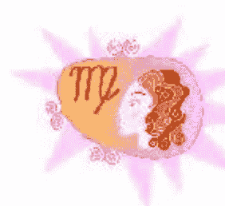 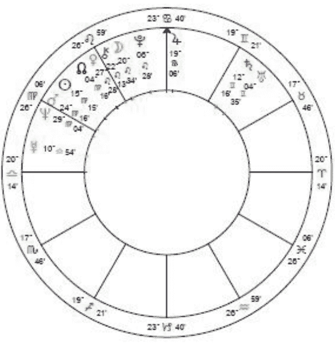 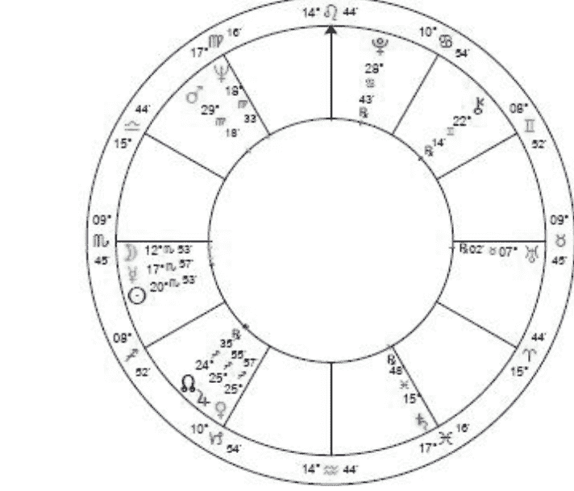 |
| **姓名：** JAMES |
| **出生日期：** November 13, 1936 |
| **出生时间：** 6:00 am est |
| **出生地：** SUMMERVILLE, sc |
| **经纬度：** 80w11; 33n01 |
| **图片：** 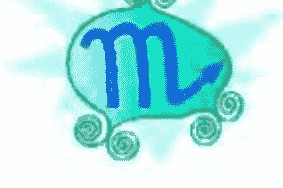 |

“这很像我。”乔治骄傲地说。

我宣布，“同学们，观察将在我们原定计划的一个小时之后开始。让我们用这段时间来复习下。”

通常，没有粉笔或黑板擦，我会让他们其中之一去二楼找一找。吉姆（Jim）体贴地自告奋勇，拿出了一盒粉笔和黑板擦。一个三重天蝎座，吉姆使自己看起来很体贴即使他很少说话，他成功地获得了同别人一样多的关注，有沉默的天蝎座的吸引力。

时间过得很快，正如时间对这些热心的学生所做的一样。他们的幽默和透彻的观察总会使我开心。

“是不是所有巨蟹座都很吝啬？”尼克问道。“我女人是一个巨蟹座，一星期才花五分钱。”

乔（Joe）说他同宝瓶座有很多的麻烦。“对我来说他们似乎是玩51张扑克的人。”

我同意。“但是你没意识到的是，乔，他们开始的时候也像我们一样有52张牌，但扔掉了一张，因为那样更刺激。现在，我已经知道双鱼座是只有51张牌开局的人。”

“嗨，老师，”乔治插话道，“75%的双鱼座都像鱼一样喝酒，这是真的吗？”一旦全班欣赏他的才智，他狮子座的月亮就沉浸在赞赏中了。

“双鱼座的问题是他们太过自我毁灭，”萨利（Sally）补充道，双鱼上升的她知道自己说的是什么。“喝酒，我的意思是，就像逆游产卵的鲑鱼一样。他们知道这会杀了他们，但他们还是那样做。”

“你知道，我们正在开玩笑。”奥斯卡（Oscar）说，中心的剧作家，“但占星学确实使我更好地理解我的喝酒问题。我是一个摩羯座，我们总喜欢做长远计划，目标是山的顶端，对吗？对，那就是为什么我难于接受一次讲一整天的戒酒教学。尽管他们的哲学理念对我是有好处的，但确实难于用到实处。”

“但我发现占星学帮我完成了戒酒工作。”尼克插进来。“像我们在课堂上一样看一遍我们的星盘，有助于理解我自己的所有潜能，知道我必须继续做的是什么。”

“我也是，”吉姆竟然说话了。“就像当我们谈及水星和沟通时，它确实使意识到我对别人敞开心扉是多么难的一件事。我的水星在天蝎座，但我确实需要在沟通上下功夫，因为如果不这么做，我会觉得被隔绝。为了能同人们交流我曾经喝酒。感谢上帝，现在好点了。”

“帮助我的是当我们在学习月亮时，”荣恩（Ron）说道，他有五颗行星落在月亮管辖的巨蟹座，月亮落在天蝎座。“我确实从未从母亲那里得到足够多的饲养，我试图从所有我与之形成关系的女人那里寻求这些东西。自然地，她们没人想要成为一个长不大的男人的母亲，因此她们受够了我，然后我就开始喝酒了。巨蟹座无法处理任何形式的拒绝。”

“是的，但是你不能用巨蟹座作为逃避的借口，”尼克提醒他。“占星学只是告诉我们，我们像什么样，这不代表着我们无须为自己的行为负责。否则，这仅是另一种借口，你知道我们已经在健康教育课程中学习的，我们这些酗酒的人是非常善于为任何事找借口的。”

“你确实是对的，尼克，”我评价他。“占星术可以成为一个巨大的借口如果你这么使用它的话。首先，你有其他的方式来解决，你可以成为一个音乐家或精神导师。其次，即使在你生命中有一点是这么运作的，你可以总是将海王星的负面表达转向正面。”

时光飞逝，最后是时间走了。准备开始班级的旅程，我发出警告，“你们知道，天文学家对占星师是不那么友好的。他们想我们是一群迷信的人。”

房间里充满着怀疑声。“说什么？”“你在骗我们！”

“我说的是真的！”我坚持道。

阿依达（Aida）试着同我讲道理。“看，老师，这怎么可能？他们所有时间都花在行星上，你正试图告诉我们他们不相信占星学？来吧，现在！还有什么原因使他们所有的时间都看着天空？！！”她强势的火星在宝瓶座显示了阿依达是好争吵的。

我试图解释科学家的想法，但这是无效的。

“那么我打赌他们在天空中研究占星学，”阿依达总结道。“说不相信它是没有意义的。”

我最终只能求助于权威性。“你们只要听我的话。他们不相信占星学。”

当我们准备离开哥伦比亚大学时，我发现很多学生不打算走。

“外面很冷！”阿依达抗议道。“你知道我残疾了，我无法在这样的夜晚走那么远。”阿依达总是提到她的残疾，但是用如此坚硬的方式，我很难问她，她是什么意思。无论如何，这是再明显不过了。

尼克把我叫到一边，为他自己和别人辩护。“如果我们今晚不走你会疯掉或受伤吗？我知道你是巨蟹座，使你的感情容易受伤，但这确实很冷。”

### aïda: december 24, 1995 3:30 pm est cleveland, oh 81w42; 41n30

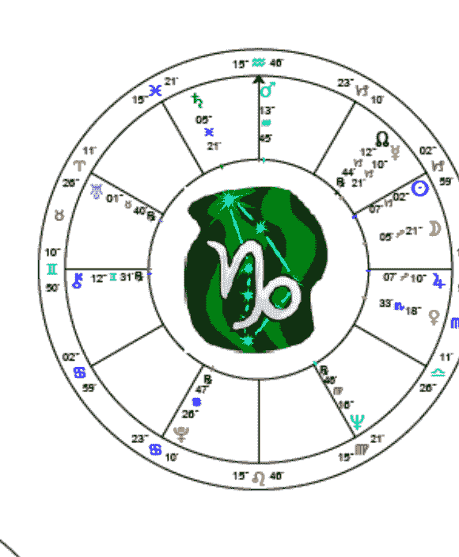

### rudolph: december 3, 1998 4:20 pm est darlington, sc 79w52; 34n18

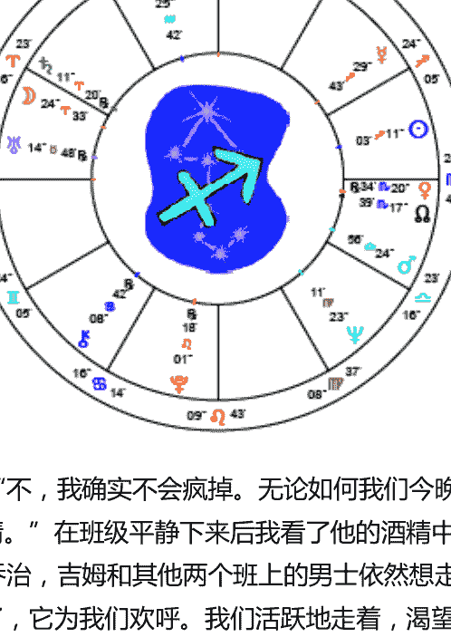

“不，我确实不会疯掉。无论如何我们今晚上了一节美好的课，我也愿意做任何班级想做的事情。” 在班级平静下来后我看了他的酒精中毒的文章，称赞他写得很好。

乔治，吉姆和其他两个班上的男士依然想走，因此我们五个就朝着地铁出发，呼出的气体结霜了，它为我们欢呼。我们活跃地走着，渴望着等待我们的经历。

在路上，劳埃德（Lloyd），一个拉丁美洲的双重天蝎座，强留我问为什么人们只把天蝎座和性联系在一起。我提醒他，“记住当我们讨论第八宫和天蝎座是如何与性有关时，你说性是控制女人的一种很好方式。那是非常天蝎的，也是很偏见的。”

“哦，是的，但那是真的！” 他坚持道。“第二天她们歌唱、做饭、打扫房屋。但是天蝎还有其它的内容么？”

继续讨论，我回答道，“对生命和死亡的强烈关注，也包括死后的生命。我知道你很着迷于玄学。”

在地铁上，乔治为我买了票，在检票口处为我检查了下十字转门。他的上升在天秤，他有礼貌的行为是很讨人喜欢的，但只是他戏剧的性格中可以认真对待的一小部分。在地铁上，他站在我旁边，同我讲述一些最近书本上读到的激进理论。 “我读到木星将成为另一个像太阳一样的行星，但无法证明。”

“那是维里科夫斯基的理论，”我答道，“很有趣，但还有没有方法完全证实它。木星是我们太阳系中最大的行星，尽管。它管辖了射手座，他们也喜欢想的很大。”

吉姆指向鲁道夫（Rudolph），他很高大结实。 “鲁道夫是中心里面体积最大的一个人，他是射手座。”

鲁道夫用很好的幽默承认了这一点，补充道，“今天是我的生日，因此通过望远镜看到木星是完美的一天。”

劳埃德指出地铁上的人用好奇的眼光看着我们，典型地有性的影射在里面。 “他们一定想你是一个很特别的人，有这么多男人围着你。”直到这一秒钟，我一直在谈话中，完全没有想到我们这些人在别人眼中会有些奇怪。

“他们绝不会相信我们正准备去观星，”吉姆说。“告诉我，唐娜，土星什么时候才会结束我身上的一系列的事情？”几个月来他的土星严重地合了他天蝎座的上升、太阳、月亮和水星，出于某些原因，只有负面的表达出现了。我已经做了所有关于这个相位他或我可以理解的积极思考，但我试着再鼓励他下。

我们到达了哥伦比亚大学的大门，热心和寒冷使我们很快到达。随着我们五个爬到了庄严的石梯上，我突然看到十年前也是在这相同的楼梯上的自己，同其它不满意哥伦比亚大学的学生混在一起。我的思绪突然被震了一下，从理想激进到今天的自我和内隐，怀疑在路上我是否已经失去了一些东西。我曾经遇到一个我的占星学双胞胎，同年、同月、同日生，我们把强势的天王星用在了不同的地方。当天王星行运过海王星时，我进入了占星学，她加入了气候组，然后去了古巴。今晚，看着望远镜的圆顶，我决定占星学是对我更有回报的道路。

进入这个科学建筑，我们搭电梯到十三层，爬上了剩下的楼梯。从这个建筑的顶端，曼哈顿岛的全貌如此美丽，以至于我们一时间忘记了天空。黑夜中的第二次旅行，爬上一个有些摇摆的小楼梯，我们最终进入了圆顶层。

“哇！那个望远镜是一个庞然大物啊！”乔治惊叫道。

有其他一些人在场，科学的、学术派，包括一个父亲和他早熟的小儿子。

“我打赌他们在想为什么我们会在这里。”劳埃德低声说。

“可能害怕我们会去撕掉望远镜，”鲁道夫露齿笑着。我们都大笑了。

“如果他们知道这是为了占星学，他们确实会紧张的，”乔治低声说。我们奸笑，然后彼此走得更近了。

天文学家开始摆弄望远镜，通过望远镜我们看到了下三颗行星群，他们所有色带通过望远镜清晰可见。

吉姆很惊讶。“现在我知道为什么他们说“像天空中的一颗钻石！”这就像是放大镜下的钻石一般。”

“我绝不会把女朋友带来这里，”乔治说，斜视着目镜。“让她联想到我无法支付的钻石。”

“你认为那个操纵望远镜的人是什么星座？”鲁道夫低声对大家说。

“可能是宝瓶座，”吉姆低声答道。“他们把所有时间都用在这个科学的垃圾上。”

“嘿，先生，”乔治大声问道，“你是什么星座？”

劳埃德刺了一下他，希望那个男的没听见。“嘿，先生，记得唐纳说过什么吗。”

依旧是调皮捣蛋，乔治露齿大笑，重复他的问题，“嘿，先生，你在占星学上是什么星座？”

劳埃德呻吟了，随着那个天文学家愤怒地走近他，指着天空，问，“你们怎么可以用我的望远镜看这所有的壮观，然后讨论如此迷信的废话呢？我们这里是搞科学的！”

一些热心科学型的人在那里偷笑。“羊脑思想家，”一个人咕哝道。

“看，先生，”鲁道夫低声对乔治说，“在你使我们被扔出这里之前，保持安静。”

“那位一定是处女座，”乔治咧嘴笑到。“唯一——一个把他们自己搞得很认真的星座。”

接着天文学家找木星。他拉了一个开关，圆顶的木地板开始旋转，吱吱嘎嘎缓缓转向适合的位置。这次他看望远镜，用了一个活梯。“木星有十二颗卫星，”他宣告，“但是今晚仅有三颗是可见的。”

劳埃德幻想道，“十二颗卫星！你可以想象抬头看天时看到十二颗卫星吗？你确实可以让一个女人失控！”他爬上去，透过目镜看出去。“哇！太美了！”

乔治是下一个。“是那个点吧！”他惊呼道。

当我看时，我也倍受感动。反射的太阳光使这颗行星很耀眼。表面上可以看到木星的色带，以及突出的三颗卫星。

吉姆看了并问，“为什么我们看不到剩下的卫星？”

“它们现在大部分在行星的另一面，”这位男士答道，“一些看不到是因为我们的气候问题。”

我们自己的月亮在靠近木星的圆顶裂隙中清晰可见，因此我们要求看一看。天文学家觉得那很无聊，但迁就了我们。弹坑可以看到，暗面伴着光大约看到一个轮廓。

我们希望看一看土星，天文学家在头脑中计算了下它确切的上升时间。“它已经升起了，但是我们可能还无法通过大气层的折射光线看到它。”他摇动开关，地板上升了，嘎嘎作响。他尽可能高地旋转望远镜，寻找土星。“啊，它在这里。”

我站到凳子上，渴望看到它。土星相当亮，围绕着奇怪的可爱的环带围绕。“我不知道为什么，”我告诉学生，“但我确实很爱这颗行星。”

乔治接着看。“为什么，它真的有光环！我以前以为一些艺术家用他们的想象力画了一个光环，就像天使的光环一样。”

透过望远镜，吉姆说，“就这一点这一趟就没有白来，你打算告诉我导致我所有麻烦的就是这么一颗美丽的行星？”

我问天文学家关于最近发现的天王星的环带。“不，我没见过它们，”他说，“任何天文学的杂志也没有报道过，因此至少我认为不是官方认可的。我所知道的一切都是有据可循的。”

天文学家选出了更多的行星，所有的都如第一组一般美丽，只是颜色不同。到现在我们已经冻得不行了，因此我们下了摇摆的小楼梯，回到屋顶。我们停了一下赞美曼哈顿岛的全景。我指出了我们刚刚通过望远镜看到的放大了的行星。

“这确实让我洗脑了，”乔治说。“一年之前，我还在街角同一伙人徘徊，喝着白酒。如果你当时告诉我今晚我会去哥伦比亚大学，看望远镜，我当时一定觉得你是疯子。”

在我们从地铁回Bedford Stuyvesant之前，我们觉得有些暖和了。每一个人都同意这是一个美丽的夜晚。

## 基本占星术语汇总

- **上升**：黄道上一宫宫头的星座，被叫做上升点或上升星座。这个星座，由精确的时间和出生地点决定，是命盘中三大重要元素之一，加上太阳和月亮。它代表了我们外在的人格，当人们见到我们时的第一印象。它也显示了我们在社会中佩戴的面具，可能也不可能显示了我们的真实本质。我们的外貌通常是上升的显示，而非太阳。

- **相位**：黄道是一个 360 度的圈，在星盘中两颗行星之间形成的角度，像 30 度、60 度或 90 度被叫做相位。相位的作用是融合两颗行星的能量，从而修正了行星的表达。行星之间联结的类型取决于角度的本质。例如，刑相（90 度角）通常是一种有压力的相位，而三分相（120 度角）通常是和谐的。

- **吉星**：金星和木星被传统的占星师认为是有益的，意味着它们和蔼的能量，会为我们带来好运，然而当二者被误用时也会有一些不好的影响。（也被看作是煞星。）

- **合相**：合相有两颗在黄道上很近的行星构成，二者之间的角度从 0 度到 10 度。当行星相合，它们它们的能量和功能相互融合了，就像是一体的。这是一个有力的相位，当太阳同另一颗行星构成合相时，这颗行星是非常重要的。这个人会有很多同这个行星有关星座的特质，例如，水星，那就是双子座。

- **宫头**：一个宫位的宫头是与邻近宫位的交接点，例如，二宫的结束和三宫的开始。一个宫位宫头对应的黄道星座部分描述了，在生命中的那个领域你是如何运作的。例如，如果你的天秤座在某一宫宫头，在同那个宫位有关的事情上你将显示一些天秤座的特质。宫头这个术语也同样可以指两个黄道星座间的分界线，听到有人出生在白羊座和金牛座宫头代表太阳在他们生日时，要么是白羊座的最后几度，要么是金牛座的开始几度。

- **度数**：黄道是一个被分成 360 度的圈，很多占星学的技术都是基于这些划分的。每一个星座包含了 30 度，每一度又进一步被分成份（'）和秒（''）。因此你可能会主要到星盘中，例如，25 Aries 55'。

- **落陷**：行星落到了最难自由表达本质特征的星座。行星落在它所掌管的星座的对冲星座中，那么这颗行星就落陷了，例如，火星掌管了白羊座，因此火星在白羊座对冲的天秤座时，火星落陷。

- **元素**：基于中世纪的一套系统，黄道星座被分为四种元素，火、土、风和水。火和风能很好地合作（风助火势，火使风温暖），但是它们无法补助水或土。水和土相互弥补，没有二者将没有植物，但它们同火和风不那么相容。火相星座是白羊座、狮子座和射手座。土相星座是金牛座、处女座和摩羯座。风相星座是双子座、天秤座和宝瓶座。水相星座是巨蟹座、天蝎座和双鱼座。

- **星历表**：一本参考书，日历或电脑程序，给出每天太阳系统中行星的位置。

- **擢升**：传统上评价行星在黄道上各星座影响力的方式，擢升是行星在星座的最佳位置，包括金星在双鱼座，火星在摩羯座，和月亮在金牛座。

- **失势**：一种传统评估行星优势的系统，行星在失势星座是力量最弱或糟糕的位置，擢升星座的对冲星座就是失势星座。由于金星在双鱼座擢升，失势在处女座。

- **大三角**：大三角是星盘图中的等边三角形，由三颗互成 120 度的行星构成。它要求三颗行星都来自同一元素的星座。例如，一个风相的大三角至少包括一颗在双子座的行星，一颗在天秤座的行星和一颗在宝瓶座的行星。大三角被认为是一种极端幸运的联合。

- **符号**：占星师用来呈现行星、星座、相位的一种速记符号。一个例子是火星的符号，如右图。

- **宫，宫位**：星盘是一个被分成十二半的馅饼，这些半就叫做宫位。每个宫位代表了生活中一系列相关的领域（例如，七宫代表了婚姻、生意伙伴、和其它承诺的关系。）更深入的宫的内容，阅读第十三章。

- **宫头**：见上。

宫的配置：星盘中有一定行星落入的宫位，例如，木星的符号在二宫发现了，那么这就是宫的配置。

宫主星：一个宫的宫主星是掌管宫头（起始端）星座的行星。如果海王星管辖十宫，这意味着双鱼座，海王星管辖的星座，将在十宫宫头，同样被叫做是中天。狮子座在七宫宫头，太阳是宫主星，更多特别的七宫的信息，你可以查看太阳的星座和位置。第一宫的宫主星（也就是上升）被认为特别重要，在传统占星术中，被叫做盘主星。

水星人：不仅仅包括那些太阳、月亮或上升在双子座的人，也包括他们星盘中水星同很多行星构成相位或很多行星在星盘中三宫，交流宫的人。

中天：十宫宫头，在星盘中所有有力的点中，在盘顶端的事业点。由精确地时间和出生地点决定，每四分钟变换一度，非常敏感，这个点的行运也伴随着我们社会地位和事业上的深远改变。中天的星座和任何落入其中的行星都是强有力的事业指示。

海王人：那些本命盘中双鱼座或十二宫被强调的一群人，因为太阳、月亮或很多行星落入了双鱼座或十二宫。也包括海王星同太阳、月亮、上升点、中天或很多行星形成相位的人。

对冲：（180 度或隔了六个星座，容许度在 8 度以内。）对冲的两个星座是硬币的两面，它们在互补的元素，用相同的能量流运作（创始星座对冲创始星座等等）。当被恰当表达，对冲星座相互弥补和填充。

冥王人：这包括本命盘中很多行星在天蝎座、很多行星在天蝎座相关的八宫，冥王星有很多相位或冥王星接近上升点、中天或同太阳或月亮有相位。

推运：代表出生后行星的位置每天或每周是如何改变的。一种简单的推运方式是，一天带包一年，出生后第十天行星的位置同你生命中十岁的情景是对应的。因为我不常用推运，我们将不在此解释过多。

梅花相：（150 度或隔了五个星座）这个相位也叫做挣扎相，通常涉及到两个完全互相争执的星座，因此很难调和，两个星座之间也没有元素和创始/固定/变动能量的连结。

逆行：太阳系中所有轨道上的行星没有都会发生很多次，不包括太阳和月亮。这些时间段，对那些运行缓慢的外行星会持续好几个月，从地球的角度看行星似乎在逆行。当它们在地球距离太阳的另一侧时，这种错觉出现了，它们似乎向着同我们相反的方向运动。

统治者，统治：十二星座每个星座都有一个统治者，那是最像星座能量、驱力和需求的行星。对白羊座来说，那颗行星是火星，对双子座来说是水星，射手座是木星，等等。完整的列表参看表一。为了完全理解你星盘星座或宫位的表达，看看统治者的情况。（见宫主星。）

土星回归 这个生命中意义重大的时期发生在每次土星完成绕太阳一周回归到出生时本命盘中的土星位置时。由于土星大约会用 29 年完成这个循环，当我们在 28 岁到 29 岁时（第一次土星回归）这个时期发生了，以及 56 岁到 58 岁之间（第二次土星回归）。这些回归时期被认为是我们成熟道路上的主要里程碑。

土星人：是那些有重要行星像太阳、月亮、上升点或很多行星落在摩羯座或与之相关的十宫。也包括那些土星在上升点或中天，同他们的太阳或月亮，或有很多行星同土星形成相位的人。

六分相：（60 度或隔了两个星座。）六分相通常涉及到互补的元素，水和土以及风和火。六分相中的行星通过某种方式可以相互弥补或增强，每一方填充了对方缺乏的。

刑相：当黄道上的两颗行星形成 90 度的夹角时，构成了刑相，隔了三个星座，容许度在 5 度至 6 度之间。例如，巨蟹座的一颗行星可以同白羊座或天秤座的行星构成刑相，两个星座相隔了 90 度。刑相代表了两种不同方向有矛盾的驱力或需求。一个人的行星是活跃能量，这种需求推动他们不断向前。两颗行星冲突的需求和愿望，个人必须努力调和它们。

星群：星群是三颗或更多行星聚集在黄道上很窄的范围内，每一颗同另一颗之间的度数最多 8 度到 10 度。这使行星相互连接，形成一种强有力的影响。如果它们落入了相同的星座和宫位它们的影响是最大的。

行运：指当前太阳系统中的行星位置，以及它们同你本命盘的行星构成的相位。你可以通过查阅星历来发现你的行运相位，星历表通过电脑排序输出你个人的行运，它列出了每日行星位置。

三分相：（120 度或隔了四个星座，容许度为 5 度。）三分相中的行星通常在相同的元素中，例如，从水相星座到水相星座，从风相星座到风相星座。因为它们有很多相似的特质、需求、品味、偏好和能力，两颗行星互相增强，而不会产生摩擦或抵抗。它们为了共同或相似的结果而互相合作。

天王人：那些本命盘中天王星被特别强调的人。当天王星在上升、中天或同太阳、月亮或很多行星形成相位，天王星被强调，或如果星盘中宝瓶座处于主导地位，因为太阳、月亮、上升或很多行星落入这个星座或十一宫。