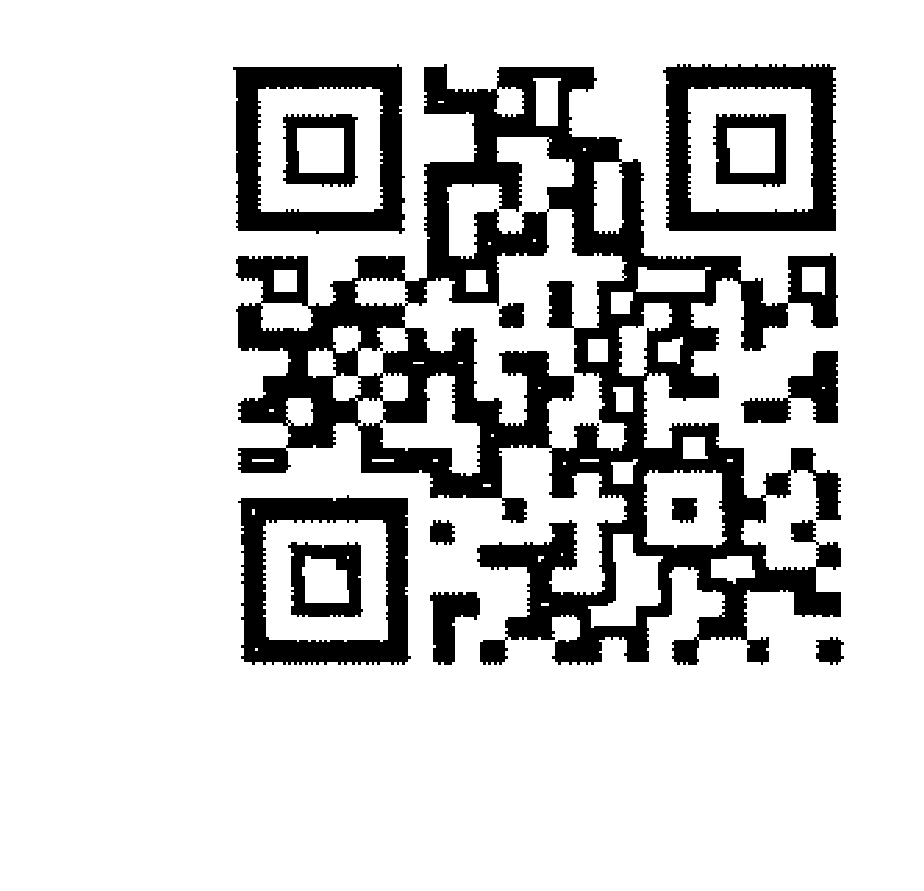
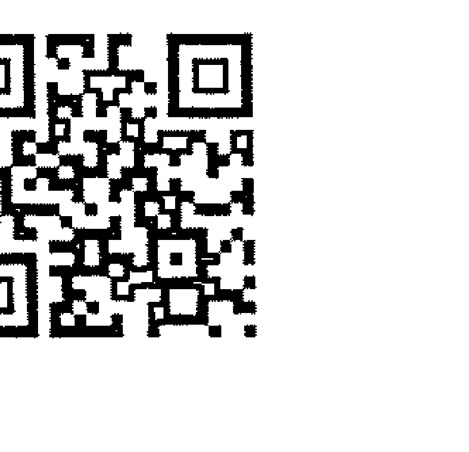
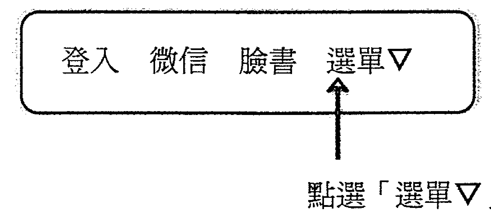
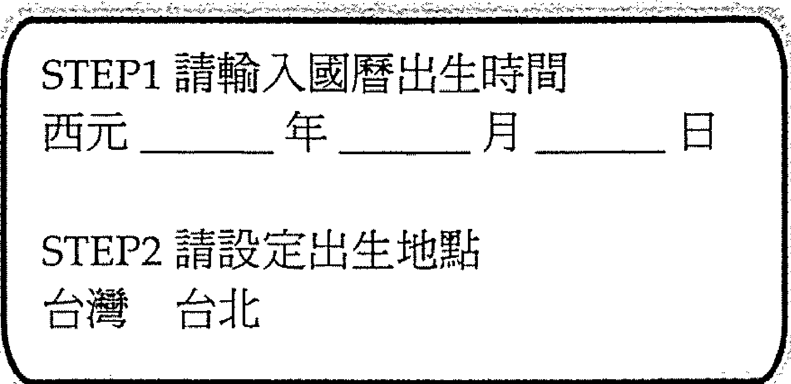
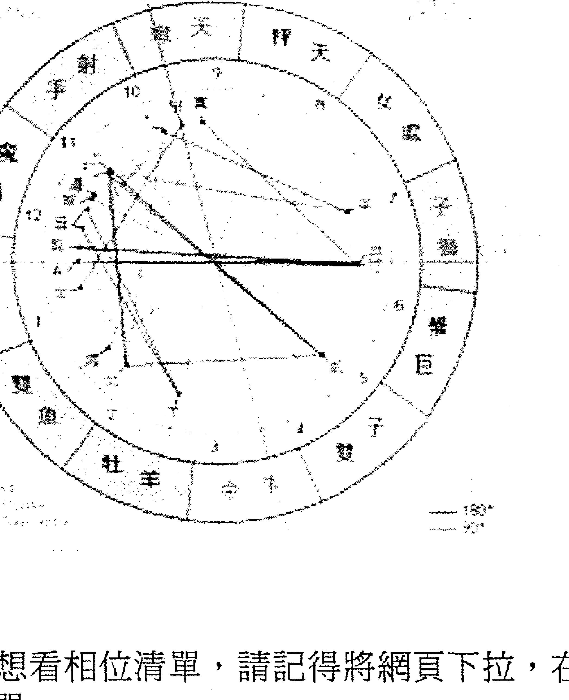

# 都是逆行惹的禍

## 南瓜之車

啊南瓜
南瓜種在星子與星子
之間的雲泥上
開花，完熟，化成了
黃金的車輛

南瓜的籽是我們的夢
星圖是我們身世的臉譜
占星之學是我們的靈魂所
隨身攜帶的天平
在偌大的宇宙中
我們不會迷航
憑著地圖
靈魂有他最好的旅行方向

親愛的你
坐上黃金的馬車了嗎？

## 出版緣起

興趣廣泛、身分多元的知名文化人韓良露，除了大家熟知的作家、媒體人及文化推動者身份之外，她也是藝文圈中最受重視的占星學大師。

二〇〇三年起她在金石堂金石書院（現龍顏講堂）開設占星課程，由於口耳相傳、好評不斷，課程一直持續到二〇一〇年才劃下休止符。在長達八年的四百多堂課中，她以歷史、哲學、心理學、社會學的角度，將占星的深層智慧化為生動的教學內容，讓大家在學習與命運對話的同時，獲得看待人生的更高視野。

這一系列課程不但架構了宇宙法則的邏輯，也融入她對人性與社會的觀察，但因資料整理工浩大，成書計劃一直未能完成，為避免這些珍貴課程內容成為絕響，南瓜國際透過多年來數量龐大的上課錄音及相關資料，依據當時課程的規劃邏輯，整理成為系列書籍，期望能藉由文字重現精彩、動人且充滿智慧的上課盛況。

## 序

## 逆行到底惹了什麼禍

逆行是一種靈魂記憶的印記，它會透過生活中發生的某一些事情，來喚起你的靈魂記憶。我在上課的時候發現，有的同學上課聽了很多逆行名人實例之後，就對自己星圖中的逆行，感到憂心忡忡。其實不必。名人實例之所以能成為名人實例，都是天數地數人數作用之下的結果，名人做的事情動見觀瞻，如果他們靈魂進化的程度不夠，犯錯的規模也會比一般人大。大家不妨想一想，很多外行星在一年中接近半年都在逆行，這意謂著其實有接近一半的人，如果身處於同樣的時空環境，心裡也會動過同樣的念頭。只是絕大部分的人既沒有那樣的機會，也不會做出那樣的決定。想要理解逆行，不妨先理解什麼是不逆行。一個人本命星圖中的行星不逆行，當事人就會對這件事情比較想得開，比較不會執著。例如我的金星沒有逆行，金星代表的是物質世界的美，我雖然沒有珠寶，但不代表我不懂得欣賞美麗的珠寶。有一次我去維多利亞與艾伯特博物館欣賞珠寶展，裡面展出的是全世界最漂亮、最稀奇的珠寶，進去還得先搜身，我在裡面足足看了五六個鐘子扒竊特別多，要格外小心。但那天她打電話來講東講西，就是忘了講這一件事。

這一點我滿佩服我的先生。

有一次我們去布魯塞爾旅行遇到了一個意外。我們都是旅行老手，所以有些小地方就有點過度瀟灑，不像新手這麼謹慎。那一次也是註定有事。本來我們要從巴黎直達鹿特丹，去找住在鹿特丹的妹妹良憶。但我們買票時買錯，變成從巴黎到布魯塞爾換車，再從布魯塞爾到鹿特丹。行程決定了之後，妹妹事前本來還專程打電話來提醒我們，布魯塞爾的中央車站治安有問題，這一

我先生的星圖中一顆逆行的行星都沒有，沒有逆行星的人對世界比較不執著，所以容易被人忽略。我先生以前常常抱怨自己像是隱形人一樣，很多朋友是先認識我先生，才因為我先生認識我，可是後來每每見到我跟我聊了天之後，竟然沒有察覺到坐在一旁的他。我先生常問我，「這樣的話，沒有逆行豈不是不好？」事實並非如此。沒有逆行的人對世界上的東西企圖心較小，他們

小時候，我也覺得這些東西都很美，但是並不表示我想要擁有。又如汝窯很美，但是我最不能理解的就是汝窯的收藏家。如果我有錢到買得起汝窯的話，我寧可把錢捐給孤兒院，我也不要去收藏汝窯。一個人怎麼能收藏幾千萬的東西放在自己家裡，萬一打破的話有多可怕？為什麼不放在故宮，自己可以去欣賞，也讓大家都能欣賞？

在布魯塞爾下車喝個咖啡，等十五分鐘換車本來也不是什麼難事。但也因為太容易，所以我們兩個都放下了警覺心。我先生悠哉的看著小說，我也沒有盯著周遭環境。等到火車進站，我先生把小說往包包一塞，我就往車廂裡走。進了車廂以後，我忽然看到先生還在月台上跟三個歐洲人講話。先生上了車之後跟我說，這些歐洲人不知道為什麼這麼熱心，一直要幫我搬行李。當我們找到位子坐下時，我忽然發現，原本先生斜背著的包包不見了。先生的第一反應是包包還在咖啡館，就下了車，回咖啡館找包包。那三個歐洲人這個時候又靠了過來，一邊問我發生什麼事，一邊身體越靠越近。這個時候我意識到發生了什麼事——剛剛那三個人在跟我先生推推撞撞的過程中，他們把我先生的包包扒走了。於是我緊抓著自己的包包，大喊不准他們靠近，他們也就走了。

我在車上驚魂甫定的想大概二十秒，忽然驚醒，這班車直達鹿特丹，兩小時內不會停靠任何站。如果我先生沒趕上這班車，他的包包又被扒走，身上既沒有錢，又沒有證件，這可怎麼辦？一想到這裡，剎那間腎上腺素大增，有如大力士般扛著兩個大行李箱，連跑帶撞翻滾衝下車，不到三十秒火車就開走了。

先生兩手空空的從咖啡館回來，我們一起去警察局報案，包包裡面的錢、旅行支票、證件、手機、數位相機……全沒了。這些東西都掉了，當然很麻煩。但整件事情落幕之後，我先生忽然發揮幽默感，說他小時候最同情狄更斯小說《孤雛淚》中當扒手的可憐小孩，今天就當是遇到了《孤雛淚》的角色吧。東西掉了就掉了，把該做的報警、補辦證件手續做完之後，他就把這件事情放下了。

這是超級想得開的人才做得到的事。如果本命星圖中有行星逆行的話，這些事情會很難做到。例如我的本命星圖中火星逆行，我的性子很急，脾氣也不好，常常一不注意就對先生發脾氣。當我意識到這個問題之後，我就請我先生在我又亂發脾氣時提醒我，「火星逆行」。儘管因為逆行的關係，我沒有辦法在亂發脾氣之前就先讓自己不發脾氣，但是我可以在別人提醒我的時候立刻熄火——這也是逆行要教我們的功課：懂得頓悟，懂得煞車。

生命中很多情境都是一念之間。而所謂的「一念」，其實都跟我們面對生命的基本態度有關。每個人的星圖中都有很多相位，我們對自己星圖中的相位要能自覺。靠著這種自覺，有助於降低星圖中負面能量出現時的負面程度。生命中的負面能量，最怕以無明而無法理解、毫無自覺的方式出現。

尤其這些負面能量跟自己內心的惡念結合時，更會引發更為嚴重的後果。以占星學邏輯來說，一個人內心的惡念越少，星圖上的負面能量就越難跟心念綁在一起。所有星圖上負面能量，還是得靠心魔來養。有一年我的會計打電話給我，建議我一些可以在法令灰色地帶避稅的方法。

我立刻反對。我寧可多付一些稅，也不要為了省錢而讓自己有任何機會惹上麻煩。但如果這個時候我動了一點貪念，鑽了一些法律漏洞，等到有一天出了問題，我自己於心有虧，這就怪不得別人了。很多人會認為又不是殺人放火，這些都是無所謂的小節，可是如果能夠隨時注意到這些小節，生命會過得比較心安，生活也會因而變得簡單。

從逆行中的不安中，我們要學習的是如何讓靈魂安穩。不管是跟任何人、任何事發生小衝突或大衝突。生活中發生了問題時，尤其是出了大問題時，通常都是因為你的心動了念。

星圖所有的相位，都不會是天外飛來的隕石，它一定會跟你的內心有關。儘管我們在生活中不可能總是心如止水，但是如果你的心念比較乾淨，雖然還是會遇到一些問題，但這些問題相對來說，都會比較簡單，就會比較好處理。雖然也有人是因為純然倒楣而惹出大紕漏，但越大的紕漏，往往跟內心深處的貪念綁得越深。在你的內心深處，往往早已察覺它們可能會惹出大麻煩。

一個人或許很窮，但是不需要因為窮，而去跟地下錢莊借钱，或者去貪一些不該貪的小便宜。或許正道走起來速度緩慢，可是假以時日，一定可以走出一條穩健之路。情感問題也是相處。也很可能你早就知道應該要跟對方分手，但是卻貪戀對方給你的某一些保障。也就是說，很少有什麼紕漏是當事人內心深處完全毫無察覺，但大家往往因為不想面對而視而不見。這就像是被倒會的人，內心深處其實都會有一點覺得有問題，但是卻自欺欺人、逃避現實——逃避現實也是人類的一種本能，但我們做人處事應該要多靠智慧，不能全憑本能。

逆行的靈魂功課並不見得全然是壞事。當一個人的星圖中完全沒有逆行，他們就不會因為受到過去靈魂干擾而不安，但是當他們出現大問題時，他們的星圖中也就缺乏阻擋的力量。逆行從逆行中，我們可以學到一堂寶貴的功課：靈魂困擾之處，就是靈魂救贖所在。

註
本文依據二〇〇六年「逆行」課程相關錄音整理而成。

## PART 1 致读者

「逆行」是靈魂占星的重要課題。靈魂占星與現世占星最大的區隔，在於靈魂占星已經進入了「占星道」的領域，它或許很準確，但是它並不適合當成鐵口直斷的算命。因為靈魂占星最重視的是靈性的啟發，從中得到深刻的靈魂體悟，而不是陷在其中動彈不得。在進一步閱讀本書之前，以下幾個跟逆行有關的重要態度，請大家務必隨時放在心中。

#### 一、逆行其實很普通

很多人打開自己的本命星圖，看到星圖中有行星逆行就感到恐慌。事實上整張本命星圖（除了南北月交點之外），完全沒有逆行的人極少，大約只佔百分之八。也就是說，九成以上的人星圖中都或多或少有行星逆行，這是生存在地球的人類會遇到的一種很普遍的問題，大家不需要以獵巫態度過度大驚小怪。

#### 二、逆行不容易察覺

逆行是一種很內在的靈魂狀態，除非跟當事人很熟，否則逆行並不容易藉由顯著的外在事件來判定。相較之下，剋星比逆行容易察覺。

本命星圖的剋相（行星之間互相有九十度或一百八十度相位）就像定時器，往往需要倚靠行運的大小行星來啟動，當本命星圖中的剋相被行運啟動時，一定會讓當事人感受到明顯的壓力。逆行則是當事人這輩子都需要面對的課題，它不依賴行運啟動，所以不見得會在特定時間內特別感受到壓力，以至於反而不容易讓人察覺。

就本命星圖中有行星逆行的人來說，即使是對靈性體悟有興趣的人，也需要到了三四十歲的一定年紀之後，才能夠掌握到逆行課題的幽微之處。

#### 三、逆行不等於靈性低

逆行的人常常會比不逆行的人容易反覆陷入執著的情境中，這種反覆的執著反而有可能使當事人在世俗上達到更高的成就。逆行的人最容易感到痛苦的地方，也在於反覆執著於某一件事，他們很可能反覆嘗試卻反覆失敗，也可能即使得到了卻不感到滿足。

大家要切記的是，逆行並不等於靈性低。靈性的體悟需要過程，不光只是腦筋「知道」就夠，還需要在現實生活中透過很多事件的經歷，才能帶來真正的理解。

#### 四、完全逆行不見得不做壞事

逆不逆行跟做不做壞事並沒有直接的關係。逆行的關鍵並不在於會不會遇到壞的情境，或者會不會做壞事。逆行功課的重要性，就在於當逆行的人反覆執著於過去世習性，很容易反覆遇到阻礙。這些阻礙都是為了讓逆行的人學會超越過去世習性的執著。相對來說，一個沒有行星逆行的人，他們雖然不會執著於過去世習性，可是不管他們做對做錯，或者根本不去面對生命中的議題，他們有可能混著混著也就過了一輩子，對於靈魂來說，這不見得是一件好事。

#### 五、別為逆行貼標籤

如同我在過去出版過的書中多次提醒大家，在占星的學習中，透過追溯過去而理解自己的重要性，遠大於預測未來。不管是逆行或是占星的其他議題，都不代表一定就會這樣。尤其書中的實例往往都是為了讓大家易於理解而挑選出的極端例子，這些例子是在天數、地數、人數作用下產生出來的眾多可能性之一，大家不應看了書中的例子，就幫自己或其他人貼上「金星逆行都這樣」或「天王星逆行都這樣」的標籤，否則就容易偏離學習逆行的真義了。學習逆行最重要的要訣，就是要意識到自己正在經驗著什麼樣的逆行功課，而非拿著逆行當藉口，反覆沉溺在逆行的泥淖中。當一個人能夠真正在生活中的片刻，忽然體悟到「原來這就是

## PART 2 前言

#### 逆行帶來的靈魂功課

本命星圖中的月亮、土星、海王星、十二宮都跟過去世輪迴關係很深，了解了這些主題之後，我們就可以進一步透過占星學探討靈魂課題，依序藉由逆行、月交點、凱龍、福點循序漸進的進入靈魂修煉的歷程。

為何可以將逆行視為靈魂修煉的第一站？原因在於逆行是每個行星過去世的能量失衡或失調在此世的顯現。當這種能量扭曲的狀態，反映在與集體有關的行星或是形成集體的記憶時，就進入了南北月交課題。接下來，當南月交代表重要的集體靈魂業力或記憶，顯現成一個特別的痛點，就是星圖中的凱龍星，凱龍星的功課，讓我們領悟到這個痛點與療癒的可能。而福點則是看一個人如何突破靈魂的限制，可以從中找到靈魂提升的重要方向。這四個過程是靈魂提升的重要順序。(註)

- 註 南北交、凱龍星、福點與十二宮相關議題

逆行是很有趣的天文現象，其實太陽系沒有一顆行星真正在逆行，除非是從地球的觀點來看。所以逆行是地球上所觀察到的狀況。而這個逆行現象可以分兩種，一種是地球內側行星（包括水星與金星）的逆行，一種是地球外側行星（包括火星、木星、土星、天王星、海王星、冥王星）的逆行。水星與金星只有在要越過太陽（也就是水星凌日與金星凌日）時，才會發生逆行現象，而地球外側的火星、木星、土星、天王星、海王星、冥王星則必須位於太陽另一側，也就是地球在中間，太陽在一邊，行星在另一邊時，才會發生逆行現象。也就是說，由於地球視角的關係，外側行星只有在跟太陽對面的幾個星座時才會逆行。例如天王星、海王星在摩羯的這個世代中，凡是太陽摩羯的人，因為他們的太陽跟天王星、海王星同側，所以他們的天王星、海王星都不可能逆行。

行星逆行現象並非實際上的倒退運行，而是基於地球視角產生的天文現象，因此有些占星家會爭論為什麼非實際上的行星逆行現象會對地球有影響，但是占星學本身就是奠基在地球觀點，觀察地球與太陽系行星與恆星之間的能量互動，對於活在地球上的人類來說，地球就是最重要的業力中心，所以地球觀點具有非常重要的地位。連兩千多年前亞歷山大時代托勒密的《四書》中都有討論逆行行星，重要性可見一斑。

行星的逆行在占星學中特別是指過去世代很多想要完成但未完成的，能量不平衡的課題。逆行的行星會讓人在靈魂中得到完全不平衡的能量，也是我們特別容易受到過去干擾的部分。這個能量很容易從內而外干擾個人對於他人與事物的關係，也因此，本命星圖中有逆行的人，他們特別容易對周遭的人事物造成影響。例如一個人如果木星逆行，他們靈魂中對於對錯的判斷，往往過度受到過去世經驗影響，而與當下世界上的正義對錯無關，因此他們特別容易做出一些不適合現世的現實判斷。又如一個人冥王星如果逆行，他們往往執著於過去世舊有的意識，當他們做錯事情時，往往沒辦法立即從中知道自己是哪裡錯了，這麼一來，他們這輩子就容易反覆的不斷遇到相關的教訓，直到他們得到靈魂的頓悟之後，才算是學會了這個靈魂功課。此外，當我們慢慢開始深入了解後，會發現逆行的意義與現實定義的好壞無關。沒有半顆逆行的人，不見得會符合現實當中說的「好」，但是一定不會是世俗上定義的「壞」。有逆行的人在現實中還是有可能成為很傑出的人。原因是逆行在某些特定星座宮位時，通常代表靈魂的能量是在一種特別不平衡的狀態，當事人的靈魂本身是空的，是疏離的。這樣反而會讓靈魂的能量完全投射在現實的外在事物中，因而產生出極大的力量。很多最性感、最有魅力、最厲害的人，其實都是因為行星逆行，他們內在有一個難以填補的空洞，因此格外會想要透過外界的人事物來彌補。例如希特勒、甘迺迪或黛安娜王妃，他們之所以這麼有魅力，都跟逆行有關。很多本命星圖中有行星逆行的人，會覺得命中注定特別波濤起伏，例如一個人如果火星逆行，又落在跟戀愛有關的五宮，他們一定會覺得自己這輩子桃花很重。雖然當事人會以為桃花重是外界事物帶來的命運，但其實逆行代表的是你身上的能量會離開自己跑到外界，當這些能量又從外界回到你身上時，你會以為那些都是外來的，但其實不是，都是境由心生，不純粹是外來的，它們也是你所吸引而來的。

相較之下，本命星圖中如果沒有行星逆行，他們的能量就比較會維持在行星應有的狀態，而不會向外投射。他們的能量比較自足安定，比較不會去干擾到別人，也因為比較不會特別吸引到別人。跟他們相處起來會比較輕鬆，不過也比較容易讓人漠視到他們的存在。

本命星圖中的逆行行星，代表了人之所以要投胎重修的課程，逆行越少，代表這輩子靈魂的學習課程比較少。世界上只有百分之八的人星圖中沒有逆行星（不包括南北月交逆行）。冥王星逆行的人口比例占百分之四十四，海王星逆行占百分之三十六，木星逆行占百分之三十，天王星逆行占百分之四十三，土星逆行占百分之二十九，火星逆行占百分之八，金星與水星逆行的人則更低。星圖中包括連凱龍或小行星在內完全沒有任何逆行的人，代表靈魂投胎是為了要完成特殊的靈魂目的，而與靈魂的學習無關。通常這種人不太可能沒有十二宮的相位，因為他們往往是帶著十二宮的願力，這輩子才再度來世上投胎。

### 行星的逆行

占星學中的逆行基本上就在談人的能量場。人有「身」、「心」、「靈」三個層次，而逆行影響到的是「靈」的層次。人們常常低估或高估靈魂的作用，靈魂只有在一個很平衡的狀態下才會對人有幫助，否則靈魂很容易干擾人的正常良知與常識，有時就需要很大的教訓來學習靈魂的課程，這些大教訓很多時候都不見得可以讓你真的看到自己的核心問題。而大教訓以前一定有過小教訓，或是小症狀，但是靈魂卻沒有察覺過。所以逆行的作用就是幫助我們的靈魂覺察。

#### 水星逆行

占星學中的水星是用心智去連接靈魂與現實的管道，是從一個人的心智出發，靠著理解來進入靈魂的世界。若水星是在比較好的狀態時，當事人會比較有能力去藉由水星的心智，來了解自己的靈魂，所以占星學中水星很重要。但是當水星逆行時，意謂著個人靈魂過去使用水星的記憶，影響到當事人這輩子的水星使用方式。理想的水星原本應該是透過心智的力量，達到靈魂的覺知，但逆行相反。水星逆行代表過去世的靈魂覺知會影響到現在的心智，所以你跟水星逆行的人去爭辯很多想法與常識是沒有用的。常識代表的應該是大家的意見，而水星逆行的人他們的常識，對很多事情的終極看法，都不是從大家共有的覺知而來。
水星逆行的人並不是沒有邏輯，可是他們的邏輯是從他個人靈魂記憶的邏輯出發，旁人無法理解。一個人的邏輯如果是從大家的常識邏輯出發，我們會得到某一種類似的共識，也許你不接受，但至少你理解。可是如果一個人的邏輯完全是從他私人的某些靈魂記憶出發時，你就無從理解，因為從現實看不出來他為什麼會這樣想。
行星逆行在某星座並不會脫離其原本的意義，你會看出行星逆行與否兩者能量的性質一樣，然而作用不同。例如水星在牡羊逆行時往往跟水星牡羊很類似，只不過水星逆行牡羊會比水星牡羊更激烈，更容易造成對別人的影響，但是水星逆行牡羊展現出來的還是水星牡羊，它不會因為逆行，就從水星牡羊變成水星天蠍。

#### 金星逆行

金星是生活中的美悅與喜悅，它是奠基於現實生活中的愉悅心情。除非金星跟海王星之類與靈魂有關的行星產生相位，或者落在跟輪迴有關的十二宮，否則金星永遠是一種現實生活中的互動，它不會觸動幽微的靈魂。因此一個人擁有的金錢、化妝品這些歸金星掌管的事物都不能觸到靈魂，所以我們說美術是金星，藝術則是海王星。金星是管衣服，享受等日常生活與美有關的事物，這些事物帶給我們樂趣，可是不會觸及到比較深層對於愛與美的感觸。金星讓我們喜歡一個人時是喜歡一個人的外表，或讓我們愉悅的一些東西，而如果你對一個人有海王星的情感，那就是一種接近大愛的感覺，它會讓彼此分享人類內在靈魂的某一個理解，比較不會只是肉體的喜歡。
當金星逆行時，意謂著過去世情感與過去世對於美與愛的記憶，會在這輩子影響當事人，讓他們在金星要的愛這件事情上的感受顛倒。愛本來是要從物質的「身體」感受到變成「心」的感受，而金星逆行的人狀況會變成從「心」轉移到「身」的物質層面。這代表他們與他人之間的情感關係會傾向身體外表的感受，而無法從物質的感受得到心的滿足，因此金星逆行的人很容易對外在的美特別執著。
不過如果純就一般世俗的角度來看，金星逆行的人因為靈魂常常處於失愛狀態，他們可能會在現實生活中不停的尋求金錢或美麗的珠寶來填補靈魂的飢渴，更有可能會一輩子不斷的在談戀愛。我有一個朋友就是這樣，她老是三天兩頭就發現一個愛人，三天兩頭就覺得自己跟別人擦出愛的火花。一個人如果一直不斷的在尋找愛，或者覺得賺再多錢也不夠，他們的靈魂中愛的能量一定很少，因為他們已經把所有的靈魂之愛投射出去，希望得到外界的滿足。一個人陷在靈魂記憶的問題，在於很多時候我們現實生活已經得到滿足，但靈魂卻不知道，以致於再怎麼找都無法滿足。金星逆行的人必須理解的是，靈魂的飢渴必須透過靈魂的滿足才能平衡，它從來無法透過現實的物質或戀愛來滿足。

#### 火星逆行

如果說金星是一種從現實物質世界的美好，得到的心靈滿足，火星則跟金星顛倒。火星是心中想要的欲望，藉由現實生活的行動而實現。金星雖然是從物質世界出發，但是它要得到的是心情的喜悅，也就是說，金星的美好不是一件東西，而是一個感覺。金星代表的愛也是一樣，愛並不是一件物品，也不是一個人。當我們覺得「愛」等於「愛人」的時候，愛就被物質化了。當我們覺得「美」等於「衣服」、「珠寶」的時候，我們也把「美」物質化了。我們也可以透過物質去感受美，但是那個時候你所感受的是美而不是物質，當你非要有那件衣服你才覺得美時，那個「美」就已經不是「美」了，而是物質讓你覺得美。美的東西不等於一定要擁有，可是火星是不同的，火星是最跟現實生活有關的行星，火星代表的食欲、性欲，都是生物的生存本能，它一定必須跟現實的行動有關。一個人如果不吃東西就會餓死，人類如果不去生兒育女，就無法繁衍後代，所以火星的入世特質，對於維持世界的運作非常重要。

火星在正常狀態下，應該是一種由「心」的欲望出發，而產生的實際行動，當火星逆行時，就變成行動先於心念，當一個人不知道自己心裡想要什麼就行動的話，這個人的火星能量就會非常不穩固，非常的不受控制。當一個人無法控制欲望時，心就會不安，心不會穩定。

金星逆行的問題，在於火星逆行會讓身體的欲望幫你做決定，變成身領導心，而不是你的心替你做決定——如果一個人活著的每一秒都可以用身體本能做決定，其實也未嘗不可，問題是人與人之間的關係不是這樣子運作的。如果你的身體可以每一秒替你做決定，那你可以跟對方在的時間一定很短暫。而當你想退回去追求真心的時候，你的生活就會變得很混亂。因為你的身體提早替你做了很多決定，而這些決定並沒有得到「心」的允許，所以心的狀態是不穩定的。

而火星逆行的問題，在於火星逆行會讓身體的欲望幫你做決定，變成身領導心，而不是你的心替你做決定——如果一個人活著的每一秒都可以用身體本能做決定，其實也未嘗不可，問題是人與人之間的關係不是這樣子運作的。如果你的身體可以每一秒替你做決定，那你可以跟對方在的時間一定很短暫。而當你想退回去追求真心的時候，你的生活就會變得很混亂。因為你的身體提早替你做了很多決定，而這些決定並沒有得到「心」的允許，所以心的狀態是不穩定的。

#### 木星逆行

從身、心、靈的角度來看，木星是靈魂帶領著身（物質世界）去想去的方向。木星通常代表靈魂想做的事情可以透過社會來完成，木星位置很好的話尤其容易心想事成。

木星基本上是朝向未來的行星，是要學習新的智慧，新的知識。木星的學習與過去無關，是要學新的東西。可是木星逆行的人，會使得他們所知道的智慧和知識，他們所相信的正義與對錯，都不能夠與他們所身處的社會（木星是社會星）同步，而變成他們擁有一個受自己靈魂過去世所影響的價值觀，因此會干擾他們在這一世的學習。他們的是非對錯價值不能趕上木星應該跟上的時代特質與主流價值的話，變成他們靈魂認可的主流價值就不是先進，而是受過去影響的落後價值，是倒退，沒有朝向未來的意識與觀念。

#### 土星逆行

我們常說土星是一顆現世星，但它也是一顆業報星。前面提到火星也是一顆現世星，兩者的差異，在於火星可以靠著心智的學習來控制火星的行動，但我們不可能用心智的思考來控制土星的業報，土星的現實狀態不受心智影響，一個人的心智狀態無法影響或扭曲業報的能量。土星代表我們跟物質世界的連結，它通常是最穩定的一顆行星，也最不願意改變。土星的能量應該奠基於現實世界的基礎，但土星逆行代表當事人過去世帶來的能量會影響現實，造成現實的不穩。土星逆行的人常常會發現他們的現實很容易受到干擾，現實生活很不穩定。但這種現實生活的不穩，反而是是在所有的行星逆行中最好的狀況——這並不意味著土星逆行比不逆行更好，而是相較於所有的行星逆行，土星的逆行特別會因為現實生活上的不穩，而逼著當事人早早面對靈魂的課題。有土星逆行現象的人，一定會很早就覺得必須要覺悟。因為在現實上出的問題、不穩定會很快讓當事人自己知道這是與靈魂的不安有關，當事人的感受會很強，覺悟得很早。他們反而會比水金火木逆行的人都容易察覺這個問題，很早就會覺得必須要去找一個宗教，或者要去找一個靈性學習方式，讓自己得到安寧。大部分逆行的人並不容易察覺到自己出了什麼錯，出錯也不會馬上察覺到是跟靈魂有關。所以土星逆行相較來說較好不是代表不出問題，而是他們比較容易察覺。土星逆行反而會使他們在面對靈魂功課與學習靈魂洗滌的能量比較強。

#### 天王星逆行

在所有行星中，天王星最關心未來的可能，它代表了解脫、覺悟。但想要前進未來，就意味著不能夠過度耽溺於現在，而天王星逆行的問題，就在於天王星需要跳脫現實，可是天王星逆行的人現實認知，全部受到對未來靈魂的嚮往與對過去的靈魂記憶，卻會將他們拉向過去。天王星逆行受過去靈魂的慣性所影響，過去、未來的靈魂狀態全都扭在一起，因而騷擾到現實的意識。所以天王星逆行最特別的問題就是變得在現實中沒有現實感，由於缺乏現實的認知，因此在現實生活中顯得很古怪。好的天王星能量應該過去與未來可以平衡，並且奠基於現實，可是當天王星逆行時，能量全部撞在一起，當事人整個能量就會很混亂，沒有現實感，或者現實感完全受到個人經驗的影響而扭曲。

天王星逆行的最大問題，就是當事人在很多人物的相處上會產生很大的困難。因為人是一種現實，當天王星逆行的人用自己的方式去扭曲現實，就會使現實分崩離析。天王星逆行的人常在人際相處上有自己的一套作法，但是這套作法卻往往無法跟別人建立起關聯，因此很容易失去朋友。也因為天王星逆行的人一輩子很容易換朋友，也很容易失去工作，他們必須特別小心自己會因為完全不理解現實，因而不斷的失去很多東西。

#### 海王星逆行

當海王星在沒有逆行，而且沒有負面相位的影響下，海王星的正面能量，表現現實可以深入靈魂空間，在平衡的狀態下感受到較高的磁場，以及更高的靈性訊息。一個海王星沒有逆行而且相位好的人，他們容易成為比較有靈感、靈知與靈通的人，因為他們可以奠基於現實的基礎，讓靈性觸碰到較高的神秘力量。但海王星逆行就不同了，海王星逆行代表當事人的現實受到神秘力量的擠壓與籠罩，當事人的現實感就會遭到神秘力量的影響而錯亂或失控。

在身心靈三者當中，很多人會認為「靈」比較高尚，其實不然，身心靈應該均衡並重，三者一樣重要，沒有誰比誰好。身心靈是三種不同的面向，各司其職，最佳的狀態是平衡。而這三者能量是互通的，靈魂的能量可以讓人的現實能量比較平衡，心智與身體的能量平衡也可以讓靈魂比較平衡。可是有很多追求靈性開悟的人會把身與心都丟掉了。這樣的人會在現實，在身與心都一團混亂，因為靈是非現實的，因此當海王星逆行時，代表靈性狀態已經干擾了現實狀態，這時會擠壓到現實表現，當靈魂往下跑擾亂現實平衡時，靈性也就不可能往上提升了。

#### 冥王星逆行

冥王星通常講的是人間的修行與轉化。天王星、海王星都可以和現實無關，而冥王星最與現實有關。所以儘管冥王星的終極表達是心的覺悟，但冥王星不是要人出世，而是要入世在人間的時候，在人間的能量透過心智的轉化，得到完美的發展。冥王星代表物質身體心靈最後的整合，它的重點在於心智的完成。冥王星的課題很看重你的心智可否整合身與靈，可否整合現實與靈魂成為心的覺察。冥王星不同於天王星、海王星之處，在於天王星、海王星對於靈魂的要求，都比對於心智的要求高。因為天王星、海王星的目的是為了靈魂的學習，所以不那麼關心心智。天王星、海王星的靈魂基本上是超越人間的，所以天王星、海王星能量很強的人，他們的靈魂發展已經到了一定的狀態，不見得非得要在人間落實。但是從另一個角度來看，天王星、海王星的修行如果修得了什麼成果，其實目的也應該是為了要落實在現實中，帶來現實的進化。可是冥王星不同。冥王星的靈魂昇華不用像天王星、海王星那麼高，天王星、海王星都是從心出發，但冥王星一定是從物質出發，它跟物質世界最有關，它從物質世界出發，透過在現實生活中的修行得到心靈的提升，最後回到物質世界改變這個世界。因此跟修行最有關的星是冥王星，而不是天王星、海王星。地球是人間的修行場。只要想到地球上有百分之四十四的人都有冥王星逆行，就可以理解，冥王星逆行是地球上最容易遇到的問題——它就是貪嗔痴慢疑。貪嗔痴慢疑必須要有心智的覺悟，因為冥王星要求的是心智上的能量轉化。當某些與現實有關的事情轉化了，你在現實當中的執著、貪欲的能量就會改變。因為就算你的靈魂覺醒了，心智沒有進入靈魂覺醒的整合狀態時，對冥王星有關的事情，包括政治、金錢、權力，起不了作用。
但想要為現實帶來提升，光有靈魂是不夠的。天王星、海王星本身沒有那麼大的現實能量。
靈魂雖然可以帶領心智的覺醒，面對現實的改革、人性的改革、社會的改革與地球業力的改革，靈魂是可以帶領地球有改革的意識，但是改革一定要靠心，因為我們要處理的是現實，這些都屬於和冥王星有關的領域。天王星、海王星是哲學與藝術，哲學與藝術絕對可以刺激靈魂的覺醒，但是光靠它們改變不了現實，天王星、海王星的哲學可以幫助靈魂覺醒，但是拯救不了地球。唯有靠著靈魂覺醒之後帶來的心智轉化，這才可以救人救地球，否則我們面對地球的業報一籌莫展。

#### 三種不同的逆行狀態

在占星學中，逆行現象影響的是我們的能量場。宇宙當中的每件事物都有它的電磁力場，而逆行的狀況代表電磁場裡頭正負的電磁能量產生變化，使得擁有逆行星的人在放射能量、電子的時候，沒有辦法平衡的釋放，不管是釋放得太多或太少，能量的不平衡都會產生一些特定的個人問題。

所以逆行最容易造成靈魂能量在放射或吸收的時候太多或太少，使得有的人能量太強，有的人能量太弱。放射太多、能量太強的人容易給得太多，干擾他人太多，有時就會與他人發生一些不該發生的能量交換，或對別人造成不好的影響；能量太弱的人有時候會去吸取別人的能量，或是太容易受到別人的影響，其實這種情況不管是對自己或對他人來說，也是一種很大的干擾。有時候我們跟一些能量太高或能量很低的人在一起，之後你會覺得很疲倦，甚至全身痠痛，這就意謂著你受到了他人負面能量的影響，或者因為對方能量太弱，而讓你消耗了很多能量。靈魂的發展上如果太過於跋扈或低弱，其實都是不好的，事實上靈魂能量低落，就代表靈魂的能量是空的，對當事人或身邊的人很不好。

占星學的功用是讓我們更加了解自己，如果一個人沒有逆行，又受過比較好的教育的話，他們比較容易對自己生命中的困難有所理解。逆行也會造成許多生命的困難，但逆行造成的困境往往很幽微，尤其是天王星、海王星、冥王星的逆行，即使透過許多外在的學習，都不容易感受到。好的通靈人協助。可惜好的通靈人不好找，而且好的通靈人或許只能給你三十分鐘或一小時，他們沒有辦法陪你細細追溯過去為你帶來了什麼功課。

從這個角度來看，學習占星學的逆行，是一種很接近利用知識來通靈的方法，藉由認識星圖中逆行的能量，能夠逼使你一點一點去探索靈魂記憶中的困境，透過星圖的解析，試著將過去世可能的劇本暴露出來。在這個過程中，會使你覺察到自己以前都沒想過，但是，一聽到就覺得：「對！我就是那樣子」的感覺。如果能夠配合很好的通靈人的話，更能互相印證，對自己的靈魂有更深的認知。逆行常意謂著某些功課的不斷重複學習。有的逆行的功課是新功課，有的是重修，而當事人也會感受得到某些功課是比較熟悉或生疏的。為什麼我們需要理解這些事情？原因在於當你覺察後，就會比較容易開始去面對逆行不平衡能量所產生的現實問題。當你開始願意去改變問題時，你的靈魂就能得到比較平靜的狀態。靈魂的課題跟現實生活的不同之處，在於現實生活的法律，往往一個人要觸法被抓了才知道自己犯了錯，但很多靈魂的功課並不像法律這麼黑白分明。很多靈魂的功課會帶來很多不安，靈魂逆行功課的覺悟，雖然未必能夠立刻帶來現實的改變，但當你意識到靈魂開始改變，你的行為模式也會默默的改變，也許外表上很多事情沒有真正改變，可是你立即會發覺你的靈魂變得比較平靜。當一個人的靈魂處於逆行狀態時，不見得有觸犯法律，在身與心方面都不見得會覺得不愉快，甚至可能會覺得很愉快。但當事人會隱約的覺得有什麼地方不對。他們或許確實會感到不安，卻沒有辦法知道不安從何而來。而當他們行為改變，靈魂安定之後，他們就會知道什麼是靈魂安頓的感覺。一個人如果靈魂安穩，大部分的時候都會活在比較身輕如燕的輕鬆狀態，不會覺得靈魂很沈重。因為當你的靈魂因為逆行而受某個欲望干擾的時候，你的靈魂絕對不會是輕盈的。

所有宇宙的能量都與時間和空間有關，而因為靈魂沒有分過去、現在、未來，三者同時存在，所以逆行會干擾到我們靈魂所處的時空。靈魂的時空與我們的身體所經歷的時空，與現實狀況、此時此刻的邏輯不同。逆行會引動靈魂的能量，這個能量會影響靈魂處在過去、現在、未來同時存在的狀態，而不是現行的空間。儘管行星逆行的三種狀態都是並存在當事人的能量場裡頭，可是有的逆行位置容易顯現某一種狀態，但不代表其他兩種不存在，只不過比較隱性。因此我們在研究逆行時，就要觀察過去、現在、未來這三種能量狀態。

第一種逆行狀態的能量會跳到未來，會要領先現在去實現未來。乍聽之下好像不可能，畢竟我們怎麼可能知道下一分鐘會發生什麼事情？但其實這件事情並沒有這麼難理解。舉例來說，火星的能量最容易傾向放在未來，當一個男人渴望某個女人的時候，他的能量已經在那樣的慾望狀態中，即使還沒和對方發生關係，意識的能量就已經領先一步先體驗了，然後身體才趕上去行動。如果一個人火星逆行牡羊，跟他們上床的話，往往會覺得他們的靈魂沒有跟身體在一起，他們很容易能量跑得太快，領先現實太多，這會讓人感到很不愉快。又如水星逆行牡羊的人總是將思考放在未來，沒有辦法停在當下，由於他們對當下的事情沒有耐心，這會使跟他們聊天的人很不舒服。

第二種逆行的狀態是被過去的能量干擾現實。這種狀態會跳到過去，使人很容易受過去能量干擾，所以現在做很多事情的時候常常會有既視感，似曾相識。現在的行動受到過去能量的干擾，使得現在要做的事情陷入兩難，難以執行。有些逆行的能量會停頓或特別矛盾，或特別容易產生衝突。第二種狀態逆行會使當事人因為靈魂的熟悉感，覺得這件事情好像經驗過而造成困擾。這種情況最常發生在土星逆行中，當一個人土星逆行時，他們特別容易因為過去世記憶帶來的似曾相識而猶豫不決。

第三種逆行的狀態是能量會停留在過去。可是跟第二種狀態不同，第三種狀態的人他們的現實並沒有受到干擾，但他們就是覺得受不了，因為能量完全停留在過去的記憶當中，而過去的記憶使得他們沒辦法把過去的能量拉到現在。有的當事人特別容易受到根本沒有發生、現在也沒有的事情的恐懼所影響，例如很多有恐懼症的人其實跟現實無關。第三種逆行狀態常常會使人能量低落，感覺像是生病了一樣，有的人會因此奄奄一息，有的人會因為能量低落，因而特別容易被宗教蠱惑，或者被能量比較強的人控制。由於處於第三種狀態的人能量場低落，所以會特別像花朵一樣，需要攀附一些比較強的能量。常在第三種狀態的人大部分的時候能量很弱，只有少數時刻他們會突然變成第一種狀態，就是當他們突然吸取別人能量的時候，他們會如吸血鬼般去吸收身邊的人的能量。你跟這種人在一起有時會突然很不舒服，因為他們突然用盡他最後的能量來吸收身邊的人的能量。

##### 吸别人的能量。

##### 逆行带来的能量干扰

说穿了，逆行主要是探讨我们与我们的能量场的讯息，逆行让人知道能量场受影响的部分，而透过对逆行的了解，你比较可以理解灵魂磁场中的哪个部分是有干扰的。这个干扰会使得人不能活在当下。逆行的课题讲的都是身心灵之间的整合，尤其与灵魂的状态和能量场状态有关。我们身体外面都有能量场，这个能量场会影响我们的状态，但是大部分人都不知道这些状态，透过逆行星我们可以一探究竟。

所有能量疗法（花精、灵气等等）都是在修补能量场，不过疗愈其实分成两个层面，一种是内在的觉知，一种是修补的实践。大部分的能量疗法都属于后者。虽然后者的确有其效用，但如果不透过根本去理解，很可能仅限于修补能量的当下有效，而透过真正的内在觉知，再加上行为的实践去矫正、修复，才是由内而外的根本之道。就觉察（Awareness）而言，没有任何一个系统比占星觉察来得深刻。因为很简单，占星讲的就是宇宙，就是小宇宙与大宇宙之间的关系，很多能量疗法可以帮助你触及宇宙能量达到调和作用，但它们不像占星学可能告诉你这些宇宙能量如何运作。

逆行最重要的意义是在探讨什么是活在当下。不只是人在当下，而是身心灵都在当下的状态。透过逆行深入理解何谓能量的和谐，意义就是求取身心灵的平安状态。

表面上我们会觉得代表物质的“身”力量最强，其次是“心”——心还有头脑在运作，“灵”是最脆弱的。可是从能量的观点，其实是“身”最脆弱，“心”其次，“灵”最强。所以当一个人灵魂的状态最平静或能量最和谐时，他整个身心灵状态最强，最不容易受干扰，也最稳定也最。

而如果一个人只从身出发，无法进入灵的层次的话，就会受到灵的干扰。一个人绝对不能够只管身体或心智的康复，而不管灵的干扰。一定要身心灵同步。很多哲学家也都有这个问题，他们过度发展身或心，可是这些都与“灵”无关，而到最后真正影响我们一生的是“灵”的问题。

很多人会以为身心灵的发展，是要从“身”到“心”到“灵”，其实不是，应该是先去管“灵”的问题再去管“心”、“身”的问题。太多人身体没有问题，可是灵有问题。所以医治人的疾病，要从觉知开始。“灵”的觉知绝对会影响我们的身心。想要先从“身”开始要去影响“心”、影响“灵”，很难。因为尽管表面上看到身体的物质力量较强，但其实不是。当人的“灵”改变了，整个磁场状态就会改变。人真的要改变的其实是“灵”的状态，靠的是觉察，靠的是放下很多东西。

“灵”轻松了身体就会比较轻松，心智也自然就会比较轻松。

## PART 3 行星逆行于十二星座

#### 水星逆行——心智意识的表达困难

水星掌管沟通，虽然水星逆行在不同的星座、宫位时会有不同的现象，但不管水星落在什么地方，水星逆行都一定会带给当事人沟通上的困难。就像走着走着忽然遇到了一堵墙或是一道栅栏一样，他们跟外界沟通时像在跑障碍赛。

沟通是一种将思想透过语言传达到外界的行为，说话时声波的频率是长、是短，或是跳动，都会让听的人有不同的感受。同样一句话从不同的人口中说出来，是真诚或是躲躲藏藏仿佛在掩饰些什么，都会透过声波频率传达出来。

水星逆行的人说话的频率是不顺畅的，如果够敏感的话，可以听出他们说话时，里面有某一些东西过度膨胀、过度隐藏或是过度压抑。这种沟通障碍无法以理性解释，表面上当事人跟人沟通好像没有问题，但内心中却觉得不对，找不出原因，也不知道是怎么回事，其实这就是水星逆行带来的情绪或心智的干扰。

##### 水星逆行牡羊

佛教说人要活在当下，既不该活在对未来的想象，也不该活在对过去的执著中，但一般人很难理解到底活在当下是什么情况。行星逆行教导我们的事情，就是让我们可以了解行星能量不活在当下时，会出现什么现象。

水星逆行的人就像投胎前没喝够忘川水，他们的脑袋就像是一卷没有洗干净的录音带，当他们跟别人互动时，听到的不只是单纯的对话，而是与杂音混合后的声音，因而常常感觉到沟通是一件很困难的事。因为在水星的沟通领域中，他们完全活在自己的主观世界中，无法客观的看到世界的原貌，他们总是用自己主观的方式，去解释外在世界的事物与他人的意见。

佛教说“如来”是“如其本来”。水星逆行要告诉我们的是：世界跟他人都应该有一个“如其本来”的样貌，但是由于你自己心中有杂音，当你用这样的内心去面对世界时，就会产生沟通的困扰。当水星逆行的人可以慢慢的分辨出很多事情其实是杂音带来的干扰，他们就可以开始得到超脱了。

只要是逆行，都会造成能量的阻碍。如果逆行遇到的是好相位，好相位应有的能量还是会发挥，但是会受到逆行的影响而有不同的表现；如果逆行又遇到坏相位，困扰的程度就会更大。在过去、现在、未来这三个不同能量阶段中，水星牡羊的人最喜欢将能量放在未来。对水星牡羊的人来说，犀利、前卫、具有攻击性的互动模式是最舒服的。不管有没有逆行，水星牡羊的人在思想上永远走得比较快，他们有一种直观能力，永远会提早知道别人会怎么想，往往就直接把想法给说了出来，他们可以说是一种“先说后想”的人。没有逆行的水星牡羊，当别人跟不上他们思考速度的时候，他们都容易忍不住打断别人失去耐心，甚至还会先说出别人要说的话，因为他们已经知道对方的逻辑会导向怎样的结论，于是忍不住要帮别人提前把话讲完。但水星逆行牡羊的情况就不太一样。水星逆行的能量永远不停的在过去、现在、未来的三个阶段中摆荡。跟水星逆行牡羊的人聊天的时候，可能前一秒钟他们还很犀利的将能量放在未来，高谈阔论，但下一秒钟他可能会忽然摆荡到过去，忽然感到对谈话失去了兴趣，直接把沟通之门关上。这种沟通模式不但会使对方感到困扰，也会带给他们自己很大的困扰与不安。水星牡羊的人不管是否逆行，他们都很会辩论、很伶牙俐齿、讲话带有攻击性，但水星逆行牡羊的人或许前世这些特质给他们留下不好的经验，当他们带着这些经验来到了这一世，内在就会混乱。这一世当他们以水星牡羊很犀利的模式跟人沟通的时候，前世的记忆会提醒他们这么做会发生不愉快的结果，于是他们就会有如忽然关机一样将自己封闭起来。但是他们又不是那种能够不讲、不沟通的人，于是常常会在两个极端间不停的跳动。水星牡羊脑筋动得很快，如果不逆行的话，他们想到什么就说什么；但水星牡羊逆行的人，虽然脑筋还是不停的动，但是有时候讲，有时候不讲，当他们脑袋动得很快却不讲出去的时候，能量就会卡住，因而常常会偏头痛或失眠。

水星牡羊的人不管是否逆行，他们在沟通时都会具有一种孩子气的特质。水星牡羊不逆行的人虽然急躁、爱争论，但是他们的能量不会受到干扰，如果当面跟他们说：“你刚刚讲的话很伤人。”他们不会不高兴——他们可能隔天就忘了，依然还是照讲、照做。但水星逆行牡羊的人不行。水星逆行牡羊的人会有一种反省力，他们不太能接受自己孩子气与不负责的那一面。对水星牡羊逆行的人来说，沟通从来不是一件难事，因为他们可以我行我素。可是水星牡羊逆行的人能量常常会回到过去，但又没办法真正了解别人的想法，因此常常觉得跟人沟通真的很难。

行星逆行的人往往会比不逆行的人更有魅力，水星逆行牡羊在跟别人沟通时，他们会有一种想要控制别人的倾向，这种倾向使他们在沟通时特别有魅力。我认识很多水星牡羊不逆行的人，比如陈文茜、郝明义等人，他们虽然讲话很强势、犀利，可是他们在沟通中不会出现想要控制别人的倾向。但水星逆行牡羊的人常常会摆荡在“控制别人”跟“关门”之间。当他们在想要“控制别人”的时候，他们用的能量会比不逆行的人更强，但是当他们意识到自己想要控制别人的时候，又常常会忽然关门，表现出一种“我不想谈了”的冷淡。水星牡羊不逆行的人，沟通时频率很清楚，其中不会夹杂情绪问题，虽然你会觉得他们很吵，而且常常不替别人想，可是因为他们一直都是这样，大家也就不会期待他们表现得很和善，虽然他们讲话时强势、不考虑别人，但比逆行的人易于被接受，大家反而可以跟这样的人一直做朋友。水星牡羊逆行的人跟非逆行的人，两者最大的差别，在于水星牡羊逆行的人常常会把自己侵略性那一面的能量收起来，他们绝对没有非逆行的人那么吵，不会那么具有侵略性，甚至有时候还会展现出和善的一面，但是他们有时候又会脾气大爆发，跟别人翻脸，所以他们难以与人深交。

##### 水星逆行金牛

水星金牛的人关心实际的事物，对于金钱很有概念，对于美的事物很感兴趣。如果水星金牛没有逆行，只要当事人水星的相位不太坏，就不会给人一种很固执的感觉，他们脑筋动得比较慢，但不会流于偏执，也不会出现完全不愿意改变生活的现象。相较之下，水星金牛逆行的人永远没办法舒适的真正活在当下。他们很容易忧虑金钱，但事实上他们根本就不需要去忧虑。他们也很没有安全感，但是他们没有理由没安全感，他们的日子基本上都过得还可以——毕竟他们那么小心，又能犯什么错？水星金牛非逆行的人，虽然对于安全感与实际的事情很有兴趣，但不会过度忧虑，差别在于，非逆行的人会用理性评估现在的生活有没有能力做这样的事情，而非毫无理性的过度执著于安全感。水星逆行金牛的人在过去世有过物质世界的不愉快经验，于是得到了一个教训：一定要守着手上的东西，绝对不能让它流出去。而且能赚就一定去多赚。他们会以前学到的让他们觉得安全的方法，一直照着做，尽管这个方法可能已经不符合当下的时宜。在过去、现在、未来这三个阶段中，水星逆行金牛的人喜欢将能量放在过去与现在，他们不敢将能量用来期许未来。金牛座不管是否逆行，他们都具有务实的特质。但水星逆行金牛的人往往容易有个问题：他们对无法带来实际结果的事情不感兴趣。对于水星逆行金牛的人来说，如果将能量放在现在，可以带来实际的结果；如果将能量放在过去，就是做他们熟悉的事情，这些由过去世带来的记忆，可以让他们感到舒适。他们最怕将能量放在未来，也就是面对未知、不熟悉的事物上。我认识许多水星金牛逆行的人都是同一份工作一做就是十几二十年，除非发生什么问题，否则不会换工作。

我有一个水星逆行金牛的朋友，所有水星金牛该有的优点他都有，他很有美感也很体贴，但认识久了就会发现他的人生很辛苦。他从来没有出过国，一方面是舍不得花钱，而且他总觉得旅行去到另一个地方，那边没有实际的事情等着他做。这个朋友从早上张开眼睛到晚上睡觉，永远处于工作状态。即使约他出来吃饭聚会，他也常因为工作而姗姗来迟，在这种场合中总会遇到一些工作圈重叠的人，既然是休闲聚会，一直谈公事就很令人扫兴，但他就是忍不住。水星逆行金牛的人容易很固执的陷在自己的想法中，关心能够具体完成什么事情，喜欢事情有具体的结果，他们不会单纯为了乐趣而去做什么事，他们需要一个实际的结果。

水星逆行金牛的人在金钱方面缺乏安全感，他们的脑袋还停留在过去的逃难状态而没办法松懈下来。他们总是在抱怨赚的钱不够、存的钱不够，或持续为了本来可能赚得到而没赚到的钱懊恼不已，甚至去赚那些可能带来负面效应的钱。我有个朋友多年前投资房地产，稍微涨了几十万，他就急着脱手，没想到其他没有脱手的人，后来都翻了好几倍。一般人遇到这种情况，虽然也会觉得倒楣，但是小赚几十万也是赚，不会像他一样仿佛亏了大钱，每次见到我，他都在抱怨这件事。

水星金牛是否逆行在金钱上最大的差别，在于非逆行的人对金钱务实，却不会绑手绑脚；水星逆行金牛的人对金钱绑手绑脚，反而一辈子发不了财。

##### 水星逆行双子

水星双子不管是否逆行，他们都很有弹性，而水星逆行双子的人则比变色龙更像变色龙。他们有一种追求不断改变的强烈需求，能量可以自由的在过去、现在、未来三个阶段中穿梭。在所有的水星逆行当中，水星逆行双子的人最有能力去调停各种不同圈子间的事情，最有本领做斡旋工作。他们能够很灵敏的察觉到别人的想法，抓住别人当下的情绪，很能配合别人。但在配合别人的当下，又不会真正的同意别人。他们永远不会真正的相信任何人，包括自己。他们可以很诚实的没有原则，而不会假装有原则却变来变去。如果拿政治来比喻，他们很可能会蓝绿通吃，或者反过来说，他们蓝绿通不吃。水星天秤或许有办法蓝绿通吃，但是要同时蓝绿通吃又蓝绿通不吃，只有水星逆行双子做得到。这种人绝不是小人，因为他们很有原则——他们的最高原则就是绝对没有原则。他们没有原则，但不表示内心没有意见，他们有立场，但是他们随时都有不同的立场，他们是绝不犹豫的变色龙，这种人才有办法去斡旋。

水星双子的人都很喜欢让自己知识丰富，所以很喜欢去学很多杂七杂八的东西，但水星逆行双子会让他们没办法进行组织化的沟通。我有一个水星逆行双子的朋友去伦敦念博士，却因为迟迟交不出论文而拿不到学位，他不是没有写作能力，他有办法在七八百字内提出很有力的意见，文章随即结束，成为一篇精彩的短文，但是他没有办法将这些东西整合起来。水星逆行双子的人有一种资讯焦虑的倾向，他们对于各式各样的资讯需求很大。他们会是那种一天看很多份报纸、一天到晚玩数独的人，据说玩数独可以增加百分之五的智商，但是百分之五的智商却不见得能增加百分之一的智慧。尽管水星逆行双子的能量可以很自由的在过去、现在、未来之间流动，但反而因为自己跟自己沟通得很顺畅，以致于他们不关心别人的想法。他们脑筋动得很快，在沟通时会不断的丢出过量的讯息，反而造成人际关系上的问题——他以为自己在沟通，但其实只是在跟自己沟通，因而成为了最难沟通的人。

##### 水星逆行巨蟹

所有的水星巨蟹，不管是否逆行，他们都喜欢活在过去熟悉的经验里。即使非逆行的水星巨蟹，也都喜欢回忆过去的事情，水星逆行巨蟹的人更常会陷在过去世的回忆中。两者相较，水星巨蟹非逆行的“回忆”是一种自主性的行为，但水星逆行巨蟹的陷入过去世回忆，则是一种隐藏在意识中的不由自主情境。

水星逆行巨蟹的人理性与情绪之间没有分割，思想跟情绪总是连结在一起。他们不是没有理性，但是他们的理性一定是一种带有情绪的理性；他们有情绪，但是他们的情绪也一定是一种带着理性的情绪。他们喜欢在思想及情绪中重现童年经验，而且往往是童年的创伤经验，并将生活中遇到的所有事情，都以童年经验甚至以过去世的模式去面对。最重要的童年经验是父母关系，所以水星逆行巨蟹的人会把生活中遇到所有重要的关系，都当成象征性的理想父亲或母亲，也就是说，他们会希望别人可以像理想中的父亲或母亲一样完全的接纳他们。更重要的是，孩子们希望父母无条件的接受他们，但是他们仍然保有自己的意见。水星逆行巨蟹他们呼喊爱，要的却是一种很奇怪的爱；他们要的是理想的父母，但理想的父母根本不存在。

我认识一个老朋友，住在国外的她，每年都会从国外打好几次长途电话，跟我倾诉她遇到的难题。每次找我都找得很急，电话一讲就讲四五个小时，听到我的耳朵都痛了起来。后来我发现，身边很多朋友都接过她的求助电话，也就是说，她其实并不是因为特别看重我的意见而找我，而是想要找人诉苦，如果我不在，她就会再打给下一个人，直到找到人为止。行星逆行往往会让当事人显得比不逆行更吸引人，水星逆行巨蟹对于爱的需求，让他们格外受人关注。以这个朋友来说，大家一开始都很受她吸引，因为她早年饱受家暴之苦，而且不吝揭露自己的伤痛。

健康的人会有一种遗忘系统，但水星逆行巨蟹的人没有，他们没办法将痛苦的记忆埋葬，不管是过去的记忆与这一世的过去记忆，都会被他们挑出来不断的面对。他们有勇气将生命中的伤痕真实的呈现出来，在面对这些事情的过程中，他们在情绪及心智上，可以得到跟别人很密切的连结。这种事情光是水星巨蟹做不到，只有水星巨蟹的人才有办法表达出来。暴露这些伤痕是他们呼喊、要求爱的另一种方式。例如英国的黛安娜王妃，她的水星就在巨蟹逆行。也因为他们勇于毫不掩饰的揭露他们曾经受过的创伤，因此他们有机会成为很受欢迎的艺术家，不过话说回来，对于一般人来说，或许隔著一段距离欣赏、崇拜他们会比较好，因为在现实生活中跟他们做朋友，很可能会对他们感到幻灭。因为他们需要爱，却吝于给别人爱。水星逆行巨蟹的人在情绪上极端依赖他人，可是又不容许他人影响自己的想法，因而造成人际关系上的问题。人际关系就是一种权力游戏，通常别人让你依赖的话，总会希望对你有些影响力，可是水星逆行巨蟹的人又要依赖别人，又不要听别人的话。他们甚至比水星牡羊、双子逆行更不能接受别人的想法，背后的原因是对他们而言，想法不仅仅是一个想法。对很多其他星座的人来说，不同意他的想法，不等于否定他这个人，但水星巨蟹的人逆行的人认为，他之所以是他，最重要的就是他的想法。一旦你干涉了他们的想法，他们就会觉得被你剥夺了他们的财产或情绪，而这是他们自我最重要的部分。水星逆行巨蟹的自我防护心很强，而且完全不能受伤害。也就是说，他们可以一天到晚来找你发泄情绪，但是他们做了什么事情的话，你是不可以批评的。

##### 水星逆行狮子

水星狮子的人常展现强烈的企图心，总是在想着可以去做什么事，最喜欢不断的去征服人生的阻碍，最喜欢跳到未来去思考未来。他们最不喜欢将能量放在过去，因为这个时候他们必须停下来，只能静静地待在一边看别人做了什么，而他们不能去做。

基于过去世的记忆，水星逆行狮子的人通常都有一种发自内心的尊贵，他们从小有很强的领导欲及表现欲，从小就会以权威的方式与他人相处，他们是天生的班长。他们会有一种要让自己有所成就的强烈欲望，这使得他们勇于去做很多事。

为了让自己得以通过各种阻碍，水星逆行狮子的人都会尽量把能量保持在未来，但是灵魂的能量会在三个阶段中游走，不可能永远只往前看，他们在人生中一定会阶段性的遇到一些能量停留在过去的时候，由于他们天生的自尊与骄傲，使得这个时候他们会不得不隐居起来，不想让外界知道他们生命中的困境，这个时候可能他们身体健康出了大问题，也可能他们必须去处理一些人生中不能不去面对的障碍，因而不得不停顿下来，这会让他们感到很痛苦。可是当他们一恢复，他们又会焕然一新，又开始展开很多新计划，继续不断的冲刺。

水星逆行狮子的导演张艾嘉就是这样。她从很年轻的时候就展现强烈的企图心，向来以“才女”形象有别于其他玉女、美女明星，后来也演而优则导，一直到現在都还持续推出作品，但是她的身体很不好，有时候也会遇到一些需要解决的家庭困境，当她状况不好或必须处理一些其他问题的时候，她就会隐居起来，远离媒体镁光灯，等到恢复之后，才出现在大家面前。

水星逆行狮子的人在人际关系上很容易跟平辈有问题，但是跟晚辈处得很好。因为他们有很强的权力意识，跟平辈相处时会有强烈的竞争心，他们跟长辈的关系也不行，这种竞争心会造成人际关系的困扰。他们会有一种想要帮人家当家作主的特质，因此最适合帮助晚辈、提携后进。

他们天生有一种权威的力量，而且很大方，适合待在比较高的位置发号施令，虽然不适合平辈，但是很适合晚辈。所以在老一辈的知名女艺人当中，只有张艾嘉有能力带出晚辈，例如刘若英、李心洁等人，都曾受张艾嘉提携，这也就是水星逆行狮子带来的能量。

##### 水星逆行处女

水星逆行处女的人做事的时候，你会感受到他们的细心，可是当他们不做事的时候，他们就会很讨人厌。

在过去、现在、未来的三个阶段中，水星逆行处女的人把能量放在现在时感到最自在。因为在这个阶段，他们可以看到事情实际的结果，可以让他们去完成某些事，这种感觉让他们很熟悉。他们最不适合把能量放在未来，原因很简单，他们不喜欢面对不确定或新的事情；他们也不适合把能量放在过去，因为当他们停下来的时候，就会变成很会抱怨、很爱批评、很会找麻烦、很会挑剔的人。

他们平常对于事情要怎么做，会有一种很严厉而标准的流程及做法。他们会用他们自己的一套完美方式把事情做好，但是未必能得到别人的欣赏。当事情没有秩序、没有照着他们预期的方式进行时，他们就会变得很不耐烦、很不能接受事情变成这样。

比如我早年认识一个建筑师，他就有水星处女逆行的问题。多年前他刚从日本回到台湾，当年苗栗还有烧柴的窑，这群搞设计的人，设计了一大批大大小小的陶瓷，请他们烧了出来当器皿，邀请当年才二十岁的我跟画家郑在东四五个朋友吃日本料理。那天晚上给大家的感觉就是：忙得要死要活、看得要死要活，一个个造型很漂亮的盘子拿出来，上面大概只有两粒银杏、一片枫叶之类的食物，看起来如诗如画精致得要命，食物却也少得要命。我们那天等着吃日本料理，从傍晚五点等到七八点，喝了一肚子茶，却没吃到什么东西。就这样混到八点钟，太阳牡羊的郑在东便失去耐心，跟我一起离席跑到别的地方吃饭去了。

水星逆行处女的人非常重视细节，对很多事情很挑剔，在人际关系上会形成问题。很多事情他们都有自己的标准，并依据这个标准去决定自己要介入哪些事情，因此被水星处女逆行选择当朋友的人，一定是他们的标准衡量下属于重要的人，他们天生有一种很强的分别心，使得他们会去区分人际关系中的亲疏远近。

水星逆行处女的人跟别人沟通时，很容易很主观、有固执己见的倾向。他们很清楚自己不能忍受什么东西，因而他们会刻意过着与别人保持距离的生活。他们不喜欢跟别人的距离太近，因为他们知道如果跟别人的距离太近的话，会有很多不能忍受的事情。他们人际关系中最大的问题是他们的内在有一种冷漠，在亲密关系中长久相处下来一定会被另一半发现，因而造成与伴侣之间的隔阂。例如我认识一个知名的时装设计师，她很喜欢波斯地毯，如果不小心弄脏她的波斯地毯可就糟了——像这种事情虽然是小事，可是在亲密关系的日常生活中，却有可能会因为琐事的口角而引发双方的不满。

##### 水星逆行天秤

水星天秤逆行是所有水星相位中最困难的相位之一，因为他们在过去、现在、未来这三个阶段中都不会感到舒适。如果他们将能量放在过去，他们有太多过去带来的人际关系不平衡，让他们举步维艰；当他们把能量放在现在，现实生活对他们来说太粗暴，会让细致敏感的水星天秤逆行无法承受；当他们把能量放在未来，他们不知道要怎样才能跟别人达到平衡。水星天秤逆行的人永远在关心要如何跟别人达成和谐，总是希望能让他人互相理解而没有分歧的意见。他们很怕人与人之间轻微的意见不同与轻微的吵架。他们最大的特色是他们永远举棋不定，永远在想要怎样才能让事情达到他们心目中和谐的结果及最理想的人际关系。

不管将能量放在过去、现在、未来三者中的任何阶段，水星逆行天秤的人都不敢表达自己真正的主张。他们很希望知道别人是怎么看他们，希望别人把他们看成一个很好心、很友善的人，所以他们总是非常小心翼翼地跟别人相处，永远不愿意把自己的话说出来。不管他们心中主张什么，他们都希望借力使力让别人帮他们说出来。由于他们经常得跟不同的人接触，说得好看一点，别人会说他们很有手腕，稍微差一点会被说成他们不诚意，最糟糕的状况下别人会认为他们不诚实。

我们不诚实。

水星逆行天秤的人在过去曾经历过人际关系不和谐带来的伤害，而这种伤害往往会在这一世的童年重现。很多水星逆行天秤的人从小就必须面对父母之间的争执，父母之间的冲突对他们留下很大的伤害，因此影响了他们看待所有人与人之间的关系：他们认为人与人之间不应该有冲突，就像父母不应该吵架。

如果他们对此有足够的自觉，他们会有能力成为永远不说错话的公关或外交人员，但即使在工作上有能力做得到这些事情，他们在私人生活上还是会有困难。因为在私人生活中如果跟最亲密的人之间都不能讲真心话，就会陷入一种焦虑状态，由于很多事情累积在心里没讲出来，所以他们很容易会私下抱怨。即使如此，他们还是很友善。他们会跟 A 抱怨 B，又跟 B 抱怨 A，但他们永远不会直接在 A 面前抱怨 A，或在 B 面前抱怨 B。如果你遇到一个水星天秤逆行的人，你即使把他骂一顿，他也不会跟你翻脸。他们一定会很诚恳的跟你面对面坐下来谈，说你误会他了，竭尽所能的想要扭转你的看法。

水星逆行天秤的人总是希望自己被当成好人，但他们的人际关系却并不像想像中来得好。原因在于：一开始的时候他们会努力讨好周围的人，一直不断的讨好，直到他们无法承受，可是即使已经无法承受，他们还是没办法告诉别人他不想要这样，于是陷入了天人交战而痛苦不已。谈恋爱时也是这样，他们可能先跟 A 交往，但发现 B 更适合他的时候，他们既没有能力告诉 A 想要分手，也没有办法告诉 B 他没办法跟 A 提分手，他们没有能力把自己真正的想法说出来，于是他们变成了不诚实的人。水星天秤逆行的人不了解他们最严重的问题，是他们常常让人失望。他们比水星双子逆行的人更容易惹上麻烦，虽然水星双子逆行的人到处跟人唱反调，但是本来就没有人会对水星双子的人抱持什么希望，也就无所谓失望。在人际关系上，不抱希望其实没什么关系，最严重的是令人失望，或者让别人觉得表里不一。第一次见面或者在大家不是很熟的社交场合中，水星逆行天秤会是最好的公关人员，他们一定会给人最好的印象，大家一定会觉得他们非常和善，可惜好景不常。这就是水星逆行天秤是所有水星逆行中最困难的原因：水星逆行天秤的人不管将能量放在过去、现在、未来，都会有如困惑般左右为难，他们完全没有办法处理意见的分歧，而水星的能量就是要沟通，沟通本来就一定会有分歧，想要没有分歧的沟通，这个想法本身就不合逻辑。在亲密关系上尤其如此，所以如果深入观察水星天秤逆行的人会发现，他们喜欢跟那些认识却又有一些陌生的人在一起，他们不太喜欢回家，因为回到家就必须面对身边最亲密的人际关系。

##### 水星逆行天蝎

水星逆行天蝎是所有水星逆行当中最好的相位，这不是说水星逆行天蝎比水星天蝎不逆行要好，而是说在所有的水星逆行当中，水星逆行天蝎是其中最好的位置。因为天蝎能量本身就在于深入挖掘，不管是挖掘前世，或是挖掘隐藏的事物，这些刚好也是逆行会遇到的状况。当然水星逆行天蝎也会有逆行带来的问题，但是由于水星天蝎与逆行的能量相容，所以产生的矛盾也比较少。

由于天蝎喜欢研究新事物，对于未来及未知的事物有强烈的好奇心，所以水星逆行天蝎的人很能够将能量放在未来，他们对人际关系中不为人知及精神层面的事物很感兴趣。天蝎的能量带有一种实际性质，所以水星逆行天蝎的人也很有兴趣把能量放在现在，将天蝎敏感的天性及对人及许多事物的了解，运用在实际的状况下，而成为能够读出别人想法的人，也就是说，他们会将天蝎心灵感应的能量，用在实际的用途上。

水星逆行天蝎也适合将能量放在未来。水星逆行天蝎的人如果拥有好相位，他们尤其会关心跟轮回、灵魂有关的事物，以帮助他们去了解更深层的潜意识。不管他们做什么行业，他们一定会给别人一种深沉的感觉，他们从小就对深层的潜意识及内在相关的事情感兴趣。他们一定是很有想法的人。

跟水星逆行巨蟹相反，水星逆行巨蟹的人一天到晚对外索求爱，但水星逆行天蝎的人绝不求援，面对问题时他们一定要用很隐秘、很安静的方式自己解决自己的问题，他们顶多求助于打坐或宗教的力量，或是借助于心理学。他们绝对不会找朋友帮忙，更不会到公开告诉大家自己遇到了什么困难。

但水星逆行天蝎还是会有逆行的问题，其中最大的问题是他们之所以对挖掘内在有这么大的兴趣，是因为他们具有一种毁灭的倾向。他们对于这种自我毁灭的倾向感到害怕，所以希望藉由挖掘内在深处来求取控制自我毁灭的力量。再加上天蝎很需要安全感，水星逆行天蝎的人会记得前一世中很暴烈的事情，因此很害怕面对生命中暴烈的事情，但他们在童年都会经历生命中很重要的人——死亡的事件，而这个死亡事情从此带给他们很大的影响，所以他们很早就对这种事情有很深的体悟。水星逆行天蝎如果跟天王星、海王星或者八宫有相位的话，他们某种程度上会有性的障碍，不见得是行为上的障碍，而是意念上、思想上与情绪上的问题。这跟水星逆行处女的障碍不同。水星逆行处女是想做，但是很挑剔，而且做的时候有点冷感；水星逆行天蝎则是会想，也可以做，但是不愿意去做。

而且水星逆行天蝎的人有时候因为对人性挖掘得太深，所以容易怀疑别人，很容易用负面的角度去看事情。他们缺乏安全感的状况又与巨蟹不同，巨蟹缺乏安全感的时候，你只要在情绪上去安抚他们就可以了。但是天蝎会去挖掘很多细节，进而衍生出很多阴谋论，因此要让天蝎得到安全感是不容易的，他们要的不是情绪上的安全感，他们一定要调查到最后，一切清清楚楚的没有问题，这样他们才能得到安全感。水星逆行天蝎的人还有一个问题：他们对金钱有强烈的占有欲，但他们也会察觉到自己有这样的问题，而去做慈善工作。这一点与过度谨慎的水星逆行金牛完全不同。

水星天蝎如果没有逆行，他们也会透过调查一切细节来获得真正的结果，但是他们不会像水星逆行天蝎的人这么神经兮兮。这种情况不算是被害妄想症——毕竟水星逆行天蝎的人精神力量很强大——他们做出这些行为是为了要防止别人的背叛，防止别人做出什么他们无法控制的事情。所以他们的内在都有一种孤寂，内在有一个防火墙，以此来保护自己。

水星逆行天蝎如果相位好，他们内在会有很强的对于灵性追求驱力，由于他们对于灵魂了解很深，所以他们会知道唯有对灵性的追求才能够自我救赎。当他们的负面情绪深刻到一个程度时，他们就会相信灵性的存在——水星逆行天蝎的好处就在这里。

比如水星逆行天蝎的影星林青霞、企业家张明正，他们遇到问题的时候一定不会大声宣扬，而会安静的寻求宗教的力量，透过打禅七或这一类的追寻，来解决自己内在的问题。又如水星逆行天蝎的导演李安、赖声川，他们绝对是有能力读心的人，他们在童年也遭遇过亲密的人死亡的经历，当他们遇到内在危机的时候，也都会透过灵性的追求来解决自己的问题。

##### 水星逆行人马

水星逆行人马的人最喜欢让能量跳到未来。他们最不喜欢将能量放在现在，因为将能量放在现在时，意味着他们得要面对当下的事情，做出实际反应。如果能量摆荡到过去，这会让他们感到困惑，因为他们的灵魂不能理解也不太能面对过去。

水星逆行人马的人很容易成为失落的灵魂，他们像是游魂一样没办法定下来。水星逆行人马的小孩在学习阶段很容易会有学习困扰，由于现实感薄弱，他们在现实环境中很容易精神涣散。

即使非逆行的水星人马，他们都有不面对现实的情况，像我自己是水星人马非逆行，我发现我从小在学习上就有这样的问题：如果明天要考数学，今天晚上我就会想要念国语——越是当时该做什么事情，当时就越想做完全不一样的事，越想要逃走。由于我的水星没有逆行，所以还能意识到自己有这种倾向，并且把自己拉回来，但对水星逆行的人来说，由于他们想要逃离当下应该要去处理的事情，可能就会用这种态度去面对所有的处境。他们不容易专注当下，很容易受到外界干扰而分心——因为外界永远代表了新的可能性与未来即将发生的事情——这样就会造成很大的学习困扰。比如在课堂上听到外面的鸟叫声，他们就会分心去关心那只鸟之后要做什么事。他们总是在关心未来会发生的事情，以致于在现实中就变成了游魂。所有水星逆行的人都会让人觉得他们很聪明，因为他们永远对未来好奇，所以跟一般人比起来，他们会知道很多新事物，而且很爱东想西想，所以不但知道新事物，还经过了一番思考。

但他们的问题在于没办法专心，所以虽然他们知道很多事情，却没办法写下来。因为这个“写下来”的过程，就是当下。从思考到写下来是一个结晶化的过程，需要实际的能力去执行。我认识好几个水星逆行的人，要他们说话很容易，因为用说话表达意见是一件朝向未来的事，光是讲话对他们而言很容易。

我有两个水星人马的朋友，我一直认为他们很聪明，不是小聪明，而是各种领域都有很深的见解，但是多年来，他们却没办法有什么真正的大成就。后来我去仔细查了星图，才发现原来是水星逆行的关系。另外一个例子是白晓燕案的主嫌陈进兴。虽然他没有受过什么教育，并不是真的有智慧，但是面对媒体侃侃而谈，歪理中也让人觉得有一番哲学。水星逆行的人还有一个特色，他们常有一种很特殊的人生智慧，彷佛对人生很有一番领悟，但是这些被他们说得头头是道的人生智慧，对他们的人生一点帮助都没有。也就是说他们很能够说道理、指导别人，但是这些道理在他们自己的人生中完全不起作用。水星逆行人马的人生道理，通常都只是传教一样的“道理”，但是都没有办法放在现实生活中实行。水星逆行人马的人就像是上天派来的信使，他们说出来的话往往很具有启发性。但问题是这些讯息他们自己没办法实际使用，他们也没有能力写下来，且没办法完整表达。他们可以传递讯息，身边的人会觉得他们说出的讯息而得到启发，但他们自己却无法将这些讯息结晶成个人的智慧，因为在说出这些讯息的当下，他们已经跳离了。水星逆行人马的人常有许多狂想，但没有中心架构，他们的思想就像棉花或雪花随空飘散。随空飘散的棉花虽然美，但是缺了中心架构的话，连做棉被都做不成。

##### 水星逆行摩羯

在能量的过去、现在、未来的三个阶段中，水星逆行摩羯的人最喜欢把能量放在现在，因为他们喜欢事情有实际的结果。他们最不喜欢将能量放在未来，因为未来尚未发生，不可预料。我有一个认识很多年的好朋友，他只要工作上遇到一点点不确定的事情，就会打电话跟我问东问西。多年来我发现，随口应付他比认认真真回答更好。因为他们想要的只是想要找人安抚他们当下的不安，认真讨论反而是帮他们展望未来，这对双方都是很累的事。

水星摩羯即使逆行，也都会善于权谋思考。他们对于严肃的目标，尤其是政治很感兴趣。他们很实际、很严肃、很有目的，很知道实际的目标是什么，能够很有策略的去决定现实生活中的反应。但水星逆行摩羯的人都有过于权谋的问题，他们不太能容许生活中有太多想像空间。

水星逆行摩羯的人年轻的时候会比较害羞，不擅长表达自己，他们年纪越大，越懂得表达自己，越能面对水星逆行的课题。随着年纪增长，他们能够建立出面对问题的模式，而且没有经历过的人、事、物也越少。他们安于世俗认定的秩序而不喜欢改变，所以能长久去做一份工作而不适合冲锋陷阵，做得越久就越熟练。如果以世俗功名利禄的角度来看，随着年纪增长，他们的能量就越能与世俗面结合。

水星逆行摩羯的人在年轻时跟平辈关系不好，但是很有老人缘，水星逆行摩羯的人比非逆行的人更有这种倾向，因为他们少年老成，从小就很权谋，尊敬组织中传统、保守的能量，这种倾向在年轻时期会造成他们跟平辈间的困难，当他们年纪变大之后，这种保守、排斥改革的能量，也会使得他们与年轻人难以相处。

私人关系方面，水星摩羯逆行的人跟越亲密的人越无法沟通。在工作上，他们会以权谋的方式面对同事，虽然难以建立同事间的友情，但同事也拿他们没办法。可是用这一套来对待自己的另一半时，这种权谋倾向一定会被另一半察觉，因而导致亲密关系出现困难。

水星跟声音有关，尤其水星跟金星合相的人有音感，水星与海王星合相的人具有音乐天份，而水星与太阳合相的人则很能唱歌。水星落在什么星座，会显现出这个人的声音特质，如果是逆行的话，这种声音特质会格外的被凸显。水星逆行摩羯的人声音就会特别老成，最具代表性的实例就是歌手蔡琴。在这里我们也可以看到水星逆行摩羯能量与年纪的关系。蔡琴的水星相位非常好，嗓音宛如大提琴般非常低沉，当她很年轻的时候用这样的嗓音唱歌，会使她跟年纪格格不入，但是随着年龄增长，她越能发挥低沉嗓音的美妙。

##### 水星逆行宝瓶

水星逆行宝瓶很容易被人视为怪人，因为他们脑袋里面想的事情，即使可行，也是恐怕一千年之后才可行的事情。如果水星逆行宝瓶的人对此有自觉，他们就很适合去做研发工作——而且是研发工作中的前端发想，而非后端执行。在过去、现在、未来中，水星逆行宝瓶最适合将能量放在未来，因为宝瓶的天马行空很适合放眼未来。他们不适合将能量放在过去或现在，尤其是将能量放在现在，因为他们跟当下永远有很大的冲突。水星逆行人马跟水星逆行宝瓶都不适合当下，两者的差别，在于水星逆行人马是自己没办法待在当下，而水星逆行宝瓶的人容易跟别人产生冲突。我认识一对夫妻，他们夫妻俩从事电脑动画工作，两人合开了一间公司。其实这个先生的星图很好，公司应该大有发展，但他们公司开了十几年来，状况却有时好，有时不怎么好。原因就出在太太的水星逆行宝瓶。水星逆行宝瓶的人头脑动得很快，想法与众不同，常会想出一些充满创意甚至怪咖才想得出来的想法，又常常坚持自己的想法，当太太决定要将自己的怪咖想法付诸实行时，公司就会出现大麻烦，但每当大麻烦出现的时候，这位先生又会出来收拾残局，等到公司状况稳定好转之后，太太又会出现一个新创意，又导致公司陷入危机。他们的公司就一直反复在这样的循环中起起伏伏。日常生活也是一样。我每年会跟他们吃一两次饭，对我来说，跟他们见面就像是新奇、古怪事物的博览会。他们大约每半年就会出现一个全面性的生活新把戏，比如在负离子用品还没有开始流行之前，他们全家包括身上穿的、床上躺的、家里用的都是负离子产品，甚至连喝的水都是负离子水。在负离子之前，不管是精油、超音波、奈米等等，都在开始流行前，他们就已经开始在家疯狂的全面使用了。除此之外，台湾有一阵子流行养鸟，在大家开始流行养鸟前，他们就已经养了很多鸟，最狂热的时候在家里面养了一百多只鸟，连客人都没办法踏进他们家——宝瓶本来就喜欢养各种奇怪的小动物，逆行的人对此更为热衷，我这个朋友就认为她听得懂鸟语。

水星逆行宝瓶的人对某件事情着迷的时候总是很狂热，但是他们却很健忘。比如这阵子当我这个朋友大肆宣扬负离子对身体有多好，用了之后身体多年来的酸痛都消失，我会想到她半年前，她沉迷远红外线时，曾经说过完全一样的话，因此我对她的说法持保留态度。

由于水星逆行宝瓶的想法总是比一般人超前，从小从就学阶段开始，就会感觉自己是个孤独的人。而且不单是跟兄弟姊妹、同学不亲近，就连跟父母之间都觉得不像一家人。以我这个朋友为例，据她先生说，结婚之后，太太跟娘家其实不太来往，太太也不太讲自己娘家的事情，所以他一直不知道太太娘家的事情。他们没有生小孩，如果他们生了小孩，这个水星逆行宝瓶的朋友也是一个很怪胎的妈妈。他们总是觉得别人不了解他们，以这个朋友来说，她觉得天下没有人了解她，包括自己的先生在内，即使已经结婚了十多年。别人到底是不是真的都不了解他们，很难说，但他们的内在都有一种奇特的特质，觉得别人绝对无法了解他们，也不希望别人了解他们。

水星逆行宝瓶的人天生具有一种怪胎的特质，如果能找到任何跟前卫有关的工作，对他们来说是一种救赎，不只是工作，包括人际关系上，他们也很适合前卫艺术圈子的人际模式。所以要跟水星逆行宝瓶的人交往，必须要是双子、天秤、宝瓶这类风象星座特质很强的人，他们不喜欢太过亲密的关系。以这个朋友来说，结婚了这么多年，跟先生的关系还是很疏离，而这种疏离的状态会让他们感到很舒服。

水星逆行宝瓶的人很容易完全抛弃过去。我这个朋友年轻时曾经跟有名的老师学过很正统的国画，我在她家看到她画的作品，尽管当年她才二十岁，作品却非常成熟，细节栩栩如生，不管是花鸟仕女，都画得好极了，跟先生出国留学前她卖了一批画，颇赚了一笔钱。

我问她为什么后来出国留学之后就不画了，她说，出国就是要学最新的东西，以前画的都是传统国画，老师怎么教她就怎么画，她对那些已经没兴趣了。这也是水星逆行宝瓶不顾现实之处。她绝对有绘画的天分，我第一次见到她的画的时候还以为是人家送他们的名家作品，如果她朝绘画这条路发展，绝对会很有发展。但是她在出国前卖了一批画之后，就再也不回顾，完全抛诸脑后。

更可惜的是，如果她专心的做前卫艺术也会很有成就，但因为她的水星宝瓶是逆行的，所以她跟先生一起从事商业艺术而没有完全投入前卫艺术的领域。她总是忍不住在商业作品中偷偷放入过于前卫的东西，结果既不够前卫，又不够商业，以至于他们的公司一直起起落落。

除了宇宙能量之外，还必须按部就班的回到现实，占星学需要天王星对未知领域的兴趣，还需要土星对于现实的秩序，两者兼顾才能学得好。但她刚接触占星没多久，她就立刻跳到关于宇宙能量的课程，所以对她来说，占星一直都没有学好。

##### 水星逆行雙魚

在所有的水星逆行相位中，水星逆行雙魚最容易帶給當事人混亂、迷惘的感覺。這種混亂跟水星逆行人馬不同，雖然外人覺得水星逆行人馬的人是迷惘的遊魂，但當事人自己可不這麼覺得，水星逆行人馬覺得自己是自成一格的哲學家，但水星逆行雙魚的人會自知自己是在迷惘的狀態。

水星逆行雙魚是一個困難的位置。不管他們將能量放在過去、現在或未來，對他們來說都不好。儘管雙魚的能量本身適合放在過去，但水星逆行雙魚的人過於敏感，如果將能量放在過去階段，他們會比其他水星逆行相位的人更容易察覺到靈魂中的沮喪與不安。如果他們將能量放在未來時，他們容易沉溺於對未來的幻想中，但他們如果將能量放在現在更不好，因為他們會用過去世某些偏執的想法或是對未來的幻想，來決定現實生活中跟實際事情的互動，結果常常會惹出麻煩。

如果水星雙魚逆行的人不用處理太多現實的事情的話，他們的缺點還不會暴露得這麼明顯。

我認識一個水星雙魚逆行的人，她讓我眼睜睜地見識到一場水星雙魚逆行的大戲。這個朋友帶有一些憂鬱傾向，經常流露出一種需要被幫助的感覺，因而很多人會忍不住想要幫她——這種可憐跟現實處境無關，這種可憐純粹是一種能量很低的狀態，以致於很多能量強的人就會忍不住被她吸引。不過如果她一直停留在受人幫助的狀態，其實並不會出什麼大問題，但是她自己也經營了一家公司，當不適合做現實工作的人，忽然想要做一番大事業時，就會害一向幫助她的人也被牽扯進這些混亂中，結果周圍幫助她的朋友也都賠了不少錢。

水星雙魚逆行的她是大家公認敏感的人，大家都因此把她當成朋友，但是在現實面上，她不但合約、帳務一團糟，連企劃書都沒有能力寫。我事後想來，如果她不是這麼有事業心，一直想要在現實生活上有成就，而只在心靈或宗教領域中遊走的話，她的人生就不會這麼倒楣了。雖然她的能量太過低落，絕對做不成上師，但是她絕對有辦法幫助她的上師吸引無數名流，她可以靠著很強的募款能力，成為上師身旁最重要的助力。

水星雙魚是一種柔軟的能量，逆行時更會柔軟到不可思議的程度，讓身邊的人不由自主的陷下去。即使做了錯事，你也永遠不會覺得他們有一個壞心眼。

他們沒有自我，沒有任何自己的意見，跟他們來往就好像掉到了海裡。人與人之間的戒心其實來自於雙方自我的互相碰撞，最沒有自我的人，卻能讓你陷入最大的困境中，這就是水星雙逆行能量最奇妙之處。大家在他們身上學到了原諒的功課。

#### 金星逆行——情愛價值的難以互動

水星、金星這兩個行星是內行星，內行星在不同星座的逆行分佈並非等比例，也許這一年水星或金星在牡羊逆行，下次水星或金星在牡羊逆行就要等很多年之後才會發生。金星逆行與水星逆行的共通點，在於它們都會造成表達困難，而兩者不同之處，在於水星逆行會造成溝通障礙，金星逆行造成的不是障礙，而是能量逆轉。金星代表的是一個人的愛，當一個人的金星逆行，他們就會將愛的能量逆轉到金星的物質性的領域，例如金錢、漂亮的東西、藝術品或表演上。

當一個人金星逆行，代表他們在過去曾經歷過愛的困難，所以他們在靈魂上有著對愛的強烈渴求，但是逆行會使能量逆轉，金星逆行的人常常會藉由金星在物質世界的投射，例如金錢、珠寶，或者不斷的跟不同的人談戀愛，用這些事情來填補永遠無法滿足的金星之愛。也因為金星逆行的人常常對愛有著過度渴求，因此他們很有可能會成為非常引人矚目的藝術家或表演者。例如希特勒就有金星逆行的問題，希特勒想要成為一個畫家，可惜兩次報考維也納美術學院都落榜，後來才改投政治。從另一個角度來說，我們也可以說希特勒是一個偉大的演員，他極具煽動性的演出，造成了納粹興起，也開啟了戰端。逆行的最大問題，在於能量無法安住於當下。

金星的能量會因為逆行，而不斷穿梭於過去的靈魂記憶、當下的情感追求與未來的情感對象。這種情感能量的不穩定，都會對當事人造成情感的創傷。

逆行與沒有逆行的差別，在於逆行的人會受到過去世靈魂習性的干擾，而沒有逆行的人不會。因此逆行的人會比不逆行的人對很多事情有著更多渴求。我的二妹良雯先天智能不足，她的星圖雖然有很多嚴重的剋相，導致這輩子完全沒有能力自立生活，但是她的星圖沒有任何逆行，因此她毫無心眼，除了有點貪吃之外，既沒有嫉妒、貪念，更完全不識男女之事。她的生活非常簡單，只要給她吃好吃的東西，她就會過得很開心。

如果單從外表來看，金星牡羊與金星逆行牡羊其實差別不大，他們都很敢追求情感，他們都永遠可以一心一意的著眼於當下，他們不像金星逆行牡羊的人會對愛有一種深沈的失落感。

##### 金星逆行牡羊

金星牡羊不逆行的情況比較簡單。當他們看到新對象時，很容易一見鍾情。但金星逆行牡羊的人常常會有一種靈魂自戀的問題，因此他們在認識新對象時，都很容易心動，因為新對象容易讓他們覺得別人對他們有興趣，他們的自我意識與認識新對象時，都很容易心動，因為新對象容易讓他們覺得別人對他們有興趣，他們的自我意識因而被提升。因此與其說金星逆行牡羊的人花心，不如說他們要的是一種靈魂上的自戀。

金星逆行牡羊的人對於別人的眼光異常敏感，如果金星沒有逆行的話，一般而言金星牡羊不會介意出席公眾場合，但金星逆行牡羊的人卻不喜歡有陌生人的聚會，因為他們會在這些場合中感到不安與害羞，他們會強烈的覺得陌生人都在觀察他們，對金星逆行牡羊的人來說，每個陌生人都是一個挑戰。他們的眼睛很尖，很容易意識到他人的存在，他們不像我永遠都不會害羞，再多人的場合都可以目中無人。金星逆行牡羊的人對於陌生人的眼光很敏感，因此有陌生人在的場合，會讓他們感到不安。不過也因為他們對陌生人的目光敏銳，所以他們很容易意識到他人的存在，因而很容易對陌生人有所期待。但這種期待往往會在雙方熟識後消失，這種情況也容易造成親密關係的困難。

金星逆行牡羊的人常常會有一種靈魂自戀的問題，因此他們在認識新對象時，都很容易心動，因為新對象容易讓他們覺得別人對他們有興趣，他們的自我意識因而被提升。因此與其說金星逆行牡羊的人花心，不如說他們要的是一種靈魂上的自戀。

金星逆行牡羊的人對於別人的眼光異常敏感，如果金星沒有逆行的話，一般而言金星牡羊不會介意出席公眾場合，但金星逆行牡羊的人卻不喜歡有陌生人的聚會，因為他們會在這些場合中感到不安與害羞，他們會強烈的覺得陌生人都在觀察他們，對金星逆行牡羊的人來說，每個陌生人都是一個挑戰。他們的眼睛很尖，很容易意識到他人的存在，他們不像我永遠都不會害羞，再多人的場合都可以目中無人。金星逆行牡羊的人對於陌生人的眼光很敏感，因此有陌生人在的場合，會讓他們感到不安。不過也因為他們對陌生人的目光敏銳，所以他們很容易意識到他人的存在，因而很容易對陌生人有所期待。但這種期待往往會在雙方熟識後消失，這種情況也容易造成親密關係的困難。

金星逆行牡羊的人很孤單，活在當下，他們總是對未來的對象充滿期待，以致於不斷追求新的對象。但不管有或沒有對象，他們總會一直感到孤寂，總是覺得愛情很難獲得。金星逆行牡羊的人在追求對象時，並不像金星牡羊沒有逆行的人那麼勇敢，或那麼的一心一意，他們的念頭永遠會在過去、現在、未來之間轉換與進行評估，金星逆行會讓當事人感受到許多阻礙情感的因素，或與對象相處的困難，在親密關係中，這些人很難得到真正的滿足。假如一個人的金星沒有逆行，他們可能一輩子都沒有跟別人產生任何親密關係，但是他們未必會有情感不滿足的問題。而金星逆行的人，就算一生之中有過許多交往對象，但內心之中卻永遠都會有情感無法被滿足的遺憾與空洞感，這些人的靈魂之中永遠都會有情感障礙，這個障礙不見得會天天在內心中出現，這個感覺卻一輩子揮之不去。

我有一個認識幾十年的老友，她手上有一疊不斷增加的檔案，上面寫滿了靈魂伴侶的可能人選，以及誰可能與她進一步交往等等資訊，每年她都會碰到許多新的可能交往對象，她在當下都會覺得這個人就是心目中的最理想人選，但通常也證明不過也只是很快的曇花一現。金星逆行牡羊的問題也在於他們怕無聊，當一段關係無法繼續帶給他們新鮮幻想與期待的時候，這段關係就無法繼續往前走。金星逆行牡羊的人都會期望愛情可以為生活帶來刺激，但是期望與刺激感消退之後，他們就會覺得無聊。

金星牡羊的人永遠會對未來有所期望，他們很難從當下既有的關係中產生愛意。金星逆行牡羊的人更有自戀問題，所以他們尋找愛侶時，其實尋找的都是自戀的投射。就像我們如果出門見新朋友時，都會想要打扮自己，因為跟新朋友見面時，我們會清楚的意識到自己的眼睛、鼻子、嘴巴，我們全身對對方來說，都是新鮮的，這會讓我們的自我意識放大——這就是金星逆行牡羊的人追求的戀愛感，這個時候是金星逆行牡羊的人最快樂，也最有活力的時候。一旦跟對方變成了老夫老妻，對方就不會再用同樣的眼光看待我們，這個時候金星逆行牡羊的人就會感到失落，因而想要繼續追逐下一段新戀情。金星逆行牡羊的人需要的是他人的關注，而不是真正對人有愛。他們就像獵人在打獵，他們總是在狩獵開始時最快樂，一旦他們抓到獵物或將獵物打死之後，他們不但不會因為獵物到手而快樂，他們反而會因為狩獵過程結束而悒悒不快。也因此，金星逆行牡羊的人最要做的事情，不是不斷的開展新戀情，而是應該穩固既有戀情。新戀情永遠會有熱情逐漸消退的問題，如果金星逆行牡羊的人不意識到這件事，他們就永遠沒有辦法在親密關係中得到真正的喜悅。

##### 金星逆行金牛

金星逆行金牛特別容易陷在某種過去世的愛情經驗之中。他們這輩子所尋求的愛，都會受到過去世情愛觀念的影響，他們想要找回過去靈魂所熟悉的愛情經驗。但這件事情沒這麼簡單，因為我們不可能記得上輩子的事，所以金星逆行金牛要在不知道到底誰才是對的人的情況下，只能透過實際跟別人交往之後，才能夠透過刪去法來發現這個人原來不是他要的。金星金牛與金星逆行金牛的不同，在於金星金牛渴望愛情，也喜歡物質生活的享受，他們有能力將自己的興趣轉移到金錢、食物與珠寶上，當金星金牛不逆行的人如果得不到愛情的話，既然沒了愛情，就好好的去賺錢也不錯，但這些事情金星逆行金牛做不到。對金星逆行金牛來說，「愛」是很困難的事。他們總是在芸芸眾生中找不到適合的人，直到最後他們會發現，其實這些困難都來自於自己的內在。金星逆行金牛的人外在都很害羞，容易退縮，不太敢去追求異性，但內心之中又喜歡被擁抱與被接觸。他們唯一可以做的就是安靜的在那裡吸引別人上門，但每當有人來按門鈴時，他們又感到害怕，所以金星逆行金牛的人對於愛情的渴望與恐懼一樣強烈，也容易不自覺的對異性產生錯誤期待。我認識一對男女朋友，男方就有金星逆行金牛的問題。男方條件很好，長得也不錯，但是四十幾歲都沒有談過戀愛。我勸女方如果男方沒什麼問題，卻到這個年紀都還沒談過戀愛的話，最好不要急著陷進去。但是女方當然不聽。這對男女認識了三年多，每隔一陣子都會吃個飯、約個會，情人節的時候男方也會送花，但是僅止於此，男方似乎對女方有一點意思，卻一直懸在那邊。女方只要稍微想更進一步，男方就會找藉口立刻逃到國外，雙方的關係一直進一步退兩步，不上不下。有一次男方告訴女方，他曾經喜歡過一個女生，但不曾表白，直到目前，他還是被這個過去的青春幻夢影響。對女方來說，這簡直是比跟鬼魂競爭還困難，因為她的對手是一個想像中的完美幻想。希特勒也是金星逆行金牛的人，據很多身邊的人說，除非要公開演說，否則希特勒在日常生活中，一直是一個很害羞的人。他跟伊娃布朗是長期伴侶，他們雖然在一起很多年，但是一直拖到戰敗前一天，兩人才結婚，難怪很多人都傳言他們的關係很奇怪。對於金星逆行金牛的人而言，這輩子一定會有種愛情形式或者會藉由某位對象的出現，來提醒他這輩子愛情難以完成的理想。不管金星逆行金牛跟多少人在一起過，他們都無法滿足他心目中的愛情原型。就像有些人會執著於物質，成為戀物狂，金星逆行金牛則會因為執著於自我心目中的愛情原型，而缺乏跟真實世界對象交往的能力，儘管他們的這種執著，往往只能在羅曼史小說中找到。

##### 金星逆行雙子

在所有金星逆行的星座中，金星的能量最容易不斷的在過去、現在、未來之間切換。雙子的能量具有雙重性，金星逆行雙子的人會特別有一種雙性戀傾向——但這並不代表他們一定會有雙性戀行為或雜交。而是在他們的情感意識中，男女並沒有差別，如果他們選擇跟異性交往，這只是因為他們想要符合社會標準，而不是因為他們認為只有異性才可以交往的對象。

由於雙子的能量是一種知性而非感性能量，所以金星逆行雙子會用腦袋來決定自己對於性別的看法，而不是用身體來做決定。金星逆行雙子可以因為決定要跟一個人在一起而跟這個人在一起，不論男女都可以，只要他們腦袋想通，下了決定就好，這些人可以不介意性別的原因，主要是因為金星雙子的雙重性，讓他們對於男女都可以認同，並沒有性傾向的偏好。當他們決定要進入關係時，通常不是仰賴直覺或個人情感，而是基於個人決定。

不過也因為金星雙子的人在親密關係中缺乏個人感受，如果他們的另一半夠敏感的話，他們會發現，金星逆行雙子只有愛情想法與觀念，而欠缺真實情感。簡單來說，不管他們選擇的是同性伴侶或是異性伴侶，他們都只是在想法上決定了這件事，他們對對方並沒有真正的情感需求，也沒有性的渴望。

很多金星逆行雙子的人，他們在情感上都有一種牆頭草傾向。我認識一個金星逆行雙子的女孩，她在唸書時有一些非常親密的閨中密友，也有一個交往多年的男友，但家人對男友有一點意見，後來女孩出國唸書，經過相親認識了一個新男友，男方家境不錯，結果這個人出人意料的閃婚嫁人。這對夫妻婚後由於先生大部分時間都在國外飛來飛去，因而聚少離多，後來先生因為賺了很多錢而提早退休，這下子金星逆行雙子的太太開始頭痛了，因為她早就習慣先生不在家的輕鬆日子，當先生退休後，太太突然發現自己需要跟先生開始過日子了，她當初結婚時雖然接受這關係，但她對先生卻沒有感情的熱度。金星逆行雙子的人很難跟很敏感或者喜歡很黏的人相處，因為他們在情感上缺乏溫度，他們比較適合疏離的關係模式。

音樂家布拉姆斯（Johannes Brahms）的金星也在雙子逆行，布拉姆斯是音樂家舒曼的晚輩，年紀小舒曼十幾歲，他在年輕時非常崇拜舒曼。舒曼有家族遺傳性精神病，曾經跳過幾次河，都被救起來，後來死於精神病院中。當舒曼還在世的時候，布拉姆斯就跟舒曼以及舒曼的太太克拉拉很要好，音樂史上一直傳言布拉姆斯跟克拉拉之間有特殊關係，但又苦無證據，因為這兩人之間的關係似乎很柏拉圖，布拉姆斯很照顧舒曼與舒曼太太，雖然有年齡差距，但彼此之間比家人還要親。當我看到布拉姆斯是金星逆行雙子時，我就意識到這層關係其實並沒有像音樂史上流傳的那麼簡單，我認為他們三人之間彼此應該還有某種關係，不然很難解釋為何舒曼死後，布拉姆斯還是沒有跟克拉拉在一起。布拉姆斯的狀況，其實很可以反映出金星逆行雙子的情境：金星逆行雙子的人在男女關係上都會出現困難，因為對他們而言，「愛」只是一種觀念，而不是一種感覺。

##### 金星逆行巨蟹

巨蟹座跟家庭的保護與安全感有關。金星逆行巨蟹的男性，挑選對象時容易以自己的母親為原型，而金星逆行巨蟹女性挑選對象時，則會以自己的父親為原型。他們需要的是類似父母可以提供的保護性情感關係，並充滿了對父母似的依賴感。

金星巨蟹逆行或不逆行的差別，在於金星巨蟹不逆行的人選擇以父母為原型的對象時，並不會因此而內心不安，也不會對這樣的關係本質感到不滿。但金星逆行巨蟹卻會讓當事人一方面忍不住選擇以父母為原型的對象，另一方面卻又感到強烈的不滿足。他們雖然不會輕易離婚，但是他們也容易在婚姻之外，發展其他的情感關係以追求情感上的滿足。

所有金星逆行的人不管最後做出什麼樣的選擇，他們都不會感到滿足。當一個人金星逆行巨蟹，代表當事人在過去沒有得到足夠的情感，因為恐懼這輩子將持續受到傷害，所以會找一個父母一樣的角色來為他提供足夠的保護。不過金星逆行巨蟹最大的問題，就在於當一個人以自己父母為原型與另一半相處時，跟這種對象就浪漫不起來。當金星逆行巨蟹想要有浪漫需求時，他們就會對外發展，從外遇中得到撫慰。但即使有外遇，金星逆行巨蟹的人還是會在婚姻中持續維持某種家庭結構——一般男女有外遇時，對元配的態度可能就不會像原來那麼好，但金星逆行巨蟹的人即使在外面有其他伴侶，他們也會一直維持原有的家庭狀況。在應該居家的時間，金星逆行巨蟹的人一定會出現在家中，扮演著好太太與好先生的角色。金星逆行巨蟹的人甚至會比一般人更注意維持家庭結構，在伴侶面前表現得更為盡忠職守。

金星逆行巨蟹的人重視家庭的殼，但是跟所有金星逆行的人一樣，他們都會在情感上很不滿足。因此他們會在另一半不留意的時候伸出殼外，在外尋求浪漫，又在週末需要他們出現的時候縮回殼內，即使他們情感不滿足，他們還是會一直扮演好理想丈夫、理想太太的角色。

##### 金星逆行獅子

金星逆行獅子的人不論男女有很強烈的權力情結，他們需要靠他人不斷增加他們的內在自尊。他們也很容易在情感上碰到問題，主要是因為他們習慣直接表達情感，以一種女王或王者的姿態出現。他們喜歡在感情關係中扮演強者，在情感關係中他們會一直需要觀眾，所以會有一種難以鬆懈，一直在演戲的感覺。金星逆行獅子的人常常會有金錢問題，因為他們會比較喜歡以物質饋贈的方式來控制自己身邊的人。有一次我先生應一個系主任之邀，擔任一個女學生的口試委員，這個女學生出手闊綽，每個口試委員都送了一支名牌鋼筆——這在學術圈是很少見的事。女學生畢業之後被系主任找來當兼任講師，她一個星期雖然只有三小時課，可是卻開很好的車，而且每天都陪已經已婚的系主任下班，可說完全不避人耳目。可能全世界都知道她跟系主任有曖昧，只有系主任太太不知道——系主任太太是人馬座，人馬座對婚姻總是神經特別大條。後來金星逆行獅子的氣焰越來越高，雖然她只有兼任講師的資格，卻儼然地下系主任。有看不慣的學生檢舉此事，之後系主任只好捲鋪蓋走人。金星逆行獅子的問題並不完全在於愛慕虛榮與物質主義，他們更大的問題在於如果一個人喜歡用饋贈來控制身邊的人，他們身邊就容易聚集會被物質收買的人，這麼一來，他們身邊都是正人君子的機會就不高了。

##### 金星逆行處女

在所有金星逆行中，金星逆行處女算是比較困難的位置。前面提到金星逆行獅子雖然喜歡送禮，但當事人不見得會察覺到這是自我情感的問題，但金星逆行處女的人在情感關係中永遠會經驗到很大的失望，絕大多數人都無法滿足他們的期待，他們只有在戀愛期間才會覺得對方有點意思，一旦稍深入交往，就會看到對方的不完美。他們在感情上是出了名的挑剔，通常金星逆行處女難以忍受一般的人性缺點，他們在年輕時會花很長的時間來挑剔別人，可能到中年之後才會意識到真正不完美的其實是自己，也因此他們不容易在感情上找到可以和諧相處的對象。

年輕的金星逆行處女容易表達出對別人的不滿，甚至會表現得很明顯，步入中年後的金逆處女，有可能會願意收斂起這種態度，願意自我妥協跟比較次等的對象相處，但即使如此，他們的內在深處也還是會隱藏著不滿。

我認識一個金星逆行處女的獨生女，家境非常富裕，人長得又美，十八歲就去美國唸書，跟很多有錢的人交往過，但她一生一直在換伴侶，一直離婚。上一次我見到她的時候，她正在跟義大利酒商交往，搬去了托斯卡尼，最近我聽說她又跟義大利人分手，跟一個印度人交往，搬去了印度。

##### 金星逆行天秤

金星逆行處女對於情感對象條件會有比較嚴格的要求，即使關係已經進入穩定的狀態，或願意跟他以前看不上眼的對象在一塊也一樣。我們可以這樣說，就像有些人會喜歡純種狗，也會有人可以欣賞混種狗，有些人雖然一開始不喜歡混種狗，但相處時間久了以後也可能情人眼裡出西施。但金星逆行處女人永遠做不到這一點，金星逆行處女只能喜歡純種狗，即使他們知道西施可能存在，而願意妥協，但是他們無法日久生情，他們可以把人當情人，但是他們永遠無法情人眼裡出西施。

金星逆行天秤在關係之中會喜歡扮演別人希望他們扮演的角色。他們沒能力在關係之中表達自己真正的需求，他們常常會因為某些人需要他們，所以無法離開這些人，結果因為很難拒絕別人，導致他們容易陷入複雜的多角關係中。也因為金星逆行天秤的人會想辦法在每段關係中面面俱到，他們會希望滿足所有別人想要他們扮演的角色，所以不能將他們的話當成保證，因為他們可能會對你的敵人說一模一樣的話。在所有的金星逆行中，金星逆行天秤的人最了解社會對於和諧要求的遊戲規則，但是受到逆行的影響。響，他們的價值觀跟一般人對和諧的看法不同，金星逆行的人往往會將和諧視為他們擅長的策略遊戲或手段。跟金星逆行天秤的人結盟是很危險的，因為他們永遠無法面對對立，因而永遠不可能為你挺身而出。也因為他們沒辦法面對對立，他們一定會尋找最安全的對象與最安全的處境，所以很不容易被人發現他們其實很不可靠。

金星逆行天秤是最有能力可以玩弄他人情緒的人，他們具有某種天生的技巧，而一般人完全無法抵抗。金星逆行天秤的人就像變色龍一樣，他們會不自覺的去因應周遭環境而改變自己。他們跟金星雙子的不同之處，在於金星雙子是擺明的完全沒有立場，他們會根據自己當下的心情，有時候跟你唱同調，有時候故意跟你唱反調。但金星逆行的人表面上永遠跟你唱同調，因此你很難對金星逆行天秤的人起戒心，很容易陷得很深，問題是他們在你面前跟你唱同調，但他們在你的敵人面前，也跟你的敵人唱同調。

金星逆行天秤都有在過去世經驗關係不平衡的業力，因為過去他們在人際關係上受過傷害，所以到了這輩子他們會選擇這種自以為是的平衡方法，如果金星逆行天秤哪一天可以選擇為自己所愛出頭，去對抗挑戰與衝突後，他們其實就克服了這種業力。一般人可以以為自己所愛而出頭並不稀奇，但金星逆行天秤可以為自己所愛出頭，則是一大躍進。

##### 金星逆行天蠍

金星逆行天蠍的人會把所有的情緒與情感都埋得很深，他們有一部分的情感會深深埋在地窖中，別人可以跟他們在一起，卻無法深入他們內心的地窖中。他們在過去都曾經有過被人背叛的經驗，而他們對於情感的需求又很大，所以他們會出現禁止別人情感進入的習性，這個習性會帶給金星逆行天蠍很強大的孤寂感，這種孤寂感又是金星逆行天蠍的人不敢面對的情緒。

金星逆行天蠍的人需要深沈而強烈的情感，但同時又會將他人拒斥在門外，所以他們在情感關係中，都不容易得到真正的滿足。金星逆行天蠍的人永遠都會有性生活不滿的問題，這種不滿足並不是因為他們沒有跟人上床，而是因為他們即使跟人上床，他們還是在某個部分將人拒斥在門外，因此他們特別容易在性方面感到疏離。一般人往往藉由上床來跟對方取得水乳交融的合一，但金星逆行天蠍的人在性方面特別敏感，金星逆行天蠍的人的性伴侶不見得可以感受到這種疏離，但金星逆行天蠍自己一定會知道自我在性上與他人的區隔，而這種區隔其實是金星逆行天蠍自己造成的。

由於金星逆行天蠍的人心中一直有一種過去世情感受傷的傷痕，所以他們往往會有跟異性相處的困難。他們很容易將他人情感的轉變視為背叛，所以很難寬恕。但他們最重要的學習就是真正的寬恕，而且不只是這輩子的寬恕，還包括對過去情感傷痕的轉化。金星逆行天蠍的人如果做不到自我轉化，他們就容易陷入比較低等的情感狀態。當一個人無法跟他人產生深度連結，而他們又對情感的需求很強烈時，很可能就會透過異於常態、比較扭曲的方法來得到滿足。例如在情感上的虐待，或者將金星的愛情轉向為金錢、物質上的貪欲。沒有轉化的金星逆行天蠍，常常會有物化自我，將情感等同於買賣的傾向。很多金星逆行天蠍的人一生會有很多機會跟有權有勢的人發生關係，但他們越是跟有權勢的人在一起，他們就越容易複製過去世中曾經受過的傷害。

我認識一個很漂亮的金星逆行天蠍女生，她為了跟一個非常有錢的富二代在一起，而放棄了交往多年，已經論及婚嫁的男友。但是這個富二代不但已經已婚，而且有暴力傾向。這個女生默默忍受了很久，受到了很多傷害，甚至不得不離開原有的工作圈，但最後兩人依舊以分手收場。她為了這個不值得的富二代放棄了多年情感的前男友，可以說她這輩子金星逆行天蠍的重修課沒有通過，結果也造成自己很大的傷害。另一個金星逆行天蠍的女孩，她原先交往的男友已經滿有錢，但是她後來嫁給一個超級有錢人，對方有錢到擁有私人噴射機與私人港灣，因此她甩掉前男友，不到一個月就閃婚嫁給現任老公。金星逆行天蠍的人都不會為真愛冒險。因為他們對人永遠有設防，所以到最後誰的出價高才是重點。因為即使日後情感遭到背叛，至少他們還是可以享有最好的物質生活。但也因為金星逆天蠍的人情感都很深，也很敏感，當他們把自己當成商品賣給價最高的人時，他們一輩子都不會感到滿足，也永遠都會有很強的情感失落感。

但金星逆天蠍的人即使把自己當成商品賣掉，他們都會對自己的選擇負責，即使結果不如預期，他們也不會想要離婚。我認識一個金星逆天蠍的男人，當初他選了一個娘家實力堅強的人當老婆，沒想到結婚之後，他反而得為太太的娘家付出很多代價。金星逆天蠍的人即使自身是條件很好，也還是可能將自己當成商品一樣的賣出去，就算內心覺得淒涼，他們也不會讓自己輕易放下。這種情形跟金星逆人馬剛好相反。我認識一個很有錢的富二代，他先認識了一個金星逆人馬女生，他採用熱情的名牌包包攻勢，金星逆人馬女生根本置之不理，後來這個人又認識了一個金星逆天蠍女生，他又使用完全一樣的攻勢，結果就真的被他給追上了。

##### 金星逆行人馬

金星逆人馬是安於寂寞也享受寂寞的人，因為他們知道他們要的就是自由，他們會逃避情感上的親密感，並且在所有關係中都不會停留太久，也會一直更換不同的對象，他們會希望與各種有可能的人都發生關係，我們剛才說過金星逆行天蠍的人並不會隨便想離婚，所以只要你能嫁給金星逆行天蠍的人，就代表你一定有他看上之處，兩人關係一定不會有很大的風險。但金星逆行人馬卻是個很容易離婚的位置，因為金星逆行人馬的人會有種按捺不住的本性，他們不會想要放棄各式機會，而且不喜歡有人管他，他們只做自己喜歡做的事情。

金星逆行人馬永遠喜歡新朋友、新地點、新對象，因此他們對外國人也特別有興趣。對他們來說，世界就像一本書，不同國籍、不同文化就是不同的新書，他們特別著迷於透過不同關係來閱讀世界這本大書。

前一節提到，靈魂進化不夠高的金星逆行天蠍往往待價而沽，彷彿商品一樣，將自己賣給出價最高的人。金星逆行人馬的人則完全不同。我認識一個金星逆行人馬的男同志，他的交往對象多采多姿，從有錢的澳洲大亨到巴基斯坦的服務都有，甚至還跟幾個女生交往過。他完全不是雙性戀者，他是徹底的男同志，但是金星逆行人馬的他會因為那幾個女生實在太有趣了，因而跟她們交往。

其實要判斷一個人的性別取向很簡單，只要看這個人到一個地方時，先看的是男生或女生，就可以知道他們喜歡的男生或女生。不過除了堅定的同性戀、堅定的異性戀與堅定的雙性戀之外，還有一種是可以試試不同口味的人。堅定的同志永遠只對同性有興趣，堅定的異性戀永遠只對異性有興趣，堅定的雙性戀永遠對兩個性別都有興趣。但是很多金星逆行的人，他們可能會因為對方很有趣，或者對方實在追得很勤而暫時轉彎。

尤其金星逆行的人來說，他們顯然對於多樣化難以抗拒。不過，金星逆行的人喜歡的是情感關係的多樣化，這未必代表他們會有很多性伴侶。金星逆行馬的最大特色，於他們在情感上絕對不受管。金星逆行的人馬多半不太想結婚，跟你們在一起的話，你絕對管不了他們，但是他們也有可能很多年都沒有跟人交往。對金星逆行人馬來說，自由最重要，至於擁有自由之後，他們要跟很多人交往，或者根本沒跟人交往，這是他們的事。

不過，金星逆行的人喜歡的是情感關係的多樣化，這未必代表他們會有很多性伴侶。金星逆行馬的最大特色，於他們在情感上絕對不受管。金星逆行的人馬多半不太想結婚，跟你們在一起的話，你絕對管不了他們，但是他們也有可能很多年都沒有跟人交往。對金星逆行人馬來說，自由最重要，至於擁有自由之後，他們要跟很多人交往，或者根本沒跟人交往，這是他們的事。

##### 金星逆行摩羯

金星逆行摩羯代表當事人的投胎跟某種家庭的業力有關，所以金星逆行摩羯在成長的過程中，女性可能是跟父親，男性可能是跟父親或母親，也就是跟家中比較有權威的角色之間有業力關係。當事人隨著這種家庭權威的關係業力來到這世界，他們從小到大都會覺得自己受到這個長者很多限制與壓力，而這種限制又與前輩子的因緣有關。所以金星逆行摩羯的人從小就比較成熟，在成長過程中，他們從來都不覺得自己可以像一般孩子很歡樂或很受寵。他們從小都很畏懼家中對他設限的那個權威角色，長大後他們也可能會選擇一個年紀較大或性格較嚴肅的伴侶，來扮演類似自己父親或母親的壓迫性角色，這讓金星逆行摩羯的人在中年之前，都會有許多事情不太敢做，他們會抗拒、否定生活中的歡樂，一直要到中年之後，金星逆行摩羯的人的生命才會逆轉。

對於金星逆行摩羯而言，通常第一個重要的人生逆轉，就是童年時期的權威角色過世，這件事會讓金星逆行摩羯的人因此轉為年輕化，周遭的人也會發現他變得比較快樂歡愉。第二個轉變則是當扮演他父母角色的配偶也過世之後，他會變得更年輕，你會發現他們這一生好像從沒這麼輕鬆過。

他們這一生走的是一般人相反的路，因為金星逆行摩羯主要來自與家庭有關的業力，當父母與配偶這兩種最重要的家庭業力結束後，他們的重大生命壓力也因此獲得釋放。

我認識一個金星逆行摩羯的女作家，她有一個年紀比較大的男友，但兩人一直沒結婚。這個女作家從小就很怕她父親，所以從小她想做的很多事情至今都沒有做。她父親過世之後，她的生活有很大的改變，她開始去做很多以前想做卻不能做的事。不過，如果她跟現在這個大她很多的對象結婚的話，她就會有很多事情都不能做，再次重踏金星逆行摩羯的生命業力。

##### 金星逆行寶瓶

金星逆行寶瓶的人對情感的獨立性特別有興趣，而不是對人有興趣，所以不管他們跟什麼人在一起，他們都不會喜歡對方將他們視為擁有物。相較之下，金星逆行人馬對於很多不同國家不同文化的人都會有興趣，而且很不喜歡他人干預自己的自由；金星逆行寶瓶的人則不喜歡他人干擾他的獨立，他們不喜歡伴侶干擾他的意見，或是對於情感的看法與價值觀，所以金星逆行寶瓶的人不管跟任何人在一起，都會希望保持在一種客觀有距離的狀態。他們不會像金星逆行人馬一樣要遠離你，但他們比金星逆行人馬更麻煩的是，他們會反抗別人的干預。簡單來說，金星逆行人馬跟金星逆行寶瓶都不喜歡被人管，當金星逆行人馬不想被管時，他們就遠走高飛，看不見心不煩；但是金星逆行寶瓶的人可以跟你維持一對一關係，可是他們天天在你面前跟你很疏離，他們想溜走時你要讓他們可以溜走。金星逆行人馬的人只要你肯放他下班，他們可以跟你很親密，他們只是不能跟你永遠親密，金星逆行寶瓶的人不用下班，但他們永遠也不要跟你太親密。金星逆行寶瓶的疏離跟金星逆行天蠍的疏離也不同。金星逆行天蠍會跟伴侶有距離，原因在於他們害怕被人背叛，而金星逆行寶瓶的人與伴侶保持疏離，則是因為他們認為唯有這樣他們才得以真正獨立，他們會特別逃避人與人之間的親密感。

金星逆行寶瓶的人永遠跟別人有距離，他們非常客觀，永遠知道自己不想要跟人太過貼近，因此如果不是為了傳宗接代或社會壓力，金星逆行寶瓶通常不會想要選擇婚姻。金星逆行寶瓶的人往往認為婚姻制度根本不合理，現代社會對單身的壓力不像以前這麼大，因此金星逆行寶瓶的人常常會選擇不婚。

不過也因為寶瓶座具有天下一家的公平特質，雖然他們在一對一的關係中不想跟對方靠得太近，但是他們在群體關係中卻非常友善，因此很多金星逆行寶瓶的人緣很好，他們的人緣甚至比金星天秤還好。因為金星天秤只能夠掌握一對一關係，但金星逆行寶瓶的人對每一個人都會有一種世界大同式的友善，他們對每個人都很尊重、很親切，非常吸引人，不過這也是他們會令人心之處。我認識一個金星逆行寶瓶的人，他在公司裡面很受歡迎，只要公司裡面有聚會，大家都很喜歡找他。但幾年下來，我也觀察到有幾個女生因此傷心離開。原因在於金星逆行寶瓶的人對每個不熟的人都很友善，有些人會覺得自己有機會跟他們進一步交往，但是兩三年過去，金星逆行寶瓶依然友善，卻沒有更進一步，很多人在發現自己空等了兩三年之後，只好默默的黯然退場。

##### 金星逆行雙魚

金星逆行雙魚一直在追尋一種往日失去的情感，他們不斷尋找著前輩子喪失的愛，他們的內在孤獨更勝金星逆行天蠍。金星逆行雙魚與金星逆行天蠍的不同之處，在於金星逆行天蠍的困境來自於愛的背叛，而金星逆行雙魚的困境則來自於愛的失落。如果一個人情感的問題來自於前世愛的背叛，他們這輩子就會對愛非常有防備心；如果一個人情感的問題來自於前世愛的失落，例如前輩子的愛人因為戰爭或疾病而早逝，這麼一來，你的靈魂就會懷抱著愛人是完美的記憶，導致對愛情懷抱強烈幻想，這輩子會不斷尋找一個永遠不可能找得到的完美對象。金星逆行雙魚跟金星逆行處女都有可能不斷的更換對象，兩者有如一個銅板的兩面，情況相近，但出發點相反。金星逆行處女的人是因為挑剔，金星逆行雙魚則不是因為他們挑剔，而是他們希望下一個對象會更接近過去世失落的理想原型，所以他們會希望藉由愛的再創造，在生活中尋回過去失落的情感。金星逆行雙魚的內在時常懷抱著強烈的悲傷，因為在不斷尋找的過程中，他們會發現每次的結果都是場無法完成的幻覺，但他們還是不會放棄，所以金星逆行雙魚會透過很多秘密情感與婚外情來追逐這種夢想。金星逆行雙魚的情感痛苦，有時候也會在這輩子的情感關係中重現。

名飛行員林白（Charles Lindbergh）就是金星逆行雙魚，他除了是航空史先驅之外，一生最著名的就是他的長子在一歲多時被綁架撕票，這件事情使他成為失落的父母之愛的代表人物。此外，林白一生也有很多秘密戀情，但一直遭到掩蓋，他在一九七四年過世之後，甚至一直到二〇〇三年，所有關係人都已經過世之後，林白的秘密婚外情才逐漸被公開。

## Chapter/3

## 火星逆行——活力性欲的無法平衡

火星是欲望，它不只是性欲，它更是維繫生命的欲望。火星是一顆最具有現實感的行星，不管是吃東西維持生命、維護自己的地盤，或者是繁衍後代，它都代表了人類賴以生存的現實生物本能：人不能不吃東西、不能不防禦自我、不可能完全沒有性衝動。但火星的現實，也會在「需要」（need）跟「想要」（want）間搖擺。一般人需要的不多，想要的太多，一個人的火星如果不逆行，當事人會比較能在需要跟想要中得到平衡，而火星逆行的問題，則出在當事人會脫離需要，而活在想要中，他們想要很多東西，但是他們未必需要這些東西。他們甚至可能會因為想要的東西太多，而危害到真正的需要。火星的需求，不管是吃東西的本能、維護自身權益的本能，或者是性愛的本能，都容易因為逆行而陷入了物質與精神能量失衡的狀態，這會使他們變得過度物質化。他們可能貪食，想吃太多不需要去吃的東西，結果讓吃東西這件事，由維持生命變成了危害健康；他們可能過度好色，結果原本用以繁衍後代的性，到最後卻讓他們陷入複雜而困難的親密關係。火星逆行是一種來自靈魂無意識的能量流動，以致於當事人把過去世想要的欲望帶到這一世，讓他們分不清其實這世已經不需要這些東西。

由於火星是一種很強烈的陽性能量，當它逆行時，它就會不合時宜的顯現出過度陽性的負面特質。火星逆行的人都會有一種戰士特質，男性會尤其有男性意識，所以火星逆行的男生會以男子氣概聞名；火星逆行的女生的女性特質會降低，變成不那麼女性化的女人。不管是男性或女性，當事人脾氣都不好，容易過度反應，不管正向過度反應或者逆向過度反應。這會帶來優點，也會帶來缺點，他們會特別熱情，也會特別兇。如果單從世俗的角度來看，這未必是一件壞事，逆行會使行星散發出來的頻率與正常狀況不同，當事人可能會因此顯得更突出、更耀眼，可不管男女，一個人身上最容易讓別人感覺到的能量，就是性能量。火星逆行引發性能量的過度活動時，有時會讓當事人看起來格外耀眼，因此許多明星都有著火星逆行的相位。例如火星牡羊逆行的人會讓我們感覺到他們的性能量很強，很活躍；火星雙子逆行的人性能量像是電線短路，一下有火，一下沒有；火星獅子逆行的人性能量往往排山倒海，讓人感覺他們好像從你的臉上、身上踐踏而來，性不再是性，而像是行軍；火星處女逆行的人性能量轉化成不安的騷動，當事人雖不自覺，但別人卻會被深受吸引。火星在不同的星座逆行時，會帶給當事人在性欲、食欲或者其他方面欲望上會帶來影響，並帶來這個領域中的困難。火星落在什麼星座，代表了火星會帶著這個星座的特質。火星逆行會使火星的能量不停的在過去、現在、未來之間擺盪，一個人如果火星逆行，他們一定會因為能量不停的擺盪、能量無法被調整，因而產生火星能量的障礙。相較之下，如果火星不逆行的話，火星的行動或許有可能會造成不良的後果，但是他們在火星的能量使用上，不會產生障礙。人體本身就是一個供需系統，當一個人的火星逆行時，代表當事人體內的供需系統失衡，可能當事人某些地方過度想要，而與需要有所抵觸，或者對於需要的感覺降低，而將能量轉移到想要的地方，形成能量供需的不平衡。想要解決火星逆行能量失衡的問題，當事人必須先在靈性上意識到自己精神與物質上的不平衡，在身心靈狀態中，才有機會客觀看待現實世界真正需要的是什麼、想要的是什麼，不致於陷在現實生活的需求中難以自拔，也才有機會得到靈性的滿足。火星跟牡羊都是一種很強烈的陽性能量，當火星逆行牡羊時，當事人就會出現過度陽性的問題。火星逆行牡羊的男性跟男性之間都會有緊張關係。火星逆行牡羊的女性則都很不女性化，她們跟周遭的同性會有很強的競爭心。

##### 火星逆行牡羊

牡羊座的能量喜歡展望未來，喜歡將能量用來追求未來的可能性。但火星逆行牡羊的人由於帶著過去失敗戰士的經驗來到這個世界，這個殘存記憶使得當事人這一生都會活在前世記憶的不安中。包括覓食的需要、延續後代的需要以及用權力帶來安全感的需要，過去世的記憶會使他們將求生本能過度放大。

隨著文明漸漸發展，愛情也從粗暴趨於浪漫，逐漸脫離原始的動物本能，但火星逆行牡羊的人，尤其火星逆行牡羊的男性，他們常常會以很原始的方式展現性的需求。火星逆行牡羊的人常會有過度強烈的性需求，但是他們未必是貪戀美色，更不是生性浪漫，而是他們會基於生存的需求，透過很原始的大量播種的方式，讓自己的基因可以延續下去。

他們享受的是對於陌生對象的征服欲，以及大量播種的需求，因此他們不喜歡一直重複同樣的性關係。對當事人的另一半來說，雖然對火星逆行牡羊愛吃不滿，但是也不會特別感到不安，畢竟他們一旦上床之後就會對對方失去興趣，不會跟對方長期交往。

火星逆行牡羊的靈性功課，在於當事人得要意識到不管跟多少人上床，他們的性欲都不可能得到滿足。他們雖然大量將自己的基因灑出去，但是不太能在性上得到快樂。他們內在有著過度強大的欲望，這會使得他們將能量完全放在自己的內在世界中，很難發展出對他人的同理心，他們很難了解別人的需要。除非他們的另一半完全不在乎，要不然他們的婚姻關係都容易遇到困難。

當火星牡羊逆行跟其他行星尤其是天王星、冥王星形成不好的相位時，當事人要當心暴力傾向。這種暴力傾向來自於動物的原始本能，火星逆行的能量會使這些原始本能經常超乎當事人能夠控制的領域。即使當事人本命火星沒有不好的相位，當行運形成強烈相位時，當事人還是要小心突如其來的暴力傾向。

##### 火星逆行金牛

在能量的過去、現在、未來的三種頻率中，火星金牛最喜歡把能量放在現在，他們喜歡得到當下的樂趣。在十二個火星逆行星座中，火星逆行金牛是一種最懶的能量，當事人的能量啟動得很慢。火星逆行金牛的人沒辦法一次做很多事，一旦開始做，又會太過度。他們啟動得慢，結束得也慢。

我就是火星逆行金牛的人，小時候我就是那種怎麼叫都叫不起床的小孩，總是趕不上早自習。一般大多數人，比如我先生，早上醒來大概三分鐘內就會起床，但是我醒來之後，如果沒有特別的事情的話，可以拖一個小時才起床，而且這還是我長大、意識到這件事情以後自我約束的成果。我先生說我有一個「爛屁股」的毛病：比如去朋友家玩，一定要玩到不好玩了還不肯走。教書、演講也是一樣，兩小時的課經常講到三小時，對方都要關燈了還不肯結束。以前寫劇本也是一樣，總是拖著沒辦法啟動，往往拖到最後一刻都沒動筆，人家來家裡收劇本時，只好躲在衣櫃裡面不敢見人。總是拖到最後一刻才開始趕工，一寫就是十幾個小時停不下來，寫到手上都結了繭，到現在都還好不了。出國旅遊也是一樣。不管是去倫敦、巴黎或舊金山，前三天的活動都是固定的，一定要先去某間店、吃了什麼東西，把所有既有行程都走過一遍，才有辦法開始去走新的景點。我也沒辦法開車，一想到要用鑰匙把車子發動就累，寧可搭計程車或走路。不管是起床、寫稿、演講，這些都是一種行為的切換，這種切換對火星金牛逆行的人很困難。也就是說，要讓火星金牛逆行的人學東西，除了他們本身有興趣之外，還得要在不改變他們日常習慣的狀況下進行才行。他們不喜歡改變狀態去學新事物，但在不改變他們的習慣行動的前提下，他們可以長時間深入鑽研。我對於一些很簡單、很本能的事情需要很久才能學會，這件事我先生很清楚，比如不要把浴室拖鞋穿出來、牙膏擠完蓋子要蓋回去，直到現在，我經常還是刷完牙用完牙膏、出了浴室之後，再專程回浴室去把牙膏蓋子蓋回去，即使是這麼簡單的小動作，我都得靠理性運作而非靠著習慣。火星逆行金牛的人非常依賴慣性，往往兒童時期養成的習慣長大就改不掉。

火星逆行金牛的人在食物與性上也會有一種對慣性的依賴。我對食物充滿好奇，去過很多地方，也吃過很多東西，一般人可能以為我喜歡吃的東西很多，但其實我吃東西的時候非常固定。

跟我很熟的人都知道，我沒辦法抗拒很多很簡單的食物。我可以抗拒一碗魚翅，但是我抗拒不了一碗乾麵。有時候即使已經吃得很飽，回家路上遇到乾麵時，我還是會停下來吃一碗。儘管大家認為我是一個美食家，但是如果統計一下，一個禮拜如果早餐不算，大大小小吃十四餐的話，其中七八餐我都是吃乾麵。

又如每次我到西門町，就習慣性的一定得去吃一碗麵線——雖然我非常討厭塑膠湯匙跟麵線裡面的味精，如果忘了自備湯匙時，我甚至必須不用湯匙，用喝的把麵線喝完。但是如果不走完這些慣性的行程，就會感覺渾身不對勁。為了改掉這個習性，有一次我還特意繞遠路，直接走向電影院，電影看到後半段就坐立不安想回家，回家時一路上原本也都有忍住，走到麵線店附近時，先生問我是不是想吃麵線，我立刻回答，「還是吃一碗小碗的好了。」這跟美食完全無關，完全是火星逆行金牛的一種慣性，在我而言就是對某一類的食物上癮。

在性上面，火星逆行金牛也有過度的問題。它與火星逆行金牛灑基因式的過度不同，火星逆行金牛的人往往在性上面同樣會基於慣性而形成過度。有的人是沒上床也愛對方，有的人是又愛對方又愛上床，火星逆行金牛與其說是靈肉分離，倒不如說在做愛的當下當事人的確會感覺自己愛對方，但是下了床，脫離上床的情境之後，就沒感覺了。這就跟我的麵線情結一樣，不在吃麵線的時候，我堅決反對這間麵線店，但是在吃麵線的當下，我還是抗拒不了麵線的誘惑。不過火星逆行金牛帶來的頂多是性與食物上的享樂主義傾向，比起其他火星逆行的問題，畢竟是簡單多了。當一個人可以意識到這件事情之後，理性就會出來幫忙。以我為例，當我發現不管是性與食物，放縱自己葷口葷心暴飲暴食當下很快樂，但回到家之後就會開始感到憂鬱，素口素心吃的時候雖然沒那麼快樂，但是吃過後，由於能量沒被過度擺動，之後會舒服很多。火星逆行要探討的就是想要與需要的失衡。每個人的需要都不同，有的人的需要可能比較多。一直壓抑也不行，但如果想要的太多，遠超過需要的話，能量的失衡也會讓人很不舒服。唯有當事人自己意識到這一點，讓理性出來幫忙約束，能量就不會被過度擺動，整個人就會舒服得多。

##### 火星逆行雙子

火星逆行雙子的能量可以在過去、現在、未來中自由穿梭。由於他們的能量不斷在過去、現在、未來間跑來跑去，能量的頻率變化很大，導致他們很容易焦慮。儘管外在看起來很有活力、精神很好，但內在可能很憂慮，這就形成了一種能量分裂的狀況。

他們隨時能夠將能量轉換，也表示他們能夠隨時抽身，永遠讓自己保持在隔岸觀火的狀態。這種分裂狀況會表現在性上，他們有可能外表看起來有很多性行為，可是內在卻是冷感的。

由於火星逆行雙子的人能量可以隨時在過去、現在、未來間遊走，這會使他們可以同時做好幾件不同的事情。但是隨時可以從過去、現在、未來中抽身，也會使他們容易成為低道德標準的人，為達目的不擇手段。

雖然他們可以不斷的過去、現在、未來之間轉換，但他們最喜歡的還是將能量擺在未來。當他們提出新願景、新計畫，或跟別人剛展開一段關係時，是他們感覺最輕鬆的時候，這個時候火星雙子逆行的能量最高。

而當事情成為例行公事或讓他們感到無趣之後，他們就很容易感到憂鬱。美國總統羅斯福（Franklin D. Roosevelt）就是火星逆行雙子的例子。他在大蕭條時期實施新政時，施政表現評價最好，但之後就飽受爭議，以性生活來看，他也不是一個忠實的伴侶。從這幾年才公開的白宮檔案中，顯示他有憂鬱症，但是由於火星逆行雙子的關係，外界看到的永遠是他表現出的能幹形象。

##### 火星逆行巨蟹

巨蟹本來就一個容易憂鬱的星座，當火星在巨蟹逆行的時候，不管是將能量放在過去、現在、未來的哪一個階段，當事人都容易感到憂鬱。尤其是當火星能量想要朝著未來前進時，巨蟹座的慣性會將它拖住，能量因而無法施展。巨蟹內省的習慣，會造成火星能量的壓抑。

不管火星逆行巨蟹的人是男是女，他們都會有跟女性相處困難的問題。男性的火星逆行巨蟹通常會跟母親或者年長、具有母親形象的女性難以相處，女性的火星逆行巨蟹也會有這個問題，而當女性當事人遇到這類問題時，通常會找一個男性來依靠。他們平時會把情緒壓得很深，不容易將情緒表現出來，這樣會造成他們情緒上的不安，因而造成能量的扭曲，讓人感到陰陽怪氣。

火星逆行巨蟹的男性基於內在強烈的不安全感，會刻意展現得特別陽剛，就像是小男孩假裝大男人一樣。跟火星逆行巨蟹的男性在一起的時候，會覺得他們特別大男人，但跟他們熟悉之後，會發現這種大男人心態，就像是小男生或青少年跟母親鬧彆扭產生的行為。火星逆行巨蟹會特別希望身邊親近的人都是他們的延伸家人。也因為他們要的是親密關係，世界對他們而言就是一個大家庭，如果他們所有的人際關係都像親人，在性方面就會產生亂倫般的不愉快感，因而造成性方面的困難。英國作家維吉尼亞吳爾芙（Virginia Woolf）就是火星逆行巨蟹的人，她的先生是比她年紀大很多的年長男性，她跟先生主導的布盧姆茨伯里派（Bloomsbury Group），就像是倫敦文藝圈的一個大家庭，她在這個時期明顯的比較自在。但後來因為打仗搬到里奇蒙（Richmond）之後，周圍來的人變少，她的憂鬱症也越來越嚴重，最終導致自殺。火星逆行巨蟹顯示出她長年跟先生在性上面有很大的問題，她以好友薇塔塞克維爾韋斯特（Vita Sackville-West）為藍本寫出了重要作品《奧蘭多》，兩人之間也有曖昧的關係——火星逆行巨蟹的女性，在一生當中常會跟一個年長的女性有著複雜的關係，這位年長女性會喚醒她們對母愛的需求，且帶給她們一種亂倫性慾的複雜情緒。詩人拜倫（George Gordon Byron）也是火星逆行巨蟹的人，拜倫以花花公子而有名，但我認為真正的花花公子應該忙著上床都來不及，哪有時間一天到晚對外宣傳自己花花公子的事蹟？拜倫有點跛腳，可能因此格外喜歡宣揚自己的男子氣概，比如他曾從麗都經由大運河游泳游到聖馬多，出發前後各跟一個女人上床。當然沒有人問過拜倫這些女朋友他的床上功夫如何，但以我對火星逆行巨蟹的了解，他們敏感有餘，但是上床絕對不是他們的強項。

##### 火星逆行獅子

火星逆行獅子最容易造成男女關係上的問題。他們是十二個火星逆行中最強、最要當家作主、最不能屈居人下的人，他們忍不住想要控制周圍的環境，這讓他們在人與人的相處上格外辛苦。他們防衛心很強，容易為了一點小事跟別人產生衝突，總是想要自己做主，不願意跟別人合作。他們很難接受別人的建議，因為這會讓他們覺得別人比自己強。

這些堅持源自於過去世的記憶，他們在過去世中未能達到對自己的期望，於是帶著追求成功的強烈渴望來到這個世界。但這種渴望未必能夠讓他們成功。他們帶著擔心自己不如人的恐懼來到這個世界，這種恐懼使他們在這一世無法衡量真實的生活狀況。

當事人會在生活中找尋某些可以證明自己比較強的領域。俄羅斯前總統葉爾辛（Boris Yeltsin）就是火星獅子逆行的人，他在政治上的強權手段顯現了這種不肯輸的傾向，以生活習慣來舉例，葉爾辛經常喝醉酒，原因也就在於一群人一起喝酒時，他喜歡拚酒，但是不服輸。好萊塢明星詹姆斯狄恩（James Dean）也有這種問題，這使得他沈迷於賽車，後來也死於車禍。

這種狀況在火星逆行獅子的女性身上格外嚴重。因為她們競爭的對象不只是女性，她們更要跟男性競爭，所以她們通常都會很不女性化。她們會比火星逆行獅子的男性對其他男性造成更大的壓力，因此在男女關係上出現問題。如果她們不想結婚也就罷了，我認識一些想結婚的火星逆行獅子的女性，她們長得不錯，但是卻經常抱怨沒有男人要追她。這是因為火星逆行獅子的女性對男人有一種很強的控制欲，讓身邊的男性壓力很大，但是她們自己卻沒有察覺。

逆行的問題在於當事人常常沒有察覺自己有一些過於固執的傾向，也可能他們察覺到自己有這樣的傾向，卻不知道自己這種傾向有多強。火星逆行獅子過度強烈的自尊，會使他們在外在領域中過度表現，這會為他們帶來強烈的成功動機，但是也會讓他們在人際相處上格外辛苦。如果當事人想要克服這樣的問題，就要學習將能量從外在收回來。

##### 火星逆行處女

火星逆行處女容易造成人際關係中的緊張。當事人帶著過去世中因為人際關係而受害的記憶來到這個世界，這些記憶會讓他們覺得別人不完美，自己也不完美。他們在乎所有的狀況，只要有一點瑕疵，他們就會感到高度的不安。此外，當事人在過去世受到的傷害常常會在這一世中重現，雖然他們自己並不願意，但他們在工作環境中常常會陷入一種跟別人為敵的狀況，這種狀況使得他們精神無法放鬆，並且需要階段性的閉關。

火星逆行處女的能量不平衡，來自於一種自己找自己麻煩的傾向。不管在日常生活或者工作場合中，他們經常充滿恐懼而不自覺，也因為想要追求完美，對於一點點的壓力都會過度反應，所以很容易焦慮。前面提到，火星逆行金牛常常一吃就停不下來，有暴食傾向，而火星逆行處女則容易有厭食的問題。他們的自我防禦系統很敏感，因此影響到腸胃，他們的腸胃系統像是二十四小時都處於備戰狀態，所以常有腸胃不好的問題。也因為他們吃東西會讓腸胃不舒服，所以不愛吃東西，因而很多火星逆行處女的人都過瘦。

處女座跟天蠍座是兩個跟性有關的星座。火星逆行處女的人很容易受到性能量刺激，他們在腦中經常想到性，但是因為火星逆行，所以他們在行為上很難有性的表達。在性方面，他們想得很多，做得很少，這使得他們的性意識扭轉成對內的能量。他們的性能量很強，像是發情的貓般帶著電波，但是他們又不敢真的行動，因此陷入不安中。

他們常不自覺的將內心的不安轉化成神經質的小動作，幾乎像是在搔首弄姿。但是這些都是無心的舉動，就算別人因此被他們的性能量吸引，他們也無意真的跟對方發生性關係。這不是悶騷，如果是悶騷，至少當事人內心會很想要，但火星逆行處女的人卻完全無心於此。

火星逆行處女的人由於經常處於緊張狀態，雖然性能量很強，但是如果對方比較被動，火星逆行處女的當事人不敢也不會採取主動，即使對方很主動，火星逆行處女上了床之後也不會放鬆。所以不管對方主動或被動，火星逆行處女的人都很難享受到性愛的樂趣。

##### 火星逆行天秤

火星是一個人的求生本能，它代表了活力與性慾。當一個人的火星逆行天秤，這個人不管是活力或性能量，都會過度受到身邊人的影響，他們就像是小磁鐵會被大磁鐵吸引一樣，他們會化身為大磁鐵的一部分，以致於只要火星逆行天秤跟別人在一起時，他們就很難分辨自己與他人的能量。

火星逆行天秤的人最大的問題，在於他們特別缺乏自尊，缺乏自給自足與自我防衛的系統。

他們總是跟周圍的人連結在一起，某種程度上可以說，他們沒有能力確定自己是什麼樣的人，最後進入一種情緒癱瘓的狀態。周圍誰最強他們就會依賴那個人，如果生活中同時出現兩個強者，他們就會不知如何是好。

在性能量上，他們也是最容易成為雙性戀的人。當他們跟男生在一起，他們就會吸收、感受男生的能量，包括性能量，跟女生在一起，他們也會吸收、感受女生的能量與性能量。他們是階段性與情境式的雙性戀，當周圍出現能量強大的人時，他們就會不分性別的受到吸引。

最極端的例子就是曾經跟作家亨利米勒（Henry Miller）發生外遇的安涅絲寧（Anais Nin）。她嫁給一個有錢的銀行家，婚後外遇不斷，但終生都沒有跟先生分手，不只因為她先生很有錢，也因為她不願意傷害他。她跟亨利米勒在一起時，給了亨利米勒很多錢，幾乎可以說是在養亨利米勒，這段期間她寫了很多小說及內容大膽的日記，但是這些日記在她先生過世前，她從來不曾發表。也就是說，在先生面前，她終其一生都保持著太太的形象，但是在亨利米勒身邊又是另一種形象。此外，她同時還愛上亨利米勒的前妻。在她後來發表的日記中可以發現，她甚至跟自己的哥哥、弟弟，甚至自己的父親都有著複雜的關係。也就是說，她常常不管碰到誰，就會陷入那個人的欲望中無法自拔。

安涅絲寧不但是亨利米勒的衣食父母，甚至亨利米勒的第一本小說也由她出資印刷。亨利米勒曾說安涅絲寧是他一輩子都該感激的人，但他從來沒有尊敬過她，亨利米勒曾說：「這個女人用一種不可思議的方式，讓一個人發現一個人可以如此的不誠實。」這可能也是亨利米勒不了解安涅絲寧之處，她不是不誠實，而是她只要跟誰在一起，就會變成那個樣子。火星逆行天秤的人彷彿沒有自己的能量場，他們就像是為了別人而存在。

##### 火星逆行天蠍

火星逆行天蠍是一個比較困難的位置，當事人在性上面會比火星逆行牡羊的問題更大。火星逆行牡羊的性需求比較原始，他們就像動物需要讓自己的基因能夠儘可能的廣布出去，所以當牡羊碰壁時，他們就會摸摸鼻子直接去找下一個對象。但是天蠍不同，火星逆行天蠍的人有興趣的是一個人，如果他們認定了那一個人之後，就會想盡辦法去控制並佔有這個人，如果加上本身的相位剋相，例如火星逆行天蠍又有火星天王星或火星冥王星剋相時，他們可能就會有性暴力傾向。

火星逆行天蠍的人在性跟食物上很執著，他們會比火星逆行金牛的人更容易有嚴重貪食症的問題，火星逆行在天蠍的能量會讓他們控制不住食慾。火星逆行金牛的貪吃屬於一種吃個不停的慣性，基本上是為了歡愉而吃；而火星逆行天蠍的人則會有一種老饕的傾向，這種老饕傾向與美食家不太一樣，火星逆行天蠍的人有點像是布萊德彼特主演的電影《火線追緝令》（Seven）七宗罪中的「暴食者」一樣，他們的貪食帶有一種殘酷的特質。

火星逆行金牛的人吃東西是為了得到歡愉，他們是為了愛而吃；火星逆行天蠍的人則是為了恨而吃。一般人可能很難理解這種狀況，火星逆行天蠍的人其實很不快樂，他們內心有很多的焦慮與敵意，他們吃東西並不是為了愛食物，而是藉由拚命往嘴裡塞食物，來對抗內心的焦慮，所以他們很難成為真正的美食家，通常也不會喜歡做菜，他們並不愛食物，也不會從食物中得到歡愉。火星逆行金牛跟火星逆行天蠍最大的差別，在於前者像在跟食物做愛——而且往往是不加節制，做得太多；後者則像是暴力行為。

火星逆行天蠍代表當事人前世曾經面臨性與食物上的缺乏，而這種匱乏感往往會在他們的童年時重現。我認識一個成功的企業家，他就有火星逆行天蠍的相位，他小時候很窮，經常餓肚子，因此長大之後有貪食症的問題，還曾經因此尋求醫療協助。他告訴我，他在生氣的時候就會亂吃，吃東西的時候他並不感到快樂，但這是一種抑制不住的欲望。當他遇到工作困難或者與人起衝突時，他就會翻箱倒櫃的找食物往嘴裡塞。

火星逆行金牛與火星逆行天蠍，前者是過度，後者是不足，兩者當中，前者比較容易克服，因為只要別把火星金牛逆行的人放在被食物環繞的環境裡面，他們就不會吃那麼多。可是火星逆行天蠍對食物是一種心理上的需求，他們是藉由吃東西來克服心理壓力，即使把他們放在沒有食物的環境中，他們還是無法克服對食物的需求。

火星逆行天蠍在金錢與性方面也有貪得無厭的問題。相較於火星逆行牡羊的不挑菜，火星逆行天蠍明顯偏好弱小的對象，只有弱者才能滿足他們的征服者欲望。儘管靈魂淨化是每個人都需要

##### 火星逆行人馬

火星逆行天蠍是最會壓抑憤怒的人，他們內在有很多憤怒，這些憤怒是從過去一直跟著他們而來。他們這輩子可能會有很多被人傷害的經驗，這些經驗又來自於前世情境的重演。火星逆行天蠍的人最重要的功課，就是要學會釋放內心的憤怒，否則他們的行為會使他們導向毀滅。

他們不去面對、處理這些問題，可能三五十年都沒什麼事，但是一爆發開來就有可能會毀了一輩子的名譽。要去做的功課，但對絕大部分的人來說，這只是一個高標準，不往這個方向去做，日子混著混著也不會出大問題——比如對火星逆行處女的人來說，他們的火星雖然常常讓他們很神經質，但就算不去改善也死不了，頂多就是經常處於緊張狀態。可是對於火星逆行天蠍的人來說，他們如果一直不去面對、處理這些問題，可能三五十年都沒什麼事，但是一爆發開來就有可能會毀了一輩子的名譽。

火星逆行人馬最大的問題，在於他們永遠不知道他們真正需要的優先順序。他們常常去追求一些他們自己在乎但是與現實無關的東西。他們有神化自己的傾向，很容易變成意識形態上的十字軍，常常會為了想要證明自己是對的而去跟別人鬥爭。他們有一套自己的哲學，這套哲學能使他們對自己肉體的欲望提升到比較高的標準，而這個標準又往往跟現實脫節。

標準又跟他們所相信的意識形態或哲學有關。他們內心一直會尋找生存的理由，自認是天生的哲學家。他們為了自己相信的正義、法律、宗教而活，他們會覺得周遭的人都不像他們活得這麼清醒，也覺得一般人都不肯在生命中找到一個生存的目標，因此他們會有一點看不起周圍的一般人。火星逆行人馬的人是做夢者，他們在做夢的時候最熱情。在能量的過去、現在、未來這三個階段中，當他們將能量放在未來時，他們會提出很多願景，會對別人提出很多計劃，而且他們相信這些計劃都能完成。當他們將能量放在現在時，他們會成為很固執的個人主義者而很難跟周遭的人互動，很容易停留在自己對某些事情的標準裡面。火星逆行人的能量很怕陷入過去，他們通常不太願意回顧過去，當他們的能量擺盪過去時，他們就會變得非常沒有耐心。他們是很衝動的人。但是他們的衝動不會反映在火星常見的食物或性上面，而會反映在他們追求的原則上。通常他們會自認自己是昇華、進化的。他們最想要的是讓自己有神一樣的影響。他們就像是傳教士一樣，很喜歡對人說教，他們喜歡干涉別人做事的原則，讓別人來符合他們做事的道理。例如伊拉克前總統海珊（Saddam Hussein），他就是火星逆行人馬。海珊跟美國是對立的兩邊，兩邊其實都有錯，但是兩邊都認為別人錯。火星逆行人馬的問題，在於他們常常將生命能量都用在衝撞別人，以此證明自己的價值觀是對的。

#### 火星逆行摩羯

有的人用性來侵犯人，有人貪圖別人的錢財，而火星逆行人馬的人則用他們的原則來侵犯人。火星逆行人馬的人因為有偉人傾向，因此可以做很多一般人做不到的事。他們的自我要求很高，權力欲也很高，他們絕不懶惰。人的欲望不外乎食欲、性欲、金錢欲、權力欲，人的欲望是有限的，當人在一個地方用掉太多，意謂著另外一個地方就被剝奪。很愛吃的人通常權力欲就高不了，如果一個人不吃、不好色、不貪財，他們可能就會在權力上有很高的欲望。

火星逆行摩羯對當事人來說是一個困難的位置。一般來說，火星逆行不過是造成火星能量的偏執、轉向或過度，但火星逆行摩羯則有可能造成火星能量也就是肉體活力的壓抑、阻礙或受傷。有一次我跟朋友抱怨，人過中年之後好容易累，不像年輕時可以動輒出國玩好幾個月也不累。他聽了以後回我說，他這輩子從年輕到現在都很累，從來沒有不累過。這個朋友就是火星逆行摩羯。火星逆行摩羯的人從小就會察覺自己缺乏活力，一生都有能量不足的問題。摩羯座跟老人有關係，火星逆行摩羯唯一的好處，可能是他們跟老人特別處得來，他們從小就會跟祖父母相處得很好，因為火星逆行摩羯的能量頻率跟老人很相似，因此他們跟老人在一起的時候不會感到不自在，他們很能夠跟老人的能量互通。儘管火星逆行摩羯的人活力不足，但是他們很有意志力，也很有毅力、不畏辛勞，很肯打拼，他們很能夠將能量放在現在，也很樂於放眼未來。但他們很不願意將能量放在過去。當他們把能量放在過去時，他們會比火星逆行在其他星座的人，更容易強烈的感覺到能量受阻。因為這意味著他們必須脫離現實人生，再次接觸了過去中的失敗以及被社會拒絕的痛苦。火星逆行摩羯的人在過去世中曾經歷被社會拒絕，以及在社會中失敗的痛苦，他們這輩子帶著希望能夠證明自己很能幹、想要征服世界的願望來到這個世界，因此他們都會對事業展現超乎平常的意志力與努力，很有成就欲。他們非常努力、非常有意志力，但他們一生中一定會階段性的遇到能量不能運作的時期，或許因為受傷或其他因素，他們一定會遇到一些事件使得他們沒辦法繼續運作。我有一個火星逆行摩羯的朋友就是這樣，他一直非常努力，也很有成就，但是大約五十歲左右，很年輕就中風了，這迫使他不得不離開他一直努力想要獲取成功的社會生活，了不起的是他在離開社會的這一年中很努力的復健，一兩年後他又重拾原有的生活，甚至看不出來曾經中風過，他的事業雄心也回來了。對於一般人來說，即使中風後恢復健康，可能事業心也就淡了，但火星逆行摩羯的人當他們恢復健康，他們又會回到之前充滿事業雄心的狀態。

#### 火星逆行寶瓶

最著名的例子就是畫家芙烈達卡蘿（Frida Kahlo），芙烈達六歲時罹患小兒麻痺導致右腿比左腿短，十八歲時又發生嚴重車禍，儘管復健一年多後恢復了行走能力，但還是留下嚴重的後遺症，一生中經歷了多達三十五次的手術，最後右腿膝蓋以下還是必須截肢，就像一個補丁人。她終生都非常努力，留下了很多畫作，可說不在病床上的時間都在作畫。從她身上我們可以看到，依然保有毅力、努力及堅持。

火星逆行摩羯的人雖然總是會階段性的遇到能量阻礙，逼使他們不得不離開社會舞台，但是他們火星逆行摩羯的人要學習的是放輕鬆，當他們越能放輕鬆，就越不會產生能量受阻的問題。能量會受阻，都跟過度使用有關。他們如果能放鬆，克服前世想要成功的價值觀，這輩子就比較不會重演前世的命運。

火星逆行寶瓶的人是真正大膽的人，他們是真正的反叛者，但未必能從表面上看出來。火星寶瓶逆行的人特別沒有辦法控制性欲或活動力，當事人在行為上都會有一種很強的反社會傾向，但他們的反叛不見得外表看得出來。相比之下，太陽寶瓶的人通常會有反叛的個性，但或許行為很保守；水星寶瓶的人可能思想很前衛，但是行為很保守；而火星寶瓶的人，可能外表看不出來，但是行為讓人大吃一驚。火星寶瓶不管是否逆行，當事人都會具有反叛行為的傾向，如果逆行的話，當事人會完全無法自我控制，特別驚世駭俗。火星逆行寶瓶的人通常自己不覺得這些事情有什麼大不了，往往得要透過別人的眼光，才會察覺自己做出來的事跟別人很不一樣。火星逆行寶瓶的人，他們在性方面上的某些行為，常會超過社會能接受的程度，而且不會隨著年齡而減緩。一般人在性上面通常年紀輕的時候膽大，可說是荷爾蒙作用或涉世未深，但火星寶瓶逆行的人年紀越大，越敢去碰撞社會規範的界線。但火星逆行寶瓶的人內心深處非常寂寞，常常覺得自己跟現實社會的價值有很大的距離，他們內心當中會期待一個完全沒有約束的世界，因而會相信許多烏托邦式的理念，也可能加入一些比較激進的團體。他們在本質上是獨行者。也因為他們是獨行者，他們可以不顧他人想法去運用他們的性。即使跟陌生人發生性關係，也不會對他們在心理上造成傷害或影響，他們把自己當成荒野中的一匹狼，因而可以用疏離的態度扮演現實生活中的角色，即使平常跟他們一起工作的人也不會知道他們的這一面。一般人在人際關係中遇到人我對立的問題時，通常都只是個人與個人之間的問題。但火星逆行寶瓶的人會把問題放在「自己」與「整個社會價值觀」的對立上，他們沒有個人與個人之間的問題，只有個人與群體之間的問題。他們活在自己獨特的世界裡面，沒有能力選擇單一的對象，因而造成了他們在親密關係上的困難。雖然隨著宮位與相位的不同，火星逆行寶瓶的能量未必會顯示在性行為上面，但是當事人獨行者的特質一定都會很強。他們是非常固執的人，是我行我素的獨行者，他們不會去說服別人，也不會跟任何人對立，當他們決定他們跟這個世界對立的時候，就會直接放棄與社會溝通，這麼一來，也就不再有壓力與罪惡感。這一點跟火星逆行雙魚非常不同。火星逆行雙魚的人可能也會跟陌生人上床，或者沒有辦法選擇單一的伴侶，在行為上跟火星逆行寶瓶表面上很相像，但兩者完全不同。火星逆行寶瓶的人從來不會覺得身不由己，但火星逆行雙魚的人在做這些事情的時候總是充滿罪惡感，他們都會覺得他們不能掙脫，是一種身不由己的詛咒。火星逆行寶瓶的人永遠會相信自己是對的，因而毫不在意他人眼光，但火星逆行雙魚對所有人類的行為，包括他們自己的行為都感到一種厭惡感與悲傷，所以他們經常會想要在現實生活中找到一個救贖他們的人，讓他們可以度過這種狀況。

##### 火星逆行雙魚

火星逆行雙魚的人有個特色，不管他們外在多麼風光，他們的自我價值都很低，這會變成他們心中最大的痛苦來源，因此他們也常有嚴重的藥癮、毒癮，或嚴重的依賴某一一些東西的問題。在親密關係中，他們會像藤蔓一樣緊緊依附在對方身上。但是因為他們善於隱藏，所以這些問題不容易被別人發現。

他們常有厭世傾向，常常覺得不想活了，常常會有逃避主義的傾向。他們帶著過去世犯了很多錯的記憶來到這一生，他們是一群帶著原罪意識來到這個世界的人。他們經常羨慕周遭的一般人，一般人生活上的簡單快樂對他們來說很困難。

這種困難經常會使身邊的人想要對他們伸出援手，但是當別人幫助他們的時候，他們又覺得這樣是帶給對方麻煩，因而經常陷入自責。他們需要依靠別人，但是又覺得這種依賴行為會使對方不幸福。在所有火星逆行中，火星逆行雙魚最需要留心他們自殺傾向的問題。影星張國榮就是火星雙魚逆行的人。王家衛的《春光乍洩》就是他長期觀察張國榮的生活，以此為靈感拍成的電影。熟識張國榮的朋友告訴我，她從來沒有見過這麼謙和的大明星，有一次為了拍電影，電影公司租借了一間咖啡店，張國榮拍戲時再三跟咖啡店的人道歉，覺得因為拍電影而影響對方做生意，感到非常抱歉。

火星逆行寶瓶與火星逆行雙魚是兩個很不同的極端，火星逆行寶瓶的人帶著過去世記憶，總覺得別人對不起他，他們帶著不被世人了解的記憶來到這個世界，因此即使與社會價值觀相反，他們也要做自己覺得對的事情，火星雙魚逆行的人帶著過去世做錯事的原罪記憶來到這個世界，這一輩子他們總覺得全世界都是對的，而他們不管怎麼做都錯。

# Chapter/4

## 木星逆行——是非價值觀的不同步

木星與土星是兩顆社會星，它們分別代表了社會性的擴張力量與社會性的緊縮力量，木星代表的是社會的主流價值與社會利益，而土星代表了社會制約與權威。

木星逆行的人這輩子要面對對錯、正義、真理、法律、道德的靈魂試煉，這是輪迴學習的重要課題，無法只從表面如法律制裁來判斷。他們會陷入兩種情境，一種是無法堅持內心認為對的選擇，所以才會面臨試煉；另一種是過去曾有類似的情境，但他們沒有過關，所以這輩子有重現的情境。

木星逆行的人的問題是自己創造出來的，往往是當事人行為的過度，或者發揮了木星逆行所在星座的負面特質，因此他們的問題絕非來自他人。他們必須經歷許多的錯誤行為，才能察覺自己的問題所在。唯有覺知才有真正的救贖，接下來才會有靈魂的進展。

當然有些人即使做了再多錯事，也不覺得自己不對。但木星逆行的人的身邊，一定有人會慢慢發現他們的行為不對，所以木星逆行的人只要身邊有很多反對他們的人，他們就會開始反省。

#### 木星逆行牡羊

木星逆行的人往往不相信正義、真理的價值，他們有可能會是玩法弄法的人。他們這輩子要學習的功課，就是對正義、真理的追求。而且，木星逆行的人最不能碰政治。

即使木星逆行的人擁有好相位，仍會帶來負面的影響力。同樣以本命星圖中擁有木星天王星一百二十度的好相位為例，如果木星沒有逆行，他們就比較不會在得到精神或物質財富時，出現犯法行為。但是木星逆行的人則不會去發展精神的富裕，而是集中發展物質世界，並且在發展物質的富裕時，比較有可能犯法。

木星逆行牡羊的人有強烈的我行我素的特質，他們因為堅持做自己而帶來社會性的好處，但太過度的行為必然會帶來陰影與傷害，導致他們無法藉由做自己來展現更好的生命能量。

木星逆行牡羊的當事人對於對與錯，有他們先入為主的看法及取決。所以他們認為自己是站在對的那一方，站在正義、法律的那一方，有時候會強烈的自以為是，不容許也無法面對任何人的干涉或反對。

「只准自己放火，不准別人點燈」就是木星逆行在牡羊的寫照，他們容易過於主觀、愛貼標籤、自以為正義，對別人的不正義或小辮子非常敏感，常會跳出來指責。但他們的正義感其實很幼稚、天真且無知，像小孩般的二分法，不是敵人就是朋友，自認為黑白分明，沒有灰色地帶，所下的判斷幼稚淺薄，反而容易導致不正義。

我認識一個大學教授，他擁有法律和公共行政的學位，但老是在找其他同事的麻煩，曾經把他自己系上及其他系所的六、七位老師一狀告到教育部，可是他自己沒有正常上課，還舉辦商業性活動，最後因為工作上的財務糾紛而離開任教的學校。

一般人可能只是嘴硬不認錯，木星逆行的人是在意識上也不認為自己有錯，他們很可能只在面臨靈魂課題時才能理解自己的錯。木星逆行在牡羊的人都覺得自己很誠實，只有自己能做正義鬥士，別人都不能做，但他們只鬥別人，不鬥自己，缺乏自省能力，而且都把過錯歸咎給別人。

木星逆行在牡羊的人自認為是先驅，所以才會被別人認為是錯，但事實不然。他們對正義和真理缺乏探索的過程，在正義和真理的課程上很不成熟，他們這輩子的課題，就是必須學習誠實的面對自己、批判自己。

#### 木星逆行雙子

木星逆行雙子是個有點麻煩的位置，他們在傳播、口語表達、大眾媒體有優勢，但因為他們自己在高低心智的連結有很大的衝突，所以很容易受外界影響，很會吸收周遭輿論和公眾的看法，對正義、法律、道德、對錯，會有見異思遷、見風轉舵的傾向。
木星代表的是有影響力的人，木星逆行在雙子的人則會成為有影響力的人或組織的傳聲筒，他們本身沒有能力判斷自己的真正看法，而成為騎牆派。他們很善於製造議題，能在輿論中找到著力點，但他們的議題一直在變，每次都選擇站在所謂「對」的一方，久而久之會受到質疑。
木星逆行在雙子的人很看重與人的互動，會很聰明的見風轉舵，在任何立場永遠都表現得很公正。他們絕不是基本教義派，而是永遠站在當時被認為比較正確的那一方，他們很容易成為政治代言人或傳聲筒，但做為不同傳聲筒時的看法又不見得一致，導致別人無法了解他們的真正意向是什麼。
像是某位主跑環保議題出身的媒體人表現傑出，後來轉為政治名嘴，他可以談很複雜的議題，能抓住輿論的主流價值，發言客觀而且不會顛倒黑白，但後來他因為做了太多權力人士的傳聲筒，讓他的公信力越來越差。

##### 木星逆行巨蟹

木星逆行在雙子的人在過去世曾經喪失對真理的信仰，所以用擺盪來自我保護，他們內心沒有自我的正義感，也沒有對真理的對錯看法，他們的靈魂在真理的學習不容易成長，只會跟著風向走，缺乏為自我存在的價值。木星逆行在雙子的人對自己宣稱的正義公理，缺乏靈魂的真實感觸，所以他們要學習的是面對自己的真正意見，而不是選擇對自己最有利的意見。

巨蟹座跟家庭的安全感有關。木星逆行巨蟹的人是盲目的愛國主義或愛家主義者。他們把正義真理的對錯放在最熟悉的領域和環境，保護他們熟悉的環境和人，因為他們認為這些熟悉的環境和人就代表對的一方，所以他們最容易受家庭影響、容易受傷、孩子氣、情緒不安。

他們不願意面對太複雜的對錯、真理、正義，所以會傾向減少和社會接觸，不愛出社會工作，比較喜歡過簡單的生活，喜歡保持小孩在家的那種單純處境，看起來很愛家，封閉而自在。

他們的飲食口味也極度保守，只吃熟悉的食物而不嘗新，但他們不會要求別人附和他們的品味喜好。

某位企業家的兄長就有這種逃避傾向，因為家境富裕，他不曾工作，每天看大量的書，喜歡好待在家裡，幾乎不出門，只會去幾個固定的地方，例如社團聚會。另外有名女性認為她小時候吃過的食物才是好吃的，所以她只吃江浙菜，雖然丈夫被派駐上海，但她不肯跟著丈夫搬過去也不陪丈夫外出交際。

他們的家庭對他們都很有利，但也造成他們成長的障礙；他們不愛交新朋友，除非是由熟人帶的朋友。他們用狹隘的生活經驗來決定正義真理，最大的問題是極不理性，無法理性看待任何人事物，也無法用理性來決定人事物的好壞對錯，而是用情緒去面對，總是感情用事，例如他們愛的人就一定是對的。

木星逆行在巨蟹的人在靈魂上是退縮的，他們不想受傷，所以採取不聽、不知、不理會的方式；他們不想改變，只活在自己的殼裡。他們最容易養成慣性或重複的行為，因為這讓他們有安全感。

他們在過去世曾經被陌生事物傷害，這輩子認定只要把陌生事物排除在外，就能確保安全。

木星逆行在巨蟹要學習的課題，是要從自己的殼裡爬出來，看看外面發生的事。

##### 木星逆行獅子

木星逆行獅子的人最容易有大傾向。他們在過去世覺得自己不夠重要，所以這輩子要高高在上，要成為教導者，好為人師的他們驕傲、自大、粗魯，喜歡指導或干涉別人如何生活，受不了別人不聽話。

他們在乎自己的尊嚴和驕傲，喜歡不斷的自我表現，展現自己，這樣才會讓他們覺得自己有進步，他們具有領導能力和巨星風範，可以活躍於演藝、政治等領域，或成為上師，但因為他們做了太多木星的負面行為如吵架，使得他們的成功被認為是幸運，而非他們應得的，所以無法獲得聲望。

相較之下，木星在獅子沒有逆行的人有光芒卻不會粗魯，而且能獲得聲望。

因為想要控制別人，木星逆行在獅子的人總是先下結論，再找理由，他們的正義感和哲學觀點都很膚淺，但即使膚淺，還算是有想法、有觀點。由於逆行會使他們個人和宇宙的連結是被阻絕的，所以在真理的學習不深入，只停留在個人領域，而沒有宇宙能量。

木星逆行在獅子的人驕傲自負，只有一時的領導力，無法「眾望所歸」，在任何場合都很難和他們合作。他們必須學習當別人的意見和他不同時，就只是單純的意見不同，而不是別人的意見比他們差勁。

#### 木星逆行處女

木星逆行處女是奇特且困難的位置。他們過去世曾經以極嚴格的紀律學習靈魂智慧，例如持戒、苦修、抄經，但沒有得到靈性的領悟，因為苦修或修功並不等於智慧開悟。但他們因為過去世曾經做過的事，而自認為靈性、道德、智慧、正義都比別人高，所以木星逆行在處女的人最容易產生靈魂的優越感。

他們有靈性的潔癖和完美主義傾向，然而他們的想法和實際行為大不相同，靈性的高度對比現實行為的低度，兩者之間有強烈的落差。也就是說，他們沒有辦法放棄靈性的優越感，但他們的行為不會比一般人好太多，他們有可能很會說，但現實生活一塌糊塗。

木星逆行處女的人見樹不見林，看不到自己，自以為靈性已經提升，自認為是別人靈性的裁判。他們是虛偽的靈性自我，把自己看得太乾淨崇高，其實他們達不到自己的標準，而他們的標準也是凡人無法達到的境界。

他們常有極大的矛盾，靈性與日常生活不平衡，他們認為自己活在不完美的世界裡，無法面對自己的靈性憂鬱症，他們有強烈的理想主義，認為自己和別人都不完美。

木星逆行在處女的人常會過著閉關般的孤絕生活，他們很能自處但不快樂，害怕面對真實生活與自我處境，他們在現實生活無能，常出問題又處理得很糟。他們在過去世雖曾閉關苦修，但卻沒有得到真正的靈性，所以這輩子要面臨的痛苦，就是自認為靈性優越，但老天卻給了許多磨難。他們必須覺察，過去世靠修行功課建立的靈性幻覺，會在這輩子干擾靈性的學習，讓他們無法面對真我，無法活出自己，而只活在經書裡。他們要學習一步步的自我改善，而不是先判自己有罪。

#### 木星逆行天秤

木星逆行天秤是個曲折、有趣的位置。他們在過去世建立了對公平、正義、真理的強烈看法，這成為他們這輩子與生俱來的認知；但他們在過去世也曾受過公平、正義、真理的傷害，所以他們對非道德、非正義、非公理的敵意、仇視與憎恨，也是與生俱來。

他們會根據過去世的裁判結果，在這輩子蒐集別人不公不義的行為，簡單來說就是過去世的法官在找這一世的犯人、罪人。他們很受過去世記憶的影響，這輩子一直在演出過去世的戲碼，木星逆行在天秤的人認為，社會的問題是來自部分人的失序，所以他們會抱著獵巫的心態去證明别人有罪，他們敢於向别人扔石頭，而且不會收斂自己的攻擊行為。
上輩子的訓練和過去世的經驗，讓他們自認是天生的法官，會立即判斷別人是否守法，但其實他們本身可能也不守法；他們是本能的看不順眼，並非根據這輩子的學習來建立起是非系統。也就是說，他們的正義感不是在這輩子建立，而是建立在过去世敵視正義的行為，就算他們這輩子能把法官的角色扮演得很好，他們的行為仍會留下不守法的把柄。
他們忽略的是，過去世的公平、真理、正義並不是他們這輩子學習而得，所以也不是他們這輩子要遵循的行為，結果是他們自己的行為可能也不符合他們認定的公理正義。他們要學習的是從自己的生活出發，在這輩子建立自己的正義、真理、公平法則。

##### 木星逆行天蠍

天蠍座要探討的是深層的人性糾葛，木星逆行天蠍的人，他們的靈魂在過去世已經有進化和學習，但他們這輩子仍必須面對低等自我，也就是要用高等意識滿足自我低等欲望，他們會投射出兩種不同能量，較低的能量是膚淺、貪嗔、不進化，較高的能量是榮耀感和進化，他們這輩子要在這兩種能量裡掙扎及被考驗。

他們在過去已經發展過比較深的道德、真理、公平意識，這輩子有能力展現這些高等能量，但逆行力量帶動的低等自我，隨時會抓住他們往下拉，所以他們的「有所為」和「有所不為」之間有極大的差距。因為他們遊走在完全不同的價值體系，別人都認為他們是最古怪的矛盾體，導致他們會被同一批人瞭解及誤解、尊敬及貶低、喜歡及討厭。

有位橫跨文壇和媒體圈的才子，他會寫一等一的評論文章、擁有強烈的左派思想，卻也主持過娛樂性綜藝節目，這種一下子高雅、一下子低俗的兩極化行為，讓人認為他有出賣自己的感覺。

木星逆行在天蠍的人已經發展出很真實穩固的高等價值，卻還是會貪財。他們的問題在於很容易被外界誤解，無法從低等自我解脫，容易被低等自我的欲望和貪求所控制，以及道德感的倒退。他們的木星功課其實只差臨門一腳卻走不進門。

#### 木星逆行人馬

在所有木星逆行的位置裡，木星逆行在人馬的問題相對比較小，他們在過去已經建立自己比較高的價值標準，而且帶到了這輩子，所以他們此生完全不相信別人的哲學價值與觀點，因而會被認為不聽話。

The request was rejected because it was considered high riskThe request was rejected because it was considered high risk## 天王星逆行牡羊

天王星前一次进入白羊的时间是一九二七到一九三五年，这些人在成长的过程中都会遭遇第二次世界大战的动乱，而天王星逆行的人受到的影响尤其大。例如天王星逆行的人如果出生于当时的德国，他们可能就会是特别容易参加纳粹或受到纳粹波及的人。

天王星白羊不管是否逆行，他们都会去做一些惊世骇俗的事情，但问题是天王星逆行白羊的人却很怕别人说他们惊世骇俗。也就是说，他们明明已经做了一些惊世骇俗的事，他们的灵魂却没有学到惊世骇俗的意义。所以他们会一下子惊世骇俗，一下子却又退回保守的社会价值中。

所以天王星逆行白羊的人，会比天王星白羊的人更难应付。例如影星詹姆斯·迪恩（James Dean）天王星白羊没有逆行，他就是喜欢赛车，结果后来因为车祸身亡也就认了。而美国前第一夫人杰奎琳·肯尼迪·奥纳西斯（Jacqueline Kennedy Onassis）则天王星逆行白羊，当年杰奎琳下嫁希腊富商奥纳西斯时，可说引起举世骚动，因为她给人的形象是第一夫人，形象非常保守。对很多美国人来说，他们觉得被杰奎琳给背叛了。问题也在于她的天王星逆行白羊，所以虽然她做了惊世骇俗的事，但是她还是在乎世人的眼光，因此再婚之后过得非常痛苦，不但绝口不提奥纳西斯，到了后来，简直过着封闭的生活。她没有办法肯定自己做出的冲动决定，由于逆行带来的阻碍，让她虽然在行为上做出了对抗社会的事，但心智上却不够坚强。

我认识一个长辈，他也有天王星逆行白羊的问题。在外人看来，这个长辈一辈子都非常循规蹈矩，一辈子都过着符合社会价值的生活，但是他的家人却常常私下抱怨，说他非常的不顾别人，而且常常有一些突发的我行我素行为。他可能平常都对太太很好，但是突然会忽然失踪，而且经常会无理性的购物。他有时候出门时，会忽然买个几十万自认为是古董的破铜烂铁回家，如果稍微质疑这些价值可疑的古董，他就会脾气大爆发，破口大骂。他在外面对社会的那一面非常保守稳重，但是一回到家有时候会忽然情绪爆发，痛骂那些白天跟他合作得很好的事业伙伴，以致于他的子女一直觉得爸爸有双重人格。

不管天王星落在什么星座，只要天王星逆行，由于他们的意识不稳定，他们都会很难相处——虽然其中也还有分好几种等级：天王星逆行白羊的人非常难相处，天王星逆行巨蟹可能稍微好一点，但他们都不会很好相处。

天王星逆行白羊的人，不管是在生活上或工作上，都需要有很大的变化。他们很难在固定的工作、固定的关系中维持太久。很多天王星逆行白羊的人会不断换工作，原因在于或许他们不敢真的大胆的工作，但至少可以藉由不断的换工作，为生活带来不同的变化。

天王星逆行白羊的问题，就在于他们既想要我行我素、自我中心，但灵魂却又做不到这一点，因此反而会遇到排山倒海的阻碍。相较之下，如果天王星白羊没有逆行，当他们遇到排山倒海的阻碍时，反而会更坚定自己的意志，但如果是天王星白羊逆行，他们就会因为过于在乎排山倒海的阻碍，因而感到痛苦。不过也因为他们很容易因此而感到痛苦，这会促使他们去思索更深刻的自由与保守的议题，反而会因此带来灵魂的学习。

天王星逆行白羊最大的问题，是他们太过在乎社会既定的观念，这些社会既定的观念，都会带给他们很大的压力，这会使他们想要成为领先社会的先驱者能量产生不平衡。

##### 天王星逆行金牛

上一回天王星进入金牛的时间是一九三四到一九四二年。一个人如果天王星在金牛不管是逆行，他们会经历很多物质世界的重新洗牌，这种物质拥有的重新分配，对于天王星金牛没有去、现在、未来中回到过去，因此他们特别会对物质世界的安全感无法放手。

这种情况跟土星金牛不同。土星金牛很单纯的执着于物质世界带来的安全感，他们真心相信自己能控制得了物质世界，但天王星金牛本身骨子里并不信任物质世界，但是他们又不能放手，因为他们从小被教导成认为物质世界的一切很重要。他们一方面不相信物质世界的拥有物可以保持不变，可是他们又没办法看空物质世界，从物质世界中解脱。也因为天王星逆行金牛与土星金牛具有本质上的差异，所以两者在现实生活中的表现也会有所不同：土星金牛的人只是小气，他们只要守着自己的拥有物，别让他们不见就好，但天王星逆行金牛的内心当中，则渴望自己能够发大财。天王星逆行金牛的人其实希望世界发生大变动，通过这种大变动，让自己能够在物质生活中受益。因此天王星逆行金牛的人反而特别喜欢从事一些金钱上的冒险——这可不是因为他们对钱看得开，而是因为他们特别想藉此赚大钱。例如 CNN（美国有线电视新闻网）创办人泰德·特纳（Ted Turner）就是天王星逆行金牛。他在西元两千年大胆的将手上包括 CNN 的时代华纳并入 AOL（美国在线），结果惨赔，在美国在线与时代华纳合并期间，总市值缩水百分之九十八。时代华纳是一个实质营收很高的媒体集团，而美国在线不过是一间网络公司，不管是从过去、现在、未来来看，时代华纳都比美国在线值钱很多，只有在西元两千年左右的“本梦比”（而非“本益比”）时代，大家才会为着不切实际的梦想，盲目的投入大笔资金。

的大风险与大丧失，让他们了解物质世界必有的成住坏空。 并不是所有的赌徒都是为了赚大钱而赌，也有的赌徒只是为了享受当下的刺激，因而赌输了也能抱着“财去人安乐”的想法一笑置之。但天王星逆行金牛的人绝对是抱着想要大赚一笔的心态投身赌局，可是老天却偏偏会让他们大输。即使天王星相位不错、含着金汤匙出生的泰德·特纳，都免不了必须在金钱上吃一次大亏。因为唯有让他们大输，他们才能理解到宇宙中所有的物质欲望，都不是可以凭一己之力所能掌控的事物。如果他们可以在这个过程中，领悟到物质世界变动是怎么一回事，进而破除对物质世界安全感的执着，这会是当事人灵魂的重要进展。 我不晓得天王星逆行金牛的大舅舅，到他过完这辈子时，是不是学会了不执着于物质世界的功课。他一生因为追求物质享受而不断犯法，结果就是不断的在牢里进进出出。在那个不重视名牌的年代，早已从头到脚都是名牌。他出手也很阔绰，我还在国小的时候，他就送我欧米茄名表。他对别人大方，对自己更不用说。他一辈子连赌带骗，只要不在坐牢的时候，都过着很挥霍的生活，拥有很多好东西。但只要一坐牢，什么好东西都没有了。他这辈子就这样不断的拥有，不断的失去，就我记忆所及，他这辈子入监服刑起码三四次，显然他的灵魂并没有在这个过程中得到提升。这也因为他的天王星不但逆行，而且天王星又同时跟太阳、月亮都形成九十度克相。 也就是说，虽然天王星金牛只要逆行，不分相位好坏，他们这辈子都会在金钱方面栽大跟头，但是如果又遇到相位不好，他们就会摔得更严重。就像老天下了一帖猛药，让他们要在这辈子学会一个功课：一切对于物质世界的执着与贪念，带来的其实只是空虚。

##### 天王星逆行双子

上一回天王星进入双子的时间是一九四一到一九四九年。双子座的能量本来就会不停穿梭于过去、现在、未来之间，如果天王星双子又逆行的话，天王星逆行双子会使能量不断的来回自我辩论、自我交战，所以天王星逆行双子特别会被视为很聪明的人。他们的兴趣很广，永远处于一种心智沸腾状态。他们常会是在高等意识、高等知觉上最紧张、最神经质、最无法放松的人，他们的心智状态就跟乱跑的电流一样，很容易受刺激、受干扰。

如果天王星双子没有逆行的话，这应该是一个不断拓展、不断沟通，产生高等心智的释放。可是逆行会让天王星不但无法释放，还会因为受到许多日常生活中不同的观念与看法的过度刺激，反而让心智陷入了冲突，因而很不容易拥有明晰的灵魂意识。

导演杨德昌的天王星就在双子逆行，他的电影风格总是在沈静与喋喋不休的两极中摆荡。他拍的《独立时代》，里面每个角色都很神经质，每个角色不停的喋喋不休。很多年前我跟他聊天时，他问我：“照你的说法，难道我就是一个没有任何一刻放松的人？”我回：“你自己觉得呢？”他说：“对，我的确没有任何一刻放松。”天王星逆行双子的人也会经常在不同领域间摆荡。杨德昌一开始学的是电机，也做了一段时间的电机工程师，之后改行学电影，后来又改行做动画。

天王星逆行双子的人心智都很灵敏，他们都是聪明人，他们都兴趣广泛，但也因此不容易让心智保持稳定发展，容易跟人生生意见的冲突。这种意见冲突不会是火气很大的吵架，而是观念不合的争辩。这也会造成他们在人际关系上的困难，他们很容易跟别人因为吵架而闹翻，即使对方是很好说话的人，也不能幸免。

天王星逆行双子的人最要注意的事情，是他们容易受到很高竿心智控制者的控制，所以天王星逆行双子的人最好要去被人催眠。天王星双子的人没有这个问题，但天王星逆行双子的人由于心智状态不稳定，当他们遇到很会控制别人心智的人时，他们就容易接受别人的支使，容易受人摆布。

天王星双子不管是否逆行，当事人都喜欢从事心智的冒险，但天王星逆行双子的人，有可能会因为过于喜欢心智冒险，反而脱离了灵性成长的初衷。不只是被催眠，包含跟随灵性上师也有可能会跟出问题。他们不见得会跟到不好的上师，问题在于同样跟随很好的上师，每个人从上师那边学到的东西并不相同。

##### 天王星逆行巨蟹

天王星逆行双子的人热衷于心智的冒险，但这些冒险往往跟灵魂意识成长的方向相反。也因为他们太聪明，即使提醒他们也没用。他们可说是一种很难骗的好骗——他们聪明到平常很难被骗，但一旦被骗，就会被骗得很惨。他们是用聪明的方式被骗，也因此被骗之后就很难脱离，麻烦反而会比脑筋简单的人更大。

天王星逆行巨蟹，不管是否逆行，当事人心中都会渴望不要受到家庭束缚。但如果天王星逆行巨蟹的话，他们一方面希望不要失去自由，可是同时又希望不要失去家庭带来的安全感。一个人如果天王星逆行巨蟹，他们容易生长在不稳的家庭中，他们的父母可能离婚、分居，或者长期处于分偶状态——在以前离婚率较低的年代，很多实质上分偶的夫妻会被视为没有分开。表面上好像没事，但可能先生一年也不回家一次。对于天王星逆行巨蟹的人来说，即使父母可能表面上没有离婚，但他们内心中都知家庭是一个空壳子。不少天王星逆行巨蟹的女性会在婚前意外（天王星）怀孕（巨蟹），她们有可能会先上车后补票，也可能会因为不想仓促结婚，将小孩生下来之后送人。天王星巨蟹的人大约出生于一九四九到一九五五年，这个年龄层堕胎的比例虽然比现代低，但是她们如果想堕胎，堕胎也不是难事。在一九四九到一九五五年天王星巨蟹期间出生的人，有的人天王星逆行，有的人天王星不逆行，我们会发现，天王星逆行巨蟹的人未婚怀孕时，她们特别难堕胎。我有个朋友就是天王星逆行巨蟹，她十九岁就怀了孕，本来想要堕胎，但临时反悔，后来把小孩生下来之后送人，也不再跟小孩联络。
当然对所有女性来说，堕胎都很痛苦，但对天王星逆行巨蟹的女性来说，由于她们会从过去世灵魂中带来一种母性的记忆，因此她们未婚怀孕时，会格外难以把小孩拿掉。可是天王星逆行巨蟹的内心当中又很渴望自由，所以她们可能会将小孩送人，自己不去管这个小孩。她在这件事情上会很挣扎，一方面她们不希望自己被母亲的角色束缚住，另一方面她们又没有办法完全脱离母性，没办法干脆把小孩拿掉。
天王星逆行巨蟹的人，一方面具有天王星巨蟹不受家庭观念约束的特质，另一方面却却又受到逆行的影响，无法真的做到灵魂可以完全接受家庭可以变动，无法完全接受家庭只是一个壳，这个壳没有了也无所谓。天王星逆行巨蟹的人都会私心认为家庭是可有可无的，以至于他们会不断的在“可有”与“可无”之间摆荡。只要保有一种家的外壳表象，他们就会感到心安。他们会用一种保守的方式过不保守的家庭生活。不管是另一半外遇，或者是另一半在国外工作，长期不在台湾，天王星逆行巨蟹的人对于这种情况其实很能接受。他们没有那么在乎另一半要天天在他们身边。他们不想要肩负起巨蟹的所有责任，但是又不能脱离巨蟹的壳。又必须让他们学会家庭的外壳是无常的，因此他们这辈子会不断的遇到让他们家庭的壳破碎的处境。天王星逆行巨蟹，代表当事人对于巨蟹的壳有很深的依恋，但是天王星巨蟹本身天王星逆行巨蟹常会出现两种奇怪的状况，一种是他们会离婚，但他们通常一离婚之后，很快又会再婚；另一种是他们不离婚，但是他们的婚姻却有等于无。我认识一对两人都是天王星逆行巨蟹的夫妻，先生经常出国工作，但是太太却从来不知道先生去哪个国家、什么时候回来，先生的行程只有女秘书知道，太太不知道。虽然他们似乎有点貌合神离，可是当先生回台湾，两个人一起应酬吃饭、出席公开场合时，他们看起来还是一对正常夫妻，看不出跟一般夫妻有什么不同之处。所谓天王星逆行巨蟹婚姻不正常，并不是说他们跟另一半经常吵架，甚至不见得会分居，他们的不正常，在于他们常常看起来很正常。他们其实是用不正常的方式过正常的生活。我看过很多天王星逆行巨蟹的人，他们可能跟另一半因为工作的关系相隔两地，因为这样的婚姻模式本身已经够不正常了，所以反而婚姻比较容易维持。相较之下，如果他们的婚姻表面上非常正常，他们反而容易在婚姻生活上遇到大意外。例如有一个天王星逆行巨蟹的知名政治人物，已婚的他虽然一直在外交女朋友，但是他多年来一直维持着正常的已婚形象，结果被媒体爆料，他不但有外遇，还不止一个外遇女友，多角恋情闹得不可开交，后来只好请辞以平息纷争。也就是说，天王星逆行巨蟹的人，如果家庭生活本来就不正常，就很难更不正常，但如果他们的家庭生活表面上看起来非常正常的话，就要小心可能会出一些大意外，这样才能让他们理解到家庭其实不像想像中可靠。

天王星逆行巨蟹的人往往努力用不正常的方式维持着家庭的表象，他们会很努力的不离婚，但天王星巨蟹不逆行的人反而没有这个问题。如果天王星巨蟹不逆行的话，他们比较能够该离就离，不会为了维持家庭的壳而过度努力。

对于天王星巨蟹没有逆行的人来说，如果相位好的话，他们的家庭比较不容易变动，如果相位不好，他们虽然家庭容易变动，但他们也比较容易从家庭的变动中学到天王星的功课——家不是永远不变的，以及家的安全感与灵魂上的家是不同的。而这些都是天王星逆行巨蟹不愿意去学的功课。

只要天王星逆行，不管落在什么星座，天王星逆行都不愿意接受天王星在这个星座的功课，可以骨子里又有这个冲动。例如天王星逆行白羊骨子里跟其实天王星白羊一样，想要我行我素、

##### 天王星逆行狮子

天王星逆行狮子的人很自我中心，很爱秀，非常不喜欢听从别人的意见，常常高高在上。他们是非常追求权力与名声的人。如果天王星在狮子没有逆行，他们不会这么在乎要拥有地位，但天王星逆行狮子的人非常在乎自己的权力、名声，可是内心又渴望自由。他们渴望高高在上、受人欢迎，却又渴望做自己——这两件事情互相矛盾，如果一个人一天到晚需要别人的掌声，就没有这个问题，因为木星狮子或者冥王星狮子的人可以毫无矛盾的拥抱掌声，他们不像天王星逆行狮子又要掌声，又想自由自在。天王星逆行狮子的自主意识非常强，但也因为他们的自主意识

唯我独尊，他们却又不愿意让社会觉得他们我行我素、唯我独尊，天王星逆行巨蟹的人跟天王星巨蟹的人一样，不想每天被另一半管，可是他们又不能接受家庭的变动或消失。逆行会让当事人处于天王星的宇宙集体意识中，在知觉上是扭曲的，因此会产生很多的矛盾与冲突。一个天王星巨蟹没有逆行的人如果有外遇，他们往往选择离婚；但一个天王星逆行巨蟹的人，即使有外遇或婚姻上的大问题，他们也不想离婚。

过强，以致于他们常常觉得自主受损而痛苦。例如知名媒体人陈文茜、蔡康永，他们的天王星都逆行狮子，他们都是很强烈的想要做自己的人，但他们也都因为身为名人而无法随心所欲的做自己。如果天王星逆行在八宫，又跟火星有相位时，有时候这个相位的当事人会是不出柜的同志。天王星狮子不管是否逆行，都会勇于做自己，但天王星逆行狮子的同志一方面想要忠于自我，但是又很在乎社会观感。我自己也是天王星狮子，但是没有逆行。我很在乎自由与忠于自己，我不觉得也不会为了任何原因牺牲个人的自由。但天王星逆行狮子不同，我有很多天王星逆行狮子的人位居高官，他们当然各有独特之处，但是他们至少在表面上一定会比天王星不逆行的人要乖。我认识一个非常知名的电视主播，她的天王星逆行狮子，她就曾经跟我抱怨身为名主播的不自由，但是她不能离开这个工作。做主播可以让她很知名，可是当主播得要随时待命，有任何临时状况就得上主播台，而且公司要你播什么，你就得要播什么，这种事情对木星狮子、冥王星狮子来说不成困扰，天王星狮子会觉得不自由，所以不会选这个工作。但天王星逆行狮子一方面觉得不自由，可是他们还是会选择这个工作。天王星狮子不管是否逆行，他们都很需要自由，但是天王星如果逆行，他们就会违反天王星的需求，一方面想要自由，一方面却又选择了让自己不自由的工作。所有天王星逆行的人都不太容易跟人相处，天王星逆行狮子也常会有结不了婚、晚婚，或者結了婚之後卻變成單親家庭的問題。原因在於天王星逆行獅子的人做自己的意識很強，但是他們又難以控制自己的自主意識，這種不穩定的狀態，常常會造成他們在人際關係上的困難。

天王星獅子的人出生於一九五五到一九六二年間，這段期間是全世界劇烈變遷的時代，在這段期間出生的人，容易在自我認同方面，產生很大的衝突。例如白曉燕命案的主嫌陳進興的天王星跟月亮有九十度剋相，他不但在情緒上很不穩定，由於他的天王星逆行獅子，所以帶來更大的衝突。

不管天王星逆行獅子的人從政、做媒體工作，或者做各式各樣的公眾人物，他們這輩子最大的問題，通常都在權力欲。他們很容易陷入權力欲的陷阱中，可是他們又沒有能力好好的運用權力。

##### 天王星逆行處女

在所有的天王星逆行中，天王星逆行雙子的人最容易緊張、最無法放鬆，而天王星逆行處女的人最容易情緒不安、最容易神經質。這兩者並不相同。天王星逆行雙子是心智的馬達轉不停，而天王星逆行處女則是情緒很不安。也因此，天王星逆行處女的人容易產生身體的問題，而天王星逆行雙子不會。天王星逆行雙子喜歡在心智上跟別人爭執，這件事最多讓他們頭痛、失眠，但不至於影響健康。

天王星逆行處女的人要求完美、要求秩序，而天王星逆行雙子的人只是心智上好鬥，他們並不要求完美與秩序。當世界不完美或沒有秩序時，天王星逆行雙子的人並不會情緒不安或神經質。也因此，天王星逆行處女的人容易在工作上遇到很大的問題，他們做事很急，連講話都沒有耐心慢慢講，也很容易遽下結論。他們很容易選邊站，也容易成為極端主義份子。他們常覺得自己長於精算、長於分析，常常腦子裡一想完，就自以為知道了答案，可是卻見樹不見林。天王星逆行處女的人希望社會能夠符合他們的規律，他們心中有一套自認適合社會發展的準則。

天王星在一九六二年到一九六八年進入處女，不管是民運改革、學生運動、婦女運動者，很多社會改革者都出生在這個年代。對於天王星逆行處女的人，他們往往心中先設定了個標準，然後希望社會能夠達到這個標準，而非讓社會慢慢變遷，慢慢進步。在這個時期發生的文化大革命，就是一個標準的天王星逆行處女的展現。

在這段期間出生的人，不管是面對社會運作的態度，或者面對身體健康的態度——社會運作與身體健康都跟處女座有關——都有一套自認的規範，在這段期間出生的人，很多都是健康狂。他們會為健康吃很多東西，也會為健康不吃很多東西，但即使如此，他們往往身體都不會非常健康。天王星逆行處女的問題，在於他們本質上具有天王星處女的一面，他們擁抱社會秩序或身體運作的變遷，但天王星逆行處女的人卻因為逆行帶來的阻礙，所以他們無法接受社會或身體的自然變遷，以致於他們會用一種自訂的標準，希望用做這個、不做那個，吃這個、不吃那個，希望社會或身體會變好。可是他們這種硬性規定的自訂標準，反而會讓身體或社會變得更不好。所有他們相信的規範、準則、方法、技術，最後都會讓他們大吃一驚的發現，其實這些都不是靠著一套自認的法則，就可以控制得了的。人過了五十歲，覺得生活很累是正常的，但天王星逆行處女的人常常會才二十幾歲，就感覺到生活令他們心力交瘁，因為他們一直在腦中抗拒世界、社會的變化。他們總是提前計畫社會應該如何變化、生活可能會怎麼變化，但計畫永遠趕不上變化。由於他們想要控制生命中所有的變化，這使得他們耗盡了生命的能量，因此很容易感到疲倦。儘管他們想要掌控生活，但是天王星逆行處女的人，卻往往是生活變化很大、工作不穩定、常常失業的一群人。我的妹妹良憶也是天王星逆行處女，她才三十出頭，就已經覺得生活好累。這種疲累並不是因為物質生活的疲於奔命，而是精神壓力影響到身體健康。這個年齡層應該是台灣最多SOHO族的族群，因為他們真的厭倦了當上班族的壓力。星座是能量本質，宮位是舞台情境，天王星逆行六宮的人並不會像天王星逆行處女這麼容易感到疲倦。天王星逆行處女的心力交瘁，是因為他們很抗拒事情不受控制。當你很抗拒一件事，卻又不得不做，就會讓你覺得很累。這就像是如果我們很不想跟某個朋友見面，即使對方約你去做的事情其實很好玩，你也會覺得累；如果是喜歡的人找你出門，就算熬夜也不會累。天王星逆行處女的不好相處，並不在於常常吵架。他們並不會常常跟人吵架，但是他們內心中對人事物都有一套自訂的標準，當事情不合他們的標準時，他們就會不愉快。

天王星逆行處女在靈魂學習上，要學習的是宇宙其實沒有標準。天王星逆行處女的人要經歷很多標準無效的心力交瘁之後，才能學會放下。標準不是不能有，但是標準不應該像是固定配方似的，變成阻礙他們面對世界的力量。

##### 天王星逆行天秤

天秤座表面上渴望和平，可是天王星逆行的人內心中卻又想獨立自主，因而無法跟人和諧相處。天王星逆行天秤的人比天王星天秤麻煩的地方，在於天王星逆行天秤的人在人際關係中不確定自己要的是什麼。

天王星天秤的人出生於一九六八到一九七五年間。我認識一個太陽雙子、天王星逆行天秤的男孩，他經常陷入一個困境：他總是要先陷入了戀愛之後，才發現這不是他要的對象。問題是這個時候他都已經跟人上床了，結果雙方都很不開心。他的問題在於如果不上床，他不能確定這是不是他想要的關係，他沒有能力提前一步發現自己不想要。所以只要有人暗示或明示，他就會跟對方先墜入情網先上床再說。可是一陷進去之後，他就突然發現自己不想要。

所有天王星逆行的人，他們的靈性發展都到了一個轉折點。對於天王星巨蟹不逆行的人來說，家庭的安全感已經不重要了；對於天王星獅子不逆行的人來說，權力、名望已經不重要了；對於天王星天秤不逆行的人來說，人際關係已經不重要了。但是天王星逆行的人卻做不到。

並不是說天王星不逆行的人就做得到，但是當不逆行的人發生事情的時候，他們比較能夠放手，而逆行的人即使遇到了這些生命事件，他們還是很難放手。而且做不到也就罷了，麻煩的地方在於他們其實想放手，卻無法放手，他們想脫離，卻無法脫離。這種又想要又不想要的搖擺，會讓他們感受到很大的壓力。

天王星逆行天秤的靈性已經應該要發展到不需要這麼多情感關係，或者即使有情感關係，也不陷入情感障礙中，可是他們卻做不到。因此他們的人生中會不斷的遇到難題，這些難題就是為了要提醒他們又走了回頭路。

天王星逆行天秤跟天王星逆行巨蟹有一個地方很相似，他們之所以對關係這麼難以放手，原因都在於他們小時候感覺到父母關係不夠好。兩者的不同，在於天王星逆行巨蟹的童年往往是家庭動盪，父母可能不在家，而非父母失和；而天王星逆行天秤的人也許家庭生活穩定，可是父母天天在家裡吵架。

天王星逆行天秤的人就像是風中的落葉，他們很容易受到身邊人的影響。更麻煩的是，他們永遠晚了一步，他們總是受到了影響之後，才知道這不是他們要的。他們永遠像一片落葉，被風吹到右邊之後，他們才感嘆自己並不想被吹到右邊。他們沒有辦法在起風前先決定好自己不要被吹到右邊，他們永遠是事後諸葛。

天秤在乎的事情是和諧與公平，但天王星卻會造成斷裂。天王星逆行天秤最大的問題，在於他們在乎的和諧與公平，是他們自己認定的和諧與公平，而非兩個人都有共識的和諧與公平。天王星逆行天秤往往自己覺得自己很有正義感，但是他們的夥伴不這麼覺得——這比不公平的人還難對付。因為知道自己不公平的人，還會懷有歉疚之心，但天王星逆行的人根本不知道自己不公平，他們常常都自認為自己對別人很好，這就麻煩大了。

天王星逆行天秤的人也容易受到身邊的某一些小圈子的影響。由於他們很在乎身邊小圈子的看法，結果反而失去了公平正義之心。他們可能就A族群的角度來看是很和善的人，但就B族群來看，他們卻是非常殘暴的人。例如希特勒（Adolf Hitler）的天王星就在天秤逆行。希特勒是有名的不對身邊人發脾氣，在他的生活圈中，他是很好相處的人，可是他對非我族類很殘酷——當然這也牽涉了其他相位的極端影響。少數的天王星逆行天秤有可能有極不正義的偏頗行為，可是這種偏頗行為卻又奠基於他們自認的正義與和諧上。例如希特勒會覺得對德國人來說，屠殺猶太人是一種正義行為。

##### 天王星逆行天蠍

天王星在一九七五年到一九八一年時進入天蠍。天王星逆行天蠍的特質，在於當事人從很小的時候，就會體會到人性中貪嗔癡慢疑的那一面。他們很可能小時候就長年處於父母為了離婚，而有很大的性、金錢、權力的爭執。雖然他們年紀還小，通常只是間接經歷人性黑暗面的配角，但是當他們長大以後，他們往往會直接成為人性黑暗事件的主角。

逆行跟負面相位的相同之處，在於兩者往往都會透過負面的情境，讓當事人得到領悟。但兩者的不同，在於負面相位往往要等到行運的剋相出現時，負面情境才會產生巨大壓力，而逆行的靈魂印記，則藏在潛意識中的靈魂背景，不只行運剋相時才出現，只要有機會，它就會浮上日常生活的檯面。

天王星、海王星、冥王星逆行的人往往具有一種敏感的特質，原因在於他們一定在生命的早期，就已經直接間接的必須面對這些事情，絕對不會一路懵懵懂懂等到二三十歲，等到行運相位出現時，才忽然面對這些負面情境。我認識一個天王星逆行天蠍的男孩，他小時候父親外遇，外遇對象跑去母親上班的地方大鬧，結果導致母親不得不辭職，還因此罹患憂鬱症自殺——這已經不是一般等級的外遇了，這已經是電影《致命的吸引力》等級的外遇。另一個例子是小時候父母離婚，當事人跟著母親改嫁，成了拖油瓶，這些事情對於一個小孩來說，當然會造成很大的心理壓力。天王星逆行天蠍的人，從小都會對情欲、金錢中比較黑暗的一面有很深的理解，很多人可能要青春期以後，才會知道這些事，但天王星逆行天蠍的人，很可能在童年就會知道很多兒童不宜的限制級事情。簡單來說，天王星逆行天蠍之所以從小就要面臨人性的黑暗面，這些事情可說是靈魂的一帖猛藥。這些事情並不會只有小時候出現，長大就沒有了。小時候經歷的人性黑暗，只是天王星逆行天蠍的提早預演，不管是直接間接的參與，這些都是他們靈魂的背景，他們可能在二十歲時，就已經擁有了一般人在四十歲才有的情慾基礎。透過小時候身邊親密的人發生的黑暗鬥爭，讓他們預演以後他們自己生命會遇到的重大難題。也因為天王星逆行天蠍的人不太有機會會經歷到童年的純真，所以他們可能小時候會很痛恨帶給他們這種黑暗經驗的人。這種情況跟土星逆行天蠍不同。土星逆行天蠍小時候也會因為人性的黑暗面吃到苦頭，他們長大以後往往會逃避相關的事物。但天王星逆行天蠍時，當事人長大以後卻往往還必須要重新面對類似的情境而無法逃離。土星逆行天蠍往往會將這些童年傷口埋藏起來，這輩子都再也不想碰觸，但天王星逆行天蠍的人，往往會像在傷口灑鹽一樣，在生命中不斷重複重新揭開傷口，讓自己重新面對創傷。天蠍跟性與權力有關，天王星逆行天蠍的人，往往在長大以後，都必須要重新面對童年陰影中跟性與權力有關的複雜課題。天蠍跟生命的原慾有關，對於人生比較單純的人，他們或許在佛經中讀到貪嗔癡慢疑的五毒，在道德層面上也覺得恐懼，但他們的體認，都不會像從小就有直接或間接經歷的天王星逆行天蠍這麼深。由於天王星逆行天蠍在很年輕的時候就經歷了很多限制級事件，所以他們會比很多人提早看破性慾。天王星逆行天蠍的特質，也在於他們容易在過量的性與對性沒有興趣間擺盪。天王星逆行天蠍，可說是用很重的猛藥，讓當事人在很年輕的時候，就體驗到一般人花一輩子都未必能學到的性慾、金錢、權力功課。天王星逆行天蠍都會是世故而早熟的人，如果不提早學習自我轉化與昇華的話，他們有可能在很年輕的時候就看淡紅塵，變得非常虛無。但這樣反而會使他們的人生出很多問題，因為他們的靈魂會迫使他們正視天蠍的功課，這不是光靠虛無就可以逃避得了的。

天王星逆行天蠍既然都會使人早熟世故，就應該要讓他們的心智也跟著早熟世故，別只是欲望早熟世故。如果一個人情緒與欲望早熟，腦袋還是個小孩子，這樣的人就容易出問題。天王星逆行天蠍的人很需要心理學、藝術或宗教，因為他們越能自我了解，越能讓他們的早熟與世故找到出口。雖然自我了解並不能讓他們避開人性黑暗面的功課，但是他們在面對這些課題時，至少不會感到茫然，也比較有客觀化抽離或昇華的能力。這會遠遠勝過一頭栽進去，完全不知道自己在做什麼。

##### 天王星逆行人馬

天王星在一九八一到一九八八年進入人馬。簡單來說，天王星逆行人馬的人會有較強的異國緣。雖然這種異國緣也是出於靈魂深處的選擇，但是表面上看起來，常常也會是一種環境使然的結果。我看過很多天王星逆行人馬的人，從很小的時候就被帶出國當小留學生，也有不少天王星逆行人馬是高中畢業之後，就直接出國念大學。最近我有個朋友的小孩，高中成績很爛，很勉強的進入了一間專科學校，結果才念了一年就被學校退學，父母沒辦法，只好把他送到日本念書——反正就算拿不到學位，至少日文會講得還不錯，這個小孩也是天王星逆行的人。另一個例子也很特殊，有個朋友的小孩高中成績不錯，上國立大學絕對不成問題，但是這個小孩因為非常喜歡日本，所以高中時偷偷申請了一個日本大學的獎學金，那所大學在日本並不算是很好的大學，但這個小孩堅持要去日本念書，無論如何都不肯在臺灣念大學。

之所以會有這些事情，都是因為天王星逆行的人，這輩子有很多緣分必須在外國發生——這也常意謂著天王星逆行的人，當事人有可能因為一些因素出國之後，就必須一直留在國外，無法回故鄉定居了。他們出國之後，一定都會遇到很多價值觀上的衝突，但是他們都會遇到一些處境，使他們回不了臺灣。異國對他們來說就像一個囚籠，他們之所以會面臨這個處境，原因在於他們的靈魂希望他們這輩子能夠打破對本土價值觀或信仰、宗教的執著。

這跟九宮異國宮的情況不同。九宮很強的人或許在國外工作，或許因為在國外結婚而待在異國，但是他們不像天王星逆行的人馬是基於靈魂深處的功課。相較之下，九宮很強的人，即便是月亮或海王星在九宮的人對異國懷有很強的依戀，都不意謂著當事人非得待在異國。九宮很強的人雖然很可能在外國結婚，但是未必會跟外國人結婚。他們很可能在國外還是跟臺灣人或華僑結婚。也因為天王星逆行人馬這輩子必須面臨價值觀與信仰的挑戰，所以如果他們跟外國人結婚的話，往往會因為文化而起衝突，他們不會像我妹妹良憶嫁去荷蘭，覺得嫁給荷蘭老公，比嫁給臺灣人還合。天王星逆行人馬的人還有一個特質：他們小時候很不好帶。他們不管信仰、宗教、意識形態，都跟父母不同。他們的父母會覺得不管怎麼教育，當事人就是不受父母影響。一個人長大成人之後，如果意識形態、宗教信仰跟父母不同，這是很常見的個人選擇，這種事情如果出現在青少年身上也不稀奇，因為青少年本來就會經歷叛逆階段。可是一個五歲小孩從小就不喜歡吃媽媽煮的菜，父母就會很傷腦筋。他們從小就反對父母的宗教、討厭父母的價值觀，尤其不喜歡本土的人事物。他們如果出生在台灣，就會不喜歡台灣的東西；他們如果出生在美國，就會不喜歡美國的東西。這種小孩要帶出去跟親戚朋友見面都難，他們難帶的原因，並不在於調皮，而是在於他們的想法就是跟父母不同。這種小孩長大以後當然不容易待在本土。不過由於是逆行，他們到了國外也並不會因而如魚得水，他們到國外之後，依然會強烈的感受到跟異國價值觀的衝突。因此他們有可能一方面不得不待在國外，但是在國外卻又越來越封閉，結果反而陷入了價值觀的象牙塔中，無法脫身。

在最好的狀況下，天王星逆行人馬的人有機會從價值觀的象牙塔中解放出來，但事實上這件事情很困難。知名的經濟學家馬克思（Karl Marx）就是天王星逆行人馬，他一輩子都因為政治理念而流離失所，最後定居倫敦。而他一輩子也困在共產主義的價值觀中，難以掙脫。他花了一輩子

##### 天王星逆行摩羯

天王星在一九八八年到一九九五年間進入摩羯。據我觀察，這個年齡層的人最大的特色，就是教改受害者。

天王星逆行摩羯的人，這輩子會面臨靈魂想要脫離權威、脫離封建思想，但是又會發現，想要脫離國家結構、政治結構、軍事結構，是一件多麼困難的事情。

他們一生中都會經歷到政治、社會上的改革，但是卻是一場換湯不換藥的改革。在改革的過程中，他們都會感覺到舊體制的權威依舊陰魂不散。

著有《美麗新世界》的英國作家赫胥黎（Aldous Huxley），他的天王星就在摩羯逆行。《美麗新世界》描述西元二十六世紀時，未來的新世界表面上看起來很美，但嚴密的科技掌控下，人類過著有如奴隸般的生活。雖然活在美麗新世界，但新世界管得比舊世界的威權還無孔不入。

天王星逆行摩羯在過去都是很相信權威的人，所以這輩子他們靈魂選擇要脫離權威，可是又沒辦法很快的脫離權威。因此他們就會用一種革命或改革的方式來脫離權威，但是他們做的改革，卻又都是一種權威的變形。

一九八八到一九九五年當然有的人天王星逆行，有的人沒有逆行。逆行與非逆行的差別，在於同樣的教改，有的人受害，有的人沒有受害。依照占星邏輯來看，天王星逆行的人小時候經歷不成功的教改政策，長大以後，他們也可能會成為健保或國民年金制度的受害者。

天王星逆行摩羯如果生活在越威權、越封建、越保守、越傳統的地方，或者越在大公司或政府上班、當公務員，他們的壓力就會越大。

天王星摩羯代表當事人應該要脫離摩羯座的保守意識，但天王星逆行摩羯卻無法因此受益。

舉例來說，背九九乘法表是一種摩羯式的固定反應與傳統教法，而不背九九乘法表的建構式數學，就是一種天王星摩羯展現的形式。同樣是一九八八到一九九五年出生的人之中，天王星沒有逆行的人同樣學的是建構式數學，但是他們未必會因此受到很大的影響，他們可能會是把建構式數學學得很好的人。可是天王星逆行摩羯去學建構式數學，常常會學得很差。如果天王星摩羯沒有逆行，又跟水星之類的行星相位不錯，或者落在三宮之類的宮位，越脫離傳統的教育方法，他們越容易適應。但天王星逆行的人遇到了脫離原來結構的局面，他們卻無法適應。

##### 天王星逆行寶瓶

一九八八到一九九五也是傳統主義崩解的年代：共產主義國家紛紛解體，台灣的黨禁開放了，柏林圍牆倒下，美國也大力推行健保……在這個時代，全世界各地舊的體制被廢除，新的架構卻來不及上軌道。在這段期間出生的人，一出生就遇到了傳統主義的崩解，成長期間遇到教育制度的改變，以後長大成人，乃至於一生，都會受到天王星摩羯的體制動盪。天王星摩羯逆行與非逆行的差別，在於天王星摩羯的人可能早就已經是SOHO族，他們可能早就讓自己不依賴社會體制，但天王星逆行摩羯的人想要依靠社會固有體制，但當社會體制崩解時，他們就會受到很大的影響。天王星逆行摩羯這輩子的功課，就在於他們必須透過受害，來了解國家組織、封建思想是多麼的不可靠。所以天王星逆行摩羯的人，如果能學習很多個人的技能，能夠學會不依靠組織，一生中因為國家、組織受害的程度就會降低。如果父母一心一意希望天王星逆行摩羯的小孩去當公務員，小孩長大以後就會很慘。

天王星最近一次進入寶瓶，是在一九九五到二〇〇三年，前一次進入寶瓶是一九二二到一九四一年。寶瓶座原本就歸天王星掌管，當天王星進入了寶瓶座，就像回到了自己的家，所以不管天王星是否逆行，出生在天王星進入寶瓶年代的人都很特別。

在這個時期出生的人，都會是寶瓶世紀的推動者。從工業革命到後工業革命，這整個文明演化的過程長達兩三百年。工業革命到後工業革命的改變，都還屬於具象層面的改革，但到了一九九五年以後，進入了資訊時代，例如無線上網的普及，恐怕是以前有線電話年代難以想像的事情。不管是網路無國界、DNA科技的日新月異，這些都是一九九五年之後才開始蓬勃發展的新科技。

如果一個人的天王星寶瓶沒有逆行，他們會很適應這些寶瓶世紀帶來的新科技環境的生活，但天王星逆行寶瓶的人，他們的意識能量與靈魂卻還不足以適應這個新時代，因此他們在變動的時代中，常常會有適應困難的問題。

天王星逆行寶瓶的人，從小就對新時代事物沒那麼喜歡。他們對比較傳統、比較老式的東西比較有感情。他們會固守於比較保守，讓他們比較有安全感的領域。他們在人際關係中也比較不獨立，他們的靈魂也沒有準備好全面因應未來更為疏離、獨立的人際關係。也因此，他們在婚姻上也可能容易出問題。因為他們同年齡層的人都比較傾向比較開放的婚姻態度，但是他們卻想要過去舊有的比較傳統的婚姻關係。

例如美國總統甘迺迪（John Fitzgerald Kennedy）的天王星就在寶瓶逆行。雖然當年他身為天王星逆行雙魚

美國改革一代的總統，但事實上天王星逆行寶瓶的他，本身並不那麼相信改革。他身處於改革開放的浪頭上，但是本質上，不管家庭或事業，他都是一個滿保守的人。嚴格來說，他是一個很好的演員，他演好了一個新世代總統的角色，但是他本身其實並沒有準備好。
又如德國文學家歌德（Johann Wolfgang von Goethe），他的名著不管是《少年維特的煩惱》或《浮士德》，都具有天王星寶瓶的開放思想，但是其實他在政治上卻屬於保守派，也就是說，他在生活上並不像他的文學表現這麼開放。浮士德探討的就是一個沒有辦法解放靈魂的故事，天王星逆行寶瓶的困境，就跟浮士德一樣，他們一生中一定會經歷很多事件，讓他們因為想要固守舊有的物質世界而受害。

天王星在二〇〇三年到二〇一一年間進入雙魚，前一次天王星雙魚是在一九一九到一九二七年間。天王星逆行雙魚，代表靈魂在進入無意識清明之前的無明、混沌狀態。天王星逆行雙魚的人不管相位好壞，他們特別容易受到酒精、藥物、神秘主義，甚至水災的影響，因此很難像天王星雙魚又有好相位的人這麼容易達到靈魂解放的體悟。

知名影星李察波頓（Richard Burton）就是天王星逆行雙魚，他一輩子跟雙魚座的伊麗莎白泰勒（Elizabeth Taylor）結了兩次婚、離了兩次婚，他一輩子都有嚴重酒癮，但他很有藝術天分，曾經是好萊塢片酬最高的男明星。
天王星逆行雙魚代表當事人這輩子投胎進入了一個混亂的世界。或許他們的父母有酒癮、藥癮，或者他們出生的時期經歷過南亞海嘯或卡崔娜風災之類的天災，他們很有可能因此而天折，也很可能會在成長過程中受到這些事情的影響。
在天王星逆行的十二個星座中，天王星逆行雙魚的課題最難解，因為別人可能好幾世才會遇到的混亂情境，他們會在一世中一次經歷。相較之下，天王星逆行天蠍雖然很早就經歷了人性黑暗，但是他們的問題都可以透過占星學或心理學得到幫助。可是天王星雙魚的問題，即使能透過占星或心理學理解發生的原因，卻不見得能夠從中得到解決。
天王星逆行雙魚如果沒有逆行，而且相位很好，這些人這輩子有可能是來這個世界度化別人。但天王星逆行雙魚即使落在三宮、九宮這類跟身心健康比較無關的宮位，他們還是會受到心智混亂的影響，例如落在三宮基礎教育宮時，當事人容易有學習上與表達上的困難，如果在九宮異國、哲學宮的話，他們就容易受到宗教的過度影響。宗教其實也是一種癮，所有天王星逆行雙魚的人，由於他們的靈魂特別受到無明世界的影響，他們的問題可能需要很好的通靈人才能解決，但從另一方面來說，他們這輩子也必須特別避免自己因怪力亂神而受害。

Chapter/7

## 海王星逆行——靈魂騷亂影響生活

如果我們以貪嗔癡慢疑來比喻三王星逆行的話，海王星逆行最像「疑」，天王星逆行最像「痴」。冥王星最大的問題是驕傲，它相信自己的力量，不相信宇宙的力量，所以冥王星逆行最像「慢」。

為何說海王星逆行最像「疑」？「疑」就像「懷疑有神」—— 這其實是哲學上的假議題，一個人會「懷疑有神」，是因為它的概念其實介於有神與無神之間。我們不可能對一個從未存在過的名相產生疑慮，如果對「神」毫無概念，我們也不可能懷疑它的存在。

海王星逆行就像是「懷疑有神」的命題，不管它落在哪個星座，在海王星的人內心的無意識世界裡，其實早已意識到靈性之門的存在與靈性昇華的可能性，不過他們會心生懷疑，而這懷疑恰恰也說明了，這些人並不是對於靈性沒有感受，只是拒絕面對。

行星逆行的精微之處，往往需要透過與當事人的面對面接觸，才容易了解。可惜的是，海王星繞行一圈的需要一百五十六年，以目前人類的壽命，我們不可能親身接觸到海王星逆行於十二個不同星座的人，尤其是發生在二十世紀早期的海王星逆行星座，當事人早已不在人世，只能藉由前人事蹟來探索研究。

#### 海王星逆行牡羊

海王星前一次進入牡羊，是在一八六一年到一八七四年。海王星逆行牡羊的人會有自以為是鬥士的幻覺，他們容易耽溺於自我的無所不能，過度認同自己的勇氣。他們往往盲目地好鬥，相信人生只有透過爭鬥才能獲得權力，但他們也會發現自己只要越與人鬥，生命也越容易碰到挫敗。他們最主要的生命功課是學習靈魂的獨立，而非行為的獨立，因為他們太重視自我行動的勇敢，但靈魂卻還不夠獨立。他們以為靈魂的勇敢就是外在行為的勇敢，卻沒有意識到兩者間其實有著很大的差距。

#### 海王星逆行金牛

場。海王星逆行金牛的人，這輩子要學的是如何讓靈魂富有，而不是追求感官或物質上的富有。

金牛座要探討的是色聲香味觸的擁有，海王星逆行金牛的人很容易沈溺在感官迷戀中，他們最大的特色，就是一方面渴望物質的富有，可是又很容易碰到精神的災難。這種人越追求物質世界，反而會覺得自己越倒楣。他們容易傾向感官之愛，需要透過大量的色、聲、香、味、觸等感官體驗才能理解情感，人與人之間的精神之愛他們反而覺得比較難以捉摸。

像小說家勞倫斯（D.H.Lawrence）就是海王星逆行在金牛，所以他才能夠寫出《查泰萊夫人的情人》或《兒子的情人》這類作品，《查泰萊夫人的情人》幫勞倫斯賺了不少錢，他也因此得到了名聲。勞倫斯的作品當時如此轟動，不管是露骨的性愛描寫，或者勞動階級男性與資產階級女性之間的越界，主要是觸碰了當時保守英國社會的禁忌，這些在當時雖然具有其時代意義，但是如果純就藝術境界而論，同樣描寫感官之愛，《查泰萊夫人的情人》其實不及福樓拜的《包法利夫人》。

從物質世界來看，海王星逆行對於個人成就並不會造成問題，但逆行或許不影響你的世俗成就，可是你在功成名就時，如果靈魂沒有轉化，卻會感到格外空虛。勞倫斯雖然以《查泰萊夫人的情人》得享大名，可是就海王星逆行金牛的角度來看，他其實只懂得感官之愛，不懂非感官之愛，他的作品太耽溺於感官，也太依賴色聲香味觸的感官體驗。從宗教觀點來說，這是某種程度的「六根不淨」。海王星逆行金牛，可以說是從六根不淨走向六根清淨的過程。六根清淨並不意味著一個人完全不用經歷這些感官體驗，而是一個人是否可以從自我出發又能走出自我。

#### 海王星逆行雙子

前一次海王星在一八八七年到一九〇二年進入雙子。雙子座探討的是溝通議題，很多偉大的作家都誕生於海王星雙子的年代。海王星逆行雙子的人要學習的不只是溝通，海王星逆行雙子的課題，是學習透過靈魂跟世界進行重要的溝通，而不是透過大眾媒體來進行溝通。

他們會希望可以跟大眾溝通，但他們也都會在這輩子經驗到難以與大眾溝通的問題，而且他們都會在溝通上碰到某些限制。

譬如以《北回歸線》聞名的作家亨利米勒（Henry Miller），我們可以從他的作品中看出他在用字上常常很模糊。亨利米勒在寫作上一直鬱鬱不得志，直到四十幾歲才終於出版了第一本小說《北回归线》。逆行會讓海王星雙子在大眾溝通上受限，由於《北回归线》的大量露骨性愛描述，以致於長達二三十年的時間，這本書都在美國被列為禁書，直到一九六一年出版商對美國政府提出訴訟才得以出版。

#### 海王星逆行巨蟹

海王星上一次進入巨蟹的年代是一九○一到一九一五年之間。海王星逆行巨蟹的人在生命中都會經驗到家庭的混亂，也需要面對與家庭安全感相關的問題，他們心中都會有種對於理想家庭的幻想與耽溺，這些問題引起的壓力感可能會逼使他們進而追求靈魂上的安全感。例如亨利米勒的女友，小說家安涅絲寧（Anais Nin），她的海王星就在巨蟹逆行。她雖然嫁給很有錢的銀行家老公，可是婚後一直有很多情人，她把她的故事寫成半自傳小說，卻又不想讓先生知道，於是規定小說必須在先生過世之後才能出版。她對維持家庭有很強烈的夢想，但是卻又無法真正感到滿足。家庭生活往往會讓海王星逆行巨蟹的人感到失望，他們當中也有不少人會陷入自我混亂的家庭關係中，這些人這輩子不斷追求家庭安全感，卻沒有意識到他們應該追求的，其實是靈魂的安全而不是家庭的安全。

#### 海王星逆行獅子

海王星獅子的年代離我們較近，海王星在一九一五年到一九一九年進入獅子。海王星逆行獅子的人很追求尊貴、自我意識、優越與身分地位，但他們卻往往最欠缺自我。

海王星逆行獅子的人會將意識、尊嚴、大膽與自我表現，附著於門第與社會地位上。很多海王星逆行獅子的人都來自於不錯的家庭，例如現任的英國女王伊麗莎白二世。他們的家庭背景會帶給他們自尊與自傲，可是這種自尊卻不是來自於內心的自信，而是因為他們的地位與家世。但也因為這樣的出身，反而讓他們更難以活出自我。像伊麗莎白二世雖然地位很高，幾乎擁有世間的一切，但她唯一無法擁有的就是靈魂的獨立與尊貴，她比世上任何人更無法做自己。她可以擁有全世界的財富，卻無法擁有自己的靈魂。海王星逆行獅子要教育人們的事情，就是世間的尊貴比不上靈魂的尊貴，越在乎自我，反而越會失去自我。

讓他們在日常生活中碰到問題。我認識一個朋友，她的父親是大法官，她也以自己父親的地位為榮。這個朋友後來信仰了基督教，她認為只有基督信仰者才上得了天堂，其他人都不行。
這背後其實存在著某種階級與尊貴意識。海王星逆行獅子的人最要學習的課題，在於其實靈魂的榮耀並不是世家、封建、宗教、權威、社會所能給予的，如果他們無法領悟到這件事，他們永遠會追求表面的優越，但是內心卻無法活出自我。

#### 海王星逆行处女

海王星於一九二九到一九四二年之間進入處女座，處女座要探討的是身體的運作、社會的秩序。當海王星進入處女，這個世界就會對於身體健康產生很多不切實際的幻想。
海王星逆行處女的課題，在於靈魂的進化其實遠比現實、物質與身體的進化重要太多。海王星逆行處女的人，通常都非常敏感，這容易讓他們過分在在乎物質世界的細節，他們也容易會有小心眼或鑽牛角尖的問題。他們有挑剔事務或想將事情做到盡善盡美的習慣，但這習慣反而讓他們活成了自我設限的機器。
我認識一個海王星逆行處女的朋友，他常常會拿健康食品當正餐。他認為只要是健康食品就一定好，他不相信正常食物。对于他而言，健康食品没有农药、肥料、疫苗这些问题，健康食品营造出来的是一个干净的完美世界。一个人之所以会执著于这种幻想，通常都导因于他们在工作上与身体上的压力都很大，他们对于工作、身体健康与环境都具有强烈的控制欲望，这些欲望往往也让这些人在这些方面特别容易出状况。

#### 海王星逆行天秤

一九四二到一九五六年之间，海王星进入了天秤座。当海王星进入了跟人际关系有关的天秤，代表这个世界开始对人际缘分充满了浪漫幻想。当一个人海王星逆行天秤，他们最容易会在伴侣关系中出问题，如果海王星本身又有剋相的话，他们也容易有出轨纪录。例如英国浪漫主义时期的著名诗人拜伦（Lord Byron），他就是有名的花花公子，而政坛名人黄义交也是因为绯闻而黯然下台。海王星逆行天秤的人往往在亲密关系上很复杂，但是他们又不能算是花花公子，他们有可能跟很多人发生上床，但是却不是为了泄欲。海王星逆行天秤之所以会有这些问题，其实是因为他们一直以为自己在寻找灵魂伴侣。他们对于人与人之间的亲密感，都有著强烈的耽溺，你可以说这些人是對「愛上癮」或「關係上癮」。

海王星逆行天秤的人在過去世留下了想要找到好的親密關係的靈魂印記，但是這卻使他們這輩子一直遭遇關係上的困難。有些人運氣夠好，外遇一次就可以跟情婦在一起二十年，享受一輩子的雙人枕頭。但海王星逆行天秤的人就是沒有這種命，他們在尋找靈魂伴侶的過程中總是一再受挫，因此他們會永無止境的一再尋找新的靈魂伴侶。海王星逆行天秤的最大問題，在於他們無法了解靈魂跟靈魂之間的親密感，並不是靠一個個的新對象建立起來的。他們在跟別人交往的時候，靈魂其實是關閉的。他們無法跟別人建立真正的深刻關係，所以會一換再換，並且一再出現關係上的困難。他們的靈魂雖然有所渴望，讓他們誤以為自己需要靈魂伴侶來滿足這種渴望，結果反而使他們墮入短暫慰藉的無盡輪迴之中。海王星逆行天秤的人對於親密關係存有一種幻想，這種幻想是他們的婚姻與情人都無法滿足他們的。他們要的並不是真正的情人，而是個愛的幻象。當一個人活在這種幻象中時，任何人都無法填滿他們的需求。海王星逆行天秤的人在靈魂有所覺察之前，他們特別容易不斷的自我欺騙，不斷進入新關係之中。他們對愛的要求很高，可是他們對愛表現得太輕率。他們容易在關係中看到新人出現時，就將對方視為靈魂伴侶，這不僅不太可能，也注定了他們在關係上的悲劇。其實海王星逆行天秤的人應該要察覺的是這種慣性，他們要知道自己其實已經對愛情鴉片上了癮，在愛情鴉片沒有戒掉之前，他們的生命只能在關係的挫折上不斷迴圈。

#### 海王星逆行天蠍

海王星在一九五六到一九七〇年進入天蠍座，很多這個時代的人，目前都在主流學界中，他們通常都傾向於相信物質世界的力量，而不太相信物質世界的轉化。得開得了門，因為開門是冥王星的工作，可是他們不會背對這個門。他們不僅可以感受到生命的召喚，也有意願追隨這樣的召喚，進行靈性的昇華，雖然這並不代表他們的生命可以昇華成功。至於海王星逆行天蠍的人，他們雖然已經可以體會高層的集體智慧與集體意識，也可以看得到靈性的大門，但他們卻往往選擇背對，不入此門。他們並不期待靈性昇華，這些人的生命裡都有某種程度的靈性虛無論，但這同時也意謂著這是一群相當敏感的人，他們都有著可以感應深層靈性境界的能力。為何這些人會選擇背對靈性的昇華？為何他們拒絕相信靈魂的能量，反而寧願相信物質的能量？因為對他們而言，靈性是空的，而物質世界是實的。他們雖然知道靈性也有力量，但靈性是如此虛無縹緲，天蠍座是固定星座，天蠍座有逆行行星的人通常比較相信比較具體的、比較物質的基層能量。基層的天蠍能量是控制，高階天蠍能量則是摧毀、新生與轉化。海王星逆行天蠍的人當然不可能朝著摧毀物質能量的方向前進，他們往往會緊捉著物質能量不放，但這種意念也讓他們背離通往天蠍靈性昇華的解脫之道。
這群人跟海王逆行在其他星座的人相比，有著更大的虛無，因為他們雖然可以聽到靈性的呼喚，但他們會搗起耳朵不聽。所謂的靈性呼喚，反而會讓這群人感到恐懼與不安。海王星逆行天蠍是個比較複雜的族群，因為他們難以化解物質力量帶來的幻覺。這些人不相信物質是個幻覺，而寧願相信物質界的實相，但他們敏感的心智，其實早已意識到物質世界並非真的那麼實在。
當你跟這些人相處時，你會發現這些人都不是層次很低的人，你也不會覺得他們欠缺靈性的感悟。有些宗教大師特別喜歡收留這種迷途羔羊，因為這些人雖然還在迷途，但他們其實都已經準備好要上路了。
他們在平常生活中特別敏感，也很容易感知集體意識的奧秘。甚至很多人都在從事靈性相關的工作，但從他們的自我表現中，你都可以看出這些人是避談靈性昇華的人。我舉個例子，大家可能比較容易了解。像我認識一個生性敏感的律師，學歷顯赫而且各方面的條件都很好，他經營了一家非常大的律師事務所，與軍火生意有往來，他從沒對我表示過自己覺得這有什麼不妥，但他一直想要退休，也問過我何時適合。今天這個律師如果不是海王星逆行在天蠍的人，就不會遇上想要脫離一切，但現實上又脫離不了的窘境。
所有海王星逆行天蠍的人都有經驗過同樣的困惑，身邊認識他的人往往也有這個人不應該僅於此的看法。他們在生活中一定會經過一些挫折，尤其是物質世界上的挫折，他們會在執著的物質所在摔跤，經由這樣的學習，進而認識到物質世界的終極虛幻，但這不是透過海王星產生的感悟，而是透過現實世界覆滅所得到的無常體驗。所以海王星逆行天蠍與海王星天蠍不逆行，兩者的最大差異，往往於海王星逆行天蠍的人一定會經歷物質世界的幻滅，而且這幻滅往往是來自自我對於物質的執著所造成。
我認為這些人在某種程度上，其實對於自己選擇掩耳不聞是有自覺的，他們都不是普通人，他們就像歌德作品《浮士德》裡的主角一樣，一方面了解生命的虛幻，但另一方面又太看重物質的力量。他們擔憂心靈的昇華之路，會讓他們失去對於物質的控制力。
並非所有從事同樣工作的人都會有相同的靈魂功課。靈魂功課會因為靈魂演化位階的高低而有差別。海王星天蠍的靈魂演化都已到了比較高的層次，但如果他們傾向於背對靈性世界的話，反而容易造成更大的問題。當他們逐步意識到自我的選擇會讓他們遠離靈性啟蒙的機會之後，可能會慢慢修正過來。但他們可能要經過很大的痛之後才會看出自己對於世界的執著與迷惑。

相較之下，我的海王星在天蠍沒有逆行，我知道我也許無法讓我的靈性昇華到什麼地步，但我會墮落，我會知道某些事情是我不能做的。海王星逆行天蠍如果碰到好相位時會比較好一點，墮落會少一點，但有好相位的人比較麻煩的是，他們碰到的痛苦相對比較少，所以他們更需要靠自己靈性的覺悟，而不是靠外來的苦痛讓自己痛醒。

#### 海王星逆行人馬

海王星進入人馬時，意謂著當時海王星的夢想呈現在人馬的國際化領域，海王星在一九七○年到一九八四年進入人馬時，那是一個國際貿易全球化移動的時代，再上一回海王星進入人馬是一九世紀初期，當時則是民族主義造成全球移動的時期。 本命星圖中海王星人馬的人，容易脫離原有環境，也會有很強的異國緣。海王星人馬會想去探索很多不同價值、不同宗教與同意識形態的刺激，最終海王星人馬的人往往能成為心靈開放者。至於海王逆行馬的人，雖然也會追求某種異國生活、文化與宗教，但他們也容易覺得自己怎麼老與原來環境之間格格不入。這種對於原生文化的芥蒂，會讓這些人容易在脫離母體文化之後，反而跳入另一個自我創造出來的異文化象牙塔中。海王逆行馬的人表面上似乎脫離了原有文化，但他們無法開放他們的心靈，因為他們只是逃避原來的環境。海王星逆行的人不像海王星人馬不逆行的人有這麼強烈的精神追求，他們常常在搞不清楚怎麼回事的狀況下出了國，他們會覺得這當中有種宿命的安排。海王星人馬的人則比較不會覺得是宿命安排，而是自己做的主。

所有海王星逆行講的都是無意識，無意識與宿命之間有種微妙的關係。很多海王星人馬的人這輩子好像都會宿命的出國，甚至於終老他鄉，某方面你可以說這是宿命，但背後這其實是無意識的靈魂運作，以某種宿命的形式呈現出來。

當事人生命中常常會出現某種情境，讓他們不得不出國，例如被父母送國的小留學生、自願出國的年輕學子，或是網路上認識對象莫名其妙就嫁到國外，或者是因为工作調遷。這些人進入沒有邊界的國家與文化的地平線，通常會難以適應與失落，也因此容易將自己幽禁在另一種自我的價值觀念之中。這些人脫離了原生文化的影響，也許可以因此感受到個體自由，但也距離靈魂的自由更遠——因為他們讓自己進入了另一種封閉的生活圈之中。如果不出國的話，這些人反而比較容易開發自我靈性，出國容易讓這群人進入另一個僵化的觀念之中，但宿命又讓他們無法不出去。

這些人最應該擔心的就是在異地讓自己投入某些團體中，好比同鄉會或是宗教團體什麼的，因為他們自以為異國讓他們脫離了種種拘束，殊不知在不自覺中反而讓自我又陷入了一種新的拘束裡。

海王星逆行人馬的人這輩子必須要面對的課題，就是靈魂的自由並不等於個體的自由。海王星人馬不管是否逆行，他們都非常追求個體自由，所以若是脫離原有文化，可以讓他們的個體自由來去不受很多控制，往往就能滿足這些人對於自由的幻覺。可是這種自由的定義，反而會讓海王星逆行於人馬的人容易將自己囚禁於某些觀念之中，在自我創造的價值觀裡失去了真正的自由。

#### 海王星逆行摩羯

海王星在一九八四年到一九九八年進入摩羯。摩羯代表很大的政治勢力，海王星進入摩羯的時代，人們會對大權產生很大的夢想，也會因為體制而產生幻滅。
在台灣經歷過教改的人，很多都出生在天王星摩羯與海王星摩羯的時候，教改的革命意義是天王星摩羯，但教改的理想意義是海王星摩羯。
海王星逆行摩羯的人，會比一般人更強烈地感受到時代對於權力與體制的幻滅，他們會親眼目睹很多他們原本相信的價值與體系瓦解。對於海王星逆行摩羯的人來說，他們會比一般人更難以適應這種瓦解，他們會懷疑、不信任，甚至否定這種瓦解的意義，他們會覺得這是道德的淪喪，是價值的崩壞。在這樣樣的瓦解狀態當中過日子，會感到難以適應或難以理解。他們難以接受這種變動對於人類靈性昇華的必要，因此這些人也容易開倒車，退回早期思潮，拒絕面對這樣的瓦解與幻滅。

一九九八年九月，土天海同時出現在摩羯座，東歐從捷克到波蘭到東德柏林，最權威的共產主義控制居然可以在一夕之間瓦解，所有研究政治的學者都無法解釋，為何原來將大權抓得緊緊的集權政府，在一九九八年時會放手不管？其實只有占星學的天海土同時入摩羯現象可以對這事有個合理解釋，只要是懂得占星密碼的人都能了解箇中奧妙。一九九八年在摩羯的土天海都沒有逆行，但到了次年三月後土天海開始轉為逆行，後遺症開始出現。面對新的時代，那些之前還在興高采烈推倒柏林圍牆的人們開始轉為怨聲載道。

逆行會帶動群體能量。可是在個人方面，海王星逆行摩羯的人其實還沒有準備好，像這些一九八四到一九九八年出生的孩子們，他們會覺得自己生命中所有可以依賴的力量瓦解了，他們一定不喜歡現在的社會亂象，也比較難以適應教改制度。這些人容易陷在個人或社會體制的混亂之中。但這些混亂與失望其實是在教導這一世代的人，體制其實只是生命與社會發展的一種過渡。

海王星逆行摩羯的人一生中將會經驗到對於各種不同體制的失望，但失望之處要看所在宮位而定。如果逆行發生在四宮時，可能會經驗父權體制的混亂，如果在七宮，則是婚姻制度的混亂，如果是十一宮，則是社會集體價值的混亂。海王星逆行摩羯的人應該要學習接受體制的混亂，因為它是人類通往意識獨立與自由的必經過程。

##### 海王星逆行寶瓶

整個宇宙出現了很獨特的合聲，天王星每八十四年走一圈，海王星每一百五十六年走一圈，這兩顆行星位在同樣星座的機率極低。但是在二十世紀末期，先是天王星進摩羯，接著海王星也進了摩羯，然後天王星進了寶瓶，緊接著海王星也進入寶瓶，天王星海王星兩星彼此唱和，這實在是天文的奇景。此外，天王星、海王星先後在摩羯、寶瓶、雙魚彼此唱和，它的意義又跟天王星、海王星在牡羊、金牛等星座唱和不同。因為摩羯、寶瓶、雙魚是十二星座中最後三個星座，它們代表一個循環的終點，當天王星、海王星的能量在宇宙三個最高等意識中運作，意義當然不同凡響。

海王星在一九九八年到二〇一一年進入寶瓶，在海王星進入寶瓶的前幾年，天王星先進了寶瓶，天王星進入寶瓶時，人類文化開始出現了大量高科技產品。不過大家會發現，雖然天王星進入寶瓶時，網際網路已經廣被使用，但是到了海王星進入寶瓶時，網際網路才忽然成為了全世界不可或缺的救贖。海王星進入寶瓶時，海王星等於是將寶瓶座的社群幻覺，以科技的方法呈現在人們眼前。天王星進寶瓶時帶動了科技的發展，而海王星進入寶瓶之後，海王星將每個人與他人連結的需求，像大海一般的連結了起來。

海王星寶瓶帶來靈魂的連結，在海王星寶瓶的年代，隨著網際網路的普及，全世界具有相同靈魂課題的人，彼此之間開始可以溝通，大家開始會意識到靈魂的共通性，宇宙議題此時也開始重要了起來。不過海王星逆行寶瓶意味著很多人會沈溺於全球資訊的連結中，而很多連結其實不具有靈性內涵，很多人深陷其中樂而忘返，以致於反而很難發展出寶瓶世紀的正面價值。

上一回海王星進入寶瓶出現在一八三四年到一八四八年，這正是全世界烏托邦政治信仰最為風行的時候，當時有兩種族群，有些人相信人類的政治與社會體系不應該全部被制度化，另一方面的，烏托邦其實只是社會發展中的某種靈性進程，烏托邦無法透過恐怖行動與暗殺到達。當所有人的靈性發展到共同的程度時，烏托邦自然而然成，不需要證明。烏托邦無法靠摧毀政府來打造。到了一九九八到二〇一一年，有趣的是網際網路烏托邦出現了，新的價值與意識開始出現。

這些新價值與新意識都會使得人類新時代價值面對新考驗。

海王星逆行寶瓶，也代表很多靈性課題與靈性學問在探索過程中會出現問題。從一九九八年到二〇一一年，除了網際網路之外，許多改變心智的藥物與研究也開始出現了。像全世界現在有很多人都試圖用高科技尋找關於靈性意識與實相的答案，不像以前需要藉由上師與宗教來傳遞，所有靈性課題與學問，也許要開始準備接受高科技的檢驗了。

##### 海王星逆行雙魚

海王星是雙魚座的守護星，海王星從二〇一一年到二〇二五年進入了雙魚，等於回到了自己的家。海王星進入雙魚座會是一個很重要的時代，在海王星進入雙魚之前，人類在探索意識時都只能藉由理性與技術，一直要到了海王星進入雙魚之後，人類的意識與靈性才能夠發展出直觀的可能。

在海王星進入雙魚的時期，這個階段會出現更多隱藏性的宗教，全球網路化可以帶動人與人之間不同靈魂層次的溝通，意識形態、靈魂學、冥想等學門也會在海王星進入雙魚之後出現更重要的發展。更多控制人類心靈的理論會浮出檯面，也將有更多人熱中此道，或者會受此道所控制。人類意識在這時期已經到了一個分水嶺，對於少數人而言這是靈魂昇華的機會。

不過海王星逆行雙魚也是全球氣候突變之時，因為海洋控制了全球的氣候，海洋改變了，氣候就改變了，海嘯水災都會更加嚴重。對於人類社會而言，這時期也會發生某些負面現象，好比人類心靈感應與潛能，可以用於欺騙與控制人類，更多心智與精神相關藥品也可能在這個時期被誤用。

海王星逆行雙魚的人比較不容易相信靈魂的昇華，他們往往反而比較希望藉由更簡單的方法，例如利用藥物或宗教灌頂來改變他們的意識能量。而這種傾向往往使他們脫離了靈魂昇華之路。

總而言之，海王星落入雙魚是個靈性大昇華與靈性大混亂的時代，這段時期出生的人，當他們長大之後，我們大部分都已經不在了。這些海王星雙魚世代裡的很多人都會帶有靈性溝通與控制的本能，他們將是真正影響寶瓶世紀的人，而我們只是前哨站。

## Chapter/8

## 冥王星逆行——深層欲望的執著

冥王星在每個星座停留的時間並不規律，而且行進速度很慢，走一圈約要兩百四十八年，也因為行進速度很慢，所以它帶來的往往是一整個世代集體意識的影響。

冥王星是宇宙間毀滅與新生的潛藏力量，它往往跟世代的大潮流有關。例如冥王星進入獅子時是嬰兒潮世代，冥王星進入巨蟹時跨越了第一次世界大戰與第二次世界大戰，全世界人類幾乎都捲入了家破人亡的戰禍中。在個人星圖中，冥王星是一個人伴隨著世代影響的深層執著欲望，冥王星正行走得很慢，逆行走得也慢，一年之中有可能大半年都在逆行，出生在冥王星逆行的人，往往會因為逆行帶來的現實事件，學習冥王星業力必須頓悟的靈魂功課。

#### 冥王星逆行牡羊

上一次的冥王星進入牡羊的時間是一八二二到一八五二年，下一次的冥王星進入牡羊的時間為二〇六七到二〇九六年，因此我們有生之年可能很難遇到冥王星逆行牡羊。

冥王星牡羊的高階能量是勇氣，冥王星進入牡羊時期有一半時間是沒有逆行的，在上一次冥王星進牡羊時，當時人類發現了南北極，前往南北極探險需要了不得的勇氣，這些人勇敢的去探險而不是去殖民他人。當時也有很多科學家在探討冰河時期理論，恐龍也是在那時期發現的，所以冥王星牡羊可以用於未知領域的探討，或是用於發現前所未見的事務，可是冥王星逆行牡羊，則可能會產生對於牡羊能量的負面效應。

當冥王星逆行於注重個人主義的牡羊時，當事人就會有誤用個人力量的強烈傾向，他們通常特別執著於自我需求，不在乎別人看法，他們會有衝鋒陷陣的勇氣，也會相信意志力、武力、權力至上。

冥王星逆行牡羊的人最大的問題是他們不能轉化個人慾望，自我慾望往往會凌駕於別人之上，所以上一回的冥王星牡羊時期，也就是十九世紀中葉，這是歷史上最上帝國主義最盛行的時期，那時不管是英國、法國、西班牙等國都在世界各地擁有很多殖民地，中國則遇到了鴉片戰爭。這些事件都反映出帝國主義盛行，導致許多欺壓弱小的問題。當冥王星逆行牡羊發生在個人身上，也容易有類似的狀況，他們會將別人當成自我的殖民地。冥王星逆行牡羊的人具有強烈的意志力勇氣，為了達到目的，他們可以完全不顧別人，他們最大的問題也在於強大的力量，以及摧毀別人意志力的傾向，他們會藉由完全的佔有以獲取他人資源。

#### 冥王星逆行金牛

金牛座代表的是物質世界的擁有。上一次冥王星在一八五二年到一八八四年進入金牛，當時是全世界資本主義發展最誇張的時期，也是工業革命發展到最極端的高峰，整個世界充斥著大企業、大組織唯利是圖的氣氛。

冥王星進入金牛的好處是當時歐洲開始出現中產階級，整個社會的財富開始從上層社會轉移到中產階級。另一個好處是婦女開始有財產所有權，在冥王星入金牛之前，婦女沒有財產權，只能依附父親或丈夫。以上都是冥王星金牛的正面影響。

當時也開始建立貿易聯盟，各國開始用正面的方式（協商）或者用負面的方式（打仗）來談判貿易關稅與關稅條約。簡單來說，冥王星進入金牛，要探討的就是物質世界的秩序與權力的重新分配。

冥王星進入金牛的時間中，大約會有一半的時間處於逆行狀態，逆行會使冥王星能量遭到扭曲，冥王星逆行金牛帶來的負面效應，會讓財富在重新分配的過程之中，越來越集中於少數人手中，富者越富，貧者越貧。

冥王星逆行金牛的時候，人類對金牛的物質世界產生強大的執著，也有可能會產生強大的摧毀，這會是物質價值大清算的時期。當冥王星逆行金牛時，金牛原本代表的個人物質主義，就會變成集體物質主義。像馬克思（Karl Marx）就是在冥王星逆行金牛時寫出《資本論》，《資本論》其實是非常物質主義的東西，表面上希望求取的是社會正義，可是當它只在談社會物質與財產分配時，其實就是變相的物質主義。

就個人層面來說，冥王星逆行金牛的人也容易遇到財產的大起大落，例如《野性的呼喚》作者傑克倫敦（Jack London），他的冥王星就逆行在金牛。他的作品都在講述美國下層人民的生活故事，揭露資本主義社會的罪惡，他出身於破產農民家庭，家境非常貧困，甚至連大學都沒念完，就因為貧困輟學。他輟學之後遠赴阿拉斯加淘金，淘了兩年卻一無所得，只好回到美國賣文為生。後來成為暢銷作家，也賺了很多錢，他定居加州北邊的索諾馬，花了十萬美元蓋了豪宅，但後來豪宅被焚，不久之後他也過世。他的作品很多都在探討資本主義的殘酷無情，自己的人生也經歷了財產的大起大落。

#### 冥王星逆行雙子

上一次的冥王星進入雙子，是在西元一八八四年到一九一四年，雙子座跟交流、溝通有關，冥王星進入雙子的時候，整個世界進入了溝通與交流的年代。萊特兄弟在這段期間將飛機的專利授權給萊特公司，人類第一次的無線電廣播在美國首播，汽車也在這段期間開始量產。不過冥王星逆行雙子也帶來很多交通災難，例如鐵達尼號的沈沒，也是發生在這段期間。冥王星雙子的年代，也是爵士樂最早期萌芽的階段，爵士樂是一種很性感的音樂，而一八八四到一九一四年則是一個世紀末的性感年代。我們往往以為以前一定比較保守，其實未必。人類的性意識是有循環性的，現在的人在性意識方面不見得會比以前的人開放。雙子座是一種很輕盈、俏皮的能量，冥王星逆行雙子，在人類的集體意識上，也是一個輕挑、愉悅的時期。當時美國已經有許多州開始施行禁酒令，很多人基於一種世紀末的縱慾心態，整個人類意識的浮動，讓這段時期變成了一個花花世界時代。不管是看文學史、出版史或消費史，奢華風與輕浮風，都是在這段時間出現的。從現在的眼光來看，那個時代雖然輕浮，但是輕浮得還滿好玩的。

文學史上有幾位色情文學的重要作家，都是冥王星逆行在雙子，比如像寫《查泰萊夫人的情人》勞倫斯（D. H. Lawrence）、《北回歸線》的作者亨利米勒（Henry Miller），以及亨利米勒的情人、自傳小說後來被拍成電影《第三情》的小說家安涅絲寧（Anais Nin），他們的冥王星就逆行在雙子。全世界能夠以寫色情文學揚名文壇的也不過只有極少數的幾個人，其中冥王星逆行雙子就佔了三個。可見冥王星逆行代表當事人在跟他人的溝通過程中，性議題特別容易變成他們的障礙與扭曲，他們也特別容易陷入與性有關的執著中。

#### 冥王星逆行巨蟹

冥王星在一九一四到一九三八年進入代表家庭安全感的巨蟹座，很多經歷過戰亂之苦的父執輩就出生在這個年代。這些人在出生時碰上了最多的社會鉅變，大部分的人都經歷過戰爭，家園被毀，很多人當過難民，成長過程中都有親人死亡的經驗。

冥王星巨蟹不逆行與冥王星逆行巨蟹的不同，在於冥王星逆行巨蟹的負面能量，會使當事人的家庭發生災難，他們會遭遇家庭破碎、至親喪生之苦；而冥王星巨蟹不逆行的人雖然同樣經歷戰亂之苦，但是他們比較不會在童年就直接面臨家園破碎或親人喪生的問題。

童年創傷會讓冥王星逆行巨蟹的人一輩子都帶著走，因為冥王星代表集體意識，逆行代表集體意識會灌注在個人記憶中。冥王星逆行巨蟹都是從喪失家園之痛走過來的人。絕大多數的人走出來就忘了，可是冥王星逆行巨蟹的人沒有忘記。在他們記憶底層，這種集體時代悲劇印記在他們個人的情緒之中，這些人都會有情緒的不安，他們都不能脫離過去。

逆行的功課往往會在這輩子重複上演，冥王星逆行巨蟹的人童年經歷了家庭之痛，成長之後，這些人對於自己後來成立的家庭也都不會感到快樂，而這些不快樂都跟他們的早年經驗有關。冥王星逆行巨蟹的人跟父母之間都有創傷經驗，但不管他們跟父母多麼不愉快，他們永遠都會受到自己父母的控制，也會服膺父母的權威。

天王星是改革、脫離，而冥王星是執著、控制。天王星逆行巨蟹跟冥王星逆行巨蟹的不同，在於天王星逆行巨蟹的人或許童年也有過家庭的不愉快，但是他們可以不理會家庭，可是冥王星逆行巨蟹的人做不到。冥王星逆行巨蟹的人往往小時候會有讓他們感到不快樂的專制父母，他們長大以後都會對父母有愛恨糾纏的情緒，可是他們卻沒有能力脫離原生家庭的控制與影響，即使像我有一個長輩，她就是冥王星逆行在巨蟹，她的父母一直比較偏愛她的妹妹，雖然她從來沒有埋怨過，但這件事情給她很大的壓力。她是個很孝順的女兒。但是，當她六十八歲移民美國之後，有接近十五年的時間，雖然每隔一兩年她就回台灣探親，父母卻一直不願意見她，後來就見了她，也不願意跟她講話。所以直到現在我都認為這件事情讓她很不快樂。從這個例子我們可以看出冥王星逆行巨蟹的課題，就是因為家庭造成的內心傷痛。

#### 冥王星逆行獅子

獅子座代表一個人的自信與自尊，冥王星在一九三七年到一九五六年進入獅子座，這個時期橫跨了第二次世界大戰後期，以及二戰結束的戰後嬰兒潮。這是一個自尊受到戰禍極度踐踏，又因為戰爭結束而備受重視的年代。冥王星獅子都會很重視自己的自尊，而冥王星逆行獅子的人往往在深層意識中，會比冥王星獅子更看重自己的自我意識，他們會比冥王星獅子更自大。原因在於冥王星逆行獅子童年都有自我形象被抑制的經驗，他們的自我形象與自尊曾經被踐踏與壓抑過，所以這種踐踏與壓抑容易形成一種逆轉現象，造成當事人自尊的過度被強化，這些人這一輩子都會追求社會大眾的歡迎，希望大眾能意識到他們的重要性，希望得到大眾肯定，這種需求對於他們非常重要。他們有很強的自我意志，也會花很多時間經營，希望能獲得別人的認可。所以冥王星逆行獅子的人是非常努力，也非常勇於表現與展現自我的人。

他們為了要突出自我，要與別人有所區隔，他們都會比較獨裁，也有難以跟人合作的傾向。即使社會環境並不那麼適合他們發展，他們也會忍受，因為他們會希望自己能夠獲得權力。

冥王星獅子的人會在所有人面前展現強烈的自尊心，但冥王星逆行獅子的人情況不太一樣，他們會扭曲自我來跟權威者合作。但這又跟自卑不同。冥王星逆行獅子的人相信組織或權威者可以給予他們更多的權力，這也是冥王星獅子不逆行的人不會有的現象。

這種扭曲是因為冥王星逆行獅子的人並不相信自己真正的力量，他們比較相信別人承認的力量，所以他們在追求自我力量的過程中，傾向於從別人身上得到力量的合法性。冥王星逆行獅子的人要學習的是，力量不是來自於權威組織或者掌權者的給予，而是來自於內在對於自我創造力的肯定。這種肯定並不需要大眾與權威的掌聲。

冥王星逆行獅子因為有追求權力的傾向，所以在一生中他們常常會經驗爬到比較高的位置又摔下來，失去權力的機會。他們內在欠缺真實自我力量的泉源，真正的勇者是不怕失敗的，可是冥王星逆行在獅子的人會害怕失敗，他們不知道對他們而言，失敗其實會是很好的鍛鍊，因為這可以讓他們發現自己自尊自大的來源來自外在，而不是來自內在。

冥王星逆行獅子這一輩子最重要的靈性功課都是要找出可讓自己不受外界干擾的自我意志，以及可以讓內在表達無阻的力量，他們會經驗到許多受挫的過程，這些過程產生的負面事件會逼使這些人逐步往內在力量的泉源走去。

所有冥王逆行在獅子的人，很少會展現出他們的軟弱，我認識的這群人都到一定年紀後才會開始軟弱，軟弱對他們靈性是有好處的。跟這些人不熟時，一般人也許不大容易看出來，但只要你發現這些人開始不再那麼自大與不可一世，這時他們的靈性就會開始出現，靈魂開始進行深度轉換，像我的朋友胡因夢就是冥王星逆行獅子，她告訴我有一天她的助理不在，她站在街上等垃圾車，準備丟垃圾，但身邊卻沒有人認出她是胡因夢時，那一剎那，她突然覺得非常輕鬆。

#### 冥王星逆行處女

冥王星在一九五七到一九七二年進入處女，冥王星跟控制及深層心理學有關，而處女探討的是身體、工作與社會的有效率運作。在冥王星處女的時間，剛好是行為心理學發展的最重要時期。在冥王星逆行處女時出生的人，他們的內心深處相信，只要他們的意志力夠強，想得夠清楚、夠理性、夠專注，他們就可以將事情控制得很好，就像行為心理學的實驗，訓練一隻狗，只要用對方法，他們就可以將這隻狗變成完美的狗。

冥王星逆行處女的人相信人性與人生是可以被控制的，這些人內在都具有極度深沈的專注力與自我控制力，使這些人非常不容易放鬆。因此很多冥王星逆行處女的人從很年輕就開始失眠，他們對於日常生活中的所有事情都過度緊張，因而造成能量的慢性長期耗損。

冥王星逆行處女的人對健康與工作都會用公式法則來理解。像我認識一個冥王星逆行處女的朋友，她的健康概念都來自於每天要攝取多少營養品，她甚至相信營養品到以吃營養品為主，正常食物都不太碰。冥王星逆行處女的人也因為常常有偏食問題，所以需要補充大量維他命。

冥王星逆行處女的人容易濫用藥物，但這種情況跟海王星或雙魚受剋的濫用藥物不同。海王星或雙魚受剋可能會有酗酒或嗑藥問題，這些事情都是為了要讓人意識模糊，讓人迷幻，讓人失去意識的邊界。而冥王星處女則相反，他們經常濫用的是鎮定劑、安眠藥與維他命，這些都是為了建立疆界，鎮定劑讓人不會想東想西，安眠藥讓人立刻睡著，而維他命則可以維持身體機能。海王星與雙魚座的藥物濫用讓人忘記邊界；冥王星處女的藥物濫用則讓人回到邊界內，並且阻斷與外界無意識的連結。冥王星逆行處女的人通常會在工作上過於算計。他們最大的問題是他們都是很熱愛工作的人，但是卻沒有辦法藉由工作達到服務他人的靈魂轉化目的。我認識一間公司的公關經理，她本身是一個工作狂，可是她不會多做一分公司沒有要求她做的事。她把工作算得很清楚，她會工作到上司剛好不會找她麻煩的程度，絕不多做一點。冥王星逆行處女對同事也一樣，他們不會主動義務協助同事，他們很清楚工作的邊界在哪裡。不管他們自己的工作要做到什麼程度，或者他們跟同事的合作要做到什麼程度，他們內心都有一套完全算好了的邏輯。但他們最大的問題就是人算不如天算，他們算來算去之後卻常常會失算，因為他們不可能算得出人生的無常。以致於他們雖然喜歡工作，工作能力也很強，但是工作常常會出問題，同事對他們也有很多抱怨。冥王星處女的意義在於藉由工作來服務他人，而冥王星逆行處女的人喜歡工作，但工作經常會出意外，所以他們最大的問題，就在於當他們生病時，工作就會出問題，當他們工作出問題，他們就會生病。冥王星處女逆行或不逆行，差別也在於如果冥王星處女不逆行，當他們在從事社會服務工作時，他們會比較能夠將工作當成一種奉獻；而冥王星處女逆行的人則會將工作當成一種控制。

時，他們內心是真的相信社福工作的價值，但冥王星逆行處女的人從事社福工作時，他們可能只是在做一份工作，他們內心當中未必相信它的價值。也因此，冥王星逆行處女的人最需要學會的靈魂功課是無私的在工作上奉獻，唯有做到無私奉獻，他們的靈魂才能感到放鬆。

##### 冥王星逆行天秤

冥王星在一九七二到一九八四進入天秤，天秤要探討的是兩個對等個體的和諧相處，冥王星逆行天秤的負面能量，則讓原本應該和諧的兩方產生很大的糾紛，在冥王星逆行天秤時，很多原本是左右鄰居的國家發生了戰爭，例如以阿戰爭、兩伊戰爭，以及烏干達的種族驅離行動，都發生在這段時間。冥王星逆行天秤會讓原本應該親近的人彼此翻臉，不管是以阿戰爭、兩伊戰爭，都應該是和平相處的鄰居，這跟美國大老遠的跑去越南打仗，或者第二次世界大戰全世界都捲進來的情況是不同的。

冥王星逆行天秤的人最容易遇到的問題，就是他們的童年都會受到父母不和的干擾。父母原本應該是小孩最親近的人，但是冥王星逆行天秤的人小時候特別容易看到兩個最親近的人如何反目成仇。

冥王星逆行天秤的童年經驗會對他們產生影響，當他們長大後，面對應該要表達自己意見的處境時，他們反而沒有能力表達出自我意見。因為童年時期的父母不和使得他們心中產生了強烈恐懼，認為自己不能選邊站，他們認為如果自己選邊站，就會辜負另外一方，所以他們長大了以後容易變成沒有立場的人。他們在童年時期就夾在中間，習慣了不能有立場，他們都會覺得對父母的不和負責，所以他們的內心之中會有很強大的罪惡感，這讓冥王星逆行天秤的人日後在跟別人相處時出現強大的困難，尤其在婚姻上最容易出現問題。這些人會徘徊於過度忍讓或過度侵略之間，他們無法達成內在自我和諧。他們很恐懼自己與他人會像父母一樣反目成仇，因為他們不懂如何做個客觀的中間人，當他們一旦跟人產生衝突時，就很容讓這些人重新與童年經驗產生連結。

在我認識的冥王星逆行天秤的案例中，他們要不是父母離婚，就是父母雖然沒離婚，但是吵架吵個不停。冥王星逆行天秤時，代表當事人必須補修天秤功課，所以他們童年會遇到父母的婚姻出問題，長大以後也會遇到自己的婚姻出問題。他們之所以會遇到這些問題，是因為他們這輩子有個重要的靈性功課：他們必須學習如何站穩自己的立場與人相處，以及跟別人立場不同時應該怎麼面對。

##### 冥王星逆行天蠍

冥王星在一九八三到一九九五年進入天蠍。掌管天蠍座的冥王星回到天蠍已經夠麻煩，如果再加上逆行，問題就更大。不管是否逆行，冥王星天蠍的人都容易有性早熟的問題。他們整個生理的性機制本來就特別容易受到刺激，因而特別容易遇到一些問題。冥王星跟土星都跟業力有關，冥王星逆行天蠍跟土星逆行天蠍的人都容易遇到不同程度的性侵害問題，兩者的差別，在於土星逆行天蠍如果遇到性侵害的話，長大以後會對性失去興趣，變成性冷感，而冥王星逆行天蠍如果小時候遇到性侵害，他們會對性有過度旺盛的興趣，有可能長大以後會成為加害者，或者性關係過度複雜。冥王星跟控制有關，冥王星逆行天蠍遇到性侵後，反而容易對性產生過度興趣——這件事情其實不太健康，因為他們可能會過度不在乎「性」，也有可能透過浮濫的性行為以奪回性的自主權。

冥王星逆行天蠍的人除了性的過度早熟之外，他們從小也會在比較複雜的環境中成長，有的小孩家庭中會有經濟起落，有的小孩從小就會看見父母為了金錢、情感與性而起爭執或是具有扭曲的價值觀。冥王星逆行天蠍跟冥王星逆行天秤最大的不同，在於冥王星逆行天秤的人小時候往往會見識到父母對於金錢、情感與資源的強烈感受到父母不合，而冥王星逆行天蠍的人小時候往往會見識到父母對於金錢、情感與資源的強烈爭奪。

爭奪。他們長大以後並不見得會像冥王星逆行天秤有左右為難的人際議題，但他們會很早就意識到金錢、情感與性是很重要的事，他們很早就會對金錢有興趣，也會感受到擁有資源的壓力。

##### 冥王星逆行人馬

冥王星前一次進入人馬是一七四九年到一七六二年，下一次進入人馬是一九九五到二〇〇八年。冥王星逆行人馬的時期，這個世界遇到的最大衝突，將不會是國與國之間的衝突，而是意識形態之間的衝突，尤其是宗教的衝突。一七四九到一七六二年還是清教徒與天主教徒鬥得最兇的時候，一九九五年則是伊斯蘭世界與基督教世界的鬥爭。冥王星逆行人馬要探討的就是不同意識形態、不同的信仰、不同的價值觀會產生的強烈衝突。

冥王星逆行人馬從小就會經驗到信仰與價值觀的衝突。我認識一個冥王星逆行人馬的小孩，她才六歲就已經住過三個國家。很多人覺得她很幸運，但是她自己卻覺得很慘，因為她得要去一直去適應不同的文化環境。她什麼語言都會說一點，可是她在每個地方都很疏離，當她進入新環境的時候，她會急於融入那個環境，顯得很焦慮，表現得討人喜歡，但是她也會變得有點無情，她已經建立起不能留戀的機制，因為朋友鄰居同學一直都會換。這種人長大後會有個問題，就是他們會活在自己架構的很好的象牙塔中，在其中他們可以表現得很討人喜歡也很歡迎別人，但他們其實無法跟別人分享，因為他們不要跟別人有真正的親密，這樣才能保護自己。冥王星逆行人馬也常會成長在意識形態導向特別強的家庭，有可能是宗教，也有可能是政治導向。例如他們可能生長在深藍或深綠家庭，也有可能生長在基督教基本教義派家庭或伊斯蘭基本教義派家庭。例如我認識一個冥王星逆行人馬的小孩，他的媽媽從小就讓他受洗，從小就有很多書不准他看，魔法、占星學當然不准，連《哈利波特》、《達文西密碼》也在禁止之列。其實這等於是父母將自己的思考強行灌輸給小孩，這種家庭教育方式等於是剝奪了孩子的自由判斷。冥王星逆行人馬最大的問題，就是他們長大以後往往自認不保守，但是其實非常頑固。冥王星逆行人馬的人會接觸很多異文化或宗教，可是不會固執在某個層面，可是冥王星逆行人馬的人會固執在某個黨派、教派、信仰的基本教義上。由於冥王星逆行人馬的人相信意識形態的頑固可以帶來力量，因此他們會越來越固執，越來越孤單，越來越覺得全世界都不了解他，越來越覺得全世界都是錯的，只有他知道什麼是對的，因此越來越痛苦。

任何宗教都是一樣，如果有哪種宗教會造成閉鎖、孤立與對立，這個宗教基本上是很可怕的，因為它會造成人與人之間的分離而不是同理心，這也是冥王星逆行人馬這輩子要學會的課題。

##### 冥王星逆行摩羯

冥王星前一次進入摩羯是一七六二年到一七八八年，當時盧梭的《民約論》剛剛出版，整個世界都在探討國家與人民的政治權利。這本書也間接促成了法國大革命與美國獨立革命。美國獨立革命起因於英國對當時還是殖民地美國的高稅收與壟斷，後來衍生出波士頓茶黨暴動，經由一連串的戰役之後，美國發表了《獨立宣言》。

冥王星逆行摩羯的年代，世界上都會發生一些政治過度強權的壓迫，以至於這個時期出生的人也會過度相信政治強權，冥王星逆行摩羯的人最容易陷入權力的誤用，當事人最要小心的事他。

##### 冥王星逆行寶瓶

冥王星前一次進入寶瓶是一七七八年到一七八九年，當時冥王星的能量進入獨立思考與不受約束時期，很多新的理論與高科技開始出現。這個年代正值第一次工業革命，很多新科技、新技術、新能量被大量使用。但是新事物的正面價值之外也一定會有一些負面能量產生。 工業革命帶來了全新的生活型態，雖然更為便利，但是人類生活，不管是居住習慣或飲食、作息習慣，也出現了前所未有的大變動，在這樣的新變動中，有人如魚得水，也有人因此受害。 冥王星逆行寶瓶的人最要小心的事情，就是不能過於執著於新科技或新理論，否則他們容易因此而成為受害者。

##### 冥王星逆行雙魚

冥王星前一次進入雙魚是一七九八年到一八二二年，下一次進入雙魚會在二〇四二到二一〇六年。

冥王星進入雙魚代表這個世界會從雙魚的藝術與靈性中，得到很大的救贖，而冥王星逆行雙魚的負面能量，則代表有些人會因為雙魚的藝術與怪力亂神而受害。最好的例子，就是《浮士德》與《科學怪人》。這兩本小說都是冥王星逆行雙魚時出現的經典名作，它們談的都是神秘力量的誤用。所以這個時期的社會會有很多黑魔法、黑巫術與黑暗力量。人類在經歷了冥王星寶瓶的新科技、新思潮之後，搞不好到了冥王星雙魚時會發現有很多東西可以用來進一步控制人類，冥王星逆行雙魚時，要特別小心神秘力量控制心靈的誤用。

## PART 4 附录

### 附錄 1

#### 行星符號與星座符號

- 太陽：⊙
- 月亮：☽
- 水星：☿
- 金星：♀
- 火星：♂
- 木星：♃
- 土星：♄
- 天王星：♅
- 海王星：♆
- 冥王星：♇

- 牡羊座：♈
- 金牛座：♉
- 雙子座：♊
- 巨蟹座：♋
- 獅子座：♌
- 處女座：♍
- 天秤座：♎
- 天蠍座：♏
- 人馬座：♐
- 摩羯座：♑
- 寶瓶座：♒
- 雙魚座：♓

- 太陽：意志、人生目標，以及生命中的重要男性。
- 月亮：情緒、安全感，以及生命中的重要女性。
- 水星：思想、溝通能力、表達能力。
- 金星：情感、價值觀、吸引力。
- 火星：慾望、性衝動、肉體的行動力。
- 木星：智慧、機會、社會價值帶來的助益。
- 土星：責任、權威、現實世界的限制。
- 天王星：無常、變動，宇宙性的巨大改革力量。
- 海王星：藝術、慈悲，宇宙間沒有邊際的靈性力量。
- 冥王星：控制欲、執著，宇宙間毀滅與新生的巨大能量。

### 附錄 2

#### 查詢星圖網站

- Astrodytist: Horoscope and Astrology
網址：http://www.astro.com/
點選首頁右上角的「My Astro」免費註冊，輸入出生資料後就可以排出本命星圖。
若需中文化，還可以點選首頁右上角「中文」按鈕。

- astrotheme.com
網址：http://www.astrotheme.com/
在首頁左側的「Free Astrology」點選「Horoscope, Sign, and Ascendant」進入填寫出生資料頁面，輸入資料後點選「Next」，確定無誤後再次點選「Next」，就可以排出一張包含小行星的本命星圖。

- 占星之門
http://astrodoor.cc/
全中文占星網站，進入首頁後直接點選右上角「選單」，並選取「星座命盤」，就可以輸入資料排出中文化星圖。

請搜尋「占星之門」，或直接以網址「astrodoor.cc」進入首頁。
在首頁右上角

進入輸入出生資料頁面

將出生資料填妥之後，再點選下方「辛苦了！請按我送出查詢」按鈕。

- 就會進入本命星圖頁面選單：

- 星盤圖片
- 行星位置
- 上升星座
- 星座比例

點開「星盤圖片」的藍色 bar，就可以看到包含小行星的本命星圖。

- 如果想看相位清單，請記得將網頁下拉，在網頁下方，還有四個藍色選單。

- 法達運勢
- 進階資訊
- 十二宮位
- 相位列表

點開「相位列表」後，就可以看到哪些行星彼此形成了什麼相位，以及容許誤差度數幾度的明細表。

- 如果想查詢是否有行星逆行，請將顯現星圖的網頁往下拉，就會看到「若行星旁出現『R』，則代表逆行」。
- 檢查太陽、月亮、水星、金星、火星、土星、天王星、海王星、冥王星旁邊是否有「R」（太陽與月亮不會逆行），如果有「R」的話，並且看右欄，看看逆行的行星是落在什麼星座、什麼宮位。

## 附錄 3 查詢即時行星狀態與天文曆

如果想知道行星的即時位置，可以上「astrotheme」網站。可以直接搜尋「astrotheme」，或輸入網址：https://www.astrotheme.com/ 進入首頁後，網頁左方的「Transits and Ephemerides」有現在即時行星位置及即時星圖。將滑鼠移到即時星圖點下去，就會進入即時星圖的大圖頁面。 在星圖的行星符號右下角，如果有一個小「R」符號，就代表這顆行星目前正在逆行。或者也可以看星圖上方的列表，列表的第一排是行星名稱（Sun, Moon, Mercury, Venus, Mars, Jupiter, Saturn, Uranus, Neptune, Pluto等等），第二排的數字是該行星走到了某個星座的某個度數，第三排的英文（Aries, Taurus等等）為牡羊座、金牛座等星座名稱，在數字與星座名稱之間，如果出現了一個倒轉的「R」，就代表這顆行星正在逆行。

如果想要查詢特定日期的天文曆，可上「astro.com」。可以直接搜尋「astro.com」，或輸入網址：http://www.astro.com/

進入了 astro.com 以後，網頁上方藍色底色處，有五個主選項：「Home」、「Free Horoscopes」、「Astro Shop」、「All about Astrology」、「Contact」。將滑鼠移到「All about Astrology」（不要點下去，只要將滑鼠移到這個方塊上即可），就會出現下拉選單，最右排選單「Ephemeris」中有以下選項：

- Ephemeris 2018
- Ephemeris 2019
- 9000 Years Ephemeris
- Swiss Ephemeris

你可以直接點選「Ephemeris 2018」查詢2018年每一天的行星位置，也可以點選「Swiss Ephemeris」，找到從西元前5000年，到西元後3999年的每一天的行星位置。

以查詢2018年8月1日為例，先點選「Swiss Ephemeris」進入不同世紀的頁面之後，再點選「21st century」（二十一世紀），再點選「2018」，就會進入2018年全年從一月一日到十二月三十一日的每日天文曆。

將天文曆下拉到「AUGUST 2018」，就可以找到2018年8月1日的行星位置。

## 附錄 4 如何看天文曆中的行星逆行與行星順行

先依照上一頁的方法，找到想要查詢的天文曆日期。

以 2018 年 8 月 1 日為例，8 月 1 日的水星在天文曆中，顯示為獅子座「22° R 3」，代表 8 月 1 日的水星位置在獅子座 22 度 3 分，「R」代表正在「逆行」（Retrograde）。

從天文曆中，我們可以發現，水星 8 月 1 日在獅子座 22 度，8 月 2 日在獅子座 21 度，8 月 3 日、8 月 4 日在獅子座 20 度，正在逐漸倒退中。

接下来看到 8 月 19 日時，天文曆顯示為獅子座「11° D 32」，代表 8 月 19 日開始，水星在獅子座 11 度 32 分的位置開始恢復順行。「D」代表「順行」（Direct）。

## 韓良露生命占星學院 11

## 都是逆行惹的禍：靈魂的星座重修課

- 作 者／韓良露
- 撰述委員／宋偉祥、李幸宜、曾睦美、繆沛倫、韓沁林、羅美華
- 特約主編／繆沛倫
- 美術設計／蔡怡欣、Bear 工作室

- 創 辦 人／朱全斌
- 董 事 長／施俊宇
- 社 長／許悔之
- 營 運 長／李長軒
- 編輯出版／南瓜國際有限公司

地址：106 台北市大安區忠孝東路四段 325 號 9 樓
客服電話：（02）2795-3656
傳真：（02）2795-4100

總 經 銷／紅螞蟻圖書有限公司
地址：114 台北市內湖區舊宗路二段 121 巷 19 號
電話：（02）2795-3656
傳真：（02）2795-4100
網址：www.redant.com

ISBN 978-986-95994-1-2

初版一刷 2018 年 7 月 18 日

定價／350 元

版權所有・翻印必究 Printed in Taiwan

（如有缺頁或破損，請寄回更換）

韓良露生命占星學院 https://www.facebook.com/LuluAstrology

> 國家圖書館出版品預行編目 (CIP) 資料
都是逆行惹的禍：靈魂的星座重修課 / 韓良露著.
-- 初版. -- 臺北市: 南瓜國際, 2018.07
面： 公分. -- (韓良露生命占星學院；11)
ISBN 978-986-95994-1-2(平裝)
1. 占星術
292.22 107011309