# 量子合盘占星专书

### 【占星家简介】

彭定轩，台湾台北人

全球首位华人自创占星学派【占星家】、占星老师、占星学研究者，占星咨询资历自2000年起，2012年创立【量子占星】。

生命修行自九岁起，经三十余年心志磨练及彻底改造，从深度思索中转化蜕变，始悟出宇宙运行之道，持续修练中。幼年抗拒体制，自学卓然成家。1994年新时代思想启蒙，1999年开始占星学研习。以哲学思想为核心，结合量子力学、混沌理论、全像宇宙观等作为指引，建立天人相应的诠释机制，首位华人自创学派【量子占星】。

### 【量子占星宗旨】：

期许学员将占星学做为深度剖析自我、洞察世事人心、了解人生使命的思维工具，并从中找到符合自性的灵修之路，体认自我的人生真谛，进而以占星学做为创造生命经验、体验生命实相的修行法门。

## Quantum Astrology

## 宫位篇

## 量子占星
Synastry
合盘对照书

占星家
彭定轩 著

- Aries
- Taurus
- Gemini
- Cancer
- Leo
- Virgo
- Libra
- Scorpio
- Sagittarius
- Capricorn
- Aquarius
- Pisces

## Thankful

### 【本书出版赞助致谢】

#### （依笔画序）

田培坤、李显台、高逸芬、高健凯

许瞳、邹宜纹、蔡若荷、蔡郁君

欧阳聿娟、韩咏萩、苏国铭

### 【自序】

以占星探索生命，至今近二十年，经过多年的质疑、思辨、打破再整合的反复锤炼后，在接受新时代思想的潮流洗礼，并透过量子力学的观念启发（木星宝瓶），经由岁月历练及时间催化下，终于走出自己的风格，方承担起家族传承的灵性课题（土星巨蟹），以非主流的占星写作、咨询及教学，从事传道、授业、解惑的工作（太阳射手）。

以敝人的认知理解，占星并非一门知识法则与技术计算的应用科学，更非经验归纳、数据统计的命理玄学，占星的本质乃不折不扣的生命哲学，是以象征性的符号系统，配合实体天体的运行规律，来思索人类与天地万物的关系，是最悠久的哲学流派。

1999年起，受韩良露师的四本全占星作品所启蒙，受其广博思想及宏大观念影响深远，至今犹然，自许为私淑弟子。另受惠于洪能平师早期著作，虽未曾谋面，但反复阅读动作纪录，打下扎实基础。自2001起随李孟浩师，培养深度剖析及组织结构的思维能力，2005年随罗安娜师研习，开始进入「无缘大慈、同体大悲」的修行层次。

灵性选择所带来的生命试炼，接踵连三，但小我毁灭之际，新我随之重生（流年冥王合日冲土）。2006年起，量子占星的概念已见雏形，2012年以「观点性、机率性、语言性、全像性」四大法则，成立首位华人自创的【量子占星】学派。

笔者命盘呈现的压力三角（土星十宫、冥王一宫、太阳四宫），显示不愿流俗待己严苛，自我折磨自讨苦吃，却又受困表达的机能障碍与沟通的逃避态度（海王三宫，20岁前不会说话，33岁前不会写文），早年多舛。自毁与救赎的临界点，出现在1994年，因缘之下，接触新时代思想之赛斯书。

自2011年先父去世后，才豁然明瞭，此生的灵性课题，是要将家族传承之课题，予以高难度复杂及独特化。先父曾为英语翻译官，拥有可观英文书籍，先祖为佛教学者，长年任教大专学院。但笔者在先祖离世后，无来由地抗拒制式教育，不愿走上正规学术之路，在面对浩瀚如海的经典原文书籍与无穷无尽的占星资料时，无缘识之也不愿啃读。

原来灵性设定，此生要以血肉之躯的意志行为，亲手引发各种正负面的生命经历，亲身检验占星的实用法则，在「你创造自己的实相」之信念下，甘为占星修行的「证道者」。

本书是透过亲身的际遇，来体察生命实相的记录，一种另类的生命哲学，它并非一本浅显易懂的占星书，却是孤芳自赏、曲高和寡的笔者，以文字所能表达的最丰富形式了。

为了将研习占星十余年，所遭遇的人际经验及生命领悟，充分融入报告内容之中，本书历经四年撰写，大修四次，小修无数，尚有未竟之处，预计每十年改版一次，以成为华文占星经典为最终目的。

### 【前言】

这不是一本让人按图索骥，寻找真命天子、理想伴侶的人际成功学，如果想用它来算计并寻找想要的人际关系，必然挫折连连。当然，本书主要是拿来当成工具书，逐一逐条去对照参考，从中得到解说符合现象的乐趣。

这是一本引导人从超越世俗的观点，检视身边人际关系的生命修炼法，如果用它来体察既有的人际关系，必将感到生命的奥妙无穷。本书核心宗旨，是希望读者明瞭，人在世界上，只会遇到「自己」，一个人周遭的重要缘分，无非是自己的无数化身而已。

俗话说：「以己之心，度人之腹」，任何人际互动、往来及相处，都是自己先在心里，针对某种角色与事件情境，预设了某些行为准则与反应制约，如同摆好「白脸、黑脸」的座位，等待条件符合的某人，按照自己的标准，前来对号入座，可能相谈甚欢，也可能是来引爆炸弹、不欢而散。

「你对待世界的方式，就是世界对待你的方式」反之亦然。任何人际关系，表面上无论是哪一方主动，采用言语挑衅、肢体暴力攻击他人，另一方的心理情感虽然受伤及意外，但就长期全面来检讨，自身言行也难辞其咎。

因为，每一个人此生所遭遇的其他个人，包括父母子女在内，都是自身人格的某一部分，被放大、缩小、迴转、扭曲跟剪影过后不同版本。

此种分裂使人误以为，别人对待自己的态度行为，完全是由对方采取主导，自己只被动地配合及反应，成为无辜的一方，其实大谬不然。

「没有外面的人」，任何一个人，在生命所遭遇的他人，若对自己发生任何影响，无论影响是强弱大小、情绪感觉是好恶正负、自身反应是顺从或违反，都表示对方必定反映了自身的某一面向，才使自己产生认同、亦或不认同的反应。

换句话说，无论自己感到熟悉愉悦、想要亲近作伴，亦或觉得恐惧厌憎、避之唯恐不及的人，都是内在的一部分向外投射，所吸引来某人扮演的对应角色。

一个人若自身有所觉察与修行，定可减少人际关系中的恶业苦果，就算真的避不过共业的宿命，在惨痛事情发生后，也能学习反求诸己，坦然接受并宽恕，不去责备仇恨任一方。

因为，一个人处于世上，所遭遇的所有人，都是从「无形无质」的神性所分裂出来的，拥有个别性的生物躯体，不同面向的另一个自己。

读者如藉由此书的内容，来对照人际往来的宫位相位等关系，不仅可从彼此性格及行为的融合、对立、摩擦与辅助，找出人际相遇的共同课题，理解今生与某人相逢的深层意义，探索生命的终极价值。

更重要的是，透过形形色色的人际关系，察觉自己是如何一手创造出此生此世的生命实相，一旦读者修练到某个程度，看透生命中遭遇的每个人、每件事，都是灵性所要体验的，必将心悦诚服，大叹诚然不虚！

## 参考书目

- 【合盘占星讲义】一罗安娜
- 【人际缘分全占星】一韩良露
- 【人际合盘占星全书】一鲁道夫

## 特别感谢
（依笔画序）

|   |   |   |
|---|---|---|
| 李兆华、许芬铃 | 陈映竹、张雅玲 | 蒋欣芳、刘芮帆 |
| 阎延妹、关佩芝 |   |   |

## 诚挚感谢
（依笔画序）

|   |   |   |
|---|---|---|
| 王辰元、王文凯、王子杰 | 王廉威、王珮琳、林示慧 | 金一鸣、吴美玲、沈瑞珍 |
| 淦美华、洪秋凉、倪念华 | 黄千千、黄晓娴、蔡黎慧 | 潘贞蓓、刘永威、阎延波 |
| 简春锦、颜芳菁、苏品宾 |   |   |

## 量子占星团队

- 朱咏翎
- 郑羽妍
- 戴鹏飞

## 不可缺的另一半

- 吕玥琴


## Synastry
生命哲学 <一>

人类在地球上诞生初始，便透过观察与纪录，来认知周遭世界的因果，如日夜更迭、四季循环、潮汐周期、和星辰的运行规律。同时也藉由动物定时迁移，植物四季变化的模式，辨识所处的环境，寻找生存之所需，并利用人脑建构秩序的能力，沉思所见一切。

人类大脑本能地在寻求「秩序」，一旦面临混沌、不确定、碰运气、弄不清因果关系，就不可能理解、掌握，并控制世界对生活的冲击，让人类心生恐惧担忧。早期人类从日昇日落、物换星移、潮汐起伏、四季更迭等现象中，发现大自然具有可预测的模式，并且利用这些规律，找出趋吉避凶的方法。

现代智人高度发达的大脑，创造出一种名为「未来」的观念，是其他动物不具有的，原本在现实中，所有一切只存在于当下，或记忆中的过去，但「未来」这个概念让人类变得独特，让我们意识到现在的行为，可能会影响未来的结果，一旦能够预测未来，便得以预见潜在的危险和机会，这种强大的优势，让人类在地球上的地位，一跃而升，主宰一切。

自古至今，不同的人类社会都演化出一套文化，以便解释自己在人世及宇宙间的定位，「世界观」乃是由各个社会的集体知识、信仰、神话、语言、符号所构成的。人类将各种知识思想，紧密编出一则合情合理的故事，塑造剪接这则故事，为所处理出脉络。无论是哪种世界观，都认为世间万物彼此相连，没有任何事是孤立存在的。

古今中外的人类思想，都具有强烈的动机，想要得知：「我从哪里来？」「为何而来？」「死后往哪里去？」在文明尚未出现的社会中，如此「形而上」的问题，通常是由「故事」及「传说」负责回答。为了进一步提供终极的答案，各个不同地域种族的文明，都有一套自我建构的说法，谓之「神话」。

自然而然，有许多人将世事万物的兴衰，归结为天意，认为冥冥之中，有一股无所不能的力量，谓之「神」，在操纵世事的变化。人类为了探求上天旨意，想方设法寻求「合理」的解释，找出表象变化的背后原因。

不同的人类社群，透过观察经验与推论，代代累积的知识，交织形成自我一套世界观。不同地域、人种、族群的文明，形成的不同世界观中，统治人类的精灵与神祇，如中国、日本、希腊罗马、埃及、北欧、印第安等神话传说中，描述各不相同。

为了解释神话中，不同角色与情节发展的因果结构，自然产生出此结构又是如何生成的理论学说，随年代发展，演变成为宗教。无论是佛教、回教、祆教、基督教，其教义中都记述了宇宙的结构，好让信徒们在上天堂或下地狱时，皆有路标可循，不致迷路。

只要是能提出让人对于不确定的未知，足以安心的「方案」，无论宗教、神话、传说、习俗、自然现象，都可能成为一种信仰系统。古代人认为太阳及月亮，逐日逐月，对人类所处环境发挥影响，是显而易见的，进一步赋予日月星辰象征意义，将其视为神祉来崇拜，理所当然。

现代占星学的萌芽，始自西元前三千年的西亚「两河流域」文明时期，当地住民是以「神性膜拜」为主要思想，苏美人开始使用楔形文字，为天空中聚集的星群命名，并逐年记录下一些天文现象，如日蚀、月蚀、逆行等。

后来巴比伦人发明了几何计算，把天空圆周画为360度，并依月亮通过的区域，分为17或18个大小不等的区域。到了后期，才把太阳运行通过的轨迹「兽圈」，也就是依循着黄道带，将天空分为十二个大小相等的区域，成为现今的黄道十二星座。现代占星学中的星座名称，如金牛座、狮子座、天蝎座等，均可追溯至此文明期。

到了古巴比伦和亚述文明，人类更形成了一种观念，将天体运行视为神的意志，天体位置对于人世间的兴衰变化，出现「因果性」及「决定性」的影响力。之后更演变成，人们将肉眼所观察到的七颗行星，太阳、月亮、水星、金星、火星、木星及土星，以自身不同文化，如希腊、罗马、埃及等，各自所尊崇的神明为名，赋予每颗行星特殊的神性，来作联想及演绎，把神明意志与行星运行，建立起奥妙的「同时性」。

此种「天上如是，地上亦然」（as above so below）的相感关系，彰显自古以来，人类就明自已身根植于自然世界，不可分离。古代文明之宇宙观，将人和自然万物视为「同一整体」，为满足日益发达的人脑「预知将来」的需求，西洋占星学就此诞生。

#### ☆生命哲學<二>

晴朗的新月夜空中，閃爍著成千上萬的星星，乍看雜亂無章的繁星中，認真觀察之下，這裡可以「看出」一隻獅子，那裡可以「連出」一座天秤，似乎隱藏著各式各樣的圖樣，或稱「模式」。

人類透過占星學的觀點，從十二星座的單純原型，到排出滿佈符號的誕生盤 (Natal chart)，從簡單的火土風水四分類，到複雜的星盤詮釋藝術。無論是西洋現代占星、古典占星或印度占星，各種占星理論派別，依據不同的參照數據，使用五花八門的大行星、小行星、虛點及各式各樣的分宮制，都可架構出許多種「地球人事」的象徵模型，來做觀察、分析、推演及預測。

人類因大腦皮質的高度發展，自古便有「如果這樣做…之後會如何」的理性思考，各大古老文明在啟蒙後，不約而同，都開始對天上星辰，以自身文明特有的神話故事，賦予個別的象徵意涵。以「公認」的指標作為參數，建立一套理論體系，並以系統的「規律性」變化為指引，預見未來發展的結果或狀況。

占星學的誕生及發展，是基於人類的本能習性，無法忍受「不確定」的未來，時時對於自身的行為，可能造成的後果，懷有探知、預測及防範的心理，浮現出風險評估的意識，而產生「預知未來」的需求之下出現的。西洋占星堪稱最古老的哲學理論，是基於「 天上如是 ， 地下亦然 」（ as above so below）的「天人相感」思想上，在人類歷史上超過四千年，體系於兩千年前完備，依循發展至今。

#### ☆合盤邏輯～哲理

人類對於自身的吉凶禍福充滿了好奇心，創造出各種信仰及觀念，想要找到毫無瑕疵的答案，命運究竟是先天被神所注定，還是透過後天環境所造成的？就此形成了極端的兩種派別。但生命真相顯然不是「先天論」所認為，一個人的知識、思想及行為際遇，完全來自先天的基因遺傳與個性特徵，並非有人一出生，就註定是富貴皇帝命或貧困乞丐命。卻也非「後天論」者主張的，人的一切性格、行為與命運，只是在成長環境中，受到不同的知識教養及行為訓練，所培育出來的習慣性生物。

西洋占星盤可以想像成，一個人基於出生時間與地點差異，與生俱來帶有某種獨特的「認知模式」，每個人都以自己的特有模式，在探索這個世界。每一個因時間地點差異，呈現不同排列組合的星盤，就像是一個個「形狀各異」的篩子，代表每個命盤主以特定的模式，作為自身感官接收及反應回饋的系統，不停面對外界訊息的轟炸，把符合認知模式的訊息留下來，不符合自身模式的，予以剔除，當作沒看到、沒聽到、沒感覺。

至於客觀存在的物理現象，無法視而不見的，也會用不同模式後製處理，予以放大、縮小及扭曲，以求這個世界「看起來」符合自身的認知模式。占星學的「認知論」，統合了先天特性及後天環境的兩極論調，主張每個人都是在更高層、習焉不察的信念之下，運用自身的差異性觀點，對外在的客觀世界，加以觀察並反應，型塑並詮釋。

因此，每個人都是活在自身所創造的小太陽系中，而小宇宙又處於家庭、社會及國族意識，所形成的中宇宙之內，受其包裹與制約。自身中宇宙與其他族群所創造的中宇宙，在當下時間與空間構築的大宇宙之中，並行不悖。

#### 思維脈絡

本命星盤，是每個人投胎轉世選擇的「靈性劇本」，Synastry合盤如同兩個各自運行的小宇宙，在中宇宙的時間空間相逢遭遇，共謀在大宇宙的世界舞台上，合作演出靈性所編排的人生戲碼。

以人本主義的角度，每個人生到世上來，都有其獨特的生命意義與價值，個體（小宇宙）在物質界（大宇宙）的旅程中，不可避免會和其他個體（小宇宙）與文化（中宇宙）相遇撞擊。

但是，生命個體的小宇宙，只能以自身特定的模式，來觀測外界的大宇宙，在與中宇宙的人事物，發生接觸的遭遇過程中，無可避免，都是經由自動化的主觀意識，來認知訊息、進行篩選，繼而產生情緒感受，最後透過語言文字，描述表達給他人知道。

事實上，單憑個人的所見所聞，就算自我認定事件的經過，是千真萬確的，也只是一面之詞，無法代表其他人的認知與感受。甚至對同一事件的描述傳達，也因每個人認知模式的不同，在選擇性記憶（自我保護、自圓其說）的作用，及誘導式詢問（言語催眠、情感傾向）之下，對同一件事，形成「羅生門」的謎團，出現各說各話，難以整合的認知差距，彷彿各自活在平行世界中。

#### 合盤邏輯～哲理

因此，任何人在和他人相關的互動中，所認知的事件情節，所產生的好惡感受，都只是用本身既有的觀點，加以接收、理解、詮釋及描述，是屬於小宇宙的認知範圍。

其實，每個人在物質界的世俗生命，大多時間是活在自己的小宇宙之中，在與其他個體往來時，才擴及到共同的中宇宙領域，通常是在出國旅遊以及跟異國人士互動時，才稍稍觸及其他的文化。但每個小宇宙的太陽，卻自以為客觀理性，認定生命過程是親身體驗、普世認同的。

此時，Synastry合盤提供了一種「互為主體」的生命模型，以行星比喻雙方的人格功能及心理動機，星座比喻雙方不同的天賦特質及行為模式，宮位比喻相處環境及地緣因素，相位比喻雙方在哪方面互動和諧、輕鬆平順，在那些方面又激烈摩擦、互不相讓，提供了全方位及超越性的角度，作為觀察人際互動的客觀依據。

占星合盤（Synastry）字根出於希臘文（syn-astron），意思是「連接星際」，是占星學用來了解人際關係時，最古老、經典、正統，也最普遍的方法。任何人際間的接觸及互動，都潛藏許多的可能性，雙方可能從陌生人，因故變成點頭之交，進而成為朋友戀人等重要關係，也可能擦肩而過、無緣相識。

每一種生命狀態，都是一種「量子態」，一種關係的可能性，如「平行宇宙」同時存在。像是冰山露出海面的一小部分，在不同的時間地點下，可能露出另外一角，雙方因緣際會成為其他關係，但不可能在同時間內，發生所有的可能性，就如冰山不可能被全部看見一樣。

#### RULE 人際關係的法則 一

- ○任何人際間的互動，都潛藏許多可能性，雙方可能從陌生人，因故變成點頭之交，進而成為朋友戀人等重要關係。
- ○每一種可能性都是一種「量子態」，每一種具體關係都像冰山露出海面的一小部分。
- ○任何人在不同的時間地點下，可能露出另外一角，因緣際會變成其他關係。

每個人在潛意識中，對同一人的關係發展，同時蘊藏了許多的能量，例如某甲的許多顆星，包括月亮、金星、火星及土星，同時和某乙的太陽與木星形成挑戰相位，在雙方初識時，何種能量先被引發，決定關係發展朝向不同的發展，但未先聲奪人、取得主導的行星能量，不代表從此消失不見，而是被隱沒在冰山之下。

#### RULE 人際關係的法則 二

- ○每個人在潛意識中，對同一人的關係發展，同時蘊藏了不同能量。例如某甲的月亮、金星、火星及土星，同時和某乙的太陽與木星形成挑戰相位。
- ○雙方初識時，何種能量先被引發，決定關係的發展朝向不同發展，未取得主導的行星能量，不代表從此消失不見，而被隱沒在冰山之下。

#### ☆合盤邏輯～哲理

雙方也許心知肚明但不想改變，也許不願去想，以免破壞原本模式，合盤可以用來解釋及預測，關係中潛藏的「複雜可能」，無論是朋友、情人、夫妻、夥伴、家人乃至對手仇敵，相處不管喜怒哀樂、互動無論愛恨情仇，雙方都要各自負起一半責任，沒有任一方是全然地被動受害、無辜且毫不知情的。

因此，完整精確而立體化的人際關係，「不可也不該」將兩張本命盤，透過某種數學公式計算，合成一張新盤的方式，做為觀察分析及論斷的依據。諸如時空中點盤、馬克思盤等，此種「衍生性星盤」的發明存在，既不需要也不合乎邏輯。

我們透過Synastry可以達成的理想，是如何調整自身星系內的行星，使其處於適當的位置與動能，努力維持平衡，不致讓兩個星系因引力過強，相互碰撞後激起劇烈火花，之後漸行漸遠、各奔前程。也不致使兩個星系因運行速度及方位差距過大，在不停膨脹的大宇宙之中，一旦錯過，永不相會。

#### 運⽤系統

看似滿天星斗、眼花撩亂的占星盤，其實只有四大要素，就是星座、宮位、行星及相位，這幾個要素之間的關係為何呢？

現代流行的比喻法：四種要素可比擬：行星是演員，星座是角色，宮位是舞台，行星之間的相位，則是演員彼此的不同戲碼。量子占星的觀念，「星座是天，宮位是地，行星是人，相位是緣。」

#### RULE 占星盤四大要素

星座代表「運作方式」
行星代表「經驗」與「事件」
宮位代表「活動領域」

量子占星的Synastry合盤法，是承襲現代占星學，以日、月、水、金、火、木、土、天、海、冥等十顆星，行星代表兩個人的人格功能及心理動機，如太陽是理性功能，想要受重視肯定的顯性動機，月亮是情感功能，需要受安全保護的隱性動機，秉持本命星座的先天個性，如太陽在射手座、月亮在天蠍座等。

十大行星落入對方命盤的宮位，代表彼此在後天環境中各種因地制宜所產生的緣分，接下來行星和對方不同行星，各自形成0度、180度、90度、120度等相位，象徵雙方基於各異的動機滿足，與生命際遇的經驗需求，在相同的時空中產生接觸互動，所謂「因緣和合」，形成千變萬化的人際關係。另外輔以上升星座（Asc，主要人格及生存模式），及中天星座（MC，事業特質及社會使命），十顆行星與這兩個點是否呈合相（0度）及對相（180度），作為次要參考。

雖然古典及近代有許多專家學者使用南北交點、四大小行星、八顆超海王星，乃至上百顆的恆星與阿拉伯點與等，應用在本命星盤的解讀上，以增加命盤的複雜性，試圖提升分析預測的準確度。但基於「化繁為簡」的應用需求，主流占星系統，便足以顯現出人際關係的無數種可能性，至於更多的條件因素，是無論多麼複雜的星盤參數，都無法顯示出的，例如命盤主的「性別為何」？此種攸關解盤思考及結論判斷的重要條件，一定要實際求證才能得知，無須在盤上畫蛇添足，徒增困擾。

Synastry合盤為了集中焦點，相位只使用托勒密系統的前四種：合（0度Conjunction）、沖（180度Opposition）、刑（90度Square）、拱（120度Trine），至於六合（60度），影響力較微弱，作用視為拱（120度）的一半力量，可自行參考資料延伸詮釋，更次要的八分相（45度）、補十二分相（150度）等，則一律捨棄。

在分析Synastry合盤相位時，要先留意行星相位的容許度（Orb）設定，一般而言，合（0度）、沖（180度）、刑（90度）、拱（120度）等主要相位可設定成跟本命盤相同的正負8度內，六合（60度）則設定正負6度，容許度多寡，可以視為兩顆星距離越近，彼此力量越強，尤其相差在1度內的精準合相，經常是雙方關係的重點。因占星並非宿命論與決定論的「是非邏輯」，而是帶有概率性及渾沌性的「模糊邏輯」，有時主要相位可以放大到正負10度，依舊可以作為觀察的依據。

現今許多中英文網站及智慧型手機APP，都有免費排列占星命盤的服務，個人盤的相位組合通常也列出，而屬於進階的Synastry合盤的宮位及相位圖表，除了占星軟體外，需要留意尋找一下專業度較高的網站，在輸入雙方的出生年月日時地點後，便會列出一張雙圈命盤，並附有雙方詳細的宮位及相位資料。

在做Synastry合盤之前，首先要將雙方的本命盤，做相當程度的占星分析，再論Synastry盤的時候，方可深入透徹。Synastry合盤像一種多維度的立體模型，如先確立這個3D模型，是由哪些2D平面所建構組成的，更能有效透過這個模型，精確剖析雙方的關係特性、相處互動的良好和諧及障礙困難之所在，找出彼此在這段人際關係中，所應學習的人生課題，及今生承擔的宿世業力。

接下來更要考慮雙方的實際條件，如年齡、輩分、身份、乃至國籍等，外在社會性的客觀條件，以及學歷、教育背景及家庭成長等，雙方所受無形文化的影響力。其中最重要的是「性別因素」，雙方究竟是男對女、男對男、還是女對女的合盤，需要依此來選取不同的觀察重點，這些客觀條件及環境因素，若不先另行得知，只有神仙才能猜到。

#### RULE 占星合盤的邏輯

- 行星=兩個人（產生互動）
- 星座=稟持天性（性格特質、喜好衝動）
- 宮位=後天環境（環境場合、相識媒介）
- 相位=因緣和合（朋友、情人、性伴侶、夫妻、夥伴、親人、怨偶、仇敵）

#### 家族傳承<一>

當一個人在母胎中，還未呱呱墜地時，就已處於俗世的人際網絡中了，胎兒跟母親之間的關係，是藉由「胎教」產生影響。從個人星盤中，月亮落入的星座、宮位及相位，顯示母親在懷孕當時的夫妻情感、家庭支持、人際關係及現實壓力之下，形成何種情緒和感受，處於何種生活環境中。個體透過母親對客觀環境的覺知，及母親的主觀情緒感受，傳承到此生此世的家族課題，母親無疑是生命降世最初的人際關係。

一個人月亮的星座、宮位及相位等，顯示生命在離開母體後，所受到的環境影響，無論是父母相處的關係、家庭生活的氣氛、長輩的期許及壓力、成長過程的順逆等，都使個體在早期的人際互動中，受到各種潛意識的制約。

但是，一對父母經常不只生養一個子女，為何在同樣家庭出生成長的兄弟姊妹，每個人星盤中太陽月亮的位置都不相同（雙胞胎除外）？因為同一位母親，在懷不同小孩時，當時所處的外在環境，及內在的情感狀態，不盡然相同，各種主客觀的差異，早已藉由胎教，塑造腹中胎兒的「先驗模式」了。

每個生命都以獨特的認知模式，對環境的訊息，做出不同的接收、解讀及反應，形成「經驗反饋」與「習性制約」。各種情感交流的模式，潛藏在下意識人格中，像預先安裝在系統中的程式，一旦遇到符合的環境條件，和外界產生接觸時，程式就如病毒被激活般，不受系統控制自動跳出，讓人再次去經驗類似情境。

因此，不同個體在同一家庭出生後，可能對相異的成長環境（月亮不同宮位）採用相同的認知模式（相同星座），也可能對相似的成長環境（相同宮位）採用相近的認知模式（相同星座）。更多的狀態是，每位手足間的月亮星座宮位都不相同，因為每個人傳承的課題，就算在同一家族中，也都不一樣。

#### RULE Synastry 之 家族傳承1

- 不同個體在同一家庭出生後，對相異的成長環境（月亮不同宮位）採用相同的認知模式（相同星座）。
- 對相似的成長環境（相同宮位）採用相近的認知模式（相同星座）。同一位母親，在不同兒女心中的形象，大相逕庭。
- 真正起源不在教養成長的條件落差，而在於兩兄弟所受胎教有別。
- 不同兒女就以各自態度，對母親同樣關懷，以不同模式接收、解讀及反應，形成反饋作用，塑造出母子間既定的情緒互動及相處習慣。

舉例來說，某甲的月亮落在獅子座十一宮，和火星三宮呈現120度和諧相位，在其心中母親是熱情豪爽、自尊心高、表演欲強的性格，有喜好朋友、交遊廣泛、參與社團的行為，自己也能和母親玩在一起，並能有良好的溝通互動。

而某甲的兄弟某乙，卻是月亮落在天蠍座二宮，和火星八宮呈現180度對沖相位，在其心目中，母親是神秘深沉、好惡分明、情慾強烈的性格，有重視金錢、飲食享受、投資理財的行為，但常為了金錢資源及情感交流的問題，和母親激烈爭執，相處互動火爆。

同一位母親，為何兩位兒子心中的形象，如此大相逕庭？從表面看來，是母親照顧兩兄弟的態度有別，造成兩人反應不同，當初為何出現這種差異？真正起源不在教養成長的條件落差，而在於兩兄弟所受胎教有別，以致一開始，兩兄弟就以各自態度，對母親同樣的關懷，以不同模式接收、解讀及反應，久而久之，形成一種反饋作用，塑造出母子間既定的情緒互動及相處習慣。

某甲月亮獅子十一宮的情感模式，可能源自於母親懷孕時，受到家人重視、朋友關心及同儕支持，與手足同學等人交流活躍，甚至頻繁出遊，行為自由自在，情緒充分滿足。此種胎教使某甲出生後，遺傳了母親開朗自信，喜歡熱鬧的外向性格，得以在後天環境中，發展出朋友相伴、社交活躍的行為。

某乙月亮天蠍二宮的情感模式，可能源自母親懷孕時，擔心生活經濟的穩定度，在養育的資源分配上產生焦慮情緒，甚至面臨和親人在資源的排擠，在家庭的情感關懷上，有所委屈和爭執。這種胎教使某乙遺傳到母親懷疑恐懼，孤僻獨處的內向性格，同時在後天環境中，培養出物質擁有、頻繁消費的行為。

月亮顯示每個人的反射慣性，無形受到的心理制約，對朋友金錢等特定人事物，產生本能的情感依賴，稍有不滿就形成焦慮擔憂，是隱藏的心理弱點。月亮代表敏銳善感及柔軟脆弱的一面，會下意識配合外界需要，既容易受傷，又含蓄害羞不好意思，凡事都不明說，形成恐慌退縮、忐忑不安，不舒服的安全感。

月亮形成難以割捨的情感包袱，易受外界影響，激起神經質的情緒化，做出不明智的行為，所謂「關心則亂」。本命月亮如刑剋嚴重，容易因心軟而付出，因擔憂而讓步，又覺得被人占便宜，吃虧受委屈，需要時刻小心維護，否則一碰就碎的玻璃心。

某甲長大後，因體貼朋友的習性，養成親切的社交態度，投入休閒相關領域，參與娛樂性質的團隊，以自然結交朋友的習性，從事群眾接觸的工作。某乙則因需要物質的習性，發展生產消費的能力，以生活用品零售及餐飲製作，作為基本謀生方式，隨時飲食購物及生產商品，滿足自小的心理慣性，無法接受不能方便購物的生活。

無論兩兄弟長大後如何發展，行為模式都遺傳到母親的某一面向，「靈性選擇」繼承母系家族的部分課題，並通過教養後代傳承下去。

月亮的星座宮位相位，顯示男性吸引何種女性，成為生活依賴及照顧關懷的妻子，女性則自身發揮陰柔特質，扮演妻子角色。若本命日月刑沖者，將受原生家庭父母不和所影響，無論遇上何種婚姻對象，潛意識都感到對方不認同不支持自己，甚至因陰陽不調而生育困難，造成婚姻爭執不睦。

無論男女，月亮都是反哺雙親的方式，關心家人及對待家庭的態度，與外在世界情感交流的模式。無論先天性格遺傳，還是後天塑造養成，月亮根深蒂固的模式，在生命裡成為不察的「奇異吸子」，使人透過類似角色的扮演互動，展現體貼照顧、支持輔佐等行為，提供小團體的情感資源，維持社會的無形結構。

#### 家族傳承 <二>

一個人的本命盤，顯示出受到家族、父母、家庭、祖先、民族、國家等小社會與大社會的力量，在特定課題上的傳承與制約，個人今生的人際關係，容易在哪些領域遇到什麼類型的人，也跟家族課題息息相關。換句話說，個體的小宇宙，乍看是自由於世間大宇宙自在遨遊，但其運行軌跡，永遠脫離不了家族中宇宙的無形牽引。

- ### RULE Synastry 之 家族傳承2
- 本命盤受到家族、父母、家庭、祖先、民族、國家等力量影響。
- 本命盤顯示靈性在特定課題上的傳承與制約，
- 今生容易在哪些領域遇到什麼類型的人，跟家族課題息息相關。

#### 個體的小宇宙＜家族中宇宙＜俗世大宇宙

如本命太陽和土星有相位者，不僅自己和社會權威之間有重要互動，也代表父親祖父等男性祖先，與家長及體制間的關係，如何被社會管束制約，被要求為家族做出什麼貢獻，建立何種領域及規模的成就，對所處社會又產生什麼影響力。

- ### RULE Synastry 之 家族傳承3
- 太陽和土星有相位者，自己和社會權威之間有重要互動，代表從男性祖先傳承到關於家族、文化、企業、民族等社會性質的重大使命，被迫吃苦受罪扛起責任，以成大器。
- 本命日土硬相位，容易遇到性格嚴厲、作風保守、苛刻要求的男性權威，對其反應異常敏感，不肯接受合乎社會規範的要求，卻自己訂下超乎尋常的不合理標準，凡事自我壓榨、自討苦吃。

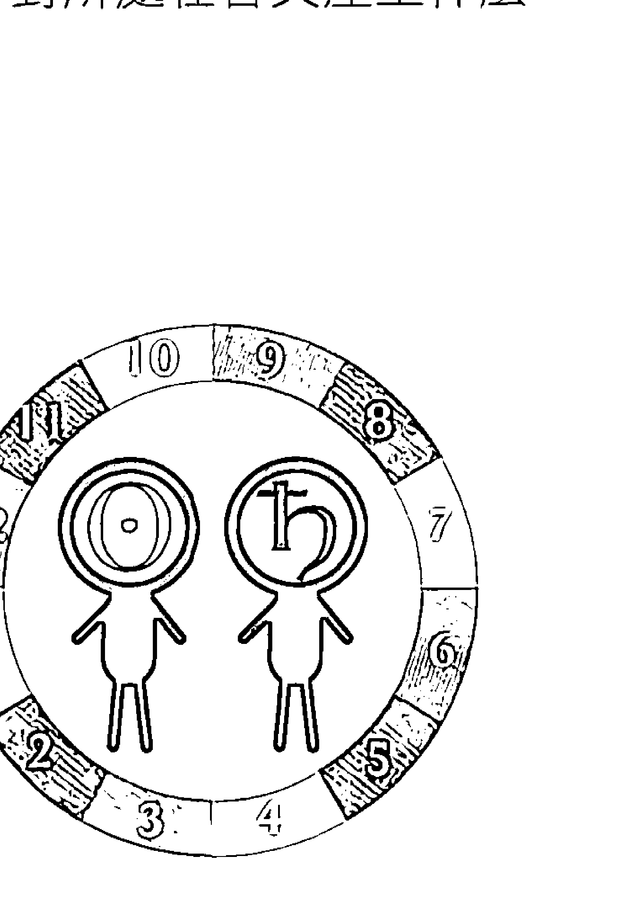

因此，本命日土硬相位，容易遇到性格嚴厲、作風保守、苛刻要求的對象，比其他人更敏銳感受到外界的要求與壓力，尤其是師長權威跟社會體制的傳統期許，自身在嚴格限制與龐大責任的磨練下，逐漸成為特定型態的「權威角色」。

同理，本命月土有相位者，代表母親承受頗大的親情壓力，不僅造成原生家庭的情感匱乏及情緒壓力，也督促自己耐心經營家庭、努力維護情感，並容易吸引情感表達有障礙的對象，要求自己付出，帶來實際的情緒負擔。

反之，本命日天硬相位者，自小受父親特立獨行、不守規範，乃至違反倫常、不負責任的另類影響，自己也不自主形成脫離體制、反抗權威的行為傾向。男性將越來越像生身父親，女性則容易遇到奇葩類型的男性，帶來驚嚇意外，無預警被挑起冒險神經，讓自己感覺既不可靠，又忍不住想試試看，體驗驚世駭俗的刺激滋味。

#### RULE Synastry 之 家族傳承4

- ○本命月土硬相位，感受母親的嚴肅冷漠，缺乏溫暖親切，自身不知如何表達情感，柔性安撫家人，容易吸引情感表達有障礙的對象，帶來實際的情緒負擔。
- ○本命日天硬相位者，感受父親嘗試新奇、反覆無常的神經突發，以及不遵倫常、挑戰禮教的古怪另類，自己也不自主形成脫離體制、反抗權威的行為傾向。
- ○男性將越來越像生身父親，女性則容易遇到奇葩類型的男性，帶來驚嚇意外，使人生發展不安定、非主流化，男性關係變化多端。

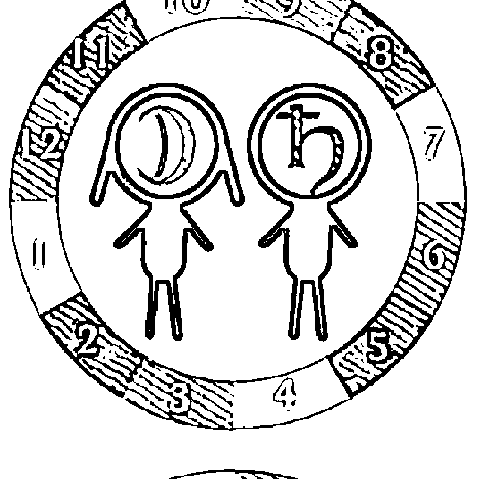

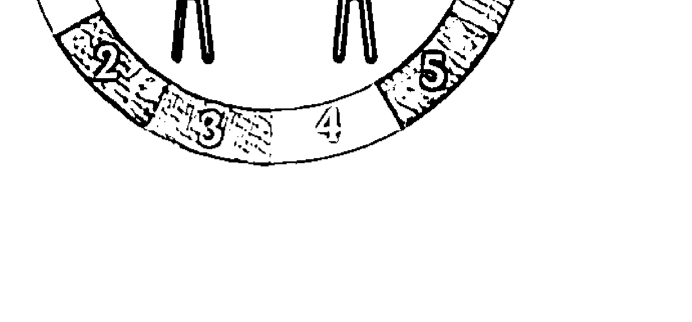

再者，本命金冥相位者，象徵家族曾擁有龐大資源的操控權力，藉以從商、從政、為善或是作惡，造成自己對於金錢物質，懷有深層無名的禁忌與罪惡感，容易在金錢相關人事，抱持扭曲極端的態度，和人大鬧彆扭，自取其辱，引起複雜的恩怨糾纏，製造金錢剝削及嚴厲懲罰的情節，共演恐怖驚悚的金權掛勾及情慾勒索戲碼。

#### RULE Synastry 之 家族傳承5

- ○ 本命金冥相位者，易因從小與人爭奪寵愛，養成對物質享受、美學品味及人際社交方面，極端變態及強迫扭曲的操控欲，逼自己以金錢取悅討好他人，又責怪他人不照自身奇特的標準給予回饋，容易和人因情感金錢的複雜往來，結下恩怨。
- ○ 本命金木相位者，對金錢看得不重，敢要求善待也樂於分享，會奢多花費購物玩樂，同時大方款待他人，並得到外界相等的回饋。
- ○ 不論合盤法則亦或實例，口袋空空的金木相位者，常吸引鈔票滿滿的金土相位者接近，金木輕鬆分享歡樂的態度，可大幅減輕金土在金錢享樂方面的心理壓力。

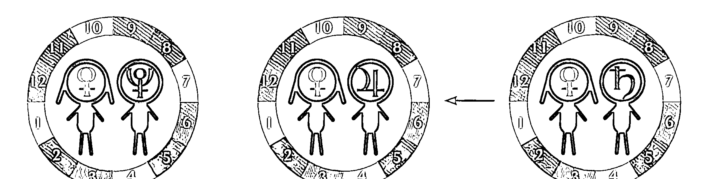

反之，如本命有金木相位，無論其父母家庭的經濟條件如何，自己在金錢及社交方面，都抱持較為輕鬆慷慨，樂於分享的態度，也容易得到外界給予的好處及利益。根據實例，金木相位經常吸引金土相位作伴，金土不斷給自己找對象，來付出情感與金錢，金木則厚著臉皮大方接受，金土從跟金木的交往互動中，尋求較為輕鬆的人際交流與物質享受，釋放對社交及財務的恐懼壓力。

占星盤中的水星，象徵人類的思考模式、學習傾向、心智能力和表達方式，其處理訊息的功能進化，從現代人的腦容量持續增加，大腦皮質表面積不停擴大，神經突觸的高度聯結顯示出來，可說現代人平均比原始人聰明許多。

但現代人就算比前人知識豐富百倍，資訊充足千倍，卻仍在情感、金錢、權力、道德及倫常等，攸關人性慾望的價值抉擇中，與一萬年前的原始人近似，不停犯同樣的錯誤，而自討苦吃，為什麼呢？

以常理而言，人類在發達的理性頭腦及生物的情感本能之下，口頭上都說，「我要追求快樂，不要體驗痛苦」，但實際上卻不停重複帶來苦難折磨的行為模式，製造生命關卡及情緒壓力，激發自身更獨特的創造力。因為人類不僅是種靈長類動物，不只有人性與獸性的組合，個體一切行為的最高指標，乃是靈性所選的成長課題。

每個人靈性都會選擇獨一無二的生命課題，並透過家族的先天遺傳，及環境的後天遭遇，形成根植於潛意識的反應，使個體不斷經歷類似的人事，直到學會課題為止。

生命存在的意義與價值，如同普通煤炭深埋地底，承受高溫高壓數百萬年，才淬鍊出晶瑩剔透的金剛鑽，得以脫穎而出，永傳於世。

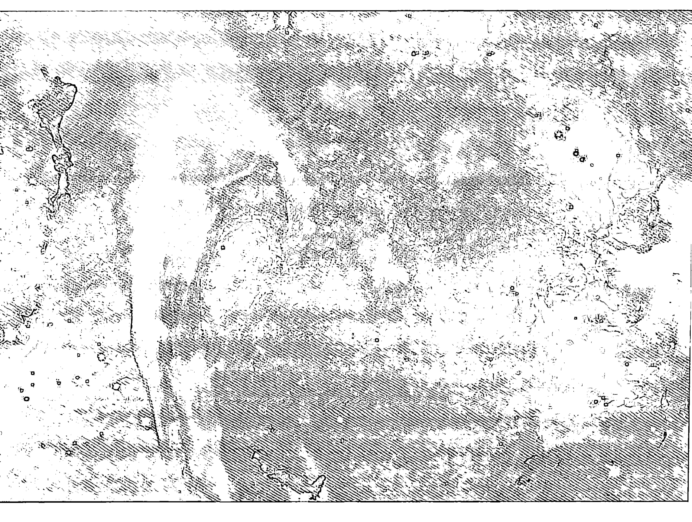

#### 陰陽互補

占星盤中的十大行星，象徵每個人內在藏有十種相異的心理功能與行為動機，也是現代智人都具備的生理本能及心理需求，無人例外。例如：男性的太陽代表「自我成就」與「意志彰顯」的動機，男性的火星代表「男子氣概」與「競爭征服」的功能，女性的月亮代表「關懷需求」與「情緒依賴」的動機，女性的金星代表「美容裝扮」與「取悅討好」的功能。

#### RULE 占星的男性擇偶條件

| 關注重點 | 行星符號 | 關鍵含意 | 意識功能 |
| --- | --- | --- | --- |
| 太陽 | ☉ | 【自己扮演丈夫的角色】 | 代表男性心中「最佳伴侶」的標準，透過被尊重、被期許、被要求擔當社會責任，達成受肯定的人生成就，活出榮耀彰顯的獨特價值。 |
| 月亮 | ☽ | 【熟悉安全的妻子類型】 | 代表男性需要「情感依賴」的方式，經由生活居家的習慣，期許親切熟悉的妻子類型，建立安全穩定的家庭生活，滿足相互依附的安全感 |
| 火星 | ♂ | 【表達男子氣概的方式】 | 代表男性自己宣洩「脾氣精力」的方式，以何種風格取得事物利益，如何表現男性欲望，征服女性的身心。 |
| 金星 | ♀ | 【喜歡欣賞的異性類型】 | 代表男性喜歡的「美麗女性」類型，經由金錢禮物的贈與及休閒娛樂的寵愛，愉悅雙方的感官，取得對方好感，證明自身的賺錢能力。 |

因先天生的因素及後天的社會制約，男性自身易活出太陽、火星的陽剛能量，而將月亮、金星的陰柔能量，藉由親密女性展現出來，因此男性命盤中，月亮代表妻子類型，金星代表女友類型。同理，女性自身容易活出月亮、金星的陰柔能量，而將太陽、火星的陽剛能量，透過親密男性展現出來。所以女性命盤中，太陽代表丈夫類型，火星代表男友類型。

#### 占星的女性择偶条件

| 關注重點 | 行星符號 | 關鍵含意 | 意識功能 |
| :--- | :--- | :--- | :--- |
| 太陽 | ⊙ | 【理想丈夫的發展條件】 | 代表女性心中「最佳伴侶」的標準，透過期許、推動與扶持對方的事業，協助丈夫完成理想成就，活出自我的獨特價值，完成個人使命。 |
| 月亮 | ☽ | 【滿足安全的生活習慣】 | 代表女性表達「情感關懷」的方式，經由滿足照顧他人的需求，扮演理想妻子的類型，建立穩定熟悉的家庭生活，取得相互依附的安全感 |
| 火星 | ♂ | 【心動男性的男子氣概】 | 代表女性會被哪種「性格脾氣」的男性吸引，激起自身被征服的渴望，並引發本能的生理欲望，產生性接觸的衝動。 |
| 金星 | ♀ | 【喜歡欣賞的感官愉悅】 | 代表女性喜歡親近的「帥哥俊男」類型，經由吃喝玩樂的休閒活動，彼此討好取悅，以物質享樂方式，愉悅雙方的感官需求。 |


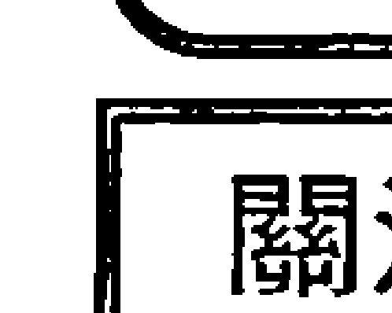

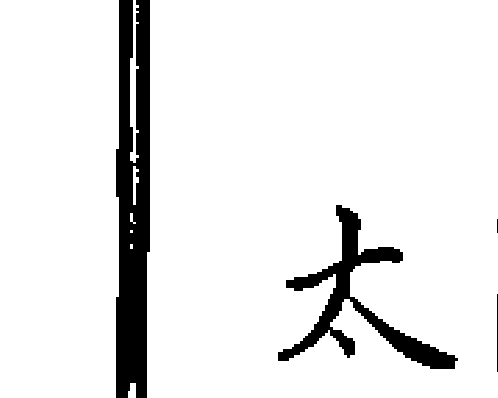

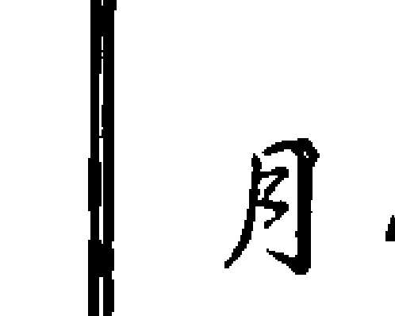

這種「男性陽剛，女性陰柔」的性格特質和行為傾向，在現今兩性平權的趨勢中，各種傳統社會的性別理想、要求與偏見的制約，都日趨淡化下，越來越多的「肉食女」及「草食男」，乃至於跨性別者，不符生物雌雄標準的類型紛紛出現。但大體來說，不管是在未開發或已開發地區，在排除了社會制度、文化風俗、家庭教養及父母制約等因素下，大部分男女的內在需求及外在行為，仍可依循「陰陽互補」之法則，來作劃分及預測。

十大行星代表不同的次人格，但存在於深淺有別的意識層面，會因不同人物、事件及情境，受到激發。如火星代表的粗暴戰士、金星代表的嬌柔公主、木星代表的智慧導師、土星代表的嚴肅長老等，都被包裹在上升星座的主人格之下。

舉例而言，原始人在面對野獸出現時，會被激發出維護生存的功能，出現戰鬥或逃命的反應，是火星所代表的。在面對俊男美女出現時，則被誘發出欣賞及擁有的功能，採取取悅及討好的反應，是金星所代表的。每個人在類似情境下所受到的刺激，雖程度因人而異，但性質無疑相同。

#### ☆合盤邏輯～吸引法則

同理，每個人因內在的認知結構有差別，在面對不同的人物、事件及情境時，會以不同的性格與動機，來面對及反應。例如男性命盤中有月亮和金星的90度刑相，在遇見心儀類型的女性時，除了金星欣賞想要接觸的反應外，還會被挑起月亮膽怯的不安全感，因而不敢主動親近，並要求自己以金錢來取悅對方，才敢採取行動。

又如，女性命盤中有太陽和火星的180度對相，在遇見理想丈夫的類型時，會先被挑起火星的戰鬥本能，不由自主發起攻擊，勝過男性滿足競爭心。如跟男性建立了太陽的重要關係後，也因好勝心及征服欲太強，動輒挑釁刺激，相互火爆對立，造成伴侶間的爭執不睦。

古云「孤陰不生，獨陽不長」，在同性間的感情及同志伴侶普遍盛行的現今社會，親密關係仍舊不脫陰陽之道的運作。隨處可見，在同性伴侶間，有一方在關係中，扮演較為陽剛、主導、社會化的角色，另一方則扮演陰柔、配合、家庭化的角色。如同性的雙方陽性特質都強，關係多半只是激情，無法長久保持，如雙方都陰性太強，則相處維繫力不夠，一方容易脫離，另尋互補性更強的對象。


#### 吸引法则<>

如果，人在世間遇到的人際關係是果報，本命星盤的配置就顯示出因緣，什麼樣的人，就吸引什麼樣的緣，藉由和他人不同的互動，展現自身命盤的能量。

例如上升在處女座的人，特別容易遇到太陽及月亮在處女座者，雙方一拍即合，建立起重要的人際互動。不同在於太陽處女將發揮主導權，鼓勵上升處女在工作上發展長才，期許上升一方建立專業形象，以適應社會生存的需要。月亮處女則含蓄配合上升處女的需要，對上升一方不自主出現情感依賴，產生較為親密的私人關係。

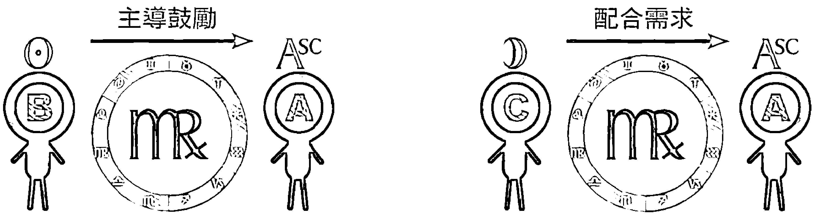

如本命太陽與土星有相位者，易吸引上升、太陽、月亮在魔羯者，敏銳感受到對方給自己的管束要求與責任壓力，又如本命月亮與火星有相位者，除了吸引上升、太陽、月亮在牡羊座者，也容易和火星在一宮的女性建立關係，透過和對方互動的意氣爭執，反映自身情緒容易受女性刺激，因而發怒甚至動手的慣性。

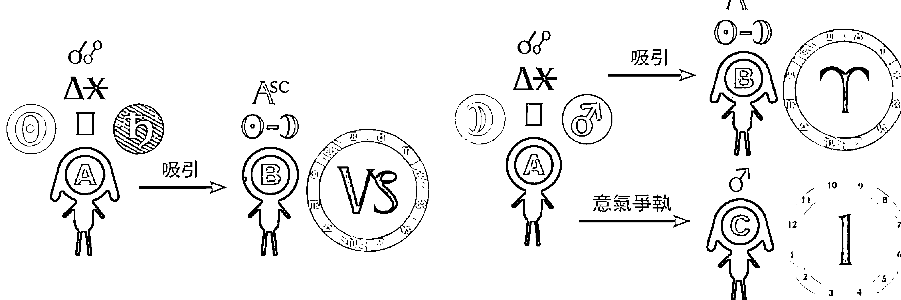

#### ☆合理運勢~吸引法則

人性的複雜程度，表現在「同時具有」多種次人格，如太陽是理性意識、月亮是感性情緒，金星是休閒和審美，火星是工作及脾氣。除了人工設計的電腦智慧外，每個人或多或少、或輕或重，都有某些人格分裂，如在表現太陽人格時，暫時遺忘忽略月亮人格的存在，或意識在不同人格之間切換，卻不自知。

如本命的金星和月亮、火星等形成挑戰相位者，經常在看上一件喜歡的物品時，美感意識及消費衝動被觸發，一時用金星態度判斷，覺得美好認為值得，就想購買收藏。但意識卻不自主在其他人格間切換，或許改用月亮態度考量，覺得昂貴不捨或精美不實，而後悔買下；或許改用火星衝動面對，一時性起爽快掏錢，又快速反悔要求退換。這些對於同一人事物的態度差異，都是因內在的人格分裂，導致朝三暮四、判斷錯誤，「做了也後悔，不做又難過」，內心矛盾拉扯，行為反覆無常，堪稱「認知失調」。

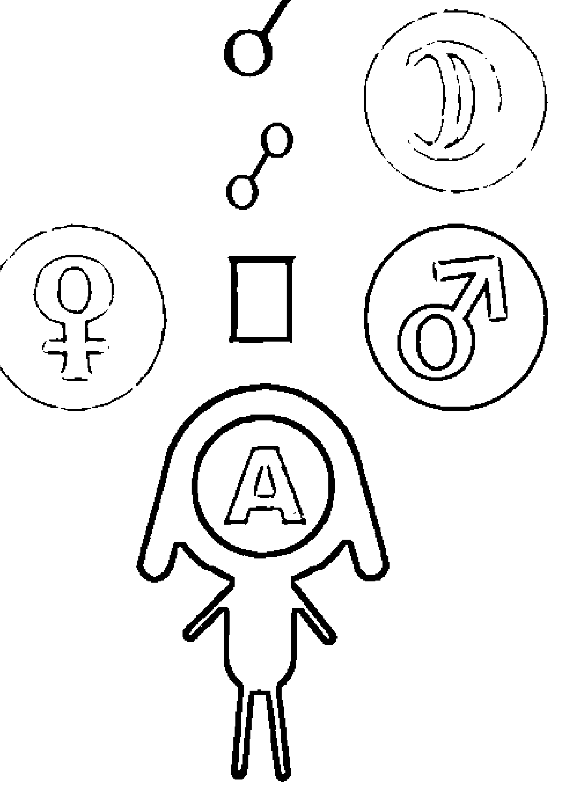

又如本命盤有金星和土星、冥王呈挑戰相位者，容易在遇到和女性的金錢往來時，一開始取悅討好及賺錢意識受到引動，用金星標準衡量，認為公平合理有利可圖，而答應合作互惠。如此時土星意識冒出，則察覺對方嚴格要求，自身價值感被貶低，工作表現不合格，產生過強的責任感，甘願承受壓榨，不得不接受報價砍殺，甚至酬勞被延遲拖欠。

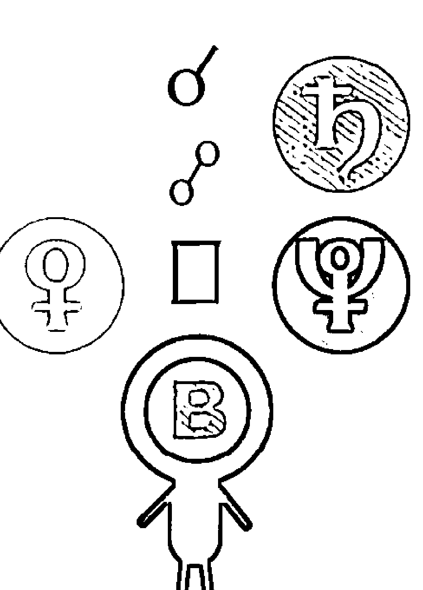

此時如冥王意識浮現，常因對方態度強勢，自身感受威脅利誘，生怕對方不快，被迫接受不合理條件，處處妥協配合。如此將使人食髓知味，進一步用高壓要求，採魔鬼標準，逼迫自己完成不可能任務，卻苛扣工作報酬。自身如不滿利益被剝削，將激烈爆發對抗，使合作惡質性破裂，甚至出現勞資爭議、訴訟求償等金錢糾紛，雙方結下重大仇怨。

換句話說，本身金星有挑戰相位者（90度、180度），無論遇到何種人際關係，不管彼此合盤關係如何，都容易在金錢情感上，覺得受到損失傷害。本命行星的刑沖剋相，顯示出一個人內在某些次人格，處於動機矛盾及能量摩擦的狀態，容易遭遇特定人事的刺激，引發負面互動及爭議狀況，藉由雙方衝突對立情境，看到自我無法察覺的內在我們從各種社會新聞事件中，常見關係中的某一方被欺負、被霸凌、被暴力，似乎完全被動受到攻擊侵犯，致使身心傷害，是不折不扣的受害者、受虐者、無辜之人。以占星研究的觀點，常可發現受害者的命盤中，有個人行星（日、月、水、金、火）與火星、土星、冥王的刑沖相位。以能量互動的角度來看，此種狀況都是受害當事人，基於潛意識的某種動機，導致己身的言行舉止，在「無意中」引發的慘痛際遇。

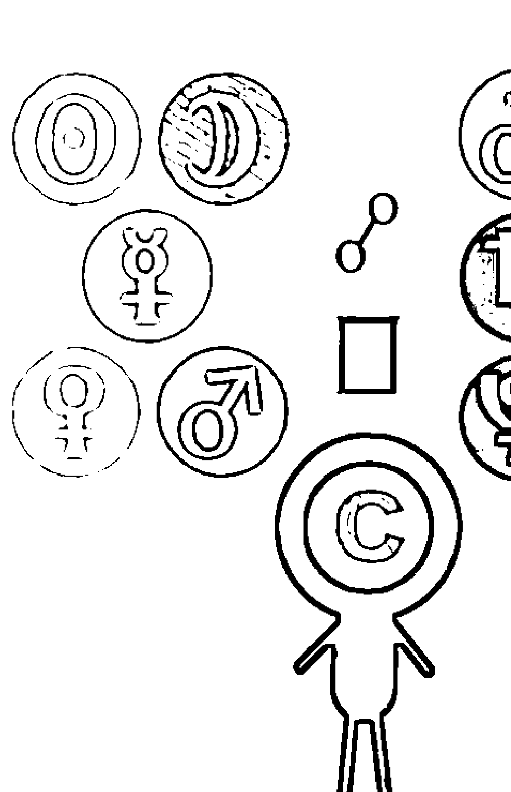

加害者對別人不會這樣，對其他人沒有這麼小氣、這麼凶、這麼壞，為何偏偏對你如此？因為你「無意識需要」對方如此，理性卻無自覺。就占星哲學的立場，任何人際關係中，沒有一方是完全無辜的，一切都是生命求取特殊體驗，為了個體能力的培養及強化，在精神肉體上必經的磨難與修練。

#### 吸引法則 <二>

占星盤中的十大行星，象徵的不同功能與動機，代表每個人的潛意識中，都藏有意識不到的部份，不停地在生命歷程中，遭遇到特定的人事物，透過他人的言行舉止，激發出自己某些反應，反映內在的能量，謂之「投射」。

生命中的種種遭遇，不管是自己主動的行為選擇，或外力加諸於己的事件，其實都是內心的認知模式，決定如何去處理，「重點不是發生了何事，而是用何種態度去面對」。

無論塑造模式的根源，是來自父母遺傳、家庭教育、社會制約，亦或靈性設定之課題，都使個人與外在世界之間，建立出特定的因應模式。此種模式導致我們在生命旅程中，和週遭人事物之間，總是演著換湯不換藥，形式雖異但本質相同的老套戲碼。

外在世界彷彿一幅立體的投影幕，螢幕上呈現出來的生命戲碼，無論悲歡離合、喜怒哀樂、吉凶禍福等，都只是個人內心的認知與投影。每個人都有特定的生命劇本，建構出不同的認知模式，使不同的人在遇到完全相同的處境時，做出截然不同的反應，產生不同的人際互動，造就不同的人生際遇。

投射作用與吸引法則是一體兩面，透過占星命盤的解讀後，能讓我們徹底理解，現實世界中的事件際遇，其實都是一個人戴著「量身打造」的有色眼鏡，聚焦於特定的觀察模式，所創造出來的一種假象。

舉例來說，當某甲的命盤中有水星天王呈現挑戰相位，他的認知模式將是：心智活躍不安，凡事逆向思考，不斷受到噪音干擾，言語不附和他人。而行為表現常是：突發性與人爭吵，心智反應異常快速，對新奇創意有所天分，不斷追求新穎學習。

某甲大腦神經亢奮的傾向，不停與人交談，並以層出不窮的驚人言語，追求不重覆的心智體驗。無論遇到何者，都唯恐表達不夠新奇，刺激反應不足，而以不符常理的思維，突發神經的表達方式，不間斷在生活工作上形成現實反饋，吸引前所未有的獨特、意外及驚奇經驗。

如徵詢他人意見，不肯接受大唱反調，覺得別人老在反駁，爭執不休因而決裂；反應太快，對外在資訊及溝通問答，迅速做出回應，卻認為被疲勞轟炸，心智無法休息；與人互動忽冷忽熱，打破倫理百無禁忌，引發異常反應，卻感覺自己受驚嚇；好學新知但不持久，突然轉換學習目標，學業因而中輟，卻認為體制老舊；

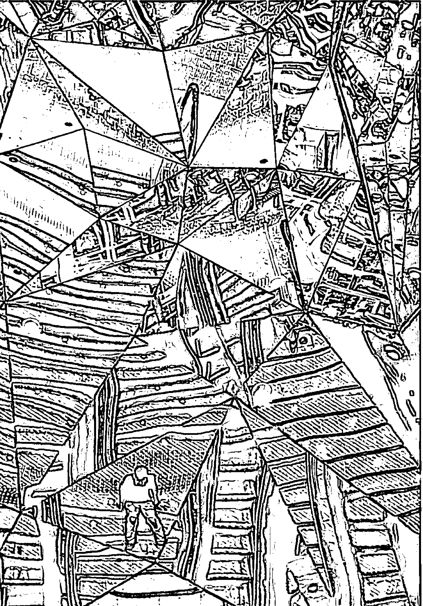

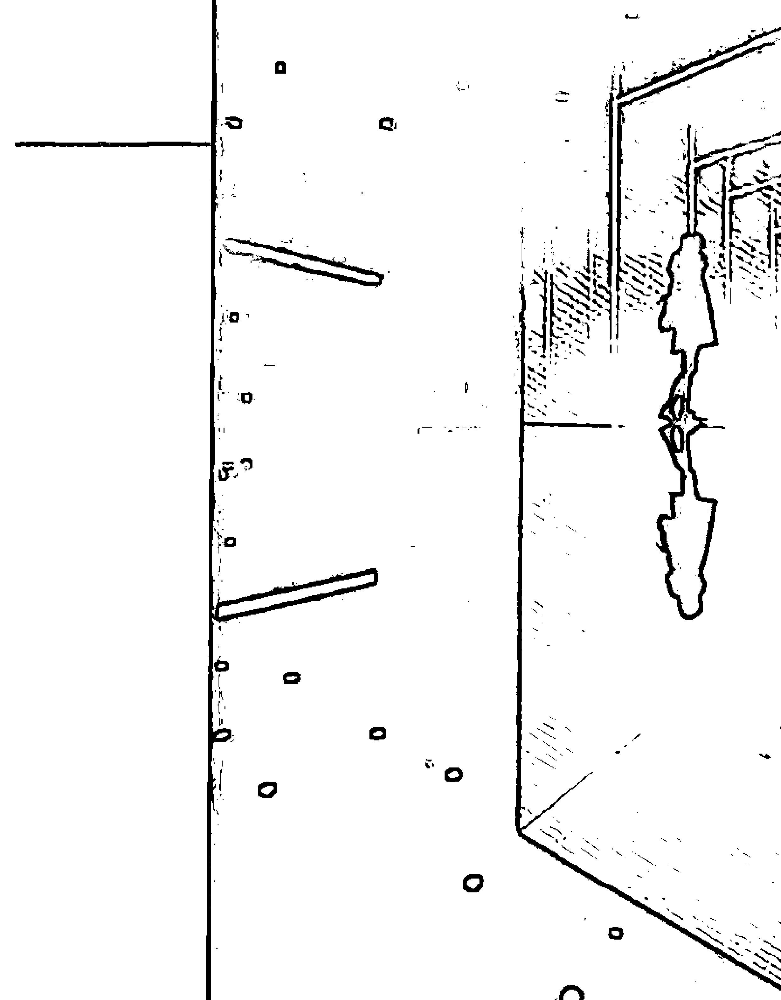

突發奇想做出承諾，想法卻反覆無常，破壞合夥協議，頻頻與人毀約；追求冒險的旅遊體驗，無預警變更主意，卻認為外界不守信用，交通行程頻出意外。

換個角度，某甲心智躁動不安的毛病，藉人際相處互動的過程，將內在顛覆改造及實驗創新的能量，以言談、學習及旅遊活動表現，「壓力成為最大的動力」。水天刑沖的心智矛盾，帶來強烈的學習興趣，原本天馬行空的奇想，激發出尖端知識及罕見學問的天分，探索異景的刺激需求。

水天挑戰相位者將領先群眾，接觸新時代革命思潮，快速領悟另類知識，加以創新應用，而成為前衛思維的傳播者、科技創意的發明家、周遊列國攀登奇岳的冒險者、及解決特殊問題的專家。

當一個人總是遭遇不如意的人事，面對天不從人願的逆境時，惟有不再怨天尤人，不再燒香拜佛、祈禱保佑。而是反求諸己，深入探索和覺察自己內在的「造夢模式」，方能看到客觀的「物自身」，真正理解「你創造自己的實相」的生命法則。

占星合盤讓我們對所有的人際緣分，產生超越式的覺察，在面對重蹈覆轍的人際互動時，更能反躬自省。藉此理解一切生命問題的根源，無論吉凶禍福亦或是非對錯，都不在外界及他人，而是自我的內在模式。如果個人因此找到調整之道，改善修正模式的著力點，就能優化預設的生命程式，使之運作更加順暢，不致一再當機重啟。

以Synastry合盤的立體化模型，分析解構潛意識中的認知系統，了解自己與他人的互動，理解雙方相遇的學習課題。如此能對內在投射模式瞭解更多，幫助自我看清內在的陰影和黑暗面，調整與他人間的相處，學習接受、臣服與感恩。更進一步察覺自我未知的能量，透過人際關係的共同修練，激發原本深藏的無窮潛力，創造更精彩更豐富的生命情節，完成此生的「個體化」使命。

#### 行星意涵（一）

无论在本命占星或是 Synastry 合盘中，十大行星都是首要主角。在分析每颗星落入宫位及形成相位之前，要先彻底了解行星的属性。传统占星把十大行星分为阳性、阴性及中性，量子占星独创的理论，则是把十大行星分为阳性、阴性、中性及变性四种。

##### RULE 行星的属性

| 阳性 | 阴性 | 中性 | 变性 |
|---|---|---|---|
| 太阳 ☉ | 月亮 ☽ | 水星 ☿ | 冥王 ♇ |
| 火星 ♂ | 金星 ♀ |  |  |
| 木星 ♃ | 土星 ♄ |  |  |
| 天王 ♅ | 海王 ♆ |  |  |

行星不同属性的性质表现：太阳、火星、木星、天王星等阳性行星，代表主动、积极、带领、进取、创造、凸显的能量；月亮、金星、土星、海王等阴性行星，则是被动、消极、配合、保守、涵养、隐藏的能量。

中性的水星则视落入星座与相位，决定表现偏阳或偏阴。如水星与太阳有相位则被阳性化，水星与月亮有相位则被阴性化。

##### RULE 行星的引力强弱

| 阳性 | 强度 | 阴性 | 强度 | 中性 | 强度 | 变性 | 强度 |
|---|---|---|---|---|---|---|---|
| 太阳 ☉ | 中 | 月亮 ☽ | 中 | 水星 ☿ | 无力 | 冥王 ♇ | 业力 |
| 火星 ♂ | 低 | 金星 ♀ | 低 |  |  |  |  |
| 木星 ♃ | 高 | 土星 ♄ | 高 |  |  |  |  |
| 天王 ♅ | 不定 | 海王 ♆ | 不定 |  |  |  |  |

但行星的引力强弱并非一成不变，会受行星落入的星座与相位影响。比如火星虽然引力低，但若火星与太阳、木星、冥王星等有相位，就能将火星的引力提升。

至于变性的冥王星，会改变其他行星的属性。如冥王和太阳形成相位，太阳将被阴性化；若冥王和月亮形成相位，月亮则被阳性化，这是冥王的特殊之处。

再來区分行星的不同层次：如日、月、水、金、火等内行星，代表个人化的性格特质，是自身能够察觉、理解并控制的。

木星与土星两颗社会行星，代表家庭社交的小社会，与体制国家的大社会，所产生的无形影响。意识就算能察觉，也难以理解，更无法控制。

天王、海王、冥王等三颗世代行星，象征宇宙灵性赋予人类潜能进化的指引。个人被引发的行为及现象，不仅自身打破头也想不明白，也常因违反道德法规、出现脱离传统的离经叛道，甚至不为社会所允许的惊世骇俗。

##### RULE 行星的阴阳层次

| 阳性 | 层次 | 阴性 | 不阴不阳 | 忽阴忽阳 |
| :--- | :--- | :--- | :--- | :--- |
| 太阳 | 生物本能 | 月亮 |  |  |
| 火星 | 人类意识 | 金星 | 水星 |  |
| 木星 | 社会文明 | 土星 |  |  |
| 天王 | 宇宙进化 | 海王 |  | 冥王 |

例如，当一个人的太阳落入对方四宫时，双方都能察觉彼此类似家人的熟悉感，常出现在血亲姻亲等家庭关系中。即便不是家人，也有同居和室友的缘分。当月亮落入四宫，双方情感的亲密性更强，更常形成同居关系，但月亮容易担忧焦虑，凡事想得太多，态度优柔寡断、患得患失，影响关系的长远稳定。

若木星落入四宫，将在居家相处及店面营运，相互帮助对方繁荣兴盛。但木星的社会性，适合文化教育及商业活动，不具个人关系的亲密性。如果土星落入四宫，则双方同样有居家相处缘分，在一个屋檐下生活的行为，因土星代表无法理解的前世宿缘及累世业力。双方虽有实质互动，却是基于经济、工作、责任等现实考量，个人意识感受很大压力，相处并不愉快，只是基于现实，不得不然。

假如海王落入四宫，双方一样有同居关系及家庭生活。海王是灵性进化的力量层次，象征累世未竟的宿缘，引发追逐梦想的动机，想在今生落实，完成前世理想。却因双方现实在年龄差距的不伦，以及身份辈分的乱伦，只有无奈欺瞒及逃避，关系随缘聚散。彼此只能以艺术、宗教、慈善、医疗及灵性活动来维系。但海王在心底使人魂牵梦萦，久久无法忘怀，是超出个人意识及一般常理，世俗难以解释的奇妙缘分。

#### 行星意涵（二）

在 Synastry 合盘中，十大行星代表双方内在的次人格，具备各自的人格功能及心理动机，展现殊异的性格特质、喜好冲动。在不同宫位的环境场合中遭遇相识，宫位则是个人的能力资源及环境因素。如彼此行星形成相位，代表有缘进一步互动；合（0度）与拱（120度）是轻松持久的关系，冲（180度）与刑（90度）通常激烈而短暂。

十大行星分为三种层次：内行星的日月水金火，是基于双方的好恶意愿，所建立的个人化关系，影响范围局限于彼此；外行星的木土，代表基于社会家庭社交等环境因素，所建立的工作现实关系，影响范围较广泛；外行星的天海冥，可视为难以理解的宿世因缘、不可抗拒的超世俗力量，所促成的特殊关系，影响范围及意涵长久深远。

行星入宫位的诠释，并非如一般理论所述，一定是行星一方采取主动、宫位一方处于被动，而是视行星本身的阴阳属性及所处层次，来判断究竟何方较为主动，促使双方产生往来。就算同一宫位，不同的行星落入，也让双方在相同领域，产生不同的能量感应，关系发展出现奥妙变化。

如太阳是理性、阳刚、人生目标的次人格，代表个人发挥主导，展现自尊的领域，也象征女性的理想丈夫类型。月亮是感性、阴柔、情感习惯的次人格，是展现温柔体贴、配合照顾的领域，也代表男性的妻子类型。

如男性太阳落入女性七宫，男性必定在双方互动及合伙发展，拥有完全主导意志，要求女性公开配合。如女性的月亮落入男性七宫，女性虽渴望建立亲密关系，但不主动表态，只体贴男性的亲密需要及合伙协助，七宫容易接收到月亮“既期待又怕受伤害”的脉脉含情，主动约月亮私下相处。

在个人行星层次，太阳、火星的阳性行星，将主动投入宫位一方的资源及环境；如月亮、金星等阴性行星，则被动接受宫位一方提供的资源及环境。

> RULE 行星落入宫位的诠释心法之一
>
> 行星是“动功能量”，宫位是“环境资源”
>
> 如是个人阳性行星，会主动投入宫位一方的环境
> 如是个人阴性行星，会被动接受宫位一方的资源

如太阳落入第五宫，要太阳主动约五宫玩乐，谈情说爱产生浪漫，双方才可能成为恋人；又如月亮落入五宫，月亮对五宫有恋爱及玩乐的浪漫期待，但又敏感多心，容易胆怯退缩，只敢默默关怀，等待四宫表态接纳。

在社会行星层次，较没有行星主动、宫位被动之分，而是双方的心理功能与行为动机，受到社会风气、环境因素的道德文化影响，同时主动或同时被动。如木星落入七宫，双方因共同的思想观念、学习兴趣及文化背景，彼此都大方积极，乐于作伴，以轻松体验的态度，建立七宫的亲密关系及合伙共事，双方不易结婚，较为好聚好散。

##### RULE 行星落入宫位的诠释心法之二

社会行星的行为动机，受环境因素影响，落入个人宫位时，没有行星主动、宫位被动之分。

- 木星会使双方都较为主动，乐于投入宫位的轻松享乐领域。
- 土星会使双方都较为被动，被迫投入宫位的沉重责任领域。

若是土星落入七宫，常是因共同的现实责任、工作需求及道德束缚，双方都被动压抑、小心慎重，以戒备恐惧的态度，建立七宫的关系制约及工作合伙，相处沉重压力大，互动不轻松自在。

在天王、海王、冥王的世代行星层次，力量来自个人灵性的选择，及家族课题的传承，受宇宙进化的集体潜意识影响，更加没有行星主动、宫位被动之分。如天王星落入五宫，双方都无意识主动，态度突发且明确，以实验尝试的动机，快速投入不伦恋情、特殊表演及投机冒险的领域，关系带有前卫、意外及特殊性，互动如闪电般，使人震惊诧异。

如海王落入五宫，双方态度都被动隐藏，却缓慢浮现精神交流的动机，萌生暧昧情愫。若非彼此暗自倾慕，但不明白表示；就是参与艺术表演及灵性抚慰的活动。关系具有虚幻逃避、疗愈救赎性及超然美感性，扑朔迷离难以落实。

如冥王落入五宫，则双方都纠结且扭曲，不由自主产生潜意识冲动，时而强迫时而被强迫，如同飞蛾扑火，激烈投入异态欲望、情感纠葛、及投资操控的领域。关系带有斗争、毁灭及转化性，相处紧张对峙、充斥心理折磨。

##### RULE 行星落入宫位的诠释心法之三

世代行星受个人灵性、家族业力、集体社会、世代意识的无形影响。

三王星落入他方宫位时，没有行星方主动、宫位方被动之分别。

天王星使双方都无意识主动，快速投入宫位的刺激冒险领域。
海王星使双方都无意识被动，缓慢进入宫位的精神交流领域。
冥王星会使双方无意识强迫，激烈投入宫位的情感斗争领域。

#### ☆合盘运势~宫位法则

##### 宫位法则 <—

##### RULE 不同行星在不同领域产生不同互动

- 行星=双方内在线格（产生互动）
- 星座=秉持天赋习性（先天特质、后天教养）
- 宫位=在情况及事件（生活领域、现实环境）
- 相位=产生不同反应（朋友、情人、性伴侣、夫妻、伙伴、亲人、怨偶、仇敌）

Synastry 合盘在以行星宫位作为分析切入点时，首先观察双方的行星，落入对方命盘上下半圆的比重。下半圆的一宫到六宫偏“个人私密”性，双方相处常是居家性质，只跟彼此互动；上半圆的七宫到十二宫偏“社会公开”性，双方互动是大家可见的，关系涉及较多数人。

接着，察看左半圆跟右半圆：左半的第十宫到第三宫，偏自我主观的独立性关系，双方虽有接触往来，但常各做各的；右半的第四宫到第九宫，偏双方搭档的伙伴化互动，共同行为需要彼此配合，密不可分。若上下左右的比重呈现5比5或6比4，代表关系大致平均；一旦超过7比3的话，就需特别留意，关系将倾向某一方发展。

再来，区分双方互动的宫位特质，厘清双方最有可能的发展走向。如掌管情感婚姻的主要宫位，以第四、五、七、八宫为主；掌管职业工作的主要宫位，是以第二、六、十、十一宫为要；掌管朋友情谊的主要宫位，则以第三、七、九、十一宫是重点。

| Pl | Position | Hous |
|---|---|---|
| ☽ | 00°♈28' | 4th |
| ☉ | 15°♉59' | 10th |
| ☿ | 03°♊22' Rx | 9th |
| ♀ | 11°♋29' | 9th |
| ♂ | 00°♌24' | 8th |
| ♃ | 19°♍07' | 10th |
| ♄ | 13°♎17' | 10th |
| ♅ | 17°♏00' | 1st |
| ♆ | 17°♐51' Rx | 2nd |
| ♇ | 16°♑56' | 12th |
| ⚸ | 13°♒53' | 7th |
| Mc | 12°♓34' | 10th |
| Asc | 10°♈59' | 1st |

| Hous | Pl | Position | Hous | Hous |
|---|---|---|---|---|
| 1st | ☽ | 06°♈50' | 2nd | 4th |
| 7th | ☉ | 09°♉14' | 3rd | 6th |
| 7th | ☿ | 11°♊33' | 4th | 7th |
| 7th | ♀ | 15°♋01' | 4th | 7th |
| 6th | ♂ | 03°♌16' | 3rd | 6th |
| 7th | ♃ | 01°♍37' Rx | 8th | 11th |
| 8th | ♄ | 04°♎04' Rx | 8th | 11th |
| 10th | ♅ | 28°♏54' Rx | 10th | 1st |
| 11th | ♆ | 24°♐34' Rx | 11th | 2nd |
| 9th | ♇ | 22°♑30' Rx | 9th | 12th |
| 10th | Mc | 10°♒11' | 10th | 7th |
| 1st | Asc | 25°♒26' | 1st | 12th |
| 4th | ⚸ | 17°♓24' | 4th | 3rd |

行星宫位表示意图

##### RULE 爱情伴侣合盘重点

- 第四宫（家庭宫）= 居家习惯、情感安全、同居缘
- 第五宫（玩乐宫）= 浪漫感受、休閒娱乐、子女缘
- 第七宫（伴侣宫）= 搭配互补、异质吸引、合伙共事、相处缘
- 第八宫（资源宫）= 财务共有、互通有无、情欲交流、分享缘
- 是否有星落入？？

举例来说，甲方的十大行星落入乙方宫位，以第二、六、十、十一宫占大多数，重点在实际面的工作事业。而乙方落入甲方，却是第四、五、七、八宫为压倒倾向，显示私人情感的重要缘分。那双方究竟将如何发展呢？

先以太阳、月亮、土星落入宫位为观察焦点。如甲方的太阳落乙方三宫、月亮落乙方六宫、土星落乙方十宫；而乙方的太阳落甲方五宫、月亮落甲方九宫、土星落甲方十宫。

其中第五宫掌管恋爱玩乐，第三九宫掌管心智交流，第二六十宫掌管工作职业。此时土星相互落入对方十宫。毫无疑问，双方关系将以事业经营、社会名声、行政权力为主轴，资讯沟通、文化教学、宣传企划、业务行销为辅。

##### RULE 职业工作合盘重点

- 第二宫（物质宫）=金钱观念、物质处理（生产赚钱的舞台）
- 第六宫（工作宫）=行政流程、服务观念（劳动辅佐的舞台）
- 第十宫（事业宫）=权力管理、企业体制（提拔推举的舞台）
- 第十一宫（朋友宫）=团队合作、社会人脉（理想奉献的舞台）
- 是否有星落入？？

但乙方太阳落甲方五宫该如何解释？太阳星座代表性格特质的吸引力与排斥性，太阳宫位代表对方在何种领域的主要行为，是自己看得上、认为有价值、会给予尊敬及重视的。太阳一方看重五宫的玩乐创意、才华表达及恋爱态度，觉得五宫是可爱之人，认为有休闲娱乐、浪漫互动乃至男女恋爱的价值。

若五宫一方自身无星，则感受不深；五宫若有强力行星，可能回应太阳的热烈表态。太阳和五宫哪颗行星呈现相位很重要，决定关系的进一步发展。若双方都未婚，可能成为职场情侣；如一方或双方已婚，太阳的理性可能克制，不去发展男女亲密，转为师生态度对待。

合盘最常遇到的分析判断，是双方能否走入婚姻。一般是以第四、五、七、八宫为判断依据，双方越多行星落入这四个宫位，通常代表婚姻、家庭缘分越强。不一定同时都有星落入对方的四、五、七、八宫，例如甲方有星落入乙方的四、五宫，乙方有星落入甲方的七、八宫，也可相互弥补不足。

假如婚姻伴侣的合盘缺了其中一宫，代表双方在此宫较无共同行为。如都没有星落入对方四宫，代表欠缺家庭相处及家人互动，关系稳定性不够；如都没有五宫，代表缺乏浪漫、玩乐及教养子女的活动，关系情趣性不足；如少了八宫，代表缺乏男女情欲及资源分享的行为，关系连结性不深；如没有七宫，因第七宫是公开关系、公平互动及公认契约，显示双方难有正式的夫妻名分，只是同居没有约束，甚至是私下的秘密情缘，关系聚少离多。

#### 宫位法则 <二>

二十世纪心理学巨擘荣格（Carl Gustav Jung，1875－1961），身兼占星学家的他，前后做过三次占星婚配研究，总计搜集483对夫妻的本命星盘（共966张），进行 Synastry 合盘比对，发现了如下现象。

第一次以50种占星配对因素，如太阳与月亮、金星与火星、上升与下降星座的相位，针对180对夫妻进行比较，结果显示双方的太阳与月亮合相（落在同一星座）的机率刚好10%。第二次就220对夫妻观察彼此月亮是否合相，符合率是10.9%。第三次针对83对夫妻，统计双方的月亮与上升是否落在同一星座，则出现9.6%的比率。

乍看关联性没有很高！如以现代统计观点检验，将随机的比率作为标准，在不算小的统计规模之下，结果应该逼近8.33%的平均值（100%除以12星座）。

##### RULE Synastry宫位法则1

- ○荣格 Synastry 研究，总计483对夫妻星盘（共966张）。
- ○第一次180对夫妻，结果日月合相机率10%。
- ○第二次220对夫妻，月亮合相占10.9%。
- ○第三次83对夫妻，月亮上升同一星座比率9.6%。

而三次研究的数值都高过随机。以三次的统计值10%、10.9%、9.6%，相比8.33%的随机值，符合程度分别高出12%、13%、11.5%。

更奇妙的是，当统计取样越多（第三次83对、第一次180对、第二次220对），符合比例也随之提升（第三次11.5%、第一次12%、第二次13%）。以现代科学精神观之，着实不可小觑。

##### RULE Synastry宫位法则2

- 平均值8.33%（100%除以12星座）
- 三次统计值：10%、10.9%、9.6%，相比8.33%的随机值，分别高出12%、13%、11.5%。
- 第三次83对、第一次180对、第二次220对，符合比例随取样数提升，第三次11.5%、第一次12%、第二次13%。

审视荣格的世纪性 Synastry 研究，结果正符合量子占星的运作法则，“观点性”与“机率性”。

“观点性”是指，当一个人用某种观点性模式，去观察一件事物时，就会看到符合此观点性的现象。如同物理实验中的“双夹缝效应”，当用测量波的方式去测量光，光呈现出波的特性；当用测量粒子的方式去测量光，光则呈现粒子的特性，证实了光的“波粒二元性”。

“机率性”显示，以占星做为观测系统，其验证准确性一“效度”一高于随机率，其规范一致性一“信度”一也始终不变，等同物理定律般，具备确实有用的計算評估功能。

量子占星解釋：「當兩個人的太陽月亮呈現合相，不一定成為夫妻，但成為夫妻的機率高於隨機他人」。假設任何兩人的Synastry合盤中，在第1項太陽合相月亮、第2項月亮合相、第3項月亮上升同一星座，三項特徵任選其二，加以編號組合。

第1項配第2項的一號組合，「不是」夫妻的機率是80.2%（90%乘以89.1%），第1項配第3項的二號組合，不是夫妻的機率為81.4%（90%乘以90.4%），第2項配第3項的三號組合，不是夫妻的機率為80.5%（89.1%乘以90.4%）。

換言之，一號組合「是」夫妻的機率為19.8%(100%減80.2%)，二號組合是夫妻的機率為18.6%（100%減81.4%），三號組合是夫妻的機率為19.5%(100%減80.5%)。如果三種婚姻徵象全都符合，形成第四號組合，非夫妻的機率為72.5%（90%乘以89.1%乘以90.4%），則雙方「是」夫妻的機率达到27.5%（100%減72.5%），科學證明，Synastry的參考價值難以輕忽。

#### RULE Synastry宮位法則3
- 1日月合相、2月月合相、3月亮上升同星座
- 一號組合（1+2）「是」夫妻的機率為19.8%(100%減80.2%)
- 二號組合（1+3）「是」夫妻的機率18.6%
- 三號組合（2+3）「是」夫妻的機率為19.5%
- 四號組合（1+2+3）「是」夫妻的機率达到27.5%（100%減72.5%）

#### 宮位法則<三>

在本命占星盤中，上升星座代表一個人的自我認同與角色呈現，上升點（Asc）是第一宮的起點，在星盤圓周上，與Asc相差180度的位置，則是第七宮範圍的開始。第七宮是伴侶宮，掌管配偶、伴侶、搭檔等一對一關係，無法被輕易取代的重要他人。

#### RULE Synastry宮位法則4
- 上升星座代表自我角色的扮演，第七宮掌管配偶、伴侶、搭檔等，不輕易被取代的他人。
- 上升處女座者，第七宮落雙魚座，遇到強力雙魚特質者，容易形成重要人際關係。同理，上升雙子座者，易和射手強的人，形成難以替換的合作。

Synastry的宮位法則，越親密的人際伴侶及合作夥伴，必是相對星座與宮位的搭配，常見夫妻情感伴侶的關係，出現太陽牡羊對太陽天秤、月亮金牛對月亮天蠍，以及太陽一宮配太陽七宮、月亮二宮配月亮八宮的奇妙巧合。

#### RULE Synastry宮位法則5
- 親密的人際伴侶及合作夥伴，必定是相對星座與宮位的搭配。
- 例如太陽一宮男配太陽七宮女、月亮二宮男配月亮八宮女。
- 人格特質的對立，與行為模式的互補，是人際的主要學習。

實例也有太陽雙魚及月亮處女的男性，和太陽處女及月亮雙魚的女性結為夫妻，日月星座互為對宮，標準彰顯出重要關係的法則，在於人格特質與行為模式的對立與互補，乃是人際相處的學習目的，否則雙方不用相遇相識。

同時，四正星座的組合也很關鍵，如同屬變動性的太陽射手對太陽雙魚、同屬固定性的月亮獅子對月亮天蠍，雖是意志相左與情緒摩擦居多，因生命具有調整改變的需求，衝突雙方常出現重要連結，彼此學習截長補短，促使生命進化發展。

親證實例，甲男太陽雙魚十一宮對沖火星處女五宮，在流年土星進八宮時，遇到太陽射手八宮對沖土星雙子二宮的乙女，合盤後四顆行星分別在變動星座與固定宮位，形成雙重的「大十字」組合。乙女土星無意識制約住甲男的意志及衝動，嚴格訓練穩定負責，督促其完成逃避拖延、無力執行的任務，扮演甲男生命需要的教官。

乙女本命日八沖土二的功利現實，不停與甲男索討金錢物質，待其床頭金盡，無力支付自身所需後，隨即離開關係，代表階段性工作結束，雙方既像前世的債權與債務關係，又如收費性服務的八宮往來，一個願打、一個願挨，沒有是非對錯的道德問題。

另外，如太陽星座彼此衝突，如處女與射手，雙方性格特質大相歧異，想法作風摩擦不斷。若雙方本命太陽都在四宮，彼此認同對方的行為領域，先天個性不合，但後天環境地緣契合，也可能長久往來，齊力完成目標任務。

#### RULE Synastry宫位法则6
- 太陽星座相衝突，但本命太陽宮位相同，可能建立長久關係。
- 如太陽處女四宮女，與太陽射手四宮男，太陽雖衝突但同落四宮，
- 性格態度不契合，但相互認同行為領域，有機緣完成共同目標。

有時，命盤中代表伴侶類型的行星，所處的星座與宮位會相互混合，例如女性太陽在寶瓶座（數字11）落入第六宮（數字6），代表男性配偶的性格是天賦特殊、作風另類，而社會角色是勤奮服務者及專業工作者。剛好先生的太陽在處女座（數字6），加上天王落一宮（數字11），星座跟宮位巧妙呼應。

最後，以太陽、月亮、土星三顆行星，代表三種婚姻家庭的重要動機，太陽的陽剛開創性、月亮的陰柔孕育性、土星的業力穩定性，歸納出配偶合盤中，出現機率最高的四項宮位組合，當作雙方能否達成婚配的觀察要點：

#### RULE Synastry宫位法则7
- 太陽、月亮落入對方四宮。
- 太陽、月亮落入對方七宮。
- 太陽、月亮落入對方十二宮。相位越多關係越深
- 土星落入對方四宮、七宮。

#### 流年法則 <一>

土星是時間之神，以量子占星的觀念，土星乃是命盤之主，主宰一切能量的具體與事件的顯化。在分析Synastry合盤時，自然也不例外。一個人今生會遇到何種緣分，與他處於什麼樣的生命階段，該學習何種人生課題，有絕對的關聯性。

假設一個人本命盤中，有太陽與土星的硬相位，在太陽的自我意識還沒覺醒，個人尊嚴尚未彰顯之前，都覺得自己運氣欠佳，特別容易在社會中，遭遇嚴厲老師、冷漠家長、現實朋友及體制權威的限縮、要求、管教及否定，備受壓抑喪失信心，任勞任怨卻被嫌得一無是處，飽嘗無價值感的緊繃之苦。

如前所述，本命有日土相位的人，一輩子都容易遇到上升、太陽、月亮在摩羯座者，扮演管束壓抑自己的角色。其實不管本命有沒有日土相位，當流年土星進入第一宮的時候，也容易遇到上升、太陽、月亮摩羯座，及土星在第一宮，性格嚴謹正經冷漠、行事一板一眼之人，扮演監督自己的魔鬼教官，訓練己身對獨立生存、承擔責任、工作職業方面的耐心與毅力，促使自我社會化，適應現實環境。

同理，當流年土星進入本命第二宮，便容易吸引經濟拮据、財務困難的人，要求自己付出時間努力，卻無力給予合理報酬，使己手頭拮据，節衣縮食，學習加強每一分錢的使用效率。當流年土星進入第三宮時，也容易遇到本命土星在三宮者，給自己帶來溝通壓力及心智要求，雙方在資訊及溝通上，產生實際任務，透過教學、言語、文字的教授、帶有工作責任的心智互動，強化雙方的三宮能力。

當日土相位者隨年紀漸長，社會歷練逐漸豐富，特別是失敗、受挫、延遲的經驗越來越多後，將發現自己遇到的人際關係，都有很強的道德感與責任感，並加諸自己艱難工作及沉重壓力，訓練自己表現成熟老練。

當日土相位者咬牙通過人生難關的磨練，在專業成就與社會地位，越形重要不可取代後、就將遇到尊重自己年紀、專業、資歷及人生經驗的後生，企圖追隨自身的晚輩。日土之人此時察覺自身在社會中的價值性，甘願任勞任怨負起責任，擔任權威長者的角色，成為家庭、企業、社會、國家的中流砥柱。

通常，一個人的年紀越長，世俗經驗越多，心性修為越深，越能將原本的負面能量，加以控制與轉化。學會不再年少輕狂，容易受到誘惑，好奇衝動嘗試，又無法妥善處理，從失敗受挫的人際關係，學習痛苦的經驗，重複同樣課題，不斷進行修煉。

換句話說，當一個人的心性修為如隨著歲月歷練，越加符合土星的法則，凡事做到負責盡職、遵守法規道義、堅持道德良心的處世原則，遇到的人際緣分也越有利於己。

當流年土星進入第七宮時遇上的重要對象，無論是否你情我願，約束壓力都難以逃脫。未婚者在此時常因道德責任、家長要求、經濟考量等不可抗拒的現實壓力，被迫走上婚姻之路。已婚者常在此時遭遇伴侶困難，可能是第三者介入，可能配偶出現身心障礙，最多的是雙方緣盡情了，因而協議離婚。

更奇妙的是，當流年土星進入第四宮，會碰上與童年故居相關的故人，透過敘舊引發不甚美好的陳年記憶，提醒自身始終牽掛於心，但無暇解決的家族課題，流年土星進五宮時，易與過往情人重逢，可能與之再續前緣，重溫舊夢，也可能遭遇索討自身虧欠之情債，彰顯前世今生的業緣，無論如何無法再逃，必須清償結算。

#### 流年法則<二>

流年行星不斷地運行，例如火星每兩年繞行命盤一圈，平均每六個月，會和本命任一顆星形成硬相位（0度、90度、180度）。流年木星每十二年繞行命盤一圈，平均每三年會和本命行星形成一次硬相位。流年天王每八十四年繞行一圈，平均每二十一年，和本命行星形成一次硬相位。

人在世界上遇到的所有關係，都和本命盤的結構，以及流年運勢息息相關，本命盤代表一輩子容易遇到什麼樣的人、事、情境，與對方產生何種互動，形成特定模式的經驗。流年運勢則代表生命階段性的課題，人處於不同的生命歷程，就會遇到何種人、事、情境，讓自己學習、修煉，得到生命成長的超越經驗。

流年推動的人事變遷與因緣和合，引發本命顯示的生命挑戰與成長機會，使之遇到相對應的人物、事件與情境，扮演相符合的角色，配合演出要學的生命課題。例如流年海王進入第七宮（掌管婚姻伴侶、重要合夥、親密互動、契約協議）時，便容易吸引本命海王一宮者，可能是藝術靈性的工作夥伴，或心靈交流的感性伴侶，欲和自己密切往來。因海王夢想且虛幻，往往一廂情願，意志不夠堅定，容易失望放棄，關係隨緣聚散，不易落實與持久。

當流年火星和本命金星形成相位時，男性易遇到刺激自己情慾衝動的女性，女性常吸引來對自己有追求興趣的男性。此時並非雙方合盤中，顯示多麼重要的緣分因素，可能只是一時心動於對方的外貌、身材及作風，散發的性格魅力及生理吸引，快速產生短暫關係，但無法長期維持。因此本命盤的人際態度，以及流年運勢的考量，遠大於雙方合盤的因緣。

如某甲本命土星落在三宮，將在流年運勢推動下，引來對三宮有理想抱負者，例如海王在三宮的某乙。某乙因現實障礙及心理因素，行事缺乏動力、拖延怠惰，怯於執行自身三宮的夢想，此時某甲的土星得以發揮能耐，監督某乙完成有關三宮的工作，如教學、寫作、演說、宣傳等，某甲藉由幫助訓練某乙，盡到土星的使命。

因此，任何人際關係的相遇互動，都是自身需要且創造的，無論表面的原因形式，是自己主動去自討苦吃，還是被動地接受責任壓力，都是當時生命所處之階段，所帶來的考驗課題。

本命的行星相位象徵此生的重點緣分，不停受流年運勢的推動，要等時候到了，才實現宿世因緣。本命就有日天、月木、金火相位者，隨時保持欲望體驗的冒險動機，在流年行星和本命行星形成挑戰相位（90度、180度）時，容易被帶有強烈天王、木星及火星特質的人所挑動，激發潛伏已久的能量，採取「早想試試」的行為。但自身在理性的認知上，並不覺得是自己想要的，而認為是對方要求及強迫，自己不得已採取因應，引發事件及情境，心理感受是被動的，誤將責任完全歸咎對方。

例如：本命有太陽天王合相（0度）者，當流年天王和本命太陽形成180度時，才會遭遇古怪特殊的男性，激起自己冒險興致，大膽神經不畏後果，挑戰未曾嘗試的人事，引發意外損失及突發傷害。又如，本命有月亮木星合相者，要待流年木星和本命月亮形成挑戰相時（90度、180度），才會受到性格慷慨、作風豪爽的女性，給予情緒上鼓舞及資源的助益，讓自己慣性得以解放，脫離原本的安逸懶散。

例如本命金星和冥王有90度、180度，一輩子都容易吸引來上升、太陽、月亮落入天蠍座，或冥王落入一宮的人。本命就算沒有金冥的刑剋，當流年冥王與本命金星形成挑戰相位時，也容易遇到升、日、月在天蠍，以及冥一或八宮很多星的人，帶來冥王的調教。雙方潛意識共同商演，聯手製造金錢、情感及社交上，種種爭議、糾纏及麻煩的狀況，藉由彼此互動，認識黑暗人性與原欲鬥爭的複雜課題。

#### 流年法則<三>

在占星盤中，流年行星的運行規律，顯示一個人會在何時遇到何種人，具有可預測的週期性。生命每隔一段特定時間，就因生命課題的成長需求，無論主動接觸，還是被找上門，都會遇到相似的人物、事件與情境，引發類似的遭遇，促使自己採取因應改變，讓生命潛藏能量得以發揮，今生擁有更多體驗、覺察及提升的機會。

#### RULE 人際關係的三大分別

| 宿命關係 | 半宿命關係 | 機率關係 |
| :--- | :--- | :--- |
| 親子關係 | 夫妻關係 | 朋友關係 |
| 手足關係 | 情侶關係 | 主從關係 |
| | 師生關係 | 服務關係 |
| | 重要合夥 | 同儕關係 |
| | 心靈知己 | 同好同道 |
| | 曖昧暗戀 | 體液分享 |

根據量子占星的觀點，現代社會的人際關係，除了父母親人的血緣之外，其他人際不具有「命中註定」的唯一性，而是因應生命課題的任務性，是隨條件變化的機率性。如流年木星進入第七宮，每個人走十二年一輪的結婚運，容易受到生活環境及社交圈子的小社會所鼓勵，遇見主觀條件及社會背景「較為」符合之人，引發樂觀冒險的信心，採取進入婚姻的勇敢行為，不表示此時的婚配對象，就是一生一遇的真命天子或天女。

再如流年土星，每七年和本命金星形成一次相位，任何人在此時，都將遭受情感、金錢及人際方面的分合壓力，伴侶上經常出現第三者介入，引發婚姻離異的危機。同理，並不代表此時新出現的對象，取代當初選擇的原配，就是絕對正確的。只是流年土星的考驗時候到了，在基於審美、金錢、人際方面的情感觀，針對伴侶關係的價值性與忠誠度，再一次嚴格的取捨試煉。

通常，一個人的流年運勢，只有木星和土星兩顆社會行星，是遵循學習成熟及歲月累積的時間法則，多數人因年紀越長、世俗經驗越多，家庭資源越增，社會權力也越大。而象徵世代性的天王、海王、冥王等，代表超世俗的突變、沉溺與改造能量，是宇宙集體的超意識，所帶來的破壞轉型、夢想成真與蛻變進化之契機，並不遵循建構社會的規範性。

天海冥的流年週期，使人脫離常軌，遭逢預期之外的人際，給生命帶來地震、海嘯及火山爆發等意外，打破隨時間培養的家庭結構及道德價值，推翻隨心力建構的家庭倫理及社會成就，出現晚節不保的生命變化。

例如本命天王落十二宮之人，在五十出頭時，必定遇到流年天王進入八宮的課題（天王運行一個星座約7年，天王從十二宮到八宮，運行7至8個星座，平均約53年），此時在男女情慾、金錢資源、權力鬥爭等，屬於人類原慾的領域，將發生意外狀況，自我顛覆或被人改變。

當流年天王進入八宮，可能遇到寶瓶座及天王特質強烈之人，被激發出奇特的性需求，快速進入情慾關係，無預警出軌外遇，或援交買春，推翻以往對於性及男女情慾，所抱持的行為模式。如果本命就有金星與天王相位之人，年輕時已飽經各種快速親密的經驗，有過各式新奇的情慾經驗，嘗試過各種性技巧快感之人，此時可能被扭轉，對男女情感反而出現異常冷漠的疏離態度，不想再用一般性行為追求興奮刺激，出現反常斷電的性冷感。

此時的天王星課題，會波及親密伴侶的共同資產，以及權力控制的合夥投資、遺產繼承等方面，可能因資源分享的財務意外，和重要他人分離決裂。此時容易在配偶關係及親密合夥的人際方面，遇到寶瓶及天王特質強烈者，被引發人生計畫之外，難以預料的金錢運勢，無論是天降橫財、一夕致富，或是投資錯誤、導致破產等，中年危機亦或中年發跡，脫離原本穩定軌道，人生急速逆轉。

如本命海王落二宮之人，無可避免在五十歲前後，遇到流年海王進入第五宮的課題，（海王運行一個星座約14年，海王從第二宮到第五宮，運行3至4個星座，平均約49年），將在浪漫戀愛及子女教養方面，產生犧牲奉獻、迷惘追求、理想與幻滅之感。

當流年海王進五宮，將會遇到雙魚及海王特質強烈之人，受誘惑被引發一廂情願的浪漫追求，戀上無法承諾以及無能回報的對象，不由自主扮演拯救者角色，無條件奉獻心力資源。此時莫名渴望體驗非現實性的愛，愛上不能愛的對象，例如對藝術家、上癮者或心靈導師，產生自欺欺人的感動情懷，甘願被哄騙誘拐，為此犧牲家庭、事業、金錢和名聲。可能一再原諒對方的欺騙不忠，不料最後琵琶別抱，雙方無緣相守，將人生的夢想、失落與遺憾，反映在偷情暗戀、犧牲救贖、藝術奉獻及靈性追求上。

此時海王五宮的迷惘困惑，涉及子女的成長教養，可能經驗子女的身心困難，如罹患疾病必須醫治照顧，或身心衰弱失學在家教育，無止盡為子女犧牲。晚婚男性或許面臨不孕症狀，為了求子心願，無限度投入金錢資源，影響生活安定。

例如本命冥王落入一宮之人，將在四十來歲時，遇到流年冥王進入第五宮的課題，（冥王運行一個星座短則12年，長則30年，現代流年冥王運行速度較快，大約12到17年，冥王從第一宮到第五宮，運行3.5至4.5個星座，平均約45年），將在浪漫戀愛及創造表達上，極端表現欲徹底被激發，在冒險、投機、創造性高的活動，投入全副熱情心力，發揮獨特才華，瘋狂迷上浪漫戀愛和金錢遊戲。

## Quantum Astrology

## Synastry

### 【十二宫位报告】

- 第一宫【自我宫】
- 第二宫【物质宫】
- 第三宫【沟通宫】
- 第四宫【家庭宫】
- 第五宫【玩乐宫】
- 第六宫【工作宫】
- 第七宫【伴侣宫】
- 第八宫【资源宫】
- 第九宫【文化宫】
- 第十宫【事业宫】
- 第十一宫【朋友宫】
- 第十二宫【心灵宫】

## Quantum Astrology

## Synastry

### 第一宮

#### 【自我宮】

- 奮鬥夥伴
- 事業監督
- 能力激發
- 表面互動
- 投射對象
- 形象仿效

### 第一宮的初步印象和人格型態

第一宮，代表個人的外在形象、自我認同和生存態度，決定了肉體呈現的「原型」，是一個人生存於世的基本型態，掌管體型、氣質、容貌等，第一眼可以辨識出來的印象。

第一宮就是命宮，上升點（Asc，俗稱的上升星座）就是第一宮的起點，兩者並不完全相同，上升是一個點的所在星座，定義是零維度，第一宮則是一塊平面區域，定義是二維度。

上升星座和第一宮內的行星，是個人對外界事物的反應模式，如上升星座是武士的盔甲，宮內行星便是武士所配備的各種武器。上升代表人類透過某種既定模式，和外界環境互動，進而被教養和塑造，逐漸成熟和定型。

### The First House

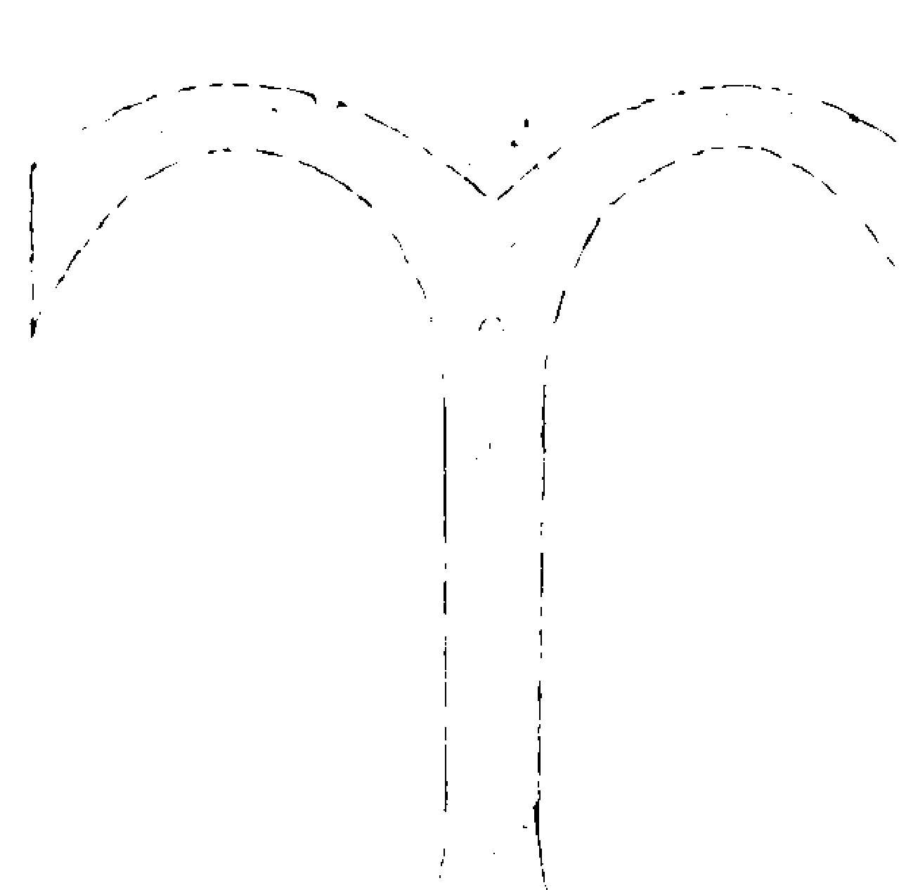

當一個人面對陌生人事物時，會本能以特定形式自我包裝，產生某種制約性反應，如表情、衣著、談吐、舉止等，瞬間給人留下初步印象。若最初給人的印象是不討好的，如上升天蠍跟冥王一宮的防備敵意，以及上升魔羯跟土星一宮的沉悶壓抑。無論其人真正性格本質究竟如何，已經不容易讓人想靠近，進一步認識，可說外緣不佳，往後要用更多時間事跡，予以證明考驗，才能改變給人的既定成見。

人際往來遵循相互回饋的機制，「如同鏡子般，你笑我也笑」，當行星落入一宮時，行星所散放的功能與動機，直接影響到宮位一方的自我認同，本能予以特定的回應。例如太陽落入一宮時，彼此對能力形象產生高度認同，相互期許並尊重，易建立重要公開關係；當月亮落入時，本能生出親切熟悉感，自然而然情感交流，以生活分享相互照顧依賴；當金星落入時，引發強烈好感，對彼此外貌氣質看得順眼，輕鬆表現欣賞之意。

### The Twelve Houses

當木星落入時，一宮的言行舉止及生存態度，受到激勵、鼓舞及助益，木星扮演貴人使一宮生存輕鬆發展順利、心境樂觀開朗；當土星落入時，土星擔任教官要一宮負起責任，一宮感受管束壓抑，覺得沉悶無趣。當天海冥落入一宮時，雙方受集體潛意識所影響，若非一宮人生方向被扭轉，就是行事風格被改造。一宮的個人意志和自我認同，受天王的刺激顛覆，因而意外脫軌；受海王的迷惘撫慰，因而迷糊混淆；受冥王的操控挑剔，相處抗拒緊繃。

人際關係中的一宮，特別容易顯現出來，被外人看到雙方性格作風和行為意志的差異。一宮的往來互動，可增進雙方運用生命活力，有利肉體生存的能力展現，也可能形成一方想要支配主宰，另一方堅持立場的意志抗衡，互不相讓，正面衝突進而大動干戈。當一宮自身有太陽、火星、天王、冥王等落入時，將明確顯露主觀意識，如激進、衝動、偏執、自我中心等。一旦遇到他人行星落入，一宮的主觀意志受強烈反應，認為對方發動挑戰，容易針鋒相對擦出火花。

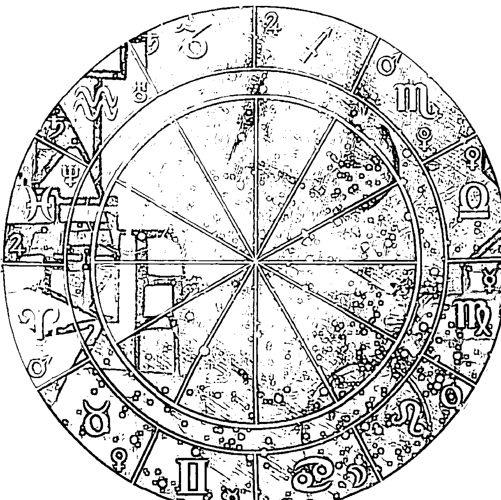

如果一宮本身並無主星，當他人行星落入時，則反應較為被動不顯，則根據不同行星性質，引發不同的自我表現。例如當女方太陽落入男方一宮時，男方的外在形象、自我認同及能力展現，因女方的期待與肯定，無意識受到刺激，特別表現出陽剛特質，行事作風有擔當氣魄，不讓英雄氣短。反之女方月亮落入男方一宮時，男方的形象作風、情緒表達和內心安全，受女方的敏感焦慮及情緒依賴所影響，不自主反應出溫柔細膩及情緒化面向，緩緩產生私密的情感交流，時有兒女情長。

### The Twelve Houses

### 第一宮的初步印象和人格形態

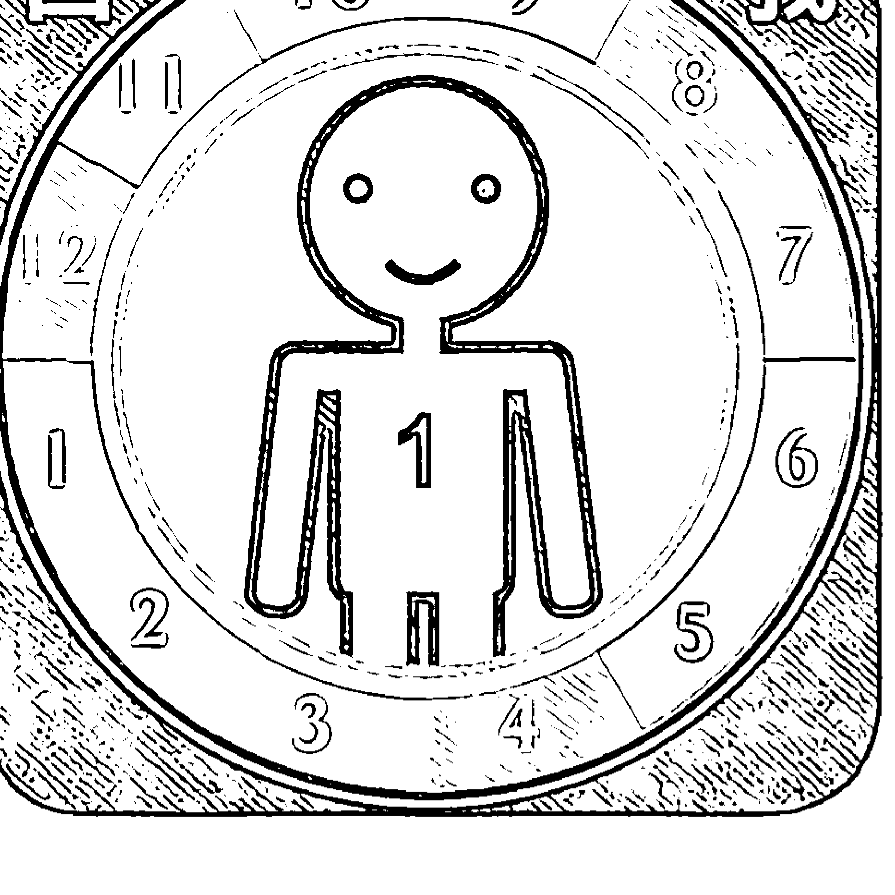

### 【關鍵主題】

- 奮鬥夥伴、勵志監督
- 能力激發、表面互動
- 投射對象、形象仿效

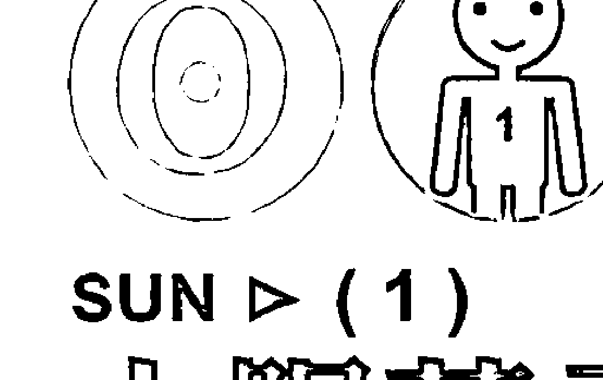

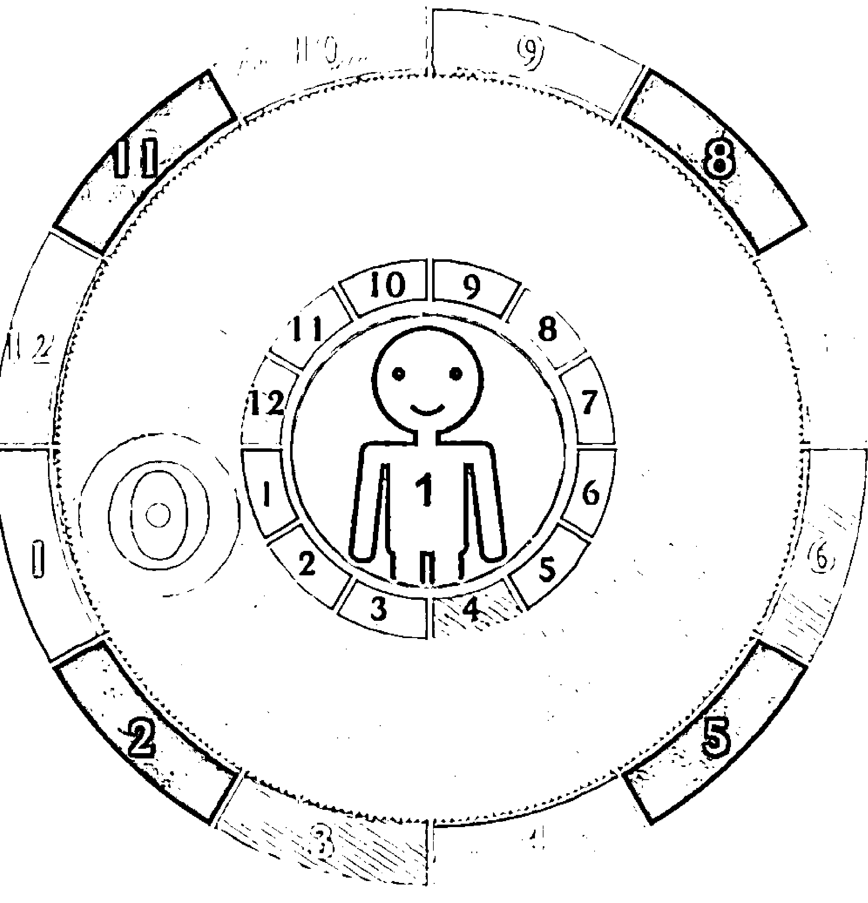

#### SUN ▷ (1) 太陽落入一宮

太陽落一宮在一般關係中，太陽鼓動一宮盡情釋放自我，期待一宮表達上升星座的特質，太陽的熱烈強化一宮的自我認同。如太陽天秤期許上升天秤，展現人際互動與公關能力的形象，上升牡羊座則受太陽牡羊所影響，競爭性及自我中心特質更加突出。

太陽星座與雙方關係的真實本質有關，一宮的上升星座，如與太陽是相同星座，自然具有親和性，一宮較不會自我隱藏。例如上升落在射手座，一宮範圍跨越兩星座，太陽對其一親切，另一則陌生。太陽射手落上升射手一宮，雙方將是熱情的朋友關係，太陽摩羯落上升射手的一宮，彼此則是嚴肅的工作關係，兩種不同的能量，都刺激一宮的自我呈現。

在社會關係中，太陽是積極進取的能量，主動找一宮共事，激活一宮的自我彰顯，太陽傳遞星座的特質、意見與態度，透過一宮強力表現。太陽讓一宮自信增強，能力充分發揮，主導一宮適應社會生存，有助工作表現及形象塑造。例如太陽處女認為上升處女有細節工作能力，一宮受到熱力感召，自信展現工作成果，迎向太陽的能量。若是太陽天秤落上升處女的一宮，則一宮較無法展現親和魅力，社交公關的能力不足以讓太陽天秤滿意。

在兩性關係中，太陽是主觀的一方，對一宮有向心力，宮位一方則較客觀，不完全受太陽左右。一宮有他人行星落入，宮位易感受到行星的需求，有自覺配合行事，或有能力抽離關係。太陽無論是男是女，都主導雙方互動，藉由一宮展現自身特質，備感榮耀光彩。太陽期待一宮反射自身的陽性能量，未必對一宮有其他要求，雙方往來公開化，不一定有私人交情。

一宮如是女性，通常配合度高，較能滿足太陽男的強勢要求，一宮如是男性，覺得太陽女個人主義太強，凌駕本身意志，因面子尊嚴顧慮，不易發展親密關係。不同於太陽落入七宮時，太陽要求雙方有所一對一的互動，常建立起親密的情感伴侶，以及重要工作夥伴關係。

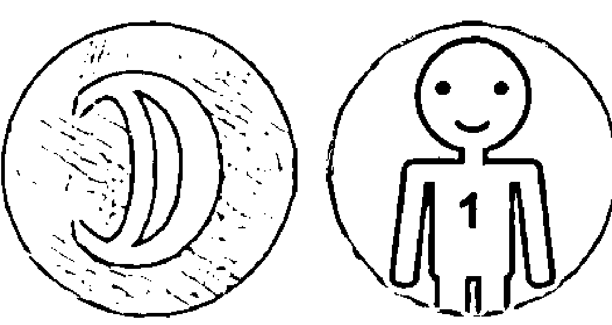

### 月亮落入一宮

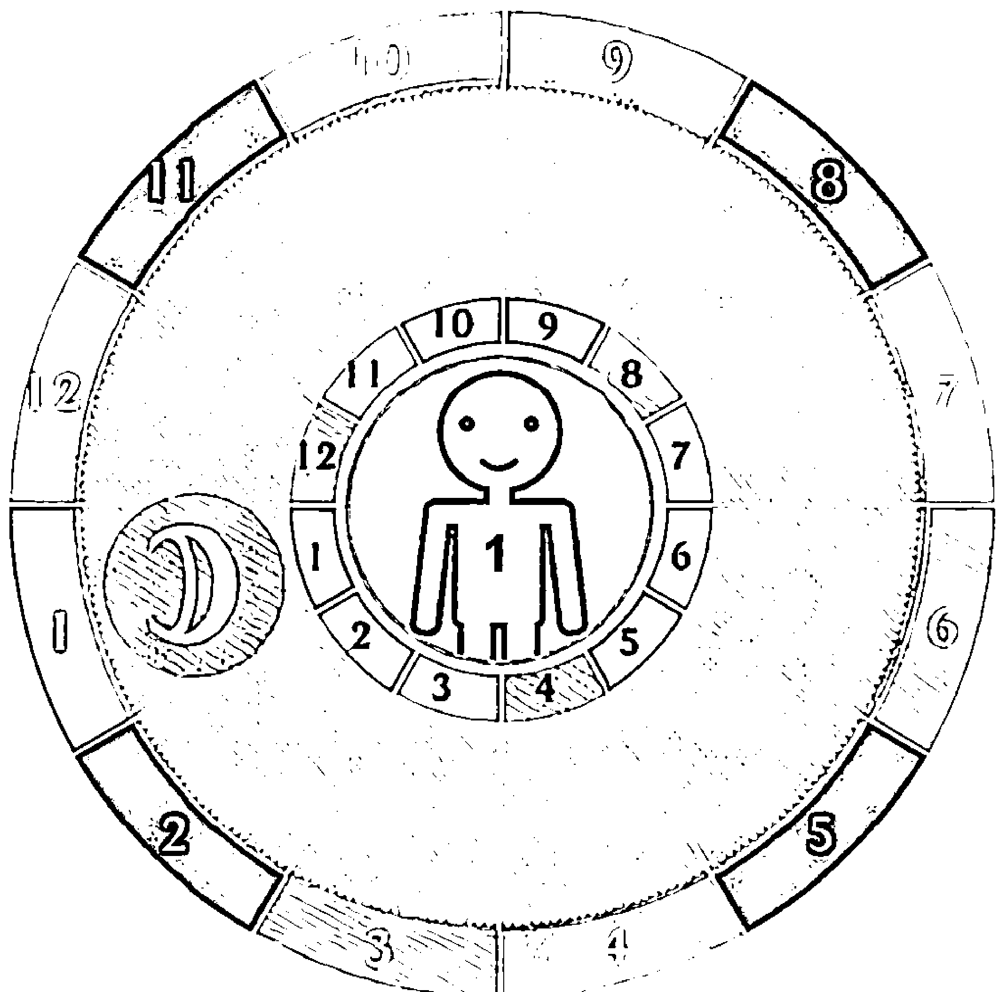

月亮落一宮在一般關係中，月亮有寄託依賴的需求，容易對一宮表達私人情緒，傾吐內心感受、情感好惡及童年往事。一宮察覺照顧月亮的必要性，會耐性聆聽月亮心事，久而久之養成相處習慣，月亮視一宮為替代性家人。月亮若本身和諧相，將使一宮展現溫柔體貼的一面，私下情感交流頻繁，成為親密分享的朋友。月亮若本身挑戰相，常因負面情緒困擾，影響一宮的心情穩定及日常生活，一宮不堪其擾的話，可能迴避互動。

在家庭關係中，若子女是月亮，象徵親子間有難割捨的親情臍帶，子女易養成戀母、戀父、戀家等情結，依賴家庭資源生活，很難真正離開父母身邊。如父母是月亮，特別關注子女的個人發展，正面期待與焦慮擔心溢於言表，寄望子女長大後獨立自主，不再依靠家庭，進而反哺父母安穩生活。月亮與一宮若無血緣關係，年紀又有相當差距的話，雙方常因相處感覺親暱熟悉，建立起乾爹娘與乾子女的關係。

在兩性關係中，一宮對於月亮的情感反應，有本能性的回應，產生莫名的熟悉親切感，有時弄不清是浪漫愛情、朋友情誼或親情依賴。一宮主動關懷月亮的情感狀態及生活需求，雙方建立情緒餵養關係，月亮喜歡與一宮分享食物，常找對方吃飯，送吃的喝的給一宮，藉生活照顧表現母姐親情，彼此常有家庭、親友、飲食的往來互動。月亮反應特別敏感，在意一宮對自身親人的態度，容易覺得被影射而受傷，若一宮未即時安撫月亮，月亮容易神經質發作，雙方分分合合、關係藕斷絲連。

### MERCURY ▷ (1) 水星落入一宮

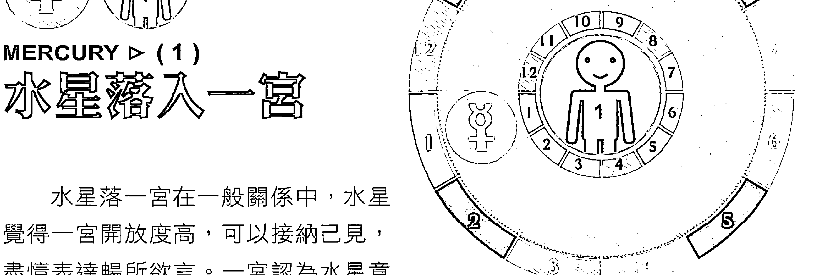

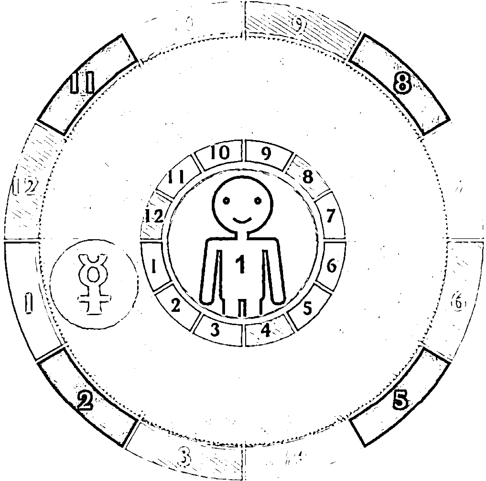

水星落一宮在一般關係中，水星覺得一宮開放度高，可以接納己見，盡情表達暢所欲言。一宮認為水星意見有實用性，雙方一見面頻繁交流，像有說不完的話，時刻停不下來。水星踴躍發問，刺激一宮思考，一宮提供較客觀的理解，較深刻的思維，提供個人意見答覆水星。一宮將水星隱藏未覺的想法動機，予以點破說明，使水星釐清思路、恍然明白。

在社會關係中，一宮常對水星闡述人生發展的計劃，水星提供有用的生存之道給一宮，談話不是風花雪月的私人閒聊，是攸關雙方做人處事的風格、策略及評價，常見於專業的諮詢服務中。雙方透過特定主題的交談，頻繁對話思辨，在個人化的專業表現上，相互借鏡切磋，透過心智互動，看清自我思考表達的不周全，藉以反躬自省，常見於同學、同好及師生的心智成長關係。

在私人關係中，水星落一宮不利親密關係的互動，如水星本身挑戰相，一宮敏銳的自我意識，容易引起水星喋喋不休的反應，雙方縱然長篇大論，也難以有效溝通清楚。水星就算表達客觀見解，也將觸及一宮的自我認同、外在形象與角色扮演，一宮覺得飽受批評、挑釁與諷刺，更加堅持個人作風，雙方不時針對無關緊要的瑣事，唇槍舌劍言語衝突，顯得言不及義、雞同鴨講。若水星是男性，女性欣賞男性專業的心智表現，但水星愛說不說，引起一宮不滿。若一宮是男性，水星心智能力被誘發，口語表達旺盛，性別角色中性化，男性不易產生浪漫感受。

### VENUS ▷ (1) 金星落入一宮

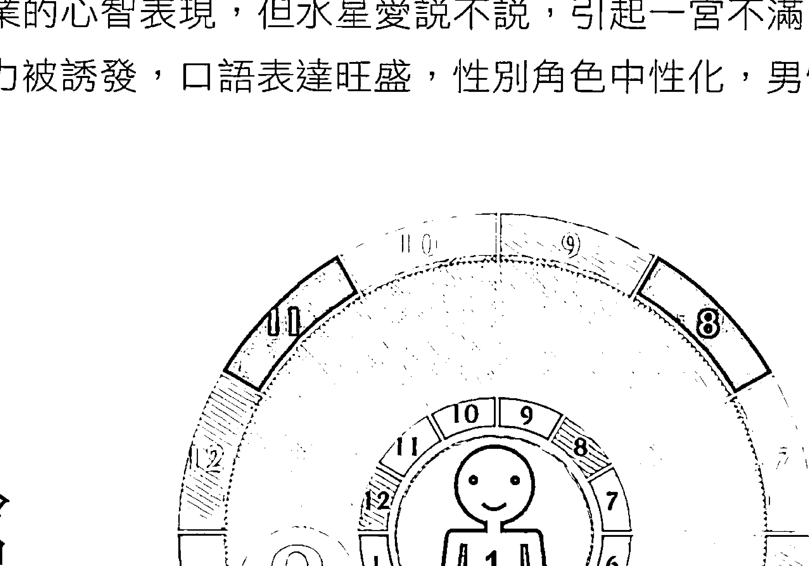

金星落一宮在一般關係中，一宮擁有過人才華或是耀眼外貌，金星欣賞一宮的外在條件，樂於擁有如此友人為伴，一宮感受金星的稱許及喜愛，大方秀出長處優勢。一宮的外在形象及行事態度，是金星欣賞的戀人原型，雙方不一定真的談戀愛，或多或少藏有浪漫因子。金星喜歡與一宮連袂出現，把一宮當作展示對象，共度輕鬆愉快的休閒娛樂，滿足受人艷羨的浮華虛榮。

### 內行星入宮位～第一宮

在社會關係中，金星提供實質好處，讓一宮利用條件資源，展現獨特才華及美好形象，共創社交表演的娛樂舞台，營造公開的賺錢機會。金星認為一宮像精緻的藝術品，百般恭維奉承，使一宮首肯、願意配合，讓發揮創意設計包裝，展現給外界欣賞，共創牟利商機，雙方可能形成藝術家、模特兒、明星與知名經紀人之間，彼此與有榮焉的關係。

在兩性關係中，一宮獨特的氣質、外貌及作風，激發金星的浪漫感受，一宮大膽表明欣賞，金星察覺一宮知情識趣，心動於一宮營造的氛圍，對關係感受驕傲愉悅，接受一宮的示愛。一宮原本對金星並無深情，但覺得金星夠關注自己，樂於被取悅討好，相處時心花怒放。如果雙方其他緣分夠深，將因此走上紅毯，但不保證關係穩定持久，因婚後生活的日常相處，將使金星偶像崇拜的光環，迅速褪色黯淡無光。

當金星是女性時，除了看上男方資源外，也寄望一宮陪伴玩樂享受，滿足奢侈的物質需求。金星被一宮的經濟條件引誘，願意相互結合，但其懶散、放縱、不求上進，帶給男性心理壓力跟金錢負擔。當金星是男性時，女性對男性的讚美取悅，久而失去興趣，會設法脫離處境，但金星永遠衷情於一宮，對一宮的情感如果落空，將會惆悵失落。

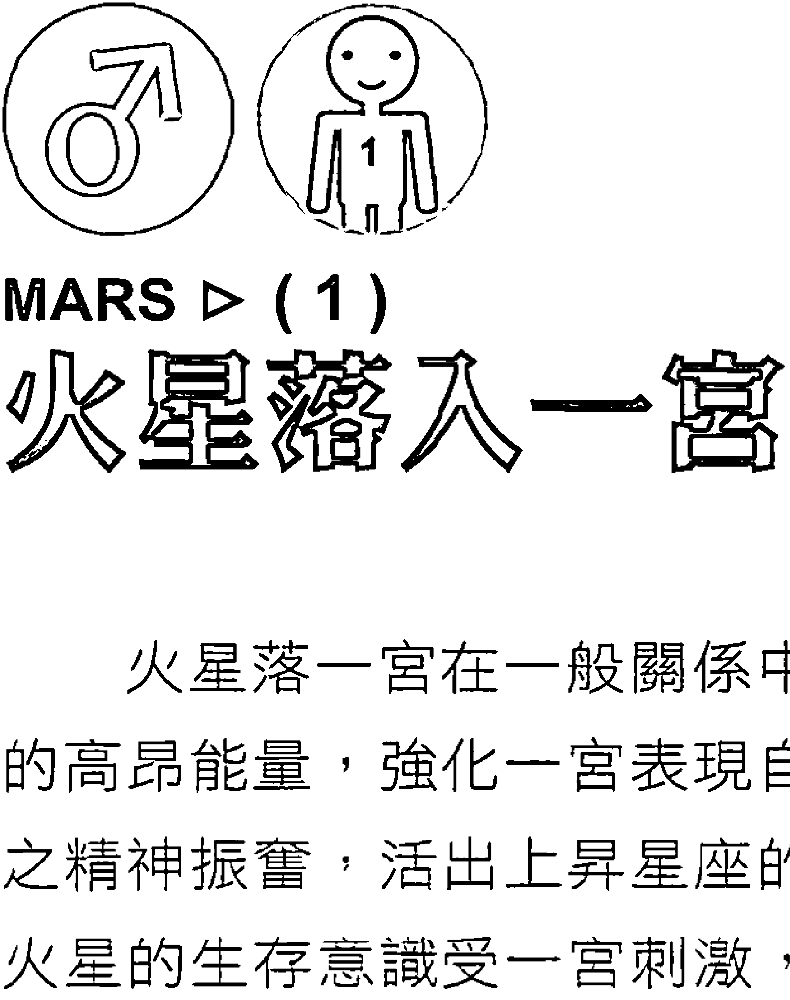

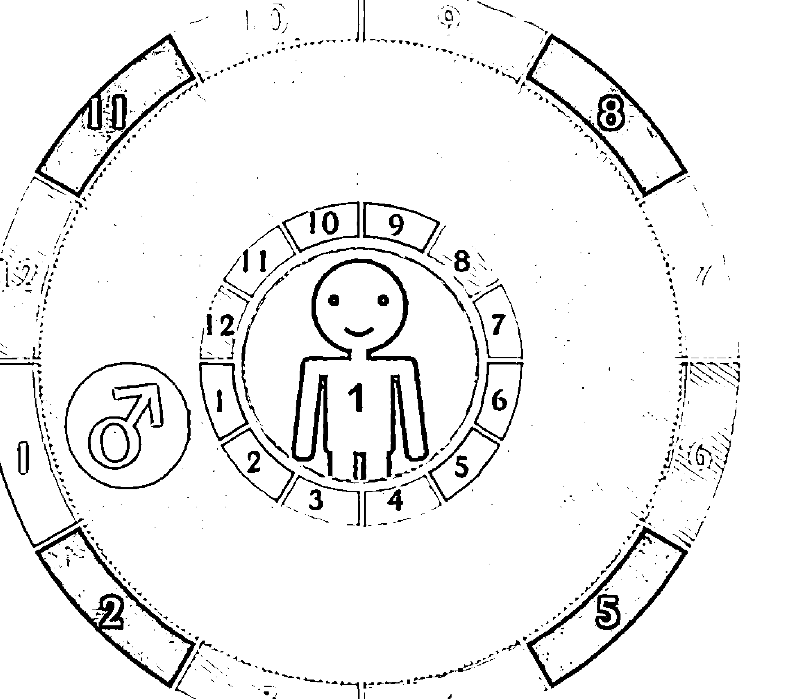

火星恢復元氣，鼓舞雙方展現生命活力，積極為人生目標採取行動，有利任何勞動、運動、冒險、開創性、動態性的競合關係。火星若和一宮刑剋，如同棋逢對手，雙方不服輸鬥志被激起，公開場合較勁，正面爆發衝突。

在職業關係中，火星與一宮共事為伴，自然表現出興奮、自信與滿足，火星不斷促使一宮行動，共同完成任務，雙方適合開創、挑戰、冒險及業務導向的合作。火星臨時起意的急性子，有時讓一宮措手不及，準備不周，難以配合火星的快節奏。若雙方缺乏更深的聯繫，火星的自我中心及三分鐘熱度，常因發現新目標，主動離開一宮，另尋其他合作對象。

在兩性關係中，一宮的外在表現符合火星的慾望類型，火星受一宮外型條件吸引，本能被激發躍躍欲試，以擁有一宮為目標。當火星是男性時，女性激起男性原欲，立刻行動追求滿足，快速征服一宮的肉體，但女性不覺得自己只是慾望的對象。當火星是女性時，女性激勵男性表達氣概，一宮容易被火星激怒，動機不全是性慾驅力。如果雙方有其他的深層聯繫，一宮將使火星興致不減，永遠吸引主動接觸，共創充滿活力、挑戰性高的互動。

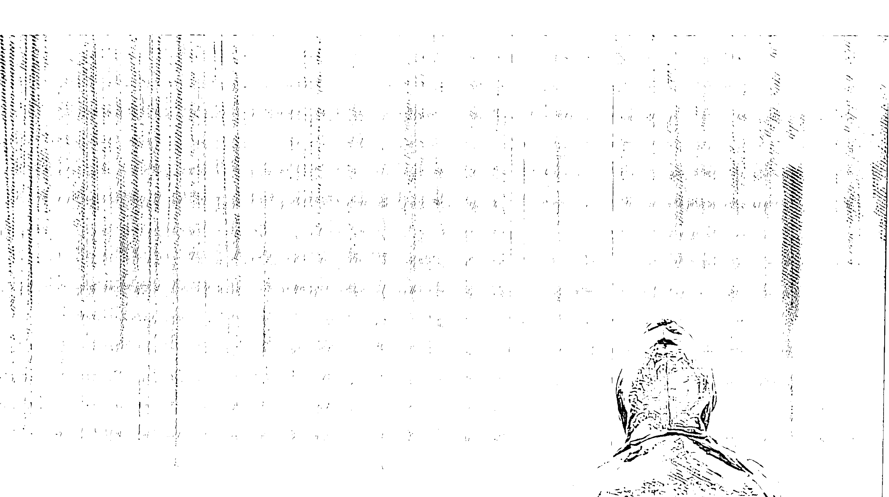

### 外行星入宮位～第一宮

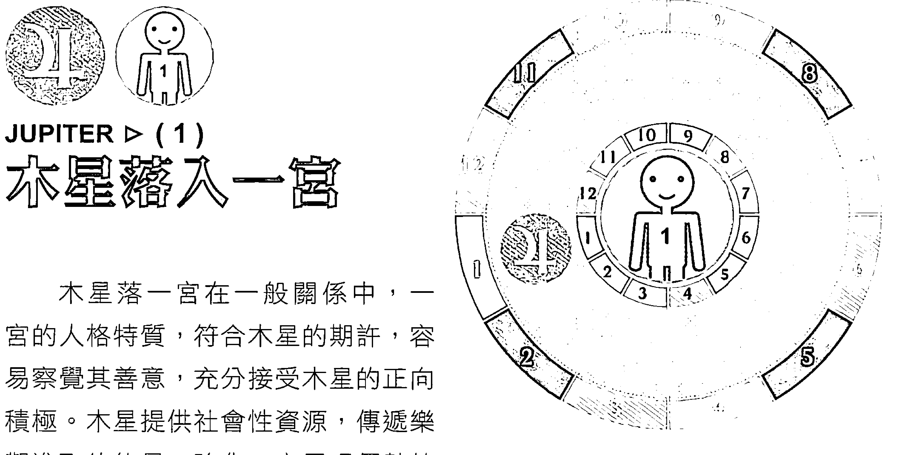

#### JUPITER ▷ (1) 木星落入一宮

木星落一宮在一般關係中，一宮的人格特質，符合木星的期許，容易察覺其善意，充分接受木星的正向積極。木星提供社會性資源，傳遞樂觀進取的能量，強化一宮展現優勢特質，幫助一宮盡情活出自我。一宮給木星展現知性引導及慷慨給予的充分空間，使之助人為樂、感覺良好，不覺得被拒絕及掃興，一宮態度越開放，遇到的人緣就越佳。木星幫助一宮角色升等，將原本職業、形象及自我認同，大幅予以改善，得到社會肯定。木星與一宮互為貴人，不同於木星落七宮時，是把七宮當合夥人，在伴侶關係及合夥共事方面，給予七宮一方助益。

在社會關係中，木星與一宮往來開放性高，相處輕鬆不受拘束，較無現實責任及束縛壓力。木星具有文化、教育、哲學、藝術方面的思想、知識及意識型態，影響一宮的生涯發展，雙方有緣從事社會性的文化教育、藝術表演、休閒娛樂等。木星的慷慨大方，是社會當下潮流趨勢，藉由個人傳達的發展能量，不純粹是木星個人意願，而與整體社會情境相關，所謂形勢比人強、時勢造英雄。若木星未和一宮個人行星成相位，雙方將以社會互動為主，未必有私下來往，如木星找一宮投資文化出版，藉其社會資源，達成雙方高層次的理想。

在私人關係中，木星充分提供一宮自我提升的指引及資源，透過文化教育及休閒旅遊，使一宮生命樂活，釋放生存壓力。木星鼓舞一宮表達教育、休閒、藝術、繪畫、舞蹈、歌唱等才能，活出開放本性，一宮透過文化藝術的表現，使木星感到得意，更加信心滿滿。若一宮本身有月亮、土星、海王落入，常因性格膽怯、自我壓抑，感到人生苦短，一旦遇到木星，較易敞開心胸、放懷接納生命美好。

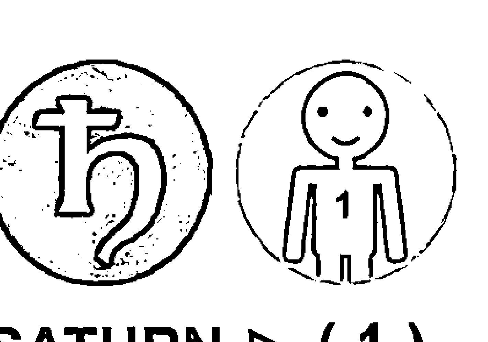

#### SATURN ▷ (1) 土星落入一宮

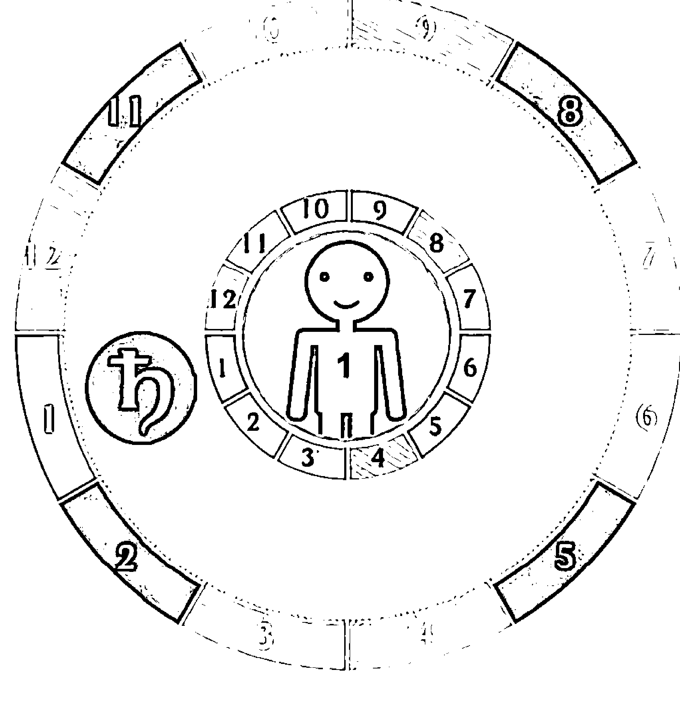

土星落一宮在一般關係中，一宮在生存方面的現實處境，激發土星責任感，要求一宮認同世俗價值、認真做事。土星懷有世俗考量及功利目的，對一宮高標要求，培訓一宮適應社會，管束壓抑一宮的自我表達。一宮心理壓力很大，覺得土星小氣吝嗇，和土星相處沉重、乏味、不開心，常感喘不過氣。

土星通常年紀大一宮不少，透過深厚的身分、資歷及權威，給一宮指導訓練，一宮既覺得要盡責，又感到很大壓迫。如土星與一宮互剋，一宮不肯乖乖聽話會逃避責任，不想履行義務，得到現實教訓，生存更加困難。如土星與一宮和諧相，一宮藉由土星的苦心，培養獨立生存的意識，磨練出穩定的謀生能力。

在社會關係中，土星認為一宮有助社會表現，一宮覺得土星有現實智慧，雙方有宿命性的責任感，相互扶持共同打拼，謀求生存穩定，土星是主動開創工作的一方，一宮則是承接任務的一方。土星如是上司，一宮下屬特別難受，不論上司說什麼，都覺得自己受指責；如果土星是下屬，則上司覺得權威地位被挑戰，部屬不知為何讓長官不快。

在私人關係中，土星如和一宮個人行星有相位，代表極強現實連結，關係是今生必修主題。土星的無形壓力，使一宮的本能飽受嚴格制約，很難自然親密接觸，除了職業、工作、家庭、財務外，不想與土星額外互動。重要伴侶不像工作職業，可以說換就換，土星的權威來自年紀地位，一宮要學習不把土星的壓力個人化，否則將陷入畏懼的囚籠。不同於木星和一宮的放縱玩樂，土星和一宮砥礪刻苦，能夠忠誠持久，完成艱難的生存任務。

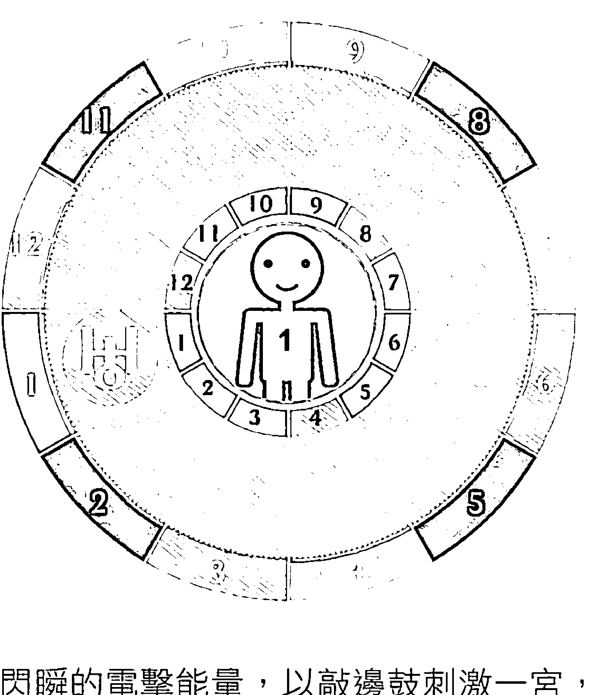

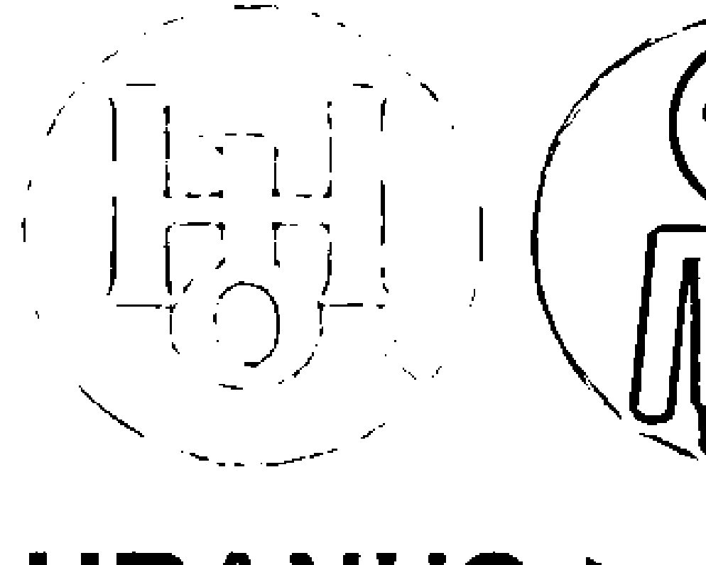

#### URANUS ▷ (1) 天王星落入一宮

天王星落一宮在一般關係中，天王神經亢奮，以層出不窮的奇怪點子，帶給一宮人生進化契機。天王百無禁忌的前衛創意，激活一宮的改革潛能，無意開拓一宮生命的冒險。天王閃瞬的電擊能量，以敲邊鼓刺激一宮，不經意打開心防，回應程度因人而異，如天王和一宮內行星有相位，一宮較易出現個人反應，大膽突破自我設限的模式，脫離陳舊的保守作風，活出嶄新人生可能。若天王本身受克，其反覆無常疲勞轟炸，變化多端的古怪要求，無預警驚嚇一宮，破壞原本的自我紀律。

在社會關係中，一宮和天王平日鮮少往來，不常私人互動，一宮的資源情境，誘發天王的實驗精神。一宮發起新奇活動，邀天王參與發揮專長，實驗特殊創意，嘗試另類行為，顛覆社會規範的一般準則。在家庭關係中，若天王是子女，沒有倫常觀念，和雙親不分長幼，父母不扮演權威角色，縱容子女玩耍，態度無法無天，比朋友更沒大沒小。若父母是天王，將以前衛理念啟發子女，但性格行為不穩定，無法給子女安全感，養成一宮獨立自主的性格，親子互動獨特且疏離。

在私人關係中，天王出人意表的無厘頭、發神經，一宮視若平常，容許天王胡鬧。雙方不合乎伴侶的互動，也不遵從社交的禮儀，若非短暫一夜情，老少不倫戀，就是不受拘束的同好友誼。天王瞬息萬變，無意間違反他人期待，使一宮寄望落空、詫異不解，視天王為奇葩怪胎，彼此往來不易維繫，也不至於輕易結仇。若天王能量高，將使一宮知性層次提升，若天王能量低，則讓一宮精神不安，一般人對天海冥的宇宙性力量，難以察覺也無力抗拒。

#### NEPTUNE ▷ (1) 海王星落入一宮

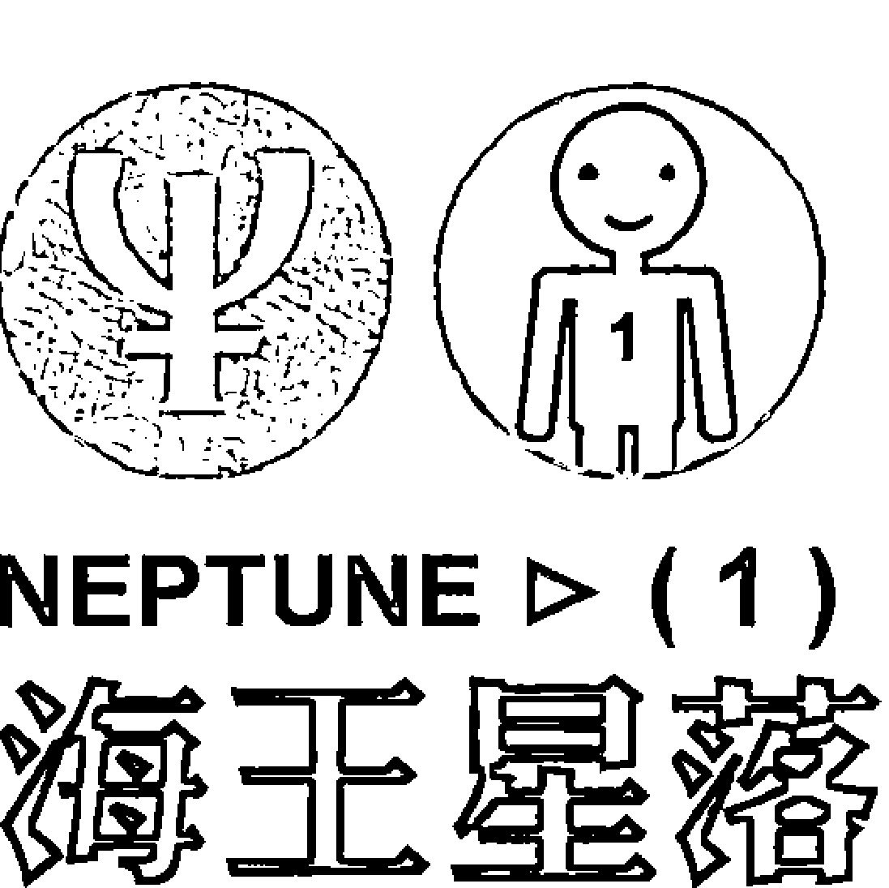

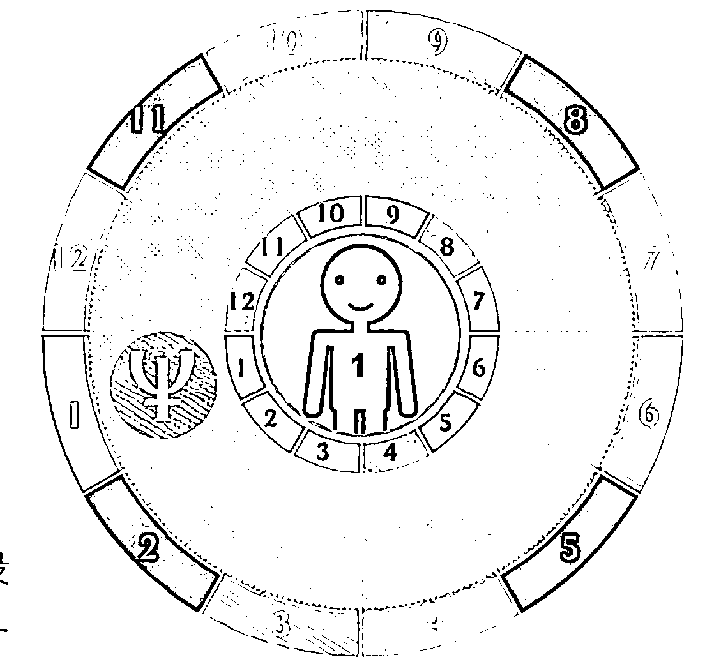

海王星落一宮在一般關係中，一宮的人格特質，成為海王夢想的投射，海王嚮往一宮的生活情境，對一宮充滿美好的想像。海王製造迷霧使一宮誤解，以為經由海王指引，可以實現人生夢想，尋找理由藉口，運用一宮資源維持生存。海王自我陶醉，夢幻感受比一宮更強，關係本質朦朧化，海王分不清人我界限，在一宮的言行舉止中，看到無窮夢想與頹廢墮落，兩極特質同時彰顯。海王傳達訊息落差很大，時而展現美妙的浪漫與藝術，活出崇高面向，啟發一宮的靈性智慧；時而展現病態的缺陷，欺瞞混淆一宮，一宮能躲則躲，避免隨之起舞。

在社會關係中，海王傳遞不切實際的虛幻計畫，蠱惑一宮相信，投注資源讓自己圓夢。一宮視海王為夢想家、藝術家及靈性上師，不自覺成為海王的代言人，雙方從互動中滿足同情、諒解與拯救的需求，適合非世俗性的心理諮詢、情感療癒、藝術創作、宗教靈性等往來。如海王和一宮互剋，海王自欺欺人，引發溝通不良、產生誤會及錯覺，彼此一廂情願錯誤期待，隨後夢想破滅，不適宜現實相關合作。

### 外行星入宮位~第一宮

在私人關係中，海王對一宮態度不確定，感覺時好時壞，令一宮感到不安，海王混亂影響一宮，一宮的不平衡也影響海王，雙方有超世俗的心靈感應。海王催眠一宮，在精神上依賴自己，關係中有隱藏的奧秘，外界很難看清現實。海王不由自主裝可憐，扮演弱勢病態及精神耗弱角色，期待一宮捨身救贖。如雙方相位互剋，易使自身反應出彼此弱點，負面情緒互相干擾，往來中隱藏精神晦暗，不利身心健康。

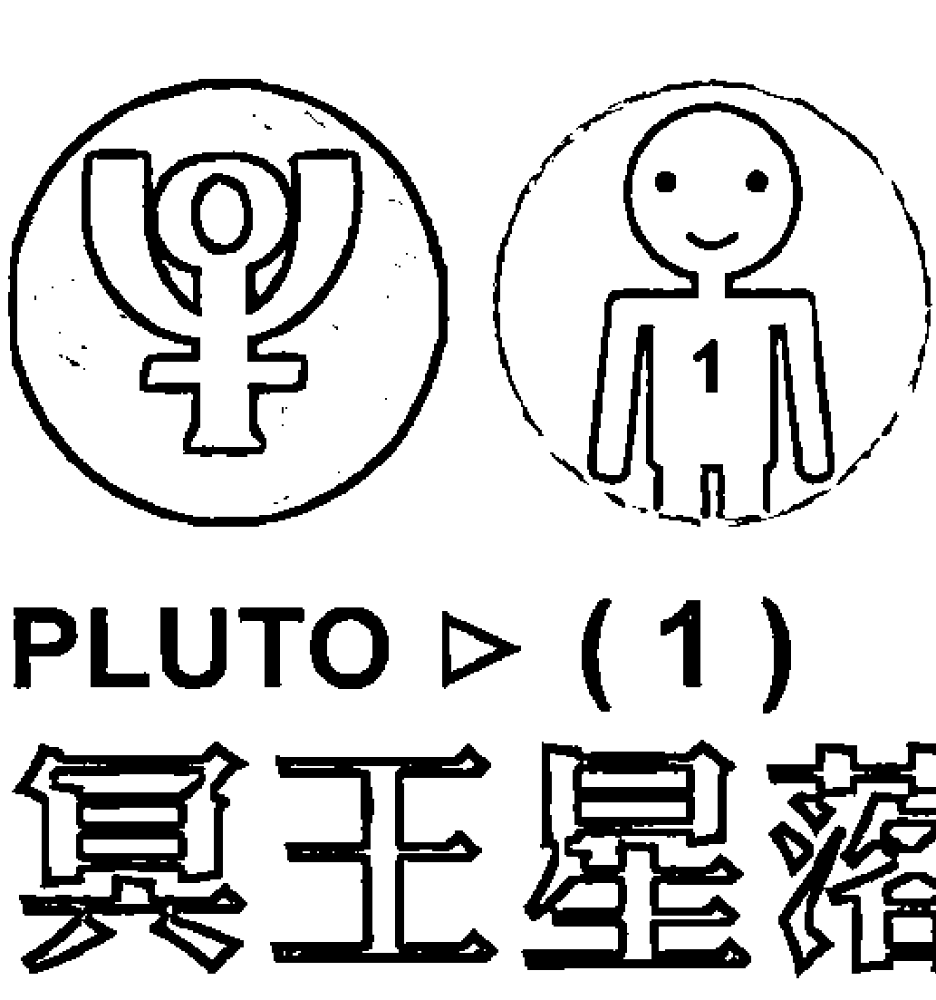

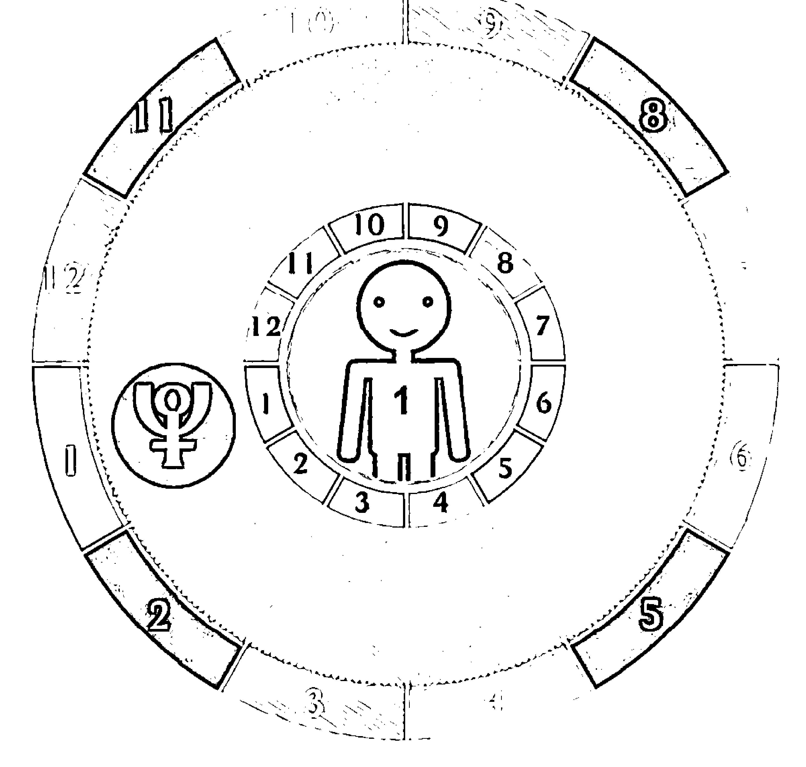

冥王星落一宮在一般關係中，冥王對一宮的外在形象，有嚴苛的挑剔，強迫一宮改頭換面。冥王潛意識轉化一宮，激發一宮的生存潛能，強化一宮行為的自主性，學習自我控制，得以適應社會生存。一宮反應可能兩極化，若非回應冥王期待，脫胎換骨徹底改造，表現更厲害有深度，使冥王淨化力得以發揮，就是拒絕承受高壓，避免與冥王往來。

若冥王本身剋相，將以強勢作風，潛在強勢控制一宮外在言行表現，操縱一宮的生殺大權。冥王專制、霸道及不講理的作風，使一宮恐懼厭惡，不自主引發危機情境，雙方均感羞辱，互動緊張不安。天海冥落入他人一宮時，代表超個人性的世代能量，不常對一宮產生個人認同感，但集體意識自然藉由行星一方傳達，影響一宮的行為意識。不同於冥王落入十二宮，是冥王挖掘十二宮的內在精神，不干預十二宮的外在行為。

在社會關係中，冥王深刻的洞察力，看穿一宮自我認同的糾結，對其生涯發展有不小的影響，適合當一宮的精神醫師及靈性上師。冥王一宮的人際往來，潛藏有權力對峙，不適合朝夕相處，需要簡化往來關係。冥王的極端態度，可能摧毀原本互動，公然爭議敵對，莫名其妙反目成仇。冥王徹底的身心改革，一宮只能偶爾聽示，不宜太常見面，否則壓力很大。雙方要犧牲表面的利益，改用電話簡訊示意，才能削減負面能量，不致引發事件。

在私人關係中，一宮形諸於外的生活，冥王特別看不順眼，企圖操控行為，全天候擔任魔鬼教練，以精神鍛煉改造一宮。一宮如不耐身心折磨，心中暗生憎恨，無意識引發危機，與冥王對抗決裂，脫離關係束縛。如冥王與一宮互剋，顯示有業力牽纏，最好少單獨相處，避免建立親密關係。冥王無明的執念，將引起麻煩糾紛，製造罕見的荒謬事件，使雙方捲入爭議。冥王被迫出面處理，解決現實危機，造成深層罪惡感，從此不相往來。

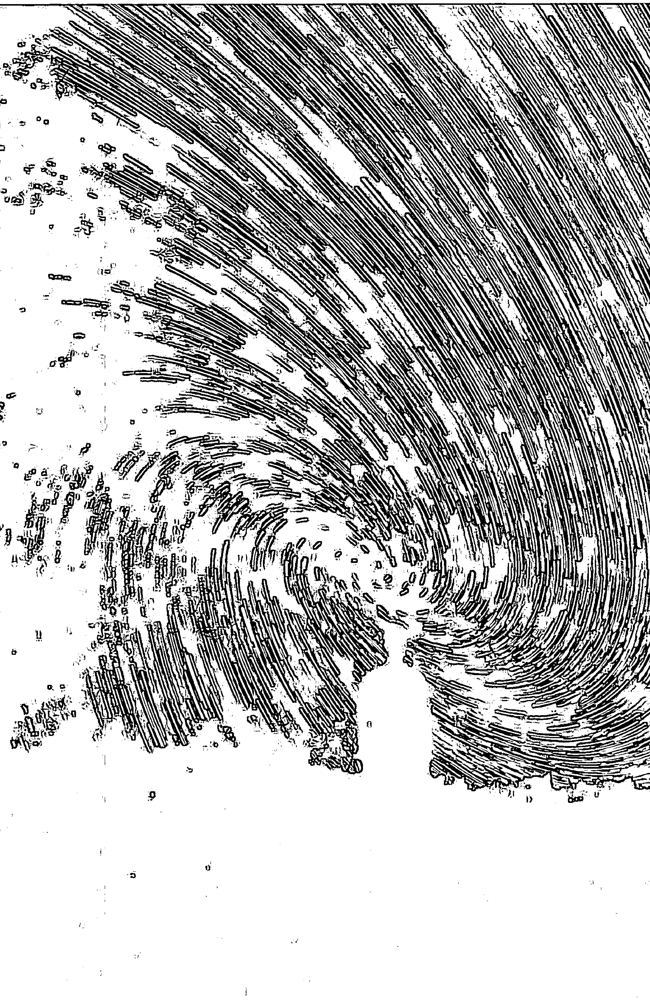

## Quantum Astrology

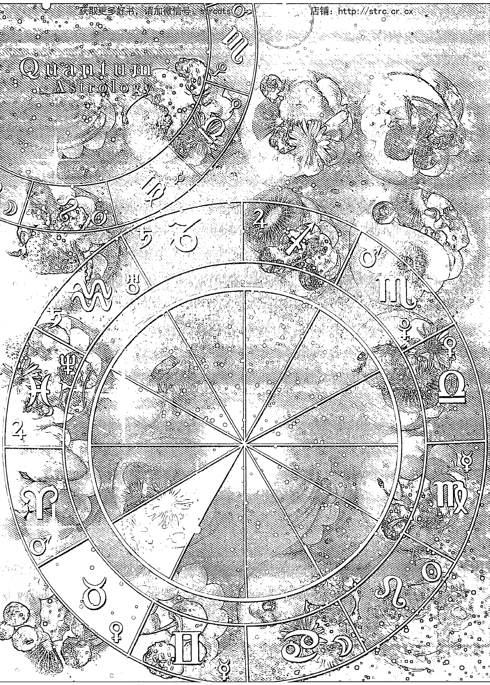

Synasty

### 第二宫

#### 【物質宫】

- 飲食購物
- 工作夥伴
- 金錢往來
- 理財諮詢
- 生活照顧
- 生產製造

### 第二宫的物质生存与价值观念

第二宫，掌管一个人的金钱收支、物质享受、生活方式和自我价值，是我们对肉体存活所需资源的态度，对饮食是珍惜利用，还是浪费耗损，对日常物品是堪用就好，还是不断消费收集，有多大的占有跟享受欲，对于触手可摸的具体物质，有多强的生产制造力，与何种品味鉴赏力。

第二宫代表自我价值的设定，对自己的时间努力付出，值得换取多少报酬，具有的基本标准，掌管个人的基本经济。正面的二宫发展，可在己身的努力付出、时间耗费、心血创作，和实质的金钱收入间，取得平衡关系。使人利用金钱所得，适度消费购物，犒赏工作辛劳，并拥有物质丰裕、不虞匮乏的人生，感觉活得充实有意义。

### The Second House

负面发展的二宫，若非极为看重金钱的安全感，赚再多都吝于用钱，就是物欲过强，拼命购买收藏，企图用物质填满生活空虚。另一种状况则是，看轻自己的生产服务，自认付出的时间努力，不配得到满意回馈。因自己不重视个人价值，总觉得在做童工，受他人剥削，而心生怨怼。

### The Twelve Houses

当天王落入时，将激发金钱的空想实验，带来意外收入及不测支出，颠覆双方财务稳定。天王无意识的刺激，使二宫谋生方式彻底转变，天王奇特的花钱作风，带给二宫经济不测跟实质损失。

当海王落入时，消弭双方对金钱的界限原则，常因相互救赎的动机，挥霍钱财物质。海王过于梦幻的理想，以及不负责任的迷糊，使二宫无条件牺牲奉献，甚或莫名遭受损失。当冥王落入时，双方把财务资源当成斗争工具，用来掌控对方身心。冥王的黑魔法，可能无中生有创造可观规模，影响二宫的金钱收支；冥王的挑剔质疑，淬炼二宫的产品质量，使二宫赚钱能力强化，符合冥王苛求。

人际关系中的二宫，不只限于银货两讫的商业买卖，若在情侣、夫妻、家庭成员间，代表双方有密切的财务往来，可能一起消费购物、合伙做生意、共同投资，彼此的金钱供给及物质享受，对关系维持举足轻重。

### The Second House

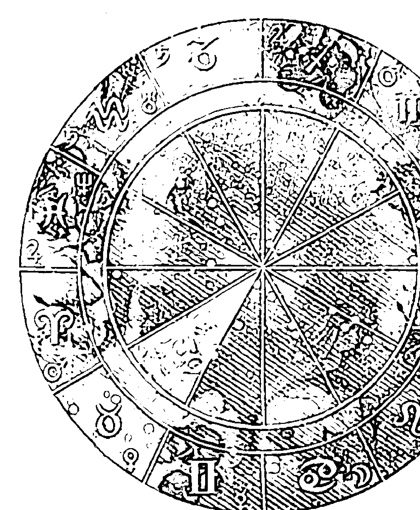

行星如果与二宫互克，象征金钱价值观有所不谐，对于金钱购买的具体物品，彼此抱持不同态度，容易为柴米油盐、水电瓦斯的基本用度发生争执。双方对钱产生歧见时，因牵涉私人生活，不仅实质利益冲突，也伤及感情，影响关系稳定，最终基于现实经济，决定继续维系抑或分道扬镳。

人际关系中的二宫如果互动和谐，相处合作能一起赚钱生财、共度物质丰裕的舒适生活，彼此是对方的财神爷。二宫的往来除了运用金钱，共享丰富的物质外，高层涵义在于彼此互助增值，共创更高的经济价值，双方相处时勤于生产赚钱，乐于花钱消费，促进经济流通，充裕更多人的口袋。

### The Twelve Houses

### 第二宫的物质生存与价值观念

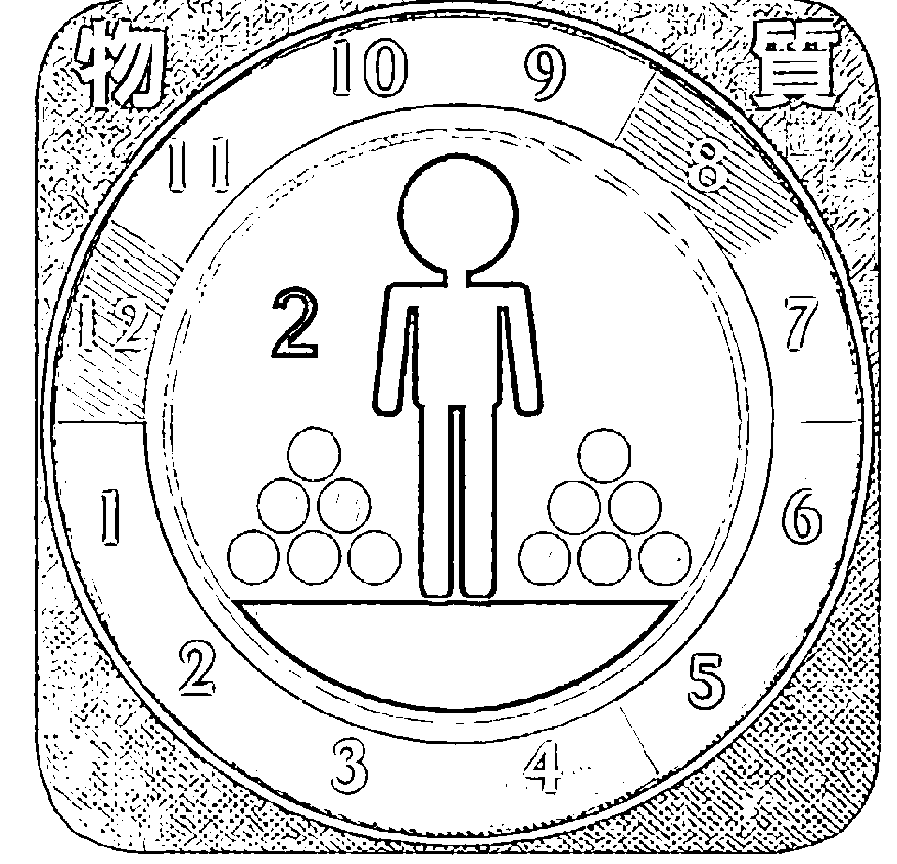

### 【关键主题】

- 饮食购物、工作夥伴
- 金钱往来、理财咨询
- 生活照顾、生产制造

SUN ▷ (2)

#### 太阳落入二宫

太阳落二宫在一般关系中，二宫有实质资源，遇到太阳会展露慷慨，愿意花钱请客，表现高级的购物品味及消费能力，满足太阳尊严。太阳遇见二宫比较务实，引导二宫理性消费，提升二宫的经济状况，稳定其日常生活。太阳提供专业技能及人生经验，助二宫厘清经济状况，以金钱物质银货两讫的交易买卖，肯定二宫自我价值。

在社会关系中，二宫的商品贩售及服务提供的品质，影响太阳的接触意愿，太阳有消费欲望，光顾二宫生意，愿意付出较高价码，购买其服务及商品。二宫资源可能是实质金钱，也可以是专业能力，要太阳积极表示，才被激发奋斗企图。太阳如同采矿者，投注资金、技术、时间，挖掘二宫资源，二宫如同金山银矿，带给太阳巨大报酬。双方往来利益至上，有利合伙赚钱，一起作生意能具体执行，带来实质收获。如太阳本身克相，代表缺乏信心与能力，不愿用心负起经营责任，造成双方财务损失。如二宫本身无星，对太阳的赚钱计划，缺乏兴趣动机，难以稳定配合，长期获利需合乎正道。

在亲密关系中，太阳基于实质的需求动机，视二宫为私人账户及财库，一有需要就主动存入提出。二宫视太阳为谋生工具，仰赖其供给生活，伴侣有被物化倾向，相处缺乏真心诚意。双方重视经济稳定与物质享受，若不涉及金钱财务，太阳则不想与二宫互动。在家人关系中，经常藉由共同管理家族企业，买卖赚钱共同生活。

二宫对资源的态度影响太阳特质表现，如太阳天蝎落二宫，太阳是经理人，二宫是出资者，天蝎以金钱操作增加报酬，诱使二宫同意管钱手段。如太阳射手落二宫，太阳担任导师，教导二宫金钱的文化教育功能，从事冒险大胆的用途，鼓吹二宫将资产投入学习、旅游、投机等活动。

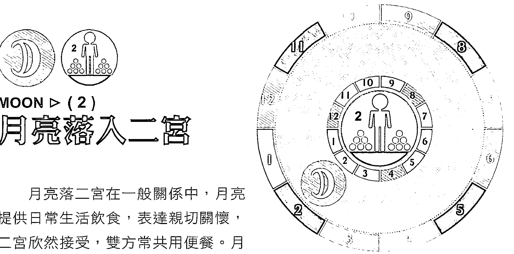

#### MOON ▷ ( 2 ) 月亮落入二宫

月亮落二宫在一般关系中，月亮提供日常饮食，表达亲切关怀，二宫欣然接受，双方常共用便餐。月亮对二宫的生活资源格外敏感，有时含蓄依赖，有时体贴付出，透过小吃小喝，与二宫情感交流。二宫以小钱小物回馈月亮，给予安全感，月亮得到情感滋养，有助自我价值稳定，不再患得患失。二宫对金钱的情绪反应及生活状态，让月亮有熟悉感，想要亲近，相互照顾。不同于太阳的理性主导，月亮迎合二宫生活习惯，寻找家庭象征，彼此有类家人情感。

在职业关系中，月亮精打细算，触发二宫开店作买卖的想法，培育二宫谋生安定化，双方适合餐饮、房地产、日常用品贩售等合伙。如月亮相位佳，有助双方积少成多、缓慢获利，反之双方易对钱财优柔寡断、焦虑不安，或因女性介入所影响，共同财务受损。二宫对饮食的态度，影响月亮的亲密感，如月亮处女落入二宫，处女担任管家仆人，携带有利保健的养生食物款待二宫，以实际有序的方式帮二宫打理财务。如月亮天秤落入二宫，月亮则扮演公关，邀请朋友与二宫共餐，介绍合伙赚钱的机会给二宫。

在亲密关系中，月亮常下厨作羹汤，对二宫生活习惯十分敏感，提供二宫日常饮食，有时生怕二宫不悦而闹情绪。月亮常送小礼物，以物质讨好作为情感展现，喂养二宫情绪，双方自然进入居家生活。月亮计较蝇头小利，格外关心生活开支，各自打着不同算盘，容易因居家习惯的差异，在日常开支的小钱上，产生担忧、恐慌及不安，掀起关系的风波。

### 内行星入宫位～第二宫

#### 水星落入二宫 MERCURY ▷ (2)

水星落二宫在一般关系中，水星对金钱财务的创意点子，二宫认为有价值，水星喜欢跟二宫谈用钱的想法，双方三句话钱不离口。水星对二宫花钱方式常有意见，二宫常请教水星关于金钱的问题，水星的看法虽然客观，但听不听在于二宫，建议缺乏实质影响力。二宫可能资助水星求学，在学习过程提供环境，培养水星心智成熟，完善足以谋生的知识。

在社会关系中，二宫提供舞台，让水星发挥言语、文字及传播能力，完成在两性关系中，水星属中性特质，无阴阳相吸的关键性，但双方在金钱价值、物质使用、生活态度是否契合，对彼此了解有若干影响。二宫对金钱的想法刺激水星的思考，如水星巨蟹落二宫，巨蟹易担忧焦虑，吐露内心对金钱的不安及恐慌，提供二宫保本至上、安全第一的理财建议。如水星狮子落二宫，狮子本性豪奢摆阔，可能吹嘘夸张的财务经验，鼓动二宫投资消费扩大手脚。双方沟通媒介在赚钱、用钱及存钱，水星若对金钱物质做出承诺，容易因价值观念的差异，空口白话失信于二宫，频繁为钱口角，但对关系好坏作用不大。

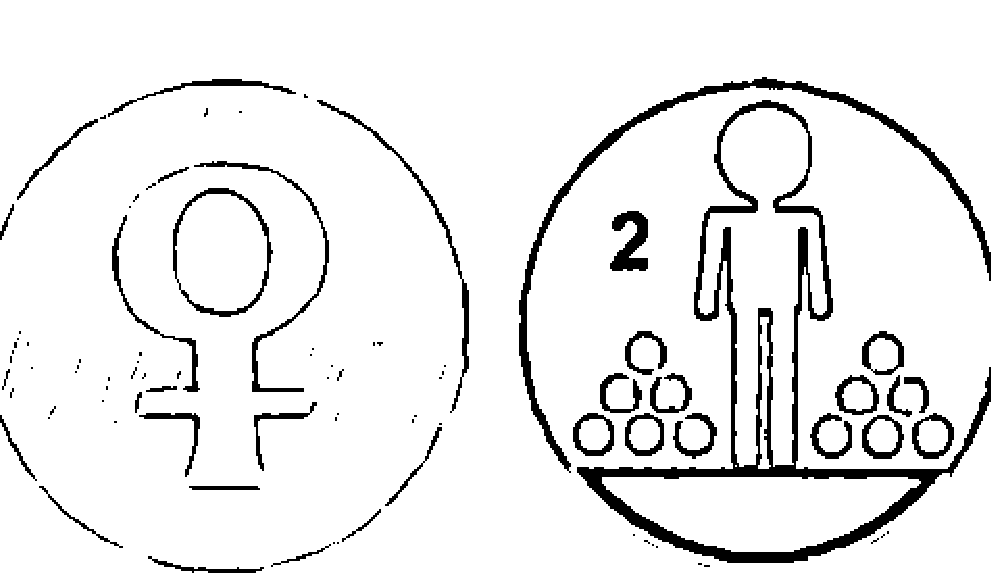

#### VENUS ▷ (2) 金星落入二宫

金星落二宫在一般关系中，金星的人际魅力，二宫喜欢欣赏，生怕金星不悦，乐于付出讨好。金星的玩性高昂，带领二宫休闲娱乐，使其放松愉悦，感受美好价值的事物。二宫难逃金星索求，常以送礼请客取悦，双方互动舍得花钱，共享美食及浪漫玩乐，体验精致的生活品味，表面尚称和谐。二宫的务实态度，有时资助金星，唤起金星稳定的需求，财务状况逐渐改善。

在职业关系中，金星有表演才华，想利用二宫资源，提出休闲娱乐性的赚钱建议，顺带扩充人际社交。二宫的经济环境，有利金星传达美学、表演、创作的特质，及公关、人际、财务等专长，合作创造利益，双方适合生活美学、艺术设计、戏剧表演、投资理财等合伙。如金星和谐相，能引导二宫正确投资，实现金钱获利，金星本身若受克，将因过度理想的计划，使二宫金钱损失。

在亲密关系中，金星的可爱迷人，二宫愿意花钱买单，提供优渥物质及舒适环境宠爱金星。金星常为了金钱好处及生活稳定，与二宫建立伴侣关系，互动有功利色彩，感情建立在物质上。二宫大方让金星运用资源，企图以轻松方式生财，不会给很大压力，金星优柔寡断、缺乏主动积极，不利双方的财务处理。金星如与二宫互克，双方在价值观上易有歧见，因金钱产生摩擦，最初因利益结合，最后也为钱分道扬镳。

如金星和谐相，可强化二宫财务动机，努力赚钱也懂得消费，双方精神物质双重增值。若金星受克，将懒散放纵、好逸恶劳，追求奢侈无度的玩乐，二宫为满足金星物欲，担负沉重经济压力。二宫对钱的态度刺激金星的欲望，如金星金牛落入二宫，金牛追求经济稳定及物质拥有，欣赏二宫的安稳务实、重视品味的花钱习性，甘于单纯稳定的优质生活。如金星双子落入二宫，双子喜好变化、不安于室，促使二宫多方兼差，努力赚钱，在电子产品、观光旅游上大肆消费。

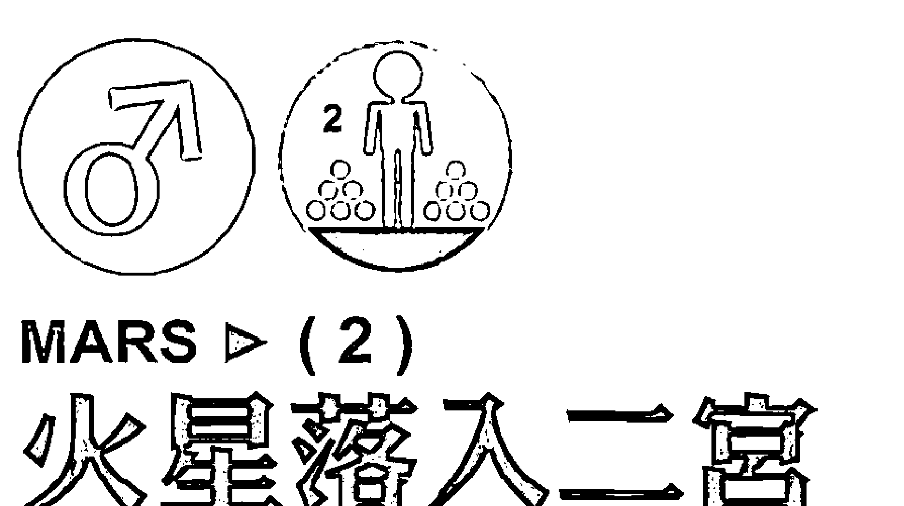

#### MARS ▷ (2) 火星落入二宫

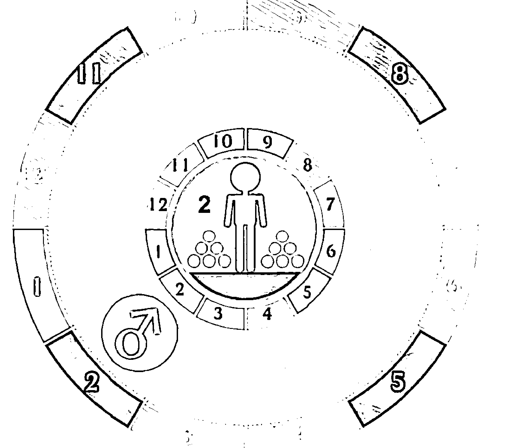

火星落二宫在一般关系中，火星对二宫的财务，生起觊觎之意，认为二宫的能力，有利自己生存所需。火星提出赚钱计划，激励二宫积极运用资源，有效开发商机，实现财务野心。二宫认为火星对金钱大胆，用钱冲动浪费，行为缺乏耐性，火星认为二宫保守胆小，不敢追求财务自主，谋生能力不足。双方互动常基于金钱目的，共同活动花费庞大，火星的耐力不是很持久，双方往来开始很热，一旦缺乏金钱涉入，迅速冷却。

在职业关系中，二宫认为火星对财务冒险，态度自我中心，计划不周难以执行。火星则认为二宫对赚钱考量太多，行为畏缩不前，会积极催促二宫行动，一起挑战财务目标。火星相位佳时，对钱的企图刺激二宫的物质欲望，带来赚钱动力，有利双方从事财务及商业活动。火星本身克相时，易冲动莽撞及坚持己见，因财务与二宫不快，产生金钱纷争。如二宫本身无星，火星煽风点火无效，快速转移对象，另寻目标。如二宫自身有星，对金钱态度较有主见，将不满火星的主导侵略，双方就算合作，也难长期维持关系。

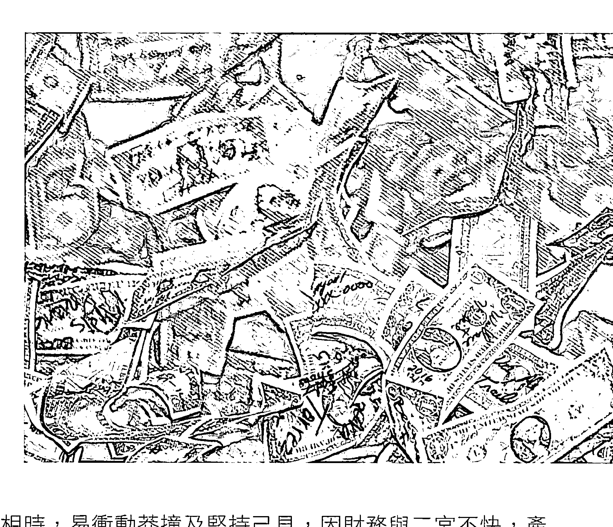

火星落二宫在亲密关系中，火星态度自利，欲利用二宫财务，满足一己之私。火星想控制二宫的资源，怂恿二宫一起抢钱，如二宫不受现实利益诱惑，则未必受火星摆布，不让火星为所欲为。火星对金钱物质急性子，常一时冲动乱买东西，不许二宫阻止，又常因反悔而发脾气。双方对金钱有不同坚持，常因为钱而吵架，伤及私人感情，不利日常和谐。火星即使毫无克相，伴侣也应缩减投资规模，以免商业合夥就算获利，日久还是会起争执。

### 外行星入宫位~第二宫

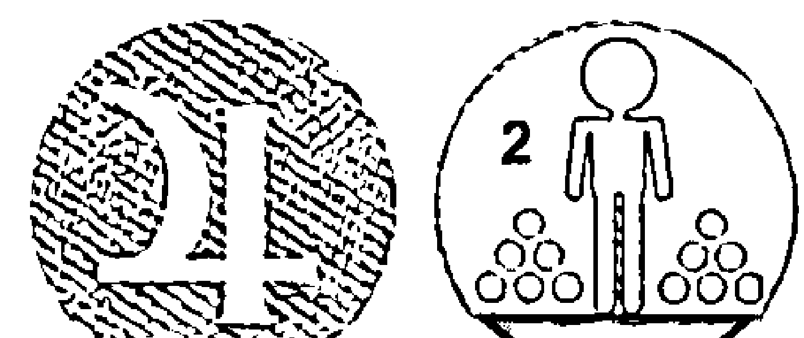

#### JUPITER ▷ (2) 木星落入二宫

木星落二宫在一般关系中，木星的慷慨分享，引发二宫的善意回馈，二宫提供木星生活所需，木星受惠二宫的环境，现实生存得以安定。木星有社会性的天赋好运，可用自身智慧，指引二宫开拓财源，启发财务的封闭性。二宫大方拿出资源，让木星冒险运用，将二宫的钱财转移用途，追求符合潮流的理想。木星如二宫互克，现实索求很多，贪得无厌挥霍浪费，二宫却不以为意。木星带来崇高的精神指引，开放的生命经验，使二宫付出越多，得到也越多，精神物质双重成长，相互是财务贵人。

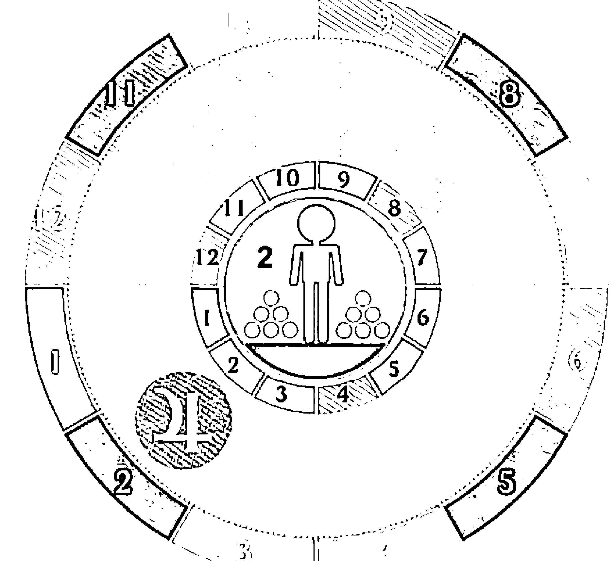

在职业关系中，木星有崇高目标，二宫务实投资木星，让木星在旅游、文化、教育、宗教方面，发挥社会扩展性，实现高层的精神价值。木星若受克，会因物质需求及金钱投资，增加二宫预算开支，需当心木星好高骛远的赌性，下注过于大胆投机，形成投资风险。木星如相位良好，将妥善运用社会机运，使二宫资产膨胀，出手愈加大方宽裕。木星使二宫的多余资源用以社会，二宫使木星的身份形象升级，双方互惠互利，共享精神繁荣及物质丰盛。

在亲密关系中，二宫因个人好恶，对木星特别大方，在学习、玩乐、旅游、冒险上纵容木星，不全然是无私的分享动机。二宫无论资源多寡，都支持木星基本生活，二宫在财务方面，因木星大力推荐或社会机缘，获得幸运的赚钱机会，现实财富增加。木星如和二宫互克，常因好享乐爱花钱，购置奢华豪华用品，生活丰富不虞匮乏。木星受惠于二宫的慷慨，二宫成为木星的金钱供应者，并不觉得被逼迫，当初的助人善举，带来好心好报的丰盛回收。

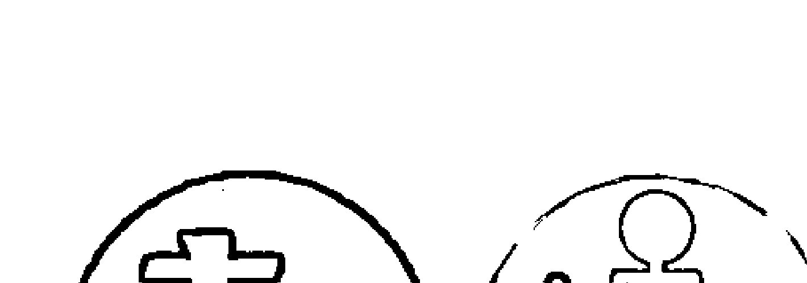

#### SATURN ▷ ( 2 ) 土星落入二宫

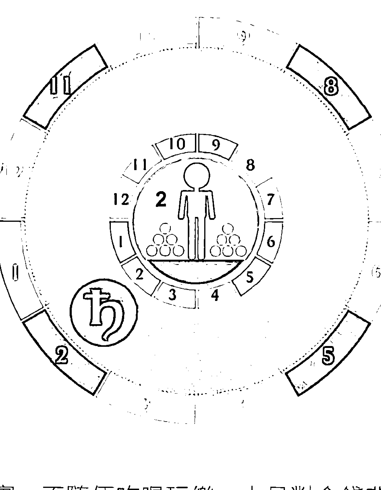

土星落二宫在一般关系中，土星的能力高深而冷门，二宫察觉利用价值，感到莫名义务，有责任提供财务支持，助其发挥专业用以赚钱，解决生存课题。土星现实经济的压力不小，给二宫心理负担颇重，双方互动务实，不随便吃喝玩乐。土星对金钱悲观负面的态度，时刻提醒财务吃紧，无形限制二宫的用度，双方往来具有功利目的，相处方式朴素实际，在一起花费节制，不会奢侈享受。

在职业关系中，土星提出商业合伙及投资建议，二宫感受财务压力，基于道义配合土星。二宫觉得土星的金钱要求，超出自己能力，感觉变得穷困，付出是基于责任，而非乐意给予，双方可在财务及商业上合伙共事。土星如和二宫互克，双方一起做生意，易因土星的私心自用、不负责任、恐惧猜疑及过度管制，经营上财务拮据，共同遭受损失，商业合作失败，得到苦果教训。土星若与二宫和谐，将发挥专业能力及理财经验，使二宫懂得勤俭节制，财务缓慢稳定，建立长久合作，帮助对方达成财务稳定。

在亲密关系中，土星基于道德及家族状况，现实经济压力大，会指导二宫用钱，二宫感受经济窘迫，努力赚钱存钱，应付土星的高标要求。土星对金钱有心理障碍，永远怕钱不够，不敢随意动用资源，花费保守节制。土星节俭度日的准则，生活习惯单调，用品简朴制式化，饮食习惯固定保守，二宫感受窒息。

土星的价值观不合时宜，律人甚严不准花钱，但只管别人不管自己，会囤积收藏符合原则的陈旧之物，二宫很难一起分享。二宫长期规划小心花费，日常花费保守节制，久财务稳定，但无法与土星享受丰盛。若土星与二宫互克，二宫受土星行为压抑，不敢消费享受，却费尽心机理财赚钱，但因受限绑手绑脚，反而造成投资损失，制造更大压力。双方陷入金钱匮乏的负面循环，因心理贫穷的恐惧，明明家道殷实，却不舍得过好日子，生活吃苦受罪。

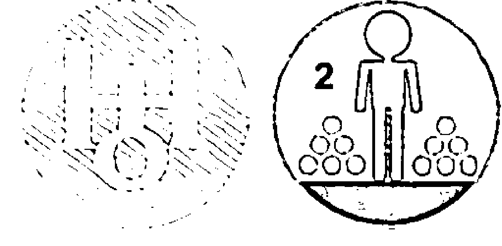

#### URANUS ▷ (2) 天王星落入二宫

天王星落二宫在一般关系中，二宫拥有的资源，激发天王的实验动机，对金钱出现冒险前卫的空想。天王对二宫的独特能力与价值，无论在金钱物质，还是精神思想，产生探索兴致。天王不断刺激二宫反应，颠覆二宫的价值观，让二宫作快速赚钱的梦，使之财务解放，愿意付出资源，换来新奇的精神体验。二宫的金钱态度被天王扭转，开始冷静客观思考，重新看待金钱物质和自我价值的关系。双方的精神进化层次，决定彼此朝向极端物质性，还是极端精神性倾向发展。二宫跟随天王改变用钱方式，因而产生各种正负面回馈，反过来影响天王过于激进的金钱观，长期下来，共同开发出特殊的精神财富。

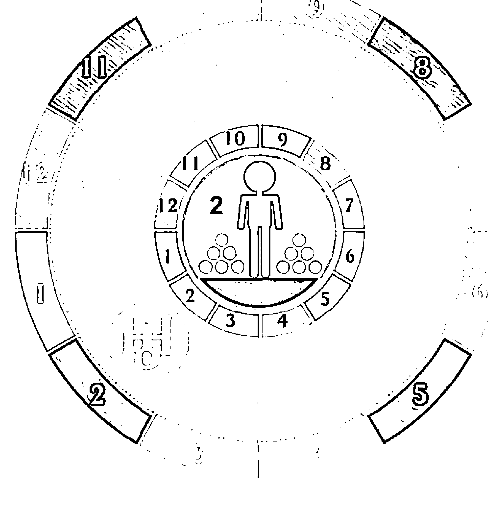

在职业关系中，天王以新创意新点子，古怪多变的思维，鼓吹二宫开放资源，改变花钱理财方式，活化二宫的未知潜力，运用特殊才能赚钱谋生。如天王受克，将让二宫花用平常不敢动的钱，制造财务意外，带来金钱损失。天王带来的财运契机很难掌控，跌起来有去无回，不像土星虽也造成二宫损失，但不至于完全不见，除非天王相位很好，二宫才可能留住获利。双方如从事电脑资讯、电子产业、高科技和科学发明，新思潮，占星玄学相关工作，激荡出有助文明提升、心智成长的创新产品，将会意外赚到大钱。

### NEPTUNE ▷ (2)
#### 海王星落入二宫

海王星落二宫在一般关系中，海王在生活上弱势，二宫拥有的金钱资源，使海王心动向往，对二宫装可怜要求资助。海王扮演受害角色，寻找理由说词，诱使二宫相信自己，矇骗二宫拿钱出来花用。海王对二宫的财务有不切实际的幻想，解消二宫的金钱防备，二宫扮演救赎角色，易受海王迷惑，拿钱支持海王的理想，满足奉献的欲望。海王的经济处境，引人同情怜悯，二宫有时并不信以为真，却因慈悲心软，不忍拒绝无奈付出，维持二宫生活所需。

在职业关系中，海王推销商品服务，讲得天花乱坠，期望二宫出钱买单，但对品质保证及售后服务无法落实。海王无力遵守金钱原则，对钱财言而无信，编造各种名目，要求二宫付帐。海王常在不告知二宫情况下，擅自动用共有钱财，暗中造成二宫不明的损失，埋下财务崩溃的种子。二宫不宜与海王金钱往来，不仅商业合伙难以回收，买卖无法获利，投资更是丢进水中。二宫要认清真相，抱持彻底牺牲、不求回报之心，在财务足以负担之下，方可出钱资助海王，助其实现艺术表演及灵性追求的梦。双方从事广告宣传、音乐摄影、电影戏剧、宗教灵性等，目的在抚慰人心，不计利益得失的活动较宜。

在亲密关系中，海王对金钱永不满足，千方百计迷惑二宫拿出资源，二宫难以拒绝要求，生活供给不设限，养成海王浪费恶习。二宫常因同情怜悯，失去对海王的理性判断，明知遭受欺骗，仍旧纵容海王。海王的理财智商低落，对金钱自欺、迷糊、不顾现实，无法担负财务责任，蛊惑二宫投入一夕致富的幻梦。二宫不能轻信海王梦呓，日常收支及生活预算必需自己管理，掌握金钱控制权，永远不让海王碰钱。否则双方将因海王的迷糊，造成财务混乱，留下一团烂帐，二宫连带被拖累。

### 冥王星落入二宫
在一般关系中，冥王有挖掘欲望，觊觎二宫深不可测的能力，欲探索深埋的宝藏。二宫具独特的赚钱方式，可能并不自知，冥王以强迫性态度，使之检视谋生资源，二宫从此懂得运用能耐，创造实质收入。冥王的自虐虐人，时而制造金钱危机，淬炼二宫赚钱能力，若非情感勒索，便藉由财务控制，改造二宫用钱态度，满足权力操控。冥王极端的创造性与摧毁性，既帮助二宫生财，也制造麻烦纠纷，引发金钱价值观的斗争，导致对抗决裂。冥王的生杀大权属集体世代性，自身无法理解控制，对于能予配合的对象，方产生强大作用。

在社会关系中，冥王对金钱的专制态度，无所不用其极，提出魔鬼诱惑的条件，千方百计与二宫合作。冥王的自毁倾向，常埋下财务核弹，引发生活危机迫使二宫共同解决。双方的商业合作及金钱往来，带有金融保险、神秘、心理、玄奥、生死、医疗等特殊性质，容易引发禁忌争议，攸关日常收入跟双方生计。合伙虽不涉及他人，但内涵趋向复杂，带有人情与道义性，非银货两讫般清楚干净。

在家庭关系中，若冥王是父母，以彻底控制生活用度来管教，剥夺子女金钱自主的权利，甚至制造破产、欠债、被勒索的恐怖情境，威胁子女心理安全。若冥王是子女，对家庭理财的方式看不过去，产生心理危机，欲扭转父母的金钱观念，以强迫作风乃至恐吓态度，硬要父母拿钱出来，亲子为财产分配起冲突。子女的强势霸道，不代表行为正确及执行无误，把钱拿去通常越管越糟。子女将学到惨痛教训，学习如何控管自身，不干涉父母浪费败家。

在亲密关系中，冥王对二宫的用钱，大为看不顺眼，时常挑剔、质疑、找麻烦，若非强迫分享，就是用钱控制。冥王极力督促二宫赚钱，控管二宫资源，任何生活花费都要干预，以求财务安全保障。冥王对金钱极端偏执，经常严以待人，自己却滥用资源，胡乱投资及藏私房钱，造成重大财务损失，二宫心生憎恶。双方在日常用度上，扮演权力宰制与被压迫者，因生活开支及用钱习惯，长期闹不愉快，暗中对抗心结渐生。若伴侣关系恶化，双方将因共同资产纠缠不休，对赡养费及财产分配，发生严重纠纷。

## Quantum Astrology

## Synastry
### 第三宫
#### 【沟通宫】

- 聊天话友
- 兄弟姊妹
- 同学邻居
- 业务对象
- 师生传授
- 传媒共事

### 第三宫的心思交流类于反应敏捷

第三宫，掌管个人的基础心智，是人类与环境的互动，从懂得认亲到牙牙学语，大脑理性意识发展的起点，塑造在生活环境中，与其他人、事、物的交流模式。

第三宫是心智成熟历程中，最初的社交经验，以幼年跟兄弟姐妹、同学邻居间的相处，少年接受幼儿园、小学、初高中等教育，培养和手足血亲、街头巷尾等人际网连接上线，包含聊天、闲谈、打招呼等行为习惯，都代表学习如何跟外界人事，以言语讯息、肢体表情来沟通交流。

第三宫是生活环境的观察能力，对周遭人事的风吹草动，不假思索立即反应，培养和外界轻松交流的惯性。第三宫的多元好奇心，对五花八门、变化的即时资讯，及左邻右舍的街谈巷议，有多工接收跟现场直播的反应。

### The Third House

### III

三宫影响浅近的生活常识及地理认知力，代表人类心智对于环境的变化，具有敏捷弹性的适应力，能快速认知察觉，并解读周遭讯息的涵意，产生言语、表情及动作回应。无论古今，三宫都是认识可食用的野生植物，躲避攻击性的野生动物，认得出外狩猎及回家休息之路，所必备的生存能力。

在私人关系中，如三宫被突显，双方的认识往来，将有手足般的熟悉感，言语一拍即合，交谈轻松活泼，但内容多是对时事的心得感想、生活的往事回忆，听来的小道消息、热门的网路传闻等。

如是职业关系，第三宫代表日常的人流、物流、资讯流的处理，包含心智创作、即时通讯、影音阅听、逛街闲晃、短途旅游等活动，涵盖了书报杂志、信息浏览，大众传媒、解说导引等领域。三宫的工作涉及演讲教学、电视广播、广告行销、网路新闻、教育出版、货运物流、交通运输等，负责让来自四面八方的人、事、物及生活知识，得以在社会网络中顺畅流动的单位。

### The Twelve Houses

当太阳落入三宫时，太阳的心智思想、教学演说，受到三宫的认同，太阳利用三宫的资源，三宫乐于提供环境机会，让太阳尽情表现心智能力，太阳觉得三宫肯定自己，表达自信昂扬。当月亮落入时，喜欢与三宫话家常、聊心事，月亮把三宫当手足，渴望三宫的言语关怀；三宫倾听月亮的心情，体贴月亮的情绪性想法，付出时间心力，帮助月亮厘清事物条理。金星落入时，自然与三宫谈论轻松话题，分享艺术美学的讯息，一起听音乐看电影，欣赏美好悠闲的事物。

当火星落入时，积极与三宫心智交流，快速急促的沟通言谈，双方频繁传讯、说话聊天、旅游闲逛，一刻停不下来，容易一言不合而争吵，还波及手足邻居。当木星落入时，三宫的心智学习，受木星的鼓舞激励，引向正面的思考，三宫将木星当专业顾问，扩展心智接触的领域。当土星落入时，三宫的成熟心智及专业知识，受土星认真看待，慎重检视三宫心智表现，训练三宫的言语表达，得以社会化有效利用。

第三宫显示心智频繁的沟通交流，密集的语言互动及讯息传送，街头卖场的闲逛浏览，短程旅游的踏青健走等，乐在交通往返，显得奔波忙碌。彼此轻松自在的家常闲聊，交换生活感想、分享即时新闻、讨论亲人邻里的琐事，局限于日常的浅显经验，有时候为了说话而说话。

### The Third House

人际关系的第三宫，正面是充分沟通，顺畅交流心情想法，负面则是意见不合，动辄口角斗嘴。许多人际关系的问题，来自没有共同的兴趣话题可聊，不知如何表达个人感受，如果藉由三宫认清问题，加以促进调整，有助彼此了解及关系维系。

### The Twelve Houses

### 第三宫的心智交流与手足情谊
### 【关键主题】

- 聊天话友、兄弟姊妹
- 同学邻居、业务对象
- 师生传授、传媒共事

### SUN ▷ (3) 太阳落入三宫

太阳落三宫在一般关系中，太阳对三宫的说话风格有熟悉感，初识时轻松闲聊，产生类手足情谊。双方热衷日常交谈，太阳的心智能力受三宫重视，三宫引介太阳认识可聊天的兄弟姊妹及朋友，侃侃而谈，发挥心智专长。当太阳与三宫互克时，代表思维模式不同、言语经常相左，若非言不及义，闲扯浅薄的生活琐事、新闻八卦，就是各说各话，难以真正互信，关系无法深入。

在社会关系中，双方意见交换频繁，太阳鼓励三宫扩大业务的发展，三宫刺激太阳接触广泛的知识，在日常生活、大众传媒、常识杂学方面，表达所知，有利双方意见充分沟通，不至发生误会。太阳的知识藉由三宫传达，三宫认同太阳的创意，理性意识契合，在日常资讯上有重要交流，可一起从事教学演说、广告宣传、行销、大众媒体工作。

在家庭关系中，亲子言谈互动不拘传统长幼，习惯称兄道弟，像平辈般结伴出游。若太阳是父母，很重视子女心智建设，慷慨供给多元化学习资源，期许子女心智健全。若太阳受克，代表父母耗费资源，子女却多学少成，浪掷心力在旁门左道，得不到良好学习效果。如太阳是子女，将以优异学业表现，彰显父母栽培之功，得到荣耀肯定。如太阳受克，子女主观意见强烈，为考试目标及升学志愿，抗拒父母期待，忤逆家长教育心愿。

在两性关系中，太阳主动和三宫接触，双方原本是地缘接近的同学或邻居，互动模式家常化，较像兄弟姐妹，有家人般的自在与熟悉，可以当很好的话友、学伴及游伴。三宫的情感不是激情爱恋，是童年家庭成长的熟悉感，经常碰面打招呼，习以为常。许多人早期的伴侣关系，受限于亲生手足及同学邻居的经验，因轻松自然无压力，而跟类家人的对象在一起。经常要待年纪渐长后，方能厘清异性手足与婚姻配偶的角色区别，开始寻找互补性更强的伴侣。

### MOON ▷ (3) 月亮落入三宫

月亮落三宫在一般关系中，月亮感觉三宫亲切，三宫认为月亮随和，透过生活话题的交谈，培养出知心的亲密感。月亮对三宫意见特别敏感，关心三宫的现状，倾听三宫想法，把三宫当延伸家人看待。三宫以软性的知识与月亮谈心，提供情绪稳定的建议，助月亮厘清情感惯性，安定日常心智。月亮察觉三宫态度的温暖，产生不自觉的情绪依赖，期待三宫提供聊天机会，满足倾吐需求。彼此可以不带实际动机，轻松闲话家常，分享对生活时事的情绪感受。

在职业关系中，月亮关心三宫的心智发展，帮三宫做企划专案，辅助三宫传播知识、开设讲座、管理专页，散布资讯，让三宫知名度慢慢打开。三宫引介家人给月亮认识，提供广告写作的工作机会，让月亮通过多媒体表现情感，得以生活稳定。月亮胆子特别小，情绪时起时落，想法优柔寡断，状态不够稳定，三宫要设法维持关系。双方往来跟彼此手足相关，在写作出版、演讲教学、媒体行销、宣传企划等领域有缘共事。

在家庭关系中，月亮三宫的家人，不只有今生缘份，前世也曾是手足，亲子互动类似兄弟姊妹。当月亮受克时，常因个人情感、生活资源及内在安全感的无名困扰，不易独立自主，而要求三宫日常关怀，依赖饮食照顾，影响手足的家居稳定，增添情绪压力及生活开支。

在亲密关系中，月亮关心三宫的兄弟姐妹及女性朋友，与之密切往来，建立亲手足的亲密互动。三宫提供日常建议给月亮，安排逛街闲聊及旅游行程，安抚月亮不安情绪。双方即使没有血缘，相处也有类手足的熟悉感，愿意诉说内心私密，自然而然知心沟通。如月亮和三宫互克，常因过度的想像力，出现担忧焦虑，带给三宫情绪烦恼，双方易为生活琐事，激发非理性反应，神经质闹琐碎的口角争执。

### MERCURY ▷ (3) 水星落入三宫

水星落三宫在一般关系中，水星平时未必爱说话，但面对三宫时不感压力，常征询三宫意见，双方有谈话缘份。三宫的身份处境，让水星愿意闲话家常，相互资讯交流，建立类手足及同学的沟通。水星的说话风格符合三宫习惯，三宫欣赏水星的开放，理解水星的知识，三宫的日常闲聊轻松化，水星与三宫谈话中，厘清日常想法。如水星本身受克，因表达琐碎，言不及义，无谓废话太多，延误正事。

在职业关系中，三宫宛如水星的资料库，帮助水星理解广泛的知识，刺激水星思考，启蒙学习，水星从沟通中受益。水星主动引发三宫的发表欲，透过口头、文字、视讯等方式传达，谈话重点在心智、语言、知识的沟通学习，有利师生关系的教学效率，双方可一起从事媒体，适合写作、广告、传媒、通讯等工作。水星如和三宫互克，容易沟通隔阂，辞不达意，甚至心理猜忌、口角斗嘴，言语产生误会。

在亲密关系中，双方的交流不在情绪感觉上，而以日常的心智探索为主要动机，三宫的知识思想，触发水星的点子，愿意联络手足同学，一起参与知性活动。彼此可能频繁短程出游，一起闲逛大街小巷、短程踏青、看电影电视，引介兄弟姐妹及同学好友，从事轻松不费劲的脑力活动，如聊天、打电玩、打麻将、玩牌戏等。

### VENUS ▷ (3) 金星落入三宫

金星落三宫在一般关系中，金星察觉三宫的随和，喜欢和三宫分享爱好、展现美学品味。三宫认为金星的言语亲切，对金星的知性感兴趣，介绍朋友跟三宫聊天，征询感情意见。三宫的人际深化金星的兴趣，金星得益三宫的人际关系，才华表现日渐专精，轻松获得赞美。金星诱发三宫的谈话情趣，沟通时运用创意点子，增添多元趣味，有利感情互动。双方言语投机，对日常休闲有相似的娱乐，往来情谊中交织了一些喜欢及欣赏，却非浪漫的男女爱恋。经常一起逛街、旅游、看电影、打电玩，透过文字影音等媒介，交换对诗词、散文、音乐、影视等，娱乐美学上的感受。

在职业关系中，三宫欣赏金星的才华，予以宣传行销，引介朋友认识其美学艺术。三宫提供人际资源及场地平台，让金星发表作品，举办文字、言语、多媒体创作的活动，金星得以实质获益。在亲子关系中，三宫父母让子女学习喜欢的科目，尽情发展兴趣专长。金星父母常带子女吃喝旅游，亲子相处轻松自在，玩在一块没有压力。若金星和三宫互克，代表金星的兴趣品味，三宫心理有意见，但求相处和谐，不会明白表达。

在两性关系中，三宫觉得金星温暖愉悦，金星享受三宫为伴的轻松，相处时聊兴趣、听音乐、看电影、艺术欣赏及短程旅游，频繁以简讯贴图、语音视讯传达爱意，热衷以好玩言语打情骂俏。交往过程常有兄弟姐妹参与，感情互动愉快悠闲化，不追求如火如荼的狂热激情，是类手足之浪漫情感。若金星和三宫互克，一起旅游很花钱，对玩乐意见相左，易受旁人耳语影响，左右关系和谐性。

### 火星落入三宫

火星落三宫在一般关系中，火星觉得三宫的谈话，对心智有激励作用，经常一时兴起找三宫抬杠。三宫介绍兄弟姐妹与火星互动，运用人际资源，助火星采取有效行动，取得生存所需。火星时而态度迫切，不顾三宫感受，言语上主动挑衅，刺激三宫的思考表达，双方心智交流快速激烈，你来我往不停说话。如火星与三宫互克，三宫备感威胁骚扰，一讲话就争论不休，意见相左唇枪舌战，像无限回合的辩论对手。

在职业关系中，火星基于执行效率及业务考量，积极找三宫合作教学演说及媒体行销，适合传媒业务、广告行销、电视广播、电话民调工作，以及快速问答的谈话节目。火星作风任性且自利，经常冲动承诺，却无恒心履行，双方要小心签订契约，以免酿成争端。在师生关系中，如火星是老师，教学直接要求效率，没耐心等学生吸收理解；如火星是学生，将以犀利言词连珠炮诘问，使老师心智疲惫，难以招架。

在家庭关系中，兄弟姐妹间互动频繁，日常容易口角，成天斗嘴不休。如火星是父母，常疾言训斥子女，强化子女心智能力；如火星是子女，常因琐事不耐烦，管不住脾气，与父母大小声争执，家庭成日不安宁。

在两性关系中，火星主导双方的心智联系，主动打电话、发简讯邀约三宫，积极找三宫出游、逛街、踏青，从事消耗体力的活动。火星的作风自我中心，不顾及三宫的沟通需求，易被三宫点燃火气，把三宫卷入和手足、同学的争议中。双方可能为兄弟姐妹引发冲突，时而意见不合，出现火爆场面，闹得四邻皆知。如火星和三宫严重互克，当心别在开车时谈话争论，以免一时火气上冲，酿成意外事故。

### JUPITER ▷ (3) 木星落入三宫

木星落三宫在一般关系中，木星觉得三宫心智开放，三宫觉得木星层次够高，木星兴致昂扬的言谈作风，三宫感到亲切欣赏。木星有高等知识学问，三宫洗耳恭听表示支持，木星谈起专业知识，鼓励三宫表达意见，三宫回馈文化、教育、哲学的见解，扩充木星的思考题材。双方在知性领域的知识、见闻，心得的分享，相谈颇为投机，木星代表所处环境的社会性条件，有助三宫的知识传递，双方互动未必亲近，不如个人行星落入三宫，显示重要的私人往来。

在师生关系中，木星一方如是老师、同学、邻居等，被三宫唤起善意，主动付出协助，使三宫上学、做功课、交通过程顺利，言谈相互启发、增广见闻。若三宫是长辈，拥有求学补习方面资源，营造良好环境，提供木星发问求知，教学相长。在亲子关系中，木星父母让子女就读环境良好及师资高级的学校、补习班、才艺班，出国游学等，培养优质的同学人脉，有助子女社会发展。木星子女资质颇高，学习自动自发，培养多元心智，以优秀成绩就读名校，课业不让父母伤脑筋。

在职业关系中，三宫帮木星宣传专业思想，木星寻求三宫的发展建议，双方互为人生旅途的导游。木星认为三宫的知识资源有助自己升级，三宫看中木星的传播能力，木星教学、演讲、写作的长才，因三宫网路传媒的平台资源获得曝光。木星乐观分享的行为倾向提醒三宫，如何将艰深知识大众化，促使木星心智学术的影响，由纵向的钻研朝横向的普及，迎合大众阅听的层次，在出版、传媒、资讯、教学、旅游方面，双方均从中获益。

在親密關係中，木星的高談闊論三宮可以理解，三宮因木星心胸開放、樂於傾聽分享，容易開啟心房，心情不好時，跟木星談話得到鼓舞。雙方有同質的知性擴展傾向，木星的好動活躍及社會人脈，將以尋幽訪勝的知性旅遊、深刻思想的心智激盪、參與知識分享的聚會等，幫助三宮提升見聞層次。三宮引介朋友、同學、近親給木星認識，豐富日常聊天話題，有利近距離的人際往來，彼此有類血親的情感。

### 土星落入三宮

土星落三宮在一般關係中，土星的思考嚴謹，三宮覺得有助判斷，凡有要事會徵詢土星意見當決策參考。土星心智老成持重，說話正經八百，對現實就事論事，言談主題沉悶，雙方互動正式化，非輕鬆隨意泛泛之談。土星判定三宮想法淺薄、意見多變，期望三宮的思考模式正確，三宮認為土星說話教條、冷漠且狹隘，經常教訓自己，雙方想法有所隔閡。三宮覺得土星負面思考，說話實際但不中聽，溝通壓力很大，不輕易與其談話，但長期維持聯繫，土星建議是否有利於三宮，端視本身相位好壞。

在職業關係中，土星擁有專業知識，成為三宮請益對象，土星基於責任及利益考量，必須跟三宮共事，本身不很樂意，非關工作考量，不跟三宮交談。土星對工作要求嚴格高，若與三宮口頭協議，在聯繫溝通上託付責任，三宮常不願承擔壓力，任務因而延遲，無法如期達成。雙方工作牽涉正式性的傳播，如演說講座、大眾傳媒、教學出版、交通郵政等，土星督促三宮養成有紀律的思考、研究、寫作的習慣，將知識及想法實用化，三宮提供機會資源，讓土星表現專業，如介紹出版、安排教職、策劃講座等。

在兩性關係中，土星覺得三宮說話態度輕浮，有責任施以耐心，給予訓練要求，在生活中負起責任。三宮認為土星的心智僵化，凡是想得太多，說話前要請示準備，太過古板無趣，壓抑自己表達欲望。雙方日常溝通壓力大，相處難以放鬆，除了必要事項，不知該說什麼，只談正事不會聊天，夫妻常是工作同僚及學術研究的夥伴。生活重點在共同的心智活動，交通接送的責任，重視督促子女學習教育及課業督導，可一起從事補習班、安親班、駕訓班等工作。若土星與三宮互剋，易因兄弟姊妹的壓力，雙方溝通困難，致使手足不睦，土星交通運氣不佳，行程容易因事延誤，雙方最好不要共乘，以免彼此耽擱。

### 天王星落入三宮

天王星落三宮在一般關係中，天王古怪、特異的談話風格，察覺三宮的接納性，被觸發神經跳針的外星語言，刺激三宮做出回應，三宮若自身無星可以不理。天王思考百無禁忌，怪異驚人之語層出不窮，以前所未有的創意，帶來急速變化的實驗性，談話主題、對象與情境不會重複。天王大異其趣的腦筋急轉彎，認為三宮是知己，積極找三宮談非主流知識，題目與日常所知不同，有關於電腦資訊、高科技電子及占星玄學，非一般生活領域。天王接收到集體性的前衛思潮，藉與三宮聊天時展現，雙方交談友善又疏離，關係難以親密化。

在職業關係中，三宮介紹新奇人事給天王認識，在無預警情況下，讓天王做言語實驗，激發知性分享的神經性衝動，分享特殊創意，碰撞出規模難測的心智大爆炸。雙方談論內容脫俗不凡，和高科技、新發明相關，可從事廣告創意、新型傳媒、資訊通訊、社群網站、占星玄學工作，前衛思潮及尖端知識是交流重點。天王上司是點子製造機，突發新奇創意任務，交由三宮下屬負責，天王只管觀念發想，執行經常中斷。雙方相位互剋時，天王的鬼點子將不靈光，提倡的革命性計畫，只是空想的餿主意，成事不足敗事有餘。

在家庭關係中，天王與三宮的手足無緣，兄弟姐妹是社會觀念的制約，天王的古怪超越情理倫常，雙方疏離並非吵架結仇，而是不近人情的冷漠。天王突如其來的顛覆，攪亂三宮的交通行程及言語溝通，給三宮製造意料不到的麻煩，挑起三宮與朋友、同學鄰居間，關係意外決裂，乃至奇特不倫的往來。

在私人關係中，天王的前衛思想，帶給三宮新奇的見解、朋友及活動，豐富三宮在思想、閱聽、旅遊方面的日常體驗。若天王與三宮互剋，天王的獨特思維，語出驚人具破壞性，三宮雖可承受，但對手足往來及近親和諧不利。雙方因觀念落差，常因生活瑣事突發口角，言語關係決裂，反覆簽下婚姻協議與生活規範。天王不宜駕駛載送三宮，雙方最好避免同車，要小心天王安排的行程，替三宮的交通，帶來難料的不測。

### 海王星落入三宮

海王星落三宮在一般關係中，海王的神秘知識，無形中魅惑三宮，海王有奇妙的心電感應，說話含糊具暗示性，三宮覺得心事被一語道破。海王對環境的敏感，無意識混淆三宮，解除心智界限，說出不該說的話，彼此言語易起誤會。雙方溝通良好與否，與內在無言的表達有關，心底潛伏思想暗流，說不出的比說出的更真實。海王代表集體的理想與虛幻，啟發三宮接收世代的夢境，使其靈性成長，雙方精神互動被強化，在心理學、神秘學、藝術、宗教等領域，有療癒撫慰性的談話交流。

在職業關係中，海王落三宮並不利，海王關心非世俗的超越性境界，三宮則以大眾觀點及日常普及為要務。海王有美學創作及藝術表演天賦，但意志薄弱、不食人間煙火、行事拖延怠惰，無法完成三宮期待。三宮想藉海王傳播夢幻、救贖人心，卻拿海王無能為力，終致失望放棄，合夥不了了之。海王的糊塗、健忘、心不在焉，缺乏守時觀念及秩序原則，給三宮溝通聯絡、交通行程、行政事項、短程旅遊的麻煩，海王不宜作三宮的司機、秘書及聯絡人。三宮掌管文書交通領域，海王很難遵守承諾，不能為三宮作保，一旦出事會推託卸責。

在家庭關係中，海王落三宮的兄弟姐妹有宿緣，父母親子前世是血緣手足，今生再成家人。海王如受剋嚴重，將有莫名其妙的弱勢及病態，海王父母可能失智，帶給三宮子女身心經濟負擔。海王子女可能自閉，不跟父母說話，對家庭和諧造成困擾，三宮父母對子女的心智無可奈何。

在私人關係中，海王言語表達閃爍其詞，難以說明真正想法，易使三宮誤解，產生不切實際的期待。海王一廂情願作夢，用過於美好的想像，提出理想承諾，誘使三宮相信，作出包容、退讓與犧牲，最後嘗到失落的無奈。海王溝通缺乏判斷力，容易受騙上當，三宮特別當心海王所簽的合約，千萬不可為其作保，也不可讓海王抵押貸款。海王的敏感、脆弱、無法面對現實，難對失敗結果負責，使三宮的近親往來出現誤會，左鄰右舍的溝通受到拖累。

### 冥王星落入三宮

冥王星落三宮在一般關係中，冥王對三宮的心智表現異常敏銳，挑剔三宮的說話風格，認為不夠深刻犀利。冥王的改造驅力，堅持己見操控三宮，減少上網、玩手機、看電視的空檔，使之專注於學習思考，增進說話的控制技巧。冥王製造演說教學的機會，讓三宮表達主題複雜的演說，使原本鬆散的口語及文字，產生日常洗腦作用。冥王藉三宮環境與資源，透過獨特主題的文字，心理爭議的話題，神秘禁忌的思想，傳播世代性的改造與轉化原力，三宮基於利益交換，甘願受冥王操控。冥王代表集體的毀滅創造性，三宮若接收 到，未必要做出反應，可選擇不隨之起舞。

在社會關係中，冥王察覺三宮的獨特心智，激起宰制欲望，三宮給予冥王權力，任其運用網路、傳媒等平台。冥王的厲害心智深不見底，其卓越見解給三宮強力啟示，使其認知事物有形的法則，瞭解基本宇宙原理，如數學物理的邏輯。雙方共同探索日常經驗中，較複雜的知識，如心理學、經濟學、物理學、數學、醫學等領域。冥王如受剋嚴重，將運用三宮的媒體資源，置放特殊的心智炸彈，傳達禁忌、扭曲、爭議的知識思想，如謠言傳播、邪教宣傳、炸彈製作、恐怖流言等，影響大眾閱聽，引發社會恐慌。

在家庭關係中，冥王對三宮的兄弟姊妹影響深刻巨大，彼此因嫉妒猜疑、暗中心智角力，爭奪家庭資源，長期冷戰鬥爭，手足間有深度心結。冥王對異性三宮的情感反應異常，超出血緣家人的層次，手足間如有亂倫情結，青春期前就有感覺。

在私人關係中，冥王極度在意與三宮的溝通，用言語簡訊折磨三宮，強迫三宮服從己意，雙方易為瑣事觀念不合，引發激烈口角，鬧得鄰里皆知，成為爭議題材。冥王猜疑心極重，對三宮言詞有強迫性反應，時而扭曲其語意，覺得受威脅恐嚇，雙方溝通壓力大，很難生活化輕鬆閒聊。冥王可能挑撥三宮的想法意見，介入三宮和手足、同學、親友及鄰里的互動，引爆潛藏的危機，造成三宮與他人的溝通誤會，產生心結互不往來。

## Quantum Astrology

## Synastry

### 第四宫 (家庭宫)

- 血缘家人
- 同居伴侣
- 房客房客
- 同住室友
- 居家管理

### 第四宫的家庭生活與內心根源

第四宫，從純粹個人化的發展，進入了小社會的階段，掌管我們的家庭環境、居家生活，除了與伴侶建立的核心小家庭之外，還包括原生家庭及父母親。

第四宫是個人與原生家庭的關係，受父母長輩的養育對待，塑造出的行為制約，顯示成長過程中，遮風避雨的居家環境，是充裕豐盛還是困頓多舛，感受到的家庭氣氛，是愉悅和諧亦或冷漠嚴厲。

第四宫象徵家族傳統及血脈傳承，顯示出重要的家族課題，每個人的性格特徵及行為模式，大多是成長家庭所養成，俗稱「家教」。第四宫主宰個人的生活空間，會打造專屬的小天地，當成私密的情感避風港，滿足安全歸屬感的需求。

### The Fourth House

第四宮與人類在俗世的生命根源關連深厚，會追溯自己的心理根源所在，從家庭背景追尋到祖先傳承，再追溯至群族、種族、國族等更大更久的生命源頭，發展出民族認同及國族意識，採取守護家園、保家衛國的行為。

在私人關係中，四宮若非顯現在血親姻親的家屬間，也常是室友、房客等人際，有同在一個屋簷下生活的緣分。雙方自然產生親情的感覺，常在家中共處，分享居家活動，家庭成員有頻繁往來，相互拜訪、一起吃飯、做家事、家庭聚會等，提供生活照顧及心理關懷的支持。

在職業關係中，第四宮的人際緣份，出現在飲食餐館、超商超市、旅館飯店、房產土地、古董舊貨舖相關的共事中。當吉星落入彼此四宮，雙方可以穩定相處，經營得法發展獲利。若凶星落入並受剋，可能引發動盪不安，如遭竊、被搶、失火、淹水等，裝潢器具及財務受破壞損失。

在伴侶關係中，雙方必有重要的四宮連結，才有在同一屋簷下，日常共處的緣分。若彼此行星相剋，居家生活成為共同課題，家庭不再是讓人休息放鬆、充電的補給站，而成習慣不合的戰場。雙方常因原生家庭的影響，在生活飲食、家庭倫理、居家規範、子女教養等，意見習慣相左，致使情緒焦慮、寢食不安，不想回家面對壓力。尤其發生在原生家庭之中，讓人無法躲避，若非激烈衝突，就是壓抑容忍，形成冷戰。

當他人太陽落入自己四宮時，太陽散放積極意願，四宮感受熱情鼓舞，樂於接納對方當家人，雙方極具同居緣，男女間結為夫妻的機率頗高。當月亮落入時，渴望得到四宮關心，柔性配合照顧四宮生活，把四宮當家人對待；四宮提供家庭結構及店面場地，給月亮穩定支持，月亮被動接受四宮付出，滿足情感安全及生活所需。

金星落入時，引發四宮的玩心，雙方享受居家飲宴，安排家庭社交，共同生活浪漫娛樂化。四宮重視金星的美感品味，提供資源供其發揮，金星成為室內設計師，美化四宮的家居環境。當火星落入時，衝動拉四宮做事，主導家居活動，如四宮不願，火星生氣甚至動手，雙方爭執吵鬧，不利同居關係。

### The Fourth House

当木星落入时，双方将相处缘分，发展成文化活动，举办知性居家派对。木星的人气加福报，帮助四宫的家居繁荣发展，从事店面买卖及场地经营，发展越发兴旺。当土星落入时，双方前世有缘，四宫感受很大责任，为土星提供稳定的居家。土星若非对家人管教太严，就是居家原则保守，四宫基于义务同住，心理压力大，除非共同在家工作，否则生活不很愉快。

第四宫象征生物基本的筑巢习性，以何种方式遮风蔽雨，生活才舒适安稳，是人类习焉不察的安全惯性。四宫是内心情感的联系，无论何种人际往来，只要涉及四宫，彼此的私密情绪、内心情感的交流较为深入。双方透过家庭亲人往来，建立更深的连结信任，不会只是个人对个人，关系维系较能持久。

### The Twelve Houses

### 第四宫的家庭生活與內心根源

【關鍵主題】
- 血緣家人、同居伴侶
- 房東房客、同住室友
- 居家管理、店面經營

### 太陽落入四宫

太陽落四宮在一般關係中，太陽與四宮前世連結，今生有同住一個屋簷下的緣份，太陽感覺與四宮是同一宗族，雖未組成家庭，也會是室友關係。太陽邀請四宮到家中作客，擔任主人熱情款待，經常在一起吃飯，類似家人般相處，往來有彼此的家人小孩參與。太陽對四宮產生照料責任，四宮感到溫暖之情，樂於造訪太陽住處。太陽如相位受剋，既與四宮同住，態度又專制主導，不跟四宮商量，因相處壓力而起衝突。

在職業關係中，雙方在店面、商場、專櫃、工作室、房產租賃等領域有重要互動，太陽若是老闆及主持者，強大的主導力，有發號司令的統御意識，四宮身為小團體的一分子，聽從太陽安排指使，維持運作的上下從屬結構，較有利職業發展。如太陽是受僱員工，強勢的主宰作風，使四宮領導權威受威脅，員工若非反客為主、取而代之，就是迫使主管離開組織，小團體就此瓦解或趁機重組。

在家庭關係中，太陽想和四宮同住，四宮難以拒絕，男女間比太陽七宮有更強緣份，從同居伴侶形成家庭婚姻。七宮是親密伴侶跟重要合夥，四宮不僅是兩人共同生活，還有原生家庭的往來及要求，必須延續血脈、傳宗接代。太陽無論是男是女，都擔任一家之主，主導雙方家庭生活及家族活動，四宮如是男性，家長角色被弱化。

親子關係間如有太陽四宮的位置，代表前世的家人緣份，不易脫離地緣的牽絆，容易長年同住。四宮是家人血緣的象徵，家人間若無四宮關聯，彼此家庭認同感不強，現實處境雖是一家人，但生活行事不強調家人身分，共同參與家庭事務的機率減少。

### 月亮落入四宮

月亮落四宮在一般關係中，四宮營造居家環境，滿足月亮生活需求，月亮常把四宮的家當旅館，要求供給起居條件，款待自己休息。四宮在家中設宴備房，提供情緒歸屬的安全感，使狀態多變的月亮得以安定。月亮若和四宮互剋，對居家場地過於敏感，情緒易受影響，四宮看不習慣，月亮需要四宮照顧，主動付出較少，時而依附四宮，時而想要脫離，四宮日常生活受干擾。

在職業關係中，四宮察覺月亮的溫馨情感，產生回饋責任，將提供場地店面等資源，讓月亮發揮情感能力，生活逐漸安定。月亮感受到四宮的親切接納，雙方產生類家人的情誼，有緣在休閒居家的咖啡廳、小酒吧、工作室當中，私下親密共處。四宮如果開店，月亮會當自己家，常常去光顧生意，成為固定熟客。但月亮的感受敏銳，不習慣場地搬遷或常換人顧，否則情緒不安，因熟悉感不再而少去。

在家庭關係中，四宮的家庭活動以月亮為主，彼前世是家人，四宮決定今生和月亮的互動模式。雙方常一起分享食物及家居生活的情誼，共同處理餐飲、房產、場地、店面、農場等工作。月亮如是子女，從四宮父母的資源，滿足生活所需，月亮如是父母，反向產生依賴，需要子女照顧。四宮是關係中負責任的一方，照顧方式影響月亮的感覺，可能產生感激依戀，亦或感到嘮叨厭煩。

在兩性關係中，月亮讓四宮感覺親切想依賴，四宮對家庭的態度，月亮察覺無形熟悉感，雙方家人親密多於伴侶愛戀。但月亮的情緒起伏大，四宮需保持適當距離，否則容易因居家瑣事，夫妻朝夕相處易摩擦鬧情緒。月亮一方如是女性，特別注重家庭安全，期許四宮丈夫努力工作，不容沒事賴在家裡。月亮抗壓性弱，對家庭認同感不穩定，較無力促成家庭緣份，一旦四宮長年離家在外，無法維持居家結構，月亮易埋怨在心，雙方必須要有子女，否則生活將起變化。

### 水星落入四宫

水星落四宫在一般关系中，水星的谈心倾向，引导四宫诉说心事，建立深入的心智交流，四宫愿意回馈感想给水星，彼此有较私密的心理对话。水星可能借四宫的家当工作场所，给四宫的家庭事务，一些个人化意见，双方所谈并非高等知识，只是日常想法的传递。四宫的居家生活及家族状况，水星会关心而询问，四宫平时可能是闷葫芦，未必回应水星，只有关于家庭、个人情感、家族传承的话题，四宫才有兴趣回应，双方并无太多资讯交流的话题可聊。

在职业关系中，四宫心中的见地，是水星感兴趣的，想加以传播的资源，水星引导四宫，将内心想法诉诸文字语言呈现。四宫提供场所环境，让水星从事思考学习等，四宫的家居、店面及场所，被水星当成写作、阅读、谈话，心智交流的地方。四宫邀水星到家中，做内心知识与私人情感的分享，如心理咨询、个人讲座、读书会或家族排列等活动。双方在日常事务中，可能从事环境保护、园艺花卉、养身保健、饮食买卖等工作的人际关系中。

在私人关系中，水星四宫对男女的亲密性无促进作用，水星谈陈年往事与家族回忆，四宫耐著性子倾听，但无助于男女关系发展。双方如有其他伴侣及家属缘分，会将家中场地发展成教育、文化、知识的交流处，家族中有文化知识的传承。若子女是水星，常在家中自修学习，居家生活以个人阅读为主，若父母是水星，注重亲子沟通，以家庭知识资源，强化子女心智。若水星和四宫互剋，则童年教育与家人沟通出现困难，若非成日争吵，就是话不投机、口角不断。

### 金星落入四宫

金星落四宫在一般关系中，金星接受四宫的邀请，携带礼物拜访，四# 内行星入宫位～第四宫

宮提供娛樂讓金星放鬆，雙方共度居家休閒，享受美食、影視、閱聽、其樂融融。四宮溫暖對待金星，徵詢居家佈置意見，金星把四宮當友善家人，發揮藝術品味，對其住處提供建議，扮演四宮的室內設計師，美化居家生活。

在職業關係中，四宮覺得金星有藝術內涵與表演價值，願意提供資源，安排場地環境，邀金星駐店演出，以及家中作客表現。金星的才華廣受歡迎，具休閒娛樂效果，有利商機利益，成為四宮專屬的表演者，滿足四宮對人際社交的需求。

在家庭關係中，常在家中飲宴社交，家庭生活充滿娛樂享受及精緻美食，逢年過節相互送禮，家人彼此討好。金星若和四宮互剋，對於金錢支出及家居佈置的品味不同，只以物質取悅，缺乏真切關懷。若金星是子女，小時候家庭經濟寬裕，享有豐富物質生活。如金星是父母，晚年子女會付出資源，讓父母居家得以安穩舒適，但大多情況是父母付出，子女回饋較少。

在親密關係中，金星重視居住的舒適及美感，四宮尋找溫泉旅館及優質飯店款待金星，滿足其居家愉悅的要求。金星希望四宮改善居家環境，擁有自己的房子，但態度委婉，不會明確表達。若四宮無法提升居家品質，金星可能另起爐灶，搬到更好住處，四宮要以更佳條件才能留住金星。若金星和四宮互剋，金星的價值考量與家人因素，造成四宮的心理壓力，雙方在家庭安全與生活習慣有所抵觸，雖維持表面和諧，相互不得罪，卻欠缺真正的知心親密。

### MARS ▷ (4)
### 火星落入四宫

火星落四宫在一般关系中，火星的居家状况吵杂不宁，引发四宫的照顾意识，火星认为四宫居家理想，能满足自身需求，与四宫提议同住，双方有极强室友缘。火星态度积极，主动拜访邀约，找四宫一起劳动，整理家务帮忙搬家。四宫一开始勉予答应，但日久不满火星自利作风，双方各过各的生活，不利长久紧密相处。

在职业关系中，火星精力旺盛、充满干劲，拉四宫一起做事，共同经营店面、合租场地及个人工作室。火星积极参与四宫工作，欲快速达成业务目标，态度自我中心且三分钟热度，带来麻烦争执，四宫觉得困扰，不想配合行动，火星嫌四宫懒惰而发火，双方合伙不稳定。

在家庭成员中，火星觉得四宫计较于居家琐事，四宫难忍火星的任性及冲动，容易引起家庭纷争不和。如火星是父母，不断唠叨碎念，要求子女帮忙做事；如子女是火星，任何情绪不快直接爆发，双方都不堪其扰，严重时出现家暴事件。

在两性关系中，火星冲动与四宫同居，主导居家活动，四宫被动配合。双方因居家习惯、生活细节及布置整修等活动，容易意见不合，动辄引发不快，口角争执。火星不肯相让，双方吵闹不休、摔碗砸盆，乃至大打出手。火星烦躁好动，需要不停找事忙，让四宫觉得累，有时无意引发淹水、失火等意外，不利居家安宁。火星本身若吉相，彼此可用做运动、做家事、居家布置、整修家园的方式，调节火星的暴躁，就算双方并无剋相，也不宜同住一个屋簷下。

# ## JUPITER ▷ (4) 木星落入四宫

木星落四宫在一般关系中，木星对四宫格外大方，像家人般慷慨付出，助四宫生活安定。四宫提供居家场所，欢迎木星到家中作客，引荐人际资源给木星，增进实质利益。木星带来文化知性及高等教育，在四宫场地从事推广，增加四宫心灵财富。木星在社会、经济、文化等，来自较高阶层，基于社会机缘，携来精神及物质双重礼物，回报四宫支持，并不感觉有压力，有助四宫内外增值。

在职业关系中，木星有丰富资源，邀请四宫主持店面、掌管事业基地，四宫帮木星维持顺利运作，让木星无后顾之忧，得以获利向外拓展。木星心存感激，开放释出主导权，将房屋、店面、土地，工作室的管理交给四宫，提供财务及精神支持。四宫在家居店面的活动，让木星才能得到表现机会，受到社会赏识，有助文化、教育、出版等发展。

在家庭关系中，如木星是父母长辈，全力照顾四宫后代，提供不虞匮乏的精神资源及物质需要，家庭作风民主，不会严加管束。当木星受剋时，父母可能纵容子女，零用钱给很多但不约束，子女一切视为理所当然，不懂得感恩回馈，造成父母家居困扰。若木星是子女晚辈，小时候兴家旺业，助父母房地店面家产扩张，长大后在居住上善待父母，提供环境良好的住房，给四宫管的房子会增值，木星无形中赚钱。受剋的木星子女爱好自由，出外求学工作旅游，不受父母约束，虽不带来麻烦，但木星给四宫太多承诺无法兑现，父母对子女的家庭理想不易达成。

在伴侣关系中，木星鼓励四宫搬到更好的地方，营造宽敞的居住空间，提升家庭生活品质。四宫提供居家安定，木星得到稳定后盾，在四宫支持下，乐观扩张财富规模，有良好条件生养子女，与众多家人同住，共创繁荣的大家庭。夫妻拥有丰富资源，有好运气买到优质的房屋店面，因良好机缘快速增值，可以共同投资不动产。

### SATURN ▷ (4)
### 土星落入四宫

土星落四宫在一般关系中，土星有心理障碍及现实压力，四宫基于责任道义，关心土星的居家生活，希望土星住得安稳，双方有缘居家共处。土星的作风孤立，有很大距离感，四宫的家居要求对土星而言感到沉重，土星用社交理由及工作需求拒绝四宫，但又无法真正逃离，彼此有前世业力的束缚。

在社会关系中，四宫认为居家生活，土星有责任供给维护，土星的严格态度，设下高标准的规范，要求四宫尽职，遵守土星的居家准则。土星可能是四宫的雇佣、房东、建商及设计师，帮四宫管理家居秩序、维护事业基地，只负责尽到义务责任，打理整顿住所的外在环境，双方相处冷漠、制式、职业化，常出现在居家维护、房屋租赁，及物业管理的人际关系。

在家庭关系中，土星有功利性目的，欲和四宫一起居家工作，四宫感受规矩繁多并不愉快。土星努力应付四宫的同居要求，制定严格居家生活条约，四宫觉得压力很大，虽不乐于和土星同住，但又放不下照顾责任。土星和四宫即使不是家庭成员，也常是同居人及室友，双方牵涉较多居家活动，可能前世是家人，今生有居家共处缘。

在夫妻关系中，土星要求四宫负起养家责任，但只关注现实层面，对四宫的情绪缺乏同理心，不考量其情感需求，居家有难以跨越的心理隔阂，相处不十分轻松愉快。土星因家庭背景及环境因素，设下重重门槛，拒绝四宫的互动要求，使其受挫而沮丧。双方因共同的束缚感，有不得不同住在一起的责任义务，无法轻易脱离制约，否则得付出庞大代价。夫妻要注意生育之事，四宫定义是传宗接代，超越婚姻伴侣的协议，土星的生理障碍及心理压力，不利共同家族传承。

# # 外行星入宫位~第四宫
# # URANUS ▷ (4)
### 天王星落入四宫

天王落四宫在一般关系中，天王具独特思想及才艺，引进不寻常的想法、活动跟朋友，进入四宫的家庭，带来新奇感受。四宫对天王有超然的熟悉感，把天王视为虚拟家人，共同分享居家空间。天王不安于室，常不在家，四宫难以预料跟控制天王行为，相处互动十分不稳。双方可能共用摊位、店面、场地等空间，但无制式约束，天王找刺激多变化、不求安定，可能突然搬迁、整修、改造、结束共有的居家及店面，使四宫的事业基地，无法长期稳定。

在家庭关系中，天王我行我素，无法担任家庭的传统角色，不符合家庭伦常，不遵守家族传统，四宫觉得天王的家人特殊另类，友善但疏离，很难亲密互动。天王推翻日常秩序，颠覆家庭生活安稳，制造不寻常、不稳定的活动，天王不可预料的言行举止，带来四宫居家的不安定。天王如是父母，常因工作突然外出，家中唱空城计，甚或常带陌生人回家，破坏子女心理安全。天王如是子女，若非在家制造意外，就是不服管教，动辄离家出走，使父母居家不宁。

在私人关系中，天王在家中旁若无人，无意识神经发作，制造危险性、实验性、难预测的居家活动，招惹麻烦刺激四宫。天王工作不安定，常无预警搬家，选择古怪特殊的住所，当作双方住家，使四宫居住不安。天王在家行为古怪、冷漠疏离，常不在家或突然回家，给四宫惊喜跟惊吓。天王无法负起家庭责任，随时有意外变数，虽不影响双方的相处，但波及居家稳定。天王可能是四宫在家庭之外的同居人，双方短暂相聚又立刻分离，无责任约束的规范，难以共度一般生活。

### NEPTUNE ▷ (4) 海王星落入四宫

海王落四宫在一般关系中，四宫觉得海王有童年熟悉感，把海王当替代性家人，弥补原生家庭的遗憾，彼此前世有亲人关系。海王对四宫的内心梦想，有极深的感应共鸣，在潜意识有情绪联系。四宫了解海王的心理活动，想把海王当家人，但海王逃避一起生活，双方同居很难落实。双方如灵性较为觉醒，海王将对四宫的居家，带来长期缓慢的影响，让四宫的家中，逐渐成为宗教、灵学、艺术活动的聚集地。

在家庭关系中，海王对四宫营造的家居环境，怀有理想期待，但海王无法明说，无形中蛊惑四宫搬家。海王因慢性疾病，身心衰弱而情绪不稳，生活习惯随意，把四宫的家弄得一团乱，造成双方居家不满足。正面的海王对四宫有很深的亲人之爱，提供理想的居家环境，为四宫带来艺术、灵性及宗教之薰陶。负面海王的忧郁及沉溺情绪，造成四宫潜意识不安，无法满足四宫的家庭生活，不利心理健康。海王对四宫的家庭生活，因逃避而生出误会，又一厢情愿地付出，甚至因现实的无能无奈，把四宫的房产搞不见。

在亲密关系中，四宫察觉海王的居家需求，无条件提供理想住处给海王，海王心怀感激但态度随缘。海王有无法控制的心理疾病，觉得四宫只关心外在居家生活，自身内在需求受到误解、忽略及漠视，因而情绪失调，莫名其妙发神经，加强彼此的精神不安，不适合一个屋檐下同住。海王常是不为人知的第三者，四宫是已有配偶者，海王带给四宫虚幻的家庭梦想，四宫难以脱离潜在影响，外遇关系可隐藏很久，成为长期的不安因子，缓慢侵蚀双方家庭，但不易造成四宫离婚。

### PLUTO ▷ (4)
### 冥王星落入四宫

冥王落四宫在一般关系中，冥王有独特创造性，引发四宫的强烈关注，四宫透过冥王的神奇能耐，察觉内心不明的暗流，浮现情感转化的契机。冥王自身的创伤，带来麻烦困扰与心理压力，对四宫的居家、店面及事业基地，潜藏巨大危机。冥王的态度极端强硬，在运用四宫资源时，迫使四宫改变习惯，威胁四宫的居家安宁及情感安全，容易心理斗争及权力纠葛。

在职业关系中，冥王施展黑白魔法，改造四宫居家活动，涉入心理学、招灵会、家族排列、业力解读等活动，可帮四宫心理洞察及转化。冥王以可观经济及执行魄力，主导四宫的居家整顿，双方可能从事法拍屋买卖、灾后修复、生态保护、都市更新、住宅计划等，历经金钱、权力及情感斗争过程，历经艰辛排除万难后，有益社会改造的更新重建。

在家庭关系中，如冥王是父母，扮演专制独裁的角色，对子女的居家有绝对宰制，动辄看不惯四宫的家居习惯，彻底控制居家活动，子女心理压力很大，潜藏深度的不满。如冥王是子女，正面是杰出才干的子女，很有强势主见，不轻易服从父母，反而操控父母，主导家庭大权。负面的冥王将制造重大危机，摧毁原生家庭，使家人长期斗争，不由自主怨恨成仇。

在亲密关系中，冥王仿佛家庭警察，挑剔四宫居家生活，批判四宫的家人关系，制造恐怖气氛。四宫惧怕冥王力量，迫于淫威不得不从，任其施展高压，全权掌管家庭。冥王表达情感的方式激烈，倾尽全力操控摆佈，以冷热暴力折磨肉体精神，家庭相处紧张。

若冥王是第三者，对已婚者家庭深度涉入，摧毁四宫原本生活，不像天王落四宫时，是突发的外遇出轨，关系朝疏离及决裂发展，不易产生金钱情感纠缠；也不如海王落四宫时，是秘密的情感关系，虽暗中酝酿很久，但不一定实质外遇。冥王对四宫家庭有生杀大权，将因亲人情感、金钱资源、教养权力等，引发争议事端，逼迫四宫服从己意，双方有前世家人关系，情感纷争未了，今生再度重演。

## Quantum Astrology

# # Synastry
### 第五宫
#### (玩乐宫)

- 休闲玩伴
- 恋爱对象
- 浪漫约会
- 游戏同好
- 亲子教导
- 师生传授

### 第五宫的自我创造与游戏人生

第五宫，掌管一个人的玩乐欲，是内在童心的展现，从小时候躲猫猫、家家酒的任意玩耍，到青春期对喜欢对象出现倾慕，开始耗费心思发明创新，营造浪漫，相互取悦逗乐，将内在玩兴尽情呈现，制作一齣乐趣洋溢的恋爱游戏。

第五宫仿佛生命游乐园，一入其中乐不思蜀，容易迷上好玩的人事物，内向者著迷于影视、动漫、电玩等休闲，培养琴棋书画等喜好，从各式把戏中自得其乐。外向者有明星作秀的动机，需要自娱娱人，将内在玩兴培养成独特才华，如歌唱、乐器、运动、魔术、电竞、角色扮演等，秀给外界观赏，讨人赞叹愉悦，取得受欣赏、被仰慕的感觉。

### The Fifth House

第五宫意谓人类内在的创造力，会以生育子女、教养儿童、作育英才等，教育培养下一代，展现自身未成的艺术文化科学天分。第五宫一旦与金钱挂勾，冒险赌性被激发，亟需测试运气，迷上赌博投机、赛马彩票及钓鱼养鸟等，一翻两瞪眼的输赢游戏。第五宫若与物欲连接，则喜欢音响、相机、模型，乃至重机、名车等，玩弄创意有趣的玩具、玩物、玩意儿，砸钱购买，玩赏、收藏、配备及改装，著迷于个人嗜好，乐此不疲。

在一般关系中，五宫的双方是结伴吃喝玩乐、轻松互动的朋友，一起喝下午茶、看电影、听音乐会，参与艺文风的娱乐表演，营造高雅品味的休闲活动。第五宫的社会关系，很多是在休闲场所共事的伙伴，及学校、社团、社区大学中，休闲色彩的才艺进修及成长班中，老少不拘的师生关系。

当他人太阳落入自身第五宫，太阳视五宫为可爱之人，主导吃喝玩乐，双方肯定玩得来。男女关系间，太阳如主动追求，容易和五宫谈恋爱，彼此想拥有小孩，太阳若不表态，也相互欣赏，潜藏浪漫动机。当月亮落入时，月亮不自觉依恋五宫，五宫若是接纳，容易产生爱恋，感情是亲人和情人的混合。月亮察觉到五宫的情绪，受其需求感染，常找五宫一起吃饭，用情人方式居家相处，获得满足及安全感。

当金星落入时，产生强烈无比的吸引力，金星常对五宫一见钟情，看五宫是情人眼里出西施。五宫让金星想要玩恋爱游戏，金星视五宫为爱的原型，爱恋感觉很难消失，较不易成为夫妻，如结为伴侣特别有爱人感。当火星落入，将成为狂恋的爱人，欲快速征服五宫，会以主动积极的性暗示，吸引五宫的注意，但火星容易厌倦不耐，一旦满足性的欲望，易火速结束游戏，双方适合当性玩伴。

在亲密私人中，五宫充满了浪漫情调、生命活力和创意热情，双方感觉彼此魅力迷人，生起倾慕爱恋之情，瞬间来电，激发共谱恋曲的玩心。伴侣关系若有强力五宫，交往过程洋溢丰富多彩的乐趣，无论兴奋疯狂的热情，亦或如痴如醉的浪漫，潜在的创造力充分被激发。平庸之辈都变成才子才女，为表达火热痴情，所发明的肉麻简讯、噁心情话、情书诗篇等，几可传颂千古。

### The Fifth House

在夫妻关系中，五宫让双方注重生活情趣，若非经常休闲旅游，就是专注子女教养，不致平淡无味。当双方五宫受剋时，过程固然好玩，但不易安定持久，可能因外遇偷情，因而争风吃醋、猜忌疑心及权力斗争，像坐云霄飞车，随时有出轨可能，关系跌宕起伏、惊险刺激，充满戏剧性发展。

尤其当太阳和木天冥同落入五宫者，更是充满活力、热情和冒险，洋溢“戏剧人生”的创造能量，常无意间制造出电影剧情般，迭荡起伏的情节，紧张刺激高潮迭起，因祸得福出现转机，造就百转千回的传奇情爱。

### The Twelve Houses

# # 第五宫的自我创造与游戏人生

- 【关键主题】
- 休闲玩伴、浪漫约会
- 恋爱对象、游戏同好
- 亲子教导、师生传授

# ## SUN ▷ (5)
#### 太阳落入五宫

太阳落五宫在一般关系中，太阳的才华令五宫欣赏，五宫觉得太阳特别有趣，双方有吃喝玩乐缘。太阳的热情创意让五宫振奋，五宫愿意买约会饮宴的账单，让太阳发挥独特身手，一展个人创作表演。太阳的玩心激起五宫的兴致，主动找五宫一起趣味休闲，五宫提供舞台及触媒，使太阳尽情燃烧，双方从事热闹、精彩、戏剧化的娱乐活动，挥洒内在小孩的创意。

在家庭关系中，亲子教养十分有乐趣，父母子女不仅互相欣赏尊重，更能玩在一起，分享家庭欢乐。受剋的太阳有强势作风，将主导支配五宫的才华培养，双方都感压力。若太阳是父母，以自身热衷的兴趣喜好栽培子女，能否成功养出天才儿童，要看双方相位。如太阳是子女，主动展现高昂兴趣的天赋专长，是否能成大器，端看父母五宫动机足够强烈，方可长期提供资源。太阳落五宫常见于师生关系，五宫拥有的资源，太阳认为有价值，能当作玩乐、创作、教学、游戏的创意加以发挥。

在两性关系中，太阳欣赏五宫魅力，对五宫出现强力热情，五宫除非本身很强，双方不一定谈起恋爱，但肯定有爱慕情意。太阳积极和五宫往来，常在一起吃饭、看电影、做运动、参与表演性质的聚会派对，是很好的玩伴。五宫是太阳喜欢的类型，被视为可爱的对象，太阳如主动表态，五宫易被罗曼蒂克所打动，愿意投入恋爱，尝试刺激冒险。

太阳如是男性，自视为情圣唐璜，太阳女性自认是多情的卡门，爱搞戏剧化浪漫，逗弄五宫的玩心，刻意作秀需要被五宫重视，强势驾驭双方情感。太阳把五宫的回应当成尊严，不断要求肯定，五宫有星时乐于配合，没星时不胜其扰。双方恋爱过程中，被激发共有小孩的愿望，当作爱情的创作品，夫妻间容易多产。

### 月亮落入五宫

月亮落五宫在一般关系中，月亮关心五宫的恋爱状况，付出关怀照顾，助五宫找到情感对象，希望五宫感情顺利。月亮的情感想像力，激发五宫对音乐、戏剧、恋爱的浪漫表现，五宫提供才华表现的资源，支持月亮的基本生活，稳定月亮表现创意的方式、才艺有所成就。月亮因五宫的体贴及依赖，感到充分安全，配合五宫的休闲需求，一起吃饭聊天，轻松共度闲暇时The request was rejected because it was considered high risk第六宫代表我們對勞動服務的基本態度，究竟勤勞細心亦或懶散打混，是一個人的勤奮指數，影響工作運、同事緣、部屬緣，聘雇與受雇運。在一般關係中，第六宮常是同事、從屬、客服等性質，如醫護和病患、餐廳和顧客、設備安裝及售後維修等，共同進行專業諮詢、健康調養、衛生保健、身心整合等工作服務。

第六宮的「侍奉」性，代表一方提供個人化的服務，協助另一方的生活便利，雙方有「隸屬」關係，如管家、幫傭、侍衛、僕役、看護與雇主。第六宮也是各行各業的專門工作者，提供的高技術高專業的「量身訂做」，如醫藥諮詢、理髮修容、服裝造型、按摩推拿、硬碟重整、寵物美容等。

第六宮在集體人際上，還包括律師、代書、會計師、精算師、醫療諮商等，解決特殊任務諮詢與代辦事項。如果雙方互剋，要小心疑難雜症的診斷錯誤，造成一方的健康受損，以及維修不彰、保養不力，造成被服務者的身心壓力跟生活不便。

當他人的太陽落入自己六宮時，雙方有勞資僱用的關係，太陽雇主有權命令六宮屬下改善服務品質、提升工作效率，主導六宮職業轉變，如六宮本身無星，不足以完成太陽的典範要求。如六宮是雇主客戶，看重太陽的專業，指派重要任務，太陽有能力達成目標。當月亮落入時，雙方有工作同事緣，也產生私人工作友誼，常一起飲食、烹飪、照顧小動物等。六宮找月亮到家中吃飯，有功利性任務，是要求月亮當助手夥伴，幫忙家居維護、飲食料理、生活照顧等事務，月亮則較情緒化，要視心情好壞，不易達成指派事項。

當木星落入時，將以社會資源，提供更好的工作計畫，教育訓練課程，改善六宮的環境，提昇六宮技術，適合教育、文化、旅遊相關，但木星樂觀誇大的空泛承諾，經常無法兌現。當土星落入時，六宮上司要求土星屬下任勞任怨，擔負沉重工作，土星有義務感，可當六宮的行政秘書及生活助理，處理上司日常瑣事。當土星是雇主時，有不帶感情的功利性，嚴格要求六宮的工作表現，使六宮嚴謹自律，土星可能管理失職，六宮覺得壓力沉重，卻又無法離職。

### The Sixth House

在私人關係中，第六宮的務實傾向，相處注重健康營養、生活起居、衛生習慣、工作流程等。第六宮實用性的人際關係，表現在親人、情侶、夫妻等，一方常不自覺負起責任，處理日常生活事務，在雙方的居家照顧、飲食起居、跑腿辦事等，需要耗費體力精神的行為中，承擔勞動義務。

第六宮的親密伴侶同時身兼管家僕人、護士醫生、家教會計，互動抱持職業態度，顯得刻板制式，較缺乏浪漫樂趣。若雙方六宮互剋，生活將為洗碗、洗衣、打掃、整理等，如何排班輪到誰做，因家事的責任歸屬，造成意見爭執與相處壓力。

### The Twelve Houses

### 第六宫的工作服务与生活秩序

### 【关键主题】

- 同事部属、客户主雇
- 照顾养育、医疗保健
- 专业服务、劳动帮佣

### SUN ▷ (6) 太阳落入六宫

太阳落六宫在一般关系中，六宫看中太阳能力，太阳强大的意志力，强化六宫的工作意识，促使六宫职业改善，六宫因此受益，有利工作技能提升、环境优化及目标完成。太阳与六宫相处实际化，私下玩不起来，双方往来基于工作，吃饭聊天只是应酬，任务一结束互动就告终。人际涉及工作会有压力，相处不易轻松，较无缘做真正的朋友，难有进一步发展，是否维持职业往来端看太阳意愿。

在社会关系中，太阳有能力替六宫做事，六宫意识太阳提供的服务，对自己生活秩序、健康保健及工作技能，具有重大影响。六宫一方是雇主较佳，太阳的专业会被看重，六宫愿意去找场地、设备、客户等资源，训练及聘雇太阳，为顾客提供服务。六宫指派的工作任务，太阳有使命达成高标准，六宫让太阳因工作成就，闪耀自信而发光。若太阳一方是雇主，将明确督促工作效率，使六宫倍感压力，如六宫自身无星，不易达到太阳的理想要求。

在职业关系中，太阳六宫常见于护理照顾、医疗保健、美容药品、房东房客等个人化服务。当六宫是顾客时，可以避免太阳受剋又落自身六宫者，否则将使生活、健康及工作出状况。要太阳本身与火木土冥吉相，才容易完成六宫的交待任务。太阳本命若与木星刑冲会粗心大意，日土刑冲是不负责任，日海刑冲常偷鸡摸狗，日冥刑冲则违抗命令。

在两性关系中，伴侣必定有工作及服务的连结，彼此曾是同事、客户的服务关系，相处时讲究生活秩序、家务条理、饮食卫生、办事流程等规范，生活中乐趣较少。太阳若是男性，期许妻子勤奋做好家事，供应工作动力；太阳若是妻子，格外关心先生工作成果及健康状态，会帮先生进补调理及安排健检，打理好日常待办琐事。

### MOON ▷ (6) 月亮落入六宫

月亮落六宫在一般关系中，六宫提出工作计划，介绍客户服务给月亮，月亮展现情感关怀，协助六宫完成任务。双方有较私密的共事缘，因工作及服务产生情谊，像家人般一起吃饭，引见朋友亲人相互认识。月亮落六宫的朋友关系，必有个人化的往来，彼此谈论家常琐事，涉及养生保健及宠物话题。月亮不习惯双方只有工作关连，渴望与六宫情绪互动，想要超越实务范围，发现六宫对情感交流有限制，工作完成关系就结束，月亮易产生受伤感。

在职业关系中，六宫常找月亮一起吃饭，目的是谈工作，要月亮当伙伴，帮忙家庭饮食、情绪疗愈、情感呵护等服务，常见于餐饮、店面、宠物照顾、居家用品的买卖。月亮不像太阳那么注重工作，易心软且情绪化，抗压性较差，需要亲密支持。六宫抱持功利性态度，往来必定有实际目的，没事不会找月亮，双方私交有隔阂，但无伤于工作共事。

月亮与六宫彼此可能是私人医生、营养师及按摩师与客户的关系，私密感觉涉及实际服务，身体情绪互动密切，不只是职场社交应酬。月亮如自身受剋，会不适应六宫的工作纪律，达不到原定工作目标，觉得被压榨受委屈。月亮如本身吉相可放松心情，发挥想象力，完成六宫交代，维持长期往来。

在亲密关系中，月亮以照顾健康饮食、打理生活细节，帮六宫处理日常琐事，以情感为服务动力，建立生活亲密。六宫关心共同工作成果，很难放下实用生活目标，双方互动不只限于两性情爱，必须一起工作才能维持。月亮感觉六宫太实际，只在乎生活照顾及工作成果，不关心情感互动，把自己当工具人对待，月亮受剋时将加倍敏感、易闹情绪。月亮与六宫交往越久，彼此越像同事及主雇，职业任务影响亲密交流，可发展成工作伴侣。如老板认为秘书助理十分能干，是工作生活上的好帮手，日久产生男女感情，亲密关系成为工作的附属。

### MERCURY ▷ (6) 水星落入六宫

水星落六宫在一般关系中，六宫看重水星的知识技能，有助于六宫改善技巧、培养专业。六宫提供环境场地，让水星演说、咨询、写作，表达心智能力，完成资讯性工作。水星对工作服务的想法，提供给六宫参考，六宫未必听取，双方是否能够共事，要看其他缘分。

在职业关系中，水星的知识技能，有利六宫的服务劳动，六宫运用经验与资源，助水星表现专业的口语文字，更有效率完成工作。水星需要六宫当助理副手，在日常生活的起居照顾上，及工作服务的标准流程上，协助处理琐碎的细节，负责执行繁杂的事项。当水星相位和谐，双方沟通顺畅，使行政效率高，按时完成工作计划。水星若有剋相，则三心二意反复修改，言语沟通产生误会，六宫觉得水星太过善变，工作规划无法定期完成。

例如水星的作家、漫画家、雕刻家等，请六宫担任助手不可或缺，六宫不仅要帮水星购买饮食、倒垃圾等跑腿杂事，还要负责联系沟通、打字、拟草稿、想点子、画草图、制作模型等，需要专业技巧的工作，双方共事有利文字创作、出版编辑、技能教学、医疗保健等个人化工作。

在亲密关系中，水星给六宫健康生活的意见，希望六宫按照规律起居，水星嘱咐六宫处理日常邮件，提醒自己帐单缴费到期日，若六宫本身无星，不易按时完成任务。夫妻经常谈论养生医药话题，合作执行有利健康的生活方案，如减肥、健身、饮食控管、健康检查等保健计划，订定行程约定共同遵守。若水星和六宫互剋，代表双方对起居、饮食、运动等养生习惯不合，行事承诺成为空谈。

### VENUS ▷ (6) 金星落入六宫

金星落六宫在一般关系中，六宫看上金星的实用价值，利用金星喜好专长，引介人际社交，替金星创造利益。金星喜欢六宫的服务态度及工作环境，感到轻松自在，乐于购买专业化服务，六宫承接金星的消费光顾，得到不错的收穫，双方因工作服务而吃喝娱乐，相处颇为愉悦。在亲子关系中，金星父母培养子女职业专长，期望六宫成为有用的人；六宫父母格外关切子女日常需求及健康，提供无微不至的饮食照顾。

在职业关系中，金星与六宫是友善的职场伙伴，因工作业务的盘算，产生私人往来，有如政商联谊，促使职场商场互动和谐，但非真正友谊，而是应酬关系。若六宫是雇主，将安排有利任务，让金星员工发挥所长带来好处，工作愉快顺利。如金星是雇主，格外看重六宫的职场功能，付出资源打通关节，讨好取悦六宫，关系主客易位。若金星和六宫互剋，将因工作建立私人感情及利益交换，又因金钱情感的价值观差异，导致职场的人际麻烦。

在亲密关系中，六宫提供饮食交通接送等服务，满足金星轻松及享乐需求，金星因六宫的务实勤劳而动心，常提议一起吃饭玩乐，逐渐产生浪漫。双方常是工作上的客户、主雇及同事关系，除工作往来外，还有私人社交，难保职场的纯粹友谊。双方的私人感情，只因共同的工作任务而存在，如其中一方离开岗位，关系将告结束。若金星和六宫互剋，可能因职场恋情，引发争风吃醋，产生情感纠纷。

### MARS ▷ (6) 火星落入六宫

火星落六宫在一般关系中，火星的服务热忱，被六宫的身心需求所刺激，六宫愿意付出实质报酬，促使火星赴汤蹈火。火星热心帮六宫搬家、跑腿、找房子、找工作，催促六宫生活积极有效率。在亲子关系中，火星父母主导生活及学习，子女将乖乖听从作息安排，如六宫是父母，要求火星遵守规范，子女自我主张强烈，不愿轻易听从、直接展现脾气。

在社会关系中，火星具有衝刺干劲，将安排工作任务，要求六宫照章行事，主导工作提升效率。如火星受剋，作风我行我素，凡事独断坚持，提供的服务不符需求，扰乱六宫的工作流程。六宫需要火星效力，火星常自我中心，无法配合意见很多，因而受伤及损失，双方一起做事不能急躁，需从长计议。

火星落六宫常见于医病关系，火星一方如是医护药师，快速决定治疗过程，可能不利六宫病人，如医生要为病患开刀，不可立刻答应。火星如是美髮、护肤、理容师，将自作主张，使客户哭笑不得，甚至造成六宫伤害。六宫是工作和服务关系，双方没有很深情感，也难结下冤仇，不会太私人化，若有纷争可理性处理。

在两性关系中，火星鼓舞六宫运动健身，主动帮六宫服务，六宫接受火星的驱策力，有助恢复生活元气，伴侣间曾是同事客户等主雇关系。双方常心血来潮，发起机动高的工作及服务计划，可以一起劳动做事。火星主导性质及方向，负责产品开发，六宫提供生产资源及后续服务。如火星与六宫互剋，火星的三分钟热度，计划常虎头蛇尾，双方为工作争吵，疲于奔命却一事无成。

### JUPITER ▷ (6) 木星落入六宫

木星落六宫在一般关系中，木星提出远大方案，推广六宫的工作项目，助其超越环境侷限。木星的慈善博爱与助人成事，为六宫打造专业化，创造发展宽广的空间，助六宫完成高层次的工作服务。木星的抽象与形而上思维，时而好高骛远地空谈，夸口大开承诺支票，木星的自由派作风，难以忍受一成不变，六宫无法约束，木星构思的宏观计划，挥霍六宫的资源，变成无法兑现的空头支票。

在职业关系中，六宫的工作环境，是木星嚮往的崇高境界，木星的高专业服务，被六宫有效利用，让木星自在发挥前瞻性。木星将六宫能力社会化，高调宣扬专业能力，扩张成庞大的工作计划，双方共事方式随兴，彼此虽有理想共识，但无制式化的责任与规范，时而雷声大雨点小。六宫看中木星的知性顾问，邀木星担任企画宣传及教育训练职务，从事文化出版、教育训练、心理辅导、宗教医疗、旅游规划等工作。木星对六宫有精神性的治疗力，提供医疗保健的咨询，以及实质的生活照顾，帮助六宫身心状况改善，可能在医疗看护、医药病患、上师与信徒间出现。

在亲密关系中，木星运用社会资源辅佐六宫，帮六宫作好社会宣传，发挥高级专业能力，六宫以实际服务回馈，助木星完成绩效目标，夫妻若非工作同事，就有个人聘雇关系。六宫的社会及人脉资源丰富，带给木星更多成功的表现机会，木星的潇洒任性，不靠六宫也可兴旺。如木星是丈夫，以专业知识，帮妻子提升工作技能与产品价值，如木星是妻子，从事的文化、旅游、教育、顾问等专业，六宫丈夫以公司资源提供业务，不用木星亲自出面，六宫乐于卖面子，并不觉得被勉强。

### SATURN ▷ (6) 土星落入六宫

土星落六宫在一般关系中，土星对六宫的工作表现，有不自觉的监督责任，在意纪律、效率及实用性。六宫觉得土星期许沉重，可能因土星要求而自律，如六宫本身不喜工作，则逃避与土星互动。六宫觉得土星的能力，有助工作成果改善，以及健康状况的调整，会请教土星专业技术问题。土星对工作态度有严苛标准，态度冷淡、身段高、缺乏弹性，不轻易答应六宫的聘雇请求，双方若非因工作因素，不易产生紧密关系。

在职业关系中，土星注重工作效率，认真勤勉孜孜不倦，有注重形式的官僚作风。六宫觉得土星功利考量，双方关系实际不带感情，常出现在重要的主雇关系中。六宫如是雇主，看重部属能力，要求重要任务执行到位，有心培养属下成材。如土星是老板，管理权威不讲情面，严格磨练属下，易使员工过劳身心出问题。

在医病关系中，土星如有剋相，对双方都不利，常造成医疗过程的障碍及困难，甚至医疗疏失。土星即使是名医权威，也可能与六宫互剋，代表病患因素致使医生误诊，医疗过程被拖延。土星犯错原因可能与经验不足，药物使用及手术过程有关，能找出明显可见的疏漏，如牵涉到十二宫，代表医生能力没问题，但找不到具体原因，象征宿世业力。

在亲密关系中，夫妻在生活相处有上下从属的态度，妻子把丈夫当主人敬奉，亦或当成宠物对待。夫妻相处缺乏情趣，需要共同分摊家务，一起照顾子女及养育动植物，常为家事谁做起争执。如土星是妻子，有沉重的服务工作，负责帐单、水电、修缮等居家管理，可当丈夫的行政秘书及生活助理。土星若是丈夫，因工作因素造成妻子压力，若非因生活繁忙，对妻子态度冷漠，就是无法负起工作责任，迫使妻子辛苦养家。土星若和六宫互剋，在自身纪律和生活秩序，及饮食作息问题，使六宫的作息产生困扰。土星要求有条不紊的生活秩序，想管好六宫的饮食跟起居，却力有未逮，夫妻为居家的环境整理，出现责任归属的压力。

### URANUS ▷ (6) 天王星落入六宫

天王星落六宫在一般关系中，天王发现六宫的资源独特，有利工作服务上的创意，六宫配合天王的特殊要求，双方建立同好、友谊、不具约束的约聘关系。天王的奇特创意不时闪现，常有突如其来的古怪念头，一日数变，提出前所未有的异端点子，推翻原本计划，要求快速转换，疲劳轰炸六宫伙伴。天王的突发事件及意外情境，启发六宫转换职场生涯，打破既有型态，从事自由、另类、高科技行业。

在职业关系中，天王看不惯六宫的既有形式，对工作秩序及服务规范，有难以预期的破坏性。如天王是下属，独立自主性极强，不听任务命令，不遵守职场伦理。六宫约聘天王当助理部属，但天王不听六宫指挥，自认是雇主的朋友，随时可以走人，不受规范约束，无法负起责任。如天王是雇主，以颠覆传统的乖张精神，激烈改革例行公事，不给下属一般工作，交待的不是普通任务，创意都是空包弹，成果不易落实，六宫要忍受天马行空。天王吉相可激发六宫潜能，助其找到适合行业，剋相造成六宫精神紧张及工安意外。天王担任六宫的特殊专业服务，如电脑升级、系统更新、网站架构等任务，独特改造及前卫思维，使六宫技能提升，工作方式转型，服务效率跳跃式升级。双方可有自由性高的任务协助，无法共事规律的工作。

在亲密关系中，天王的工作技能和职业型态，是另类前卫、非传统，高度自由性，六宫感到新鲜刺激，颇为好奇嚮往。如天王是男性，职业极不稳定、工作内容多变化、服务对象不可测，日常作息不固定，给妻子意外惊吓，安全感不够。如天王是女性，鼓吹先生自行创业，脱离既有的工作，冒险进入未知跑道。妻子对日常饮食、健康及作息的变化性，将以另类的养生饮食及运动保健，将丈夫当作实验对象，发挥生活起居的新颖创意。

### NEPTUNE ▷ (6) 海王星落入六宫

海王落六宫在一般关系中，海王对工作的超然理想，远超世俗的功利性质，无意识唤起六宫的服务精神，六宫觉得海王的灵感创意，启发对工作之梦想，渴望脱离例行的规范框架。六宫基于慈悲奉献，提供海王工作环境，协助完成艺术创作、戏剧表演、心理谘商、灵性疗愈，表现救赎抚慰的服务心愿。海王迷糊怠惰，常偷懒、逃避、不负责任，六宫管不动海王，合伙做事效率不彰，双方约定常有误解，因故拖延乃至不了了之，难以贯彻履行契约。

在工作关系中，海王常打混摸鱼找藉口，精神不集中频犯低级错误，让六宫收拾烂摊子。海王下属态度被动消极，却又善良柔弱，惹人同情怜悯，不懂拒绝易受利用，让雇主既头痛又无奈。如海王是雇主，想太多又缺乏决断力，无为而治不管事，常失踪当隐形人。主管缺乏实用观念，提出一厢情愿的目标。

### 外行星入宮位～第六宮

任務，交待部屬逐夢，卻無堅持毅力容易放棄。海王可能要求隱瞞數據，如作假帳、偽報薪資等，引發職場醜聞。雙方只宜藝術、文學、靈性療癒、宗教慈善等領域，但海王作家、藝術家因頹廢無靈感而拖稿失聯，仍令六宮的編輯、經紀人煩惱不已。

在醫病關係中，海王若是醫生藥師，容易不自覺出錯，六宮病患要小心被誤診、開錯刀、配錯藥等，莫名其妙的醫療狀況，別跟海王購買保健食品。海王若自身吉相，表現出無私的撫慰及包容，對六宮病患的治療恢復，具有無形的正面影響。

在親密關係中，男女間因工作職場、客戶主雇、醫病照護而萌生戀情，關係本質是基於服務而相識結合，與玩樂相遇之浪漫戀情不同，彼此義務照顧的特質很強。六宮原本工作及生活的秩序，被海王融解，產生迷惘、混亂及超然，脫離現實的運作軌道。相處時追求脫離塵囂的寧靜感，一起睡眠做夢、看影視戲劇、聽音樂佛經，忘卻現實殘酷，追求心靈共鳴的互動特別多。

如海王是妻子，女性對勞動服務的夢想、縱容及隨緣，瓦解先生對工作的價值觀，六宮不想再當一板一眼的上班族，開始追求理想的工作形式，從事想像力發揮的職業。海王丈夫則因工作應酬，作息不正常，乃至情感外遇晚歸不回家，說謊瞞騙妻子，影響六宮生活起居及心理健康。

### PLUTO ▷ (6)
### 冥王星落入六宮

冥王星落六宮在一般關係中，冥王獨特的專業，有一眼刺穿真相的魔力，六宮既敬又畏，感受深刻影響。六宮察覺冥王的改造趨力，半強迫性運用資源，約聘冥王共事魔鬼任務，展現厲害能耐。冥王對於六宮的託付，有不屈不撓的執拗性，不達目的絕不罷休。冥王對專業表現強硬而自負，堅持形式無可動搖，六宮安排服務流程時，備感壓力困擾，工作價值與身心狀態，遭受冥王劇烈摧毀，因無法忍受冥王苛求，以極端手段終止共事。雙方常在金融財團、醫病生死、金融直銷、心理諮商等，運用金錢、技術及強權，改造身心的領域往來，互動潛藏不滿，產生心理暗鬥，引爆金錢權力的糾葛，關係爆發決裂，也埋藏重生契機。

在工作關係中，冥王勇於挑戰艱難，與六宮生死與共密切配合，貫徹執行不可能的任務。冥王上司若以深謀遠慮的權力操控，威脅利誘部屬狂熱工作，六宮將全力以赴達成任務，對機密守口如瓶以報答賞識。冥王上司若是專制獨裁的作風，恐怖管理職場霸凌，強迫加班剝削權益，製造勞資鬥爭。冥王下屬則回以報復態度，若非挑剔質疑、頑抗命令，就是策畫陰謀暗中背叛，製造主管麻煩。如同事夥伴的冥王落六宮，彼此潛藏心理角力，不可明說的權力鬥爭，暗地波濤洶湧，乃至敲詐勒索，但不會當面爭吵。雙方常在政治、演藝、心理學、命理學、金融操作、醫療救護、防恐監控等，充滿爭議、高壓、危機性的領域，建立緊張的合夥共事。

在親密關係中，冥王對日常秩序有極端癮性，以不可違反的禁忌，強迫六宮遵守生活規範，讓雙方身心緊張。冥王若是丈夫，對工作有強迫的狂熱態度，日以繼夜拼命操勞，身心健康產生劇變。丈夫可能出現生死攸關的病痛，引發喪失能力的危機，迫使妻子耗盡資源照顧治療，身心飽受折磨。冥王若是妻子，對健康有很深的危機感，要求六宮遵守飲食戒律、強迫運動等，在生活作息、飲食保健及生活秩序，用盡手段方式，要求百分百服從。六宮若非陽奉陰違，反抗冥王操控，則伴侶因作息飲食，各自堅持纏鬥不休。

## Quantum Astrology

## Synastry
### 第七宮
#### （伴侶宮）

- 婚姻配偶
- 合夥對象
- 私密諮詢
- 競爭對手
- 重要搭檔
- 親密互動

### 第七宮的合作共事與規範互動

第七宮，涵蓋親密社交、婚姻配偶、合夥共事等，是一對一的人際關係，表現在與人「面對面」相處時，能否察言觀色，用何種態度待人接物，是應對進退的公關能力。

第七宮掌管主觀意識的表現，如何在與人互動時拿捏分寸，設身處地為對方考量，在與人合作上，順利搭配完成任務。第七宮有助人成事的動機，可發揮公關交際，充當牽線人，尋求搭檔，展現默契聯手攻防，取得一加一大於二的表現。

第七宮和第一宮相對，一宮象徵自我的人格認同，七宮則是重要的伴侶認同，藉雙方互動彰顯個人的內在投射，藉他人映照出自身被壓抑、難察覺、不認同的「人格陰影」。

### The Seventh House

我們和他人接觸時，多多少少會從對方身上看見，一些自己潛在擁有跟內在需要的，自身卻難以表現出來的特質，不自覺受到吸引，產生相互接納及緊密依賴的感覺，謂之「互補性」，而在情感、工作、社交上，與某些人建立重要的夥伴關係。

當他人太陽落入自己七宮時，太陽重視七宮，設法和七宮建立關係，太陽的主觀意識強烈，長期令七宮感受壓迫。若太陽為男性，唯我獨尊的強勢主導較可維持，女性以男性表現為榮，易建立夫妻緣份。太陽女性要求男性凡事配合，丈夫成為關係附庸，男子氣概受損。月亮落入七宮時，月亮覺得七宮有家人熟悉感，相互照顧依賴，月亮含蓄委婉，不主動表態但配合對方，相處時有情緒交流和家庭活動，還涉及彼此家人朋友。

### The Twelve Houses

當金星落入時，金星看七宮無比迷人，喜歡單獨約會作伴，進行浪漫互動，比日月容易成為情侶。金星帶來精神物質的美好，與七宮共同體驗，但沒有很強占有欲，若有更深夫妻緣，金星可為關係加分。當火星落入時，對七宮有強烈的肉體興趣，欲透過性的連結，促使關係具體化。火星無法控制侵略的衝動，作風直接粗魯，往來中予取予求，自我中心動輒不耐，引發雙方意氣之爭，甚至暴力相向，不利和諧共處。

當天王落入時，雙方關係另類前衛，互動極不穩定，不能做一般夫妻、情侶、親密朋友，只宜保持遠距，偶爾往來相處，否則容易決裂。當海王落入時，七宮一時迷惑，接納對方為夥伴，但互動中藏有欺瞞，逃避現實及無法負責。關係存在誤會隔閡，可長期不聯絡，難以維持現實。當冥王落入時，互動潛藏無形壓力，很難輕鬆相處，無緊要之事不往來。男女間有很強的肉體吸引力，但冥王製造麻煩，引發情感、金錢及權力的爭議，關係水深火熱。

在一般關係中，第七宮代表一對一的人際往來，如醫生與病患、律師與客戶、諮商師與客人、家教與學生、工作搭檔、商業夥伴等，具有承諾、協議與契約的關係，一起從事合夥、外交、法律、仲介、經紀等工作。

### The Seventh House

本身第七宮有星者，有你來我往的互動需求，容易建立死黨及閨密關係，聯袂結伴出雙入對，常徵詢他人意見，做為行事參考，有時候過度依賴，易受影響進而被擺佈操控。通常太過親密的人際關係，容易出現嫌隙，因意志對立及情感競爭，無法取得共識而相互排斥，形成衝突爭執乃至敵對。

在私人關係中，七宮是重要且密切的人際及合作，是不可取代的關係，如夫妻、父母、子女及事業夥伴等。七宮象徵既合作共生又對立競爭，雙方尊重彼此，公平互惠、兼顧人我的雙贏思維。若雙方七宮互剋，代表既需要對方，又難以和平協調，一方強勢要求，另一方無法配合，因自他的利益失衡，導致公開糾紛，甚至官司互控，形成婚姻訴訟，及商業合夥的對簿公堂。

### 第七宮的合作共事與親密互動

【關鍵主題】

- 婚姻配偶、合夥對象
- 私密諮詢、競爭對手
- 重要搭檔、親密互動

```
SUN ▷ (7)
```

### 太陽落入七宮

太陽落七宮在一般關係中，太陽在七宮面前特別好面子，自認地位無可取代，希望共同出席的場面，必須達到高標規格，否則有傷顏面，容易大發雷霆。太陽認為值得被尊重，主動約七宮聯袂進出，建立一對一往來，促使關係公開化。七宮感受太陽的重視，認知到太陽特質是自身欠缺的，彼此有很大互補性，會對太陽的要求做出回應，付出時間心力予以配合，建立重要關係。

在社會關係中，太陽自我要求甚高，認為七宮的資源，有助達成個人目標，積極主導關係發展，與七宮達成共事的約定，七宮被太陽的強勢所駕馭，願意協助太陽完成理想。太陽的考量主觀，都是自我的想法及尊嚴，七宮的平等訴求無法達成，久而久之受不了，可能鬧拆夥分手。雙方的人際課題，是相處共事的地位與權利，是否公平合理，無論太陽是男是女，雙方都需調整自我，學習彼此是協調互助，而非尊卑主從的關係。

在親子關係中，如太陽是子女，不利父母管教，家長無法教導尊卑之道，輩分權威被削弱。在師生關係間，太陽是學生時，表現特別突出，博取老師另眼青睞，七宮擺不成長輩架子，雙方互動沒有距離，像同輩般平等相處。無論太陽是尊是卑，和諧互動得靠太陽自我收斂，充分尊重七宮需求。若太陽依然故我，慣於發號司令，強勢表達主張，要求七宮配合服從，長久下來就算七宮能夠忍受，旁人也將察覺關係的不平等，七宮的跟隨像是太陽的影子。

在親密關係中，太陽在關係中作主，凡事自己決定，唯我獨尊的霸道作風，使七宮備受壓抑，態度日益畏縮，不滿能量長久累積，終致無法忍耐。若太陽是男性，妻子以丈夫強勢表現為榮，不平等狀況較可維持。若太陽是女性，丈夫像是妻子附庸，男子氣概不受肯定，表面陽奉陰違，但會外遇出軌，在外建立可主導的伴侶合夥。雙方不像太陽落五宮，本質是男女浪漫的戀愛遊戲，五宮較能表達個人意願，要求太陽取悅自己。

### 月亮落入七宮

月亮落七宮在一般關係中，月亮對七宮有莫名熟悉感，不自主接近七宮，下意識進一步互動。月亮態度含蓄被動，七宮察覺月亮的需求，常約月亮一起吃飯，月亮出現家人般的依賴，彼此產生親密之情，相處時十分自然，有內心的情緒交流，往來時牽涉到家人朋友。七宮關心月亮的伴侶需要，會介紹朋友給月亮，提供社交往來的資源，成為月亮的人際媒介。七宮若本身有星，易感覺月亮的體貼照顧，較能回饋情感付出，滿足月亮的內心需求。七宮沒星則反應遲鈍，不會主動聯繫月亮，月亮容易受傷，但還是配合七宮。

在職業關係中，月亮對七宮的資源心動，想建立重要合夥，但月亮想得很多，態度膽怯行為畏縮，態度不夠堅定。雙方若原本是同事、朋友及夥伴關係，會有頻繁的一對一互動，因工作需要出雙入對，伴侶及合夥緣可以靠時間日久強化，容易在餐飲服務、日常用品買賣，及情感諮商的關係中出現。

在親子關係間，若子女是月亮，相處時親密感特強，父母不能隨便責備，否則子女易受傷鬧情緒。如父母是月亮，態度陰晴不定，照顧時好時壞，對子女回應特別敏感，易引發神經質反應，親子難以理性溝通，日常互動因情緒壓力，不夠輕鬆愉快。

在親密關係中，月亮需要七宮依賴自己生活，但左思右想、忐忑不安，既期待又怕被拒絕，不會主動表態。七宮如察覺月亮的伴侶需要，會營造適當環境予以配合，滿足月亮的親密期待，雙方夫妻緣分頗強，但月亮心猿意馬，關係不如太陽落七宮穩定。如月亮是男性，易被女方觸發戀母情結，覺得七宮適合當家人，給予溫暖安全感。如月亮是女性，則感覺丈夫需要自己幫忙，照顧飲食起居之餘，同時充當人際協調的合作夥伴，輔佐男性事業成功。

### 水星落入七宮

水星落入七宮在一般關係中：七宮對社交的態度，水星認為可以溝通，積極徵詢七宮對合夥的意見，針對特定議題交換想法。七宮平常可能少與人往來，但覺得水星可以輕鬆說話，不會拒絕水星的邀約，雙方常有一對一的私人談話，是很好的心智交流夥伴。水星如果受剋，常對合夥事項輕諾寡信，說得好聽卻做不到，使七宮感覺受騙上當。水星若與七宮互剋，雙方知性立場針鋒相對，可能公開辯論，造成言語爭執及溝通誤會，成為眾人皆知的心智對手。

在職業關係中，七宮的人際與合夥資源吸引水星，水星主動找七宮談合作事項，洽談文字、繪圖、影音、出版方面的計劃，關係不涉及第三者。雙方合夥注重協調溝通，將對工作成果，不斷修改加入點子創意，頻繁往來意見互動，適合學生家教、寫作翻譯、教育演說、出版插畫、多媒體教學的工作關係。如水星和七宮互剋，雙方提出許多合作及學習計劃，卻總是空口白話，無力執行。

在親密關係中，水星愛找七宮交談，徵詢看法意見，相處時許多情境，雙方不得不交談，水星若本身受剋，說話瑣碎嘮叨不中聽，造成溝通壓力，七宮不喜歡水星常跟自己說話，否則被激發內心不快。七宮是重要的伴侶緣份，水星不強調男女情愛，無力促使關係進一步發展，但加強重要人際中的心智、知識、學習與溝通的互動性質。水星若是男性，會強勢表達意見，讓女性折服聽從；水星若是女性，男方覺得對方中性化，話說得越多越失去性趣。

### VENUS ▷ (7)
### 金星落入七宮

金星落入七宮在一般關係中，金星看七宮特別順眼，喜歡與七宮私人接觸，七宮感受愉悅善意，樂於回應金星的玩樂邀約，雙方常有一對一互動。金星感到七宮的休閒興趣，符合自身品味，可以共享輕鬆的玩樂飲宴，款待取悅七宮。金星若和七宮互剋，表示金錢及感情價值觀不合，常是酒肉朋友之流，但最多不相往來，不致鬧不愉快。

在職業關係中，金星覺得七宮的資源，有利金錢利益跟人際擴展，願意付出代價找七宮面談，徵詢情感社交的問題。七宮為金星引薦人脈，營造愉悅環境氛圍，讓金星展現藝術能力及社交才華。金星可能提議合夥共事，計畫帶有藝術表演及休閒娛樂的色彩，雙方表面維持融洽，就算拆夥也不易當面撕破臉。

在親密關係中，金星感受七宮的魅力，認為迷人可愛，想長期與七宮作伴。七宮感到金星的特質，與自己有所互補，願意單獨與金星作伴，共享休閒娛樂。金星的遊戲玩性，追求感官愉悅，比日月落七宮，更常見於男女的戀愛關係。金星對七宮的占有動機不強，不易促成婚姻配偶，雙方若有更強夫妻緣，金星羅曼蒂克的言行，可為關係加分，相處時互動甜蜜、滿溢浪漫之情。

若男性是金星，大方送禮請客，樂於付出資源，替七宮吃喝玩樂的享受買單，在關係中實質付出金錢。若金星是女性，容易接受七宮的追求，費心安排輕鬆的休閒娛樂，介紹有利賺錢的人脈給男性，為關係付出人際情感。

### MARS ▷ (7)
### 火星落入七宮

火星落入七宮在一般關係中，火星強烈被七宮吸引，感到積極往來的必要，七宮基於利益而配合。火星基於本能行動，作風直來直往，常不顧七宮需求，頻繁拜訪尋求互動，七宮可能感到不快。火星的精力旺盛，積極約七宮一起逛街運動跟玩樂，七宮如不願配合，火星易不耐而發怒，損及共同的人際社交。

在職業關係中，火星認定七宮的能力，有利工作及生存，主動提出業務合作，徵詢七宮意見，快速索求七宮供給。火星察覺與七宮的競爭合作需求，但主觀意識強展現侵略性，七宮如不同意主張，立即滿足需求，火星易轉移對象，爭取其他任務，雙方合作會起衝突。在師生關係中，火星察覺七宮的人格特質，是自己缺乏的，感到既羨又妒，不擇手段和七宮打成一片。如七宮較為世故，則運用人際往來的經驗，教導火星培養耐性，學習與人建立關係的智慧。

在兩性關係間，火星對七宮產生強烈的慾望，七宮難以抗拒火星的侵略慾求，一開始會予配合往來。如火星是男性，以性魅力作為追求武器，快速征服女性肉體，促使關係重要化。如火星是女性，除了透過性為工具，還會付出金錢、人際等好處，以現實好處引誘男性，跟自己維持往來。雙方若缺乏更有力的連結，火星心血來潮的熱度，將迅速冷卻，讓七宮反感，關係不易長久維持。

### JUPITER ▷ ( 7 )
### 木星落入七宮

木星落七宮在一般關係中，木星熱衷自身的願景，認為七宮是豐富土壤，值得投注耕耘，主動展現善意，和七宮建立緊密的往來。木星擁有豐富人脈及良好公關，運用社會資源，鼓勵七宮發揮專業，大力提升發展。木星幫七宮宣傳長才，七宮視木星為導師貴人，特別慷慨回報木星，彼此幫助成長。雙方通常好來好往，互相催化正面人格，主要關係不愉快時，不會波及旁人。

在職業關係中，木星利人利己的擴張本質，主動和七宮共事，成為專業代言人，共同實現高層次的社會理想。木星有展望未來的人生願景，看中七宮的人脈社交及公關專長，七宮的知性廣受社會接納，仰仗木星推廣。木星給予甜頭，要求七宮持續努力，從事文化出版、心理諮商、旅遊休閒、藝術經紀、法律諮詢、公共關係等合作。若七宮本身無星，木星自由開放，互不拘束的態度，時常任性揮霍，錯失良機，七宮無法約束，雙方合夥較不牽涉現實利益及責任義務，往來雖輕鬆未必能穩定。

在親密關係中，木星的熱情爽朗，鼓舞七宮的伴侶意識，大方接納七宮的伴侶需求，從知性友誼變成男女親密。木星瀟灑的寬容態度，使伴侶性質擴張，超乎一般情欲層次，互動傾向知性分享，浪漫感覺被淡化。木星活躍好動，也激勵七宮自由發展，彼此承諾隨興，關係不受拘束，促成配偶力量不十分強，夫妻能容許另一半在國外生活工作。木星如果受剋，對關係輕忽放縱，不願負起現實責任，可能帶有虛情假意，表面大方承諾，卻無法信守落實，雙方分手不易交惡。

### SATURN ▷ (7)
### 土星落入七宮

土星落七宮在一般關係中，土星認同七宮的社交作風，認為值得慎重對待，長期從中得益。七宮察覺土星的重大使命，付出資源讓其安定，雙方有很強宿命緣，建立重要往來。土星的現實功利，發現七宮的社會性價值，對關係的維持有責任感，有事不會不理對方。土星態度僵化古板、設下規範缺乏彈性，若非謹言慎行、就是冷漠以對，七宮感到沉重，沒事不輕易互動，雙方往來就算穩定，也不利輕鬆相處。

在職業關係中，土星有長遠規劃，有條不紊制定高標，督促七宮努力做事，完成具體工作。土星有管理責任，分層授權七宮執行，七宮覺得負擔重大、飽受壓榨，相處很不開心。七宮畏懼土星不講情面，不輕易靠近，雙方互動困難，不利一對一的共事。土星的專業既深又難，重視規矩形式、尊卑輩分，七宮難以輕鬆接受指導。土星是年長權威的一方較佳，如七宮願意承受長期訓練，充分協調就能穩定共事，在艱辛高壓的努力中，建立可觀的現實成就。

在兩性婚姻中，土星態度嚴肅冷漠，處處約束指導七宮，七宮覺得缺乏情趣，基於現實考量又逃不了，雙方不由自主重要連結，常出現在夫妻、家人等宿命關係中。土星若是男性，有龐大的家庭責任及經濟壓力，要求妻子生活上配合付出，女性覺得單調乏味，為了現實只有忍耐。土星若是女性，性格憂鬱不苟言笑，心理畏縮行為壓抑，在關係中設下重重障礙，既要求七宮負責，又拒絕與丈夫親密。

土星七宮是人際伴侶中，重大業報的主要象徵，土星與七宮的相位互剋。

### URANUS ▷ (7)
天王星落入七宫

天王落七宫在一般關係中，天王的非凡作風，打破族群的角色制約，刺激七宮人際往來的好奇嘗試，雙方一拍即合，建立知性分享的往來，天王隔岸觀火的本質，彷彿網路認識，進而見面互動的同好，可當七宮社交感情的諮詢對象，給予理性客觀的建議。天王破壞性的異端思維，隨機尋求知己，態度友善但冷漠，只求啟發七宮心智，不求密切往來，讓雙方繼續當自己。天王古怪突發的作風，經常出人意料戳七宮、互動即時、短暫且偶發，七宮感到不安、驚訝、受騷擾，有時閃躲天王的當面挑戰，無預警中斷及疏遠，但不帶情緒恨意。

在職業關係中，天王有尖端的特殊才能，基於創新精神，抱持功能測試的實驗態度，引發七宮興起合作構想，雙方打破身份階級的隔閡，閃電建立一對一往來。天王以前衛知性吸引七宮，但對合夥共事漠不關心、不近人情置身事外，七宮覺得不安定、不可靠、不可信任，常有意外狀況致使合作停擺。七宮的重點在一對一的往來互動，天王打破常規的作風，造成很大距離感，雙方可在科學研究、心理諮商及玄學推廣方面，建立非制式化的合作，有利各自發揮所長。

在親密關係中，天王回歸自我的動機，尋求七宮的合作夥伴，共同製造特殊情境，顛覆傳統婚姻。雙方可能在同志假結婚、脫產假離婚、長期移民監、租賃情人等，顛覆常規的關係中，建立不倫的伴侶關係。天王沒理由要求七宮擔任傳統角色，七宮則缺乏名義實權，想管天王也管不住，伴侶間各自有感情對象，但仍可一起作伴。

天王不會發號施令，尊重七宮的平等性，把制式配偶變成特殊友誼，有利維持開放性婚姻，分居兩地仍保持伴侶情誼。天王認為夫妻終生相處並束縛，只是一般世俗，其觀念非主流化，違背傳統價值，七宮也認同接受，雙方關係另類前衛，不是正常夫妻、情侶、親密夥伴。

### 海王星落入七宫

海王落七宮在一般關係中，海王的慈悲胸懷與撫慰精神，吸引七宮與之結緣，彼此擁有相近的藝術、美學與宗教的追求，在心靈相互理解。海王對親密關係充滿理想性，實際行為很不穩定，若非一廂情願付出及犧牲，就是完全逃避接觸，人際維繫力異常薄弱，雙方常莫名失聯，很難維持實質友誼。若七宮一方夠強，勉強可以留住海王，七宮本身不強時，經常找不到人，保持往來很累，只有藝術心靈的共同理想，可讓雙方隨緣相聚。

在職業關係中，海王擁有浪漫藝術及人生夢想，但忽視現實層面的努力，若非眼高手低執行不力，就是缺乏自制難以堅持。七宮無法期待海王扮演好會計師、律師及醫生角色，只有藝術、心靈領域容許虛幻想像，能量轉移較能發揮，可以做藝術、心靈、慈善及宗教方面的同好。雙方不可妄想在實際事物上合夥工作，不適合牽涉利益的商業合作，否則最後都將失望幻滅，尤其不可簽訂合作契約，否則一方凡事擺爛，計畫拖延難以推動，合作無疾而終。

在親密關係中，海王的善良柔弱，有意無意營造假象，引發七宮同情憐憫乃至迷惑，視為理想伴侶。海王的藝術靈性散發神秘魅力，誘發七宮的精神共鳴，海王的虛幻夢囈，令七宮一時心軟，莫名奇妙接納海王。海王可能因身心衰弱，需要自我放逐，沉潛休養恢復，不符七宮的關係需求。雙方常因誤解而結合，互動中埋藏欺騙隱瞞，逃避現實及無法負責，若非因工作求學因素，相隔兩地無緣相處，就是其中一方有第三者，無法真正交心。雙方都心知肚明，但一廂情願自欺欺人，關係存在很深的心理隔閡，相處時無法共享伴侶的親密感。

### 冥王星落入七宫

冥王落七宫在一般關係中，冥王無與倫比的精神意志，洞察七宮心理創傷，予以轉化改造。七宮察覺冥王的能耐，接收到巨大的創造能量，全力動員社交人脈讓冥王接觸。冥王藉由七宮引介，發揮深藏不露的潛力，成為厲害角色，彼此視為重量級朋友。冥王的社交態度好惡分明，對人際的價值有獨特堅持，七宮感受極大無形壓力，很難輕鬆相處，沒有緊要之事不互動。七宮若踩到冥王痛腳，冥王易對七宮鬧彆扭，心中不滿但不明說，產生負面情結，從此結怨公開為敵，老死不相往來。

在職業關係中，冥王的決心意志與深度洞察，扮演心理諮詢及財務顧問，提供七宮深度分析及危機檢測。冥王強迫七宮徹底轉化，有助個人療愈，發揮潛能及解決問題，雙方建立起專業診斷及客戶的關係。冥王工於心計深謀遠慮，對七宮夥伴的能力資源，產生嫉妒、佔有及控制欲，七宮感到龐大的共事壓力，在權力行使及資源分配上，雙方暗中較勁。

在家庭關係中，冥王基於家族傳承的權力及共業，常留下難解糾紛，危及七宮家人的生存安定。冥王埋下掠奪鬥爭的禍根，牽涉遺產分配、稅務保險、事業接班、身後殯葬遺囑等麻煩事項，七宮被迫繼承，處理冥王遺留的重大危機，如處理得宜，將挖掘出可觀的寶藏。

在親密關係中，冥王在性格、精神及資源上，有凡人難抗的魔力，七宮不由自主充滿渴望，亟欲一窺究竟。冥王追求靈肉契合的狂熱激情，無法容忍絲毫自主，要求百分百佔有七宮，雙方有很強的肉體吸引力。冥王糾結難搞的怪癖，不時挑剔、批判、找麻煩，製造情感、金錢及權力的爭議，執著於自虐虐人，相處水深火熱。

若冥王是男性，可能不斷外遇又回頭，操控玩弄妻子身心；如冥王是女性，可能因關係中的情緒創傷，大鬧自殺自殘，逼迫七宮重視。冥王象徵無明的業力牽引，彼此既因複雜的糾葛，相互對抗決裂，卻又激情交纏，不肯善罷干休，就算離婚分手，也因情感權力纏鬥許久，不易一乾二淨。

## Quantum Astrology

## Synastry

### 第八宫

#### 【資源宫】

-   情欲交流
-   資源管理
-   心理洞察
-   情感糾纏
-   命理諮詢
-   保險受益

### 第八宫的资源分享与原始欲望

第八宫，掌管资源分享、情欲交流、生死疾厄、神秘心理等，攸关个人隐藏性的社交往来，第七宫是关系的橱窗，第八宫则是关系的后台，是我们想要保持私密、不轻易公开的人际关系。

第八宫是与人深度连结的渴望，藉由性、情欲、金钱、权力交换、资源共享等，结成密不可分的生命共同体，如同植物延伸地下的盘根交错，共享水源及养分，难分难解。第八宫掌管生殖、死亡与性爱，生命繁衍循环不可或缺的行为，牵涉到控制、侵占及争夺的生杀大权，形成人心与社会的禁忌，形成「只可做，不可说的秘密」。

### The Eighth House

第八宮是我們面對公共財的態度，和第二宮的資源和金錢，單純化的「你的歸你，我的歸我」，只關乎個人的物質享受跟生活用度有所不同。第八宮涵蓋和他人共有的財物資產，「你的歸我管，我跟你分享」趨於複雜，牽涉到伴侶、家庭、合夥人、投資利益、公眾預算等，攸關各方權益的資源分配，像一塊眾人分食的大餅，如何分得人人滿意，是門深奧學問。

在一般關係中，第八宮的金錢往來和商業經營、信用借貸、投資理財、仲介經紀、保險稅務等相關，雙方透過商業及金融合作，互通有無、互蒙其利。八宮透過長期的醫院診療及心理諮商等，藉私密洽詢及情感命理的諮商，分享身心創傷及心理玄學的資源，交易牽涉到情感層面，無法銀貨兩訖。

第八宮不能單靠自己，需和外界建立「特殊關係」，才能得到附加的好處，其中潛藏的貪婪、怨恨、癡迷與猜忌，透過心機、計謀與策略呈現，一旦牽涉到秘密契約、監察偵探、遺產贈與、犯罪分贓、政治利益等，不可避免引發殘酷的人性鬥爭。

### The Twelve Houses

當他人太陽落入自身八宮時，太陽主動找八宮合作投資，涉及集體利益的挖掘與分配，是重量級的商業往來。太陽覺得八宮深不可測，八宮從事金融理財、心理諮商時，能吸引太陽頻繁光顧，傾其全力投資。當月亮落入時，則心動於八宮的財富，期許得到零星甜頭，但羨慕之情不會明示。月亮覺得八宮的資源深刻複雜，不自覺受到吸引，乖乖將財富管理權交給八宮。

當金星落入八宮，無論同性異性，金星都為八宮的情境著迷，受美感魅力所吸引，八宮成為金星的性感偶像。金星的感官欲望被八宮誘發，涉及精神情感的征服、滿足及衝突，有潛在的權力鬥爭，金星欲望是否被滿足，八宮握有主導權。當火星落入八宮，原始欲望強烈，更加關注八宮資源，主動利用其精神知識牟利，雙方可在心理學神秘學方面，從事業務合作。火星男性衝動的生物本能，對八宮女性有不可擋的性衝動，鬥爭意識被深化，不能滿足將發動攻擊，引發毀滅性的危機。

在人際緣份中，第八宮象徵人類原欲，如性、生殖、佔有、死亡等，涉及種種與他人在情感及資源上，相互佔有、掌控、操縱欲望的衝突，十分難纏，不能等閒視之。如自身八宮沒星，但有行星落入他人八宮，將無意識誘發對方欲望，引起無明貪念及情仇鬥爭，點燃麻煩的導火線。

### The Eighth House

如果雙方八宮互剋嚴重，易誘使內心的「小惡魔」蠢蠢欲動，執迷於人性五毒，控制不住激情，強迫涉入情感、金錢與權力的糾葛，引發性紛爭、贍養費、遺產爭奪、稅務衝突、生死危機，造成重大精神災難及物質損失，如性侵、情殺、財殺、醫療糾紛等，後果慘烈且無可挽回的悲劇。

如果八宮正面發展，雙方經歷深刻的緊張情境，共度互動的痛苦煎熬，將如瀕死後又再重生，靈性充分學習成長。彼此通過鬼門關一般的考驗處境，共同挖掘出的祕密資源，如能控制得當，將如威力無窮的原子能，造福廣大群眾。

### The Twelve Houses

### 第八宮的資源分享與原欲煉獄

### 【關鍵主題】

-   情欲交流、命理諮詢
-   保險受益、資源管理
-   心理洞察、情感糾纏

### SUN ▷ (8)

### 太陽落入八宮

太陽落八宮在一般關係中，太陽察覺八宮的神秘魅力，受到吸引一探究竟，毫不隱藏強烈興趣，八宮難以抗拒熱情。太陽的奉承與讚賞，照亮並挖掘八宮，八宮不為人知的陰暗面，太陽容易看得清楚。太陽受八宮的控制引導，認知到萬千宇宙中，在資源、人性、欲望、心理等領域，原本自身觀點之外，還有不同繁複彩度的漸層，開始探索花花綠綠的奇妙世界。

在商業關係中，太陽堅定謀求八宮的資源，八宮看重太陽的優異表現，覺得可用來賺大錢，雙方有重要商業往來。八宮擁有的精神財富，啟發太陽的成功意識，八宮以有形無形的資源助太陽發展壯大，鞏固資源利益。太陽覺得八宮掌握很多資源，有意分享八宮的市場，提議商業合作，主導共同的目標發展，雙方事業版圖牽涉廣大。

在社會關係中，八宮若從事命理玄學、心理諮商等工作，太陽感受深刻神秘，特別喜歡光顧，八宮本身有星的話，可持續供應挖掘，影響力既大且深，八宮若是空宮則沒有礦藏，太陽興趣不長。八宮引導太陽認識資本市場，從事股票投資、商業買賣及心理、神秘、靈性研究等。若太陽與八宮互剋，易因妄自尊大的獨斷作風，在共同人際及資源，引發心理鬥爭，與八宮出現公眾權力及私人慾望的糾葛。

在親密關係中，太陽感受八宮的性魅力，以征服八宮滿足虛榮心，八宮迎接太陽的熱誠，強烈轉化太陽的性觀念，使之撥雲見日。五宮的性是肉體的興奮，把上床當遊戲，一旦不愉快分手可以了事。八宮的吸引有神秘性，帶來靈魂連結的融合感受，魅惑力比較持久，觸及靈魂留下深刻印記。

太陽無論是男是女，都主導關係進行，太陽男性容易以性證明尊嚴，太陽若是女性，不願性接觸時，八宮男性無法勉強。雙方若外遇偷情，不會很快結束，將因資源分享緊密連結，發展同居及共產，關係牽涉商業合夥、資產處理、分產稅務等，太陽無法輕易離開八宮。

### MOON ▷ (8)
月亮落入八宮

月亮落八宮在一般關係中，月亮感覺八宮的資源，是內心欽羨的，但態度含蓄緘默，不直接表達對八宮的興趣。月亮的隱約需求，八宮提供生活支持，拉攏月亮情感依偎，給予溫暖回饋，雙方情感交流深而久。八宮的複雜難解，替月亮帶來深刻的事物，八宮的人際、情感、財務等狀況，彷彿錯綜的心理迷宮，月亮無比好奇，又難以想像黑暗糾葛，不敢冒險探索陰森。八宮藏有不為人知的秘密，月亮的防衛心重，容易多心猜疑，感覺不夠舒服自在，產生說不出的情緒困擾。

在職業關係中，月亮覺得八宮有神奇魔法，能識破自己心事，解開潛藏的心謎，直指情緒幽微之處，有利心理諮商關係。月亮病患找八宮作心理分析，分享神秘學心得，有獨特的親密感，透過八宮解說得到靈性啟發，雙方常在商業合夥、日常用品、房屋地產、心理醫病關係中出現。如月亮與八宮互剋，特別敏感脆弱，容易受傷退縮，不敢輕易接觸八宮。

在家庭關係中，八宮主動幫月亮家人管錢，八宮對資源分享及投資保險的態度，刺激月亮的安全需求，小心翼翼付出資源，從財務共享中得到關懷滿足。八宮的心理起伏，影響月亮的內心平靜及居家生活，月亮透過八宮知道很多家族隱私，覺知人性的黑暗陰影面，承受不了時將逃避互動。如月亮與八宮互剋，家人彼此資助但帳目不清，造成財務糾葛，可能發生保險理賠、房地產、繼承權方面的糾紛。

在親密關係中，八宮藉由財務，權力及性等方式，心理操縱月亮的情感，支配月亮的財富。月亮覺得八宮的情感要求，太過激烈、沉重與陰暗，既不解其詳也無法承擔，形成潛在的相處壓力。月亮對八宮的錢記得清楚，但態度扭捏，基於感情不會明說。月亮若是男性，乖乖順從妻子主意，依賴八宮家管理財，累積共有的資源。月亮若是女性，基於安全感需求，會存私房錢另行投資，不讓八宮知道。

### MERCURY ▷ (8)

### 水星落入八宮

水星落八宮在一般關係中，八宮的心理、情感及欲望，引起水星的探究心，水星包打聽的特質，常找八宮詢問男女相關之事。八宮的精神資源，對水星產生深刻心智影響力，水星將受八宮啟蒙，開始對神秘、心理、命理學，產生學習興趣，八宮帶領水星從事生死學、心電感應、靈異現象的研究，參與心理學講座及神秘學課程。水星意識到八宮的理財經驗，開始對投資理財感興趣，常請教專業知識，一起買股票做投資。

在職業關係中，八宮感到水星知識的商業價值，引介商業機會給水星，共同從事心理諮商、神秘教學的合作。水星依賴八宮的理財能力，財務會跟八宮討論商議後再做決定，八宮不一定有錢，但擅長出主意或是擁有操控權，像水星客戶的經紀及仲介角色，幫水星管理錢財或是調度金錢。若水星與八宮互剋，水星因三心二意猶疑不定，因而輕信八宮說詞建議，在投資借貸上遭受損失。

在親密關係中，水星覺得八宮有深不可測的知識，被誘發出兩性的好奇心，找八宮談論性與欲的看法。水星愛講黃色笑話，跟八宮談成人話題，言語直接露骨，八宮覺得欲望被一語說中，有時心癢難耐，若八宮有星可能採取行動。男女之間的性吸引力，雖因頭腦知性而減弱，仍要小心出現性和金錢的糾葛，有時會出現堂表叔姨的手足亂倫，亦或水星學生與八宮老師的不倫關係中。

### VENUS ▷ (8)
### 金星落入八宮

金星落八宮在一般關係中，八宮是藝術家，金星是欣賞者，深為八宮的情境著迷，覺得八宮擁有的資源，是符合自己品味的。金星受八宮的情感控制，需要八宮對自己的特殊關注，無論同性異性，金星都被八宮所吸引。金星的物質品味與賺錢欲望被八宮賞識，有利發展人際社交、美學培養及藝術發揮，才能表現受到讚美。八宮若是有星，代表深不可測的礦藏，埋著金星難以理解精神財富，八宮無星則難以回饋金星的期待。

在職業關係中，金星羨慕八宮的心理資源及金錢權力，產生嚮往之心，萌生功利性目的，金星以金錢好處及親切討好，使八宮付出手中資源，讓金星得到人際、社交與商業的利益。八宮透過商業買賣、情義襄助、資源饋贈等，增進金星的精神財富及實質利益，雙方適合從事藝術表演、心理神秘、休閒娛樂、奢侈品相關的合夥。如果金星與八宮互剋，雖為共同利益的分配權力，產生價值觀的糾紛，但金星的圓融手腕，不會主動挑明，鬥爭不易表面化。

在親密關係中，金星覺察八宮散發的魅力，具有很強的性吸引力，八宮成為金星的性感偶像。金星表現愉悅且有禮，八宮欣然接納，金星的感官欲望，被八宮的捕蝶網所引誘。八宮的權力操控，主導雙方在性方面的發展，決定金星的慾望是充分滿足，亦或感受失落，但金星不喜爭執，互動雖涉及情感性欲的征服、滿足及衝突，潛在的心理較勁不易明顯衝突。

### MARS ▷ (8) 火星落入八宮

火星落八宮在一般關係中，火星的自利欲望強烈，積極關注八宮的心理資源，八宮被激起極大的開創能量。火星鬥志高昂，行事果斷快速，主動利用八宮的精神知識等能力，急切獲取成績。火星自我意識強，慣於指揮主導全局，易因八宮態度不夠配合，引發誤會及憤怒，率先發難破壞關係，造成爭執各自為政。

在職業關係中，火星的膽識作風，主動提出進取計劃，促使八宮合夥投資，製造搶錢商機。雙方可在心理學及神秘學投資，相互激勵驅策，一起開發業務，獲得實質商業利益。火星行事冒險草率，缺乏耐性、溝通及協商能力，可能因突發事故，不徵詢八宮意見，自作主張或冒然退出，造成合夥變質。八宮覺得火星自私，心生埋怨不滿，雙方常因金錢、情感、財務糾紛，造成權力衝突，甚至公開為敵。

在親密關係中，八宮無比的性魅力，火星旺盛的欲望被激發，燃起原始的性本能，產生勢不可擋的性衝動。如火星是男性，深度欲望被引爆，迫切以性征服八宮，最初雙方的性激情洶湧澎湃。火星只求一時爽快，但八宮使關係深度化，男性的佔有欲強烈，關係不佳時也會硬來，出現肢體衝突，女性感覺受強暴。

如火星是女性，生物的鬥爭本能被深化，女性以資源分享作為操縱方式，伴侶間有頻繁金錢往來，易與八宮男性互不相讓。雙方若捲入婚外情或三角戀，易演出欲生欲死的情感鬥爭，火星的憤怒若被引爆，可能發動毀滅式攻擊，製造生死對決的危機，變成玉石俱焚的慘劇。

### JUPITER ▷ (8)
### 木星落入八宫

木星落八宫在一般关系中，木星的自由开放，接触到八宫的心理资源，木星坦率真诚的作风，开启八宫的封闭性。八宫的专业长才及智慧潜能，在木星看来是珍贵宝藏，八宫无穷尽的精神力，木星热衷一探究竟，有望得到精神成长及物质收获。八宫拥有特殊的神秘知识，能启蒙木星开窍，木星的现实经验藉由八宫增进，八宫的生命智慧则因木星的哲思而成长。八宫以实质好处回馈木星，双方相处重视知性交流与心智成长，可一起分享对心理、神秘、灵学、宗教的专业。

在职业关系中，木星的专业能力，要有八宫的资源培养，才能茁壮发挥，八宫藉由栽培木星而获益。八宫如同企业金主，木星像经理人，八宫财富交由木星操作，木星加以增值，从管理中获利。八宫企业家资助木星艺术家，是看上木星迎合潮流的生财潜能，八宫是木星需要的合伙人，八宫拥有的社会资源使木星受欢迎，但木星有信念坚持，未必愿意被八宫经纪。木星经由八宫的建议指引，将金钱投资的深度，提升到精神领域，双方适合从事和心理、教育、文化、医疗、宗教相关的商业活动。

在亲密关系中，木星感受八宫的性魅力，鼓舞八宫放胆靠近，八宫若是有星，将积极回应木星，双方一拍即合，建立知性自由的男女关系。木星若是男性，给予女性丰富的金钱馈赠及物质分享，关心其精神成长，播下种子让八宫培育心理财富，双方结合有社会利益的考量。木星若是女性，引荐商业合伙的贵人，带给八宫好运良机，使男性运用社会时尚赚钱。八宫给予木星许多好处，就算关系结束，还会留下可观资源，木星是实质受惠者。

### SATURN ▷ (8)
### 土星落入八宫

土星落八宫在一般关系中，土星胸怀城府，看中八宫的资源，视为有利可图的对象，寻求现实合作的商议。八宫的金钱来源复杂，常是取自他人资产，不是单纯工作收入，但愿与土星共同分享。如八宫自身很强，将制造复杂的情感、金钱、权力的纠葛，让土星被迫卷入，分担财务困难，双方的金钱往来，一定涉及第三方。土星可能怕麻烦而冷漠拒绝，造成八宫处境孤立，求助无门，土星的行为结果，不一定造成不利，反而使八宫状况稳定，好坏视土星相位而定。若八宫自身没星，心理压力很大，可以保持距离，不回应土星动机，以策安全。

在职业关系中，土星具专业的医疗分析，对八宫的心理问题感到责任，长期付出心力关注，往来涉及监察侦探、医院诊所、心理玄学等领域，土星要当心一时不慎，与八宫造成医疗纠纷。土星在商业合伙、金融理财的实务经验，八宫有现实需求，聘雇土星运用专业资格，成为八宫个人理专。土星极为谨慎务实，试图让双方获利，如相位互剋，土星就算再精打细算，仍可能投资失利，自身也付出不小代价，并引发共同的财务压力。双方常在金融理财、直销保险、信用借贷、仲介经纪方面，成为利益至上的忠实伙伴，但不易做真正交心的朋友。

在亲密关系中，土星对性保守且压抑，视性为工作义务，八宫对土星性趣缺缺，不愿意经常上床，亲密交流中有很大芥蒂。伴侣会有共同管理的财产资源，但一方常以性及金钱控制另一方身心，因情感权力、财务管理及资源运用的问题，造成心理压力，出现性冷感，长期下来成无性夫妻。

# # 外行星入宫位～第八宫

八宫代表人类的原欲，如性欲、生殖、控制、死亡的本能，土星的道德约束及行为限制，造成资源分享及情感交流的障碍。若双方严重互剋，可能因前世业力，难以放下贪嗔痴慢疑的执著，形成性纷争、赡养费、抚養權、遗产税务等，关系结束后无法避免的问题障碍，一旦处理不当，将引发惨烈且无可挽回的后果。

### URANUS ▷ (8)
### 天王星落入八宫

天王落八宫在一般关系中，天王我行我素、不拘一格的作风，引起八宫好奇探索，天王新颖独特的心理能力，催化八宫的神秘感应力，颠覆原本平凡，产生灵性直觀。八宫唤起天王的冒险欲，引发不明究理的心理驅力，被天王当成另类的情欲对象，彼此分享特殊的男女经验。天王的能量如昇華成纯粹知性，双方会以通讯资讯工具，建立频繁的心智互动，激起宇宙原创性的灵感火花。天王与八宫互为雷达及接收器，双方隔空心智连结的特殊频率，只有对方可以解读。如八宫本身无星，天王发射的电波断断续续，双方互动有一搭没一搭，关系很不稳定。

在职业关系中，天王拥有原创性的心理启发、商业创意及独特发明，八宫投资天王发展罕见产品，彼此成为前衛知識、玄秘思想、尖端科技、创新发明的夥伴。天王藉由八宫接收到宇宙原生讯息，并随兴分享，八宫本身能量强的话，可一起探索心理学、神秘学、占星学，不限于探索对方的身心。天王态度古怪且疏离，八宫若是空宫，商业计划不积极促成，天王也漫不经心，双方合作停留在天马行空的阶段。

在个人关系中，天王察觉八宫的奇异性感，八宫并不知情，天王的欲望是神经冲动，比火星的生理本能更强，八宫无警觉心，但在天王百无禁忌的挑拨下，双方可能突发不伦、出轨的两性接触。天王原本对八宫并无情欲，但能量被激发后无法自制，将对八宫产生强烈的渴求，欲快速征服八宫身心。双方的性接触是无预警、令人诧异的，刺激常是昙花一现的迷恋，造成强烈心理冲击，颠覆彼此的情感、财务及生命观。

天王打破伦常的偏激怪癖，若陷入疯狂痴迷，可能对八宫近亲乱伦、约会强暴、非合意的同性接触、随机的性骚扰等。天王能量超越社会的身份界限，产生性别混淆，与八宫的性举动，不是个人好恶需求，有脱离道德约束的宇宙博爱性。

### NEPTUNE ▷ (8)
### 海王星落入八宫

海王落八宫在一般关系中，海王没有界限的慈悲宽容，给八宫带来心灵抚慰，海王高深莫测的神秘灵性，有利八宫的精神财富，彼此有神秘、心理、玄学、灵性的分享和收获。海王为理想的追求与牺牲，吸引八宫关注，奉献一己之力，供给海王生活资源，支持艺术、宗教、灵性等发展。海王如与八宫互剋，在神秘现象及灵性经验上，表现的理想、幻境及神通，将迷惑矇骗八宫，使其不经意盲从，反而精神迷失。

在社会关系中，海王一时作梦，受到八宫资源引诱，在投资理财及商业合伙上，产生不切实际的理想。海王想管理八宫的资产，提出自欺欺人的计划，说得天花乱坠，鼓吹八宫拿钱投资自己。海王因一厢情愿、不负责任的态度，致使管理不当，无法兑现承诺，造成八宫的损失。海王神棍可能骗财骗色，八宫如将金钱交给海王，极可能血本无归，只能当作赞助海王的理想，不能期望稳定获利，双方不宜实质的商业往来。

在私人关系中，海王在两性情欲上，易被八宫的暗示所诱发，出现暧昧模糊的想象空间。海王对八宫产生超乎寻常的性幻想，如暗恋、婚外情、老少恋、同性恋等，但会遮掩逃避，不明白让八宫知道。海王对关系不切实际的虚幻妄想，通常不易行动落实，如八宫有星可能主动表态，海王缺乏自制力被动配合，引起古怪、混乱、欺瞒的两性关系，如主仆偷情、性骚扰、性交易、家族乱伦等。海王的颓废的宿命态度，引起八宫心理共鸣，性接触涉及隐私秘密，牵扯暗中的金钱往来，及不为人知的资源分享。

### PLUTO ▷ (8)
### 冥王星落入八宫

冥王落八宫在一般关系中，冥王的生命遭遇，锻炼出厉害觉察力，具有强大深刻的挖掘性，吸引八宫亲近。冥王具挑战禁忌的强迫性驱力，八宫有特殊且惊人的经验，藉冥王的心理黑洞，窥探人性黑暗及生死奥秘，有利冥王发挥能耐。冥王助八宫察觉内心纠结，将埋藏的心理炸弹解除，双方无意识接近相互利用，达成心理洞悉及情感交流目的，往来相处状态紧张，但是谈心十分深入。

在社会关系中，冥王因八宫利益而动心，往来中紧紧控制八宫，冥王锲而不捨地检查诊断，将发现八宫潜藏的生理病灶及精神危机，常出现在心理谘商及外科手术的医病关系中。冥王的特殊才干，有效利用八宫资源，建立商业合伙，拥有共同目标及竞争对手。双方透过秘密性质的冒险行为，解除重大危机，磨练出更强的抗压能耐，并获得可观利益，成为消防、军事、警察领域的强力搭档。双方常在财务冒险、心理医疗、生死玄学等成为伙伴，如有重大剋相，将因怀疑猜忌心作祟，而爆出医疗纠纷、财务纠葛、生命危机等惨痛事件。

在私人关系中，冥王的原欲被八宫察觉，激起强烈的警觉心，八宫藉由性行为，改造及转化冥王扭曲的心理。双方的性活动频繁且深刻，可到达小死亡的高潮，八宫体验到生命奥秘，冥王感受重生的喜悦。八宫一方若无星，不耐心理纠缠，关系难以持续，冥王因不甘心很难忘怀，自我折磨很久。

如双方的业力深重，冥王的强迫性原欲难以控制，可能藉由诱姦、迷姦及约会强暴，用性、金钱及权力控制八宫，满足极端的交流需求。冥王如与八宫剋相，双方易因资源的占有与控制，激烈斗争成仇结怨，在奖金、保险、遗产上出现恐怖情境，引发一方谋财害命，造成波及性命的犯罪事件。夫妻间如有冥王八宫，需减少金钱往来，不可合伙投资做生意，否则易在继承权、赡养费、税务方面，产生财务上的重大纷争。

## Urania's Astrology

# # Synasty
### 第九宫
#### [文化宫]

-   旅游玩伴
-   师生同道
-   学术同好
-   精神道友
-   异国情缘
-   国际贸易

# # 第九宫的心智探索与国际视野

第九宫，掌管远方旅游、异地求学、哲学宗教、法律道德，是我们脱离日常生活的向往，追寻自由开阔的体验欲，渴求异于原乡的文化冲击，追求更宽广的生命阅历。

第九宫不安于室的流浪精神，难以长期忍受规律生活及环境拘束，提起勇气浪迹天涯，离开土生土长的环境，透过远离家乡的国际旅游，满足冒险犯难的渴望，以异国的居住移民，见识新奇未知的世界，超越狭隘的本位观点。

第九宫象征人类文明背后的设计蓝图，从小来自家长学校的伦理教诲，以及环境社会塑造出的道德价值，影响人生信念及处世哲学的建构。第九宫的思想信念根深蒂固，形成特定的意识形态，左右一个人的政党倾向与国族认同。

当他人太阳落入自身九宫时，太阳看中九宫的高等经验，奉为精神导师，透过共通信念，唤起九宫的共鸣。双方以请益传授的尊重态度，进行高等心智对话，讨论哲学宗教、伦理道德、经典文化、法律观念等。彼此虽认定互为知音，但缺乏日常闲聊动机，关系不如一般朋友密切。

当月亮落入时，双方常一起吃饭，分享伦理习俗、家族传统、旅游见闻等话题，常出现在亲密的讲师与学生间。双方面对不同的观念时，九宫采取客观知性的态度，月亮较为感情用事，九宫不易留住月亮，往来关系不稳定。

当金星落入时，九宫的见识令金星感兴趣，双方有相似的美学和文化倾向，一致的娱乐社交之爱好，金星喜欢和九宫作伴，分享对音乐、艺术、旅游、美学的爱好。九宫具有专业知识，推荐金星尝试，丰富鉴赏品味。当火星落入时，以共同参与文化及旅游相关的活动为主，互相鼓励对方，狂热投入工作。火星积极宣扬推销理念，易因观念不同，攻击九宫的信仰及思想，可能因此观念敌对，隔空互打笔战。

在私人关系中，和谐的九宫代表对异国旅行、宗教文化、五术玄学、教育哲学方面、有共通的追求兴趣。双方的情谊奠基于相近的生命之旅，产生高层的精神共鸣，往来互动可开拓更高深、更开阔的知识、思想与学问，共同传扬文化、宗教、信仰，将个人化的思想，扩及更宽广的领域。

如双方有互克的九宫关系，代表价值观有所分歧，可能分属不同文化、教派、政党、国籍，在道德、正义、公理、法律方面的议题，各自坚持观念，无法取得共识，引发思想冲突。双方在日常层面，仍可保持一般的朋友、情侣、夫妻及家人关系，但人生信念的差异与隔阂，一旦涉及更高更深的价值取舍，就剑拔弩张，互不相让，产生无形的精神战斗。

在职业关系中，双方和大学院校、研究机构、宗教组织、文化出版、国际贸易、立法外交、学术智库相关。和谐的九宫，象征双方共事有助教育普及、文化传播、教化人心及国际交流，创造精神资产及实质利益，彰显海内存知己，天涯若比邻。

如双方九宫互剋，在对人对事的态度上，容易上网上限到伦常道德，触及律法层次。小至礼仪风俗，中至族群差异，大至国家认同，双方都自认护持神圣，无法容忍不同的诉求，引发观念论战，无论官司诉讼、宗教审判或法律裁决，都是争议纷扰的九宫现象。

### 第九宫的心智探索与国际视野

【关键主题】
- 旅游玩伴、师生同道
- 学术同好、精神道友
- 异国情缘、国际贸易

### 太阳落入九宫

太阳落九宫在一般关系中，九宫是太阳理想的上师原型，九宫拥有的文化、哲学、宗教及旅游的心得，是太阳热衷追求的经验，双方有文明思想交流的缘分。太阳主动透过共同话题，唤起九宫的共鸣，热切挖掘九宫的思想，利用九宫的教育文化、思想信念等资源，确定生命目标及人生价值，让自己更加理解人生。九宫代表不同宗教、文化、国族、地域的文明标准，相信什么是善，什么是恶；认为什么可以，什么不行，如思想观念的红绿灯，是人际往来中的高层指引。

在社会关系中，九宫以尊重态度请益太阳，进行高等心智对话，交换对人生的心得，表达对人类文明设计的态度，常共同分享哲学宗教、伦理道德、法律规范、经典文化、思想信仰、异国旅游的知识经验。若触及共同话题将很投机，认定对方知音难得，但缺乏日常闲聊动机，再谈得来，关系也不如一般人密切。有利师生同修关系，双方常是进修专班同侪、文化讲座同学、宗教同修道友、心理谘商及法律顾问的主雇等。如太阳受剋，将以武断态度，强制九宫接受自己在哲学、宗教、国家、民族、党派的观念，引起九宫不满。如无法跨越思想鸿沟，取得相处共识，将引发意识形态的冲突，严重者会诉诸法律。

在两性关系中，双方是专业知识及高等思想的同道，拥有共同的文化圈，有缘在国外旅游中相识，相处中充满专业知识、出版教育、文化艺术及宗教哲学的互动，关系建立在文明交流上，彼此是精神同道。如太阳与九宫互剋，象征双方在国家种族、道德伦理、宗教信仰上，有极大差异。如一方是白人，一方是黑人；一方信仰基督教，一方奉行伊斯兰，但都想传教，说服对方接受，却各不相让，造成高层观念的对峙。双方必须学习接受文化背景的差异，了解自身奉行的准则，不是绝对真理，并非放诸四海皆准。

### MOON ▷（9）
### 月亮落入九宫

月亮落九宫在一般关系中，九宫运用文化资源，助月亮发展潜能，双方经常一起吃饭，并有异地出游机会。彼此讨论文化思想、命理哲学、伦理习俗、家族传统等话题，既有较高的精神交流，又交织着家居、情感及饮食等私人活动，常出现在人生讲师与进修学生间。双方在面对不同的观念时，九宫较能采取客观知性的态度，月亮却会感情用事，觉得对方有所意见，即表示不喜欢、不接受或不认同自己，关系不十分稳定。

在社会关系中，月亮习惯九宫的待人作风，会参与九宫的教育、文化、旅游、思想等活动，光顾九宫的生意服务，觉得类似家庭聚会。九宫如开设店面、工作室，将邀请月亮进驻，协助月亮开设专业课程，举办文化、教育、旅游等讲座。但月亮易多心、情绪化，产生不安全感，会因体贴或猜疑九宫，而频繁更换场地，九宫不容易长留住月亮。

在两性关系中，月亮对传统习俗、伦理法律、文化旅游、宗教哲学等方面，受家庭背景及成长环境很大的影响，和九宫产生情绪共鸣，彼此交流不同观点。月亮代表童年的不同成长经验，养成对于家族伦常、道德法律、意识形态、宗教观念的情绪反应。如果月亮和九宫互剋，则因双方的观念差异，产生意见摩擦及情绪困扰，但月亮无意识闹情绪，不易九宫明白彼此的不合在哪。如月亮信仰儒释道，九宫信奉基督教，月亮对九宫不肯随自己拿香参拜，容易感觉受伤，认为九宫不仅是反对观念，而是反对个人。男性月亮落女性九宫，虽有婚姻缘份，但在外地关系密切，异国同居及登记结婚机会高，一旦回到本国，反难安稳同住。

### MERCURY ▷ ( 9)
# # 水星落入九宫

水星落九宫在一般关系中，水星对九宫的精神资源产生兴趣，九宫扮演启发、领导及教育者，水星学习聆听，开启较高层次的思维。九宫与水星建立纯粹知性的互动联系，分享深奥思想、哲学理念、宗教信仰及异国阅历，水星增广见闻，助九宫传递高深思想。双方常透过咨询、教学、请益等，讨论人生发展、文化思想、学术话题、宗教理论等话题，交换对于人类高等心智及文明演化的观点，平日不常往来。

在职业关系中，九宫扮演上师、领队及律师等角色，答覆水星的徒弟、团员及客户，关于人生、旅游及法律的疑问，常见于宗教修行、旅行团队、法律咨询等人际。水星落九宫易在各种形式的师生关系出现，当双方和谐时，水星学生较能理解接纳九宫老师的观点，从中得到专业知识，领悟到高深哲理。若有挑战相位时，双方观念差距甚大，思想交流搭不上边，水星学生觉得九宫高深莫测，理念信仰大相径庭，教学讲道语焉不详，难以真切领悟；九宫老师则觉得水星只对浅薄知识感兴趣，针对琐碎频繁发问，简直不堪教诲，非自己所能化育之辈。

在两性关系中，水星的纯知性功能，在男女间吸引力更形弱化，彼此的话题层次很高，跟日常生活落差很大。双方可能是年纪差距很大的师生，因学术研究的需要，日久成为生活伴侣，专业知识、精神成长及旅游阅历，才是互动交流重点。若非经常出差旅游，共同从事国际贸易，就是分享宗教哲学、伦理法律、经典文化的看法时，才有共通话题。常见于研习专业知识的同侪伴侣中，如语文进修、法律知识、艺术文化、占星哲学的同学、同修、同好关系。

### 金星落入九宫

金星落九宫在一般关系中，九宫的知识见闻，令金星异常感兴趣，喜欢和九宫一起享乐，从事音乐、文化、艺术、旅游的活动。九宫在文化思想、哲学宗教及异国经验等领域具专业知识，乐于推荐金星尝试，丰富金星的鉴赏品味，彼此对社交娱乐美学的爱好颇为相投。双方相似的民族文化与意识形态，将发展较高的精神层面，分享对于哲学宗教、伦理法律、经典文化、高等思想、异国生活的经验。

外地旅遊的緣分。

在職業關係中，金星認同九宮的文化觀念，察覺九宮的資源，有利自己在文化出版、專業課程、法律知識方面的發展，金星有創作才能，九宮有出版經驗，金星會找九宮合夥，或諮詢相關意見。九宮若是宗教上師或人生導師，可能提供國外弘法的旅遊，以及宗教朝聖的機會，讓金星的學生信徒開開眼界。

在兩性關係中，金星覺得九宮的生命價值觀，異樣且好玩，九宮受金星的玩興所鼓舞，雙方常在文化進修、宗教講座、異國旅遊、登山冒險等領域，因共同興趣結識而交往。雙方都有豁達的人生觀，喜歡精神振奮的感覺，追求好玩的戶外活動及旅遊行程，給彼此帶來生活樂趣，一有餘暇就跑去度假，不易安穩居家生活。

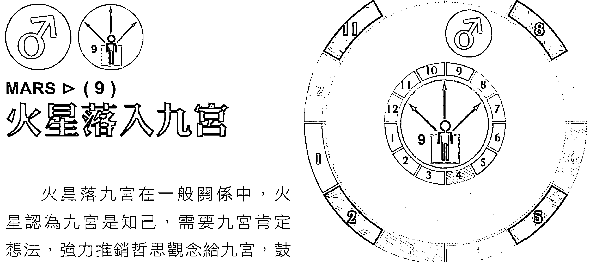

### 火星落入九宫

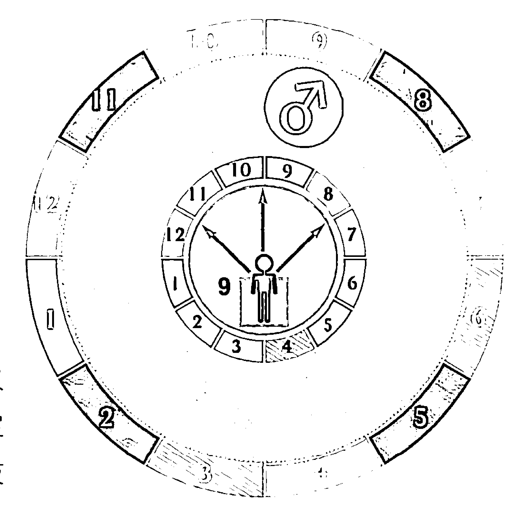

火星落九宮在一般關係中，火星認為九宮是知己，需要九宮肯定想法，強力推銷哲思觀念給九宮，鼓吹九宮認同自己。九宮將舉辦教育文化、哲學思想、旅遊傳播、異國節慶等活動，邀火星參與共事，給予表現機會。火星認為九宮資源可以利用，將積極安排工作，趁機吸收九宮知識，推廣自身理念。但火星因自我、魯莽、堅持己見的作風，自作主張草率辦事，或思想與九宮不同，頻頻攻擊其信仰觀念，我行我素的態度，使雙方合作不易。

在職業關係中，雙方不只是分享宗教、哲學、道德及法律的觀念知識，而是共同參與相關的活動，如文化出版、哲學思想、宗教推廣、法律事務等領域的夥伴、道友、同仁，彼此鼓勵對方投入工作。火星自我中心、跋扈武斷的態度，硬要說服九宮接受，使之更加反感，雙方雖在高等觀念上產生爭執，成為思想對手，但對主要關係無太大影響。在師生關係中，如九宮是導師，火星學生無論是否認同其觀念，站在支持或反對立場，都將明確表態。如火星是導師，將因學生不夠受教，快速轉移目標，無耐心說服九宮慢慢接受。

在兩性關係中，火星與九宮間的性吸引力較為知性，火星促使九宮往遠處跑，頻繁從事戶外冒險及遠方旅遊，雙方易成為運動休閒的玩伴。火星想在思想觀念層面主導，鼓吹自身意識形態，積極要九宮信仰改宗，支持相同政黨。如雙方相位互克，一旦涉及旅遊、文化、倫理、法律、宗教、民族、政治、黨派等話題，彼此就劍拔弩張、唇槍舌劍，激烈較勁辯個輸贏，競奪心智競賽的錦標。雙方旅遊途中要當心火星的挑戰勇氣及衝動脾氣，導致九宮的意外傷害，甚至涉及法律事故。

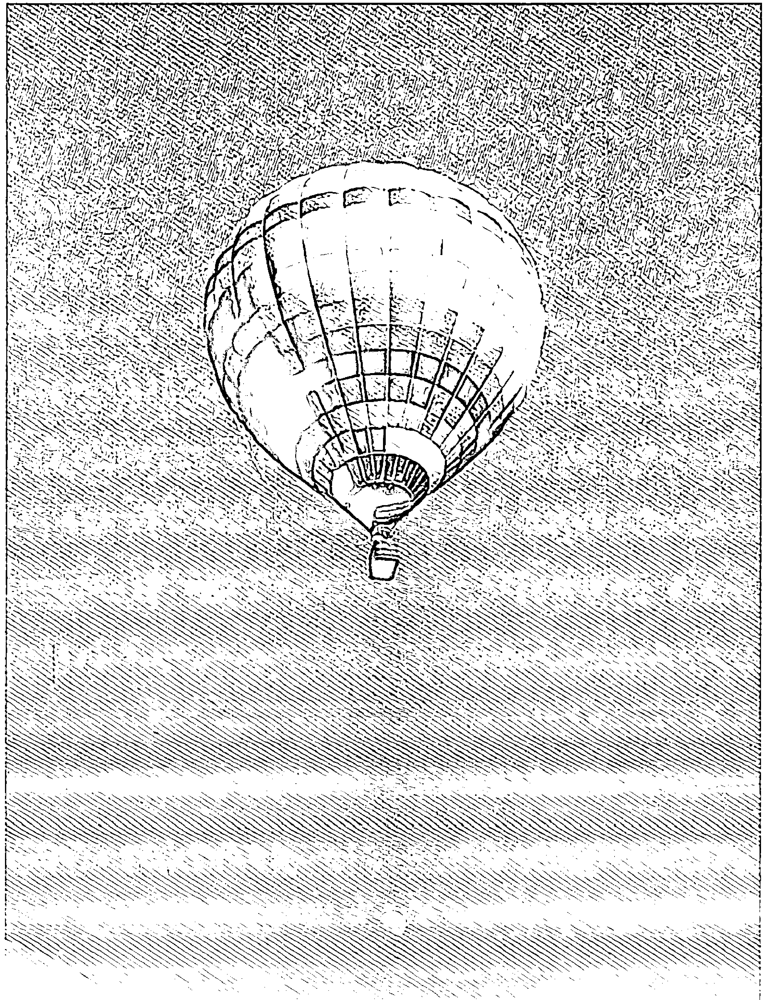

### 外行星入宫位～第九宫

### JUPITER ▷ (9) 木星落入九宫

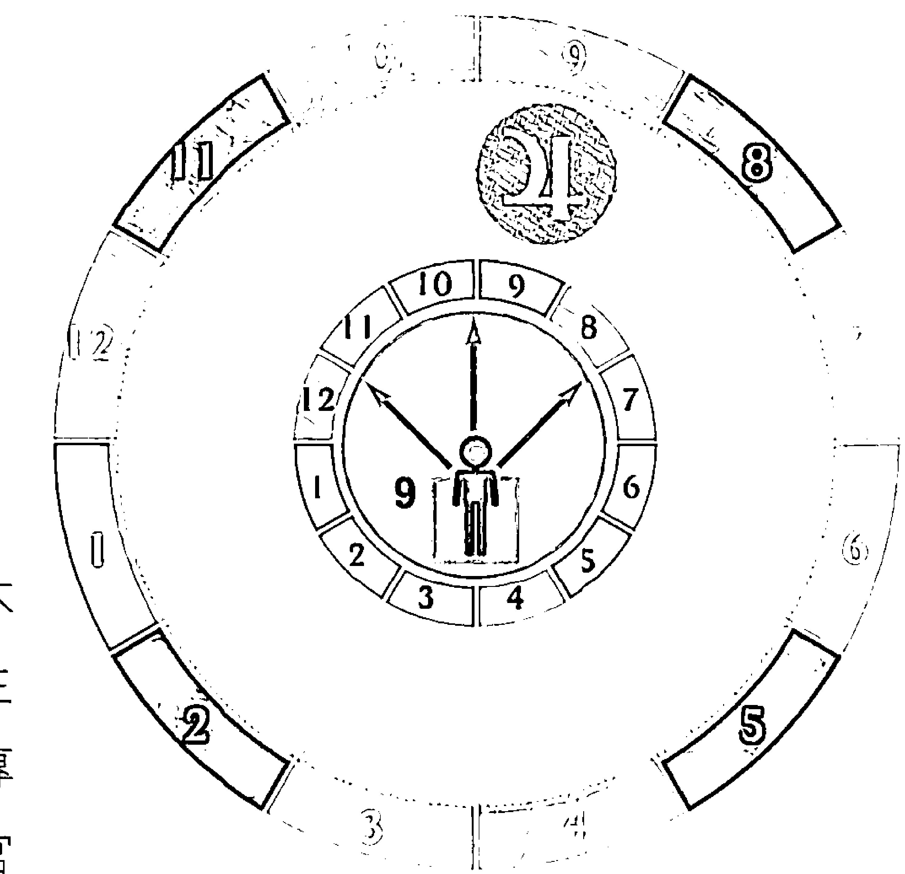

木星落九宫在一般關係中，木星擁有高度理想，覺得九宮是人生知己，樂於和九宮分享人生見解和專業知識。木星的遠大目標，一遇九宮就滔滔不絕、高談闊論，扮演精神導師，啟發九宮領悟。九宮擁有的社會資源，對信念、思想、哲學、宗教抱持的態度，引導木星自由開放的思想，在環境中落實發展，讓木星動機得到具體支持。木星帶九宮攀登知識之塔，九宮協助木星發展廣泛智慧，雙方堪稱天生道友，互動將以精神成長、文化交流為主。

在職業關係中，木星展現專業，九宮用來傳播，九宮的個人資質，木星認為可造。木星常是自成一派的上師導師宗師，聘請九宮擔任其助理、助教、顧問。九宮扮演耐心受教的學生及信徒，負責將木星的思想，傳達出去的執行企劃，常見於高等知識及人生信仰的師生關係。木星有機會將帶九宮出國發展，九宮則幫木星策畫演講教學出版，如木星是作家講師，九宮是出版人及編輯企劃，雙方適合從事文化教育、宗教哲學、藝術研究及國際貿易相關工作。如木星本身受剋，將空口白話過多承諾，要求九宮支持鼓勵，往往陳義過高，執行難達標準。

在親密關係中，木星與九宮對生命有相似的價值觀，共同熱衷戶外活動、知性冒險及異國旅遊，一起探索世界，成為很好的旅伴。關係不彰顯兩性吸引力，卻使彼此心智提升，追求高遠目標，大方分享豐富的精神資源。如木星和九宮互剋，代表在人生信仰及價值觀念上，見解有所歧異，雙方過度堅持自身信念及宗教信仰，並想說服對方，最終徒勞無功。

### SATURN ▷ (9) 土星落入九宫

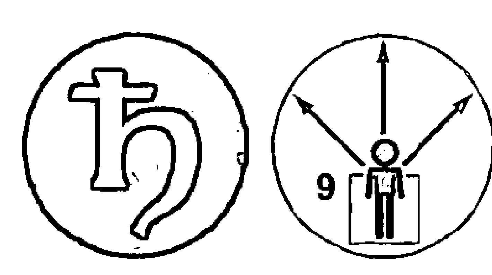

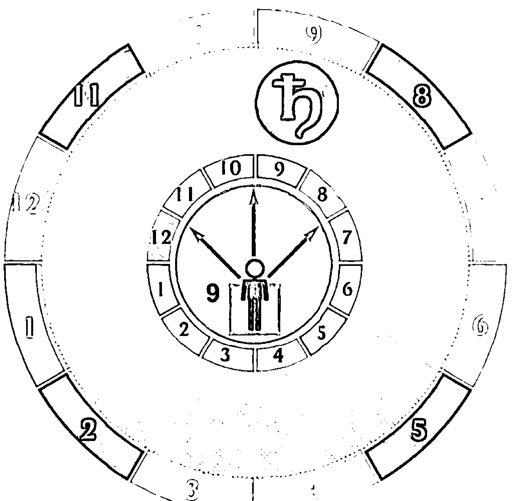

土星落九宫在一般關係中，土星的高等思想，九宮察覺到實用價值，會提供資源引介人際，讓土星高談闊論，展現知性權威。土星的人生經驗歷久彌新，九宮感到理念的傳承責任，給予實質支持，使土星公開傳播理念，加以世俗化利用。雙方談論話題常是嚴肅的宗教觀念、高遠的生命哲學及艱深的專業知識，土星扮演九宮的人生導師，給予精神指導，但強調實用的價值，而非靈性的領悟。雙方互動時土星愛說教，九宮會參考，但基本觀念仍有不可跨越的鴻溝，既感到對方想法重要，又無法完全接受。

在社會關係中，土星擁有專業知識，九宮提供教學平台，使其傳播教育、文化、哲學等觀念思想，彼此在專業知識及高等心智上的交流，和實質工作有關，並非純粹清談，只為休閒娛樂。雙方的宗教、哲學、法律、文化、旅行往來活動，不只是興趣愛好，而以工作職業為主，開設事務所、教會廟宇、投資出版、旅行經營等。

雙方常在教育、法律、國貿領域，因共同理念使命，建立長期工作責任。若雙方有挑戰相位，則因處世價值不同及意識型態落差，出現思想交流的障礙，甚至因道德倫理觀的差異，在法律、條文、規範上釀成實際麻煩。在師生關係中，土星的精神導師，覺得九宮學生態度雖認真，但吸收領悟不佳；若土星是學生，將以嚴格標準，檢視老師專業表現。

在私人關係中，雙方在面對傳統習俗、家族倫理、異國旅行、哲學宗教等問題時，都堅持己見，覺得對方保守僵化、難以溝通。土星男性要求妻子奉行社會道德規範，面對父母晨昏定省，九宮認為食古不化，無法遵從。土星女性要求丈夫配合家族風俗習慣，結婚時要三媒六聘，九宮判定墨守成規，不符實際。雙方的人生價值、教育理念及宗教觀點，在在不同，形成相處的心理隔閡。

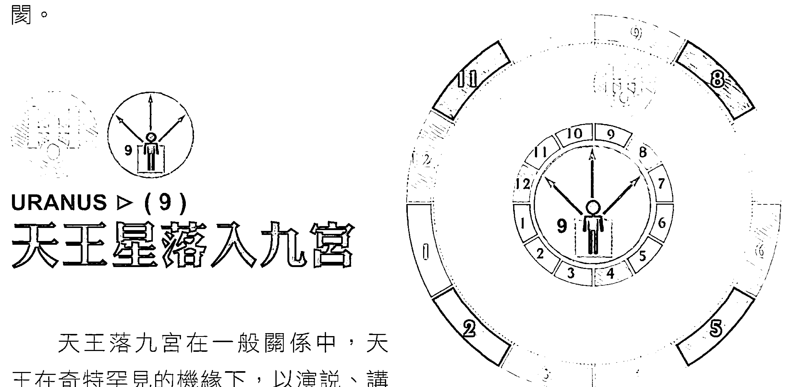

### 天王星落入九宫

天王落九宮在一般關係中，天王在奇特罕見的機緣下，以演說、講座、教學、出版等方式，給九宮強烈的知性衝擊。天王有前瞻、革命、先驅性的哲學、宗教、法律、文化等觀念，開啟九宮的精神視野，分享大異其趣的生命閱歷，使九宮接觸新穎的異國文化及另類思想，破除原本陳舊的世界觀。如天王和九宮互剋，天王雖然秀異，但思想因太過前衛、非主流及驚世駭俗，造成九宮思想產生逆轉，其特殊價值觀及人生觀，給保守的九宮極大震撼，視天王為外星人。天王導師的異端思想離經叛道，對九宮的意識型態、人生成長及旅遊計劃，造成突發的顛覆，九宮自身星越多，受天王影響越深。

在社會關係中，天王的特殊知性及發明創作，被九宮無意間相中，視之為珍奇怪寶，共同創造新穎的獨佔性商機。九宮如自身有星，將設法讓天王發揮，大肆宣揚崇高的精神，可建立精神同盟的互動，僅限文化經典、哲學、五術、宗教、新時代等範疇，雙方日常往來疏離。

在商業關係中，天王提出一堆天馬行空的商業構想，但天王變數太大，引發意外破壞現狀，使九宮驚嚇無安全感，雙方協議不具實質約束力，合作不易持久。在師生關係中，天王老師獨樹一格自成一家，吸引九宮追隨，天王不停變花樣，給學生知性刺激。天王學生會挑戰老師觀念，時而唱反調，九宮老師如不耐，會疏遠往來，讓天王另尋明師。

在私人關係中，天王不服權威、顛覆傳統的人生觀，跟九宮雖然有所爭執，但在本地原先沒事，一起出國才引發意外狀況。天王的意識轉變，因所處地域不同，無預警被激活，高等意識的刺激，在異鄉異地才出現變化。天王按不住冒險的神經衝動，突發奇想中斷計畫及變更行程，令九宮驚訝不快，分道揚鑣。天王無論單身已婚，都可能在異地邂逅外籍情人，打破禮教閃電交往，卻因雙方在文化背景、倫理觀念及信仰思想的差異過大，而快速決裂分手。

### NEPTUNE ▷ (9) 海王星落入九宫

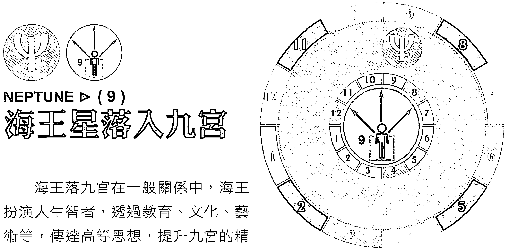

海王落九宮在一般關係中，海王扮演人生智者，透過教育、文化、藝術等，傳達高等思想，提升九宮的精神層次。海王引領九宮對外地的人事物，產生理想期盼，對旅遊、移民、國貿等遠方發展，抱持美好憧憬。雙方的互動，跟經典藝術、歷史人文、旅遊閱歷結合，透過藝術表演的欣賞，高深知識的進修，哲學宗教的修道，分享對美學、靈性、精神成長的領悟。

海王如與九宮互剋，海王所接收的集體夢幻與理想，九宮欲加落實在教育文化層面，雙方在人生信念及宗教信仰，常以虛擬想像，而非邏輯思維來理解。海王闡述的高深思想，對九宮仿佛雞同鴨講，彼此有心交流，卻難以精神認同，成為無意義的清談同道。

在社會關係中，海王的靈性導師，正面給予弟子精神指引，使其靈性成長加速。負面則以虛妄不實的宗教哲學觀，使九宮人生觀迷惑錯亂，失去覺察地著迷崇拜海王，任其擺佈誤入歧途，導致精神受傷及金錢損失。海王的作家、學者及藝術家，給予九宮出版承諾，提議遠大計劃，想運用九宮資源在教育、文化、藝術方面合作，卻因不願負責及執行乏力而落空。海王的理想過高，常營造無法實現的幻象泡沫，九宮不宜找海王當法律顧問、智庫幕僚及專案經理，否則共造的海市蜃樓，將一戳即破。

在私人關係中，海王懷抱求道修行、遠行移民的夢想，九宮理解並予支持，一起實現旅遊朝聖的心願。海王的一廂情願跟不切實際，使九宮大作冒險淘金之夢，旅遊不宜涉及實務工作、海外創業跟國際貿易，否則容易失望幻滅，半途而廢。雙方在精神層面難有共識，海王覺得九宮信奉儒家，只知遵循家族的習俗、信仰、儀式等表面形式，缺乏根本的本質理解。九宮則認為海王的創世信仰過度唯心，不具世俗實用性，若不涉及意識形態，彼此可相安無事。

### PLUTO ▷ (9) 冥王星落入九宫

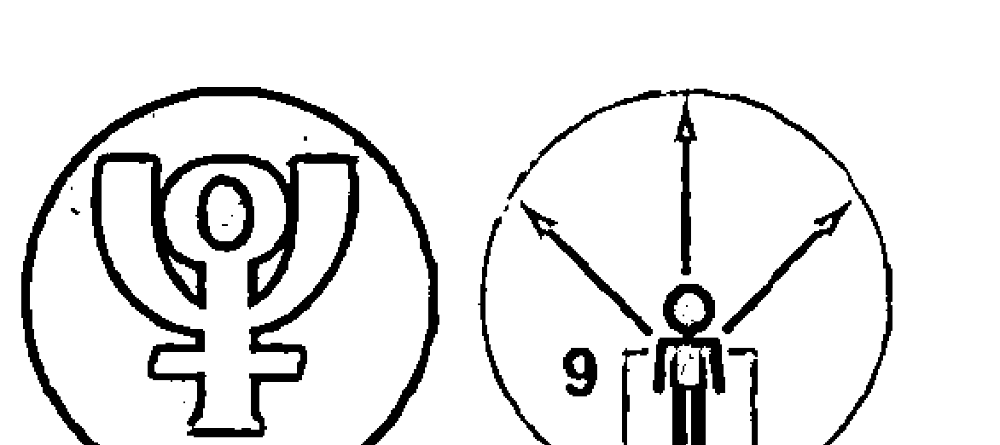

冥王落九宮在一般關係中，冥王具厲害的知識思想，有成為宗師的潛能，挖掘九宮的世俗經驗，雙方對既有的社會制度、教育文化、道德法律、哲學宗教，有很強的改造使命感，共同建立教育霸權。冥王以身試法的爭議作風，引起九宮無意識的關注，如雙方靈性發展較高，將在異國文化、哲學宗教、教育改革等領域，因共同理念成為強力的盟友。冥王的集體毀滅與創造性，九宮接收並承受壓力，協助冥王順利轉化成高等心智，共享獨特的精神使命感。如冥王和九宮互剋，話題一涉及族群政黨、宗教法律、國家認同等意識型態，就會劍拔弩張，發動思想的十字軍，向對方宣戰，誓不妥協。

在社會關係中，冥王利用九宮的人脈資源，九宮讓冥王精神思想得以茁壯，雙方如有和諧相位，可能合作創辦學院、成立出版社、推廣新興宗教，引進外國的法律精神及信仰思想，如三民主義、革命宣言、宗教經典等，對原有制度規範及立法精神，產生巨大而深遠的影響，將因此革除舊有威權，再造全新的集體意識。

若冥王與九宮互剋，容易對法律理解不同，道德觀念不合，相互隔空交戰，大打筆墨官司，甚至提起訴訟，對簿公堂。在師徒關係中，冥王宗師的極端偏激，對九宮信徒強勢洗腦，使其深信不疑長久效忠；冥王弟子則飽受思想壓迫，嚴厲質疑九宮導師的高層觀念，甚至背出師門，揭發不為人知的信仰黑幕。

在親密關係中，冥王因成長背景養成的觀念，在宗教信仰、文化傳統、國族認同等有所偏執，企圖改造九宮根深蒂固的思想。冥王藏有不少思想地雷，九宮若無心碰觸到，將引爆冥王的極端，強迫九宮毀棄改宗。冥王執意操控九宮思想，如本身信仰基督天主，非但不肯拿香祭祖拜拜，反要改變對方，九宮無星多半順從，在恐怖控制下徹底轉變。九宮若有強勢星體，則不肯信服採取反擊，親密關係因文化信仰產生對抗衝突，但不易波及日常生活。

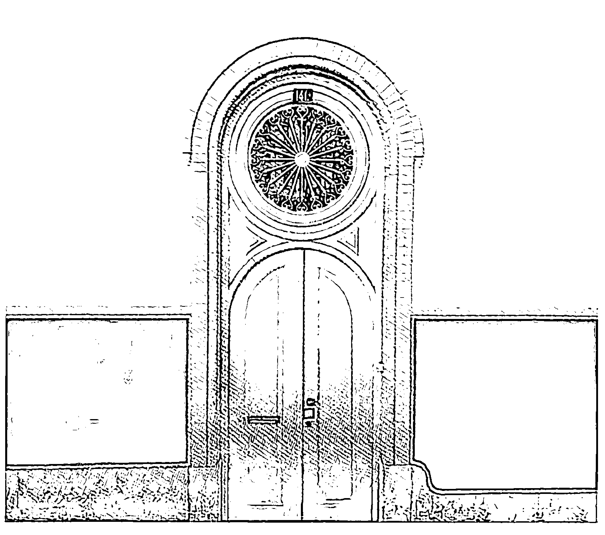


第十宫有成為「社會家長」的企圖，希望擁有支配眾人的行政權力，會藉由既定體制，在政府部門、企業組織及公共單位中，擔任行政主管，亦或自行創業，建立自己的名號招牌，掌管經營權的施行。十宮有管理眾人之事的責任感，渴望獲得公眾信任，擔當「父母官」。尤其女性的十宮，常以身為子女的家長，扮演父母的角色自居。十宮的實質動機是來自父母家族的無形傳承，以社會上的名聲成就與管理權力，彰顯內心所受「靈性召喚」的使命，實現此生的獨特天職。

如他人太陽落入自己十宮中，太陽熱烈鼓舞十宮，克服恐懼和限制，積極運用能力，十宮提供表現舞台，增進太陽參與社會的意願，完成當家作主的企圖。太陽自身具有優異條件，讓十宮覺得有光彩，不管太陽是長是幼，十宮都會敬重，但私下往來較不密切。

### The Twelve Houses

如月亮落入，十宮的事業及社會地位，常常影響月亮的生活安定及內心安全，常出現在家庭成員間。月亮女性以照顧家庭為主，期望十宮提供實際安全，妻子為了生活安全感，盡心輔佐丈夫事業。月亮男性在乎女性的社會表現，工作家庭依賴妻子甚重，妻子若非負起養家活口的責任，就是負責家庭對外的事務處理。在社會關係中，雙方常在餐飲服務、房地產、居家日用品買賣，因事業工作像家人親密往來。

如木星落入，木星運用十宮資源，參與公開活動，傳播崇高理念，帶給大眾知性成長，夫妻可合夥創業，關係中互蒙其利。木星投注資源，助十宮事業擴張，特質符合流行趨勢。雙方樂於公開亮相，舉辦文化、教育、旅遊的高調宣傳，一起參與流行、時尚、名牌店的開幕派對。木星一方以配偶為貴，彼此與有榮焉。

若土星落入，土星有責任督促十宮努力，公開批判指出十宮的缺失，望其更加小心謹慎。十宮雖重視土星的專業，但十宮覺得土星功利現實，對事業發展悲觀負面，合夥不易成功。雙方若是同行同業，往來涉及公眾領域，將給彼此不小壓力，十宮如自身無星，並不在乎社會功名，因厭惡土星的現實而疏遠，不利雙方親密互動。

### The Tenth House

## Synastry

### 第十宫

#### 【事业宫】

- 事業夥伴
- 家長角色
- 公眾共事
- 權力對手
- 責任同僚
- 利益關係

第十宮的

### 事業權力和社會舞台

第十宮，掌管事業成就、公眾名聲、權威地位、家長形象等，代表我們站在面對大眾的舞台上，容易展現何種特質，企圖得到何種社會認同和公眾肯定。

第十宮落入的星座是父母的角色扮演，從小制約個人在面對社會體制及權威人士時，採取何種態度來應對。第十宮內的行星，象徵被家長塑造面對社會的行為動機，引領一個人培養對待世界的觀點，並顯示和家族的公開關係。如果說第一宮是「自我面具」，第十宮的星座就是「公眾面具」，是自我內在渴望被社會認同的特質。

第十宮的工作事業，較接近終身志業及人生志趣，涉及公共事務的行政管理，奠基於權力上的名聲榮耀，並非單純賺錢謀生之任務，以及受僱於人的差事，是身居無法被取代的要職。十宮是從小感受到的家長期許及社會壓力，產生謀求功名的企圖，立志在公眾領域取得權力名聲，建立被大眾認同的成就，作為受人景仰的成功人士。

### The Tenth House

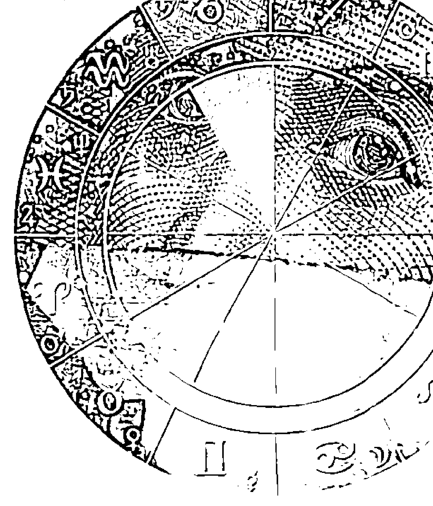

在一般關係中，第十宮是嚴謹的企業合作，以及正經的事業往來，有社會利益的交流，比單純的金錢買賣及工作聘雇，雙方較有公共資源。十宮顯示共同的社會參與，攸關長期的公眾名聲，雙方因共同管理及公開推薦，建立社會名聲、政治權力、家庭地位和管理權威，完成企業營運、社會目標及家族期許，關係受到公開檢視，互動成為標竿。

十宮關係常顯示雙方互動非同小可，在生涯中具有關鍵性的扭轉作用，對工作、事業和人生，有重大決定性影響，彼此在人生發展中，有舉足輕重的正負面效應。若挑戰性的十宮相位，象徵雙方在社會舞台上有重要對手戲，如同業的商場勁敵，對立的政壇對手，公開化的家務紛爭，相互攻擊、杯葛、奪取及破壞彼此的事業目標、社會名聲及管理權力，甚至讓個人恩怨蔓延至公眾領域。

### The Twelve Houses

### 第十宫的事业权力和社会舞台

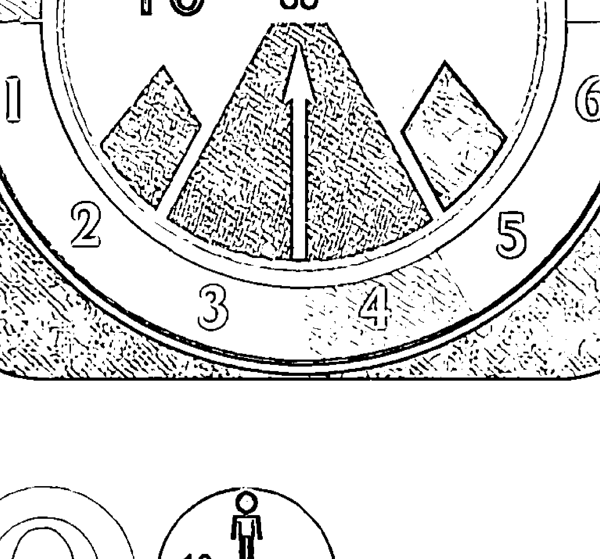

**【关键主题】**
- 事业伙伴、家长角色
- 公众共事、权力对手
- 责任同僚、利益关系

### SUN ▷ (10) 太阳落入十宫

太阳落十宫在一般关系中，太阳展现成功，促使十宫走入社会，十宫动员手头资源，增进太阳参与社会的企图心，常见于重要的事业往来。十宫拥有的社会舞台是公开性的，让太阳发挥所长，耀眼表现容易被看见。双方的工作有利益交换，彼此公平公开交易，共同处理事业及社会利益，比六宫的工作聘雇，更有合作资源。在社会领域中，十宫是正式的体制机构，涉及严肃的事业往来，双方有功利性的互动；九宫是小众学术，不是社会主流，只在特定主题活动；十一宫是群众运动，是另类学习团体，及非营利性组织。

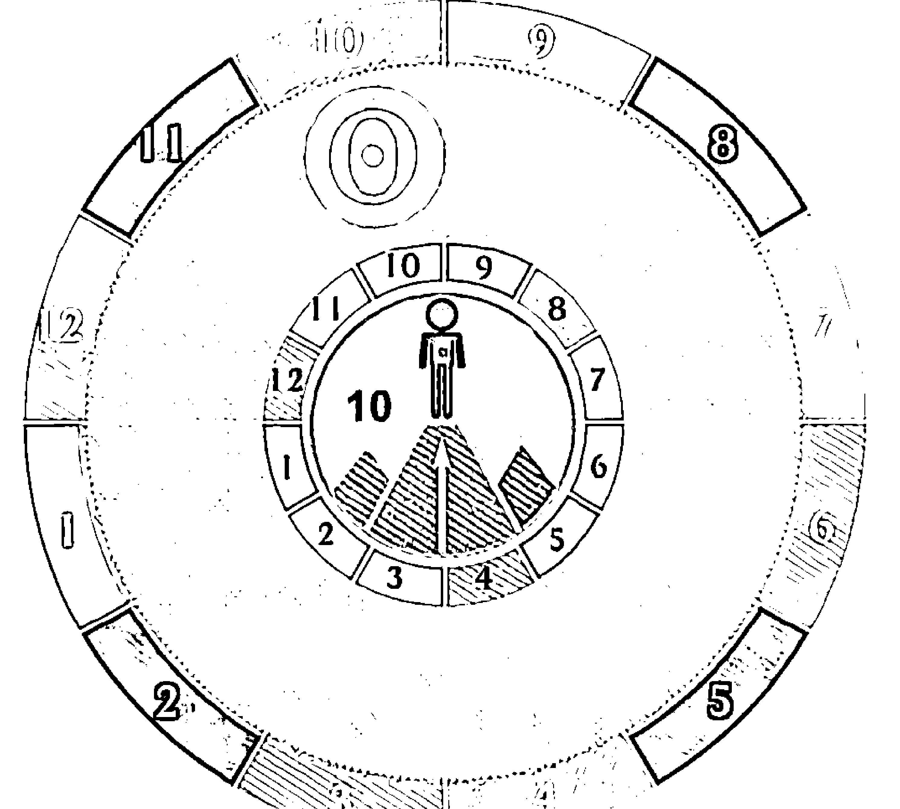

十宮期許太陽功成名就，提供社會人脈及處世經驗，給太陽機會協助，助其克服恐懼與自我設限，提昇地位形象。若太陽本身受剋，對十宮代表的權威體制，將出現矛盾態度，既渴望從十宮的權力資源得利，又害怕受十宮的掌控及壓迫，因主觀意識作祟，出現自卑且自大的情結。如太陽與十宮有挑戰相位，雙方合作將出現公開化的利益衝突，使得眾人皆知。如十宮本身空宮，野心企圖不強，太陽的力量難以發揮，雙方私人往來不頻繁，有宮位關係而沒有相位時，只限行星的能量展現，沒有宮位的具體成果。

在私人關係中，無論太陽身為男女長幼，個人必定具有卓越條件，在十宮培育教養之下，頭頂耀眼光環，站上社會舞台，受到表揚肯定，十宮與有榮焉，常有父母以子女表現為傲。在兩性關係中，親密伴侶同時有無可取代的事業連結，若太陽是男性，丈夫運用妻子的社會及家族資源，成就事業目標，妻以夫為貴。若太陽是女性，將在十宮丈夫輔佐下，成為企業負責人，男性擔任副手經理人角色。

### MOON ▷ (10) 月亮落入十宫

月亮落十宮在一般關係中，月亮敏感的天性，心動於十宮的社會名聲，受十宮的公眾價值吸引，擺脫退卻小心接近，在公開場合生活化往來。月亮關心十宮的事業發展，表現親切特質，彼此適合飲食買賣、養育照護、情感關懷、房地產、居家修繕、日常用品販售，因工作事業，像家人般往來問候。在社會關係中，月亮受十宮的權力安排，建立職業互動，十宮適合當老闆，可主導事業、發號司令，月亮副手聽命行事。如月亮是老闆，對待員工

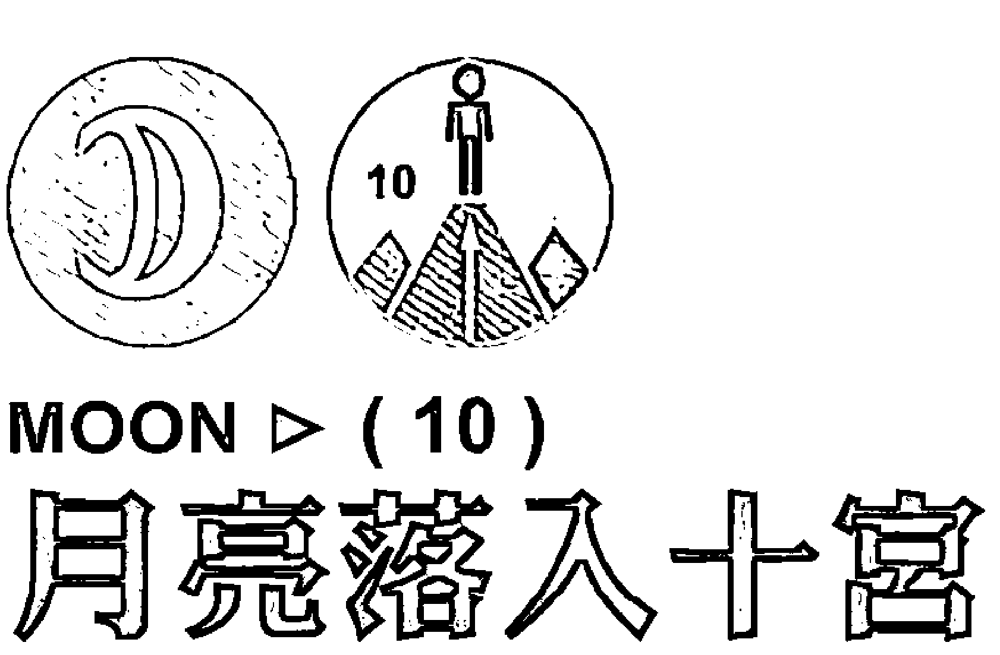## 内行星入宫位~第十宫

如同家人，又觉得部属表现不够稳定，时常担忧焦虑，只有照顾关怀，很难严格管理。

在家庭关系中，月亮满足十宫的社会需求，十宫提供月亮安全保障，十宫的工作、事业及社会地位，影响月亮的家庭生活和内心安全感。如月亮是父母，会提供支持滋养，担任辅导角色，满足子女实现志趣，不强制照父母意愿，辅助十宫成长及创业。如果十宫是父母，子女不仅得到生活照顾及物质满足，也被父母主观培养，父母供应子女的教育经费，创业资本乃至婚礼基金一应包办。父母的社经地位，是子女社会安全感的媒介，使之内心满足以及不安，子女觉得被父母当成情感的示范工具，个人表现受父母社会意识所制约，亲子关系带有功利性。

在两性关系中，十宫负起养家活口、面对社会的主要责任，月亮则以照顾家庭为主，如月亮受剋，将安逸懒散、做不好家事。月亮十宫的婚姻结合，常是因应社会及家长的功能性要求，以生活安全为考量，缺乏自然的男女之情，关系中的现实与功利性特别凸显，不利男女亲密互动。当月亮是男性时，社会角色容易倒置，过度依赖妻子主外行事，有碍男方社会发展，除非妻子耐心持续、付出资源培养，辅助丈夫独立。当月亮是女性时，在乎丈夫的事业表现，期望得到实际保障，但不直接表达，只以情绪化反应。


### MERCURY ▷ (10) 水星落入十宫

水星落十宫在一般关系中，水星的想法点子，十宫认同实际功能，符合自己的事业志趣，会加以社会化利用。水星的理念思维，十宫运用资源加以宣揚，公告周知，有利水星知名度提升。水星的想法及觀念，提供十宮生涯規劃及事業發展的建議，啟發十宮的靈感，完成社會性工作。十宮可幫水星的心智知識及傳播能力，找到有力的機構支持，獲得企業組織的採用，爭取社會體制的認可。

在職業關係中，水星與十宮的言語接觸及資訊交流，大都是在談公事，私下沒有話題。水星找十宮合作事項，容易被大眾看見，雙方適合從事新聞廣播、大眾傳播、出版翻譯、文化教育、旅遊等合作。如水星和十宮互剋，雙方對事業意見不一，常為工作吵架，變成公開性議題，影響彼此的講話溝通與交流。水星的中性與客觀化，一旦處境改變或消失，雙方不會為此掛心，不易成為對手敵人。

水星落十宮在兩性關係中，水星特別關心十宮的工作事業，將花很多時間，討論雙方的社會表現，給予對方意見。水星十宮若非辦公室情侶，就是以共同事業為基礎事業的夫妻，否則不常見到實際案例。雙方除了職業工作及社會事務之外，將為如何扮演家長角色，以及子女的社會教養跟生涯發展，頻繁交換意見，談話務實功利，不會無意義閒聊。

### VENUS ▷ (10)
#### 金星落入十宮

金星落十宮在一般關係中，十宮擁有的優異條件，可能是其外貌身材、社交手腕及突出才藝，是金星所看重的，欲好好加以利用，得到人際發展及社交利益。金星喜歡參與十宮的公眾活動，金星的表演才華及美學藝術，十宮將以具體化呈現，幫金星的個人才藝打造表演空間，金星可藉由十宮的舞台，使自己更加闪亮，双方在关系中各谋其益，友谊带有功利性目的。

在职业关系中，金星从事表演创作，十宫提供社会资源，给予公开机会，双方适合从事艺术、音乐、娱乐、公关、流行、奢侈品买卖等相关工作。如同演艺人员与制作人、艺术家与经纪人关系，合作让十宫的事业扩展，也让金星的才艺展现，获得公众赞赏。金星是拥有才艺的创作表演者较佳，十宫基于实质利益考虑，会专注资源捧红金星，希望金星塑造受欢迎的形象，让自己有光彩；若金星是经纪制作一方，态度较为被动，缺乏毅力及足够资源，不易长期支持十宫发展。

在亲密关系中，金星看上十宫的社会地位，常因为十宫的事业名声，予以答应结合，十宫觉得金星的优异条件，可以彰显自己的身份荣耀，双方对关系的考量中，有很强的势利因素。金星如是男性，相中女性的社会资源，期许得到青睐，有所发展好运。金星如是女性，可能是被男性金屋藏娇的对象，十宫必须提供奢华的物质享受，满足金星的虚荣及欲望。无论男女，十宫一旦失势，退出社会舞台时，双方感情受现实利害的制约，金星常因失去利益的动机而分手。双方若是夫妻情侣，私人情感与社会成就相结合，易因金钱事业造成情感矛盾，缺乏自然温暖的共鸣。

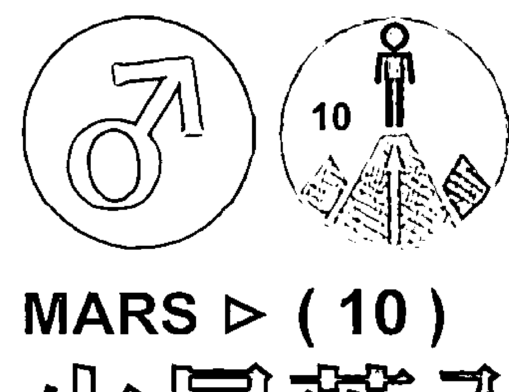

### MARS ▷ (10)
#### 火星落入十宫

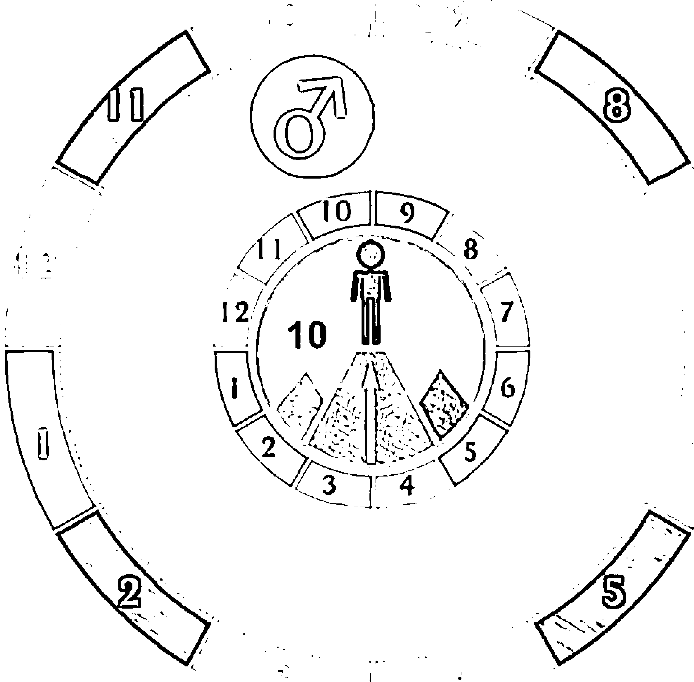

火星落十宫在一般关系中，火星看到十宫拥有的社会功能，野心企图被激发，积极发起活动，设法利用十宫。火星的能力突出，引起十宫注意，认定有社会价值，愿意运用名声地位人脉等，让火星充分表现。火星需要十宮的指導提拔，運用十宮資源達成目標，十宮則需要火星的支持效力，壯大事業聲勢，因而產生頻繁的職業往來。火星本身就在十宮者，不會畏懼目光評價，習慣公開宣示個人主張，容易吸引火星落自己十宮的人，引發自己的脾氣，雙方吵架爭執，乃至公然為敵。

在職業關係中，火星主導性強烈，認為十宮表現不順己意，直接表達憤怒不滿，十宮覺得火星衝動性急、難以合作馴服，容易因工作引發糾紛，雙方合作緣不如金星木星。火星與十宮都不願服輸示弱，讓自己表現被對方比下，相互激起強烈鬥志，可共同完成高強度，高競爭的工作任務，常發生在運動比賽、商業競爭、工程建築、政治軍事等領域。如火星和十宮互剋，將因同行同業的市場競爭，把彼此當作對手，企圖打倒及壓制對方，成為眾人皆知的業界敵人。

在兩性關係中，十宮的社會資歷、形象、地位及資源，讓火星為之尊敬看重，鍥而不捨接近十宮，以求快速提拔，完成自己的野心。火星若是男性，會受十宮的激勵，快速聯手創業，挑戰市場取得成功，也容易隨潮流快速收攤，結束營業。火星若是女性，可能冀望升遷不擇手段，若非以性關係攀附上司，就是用金錢禮物賄賂討好，爭取提拔。當火星與十宮互剋時，容易有經營權力的糾紛，演變成公眾風暴，波及共同事業。

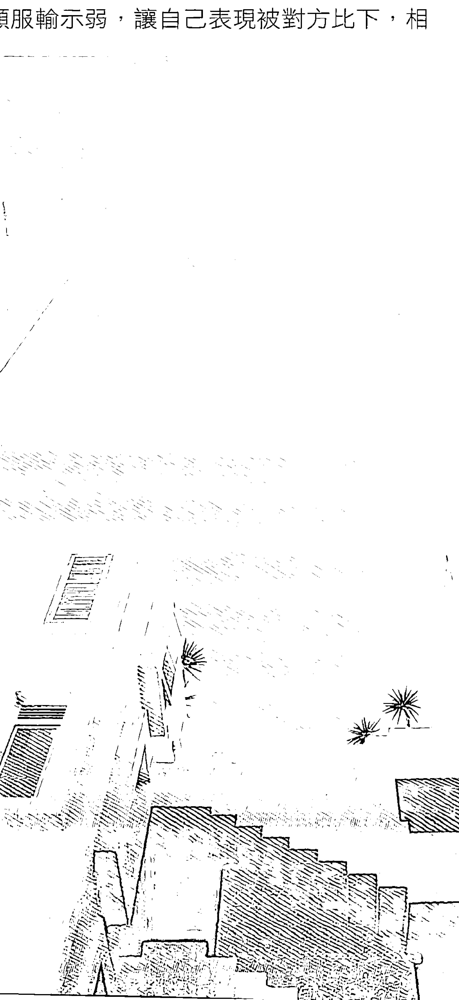

### JUPITER ▷ (10) 木星落入十宮

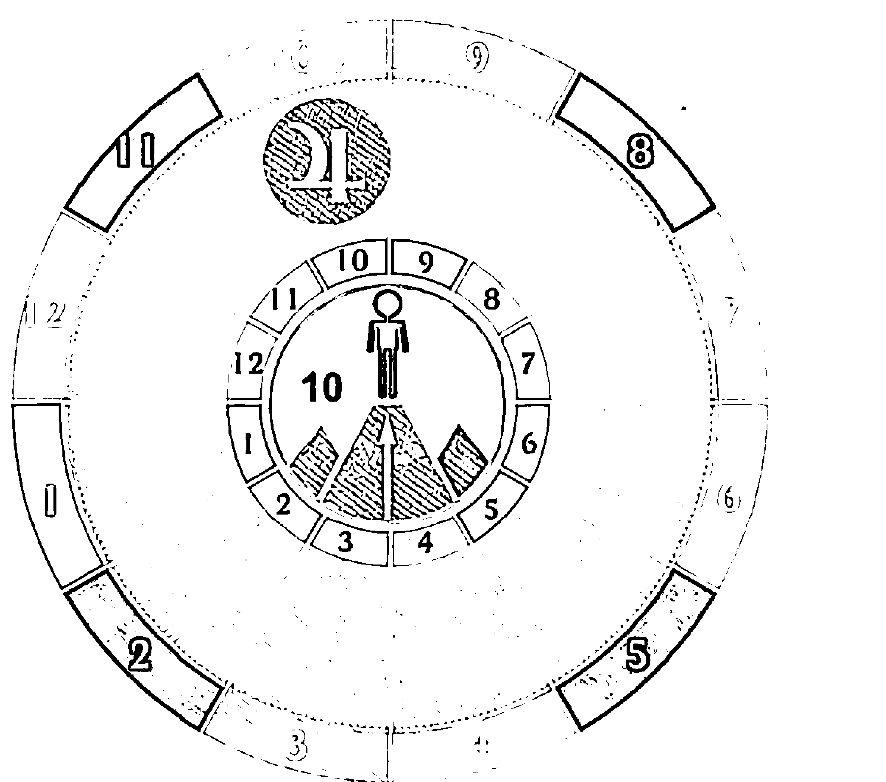

木星落十宮在一般關係中，十宮察覺木星的自信、長才及高人氣，有助自身的理想宣傳及社會推廣，大方提供建議，鼓勵木星事業表現。木星具有專業素養，樂於運用十宮環境，參與公眾活動，共同營造歡樂氣氛，以高調的社會表現，傳播崇高理念，引發公眾討論，帶給大眾知性成長。雙方追求的事業發展及共同願景，是當下社會潮流及未來趨勢所在，可用資源不虞匱乏，關係中互蒙其利。

在職業關係中，木星豔羨十宮的名聲成就，會因十宮在場，情緒高亢興奮，表現優異受歡迎。如十宮是節目主持人，常發木星藝人通告，十宮的活動主辦人，特別點名木星來賓亮相，彼此交相輝映、與有榮焉，適合從事時尚、流行、文化、教育相關工作。若木星和十宮互剋，可能過度樂觀不夠努力，縱容彼此揮霍良機，承諾社會的理想事業，浮誇不實及虛幻膨脹，落個雷聲大雨點小，轟轟烈烈一事無成。

在親密關係中，木星投注自身資源，助十宮事業擴張，夫妻可合夥創業，事業特質符合流行趨勢。雙方樂於公開亮相，舉辦文化、教育、旅遊的宣傳活動，一起參與流行、時尚、名牌店的開幕派對。無論男女，木星都以配偶為貴，若木星是丈夫，十宮是企業家千金，男性事業企圖心蓬勃旺盛，將倚仗岳家資源，大膽開創新領域。如十宮是男性企業家，木星妻子將以丈夫為名做號召，成立社團組織基金會，從事教育、慈善、公益等事業，將丈夫權力地位廣泛性利用。

### SATURN ▷ (10)
#### 土星落入十宮

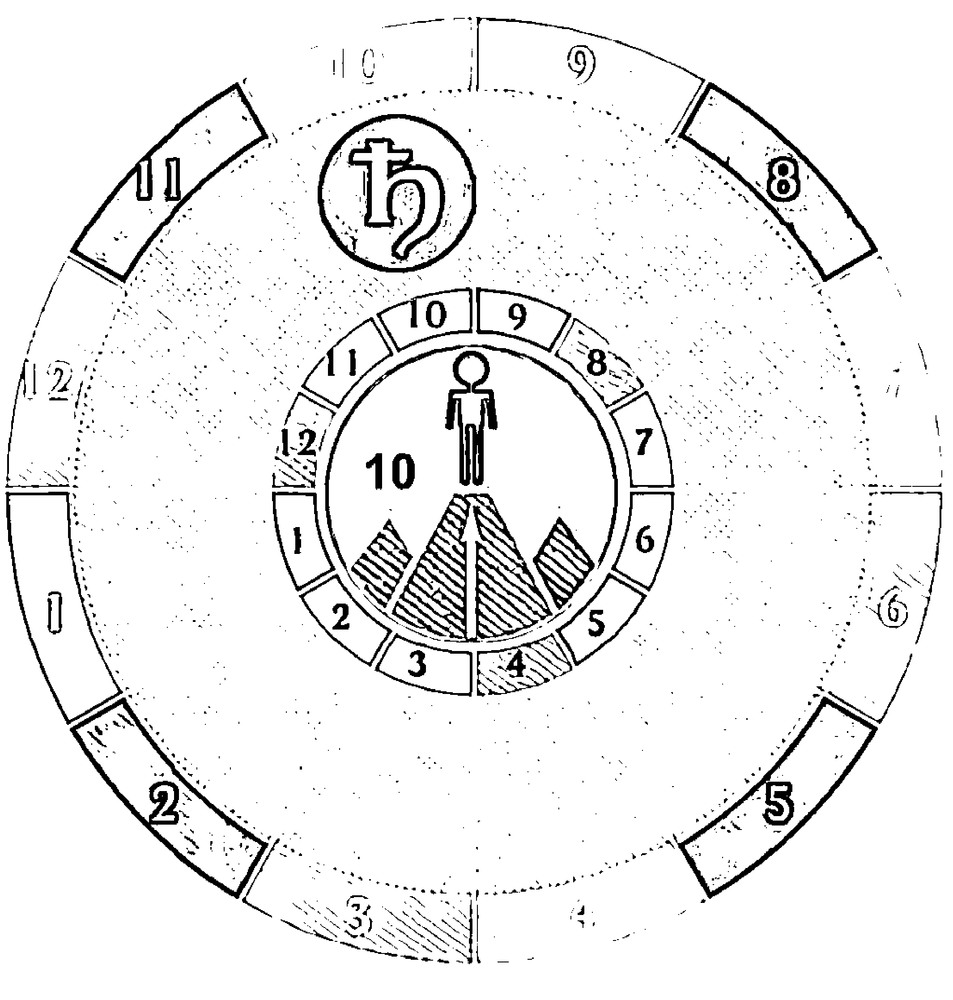

土星落十宮在一般關係中，土星用嚴格高標準，審核十宮的人生志趣，覺得不夠務實，只是在做夢。土星在意十宮的社會評價，以功利性眼光評估十宮的事業態度，認定其表現不夠老練，不符社會性需求。土星批判指出十宮的公開缺失，希望十宮更加小心謹慎，並以自身經驗及知識，指導十宮的表現。雙方互動若涉及公眾領域，會給對方很大壓力，彼此對於社會功名的價值觀認知，容易產生差異，公開保持距離。十宮若自身無星，並不在乎社會功名，會厭惡土星的現實，因而疏遠關係。

在職業關係中，土星擁有的社會地位，使十宮感到敬畏，土星對十宮的生涯發展有責任感，以長久的世俗經驗，及社會失敗的教訓，督促十宮認真努力。十宮重視土星的專業名聲，提供社會舞台，利用公開的表現機會，當眾做球給土星，點名要求經驗分享。土星做事注重功利及效率，將發揮指導及訓練能耐，運用個人專業，協助十宮發展。

如土星和十宮互剋，十宮覺得土星太過現實，對事業發展悲觀負面，而不願遵從指示，雙方合作不易成功。如土星有和諧相位，其擁有的過來人經驗，對十宮的事業能派上用場，彼此可在合作的成果中，看到人生實際的價值。雙方可以建立重要的社會關係，但彼此不宜是同行，否則容易因為大環境的景氣興衰，影響實質利益的穩定。

在兩性關係中，土星若是男性，對工作野心很大，有事業成就的具體壓力，給予妻子現實責任，要求為丈夫事業勞心勞力。十宮若是丈夫，恐懼女性

### URANUS ▷（10）
#### 天王星落入十宫

天王落十宫在一般关系中，天王扭轉世俗價值，鼓動十宮開創嶄新志業，打破傳統的父母期許，顛覆社會規範的制約，朝個人獨立、尖端創意、高科技的領域發展。天王的自由、古怪與奇想，自創一套邏輯道理，認為十宮可以脫離體制，自立門戶及自成一家，嘗試另類發展，活出生命的無限可能。天王的神經不安定，常因無法自制，當眾脫軌鬧事，破壞十宮的公開形象。十宮如果有星，將無意識受天王引導，成為頭銜罕見的自由工作者，隨之一起發瘋，反之則影響不太具體。

在職業關係中，天王提供新奇點子，刺激十宮自行創業的念頭，天王運用十宮的資源，培養出特殊專長及前衛思想，突破原本受限的工作領域。天王不在乎主流職業，覺得瑣碎的行政技術工作缺乏價值，慫恿十宮辭去上班族職務，朝新時代思想、高等知識、獨佔科技領域，引導社會進化的職業發展。天王經常一時興起，挑撥十宮開創實驗性的投資及事業，但天王不斷追求新穎目標，態度疏離且行為反覆，將使十宮名聲及財務受損。天王有時狂熱投入，促使十宮事業轉型，有時漫不在乎冷眼旁觀，袖手讓事業一夕間結束，十宮沒星可以不理天王瘋言狂語，避免生涯意外。

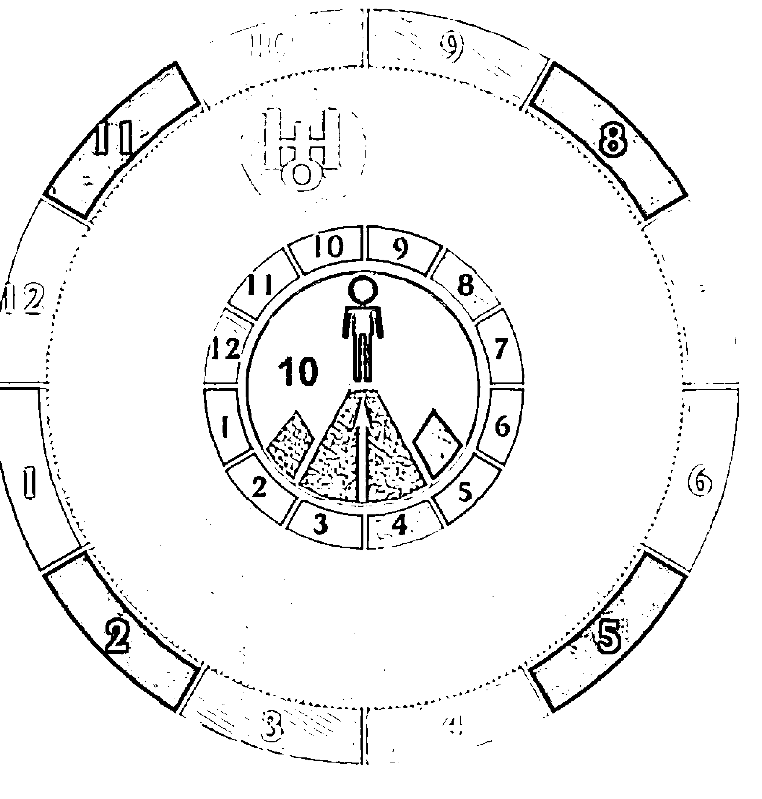

在家庭關係中，天王的神經衝動，時而開明友善，時而自私無情，行事作風捉摸不定。如天王是父母，會以自由方式管教子女，用實驗性質的放任態度，培育出特殊天賦，作風前衛的子女，抑或教養出不適應社會規範、搞體制破壞及社會革命的子女。在親密關係中，天王如是男性，不願從事一般工作賺錢，十宮妻子提供生活資源及特殊啟發，支持丈夫成為自由的創意工作者。天王如是女性，將大力鼓吹丈夫辭職，自行創建理想的前衛事業，帶來生涯轉型的契機，允許丈夫不給家用，使家庭安定出現變數。

### NEPTUNE ▷ (10)
#### 海王星落入十宫

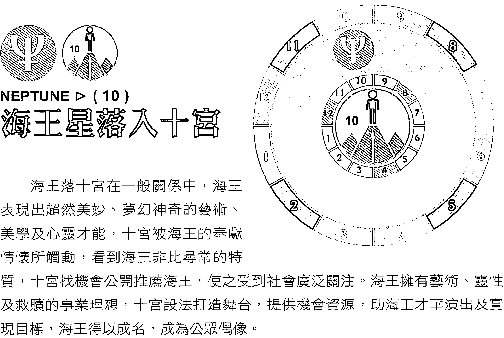

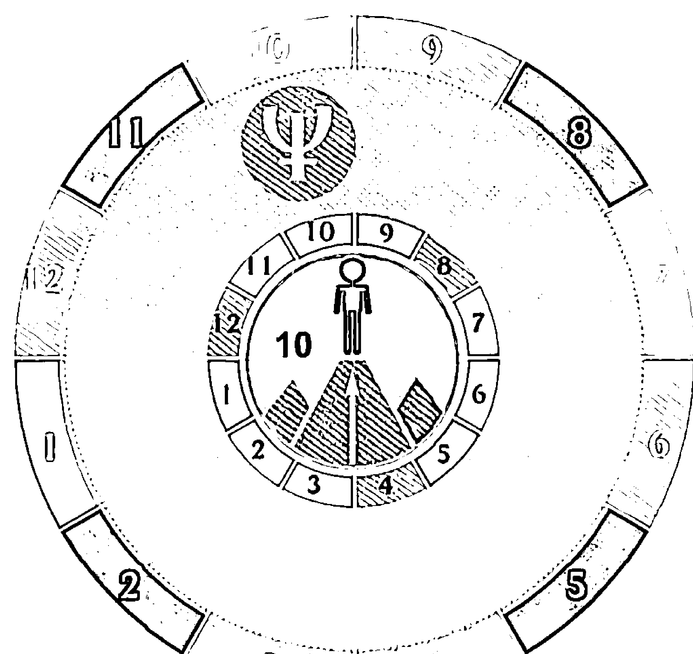

海王落十宮在一般關係中，海王表現出超然美妙、夢幻神奇的藝術、美學及心靈才能，十宮被海王的奉獻情懷所觸動，看到海王非比尋常的特質，十宮找機會公開推薦海王，使之受到社會廣泛關注。海王擁有藝術、靈性及救贖的事業理想，十宮設法打造舞台，提供機會資源，助海王才華演出及實現目標，海王得以成名，成為公眾偶像。

在社會關係中，海王渴望十宮資源，讓自己受到崇拜，卻因態度被動懶散，行為怠惰拖延，不易充分利用助力，完成十宮的期許。雙方如同表演者和經紀人，十宮容易看到海王的演藝偶像、藝術工作者及靈性導師，走下舞台後，像常人般平凡普通、缺乏魅力的一面。十宮設法美化海王，使其原有的事業形象，包裝一層藝術、靈性及神秘色彩，雙方有緣在表演、心靈、藝術、文化、宗教等領域發展。但海王的隨緣及逃避，常無視大好機會，工作半途而廢，令十宮心灰易冷，雙方容易產生誤會，不適合功利性及效率性的商業合夥。

### 外行星入宮位～第十宮

在私人關係中，海王是超個人性的連結，常是藝術、心靈、宗教方面的好，不容易有個人化的情感牽連。雙方若有其他實際相位，可能因工作原因，不定期有聯袂出現的社會活動。海王在公開場合與十宮的互動如霧裡看花，真正關係讓人猜不透，容易看圖說故事，萌生聯想跟誤解。雙方人前人後表裡不一，可能私下發展曖昧，形成地下戀情，自認神鬼不知。海王容易無意識引起莫名的機遇巧合，被人看穿識破，使原本掩飾露餡，傳出流言蜚語，形成公眾醜聞。

### PLUTO ▷ (10) 冥王星落入十宮

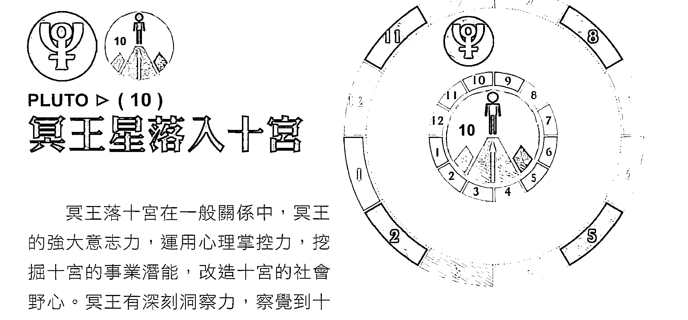

冥王落十宮在一般關係中，冥王的強大意志力，運用心理掌控力，挖掘十宮的事業潛能，改造十宮的社會野心。冥王有深刻洞察力，察覺到十宮的生涯危機，引爆十宮的鬥爭意識，並提供轉化重生的方案，十宮事業形象被迫脫胎換骨。冥王是同世代的集體潛意識，象徵巨大的成功意志與恐怖的爭議驅力，本命冥王星就在十宮者，容易遇到年齡相近者的冥王落自己十宮，社會競爭壓力特大，成就驅力相對增強。

在職業關係中，冥王具有厲害能耐，操控十宮利用資源，影響大眾行為意願，朝有利冥王掌權的趨勢發展，雙方在政治、商業、演藝、醫學、心理及神秘學界，有左右社會風氣的重大權力連結。十宮的事業態度及公眾形象，受到冥王的正負面影響，展現高度爭議跟毀滅危機，同時具有重建契機。雙方若是和諧相位，將齊心協力、不屈不撓、奮鬥有成，成為強力的事業夥伴，雙方若是互剋，則不可避免各自受到同儕壓力，引發激烈持久的纏鬥，成為公開的事業勁敵。

在親密關係中，冥王和十宮相濡以沫，共同承擔來自工作的社會壓迫，以及家長期許的家族壓力，面對長輩時特別緊繃。冥王若是男性，不願從事一般工作，欲自行創業掌權，無意識製造危機，強迫生涯轉型。冥王若是女性，除了工作壓力之外，還因子女生育及教養問題，在事業野心及家庭權力當中，引發權力宰制、剝奪與鬥爭的身心折磨。

本身冥王十宮者，常藉由同齡配偶的遭遇，顯現與權威間的深層業力，暗中角力對象涉及雙方父母。夫妻伴侶的冥王十宮，若同時有土冥相位，代表宿世的糾纏，雙方的心理較勁、資源運用及權力分享的不愉快，會在公開領域展現。若冥王具有吉相，有管道紓解壓力，可增進自身修為，減輕偏執和貪念，不被五毒情緒控制行為，才不致引發家庭重大紛爭。

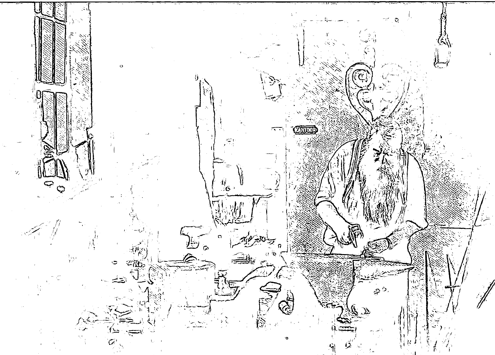

## Quantum Astrology

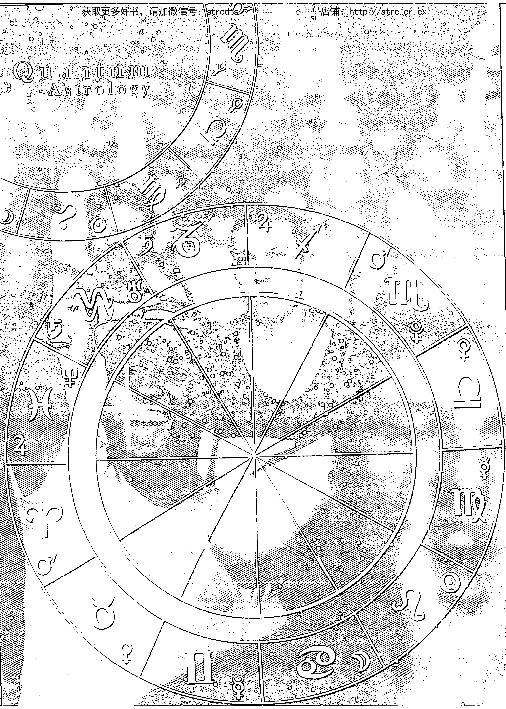

## Synastry
### 第十一宫
（朋友宫）

- 共同社交
- 社會聯誼
- 同好道友
- 團體成員
- 人道志工
- 網路情誼

### 第十一宫
### 社會友誼和地球之家

第十一宮，掌管個人的團體活動、同好聯誼、社會人脈，人類是唯一能集結大規模群體的動物，以各自的小社會分工，凝聚群策群力的共識，合力建構大社會的文明，在地球物種層級中攀登巔峰。

第十一宮代表個人用何種態度交友，選擇何種朋友交往，在團體中扮演何種角色，是我們的廣泛交遊及社會參與，代表同志、同修、同道等。十一宮掌管四海一家的仁慈博愛、世界大同的理想，為了團體的公共目標，與不親密卻能合作共事的一群同志，眾志成城實現理想，涵蓋網路社群、同好會社、政黨聯盟、人道組織等。

在社會關係中，第十宮是嚴謹的社會合作，及公眾認可的往來，九宮是小眾的學術研究，帶有哲學宗教法律性質，十一宮則是公民社會的參與，具有人道、慈善、公益性質的組織，各種同好集結成的社群，另類的非主流社團。

### The Eleventh House

十一宫是志同道合的無私分享，關係並非一對一的互動，而是多對多的往來，不具承諾契約，不會太過拘束，通常經由網路聯結，各司其職，不需真正會面。

十一宮的交遊廣闊而複雜，在聯誼聚會時，常是來自三教九流、龍蛇混雜的江湖人馬，齊聚一堂，交流興趣、知識、意見與經驗。如雙方有挑戰相位，易同仇敵愾一拍即合，又因牽扯共同的情仇利益，難以達成共識，原本歃血為盟的道友，合縱連橫黨同伐異，產生恩怨糾葛。

如果太陽落入自身十一宮，太陽認同十一宮的集體心智，被十一宮拉去做事，對普世價值、群體心智、人文科學發生興趣，在團體中成為好友。十一宮是在沒有束縛下，對大社會的理想，太陽受十一宮影響，養成社會改革意識，出現非功利行為，加入十一宮的環境，從事人道、公益、社工、學運等，有強力的社會工作共事緣。

如月亮落入，十一宮拓展月亮的狹隘視野，進入廣闊社會舞台，月亮覺得十一宮了解自己，萌生親密歸屬感，十一宮感受月亮的溫暖支持，介紹好朋友給十一宮認識。夫妻情侶間的家庭生活，常與一群朋友分享，共事時有情感交流，親密中不含拘束性。

如金星落入，金星覺得十一宮有趣，喜歡找十一宮玩耍娛樂，十一宮開拓金星的社交生活，觀賞藝術表演，使金星的休閒視野更前衛，往來常涉及其他朋友。若有其他強力條件配合，雙方可能擦槍走火，變成親密男女朋友。如火星落入，火星刺激十一宮的社交機緣，十一宮的獨創性，提昇火星工作的品質。火星常批評十一宮，十一宮覺得火星急躁、不禮貌、具侵略性，雙方對人生目標時有意氣之爭，爭論內容非關個人價值。

在一般關係中，十一宮常發生在電腦資訊、前衛知識、尖端科技、玄學研究、天文占星等社團組織，和諧相位讓彼此運用突破性的想像力，參與新奇有趣的活動，創造不凡的知識分享和心智啟發。

### The Eleventh House

挑戰性的相位，則帶來不可控制及預測的變化，雙方因理念契合而聚集，甚至成群結夥搞破壞，因「責任分散」的群眾效應，合力顛覆秩序、齊心反抗體制，例如示威抗議、佔領國會，集體違法犯紀。

第十一宮的真諦，在於擴充個體的關係，從親人朋友的小社會，發展到全人類的地球村。第十一宮的活動，使我們放下狹隘的個人主義，建立人與人、國與國之間非功利性的連結，無條件地信任、互助與分享，闡揚烏托邦式的「自由、平等、博愛」精神，達成全人類和平、繁榮、均富的理想境界。

### The Twelve Houses

### 第十一宮的社群友誼和地球之家

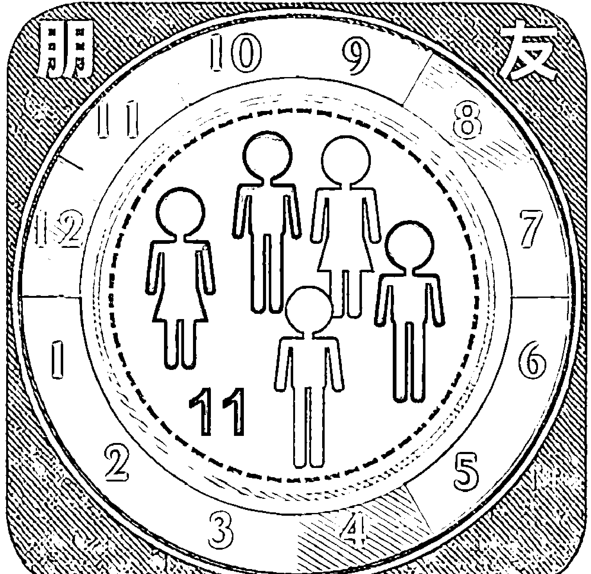

【關鍵主題】
- 社會聯誼、同好道友
- 團體成員、共同社交
- 人道志工、網路情誼

### SUN ▷ (11) 太陽落入十一宮

太陽落十一宮在一般關係中，十一宮認為太陽是同道，擁有共同價值觀，會營造環境機緣，拉太陽參與自身相關的團體，分享群眾感興趣的社會話題。太陽受十一宮鼓舞，面對十一宮活動時，產生集體的進步改革意識，動機變得非自利性。太陽自尊意識強大，積極促成十一宮活動，希望被當成重要朋友及成員，友誼不具私人佔有欲，不易產生親密感。若太陽本身挑戰相，將因自我中心的強勢及主觀，使團隊價值出現爭執，議題涉及團體的共識，較具客觀性，不至於太嚴重，十一宮可以不理太陽。

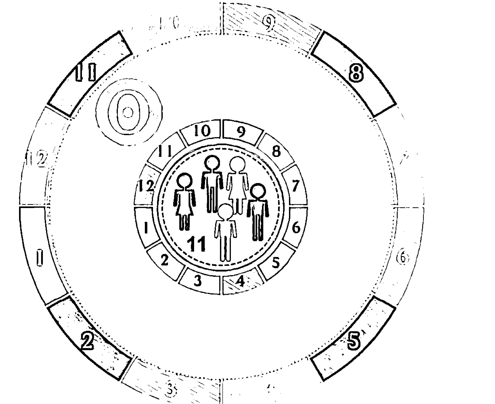

在一般關係中，太陽認同十一宮的團體理想，把十一宮當志同道合之人，滋生互助情誼，一起從事團隊競賽、公益宣導及社會服務，達成集體心智的共同目標。十一宮是集體高等意識，在廣泛社會層面展現，將原本素不相識，但具有共同理念的人，凝聚在一起的團體，如網路社群、團隊合作、同好社團、公益組織等。十一宮本身強的話，將積極回應太陽的熱情，倍增參與能量，影響力廣泛。若太陽和十一宮互剋時，雙方因團隊運作的觀念及社會改革的理想，價值觀落差太大而起衝突，一旦志不同道不合，就此分道揚鑣、友誼不存，沒有強力約束。

在兩性關係中，太陽在團體中眾星拱月，十一宮看上突出之處，彼此在社團聯誼中相遇，在工作團隊中共事，有重疊的社交圈，關係建立在共同朋友、興趣及社會人脈上，從同好慢慢成為親密情侶。不同於七宮是一對一關係，十一宮在群眾活動建立的往來，是多對多的互動，單獨相處反而不習慣。太陽如和十一宮互剋，彼此感情易受共同朋友及社會環境所影響，演出如同「愛情白皮書」中，纏繞著友誼、同志、愛慕及暗戀，擺盪在友情與愛情間，多元複雜且變化萬千的劇情。

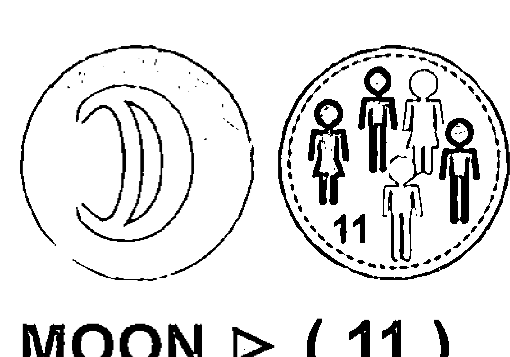

### MOON ▷ (11) 月亮落入十一宮

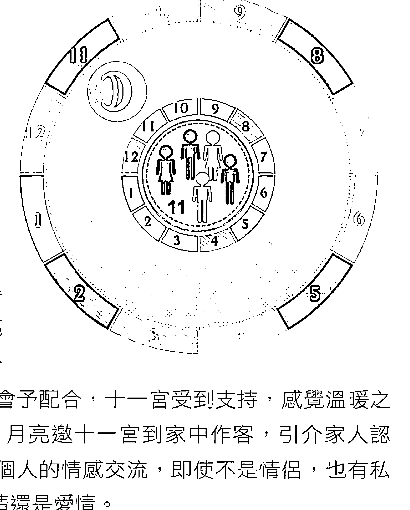

月亮落十一宮在一般關係中，月亮在團體中原本怕生，十一宮覺得月亮貼近內心，待以親切善意，月亮覺得十一宮了解自己，主動親近十一宮。十一宮邀月亮加入社交圈，月亮會予配合，十一宮受到支持，感覺溫暖之意。雙方一見面就有莫名的熟悉感，月亮邀十一宮到家中作客，引介家人認識，分享自身居家生活。雙方不時有個人的情感交流，即使不是情侶，也有私密的情緒互動，有時分不清究竟是友情還是愛情。

在職業關係中，十一宮察覺月亮的柔性配合，希望月亮協助自己，但月亮的不安特質，態度羞怯被動，容易優柔寡斷、患得患失，讓十一宮很難掌握，營利性合作不易穩定，較適合不具功利性的情感分享。雙方若非大企業中的部門同事，就是同好社群中的成員，一起從事餐飲供應、生活用品、婦女團體等服務，有一對一的相處，共擁四海一家的歸屬感。

在親密關係中，十一宮介紹同好團體給月亮，月亮介紹親密友人給十一宮，希望伴侶也參與自己的社交，拓展生命視野，從雙人家庭生活，進入更廣大的社會舞台。雙方是不太傳統的情感模式，各自追求開放的感情生活，允許彼此自由發展，親密中不具拘束性。如月亮和十一宮互剋，月亮易因疑心病及佔有慾，不時鬧非理性情緒，引發外力介入家庭生活，使十一宮感到不安。雙方因共同社交圈的連結，私生活被公開化，家庭情感及金錢糾紛，被搬上檯面，成為公共領域的八卦議題。

### MERCURY ▷ (11) 水星落入十一宮

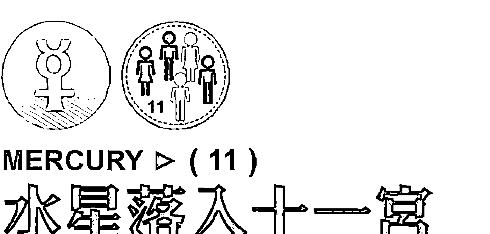

水星落十一宮在一般關係中，水星認為十一宮是談得來的朋友，十一宮介紹同好給水星認識，引薦水星加入團體組織，讓水星發表思想興趣。十一宮認為水星有專業知識，想聽取對方的意見，水星覺得十一宮會談大題目，將參與十一宮舉辦的聚會活動，藉由十一宮社會人脈，拓展自身交游圈。水星分享自己對朋友、團體及群眾的看法與經驗，說給十一宮知道，但各自成長歷程不同，交情變化快速不定。

在職業關係中，水星可能上十一宮的團體課程，認識興趣相同的同好，雙方很少談感覺，不易有一對一的關係。水星與十一宮的心智互動，基於共同的群體心智及社會目標，在團體中才會交談溝通。水星藉十一宮認識網路友誼、同好社交、文化思想或生態環保等，關於人道理想、社會公益、改革發展等，社會寬廣面的知識議題。

在兩性關係中，水星知性異常發達，容易被十一宮開啟話匣子，雙方常是團體同好成長班的同學，輕鬆交談為友。水星交流領域廣闊，不涉及私人情感，除非同時有月亮金星火星，否則成為男女朋友機會不高。三宮是求學成長期的朋友，手帕交或總角之交，有共同回憶的聊天話題；七宮是親密死黨，有緊密情緒交流，彼此性格互補，友誼不易變化；十一宮是共同興趣的朋友，一起參與同好活動，但交誼因素多變，不易維持情感親密。

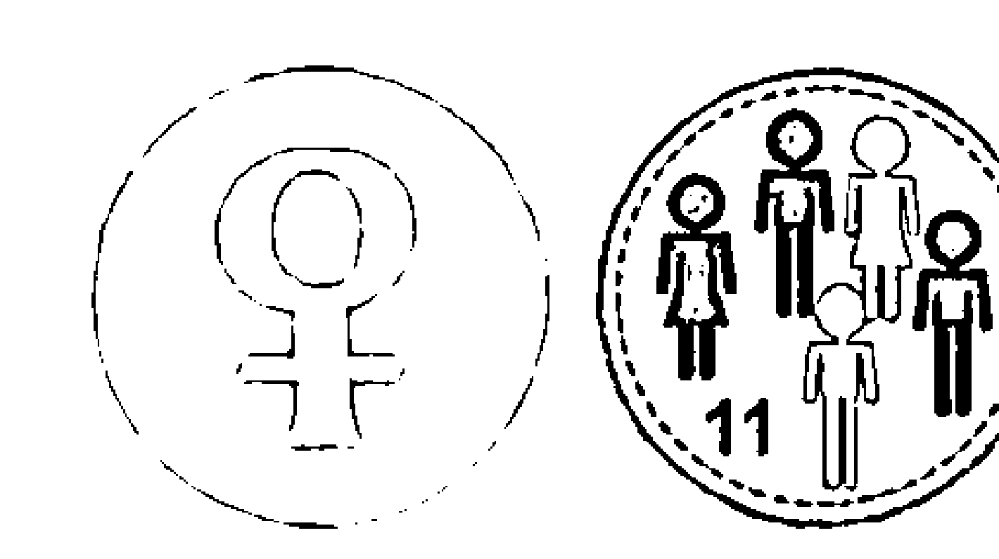

### VENUS ▷ (11) 金星落入十一宮

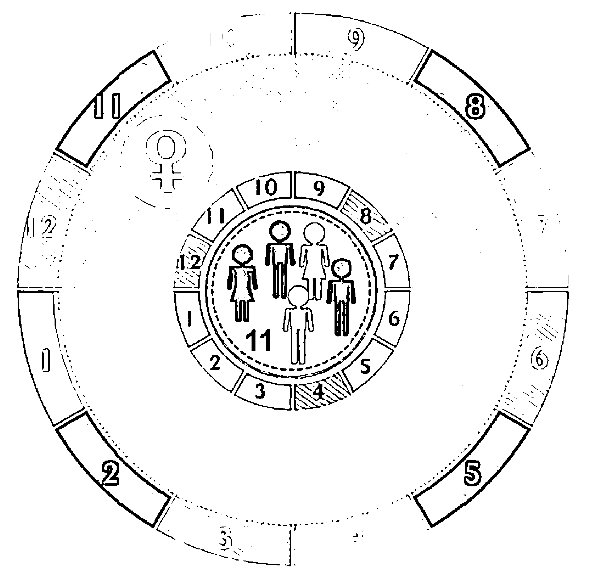

金星落十一宮在一般關係中，金星覺得十一宮的喜好符合交友品味，自然親近十一宮，十一宮給予金星更廣闊的社會觀點，使金星美學品味及藝術視野，符合時尚進步潮流。金星認為十一宮人氣高，具有群眾影響力，有助自己參與人群、廣結善緣；十一宮找金星聽演講、看表演、認識同好，加入社交活動，開拓金星的團體休閒。雙方常在藝術表演及興趣學習的參加成員中，因共同興趣而結識往來，如演唱會、音樂會、俱樂部、夜店派對中，從同好變成朋友。

在職業關係中，金星參與十一宮舉辦的團體分享，欣賞十一宮的理念，十一宮的人脈資源，擴大金星的社會參與。十一宮找金星合作，加入十一宮的團隊，帶給金星實際好處。雙方職業往來較無利益性，帶有公益慈善、人道服務、藝文表演、美學分享的色彩，不以營利為主要目的，適合涉及群眾的組織團體運作，如基金會、扶輪社、社工團體、同好聯誼等合作。

在兩性關係中，金星對十一宮有好感，但偏純粹友誼，無個人佔有欲，不易變成情侶。除非十一宮本身有力，才因共同興趣愛好，引發私人好感，點燃男女情慾，變成實質情侶關係。雙方相處互動時，較少私人性約會，永遠涉及共同的朋友、社交及團體，彼此一對一的連結較為缺乏，專屬親密感不足。若金星和十一宮互剋，需當心因金錢及情感，引發糾紛，擴及共同的社交圈，但分手後也不會成仇。

### 火星落入十一宮
**MARS ▷ (11)**

火星落十一宮在一般關係中，火星基於自利動機，察覺十一宮有可觀的社交資源，火星頻繁派發任務，刺激十一宮活動力。十一宮在團體活動及網路社群中，看到火星的突出表現，拉火星商量朋友社團，共同參與團隊運作。十一宮是在沒有體制的束縛下，對人生的理想及社會抱負，雙方有社會共事緣，一起完成團隊組織的理想，達成同好群眾的目標。火星態度主動積極，視十一宮為得力夥伴，但做事缺乏耐心，三分鐘熱度，且自我中心、具攻擊性，令十一宮感受壓力。

在職業關係中，火星認定十一宮的群眾緣，有助團體勢力擴展，主動找十一宮合作，共同發起廣泛的同好活動，如網聚、說明會、路跑、旅遊團、遊行示威等。十一宮的獨特創意，促進火星的工作效率、改善成果品質，十一宮的社會資源，擴大火星社交範圍，轉變原本自私自利的行為傾向，提升到社會公益層次。火星雖看中十一宮的人脈，但十一宮若本身沒星，則表現無以為繼，常令火星失望，因行事不如己意而發火，雙方不易長期合作。

在兩性關係中，火星的主見強烈，動輒批評十一宮的朋友，認為不同道不入流，十一宮覺得火星急躁、不禮貌，雙方感到不快。火星覺得十一宮不夠積極進取，浪費機會資源，因自己社交需求，無端找十一宮麻煩。雙方對朋友社交及群眾團體看法歧異，易鬧意見不合，其爭論內容非關彼此性格，而是對社會處境的價值觀。如火星有挑戰相位，易被十一宮挑起攻擊欲，本質雖是朋友及團隊成員，一旦擦槍走火，容易衍生性、金錢及權力等糾紛爭執。

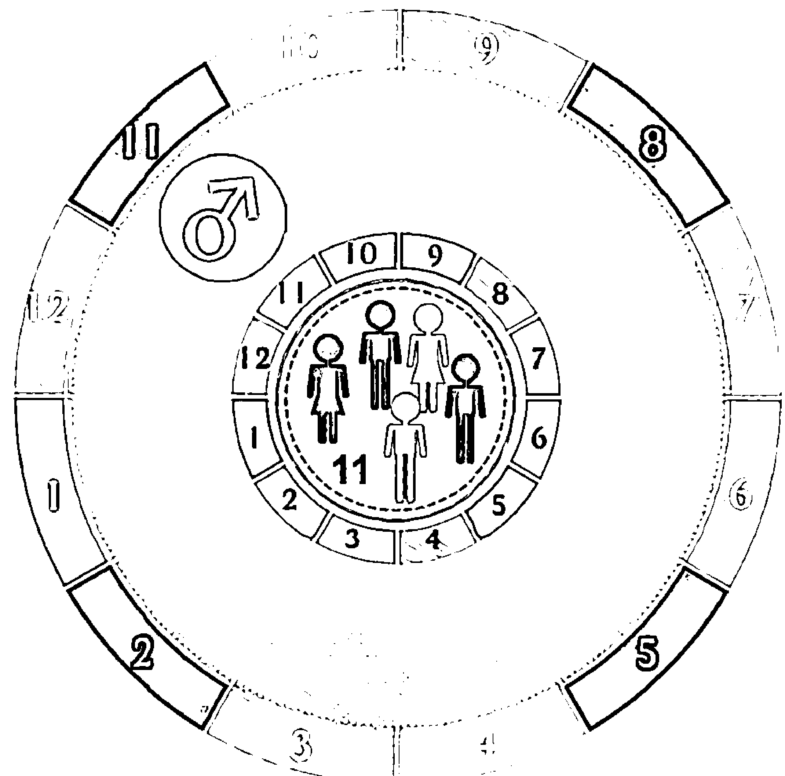

### JUPITER ▷ (11) 木星落入十一宮

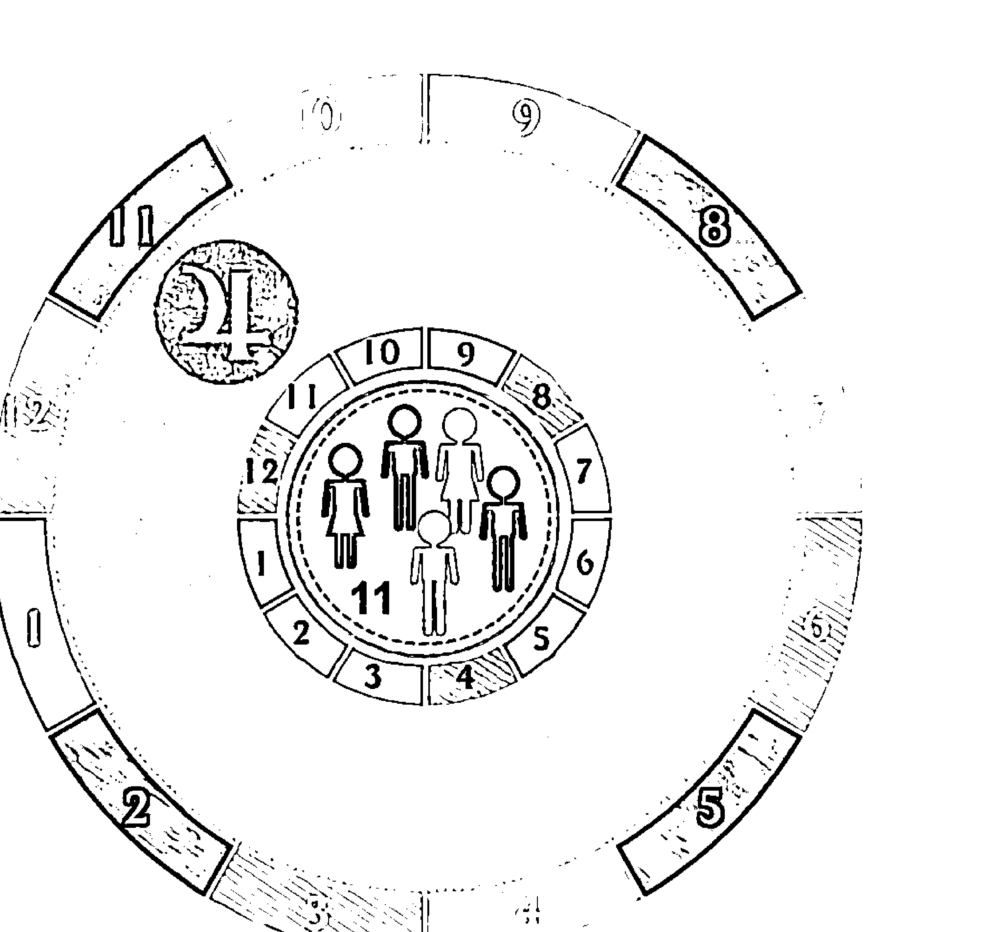

木星落十一宮在一般關係中，木星的教科文能力及人生智慧，符合時尚潮流廣受歡迎，十一宮的社會資源，有利於木星的長才發揮。十一宮若自身有星，如同人脈銀行，將介紹一群朋友認識木星，提供支持後盾。木星有啦啦隊作用，能凝聚高度人氣、帶動集體風向，幫助十一宮的團隊取得成功，社群影響力擴大。十一宮若自身空宮，不熱衷團體活動，無力提供太多機會，木星的善意無用武之地。雙方的廣泛情誼，是因地制宜的緣份，往來並不密切深入，像是參加不限條件的派對。

在職業關係中，十一宮提供適當資源，助木星組成團隊，雙方有崇高文化性目標，不涉及功利目的，有利一起參與教育、文化、學會組織的團體運作。木星的精神地位及專業身分，樂於推薦十一宮長才，提昇其社會名声及社團交游，適合從事文化教育、學習成長、宗教宣導的知性活動，雙方知性影響力更形擴展。十一宮本身強力才能成事，十一宮若無星，難以配合木星的社會理想。

在私人關係中，十一宮以木星的知性為榮，促使木星參與社交活動，夫妻可一起從事社會工作，助彼此拓展人脈，互相推薦拉攏，加入教育文化、公益宗教團體，共同實現廣泛的社會理想。若木星和十一宮和諧相，代表雙方理想相同，可成為同志道友，一起為社會貢獻所長；若彼此互剋，代表雙方對團體的願景有差距，共同的希望可能落空，但能學習到新的生命經驗，不會因此失和。

### SATURN ▷ (11) 土星落入十一宮

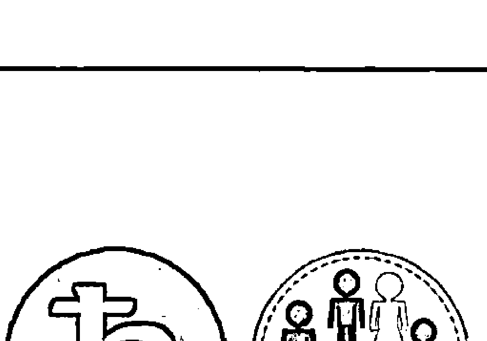

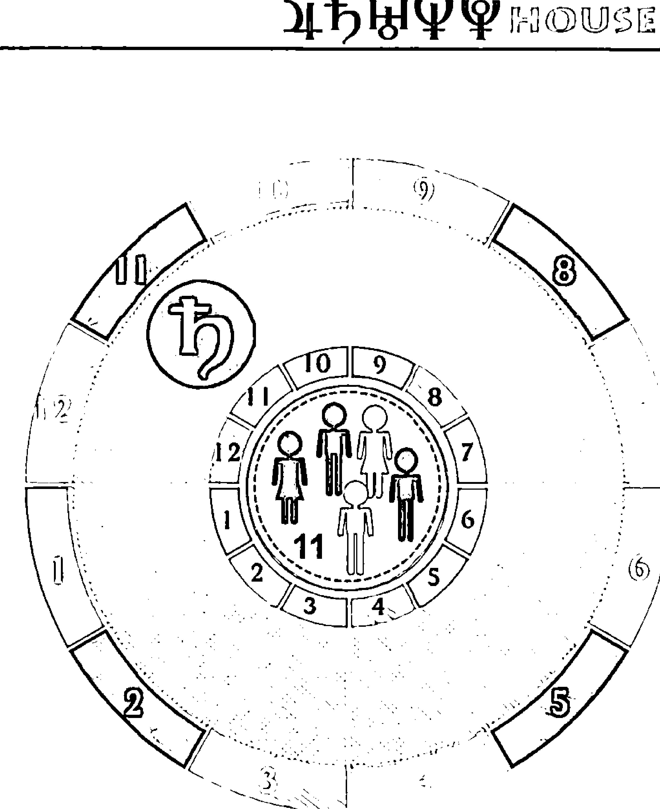

土星落十一宮在一般關係中，十一宮的社交態度，得到土星重視，參與十一宮的活動有實用性目的。土星交友態度謹慎，認真看待十一宮的友誼，認為朋友聚會要做有用之事，不只是吃喝玩樂。土星對長期朋友忠實，但不輕易交心，十一宮產生責任感，珍惜彼此的關係。土星有組織同好的企圖，不讓社交活動毫無目的，將以自身專長及經驗，利用十一宮的社交人脈，廣泛分享及服務眾人，落實共同的團體目標，十一宮提出改善建議，考驗土星的誠意。若彼此有剋相，因對友誼的價值觀不合，雙方逐漸疏遠，但心中仍有罣礙。

在社會關係中，土星具有團隊所需的專業能力，十一宮邀土星參與長期的團體學習、人道服務及公益活動等，需要耐心的社會交流，如救國團、運動隊伍、網路社群、同人社、社區大學。土星嚴肅看待權力運作，擔任管理角色，要求十一宮培養合群，訓練十一宮完成工作任務。雙方友誼較非個人性，需面對廣大群眾的需求，及特定族群的事務，常是政府機關、企業部門及工會社運的成員。土星與十一宮在大眾相關的部門共事，如區公所、健保局、清潔隊的同僚，商業領域如工廠部門的同事、商場單位的同仁、連鎖加盟的督導，互動態度制式化。基於社會利益往來，公開相處一板一眼，諸如網路論壇管理、醫療單位義工、宗教團體志工、社區服務同好等，有共同維持社團運作的責任。

在私人關係中，十一宮視土星為重要友人，因身分環境產生距離，不常見面聯繫，土星的功利性和現實主義，十一宮較容易接納。土星基於實際目的，舉辦專業性及功能性的活動聚會，特地邀約十一宮，傳遞社會參與的價值性。土星設下參加的原則、條件及門檻，十一宮覺得單調乏味、不夠輕鬆好玩，感到不小壓力，若非有實用性目的，否則不太想參與。夫妻伴侶可能是共同的團體成員，因工作產生私人連結，公私態度分明，社交活動玩不在一起。

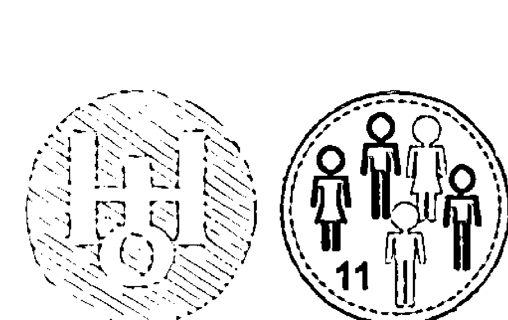

### URANUS ▷ (11) 天王星落入十一宮

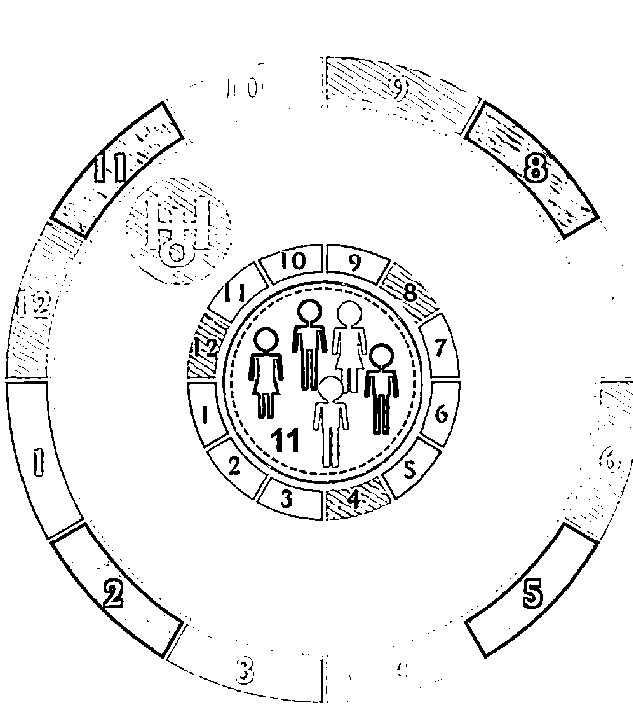

天王落十一宮在一般關係中，天王宣揚特殊理念，十一宮對天王的前衛知識感興趣，彼此在社交場合意外偶遇，一見如故，很談得來。雙方常經朋友的朋友介紹而認識，基於共同喜好與特定話題，偶然往來互動，相處不易產生衝突。天王的身分職業罕見，十一宮欣賞天王客觀的知性，認為天王是奇人異士，不定期徵詢獨特的意見，但天王對友誼的態度疏離，雙方難做親密的朋友。如大學社團活認識的朋友，畢業後沒有見面的動機，在同好組織及俱樂部中，眾人基於短期目標，臨時湊成的運動團隊及分組合作，任務結束後也難找理由再聚。

在社會關係中，天王參與團體社交的動機，被十一宮舉辦的活動所刺激，十一宮組織的社群團體，如科學研發、實驗樂團、占星聚會、示威組織等，天王認同新穎原創性。天王提出改革點子，與十一宮共組分享的研究團隊，但天王作風另類、態度反覆，忽冷忽熱很不穩定，十一宮難以預測捉摸。天王對共同理想的顛覆力，強於十一宮的團體凝聚力，無意識唱反調搞破壞，十一宮無法掌握天王的心，也留不住天王的人。雙方的約定承諾，缺乏現實束縛，經常中斷不易完成，一旦目標達成，最終也將作鳥獸散。

在私人關係中，十一宮的交遊廣泛，有三教九流的朋友，引薦天王參與社交活動。

### NEPTUNE ▷ (11) 海王星落入十一宮

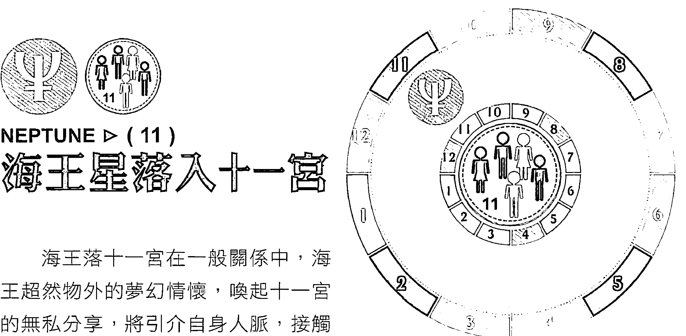

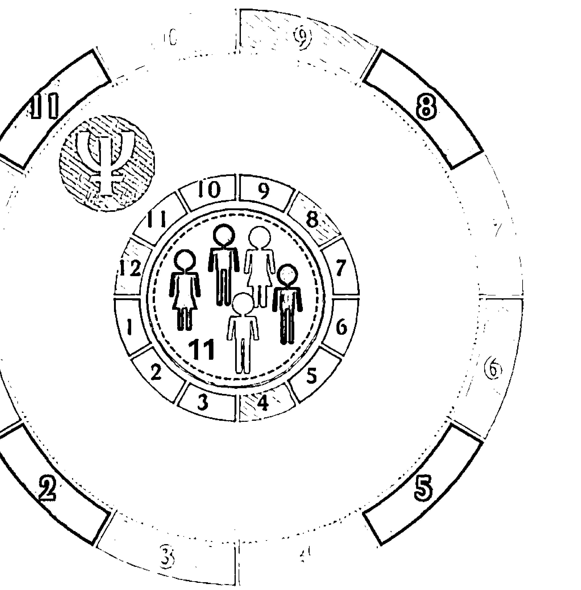

海王落十一宮在一般關係中，海王超然物外的夢幻情懷，喚起十一宮的無私分享，將引介自身人脈，接觸海王的精神理想。雙方常在宗教、神秘及精神同道的社群，有緣認識往來，如宗教靈學、藝術音樂、電影欣賞等團體活動，建立網友、影友、酒友等關係。海王的性格柔弱，不通俗務，常受人欺負，時有現實壓力及情緒困擾，激發十一宮的同情救贖，無條件傾聽海王訴苦。海王慣於逃避，不敢面對現實，與十一宮若即若離，但不會公開決裂。

在社會關係中，十一宮提供同好社群的環境，讓海王在朋友社交間營造活動，十一宮借海王之能，撫慰朋友貢獻團體。海王理想性太高，態度隨緣被動，不會積極運用路人脈關係，經常錯失機會，發展很不穩定。海王作風與世無爭，只需共同喜好跟理想追求，不求組織結構化，無法遵守秩序規範，友誼關係鬆散。雙方不適合現實合作，對職業所需任務，無法確實執行，易因不察迷糊及散漫，頻頻拖延、取消、出紕漏。

在私人關係中，海王對十一宮似曾相識，十一宮的直觀靈感被強化，海王有藝文、宗教、靈性的理想，十一宮付出友誼人脈支持海王，使其緩慢發揮影響。雙方常在團體同好的活動，經共同友人介紹，因相似興趣而認識，開始進一步互動。如海王受剋，雙方往來會牽涉共同友人，引發莫名的誤會傳聞，海王無心之中，使十一宮與朋友淡漠疏遠。本命海王就在十一宮者，同輩海王均落自身十一宮，懷抱類似的人生夢想，有超然心靈熟悉感，彼此交談不需多，一切盡在不言中。

### PLUTO ▷ (11) 冥王星落入十一宮

冥王落十一宮在一般關係中，冥王深刻洞察、扭轉乾坤的厲害能耐，在十一宮眼中無可取代，十一宮重視冥王能力，渴求得到另眼相看。十一宮設法利用資源製造機會，讓冥王表現洞察人心、挖掘秘密的特殊才幹，取得朋友間的獨特評價。十一宮無論是社交友誼中的困擾，以及從團體群眾間得知的秘聞，都與冥王暗中分享，十一宮如在社交圈引發爭議，會徵詢冥王解決問題的方案。十一宮引介給冥王的朋友，可能攜帶心理炸彈，帶來心理糾纏跟行為麻煩，冥王既厭惡又避不掉，與十一宮友誼潛藏對抗危機。

在社會關係中，十一宮對社會現象的批判，冥王能敏銳察覺，十一宮抱持社會改革的願景，期望冥王協助完成。冥王與十一宮共擁特定團體的資源，冥王受十一宮極力推舉，在其中掌握可觀權力，成為傑出的策略執行者。雙方在特殊性質的組織中，如示威團體、醫療急救、軍警消防、殺手聯盟等領域合夥，共創強大而隱密的影響力。

本命冥王在十一宮者，相差五到十歲內的同輩，冥王均落自己十一宮，容易在同學同儕同僚關係中，因權力競爭跟資源奪取，相互打擊創傷，產生難解情結。雙方在學校、軍隊、競賽團體中，被分配到共同任務，而密切結合，經歷殘酷危機，建立生死之交。彼此因共同的團隊目標結識，也因共同的社會利害，引發權力糾紛及心理衝突，導致深厚友誼破裂。

在私人關係中，冥王的極端偏激，挑剔十一宮的社交行為，質疑十一宮的交友目的，忌憚十一宮朋友的身分和權力，排斥十一宮的社群聯誼，任何友人都看不順眼。如十一宮本身強大，將藉由厲害的朋友，改造冥王原本態度，吸納進入自身社交圈，冥王就算不甘願，但基於權謀動機跟實質利益，也勉強自己配合。如十一宮本身弱勢，將受冥王伴侶操控，與其厭惡的朋友徹底絕交，從此不相往來。

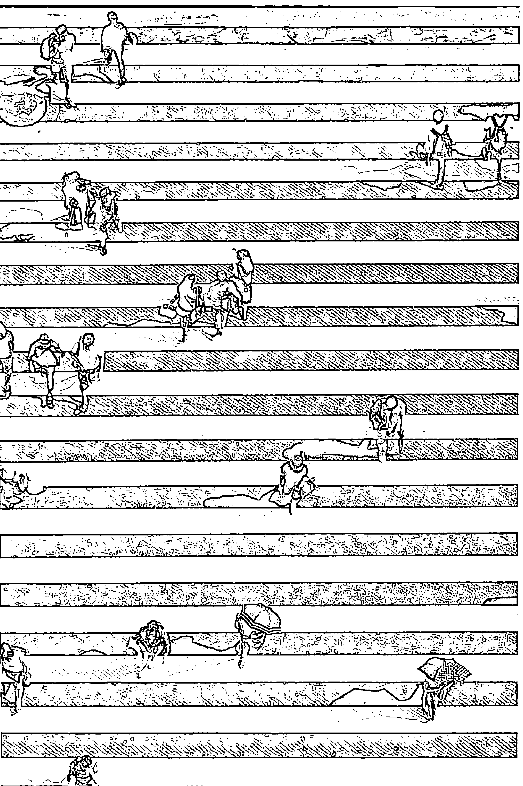

## Quantum Astrology

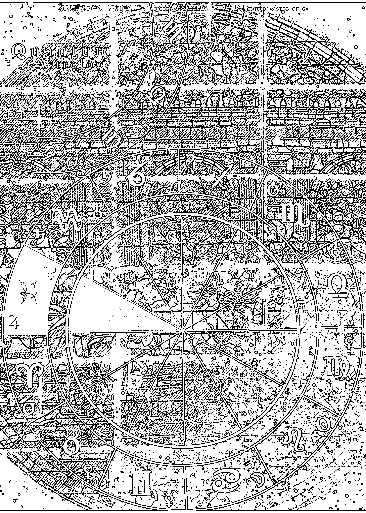

## Synastry

### 第十二宮（心靈宮）

前世宿緣

心靈伴侶

地下關係

秘密情人

暗戀情愫

神秘感應

### 第十二宮的幻境與超常經驗

第十二宮是「集體意識」的呈現，穿透物質與心靈的界限，透過個人的宗教、靈修、夢境、催眠、冥想等行為，窺視難以言喻的幻境，探索神秘的心靈世界。

十二宮掌管因果輪迴，此生無法解釋的現象，如藝術天分、預知夢境、幻聽幻視等莫名稟賦，只能以前世殘留來解釋。十二宮有星者，因超乎常人的感應力，擁有敏感體質，易感受無形能量的存在，時有窺見靈體的超常經驗。

十二宮的避世退隱，掌管監獄、寺院、修道院、庇護所、精神病院、深山孤島等，遺世獨立、被塵俗放逐的領域。十二宮涵蓋看不見、摸不著、卻作功有能的神秘現象，如通靈扶乩、心電感應、他心通、天眼通，頻率的跨時空傳遞，以及特異功能、符咒儀式，巫術魔法等空間能量的操作，是日常知識無解，及科學儀器難以驗證的未知。

### 第十二宫

十二宫的合一本质，涵盖宇宙创造的一切万有，容纳宇宙广袤无边的资料库，是全人类意识的共同根源。古往今来伟大的政治家、文学家、艺术家及科学研究者，都有重要的十二宫，其伟大思想及创作，吐露了集体意识的心声，使世代众人广泛共鸣。科技长期研究的重要贡献，如研发核弹或开采油源，无形中影响全人类命运。

如双方有十二宫关系，代表常理无法解释的前世缘分，双方可能心灵感应，显现心有灵犀的无言了解，可分享对艺术、灵修、神秘学、超心理学的知识兴趣，在世俗及精神上，成为暗中助力及幕后推手。挑战性的十二宫，代表不欲人知的秘密，彼此感觉芒刺在背，相互提防对方陷害，造成自己金钱、感情及名声的受损。

如太阳落入他人十二宫，太阳觉得十二宫有潜能，运用独特直观和神秘灵感，引导太阳自我察觉，双方分享神秘学的兴趣。太阳鼓励十二宫走出暗处，拉出来一起做事，多和外界接触，展现心灵能量。

如月亮落入，有前世亲人缘分，月亮觉得十二宫了解自己，很深的熟悉感，尽在不言中。月亮对十二宫有所期待，如得不到立即满足，月亮容易疑神疑鬼，潜在埋藏情绪困扰。双方情感相互抚慰，照顾对方生活，常有私下的财务往来，当心金钱纠纷。

如金星落入，金星暗中亲近十二宫，双方对艺术、音乐、电影、心理学、神秘学等，有共同的喜好和品味。双方在心灵上密切，分享内心直观和灵感，但在生活中不密切，有好感不一定发生爱情，除非业力缘分够深。金星喜欢十二宫的原型，双方有暧昧隐藏的私人情愫，如暗恋、幽会、地下情，不易实质发展，表面上若无其事。

在职业关系中，十二宫常发生在心理医生和病人、监狱看守和囚犯、心灵导师和信众学生之间。

挑战相位的十二宫，常出现一方无助、脆弱、依赖心重，另一方被当成全能的救赎者，使心灵软弱者更加无能，让对方全然操纵摆布，也可能一方承受现实责任、牺牲拯救另一方，持续轮回的因果业报。

在私人关系中，十二宫代表不为人知的秘密性，除了表里不一的私密情感，可能是双方约定保守重大秘密，死前不可告人。尤其日月落入此宫，常象征重要前世宿缘，潜意识有业力牵连，今生以婚姻相互偿还。

### 第十二宫的心灵感应和集体意识

### 【关键主题】

- 前世宿缘、心灵伴侣
- 地下关系、秘密情人
- 暗恋情愫、神秘感应

### 太阳落入十二宫

太阳落十二宫在一般关系中，太阳意识到十二宫的心灵处境，有助自我潜能发挥，主动扮演幕后推手，助十二宫排除心灵困扰，成为十二宫的贵人。如十二宫发展活跃，将有敏感的灵异特质，坐拥心灵瑰宝，无条件赠与太阳能量。十二宫用催眠通灵、念咒施法、拙火瑜伽等操作，使太阳放松意识、开启直觉，潜意识作用提升。如太阳受克，可能暗中算计十二宫，以不为人知的秘密行径，形成十二宫莫名情绪压力。十二宫一方较能察觉业力，可以自身做出选择，若十二宫本身空宫，正负力量皆不明显。

在社会关系中，十二宫具有直观灵感，以心灵、艺术、魔法等超现实为引导，使太阳无形能量被激活，十二宫强化太阳神秘经验，对艺术及灵学感到兴趣。太阳察觉十二宫的心灵资源，激励十二宫走出暗处，重见天日，和外界接触展现潜能。太阳若在知性及神秘星座，将受十二宫的灵性启蒙，开始研习心灵神秘。太阳若在艺术及情感星座，则展现艺术创作能量。双方从事心灵活动及幕后工作，分享灵性修行及艺术创作的心得，成为神秘、禅修、超心理学同道，以及电影、摄影、戏剧方面的同好。

在两性关系中，太阳对十二宫有心灵感应，十二宫接收太阳讯息，但头脑未必理解，象征前世的因缘牵引。十二宫若进入关系，代表宿世业报未清，太阳较难负起世俗责任，带来隐藏的压力、负担和不幸，关系常是秘密、未知、不可告人的，易发生在婚外情、偷情、暗恋中。如太阳本身受克，在关系中不能见天日，为逃避众人耳目，私下秘密行事，欺瞒朦骗十二宫，使之心灵困扰及现实损失。若十二宫本身剋相，前世功课尚未学完，吸引的人际关系，以轮回果报居多，容易重复业力模式，不易摆脱负面影响。十二宫若正面发展，能量修练较成熟，不只受外力牵引，即使发生冲突也减少，不轻易任人摆布。

### 月亮落入十二宫

月亮落十二宫在一般关系中，月亮觉得十二宫莫名熟悉，带来内心安全感，向十二宫吐露担忧、恐慌与焦虑，分享深层内心，双方有隐藏的情感牵连。十二宫前世记忆被唤起，出现逃避现实、堕落颓废的行为，加强彼此脆弱感伤的心灵阴影，双方互动沉溺于想像世界，情感交流泛滥化。月亮无法明言真正感觉，以自我朦骗表现情感，十二宫不解其需求，月亮感受内在委屈。月亮同情十二宫的处境，资助救赎十二宫生活，双方易有混乱的财务纠葛，今生今世难以解决，关系在现实中被弱化，令他人猜想不透。

在职业关系中，十二宫具神秘情感能力，扮演心理咨商角色，容纳月亮的深层情绪，令月亮感到安心，觉得十二宫了解自己。月亮受十二宫引导，开始对潜意识的心理困扰及心灵困惑，产生研究认知的兴趣，如月亮有通灵体质，将被十二宫活化。彼此深知对方私密之事，给予私人庇护，如果月亮和十二宫互剋，将守不住秘密，导致困惑猜疑，互不信任。双方常有秘密的财务往来，但混淆难以厘清，不知谁欠谁的，要小心涉及私人情谊的金钱纠纷。

在亲密关系中，月亮对十二宫有情绪依赖，十二宫提供心灵抚慰，使月亮情绪安稳，月亮则以关怀体贴，默默滋养十二宫。伴侣有前世的亲人联结，很深的亲切熟悉感，强烈共鸣及长久相处缘分。伴侣间内心交流很深，分享深层的同情与怜悯，相互身心照顾，有心灵相通之感，一切尽在不言中。如月亮和十二宫互剋，有不切实际的期待，十二宫无法在现实中负责，无法满足月亮需求，夫妻生活依附在同情与救赎。十二宫常有不可告人的秘密，引起月亮潜在焦虑，特别脆弱敏感易受伤，但不让十二宫知晓。十二宫是超乎现实的链接，月亮就算分手后，也难忘记与十二宫的关系，在所有亲密回忆中，优先被记起。

### 水星落入十二宫

水星落十二宫在一般关系中，水星的心智活动，被十二宫的潜意识吸引，触发不可见的心灵沟通。水星逻辑化的头脑，藉十二宫吸收灵性知识，透过十二宫为管道，传递集体潜意识的讯息，如同灵媒角色。十二宫属于超个人关系，相互了解并非建立在口语沟通，而是心有灵犀，很少真正交谈，涉及不可理解的读心、通灵、灵气疗愈等能量传递。十二宫引领水星的表面心智进入较深的领域，使水星对占星塔罗、心理研究、神秘灵修产生兴趣，水星本身有自己的专长，遇到十二宫才会谈心理神秘。

在职业关系中，水星帮十二宫幕后企划，暗中策略及资讯传达，秘密助十二宫操作，希望十二宫被人知晓。水星的理性分析及专业能力，使十二宫能力具体化，变得公开务实，有助十二宫利用心灵资源。水星挖掘十二宫的心灵宝藏，透过直接间接方式，研习十二宫的神秘知识，用个人风格加以传播。双方的敏感心智，相互刺激心灵想象力及艺术创造性，应用在神秘心理、幕后制作、摄影录影等领域，适合神秘学传授、潜意识开发、心理学研究、梦境探讨等工作。

在亲密关系中，水星聆听十二宫的内心秘密，与十二宫的沟通，产生灵感创意，双方不说话交谈，常暗传讯息。若水星是男性，心智虽活跃好动，内心有许多想法，但不愿跟女性明说，造成十二宫精神困扰。若水星是女性，经常想得太多，过度批评及挑剔检视，导致男方性冷感，伴侣在性方面不协调。若水星与十二宫互剋，则水星藏有不可告人的秘密，始终欺瞒十二宫，造成十二宫心智误会及心灵创伤。

### 金星落入十二宫

金星落入十二宫在一般关系中，金星欣赏十二宫，无意中想亲近，十二宫隐约感受，但不说穿点破。金星基于表面和谐，埋藏爱慕情意，双方心有灵犀，知道对方内在感受。彼此在心灵上密切，对艺术、音乐、电影、心理学、神秘学等，有共同的喜好和品味，能分享很深的直观和灵感。双方在生活中关系不密切，就算有好感，不一定互动往来，不需要与对方联络沟通，也不会忘记彼此。

在职业关系中，十二宫拥有神秘潜能，金星察觉实用价值，诱导十二宫展现心灵艺术才华，帮十二宫美化推广，将潜藏能量化为现实收益，暗助十二宫发展。金星的艺术美学表现，十二宫加以幕后操作，引领金星的品味深化，帮十二宫用在人际社交及商业目的，双方互助暗中生财，适合心理学、神秘学、音乐疗愈、艺术摄影的合作。

在两性关系中，金星喜欢十二宫的原型，而非个人，把欣赏放在心中，难以表白，形成暗恋情愫。不同于金星落在一宫时，金星一定明白表示爱慕，公然追求一宫，共同出双入对。十二宫察觉金星是前世情缘，今生难以实现，除非业力程度够深，否则不易具体亲密，彼此在现实中的互动，靠其他宫位关系显现。双方若是落实两性亲密，将是不可告人的偷情及地下恋，如果自制得宜，常是难忘的一夜激情。十二宫的秘密藏得很深，相处态度表里不一，表面上若无其事，日常往来有莫名的心理压力。

### 火星落入十二宫

火星落十二宫在一般关系中，火星认定十二宫的潜在资源，有助自己发挥能力，十二宫察觉火星的直觉，能帮自己厘清真相，双方快速建立行动伙伴。火星的生存能量单纯而野变，对十二宫产生复杂情结，其冲动本能及自利行为，不愿告知十二宫。火星的欺瞞行为，激起十二宫下意识的反应，形成不明所以的感觉，认为受伤采取防备。火星的自私自利，带给十二宫潜在麻烦，引来的秘密监控者，被十二宫当成暗中敌人，不再与火星往来，双方冲突的关键是秘密，不会公开化。

在职业关系中，十二宫找火星作心理咨商，火星积极表现能耐，强力打开十二宫心灵之门，使其接受活跃的生命能量。十二宫如本身有星，在心理学、神秘学、心灵疗愈及灵修方面有所资源，相中火星的业务开发，双方活动有秘密、隐藏、不为人知的特质，适合从事耗费劳力体力的心理课程、心灵开发、调查跟监、监所管理、疗养庇护等幕后工作。十二宫如无星，现实关系发展不具体。

在两性关系中，火星对十二宫产生性幻想，十二宫欲迎还拒，男女间出现奇怪的性暗恋，但不易具体落实，象征前世未了缘分。火星若是男性，将主动出击，引发双方莫名发生性关系，但男性欲望满足后，将后继乏力，性欲可能昇华，亦或变成性无能。火星如是女性，本身难以做出性表达，男性让女性的原欲无法持续，可能成为心灵伴侣，没有性关系仍旧渴望对方。如同时有日、月、金等星落入十二宫，双方情意或可继续维系，进一步发展关系，建立秘密的地下恋情。

### 木星落入十二宫

木星落十二宫在一般关系中，十二宫激发木星为善的意识，木星在心灵支持十二宫，十二宫大方接纳木星的慷慨相助。木星本身的文化、心理、灵学等兴趣，启发十二宫的灵修意识，促使十二宫发展具体能力。十二宫拥有的智慧泉源，强化木星的神秘信仰，使木星在神秘学、心理学及宗教灵修领域，更加专业及深入，木星担任十二宫心理顾问，提供心理、生活、事业、财务等问题的解答。

在社会关系中，木星具有专业能力及独特禀赋，帮十二宫幕后操作，木星是不具名的创意提供者，十二宫担任具名的作家编辑，共同完成文化及心灵方面的理想，双方适合从事与公益慈善、灵性传播、文教推广工作，常见于作风自由的灵性导师与学生弟子之间。木星如果受剋，经常只是口头承诺，不付诸行动，十二宫无力独自落实计划。木星可能只顾理想不顾现实，盲目乐观地扩展计划，却达不到承诺效果，十二宫觉得许多机会资源被浪费。

在私人关系中，木星是十二宫前世的贵人导师，今生扮演亲密角色，无形中引领十二宫，使之情感到支持，现实得以稳定。十二宫因前世种下福田，今生得到木星的善果，开启心灵之旅，莫名其妙交好运道。双方藉由伴侣关系，在精神层面相互成长，可一起灵修静养，自然发展成心灵伴侣，男女情欲随之淡化。

### 土星落入十二宫

土星落十二宫一般关系中，土星觉得亏欠十二宫，易鬆懈心理防备，任其予取予求，土星看到十二宫的心灵利益，甘愿在现实上付出，为十二宫效劳，共同完成宗教、灵性、艺术的梦想。土星觉得十二宫的要求是沉重负担，如不愿负责，自身的现实状况，也连带遭受挫败停滞，因而忧郁沮丧。土星愿意负责的话，不仅能取得灵性资源的管理权，十二宫且打开灵魂之门，促使土星得到内在理解，产生灵性智慧。如十二宫本身够强，有灵性天赋与慈悲无我的精神，让土星体验到生命奥秘，今生得以修练解脱，反之则否。

在职业关系中，土星有不为人知的工作责任，十二宫察觉其灵性使命，将提供资源环境，让土星缓慢养成。土星的原则严格、自我要求甚高，在心灵神秘领域有工作往来，十二宫决定是否接受土星的任务。如双方有互剋相位，当心受到秘密力量的莫名阻挠，以及暗中小人的言行破坏，彼此出现难以明说的误会，形成合作障碍。双方可能从事隐藏化、地下化、保密化性质的工作，诸如神秘心理、玄学研究、宗教灵修，乃至殡葬礼仪、保全监控、科学研发、电影电视等幕后工作等。社会运作背后所存在的，各种无名英雄的领域，共同完成过程艰辛，不轻易公开的困难工作。

在私人关系中，土星与十二宫的业力深重，感受到十二宫的超越性意义，虽内心不明所以，但无法脱离前世约定。亲密伴侣有深层的宿命链接，要共同完成超世俗的生命功课，土星今生以夫妻家人、艺术合作、宗教同修、灵性同道等身份，与十二宫在现实建立关联，重新演出前世的灵魂剧本。如双方互剋，则业力带来考验，成为彼此的沉重负担，现实层面阻碍重重，常感责任压力与牺牲。

### 天王星落入十二宫

天王落十二宫在一般关系中，天王的卓然不群，穿越十二宫的意识隔阂，开拓潜在知觉。天王超世代的革新力，毫无顾忌跟畏惧，跃进十二宫深不可测的心灵能量海中，搜寻罕见的宇宙性经验。双方世俗的身份职业落差很大，互动非比寻常，关系特殊令人诧异不解，不会只是普通朋友。

天王与十二宫有突发的心电感应，但无法控制莫名骚动，天王的特殊经验使十二宫不安，十二宫的内情境，天王受刺激却难以适应，双方世俗连结不深。十二宫本身强力者，易受天王无形影响，出现他心通能力，产生意识被打开后的精神困扰，十二宫无星者，意识层面不容易觉察。

在社会关系中，十二宫拥有心灵资源，强化天王的直观，开启天王的第三眼，激发隐藏的天赋，获得宗教、灵魂学、心理学、神秘学的特殊智慧。天王藉由心理咨商、回溯催眠、音乐疗愈、灵气灌顶，刺激十二宫潜意识浮现，活化十二宫的心灵动力。天王拥有特异功能，启发十二宫心理转化，打破十二宫的轮回之门，涌现全新契机，解脱轮回的限制。十二宫本身星多者，如与天王从事心理、神秘、灵学等交流，将获致不凡成绩，但在世俗表象不易呈现。

在私人关系中，天王以闪电般的知性交流，刺探十二宫的深层隐私，以神秘心灵为触媒，暗中进行精神的接触。双方存有不寻常的缘分，以突发短暂的亲密邂逅，得到对生命神秘的体会，可能发生不为人知的一夜情、不伦恋、老少配及师生恋。表面条件没有共同点，却有种深层的相吸相斥，彼此忍不住亲近，却又难以安定。天王可以快速冻结，不会留恋太久，主动开启关系互动，也主动割捨脱离。如天王与十二宫互剋，双方无意识搞破坏，成为对方的背后小人，引发暗中的秘密风暴。

### 海王星落入十二宫

海王落十二宫一般关系中，海王无我的牺牲奉献，引发十二宫的灵性向往，感受宇宙的大爱，视海王为心灵救赎者。十二宫倾吐埋藏的灵性困扰，寻求海王的疗愈及抚慰，心灵依赖海王，双方一起抛开现实俗务，沉浸于相通的精神世界。海王与十二宫有共同的灵魂记忆，十二宫有星者，将接收到海王无言的讯息，海王今生未了的梦想与遗憾，由十二宫加以实现，十二宫无星则不会直接回应，但潜意识知道一切。

在社会关系中，十二宫提供灵感经验，启发海王对艺术音乐、心理神秘、灵魂探索、集体意识的深入觉察。十二宫有长期耐性，供给实质助益，培育海王在艺术心灵的社会性表现，为海王做出旁人不知的牺牲。如海王灵性够高，在十二宫暗中的支持下，终将在人文、艺术、心灵领域，出现偶像级的表现成就。如海王相位受剋，将隐瞒十二宫，背后秘密搞鬼，造成十二宫金钱损失、情感伤害及精神困扰。在师生关系中，十二宫的灵修弟子，经常盲从海王的自我陶醉，上师的精神迷药服用上瘾，轻则逃避现实，陷溺幻想世界，重则现实堕落，解消于凡俗世间。

在私人关系中，十二宫具难解的超凡魅力，唤起海王对前世的记忆，海王以为十二宫是今生灵魂伴侣，产生神秘的情感迷恋，愿意被十二宫操纵，经验深刻的迷醉疯狂，双方有莫测的前世宿缘。海王无法与十二宫一起生活，有超乎个人情爱的精神向往，常出现瓦解伦常的想像。

海王的对十二宫并非个人之爱，难以建立现实链接，十二宫想将关系世俗化，无法落实造成精神困扰。双方处境两难，如发展小我的情欲，回到现实后将幻灭，灵魂没有肉体无法结合，因而无限向往。一旦进入世俗关系，落实小爱的肉体链接，反消弭灵性的大爱，心灵契合感消失无踪，也生出莫名失落感。

### 冥王星落入十二宫

冥王落十二宫在一般关系中，冥王有巨大的现实转换能力，可以化腐朽为神奇，十二宫在不知情状况下，被冥王暗中解决潜伏的危机。十二宫具特别洞察力，可助冥王化解内心的幽微创伤，但冥王顽强的敌意，会抗拒十二宫用心，双方留下深埋的心结。

十二宫感到冥王的心理威胁，潜意识无来由紧张焦虑，因怕被侵犯、剥夺、中伤的无名恐惧，生出极强防范心。冥王是集体的权力欲及恶势力，本命冥王落十二宫者，代表个人承担同世代的群众共业，被迫犯下荒谬的罪行，一般人难以理解及超越。

在社会关系中，十二宫潜意识的讯息，能被冥王挖掘，冥王以精神意志、权力资源，强力控制十二宫，适合当十二宫的心理医生、灵性顾问、催眠导师及梦境分析者，双方在催眠、通灵、秘教、生死轮回等方面产生互动。

自身冥王落十二宮者，同世代的冥王都將落自己十二宮，冥王是強迫性的犯罪潛能，可以為惡也可為善。十二宮運用誘人資源，驅使冥王秘密行事，雙方可在獄政管理與囚禁罪犯、偵察監控與宵小破壞、警安保全與恐怖份子、防駭封鎖與網路攻擊等領域合作，共同面對隱藏的敵對勢力，也可能暗中較量，彼此成為未曾謀面的無名對手。

在私人關係中，冥王以極端的精神操控，對十二宮的催眠洗腦，形成潛意識騷擾。冥王無論是父母抑或配偶，都有專制獨裁的恐怖作風，十二宮恐懼其強勢霸道，深怕被找麻煩，養成秘密的行事作風。冥王不由得心生憎恨，引發自毀行為，威脅十二宮的精神安全。雙方常因不可告人的禁忌隱私，檯面下有心理角力及資源爭奪，家人間相互防範，彷彿諜對諜關係，互動緊張對峙，很難開誠佈公坦白以對。

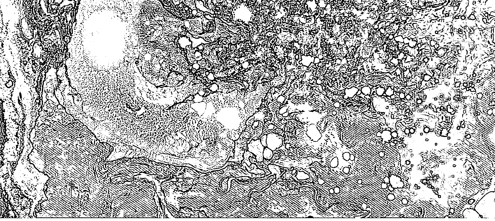

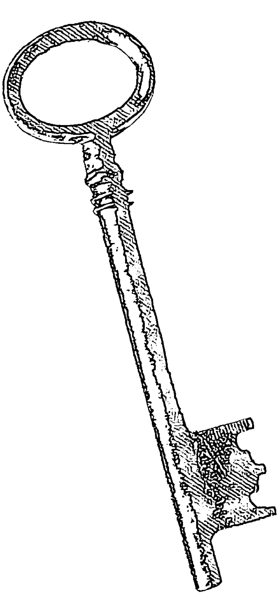

> > 「科学之所以值得追求，是因为它揭示了自然界的美」
>
> 愛因斯坦

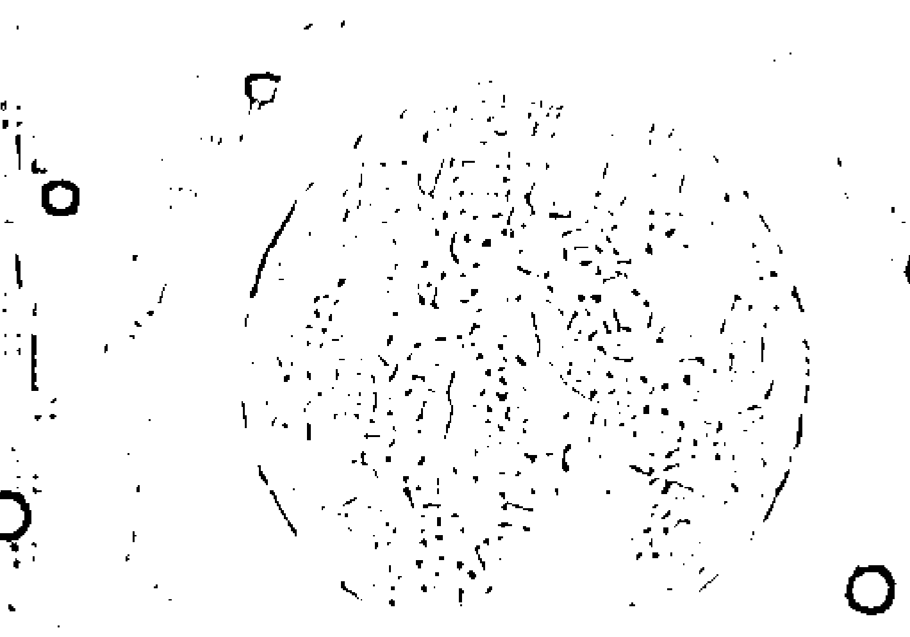

## 占星學是什麼？

即是在「天人感應」之觀念與「上天如是、地下亦然」(as above so below) 的思維下，所孕育出的「系統化」生命哲學。出生星盤就是一張生命藍圖，及內在設計的機制。行星落入的位置，都揭示此生企圖、潛能、天賦與障礙；從占星著手，能瞭解一個人的生命重點與課題，並找到困著的模式，與造成生命挫折、停滯、困頓的根源。唯有理解內部結構，才能激發生命轉化，有意識地創造及深刻覺知外部事件。

## 學完占星你能獲得什麼？

你無法獲得有形的東西，但你能得到無形的經驗，課程中我們將以學員星盤做深度剖析，並結合實際名人案例分析，將心法融合其中，讓你了解自己的人生佈局，提高靈性層次覺知與轉化。

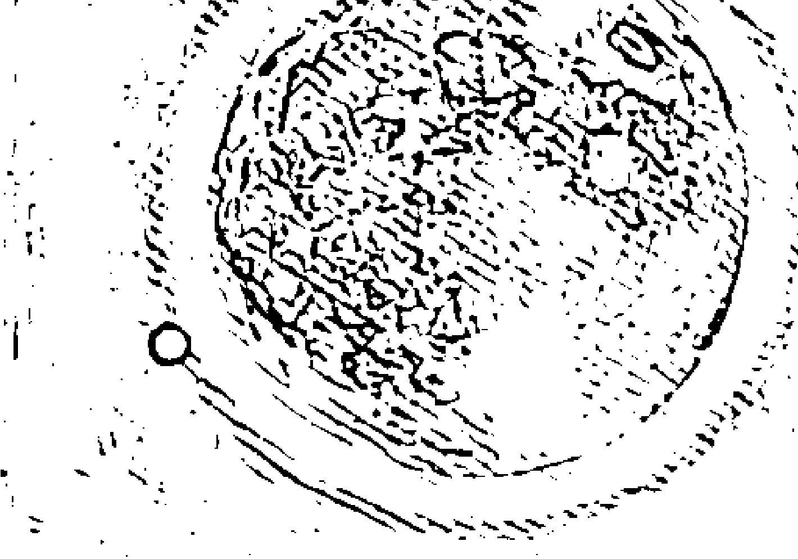

## 關於量子占星

量子占星的核心觀念，可用以下詩意的句子傳達：

> 「雪花一但落在手上，就不再是一片雪花，而變成了一滴水」

量子占星可用兩句話簡單說明：

『量子』是借用量子力學的觀念，解釋占星學的作用機制，用理性思辨的邏輯思維，以『科學』化嚴謹質疑的態度，審視占星學的現象和理論。

- 量子占星的觀念為四點：
- 一『觀點性』
- 二『機率性』
- 三『語言性』
- 四『全像性』

量子占星的理念，是打破占星學數千年來，被神話學、神秘學、玄學及心理學所詮釋的框架。開始以現代物理學的思想，及先進的新時代宇宙觀，建立占星學的哲學基礎，揭開占星學神秘的面紗，替占星學邁向『人類可以理解』的學問之路，敞開一扇曙光之窗。

量子占星的嶄新思維，帶您以獨特觀點，透過占星學的觀測，認識個人生存於世，所遭受種種『觀念框架』的『無形制約』！惟有徹底認知『所受限制』後，才能緩慢瓦解至完全超脫，實現真正的『生命自由』！

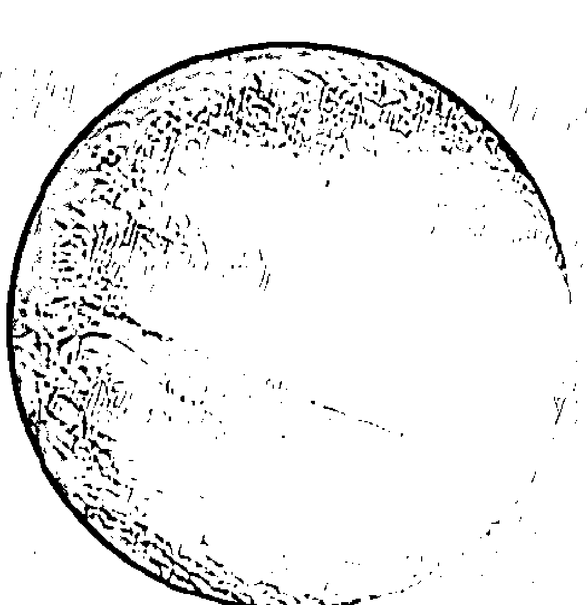

## 量子占星課程樹

### 課程階段表

- 1. 入門 > 星座
- 2. 基礎 > 宮位、行星
- 3. 中階 > 相位、宮主星
- 4. 高階 > Transit流年、Synastry合盤

學員可依照自己對於占星的了解程度進行選擇

報名高階解盤工作坊的學員
需對十大行星、十二宮位有基礎認識

更多關於課程資訊與占星研習
可至官網、粉專查詢

量子占星官網 http://quant-astro.funyu.asia

Facebook Quantum Astrologer 量子占星

學分制
基礎四堂2分、六堂3分
中階兩堂1分、四堂2分
六堂3分、高階兩堂2分
四堂3分、六堂4分
修滿7分頒發初階證書，修滿14分頒發中階證書，修滿20分頒發高階證書，通過考試頒發專業證書。

## 生命運作坊

- 金錢財運（兩堂）
- 愛情婚姻（兩堂）
- 工作事業（兩堂）
- 家庭親子（兩堂）

## 專業進階課

- 十二星座（四堂）
- 十二宮位（四堂）
- 十大行星（六堂）
- 相位（十堂）
- 宮主星（四堂）
- Transit流年（六堂）
- 次限、日返與流年整合（四堂）
- Synastry合盤（十二堂）

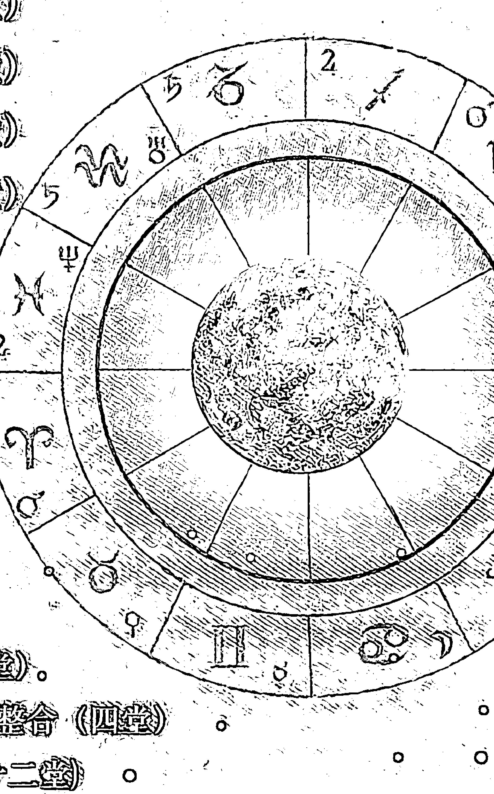


## 量子占星

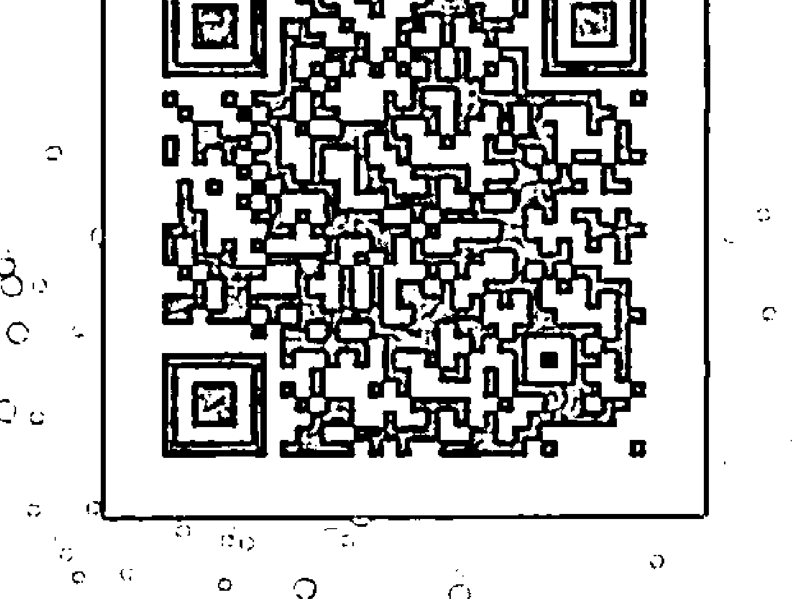

21世紀《量子占星論》運用哲學的邏輯理性，將量子力學的精神。結合磁性宇宙觀，對古今中外。各種占星學的世俗關聯及心理機制。作出完整全面的解釋。

其一。「觀點性」二、「機率性」三、「語言性」四、「全像性」。四種法則的嶄新思維。讓您以獨特觀點。透過占星學的修行。明瞭生存於世的終極價值！

## 量子占星

## 官方網站

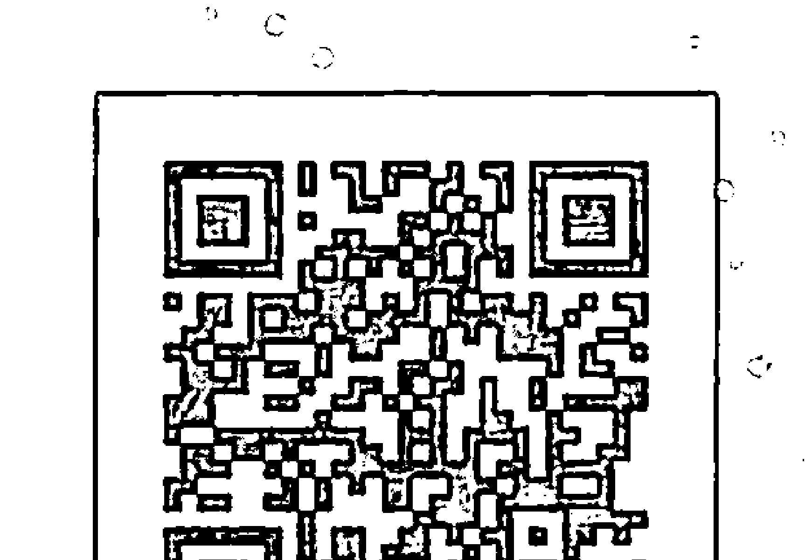

## Quantum Astrology

看似满天星斗、眼花撩乱的星盘 只有四种要素，行星、星座、宫位及相位

Synastry 合盤的邏輯則是，雙方基於不同的身心功能與行為動機（行星），在不同的環境場合（宮位），產生接觸互動，又因不同的性格特質（星座），彼此認同、對立、摩擦及協助（相位），從識者演變成朋友、情人、配偶、夥伴、對手等，形形色色的人際關係。

如在男女關係中，太陽自我彰顯的成就動機，落入另一方掌管休閒玩樂及浪漫戀愛的五宮，代表太陽欣賞五宮，想與五宮吃喝玩樂、浪漫約會，進而談戀愛遊戲。若五宮本身有月亮、金星、火星、木星、天王等，經常一拍即合，五宮若是土星、海王、冥王，則會嚴格測試亦或逃避往來，五宮沒星的話，不易被引發觸動，只當太陽是有趣的朋友。

太陽若落入掌管工作服務的六宮，代表太陽看上六宮能力，想要一起做事，雙方有緣當同事夥伴及勞動主僱。六宮若本身有星，易被太陽強力帶動，在工作服務的環境中，密切結合成為親密伴侶。

Synastry 合盤中的宮位，代表雙方有緣在一起，共同活動的場合，行星方的能量動機是否足夠，能否帶動宮位方的反應，宮位方的生活需求，是否足以維繫行星方的互動，是觀察重點，若環境發生改變，緣分也起變化。

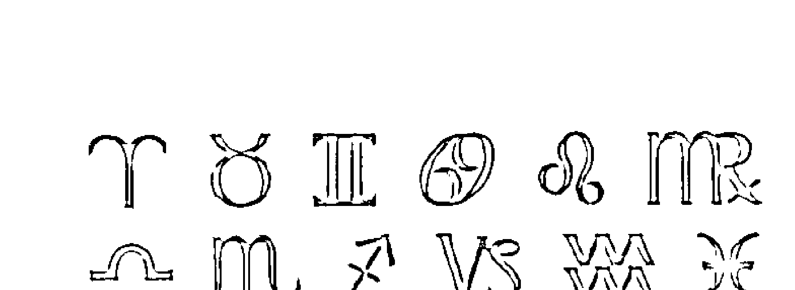